# 符咒精解

元光大师/著

详解符咒应用技巧
沟通人神信息通道

华夏古籍出版社

# 神符精解

元光大师著

详解符咒应用技巧
沟通人神信息通道

华夏古籍出版社

书名：神符精解

著者：元光大师

出版者：华夏古籍出版社

香港中环威灵顿街50号华威大厦10楼1001室

承印者：中国速印网

开本：850mm×1168mm 1/32

印张：12

版次：2018年1月第1版

印次：2018年1月第1次印刷

印数：1－2000册

书号：ISBN 978－988－78230－0－3

定价：36.80元

版权所有·侵权必究

## 目录

- **第一篇 符咒理论依据篇** ……………………………………… 1
    - 一、人的定义 …………………………………………………… 2
    - 二、三魂的探讨 ………………………………………………… 4
    - 三、七魄的探讨 ………………………………………………… 11
    - 四、三魂七魄的综论 …………………………………………… 14
    - 五、何谓六道轮回 ……………………………………………… 20
    - 六、神明的定义 ………………………………………………… 24
    - 七、鬼的定义 …………………………………………………… 27
    - 八、结论 ……………………………………………………… 28
- **第二篇 符咒知识篇** ……………………………………… 30
- **第三篇 符咒学识篇** ……………………………………… 38
- **第四篇 符咒工具篇** ……………………………………… 44
- **第五篇 符咒程序要领篇** ………………………………… 48
- **第六篇 符咒运用篇** ……………………………………… 54
- **第七篇 符咒精华篇** ……………………………………… 62
- **第八篇 神符篇** …………………………………………… 128
- **第九篇 茅山符咒** ………………………………………… 159
    - 符咒的认识 …………………………………………………… 159
    - 符咒真的有用吗 ……………………………………………… 160
    - 画符的要领 ………………………………………………… 162
    - 修持者必知 ………………………………………………… 165
    - 符的用法 ………………………………………………… 167
    - 四季消火降福灵符 ……………………………………… 170
    - 天师祛病灵符 …………………………………………… 172
    - 保平安灵符 ……………………………………………… 203
    - 太岁灵符 ………………………………………………… 223
    - 月令祛病灵符 …………………………………………… 229
    - 二十道灵符 ……………………………………………… 235
    - 称心如意灵符 …………………………………………… 245
    - 镇恶梦灵符 ……………………………………………… 252
    - 小天罡灵符 ……………………………………………… 259
    - 救宅灵符 ………………………………………………… 319
    - 青惊灵符 ………………………………………………… 323
    - 治牛瘟灵符 ……………………………………………… 324
    - 小孩夜啼灵符 …………………………………………… 325
    - 清净灵符 ………………………………………………… 326
    - 破土灵符 ………………………………………………… 327
    - 镇宅驱犯灵符 …………………………………………… 328
    - 家庭圆满灵符 …………………………………………… 329
    - 喜冲喜或喜冲丧灵符 ………………………………… 330
    - 安土木煞灵符 …………………………………………… 332
    - 安小孩噜嗦灵符 ……………………………………… 333
    - 保畜灵符 ………………………………………………… 334
    - 化骨灵符 ………………………………………………… 335
    - 止血灵符 ………………………………………………… 336
    - 止鼻血灵符 …………………………………………………… 337
    - 老君入山灵符 …………………………………………………… 338
    - 镇煞灵符 ……………………………………………………… 341
    - 立即催生灵符 …………………………………………………… 342
    - 收惊灵符 ……………………………………………………… 343
    - 安小儿失魂灵符 ………………………………………………… 344
    - 制煞灵符 ……………………………………………………… 345

## 第一篇 符咒理论依据篇

符咒术最受人争议，最引人诟病，就是无法用科学的方式来解释，证明其存在的真伪虚实。但，换个角度而言，亦无法用科学的方法，来解释或证明其为虚假不实。故，信或不信，皆悉由人，信仰自由及天赋人权也！

但须知，不信者，无失亦无得。深信者，恐有所失或有所得，为什么呢？因为，假如相信却属于迷信、盲信、邪信时，甚可能祸害无穷。若属于正确的信仰，自然能多谋其利。这是深信符咒术者，必须好好去思考、探讨的问题——为什么信？凭什么信？信什么？

诚如前述，既然无法证明或推翻符咒的虚实有无。那么，信或不信，似乎都有盲信之嫌，即盲目的相信与盲目的不信。当然，纯属因为一直找不到，信或是不信的理由和依据，只好完全依凭个人的自由心证、自由信仰了。

不过，不信者无失亦无得，深信者恐有失也有得，二者相比较之下，深信者似乎风险较为大些。有道是“祸福无门，唯人自招”，到底符咒术是招福或是惹祸呢？绝对不可等闲而视之。换言之，既然相信符咒术，就应出相信它的理由和依据。

然而，符咒术真有理论和依据吗？有句话，相信研学符咒术者，人人皆必耳熟能详，即“符咒术，乃借着仙佛神圣的无形力量，垂怜、护佑、赐福于人”。这句话，就是符咒术的理论依据，也就是说，必须有仙佛神圣的存在，符咒方能得以显灵发光，或言仙佛神圣亦等于符咒术。

如此说法，似乎又回复一了，最受人争议、争论、无答案的原点。因为，谁能证明有仙佛神鬼的存在呢？谁又有证明没有仙佛神鬼的存在呢？不过，相信人人都能有一个共识，就是人死了以后，方有可能变成仙佛或神鬼。或者，人乃依据其在世时的种种所作所为，而决定了人死后将成佛、成仙、成鬼、下地狱或上天堂等等。

但是，人既然已经死了，纵然有福报而成仙佛神经，或有恶报而变鬼下地狱，又如何证明有这回事呢？最常见到的所谓的乩童和灵媒，仙佛明能假借其身来与人沟通。但，其可信度常常遭人怀疑。因为，此事原来真真假假不易分辨，而乩童骗财骗色之事，却时时可见可闻，更难令人从服从信。

事实上，人死了以后阴阳相隔，看不到、摸不到、听不到，或根本感应不到，自然无法证明什么？或许有些人能够人神交感，但毕竟是区区少数者，实也谈不上能证明什么？而且如何让人相信，令人信服呢？当然，又是见仁见智，各说各话，信不信由人了，依然无助理清事实与真相。

话虽如此，理虽如此，不过，无法说明却可以解释——真有所谓仙佛神鬼存在的道理、理论和依据。为什么呢？

因为，人、鬼、仙、佛、神等等，根本是一体的，却因生因死而殊异。即生时活时是人，死后则是神、是仙、是鬼……等。其间之差别，实有脉络可寻，今分析、探讨如下：

### 一、人的定义

何谓人？凡人必须具备最基本的三种条件——

- ①会生存、会求生、会死亡。
- ②有感觉、有感应、有作为、有喜恶。
- ③会思考、会分析、会判断。如此方可称之为人。

但，此只属于无形无相的人，或可说是人的精神部分。当然，尚必须再加上一个有血有肉、有形有相的躯体，或谓之人的肉体部分，二者合而为一，方成一真正完整的人。

换言之，人的定义，用精神与肉体二者为一体，有形相和无形相二者俱是。事实亦因为如此，人方可称之为万物之灵。若人有形有相的肉体消失或死亡，则可能变成仙佛或鬼神——其当属于无形无相的精神面。因此，仙佛神鬼等等，看不见，摸不着，只能意会，难以言传。也就是说，人与神鬼最大分别和差异，全在肉体之有无。

假如，光具有形有相的肉体，而无形无相的精神部分，却残缺不全、不俱备。则必然不是人，当属于低于人的动物或植物之类。譬如说，植物只会生长与死亡，却无法思考、分别和反应。此用无形无相的精神部分不全。好比有人受了重伤或大疾病而未死亡，不过已无法思考、无有知觉时，我们即称为植物人。

再说，人之所以称之为万物之灵，人之所以优异，有别于其他动物或植物，诚乃由于人的思考力、分别力、感受力、判断力、反应力、求生力等等，较为高明、高强。换言之，人与其他动物、植物之所以有分别，最大的差异完全在于精神层面的高低。

当我们了解俱备成人的精神面与肉体面，有形相和无形相的条件后，将其付之以宗教性的名词或称谓，就是人们常知其然，不知其所以然的“三魂”和“七魄”。用最简单的方式而言，三魂指的是人无形无相的精神面，七魄指的是人有形有相的肉体。

通常，当有人死亡的时候，我们常听到有人说其“三魂飘飘、七魄渺渺”。此意味着其人的精神与肉体，即将产生天大的转变和转化，且不知将会如何转化？或将转换至某一未知的虚无飘渺处之意。诚如有句台湾话，称人死亡为“过身”，换个身躯罢了。似乎意味着人的肉体死亡了，但人的精神不死、未死。

另，当有人受到严重惊吓时，常会面无血色、六神无主、无法自己等等状况发生。我们就会说其人是“魂飞魄散”，必须赶快为其“安魂定魄”。当魂魄安住、安定时，人即能正常安然无恙。否则，真的魂飞尽，人就可能因此而死亡。

不过，相信有很多人，必定不认为真有所谓的三魂和七魄的存在。多半会以民间流传、讹传之迷信说，斥之为无稽之谈。更有人亦会质疑，如何证明，解释三魂七魄的存在？事实上，三魂七魄是可以解释和证明的。尤其，它更是区分人、鬼、神、动物、植物等等，是最为有力的理论和依据。

### 二、三魂的探讨

何谓三魂？前已曾说过，属于人的精神部分，必须具备三个无形无相的基本条件，此三种无形的条件，即称之为三魂——生魂、灵魂、觉魂。任何有生命的一切生物，都可能具备了三魂之其一、其二或其三，而且有其强弱、高低、良窳、优劣、盈缺等等之差别。

人乃一切生物中，唯一是三魂俱备。圆满无缺者，其他的一切生物，往往是三魂残缺不全，或较为低劣薄弱。故，方能称人为万物之灵，甚至成为一切万物的主宰者，乃因人三魂俱备之故，因此，三魂对于人及一切生物的重要性，实有必要好好加以研究或探讨一番。

#### 1. 生魂的研究和探讨

凡一切生物必然都有一条“生魂”，生魂乃一切生物求生存、求生长的本能和欲望，或可称之为与生俱来的自然天性。在求生存、求生长的过程中，不免会有大鱼吃小鱼、小鱼吃虾等弱肉强食的状况发生。此现象原系物竞天择的自然法则，并无所谓的是非、善恶之别。

但从人的角度来看，凡建立于利己害他的一切作为上，哪怕是自然的求生欲，其本质皆可观之为“恶”。但人常在不知不觉中，常常因自身的方便和利益，而生造出多少的痛苦与麻烦于他人。

如有人为了财富名利，去偷、去抢、去拐、去骗等等，甚至敢杀人放火，不择手段地去达成目的。还有人为了贪图一时的方便和利益，去污染水源、制造噪音、破坏环境等。大至一己之利益，中小至一己之方便、便会造成他人的伤害、损失、痛苦、烦恼、不便等，皆属人的求生欲作祟，而生造出诸多利己害人之“恶”。

因此，生魂虽代表着求生欲，但其本质是属于恶的。不过，求生欲越强烈，则代表着生命力越强旺。相反，求生欲越弱，则生命力越弱。如树木，其只有一条生魂，仅知生而不知死，故其求生欲甚为强烈，其生命力越强，较不畏惧病难病魔，故能健康长寿。

由此，我们可以得到一个结论：生魂，代表着求生欲、生命力，其本质是属恶的。但是，生魂到底是从何而来？凡一切生物，皆有阴阳、雌雄等两性之别，且皆由于二者之结合、交配而产生新生命。如动物依精、卵结合，植物靠花粉传送等。至于人，为父精母血之结合，从而产成了新的生命。

当一个新生物、新生命诞生以后，即具有求生欲而懂得求生存、求生长等等，亦即具有生魂。很显然，生魂乃与生所俱来，或言父精母血所生成。我们了解了生魂乃父精母血结合所生造，因生命诞生而自然所带来，那么，生魂会消失吗？

凡有生必有死，任何一切生物都必有死亡的时候。当生物死亡的时候，其生魂基本上将随有形相的身体一起消失。但也有可能不因死亡而消失的状况，此多半是人或一些灵性较高的动物。在某些特殊情况下，其生魂特别的膨胀、强烈，故未跟死亡而立刻消失。不过，在正常情况下，多半的生物一旦肉体死亡，生魂亦会立即消失。

另外，最可确定的一死亡，生魂必然立即消失的是植物。因为，植物只有一条生魂而已。或者说植物的生魂消失了，所以才会死亡。事实上，除了花草树木等植物外，仅具有一条生魂的生物，还有蚊子、蚂蚁、细菌、苍蝇、蟑螂、各类昆虫等。人们常称之为毒虫或害虫，其多半将不利于人，人人皆可杀之、除之，不谓之杀生。乃因其只有一条生魂存在，并没有灵魂，未具灵性之故。

至于人和其他的动物，如：牛、马、羊、猪、狗、鸡、鸭、鱼、鸟、猫等等，除了具有一条生魂外，尚可能具有灵魂与觉魂，若杀之、毒之，即符合了佛家所谓的杀生。所谓杀生，指的是杀害有灵魂、灵性的生命、生物。我们所说的吃素，吃的是植物，植物只有生魂，未具有灵魂，故谓之不杀生。

最后趣谈一下，常听有人在感叹“恶人多长寿，好人命短促”。试想一下，所谓的恶人，其生魂必较为膨胀。求求生欲较强，生命力较强，自然会较为长寿。好人正好相反，凡事不会自私自利，却可能牺牲小我完成大我，亦即自我求生欲较不强烈，当然较不长寿了。若从生魂的理论以观，似乎就颇有些道理。以上纯属趣谈而已，绝对不可当真，真为了求得长寿而弃善为恶。

#### 2. 灵魂的研究和探讨

何谓灵魂？相信人人对灵魂二字，必定皆能耳熟能详，或各人皆颇有番独到的见解和意见。

事实上，之所以能成为万物之灵，纯乃由于人有一条最宝贵的灵魂。而人以外的其他一切生物，其灵魂必然是较为低下，低劣者，为什么灵魂有高低，优劣，良莠等等程度之差别？

因为，灵魂即人所谓的智慧，它代表着：思考力，判断力，理解力，记忆力，想象力，领悟力，学习力，模仿力，逻辑力，创造力，操控力，发明力，协调力，分别力，感应力……等。由于人拥有一个最优秀，最完整，最圆满，最高等的灵魂，所以人类能够主宰万物，掌控万事，生活得更安全，方便，与舒适。很显然，灵魂的本质是“善”。

人以外的其他生物，亦可能拥有灵魂。如：猫，狗，牛，羊，马，猪，鱼，鸡，鸭……等动物，皆拥有一较低下，低劣的灵魂，故常会被人所掌控和利用。诸如被人拿来当食物，表演，玩乐或工具等等。

就人而言，灵魂仍有高低，优劣，良莠的分别，即人的智慧有高低优劣程度的不同。因此，有所谓的好人，坏人，善人，恶人的产生。不过，必定有人会质疑，若说灵魂本善，智慧本善，但为什么仍有许多人会去胡作非为，作恶作歹呢？皆因为人有一条善的灵魂外，尚有一条恶的生魂，以及一条半善半恶的觉魂。一旦属恶的生魂的作用力，强过与属善的灵魂的影响力时，人的作为思维自然会往恶的方面发展。

譬如说，人的利欲心过度强烈，而人的智慧却很薄弱，无法明辨是非善恶，就会因贪图财名利禄而去偷抢拐盗骗，既成了恶人作恶事。相反，人无强烈的贪欲念，利己心，且相当有智慧，能够明辨是非善恶，就绝对不会见利忘义而犯法，甚至会从善如流！

那么灵魂从何而来呢？答案是从天而降，当人一出生的时候，它即由人的天灵而入人体。事实上，当人一怀胎受孕之时，通常即有一条灵魂已经降临人宅，准备时机一到立即投胎。此灵魂必然是为了报恩或抱怨而来，都与该父母有着因果报应关系，另有一种纯属一时无名而来投胎，与其父母并无因缘果报的关系。此条灵魂并未于父母怀胎受孕时，就已经降临人宅，当婴儿出生的时候，方来投胎的。

那些为了报恩或抱怨而来投胎的婴儿，一出生便会哇哇大哭一场。那些一时无名而来投胎的婴儿，必须经一阵拍拍打打后，方会哇哇大哭。当然，婴儿一出生之所以会哭，乃灵魂由天灵进入人体之故。所以必须让其哭，不哭当须拍打到哭。

另外，相信有人会质疑，灵魂既然代表着智慧，但人的智慧不是遗传自父母，有父母所生吗？人有形有相的肉体，当然遗传自父母，系父精母血的结晶，这是毋庸置疑的。但是，人的灵魂或智慧，并不因父精母血而生，乃依父母之业因而来。譬如说，歹竹出好笋，好人生恶子等等，诸多不同于父母的现象，则是最好的明证。

我们了解了人一出生，灵魂即由天而降。但是，当人一死亡之后，灵魂将何去何从？或是否将消失无踪？有道是“灵魂不死”，灵魂自然不会消失，它将因人在世之时，所生造之种种善，恶业而去六道轮回。当然，亦有可能脱出六道轮回，进入所谓的四圣道中，永远不生不死，超生了死。

若有人不相信真有灵魂这回事，可以去参考道教的“关落阴”或“牵亡魂”等法会。借着法师的身体调召出亲人的灵魂，叫做牵亡魂。法师运用法术，将人的灵魂引入阴间去探访过世的亲人，叫做关落阴。二者皆属于阴阳会，与自己过世的亲人，一会面一交谈，那么，灵魂之真假有无？即能有最明确，最肯定的答案了。

#### 3. 觉魂的研究和探讨

何谓觉魂？用最简单的方式而言，指的是感受，感觉。凡眼睛看到的；耳朵听到的，鼻子闻到的，身体接触到的一切，所产生的感觉，感受或反应，皆可称之为感觉——视觉、听觉、味觉、触觉。

就人而言，从以上眼，耳，鼻，舌，身等等所接触，再加上人的意识作用，方有所谓的美丑，香臭，甘苦，冷热……等等分别，而产生出好坏，善恶，高低，优劣，爱嗔……等反应。此六种眼耳鼻舌身意的综合作用，于佛家称之为六根，六尘，六触，六识，道家则称之为觉魂。

除了人之外的一切生物，未必皆是六根俱全，且未必六识皆强烈或明显，或根本是有所欠缺未俱全。诸如：植物未有眼耳鼻舌身意；动物虽有眼耳鼻舌身意（亦有欠缺俱全者），但意识往往却不很明显。

当然认得觉魂依然有高低，优劣，良莠等等分别，或亦有残缺不全者。故人的反应度，感受性，常会因人而有相当的差异。但最重要的是，人的眼耳鼻舌身意的结果往往未必是很正确，可能是对的善的，亦可能是错的恶的。因为眼睛看到的未必是真相，耳朵听到的未必是事实，口中所言的未必是真话，手中所掌握的未必是现实。完全系由于意识的作用，方有好坏，是非，善恶，对错，高低……等等的分别。

然而，人的意识，心识作用乃属知识性，并未必是真智慧或真理至善。故人的觉魂是半善半恶，包括有觉魂的一切生物，其觉魂都是半善半恶的。譬如说，鸡鸭有觉魂，当期感觉饿了，就会想吃就吃，而且是不管一切的乱吃，但因其觉魂低劣又无分别，分辨的智慧。于是，吃对了就存活，吃错了就死亡。很显然，感觉饿而

## 10 | 神符精解 |

吃的本质并无对或错，却因实行而有对与错。所以说，觉魂是无善无恶的半善半恶，应该是毋庸置疑。

或许有人会质疑，若说觉魂是半善半恶，那么人的眼睛如何看到真相呢？耳朵如何听到事实呢？乃因人尚有一条智慧的灵魂，可以判别事实与真相。若生魂强旺而智慧不足，则凡事必自私利己为先。一旦利欲熏心时，自然会去歪曲事实或根本看不清事实，甚至会信假不信真。事实上，人即常常为六根所骗，而颠倒是非与善恶，事实和真相，生造出种种痛苦和烦恼。

至于觉魂从何而来？前已述及，灵魂乃由天降而来，生魂乃父精母血（由人）所生而来，故觉魂乃由地而生。所以，人一出生，我们即称之为呱呱坠地，乃受地气而生觉魂。

以上乃三魂——生魂、灵魂、觉魂的粗浅探讨与研究，系属人无形无根的精神面之三要件。必须无形无相的三魂俱足，再加上有形有相的躯体，方能称之为人。而且于一切的生物当中，应该以人的三魂最为俱足、最为优秀、最为完整和圆满。人以外的其他生物，则未必三魂俱足，往往残缺不全、不完整、不圆满、不优秀，或某魂偏强烈、偏薄弱、不均衡等等。故，人称之为万物之灵，乃当之无愧。

但，于整个生命的活动过程上，人的成就与作为，或许是一切生物中最为辉煌、最多采多姿的。但，人也可能是应充满痛苦和烦恼最为复杂与错乱。乃由于人的三魂之间，有着互动性、矛盾性和作用，将直接、间接关系着人生的际遇、作为和展望，绝不可等闲而视之，其影响所及，尚包括人的生前与死后——入三恶道、三圣道或四圣道？是继续六道轮回或超生了死？

于一切生物中，唯有人得天独厚，三魂俱足且圆满优秀，系人升华、精进的最大本钱（当然也可能是坠落因素）。故，人当有深切的理解和领悟，并能掌握其趋向于善去发展，方不枉人之所以为人的优势。须知三善道（天、人、阿修罗）中，以人最好修行。譬如树木，只拥有一条生魂，除了求生欲、生命力特别强旺，能不断的生长茁壮外，并无法有什么作为。一旦有朝一日死亡了，一切即消失化为乌有，二者相较之下，其理甚明！

### 三、七魄的探讨

前已述及，人必须具备无形无相的三种精神面条件，即生魂、灵魂、觉魂等等，合称之为人之三魂。此外，尚必须再加上一个有形有相、有血有肉的身体，方成一真正完整的人。事实上，凡属一切生物，都必须具备有一有形有相的躯体，通常称之为形相、形体、身躯或肉体等等。

但，不论是肉体、形体、身躯或形相，其必然来自于精子与卵子、父精与母血结合所生。又由于生物的类别诸多不同，故佛家有所谓的四生——卵生、胎生、湿生、化生。而且，不同类别的生物，绝不可能胡乱交配以繁殖，必定物以类聚而同类生同类，方能绵延不绝、生生不息。尤其，同类之生殖系以父精母血为源，故具有绝对的遗传性。如：人生出的子女，必然人模人样；猪生的猪仔，必然是猪模猪样等等。

当然，无形相无形体者，自然不可称之为生物，或许应称之为死物。譬如说，任何生物一旦死亡后，其肉体、形体必立即腐化，终而消失殆尽，即所谓的无形无相，无影无踪了。因此，很明显可知，一切生物的肉体、形体和形相，乃绝对是必备不可或缺的，而且是最重要的一环。形相具有分别类我的作用，形体具有使用、作用的功能，其重要性自不用多言。

人之所以能为万物之灵，事实上，尚因人具有一最完整、圆满的躯体可以展现、发挥出最多的功能。如：人能跑、能跳、能爬、能站、能坐、能卧、能行、能拿、能提、能握、能游、能说、能唱、能写、能担……等，绝对是任何一切生物所望尘莫及。尤其，人更能懂得借着工具、机械等助力，将肉体的功能发挥到极点，这更是其他生物所远不可及的。

人的这个肉体，若以宗教的名词而言，即称之为“七魄”。何谓七魄？何以称之为七魄？因为，人有七种血液，或者一种血液可分成七种形态。即：人眼睛流出来的血液是涩的、鼻子流出来的血液是咸的、口中流出来的血液是甜的、耳朵流出来的血液是冷的、肌肉流出来的血液是热的、自内脏流出来的血液是具的、红内脏流出来的血液是腥的。由于人有以上七种血液，故称之为七魄。

或许有人会质疑，人的血液真有七种之分别吗？当然自己可以去注意一下，亦可以去请教开过刀的医师，必须有明确的答案。另从理论上而言，血液畅行人全身各器官、各部位，每一器官或部位自有其不同的功能和作用，当然会影响血液的变化，好比那水从山上流下来，其水必然清澈甘甜，流经河川沟渠后，其水必然污浊难闻，流经水管入宅，其水必然味重，经过滤水器而出后，其水必然干净无味等等，皆同一理也！

但，为何用七魄、七种血液来代表人的肉体呢？譬如说，人的各器官、各脏腑、各组织必布据血管，必然有血液畅通无阻。但人的器官、组织或脏腑坏死了，当然应无法畅通运行，或亦可言，无血液流通的器官、脏腑、组织等等，代表着它是坏死的。

但是，到底人的器官、脏腑先坏死，方无见血液之运行？或者正好相反，先未见血液之畅通，而器官、脏腑等等方坏死？事实上，二者似乎互为因果，都有可能。不过，最有趣的是，当人的肉体、器官、脏腑、组织等等都是正常的时候，一定充满了许多的血液，但一旦其坏死之后，却一点也不见血液，那些血液完全不知去向何处。

诚如我们活宰牛的时候，通常先放其血，可取得一大桶的血液，或生杀鸡鸭的时候，亦可取得一大碗的血液。但，若患瘟疾而死的牛、鸡、鸭、猪等等，当其体温冷却以后，则一滴血液也无法取得，其血液即因死亡而消失无踪。很显然，血液之有无，乃肉体存或亡的最主要因素。故，以七魄、七种血液来代表人的肉体，绝对是合理的大依据。

因此，有所谓的“魄散”之名词，即血液散尽、消失的意思。如人突然受到惊吓时，其脸面却呈苍白而无血色，乃魄散之象。晕厥或六神无主，乃魂飞之故。若人魂飞魄散太过严重，时间太过于良久，可能会造成人的死亡，所以必须赶快安魂定魄。即施以安魂定魄的法术，一旦魂魄安宁、安定、安住了，人即能安然无恙。

从以上种种的分析与说明，应不难理解七魄真的是代表着有形相的肉体、躯体。对任何动物而言，血液（七魄）的重要性自不须多言。但，最重要的意义是凡一切的死亡，血液是必然散尽、消失无踪，亦即七魄将完全消失殆尽。故，所谓的肉体、形体、形相终将归于尘与土。因此，方有形相和肉体被认为是种假相，本空、终无等等说法。

亦如前述，人之所以为万物之灵，诚乃精神和肉身、三魂和七魄等俱足，而且为一切生物中之最为优秀、完整、圆满的。尤其二者之所产生的种种关系、作用和影响，就人而言，诚为人一生幸福、美满、痛苦、烦恼、喜怒、哀乐……等根源，甚至是决定人今生与来世、生前与死后，将会是如何的绝对因素。

### 四、三魂七魄的综论

根据前两种种之所述，我们可以将三魂与七魄，整理、归纳如后条例，以便于了解及更进一步的研究和探讨：

1. 三魂指的是生魂、灵魂、觉魂等等，乃属于精神面的、无形无相的。
2. 七魄指的是七种血液，代表着肉体面的、具功能性、有形相的。
3. 三魂具有优劣、良窳、高低、强弱……等分别，以及完整、圆满、俱足与否之差异。
4. 七魄有形相、形体、功能、作用之不同，以及高低、优劣、良窳、强弱……等差异。
5. 三魂至少必须具备其一，再加上七魄（肉体），乃一切生物存在、存活的最基本必备条件。
6. 三魂俱失且七魄不存，对任何生物而言，皆代表着死亡、不存在。
7. 七魄（肉体、形体）一旦死亡，必将终归于尘土，完全消失殆尽。
8. 三魂不调之死亡，其可能消失、转换、转化、或过身，而且，当人六道轮回或入四圣道以超生了死。
9. 三魂有善、恶、半善半恶之分别，七魄具有功能作用性。或者，七魄（肉体）为三魂栖息、依附之所在。
10. 生魂代表着生存、生命、生活的欲望，乃自然具来的天性，纯属利己之性，故其本质属恶。
11. 灵魂代表着智慧——思考、理解、领悟、判断、分别、创造、发明、学习、探索……，故本质属善。
12. 觉魂代表着感觉、感受、知觉、反应、施受……等。但，其将因生魂和灵魂的作用与影响而有结果，其可能倾向于善或倾向于恶发展，故其本质属半善半恶。
13. 三魂之间，必互相影响、彼此作用，而有所融合、消失、牵制变化等等，于是有种种各异其趣的结果。
14. 七魄由父精母血而来，灵魂由天而降，觉魂受地气而生。
15. 七魄一定因死亡而消失殆尽，灵魂不死，将因肉体的死亡而转换或超脱。生魂与觉魂，未必因肉体的死亡而马上消失，但终究仍会消失的。
16. 一切生物中，以人三魂七魄俱全，而且最为完整、圆满、优秀。尤其，三魂七魄间的互相影响与作用，最为明显、广泛，意义深远。
17. 一切生物必有其特定的形体形相，却未必三魂俱足，可能拥有其一、其二或三者皆有。
18. 三魂七魄乃道家宗教性的术语，并非一般民间伪迷信式之讹传，或无意义的言谈。但，其最重要乃针对于人。

从以上三魂七魄的归结，我们对其当有更清楚的概念和认识。首先，来探讨七魄对三魂的影响如何？所谓的七魄，代表着七种血液，借以引申为有其形、其状、其功能。

人人皆知，肉体必因生而存在，必因死而消失，当其存在的时候，乃三魂栖息之处，或者三魂作用之假体。当其不存在的时候，三魂亦跟着不存在、转化、转换或消失。但，重点在于肉体之强弱、健康或病痛，对三魂将有相当程度的影响。

譬如说：一个健康强壮的肉体，其生魂必然强旺，其灵魂必然清明，其觉魂必然敏锐。相反，当肉体衰弱多病痛时，其生魂必然消沉，其灵魂必然浊晦，其觉魂必然迟钝。二者对人影响之差异，不可谓不大。故，常见有修行者言人须“借假修真”，指的乃借着肉体（假体）方能修成正果。此即证明肉体的重要性，亦即七魄对三魂的影响作用，绝对不可忽视。

就人而言，其身体不健康或多病痛折磨时，其必然生存生活得很痛苦。其才能智慧必然不易发挥，当然一切感觉很乏味、无趣、烦恼、苦闷、抑屈等等。如此现象，即所谓的三魂不安、七魄不定。故，安魂定魄，亦代表着人的身体健康、精神饱满，一切正常的意思。

好比说人的身体受到大伤害，而变成了无意识无感觉的植物人。此乃七魄严重的损害，而影响到人灵魂与觉魂，只剩下一条生魂尚存，是正如同植物一般只有生魂而已，故称之为植物人。如此便可以了解七魄对三魂确具有相当大的影响和意义。

至于三魂对七魄有影响作用吗？当人求生欲很强烈时，必然会保护自己的身体和生命，而临危不乱、意志坚强，甚至死里亦能逃生。当人感觉饥饿会进食，感觉劳累会休息，用智慧来保护、保健、强壮身体，并必得预防、治疗各种疾病，借以益寿延年，健康强壮。

当然，亦有人生存意志薄弱，凡事麻木不仁、醉生梦死、消极颓废等等，一点也不知爱护身体、珍惜生命。有病不就医，不吃药，甚至还染上吸安、嗑乐等等恶习，严重的影响身体健康、残害生命。很显然，人的智慧、感觉和欲望如何？对人的身体、生命具有正面和负面影响作用，此亦即三魂对七魄的影响和意义。

但，无论三魂七魄间，将如何互相影响？七魄必然因生的时候方有意义，因死亡后而消失殆尽。三魂则虽依附七魄（肉体）而存活，但未必因死亡而消失。亦即三魂于生前、死后，皆有其意义存在，而且在生前、死后中间，具有绝对的因果关系和作用。尤其是人，人是一切生物中三魂七魄最为俱全、优秀、完整、圆满的。

因此，三魂七魄对人而言，自是意义深远、影响巨大。人若不知好好加以研究探讨，还真枉费为人。当人七魄存在，肉体未死的时候，即为人模人样，有形有相之人。不过，人却有好人、坏人、善人、恶人、君子、小人……等分别。亦有智庸、贤愚、富贫、贵贱……等差异，包括人的思想、观念、行为、言语、喜恶、爱憎……等，各如其面而各不相同。

为什么一样米养百样的人呢？乃因为每个人所具有的三魂，原就有高低、优劣、强弱、良窳等差异。自然会影响到人的所作所为、所思所欲、所喜所恶、所爱所嗔等等，于是生造出种种的是非、善恶、恩怨、情仇、喜怒、哀乐、成败、得失、痛苦、烦恼……等，纯属因三魂间互相影响与作用、所产生的结果，亦即三魂失衡之故！

然，何谓三魂失衡呢？有的人生魂较强烈，利己心、占有欲必然较为高涨，对人对事自然较为强悍、蛮横、霸道、主观、固执执著、逞强、好胜等等，一切唯我独尊，顺我则昌、逆我则亡，富攻击性及破坏性。相反，若人的生魂薄弱，必然较无私心，但凡事易消极、懦弱、被动、彷徨、犹豫、无主见等等，皆因人生魂强弱程度不同，而有大异其趣的展现与影响。

有的人灵魂杰出优秀，自然智力超群，才华出众，能为技革，更能明辨是非善恶，利人利己，造福社会。凡事客观理性、光明、正直、无我、无私、能奉献、肯付出等等。待人忠厚、宽容、诚信、诚实、温和等等。具有着建设性、善良性、利众性。若人的灵魂较为低劣，不免较为智庸、愚昧、才疏、识淡，或思想偏激、观念错误、心术不正、处事失当、待人失义、对境多迷，乃成事不足，败事有余。皆因人灵魂有优劣良窳故，而有大异其趣的展现与影响。

有的人觉魂特别敏锐，对一切的人事物境不免感受深切，反应机灵奇巧，甚至反应过度等等。有的人觉魂较为迟钝，对一切人事物境常常麻木不仁、漫不经心、全不在意，甚至无有反应、不知不觉等等。二者皆有可能造恶或善。亦由于人的觉魂有敏锐与迟钝之分别，其所展现的影响和作用自是大异其趣。

那么，三魂之间有着互相左右、影响的作用。因此，以上三者结合而产生结果现象，就更加的错综复杂、千变万化了。其中当以灵魂最具力量，因为灵魂代表着智慧，系主善的意义，灵魂虽然由天而降，基于个人的业因而有高低、优劣、良窳等程度上的差别。但仍会受后天的种种因素而增长或消减，甚至可借着教育、研究、学习、信仰、修养、修行等等方法，来改变它、调整它、控制它、圆满它。

为何说三魂中以灵魂最重要、最具有影响力呢？比如说：人的生魂太强旺，害人利己之心必十分强烈，凡事唯我独尊、自私自利、见利忘义、贪婪嗔恨、不择手段等等，一切私欲都建立在他人的痛苦上。此时，唯有灵魂的智慧，可发挥出判别是非善恶的能力，或是客观、理性、正确的思维，来压抑、调和、控制、平衡、疏通那生魂本质之恶。

一旦灵魂之善力大于生魂之恶力，一切的恶念、恶意、恶心、恶事等等，自然会消减而降低，且可能趋向于善面去发展。相反，生魂力大于灵魂的力量时，人自然会趋向胡作非为、做恶做歹了。故，所谓的修行、修养、修心等等，指的是为增加增强人的善智慧。

又，人的觉魂虽为半善半恶或无善无恶，但人事物境所带给人的感觉，是喜、是怒、是哀、是乐、是好、是坏、是成、是败……等？亦完全由于人的灵魂智慧来判断、分别、决定、结论。故，灵魂能够影响觉魂是往善或往恶的方向去发展，或让原本无善无恶之别反而有了好坏之结果。

虽然说，灵魂能够抑制生魂之恶，亦能引导其趋势向于善。但是，灵魂也可能增长生魂之更恶。因为，与生俱来的灵魂，原本即有其业因而有其优劣良窳之别，更容易受到现实生活中人事物境的影响。于是，人的灵魂可能升华，亦可能蒙尘，终能决定人为恶或善。

换言之，三魂中应以灵魂为主宰，由灵魂在发号施令。影响所及，包括人一生的言行、思欲、喜怒、爱嗔、成败、得失、是非、恩怨……等。甚至影响至人死后，将上天堂？下地狱？超凡入圣？六道轮回？因为，人生在世时所种下之种种善、恶业，乃皆由灵魂所主宰之故。

所以，我们常说人当修心养性、从善如流，不仅希望活的时候，能够幸福美满、顺利如意，亦是希望死后能够超凡，以至脱离六道轮回之苦，乃针对灵魂下工夫之意。只不过人不能领悟、醒悟其中的道理，往往让灵魂蒙尘、智慧生病，故佛言无知众生、众生无知。若人能觉悟其间的道理，自然懂得修行向善，此即升华灵魂与智慧，有朝一日人的肉体（七魄）死亡了，灵魂即转化转换入善道。

从以上诸节种种之所述，我们当能够很清楚的了解，何谓三魂？何谓七魄？以及三魂和七魄间的互相影响与作用，彼此所含之深义，结论那就是所谓的人。人必然得三魂俱全、七魄安佐，方是一个正常标准的人。尤其，三魂七魄于人活着的时候，是人生历程上一切种种的主宰和根源，更是人死后将会如何的“因”。

人人都相信人死了后，可能成佛、成神、成仙、成鬼、变畜生、再做人、上天堂、下地狱等等。更相信皆得视其生前所作所为，所种下的善、恶业，而决定人死后将何去何从？然而，人和仙佛神鬼不同，人具有形体、形相，而仙佛神鬼则全然无形无相。事实上有相的身躯却消失殆尽，那无相的三魂即如仙佛神鬼般的无形无相，此乃符合了人死后可能成仙佛神鬼的说法。

因此，很显然欲谈仙佛神鬼之虚实有无，不外乎三魂之作用了。尤其，三魂的影响与作用，主宰着人生之时的所作所为，而人生时之为善为恶，则决定人死后将成仙佛或做鬼神，故三魂的状况或现象如何，即是仙佛神鬼的定义。或者，欲谈仙佛神鬼，非研究探讨三魂不可，尤其是三魂的主宰——灵魂。

### 五、何谓六道轮回

“六道轮回”一词，相信人人耳熟能详，但许多人却知其然不知其所以然。当然，有人深信不疑，亦有人不信多疑，而多半的人是半信半疑。尤其很难用科学的方式，来解释或证明其真伪虚实，往往多是见仁见智而各自说话，信或不信皆悉由人。

至于何谓六道？乃三善道加上三恶道，合称之为六道。六道，指的是：天、人、阿修罗、饿鬼、畜牲、地狱等等。前三者，即为三善道；后三者，即为三恶道。当人死了以后，人的灵魂将因人在世时，所种下之种种善、恶业，而转化转换入上述之六道中。即可能再次投身为为人，或上天堂、下地狱、变饿鬼、成神仙、当畜牲……等。

但，为何说六道轮回呢？因为，灵魂不死。累世于六道中转来转去、轮回不已。一下子为人，一下子当鬼，一下子做神，一下子变畜生，一下子上天堂，一下子地狱等等。当然，此乃依据善恶业报，因果循环之理，永不停息的轮回、转换，故有所谓的六道轮回之苦。唯有超凡入圣者，方能脱出六道轮回之苦海，则称之为超生了死，不必于六道中生死、死生的循环不息。

相信许多人必定会质疑，人死后将入六道中的那一道呢？都由于何种条件或因素决定？将具有什么样的意义？彼此间的因果关系为何？六道的状况或境界如何？人该如何去面对它，当如何去选择它？诸多诸多的疑问，今各述如下：

#### 1. 天道

天道亦名神道，乃三善道之一。简而言之，指的是人死后去归天当神明，享受人间烟火，受人敬仰、祭扫与膜拜。通常我们称人死亡，谓其归天或做神，是对亡者的尊敬之言。事实上，人死后归天为神，可不是一件容易的事情。必须有相当的福报，或者，必须具备某些特定的条件。亦即人活于世上的时候，必须有着诸多有幸能为人，也可以说是一种福报，自当好好惜福、好好为人了。

#### 2. 阿修罗道

阿修罗道属三善道之一，亦有称之为魔道。许多人会质疑：既然名为魔道，为何又说是三善道之一呢？因人死后之所以会成神明或阿修罗，皆由于其在世之时，诸恶不做、诸善奉行，操守清廉、安分守己、遵纪守法……等，所以，阿修罗与神明一般，均属于善之道也。

那么人死后为何不入天道而入阿修罗道呢？这是因其在世的时候，虽然也是一心向善、诸恶不做、诸善奉行、操守俱佳等等，但却是嫉恶如仇、骄慢高傲、争强好斗、猜疑善妒等。或是仅独善其身，却唯我独尊，较无谦逊、包容的胸襟和德行。故当属无有福德、无有福报之善，于是死后无人无道，只好入阿修罗道。

阿修罗乃善而好斗、修持而骄慢、嫉恶而无容恶之德，系其美中不足之处。但若有突破性之醒悟或觉悟，亦能修成正果，此即魔亦能成佛之理。毕竟阿修罗亦懂得修行、修持、诸恶不做、诸善

## 22 | 神符精解

奉行者，终归是属善而不于善与恶，不免沉沦于六道轮回中。

#### 3. 人道

人道亦属于三善道之一，即是现在我们人的世界。但必须知道，此生为人并不代表来生来世亦能为人。人们常言：做人难、难做人。因为，人此生的所作所为，所种下的种种善业、恶业，将决定人死亡以后何去何从？可能下地狱、上天堂、做神明、当饿鬼、变畜生或再投胎为人。当然亦可能超生了死，脱离六道轮回之苦，而成佛、菩萨、罗汉等，此即是进入了四圣道中。

六道中，人道亦属于善道，可见为人毕竟是一件好事。但此生为人而来世亦想为人，仍须俱足为人的条件。基本上，人在世的时候，虽无大善行、大德行、大功德，但至少亦须是诸恶不做——即是不杀生、不偷盗、不邪淫、不妄语等等，最起码的为人四大戒律。

虽然说，人道似乎是三善道之末，但至少总比下地狱、当畜生、变饿鬼等等，强过好多了。尤其是，人尚可以借着持戒、布施、忍辱、精进、禅定、智慧等等修行，亦有可能当神、成佛。因此，今生有幸能投生为人，可以说是一种神报，自当好好珍惜。以上三道为三善道。

#### 4. 畜牲道

畜生道乃属三恶道之一。简单而言，人在世的时候，不能好好做人，死亡了以后就有可能坠入畜生道，去当畜生、禽兽而专门给人宰杀，或者遭人凌辱。为什么人死后回坠入畜生道呢？人之所以异于禽兽，不外乎人有智慧、有伦理、有道德、有廉耻、有自尊、有利义、有是非、有善恶……等观念和行为，并且知道有所为、有所不为。假如不能够好好做人，其所作所为、所思所欲，一点也没有羞耻心、道德观、罪恶感、智慧和理性等等，像畜生禽兽一般，只有兽性而无人性。因而自然得坠入畜生道了。再一种情况是：人生在世的时候，活得不能像个人的样子，却要活得与禽兽、畜生无异。来生当然不能再做人，只好入畜生道当畜生了。

当畜生好不好？大家看看那些猪、牛、马、羊、狗、鸡、鸭……等家禽家畜，为人宰、杀、煮、煎、炸、烤、烹……等，答案甚为明了，故畜生道属三恶道是也。

#### 5. 饿鬼道

饿鬼道属三恶道之一，简单言之，人活在世上的时候，不能去好好做人，却要像饿鬼一般地生活着，故其死亡以后自然便坠入饿鬼道去当饿鬼饱受饥饿之苦。至于人死后，为何会进入饿鬼道呢？

当人活在世上的时候，一味地贪婪无度、荒诞不经，只知吃喝玩乐、奢侈浪费、醉生梦死，就像饿鬼一般地贪财富、贪名利、贪吃喝、贪玩乐、争享受、争舒适等，却不事劳作、不务正业、不走正途、不择手段地以达口腹之欲，以及身体之便利等。

既然活得像个饿鬼，死了以后自然得进入饿鬼道了。饿鬼道当然不好，想一想饱受饥饿之苦，想想即将到口的食物、煮熟的鸭子、烤鹅却飞走了，将是多么痛苦的事情。恶有恶报，因果不爽。不难理解，饿鬼道属三恶道是也。

#### 6. 地狱道

地狱道亦属于三恶道之一，是六道中最恶之道。人死后之所以会坠入地狱道，其活在世上的时候，必然犯下了滔天大罪或罪大恶极。不仅生时会受到法律的制裁，连死后都得下地狱，再接受审判以及更严厉的刑罚。甚至有所谓的打入阿鼻地狱、永远不得超生之苦。

相信人人都能理解，那些恶贯满盈的人，死后必须再下地狱受刑受罚。但人生在世之时，犯下了什么罪恶方会坠入地狱道呢？凡触犯了一切人间刑罚者，死后必然得下地狱再次受审受罚，故方有人间地狱之说法。但重点在于人是否于犯罪受罚后，真能改过向善并真心忏悔，或用心赎罪以求补救，这样死后算总帐时，或许能够不受地狱道之苦。

另须知，人生在世的时候，或许犯下了大罪恶，却未被人发现而未受制裁。但，逃得了“生”却逃不了“死”。死后仍然入地狱道再结帐，因果报应绝对丝毫不爽。故，人绝不可能存侥幸而妄为，地狱道刑罚之苦，乃人间亿万倍呢！

六道轮回之理，绝非宗教性之杜撰，或纯属为动善而恫吓人的说法。乃因人的灵魂不死，而于六道中轮回沉沦、生死死生。事实上，有非常多的人，曾经灵魂出窍或借法师、法术的力量，而去参观、游览过地狱，故人宁可信其有，不可信其无。否则，人生在世之时，大可为所欲为、胡作非为，反正死后一切化为空无。那么，因果论即不存在且毫无意义，而人又何必谈为人之道呢？那些宗教家岂不变成妄语而犯戒了吗？

以上大道轮回之说明，纯属皮毛之谈罢了，其实真正的学问可大呢！当然非常值得人更深入去研究与探讨。浅述一下，乃为了证明符咒术存在的依据——即有所谓的天道、神明存在的事实、人纯属借着神明的无形力量的赐福、护信，灵符方得以显灵发光。而人方真能有信心且正确的去运用它。

换言之。欲说明天道、神明的存在，当然得论及六道。六道轮回等等，甚至应包函四圣道，合称十法界，然，符咒术所涉及的重点；仅在于人、鬼、神三者，故其他部分仅概略简述一下。

### 六、神明的定义

众神默默、无影无踪，并非人人皆能感应到其存在，或人人皆相信其真的存在。虽然日常生活中，总有诸多神记可听可闻，但真真假假、虚虚实实不易分辨，往往会被人视为装神弄鬼。故，深信或不信完全见仁见智、众说纷法，随人、因人而有不同的解释和取舍。

事实上，诚如前述，人死后之所以能人天道为神，必须具备有种种的条件，即其在世时有着诸多的善行与德行。而所谓的善与德之展现，实乃人的灵魂与智慧的升华。于是，一旦死亡之后。人的肉体、七魄消失殆尽，其天魂与觉魂不死，乃入大道为神，享受人间烟火，受人敬奉与膜拜。

由于天道属于善适，人死后之属恶的生魂，自然会消失无踪，仅属善的灵魂和半善恶的觉魂，一起进入天道为神。因此，所谓的神明，事实上，指的是灵魂与觉魂的结合体。故，神明多半只会保佑人而甚少惩罚人。其升华的灵魂能助益于人，其觉魂能感受人间的疾苦。着我们能理解神明，系灵魂与觉魂的结合体，系善多而智慧，自然会相信神明能赐福、护信于人了。

或许有人不相信，神明真的具有灵魂与觉魂。那么，我们可以研究一下乱重，为什么神明必须附于其身方能办事呢？乃因为必须借用虬童的生魂，如此生魂、灵魂、觉魂等三魂俱全，即能如人一般的说话、办事。而且由于神的灵魂（智慧）高越于人，故能解决人的疾苦或困难。

同理，神明为赐福、护佑于人，若无法凭借反贫的肉体直接免关，则借着符咒的方式而为之，包括其他诸如：什签、神交、扶惊、浮字……等方法。当然，人亦可以借着种种修持或法术，直接与神明沟通。即一般所谓的通灵。

很显然，我们或许无法用科学的方法，来证明神明存在立虚实有无；但我们可以凭借着三魂七魄的涵义，来解释神明存在的依据与事实。既有神明的存在，而符咒术乃借着神明的无形力量，方得以显灵发光，故此亦有符咒术是有理论依据，绝对可靠可信。

但须知，人死后之所以能入天道为神，皆因其在世的时候种种之善德者行，方有当神明之福报。但是，善与德总有大小，多少之分别，亦即神明之福根亦有大小、高低之不同。也就是说，神明的力量能力，仍然有其一定的程度和限度，并非如人想象般的疾能神通。无所不能、有求必应。

事实上人死后入天道为神，所凭的是善是德，而非靠人的才能。争议、专长、技艺等等。譬如说：一位后不识丁的文盲，生时能以权行营，造福对全人群。其死后自有当神之福根。但不代表其死后成了神明、即变得学识渊博、万事精通，能替人看病，算命、考试、看风水、做事业，发大财等等。因此，人凡事都想祈求神明帮忙、保佑，一切都寄望神明成全、完成。这根本不是正确的心态和思维，而且也不可能真如愿以偿。仅可当成一种心理的寄托和安慰，方是正道正途。

尤其，神明系属善与德的象征，若非正当、正常、合理、合法合情的事情，人祈求神明赐神、护信有用吗？诚如赌大家乐、六合彩等等。能寄望、祈求神明出明牌吗？答案必然是否定的。不过，偶尔会有所谓的不正神，真会帮人做些不太正当的事情以彰显其神威、神通广大。因为，神明仍可区分成三类，最上者为动化的神，次等者为济世的神、最末者为显化的神。

当然，神明不仅是种宗教信仰或风俗习惯，更是一门大学问大道理。以上仅皮毛式的浅谈一下，因为欲研学符咒术，最重要就是得先能相信真有神明存在，以及其为神之来龙去脉，方能不致陷于盲信中。尤其，确信以后自能生出信心，信心是力量的泉源。故一旦书符、用符时必然大显灵光。

### 七、鬼的定义

在一般人的观念中，鬼似乎是邪恶的代名词，好像专门在害人、吓人的样子。事实上，并非如此这般。那饿鬼道之鬼，是性接受饥饿之苦刑。那地狱道中的鬼，是在地狱中接受刑罚之苦。

如何能跑到人道中来害人、吓人呢？不过，真会吓人的鬼，必然是属于孤魏野鬼。真会客人的鬼，必然是含冤、含怨、含恨而死的鬼。换言之，所谓的鬼可区分成以下四类：

- (1) 饿鬼道中的鬼，乃人在世的时候，不能好好做人，却要活得像饿鬼一般，故其死后生魂消失，灵魂则入饿鬼道去受饥饿之苦。至于觉魂则归家中神位，受其下子孙孙的祭拜，但无法享受供品，因其正在饿鬼遭受饥饿之苦，也就是说，饿鬼道中的鬼，只有一个灵魂，此灵魂正在受饥饿之苦。因此，绝不可能去害人或吓人。

- (2) 地狱道中的鬼，乃人在世的时候，不能好好做人，却犯下了大罪大恶。故当其死了以后，其生魂自然消失，灵魂则须下地狱，去接受地狱的审判和刑罚、当然得关在地狱中。至于觉魂潜入人家中神位，接受其后代子孙的祭拜。也就是说，地狱道中的鬼。只有一条灵魂，此灵魂正在受地狱之苦。因此，地狱中的鬼，绝不可能出来害人或吓人。

- (3) 冤死、怨恨死的鬼，指的是不该死、不愿死、不得不死的鬼。如：车祸意外之死，被人陷害。仇杀之死，活得痛苦而自杀之死，皆不是正常、自然的死亡。通常人在自然状况下死亡，其才魂必自然消失。但死亡纯属不甘、不愿、不得已下产生，人的生魂必然执着不散，甚至会特别膨胀、强烈。由于生魂本质为恶，于是会更加倍的恶劣、恶化，此即所谓的恶鬼，而且恶鬼多半是冤死之鬼。因其失魂执着不放不散，必待其报了怨、报了仇后方会消失。或可借着种种的法事来超渡它。当然其灵魂仍会随其业因六道轮回，其觉魂仍归家中神位，受后代子孙祭拜。也就是说，冤死之鬼只有一条生魂，并无灵魂的智慧，故会为恶害人。

- (4) 孤魂野鬼，指的是没人祭拜的鬼，通常人死了以后，觉魂会归入家中神位，受其后代子孙的祭拜和领养。若由于种种的变故或因素，此条觉魂没人供奉时，即变成了孤魂野鬼，四处游荡讨生活。觉魂乃半善恶的，所以为了讨吃对喝，就有可能去吓人、捉弄人。最常见到的是人受惊、冲煞之类，只要祭拜一下，就可以平安无事。换言之，孤魂野鬼只有一条觉魂，故即是会吓人的鬼。

从以上简单的分析，相信对所谓的鬼，必能有番更深入、明确的认识。于日常生活中会碰到的鬼，通常都属于孤魂野鬼，其仅是一条半善半恶的觉魂罢了。除非与人有过深仇大恨，方有可能碰上恶鬼。至于饿鬼道中的鬼，或许在时空交错中会碰撞到，据说此鬼比人便倒霉。至于地狱道中的鬼，每年农历七月十五日中元节，方会放出地狱享受人的普渡，但有神兵神将领队，自不会吓人、或害人的。

### 八、结论

科学文明的今日社会，人凡事总很自然躺会以科学的方式来思考、研究、检验和探讨。但是，宇宙天地之间，实存在着太多太多，原本不属于科学领域的东西和事情，现象和道理，根本与科学风马牛不相及，但，人常常不要察、不究、不明其理，即一切皆以科学为准则，来做解释与判断。即轻率的下结论，结果往往歪曲了事实与真理，更徒增诸多的错误和困扰。

譬如说，人常说符咒术为迷信，不科学，诚因无法用科学的方式来证明，解释其存在的虚实有人，即给它下否定的结论。事实上，符咒术乃系属玄学、神学，原本就不是科学之物，如何以科学的立场来评断它呢？殊不知？符咒术乃凭借着仙佛神圣无形力量，方得以显灵发光。

然而，包括上帝、仙佛、鬼神、天堂、地狱……等，皆与科学丝毫无关，说绝对无法用科学来证明什么？或否定什么？这是一个很重要的观念，即科学不是宇宙天地间唯珠真理，更不是探究宇宙人生的一切准则和依据。

## 第二篇 符咒知识篇

一般人对符咒术，总抱着既期盼又怕伤害的矛盾心态，而且各欢凭自我主观的想像、夸张其功能，或爱跟着人道听途说。以批传其神通广大。结果，往往期望过高而大失所望，或由于害怕多疑而心不诚、意不专而不灵，甚至因胡乱引申和运用而不验。

成乃对符咒术的认识不足、知识不够，故灵符难显其光。虽然上一章曾谈及符咒术的理论和依据，但只不过是说明了其存在的事实。然而，符咒术本身，仍有太多太多必须去认识与了解的地方，以待研究学者去探讨和研究。若对符咒术的知识欠缺不足，又该如何去学习、操作、运用呢？所以，本篇以问答的方式，来陈述有关符咒术的种种知识或常识。

1. 何谓符咒术？
符咒木乃先诺着种种文字、符号、图案、口诀、指诀等等方式，祈求仙佛、神圣的无形力量。以增福、护信于人。因为，必须运用文字、符号、真言、咒语等等方试。故称之为符咒术。

2. 符咒术真的存在吗？
符咒术古传至今，已千年万年。可谓源远流长。着并不存在的话，当早就被人淘汰了，不可能流化学今依然方与未艾。另，从上一篇所述符咒术的理论和依据，亦可以了解真有符光术的存在。

3. 符咒术真能灵验如神吗？
符咒术乃凭借着仙佛、神圣的无形力量赐福、护信于人。故，只要人心诚意专、心存正念，而且在合情合理的情境下，符咒术自然能应验。

### 4. 符咒术是解决人生种种疑难问题的最佳途径吗？

符咒术是解决人生问题的一种方法，但绝不是唯一或最佳的途径。毕竟人生有太多太多的疑难和问题，有时可凭无形的外力之助，有时却必须靠自身的智慧和努力，方是正确的途径。若完全要领悟符咒术，即可能未能对症下药，反会因此误己、误事。

### 5. 符咒术真能信任、依靠吗？

符咒术若运用得直，或能正确的去应用，对症而下药，当然值得信任和依靠。最怕人凡事皆以符咒术为准，认为只要符咒术万事都能解决、有恃无恐，完全不管事情如何，不考虑人自身当有所作为，或完全不知道人本身的智慧，方是解决事情的最大力量。

### 6. 符咒术真能趋吉避凶、转祸为福吗？

符咒术乃因人心诚则灵，而感动仙佛、神圣以赐福、护信于人。人只要心诚意正，自然诸恶不做、诸善举行，当然不会招灾惹祸，亦等于是趋吉避凶、转祸为福了。重点应在于人会相信符咒术，其必然是心诚意正之故！

### 7. 符咒术更能驱邪缚魅、保命护身吗？

符咒术所凭借的乃仙佛、神圣的无形力量，这无形的力量新最大作用，即趋逐邪魔，当然也就是保命护身了。诚如上篇所述，人的三魂七魄有可能不安定、不安住于身，人即可能不太正常、如同邪魔入侵一般。故，可借符咒术以对症下药，其理在此也！

### 8. 符咒术擅得人留传、宣扬吗？

凡有助益于人的事情，皆值得人去推崇和宣扬，但对于符咒术则须适量、谨慎为之。因为，符咒术在人们的心目中，毕竟充满着神秘、立奇、迷信等等色彩。若人未能真了解它、认识它，甚易陷于盲导去应用它，结果反易误人、误事而已。故，当随人、随缘而不须特意去宣扬它。

### 9. 符咒术真的心诚则灵吗？

符咒术乃凭借着仙佛、神圣的无形力量，方能显灵发光。然而，仙佛。神圣存在之有无，完全因人心而定。若人心中真有其存在，而且相信其真能赐福、护佑于人，自然心中会充满信心。人有信心、有诚心。则金石为开，符咒显灵。

### 10. 符咒术是心理安慰术吗？

符咒术主张心诚则灵，因为人相信仙佛、神圣会赐福、护信于人，更相信只要人诚心诚意去祈求，也必能感动天地神明，所以，人一旦获得灵符自是信心十足、勇气百倍，凡事当然甚易化解。诚，吾心信其可行，虽移山倒海之难。亦如反掌折枝之易，是种心理作用、心理安慰之故。

### 11. 符咒术展种宗教懂仰吗？

符咒术乃道教一门法术，故可说是种宗教信仰。但是，一般人对符咒术的要求，皆因个人的因素居多，少有人会考虑宗敦的信仰问题。事实上，符咒术本亦是种助人的法术，既是助人，当然不分宗教如何？凡相信者，心诚者皆可持之、用之。或者，未必信仰道教却相信符咒术之人，都可以持符应用而百无禁忌。

### 12. 符咒术展种风俗习惯吗？

符咒术流传久远且大且广，尤其符咒术的项目亦非常之多，凡深信者，于日常生后中，可能时常会应用到它。而且人与人之间，不免会互相影响而跟着效法，所以，感觉上好像很多人、很普遍的在运用符咒术，宛如是种民间的风俗习惯。

### 13. 符咒术人人皆可研学、运用吗？

符咒术，只要人心诚意专，人人皆可得符运用，只要人心存在善念、深信不疑，人人皆可以去研究、学习。

### 14. 符咒术的研究和运用，有什么禁忌式后遗症？

研究学或应用符咒术，最大的禁忌乃不恭、不敬、心不诚、意不专、念不正且疑神疑鬼的。尤其，当符咒术不如预期服的应验，即口无遮拦的毁神谤佛，实当察与戒之。

至于有什么后遗证？符咒术本身绝无什么不利于人的后遗症，最怕的是人对符咒术的认识不够、寄望太高，或错误的引申和运用，或根本忽略自身该尽的努力和智慧。结果，反未谋其利而受其害，甚至误人、误己、误事。

### 15. 符咒术为什么会受人质疑和争议呢？

符咒术流传既久且远，研学者与运用者多甚多且众。其中不免有应验者、不灵者、夸张者、盲从者、迷信者、渲染者、误讹者、讹传者、欺诈者、造假者……等。尤其在一些有心人士的操纵下，符咒术往往被夸张成万能神通、有求必应、无所不验的珍秘法定，甚至否定人的智慧和力量。因此，符咒术自然成了见仁见智、各说各话且多受人质疑、争执的一门法术了。

### 16. 符咒术为什么会不灵验呢？

符咒术讲究的是心诚则灵，若人心不诚、意不坚、念不正等等，符咒术向无应验之理。另外，画符的方法或程序错误，不正确的引申和运用（未对症下药）都可以造成符咒术之不灵不验。

### 17. 符咒术能普渡众生吗？

这是一个很不正确的说法，符咒术或许能解决人生的一些疑难，但仅能说一些而已，绝不可能普渡众生。连菩萨都说：众生好渡人难渡，宁渡众生莫渡人。那么，人凭着区区的符咒术，就想普渡众生，未免太夸张了。这是表示人对符咒术的认识不足，而且充满了太多的幻想。

### 18. 符咒术有门派之分别吗？

符咒术古传至今，代代皆有人去研学和应用，不免有人会视之为珍秘法宝，或视之为一己不传之术。当然，在有条件之下、亦有可能传授于人，而以己为师以人为徒。如此循环传授，久而久之，自然会成门成派，最后不免派门林立了。而且，经过代代的流传方传授，难免会产生一些出入或讹误，于今既成了所谓的门派之别。

### 19. 符咒术有正符、邪符之分别吗？

符咒术确有正、邪之分别，但通常看得到、学得到、拿得到的，百分之九十九是正符，邪符却可是难得一见。因为，所谓的邪符少有人会，少有人肯传授，而且不易操作，纵然操作亦不易成功但，常听人说被人施放邪符之事，其实多半是人的猜疑心在作祟，所谓的疑心生暗鬼、信假总成真。

另，正符中有所谓的破邪符，指的是破除邪魔的灵符，并非破解被人施放邪符之意。或许也有如此功能，但勿曲解其原意，而以为真有那么多的邪符在被人运用。

### 20. 研学符咒术必须立下重誓、毒誓吗？

学符必须立下重誓或毒誓，最大的原因必然是研学所谓的邪符，师父怕徒弟拿去做伤天害理之事，故以毒誓约束之。另外，亦可能师父为了显示其权威，或为了门派之名誉。故意以重誓来约束门生。若研学的正符的话，只要心存正念、不欺不妄，立誓与否？并不是很重要。不过，符咒术中有誓神的程序，初学者仍须

### 21. 研学符咒术必须具备什么条件？

研学符咒术必须具备的条件很简单，只要四个字“正人君子”，所谓的正人君子，必然是善良正直、虔诚恭敬、心诚意专、诸恶不作、诸善奉行等等。如此之人，研学符咒术焉有不成吗？

### 22. 符咒术可称之为驱神、役鬼术吗？

符咒术确有驱神、役鬼的意思，因为其乃凭神鬼无形力量，方得以显灵发光。但是，若言驱神、役鬼术，则犯上，大大的不诚不敬，毕竟符咒术讲究的是心诚则灵，故，如此的说法与想法，实在毫无半点意义。

### 23. 符咒术和民间的求神拜佛有什么不同？

人会去求神拜佛和去应用的符咒术，二者的目的都是相同的。皆希望受仙佛神圣之赐福、护佑。但，求神拜佛给人的心理感受，较不如符咒术来得真实。因为，弄张符贴门上、放床上、放胸前、埋地下、化饮之、喷洒之……等，总较有实在的感觉。事实上，二者皆须凭仙佛神圣的无形力量，故并没有什么不同，或者殊途而同归。

### 24. 符咒术最大的功能和作用是什么？

符咒术最大的功能是借助神佛神圣的无形力量，以趋邪缚魅、安魂定魄、保命护身等等，此亦等于是赐福、护佑于人，人一旦魂魄安全、安定，自然身心安宁、精神专注而百鬼千邪万魔不侵，凡事必然称心如意、吉祥吉利，此即符咒术的最大作用。

### 25. 研学或应用符咒术必须讲究缘分吗？

符咒术讲究的是心诚则灵，并非有钱则灵、无钱则不验。至于符咒术灵验与否？可有种种的因素，或许与缘分有点关系，但绝不是重点之所在。只要有心研学、诚心应用，人人皆可放心为之。

### 26. 符咒术验或不验，如何判别？

若能达成用符的目的，谓之灵验。相反事与愿违，即不验。当然，灵符不应验时，必须检讨其不验是何原因？如：不诚不敬、运用不当、操作有误、非符能解等皆可能造成灵符不验。

### 27. 符咒术与神鬼关系密切，人当如何看待之？

符咒术乃借着神鬼的无形力量，方得以显灵发光。但，学不学？用不用？皆悉由人，神鬼从未勉强人。若人欲研学、应用之，却又疑神疑鬼的，实不诚不敬也。故，信者不疑，心诚则灵。

### 28. 为何圣人说敬鬼神而远之？

敬鬼神而远之，这句话乃孔夫子所言，但孔夫子所说的鬼神，指的是一种性如恶鬼的神，名之为鬼神，人当敬而远之，对人毫无益处，并非指所有的鬼和神，属人误解其意而疑神疑鬼。

### 29. 为何有人说请神容易送神难？

凡人总是希望蒙神鬼之赐福、护佑，却又害怕有什么后遗症？原本就有点疑生暗鬼，又常听人言敬鬼神而远之，故猜疑会和神鬼扯不清，所以会有请神容易送神难的说法。事实上，此乃对神明的一大不敬，而且有失德之虞。试想，若是请人来帮忙却怀疑人，可以吗？更何况是请神吗？有这些想法和心态者，当速调整之。

### 30. 研习符咒术要拜师学艺、入门入派吗？

符咒术是有门派之分别，若能得明师教授，入门入派研学，当然有助于进入状况，而且较省时间、容易成功。但，入门拜师不免有较多规矩和约束，或须防偶有借机谋利敛财者。因此，仍可自己去研习，如坊间有不少此类的书刊，大可选购回去慢慢研究和参考，只要心存正念、心诚意专，仍大能研究有成。

### 31. 人当以何种心态来研学符咒术？

心诚意专、心存正念、客观理性、勤学不倦、不夸张、不渲染、不盲从、不乱猜疑、不胡思乱想、不钻牛角尖、不自我膨胀等等，皆是研学符咒术的必备心态。另外，符咒术可能有很多门派，不免有种种不同的符咒规定、理论、观点或特色，研学时当深思明辨而涉猎一贯之，如胡乱比较、批评、抄袭、引申或运用，方不致混淆所学而造成研学失败的结果。

### 32. 人当以何种心态来运用符咒术？

人当然须以虔诚、恭敬的心境和客观、理性的态度，或者以恭敬心、平常心来运用符咒术。心诚则灵，乃符咒术所以能应验之源。但，符咒绝非万能万验，总有验或不验之时。故，人当以平常心、客观理性的去看待它、运用它，如此，方不致于寄望太高而失望太大。尤其，人能客观、理性的运用符咒术，自不会忘记人本身当尽的智慧和力量。于是，当人的智慧和力量，加上符咒术的无形外力，凡事必然有好的结果。

## 第三篇 符咒学识篇

上篇所谈乃关于符咒术的种种知识性、常识性的问题，故名为符咒知识篇，本篇称之为符咒学识篇。所要谈的则是关于符咒术的学识性问题。对于研学者而言，这是很重要的部分，因为现在方真正进入符咒术的主题。符咒术不仅是一门法术，亦是大学问、大学识。当然，谈及学问、学识，不免有种种的疑问、疑难之处，有待人逐一去研究和探讨。本篇仍以问答的方式，来解说一些有关符咒的学识性问题。

### 33. 何谓符？何谓令？何谓符令？

符，指的是或写、或书有特定的文字、符号、图案的一张纸。
令，指的是命令，仙佛神圣在发号施令。
符令，指的是仙佛神圣借着写有文字、符号、图案的符纸，以发号施令或赐福、护佑于人。

### 34. 何谓真言咒语？何谓符咒？

凡是向神明禀告、祈祷或沟通时，所使用的语言、言词，即称之为真言咒语。当人在书符之时，必须一边书一边口中念念有词，二者同时进行，故称之为符咒，即书符念咒的意思。

### 35. 何谓念经？念经有何意义？

凡是仙佛神圣所说的道理，即称之为经。念经乃将仙佛神圣说的道理念出来，念出来没什么意义，要能理解、相信、奉行、实践方是重点。不过，一般人皆是念空经居多，很少有人认真探讨经的真义。

### 36. 念经和念咒有什么不同？

当人在书符的时候，必须配合念着各种咒语。另外，人逢危难之时，亦可念着各种咒语以保命护身。也就是说，念咒有以上二种用途。念经则与符咒术无关，纯属个人的一种修持方式罢了。

### 37. 何谓符式？

所谓的灵符，必然是由文字、符号、图案三者所组合而成，此三者形成的式样，即称之为符式，每道符的符式均不相同。其作用和功能亦各异其趣。

### 38. 何谓依样画葫芦？

每道符皆有其特定的作用、功能和意义，皆各具有其特定的符式。当人为了某种作用，必须画符的时候，只要找出其符式，依样的将它画出写出即可。故称之为依样画葫芦。

### 39. 何谓誓神、誓神文、誓神符？

当人刚开始学习符咒术的时候，必须在神明之前立誓，重点在于为了表示诚心诚意去研学，正当正直去运用它，请求神明帮助研学成功、运用顺利。
誓神之时，所立下的文字，即为誓神文，所画下之符，即为誓神符。

### 40. 何谓请神？何谓送神？

符乃凭借着仙佛神圣的无形力量，方得以显灵发光。因此，人在书符之时，必须先请神明降临、坐镇，即所谓的请神，当画完了欲画之符后，自然得恭送神明返回天界，此即所谓的送神。

### 41. 画符时必须搭配那些咒语？

基本上，必须搭配有：请神咒、敕纸咒、敕水咒、敕墨咒、敕砚咒、敕笔咒、取笔咒、敕符咒、收符咒、符胆咒、送神咒等等。当然，或许由于门派的不同，咒语的内容与念咒的时候，亦可能有所不同。

### 42. 何谓请神咒？

请神咒照理来说应该颇为复杂，敬请某神当念请某神之咒语。但，每次画符时，可能必须画诸种不同神符，而各种符都有主事之神，若一一皆念诸神咒，实在相当麻烦且不便，尤其有些符可能不明主神为何？因此，大可参考以下请神总咒：

> 天灵灵，地灵灵，拜访仙佛菩萨众神明。弟子○○○家住○○○○画符所在地址○○○○，今夜以三柱清香，化做百千万亿香云，朵朵五彩祥云，叩请九天玄女娘娘、太上老君、北斗星君……等，诸天道祖、仙佛神圣，脚踏祥云到此坐镇。十方世界、上下虚空、无所不在、无虚不现身，恭请降临来也。弟子○○○，今诚备求诸天仙佛神圣降临坐镇，赐弟子灵验神符。但愿所画神符，蒙获道法垂怜，护佑得似万分灵验。弟子○○○，再三拜请叩求。

### 43. 何谓敕纸咒？

玉帝敕吾纸，书符打邪鬼，张张皆神面，敢有不服者，押赴丰都城，急急如律令。

### 44. 何谓敕水咒？

此水不是凡水，北方壬癸水。一点在砚中，云雨须臾至。病者饮之，百病消除，邪鬼避之，化为粉碎。急急如三圣帝君律令。

### 45. 何谓敕墨咒？

玉帝有敕，神墨炙炙，形如云雾，上列九星。神墨轻磨，霹雳纠纷，急急如律令。

### 46. 何谓敕砚咒？

五帝有敕，神砚四方，金木水火土。神砚轻磨，霹雳电光芒，急急如律令。

### 47. 何谓敕笔咒？

居收五雷神将，电灼光华，上则保命护身，下则缚鬼伏邪，一切死活灭道我长生，急急如律令。

### 48. 何谓取笔咒？

神笔挥动，众神护佑。借以安宁，降魔伏邪。吾奉太上老君，急急如律令。

### 49. 何谓下笔咒？

(1) 天圆地方，六个九章，吾令下笔，万鬼伏藏，急急如律令。
(2) 一笔天下动，二笔祖师剑，三笔凶神恶煞去到千里外。

### 50. 何谓符胆咒？

(1) 符胆为“正”字时：四字念开门，一字念杀鬼路，此字念开地府杀鬼卒。念完咒亦写完正好。
(2) 符胆为“X”字时：“X”念一骑天地明，“一”念一横鬼延缠，“三”念三点日月明。

有些符式流传以来，符式上即无符胆时，则不必去念符胆咒。

### 51. 何谓敕符咒？

符令符令，头戴三清。龙虎甲马，镇天天清，镇地地灵，人人长生，镇鬼鬼城。行限看一张纸，鬼卒看百万兵，百万兵马相阴空，即可救良民，吾奉太上老君敕，神兵神将火急如律令。（画完符时，双手合十，念此咒即可。）

### 52. 何谓送神咒？

当画完符咒时，必须恭送神明返回天界，故应念送神咒，如下：

弟子○○○，谢过○○○等等诸天神圣，助弟子得此灵符等。但愿所画灵符，威震八方，神光赫赫，弟子恭送诸天道祖、仙佛、神圣安返天界。日后有求再焚香叩请仙驾降临、坐镇。弟子○○○谨诚恭送。

### 53. 何谓神堂？何谓神坛？

通常供奉神明的地方、场所、厅堂，皆可称之为神堂。若此神堂是对开放，可供信徒前来膜拜，尤其能替善男信女处理种种问题，则称之为神坛。

### 54. 何谓开坛？何谓开坛法？

凡是请神明降临坐镇，来处理善男信女的疑难杂症，皆可称之为开坛。如：画符、掷筊、扶乩、手轿、神笔、落阴、乩童等等俱足。
当人欲开坛请神明降临办事，可能必须运用种种方法、方式和仪式，或必须准备各种工具、物品，或有种种的约束、规定、禁忌等等，皆称之为开坛法。

### 55. 真有仙佛、神明、鬼魅、邪魔的存在吗？

只要有人的存在，必须有所谓的仙佛、神鬼、邪魔等等事实，可参阅第一篇符咒理论依据之详述。

### 56. 何谓正神？何谓不正神？

于一般人的观念中，神明乃慈悲、光明、正义、正直的象征，怎可能有不正之神呢？事实上，人生前多积善德善行，死后即可能入天道为神。属因善而成神，未必是凭智慧或才能，故神是亦可能犯错。如：受不了善男信女的祈求而出明牌，即是不正当的行为。诸如此类的神明，皆为不正之神。另，人若多注意下，必可发现有些符咒上，常出现有符打人间不正神的文字，当不难明了真有所谓的不正神。但，神大部分是正神，不正之神乃非常少数。

### 57. 何谓正符？如何取得？

凡是运用于正当途径的符，即所谓的正符。诸如：保命符、护身符、求财符、平安符、化骨符、清净符、安胎符、姻缘符、吉祥符……等，皆为正符。正符取得的方式多、很方便，但须多用点智慧和理性，方不致于受人欺骗，而破财难消灾。当然，亦可自己研学、自己画符，效果也许更佳。

### 58. 何谓邪符？如何取得？

凡是运用不正当途径的符，即所谓的邪符。诸如：迷魂符、钩鬼符、摄魄符、迷仙符、催命符、钉脚符……等，皆为邪符。由于邪符皆不利于人、伤害人，故取得十分不易。事实上，亦少有人在研学或肯教授人、提供人使用。再者，主要是邪符制作上必十分困难，而且相当耗时费事，不易成功。若有人愿意提供邪符，千万小心诈财成分居多。

### 59. 何谓法术？何谓法门？

通常借着无形的力量、方法或手段，来处理、解决人生的种种疑难问题，我们即称之为运用法术。而所谓的法术，可能有非常的种类，可以分门别类或有门派之别，故称之为法门，符咒术即为其中之一。

### 60. 何谓法力？如何增进、修持？

凡是所谓法术所展现出来的力量，或人运用法术的能力，皆可称之为法力。如人能妥适运用符咒术，而能让其显灵发光，即可称此人法力高强。但，如何修持才能增进法力呢？当然是心诚意专、努力研究学习了。

## 第四篇 符咒工具篇

有道是“工欲善其事，必先利其器”，研学、运用符咒术是如此，当然得先将书符所须的各种工具准备妥当，包括完成画符的一切准备工作。如此，一旦真正画符的时候，就不会缺东缺西，手忙脚乱，以致于心情浮躁，无法专心地去画符，而所画之符必然不易灵验。因此，画符前的准备工作，绝对不可忽视之。
另，符咒术流传既久且远，画符时所须使用的工具和材料，今日恐不易有完全相同者，或有些人根本不知道，如何去选取画符的工具和材料？亦不敢自作主张，乱下决定，或去巧变通，尤其初学者，最多有此类的困扰情形，本篇即针对这类问题，以问答题的方式来论述。

### 61. 画符时必须准备哪些工具和材料？

大体上，画符必备的工具和材料有：水、笔、墨、砚、纸、香、香炉、米、碗、桌、椅、朱砂、金银纸……等。当然，尚须依实际需要增减之。如家中有神案供奉神明时，自不必准备桌子、香炉、碗等等。

### 62. 画符时可以用现成的墨汁吗？

理论上，画符时必须先念敕水咒、敕墨咒、敕砚咒等等。若用现成的墨汁，好像与程序不合。不过，画符重点在于心诚意专，若真能确定如此，且对符咒术有相当的心得，应该是可以用现成的墨汁的，但画符的程序并无改变。但，初学者仍不宜用现成墨汁较佳，当好好地将画符的正常程序练熟为是。

### 63. 每次画符都必须用新毛笔吗？

每次画符不必都用新的毛笔，但一定须用干净的毛笔。现在有不必用墨汁的自动毛笔，比现成的墨汁更方便，但笔总有不干净的感觉，最好不用。

### 64. 画符用的符纸，如何取得？

符纸必须是干净的纸张，可以到文具行去购买回来自行裁制，坊间并无专卖符纸的店。

### 65. 符纸的大小有一定规格吗？

符纸的大小无一定的规格或规定，完全可依符式的大小，以及自己字体的大小，而自行调整与决定。

### 66. 符纸有规定的颜色要求？

流传上，符纸是否有颜色的区分，但应该是种习惯用法，并非严格的规定和要求。重点在于纸张必须是绝对的干净，故大可依自己的方便来选择符纸的颜色，或完全使用相同的颜色的纸来画符。

### 67. 朱砂要到何处购买？画符一定要用朱砂吗？

朱砂可以到中药店去购买。流传上有用朱砂来画符，因为朱砂传说有避邪作用。但，事实上，画符不正是要驱邪缚魅吗？故不一定要用朱砂来画符，要用亦无不可。再说以朱砂来画符，还真不好画呢！

### 68. 家中无神案，画符怎么办？

若家中没有供奉神明，当然无神案可供画符之用。所以，必须准备香炉、桌、米、碗等等。此时欲画符，必须朝向门外，以诸神降临坐镇，故须准备桌子和香炉，若无香炉时，可用碗盛米代替。另须知，家中无供奉神明等，朝向门外请之神，乃天上路过的神明，其意义同于正常的画符程序。

### 69. 画符时所用的水是家中自来水可以吗？

画符所用的水，当是家中的自来水。只要是干净的水皆可，若要用矿泉水亦无不可。最主要是因为画符时，有所谓的敕水咒敕过水，故不会因为水而影响符的灵验度。

### 70. 画符时所用的香有什么规定吗？

香本身是有好坏及价格上的分别，但并不影响请神程序，或符之灵验程度。但须知，诸神、拜神皆须用三枝清香，拜祖先（公妈）则须用二枝香。另，拿香拜拜须拿在胸前，上至额头即可，过上过下皆为不雅。

### 71. 画符时所用的金银纸有何规定吗？

金银纸的规格和形式，通常各有地方性的习惯及色彩，很难有统一的规定或标准。不过当以地方习俗为准，只要到卖金银纸店去，告知用途即可买到适合的。另须知，金银纸乃是种形式，不代表烧很多很多，符就会更灵验。

### 72. 画符前须备妥工具外，当须准备什么？

画符前尚须准备妥欲画之符式、画符之场所，以及画符者身心的洁净和安宁，并注意画符时间的安排与掌握。

### 73. 画符场所当如何选择与准备？

画符当然得选择清净、安宁的场所，而且须注意画符时，是否会受到干扰？画符前必须好好清理一下场所，保持整齐干净。另，所选的场所不宜在卧室或厨房，当以神厅或客厅最理想。

### 74. 画符者必须保持身心清净安宁吗？

画符时，画符者身心安宁清净，关系着画符之灵验与否？所以，在画符之前，当好好沐浴一番，全身上下清理干净，并换上干净整齐的衣装。然后，已无杂念的静坐一番，放松心情，如此画符之时，方能集中精神、全神贯注。

### 75. 画符之前可以先练画符式吗？

画符首重全神贯注、一气呵成，符方真能灵验。因此，符式愈熟愈理想。故，事先理当勤加练习。但，有人不知练习用纸，该如何处理？是否有不敬之意？事实上属多虑了，只要用火焚化之即可。

### 76. 画符之前可以先练咒语吗？

画符讲究的是一气呵成，故咒语的顺利搭配与否？关系着画符的成败，是很重要的一环。因此，在整个画符过程中，必须配合念咒的地方，一定要搞清楚而且咒语要很熟练，如此画符方能顺利成功。所以，画符之前当然可以先练习咒语，此并无不敬之意。

### 77. 画符前将咒语及符式抄妥以方便画时参考可以吗？

这是一个很好的方法，依照整个画符程序，先将所须用及的咒语，按照顺序抄于纸上，包括所有欲画之符式。如此，画符之前可方便练习，画符之时可随时参考，以防止临时忘记而手忙脚乱。

### 78. 画符时须准备鲜花、水果或其他供品吗？

画符时必须请神明降临坐镇，比较不同于一般的祭拜神明。因此，不一定要准备鲜花、水果或其他供品，当然欲准备亦无不可。至于祭拜神明，由于各地方习俗不同，亦很难有统一的标准，当以心诚方是最重要。

## 第五篇 符咒程序要领篇

当完成了画符前所有的准备工作，接下来就是要真枪实战，真正动口念咒、动手画符了。但须知，画符有一定的程序顺序，人人必按照其游戏规则来进行，否则所画之符必如同废纸而无法应验。因此，画符的程序一定要搞清楚，而且要很熟悉、很熟练。
包括，何时该念咒语？该念何种咒语？何时该下笔画符？何处当念何咒？何处当同时念咒画符等等，皆有一定的程序或规定。为求画符成功、灵验，自然得做出最完美的配合与表现。诚如上篇略有提及，可先将画符的程序一一列于纸上，以便于平常时或画符前的练习，以及画符中的备忘与参考。
画符程序融通圆熟了，当须掌握一个很重要的部分，即画符的“要领”。或有人会说，画符不就是依样画葫芦吗？事实上，当然不是那么轻松愉快，必须注重和讲究的地方仍然很多。包括画符的姿势、笔法、表情、精神、态度、时间等等，都有其要领或学问在。本篇仍以问答的方式，将画符的程序和要领做番说明。

### 79. 何谓画符的程序？

任何一道符的完成，就好像一件物品的出品，必须经过设计、开发、加工、制造、组合、包装……等程序，方可大功告成。画符亦是如此，必须经过各种程序来制作后，符方得以显灵发光。

### 80. 画符有一定的程序吗？

画符当然有一定的程序，而且必须按照固定的程序来进行，否则一切恐成白忙一场。譬如说，先画符再请神降临坐镇，即违反了画符程序，将可能应验吗？任何工作皆有其一定的工作流程，按照程序进行，则一切必然顺利成功，画符亦如此。

### 81. 画符有哪些程序呢？

大体上，画符的程序为：请神、敕水、敕笔、敕纸、敕墨、敕砚、取笔、下笔、敕符、收符、送神等等。而且，以上各程序皆须配合特定的咒语。或许由于有门派之分别，画符的程序和咒语会有所不同。但仍当以所研学的一贯之，千万勿胡乱掺杂引用。

### 82. 假如画符程序发生错误如何处置？

照理画符之前，当先搞清楚整个画符的程序，以防发生错误。否则一旦出错了，恐怕得前功尽弃。若真的发生错误，当然得重新来过。那已经在错误程序下所完成的符，用火焚化掉即可。

### 83. 画符程序可以简化或改变吗？

符咒术之有所谓门派的分别，其分别当在于画符的程序。即在画符的时候，有的程序较为简单者，亦有程序较为复杂者。譬如说，有画符不必请神、送神程序者，亦有以顿笔代替敕符程序者。当然，符咒术会有门派之别，即可能是画符程序被简化或改变过。不过，我们当依循所传所学，最好勿自作聪明去任意简化或改变它，免得画符程序不应验外，并无半点好处。

### 84. 画符程序相同，为何内容却有不同？

画符程序相同，内容却有不同，指的多半是咒语部分。譬如说，同样是敕水、敕笔、敕墨、请神、送神……等，为何所用的咒语却有不同？另，诚如前曾述及，同样是敕符程序，为何有念敕符咒？为何用顿笔来敕符呢？纯属因门派分别之故，逢此当以所研学为准，勿受影响而动摇。

## 50 | 神符精解 |

85. 画符及咒语的，当出声音或默念于心？
念咒语的时候，可大声念、小声念或默念于心，皆无所谓，完全可依自己的意愿或习惯而为之。重点在于顺口熟练、心诚意专方是。

86. 同样的程序，为何有不同的咒语？
由于符咒术的门派不同，所以程序相同却会有不同咒语。或者与神明有不同的沟通方式，虽殊途而能同归吧？

87. 为何有人不经任何仪式即直接画符？
若有神明附身之乩童或灵媒，当然可直接画符且符能验。除此之外，不绝任何仪式而直接画符，自然是大有问题且符必不能验。另外，有些道行高深者，倒可能用简单的程序，即可画出甚为灵验之符。

88. 画符为何须一气呵成？何谓一气呵成？
画符最讲究的是全神贯注、心无杂念，一口气即顺利的完成它，故言一气呵成。此表示对符咒术的圆熟，亦即心诚意专方能有如此的表现。

89. 画符时当采用何种姿势？
基本上，只有采用站姿及坐姿两种姿势，完全可依自己的方便而为之。另外，有些门派画符时必须配合其他动作，当然得采用站的姿势来画符了。

90. 画符时表情为何须如怒目金刚？
画符时须请神明降临坐镇，如同神明附身画符一般，而神明多半表情严肃，有如怒目金刚，放以此来形容画符时当有的神情。亦代表着画符时必须以严肃、庄严的心意而为之。

## 第五篇 符咒程序要领篇

91. 画符时当如何下笔？
当念完取笔咒、下笔咒后，即要不假思索般的立刻动手画符。讲究的是顺利流畅、一气呵成。欲有如此的功力，当然对符式必须相当的纯熟。画前勤加练习，乃最佳途径。

92. 万一符画错了，如何处理？
画错符乃难免之事，当然得重新再画。等全部完成欲画之符，再将画错之符以火焚化即可。画错即表示对符式不够纯熟，唯有勤加练习方式，或可能不太专心专控之故，当注意保持心情的安宁、安足，画符前先静坐一番，必大有助益。

93. 画符的笔法顺序有特别规定吗？
画符时并无笔法顺序的规定，完全可依个人写字习惯，以最方便、最顺手的方式去画。讲究的是不中断、不停顿太久，最好能一气呵成。不过，虽然每人的笔法不尽相同，但画符的时候，皆必须由上往下来画出符式。

94. 图符的字体、图案、符号有大小的规定吗？
符式上所有的文字、图案、符号等等，并无大小的规格或规定，完全可依个人的习惯或方便而为之。但，必须配合符式的长短，来决定符纸的大小及文字的大小，如此可防止画符时发生不必要的错误。

95. 符术一口气画完而墨汁没了，怎么办？
画符虽然讲究全神贯注、一气呵成，但有时候符式很长，不可能沾一次墨即可一口气画完。此乃很正常的现象，只要不停顿太久，重新沾上墨后接着画下去即可。

96. 画符时不慎弄脏符，怎么办？
符弄脏了，自无应验之理，尤其在画符的时候。逢此情形时，等到画完所有欲画之符后，以火焚化掉即可。

97. 每次画符最多可画几张？
每次画符，当可保持在最佳体力和精神状况下，能画多少张？就画多少张。重点在于符能否画出真正灵验之符，并不在于能画出多少张符。尤其，绝对不可因为须要多少张符，而太勉强去多画一些。太过于勉强，反会影响符的灵验度，乃得不偿失。

98. 每次画符以多少时间内最为理想？
画符必须在最佳的体力和精神状况下为之，故画符的时间不宜太长，基本上，大约以半柱香的时间，最为理想适中，从清神开始画符，到送神结束画符为止。

99. 画符必须选择吉日良辰吗？
所谓的吉日良辰，可当成是种吉祥话，大可不必太认真。若从择日学而言，某一吉日良辰，可能就会有诸多不同的看法，是否当先研学择日学再来画符呢？因此，日日是好日，时时是好时，凡欲画符之日，即视之为吉日良辰。

100. 每日当中当以哪个时后来画符？
一天当中当以子时来画符，这是一般人所公认最为理想的时间。因为，此时此刻多半较为安宁、安静，画符者较易集中精神。全神贯注去画符，而所画之符必较能成功、灵验。

101. 每画一张符须请神、送神一次吗？
每次画符只须请神、送神一次，但每次画符可一次连画数道符，不是画一张符即请神、送神一次。

102. 画符之前必须先请示神明吗？
画符前是否该先请示神明？流传上并无如此的说法。当然，若为了表示更慎重起见，画符前请示神明一下并无不可。但，最好除确认所请示的答案，真的是神明的意思。

103. 画符时旁边有人在可以吗？
画符时闲杂人员最好回避，以免影响画符者的专注。须知画符乃非常严肃的事情，一旦人多不免杂乱，或有失庄严、庄重的气氛，故最好是单独一人来专心画符。

104. 画符时受到惊扰怎么办？
画符时，若受到的是短暂的小惊扰，只要手心静气的休息一下，让心神安定、安宁后，即可接下去再进行画符。但是，假如受到的惊扰很大且时间很长，则当立刻结束、停止画符，改日择期再画。当然，画符之前本就该注意并防止，有可能受到惊扰的事情发生。

105. 画符时如何消心理紧张？
任何人画符时不免会有紧张的情绪，尤其初学者更是紧张万分。消除紧张的最好方法，即有充分的准备而信心十足，所谓艺高人胆大。另，以平常心观之，勿患得患失而自惹紧张。同时，画符场所勿太多闲杂人员，会增加紧张的气氛。当然，画符之前，好好静坐一番，让心情更平和、安定下来，较不会引起紧张的情绪。

106. 画符时有什么禁忌、忌讳呢？
不抽烟、不喝酒、不生气、不动怒、不喧哗、不猜疑、不夸张不吹虚、不欺妄、不紧张、不马虎、不狂言、不胡思乱想、不息得患失、不自作聪明……等，皆是画符时的种种禁忌和忌讳。

## 第六篇 符咒运用篇

当我们了解了符咒术的知识和学识，以及画符的程序和要领，包括画符之前该准备的工具和材料等等。我们即可依照我们的需要，为自己和他人而开始依样画葫芦，按照画符的程序和要领动手画符。

但须知，会画符并不表示即能画出灵验之符，而且灵验之符亦不代表就真能显灵发光，为什么呢？因为，灵符假如不知其用途，不知对症下药，等于是胡乱引申和运用，灵符岂有应验之理？因此，对于符咒术的功能、用途和使用的方法，必须好好的去研究而有真正的了解和心得，如此方有可能正确无误的运用它。

事实上，每道符皆有其特定、特别的功能与作用，必须正确无误的去运用它，方是所谓的灵验。而因有着种种疑难、危厄、无法解决的问题和事情，方会去求助于灵符的无形力理。然而，符的种类非常之多，人的问题亦非常的复杂，该如何对症下药？如何择符运用？实在是一门大学问，就好比医生一般，必须审慎诊断与治疗。

诚如上述，符的种类非常之多，且每道符各有其特定的功能和作用，所以，在动用符咒术之前，当然对每道符的功能和作用，都必须有深入的了解，包括符咒的使用方法与时机。本篇仍以问答的方式来轮述一番。

107. 依符咒术的功能和作用，符咒区分类别？
依符咒术的作用与功能，大略可分类有：财利符、保命符、护身符、平安符、吉祥符、镇宅符、破邪符、制煞符、心愿符、光明符、如意符、和合符、姻缘符、治病符、清净符、开运符、人缘符、家运符、生产符、爱情符、和睦符、小儿符、祈求符……等，可调非常之多、不胜枚举。事实上，以上诸类符中，当包括诸种用途不同的符式。

108. 何谓财利符？
凡人希望求财顺利如意、财源滚滚、财源广进、获得更多更大的财富利益时，所运用的符咒术，皆可称之为财利符。

109. 何谓运财符？
凡人希望财运亨通，希望借着灵符带来好财运，所运用的符咒术，即称之为运财符。好像灵符能将财富强运而来；稍不同于一般的财利，有时还有点邪门味道，如那所谓的五鬼运财符。

110. 何谓广开财运符？
凡人希望谋求财利，而且是更多更广更易获得的财源、财利时，所运用的符咒术，即可称之为广开财运符。

111. 何谓护财符？
有些人总是财来财去、积财不易，常常会发生破散财事，故欲借着传咒来以保护财富的安定，此类符即称之为护财符。

112. 何谓招财进宝符？
凡人希望获得财富、财利外，甚至能得到更多更大的利益、好处或物品等等，所运用的符咒术，即称之为招财进宝符。

113. 何谓保命护身符？
凡人希望出门在外、出差出国、旅游远行、乘船开车……等等之时，自己的生命、身体不遭受意外、不测的危险、伤害和灾难，所运用的符咒术，即称之为保命护身符。或凡举一切能够保护、保障生命和身体安全，不受威胁、伤害的灵符，皆可称之为保命护身符。

114. 何谓镇宅光明符？
凡举搬家、入宅、新居落成时，希望居之安、家运昌隆且多财多利而运用的符咒术，皆可称之为镇宅光明符，纯为讨吉利的意义居多。

115. 何谓镇宅灭鬼符？
凡举家居不安不宁，恐有鬼航、邪魔作祟而运用的符咒术，皆可称之为镇宅灭鬼符，纯为解决问题而用。

116. 何谓家运昌隆符？
凡举希望家庭一切平安、顺利、吉祥、如意、和睦、融洽、富裕、愉快、幸福、美满……等。所运用的符咒术，即称之为家运昌隆符。

117. 何谓破邪符？
凡举一切人、事、物、境等等，遭逢长论鬼怪之邪余时，所运用的符咒术，即称之为破邪符。

118. 何谓灭鬼符？
灭鬼符与破邪符的功能十分类似，但其较针对于鬼类而运用。

119. 何谓收惊符？
凡人受到惊吓时，必须安魂定魄，而所运用的符咒术，即称之为收惊符。但须知，不论大小或小孩都可能受到惊吓。必须安魂定魄。

120. 何谓心愿达成符？
凡人希望一切所思所欲，皆能心想事反、顺心如愿以达成时，所运用的符咒术；即称之为心愿达成符。

121. 何谓广得人缘符？
凡人希望广泛受人欢迎、人际关系良好、社交圆满成功等等，所运用的符咒术，即称之为广得人缘符，亦名交际圆满符。

122. 何谓良缘符？
凡人希想能够获得好的对象，结成好的姻缘，所运用的符咒术，即称之为良缘符。

123. 何谓姻缘符？
凡人较迟晚婚、较不容易找到结婚的对象时，所运用的符咒术，印称之为姻缘符，亦名爱情符。

124. 何谓婚姻成功符？
凡人有了对象却多阻逆、多波折、多技节时、所运用的符咒术，即称之为婚姻成功符。

125. 何谓夫妻和合符？
凡希望夫妻间情投意合、和睦相处、减少挣执、冲突时，所运用的符咒术，即称之为夫妻和合符，亦名为婚姻和合符。

126. 何谓闺房灵符？
凡是希望夫妻相处融洽、情投意合、情深意浓、恩恩爱爱时，所运用的符咒术，即称之为闺房灵符。

127. 何谓维系爱情符？
凡是希望维系、保持夫妻的感情、情意和关系、名份时，所运用的符咒术，即称之为维系爱情符，亦名永远相思符。

128. 何谓情侣绝缘符？
凡是为了断绝不良的感情、爱情关系，所运用的符咒术，即称之为情侣绝缘符。

129. 何谓生意兴隆符？
凡是希望生意兴隆、门庭若市、高朋满座、财源滚滚时，所运用的符咒术，即称之为生意兴隆符。

130. 何谓六畜兴旺符？
凡是希望自己所饲养的家禽、家畜，能够顺利成长兴旺时，所运用的符咒术，即称之为六畜兴旺符。

131. 何谓求孕符？
凡人婚后不孕、不易怀胎受孕，希望借着符咒术的动用，而能达到生儿育女的心愿，此类即称之为求孕符。

132. 何谓安胎保产符？
凡人希望怀孕时平平安安，生产时顺顺利利、母子平安，而所运用的符咒术，即称之为安胎保产符。

133. 何谓小儿平安吉祥符？
凡人希望小儿平平安安、顺顺利利、无病无痛、无灾无厄的成长，而所运用的符咒术，即称之为小儿平安吉祥符。

134. 何谓制小儿关煞符？
流传上，每个幼儿都会犯上种种关煞；必须运用符咒以制之，故称之为制小儿关煞符。

135. 何谓制流年关煞符？
流传上，每个人每年都会犯上某一关煞，必须动用符咒符术以制之，故称之为制流年关煞符。

136. 何谓治病符？
凡希望借着符咒的运用，来医治各种疾病、病痛时，此符即称之为治病符。

137. 何谓调召人符？
有人希望召回、调回失去联络或不知去向的亲人时，所动用的符咒术，即称之为调召人符。

138. 何谓讨债符？
凡人还钱不还或被人讨债，必须运用符咒术以追讨，此类之符咒即称之为讨债符。

139. 何谓考试及格符？
凡人希望考试顺利及格、金榜题名时，所运用的符咒术，即涉之为考试及格符。

140. 何谓官讼必胜符？
凡人希望诉讼胜利时，所运用的符咒术，即称之为官讼必胜符。

141. 何谓清净符？
凡人觉得身上、家中、地方或场所，有不干不净的鬼魅或邪祟，必须消除、清净时，所运用的符咒术，即称之为清净符。

142. 何谓防盗贼符？
凡人为了防止、防范小偷或强盗入宅偷盗、打劫时，所运用的符咒术，即称之为防盗贼符。

143. 何谓开运求运符？
凡人运势不佳、运途不好时，希望借着符咒术的运用，能够打开运势并带来好运道，此类符式即称之为开运求运符。

144. 灵符有哪些操作或使用的方法？
每道符式皆有其特定的功能和作用，亦有其固定的操作、使用方式。大体上，不外是：贴之、埋之、枕之、焚之、化饮之、佩带之、祭拜之、喷洒之……等。当然，尚有许多较复杂的操作方法或程序之符式。

145. 化饮之符，如何化饮之？
凡符性属阴，化铁时必须用火将符焚化于碗中，再冲入热开水，待其冷了以后方喝之、饮之。

146. 化饮之符，如何秘密化饮之？
他饮符中，有些符式规定必须秘密为之，不可让喝的人知道。使用方法如同一般的化饮符，但待其冷了以后，滤其残渣，再拿去泡菜、煮饭、煮汤或加入果汁饮料中，让对方在不知不觉中吃下喝下。

147. 张贴之符，何何贴之？该贴哪里？
张贴之符，所贴的地方，不外是：屋内、屋外、门上、壁上、梁上、客厅、神案、床脚等等，每道符皆有其规定的财处。另，有些符在张贴时，尚须配合其他的操作方法，亦须照该符规定而为之。

148. 祭拜之符，如何祭拜之？
祭拜之符，通常都是贴于神案上，或供奉于特定某处，以便于人时时膜拜、祭拜之。祭拜之时、或有种种仪式、供品等等规定，当该符式为准则而为之。

149. 佩带之符，如何佩带之？
佩戴之符，指的是随身携带、佩带子身，故可摺起来似香火般挂在胸前，亦可放于口袋、皮包、皮夹中。

150. 埋藏之符，如何埋藏之？
凡符须要埋藏者，通常多半是埋藏于门口地下。但，由于今日皆为水泥地，故此类之符已不太适合使用。

151. 枕睡之符，如何枕睡之？
几项枕睡之符，通常才是放于枕头内，就是放手床铺下，很单纯的枕之、睡之即可。

152. 喷洒之符，如何喷洒之？
喷洒之符，必然要先将符焚化于容器中，再冲入热开水中。待其冷了以后，用手拈之而喷洒于屋内屋外，家中四处各角落，或喷洒于特定之处。当然，亦有些符式于喷洒时，必须一面喷洒一面念咒。

153. 若符式的用法不明确时，怎么办？
流传上，确实有些符式未明确交待，该如何去操作或使用？大体上，应该可以参考其他同类符的用法，只要心诚意坚，不太过于离谱的话，应该仍然可以灵验方是。

## 第七篇 符咒精华篇

符咒术流传至今，真可谓源远流长。而且由于代代皆有贤识者研学、运用与传播，以致于造成门派、支流颇多颇杂。不免常有各说各话、众说纷纭的现象，往往让人有真伪虚实难辨的感觉。亦因此符咒术受人的争议、质疑最多最大，甚至成了迷信、无知、愚昧的代名词。不过，诚如前述，到底信或不信告悉由人。不信者，无所失亦无所得；信仰者，若能客观、理性、妥当、贴切的去认识并利用它，或许不失为一种趋吉避凶的有效途径，解决困难问题的另一种良方。

但，无论如何，符咒术古传至今，倒也留下了成百上千难以估计的符式，可供后人研学和运用。但是，诸多符咒术研学者或诚信者，面对那么多的符式，常常感到不知如何下手去研学和运用？尤其，常有诸多符式的流传，却未注明其正确的功能、作用、操作、用法等等。另外。由于流传下来符式实在太多，还真叫人不知如何选择取用？毕竟人心总是希望选择功，能最大者来运用，所以难免患得患失，犹豫不决而矛盾不已。

事实上，符咒术灵验与否？首重心诚意专以及能够正确的去操作和运用并不在于某一符式较灵验、功能较强，亦即灵。符本身并无高低的差异。历此，只要选择一些较普遍、广泛为人所运用，或口碑较好较佳的符式，来研学和应用即可，质精必然胜于量多。本篇即是在那么多的符式中，挑选出最实用、最普遍为人运用的一些符式来介绍，故名之为符咒精华篇。

认真而言，本篇所挑选的符式恐怕不及所流传符式的百分之一，但对日常生活中，人所可能碰到的种种疑难和困难问题，而可能去借助于符咒术者，应该是足够运用的。不过，若有其他的符式，或有口碑更佳的符式，只要按照画符的程序和要领、诚心诚意去运用，绝对可以放心为之。

1. 夫妻和睦符（一）
以黄色符纸、黑墨画符，必须一次画三张，一张放于床铺下，夫妻双方枕头内各放一张，枕之、睡之即和。具有减少冲突、增进感情、防止外遇的效果。

2. 夫妻和睦符（二）
以黄色符纸、黑墨画符，必须（二）、（三）二道符一并使用，二符用火焚化后，冲入热开水而夫妻共饮喝下即可。最适合欢喜冤家型夫妻运用。

3. 夫妻和睦符（三）
以符和上道完全相同，二符一并使用，效果更为理想。

4. 夫妻和睦符（四）
以黄色符纸、黑墨画符。此符及太太用给先生喝，符下必须填写太太的姓名及生辰八字。此符乃夫妻不和睦因素在于先生时为之。

5. 夫妻和睦符（五）
此符画法、用法、功能、作用等等，皆与上道完全相同。但，对象正好相反。

6. 维系爱情符（一）
以黄色符纸、黑墨画符。此符共有二道，最好二符一起使用。必须密的以火焚化，冲入热开水后再去运用，让对方在不知不觉中喝下。此符又名永远相思符。最适合夫妻及情侣维系感情而运用。

7. 维系爱情符（二）
此符和上道符完全相同，二符一起使用，效果更为理想。

8. 闺房灵符
以红色符纸、黑墨画符。此符最适合新婚夫妻运用，将此符贴于闺房门上，可增进夫妻感情，永远甜蜜恩爱。

### 9. 良缘符

以白色符纸、黑墨画符。此符必须佩带于身，最适合内向者使用，以增进自身的异性缘，并能获得好对象、好姻缘。

### 10. 获得爱情符

以白色符纸、黑墨画符。此符必须一次用二道，一放于枕内，一佩带于身。此符可增进自身异性缘，并能获得异性的追求。

### 11. 传达感情符

以白色符纸、黑墨画符。此符必须于符之背面，写上对方姓名及住址，放于枕内枕之、睡之。

### 12. 人缘符

以红色符纸、黑墨画符。此符最适合内向者使用，可增进同事、亲友间的人缘及情谊，只须佩带于身即可。

### 13. 广得人缘符

以黄色符纸、黑墨画符。此符最适合需要交际、社交、外交、外务人员使用，只须佩带于身即可。

### 14. 避免口舌是非符

以白色符纸、黑墨画符。此符必须佩带于身，可避免人际间种种口舌、是非、争执、冲突等等，任何人俱适用。

### 15. 情侣绝缘符

以黄色符纸、黑墨画符。此符乃断绝不良人际关系时使用，适用于先生或太太有外遇情事，须将对方（双方）姓名写于符下，秘密的让对方焚化饮之。

### 16. 观音送财符

以黄色符纸、黑墨画符。此符可贴于神案大厅上，亦可佩带于身或做成香火包挂于胸前。

### 17. 五路财神符

以黄色符纸、黑墨画符。此符须贴于神案或另立神位供奉之，符上必须填写供奉者的姓名和生辰八字。

### 18. 福德正神护财符

以黄色符纸、黑墨画符。此符最好二月二日或八月十五日画之，当贴于金库或收银台，具招财、护财意义和功用。

### 19. 招财进宝符（一）

以红色符纸、黑墨画符。此符必须一年一换，佩带于身上即可。具招财进宝、顺利幸运功效。

### 20. 招财进宝符（二）

此符操作和功能，皆与上道符完全相同。但使用时，却必须贴于家中东南方壁上，且须一年一换。

### 21. 富贵幸福符

以白色符纸、黑墨画符。此符必须放于枕头内，亦可佩戴于身上。任何人皆可运用此符，而以女性及薪水阶级者最合用。

### 22. 财利如意符

以红色符纸、黑墨画符。此符必须佩带于身上，任何人皆可使用，而以业务人员、饮食店最合用。

### 23. 心愿达成符（一）

以白色符纸、黑墨画符。此符必须放于枕头内，枕睡之。最好能与下符一起合用，效果更为理想。

### 24. 心愿达成符（二）

此符画法、功能和作用，皆与上道符完全相同。但必须佩带于身上，最好二道一起使用，效果更为理想。

### 25. 生意兴隆符（一）

以黄色符纸、黑墨画符。此符必须贴于门上，必须和下道符一起使用，一般商人最适合运用此符。

### 26. 生意兴隆符（二）

此符和上符完全相同，但必须佩带于身上。最好和上道符一起使用，最适合一般商人运用之。

### 27. 求财利符

以黄色符纸、黑墨画符。此符必须于酉时或子时，于店家门口同寿金一起焚化之。当生意不佳、顾客不上门时为之。

### 28. 万事如意财利符

以红色符纸、黑墨画符。此符可佩带于身上，亦可与五路财神符合贴于神案，一并供奉之，具有万事如意、财源广进等功能。

### 29. 广开财运符

以黄色符纸、黑墨画符。此符必须佩带于身上，具有财源广、财源滚滚的功能。

### 30. 利官大吉符

以红色符纸、黑墨画符。此符必须佩带于身上，最适合从政为官、薪水阶级者运用之，具官运亨通意义。

### 31. 镇宅光明符

以红布或红色符纸、黑墨画符。此符必须贴或挂于大门口上，当搬家、新居落成时，最适合运用之，起家宅平安、幸福、光明、如意作用。

### 32. 镇宅平安符

以黄色符纸、黑墨画符。此符必须贴于大厅堂上，当风水有错误之时，最宜运用此符。

### 33. 家庭平安圆满符

以红色符纸、黑墨画符。此符必须贴于神案或大厅壁上，以祈求全家平安、圆满、顺利、如意。

### 34. 家运昌隆符（一）

以红色符纸、黑墨画符。此符必须贴于大门口上，以祈求家运昌隆，家中人丁平安、健康、长寿。

### 35. 家运昌隆符（二）

同上道符的操作、用法、意义和功能，皆完全相同，但必须用黄色符纸来画符。

### 36. 防盗贼符

以黄色符纸、黑墨画符。此符头须贴于客厅壁上，盗贼入门易生惊怕，不敢久留而逃出。

### 37. 求孕符

以黄色符纸、黑墨画符。此符必须和香火包一般，挂于胸前。仅适合女性使用，对于久婚不孕、不易怀孕者，最宜运用此符。

### 38. 安胎符

以黄色符纸、黑墨画符。此符必须佩带于身上，具安胎保产作用，若不慎动了胎气，可迅速以此符化饮之。

### 39. 安胎保产符（一）

以红色符纸、黑墨画符。此符必须贴于床头，且须和下道符一起贴，起安胎保产作用。

### 40. 安胎保产符（二）

此符和上道符完全相同，二符必须一起使用。

### 41. 催生平安符

以黄色符纸、黑墨画符。此符必须佩带于身上，具有生产顺利、母子平安之作用。

### 42. 小儿平安吉祥符

以黄色符纸、黑墨画符。此符必须做成香火包般，挂于胸前，具有小儿平安、不受惊怕、不易生病之作用。

### 43. 收惊符

以黄色符纸、黑墨画符。此符必须做成香火包般，挂于胸前，具有防止小儿受惊的功能。

### 44. 小儿夜尿符

以白色符纸、黑墨画符。此符必须放于棉被中，和小儿一起睡之，即可防小儿夜尿，一觉到天明。

### 45. 保命护身符（一）

以黄色符纸、黑墨画符。此符必须放于身上，挂于车上、化饮之、喷洒之等等，用途相当广泛，甚有保命护身的功能。

### 46. 保命护身符（二）

此符的操作、功能、用法，皆和上道符完全相同，二符一起使用效果更理想。

### 47. 五雷护身符

以黄色符纸、黑墨画符。此符必须一次使用三道，一佩带于身上，一化饮之，起保命护身之功效。

### 48. 破邪符（一）

以黄色符纸、黑墨画符。此符一次可多画几道，可带身、化饮、喷洒或张贴，乃破邪总符，运用相当广泛。

### 49. 破邪符（二）

以黄色符纸、黑墨画符。此符必须先以火焚化，冲入清水后，再一一喷洒于屋宅四周，起破邪缚魅大功效。

### 50. 镇邪灵符

以红色符纸、黑墨画符。此符必须贴于宅中客厅、神案、不安处，甚具破邪、镇邪之大功效。

### 51. 犯煞灵符

以红色符纸、黑墨画符。此符必须贴于宅中客厅、神案，凡是犯凶神恶煞、邪魔鬼魅，此符甚具功效。

### 52. 除咀咒符

以白色符纸、黑墨画符。凡受人诅咒、施邪而不安不宁，运用此符甚具功效。此符必须佩带于身。

### 53. 清净符

以黄色符纸、黑墨画符。此符必须化于水中，然后清净身体即可。

### 54. 考试及格符（一）

以黄色符纸、黑墨画符。此符必须佩带于身上，运用于一般之平常小考试。

### 55. 考试及格符（二）

以白色符纸、黑墨画符。此符必须佩带于身上，此符适用于大场面之考试。

### 56. 官讼必胜符（一）

以黄色符纸、黑墨画符。此符必须佩带于身上，最好和下道符一起使用，效果甚为明显。

### 57. 官讼必胜符（二）

此符和上道符完全相同，二符一并使用效果更佳。

### 58. 壮胆符

以白色符纸、黑墨画符。此符可佩带于身上，亦可于临事前化饮之。

### 59. 讨债符

此符式必须用黄色、白色符纸。各画一道共二张，合贴于床脚前，符上必须填写欠债人的姓名和住址。

### 60. 调召人符

以白色符纸、黑墨画符。此符必须连画七道，符上必须填写姓名、八字和住址。每夜子时和寿金焚符一道，唤其名七次，需连续七夜。

### 61. 旅行平安符

以白色符纸、黑墨画符。此符必须佩带于身上。即可保旅行平安无事。

### 62. 破土符

以黄色符纸、黑墨画符。此符必须贴于破土、动工之处，即可保破土、开工顺利，人员平安吉祥，百无禁忌。

### 63. 六畜兴旺平安符

以黄色符纸、黑墨画符。此符必须贴于牲畜饲养之处，可保六畜兴旺，不易染患疾病。

### 64. 除万病符

以红色符纸、黑墨画符。此符必须佩带于身上，可预防诸疾病的感染。当然，此应该是讨吉利或心理作用的符式运用。

### 65. 除恶梦符

以白色符纸、黑墨画符。此符必须连画几道，于睡觉之前化饮即可。

## 第八篇 神符篇

吐血不休，可画此四字，立刻止吐，面色转红。

妇女生产前保胎，胎位不正符形即子宫形，服之大顺。

此符专治气喘，俗称颈龟，神奇灵验。

此符常用，少牙痛，蛀牙自去。

风湿病诸症，如影见形。

哑吧查无因，此符可救治。

这四字符专治胃病，久疾者，可一试之。

许多无名杂症，无法医治，此符专治疑难杂症。

有许多人常感气闷胸塞，此符一下，心胸畅快。

骨科骨刺皆用此符，龙者骨也。

感冒兼头晕人事之常事，一服立见功效。

此符专镇家宅火气口角，黑底白字用贴。

口舌容易发火生疮毒，此符一下，立愈。

此符专治梦泄，贤劳最具效验。

## 第九篇 茅山符咒

### 符咒的认识

在我们的日常生活之中，常会碰到一些灵异而又不可解说的事情，有些是无意中碰到的，也有明知故犯的，如果有这么一天犯了一般所说的“邪”那可真是麻烦。要是本身懂得化解倒没什么关系，三二下就平安无事，要是本身不懂那就麻烦了，又浪费金钱与精神，可能没什么结果，最后只说“真倒霉”罢了。

近百年来，我国接受西方文明，在新的教育方法之下，往往请求保护，一定在三十六加三十六等于七十二的法则之下才能承认一种理论的存在，所以符咒的效力就无法来个合宜的承认，既然有些人心存怀疑那就不诚，也因不诚则不灵。

有时候有些小孩三更半夜哭个不停，既不是肚子饿又不是尿片湿，更不是肚子痛，到处投医不得结果，那时候也许请“先生妈”来“收惊”。有些大学毕业的青年男女一等到结婚的时候也必需选个黄道吉日成亲，在埋葬祖先灵内的时候也不敢随随便便打个地方下葬。这种既不承认其存在价值却又避免去犯这些禁忌，真是“口是心非”或言行不一致。

大家都知道，许多中国古学一直不会妥善保存与处理。并且在我们的传统习俗中，当父传子、师传徒的时候往往在传授中多少会保留一些绝招，故意把许多道理不加说明，千余年来，只见这些学说日渐没落。本来这些学说就不是稍加学习就马上可以领悟与运用，因此如此学艺不精或领悟力不够的话，往往错误百出，因而使人怀疑。况且对着那些既无标点又含义深奥的古人著作使人望而生畏，以致许多人在学习过程中就半途而废，实在惋惜，无法一心一德、百折不挠达到成功的境遇，真是功亏一篑。笔者之所以要在本书一开头就把这些易患的错误叙述一下，为的是要让读者建立信心。正如伟大的国父孙中山先生所说：“吾心信其可行则挟泰山超北海终有成功之日，口心信其不可行则翻掌折枝之易亦无收效之期也。”因此坚定信心是很重要的。

符是一种形象，有他的特殊效用。例如数学上的“⊥”代表垂直“∽”代表相似。当我们看到某种形象的时候就在脑海里产生一种该形象的作用，所以也可以把这形象看成一种符号。地球上人住的世界一般称阳间，当我们路过斑马线的时候知道这是专为行人设的，又某公司或某机关的识别证，当你看到该识别证的时候就知道什么阶级或什么人物。仙逝之后的那个世界一般称阴间，照理和阳间一样的有法律，同样的善恶分明，如果恶的可用道教的符咒来镇压，或纯用佛教的咒语（真言）来驱逐。

笔者生性也十分好奇，认识流传这么广远的中华文化总有他的道理与因素之存在，因些多年来不断的和这方面有关的人接触，根据他们的说法，“符咒”是一种和灵异世界互相沟通的行为，只是要集中精神意念，抛弃杂念。如果心术不正那是无法完成的，当沟通的时候还要一些形式，借着这种形式而冥冥中产生一股令人不可思议的效果，“信则灵，不信则不灵。”

### 符咒真的有用吗

谈到符咒很多人总以怀疑的心理及眼光来看待，这也难怪，因为符咒的确无法像化学实验，把两种以上的物质互相作用之后产生的另一种物质摆在人的眼前来证实，因此虽然符咒的功效很大，但信者自信，不信的还是不信。虽然功效很大还是无法很快的令人相信，更何况有些不术之江湖人物为了一己之利而影响这门高深精奥的中华古学。笔者身为公教人员，一向都是保护政府的决策，尽忠职守，在这里必需事先声名的是笔者编着此书决不是崇尚迷术，而是复兴中华文化，因为道学可弥补物质生活与精神生活之所缺，借此希望文教们能潜移默化，先齐家再治国。笔者也不再谈更多，只说明引证四点事实，这是笔者的亲自体验，决不是迷信。

1. 中华民国六十七年农历七月的某夜，次女三更半夜突然猛哭，笔者睡在隔壁，告诉内人（笔者之妻）冲牛奶喂她，始终不吃。大约哭了一分多钟，笔者深觉不对劲，因为当起床的时候即突然起鸡皮疙瘩。想了一下，内心想那可能是无业游民（无人祭祀的鬼魂）的把戏吧：于是把次女抱在身上，当抱起的那一霎那，鸡皮疙瘩更为加剧，再看看小孩的五官像是傻傻的，于是施用符咒来镇之，不一会即睡着了。如果不信的人发现小孩在床上猛哭打滚，很可能误认为肚子痛而立刻就医，果真如此岂不是白忙一阵？施用了符咒而令小孩安睡，你说妙不妙？

2. 中华民国六十七年九月十四日下午有位同事说：“犯不煞神，浑身不对劲，头晕、四肢无力。”于是请他跟我回宿舍，用符水含在口内，向他的脸及背各喷一口，再用手沾符水向他的前胸及背后、双手，分别拍一拍，最后再请他喝三小口之符水。第二天（九月十五日）即显得精神抖擞，由此可见该符水之功效的确令人不可思议。

3. 中华民国六十七年十一月十九日，下午三时三十分由斗六乘至西客运，车子一出斗六，在笔者的视野中只知道路旁有一大堆人。那天晚上，小孩一直哭，直到十点多钟内人才说：“刚才回来的时候路旁可能在办那个呀！”（指路旁有人办丧事）由于这句话的提醒才用符水镇之。说也奇怪，喷一口，喝三小口，拍一拍，果然不会儿就睡着了。很可能有人会说笔者胡说八道，如果硬要说“胡说八道”的话那么笔者也不想加以解释，因为俗语说：“凡人饮水，冷暖自知”。

4. 中华民国七十年二月的某一天，笔者的住处附近，由于改建厨房，校方请了挖土机来挖地基，当天下午小孩就很不对劲，因为当天早晨上班的时候小孩还玩得很开心，所以笔者一看就心里有数，还是用了“犯土木煞”及“动土”的灵符来施用，这样才化解突然而来的不如意事。

读者看了上面四点事实究竟有什么感想呢？是笔者在胡说八道呢？还是笔者有心贡献出来呢？敬请读者们慎思、明辨、尊行。

### 画符的要领

1. 把身体洗干净，然后静下心来，稍坐片刻。
2. 灵符的时间在子时（即午夜十一时至凌晨一时之间）最好，因为这段时间是阴阳交接时刻，万物感应最具灵验。
3. 灵符所用的纸一般是黄色纸，不过有时候具有特殊用途的可用红色纸。至于墨水方面有的用朱砂，平常是用墨汁（黑墨汁），所以用黄色纸较普遍。古人用墨从未磨墨是有其用意的，因为在你磨墨的那段时间可使你心平气和，有助于灵符的效用。
4. 至于用纸尺寸的大小，在杂货店可买到长条形的黄色纸，不过对于讲究的人则要用“门公尺”去量用纸的长与宽。关于大型的符纸一般都要经过“门公尺”的测量尺寸才用。因为大型符的用途较广，必需合乎“门公尺”的喜祥字句。
5. 灵符的时候户符的上头如果有三个勾的，一定要一边打勾而一边念咒：即“一笔天下动”、“二笔祖师剑”、“三笔凶神恶煞走去千里外”。这里需特别强调的是符上头的三个“V”，不是勾而是点，本来是一点，但是当我们用力向下一点再提笔的时候往往变成一个勾下“V”，灵符的人在灵符的时候心里上要想这是“点”而不是“勾”这就可以了，所以应该是“V”，不是“V”。这就是说下笔要长而提笔要短才像“点”，假若下笔短而提笔长或下笔同长，那就成为“勾”了，这些细节要留的画出的符才更具灵异。假若符的上头没有三个勾（点）则在下笔之前必需先念：“天圆地方，律令九章，吾令下笔，万鬼伏藏，急急如律令”。
6. 符画好之后，将笔反向，用笔头压符三次，即撞符纸三次，由下向上撞。然后用剑指或金刚指敕符，一般善符的敕符咒语可用下列二道，第一道敕三次之后再敕第二道。第一道敕符咒语：奉九天玄女娘娘师祖，赐我一指降魔剑指（掐金刚指），点天天清（此时手指指向天），点地地灵，（此时手指指向地），点神神显圣（此时手指指向家中的菩萨或堂上的佛像），点人人长生（此时手指指向人），点符符好用（些时手指就直接指触符纸）。第二道敕符咒语：乾元阴覆，玄运无偏，造化发育，万物资焉，东西南北，任意安然，云行雨施，变化不测，吾奉太上老君敕，急急如律令。
7. 敕符的时候手指要用力，要有威严的感觉。
8. 灵符之前要点三支清香，禀请九天玄女娘娘、太上老君、北斗星君入坛，禀告灵符的本意及何人要用等等。
9. 灵符所需的纸、墨、笔、砚、水等物品最好要先诚心诚意的用神咒来敕，以收神威：
    - A. 敕纸咒：北帝敕吾纸，画符打邪鬼，敢有不伏者，押赴酆都城，急急如律令。
    - B. 敕墨咒：玉帝有敕，神墨炙炙，形如云雾，上列九星，神墨轻磨，霹雳纠纷，急急如律令。
    - C. 敕笔咒：居收五雷神将，电灼光华，纳则一身保命，上则缚鬼伏邪，一切死活灭道我长生，急急如律令。
    - D. 敕砚令：玉帝有敕，神砚四方，金木水火土，雷风雨电，神砚轻磨，霹雳电光芒，急急如律令。
    - E. 敕水：此水非凡水，北方壬癸水，一点在砚中，云雨须臾至，病者吞之，百鬼消除，邪鬼吞之粉碎，急急如三奇帝君律令。
10. 不管是用剑指或金刚指敕符，最后一定先把剑指或金刚指摆在嘴前“哈”一声，再用力敕（触符）。
11. 符画好了，也敕好了，一定燃烧寿金答谢诸神。然后手拿着符在火焰上打转三次，再拿到清香的香烟上打转三次，这样画符的手续才告完成。
12. 谢符：用了灵符之后，收到良好的效果，必需谢符。所谓“谢符”是感谢诸神灵的加持，使得增强灵符的威力，我们为了感谢而特别设的一种拜神仪式。这种“谢符”一般可用四果、清香、清茶奉拜即可，最主要是主人要诚心诚意，俗语说：“诚意吃水甜”。如果不谢符那岂不是过河拆桥吗？在我们生活圈子里经常流传一句口头语：“有借有还，再借不难”及“见面三分情”。阴阳同理，这个中的要点读者们冷静沉思一下即可明白，笔者在此就不必多加叙述了。

### 修持者必知

1. 有恒心。修持这方面的人要有恒心，不要半途而废。因为人要成功一定会遭遇到很多的挫折，如身体的不适、妻子的种种困扰、服务处所的不如意等等。如果定力不够的则往往半途而废，这就是一般所说的“魔障”。
2. 心要诚。无论在私人机关做事或公家机关服务，一定要秉承良心做事，自己份内的事无论如何都要想办法完成，不可因上级或主管不在就敷衍了事，马马虎虎，阳奉阴违。有些人以为没人看见，其实我们的一举一动在自然界之中，似乎冥冥中自有被监视的现象。这可能不容易被接受，因普通人感觉不出来，所以就要各凭良心了。自然界中的无形力量是用来赐给善良的人，尽忠职守及宽宏大量的人。因此如果不能尽责及不诚意的人是不必学的，否则徒劳无功。
3. 守五伦。君臣、父子、夫妇、兄弟、朋友。（君臣）以现在的社会结构可譬如为长官与部属之间的关系，要有义，千万不可见利忘义。还得父慈子孝、夫妇有别、兄友弟恭及朋友有信。其中孝顺父母最重要，所谓“百善孝为先”就是这个道理。
4. 要锻炼身体，培养灵力。尤其要锻炼手力，手指要有力量，可用训练“鹰爪功”的方式来锻炼手力。除此之外还得养气，利用“吐纳法”来养“丹田”之气。
5. 用意念。“意念”也有人叫“念力”，这种念力实在太奥妙了。例如画五符的时候即心中直想似乎在打雷的隆隆声，有时画到佛祖的时候就好像佛祖在符纸上，如能把念力集中则功效更大。中华民国七十年二月下旬的某个星期天，笔者独自在办公室写中小学的科学展览用的稿件，当时正在写“天文学的应用”（这篇参加云林系中小学科展荣获教师组的佳作）。眼看对面教室二位男生正在玩“催眠术”的现象，笔者认为学校是教育场所不可让学生胡来，于是叫那二位男生到教务处，第一次故意让他们玩，被施术的那位男生的双手果然轻轻向上移动。笔者叫他们继续，那时有位施术的男生站在被施术的后面，意思是要被施术的男生向后仰，当时笔者坐在椅子上，用念力来散他的真气，并且用指法点散他（被施术的男生）的元神，所以他俩始终没成功。后来笔者用和言悦色的语气训告他俩，不要学这种，否则容易步入邪途，应该好好利用时间念书，于是他俩也心平气和的离开办公室，同时同声来个“谢谢教务主任”。
6. 要安份。这里的安份是专指修持的人或画符的人要特别注意的一件事，也就是当夫妇行房后的两小时之内最好不要画符，因元气已伤，所画的符的就大打折扣。结过婚的人都有同感，当行房之后的血液循环似乎不太正常，所以要养精蓄锐，古人常说：“画符力求精气神贯济”就是这个道理。
7. 认识八卦与太极。有时候在符中需要画太极或八卦，甚至于太极与八卦同时都要画上的，这个时候就必须细心，不可画错，现在笔者把太极图与八卦图列于下以供参考。

### 符的用法

一般人虽然在画店可买到符咒的书本，但是画中的各种符咒交没有很详细的记录其用法，因此不敢用，也不会用。现在就让笔者谈谈符的用法，一般的符有下列的用法：

1. 吃法：所谓吃法并不是直接把符吃下去，而是把符火化成灰，可用碗或茶杯来火化，然后冲开水，等符水澄清后再饮用，这叫吃法。这里需特别叮咛读者的是当你火化符的时候，一定先由符尾点燃，由尾向头一直燃烧起来。最好能够做成（用手把符纸折成）令箭（即箭头形状），如能折成令箭则效果更大，令箭的箭头是符头，这点请留心。
2. 洗法：所谓洗法也不是直接把符来擦洗，而是先把符火化成灰，可化在浴盆或洗脸盆，然后加水来洗的。这要看符的用途如何？如果是洗头面（即洗头部各外表器）的就只洗头面，洗完之后把符水泼出户外或流入沟均可，但不要倒入马桶（洗手间的化粪池），否则对帮助你的诸神不敬，那是不大好的。有的符是用来洗身的，那就当洗澡水来洗全身，要看符的用途而定，不可一概而论。
3. 擦法：所谓擦法也不是直接把符拿来擦，也要先把符火化成灰，可用茶杯或碗来火化，然后冲开水，再用手指沾符水来擦身体。一般都用金刚指或剑指沾符水来擦的，而一般的擦法是擦头中，然后再沾符水拍一拍胸部及背部。有时候还可利用喷法，所谓喷法是口含符水，施术者口含符水，然后施术者用自己的剑指放在自己的嘴前，叫被施术者站好或坐好，有时候要睡好（因病重），于是施术者用力一喷，符水经过剑指而到达被施术者的身上，这方法也很妙，施术者要面带威更有效果，千万不可有如儿戏。
4. 贴法：所谓贴法就是直接把符贴在伤患处，但一定先用手沾水轻轻的抚摸，使符能受湿，然后符的正面（即符纸写字或画符的那一面）贴在伤患处。不过有的符是要火化成灰再跟药合拢之后才用的，因此当你有事请教别人的时候，一定要问清楚。
5. 煮法：又叫煎灶，就是把符放在药壶内煮的意思。有时候是只有一张符用白水去煎，有时候是和某些中药合煎。现在还要一提的是用符煎药的程序，不管那张符是单独煎还是与某些中药合煎，最好按照这些程序来比较好。
    - A. 先点三支清香禀请该符的所需神，也就是来帮助的神。说明弟子（姓名）家住（把地址说出），兹因某某人的身体不安（一定把病情详述），请尊驾（要说神的称呼）多多帮忙，并请入堂内。
    - B. 堂上要准确桌子，先摆好已洗干净的药壶一只（壶嘴朝外），再准备要煎药的水（可用大碗盛之摆在桌子上），符也折成令箭形的摆在桌上。
    - C. 把三支香（刚刚禀请时烧的那三支）插在药壶的壶嘴。
    - D. 大约过了一刻钟（十五分钟）还得拿起圣签（又叫圣杯）来呼称尊驾（叫出神的称呼）是否已将仙丹带来（说药带来了吗也可以）？这时就用圣签来问卜，假若药方已带来就要燃烧大约值新壹帮二十元左右的寿金以答谢之。
    - E. 把符火化在药壶内，加桌上的那碗水，然后就开始煎了。煎的时候壶嘴一定朝外，如果主人心诚慈善的话，用符煎水之后，该符水也会变色，并且也有药味，真是太妙了。
6. 佩法：也叫带法，一般都是符纸向外折带在身上，有些小孩受了惊就用红线绑着符挂在小孩的脖子上，或放在衣袋之内，若怕汗湿可用透明塑胶布包上。当然符的用法很多种，要看用途而定。
7. 化法：也就是一般所说的焚化，直接用火一烧。

### 四季消灾降福灵符

1. 左边四道符都是用朱砂写在黄纸上。
2. 画此符需设置“太玄仙翁”之神位。画符之前要焚香叩头，再叩齿三次，手执朱砂笔，目光注视符纸上，不可心不在焉，要四道符一起写成，然后放在仙翁的茶杯边，以备佩用。

冬季佩左符大吉

秋季佩左符大吉

### 天师祛病灵符

1. 农历初一日的病，是在住宅的东南方向路上所犯的，是野魂的作祟而使病人头痛，并且有寒热的病况，一般是四肢无力，不思饮食。应该用『黄钱』五张，向住宅东南方向走四十步，然后用『黄钱』五张烧之，并且准备一些『某饭』送之即可。左方的符要化饮一道，另外一道是贴在大堂的门斗上。

2. 农历初二日的病，是在住宅的东南方所犯的，是家乡的野魂作祟而使病人头痛，语言无常，热多冷少（指常发烧），四肢无力，并有呕吐现象。应该用「白钱」五张，向住宅东南方向走三十步，然后用「白钱」五张烧之，并且用一些「菜饭」送之即可。左方的符要化饮一道，另外一道是贴在大堂的门斗上。

3. 农历初三日的病，是在住宅的北方所犯的，是家亲的灵魂作祟。有头痛，忽冷忽热，饮食不进等病况。应该用『黄钱』五张向住宅北方走二十步的地方烧『黄钱』五张，并且用一些『菜饭』送之则吉。要化饮左方的符一道。

4. 农历初四日的病，是在住宅的东北方所犯的，病者手脚沉重，头痛狂乱，饮食呕吐。应该用『黄钱』五张，向住宅东北方走五十步的地方烧『黄钱』五张，并且用一些『菜饭』送之则吉。左方的符要一道化饮，另用一道贴在大堂的门斗上。

5. 农历初五日的病，是在住宅东北方所犯的，病者忽冷忽热，呕吐得很严重。应该用『黄钱』五张，向住宅东北方走五十步的地方烧『黄钱』五张，并且用一些『某饭』送之则吉。左方的符要化饮一道，并且佩带一道在身。

6. 农历初六日的病，是在住宅的东方所犯，病者四肢沉重，有的还上吐下泻，遍身疼痛。应该用『白钱』五张，向住宅东方四十步的地方烧『白钱』五张，并且用一些『菜饭』送之则吉。左方的符要贴一道在墙上则大吉。

7. 农历初七日的病，是在住宅东南方所犯，病者有呕吐现象与寒热之症状，手足沉重。应该用『白钱』五张，向住宅东南方三十步的地方烧『白钱』五张，并且用一些『菜饭』送之则吉。化饮左方的符则吉。

8. 农历初八日的病，是在住宅东北方所犯。病者的膝脚疼痛，四肢无力，忽冷忽热，不想吃（胃口不开）。应该用「黄钱」五张，向住宅东北方二十步的地方烧「黄钱」五张，并且用一些「菜饭」送之则吉。

9. 农历初九日的病，是在住宅南方所犯，病者呕吐，四肢无力，手脚沉重，坐卧不安。应该用『白钱』五张，向住宅南方三十步的地方烧『白钱』五张，并且用一些『菜饭』送之则吉。化饮左方的符则吉。

10. 农历初十日的病，是在住宅的东方所犯，病者的病情是先轻后重，手足不安，头痛，心神恍惚，忽冷忽热，不想吃。应该用「白钱」五张，向住宅东方四十步的地方烧张，并且用一些「菜饭」送之则吉。化饮左方的符一道则吉。

11. 农历十一日的病，是在住宅东北方所犯。被枉死的妇魂作祟，病者的病情是上热下寒，呕吐酸水，沉重而不想吃。应该用『黄钱』五张，向住宅北方四十步的地方烧『黄钱』五张，并且用一些『菜饭』送之则吉。左方的符贴一道在大堂门上即吉。

12. 农历十二日的病，是在住宅东北方所犯，先轻后重，呕吐不安，同时起卧也不安，四脚寒冷。应该用『白钱』五张，向住宅东北方三十步的地方烧『白钱』五张，同时用一些『茶饭』送之则吉。左方的符贴一道在大堂的门斗上则吉。

13. 农历十三日的病，是在住宅东北方所犯，上吐下泻，心神恍惚，饮食无味。应该用『黄钱』五张，向住宅东北方五十步的地方烧『黄钱』五张，并且用一些『菜饭』送之则吉。左方的符化饮一道，并且贴一道在大堂门斗上则安。

14. 农历十四日的病，是在住宅东方所犯，手足发冷，上吐下泻，坐卧不安，饮食无味。应该用『白钱』五张，向住宅东方三十步的地方烧『白钱』五张，并且用一些『菜饭』送之。左方的符化饮一道，并且贴一道在大堂门斗上即安。

15. 农历十五日的病，是在住宅南方所犯，水火二神做病，寒热沉重，呕吐而且心乱，不思饮食。应该用『白钱』五张，向住宅南方三十步地方烧『白钱』五张，并且用一些『菜饭』送之则吉。左方的符化饮一道，并且贴一道在大堂的门斗上即安。

16. 农历十六日的病，是在住宅西南方所犯，病者头痛，忽冷忽热，四肢沉重。应该用『黄钱』五张，向住宅西南方四十步的地方烧『黄钱』五张，并且用一些『菜饭』送之则吉。左方的符化饮一道，并且身上佩带一道即安。

17. 农历十七日的病，是在住宅西方所犯，病者头痛，手足如火，坐卧不安，冷热不分。应该用『黄钱』五张，向住宅西方三十步的地方烧『黄钱』五张，并且用一些『菜饭』送之则吉。左方的符化饮一道，并且身上佩带一道即安。

18. 农历十八日的病，是在住宅西南方所犯，病者忽冷忽热，上吐下泻饮食无味。应该用『白钱』五张，向住宅西南方四十步的地方烧『白钱』五张，并且用一些『菜饭』送之则吉。左方的符化饮一道，并且身上佩带一道即安。

19. 农历十九日的病，是在住宅北方所犯，病者是上热下冷，呕吐酸水，四肢沉重，不思饮食。应该用『黄钱』五张，向住宅北方三十步的地方烧『黄钱』五张，并且用一些『菜饭』送之则吉。左方的符化饮一道，并且头顶上放一张即安。

20. 农历二十日的病，是在住宅东北方所犯，病者先轻后重，呕吐不安，同时起卧也不安，四肢无力。应该用『白钱』五张，向住宅东北方五十步的地方烧『白钱』五张，并且用一些『菜饭』送之则吉。左方的符化饮一道，并且大堂门斗上贴一道则大吉。

21. 农历二十一日的病，是在住宅东北方所犯，病者上吐下泻，心神恍惚不安，同时起坐也不安，饮食无味。应该用『黄钱』五张，向住宅东北方四十步的地方烧『黄钱』五张，并且用一些『菜饭』送之则吉。左方的符化饮一道大吉。

22. 农历二十二日的病，是在住宅东方所犯，病者手足寒冷，上吐下泻，坐卧不安，饮食无味。应该用『黄钱』五张，向住宅东方三十步的地方烧『黄钱』五张，并且用一些『菜饭』送之则吉。左方的符身上佩带一道，并且大堂门斗上贴一道则吉。

23. 农历二十三日的病，是在住宅南方所犯，病者起卧不安，肚痛而且上吐下泻，饮食无味。应该用『白钱』五张，向住宅南方四十的地方烧『白钱』五张，并且用一些『菜饭』送之则吉。左方的符化饮一道，并且身上带一道则安。

24. 农历二十四日的病，是在住宅西南方所犯，病者四肢沉重，寒热呕逆。应该用『黄钱』五张，向住宅西南方五十步的地方烧『黄钱』五张，并且用一些『菜饭』送之即安。左方的符化饮一道，并且身上佩带一道即吉。

25. 农历二十五日的病，是在住宅西方所犯，病者头重而身沉，不思饮食。应该用『白钱』五张，向住宅西方四十步的地方烧『白钱』五张，并且用一些『菜饭』送之即安。左方的符贴一道在大堂门斗上即安。

26. 农历二十六日的病，是在住宅西北所犯，病者头痛而且心神恍惚不安。应该用『黄钱』五张，向住宅西北方五十步的地方烧『黄钱』五张，并且用一些『菜饭』送之即安。左方的符贴一道在大堂的门斗上即安。

27. 农历二十七日的病，是在住宅东方所犯，病者头痛而且有点狂乱，忽冷忽热，呕吐恶心。应该用「黄钱」五张，向住宅东方三十步的地方烧「黄钱」五张，并且用一些「菜饭」送之即安。左方的符戴在头上则大吉。

28. 农历二十八日的病，是在住宅北方所犯，病者头部发热，睡起不安，不思饮食。应该用『白钱』五张，向住宅北方四十步的地方烧『白钱』五张，并且用一些『菜饭』送之即安。左方的符化饮一道，并且身上也佩带一道则安。

29. 农历二十九日的病，是在住宅东南方所犯，病者头痛忽冷忽热，饮食无味。应该用『白钱』五张，向住宅东南方三十步的地方烧『白钱』五张，并且用一些『菜饭』送之即安。左方的符贴一道在墙上则大吉。

30. 农历三十日的病，是在住宅东北方所犯，病者头痛，而且脑部很难受，心神恍惚不安，不思饮食。应该用『黄钱』五张，向住宅东北方四十步的地方烧『黄钱』五张，并且用一些『菜饭』送之则安。左方的符身上佩一道则大吉。

说明：

1. 以上所说的“黄钱”或“白钱”是冥钱的一种。
2. “菜饭”是简单的白米饭与几道数量少许的蔬菜，煮好后可祭拜的。
3. “送之”就是用“菜饭”祭拜、燃烧“黄钱”或“白钱”之后要那些野魂离开，使它们高高兴兴远离而去的意思。
4. 在“送之”祭拜的时候要呼叫值日的神将，今将各值日神将的称呼列于左，以供参考：

- 初一：王文卿、虎贲将。
- 初二：张促卿、司马卿。
- 初三：李仲卿、怪文昌。
- 初四：马仲卿、王文章。
- 初五：侯佐卿、怪仲居。
- 初六：辰子江、虎明心。
- 初七：刑孙卿、赵子王。
- 初八：虞子张、石义扬。
- 初九：郭子良、杨仲公。
- 初十：重元升、张文通。
- 十一：扈女卿、礼利公。
- 十二：重元升、张文通。
- 十三：乐石杨、范钟杨。
- 十四：褚正卿、郭子良。
- 十五：孔仁卿、史公来。
- 十六：卫正卿、危小明。
- 十七：朱伯、威文公。
- 十八：妹仲阳、郑都卿。
- 十九：杨神升、林卫卿。
- 二十：社卫卿、苏实家。
- 廿一：孟邦卿、康文卿。
- 廿二：魏文卿、百叔通。
- 廿三：田归田、成文长。
- 廿四：央子仁、左子仁。
- 廿五：宿一卿、亡云卿。
- 廿六：孟文童、戴公明。
- 廿七：霍叔央、钟四卿。
- 廿八：从元光、时通卿。
- 廿九：叶文通、郑将军。
- 三十：乐进卿、鬼仲阻。

### 保平安灵符

说明：

1. 右方的符笔者把它分为壹贰叁肆伍等伍样，这些都是平安符。
2. 每种都有十六道，如“壹”的部分总共有十六道符，而贰叁肆伍也各有十六道。
3. 画的时候是要把“壹”的部分十六道画在一起，“贰”的部分十六道画在一起，“叁”的部分十六道画在一起，“肆”的部分十六道画在一起，“伍”的部分十六道画在一起。
4. 壹的十六道符镇中庭，贰的十六道符镇东方，叁的十六道符镇南方，肆的十六道符镇西方，伍的十六道符镇北方。
5. 这些符都是保平安用的，希珍惜之。

### 太岁灵符

说明：

1. 右符叫太岁符，符的旁边有“信士○○○敬奉”，其中的三个圆圈是要让我们填写犯太岁人的姓名。
2. 符的中间“年”的上方要写当年的干支，例如2017年就写“丁酉”，2018年则写“戊戌”，2019年则写“己亥”……。
3. 符的中间“星君”的上方要写当年太岁星君的称呼，例如2017年为“唐查”，这太岁星在农民历中都有记载，现在笔者把“太岁星君的姓名”及“岁次”列于后，以供参考：

- 1、甲子太岁金辨大将军(1924、1984、2044)
- 2、乙丑太岁陈材大将军(1925、1985、2045)
- 3、丙寅太岁耿章大将军(1926、1986、2046)
- 4、丁卯太岁沈兴大将军(1927、1987、2047)
- 5、戊辰太岁赵达大将军(1928、1988、2048)
- 6、己巳太岁郭灿大将军(1929、1989、2049)
- 7、庚午太岁王济大将军(1930、1990、2050)
- 8、辛未太岁李素大将军(1931、1991、2051)
- 9、壬申太岁刘旺大将军(1932、1992、2052)
- 10、癸酉太岁康志大将军(1933、1993、2053)
- 11、甲戌太岁施广大将军(1934、1994、2054)
- 12、乙亥太岁任保大将军(1935、1995、2055)
- 13、丙子太岁郭嘉大将军(1936、1996、2056)
- 14、丁丑太岁汪文大将军(1937、1997、2057)
- 15、戊寅太岁鲁先大将军(1938、1998、2058)
- 16、己卯太岁龙仲大将军(1939、1999、2059)
- 17、庚辰太岁董德大将军(1940、2000、2060)
- 18、辛巳太岁郑但大将军(1881、1941、2001)

## 226 | 神符精解 |

19、壬午太岁陆明大将军(1882、1942、2002)
20、癸未太岁魏仁大将军(1883、1943、2003)
21、甲申太岁方章大将军(1884、1944、2004)
22、乙酉太岁蒋崇大将军(1885、1945、2005)
23、丙戌太岁白敏大将军(1886、1946、2006)
24、丁亥太岁封济大将军(1887、1947、2007)
25、戊子太岁邹铛大将军(1888、1948、2008)
26、己丑太岁傅佑大将军(1889、1949、2009)
27、庚寅太岁邬桓大将军(1890、1950、2010)
28、辛卯太岁范宁大将军(1891、1951、2011)
29、壬辰太岁彭泰大将军(1892、1952、2012)
30、癸巳太岁徐单大将军(1893、1953、2013)
31、甲午太岁章词大将军(1894、1954、2014)
32、乙未太岁杨仙大将军(1895、1955、2015)
33、丙申太岁管仲大将军(1896、1956、2016)
34、丁酉太岁唐查大将军(1897、1957、2017)
35、戊戌太岁姜武大将军(1898、1958、2018)
36、己亥太岁谢太大将军(1899、1959、2019)
37、庚子太岁卢秘大将军(1900、1960、2020)
38、辛丑太岁杨信大将军(1901、1961、2021)
39、壬寅太岁贺谔大将军(1902、1962、2022)
40、癸卯太岁皮时大将军(1903、1963、2023)
41、甲辰太岁李诚大将军(1904、1964、2024)
42、乙巳太岁吴遂大将军(1905、1965、2025)
43、丙午太岁文哲大将军(1906、1966、2026)
44、丁未太岁缪丙大将军(1907、1967、2027)
45、戊申太岁徐浩大将军(1908、1968、2028)
46、己酉太岁程宝大将军(1909、1969、2029)
47、庚戌太岁倪秘大将军(1910、1970、2030)
48、辛亥太岁叶坚大将军(1911、1971、2031)
49、壬子太岁丘德大将军(1912、1972、2032)
50、癸丑太岁朱得大将军(1913、1973、2033)
51、甲寅太岁张朝大将军(1914、1974、2034)
52、乙卯太岁万清大将军(1915、1975、2035)
53、丙辰太岁辛亚大将军(1916、1976、2036)
54、丁巳太岁杨彦大将军(1917、1977、2037)
55、戊午太岁黎卿大将军(1918、1978、2038)
56、己未太岁傅赏大将军(1919、1979、2039)
57、庚申太岁毛梓大将军(1920、1980、2040)
58、辛酉太岁石政大将军(1921、1981、2041)
59、壬戌太岁洪充大将军(1922、1982、2042)
60、癸亥太岁虞程大将军(1923、1983、2043)

④一般安太岁星君法(或称安太岁符)是择定农历正月初九日或正月十五日，或者另外选择良辰吉日安奉。

A. 敕太岁符咒：

> 天上日月有三奇，人间三奇天地人，人得长生光明在，点天天明，点人人长生，一笔精气能灵光，二笔气降发光芒，三笔神在扫邪魔(这三笔要用笔头在太岁符下方“镇”或“罡”之处撞三次，念一笔……撞一次，念二笔……撞第二次，念三笔……撞第三次)，弟子一心三拜请，拜请太岁星君推吾行，弟子姓名生庚镇符中(如要安“生庚”则将自己的出生年月日时写在太岁符的下方，必需在范围以内，即在“镇”或“罡”之上)，保命让身退灭殃，太岁星君敕寄藏，神兵火急如律令火急如律令。

B.接着念金光神咒:

金光神咒:

天地玄宗，万炁本根。广修万劫，证吾神通。三界内外，惟道独尊。体有金光，覆映吾身。视之不见，听之不闻。包罗天地，养育群生。受持万遍，身有光明。三界侍卫，五帝司迎。万神朝礼，驭使雷霆。鬼妖丧胆，精怪亡形。内有霹雳，雷神隐名。洞慧交彻，五炁腾腾。金光速现，覆护真人。急急如玉皇上帝律令敕。

念完金光神咒之后加上“保命安宁”。念完后再用笔头撞符一次。

C.安太岁符的时候要念三次“请太岁星君咒”:

请太岁星君咒:

奉请三星照符令，天上日月来供应，南斗北斗推五行，奄佛显灵敕真令，八卦祖师其中形，玉旨奉令太岁辛酉年(指民国七十年，若七十一年则为壬戌年……)，值年文政星君(每年的星君不同，请看前面列出的资料)到此镇，七星五雷让两边，六甲神将到宫前，六丁天兵守后营，天官赐福神共降，招财进宝聚当明，弟子一心三拜佛，拜请太岁星君保安宁，镇宅光明人尊敬，合家平安万事兴，当今天子值年太岁星君，保命护身镇宅，太岁星君降来临，急急如律令。

D.安奉太岁要用清茶、红圆、四果、香烛、寿金、太极金、天金。

E.当焚香要拜请之前需先念：“拜请星君到此镇宅平安”。

F.农历十二月二十四日要拆除太岁符，也要“谢符”，然后把太岁符焚化，一切圆满。

⑤太岁有当年太岁与对冲太岁或命宫太岁，都要安奉太岁符以保平安。

A. 当年太岁：即鼠年出生的人碰到鼠年、牛年出生的人碰到牛年、虎年出生的人碰到虎年、兔年出生的人碰到兔年、龙年出生的人碰到龙年、蛇年出生的人碰到蛇年、马年出生的人碰到马年、羊年出生的人碰到羊年、猴年出生的人碰到猴年、鸡年出生的人碰到鸡年、狗年出生的人碰到狗年、猪年出生的人碰到猪年。

B. 对冲太岁：即鼠年出生的人碰到马年，牛年出生的人碰到羊年、虎年出生的人碰到猴年、兔年出生的人碰到鸡年、龙年出生的人碰到狗年、蛇年出生的人碰到猪年、马年出生的人碰到鼠年、羊年出生的人碰到牛年、猴年出生的人碰到虎年、鸡年出生的人碰到兔年、狗年出生的人碰到龙年、猪年出生的人碰到蛇年。

⑥一般太岁符都安奉在大堂神位的龙方（即神位的左方）、稍偏下方，不要挡住神像的颜部，把太岁符贴在大堂佛位龙方偏下的壁上即是。

### 月令祛病灵符

1. 农历正月出生的人，住宅的子方、丑方、寅方及申方，这四方如果在住宅附近有木石砖瓦或动土板门灶则容易有病，眼睛、脚或腹痛，甚至寒热呕吐。应该用左方的符一道烧之或贴在壁外，能够在搬走那些杂物的时候还能看到灵符。在礼仪上也要买些祭品拜一拜，然后再动手搬掉那些杂物，以保安宁。

2. 农历二月出生的人，住宅的子方、寅方、卯方、辰方、未方、西方、戌方等七方位，如果在住宅附近有木石板、竹或铁刀则容易有病，眼痛、右手痛、腰痛、脚痛。应该像前法，买些祭品拜一拜。利用左方的灵符来处理，以保平安。

3. 农历三月出生的人，住宅的子方、寅方、午方、申方及酉方，这五方位如果住宅附近有鸡舍或拆卸房墙则容易有病，左眼左手肚痛、右脚四肢寒冷。应该利用左方的灵符，另外买些祭品拜一拜，处理妥善即安宁。

4. 农历四月出生的人，住宅的子方、丑方、辰方、午方、戌方及亥方等七方位，如果住宅附近有木仓、栏杆、门石灶墙壁则容易有病。像心痛、嘴痛、眼痛、腰痛、四肢不安，则要利用左方的灵符，祭拜一下处理之即可安宁。

5. 农历五月出生的人，住宅的子方、丑方、辰方、未方、午方、酉方及戌方等七方位，如果住宅附近有土地公朝的门、木神则有病。像眼痛、脚痛、肚痛、腰痛，并且有冷热之病。应该用左方的灵符，烛、水、饭祭拜一下再处理之即安。

6. 农历六月出生的人，住宅的寅方、卯方、申方、戌方及亥方等五方位，如果住宅附近有大香火神则容易有病。像眼痛、心痛、嘴痛、脚痛、腰痛、四肢不安，同时不得夜眠（晚上无法好好睡觉）。应该用左方的灵符以及四果、酒礼祭拜之，再处理即吉。

## 232 | 神符精解 |

7. 农历七月出生的人，住宅的辰方、午方、未方及申方等四方位，如果住宅附近有板竹壁、香火神桌、土神则容易有病。像眼痛、心痛、肚前、头痛、饮食不安。应该用左方的灵符祭拜处理即安。

8. 农历八月出生的人，住宅的丑方、卯方、午方、未方、西方及亥方等六方位，如果住宅附近有石头、壁边鸡笼房或灶则容易有病。像头痛、眼痛、心痛、嘴痛、脚痛等。应该用左方的灵符祭拜处理即安。

9. 农历九月出生的人，住宅的寅方、巳方、未方、申方及亥方等五方位，如果住宅附近有竹壁木石则容易有病。像眼痛、左腰痛、左脚痛、背痛，那是撞到凶星、五爷仓神。应该用左方的灵符祭拜处理即安。

10. 农历十月出生的人，住宅的丑方、辰方、午方、申方及戌方等五方位，如果住宅附近有木仓、羊牛马井神石佛各种神的话则容易有病。像脚痛、肚痛、左脚痛，饮食不安。该用左方的灵符祭拜处理则安宁。

11. 农历十一月出生的人，住宅的丑方、寅方、卯方、辰方、巳方、申方、酉方及戌方等八方位，如果住宅附近有些不正常，像无缘无故的不舒服，那是撞到无头鬼，则眼痛、肚痛、左脚痛、心神沉重闷闷不乐，有冷热之感、四肢不安。该用左方的灵符祭拜处理即安。

12. 农历十二月出生的人，住宅的寅方、卯方、辰方、午方、未方及申方等六方位，如果住宅附近有板木香火灶石飞来的凶星或飞来的五鬼，则右耳痛、左眼痛、舌痛、左手心痛。该用左方的灵符祭拜处理即安宁。

### 二十道灵符

第壹道：此符用墨汁黄纸来画，身上佩带之用，可保平安。
第贰道：此符用墨汁黄纸来画，有时候突然间狂风大作、身上佩带此符可保安宁。
第叁道：此符用墨汁黄纸来画，身上佩带，如有仙圣护持，安宁富贵。
第肆道：此符用墨汁黄纸来画，如有黑风入侵，速佩带此符可逢凶化吉，平时带之更妙。
第伍道：此符用墨汁黄纸来画，佩带此符可平步青云。
第陆道：此符用墨汁黄纸来画，佩带此符可断诸恶鬼以保身。
第柒道：此符用墨汁黄纸来画，佩带此符可保安全。
第捌道：此符用墨汁黄纸来画，端午节（农历五月初五日）佩带则大吉。

## 第九篇 茅山符咒 | 239

第玖道：此符用墨汁黄纸来画，佩带此符以护身。
第拾道：此符用墨汁黄纸来画，佩带此符以保身，邪神不敢近身。
第拾壹道：此符用墨汁黄纸来画，佩带此符可保安宁。
第拾贰道：此符用墨汁黄纸来画，佩带此符可保平安，这是鬼谷祖师的平安符。
第拾叁道：此符用墨汁黄纸来画，此符可化饮，也可佩带，更可用来与盐米合用，方法是用一空罐或饭碗，装米、食盐越多越好，将符火化其上，搅匀后用来打击屋内各墙壁，或甩地以驱邪。
第拾肆道：此符用墨汁黄纸来画，夜行带此符可保平安。
第拾伍道：此符要用墨汁画在红纸上佩带之，可保平安。
第拾陆道：此符要用墨汁画在红纸上佩带之，可镇静煞神。
第拾柒道：此符用墨汁黄纸来画，带此符则邪气不侵。
第拾捌道：此符用墨汁黄纸来画，画的时候口中要念：『赫赫阳阳，日出东方，此符断却凶恶，拔除不祥，急急如律令敕』。此符佩带在身上，可逐怪破邪。

## 244 | 神符精解 |

第拾玖道：此符用墨汁黄纸来画，佩带此符可远离邪气以保平安。
第贰拾道：此符用墨汁黄纸来画，佩带此符可避病难。

以上二十道灵符在日常生活中都可用，只要你诚心意的使用，按画符的程序，不求心切，专心致志，画出来的符一定有良好的效果。既可自救又可救人，如果在紧急的情况之下只要有一次的惊异，那么你的功德就无量了。如果心术不正，无法虔诚，在家不能对父母亲尽孝道，兄弟无法和睦，朋友之间没信用，做事情马马虎虎。无法尽忠职守，这种人还是不要画符，免得恶邪缠身，后患无穷。

因此天地之间充满了正气与真理，看你自己要不要而已，所以说“善有善报”。

### 称心如意灵符

说明：
第一道：用墨汁画在红纸上，结婚时用的，与第二道同贴在轿车（计程车当新娘车）前的挡风玻璃上，婚礼圆满。

## 250 | 神符精解 |

第二道：用墨汁画在红纸上，结婚时用的，与第一道同贴在轿车（计程车当新娘车）前的挡风玻璃上，婚礼圆满。

第三道：用墨汁画在红纸上，结婚日用的，贴在大堂神位的旁边，及新娘房（洞房）门斗的外边，一切吉神如意。

第四道：用墨汁画在红纸上，结婚日用的，贴在大堂神位的旁边，及新娘房（洞房）门斗的外边，一切吉祥如意。

第五道：用墨汁画在红纸上，可使夫妻恩爱，相敬如宾，家庭和谐，一团和气，欣欣向荣的气氛。不过这要夫妻两人本身都要有修养，才能收到更良好的效果。自然在我们生活中有股无形的力量帮助推进。如果夫妻两事事不管初一或十五，要闹就闹，什么坏事都做得出来的人，那是没有效果的。因为符咒的本身是善恶分明的，因此尽忠职守，能守五伦，上天必庇护，否则只有让其自食恶果了。神或符咒并不是万能的，所以不可一心一意只靠符咒或神。例如人跌倒一定要自己站起来或别人扶起来，总无法叫神帮你扶起来，或用符咒使你自动站起来，除非马戏团表演的催眠绝活（绝招）。所以说也要神也要人，如果忘了自己的力量只靠别人，那是无法成功的，因此要恭敬自强才是上上之策。

第六道：有些人心神不定，而且念力不够，往往被情欲所迷惑到不可收拾的地步，以致夫妻间的感情不和睦，男的不顾家庭，可能也有少数女性受人引诱而离家，家庭温暖可能面临破产的边缘。此符用墨汁画在黄纸上，先用七枝桃树枝放水内烧滚，再把此符火化于水中洗澡，如果诚心诚意的话就可以逐渐步入圆满的境遇，这是一种无形的力量。

第七道：这是安胎符，用墨汁画在黄纸上。所谓安胎就是安抚母体内小生命的胎气，一般说来，母体自从受孕之后就有胎气，同时也就有所谓的胎神了。母体如果正常则平平安安，万一走路不小心跌了一下、乘公共汽车的紧急煞车，如互撞（人与人互撞）厉害的话就有所谓的动了胎气，这时母体会感觉得身体突然不舒服，有的头晕，也有的肚子痛，反正是浑身不舒服。懂得的人立刻用安胎符来化饮，就可转危为安，否则把她当成肚子痛或胃痛的看医生与吃药，是无济于事的。说到孕妇的动了胎气与安胎，可能有人要说“胡说八道”，因为还没遭遇过啊！所以说：“吃过苦的人才知道苦的滋味”。内人（笔者之妻）有一次在雨天步行，一不小心跌倒，当时我们住在永和镇（即台北县的永和镇，现在改为永和市），又碰巧那天是星期天，笔者没上班，所以立即叫内人使用安胎符，事后觉得并无异样，笔者也就心安了。可能又有人说跌倒算不了什么。笔者在台西国中的时候，曾经有两位女教师请“小产假”由于不方便开口追根究底，只好由同事间得知一二。其中有一位是不知不觉小产（也称流产），另一位是上洗手间用力过猛。学期中教师的请假，虽然代课教师可申请钟点费，但是教务处调课的麻烦，而学生的不能适应，在教学效果上大打折扣，直接影响到学生的学习成果。所以在任何地方、任何单位，每位从业（从职）人员都能平安，那么一切都好办。笔者之所以把这“安胎符”介绍出来是希望对社会、对国家有所助益，并不是提倡迷信，何况这真正是我们中华民族自己的东西，道道地地的中国人的宗教信仰，不能指为迷信。孕妇的卧房不能随便敲打或搬运东西，更不能乱钉“钉子”。如果没有随便的敲打搬运或跌倒，而孕妇本身突然不舒服，或已好几天不舒服的时候，除了要化饮安胎符之外，还得就医吃药，千万不要只吃安胎符而不就医，否则就是迷信，这点请特别注意。

第八道：用墨汁画在一张红纸上，然后贴在小孩的手心，男孩贴左手心，女孩贴右手心。这是专门用在小孩夜啼的，有些小孩

## 252 | 神符精解 |

在白天是好玩又好睡，可是一到晚上就哭个不停，有的民间则称为“哭暗黑”。假若有位公务人员，晚上受小孩的影响而不能好好睡觉，请问明天如何好好上班？因此必需家家平安才能尽职，这也是人之常情啊。

第九道：此符用墨汁画在黄纸上或红纸上，身上佩带，与人交际可圆满达成。这里附带的是，与人交际的时候除了本身言行诚恳之外，还得衣冠整齐。如果言行不三不四，就是带了十张也没用，因此证明一定要先自助然后才有人助或天助，诸君以为如何？

第十道：此符用墨汁画在黄纸上，身上佩带则可善用人。如果要选用人的时候，把此符在自家大堂的神佛之前求之，一定可以选用良好的人选。无论什么机关团体的主管，如果能善用部下，选用优良的人选，那么该机关团体一定欣欣向荣，很有朝气。如果用错了人，则后果不堪设想，只要你诚心，此符可助你一臂之力。

### 镇恶梦灵符

有时候晚上睡觉会做恶梦，如果能佩带符睡觉则可安宁，只要诚心一定灵验。以下的十二道符都用朱砂（又称辰砂）画在黄纸上，要画之前先嘴内含一口净水，手持刀振四十二下，向东方喷出，再念以下的咒语：

> “赫赫阳阳，日出东方，此符断却恶梦，扫除不祥，急急如律令”

子日佩带左方之符。

丑日佩带左方之符。

寅日佩带左方之符。

卯日佩带左方之符。

辰日佩带左方之符。

巳日佩带左方之符。

午日佩带左方之符。

未日佩带左方之符。

申日佩带左方之符。

酉日佩带左方之符。

戌日佩带左方之符。

亥日佩带左方之符。

### 小天罡灵符

甲子日在东北方冲到外方（民间把外面的孤魂野鬼叫外方），病者寒热无常，四肢沉重，骨痛。
用【黑钱】五百，神马水饭果酒向北方祭拜送之则吉，左方之符亦烧之。

乙丑日在东北方冲到外方或灶君，或土地不安。病者头痛呕吐，气急沉重。用「白钱」二百，神马水饭果酒，连同左方之符向东北方祭拜送之则吉。

丙寅日在东北方冲到外方，病者骨肉肿痛，身热不安。用「白钱」五百，神马水饭果酒，连同左方之符，向北方祭拜送之即吉。

丁卯日在东方冲到外方，病者骨痛，四肢沉重睡卧不安。用「白钱」二百，神马水饭果酒，连同左方之符向东方祭拜送之则吉。

戊辰日在东南方冲到外方，病者身热心闷、吐泻、眼痛、肚痛、四肢沉重。用白钱二百，神马水饭果酒，连同左方之符向南方祭拜送之则吉。

己巳日在东南方冲到外方，病者骨沉重，头刺而心痛。用一赤钱五百，神马水饭果酒，连同左方之符向东南方祭拜送之则吉。

庚午日在东南方冲到外方，病者身热眼痛、沉重。用『赤钱』五百，神马水饭果酒，连同左方之符向东南方祭拜送之则吉。

辛未日在西北冲到外方，病者骨肉肿痛、气急呕吐恶心、发热。用『白钱』二百，神马水饭果酒，连同左方之符向西北方祭拜送之则吉。

壬申日在西北方冲到外方，病者气急头痛、吐泻。用「赤钱」二百，神马水饭果酒，连同左方之符向西北方祭拜送之则吉。

癸酉日在西南方冲到外方，病者身热头痛。用『赤钱』二百，神马水饭果酒，连同左方之符向西南方祭拜送之则吉。

甲戌日在西北方冲到外方，病者身热心闷，肚痛咳嗽、口流清水、沉重。用「白钱」五百，神马水饭果酒，连同左方之符向西北方祭拜送之则吉。

乙亥日在西北方冲到外方，病者身热呕吐、头痛眼热。用「青钱」二百，神马水饭果酒，连同左方之符向西北方祭拜送之则吉。

丙子日在外方冲到外方，病者身热呕吐沉重。用「白钱」二百，神马水饭果酒，连同左方之符向北方祭拜送之则吉。

丁丑日在东北方冲到外方，病者头痛身热，呕吐沉重。用「赤钱」五百，神马水饭果酒，连同左方之符向东北方祭拜送之则吉。

戊寅日在东北方冲到外方，病者身热头痛、身刺、四肢不安。用「白钱」五百，神马水饭果酒，连同左方之符向东北方祭拜送之则吉。

己卯日在东北方冲到外方，病者身热头痛。用『白钱』二百，神马水饭果酒财宝（指冥纸），连同左方之符向东北方祭拜送之则吉。

庚寅日在东南方冲到外方，病者四肢骨肉沉重，头痛、肚痛及呕吐。用「白钱」五百，神马水饭果酒，连同左方之符向东南方祭拜送之则吉。

辛巳日在南方冲到外方，病者骨肉肿痛、身热呕吐。用「白钱」五百，神马水饭果酒，连同左方之符向南方祭拜送之则吉。

壬午日在南方冲到外方，病者身体忽冷忽热、气急心闷、吐泻。用「白钱」五百，神马水饭果酒，连同左方之符向南方祭拜送之则吉。

癸未日在南方冲到外方，病者气急心闷、吐泻、头痛寒热。用『赤钱』二百，财宝（指冥纸）饭，连同左方之符向南方祭拜送之则吉。

甲申日在西南方冲到外方，病者身热头痛、心痛、冷热无常。用「白钱」五百，神马水饭果酒，连同左方之符向西方祭拜送之则吉。

乙酉在西北方冲到外方，病者眼热心烦、气急、骨肉肿痛。用「白钱」五百，果酒，连同左方之符向北方祭拜送之则吉。

丙戌日在北方冲到外方，病者骨肉肿痛、寒热肚痛。用「黑钱」两百，神马水饭果酒，连同左方之符向东北方祭拜送之则吉。

丁亥日在西北方冲到外方，病者身热心痛、肚痛。用『黑钱』二百，水饭，连同左方之符向西北方祭拜送之则吉。

戊子日在外方，病者身热呕吐、头痛、四肢骨肉沉重、咳嗽。用『白钱』两百，神马水饭果酒，连同左方之符向东北方祭拜送之则吉。

乙丑日在东北方冲到外方，病者寒热心闷、手足骨肉沉重。用『黑钱』『白钱』两百，神马水饭果酒，连同左方之符向东北方祭拜送之则吉。

庚寅日在东北方冲到外方，病者身热呕吐作闷、头痛不安。用「白钱」两百，神马水饭果酒，连同左方之符向东北方祭拜送之则吉。

辛卯日在东北方冲到外方，病者头痛、身热、四肢骨肉沉重。用「青钱」五百，神马水饭果酒，连同左方之符向东北方祭拜送之则吉。

壬辰日在东方冲到外方，病者身热呕吐、四肢骨痛。用『青钱』五百，神马水饭果酒，连同左方之符向东方祭拜送之则吉。

癸巳日在南方冲到外方，病者寒热咳嗽、气喘。用『白钱』二百，神马水饭果酒，连同左方之符向南方祭拜送之则吉。

甲午日在丁南方冲到外方，病者头痛、身热呕吐、心闷、四支无力。用『赤钱』五百，神马水饭果酒，连同左方之符向西方祭拜送之则吉。

乙未日在西南方冲到外方，病者头痛心闷、眼花、冷热呕吐。用「赤钱」、「白钱」各三百，神马水饭果酒，连同左方之符向西南方祭拜送之吉。

丙申日在南方冲到外方，病者眼热、腰痛、寒热吐泻。用「白钱」二百，神马水饭果酒，连同左方之符向南方祭拜送之则吉。

丁酉日在西方冲到外方，病者头痛腹痛心痛、水泻身热。用「赤钱」「白钱」各五百，神马水饭果酒财宝，连同左方之符向西方祭拜送之则吉。

戊戌日在西北方冲到外方，病者身热头痛、骨痛呕吐。用「白钱」二百，神马水饭果酒，连同左方之符向西北方祭拜送之则吉。

己亥日在东北方冲到外方，病者身热心痛、忽冷忽热。用『黄钱』五百，纸马水饭果酒财宝，连同左方之符向东北方祭拜送之则吉。

庚子日在东北方冲到外方，病者寒热头痛、沉重不安。用白钱纸马水饭果酒，连同左方之符向东北方祭拜送之则吉。

辛丑日在东北方冲到外方，病者心闷头痛、身热吐泻不安。用白钱纸马水饭果酒财宝，连同左方之符向东北方祭拜送之则吉。

壬寅日在东北方冲到外方，病者身热头痛，气急口干心痛呕吐。用白钱纸马水饭果酒财宝，连同左方之符向东北方祭拜送之则吉。

癸卯日在东北方冲到外方，病者头痛身热，心闷、肠痛、吐泻不安。用『赤钱』五百，纸马水饭果酒，连同左方之符向东方祭拜送之则吉。

甲辰日在东北方冲到外方，病者身热，四肢痛、头痛背骨痛。用「白钱」二百，纸马水饭果酒，连同左方之符向东北方祭拜送之则吉。

乙巳日在南方冲到外方，病者身热肚痛、四肢无力。用『赤钱』五百，纸马水饭果酒，连同左方之符向南方祭拜送之则吉。

丙午日在南方冲到外方，病者头痛、眼痛、四肢痛。用白钱纸马水饭果酒，连同左方之符向南方祭拜送之则吉。

丁未日在西南方冲到外方，病者寒热头痛、呕吐沉重。用「赤钱」二百，纸马水饭果酒财宝，连同左方之符向西南方祭拜送之则吉。

戊申日在西南方冲到外方，病者寒热无常、心闷呕吐、头刺、狂言乱语、四肢骨痛沉重。用『白钱』五百，纸马水饭果酒，连同左方之符向西南方祭拜送之则吉。

己酉日在南方冲到外方，病者隔饭食、寒热头痛。用『白钱』三百，纸马水饭果酒，连同左方之符向南方祭拜送之则吉。

庚戌日冲煞或冲外方，病者忽冷忽热、头刺心腹痛。用「白钱」五百，财宝酒饭，连同左方之符祭拜送之则吉。

辛亥日在西北方冲到外方，病者头重、心腹痛呕吐。用「白钱」三百，纸马酒饭，连同左方之符向西北方祭拜送之则吉。

壬子日在外方冲到外方，病者头刺、身热眼痛、口干舌苦。用『青钱』、『黄钱』各二百，冥纸（金纸与银纸）水饭果酒，连同左方之符向北方祭拜送之则吉。

癸丑日在东北方冲到外方，病者精神恍惚、微寒微热、少饮食、四肢不安。用『黄钱』、『白钱』各二百，纸马水饭果酒，连同左方之符向东北方祭拜送之则吉。

甲寅日在东方冲到本命的太岁，病者四肢不安，不思饮食、身热眼痛、口干舌苦。用『青钱』二百及『黄钱』三百、酒饭，连同左方之符向东方祭拜送之则吉。

乙卯日在东南方冲到外方，病者身热、心腹不安、不思饮食、自言自语。用金钱纸马酒礼连同左方之符向东南方祭拜送之则吉。

丙辰日在南方冲到外方，病者身热口渴，四肢沉重。用『赤钱』二百，金银纸马水饭果酒，连同左方之符向南方祭拜之则吉。

## 312 | 神符精解 |

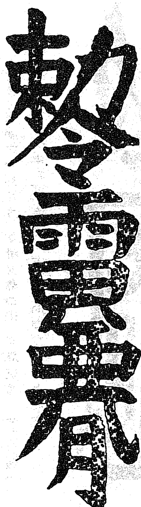

丁巳日在西南方冲到外方，病者头痛身热少饮食。用「赤钱」、「白钱」各三百，水饭果酒财宝，连同左方之符向西南方祭拜送之则吉。

戊午日在西方冲到外方，病者寒热无常、四肢不安、不思饮食。用「白钱」二百，水饭，果酒，连同左方之符向西方祭拜送之则吉。

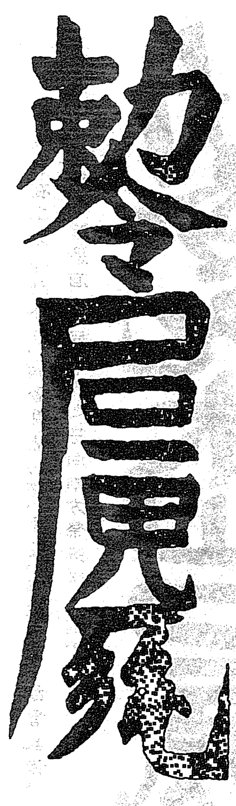

## 314 | 神符精解 |

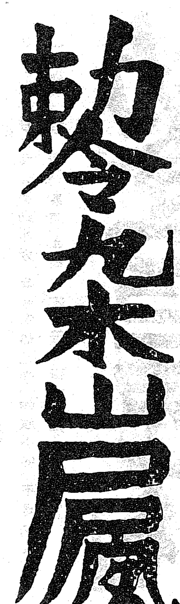

己未日在南方冲到外方，病者身热头痛、眼花、四肢不安、胡言乱语。用「白钱」三百，水饭果酒，连同左方之符向南方祭拜送之则吉。

庚申日由于与人咒诅口毒骂人，被监察灵官过往时听到而降罪，病者头重眼花，不思饮食，口干舌苦。用左方之符与果品香烛当天叩拜求解可安。

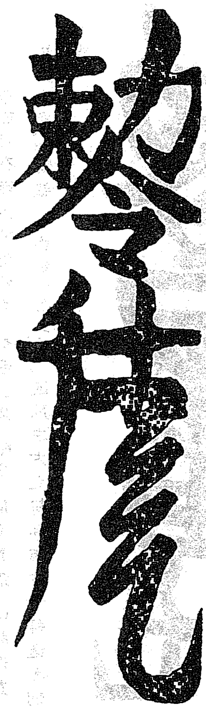

辛酉日在西方冲到外方，病者头痛、眼痛、周身骨痛、四肢沉重。用白米盆，『黄钱』『白钱』各二百，连同左方之符向西方祭拜送之则吉。

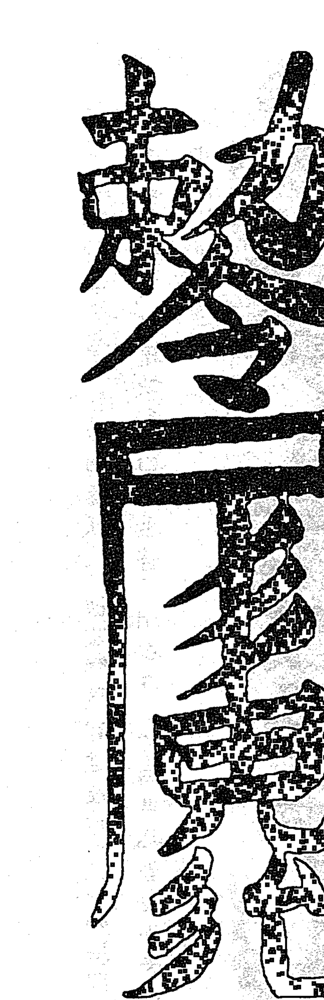

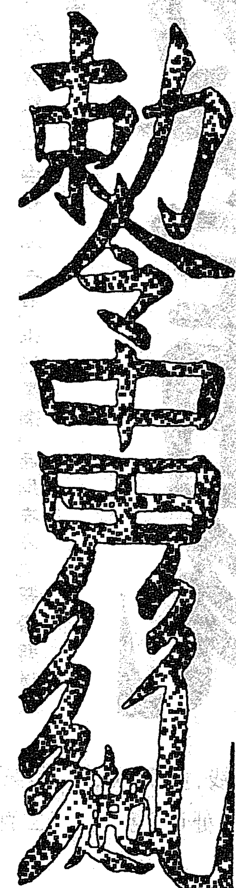

壬戌日冲到飞神煞、披头煞、白虎煞及朱雀。病者忽冷忽热、头痛肚痛、四肢不安。用『五色钱』二百，纸马水饭，连同左方之符向北方祭拜送之则吉。

## 318 | 神符精解 |

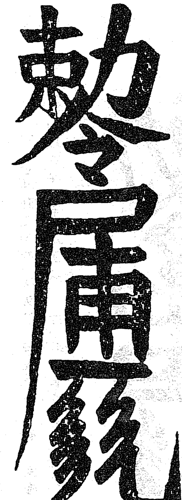

癸亥日冲到当年太岁或外方，病者头刺身热、手足痛、呕吐不安。用『黄钱』、『白钱』各三百，水饭果酒，连同左方之符祭拜送之则安。

说明：

- ①本节所说的青钱、白钱、黄钱、黑钱都是冥纸（拜拜时烧的金银财宝）的一种，在批发商处可买到，至于二百、三百、五百，商店的主人都知道。
- ②本节所说的“祭拜送之”是用祭品及金银财宝拜完之后，请那些“外方”不再来找麻烦，要保护（庇护）某某人身体健康，后面的那些吉利话可尽量多讲一点。
- ③如果到郊外路边“祭拜送之”，一般那些可吃的祭品拿回来的时候先摆在屋外，弄给狗吃或鸡鸭吃，平常我们人是不吃那些的，而容器（碗或酒杯）则在屋外洗干净之后才带入屋内，同时当“祭拜送之”完毕，收拾好回来的时候，一般都不喜欢回头再看的。
- ④这些符都是用墨汁画在黄纸上来使用的。

### 救宅灵符

如果宅内很噜嗦，就是不平安，可准备八片桃木板，用朱砂在桃木板上，然后按照八卦的方位钉在住宅的八方位即可转危为安，移凶化吉。假若不忠不义之人那是无效的。

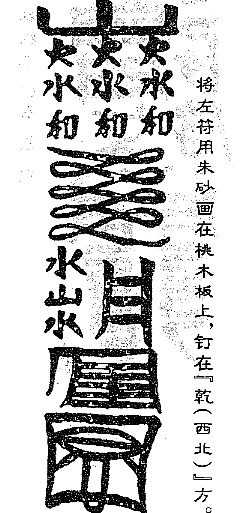

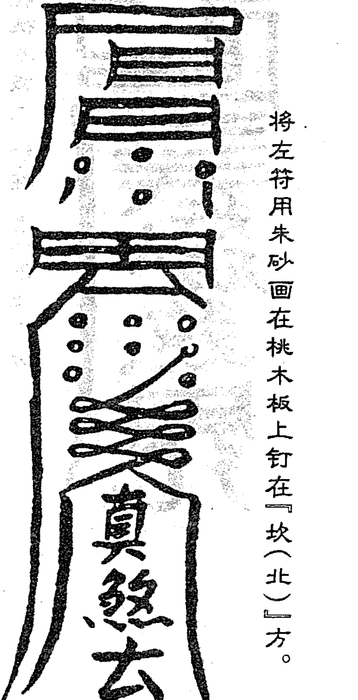

将左符用朱砂画在桃木板上，钉在『艮（东北）』方。

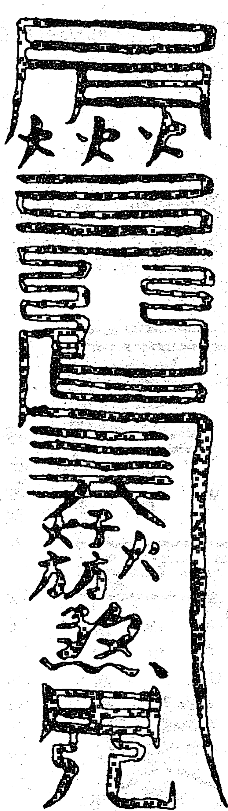

将左符用朱砂画在桃木板上，钉在『震（东）』方。

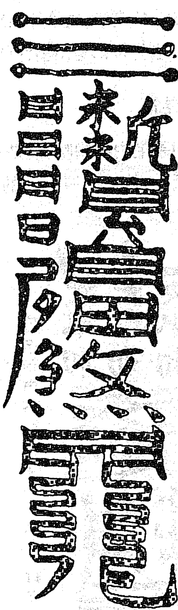

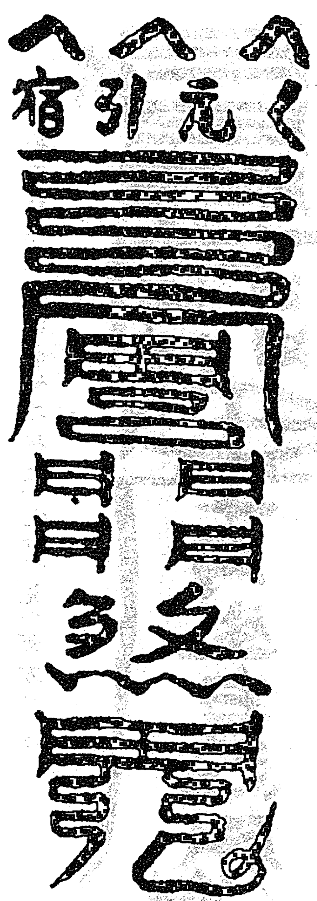

将左符用朱砂画在桃木板上，钉在『巽（东南）』方。

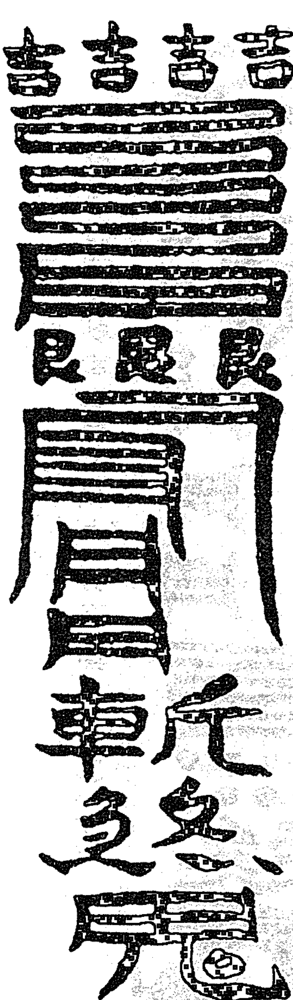

将左符用朱砂画在桃木板上，钉在『离（南）』方。

222 | 神符精解 |

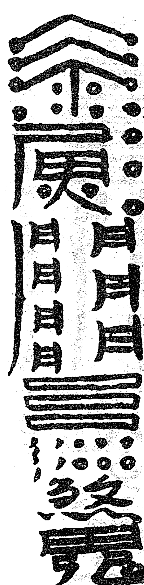

将左符用朱砂画在桃木板上，钉在『坤（西南）』方。

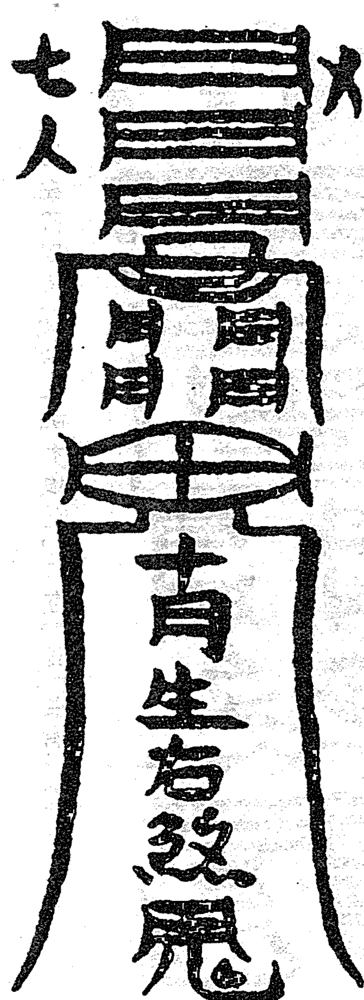

将左符用朱砂画在桃木板上，钉在『兑（西方）』方。

### 青惊灵符

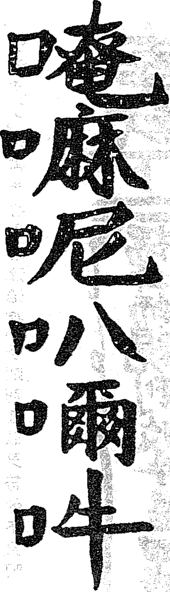

如果小孩不是生病，无缘无故的哭，那是冲犯了煞神而惊叫，民间称『青惊』，这现象是小孩的粪呈青色。如果小孩青惊则用墨汁把左方的符画在黄纸上，然后化饮，即可逐渐恢复平静，否则真让大人（小孩的双亲）受不了。

### 治牛瘟灵符

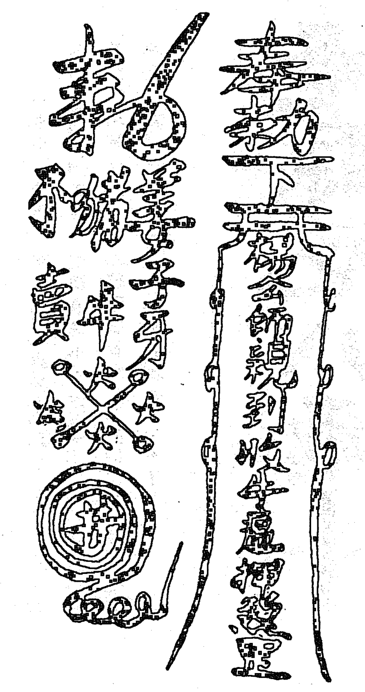

如果有牛瘟或猪瘟，可把左方的两道符，用墨汁画在黄纸上，贴在牛栏上或猪栏上，可转危为安。如果牛猪本身感染了病菌那些符就无用了，必须叫兽医前往治疗，否则别怪罪灵符的不灵呵！

### 小孩夜啼灵符

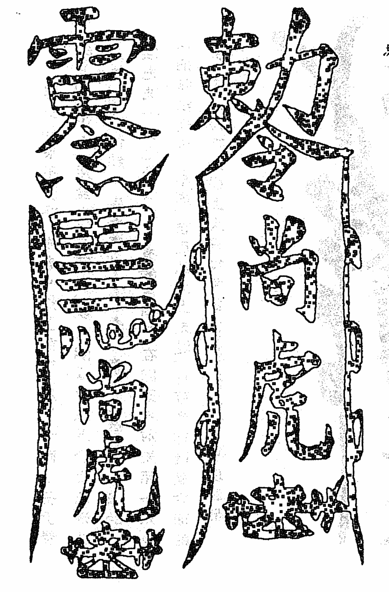

这两道符都用墨汁画在黄纸上，专制小孩夜啼，第一道符（前符，即右方之符）贴床前。第二道符（后符，即左方之符）在床前用二百寿金与此符同时焚化。『二百寿金』是两小叠的意思。

### 清净灵符

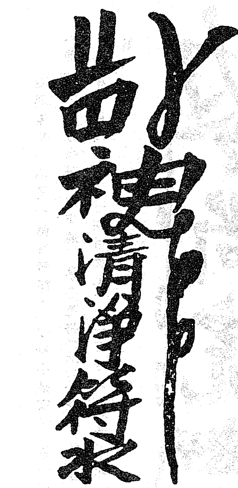

男女如果不清净，或者冲犯了煞气，用墨汁画左符于黄纸上，火化之，用盐米，与花心，以及阴喝水来混合之后清洗身体，即可化解不安之事。如果参加亲友的送丧，回来的时候先洗一洗也是清净。有的民间是在回家之前先用一张纸（旧报纸也可）点燃，自己从火上走过，也可当作送丧方面的清净，因为万物碰上火只化为尘，也就是说火也可以避邪。

### 破土灵符

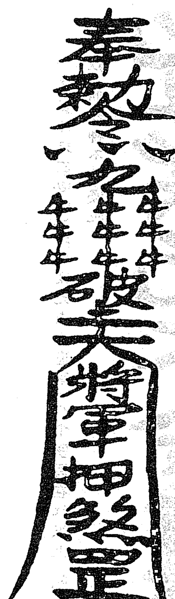

造房子或筑工事的挖土，如果先用墨汁把左符画在黄纸上，然后贴在工事的地方就不会引起什么煞神了，所以说『凡事豫则立』。

### 镇宅驱犯灵符

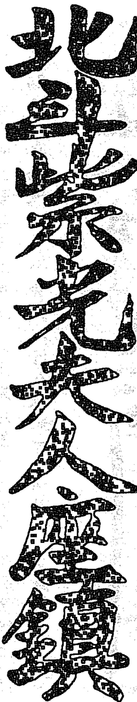

用墨汁把左边的「北斗紫光夫人座镇」八个字写在红纸上，朝夕奉拜，则邪神不敢侵犯。

### 家庭圆满灵符

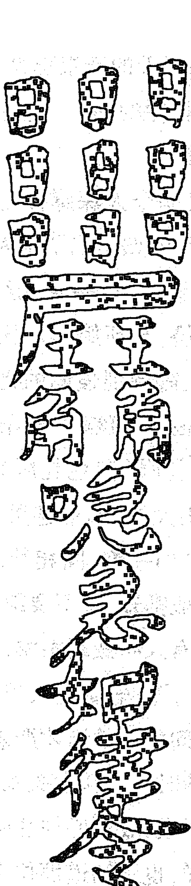

左方的符用墨汁写在黄纸上，不被人知的（不要告诉家内任何人）摆在屋中的角落，自然而然家庭逐渐的圆满，一团和气，欣欣向荣。

### 喜冲喜或喜冲丧灵符

怀孕的妇女叫有喜，结婚当天的新娘也是有喜。如果怀孕的妇女挺着肚子与新娘面对面相冲的话，一定有一方较差，不是新娘倒霉，就是怀孕的妇女倒霉。

谈到喜冲喜或喜冲丧，真是令人深感神秘与奥妙，甚至令人有不可思议的感觉。例如怀孕的妇女抱了别人的小孩，而那位小孩的“大便”臭得太离谱，甚至下泻“肠炎”这种现象称喜冲喜。有时候抱着小孩去看人家结婚，与新娘面对面，有时候也使小孩有毛病，这也叫喜冲喜。这里需特别强调的是，并非所有面对面就喜冲喜。也并非所有孕妇抱了小孩就使小孩有毛病。

一般都说新娘穿上新娘礼服（白色礼服），戴上头纱就有所谓的“新娘神”，这新娘神是很大的，如果越贵气的小孩就相冲的力量越大，越贵气的小孩被孕妇一抱，同相冲之后的后果也就越大。因此民间怀孕的妇女一般都知道，不要随便抱别人的小孩。

说到与新娘的喜冲喜也有人叫做新娘煞，那是生肖方面与时辰的相冲所致。如果新娘一下轿车要进入男方（新郎）大门，或进入大门步入洞房的这段时间相冲的话才严重，假若进入洞房之后，脱了新娘礼服出来宴客的时候那就没关系。所以民间结婚的时候，往往当新娘车到达的时候，成人们往往叫幼小的婴孩离开，因为结婚当天，个个喜气洋洋，也不知道那位小孩会相冲，干脆全叫开现场为妙，这倒是万全之计。说真的，大家都喜气洋洋，如果有位犯了新娘煞那真是煞风景了，你说是吗？

孕妇或贵气的小孩，如对面迎出殡的队伍（民间称为出山）也会犯煞，一般叫“丧煞”。孕妇的喜冲喜或喜冲丧，会引起身体不舒服，如肚子痛、头痛、呕吐。小孩的喜冲喜或喜冲丧则会引起小孩的不舒服,如大便臭得太厉害(臭得太反常了),哭、其它的发烧、白天不好好的玩,晚上不好好的睡觉。如果有以上的现象则使用左方的符来转危为安。

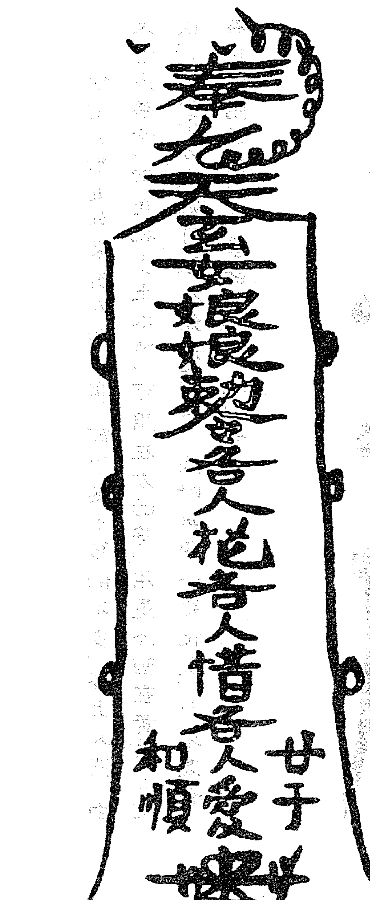

左方的符用墨汁画在黄纸上,然后化饮。有的婴孩无法直接饮下,可用奶瓶装符水或与牛奶同时混合使用。并且用手沾符水拍拍小孩头部、胸部、背部、手与脚。至于孕妇则用化饮的,其他则用轻擦,切不可用拍的。画符的时候要特别注意「九」字的右边,向上打九个「转」,并且一定要禀请「九天玄女娘娘」来帮忙。

### 安土木煞灵符

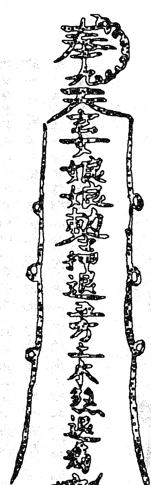

住宅的附近如果有人动工事，而引起小孩的不安，餐上大哭，白天也很噜嗦，那是犯了土木煞，可用左方的符，用墨汁画在黄纸上化饮，如果不方便则可装入奶瓶用之。同时再用一张化灰，与米混合，在住宅附近或动工事的地方用之则吉。

### 安小孩噜嗦灵符

有些小孩白天好好的玩，而晚上就闹，甚至白天晚上都很噜嗦，可用左方的符。用墨汁画在黄纸上，把符向外摺，让小孩佩戴。民间有些妇女是用红丝线（红纱线）绑符挂在小孩的颈上，因为是线可能有危险性，小孩与小孩之间的玩弄，如不小心可能有不良的后果。因此最好的方法是缝一个很小的衣袋在衣服的内侧，再用塑料布（透明的）把符包好放入衣服内侧的袋里，袋口要更小，这样又不怕潮，又不怕被小孩拿走或丢掉。要是小孩能平平安安，那么我们身为父母亲的岂不是更舒服更快乐？

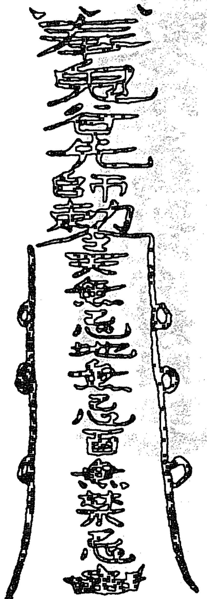

### 保畜灵符

有时候同样都是养牲畜的人，可能由于“同行是冤家”要是心术不正的人可能会用邪术来害牲畜。因此如果用左方的符来化解即可转危为安。

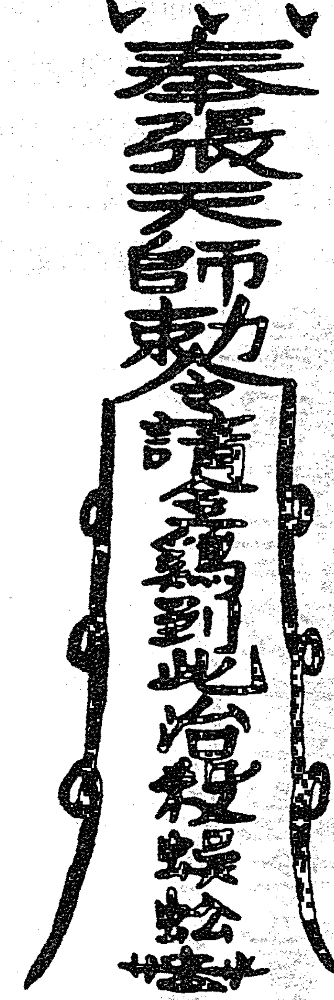

左符用墨汁画在黄纸上，化交，用一大桶水泡之，一部份让牲畜吃，一部份可用喷射农药的那种器具来喷牲畜的住处周围及附近，可逐渐好转。

### 化骨灵符

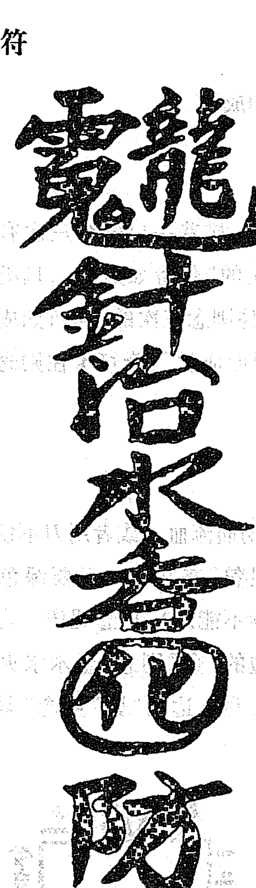

左方的符是用墨汁画在黄纸上来化饮的，如果情况紧急，而且功力较深厚的人可以直接用剑指（又称刀指）画在水上，方法是用碗装水来画，然后饮下。

如果用墨汁画在黄纸上，当写完第一个字之后，其余的字要一面写而一面念“龙针治水吞化防”。而“化”字要以逆时钟的方向来打一圈。

画完之后要看是什么骨就用什么口诀，其变化口诀如下：

## 336 | 神符精解 |

- ①竹类用——化竹如成泥。
- ②荆类用——化荆如成泥。
- ③隆(尼隆)类用——化隆如成泥。
- ④铜类用——化铜如成丝。
- ⑤骨类用——化骨如成丝。

以上五种口诀是签画完之后，接着一口气念三次有关的口诀。如骨类卡住则一口气念三次的“化骨如成丝”，荆类卡住则念三次的“化荆如成泥”，竹类卡住则念三次的“化竹如成泥”，铜类(铜钱)卡住则念三次的“化铜如成丝”，隆灯卡住则念三次的“化隆如成泥”。

### 止血灵符

有时候不小心跌倒、皮肤擦伤而流血。或者用刀不慎而发生刀伤，鲜血如注，都可用“止血灵符”来止血。只要绿色的树叶(注意要无毒的树叶，夹竹桃有毒不能用)，再念咒语。写左边的“一”要念“一二三四五”，写上边的“金”则念“金木水火土”，写右边的“今”则念“今日受刀伤”，写下边的“紧”则念“紧取虎口土”。(方法如图)。

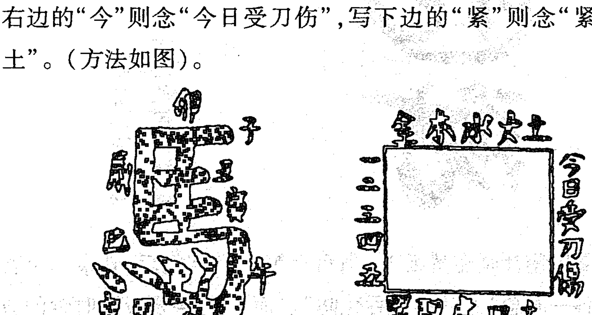

另有一法是写下“马”字，本来“马”字只有十划，这里则当成十二划,每写一划、一勾或一点都要念十二时辰中的一字,即“子、丑、寅、卯、辰、巳、午、未、申、酉、戌、亥”。也是用剑指在绿色树叶上写的。(方法如图)。选用这两种方法之中的一种,画过符咒之后,直接把树叶贴在伤处即可止血。

### 止鼻血灵符

有些人由于虚火上升而流鼻血,也有因为相撞而流鼻血的。要是发生地点交通不便,甚至三更半夜找不到医生,可速用此法止住鼻血,否则流了太多则人更虚弱。这法也是用剑指在绿色树叶(先洗干净)上写一“羊”字,每写一笔则念一字,即“子丑寅卯辰巳”。然后把树叶卷起来塞鼻孔(写符咒的那一面朝外)即可止血,(方法如图)。

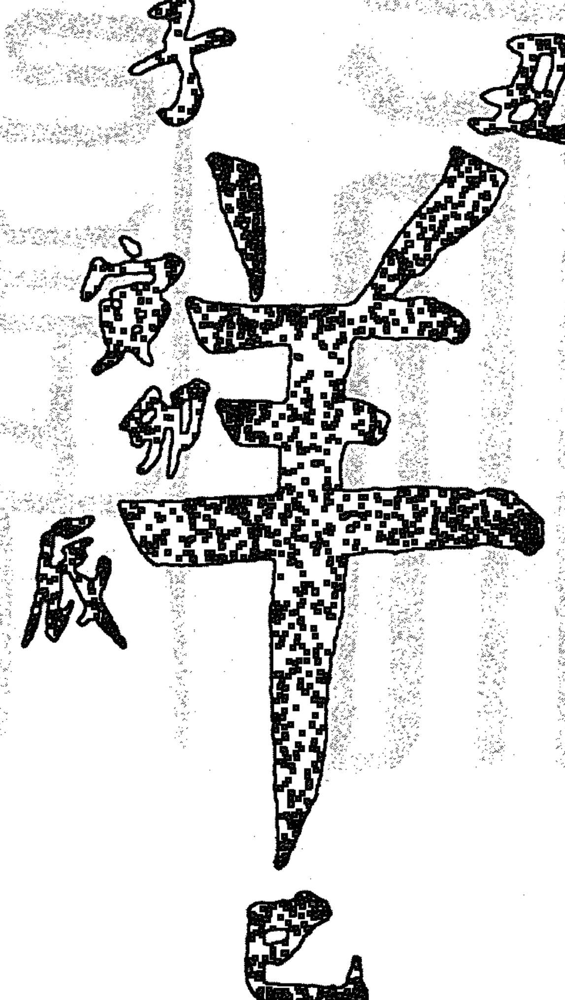

### 老君入山灵符

左方的五道符都是用朱砂画在桃木板上，可以把桃木板摆成横式，五道符全部画上去。可钉（或挂）在门户上、住宅的四方及四个角落、甚至交通交道。安置符的范围一定在住宅附近五十步之内。屋内的梁柱也可安置，此符可避鬼魅山精，使住宅平安。

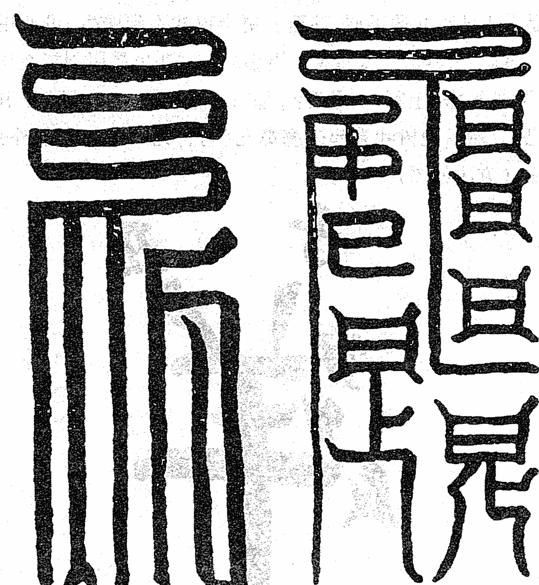

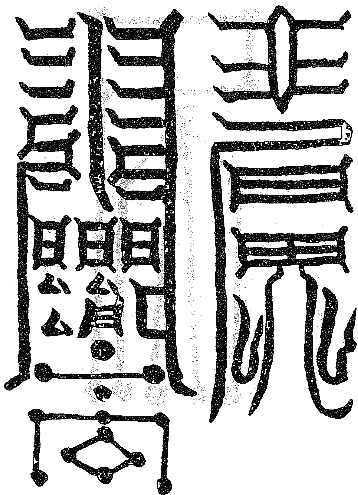

## 340 | 神符精解 |

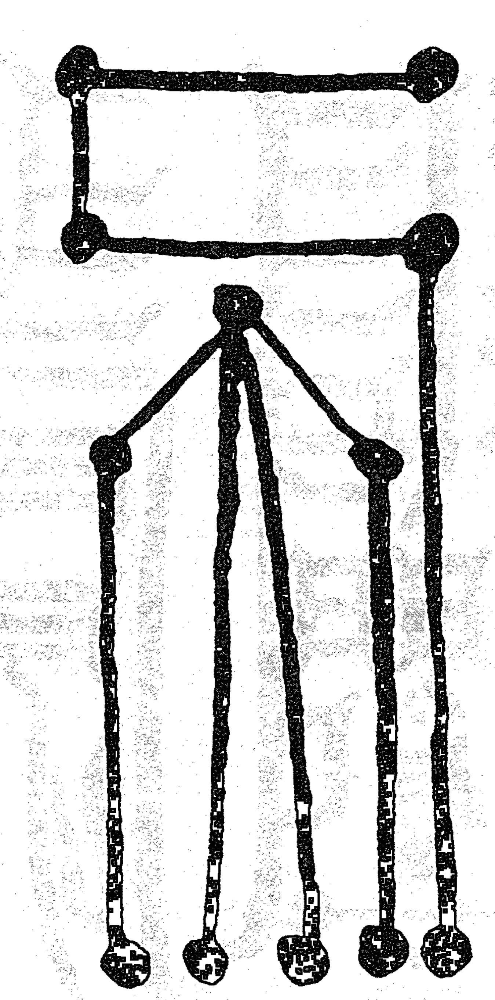

### 镇煞灵符

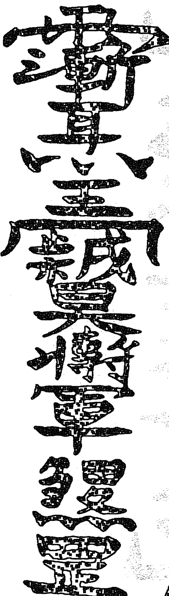

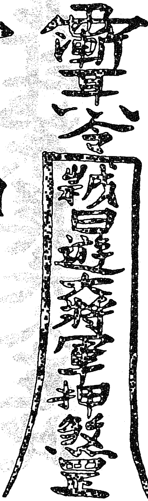

左方二道用墨汁画在黄纸上贴用，可镇煞，两道都可用，只用一道即可，不是同时用两道。

### 立即催生灵符

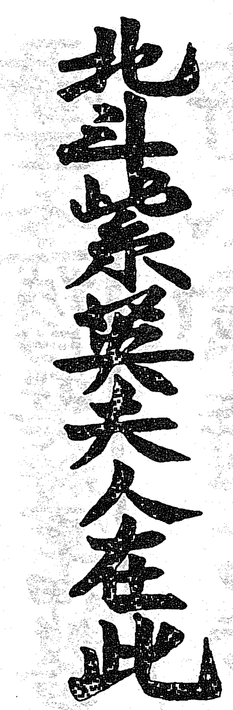

说明：

- 1. 用朱砂把“北斗紫英夫人在此”等八字写在黄纸上。
- 2. 然后颠倒贴在产妇背上（可以隔衣）但不要被产妇知道，如此小孩可顺利产下。
- ③小孩产下之后，立即把此符取下。
- ④在灶上（现在有些家庭没有灶，只有瓦斯炉，那就在厨房）焚香烛（红色烛）将此符焚化炉内（如没有炉可用铅桶代替）。
- ⑤这过程要快，否则小肠也会下地，请慎之。

### 收惊灵符

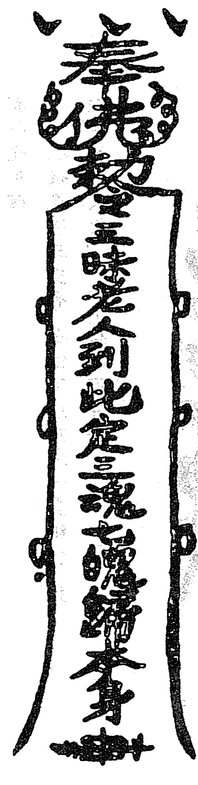

孩子一受惊就不乖，有时候脸上有青色，或者青色的血管浮浮的样子，应该为小孩收惊。方法是先用墨汁画一张收惊灵符（左方之符），再念收惊咒。

### 收惊咒：

> “本师来收惊，本师来收惊，收惊三师三童子，收惊三师童子郎，不收别人魂，不讨别人魄，收你○○○三魂七魄，收来顾本命，吾奉太上老君敕，神兵神将火急如律令，急急如律令。”

右文中的“姓名名”就是施术者要念被施术者（被收惊的人）的姓名。

### 安小儿失魂灵符

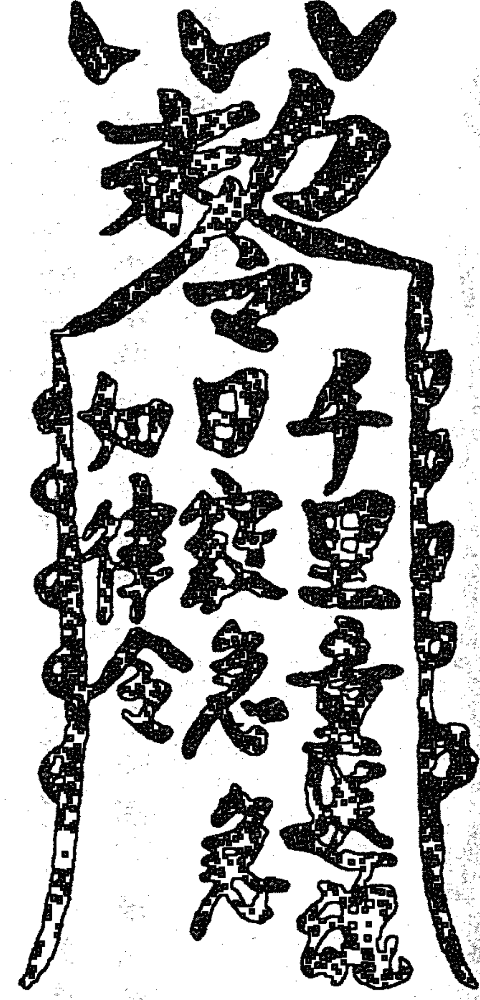

小孩有时候体内有心火，或者突然间听到怪声，看到奇怪的物体，甚至跌倒而失魂。可能发烧而不吃东西。在夜晚烧三支香，在住宅门前烧一叠纸钱，把左方的符火化，那么小孩就可安睡。

### 制煞灵符

人一生下来就无法十全十美，所犯的煞神很多，如果想办法让那些煞神不来找麻烦，那么人就可以安安稳稳的向前迈进，否则始终好像有人在踩后脚的，无法向前推进。因此就有所谓的制煞（也有称祭煞，因为要三牲酒礼金银财宝祭拜，所以称祭煞），祭拜之后，那些煞神就不再找麻烦，所以称制煞。以下这些符都是用墨汁画在黄纸上而用的，现在画者把所犯的煞神灵符及其作用（影响）叙述于后，以供参考：

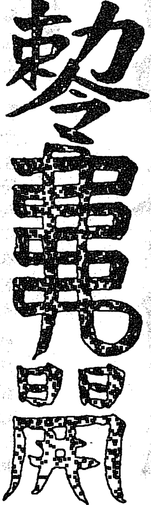

#### 1. 翁姑符

女性如果犯了『翁姑暗星煞』，嫁后与翁姑（丈夫的父母）的感情不和睦，容易造成家庭悲剧，要用左符制之。

#### 2. 夫星符

女性的命中如果没有『夫星』，或带着『妨夫星』，那么结婚之后夫妻难以和睦相处，有的中途离婚。报纸上也常刊登夫妻之间的闹剧或悲剧，中途分离，当然很多因素。要用左符与红衣制之，然后结婚照样可以得鱼水之欢，相亲相爱。

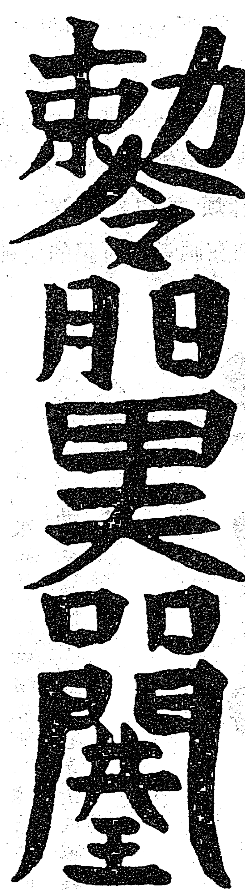

#### 3. 咸池符

不管男性或女性犯了咸池煞，一般都是多情人物，男的多风流，女的多淫乱，常有桃色新闻，惹出麻烦。该在婚前就用左符制之，否则婚后照样风流人物。

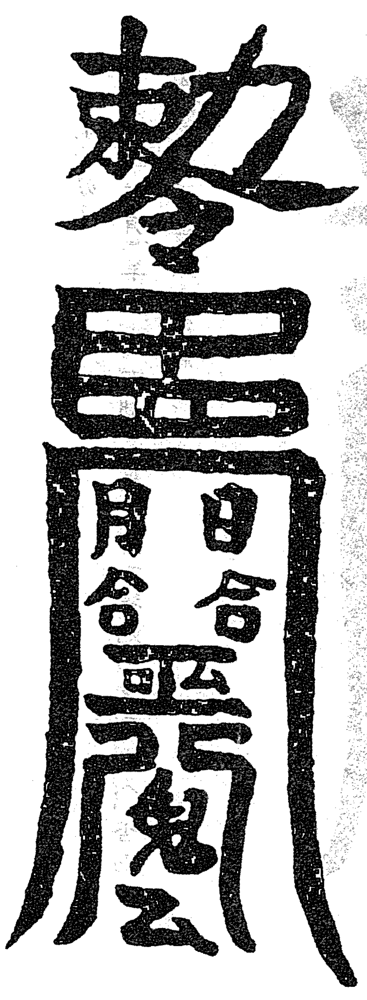

#### 4. 羊刃符

命中带有『羊刃』则有刑，如果本身有福则伤害到别人，否则就伤了自己，该用左符制之。

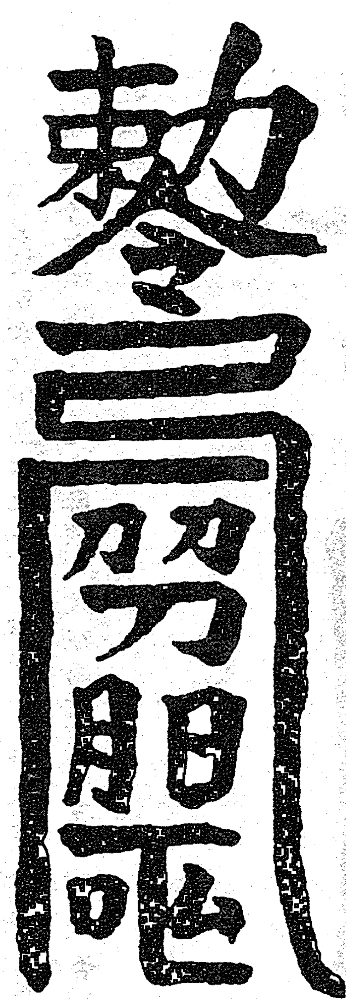

#### 5. 抹头符

如果带有『抹头符』则容易有血光之灾，该用左符制之，免得累及子孙。

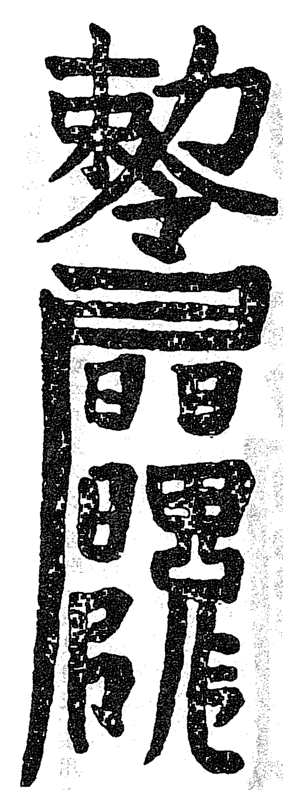

#### 6. 游魂符

带「游魂符」的人，早晚在房里为妙，否则一心只想死，该用左符制之。

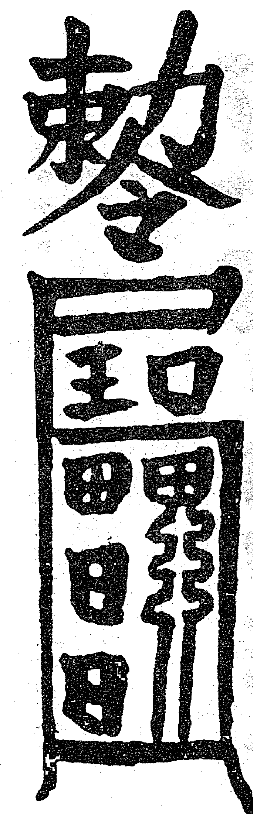

#### 7. 投河符

命中带有「投河煞」容易在路溪玩水而失事，或遇河不慎而失事，该用左符制之。

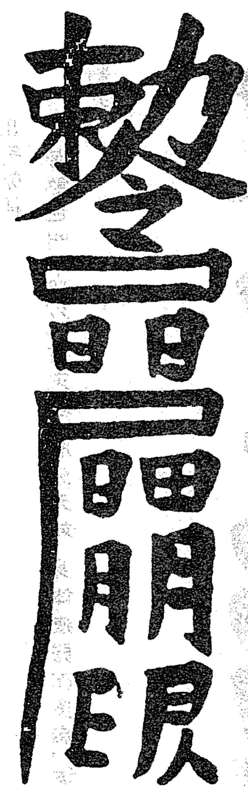

#### 8. 气劳符

气劳煞也叫『血刃』有灾殃，服药无效，身体瘦弱而多病，该用左符制之。

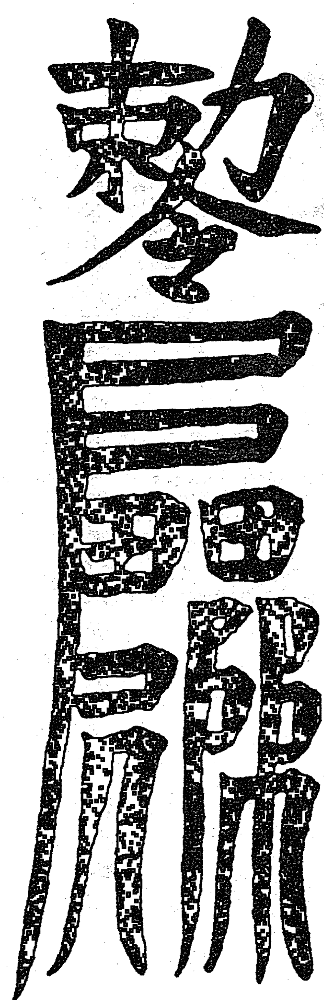

#### 9. 暗矢符

带「暗矢煞」则很少有知己而善良的朋友，该用左符来制之。

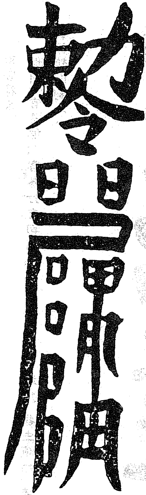

#### 10. 官符杀

也叫「官符煞」，容易打官司而入狱，小人害己而破财，易生烦恼，该用左符斩送制之。

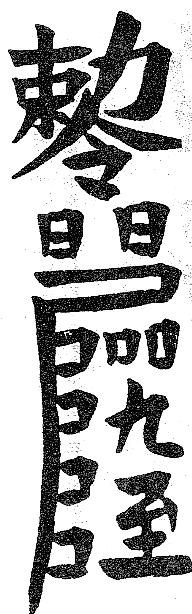

#### 11. 投崖符

带「投崖煞」则容易为了小事或登山过岭不小心而跌落山崖，该用左符制之。

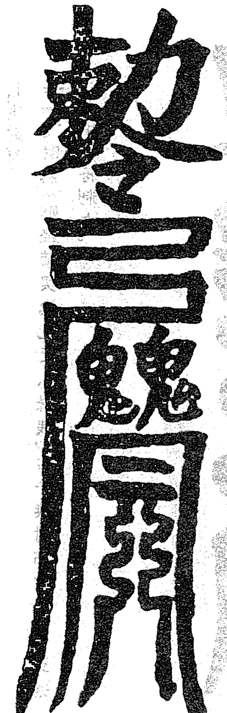

#### 12. 飞财符

带「飞财煞」则经营买卖也无从赚钱，右手接财而左手空，无法存钱，该用左符制之。

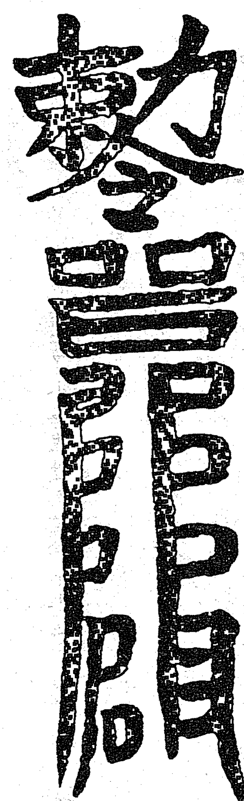

#### 13. 硬眼符

带「硬眼煞」则克兄弟姊妹，又伤父母，该用左符制之。

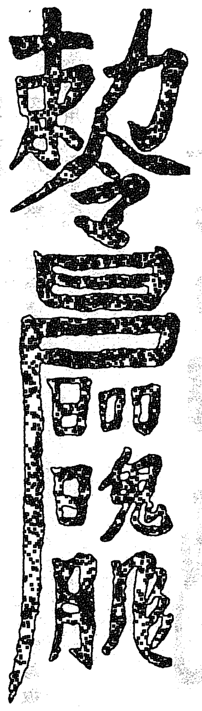

#### 14. 吊客符

又称「吊客煞」，它会使人带来大灾伤，口舌之灾，六畜容易被杀，宜用左符制之。

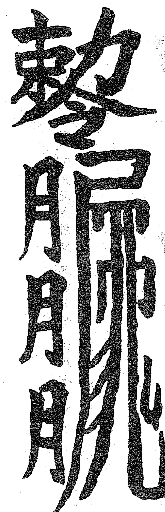

#### 15. 耗财符

带「耗财煞」的人则浪会虚花而不聚财，宜用左符制之，否则右手财来而左手出。

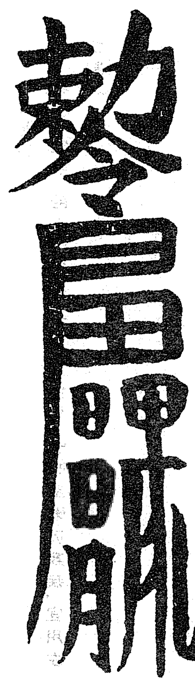

#### 16. 血气符

带「血气煞」的人则服药无效，身体弱，呕吐空嗽而致病，宜用左符制之。

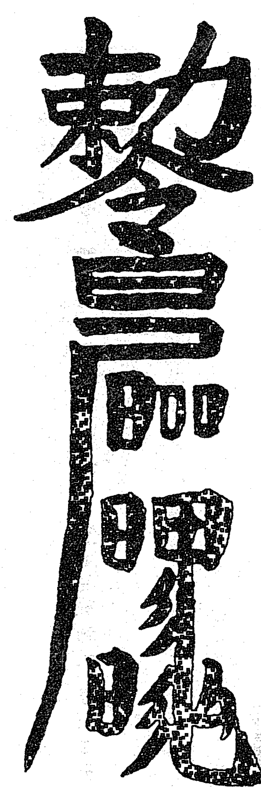

#### 17. 凶恶符

带「凶恶煞」的人则多灾殃，不是头痛脑发热就是中风不语，精神错乱，宜用左符制之。

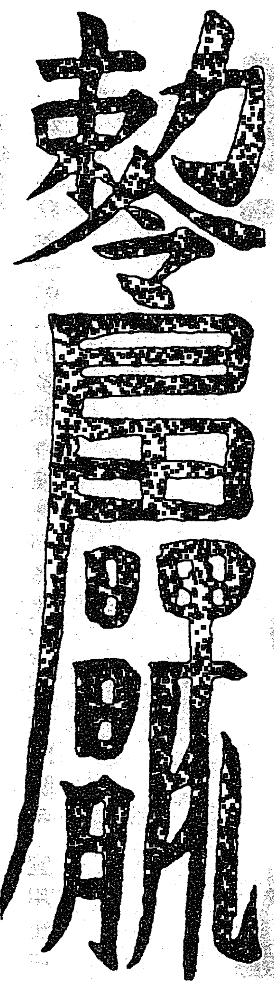

#### 18. 狐狸符

带「狐狸煞」的人则多煞神缠身而多危，最后命归阴司，宜用此符制之。

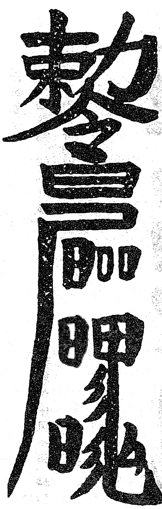

#### 19. 迷魂符

带「迷魂煞」的人则多厄，宜用左符制之。

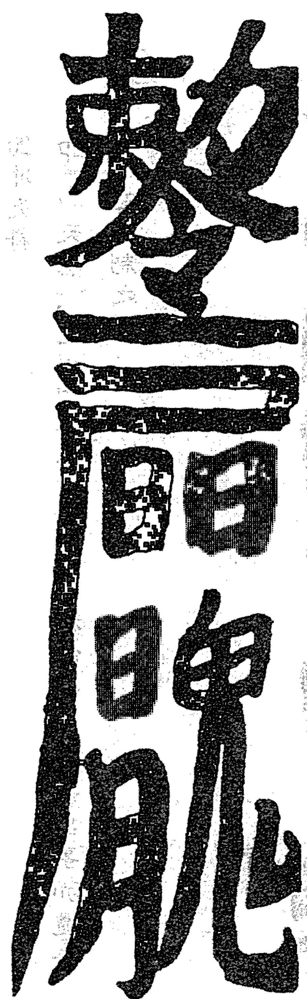

#### 20. 冲天符

即「冲天煞」，也叫「飞天煞」，带这种煞的人容易出事而遭丧命，宜用左符制之。

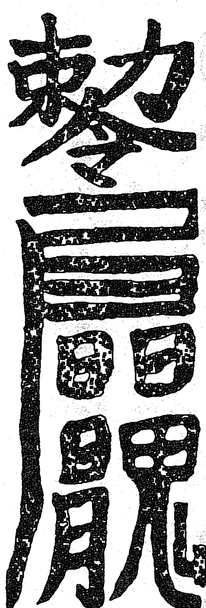

#### 21. 兴旺符

命带「兴旺煞」则大有利益，富荫子孙，但要用左符来镇之才能表现出来。

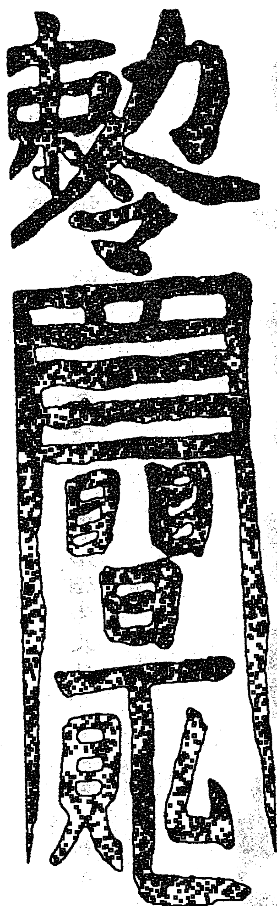

#### 22. 拨乱符

带「拨乱煞」的人则无情又无义，视婚姻为儿戏。宜用左符镇之。

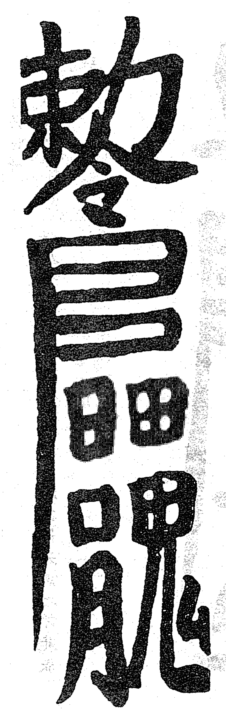

#### 23. 刑害符

带「刑害煞」的人会刑子女（对子女不利），初年不利，晚年较利。宜用左符制之。

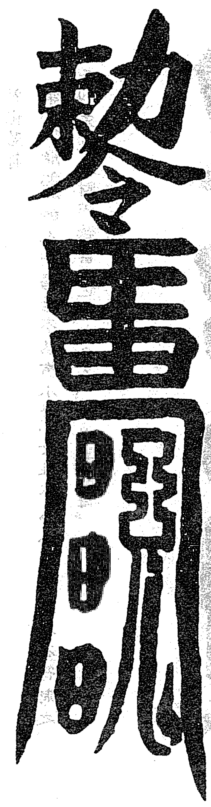

#### 24. 化胎符

带「化胎煞」的人则婚后不易有小孩，女性不易怀孕。宜用左符制之，制后则五鬼搬财而致富，也可养子女，所以要留意。

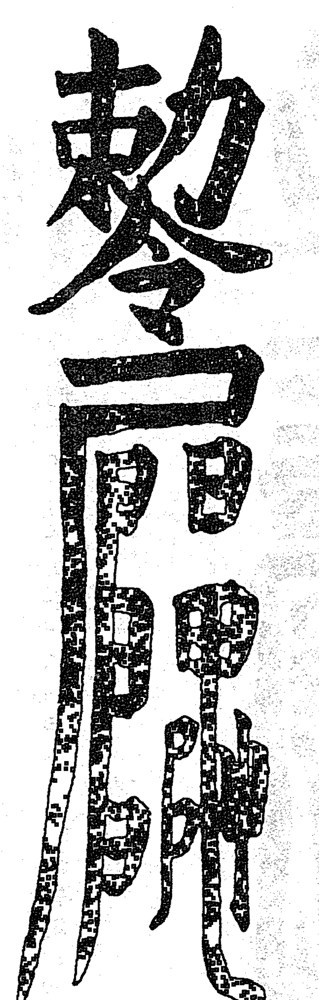

#### 25. 砚台符

带「砚台煞」的人功名难成，宜用左符制之。

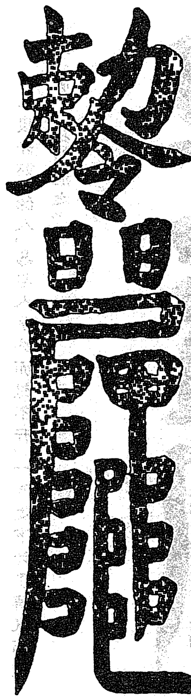

#### 26. 投井符

带「投井煞」的人，易与人争吵而想不开，一气之下为了解脱而投井。宜用左符制之。

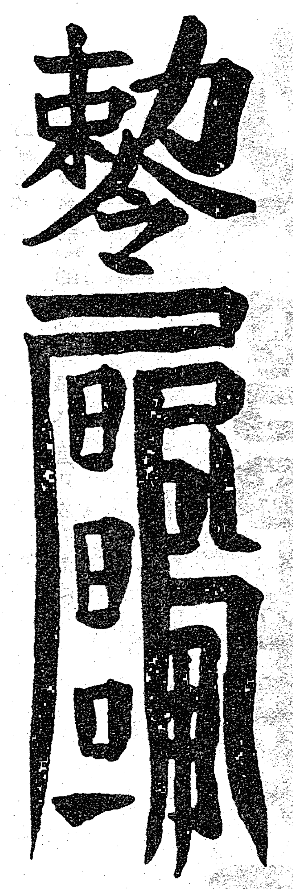

#### 27. 悬梁符

带「悬梁煞」的人，常有邪鬼缠身，易与人争吵而是悬梁寻求解脱，宜用左符制之。

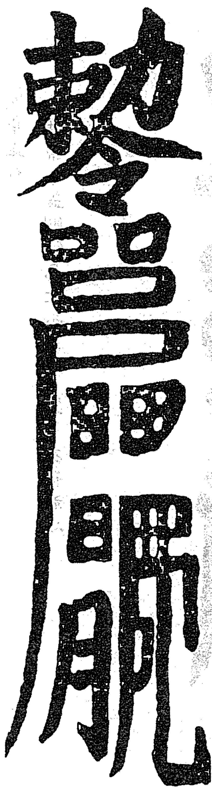

#### 28. 华盖符

女性带华盖则容易红杏出墙，宜用左符制之。

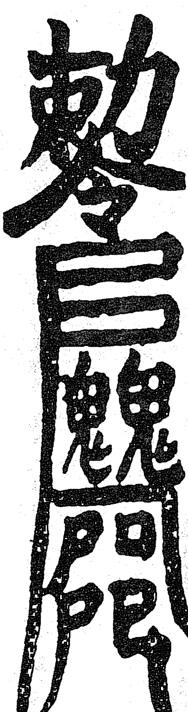

#### 29. 鸟神符

带「鸟神煞」的人则多病，不思饮食，做事不顺利，宜用左符制之。

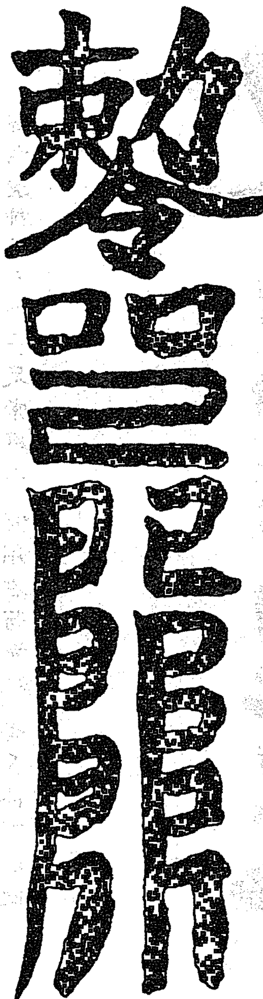

#### 30. 虎神符

带白虎神的人则手足常麻木，宜用左符制之，否则身体难以健康。

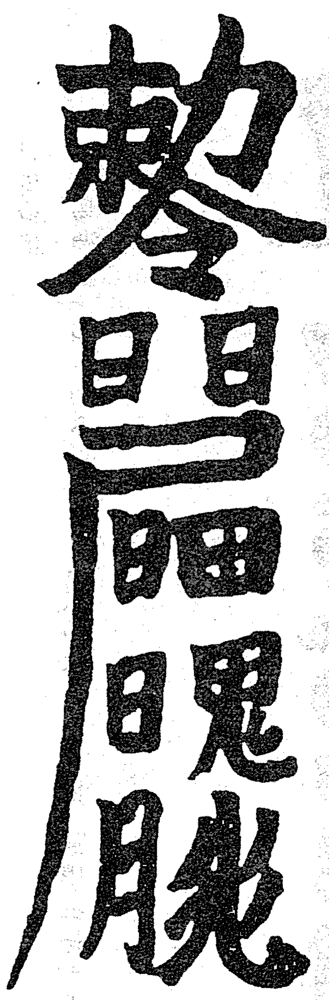

#### 31. 走跳符

走跳星又称驿马，带此煞的人喜欢花游柳巷。要是女性有此煞则不贞，宜用左符制之。

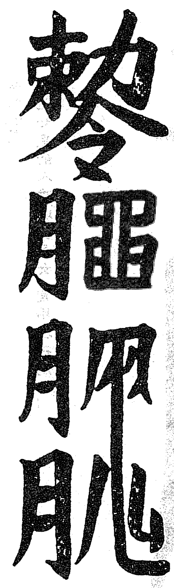

#### 32. 九女星

带九女星的人难以养子女，宜用左符制之。

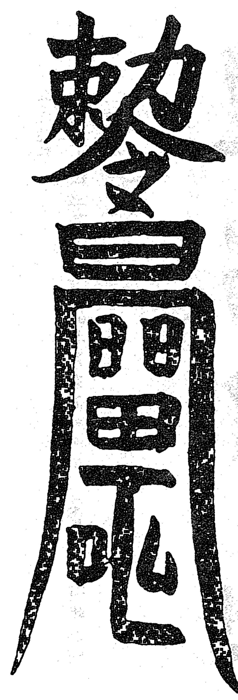

#### 33. 暗害符

带暗害煞的人则常被小人暗害因而破财，宜用左符制之。

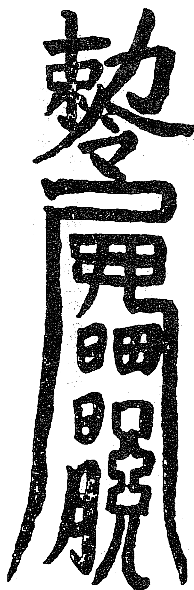

#### 34. 埋儿符

带「埋儿煞」的人难得子，宜用左符制之。

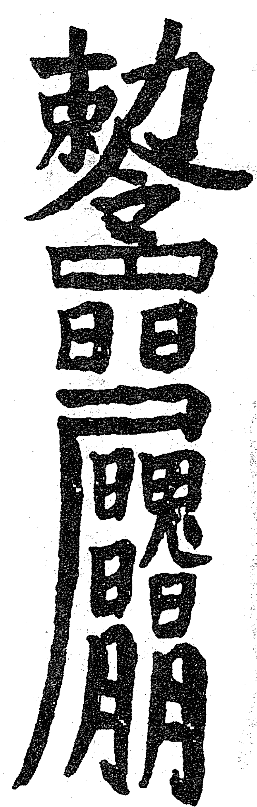