# 禅易卜门六爻揭秘

# 序

隱者教授「禪易六爻」，多年來累積了無數的心得和經驗，而緣以己身的教研經驗，有感於習卦環境和良師難遇，祈將「禪易六爻」的教學內容及解卦的技巧、竅門逐一披露，提供學術分享，望能對於廣大的六爻愛好者有所助益。

「禪易六爻」有別於一般坊間的六爻卦，所有運用的解斷技巧、方法，都有堅實的理論依據，學習中則要求「知其然、知其所以然」，達此境方能融會貫通萬理皆明，圓融而無礙。西諺云：「驗證是唯一的真理」，凡具科學本質的事物，必然經得起反覆驗證而不悖，故學習任一門學科，都須具備探索真理的精神，各種運用的技術、技巧亦須再三反覆求證其獲致相同結果，方能成爲定論而具有實用之價值，正如以古籍爲基石，以生活爲師；站在巨人的肩膀上以眺望遠方。

六爻的基礎理論坊間處處垂手可得不再贅述，隱者執筆此書、意欲由習卦者較易陷入盲點或忽略、誤解的重要機理處著手，祈以簡明的口語化表達，務使擁有五術基礎者皆能看懂，並易於學習上手，且假以時日能運用得心應手，不再望卦興嘆！

學習的目的在於”致用”，任何學術皆不例外，要將所學充分發揮，則勢必需具備紮實的理論基礎以及正向的觀念；經得起反覆驗證的是爲”定理“，而無法落實於生活中具實質助益的理論，將流於空泛、華而不實，亦恐誤盡學習者的炙熱之情，對於學術推廣無益，勢無法將傳統五術發揚光大，亦是身爲現代知識份子之吾輩所不樂見。

故隱者以個人多年研究所得，著作此書，祈與愛卦者共同爲傳統五術文化的薪傳，略盡一份綿薄的心力，而令後學之人能有所得，是所至盼！

http://www.chanyi.url.tw/index.php
http://tw.myblog.yahoo.com/7fraises


# 壹~理論篇

# 第一章 層次論

### 第一節 概論：

在整體的卦盤中，地支(卦爻)區分為四令、動爻(含變爻)、靜爻、暗動爻、伏爻...等，而在傳統典籍或一般坊間卦書中，都未有明定各部之權力劃分及限定，致學者無所適從隨心而用，故期藉由通過層次論之底定，得以界分卦中各爻之位階及對它爻所能行使之權力，令學者們不再迷惑於爻支相互之間的生剋關係，進而有所依憑而不背。

註：層次論由大陸易學名家李洪成先生首作發表。

## 第二節 層次分論：

- 一、第一層次—四令(年、月、日、時)：
    1、歲君(太歲)：
    除在占問年運或長遠之事，一般的斷卦中較少使用到，而在禪易六爻的斷卦法則中，歲君則具有「指向」性質的作用，標示出年度之中較須留意的吉凶事件。
    2、月令(建)：
    月建對於卦中各爻都能施以生、剋、沖(破)、合之權力，惟月令僅能於月中行使一月之權，過月則失權。
    3、日辰(建)：
    日辰具有與月令相同之權力，最大之區別，在於日辰在四時都有對它爻生、剋、沖、合之權力。
    4、時辰：
    除斷天氣卦、競賽卦或當下急迫性質之事項，一般斷卦，幾乎不用；而在禪易六爻的斷卦法則中，「時定法」乃是”辨象”重要法則之一。
    5、月日關係：
    月日同功同權，卦爻從月日損益(生、剋)都是相同的，如爻在月日，一處得生一處受剋，則此時該爻之旺衰，關鍵乃取決於自身動靜和卦中其它第二層次爻的生扶、制剋。

- 二、第二層次--動爻、變爻、暗動爻、出伏爻：
    1、動爻：
    動爻在本卦，能生剋同層次之動爻，動爻只要不受傷，就有生剋權力，能傷動爻者，僅為月日、變爻；動爻有生剋權力時，對同層次之爻及靜爻，可進行生剋沖合之行為作用。
    2、變爻：
    變爻可對本位動爻發揮生剋作用，同時對於本卦其它爻也有影響；變爻除受第一層次爻制約外，不受任何它爻制約，而變爻的旺衰也僅能隨月日而變，可發揮或不能發揮其力量。
    3、暗動爻：
    暗動之爻也是屬於第二層次爻，其用法同動爻；但須知暗動爻的作用力，因其不具時間的延續性質，故僅能發揮一次。
    4、出伏爻：
    凡伏藏之爻得以出伏時，則亦屬於第二層次爻，其用法亦同動爻；但仍須留意觀察飛神隨時間的流轉而改變其旺衰形態，而致伏神再度受其管制約束。

- 三、第三層次--靜爻、伏藏未出之爻：
    1、靜爻：
    因靜爻未發動，故不能主動生剋沖合動爻，僅能生剋沖合同層次之爻；但僅有生剋沖合之形象涵義，而無生剋沖合之能，此點須特別留意以免誤判。
    2、伏藏未出之爻：
    伏藏未出之爻，不能發揮其作用力，故同靜爻斷法。

- 四、月日入卦：
    月令、日辰有時入卦，月日入卦之爻，也類同於第一層次爻之旺，但如不發動則對卦中動爻仍無生剋權，但也不被動爻所傷，而須認知有權的是月日，並非是月日入卦之爻，且其隨月日之更替，層次也在轉化變更中。

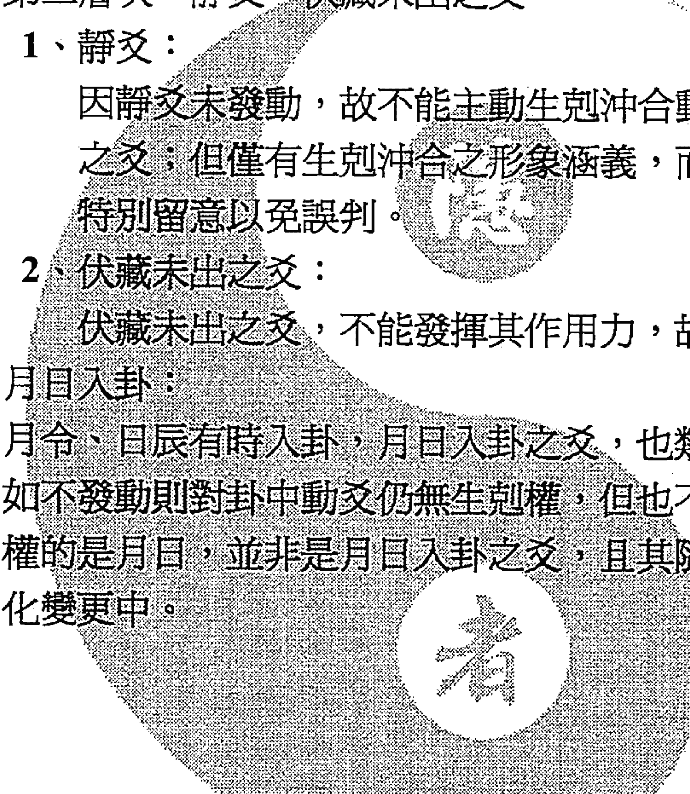

http://www.chenyi.url.tw/index.php
http://tw.myblog.yahoo.com/ifra1ses

## 第三節 圖例解說：

圖例一：第一層次---歲君

占問人：男、34 歲、占工作發展？

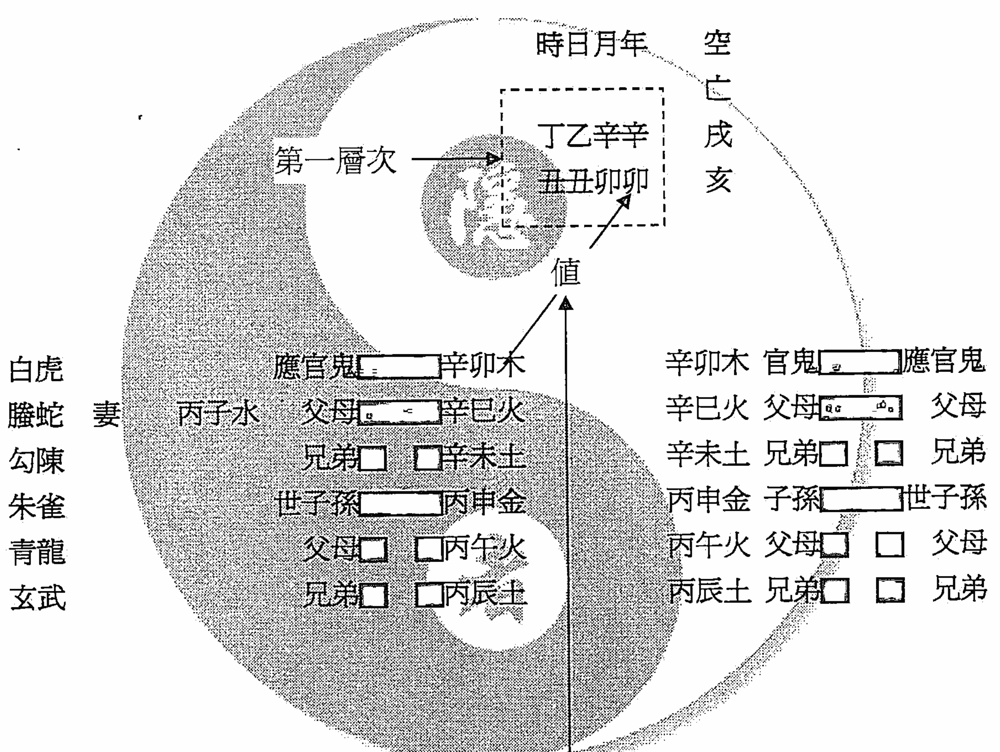

- 1、爻與歲君同，表具有歲君象徵之性質~高、遠、大、尊、貴...等。
- 2、占工作事項，應爻為相對之位=公司，故表公司為大型企業。
- 3、爻與歲君同，故亦表示今年公司營運順利，獲利可觀。

### 圖例二：第一層次---月建

占問人：女、46 歲、占病情何時舒緩？

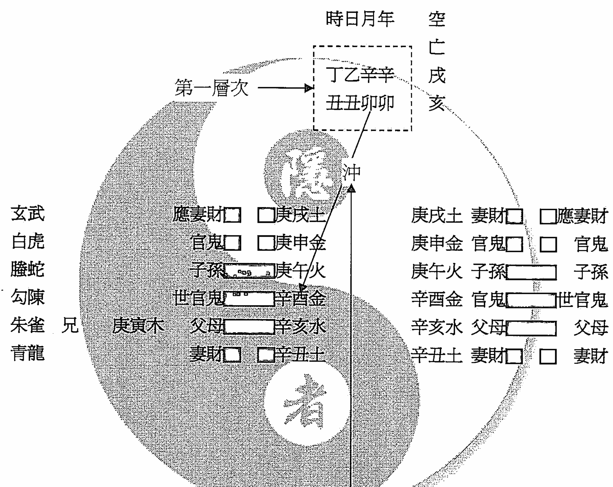

- 1、凡任一爻支受月建六沖者，一律作”月破”論，為該月最衰之爻。
- 2、世持勾陳官鬼，占問疾病=老毛病或遺傳慢性病，逢月破則本月病痛加劇。
- 3、月建表環境，依月建所屬六親象類化之。

### 圖例三：第一層次---日辰

占問人：女、31 歲、占男友要求復合，是真心的嗎？

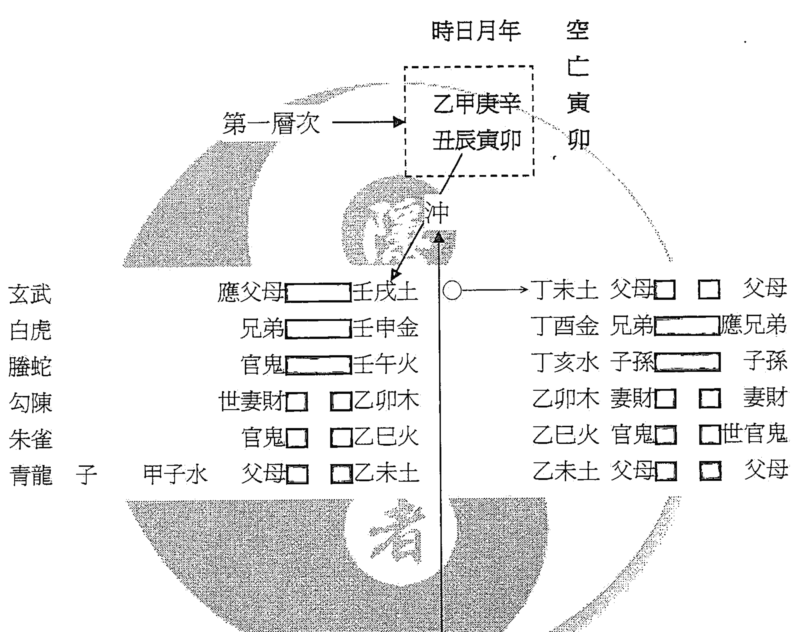

- 1、凡靜爻受日辰沖，旺相者為”暗動”論，休囚者為”破”論。
- 2、此例原卦應爻動來合世，主對方主動要求復合，主吉象；但恰逢日辰來沖開，謂之”合處逢沖”，主欲合而受外力所沖散。
- 3、日辰表人事，依其所屬六親象類化，則可知受何人所阻擾、破壞。

### 圖例四：第二層次---動爻

占問人：男、33 歲、占與女友未來感情發展？

- 第二層次
    1、暫不論月日旺衰條件(旺衰爲量變之消長)。
    2、五爻白虎父母酉金發動=屬於第二層次之爻。
    3、酉金父母可對同層次及第三層次爻作用：
        A、受動爻丑土官鬼之生。
        B、動生三、四爻之亥水兄弟。
        C、動沖剋初爻之卯木子孫。

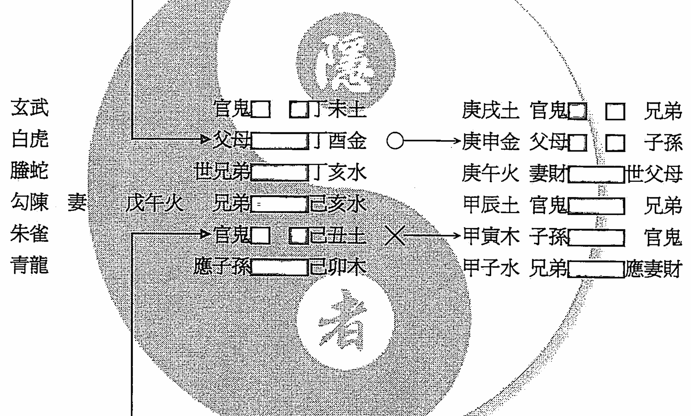

- 第二層次
    1、暫不論月日旺衰條件(旺衰爲量變之消長)。
    2、二爻朱雀官鬼丑土發動=屬於第二層次之爻。
    3、丑土官鬼可對同層次及第三層次爻作用：
        A、可生動爻酉金父母爻。
        B、動剋三、四爻之亥水兄弟。
        C、動沖上爻之未土官鬼。

### 圖例五：第二層次---變爻

占問人：女、27 歲、占該接受對方的告白嗎？

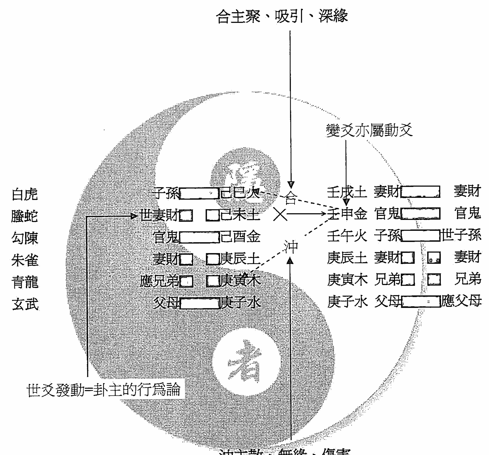

http://www.chanyi.url.tw/index.php
http://tw.myblog.yahoo.com/ifraises

### 圖例六：第二層次---暗動爻

占問人：男、31 歲、占與女網友見面吉凶？

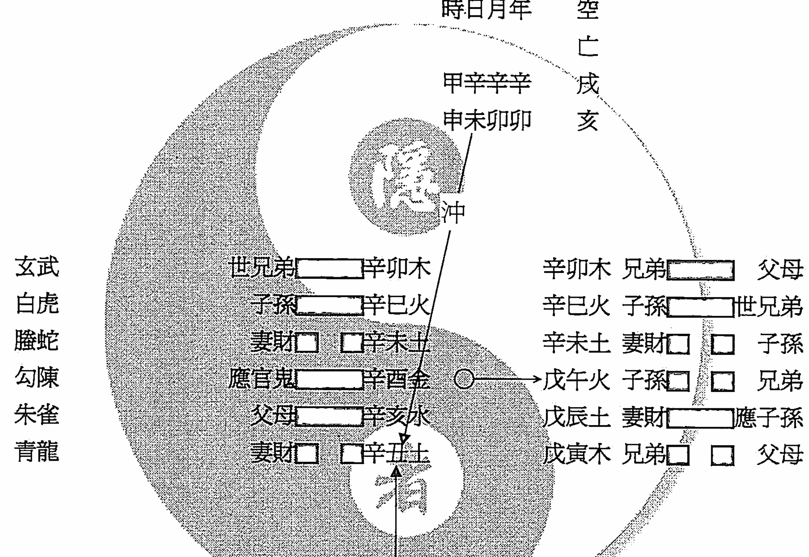

- 1、原卦初爻青龍妻財丑土為靜，屬於第三層次爻，但逢日辰比沖之為暗動（視同動爻論）。
- 2、丑土妻財因暗動則有權對其它爻產生作用力，但其作用力僅為一次性，時過則其力自然消失。
- 3、丑土妻財因暗動則升為第二層次之爻：
    A、能生應爻之勾陳酉金官鬼。
    B、能沖四爻之螣蛇未土妻財。
    C、能剋二爻之朱雀亥水父母。

### 圖例七：第二層次---出伏爻

占問人：男、34 歲、占調任新職務，未來發展？

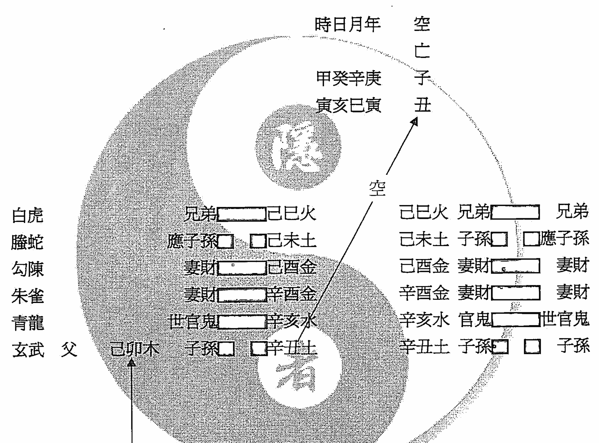

- 1、伏神玄武父母卯木，因飛神丑土子孫爻落入旬空，而自動出伏，晉升為第二層次之動爻。
- 2、卯木父母既提升為第二層次之動爻，則亦具有對它爻之生剋權力：
    A、可沖三四之雙酉金妻財爻。
    B、能剋應爻之螣蛇未土子孫爻。
    C、能生上爻之白虎巳火兄弟爻。

### 圖例八：第三層次---靜爻

占問人：女、28 歲、占與剛認識的男生會發展出戀情嗎？

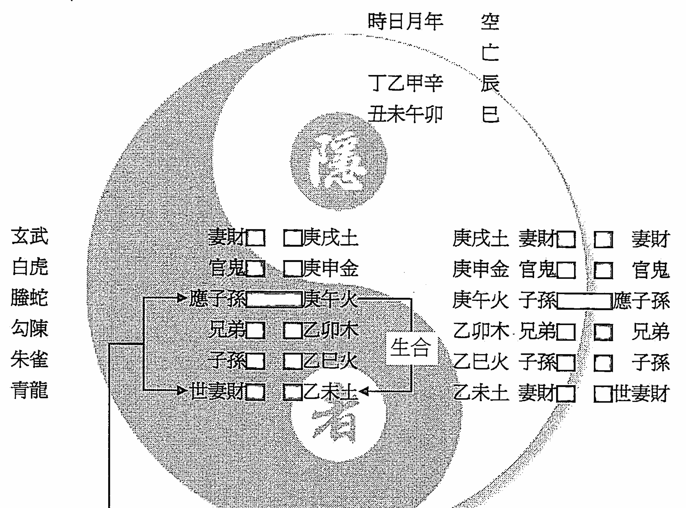

- 1、世爻與應爻均為靜爻，都屬於第三層次之爻，對它爻無實質的生剋力量。
- 2、應爻雖生合世爻，但僅為垂象論--有生之意，而無生之實，猶如現象的表達。
- 3、站在垂象而言應爻靜生合世爻，則其象義為：
    A、應持騰蛇子孫午火，值月旺居四爻---對方男生個性恬淡，自視而孤高。
    B、應持騰蛇子孫午火旺生世爻---對方男生喜歡卦主，內心欲想告白。
    C、應爻靜而不動，故不一定會有告白之舉，只是默默的散發情愫及好感。

### 圖例九：月日入卦

占問人：女、27 歲、占與主管發生爭執，會受到處份嗎？

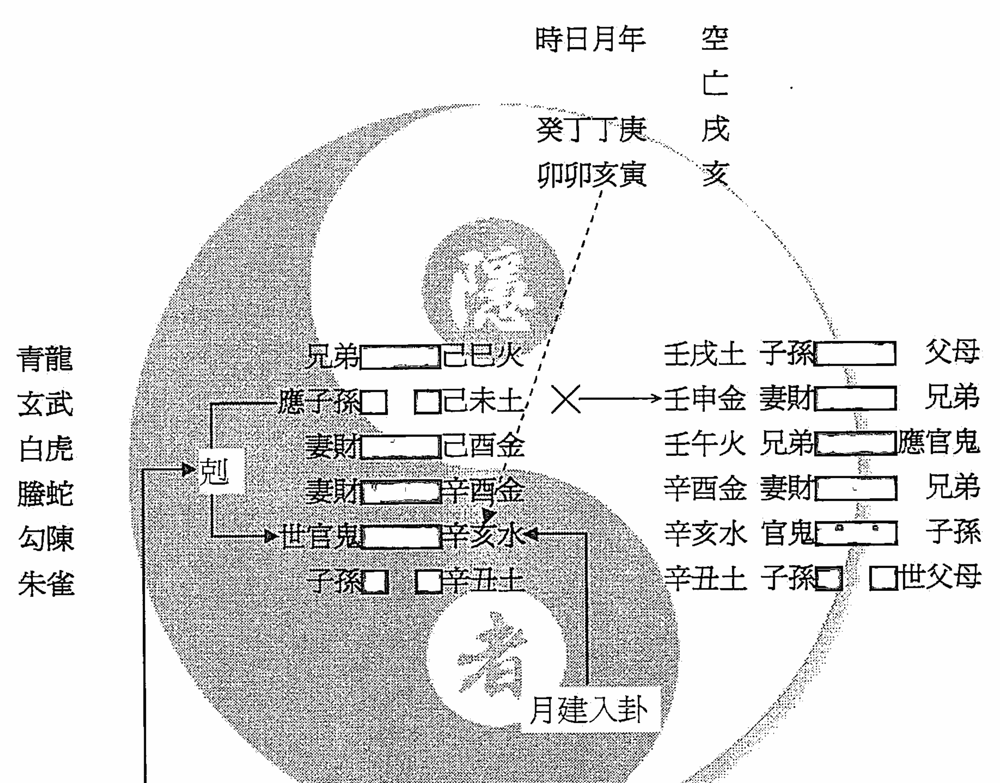

- 1、應爻持玄武子孫未土發動，屬於第二層次之爻，具有生剋第二、三層次爻的權力。
- 2、本卦應爻動剋第三層次之世爻勾陳亥水官鬼，則世爻官鬼必然受傷。
- 3、而世爻官鬼適持亥水與月建同支，謂之「月建入卦」。
- 4、世爻逢月建值臨，則與月建同旺，則它爻難以傷之，故世爻月內平安無恙。

# 第二章 本體論 & 相對論

### 第一節 概論：

陰陽兩儀的觀念可說是易學的核心，一切的演化均不脫此範圍，無限的衍生萬象表達世間百態，亦是其最具價值及可貴之處。
而陰陽觀念中，主要在於象徵「本體」和「相對」的兩種現象，若以人而言，在表明自身的狀態~本體論，以及所身處環境中人事物的互動對待關係~相對論。
故在六爻卦的分析斷解時，必須針對本體及相對的現象如實掌握，方能「全體觀照」卦象之義，以竟全功。

## 第二節 本體論：

一、理則：
本體論乃是站在任一主體”太極”點之當體而言，純粹由個別角色立場出發來觀察其自身的情況，且與它部或它爻無涉，僅止於自身條件及狀態的判別。

二、推論重點：
1、本卦之本體論--以本卦(不含變卦)之大象為主要觀察點。
2、世方之本體論--以世爻所居內卦或外卦，推論所屬八卦及三個爻支之狀態。
3、應方之本體論--以應爻所居內卦或外卦，推論所屬八卦及三個爻支之狀態。
4、世爻之本體論--解讀世爻(含六親、六獸、動變)之旺衰及變化象義。
5、應爻之本體論--解讀應爻(含六親、六獸、動變)之旺衰及變化象義。
6、旁爻之本體論--解讀旁爻(含六親、六獸、動變)之旺衰及變化象義。

三、太極三分法：
事有大小，故觀察太極亦有大、中、小之區分，藉由各自不同太極涵蓋面之信息範圍，進而區分事物的影響層面，依此推論得失、吉凶。
1、大太極--包含全卦象，信息涵蓋面最廣，屬多面向之解義。
2、中太極--兩儀分象法，區分彼我各自信息面，屬於相對論點。
3、小太極--單點象義法，獨立解義無吉凶，僅為現象狀態論。

四、分項卦例演示：
卦盤的變化錯綜複雜，不可能僅執於一法，故須深切體會各論的內在精神涵義，執萬法於一心，則必可達一法演萬象之境地。

僅就分論要項較具代表性的卦盤，分項解說之~

### 太極三分法圖示：

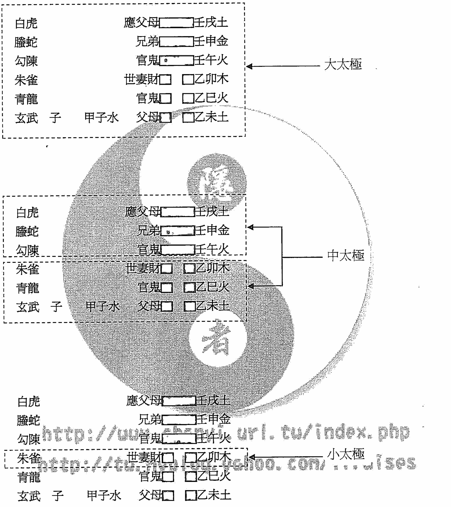

### 圖例 1：本卦之本體論

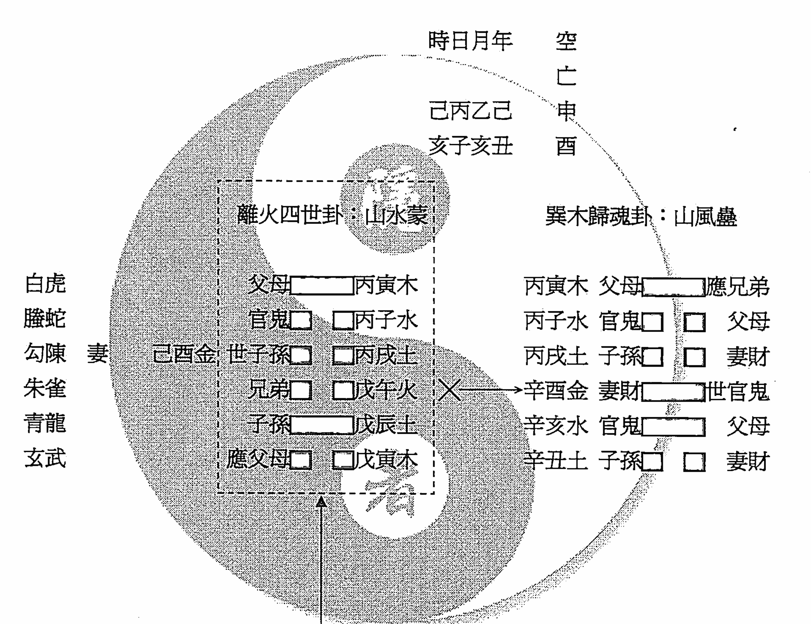

1、本卦卦名爲”山水蒙“--蒙昧不明之意(參考)。
2、父母爻包卦~初爻爲始、上爻爲終，均持父母，故知此事自始至終，操煩而辛勞。
3、妻財爻不上卦(暗伏)--與妻財爲用之事，先天存在著不足或隱憂。

### 圖例 2：世方之本體論

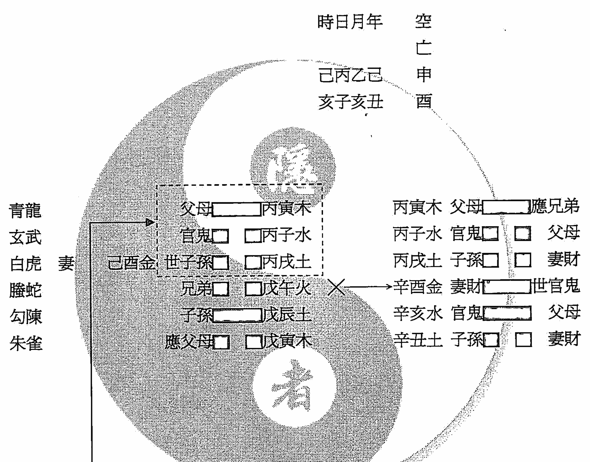

1、以世爻~白虎子孫戌土(伏酉財)本身狀態爲主要觀察點---自身狀態解。
2、世居外卦---具有“陽”性特質之象義解說。
3、世方之六親~青龍父母寅木+玄武官鬼子水=本身所處週遭環境中之人事物的親疏關係象。
4、世方所居卦宮---象徵觀察主題之”根基”~八卦廣象解。

### 圖例 3：應方之本體論

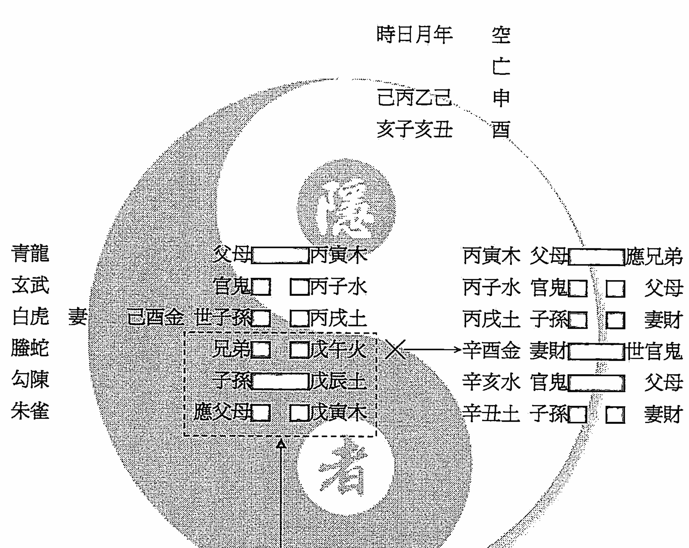

1、以應爻本身(朱雀父母寅木)狀態為主要觀察點---對方狀態解。
2、應居內卦---具有”陰“性特質之解說。
3、應方之六親~勾陳子孫辰土+騰蛇兄弟午火=對方所處週遭環境中之人事物的親疏關係象。
4、應方所居卦宮---象徵觀察主題之”根基”~八卦廣象解。

### 圖例 4：世爻之本體論

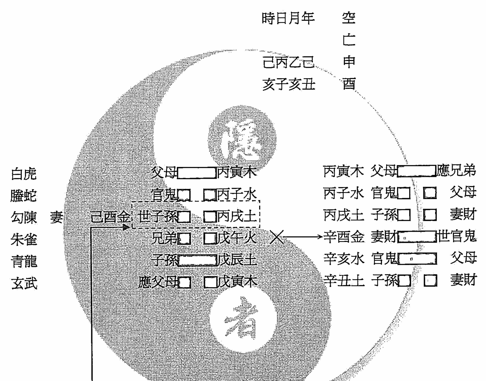

1、此為世爻單一象義解~包含伏神、變爻--世爻整體象解。
2、先天垂象解---世持六親+六獸=雙象解。(有伏神者，加入解說)
3、後天變化解---變爻之旺衰+變化後之旁氣、串象=歸宿解。

### 圖例 5：應爻之本體論

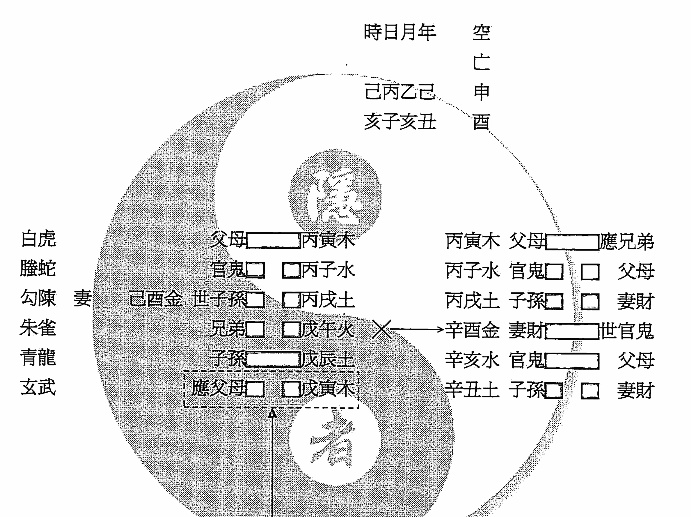

1、此為應爻單一象義解~包含伏神、變爻---應爻整體象解。
2、先天垂象解---應持六親+六獸=雙象解。(有伏神者，加入解說)
3、後天變化解---變爻之旺衰+變化後之旁氣、串象=歸宿解。

### 圖例 6：旁爻之本體論

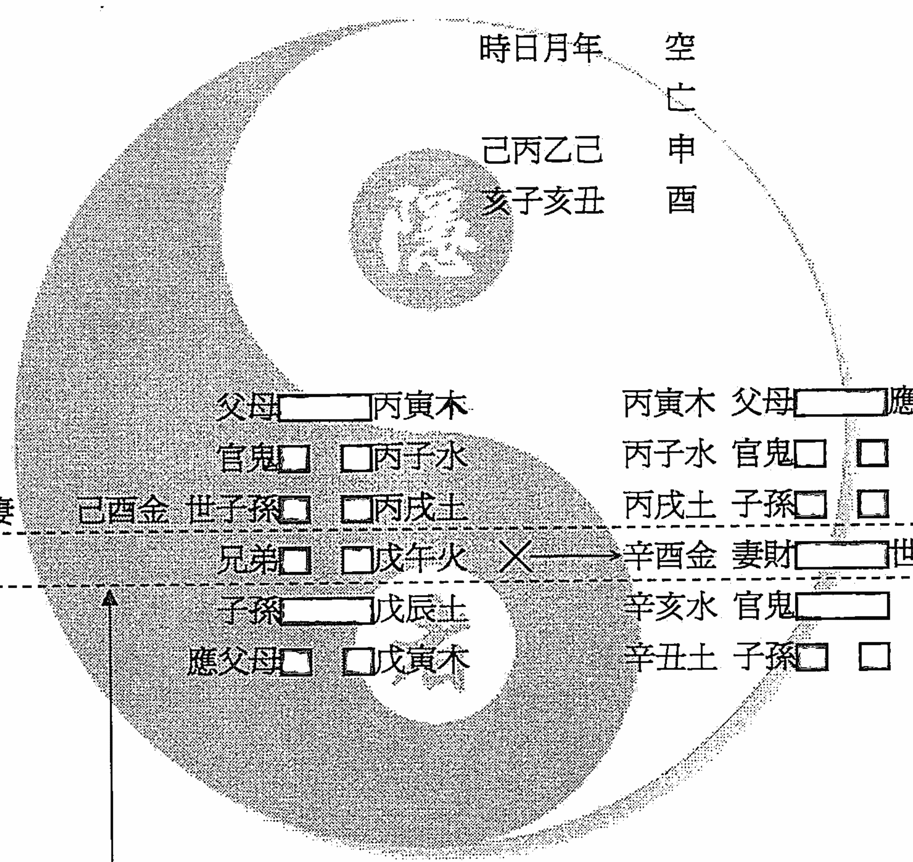

1、此為旁爻單一象義解~包含伏神、變爻--旁爻整體象解。
2、先天垂象解--旁爻持六親+六獸=雙象解。(有伏神者，加入解說)
3、後天變化解--變爻之旺衰+變化後之旁氣、串象=歸宿解。

## 第三節 相對論

一、概念：
相對論乃是以任一爻為觀察主體(太極點)，此爻與其它爻支產生相對作用力，進而影響整體卦義之吉凶者，此種爻與爻互動、對待關係謂之「相對論」。
相對論亦是建立在「陰陽對立」的觀點上，表徵人與人、人與事、人與物的對立狀態，並在對立的運動中產生損益條件，依其歸屬而判別占事之得失、吉凶。

二、推論要領：
1、構成相對論的條件，必須是與”我”(觀察主體)產生”利益”上的得或失，方符合此論。
2、代占時，凡與我同心、同進退、共利者，世爻為彼此的「共象」存在形式，不為相對論。

三、相對論的形態：
1、世應相對：
世應為先天預置設定系統，乃是恆不變之相對論，也是最重要的相對位。
2、世爻與旁爻相對：
世爻與他人、它事、它物之間的互動、對待關係。
3、應爻與旁爻相對：
應爻與他人、它事、它物之間的互動、對待關係。
4、旁爻與旁爻相對：
旁爻與他人、它事、它物之間的互動、對待關係。

四、月日的相對：
1、月建的相對論：
月建對於卦爻的相對作用，主要呈現於「運勢」上的旺衰週期指示。
2、日辰的相對論：
日辰對於卦爻的相對作用，主要呈現於「人事」上的變化現象指示。

五、分項卦例演示：
依相對論理則，就各分項卦盤演示圖例如下~

### 圖例 1：世爻與應爻之相對論

占問人：女、31 歲、占男友是否會回頭再來求和？

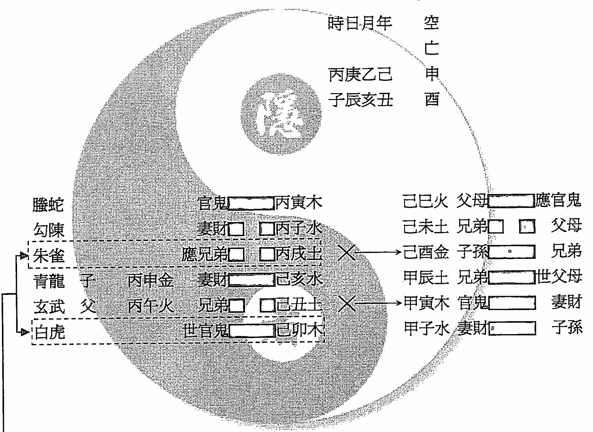

1、世爻持白虎官鬼卯木--旺衰+動靜=世爻之本體論。
2、應爻持朱雀兄弟戌土--旺衰+動靜=應爻之本體論。
3、(1+2)之間的生剋沖合=世爻與應爻之互動對待=即世應之相對論。

### 圖例 2：世爻與旁爻之相對論

占問人：女、30 歲、占公職考試能否順利上榜？

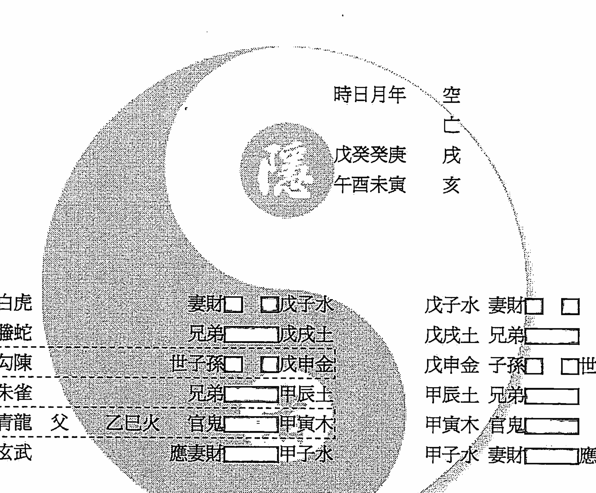

1、世爻持勾陳子孫申金---旺衰+動靜=世爻之本體論。
2、間爻持青龍官鬼寅木---旺衰+動靜=間爻之本體論。
3、(1+2)之間的生剋沖合=世爻與間爻之互動對待=即世爻與間爻之相對論。

### 圖例 3：應爻與旁爻之相對論

占問人：女、27 歲、占以何種方式告白較適合？

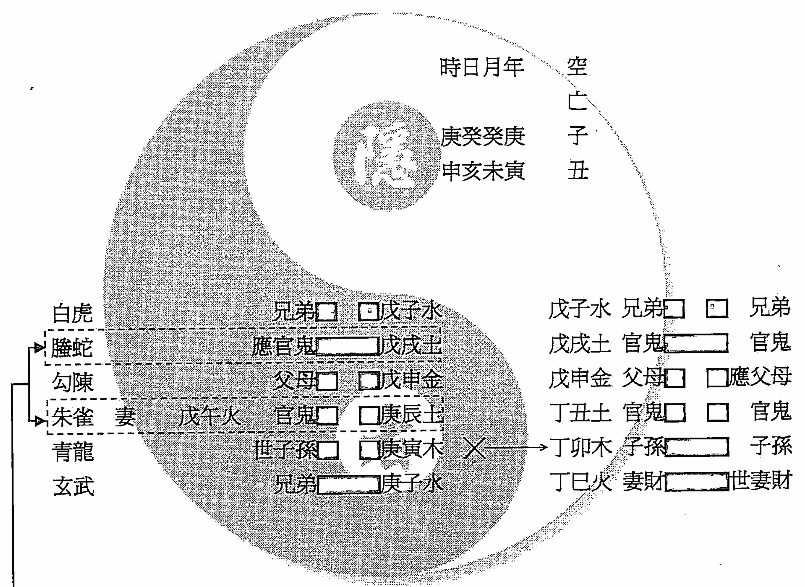

1、應爻持騰蛇官鬼戌土---旺衰+動靜=應爻之本體論。
2、間爻持朱雀官鬼辰土---旺衰+動靜=間爻之本體論。
3、(1+2)之間的生剋沖合=應爻與間爻之互動對待=即應爻與間爻之相對論。

### 圖例 4：旁爻與旁爻之相對論

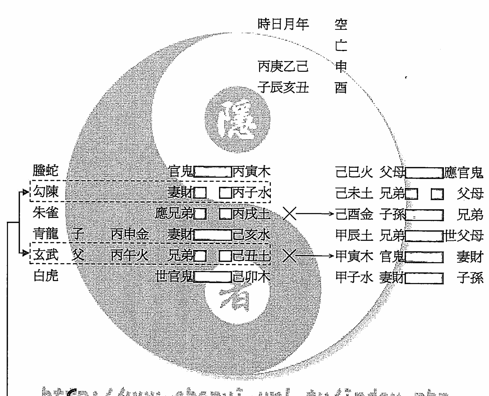

1、二爻玄武兄弟丑土--旺衰+動靜=二爻之本體論。
2、五爻勾陳妻財子水--旺衰+動靜=五爻之本體論。
3、(1+2)之間的生剋沖合=二爻與五爻之互動對待=即二爻與五爻之相對論。

### 圖例 5：月日與卦爻之相對論

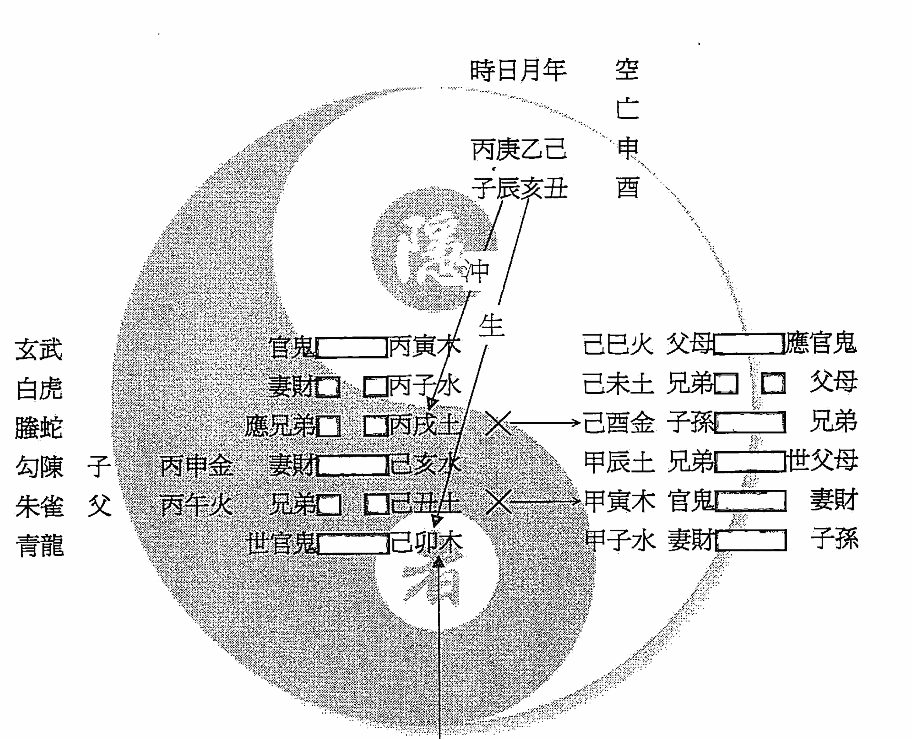

1、世爻受月建之生=表卦主現階段在環境中，正處於旺相運勢的週期。
2、應爻受日辰之沖=表在生活環境領域中，有人事上的認同問題。

## 第四節 運用要領

一、本體論：

1、依「一物一太極」的觀念，任一具有針對性的卦爻，都可因占事主題之直接或間接的影響關係而定為”用神”之一，此時即應先行觀察該爻本質狀態之旺衰優劣，方能推知其對整體卦象的影响作用，力大或是力微。
2、本體論乃是針對該爻所象徵的人事物本身的狀態，僅為”現象”的表達，而不表示吉凶。
3、本體論之太極觀：
A、大太極--整體卦象，包含四令、本卦、卦宮、六親、六獸、伏神...等。
B、中太極--依”陰陽分用”原則，區分為內卦、外卦而作各自推論。
C、小太極—以各爻支之本身為主體(含同爻位之六親、六獸、動變、伏神)的推論。

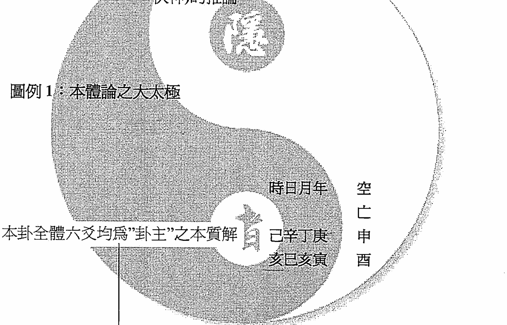

| 玄武 | 兄弟 | 壬戌土 | 壬戌土 | 兄弟 | 子孫 |
|---|---|---|---|---|---|
| 白虎 | 妻財 | 世 | 壬申金 | 壬申金 | 子孫 | 妻財 |
| 螣蛇 | 父母 | 壬午火 | 壬午火 | 父母 | 世兄弟 |
| 勾陳 | 兄弟 | 丁丑土 | 戊午火 | 父母 | 兄弟 |
| 朱雀 | 官鬼 | 應 | 丁卯木 | 戊辰土 | 兄弟 | 子孫 |
| 青龍 | 父母 | 丁巳火 | ○——>戊寅木 | 官鬼 | 應父母 |

### 圖例 2：本體論之中太極

時日月年 空亡
己辛丁庚 申
亥巳亥寅 酉

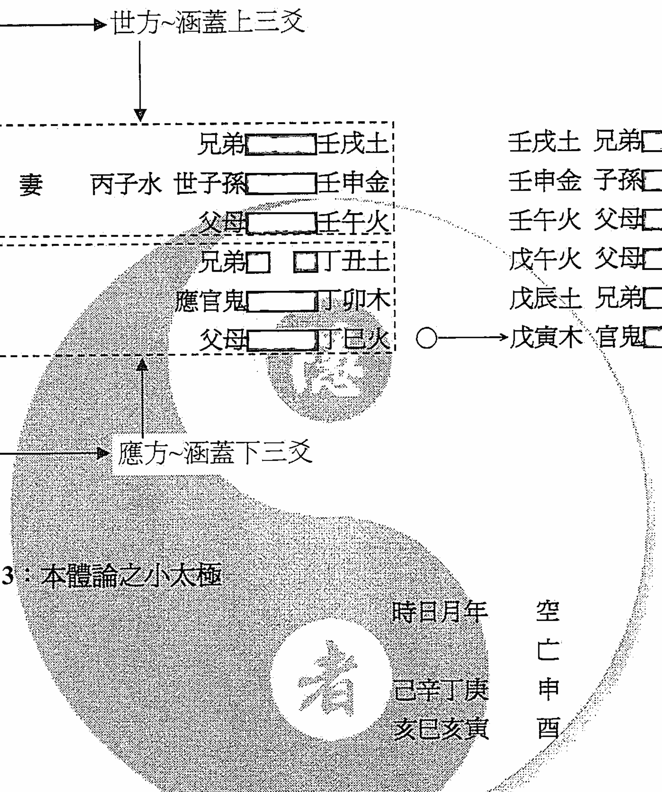

世方~涵蓋上三爻

相對論

玄武 兄弟 壬戌土
白虎 妻財 世 子孫 壬申金
騰蛇 父母 壬午火
勾陳 兄弟 丁丑土
朱雀 官鬼 應 丁卯木
青龍 父母 丁巳火

壬戌土 兄弟 子孫
壬申金 子孫 妻財
壬午火 父母 世兄弟
戊午火 父母 兄弟
戊辰土 兄弟 子孫
戊寅木 官鬼 應父母

應方~涵蓋下三爻

### 圖例 3：本體論之小太極

時日月年 空亡
己辛丁庚 申
亥巳亥寅 酉

玄武 兄弟 壬戌土
白虎 妻財 世 子孫 壬申金
騰蛇 父母 壬午火
勾陳 兄弟 丁丑土
朱雀 官鬼 應 丁卯木
青龍 父母 丁巳火

壬戌土 兄弟 子孫
壬申金 子孫 妻財
壬午火 父母 世兄弟
戊午火 父母 兄弟
戊辰土 兄弟 子孫
戊寅木 官鬼 應父母

1、僅論本爻之主體象---重心在”我”。
2、以本爻立太極與它爻較量，則成我與他之「相對論」。

二、相對論：

1、以某爻爲太極點爲主體，再與它爻(客體)所產生之生剋沖合的關係式，即爲兩爻之間的相對論。
2、凡具有生剋權力的卦爻，都可與它爻進行相對論較量，並評估其得失、吉凶。
3、相對論的形態：
A、人與人相對--主要表徵人我之間的互動、對待關係，及情緣之聚散。
B、人與事相對--主要表徵我(或他)與事之間的興衰、成敗。
C、人與物相對--主要表徵物的歸宿，該物由何人所得或失。

### 圖例 1：人與人之相對

占問人：女、30歲、占感情發展？

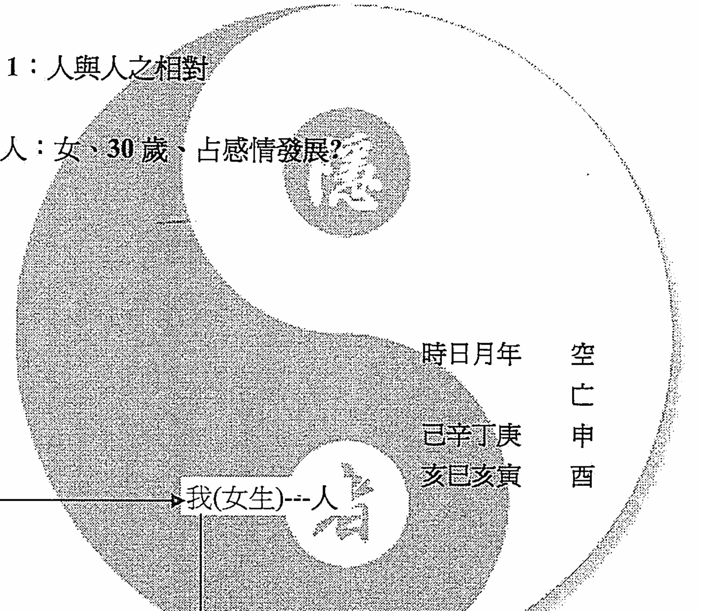

| 時日月年 | 空亡 |
|---|---|
| 巳辛丁庚 | 申 |
| 亥巳亥寅 | 酉 |

我(女生)---人

| 六神 | 六親 | 世應 | 卦爻 | 變爻 | 六親 | 世應 |
|---|---|---|---|---|---|---|
| 玄武 | 兄弟 | | 壬戌土 | 壬戌土 | 兄弟 | 子孫 |
| 白虎 | 妻財 | 世 | 壬申金 | 壬申金 | 子孫 | 妻財 |
| 螣蛇 | 父母 | | 壬午火 | 壬午火 | 父母 | 世兄弟 |
| 勾陳 | 兄弟 | | 丁丑土 | 戊午火 | 父母 | 兄弟 |
| 朱雀 | 官鬼 | 應 | 丁卯木 | 戊辰土 | 兄弟 | 子孫 |
| 青龍 | 父母 | | 丁巳火 | 戊寅木 | 官鬼 | 應父母 |

對方(男生)---人

### 圖例 2：人與事之相對

占問人：男、33 歲、占事業吉凶？

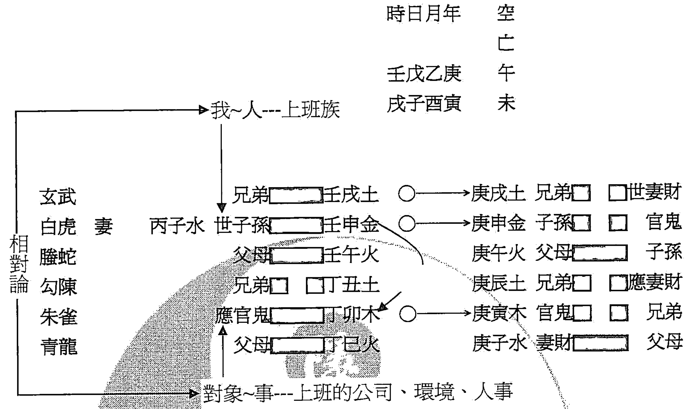

### 圖例 3：人與物之相對

占問人：男、38 歲、占合夥財利？

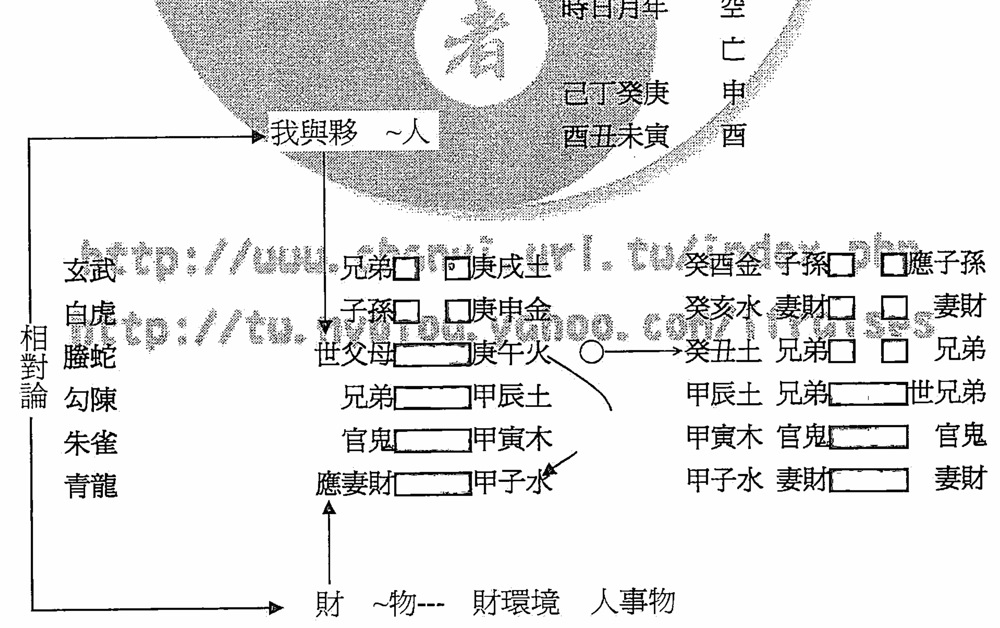

# 第三章 用神專論

### 第一節 概論：

正確的選取用神，是提高六爻預測準確率的關鍵核心，而「用神」就是斷卦時所針對之標的--人象、事象、物象角色定位的確立行爲。

## 第二節 理則：

一、「用神」即使用之神也，亦具作用、功能、類比、象徵之意。
二、六親~父母、兄弟、子孫、妻財、官鬼，乃是依社會人倫關係而設定之角色，也是用神定位之本源，故首先須知六親分類象的指代精神涵義：
1、父母爻--凡具保護、庇祐、教育之性質者均屬之。
2、兄弟爻--凡具動態、競爭、團結、破壞者均屬之。
3、子孫爻--凡具思維、感性、解憂、醫療者均屬之。
4、妻財爻--凡具女性特質、實際利益、財物者均屬之。
5、官鬼爻--凡具男性特質、權力、傷病災者均屬之。

### 三、用神區分：

1、人象：
依占問主題範圍，界定可能出現的相關人物，不論其旺衰、動靜、有用或無用，但凡出現者必有存在之義，故均應先定其象，以決定事件之參予人物。
2、事象：
世間萬象叢生，依個人之主客觀條件而有所差異，占事的形態亦大相逕庭，勢須憑占者所提供之資訊，配合六親類化象，以定事件的形態和發展。
3、物象：
物體(質)爲靜態並無自主能力，乃是隨人而變，故須先行判斷物象之歸屬，方能據物象之演變至最終歸宿而定吉凶。

## 第三節 用神定象五大原則

### 一、禪易六爻用神定象概念：

1、爲實踐易之廣度及簡易原則，並因應當前之多元社會現象，「一卦多斷」的技術自然應運而生，且漸趨成熟，故學者須具「整體用神」、「一神多用」的認知觀念，方不致受限於”既定思維”的束縛，能多面向充分發揮解卦的技術、技巧，落實於六爻卦解斷之中。
2、「方以類聚，物以群分」乃是選取用神的重要觀念，凡具有「同質性」之人、事、物均可依所類屬之六親指代，予以辨別之。

### 二、用神定象法：

1、對象--須先行建立「針對性」之特定目標，以釐清方向。
2、三象區分---須依「人象、事象、物象」確實劃分清楚，以防混淆。
3、單現、多現---單現者，用神單純固定，多現者則須依五大原則定象。
4、吉凶---選取用神時，宜保持客觀(或直觀)，並不表示吉凶。
5、變化---用神如落入變爻，亦暫不論其生剋變化，依「辨相」法捕捉信息即可。

### 三、用神定象五大原則：

1、用正---以選取對象之「正位」為其所居之處，乃是第一優先選擇。
2、用變---依正位所衍化出之變位者，為第二次序之選擇。
3、用串---凡不具上述兩項條件者，依與正位有構成串象者，為第三次序選擇。
4、用方---如都不具備前三項者，依兩儀分用原則視用神所在之歸屬，為第四次序選擇。
5、用相---凡依前述四項而仍無法選定者，則依「辨相」法則進行選取用神。

## 第四節 用神法應用圖說：

### 圖例 1：第一理則---用正

占問人：男、28歲、占向女友求婚，她會答應嗎？

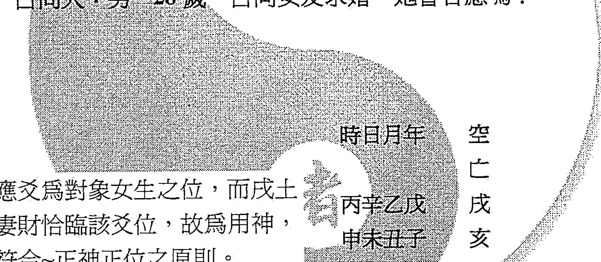

應爻為對象女生之位，而戌土妻財恰臨該爻位，故為用神，符合~正神正位之原則。

| 時 | 日 | 月 | 年 | 空亡 |
|---|---|---|---|---|
| 丙 | 辛 | 乙 | 戊 | 戌 |
| 申 | 未 | 丑 | 子 | 亥 |

| 六神 | 六親 | 世應 | 爻辭 | 納甲 | 六親 | 世應 |
|---|---|---|---|---|---|---|
| 螣蛇 | 應妻財 | □ | □庚戌土 | 庚戌土 | 妻財 | □ 應妻財 |
| 勾陳 | 官鬼 | □ | □庚申金 | 庚申金 | 官鬼 | □ 官鬼 |
| 朱雀 | 子孫 | □ | □庚午火 | 庚午火 | 子孫 | □ 子孫 |
| 青龍 | 世官鬼 | □ | □辛酉金 | 辛酉金 | 官鬼 | □ 世官鬼 |
| 玄武 | 兄弟 | 父母 | □辛亥水 | 辛亥水 | 父母 | □ 父母 |
| 白虎 | 妻財 | □ | □辛丑土 | 辛丑土 | 妻財 | □ 妻財 |

卦主(男生)

其她女生

### 圖例 2：第二理則---用變

占問人：女、32 歲、占什麼時候可以跟這個男的關係更進一步？

| 時日月年 | 空亡 |
|---|---|
| 乙丙庚戊 | 辰 |
| 未申申子 | 巳 |

卦主(女生)之用神

| 六神 | 卦主(女生)之用神 | 變卦 | 變爻 |
|---|---|---|---|
| 青龍 | 官鬼□□辛卯木 | 丙寅木 官鬼□□ | 父母 |
| 玄武 | 妻財 丙子水 父母□□辛巳火 ○→ | 丙子水 妻財□□ | 官鬼 |
| 白虎 | 世兄弟□□辛未土 | 丙戌土 兄弟□□ | 世子孫 |
| 螣蛇 | 子孫 丙申金 兄弟□□丁丑土 | 戊午火 父母□□ | 兄弟 |
| 勾陳 | 官鬼□□丁卯木 | 戊辰土 兄弟□□ | 子孫 |
| 朱雀 | 應父母□□丁巳火 ○→ | 戊寅木 官鬼□□ | 應父母 |

應爻為對象男生之位，其所變之爻亦屬之，故寅官即為對方之用神---用神變位之原則。

### 圖例 3：第三理則---用串

占問人：男、31 歲、占跟女友的未來發展如何？

| 時日月年 | 空亡 |
|---|---|
| 甲癸乙戊 | 戌 |
| 子酉丑子 | 亥 |

對方女友之位

女友之用神

| 六神 | 對方女友之位 | 變卦 | 女友之用神 |
|---|---|---|---|
| 白虎 | 應兄弟□□己巳火 ←串→ | 壬戌土 子孫□□ | 子孫 |
| 螣蛇 | 子孫□□己未土 ×→ | 壬申金 妻財□□ | 妻財 |
| 勾陳 | 妻財□□己酉金 ← | 壬午火 兄弟□□ | 世兄弟 |
| 朱雀 | 官鬼 己亥水 世兄弟□□戊午火 | 戊午火 兄弟□□ | 兄弟 |
| 青龍 | 子孫□□戊辰土 | 戊辰土 子孫□□ | 子孫 |
| 玄武 | 父母□□戊寅木 | 戊寅木 父母□□ | 應父母 |

卦主本人的用神

其他的女生

### 圖例 4：第四理則---用方

占問人：女、34 歲、占跟分手的男友還有機會在一起嗎？

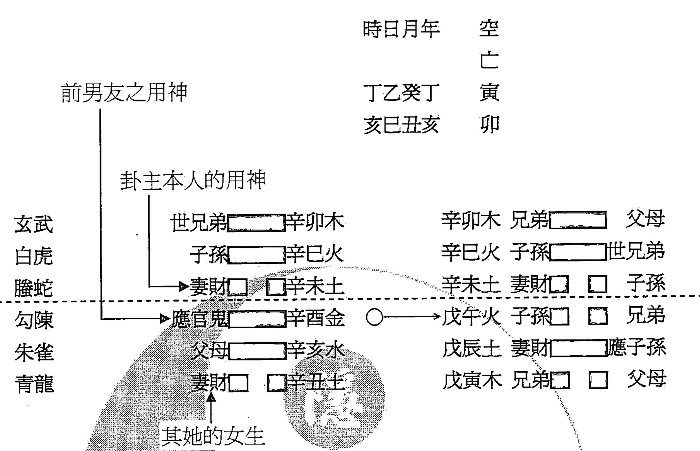

### 圖例 5：第五理則—用相

占問人：男、28 歲、占與喜歡的人有緣分嗎？

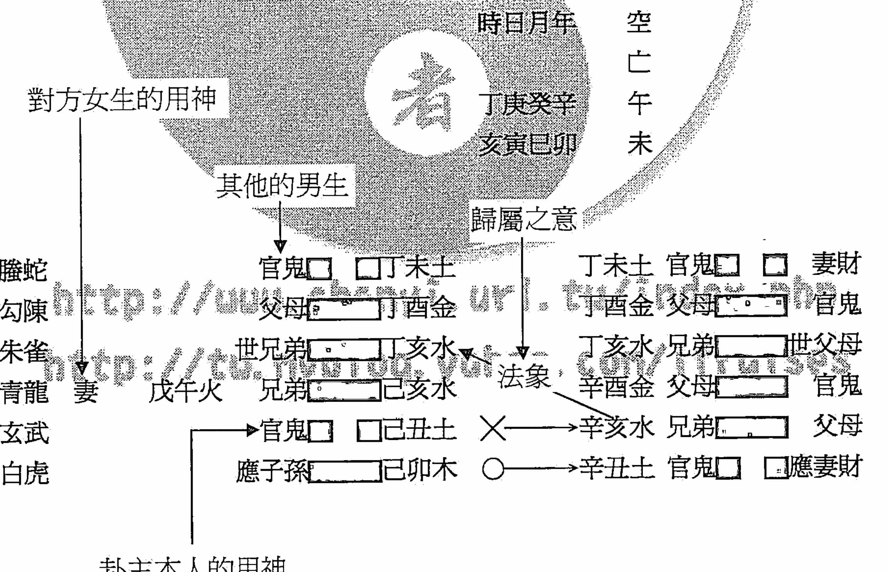

# 貳~象法篇

# 第一章 六親象專論

### 第一節 概論：

六爻卦斷解核心即在六親之象，所有演化之象義均由此逐步推導而出，六親在卦中主要功能乃是「角色扮演」之彰顯，亦是六爻卦捕捉「用神」定位之大用，捨此則萬象無以爲憑。

## 第二節 六親類別：(依占問標的)

- 一、父母爻：
1、在人而言--父母、與父母同輩之親友、師長、部門主管、老闆、資深前輩。
2、在事而言--訊息、文書、公文類、契約、承諾、人生觀、理性、辛勞、操煩。
3、在物而言--屋宅、衣物類、證照類、學經歷、交通工具、職場所、建築物。

- 二、兄弟爻：
1、在人而言--兄弟、姊妹、同學、同事、朋友、合作人、結盟者。
2、在事而言--劫財、競爭、團隊、消費行爲、口舌是非、拆解。
3、在物而言--生產線、電梯、開關、假牙、義肢、拐杖、助聽器。

- 三、子孫爻：
1、在人而言--子女、晚輩、學生、部屬、客戶、律師、軍人、修行者。
2、在事而言--情愫、告白、感性、企劃、人脈、專技、願望、夢想。
3、在物而言--藥品、補品、娛樂器材、玩具、寵物、小飾品。

- 四、妻財爻：
1、在人而言--妻子、女友、情人、孕婦、員工、僱傭、廣義的女人。
2、在事而言--金錢支用、交易行爲、資源、消費能力、飲食、道理。
3、在物而言--金錢、財產、貴重物、資金、薪資、貨物、聘金、嫁妝。

- 五、官鬼爻：
1、在人而言--丈夫、男友、情人、上司、管理層、仲介、法官、鬼神。
2、在事而言--職稱、管理、官司、名望、考運、名額、傷病、災難。
3、在物而言--公家機構、辦公室、警察局、客廳、法院、亂葬崗。

## 第三節 六親分項涵義圖：

### 一、父母爻涵義圖：

| 精 義 | 保護之神、服務之神、教化之神、勞碌之神。 |
|---|---|
| 心性特質 | 養育、庇護、照顧、包容、培育、心靈、精神、奉獻、犧牲、理性。 |
| 人物指代 | 父母、養父母、長輩、師長、伯叔、姑姨、介紹人、主婚人、主管、上司、雇主、上班族、資深人員、上游廠商、上線、泛指年齡較長者。 |
| 形象表徵 | 事之頭緒、家庭、名氣、品牌、傳統、保守、含蓄、耐心、穩重、老成、修養、學識、人生觀、價值觀、感情瓶頸、看屋人氣指數。 |
| 行 為 | 學習、進修、信仰、關照、教誨、勞累、勤快、用功、刻板、固執、嘮叨、學歷、資格、工作、事業、婚約、消息、通訊、建築、工程、法會、儀式、法術、事業心強、工作認真、具備經驗、客戶短缺、想要成家、不喜小孩、服藥無效、剋子難產。 |
| 物體(件) | 文書、公文、人事命令、文宣廣告、書報類、郵件、契約、文憑、執照、結婚證書、論文報告、考試成績、業績、考績、通知單、申請書、傳票、罰單、票據、帳本、發票、借據、抵押貸款、股票、有價證卷、提款卡、訴狀、不動產、房屋、地基、墳墓、車輛、船、飛機、行李、衣服、皮包、雨具。 |
| 場 所 | 學校、補習班、公司、服務單位、營業處所、宅舍、店面、醫院、橋樑、廟宇、教堂、文教單位、宗教單位、慈善機構、國家各類局(院、所)等等。 |
| 人 體 | 頭部、面部五官、體力。 |
| 大自然 | 雨、雪。 |

### 二、兄弟爻涵義圖：

| 精 義 | 劫財星、耗財星、是非星、破壞之神。 |
|---|---|
| 心性特質 | 主眾、多數、分(拆)解、結盟、攻擊性、控制慾、競爭。 |
| 人物指代 | 兄弟、姐妹、平輩親友、師兄弟姐妹、同事、朋友、同學、合夥人、股東、外圍者、仲介人、介紹人、競爭同業、參賽者、黑社會。 |
| 形象表徵 | 主雙、多數、團隊、是非、破財、競爭、行動力、喜自由求財心切、不願受制約、自尊心強、人際關係、朋友意見、剋妻分離。 |
| 行 為 | 率性、魯莽、急躁、衝動、說謊、炫耀、爭執、掠奪、賭博、分手、害喜、殺價、好面子、好玩樂、喜熱鬧、生產線、成本支出、交友廣闊、交際應酬、逢場作戲、花費無制、存不了錢、固執己見、心浮氣躁、我行我素、口舌是非、工作不認真、食慾不佳、消化不良。 |
| 物體(件) | 義肢、假牙、助聽器、扶手、拐杖、電梯、開關、運動器具。 |
| 場 所 | 體育館、競技場所、按摩院、賭場、門、窗戶、廁所。 |
| 人 體 | 手、足、四肢。 |
| 大自然 | 風、雲。 |

### 三、子孫爻涵義圖：

| 精 義 | 福神、喜悅之神、戀愛星、娛樂星、協調星。 |
|---|---|
| 心性特質 | 敏銳、發揮、表現、付予、排泄、流放、投注力、叛逆性、新鮮感、感性。 |
| 人物指代 | 兒女、晚輩、部屬、門徒、學生、軍人、警察、律師、調解人、顧客、生意人(商)、員工、客源、下線、醫生、影歌星、出家人、修行人、寵物。 |
| 形象表徵 | 魁官(制官司)、專業技能、滋生情愫、自由戀愛、不願成家、財源、企畫、產品、人脈、離職、退休、情緒、宗教信仰、瑣碎、夢想、願望、福報。 |
| 行 為 | 幼稚任性、反應敏捷、不受拘束、不守常規、具創意、樂觀、反邏輯、富變化、誇大、主觀、好勝、炫耀、清閒、好玩樂、喜談戀愛、交友聚會、情感告白、性生活、放縱、溝通協調、表達能力、接洽談判、頂撞上司、著作發表、演說、繪畫、藝術創作、好逸惡勞、尋歡作樂、唱歌跳舞、休閒旅遊。 |
| 物體(件) | 藥品、補品、零食、娛樂器具、玩具、寵物、小巧物。 |
| 場 所 | 警察局、畜牧場、遊樂場所、公園、動物園、劇院、電影院、歌廳、卡拉OK、酒店、色情場所、道路、走廊。 |
| 人 體 | 乳房、血管、血液、毛孔、生殖器、尿液、排泄物、精子。 |
| 大自然 | 日、月、星、辰、晴天。 |

### 四、妻財爻涵義圖：

| 精 義 | 妻星、財星、我所擁用者、我掌控者、我所支配或驅使者。 |
|---|---|
| 心性特質 | 慾望濃厚、重視利益、重視物質、追求功名、較缺乏文化素養。 |
| 人物指代 | 妻子、未婚妻、情人、女友、戀愛對象、婦人、傭人、屬下、工人、保姆、職員、隨從、孕婦、亦表廣義上的女人。 |
| 形象表徵 | 金錢支用、生活開銷、公司營利、資源分配、銷售、消費能力指標、飲食、道理。 |
| 行 為 | 現實、實際、投資、交易、經濟往來、求財行為、錢財得失、花錢買官、奉承長官、賄賂、婆媳問題(發動)、金錢支用行為(發動)。 |
| 物體(件) | 金錢、財產、金銀珠寶、貴重物品、肉體(女)、食物、器皿、存款、薪資、福利、利潤、酬勞、資金、貨物、本錢、價格、聘金、嫁妝。 |
| 場 所 | 銀行、金融機構、餐廳、廚房、爐灶、倉庫、宅氣。 |
| 人 體 | 血液、眼淚、汗水、乳汁、鼻涕、輸精管(男)、輸卵管(女)。 |
| 大自然 | 晴天。 |

### 五、官鬼爻涵義圖：

| 精 義 | 禍害之神、邪祟之神、傷病星、災難星。 |
|---|---|
| 心性特質 | 自律、規則、名譽、地位、權勢、管理、壓力、憂慮、煞氣。 |
| 人物指代 | 丈夫、未婚夫、情夫、男友、廣義上的男人、公務員、官職(員)、老闆、上司、管理者仲介、法官、主考官、警察、黑道份子、罪犯、屍體、鬼神、問卦(命)之顧客。 |
| 形象表徵 | 職位、職稱、制度、規章、權力、名譽、升遷、壓力、表揚、獎勵、考運、名額、名次、審核、災禍、麻煩、阻礙、陷阱騙局、牢獄之災、怪異虛驚、煞氣邪祟。 |
| 行 為 | 不善表達、嚴肅、成熟、穩重、適應力強、雄心壯志、責任感、深藏不露、陰險歹毒、官司訴訟、口舌是非、狡猾、驚嚇、憂疑、邪穢纏身。 |
| 物體(件) | 官方政策、法律規章、公司章程、公會、獎狀、兇器。 |
| 場 所 | 公家機構、司法部、法院、警察局、刑事現場、刑場、客廳、事業單位、色情場所、亂葬崗。 |
| 人 體 | 病因、病灶、疾病、患部、死者、靈體。 |
| 大自然 | 雷、電、霧、煙、自然天災。 |

## 第四節 六親定位原理：

一、六親之角色定位乃是建立在與「占問人」的相對關係而言，卦象中所涵蓋之人事物均始終不脫此範疇，也就是以(占問人=我=太極點)，而其他參與之人事物乃是與我之相對應關係，圍繞此太極點而成立。詳如下列圖示及圖例解說：

六親定位原理示意圖：

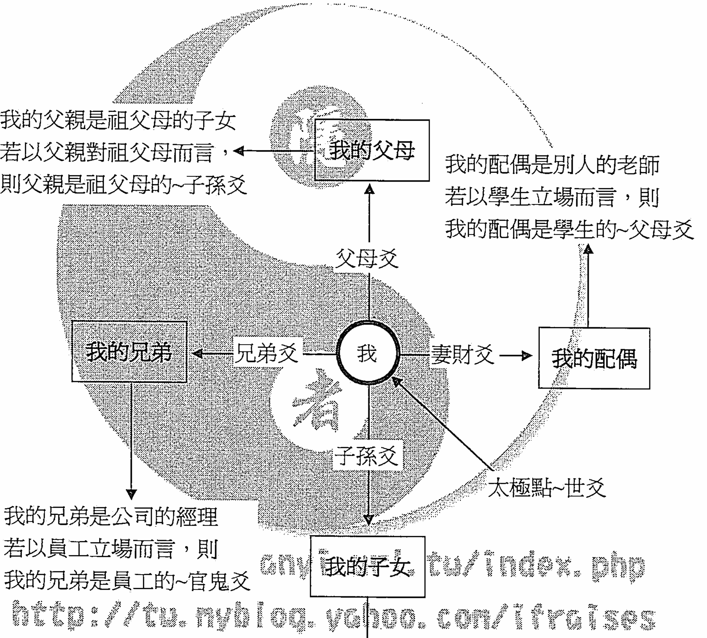

### 圖例 1：

占問人：女、28 歲、占雙親住南部，平安否？

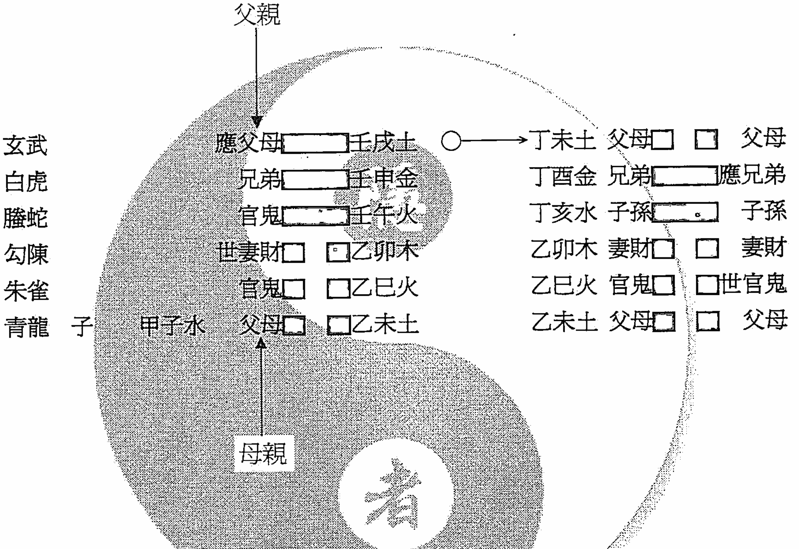

- 1、此例卦問~父母親之平安，故主用神為~父母爻。
2、父母爻雙現於內外卦，分別代表父親與母親。
3、內卦初爻未土父母爻居陰卦(坤)、陰支(未)、陰爻(▅▅ ▅▅)，表母親。
4、外卦上爻戌土父母爻居陽卦(乾)、陽支(戌)、陽爻(▅▅▅▅▅)，表父親。
5、在人物的定象，宜留意陰陽的屬性。

### 圖例 2：

占問人：男、32 歲、占到任新工作一個月，未來發展吉凶？

- 1、應爻爲世爻之相對論，故表公司。
2、應持朱雀巳火官鬼，在人爲長官、上司，在事而言爲公司之管理制度。
3、應爻靜生世爻，表垂象上對世爻有利作正面解。

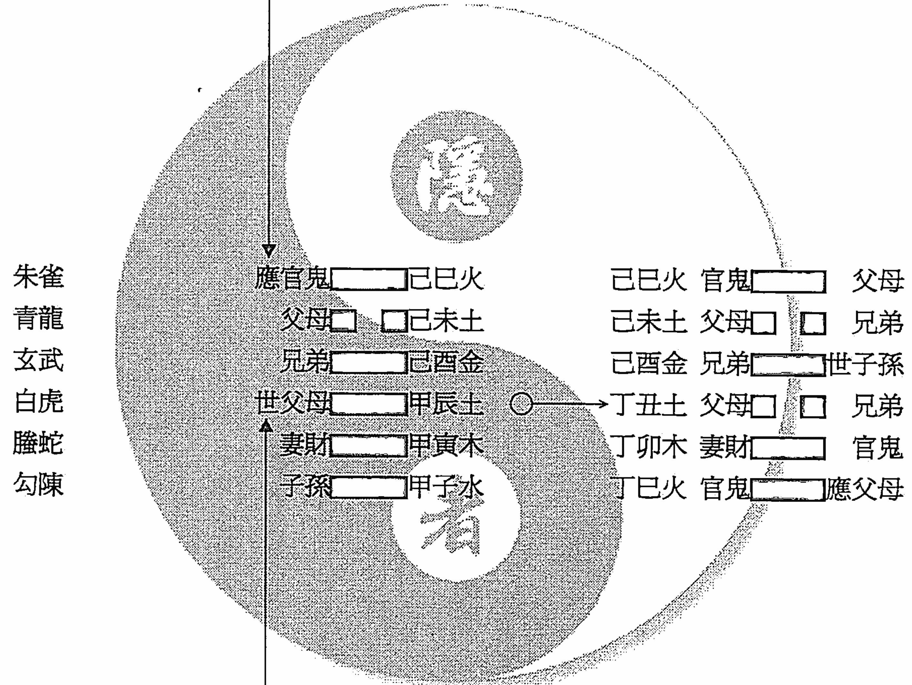

- 1、世爻表示卦主，持白虎父母，表勞心努力，有體力透支而衰退之象。
2、世爻發動表積極，所持辰土父母，表自己所任職之單位部門及主管。
3、世爻辰土父母化丑土父母爲化退，在事解---未來部門會縮編或裁員。

### 圖例3：

占問人：男、30 歲、占與喜歡的女同事，能發展出戀情嗎？

- 1、世爻持父母發動，表卦主工作積極且忙碌，化退神則會逐漸舒緩。
2、父母爻主學經歷，世居上爻，表自視高同時可能具有較高的學歷。

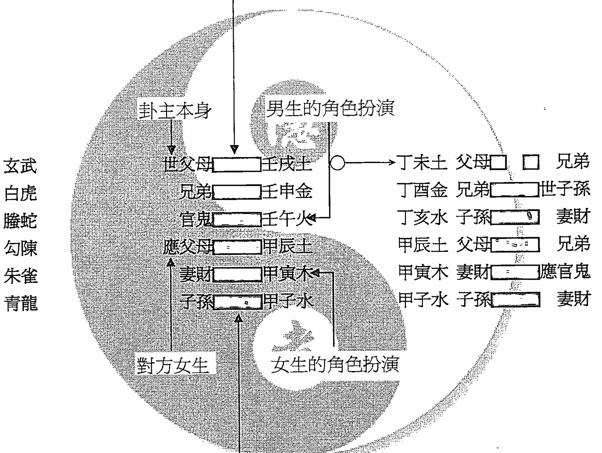

- 1、世應皆持父母爻，表雙方都重視工作、家庭，同時也都工作認真、勞碌。
2、父母爻必剋子孫爻，故凡持父母爻者，都不善於表達情感，較為內斂。
3、父母爻主理念、價值觀，世應互沖則表示雙方的思想、觀念差異大，較難溝通。
4、父母爻表單位部門，世應各持父母爻又相沖，故可知雙方分屬不同部門的同事關係。

二、六親的定位，須依照求占者的「占問主題」事項而釐定，不論卦象中的人事物均憑此主題，據以推導出相應之六親象，並依此六親與世爻及它爻的生剋關係，表達其存在之象義解說(有情或無情論)。詳如下列圖示及圖例解說：

圖示：男占~與女友的感情發展？

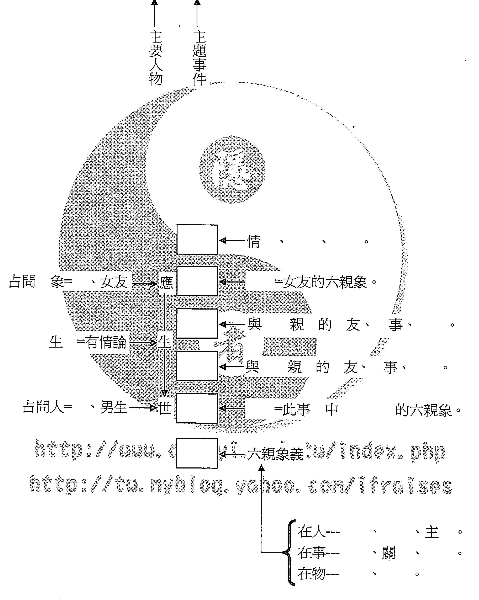

### 圖例 1：

占問人：女、34 歲、占求職獲得面試機會，能否入取？

- 1、該公司在業界應屬有名氣且高營業額的企業。
2、面試官可能是女性，善言且重視實際利益者。

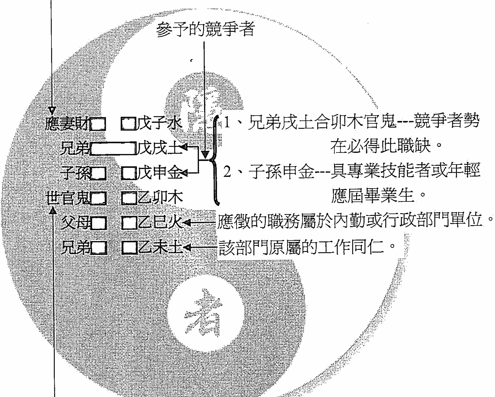

- 1、兄弟戊土合卯木官鬼---競爭者勢在必得此職缺。
2、子孫申金---具專業技能者或年輕應屆畢業生。

應徵的職務屬於內勤或行政部門單位。

該部門原屬的工作同仁。

- 1、卦主急於求得此一工作機會，內心壓力頗大。
2、本身自律甚嚴，較不苟言笑。
3、對於工作職場，曾經有不好的過往經驗(白虎主傷)。

### 圖例 2：

占問人：男、32 歲、占財產繼承權的官司勝負？

- 1、應持妻財居五爻，態度傲慢且必與錢財有關，持玄武生世~恐有詐。
2、持財者一般較為現實主義者，大都以實際利益為依歸，屬財大氣粗之人。

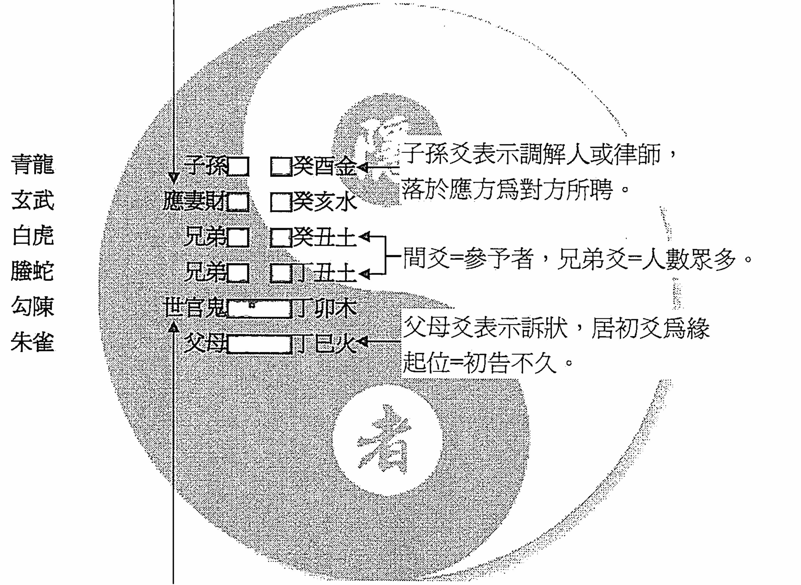

- 1、世爻為卦主，官鬼表官司，勾陳表纏身=卦主官司纏身。
2、世持官鬼居二爻，表官司目前進行到~地方簡易法庭或調解委員會。

### 圖例 3：

占問人：女、29 歲、占男友是否真心愛我？

- 1、應持未土妻財，與世爻辰財不同支，故表另外的女生。
2、應持她財，又持勾陳表掛念、執著，表對方心中掛念其她的女生。
3、應爻與未土妻財同位=關係親密並常保持來往互動。

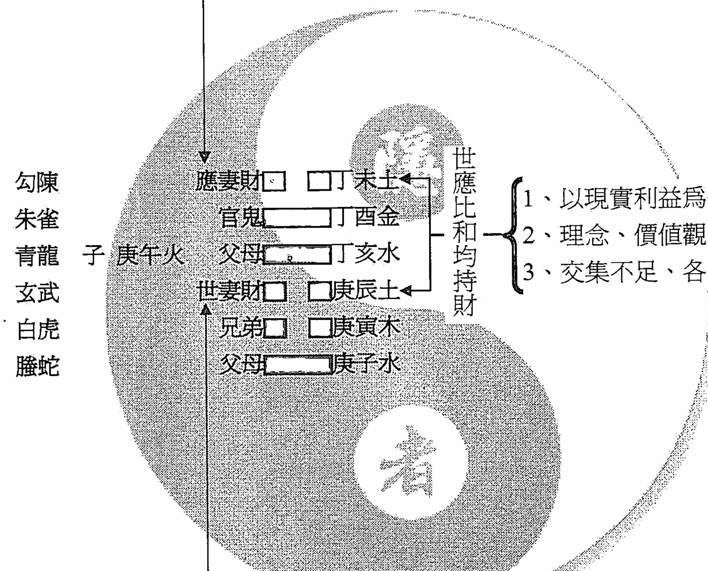

- 1、世持辰土妻財，在此份情感事件中的自我角色設定~女友。
2、世持玄武，不宜解為桃花，而應為懷疑解(依占問主題而辨象)。
3、世爻生合酉金官鬼，表卦主對於男友無悔的付出。

## 第五節 六親生剋內涵：

### 一、六親生剋圖示：

#### 1、父母爻之生剋：

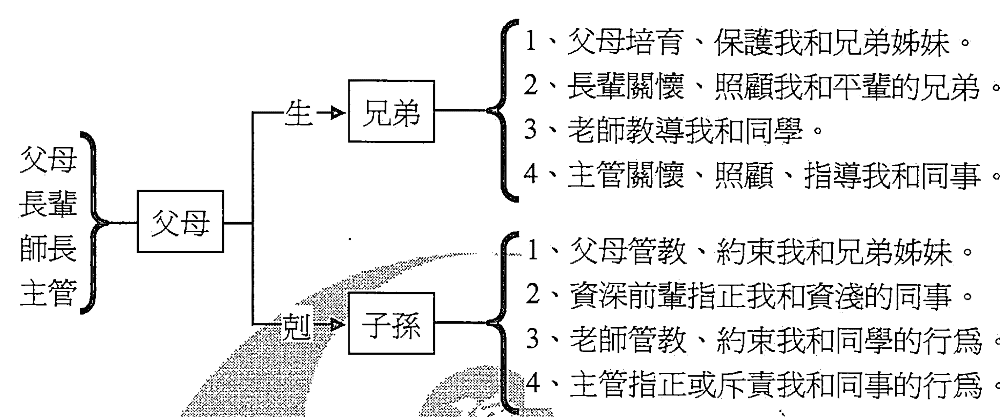

#### 2、兄弟爻之生剋：

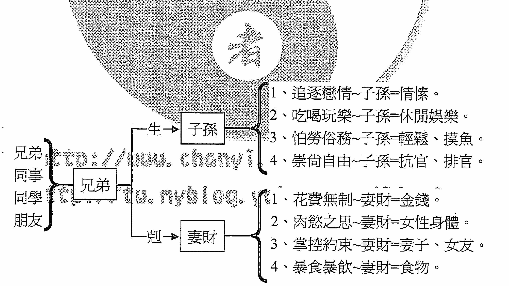

#### 3、子孫爻之生剋：

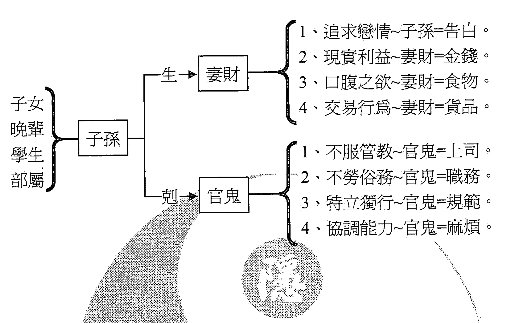

#### 4、妻財爻之生剋：

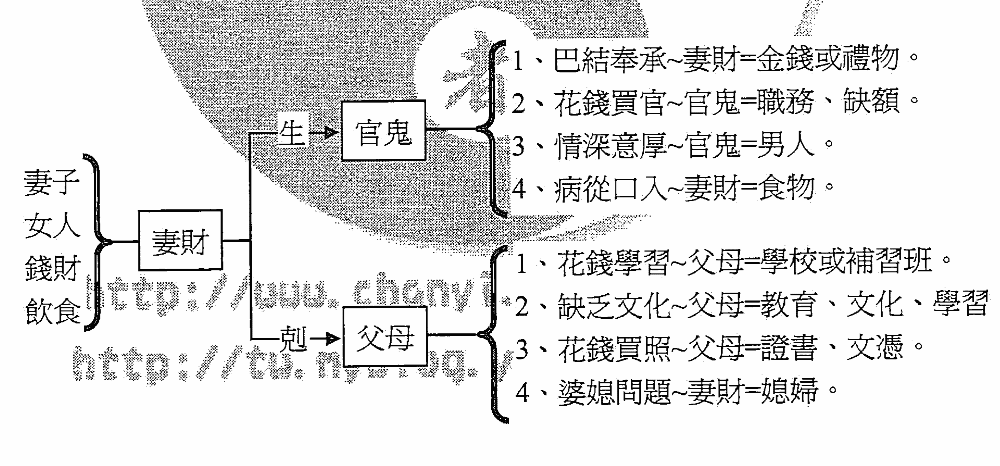

#### 5、官鬼爻之生剋：

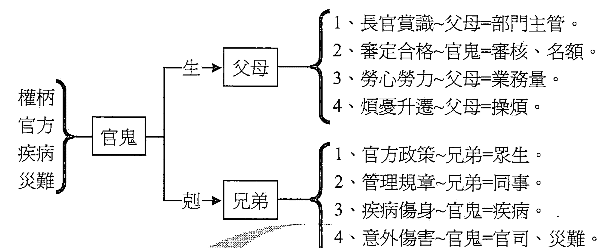

#### 6、六親基本涵義記憶方式：

- 1、以本爻之六親象，為當前狀態解。
2、以本爻六親所生之六親，為「心之所欲」解。
3、以本爻六親所剋之六親，為「心之所斥」解。

六親涵義記憶方式示意圖：

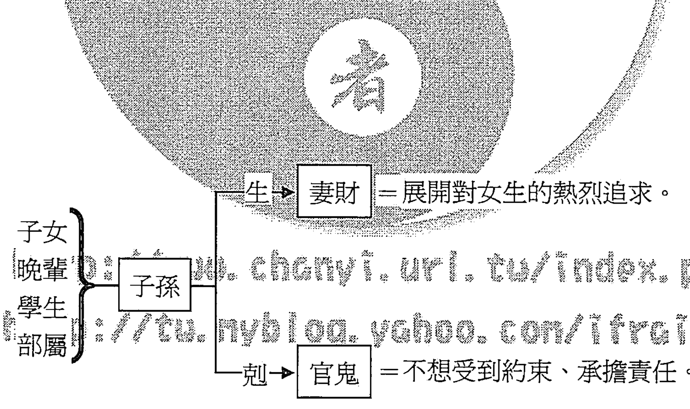

### 二、六親生剋應用圖例解：

#### 圖例 1：父母爻之生剋

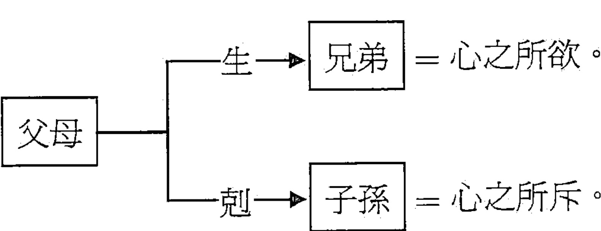

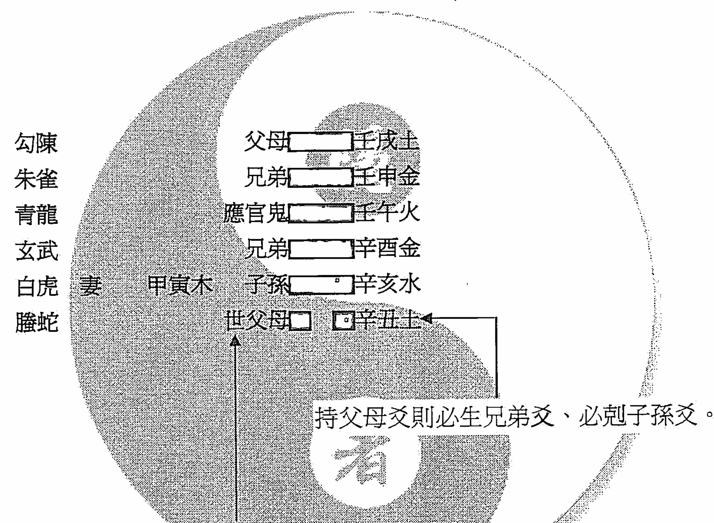

- 1、本身狀態---世持父母，表示關心父母、重視家庭、重視工作、凡事容易操煩，再加上騰蛇=擔憂、害怕，則表示擔憂父母、家庭、工作...等。
2、論感情---世持父母則必剋子孫爻(情愫)=不善於情感的表達，較缺乏浪漫情趣。
3、論婚姻---世持父母則表辛勞，剋子孫爻=現階段不想生養小孩。
4、論事業---世持父母則表工作認真、辛勤，父母必生兄弟爻=關懷同事或提攜後進。
5、論考試---世持父母則表示學習認真，父母剋子孫爻(休閒星)=廢寢忘食、放棄娛樂。

#### 圖例 2：兄弟爻之生剋

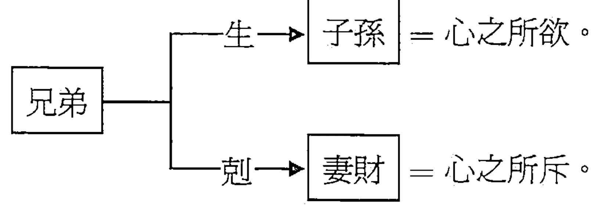

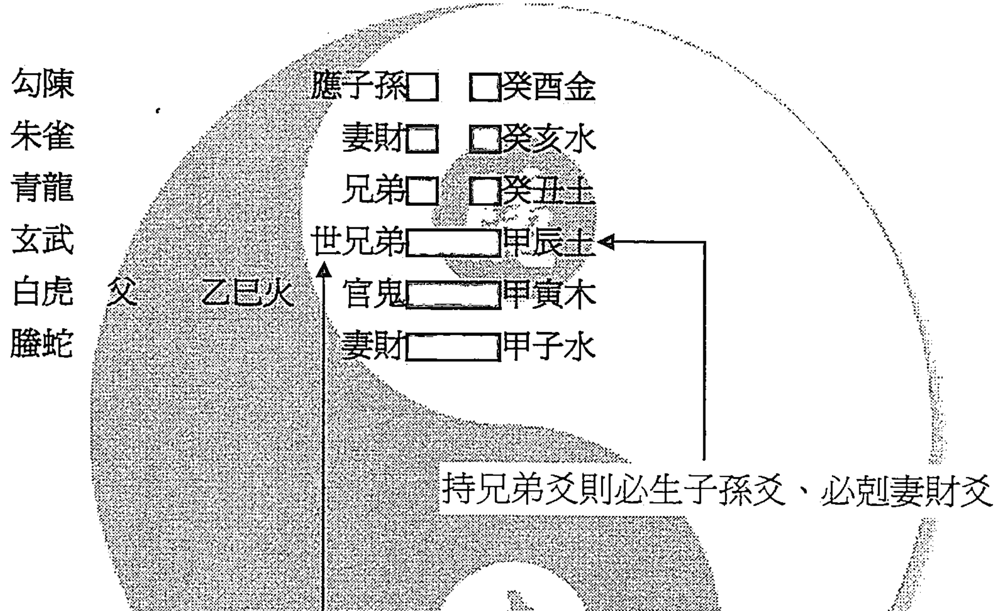

- 1、本身狀態---世持兄弟，表好動、好爭，重視朋友、喜熱鬧，缺乏理財觀念，花錢不知節制，故也主缺錢，又持玄武較會有隱瞞或說謊的行為。
2、論感情---世持兄弟則必剋妻財爻(肉體)，卦主如是男生，表想佔有女生身體之意。
3、論婚姻---世持兄弟者，表較難盡責任(受官鬼所剋)，喜呼朋喚友流連在外。
4、論事業---世持兄弟則必生子孫爻(偷閒)，故表喜摸魚而不認真。(業務員除外)
5、論求財---世持兄弟者，生子孫爻=想生財，但剋妻財爻=難聚財。(合夥事業者除外)。

#### 圖例3：子孫爻之生剋

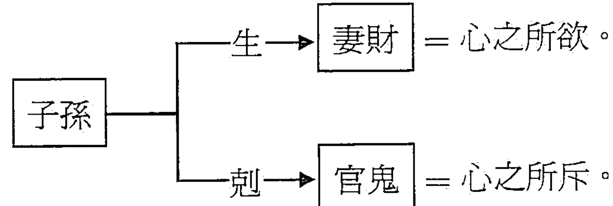

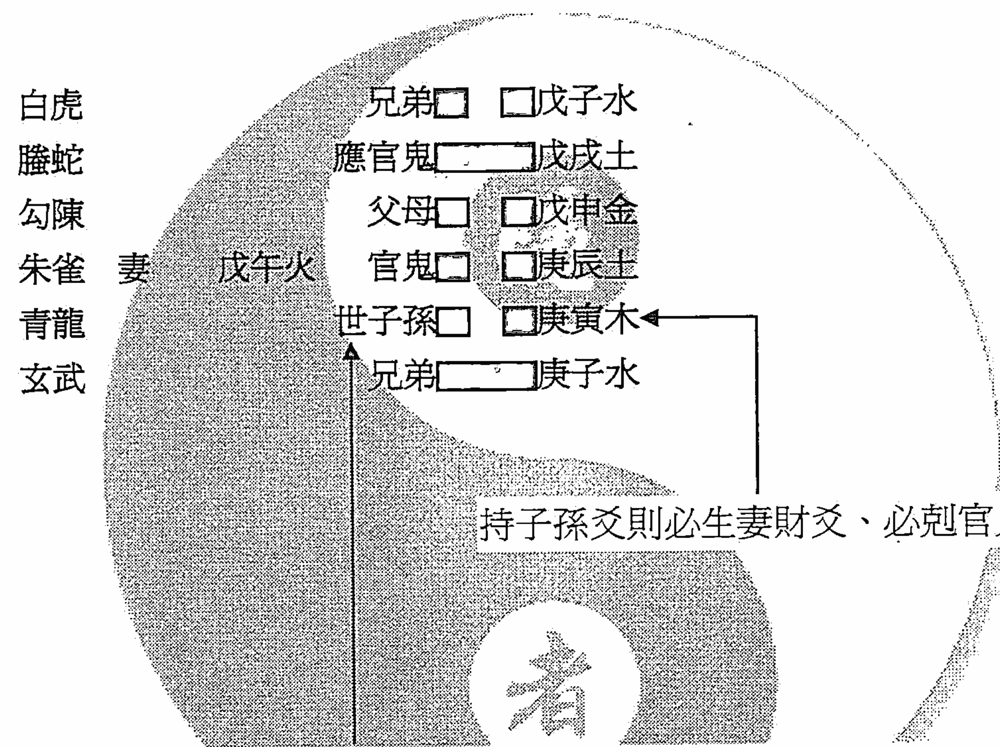

- 1、本身狀態---世持子孫，表聰明、機敏，特立獨行，崇尚自由不喜受約束，充滿幻想、願望，有自命清高的特質(旺+青龍)，較為感性、情緒化。
2、論感情---世持子孫則必生妻財爻，表情感豐富，喜追求浪漫之戀情，故難專一。
3、論婚姻---世持子孫者必剋官鬼爻(責任、義務)，故缺乏承擔本身角色之能力。
4、論事業---世持子孫則必剋官鬼爻，較難受管理，易發生頂撞上司的情事。
5、論求財---世持子孫者必生妻財爻，適宜生意人，滿腦子都是生意經。

#### 圖例 4：妻財爻之生剋


- 1、本身狀態---世持妻財，表重實際、重錢財、重名利，善於理財且喜自己掌握錢財，較缺乏文化素養，慾望濃厚，喜支配他人。
2、論感情---世持妻財則必生官鬼，若卦主爲女性，則會對男友無盡的付出。
3、論婚姻---世持妻財者，不宜發動，如發動則剋父母爻，易有婆媳之間的問題產生。
4、論事業---世持妻財則必生官鬼爻，故表會逢迎巴結長官，一心追求名望高位。
5、論求學---此例世持卯木妻財，如發動則剋合上爻朱雀父母=花錢往外地求學之象。

#### 圖例 5：官鬼爻之生剋


- 1、本身狀態---世持官鬼，表自律、責任感、榮譽心、嫉惡如仇，重視名聲、權力、地位，平時較嚴肅而不苟言笑，同時深具壓力和煩憂。
2、論感情---世持官鬼則必生父母爻，對於感情態度謹慎而認真，不輕易許諾。
3、論婚姻---世持官鬼者必生父母爻，孝順親長、關心家庭，均視為己任。
4、論事業---世持官鬼則必剋兄弟爻，在管理上較為嚴苛、公正，屬於管理人才。
5、論疾病---世持官鬼者，謂之”帶疾”，若逢勾陳者，則表有慢性疾病纏身難癒。

# 第二章 六獸專論

### 第一節 概論：

六獸在古籍中稱之為「附和之神」，亦指其為輔助參考之用的星煞，地位不高，但在斷卦實務經驗中，六獸扮演者「辨象」功能中重要的角色，除可依卦爻所持六獸而詮釋該(人、事、物)之特質及狀態，並為解決用神多現時的選取要件之一。

## 第二節 六獸類別：

- 一、青龍：
1、五行屬東方木、五德主仁。
2、簡記--正、新、喜、貴、高。
- 二、朱雀：
1、五行屬南方火、五德主禮。
2、簡記--文采、口才、熱烈、小巧。
- 三、勾陳：
1、五行屬中央土、五德主信。
2、簡記--田土、遲鈍、拖延、長期。
- 四、螣蛇：
1、五行屬中央土、五德主信。
2、簡記--偏、邪、暗昧、迴旋。
- 五、白虎：
1、五行屬西方金、五德主義。
2、簡記--傷、病、災、剛、急、喪。
- 六、玄武：
1、五行屬北方水、五德主智。
2、簡記--隱、欺瞞、聰明、桃花。


## 第三節 六獸分項涵義圖

### 一、青龍涵義圖：

| 青 龍 |
|---|
| 精義 | 正、新、喜、高、貴。 |
| 表徵 | 正 | 正直、正配、正式、貴人、高雅、端莊、清高、高大、仁慈、新緣、新鮮、創新、新生、喜慶、宴會、娛樂、大排長龍、川流不息。 |
| | 反 | 假貴人、貪戀酒色、好玩、享樂、墮落、色情、新病、酒色之災、灰色思想。 |
| 五行 | 甲乙 木 |
| 顏色 | 青色、綠色 |
| 地理 | 左方 |
| 身體 | 肝膽、神經痛、筋絡抽痛 |

### 二、朱雀涵義圖：

| 朱 雀 |
|---|
| 精義 | 文采、口才、熱烈、小巧。 |
| 表徵 | 正 | 老師、演說家、播音員、仲介、嘴巴、說話、演講、唱歌、文章、書信、檔案、網路、訊息、郵電、熱鬧、吵雜、飛行物、烹飪、電器用品、太陽、照明物、香火、口願。 |
| | 反 | 爭吵、口舌是非、言語尖酸、惱怒、噪音、責難、訓斥、呻吟、謠言、嘮叨、詛咒、官司訴訟、法庭辯論、火災、躁鬱症、炎症、焦躁不安。 |
| 五行 | 丙丁 火 |
| 顏色 | 紅色 |
| 地理 | 前方 |
| 身體 | 肝火、發炎、血液、精神疾病 |

### 三、勾陳涵義圖：

| 勾 陳 |
|---|
| 精義 | 田土、遲鈍、拖延、長期。 |
| 表徵 | 正 | 傳統、保守、老實、木訥、節儉、拙言、慢條斯里、上班族、熟客、舊識、吸引、公務員、軍警、田土、山林、陽宅、辦公室、不動產、土地公。 |
| | 反 | 相貌平凡、遲鈍、固執、老舊、糾纏、心結、牽制、拖累、套牢、羈押、牢獄之災、跌蹼、慢性病、難產、動土。 |
| 五行 | 戊 土 |
| 顏色 | 黃色 |
| 地理 | 中央 |
| 身體 | 腫脹、癌症、慢性病、土煞 |

### 四、騰蛇涵義圖：

| 騰 蛇 |
|---|
| 精義 | 偏、邪、暗昧、迴旋。 |
| 表徵 | 正 | 聰明、敏銳、機靈、圓滑、迂迴、察言觀色、拐彎抹角、道路、長物、捲曲物、繩索、纏繞、綑綁、管路、依附物、夙緣、陰德、因果、靈體、道場、祭煞、夢。 |
| | 反 | 思想偏激、旁門左道、怪異、攻於心計、小人暗害、暗昧、坐立難安、疑神疑鬼、貪婪、虛偽、猜忌、自私、奸詐、吝嗇、驚嚇、夢魘、陰煞。 |
| 五行 | 己 土 |
| 顏色 | 深黃色、咖啡色 |
| 地理 | 側面 |
| 身體 | 血管、神經叢、腫瘤、因果病 |

### 五、白虎涵義圖：

| 白虎 | |
|---|---|
| 精義 | 傷、病、災、剛、急、猛爆、喪。 |
| 表徵 | 正：急、快速、積極、威嚴、霸氣、豪爽、果決、權柄、重義氣、改革、軍警、武官、保全、警衛、外科醫生、機械。 |
| | 反：暴躁、凶狠、專制、好勇鬥狠、破壞、殘缺、瑕疵、官司訴訟、刀槍傷、意外血光、跌打損傷、車禍、骨折、開刀、肢體殘障、疾病、傷亡、喪事、哭泣。 |
| 五行 | 庚辛 金 |
| 顏色 | 白色、銀色 |
| 地理 | 右方 |
| 身體 | 帶疾、傷痕、血崩、流產、中風 |

### 六、玄武涵義圖：

| 玄武 | |
|---|---|
| 精義 | 隱、欺瞞、聰明、桃花。 |
| 表徵 | 正：聰明、風趣、幽默、浪漫多情、好打扮、人緣佳、桃花隨身、江河、湖泊、水流、海運、洗浴、衛生間、海產類。 |
| | 反：虛假、隱瞞、欺騙、投機取巧、曖昧、風流、色情、因色惹禍、懶散、昏沉、不潔、浮華不實、偷偷摸摸、不願曝光、秘密多、心思浮動而難忠於一主。 |
| 五行 | 壬癸 水 |
| 顏色 | 黑色 |
| 地理 | 後方 |
| 身體 | 泌尿系統、隱症 |

## 第四節 應用要領圖說：

因旨在象義類化，故爲免於造成觀象的繁複，所舉圖例均捨去四令、空亡等，俟習者能領悟並掌握圖例其中象變要領，此時再行加入其他外在條件作適當修正，即可達完整解義之功。

### 青龍象圖例~1：男、占求職？

- 1、世爻=自己。
- 2、青龍+子孫+五爻(君位)=清高之象。
- 3、旺者爲真清高---憂道不憂貧。
- 4、衰者爲假清高---眼高手低。


世居五爻君位=待人接物，姿態較高。

http://www.ch... http://tw.myblog.yahoo.com/!fruises

### 青龍象圖例~2：女、占感情？


- 1、世爻=自己。
- 2、妻財=感情事件中的角色扮演。
- 3、青龍+妻財+初爻(緣起位)=新的戀情。

http://www.cmnyi.url.tw/index.php
http://tu.myblog.yahoo.com/ffraises

### 青龍象圖例~3：男、占合夥事業？

- 1、應爻=對方。
- 2、青龍=新的緣起。
- 3、父母=事業體。
- 4、六爻=合夥位。


世持財=我有錢 應爻發動合世=對方主動邀約我參予

http://www.chanyi.url.tw/index.php
http://tu.myblog.yahoo.com/1fr61ses

### 青龍象圖例~4：女、占身體不適？

指向=病之因


- 1、世爻=自己。
- 2、青龍=新發生的。
- 3、官鬼=壓力、病徵。
- 4、父母=煩腦、操勞。
- 5、動爻=發生行爲。

因操煩而致病

http://www.chanyi.url.tw/index.php
http://tw.myblog.yahoo.com/1frgises

### 朱雀象圖例~1：男、占工作發展？

此處朱雀作叮嚀、安慰解

- 1、應爻=工作職場。
- 2、朱雀=言語、訊息。
- 3、父母=主管、資深同仁。
- 4、垂象應生世=正面解。

主管照顧、鼓勵我


生=關懷、照顧。

| 朱雀 | 應父母 | 丁未土 | 庚戌土 父母 | 官鬼 |
|---|---|---|---|---|
| 青龍 | 兄弟 | 丁酉金 | 庚申金 兄弟 | 世父母 |
| 玄武 | 子孫 | 丁亥水 | 庚午火 官鬼 | 妻財 |
| 白虎 | 世兄弟 | 丙申金 | 己亥水 子孫 | 兄弟 |
| 螣蛇 | 妻官鬼 | 丙午火 | 己丑土 父母 | 應官鬼 |
| 勾陳 | 父母 | 丙辰土 | 己卯木 妻財 | 子孫 |

- 1、世=自己。
- 2、白虎=猛爆之神。
- 3、兄弟=好爭。

我的個性較火爆

http://tu.myblog...index.php
http://tu.myblog...ifrgises

### 朱雀象圖例~2：女、占婚姻前景？

- 老公有暴力傾向
- 1、應爻=夫位。
- 2、白虎=剛強、急躁。
- 3、兄弟=好爭、好鬥。
- 4、發動=行爲論。
- 5、剋世=針對世爻。


- 我愛聒噪、嘮叨
- 1、世爻=自己。
- 2、朱雀=善言。
- 3、妻財=婚姻中老婆的角色。

http://www.chen...php
http://tu.myblog.yahoo.com/!frases

### 朱雀象圖例~3：女、占應徵此工作適合嗎？

- 1、應爻=徵才的公司。
- 2、朱雀=語言、文書、通信。
- 3、父母=業務性質、內容。
- 4、上六=外勤、業務。

外勤、口舌競爭的工作


- 1、世爻=自己。
- 2、白虎=急躁、瑕疵、傷病。
- 3、父母=學經歷、體力。
- 4、內卦=內勤、行政、文書。

我身體不佳、不適合外務工作

http://www.chenyi.com
http://tw.myblog.yahoo.com/ffrg1ses

### 朱雀象圖例~4：女、占出國旅遊平安否？

- 1、應爻=目的地。
- 2、朱雀=名聲、信息傳遞。
- 3、父母=國度、政府、名氣。
- 4、上六=遠方、外境。
- 5、變爻子孫=休閒、遊樂區、景點、平安。

去國外有名氣的國家景點


- 朱雀
- 青龍
- 玄武
- 白虎
- 螣蛇
- 勾陳

| 應父母 | □癸酉金 | X | 丙寅木 子孫 | □□ | 父母 |
|---|---|---|---|---|---|
| 兄弟 | □癸亥水 | | 丙子水 兄弟 | □□ | 官鬼 |
| 官鬼 | □癸丑土 | | 丙戌土 官鬼 | □□ | 世子孫 |
| 世妻財 | □戊午火 | | 戊午火 妻財 | □□ | 兄弟 |
| 官鬼 | □戊辰土 | | 戊辰土 官鬼 | □□ | 子孫 |
| 子孫 | □戊寅木 | | 戊寅木 子孫 | □□ | 應父母 |

- 1、世爻=自己。
- 2、白虎=急、速。
- 3、妻財=旅遊經費。
- 4、世剋應=急切、強烈意圖。

我很想立刻成行去旅遊

http://www.chanyi.com/

http://tu.myblog.yahoo.com/17701585

### 勾陳象圖例~1：男、占告白可成否？

我想告白但缺乏勇氣

- 1、世爻=自己。
- 2、勾陳=保守、拙言、拖延。
- 3、子孫=情愫、告白。
- 4、世生應=喜歡、思念。
- 5、靜爻=觀望之象。


- 白虎
- 螣蛇
- 勾陳
- 朱雀
- 青龍
- 玄武

- 妻財□ □戊子水
- 兄弟□□戊戌土
- 世子孫□ □戊申金
- 兄弟□□甲辰土
- 官鬼□□甲寅木
- 應妻財□□甲子水

- 戊子水 妻財□ □ 妻財
- 戊戌土 兄弟□□ 兄弟
- 戊申金 子孫□ □世子孫
- 甲辰土 兄弟□□ 兄弟
- 甲寅木 官鬼□□ 官鬼
- 甲子水 妻財□□應妻財

- 1、應爻=對方女生。
- 2、玄武=浪漫、多情、異性緣佳。
- 3、妻財=感情事件中女生的角色。
- 4、初爻=緣起位。

http://對象的狀態

http://tu.myblog

### 勾陳象圖例~2：男、占工作發展？

- 1、應爻=公司、工作環境。
- 2、玄武=流動性、曖昧不清。
- 3、兄弟=多數、同事、派系團體。
- 4、五爻=君位、老大不堪。

公司派系嚴重流動性強


- 1、世爻=自己。
- 2、勾陳=長期、穩定、停留。
- 3、官鬼=正式、職務、職稱。
- 4、父母=辛勞、忙碌、業務。
- 5、二爻=一般正式職員。

我的工作狀態

### 勾陳象圖例~3：女、占 XX 股票本月漲跌？

- 1、應爻=股市。
- 2、勾陳=群聚、盤整、套牢。
- 3、父母=成交量、股票。
- 4、兄弟=利空、損財。

股市當前情況


應合世=我被對方控制、掌握=套牢。

- 1、世爻=自己。
- 2、玄武=隱藏、不為人知。
- 3、妻財=錢財。
- 4、初爻=緣起位。

我用私房錢買的股票

一進場就虧損被套牢

### 勾陳象圖例~4：男、占疾病何時痊癒？

我不願看醫生或我有抗藥性

- 1、子孫=治療、藥物。
- 2、世沖=排斥、抗拒。


- 1、世爻=自己。
- 2、勾陳=長期、連帶、遺傳、拖拉。
- 3、官鬼=病徵、病灶。
- 4、父母=家族、尊親、勞碌。

我有遺傳慢性病

### 騰蛇象圖例~1：男、占告白能成功嗎？

- 對象形態
- 1、應爻=對方女生。
- 2、青龍=清秀、端莊。
- 3、妻財=感情事件女生角色。


| 勾陳 | 兄弟 | 巳巳火 | 巳巳火 | 兄弟 | 兄弟 |
|---|---|---|---|---|---|
| 朱雀 | 子孫 | 巳未土 | 巳未土 | 子孫 | 子孫 |
| 青龍 | 應妻財 | 巳酉金 | 巳酉金 | 妻財 | 應妻財 |
| 玄武 | 官 | 巳亥水 | 妻財 | 丙申金 | 丙申金 | 妻財 | 妻財 |
| 白虎 | 兄弟 | 丙午火 | 丙午火 | 兄弟 | 兄弟 |
| 騰蛇 | 父 | 巳卯木 | 世子孫 | 丙辰土 | 丙辰土 | 子孫 | 世子孫 |

- 1、世爻=自己。
- 2、騰蛇=擔心、憂慮、膽小。
- 3、子孫=情愫、告白、年輕。
- 4、伏神父母剋世=壓抑情感表達。
- 5、世生應=喜歡、思念。

我想告白但又害怕失敗

http://tw.myblog

php

565

### 騰蛇象圖例~2：女、占與男友感情發展？

- 1、世爻=自己。
- 2、騰蛇=城府深、膽小、鑽牛角尖。
- 3、父母=人生觀、價值觀、思維理念。
- 4、上爻=自視高、姿態高。

我的思想較悲觀


| 六神 | 六親 | 世應 | 干支 | 六親 | 世應 |
|---|---|---|---|---|---|
| 騰蛇 | 父母 | 世 | 丁未土 | 父母 | 世 |
| 勾陳 | 兄弟 | | 丁酉金 | 兄弟 | |
| 朱雀 | 子孫 | | 丁亥水 | 子孫 | |
| 青龍 | 父母 | 應 | 丁丑土 | 父母 | 應 |
| 玄武 | 妻財 | | 丁卯木 | 妻財 | |
| 白虎 | 官鬼 | | 丁巳火 | 官鬼 | |

世應父母相沖=彼此觀念矛盾不和~難長久相處。

- 1、應爻=男友。
- 2、青龍=正直、儒雅。
- 3、父母=雙親、家庭、工作、價值觀。
- 4、三爻=中庸。

男友思想較開朗

http://www.chanui.url.tw/index.php

http://tw.my

SOS

### 騰蛇象圖例~3：女、占是否有陰煞干擾？

- 1、官鬼=傷、病、災、厄、鬼神。
- 2、騰蛇=邪穢、怪異、驚嚇、糾纏。
- 3、上爻=天爻。
- 4、子孫=小孩、嬰兒。
- 5、化空=失去、消失、不存在。

受外來的嬰靈纏身


- 1、世爻=自己。
- 2、玄武=暗昧、迷糊、不確定感。
- 3、官鬼=與上爻感應同義。
- 4、二爻=宅爻、家中。

在家中就感覺怪異

### 騰蛇象圖例~4：女、占命中有子女否？

- 宿世緣分的子女
- 1、應爻=懷孕之事及環境。
- 2、騰蛇=聰敏、命定、夙緣。
- 3、子孫=胎兒。


- 1、世爻=自己。
- 2、青龍=新、正、緣。
- 3、妻財=婚姻中妻子的角色、孕母。
- 4、初爻=心事、緣起位。

我新婚，想懷孕生子

### 白虎象圖例~1：女、占朋友要介紹男生適合嗎？

- 對象狀態
- 1、應爻=對方男生。
- 2、白虎=剛強、果斷、性急。
- 3、官鬼=感情事件男生的角色。
- 4、五爻=君位、有大男人傾向。
- 5、官動化進=自旺、強化原象義。


- 我的情況
- 1、世爻=自己。
- 2、朱雀=活潑、善言。
- 3、妻財=感情事件女生的角色。
- 4、二爻=宅爻、喜居家靜態活動。

### 白虎象圖例~2：男、占坐骨神經痛何時能痊癒？

- 我的情況
- 1、世爻=自己。
- 2、青龍=新、緣起。
- 3、子孫=治療、藥品。
- 4、妻財=治療及購藥之費用。


- 病徵現象
- 1、官鬼=病徵、病灶。
- 2、白虎=損傷、疼痛。
- 3、伏神父母=病因。
- 4、二爻=腰、腿部部位。
- 5、乾宮=骨。

http://uu4.tu/index.php
http://tu.mypopu.yong0.com/1frg1ses

### 白虎象圖例~3：女、占看中一戶中古屋適合買嗎？

- 我的現況想法
- 1、世爻=自己。
- 2、妻財=金錢。
- 3、勾陳=積存、心結、念念不忘。


- 1、父母=屋宅。
- 2、白虎=老舊、瑕疵、損傷。
- 3、初爻=低樓層或一樓。
- 4、子水=排水系統。
- 5、回頭剋=排水不良。

### 白虎象圖例~4：女、占應徵此間公司會上嗎？

- 1、應爻=該公司。
- 2、官鬼=權力、管理、政策。
- 3、白虎=嚴苛、專制、霸性。
- 4、五爻=君位、權力核心。
- 5、兄弟=低薪。


- 1、世爻=自己。
- 2、子孫=年輕、基層、專技。
- 3、朱雀=善言、活潑。
- 4、二爻=基層職員。

### 玄武象圖例~1：女、占男友說的話可靠嗎？

- 男友的情況
- 1、應爻=男友。
- 2、官鬼=感情事件中男生的角色。
- 3、玄武=隱情、假象、欺騙、桃花。
- 4、父母=訊息、工作、忙碌。


- 我的狀態
- 1、世爻=自己。
- 2、父母=關心、操煩、忙碌。
- 3、勾陳=心結、固執、掛念。
- 4、初爻=心事、緣起。

http://tw.myblog.yahoo.com/article-?mid=1&next=1&l=f&fid=60&sc=1#

http://tw.myblog.yahoo.com/article-?mid=1&next=1&l=f&fid=60&sc=1#

### 玄武象圖例~2：男、占朋友邀約合夥吉凶？

- 合夥對象情況
- 1、應爻=對方。
- 2、兄弟=朋友、合夥人。
- 3、玄武=隱瞞、假象、欺騙、曖昧不清。
- 4、父母=事業體、公司、承諾、消息。
- 5、上爻=合夥位。


- 我的想法態度
- 1、世爻=自己。
- 2、妻財=我的錢財。
- 3、勾陳=積存、猶豫不決、掛懷。
- 4、官鬼=壓力、憂疑。

### 玄武象圖例~3：男、占報失的汽車找得回嗎？

失物情況狀態
1、應爻=面對的環境、失車所在處。
2、父母=汽車的用神。
3、玄武=遺失、偷盜、不知所蹤、失去。
4、兄弟=拆解、解體。
5、四爻=跨縣市之外境。


我的想法狀態
1、世爻=自己。
2、妻財=金錢、財物、所有物。
3、勾陳=心結、掛念、執著。
4、初爻=心事、緣起位。

http://www.index.php
http://tw.myblog.yahoo.com/itrc1ses

### 玄武象圖例~4：男、占去這家醫院看病有效嗎？

1、應爻=醫院、醫生。
2、子孫=醫療、藥品、醫術。
3、勾陳=長期、公立、老字號。
4、五爻=君位、業界權威。

醫院治療現況


1、世爻=自己。
2、官鬼=病徵、病況。
3、玄武=隱症、變化不定。
4、兄弟=手腳。
5、巽宮=風症。

我有痛風症狀

```
index.php
/ifraises
```

http://tu.

# 第三章 六親結合六獸象義

### 第一節 概論：

六親結合六獸的雙象組合象義，是最基本亦是最重要的組象功夫，能確實掌握各單象結合其它單象的涵義，則方能順利進入多重組合象義的目標，完整呈現整體卦象的演變象義，如實的解說事件的始末。

## 第二節 組象要領：

一、六親定位--依占問主題先行確定所觀察之標的，是人、是事、還是物。
二、六獸取象--配合六親作適切的象義演出。
三、雙象組合圖例：


1、青龍+子孫= {旺---清高之象，憂道不憂貧。 衰---憤世嫉俗，眼高手低。

2、朱雀+兄弟= {旺---活力充沛，競爭力強。 衰---好爭好鬥，無法聚財。

3、勾陳+父母= {旺---傳統保守，恪守本分。 衰---嘮叨抱怨，辛苦操煩。

4、騰蛇+官鬼= {旺---八面玲瓏，老謀深算。 衰---陰私暗昧，疑神疑鬼。

5、玄武+妻財= {旺---婀娜多姿，撫媚動人。 衰---花枝招展，桃花遍野。

## 第三節 六親結合六獸象義圖示：

### 父母爻結合六獸象義

| 區分 | 人 | 事 | 物 |
| :--- | :--- | :--- | :--- |
| 青龍 | 親生父母<br>新任老師<br>新的老闆<br>新任主管<br>父母有名望 | 新興行業<br>新的工作<br>新的課程<br>新簽契約<br>新的規章 | 新創事業<br>新的住宅<br>正式文憑<br>真實證照<br>高品味服飾 |
| 朱雀 | 長輩的意見<br>老師的教誨<br>父母的叮嚀<br>主管的訓斥<br>老闆的指示 | 廣告宣傳<br>投遞訴狀<br>公司的名氣<br>洽談的合約<br>考績或業績 | 教育單位<br>交通工具<br>學校有名氣<br>鬧區的住宅<br>名牌的服飾 |
| 勾陳 | 父母較傳統<br>長輩有心結<br>公文遭積壓<br>主管性拖拉<br>老闆性固執 | 長期的辛勞<br>文件的延宕<br>老字號品牌<br>纏訟的官司<br>以往的業績 | 陳年的案件<br>老舊的公司<br>老舊的學校<br>老舊的車子<br>老舊的房子 |
| 螣蛇 | 長輩很吝嗇<br>長輩有夜夢<br>長輩很憂心<br>長輩受驚嚇<br>長輩患怪病 | 坐臥難安<br>主管暗害<br>公務纏身<br>長輩糾纏<br>私訂合約 | 面有疤痕<br>家住長巷<br>家有陰煞<br>網路連線<br>邪術邪法 |
| 白虎 | 長輩帶疾<br>長親已過往<br>長輩較嚴厲<br>主管較兇悍<br>老闆較性急 | 急診就醫<br>業績不達<br>文件有瑕疵<br>急迫性案件<br>緊急的簽約 | 體力衰退<br>文件有瑕疵<br>白色的車子<br>老舊的房子<br>衣服有補丁 |
| 玄武 | 義父義母<br>長輩有隱情<br>長輩有桃花<br>辦公司戀情<br>無照的密醫 | 串供偽證<br>偽造文書<br>機密文件<br>小道消息<br>竄改考績 | 體質陰虛<br>合約造假<br>運輸行業<br>家中潮濕<br>服裝暴露 |

### 兄弟爻結合六獸象義

| 區分 | 人 | 事 | 物 |
| :--- | :--- | :--- | :--- |
| 青龍 | 胞兄弟姊妹<br>死黨姐妹淘<br>新進的同仁<br>帥氣的朋友<br>結拜義兄弟 | 交際應酬<br>朋友有喜事<br>新合夥事業<br>新結盟團隊<br>新興的運動 | 電玩新品<br>社團活動<br>義工服務<br>新的假牙<br>新運動器材 |
| 朱雀 | 學校同學<br>兄弟善言<br>朋友起爭執<br>朋友愛吹噓<br>外傳的流言 | 朋友有意見<br>學習的團體<br>朋友邀合夥<br>同事的報怨<br>口舌競爭業 | 圖書館<br>演講會場<br>紅色拐杖<br>廣播器材<br>大眾刊物 |
| 勾陳 | 老朋友<br>老同學<br>老同事<br>合夥人<br>朋友很黏人 | 食慾不佳<br>消化不良<br>長期缺錢<br>朋友有心結<br>受朋友拖累 | 腳部腫脹<br>債務纏身<br>兄弟共有物<br>合夥買土地<br>房子有貸款 |
| 螣蛇 | 夙緣之兄友<br>陰靈好兄弟<br>兄友城府深<br>兄友已過往<br>兄友疑心病 | 朋友受驚嚇<br>朋友愛糾纏<br>吝嗇的朋友<br>小人的暗害<br>破財的運程 | 跳繩運動<br>拔河運動<br>遊行示威<br>手鍊或腳鍊<br>電玩的團隊 |
| 白虎 | 朋友皮膚白<br>黑道的朋友<br>軍警的朋友<br>朋友身帶疾<br>朋友已過往 | 體力透支<br>運動傷害<br>朋友有難<br>手腳有傷<br>刀槍爭鬥 | 門窗損壞<br>物理治療器<br>醫院急診室<br>假牙有瑕疵<br>老舊生產線 |
| 玄武 | 異姓兄弟<br>曖昧的朋友<br>失蹤的朋友<br>朋友有隱情<br>朋友有桃花 | 手腳冰冷<br>玩樂耗財<br>暗戀的同事<br>朋友藏私房<br>仙人跳破財 | 贓物買賣<br>詐騙集團<br>賭場道具<br>情趣用品<br>毒品買賣 |

### 子孫爻結合六獸象義

| 區分 | 人 | 事 | 物 |
| :--- | :--- | :--- | :--- |
| 青龍 | 新生兒、修行人、婚生子女、新進員工、自命清高 | 滋生情愫、子女有喜慶、正當的休閒、創新的設計、新醫療方式 | 新的創作、新的藥品、新的企劃案、新開發產品、藝術創作品 |
| 朱雀 | 醫護人員、調解人員、子女有意見、學生的提問、律師的辯論 | 情感告白、警局報案、顧客抱怨、產品宣傳、熱敷治療 | 寵物、托兒所、三溫暖、兒童玩具、紅色藥品 |
| 勾陳 | 老顧客、出家人、家庭醫生、子女老實、專業律師 | 長期服藥、難產之象、企劃案延宕、傳統式產品、受子女拖累 | 托兒園所、長期失業、寵物黏人、丸類藥品、傳統醫院 |
| 螣蛇 | 夙緣的子女、子女受驚嚇、員工城府深、學生有疑惑、子女已過往 | 神明開藥方、員工的暗害、客戶有疑慮、晚輩的糾纏、嬰靈的糾纏 | 毒品、收驚、安眠藥、旋轉馬車、憂鬱症藥品 |
| 白虎 | 剖腹生產、子女帶疾、難纏的顧客、員工脾氣差、彪悍的警察 | 一見鍾情、子女急症、產後諸症、企劃有瑕疵、情緒性傷害 | 急診室、白色玩具、協商失敗、置入性治療、白色的藥品 |
| 玄武 | 未婚生子、子女說謊、員工有曖昧、子女有桃花、特殊治療師 | 師生戀、暗滋情愫、私服補藥、仿冒的產品、公司的挖角 | 偽藥、液態藥水、情趣商品、水上樂園、豪華遊輪 |

### 妻財爻結合六獸象義

| 區分 | 人 | 事 | 物 |
| :--- | :--- | :--- | :--- |
| 青龍 | 新婚燕爾<br>妻子高雅<br>氣質型女生<br>妻子有身孕<br>新識的女生 | 意外之財<br>因喜事得財<br>妻子出身佳<br>正業之所得<br>資源的分配 | 貴重的首飾<br>喜慶的食物<br>新鮮的食品<br>正品的貨物<br>海產類龍蝦 |
| 朱雀 | 妻子善言<br>妻子的嘮叨<br>女性播音員<br>妻子愛打扮<br>聒噪的女生 | 郵電匯款<br>銀行通知<br>理財廣告<br>商品喊價<br>金融消息 | 高級音響<br>花錢作廣告<br>燒烤類食物<br>電器類商品<br>叫賣型商品 |
| 勾陳 | 傳統的女性<br>妻子不善言<br>妻子愛黏人<br>妻子有心結<br>糾纏的女生 | 節食<br>消化不良<br>資金難週轉<br>上班族所得<br>從事房產業 | 婦女團體<br>不動產事業<br>傳統型餐廳<br>囤積的貨物<br>女性專賣店 |
| 螣蛇 | 夙緣之妻<br>妻已過往<br>妻有憂鬱症<br>糾纏的女生<br>女生城府深 | 食道腸道<br>慳吝小氣<br>妻子夜夢<br>妻子受驚嚇<br>妻子難入眠 | 食物中毒<br>旋轉餐廳<br>祭拜的供品<br>注定的陰財<br>錢財週轉中 |
| 白虎 | 妻剖腹生產<br>妻子已過往<br>女生有帶疾<br>白皮膚女生<br>女生性剛強 | 一見鍾情<br>妻有家喪<br>暴食暴飲<br>女生發脾氣<br>重大的破財 | 喪儀<br>月事不順<br>白色商品<br>病從口入<br>女性員警 |
| 玄武 | 妻有隱情<br>妻帶桃花<br>妻行蹤不明<br>穿著暴露女<br>從事援交女 | 特種行業<br>金屋藏嬌<br>投機性求財<br>新潮的女生<br>海上運輸業 | 情婦<br>私房錢<br>海產類食物<br>走私所得財<br>作假的帳目 |

### 官鬼爻結合六獸類象

| 區分 | 人 | 事 | 物 |
| :--- | :--- | :--- | :--- |
| 青龍 | 新婚燕爾<br>老公外型佳<br>書卷氣男生<br>老公有官職<br>新識的男生 | 新官上任<br>罹患新病<br>新頒法令<br>新管理制度<br>官員很清廉 | 移民局<br>官方喜宴<br>新開的公司<br>公司新政策<br>筋絡的疼痛 |
| 朱雀 | 老公善言<br>老公愛嘮叨<br>長官的訓示<br>男性播音員<br>男生愛吹噓 | 宣佈新政策<br>官方的消息<br>職場的爭執<br>病情的告知<br>公司的流言 | 火災<br>官司<br>報警<br>發炎症狀<br>正式通知單 |
| 勾陳 | 傳統的男性<br>老公不善言<br>老公愛黏人<br>老公有心結<br>糾纏的男生 | 老公司<br>老舊的制度<br>官司的纏訟<br>長期慢性病<br>長期的壓力 | 脾胃之疾<br>腫脹之疾<br>土地糾紛<br>長期拘留<br>官司纏身 |
| 螣蛇 | 夙緣之夫<br>夫已過往<br>夫有憂鬱症<br>糾纏的男生<br>男生城府深 | 牢獄之災<br>老公有夜夢<br>老公受驚嚇<br>政策不明朗<br>公司小人多 | 灰色思想<br>綁架勒索<br>罹患腸疾<br>往生之靈<br>陰靈纏身 |
| 白虎 | 閃電結婚<br>老公已過往<br>男生有帶疾<br>白皮膚男生<br>男生性剛強 | 家庭暴力<br>上司生病<br>意外傷害<br>因病開刀<br>老闆發脾氣 | 情傷之象<br>公司裁員<br>重大刑案<br>急性的病症<br>嚴苛的制度 |
| 玄武 | 夫有隱情<br>夫帶桃花<br>夫行蹤不明<br>與上司曖昧<br>老闆有桃花 | 特種行業<br>桃色官司<br>詐騙集團<br>官員說謊<br>空頭公司 | 海關<br>糖尿病<br>虛設行號<br>難言的隱疾<br>水電修理業 |

# 第四章 動變象義類化

### 第一節 概論：

占卦預測的目的在於了解"當下之機"，以知所進退、趨避有方，而如何從繁複的卦象中精確的解讀其涵義，如實貼切的描繪出事件的緣起、過程、至結局的演變情況，完整呈現，方爲解卦的終極目標及意義。習卦者均知，一卦之中首重"動爻"，爻既動則必有變，有變化則事有更張，亦必會造成整體卦象的影響作用，進而產生得失、吉凶。是故，能先行掌握單象的象義，及雙象組合的象義解說，自然就能依其思路擴而進入動變象義的詮釋。

## 第二節 動變象義組成：

一、動爻--發動之爻爲行爲之緣起，故爲首要觀察之點，並依人、事、物之定象而解讀其行爲表徵及發揮之目的。
二、變爻--動爻行爲的指向意義，轉變後的趨向，依其之變而辨別其目的。
三、六親--動爻與變爻的六親象，即爲角色的轉換，動爻在先、變爻爲後，轉換的角色即象徵面向的改變，猶如春天變夏天、天雨變晴天般。
四、六獸--依附六親象而作其內涵的修飾，但須注意其所表徵的是人、是事、或是物，而作適當的詮釋且不脫主題範圍。
五、氣向--爻動則其必與它爻產生對待，無論生、剋、沖、合都有其象義存在，同時亦爲解釋動變象義內容最重要的一環，因其爲動爻之氣的歸宿點，依此推論，方能判斷最終的得失、吉凶。

## 第三節 分類動變象義解析：

一、六親動變象區分：
1、父母爻動化出：
進神、退神、兄弟、子孫、妻財、官鬼。
2、兄弟爻動化出：
進神、退神、父母、子孫、妻財、官鬼。
3、子孫爻動化出：
進神、退神、父母、兄弟、妻財、官鬼。
4、妻財爻動化出：
進神、退神、父母、兄弟、子孫、官鬼。
5、官鬼爻動化出：
進神、退神、父母、兄弟、子孫、妻財。

二、六親動變象義圖示：

### 1、父母化父母(進神)：

| 父母——→父母(進神) |
| :--- | :--- |
| **戀情** | 長輩催婚、越來越積極。<br>雙方聯繫頻繁且爲情奔波。<br>想要成家的念頭越來越強烈。 |
| **婚姻** | 無盡的關懷。爲家庭辛勞。<br>感情內斂而不善表達。<br>越來越不想生小孩。 |
| **求財** | 爲求財越來越忙碌、奔波。<br>訂單契約不斷的增加。<br>身跨兩種或以上的行業。 |
| **事業** | 事業的擴大。增開分公司。<br>業務量、訂單的增加。<br>部門主管換人(上班族)。 |
| **考試** | 讀書認真、越來越用功。<br>記憶力增強、讀書效果顯著。<br>學習進度、逐漸加強。 |
| **出外** | 行程、交通多變，奔波、勞頓。<br>行李多，且又有增加。<br>過度的消耗體力，遊興大減。 |
| **懷孕** | 越來越感到生活的勞累和操煩。<br>越來越不想生小孩(未懷孕時)。<br>須防流產或難產(已懷孕時)。 |
| **失物** | 爲生活、工作奔波、勞碌。<br>爲失物之事而煩惱、憂心。 |
| **官司** | 投遞訴狀至少須兩次。<br>爲官司之事奔波勞頓。<br>爲官司而操煩、憂心。 |
| **疾病** | 身體過度的操勞、越來越累。<br>無藥可用或有藥難進而無效。<br>醫院、醫生熱心主動關懷。 |

### 2、父母化父母(退神)：

| 父母——→父母(退神) |
| :--- | :--- |
| **戀情** | 長輩有意見或催婚，但漸漸無心。想要成家的念頭，越來越趨淡。越來越吝於情感的表達和付出。 |
| **婚姻** | 對於婚姻生活感到勞累、失望。不想生養小孩的念頭逐漸改變。為生活奔忙的情形漸漸改善。 |
| **求財** | 為求財而勞碌的情形，逐漸舒緩。訂單、業務量，漸漸萎縮減少。想要改行的念頭或想退休。 |
| **事業** | 越來越不想工作，職業倦怠。工作過勞，引致體力逐漸衰退。單位部門的裁撤或是縮編。 |
| **考試** | 讀書越來越不用功，學習退步。對於考試逐漸失去信心，甚而不考。 |
| **出外** | 舟車勞頓，體力漸失。出發時行李多，行程中漸漸減少。出外的行程，接近尾聲返航。 |
| **懷孕** | 感到生活勞累，但逐漸好轉。原本不想生小孩，但想法漸漸改變。須防流產或難產(已懷孕時)。 |
| **失物** | 對於失物之事，放棄尋找之心。 |
| **官司** | 提出告訴狀，但心有退悔之意。訴狀有瑕疵，法院不受理。 |
| **疾病** | 用藥漸能發揮效用，心情漸開朗。院方沒把握而不願繼續治療。 |

### 3、父母化兄弟：

| 父母——>兄弟 |
| :--- | :--- |
| 感情 | 父母、長輩有意見或催婚。<br>交往的對象是辦公室的同事。<br>對於交往的花費感到吃力。 |
| 婚姻 | 對婚姻後悔失望，對妻不滿(男)。<br>婚姻生活不如意，想要離婚(女)。<br>與子女較無緣或晚得子息。 |
| 求財 | 財源、客戶的流失，造成財務困境。<br>雖然辛苦、勞碌，但卻反遭虧損。 |
| 事業 | 工作辛勞，但薪資、福利卻不理想。<br>業務性質是屬於工作團隊的方式。<br>公司的營運不佳，屬於虧損狀態。 |
| 考試 | 原本讀書學習用功，但漸漸鬆懈。<br>心有旁騖，致讀書無法專心。<br>參加考試的競爭對手，非常眾多。 |
| 出外 | 旅途奔波、勞累，花費開銷大。<br>因行程交通，與人發生口舌爭執。 |
| 孕產 | 孕母有害喜現象而飲食不納。<br>生產時須防有難產之象。 |
| 失物 | 文書類的失物，應在同事或朋友處。 |
| 官司 | 欲提告訴，但欠缺訴訟之費用。<br>訴訟之事造成勞頓、損財。 |
| 疾病 | 雖花費不貲，但治療效果不彰。<br>醫院不斷需索治療費用。 |

### 4、父母化子孫：

| 父母——子孫 |
| :--- | :--- |
| 感情 | 長輩為早點抱孫子而催婚。<br>雖不善表達情感但仍勇敢的告白。<br>由靦腆害羞轉變成浪漫多情。 |
| 婚姻 | 流連在外喜自由，想要離婚(男)。<br>對夫感到不滿排斥、想要離婚(女)。<br>長輩急抱孫子，若懷孕易難產(女)。 |
| 求財 | 辛苦、勞碌中開發客戶及財源。<br>因求財而忙碌於瑣碎的事物。<br>從事於娛樂行業或販售幼兒商品。 |
| 事業 | 工作辛勞忙碌，都屬於瑣碎事務。<br>工作認真勤快，但升遷無望。<br>由忙碌變輕鬆~忙裡偷閒。 |
| 考試 | 原本讀書用功，但漸漸產生排斥感。<br>因玩樂、偷懶而致無法考取。 |
| 出外 | 旅途奔波勞頓，但遊玩盡興。<br>出外旅遊，有晚輩同行。 |
| 孕育 | 家中長輩急著抱孫子。<br>有難產之象，但終能順利出生。 |
| 失物 | 文書類的失物，應在晚輩或小孩處。 |
| 官司 | 雖提出告訴，但終能以和解收場。<br>提出告訴的目的，在於獲得賠償。 |
| 疾病 | 治療的藥品得之不易。<br>原施藥物停用，更換其它藥物。 |

### 5、父母化妻財：

| 父母——妻財 |
| :--- | :--- |
| **戀情** | 父母或長輩催婚。<br>女生現階段不願成家。<br>長輩對此姻緣有反悔之意。 |
| **婚姻** | 對於婚姻感到失望、後悔。<br>家庭生活都是由妻在照顧維持。<br>若為她財，表老公易有桃花外情。 |
| **求財** | 辛苦、勞碌，而後可得財利。<br>因專利、代理或證照而得財。<br>為求財而造成身體的過勞現象。 |
| **事業** | 父母、長輩提供資金或財源。<br>公司或個人，信用有瑕疵。<br>公文案件受到積壓或延宕。 |
| **考試** | 雖用功讀書，但學習效果並不佳。<br>因壓力過重，產生不考的想法。<br>自習效果不佳，故花錢補習。 |
| **出外** | 旅途奔波勞頓，耗費在交通費上。<br>大量採購，造成行李增多。 |
| **懷孕** | 產婦有難產之象，產婦當災。<br>妻子的父母，不願幫忙帶小孩。 |
| **失物** | 文書類的失物，應在老婆或女生處。 |
| **官司** | 訴狀有瑕疵，遭法院駁回。<br>雖提出告訴，因後悔又撤銷告訴。<br>翻案再度重新提告。 |
| **疾病** | 如為長輩患病治療，恐有危難。<br>患者不願住院治療。 |

### 6、父母化官鬼：

| 父母——官鬼 |
| :--- | :--- |
| 感情 | 父母長輩有意見或催婚。<br>透由長輩介紹對象(女占)。<br>雖想成家但感到壓力(男占)。 |
| 婚姻 | 為家庭或事業而深感壓力煩憂。<br>家庭生活都是由老公在照顧維持。<br>老公重事業而不想生養小孩。 |
| 求財 | 本身是老闆，故有壓力及煩憂。<br>有客戶及財源上的壓力。<br>訂單或契約合同上有問題。 |
| 事業 | 工作認真勤快，獲得提拔升遷。<br>工作過度操勞，造成身體的傷害。 |
| 考試 | 讀書學習認真，考運又佳而上榜。<br>因讀書過度勞累，致引發身體疾病。 |
| 出行 | 同行長輩因過度勞累而致病。<br>行李遺失或遭竊。<br>奔波勞頓造成水土不服。 |
| 孕產 | 生產時有難產現象或併發症。<br>生產後表示產後憂鬱症。 |
| 失物 | 文書類的失物，應在老公或男生處。 |
| 官司 | 提出告訴，法院受理並將開庭。<br>因提告之舉，致惹禍上身。 |
| 疾病 | 因操勞過度或煩惱而致病。<br>治療服藥無效，病況深重。<br>小病不願接受治療而轉重。 |

### 7、兄弟化兄弟(進神)：

| 兄弟→兄弟(進神) | |
|---|---|
| **戀情** | 抱持玩世不恭的戀愛觀。<br>競爭者介入，橫刀奪愛(男占)。<br>由普通朋友，變成更好的朋友。 |
| **婚姻** | 夫妻對待不佳經常爭吵，易離婚。<br>老婆運勢不佳，易有災病。<br>有其他男生追求老婆，非常積極。 |
| **求財** | 損財的情況，越來越嚴重。<br>同行的競爭，越來越激烈。<br>合夥投資需要加碼，仍會虧損。 |
| **事業** | 官運、財運都不順，每況愈下。<br>同業競爭者，越來越多且強勢。<br>求職者，則表競爭者眾多。 |
| **考試** | 貪圖玩樂而越來越不用功，難考取。<br>參加考試的競爭者眾，實力又堅強。 |
| **出外** | 參加旅行團或同行人數增加。<br>旅遊的花費開銷預算超支。 |
| **懷孕** | 產婦有害喜情形嚴重，食慾不佳。<br>產婦心神不寧，日益加重。 |
| **失物** | 財物上的遺失，難以尋回。 |
| **官司** | 訴訟的費用持續增加。<br>此訴訟所受牽連的人數眾多。 |
| **疾病** | 因病而致食慾不佳，飲食難進。<br>醫療的費用，持續增加。 |

### 8、兄弟化兄弟(退神)：

| 兄弟→兄弟(退神) | |
| :--- | :--- |
| **感情** | 抱持玩世不恭的戀愛觀。<br>競爭者介入，但漸漸無心。<br>朋友之情逐漸疏離淡化。 |
| **婚姻** | 夫妻經常爭吵，對婚姻感到失望。<br>老婆運勢不佳，但逐漸改善中。<br>有其他男生追求老婆，漸漸無心。 |
| **求財** | 損財的情形逐漸改善、舒緩。<br>同行競爭趨緩，有些已放棄求去。<br>合夥投資的虧損情形獲得改善。 |
| **事業** | 官運、財運都不順，無心工作。<br>同業競爭者，逐漸有人轉業。 |
| **考試** | 貪圖玩樂又鬆懈，難以考取。<br>對於考試漸漸失去信心，不想報考。<br>參加考試的競爭者減少，且有人放棄。 |
| **出行** | 參加旅行團或同行人數遞減。<br>旅遊經費減少，節省花費開銷。 |
| **孕產** | 產婦害喜情形減緩，食慾漸佳。<br>產婦時有不安，漸有改善。 |
| **失物** | 財物上的遺失，難以尋回。 |
| **官司** | 對於此訴訟之事，心生退悔之意。<br>訴訟的費用負擔逐漸減輕。 |
| **疾病** | 雖食慾不佳，但逐漸改善中。<br>醫療費用的負擔，逐漸減輕。 |

### 9、兄弟化父母：

| 兄弟——→父母 | |
| :--- | :--- |
| **感情** | 不願結婚成家，只想同居。<br>競爭者年齡較大或是同事(男占)。<br>對於交往無法進展，感到疲累。 |
| **婚姻** | 夫妻不和、勞累感、易離婚。<br>對妻子不滿，想要離婚(男占)。<br>第三者介入，逢場作戲(女占)。 |
| **求財** | 求財是屬於合夥性質的投資事業。<br>損財是來自於經營的事業體。 |
| **事業** | 薪資待遇不佳，工作又十分辛勞。<br>工作的性質，是屬於體力勞動者。<br>所屬公司或單位，處於虧損狀態。 |
| **考試** | 原本貪玩不用功，後來有努力改進。<br>參加此次考試的競爭者，十分眾多。<br>為考試獲得好成績而花錢補習。 |
| **出外** | 受到旅行團體的長輩照顧。<br>旅遊行程中，遭遇到風雨。 |
| **孕產** | 產婦過度操勞，影響母體及食慾。<br>產婦害喜情形是屬遺傳性體質。 |
| **失物** | 財物的失物，應在長輩處。 |
| **官司** | 雖然訴訟會造成損財，仍堅持提告。<br>此訴訟牽連的人員眾多。 |
| **疾病** | 醫療費用高，但治療不見效。<br>手腳有怕冷的徵狀。 |

### 10、兄弟化子孫：

| 兄弟——子孫 | |
|---|---|
| **戀情** | 由朋友群之中，發展出戀情。<br>對於戀情充滿期待和追求。<br>只想談戀愛而不願承擔責任。 |
| **婚姻** | 雙方彼此不滿，夫妻失和易離婚。<br>第三者介入，年紀輕或玩樂場合。<br>財爻受剋，妻子多災病。 |
| **求財** | 先投入資金，之後可以獲得財利。<br>損財的原因，乃是屬下所造成的。<br>合夥或加盟性質的投資行為。 |
| **事業** | 薪資待遇差，屬於雜務或計時工。<br>官運不佳，難獲升遷機會。<br>求職者，表競爭者較年輕或應屆生。 |
| **考試** | 貪圖玩樂、花費無制，難以考取。<br>此考試的競爭者，大都是年輕族群。 |
| **出外** | 因酒色而招致口舌是非。<br>參予旅遊團，平安且遊玩盡興。 |
| **孕產** | 食慾不佳，花費購買營養品補身。<br>產婦有難，但終能順利生產。 |
| **失物** | 財物的遺失，應在子女或晚輩處。 |
| **官司** | 此訴訟必然破財，但能獲得和解。<br>因訴訟之事，花錢請律師。 |
| **疾病** | 花費錢財買藥品，有療效。<br>兄弟或朋友提供的藥品。 |

### 11、兄弟化妻財：

| 兄弟——→妻財 | |
|---|---|
| **感情** | 雙方已有親密關係，女生佔有慾強。<br>競爭者介入，其已有女友(男占)。<br>女性的朋友(閨中密友)~(女占)。 |
| **婚姻** | 對妻不滿、失和，分合反覆(男占)。<br>雖想離婚，但又心有不甘(女占)。<br>第三者介入，乃有婦之夫。 |
| **求財** | 先投入資金，之後再賺錢回收。<br>朋友居中牽線或仲介，而得財利。<br>合夥或加盟性質而賺得財利。 |
| **事業** | 同業競爭者，投入雄厚的資金。<br>先投入資金，後再獲得財利。<br>巴結、逢迎長官，或花錢買官。 |
| **考試** | 貪圖玩樂，學習不專心，難以考取。<br>此考試的競爭者，有許多女生參加。 |
| **出行** | 旅遊經費不足，再次補繳。<br>與同行玩伴揪團合夥採購。 |
| **孕產** | 產婦有害喜，但仍維持飲食均衡。<br>花費購買營養品以補充產婦體力。 |
| **失物** | 財物的遺失，應在老婆或女生處。 |
| **官司** | 因訴訟而損財，但官司仍未解決。<br>受官司牽連的是女性朋友。 |
| **疾病** | 食慾不佳，但仍能勉強進食。<br>花錢買藥治療後，食慾才開。 |

### 12、兄弟化官鬼：

| 兄弟——官鬼 | |
| :--- | :--- |
| **感情** | 原抱持玩樂心，後漸漸投入感情。<br>由朋友角色轉變成爲男友。<br>競爭者介入，但終究會散。 |
| **婚姻** | 對婚姻感到失望、後悔。<br>雖想離婚，但又心有不甘(男占)。<br>第三者介入，想取而代之。 |
| **求財** | 損財，又同時帶有麻煩、是非。<br>財務上的壓力，起伏變化大。<br>合夥性質的投資，由他人掌權。 |
| **事業** | 同業競爭者，不堪虧損而停業。<br>因朋友而獲得工作職務。<br>同事獲得升遷，變成我的長官。 |
| **考試** | 雖然貪玩不用功，但考運卻很好。<br>參予考試的競爭者，審核未通過。<br>因過度玩樂而傷身，無法應考。 |
| **出外** | 同團或同行的伴侶，水土不服致病。<br>行程中財物遭竊或不慎遺失。 |
| **孕產** | 營養失調，致引起其他的毛病。<br>生產時有難產的現象。 |
| **失物** | 財物的遺失，應在老公或男生處。 |
| **官司** | 因訟破財，仍官司纏身而感後悔。<br>因財務糾紛而提出告訴。 |
| **疾病** | 因爭吵負氣不思飲食而致病。<br>手腳負傷，致行動不便。 |

### 13、子孫化子孫(進神)：

| 子孫——→子孫(進神) | |
| :--- | :--- |
| **感情** | 追逐自由的戀情，不願受到束縛。<br>不斷的散播情愫，情分多處。<br>有親密行爲者，須防未婚先有。 |
| **婚姻** | 自由放縱，不受婚姻束縛，想離婚。<br>對於老公越來越不滿，想離婚(女)。<br>官爻受剋，老公多災病。 |
| **求財** | 客戶及財源持續增加，利潤可觀。<br>求財的企劃進行，越來越順利。<br>屬下、員工越來越難管理。 |
| **事業** | 越來越不想工作，想要辭職。<br>工作不力，遭到開除或離職。<br>與上司視如水火，情況越來越糟。 |
| **考試** | 因過度的玩樂，根本不想應考。<br>忌神化進考運差，難以考取。 |
| **出外** | 旅遊順利，愉快而盡興。<br>往返各旅遊點，一路平安。 |
| **孕產** | 胎兒越來越長大、越來越健壯。<br>子孫爻動化進，表示即將臨盆。 |
| **失物** | 爲失物之事，至警察局報案。 |
| **官司** | 親友出面勸解，官司獲得和解。<br>原告被告，雙方律師法庭辯論。 |
| **疾病** | 治療方式逐漸增強，有療效。<br>治療藥物更換，有療效。 |

### 14、子孫化子孫(退神)：

| 子孫——→子孫(退神) | |
| :--- | :--- |
| **感情** | 對於目前的戀情，漸起反悔之心。<br>追逐多情的心態，由濃烈趨淡化。 |
| **婚姻** | 自由放縱，但漸漸收斂(男)。<br>對於老公不滿，但逐漸改觀(女)。<br>官爻受剋，老公多災病。 |
| **求財** | 客戶及財源逐漸流失，財利遞減。<br>企劃或活動進行，問題叢生而失敗。<br>屬下、員工難管理，但逐漸改善。 |
| **事業** | 不想工作的想法，逐漸淡化。<br>遭到降職或離職，漸緩執行。<br>與上司視如水火，情況逐漸改善。 |
| **考試** | 雖漸漸收斂玩樂之心，但仍難考取。<br>對於考試失去信心，不想應考。 |
| **出行** | 旅遊平安順利，但遊興漸失。<br>旅遊景點不如原本計畫多。 |
| **孕產** | 胎兒的活動力，逐漸趨弱。<br>子孫爻動化退，表示產期拖延。 |
| **失物** | 為失物之事，至警察局報案。 |
| **官司** | 雙方親友出面調解，但破局不成。<br>先達成和解，後生反悔之心。 |
| **疾病** | 雖更改治療藥品，但漸漸失效。<br>對於服用的藥品，漸產生抗藥性。 |

### 15、子孫化父母：

| 子孫——→父母 | |
| :--- | :--- |
| **戀情** | 戀情遭到父母或師長的反對。<br>感情的起伏變化大，終將反悔。<br>如有親密行為者，須防人工流產。 |
| **婚姻** | 對婚姻感到勞累、失望、後悔。<br>子孫爻受剋，子女多災病。<br>若有懷孕，須防流產、難產。 |
| **求財** | 財源斷續，時有時無，且倍感辛勞。<br>客戶的開發上，遭遇到瓶頸和壓力。<br>企劃或活動的進行，因主管而終止。 |
| **事業** | 原本工作輕鬆，變成忙碌辛勞。<br>調職或換業之象，騎驢找馬。<br>想辭職，受到主管勸阻慰留。 |
| **考試** | 原本排斥考試，後有努力用功。<br>對於考試不報希望想放棄。<br>長輩老師督促下，加緊用功。 |
| **出外** | 旅遊中途生病，但服藥無效。<br>行程中途，因事而被召回。 |
| **懷孕** | 生產期間，有難產的現象。<br>胎兒有難，須先做好預防工作。 |
| **失物** | 寵物走失，被他人抱去而難尋回。 |
| **官司** | 和解不成，提出告訴。<br>先達成和解，後生反悔之心。 |
| **疾病** | 患者不願服藥或服藥無效。<br>服藥的效果反覆，時好時差。<br>患者的脾氣變壞。 |

### 16、子孫化兄弟：

| 子孫——兄弟 | |
| :--- | :--- |
| **感情** | 熱衷於戀情的追逐，不想安定。<br>情分多處，易有親密的行為。<br>戀情來自於朋友群體之中。 |
| **婚姻** | 自由放縱好玩樂，不稱職(男)。<br>對老公不滿、排斥，想離婚(女)。<br>老婆異性緣佳，易有外情。 |
| **求財** | 雖有財源，但結果終究仍是虧損。<br>客戶、財源，都是有賴朋友的幫助。<br>賺錢的企劃，是屬於合作性質的。 |
| **事業** | 遭受降職或調職，重者離職。<br>受到同事或朋友慫恿而辭職。<br>求職者工作難成，薪資待遇不理想。 |
| **考試** | 兄弟回頭生子孫忌神，難考取。<br>受朋友或同學的影響而難以考取。 |
| **出外** | 團體同伴都遊玩盡興、愉快。<br>同行伴侶揪團合資採購。 |
| **孕產** | 胎兒健康，但產婦有難。<br>自費生產或購買營養品。 |
| **失物** | 寵物走失，被他人偷去而難尋回。 |
| **官司** | 親友出面勸解，希望能和解收場。<br>雖能和解，但須付出金錢補償。 |
| **疾病** | 兄友提供的藥品，有療效。<br>服藥有效，但會造成影響食慾。 |

### 17、子孫化妻財：

| 子孫——妻財 | |
|---|---|
| **戀情** | 雙方有親密關係，可能未婚先有。<br>女生浪漫多情，且對情較執著。<br>女生主動告白，成就此份感情。 |
| **婚姻** | 自由放縱好玩樂，易有桃花(男)。<br>對老公不滿，想離婚但心不甘(女)。<br>官爻受剋，老公多災病。 |
| **求財** | 有客戶、有財源，同時財利豐厚。<br>客戶、財源，來自於老婆或女友。<br>老婆或女友提供的求財方案。 |
| **事業** | 升遷無望，有降職、調職之憂。<br>花錢疏通或做公關，易犯小人。<br>女性員工的工作較為輕鬆。 |
| **考試** | 考運不佳，難以考取。<br>因女友或戀情，致無法考取。 |
| **出外** | 旅遊經費、物資，均十分充足。<br>旅遊快樂盡興，食慾大增。 |
| **懷孕** | 懷孕期間，母子都受到良好照顧。<br>生產順利，母子均安。 |
| **失物** | 為失物報警，有機會尋回。 |
| **官司** | 親友出面勸解，官司可以解決。<br>以金錢賠償的方式解決官司。 |
| **疾病** | 服藥有效，食慾大開。<br>花費錢財買藥，有療效。 |

### 18、子孫化官鬼：

| 子孫——→官鬼 | |
| :--- | :--- |
| **戀情** | 男生主動告白，成就此份感情。<br>如有親密行為者，須防人工流產。<br>戀愛雙方，以男生較為年輕。 |
| **婚姻** | 雖想離婚，但又心有不甘(男)。<br>官鬼多現時，表老婆易有桃花。<br>如已有子女者，表子女有災病。 |
| **求財** | 求財不利，又遭遇阻礙及麻煩是非。<br>投資理財的公司或是管理階層人員。<br>和公家機關進行合作的生意。 |
| **事業** | 升遷有阻礙，但終究仍能成功。<br>為開發客戶及財源，深感壓力煩惱。<br>因晚輩的牽成，而獲得工作機會。 |
| **考試** | 對於考試之事，深感極大的壓力。<br>原本排斥考試，後又努力用功爭取。 |
| **出外** | 因酒色致病或引起麻煩是非。<br>一波未平一波又起，麻煩層出不窮。 |
| **懷孕** | 胎兒先天帶疾，有遺傳性體質。<br>有難產現象，宜採剖腹生產方式。 |
| **失物** | 如為寵物走失，恐難尋回。 |
| **官司** | 和解不成，官司上庭。<br>庭外和解，但又再度提告。 |
| **疾病** | 服藥有效，但會引起後遺症。<br>舊病治癒，卻又添新病。 |

### 19、妻財化妻財(進神)：

| 妻財——妻財(進神) | |
| :--- | :--- |
| **感情** | 主動追求，越來越想結婚(女占)。<br>男生花心，有第三者介入。<br>感情反覆多變，起伏變化大。 |
| **婚姻** | 老婆能幹、稱職、顧家，用情較深。<br>老公心猿意馬，易有桃花。<br>與公婆同住者，婆媳問題嚴重。 |
| **求財** | 求財慾念強烈，且財運越來越旺。<br>有財利，且財源來自兩處或多處。 |
| **事業** | 公司內女性員工越來越多且能力強。<br>求職可成，且薪資待遇、福利佳。<br>薪資待遇，越來越好，持續攀升。 |
| **考試** | 花費無制愛玩樂，成績差難考取。<br>注意力無法集中，學習效果差。 |
| **出外** | 經費充足，且可滿載而歸。<br>旅遊花費開銷，越來越大。 |
| **懷孕** | 產婦食慾佳，營養吸收能力強。<br>母體越來越健壯，有利生產。 |
| **失物** | 如為財物的遺失，恐為大筆的損失。 |
| **官司** | 官司發展趨烈，纏訟之象。<br>訴狀瑕疵多，用財來疏通。 |
| **疾病** | 暴飲暴食，致病情加重。<br>不當的飲食習慣，為致病的根源。 |

### 20、妻財化妻財(退神)：

| 妻財——妻財(退神) | |
| :--- | :--- |
| **感情** | 對於此段感情，變心或是反悔。<br>第三者女生介入，但漸漸淡化。<br>感情反覆多變，起伏變化大。 |
| **婚姻** | 老婆用情雖深，但感失望而趨淡。<br>老公有外情，但逐漸消逝中。<br>有婆媳的問題，但逐漸改善中。 |
| **求財** | 求財慾及財運雖旺，但逐漸消退。<br>財源多處，但終將變化而流失。 |
| **事業** | 公司內的女性員工，紛紛離職。<br>對於工作的熱忱，漸漸消退。<br>薪資待遇，越來越差，每況愈下。 |
| **考試** | 花費無制愛玩樂，成績差難考取。<br>讀書不專心，程度不佳難考取。<br>排斥讀書，有放棄考試的想法。 |
| **出外** | 經費充足，但漸漸不夠支應。<br>食慾胃口，越來越差。 |
| **懷孕** | 產婦食慾差，營養吸收能力漸弱。<br>母體越來越趨弱，不利生產。 |
| **失物** | 如為財物的遺失，表放棄尋找。 |
| **官司** | 官司發展趨緩，有後悔之意。<br>訴狀瑕疵多，用財來疏通。 |
| **疾病** | 飲食的節制，使病情趨緩。<br>節食的行為造成體力的衰退。 |

### 21、妻財化父母：

| 妻財——→父母 | |
| :--- | :--- |
| **戀情** | 交往對象的女生較為年長。<br>戀愛的對象是藉由相親或介紹。<br>辦公司戀情或因工作而認識。 |
| **婚姻** | 妻年紀較長，不願(能)生養小孩。<br>婆媳問題，始終存在難以解決。<br>財爻多現時，表老公有外情。 |
| **求財** | 我所賺的錢財，乃是辛勞上班所得。<br>我的錢財，來自於父母或長輩資助。<br>我的錢財大都投入於事業中。 |
| **事業** | 花錢疏通或做公關，求得工作機會。<br>花錢買文憑、證照、證書。<br>單位部門的主管是女性上司。 |
| **考試** | 原本愛花錢玩樂，後有收心用功。<br>對於考試缺乏信心，但仍勉力一博。 |
| **出外** | 因奔波勞頓，藉飲食補充體力。<br>旅遊的經費開銷，大都花在交通上。 |
| **懷孕** | 母體的因素，致有難產的現象。<br>胎兒先天恐有帶疾。 |
| **失物** | 如為財物的遺失，應為工作薪資。 |
| **官司** | 因財物之糾紛而提出告訴。<br>訴狀瑕疵多，用財來疏通。 |
| **疾病** | 病情加重，本身又有抗藥性。<br>飲食不當，影響藥物的療效。 |

### 22、妻財化兄弟：

| 妻財——>兄弟 | |
| :--- | :--- |
| **感情** | 對於此段感情，變心或後悔。<br>女友身邊有其他的男生追求。<br>由女友變成普通朋友(女占)。 |
| **婚姻** | 對妻不滿、排斥，想要離婚(男)。<br>有其他追求者，想要離婚(女)。<br>家庭經濟壓力大，財務有困境。 |
| **求財** | 財運起伏大，先得財、後再破財。<br>我將資金投入合夥事業中。<br>我的資金來自於朋友借貸或貸款。 |
| **事業** | 想花錢疏通或做公關，可惜沒錢。<br>升遷或求職者，表示有競爭者。<br>薪資待遇、福利，不理想。 |
| **考試** | 經常與朋友或同學，花錢玩樂。<br>對於考試有放棄而不應試的想法。 |
| **出外** | 出外旅遊因採購土產禮品而破財。<br>旅遊花費過度，向朋友借貸。 |
| **懷孕** | 懷孕期間，須防有流產現象。<br>生產時母體恐有災。 |
| **失物** | 財物遭盜，恐難尋回。 |
| **官司** | 此官司訴訟必然造成破財。<br>此訴訟乃是兄弟鬩牆爭家產。 |
| **疾病** | 飲食不當，造成消化不良。<br>因飲食而致病，花錢又傷身。 |

### 23、妻財化子孫：

| 妻財——→子孫 |
| :--- |
| **感情** | 雙方有親密關係，可能未婚先有。女生年紀較輕，活潑而任性。用神多現時，第三者較積極。 |
| **婚姻** | 財單現者，表妻自由放縱不稱職。財多現者，表老公有桃花，想離婚。婆媳問題，導因於子女的管教。 |
| **求財** | 財源廣進，財運大好，財利豐厚。我所賺的錢，來自於生意或投資。 |
| **事業** | 雖花錢疏通做公關，仍難獲升遷。薪資待遇、福利，越來越好。女性基層員工，向上司打小報告。 |
| **考試** | 愛花錢及談戀愛，難以考取。程度差跟不上進度，難以考取。 |
| **出外** | 旅遊經費充足，玩樂盡興愉快。出外旅遊是由生意上的廠商招待。 |
| **懷孕** | 懷孕期間，服用安胎藥或營養品。財動化子，表示即將臨盆之象。 |
| **失物** | 如為財物遺失，報警可能尋回。 |
| **官司** | 花錢請律師以解決官司。因財物糾紛而訴訟，終能解決。 |
| **疾病** | 以食療的方式進行治療。菸酒過度或進補而傷身。 |

### 24、妻財化官鬼：

| 妻財——→官鬼 |
| :--- |
| **戀情** | 雙方有意結婚，共組家庭。若為另一用神，表第三者女生已婚。為情或錢財而煩憂(男占)。 |
| **婚姻** | 夫妻恩愛、相契，婚姻生活美滿。財多現者，老公桃花對象為已婚者。婆媳問題造成老婆生活中的壓力。 |
| **求財** | 我賺錢，我是公司老闆或管理階層。雖有財利，但亦有極大的壓力。因為賺錢之事，而惹上是非或麻煩。 |
| **事業** | 花錢疏通做公關，而獲得升遷。財官雙美，獲得升遷又加薪。因錢財或女色，而惹麻煩是非。 |
| **考試** | 讀書不用功不專心，但考運佳。對於考試恐慌，產生極大的壓力。 |
| **出外** | 旅遊經費是由公家出資籌辦的。因女色而引致麻煩是非。 |
| **懷孕** | 懷孕期間，母體不適，須防流產。產後母體恐留有後遺症。 |
| **失物** | 如為財物損失，恐遭集團偷盜。 |
| **官司** | 因財物糾紛而提出訴訟。因財而惹禍遭受提告。 |
| **疾病** | 因暴食或誤食不潔食物而致病。舊病未癒，又添新病。 |

### 25、官鬼化官鬼(進神)：

| 官鬼——→官鬼(進神) |
| :--- |
| **感情** | 越來越想結婚，安定下來。<br>感情反覆，變化起伏，三心二意。<br>第三者男生介入，態度積極。 |
| **婚姻** | 老公顧家、稱職，用情較深。<br>老婆心猿意馬，易有桃花。 |
| **求財** | 因財惹禍，情形越來越嚴重。<br>我負責經營的公司至少有兩處。<br>壓力、煩憂，日漸增加。 |
| **事業** | 官運亨通，步步高升。<br>因求官而招致口舌是非。<br>求職者，表示事分多處求。 |
| **考試** | 考運越來越好，考取機會極大。<br>參加兩種以上的考試科別。<br>自律嚴謹，壓力越來越大。 |
| **出外** | 因公事出行，煩憂、壓力頗大。<br>出外麻煩事情層出不窮。 |
| **懷孕** | 為生育之事，壓力越來越大。<br>新舊之病齊發，須防流產。 |
| **失物** | 失物須報警，否則後患無窮。 |
| **官司** | 官司發展趨烈，纏訟難解之象。<br>如遭受罪責，恐有加重之虞。 |
| **疾病** | 雙病齊發，病況深重難療。<br>病災纏身，時運不佳。 |

### 26、官鬼化官鬼(退神)：

| 官鬼——官鬼(退神) |
| :--- |
| **感情** | 對於此段感情，漸趨冷淡後悔。感情反覆，變化起伏，三心二意。第三者男生介入，漸漸無心。 |
| **婚姻** | 老公用情雖深，但感失望而淡化。老婆有外情，但逐漸消逝中。夫妻間易有同床異夢現象。 |
| **求財** | 因財惹禍，情形逐漸消退遞減。公司經營不善，裁員或縮編。管理階層人員，有人退職求去。 |
| **事業** | 官運遲滯，雖較緩進，仍主能得。對於求取升遷之念，逐漸淡化。因求官而招致口舌是非。 |
| **考試** | 原本考運佳，但漸漸消退遞減。對於考試信心漸失，有放棄的想法。 |
| **出外** | 因公事出行，煩憂、壓力漸退。因公事出行，恐難達成任務。 |
| **懷孕** | 為生育之事，壓力漸漸紓緩。病徵漸退，但仍須防流產。 |
| **失物** | 失物須報警，否則後患無窮。 |
| **官司** | 官司發展趨緩，有後悔之意。因上訴成功，獲判無罪或減輕。 |
| **疾病** | 病情舒緩，心緒逐漸安定。病災纏身，但逐漸改善中。 |

### 27、官鬼化父母：

| 官鬼——父母 |
| :--- |
| **感情** | 與男友論及婚嫁，可能公證結婚。男生非常在意且順從父母意見。如用神多現，表介入者為已婚者。 |
| **婚姻** | 對於婚姻生活的壓力，感到疲累。老公年紀較長，或不願生養小孩。官多現者，老婆桃花對象為已婚者。 |
| **求財** | 辛勞又壓力大，但財利卻減退中。麻煩是非，來自於主管或契約。因求財過度操煩而致身體不適。 |
| **事業** | 獲得升遷機會，等待人事命令中。雖獲得職務升遷，但工作相對辛勞。深感來自於工作業務上的壓力。 |
| **考試** | 有考運，又努力認真讀書，可考取。有壓力來自父母對於考試的期待。 |
| **出外** | 出外因舟車勞頓、奔波而致病。因長輩生病而出外探望。 |
| **懷孕** | 老公不想要小孩，有墮胎之象。母體帶有先天性遺傳病徵。 |
| **失物** | 為失物之事，煩惱憂心。 |
| **官司** | 訴訟獲得法院受理即將開庭。法官要求雙方提出證人或證據。 |
| **疾病** | 疾病纏身，治療服藥皆難見效。因操勞奔波而致病。 |

### 28、官鬼化兄弟：

| 官鬼——兄弟 |
| :--- |
| **感情** | 由男友的角色，淡化為普通朋友。如用神多現，表介入者並非認真的。男友原本是同學或同事(女占)。 |
| **婚姻** | 對妻不滿、排斥，想離婚(男)。視老公如朋友，缺乏熱情(女)。官多現者，老婆有他人追求。 |
| **求財** | 有財務上的麻煩是非或官司。壓力極大，來自於資金的不足。因合夥人或朋友，惹上麻煩是非。 |
| **事業** | 在職務升遷的運作，有其他競爭者。工作上有口舌是非或是減薪。合夥性事業，則主由其他人掌權。 |
| **考試** | 參予考試的人數眾多，競爭壓力大。雖有考運，但其他的參試者也有運。 |
| **出外** | 同行伴侶因身體不適而食慾不佳。出外因貪財或女色而惹麻煩是非。 |
| **懷孕** | 懷孕期間，產婦害喜情形嚴重。母體有難，須防流產。 |
| **失物** | 失物難尋，應為偷竊集團所為。 |
| **官司** | 提出此告訴之人，乃是朋友。因訴訟之事，造成破財。 |
| **疾病** | 因治療疾病，而花費龐大。手腳受傷而致活動不便。 |

### 29、官鬼化子孫：

| 官鬼——→子孫 |
| :--- |
| **戀情** | 對於此段戀情有反悔或分手之意。男友的年紀輕或較幼稚、情緒化。如用神多現，表介入者已有家庭。 |
| **婚姻** | 對婚姻感到失望，想要離婚。老公想要生養子女。老婆若有懷孕時，須防流產。 |
| **求財** | 因財而引致是非，但能獲得解決。官方或公家機關提供的財源。 |
| **事業** | 遭到降職或離職、調職之象。工作上遭遇到非常多的小人。世持者，表想退休或辭職。 |
| **考試** | 考運反覆起伏，產生信心上的動搖。考試壓力過大，有放棄的想法。 |
| **出外** | 旅途雖有麻煩是非，但能逢凶化吉。因出外遊玩水土不服、但服藥有效。 |
| **懷孕** | 懷孕期間產婦帶疾，但能順利生產。胎兒出生帶有先天遺傳性病徵。 |
| **失物** | 失物有機會尋回，但須盡速報警。 |
| **官司** | 官司訴訟因貴人相助而獲得解決。對於提出訴訟心生悔意。 |
| **疾病** | 醫生醫術高超，藥見效而病速癒。因玩樂、縱欲、酗酒而致病。 |

### 30、官鬼化妻財：

| 官鬼——→妻財 |
| :--- |
| **戀情** | 雙方有親密關係，男生想結婚。為錢財之事而深感煩惱、壓力。如用神多現，表介入者為有婦之夫。 |
| **婚姻** | 夫妻恩愛、相契，婚姻生活美滿。官多現者，老婆桃花對象為已婚者。有來自財務上的壓力、煩憂。 |
| **求財** | 有麻煩是非，來自於錢財或女色。我賺錢，得自於官方或公家機關。 |
| **事業** | 步步高升，薪資年年增。公司的老闆或負責人，是女性。花錢疏通或靠裙帶關係獲得職缺。 |
| **考試** | 考運佳，又有物質上的資源。有壓力來自於女友對考試的期待。 |
| **出外** | 因財物或女色而招致麻煩是非。出門在外因飲食不潔而致病。 |
| **懷孕** | 懷孕期間，產婦壓力大。生產後母體恐殘留病根。 |
| **失物** | 偷盜集團以歸還失物為由勒索金錢。 |
| **官司** | 官司難解，勢必形成纏訟。此官司乃肇因於財物上的糾紛。 |
| **疾病** | 病情加重有危厄，恐有性命之憂。因女色或飲食不當而致病。 |

# 叁~卦理特論

# 第一章 特論概述

傳統五術在急遽轉換的時空背景下，呈現出不同的風貌，亦在各個歷史階段中，遺留了許多先賢前輩們的研究心血，後學們藉著各種機緣得以窺習此等學術，幾經淬鍊而致百花齊放，豐富了傳統五術的內在鉛華，亦成了現代人迷途中的精神導引，散發出迷人的丰采及無可替代的存在價值。

六爻卦在歷史的洪流中奮勇邁進，難以避免的滲入了過多的雜術，致在傳承中蒙上了不必要的迷霧，使後學者極易陷入紛亂光影而目眩神迷，間有持古不化或自喻正宗，又或挾術另闢蹊徑者所在多有，令有志學習者無所適從望門興嘆，若非秉機緣則難以一窺堂奧不得深入，時至今日五術傳承應擺脫此等氛圍濛態，隱者針對習卦者極易忽略的重點卦理部份，提出一些研究心得分享共參！

# 第二章 四令

## 第一節 四令的涵義：

「四」者~年、月、日、時之總稱，「令」者~權柄也。四令 又名「四時」、「四值」，表示「春、夏、秋、冬」大自然的循環規律，主要在於時間觀念的表達；同時亦為卦爻的旺衰來源。簡言之，在四時進行過程中，當某一組合干支(六十甲子)值令坐鎮，則即於該時「操權」對於萬物產生直接影響，決定該「物」之優、劣現象，亦即俗稱「運勢」之主要因素來源，換句話說也就是「天人交感」的吉凶具體現象。

四令區分圖：


| 區分\四令 | 形質 | 區 類 涵 義 |
| :--- | :--- | :--- |
| | | 人 | 事 | 物 |
| 年 | 指向、徵兆 | 至高、至尊、至權 | 過往、長久、重大、年度 | 巨量、擴增、高質、高價 |
| 月 | 運勢、週期 | 高、大、尊、次權 | 階段、中期、過程、環境 | 高量、高增、中質、中價 |
| 日 | 機點、指事 | 常態、平等、中庸 | 時機、即期、現在、人事 | 所持、所有、所欲、所求 |
| 時 | 即刻、當下 | 眾生、不特定 | 進行式 | 交易、更替 |

## 第二節 權力區分：

凡卦中之爻，其能量旺衰之來源必為四令，而在大部分的情形下，卦爻的主要的旺衰來源為月建、日辰，而歲君的使用僅在於求占長遠事項時，方須列入考量，且歲君的主要功能在於「指向」；時辰的應用則在於即時性的求占，平時甚少使用得到。故可知，月、日為六爻卦占之中，最重要的能量旺衰來源核心，故言---日月如天，對於卦盤中的任何爻支，都具生殺大權，佔有舉足輕重的角色地位。

## 第三節 四令分用原則：

-   一、歲君：
    1、歲君指示一年的號令權柄，對於求占長期、久遠、範圍宏廣之事件，具有決定性的影響力及指示作用。
    2、受歲君所沖或合者，對於該爻支所主事項之得失、吉凶及時間，則具有指向性的意義。

-   二、月建：
    1、月令除為卦爻的主要的旺衰來源之一外，亦表週期性事物發展的徵象。
    2、月建又表示「環境」中一切有利或不利的條件，得依六親象而區分類化。

-   三、日辰：
    1、日令除為卦爻主要的旺衰來源之一外，亦表短期或進行式的事物發展趨向。
    2、日辰又表示「人事」的影響力，重心在於人為的作用力指示。

-   四、時辰：
    1、在六爻卦中，時辰為最小時間單位，同時也象徵即時性或急迫性的事物狀態。
    2、時辰的作用力僅止於該時辰內有效，過時則失效，但仍具有定象之功能。

註：禪易六爻之「時定法」，將於下一書籍中披露，敬請期待。

## 第四節 卦例運用演示：

-   一、四令之象，須依求占主題所涵蓋之範圍及時間週期長短而取用。
-   二、另須依常理、常態、常識及生活經驗法則，分別辨相取用。
-   三、依所符合的條件多寡，判別其形式、狀態及現象表達之有無。

### 圖例 1：歲君例

占問人：男、29 歲、占應徵這個工作，會錄取嗎？

-   1、應爻=應徵的公司。
-   2、應居外卦上爻=該公司名聲在外。
-   3、應持寅官值歲君=尊、貴、大=該公司屬於大型公司，居業界龍頭之地位。


http://www.chanyi.url.tw/index.php
http://tw.myblog.yahoo.com/1frg1ses

### 圖例 2：月建例

占問人：男、36 歲、占朋友邀約合夥事業，可否？


http://www.chanyi.url.tu/index.php

-   1、世持官居初爻=我想創業或當老闆的想法。
-   2、世持卯官受月建酉孫沖破=運勢不佳，一動不如一靜。
-   3、月破者在月內爲最衰之爻。

### 圖例 3：日辰例

占問人：女、37 歲、占是否可以順利離婚？


http://www.chenyi.url.tw/index.php

-   1、本卦安靜不動=原有離婚想法，而不一定會行為。
-   2、世持申孫值月而受日辰沖=暗動(視同動爻論) =世爻實際行為論。
-   3、世受日沖而動=受到外人教唆、催促而行動。
-   4、又日辰為官鬼=受到其他男人的影響而去做....。

### 圖例 4：時辰例

占問人：女、24 歲、占男友爲何沒電我呢？


http://www.chanyi.url.tw/index.php
http://tu.myblog.yahoo.com/ifrgises

-   1、應爻表男友及其所在之處。
-   2、應持父母+朱雀=指對方的連絡或訊息。
-   3、應受時辰沖剋=受制於時辰之人事物的影響力。

# 第三章 空、破、墓、絕

## 第一節 論空亡：

### 一、空亡的涵義：

六爻預測中，每天的日辰是用天干地支組合方式來表示的，天干十位，地支十二位，每六十天重複一次，十天一旬，共計六旬。在干支相配時，每個旬內都有兩位地支沒有天干相配，稱之為「旬空」。旬空在六爻預測中十分重要，關係到事物的吉凶與應期，每卦都需要細細端詳。


| 空亡的基本涵義 |
| :--- |
| **人** | 無心、無意、膽怯、虛偽、空談、躲藏、逃避、吹噓、誇大、無力感、沒信心、空等待、不情願、猶豫不定、言不由衷、刻意欺騙、虛情假意、癡心枉想、缺乏安全感。 |
| **事** | 隱瞞、隱密、假象、不實、膨風、空談、空洞、空轉、逃避、推諉、避責、不存在、無力感、曖昧不明、缺乏信心、蓄意造作、無疾而終、終究一場空。 |
| **物** | 失去、消失、假象、不明、空洞、掏空、不存在、空頭公司、空頭支票。 |

### 二、空亡的類型：

1、本卦爻支落空亡：
重心---依該爻支六親角色定位，解其象義。
A、世爻表自己，應爻表對方。
B、間爻表占問主題之參予者。
C、旁爻表其他次要之人事物。

圖例：女占~感情發展？


-   1、應持青龍官鬼=對方男友。
-   2、應落空亡=對方無意或缺乏信心勇氣。

2、本卦發動之爻落空亡：
重心----在於”行為”論，依該爻旺衰而定其變化之義及作用力。

-   A、首重於爻支本身之生滅狀態。
-   B、依該動爻之垂象解其存在之涵義。
-   C、吉凶究竟，則須觀其象之變化及歸宿而定。

圖例：男占~工作跳槽可成否？


| 六神 | 本卦 | 變卦 |
| :--- | :--- | :--- |
| 白虎 | 世兄弟□ □戊子水 | 戊子水 兄弟□ □應妻財 |
| 螣蛇 | 官鬼□□戊戌土 | 戊戌土 官鬼□□ 兄弟 |
| 勾陳 | 父母□ □戊申金 | 戊申金 父母□ □ 子孫 |
| 朱雀 | 應妻財□ □戊午火 | 乙卯木 子孫□ □世官鬼 |
| 青龍 | 官鬼□□戊辰土 ○→ | 乙巳火 妻財□ □ 父母 |
| 玄武 | 子孫□ □戊寅木 | 乙未土 官鬼□ □ 兄弟 |

-   1、青龍官表欲跳槽之公司。
-   2、青龍官落空亡表目前暫無職缺。

3、變卦之爻落空亡：
重心---在於”未來”及”變化”論，不吉者居多數。

-   A、如空爻受傷者，一律作不利解。
-   B、填補時間為重點關鍵。
-   C、世應同持空亡者，不利解。

圖例：女占~對方是真心的嗎？


-   1、應爻表對方男生。
-   2、子孫表情感，化空表消失、失去。

4、暗伏之爻落空亡：
重心---在於表達飛神之內在涵義狀態解。

-   A、伏爻之本義解及與飛神之相對關係。
-   B、伏爻之”得出”否?
-   C、此伏爻必為占事之心結點。

圖例：男占~生意未來發展?


-   1、官下伏父表壓力煩憂的心結點。
-   2、勾陳表停滯不前，父母表訂單、業務。
-   3、故父母空亡表業務停滯，訂單、業務空轉之象。

### 三、空亡臨月建之斷法：

1、當空亡之爻，恰與月建地支相同者，須視空亡爻之地支在該月是否有機會輪值。
2、依空亡爻之地支往後順推至值日當時，如尚在月建未更換之前者，爲填實論。
3、如空亡爻之地支往後順推至值日當時，而月建已更換爲次月者，爲無用論。

圖示：


1、求占日辰爲寅，順推兩日即爲辰日。
2、辰日尚在辰月內，故爲填實有用論。

http://www.chenyi.url.tw/index.php

http://tw.myblog.yahoo.com/111g123

| 玄武 | 應妻財□ □丁未土 | 丁未土 妻財□ □應妻財 |
| 白虎 | 官鬼□ □丁酉金 | 丁酉金 官鬼□ □ 官鬼 |
| 螣蛇 子 庚午火 | 父母□ □丁亥水 | 丁亥水 父母□ □ 父母 |
| 勾陳 | 世妻財□ □庚辰土← | 庚辰土 妻財□ □世妻財 |
| 朱雀 | 兄弟□ □庚寅木 | 庚寅木 兄弟□ □ 兄弟 |
| 青龍 | 父母□ □庚子水 | 庚子水 父母□ □ 父母 |

世持辰土~落空亡、又臨月

## 第二節 論沖破：

### 一、沖破的涵義：

沖破者，損傷之意。而構成爻破的情形，乃是指卦中爻支受到歲、月、日之沖破者而言，惟其中的形態又有差異存在，凡卦爻受歲、月六沖者，該爻一律論”破”，而受日沖者，則須觀該爻之旺衰條件而定，若受日沖之爻為旺靜者，則該爻由靜而轉為”暗動”(視同動爻論)，若受日沖之爻為衰靜者，則該爻即論之為”破”。爻之受沖破者，如為占事之主要用神或原神，則主該事難成且恐有其他不利之象；若為占凶事者，例如~占官司、疾病...等，逢用神官鬼爻受沖破，則主官司不成或和解，疾病消退或自癒，亦即”問吉主凶、問凶主吉”，依其占事主題而定。

### 二、沖破的形式：

1、歲破—卦爻受歲君所沖者。
A、受歲君所沖之爻，其象義重心在「指向」。
B、受歲沖之當年、當月為應期。
C、依受沖之六親類化其象，則即可區別人、事、物之定論。
2、月破—卦爻受月建所沖者。
A、受月建所沖之爻，其象義重心在「運勢」。
B、受月沖之當月、下月前15日為破敗期。
C、依受沖之六親類化其象，則即可區別人、事、物之定論。
3、日破—卦爻休囚受剋又逢日辰所沖者。
A、受日辰所沖破之爻，其象義重心在「當前」。
B、日破之爻，為「針對性」之當前事項的傷害。
C、依日辰六親類化其象，即可知形成傷害之關鍵人物。

### 三、沖破卦象圖例：

http://www.chanyi.url.tw/index.php
http://tw.myblog.yahoo.com/ffrises

#### 圖例 1：歲破

占問人：女、32 歲、占下半年運勢如何？


1、世持酉金受歲君所沖--歲破論。
2、世爻所持六親爲兄弟，故破在兄弟所屬之類象人或事物。
3、依受歲破之爻支爲酉，故指示爲酉月須防。

#### 圖例 2：月破

占問人：男、41 歲、占今年運勢如何？


1、世持申金受月建寅木所沖--月破論。
2、凡月破之爻，為當月最衰之爻。
3、世持子孫，在感情言情愫、在個人言願望。
4、破在申金，故至申月則填破，運勢轉旺。

#### 圖例 3：日破

占問人：男、27 歲、占應徵工作可得否？


http://www.chanyi.url.tw/index.php
http://tu.netbig.com/astrology

1、世持卯木，月休日沖剋—以日破論。
2、世爻破，依占事主題而言，為本身條件不足。
3、日辰表人事，依六親類化象則可知受何人影響。

## 第三節 論墓：

### 一、墓的涵義：

六爻卦之墓庫理論，間有學者謂其引用於八字學五行十二生滅論，而相競辯駁以至後學無所適從；但隱者竊以為任一五術其源皆同，不脫河洛、易理、五行洪範，更不須因噎廢食自恃正統而斥之無理，應法”驗者為真“之精神，傳統五術方能進化躍升于學術殿堂。
墓者，猶人若亡則歸諸大地以藏收之象，故類其象爲~收納、躲藏、隱匿、封閉、退縮、約束、招納、心屬、自我保護...等涵意。在分類問事主題中，尤以感情、疾病、官司、陽宅風水卦，佔有極重要的判斷參考依憑。

### 二、墓的形式：

1、日墓--卦爻入日辰之墓者。
A、日辰乃為當下之機，故必與占問主題事件極具相關，具有直觀的意含。
B、日辰主人事，若為情緣之占者，表占者必有心屬之對象。
C、入墓之象，主收斂、封閉、躲藏、逃避、退縮之意。
2、化墓--動爻自化出本爻之墓者。
A、日墓為自然現象，化墓則為自我意識之行為狀態。
B、化墓者，未來變化得依個人行為修正而改變。
3、飛墓--伏神入墓於飛神者。
A、伏神本身氣弱，再墓於飛神則一切行為均以飛神為依歸。
B、飛神如落空破者，伏神勢必面臨”失去靠山“之窘境。

### 三、入墓卦象圖例：


#### 圖例 1：日墓

占問人：男、27 歲、占想向暗戀的女生告白？


http://www.chenyi-yu.com/index.php
http://tw.myblog.yahoo.com/tirgises

1、世爻=卦主本人
2、子孫=情愫、告白。
3、玄武=暗戀、曖昧。
4、入日墓=缺乏勇氣而逃避、退縮。

#### 圖例 2：自化墓

占問人：男、36 歲、占官司是要持續或尋求和解？


http://www.chenyi.url.tw/index.php
http://tw.myblog.yahoo.com/ifrg1ses

1、世持白虎兄弟巳火居上爻=卦主脾氣剛烈，具不服輸的特質。
2、世動化出子孫戌土---巳火自化入戌土之墓。
3、世爻動變化墓=表欲求和解(子孫)而不想再打官司。
4、應爻動變亦如是=表對方也想和解以息事寧人。

#### 圖例 3：飛神墓

占問人：女、33 歲、占婚姻未來發展吉凶？


1、問婚姻發展，世爻不宜持兄弟或子孫。
2、世持朱雀兄弟丑土--表卦主個性好爭，不想繼續扮演妻子的角色。
3、世下伏神子孫申金，墓於飛神丑兄--內心對於老公懷有極不滿的情緒。
4、伏神子孫申金之出伏與否，則指示該內心情緒的實際行為的表現時機。

## 第四節 論絕：

### 一、絕的涵義：

絕者，盡也。猶如人之氣力耗損殆盡，或如出外之人盤纏將用罄而無援，在六爻卦十二長生論裡排列第十位，象徵任一生命形式的氣數盡絕的狀態，故凡卦爻具化絕之象者，即表該爻所主之人事物已屆臨氣絕之際，至於有否生機轉化，則須視其它支援條件之有無而判定。
依生活面向而言，絕者，象徵絕望、用罄、無生存意志、後繼無力、孤單、退化、凋零、殘敗、枯萎....等象義。

### 二、絕的形式：

1、絕於日---卦爻絕於日辰者。
A、卦爻絕於日而無沖剋者，以消耗論；例子爻絕於巳日。
B、卦爻絕於日，受剋而不受沖者，以損傷論；例午爻絕於亥日。
C、卦爻絕於日，又受其沖剋者，以破論；例巳爻遇亥日。
2、伏絕於飛—伏神絕於飛神者。
A、飛神值日或旺相於月日者，方論伏絕於飛。
B、伏神有用者，得待時而出。
3、自化絕—動爻自化出本爻之絕者。
A、依占事有效時間之長短而定，遠事一律以凶論。
B、自化絕者，乃是自己行為或決定所造成之結果。

### 三、化絕卦象圖例：


http://www.chanyi.url.tw/index.php
http://tw.myblog.yahoo.com/ifrg1ses

#### 圖例 1：絕於日辰

占問人：女、30 歲、占是否答應前男友提出的復合？


http://www.chenyi.url.tw/index.php
http://tw.myblog.yahoo.com/itcrises

1、世持子孫(情愫、情緒)+白虎(傷)=情感上的傷害。
2、世爻子水絕於日辰=卦主對於復合之舉，不抱任何期待。

#### 圖例 2：伏絕於飛

占問人：男、37 歲、占合夥生意未來發展？


http://www.chanyi.url.tw/index.php

1、占合夥求財，妻財=資金、財物；父母=事業體、訂單、業績。
2、五爻朱雀父母巳火，下伏妻財子水=伏神子水絕於飛神巳火。
3、子財絕於巳父=資金將罄週轉失靈，其因乃事業本體消耗及訂單短缺之故。

#### 圖例 3：自化絕

占問人：男、34 歲、占此筆生意是否能成交？


1、應持朱雀妻財子水，動生世爻=對方開出買賣的價格金額。
2、應動化出父母巳火=對方的口頭約定或承諾。
3、子水化出巳火為自化絕=對方幾經考量，終究將會打消交易的念頭。

# 第四章 卦位&爻位運用

## 第一節、概論：

六爻卦象義的解析基礎在於”時空交會”的理則，而卦位與爻位則為時間、空間的徵象，如何有效的運用卦位、爻位的技巧，關係到解卦的靈活度及變化性的掌握，對於事件形成、發展情況也才能如實描繪，勾勒出其原始面貌而不悖。

## 第二節、卦位應用理則：

一、卦位的應用原理，來自於「兩儀」的觀念，「二分法則」即為主要重點核心，依世間萬物的”相對性質“，顯現出各自本體形態以及相互對待關係之優劣，而其操作方式不外乎「陰陽」消長變化之理，詳如圖例：

基本概念圖：


http://yuu.chanvi.url.tw/index.php
http://tw.myblog.yahoo.com/1frg1ses


二、站在「本體論」而言卦位運用，表徵自身的形態、性質，僅爲現象之義而不言吉凶。

圖例：


http://www.chanui.idv.tw/index.php

三、站在「相對論」而言卦位運用，表徵我與他人、他事、他物的互動、對待關係，則有吉凶。

圖例：男占~感情？


http://www.chanyi.url.tw/index.php
http://tw.myblog.yahoo.com/ifrcises

說明：

1、對方女生居外卦五爻君位=個性較外放，大女人主義者。
2、我居內卦二爻宅位=個性較內斂，宅男。
3、應爻靜生世爻=對方對我有好感。
4、上爻青龍子孫(情愫)動生應爻，化出寅木官鬼=對方女生在外身邊有其他追求者。

## 第三節、爻位應用理則：

一、爻位的應用理論來自於時間的變異，配合爻位六分定位原理(如圖例)，佈列時空顯象的段落定點座標，藉此而知事件發展的進程和內涵，適用於任何的卦占，用途廣範，其基本涵義詳如圖例：


### 二、爻位分用基本概念：


### 三、爻位相對論法應用：

圖例：男占~感情？


http://www.chenyi.url.tw/index.php
http://tu.myblog.yahoo.com/ifroises

## 第四節、卦位&爻位運用要領圖說：

### 卦位圖例-1：家庭內外


http://我屬於家居型男人 http://喜待在家不喜出外 http://...

### 卦位圖例~2：職業適性

1、世爻=自己。
2、兄弟=動態、競爭性、重視朋友、喜接觸人群。
3、朱雀=善言、好動、口舌競爭、訊息。
4、父母=忙碌、奔波、工作、服務業。
5、外卦=外勤、涉外事務。

我適合的工作性質

外卦=外勤


內卦=內勤

1、應爻=徵才單位。
2、父母=公司、事業體。
3、白虎=需才孔急、急就章。
4、子孫=任用年紀輕的員工。
5、內卦初爻=草創之初。

徵才公司的情況

### 卦位圖例~3：陰陽性質

世爻居外卦者
1、性較活潑、好動、好競爭。
2、喜動態活動~運動、社團、出遊...等。
3、重視名利、個人成就、人際關係。
4、交友圈廣泛、講究實際效益。
5、行事多變化、喜出鋒頭、胸懷大志。


| 玄武 | 應兄弟 | 己巳火 |
| 白虎 | 子孫 | 己未土 |
| 螣蛇 | 妻財 | 己酉金 |
| 勾陳 | 官己亥水 世兄弟 | 戊午火 |
| 朱雀 | 子孫 | 戊辰土 |
| 青龍 | 父母 | 戊寅木 |

外卦為陽、為動

內卦為陰、為靜

世爻居內卦者
1、性較溫和、安靜、內斂。
2、喜靜態活動~看書、音樂、藝術...等。
3、重視家庭生活、親子關係。
4、交友圈大都屬親戚、同學、同事。
5、行事低調、不喜出鋒頭、性喜平淡。

### 爻位圖例~1：男女對待

平日面向
1、應爻=女友。
2、子孫=年輕、活潑、浪漫、情愫。
3、玄武=撫媚、異性緣、心思不定。


感情面向
1、妻財=感情世界中女友的角色。
2、白虎=強勢、霸道、急躁。
3、五爻=君位、大女人主義者。

### 爻位圖例~2：退休

我想退休
1、父母=思維觀念、工作、忙碌。
2、玄武=隱情、不為人知、未曝光。
3、子孫=清閒、子女、孫子女、願望。
4、上爻=頭腦位、緣滅位。


1、由忙碌變清閒。
2、含飴弄孫之樂。

| 玄武 | 父母□ | □癸酉金 | × | 丙寅木 子孫□□ | 官鬼 |
| 白虎 | 兄弟□ | □癸亥水 | | 丙子水 兄弟□ □ | 妻財 |
| 螣蛇 | 世官鬼□ | □癸丑土 | | 丙戌土 官鬼□ □ | 應兄弟 |
| 勾陳 妻戊午火 | 兄弟□□ | 己亥水 | | 己亥水 兄弟□□ | 妻財 |
| 朱雀 | 官鬼□ | □己丑土 | | 己丑土 官鬼□ □ | 兄弟 |
| 青龍 | 應子孫□□ | 己卯木 | | 己卯木 子孫□□ | 世官鬼 |

http://www.chenyi.url.tw/index.php

http://tu.me rg1ses

本身目前狀態
1、世爻=自己。
2、官鬼=工作職務、職稱。
3、螣蛇=聰敏、圓滑、有謀略。
4、外卦四爻=高層、近權力核心。

### 爻位圖例~3：心事

男占：告白可成否？

白虎+妻財=冰山美人


1、世爻=自己~男生。
2、子孫=情愫、告白、年輕。
3、朱雀=說話、表達。
4、初爻=心事、緣起。
5、發動=行為論。
6、父母=煩惱、壓抑(回頭剋之故)。

我的狀態和想法

http://to.my

php

ses

# 第五章 旁氣&串象

### 第一節 概論：

禪易六爻的獨門「旁氣」及「串象」論法，乃是在古傳六爻斷法之上再創新頁，對於占問主題事件的得失、吉凶、聚散，都能一眼立判，具有「以簡馭繁」之功，只要習者能掌握卦理變化機制，則均能達到一定的精準度，隱者自悟此法並經不斷實戰驗證，俟時機成熟方公開定名任用，焉抱持學術廣傳之理想，特將旁氣理則及操作方法公諸於世，希有緣得之者，能依此而廣悟它法更形精進之。

## 第二節 理則：

「旁氣&串象」之法的運用原理，乃是建立在「能量作用的持續力」及「後天對先天的反作用力」的兩種觀點上，而旁氣力所形成的效能，對於成敗、得失具有決定性的影響力，至為關鍵。

一、續氣—能量作用的持續力：
任何的能量運動，其所施放之力，必會尋求一個或多個著落點(歸宿)，而卦中動爻就如同能量的施放點，經由干支的時空運動(動爻)而轉換到另一時空(變爻)，其力的形成轉換此時並未停歇，勢必朝向旁爻產生作用力而尋求歸宿，造成事件轉向正面或負面的影響作用。
二、反作用力—後天對先天：
所謂後天是指事物發展的過程或結局而言，先天則是指事物的緣起形態而言，後天對於先天的作用力，其結局為正面(吉)或負面(凶)兩種情形：
1、正面—例如投資100萬(先天)，之後回收200萬(後天)。
2、負面—投資100萬(先天)，之後因經營不善負債200萬(後天)。

## 第三節 運用要領：

一、旁氣(沖)---人主無緣、事主敗、物主失。
二、旁串(合)---人主緣聚、事主成、物主得。

## 第四節 圖例解說：

此處暫不論四令、空亡等象義，僅說明旁氣運用之法。

### 圖例 1--- 旁氣(沖)

旁沖者 { 在人而言~爲無緣、情散。 在事而言~爲不成、失敗。 在物而言~爲失去、不可得。


http://www.chenyi.url.tw/ 氣(能量)之轉折點 http://tw.myblog.yahoo.com/ffraises

### 圖例 2--- 旁串(合)

旁串(合)者 { 在人而言~主吸引、聚合。 在事而言~主興盛、成功。 在物而言~主豐富、得到。


http://www.chenyi.url.tw/index.php
http://tw.myblog.yahoo.com/ifraises

# 第六章 時空秩序法則

### 第一節 概論：

凡任一事件形成的啓緣及發展進程以致於結局，必俱有(時間+空間)的參與要件，如是方能共構一全體之象，而「時空」的先後秩序，則爲判斷卦義信息的不二法則，若不能辨別其先後秩序，則無法完整連結出事件之始末。是故，卦象之顯其義及吉凶，必存在著「時間」和「空間」的兩者概念，而吉凶、得失之象，亦必藉由「時空」條件的交會方顯。故時空的發展秩序和順逆的掌握，乃爲解義精確與否最重要的理則，捨此無它。

## 第二節 理則：

- 一、時間概念~秩序性：
時間具有「不可逆」之特性，萬事萬物均涵攝其中，它呈線性進行而永不回頭，故所有卦象都受到時間的限制因素影響而產生「正、反」「順、逆」之現象，而得失、吉凶則自然顯現。
- 二、空間概念~範圍界性：
空間乃爲人、事、物所存在之「範圍」，時間無法以人力行爲改變，但空間則可依個人的自主意志，隨意變換或更動，故而「空間」的定位在六爻卦中相形重要，「空間」配合「時間」的交叉組合，則始完成一整體事件的吉凶說。

## 第三節 應用要領：

- 一、觀察源：
1、三傳--年主長遠性、月主週期性、日主進行式。
2、本卦、變卦--本卦主現階段、變卦主後續行爲變化。
3、內卦、外卦--內卦主內部作業、外卦主涉外進行。
4、地支序---依地支序先後，表達事件發生時間的呼應次序。
5、爻位序---初爻爲緣起、上爻爲緣滅，餘爲過程。
6、動變---動爻爲行爲緣起、變爻爲行爲後之形態變化。
- 二、影響因素：
1、凡受月建、日辰之沖、合、墓、絕者，以受束縛論，該爻支以暫時無用論。
2、爻支傷盡者，判定爲氣之「阻斷」現象，以無用論，後續之變無效。
3、構成「旁氣」或「串象」者，須留意時空的結合(轉移)效應。

## 第四節 圖例解說

圖例：
占問人：A 君、33 歲、占申請新加坡公民？
占問日期：5 月 29 日。
現況敘述：移民局通知，我的申請已經是原則上批准，但需要在批准日的兩個月內(國曆 6 月 27 日前)，完成以下三項任務，移民局才會給予正式批准。

- 1、線上閱讀與測驗(已完成)。
- 2、新加坡體驗遊(已完成登記，待執行)。
- 3、與基層領袖會談(未定)。


父母=測驗。
子孫=閱讀。

```
http://l.chenyi.url.tw/index.php
http://tw.myblog.yahoo.com/ifra1ses
```

重點解說：

- 1、該三項任務之達成，為獲取公民之必備資格，故取父母爻為用。
- 2、父母爻三現，符合三項任務資格，則亦必具有先後之次序。
- 3、此例之時空秩序法則，主要表現在爻位序、地支序、卦位序、動變序的應用概念。

# 肆、四象七情訣

## 第一章、訣之體系&應用

### 第一節 概論：

卦象即是反映現實人生的特殊符號，而如何據此解讀其內涵，則依解卦者對於卦理機制的掌握、通曉生活經驗法則、同時最關鍵處在於「解象」的功力深透與否，若已具上述者，則萬有現象的演化，自能了然於胸，活變之機握於掌中。

### 第二節 觀象要則：

#### 一、動靜之權力：

- 1、世應皆靜者，依主生、主剋、主沖、主合者為「主」象，另一方為「從」象。
- 2、世爻動而應爻靜者，世爻為「主」象，應爻為「從」象。
- 3、應爻動而世爻靜者，應爻為「主」象，世爻為「從」象。
- 4、世應比和者，不論動靜爻，均為兩氣不通「無交集」之象，故無主從之分。

#### 二、主從分象：

- 1、「主」象為靜爻者，僅為心思意念或想法，不一定會有實際之行為發生，須依其未來時間之變化判別之。
- 2、「從」象靜爻者，為無條件接受之一方，視其旺衰判別其內心趨向。
- 3、「主」象為動爻者，乃實際行為者，不論旺衰或傷病處，必然付諸實踐。
- 4、「主」象為動爻，而「從」象為靜爻者，為無條件接受之一方，感受較強烈。
- 5、「主」象為動爻，而「從」象亦為動爻者，乃為「呼應」論。

#### 三、生剋象意：

- 1、生--付出、給予、喜歡、親近、愛慕、思念、關懷、新的緣起。
- 2、剋--佔有、掌控、約束、限制、要求、催促、推動、強勢行為。
- 3、沖--激進、矛盾、衝擊、分離、破壞、爭執、敵對、理念分歧。
- 4、合--投契、合作、凝聚、結盟、吸引、黏膩、堅固、相謀一事。

### 第三節 四象七情體系圖表：

#### 四象七情體系表：


## 第二章、七情分論圖例解

### 第一節 相生象之解義

1、世爻靜生應爻：

圖例1：基本概念


圖例2：女占~感情


圖例3：男占~事業升遷


註：須留意”男女有別”，此例為男占，故世為己，在物而言則為金錢、財物、禮品。

2、應爻靜生世爻：

圖例 1：女占~感情

依午火之旺衰~決定其心思意念的強弱程度


圖例 2：男占~事業升遷

依午火之旺衰~決定其心思意念的強弱程度


註：1、六親之角色扮演，須依占問主題而作適當之轉換。
2、相生象義則依角色形態，作”恰如其分”的詮釋。

3、世爻動生應爻(單動)：

圖例1：男占~感情

依申金之旺衰決定其感受度的強弱


圖例2：女占~感情

依午火之旺衰決定其感受度的強弱


4、應爻動生世爻(單動)：

圖例1：男占~合夥事業

依午火之旺衰決定其行爲表現的強弱


圖例2：女占~子息

依巳火之旺衰決定其行爲表現的強弱


依未土之旺衰決定其對生子之事的想法強弱

5、世爻生應爻(雙動)：

圖例：男占~感情

依卯木之旺衰決定其呼應的程度


6、應爻生世爻(雙動)：

圖例：女占~辦公室戀情

依午火之旺衰決定其行為表現的強弱


### 第二節 相剋象之解義

1、世爻靜剋應爻：

圖例1：基本概念


圖例2：男占~感情


2、應爻靜剋世爻：

圖例 1：男占~事業

依午火之旺衰~決定其施放壓力的強弱程度


3、世爻動剋應爻(單動)：

圖例 1：女占~求職？

依亥水之旺衰決定其在公司的階位


4、應爻動剋世爻(單動)：

圖例1：男占~合夥事業

依卯木之旺衰決定其行爲表現的強弱


依丑土之旺衰決定其感受壓力的強弱

5、世爻剋應爻(雙動)：

圖例：女占~感情

依亥水之旺衰決定其現況狀態


依辰土之旺衰決定其佔有行爲的強弱

6、應爻剋世爻(雙動)：

圖例：女占~男友求婚吉凶

依午火之旺衰決定其求婚行爲的態度


依酉金之旺衰決定其感受及呼應的強弱

### 第三節 相沖象之解義

1、世爻靜沖應爻：

圖例1：基本概念

依旺衰決定其感受度的強弱


依旺衰決定其心思意念的強弱程度

圖例 2：女占~感情

依旺衰決定其感受度的強弱


依旺衰決定其心思意念的強弱程度

2、應爻靜沖世爻：

圖例：男占~求職

依未土之旺衰~決定其排斥的強弱程度


依丑土之旺衰~決定其斥力感受的強弱

註：此例乃因屬人求事，而權柄在對方，故應爻爲主象。

3、世爻動沖應爻(單動)：

圖例：女占~疾病

依未土之旺衰觀察醫院(診所)情況


4、應爻動沖世爻(單動)：

圖例：男占~創業吉凶

依卯木之旺衰決定其衝擊力的強弱


5、世應比和本氣互沖(雙動)：

圖例：男占~告白能成否？

依戌土之旺衰決定其行爲的強弱


### 第四節 相沖剋象之解義

1、世爻靜沖剋應爻：

圖例1：基本概念

依旺衰決定其感受度的強弱


依旺衰決定其不滿、排斥的心念程度

圖例 2：男占~提辭呈可成否？

依旺衰決定其因應狀態


2、應爻靜沖剋世爻：

圖例：男占~告白

依子水之旺衰~決定其排斥的強弱程度


3、世爻動沖剋應爻(單動)：

圖例：女占~提告官司吉凶？

依巳火之旺衰感受壓力的強弱


4、應爻動沖剋世爻(單動)：

圖例：男占~合夥事業未來吉凶？

依申金之旺衰決定其衝擊力的強弱


5、世爻沖剋應爻(雙動)：

圖例：女占~婚姻未來發展？

依午火之旺衰決定其對衝擊力的承受度


依子水之旺衰觀察其衝擊力的強弱

6、應爻沖剋世爻(雙動)：

圖例：男占~事業升遷

依申金之旺衰觀察其衝擊力的強弱


依寅木之旺衰決定其對衝擊力的承受度

### 第五節 相生合象之解義

1、世爻靜生合應爻：

圖例1：基本概念

依旺衰決定其感受度的強弱


圖例2：男占~告白吉凶？

依旺衰決定其因應狀態


2、應爻靜生合世爻：

圖例：女占~求職能成否？

依亥水之旺衰~決定其善意的強弱程度


3、世爻動生合應爻(單動)：

圖例：女占~出國旅遊吉凶？

依酉金之旺衰表示目的地之情況


4、應爻動生合世爻(單動)：

圖例：女占~對方告白是真心的嗎？

依亥水之旺衰決定其心意的強弱


依寅木之旺衰決定其接受度強弱

5、世爻生合應爻(雙動)：

圖例：女占~婚姻未來發展？

依寅木之旺衰決定其接受的心態強弱


依亥水之旺衰觀察其生合力的強弱

6、應爻生合世爻(雙動)：

圖例：男占~事業升遷

依午火之旺衰觀察其生合力的強弱


依未土之旺衰決定其接受的心態強弱

### 第六節 相剋合象之解義

1、世爻靜剋合應爻：

圖例1：基本概念

依旺衰決定其感受度的強弱


依旺衰決定其剋合的力道強弱

圖例 2：男占~追求某女吉凶？

依旺衰決定其因應狀態


2、應爻靜剋合世爻：

圖例：女占~求職能成否？

依丑土之旺衰~決定其剋合的強弱程度


依子水之旺衰~決定其感受及因應態度

3、世爻動剋合應爻(單動)：

圖例：女占~與男友未來發展？

依戌土之旺衰表示男友之相應態度


4、應爻動剋合世爻(單動)：

圖例：女占~工作發展？

依巳火之旺衰決定其行爲狀態


5、世爻剋合應爻(雙動)：

圖例：男占~婚姻未來發展？

依子水之旺衰決定其承受的態度及反應


6、應爻剋合世爻(雙動)：

圖例：女占~男友提復合吉凶？

依卯木之旺衰觀察其剋合行為的強弱


### 第七節 相合絆象之解義

1、世爻動合絆應爻(單動)：

圖例：女占~與此男可否成爲情侶？

依辰土之旺衰表示男生之相應態度


2、應爻動合絆世爻(單動)：

圖例：男占~跳槽到某公司吉凶？

依未土之旺衰決定其行爲狀態


# 伍~實占卦例精論

此篇實占卦例精論，旨在提供學習者面對卦盤時，如何建立解卦思路、如何聚焦切入觀察要點，依序逐步剖析卦盤各部之象，再組合貫連出整體卦義，以求盡述卦象深意，完整呈現。
禪易卜門收錄頗多精采卦例，隱者將待整理集結成書提供分享。

實占卦盤圖例：

- 1、占問人：男(A君)、33歲。
- 2、居住地：新加坡。
- 3、問事主題：何時會有新的日期可以選擇？
- 4、現況簡述：等待許久的新加坡公民終於有結果了，移民局來信告知，我的申請已經是原則上批准 (approved in principle)，需要在批准日的兩個月內 (國曆 6 月 27 日前)，完成以下三項任務，移民局才會給予正式批准。
(1)、線上閱讀與測驗 (已完成)。
(2)、新加坡體驗遊 (已登記國曆 5 月 20 日下午)。
(3)、與基層領袖會談 (目前唯一的日期 5 月 26 日已額滿)。

(2)與(3)項都需要在網上報名，經確定才能參加，無奈最後這項已經額滿 (國曆 5 月 26 日)，它上面說如果額滿，請過幾天再登入查詢，看看有沒有新的日期可以登記。我幾乎天天都登入查詢，但是就是沒有新的日期可以登記，想問的是~何時會有新的日期可以選擇，就是那天登入的時候可以有新的日期讓我選擇跟登記。


時日月年 空 驛 桃 貴 羊
亡 馬 花 人 刃
乙甲癸辛 戌 亥 午 子 辰
亥子巳卯 亥 申

http://qys.chantl.url.tw/index.php
乾金三世卦：天山遯
乾金四世卦：風地觀

http://tw.myblog.yahoo.com/11frailses

| 【六獸】 | 【伏 神】 | 【 本 卦 】 | 【 變 卦 】 |
| :--- | :--- | :--- | :--- |
| 玄武 | | 父母□□壬戌土 | 辛卯木 妻財□□ 妻財 |
| 白虎 | | 應兄弟□□壬申金 | 辛巳火 官鬼□□ 官鬼 |
| 螳蛇 | | 官鬼□□壬午火 ○——>辛未土 父母□□ 世父母 |
| 勾陳 | | 兄弟□□丙申金 ○——>乙卯木 妻財□□ 妻財 |
| 朱雀 妻 | 甲寅木 世官鬼□□ 丙午火 | 乙巳火 官鬼□□ 官鬼 |
| 青龍 子 | 甲子水 父母□□ 丙辰土 | 乙未土 父母□□ 應父母 |

## 解卦重點：

## 壹、占問主題辨識：

一、卦主占問主題為---何時會有新的日期可以選擇？並非~何時舉行基層領袖會談，此處為兩種不同概念，須釐清而避免混淆。

## 二、占問主題涵蓋信息：

- 1、公民權的核准，必須具備完成三項任務：
    A、線上閱讀與測驗 (已完成)。
    B、新加坡體驗遊(已登記國曆 5 月 20 日下午)。
    C、與基層領袖會談---占問主題重心(尚未完成登記)。
- 2、三項任務內容有別，施行日程亦不同。
- 3、此三項任務必須先行線上報名~有名額限制。
- 4、三項任務的完成，須在限定的日期內---具有限制因素。

## 貳、解卦步驟：

### 一、思路建立：

- 1、首先須進行「記憶搜索」---在此問事主題範疇內，所有可能存在的人、事、物，以及可能發生的狀況。
- 2、次再進行「層次收斂」---剔除不必要的雜訊或類象，同時完成「定象」的類化。

### 二、選取重點用神：

- 1、除世應為先天預設系統(相對論)，每卦皆須詳細觀察較量外，尤以占事主題之六親角色類化象(重點用神)為重。
- 2、此卦求占主題為---何時會有新的日期可以選擇?其目的乃是為求得公民資格的具有，主要體現的精神即為「資格」的有或無，以決定得失。
- 3、是故，此卦重點用神定象為「父母爻」，依父母爻的旺衰、變化及對於世爻之有情或無情，推論其得失、吉凶。

### 三、六親定象：

- 1、世爻---卦主本人及當前之狀態。
- 2、應爻---移民局承辦單位及目前情況。
- 3、父母爻---三項測試、資格、訊息、業管單位。
- 4、兄弟爻---參予競爭者、表眾。
- 5、子孫爻---願望、福氣、年輕、學生、機敏。
- 6、妻財爻---女性、女友、金錢、物質、資源、消費能力。
- 7、官鬼爻--管理單位、制度、法令規章、公權力、壓力。

## 叁、卦義解析：

一、世持朱雀官鬼午火，月比旺逢日沖而暗動剋應爻。
卦主接到移民局通知(日辰表人事，類化爲子孫表業管單位的員工)，
暗動剋應表心意動而積極想獲得審核資格。

二、應持白虎兄弟申金，月剋合日休囚。
應爻由兄弟所持表眾多的競爭者參予此次申請，申金兄弟受月建巳
火官鬼所合住(月建表環境、高層)，又持白虎主傷，表示有許多的
參加人員是曾經已申請而未獲通過者。

三、父母爻三現，分別表徵三項不同之測試任務。

- 1、青龍(緣起)+父母(測試)+初爻(緣起位)=線上閱讀與測驗。
    其中~父母爻表測驗、伏神子孫表閱讀。
- 2、四爻螣蛇(纏身)+午官(法世爻表卦主)+發動(進行式)+間爻(居中)
    +父母(測試)+回頭合+=新加坡體驗遊。
- 3、上爻(極爻、緣滅位)+玄武(事態不明)+父母(測試)+空亡(未定)=
    與基層領袖會談。

四、三爻勾陳兄弟申金，法象應爻(表同一批申請人)，動化出卯木妻財，
旁串上爻玄武父母爻。
此次再度參予申請的人員，其中有許多是女性申請者，積極的想要
爭奪會談的名額。

五、此卦占問主題爲~何時會有新的日期可以選擇?在占卦人的簡述中已
指出前兩項任務已確定，僅餘第三項任務(與基層領袖會談)尚未底
定，故觀察重心在上爻玄武父母戌土的變化。

- 1、玄武父母戌土，月生旺相但落空亡，其病處在「空」。
- 2、解空之法不外乎~出空、填空、沖空。
- 3、依生活經驗法則判斷，此事爲急迫性之事，故以日辰出空或沖
    空而斷之，5月13(戊辰)、5月19(甲戌)、5月25(庚辰)爲可能
    之應期。
- 4、5月13日因離卦主問卦時間太緊迫(得知第一次的名額已滿)，
    故應予剔除；剩餘5月19日及5月25日均可爲應期選擇。
- 5、5月25日爲庚辰日，辰土沖玄武父母爲沖空而起，同時可解除
    三爻卯財的旁串，而獲得登記名額的資格。