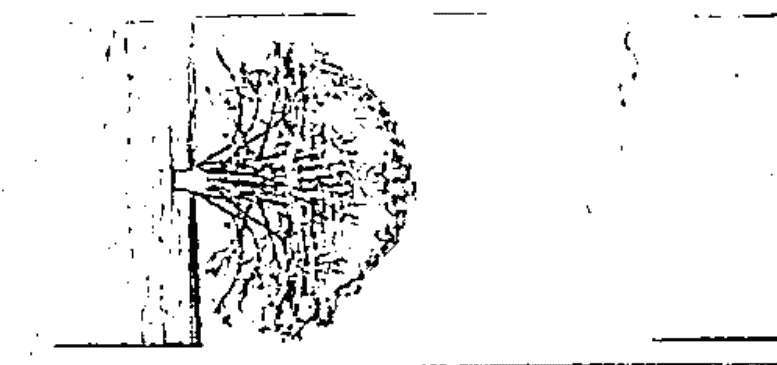
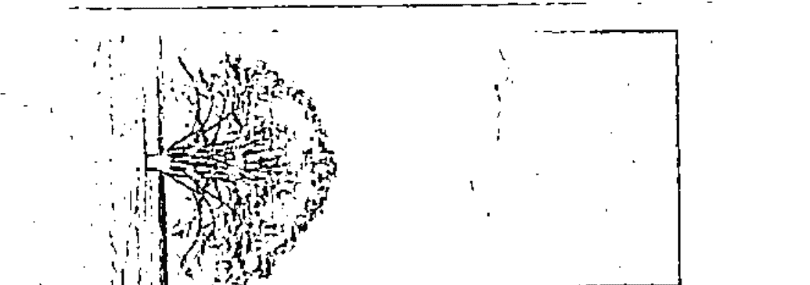
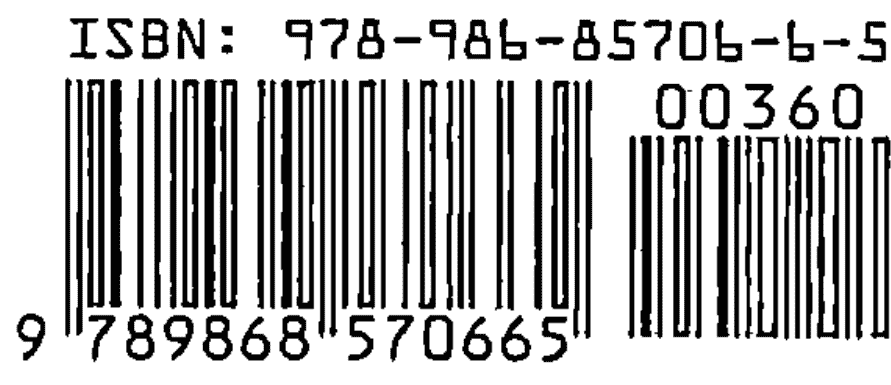

# 科学观灵术

# 三、觀靈術、觀落陰

「通靈術」在華人民間發展出了一些類似的方式，稱為「觀靈術」。說的更明白些「觀靈術」就是靈媒藉著「眼通」進行通靈。「觀落陰」、「觀三姑」、「圓光術」…等等都是類似「觀靈術」的通靈方式。

「觀靈術」流傳歷史悠久，相傳係由周文王開始發展至今。「觀靈術」也是台灣民間傳統風俗宗教信仰中的重要活動，近來較廣為人知的除了一般道壇「起乩」、「扶鸞」、「開沙」以外，「觀靈術」活動進行的內容還包括：「生死簿查因果」、「牽亡魂」、「遊地府」、「探訪元辰宮」、「探花叢」、「探訪死去親人」…等等。其中「遊地府」、「探訪元辰宮」、「探花叢」、「探訪死去親人」…等等主題也發展演化成為團體觀靈活動，稱為「觀落陰」。

傳統辦理集體「觀落陰」活動的宮廟，會在場地四周懸掛著各種圖像，以暗示信眾們進行觀靈時可能會看到類似景物。進行「觀落陰」前，參加的信眾們需要先登記、繳費、焚香、祝禱。集體「觀靈術」進行時，通常一場約有二、三十位參加。信徒們以廟方發給的紅色布條包裹符咒朦住雙眼後，一排排坐在宮廟前的椅凳上等待。一切就緒後，帶領法師或道士持續焚燒紙錢、敲打法器、口中唸著咒語；有時也會燒「催符咒」，為大家燒開路符咒開路。在敲打法器與唸咒聲中，進行一段時間後，通常有少數幾位開始看到一些畫面，比較深入者身體會左右搖晃、雙腳在地上不停踩踏，看來好像真的在走路。

參加觀靈的信徒們，看到畫面時遵照法師的事先告知以舉手示意，此時在旁的助理會適時給予協助，引導觀靈者說出他所看到的情景。倘若遇到困難時，法師會加強唸持相關咒語及焚燒符咒以進行協助。例如，觀靈信眾說：「眼前很暗，沒法看到甚麼。」法師就會燒一道符，口中邊說著：「給你燈。」或者改唸「毫光咒」以協助引導。信眾如果說：「太高了，爬不上不去了。」法師會邊燒符，邊說：「給你樓梯。」以協助信眾進行探訪。

進行觀靈時，多數參加者可以保持意識清醒（類似淺度催眠狀態），並且能夠清楚的聽到周遭的聲音，還可以跟周遭人對話、喝水。他們多數可以清楚的記得看到了些什麼或講了些什麼話，極少數不記得者需要法師提醒（進入較深的催眠狀態）。

一般而言並非每一個人都可以順利進入靈界「觀靈」，通常一個大約有二十到三十人的團體，能有一到二位進入就算是很不錯的成績了，有些宮壇還會在團體中暗藏自己的資深成員，以避免全員覆沒。倘若無法順利觀靈，法師多數會歸因為「八字不合、緣份未到」作為解釋。此時，可以請求順利進入者或靈媒代為尋找親人、傳遞訊息，或是請通靈的法師代為觀看。

「觀靈術」通常以「自觀」、「代觀」、「團體」等幾種方式進行。

自觀：由法師、通靈人或乩童進行焚香、唸咒、燒符、敲打法器…等儀式，施法引領問事者進入靈界、地府，酆都城探訪逝去親人；探訪元辰宮，查詢前世今生的因果以及今生的相關福祿記錄。這類方法通常稱為「觀靈術」或「觀落陰」。

「遊地府」、「探訪元辰宮」、「探花叢」、「探訪死去親人」多數以類似集體催眠的宗教儀式進行，當事人由法師集體引導，進入靈界探訪，助理則在一旁協助已看見景象者深入探訪。

代觀：由法師或乩童、靈媒以生辰八字，為問事人查詢前世與今生的資料，解答個人及親人相關的問題。靈媒或法師也可代為檢視當事人的因果業報，進行靈療；或代觀其在靈界的生命花樹、健康狀況及有是否有子女，俗稱「探花叢」。早期台灣極為重男輕女的社會中，靈媒、法師還可以為當事人更換花朵，把象徵女兒的紅花更換為象徵兒子的白花，以祈求生出可以傳宗接代的兒子。

「生死簿查因果」、「探花叢」等項目，多數由眼通已開的靈媒或法師代觀。「牽亡魂」則是由靈媒或法師接引亡魂上身與親人互動。無法自行進入靈界者，也可以委由靈媒或法師代看「元辰宮」及「花叢」以進行改運、造命。

一般進行觀靈時，法師通常以信徒們保持清醒可以動作、說話，告知觀靈術並非催眠術。這是法師們對催眠狀態有錯誤的認知，以為進入催眠就一定是不清醒或睡著的，所以只要信徒是清醒的就認定為非催眠。其實，深入催眠術中探研後，就能理解：「催眠並非幻術，接受催眠者通常多數可以保持意識清醒的狀態。」

在台灣尚未發展心理、心靈的年代裡，傳統觀靈術也是一種社會教化，確實協助了許多人平靜心靈。然而，無論是藉由宗教儀式還是科學方法進行生命探索。生命的進行，還是可以操之在我。

如果凡事都想要先知道結果或只想由他人替你改變，那不就被這些方法掌控了人生？此時，你的生命決定權也就交由他人來代為操控了。

過之猶如不及，「信」與「迷信」往往在一念之間。如何能夠謹守分寸「信而不迷」，實在考驗著生命修習者的大智慧！

# 四、元辰宮、生死簿

「探訪元辰宮」是台灣民間宗教比較常應用的一種集體「觀靈術」。探訪內容有生死簿查閱、調整生命樹或生命花、清理打掃元辰宮、探訪死去親人…等等。傳統「元辰宮探訪」由法師帶領信眾進入。法師先進行施法，以焚香、唸咒、燒符、敲打法器…等儀式，引領問事者進入「靈界」整理元辰宮，以進行開運、增進健康、補財庫、招桃花…。

近年來「遊地府」、「探訪元辰宮」等民間宗教儀式經由媒體報導，逐漸為更多社會大眾所知。

根據報章、雜誌報導及網路資料，知名作家三毛曾於一九八五年十月二十四日在「無極慈善堂」由呂金虎法師帶領，進行觀落陰、探訪她死去的丈夫荷西，並在探訪元辰宮時看到生死簿。這則新聞在當年曾經轟動一時。

三毛在探訪元辰宮時，看到了生死簿中記錄著她從一歲到四十九歲的生命相關重大事項以及她所撰寫的四十九本書名，四十九歲之後的欄項則為空白。三毛在四十九歲那年自殺死亡，同時也留下了世人對「元辰宮」、「生死簿」的疑惑與好奇。

在坊間，也有專門協助「查閱生死簿」的靈媒。藉由查閱生死簿讓人了解生命的進行、好命與厄運，以進行開運、改運。

# 五、靈界與枉死城

傳統台灣民間信仰認為，人死往後會進入「靈界」如同生前般地繼續生活，倘若死亡的時間未到就因故往生，則會進入「枉死城」等待投胎。由於這個觀點導致只要親人去世，無論是他們會進入靈界還是枉死城，通常都會燒化大量紙衣、紙錢、紙屋給往生者，以期他們能夠繼續生活。

探訪靈界與枉死城通常也是集體進行，藉以了解已故親人在另一個世界的生活。進行時法師通常會指示燒紙錢、衣服或辦法會「迴向」超度、協助其治療生前疾病。也有人藉著觀落陰一探思念的親人或向其詢問去世前來不及交代的事情。

進行「靈界」探訪時也是由以法師符、咒、法器敲打…等儀式進行引導，當信徒看到畫面時，就舉手請助理法師在旁以語言引導協助。這些引導語詞，與簡單的催眠引導詞語其實並無太大不同。

「探訪靈界」並非華人的專利，十八世紀出生瑞典的名門貴族伊曼紐·史威登堡〈Emanuel Swedenborg〉就曾通行靈界二十七年，鉅細靡遺地寫出了許多靈界的環境與狀態，並被視為同等級於牛頓的大科學家。

一七四五年在史威登堡五十七歲時的一天晚上，一位「神的使者」在史威登堡面前降臨，指示他將在靈界的所見所聞傳布給世人。史威登堡從此成為了能夠隨心所欲進出靈界、探索靈界的靈能者。這位西方靈能大師於一九七二年去世，留下了幾萬頁詳細記錄靈界體驗的「遊記」流傳至今。

我在進行個案協助或催眠師培訓時，經常有機會帶領學員進入脫離肉體後的超時空，多數人感覺到輕鬆自在、視野開闊，可見「靈界」可以視為寬廣的宇宙多次元空間，而不僅僅是目前所認知的「地府」、「枉死城」或「天界」。

# 六、牽亡魂

台灣民間道教習俗「牽亡魂」又名「牽尪姨」是靈媒引亡魂藉著自己的身體以與人間親人相會。通常是親人突然往生沒將事情交待清楚或在世親人思念往生者，尋求乩童或靈媒牽引亡魂，以協助詢問相關事件如何處理及探究亡者是否安好。不僅是台灣華人世界，世界各民族也都有藉由靈媒附體傳遞訊息的信仰文化，著名電影「第六感生死戀」就是亡魂附體於靈媒與親人相會的故事。

「牽亡魂」也是通靈術的一種，與一般宮壇的「起乩」、一貫道中「起鸞」、「開沙」、「借竅」極為類似，差別在於前者是將肉身借給亡魂，後者是將肉身借給神佛。至於上身的究竟是神佛菩薩還是亡靈鬼魂，有時能夠依照靈媒的肢體動作與傳訊內容稍窺一二，並不一定能夠完全確定，有些時候靈魂以神佛的姿態出現，卻只是一般鬼魂，並非神佛。^1

靈媒會依照其能力而接通不同時空的訊息，有些靈媒的能力僅能接通較低靈界訊息，無法接收到高等靈體的訊息，這通常是與靈媒本身的靈格、使命、信仰觀點或是磁場能量有關。

鬼魂也會騙人。神佛與鬼魂最大的差別在於神佛的生命智慧較鬼魂高上許多，通常在另一個時空有位階。而鬼魂通常沒有依歸，有些連自己的狀況都不清楚。不過有些鬼魂確實是由其他高次元時空墜落人間的天使，所以還真是不容易區別。最好的方式就是：「不求鬼神，問自身」。

牽亡魂多數是在神壇、宮廟中進行，應亡者家屬之請，由通靈的乩童或靈媒代為進入陰間探訪亡者及問事，台灣比較著名的「牽亡魂」是花蓮慈惠石壁部堂及宜蘭三結灶王公廟。

我自己去牽亡魂的幾次經驗，是在母親及外祖母相繼去世後的那段時間裡，比較清楚記憶的有兩次。第一次是在十多年前，我看到媒體報導花蓮慈惠石壁部堂，鸞生（乩童）林千代女士，牽引拉法葉艦軍購案尹清峰的亡魂，詢問命案相關問題。當時由於好奇心，專程去了一趟慈惠堂石壁分部牽引剛過逝一年左右的母親亡魂。「慈惠堂石壁分部」主要供奉瑤池金母，平日提供通靈問事。堂中有多位執事皆為身著青衣的婦人，接引亡魂附身於她們身上，與親人進行對話。

那一次牽引母親亡魂。主要因為母親罹患大腸癌去世，我與妹妹心中總是掛念著，希望能藉由靈媒的溝通，證明母親在死亡後過得還可以，以平撫思念之情。

「慈惠堂石壁部堂宮廟外的紅牆，襯著夕陽西落後的昏暗海邊。我與妹妹邊流著淚，邊依照靈媒的指示焚燒了一大堆金紙」。那次牽亡魂留下了清晰的記憶畫面。

石壁部堂進行的降靈探訪，感覺並不真切，身穿青衣的靈媒所講述出來的話，多是模擬兩可的中間語句，並沒有具體的事件陳述。燒了一堆紙錢後，留下的依然是思念與擔憂。

隔了一段時間，我與妹妹又相約去了位於宜蘭五結「龜王公廟」。宜蘭「龜王公廟」是一位男性靈媒，牽亡魂時以紅布條綁在眼部，呼喚求見者的小名，並宣稱可以治療亡者的疾病。去「龜王公廟」之前我就先做了各項訊息蒐集，知道下午才正式問事，而且去問事的人非常多。心想著早些掛號，可以早點辦完事回家。

當天起了個大早，姊妹倆搭乘了北迴線火車轉乘計程車。抵達「龜王公廟」時，才早上八點多，廟裡卻已經有不少人走動了，看來果然是有些樣子的。廟方人員要我們先點香拜拜，再填資料繳費掛號。填寫的是我跟妹妹的名字、亡靈的關係、欲探訪人的姓名、出生及去世的時辰、去世與原因。掛號後，先祭拜廟中供奉的菩薩，再進到一個像會議廳一樣的大房間裡坐著等候。時間一分一秒的過去了，問事的人陸陸續續進來了，偌大的會議廳裡的椅子上都快坐滿了。我好奇的算了一下人頭，大約有一百多人將近兩百人。人們一堆堆的坐著，聚在一起聊天，會議廳裡鬧哄哄的一片。有些人群，能夠很容易地看出是一家子，一起來進行探訪。

好不容易到了下午一點左右，一位穿著中式上衣深色長褲的中年男子出現在前方台上，他就是負責牽引亡靈的乩童。

像是過去飛機上空姐示範救生衣一般，他先拿出一塊方形紅布展示給大家看，再將紅布摺疊成長條狀，還在中間處放上了兩枚十元硬幣，然後以疊成長條狀的紅布朦住眼睛，十元硬幣正好擋在眼睛處。

綁上了遮眼的紅布條，他在台前的一張木椅上坐下來，一旁的工作人員開始叫唱著等待與親人相會的信眾名字。我跟妹妹有點疑惑，原來不是照著掛號順序的。兩個人也只好邊聊邊等。誰知，一直等到了下午三點多，卻依然沒有叫到我們的號碼。

比我們後到的人，陸續被叫到號碼到會堂前方，有些人問了幾句後，帶著沒什麼表情的臉孔離開了；有些人則是相擁哭成一團。通靈問事進行約兩個多小時後，宣布中場休息時間。一位在旁協助的工作人員告訴大家，還沒有叫到號的，可以先辦陽間的事，做些補運甚麼的。

我跟妹妹討論以後，決定先問一些自己的問題，就去報了名，繳了費，填了更清楚的資料。寫上自己的名字，還要填寫父母、兄弟、姊妹、丈夫、小孩等等以及祖先的名字。這一次，倒是很快地就叫到我跟妹妹。還是由方才綁了紅布條的靈媒回答我們所提的問題。靈媒的回答都很含糊，並沒有點到重要的事情。更奇怪的是，中場加開的臨時問事結束後，多位之前沒被叫到號碼的問事者就被一一叫到號了，我跟妹妹也不例外。

我跟妹妹走上前後，靈媒口中呼喚著我跟妹妹，面露痛苦的表情，雙手還捧著肚子，告訴我們她的病還沒有好，需要多燒些金紙為她超渡、消業障。由於母親從小叫我們這些女兒、女婿、孫女的名字，都有特別的發音及方式。靈媒呼喚我們時，用的是我跟妹妹名字的最後一個字，再加上個「阿」。我跟妹妹感覺十分怪異，因為父母從來不會這樣叫我們。接下來又叫了兩個女婿：「阿×跟阿×你們兩個人好不好啊！」我跟妹妹互看著，感覺更怪了，因為母親也不會這樣稱呼她的兩個女婿。

除了靈媒呼喚我們的方式，讓我們姊妹倆都感覺到極為不真實以外。更發現了，我們在中場所填寫的資料，這時候讓靈媒幾乎全都用上了。

仔細的重新觀察靈媒的四周環境，發現我們所填寫的兩次資料都放在靈媒身旁的桌上，另一位協助的工作人員站在靈媒身邊不時跟他交頭接耳。這讓我有理由懷疑，工作人員藉由剛才的資料填寫，蒐集了我們的資料，才進行後續的通靈問事。這一次，我跟妹妹並沒有遵照靈媒的建議燒大量的金紙。

慈惠堂與竈王廟共同之處，就是講的都很含糊，也都要問事者燒大量的金紙（另外購買付費）。

這也是許多降靈起乩的宮壇共通的地方，銷售金紙應該是他們的主要收入之一。

在這兩次「牽亡魂」的親身體驗中，並未覺得這兩位靈媒所傳遞的訊息，對我有些甚麼樣的幫助。反而因為被竈王公廟靈媒告知母親身體還未痊癒，讓我在當時產生了新的焦慮。

這兩次的牽亡靈經驗，讓我了解了傳統中國民間的觀點，容易令活著的家人擔心死去的親人無法順利投胎轉世或到極樂世界。如果是生病去世，又擔心會將病症帶到另一個世界，以至於讓有些不肖者有機可趁，應用各種說詞、方法來詐騙處於悲傷與擔心中的親屬。

建議去參加牽亡魂時，預先準備錄音筆等器具，可以錄下進行牽亡魂時的對話，以供事後比對參考。當亡魂附體在靈媒身上時，家屬也要盡量少給些相關資料，先觀察亡靈是否能在沒有提示下叫出陽間親人小名或暱稱，也可以問他只有彼此之間才知道的小秘密，以確認確實為親人附體，以防止造假、受騙。多數靈媒還是會有些讀取信息的能力，即使信息正確，也要提防靈媒用以詐騙。通常要人花大錢超渡，以治療疾病、解脫業障的都有些問題。試想：如果真正是神佛、菩薩協助處理這些問題，祂們會收這些錢嗎？收錢的是靈媒。但許多靈媒會假藉著菩薩、神佛知名來收錢。他們共通的話術是：「這是上面訂的價錢！」

有一位學員跟我分享她花了將近二十萬元燒了三卡車金紙的經驗：

這位學員有一位從小因病燒壞了腦子的小孩。孩子已經十多歲了，智力卻仍停留在兩三歲的年齡。當媽的除了正常求醫以外，也四處求神問卜，希望能有奇蹟出現。

朋友為她介紹了一位開運大師，這位大師告訴她，由於孩子的業障太深，有冤親債主纏身，要燒三卡車金紙超渡亡魂，孩子的病才可能會好。焦急的媽媽答應了。然而，三卡車金紙要燒上一天一夜，哪有時間去看雇呢？於是，大師勉為其難，又多收了五千元費用，答應代為焚燒金紙。

三卡車金紙共燒掉了新台幣十八萬五千元，換來了幾張焚燒時的照片。而孩子的病，依然如故，一點兒也沒改善。

我看過一些不肖靈媒，利用家人對親人的擔憂，進行後續的紙錢銷售及法會超渡。建議問事者燒很多紙錢或進行超度法會是一般的統一模式，多數信眾都會願意配合，以換取安心。

適當燒化紙錢與進行超度法會，倘若能夠安撫生者的悲傷情緒，倒也還好。若因而又受騙、遭到金錢上的損失，那可就得不償失了。

撰寫至此，正巧報章媒體新聞報導假借「寵物通靈師」之名，詐騙飼主可以花數萬元，為寵物在天堂買上校、將軍等官位。可見以通靈來欺騙社會大眾的還真不少，而願意上當受騙者也有很多。

我相信宇宙的靈能是可以就由人類身體進行訊息傳遞，無論牽亡魂是真實還是虛假，確實能撫慰一些生者的心。但還是要提醒你，在逝去親人的悲傷之餘，要小心注意挑選較有良知的引導者，以免上當、受騙，傷了心又傷了荷包。新聞曾經報導一位藝人，就是因為擔心女兒，所以被詐騙了近千萬，不可不慎。

專職從事催眠工作後，因緣際會總會遇到些靈媒體質的學員或個案卡陰問題來找我協助，讓我有更多機會接觸這些原本神秘的領域。而我總是能夠有效的協助靈媒體質者或卡陰所帶來的靈擾問題，完全不涉及宗教或儀式，更不需要焚香、燒紙錢。

這些經驗讓我更加明晰：「儀式是因人而創造出來的，並不一定需要」。倘若能以良善的初心進行協助，就能有效。神靈與逝去的親人們絕對能夠深刻體會協助者與當事人的心境。

思念亡母的切身之痛以及牽亡魂問靈過程的經驗，後來成為了我研究各種有效方法以及科學理論，以探索另一個時空的動力之一，個案與學員們成為了我研究的老師。因為本書撰寫這些陳年往事時，愈加覺得不可思議。過去這些通靈問事的經驗，成為了我以催眠研究「通靈術」的動機，我更加能夠感受到生命冥冥之中的巧妙安排了！

# 七、探花叢

「探花叢」也是觀靈術的一部分，記憶中大約四十多年前，當時小學一年級時的我，曾經跟隨著母親、祖母去到一處偏僻的鄉下，那是我第一次接觸牽亡魂。當時母親與外祖母是去牽外曾祖父的亡靈。雖然已經是幾十年前的事了，至今印象依然深刻。

「探花叢」是在台北縣偏遠鄉間的一棟磚造矮房中進行的。穿著樸實的男女老幼們依序領取了號碼牌後，排排坐在長條木椅上，聊天的聊天、打盹的打盹，等待著叫到自己的號碼。號碼牌是張薄薄的黃色小紙張，上面用原子筆粗線條的寫著扭曲的阿拉伯數字。每當一個拉長著嗓門的聲音，以台語發出哀怨的呼喚聲：「XX號！」就會看到原本團團圍坐著的好多個身影，一起站起來趨向前方。

靈媒就坐在屋子前方一張老舊的藤椅上，是位年約六十多歲頭髮花白、穿著灰底花布唐裝的老婦。被叫到號碼的人就趨向前去，坐在零散一旁的圓木凳上，跟靈媒對話著。靈媒通常先詢問亡魂的姓名、出生年月日、忌日以及探訪者與亡魂之間的關係，然後在喃喃吟唱著不知名的咒語後，開始進行牽亡魂。

用不了多久時間，就找到要探訪的亡魂了，與探訪者彼此相認，確定就是探訪者要牽引的亡魂後，亡魂就藉著靈媒的身體開始進行談話。通常將探訪的女性稱為紅花，男性稱為白花。

已經是幾十年前了，腦中的畫面仍舊清晰浮現：昏暗的屋子裡，交織著老婦人淒涼的呼喊以及亡者親友們的哭泣聲。老婦佈滿皺紋的臉、緊閉著的雙眼，口中喃喃的叫喚著「紅花女」、「白花子」，恍惚透露著逝去亡靈的不捨與哀戚。

除了協助亡靈與親人相會以外，靈媒還有另一項業務「探花叢」。相傳每個人在靈界都有一棵本命花或本命樹，這顆本命樹也出現在元辰宮中。本命樹上開的花，就是當事人的子女。白花是男孩，紅花是女孩。當人們久婚不孕想要祈求生子者，可以請靈媒代為施肥灌溉，以期開出紅白花朵。一直生女兒，想要生男丁者，就請靈媒協助將白花換成紅花。

在過去尚未有羊膜穿刺、人工授精的重男輕女年代裡，求助靈媒「探花叢」將紅花換成白花祈求生個壯丁，應該是項極為熱門的行業。

# 八、起鸞、開沙、借竅

眾多民俗宗教中的起乩應用中，除了前述在宮廟、道壇、私宅中所進行的各種「觀靈術」外，「一貫道」的「扶鸞、開沙」儀式雖然隱密，卻也是廣為人知，並且好奇討論的。

「扶鸞」由天、地、人三才各司其職，「天才」負責接收訊息，將肉體借給神佛附體，起乩後在沙盤上寫下文字；「人才」負責翻譯，唱頌出沙盤上訓文後，撥平沙盤以協助「天才」繼續書寫；「地才」負責記錄，抄寫下「人才」唱頌出的訓文。

「扶鸞、開沙」時降乩的神祇很多，從佛道的無極老母、觀音菩薩、彌勒佛、元始天尊、釋迦牟尼佛、濟公、關聖帝君、呂純陽祖師，到基督教的耶穌、回教的穆罕默德等等，都可以附體起乩傳遞訊息。許多一貫道的佛經講義，勸善書、勸世詩等等，據說都是由「開沙」中所得之訊息編撰而來。

不僅是一貫道，有些道教的宮壇也會也應用「起乩、借竅」的方式為信眾辦事。「借竅」時乩身的意識有些是抽離，大約是類似於進入第四到五級以上的催眠深度，此時意識完全由所接通的靈體主導，清醒後可以完全不記得方才所經歷的過程。有些乩身的意識是清醒的，所進入的類似催眠狀態的深度較淺，此時通常可以保持兩個意識同時存在的狀況，醒後也就能夠完全清楚的記得所有過程。

我的個案及學員中，有幾位是一貫道信徒，也有些在上催眠課之前就擔任了宮廟的乩童或屬於靈媒體質。透過觀察他們得到的資訊，應證了多數乩童都是「敏感體質」或是內在視覺能力較強者，他們也多數也比較容易接受暗示或是進入較深的催眠狀態。

大約在 2004 年左右，有位學員是一貫道信徒，跟我提起：「母娘降旨，停止開沙。」我當時聯想到的是：或許此時此刻的世代中，正是要將宇宙間的神秘逐漸揭發的時刻！而催眠，正是能有效引導人們深入潛意識狀態，探詢神靈與宇宙能量世界，揭發原本神秘的超自然現象的好方法。

# 九、催眠通靈的凱西

愛德加·凱西這位美國知名通靈者，是應用「自我催眠」進入通靈狀態的先驅者。凱西應用「自我催眠」進入超意識狀態，協助許多人療癒疾病。

凱西出生於一八七七年三月十八日肯德基州霍普金斯維爾（Hopkinsville, Kentucky）。在六、七歲時，他就能看到其他世界的靈體，並且與這些靈體進行對話。這些靈體其中有一位是凱西的祖父，包括南北戰爭，埃及，波斯……等等許多知識，都是由祖父這個靈體告訴凱西的。

凱西超人的能力逐漸展現在神奇的閱讀與記憶上：他只要在書本上小睡一會兒，就能將書中的內容完全記住。許多超出小學生知識範圍的書籍與文件，凱西往往也能夠在書籍上面小睡一下後，就一字字的背誦出來。

在一個機緣下，凱西進入了催眠狀態開始閱讀他人的相關信息，而清醒後的凱西卻完全不記得自己方才到底說了一些什麼。

他開始在催眠狀態中為人進行生命解讀，這些解讀包括了就當事人生活經歷與今生影響進行指導及身體健康解讀，或是就當事人身體健康與疾病給予信息，前後大約為九千多位當事人進行通靈解讀。此外，凱西還為人進行解夢、靈修、尋人、尋找寶物、預知股市、賭馬……等等。凱西還曾經為兩千多人進行了輪迴轉世的生命解讀。

凱西進行通靈時所講述出來許多與醫學、歷史、地理相關的名詞，根本不是教育程度僅有七年級的他能夠理解的。以催眠進入超意識狀態讀取訊息的凱西，所有身體的感覺也是消失的。周遭有人曾經進行實驗，拔掉了凱西的手指甲以針刺他，他仍然沒有任何感覺，直至由超意識催眠狀態清醒以後，才會感覺到身體的疼痛。

凱西藉由催眠進入通靈狀態，除了可以詳細為人檢查身體並告知引起疾病的原因以外，還可以提出治療疾病的建議。而且，凡是經由凱西解讀、檢視過的人，無論日子隔了多遠，他都能夠快速明確地辨識出來。這個狀況顯示，凱西的潛意識具有超強的記憶力。

凱西應用「自我催眠」進入的通靈狀態，大約具有五級以上的催眠深度，許多人在催眠中也能夠做到。多數人可以隨著接受催眠次數提升其接受催眠能力，並建立快速進入催眠狀態的管道。看似神秘的靈能，終將在催眠技術為大眾認同接受之際，為更多人所應用，以達人人都可以在超意識狀態下探訪靈界的最終目標。這讓人不禁讚嘆人類的潛能真是奧妙無窮。

◎關於史威登堡及凱西的資料，係參考網路資料撰寫。

# 第二章 催眠 VS 催眠療法

催眠可以解讀神秘的觀靈術，轉化迷信為科學與心理學。

## 一、巫術、通靈、催眠術

前面章節中介紹多項台灣民間的觀靈術應用以及西方應用自我催眠通靈的實例。那麼，「催眠」與「巫術」、「通靈術」之間又有些甚麼樣的關係呢？

催眠術能夠引導人們快速進入超意識狀態及與超意識相關神秘狀態。傳統「通靈術、觀落陰」能做到的，應用催眠引導多數都能做得又快、又好。

「通靈術」流傳歷史悠久，可追溯到遠古時期的巫術，「觀靈術」源自於「通靈術」，「通靈術」源自「巫術」，而巫術是通靈術應用的開始，也是催眠術的前身。由此可見，通靈術與催眠有著本源同生的密切關係。

一直以來，「催眠術」在台灣人眼中仍是披著神秘外衣的西方魔法。每當初相識的人們知道我是一位專職催眠師時，偶爾還是會快速地以雙手蒙著他們的雙眼，半開玩笑式的說：「不要催眠我！」在他們內心仍有著一些好奇與疑惑，以為只要看著我的眼睛，就會被我控制。

提起「觀靈術」，那就更加神奇了，傳統認為「需要由法師作法、念咒來進行帶領！其實，透過催眠引導，那些儀式並不一定需要。我在二○○七年出版的《輕鬆自在玩催眠》書中撰寫了二十七個催眠引導，強調只要個案願意相信，照著唸讀稿子，也能達到成功率超過百分之五十。

或許，有些人會將「催眠」與「觀落陰」直接畫上等號，雖然兩者在技術應用上有許多雷同之處，但這樣的說法也並非實情。「觀落陰」係將重點置放於於宗教、祈請、誦經及符咒，以前述儀式製造了信眾的「信任」與「專注」故而產生了催眠效果，啟動了探訪者原本俱足的超意識能力。這種觀念容易讓人因此誤認，進入的超意識狀態僅能透過「誦經」與「符咒」，卻忽略了儀式的存在往往是為了建立信任。

追溯催眠發展及其起源時，總會連結至古埃及、古希臘、中國、印度，南美…等等人類史，許多相關記載至今仍可循跡探尋。尤其在影響人類思想、信念的各宗教、民俗信仰及其儀式中，更都蘊藏著許多催眠術的身影。考古學家在古埃及陵墓及神殿中，找尋到了西元前一千多年前，埃及人進行儀式的許多記錄。神殿及古墓的牆上，以象形文字記載著古埃及祭司們施咒引導病人進入類似睡眠的出神狀態，以驅趕邪靈或醫治疾病的過程；也有處於類似催眠狀態中的聖女，正在傳遞神諭的儀式圖示。古老的記錄中，還記載著病人進入類似睡眠的夢境，得到了療癒疾病的啟示象形圖示。位於巴爾幹半島有「睡眠聖殿」之稱的「埃皮達魯斯神殿」中，也發現了在神殿裡應用咒語進行類似催眠引導，治療疾病的古老皮卷記錄。

由這些在古代史蹟中的發現，可以確定：「催眠一直以不同的形式存在於人類的生活當中，直至十八世紀才開始研究發展其相關技巧與理論。這也顯示出許多民族的共通行為模式，不同民族文化的祭司們都使用咒語及舞蹈、祭祀等儀式，進入類似催眠的出神狀態，與萬物生靈進行溝通、療癒疾病、傳遞神諭。

傳統觀靈術通常會以需要燒紙錢或進行超度、談判來做後續消災解厄…等服務。其實，燒紙錢、唸經、辦法會，都僅是短時間可能產生的心理作用及能量轉變而已。當事人終需認知：「唯有自己調整心性，認真面對問題，學習智慧度過難關方為根本之道。否則，僅是將問題往後延遲發生而已，當未來發生相似狀況時，還是得去面對。」

關於催眠概念及其他技巧使用，請參照我其他書籍，本書將僅針對催眠應用於「觀落陰、元辰宮、探訪死去親人、遊地府」等與台灣傳統民俗信仰相關引導與觀點進行介紹與剖析。

本書所介紹的「應用催眠進行觀靈」突破了「需要持咒、作法、燒紙錢才能進行觀靈」的傳統認知，讓每個人都可以更容易進行觀靈，也可以學習如何帶領觀靈，並且將潛意識傳遞的一項意象訊息進行心理解析。這項研究的目的，旨在突破迷信，增進人們對潛意識的認知與應用。

「進入催眠的狀態與進行通靈時的狀態是極為相近的。兩者都是進入人類超意識狀態，但是因為帶領的方式與觀點有所不同，而產生了不同的認知與結果。」這是我研究多年的結論。我們可以這麼說：「所有鍛鍊心性合一的方法，多源自因人類恐懼而產生出的儀式與方法，這些儀式與方法組成了人類最初的信仰『巫術』，巫術正是通靈術與催眠術的源頭。」

## 二、儀式的作用

經常會在許多宗教儀式中看到鮮花、蠟燭、焚香、結界、誦經、跪拜、祈禱…等等環境佈置與動作行為所建構成的儀式。近代某些新時代心靈成長課程中，也會看到有些帶領者極為崇尚必須燃燒白鼠尾草淨化場域、噴灑保護水淨化場域、建立結界；或祈請高靈、天使護佑、加持各種等儀式。可見不僅僅是東方的中國，即使是西方也迷信於儀式的建立與過程。

古代東、西方宮廷中，通常建立許多儀軌，以求在儀式進行中建立君王的威權，取得人民的崇敬與信任。「繁複的法器、冗長的儀軌的過程」其目地都是在於讓當事人臣服、謙卑、尊重。這些繁複的儀式，主要目的是獲取信眾的景仰與信任。傳統「觀落陰、元辰宮探訪」也會使用法器、符籙、咒語、祭品、清茶、果品、金紙、古黃紙、法尺、觀音竹葉……等等各式道具，其目地也在於取得「信任」。

或許是因為文化傳統、也或許僅是單純的堅持己見，在某些人的認知與信念中，儀式是絕對必須存在的，也是虔誠、信任與尊重的象徵。對於具備這些堅持的人而言，儀式在整個達到目標的過程中就顯得十分重要了。

事實上，人類的 ESP 超覺知能力1原本具足，並非一定要透過這些儀式的進行才能取得。以一個資深專業催眠講師的角度來看，「儀式」的本身就是一項建立信任、尊重、接受的催眠過程，主要功能在於令所有參與者產生信任與專注。儀式的進行並不一定侷限於冗長的時間或繁複的儀軌。換言之，當人們已經可以全然信任之時，極為簡短的儀式、甚至沒有任何儀式，也都可以達成上述目的。「儀式」也可以透過影片、文字、語言、動作來進行，並且不一定需要在實境當中。

有些人因為不了解而迷失於儀式中，誤以為沒有繁複的儀式流程，就不能進行觀靈。誤以為一定要遵照制式儀式進行，才能連結神靈、產生力量。這些都是因為不知其所以然，或者因為迷信而產生了本末倒置的認知偏差。

我並不贊成過度使用儀式，這會誤導人們一味崇拜儀式。過多的儀式其實反映出人們內心恐懼或制約信念的存在，恐懼自己虛幻的邪魔、不相信自己擁有某些能力、認為這些能力需要更高的存在給予才能具有。儀式隱藏、裝飾著人們的恐懼，也誤導人們忽略了自己的許多天賦能力。以進行催眠時與個案建立關係來看通靈前的儀式，就能夠非常清楚：「繁複的儀軌與是否具備通靈能力並無關聯，就僅是營造氛圍、建立信任而已。」

「信任」包含了：「通靈者對接引儀式的信任以及對自己能力的信任，也包含了崇尚者對通靈者能力信任以及接引源頭2的信任。」例如：通靈儀式因人而異，有些通靈者需要冗長的時間、繁複的儀軌、莊嚴的佈置以進入通靈狀態，而有些信眾需要看到通靈者的這些通靈過程，才能夠產生畏懼或信任。

最後，我引用《再連結療癒法》3 艾力克·波爾醫師所寫的一段話，來結束這個章節：

> 「當我們強化恐懼的概念時我們無法處於愛中做事，在我們的生活環境裡我們用儀式來裝飾恐懼，然後欺騙自己，讓自己相信這個儀式是愛的表現。當我們用祈禱來作為一種保護時，我們是在減弱祈禱的力量，我們祈禱和做某些儀式，到底是為了保護自己以免受到甚麼東西的傷害呢？就只是我們那難以捉摸的恐懼而已，而一切止步過因為我們相信邪魔的存在，我們無法認知到邪魔僅是一種虛幻的恐怖之物，我們花了那麼多時間來避免受到某些不存在的東西的干擾，因此我們只剩下很少的時間給那些存在的東西。」

把因為恐懼而創造出來的儀式放下吧，這些繁瑣的包裝，正是阻礙智慧開啟與成長的絆腳石。

註1： ESP 超覺知能力：ESP 是 (Extra Sensory Perception) 的簡稱，易可翻譯為「超感官知覺」、「超意識 ESP」。通常是第六感、心靈感應、透視力、預知力的總稱。每一個人都具備這種能力，人類因為理智頭腦的壓抑，ESP 能力因而遭到覆蓋。

註2： 接引源頭：此處意指通靈人所接通的鬼魂、靈體、菩薩、神佛、天使、高靈。

註3： 《再連結療癒法》作者：艾力克·波爾醫師，出版：生命潛能出版社

## 三、催眠引導觀靈

十多年前，催眠的相關資訊流傳並不多，有些催眠師在進行催眠前，除了先進行催眠敏感度測試以外，還要先進行長達三十分鐘從頭皮放鬆到腳底板的前置引導，這才開始正式進行催眠引導。對於講求效率的我而言，那真是冗長、無效率又浪費個案時間、金錢的「儀式」。

於是，我開始嘗試發展快速催眠，「主題式催眠」引導「前世回溯、預觀未來、甘露大會、探訪死去親人、遊地府、元辰宮」等相關主題研究因而產生。藉由主題式催眠引導，能夠協助人們更有效率的學習催眠。

這些主題式催眠探訪超次元空間，除了可以提升催眠成功率以外，也能夠突破人們對於傳統宗教儀式的迷思。《輕鬆自在玩催眠》這本催眠工具書就是基於以上理念所撰寫而成，除此之外也藉機推展「宗教應用催眠，催眠源自宗教」的概念。

《輕鬆自在玩催眠》，內容除了有「專注與放鬆」的基本催眠引導以外，也涵蓋了「童年」、「前世」、「未來」、「瀕死」等多項回溯技巧，比較特別的是將宗教式的催眠引導如：「引見指導靈」、「藥師佛菩薩消災解疾法」、「觀音甘露普降法」、「探訪天堂極樂世界」…等等主題納入，應用了我多項獨家研創的催眠引導觀點。

以催眠帶領「超時空旅行」無論是「觀落陰」或「探訪元辰宮」多數人都可以在意識清醒狀態下，清晰看到情景。集體催眠觀靈，成功率可達到百分之八十以上。倘若事情經過詳細的解說，協助採訪者能夠更清楚自己的感官運作，成功率可達百分之百。

體質先天敏感者1由於視、聽、觸、味、嗅內在感官在催眠中全數打開，能夠感同身受，完全融入靈界情境當中，彷彿身歷其境。他們可以在經過山林小徑聞嗅到花草森林的芬多精香氣、以手觸摸小溪中的潔淨水流、感覺的到清涼，甚至可以摘取水果品嘗。集體遊地府時所有夥伴們，看到感覺到的更可能是完全相同的。

幾年前，我在催眠師培訓班進行時引導「遊地府」有位學員甚麼都看不到，卻感受到口中有一些甘甜的液體分泌。採訪結束後，大家進行團體分享，許多學員都進入了相同的場景，原來剛才大家一起去地府的茶館喝茶去了，而其他同學們也看到她一起坐著喝茶。原來她口中所感覺到的甘甜，正是是好茶入口以後的滋味感受！

應用催眠引導協助人們採訪其他時空，只要案主信任、專注，即可進入超意識的催眠狀態，成功率較傳統觀靈術高上許多。我在進行個案催眠及團體教學時，經常有機會與另一界的外星人、高靈、仙佛、菩薩相遇，同時還能夠協助個案解決他們的困惑與各種問題。

進行「採訪元辰宮」、「內在心靈花園」等主題式催眠引導，能夠協助個案了解自我及潛意識狀態、清理深層潛意識，或針對其內在所見進行心靈意象解析、重新設定生命目標。

只要具備正確的觀念及技術流程，不僅是帶領個案觀靈，人人都可以學習以催眠術進行各種與通靈術相關的領域，而且極為容易。應用各式主題進行探索藉以了解潛意識狀態並所接收其訊息，進行解析或目標重整，以幫助自己或他人。並且更容易因為對於催眠不甚了解以致產生錯誤認知的人們接受。

我經常推薦剛由催眠師培訓班結業學員應用觀靈術中的「前世回溯」、「探訪元辰宮」來進行練習。這種主題容易讓一般社會大眾接受，並且能夠藉由催眠引導與潛意識進行連結，解讀潛意識意象世界，取得身與心的一致性，「開運、招財、招桃花」當然也就非難事了。

進行催眠探訪超意識時空的同時，還可以輔以各種相關技巧、觀念，進行牽引亡魂、觀落陰。協助療癒亡者、撫慰生者進行心靈輔導、悲傷療育，以協助面對失去與死亡的恐懼。具有正確的觀念及技術流程的催眠術，無論是個別引導還是集體引導，都以符合現代科學生命觀，不需要進行焚燒金紙、持念祝禱等冗長的祈請儀式，也可以不涉及任何宗教。

有一位學員分享曾經參加過多次傳統觀落陰，都無法順利進入。向我學習催眠以後又去做了一次，卻有了非常不同的體會。她分享由於在催眠課程中了解了人類五感六覺的概念，又學會了內在視覺、感覺的感官應用，認知了自己的內在優勢感官，所以非常成功的由「感覺到畫面」到「看到許多畫面」。由此可見，觀落陰也是可以透過學習的，這位學員因此也更確認了觀落陰與催眠引導在感官運作的不同與相同。

傳統「觀落陰」有所侷限，並非每一個人都可以順利進入。也曾有學員分享他參加過一場挺特別的觀靈術。引領的法師除了焚香、念咒、燒符、敲打法器以外，也應用問事者聽得懂的詞語做引導，她感覺跟催眠引導幾乎沒兩樣。那一次能夠進入並且看到「元辰宮」人數由原本的十分之一提升到了一半以上的十多位。我們共同討論的結果是：「法師們也開始懂得應用催眠引導，以增加探訪元辰宮的成功率，而且依照效果看起來確實有所進步。」

參加「超時空之旅」者，不分人種、國籍、教派甚至無神論者都有很高的成功實例。其中小孩子又比大人容易進入。不明白的人聽起來雖然會感到奇怪，但的確可以十分科學。一般人因為受電影或小說鬼故事的影響，誤以為另一個時空的「靈體」都是穿白衣服、披頭散髮、青面獠牙的「異物」所以總是自己嚇自己，沒有膽量嘗試，其實這種擔心是多餘的。探訪超時空遇到的也有可能是未來或過去的自己，或者來自不同與宇宙的外星人以及光靈們，有些人還會遇到菩薩、神佛等高靈。參加超時空之旅者，不分人種、國籍、教派甚至無神論者都有很高的成功實例，而且非常符合宇宙科學。

佛典有云：「萬法歸宗」、「萬法同源」、「萬法唯心」，以正確的認知看待玄學與神秘學，藉由實務研究、印證宇宙天地大自然，可以引導人們心靈思維趨向正向化、科學化，避免許多心靈迷失產生恐懼的人們，因為不了解而造成過度迷信，開運開不成卻反而受騙上當，那就真是得不償失了。

註1： 體質先天敏感者：先天體質敏感者可說是已經開啟天線的人，視、聽、觸、味、嗅等五感通道暢通、收訊良好，只是通常不知自己擁有這些能力，或不知如何使用這些能力。這類體質者，有些平日就處於類催眠狀態，當然容易接收到其他次元的訊息。此類體質者通常也容易出現憂鬱、卡陰、多重人格等現象。

## 四、催眠、觀靈、心靈意象解析

我們可以藉由催眠引導，觀照自己內在心靈映照出來的各種情境，藉以檢視自己的心靈，也可以趁此以「隱喻」來做修正跟調整，讓自己時時處於豐盛、滿足的狀態。如果，內在心靈花園充滿盛開美麗的花朵，或者潛意識中的房子明朗光亮，多數可以初步了解此人心理狀態可能是比較偏向健康的。

以超意識催眠進行「觀靈術」相關研究，其中涵蓋了「元辰宮」、「觀落陰」、「探訪死去親人」、「遊地獄」、「遊天堂」、「生命樹」等主題式催眠引導，並融合西方元素將「元辰宮」進一步區分為「心靈花園、生命之屋」。除了能夠結合心靈意象解析，協助案主了解自己、設定目標，佐以 NLP 語言溝通模式…等正向觀念進行協助之外還可以結合宗教觀，協助個案了解自我，針對其內在所見進行心靈解析分析或配合繪畫解析，在了解自我及心靈成長上效果極為顯著。

超意識催眠進行時，許多人會看到一些圖騰與意象，這些意象與藏傳佛教的「宇宙圖」極為相近；催眠中所看到的人物，與榮格認為的心理原型往往有著密切的關連。其中應用的解析與沙遊意象、房樹人心理測驗分析也有異曲同工之妙。

我曾經在二十多年前在位於富陽街的「無極慈善堂」參加過一次觀落陰團體。那一次進行的是「探訪元辰宮」，參加者大約有二十多人，為時約兩小時的活動中，進行了兩次每次大約三十分鐘的帶領。兩次都僅有一個人進入，我與同去的友人則與多數參加者一樣，什麼都沒看到也沒有任何感覺。

一般使用傳統道家儀式進行「觀靈術、元辰宮」成功率通常較低。就如我的經驗一般，一場活動總人數二、三十人中，僅約一到兩位可以觀入。引導的法師通常會歸因於「緣分未到、八字太硬」。其實，無論使用任何工具，觀念的建立及使用者的收穫仍是非常重要的。我認為潛意識沒準備好是部分的原因，帶領方法以及探訪者的內在感官能力、接受引導能力也有相關重要的關係。以催眠術進行「元辰宮」探訪時，探訪者先經過五感認知及觀點建立，通常第一次引導就可以有八成以上的成功率，其餘兩成學員經過訓練，多數可以進入，而且畫面及感受越來越清晰，在我帶領的集體催眠中曾經達到全場都進入的完美記錄。

應用催眠引導協助人們進入超時空，只要採訪者全然專注、信任、認知正確，多數即可進入超意識的心靈世界中，成功率較傳統觀靈術高上許多。我在進行個案催眠及團體教學時，經常有機會與另一界的外星人、高靈、仙佛、菩薩相遇，多數時候還能協助個案解決他們的生活困惑與各種問題，這是一般觀靈術所做不到的。

採訪「心靈花園、生命之屋」時，採訪者其所見所聞通常如實呈現了其當下內心世界！進行「生命之屋」主題式催眠引導時，個案描述他的「生命之屋」是個陰暗、破舊、傾斜、充滿灰塵與雜物的小屋子，他在進入屋內時甚至迷失在彎延的小徑上。這正是他在當下現實世界的狀態，藉由潛意識意象真實的呈現了他的漫無目標與無助的心情。

藉由催眠引導，我們可以觀照自己內在心靈映照出來的花園或殿堂，藉以檢視潛意識心靈，也趁此以隱喻進行修正與調整，讓自己時時處於圓滿和諧狀態。

自己探訪元辰宮的無感經驗，讓我在研究以催眠帶領「元辰宮」採訪時，理解到觀念建立的重要性，也促成了我以催眠帶領元辰宮採訪，成功率將近百分之百的契機。

將超意識催眠引導整合成為「探訪心靈花園」、「引見守護天使」、「探訪死去親人」等幾個活動，並持續進行推廣與傳承。這個獨特的引導方式，透過許多學員的回饋及累積豐富的個案經驗後，更確認結合催眠、觀靈、心靈解析、繪畫解析所發展出的神奇效果。

## 五、催眠觀靈與傳統觀靈的差異

藉由以下比對表，讓大家更方便了解催眠引導觀靈術與傳統符咒引導觀靈術的使用差異之處。

| 催眠引導 | 傳統觀靈術 |
|---|---|
| 探訪成功機率高，一般約可有八成到九成。觀念建立正確後，可高達百分之百成功率。 | 探訪成功率低，二十位進入一到兩位，過去平均成功率不到一成。近期有法師在引導中增加上類似催眠引導的詞句，有些宮廟成功率可以達到六成左右。 |
| 可由接受過專業催眠訓練催眠師帶領，也可以透過主題式催眠引導 CD 自行探訪。（負面情緒仍未清理的敏感體質者，建議先處理好自己的問題，才能以催眠引導 CD 方式進入，否則易有情緒失控及其他人格介入的可能。） | 一定必須由具備法師資格的人為你進行引導，一般人無法進行。 |
| 相信就成立。 | 心誠則靈。 |
| 不須菩薩引導，只要準備好，多數人隨時可以進入。觀靈是人類的天賦本能，人人皆可學習、應用。 | 進入前需要填寫生辰八字，並須上香禱告、祈請菩薩降臨引導，否則無法進入。 |
| 儀式是由人建構出來的，信任就能做到。可以遵循個人想使用的儀式，也可以自行建構儀式流程，也可以沒有任何儀式。 | 必須遵照原始傳承的帶領流程、儀式。 |
| 語言引導即可。亦可依個人喜好配合适當音樂。 | 需要念咒、焚香、敲法器、燒紙錢。需要在不同狀況持唸不同的咒語。 |
| 進入後應用語言引導，不進行暗示。 | 進入後，由助理法師用語言引導，不進行暗示。 |
| 遇阻礙時以語言帶領即可。 | 遇阻礙時需要焚香、祝禱或唸持相關咒語。 |
| 採訪者意識清醒，有判斷力，能覺察周圍環境聲音及變化。少數進入深度催眠者會遺忘，可透過引導讓記憶回來。 | 採訪者意識清醒，有判斷力，能覺察周圍環境聲音及變化。少數採訪者會遺忘。 |
| 安靜、清潔的場地即可。 | 必須在宮廟中進行。 |
| 可以依照個人喜好佈置安靜、舒適的場地。只要個案準備好了，建立了接受引導的正確觀點，就可以開始進行。 | 會場必須需要佈置莊嚴，必須有法器、符籙、咒語、祭品、清茶、果品、金紙、古黃紙、法尺、觀音竹葉…等等。缺少了這些就會沒效果。 |
| 易懂易學。只要有興趣，人人可以學習如何帶領他人探訪觀靈。只要對方願意信任，照著引導詞稿念讀，都可以有極高的成功採訪率。 | 需具天命，透過祖師爺擲杯應允後、才能進行學習。依個人天資，約數年後可學成。 |
| 可以本人進入，也可由探訪成功者代觀。 | 由受過訓練的執事代觀。受過訓練的執事人數不多，需要排隊等候。 |
| 沒有宗教、種族區隔。 | 沒有宗教、種族區隔。由於觀靈場地多數供奉道教神佛，容易引起需要宗教信仰的疑慮。 |
| 遇到親人狀況不佳時，可請神靈、天使協助，或引導其找到答案、解決困難。 | 遇到親人狀況不佳時，需要購買金紙焚燒，並祈請神靈協助。 |
| 元辰宮內陳設可依自己的需要進行調整、修改，也可以請工作人員或管家協助。 | 元辰宮內陳設可依自己的需要進行調整、修改，也可以請宮公、公婆協助。 |
| 探訪者多數能記住所有情景、感受，並依其內在五感能力，詳細敘述細節。 | 探訪者能記住所有情景、感受，並詳細的敘述細節。 |
| 由於探訪成功率高，會依照探訪者感官能力有所不同。有些探訪者能具備視、聽、觸、味、嗅等五種感官能力。能夠看到、聽到、聞到、嗅到、感覺到各種內外在環境中各種訊息。有些探訪者僅能看到或感覺到或聽到。 | 由於成功率低，能進入者皆屬敏感體質，所以多數能具備視、聽、觸、味、嗅等五種感官能力。能夠看到、聽到、聞到、嗅到、感覺到各種內外在環境中各種訊息。 |
| 可多次探訪，進行比對。 | 可多次探訪，進行比對。 |
| 可依個人觀靈狀態及所見進行心靈分析。 | 沒有後續分析進行。 |
| 探訪後可將觀靈情景繪製出來，進行繪畫分析、解讀。 | 沒有後續分析進行。 |
| 代觀：並不局限於靈媒或法師才可進行代觀，可協助進行內部整理。可由催眠師引導視覺、感覺能力強的採訪者進入超意識狀態，協助進行代觀。採訪包括前世、未來、元辰宮以及其他超次元時空。 | 代觀：必須由靈媒或法師才能代觀，並協助進行內部修整。 |
| 依照採訪者接受催眠能力及內在感官能力，除了可以採訪元辰宮、觀落陰、地府、逝去親人等傳統觀靈術所進行的主題以外。還可採訪包含童年、前世、未來、外星世界、神話世界、天人界以及宇宙許多超次元時空。最重要的是，可以讓我們與潛意識密切接觸，以進行溝通、協調、統整，共同完成生命課題。 | 多數帶領採訪元辰宮、觀落陰、地府、逝去親人。 |

## 六、為什麼要進行催眠觀靈研究

佛典有云：「萬法歸宗」、「萬法同源」、「萬法唯心」，或許我們可以這麼說：「所有鍛鍊心性合一的方法，多數源自因人類恐懼而產生出的方法與儀式，這些方法與儀式組成了人類最初的信仰『巫術、道法、宗教』。」

採訪逝去親人的觀靈術，在尚未有心理諮詢的年代就一直存在於不同民族中，用以撫慰生者思念亡者的悲傷之情，也算是一種有效的「悲傷輔導」。「採訪天堂、地獄」則可以勸人為善、遏阻犯罪發生。

人生在世，多數人都期望感情平順、財富豐碩、平安健康的渡過一生。這個現象由台灣每到歲末，宮廟之中就會擠滿未來年祈求光明平安的信眾，以及命理師、風水師日益增多的現象就可窺知一二。

如果能以正確的觀點看待玄學與神秘學，就能夠藉由實務研究、應證，引導人們心靈思維趨向正向化、科學化，相信一定能夠避免因為生活不順、心靈迷失，以致產生恐懼的。人們往往因為不了解而造成過度迷信，反而遭受到的受騙與上當。

傳統觀靈術通常會以需要燒很多的紙錢或進行超度、談判來做後續的服務，其實，燒再多的紙錢、唸再多的經、辦再多的法會，如果自己的心性沒改，一樣只是短時間有效而已，多數只是產生了心理作用。最終還是要認真面對問題，學習智慧度過難關。

以催眠引導進行觀靈探訪超時空，確實可以協助許多人一解思親、思鄉之愁，因為具備應用觀點方法及使用流程，也可以擺脫過度迷信及怪力亂神的迷思，減少人們受騙於神棍的恫嚇。且簡單、易學，兼具科學理論，非常值得推廣，是人人可以應用、學習的好工具。

- 遊地府（獄）：可以讓人們了解地府（獄）存在的可能，勸人為善、匡正人心、減少社會亂象。
- 靈界探訪：可以擴展人們認知視野的深度與廣度，以珍惜生命、樂活當下。
- 觀落陰、探訪逝去親人：可以進行悲傷輔導，撫慰在世親人。
- 探訪元辰宮：可以了解自我、增進自信、增加財運、增加好人緣、重新設定想要的生活目標。
- 探花叢（本命花樹）：可以調整心性、解除焦慮、重新確定生命目標。
- 閱覽生死簿因果：擴展生命視野、認知靈魂不死、放下執著。

研究「元辰宮」多年後，我觀察到了催眠意象與心靈解析是可以相通的，這個發現為探訪「觀落陰探訪元辰宮」增添了新的元素以及樣貌。

本書中「科學觀靈術」催眠引導，是我參考台灣民間信仰「觀靈術」、「探訪元辰宮」及自己多年來的帶領經驗的經驗，修編而成。其目的是：

1. 證實不需要符咒、法器及冗長的儀式也能引導觀靈。
2. 探討催眠與觀靈術之相同與相異。
3. 探討人們在催眠狀態中的意象與其象徵，並從中觀察、調整。
4. 開創人人可學習、應用的助人模式。
5. 結合催眠術、超心理學、繪畫分析，探討心靈及其象徵對人類的影響。
6. 以主題式催眠，吸引人們對催眠感興趣，以利推廣催眠這項對人類身心靈有極大幫助的技法。

未來將進行「科學觀靈術 HTP」專業人員培訓。除了協助初學催眠學員，容易學習以外，已有催眠經驗者也可以成為進階技巧，用以了解人類潛意識象徵。

# 第三章 傳統 VS 超心理

> 整個人類的歷史以及文化都是有因緣的，都是在這些影響下產生的。——榮格——

## 一、催眠與積極想像

了解了通靈術以及催眠與通靈術之間的關係以後，讓我們再來認識一下，催眠與心理學及超心理學之間的聯結。以下我將介紹目前心理學上與解讀潛意識訊息的幾種方式，這些方法為「積極想像」、「潛意識意象」、「夢的解析」、「曼陀羅繪畫」、「沙遊療法」、「HTP 房樹人」。

應用催眠探索潛意識的工作中，我研究以快速語言模式引導，縮短了進行催眠的前置作業時間，超越了一般的催眠速度。創新的優勢感官確認法及感覺引導語法，也同時創造了個案在催眠中的接近百分之百能夠「看到」或「感覺到」的超高成功率。同時，以解決問題為導向的催眠目標，超越了一般僅引導進入催眠或進行回溯的傳統技法。

然而，我依然經常被透過催眠，看到前世情境的個案問及：「這是真的嗎？」其實，即使是今世發生、頭腦確定還記得的事物，都無法確定其真偽，更何況是進入催眠後的各種意象及前世？

那麼：「個案在催眠狀態下，除了透過敘述紓解情緒、透過回顧發現問題、透過改觀建立新的信念模式以外，個案的所見『情景』對是否有其他重要意義？」我想要更加確定潛意識的意圖。

歷經長時間的研究，我得到了令人興奮的解答。我發現：「當人們處於催眠的出神狀態時，所接收到的『意象』與其潛意識的『象徵』有著重要的連結。」透過進行個案中的觀察、釐清與核對，發現：「透過潛意識傳遞出來的內在情境，對應當事人當下身心靈狀態十分貼合。並與其當下個性、心態、行為、困擾、疑惑以及生活環境、生命目標有著極為深切的意義與影響。」

進入超意識狀態時，能接收與解析潛意識傳遞訊息。人們所看到及感受到的各種意象與其象徵的意義，涉及夢、超心理學、分析心理學、繪畫療育、宗教信仰等領域的研究與探討。

當人們處於催眠的出神狀態時，透過內在感官所接收到的「意象」絕非偶然。除了用以判斷個案的感官能力、意識狀態、催眠狀態以外，更能夠解析潛意識意圖傳遞的訊息。

更重要的是，案主能夠以語言敘述潛意識訊息，並能夠透過引導與潛意識進行溝通。當表意識與潛意識達到相互理解的平衡狀態時，身心靈得以統合為一，激發案主內、外在動能，使得生活更為豐盛、美好。

進行催眠引導時，當個案問及自己內在所看到、聽到、感覺到的「畫面」、「聲音」、「感受」是否為真，又如何判斷是真？我終於能夠進行正確的回答：

如果這是電影中看來的，為何此時會想起它？
如果這些都是想像，為何此時會想到這個，而不是想到那個？

在心理學的領域的研究讓我發現，原來我所進行的方式，與著名心理學家榮格所研創的「積極想像法」甚為雷同。榮格稱積極想像法為「睜眼的作夢」，進行積極想像法時是睜開眼睛的。多數時候進行催眠時都會請個案閉上眼睛，以減少外在視覺的干擾，但是個案仍然可以保持清醒，並且也能以語言表達他的情緒感受。而，如果個案願意的話，他當然也可以睜開眼睛進行催眠。

## 二、潛意識的意象世界

精神分析學派鼻祖西格蒙德·佛洛伊德（Sigmund Freud，1856年5月6日～1939年9月23日）最大貢獻之一就是關於「潛意識」的論述。

佛洛伊德認為：「潛意識」為潛藏於水面之下不可見的大部分，約佔整個冰山面積的百分之九十二左右，潛藏著許多目前人類未知的訊息。潛意識影響著人們絕大部分的生活，卻極少為人們所覺察。佛氏認為人類所熟知的意識，只是冰山的浮出海面的部分。人們所看到的只是冰山的一角，冰山更龐大的部分是隱藏在海水之下的，也就是人類的潛意識。他將人類的心理結構區分為「上層意識、中層前意識、深層潛意識」等三個部分。

不同於佛洛伊德的觀點，瑞士籍精神分析學家榮格（Carl Gustav Jung，1875年7月26日～1961年6月6日）所研創的「集體潛意識」觀點認為：人格結構是由「意識（自我）、個人潛意識（情結）和集體潛意識（原型）」等三個層次所組成。榮格以「露出水面的小島」譬喻人類能夠感知的「意識」，這是第一層的人格結構；個人潛意識則位於意識之下，是人格結構的第二層，也就是水面下的部分，由於潮汐變化偶爾顯露出來，其主要內容是「情結」，這是所有被表意識遺忘的記憶，被壓抑的經驗、知覺、意象、恐懼。在此所形成的帶著情緒的超意識情結，如戀父情結、戀母情結、批評情結、權力情結…等等，都是由一組組被壓抑的心理內容所聚集而形成的。小島的第三層連結為基地的海床，這是人格結構的最底層，隱藏著所有的人類心靈深處共通的訊息，包含了世世代代祖先的活動方式與存在人類腦中的遺傳經驗。這些具有基本的動力模式及原始法則，稱為「集體潛意識」又稱為「原型」，是平日我們無法意識到的，但並未被遺忘。

「原型」代表運作於每個人生命中的宇宙法則，以純然、抽象的形式呈現，無所不在。這些宇宙支配法則在層級上遠遠高過我們的精神層面。榮格認為這些原型在各個不同的文化之間或許有些差異；通常會以不同的名字顯現。但原型力量極為強大，能夠穿越文化的隔閡，超脫歷史、地理的藩籬，影響人類個體的行為及生命過程，也同時影響著人類歷史與文化。

人類係由不同種族發展出各種文化，不同種族神話中卻有著許多相似之處。由不同種族的神話中，我們得以一窺超脫文化、歷史、地理潛在於整個宇宙間的集體潛意識訊息，這也是潛體潛意識發展的證明之一。

榮格「共時性」的著名研究，是在通靈與占卜進行時經常會應用到的觀點。該項研究指出：「意識和實物不斷地進行著交互作用。個體的夢境或幻象等等相關的心理事件，經常會和其他一般生活中所遇到的事實形成一種極為有意義的巧合，這些真實的發生並無法以因果律來做解釋。」

那麼，何種催眠引導能夠引導個案進入相關主題，並就其看到的意象進行解析或調整，以協助個案解除生活困頓，安適心靈內在？

「應用主題式催眠引導，無論進行團體催眠或是個人催眠溝通，都更容易鎖定於潛意識的中心，探究其傳遞的訊息。」這些訊息經過專業人員協助案主整理或重新建構後，確能協助案主走出生命的困頓並開展出無限可能。

只要個案願意信任，即使照著催眠引導詞稿進行引導，也可以很容易地協助個案快速進入催眠狀態。藉由主題的建構，更可以了解潛意識狀態下的各種情境，透過個案表達後，進行意象解析或目標重整。這種唸讀既有主題稿的方式，僅是眾多催眠引導其中之一，針對個案需求量身訂作一對一溝通式引導當然效果更佳。

## 三、夢的解析

精神分析學鼻祖佛洛伊德認為：「『夢』是潛意識傳遞給我們的訊息。」

心理學家榮格認為：「『夢』以意象及象徵的方式呈現，是觀察潛意識活動的管道之一。」

催眠的某些狀態可以稱為「清醒的作夢」，更特別的是只要個案願意跟隨指令，進行催眠時並不一定需要閉上眼睛！進行溝通式催眠引導中，案主可以帶著意識，如同觀看著自己主演的電影一般，清醒的敘述內在意識中的所有見聞。

無論是透過催眠引導人們進入超意識狀態時，所看到及感受到的各種意象與其象徵的意義，涉及夢、超心理學、分析心理學、繪畫治療、宗教信仰等領域的研究與探討。很重要的是，透過接收與解析潛意識傳遞的訊息，能讓我們更容易理解自己，引領生命邁向榮格這位心理學大師所說的「自性化」過程。

榮格在他的書中寫下了曾經做過的一個夢，他夢見自己在家裡，清楚感覺到自己身處於一間舒適宜人、陳設優雅裝飾著十八世紀風格的藝術品的起居室內。然後，他發現他從來沒有見過這間坐落於二樓的起居室。

此時，榮格萌生起了一窺一樓模樣的念頭，他發現一樓有著時代久遠的笨重傢俱，還有嵌鑲的牆壁。這引起了他更大的好奇心，促使他在幽暗中一路走到地下室。敞開著的一道門，門內一排石頭階梯通往一座巨大的房屋。這座房屋有著圓形的拱頂，用巨大的石板鋪成的地面，非常古老的牆壁。他發現了牆壁上的灰漿內混著碎塊的磚頭，於是依此辨認出這是羅馬時代的牆壁。

榮格感覺自己越來越興奮，又發現了一個角落，一塊有著鐵環手的石板。他拉開了石板，眼前出現一排狹窄的階梯，通向宛如史前時代的穴墓。墓穴裡有兩個骷髏、一些屍骨、一些破裂的陶器碎片。正在此時，榮格由夢中清醒過來，同時辨認出，這個夢正是他心靈發展演進過程的簡要概述。^1

榮格在研究夢境時，發現許多夢並不侷限於自體的狀態。有些人在夢裡能夠穿越時空，感應親友動態，預見未來，預感戰爭，還可以找到苦思不解問題的答案，有時甚至於可以操控自若。這個部份的研究，與藏傳佛教中的「清明夢」有異曲同工之妙。

從古到今「夢境」就是人類所好奇的研究，藏傳修行者藉由修習「夢瑜珈」探索夢境，近代許多知名心理學家也認為夢境是潛意識的表現，藉由夢境的探索，可以讓我們更加接近潛意識、了解潛意識。「夢」以意象及象徵的方式呈現，是觀察潛意識活動的管道之一，包含佛洛伊德、榮格等許多知名心理學大師都對夢有極多的研究。以催眠技巧引導個案進入夢境中，也是解析夢境的一個極佳方式，有機會我會將相關技巧整理出來。

關於夢境中的意象與象徵，榮格這位知名心理學家有許多獨到的發現與論述。榮格在研究夢境時，發現許多夢並不侷限於自體的狀態。有些人在夢裡能夠穿越時空，感應親友動態，預見未來，預感戰爭，還可以找到苦思不解問題的答案，有時甚至於可以在夢境中操控自若。

關於夢的分析，榮格這麼認為：「我們在為他人的夢

## 四、曼陀羅繪畫

「曼陀羅」也可稱為「曼茶羅」意指「壇城」，原是藏傳佛教術語「mandala」多是以圓形或正方形為主上下左右對稱的圖像，是密宗僧人及藏民日常修習密法時心中的宇宙圖。

第一次世界大戰末期，榮格發現，每天畫下來的圓形圖像，將自己內在的對立的現象與人格顯現出來並且連結為一，成為一個整體性的象徵。他曾經在一間專門收容潛逃瑞士外國士兵的收容所中擔任軍醫職務。

這段時間中，榮格每天早上都會在記事本上畫些圓形圖像，再通過這些小小的圓形圖像觀察自己內在變化。榮格觀察到圓形圖像的外部會跟隨著他每天的心情產生變化，當心情好的時候，圓形圖像會很和諧；心情感到煩躁時，圓形圖像則變得不對稱。榮格對於圓形的觀察心得，成為了以繪畫進行自我治療的方法。他也發現了通過畫出圓形圖像，能整合人們的矛盾的對立人格，如自卑、驕傲，理智、情感，讓心靈平靜。也因此，榮格發現了十分重要的「自性（the self）」原型。

我認為人們透過「曼陀羅」的繪製，可以訓練專注、抒發情緒，同時在專注時，引發了超意識訊息的出現，繪製出美麗的圖騰，也可以藉以探究內在。

## 五、沙遊療法

沙遊療法的前身是「世界技法」（The World Technique），這是勞恩菲爾德（M.Lowenfeld）於一九二九年所創的心理治療技法，專為治療兒童所用。後由卡爾夫（D.Kalff）導入榮格（C.G.Jung）分析心理學，發展為現今的「沙遊療法」（Sand Play）。

「沙遊療法」進行時，提供一乾一濕的沙箱，以及包括各種生活、大自然、宗教信仰的沙具、水。個案利用遊戲場所提供的材料在沙箱中進行創造自己的心靈世界治療師在旁觀察遊戲過程，不給予任何建議。晤談結束後治療師將作品拍攝作為分析資料。

個案藉由沙箱及沙具在超意識下探尋人格深處並傳遞潛意識隱藏的情結。藉由遊戲的過程，意識與潛意識之間得以交流，以增進和諧，個案也因此得到身心靈的合一，得以更寧定的態度繼續生命發展。

進行沙遊時，沙遊治療師僅在旁進行記錄與陪伴，並不介入個案的遊戲進行。「沙遊療法」提供個案一個自由與安全的空間，啟發其自我療癒的能力」，是近年來已發展成熟的心靈解析技法。

## 六、房樹人（HTP）測驗

臨床心理學進行時，有些會進行一種繪畫式的心理測驗。諮詢師發給被試者鉛筆、橡皮、白紙，並請其描繪圖畫於白紙上。繪畫完成後，諮詢師根據預先設定的標準，為這些繪畫進行分析，以了解被測者的心理現象，並對其心理活動之正常與否進行判定。以多次圖畫繪製以達到治療目的的方式，最後形成了「繪畫心理治療法」。

「房樹人測驗」是一種心理投射法測驗，受測者進行測驗時，並不知道其所描繪房屋、樹木、人物等圖像具有怎樣的意義。受測者在測驗時，會把過去經常所見或夢中所見的事物形象，透過紙張描繪出來。

這是一種以描繪圖畫進行的非言語性測驗，其中涉及了受測者的感受性、成熟性、靈活性、效率性、綜合性、創造性以及智力性等多項人格特徵。還可以做為智力測驗，促發繪圖者之創造力。更可以通過這些圖畫的繪製過程及圖像，了解其心理狀態、相關病情演變，確定治療之成效。

# 第四章 解析兒童心理意象

超意識中的意象有其象徵的意義，也是潛意識傳遞給我們的訊息。

## 一、東方元辰宮 VS 西方心靈意象

沒有任何夢的象徵可以跟做此夢的人分開。 榮格

以催眠引導為工具探訪潛意識超時空，人們可以更容易探究深層潛意識，進而解析潛意識訊息。不同於積極想像、繪畫治療、夢的解析、曼陀羅繪製、沙遊或房樹人。「科學觀靈術」以催眠引導探訪者進入超意識狀態，透過主題式催眠引導其意象在有意識較少干擾下產生，由於此刻表意識還是處於清醒狀態，所以過程十分清晰，進行探訪時也可以由引導者協助探訪者自行修正、調整相關意象。

佛家認為：「身是一座廟，心是一尊佛」。

印度成道大師奧修認為：「身體就是一座廟，住在這座廟裡的神，就是我們的靈魂。」

西方哲學認為：「我們的心靈深處有一座「生命之屋」亦可稱為「心靈花園」。

密宗有種方法稱為「夢瑜伽」可練成「清明夢」令人于睡夢中修證佛法。

中國道家有種觀落陰的民俗活動探訪：「人類心靈內在有一座「元辰宮」又稱「元神宮」，可藉由調整內部景象、陳設以改變當事人的運勢。」

精神分析學派鼻祖西格蒙德·佛洛伊德認為：「人類心理結構區分為「上層意識、中層前意識、深層潛意識」等三個部分。冰山更龐大的部分是隱藏在海水之下的，也就是人類的潛意識。」

分析心理創始鼻祖榮格認為：「人格結構是由「意識（自我）、個人潛意識（情結）和集體潛意識（原型）」等三個層次所組成。」

以上東西方觀點皆直指同一方向，探討的正是每個人類內在心靈世界所呈現出的各種意象與其象徵。這內在心靈意象的呈現，可能是一座花園、一間房子、一座廟宇、一座宮殿或是一座巨塔。這些意象蘊藏於潛意識中，時時影響著人們的思維與生活，對於人類生命有著極大的影響。

「意象情境」是潛意識訊息的呈現，對採訪者往往有著獨特的意義，也同時映照出採訪者當下的心靈狀態。如同心理學家解讀夢境一般，藉由催眠引導人們進入類似清明夢境的超意識狀態，可以觀照自己內在生命之屋或心靈花園，藉以檢視、修正、調整。當我們將布滿塵埃的內在殿堂，重新清理、佈置後，也象徵著我們重新調整了生命方向邁出了新的腳步。

「探索內在生命之屋、心靈花園」的主題式催眠引導，「科學觀靈術 HTP」結合催眠、民俗宗教、心理學、心靈解析、繪畫分析，可以協助認知自我內在、調整生命目標。這項技術可以團體引導，也可以個別進行。不同於傳統觀靈術、心靈解析，採訪者可以透過自行解析內在意象，也可以透過引導者協助解析，還可以在採訪結束後，透過繪畫進行表達與解析。

透過潛意識意象，解讀內我訊息，幫助人們更了解自己當下的狀態，案主在催眠狀態下探訪內在，有認清自我、清理深層潛意識、產生力量動機的效果！在這樣的過程中，意識得到了昇華、生命更形豐盛，進而達到心靈轉化、心性合一之終極目標。

## 二、心靈的意象及象徵

腦波測量研究發現：催眠狀態與作夢狀態的腦波十分相似，催眠中與夢境中的意象也十分雷同，這些慢速腦波下呈現的意象，皆可視為潛意識傳遞給我們的訊息。

榮格在他的著作《人及其象徵》中有數段描述夢境的記載，他在數年中經常夢到相似的一個主題，在夢中他發現了他的房子中一直以來並不知道的一個部分。其中使他感到極為驚奇的是，在這個房子中，有著一間他父親研究魚類解剖學的實驗室：而這個夢境中榮格的母親在一座古香古色、年代悠久，擺設著許多古代像俱的建築中，開設一家接待幽靈般旅客的旅店。

在一系列夢中，榮格更發現了一座收藏著許多未見過的書籍的古老圖書館。他在其中一本書中，發現了許多有著奇妙象徵的圖畫。而在做這個奇特夢境之前，榮格正巧向一位古董書商訂購了一本中世紀煉金術士的經典資料彙編文集。在他夢見從未見過書籍的幾周後，收到了書商寄來了郵包。郵包中是一部飾有美妙動人的象徵性圖畫由十六世紀的羊皮紙所製成的書。收到書的當下，榮格終於理解那反覆出現的夢境。夢中的房子象徵他的人格以及感興趣的意識領域，陌生的附屬建築則代表嶄新的潛意識隱喻意象。

榮格認為：「自由聯想是以迂迴曲折的方法，勾引我們離開夢的素材，而我所延用的方法，比較是在環繞巡行，它的中心就是夢的景象。」註1

以催眠研究夢境，可以引導探訪者由夢境進入，延伸夢境中的情境，以探究潛意識訊息，並進行溝通。以催眠引導「科學觀靈」，同樣也可以將這座心靈殿堂視為人類內在意象所建構的建築物，每一個部分及物品、人物都有其象徵的意義存在。建築物及物品、植物都象徵著當事人的整體呈現或是當事人希望呈現的樣貌。

夢境與催眠引發的意象，都有著共通意義以及個人意義，他們往往都在有意識或超意識中影響著探訪者。藉由「科學觀靈術」的進行，探訪者接觸了內在潛意識，也更了解深層的自我，也藉機檢視自我及調整自我。對當事人而言，在潛意識中的所有建築物以及擺設，皆具有獨特的意象，有其各自的象徵意義存在。當事人調整了元辰宮中一切不如己意的意象情境時，也象徵著為自己重新設定了目標與方向。

無論是「科學觀靈術」催眠引導還是傳統儀式帶領「探訪元辰宮」，當事人在超意識狀態下所見之意象，都可視為潛意識象徵的呈現，通常反應出問事者的內心期待或當下的心靈狀態。無論是自行調整或帶領者代為調整，可以協助當事人調整及確定生活目標，讓當事人得到安心。

註1《人及其象徵》榮格著 立緒出版社

## 三、調整元辰宮，開運、招財、招桃花

過去科學及醫療不發達的時代，當人們感到運勢較差或身體不適時，會透過『觀靈術』進入元辰宮調整運勢或調理花樹叢。顯然，人們在當時已經知道如何應用意象調整，同時也已經在進行催眠暗示卻不自知。

傳統元辰宮可說是古早時代的心理象徵分析、調整信念與催眠暗示的結合體。元辰宮內的每一部分及物品都制訂了象徵的意義，並且可以依隨個人所需而做調整。以添米（食祿）、添油（光明）、添柴（財）進行開運、招財、招桃花、調整健康。

探索元辰宮（生命花園、生命之屋）的同時，多數被引導者也會自行發現，其內在所見正好映照出自身現下的生活實境！撇除宗教的思考，元辰宮是潛意識一種呈現，確實能夠快速瞭解當事人的整體狀態，並且可以直接引導當事人進行目標設定，並為其心靈做個總整理。

曾經有位個案描述她所見到「元辰宮」是個陰暗、破舊、傾斜、充滿灰塵與雜物的小屋子，她甚至迷失在彎延的小徑上。這些意象正反映出當事人當下的狀態，生活頹廢、負向思考、沒有目標，同時也失去了行動力，這樣心理狀態顯然需要當事人重新進行整理了。

「元辰宮」中的各處景象，係由潛意識內在意象構築而成，確有其獨特的象徵即代表的意義存在，進行元辰宮的探訪及調整，除了可以探究潛意識訊息與潛意識進行溝通以外，更可協助案主重新建構生命藍圖，以協助其走向美好人生。還可觀察兩者間的衝突矛盾，探究其實際生活狀態及內心渴望。除此之外還可以觀察其個性、特質、表達能力，從而進行專業解析，協助表意識與潛意識進行深度溝通、協調合一。

我在進行元辰宮帶領研究時，多數是透過這些潛意識的象徵，為探訪者進行解析，也常常引導探訪者更加了解自己。不要以為光是看看這些潛意識像夢境般的情景，再進行一些意象更動，就可以招來好運。倘若個案並未循著重新設定後的意象同步調整自身的生活作息以及面對生活的正向思維與態度，態度，這樣的探索就將僅淪為一個快樂的自我催眠罷了。那些被美好情景壓抑於潛意識下方尚未解決的問題，必將於不久之後再度造訪。

藉由他人調整意象，多數僅是強化與調整潛意識內能量短時間效果，問題也依然存在。

無論任何有效工具，多數是協助了解自身與內在的意圖或進行信念的重新建構、調整，唯有真實面對問題方能產生確實之效果。

## 四、元辰宮意象與其象徵

我以多年帶領元辰宮及前世回溯的經驗，重新編排設定了探訪流程，並將潛意識意象重新修編為符合時代潮流、更為清晰的闡釋，更有興趣者參照、學習。

「元辰宮」主體分為「生命之屋」、「生命花園」，生命之屋建築物及其內的每一個房間、屋內擺設、物件或生命花樹，皆有其象徵涵意。「生命之屋」的建構及內部陳列與個體生活環境較為相關，而「生命花園」則與心境、健康較為相關。其中所有一切佈置、陳設，都可以自行調整或委請管理人員予以調整。

元辰宮的外部呈現與內部陳設可以視為潛意識狀態，調整元辰宮無論是添米（食祿）、添油（光明）、添柴（財）都有其意義存在，象徵當事人想要改變當下狀態，也代表當事人具備重新設定目標的意圖。

應用「科學觀靈術 HTP」催眠引導探訪元辰宮，將當事人自行探訪的成功率大幅提升，更能協助其自行調整與強化潛意識能量。倘若當事人無法進入，也可以委由感官視覺能力較佳者協助探查調整，並不一定需要限定是法師或靈媒。

當事人自行「科學觀靈術」，由於親眼所見，親身感受，加上自行調整較能融入情境，效果優於他人代為調整。無論是自行調整還是他人代為調整，個案也需要同步調整自身的生活作息及生活態度，這是成功的重要關鍵。畢竟思想正向，樂觀進取，內外在一致同步，方能產生確實且最佳的效果。

請注意：以下對生命之屋象徵、意象的說明，僅供參考，並非絕對。

探訪者在元辰宮中所見象徵的意象正確表達訊息為何，當事人的自我解讀應為首要參照，帶領者的觀察則為次要參照。

建議帶領者進行解析後，再對照當事人當下的狀況及身心反應訊息後，方可確認為正確的判定。如果當事人的認知與以下解析有所衝突，可以引導當事人進行釐清核對，而非一味以為帶領者所作解析是唯一解讀。也並不排除坦探者所見純為自己渴望達到的妄相，或是想要給人的好印象。或有元辰宮中呈現與當事人外在狀態截然不同者，那就需要與當事人進行釐清核對，以確定是否為當事人所理解。有些時候，當事人確實無法理解，就需要較長時間進行觀察及應證了。

### 管理人員

傳統元辰宮中，管理生命之屋』的是古代服裝的宮公、宮婆，負責整理「生命花園」的則是花公、花婆。以催眠帶領探訪元辰宮時，有些人仍然看到穿著古代服裝的宮公、宮婆、花公、花婆；有些人所見則已經因應時代潮流，全數更換為穿著現代服裝的工作人員，也曾有穿著正式西服的英國管家出現。

### 通往生命之屋的道路

在進入生命之屋前方有一條道路，這條道路的寬廣、大小，顛頡、平坦、明暗、質材以及路旁的景色，象徵著探訪者生命中所經歷的生命歷程或是期待的生命歷程。

### 建築物

生命之屋整體建築，象徵當事人的整體呈現，或是希望讓人看到的樣貌。

整棟建築物的外觀形式、大小，象徵探訪者的文化、思想傾向及包容度以及內在心靈意象。每個人的生命之屋都不盡相同，有可能是以各種各樣不同年代及不同民族文化的建築物外觀呈現。

同時也要留意整座建築物外部與內部風格、佈置是否一致、協調，關係著當事人內外在的一致性與協調度。有些時候，有些探訪者在進行元辰宮探訪時，也可能直接進入他的前世經驗中。所進入的那個空間往往是他們靈魂記憶最深刻的地方。

傳統元辰宮，多數人看到的是土造、竹造、磚造、石造等質材建築的四合院。門口有門牌，書寫著所有者之姓名，有的掛在大門左邊、有的掛在大門右邊。平日進行心性修持的人，大門上會懸掛一塊木匾。由大門口處的石獅子大小，可以推論探訪者過去世或在靈界的位階。

近年來，以催眠帶領元辰宮探訪時，較少出現三合院或四合院式的建築物，倒是有許多人的元辰宮出現了宮殿、高塔、寺廟、日式庭院、西式建築物、玻璃屋、城堡，甚至於有山壁中鑿出來的石窟、洞穴…等等。門口則極少看到掛有門牌或擺放石獅。

看來，隨著時代的進化與教育，人類內在意象也逐漸在改變中！

### 建築物的特色，映照著當事人個性、特質。

- 中式四合院，象徵具有傳統中國舊思維，思想、行為較保守。
- 西式建築，象徵崇尚西洋民族自由、思想、行為較開放。
- 石窟、石洞，象徵喜愛修道修行、質樸簡單，喜離世索居、也可能較為孤傲、不易親近。
- 城堡，象徵有騎士精神、喜愛大家族、掌握權勢、較權威。喜歡與能量相近者接近，不喜歡與一般人群親近。
- 宮殿，象徵氣質獨特、多數在過去生命中曾位居高位、掌權。有自己的想法、具威儀、權威。
- 廟宇，象徵不喜群居、離世、清高、有自己的想法。
- 高塔，象徵氣高、骨傲，較不易親近。
- 玻璃屋，象徵坦誠、簡潔、開放，希望被了解。
- 溫室、花房，象徵照護、教育、無私的愛，喜愛照顧他人，多數居於長位或高位，平易近人、容易相處。
- 現代帷幕大樓，象徵思想流行、喜愛現代科學觀點、喜愛自由的生活模式。
- 極現代金屬建築，象徵思想先進、愛好研究宇宙新科學、神秘學、喜歡挑戰未知、新奇事物，喜愛研究、旅行的新新人類。
- 破敗、失修的屋子，象徵身心不安、缺乏內省，生活困頓、運勢不佳。
- 過於華麗的房子，象徵奢華、妄想、不務實際。
- 兩間不同的房子交互變換，象徵舉棋不定，不易定位目標。

### 依建築物建構質材，觀察當事人特質。

- 茅草，象徵當事人個性簡樸、不看重金錢。
- 竹子，象徵當事人清高、簡樸，喜愛大自然。
- 木材，象徵當事人生活簡樸。
- 石頭，象徵當事人較為固執、保守。
- 鋼筋水泥，象徵當事人個性及行事風格較為偏向現代。
- 超現代鋼架設計，象徵當事人思想前衛，喜愛科幻、宇宙、探險。

有些人每一次探訪建築物都不相同，除了可能是生活思維的實質進步以外，也有可能是當事人個性不定、喜愛改變。真相如何需要進一步核對與釐清。

如果當事人對於整棟建築物都感到不滿意，可以重新協助其建構滿意的風格，這也顯示了當事人對自己當下的狀態感到極為不滿意，並且有想要大幅改變的意圖。

有些人所看到的建築物，是他過去世生命經驗最喜歡、懷念的地方，如荷花池、光室、洞窟、森林…等等。那就需要做更深入的探索與解析了。

### 大門

大門，象徵當事人對外的表達能力。大門的形式及質材、大小、重量，象徵著探訪者表達能力的風格及品質。
- 黑色高大的厚重大門，象徵當事人心門不輕易為人開啟。
- 簡單的小門，象徵當事人很容易結交朋友。
- 沒有安裝大門，象徵希望與人親近，不想與他人有距離。
- 都是牆壁，找不到大門，象徵個性孤僻、不易了解、不喜歡與人交往。

### 圍牆

圍牆，象徵當事人對外的人際關係以及與人群的距離。
圍牆的形式、質材、高低、厚薄、疏密，象徵著探訪者人際間的風格及品質。
- 鐵絲網，象徵當事人將人際關係為緊繃狀態。
- 種植著藤蔓的的低矮竹籬，象徵當事人為人浪漫，容易人親近，又可保持適當距離。
- 沒有圍牆，象徵希望與人親近，不想與他人有距離，較易相信他人。
- 高高的石牆，象徵當事人將內心密實的封閉起來，他人難以接近。
- 高高的城牆加上寬寬的護城河，象徵當事人內心不安、恐懼，有強烈個人意識或是希望與人保持距離。

### 前花園

前花園的佈置風格及種植的花草種類，象徵當事人給人的第一印象。
- 小橋流水，象徵當事人個性風雅、喜愛悠閒、喜愛享受生活。
- 日式禪風，象徵當事人個性內斂、較為拘謹、尊重傳統。
- 噴水池，象徵當事人喜愛變化，思想較為開放。
- 開滿豔麗的花朵，象徵當事人熱情、陽光。
- 種植盆栽，象徵當事人性喜恬靜、較為拘謹。

並非每個人都有前花園、圍牆、大門，有些人直接來到通往大廳的入口處，這象徵當事人喜歡與人接近、想要被直接看到，不喜歡隱藏自己。

## 大廳

大廳象徵當事人經常呈現的內在情緒及其主要運勢，可由室內的大小、明暗、內部家具陳設、裝潢佈置、整潔狀態來進行解析。

屋內明亮，象徵明朗、自在、開放的心靈。

屋內黑暗，無窗，象徵不喜歡被他人窺見、喜歡隱藏自己、不易信任他人。

屋內陰暗、潮濕、蛛網、霉味，象徵久未檢視心靈，心情、運勢不佳。

屋內裝潢佈置華麗，象徵喜好享受，重視物質生活。

屋內雕樑畫棟、佈置典雅，象徵前世或今生修持心靈、行善布施，累積善業。

屋內裝潢佈置簡單、典雅、整潔，象徵心態樸實，物質慾望不過高。

屋內裝潢佈置整潔、明亮，象徵心態健康，生活平實。

屋內地面有垃圾或破洞，象徵個性懶散、容易結交壞朋友。

屋內懸掛時鐘，象徵具備時間觀及工作時認真的態度。

屋頂、天花板破洞，象徵運勢不佳、漏財。

牆壁缺損、破洞、蜘蛛網或髒物，象徵容易遭人陷害。

屋內滿布灰塵，象徵久未關照內在，需要調整心性。

客廳中所懸掛的鏡子，能夠映照出目前所遭遇問題，並可映照出解答、結局。可以協助探訪者由鏡中映照的影像，了解潛意識面對未來的心態。

屋內汙穢、殘破除請管家清理打掃以外，當事人平日亦須多加注意心性修持。

倘若對屋內整體佈置不滿意，可以請管家重新裝潢佈置為自己滿意的風格。

請謹記，鏡中所見僅為參考。未來可以因隨著當事人信念與目標設定而改變「一切結果操之在我」。

## 窗子

窗子，象徵當事人的對外聯繫的能力及思想的開放程度，可視是否有窗，窗的大小、位置，氣場流暢度來進行解析。

沒有窗子，象徵封閉自我，不喜與外或他人連結。

窗子大且明亮透光，象徵個性誠實坦白，喜愛與他人交往。

有大窗、明亮的房子，象徵自在、開放的心靈。

無窗、黑暗的房子，象徵不喜歡被他人窺見、喜歡隱藏自己、不易信任他人。

厚重的窗簾，象徵想隱藏自己、不想被了解、不想與人接觸。

薄紗窗簾，象徵喜愛浪漫、想保持神祕。

如果大廳沒有窗或是窗子是關上的，象徵喜歡封閉自己、不喜接觸他人。如有需要，可請管家協助打開，以利運勢順暢。

如果有窗，卻又拉上厚重的窗簾，象徵當事人封閉自己，不喜與他人接觸。

## 供桌、祭壇、書房

傳統元辰宮的廳堂前有供桌，象徵著信仰與靈性成長。有些人是看到一個祭壇，上面放置著十字架或其他不知名的、靜坐像。

沒有供桌或祭壇，有書桌、書房、靜坐空間、心靈之房，象徵沒有特別的信仰，喜愛書籍中獲取知識，或認為讀書勝過有宗教信仰。同樣可以參照供桌上的陳設進行檢測或調整。

供桌上的油燈或蠟燭，象徵最近的運勢。火焰旺盛、明亮，象徵運勢順暢、前途光明。火焰跳動且時暗時明，象徵當事人最近運勢較為起伏不定。火焰熄滅，象徵當事人處於極度厄運當中。

我多數建議將油燈或蠟燭直接更換成最新款的 LED 燈，如此一來故障率低，也就不太需要更換蠟燭或添油了。對當事人而言，這象徵著未來前途一片光明，可以增強信心。

如果不想更換為 LED 燈，也可以請管理人員添油或更換蠟燭。

供桌上如有供奉神像，象徵有虔誠的信仰。供桌或神像呈現光芒，象徵遇事能逢凶化吉、安然度過。平日有信仰，供桌上卻沒有任何神祉，象徵平日並不太在意信仰。

供桌上所供奉的神像，與自己平日膜拜的神祉有所不同，象徵所見神像與當事人較為有緣，只是自己不自知。桌上供奉信仰的神祉與當事人性格特質多少也有所關聯。可以請管家更換為自己信仰的神祉。

### 供桌上的佈置，象徵當事人信仰的程度。

供桌前擺滿了鮮花、素果，象徵當事人平日對於宗教信仰極為重視。

供桌上的灰塵，象徵煩惱、灰塵越厚則煩惱越多。

供桌的四隻腳不平或不穩，象徵當事人手腳可能有些不適狀況。

供桌的油漆如有脫落、蛀孔，象徵當事人身體較虛弱，容易皮膚過敏或長疹子。

以上問題都可以立即請管家或工作人員協助打掃、修繕。

## 生命之書

有些人在供桌上可以看到生命之書（生死簿）如果可以打開，將可以回顧過往或預見未來。生命之書記載的有的是今生的生命歷程，也可能是好幾世的生命歷程。有些人的過去或未來紀錄的非常清楚，甚至由此書中獲得忠告。有些人只看到一本書，內容是空白的或是寫著一些圖畫。有些人的生命之書甚至於記載了他累世的生命經驗。

生命之書的質材與厚度，象徵當事人的生命歷練。多數人的生命之書是一般藍色封面古書模樣，有些人的生命之書是金屬製的，也象徵著此人的生命歷程有與眾不同之處。

生命之書的內容有許多種形式呈現，可能是圖畫、象形文字、各種文字。

如果看不懂或看不到，則可能是還沒到時候可以看到，或是當事人對未來感到茫然、沒有計畫。

此時，可以在心中請求守護天使、守護神協助，或由帶領者協助設定目標。有些時候我會帶領採訪者直接進入生命之書，進行前世回溯或預觀未來。

沒有生命之書，象徵目前還未到時候觀看。

有些當事人沒看到供桌，但想要設置供桌或祭壇，可以請管家協助多建置一個空間或在已有的空間中佈置出自己喜愛的供桌。

## 臥室

臥室是與感情世界相關連的象徵，臥室內的擺設是否整潔、整齊，與當事人對情感的開放度有關。

臥室內有淡雅香氣，個人有心性上的修持及關係上的堅持。

臥室內有濃烈的香味，象徵喜愛男女關係，宜注意避免性生活較為紊亂。

沒有臥室，象徵不注重睡眠或生活作息不正常。

臥室中擺設鮮花，為當事人個性較為浪漫。由鮮花擺設的品種、質材、姿態，可以一窺目前伴侶的個性及特質。未婚者也可以從中得知，期待中的伴侶具備怎樣的特質。

## 梳妝台

臥室中的梳妝檯代表當事人內在心境，由梳妝台的鏡子，可以映照出當事人累世中最喜歡呈現的樣貌、裝扮、最喜愛的生命經驗以及最喜愛的生命模式。
可以請探訪者站在鏡子前方，在心中祈請守護天使或潛意識映照出未來伴侶的影像，有些人真的就在這面鏡子中看到了未來的伴侶。
梳妝台下方抽屜擺放的物品，象徵當事人的喜好、收藏。有些人擺放了許多珠寶、化妝品，有些人則甚麼都沒有放置。
沒有梳妝台，象徵生活簡樸。

## 臥室窗戶

臥室窗戶，臥室窗戶大小及是否敞開與感情的心門是否敞開有關。臥室中的窗戶關閉或無窗，象徵封閉了兩性感情世界。
已婚者不想要有爛桃花影響婚姻，建議將窗子關上。
未婚者想要招桃花，可在窗外種植開滿粉色桃花的桃樹，以招來桃花外緣。
窗子如果感覺過大或過小，都可以請管家做調整。

## 臥床、寢具擺設

臥床及寢具的擺設，象徵當事人的情感生活及與伴侶之間的互動關係。
單人床，象徵單身或想要單身，雙人床則代表有伴侶或想要有伴侶。

床上擺設雙人枕頭，象徵已有另一半。單個枕頭，象徵目前單身。

雙人床上擺了一個枕頭，象徵想要有伴侶，但目前是單身。

床上有許多枕頭，象徵當事人可能有多位性伴侶，私生活較易紊亂。

棉被及床罩的顏色，象徵情感狀態。紅色、粉紅色象徵浪漫，藍色、綠色象徵和諧。

床上寢具用品汙穢、潮濕，象徵感情狀態不佳或感情不專一。

想要感情順遂，臥室裡需要保持整潔、清幽，並置放雙人床、兩個枕頭、

有些人可以在臥室中看到未來伴侶，如果看不到也不需要沮喪，可能是緣分未到。

有臥室沒有臥床，象徵不在意感情較不安定或不重視男女間的情感關係。

有些人想要保持情感隱私性，則可在臥床邊加裝幔帳。

## 拖鞋

臥床邊地板上擺放的拖鞋象徵男主人及女主人。

一雙拖鞋，象徵目前單身，尚未有伴侶。

一雙女拖鞋及一雙男拖鞋靠在一起，鞋頭向內擺放，象徵有伴侶且感情和諧。

一雙女拖鞋及一雙男拖鞋擺放著一段距離或鞋頭向外擺放，象徵有伴侶但兩人之間感情已經產生距離。
床邊擺放兩雙女拖鞋或兩雙男拖鞋，象徵目前有伴侶，且為同性戀傾向。
有許多雙拖鞋，象徵有伴侶，但男女關係較為紊亂。
由拖鞋的質材、款式，也可以一窺當事人的對於情感的品味、喜好。
沒有拖鞋，象徵臥室主人平日沒有穿著室內拖鞋的習慣，可依其他資訊判斷以上感情問題。

## 衣櫥

臥室內衣櫥及吊掛的衣服多，象徵當事人對衣著外表極為注重。
臥室內衣櫥及吊掛的衣服少，象徵當事人對衣著外表不怎注重。
衣櫥內所吊掛的服裝往往千奇百怪，從未見過的外星服裝、地球中西方不同時代的服裝都有可能，象徵過去或未來的生命經驗。

## 廚房

廚房，象徵當事人一生中的財富及食祿多寡。
廚房的整體佈置與呈現風格，象徵著當事人工作的方向、經濟財務狀況與飲食喜好。廚房內的各種廚具、刀具各有其象徵意義。
沒有廚房，象徵不在意財務狀況、飲食簡單、不注重飲食、外食或不喜歡烹飪。

## 米缸

米缸，象徵食祿、飲食。
米缸的大小及米缸內的儲米多寡，象徵食祿是否豐沛。
儲米多則食祿豐沛或講究；儲米少則食祿較為匱乏或隨意。
米缸內的米，象徵當事人對飲食的喜好以及注重飲食的程度。
米是新鮮的，象徵當事人注重飲食；米有蟲，則象徵當事人並不講究飲食，且可能已經影響了健康。
米缸裂縫、破洞，象徵飲食有問題，也可能象徵腸胃道出了問題。
米缸的款式、質材、大小，象徵當事人對於飲食的心態。
找不到米缸，象徵不重視飲食。可以試著找找廚房其他的地方找找看，可能有擺放其他主食如「麵粉」的地方。也意指當事人不喜歡吃米飯，較喜愛吃麵食或其他主食。
為使缸中的米不受汙染，可請管家為米缸加上蓋子。
傳統米缸多為古式陶製大甕，現代人家有米缸的不多，多數置放於冰箱或儲物櫃中，有當事人直接更換為新式的量米機。
以上各項問題，除可請管家協助整理更換以外，當事人平日仍須注意飲食正常以及清潔、衛生，否則並無法發揮效果。

## 爐灶

爐灶，象徵工作時的計劃與態度，以及經營事業的表現。

爐灶的形式，象徵飲食習慣或工作時的態度、模式。

灶火的旺弱、大小，象徵工作動能，也泛指經營事業的企圖心及動能或是目前工作的成果。

爐灶仍是古式的磚砌大灶，象徵當事人飲食較為傳統，工作態度也較為保守。

爐灶是快速瓦斯爐，象徵當事人個性急切。

爐灶是一般瓦斯爐、電爐，象徵當事人飲食正常。

爐灶上沒有火苗或火焰極小，象徵當事人待業中或是工作上力不從心，也可能是不注重飲食。

爐火旺盛，象徵當事人事業動能及企圖心強。

爐灶上烹煮的食物是自己喜愛的，象徵當事人的工作項目是自己所喜歡的。

爐灶上烹煮的食物是自己不喜愛的，象徵當事人的工作項目是自己所不喜歡的。

爐灶上沒有烹煮食物，象徵當事人對於自己的工作項目有待釐清或不注重飲食。

## 水缸

水缸，象徵財富，意指可支配的所得、在外流通的錢財與投資理財的能力。

水缸的大小，象徵財富的多寡以及賺錢的方式及行動力強弱。

水缸大，象徵財富豐沛，找對賺錢的方式或行動力強或是很在意錢財。

水缸小，象徵財富較少，賺錢的方式不對或行動力弱或是對錢財不太在意。

水缸水滿，象徵進財容易。

水缸水少或沒有水，象徵進財不易，經常缺錢或不在意錢財。

水缸中的水清潔，象徵為經營正當事業所得。

水缸中的水汙濁，象徵錢財取之不義。

缸大水少，象徵慾望強烈，但與實際收穫不成比例。

水缸大，但是缸中水少且汙濁，象徵對財富的貪慾及野心大，且以不當手法取財，能留存下來的不多。

水缸破洞、裂縫，象徵漏財，存不住錢財。

沒有水缸，但有個水池，象徵可支配的金錢或儲蓄很多。

沒有水缸，可以請管家增添，水缸過大或過小可以請管家更換，破損可以請管家修補或更換。

水缸中的水有臭味，象徵進入的錢財容易產生問題。需要請管理人員進行更換。

為使缸中的水不易遭受汙染，可請管家為水缸加上蓋子。

傳統水缸多為古式陶製大甕，現代水缸多已更換為大型水桶或一般置放於屋頂上方的鐵製水箱，還有當事人乾脆在地下室建造個水池。

## 水龍頭

水龍頭流出的水量，象徵錢財的流進量。

水龍頭，象徵沒有經濟來源或不需要使用金錢。
水龍頭流出來的水，倘若有臭味，象徵進入的錢財容易產生問題。需要請管理人員進行管線修繕、更換。

## 柴火

柴火，象徵收入、財產。
柴火多，象徵收入總數多。
柴火粗大，象徵每筆收入較大。
柴火細小，象徵每筆收入較少。
柴火潮濕，象徵收入往往需要費一番周折才可獲得。
柴房，象徵有可繼承的祖業，由柴房中存柴的多寡可以觀察出祖業的大約數量。

現代人有許多已經沒有柴火或柴房了，可以改為觀察爐火或水缸。

過去許多人看到的多是傳統磚砌需要燒柴火的大灶，近年來看到的多是現代的瓦斯爐。也極少看到燒火的柴火。

多數時候我會請探訪者將舊式爐灶更換為新式的瓦斯爐、電爐，也就免去了儲存柴火的困擾。

為使柴火不易受潮，可請管家為柴火加上遮蔽。

象徵祖產的柴火則已極為少見，取而代之通常是一整間財寶儲藏室。

有位學員曾經看到他的儲藏室中，有許多金銀珠寶及各種武器，這象徵著他累世所累積的福報及功績。這位學員曾經看到自己多次前世，在宇宙間星際中進行生命教化。

以上各項問題，除可請管家協助整理更換以外，當事人平日仍須注意飲食正常以及清潔、衛生，並保持生活動能否則並無法全面發揮效果。

近年來多數當事人看到的都是極為新式的廚房，水缸、米缸、爐灶都已更新為新式的儲水槽、儲米盒、瓦斯爐台或電爐、存物櫃、冰箱。可以打開儲物櫃、冰箱看看裡面存放的物品，有些人會在這些地方發現他們最愛吃的食物。如果感覺食物不足，可以請管理人員依照你的喜好進行補充。象徵可以經常吃到自己喜愛的食物。

## 廚房用品

廚房中的鍋碗瓢盆各有其象徵的意義，其材質、種類通常與當事人個性、工作、經營事業性質相關。

蒸籠，象徵慢工出細活、保守、行動力較為溫和。快炒鍋，象徵速戰速決、行動快速。

燉鍋，象徵行動保守、穩定發展。

微波爐，象徵行動力快速、精簡、不喜傳統方式。

通往後花園的廚房後門：通常會請當事人將後門關上，以防止小人扯後腿或陷害。

## 後花園 —— 生命花園

後花園整體環境及大小象徵，潛藏的能力及晚運。

花為生命之花，樹為生命之樹，象徵當事人的個性、運勢、健康狀況。傳統元辰宮以生命樹為男性象徵，生命花為女性象徵。

這些年來，有些女性看到了高大的生命樹，有些男性則看到生命花。這與社會環境變遷有著極大的關係，原本強壯的男性，有的成為草食男；而過去時代柔弱的女性，也有了機會在社會上撐起一片天。我就曾經遇過有位女性看到自己的生命樹有濃密的樹冠，並且十分高大粗壯，就像台灣某大保險機構的標誌一般（她是位很喜歡照顧別人的人）。

以下解析部分花、樹的象徵，也可以以當事人描述花、樹時的語言用詞進行解析。

- 草本植物，象徵生命能量較為柔弱、順從。
- 灌木植物，象徵生命能量稍強，有自我理想。
- 高大樹木，象徵生命力強，勇於面對挑戰。
- 種在花盆裡的花樹，象徵無法獨立生活，需要被呵護，生命力較弱。

### 生命花、樹的品種，象徵當事人的個性及特質。

- 牡丹、芍藥，象徵富貴。
- 玫瑰、薔薇，象徵個性嬌貴。
- 玉蘭、鬱金香，象徵個性溫和。
- 蓮花、荷花，象徵性喜潔淨、出汙泥而不染。
- 菊花、蘭花、紫羅蘭、茉莉、百合，象徵性格高雅。
- 罌粟花，象徵妖豔。
- 各種果樹，樂於將收穫分享他人。
- 榕樹，喜愛照顧人。
- 松、柏，清高、孤傲。

傳統象徵女性的花樹，每一株代表一位女性。由此株花中所開出的花朵顏色、數目，可判定該女性之子女運。白色花朵象徵男孩、紅色花多象徵女孩，一朵花象徵生一個孩子。

花朵的大小也可以與孩子的年齡對應，年紀較小的孩子，呈現出未開的花苞，成年的孩子則是綻放的花朵。夭折了的孩子（含墮胎），花朵會掉落在花樹的下方。花朵中心花房處如發現小蟲，象徵注意子宮卵巢等婦科病症。

### 花朵的大小

如探訪者看到的不是紅花與白花，可以下列對應顏色進行解析、核對。

- 紅色，血與生命力，象徵個性熱情、積極、開朗、較為急躁。
- 橙色，歡樂、活潑、溫暖、豐碩，象徵個性樂於服務、付出，令人感覺舒適，帶給人溫暖。
- 黃色，引人注目、自信、正義，象徵個性較為正直、無私、樂觀。
- 綠色，希望、意志力、愛、和諧、安寧，象徵個性充滿愛的特質，有理想。
- 藍色，神奇、安詳、理智，象徵擅長溝通思考、具創造力。
- 紫色，神秘、權力，象徵具智慧，個性較為內斂。
- 黑色，結束、優雅、摩登，象徵個性較為現代、自我，具獨特風格。

遇到過一位學員看到一棵樹上開了兩種不同的花朵，一朵藍紫色鬱金香及一朵紅色牡丹花。原來她有一男一女，男孩活潑開朗，女孩則是嬌滴滴的。
經核對後，兩個孩子的特質及個性，確實如所呈現花朵之象徵。
男孩為藍紫色鬱金香，藍紫色代表聰慧、溝通表達力佳，鬱金香是荷蘭國花，象徵個性較為西化、開朗。
女孩為紅色牡丹花，紅色象徵熱情、積極，牡丹花象徵富貴、物質需求較高。

生命花樹的整體生長狀況，象徵當事人的身份、才能、資源、身體健康狀況。
可藉由觀察生命花樹生長之各種情況進行核對與整理。
生命花樹成長欣欣向榮，象徵身體健康、資源豐沛、才能充分應用。
生命花樹的枝幹、根、莖、葉，象徵當事人性格、成長過程、健康發育、子女緣份。
枝幹，象徵身體各部位對應。枝幹伸展過密、過疏、斷裂、下垂、彎曲、蛀孔，象徵當事人身體各種不適。
生命花樹，乾枯、營養不良、有病蟲害，象徵當事人的身體必然有相關對應病痛或面臨困境。
倘若生命花、樹旁，有許多蜜蜂、蝴蝶圍繞，象徵當事人多數有感情困擾。樹幹旁如果長了多株花叢、鳥巢，象徵當事人有桃花緣。

整體花樹生長有傾斜現象，象徵當事人脊椎不正或身體、心靈整體狀況偏離正軌。

花樹根部浮出土面或根部伸展遭受擠壓阻隔，象徵當事人健康、生活基礎不穩定。

花樹根部老鼠挖洞，象徵當事人健康、生活基礎遭到破壞。

整顆花樹發出明亮光芒，象徵生長環境佳、運勢佳。

花樹主幹頂部象徵當事人頭部，主幹上方折斷，象徵當事人頭部病症。

花樹主幹歪斜，象徵脊椎有側彎問題。

花樹枝幹歪斜、折斷，象徵手部有病症。

枝幹被蛛網纏繞，象徵當事人身體狀況不佳，或被小人、瑣事纏身。

樹皮象徵皮膚。樹皮剝落、蛀蟲，象徵當事人皮膚易過敏。

葉片枯萎、落葉、斑點、蟲咬、灰塵、異物、葉子過小、葉片生長過密或稀疏，象徵當事人運勢及身心狀況不佳。

地面上有雜草、碎石、缺水、土質太硬，象徵當事人所處環境不佳，資源不足。

花或樹上有麻絲、草繩、黑影、蛇、鐵釘…等異物纏繞，象徵被干擾、運勢無法開展、身心可能出現狀況。

花或樹被黑霧罩住，象徵有負面能量干擾（靈擾）。
花樹樹根折斷、乾枯、根部浮出土壤之外，象徵腳部有病症。所處環境不佳、資源不足。
花束根部有蟲蟻，象徵腳部問題。
生命樹上有綵帶，象徵與異性關係較為紊亂。或容易因這些紊亂的關係影響健康。

## 守護天使與指導靈

在帶領「生命之屋、心靈花園」探訪時，我通常會以引見守護天使與指導靈作為結尾，這是一般傳統「元辰宮探訪」沒有做的。
此處的守護天使或指導靈，可以是榮格口中的「斐樂蒙」、「智慧老人」、「潛意識」，也可以是新時代信徒理解的「高我、指導靈」，更可以宗教信徒心中的「神、佛、天使、耶穌、上帝」。許多當事人在與守護天使指導靈對話中，得到了對他們非常有幫助的洞見。

## 無法調整生命之屋或心靈花園中的物件

確實有些人的生命之屋或心靈花園中的物件、花樹無法調整、更換，這象徵著當事人的思維比較固著，生命習慣已受制約或規範，需要先學習接受新觀點、新事物。

## 管家與工作人員

沒有管家或工作人員，象徵當事人須親力親為，身邊沒有人可以協助或倚靠。
管家或工作人員手腳笨拙，象徵當事人總是找不到適合的幫手，凡事需要親力親為。
有管家或工作人員，但喜愛自己動手整理，象徵當事人個性要求完美，沒有耐性、不信任他人，凡事都需要親力親為。

## 盥洗室（洗手間）

有些人在他的生命之屋中還看到了化妝間，這通常象徵當事人喜愛清潔，也可能是象徵情緒的出口。
當事人可依需求自行增建其他空間。增加房間象徵著當事人想要突破目前的狀態，進行擴展、重設目標。

## 其他空間

或有人在探訪生命之屋時，發現有其他空間，可以請教當事人自己認為這個空間的意義，或是請教管家、守護天使皆可。象徵有未發現的心靈空間，等待當事人探索。
可增加：身體的房間、心靈的房間、財富的房間、事業的房間……等等。

> 註 1 榮格說：從心理學上看，裴樂蒙代表的是更高級的洞察力，但是他對我顯得真實，像是個有生命的人。

## 五、過度華麗的元辰宮

過度華麗的元辰宮，倘若與當事人現實生活有非常大的落差，或許顯示出當事人有意圖以妄想隱藏自卑情結的傾向或者當事人在實際生活中往往設定些不符合現實能力的目標，也有可能是潛意識意圖呈現出內在的華美以激勵意識產生動能。

榮格曾經談到一個案例：有一位風度翩翩、極為謙恭的人，堅持每次進行活動時都到場，他總是選擇場地中的最後一排座位坐，從不主動介入他人所爭論的問題。然而，每當人們問他時，他就會提出完美的解決辦法來。甚至於有時候會暗示大家，可以在更高層次上，以更為絕妙的方式處理。但是卻從不解釋具體的處理方式。這個人，總不斷地夢見拿破崙、亞歷山大一世等偉大的歷史人物。

榮格認為，這個人所做的夢正是潛意識對他的自卑情結進行補償的方式。除此之外，這樣的夢境還蘊藏夢在詢問：「這些卓越、偉大的人物召喚著我，我應該成為什麼樣的人？」夢境在此指向了一股隱藏的妄想，這足以抵消夢境者的自卑感。

一般人以催眠進行「科學觀靈術」時，所看到、聽到、感覺到的，都是潛意識所傳遞的訊息。即使是想像，也有其脈絡可循，都可依照當事人的內在探索情境進行解析。

# 第五章

# 解讀心靈的密碼

每個人的意象都是獨特的，帶來心靈深處傳來的訊息，等待我們解讀。

多數法師要急著撇清自己使用的是法術而非催眠，主要原因多數在於他們跟一般社會大眾一樣，對於「催眠」有認知上的錯誤。或許，還有自己具備「與神接通」這項超能的自傲情結。

以下這幾篇帶領元辰宮探訪的對話實錄及探訪者心得分享，可以幫助你了解，進行催眠引導時，受催眠者依然可以保持頭腦思維，並也可以有自己的想法。當然，大多數的探訪者身體是可以自由動作的。學員們相互引導，也證明並不具備法師的身分或使用法術，也可以順利的探訪元辰宮。

探訪元辰宮，固然有其明示、暗示的效果，正確觀點的建立卻仍然是我最為重視的：「命運是由自己掌握的，所有的生命的收穫，都是當事人實際努力的成果。並非僅是藉由調整元辰宮就可以因此不工作而賺大錢、不需要經營情感只一味招桃花、生病不看醫生一味認為是靈界干擾。」

在進行授課時，我通常以探索潛意識象徵為主，並不特別強調「開運、補財庫、招桃花」。

進行元辰宮探訪，可以分為自觀與代觀，我認為自觀的調整與自我暗示效果是比較好的。以下這些個案實錄，都是自己進入元辰宮調整。

## 一、元辰宮探訪個人實錄 力娟

由於以催眠帶領「元辰宮」簡單易學，又能夠結合開運、招財、招桃花等議題，所以極為討喜。我在二○○四年開始將「探訪元辰宮」（生命之屋、心靈花園）納入催眠師培訓的課程中。許多學員在課程結束後，就能夠輕易的帶領元辰宮探訪。

以下是學員力娟在二○一一年五月進行的探索。

力娟先輕輕地閉上眼睛，做幾個深呼吸以後，就直接引導力娟進入通往生命之屋的路上。

力娟看到了眼前是一條很窄的小路，她感覺自己腳底下正踩在軟爛的泥巴路上，一腳一個洞的感到十分不舒服，小路兩邊則是一望無際的沙漠。

走在這條小路上，力娟感覺到胸口有些悶悶的，情緒則沒有太多的起伏。

力娟想要天空更藍一些更明亮一些，腳下的路可以拓寬，同時在小路上鋪上石板，讓走在上面的人可以更平順些。路的兩旁也種上了幾顆矮樹叢，樹上開著一些小白花。

才剛說著，力娟就發現周遭的環境跟隨著改變了，她感覺胸悶的狀況好了許多。

小路的盡頭有一棟房子，力娟隨著引導，身體左右輕微的搖晃，兩隻腳也像正在走路般的踩踏著，轉眼間就站在一棟房子前面了。

力娟的回答極為快速，畫面描述也十分清晰，這顯示出她的內在視覺能力很強，配合著方才身體像走路的搖晃，她應該屬於比較敏感體質的個案。這樣的個案進入超時空領域時，會恍如深入其境一般感同身受。

房子有圍牆環繞著，看不到裡面的高大的圍牆上，還加裝了一圈圈的鐵絲網。高大的烏黑銅門，已經有些舊了，上面掛了一個寫著她的中文名字的名牌。

力娟邀請管家為她把磚造的高大圍牆更拆掉，改種了一排矮樹當作籬笆，並且還裝上了木頭門，她感覺看起來舒服多了。管家是一位穿著樸素套裝大約六十多歲的女士。

推開了木門，走進去屋子前方有一個前院，種了很多花草樹木，佈置成一個小花園，地上鋪了草皮。不過樹木都東倒西歪的很久沒整理的樣子，草皮上也長滿了雜草。花園中央，有一株長得很高的桂花樹，葉子都快掉光了，樹幹傾斜看起來像是快要倒下來了。

力娟請管家把樹都修剪過了，雜草也除掉了，桂花樹扶正後加上了支架，還澆水施肥，現在樹上開滿了許多小小的白色桂花。

力娟深深吸著氣，恍佛陶醉在桂花的香氣中，顯然她的味覺也是開放的。

小花園後方的建築物是怎樣的，是一棟白色的木屋，房子很大，有兩層樓高，依房子的外觀來看，應該有點年紀了。看起來舊舊的，好像很久沒有人住了。

力娟自動的請管家將建築物的外觀整理為她想要的，顯然她已經抓住了修改元辰宮的秘訣了。

力娟推開門，走進了大廳，裡面雖然很明亮，但是牆壁、地板、天花板都髒髒的，一進門還有股霉味。

力娟皺著鼻子說：「我馬上請管家清理了，她一直在旁邊等著我發號施令。」

大廳鋪的是原木地板、有寬大的皮沙發、好幾個書櫃，書櫃裡面有很多厚厚的書，有燒木柴的那種壁爐，壁爐的牆上掛了一幅風景畫。家具看來都是古董家具，就是好像好久沒清潔過了。

力娟的手做出翻書狀，顯然是正拿了書櫃裡的書在翻閱中。

她說：「都是我看不懂的文字。」

力娟請管家整個打掃了大廳，還為自己增加一部最新的按摩椅，當工作疲累時，可以按摩一下。

力娟可以向前走，來到信仰的房間，這間屬於她個人的心靈的房間佈置得很素雅，擺放了一張淺色的桌子，桌子前方有些畫像，看不太清楚是甚麼。喔！看清楚了，是聖母馬利亞的畫像，祂穿著白色的長袍，手上抱著個嬰兒。

看到聖母，力娟低低的啜泣了起來，突然感到好想回家。

「想回天上的家，我突然覺得在這裡的家不是我的家，天上的家才是我的家。」力娟說。

由於今天的主題是帶領元辰宮探訪，所以就沒帶力娟回家了，否則那將又是一場有趣的超時空探訪。

整個屋子看起來是很久都沒人來了，窗子沒打開，很暗。連供桌上都滿佈灰塵，牆面及天花板也都結了片狀灰白的蜘蛛網，地板上厚厚的一層灰，牆壁上好幾個胡亂的髒手印。力娟請管家整理，並且把供桌上原本兩根快要燒盡的蠟燭，換成兩盞 LED 蓮花燈，又請管家把供桌桌面擦拭乾淨，還擺放上了鮮花、素果。

接著力娟拿起擺放在供桌上有著藍色書皮看起來舊舊的一本書，她看著這本有點厚度的生命之書。書上面有些她看不懂的文字，我給她帶上了一付特別的眼鏡以後，力娟感覺看的清楚了一些。她看到書頁上寫著一些故事，每一頁都有圖畫。突然間，有個清晰的聲音告訴她，現在來不到時候，看到了也沒幫助。

我請力娟謝謝那個聲音，她聽話的把書放下來，往位於房子另外一邊的臥室走過去。走進了臥房，她看到屋子中間擺放著一張雙人床，臥床上擺放了兩個枕頭。「棉被跟床罩是一套的花色，顏色很淡雅，是淡淡的粉色，我很喜歡。不過看起來都髒髒皺皺的」力娟說。

床邊的地板上擺了兩雙拖鞋。一雙粉紅色，一雙是淡藍色的。兩雙拖鞋東一隻西一隻，看來很凌亂。她把兩雙鞋鞋頭向內放在床邊，擺的靠近些。又請管家把棉被跟床罩換了套乾淨的。

梳妝檯上放的是力娟最喜歡的好幾瓶保養品，看起來都快用完了。她請管家做了更換。打開抽屜看到有些首飾，戒子、項鍊，還有些水晶珠鍊。

拉開了衣櫃門，她看到了許多華麗的禮服，那是她今生從未穿過的。她將那些禮服一件件拿出來試穿，完全合身。看著梳妝台中的穿著華麗的自己，她逐漸回憶起了許多過去生命的經驗。

我會力娟做了簡單的回溯以後，還是將她帶回臥房裡。她觀察著臥房，感覺房間亮光不夠，於是請管家加大了窗戶。更換了窗簾質材與顏色，這讓她可以在想要暗一些的時候，拉上窗簾進行光度調節。

屋子的最後方，是餐廳跟廚房。那是間佈置的十分現代感的餐廳與廚房，玻璃桌面的餐桌，現代化白色大理石檯面的廚具及瓦斯爐，都是她最喜歡的。可能因為太久沒人使用了，管家也偷懶沒打掃，所以廚房看起來也不是太乾淨！於是力娟也請管家代為整理一下。

爐上正在烹煮著一鍋食物，是力娟最喜歡的滷豬腳，開著小火慢慢燉。力娟的個性是慢條斯理的那種，連煮食物都用慢火細燉，這些意象真是太貼切了。

廚房裡沒有水缸，直接用的是自來水，她打開水龍頭，看到水很大的流出來，水的味道還可以，沒有臭味。但是，關上水龍頭後，卻仍然在滴滴答答的滴著水。這象徵容易漏財，就還是請管家修理一下了。水龍頭象徵金錢來源，力娟確實有著一份收入不錯的工作，卻常常會在心情不佳時，胡亂買些衣服、皮包來紓壓。

力娟的米缸挺大的，米卻快見底了，她發現米缸有裂縫，於是請管家換個新的米缸，還要順手把米加滿！再順便把米缸加蓋蓋上。

廚房裡還有些鍋碗瓢盆，牆角擺放了一個五門的大冰箱，把開來裡面卻是空空如也，看來又是很久沒人用了。於是，力娟請管家把冰箱全都裝上她愛吃的食物。同時請管家加裝了淨水器及最新型的洗烘碗機。

然後，我們來到了後花園，是一大片寬廣的樹林，種了許多樹。樹林裡有棵樹吸引著力娟走過去，這棵樹看起來有點年紀了，跟前院的桂花樹一樣，樹幹歪歪的。

尤其是主樹幹是整枝呈現歪斜，樹上的樹葉也長得稀稀疏疏的，還可以看到一條條爬行著的小毛蟲。除此之外樹根上還有個洞，樹下方的泥土看起來也是乾乾的。

力娟——請管家把樹移植到土地肥沃一點、日照好一點的地方，加上木頭支架，再澆些水，一一做好了調整。

回到了廚房，順手將後門關上，再走回客廳，她看到了客廳裡坐著穿著白衣的觀世音菩薩，這位正是一直照顧著她的守護神。( 此時力娟感覺到在眼前的觀世音菩薩與在心靈房間裡的聖母其實是同一位，只不過此時祂的手上抱的不是聖嬰，而是拿著承裝甘露水、楊柳枝的白色淨瓶，力娟的聲音微微地顫抖著。她感覺到與觀世音菩薩非常熟悉。此時，她的淚不禁順著臉頰流了下來。

停了一小段時間，她並沒有說話，臉龐看來很平靜。此時，她正自行與指導靈對話著，許多原本的疑惑看來都有了解答。

菩薩送給了力娟一個禮物，放在她的右手上，這份特別的禮物是一顆白色水晶球。菩薩同時告訴力娟，她也可以成為一個很棒的助人工作者，幫助末世紀的人們如何提升心靈，不被欺騙。還要她好好跟著我學習。謝謝菩薩後，力娟帶著微笑慢慢的睜開了眼睛，她的臉龐透著寧靜的喜悅。

### 云釩老師解析：

整個探訪結束後，我對力娟一一解釋這些景物性徵的意義，也發現原來力娟原本就是個比較害羞的人，人際關係一直不太好，跟丈夫的關係也很冷淡，總是各做各的。也提醒她：「管家其實是一個潛意識的象徵，從她的整個心靈空間的清潔度，可以窺知她疏於打理自己身心已經有段時間了。」

三個月以後，力娟寫信告訴我，進行過元辰宮的探訪以後，她比較注意觀察自己的情緒，關照飲食，有空時也會跟丈夫多聊聊，同時開始了每天慢跑做運動。

她說：廖老師，真的很神奇，我本來脊椎就有側彎的問題，最近整個人精神多了，感覺腰桿也直了起來。過去雖然薪水不少，卻總是存不住錢。這幾個月終於能夠開始存些錢了，連原本虧錢中的股票，居然神奇的上漲了，力娟陸續講了許多她覺得很神奇的改變。

我除了恭喜她以外，也提醒她：「命運是掌握在自己手上的，探訪元辰宮只是讓自己就由各種象徵更清楚了解自己以及為自己設定目標的方式，千萬不要讓這些工具控制了妳。」

我還告訴她：「只要掌握到設定適當目標的方式，妳也可以自己做，並不需要每個月來找我。」最後又提醒她：「身體有病，還是要先去看醫生。其他方法都僅是協助而已。」有些心靈工作者，應用錯誤的觀點，目的是要掌控個案，讓個案可以經常更改元辰宮以多多消費。
我比較希望能讓個案自行學習，對自己的生命負責。至於「那種方式比較有效？」就由個案自行決定吧。
有趣的是，力娟信仰的是佛道教，卻在元辰宮中看到了抱著聖嬰的聖母馬利亞。這是不是代表著：「五教本為一家呢。」

## 二、元辰宮探訪心得 青誼

本篇分享文學員間相互探訪元辰宮練習後，採訪者自行描述接受引導過程中的所感、所見。

一開始的入口是一道圓形的拱門，不大、是木門，拱形的地方是石磚。門的旁邊是綠色鐵欄杆、有花紋、欄杆不高。路是石頭路，兩旁有種一些花。接著走到了一個綠色草皮，草皮維護的很好不需要修剪，有個小湖泊。

當要我想自己的生命花園，本來一開始想到的是藍色小精靈住的藍色香菇房子。但是畫面變的好亮，亮到干擾我的畫面，英式的都鐸式房間穿插進來。我一下子不知道要選哪一間，後來選了後者。

進到屋子，有個老伯伯管家，帶圓形金框眼鏡，穿白袍。屋內沒有外面看起來寬敞，小小的、有沙發、壁爐、爐內有火。但亮度感覺不夠，加了一盞水晶吊燈。

供桌上有兩盞蠟燭，是剛點上去的，牆上有張戴帽子的男人，感覺像是中古世紀的人，不認識照片中的人。桌子上有灰塵，有清理了一下。因為室內都沒有窗，在供桌旁加了一扇窗，讓光可以照進來。生命之書攤在供桌上，是一本手札式的牛皮書，打開沒有字，只有印花。

主臥室內，也是窄窄的，一張雙人木床，床旁邊有個化妝台，台上有個小鏡子。（原本我會想說，想像化妝台上，定是擺滿保養品，但空無一物。）

廚房有吧台，也是木頭做的，深咖啡色，空無一物。有個瓦斯爐，但沒煮東西，裝米的是一個塑膠盒，八分滿。不知道是不是因為自己不會煮，所以廚房內沒什麼可以吃的東西，後來有放置了一些食品。

守護天使是個有翅膀的小男孩，感覺像是白色石雕像。祂並沒有對我說話，給我一隻金色笛子，但不知道有什麼含義。

### 云釩老師解析：

一開始的拱門、低矮的鐵欄杆，都讓人很容易連結到看來就很整潔、清純又容易接近的青誼。
門前石頭路象徵著生命之路挺順遂平坦，維護得很好的草皮，也象徵著經常會打理心靈、自我檢視的特質。
「藍色香菇房子」象徵著她原有的天真與孩子氣，「都鐸式房間」象徵務實的生活。終於選擇了「都鐸式房間」象徵她最終選擇了接近務實些的環境。

屋內的老伯伯帶來安定的感受，也象徵著青誼有著穩定的性格。

加掛了一盞水晶吊燈，象徵能夠讓內在心靈更為明亮。

供桌上有蠟燭、沒有信仰的神祉圖像，象徵她目前並未有任何信仰，但並未因而有所疑惑。

主臥室中化妝台上未如預期中的擺滿保養品，象徵頭腦意識與潛意識在保養品的使用上有所不同。

她也並未請工作人員擺放保養品，顯然潛意識給予的資訊她也是接受的。

廚房的擺設正象徵她的飲食還算都正常，不愁吃的。

守護天使是位有翅膀的小男孩，象徵青誼的純真心靈。

青誼探訪元辰宮時，非常傳統的跟隨著引導進行，這也充分映照出她的現實生活。就是安守本份的一板一眼的跟隨著生命腳步的進行。

## 三、乘著太空船探訪元辰宮 冬陽

這篇也是學員之間練習元辰宮帶領後，採訪者的心得分享。傳統元辰宮探訪，需要祈請菩薩神佛引路，這個案例很有趣，搭乘的是太空船。引導者以「同學」簡稱。

我進入那扇門後，進入一個天堂般的國度，我腳下踏的是雲層，遠方有一位天使。原先那地方無花草樹木，但感覺到畫面左方有一大片樹海從雲層裡冒出來。

同學問我要去那樹海嗎？

我說 OK，並帶著一個人，當時腦袋中浮現的就是我老婆的名字。我就帶我老婆，先在雲層中翻滾，很快樂，之後就進入了樹海之中。進入樹海後，找到了一棵樹在旁邊，都是樹沒有屋子。同學問我能否造一間房，在這地上造一間房，我說OK，就動手整地，與我老婆弄了一間房。房子有圍籬，一進大門有噴泉，左邊有游泳池，接著帶老婆再走進去，就到了那棟房的大門。那棟房子感覺占地100多坪。

接下來我被帶至屋內，看到有桌子、椅子、檔次一般，家裡有個液晶電視在一樓，接著志忠引導我將電視搬上臥室，然後看看家裡臥室的擺設，有雙人床、枕頭有兩個、衣櫃還有梳妝台。同學問我梳妝台的鏡子裡看到了什麼，我看到一到光，沒有其他東西。

接著同學就領我們進去那個光，我就帶我老婆衝進了那個光，接著到了那個光的源頭，我跟我老婆在外太空上見到一個比較近的星球，氣體雲在上面，還有比較遠的星球，有紅的、藍的還有小點白光的星球。

同學給我一個太空船，讓我到我像去的星球，我去了那個紅色的星球，在紅色的星球上，我跟老婆在一起，在半島的某條海岸線上，陸上見到了紅色的樹林，林中有稀少的爬蟲類，不大，有很小的鳥，海中有魚，有點大。同學問我要不要到海底看看，我說不太好，因為於是肉食性的，接著同學給了我一個最堅固的太空船，我跟老婆一起乘船下到海底，見到海底有海草，草色的，有紅色的礦石在海床，接著不久後，有一個人魚找到了這邊，這人魚老老的，鬍子很長，人魚尾巴，拿著三叉戟，同學問我要不要下去找他，我說不知道此生物是否善類，要拿槍下去，同學給了我一把槍，我老婆一把，之後我就下去找那位人魚了，一開始先跟人魚握手，接著人魚搭我的肩，同學給了我一顆藥變成人魚，我變成人魚後就跟那位人魚到處走，接著進到人魚的家，不大，鑿山洞而成，有窗戶，無法拉的窗。

人魚跟我說，我跟他是兄弟，並跟我說要好好照顧老婆，之後同學就帶我回到地球，完成了這次的探訪。

### 云釩老師解析：

冬陽平日就是比較跳躍式的思維，果然在探訪元辰宮時就搭上了太空船。那段時間，他剛結婚，也正巧遇到了守護天使人魚要他好好照顧老婆，這也正映照了他當時的心情。

## 四、第二次探訪心靈花園 小茲

這篇也是催眠課程學員互做練習時的分享。探訪者過去就曾經探訪過元辰宮，這一次探訪，就更加有經驗了，充分知道情境與象徵的意義，更懂得自行設定潛意識目標與方向。

有些人每一次探訪元辰宮，都會有些改變，有些人則一直都不變。無論變還是不變，都跟個人特質及生命的進行相關。

曾經在 NGH 催眠師培訓課程開課之前，在四月份體驗「探訪心靈花園」活動，所以很自然的這次探訪是循著上次的經驗，抱著「想要將生命之屋設備完善點」這樣想法重新再進入我內在的秘密花園。

跟隨同學的引導，首先映入眼簾的，是我正走在一條筆直的，沒鋪柏油的平坦乾燥土路。

那是早晨的陽光很燦爛，空氣涼涼的、路的兩旁有兩三根古早式黑色電線桿矗立著，不知名的小花、小草生氣蓬勃長滿道路兩旁，和煦的微風輕拂過我的臉龐。

我走到路的末端有座暗紅色小木橋，它是架在小河上，走過小橋就來到一個暗紅色圓形的很大的木門，門上有銅環，沒上鎖，輕輕的就可以推開走進去。

有一座小圓形花園坐落在綠色竹屋前的小廣場，這些小花小草亂中有序的蓬勃伸展似乎剛被澆過水吧！因為葉子上有點點小水珠，陽光照射這些花草顯得閃亮亮的。

有三隻雞正在小花園旁邊散 著，似乎也跟著我享受著剛甦醒的陽光穿越過薄霑灑落下滿地的金黃。

進入沒有門的竹屋，來到中間廳，環視週遭，屋內很乾爽清潔沒有灰塵流動著沁涼的空氣。

還發現。嘿，沒燈耶！只有兩張竹椅，有靠背的跟一大一小竹桌。

其他什麼都沒有，所以，我自己添入茶几組（有泡茶茶具 + 儲存茶葉的那種桌子）還有一個人造小太陽，掛在天花板正中間，它可以隨著我的意念調整明暗度。

調整好中間廳之後就進去左廳，左廳是很明亮的房間，充滿讓人感覺會精神飽滿心情平靜的房間。

在我前方的竹窗前，有擺張暗紅色的木桌，一道道陽光穿過竹窗照射在木桌上。桌上只有兩盞正通電的紅燈，沒有神像之類的東西，燈的亮度明顯的被陽光比下去了，左廳還有之前我擺設裝滿書的書櫃。

走出左廳，往右廳走去，右廳是臥室；相較左廳，右廳感覺是陰暗的，因為陽光是從左廳方向照射過來的。

我看到先前佈置的白色薄紗窗簾，正被微風輕輕吹起飛揚，這次我要在右廳四個天花板角落裝置壁燈。來點浪漫的鵝黃色燈光，房間看不到髒亂和灰塵也看不到梳妝台。

竹床上有白色床墊，但是其他像枕頭啦被子啦！是模糊一片看不清楚，所以我撤掉模糊的寢具，換上一系列白色緹花絲質枕頭和涼被。

接著來到廚房了，廚房是一個需要增加設備的地方，因為只看到一個生火的灶，還有大洗手槽的地方和一個大圓木桌和後門。

我先開一個窗戶透透氣，還可以看見後花園，擺進一個雙門大冰箱塞滿生鮮食品，海鮮、水果、青菜。米也放在冰箱內放著避免生蟲。然後生火開始煮大鍋湯，在大洗手槽裝上自來水的水龍頭就可以洗菜做飯了，在後花園裝上汲水幫浦，就可以洗衣服跟澆花灑水。在圓桌擺上幾張木凳，這樣感覺比較像是一個家。

上次還有隱約看到生命之書（似一張捲軸）擺在我左廳桌上，但是這次卻連個影子都沒見到，倒是在我腦海中可看見他原來清晰模樣了，是一張捲軸綁著紅色的絲帶，感覺目前是沒辦法打開的。

回到中間廳裡，看見我的守護天使，是一位被陽光曬很黑的矮小老者正坐在竹椅上抽著煙斗，他像上次一樣一直對我「微笑」我猜他可能是說：「你又來啦，什麼的！」他給我從頭灌注一股白色安定的光，充滿全身暖烘烘的，還送給我一個金色的只有手掌 1/2 大的，四方體的東西，我祇感覺這是很重要的東西，如此而已。

後花園的樹，這次忘記去看了，上次是遠遠的看到一棵很高大的樹，它似乎被強風吹過呢！

如果可以用頭髮來形容樹的葉子，那棵樹的頭髮是被風吹歪一邊，下次若有機會，希望重新種一棵蘋果樹，會開花跟結果。

心得：對照書上的元辰宮象徵意義，比對目前生活和工作，舒適度和清爽度是提高的，反映在生命屋也是這樣。NGH 催眠課程是我期待很久的課程，老師說的話更是精神必須糧食，心裡感到前所未有的寧靜，也不再天天失眠。學會催眠，能經常採訪我生命之屋，隨時觀察內心顯現的狀態方便作調整。

## 云钒老师解析：

小兹是第二次探访元辰宫，所以更清楚知道自己要调整些什么。从小兹的卧室的模糊的寝具上解析，她想要有伴侣，过去并不知道自己期待怎样的伴侣，更换了清晰花纹的寝具后，象征设定了伴侣的条件。这会让她比较容易找到适合的伴侣。厨房原本设备简陋，象征着小兹过去不太重视饮食。这次把手笔的增添了许多厨房设备，象征她将开始重视饮食。小兹比对了调整前后的心境，确实有所提升。这也应证了这项自我调整工具的有效性。

## 五、我的生命之书 小米

小米是我在催眠课程中进行的示范带领，她在进行元辰宫探访时，内心仍有许多思维与想法，所见情景与原先设想情景也大有不同。显见，以催眠带领元辰宫，探访者是完全可以有自己的思维，保持清醒更是大多数人的状态。

在老师的简单几句话的引导下，不知不觉已经站在一条笔直的柏油路上，直觉上不是太遥远。路的两旁有灌木丛，其外是一片原野与开阔的天空，没有艳阳蓝天，但也不致于乌云密布，是适合散步的天气。

此时老师经由与我的对话和手势，确认我在催眠中的视觉是否清晰。路的尽头处是一整片嫩绿色的丘陵起伏，散落其中的是许多橘色屋顶的白色房子，像是欧洲的乡间。虽然一直都习惯住在都市，度假时总安排去欧洲，也很喜欢欧洲乡间的景致，所以在催眠状况下来到这样的环境，并不让我觉得讶异，甚至慢慢的在享受散步其间的感觉。老师加快了引导的步调，催促我来到当中一间房屋前。

首先映入眼帘的是老旧的木头围篱，围着一个没有好好修整的前院，既没有花也没有树，与我梦想中的花园还有一段差距。

进行这次催眠之前，我对元辰宫一点概念也没有，只是听说出现的情景可能有些象征意义，心中不禁觉得：「不会吧！我的心灵有这么荒芜吗？」还好老师让我自己依照想要的花园模样整理一番，我边整理边无力的说：「要整理好久喔！」老师引导了管理员帮忙，不但一下子就将树跟花都重新种植好了，就连草皮也修剪得整整齐齐的，还有可爱的小狗和舒适的狗窝！真是很人性化的安排。

接着观察房子本身，是欧式的乡间房屋，没有门牌或名牌标示其上，我心里想着：「希望不要跑错地方了。」门是木头材质的，上面以铸铁装饰，是个很有味道的单扇小门，但是还是逃不了被我汰换的命运，换上了简洁有气质的白色双开大门。

进屋之后，右前方是客厅，左前方有开放式厨房，都不太需要整修，直觉选择了先参观卧室。卧房里干干净净的，白色的床上面摆了两个枕头，没有拖鞋，梳妆台上有梳子、化妆品，抽屉里有吹风机，大面落地窗外是一片草地。老师帮我在草地上种了一株桃花树，能给我带来好人缘。望着朵朵绽放的粉色桃花，让人感觉很开心。

书房里的书架上，摆了一本厚厚的，黑色、褐色交错的精装书，封皮上没有写字，但是我感觉那就是我的生命之书。翻开第一页，是一幅整页的插画，当中有一棵树，很大，是松柏类的，树干在画面的右方，枝叶一直延伸到书页的左上方，老师说很难得看到生命之树出现在这种地方，难怪花园里找不到啊！

之前曾经听老师说过，生命之树很大的人，通常自己承担很大的责任或压力，我的树把整个画面几乎都包住了，大概也是管辖区域太广了。地上的土干干的，需要浇点水，其他都很健康。不过，这不是我想种的树种，所以我把它换成了会开花的茶树，感觉整齐又灿烂多了。

翻开第二页，是一幅风景画，大片留白的天空，下方有原野和宁静的湖泊，老师要我记住这份平静，继续来到第三页。此时感觉自己仿佛进入到书页中，身处一片浓重的云雾，云里似乎闪烁着什么，有眼睛在看着我，是龙吗？看来是！

老师要我看看我的脚，想确认我在当中的角色，映入眼前的是一双僧侣的鞋子。接着画面渐渐拉远，可以看到僧人背对着我正凝视着远方，头上方是一片浓密的云朵，一条龙忽隐忽现的隐身其中。人龙之间并没有对话，我却直觉我们是爱互相批判的朋友。老师引导我问龙想要告诉我什么，没想到龙很生气的指责我忘记了自己的任务，我听到之后有点心慌，于是在老师的引导下向龙询问了我的任务，龙告诉我：「要救人！」

印象中我可并不曾有过如此雄心壮志！心想着：「怎么可能？！」不知道为什么，我是很抗拒的，并不想要接受这个答案，我感觉身体开始发冷、发抖。

龙带我来到了一处深沟，往下望尽是一片火红的熔岩。老师听了我的形容，打趣的说我是第二个「王老师」吗？？接着引导我以验证的心态问问看：「那是什么时候？」

果然，右方眼前出现一个数字一闪而过，我看不太清楚，接下来左前方又出现了 2012。真不想说出来这个自己都觉得很荒谬的数字耶！于是以意识把它抹去，但是数字还是很顽强的跑出来。后来想想，也许多多少少的受到了各式书籍和电影的催眠，使这数字深植于潜意识。

老师说：「她催眠了很多人，进行印证。认为 2012 绝不是末日，请大家不需要担心，没想到龙居然不屑的哼了一声，看来是不大认同老师的观点！」

既然龙这么坚持，那我们就来问问龙，每个人该怎么做才能拯救世界？

龙不肯说，于是老师直接下指令，我就是那只龙！但是我感觉龙不太愿意，我也不太愿意，但是还是很想知道解答，于是我勉强答应了。对龙的身份却仍然不太有归属感。

老师引导每位同学走到我面前来让我摸摸他们的手，我试着告诉大家我看到的景象或文字。有的人要孝顺父母，有的人需要耕耘，亦或是勇气，也有的是看到南台湾的空照图，或是看到龙的轮廓。带着有些无法接受的惊吓心情，放下了生命之书。

接着来到了厨房。老师一边讲解说厨房里的状态，一般来说代表累积的福份。一进厨房就看到瓦斯炉有四个，火开得很大，但是没有煮东西：老师让我在上面煮点东西，不知道为什么我说要煮鸡汤，并不是平常会想吃的东西。有水槽，打开水龙头就有水用，但是没有水缸。储物柜里有很多食物，有整包的米，但是没有米缸。现代化的厨房居然没有冰箱，我后来还是摆上了一个。

最后来到客厅，四处张望却找不到我的守护灵。老师请我想像守护灵的样子，我创造了一个外国人天使。本来应该要问她我以后的另一半是什么样子的，却完全因为之前的错愕感而忘记了。倒是怯生生的问了她：「我真的要救人吗？」她很有气质的点点头，并说：「要多看多听。」之后给了我一个瓶子，我把它拿在手上。

离开催眠状态以后，有位同学画出他感受到的瓶子形状，跟我所见的竟然完全相同。那个瓶子的形状并不常见，这位同学居然能够看到我所看到的，这着实让我吓了一跳。

直到离开催眠的状态好一阵子，我还是很不能接受要救人的任务，身体还是觉得有点冷，微微得发抖。

### 后记

催眠之后的隔天，头好痛，一阵忙碌过后就没事了。现在过了几天了，回想起来救人有什么好怕的呢？不太能理解自己怎么有那种反应，如果真需要做些什么，时间到了我也许就会知道，可怕的画面只是象征：助人可以有很多不同的形式，在自身有能力的状况下，能够帮助人的确是很好的。

2012 是不是世界末日，至少在我的元辰宫一游里无法证明，龙带我看到的景象，也许并不是末日情景，年份说不定是第一个闪过，而我看不清楚的数字。

最近听一些朋友有意无意的诉说期待世界末日的到来，大概是生活苦闷吧！也有人在王老师预言的末日之日感到相当的沮丧，原因是末日并没有来到。我想 2012 在我的潜意识里，也许有特殊意义呢？

除了好奇之外，探访元辰宫有什么意义呢？我想是提供一个检视内在自己的机会，除了要改善的地方之外，也不要忘了看看自己的优点，以及拥有的一切。

### 云钒老师解析：

从生命之书也可以进入超次元时空。在这个带领中，出现了许多连探访者自己都不相信的答案，有待探访后追踪。进行个案时是 2011 年，当时 2012 末世纪的消息正炒的沸沸扬扬的，而我早就确定：「会有天灾人祸，但并非地球毁灭！」

说穿了，2012 末世纪传说，不就是商人应用话题制造商机而已。

我相信人类一定会灭绝，就像在宇宙间的星球，或地球上一些已经绝种的动物一样。但是，灵魂是不灭的。

进行催眠时，可以很容易地转换成各种角色。在这里，我把小米转换成她所看到的龙，请龙来告诉每一位学员他们今生的任务。这种方式与传统民俗宗教中的起乩极为相似，不过我使用的观点是「阅读讯息」，而非「请神降临」。观点不同，就会带来不同的影响。这也证实了阅读大宇宙讯息正是人类的天赋本能，并不需要应用宗教仪式。

小米第二天的头痛，与对今生任务的抗拒显然有些关联。其实，自助助人，也不需要将今生任务想的那么复杂。我认为：「开心做自己是最重要的。」

比较特别的是，小米的生命之树是在生命之书中发现的，这是我第一次引导到这样的个案。她的生命之书，是记录着累世生命的经验，有些人的生命之书则是仅记载今生经验。

## 六、让我高歌的元辰宫 淑玉

一开始我走在泥土路上，路的宽度中等，路二旁有修剪整齐的矮树丛，接着我穿过一片树林，看到了我的房子，那是一栋西式二层楼建筑，有矮树围篱，我推开木栅栏进入前院，有一株开得很漂亮的玫瑰花，绕到后花园，是一大片翠绿的草地，我的生命树在左后方，长得又直又高又漂亮，树干非常的干净，没有任何杂物。

进入屋内，先到客厅，有一组牛皮沙发，矮桌，壁炉，壁炉上面挂了一幅画。客厅不算大，但是非常舒适，也非常干净，可说是一尘不染。学姐问我有没有什么需要改进的，我想了一想，把地毯吸一下吧，我担心有尘螨。于是便叫管家来吸地毯，我的管家是个小女仆，电玩里面看到的那种头上戴着白帽，穿着黑色洋装外罩白色围裙的小女仆。我有点失望，因为我心目中的管家应该是像「长日将尽」里 安东尼霍普金斯 那样的人，受过专业训练，保守自持，以工作为重，一丝不苟。小女仆弯着腰认真的在吸地毯，我没有看到她的脸。

接着我上二楼去看主卧房，有着一张双人床，二个枕头，二双拖鞋，一双是粉红色，一双是粉蓝色。学姐问我那双粉蓝色是谁的拖鞋，我想是我的另一半吧。梳妆枱上有保养品，抽屉打开放着笔记本，笔及梳子。学姐问我光线够不够，是不是窗帘拉上了，我说不是，我觉得不够亮，学姐问我要不要把窗户加大，可是我认为应该再加一个窗户，所以便加开一扇窗。

接着到书房去，这是我最喜欢的一个房间，大片的窗户，光线充足，窗前有书桌，二侧的墙壁被书柜占据了，高到天花板，书架上的书摆得满满的。书桌上摆了一本我的生命之书，精装本，暗红色，外框是蓝黑色。翻开第一页，我看不清楚，学姐请管家拿录音机来，把书变成有声书，可是我听不到任何声音，后来又让管家来点灯，我还是看不清楚，只能感觉是中文目录。翻开第二页，居然是空白，我好讶异，我以为会像是三毛的生命之书，详细记载几岁时会发生什么事，但是我的生命之书是一片空白，我什么也看不到，盯着它很久，后来浮现出郁金香花田的画面，随风摇摆，告诉我要放轻松，要享受生命。我好喜欢这个书房，我想我可以在这里度过很多美好的时光。

我下楼到了厨房，干净明亮，该有的都有。瓦斯炉火好旺，煮着一锅汤，滚的好厉害。水龙头打开水好大，米缸里的米有八分满，学姐问我要不要加点米，我说不必了，这样就好，我想我也不是每天吃饭，这样的米就够了。学姐问我有没有想在厨房里加点什么东西，我想勉强要加的话就是一个洗碗机吧，谁叫我讨厌洗碗。我正在想要把洗碗机放哪里，因为瓦斯炉下面有烤箱了，我还在找地方，学姐要我再回到客厅看我的指导灵，我就赶快把洗碗机塞在一个柜子里。

要进客厅时，我多希望我看到的是 St. Michael, 因为我一直都希望他是我的守护天使，我觉得只有他才能够保护我。到了客厅，学姐问我光线够亮吗？我觉得有点暗，所以换了明亮的灯泡。但是 St. Michael 的影像一闪即逝，眼前出现一个熟悉的人站在那里，我其实没有问题要问他，只想跟他叙叙旧，像跟一位老朋友一样，但我没有开口，他拍拍我，说了 "You'll be fine"。学姐要我张开右手，看指导灵是不是要给我东西，但是他没有，他抱抱我，还是说了 "you'll be fine", 画面中的我很平静，可是现实中的我哭到止不住。从一开始，整个过程我都非常愉快，直到我的指导灵跟我说话，我不停的流泪。学姐带我回到现实世界，我还是泪流不止。

### 分析象征物

- 1. 我走的道路宽度适中，没有注意到路是否平坦，只知是乡间泥土的路，不是烂泥巴。不知是否代表我的人生道路不至于太狭窄。
- 2. 后院比前院大很多，草地也整理的很好，代表我的晚运不错。
- 3. 生命树长得高又直，代表我的身体健康。
- 4. 我的房子是西式的，大小也是中等。代表我的思想较倾向西式，包容度中等。
- 5. 客厅的光线有点暗，代表最近心情不是很好。
- 6. 主卧室里有双人床，二个枕头及二双拖鞋，代表我有姻缘。
- 7. 厨房里炉火旺盛，水龙头的水也很大，代表我的钱财是足够的。
- 8. 米缸里的米有八分满，代表我的饮食也足够了。
- 9. 指导灵跟我说的话，我该记住，勇敢的去面对人生中的试炼。

### 探访心得

- 1. 坐捷运回家的路上，不停的回想元辰宫里的情形，却突然想到我的书桌上怎么没有电脑，下回如果再进元辰宫，我会要求小女仆帮我装部电脑，而且要 apple 的，屏幕要大，要我不戴眼镜都可以看得清楚。
- 2. 因为当时匆忙离开厨房，随便把洗碗机塞在柜子里，下回去看看那个位置有没有办法接通水跟电，不然就叫小女仆搬去送人，不要用了。
- 3. 之前总是一直提醒自己见到指导灵时，要问他我这一生有什么功课要学习的，结果真的进到元辰宫却忘了，下回一定记得要问。

最后，我要以 Queen 的主唱，Freddie Mercury 的话做为这整个过程的感想。

> Is this the real life?
> Is this just fantasy
> Caught in a landslide
> No escape from reality

### 云钒老师解析：

淑玉是位外表看来保守的中年妇女，她对自己的心灵意象做了解析。在回家的车上，还进行了一番回顾。自我解析是我喜欢的工作方式，能够让采访者更明白自己的需求，以意象调整来进行目标设定。我相信，无论是潜意识的调整，还是表意识的改变，都将为她带来更加美好的新生命经验。

## 七、元辰宫团体引导分享与解析

我一向认为：「所有方法与工具都仅是协助，最终还是要靠当事人自己的努力。」进行以催眠引导进行元辰宫探访研究时，也秉持一贯的理念。

为避免被误认为：「只要透过元辰宫探访就可以解决所有问题。」所以，并不强调「开运、招桃花、补财库、治疾病」。比较经常使用的方式是：「在探访结束后，协助学员进行整理、解析。这几年也结合了更多的潜意识解析及绘画解析，以进行更多的协助。」

由探访者的语言描述中，往往能够初步了解到探访者表达能力及所重视的层面。更深入些，还可一窥探访者元辰宫中象征及其改变。

以下系以进行集体引导后的学员分享，从中可以观察到：「同样的引导词，引导出来每位学员的元辰宫都不尽相同，能够看到或理解到的也都不同，甚或收到的礼物都有相同明显的差异。」这正是每个人都是不同的个体之故。进行集体引导时，探访者并不一定会依照带领者的指令进行，多数探访者能够自然产生情境，有些探访者则是在带领者的指令下重新调整了潜意识的意象。

非常需要注意的是：进行解析时，需要参照所有意象资料，并且要与探访者进行核对、厘清，以期令表意识的理智头脑与潜意识的内在觉知都能有所受惠。

每一个人在进行元辰宫探访时，都能有不同的收获与体会。以下是我 2008 年于台北医学大学进修推广部国际催眠证照班的元辰宫团体带领后，整理学员分享实录。

由于是进行课程，引导元辰宫后，如果没有进行后续的绘画解析，我习惯为学员做些整理，可以帮助他们更加厘清潜意识象征的意图，而有所收获。

为方便阅读，以对话方式呈现，学员姓名则以尾字出现，以方便辨认、并保留隐私。

瑩：我看到指导灵了，就觉得很開心。
老师：她的外表是什么样子？
瑩：她大约五十几岁，头发有点斑白、有点灰，身上穿白色的衣服，头上戴了一个环，她一直很开心的笑，她叫 micle。

老师：她送你什么礼物？
瑩：她送我一个盒子，金黄色盒子绑一个红色缎带，里面打开是一块石头。

老师：石头有什么用？
瑩：她跟我说如果以后我觉得有负面不好的想法或不安时，可以握着那个石头，就能感觉到她就在我旁边。

老师：你现在可以握一下，看看感觉怎么样？
瑩：会觉得好感动啊。

老师：来自无形界的这些神奇的礼物确实很有趣。我曾经经由个案转交南极仙翁赠送给我的一个葫芦，并没有告诉我有什么作用。隔没几天，另一位素不相识的个案，却在催眠中说南极仙翁要她向我灵药。正当我一头雾水完全不明白是什么时，又指明是在之前给我的那个葫芦里。

这些礼物到底是否真实的存在？到底有没有这个葫芦呢？后面的这位个案为何又会知道呢？

当然，这些都是一种内在的感受与体验，当下的科学并无法证明其真伪，只要当事人觉得有效，也就足够了。

你的生命之屋是什么样子的？

瑩：是一栋西洋式的房子，走进去时就会看到一个很大的门，铜柱上有波浪的图案，门旁边有一个 M 以及类似图腾之类的字。奇怪，我看到的居然是西方的耶稣基督，是在十字架上面，后面就是那种彩色的毛玻璃画，光是从那里进来的。大厅中间悬吊着一盏很大的水晶吊灯，旁边有很多的蜡烛都是点燃着。

老师：你是信仰什么宗教？
瑩：我没有信基督教耶！
老师：你信佛教？
瑩：我其实并没有信什么教耶！

老师：对有些人来说有，有一个信仰会比较安心。但是并不一定去教堂，也不一定要去庙里，可以每天晚上就在心里，对着你所信仰的耶稣、上帝、菩萨、天使讲讲话，这样就足够了。

瑩：我以前也在美国住过一段时间，朋友们都带我去教会，我很不喜欢。但是，我又很喜欢进教堂，一进教堂就有一种宁定感，我很想哭。

老师：是那些朋友太热情了，一直想要你改变吗？
瑩：我去的那一个教会，刚开始并不知他们是一个教會，裡面的椅子底下都放著一桶衛生紙。

每次大家都會站立起來，然後一直講話，就講些「感謝主啊！主啊！你怎麼樣…如何關愛、怎麼樣…。」然後一堆人一直哭、拼命擦眼淚，我真是搞不清楚他們到底是在幹嘛！

老師：的確是有點奇怪！

瑩：對呀！我就覺得進去那個教堂，感受到那個寧靜，這樣就夠了，為什麼要去做那些呢。

老師：顯然，有些人是需要的。

瑩：但我就不喜歡這些。我也去過他們的團契，是家庭聚會團契，當時感覺壓力好大。好像如果你不信，就不能得到永生。我很討厭這種說法。

老師：我也很不喜歡那一句「信我者可以得永生」我並不覺得如此。但是它也許有另外一個意義，對某些人而言是適用的。

瑩：對，其實我知道他的意思，他講的並不是信基督得永生，我會覺得他講的是說，「你只要相信，你就有辦法」就是其實信不信基督，都沒有關係，基督只是一個形象，但是那些人，他就是要解讀成那樣子，所以就不喜歡。

老師：教會其實也有些隱藏的問題。

瑩：我自己本身因為我每次去歐洲，常去一個城市，如果有教堂我一定要進去，我就不知道為什麼。

老師：也許下一次你可以去探索一下為什麼囉！

## 云钒老师解析：

与指导灵相会对探访者来说是极为重要的一件事，探访者期待已久。指导灵给她「石头」作为安定的礼物，这也代表了当下探访者心中经常感到不安。

探访者对于西洋文化比较有兴趣，个性也较崇尚开放、自由。并不太在意与人之间的距离。

平日的沟通能力颇佳，有相当的水平，并且注重个人形象。

探访者喜欢教堂的宁静氛围，潜意识正在提醒她，享受教堂的宁定。平日就不太重视情感、金钱、饮食，也不太在意自己的健康。整体而言，探访者较偏向灵性层面的探索与成长。

老师：绢妳呢？

绢：我进到那客厅，觉得那个房子窗明几净，整理的都还很整洁干净，好像像有人在住的感觉。而且，让人觉得很朴素。我看到墙壁上挂着满大的一个「佛」字，也很素净，桌上放着几杯水。

老师引导我放花！我就自己摆放了一个花瓶，还插上了一束花。生命书的书皮是蓝色，打开第一页，就看到写着我的名字，我直觉晓得那本是我的东西，但是里面很多字我看不到。

往后走到卧室，卧室整个都是粉红色的，我在窗边种了一颗桃花树。

廚房與餐廳都還滿意，水龍頭的水流很大，米缸的米大概8分滿，當老師說加滿時，我就把它加滿。

走到後花園，立即看到一顆樹，樹開著好幾朵白色的花，都開的很茂盛，葉子都很大、很肥厚。我想把它變成彩色，可是我不曉得會變成什麼樣的。

老師：隨便你變啊。

絹：我觀想了樹上開滿了粉紅色的花、紅色的花、黃色的花。再回到客廳的話就看到，跟我很像的一個女生在那裏，交給我一把鑰匙還有一個瓶子。

老師：做什麼用的呢？

絹：鑰匙是讓我知道想去哪裏都可以，隨時可以用個鑰匙去打開我想要去的地方。那個瓶子好像原本就是我的東西，不太清楚能做甚麼用。

老師：我們在超意識狀態時，收到的禮物，通常是一種隱喻或是象徵，在適當的時機裡，我們會發現它代表了怎樣的意義。妳慢慢的就會知道了。

絹：老師我想補充說一下我的生命之書。

老師：絹同學請說！

絹：我打開生命之書以後，看到我的名字，我繼續看內容，但是看不清楚，因為密密麻麻的。當我想著是不是可以讓我再看清楚一點時，就好像自動有人在翻頁，翻了幾頁給我看，看到其中一頁，在那裏就停住了，它寫了二個很大的字「修行」。然後，我就不想看了。

老師：不需要把「修行」搞的那麼累。我認為修行是比較東方，比較嚴肅的說法，妳如果把它改成叫做「遊戲」會不會好一點？

絹：我感覺，我想要看裏面的東西，你就乾脆給我看答案，就看到二個字。我覺得，我不想要看那二個字。

老師：對呀！妳就把它改成「遊戲」、「玩耍」或是「學習」吧。不需要把「修行」想得那麼嚴重。

絹：整個心境很平靜，可是不知道為什麼頭還是很重、很痛，很疼。

### 云釩老師解析：

採訪者並不太在意與人互動的方式，平日經常自我檢視。有宗教信仰，卻又害怕面對與宗教相關的生命課題。採訪者目前單身，且內心期待、嚮往浪漫的情感。目前經濟不虞匱乏，但期待能夠有更好的收入。身體健康狀況還不錯，但是覺得生活有些單調，希望可以讓生活豐富些，卻又不知道要如何做。目前感覺自己行動受到侷限。潛意識以鑰匙贈送象徵可以自由的想要去的地方。

老師：模，你呢？

模：我看到一個城堡，很大的城堡，並不是很亮麗的那種，外觀看起來就是灰灰土土的。前面的花園有一個很大的噴水池，走進去就看到一個藍色很大的水晶球，在一個柱子上面。老師叫我看左邊有祭壇，可是我看不到，左邊甚麼都沒有。房子後面就是那個大廳，後面都是樓梯，往上的樓梯，左右二邊也都是樓梯都往上走。我的指導靈很早就出現了，在老師還沒講之前，就是我們走進去大廳，看生命之書的時候，她就已經出現了，是從後面樓梯走下來。

老師：我沒做這樣的引導喔！

模：對，老師沒講，但是她就自己走下來啦！短短的白色頭髮，看來有點年紀了！是一個女孩子，很高、很瘦，穿著整身的長袍，白色的，好像是西方人。

然後，就看祭壇上擺放的那本生命之書，上面密密麻麻的還有很多圖案，我看不到字，覺得那些字不是中文，也不是…反正我不知道那是什麼字。有看到好幾個圖案，其中有一個圖案好像一個星球，然後好像有一個東西接到那個星球，看不清楚。那本書是藍色的，就跟水晶球的顏色一樣，還蠻厚一本的。

我那個客廳是很大的，一進去就看到整個發光，大紅地毯，我覺得還蠻豪華的。

右邊的房間，進去也是鋪著大紅地毯。就一張床，也是紅色的棉被，紅色的枕頭，好幾個椅子，落地窗。

說要看廚房，我就真的甚麼都看不到。但是老師叫我看冰箱時，就會冒一個冰箱出來，裏面滿滿的水果，又冒了一個米缸出來，裡面裝了很多米，但是冰箱、米缸後來就不見了！沒見到整間廚房！

指導靈很早就下來了，她一直在我旁邊跟著我走，走到後花園後她就沒出來了。

後花園是一顆很高大的生命之樹，長的很粗壯、樹葉很茂盛！我自己爬了上去，但是爬到一半就滑下來了，所以就沒有上去。後花園不會很大，就小小的，很多小花圃，中間有一棵很高大的樹。

當我回客廳要找指導靈時，她就已經坐在那邊了。後來拿了一個像錦囊，灰灰土土的一個袋子，放在我手上，然後感覺她告訴我，像是說以後如果有遇到什麼事，隨時可以打開來看，就是這樣子。

### 云釩老師解析：

採訪者與人有一定程度的隔閡，不希望被他人看到。為人樸實，有自己的想法。追求心靈成長與自由，並沒有特別的信仰。

性喜開放心胸、熱情，經常整理心靈，內心思維正向。對宇宙星際神秘學感興趣，有可能是來自外星的生命體，正在進行智慧提升之旅。已經與指導靈連線，但自己並不知道。

平日衣食無憂，並不在意金錢物質與飲食。目前感情穩定，也樂於分享感情上的收穫。

身體健康，對生命有著好奇，目前尚未達成目標。景仰西方宗教及文化，期待溫和有生命經驗的女性指導與陪伴。

偶爾會遇到需要他人協助解答的疑惑，喜歡研究各種令她好奇的事物。

萍：我昨天去看「天外奇蹟」的那部電影，所以今天看那個房子就是天外奇蹟的卡通。我的生命之書需要用鑰匙才能打開，上面連在一起的字，像是用鵝毛筆寫出來的。然後我的房間在二樓，廚房的話就很像西式的那種廚房，是在中間那種大型島式的，我打開門時，看到了一大片草地，找不到樹。後來我就想，那就來顆樹吧！就看到一棵很高大的樹，所以我每次往上看，樹幹粗壯樹葉茂密，但我認不出那是什麼樹。到最後回到客廳，看我的指導靈，長的就像天外奇蹟的那個老爺爺一樣，然他給我一個金色的蘋果，我把它拿在手上就覺得很舒服。

### 云釩老師解析：

採訪者仍保留著童心，渴望回到孩童時期，害怕表達自己，期待與人接近，但是對情感及生命歷程都想要保留隱私。
喜歡享受工作與飲食的自由，並不特別在意物質上享受，目前經濟狀況良好。
希望被陽性有智慧的能量保護，渴望有美好的愛情。
採訪者敘述她在催眠引導中的所見時，表達十分簡潔，也顯示出她單純、直接的個性。

彤：我看到的畫面都是斷斷續續的，一開始我就在走路，是走在周圍都是岩石的山路上，四周很少看到綠色的植物，大門也看不太清楚。我看到的是類似宮庭式建築物，類似電影上看到的向大陸的紫禁城一樣，階梯很多！我正好腳痛，不喜歡爬階梯！但是有那種居高臨下的感覺，這跟我想要的房子是差不多的。

有一個很大、很大的大廳，進去就是一個放神明的地方，神明都是很大、很高的那種。整個空間很大，這邊有樓梯，轉過來，這邊有一個會客室，類似居家，不中不西的！那邊放的是沙發，是一個U字型的一個大型沙發，過去對面是書房，過去再來就是臥室，看了一下衣櫥，裡面還有女孩子、女人的衣服，應該還是有老婆的啦！

在書桌上看到生命之書，封面是應該百分之六十的紫色，還有一些圖案看不清楚，翻了一下第一頁，好像有一些素描，圖案是人物的繪畫，再過來看是用毛筆寫的黑色的字，但是看不出來是寫什麼？

再進去就是一個廚房，跟我想的一樣，也是大型的空間，冰箱食物不虞匱乏，米缸在上面，底下是整排的一包包的米，冰箱是整個滿的，有魚、有肉！水龍頭是個大頭蓮蓬，一打開，水就直衝下來。

老師說有指導靈，第一個印象就是好像有一個人，是有一個人坐在那邊，是黑人，類似黑人，我知道臉是黑色的。

老師：玄天上帝！？（我從自己所看到的影像及直覺提醒彤，她的指導靈可能是誰。）

彤：對！對！應該是祂！整個是大鬍子，端坐在那邊，影像不是太清楚，臉也看不是太清楚，就知道有個黑黑的大鬍子坐在那邊。老師說要給我東西，依稀好像是有一個圓形的，到底是什麼，問了他也不告訴我。我想那就算了，反正你不告訴我，我就收起來就好了。再來，就逐漸模糊了，我現在知道，也差不多該要醒的時候。我就看到了，非常清楚的景象了，而且非常立體！

我是站在中正紀念堂裏，用磚蓋的那個窗戶，我就站在窗戶的旁邊，外面是很清楚的松樹的葉子，整個很茂密的，我就在那邊看那些，很漂亮很清楚！

當老師說要回來、要醒來時，我心想：「那個舒服的感覺剛來，就要醒來了。」，每次我要醒來，我就很累，剛開始進入佳境就要醒來！

老師：整個引導過程大約二十五分鐘到三十分鐘，你可能是在最後喚醒前，進入更深的催眠狀態了。

彤：我覺得我應該屬於反應比較慢，比較遲鈍的那一種，我可以慢慢的越來越清楚。一開始就要叫我看，可能我就會比較慢，跟不上。但是到後面可以跟上了，又要回來了。

老師：我建議你可以就是不要想太多，就是讓自己回答出來就好了，不需要去管速度。然後，回答了第一個想法，就會越來越快，你應該就是想太多。

彤：那有時候我在懷疑呀！我說，你不是叫我看圖嗎？為甚麼結果我看到的是岩石，真是奇怪了，岩石怎麼會在那裏。

老師：你就是因為懷疑，才會慢！你的慢並不是你看不到沒有感覺，你的慢是因為你有懷疑。像模同學，我並沒有告訴他從二樓下來，他就出現了二樓。並不一定是因為我的引導才產生畫面，更多時候是潛意識傳遞的訊息。如果產生懷疑，訊息就容易中斷，視覺也不容易清晰。

### 云釩老師解析：

採訪者生命歷程中，多數獨行，沒有太多知心好友可以陪伴。平日並不太在意自己在他人眼中的形象。不想與他人有距離。喜歡做大事情，但非親力親為而是希望有人協助。好客，喜好自由。

房中的衣櫥中吊掛的是女性的服裝，顯示當事人有女性的特質或前世曾經有過女性的生命經驗。或是現在的配偶較在意服裝穿著。

採訪者與道教有緣，正在等待一項時間點到了，才能了解的能力。

樺：我的是一間小木屋，前面是一扇很古早那種木頭做的，有著小小矮矮籬笆那種門。門邊垂著二個乾燥花，並不是乾燥的，是還沒有乾燥的，還是新鮮的，就要變成乾燥花了。走進去之後，旁邊就是二片綠油油的草地，有點白色小花，中間是一個很矮的水池，一支青蛙石頭正噴著水。進去之後，裡面的佈置像是長沙毛澤東的故居。房間很小，一個深色的木頭桌子，上面有一根假的蠟燭燈，還有很漂亮圓圓的燈，還蠻搭的。可是燈光沒有很亮，它就是剛剛好這樣，小小的，然後後面躺著一尊，我覺得是像彌勒佛一樣，可是是小孩子的彌勒佛。

我想著要看生命之書時，書就變大了一點，給我看封面，有一點咖啡色、紅色，是有點像經文的那種封面，厚厚的一本。我打開看到一些很像毛筆寫的文字，可是像一條線，是抖抖的那種線，然後書就自動蓋起來了。

有個聲音說：「妳不用看、這些妳不用看，妳自己就會知道的，妳不需要看。然後就收起來了，我是一直很想看，想要讓他出來，他都不肯出來，就要消失了的樣子。

後來移到房間裡，是木頭床，過去中國古老那種四方盒子，有雕刻的樣子很大的床。

老師：眠床（台語），

樺：對！是眠床（台語），前面擺了一雙繡花鞋，紅色的，前面尖尖的那種繡花鞋。老師還沒有講說窗戶打開的時候，我已經看到感覺很像我前世的一位女生，坐在那裏，看著外面。後來窗戶又關起來了，老師又說還沒結婚的可以打開窗子，窗子就又打開。看到一個穿鵝黃色的女生在外面玩。後來要到廚房，可是我沒有看到廚房啊！後來才跑出來一個很舊很像那個豆豆龍裏面那個女生的那種廚房，是我很不喜歡的！

我覺得太破爛了，我想要把它換成很現代的流理台，可是才換了流理台，就只是平的，完全沒有其他任何東西，然後也不像是廚房。我心裡想著，好啦！那就回去好了啦！都不要換好了，就破破爛爛的老了。可是它也不是很舊的那一種，也沒有破，外觀還好啦！只是很古老這樣子！然後我看到的冰箱不是那種電的冰箱，是一個木頭像櫃子一樣的，中間是空的可以放東西！

老師：菜櫥（台語）。

樺：嗯！菜櫥（台語）沒錯，裏面吊了一些東西，也有一些食物，麵包還是什麼的！

老師：所以你都沒有更換？

樺：對，沒有換！後院就比較恐怖一點，一開始看到的時候是一堆雜草，就是前面有圍牆！是黑色木頭的，黑色其實看不出來，因為雜草很高，就一整片的雜草。前面有一個古井，有點像那個貞子，從那邊爬出來的感覺。我就有點嚇到，心裡想著：「拜託，我的後院不要長這個樣子。」老師說有一顆樹的時候，就弄了蠻大的一顆樹在古井後面，是有很多鬍鬚，很大、很老的那種榕樹。

有一個貞子，黑色的，站在那裏，我覺得很恐怖。可是感覺她是有些難過，又不會難過，就在樹的旁邊。我覺得她吊著，可是她又沒有吊著，因為有很多鬍鬚。

我就想：「怎麼了嗎？然後我安慰她一下，說我有看到你了啦！這樣子就沒關係了，她就陪著我進來那個屋子！重新又回到屋子裏面，我就往回走，我是用走的，不是用那樣退的，然後就要請指導靈出來，一開始他都不想出來。

我說：「讓我看一下嘛！沒有關係讓我看一下。」
他是從那個小孩成年然後到很老的形態，變來變去不是很清楚，他不想出來給我看。我就想跟他對話！他也說你自己就知道了，不用跟我講，我也不想教你。他也不是很想出來，後來他給了我一個紅色的能量球，沒有形體，是一個能量，叫我放進肚子裡，感覺還蠻舒服。我的手想要動，可是我又不想動，就這樣放著，感覺手很熱，紅色的球一直轉，然後我這邊就有點刺疼。後來他說，你可以用那顆球療癒自己，哪裏疼就放在那裏，我感覺很舒服，請他幫我照顧個那像貞子的女生。

老師：那位長頭髮女生，或許有可能是妳某一世的生命的經驗，下次進行催眠時可以切入這個主題探索看看。

### 云釩老師解析：

採訪者外表雖然看來很西方，內心卻是相當保守的。期待與人接近，但是對情感部分想要保留隱私。
採訪者經濟狀況尚不獨立，無法自行作主。其經濟來源及飲食喜好均偏向傳統，雖然不喜歡這個習性，但是無力改變。採訪者希望被陽性有智慧的能量保護，希望有美好且穩定的愛情。
採訪者是位表達陳述仔細的人，生活中應該也是觀察入微。她的內心仍有一塊十分黑暗的世界需要專業人員協助探索、面對。

## 八、天堂、靈界

在帶領前世回溯時，我通常會帶領個案或學員探訪「中陰身」。「中陰身」又名「中有」是佛學用語，其意指在生命輪迴進行時，死亡與下一次出生之前的存在狀態。這種狀態多數呈現靈魂、鬼魂、魂魄、元神、細微身…等。以下介紹時統稱為「生命體」。

在這個狀態下，前一世有靈性修持的靈魂，通常能夠遨遊於宇宙或星體與星體間的虛空中，這個虛空通稱為「靈界」，天堂也是「靈界」其中的一個次元空間。

宇宙之大無奇不有，以下是地球以外的各類不同時間與空間，也就是一般人在超意識狀態下所看到的靈界的簡單介紹：

**外星世界**：各種不同的星球上，最遠可到達宇宙的最內核心與最外的星球中。有些星球中有生命體，有些則沒有。這些不同的星球中的生命體，以各種形式生存在著。八隻腳、昆蟲、披著斗篷的光體、透明能量、三根手指頭、機器人…等等形形色色。

**宇宙星空**：黑暗一片的與宇宙，遠處有星星閃耀，很難遇見相同型式的生命體。

**光波世界**：沒有具體影像，只有不斷變幻形狀、色彩、明暗的光波。

**渾沌虛空**：灰濛濛的一片，看不到其他生命體。

**雲上面的大草地**：通常會有一些穿著白色長袍，有著小翅膀的小天使在一起玩耍。玩耍久了，感到無聊了，就會想要到其他地方進行學習。這些小天使，有些時候具有人類形體，有時候則僅是模糊的光影。

**雲上的天使花園**：一些人穿著白色長袍，有些是大翅膀，有些是小翅膀，有老師教導，一起學習。

**雲上面的城堡**：西方世界通常居住著身著白色長衫（衣長至腳踝處）、巨大翅膀、頭頂有光環的大天使，白色長衫（衣長至臀部）、小小翅膀的小天使，沒有穿衣服、小小翅膀的小小天使。也有人看到城堡中有灰色鬍子的中年西方男性，多數人認為他就是上帝。

**光團**：明亮的光團理，炙熱、溫暖，有許多光體在裡面。都是一團團發亮的光，感覺不到形體。新時代信徒稱這類光體為「光靈」。

**南天門**：這是許多人會看到的靈界。是一個有紅色柱子的牌樓，上面寫著「南天門」三個金字，門下固定有守衛。靈魂層次不夠或課業尚未完成者會被擋在門口，不能進入。能進入裡面的人，有些不一定能進入宮殿中。

**雲上面的中式宮殿**：進入南天門後，有許多中式宮殿的。正中的宮殿裡有時是一位中年男性「玉皇大帝」穿著黃色袍子帶著垂簾頭冠，有時是一位中年女性「王母娘娘」穿著黃色袍子帶著垂簾頭冠。做錯事者，會被帶到宮殿上，由玉皇大帝或王母娘娘決定懲處，通常是由雲端被推下。在這個空間，有著嚴格的規範，不可談男女間的情感。動情者將會被要求要到人間進行相關課題。進入南天門後，恍若到了一個神話中的另一個世界，宮殿林立，還有座蟠桃園。

**蟠桃園**：由王母娘娘（瑤池金母）所擁有的蟠桃園，蟠桃十分香甜可口，可以增加靈力。平日都有專人管理，每當蟠桃成熟時，會舉辦蟠桃大會，分發成熟的蟠桃犒賞眾人。蟠桃會限定具有階級或職位者才可受邀參加。由於蟠桃滋味極佳，總會有人想要偷摘。一旦被發現，就需要立刻離開，到另一個世界去。（通常是人間）有些人從雲端直接被踢下來。

蟠桃也有生命意識，有一位學員在催眠中就發現自己的初始生命來自於蟠桃園。她感覺自己是南極仙翁手上的那顆蟠桃，由於嚮往自由，逃了出來。催眠進行時，還一直躲著那位白鬍子老先生。

**雲上或山上的道觀**：有白色長鬍子的道長及巨大的煉丹爐，帶著許多不同年紀的童子在煉丹。每個人都有專職工作，不遵從指令者，有時會被丟進煉丹的大爐裡。根據曾經被丟進藥爐裡的人敘述，剛開始進入藥爐時感到非常躁熱，後來就逐漸變涼了。幾年前在台北醫學大學進修推廣部開辦催眠師培訓課程時，就曾有位學員，看到自己試穿著肚兜的小男孩，腳上還踩著發出火焰的輪子。他被派到一個道觀中幫忙，結果一個白鬍子的老道士將他丟進煉丹爐裡。一開始他感覺全身像被火燒一般，十分痛苦。後來則感到越來越舒適。聽到這段催眠歷程，同學們都嘖嘖稱奇。又因為他是精神科醫師，學員們更感覺不可思議。

### 雲上或山上的廟宇
有穿著白色長袍的菩薩「觀音」，帶領年輕的男性或女性一起講經、學習。偶爾會乘著雲外出，協助人間需要協助的善良人類。

### 雲上的修行花園
花園裡有涼亭、荷花池，是鍛鍊心性的地方。有些靈體會有固定的一座花園，在每一世離開身體後，能直接回到花園中休息，等待下一次機緣成熟時再進行投胎學習。

### 雲上的修行宮殿
此類宮殿通常為個體專屬，內中佈置宛如人間生活的高級房舍一般。也有許多人居住在裡面。宮殿的主人通常有些生命鍛鍊、修行的經歷或功德。在每一世離開身體後，能夠直接回此歇息，等待下一次機緣成熟時再進行投胎學習。

### 太子殿
許多穿著肚兜不同年紀十歲以下的小孩童在這裡學習，這些小孩童統稱「太子」。

### 荷花池
池裡的荷花及魚都具有意識。曾經催眠過一位學員看到自己是雲上仙界荷花池裡的荷花，因為一隻紅眼蜻蜓停駐荷花瓣上，讓她產生了愛慕之意，於是墮入凡塵到了地球上成為人類。那隻紅眼蜻蜓就是她今生已經離異的丈夫。

### 精靈世界
通常是一片森林、草地或花海。生活在這裡的精靈通常有一對透明的小翅膀，每天一起照顧花草、玩耍。

### 地府
呈現橘色的光波，能量沉重。有些地方則是陰暗、濕冷。地府中有各種職務的官員處理相關事務，也有各式類似人間的中式建築在其中。

### 地獄
陰暗的地方，進入的人都感覺到沉重的能量。有許多層，有些地方極為陰冷、黑暗，有些地方是為處罰犯錯的靈體所建置的。如油池、刀山、高塔。

以上僅作簡單敘述，還有許多人看到他們是來自其他不同空間或是外星的世界。

### 投胎處
等待投胎的地方，這類的地方有許多種樣貌，會因為靈體的需求而到不同的地方等待。有些地方會看到許多穿著白衣或灰衣的靈體排隊等待投胎。有些地方則是看到一團團各種不同顏色的光體排隊等待。通常位階較低的靈魂需要排隊等待投胎，位階高的可以直接投胎。位階低的選擇較少，位階高的可以有多種選擇。位階是以靈體的頻率純淨度為標準。

## 投胎的方式
投胎的方式有很多種，會因為個體的狀態而有所不同，以下陳述幾個不同的方式。

### ☆投胎到被害者的國家
曾經帶領一位個案溫君回溯他的前世，他看到自己曾經是第二次世界大戰中的日本士兵。在搭乘兵艦前往外地作戰時，遭到美軍轟炸機擊沉死亡。死亡後，他的魂往上飄到太平洋上的一朵大雲上，雲上面有許多當時一起死亡的同袍。站在雲上，還可以看到下方發出轟轟巨響飛翔著的軍機及海上航行的軍艦。他甚至還看到了在一個島嶼上方發生巨列爆炸產生的蕈狀雲。

他敘述，在那朵大雲中間，有一把很大的日本軍刀聳立著，只要有人走近那把軍刀，瞬間就消失不見了。隨著雲上面的靈體越來越少，終於只剩下他一個。於是他也走近了那把軍刀，只感覺到有一股力量將他向下拉扯，才一霎那他就來到了地面上。他感覺這是台灣。

他與許多靈體跟隨在一個十分高大的壯漢後方。這個壯漢袒胸露乳，頭上紮著日本武士髮髻，身上披掛著一條紅色小圍布，一行大約百人由北往南順著鐵道快速前行。

每當行經有孕婦的地方時，就有同行者投身進入孕婦腹中，最後只剩下他一個。他們來到了南部，有一天剛看到一位挺著大肚子的婦人，他還在猶豫著，猛然被那個壯漢用力一推，他感覺眼前一陣黑暗、原來已經進入婦人的肚子裡了。那一世，他的父親遭到日本人槍殺，他是遺腹子。

有趣的是溫君從小就非常喜歡日本軍服，也喜歡研究軍艦模型。他在催眠中看到自己的右膝蓋被子彈射中，現實生活中經常感覺右腿無力。溫君的媽媽也說：「他走路很奇怪，有隻腳總是用拖的。」

從這個個案當中，我更加認知到，原來侵略他人國家者，極有可能成為遭侵略國家的人民。大宇宙因果業報程式的運作，真是令人讚嘆。

### ☆因為電風扇投胎
這是一位上海學員小梅的投胎經驗。她在雲上的大空間擔任管理者一段時間後，被告知要獨自前往另一個尚未開發的星球進行生命的創造工作，否則就要到地球上進行學習。考慮之後，由於擔心獨自開發星球太無聊，所以選擇到地球上進行學習。

離開那個大空間以後，她飄浮在人間的上方，看到她可以有三個選擇。她被一戶人家客廳裡的白色電風扇所吸引，於是決定投胎成為那戶人家的孩子。

梅梅回家問了她的父親，證實確實曾經有這麼一支電風扇。而且是在梅梅母親剛剛懷孕時，心疼老婆炎夏懷孕而購買的。

### ☆因為違反天條而投胎
一位抱怨先生不夠體貼學員，進行回溯時，看到自己是雲上一座宮殿中的仙女。在經常進出宮殿時，與站在宮殿口守門的將軍相互有了好感，於是雙雙被傳喚到宮殿中，宮殿中有一位穿著黃袍頭戴垂珠冠的中年男子，告知他們已違反天條，必須到人間學習。

這個故事在東方宮殿的雲上世界下來投胎的人類口中經常聽到，多數採訪者都會清楚的說：「因為那裡不准談戀愛。」

許多因此而被迫離開的生命體，誤以為是被懲罰。我倒認為，這是給他們一個更適合談戀愛的空間。畢竟，在那個雲上的宮殿世界中，也並沒有婚嫁的習俗。

### ☆因為愛情而投胎
上海學員小央在回溯時看到自己是龍公主，住在海中透明、華麗的水晶宮中。一日上岸看到人間的一位秀才長的很俊，龍公主春心大動。

由於龍要投胎成為人類需要經過族中長老同意，龍公主幾次爭取開會！長老們好不容易才答應龍公主投胎人間，就成了今生的小央。

有趣的是，今生小央真的嫁給了那位俊俏的書生。

只是「好像長得也還好！」聽小央聲音有點有氣無力的，看來雖然達成了夢想，卻不甚滿意。

這次回溯，讓她決定要更加努力經營她的婚姻「畢竟，是我自己當初所追求的。」小央說這話時，聲音可以很溫柔、喜悅的。

# 九、地獄、地府
「地獄」與「地府」是否存在？一直以來都有來自各方不同的詮釋。有些宗教會強調地獄存在目地的懲罰性；新時代工作者，則通常偏向強調沒有用以懲罰的「地獄」。

我經常提到一個：「地獄也存在於人間。」的觀點。君不見許多人出乘名車、坐擁豪宅，卻仍然日日抱怨、夜夜嘆息，不滿足、不快樂。這不就是生活在地獄裡嗎？

在我近萬人次的個案經驗中，許多人不預期的到了「地獄」。他們多數描述：「那是一個陰暗、濕冷的地方。」還有多人看到了中國民間故事中的「十八層地獄」以及地獄中的種種恐怖的情景。

我認為，如果以正向的角度看待「地獄」的存在，可以解釋為：「為了警惕世人存好心、做好事。」也可能是：「讓不知調整自己行為、信念的靈魂，有一個快速修正的空間。」

曾經有個案看到地獄的情景之一是：
有一個很高很高的塔，一個穿著古代服裝的長髮女人由塔的頂端往下跳，趴在地上抽搐、不動。
一轉眼間，這個長髮女人又到了高塔頂端，又往下跳，趴在地上抽搐、不動。
就這樣不斷重複著塔頂、往下跳、抽搐、不動……。

我將這個模式解讀為：「讓你一次跳個夠！」

面對問題唯一最佳方式就是：「面對、處理、接受」。
「自殺」並不能永久解決問題，反而會養成一遇到問題就選擇「自殺」作為逃避。所以，宇宙的某個機制就形成了這個自動化模式，讓一心只想以自殺逃避問題的靈魂，縮短學習時間，領悟自殺無法解決問題的事實，以督促他們願意面對問題。

以下要談的，是超越地球人類生命之外的能量空間，也就是中國民間宗教信仰所談的「地獄」。

在我十多年的心靈工作中，曾經遇到過多位案主、學員進入地獄的經驗。無論是主題式帶領還是個案輔導：他們觀察到的地府有許多共同之處。多位遊歷過地府（地獄）的學員，分享地府中的能量極為黑暗、沉重，整個空間是偏暗的橘色，走沒多久就感覺到身體很疲累，回來後通常需要睡上一覺。

有一次我帶領學員集體「遊地獄」，進行團體分享時，A 學員分享她看到朋友在熊熊的火焰中受苦，坐在她旁邊的 B 學員此時卻驚呼出聲。原來這位剛才感覺到身旁的學員身上傳來的陣陣熱氣，她也因此全身發熱。原來，地獄裡的熱能也透過這位探訪的同學被傳遞回來了。

初次接觸「遊地府」是在電視節目中看到的，是在一九九五年二月時的台中威爾康西餐廳大火事件，那一次火災奪走了六十四條性命，是震驚社會的大新聞。當時電視正巧流行靈異節目，一晚正巧看到了由老牌演員乾德門主持的節目，帶領「遊地府」。一群人在一個場地中，以站著轉圈圈的方式進入靈界。進入靈界後，看到大家搭乘著同一部車子，還有人看到車上有燒得焦黑的人。學習了催眠以後，就了解：「轉圈圈能讓人進入恍惚的狀態。」

其實，那也可以说是一種催眠引導。（切記，催眠中所見可能是另一個次元時空的情景，並不一定是幻想喔！）

二〇〇四年開始，我受邀在台北醫學大學進修推廣部帶領「前世回溯體驗營」，這是由五個主題催眠引導編排的。在活動開始時，我先介紹了認識催眠的正確觀念。這樣的活動在醫學大學開辦算來也是史無前例的，以致活動前就有記者前來進行採訪。這個活動持續辦了數年。

就在第二次「前世回溯體驗營」活動時，由於學員有二十多位，主辦單位安排了北醫的大禮堂進行。當時有對夫妻一起報名參加，共同經歷了他們口中「人生最難忘神奇的旅程」，同時也解開了先生身體長期遺傳性疾病之謎。

## 1. 曹先生回溯前世的心得分享
星期六在北醫的催眠課程中，廖老師引導我們進入了童年回溯及前世回溯，接下來我在催眠狀態中所看到的畫面，真的讓我直呼不可思議。

首先，映入眼簾的是像陽明山那麼大的佛祖，祂的身上泛著金色的佛光，莊嚴異常，四周都彌漫著聽起來非常舒服的佛音，後來詢問才知道那就是梵音，接下來我請教了佛祖一些問題，還看到了觀世音菩薩的駕臨，觀世音菩薩的法相就跟我們在平常時所看到的畫像及佛像相似，面形為圓潤的瓜子臉，還帶著慈悲又莊嚴的面容，而自己的內心此時也出乎往常的平靜，最神奇的是我能隨心所欲的到達我想去的地方，只要意念一動，即到。後來看到了地藏王菩薩，我請求祂帶我到地獄去一探究竟。

在眼前出現的是像足球場一樣大的鍋子，在鍋子的上方是一個像是橋一樣的平台，牛頭馬面及夜叉的手上都拿著叉子，橋的兩旁站著蓬頭垢面、沒穿衣服的鬼，那些鬼就一個個被夜叉踢到沸騰的水鍋中去煮沸，剎時只聽到淒厲的尖叫聲不絕於耳，當那些鬼被沸騰到一個段落時，又回到剛剛那個像是橋一樣的平台上面，然後又重複著被夜叉踢到沸騰水中的命運。後來因為時間的關係，就結束了這次奇妙的天堂與地獄的神奇之旅。

說實話，我和我老婆一直不確定這是不是就是所謂的催眠，但是星期日那一天超神奇的經歷，讓我和老婆對催眠有了更新一步的認識，似乎也解答了我星期六的疑惑。

隔天是星期天我們受邀參加了廖老師接受 TVBS 新聞的專訪，採訪主題是以催眠的方式遊地府。

在廖老師的引導，我們彷彿上了一台車，我和我老婆看到的車是髒髒臭臭的。老師要我老婆環顧周圍還有誰在車上，我老婆突然看到一個臉又大又綠，頭上還有一個大角的頑皮鬼向她衝來，她尖叫了一聲，所有的人都被她嚇了一跳！我那天生就膽小的老婆便打了退堂鼓，在老師的引導下，結束了她短暫的地獄之旅，我則看到了和昨天一樣的景象。

是一個像足球場一般大的鍋子，跟昨天一樣的牛頭馬面及夜叉，一樣的被煮的鬼，不一樣的是多了老師引導的對話，這時廖老師引導我問牛頭馬面及夜叉：「怎樣的人會被煮呢」？地獄的使者回答：「強姦犯、殺人犯、屠夫…」，剎那間我覺得大家不論對遊地獄看法如何，但至少它的意義是正面的，勸人向善，不要做壞事。

## 2. 集體遊地府
二○○四年十月，我受邀擔任綜藝天王吳宗憲主持的中視「我猜」節目，工作人員帶了剛成立的一個少男團體「六甲」做事前 VCR 攝製。

傍晚，六位男孩跟著他們的助理以及節目工作人員，依約來到我當時位於板橋的工作室。六甲的小褓姆小婷，是負責照顧這六位大男孩的一位年輕美女，跑到我旁邊露出擔心的表情問：「廖老師，請問遊地府會不會卡到陰的？我們公司很怕六甲萬一去了地府，帶了陰的回來。」

我了解她的擔憂，認真的為她說明：「每一次的遊地府，都會邀請菩薩、神佛…等，高等能量生命來照顧大家，所以是很安全的。如果是有卡到的，那麼極有可能是原來就卡到而自己不知道，在經過催眠後跑出來的，只要他願意出來，我都可以協助，所以是可以放心的。」

經過詢問後，六甲雖然都覺得對前世回溯比較感興趣，但是還是願意嘗試一下遊地府，也認為如果有地獄的存在：確實對於淨化社會及人心有很大的幫助。

我在現場做了一下簡短快速的說明，清楚的解釋了生命的方式及超時空空間的理論，讓大家更加明白與放心後，就開始了今天的集體遊地府。

今天要遊地府的一共有七位，六甲加上心靈花園原本應節目單位情商來擔任來賓的亞都先生，亞都先生之前曾因為一些問題，透過網路找到了心靈花園，在一次催眠中協助他解決了大部份的問題，正巧原本「我猜」製作單位邀請水晶基擔任來賓。特地情商他以側面或打馬賽克接受採訪入鏡，臨時工作人員又邀求帶六甲來一起遊地府，所以才有今天六加一的七人「地府旅遊團」。

開始進入時，時間已經有點延誤了，所以本想以快速催眠，逐個引導六位從來沒有接受過催眠的六位大男孩進入，結果並不很理想，於是又換了另一種引導方式。

七人地府旅遊團每人都配備了一位專屬的另次元空間的嚮導，一一詢問過後，大家感覺都挺安全的。這些超級響導～有黑黑皮膚的老老的先生還有亞都感覺到的某男性港星，一開始進入第一層的時候，亞都先看到了有著牛頭的人、六甲的阿文也說：「我剛也看到了，以為我是在幻想沒想到也有人看到了。」

小任則感覺四周貼上來一堆老老怪怪的人，雖然有著安全的區隔，仍然感到怪怪的。陸續的六甲的幾位成員紛紛說出他們看到的以及沒看到的。

一個很深的洞，一些跳樓自殺的人不斷的重覆他們的跳樓行為；一個有著亮亮尖刺的地方；一個很大的油鍋；一個很高大很凶狠怪人，正在拔舌頭，任意造謠的人會在這裡接受處罰；

一個很黑暗很冷的地方，叛國的還有…的人在這裡接受處罰。

有點可惜的是，有幾位感官很清晰，卻由於時間匆忙，所以來不及記錄他們每個人所看到、聽到、感覺到的地獄實境。喚回後，幾位進入地獄的六甲成員，七嘴八舌興奮又好奇的討論起剛剛的所見聞，一致認為地獄存在的可能率高達 80%。

這一次的節目，引起了很好的迴響。不過幾位正在一起進行催眠訓練師課程的友人卻為我擔心。因為當時台灣催眠界有些學習者的視野較為狹隘，友人害怕我因為將催眠結合的民俗宗教信仰遭到他們的攻擊。事隔多年，當時那些不問其由、批評的幾位催眠同修，朝著催眠專業領域發展的並不多。跟進帶領超越時空各種主題催眠的同業，卻有日益增多的趨勢。

我相信，「不入虎穴、焉得虎子」，唯有深入宗教迷信中，才能了解如何徹底啟發人心。「地獄」這個觀念的存在，對需要應用恫嚇才能阻擋其行惡的人而言，確有其存在的必要性。以建立正向生命觀點、淨化社會思想、建立美好幸福社會為己任，以協助人類邁向更美好的人生。

有些生活狀態不如理想的人常嚷嚷著：「我下次不要再來了。」往往在意的越多，越需要再來，也越會再來。

因為，是我們自己的意識以及能量頻率，決定我們的到底會到哪裡去。輕盈的頻率自然向上揚升，沉重的頻率自然往下掉落。

有些宮廟中免費贈送的善書中，許多是遊地府的紀錄。這些紀錄不外乎勸人為善，以免墮落地獄中除了需要償還罪孽以外，還可能萬劫不復、不得超生或投胎成為畜生。(投胎為動物，是懲罰還是獎勵，又是深入探討的一個好議題了。)

# 十、催眠觀落陰 探訪往生親人
以催眠的方式帶領個案探訪往生的親人，大約是由二○○二年左右開始進行的研究。

這十多年來，協助了許多人舒緩了他們思念親人的悲傷心情。而小葉這個案例卻是我在課堂中經常提起的。

小葉因為遭到前男友遺棄，一直無法釋懷，導致精神與情緒嚴重的出了問題。由於這段過去的戀情持續影響著她的身心狀態，住了半年精神病院仍無法解除，所以最後決定尋求催眠協助。

小葉只接受了一次催眠，我們很快地就找到了問題的所在、並且進行了信念的轉換與情緒的淡化，問題就排除了大部份。她檢視了身心狀態後，感覺很好。於是請我協助她探望已經往生了的父親及阿姨。

進行引導後，一直沒能接受到父親的相關訊息，於是我們改為探訪阿姨。小葉祈請了觀世音菩薩協助引導，跟隨著白色的溫暖身影，走下了一條長長的黑暗階梯，終於看到了她的阿姨。

小葉說：「阿姨在一個很大的鍋爐裡，下面有熊熊的火焰，好像被烹煮的食物一樣。」

阿姨發出痛苦的哀嚎，一邊問著小葉：「妳也來了？」

經小葉解釋以後，我才知道，原來阿姨是因為被男友拋棄，上吊自殺的。

於是我請小葉將她自己受苦的心得，以及方才我如何協助她放下怨恨的過程告訴阿姨。阿姨感到全身浸在滾燙的水中，十分痛苦，請小葉協助她脫離這個痛苦。小葉向我求助，我請她請教方才引導我們的觀世音菩薩要怎麼做才能協助阿姨。菩薩指示小葉教阿姨唸經，就可以解除痛苦。

由於小葉跟我都不會唸經，所以也無法教授阿姨。

我當下靈機一動，請小葉告訴阿姨，持續唸：「阿彌陀佛」。

原本僅是情急下的建議，瞬間卻發揮的神奇的效果。小葉看到阿姨身下鍋爐的火焰逐漸變小了，原本冒著騰騰熱氣的水溫，看來也降下來了，阿姨也不再哀號，臉上有了放鬆的神情。

顯然，簡短的經咒，確實能夠幫助阿姨解除些痛苦。

告別阿姨以後，小葉突然告訴我：「廖老師，菩薩要我告訴妳，一天只能協助三個人做催眠。」

聽到這句話的當時，我有些驚訝。

當時，我已經專職從事催眠工作了，為自己設定的工作量是正巧，每天最多約三位個案。而那一天，正巧朋友為我介紹了一位媒體工作者。由於原定的三個個案已經排滿，所以約的是我下班後的時間。那天正巧就是約了四位個案，而且是第一次約四位個案。

令人好奇是，小葉與我素昧平生，也並不了解我的工作狀況，又怎如此巧合的就在我約了四個個案的當天提醒我：「只能約三個個案」？

我細問了為何不能超過三個個案的限制，小葉詢問觀世音菩薩，告訴我的理由是：「超過三個個案，會消耗妳過多的能量與體力，不容易補足。」

多年來，在課堂上偶爾因為需要立即協助學員問題，所以超過了三個個案的限制，確實體力總需要較長時間才能恢復。

這次的事件僅是眾多神奇事件中的一樁，宇宙時空的奧秘真是令人嘖嘖稱奇。

# 十一、催眠觀落陰 阿公的話讓她找到自我
「探訪逝去親人」是我研究的題目之一，但並不是我主要的工作方式。

因為，我深知：「死亡是每個人都要面臨的課題」親人死亡的失去與離別的痛苦，更是每個人都要面對的。畢竟，每個人都有著自己專屬又獨特的生命歷程。而所有其他人，都僅是「陪伴」著我們經歷某個階段的「過客」。

無論生離還是死別，人就是需要接受這些陪伴者的來來去去，並從中檢視自己的感受與體悟。當我能夠在生活中如此實踐時，生命才能越來越能夠朝向你的理想目標前進。而不想面對這些真相，往往是因「恐懼」的關係。

然而，從這個主題切入催眠，多數時候也能呈現出挺不錯的效果。這個實例中，思念阿公的孫女得償所願探望了思念的阿公，而阿公也藉著這個機會為心愛的孫女建立了正向的生命觀。我們先不去追探，孫女是否真正的探訪到了靈界的阿公，因為這是目前科學無法驗證的。很棒的是，孫女除了思念之情得到安撫，也重新為自己設定了未來的生命目標。

是在本書完稿前幾天，幼庭預約了個案時間。她是一位長髮披肩，大約大學剛畢業模樣的年輕女孩。她接受催眠的理由是：「想要探訪過世半年左右的阿公。」

這是我最不喜歡的工作方式：許多人只是任性要看前世、看未來、看逝去的親人。卻沒想要檢視自己發生了什麼。麼事，並進行解決。而我認為，那樣的催眠根本沒有解決根本的問題。

我問：「為什麼要看阿公呢？」

她回答：「爸爸媽媽平常都在上班，都很忙碌。因為跟爺爺感情比較好，所以爺爺去世以後，感覺自己每天都走不出來。」

由她的腦波觀察，睡眠狀況不是很好，左右腦波也不平衡，通常是情緒壓抑的狀況。

我希望能協助她建立一些正確的生命觀點，同時清除她一些情緒卡住的地方，讓她心情愉快些、也會比較容易入眠。

但，幼庭還是擔心著阿公身體的病痛？想著阿公甚麼話也沒說就走了。關於自己的問題，她根本不想要面對與處理。還認為只要再見阿公一面，這些問題就可以解決一大半。

通常人們在催眠中看到逝去親人時，還是會疑惑：「剛才所看到的是真的嗎？」

我問她：「妳怎麼知道在催眠中見到的真的是他？」

這女孩居然回答：「就算是假的也好。」並表示想知道阿公過的好不好，魂到哪裡去了。原來阿公離開後，她一直都在看著關於生死、靈魂這類的書籍。

我問她：「但是，有些書是亂寫的，妳怎麼知道書裡寫的觀點是對的？」

幼庭回答：「我覺得我很相信你寫的，我也認為我現在是看到浮木就抓。」

我還是繼續為她釐清，以確定她真正的意圖：「可是妳只是想要抓浮木，妳沒有想要救自己啊！如果妳自己都幫不了自己，請問你要幫爺爺什麼？如果妳的生命觀點是錯誤的，等一下如果看見爺爺在地獄裡，那妳怎麼辦呢？」

看她的態度很誠懇，應該是個孝順的孩子，於是我同意試試看。

很快的她就看到了阿公，幼庭說：「他在笑我，陽光灑在他的臉上，他的眼睛，他跟我講話的時候，他的眼睛就這樣會閃閃發亮。」

幼庭回憶起跟阿公在陽台上聊天的時候，阿公坐在椅子上。要她坐在對面的椅子，跟幼庭講了很多她從小到大的許多事情。還要她把瀏海撥開來，說那樣比較好看。

剛才，我撥開幼婷額頭的長瀏海為她黏貼腦波測量貼片時，就發現她的前額上有許多青春痘。瀏海蓋住前額，除了頭髮上的油垢容易讓額頭前的皮膚阻塞長痘子以外，還會影響運勢。而且，通常將臉蓋起來的人，看起來就讓人覺得比較沒自信。

幼庭回答，因為眼睛中間有一道疤痕，雖然頭髮並無法蓋住那道疤，但是在心態上感覺這樣就疤被遮掉了。她覺得自己的鼻子也不好看。

幼庭回到了小的時候，阿公坐在躺椅上把她抱在懷裏、每天都接送上下學。

接著她說起了阿公對她的溺愛：「阿公寵愛我到一種很溺愛的程度，每天早上都是他叫我起床，幫我穿好衣服，然後坐在椅子上幫我綁頭髮。他還會把我的腳放在他的膝上，幫我穿襪子、穿鞋子。」那是在她幼稚園的時候。

小時候對阿公十分的依賴，連上學的時候都是阿公背著去，阿公離開時她還會哭個半天。

阿公離開以後，幼庭開始學習獨立，因為對於包括父母的其他人沒辦法信任。

幼庭認為她的父親極為不明理，爸爸跟原本的媽媽離婚之後，常會找理由打她。而且是莫名其妙的就賞她好幾巴掌。

幼庭說：「現在這個媽媽其實對我已經算是不錯了，我有時候覺得真正該愛我的都不愛我了，我怎麼能說奢求這個愛我呢？」原來親生媽媽離開後，就再也沒有連絡了。她對媽媽有些埋怨還有些恨。雖然想著媽媽，但如果媽媽現在來要找她，她心中反而會害怕。

我引導著幼庭穿過小路，放鬆自己。她走在一條黃黃泥土路上，兩旁有著高高的芒草。看到了一片草原，草原上有樹，還有水池。是很高的樹，很空曠的草原，天空是黑色的，一道光線由天空射下來，感覺天空好像裂開來一樣。

繼續往前走，遠處有一個房子，房子旁邊種了很多花草，是阿公種的。

只有一間房子在那裡，是小時候的房子。走進那個房子，走進去牆壁跟小時候一樣，是綠色的。黑色的沙發、相片，看到了一個人的背影，好像是阿公，又好像不是。看起來好像灰灰暗暗的，大概5步左右的距離，感覺那個人好像是阿公。

阿公叫著幼庭的名字，告訴她。在臨走的那一刻，她握住阿公的手講的那一些話，他都感受到了。阿公知道幼庭很想他。

幼庭感覺阿公邊愛憐的摸著她的頭，邊說：「憨嬰仔。」

幼庭說：「阿公，你現在過的好嗎，你知道我很想你？不知道要去哪裡找你！」

阿公沒有說話，幼庭感覺阿公好像早就不屬於家裡了。

幼庭對著阿公說：「對我而言，你就像父親一樣，那些你跟我相處的點點滴滴，好像恍如隔世，如今再也找不到你了！」她哭泣著說。

阿公要幼庭禱告。把心裡面的話說給上帝知道。

「阿公他說要跟上帝同在，他說你有太多難過的事，從小到大他都很難過，他說他都知道上帝也知道，他說我太過於不信任其他人了。」幼庭轉述著阿公所說的話。

我問她：「那怎麼辦呢？」

幼庭說：「他沒有辦法去評斷我這些好還是不好，他只希望我能夠禱告。」

幼庭說自己很少禱告，心裡的話一向只放在心裡，連禱告也不會說出來。

幼庭說：「我覺得太多的話了，說出來也會說的不完全，要說的話一時片刻也都說不完，因為感覺那個情緒太複雜了，有時候難過是整個是完全是爆發的，是從很久以前結合中斷到目前為止，一併爆發的，所以那個感覺太過複雜，我沒辦法在一時片刻當中就馬上就全部都講出來的，所以寧願就是放在心裡。」

阿公看起來整個感覺很年輕，好像是小時候看到他的那個樣子，並不是他離開時候那種很憔悴的樣子。

幼庭說：「他說他不會離開我，只是我看不到他，他很希望我去追自己的幸福。」

由於害怕會遇到像爸爸一樣的男人，所以她也沒有辦法跟異性交往。她害怕很多人的場合，卻又不喜歡一個人，感到很孤單。矛盾的心態，讓她感到很無奈。

「如果能習慣一個人其實倒也還好，最怕的是不想一個人，然後又沒有辦法不一個人，那才是痛苦的。」我點了幼庭很多次。

感覺她是一點都不在意自己的那種，於是請她聽聽看阿公說些什麼。

幼庭轉述阿公的話：「他說不是別人不愛我，是我不愛我自己。」

我搭腔說：「我也覺得，阿公真有智慧，怎麼辦呢？」

幼庭又說：「他說你都可以對我這麼好，怎麼對自己這麼殘忍？」

「阿公摸摸我的臉，他說不過是痘痘而已。他說那邊有一棵樹，有一個鏡子，他要我去照鏡子。」

「那個鏡子照出來是一個靈魂的樣子，很美。怎麼可以跟我現在這個樣子差這麼多？」

「他說我的本質是善良的，本來就應該是這個樣子，只是我不在意，我的憎恨導致我變成現在的這個樣子。他要我重新愛自己。從我小的時候就開始愛自己，就是從現在就開始愛，是從小的時候就要開始愛了。」

「他說要原諒。原諒爸爸。他說他都能做到原諒了為何我不行？」

幼庭轉述著阿公告訴她的話，又說了自己的想法：「因為阿公在我心目中我不希望有誰去傷害他，而爸爸是傷害他的人，所以我就會憎恨爸爸。」

「他說如果我再傷害自己，也就是在傷害他，並不是只有爸爸在傷害他。要先學會快樂，而且不要把悲傷當作是一種目標。他認為我之所以會走不出去是，因為把想他得悲傷當成是一種目標。說當我想他的時候，不要想著他走的那個時刻，要想著他現在過的很好。」

「他心情看起來很放鬆，他說要原諒，先原諒自己。改變作息，改變自己的想法。然後對身邊的人要比較好一點，應該說不是表面上的好，那種好是要讓自己也不受委屈的。他說我是他所愛的孫女，我不需要對別人做到這個樣子，我的個體也是獨一無二的。他希望我要換一個住的地方，他認為我現在住的地方都照不到太陽，他說應該要找一個陽光普照的房子。他說要讓自己接受陽光，因為我對太陽是很逃避的。他說要保持愉快。要先讓自己感到快樂，愛同事，愛自己的工作，身邊所有的人。他說他會在這棵樹下等我，他說有一天回去，他也會在這裡等我回去，他說不要把自己弄得很糟，我一向都把自己弄得很糟，他認為我不是一個人，我小時候本來就不喜歡一個人，我眼睛睜開看不到人還會哭，是我對自己因為我自卑，所以才想要把自己陷入一個人。他說我一個人的時候，偏偏羨慕身邊很多的人。」

「我覺得我快活不下去，我一直去自殺。」幼庭轉述阿公的話一個段落，也提起了自己想自殺的心情。

「他說他從來就沒有離開過我，他問我看得到紫外線嗎，他說紫外線你是看不到的，但它存在，他就跟那個光一樣，看得到它存在。」

幼庭感覺自己變的很小，好像變回了幼稚園的時候，阿公把她抱起來，她看到阿公的臉，感覺很開心。

我感覺幼庭的神情變得十分柔和，請她告別了阿公，引導她預觀了未來。

未來的她成為一個不重視外表，膚色健康、心情自在的人。原本害怕寂寞孤單的她，一個人獨自來到了法國鄉間。開咖啡廳、種植新品種咖啡。

看起來很開朗的她，全身曬得黝黑，沒化妝也無所謂，因為她就是很快樂。身邊的人因為她的能力而成為朋友，她非常喜歡那個時候的自己。

對於曾經懷念的阿公，她說：「反正人總有一天會到達終點，還不如就創造自己的故事，到那個時候我們有聊不完很多的話，還會再回到那個過去。」

幼庭說：「她說現在的我比她好看太多了。因為我現在比他還白，服裝方面還有經過打理，但是她都隨便穿。因為服裝根本就沒有什麼。她說要我看看她的樣子，臉都曬黑了手，也全都曬黑了，但是她說她很開心。她出門的時候都不化妝的，搞不好都沒有洗臉，衣服穿一穿就出門了。她說她的朋友從來就沒有少過，她說她以前也是這樣就是這麼注重外表，但是因為注重外表，就是越注重的結果就是越弄越糟。

她說：「過去的我就是也很在意別人的看法，因為過於在意的結果，反而讓人家都有陰影。不是要去追求別人，是要吸引別人。」

年歲越來越長，幼庭感覺自己做著喜愛的工作，賺了很多錢，心情很輕鬆，參加很多公益的團體。她建立起一個平台，幫助台灣嚮往咖啡行業的年輕人有所發揮。

那個時候的幼庭認為人才是流動的，台灣是他的故鄉。任何地方都有他的家，都有他喜歡的人，所以他認為家是流動的，只有故鄉在台灣。

爸爸已經死了，幼庭的心裡面已經不再恨他。

六十歲時她站阿公靈骨塔的前面，跟阿公講話：「我也到了一個這樣的年紀，覺得自己離他好像已經快要越來越近了，但是我這一生所做的事情，我都不後悔。從建立起自己開始，因為我把那種情感已經化為對現在那種年輕人二十幾歲小朋友的那種情感，因為我覺得台灣必須要有一個東西讓她們走出去，所以我殺出了一條血路，跟那些朋友們很多認識跟不認識的在那個時候殺出一條血路，把台灣推出去，讓大家知道有這裡。」

離開幼庭這一次生命經驗時，她感覺自己學習到：「別人不是因為我的外表才跟我在一起是我的人格特質吸引他的。阿公其實過的很好，想歸想但是悲傷卻是多餘的。」她沒有遺憾地離開了幼庭的身體。

感覺自己輕飄飄的，然後好像自己沒有範圍沒有距離一樣，好像沒有一個形體，很輕鬆。

然後看自己有點陌生，好像自己從沒有真正看過自己一樣。

在虛空中的幼庭對現在的自己說：「我現在躺在這裡的也不過是一個軀殼，不要把軀殼限制住自己，真正的朋友因為能限制住的是靈魂，是你自己把自己限制住的，根本就不需要這個樣子。」

喚醒幼庭後，她說：「去了那麼多地方，我感覺阿公跟我認識的他好像不太一樣，他好像在那裡有學到很多那樣子。那個時候阿公說，他離開我的時候他其實也很捨不得，他說他其實捨不得到他心裡面都痛了很痛，那個時候他不知道是耶穌還是天使還是誰給他一杯咖啡。跟他說把這杯咖啡喝完，你想的也就來了。因為在那裡沒有時間的概念，很長很長，沒有早上沒有晚上，沒有時間，他說我們這邊過的日子比那裡還要快。他說他已經才剛喝個沒幾口而已，我就來了，他有點嚇到，怎麼現在就來了。他叫我回去，他說在他們那邊沒有喝完不行，他不准我去找他，他說就算找了沒有話題可以聊。」

我笑著說：「死亡本來就是一個學習的模式，妳要學習放下自己的身體，然後生命真的很長，不是像我們人類的頭腦，一般人所想的那樣，我覺得我了解到這些觀點以後，讓我生活的會更好。」

最後她問我：「剛剛我看到的阿公，是真的嗎？」

我笑著回問：「妳會跟自己講那些人生的道理嗎？」

# 第六章 開啟內在感官

開啟內在感官很容易，並不需要祈求神靈為你開啟，只需要具備正確觀點與有效方法。

## 一、以內在視覺、感覺進行觀靈

常見許多人被催眠師判定為「無法進入催眠狀態」，這一章節是筆者研究多年的經驗整合，對於提升探訪者接受「催眠能力」及「內在感官的覺察」有很大的幫助。

由於進行催眠探訪元辰宮或去世親人時，多數是以內在視覺或感覺來獲取訊息的。相對於其他催眠技巧的應用，在這種引導中，先了解自己內在感官可能的運作模式是非常重要的，如此將能夠更清楚自己在催眠狀態中可能的體驗，也增加順利探訪的機率。

生活中，人類透過眼、耳、鼻、口、舌等五官，接收外在資訊。眼睛接收畫面、影像，耳朵接收聲音、頻率，鼻子聞嗅氣味，舌頭品嚐味道、身體覺受觸感、溫度、重量。五種感官加上身體的覺受等資訊，在腦部神經系統整合、儲存，構成了每個人不同的主觀經驗。

由於每個人的主要感官接收器都不盡相同，所以就會產生以下各種不同的狀況：

- 視覺型：著重於眼睛所看到影像、畫面、色彩變化。
- 聽覺型：著重耳朵所聽到的聲音、對四周聲音較為敏感。
- 觸覺型：對於觸覺有較強烈的感受，比較強調溫度、觸碰感及覺受。
- 頭腦型：擅長於使用頭腦分析，腦中總是不斷思考。腦中不斷思考的人，由於不夠專注，所以通常比較無法進入較深的催眠狀態。

相同於外在身體感官的覺受，人類內在應用的感官也可以區分為：看到、聽到、感覺到、聞嗅到、品嚐到等等五種體驗。不同於外在感官的由眼、耳、鼻、口、身等五官做訊息接收，內在感官覺受是一種感覺、畫面、回憶與想像的綜合體。催眠中的訊息多數來自於我們的內在覺受。

「內在感官」是當我們閉上了眼睛，在超意識催眠狀態時，是以怎樣的方式獲取訊息的。我們的內在感官仍然跟我們外在器官「眼、耳、鼻、口、舌」等五種器官所感知到的「視、聽、觸、味、嗅」一樣，只不過「觸覺」變成了「感覺」，而聽覺則多數是一股頻率或意念。

萬一在接受催眠引導時，發現自己內在的視覺尚未打開，也不需要心急。因為，每一個人都可以透過練習，以增強各種內在感官運作。現在量測出的狀態，也僅能代表你目前的運作模式，並不代表未來都看不到。而有些人更可能是平日不使用覺察力、感受力，那就要由覺察與感受開始學習了。

我在上海的一位學員小央就是一個很好的例子：
小央在「國際催眠證照班」學員互相練習催眠時，總是只有感覺，卻看不到任何畫面。第六天晚上「謝師宴」聚餐時，她刻意坐到我的身邊，焦急的詢問我：「老師，已經第六天結束了，可我甚麼都看不到，只有感覺。妳是不是明天幫我催眠看看呀！」
我告訴她：「妳現在是有感覺的，就抓住妳的感覺去發展，不要太在意是否看到。這樣就能夠看到了。」

果然，第七天的學員之間相互練習溝通式催眠，小央除了鉅細靡遺的描述她在催眠中所見所聞以外，更十分興奮的跟同學們分享：「過去六天我都只有感覺，一直擔心看不到怎麼辦。結果老師昨晚告訴我，先不要想要看到，先去感覺。今天就看的好清楚啊！」

與小央類似的狀況的個案或學員有很多，多數就是「沒專注於自己的覺受」，反而分心於「自己沒有的覺受」中。接受催眠首重的就是「信任」與「專注」，專注於自己感官的覺受、信任自己接受催眠能力。如此就成功一大半了。

當然，引導的催眠師本身的觀念也必須十分明確，否則就僅有能力引導那些原來就非常容易進入的個案了。

## 二、首創「Home 感官覺察法」

根據我多年的研究，催眠中的「看到」多數並不是靠著「想像」就夠出現的，反而比較像是在催眠師引導時，畫面自動飄過你的眼前或腦海中。有些時候，這些眼前或腦中的畫面，並不一定與催眠師當下的引導有關。

測量探訪者的內在感官狀態時，一般催眠師多數會依照傳統方式，以「想像水果盤」進行。有感於由於「水果盤想像法」不易區別到底是「回想」還是「想像」，且效果不佳。經過多年研究，終於在二○○八年左右發展出「Home 感官覺察法」，經過這個引導測量後，更容易讓採訪者理解「回憶、回溯」與「想像」的不同，也協助許多人理解了他們的潛意識畫面出現的位置及型態，因此開啟了許多人的內在覺察力，也提升他們的回溯能力。

「Home 感官覺察法」中也將傳統的「水果盤測量法」納入其中。採訪者回想著每日身處的真實情境，並可以藉由水果盤區別回想與想像的不同。「客廳感官覺察法」推出後，效果非常好，很容易的就能夠讓採訪者了解自己的內在感官運作模式，從而提升了回溯及採訪超意識時空的成功率。（由我自帶領的團體多數成功率可達百分之百。）

無論以怎樣的方式進行感官測量，帶領者是否能夠讓採訪者容易理解，是能夠成功採訪的重要條件之一。

有一次我在帶領集體採訪元辰宮前，依著慣例先進行了我發展出來的「Home 感官覺察法」。這是請採訪者回想平日最熟悉的住家，以先行了解於超意識狀態下的內在感官覺受如何呈現。十多位參加活動的成員中，僅有一位採訪者說自己甚麼都看不到也感覺不到。

於是我問她：「妳家客廳裡的沙發是甚麼顏色的？」
她很快地回答：「咖啡色的。」
我又問：「畫面在腦海裡，還是在眼前？」
她又很快地回答：「沒畫面，是我想像出來的？」
我笑著問她：「所以，妳家沒沙發？」在場的所有人都笑了。

我接著解釋：「想像是本來甚麼都沒有，是我們創造出來的。妳家沙發確實是存在的，所以那是回憶不是想像。」

這位學員在我與她的對話中了解到：她的畫面就像是停電的黑暗一般，但是她完全知道周遭有些甚麼家具擺設，而且知道那些家具是甚麼顏色的。

當然，經我為她進行整理過程後，採訪者了解到甚麼是「內在的看到」，也區別了「回想」與「想像」的不同。如此，她也明白了，自己目前的感官接收模式比較偏向「感覺型」，暫時不會有她所認知的「畫面」出現，出現的會是有顏色的「感覺」！

## 三、內在的看到

進行催眠觀靈時，會進入超意識狀態，此時的意識是清醒的，潛意識也逐漸被喚醒，兩者同時存在。還會因隨著每個人表意識專注、放鬆的不同程度，超意識顯現出的部分也就不同。

採訪者內視畫面呈現的位置多數在會眼前、腦海中或是兩眉之間的第三隻眼處（眉心輪）。

內在感受到的畫面，每個人都不太相同，所以千萬不要與他人做比較。

一般可以分為影片、單一畫面、彩色、黑白、浮水印或者是沒有色彩的半透明狀，有些人則僅僅感覺到光彩的變化或是黑黑的一片。所見畫面則可以分為：清晰的彩色、黑白或灰白、不同霧狀的浮水印、眼前的明亮度或色彩變化、光影閃爍。有些人剛開始是一片停電後的黑暗，但知道自己身處何處，或逐漸有所覺知。所看到畫面可以大致區分為動態、靜態。動態是像電影動畫一樣，畫面是一幕幕播放出來的。靜態則像是照片或圖片一樣，是一張張呈現的。

## 四、內在的聽到

採訪者在超意識狀態下聽到的聲音比較像是一種意念、一種感覺，而不像我們平日經由耳朵所聽到的聲音。聲音多數是在腦海中出現，並不是真正的聽到，但是很自然的能夠明白訊息中表達的意思。

## 五、內在的聞嗅到

有些採訪者在超意識狀態下能夠聞嗅到氣味。他們所聞嗅到的不一定是經由鼻子。有些人恍惚真實的聞嗅到了氣味；有些時候只是一種感覺，感覺到似有若無的氣味。

## 六、內在的品嚐到

感覺品嚐到某種味道，不一定經由口唇品嚐到的，有些時候只是感覺到口中的口水分泌。聽到檸檬因而口水分泌增加，正是潛意識回想起了檸檬的滋味，而刺激了口水分泌，這也是回想過去經驗的顯現。

## 七、內在的感覺到

是以直覺力覺察、判斷資訊。雖然眼前及腦海中沒有

## 八、感同身受與置身事外

身處於超意識狀態中，會有「結合」與「抽離」兩種狀態。「結合」猶如感同身受，是自己正在場景中擔任著演出的角色，多數能夠感受到當時情境中的情緒與心境、想法。

「抽離」則是置身事外，像在看自己擔任主角演出的電影，不一定能感覺到演出者的情緒、想法。

## 九、夢境中有畫面，催眠中自然也能有

根據科學家研究，人類每晚都會做夢。很多人在醒後並不自覺曾經做過夢，但其實每天晚上都在作夢。尤其是在睡眠中的快速動眼期時，夢境往往最為生動。「夢」也是內在視覺感官應用的一種方式，既然多數人在夢中都是可以看得到，那麼他們在與夢類似的超意識狀態下，必然也一定可以有所感知的。由此可見，在超意識狀態下自覺什麼都沒看到，多數時候是認知的問題。

## 十、什麼都看不到、聽不到也感覺不到，怎麼辦？

進入超意識催眠狀態，並不一定每個人都能夠以內在視覺「看到」，有些人則是明明就「看到了」，他卻認為那不是，是自己的「想像」。有些人在眼前、腦海、兩眉之間都看不到影像畫面，但是可以感覺到自己身處的環境。另外有些人則可能看不到任何畫面、聞嗅不到任何氣味，甚至連一點點感覺也沒有。有些人則是需要些時間學習理解甚麼叫做「內在的看到、聽到、感覺到」。

然而有些人會以為，內在的看到要如同眼睛的看到一般，所以在腦海中的畫面或是模糊不清的畫面就以「沒看到」回覆。如果你的眼前沒有畫面，可以在腦海中找找看，如果眼前跟腦海中都沒有，請運用你的感覺來做體驗。過度想要看到的人，可能會因為使用頭腦思考或焦慮反而什麼都看不到。建議先不急著找尋眼前的畫面，先觀察一下腦海中的畫面或者以感覺試試看。有些人所看到的是整個黑暗之中，有如停電一般，但他可以清楚的知道周遭的環境狀態。

內在感官能力會隨著學習增強也會因為正確的認知而有所覺受，目前看不到，並不代表以後都看不到。如果暫時看不見，也不需要氣餒，可以先以感覺體驗，學習放鬆自己。藉由多次聆聽的學習，潛意識也會有所收穫。被催眠能力是可以逐漸開啟的，多數的時候「強求看到」，反而落入頭腦的思維，而什麼都看不到。

連感覺都沒有的人，有可能是平常比較少去觀察自己的狀態或者表達能力較差，有些人則是對催眠狀態認知偏差。建議勤加練習，必定有所收穫。剛開始學習接受催眠引導時，的確有些人還是一點兒感受都沒有，通常我會請他們就安心的閉上眼睛，將聆聽催眠引導交給潛意識自動運作，畢竟每個人主觀經驗都是獨一無二的。或許，他們當下最需要的是「放鬆」而非「看到」。

## 十一、沒看到想要看到的

十多年對於催眠狀態的研究發現：在超意識的催眠狀態下，有些人已經看到畫面了，卻仍然說沒有看到。那是因為他們所說的「沒看到」是「沒看到他們想要看到的」。

以下舉個例子說明甚麼是「沒看到想要看到的」。

A 女士預約個案來進行元辰宮探訪，以便修改她的生命藍圖。她很快速的進入了超意識狀態，卻一直回答我她甚麼也看不到。

於是我問她：「眼前是甚麼顏色的？」

她回答：「綠色。」

我又問：「不是甚麼都沒有嗎？怎麼會是綠色的？」

她回答：「眼前是一片草地，沒有路。」

原來，這位探訪者的認知是，要看到「路」才是看到。

A 女士的狀態也是一般人經常有的。可見，帶領者的敏銳覺察與專業問語以及探訪者的認知是否正確，在這個工作中是同等重要的。

## 十二、天眼、佛眼、陰陽眼

自古以來，人們對於大自然未知的天地神靈有著無限的崇拜，相對的對於「巫」與天地神靈溝通的能力也就產生了好奇，追求開啟「天眼」、「佛眼」、「陰陽眼」的人也從來沒有少過。通常看的到一般靈界鬼魂的就稱為「陰陽眼」，能看到高等一點的仙佛的，就稱為「天眼」、「佛眼」。坊間不少宣稱可以協助開啟天眼者，通常要價不斐。收費稍低一點的要價六、七萬台幣，也見過某宗教團體網頁刊載「開佛眼」要價六十六萬新台幣。只是，開了這些眼以後，也並非人人都可以看到頻率較高的仙佛，萬一看到的都是一些不想看的，那可就麻煩一些了。

我見過許多宗教或靈修團體，應用簡單的催眠術帶領信徒進行靈魂出體、與神靈連結、看到天使、指導靈。他們多數不會告訴信徒，其實那些手法大多是冥想、催眠引導。這是由於多數人對催眠的認知還是停留在是「幻術」、或是「想像」的錯誤思維中。

其實，應用催眠在意識狀態中看到靈界、天堂、探訪逝去親人，十分簡單，並不稀奇。多加訓練後，許多人能在意識清醒狀態，看到另一次元的世界。（無論閉眼或睜眼）

我曾經為一些人開啟過「天眼」許多人也看到神佛。然而，如果認知的觀點錯誤，看到另一界又怎樣呢？

常說：「神經與神通真是一線之隔」心念純正，生活愉快，天眼、佛眼是否打開並不重要。相反的，心術如果不正，看到的仙佛也可能是因為貪念召喚來的鬼魂，不可不慎。佛典中的一句話：「佛來佛斬，魔來魔斬」這句話就是提醒禪修者，在超意識狀態下的聽聞所見，其實根本不需要過度在意。修行，其實就是把人做好，至於那些神佛的事情，並非地球上的我們需要去管的，更是我們無法可管的。

# 第七章 觀靈術自己來

說穿了，觀靈術就是意識離體，一點都不並不困難，也可以很安全，隨時可以自己進行。

敏感體質者請先處理好自己的身心問題再進行喔！

## 一、了解內在感官運作（Home 感官覺察法）

以下這篇引導詞搞，是我在 2008 年左右首創的「回家感官覺察法」這是以人們所熟悉的環境，引導他們認知自己的內在感官覺受。進行時，請選擇舒適、安靜的環境聆聽，坐在有靠背、扶手的椅子上是最佳的。錄製成錄音檔自行引導或找請親友唸讀都是不錯的使用方式。

每個人視覺感官都不盡相同，回想起的家也都不太一樣。有趣的是，由採訪者回想起的「家」也可以了解「家」在他們心中的地位。

已婚的 A 女士在回想家的時候，想到的是「娘家」的大門與客廳。

我初步解讀為：「對婚後的「家」不甚滿意，同時與丈夫關係不太合諧。」

果然，A 女士聽了我的分析後頻頻點頭，並回應：「婚後確實與夫家關係不睦，並且經常回娘家住宿。」

B 女士在回想「家」的時候，看到的是許多不同款式的大門及臥房。

我初步解讀為：「有許多個家或是經常旅行。」

B 女士回答：「她的丈夫與孩子住在美國，她的工作是在大陸，她在台北也有個『家』，她還必須經常往來各地出差住在當地旅館裡，方才她腦中閃過的畫面正是不同旅館的房間。」

由上述的兩個案例中可知悉：「只要細心地蒐集各項感官資訊，透觀察與核對，你將發現個案經常在不經意時，透露許多生活及個性的資訊。」

### 「了解內在感官運作」催眠引導詞稿：

等一下我將協助你了解自己內在感官的運作模式。

現在，請閉上你的眼睛，做幾個深呼吸…，慢慢的吸氣…，慢慢的吐氣…，在吸氣與吐氣的之間感覺自己更放鬆了…。

你將回想起最熟悉的家。回想你今晚回家的時候，打開了大門，進入客廳裡，看到了客廳的牆壁、地板、天花板以及客廳裡所有的家具。

覺察一下，這些客廳情景的影像可能出現在眼前，也可能出現在腦海當中。這些家具的影像可能是像電影一樣的呈現是動態的，也可能是一張張的照片是靜態的，有些人是黑白的畫面，有些人則是繽紛的彩色畫面。

如果在你的眼前或腦海中都沒有畫面的出現，那麼請想像現在臨時停電了，憑著記憶與感覺的引導，在你熟悉的家的這個空間裡自在的走動著。這就是你的感覺系統～～～，有些人需要先以感覺這個系統來進入催眠這個世界的引導當中的。

然後，你可以觀察一下，在這個潛意識的狀態中，你是身處這個環境當中，還是看到一個自己在客廳裡？

現在，請想像你正坐在客廳裡，在前方的桌上有一個水果盤，水果盤中有許多五顏六色的水果，紫色的葡萄、紅色的蘋果、黃色的香蕉、橙色的橘子，以及好多好多其他你喜歡或不喜歡的水果。覺察一下，這些水果的影像，是出現在眼前，還是出現在腦海當中。

你可能甚麼都看不到，那麼你也可以運用一下想像力，想像你看到一個裝滿水果的水果盤，就在你的前方！想像你，拿起一顆蘋果，放在鼻子旁邊，深深吸口氣，感覺蘋果的芳香，蘋果的芳香進入了你的鼻腔。

拿起一個檸檬，拿起一把水果刀，將檸檬切兩半，可以看到檸檬的果肉，也可以切下一片檸檬片，把檸檬片放在嘴巴裡，品嚐一下檸檬的味道，感覺一下，你的口水分泌是不是越來越多？

想像你打開客廳的電視，選擇一個你最喜歡的節目，看一下，畫面是否清晰？是黑白畫面？還是彩色畫面？這是你在催眠中可能會看到的畫面及影像的模式。

現在，你會聽到你喜愛的藝人正演唱著一首你喜歡的歌曲。覺察一下，這首歌的聲音是那個方向傳過來的！從前方傳遞過來的？還是由右耳朵或是左耳朵過來的？也有些人的聲音是來自頭腦中的。這就是你在催眠中接收聲音的方式。

嘗試將這首歌曲的聲音調整到你的左耳朵，再調整到右邊耳朵，感覺一下聲音的變化。你也可以將這首歌曲的聲音放大，或將聲音變小。這是你調整內在聲音的能力。

隨著每一次的呼吸，感覺自己更放鬆了。注意自己的呼吸，深深的吸氣，慢慢的吐氣，吐氣時感覺更放鬆……。

等一下我會從十數到一，當我數到十的時候，你就可以帶著平靜輕鬆的心情，慢慢睜開眼睛完完全全的回到現在。

10 你會記住這一次測試的經驗…

9 你一次比一次更融入這些視聽觸味嗅的感覺當中……

8…7…6…5…4…3…2…1 睜開眼睛，動動身體感覺很輕鬆。

## 二、探訪元辰宮引導（心靈花園、生命之屋）

以下是一篇探訪元辰宮（心靈花園、生命之屋）的引導詞搞，可以自行錄製引導詞搞，或是請一位值得信任的親友唸讀。

唸讀詞搞的優點是：簡單，照著念稿成功率也可以有個 50% 左右，還比傳統宮廟中進行的「觀落陰」效率要高上許多。缺點是有些人容易在中途睡著了，如果探訪者睡著了，就讓他睡吧。或許他當下需要的是休息一下，而不是探訪元辰宮。也有可能他的潛意識還沒有準備好。

每一次探訪元辰宮時，裡面的建築物及佈置不一定會一樣，有些人可能每一次探訪都發現又變了。那麼也可以參照一下當下的心境與生活狀態做些核對，每一個人都有其特殊的代表意義存在。進行時，請選擇舒適、安靜的環境聆聽，坐在有靠背、扶手的椅子上是最佳的。錄製成錄音檔自行引導或找請親友唸讀都是不錯的使用方式。

當然，一對一個別引導效果是最好的，因為可以探訪者可以透過語言表達，而引導者也可以適時協助。同時，探訪者也比較不容易睡著。

### 「探訪元辰宮」催眠引導詞稿：

輕輕的閉上眼睛，調整一下身體，找到一個舒適的姿勢，你可以聽得到外界的聲音，感覺自己的身體與衣服接觸的感覺，感覺得到自己的心跳，聞得到飄浮在空氣裡的味道，讓自己舒適的安定下來，感覺很輕鬆…。

等一下，我們即將探訪你的生命之屋與心靈花園，你將能夠看到眼前或頭腦中的影像，或者那也可能只是一種感覺，無論如何，都很好。

當我們進入專屬於你的這個超時空領域時，只要有任何覺得需要改變、調整的地方，你都可以在心裡要求工作人員為你做更動。

無論我們進行到何處，只要你想回來，隨時隨地都可以睜開眼睛，立刻回到現在。

現在，你可以感覺眼皮輕輕的眨動，你即將打開內在的眼睛，而你將可以保持這樣的放鬆…。

等一下我將從 3 數到 1，當我數到 1 的時候，會有一條路出現在你的眼前或腦海中，我們將順著這條路去探訪你的生命之屋！

3… 2…1…看到或感覺到前面有一條長長的路，看一下，感覺一下，這是一條怎樣的路？

是寬敞的？還是狹窄的？是泥巴路？還是柏油路？是平坦的？還是高低起伏不平整的？

這條道路的寬廣、大小，顛頗、平坦、明暗以及路旁的景色。

看一下，感覺一下，路的兩旁有怎樣的景緻？如果需要更改這條路的寬度、質地，或是在兩旁種上花草樹木，都可以在心裡請工作人員為你重新檢修。

長長的路往前延伸，你逐漸向前走過去，可以看到院處有一座宅院，那就是屬於你的元辰宮、生命之屋。

走在這條路上，看看周遭的景色，感覺微風輕輕拂在你的臉上，涼涼的，感覺好舒服，好放鬆，感覺好舒服，好放鬆…！柔柔的陽光溫暖的照耀在你的頭頂上，熱熱的，暖暖的，好舒服，好溫暖，好放鬆…！

小鳥兒的叫聲在你耳邊迴旋，你彷彿可以聞嗅到一旁草地的芳香的新鮮空氣，看一看遠處，你看到了甚麼？

遠處有一棟宅院，這是屬於你的生命之屋。移動著你的腳步，來到房子前面，看一下這座宅院是甚麼形式的？看一下感覺一下，屬於你的這座生命之屋是甚麼年代？甚麼民族文化的建築物？

這座房子又是甚麼材料建構的？是土造、竹造、磚造、石造，還是其他的材料？找一找門口有一塊門牌，上面書寫著所有者之姓名，這塊名牌是掛在大門左邊還是右邊？抬頭看看，大門上是否懸掛著一塊木匾？大門口處有些甚麼樣的擺設？

如果你對眼前這棟建築物感到不滿意，需要更改建築物的形式或質材，可以在心裡請工作人員為你重新建造或更換。

看一下宅院的大門，是高的還是矮的？是寬的還是窄的？

大門象徵著你對外的表達能力，大門的形式及質材、大小、重量，象徵著你表達能力的風格及品質。

如果需要更改大門的質地，可以在心裡請工作人員為你重新更換你滿意的樣式與質材。

現在看一下，感覺一下，圍繞著這位宅院的圍牆是甚麼樣式的？

如果需要更改圍牆的質地或高度，可以在心裡請工作人員為你重新建造。

接著我們走進大門，來到了前面的花園，看一下，感覺一下，這座位於屋子前面的花園，所種植的花草樹木以及佈置的樣子，是不是你喜歡的型式？如果需要在前花園重新種植花草樹木，或重新佈置，都可以在心裡告訴工作人員，請他們為你做更換。

往前走，我們來到了大廳。我們可以從大廳的大小、明暗以及內部家具陳設、裝潢佈置、整潔等狀態了解你的內在情緒及其主要運勢。

看一下，感覺一下，大廳裡是否明亮、整潔？屋內的家具、擺設是否是你喜歡的型式？

屋內在否有陰暗、潮濕、蛛網、霉味？地面是否有垃圾或破洞？屋頂、天花板是否有破洞？牆壁是否有破洞、蜘蛛網或髒物？屋內是否有灰塵或骯髒不潔的地方？

如果有以上的問題，可以在心裡請工作人員為你重新檢修、整理。

找一下，大廳裡的一面鏡子，這面鏡子能夠映照出你目前所遭遇問題的解答或結局。現在你可以站在鏡子前方，由鏡中所映照的影像，了解你潛意識面對未來的心態與答案。

鏡中所見可以給你做為參考，未來是可以因隨著你的信念與目標設定而改變的。請檢查一下在這客廳中是否有窗、窗的大小、位置、氣場是否流暢？

如果需要更改的地方，可以在心裡請工作人員為你重新更換。

往前走，我們會來到信仰的房間，這是協助你心靈安定的地方。

看一下屋裡有沒有供桌或書桌？

桌上有些甚麼？

如果供桌上的有油燈或蠟燭，你可以看一下火焰是否旺盛、明亮。如果火焰很小或是熄滅了，可以在心裡請工作人員為你重新添油、換上粗一點的蠟燭，或是直接換成最新型的 LED 燈。

看一下，感覺一下，供桌上供奉了那一位神祇，供桌上是否有灰塵？供桌的四隻腳使否平穩？檢查一下，供桌的油漆有沒有脫落、蛀孔。如果是需要整理或整修，可以在心裡請工作人員為你清理或檢修。

你也可以看一下，供桌上是否有一本書，看一下這本書的質材與厚度。可以打開來看看，裡面寫了些甚麼？生命之書記載的有可能是今生的生命歷程，也可能是好幾世的生命歷程。有些人的過去或未來紀錄的非常清楚，甚至由此書中看到前世。生命之書的內容有許多種形式呈現，可能是圖畫、象形文字、各種文字。有些人的生命之書甚至於記載了他累世的生命經驗。有些人則看到一片空白。

如果看不懂或看不到，則可能是還沒到時候可以看到，或者是你對未來仍然感到茫然、沒有計畫。

沒有生命之書，象徵目前還未到時候觀看。

如果你沒有看到供桌，也可以在心裡請工作人員以你喜歡的型式為你佈置一張供桌，擺上你信仰的神祉。如果你沒有看到供桌但看到書桌、書房，象徵著你沒有特別的信仰，但是樂愛知識上的進取，那也很好。

接下來我們往右邊走過去，來到你的臥室。

看一下，感覺一下，臥室裡是怎樣的狀態？臥室的大小、明暗以及內部家具陳設、裝潢佈置？臥室裡是否明亮、整潔？屋內的家具、擺設是否是你喜歡的型式？

屋內在否有陰暗、潮濕、蛛網、霉味？地面是否有垃圾或破洞？屋頂、天花板是否有破洞？牆壁是否有剝落、破洞、蜘蛛網、汙垢？屋內是否有灰塵堆積或骯髒污穢的地方？如果有以上的問題，都可以在心裡請工作人員為你重新檢修、整理。也可以請工作人員為你調整家具、佈置、燈光或擺設鮮花、加添香氣。

臥室中的梳妝檯代表你內心的心境，你可以看著梳妝台的鏡子，鏡子可以照出你累世中最喜歡呈現出的的樣貌及打扮、最喜愛的生命經驗或是最喜愛的生命模式。

你也可以站在鏡子前方，在心中請守護天使或潛意識映照出伴侶的影像，有些人真的就在這面鏡子中看到了未來的伴侶。

請打開梳妝台下方抽屜，看一下抽屜裡擺放了怎樣物品？

看一下，你臥室的窗子夠不夠大，是否打開著？窗子過大或過小，都可以請管家調整，已婚者不想要有爛桃花影響婚姻，則需要將窗子關上。未婚者想要招桃花，可在窗外種植粉色的桃樹，以招來桃花外緣。

接下來我們看一下你的床，是單人床還是雙人床？如果你希望有伴侶，就請擺放雙人床，如果抱持獨身主義，就請擺放單人床。

再來看看床上擺設的寢具用品，是雙人枕頭還是單個枕頭？

棉被及床罩的顏色，你是否喜歡？

再看一下，床邊地板上擺放了幾雙拖鞋？如果你只想要一個人生活，請擺放一雙拖鞋；如果你希望有伴侶，請擺放兩雙拖鞋。並且將女拖鞋與男拖鞋靠在一起，鞋頭向內擺放，這象徵著你們的感情會很和諧。

現在可以打開一旁的衣櫥看一下吊掛在裡面的衣服是否整齊。

如果對臥室的整潔、佈置有不滿意的地方，可以在心裡請工作人員為你重新檢修、整理。

我們繼續往後走，來到廚房，這裡象徵著你一生中的財富及食祿多寡。

看一下廚房的整體佈置與呈現風格，是東方的？還是西方的？廚房是否夠大？廚房裡的明暗度以及內部家具陳設、裝潢佈置、整潔等狀態等等你是否滿意？

廚房內在否有陰暗、潮濕、蛛網、霉味？地面是否有垃圾或破洞？屋頂、天花板是否有破洞？牆壁是否有破洞、蜘蛛網或髒物？屋內是否有灰塵或骯髒不潔的地方？

如果有以上的問題，可以在心裡請工作人員為你重新檢修、整理。

米缸象徵食祿、飲食。現在請找一下你的米缸。

看一下米缸的大小及米缸內的儲米多寡？裡面的米是不是新鮮？米缸的款式、質材、大小是怎麼樣的？有沒有裂痕或破洞？

如果米缸裡的米不新鮮可以請管理員為你更換。如果米缸裡的米不夠滿，可以請管理人員為你加滿。如果感覺米缸不夠大或有破裂，可以請管理人員更換個新的米缸或換成大一點的米缸，順便請他為你的米缸加上蓋子。

讓我們看一下廚房裡的爐灶，是甚麼款式的？爐灶上的火是旺的還是微弱的？爐灶上有沒有烹煮食物，烹煮的食物，是不是你喜歡的？

我們再看一下水缸，廚房裡的水缸是怎樣的，是否夠大？水質是否清澈？水缸有沒有裂痕或破洞？如果水缸裡的水不夠滿，可以請管理人員為你加滿。如果水質混濁，可以請管理人員為你更換乾淨的水。如果水缸有裂痕或破洞，可以請管理人員為你更換一個新的水缸。

## 三、觀落陰 探訪往生親人

中國古老傳統，以觀落陰、牽亡魂等方式，慰藉還活在世上的親人。而根據我多年的研究，進入超意識的催眠狀態探訪此時空，可以有很好的效果。

欲探訪往生親人，需要具備內在視覺能力或感受力，建議可先從其他催眠引導切入，初步建立催眠經驗後，會有較高的成功率。運用這項引導，需要具備一些助人的技巧，萬一探訪者陷入哀傷中時，可以進行協助。

本引導詞建議謹慎使用，如果在使用中並未見到親人，也不需要太過執著！本引導詞稿中先邀請「神佛菩薩」前來帶領，這是因應中國傳統民俗信仰，並非絕對必要。如果探訪者有非佛教的其他信仰，也可以將引導詞稿中的「神佛菩薩」更換為其所信仰的神祉。直接引導光能放鬆後邀請往生親人出現眼前也是能夠進行的方式。

### 探訪死去親人催眠引導詞：

閉上眼睛，觀想你某一位所信仰的神佛菩薩就在你的面前，感覺這位菩薩為你帶來光能，這一道最適合你的光能…，是你最喜愛的色彩…，感覺這道光…，像雨一般…，由天際灑下…，綿密的光雨…，不斷的往下降落…，穿透你的頭頂…，由頭頂進入你的身體，你的頭皮…、額頭…、鼻子…、臉頰…、耳朵…、嘴唇…、下巴…、脖子…、肩膀…、兩隻手…、前胸…、後背…、腹部…、腰部…、臀部…、大腿…、膝蓋…、小腿…、腳踝…以及每一根腳手指都被光雨所淨化…。

綿密的光雨，持續的灑下來，舒適…、溫暖…、清涼…、寧靜的感覺，由你的深層中心散發出來，這是屬於你的自性之光…。感覺這道光能的色彩，感覺祂散佈在你身體的每一個地方，每一個細胞，在你身體外圍形成一個保護的光罩，這個保護光罩將持續的保護著你，你可以感覺它的色彩、形狀、厚度與其他你想要探索的資訊及感受…。

現在在你的心中，誠摯的祈請你的（守護天使），引導你探訪思念的親人…。

音樂的聲音，發出光能的波動，你可以感覺你的守護神在前方引導著，引導著你往下或往上，你可以看到或感覺到周圍的環境，跟著守護神及這道音波的光能往前…進入更深的狀態裡！

每一個波動都讓你更放鬆，現在你可以更清楚的看到或感覺到周遭的環境，感覺你所思念的親人就在你的面前，你可以詢問他的狀況，他的感覺如何…？

有沒有需要協助的地方…？

你也可以對他說出一直以來，你想要對他說的話，將心中想要告訴他的話說出來。也可以對他們深深的鞠躬，感謝他們過去的陪伴。如果你此時探訪的父母親，更可以感謝他們給你這個價值非凡的身體與生命經驗。

如果你的親人有需要協助的地方，你可以引導他一起向你的守護神祈請協助…。

在音樂的波動下，把握時間，好好跟你的親人好好的話話家常…。

～音樂～

是該回來的時候了，再次觀想（守護天使）的淨化之雨，感覺這道光，再次灑下，像雨一般，由天際灑下，綿密的光雨，不斷的往下降落，穿透你們的頭頂，由頭頂進入身體，頭皮、額頭、鼻子、臉頰…、耳朵…、嘴唇…、下巴…、脖子…、肩膀…、兩隻手…、前胸…、後背…、腹部…、腰部…、臀部…、大腿…、膝蓋…、小腿…、腳踝…以及每一根腳手指都被光雨所淨化…。

綿密的光雨，持續的灑下來，舒適、溫暖、清涼、寧靜的感覺，由你們的深層中心散發出來，這是屬於你們的自性之光。感覺這道光能的色彩，感覺祂散佈在你們身體的每一個地方，每一個細胞，在你們身體外圍形成一個保護的光罩，這個保護光罩將持續的保護著你們，可以感覺祂的色彩、形狀、厚度與其他想要探索的資訊及感受…。

現在在你的心中，誠摯的感謝這位守護神，也祝福這位思念的親人…。

你知道他會愈來愈好，而你也可以很安心的做好自己，感覺你的思念得到完全的舒解，感覺你的不安與恐懼完全釋放，感覺溫暖的守護神保護著你們，照顧著你們…！

好好的享受這個舒適放鬆的感覺，你的意識可以清醒，以自己最舒適的速度，慢慢睜開眼睛，完完全全的回到現在！

## 第八章

## 進行催眠觀靈前必讀

進行催眠觀靈前先了解，需要注意哪些事項！

潛意識等同我們的生命記錄器，會將一切發生記錄下來，並隨時取用，意識反而並不清楚，這也是人類生命有趣的地方。生命的進行，自己是最重要的，學習傾聽你內在的聲音，好好跟她溝通、相處。「恐懼」、「缺乏自信」、「害怕成功」…等等負面情緒，也都是潛意識善意的提醒。

## 1. 每個人都可以以催眠引導的方式，進入生命之屋、心靈花園或靈界嗎？

每個人都可以進入超意識狀態探訪超時空，但並非每一位探訪者都能第一次就進入，有些人需要多練習幾次。有些人則需要建立正確的超意識觀念。

## 2. 甚麼樣的人不適合自行觀靈或探訪元辰宮？

我認為敏感體質又負向思考者，先調整思維方向以後再來探訪元辰宮比較安全些。否則有可能因為負向的思維，造成一些負面的影響。
例如看到破舊、汙穢的元辰宮時，自暴自棄。或是看到自己的元辰宮十分華麗，因此自負、自傲滿足於現狀。

## 3. 以催眠引導方式進行超意識探索靈界，會有危險嗎？我是說，會回不來嗎？

到目前為止，還沒有回不來的。真要想不回來，目前也做不到，所以是非常安全的。要注意的是，有些敏感體質者或許會因為進入過深，過於融入情境中，需多次喚醒或喚醒後需要點時間抽離情緒。

## 4. 以催眠引導進入靈界或元辰宮，可以保持清醒嗎？

是的，在集體引導中，大部分的人都可以保持清醒。少部分人可能因為太累了，所以有可能睡著。那麼他們就比較適合選擇一對一的引導方式，或將疲勞恢復後再來。

## 5. 催眠引導超意識探索，可以探訪死去親人嗎？

大約有八成的多數人可以第一次就探訪到，有些人則需要多些時間學習。通常我會請他們以「系統排列」的方式進行，成效也很好。

## 6. 自觀與代觀有何不同？

畢竟只有自己才能真正體會並了解自己想要的是甚麼。
自己進行觀靈時，無論是探訪死去親人、探訪靈界，還是進行生命之屋還是心靈花園整理，較能有身歷其境的感受，也夠比較有效的協助當事人。
缺點是，請人代觀時，當事人無法感同身受，效果自然較小。

## 7. 為何看到的元辰宮很華麗，實際生活卻很不好。

有可能是當下人產生了妄象，或目標設定過高，建議調整目標，專注當下。

## 8. 每個人都能學會引導他人探訪元辰宮嗎？

是的。探訪元辰宮簡單易學，每個人都能進行引導，但是探訪者須注意：以所看到、聽到、感覺到的情景，作為調整自己心性的參照，而非一味沉溺於內在世界的華麗情境。

## 9. 可以遠距為人觀元辰宮嗎？

可以的。遠距觀元辰宮並不困難。然而，除非自己的內在視覺能力及感受力極差，否則我還是建議自行進入，效果較佳。畢竟，除了他人協助調整以外，自己也在實際生活中從信念、認知、行為配合。自行探索還同時能夠藉由催眠提昇自己的專注力。

## 10. 有開辦培訓如何帶領他人進入靈界或元辰宮的課程嗎？

過去會在催眠師培訓課程中加入元辰宮的带领技巧，從 2014 年開始，會將元辰宮帶領及解析內部的各項技巧單獨開課。以培訓 HHTP（超意識房樹人）專業人員及講師。

## 11. 需要具有通靈力或靈媒體質才能帶領他人進入元辰宮嗎？

元辰宮探訪並不困難，每個人都可以學習自行探訪或帶領他人，並不需要具備特殊的靈力。只需要具備內在視覺能力，並且在催眠狀態中可以清晰表達就可以為他人代觀元辰宮，並不需要怎樣的通靈力或靈媒體質。相反的，如果具備敏感的靈媒體質，對於生命觀點的認知卻不正確，反而容易造成個案的困擾。

## 12. 需要具有通靈力或靈媒體質才能代觀他人的元辰宮並協助調整嗎？

「代觀元辰宮」的能力並不困難，可以藉由學習取得，並不一定需要通靈力或靈媒體質。比較重要的反而是：需要具備正確的生命觀點。如果自稱具備先天靈力，卻對於生命觀點的認知不正確，反而容易誤導個案。

## 13. 催眠引導觀靈與觀落陰有甚麼不同？

催眠引導觀靈與傳統觀落陰最大的不同是。只要具備尊重命運的態度與心情，人人可以學習，並且不需要冗長的儀式，也不需要焚燒金紙，可以支持環保、愛護地球。

## 14. 催眠探訪元辰宮，能夠改變命運嗎？

我認為探訪潛意識意象，比較重要的是在於建立對生命的正確觀念，建立正向目標、培養心性與自信，如此自然具備面對問題的能力，生活必然順遂、豐碩。倘若一味迷失於探訪元辰宮，意圖發大財、招桃花，很容易會被方法及命運所掌控。只是將問題延後發生，富足喜樂也將是短暫的。

## 15. 不同文化背景的人（比如台灣人跟美國人）看到的會不會有很大差異？

目前曾經以催眠探訪元辰宮的學員有來自馬來西亞、香港、美國、加拿大，多數都是華人，看到的也多數差異不大。尚未遇到過外國人士。

## 16. 進入元辰宮，單人床改變成雙人床和雙枕。改變了的，是思想、念頭？還是也改變機緣？還是都有？

首先改變的應該是當事人的心境，想要由單身進入有伴侶陪伴的生活。當我們的思想開始改變時，機緣也就重新開展，命運當然也就開始改變了。

## 17. 我可以幫親人看嗎？他可能是植物人，我可以透過催眠的方式跟他交談嗎？如果他醒來了，他會知道嗎？

代人觀靈，需要視覺能力較強者方可為之。只要接受者催眠深度足夠，可以與對方對話。當事人醒來後是否記得，就不一定了。就像是做夢一般，有些人能夠鉅細靡遺地清楚記得夢境中的一切，有些人則一點也不記得。

## 18. 請不同的人代觀元辰宮，二次的樣貌都不同，該如何檢視，觀照？

不同的人觀到不同的樣貌，有可能是因為時間關係而改變。也可能因為代觀者能力不同而觀到不同的樣貌。畢竟代觀元辰宮，需要視覺能力較強且專注力較足夠能進入較深催眠深度者，所得到的資訊比較能夠有足夠的可信度。
我認為自觀元辰宮可以協助自己設定目標、調整方向。代觀元辰宮要看代觀者進入超意識狀態的能力以及心態是否正確否則效果一定沒有自觀的好。

## 19. 如果遇到了神仙，我沒有注意禮貌，神仙會生氣嗎？

尊重是人人需要具備的禮儀，無論是人類還是神仙。如果是無意的，應該不會生氣，如果是有意不禮貌，那就應該會生氣！

## 20. 我所遇到的是真正的神仙還是我創造（想）出來的呢？

都有可能。神仙是其他次元的生命體，我們可以視祂們為外星人的一種生命形式。許多人在超意識狀態下與之相會，但不排除有些人可能是想像。至於何者是想像，何者為真，就要看當事人的狀態了。

## 21. 為何心臟病、高血壓患者不能參加集體催眠觀元辰宮呢？

由於心臟病、高血壓者通常伴隨著情緒的不穩定，集體引導時主持者較難兼顧，所以不允許參加集體探訪元辰宮或觀落陰，但可以個別進行。

## 22. 「探訪元辰宮」能夠進行占卜嗎？

「探訪元辰宮、調整元辰宮意象」，主要目地為了解自己潛意識狀態，以順暢進行生命。有些人知道「探訪元辰宮」這項工具以後，就每隔一段時間去看看，進行調整。我並不贊成這種本末倒置的方式。
只要快樂生活、認真生活，多多觀照自己平日的情緒、思維，又何須一天到晚去做元辰宮調整？
「卜卦」的正確目的，是提供我們有創新的見解與思維，進而突破困境。
古書有云：「善易者不卜」。每個靈魂的生命進行都有著多種不同方向與方式，選擇權完全掌握在當事人手中，其心態與行為影響最大。有些時候我們可以享受生命進行時的過程，有些時候則可以享受結果，而並非一味地只想要結果或只想享受過程而已。任何心靈工作都只是協助我們看清狀況，使用者須謹慎小心，以免落入迷信的執著之中。
有些人或許會認為「探訪元辰宮」也可以稱為「占卜」，我認為這項工具，可以由不同層面進行應用。可以是「占卜工具」，也可以成為「探討潛意識的心理工具」，絕非是用以「算命」的工具。

## 廖云钒老师亲授
### SSH生命教练系列课程
### 在自助中学习助人

累积近三十年身心灵辅导研究相关经验，在心灵锻炼中开启了 ESP 超感官能力。擅长运用各类催眠及身心灵技巧，为华人界少数具有催眠训练师、NLP 训练师、灵气教师、塔罗教师等多重专业资历与能力的心灵导师。
具有效协助面对情绪压力管理、生涯规划设定、两性问题、家庭关系、家族问题之专业能力，深入研究前世今生、多重人格、解脱轮回程式等议题。

-   云钒老师化繁为简、深入浅出的精辟教学，容易领悟的观点及技巧，协助您学中做、做中学。
-   开悟自己也帮助身边的人，创造正向循环的生活圈，接收丰盛能量，在助己助人的同时逐渐成为一个有能力的助人工作者，开展身心灵全新的平衡境界，完成今生志业与使命。
-   云钒老师兼具个案处理及教学经验，领悟宇宙生命观，融合东西方的身心灵导引技巧，独树一格的完整观点与手法。重视正确的观念及实际的演练，理论与实务并重。
-   透过网路社团继续课后讨论，运用回训快速充电学习廖云钒老师最新技巧及观点并累积经验值，学员们每次回训都会有新的启发，创造了超人气的课程满意度！
-   经过道德标准检核后，云钒老师义务培训预备成为专业讲师的学员发展心灵事业。在团体、企业、劳工大学中发展助人工作。传递爱的能量与正向思考讯息，让社会更健康。

## GOLDEN-D + NGH + ABH
### 国际催眠师三证照培训班 假日班、连续班培训班
课程时数：7天（授课时间 70 hr、作业时间 30 hr、无限次数回训）

2004 年起云钒老师将 NGH 催眠证照课程，发展为身心灵合一工作坊，统整理性与灵性为一体。课程中全程运用 NLP 谈话互动技巧，让学员们在潜移默化的无意识中学到 NLP 高级催眠语言技巧。
由学习、操作、体验、讨论，深入探索潜意识的殿堂。课程中整合 NLP 神经语言程式学、系统排列、能量导引及个案催眠经验与实务心得，现场示范一对一个案处理，比一般坊间的催眠班的课程内容更具深度与广度。
结业后，缴交作业、会费，协助取得国际催眠师双证照。

## ESP 超觉阅读师培训班
### 课程时数：4天（授课时间 32hr）

独家宇宙语（光语、天语、灵语、灵魂内在语言）说话翻译教学。
开启人类与生俱来的潜能，包含 ESP 直觉力训练、连结宇宙能量、巫术、道法等相关探讨……。掌握了这些技巧，就能面对不同生命问题或各类求助者采取不同的应对模式，助人的工作将会更轻松愉快。
协助自己表意识与潜意识合一的训练课程，一次学会「通灵阅读」、「超觉阅读」等各种相关技巧与核心观点。透过四天的培训，让您迅速掌握多种令人赞叹的直观、净心技巧。

## 宇宙灵气导师及大师
### 课程时数：2+1 天 (18hr+9hr)

传递正确讯息，以化繁为简的初衷。了解宇宙间能量的运作的方式，并协助学员灵活运用，本课程中将协助您链接宇宙「灵气」的源头，揭发「点化目的、技巧、作用」、「臼井灵气的七个符号与咒语」、「创造个人的力量符号」、「远距疗愈」、「脉轮阅读」、「脉轮清理」、「能量场清理」、「脉轮阅读」、「能量水制作」、「植物灵气」、「动物灵气」、「天使灵气」、「独创灵气」……。

## 系统排列教练培训
### 课程时数：3 天 ( 30hr)

这是一堂神奇的课程，您必须亲身体验与感受。源自于德国海灵格大师『系统排列』，融合了云钒老师多年经验及化繁为简的个人风格特色，协助您以更多元、具直觉的方式呈现能量运作的排列情形。

## HHTTP 科学观灵术导师培训班
### 课程时数：3 天 ( 24hr)

观落阴、元辰宫、生死簿、采花丛、游地府、探访往生亲人，都是中国民俗宗教仪式，通称观灵术。资深催眠讲师廖云钒以科学的角度与灵性的体悟，为你揭开这些超自然现象的神秘面纱。并与你分享在超意识状态下进行心灵讯息解析，招桃花、补财库…等开运技巧，丰富你的人生。
结合超心理分析、绘画分析，个人引导、团体引导的培训课程。

## 超觉塔罗师培训班
### 课程时数：2 天 (16hr)

云钒老师跟随国内外知名塔罗老师学习多年，整合发展以深入浅出的教您以伟特塔罗入手，独家超觉式读牌法，让你轻松学会塔罗解读。透过课程讲授及实际演练，开发您图像阅读潜能及直觉运力解牌能力，建立个人牌义、与潜意识连结，独家解读多种塔罗牌技巧，完全不需要背诵牌义，解牌超神准。

## OH 卡疗育工作坊
### 课程时数：1 天 (10 hr)

云钒老师首度结合 OH 卡及 NLP 身心语言程式学独家带领方式，让所有参与的学员尽情地享受与潜意识相遇的神奇，更协助大家延伸创造，发展各种使用的想象空间。这项课程适合各种年龄层面的孩子与成年人。涵盖的用途极广，由家庭游戏到学校辅导或心理治疗，写作、戏剧或团体训练工作坊。
体验经典有神奇的多种 OH 卡应用，也将现场示范与练习 OH 卡沟通问语技巧以及带领团体的技巧，经验神奇 OH 卡的力量！

## 伴侶卡 兩性關係工作坊 課程時數：1 天 (7 hr)

應用伴侶卡，探索兩性關係與潛意識進行對話並了解內在對於關係的信念與觀點。
應用關係卡與情境卡進行互動。重建關係藍圖。
歡迎伴侶一起參加，是進行自我探索、兩性溝通、團體帶領的好工具。

## 人像卡情結療育工作坊 課程時數：1 天 (7hr)

應用人像卡或年輕人人像卡，探索潛意識情結與潛意識進行對話並了解自我情緒、個性、特質；並可進行關係排列，進行調整。應用 33 張的互動卡或 44 張情況卡了解人際互動、關係。
人像卡能夠協助您了解面具、看到陰影進行自我探索，或團體帶領都是很好的工具。

## 宇宙生命密碼 課程時數：1 天 (7 hr)

認識數字的力量，了解自己認識他人。由出生年月日中解構今生生命藍圖，並認知自己的優勢資源與黑暗力量。由數字中解碼並找到開運數字。

## 啟動拙火暢通中脈 (課程時數：9 次 每次 2~2.5 小時)

人體的脈輪是否暢通，氣場色澤是否明淨，與我們的思維息息相關。調整思想及情緒就能協助脈輪暢通，改變自身頻率，氣場色澤自然調整改變，身心靈自然合一健康。在課程中教您以呼吸、冥想、身體律動、啟動拙火、暢通中脈。達到身心靈合一妖嬌的終極目標。本課程採循環式教學，可依個人需求重複進行清理。

> 一對一生命教練輔導 個人 情感 親子 婚姻 工作 健康 靈修

云釩老師具備敏銳的覺察力，透過專業催眠及 NLP 等生命教練技術，協助您深達深層意識，察覺身心靈狀況，並進行調整。以科學觀點協助您探索心靈及宇宙神秘、啟發內在智慧，享受豐盛生活，完成自我調整轉化的過程。
擅長前世回溯、探索未來、重寫生命藍圖；幫助改善失眠、憂鬱躁鬱、恐慌、壓力、無名疾病、戒除惡習、增加自信、排解痛苦等。

- 本國講師授課，減少翻譯時間，學習更有效率
- 業界最超值豐富的教學內容、更充分的練習時間
- 價格合理、分段收費，回訓僅收取場地費，減輕您的負擔

更多資訊請至 金色次元心靈殿堂官網 http://www.golden-d.com
個案及課程諮詢專線 02-87730223

## 廖云钒老师出版书籍介绍

廖云钒老师持续撰写心灵书籍，希望藉著书籍的出版，能够让更多人了解生命、认识催眠以及其他心灵工具正确应用的观点与方式。
一般阅读时，可以为你建立正确的生命观及了解人类心灵与宇宙。在进行催眠相关课程或个案前，先阅读相关书籍，可以增加理解，节省时间与金钱。
在坊间，催眠 CD 定价昂贵，秉持推广的初衷，云钒老师多本书籍都会附赠 CD，以方便读者应用。
为让读者更容易了解及应用云钒老师已经出版的书籍，特重点说明如下：

《宇宙灵气宝典：揭开人类天赋本能的奥妙》（附赠：开启七轮畅通中脉催眠 CD）
教导正确的宇宙灵气使用观点及方法。让你更清晰明白人类的天赋能力并不需要点化就能拥有。
对宇宙能量运用感兴趣，想要自学能量应用，或花了许多钱学灵气，却总觉得不懂或观念在哪里卡住了！

《超越时空乐活当下》
双 CD，五个催眠引导。协助里自行应用催眠 CD 测量感官、回溯前世、预观未来（头脑思考者及非视觉者需要多次练习才能看到）

《轮回业力法则：通往圆满成功之道》（附赠：学习爱与接受自己催眠 CD）
业力是协助我们通往天堂的最佳道路，在众多以消除业障的观点中，云钒老师独到的见解，让你了解业力与轮回的正向意义。
适合对前世今生有兴趣、不了解自己因何而来、不想再来了、对灵魂的学习及修行有兴趣，对生命轮回感兴趣，想了解业的形成与面对业力。

《催眠自疗心视界：解读疾病基因密码》（附赠：好梦安眠催眠 CD）
疾病与情绪都是为我们生命带来讯息的使者，帮助我们能更生活得更好。即使是卡阴，也都有正面的意义，云钒老师引导你正向看待疾病的发生。
适合想了解疾病形成的心灵原因，身心灵的交互影响，卡阴与卡灵现象的了解，前世业力的进行。

《轻松自在玩催眠：学会身心灵健康的 27 堂课》（附赠创造好人缘催眠 CD）
独特又专业的催眠引导观点，让你简单理解催眠、应用催眠。27 篇独特的催眠引导词稿，协助你更清楚认识催眠及应用催眠。
认识催眠，了解催眠，快速学习引导式催眠（初学者入门，已学者深入与进阶）

《末那催眠：末那识，是忧郁的病毒也是解药》（附赠：回溯过往催眠 CD）
了解童年及原生家庭对我们的影响，学习如何爱自己。
适合对童年、原生家庭有疑惑，觉得自己生错家庭、父母对自己不公平者。

觀落陰、元辰宮、生死簿、探花叢、遊地府、探訪往生親人，都是中國民俗宗教儀式，通稱觀靈術。資深催眠講師廖云鈺以科學的角度與靈性的體悟，為你揭開這些超自然現象的神秘面紗。並與你分享在超意識狀態下進行心靈訊息解析，招桃花、補財庫…等開運技巧，豐富你的人生。

這是一本奇書！第一奇是史上第一次，以現代潛意識觀念，詳細揭開觀靈術的面紗；第二奇是匪夷所思的催眠過程，讓人大開眼界。特別欣賞元辰宮的意象解析，作者雖特別聲明僅供參考，並非絕對，但也顯示其深諳心理解析之道，值得大力讚揚！ 作者深厚的學養與經驗，保證讓大家收穫滿懷、耳目一新！

