秘密

终极奥秘

[澳] 朗达·拜恩

湖南文艺出版社 国际天卷

# THE GREATEST SECRET

# 秘密

## 终极奥秘

# THE GREATEST SECRET

[澳] 朗达·拜恩

Rhonda Byrne

THE GREATEST SECRET, Copyright © 2020 Making Good, LLC.
Published by arrangement with HarperOne, an imprint of HarperCollins Publishers.
THE SECRET word mark and logo are trademarks of Creste, LLC. All rights reserved.
Creative direction and artwork by Nic George and graphic art and design by Josh Hedlund.

© 中南博集天卷文化传媒有限公司。本书版权受法律保护。未经权利人许可，任何人不得以任何方式使用本书包括正文、插图、封面、版式等任何部分内容，违者将受到法律制裁。

著作权合同登记号：图字 18-2021-64

# 图书在版编目（CIP）数据

秘密: 终极奥秘 / (澳) 朗达·拜恩 (Rhonda Byrne) 著; 李磊译. -- 长沙: 湖南文艺出版社, 2021.8
书名原文: The Greatest Secret
ISBN 978-7-5726-0240-5
Ⅰ. ①秘… Ⅱ. ①朗… ②李… Ⅲ. ①成功心理—通俗读物 Ⅳ. ①B848.4-49
中国版本图书馆 CIP 数据核字 (2021) 第 122198 号

上架建议: 心灵励志

MIMI: ZHONGJI AOMI
秘密: 终极奥秘

| 项目 | 内容 |
| :--- | :--- |
| 作者 | [澳] 朗达·拜恩 (Rhonda Byrne) |
| 译者 | 李磊 |
| 出版人 | 曾赛丰 |
| 责任编辑 | 吕苗莉 |
| 监制 | 邢超 |
| 策划编辑 | 李彩萍 |
| 特约编辑 | 王屿 |
| 版权支持 | 张雪珂 辛艳 |
| 营销支持 | 杨秋怡 文刀刀 周茜 |
| 封面设计 | 利锐 |
| 版式设计 | 李洁 |
| 出版 | 湖南文艺出版社 (长沙市雨花区东二环一段 508 号 邮编: 410014) |
| 网址 | www.hnwy.net |
| 印刷 | 三河市中晟雅豪印务有限公司 |
| 经销 | 新华书店 |
| 开本 | 880mm × 1230mm 1/32 |
| 字数 | 221 千字 |
| 印张 | 8.5 |
| 版次 | 2021 年 8 月第 1 版 |
| 印次 | 2021 年 8 月第 1 次印刷 |
| 书号 | ISBN 978-7-5726-0240-5 |
| 定价 | 68.00 元 |

若有质量问题，请致电质量监督电话: 010-59096394
团购电话: 010-59320018

Quotes included from the book *The Power of Now* copyright © 2004 by Eckhart Tolle.
Reprinted with permission by New World Library, Novato, CA.
www.newworldlibrary.com
Quote on page 215 from the book *Stillness Speaks* copyright © 2003 by Eckhart Tolle.
Reprinted with permission of New World Library, Novato, CA.
www.newworldlibrary.com
Alan Watts’s quotes in this book are the courtesy of alanwatts.org.
Yogananda’s quotes are reprinted with permission from Self-Realization Fellowship, Los Angeles, CA, USA. All rights reserved.

献给全人类：

愿这个最大的秘密帮助你摆脱一切苦难，

带给你永恒的快乐与幸福。

这是我所愿，对你，对每一个人。

> “终其一生，我们可以学到很多很多。但是，有一件最大的事情，我要告诉你；有一个最美妙的东西，我要和你分享……”
>
> ——无极

# 致谢

本书的问世，要感谢很多人的帮助和支持。首先，我要感谢我的老师们，他们的教诲发人深省，我在这本书中多次引用；向他们致敬。他们是智慧和优雅的典范，对于与他们的相遇，我深感幸运，他们同意出现在这本能够改变人生的书中，我满怀感恩。

感谢书中的科学家和医生们。在这个时代，很多过去的老办法都不管用了，是他们的前沿研究和独特视角引领着我们找到了真实、无限的存在。

感谢和我一起为这本书呕心沥血的《秘密》团队，对他们的付出与支持，我简直不知道该用什么样的词来表达感谢。每一次当我跟他们说，我又有一个石破天惊的发现，一定要跟所有人分享时，我知道，他们都会深吸一口气，不知道接下来等着他们的究竟会是什么。但是，每一次，他们都抱着开放包容的心态，打起精神，努力提升自己的意识，立足自己的本职岗位做出巨大的贡献。

丝凯·拜恩（我的女儿）是《秘密》团队中的编辑，也是我的编辑，我出的每一本书都有她指引着方向。要编辑我的书，她必须非常深入地理解书中提到的每一个理念，只有这样，她才能确保我走在正确的道路上，并最大限度地实现我的愿望——尽量写得浅显易懂，帮助更多人从痛苦中解脱出来，获得喜乐。写书的初期阶段往往困难重重，在这个世界上，没人能像她一样，做得这么优秀、完美。深深地感谢丝凯，这本书里的每一页都凝聚了她的心血。

此外，我还要特别感谢我们的创意总监尼克·乔治。因为他非凡的创造能力，他那发现美的眼睛和灵巧的双手，以及他非凡的直觉和感受力，这本书才能设计得这么美。和他合作出书非常快乐，感谢他，以及乔西·赫德兰，他们一起设计了这本书的封面和内页。

由于葛兰达·贝尔与导师和投稿者们及其团队的密切联系，才会确保他们的教诲能够在书中精确地呈现。她不辞辛劳、不舍昼夜，周末也不停歇，与不同时区的人保持联系，对此，我非常感激。

感谢《秘密》团队里的其他人，他们真的很棒：我们的首席财务官唐·兹克在法务和财务方面为我们保驾护航，为我们每一次的跨越式发展提供强有力的支持；乔西·戈德负责我们社交媒体的运营，他出色的工作确保了世界上每个国家的人都知道了这本书；我的好朋友玛茜·科尔顿-克里利从一开始就一直陪在我身边，可以说，她是《秘密》团队里必不可少的一分子；我的制作人保罗·哈林顿在《秘密》问世十年前就和我认识了，一开始就是他鼓励我写《秘密：终极奥秘》的，当时，我还完全不知道如何把这个宝贵的真相用最简单的话说明白。保罗还制作了这本书的语音书，与蒂姆·帕特森一起进行后期制作。

感谢我的出版商，优秀的哈珀·柯林斯团队，他们对这本书的热情令我感动。感谢 Harper One（出版社）的总裁，出版商茱蒂丝·可儿，感谢我出色的编辑吉迪恩·威尔，和他们共事非常开心。感谢布莱尔·穆雷、特利·里奥纳德、伊冯娜·陈、苏珊娜·奎斯特、莱娜·阿德勒、爱德华·本尼特兹、阿莱·莫斯特尔、梅琳达·穆林、阿德里安·摩根、德怀特·比恩、安娜·布劳尔、露希尔·卡尔夫、罗西·布莱克。

感谢出版社的国际团队：尚塔尔·雷斯蒂沃-艾丽希、艾米丽·马丁、朱丽叶特·夏普兰德、卡瑟琳·巴博萨-罗斯和朱利安尼·沃杰西克。感谢哈珀·柯林斯英国团队：查理·雷德梅恩、凯特·埃尔顿、奥利弗·马尔科姆、卡缇雅·希普斯特、海伦·罗切斯特、西蒙·格兰特、朱莉·麦克布莱恩。感谢哈珀·柯林斯的全球发行团队：包括巴西、西班牙、墨西哥、伊比利亚、意大利、荷兰、法国、德国、波兰、日本和北欧。

还要特别感谢这些为我提出宝贵反馈意见的人：彼得·福羽、金·沃、汉娜·霍奇登、玛茜·科尔顿-克里利、马克·韦弗和弗莱德·纳德尔。

感谢我的家人：彼得·拜恩、奥库·邓、凯文·迈凯密、亨利·迈凯密、萨瓦纳·拜恩·克罗宁，以及我的女儿海莉。十六年前，是她给了我力量，让我开启了这段奇妙的旅程。感谢我最亲爱的姐妹波林·弗农、葛兰达·贝尔、简·恰尔德，感谢你们能爱我，并且允许我爱你们。

最后，我要感谢我超棒的老师，在过去的四年里，她的教诲改变了我的人生，帮助我认清了我自己究竟是谁。因为她的无私给予和耐心指导，你们手里捧着的这本书才能问世。我对她的爱难以言表。

# 目录

开篇 001

第一章 藏在明处 006

第二章 最大的秘密：揭晓 018

第三章 揭秘继续 048

第四章 你在做梦……该醒来了 066

第五章 从心灵中解脱 080

第六章 认识感受的力量 100

第七章 终结负面感受 118

第八章 不再受苦 138

第九章 摆脱狭隘观念 152

第十章 永恒的快乐 166

第十一章 世界：一切都好 194

第十二章 结束——没有结束 210

“最大的秘密”练习 231

书中人物小传 237

# 开篇

2006年，《秘密》出版发行之后，我的生活就变得像梦一样美好。我虔诚地按照吸引力法则不断修炼，我的思想变得积极向上，这也反映在我生活的方方面面，包括我的健康状况、人际关系、经济状况等，我感到非常幸福、快乐。并且，对于世间万物，我心中常怀爱与感恩。

但是，即便如此，在我的内心深处，总有一股力量敦促我去继续寻找真相；有那么一股神秘的力量推动着我继续前行、继续寻找——只不过，在那个时候，我还不知道我真正要找的到底是什么。

那时候，我不知道的是，我踏上的是一段长达十年的寻找之旅。一开始，我花了好几年的时间研究了玫瑰十字会的深奥教义，那是一种源自欧洲的古老神秘传统。此外，我还花了好几年的时间研究了佛教、基督教中的神秘教派们，宗教学、印度教、道教，以及伊斯兰教的苏菲主义。在研读了这些古老传统的教诲之后，我的视角又转回了当下，跟着克里希那穆提、罗伯特·亚当斯、莱斯特·利文森、拉玛那·马哈希，以及其他很多在世的导师修炼起来。

这一路走来，我学到了很多不为大众所知的东西，尽管它们也都非常迷人，但是，我一直有种感觉，它们并不是我在找的那个真相。

好多年过去了，很多时候，我甚至会觉得，也许我的后半生都会像这样继续寻找下去。当时的我还没有意识到，我满世界寻找着的真相，其实就在我的眼前。

我苦苦找了十年，2016年1月初，我在生活中遭遇了一个变化，让我感到深深的失望——我的负面情绪竟然那么重，这让我大吃一惊。一般来说，我都感觉相当不错，为什么这一次我会感觉那么糟糕？后来我才明白，当时的那份失望其实是我探寻真相之路上得到的最宝贵的礼物。

为了扭转这份失望的情绪，我拿起平板电脑，看了一个名叫大卫·宾汉的人的专访。在那天的节目中，大卫不是什么导师，他只是一个普普通通的人，就像你我一样。不过，和我们不同的是：经过二十年的寻找，他发现了真相！

我看完了那个专访，然后又收听了大卫推荐的播客节目。我听得非常认真，我意识到，原来大部分人其实是忽视了这个发现——并不是因为难，而是因为它实在是太简单了。后来，我和大卫通了电话，在电话里，他说：“看看我说的那个东西吧，它就在那里。”突然间，我看到了那个让我苦苦寻找了那么长时间的真相：它是那么简单，它一直就在那里，就在我的眼前。就这样，苦苦寻觅了十年之后，我的探寻之旅结束了！我可以坚定地说，发现真相的快乐和幸福是那么强烈，我感觉过去十年的每一秒都没有白费，一切都是值得的。即使我要花一生的时间去寻找它，那也是值得的。

最后，我发现，我所寻找的，以及我们每个人都在寻找的——不论他们是否自知——真相竟是如此简单。一旦找到了它，我就发现它其实无处不在。过去十年里，在我读的那些书、学习的那些教义中，其实都有它的身影，只是当时我并没有意识到它的存在。我找了这么多年，研读了许许多多的古老教义与深奥哲学，最后却发现，我所寻找的，竟然一直就在我面前！

发现了这个真相之后，我知道，最重要的是要努力去理解、去践行，然后和全世界的人分享我的发现。我希望帮助所有生活在艰难困苦中的人找到摆脱苦难的方法，我希望终结人们正在承受的痛苦，一起走向没有焦虑与恐惧的光明未来。

我一直都把我学习研究的记录放在电脑里一个叫“下一本书”的文件夹里。出于一种本能，我会记录下我一路走来的点滴收获，希望有朝一日和全世界的人分享。这些宝贵的记录，就是这本书的根基。

发现真相两个月后，我又遇到了一个人，她对我个人的生活及这本书的创作产生了巨大的影响。遇到她时，我正在静修，她走进了我所在的房间，我走过去跟她说话，她的存在对我产生了深刻的影响，刹那间，我生活中的消极元素都消失不见了！她是我最爱的导师，已故的罗伯特·亚当斯的弟子。一看到她我就知道，她会成为我一生的导师，帮助我充分领略并践行这个伟大的真相。在过去的四年里，她一直都在教导我。她的教诲直接、简洁而优雅，如果我走了弯路，她会毫不犹豫地指出我的错误。应她本人的要求，我不会说出她的名字，但是，我会努力分享她的教诲，那些教诲改变了我的人生，为我带来了永恒的幸福和快乐。我衷心地希望，你也能获得这样的幸福和快乐。

她和本书中提到的其他导师一道引领我走出了无知的黑暗，找到了光明。他们每一个人都帮助我更深刻地理解了这个真相，并且更充分地践行。我深深地爱着他们。他们的话改变了我的人生，在这本书里，你能读到它们。

在阅读这本书的过程中，你会变得越来越快乐，你的生活也会变得越来越轻松，这种快乐和轻松会不断累积，没有尽头。对于未来，你不会再感到恐惧和迷茫，你在日常生活中感受到的，以及世界局势变化带给你的焦虑与压力，都将烟消云散。你将从所有痛苦中解脱出来。你可以的。

诚然，这本书里揭示的秘密很大，但是，还是有很多简单的小方法能够帮助你立马把自己的所学付诸实践，这些方法本身也非常宝贵。它们很管用，我知道这一点。因为我自己就是最好的证明。

《秘密》告诉你如何创造自己想要、想做、想拥有的一切。这一点并没有发生改变——它是真实的，就像从前一样。而本书揭开的是一个人们所能知晓的最大的秘密，它会告诉你如何摆脱消极、充满问题的生活，远离你不想要的一切，获得永恒的幸福和极乐，这就是最好的安排。

欢迎你进入《秘密：终极奥秘》。

## 第一章

### 藏在明处

这个世界上有几十亿人口，其中，只有几个人知道了真相。他们彻底摆脱了生活中的庸碌混乱和负面因素，生活在永恒的安宁和幸福中。其他所有人其实每天都在不停歇地探寻着真相——不论我们自己是否意识到了这一点。

其实，在历史的长河中，很多圣人、先知、宗教领袖都曾经写到或者提到过这个最大的秘密，只不过，我们大部分人还是对此一无所知。佛陀、奎师那、老子、耶稣、尤迦南达、克里希那穆提、达赖喇嘛……也许，为了顺应不同时代的需求，他们提出的教义有所不同，但其实，他们都指向了同一个真相——那个关于我们自身以及我们这个世界的真相。

> “在某些宗教中，真相没有说得那么开诚布公，但是，究其本质，各种不同宗教的核心都是这个真相。”
>
> ——迈克尔·詹姆斯，《幸福和存在的艺术》

其实，这个伟大的秘密就在我们的眼前，它就在我们每个人的身边，只不过，我们都忽视了它！自古以来我们都知道，想要隐藏一个秘密，最好的办法就是把它放在明处，这样的话，根本就没人会想到要去找它。最大的秘密也是这样的。

> “因此，克什米尔沙伊维教中说：‘最大的秘密，藏得最深，也最明显。’”
>
> ——鲁珀特·斯皮拉，《意识的本质》

千百年来，我们都错过了这个真相，因为我们根本就没有看到自己的眼前究竟有什么。我们都太容易被自己遇到的问题、自己生活中的各类事件、这个世界的风云变幻吸引注意力，错过了近在眼前的大发现——这个发现能帮助我们摆脱一切痛苦，得到持久的快乐。

究竟是什么样的秘密，能改变我们的人生？究竟是什么样的秘密，竟然能终结我们的痛苦，带来永恒的安宁和幸福？

很简单，这个秘密告诉了我们，我们究竟是谁。

你也许觉得，你知道自己是谁。但是，如果你认为你就是某某某，今年多少岁，是哪个国家的人，做着怎样的工作，家里是什么情况，有过怎样的人生经历……那么，你绝对会被这个揭示了你究竟是谁的秘密震撼到。

> “别人能帮助你的唯一办法，就是挑战你的固有观念。”
>
> ——安东尼·德梅洛，《意识：与大师对话》

在我们的生活中，我们已经接受了很多错误的想法，并被束缚。我们不断被告知，这个世界是有界限的，是有缺失的——我们没有那么多钱，没有那么多时间、资源、爱和健康：“人生苦短”“你只是个凡人”“若想获得些什么，你必须努力工作，辛苦奋斗”“我们的资源不够了”“世界太混乱了”“我们要节约”。但是，知道了真相后，这一切都会土崩瓦解，快乐和幸福则会从废墟中冉冉升起。

也许你会想：“我过得挺好的，我为什么要知道这个最大的秘密呢？”

对此，我想引用伟大的安东尼·德梅洛的话：“因为你的生活其实一团糟。”

你也许不同意这种说法，我也不觉得我的生活一团糟。不过，德梅洛对此是这么解释的——

你有过烦恼吗？有过压力吗？担忧过吗？感到过焦虑、受伤、被冒犯吗？你曾经感到过难过、低落、沮丧吗？你是否感到过不快乐，情绪不好？如果你曾经有过这样的情绪，在德梅洛看来，你的生活就是一团糟！

也许你觉得，有一点负面情绪根本算不了什么。但是，其实并不是这样的。你的生活可以完全没有痛苦、烦恼、忧虑、恐惧，你可以一直幸福下去。

我们经历的每一个困难和挑战，特别是那些巨大的苦难和挑战，其实都是生活在告诉我们，我们可以摆脱痛苦。对此，我们并没有发觉。我们只是一味地沉浸在自己遇到的问题中，没有看到那近在眼前的、能让我们永远摆脱所有问题的方法。

我们在各种不同的经验、关系、疗法、研习班中寻找幸福，其中有些“心灵”疗法和研习班看上去很靠谱，但是它们忽略了一个最重要的问题，所有的痛苦都源于我们对自己本性的无知。
——无极，《白火》（第二版）

我们之所以会感到痛苦，是因为相信了关于我们自己的错误观点，我们搞错了自己的身份。人类的所有苦难，都源于错误的自我认知。

真相是，你并不是一个对自己的遭遇毫无掌控力的人。你并非只能做自己不喜欢的工作，一直做到人生的尽头。你并非只能通过辛苦工作换来微薄的薪水。你不需要证明自己，也不需要别人的认可。真相是，你其实并不是一个人。当然，你确实在体验着作为一个人的体验，但是，从更广阔的层面来说，那并不是真正的你。

“事情并不是看上去那样的。你也不是自己以为的那个人。”
——简·弗雷泽，《存在的自由》

“有时候，我们只看到生活的症状，没看到导致这一切发生的真正原因——对我们自己真实本性的理解和认识。那才是治疗一切的良方。”
——无极

“我们在生活中遭遇的所有不幸、不满、痛苦，都来源于我们对‘我们自己究竟是谁’这个问题的无知与迷茫。因此，若要摆脱各种形式的苦难与不幸，我们首先要摆脱自己的无知与迷茫，认识真正的自己。”
——迈克尔·詹姆斯，《幸福和存在的艺术》

你要用自己的快乐程度衡量自己究竟过得如何。你有多快乐？你真的一直都很快乐吗？你一直都生活在幸福和快乐之中吗？你应该一直都快乐，快乐就是你本人。快乐是你的本性；快乐就是真实的你。

“在这世界上我们所有人都在寻找的，其实是同一个东西。所有人，甚至所有的动物，寻找的都是它。我们都在寻找的是——快乐，没有痛苦。我们都在寻找的是持久的快乐，只有快乐，没有任何形式的苦恼。”
——莱斯特·利文森，《意志力》播客

我们做出的每一个行为，我们所做的每一个决定，都是因为我们觉得如果这样做的话，我们会更快乐。我们都在寻找快乐，这不是一个巧合；在我们对快乐的探寻过程中，我们其实是在寻找真实的自己，虽然我们自己可能没有意识到这一点。

我们没办法从物质中获得长久的快乐。所有的物质在出现之后最终都会消失，所以，如果你把自己的快乐寄托在物质上，当物质消失时，你的快乐也会随即消失。物质并没有错（它们很棒，你值得拥有你想要的一切），但是，意识到自己无法从物质中获得持久的快乐，这是一个重大的突破。如果是物质带给了我们快乐，在我们获得了自己想要的东西后，快乐并不会离我们而去。但是，事实并非如此。相反，物质带给我们的快乐是稍纵即逝的，不消多长时间，我们就被打回了原形——我们想要获得更多的物质，为了再一次获得那种快乐。

要获得持久、永恒的快乐只有一个方法——找到真正的自己，因为你的真实本性就是快乐。

“世界是不快乐的，因为对于真实的自我，我们是无知的。一个人的真实本性是快乐，快乐是真实自我中固有的一部分。对快乐的寻求其实就是对真实自我的无意识寻找……若是找到了真实的自我，我们就找到了一种不会终结的快乐。”
——拉玛那·马哈希

“我们来到这个世界上，唯一的、真正的目的就是，学会或者重新忆起我们最原始的、自然的状态，那种没有任何限制的状态。”
——莱斯特·利文森，《快乐是免费的》，第1—5卷

“发现真实的自我，能把我们从无知的黑暗中解放出来，获得理解的光明。这是一种最深刻、重要、彻底的发现，这是一种可以马上结出果实的树木。当我们意识到自己究竟是谁——那个体验着、感知着这个世界的人，很多事情就会瞬间‘对’起来。如果你寻求的是真相，你不需要知道很多，你不需要拥有很多知识——你只不过是需要认识到真实的自我。”
——无极

千百年来，发现真正的自己被赋予了各种各样的名字：启蒙、自我实现、自我发现、启迪、觉醒……你也许觉得“启蒙”并不适用于自己（“我只不过是一个普通人”），但是，你错了。这种发现——这种快乐和自由——就是你，这个词怎么可能不适用于你呢？

“就在此刻，打开你的心灵，你可以体验到关于自己的真相。你也许会问，怎样才能做到？你只需要认识到，阻碍你的只有你自己的想象——你的假想敌。”
——我的导师

“我们是自由的，只不过我们自己不知道。我们觉得自由离我们非常远，这很有可能。我们可能会觉得自己只是在是非非中浮浮沉沉。然而（真相来了），自由就在这里。”
——简·弗雷泽，《存在的自由》

“自我实现是有可能的，不论你是国王还是文盲。自我实现并不需要任何的条件，也不需要经年累月的心灵探索——一个从来都只知道喝酒抽烟的人也可以自我实现。”
——大卫·宾汉，《认识 TV》节目

### 你的生活会变成什么样？

“我正在说的，是一种几乎没有人体验过的东西。该怎么描述呢？没有任何限制，任何一个方向都可以，只要你想，就能做任何事。但是，还不止仅仅如此。想象一下你能获得的最大的快乐，然后再乘以百倍。”
——莱斯特·利文森，《无攀冀无负累》

真正认识了自己之后，你的生活中将没有问题，没有苦恼、伤害、担忧和恐惧。你将不再害怕死亡，也不会再被自己的头痛控制或折磨。错误的观点和想法将渐渐散去，取而代之的是清晰、快乐、愉悦、安宁，以及无限的乐趣和美妙——每一刻都充满了喜乐。你将知道，无论如何，你都是安全的。

“当我们认识到了这一点……就永久建立起了终极的快乐、永远的快乐。随之而来的，是永生、无限、安宁、完全的自由，以及所有人正在寻求的一切。”
——莱斯特·利文森，《快乐是免费的》，第 1—5 卷

真正认识了自己之后，你的生活会变得非常轻松——无须付出任何努力，你就能拥有自己想要的一切。你的生活中充盈着轻松和灵动。有限的、匮乏的生活终结了。你认识到，对于世界上的一切，你都有至高的权力。

真正认识了自己之后，痛苦和挣扎都将离你而去，恐惧和负面情绪也将烟消云散。你的头脑会冷静下来。你的心中快乐、积极、满足、丰裕，以及完全安宁。这将是你的生活。

简·弗雷泽是一个母亲，也是一名文学老师，她曾经说过：

“想象一下：你身上背负的所有负担突然都不再是负担。它们可能还在那里，这是你生活中无法回避的现实，但是，它们没有了重量，它们不再是负担。困扰着你的一切现在都只是人生路上的一道风景，就像一棵树、一朵云。所有情绪上和心理上的痛苦都没有了，一切的负担都没有了，那些一直以来伴随着你的负担。一个如密友般如影随形的东西——就像你说的语言，你的肤色——不知怎的就消失了，完完全全地消失了。填补这个空洞的，是一种纯粹的喜悦，每个早上、每个中午、每个晚上，不论你在哪里，不论你面对什么情况，甚至是当你入睡时，那种喜悦都充盈着你的内心。你做的每一件事都变得容易起来。你很快乐，不为任何原因。你不再有困扰，不再有压力。问题出现时，你知道该怎么做，你去解决问题，然后你就放下了。那些曾经令你抓狂的人不再困扰你；那些曾经感觉很困难的事情现在变得有趣起来。你不需要任何疗法，因为你不会再感到无聊、焦虑或情绪化。你的头脑在休息，除非你需要它去完成什么任务。你的生活很完满——你不必去做任何事情让生活更完满。你知道，不论遇到什么挑战，这份安宁都会延续下去。你不会再感到害怕、绝望、孤独。不论你遇到什么，这份无来由的喜乐都伴随着你。想象一下吧。”
——简·弗雷泽，《当恐惧消散》

这就是你知晓了最大的秘密后的生活。这就是你的命运。

### 第一章 总结

- 不论我们是否意识到这一点，我们其实每天都在不停地探寻着真相。
- 这个秘密其实就藏在我们眼皮子底下，然而，我们从来都没有发现。
- 千百年来，我们都错过了这个真相，因为我们都太容易被自己遇到的问题、生活中的各类事件、世界的风云变幻吸引注意力。
- 在我们的一生中，我们接受了太多错误的想法和信念，并被拘囿其中，难以脱身。
- 我们之所以会遇到问题，是因为我们搞错了自己的身份。
- 人类一直苦于无法认识自己的真实本性。
- 你正在体验着作为一个人的体验，但是，从更广阔的层面来说，那并不是真正的你。
- 你应该一直都很快乐。快乐是你的本性。
- 发现真正的自己被赋予了各种各样的名字：启蒙、自我实现、自我发现、启迪、觉醒……
- 就在此刻，打开你的心灵，你可以体验到关于自己的真相。
- 真正认识了自己之后，你的生活中将不会有问题、烦恼、痛苦、担忧、恐惧，你的心中将快乐、积极、满足、丰裕，以及安宁。

### 第二章 最大的秘密：揭晓

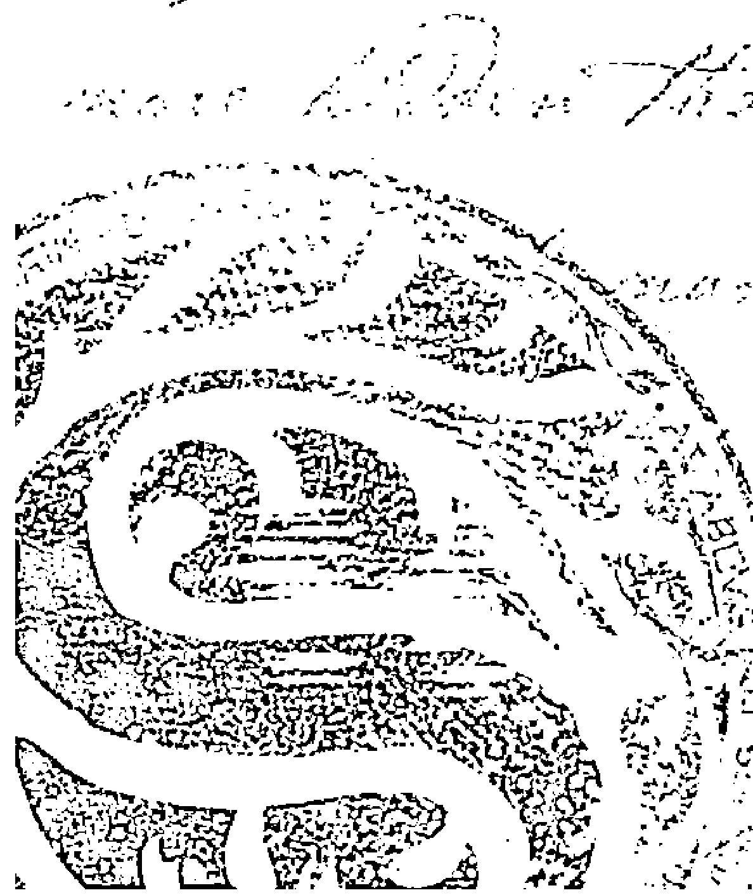

“那么近，因此你看不到。
“那么微妙，因此你理解不了。
“那么简单，因此你无法相信。
“那么好，因此你难以接受。”
——洛克·凯利谈香巴噶举藏传佛教传统，《转向自由》

为什么没多少人发现这个真相？为什么我们中的绝大多数人都没有真正地认识自己？为什么亿万人错过了这件对他们的幸福那么重要的事情？

我们都没发现这个最大的秘密，因为一个小小的障碍：我们的信念。我们就是我们的身体和心灵——就是这个信念，阻碍了我们的发现之旅。

### 你不是你的身体

“我们来到这个世界上，成为一具身体，目的是最终认识到，我们不是一具身体。”
——莱斯特·利文森，《快乐是免费的》，第1—5卷

就像你开着的一辆车，从一个地方去往另一个地方，你的身体也只是一个容器，让你能够到处移动，体验这个世界。

“如果你有一辆车，你不会说你就是这辆车。那么，为什么你有一具身体，你就会说你是这具身体？”
——莱斯特·利文森，《快乐是免费的》，第1—5卷

身体是物质的，并没有意识。它不知道自己是一具身体，但是，“你”知道，它就是一具身体。你的脚指头不知道自己是脚指头，你的手腕不知道自己是手腕，你的头不知道自己是头，你的大脑不知道自己是大脑，但是，“你”知道它们，你认识自己身体的每一个部位，但是它们都不认识你，那么你怎么可能就是你自己的身体呢？

就是在钻研这个问题的过程中，过去的智者们揭开了自己究竟是谁的秘密。

“千百年来，我们养成的最坏的习惯，就是我们相信自己就是一具身体。”
——莱斯特·利文森，《快乐是免费的》，第1—5卷

“我们忘记了自己究竟是谁，把自己仅仅看作某种物品。我就是我的身体，因此，我会死亡。”
——弗朗西斯·露西尔

“你担心，如果没有身体，你就不是你了。”
——莱斯特·利文森

相信自己是一具身体，这带给了我们作为人的最大的恐惧——对死亡的恐惧。当我们的身体死去时，你害怕你自己也将不复存在。这种恐惧就像是一朵乌云，一直笼罩在我们的生活中。

“若你想要长生不死，那就不要再紧紧抓住自己的身体了。”
——莱斯特·利文森，《快乐是免费的》，第1—5卷

你不是你自己的身体，这是个好消息。因为，你的身体总归会走向终结的，就像所有物质的东西。这个世界完全是由物质的东西组成的，所有的这些东西都不会长久，包括你的身体——生死之间，它在这世界上出现又消失。但是，真正的你从来都不会死去！

“真正的你不会死亡。你的身体会死去，但是你的身体并不是真正的你。”
——无极

“我们的意志是自由的，你可以把自己看作一具身体，也可以认识真正的自己。身体会痛，但是，真正的你会有无尽的快乐。”
——莱斯特·利文森，《快乐是免费的》，第1—5卷

要摆脱困境，第一步就是抛弃“你就是自己的身体”这个虚假的信念。

### 你不是你的心灵

你脑袋里的声音不是你，虽然很可能大半生里你都认为它是。虽然，你脑袋里的声音听起来就是你，看起来很了解你，并且对你也很熟悉，但是，它并不是你。你脑袋里的声音是你的心灵，但是，你并不是你的心灵。

“心灵是来来去去的思想的合集。”
——彼得·劳里

“如果没有思想，就没有心灵。心灵只不过就是思想。”
——莱斯特·利文森，《快乐是免费的》，第1—5卷

你自己想想吧，如果没有思想，你的心灵在哪里？你的心灵并不存在。

“你的心灵里什么都没有，除了思想和感受，记忆和感受。但是，你是思想吗？你是感受吗？”
——鲁珀特·斯皮拉，一个公共演讲

假设你是思想，是一个懊恼的想法，那么，当这个懊恼的想法消失时，你也就消失了。你并不是一个想法、一个感受、一种感觉，因为当它们消失时，你并不会也随即消失。在思想、感觉、感受出现之前，你就已经存在了；当它们消失后，你也安然无恙。

仔细想想的话，这一点非常明确。诚然，我们会有各种各样的想法、感受、感觉，但是，我们并不是想法、感受、感觉。

从某种程度上来说，我们看不清自己究竟是谁，这一点很容易理解。因为身与心的结合看起来是个靠谱的组合。我们不断产生一系列的想法，其中大部分都包含了“我”，仿佛心灵就是我们自己。并且，你可能会很吃惊，你身体的所有感受也都来自你的心灵，这也让我们更加相信，我们就是自己的身体。

“别人如何看待你会成为你自我感受的一部分。事情发生时，它们看起来是发生在你身上的，或者你可能会让它们发生……你很关心发生了什么，因为它们会对你产生影响。你希望自己平安健康，有好的状态。你看上去确实很真实。”
——简·弗雷泽，《伟大的甜美：思考后的人生》

这并不是说你没有身体和心灵，但它们并不是真正的你。身体和心灵就像是你的车，它们只不过是调试好的工具，你用它们来体验物质的世界。

“把自己看作身体和心灵，这是掩盖了你真正是谁的唯一假象。这个错误的认识遮蔽了你真正的自我。”
——无极

你真的是自己以为的那个人吗？

“想想所有那些为了提升自我感觉而做出的努力：对自尊、名利、成就、外表的重视。在这种情况下，觉醒真的是一个奇迹。”
——简·弗雷泽，《存在的自由》

自我、想象的自我、假装的自我、分裂的自我、心理的自我……对我们错误的自我认知，导师和圣人们起过很多名字。所有的这些描述都有一个错误的指向：身体和心灵共同组成了人的存在。当我们想到自己时，我们想到的其实只是我们以为的自我。

“人是自己的经验，并非自己的实体存在。”
——无极

“没有什么是一个人。如果你说：‘我是一个人。’那么你就得说你是一个什么样的人——你曾经是一个孩童，是一个少年，是一个婴儿……很快，这一整个过程就会结束。”
——迪帕克·乔普拉，临床医学博士

你的人格一直在变，所以，如果你的人格就是你，那么，你究竟是谁呢？你是一个愤怒的人、一个有爱的人、一个有烦恼的人、一个生气的人，还是一个善良的人？你也许会觉得，你就是他们的总和，但是，你不可能是全部的他们。因为如果你是他们的话，那个愤怒的人可能永远都不会消失，他会在那里。或者说，如果那个有烦恼的人就是真正的你，当那个有烦恼的人消失不见时，你的一部分也会随之消失。但是，这样的事情并没有发生。在那个愤怒的人出现之前，你就已经存在了；当他消失后，你还在。在那个有烦恼的人出现之前，你就已经存在了；当他消失后，你也还在。很显然，你并不是你那不断变化的情绪或人格。

“人格是一种很有用的工具，但是，它不能定义你的存在。真正的你远非你以为的你自己。”
——杰克·欧姬芙

“限制你发现自己究竟是谁的最大阻碍，就是相信你自己是思想、记忆、感受、感想的集合体。所有这一切加在一起，构成了虚幻的自我或实体。这个想法就是最大的障碍。我们所有心理上的问题都源于那个想象的自我。所有的问题，都源于我们错误地认识了自己。”
——鲁珀特·斯皮拉，一个公共演讲

“这个人之所以存在，是因为我们都一直都坚定不移地相信，确实有一个真正的‘人’一直在那里。但是，没有这个信念的话，这个人，或者自我，是不可能存在的。这只是个想象。事实上，根本就没有什么人。你身体宫殿里的唯一住客，就是纯粹的自我，那才是真正的你。其他的一切都是建构出来的。你的身体里并不存在两个住客，从来都只有一个。对自我的信念给了我们一种真实感，但是，这并不是真的，一切都是虚幻的。”
——无极

相信我们自己是一个自我，或一个人，这有什么问题？

我们会感觉自己很渺小、很脆弱。我们会害怕，害怕不好的事情发生在我们身上。我们害怕疾病，害怕变老和死亡。我们害怕失去已经有的东西，也害怕得不到自己想要得到的东西。我们始终生活在匮乏之中，相信生活中总有那么多的“不够”：钱不够，时间不够，精力不够，爱、健康、关系不够，生命也不够。并且，更可怕的是，我们相信自己不够好。所有这一切都不是真的——事实上，这和真相全然相反。如果我们一直觉得自己是一个人的话，我们永远都不可能获得真正的、持久的幸福。

“人的一生，最大的悲剧和喜剧都是，我们花了大量的时间作为虚假的自我去思考、感受、表演、认知、建立关系。”
——鲁珀特·斯皮拉，《爱的灰烬》

“自我并不是我们真正的自己。但是，它制造出了那么多的噪声，因此你听不到自己究竟是谁。如果继续这么下去的话，如果你不断投喂自己的自我，那就是一种疯狂。”
——简·弗雷泽，《打开心门》

“在我看来，所有人都深受荼毒……我们活得太个人化了，我们对生活的感知太个人化了，我们把事情看得太个人化了。如果你对生活做出的反应都很个人化，那是一种盲目。你无法正确地看待事情。”
——无极

确实，你在经历和体验着自己的身体和心灵，也在体验着作为一个人的体验，但是，这只是你自己的一小部分。它们并不是真正的你，因为，当它们结束时，你自己并没有结束。

“在一个人中，其实并‘没有人’的存在。”
——沙克蒂·卡泰丽娜·马吉

但是，真实的你是存在的。

“为什么看透自己的自我并放下——不再相信自己体内那个小小的人——会那么难？为什么我们一定要坚持那个只是看起来真实的自我，虽然其实在它周围萦绕的是那个美好的真相，那个可以带给我们持久永恒安宁的真相？为什么不接受这些呢？为什么要为了一个那么微不足道的东西——那些给你带来问题甚至是痛苦的东西——而放弃这些呢？”
——简·弗雷泽，《打开心门》

### 大冒牌货

你的想法、感受、感觉、信念通力合作，让你相信你就是个人。我们都是大冒牌货，我们都在假装自己非常渺小，我们都在假装自己面临很多限制，我们都假装自己是个渺小、有限的人。我们出生，生活一段时间，然后死亡，这就是我们的一生。但是，这离事实的真相差了十万八千里！

“我们都过分沉溺于一个其实不存在的，想象的角色中。”
——沙克蒂·卡泰丽娜·马吉

我们可以说，这个想象的角色就像是一个电影中的角色。我们知道，扮演这个角色的演员是存在的，但是，那个电影角色知道演员的存在吗？不，这个电影角色是想象出来的。

我们通过自己的每一个想法不断坚定着自己的信念。如果你检视自己的想法，你会发现，你的每一个想法的中心位置上都有一个“我”的存在。你的所有想法都围绕着这个“我”，那个你一遍又一遍不断地确认，告诉自己你是渺小、有限的“我”。

如果你相信自己头脑中的那个声音就是真正的自己，那么你自然会相信它告诉你的每一句话，你会相信你的头脑中产生的所有想法。

类似的想法有：
- “我越来越老了。”
- “我太累了。”
- “我不够好。”
- “我做不到。”
- “我的时间不够用。”
- “我没原来那么健康了。”
- “我没那么多钱。”
- “我不够聪明。”
- “我的视力没有原来那么好了。”

### 第二章 最大的秘密：揭晓

没人爱我。
他/她不认可我。
我不配。
我害怕死亡。
我不知道该怎么做。

这些想法都是你的头脑强加在你身上的限制。真实的你是不受任何限制的，没有什么能操控你。

我的老师说过，我们不断产生各种充满局限性的想法（就像我上面列出的那些一样），不断练习着如何去做一个渺小的自己。如果我们不是这样不断提醒自己是个渺小、有限的人，我们就会看到我们真实的自己。

关于“人”的一切都是真实的你的对立面：人是不完美的，真实的你是完美的。人是临时的、有限的，真实的你是永恒的、无限的。人有生有死，真实的你没有生死。人是有人格的、不稳定的，真实的你是非个人的、稳定的。人的情绪是不断变化的，真实的你有着永恒的幸福和安宁。人是有判断、有意见的，真实的你可以接受一切。人会生病、变老，真实的你不受生老病死的影响。人会受苦，真实的你没有任何苦与痛。人会死去，真实的你永生。

### 用不幸福换一个真相

想要获得永恒的幸福，拥有幸运的人生，你只有一个办法，那就是认识你的本性。想要摆脱问题、消极、不睦，你只有一个办法，那就是认识真实的自己。

> > “真实的你是无限的、宏伟的、光辉的、完整的、完美的，并且是全然安宁的。只不过，你一直告诉自己，你是一个有局限的人，你用这个错误的想法蒙蔽了自己的双眼。丢掉你的盲目、你的自我，获得永恒的完美和喜悦。发现了真实的自己后，你将会拥有一切。”
>
> ——莱斯特·利文森，《快乐是免费的》，第1—5卷

> > “生活并不是要解决各种各样的小问题，因为，它们是永远都解决不完的。生活告诉了我们一个一直忽视的事情——我们有真实的、不会变的自我。人类从整体上来说都有一个错误的概念，那就是认定我们只是个有一具肉身的人，而没有认识到我们真实的自己。”
>
> ——无极

> > “我们的生活中可能有些悲剧‘故事’，但事实上，没有什么悲剧会发生在我们的身上。说到底，故事的存在，是为了告诉我们这个区别。只要我们懂得了这个道理，悲剧的故事也会变得很美，充满了爱与智慧。不要以为苦难一定是不可避免的——但是，如果我们一直有这样的想法，那就会一直都有苦难。”
>
> ——弗朗西斯·露西尔

> > “在《圣经》的预言中，认为自己是身体/心灵的人是在沙上建房子；认识到自己的真实本性，那是在石头上建房子。”
>
> ——大卫·宾汉

要找到真相，你不需要寻找，因为，你找到的是你真正的自己；你一直是这样。你怎么需要寻找自己呢？我们中的大部分人一直都没看到过我们真正的自己，我们从来都没有真正看过我们自己。

你看过这样的图片吗？这一个画面里有两个图像，一开始看到这个画面时，你只能看到一个图像，看不到第二个。你努力去看，但是怎么也看不到第二个，因为你的视线一直集中在第一个图像上。

你得变换自己的视角，让自己的眼神不再那么聚焦于第一个图像，才能看到第二个图像。

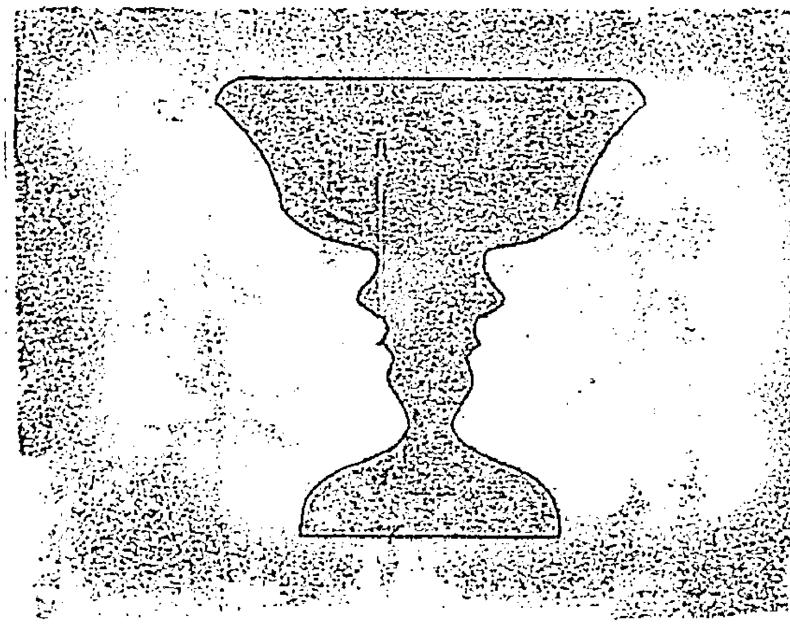

在鲁宾的这张著名的图片中，一开始你看到的可能是两个互相注视的人，或者是一个花瓶。为了看到这两个图像，你得变换看这张图片的方式。

对我们大部分人来说，我们都是从身心这个角度看待我们自己的，觉得我们是一个人。但是，要想看清真实的自己，就得像看鲁宾的这张图一样，我们要变换自己的视角——轻轻地变换自己的视角。

### 揭晓

让我问你一个简单的问题：

你有意识吗？

你的答案一定是肯定的。因为，没有意识的话，你就不会意识到我刚才问你的这个问题。让我再问你一遍：

你有意识吗？

是的，你有意识。婴儿、孩童、青年、成年……在所有的这些年龄段中，你都有意识。在你的整个人生中，你都有意识。

意识是你生命中恒定不变的东西。你的身体在不断变化，你的心灵在不断变化，你的思想、感受、感觉都在不断变化，但是，有个东西一直都没有变，那就是你的意识。

你的意识就是你真实的自己。

你就是意识。

> > “你就是它。太近了，因此你看不到它。你通过意识之眼看周围的世界。”
> ——简·弗雷泽，《存在的自由》

> > “当我们说‘我’时，我们以为自己指的是我们的身体，其实我们真正指的是我们的意识。”
> ——大卫·宾汉

你不是身体、心灵，或者思想、感觉、记忆、感受。你能够意识到自己的身体、心灵、思想、感觉、记忆、感受。你就是你的意识。

### 秘密：终极奥秘

> “与意识相遇的瞬间，你身体中的某一部分就认出它来了。”
——无极

你意识到你在读这本书；你意识到周围的声音；你意识到自己所处的房间；你意识到你的名字；你意识到你的身体和你的身体上穿的衣服，你的呼吸和你身体的感受；你意识到你的上颚，你的脚底板，你的手指；你意识到你的心灵，你头脑中的思想，以及你的感受和情绪。

事实上，没有意识的话，你就没有办法认识和经历你的生活。

### 你能意识到一切意识

意识能够意识到你经历的每一个生命体验。并不是你的心灵和身体意识到了你的生命。你——意识——意识到了心灵、思想、身体，以及一切。

导师水手鲍勃·亚当森指出，我们知道我们自己的存在——对于这一点，我们毫不怀疑。我们能知道自己的存在的唯一方法就是我们意识到了自己的存在。我们误以为我们因为身体和心灵而存在，但是，这不是真的。我们意识到自己的存在，这就是我们真实的自己——不是我们的身体或心灵。

现在，想象一下，你没有身体或心灵。

你的身体没有了。
你的心灵没有了。

你的名字没有了。
你的人生，你的过去，没有了。
你的记忆、信念、思考没有了。
注意，留下的是什么。
留下来的意识就是你的意识。

> > “如果有人让我们注意写着这些字句的白纸，我们马上就能意识到这些白纸的存在。事实上，我们一直都能意识到白纸的存在，只不过我们没有注意到这一点，因为我们的注意力都在纸上的字句上。意识就像是白纸。”
> ——鲁珀特·斯皮拉，《意识的本质》

就像是白纸一样，意识一直都是我们人生的背景。我们往往只会注意到我们的心灵和思想，我们的身体和感觉，因为它们确实非常吸引人。但是，如果没有意识的话，我们意识不到我们体验着的心灵及其思考，身体及其感觉。就像是如果没有白纸，我们就看不到印在白纸上的字句。

> > “关注一下这个背景，即使你只注意到一点点，你也能发现一整个崭新的世界。”
> ——黑尔·德沃斯金

> > “意识是我们所有的人生体验中最明显的，却也是最容易被忽略的。”
> ——鲁珀特·斯皮拉，《意识的本质》

> “一件非常容易被忽略的事情是：我们通过意识直接认识所有事物。但是，我们常常以为所有的事情都是通过心灵来认识的。比方说，我们经常会说‘我觉得’，但事实上，如果我们仔细审视就会发现，我们其实意识到了我们的思考……所以，思考并不是真正的你；有一种东西让你意识到了你在思考。”

——大卫·宾汉，《认识TV》节目

那个透过我们的眼睛看这个世界的，就是意识！那个通过我们的耳朵聆听这个世界的，就是意识！没有它，我们就意识不到我们看到、听到、尝到、闻到、碰到的一切，我们就体验不到所有那些通过我们的感官感知到的信息。你的感官不是意识，你的意识能让你意识到自己所有的感官。

> “我们用来看世界的工具本身是没有任何活动能力的，是没有办法看到任何东西的。如果没有望远镜背后的人，望远镜本身是没有任何用处的——它看不到任何东西。与此类似，我们的心

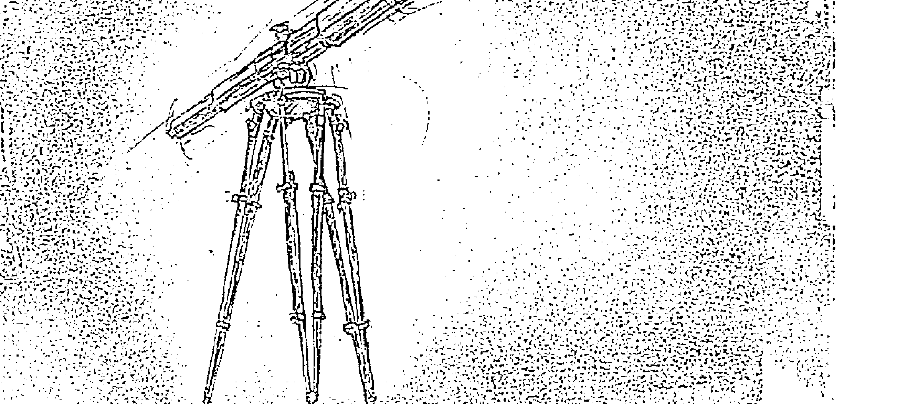

### 第二章 最大的秘密：揭晓

> “灵作为工具本身其实看不到任何东西。”
——弗朗西斯·露西尔，《静默的香气》

> “你是能意识到一切的意识。”
——大卫·宾汉

> “个体的认识——那种‘我是一个人，一个独立存在的个体，一个拘囿于身躯之中的心灵和意识’的感觉——只是我们的想象，是我们关于‘我’的纯粹认识错误、扭曲的形式，并且，是我们所有欲望和苦难的根源。”
——迈克尔·詹姆斯，《幸福和存在的艺术》

> “我们想象的‘我’其实不过只是个想法而已。”
——卡利亚尼·劳里

> “我们的真实本性，那个无限的真我，其实就等于我们减去我们的心灵。”
——莱斯特·利文森，《快乐是免费的》，第1—5卷

我们的心灵为真相蒙上了一层又一层思想和信念的遮罩，扭曲了我们对世界的认识。每一层遮罩都让我们对世界的误解加深了一层，阻碍我们看到真相。

> “心灵永远不会发现我们究竟是谁，心灵遮蔽了我们真实的自我。放下它，我们才能认识到自己究竟是谁。”
——莱斯特·利文森，《快乐是免费的》，第1—5卷

通过心灵去探寻真相，就像是戴着眼罩看世界。你必须摘下眼罩才能看到，你必须放下自己的心灵，才能看到真正的自己。

> > “试图通过心灵去理解自己的意识，就像是试图用蜡烛点亮太阳。”
> ——无极，《白火》（第二版）

我们可能意识不到，但其实大部分人都太关注进入我们心灵的思想噪声了。意识一直都在那里，没有了思想的噪声，我们才能更容易地注意到自己的意识。思考停止时，我们才能意识到意识本身，那个一直以来静静地作为背景存在着的意识。

### 心灵的遮蔽

> > “我们都习惯于通过问题、闹剧、沉迷来认识我们自己，因此很难相信清醒的意识——我们的真实本性，我们人之本善——才是我们真正的自己。”
> ——洛克·凯利，《转向自由》

“觉醒的意识”是洛克·凯利对意识的称呼。对于意识，已故或在世的导师们起了很多名字：觉醒、觉醒的意识、认识、冥冥的认识、存在、佛性、基督意识、上帝意识、精神、自我、无限的存在、无限的智慧、真实本性、真实自我、上帝显灵、显灵、意识显现、纯粹认识、纯粹觉醒……所有这些词语描述的其实都是同一个事情：意识。

> “我们都太聪明了，我们的生活都太复杂了，因此我们很难相信，发现觉醒的意识就能解决我们所有的难题。我们也很难相信，最重要的发现其实就在我们身边，我们不需要通过奥德赛式的苦旅去寻找和赢得。”

——洛克·凯利，《转向自由》

> “搞笑的是，一切都那么简单。”

——彼得·劳里

搞笑的是，千百年来，大部分人竟然都没有发现我们真实的自我，那个比我们的呼吸还近的真相。

我们错过了这个至简至伟的发现，因为我们的思想蒙蔽了我们，让我们看不到自己的意识。我们往往都只关注自己心灵中的思想，只关注那些我们通过感官感知到的事物，我们的注意力偏移了，我们忽视了一直都存在的意识。

> “身体或心灵并没有错。问题在于，我们认为意识就是我们的身心。只要我们持有这样的想法，意识就没有办法展现出它应有的光辉。”

——弗朗西斯·露西尔，《静默的香气》

> “此刻，撕掉你的人格面具，那只是一层破旧不堪的外衣，上面布满了经年累月穿着留下的污渍和泪水。”

——帕梅拉·威尔逊

> “认为我们的自我——闪亮的、开放的意识——和我们的身心一样受限制、有天命，这就像是认为银幕像电影中的角色一样受限制、有天命一样。”
——鲁珀特·斯皮拉，《爱的灰烬》

> “人们认为自己是人，其实他们是无限的存在。大家都搞错了自己的身份，他们真实的自我从来都没有离开过他们，它一直都在。”
——大卫·宾汉

只有当你有了一个想法时，你的心灵才会出现，当你的思考结束时，你的心灵也消失不见了。但是，意识从来都不会出现或者消失。意识一直在这里，即使是当你睡觉时。你可能会觉得，睡觉时意识就消失不见了，等你醒来后意识才重新出现。但是，你知道自己睡了个好觉，你会说：“我睡得很好。我睡得像个婴儿一样。”你怎么会知道自己睡得像个婴儿一样呢？那是因为，即使你睡着了，意识也一直都在。

当你问自己：“我有意识吗？”你的意识马上就注意到了这个问题。它不需要出现，它一直都在。你只需要把自己的注意力从思考转移到意识，你就能清晰地意识到。

除了意识之外，所有的一切总归都会终结或死亡。没有任何例外，所有物质都来来去去，出现又消失。这个地球上的一切——身体、城市、国家、海洋——都会出现，然后最终消失。花点时间想一想，你就会发现，没有什么东西是恒久不变的，一切都是有时限的，地球、太阳、星系、宇宙，一切的一切……没有什么是永恒的，除了一样东西——意识。你，意识，是永恒的！

我们的身体会上年纪，然而，人们在变老后会说，他们并没有觉得自己上了年纪，他们感觉和年轻时没什么两样。他们会承认，他们的身体上了年纪，但是他们在内心深处仍觉得，自己并没有变老。也许他们自己没有意识到，其实他们感受到的是超越了时间限制的意识，是他们真实的自我。

> > “当你回忆过去，回忆童年时，是谁在回忆？是我。记得这些体验的，是‘我’。”
>
> ——迪帕克·乔普拉，临床医学博士

我们在五岁、十五岁、三十岁、六十岁时所说的“我”，就是超越了时间限制的意识，它见证了我们完整的一生。

五岁时：“我……很快就要上学了。”
十五岁时：“我……想快点毕业。”
三十岁时：“我……刚刚订婚。”
六十岁时：“我……还不想退休。”

> > “所谓自我认识，就是要看到我们不断变化的面貌其实只是表面上的，所有变化的内核其实都是永恒的、稳定的意识，那才是我们真实的自我，它一直都是这样的。”
>
> ——大卫·宾汉，《认识TV》节目

“这不是童话。这是一种和树木、政治、树根、报纸及其报道一样真实的可能性。它像棒球队、石油的价格、和家人的争吵、学费账单一样真实……并且，它其实比所有这一切都更真实，但是你看不出来、感觉不到，更没办法注意得到。”
——简·弗雷泽，《打开心门》

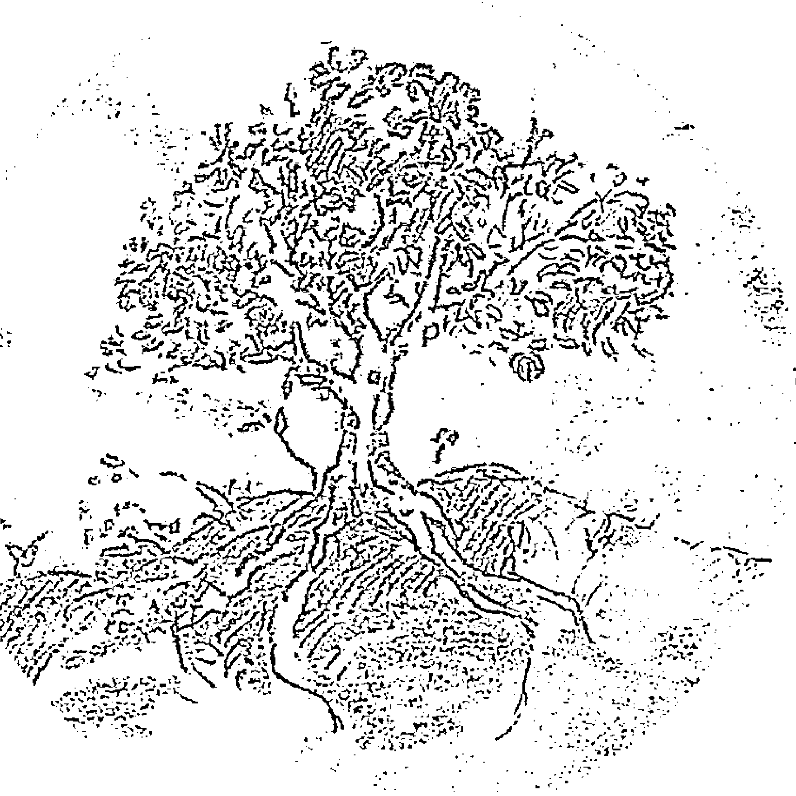

> “我们所有人都直接接触并且拥有着一种无限的存在，那种存在是完美的、快乐的、永恒的。此刻，我们所有人都直接接触着这种存在！但是，由于之前受到的错误教导，我们长久以来都是在向外看，我们接受的都是有限的概念，因此我们看不到真相。‘我就是这具身体’‘我就是自己的心灵’‘因为这具肉身和我的心灵，我有成堆成堆的问题和麻烦’……这样的错误理念遮盖了无限的存在。”
——莱斯特·利文森，《快乐是免费的》，第1—5卷

> “这种状态和大部分宗教所说的‘解放’‘救赎’其实是一回事。我们错误地认为自己是独立存在的个体，我们的认识也受到了有限的肉身的束缚。而真正的自我认知能让我们摆脱这样的错误认知，获得自由。

> > ——迈克尔·詹姆斯，《幸福和存在的艺术》

意识也是某些宗教中所说的“上帝显灵”。当一个人有过某种神圣的体验——他们感觉自己就像是被上帝触碰过了一样，个人的心灵和自我渐渐消退，意识显现出来，或者说，上帝显灵了。在那个瞬间，你会感到一种纯粹的爱，无限的宁静、美丽、快乐和恩惠，除了神性，这还能是什么呢？

> > “事实上，我们不仅仅是人，我们是无限的存在。我们是有着人类体验的无限存在。”
>
> ——大卫·宾汉

从很多层面来说，生命的真相、真实的我们其实并不是我们学到的那样。想要得到幸福、成就、答案、真相，我们不应该向外寻找，而是应该转而关注我们自己。只有内观，我们才能真正发现自己正在寻找的东西。我们应该充分地享受这令人叹为观止的世界，以及这世上的一切。幸福、快乐、爱、安宁、智慧、自由……这是意识，这是你的本性，你只能通过内观找寻到它。

### 第二章 总结

阻碍你发现这个最大的秘密的，是一个信念——我们相信自己就是自己的身体和心灵。

你不是你的身体，你的身体只是你用来体验这个世界的载体。你的身体不会产生认识。

相信自己是一具身体，这带来了我们人之为人最大的恐惧：对死亡的恐惧。

真实的你不会死亡。

你不是你的心灵，心灵只是你的思想。如果没有思想的话，就没有了心灵。

你不是思想、感受、感觉，因为如果你是它们的话，当它们终结时，你也会随之终结。

你的身体和心灵凑在一起，组成了我们所说的一个人——一个想象的自我。

做一个人，这是你体验到的，但这并不是真正的你。

如果我们相信自己是一个人，那么我们永远不可能获得真实的、持久的幸福。

你在体验着你的身体，体验着你的心灵，体验着做一个人的体验，但是，所有这些都不是真正的你。

我们假装自己是个渺小、有限的人，因为我们一直抱有有限的想法。

你真实的自己是不受限的，没有什么东西能够操控你。

在你的整个人生里，你都有意识；意识是你人生中唯一恒久不变的东西。

意识就是你真实的自己，你就是意识。

如果没有意识，你就没有办法知道和体验生活中的任何东西。

你的身体和心灵并没有办法意识到你的生命。意识到你的每一点生命体验的，是你的意识。

假设你没有身体、心灵、名字、人生、过去、记忆、信念、思想，剩下的就是意识。

我们往往把所有注意力都投注到思想以及其他我们感知到的东西上，却忽略掉了一直都在那里的意识。

你睡觉时，意识也在。
当你问自己：“我有意识吗？”马上，你就注意到了自己的意识。它不用出现，它一直都在那里。
除了意识之外的所有东西最终都会终结和死去。
我们在不同的年龄段所说的“我”，其实就是超越了时间边界的意识的“我”，它见证了我们整个人生。
要想寻找幸福，我们不应该向外看，而是应该向内寻找，只有通过内观，我们才能找到自己想要找的一切。

### 第三章

### 揭秘继续

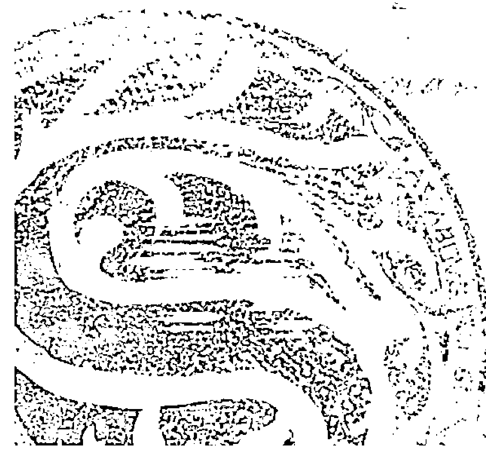

你就是意识，你并不是个能够意识到某些事物的人。你本身就是无限的意识。

弗朗西斯·露西尔说过，没有望远镜背后的那个人，望远镜本身其实不过是一个工具，你的身体和心灵也只不过是工具而已。是什么在透过你的眼睛向外看？是你，意识！是什么在倾听各种声音？是你，意识！你的身体还活着，因为意识——意识其实是你身体活力的源泉。

> > “认为人体验着意识，这是最大的错误，这是不对的。只有意识能够产生意识，因此，只有意识能体验意识。当我问你：‘你有意识吗？’你可能会停下来，检视一下自己的经验，回答说：‘是的。’这个肯定的回答本身就是对意识的意识。身体和心灵是意识的对象，它们可以被体验，但是它们没有体验的能力。”
>
> ——鲁珀特·斯皮拉，演讲“认识之光”

### 只有一个人，我们的名字都是‘我’

> > 只有意识有意识的能力。人不能产生意识，狗和猫不能产生意识，动物不能产生意识。世界上只有一个意识，就像宇宙中只有一个空间。意识折射在我们每个人的心灵中，因此，我们每个人仿佛都拥有独立的意识，就好像是每一个建筑物都有自己的空间。但是，让我们每个人都意识到自己各种体验的那个意识是唯一的、是无限的，就像是所有建筑中的空间其实都是同一个空间。”
>
> ——鲁珀特·斯皮拉，演讲“意识是唯一存在的意识实体”

无限的意识——唯一的意识——就是你，以及每一个人！这世上只有一个意识，这唯一的意识贯穿于我们每一个人的生命中。我们都是一个人，我们的名字都是‘我’。

> > 只有一个‘我’，你是，所有人都是。
> ——大卫·宾汉

唯一的意识贯穿于每一个生命中，不同的物理形式只不过是唯一的无限意识的不同载体。这是‘我们是一体的’这句话的真意。

意识和认识虽然是不同的词，但描述的是同样的东西——那就是你。

> > 此刻看着这些话、理解着这个意思的这个普普通通的意识，其实也就是那个过着各种不同生活的神圣意识。在宇宙里，没有## 秘密：终极奥秘

就好像在你的体内，有几十亿个独立的细胞工作、运行着。这些细胞都不知道的是，它们其实都是一个人身体中的一部分。在这个世界上有几十亿人，每个人都相互独立地运行着。他们不知道的是，他们就是唯一的无限存在。

> “任何一个单个的、孤立的存在。”
> ——弗朗西斯·露西尔，《真善美》

> “我们是一体的，我们都有一样的意识，我们都是同样的存在。”
> ——无极，《白火》（第二版）

> “别人一直告诉我们，我们的认识是个人的、有限的，每个人都只是独立的、单个的存在，因此，有很多种不同的认识。我们从来没有考虑到，区分两个物品很简单，因为我们能很明显地看到它们的边界和界限，但是，认识是很难区分边界和界限的。”
> ——弗朗西斯·露西尔，《真善美》

如果只有一个意识或认识，为什么你意识不到别人体内的思想和感觉呢？为什么我们意识不到非洲的动物能看到或听到什么呢？因为注入你心灵的意识或认识已经完全匹配了你的身体。此外，你相信自己是独立的存在，因此，你也无法体验到意识的延伸性。不过，当你感觉到对别人的怜悯和爱，那个时刻，你比你想象中更接近唯一的意识。

我们其实都曾经惊鸿一瞥；见识过无限意识的存在，但是，我们往往都忽略了它，以为它只是我们想象出来的东西。不论我们是否记得，我们其实都有过自己无法解释的生命体验，特别是当我们年纪还小的时候。那一刻，你可能会觉得自己突然变得无限大，感觉整个世界都在你的身体之内，或者你看到、听到了别人看不到、听不到的东西。

孩子们更接近意识，因为他们的心灵还没有被各种概念、信念所蒙蔽。两岁半之前，孩子们都拥有纯净、简单的意识，他们没有过分离的体验，因此，他们用第三人称来称呼自己。看到镜子中的自己，两岁的萨拉会指着镜子中的人说：“这是萨拉。”她不会说：“这是我。”因为，她还没有体验过“我”作为一个独立存在的人的感觉。她体验到的，是世上只有一个存在的感觉，她和所有的人都是同一个存在。

> “没有别的，只有我们的意识。只有一个意识，我们都是。”
> ——莱斯特·利文森，《快乐是免费的》，第 1—5 卷

意识和认识充盈并围绕着你。意识不能被局限在身体里，因为它是无形的。就好像是试图把空间装在一个罐子里，结果当然是，空间在罐子的内部，也在罐子的外面。事实上，罐子在空间里，就好像是所有身体都在意识中，所有的一切都在意识之中。因此，受启蒙之光照耀的人会体验到，他们就是一切——因为，他们其实就是一切。意识就是一切，你就是一切。

> “每一双眼睛的背后，是共同的认识，与耶稣、佛陀、奎师那，以及所有人一样的，唯一的认识。”
> ——我的导师

想想吧，你有着和所有伟大的人一样的意识。你离他们那么近，他们离你并不远。你拥有的是和他们一样的意识。

> “最神秘、最有魔力的就是，那个我们习以为常的、普普通通的意识，不论我们怎么否认，就是那个宇宙真正核心的认识。”
> ——弗朗西斯·露西尔，《真善美》

### 如何保持意识状态

变成你本身就是的意识，并不需要你真的去做什么；它不是什么别人都有，只有你没有的东西。此刻，你就是意识。你可能忽视了这一点，你可能一直都以为自己只是一个人，但这改变不了你实际是什么这个事实。

> “你已经失去了其他所有，但是，你不会失去意识。”
> ——无极，《比天更高，比空间更广》

当一个人已经见识过了无限意识的所在，物质世界的生活体验也会变得激动人心。那是因为，他们的心灵已经退居二线，意识走到了舞台的前面。他们不再受到心灵的困扰，因此，他们变得更加轻盈，永远都快乐，一直在欢笑。他们生活在纯粹的幸福中，每天都很快乐。问题均已不在，梦想都已实现，因为他们一直都保持着意识状态的生活，他们知道，自己是永生的。他们知道，他们就是一切，并且，不受任何外界的影响。生活不可能更好了！

> “你做的、看到的每一件小事——每一件平凡的小事——都蕴含着无限的存在。看到这么美好的一切，我们不禁叫出声来。墙壁的线条、屋檐的角度、毛毯的绒毛、驶过的车声、肌肤的味道……一切都是奇迹。”
> ——简·弗雷泽，《打开心门》

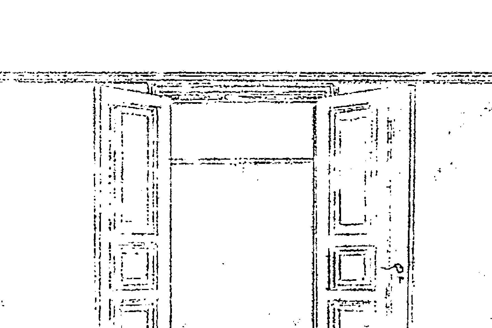

但是，你必须亲自体验这一切。别人只能引导你，为你指明正确的方向。他们就像是导游，向你描述喜马拉雅山的样子。然而，只有真的到了那里，亲自体验过后，你才知道喜马拉雅山究竟是什么——只有那个时候，你才能真正知道。

> “其实，我们一直都处在这种意识的开放空间中。然而，跟想要有自主意识地保持意识状态，却是两码事。”
> ——弗朗西斯·露西尔，《静默的香气》

> “你不可能脱离意识——只不过，你习惯于关注自己的思考，忽略了它的存在。”
> ——彼得·劳里

我们可以关注自己头脑中的思考，也可以关注我们本身就是的意识。我们只需要转换自己的关注点，尽可能多地关注我们的意识，而不是关注我们的思考，这样，你就能获得纯粹的自由和极乐。

#### 意识练习

#### 通往极乐的三步

我自己就是通过这个练习训练自己始终保持在意识状态的。这个训练的目的并不是让你成为意识，因为你现在已经是了。这个练习旨在帮助你过好作为意识的生活。只需要三步，你就能获得完全的自由和永恒的幸福。

- 1. 第一步：问问自己“我有意识吗？”
- 2. 第二步：注意到你的意识。
- 3. 第三步：保持意识状态。

#### 第一步：问问自己“我有意识吗？”

不要试图通过你的心灵回答这个问题，思想无法让你体验意识。每一次问这个问题的时候，你的注意力就从思想和心灵上转移到了意识上。当你问自己：“我有意识吗？”意识就立马上线了。你的思考很可能也会马上蹦出来，如果是这样的话，再问自己一遍这个问题。问的次数越多，意识停留的时间就越长，你的思考也就会越消停。

> “注意，在你的心灵中，思考和感受在不断地变化着，但是，在这一切变化的背后，有一个不变的背景。”
> ——黑尔·德沃斯金

当你问完自己“我有意识吗”，你的第一反应是如释重负，因为，就在那一瞬间，你身体和心灵一直以来所做的抵抗开始土崩瓦解。重复不断地问这个问题，时间长了，那种轻松感会变成一种微妙的平和喜乐感。你的心灵安静了，你也会感到平静，你会感到内心萦绕着一种丰盈的喜悦。

你会感到如释重负，这是因为，你的心灵开始退居幕后。心灵退居幕后的时间越长，意识出现在前台的时间越久，你的轻松感就越强烈，也会感到越幸福。当意识一直居于幕前，你的心灵也就退守到了它本该去的地方。

记住，意识是无形的，你无法抓住它。它就像是爱。你知道，爱是存在的，但是，你能抓得住爱吗？你可以在心里感受到爱，但是，你没有办法把爱抓在手中。意识也是一样的。你可以感受到它带给你的轻松和幸福，但是你抓不到它。

一开始，你可能觉得很难一直保持意识的状态，因为，你太习惯于思考了。

> “一旦你意识到自己在思考，就再问自己一遍：‘我有意识吗？’通过这种方式，你的心灵不再是知识、体验的目的，你回归了自己的本质。”
> ——鲁珀特·斯皮拉，《意识的本质》

打破一直以来从不停歇的思考，你需要成为真正的自己，成为无限的意识。你不可能用自己的心灵去限制自己的心灵，打破思考的习惯。这也就是为什么那么多人的冥想都失败了，他们在试图用自己的心灵去让自己的心灵安静下来，而不是把注意力从思考上转移开来。

很多人从来没有感觉到心灵的解脱，因为他们的脑海中总是一个想法接着一个想法不断地蹦出来，他们从来就没有想到过，他们可以不关注自己的思想。从心灵中解放出来，旁观自己的思考而不是被它们牵着鼻子走，这是一种巨大的解脱。

#### 第二步：注意到你的意识

进行以上练习一段时间后，你就能自然而然地注意到你的意识了。你不再需要继续问：“我有意识吗？”只要你一想到意识，你的意识马上就出现在了幕前，心灵立马退守到了幕后的位置。

> “让这种意识的体验成为你体验的主角，让你的思想、感受、感觉、感知退居到个人体验的幕后。你只需要注意到自己的意识，所有人都渴望得到的宁静和快乐都藏在自己的意识状态中。”
> ——鲁珀特·斯皮拉，《意识的本质》

每天多次注意到你的意识，把注意力转移到自己的意识上去。很快，每一次，当你从心灵的骚乱中回归到意识的宁静中时，你都能感受到一种强烈的解脱和快乐。

> “每一刻，我们都面对着一个分岔路：做真正的自己，或是做伪装的自己。每一秒，你都在做选择。”
> ——我的导师

若你觉得思考掩盖了自己的意识，或者感觉到自己找不到意识的状态了，问问你自己：“是什么意识到意识消失不见了？”是你的意识！因为意识的存在，你意识到了自己的意识。

如果你觉得自己无法找到自己的意识，问问自己：“是什么意识到我无法找到自己的意识？”还是意识！现在，你意识到了自己的意识！

> “你已经是意识了，你不必努力获得意识。”
> ——无极

你现在能意识到自己的身体吗？你的意识此刻意识到了你身体的存在。你能意识到你正在坐着的凳子吗？你的意识此刻意识到了椅子的存在。你意识到自己的呼吸了吗？你的意识此刻意识到了你的呼吸。就是这么简单。

> “每当你想到它，就把自己带回当下的觉察上。每天做上几百次，因为——要记得——你的一切力量，就在于自己对这股力量的觉察。”
> ——《秘密》

#### 第三步：保持意识状态

> “一开始，你可能感觉自己只是意识的客人，不过，当你发现其中蕴含的巨大真实，一切恐惧和分离感就渐渐消散了。”
> ——无极

要保持意识状态，最关键的是要弄清把注意力投注到哪里。我的导师教给了我一种全新而简单的思考方式：我们心灵的运作模式就像是相机的镜头，我们的心灵也有一种自动变焦的功能，它将我们的注意力集中在事物的细枝末节上，就像是我们拉近相机镜头，拍摄特写。大部分时间里，我们的心灵也是这种特写模式，以聚焦的方式观察世界，因此，我们看世界的视角往往是非常狭窄并且扭曲的。当你要拍摄远景照片时，你会把镜头拉远，拍摄广角的效果。与此相同，开放你的心灵，将你的注意力放在更广阔的事物上，不要再去关注那些细枝末节，意识就会出现了。你可以通过这种方法保持意识状态，让所有的事物各归其位。

进行这个练习，你可以现在就看看你的周围，找一个比较近的东西，盯着它看，把你全部的注意力都放到它身上。你可以看着你自己的手，然后，让你的注意力发散开来，不要再关注某一个具体的东西，尽可能地观察和感知你周围的一切。你会注意到，你的身体立马会感到一种轻松和解脱。这是因为我们的心灵一直让我们把注意力投注在某个东西上，我们花了很多力气来维持这种专注力。因此，当你解放自己的注意力，心灵就会退居幕后，意识便浮现上来。你感到一阵轻松，那是因为意识本身不需要你付出任何努力，它自然可以看到并知道一切，无须任何形式的聚焦。

### 秘密：终极奥秘

> “你一直都误判了自己，试图让各种事情发生，但你其实什么都做不成。可你还是会说：‘我要做好所有的事情。’其实，做好所有事情的，是意识。”
> ——我的导师

> “你不是个实干者，你越相信这一点，就越能成为这世上无法阻挡的善意力量。”
> ——黑尔·德沃斯金

我曾经是个很能干的人，我为自己多任务处理各类事务的能力而感到骄傲，这变成了我的身份。我是实干的女王！因此，宇宙也安排了无穷无尽的各类事务让我做，因为，我就是这么相信自己的。

但是，如今这一切都变了，因为我不断地抛掉了自己之前的各种信念，保持意识状态。我比之前更快乐了，并且，我不再一刻不停地处理各种事情，我好像什么都不用做，各类事情自然而然地就处理好了。做完某件事后，我感觉我自己仿佛什么都没有做，因为一切都是那么毫不费力。生活是那么不可思议！

每天至少花五分钟，把你的注意力全部投注在意识上。你可以在刚睡醒、准备入睡或其他所有你觉得合适的时候做这个练习。如果你像我一样，致力于过上这样不可思议的生活，你要更频繁地关注自己的意识。但是，即使每天只练习五分钟，你的生活也会发生翻天覆地的变化。就是这么简单。

记住，这个练习的目的并不是让你变成意识，因为你已经是无限的意识了。这个练习的目的，是让你不要再认为自己就是身体和心灵，那不是真正的你。

> “一开始，你会觉得自己是在不断回到一种美好的状态，但渐渐地，这种美好成了一种自然而然的状态，你必须付出一定的努力才能离开这种状态。那种美好成了你的家园。”
> ——弗朗西斯·露西尔，《静默的香气》

在某个时刻，你会确切地知道，你达到了圣域，有些人也许会更愿意用“上帝”这个词，觉得是上帝显灵了。要进入圣域，或让上帝显灵，你需要超越自己的心灵。

> “当你失去了这双自我之眼，你将开始用上帝之眼看这个世界。”
> ——无极

进行这些练习一段时间后，你会发现，意识自然而然就成了你的主要状态，你的心灵变得更加安静了。此外，你还会感到：你的生活会变得更加轻松，你会感到更加安心，之前困扰你的东西都不再成为困扰，你感到更平静了，你的情绪更稳定了，你不再那么容易受到各种消极情绪的影响。并且，你会感到一种从未有过的快乐。你能更清楚地认识到，你的心灵倾向于抱怨、批评，更关注负面事物。你不会再让心灵支配自己的生活，因为你的注意力已经不再局限在自己的思想上了。

### 秘密：终极奥秘

> “我们就是完美的自我，我们不是有限的身体和心灵，知道了这一点，所有的问题立马烟消云散。”
> ——莱斯特·利文森，《快乐是免费的》，第1—5卷

意识比它能意识到的所有东西都更伟大。人是有限的，但是意识是无限的，因此，一切都是可能的。没有什么能限制你，没有什么能控制你！

> “我们可能觉得，自己的认识是有限的，但是，经过进一步仔细研究，我们会发现，这是不可能的。那个意识到了局限本身的意识，远远超越了局限，它绝不是有限的。”
> ——弗朗西斯·露西尔，《静默的香气》

没有什么能妨碍意识！没有什么问题会困扰你。消极情绪找不到你，战争影响不到你。作为意识的你永远都是安全、完美的。你是无坚不摧、不可磨灭的。还有什么能威胁你呢？你就是一切。尽你自己最大的努力，多多关注自己的意识，保持意识状态，这样你才能过上奇妙的人生。

> “然后，你不会再被这世界看起来的种种限制愚弄、欺骗。你会觉得，它们只是一个梦，只是一个表象，因为你知道，你自己的存在是不受任何限制的。”
> ——莱斯特·利文森，《快乐是免费的》，第1—5卷

### 第三章 总结

- ○ 你就是意识；你不是可以意识到某样东西的一个人。
- ○ 没有人，望远镜只是一个工具；你的身体和心灵只是意识的工具。
- ○ 只有一个意识，同样的意识贯穿在我们的生命中。
- ○ 你无法意识到别人身体中的思考和感觉，那是因为注入你心灵的意识已经完全匹配了你的身体。
- ○ 意识和认识充盈并围绕着你。
- ○ 我们可以关注我们头脑中的思想，也可以关注我们本身就是的意识。尽可能多地关注意识。
- ○ 意识练习：
  第一步：问问自己“我有意识吗？”
  第二步：注意到你的意识。
  第三步：保持意识状态。
- 停止你心灵中永不停歇的思考，保持意识状态。
- 每天多关注自己的意识几次，把你的注意力投注到意识上。
- 保持意识状态的方法：将你的注意力放在更广阔的事物上；不再去关注那些细枝末节，意识就会出现。
- 进行这个练习：找一个比较近的东西，把全部注意力都投注到它身上，然后让你的注意力发散开来，不再关注某一个具体的东西，尽可能地观察和感知你周围的一切。

### 第四章

你在做梦……该醒来了

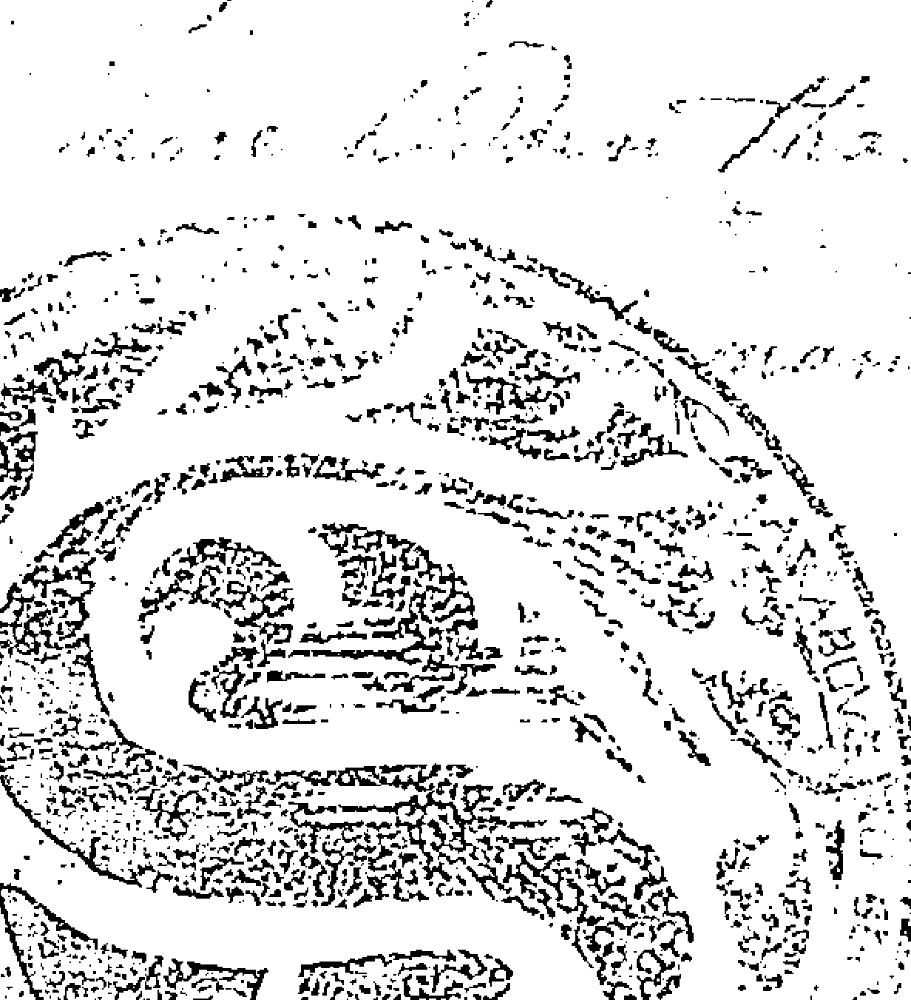

在漫长的历史中，许多精神导师都曾经说过，我们整个世界，你的生活，以及所有人的生活，都只不过是一个梦。他们的意思并不是我们这个世界以及其中所有的一切都像是一个梦，他们的意思是，这个世界以及其中所有的一切，都和我们的梦一样，它们由同样的物质构成，并且也都是虚幻的。当你长久保持意识状态时，你就会清楚地知道，你的生活和这个世界并不是你之前所看到的现实：它们就是一场梦。

> “生活就是一场梦，在梦中，我们是住在我们自以为真实的世界的人。我们根本就意识不到，这一切都只是梦而已。你看到的世界只不过是一场虚幻的梦。真相藏在这个表面的世界背后。”
> ——莱斯特·利文森，《快乐是免费的》，第1—5卷

> “我们应该持开放心态，相信这就是一场梦。如果这样想，一切都会发生变化。如果把这个觉醒的过程也看作一场梦，我们的行为也会变化。我们会发现，梦境中的其他角色、场景给我们的反馈也会相应地发生变化。”
> ——弗朗西斯·露西尔，《静默的香气》

> “我们此刻就在一场梦境中。梦境的一部分，就是我们所说的心灵、身体、宇宙。”
> ——迪帕克·乔普拉，临床医学博士

> “这个梦是没有任何缝隙的，因此，人们几乎不可能从中醒过来。”
> ——我的导师

在你的梦中，心灵创造了身体、其他人（有些人你认识，有些人你不认识）、城市、乡村、房屋、车辆、食物、树木、自然、动物、太阳、星星、天空。并且，在梦中，心灵还创造了时间的流逝、白天、夜晚、声音，以及梦中的所有场景和时间。你的心灵创造了一整个世界，创造了梦境版本中的自己，它让一切都看起来那么真实，因此你根本不会质疑这一切——直到你觉醒过来！只有到了那个时候，你才能认识到，那就是一场梦。

“你可能已经注意到了，关于梦境最重要的一点就是：梦中的‘你’不知道，这是一个梦。这就是梦境最具讽刺意味的一点——梦中的人自然而然地以为，他们其实是醒着的！梦中的人并不清醒。梦中的经历并不是真的。但是，在梦中，我们根本认识不到这些。请注意，梦还有另一个特点。梦中的角色无法超越梦境本身。他们并不知道，还有另一种真实的觉醒。梦中的角色并不知道，他们究竟错过了什么。”
> ——彼得·久班，《只需注意》

“晚上做梦时，梦中的一切都显得那么真实。如果我们在梦中看到一只老虎，我们会感到害怕，因为我们并不知道，这只老虎是我们自己在梦境中创造出来的。如果知道的话，我们就不会害怕了，是吧？这告诉我们，在梦中，幻象也可以显得非常真实。不过，当我们意识到梦境的本质时，我们会明白，创造这一切的就是我们自己。”
> ——弗朗西斯·露西尔，《真善美》

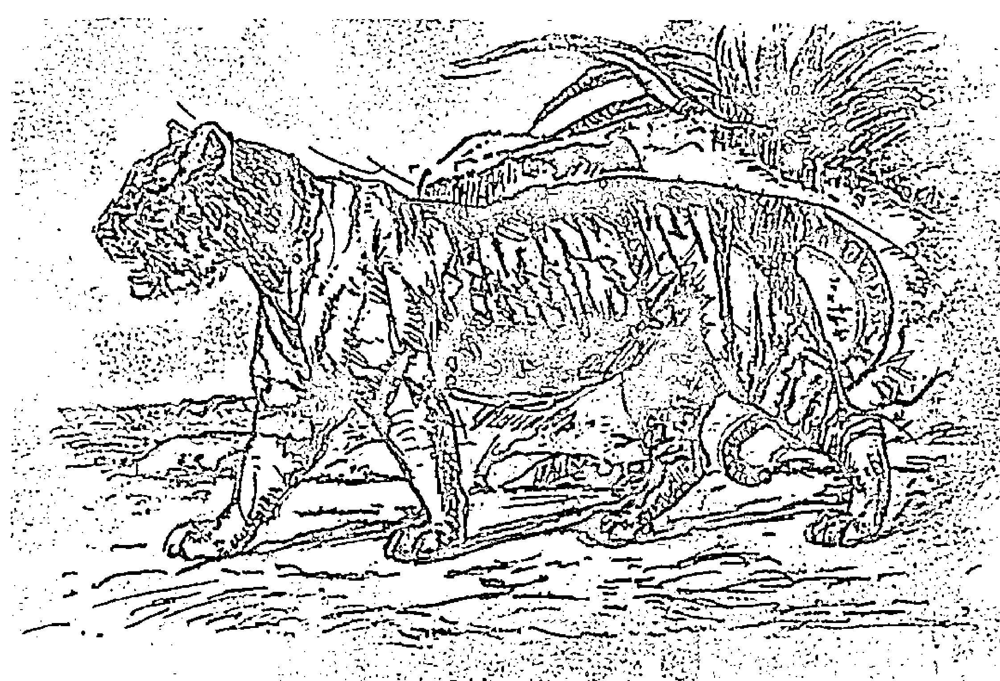

即使你已经充分意识到，这个世界是一场梦，你依旧对其物质性、对你的肉身保有一定的敬意。你不会从楼上跳下来，因为楼、地面、你的身体、重力……所有这些都是由和梦境一样的材质构成的，你能够感受到！就像一个导师所说的，如果你在梦中走过来捏了我一下，我能感到疼！

> > “在梦中，十年弹指一挥间。你可能有了一个宝宝，然后他长大了，你送他去上学。醒来后你发现，梦中的身体只是个幻象，梦中的时间也都是虚幻的，但是，当你处于梦境中时，一切都是那么真实。”

——弗朗西斯·露西尔，《静默的香气》

> > “在梦境中可能已经过了五年，但是醒来后，我们就会意识到，一切都没有真的发生。梦中的一切之所以显得真实，是因为它们和认识的梦境状态很相像。这种醒着的做梦状态，只不过是认识打造出的一种非常可信的表演。”

——大卫·宾汉，《认识TV》节目

> > “物理规律适用于这种醒着的梦。在夜晚的梦中，物理规律并不存在，因此，你可以在睡梦中飞翔！”

——弗朗西斯·露西尔，《静默的香气》

不论梦中发现了什么，对我们所有人来说，结局都是一样的：我们醒来后发现，一切都是一场梦！这也就是为什么所有那些精神导师都告诉我们，要从梦中“醒来”。这意味着我们要从幻觉中清醒过来，认识到一切只是一场梦。认清了真相之后，我们会发现，没有任何一个人受到了伤害，没有人死亡；就像是你做了一个噩梦，惊恐万分地醒来后，你感到如释重负，发现并没有人真的受伤，也没有什么不好的事情发生，这只不过是一场梦。

> > “如果你去看了一场电影，看到了战争和受苦的场面，看完电影后，你会说：‘这电影真好看！’把你的人生看作一场电影。做好准备，迎接可能会有的各种人生体验，告诉自己，一切都不过是场梦而已。
> ——帕拉宏撒·尤迦南达，《人类永恒的追寻》

> > 把世界看作一场梦，这是一个很好的练习，它能够帮助你打破这世界表面的坚硬。
> ——弗朗西斯·露西尔

### 觉醒

> > 最棒的治愈，就是自我的觉醒。
> ——无极

> > 这就好像是你把眼光从一个东西转向了另一个不同的东西。一切都是那么微妙，一切又是那么了然。准备好了之后，你就会这么做的。不要告诉自己，你永远都准备不好；不要告诉自己，这是不可能的。就在你的身边，就在和你一样的人身上，同样的事情在不断地发生。他们不再有困扰，他们还过着与往常一样的生活，但是，他们的生活中充满了快乐。他们活得很轻松，不论发生了什么。不用羡慕他们，不要怀疑他们。你自己也可以变成这样。你会感到高兴。你不理解，以前为什么竟然会让自己那样生活了那么长的时间。
> ——简·弗雷泽，《打开门》

我可以百分之百地确定，过去的几十年里，我一直都在沉睡。我可以很清楚地说出来，是在哪一天、哪一个时刻、哪一种情况下，我第一次醒了过来！打那之后，我有过很多次小小的觉醒，也有过几次大的觉醒。觉醒的感觉就像是走出迷雾，突然，天朗气清，你可以清楚地看到世界上的一切。

有些人躺在沙发上时觉醒过来，有些人在停车场上觉醒过来，有些人听到了鸟叫后觉醒过来，有些人在听到导师的箴言或者阅读了某些材料后觉醒过来。有些人则是在经历了某件令人胆战心惊的事情后，或是在跌落人生谷底、遭遇个人危机后觉醒过来。对所有这些人来说，他们都是在觉醒的那一刻才知道——他们此前一直在沉睡。

> “大部分人都在沉睡，虽然他们并不自知。出生的时候他们在睡觉，活着的时候他们在睡觉，他们在睡梦中结婚生子、走向死亡，他们都没有醒来过。他们过着机械化的人生，有着机械化的思维——和其他人的想法都一样——和机械化的情绪，做出机械化的动作或反应。他们从来都不知道，活在这世上是多么有爱、美好的事情。”
——安东尼·德梅洛，《意识：与大师对话》

我们的心灵是机械的，就像是一个电脑程序，因此，如果我们让心灵掌控了自己的生活，那我们的生活也会是机械的。也许，你一直觉得自己钱不够，这是因为你机械的心灵一直在反复产生着“钱不够”的想法。你相信这样的想法，因此也会继续体验着钱不够的生活。这就是你的心灵中那些限制性的想法在起作用。意识是丰盈的。

觉醒后，你作为意识而活，你的生活会大大超出自己的想象。你会发现，世界是那么宏伟、美丽，充满了爱。你会发现，一切都各就其位，没有什么是不对的、不好的。心灵掌控着我们的生活时，我们无法看到世界真实的样子。

利己的心灵强烈地反对着大部分的事情和事物。因为我们的心灵是自私的，不具备看清全貌的能力，因此，它会评判、批评、找碴儿，因为它的视角受限，它只能感知到问题的存在。

> “觉醒很不容易。躺在床上时，你很舒服，被叫起床并不是什么愉快的体验。这也就是为什么大师们从来不试图让人们觉醒。我也希望自己做个明智的人，不要把你从睡梦中吵醒。你是否觉醒，这完全不关我的事情——不过，我还是会不时地对你说：‘醒醒吧！’”

——安东尼·德梅洛，《意识：与大师对话》

我们每个人的人生都有一个目的——觉醒，认识真实的自己，享受这不可思议的世界。觉醒后，你会发现，你生活在这世界上，但是不从属于这个世界。也就是说，你从这世界上的全部挑战和困难中完全解放了出来。

在上一章的意识练习中，我曾经说过，觉醒了之后，你还需要有自主意识地保持意识的状态，谨防被拉回到有限的心灵和虚假的自我中。有些人突然就觉醒了，之后也一直处于觉醒状态，但是对其他一些人来说，觉醒是个过程。无论如何，所有人都觉得，觉醒的过程是一段不断深入、没有终点的旅程。

> > “我们不可能这么说——觉醒是圣人、禅道大师的专利，你必须等待一生才能获得。我们也不能说只有严肃认真的灵修者、清净有修为的人或者信仰某种宗教的人才能觉醒。你也可以的，你也可以拥有畅行无阻的人生。你不需要做什么来换取、赢得它。它是免费的，它已经在这里了。它不是什么奖励，它是与生俱来的。”
>
> ——简·弗雷泽，《打开心门》

觉醒，认识你自己，摆脱所有负面因素，获得永恒的幸福和快乐。这是这世界上所有人的命运，这是你的命运，你现在就可以拥有！

### 认识之峰

许多年前，欧洲玫瑰十字会的大师用了一个比喻，帮助我更好地理解了认识的不同水平。他把这个称为“认识之峰”。

在山谷中时，你看不到很远的地方，你的视角是狭窄、受限的，你看不到你的面前究竟有什么，也看不到转角处的风景。你不知道山谷之外会有什么，因此，你会感到一种对未知的恐惧。

爬上山后，一切慢慢地发生了变化。爬得越高，你的视野也就越开阔，你能看到更远的地方，曾经在山底下遮挡住视线的一切如今尽在你的眼中。越往上爬，你看到的东西就越不一样，看得也会越清楚。此时，虽然心中仍有恐惧，但是，比起在山脚下时，一切都好太多了。

你继续往上爬，空气都变得不一样了，植被也不同了，你能看到的也比以前远得多。此时，生活看起来与之前已经大不同了，因为你看到了很多之前不知道的东西，对于未知的恐惧也渐渐消散了。

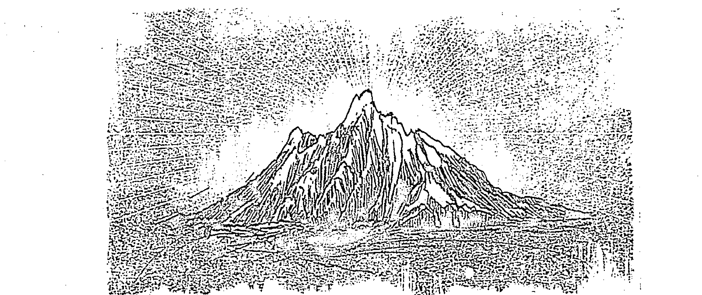

爬到山顶后，一切都没有任何隐藏，一切一览无余。你的视角变得无限宽广。你可以看到山底的人视野的局限，你知道他们其实并没有什么可担心的。你也可以看到在山坡上攀爬的人们，你知道，在不同的阶段，他们的视野受到了不同的限制。此刻，你站在山顶，可以看到万事万物的美丽与完美。你看到，万事万物自有其定所，没有什么可担心的，没有什么可害怕的。你看到，万事万物都是那么奇妙，那么神秘，那么壮美。倘若山谷里的人也能看到你眼前的这一切，他们也能获得自由。

> “站在山顶，仰望星空，我们能感受到永恒。这种永恒其实也是我们真实自己的一部分。为什么那么多人都渴望这种广阔辽远的感觉呢？”

> ——大卫·宾汉

> > “在认识的更高阶段，所有这些个人心灵的东西都不会再起任何作用。你就站在你自己的山巅上，不畏浮云遮望眼，只缘身在最高层。没有什么会影响到你！所有的一切都很完美。”
> ——无极，《白火》（第二版）

认识你自己，你已经开始了觉醒的过程！限制你永远做真实自己的唯一阻碍就是你的心灵。心灵是你在这个物质世界上拥有的最大的力量，它可以为你带来你想要的所有事物、事件、环境。但是，如果你相信了心灵中的那些消极的想法，你就是在用自己的力量对抗自己。心灵没有错，但是，如果你认为自己就是心灵，那就有麻烦了。

当你的心灵试图代表你说话时，记住，你脑海中的声音并不是你。你的心灵甚至不是一个真正的实体，它只是一个过程，一个机械的过程。它会生产思想，这些思想都源自你之前的信念，并且扎根在你的潜意识中。信念、记忆、个性、习惯……所有这些都储藏在我们的潜意识中，像电脑一样运作着——完全是机械化的。

你的潜意识心灵接受你的思维产生的所有信息和数据，它不会分辨，只是全盘接受所有你相信的东西。

因此，整体来说，在我们的心灵中，符合我们自身信念的想法会不断产生，将我们禁锢，限制我们的人生——直到我们觉醒，认识到思想和心灵并不是真实的我们！

> > “你愿意继续充满局限的游戏，还是拥有自由自在的人生？这个问题是帮助我们破解身心困境的关键。如果你觉得你就是自己的身心，并且告诉你自己和其他人，你就是身心，那么你在做的就是这种充满局限的游戏。

> > ——莱斯特·利文森，《快乐是免费的》，第1—5卷

获得自由的第一步，就是认识到，我们的想法创造了我们的生活。你的想法全都会表现出来。如果你一直想的都是你不想要什么，那么，你也不可能拥有你想要的人生。只有当你全身心地关注你想要的一切，你才能过上自己真正想要的人生！充分地认识这一点，你就能意识到你自己的想法，这也让你踏上了觉醒的正途。因为，你自己想法的意识不仅能阻止你对消极想法的信念，还能帮助你进入意识的状态。

《秘密》以及相关的读物向你解释了，你可以通过自己的想法创造自己生活的方方面面——健康、关系、金钱、工作、快乐，甚至整个世界。如果你还不了解你的思想能够产生的巨大力量，赶快去买一本《秘密》，或者从朋友那里、从图书馆借一本。《秘密》这本书已经改变了全球数百万人的生活。更充分地意识到自己的思想，你就踏出了自我觉醒的第一步。

### 第四章 总结

- 生活就是一场梦，整个世界不过是一场梦境。
- 在睡梦中，你的心灵创造了整个世界，一切看起来都是那么真实，你不会质疑它们的——直到你醒来。
- 醒着的状态不过是认识打造出来的一场极为可信的表演。
- 因为心灵是机械的，如果我们过着由心灵掌控的生活，那我们的生活也会是机械的。
- 如果心灵控制了我们的生活，我们就无法看清世界真实的样子。
- 觉醒后，你生活在这个世界上，但是不会从属于这个世界。
- 认识之峰是一个关于认识的比喻：在不断向上爬的过程中，你对生活的认识也在不断拓展。到了山顶后，你可以看到万事万物的美丽和完美。
- 你的心灵由思想构成，而思想源于你之前的信念，并且扎根在你的潜意识中。
- 潜意识储藏着我们的信念、记忆、个性、习惯……它的运作方式和电脑无异。
- 获得自由的第一步，就是明白，我们的思想创造了我们的生活。你的想法全都会表现出来。

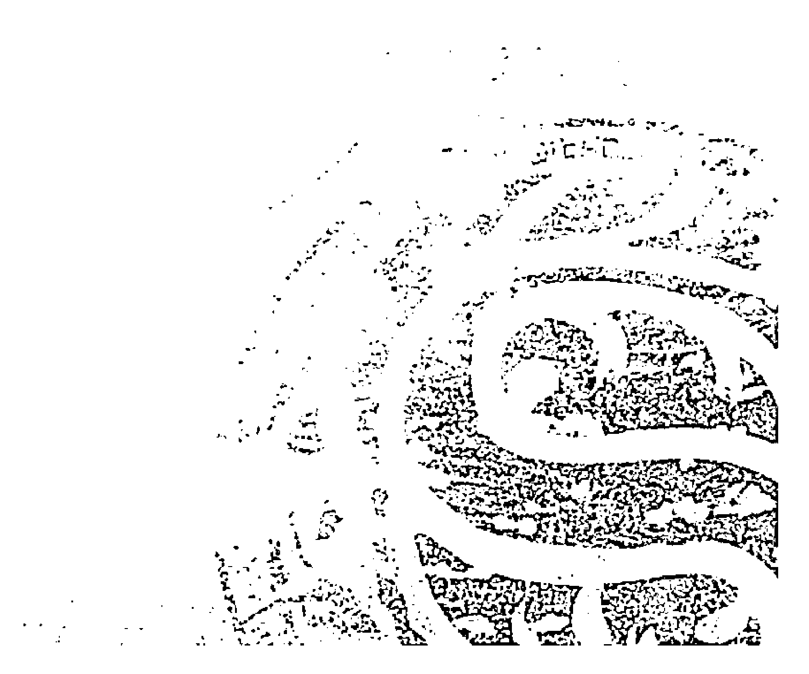

## 第五章
### 从心灵中解脱

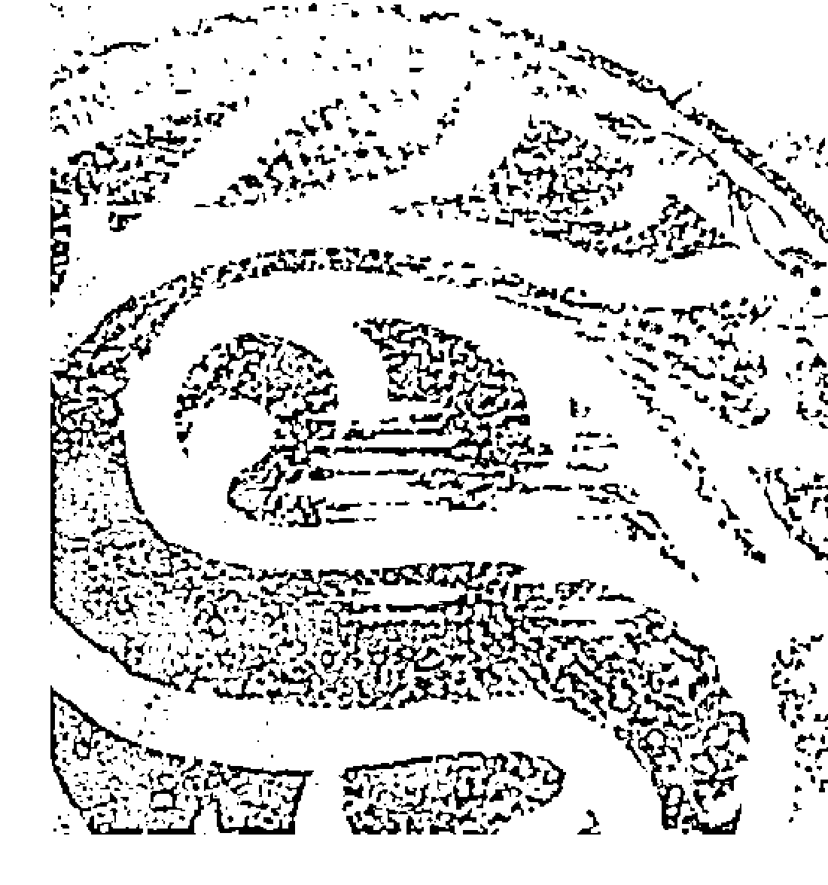

> > “没必要让心灵安静下来。关键是，不要听它讲的话，不要以为它说的是真的。”
> 
> ——简·弗雷泽，《伟大的甜美：思考后的人生》

心灵是个很厉害的工具，可以按照你的意志创造你的生活。与心理分析师、心理医生无关，是你给予了心灵这种掌控自己人生的能力，你听它的话，相信它产生的所有思想。这种相信我们自己思想的习惯剥夺了当我们按照自己本性——意识——生活时所能感到的壮美和光辉。我们无法拥有永远快乐幸福的人生，在那样的人生中，我们所需要的一切都会在最恰当的时候降临在我们身边。

人类已经受苦太久太久了，这一切都是因为我们的心灵。现在，是时候让心灵退回到它应有的位置上去，不要再受它的摆布了。从这里开始，让我们活出真实的自我——意识，我们的生活也会变成人间天堂，没有苦难，只有快乐。

> > “每一个我们以为‘外在’的问题，其实都只不过存在于我们自己思想中的错误认知。”
> ——拜伦·凯蒂，《一念之转：四句话改变你的人生》

> > “破解消极，最好的办法就是认识到，你并不是心灵。一旦认识到这一点，消极就会失去所依，自然也就烟消云散了。”
> ——黑尔·德沃斯金

大部分人都觉得，消极的情况都有着来自外界的成因，他们以为，是这世界上的人、情况、事件造成了他们生活中的消极情况。但是，没有任何事物生来就是黑白分明的，莎士比亚曾经说过：“世间本无善恶，全凭个人怎样想。”

你的生活之中之所以会有不好的事情发生，那是由于你对某个人、情况、事件的想法造成的，而不是由这个人、情况、事件导致的。因此，了解你的心灵以怎样的机械方式运行，你就能摆脱错误的、消极的判断。然后，你就能利用你的心灵做它本该做的事情——创造你想要的生活。

> > “我们之所以会思想，是为了通过思想来让你想要的一切发生，而不是为了让你沉溺于自己的思想之中。心灵接受你的希望，让这一切发生。除此之外，我们并不需要思想，意识会搞定其他所有的一切。”
> ——我的导师

从这一刻开始，如果你只看得到自己想要的，你便也能得到你想要的一切。但是，你总是想着那些你不想要的。你总是试图消除那些你不想要的东西，通过这种方式，你其实是在变相地留住它们。因此，如果你想拥有积极、幸福的生活，那就放下那些消极的想法，拥抱积极。”

> ——莱斯特·利文森，《快乐是免费的》，第1—5卷

你的心灵究竟是什么？首先，你必须知道，你的心灵并不是你的大脑。你的大脑不会思考，科学家们从来没在大脑中发现过任何一个思考实体，他们只看到过思考时产生的电流活动。思考来自你的心灵，你的心灵完全是由你的思想组成的。如果没有思想，就没有心灵，就是这么简单。你的心灵甚至无法同时产生两种不同的思考。你知道，你没有办法真正地同时做到既听别人说话又阅读手机上的内容。你的心灵没有多任务处理能力，虽然你可能一直以为它能够做到这一点。

然而，一个想法，不论是积极的还是消极的，只要你相信了，它就拥有强大的力量。

> “如果你就是愿意受苦，继续相信那些消极的想法吧。不过，如果你想要快乐、幸福，那就质疑这些想法。”

> ——拜伦·凯蒂，《心之安处》

大部分人都会相信自己的想法，觉得自己想的就是真的，因此，他们的生活中也充满了压力和困难。从来没有人告诉过我们，我们的思想只不过是精神的噪声，它们并不是真的，但是，如果我们相信了它们，它们就会变成真的！

心灵是这个物质世界中的显灵者，它会让我们相信的任何想法、所有想法都通过某种方式显现出来，不论这些想法是积极的还是消极的，不论我们是不是想要。积极的想法对你的生活没有害处，因为它们接近你的本性。但是，消极的想法会导致你生活中压力、问题的产生。因此，我们一定要格外留意消极想法。

我们的心灵是机械的，因此，消极的思维方式很可能会变成一种固定的思维模式。如果你听到并认同了那些消极的想法，你就会被它们吸引，迷失在其中，就像是被催眠了一样。这些想法会不断地控制你，让你脱离真实的世界。

> > “你相信，你就是你自己的心灵。这是个假象，你被心灵这个工具控制了。”
> 
> ——埃克哈特·托利，《当下的力量》

这就好像是我们在玩一场虚拟现实游戏，我们忘记了自己还戴着头盔。因为游戏世界里有各种困难处境，我们感觉压力巨大、非常痛苦。如果我们摘下头盔，我们就会意识到，虚拟现实游戏里的世界并不是真实的世界，那一切只存在于我们的思想中。如果我们相信了自己的想法，我们就会立马进入我们头脑中由心灵创造出来的电影情节中，我们体验的并不是真实的世界。

> > “所有的想法都是谎言。唯一的真实，就是那个能够意识到它们的东西。”
> 
> ——我的导师

> > “意识一直在观察，思考则是一直在评判。”
> 
> ——鲁珀特·斯皮拉，《爱的灰烬》

并且，思想还让我们产生了各种感受，然后这些感受又会反过来催生更多的思想。如果我们有个难过的想法，这种想法会让我们产生难过的感受，然后难过的感受又会让我们产生更多难过的想法。就这样，我们透过一层难过的面纱看待这世界；世界上的一切看起来都令人难过，我们根本看不到真正发生的一切。

> “心灵是套上了局限枷锁的认识。你生来是无限的、完美的。在长大的过程中，你接受了越来越多的局限，被控制了心灵。”
——拉玛那·马哈希

如果你没有刻意训练自己的心灵，进行积极的思考，那么，你的心灵会不断抛出各种各样的消极想法来限制你：“我不应该这么做”“我在想些什么呢”“这真的是太傻了”“我没有时间了”“我做不到”。

> “我们的心灵中全都是‘不’‘太晚了’‘太早了’‘太快了’‘太慢了’，心灵不会停下来的。”
——我的导师

“坏的并不是心灵。问题在于，心灵总是自动运行，我们不知道该怎样让它停下来。大部分时间里，我们甚至意识不到心灵的运行。它一直生产着各种各样的想法，它们就像是电梯里的音乐，我们很难注意到它们，但是它们一直都作为背景存在着。不论我们在哪里，心灵都会在，因此，我们很难做到不去用它。心灵就像是一把到处乱挥的斧头，不分青红皂白，把看到的一切都砸个稀巴烂，评判、抨击、诠释、认同、担忧眼前所见的一切。”
——简·弗雷泽，《存在的自由》

自动运行的心灵还会不断地告诉你，你的生活有缺憾——金钱、健康、爱、时间、资源都有不足。如果你是这么想的，那么你也会有这样的体验。

幸运的是，你的心灵也是个很棒的工具。你的积极想法会让一切都好起来，并且让你变得快乐、幸福。如果你只想那些你想要的，生活会变得非常美好，但是很多人还是会不由自主地去相信消极的想法。因此，我们都要把自己从消极思维的怪圈中解放出来，并且，这并不难做到：你的意识会帮助你变得自由。

### 不要相信问题制造者

心灵并没有什么错，问题在于我们相信了那些消极的想法。
如果你感到担忧，那是因为你相信了那些令你产生忧虑的想法；
如果你感到怀疑，那是因为你相信了那些令你产生怀疑的想法；
如果你感到焦虑、沮丧、灰心、害怕、失望、生气、不耐烦、低落、仇恨等消极情绪，那是因为你相信了那样的想法！

> “我们的思想很狡猾，也很聪明，会兀自扭曲现实。”
——吉杜·克里希那穆提，《重新认识你自己》

如果我们相信了心灵中那些消极的想法，我们就被拉入了心灵创作的小电影中，必然会体验到更多的压力和痛苦。

> “若是相信了消极的想法，自我折磨和痛苦就会油然而生。”
——我的导师

> “你的所有感受都由你自己负责，它们是你自己的感受，是你自己的想法。它们是你启动的，是你自己想的，是你自己，不是别人——然而，你表现得好像自己对此无能为力！你打开了自己脑袋里的水龙头，然后对自己说：‘噢，有人把我弄湿了。’
打开水龙头，把你弄湿的是你自己。对于发生在你身上的事情，你要负起全部的责任。然后，你就会看到：‘我在做着这样的事情。’ 你会看到，是你在折磨着自己，你会说：‘天啊，我怎么会这么傻？’ 然后，你就会停下来。你不会再继续折磨自己，你会开始让自己快乐起来。”
——莱斯特·利文森，《快乐是免费的》，第 1—5卷

对我们生活中的一切负责，这也意味着不再因为发生的所有事情而责备别人。同时，这也意味着，不再责备我们自己。责备是我们心灵中另一个不断重复的程序。真实的你从来都不会责备——在责怪的是你的心灵。若要从心灵的责备、批评模式中解放自己，我们需要知道，这一切消极的评价都来自我们的心灵，我们不应该相信这些消极的想法。

> “只要你责备自己的问题是源于某种‘外因’——只要你以为自己的痛苦是由其他人或者其他事情造成的——那就没什么希望了。这意味着，你一直深陷于受害者的角色中，虽然身处天堂，却一直在受苦。”
>
> ——拜伦·凯蒂，《一念之转：四句话改变你的人生》

若我们对自己的人生负责，我们就不会再让心灵代表我们自己，一直扮演受害者的角色。

> “没有任何一种思想能控制具备感知思想能力的意识。认识到这一点后，关注你自己此刻的感受——这就是自由的感觉。自此，我们不会再有意无意地认为我们的思想就是我们自己。”
>
> ——彼得·久班，《只需注意》

意识到思想的，是意识；意识到感受的，也是意识。心烦意乱的不是真实的你，不是意识——那是你的心灵。生气、受伤、担忧、焦虑、失望的都不是真实的你，那都是你的心灵。你感觉那是自己，因为你觉得心灵就是自己，你相信自己心灵中的那些思想。

> “我们的思想就像是电视屏幕下方的滚动字幕，就让它们快速过去吧。把注意力从这些字幕中解放出来，你就能看清楚画面的全貌。”
> ——卡利亚尼·劳里

### 心灵的三种思维

虽然我们的心灵——以及其他一切——都源自我们的意识，但是心灵并不是实体，它也并不是真实的东西，尽管它看上去很真实。心灵只是一种机械运动或过程，和电脑程序没什么两样。并且，就像是电脑程序一样，它是不断重复的。其实，心灵翻来覆去只有三种不同的思维。

> “心灵会衡量、比较、描述。心灵一次又一次做的，不过就是这三件事而已。看看你说了些什么，你在想些什么。你的想法之所以产生，无外乎就是心灵在衡量、比较、描述某个东西。”
> ——我的导师

你的心灵通过思想进行衡量：“到那里需要两小时”“一周后我就要放假了”“我的货还有多久能来”“我的钱不够”。

你的心灵通过思想进行比较：“我更想要SUV，而不是轿车”“我喜欢走着去上班，不喜欢坐公车”“她比我聪明，而且更有天赋”“我知道，升职的是他，不是我”“看看她，我真希望有像她一样的身材”“他和从前不一样了”。

你的心灵还一直描述各种事物，就像是你看不到一样。但是，你根本不需要心灵的解说，你可以看到自己生活里发生的事情。并且，心灵从不停歇的描述让你无法看到世界真实的样子。

> “我们的注意力大部分都集中在思考上。我们深陷于自己所做的种种诠释中，错过了真实、充实的生活。”——卡利亚尼·劳里

> “对于发生的所有事，我们的心灵都要做出点什么反应。这已经变成了一种固定模式。我们几乎不会想到，还有另一种模式——心灵可以不用这么做。我们也从来不会想到，正是因为我们的心灵如此沉醉于这种模式，我们才会感到痛苦。我们一直觉得，让我们感到痛苦的是我们生活中发生的事情。”——简·弗雷泽，《打开心门》

心灵在进行描述的时候，它其实是在讲故事。它会对世界和现实做出自己的诠释——那都是想象出来的。在心灵编造出来的故事中，很多都是关于你的故事。如果你相信了它们，这些故事不仅会让你产生压力和痛苦，也会在你的人生中处处设限。如果你相信了一个负面的故事，你的生活也会变成那个故事！你的心灵编造出了一个关于你的消极故事，你相信了这个故事，并赋予了这个故事力量。你的心灵将这个故事投射到你的世界中，让你去体验。你的心灵通过这样的思想达到上述效果：

> “我受不了了。我掌握不了这些东西。”
> “我不会管钱，钞票从我手中不停地溜走。”
> “我们家的人都会得这种病。”
> “我遇到了个大麻烦。”
> “我走不出这件事造成的创伤，它会影响我一辈子。”
> “我们在一起很多年了，他是我此生所爱，我永远也忘不了他。”

我们的心灵让我们相信的最大谎言是，它告诉我们，我们是身体和心灵。我们相信了这一点，于是，这也变成了我们的经历和体验。我们感到自己很脆弱，我们会害怕有什么事情发生在自己和别人身上，我们觉得自己在面对生活中的各种情况和事件时无能为力。并且，我们觉得不满足，当身体死亡时，我们的人生也会走向终结，这一点也困扰着我们中的很多人。但是，具有讽刺意味的是，真实的你——无限的意识——恰恰与心灵讲给你的这个故事相反。

> “如果你相信了这一点，早上醒来后，最开始的瞬间，一切都很安静；然后，心灵重新登场了，它开始了一天的工作：‘我今天要做点什么呢？我多大了？我有什么问题需要解决？我该怎么做才能阻止这不对路的一切？’你完全相信了这个故事，然后套上鞋开始了一天的生活。”
> ——大卫·宾汉，《认识TV》节目

我们的心灵让我们相信的另一个故事是关于时间的故事。时间是一个很方便的工具，能够帮助我们所有人在同样的日子和时间里工作，这样我们就能更好地协调我们彼此的生活。但是，正如爱因斯坦所发现的一样，时间是相对的。说到底，根本就没有时间这个东西。时间只是个幻象——一个由心灵创造出来的概念。

> “如果你试图抓住时间，它会从你的指缝中溜走。人们相信，时间就在那里，但是，他们抓不住时间。我的感觉是，人们之所以抓不住时间，是因为时间根本就不存在。”
> ——朱利安·巴伯，物理学家，节选自亚当·弗兰克《关于时间》

真实存在的，只有此时此刻，不论你怎么尝试，都没有办法找到在此时此刻之外发生的事情。

你没有办法想象一个没有时间的世界，因为你的心灵没有办法理解这一点。你的心灵不是在过去，就是在未来，它无法认识此刻。如果你停下来，专注于此刻，你就会发现，此刻，你的脑海中根本就没有想法。这就是为什么我们的心灵能让那么多人都无法认识真实的自己。我们只能够在当下认识我们的意识。

如果你不相信时间是我们的心灵创造出来的，那就试试看，你能不能在心灵之外的地方找到时间。

> “不要思考，试着找到过去存在的证据。不论怎么尝试，你能找到的，只有此刻你对过去的思考。过去是不存在的。”
> ——彼得·久班，《意识即全部》有声书

现在，试着找到未来存在的证据，不要思考，努力去找。

不思考的话，我们根本就找不到过去或未来的任何证据。从来没有人踏入过过去，也从来没有人踏入过未来。若事情在过去发生，它其实发生在当下；若事情在未来发生，它其实也发生在当下。你自己想想看吧，回忆一下，当你还是个孩子，第一次骑自行车时的情景。当你在骑自行车时，你是在过去骑，还是你其实是在当下骑？早上醒来时，你是在过去醒来，还是你其实是在当下醒来？

### 秘密：终极奥秘

> “过去和未来是无法体验的。我们只能在精神的世界里处理这两个概念。过去和未来都只能以思想的形式存在。”
>
> ——简·弗雷泽，《伟大的甜美：思考后的人生》

> “关于地球的过去，我们能找到的唯一的证据就是石头和化石。但是，其实它们只是我们此刻正在研究的以矿物的形式存在的稳定结构而已。关键在于，我们拥有的只是这些记录，而我们只能在此刻拥有它们。”
>
> ——朱利安·巴伯，物理学家，节选自亚当·弗兰克《关于时间》

当我第一次得知时间并不存在的观念时，我的心灵中充斥着各种各样的想法去试图证明时间的存在。那些老房子是怎么回事呢？它们不就是过去的证明吗？但是，仔细想来，老房子其实都是在那个时候的当下建起来的，看着某个老房子时，我也是在当下看着它，其他看着这个房子的人也都是在当下看到的它。就这样，我检视了脑海中蹦出的每一个试图证明时间存在的想法，发现它们都是错的，因为，真实存在的只有此时此刻。

> “不论你是否喜欢这一点，但我们就是处于当下。我们有的，只是此时此刻，它是无尽的，并且，它是你的唯一去处。”
>
> ——我的导师

> “此刻并不是一个时间的概念，它不是夹在过去和未来中间的什么东西。你现在拥有的此刻，就是唯一的此刻——它是永恒的此刻。它没有来处，也没有去处。”
>
> ——鲁珀特·斯皮拉，《爱的灰烬》

时间只是一个幻象，接受这个可能性，它能帮你获得自由。

> “未来永远不会来。想想看吧：未来永远不会来，永远都只有当下。在当下，你会感到你并没有错过什么，什么地方也不用去，什么事情都不用做。一切都发生在当下，它们不会发生在别的什么地方，更不会是在你的心灵中——在心灵中，你一直都在想未来会发生什么，以及过去发生了些什么。”
>
> ——简·弗雷泽，《打开心门》

> “过去由回忆构成，未来由想象构成。它们都只存在于我们思想的领域中。”
>
> ——鲁珀特·斯皮拉，《爱的灰烬》

心灵会一直关注过去和未来，但是，它们其实并不存在，并且，它们会带给我们压力和忧虑。你会这么想：“我开会要迟到了。我上周也迟到了，我可能会因此被开除。”不要真的相信这些想法，它们都只是心灵编造出来的故事，它们不是真的。但是，如果你相信了这些想法，它们就真的会变成现实。

心灵喜欢讲故事，其实这只不过是一种机械的程序，但是，它能让我们大部分人都信以为真，让我们相信这些故事是真的，相信我们就是身体和心灵，相信我们是独立存在的个体，会出生也会死亡。并且，我们相信的这些也会一起构建我们的现实体验。但是，其实，一切都只存在于我们的心灵中，都只不过是概念。

> “人们喜欢或不喜欢的，并不是你这个人，而是关于你的故事。”
> ——拜伦·凯蒂，《心之安处》

如果不喜欢，就不要相信心灵讲的故事，不要中了它的圈套。留意你心灵的运作机制，不要接受任何关于你自己的不完美的故事和想法，因为，真正的你，就是完美的！

### 意识是你的出路

> “什么是思想？一种能量运动而已。什么是感受？一种能量运动而已。”
> ——彼得·劳里，演讲《无限的认识》

真实的你——无限的意识——不会受到思想的影响。意识到你的思想，看看它们究竟是什么——只不过是一个思想，一阵能量的流动。

> “一个想法就像是一只飞过的鸟儿。就让它飞过去吧，不要分析：‘你在做什么？你是什么鸟？你的家在哪里？你多大了？’就让这只鸟儿飞过去吧。”
> ——我的导师

你不需要限制你的心灵，也不用和它作对。如果这么做了的话，你其实是为它增添了力量。摆脱心灵的骚动，意识就是你的出路。意识到你的思想，你就不会再相信它们了。你不可能同时意识到并且相信自己的思想，因为对思想的意识会阻止你对它的认同。观察你的思想，而不是迷失在自己的思想中，你就能看到它们真实的面貌：你可以选择相信它们，也可以选择不信。

> “真实的你不需要聆听自己的思想，不需要看到自己的思想，不需要通过思想来感知你的身体和周围的世界。真实的你自由超脱于思想之外。不需要任何思想，你的意识在聆听、看见、感知着一切。”
> ——我的导师

记住，你的思想无法认识你，你就是意识，意识着你的思想。

> “当你愿意真正地好好看一看自己，你的心灵会感到一种安宁，就像是有一阵微风吹过。你之前以为的自己——你的意见、欲望、恐惧、兴趣——隐入边缘。你的生活变得轻松起来，充满喜悦。该发生的事情就让它发生，对于这一切，你都无所谓，真的无所谓。你没有任何意见，你的思想非常冷静。你认识到，在之前的生活中，你有多么辛苦。你的人生从此才真正开始。”
> ——简·弗雷泽，《打开心门》

### 第五章 总结

- 相信我们自己的思想，这个习惯剥夺了当我们按照自己本性生活时所能感到的壮美和光辉。
- 你的生活中之所以会有不好的事情发生，那是由你对某个人、情况、事件的想法造成的，而不是由这个人、情况、事件导致的。
- 思想是用来帮助你提出并实现自己的希望的。除此之外，我们用不到它，意识会处理好一切。
- 你的心灵并不是你的大脑，你的大脑不会思考。思想来自你的心灵。
- 心灵完完全全由思想构成，如果没有了思想，就没有心灵。
- 大部分人相信自己的想法，仿佛它们是真的一样，因此，他们的生活中充满了压力和困难。
- 消极的想法带来了压力和问题，因此，我们要格外留意消极的想法。
- 如果我们相信了自己的想法，我们马上就会被拖入我们头脑里由心灵创造出来的小电影中，我们无法体验世界真实的样子。
- 思考也导致了感受的产生，反过来，感受也催生了更多的思考。
- 心灵并没有什么错，问题在于我们相信了消极的思想。
- 那个会生气、受伤、忧虑、焦虑、失望的人并不是真实的你。
- 你的心灵只有三种不同的思维方式：衡量、比较、描述。
- 心灵让我们相信的最大谎言就是：我们是身体和心灵。
- 另一个心灵让我们相信了的故事是关于时间的故事。时间只不过是个幻象——一个由心灵创造出来的概念。
- 所有的现实都只存在于此时此刻，过去和未来存在于我们的思想中。
- 你不需要限制你的心灵，也不用和它作对。摆脱心灵的骚动，意识就是你的出路。
- 观察你的思想，而不是迷失在自己的思想中，你就能看到它们真实的面貌：你可以选择相信它们，也可以选择不信。

## 第六章

### 认识感受的力量

你可以过上再也不会被消极感受支配的人生。保持意识状态之后，消极感受就不会再以原来的方式对你产生影响了。真实的你不论在什么情况下，都会感到快乐幸福。也许，你很难想象那些影响你的负面情绪竟然能够全部消失。但是，这一点，你自己会慢慢发现。

> “消极感受是具有毁灭性的，我们是具有建设性的。”
> ——我的导师

按照本书中的方法进行练习后，我再也不会产生极端消极的情绪了。如果有消极情绪产生，那也是一种很温和的情绪，并且，我能马上注意到它，然后它就瞬间烟消云散了。早些时候，我深受消极情绪的困扰，感觉自己是个随时会爆发的火山。但是，当我发现了“秘密”之后，我能够敏锐地意识到我自己的每一点感受。要知道，意识到你的感受，这是消解消极感受的重要一步。摆脱所有消极感受后，剩下来的就是真实的你——无限的意识，你的生活会充满精彩。

> “一旦你领略过那种生活的轻松，重新回到从前的生活就会变得非常费力。”
> ——莱斯特·利文森

一旦你认识到感受究竟是什么，它对你人生的支配力就会减弱。

感受（思想和感觉）只不过是能量的运动。能量是波动的，感受和思想也会波动，不同的感受以不同的频率产生波动。好的感受波动的频率更高，对身体有好处，对你周围的环境也会产生积极的影响。并且，积极的感受对其他人以及整个地球都是有益的。消极感受波动的频率较低，对你的身体、你周围的环境、其他人、地球都不利。那么，感受究竟是从何而来的呢？

思想创造了感受。你的思想会创造出相应的感受。如果你有个快乐的想法，你也会感到快乐。如果你感到快乐，你就不可能同时产生生气的想法。也就是说，快乐的想法带来快乐的感受，快乐的感受又带来更多快乐的想法。同样，假如你觉得生气，你之所以会有这种感受，是因为你有了生气的想法。思想和感受总是互相匹配，它们是一体两面的。

如果发生了某件事情，你让消极的想法和感受占了上风，很可能的是，在此后的一天里，所有的事情都会不顺利。如果你感觉很棒，那么这一天就会有好事接连发生。你的感受跟发生在你身上的体验也是完全匹配的。

> “现在，你知道了，没有什么是由外部元素造成的。你想到的、感受到的一切，都来自你自己。”
> ——《秘密》

### 积极感受

你有没有注意到，所有好的感受都不费吹灰之力？感觉好的时候，你身轻如燕，感觉自己能量无穷。如果你对自己的感受更敏感一些，你就会注意到，这些好的感受对你的身心都产生了积极的影响。

感觉好，并不意味着你要像球赛上的啦啦队员一样兴奋地上蹿下跳。你肯定有过这样的经历。过度兴奋时，你会挥霍自己的能量，事后则会因此疲惫不堪。

感觉好，就像是在一个大日子里一切都进展顺利，或者是在假期里无忧无虑、充分放松，或者是你狠狠地锻炼后，冲了个澡，坐下来吃一顿美食、看你最爱的节目。你感到很放松，你感到一阵解脱。你放下了一切，感到内心的安宁和幸福。你肯定经历过这样的时刻，你感到“啊，这真的是太好了”，就是这种感觉。放下对生活的执念，你自然也就会感觉好起来。因为，感觉好是你的真实本性。事实上，当你感觉好的时候，你必须放下那些不好的感受，让好的感受自然出现。

> 好的感受是用来享受的。它们是快乐的表现，并且能让我们回到快乐的状态，那也是我们的本性。享受它们，成为它们。
> ——弗朗西斯·露西尔，《静默的香气》

积极的、好的感受是对生活中遇到的一切说“是”的结果，它们来自：“是的,我想要”“是的,这会很不错”“是的,这很好”“是的,我喜欢这个”“是的,听起来很棒”。

积极的、好的感受不会产生问题，快乐、好的感受，都来自意识。沉浸在好的感受之中，享受它们的给养，爱上它们吧。

### 消极感受

消极感受来自你对发生在你生命中的事情说“不”，它们来自“不,我不想要”，它针对的可能是别人说的伤人的话、做的伤人的事，那些和你意见相左的人，以及大大小小的不合你心意的情况（如和别人争吵）；它针对的也可能是迟到、身体问题、关系破裂、债务问题、弄掉手机、堵车、送货延迟、货品售罄、天气太热或太冷、气候问题、飞机晚点或取消、找不到停车位、排队太长……

如果你想或说：“不,我不想要。”你的体内立马会产生抵抗力，由此生出不好的感受。然后，我们要抵抗的就不仅仅是种种不利的情况了，我们要抵抗的还有我们自己的坏情绪。然后，我们会发现，我们的感受越来越糟，我们沉浸其中，这一切其实是由我们自己的反应，而不是外界的因素造成的。我们对事物以及自己消极感受的抵抗反而让我们紧紧抓住它们不放，掏空我们的身体和能量，甚至会影响到我们的免疫系统！

> “对某件事情感到难过，其实这是在抓住那件事情不放手。对自己说 ‘这件事情我必须放手了。’ 你马上就会感觉好起来。”
>
> ——莱斯特·利文森，《快乐是免费的》，第1—5卷

积极的感受不费吹灰之力，因为它们就是意识的本性。我们由积极的感受构成，我们由高兴、快乐、爱构成。消极的感受需要消耗大量能量才能维持，这也就是为什么我们有的时候一天下来会感到筋疲力尽。消极的情绪，例如生气，会把我们掏空，因为产生并维持生气的感受需要花费很多的精力。之所以如此，是因为那不是我们的本性，当我们有了消极的感受，那是我们在和自己的本性做斗争。

> “我们要花费巨大的能量来维持‘我’。”
> ——彼得·劳里

> “做一个人需要耗费很多能量，做你自己则不需要。”
> ——无极

> “放下‘我执’，你就能自然而然地感受到做真正的自己的安宁与喜悦。”
> ——莱斯特·利文森，《快乐是免费的》，第1—5卷

消极感受没了，积极感受将油然而生。无须努力去获得，积极感受自然就会出现。你需要做的，就是放下不好的感受，然后，你就能自然而然地感到快乐和幸福。

> “爱不费力，恨才费力。”
——莱斯特·利文森，《快乐是免费的》，第1—5卷

### 埋藏的情绪

> “你现在感受到的大部分情绪压力都源自那些被压抑的感受。”
——简·弗雷泽，《存在的自由》

自孩童时代起，我们就不自觉地压抑了数不清的负面情绪，它们都留存在我们的潜意识中。这些负面的情绪一直被埋藏在我们的潜意识中，消减我们的精力和生命。它们被困在我们的体内，对我们的身体健康和我们的人生境遇产生严重的破坏性作用。

我们压抑、埋藏的，都是不好或消极的感受，所以，压抑的感受和消极的感受其实是一码事。当你生气时，你的愤怒和你内心深处一直压抑的愤怒是一样的。

并且，压抑的消极感受还附有很多消极的想法，正是这些消极的想法让我们产生了负面情绪，而这种负面情绪又带来了后续的一系列各种消极的想法。于是，我们的感觉越来越糟糕，我们被困在了这个恶性循环中。这一切都是我们自己的反应，而不是外界因素造成的。与这些压抑的消极感受附着在一起的想法让我们深陷心灵中的恶性循环，对我们的生活产生了巨大的危害，让我们无法认识真正的自己。

婴儿以及三岁以下的儿童不会压抑自己的情绪，因为他们过着纯自然的意识的生活，他们会自然而然地放下自己的所有情绪。这就是为什么小孩子可能上一秒还在哭，下一秒就破涕为笑了。他们不会抵抗自己的任何情绪。

> “长成大人后，我们善于压抑自己，因此，大部分时候，我们都没有遵从自己的真实本性。我们曾经很善于放手，如今，我们更善于压抑和埋藏。事实上，我们每个人都压抑了太多的情绪，每个人都可以说是个行走的定时炸弹。我们往往意识不到自己压抑了多少情绪能量，直到一切都已经太晚：我们的身体由于压力而生病，身体哪儿都不对劲，五脏六腑都揪在一起，我们也可能会爆发，说一些或做一些自己会后悔的事情。”
——黑尔·德沃斯金，《瑟多纳释放法》

如果有什么消极体验让你产生了消极的感受，若你不能完全把自己的负面感受释放掉，它们就会被压抑下来，埋藏在你的体内。

虽然你觉得自己已经发泄了出来，令你不愉快的问题已经解决了，但是，只要你没有真的放下那种消极感受，它就会始终存在你的体内，压抑在你的潜意识中。

> “对消极感受的表达只能释放出一部分内心的压力，而剩下的部分会被压抑在你的体内。理解这一点很重要，现在有很多人认为只要把自己的感受讲出来，他们就解脱了。事实正好相反。”
——大卫·R. 霍金斯，博士，《放手》

所以，表达、发泄并不是解决问题的答案。这么做只会给已经被压抑的情绪赋予更多的力量，那些表达出来的感受也会被压抑下来。

有时候，我们会故意压抑自己的不良感受，它们被埋藏在我们的潜意识中。我们会故意去压制那些令我们感到不舒服的感受——例如悲痛、难过、愤怒。

> “我们通过压抑来控制自己的情绪，我们把它们压下去，否认它们、压抑它们，假装它们不存在。所有进入意识的情绪，如果我们没有放下，都会被自动存入我们心灵中那片叫作潜意识的区域。我们对情绪的压抑，从很大程度上来说是在逃避它们。”
——黑尔·德沃斯金，《瑟多纳释放法》

想象一下，你和家人或朋友闹了些不愉快，你觉得对方让你很失望。这种失望的情绪会压抑在你的体内，这种情绪的能量不断累积，压力越来越大，最后，你必须将它释放出来。这种被压抑的失望必须找到一个出口，把压力释放，因此，你必然会认定某个人、时间、情况让自己失望了，以此来把一直以来不断累积的失望的能量释放出来。被你压抑过的所有消极感受都是类似的情况。我们大部分人一直都在压抑各种消极感受。如果你曾经感受到过消极感受，那你就必然压抑过它们。

如果你感到愤怒，那就意味着你的体内也有压抑的愤怒。如果你不曾压抑过愤怒，你就不会感到对任何东西的愤怒。因此，当你感到愤怒时，那是你曾经感受过的、压抑过的愤怒在爆发。消极感受都是这样的，生气、受挫、报复、仇恨、抑郁、悲哀、绝望、嫉妒、愧疚、羞耻、不耐烦、幻灭、失望、恼火、崩溃……

不幸的是，孩童时代，我们压抑了很多消极的感受，因为那时的我们根本不知道该如何消除那么多令人受伤的感受。然后，随着年岁的增长，我们渐渐习惯于压抑自己的感受，而不是放下它们。因此，我们很可能终其一生都在压抑自己的不良感受。

我们的心灵会掩盖不良感受的真实起因，它让我们相信，一切都源自外在的世界。

> > “心灵认为所有的感受都是由时间或其他人造成的，觉得自己对所有这些外部因素都无能为力。‘他们令我生气’‘他惹恼了我’‘这个东西让我觉得可怕’‘世界上发生的各种事件让我感到焦虑’，事实其实正好相反。被压抑的感受在寻求着释放的出口，它们只是把这些外部因素作为导火索，作为自己释放的借口。我们就像是一个个高压锅，等待着释放内部蒸汽的机会。一旦有外部因素触发，我们就会爆发。在精神病学中，这种机制被称为移情作用。因为我们在生气，因此，外部事件让我们生气。”
> ——大卫·R. 霍金斯，博士，《放手》

当负面情绪席卷而来时，你感觉自己像是个高压锅吗？经常生气的人其实是因为心中压抑了许多愤怒，特别是早年积累下来的愤怒。他们以为是其他的人或事情让他们愤怒，但其实，一切都源于他们心底压抑的愤怒。

> > “‘压力’的真正来源其实是内在的，而不是外在的，这跟人们以为的很不一样。比方说，我们做出害怕的反应，外因只是诱因，关键在于我们心中一直以来累积的恐惧。我们内心积累的恐惧增多，我们对世界的认知也会发生改变，世界也将变成一个更可怕的地方。对心中有恐惧的人来说，世界就是个可怕的地方；对生气的人来说，世界就是一个令人恼火的地方；对心中有愧的人来说，世界就是一个充满诱惑和罪恶的地方。我们心中的感受会给这个世界染上不同的色彩。放下罪恶感，才能看到无邪。一个满心罪恶感的人只能看到邪恶。”
> ——大卫·R. 霍金斯，博士，《放手》

因此，下一次，当你感觉到消极感受来袭，请记住，不论它看起来是怎样的，你之所以会有这种消极感受，那是因为它已经在你体内了——它并非源于外界的人或事。

你可能觉得我们已经解决了这个问题，对吗？我们知道了，负面的情绪来自我们的身体内部。我们不会走在路上，迎面撞上飞来的消极感受！你不会在自己的体外或者在别人的体内发现消极感受。导致消极感受出现的，不是人、事、物，而是我们对人、事、物的反应。

亲爱的，我缩成了一团

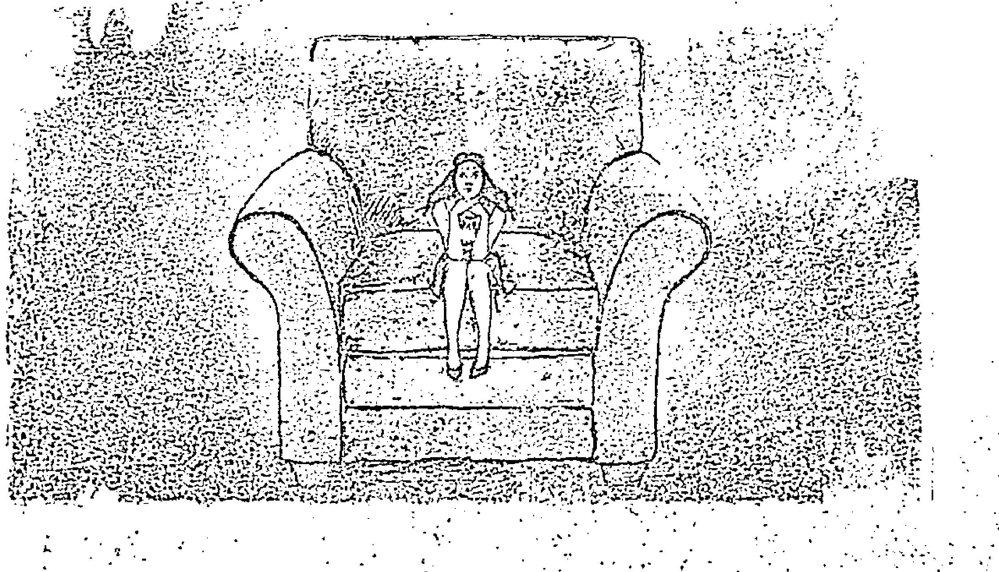

若是相信我们自己就是消极感受，那就更是给消极感受增添了力量。我们怎么可能是一种感受呢？若是认为我们就是一种感受，那就意味着我们任由微不足道的感受控制了我们的人生，把无限的自我缩成了一团。

> “思想和情绪看上去很有力量，那是因为我们赋予了它们力量。任由它们自然起落，它们很快就会消失了。”
——卡利亚尼·劳里

> “‘我很难过。’这种说法是错的。我们应该说：‘此刻，一种难过的感觉经过了我。’让难过的感觉自然流走，我们也就自然而然地坚守住了那稳若磐石的真实的自己。”
——弗朗西斯·露西尔，《静默的香气》

问问你自己，你是难过的感受吗？还是你能意识到难过的感受？
你意识到了难过。
在难过的感受到来之前，你在吗？
你当然在。
当难过的感受离开后，你还在吗？
我希望你依然在。
当难过的感受离去后，你会丧失什么吗？

希望不会。

是的，在难过的感受到来前，你就在这里了；等难过的感受离开后，你还在，安然无恙。这是因为，你不是难过本身。难过只是你意识到的一种感受，它并不是你。不要任由某种感受把你缩小到豌豆的大小，真实的你是无限的存在！

> “不要再畏畏缩缩，小看自己了。你就是高速运转着的宇宙本身。”
——鲁米

我的导师建议，产生消极感受时，对自己提出这样一个问题：

“我就是这种感受吗？还是我是意识到这个感受的人？”

这个问题能够马上让人警醒过来，不把自己和消极感受等同起来，由此让消极的感受失去力量。

> “把思想和感受看作进站然后离开的列车。你就是那个车站，而不是车上的乘客。”
——鲁珀特·斯皮拉，《爱的灰烬》

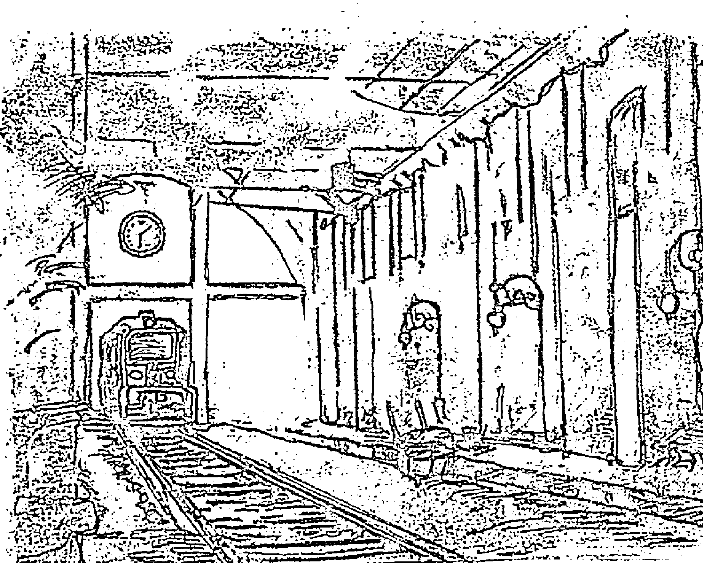

留意一下感受的出现和消失，你——意识本身——在它们刚开始出现的时候意识到了它们的出现，并在它们消失的瞬间意识到了它们的消失。

> “消极的情绪来自你自己，而非现实。永远不要认为自己就是那种感受。它们和‘我’没有任何关系。不要用某一种感受来定义你自己。不要说：‘我很郁闷。’你可以说：‘这真让人郁闷。’你可以说：‘这让人沮丧。’但不能说：‘我有些沮丧。’因为，若是那样，你就是在用某种感受来定义自己。那是一种幻象，那是一个错误。可能现在有难过的情绪、受伤的情绪，但是，不要理会它们。它们会过去的。所有的一切都会过去的。”
——安东尼·德梅洛，《意识：与大师对话》

> “对你的心灵说：‘随便你怎么闹腾或者郁闷。我只会这么静静地看着你、忽视你，我不会和你一起闹腾或郁闷的。’”
——无极

### 这是一项内部工作

> > “想象一下，一个病人去看医生，告诉医生自己哪里不舒服。医生对他说：‘好的，我了解你的症状了。你知道我要做什么吗？我要给你的邻居开点药。’病人回答道：‘太感谢了，这让我感觉好多了。’这是不是很荒谬？但是，我们其实就是这么做的。沉睡中的人总觉得，如果别人改变了，他们也会好起来。你之所以在承受苦难，那是因为你还在沉睡。但是，你以为：‘要是别人改变了的话，生活该有多美好啊。如果我的邻居、我的妻子、我的老板改变了的话，一切该变得多美好啊。’”
——安东尼·德梅洛，《意识：与大师对话》

不要指望通过改变人、环境、事件来让自己的感觉变好，一切都不会变的。若是一直等着世界根据你的意愿发生改变，那你永远都不会获得快乐。改变你的感受，这永远都是一项内部工作。

> > “我们把所有时间和精力都花在改变外部环境上，试图改变我们的配偶、老板、朋友、敌人，以及其他所有人。其实，我们什么都不用改变。消极的感受就在你的心中。在这个世界上，没有什么人或者事情有能力让你不快乐……此前肯定没人告诉过你这些话。他们说的话往往恰恰相反。”
——安东尼·德梅洛，《意识：与大师对话》

消极的感受伤害了我们自己。我们自己造成了所有压力和烦恼，但是，我们一直以为这一切都是周围的世界强加到我们身上的。

> > “别人的所作所为无法给你带来安宁，也无法剥夺你的安宁。”
> ——杰克·欧姬芙

> > “没有什么事情能让我们产生消极感受，没有什么情况能让我们产生消极感受。所有这些大师都在高声呼喊，想要告诉我们这一点。但是，没有人听他们的话。消极的感受来自你自身。”
> ——安东尼·德梅洛，《意识：与大师对话》

消极的感受是我们强加在自己身上的。这其实是个好消息。因为，这也意味着，我们有能力不再继续坚持这种错误的做法！受够了所有消极情绪后，我们会想要找到一种解脱的方法。不幸和痛苦让我们更渴望找到解脱的出路。并且，更棒的是，有一种方法能够终结负面情绪——永远地终结。

### 第六章 总结

- 当所有消极感受都消失不见后，剩下来的，就是无限的意识，就是你真实的自己，你的生活会变得无限精彩。
- 思想创造感受，你的想法会创造出相应的感受。
- 你的感受与你在外部世界的体验是完全相匹配的。
- 感觉好，这是你的本性。当你感觉很好时，你放下了负面的情绪，让正面的情绪自然萌生出来。
- 积极的、好的感受是对生活中的种种遭遇说“是”的结果；消极的、不好的感受是对生活中的种种遭遇说“不”的结果。
- 积极的感受无须费吹灰之力，因为，它们就是你的本性。消极的感受则需要大量的精力去维持。
- 从孩童时代开始，我们就无意识地压抑了大量的消极感受，它们就一直被埋藏在我们心灵中的潜意识里。
- 你遇到不顺心的事情、产生了不好的感受后，若是不能彻彻底底地放下消极感受，那它们就会被压下来，压抑在你的心中。
- 发泄消极情绪并不是解决问题的方法。这种做法反而会给被压抑住的情绪赋予更多力量，因为那些表达出来的感受也被压抑了下来。
- 压抑的感受会找到一个出口，释放内部的压力，因此，它会找到一些人、事件、情况来作为发泄口，释放出积蓄已久的力量。
- 下一次，若是感到消极情绪来袭，不论它看起来是什么样的，记住，你之所以体验到了这种感受，是因为它们其实一直在你的心里——而不是某个外部的人或力量导致了它的发生。
- 若是相信我们自己就是消极感受，那就更是给消极感受增添了力量。
- 产生消极感受时，对自己提这样一个问题：“我就是这种感受吗？还是我是意识到这个感受的人？”
- 留意感受的出现和消失，你——意识——意识到了它们的来和去。
- 不要指望通过改变人、环境、事件来让自己的感觉变好。改变你的感受，这永远都是一项内部工作。

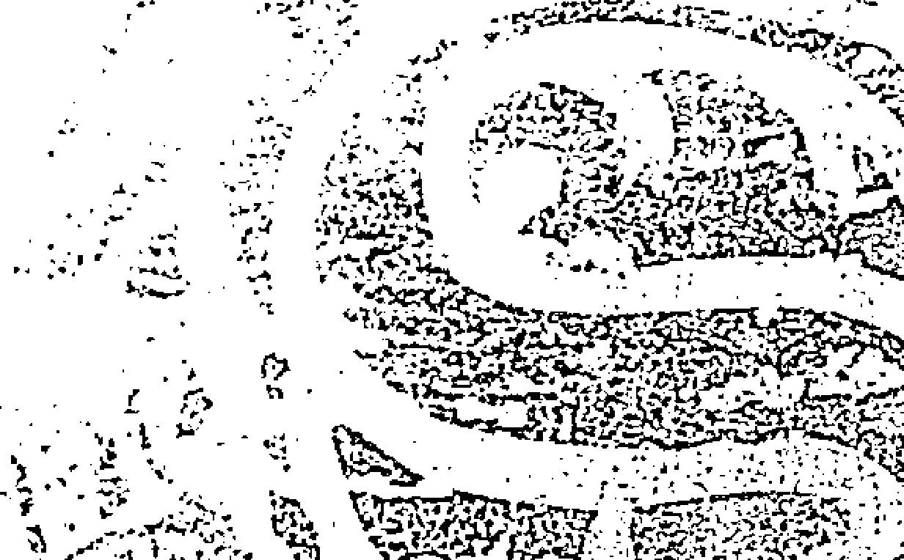

### 第六章 认识感受的力量

### 第七章 终结负面感受

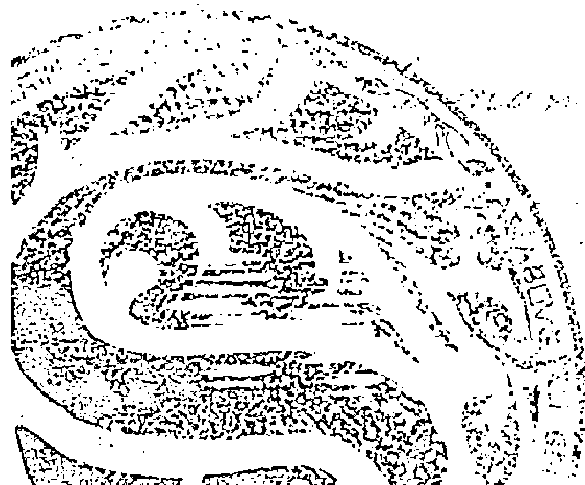

> > “阻碍你真正认识你自己的，是你的想法或感受。就是这么简单。”
>
> ——我的导师

快乐是你的自然状态，若你此刻并不觉得快乐，那是因为你心中的消极感受阻碍了快乐的到来。在这一章中会有很多练习，帮助你终结消极感受，走出由此带来的恶性循环。从消极感受中解脱出来后，你就能回归自然，拥有纯粹的快乐和幸福，你的生活会变得无与伦比地精彩。

> > “你要做的第一件事，就是认识自己的消极感受，此前，你甚至可能意识不到它们的存在。很多人意识不到他们自己的消极感受，很多人抑郁而不自知。只有当他们感受到高兴时，他们才知道，此前自己有多抑郁。所以，你要做的第一件事就是意识到你的消极感受。什么是消极感受？比方说，忧郁。你感到很忧郁，很情绪化；你讨厌自己，感到有罪恶感；你感到生活没有意义，活着很没有意思；你感到很受伤，觉得很紧张、焦虑。你要做的第一件事就是认识这些感受。
> ——安东尼·德梅洛，《意识：与大师对话》

你不必知道那些消极感受究竟叫什么，其实，我们很难真正辨别清楚自己的感受。你只需要知道，那是一种不快乐的感受，那是一种消极感受，它拖了你的后腿，让你无法获得永恒的幸福。

意识到你的消极感受，不要以任何一种方式抗拒、表达、评判它们，它们只不过是一种感受。不要试图改变自己的感受。当你不再急于想要摆脱这种感受时，你就会停止对它的抗拒，压力就此释放，那种感受也会渐渐消失。

> > 不要抗拒某一种情绪，它维持不了多久。
> ——鲁珀特·斯皮拉，演讲“安于你自身的存在”

我们一直以为，抗拒不良感受就能让它们消失，但事实是，这么做的话，我们反而会一直不断地体验到它们。心理学家卡尔·荣格曾经说过：“你抗拒的，反而会一直存在。”不要再抗拒了，不论多强烈，你的消极感受都会很快穿过你的身体，然后离开。

我的导师告诉我，若是把你的手掌和另一个人的手掌对在一起，你们两个同时用手向前推，你会感受到阻力。但是，若是对方不再继续向前推，你们两个人的手很快就会放下来。你可以和家人或朋友试试看，亲自尝试过后，一切都会变得非常容易。同理，当你不再抗拒消极情绪后，你也就放下了它。

不再抗拒消极感受，你就要允许这种感受出现，不要试图改变它。意识到这种感受，放轻松，不要紧张。讽刺的是，越是这样放松下来，任由它存在，不试图改变它，也不试图摆脱它，你反而会在心里放下它。任由它存在，让它的能量释放出来。这和我们之前做的都不一样，这也就是为什么我们之前在心中压抑了那么多的消极感受。

> > “抗拒是很隐蔽的。正是因为我们的抗拒，我们无法拥有、做到、成为自己想要的一切。” ——黑尔·德沃斯金，《瑟多纳释放法》

任由消极感受存在，它背后的能量也会自然而然释放出来。 这是一个自然而然的过程。你需要做的，就是意识到自己的感受，任由它存在，不要试图改变它、控制它、摆脱它。当你让自己的感受及其附带的能量快速离开你的身体，它们还会带走你体内压抑已久的其他感受。比方说，感到生气后，你不抗拒这种感受，而是任由它存在，那么它就会迅速离开你，并且带走此前压抑在你体内的愤怒感受。

> > “不要害怕感受——让它们来，让它们释放。” ——沙克蒂·卡泰丽娜·马吉

留意到自己的感受后，不要压抑它，任由它存在。如此，我们才能释放压抑的感受。只要心中不抗拒，即使是极度的愤怒，也能在不到一分钟的时间里烟消云散。

> > “若是我们对消极的感受不是客观观察，而是心生认同，那它们很快就会吸干我们的能量。学会如何放任自己的情绪，我们就能重新掌握自己的能量，提升自己的生活体验。”
——大卫·宾汉

我下面要分享的练习是我知道的最有效的释放消极感受的方法，通过这个练习，那些在心底埋藏了一生的消极情绪都能彻底释放出来。消极情绪消失后，你就不会再受到它们的影响，你会更健康、更富有，拥有更美好的东西。并且，更棒的是，一旦它们消失了，你将获得的，就是无限意识带来的永恒的喜悦和快乐。你想要的一切都会自然而然地出现在你的生命中。作为无限的存在本身，你会拥有超凡的人生体验。

> “放下能放下的一切，剩下的，就是我们真正想要的了。”
——鲁珀特·斯皮拉，《爱的灰烬》

### 欣然接受

前物理学家、优秀的导师弗朗西斯·露西尔把这种释放消极感受的方法称为“欣然接受”。这是我一生中做过的最有效的练习，能够一次性消除所有消极感受。（值得注意的是，接受了自己的消极感受后，那些最开始导致它们出现的情况也会发生变化。这是因为你释放了自己对这种情况的感受。）

接受是抗拒的对立面。对于消极感受，抗拒是：“不，我不想要这个。”接受是：“是的，我接受你。”意识能够接受一切。没有什么消极感受——不论它们多么强烈——能抗拒如此具有包容性的意识。事实上，所有的消极力量都无法抗拒意识的包容。

接受自己不想要的东西，这看起来有违我们的本性，但是，事实上，抗拒让我们摆脱不了自己不想要的一切，接受了，我们才能不再抗拒！面对消极感受，不抗拒、不紧绷，这其实是很难做到的。但是，打开自己的注意力，接受自己的感受，抗拒就会奇迹般地消失，消极的感受——其实就是一种能量——也会烟消云散。你所抗拒的情况也会由此发生改变。

记住，就像是把相机镜头拉远一下，把自己的注意力打开。不要只关注自己的感受，那只会让感受变得更加强烈，因为，心灵会给每一个我们关注的东西加码。注意到你的感受，但是不要太关注它。

> > 导师黑尔·德沃斯金建议，一开始，当你练习打开自己的注意力时，你可以张开自己的手臂。张开手臂，就好像是你在准备给你爱的人一个温暖的拥抱。这么做能帮助你打开心扉（我们总是不自觉地习惯把我们的心脏区域保护起来）。在接受我不想要的东西时，我会有意识地打开自己的心扉。

> > 我的导师说过，欣然接受时，我们会成为真正的自己——意识，因为接受就是我们的本性。事实上，无限的意识能够接受、包容一切，消极感受在它面前根本无能为力。道理很简单，接受消极事物时，你其实是在将它化入它的本源——你，意识本身！接受自己的消极情绪，你其实是在利用自己的无限能量消灭消极的情绪。

> > 导师弗朗西斯·露西尔说，懂得了如何接受，我们也就会明白。

### 伤害你的，其实是在保佑你

白，接受并不仅仅是接受，它还能让抗拒的行为停下来。一开始，我们要练习去接受，但是，渐渐地，我们会发现，通过这种练习，我们不会再对任何事情产生抗拒。

> “感受会烟消云散，因为，感受不过是一种能量。因此，感受产生时，意识到它只是一种能量，接受它。它之所以会产生，是因为你已经做好了摆脱它的准备。”
> ——我的导师

几年前，我有一段时间很抑郁。那个时候，我还不知道这本书里的很多道理。但幸运的是，我知道自己处于抑郁的状态中。我的女儿那时生了场重病，我很担心她，恐怖的想法一个接一个地蹦出来。我相信了这些想法，很快，我就跌入了抑郁的深渊。

> “生气、难过这样的感受之所以存在，是为了提醒你，你相信了自己编的故事。”
> ——拜伦·凯蒂，《心之安处》

为了摆脱这种情绪，我试着想一些积极的东西，试着心怀感恩，但是，面对内心深处浓浓的抑郁情绪，我的思想根本无能为力。在我们情绪极端低落、内心感到绝望的时候，这其实是一种安全机制，保护我们免受消极思想的影响。因此，惯常的方法在这时起不了任何作用，我必须另寻他法。

### 第七章 终结负面感受

那个时候，我下定决心，既然没有办法用积极的思想来对抗抑郁情绪，那么，我就不要再继续抵抗抑郁了，因为我知道，“你抗拒的东西反而会一直存在”。于是，我闭上眼睛，把全部注意力都投注到我的身体内部，只关注我体内抑郁堆积的地方。我把自己的身心全部打开，接受我体内浓重的抑郁情绪，我仿佛张开了双臂去拥抱它们，就像是拥抱一个久未谋面的朋友一样。我打开自己，尽最大的努力去爱上我的抑郁，把它向我的方向拉近。有那么几秒，我感觉更糟糕了，然后，突然间，一切都变得轻松了起来，一切都烟消云散了。就在那么几秒的时间里，我的抑郁消失了。我感到如释重负。

几个小时后，抑郁的情绪又回来了，但是这次没有之前那么严重。每一次，当它再次出现时，我都用之前的方法去练习。操练的次数越多，抑郁的程度也会变得越来越低，几天后，抑郁就彻底远离了我。

> “接受你遇到的麻烦，门自然会打开。”
> ——鲁米

那个时候我就知道，抑郁再也不会找上我了。它已经永远离开了我的身体，再也不会回来。

我可以用这种方法对付抑郁情绪，你也可以用同样的方法对付自己的消极情绪。在进行实际操作的过程中，你会更加熟练地掌握这个练习的要领。在消极情绪最盛的时候消除它，这是世界上感觉最棒的一件事。不要抵抗自己的消极情绪，那只会让事情越变越糟，去接受它们。在那个时候，虽然我不知道其中的道理，但我还是出于本能地接受了自己的抑郁情绪。

从那以后，每当消极感受、消极想法产生后，我都用同样的方法来对付它们。并且，我还用同样的方法对付头痛、脚抽筋等身体的不适。我发现，只要我们不再抵抗，身体的不适和消极感受一样，都会很快烟消云散。

你可以用这种方法对付所有让你感觉不好的东西：消极的思想或故事、消极的感受、身体的疼痛、痛苦的记忆……欣然接受它们吧，把自己从情绪的枷锁中解脱出来，让生活的方方面面都变得更美好。

> “爱我所恨，就能终结仇恨。爱能战胜一切。爱我所恨，意味着接受。这并不是说我们应该去做那些自己讨厌的事情，只不过，我们也不应该继续压抑自己的仇恨。爱我所恨，其实是把我们自己从仇恨中解脱出来，自此，爱便萌芽了。”
> ——弗朗西斯·露西尔，《静默的香气》

消极的感受可能会令你感到很不舒服，感到害怕，这也是为什么很多人不愿意面对它们，而是自然而然地就养成了压抑它们的习惯。但是，它们糊弄了我们。让消极感受出现，接受它们，不再试图拒绝它们，可能有那么几秒，消极情绪会变得更加强烈，让你感觉有点招架不住，但很快，它们就会彻底消失了。

让不良情绪出现，不要压抑它们，它们也就不会再像从前那么猛烈。你已经削弱了它们的力量，它们在渐渐消散。重复几次同样的练习，你就会发现，它们从你的体内彻底释放了出去。消极感受消失后，曾经被它们占据的地方，现在便充盈着快乐和美好。

> “有时候，我们释放了一种感受，但是很快发现它又回到了我们体内。这是因为我们的体内还有更多同样的感受。我们此前一直在累积这些感受，我们体内还有很多被掩藏的感受，需要得到释放。一旦得以释放，我们会马上感觉到一阵轻松、快乐，感觉很‘爽’。”
> ——大卫·R.霍金斯，博士，《放手》

释放消极情绪后，那种轻松的感觉非常美妙。你的身体越来越轻盈，生活越来越轻松，快乐不断增加。并且，你会越来越有干劲儿，消极情绪的释放也会变得越来越简单。最后，你会达到这样一种状态：大部分消极情绪一旦出现，就会立马被你意识到，然后它们就自动消散了。这就是意识的无穷力量。

> “消极情绪的释放就像是呼吸——它是自然而然的。你需要做的就是吸气、呼气。”
> ——我的导师

> “你所有的消极感受、所有的痛苦、所有的金钱、所有的一切，都是为了让你自我实现。”
> ——拜伦·凯蒂，《一念之转》

消极情绪的存在，是为了让你认识真实的自己。它们其实是在提醒你，你相信了很多自己编造的、不真实的故事，你可以拥抱这些感受，过上作为真实自我——意识——的美好生活。这是不是很讽刺？我们一直以来都试图逃避的消极感受，其存在的目的其实是让我们自己解放。

> “伤害你的，其实是在保佑你。黑暗就是你的蜡烛。” ——鲁米

把每一个消极感受都当成能够把你从消极情绪中彻底解放出来的机会。我的导师曾经说过，消极情绪之所以产生，是因为你已经做好准备想要摆脱它了。接受这种情绪，不要试图改变它或逃避它。你就是无限的存在，接受是你的本性。接受所有的消极感受，最后，你会永远摆脱它们。

> “我们可能在良好的环境中倍感煎熬，也可能会在危险、吵闹的不良环境中感到安宁。” ——简·弗雷泽，《打开心门》

你要如何去接受那些由你看不惯的、反对的事情（如虐待动物）带来的消极感受？

你要明白，你由此产生的感受正在对你自身产生危害，并且，这种感受什么都改变不了，拥抱你的感受和感觉，接受你自己的不满，接受这种不公平、不公正的感觉。接受它们，直到再想到类似的事情时，你不会有类似的感受。

你可能会觉得，你不想失去这种痛苦的感受，因为你心中还在乎。但是，这一切都是你的心灵告诉你的故事，这一切都不是真的。你对某件事情的抵抗只会令它不断加码，你其实是在给它添加更多的力量，让它愈演愈烈。释放了消极感受后，你也就把自己投注在这件事情上的能量释放了出来，这也会让事态渐渐平息。消极的情绪没有了，爱与共情自然就会出现，它们拥有奇妙的能力，可以让这个世界变得不同。

让我给你讲讲莱斯特·利文森的故事。在三个月的时间里，他释放了自己所有的消极情绪和消极信念，彻底开了窍。在那之前，莱斯特的身体很不好：抑郁、偏头痛、胃肠紊乱、黄疸高、肝脏肿大、肾结石、胃酸过多、胃溃疡、胃穿孔、冠心病……

当他压抑已久的消极情绪被释放出来后，所有病痛也渐渐消失了。莱斯特把这种释放消极情绪的方法叫作“瑟多纳释放法”。莱斯特的这种方法被他的学生黑尔·德沃斯金（在《秘密》和这本书里他曾多次出现）发扬光大，在全球范围内产生了巨大的影响。

> “我亲手打碎了那个我自己创造的地狱。我用爱拥抱一切，试着去爱，而不是努力被爱，对过往发生在我身上的一切承担起责任；我发现了潜意识里的思想，把它们纠正过来。就这样，我获得了自由，以及快乐。”
> ——莱斯特·利文森

> “想一个让你感到非常痛苦的回忆，一个埋藏在你心底的令你悔恨不已的事情。你会看到，这么多年过去了，附着在这个事件上的想法越来越多。彻底放下这个痛苦的感受，所有附着其上的思想也会立马消失，我们会把这整件事情都彻底忘记。”
> ——大卫·R. 霍金斯，博士，《放手》

当我们释放或者接受一个被压抑在回忆中的感受时，无论那段回忆发生在多么久远的过去，附着在其上的成千上万个想法也会随之消失。没有什么比这种感觉更棒了！释放附着在痛苦回忆中的感受后，那种轻快、喜悦、幸福，简直难以用语言形容，你的生活也会就此彻底改变。释放过后，你会确切地知道，那些一直以来压抑着的感受影响了你的身体健康。并且，你周围的一切都会向着更好的方向发生改变，到了那个时候，你也会明白，那些感受其实一直都拖了你的后腿。

我曾经用这个方法处理了一段伴随我前半生的童年痛苦回忆，我现在已经想不起来当时究竟发生什么了，我只记得我把它释放了出来。释放由这段痛苦回忆带来的种种感受后，附着在这段回忆上的思想也消失了，整个这段回忆都彻底消失了！

痛苦的回忆是我们身负的重担，因为有了它们，我们无法过上自己应该拥有的生活，无法成为最真实的自己。你可以把自己从痛苦的回忆中解脱出来。

> “关注每一个思想背后蕴藏的感受，它们就会烟消云散。这是一个自我清洁的机制。接受你的感受，用这种便捷的方法释放你的消极思想。”
> ——我的导师

令人感到振奋的是，释放一个消极感受，千百个消极的想法也会随之消失。在终结消极感受的过程中，你放下了各种各样阻碍你的人生，让你无法获得持久快乐、幸福的消极思想：你放下了怀疑、不自信、不安，你不再需要来自外界的认可。每释放一种感受，你的生活就会变得更美好一些。

## ### 超级练习

下面，我想和你分享一个我的导师告诉我的练习方法，它改变了我的生活，直到现在，我每天都还在练习。这个练习结合了本书中提到的两个非常重要的方法：接受，保持意识状态。我的导师告诉我，保持意识状态时，我们的身体会自然而然地开启自我清洁机制。也就是说，当你处于意识状态时，你体内所有由消极情绪产生的能量都会自然而然地释放出来！有时候，你能够感受到，那些能量在你的胸部区域释放出来。

##### 第一步：接受消极

打开你的心灵，接受消极的反应、消极的感受、消极的感觉、消极的思想、消极的问题。在它们出现的那一瞬间，接受它们。

##### 第二步：保持意识状态

打开你的注意力，不要聚焦在任何一个细节上，保持意识状态。

意识的本性就是接受，进行练习一段时间后，你会发现，这两个步骤合二为一了。接受的时候，你会发现，意识其实一直都在。

进行过这个练习后，我发现，消极的情绪和反应变弱了，并且很快就会破灭。后来，我甚至期待着消极情绪和反应的到来，因为，它们的出现能够提醒我们，要接受它们，要保持意识状态，并且，它们消失后的那种感觉实在是太棒了。

消极情况、状况、问题出现时，我也会用同样的练习进行应对。我打开了自己的注意力，打开了自己的心扉，拥抱随之而来的消极感受，尽自己的全力保持意识状态。（我发现，保持意识状态的一个有效的方法就是爱上它。爱上意识，把全部关注都投注到它的身上。）我发现，进行这个练习后，消极的情况会很快发生变化。事实上，它们必然会发生改变，因为，对它们的抗拒让我们永远无法摆脱掉它们！

> “在意识状态中，所有的痛苦都会终结。”
> ——简·弗雷泽，《当恐惧消散》

几年前，我经历过一个对大部分人来说都很恐怖的事情。但是，因为我接受了它，并且保持了意识状态，那个事件并没有对我产生什么影响。

在那个时候，野火烧到了我居住的社区。我从家中撤离了，在整个过程中，我一直都很镇定，相信我的家会安然无恙的。我很冷静，因为，不论发生什么，我都能接受。我已经撤离了，如果我的家保不住了，我知道，那也是最好的安排，那是生活要把我带到另一个方向上。在几小时里，火势完全失控了，所到之处，一切灰飞烟灭。最后，它渐渐逼近了我的家，烧到了我住的那条路上。但是，我没有害怕，对于未来可能发生的事情，我没有任何感觉。不论发生什么，我都会保持快乐，我没有任何抗拒。最后，我的房子保住了。在那个时候，我知道，我接受了这个现实，我相信我在这整个过程中表现出的冷静和安定，是我过去一直练习接受的结果。

> “我认识到，我的痛苦，很大程度上来源于我对既定事实的抗拒，以及我一直生活于其中的过去或未来里。我之前并不知道自己究竟是多么痛苦。这就好像是在过去十五年里，我们一直拿着锤头击打自己的小腿，现在，锤头没了。”
> ——简·弗雷泽，《打开心门》

从消极情绪中解放出来，你花在这个练习上的每一秒都是值得的。自2004年发现《秘密》后，在大部分时间里，我的感觉都非常好。现在，由于我在这本书中和你们分享的知识和练习，我一直都能感到由衷的快乐和幸福。

你能想象吗，没有任何的消极情绪能够影响你，就这样过每一天、每个月、每一年？如果没有消极情绪，你就不会有消极想法，不会一直想着那些自己不想要的东西，如此，你就会把自己想要的一切都吸引到自己的生命中来！亲身体验一下，你就会知道什么是活着的真实喜悦。

### 第七章 总结

- 快乐是存在的自然状态，如果此刻你觉得不快乐，那是因为消极的感受阻碍了快乐的出现。
- 意识到你的消极感受，不要以任何一种方式抗拒、表达、评判它，要知道，它只是一种感受。
- 允许消极感受的存在，它们背后蕴含的能量将自然而然地释放。这是一个自动的过程。
- 接受，你就能把消极感受消除，接受是抗拒的对立面。对于消极感受，选择接受的人说的是：“是，我接受你的存在。”
- 一开始，你可以通过张开双臂的方式帮助自己打开注意力，这也可以帮助你打开自己的心扉。
- 接受所有让你感觉不好的东西：所有消极的想法、消极的故事、消极的感受、难受的感觉、痛苦的回忆……
- 允许不良情绪的出现，不要压抑它们，这个情绪就不会再像之前那么强烈。
- 消极情绪的出现，是为了引导你认识真正的自己。它们会提醒你，告诉你你相信了一些自己编造的不真实的故事。然后，你就会接受这些感受，过上作为真实的自己——意识——的美好生活。
- 消极情绪之所以会出现，是因为你已经做好准备从中解脱出来了。
- 释放因为某件事情而产生的消极感受，你把自己投注在这件事情上的能量释放了出来，这也会让事态渐渐平息下来。
- 接受回忆带来的压抑感受，附着在其上的千百个思想也会随着你的感受一起获得释放。
- 释放掉痛苦回忆带来的消极感受后，你会觉得很轻松、快乐，很“爽”，这种感觉简直难以用语言来形容。

### 超级练习：

- 第一步：接受消极；
- 第二步：保持意识状态（爱上意识是保持意识状态的好办法）。

### 第八章 不再受苦

> “我们的底线是：受苦只是一种选择。”
> ——拜伦·凯蒂，《心之安处》

你并不是一定要受苦。作为真实的自己——意识，你的生活中可以永远都没有苦难。也许你现在很难想象，自己的生活中可以一点苦难都没有，但是，我可以非常确定地说，你的生活可以是这样的，就在此时此刻。

> “肉体会疼，心灵会苦。”
> ——安东尼·德梅洛

> “你真实的自我并不会遭受苦难。但是，庸常的那个你很难想象如何不遭受苦难。”
> ——简·弗雷泽，《存在的自由》

我们之所以受苦，是因为相信了那些消极的想法。因此，苦难都是我们自找的。

> “我发现，若是相信自己的思想，我会痛苦；若是不相信的话，我就不会受苦。对所有人来说，情况都是如此。自由就是这么简单。”
> ——拜伦·凯蒂，《喜悦无处不在》

> “受苦的时候，你的痛苦其实都在一念之间：‘我不喜欢这个。’换句话说，我们让一个小小的、无足轻重的想法毁了自己的幸福。”
> ——鲁珀特·斯皮拉，演讲“一念之间的痛苦”

> “意识甚至会对‘不’说‘是’。”
> ——我的导师

说“不”反而让你永远无法摆脱自己不想要的一切。对不想要的东西说“是”，卸下你的抗拒，让你不想要的东西发生改变。这可能和我们的本能反应完全相反，但是，这么做很管用。如果你说的是：“不，我不想要这个。”你其实是在抗拒，现在你明白了，你抗拒的东西反而会一直存在。

> “让自己处于接收状态，你就不会有消极感受或想法，不会受苦，不会不快乐。处于不抗拒的状态中，你也就处于一种轻快、和谐的状态，不必再去挣扎。”
> ——埃克哈特·托利，《当下的力量》

> “我热爱事物本来的样子，这并不是因为我是一个灵性的人，而是因为，若与现实对抗，我会受伤。”
> ——拜伦·凯蒂，《一念之转》

> 如果你曾经释放自己内心所有的抗拒，并且不再对任何东西心生抗拒，那么你就把自己从无穷无尽的苦难中解脱了出来。
> ——简·弗雷泽，《存在的自由》

不再抗拒发生了的事情，就不会有冲突，发生过的事件所产生的能量也会很快消散。不再抗拒任何事，那么一切都会成为过眼云烟。相反，如果我们对发生了的事情感到抗拒，我们其实是在对它们纠缠不放，会一直受苦。伟大的导师水手鲍勃·亚当森曾经说过：就让所有的经历都自由来去吧，不要评判它们。

> 造成心理上的痛苦的，是我们对事情的念念不忘、执着不放、抵抗对立。
> ——彼得·劳里，演讲“不再分离”

> 很多人至死都觉得，痛苦是必然的。这实在是太令人难过了。若你一直对此深信不疑，那么直到死的那天，你都会一直承受这无谓的痛苦。但是，事实的真相是：若你能获得自由，苦难会终结，痛苦会消失，取而代之的是巨大的喜悦与快乐。
> ——简·弗雷泽，《当恐惧消散》

### 终结苦难，马上

接下来我要跟你分享的方法可能并不容易掌握，但是，一旦你学会了，它能马上带走你的所有苦痛。心灵让我们相信，我们是受苦受难的人，若是我们相信了自己的心灵，就会感到巨大的痛苦。但是，事实上，我们并不是受苦的人，我们只不过是能意识到苦难。“我们就是受苦的人”，这只是你自己产生的一个想法，你相信了这个想法。但其实，这并不是真实的你。

> “没有人会受苦，明白了这一点，苦难也就终结了。”
> ——黑尔·德沃斯金

我的导师会让你问自己这个问题：

> “我是那个遭受苦难的人，还是我是那个能意识到苦难的人？”

不再相信心灵告诉我们的东西，苦难也会立马终结。

> “一旦我们明白了心灵的本质，苦难就不会继续存在了。”
> ——拜伦·凯蒂，《心之安处》

> “意识敞开了你的心门，消解了所有阻碍、遮蔽了你快乐本性的信念、意见、想法。”
> ——安东尼·德梅洛

> “苦难消退，心灵安静下来，你感觉到自己回家了。家找到了你——这可能才是你更真切的感受，因为，你并没有费力去寻找它，它就出现了。或者，你可能曾经试图寻找过自己的家园，但是，此刻你发现，之前你一直都找错了地方。”
> ——简·弗雷泽，《伟大的甜美：思考后的人生》

世间所有的痛苦，究其本源，都来自一个信念：我们是独立存在的个人。你的心灵会不断地对你说：你只是一个人，在这个纷繁复杂的世界里，你很弱小。若是相信了心灵告诉你的这个故事，你就会完完全全被它操控。你的心灵会不断向你灌输各种恐怖的想法：你很弱小，不好的事情会发生在你的身上，你和你的生活处处受到各种限制。但是，事实正好相反。我们不是一个分开的个体。可能我们看上去是这样，可能我们的体验也是这样，但是，真实的伟大生活中充盈着无限的快乐。认识你自己，保持意识状态，你就是无限的、永恒的意识，我们所有人都是。

## ### 问题的终结

当事情和我们想的不一样，或者当我们感到某个事情不大对的时候，我们会觉得自己遇到了一个问题。对于这个问题，我们> > 心灵的第一反应是：“我不想这样。”然而：“问题只存在于人的心灵中。”
>
> ——安东尼·德梅洛，《意识：与大师对话》

> > “问题不是真的，它们都是想象出来的。问题根本不存在，问题不可能存在。真实的我们是没有任何问题的，问题都是人为造出来的——每一个问题都是这样。”
>
> ——我的导师

> > “所有的问题都来自过去或未来。当下，没有任何问题。”
>
> ——黑尔·德沃斯金

> > “若是没有心灵，也就不会有问题。所有的问题都只存在于人的心灵中。所有的问题都是心灵创造出来的。”
>
> ——安东尼·德梅洛，《意识：与大师对话》

真相是：问题只不过是我们心灵中的思想编造出来的另一个故事。心灵以编故事的方式诠释我们的生活，告诉我们曾经发生过什么事，并且把这件事变成了一个问题。若要体验没有问题的生活，我们就不应该相信自己的心灵，而是应该利用意识的力量，意识到你的心灵。

越来越熟悉和适应作为意识的生活后，你会越来越清晰地看到，问题都是你想象出来的局限。你就是无限的意识，你怎么会遇到问题呢？

> > “这就好像是你把手伸进火里，说：‘噢，太烫了！我的手烧起来了！天哪，我遇到了一个问题！’然后，你不断地把手伸进又收回来，一次又一次，直到有一天，你终于看清了自己究竟在做些什么，然后停了下来。如果你遇到一个问题，你一次次地把手放到问题中，大声叫喊：‘太疼了！’就好像把自己的手放进去的人并不是你。你表现得好像自己什么都不知道，什么都没做过。但是，这一切都是你自找的。”
>
> ——莱斯特·利文森，《快乐是免费的》，第1—5卷

> > “所有的问题都来自你的自我。不要受任何问题的影响，你就能获得自由。”
>
> ——我的导师

然而，难点在于，如果你相信自己有一个问题，那么你就一定会真的体验到这个问题。不过，若你能意识到，这只不過是你的心灵和思想在讲述的消极故事，那么，这个问题也就迎刃而解、消失无踪了——你抛掉了错误的信念，因此也摆脱了问题。

> > “如果有人说：‘我遇到了一个麻烦。’那个麻烦一定在他的心里。它只能在那里，在其他任何地方，你都没有办法看到它或者感受到它。你看到的、听到的、感受到的一切都在你的心灵中。一切都在那里。”
>
> ——莱斯特·利文森，《快乐是免费的》，第1—5卷

> > 都是不存在的。我们只不过是没有足够多的爱。
>
> ——我的导师

不再抗拒任何事情，接受事物本来的面貌，这就是爱。爱存在的地方，就不会有问题。这就是为什么问题没有办法触及你真实的自我，因为你就是纯粹的爱。它是那么纯粹，因此我们的心灵没有办法领会它。爱是完全的接受和包容，它是不会受伤害的。这就是佛陀、耶稣、老子、克里希那穆提等伟大的先知们表现出来的爱。你本身也是这样纯粹的爱，你不会有任何问题。

但是，在一个处处受限的个人看来，问题是实实在在存在的，我们的心灵对无限的意识有完全相反的反应，它一直在抗拒和反对，而不是接受和包容。

> > 人生是一连串自然及自发的变化。不要抗拒，它只会产生悲痛。让现实归于现实。让事情自然发展。
>
> ——老子

> > 不强求事情按照我们自己的意志发展和改变，它们自然会自动解决。
>
> ——卡利亚尼·劳里

通过进行《秘密》一书中的练习，我发现，感到快乐的时候，我的生活中不会有任何问题。这是因为在有快乐的地方，问题不会出现，即使出现也都很小，不会影响我们的快乐。快乐时，即使有问题，也都是小问题; 绝望时，再小的问题也显得如山一样大。

这是不是也告诉我们，做真实的自己，拥有无尽的快乐，我们就不会再受到任何问题的困扰？

> “世界上的问题是没有尽头的。若要终结所有的问题，你只能不停地解决各种各样的问题，然后不断发现越来越多的问题。只有当你发现了真实的自己后，你才能真正地终结问题。”
>
> ——莱斯特·利文森，《快乐是免费的》，第 1—5 卷

### 如何永远摆脱问题

> “你可以摆脱不想要的一切。你想要关注一个问题，然后试图搞清楚它、改变它、解决它，还是想要摆脱这个问题？”
>
> ——我的导师

有一次，我和我的导师分享了一个我自认为很严重的问题，她对我说了下面这一番话，让我感到醍醐灌顶：

> “不要再关注这个问题了，不要再希望它变个样子，不要再希望它消失，不要再试图改变它，不要再试图搞清楚它，不要再试图控制它。当你处于意识状态时，它自然会消失。在爱的面前，不是爱的一切都会土崩瓦解。在意识面前，不真实的一切都会土崩瓦解。”
>
> ——我的导师

就像是《秘密》一书中所说的，如果我们关注了某个事情，我们就是在赋予它能量，如果我们关注了某个问题，我们其实也是在赋予这个问题能量，让它变得更大。试图修正、解决、控制、消除问题，其实都是因为我们还在关注这个问题！把我们的注意力从问题上转移开，问题自然就会消失，因为我们赋予它的能量已经不在了，它只能土崩瓦解。这就好像是一场没了氧气的大火——火自然会灭。

> > “试图摆脱一个问题，其实是在紧紧抓住这个问题不放。不论我们想要摆脱的是什么，其实我们都是在心中抓住它们不放。因此，问题也会一直在那里。所以，解决问题的唯一方法就是让它自然消失。不要去看这个问题，去看看那些你想要的东西吧。”
>
> ——莱斯特·利文森，《意志力》播客

不再关注问题后，你就可以让自己的心灵和思想只关注那些你想要的东西，用你的心灵创造你想要的一切。

> > “能量流向你关注的地方。”
>
> ——麦克·伯纳德·贝克威思，《秘密》

我们关注那些不想要的东西，希望能改变它们，但是结果往往恰恰相反。我们必须转移自己的注意力，才能真正地解决这些问题。我之前听别人说过，问题就像是一个不受欢迎的客人，若是你不关注他、不招呼他，这位不速之客就会离开！

施展意识的力量，意识到你心灵中的消极想法和故事，破解消极的一切，你也就能从所有的问题和痛苦中解脱出来了。保持意识状态，你就会拥有无尽的快乐和喜悦，这也是另一个很好的例子。

> > 这是一个缓慢显现的奇迹。耐心一点。在你此前的人生中，你一直在遵循着错误的方法，以为自己只能忍受命运的摆布。不要指望一切都能在瞬间扭转过来。
>
> ——简·弗雷泽，《存在的自由》

### 第八章 总结

- 你并不是一定要受苦。作为真实的自己——意识，你的生活中可以永远都没有苦难。
- 我们之所以受苦，是因为相信了那些消极的想法。因此，苦难都是我们自找的。
- 抗拒发生了的事情，我们是在抓住这个情况不放，我们也会继续受苦。
- 问自己一个问题：“我是那个遭受苦难的人，还是我是那个能意识到苦难的人？”事实上，你是那个能意识到苦难的人，而不是那个遭受苦难的人。
- 世间所有的痛苦，究其本源，都来自一个信念：我们是独立存在的个人。
- 问题只存在于我们的心灵中。问题不是真实存在的，问题都是想象出来的。
- 若要体验没有问题的生活，那就施展意识的力量，意识到你的心灵，而不是相信自己的心灵。
- 如果关注了某个问题，我们其实也是在赋予这个问题能量，让它变得更大。把注意力从问题上转移开，问题自然就会消失，因为我们赋予它的能量已经不在了。
- 不再关注问题后，你就可以让自己的心灵和思想只关注那些你想要的东西，用你的心灵创造你想要的一切。
- 施展意识的力量，意识到你心灵中的消极想法和故事，破解消极的一切，你也就能从所有的问题和痛苦中解脱出来了。

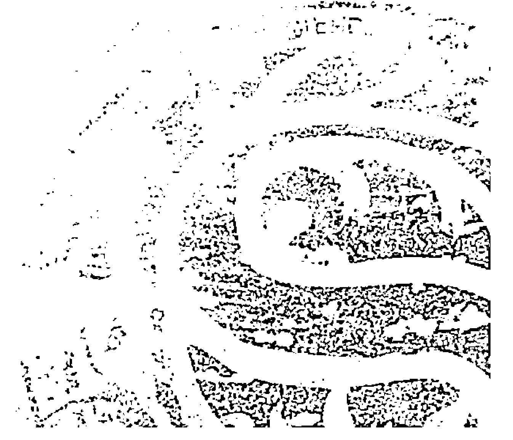

### 第九章 摆脱狭隘观念

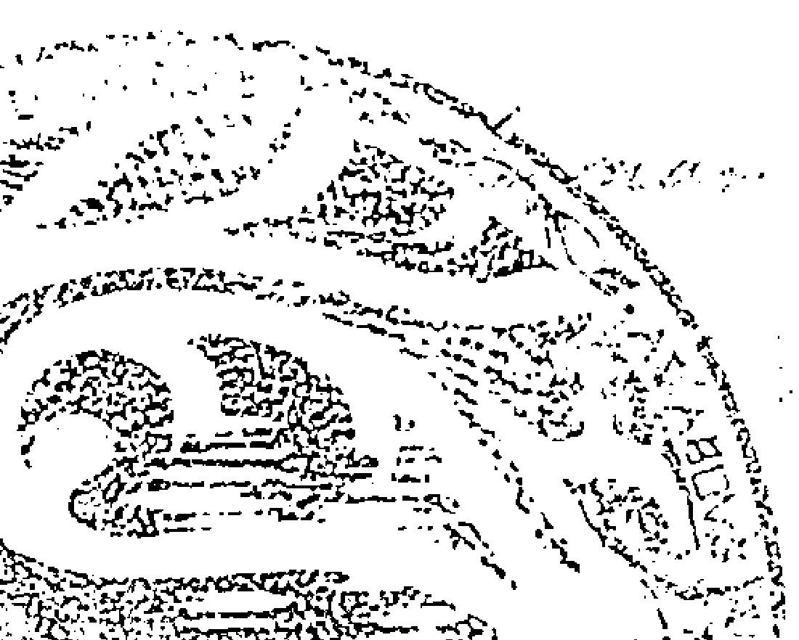

> > “所有的信念都是我们自己想象出来的局限。”
>
> ——我的导师

什么是信念？信念只不过是我们一直在想的一个想法——想来想去，我们就相信了这个想法。所有的信念都是有局限性的，因为它们都来自我们的心灵。让我们看一个例子：那个告诉我们某件事情“实在是太好了，不可能是真的”的信念。我们先是听到别人对我们这么说了，然后我们自己也有了这样的想法，然后，我们相信了它，到处都能看到佐证这个想法的例子。就在我们相信了这个想法的那一刻，它成了一种驻扎在我们的潜意识中的信念，自那之后，它会在我们的心灵中自行运转，并不断投射到我们周围的世界中，不断地在我们的生活中证明自己的正确性。

> > “想法本无害，直到我们相信了它。”
>
> ——拜伦·凯蒂

> “关键不是我们的自我说了些什么，而是我们相信了些什么。”——无极

一个信念还会激发更多类似的想法，这些想法就像是录音一样在你的脑海中不断播放。如果你相信某件事情“实在是太好了，不可能是真的”，你的潜意识还会播放出类似这样的话：“就在这么快乐的时候，我感觉到，不好的事情很快就要发生了。”“我一定要最大限度把握住它，因为它不可能一直这么持续下去。”“坏事总会跟在好事后面。”“我很紧张，因为好事一般不会发生在我的身上。”“如果某件事让你感觉好到不可置信，那么它就一定不可能是真的。”你也许很熟悉类似的想法，这也证明了，这些声音一直在你的心灵中不断播放着，对你来说，它们并不稀奇。

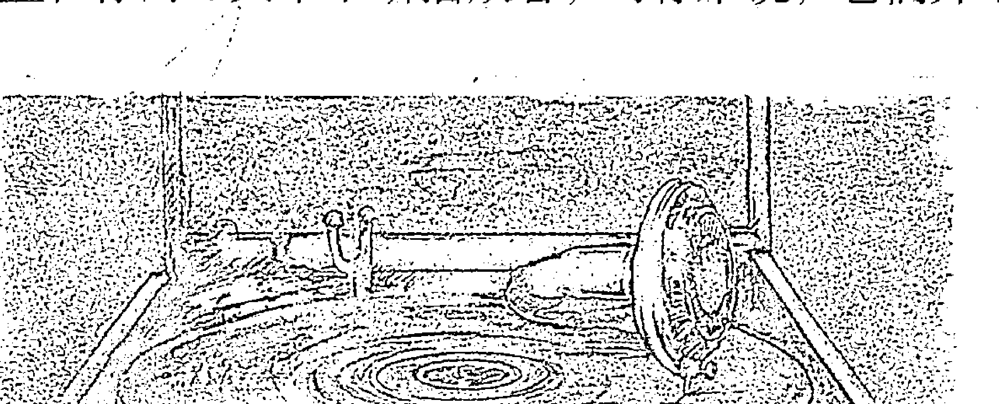

我的导师曾经说过，想象一下，你接起一通电话，电话的那头一直在不断重复播放着：“这是一段录音，为保护你的资金安全，请马上把你所有的钱都转到这个银行账户里。”你会照着去做吗？你会相信这段录音吗？你当然不会。那么，你为什么要相信自己心灵中的录音呢？

### 信念决定你的体验

> “我们向外投射出自己的思想和信念，然后，它们又作为我们的体验回归。”
>
> ——大卫·宾汉

你一定会体验到自己相信的东西，所以，相信些什么非常重要。信念拥有巨大的能量，能不断地把自己投射到你的生活中，让你相信的一切都成真。即使你的信念是假的、错的，也没有关系——任何根植于潜意识的信念都能开花结果。

比方说，你不可能既相信自己只能通过长时间辛苦工作赚钱，同时又从自己预料不到的地方得到大笔钱财。你的信念让你没有办法以其他的方式赚到钱。我们就是这样通过自己的信念给自己的人生设限的。若你对某个人、情况有某种信念，那么你肯定会体验到同样的状况。思想本身没有能量，赋予它力量的是你相信了它们。

> “不快乐的原因只有一个：你脑海中的错误信念。它们那么普遍，那么平常，你根本就不会想到要质疑它们。”
>
> ——安东尼·德梅洛，《爱的方法》

> “所有的不快乐都源于你对生活的错误信念。”
>
> ——彼得·久班，《只需注意》

我们特别依赖自己的信念，即使它们给我们带来了巨大的压力和痛苦，把我们囚禁在痛苦的深渊中。我们的信念会让我们穷困、生病，充满恐惧，破坏我们的关系。它们不是什么宝贵的东西，我们要学会放手。

现在，不论你在经历的具体是什么，它们都是由你潜意识中的信念体系造成的。

> “改变我们持有的信念，就能改善我们此刻的经历和体验。”
>
> ——大卫·宾汉

> “我们对自我以及世界的信念都是那么根深蒂固，根本就没意识到它们只不过是我们自己的想法，我们毫不犹豫地就相信了它们，以为它们说的都是绝对的真理。”
>
> ——鲁珀特·斯皮拉，《一目了然》

已故的大卫·R. 霍金斯博士说过：

> “看看这些常见的信念，我们从一开始就不应该相信它们：
>
> 1. 我们只有努力工作、艰苦奋斗、做出牺牲，才能有所收获；
> 2. 痛苦对我们来说是好的、有利的；
> 3. 我们不可能不劳而获；
> 4. 简单的东西没有价值。”
>
> ——大卫·R. 霍金斯，博士，《放手》

伟大的先贤们教导：要质疑一切。唯其如此，我们才会发现，是我们自身局限的信念掩盖了事实真相，让我们无法真正认清自己和这个世界。

> > “你相信的并不是真的。知道这一点，你就获得了自由。”
>
> ——拜伦·凯蒂

从很小的时候开始，当我们有了理解的能力、能听懂大人的话之后，我们就往潜意识里存储了大量的信念。信念的产生，源于我们接受了某个特定的思想——可能是我们看到或听到的，也可能是别人告诉我们的——并相信它是对的。不论具体是以怎样的方式进入我们的头脑，我们所有的信念其实都来自其他人，来自我们的父母、家人、朋友、老师，或者是这个社会。相信了别人告诉我们的东西后，这个信念就进入我们的潜意识里，并开始在我们的生活中发挥各种各样的作用。

例如，如果一个人相信“我很难减肥，很难保持体重”，那么，不论他怎么做、做了些什么，他都没办法减肥成功。

随着时间的推移，我们把越来越多的想法附加在这个信念上，于是，这个信念在我们的潜意识中越发根深蒂固。我们可能会相信：“一定是因为我的新陈代谢的关系，我才那么难减肥。”“我尝试了各种各样的减肥食谱，却都没什么效果。”“减肥花了我很长的时间，但是过不了几天就反弹回去了。”“我们全家都体重超标。”

> > “潜意识操控着我们，让我们成为自己习惯的牺牲品。”
>
> ——莱斯特·利文森，《快乐是免费的》，第1—5卷

好消息在于，因为信念都是由不堪一击的想法构成的，只要我们意识到了，就能轻松把它们消除。如果信念一直盘踞在潜意识里，它们会自动运行，不断地操控我们的生活。但是，只要你真正地意识到一个信念，它就会彻底破灭。就好像是释放所有消极感受一样，如果你能够意识到所有藏在潜意识里的信念，你就能一直保持意识状态。事实上，只要消除了一个信念，你就会自然而然地消除其他的信念。我往往双管齐下，一旦信念或消极感受出现，就立马消灭掉它们。

意识到你的信念的局限性，很快，你就能获得持久的快乐和完全的自由。在这个过程中，你周围的世界也会变得更好，因为，它也摆脱了你的信念的局限。如果你觉得自己无法成为某种人，做某件事，拥有某种东西，那就是限制性的信念。想象一下，没有了各种限制，你的生活将会变得多么美好！

### 破除信念

意识到你的信念，用意识破除你的信念。只要能意识到自己的信念其实并不是对的，大部分的信念就都会破灭。如果你的心灵中还是不断地产生各种信念，提醒自己，那只不过是一个信念，它并不是真的，在这样的审视下，剩余的信念也会完全破灭。这就是意识的无限力量。

给自己的信念挑错，这其实有一点难办。因为，在你的心目中，它们并不是一个简简单单的想法，它们就是真相！然而，只要你意识到它们只不过是信念，瓦解的过程就开始了。不断地意识到它们的存在，信念终将全部消失。

甚至，你可能会完全忘记自己之前相信了些什么，因为，你的信念已经彻底消失了。信念和回忆都是由我们的想法构成的，它们驻扎在你的心灵中，因此，破除了一个信念，所有附着在它身上的想法也会随即消失，包括那些构成了回忆的想法。

> “放弃你所有的信念吧。你迟早都得这么做。你死后也带不走你的信念系统，为什么不现在就放弃它们呢？放弃你的信念，去发现那些不受信念体系影响的喜悦。‘为了获得快乐，我们必须努力’‘为了获得幸福，我们必须先受苦’，过去，这样的信念一直在深深地影响着我们。”
>
> ——弗朗西斯·露西尔，《静默的香气》

一旦意识到一个信念，消除它，你的生活就会达到一个从前想象不到的自由、丰盈、轻快、喜悦的新高度。一个接一个地破除你的信念，解放你自己！意识并没有任何信念，因为，意识自然懂得一切。

> “事实上，信念系统什么也不是。我们可以轻易摆脱自己的信念，它们只不过是纸老虎！现在就行动起来吧，自此过上幸福的生活。”
>
> ——弗朗西斯·露西尔，《静默的香气》

你可以给自己的潜意识发出一道指令，让它把你的信念亮出来，这样你就能够更方便地意识到它们。你可以这样对自己的潜意识说：“把我的信念一个个清楚地展示出来，我要一个个地意识到它们。”

当你听到自己说“我相信”“我不相信”时，你就要格外留意了，因为，紧随其后的就是你的信念。当你听到自己说“我认为”“我不认为”时，你也要格外留意，因为，非常有可能的是，紧随其后的想法能将你的信念揭示出来。

当你发现，信念不过是个你听进心里去的故事，它就会瓦解，并把成千上万个附着其上的思想也一并带走——它们都会一直驻扎在你的潜意识里。意识不仅由想法构成，它还会不断催生出新的想法，论证自己的观点。只要还有信念，各种想法就会层出不穷。

一些信念可能存在了好几年、好几十年甚至一辈子，再加上那些附着的千万个思想，我们必定会感觉很沉重、很有压力。我们没有意识到，是信念让我们的生活变得沉重，让我们感觉自己很老，让我们无法享受到自己应得的快乐生活。想象一下，你相信自己是一个独立存在的个体，和其他人没什么关系，在这个信念之上，有多少想法附着。破除了这个信念后，你会感到多么轻松、畅快。体验一次，你就明白那是一种怎样的感觉了！

> > “要像一棵树，任由枯叶落下。”
>
> ——鲁米

### 反应：乔装的信念

> > “我们对事物做出的反应，其实就是没有意识到的信念。”
>
> ——彼得·久班，《只需注意》有声书

另一个识别信念的方式是意识到你的反应。我们对事物做出的反应，其实都是由隐藏在心中的信念决定的。反应其实就是伪装的信念。举个例子：我们收到了电费账单，上面的数额比我们预期中高不少，对此，我们的反应非常消极。导致产生这种反应的，是我们心中存在的自己缺钱的信念。但是，就像其他信念一样，正是因为我们相信了，它们才有了生命力。

你只需要关注自己的反应，意识到自己的反应。然后，你就能消除其背后隐藏的信念，因为意识拥有强大的力量，能够消解一切消极与不和谐。

> “对事情做出反应，那其实是在认同它；做出反应时，你其实是在把这个事情变成你自己的事情。不要这样，留心你的反应。”
>
> ——我的导师

记住，对事物做出反应的，是你的心灵，而不是你自己。你的心灵认同了它们，把它们变成了自己的事情。意识到你的反应——你只需要在它们出现时注意到它们，你就能剥夺心灵做出反应的能力，并且把隐藏在自身反应背后的信念揭示出来，然后，信念也就自然消失了。

> “若要摆脱某种行为、趋势、习惯，你只需要注意到，你可以意识到它们的存在。了解了这一点，你就能置身其外，观察它们，摆脱它们的影响，继而彻底摆脱它们。这一点很重要。”
>
> ——无极

你能感到身体上的变化，你会变得越来越轻盈；你能感到心灵上的变化，你会变得越来越快乐；你能感到生活中的变化，你的生活会变得越来越轻松，越来越美妙。你需要的一切，你想要的一切，都会自然而然地落到你的手中。

我要继续跟你讲讲莱斯特·利文森的故事。之前我们讲到，他在三个月的时间里获得了重生，身上的多种疾病不治自愈。在那之前，才四十岁的莱斯特就得了严重的心脏病，情况危急，医生说，他随时都有可能死去，他们对此也无能为力。于是，莱斯特回到了家里。头几天，他很害怕，然后，他下定决心，既然自己快死了，那至少要回顾一下自己的人生，搞清楚自己到底为什么一直都过得不快乐。从那时开始，在接下来的三个月时间里，莱斯特一点点地摆脱了自己的信念和压抑已久的消极情绪。在体内的消极因素都消失之后，他的心脏病也自愈了，此后，他又健康、快乐地生活了四十年。更重要的是，当所有的信念和被压抑的情绪消失后，莱斯特发现了真实的自己。

现在你也知道了，他究竟是怎么做到的。

### 第九章 总结

- 信念只不过是我们一直存在的一个想法——想来想去，我们就相信了这个想法。所有的信念都是有局限性的，因为它们都来自我们的心灵。
- 信念驻扎在我们的潜意识中，它会在我们的心灵中自行运转。
- 信念会把自己投射到你的生活中，证明自己的正确性。
- 你生活中的一切境遇，都是由你的信念体系带来的。
- 当你听到自己说“我相信”“我不相信”时，你就要格外留意了，因为，紧随其后的就是你的信念。
- 当你听到自己说“我认为”“我不认为”时，你也要格外留意，因为非常有可能的是，紧随其后的想法能将你的信念揭示出来。
- 质疑一切。唯其如此，我们才能发现信念的局限性；认识到它们是如何掩盖了事实。
- 信念驻扎在我们的潜意识中，并自动投射到我们的生活里。但是，就在你真正意识到它的那一刻，它就开始瓦解了。
- 一旦意识到了一个信念，消除它，你的生活就会达到一个从前想象不到的自由、丰盈、轻快、喜悦的新高度。
- 你可以给自己的潜意识发出一道指令，让它把你的信念亮出来，这样你就能够更方便地意识到它们。你可以这样对自己的潜意识说：“把我的信念一个个清楚地展示出来，我要一个个地意识到它们。”
- 意识瓦解信念，并把成千上万个附着其上的思想也一并带走——它们一直都驻扎在你的潜意识里。
- 我们没有意识到，是信念让我们的生活变得沉重，让我们感觉自己很老，让我们无法享受到自己应有的快乐生活。
- 识别你的信念，你需要意识到自己的反应。反应其实就是乔装的信念。
- 你只需要关注自己的反应，意识到自己的反应。然后，你就能瓦解它的力量。

### 第十章

### 永恒的快乐

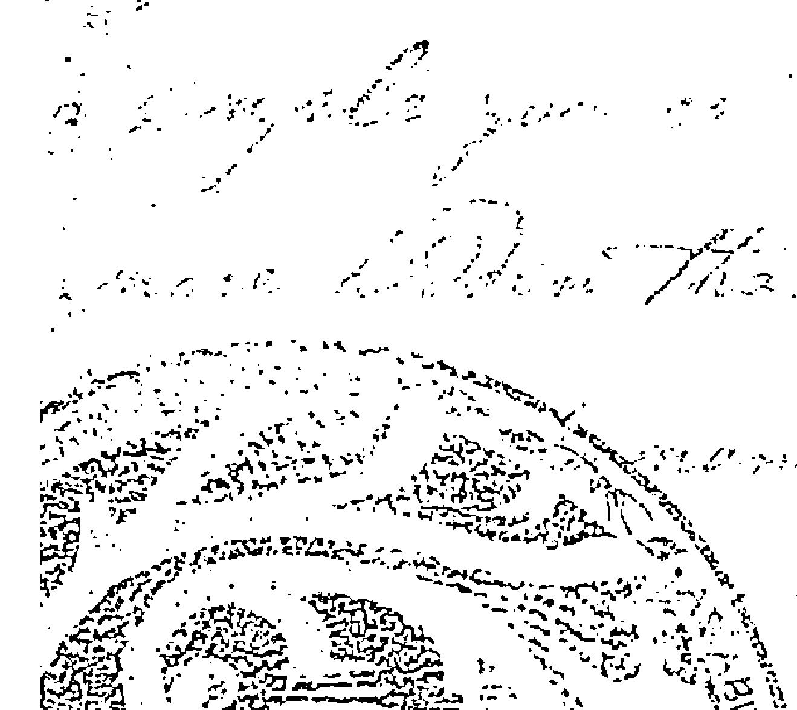

> 我生活在永恒的快乐中。那不是一种庸常的快乐，它并不会变得无趣，让你不得不想要寻求点其他的刺激。充盈着我的快乐，令人陶醉不已，沉浸其中——那是一种常变常新的快乐。你会感到，世界上所有的快乐都降临在了自己的身上。
>
> ——帕拉宏撒·尤迦南达

你就是快乐！快乐是你的天性！快乐并不只是在你获得自己想要的东西、感觉很棒、克服了某个困难、达到了某个目标后才会出现。快乐——永无止息的快乐——此刻就在你的心中！

> “我们必须认识真正的自己，才能解锁纯粹的快乐。”
>
> ——拉玛那·马哈希，《走向静默，如你本来》

> “不要指望在俗世生活中获得纯粹的安宁与快乐。你应该转变态度：不论你经历了什么，客观地享受这一切，就仿佛是在看一场电影。你必须向内才能找到真正的安宁与快乐。”
>
> ——帕拉宏撒·尤迦南达，《人类永恒的追寻》

> “快乐是我们的天性。小时候，我们一直都很快乐，但是长大后，我们就渐渐被社会和文化污染了。要想获得快乐，你什么都不用做，因为快乐是无法获得的。你知道这是为什么吗？这是因为，我们已经拥有了快乐。你还怎么去获得自己已经拥有的东西呢？但是，为什么你感觉不到快乐呢？你得放下一切虚妄。要想得到快乐，你什么都不用做，你只需要放下。生活就是这么简单，生活就是那么快乐。只有在你的错误认识中，生活才是那么困难。”
>
> ——安东尼·德梅洛，《意识：与大师对话》

我现在每时每刻都满心欢喜，这是因为我接受了自己的消极感受，始终保持意识状态。有几次，我甚至感到了一种从未有过的极乐。它们不知从何而来，我的意思是，在它们来之前什么都没有发生过。当它们出现时，消极的一切都消失了，我人生中惨痛的记忆在那一刻也都不见了踪影，就像它们从未发生过一样。我一下子就认出了它们，因为，快乐就是我的本性。这种感觉是不可比拟的，和我们得到了自己想要的东西后获得的快乐完全不同。这种极乐，是我之前从来都没有体验过的。

我希望通过我的分享，你也可以打开自己，拥抱快乐，获得这种极致的体验。一旦你体验过自己本性中的快乐，你就会想要生活在那样的快乐之中。

> “我发现，在我的心中有一种快乐，它从来都不曾消失过。那种快乐也在所有人的心中。”
>
> ——拜伦·凯蒂，《喜悦无处不在》

这种快乐的感觉，就好像是你爱上了一个人，也许是一个人爱上了自己的伴侣，也许是一个母亲爱上了自己刚刚生下来的孩子。你知道那种完完全全爱上一个人的感觉吗？你希望那种感觉永远都不会消失。之所以会这样，是因为，当我们爱上一个人时，我们放下了“我”，而当我们放下了自我之后，意识就显现了出来，光芒万丈，快乐无比。

> > “所有人，无论做任何事情，其实都是在寻求一个相同的东西：世人称之为终极的快乐。我把它称为我们真实的自己——‘我’。发现真实的自己，你也就发现了无与伦比的快乐，获得了想象不到的满足。”
> >
> > ——莱斯特·利文森

> > “简单说来，快乐就是做真正的自己——不是那个一直以来处处受限的自己，而是那个你本来的自己。不论发生了什么，那个真实的自我都在那里，无须费吹灰之力寻找。你就是那个光芒四射却又永恒不变的背景，一切在你的面前徐徐上演。”
> >
> > ——黑尔·德沃斯金

> > “向内寻找，去发现真相和快乐——你要找到那个唯一且恒久不变的存在，你要看到宇宙真实的样子，一切都是你的意识，一切都是你真实的自己。这一点很难描述，你只能自己去体会。亲自体会过后，你就明白了。你没有办法在听了别人说过什么之后就搞明白这一切，书籍和老师只能给你指明方向。最后的一切都需要你自己去体验。这也是非常奇妙的一点。你不用去相信什么，你只能亲自去体会，亲自去感受。”
> >
> > ——莱斯特·利文森，《快乐是免费的》，第 1—5 卷

### 意识等同于快乐

你不是一个快乐的人——你就是快乐本身。你的本性、意识，就是快乐。世界上没有其他快乐，只有你本性的快乐。你在生活中感受到的所有快乐，都是意识的快乐！感到快乐时，你就是瞥见了真实伟大的自我。

> “快乐的时刻其实是在告诉我们，快乐并不在于外物。我们得明白，我们此刻就是快乐。我们的快乐与外物无关——它们是梦境的一部分，而快乐是真实的。”
>
> ——弗朗西斯·露西尔，《静默的香气》

快乐时，一切都会很顺利，一切都会向着理想的方向推进；快乐时，问题会自行解决，万物各归其位，根本无须费力；快乐时，就好像整个宇宙都与你保持一致，会在你需要的时候把你需要的东西提供给你。越快乐，生活也会越轻松；越不快乐，一切都会变得越发费劲。

> 越是以自我为中心，就越难成事，越少和谐，越多苦恼。
>
> ——莱斯特·利文森，《快乐是免费的》1—5卷

### 外部世界里没有快乐

> “有些人向内寻找快乐，然后变得更快乐；有些人则是盲目地向外寻找快乐，越发感到挫败。
>
> ——莱斯特·利文森，《快乐是免费的》，第1—5卷

向外部的世界寻找快乐，快乐反倒会溜走。不论我们得到了多少，不论我们经历了什么，外物带来的快乐注定很快就会消失，然后，我们不得不继续寻求其他的外物来获得快乐。持久的快乐，根本就不在外部世界里。

> 只有向内寻找，我们才能找到快乐。唯一能让我们感到快乐的是我们自身，快乐就在我们体内。误认为快乐是由外部的人或事带来的话，只会带给我们更多的痛苦。
>
> ——莱斯特·利文森，《快乐是免费的》，第1—5卷

> 快乐不需要什么合适的时机。
>
> ——鲁珀特·斯皮拉

不论是过去还是现在，所有人其实都有一个共同的目标——快乐。我们做什么，我们不做什么，我们寻找、设计、希望、梦想，这一切都是因为我们觉得，我们想要由此获得快乐。对快乐的渴望是每个人做出每一个决定的根本动力——据说我们每天都要做出35,000个决定。然而，所有的规划、计划、行动、汗水、泪水、决定，都不会让我们获得快乐，我们的寻找都是徒劳的。一直以来，我们寻求的快乐都不在外部的世界里。

> “怎么办呢？不要向外部世界寻求快乐。向内寻找，向我们自己的意识出发，快乐在那里。”
>
> ——莱斯特·利文森，《快乐是免费的》，第1—5卷

### 等我……之后，我就会快乐

若是相信快乐来自外部世界，我们就会养成这种习惯：一定要等到条件具备后才会快乐。你有没有这样想过或说过：“等我……之后，我就会快乐”“等我考完试、毕了业之后，我就会快乐”“等我有了新车之后，我就会快乐”“等我找到伴侣之后，我就会快乐”“等我结了婚之后，我就会快乐”“等我赚到更多钱之后，我就会快乐”“等我成功之后，我就会快乐”“等我放假之后，我就会快乐”“等我减肥之后，我就会快乐”“等我生了孩子之后，我就会快乐”“等我创业成功之后，我就会快乐”“等我身体好点之后，我就会快乐”……还有很多类似的想法或说法。

若是相信快乐都是由外在的东西带来的，我们就会搁置自己的快乐。我们一直等某个人或某件事让我们快乐，但是，外界的东西没有办法带给我们持久的快乐；不论我们等多久，我们都不会快乐。

也许你年纪已经很大了，取得了一定的成功，有过很多很棒的人生经历，便会知道，快乐没有办法从外部世界找到。特别是在实现了一个很大的梦想之后，你更能认识到这一点。我们一直告诉自己，实现了自己的愿望之后——比如，取得了巨大的成功、获得了巨大的财富、找到了完美的伴侣、生下了孩子，我们就会获得真正的快乐。

假如真的实现了这些梦想，你当然会觉得很兴奋、很开心，但是，你从中获得的快乐依旧稍纵即逝。通过这样的经历，你总算明白，快乐并非来自外部世界。对此，你也许会感到很泄气，因为你很可能会从中得到这样一个结论：快乐只是幻想，我们永远都无法获得快乐。

持久的快乐并不是幻想，它是个不折不扣的真相，它就是你的本性。经历过所有这些辛苦的探寻，你会发现，自己一直以来苦苦追寻的快乐，其实一直就在这里！发现了这一点之后，持久的快乐尽在你的掌握之中，你再也不会徒劳无功地从别人身上、从外部世界中寻找快乐。

> > “认识到这一点后，一切就变得轻松直接了。你不会继续去追寻彩虹，你会在快乐应该出现的地方——你的心中——找到快乐。”
> >
> > ——莱斯特·利文森；《快乐是免费的》，第1—5卷

想象一下，千百年来，数十亿人每天都在世间苦苦寻找快乐。然而，快乐一直在那里——就在他们的本性中，就在他们的意识里。这一切就像是一个天大的玩笑，这也许就是佛陀要在菩提树下仰天大笑的原因。在尘世间苦苦寻找六年后，他最终发现，真相就在自己的心中。如果你想一想，你就会知道，历史已经告诉了我们，没有几个人曾想过要向自己的内心寻找快乐。

在生活中，其实我们得到过很多提示。特别是那些苦痛的经历，它们告诉我们，快乐并不在外部的世界中。每一次当快乐在我们的生命中来来去去，就是在提示我们、告诉我们要转变方向，向内寻找。

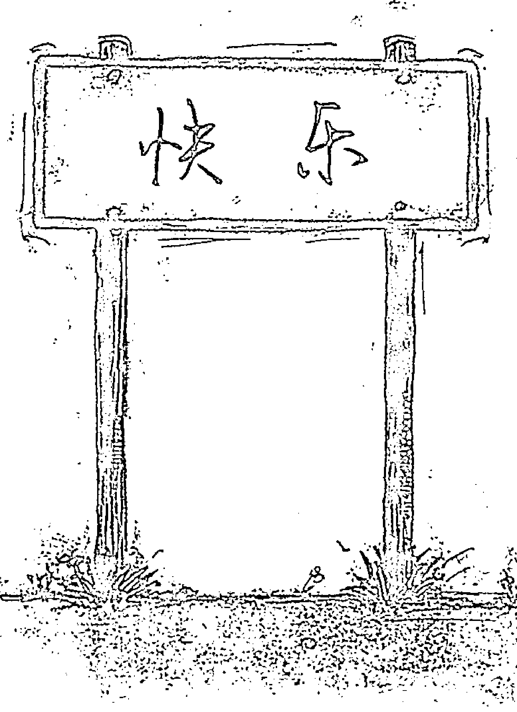

现在，我们知道了应该去哪里寻找快乐。不要再从你的伴侣、孩子身上寻找持久的快乐；不要再从你的工作、房子、衣服、假期、车里寻找持久的快乐。所有这一切都没法带给你永恒的快乐，因为它们自身都是在不断变化的。更别提你的人格了，它也一直在不停地变化。你今天可能是这个样子的，但是到了明天，你可能就不同了。你的快乐就在那个真实的、不变的你——意识——之中。没有人可以给你快乐。

当然，我们可以享受美好的一切，享受自己想做、想拥有的一切。但是，与此同时，我们也应该明白，真实、永恒的快乐一直在我们的心中。

> > “你不会获得快乐，你的本性就是快乐，极乐并不是你最近才赢得的。你需要做的，就是消除不快乐。”
> >
> > ——拉玛那·马哈希

你的想法决定了你的感受，因此，如果你不快乐，那是因为你在想着的是自己不想要的东西。你的心灵只有在过去或未来中才能运转，你可能在想着过去发生的不开心的事情，或者是未来将要发生的不开心的事情。

> > “思想扼杀了快乐的能力。”
> >
> > ——莱斯特·利文森，《快乐是免费的》，第1—5卷

阻碍你获得持久的快乐、成为真正的自己的，是你的想法。那可能是一个难过的想、一个害怕的想法、一个生气的想法、一个受挫的想法……无论如何，到最后，这些想法都在对发生过的事情说着同样的事——“我不想这样”。因为我们相信了这个想法，不快乐降临在你的身上，就像是一张毯子一样，把快乐遮了起来。

> “先是想法，然后是感受，然后是情绪（比如泪水）。一直都是这样的，人们首先感受到的是情绪，因此你并没有意识到导致这种情绪、创造这种感觉的其实是一个不易觉察的想法。”
>
> ——水手鲍勃·亚当森

> “你之所以不快乐，只有一个原因，那就是你认同了一个不快乐的想法。”
>
> ——我的导师

> “生活其实很简单。所有的一切都是为了你发生的，它们并不是发生在你身上的。所有的事情都在适当的时间发生，不会太早，也不会太晚。你不需要喜欢它们……如果这么做的话，一切都会更容易。”
>
> ——拜伦·凯蒂，《喜悦无处不在》

希望你现在已经意识到，相信自己的心灵和其中的消极想法会给你的生活带来多么巨大的灾难。每一次帮助那些面对困难、挑战的人，我都会发现，他们的苦难其实都源于他们相信了自己的消极想法。一旦我在生活中遭遇了困难，那就是因为我相信了自己的心灵及其中的消极想法。所以，如果可以的话，下一次，当你感到痛苦、受伤时，让这种感觉成为唤醒你真实自我的提醒，告诉自己，这是因为你相信了自己的消极想法，那些都不是真的。不再相信自己的心灵后，你就会注意到，你的心灵倾向于对所有的事情都表示反对，这遮盖住了你本性的快乐。

> > 现在，如果不去想的话，还有什么是不对的？
> >
> > ——水手鲍勃·亚当森，《灿若珍宝》

> > 你苦苦寻找的安宁其实一直都在。我们之所以感觉不到它的存在，是因为我们的注意力都被思考分散了。
> >
> > ——卡利亚尼·劳里

心灵一直在喋喋不休，评论个不停，且打压我们，但是，还是有很多人相信自己的心灵，认为它就是这世上最权威的所在。你不用让你的心灵停下来、静止、安静。你只需要不再相信它！只要你不相信了，心灵自然会安静下来，快乐也自然会一波波涌现出来。

### 抗拒快乐

尽管听起来很不可思议，我们中的很多人其实都在抗拒快乐。我们意识不到自己正在这么做，因为我们的抗拒源自一个隐藏在潜意识中的信念，小时候这个信念就被灌输到我们的心中了：我们要克制自己的本性，克制自己自由自在、热情快乐的本性。你有没有听到过这样的话：“你已经长大了，乖一点”“成熟一点”“别再这么做了”“安静下来”？如果你的回答是肯定的，你可能也

### 秘密：终极奥秘

会有这样一个信念，认为自己只有安静下来才能获得别人的认可，当你兴奋地到处跑来跑去时，你会因为太过吵闹而惹上麻烦。于是，随着时间的推移，你渐渐习惯了压抑自己的本性。但是，只要认识到自己一直在抗拒快乐，你就能打破这个信念，瓦解它的能量。

> > “我们本来就是快乐的，如果我们不快乐，那是因为我们在抗拒快乐。”
> >
> > ——我的导师

> > “如果你不是这样积极地把自己搞得惨兮兮的，你就会获得快乐。”
> >
> > ——安东尼·德梅洛，《重新发现生活》

我们不用为了快乐做任何事情。我们只需要不再继续做那些让我们不快乐的事情。

> > “快乐并不难，不快乐才难。当你说快乐很难时，你其实是在告诉自己，快乐需要我们付出努力，不断付出，艰苦奋斗。如果你相信快乐是需要通过努力才能获得的，那只会给你带来痛苦。”
> >
> > ——弗朗西斯·露西尔，《静默的香气》

> > “你难道感觉不到蕴藏在自身之内的无限的快乐吗？”
> >
> > ——我的导师

如果快乐是我们的自然状态，想象一下，不快乐会耗费我们多少精力。

在世界范围内，“抗拒”剥夺了许许多多人的快乐。我们不是任由事物自然发展，而是用“我不想……”这个想法抗拒着正在发生的以及已经发生过的事情。我们有那么多的不想，简直无穷无尽。

> “外物无法影响我们。我们之所以感到痛苦，是因为我们想要改变它们。”
>
> ——拜伦·凯蒂，《一念之转》

> “快乐就是任由所有的一切自然发生。”
>
> ——鲁珀特·斯皮拉

不再抗拒生命中发生的一切，不再抗拒这个世界，你就能获得极乐。极乐的另一个名字就是开化，你现在已经开化了，你现在已经获得了极乐。它们并不专属于少数几个人，它们就是你，它们就是我们每个人！

### 迷恋

> “仔细想来，你会发现，所有的不快乐都有一个共同的来源，那就是迷恋。”
>
> ——安东尼·德梅洛，《爱的方法》

之所以会迷恋，是因为我们相信，如果没有了某样东西，我们就会不快乐，然后出于对失去快乐的恐惧，我们会紧紧抓住某些东西。迷恋很容易和爱搞混，但是，迷恋并不是爱。在爱中，没有恐惧；在爱中，一切都是自由的，可自由来去。迷恋和爱很像，但是，它会让你紧紧抓住一切，因为它让人害怕失去。

> “盲目的不是爱，而是迷恋。迷恋就是误以为你的快乐源于某个东西或某个人，于是紧紧抓着不放。”
>
> ——安东尼·德梅洛，《爱的方法》

想象一下，有两个人，他们在同一家公司工作。他们都说热爱自己的工作，愿意每天都工作。

有一天，他们和往常一样去上班，却听说就在今天，所有的员工都会被解雇。一个人在听到这个消息后立马变得非常愤怒：“被裁后，我该怎么办？找不到工作怎么办？还不起信用卡或贷款怎么办？我要失去我的家了。”他的所有这些想法都源于他对工作的迷恋。在这些想法中，你可以感受到他的恐惧。

与此同时，另一个人的表现却完全不同。他知道，不论发生什么，他都会很快乐；他知道，生命中的一切都在不停地变化，无论看上去如何，一切的发生都自有道理。他的经验告诉他，当有意想不到的事情发生时，一定会有更好的事情到来。如果工作没了，他知道自己能找到另一份工作，而且，这个工作会更棒。这就不是迷恋。

你觉得，他们中的哪一个人更快乐？哪一个人会拥有更美好

的人生？

> “事实上，只有放下了迷恋，你才能知道什么是快乐。”
>
> ——安东尼·德梅洛，《重新发现生活》

> “我的生活和你一样，都是由一系列的事件构成的。只不过，我对这一切抱有一种超脱的态度，只当它们是过眼云烟。但是你却一直对这一切心怀执念，深受它们的影响。”
>
> ——尼萨伽达塔·马哈拉奇，《我就这样：与尼萨迦达塔·马哈拉奇的对话》

对一个人的迷恋源于爱的缺乏。你觉得，这个人手上握着打开你的爱和快乐的钥匙，没有了这个人，你的爱和快乐就消失了。因为有了这个信念，你深深迷恋着一个人，但你一直都面临着一个巨大的危险：一切都在改变，每时每刻都在发生改变，没有一个人会永远在那里。

> “人们需要彼此，他们觉得这就是爱。但是，在爱中，没有紧抓不放，没有画地为牢。”
>
> ——莱斯特·利文森

迷恋往往很深。迷恋一个人的时候，我们往往会根据对方塑造自己的身份，我们觉得，如果放下自己的迷恋，我们就失去了自己的身份。所以，我们依赖自己的这份迷恋，尽管这份迷恋剥夺了我们的快乐，把我们困在了难熬的苦难中。

如果我们相信，自己能够拥有的东西很有限，那我们就会对自己拥有的东西产生迷恋。我们可以迷恋自己的身体、心灵、我们心目中自己的形象，我们可以迷恋自己的伴侣、孩子、父母、家人、朋友、宠物、事业、成就、名气、能力、爱好、宗教、成功、车或房等物质，我们还可以迷恋自己的意见、信念、观点。你可能曾经看到过有人激烈地为自己的政治、宗教等信念辩护，那是因为他们对自己的观点的迷恋。

> > “我们都‘嫁’给了自己的想法，从来没想过要和它们‘离婚’。我们会一直这么继续下去，盲目地迷恋着自己的身体，一直过着痛苦的生活。”
> >
> > ——莱斯特·利文森，《快乐是免费的》，第 1—5 卷

过去的这么多年，我们的心灵已经深深地迷恋上了一系列想法。讽刺的是，这些我们迷恋的想法其实拘囿了我们，让我们只能做一个处处受限的人，让我们的生活变得沉重。它们扼杀了我们天然的快乐。

历史告诉我们，人们对自己的信念迷恋至深，甚至宁愿付出自己的生命来捍卫它。对某些人来说，对自己信念的迷恋是唯一能让我们继续走下去的东西，虽然这份迷恋会带来痛苦。

> > “人们不想快乐。因为要想快乐，他们就要改变自己一直坚持的信念和想法。对此，他们说，没门儿。如果我们的愿望不能被满足，我们就拒绝快乐。”
> >
> > ——安东尼·德梅洛

如果你可以一个个地清空自己的所有意见和固有观念，你会感到自己变得不同了，因为，从对事物的评价中解脱出来，你其实就是在任由它们自然发展。然后，你会感到，巨大的快乐和幸福奔涌在自己的心头，你生活的各个方面都在变得更好。

在《秘密》的十周年版本中，我曾经写过：意见越少，得出的结论越少，固有的观念越少，你获得的快乐和幸福就会越多。

迷恋着他人他物的，并不是你，而是你的心灵！迷恋就像是心灵的野餐，它给心灵带来力量，把我们禁锢在信念中，让我们相信，我们是受限的、独立存在的个体，而不是不受限制的、无限快乐的意识。迷恋来自你的心灵，当心灵迷恋的东西受到威胁时，你会感到非常恐惧。

我们心灵中最深的迷恋，指向的是我们相信自己只是一个独立个体的自我。尽管真相——我们都是同一个意识——很美妙，但我们的心灵一直坚持相信，我们是一个个独立存在的个体。

除了心碎和痛苦，你的迷恋带不来其他的结果，因为，在物质的世界中，没有任何东西是永恒不变的，包括我们的身体。如果意识不到这一点，我们的心灵会用快乐去换取迷恋。

安东尼·德梅洛对佛教的四句箴言进行了优美的诠释，很好地对迷恋进行了总结：

> 世上满是痛苦。
> 痛苦源于对欲望的迷恋。
> “通向没有痛苦的生活，
> 就是要放下我们的迷恋。”
> ——安东尼·德梅洛，《重新发现生活》

你可以有欲望，你可以拥有自己想要的一切，对这一切的迷恋才是问题所在。

### 意识 VS 迷恋

你不用努力减少自己的迷恋，改变自己的感受不需要付出巨大的努力。迷恋源于对心灵的认同，所以，把自己从迷恋中解脱出来，你只需要保持意识状态，然后它自然会消失！我不知道该如何告诉你，摆脱迷恋之后，我们的生活会变得多好。你对其他人、事物的爱会变得更深，同时，你不会因为他们的改变或终结而感到无法忍受的悲伤。

> “这就是我的秘密：我不在乎发生了什么。”
> ——克里希那穆提，第二个公开演讲，1977

克里希那穆提的话告诉了我们，什么是不迷恋。他的话体现出来的就是真正的不迷恋。我知道，你可能很难相信自己也会产生类似的感受，但是，这都是心灵告诉你的。记住，你的本性中就没有迷恋。不迷恋的是你的意识。

许多年前，我和我的家人在澳大利亚的乡间有一座漂亮的房子。我的两个孩子很喜欢住在那里，他们也很喜欢那座房子。在那里，我们的生活非常美好，但是，不幸的是，由于利率升了 18 个百分点，虽然我们多做了很多工作、努力加班，但最后，我和我的丈夫还是供不起贷款了。整整三年，我们牺牲了很多，也吃了很多苦，就是为了保住那座房子。但最后，我们还是失去了它。搬出去的那一天，我回想起我们为了那座房子而吃过的所有的苦，下定决心以后再也不对任何房子产生这样的迷恋了。受够苦头后，我们自然想要做出改变。

自那以后，我爱我住的每一座房子——相比于之前住的房子，我对它们爱得更深，但是，我没有对它们中的任何一座产生过迷恋。住在房子里的时候，我会全身心地欣赏、享受，但是，我也不害怕有朝一日会失去它。该离开时，我的心中也只有感恩，没有悲伤和难过。

> “对包括身体、物质在内的东西不再迷恋时，快乐就会出现。”
> ——弗朗西斯·露西尔

我们生活在物质的世界里，所有的物质都有终结，如果我们对它们产生迷恋，那就必然在它们离开时感到痛苦。但是，如果你深深地爱着此刻拥有的一切，如果你真正为此刻拥有的一切心怀感恩，如果你全身心地欣赏它们，那么，你就不会在它们离去时感到那么痛苦。

孩童时期以及长大后，我和我的母亲关系都非常亲密。她不仅仅是我的母亲，更是我最好的朋友。我曾经很怕失去她，因为我无法想象,没有了她我该怎么活下去,我也想象不到,没有了她,我的生命会是多么空洞、没有意义。发现了这个秘密后,我对我生命中的一切都心怀感恩和欣赏,特别是对我的家庭和我的母亲。我珍惜和她在一起的每一刻。我一直不停地告诉她,她曾经为我做过的那么多事情对我来说都是那么重要。我也不停地告诉她,我爱她。她去世时,我并没有那么悲痛。相反,我觉得,我对她的爱在不断扩展、延伸,比天地更宽广。直到现在,这一点依旧没有改变。

你就是爱,爱是迷恋的对立面,因为在爱中,一切都来去自由。爱是接纳、爱是包容,对于一切的接纳和包容。

> “你就是爱。爱不需要寻求,因为它本已圆满。爱不会希求、需要任何东西,在爱中,没有什么是应该做的。”
> ——拜伦·凯蒂,《我需要你的爱——这是真的吗?》

我可以向你保证,放下迷恋,你会感到那么巨大、完满的爱,就仿佛整个宇宙都盛不下的那么多的爱。你过去迷恋的一切,都会变成这种全知、全能、无所不在的爱。有些人把这种爱称为“上帝”。

当人们感觉到耶稣、佛陀、克里希那穆提等显灵时,他们会感到体内消极的一切瞬时化为乌有。爱就是这么纯洁、伟大,没有任何条件。它可以瞬间消解一切不睦和消极,消解不是爱的一切。这种伟大而全能的爱就是你的本性。爱就是你。

### 开始快乐

> “快乐不需要任何东西——难过才需要。”
> ——彭加尊者（帕帕奇）

> “当我们看到这一点（意识一直都在），我们的身心就开始发生转变。我们的身心突然感受到一种无来由的巨大喜悦，从必须努力才能获得快乐的信念中解脱了出来。快乐不是可以通过努力、通过受苦而实现的。我们怎么可能需要通过痛苦才能获得快乐呢？痛苦怎么可能会让我们快乐呢？我们要从快乐出发，我们往往为了变得快乐而接受了更多的痛苦。”
> ——弗朗西斯·露西尔，《静默的香气》

此刻，你就能快乐，不论你的生活中正在发生什么。快乐无须寻找，更无须等待，此刻，它就在你的身边。

> “我们此刻就可以拥有自由和快乐。我们不用等着它们在未来的某天降临，我们不用辛苦工作去赢得它们，我们不用取得某种成功为它们的到来做好准备。我们有理由开心、快乐，就现在。”
> ——黑尔·德沃斯金，《瑟多纳释放法》

> “你就是终极的喜悦。你去寻找喜悦，就好像是我去找莱斯特。我就是莱斯特，我不需要到外面去找他。如果我就是喜悦，我就不需要到处去寻找喜悦。它就在你的心中。”
> ——莱斯特·利文森，《快乐是免费的》，第1—5卷

> “要知道，觉得你自己需要爱时，其实就像是一个湖在到处找水。”
> ——黑尔·德沃斯金

> “安宁、快乐、爱一直就在我们心中，我们可以随时随地拥有它们，不论在何种情况下。这一点将是我们所有人最重要的发现。”
> ——鲁珀特·斯皮拉，《安宁与爱的艺术》

因为快乐就是你的本性，所以你无法获取快乐，你就是快乐。快乐时，你就是真正的自己，意识！成为意识，你生命中的一切都是那么完美、和谐，你的生活会变得无比美好。

允许你自己快乐，允许你成为真正的、快乐的自己。快乐此刻就在，意识的力量能化解所有对快乐的威胁。打开你自己的注意力，保持意识状态，你就会快乐！

> “人真正地活过来，不是在被孕育的时刻，不是在出生时、成熟时或者任何一个类似的时刻——受洗、结婚、接受成人礼、毕业。在自我意识瓦解，此前对于自己的所有信念都随风飘散后，我们才真正地活了起来。这种感觉有一点像死亡（确实，之前的自己已经不复存在了），但是，你会惊奇地发现，你会继续活下去，你的生命会继续下去。即使是死后，你依然活着。你会发现人间天堂的真意。”
> ——简·弗雷泽，《打开心门》

如果你感到不快乐，记得要接受自己不快乐的感受，不要试图改变它或摆脱它。接受你此刻的感受，你会慢慢发现，你的感受渐渐化为了快乐，因为快乐才是真实的你。

每一次，当你张开双臂拥抱不快乐的感受，你都会离持久、永恒的快乐更近一点，离和谐、美好的生活更近一点。接受不快乐的感受，你的快乐也会与日俱增。最后，你会发现，所有不快乐的感受下其实都隐藏着永恒的意识之快乐与爱。

### 第十章 总结

- 你就是快乐。快乐就是你的本性！快乐——永不停止的快乐——此刻就在你的心中！
- 没有其他快乐，只有你本性——也就是意识——中的快乐。你人生中感受到的所有快乐，其实都是意识的快乐。
- 没有什么比感到快乐更棒的了。越快乐，你的生活也就会越轻松。
- 我们在外部世界寻找快乐时，快乐其实在流逝。
- 我们可以在这世界上尽情享受我们想要成为、做、拥有的一切，但是，与此同时，我们知道，真正的、永恒的快乐只在我们的心中。
- 你的想法决定了你的感受，因此，如果你感到不快乐，那是因为你在想着一些自己不想要的东西。
- 阻碍你获得永恒快乐、认识真正自己的，其实只是一个想法——“我不想。”
- 如果某个东西让你感到受伤、痛苦，把这种感觉当作对自己的提醒，告诉自己：此刻，你正在相信一些消极的想法，它们不是真的。
- 很多人都在无意识地抗拒着快乐。
- 只要意识到我们一直在抗拒快乐，我们就能瓦解掉隐藏在这种抗拒背后的信念的力量。
- 要想获得快乐，我们什么都不用做。相反，我们只需要不再做让自己不快乐的事情。
- 导致不快乐的原因只有一个——迷恋。
- 如果我们相信自己的快乐建立在某种东西之上，我们害怕会失去它，因此紧紧抓住它不放。这个时候，迷恋就产生了。
- 迷恋上什么人或事物时，我们往往会据此塑造自己的身份，我们觉得，如果放下这份迷恋，我们就失去了自己的身份。
- 其实，产生迷恋的不是你，而是你的心灵，只有心灵会产生迷恋。你真实的自我不会迷恋上任何东西。
- 把自己从迷恋中解脱出来，你只需要越来越多地保持意识状态，然后，你的迷恋就会一个个地土崩瓦解。
- 此刻你就能快乐，无论你的周围正在发生着什么。快乐无须寻找，也无须等待。
- 你无法获得快乐，你就是快乐。快乐时，你就是真正的自己。
- 如果你感到不快乐，记得要接受自己不快乐的感受，不要试图改变它或摆脱它。
- 接受不快乐的感受，你作为真实自我的快乐也会与日俱增。

### 第十一章 世界：一切都好

> “一切都会好的，一切都会好的，所有的一切，都会好的。”
> ——诺里奇的茉莉安娜

> “你知道吗，所有的潜修者——无论他们是信奉天主教、基督教或是非基督教，无论他们有怎样的信仰，相信哪一种宗教——都有一个共同点，那就是他们相信，一切都好。尽管各种情况一团糟糕，但一切都很好。确实，这是一个奇怪的悖论。可悲的是，大部分人都在沉睡，他们看不到一切的好。他们都在做噩梦。”
> ——安东尼·德梅洛，《意识：与大师对话》

你可能会想，看看这世界，人们互相攻击、批评、威胁，到处都有争夺和吵闹，到处都是暴力、战争、贫穷、毁灭，怎么可能一切都好？

尽管历史上也充满了各种动荡和骚乱，但是当人们问圣人怎么可能一切都好时，他们会这么回答：“因为，这世界本就是个幻象。”

他们想说的是，这个世界并不是它看上去的样子。我们认定的世界——坚实、牢固，独立于我们之外，是唯一的现实——其实只是个幻象。

> “毫无疑问，世界不过是个幻象。”
> ——拉玛那·马哈希，《拉玛那·马哈希文集》

科学告诉我们，物质的一切，大多是一场空。我们看到的颜色，其实是那些颜色的缺失，我们听到的声音，其实只不过是一种振动，是我们大脑中的神经信号把它们解读成了声音。我们知道，在宇宙的所有物质中，构成电磁波谱的只是其中的0.005%，并且，人类还只能感知到这个波谱中的一小部分。所以，世界果真如其看上去的那样吗？

> “我看着帝国大厦，你也看着帝国大厦，在我们两人的眼中，帝国大厦可能是一样的，但是，对一个有着一百只眼睛的昆虫来说，它会是什么样子的呢？对只能感知红外线的蛇来说，它是什么样子的呢？对只能辨认超声回波的蝙蝠，它又是什么样子的呢？因此，帝国大厦——它的外观——只是我们眼中的样子，不是鳄鱼眼中的样子，你不能说我们人类非常有限的感官感知到的就是唯一的真实。并且，你无法解释为什么帝国大厦看起来是这个样子的。”
> ——迪帕克·乔普拉，临床医学博士，《心身绿洲》(mindbodygreen) 播客

仔细探究我们以为的现实，我们会发现，我们对事物的看法都不过是种假设，它们并不是我们以为的真相。

> “科学研究始于一个前提，那就是：物质世界是真实的，物质是真实的。现在，让我们来看一个问题。如果我们问科学家，物质是由什么构成的，他们会说，物质是由分子构成的。那么，分子是由什么构成的？原子。原子是由什么构成的？粒子。粒子又是由什么构成的？更小的粒子。那么，它们又是由什么构成的？如果没有办法用粒子来衡量的话，那么，它们就是在数学空间中的概率波。”
> ——迪帕克·乔普拉，临床医学博士，《心身绿洲》播客

概率波根本就不是物质实体。它们其实是虚空，只有我们用心灵去衡量、观察它们的时候，它们才会以原子的形式出现。

> “当你从一间屋子走到另一间屋子——当你的感官不再感知到洗碗机的声响、钟声的嘀嗒、烤鸡的香味，厨房及其中各种零零碎碎的东西也会化为乌有，或者是化成概率波。”
> ——罗伯特·兰扎，临床医学博士

早在十四世纪，玫瑰十字会就曾说过，物质世界不过是“精神幻影”，而现在，量子物理学向我们证明了，他们说得没错。

几年前，我第一次接触量子物理学，读到一个材料，上面说，只要我们走出现在所处的房间，这个房间以及房间里的一切，就都会化作概率波。只有当我们再次进入房间、观察这个房间的时候，它们才会转变成粒子构成的实体。那一段时间，我经常会在走出房间后猛然转头，试图捕捉到房间重回原形的样子。但我一次都没成功！

> “在物质成形之前——作为雪花，或者亚原子粒子，它们必须获得某一活物的观察。”
> ——罗伯特·兰扎，临床医学博士，《生物中心论：生命和意识如何成为理解宇宙真相的钥匙》

说到底，我们所处的世界的物理结构，及其中包含的一切，都不过是虚无。所以，迪帕克问：“这个世界是有形的吗？”

如果这个世界是无形的，那什么才是有形的？

所有的物理表现，其实都来自我们的心灵。但是，这并不仅仅是说，心灵对物质起作用；事实上，物质就是心灵。所有实体物质——我们整个的世界和宇宙——其实都是由心灵投射出来的形象。

> “所有的一切都是心灵，宇宙是精神性的……掌握了宇宙的心智本质这个真理，你也就走在通向掌控的道路上了。”
> ——卡巴莱恩

> “世界和宇宙都是精神的调和物。”
> ——莱斯特·利文森，《快乐是免费的》，第 1—5 卷

> “甚至连原子的结构都是心灵发现的。”
> ——拉玛那·马哈希

> “显现出来的一切都是心灵。”
> ——弗朗西斯·露西尔

> “思想是上帝最先散发出来的能量和振动，由此产生了生命、电磁、原子，以及各种能量。”
> ——帕拉宏撒·尤迦南达，《上帝与阿朱那对话：博伽梵歌》

夜晚，望着辽阔星空，你有多确定宇宙在你自身之外？我们现在已经知道了，我们看到的，是光子到达我们的视网膜后，由大脑转化形成的图像。然后，我们的大脑翻动图像，把它们投射出来。所以，即使是在生物学的层面，我们也知道，我们看到的其实都是在我们自身之内的东西。

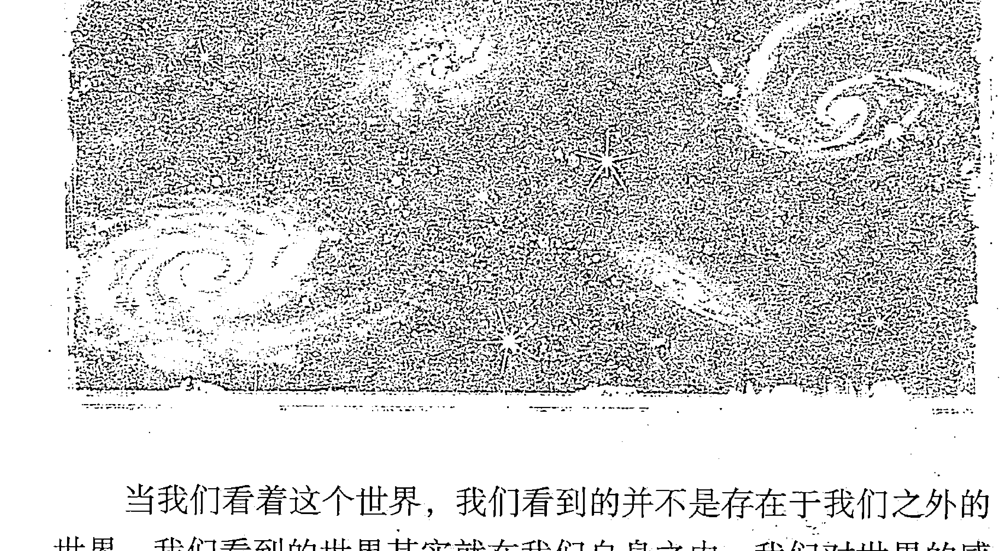

当我们看着这个世界，我们看到的并不是存在于我们之外的世界：我们看到的世界其实就在我们自身之内。我们对世界的感知，其实都在我们自身之内。触碰到什么东西时，你的感觉来自你自身，而非外部。你自己可以试试看。如果有人搂住了你，从你自身内部，你看到并感觉到了他们的动作；听到声音时，你听到的东西并不来自外部，而是就在你自身之中；身体移动时，从你自身内部感知到了自己的每一个动作。所有这些感觉、感知都告诉我们，其实并没有什么与我们分离的、独立于我们自身之外的世界。

> “我们创造了整个世界，然后忘记了我们做过什么。我们告诉自己，世界是真实的，是独立于我们自身之外的存在，但其实，世界不过是我们心灵中的一张图画。唯一能看到这个世界的地方，是你的心灵。让心灵沉睡，世界也就不在了。不要让心灵醒过来，那么这个世界也将不复存在——但是，你还在。”
> ——莱斯特·利文森，《意志力》播客

你看到的一切，从小小的茶匙到天上的太阳，都是心灵的投射。就像是电影放映机一样，我们的心灵把各种画面投射到我们的世界里。就好像是你站在一个 360 度环绕的剧院里，上下左右，你的周围，都有画面和环绕立体声。这会让一切看起来都很真实。

> “世界是一个独立存在的现实——这其实是个幻象。”
> ——弗朗西斯·露西尔

你所看到的世界——那个看上去独立于我们身体之外的世界——是心灵创造的幻觉。事物看起来是实体的，这是心灵创造的幻觉；事物看起来是三维的，这也是心灵创造的幻觉。

世界的形象和我们对世界的感官体验，其实就像是一场梦。梦的内容和你对梦的体验完全是由心灵决定的；醒来后，你对这个世界的体验也全都发生在你的心灵中。

> “知道了我们的心灵有如此神奇的创造力和自我欺骗的能力后，下面这种说法可能就不再那么值得怀疑了：我们以为的‘我’——也就是我们的身体，和我们以为真实的世界，它们实际上都只不过是想象，或者是精神的投射，就像我们都只是在自己的梦里体验到身体和世界。我们有什么证据能证明，我们不是在自己的心灵中体验到了身体和世界呢？”
> ——迈克尔·詹姆斯，《幸福和存在的艺术》

> “在你的想象中，你写了一部剧，并把剧中的演员、情节、观众都投放在屏幕上，然后，你忘记了，这一切其实都是在你的心灵中。”
> ——莱斯特·利文森，《快乐是免费的》，第1—5卷

> “世界是由思想和概念构成的。”
> ——我的导师

> “我们看到的一切，都在我们的心灵中。”
> ——莱斯特·利文森，《快乐是免费的》，第1—5卷

> “我们命名的一切——经度、纬度、格林威治标准时间、国家、民族、星星、星系……所有这一切我们命名的东西——都是人为建构的。因此，是我们在过去的千百年里创造了这个世界。我们才是故事的讲述者。”
> ——迪帕克·乔普拉，临床医学博士，科学与非二元论会议演讲，2018

### 秘密：终极奥秘

我们不仅通过个人的和集体的思想创造了这个实景，并且，我们还创造出了我们自己体验到的一切。

> “把这种表象叫作世界？世界只是我们创造出来的一个幻象。有朝一日，你会发现，你创造出来了整个宇宙……说白了，宇宙不过是我们想法的混合物。”
> ——莱斯特·利文森，《意志力》播客

是怎样的力量能把思想变成看起来那么真实的世界和宇宙？是无限的意识，唯一的力量。无限的意识是唯一存在的力量，它没有任何竞争对手。你就是这股力量。

### 全都是意识

> “整体来说，世界并不是教科书中描写的那样。几个世纪以来，差不多从文艺复兴时期开始，一种关于宇宙构成的思维方式就支配了科学界。它帮助我们认清了很多之前不知道的东西，并且带来了数不清的科技发明，改变了我们生活的方方面面。但是，这种思维方式现在走到了尽头，我们需要一种能反映更深层次现实的、与以往完全不同的范式，一种此前完全被我们忽略了的范式。”
> ——罗伯特·兰扎，临床医学博士，《生物中心论：生命和意识如何成为理解宇宙真相的钥匙》> “出于某些无法解释的原因，在所有体验中都普遍存在的元素——意识——却始终处于不为人知的状态。”

——迪帕克·乔普拉，临床医学博士

迪帕克·乔普拉提出了两个在科学上至今无解的问题：

1. 宇宙的物质是什么？
2. 意识来源于哪里？

> “科学无法解决自然的终极奥秘。这是因为，分析到最后，我们自己也是自然中的一部分，因此，我们也是自己努力在解决的奥秘中的一部分。”

——量子物理学家马克斯·普朗克，《科学要到哪里去？》

科学家们一直相信，这个世界是客观、物质、实体的，独立于我们而存在，他们看不到宇宙究竟是由什么物质构成的。但是，千百年来，圣贤们找到了这个科学无法回答的问题的答案。

1. 宇宙中的物质是什么？
意识是宇宙的物质。
2. 意识来源于哪里？
意识并没有来源，一切都来源于认识。
意识是无限的——每时每刻，它无处不在，它怎么可能来源于哪里呢？

科学告诉我们，宇宙源于一场大爆炸，这就意味着，科学家们认为，宇宙也一定会有一个终结。我们的宇宙有始有终，是有限的，因为它是有限的，那么它就一定来源于某个无限的存在！宇宙来自我们的意识，意识是无限的，是构成宇宙及其中一切的基本物质。

你就是无限的意识，这也就意味着，说到底，宇宙就是你，宇宙就在你自身之中。

> “整个宇宙都在一个人——你——之中。”

——鲁米

世界、宇宙，及其中的一切，包括你的身体，都在意识之中。意识无处不在，一切都在其中，并且一切都源于意识。意识是无所不知的，因为它包含了一切。意识是无所不能的，它具有不可比拟的强大力量。

> “你就是出现在宇宙中的永恒能量。”

——艾伦·瓦特，《意识的本质》

### 世界电影

看电影或者看电视时，如果没有银幕，我们就无法看到画面。要看到“世界”这部电影投射出来的画面，心灵也需要有一个银幕。这个银幕就是我们的意识。

我们的心灵投射出来的世界的电影，在我们的意识中上映，投射在我们的意识银幕上。也就是说，我们所说的世界究其本质就是意识——唯一的、无限的意识。过去的圣人说“我们都是同一个人”或者“我们就是一切”时，他们其实说的也是这个意思。我们就是一切，因为我们都是意识，一切都是在意识中存在的。

> “所以，显现出来的一切其实都不算什么。那只不过是和空间一样的意识以不同的模式、形状、形式产生的振动。”——水手鲍勃·亚当森，《当下怎么了？》

> “意识的状态，就像是我们所有人都置身其中的大气，就像是上演着一切的电影银幕。没有什么能影响它，没有什么能触及它。”——简·弗雷泽，《当恐惧消散》

> “事情都不是表面看上去的样子，你也不是看上去的样子。你只需要看得更深入一点，感受得更深入一点。”——帕米拉·威尔森

### 想要改变世界？

> “改变社会不是最重要的，如果你改变了自己，社会会自然而然、不可避免地发生变化。”——克里希那穆提，第三个公开演讲，圣莫尼卡，1970

> “我们就是意识，我们来到这个世界，并不是为了拯救它，而是为了爱它。”
——安东尼·德梅洛

> “你想要改变世界。假设你有能力抹消这个世界，以自己希望的方式重塑它：没有战争，没有霸权，没有蚊子，没有癌症，没有痛苦，所有人都在笑。最后，你建造的世界会非常无聊，一点趣味都没有。然后，你就想要给它加点盐和胡椒。于是，最后，你又来到了自己的起点，你终于意识到，一切本来就很好。”
——弗朗西斯·露西尔，《静默的香气》

如果坚持自己的信念，相信我们都是独立的个体，那么，这个世界永远都不会得到安宁。数十亿独立的自我必然会起各种冲突，因为，它们是不稳定的，它们从来都不会彼此认可。但是，意识能接纳一切。意识接受幻象、虚假的新年、纷争、苦难、战争，爱能接纳一切。摆脱所有的苦难，并不需要全世界的安宁，你只需要正确认识自己，作为无限意识而存在。

> “无限的存在并不在意世界上的各种灾难，因为，它根本不会受到任何影响。”
——大卫·宾汉

> “认清这个世界就是你，你会发现，整个世界都变得和以前不一样了。你会爱上并认同这个世界及其中的一切。”
——莱斯特·利文森，《快乐是免费的》，第1—5卷

> “保持意识状态，会产生更多的爱。正确地认识自己后，你也会认识到，一切其实都是你，它们都没法伤害到你。”

——大卫·宾汉

意识对所有的一切都说“是”。意识让一切都自行其是，因为，世界及其中的一切都是意识本身，是我们本身。这也就是说，没有什么会和我们作对。没有什么灾难会降临在我们身上。没有什么原子弹或流星能毁灭我们。没有什么限制能影响我们。因为，说到底，一切都是我们自己。认识了真实的自己后，保持意识状态后，你会知道：

不论这世界看起来如何，一切都好，一切都是好的。

### 第十一章 总结

- 我们认定的世界——坚实、牢固，独立于我们之外，是唯一的现实——其实只是个幻象。
- 说到底，我们所处的世界的物理结构，及其中包含的一切，不过都是虚空。
- 物质就是心灵。所有实体物质——我们整个的世界和宇宙——其实都是心灵投射出来的形象。
- 梦的内容和你对梦的体验完全是由心灵决定的；醒来后，你对这个世界的体验也全都发生在你的心灵中。
- 把思想变成我们所看到的宇宙的，是无限的意识，唯一的力量。
- 宇宙来自我们的意识，意识是无限的，是构成宇宙及其中一切的基本物质。
- 世界、宇宙，及其中的一切，包括你的身体，都在意识之中。
- 如果坚持自己的信念，相信我们都是独立的个体，那么，这个世界永远都不会得到安宁。数十亿独立的自我之间必然会起各种冲突。
- 意识对所有的一切都说“是”。意识让一切都自行其是，因为，世界及其中的一切都是意识本身，是我们本身。
- 摆脱所有苦难，并不需要全世界的安宁，你只需要正确认识自己，作为无限意识而存在。
- 不论这世界看起来如何，一切都好，一切都是好的。

### 第十二章

### 结束——没有结束

如果我们所有人都害怕的东西并不是真的，那会怎么样？如果我们所有人都相信的死亡不是真的呢？如果死去其实是醒来呢？

> “我从哪里来？我到哪里去？这是我们所有人都面临的终极问题。科学对此并没有答案。” ——量子物理学家马克斯·普朗克

> “身体会死亡，但是，超越于身体而存在的精神不会受到死亡的影响。” ——拉玛那·马哈希，《拉玛那·马哈希文集》

> “如果你认为自己只是身体和心灵，那么，这个‘你’肯定会死的！如果你认为自己是没有出生也不会消亡的意识，对死亡的恐惧就不会再让我们感到困扰。事实上，这就是死亡的死亡。” ——无极

> “当你醒来后，所有的恐惧，包括对物理上的死亡的恐惧，都会消散。这是因为，真正的‘你’不会受到任何伤害。”
——简·弗雷泽，《存在的自由》

> “死亡带走了不是你的一切。生命的秘密在于，‘在死亡前死掉’——然后，你会发现，根本就没有死亡。”
——埃克哈特·托利，《当下的力量》

在死亡前死掉，这句话的意思是，终结你只是一个人的错觉。让你只是一个人的想法先死掉，认识到你就是无限的意识。只有这样，你才会“在死亡前死掉”，并发现真相——死亡并不存在。

> “人在这一生中能学到的所有东西里，最重要也是最美妙的一件事是：你是无形的、不变的存在，你永远不会死亡。”
——无极，《白火》（第二版）

> “你，你的身心，你看到的世界，只不过是同一个虚拟现实中的一部分……你——真实的你——是无形的意识，认识到这一点后，你会发现，自己的其他身份都是临时的、短暂的。不论你的身份是一个父亲、丈夫，还是儿子、妻子……所有的这些身份都是临时的，都有自己的出生和死亡，并且，它们都在不断地变化，它们并不是真的……你拥有的唯一的、绝对的身份是无限的、不可思议的，它会根据不同的建构变换为不同的现实。”
——迪帕克·乔普拉，临床医学博士，《心身绿洲》播客

### 第十二章 结束——没有结束

> > 我们已经忘记了自己就是意识。我们以为：‘我是身体，所以我会死亡。’然而，意识并不拘囿于身体之中。身体和心灵，以及世界，它们都是在我们的意识中出现的。这就是我们的体验。尽管如此，我们却一直相信各种完全相反的概念，我们觉得，意识在心灵中，心灵在身体中，身体在世界中。

——弗朗西斯·露西尔，《静默的香气》

> > 你现在觉得，你就是身体，因此，你会出生和死亡。但是，你不是身体，你没有出生和死亡。

——拉玛那·马哈希，《走向静默，如你本来》

> > 所以，死亡其实是人类建构起来的另一个概念。如果你相信这个物质的世界，那么你就会相信死亡，而且，你也会相信出生。但是，你实际上是一个无形的存在——无形就是你的形状。现在，那个无形的存在在体验着自己作为身心的存在。

——迪帕克·乔普拉，《心身绿洲》播客

> > 你相信自己会死，那是因为你接受了别人告诉你的这个概念：你是出生的。

——彭加尊者（帕帕奇），《真相》

> > 我从来都不会不存在，你也不会……没有什么未来是我们到不了的。

——克里希那穆提

我们没有办法想象不存在，因为，你不可能不存在。当你想象自己不存在时，在想象着的就是意识，而你就是意识！

> > “小时候，你不知道这是一张桌子，这是一只手，也不知道自己有一具身体。在那个时候，你体验到的是一个黏黏糊糊的宇宙，有很多颜色，有各种感觉，有不同的形象，还没有思想，我们只会感到惊奇或混乱。然后，我们知道了各种概念：你是男人，你是美国人，你是人；那是星星，那是银河，那是地球。科学的世界观就是这么产生作用的。突然间，看待这个世界时，你的眼前多了一层滤镜。意识变成了受各种条件限制的心灵，通过心灵，你体验着这个物理的世界和身体，因为你的意识被建构了，所以，你开始担心出生和死亡。这就是人的概念。其实，没有生，也没有死，没有身体，没有宇宙。只有意识，它是无限的，而你就是它。”——迪帕克·乔普拉，临床医学博士，《心身绿洲》播客

> > “个人的感觉渐渐消退，不朽也渐渐到来。放下自己个体的自我，拥抱真正的自己——意识……如此，我们也拥有了永生。此时此地，你就能获得永生。”——乔尔·S. 戈德史密斯，《无限之路》

> > “死亡不会扑灭光亮。灯光灭了，那是因为天亮了。”——拉宾德拉纳特·泰戈尔

### 死亡是什么感觉？

> “死亡的感觉就像是从一个梦中醒来。一切都没什么不同。”
——我的导师

导师们告诉我们，意识不会出生，也不会死亡。这也就是说，身体走向终点后，意识还在——还是很有活力，能意识到这一切。到了那个时候，你就会认识到，你不是身体，因为，到了那个时候，你发现自己还是能够意识到一切，就像从前那样，只不过，你没有了身体。意识并不需要身体。身体终结后，你的意识也不会停止，千万分之一秒都不会。你永远都有意识，能意识到一切，不论你有没有身体。

> “意识从来都不会开始，也永远都不会终结。”
——罗伯特·兰扎，临床医学博士，《生物中心主义：对时间、空间、意识以及死亡幻像的再思考》

> “生命没有对立面。死亡的对立面是出生。生命是永恒的。”
——埃克哈特·托利，《无声胜有声》

如果知道了没有人会死亡，你的生命会有怎样的改变？如果你知道了，你和其他人都是一个永恒的无限存在，那会怎样？如果你知道了这个真相，你会过怎样的生活？

圣贤们告诉我们，知道真相后，生活会变得很轻松、轻快。你的生活中会充满欢笑与爱，不论发生什么，你都会感到喜悦。每一刻都值得品味，你会欣赏这世界上的一切。对于人和所有的生物，你都怀有深深的爱与共情。

圣贤们告诉我们，曾经困扰我们的人和事都不会再对我们产生任何影响。我们不会再像从前那样发现问题。我们会笑看世间风云变幻，就像是看一场电影一样。我们的心中会充满难以言说的平静，我们知道，不论发生什么，一切都不会终结。

发现了秘密之后，我就知道，我们不会死亡。我知道了，有一些规律操控着我们的思想和物质世界，比如，因果规律、吸引力法则、业报。到那个时候，我们就知道了，我们不是只有这一生，不然的话，一切又有什么意义呢？我们怎么可能在一辈子中就掌握这些规律呢？佛陀都曾经说过，他活了五百次才认识到真正的自己，这还是佛陀啊！

> > 相信自己是独立的个体，因而产生了‘我’的感觉，这个感觉永远不会消失，它只会扩散。发现了真实的自己后，你会发现，其他人也是你，你就是我，我们都是同一个人，现在和永远我们都是那个闪耀的、无限的存在。
> ——莱斯特·利文森，《快乐是免费的》，第1—5卷

### 化身

> > 这一切都是意识在玩的一个游戏，这是个假装游戏，假装你真的是一个人。
> ——大卫·宾汉

> > “意识的本质不会因为人类的冒险而增添或减少一分。”  
> ——鲁珀特·斯皮拉，《爱的灰烬》

在这个世界上拥有一个生命，就像是在电脑游戏中拥有一个化身。当你在电脑游戏中死去时，你会获得一个新的身体然后重返游戏，你会有一个又一个的化身，直到你完成这个游戏。在一些传统中，每一次死亡后我们都会获得一个新的身体，直到我们完成游戏，清醒过来，认识到真正的自己——意识。

我们可能都已经活了好几世，甚至好几百世。但是，意识希望我们醒过来，认识到关于自己的真相，因此，这一世是最重要的！

> > “你来到这里，带着一个神圣的目的：揭开宇宙的秘密。就是这么重要！”  
> ——埃克哈特·托利，《当下的力量》

你必须亲自认识到这个真相，别人没有办法帮你。他们怎么能把你给你呢？你已经是你了！别人只能告诉你方向，告诉你该往哪边看。你只能从自己的经历中，而不是别人的话语中认识到真相。

> > “你和世界，以及整个宇宙都是意识。你和宇宙都是运转中的意识。”  
> ——迪帕克·乔普拉，临床医学博士，《心身绿洲》播客

> > “说到底，说到最后，你就是存在本身的布料和结构。”  
> ——艾伦·瓦特，《心灵之外》

> “当我们真的感觉到了宇宙就在我们之中，就是我们，我们和宇宙并不是分离的，我们就是一体的，那么，宇宙和这个世界上的事件也会根据我们的认识而展开。它们会显现出这世界的圣洁、神圣，它们会显现出永恒的奇迹。一开始这只是一种感觉，渐渐地，我们对世界的体验会证实这一点。”

——弗朗西斯·露西尔，《静默的香气》

### 从人到无限的存在

我的导师告诉我，认识无限的存在，你只需要做一个决定。要做出这个决定的就是你，无限的意识。因此，决定真正认识自己其实和决定喝一杯水没有什么区别。你可以这么做决定：“我想要充分认识我的本性——意识。我想要实现这个目的，作为无限意识满心欢喜地生活。我已经决定充分认识我们的本性，那个永恒的、不可摧毁的纯粹的意识。

> “把你所有的欲望、所有的花招以及它们产生的所有重量和噪声都装进一个盒子，然后关起来。把这个盒子扔到一个驶过的、永远不会回来的货车上。但是，还有什么留下来了，是吗？你还在这里。你可以感觉到自己的存在了。欢迎回来。”

——简·弗雷泽，《存在的自由》

这本书就是想要给你指一个方向，让以为自己只是一个人的你意识到自己的本性，认识到自己就是无限的存在。这本书想给你指一条路，让你摆脱痛苦，获得快乐和安宁；让你摆脱伤痛、难过、焦虑、担忧、问题，作为意识快乐地生活。你真实的自己，意识，就是那个唯一的、永恒的存在。其他一切来来去去，出现然后消失，但是，你一直都在。意识能够意识到你生活中的每一秒，却不会受到任何影响。它接纳生活中的一切。

> “我们生活在人类历史上最激动人心、最充满挑战、最重要的时代。此前，人类从没有过那么多的可能性，也从没有过那么多的迫在眉睫。” 

——彼得·罗素，作家和退休的物理学家

在这本书里，你读到了很多觉醒、开化的人说过的话，你已经开始从睡梦中醒来了。不论你未来会走向何方，这一切都不会白费。曾经，在你的心灵中，精妙的幻象天衣无缝，你对它们深信不疑，但是，现在，它们已经露出了破绽。业已破碎的，无论什么都无法完完全全地弥补、遮盖，你的心灵无论如何也不会再回到此前那种黑暗混沌的状态了。意识，也就是真正的你，会不断撕碎幻象的外衣，直到真相全部显露，最后，你会与真实的自己团聚。

> “每每向真实的自我前进一步，它便会向我们前进九步。” 

——莱斯特·利文森

有些人可能在阅读这本书的过程中就顿悟了、醒来了，但是，对大部分人来说，这是一个漫长的过程。不断地释放着负面情绪、破除负面信念，尽力保持意识状态，意识会在你的体内不断扩张。最终，意识会扩张到让你充分认识到，整个宇宙及其中的一切都是你。

在你自身之内。

这段旅程不会把你带去任何地方，因为你哪儿也不用去。此时，此地，你已经是自己正在寻找的一切了。鲁珀特·斯皮拉说过：“哪儿也不用去，你只需要试着向自己迈出一步，你会发现，这根本就做不到。”

无限的存在就是你，它此刻就在。如果你还没有充分认识到这一点，那只是因为你的心灵让你相信，你只是一个人。但是，这一点也在发生改变。

> “一旦认识了自己，我们就不可能回到过去了。不过，我们可以选择再一次沉溺于个人主义之中。”

> ——大卫·宾汉

当心你的心灵，它会不断告诉你各种各样的东西，比方说：“你不想要这样——一直做会很无聊的！让我们出去玩玩，和汤姆一起找点乐子吧！”当然，找乐子也很重要，你真实的自我也喜欢找乐子。作为真实的自己，意识，你还是可以和汤姆一起找乐子。并且，作为意识，你会获得更多的乐趣。你会大笑，你会继续做之前所做的一切，只不过，那个时候，你的心里不再有恐惧、担忧、压力、难过，只会充满无尽的快乐与宁静。

> “即使是成为宇航员，发现了新的星系，那种感觉也比不过此刻你就在地球上发现了真实的自己。”

> ——无极，《白火》（第二版）

我希望你能明白，你真实的自己，无限的存在，就是此刻你感受到的那个自己。要成为无限的存在，你并不需要首先成为另一个自己。刚开始的时候，有很长一段时间，我在寻找另一个自己，最后我才意识到，无限的存在此刻就通过我的身体在意识、认识这一切。

> > “你是神圣的。是时候开始神圣起来了，不要再假装自己不是了。”
>
> ——帕米拉·威尔森

### 你是谁？

> > “我们都是神，却一直表现得像个傻瓜。”
>
> ——莱斯特·利文森

> > “人生在世，唯一的目的就是成为完整的自己。这是我们秘而不宣的意图，为了达到这个目的，我们可以毁掉所有道具——婚姻、房子、爱人，即使有些道具是人。”
>
> ——我的导师

婚姻终结时，或失去所爱时，我们会感觉生命中的一部分碎掉了，我们会感到非常痛苦，往往就是在这种痛苦中我们开始思考，生命究竟是为了什么。许多先哲都遭受过巨大的磨难，在悲痛中，他们激烈地怀疑人生，最终悟道。

这个过程无疑是非常痛苦的，即使你知道此刻的痛苦会为你带来日后的光明，但是，苦难让许多人真正认清了自己，找到了人间的天堂。

> “痛苦变成了通向安宁的大门。痛苦就像是一扇开在地上的门，接收你的痛苦，以这份沉重的重量站在上面，门就开了……我们以为的阻碍，其实是一扇窗，窗的那边是快乐心安的我们。如果我们认识不到这一点，阻碍会不断出现。我们会不断把它们吸引到我们身边，就像是吸铁石一样。人类充满力量，我们却对此知之甚少。我们不知道，这就是最大的阻碍。”

——简·弗雷泽，《当恐惧消散》

但是现在你知道了。

> “你永远是你自己，其他的一切都只是个梦。这就是我们把真正的自我发现叫作觉醒的原因。”

——无极

“这只是个梦”，这个真相就藏在你看到、经历过的一切的背后。认识到这一点并不意味着，下一次，当你看到别人身处逆境时，你会缺乏同情心。相反，知道了真相后，你散发出来的宁静、平和也会笼罩、安慰他们，不需任何多余的语言。当你知道，不论发生什么，一切都好，你就会摆脱一切消极观念，你的存在本身就能治愈那些身处困境的人。据说，每一个作为无限意识而活的人，都能够抵消掉数百万人身上的消极因素。这就是意识的纯粹之爱的伟大理论。

> > “你是住在肉体里的‘神’，你是肉身里的灵魂，永恒的生命用你来展现它自己。你是宇宙的生命体，你是一切的力量，你是一切智慧、一切智能。你是完美的，你是庄严华丽的。” ——《秘密》

你就是像空间般存在的意识，地球、太阳、星星、星系、宇宙在你之中各归其位。你是存在的基石。

> > “你向左走、向右走、向外走，但是，你所寻找的答案其实就是你真实的自己。这世界上的一切都在告诉你，回归真实的自己。” ——我的导师

> > “没有什么人和东西可以让你变得完整。此时此刻，你已经很完整了。” ——黑尔·德沃斯金

> > “说真的，看到你自己的美，你会成为自己的偶像。” ——鲁米

> > “你只需要发现你自己已经拥有的东西，这也是为什么我们会用‘认识’这个词：你认识到自己已经有了什么、什么一直都在。” ——简·弗雷泽，《当恐惧消散》

自从人类在这个星球上诞生以来，我们就一直在问三个问题：我是谁？我来自哪里？我去向何处？问题的答案是：意识，意识，意识。

> “在极乐中，人们出生；在极乐中，他们生活；在极乐中，他们归去。”
——《推提利耶奥义书》

欢迎回家，回到那个你从来没有离开过的地方。

> “什么都不用担心。你来到这里，并非偶然。这个外在形式，不过只是一时的装束。但是，这身装束后面的那个人是永恒的。你必须知道这一点。如果你知道了，并且相信了，你就不会再感到忧虑。”
——无极，《白火》（第二版）

> “发生在我身上的也可以发生在你身上。你可能无法相信，你可以自由，可以不再受苦；你可能无法相信，不论每天发生了什么，喜悦都会像温泉般不断涌现。我现在告诉你，这一切都是可能的。”
——简·弗雷泽，《当恐惧消散》

当心灵安静下来，通晓一切无限的存在，你就会掌管一切。

> “永远地成为你自己——意识，你的每一个问题都会有答案，你的每一个欲望都会被满足。”
——我的导师

你会活得通透，你不会再感到混乱、迷茫。

> > “我们应该完全按照本性行动。按照你的本性生活，一切都会变得很美好。”
——我的导师

此刻，所有的痛苦都能终结。意识赶走了所有的悲痛；意识是通往永生——充满欢笑、喜悦、丰饶、美丽、祝福的人生——的钥匙。

> > “一个人发现真相后闪耀出来的光芒，为此后千百年来的人类存在照亮了前路。这就是认识到真实自我之后的人所拥有的伟大力量。”
——无极

> > “有些人并不为人所知，但是他们传递出了强大的、好的影响。很多人的名字都无法在历史记录中找到，他们可能被忘记了，但是他们释放到这个世界上的智慧与爱仍然在影响着我们。我们在这个世界上，就是要成为爱的源泉，为此，我们必须先认识自己。”
——弗朗西斯·露西尔，《真善美》

> > “一个除了爱之外一无所有的人，就足以对抗这整个世界，因为爱的力量就是这么强大。所谓爱，不是别的，就是自己。爱，就是上帝。”
——莱斯特·利文森，《快乐是免费的》，第 1—5 卷

完美只有一个来源，那就是你！当你在这世界上看到爱，要知道，那份爱就是你；当你看到美丽的落日，要知道，那份美就是你；当你看到快乐，要知道，那份快乐就是你；当你欢笑时，要知道，那闪耀着的无尽喜悦就是你；看到造物的神奇，要知道，赋予这一切呼吸和生命的是无限的存在，那也是你。唯一的存在，就是那个光芒万丈的、唯一的无限存在：真实的自我，意识。那就是你。

归根结底，你生命中的每个时刻、每个境遇，都在指引着你回家——回归意识。如果你受到了什么伤害，毫无疑问，那其实是在提醒你走错了方向——你相信了不对的想法。我们都是走错了方向的孩子，一路上踉踉跄跄，伤痕累累，担惊受怕，受过很多苦难，跌倒过很多次。但是，最后，我们明白了、记住了、懂得了，我们究竟是谁——我们是永恒的意识。终结对我们来说是不存在的。

这个至简又至妙的真相，没有多少人知道。这就是最大的秘密。

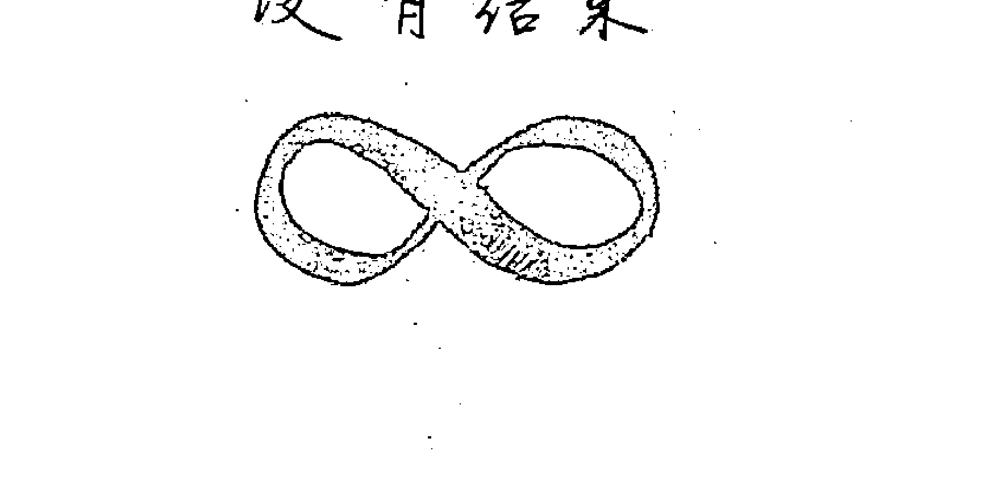

## 第十二章 总结

- 我们以为的死亡并不存在。身体会死亡，但是，精神不会受到死亡的影响。
- 在死亡前死掉，这句话的意思是，让“你只是一个人”的想法先死掉，认识到你就是无限的意识。
- 身体走向终点后，意识还在——还是很有活力，能意识到这一切。
- 知道真相后，生活会变得很轻松、轻快。你的生活中会充满欢笑与爱，无论发生什么，你都会感到喜悦。对于人和所有的生物，你都怀有深深的爱与共情。
- 真正的自我是唯一永恒的存在。其他的一切来来去去，终会消失。
- 在这个世界上拥有一个生命，就像是在电脑游戏中拥有一个化身。在我们的人生中，每一次死亡后我们都会获得一个新的身体，直到我们完成游戏，清醒过来，认识到真正的自己——意识。
- 作为意识，你会获得更多的乐趣。你会大笑。你会继续做之前所做的一切，只不过，那个时候，你的心里只会充满无尽的快乐与宁静。
- 人生在世，唯一的目的就是成为完整的自己。
- 往往就是在痛苦中，我们开始思考，生命究竟是为了什么。苦难让许多人真正认清了自己，找到了人间的天堂。
- 当你知道，无论发生了什么，一切都好，你就会摆脱一切消极观念，你的存在本身就能治愈那些身处困境的人。
- 意识赶走了所有的悲痛，意识是通往永生——充满欢笑、喜悦、丰饶、美丽、祝福的人生——的钥匙。
- 当你在这世界上看到爱，要知道，那份爱就是你。
- 如果你受到了什么伤害，毫无疑问，那其实是在提醒你走错了方向——你相信了不对的想法。
- 最后，我们明白了、记住了、懂得了，我们究竟是谁——我们是永恒的意识。

模糊的文本段落，内容无法辨认，可能包含手写或打印文字。

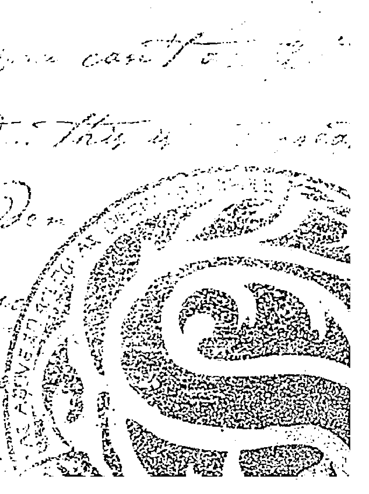

## “最大的秘密”练习

肯定：

> > “我想要真正认识我的本性，意识。
> 我想要实现我的目标，作为无限的意识过上快乐的日子。
> 我下定决心，要成为我本来就是的、永恒的、
> 无坚不摧的、纯粹的意识。”

- 意识练习：
  第一步：问问自己“我有意识吗？”
  第二步：注意到你的意识。
  第三步：保持意识状态。

- 每天多次注意到你的意识，把关注点转移到意识上。

- 每天至少花五分钟关注你的意识。你可以在醒来后、睡觉前或任何合适的时间做这个练习。

- 对每一个消极感受提问：“我是这个感受，还是我能够意识到这个感受？”

- 对于消极的想法和身体上的痛苦，你也可以问同样的问题。

- 超级练习：
    第一步：接受消极。
    第二步：保持意识状态。

- 问自己这个问题：“我是受苦的人，还是我能够意识到苦难？” 事实是，你能够意识到苦难，你不是正在受苦的人。

- 当你听到自己说“我相信”“我不信”时，要格外留心，因为紧随其后的往往是你的信念。

- 当你听到自己说“我认为”“我不认为”时，要格外留心，因为紧随其后的往往能透露出你的信念。

- 你可以给自己的潜意识发出一道指令，让它把你的信念亮出来，这样你就能够更方便地意识到它们。你可以这样对自己的潜意识说：“把我的信念一个个清楚地展示出来，我要一个个地意识到它们。”

- 意识到你的反应，以此识别信念。

- 接受你的抗拒感受。

- 要想从迷恋或其他问题中解脱出来，就接受它们，保持意识状态。

- 不快乐时，记得接受一切不快乐的情绪，允许它们存在，不要试图改变或者摆脱它们。

- 意识对所有的一切都说“是”，意识让一切自由自在地各行其是，因为，这世界以及其中的一切，都是意识——就是它本身。

- 关注当下，我们只能在当下认识我们的意识。

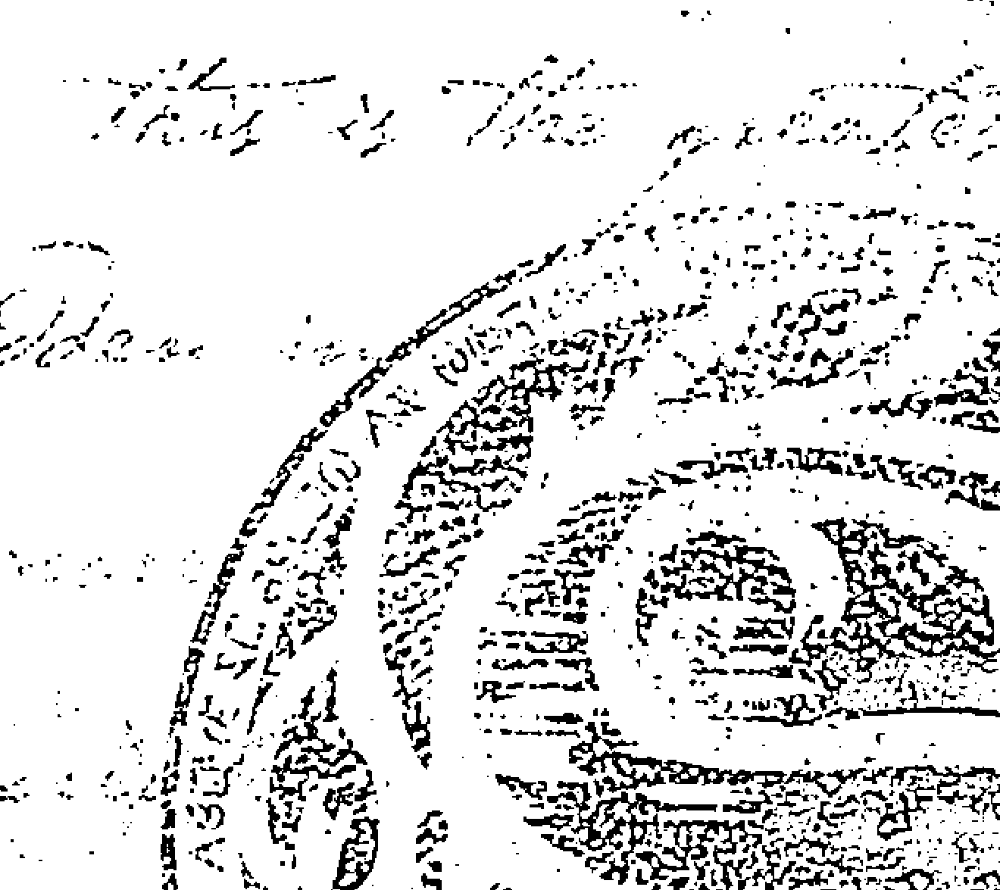

> > 无论什么降临在你的身上，
> 无来由的喜悦都将常伴你左右。
> ——简·弗雷泽

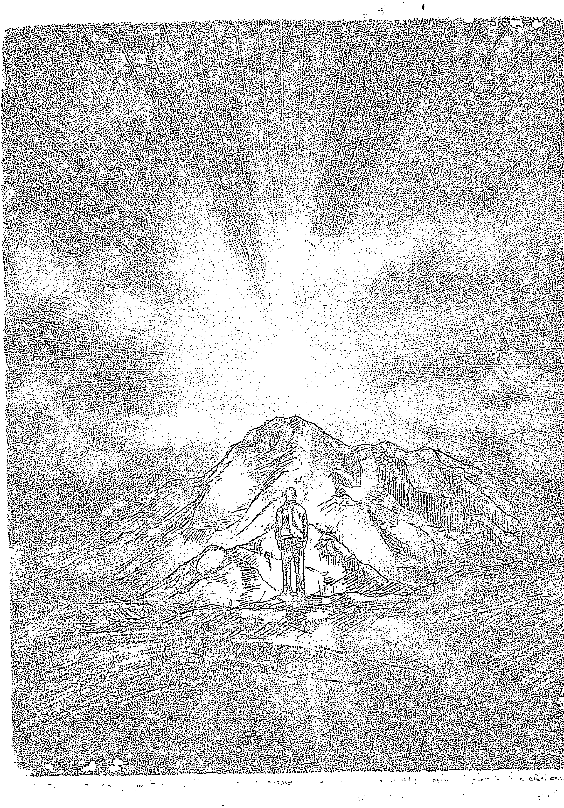

提供的图片几乎为空白，仅有极少量的噪点或线条，无法识别出任何有意义的标题、段落、列表、表格、插图、引用或代码块。

## 书中人物小传

和本书中这么多伟大的导师生活在一样的时代，我感到万分幸运和感恩。他们中的很多人把一生都奉献给了我们的自由和我们的快乐。他们中的很多人几十年来一直在做着同样的事情。如果你曾经遇到过他们中的一个，你就能感受到他们身上洋溢的爱与喜悦，并深受触动。如果你有机会成为他们中任何一个人的学生，抓住这个机会！如果你没法当面见到他们，你可以跟他们在网络上进行互动，这样也很棒。

和以往任何时候相比，如今，觉醒并认识我们的真实本性都简单得多；我们每个人都有机会。未来，可能就不会这么容易了——关于这一点，我们也不知道。因此，如果可以的话，现在要抓住时间，把握机会，接受这些导师的启发。

## 水手鲍勃·亚当森

水手鲍勃是澳大利亚人，就住在我的故乡墨尔本。2016年年初，认识到关于自己的真相后，我才知道水手鲍勃这个人，但那时，我已经住在美国了。很多年前，当我还住在墨尔本时，在好几年里，我每天上班的时候都会路过他的家。之前，我根本不知道我每天都会驾车路过一个“自我认识”方面的导师，而他未来会在我的人生中成为一个非常重要的角色。2016年，知道了水手鲍勃这个人后，我决定马上跳上飞机，跑到墨尔本去见他。那个时候，他已经八十多岁了，我参加了几次他的会谈，并与他进行了几次一对一谈话。每一次见到他，我都会感觉自己变得更轻、更快乐、更自由了。那时候，我还处于精神觉醒的初级阶段，我努力抓住他告诉我的一切。现在看来，他说的话都是那么清晰明了。几十年前，水手鲍勃在印度追随尼萨伽达塔·马哈拉奇时认识到了自己的本性。从那时候起，他就开始在家中与愿意聆听真相的人分享他的心得。现在，他已经九十多岁了，还在家中举办各种集会。他曾经说过一句话：“如果你不去想的话，会有什么问题？”这是我听到的最简单也最深刻的话了。水手鲍勃著有《当下怎么了？》《在场 - 意识：只有这个，没有别的》。想要更多了解他，可以访问他的网站：sailorbobadamson.com。

> > 如果你不去想的话，会有什么问题？

## 朱利安·巴伯

朱利安·巴伯是一位英国的物理学家，他写了三本书：《时间的终结：对宇宙的理解的另一场革命》指出时间这个概念只是个幻象；《动力的发现》分析了牛顿的发现的背景；《宇宙奇点》写于他八十三岁时。他的网站是：platonia.com。

## 大卫·宾汉

大卫·宾汉是英国人。几十年的时间里，他一直在进行着精神的探索，最后，在听到导师约翰·惠勒的播客后，他醒悟了，认识到了自己究竟是谁。在接受《认识TV》的采访时，他分享了自己自我觉醒的经历，正是因为看到了那个采访，我的觉醒之旅才正式开始。我看了他的采访，追随着他的脚步听了他提到的播客，然后我和大卫通了电话，在电话中，他帮助我体验到了意识，看到了我自己究竟是谁。现在，大卫是一名导师，帮助人们认识自己的本性。他的专访也可以在《关于非二元论的对话中》这本书中读到。进一步了解大卫·宾汉，可以访问他的网站：nonconceptualawareness.com。

## 迪帕克·乔普拉，临床医学博士，美国内科医师学会会员

迪帕克·乔普拉是一名内分泌学家，从印度到美国，他开始了自己的发现之旅。在对西方的医学感到幻灭后，他转向了综合的全健康医学领域。1995年，迪帕克开了乔普拉保健中心，后来，这个中心发展成为乔普拉国际——一个致力于帮助全球数百万人改善健康的保健公司。他写了九十多本书，其中很多本都是畅销书。我是几年前在科学与非二元论会议上第一次见到他的，听完他的演讲后，我站起来为他热烈鼓掌。你可以在他的网站上进一步了解他：deepakchopra.com。

## 安东尼·德梅洛

已故的安东尼（托尼）·德梅洛生于印度孟买，是一名耶稣会牧师。虽然他在这个世上只生活了五十五年，但他的教义直到现在也还是充满了生命力。他能把东西方关于灵性的思想巧妙地结合，因此，他的教导总是那么发人深省，改变了他的很多人。他的很多听众是天主教徒和基督教徒，他从《圣经》中举了很多例子，以此帮助听众理解他的真意。这种东西方智慧的结合，再加上他绝妙的讲故事的能力，唤醒了许多人。1987年他去世后，他的书一直都很畅销，卖出了几百万本：《爱的方法》《冥想》《通向上帝的方法》《开明之心》《一分钟的智慧》《源泉》《鸟的歌声》《起飞》。我最喜欢的是他的《意识：与大师对话》。此外，你还能找到他的录像，看他讲学是一种享受，你能听到他声音中的笑，感受到他心中的爱。他的网站是：demellospirituality.com。

## 黑尔·德沃斯金

黑尔·德沃斯金是传奇人物莱斯特·利文森的弟子及指定继承人，他也曾出现在《秘密》中。黑尔用自己的一生发扬莱斯特的瑟多纳释放法，帮助别人认识他们的本性。这个方法非常好用，帮助很多人改变了他们的人生。黑尔会定期举办静修班，训练人们释放消极思想，认识真我。我的自我觉醒的过程很大一部分都是在释放。你可以在《瑟多纳释放法》和《快乐是免费的》第1—5卷中学习黑尔和莱斯特的理论。黑尔每年都会在美国以及世界其他地方举办几次静修班。并且，全世界的人都可以在网络上加入他的谈话、线上会议、静修班，我自己就通过这种方式参加过好几次。你可以在黑尔的网站上找到所有的资料和信息：sedona.com。

## 彼得·久班

彼得·久班是一位作家和导师。他出生在美国，住在亚利桑那州，我第一次听说他是因为我的导师推荐我读他的《意识即全部》。我读了这本书，还听了有声书。这本书非常发人深省，有几次我真的感到非常震惊。我很感谢这本书，因为它撼动了我的世界。（是件好事！）如果你已经做好准备，想要再进一步觉醒，那么你一定要读这本书。如果你才刚刚开始自我觉醒之旅，那么我推荐你先读读他的书《只需注意》。他的网站是：peterdziuban.com。

## 简·弗雷泽

简·弗雷泽是一位作家、导师、母亲。2003 年，她经历了巨大的意识的转变。在此前的很多年里，她都因为自己可能得了癌症而生活在极端的恐惧中。突然间，恐惧消散了，她沉浸在了一种无来由的喜悦中，这种喜悦再也没有离开过。此后，她渐渐发现，我们可以过一种没有痛苦的人生。现在，她只想和所有人都分享自己发现的真相。我很幸运，曾经和简进行过私人会谈，并且阅读了她写的每一本书：在《当恐惧消散》中，她记录了自己觉醒的每一天；此外，她还写了《存在的自由》《伟大的甜美：思考后的人生》《打开心门》。就像你们能在这本书中读到的那样，简是个很亲切的作者，她的文字充满诗意、迷人优雅。非常感谢她允许我在书中引用她的文字。想要进一步了解她，就关注她的网站：janfranzierteachings.com。

## 乔尔·S. 戈德史密斯

乔尔·S. 戈德史密斯是一位深受欢迎的美国灵性作者和神秘主义者。他的书《无限之路》已经成为经典之作，影响了世界上许许多多的人，包括我自己。乔尔还写了很多书，他的很多著作和演讲都可以在他的网站上找到：joelgoldsmith.com。

## 大卫·R. 霍金斯医生，博士

霍金斯博士是美国著名的精神病学家、医生、研究者、灵性导师。因为他的科学和医学背景，他的教导在科学界也是令人信服的。十五年前，我第一次知道霍金斯医生，是因为读到了他的书《行为背后的神秘力量》，这对我产生了很大的影响。很多年后，我又听了很多课，并读到了他的《放手》。他还写了《治愈与康复》《现实、灵性与现代人》《超越意识的水平》《发现上帝的在场》《真相 vs 虚假》。霍金斯医生无论作为作家、演讲者、导师，都很高产，影响了很多人。2012年，他去世后，他的妻子苏珊继承了他的事业。你可以通过他的网站学习他的思想，了解他的作品：veritaspub.com。

## 迈克尔·詹姆斯

很小的时候，迈克尔·詹姆斯心中就充满了各种疑问。十九岁的时候，他开始周游世界，找寻活着的意义。他去过很多国家，最后来到了印度，来到了喜马拉雅地区，拜访了那里的很多圣地。他去过很多静修所，想要寻找人生的目的和意义。最后，他来到了印度的蒂鲁文纳默莱，来到了拉玛那·马哈希的静修所，虽然那个时候拉玛那已经去世几十年了。他本来打算在那里待几天，最后，他却在那里生活了二十年。在那里，他读到了拉玛那的《我是谁？》，他知道，他找到了自己一直以来苦苦寻找的东西。在那里，他继续学习印地语，翻译拉玛那的著作，就这么过了二十年。我是在《认识TV》中第一次知道迈克尔·詹姆斯的，然后马上就去阅读了他的书《幸福和存在的艺术》，这本书介绍了拉玛那的思想，是迈克尔写了一生的力作。他的网站是：happinessofbeing.com。

## 拜伦·凯蒂

拜伦·凯蒂过着普普通通的美国生活——有两段婚姻，三个孩子，一份成功的事业。但是，她经历了十年的不顺：抑郁、广场恐惧症、自暴自弃、绝望，甚至一度想要自杀。在深深的失落中，她住进了一个“中途之家”，一周后，她觉醒了，所有的恐惧和压抑都消失不见了。她的心中盈满喜悦，此后也一直都是。她认识到，当她相信自己的想法时，她就会觉得自己在受苦；当她质疑自己的想法时，痛苦就消失不见了。对所有人来说都是这样。
这段自我认识的经历让她发展出了四个问题，也就是“功课”。如今，它们已经帮助世界上的千百万人摆脱了痛苦。我也曾经用过她的方法怀疑自己的思想，并且我还有幸参加了几次凯蒂的活动，在那里，凯蒂用这四个问题帮助人们从自己的信念中解放出来。
她的著作有《一念之转》《心之安处》《喜悦无处不在》《我需要你的爱——这是真的吗？》《友好的宇宙》，以及针对儿童的《老虎一老虎——这是真的吗？》《四个问题》。进一步了解拜伦·凯蒂，访问她的网站：thework.com

## 洛克·凯利

洛克·凯利用融合了心理学、神经科学的充满智慧的教导，帮助我们觉醒。在他的精神探索之旅中，他接触了多个不同的传统和导师，最后找到了真我本性。他在教导中分享了自己的经历，那些经历让他获得了巨大的喜悦、自由和爱，以此帮助人们自然而然地在下一个人类发展阶段中觉醒。他的著作有《转向自由》和《无须用力的正念减压法》。在他的网站上，你能找到很多他的静修班信息、视频等：lochkelly.org。

## 克里希那穆提

已故的克里希那穆提1895年出生于印度，小时候，他就知道了自己的真实本性。他被许多人尊称为历史上最伟大的思想家和宗教导师。我的前夫在我们婚姻期间一直在听他的演讲，所以我二三十岁的时候就接触到了他的思想。但是，我是在出版了《秘密》之后，在开始我的精神探索之旅之后，才重新找出他的教诲，并真正地理解了它们。本书中的很多导师都受到了克里希那穆提的影响。在他的一生中，他一直在世界各地举办演讲，告诉大家，我们人类需要一个翻天覆地的变化。他的听众规模庞大，包括许多作家、科学家、哲学家、宗教人物、教育家。他关注的是全人类，他的心中没有种族和国家的概念，也没有任何信念，他不属于任何一个团体或文化。他给我们留下了大量宝贵的公共演讲、写作、讨论、采访、信件，其中许多已经结集出版，被翻译成了五十多种文字。此外，他还有大量的声音和影像记录。进一步了解他的教诲，可访问他的网站：jkrishnamurti.org。

## 罗伯特·兰扎，临床医学博士

罗伯特·兰扎博士被视为应用干细胞生物学之父。他笔耕不辍，有数以百计的发明，写了三十多本科学书籍，包括《生物中心论：生命和意识如何成为理解宇宙真相的钥匙》，其中，兰扎用有力的论证说明了意识不是宇宙的某种衍生品，意识是宇宙的基础。如果你想从科学的角度加深你的理解，这本书一定能够帮助到你，解答你的所有疑问。兰扎获得了许多奖项，包括《时代》杂志评选的“全球最具影响力一百人”，《展望》杂志评选的是世界上最伟大的五十位思想家。人们说，他是个天才，也是一个革命性的思想家，把他和爱因斯坦相提并论。进一步了解他，你可以访问他的网站：robertlanza.com。

## 彼得·劳里和卡利亚尼·劳里

彼得·劳里和卡利亚尼·劳里是澳大利亚人，生活在墨尔本（我的故乡）。他们经历了一段长达几年的精神之旅，漫游了印度，然后认识到了自己的真实本性。夫妻二人都获得了自我觉醒，这很难得，因此，和他们两个人在墨尔本的会面非常特殊。几年前，我来到墨尔本，和他们见了一面，那个下午改变了我的人生。此后，我还有幸和卡利亚尼通过几次电话。他们的书有《一点珠宝》《只有这个》。你可以在以下网址进一步了解他们：nonduality.com.au。

## 莱斯特·利文森

莱斯特·利文森是个传奇人物，他向我们证明了，当真相之光照耀着我们时，一个满是病痛的身体会发生怎样的变化。他曾经说过：“身体的疾病是心灵的疾病。”他鼓舞了成千上万人，即使在他死后，他的教诲也鼓舞、解放了很多人。莱斯特讲话简洁有力，因此非常明晰，他的教诲未来也会不断把人们唤醒。他还有一帮学生，他们后来也成了自我实现的导师，其中就包括黑尔·德沃斯金。黑尔守护着莱斯特的作品，正是因为有了他，我才能在这本书中分享那么多莱斯特简洁有力的教诲。莱斯特的思想在我的人生中起了非常大的作用，并且，未来它们还会继续起作用。本书中我引用的莱斯特的话大部分都来自《快乐是免费的》第1—5卷。进一步了解这位伟大的导师，你可以访问网站：sedona.com。

### 弗朗西斯·露西尔

弗朗西斯·露西尔出生于法国，现在在美国生活。三十岁时，他遇到了导师吉恩·克莱恩，认识到了自己的真实本性。在吉恩·克莱恩的建议下，弗朗西斯搬到了美国，与别人分享自己发现的真相。弗朗西斯曾经就读于法国巴黎综合理工学院，因此在他的演讲中，他融入了科学的视角。他用优美、清晰、精确的语言，帮助数不清的人认识到了自己的本性，其中包括鲁珀特·斯皮拉。我曾经在加利福尼亚参加过几次弗朗西斯举办的静修班，并且有幸去他家拜访过。每一年，弗朗西斯都会在欧洲和美国举办静修班，还会通过网络进行面对面会谈。不论你在哪里，你都可以参与这些会谈，与这位伟大的导师面对面。他的书包括《真善美》《静默的香气》《此刻永恒》，每一本我都读过好多遍。你可以在他的网站上找到更多他的会谈、静修班信息并进一步了解他的思想：advaitachannel.francislucille.com。

## 沙克蒂·卡泰丽娜·马吉

自 2003 年觉醒以来，沙克蒂·卡泰丽娜·马吉一直在分享，告诉我们如何作为唯一意识的自我本性觉醒。她是印度人，住在意大利，在欧洲和世界各地举办静修班，也举办在线研讨会。她的分享大部分是用意大利语，有时候也用英语。我第一次见到她是在一个会议上，她的讲话给我留下了深刻的印象。她写了一本书《关于存在的秘密》，并且用英语写博客，你可以在她的网站上阅读她的文章：shakticaterinamaggi.com。

## 拉玛那·马哈希

已故的拉玛那·马哈希是位传奇人物。1896 年，十六岁时，他突然感到了对死亡的强烈恐惧。于是，拉玛那躺下来，完全接受了死亡。在那一刻，他从一个普通人变成了真实的自己——不死的精神。对他来说，自那天起，他外在的个人形象只不过是别人眼中的样子，在他自己看来，他就是意识的无限空间。拉玛那的教诲帮助人们通过自我探寻实现自我觉醒，在本书中，很多导师也使用了这个方法。他的教诲帮助人们认识了最深层的自我，那个唯一的现实。我就是因为拉玛那·马哈希的教诲而改变了人生的人之一。进一步了解这位传奇人物，可以访问他的网站，在那里免费下载他的书籍：sriramanamaharshi.org。

## 无极

无极出生在牙买加，十几岁时搬到了伦敦。现在，他生活在葡萄牙，建立自己的自我实现中心。无极的精神觉醒始于1987年与一位基督教神秘主义者的相遇，1993年终于拜在他的师父——伟大的印度圣人帕帕奇门下。自那以后，无数人向他寻求精神的指导，很多人也由此认识了自己的本性。他的深刻教诲在世界范围内拥有大量追随者，特别是在YouTube（视频网站）上，在那里，你可以免费聆听他的演讲。无极的教诲非常有感染力，他很会讲故事，很幽默，会用很多比喻、类比准确地传达自己的思想。我和很多人一样，在网上看了很多无极的讲话。我还和女儿一起去葡萄牙参加过无极的静修班，在那里，我的女儿体验到了她真实的自我。无极的书包括《比天更高，比空间更广》、《白火》（第二版）、《通向自由的邀请》。你可以在他的网站上进一步了解他的书和教诲：mooji.org。

## 我的导师

我的导师不希望透露自己的名字。她是我最爱的两位导师莱斯特·利文森和罗伯特·亚当斯的学生。四年前，我第一次遇到我的导师，在她的面前，我感受到了巨大的喜悦。当你感受过如此巨大的喜悦后，便再也不希望它离开了。这种喜悦就是我们的本性！但遗憾的是，这份喜悦并没有就此一直留在我身边，我的心灵还是渐渐地回到了之前的状态，我再次感到了压力和不快乐。但是，在我的导师的指导下，我努力练习（练习的方法我都写在书中了），经常和她交流，我的心灵的力量变得越来越弱。现在，安宁与快乐常伴我左右，我知道，每一个人都能这样。

## 杰克·欧姬芙

杰克·欧姬芙是爱尔兰人，现在住在佛罗里达州。十年前，她发现了真相，完成了自我实现。她的教诲非常棒，打破了很多人心灵的藩篱。她的风格是简明、直接的，举办静修班、工作坊、个人对谈。几年前，我在网上发现了她，觉得她的教诲如清风般清新，我还有幸参与了几次她的会谈。你可以通过她的书《生而自由》《如何成为精神上的反叛者》进一步了解她的教诲。就像其他导师一样，她致力于把人们从由心灵导致的苦难中解放出来，让所有人都生活在喜悦和快乐中。她的网站是：jac-okeeffe.com。

## 马克斯·普朗克

德国物理学家马克斯·普朗克在理论物理方面做出了许多重要贡献，不过，他最出名的是发现了量子，让我们对原子和亚原子过程的认识有了革命性的突破。他于1918年获得了诺贝尔物理学奖。

## 彭加尊者

彭加尊者生于印度，被其弟子（其中包括无极）称为帕帕奇。在小的时候，他就走上了灵性之旅，九岁时便有了第一次灵性体验。三十年后，他遇到了拉玛那·马哈希，认识到了真实的自我，结束了他的精神探寻之旅。二十世纪八十年代、九十年代，成千上万人来到印度勒克瑙，感受帕帕奇的能量。1997年，他离开了自己的身体。进一步了解他的教诲，请访问以下网站：avadhuta.com。

## 玫瑰十字会

在本书中我多次提到过玫瑰十字会，他们的总部位于西班牙的加那利岛。我也是这个旨在提升全人类意识的非营利组织的荣誉会员。玫瑰十字会的成立可以追溯到十四世纪，同时，它也传承了曾经风靡巴比伦、埃及、希腊、罗马的古代知识学派的精髓。很多优秀的人物都曾经是他们的成员，几个世纪以来，他们默默地、辛勤地工作，置自身安危于不顾，想要把人类从苦难中解脱出来。弗朗西斯·培根曾经是玫瑰十字会的领袖，牛顿也曾经是玫瑰十字会的成员。玫瑰十字会现任领袖安吉尔·马丁·贝拉约斯指导我多年。我花了十年的时间研究玫瑰十字会的教诲，它们对我产生了巨大的影响，帮助我看到并理解了真相。进一步了解玫瑰十字会，可访问网站：www.rosicrucian-order.com。

### 鲁米

鲁米是十三世纪的苏菲神秘主义者和诗人。鲁米的影响和他的金玉良言超越了宗教、地理、精神传统的边界，他的诗歌在世界范围内广受赞誉。

### 彼得·罗素

彼得·罗素曾在剑桥大学学习物理和数学，在此后的一生中，他一直在研究科学和灵性传统。他的书有《金脑》《及时醒来》《从科学到上帝》《意识革命》，我曾经在科学和非二元论大会上听过彼得演讲。你可以在他的网站上免费观看他的演讲，聆听他的教诲：peterrussell.com。

### 鲁珀特·斯皮拉

鲁珀特·斯皮拉是英国人，住在英国，定期举办会议和静修班。他每年还去欧洲和美国举办多次静修班。他本是艺术家、陶艺家，经过二十多年的修炼和冥想，鲁珀特在他的导师弗朗西斯·露西尔指导下认识了自己的本性。他的教诲清晰练达，非常亲切，改变了许多学生的人生。在我觉醒的过程中，他的教诲也起了非常大的作用。对于学生的问题，鲁珀特会不遗余力帮助他们亲身体验到问题的答案，而不仅仅是给他们一个概念作为答案。鲁珀特的静修班信息和他的网站上找到。我读过鲁珀特所有的书，包括《意识的本质》《透明的身体，发光的世界》《认识之光》《安宁与爱的艺术》《一目了然》《爱的灰烬》等。他的网站是：rupertspira.com。

## 埃克哈特·托利

埃克哈特·托利是一位德国的精神导师和作家。他曾经长时间抑郁过，二十九岁时，他经历了内心的巨大转变，这也改变了他人生的轨迹。他写的畅销书《当下的力量》《新世界》被翻译成了五十二种语言，为数百万人带来了喜悦和快乐。埃克哈特的教诲深刻却至简，帮助全世界无数人找到了内心的安宁和生命的意义。他思想的核心是，精神觉醒是人类进步的重要一步。而精神觉醒最重要的是超越我们的自我。我和其他数百万人一样，是通过《当下的力量》这本书认识他的。在阅读的过程中，我经历了几次转变和灵性体验。我随身携带《当下的力量》练习册，练习了几年，他的其他书还有《无声胜有声》，以及写给儿童的书《存在的守护者》《弥尔顿的秘密》。埃克哈特在世界各地举办静修班、做演讲，把很多人从自我筑就的痛苦中解放出来，为整个人类做出了巨大的贡献。他的网站是：eckharttolle.com。

## 奥义书

奥义书是写于公元前 800 年到公元前 200 年间的灵性教义梵语古文，是古老的印度教吠陀经最古老的文本。

## 艾伦·瓦特

已故的艾伦·瓦特是英国作家和导师，他让东方哲学在西方读者中流行起来。艾伦·瓦特的作品语言优美，至今仍在世界范围内广受欢迎。他写过二十五本书，其中最著名的是《阻碍你认识自己的禁忌》《不安的智慧》《禅的方法》。他的子女将他的讲话发到了网上，并且把相关内容保存到了他的网站上，与后世分享他的智慧：alanwatts.org。

## 帕米拉·威尔森

帕米拉·威尔森生活在加利福尼亚州北部的湾区，是莱斯特·利文森和罗伯特·亚当斯的弟子。二十年来，她走遍美国、加拿大、欧洲各国，举办静修班、做演讲等。她本人就是甜美和同情的化身，我有幸听过几次她的演讲。她还出现在了《关于存在的秘密》一书中。进一步了解帕米拉，可以访问她的网站：pamelasatsang.com

## 帕拉宏撒·尤迦南达

诞辰百余年后，这位受人尊敬的导师被认为是将印度古典智慧带入西方的使者。尤迦南达的人生和他的教诲为不同种族、文化的人民带来了光明与启迪。他的学生中不乏科学界、商界、艺术界的重要人物，还曾在白宫接受过卡尔文·柯立芝总统的采访。我第一次知道尤迦南达是阅读了他的书《一个瑜伽行者的自传》，这本书发人深省，带来了一场精神革命，已经卖出了数百万册，对我也产生了巨大的影响。你可以在尤迦南达赞助的网站上在线阅读这本书。他还写了很多其他书，在以下网站注册后你可以获得尤迦南达亲自写的自我实现课程：yogananda.org。