# SIGNS & SYMBOLS

AN ILLUSTRATED GUIDE TO THEIR ORIGINS AND MEANINGS

圖解世界的秘密

Miranda Bruce-Mitford & Philip Wilkinson 著

李晴芬 林淑娟

# 符号与象征

图解世界的秘密

# 符號與象徵

圖解世界的秘密

www.readingtimes.com.tw

A Dorling Kindersley Book
www.dk.com

# 符號與象徵：圖解世界的秘密

# 目次

作 者：Miranda Bruce-Mitford & Philip Wilkinson
譯 者：李時芬、林淑媚
主 編：林明月
副 主 編：曹 懋
特約編輯：曾淑芳
美術編輯：黃雅藍
封面構成：張士勇
董 事 長：孫思照
發 行 人
總 經 理：莫昭平
總 編 輯：林馨琴
出 版 者：時報文化出版企業股份有限公司
10803台北市和平西路三段240號4樓
發行專線：(02) 2306-6842
讀者服務專線：0800-231-705 (02) 2304-7103
讀者服務傳真：(02) 2304-6858
郵 撥：19344724 時報文化出版公司
信 箱：台北郵政79-99信箱
時報悅讀網：http://www.readingtimes.com.tw
電子郵件信箱：know@readingtimes.com.tw
法 律 顧 問：理律法律事務所 陳長文律師、李念祖律師
初 版 一 刷：2009年4月11日
定 價：新台幣799元
Original Title : Signs & Symbols, an illustrated guide to their origins and meanings
Copyright © 2008 Dorling Kindersley Limited, London
Complex Chinese translation Copyright © 2009 by China Times Publishing Company
ALL RIGHTS RESERVED

- 1-11 前言
- 12-13 宇宙
- 14-15 簡介
- 16-17 太陽
- 18-19 月亮
- 20-23 夜空
- 24-27 地球
- 28-29 山
- 30-31 火
- 32-33 水
- 34-35 天氣
- 36-37 雨與雪
- 38-39 洪水
- 40-41 四季
- 42-43 珍貴寶石
- 44-45 黃金
- 46-47 珍貴的物質
- 48-49 自然界
- 50-51 簡介
- 52-55 哺乳類
- 56-57 貓科動物
- 58-61 鳥類
- 62-63 老鷹
- 64-65 爬蟲類與兩棲類
- 66-67 蛇類
- 68-71 水生動物
- 72-73 可怕的蟲子
- 74-77 傳說中的怪獸
- 78-79 龍
- 80-81 植物
- 82-85 花卉
- 86-87 蓮花
- 88-89 藥草與香料
- 90-93 森林
- 94-95 樹木
- 96-97 神木
- 98-99 大地的果實
- 100-101 大地的食物
- 102-103 人類
- 104-105 簡介
- 106-109 頭部
- 110-111 頭顱戰利品
- 112-115 人體
- 116-119 手與腳
- 120-123 繁衍與分娩
- 124-125 入門儀式
- 126-127 愛情與婚姻
- 128-131 死亡與哀悼
- 132-133 勸世畫派
- 134-135 神話與宗教
- 136-137 簡介
- 138-139 埃及神祇
- 140-141 希臘與羅馬神祇
- 142-143 凱爾特與北歐神祇
- 144-145 中南美洲神祇
- 146-147 祖先
- 148-149 自然的神靈
- 150-151 部落圖騰、英雄與魔法師
- 152-153 夢境
- 154-155 薩滿教
- 156-157 創世傳說
- 158-163 印度教
- 164-169 佛教
- 170-171 道教與神道
- 172-173 猶太教
- 174-175 猶太神秘教派卡巴拉
- 176-179 基督教
- 180-183 伊斯蘭教
- 184-185 錫克教
- 186-187 巫毒教
- 188-189 天使
- 190-191 撒旦與惡魔
- 192-193 巫師與巫教
- 194-195 辟邪物
- 196-199 占卜
- 200-203 西洋占星術
- 204-205 中國星象學
- 206-207 命理學
- 208-209 聖杯
- 210-211 鍊金術
- 212-213 社會與文化
- 214-215 簡介
- 216-217 皇室王族
- 218-219 皇家飾品
- 220-221 加冕儀式
- 222-223 民族性
- 224-225 工具與武器
- 226-227 建築
- 228-231 宗教建築
- 232-233 聖地
- 234-235 房屋
- 236-237 天梯
- 238-241 家
- 242-243 船
- 244-247 花園
- 248-249 衣著與服飾
- 250-251 頭飾
- 252-253 制服
- 254-255 珠寶
- 256-257 身體裝飾
- 258-259 集會組織
- 260-261 共濟會
- 262-267 藝術
- 268-269 舞蹈與戲劇
- 270-271 面具
- 272-273 童話故事
- 274-275 樂器
- 276-277 象徵系統
- 278-279 簡介
- 280-283 顏色
- 284-289 形狀
- 290-293 圖案
- 294-299 數字
- 300-305 圖畫文字
- 306-309 字母文字
- 310-313 國際通用標誌
- 314-315 專業標誌
- 316-317 品牌與商標
- 318-323 紋章圖案
- 324-329 旗幟
- 330-333 手語與手勢
- 334-337 象徵性的姿勢
- 338-343 名詞釋義
- 344-345 延伸閱讀
- 346-351 索引
- 352 致謝

行政院新聞局局版北市業字第80號
版權所有 翻印必究
（缺頁或破損的書，請寄回更換）
ISBN 978-957-13-4969-5（精裝）

國家圖書館出版品預行編目資料

| 符號與象徵：圖解世界的秘密 / Miranda Bruce-Mitford, Philip Wilkinson著；李時芬, 林淑媚譯. -- 初版, -- 臺北市 : 時報文化, 2009.01 ; 352面 ; 公分 參考書目 : 面 含索引 譯自 : Signs & symbols : an illustrated guide to their origins and meanings ISBN 978-957-13-4969-5(精裝) 1. 符號學 2. 象徵主義 |
| --- |
| 156 |
| 97022930 |

# 前言

人類好奇的頭腦是我們被區別為現代人的一個特點。我們總是對事物產生疑問，對我們在地球上的存在更是懷疑。為什麼我們會在這裡？我們是從哪裡來的？死後又會去到哪裡？而在我們周圍的自然現象背後，又隱藏了什麼意義？在數萬年的歲月中，我們創造了在某種程度上可以讓我們回答這些古老問題的信仰架構。

不太明確。

符號的功能簡單明瞭，可以是書面或視覺語言的一部分，警告前方路況的一種視覺語彙，或公司產品的一個誇大用詞。符號給予我們的是一則立即相關的簡單訊息。

另一方面，象徵則是視覺圖像或標誌背後的潛在意義，代表宇宙真理的深層指標。比方說，火同時可象徵太陽及我們周圍的雄性力量，而春天的花朵代表重生和新生命。當我們用象徵的角度來看事物時，生命顯得豐富又有意義多了。

## 定義和分析

我們從這個信仰架構中，發展出一套符號（sign）與象徵（symbol）的廣泛語彙，提醒我們與宇宙的連結。這些符號與象徵的識別性都很普遍，然而二者之間的區別有時卻很早以前，象徵就與宇宙、繁殖、死亡與新生有關，並隨著精神分析理論的出現，根據精神或心理上的需求，再由這些理論來分析想法與事物。比如說，暗影可視為內心缺乏安全感。當許多童話故事被拿來分析時，比如小紅帽的故事，會與長大成人、遭遇阻礙等有所關聯。然而大部分古老和原始的象徵與萬物的關係，就如同人類與宇宙的關係一樣息息相關。

除了誕生、重生和季節變化這些最基本的意象之外，有些象徵是普遍被認知的，比如說圓圈、飛行中的鳥；而鳥代表的是靈魂上升到天堂，其他有名的野獸幾千年來也不斷出現在藝術中，表明了這些象徵的相關特質。比如說，半人半獸的森林之神薩特（satyr），一半是山羊、一半是人身，同時暗示了人的高傲與鄙陋。

# 象徵的遷移

有些象徵到處可見，以致對這些象徵的起源有所爭論。它們是在人類內心毫無知覺下自然出現，還是各種想法由一個國家傳至另一個國家融合的結果？

我們逐漸了解古代頻繁的旅行，貿易路線交叉連結了地球的宗教理念和藝術風格，甚至有藝術家與貿易商同時旅行的例子。這也是為什麼伊斯蘭教延伸至東南亞；佛教擴展到日本；還有葡萄牙文能夠在南美洲中心地帶通行的原因。商品與理念是可以交易的，象徵一樣也可以，有時甚至在傳抵之處比在它的發源地還要備受重視。

# 女神

女神可說是世界各地同時有多元發展的象徵。通常，她被描繪成大肚皮及大胸部。女神代表繁殖、豐碩，從馬爾他島到俄羅斯大草原的史前文化都可看見她的蹤影。她作為大地之母，代表生產及更新。有時她被簡化成簡單的三角形，代表女性生殖器；有時又是圓形，代表生育及再生的輪迴。

龍這個華人世界的產物，就是屬於這種象徵。在中國它代表皇帝與太陽的榮耀。但在歐洲基督教的藝術中，它卻象徵人類的負面形象。

經由時間的演變及猶太教、基督教、伊斯蘭教的發展，屬於女神的古老神話幾乎在人類的意識中消失了。然而，少部分標誌還是被認可並保存下來，對聖母馬利亞的崇拜，就是信仰的一個例子。當人類演變成漸漸遠離自然界，所有與製造或養育有關的女神，就被創造之神或超然於創造過程的天神所取代。男性神控制了自然，而不再是大地之母。

鳥與毒蛇打鬥的畫面，從新幾內亞到美洲文化都可看到，代表的是天、地與水的永恆鬥爭。最後，在古代中國銅器上所出現的饕餮紋獸面，也出現在歐洲大教堂的屋簷承霤口和環太平洋沿岸文化的圖案中。

# 日常生活的象徵

我們的日常生活，因為有了象徵而顯得更加豐富。當表達真相或更深層意義的事物同時出現時，我們認知到周遭的事物有內外兩種的自然定義。比如說，一把簡單的梯子，可以是工具，也可以是追求自我真相的提醒；一只碗可以代表新女權的原則和創造。蓮花從污泥中盛開表現了純潔的心靈，正如一盞燈可意指真理的光明面。以象徵性的觀察方式來看待事物，可以讓我們增加自覺而過著更「和諧」的生活，這不僅是日常生活的一部分，也是萬物生存之道的真理。

# 藝術、文學與夢境的圖騰

藝術上的象徵性，是用來解釋畫面的一種視覺語言。然而，因為我們無法了解大部分在文藝復興藝術中使用的意象，所以很難去辨別其中真正的含義。比如說，基督教藝術中，鳥類令人想到聖方濟（St. Francis），而輪子則是聖凱瑟琳（St. Catherine）的代表。早期佛教藝術利用隱喻方式來描繪佛陀，祂的身軀通常不在畫面中，可是王座或腳印成為祂存在的象徵。

通常在藝術中，水的描繪象徵無意識或初水（Primordial waters），而智慧就是古典女神才有的特點。在現代藝術中，創作物件對觀賞者不必有意義，卻能產生共鳴，比方創作者連結他童年時期的記憶。同樣地，在澳洲原住民夢境傳說（Australian Aboriginal Dreaming）中，用拇指印畫在沙上的圖形，描繪出這個人才有的生命及周遭環境。

象徵也出現在一些著名的文學作品中。在基督教寓言集《天路歷程》（*The Pilgrim's Progress*）中，述說的是凡人努力以求和上帝相結合的故事。基督教寓意也出現在作家路易斯（C. S. Lewis）所寫的《納尼亞傳奇》（*Narnia*）中，獅子亞斯蘭代表的正是上帝的化身。

夢境的象徵本質很早就被認同了。在夢中被追逐或跌倒，可以解釋成個人對於成長與責任的恐懼感。然而，不僅在精神分析方面認定夢境是頭腦不自覺運作的反射動作，許多族群更肯定它的重要性。比如說馬來西亞的沙漫族（Semai）相信夢境象徵的重要，在夢中面對象徵的恐懼時，他們會選擇勇敢面對。這樣一來，潛藏在現實生活中的憂慮不安自然也會得到解決。

# 今日的象徵

有些象徵是充滿厄運的，例如代表原子彈的廣島上空的蕈狀烏雲，以及紐約雙子星世貿中心的崩塌，都成為我們內心最沉重的恐懼。

# 新的觀點

雖然數千年來象徵的符號都保持不變，但一套新式的符號已經漸漸發展出來了。比如說今日的文化英雄：超人、蜘蛛人，都是類似古代神話中偷取火苗或洪水後重建世界的英雄人物。其他的現代文化英雄還包括了名人，因為他們的長相、受人愛戴崇拜，或是因為他們的奢華生活方式吸引一般人的注意及嚮往。這股吸引力，也許就是我們內心深處缺乏安全感的一種回應。

如果我們選擇去觀察這些象徵，不論我們住在哪兒，到處都可發現它們的存在。對於這些豐富的視覺畫面，我們可以選擇冷漠以對，也可選擇開放視野，追尋周遭事物的真理。對哲學玄學有興趣的人來說，這個世界充滿豐富而有益的象徵，指引我們去探索，了解我們生命中的全新觀點。

# 序

人類觀察太陽、月亮、星星、行星的運行，來感受一年四季的變化，逐漸發展出一套宇宙自然節奏的論調。數千年來我們應用所觀察的自然現象，來建立宇宙論，進而拉近了我們與大自然緊密適應的關係。因此，我們分配自然界的各種力量，然後交由我們膜拜的各個神明去掌管。

這些造成了人們廣泛的信仰，為了生存，也怕神施降可怕的厄運，人必須與神相互合作。人類呈獻犧牲品，祈求宇宙的和諧；輕柔的降雨，好讓穀物豐收；徐徐的微風，好幫助航海員前進。一旦我們遭遇到重大災難，比如具毀滅性的天旱、地震或者洪水，我們也自然認為是神明對我們的懲罰。

這樣一來，宇宙性的象徵主義與宗教就嚴密地結合在一起。例如：太陽被廣泛認為是神聖的；佛教徒認為火是燃燒掉傲慢無知的大智之物；對於基督徒及印度徒來說，水通常是純潔的象徵；而對所有宗教來說，天堂是神聖的殿堂所在。

的確，從月亮和星星、打雷和閃電，天空中的每一樣東西，都與神的世界相連。人們懼怕山脈，因為它與天堂的距離較近。各個象徵，在不同的民族文化中有各自重要的神或超自然的代表物。

有關創世神話或大洪水神話，在各種文化中是常見的，進而利用宇宙象徵性及神的報應題材來解釋宇宙的奧妙。

為了生存，也怕神施降可怕的厄運，人必須與神相互合作。

這類型的象徵對早期的社會是很重要的，因為它們幫助人們用一種更和諧的方式來了解及領悟神明所給予的啟示。

演著重要角色。例如，天文和占星術，從古代就一直演變下來，來解釋行星在天空運行，或是星星如何形成星座的原因。季節和宇宙的象徵性經常交疊，因為時間的測量都以太陽和月亮的每日升降以及季節性運轉為準則。

早期的科學研究嘗試著建立土、火、水及空氣四個宇宙主要元素的象徵關聯。空氣和火象徵男性和活躍；而土和水則是象徵女性和被動。協調四個元素之間的平衡，就可以達成宇宙的基礎和諧。

不管現代科學有多進步，宇宙的象徵主義仍然與世界人類保持關聯，惠予我們文字更多的色彩。最受歡迎的仍然是「星星」；許多國旗都有月亮、太陽這類的宇宙符號，象徵著神聖的規律與力量；珍貴的寶石，尤其是生日石，仍然存在著許多象徵性的意義；天文學也像往常一樣受到重視。直到今天，我們仍然企圖從符號與象徵中找尋啟示。

符號與象徵對擴展世界的科學知識，扮

## 太陽

多數民族文化都有膜拜太陽為宇宙至尊力量的時期。太陽使所有事物興旺和成長。太陽代表熱源時，象徵生命力、激情和青春。太陽代表光源時，則是啟蒙的象徵。它還是皇族和帝國的表徵。在一些傳統風俗中，太陽是萬物之父。日出、日落象徵誕生、死亡及復活。

## 圍繞地球

冬至和夏至是一年中白晝最短和最長的日子，賦予了許多神話及世界各地節日來源的靈感。冬至象徵白晝戰勝黑夜，是光和生長一個週期的結束，也是另一個新週期的開始。夏至慶祝地球的全盛，但也是太陽減少力量的開始。督伊德教祭司在黎明時歡迎夏至的到來。冬至和夏至是火的象徵，都代表了太陽的溫暖及生育力。

這個可怕的太陽面具，表現的是太陽大於四方（北南東西）的威權，屬於儀式典禮中的禮器。它來自於加拿大卑詩省的貝拉庫拉（Bella Coola），或稱那克努克族（Nuxalk）。

日出代表希望、喜樂和青春，也象徵新生、再生和重生。在基督教教義中，它有復活的意義。日出經常用來表示世界或人類的誕生，因此不可避免地與許多創造性的神話有密切關係。

容器散播火花以點亮黎明

位於英國威特郡的巨石陣（Stonehenge）是最有名的夏至象徵。幾千年以來是異教徒慶祝的一個重要地點。這些教徒在仲夏日時聚集在腳跟石（Heel Stone）前迎接日出的來臨。

女神厄俄斯（Eos）象徵青春、希望、甦醒。古希臘人崇拜她，她的手指如粉彩般顏色悄悄地劃過日出的天空，並為人間帶來晨間的清露。

## 神和傳說

世界上許多族群文化的象徵都與太陽有關。通常太陽代表男性，但日本及美洲一些印第安部落，卻視太陽為女性的化身。在埃及、中美洲及秘魯的部落中，有著最複雜的崇拜太陽族群。太陽可被視為溫和與繁衍的力量，同時也是兇暴的毀滅者。

- ▶阿波羅
希臘神阿波羅（Apollo）賜予地球生命。他被刻畫成活潑、年輕的金髮造型，經常與駕著雙輪太陽戰車跨越天空的赫立奧斯（Helios）相提並論。

- ▲賀頓
在希臘神話中，太陽神赫立奧斯駕著雙輪戰車橫越天空。他為了要阻止兒子費頓（Phaeton）粗暴駕駛雙輪戰車的行為，最後使出閃電光殺死了費頓。

- ▲鳳凰
世界知名的死亡、再生的象徵。神話中的鳳凰通常被描繪從火焰中升起，是一種類似老鷹的鳥。

- ▶蘇利耶
蘇利耶（Surya）是印度神。代表不朽、死亡及再生的火焰（意指日落及日出）。祂每天橫越天空，駕馭戰車的是七匹兇猛的馬。

- ▲羅睺
印度惡魔。羅睺（Rahu）沒有身軀，人們相信它吃了太陽，造成日蝕。因為沒有身軀，所以太陽隨時可能再出現。同樣的傳說在中國也有。

- ▲伊卡魯斯
古希臘傳說中，代德拉斯（Daedalus）為兒子伊卡魯斯（Icarus）製造了一對人工翅膀，伊卡魯斯因為飛離太陽太近，翅膀因而融化，象徵伊卡魯斯的覆滅是因為自大和對其他神不敬。

- ▲凱布利
古代埃及的朝陽之神凱布利（Khepri）與滾動糞球的聖甲蟲有關聯。滾動糞球象徵著太陽橫跨天空的旅途。它與新生命有關，並且是幸運的信物。

## 力量和太陽

太陽是宇宙中心的象徵，來自天上，是最完美、最明亮的皇室標誌。中國人敬奉太陽為皇帝的一個表徵；日本以它作為國徽，相信他們的天皇是太陽女神——天照大神（Amaterasu）的後代。

- ▽太陽王
法國國王路易十四以太陽為他個人的徽章，即有名的「太陽王」（Sun King），以奢華的生活方式著稱於世。

- ◀共濟會
共濟會（Freemasonry）章程中，太陽是神聖的象徵，而黃金則是上帝賜予的禮物。兩者都出現於共濟會的慈善信仰中。祭壇上的紅色布料裝飾著太陽的標誌。這個圖形由共濟會會員利用他們職業使用的工具組成，再加上太陽頭部等各種象徵物。

- ▲日本國旗
太陽是權力的象徵，並成為數個國家旗幟的標誌。日本國旗的紅點表示正在東升的朝陽。

參見
黃金44-45頁
埃及神祇138-139頁
希臘與羅馬神祇140-141頁
印度教158-163頁
道教與神道170-171頁
基督教176-179頁
共濟會組織260-261頁
顏色280-283頁
旗幟324-329頁

## 月亮

神秘的月亮總是引人想像，在夜晚發亮的外表是希望和啟蒙的象徵，跟太陽一樣，常常與生育、死亡和復活有關。它能控制潮汐，也象徵繁殖。月亮還掌控夢境，給人困惑的印象。它的黑暗面與神秘有關，而其女性特質常和大地之母相連結。

### 陰曆的影響

月亮行經天空，照著週期輪轉。它的形狀經常改變，為早期社會的生命輪迴說提供了有力的實證。就像人們賦予月蝕許多象徵一般，弦月、滿月等不同的形狀都有不同的含義。月亮除了能影響潮汐、氣候和生命，人們相信它也掌控命運。

- ◀月亮的盈虧
月亮的盈虧象徵生育、生命、死亡及再生。上弦月表示成長；下弦月則是死亡。

- △月蝕
世界各地的文化都有關於月蝕的傳說或故事。很多傳說故事相信月蝕是自然災害或是統治者死亡的預兆。有些亞洲文化則認為月蝕是惡魔或龍把月亮吃掉了。

- △月亮
月亮表面由火山口所造成的陰影，很能吸引人們的注意。這些陰影也是許多不同傳說的靈感來源。

### 滿月

滿月與比喻完滿精力象徵的圓形相類似。中國人拿陰性與女性來比喻月亮；對佛教徒來說它代表的是精神方面的力量。秋分時期的滿月（在九月晝夜平分點時的滿月）象徵著農業豐收的繁榮。Lunatic（精神錯亂）一字來自拉丁文的月亮「luna」，是沉迷發狂的意思。滿月通常被信會加劇動物和人類的發狂異常行為。

狼對著月亮嚎叫

- ◀馬雅曆法
馬雅（Maya）文化的曆法是按照月亮、太陽、水星及昂宿星團（Pleiades）的週期而定。古羅馬、中國、猶太、凱爾特及伊斯蘭教等的月曆，則是完全按照月亮的週期訂定的。

圖像的外圈代表月份

## 月亮之神和月亮女神

大洋洲及非洲的一些種族，視月亮為專司繁殖的男性神，但通常月亮被認為是女性神。聖母馬利亞為天帝之母，她與月亮也有關聯。月亮女神的角色很多：從保護的母性到個性強烈的古羅馬狩獵女神黛安娜。月亮女神被視為命運的編織者，常常以蜘蛛的形象出現。

- ◀貓神巴斯特
埃及女貓神巴斯特（Bastet）為月亮之神的起源，可能是由於希臘人把她與專司狩獵的月亮女神愛提米思（Artemis）相提並論的關係。陰曆中的繁榮象徵常與貓神有關。

- △愛提米思
愛提米思（Artemis）是希臘太陽神阿波羅的雙胞胎姊妹，通常與月亮女神思琳（Selene）、海克緹（Hecate）同時出現。愛提米思代表新月，思琳是滿月，而神秘的海克緹魔女表示月亮的黑暗面。

- △嫦娥
中國傳說的嫦娥，是西方傳說月球人的東方版本，每當中秋節人們會祭拜住在月球上的嫦娥。

- ◀依雪爾
依雪爾（Ixchel）是馬雅文化中的月神，屬於母性女神。她掌控雨水，同時有滋溉及毀滅的特性。

- ◀柯約莎克
阿茲特克帝國人民相信太陽及月亮日復一日的運行，是重新上演月神柯約莎克（Coyolxauhqui）及太陽之間的鬥爭，事情源於前者遭到斬首。

## 變形人

變形人（Shapeshifters）出現在民間的傳奇故事中，常常在滿月夜晚變成凶暴的動物。這些故事與月亮的黑暗面有關，神秘難解，顯露出來的是人類的動物本能。不由自主的變形象徵著壓抑，而自行變形則是放任、自由的象徵。歐洲流傳著狼人的傳說。其他地區，變形動物則包括了美洲豹、老虎、狐狸和獾。另有變形神力的僧人和巫婆，以變形方式穿梭於人類及靈異社會之間。

參見
夜空 20-23頁
四季 40-41頁
哺乳類 52-55頁
繁衍與分娩 120-123頁
埃及神祇 138-139頁
希臘與羅馬神祇 140-141頁
中南美洲神祇 144-145頁
薩滿教 154-155頁

# PLANISPHÆRIVM
Sive
ORBIVM MVNDI
PTOLEMAICI

## 行星

天文學家很早就注意到天空中除了太陽和月亮以外，另有五顆可用肉眼觀察的移動亮光。這五顆亮光被稱為「閃亮的行星」，也是遊行者的意思。水星 (Mercury)、金星 (Venus)、火星 (Mars)、木星 (Jupiter)、土星 (Saturn) 等名稱是取自於古羅馬的眾神之名。15世紀望遠鏡的發明，促使發現了更多更遙遠的行星：天王星 (Uranus)、海王星 (Neptune) 及冥王星 (Pluto)。所有行星都有不同的特點：不同顏色、運行及大小。行星影響人類的，有時是一個星期特定的一天。中世紀時代的煉金術士用金屬來配對這些行星。安德列·塞拉流斯 (Andreas Cellarius) 在1660年描繪的《和諧大宇宙》(Harmonia Macrocosmica) 初版，是根據2世紀天文學者托勒密 (Ptolemy) 所發展出來的系統，但這套系統錯把地球當成宇宙的中心。

- 1. 水星
以信使神命名，水星 (Mercury) 跟辯解、商務、星期三和金屬水銀有關。

- 2. 金星
以愛神命名，金星 (Venus) 象徵的是性欲、再生、歡愉，也跟星期五和銅有關。

- 3. 火星
強而有力的男性角色，火星 (Mars) 象徵的是暴力、熱情、火花和勇敢。它的日子是星期二，金屬是鐵。

- 4. 木星
是平衡和公平的象徵。木星 (Jupiter) 通常與星期四和錫有關。

- 5. 土星
以一位有長鬍子的老者為代表，土星 (Saturn) 象徵道德、惡意、嚴厲，與星期六和鉛有關。

- 6. 作為標誌的行星
除了將行星描繪為宇宙中的天神之外，塞拉流斯也創造了每個行星的標誌。此外，占星術和煉金術也使用這類標誌。

## 夜空

令人懼怕的神秘傳說和無止盡的夜空，數千年來繼續控制和影響著人類。恆星和行星如同信號燈般，閃爍在黑暗之中，在神奇的力量之下，給予人們指引、指示及靈感。古代人們觀察夜晚的星星、星座，由觀察到的規律變化，開始發展天文學及占星術。星星常用於旗幟、宗教，或用來指稱名人。

## 星星

星星是非常重要的象徵，代表神聖的指示、引導及希望。美洲印第安人相信星星象徵祖先在天上的營火。有些文化認為星星是進入天堂的途徑，或是神祇的訊息傳遞者。基督教中的「伯利恆之星」(Star of Bethlehem) 率先報知基督的誕生。在基督教的藝術中，描繪聖者有時也有星星的出現。紋章學中的星星，是騎士階級的徽章。黃道帶也是由12顆星星所組成的。

#### 現代的星星符號

在今日，星星象徵著我們的希望與願望。星星也與望族有密切關係，而名人常被貼上「明星」的標籤。星星用在旗幟上的機會很多，一排排的星星象徵優質的表現。第一面使用五角星的國旗，是1777年成立的新興國家：美國的國旗。

- ▲星座
星座是由一群可以辨識圖形的星星所組成，總共有88組被發現的星座是以古典神話人物命名的。

- ▲五角星
一般稱為五芒星。往上歪的五角星象徵渴望、靈異世界和教育。在基督教義中表示最初與最末（開始與結束）。如果把它上下顛倒的話，則是意味著惡魔。

- ◀六角星
一般稱為六芒星。猶太教稱之「大衛之星」。它是由兩個三角形所組合而成，象徵男性與女性的本質。它代表的是天地之間的連結、相反物與創造物的融合。這個標誌也稱為「所羅門封印」，來源是所羅門王戒指上的圖案。

- ▲流星
流星是天堂之火的光彩，是神聖的指標。它以傳訊者的角色，提醒人們更高等的天堂生活。它是幸運的象徵，也代表了生育。

- ▶好萊塢之星
洛杉磯的好萊塢星光大道上，嵌印了二千多名在演藝圈有貢獻的演藝名人的名字。

## 星星之神

神聖的象徵通常與皇室、統治有關，藉以強調神的存在。早期文明將星星對人們生活的影響稱之為神學。很多故事敘述星星的象徵性，也有數不清的男女神祇與星星有直接的關係。幾個有名專司生育的女神，她們的皇冠是由星星串連起來的。這些女神包括了巴比倫的伊斯塔（Ishtar）及聖母馬利亞。

- ▲伊斯塔
蘇美族生育女神伊斯塔（Ishtar）的標誌是五角星，她勇士作戰的裝扮有如晨星。

- ▲聖母馬利亞
身分為天后的聖母馬利亞，她的皇冠由星星連串而成，她也與六角形的瑪麗安（Marian）星星有關聯。

- ▲星星與弦月
伊斯蘭教的弦月圖表示神權的重要及輪迴，旁邊緊鄰五芒星：天堂（Paradise）。

- ◀伊西絲和奧西里斯
埃及生育及母性女神伊西絲（Isis），是陰府之神奧西里斯（Osiris）的妻子。奧西里斯的靈魂寄託於獵戶星座，而伊西絲的象徵則是天狼星座（Sirius）。天狼星每年預告尼羅河的氾濫，為國家帶來新的繁榮生殖，所以天狼星出現的時間正是新的一年開始。

- ◀北極星
在古埃及傳說中，死去的法老靈魂棲身於北極星（Pole Star）之中。北極星還與塞特神（Seth）及腓尼基人的豐饒之神包爾塞彭（Baal Sapon）有關係。

- ▶毛利族門飾
在毛利族（Maori）的信仰中，星星有驅邪的保護作用，也代表戰鬥。

## 觀察天象

天象在原始文化是非常重要的，觀察天象是日常生活的一部分。當天象與地球的自然現象相符合時，這些巧合就成為人們心目中的預兆。中國和西方社會的傳說、迷信及神話相信龍是從北極光發源的。航海的水手認為閃電火花造成的「聖愛摩之火」（St Elmo's Fire），是來自神明的阻撓。馬雅人覺得銀河是一條巨大的白龍扭動跨越天空。

- ▶銀河
阿茲特克人稱銀河為「密希克特」（Mixcoatl，雲端上的巨蛇），並以同名稱呼極星。許多文化相信銀河是地球與天堂之間的一條路或河。美洲印第安人認為它是連接陰間的途徑；而印加人則想像銀河是一條天堂之河。

- ▲北極光
有些文化認為多彩奇妙的北極光是皇室生育的象徵。在有些地區，它可以是戰訊的傳達者，或是鬼怪的化身。而在北歐文化傳說中，極光則表示女性。

參見
埃及神祇138-139頁
凱爾特與北歐神祇142-143頁
猶太教172-173頁
基督教176-179頁
伊斯蘭教180-183頁
西洋占星術200-201頁
形狀284-289頁
旗幟324-329頁

## 地球

我們對地球的看法，從相信地球是平的、是由動物支撐起來的，轉變為現代太空中一顆藍色行星運轉的圖像。現代地球圖像，已經讓全世界對地球有了統一的看法。但古代視地球為豐饒之母的看法，還深植我們心中。地球的景觀、突然爆發的天災、原料、土壤等一切事物，始終與象徵、宗教和儀式緊密相關。

### 大地之母

地球是生計哺育之泉，也是萬物之源的大地之母，從遠古時期人們就習慣祭拜地球。根據許多創造的神話，最早的人類是泥土揉成的。在犁溝中將這些泥人配對，成為一些農村春祭儀式的特點。地球代表女性和被動、或是中國文化中的陰性。地球的圖像通常是一個圓形。

### 岩石

岩石意味著力量、正義及庇護，也表示神權。古代文化中豎立起的岩石，帶有神聖的意義。對美洲印第安人來說，岩石的重要性在於它代表了大地之母的骨骼，在葬儀典禮中非常重要。在基督教教義中，它還代表基督及教會。

**◀蓋亞**
希臘古典傳說中的母性角色，「蓋亞」(Gaia) 指的是地球。其他與地球有關的女神還包括了普西芬尼 (Persephone)、得墨忒耳 (Demeter) 及海克緹 (Hecate)。從圖中可看出蓋亞從地裡浮現，在凱克洛普斯王 (Kekrops) 的注視下把手中的兒子交給雅典娜。

**▲勞賽爾的維納斯**
法國多爾多涅的勞賽爾 (Laussel) 的維納斯女神像已有21,000年歷史。象徵大地之母，手持的野牛角表示弦月、陰戶或生命根源。

**▲密特拉**
專司光及九霄的波斯神密特拉 (Mithra)，密特拉從岩石中誕生，通常被描繪成正在屠宰公牛，藉以征服動物激情。

**▶戚華蔻特**
阿茲特克族的大地及生育女神戚華蔻特 (Cihuacoatl)，專司助長生命及消滅死亡。她的名稱意為「蛇女」，有時被描繪成手握著一個孩童。她的吼聲為戰爭的預兆。

**▲得墨忒耳女神**
專司豐收、稻麥及教導人類播種耕耘的希臘大地女神得墨忒耳女神，有時難以分別她與蓋亞的不同處。

**▲布萊斯峽谷**
位於美國猶他州的布萊斯峽谷 (Bryce Canyon)，在腐蝕之下形成了著名的柱石。這些石柱好似聳立於礴紅壯觀的競技場中。屬於美洲印第安的派尤特人 (Paiute) 相信這些石柱本是傳奇人物，但被惡作劇的土狼變成石頭。

**▲賽貝爾**
賽貝爾 (Cybele) 是自然和生育力的女神，出生於從天堂拋擲出來的黑岩石，所以羅馬人是以石頭的形式崇拜她。

## 大地景觀

不管我們與大地的關聯是如何親密，都與個人的特性、種族及生命本質密切相關。地球時時改變的景觀，充滿了多重象徵和意義，反映出生活其中的人類起源、宗教信仰及儀式。

▲洞穴
洞穴的主要象徵是庇護所，也與子宮、誕生、重生和宇宙的中心相關聯。洞穴邪惡的一面象徵冥府、地獄之門和失去自覺。

▲沙漠
沙漠的景觀象徵著貧瘠、荒蕪和遺棄，也表示為了生存而抗拒誘惑的意念。不管在基督教或伊斯蘭教教義中，沙漠都有隱退、冥想和啟蒙之處的含義。

▲谷地
谷地是繁榮的象徵，是動物吃草、人類棲息的地方。谷地代表遮蔽、陰性的一面。中國人認為山陰象徵著陰冷、溫柔及女性；相對於太陽照射得到的山陽。谷地也是令人懼怕的地方，例如死蔭幽谷（Valley of the Shadow of Death）。

## 活動中的地球

自古以來的傳說中，比喻地震及火山爆發為一尊猛獸的甦醒，或是天神對人類的怒氣。人類進而創造了介於造物者神力與自然現象之間的一套紋脈清楚的象徵主義。日本人以為地震是主導風雨之神素盞鳴尊所變的魔術；古希臘人認為地震是因為海神波塞頓（Poseidon）搖動地球所造成的，以致人們供奉犧牲品來平息神明的憤怒。因地震引起的地層活動通常是宗教或政治上重大變動的前兆，在聖經中就記載地震預報了基督死亡。

◀日本地震
有些古老的文化把強烈地震歸咎於支撐地球的動物開始活動。日本阿伊努人（Ainu）相信，他們居住的島嶼是由一條叫做大鯰（Namazu）的巨大鯰魚所支撐的。大鯰後被鹿島大明神用大石塊所制服。

◀富士山
富士山是日本重要的代表性圖像，神道與佛教認為它是一處令人敬畏的神秘地方。數以千計的人們每年都會到山頂去朝聖。「富士」意指火神。

▶火山女神
古老傳說中，火山女神佩擂（Pele）住在夏威夷島的大島活火山奇勞瓦（Kilauea）中。據說她的頓足造成地震，她神奇的棍棒挖掘火山引起爆發。

△印度地震
在印度教的宇宙論中，地球是由四隻站在母龜上的公象所支撐著。這象徵了兩股巨大的造物勢力，牠們的活動形成地震。

參見
爬蟲類與兩棲類64-65頁
水生動物68-71頁
繁衍與分娩120-123頁
希臘與羅馬神祇140-141頁
印度教158-163頁
部落圖騰、英雄與魔法師150-151頁

## 陰陽和諧的山水畫

自唐代（618-907）以來，山水畫是中國主要的藝術表現手法。政治動盪不安時，此類畫作象徵人們尋求和諧，藉大自然來平衡心靈。常見的畫面是一人孤影在山壁之下或溪水之旁。每一個畫中的元素都是整體一致與融洽的象徵。

1 & 2. 陰與陽
陰（被動、冷酷、女性）在流通及柔軟處可以尋得。安靜山谷中的水流、優雅微垂的竹林、瀰漫山頭的雲霧，都是陰性的象徵。陽（主動、熱情、男性）展現動力及光亮，伸延的山脈、堅硬的岩石、天空及亮麗的水澤都是陽性的象徵。

3. 和諧的元素
道家相信四海一家的信念，融合了宇宙間的所有元素。哲學家莊子是這麼解釋的：「天地與我並生，萬物與我為一」。這幅畫中，主山伴隨其他小山，或大或小的岩石及樹木，顯示了天地自然合一的精神。

4. 人物
中國山水畫中通常會出現人物，這些人物的渺小，通常隱喻人類只是宇宙中的一小部分。這幅畫中的人物可能在冥想或沉思。人類應充分尊重自然規律，宇宙才得以和諧。

明代畫家沈周的山水畫

▲须弥山
印度教和佛教认为须弥山位于世界中心。如上图，它经常出现在西藏的曼茶罗中，用以帮助修持能量。

靠近天堂的山或被人類敬佩，或被人類畏懼。世界各個宗教莫不視山為神聖的代表，山常與天神、靈魂及預言有關。

山脈俯瞰天下，時時注視著我們，尖峰雄偉聳入雲端。山的所在地常不在我們可及之處，遙遠、神秘又富有挑戰性，常是宇宙神力生命的化身。早期文化中，山與天堂交接處為地球的靈魂核心所在，是不同時空的天神與凡人會晤的神聖之處。人類因此建造與山同形狀的神殿，來象徵靈魂的昇華。

和英雄們聯繫在一起。奧林帕斯山是希臘眾神的家園，他們在那兒統治世界及管理人類事務。摩西攀登西奈山，在山頂接受上帝賜予的十誡。據說，先知穆罕默德下令移動沙法山（Mount Safa）時，山岳永恆不變的象徵頓時成了謙卑的寓言。

### 神聖的場所

高海拔的地方總是與神聖的探索聯繫在一起，是心靈的超越、純淨和永恆的象徵。攀登山脈是艱鉅的，因為空氣變得稀薄，導致呼吸困難和引發幻覺。攻頂卻是至尊的成就，從山頂眺望遠方，是另番全新視野。登山有如一趟精神上的旅程，在山頂上，受到啟蒙的心靈得到純淨的洗禮。

美洲印第安納瓦伙族（Navajo）認為有些山是自然中精靈的化身。位於墨西哥的特拉洛克山（Mount Tlaloc），是阿茲特克人專司雨水及豐饒女神的化身。

古代埃及傳說中，山脈是地球對天空的渴望。埃及人刻畫出天空之神努特（Nut），她蜷伏貼覆在她的愛人身上。向上延伸的山脈，代表的正是這種生理上的欲望。中國也有這種相似的信念，山與陽具的形狀類似，是陽性與生命的象徵。

很多山脈讓人有神聖的印象，例如，中國的九岳受到佛教徒的崇敬。有的山吸引人們去攀登，例如愛爾蘭的帕特里克山（Croag Patrick）、日本的富士山等。攀登聖山的朝聖之旅，代表的是渴望、啟蒙和塵世欲望的拋棄；在精神方面，山頂連結了全然自覺的象徵意象。

### 神與先知

山長期以來與聖經的啟示、先知、神祇（特別是太陽神和主司天氣的神）

### 神殿與雙峰

在亞洲、中美洲及美索不達米亞文化中，人們建造類似山形的神殿。神殿代表的是宇宙中心，而登上神殿的階梯平臺，既代表精神昇華，也代表通往天堂的途徑通道。埃及的金字塔也有相似的宇宙涵義。有著雙座山嶼的山脈是星星或太陽的所在地，這在中國或蘇美文化都有跡可尋。而希伯來的西奈山及何烈山（Horeb），是太陽與月亮的所在地。

這只中國器皿呈現的是道教的蓬萊山。在中國，山備受尊崇，是萬神諸靈的駐所。

參見
地球24-25頁
繁衍與分娩120-123頁
埃及神祇138-139頁
中南美洲神祇144-145頁
佛教164-169頁
道教與神道170-171頁
聖地232-233頁
圖案290-293頁

## 火

可怕又猛烈的火是偉大的破壞者。它象徵戰爭及混亂，有著活躍及雄性的特質，也與太陽的意象相關。對人或事物都可以用「火熱的」、「火爆的」來形容。火紅色則用來形容強烈的感情。火具有雙重特性，可以是純潔與新生的象徵，也可以是家園、壁爐與神聖之愛的表示。當人類學會生火，生活型態也隨即有所改變；而所有早期的文化也都有火神與造火的傳說。

### 火神

火與我們頭頂上的天空聯繫在一起，它以太陽或閃電的形式出現，濃煙再往上飄回天空。我們把這猛烈又仁慈的強烈元素歸因於神明。很多宗教在古早時候就開始供奉火神。火神在全球許多文化中也占有重要地位。古希臘羅馬同樣都有關於鍛鍊及火爐的神祇。

△伏爾坎
伏爾坎（Vulcan）是羅馬有關火、火山及冶鍊的神。他在埃特納山（Mount Etna）山腳下的冶煉場為眾神及英雄製造武器。每年8月的伏爾坎節是為他慶祝的節日。

△怒火
森林大火火焰的高度及紅亮的顏色，強調了火的權威。火可以具毀滅性，但也可以是一股創造的力量。

△昌蒂可
阿茲特克人專司火山及火爐的女火神。昌蒂可（Chantico）的舌頭是火形成的。她也是金匠的守護神。

△祝融
祝融是中國火神，專門懲罰破壞天條的人。他通常穿著盔甲。他最著名的事蹟是阻擋自己的兒子鑽奪天帝寶座。

△阿耆尼
阿耆尼（Agni）是吠陀火神，即梵文的「火」。他的雙頭造型說明了他的雙重特質：具毀滅性的，但也是仁慈的。他也是樹木及植物的生命能量。

△雪可美特
雪可美特（Sekhmet）是個嗜血的埃及女戰神，有個女獅頭，帶著一條會吐火的眼鏡蛇。她以火箭驅散敵人，身軀充滿正午的陽光光芒。

△威威泰奧特
他是阿茲特克人的神，專司光與火。威威泰奧特（Huehueteotl）通常以紅臉或黃臉老翁的造型出現，頭上頂著一個香爐。

## 永恆的火焰

永恆的火焰是永遠持續燃燒的火光。古時候人們以橄欖油或木材來持續火焰，現代人則是利用丙烷或天然瓦斯。永恆的火焰可以代表個人、團體或是重要的國際大事，甚至是像世界和平這類的目標。奧運聖火在希臘雅典點燃後，傳送到主辦的城市，在比賽期間保持點燃。許多教堂在祭壇或祭壇上方都有不滅的火焰。

## 造火傳奇

當人們學會生火，開始利用火來烹飪、保暖、威嚇野獸及日後的熔煉金屬。數不清的傳奇故事敘述人們如何起火，發明造火器具。例如，著名的伊朗國王胡珊（Hushang），當他以燧石做的斧頭丟向一條蛇，沒想到碰撞到旁邊的石塊，而引起了火花，他因而領悟到敲打燧石起火的道理。

△普羅米修斯
希臘神普羅米修斯（Prometheus）欺騙了宙斯，讓他吃骨頭而不是肉。宙斯藉由扣壓人類使用的火來報復普羅米修斯。

△茂宜
茂宜（Maui）是波里尼西亞族群的重要神祇，特別在毛利人和夏威夷人的傳說中。夏威夷人認為鷹是茂宜的化身。茂宜從大地之母那兒偷取了火種，卻被火所燒傷，這也是為什麼鷹的翅膀呈褐色的原因。毛利人也有類似的傳說。

## 火之儀式

火在多種宗教文化中扮演祭典中的重要角色，與再生、淨化及神都有關聯。在阿茲特克人的奉祀儀式中，族人焚燒菸草、焚香並供獻犧牲各部份。祆教教徒傳統上在點燃聖火的神殿上祭拜，火象徵創造者的能量。北美洲的印第安人在潔淨及靈視之旅（vision quest）的儀式中都會用到火。

△鞭炮
中國古老傳說中，鞭炮可以在新年時驅除邪魔及惡運。鞭炮還可喚醒金龍，金龍騰雲駕霧、呼風喚雨，滋潤農作物。

△祆教
祆教的神殿供奉著神聖之火，神殿教士保持讓聖火不滅。信徒通常戴著白色面罩，以避免呼吸的氣息污染了神殿聖火。

△阿茲特克人
阿茲特克教士每52年宣布世界可能發生的災難，他們熄滅神殿所有的火焰，在奉獻的人體肺臟中重新點燃新火苗，象徵新生命的到來。

## 神的火焰

火在許多宗教中占有一席之地。基督教的地獄到處充滿火焰，許多聖徒也被描繪為帶有火焰之心。在基督教的教堂中，蠟燭燃燒象徵了希望、生命及上帝的到臨。《舊約》就有提到燃燒的荊棘火焰。

參見
太陽16-17頁
埃及神祇138-139頁
希臘與羅馬神祇140-141頁
中南美洲神祇144-145頁
印度教158-163頁
顏色280-283頁

## 水

水不斷改變形狀及狀態，象徵女性、萬物之源的生育力，也與月亮有關。它有時以雨或雪的形式出現；有時是發怒的洪流或安詳的湖面。它也有很多狀態：流動的、停滯的、暴風雨的，或是深不可測的。水雖是被動的，但受到氣候影響，水也可以摧殘、化解、沖刷及再生萬物。水也是許多宗教淨化治療的泉源。

### 海洋

海洋是母性的象徵，深不可測的容量象徵地球的子宮。許多文化的造物神話中，可看到生命滋生於初水的故事。水可以是神秘的海洋，代表無意識的心靈；深不可及的水也是亡者及汎濫的象徵。許多神靈、怪獸與大海關係密切，也與漩渦及海嘯等自然現象相關。

▲尼普頓
尼普頓（Neptune）是希臘海神波塞頓（Poseidon）在羅馬神話中的稱呼。尼普頓有著長長的鬍鬚，手拿三叉戟，坐在貝殼上，旁邊有海豚陪伴。他性格桀驁不馴，暴風雨及地震都是他內心忿忿不平的表現。

▲塞德娜
伊努特人（Inuit）的傳說中，塞德娜（Sedna）是女海神。她是海洋動物的守護神，統治伊努特人的海底世界愛德莉望（Adlivun）。不同的伊努特族群各以不同的名字稱呼塞德娜。膜拜塞德娜的人們靠海維生，祈求她的祝福以確保食物不缺。

▶努恩
努恩（Nun）是古埃及歷史久遠的神祇，Nun字是水的意思。努恩代表造物湧出所在的混沌初水。他的特性是黑暗、無盡及湍流。

▲波浪
波浪不斷起伏洶湧，同時代表定性及變性。人們用它來形容人生的喜悅或悲傷。潮汐的波浪象徵破壞和再生；夢中的波浪也許意味著對變動的恐懼。

◀卡律布狄斯
卡律布狄斯（Charybdis）是希臘海神波塞頓的女兒。宙斯偷了她的軀殼讓她只剩下漩渦狀的一張嘴，從此她變成海妖。在希臘神話中，卡律布狄斯佔據狹窄海峽的一邊，妖魔斯庫拉（Scylla）則佔領另一邊，航海員在海峽中行駛，如果不小心就會有生命危險。

## 河流

河流的象徵出自於流動的水，反映了自然及時間的造物力量。河流灌溉大地使土壤沃腴，讓河床旁的萬物得以生存。它也隱喻時間的流動，河流從發源地流向大海，象徵生命從出生到死亡的過程。河流還是兩種不同世界的分隔點，例如生命與死亡。偉大的河流被賦予人性，也是神聖不可侵犯的。許多文化都有關於河流的神靈。

## 湖泊

沉思與平靜是我們對湖的印象，又因為水面倒影的效果，也象徵著鏡子。希臘神話中納西瑟斯（Narcissus）是在湖邊欣賞自己倒影時淹死的。中國的古老傳說中，湖代表智慧、吸收及被動。在印度教及佛教中，神殿與湖泊相連接，代表創造與來世轉生。

> 水與惡魔
在過去幾個世紀中，被懷疑是巫婆的女性會被丟入深水中，如果淹死了就表示她們是無辜的；相反的，如果她們浮起來沒被淹死，就會被控以施展法術的罪行。

- 參見
  - 埃及神祇138-139頁
  - 希臘與羅馬神祇140-141頁
  - 印度教158-163頁
  - 佛教164-169頁
  - 道教與神道170-171頁
  - 巫師與巫教192-193頁

## 天氣

天氣的轉變對人類是基本的衝擊，有時創造出生命，有時則是死亡。人類長期將這些變化無常的現象與神祇的一時興起聯想在一起，甚且歸咎於擬人化的民間傳說，比如北風代表寒冷天氣。天氣同樣讓人聯想起神明的懲罰及超自然的力量，與良善及創造也有密切關係。

◀ 龍神
龍神是日本掌管天氣最重要的神祇，常被描繪成醜怪的模樣。他製造濃霧烏雲，打鼓來製造雷電，還喜歡吃孩童的肚臍。

## 雷、閃電、暴風雨

暴風雨經常與戰爭和崇高的神有關。許多文化認為雷具有創造生命的能力，能帶來充沛的灌溉雨水。《聖經》故事述說打雷是上帝的發聲，閃電帶來豐腴及光明。雷電交加是希臘神宙斯及印度教戰神因陀羅的武器。美洲印第安人信仰中的雷鳥，代表宇宙精靈與戰爭。

◀ 仙格
對於尼日的祐魯巴族（Yoruba）來說，神祇仙格（Shango）是神聖的。他掌管打雷及閃電。造型特色是石製的雙頭斧，代表他從天空帶回的雷電。

這尊女性小雕像平衡著雷電的象徵物，通常用在獻給雷電之神仙格的舞蹈中。

▲ 塔拉威比奇
這個精靈娃娃塔拉威比奇（tala wipiki）象徵閃電，是居住在美國新墨西哥州沙漠的印第安霍皮族（Hopi）所製作。如今，因為它與雨水的關聯，人們對它格外有親切感。

▲ 馬爾杜克
馬爾杜克（Marduk）是巴比倫創造之神，他把美索不達米亞的神祇英利爾（Enlil）放置天空中，賦予他用呼吸來引發暴風雨及春天微風的能力。

▲ 濕婆
在印度教，濕婆額頭的第三隻眼帶來閃電及火災，這隻眼代表神力、宇宙的萬能、啟示、毀滅及再生。他的武器三叉戟則象徵閃電。

▶ 索爾
北歐神話中的索爾（Thor）有著紅髮，蓄著長鬍鬚，專管戰爭及雷電。他經常被描繪成手拿雷神之鎚或雷電，駕駛兩隻山羊拉的戰車穿越天空。這兩隻山羊有著不尋常的名字，一隻叫磨牙（Tooth-grinder），一隻叫咬牙（Tooth-gnasher）。

▲ 櫻陀羅
吠陀神話中的櫻陀羅（Rudra）是濕婆（Shiva）的前身，專司風暴閃電，射出的箭會讓人感染疾病，但也帶給人們健康及其他好事。櫻陀羅之意為「咆哮者」或「紅色救主」，他賦予不馴的自然人性。

## 風

在現代，風是變動和自由的象徵，但在古代，風與四個羅盤方向、神，甚至邪魔都牽扯得上。風在花粉傳遞扮演重要角色，使風成為有性繁殖的代表。美洲阿帕契族的印第安人相信，觀察手指前端的指紋，可以看出風在創造人體時進行的走向。在中國，風與傳遞小道消息有關，比如「獲得風聲」或「風聞」。

◀ 希臘風神
希臘神話的風神埃奧洛斯（Aeolus）主導風的方向。他把風藏在洞穴中，領導也是專司氣候的四個神（如圖）。這四個神帶著翅膀，有著吹氣鼓起的面頰。從春天的微風到冬天的寒風，每一個神都有他管轄的氣候。

▲ 旋風
旋風是漩渦、太陽及創造的象徵。旋風也是通往聖地的運輸工具：《聖經》中上帝站在旋風上與約伯對話，魔法中的惡魔騎乘旋風呼嘯來去。

▲ 小天使
長著翅膀的天國小天使也稱為丘比特（putti）。小天使有著圓鼓鼓的面頰，西方藝術中，吹氣讓船前進的小天使經常用來象徵風。

▲ 伐由
伐由（Vayu）在梵文中意指吹氣，是印度的風神。他是印度《吠陀經》中的主神之一，專司屬於五大元素之一的風。

▲ 日本風神
日本神道面貌恐怖的風神，通常坐在雲朵上或駕雲而行，他隨身帶著一個裝風的袋子。

## 雲霧

從細膩的薄霧到徘徊不走的強風暴雨，不同狀況的天氣可以是不同的象徵。烏雲帶來豐沛的意象聯想，更加強了人們對「全身濕透了」（pregnant with rain）這句話的印象。猶太教和基督教認為雲霧指明上帝的存在。中國的絳雲象徵了好運及歡樂。有些文化中，雲還與悲傷相關；用雲形容一個人與現實脫節，是一頭「栽進雲端裡」。薄霧在中國山水畫中，表現的是一股令人無法理解的靈氣。

▲ 神的所在
雲霧可以象徵性地點出天神的存在。上帝從雲端中伸出祂的手，是基督教常見的圖形。

▲ 不確定的狀態
霧氣用來形容不確定、尚未揭曉的狀態是再恰當不過。道家學者相信，人在得到啟發之前，必須經過如霧一般的過程，心靈才可得以清淨。

▲ 瓦爾基麗的戰馬
希臘神話中，雲層有如跟隨天神阿波羅的牛羊。北歐神話中，雲是女神瓦爾基麗（Valkyrie）的戰馬。瓦爾基麗是奧丁神（Odin）的女侍，在戰場上空盤旋，護送亡者到天堂。

- 參見
  - 繁衍與分娩120-123頁
  - 凱爾特與北歐神祇142-143頁
  - 自然的神靈148-149頁
  - 創世傳說156-157頁
  - 基督教176-179頁
  - 天使188-189頁

## 雨與雪

從天而降的物體，不論其型態是雨、冰雹、雪、露水，都與水的象徵連繫在一起，它們既是生命的創造象徵，也是死亡的毀滅象徵；其結果可以是破壞的，也可以是生成的。雨代表豐沛，露水則是祝福，冰雪代表冷及短暫，這些都可從耳熟能詳的民間故事中找到。彩虹結合了太陽與水的結晶，也是兩者結合的象徵。雨或雪的降臨來自天堂，自然而然與天神有關。人的存活必須依賴與神明的互相合作，這樣一來，無法預測及暴烈的氣候就得以控制改善。

## 雨水

雨水是重要的富饒象徵，有些原始文化則把雨水與精液聯想在一起。它也是純淨、淨化的表示。數千年來，人類相信天神掌控雨水：有時降下猛烈的暴雨，有時則是輕柔的小雨。人們會舉行不同的儀式來祈求雨水；雨水也與龍、狗，甚至鸚鵡等動物有關。

世界各地的文化都有他們獨特的祈雨舞。例如，美洲印第安柴羅基族（Cherokee）的祈雨舞，在祈雨的同時也希望驅散妖魔，踏頓的腳步象徵雨滴落在堅硬地上的聲響。

中國人的龍掌管天氣，為人類帶來雨水。當洪水氾濫成災時，人們相信那是因為他們觸犯了龍。中國人相信龍掌管雨水的多寡及農作物的收成；但在西方，傳說中的龍掌管的卻是火。

當又冷、又急、如湍流般的大雨傾盆而下時，帶給人們的是悲慘痛苦，但同時也可能是神聖的賜予。大雨與暴風雨的象徵有如天神對人的憤怒。

特拉洛克（Tlaloc）是阿茲特克人專司雨水和豐饒的神。他頭戴蒼鷲羽毛做的王冠，是水的象徵。手持製造雷聲的響盒，並提著一個裝滿水的水罐。

專司雷、雨、豐饒與戰爭的印度神因陀羅（Indra），經常坐在位於祥雲圍繞的聖地須彌山的天堂（Svarga）。因陀羅經常手持雷電棒，象徵啟示、毀滅及再生。

這幅畫是描繪希臘神話中，宙斯化身成一陣黃金雨，讓英雄人物佩爾修斯（Perseus）的母親達娜安（Danaë）受孕的畫面。這雨是神聖受孕的慣色象徵。

## 雪與冰

我們很自然地把冰雪與嚴寒、殘酷的畫面連在一起。與冰雪相提並論的還有純潔、純白及原始之美。在情感方面，剛強、冷酷、脆弱、暫時性和缺乏愛也常使用冰雪來表達。表情如「相敬如冰」常被廣泛的使用；相反地，融化的冰雪象徵敞開冷酷的心靈。

### 冰河

冰河是藉由重量自行移動的大片半島形冰塊，以緩慢及堅韌不拔的形象著名。冰河與冰塊是同體，但它象徵的不是天堂的新鮮水，而是在地球上被污染過的水。

### 雪花

一片片雪花代表的是脆弱的美麗。雪花象徵暫時性、智慧、真實、困境與純潔。沒有兩片雪花會是一樣的，所以它也是獨特的象徵。

### 雪后

西方的童話故事中，結尾總是正義戰勝邪惡。在雪后的故事中，雪后挾持了男孩，女孩費盡心機把男孩救回。

## 天堂之橋

彩虹是捉摸不定、有靈性的，它一眨眼間即消失。它象徵的意義非常多，包括希望、和平、神聖、戰爭前兆與崇拜對象，甚至也表示懼怕。彩虹的傳說及習俗人人耳熟能詳，它通往天堂之橋，而橋的那一端則是智慧的根源。

### 愛麗斯

愛麗斯（Iris）是希臘神話中的彩虹女神，她為奧林匹克眾神傳送信息。愛麗斯經常以帶著金色翅膀的年輕女子形象出現，手持一支傳令棒。她在地球與天堂之間傳送信息，彩虹是她的通道。

### 虹光身

西藏密宗佛教的虹光身，是指神識的轉變狀態。這種轉變通常發生在人死亡之後，在過程中，修行者的肉體會消失，化成虹光而去。

### 裝滿金子的罐子

愛爾蘭鄉土傳說的小精靈，把一罐金子藏在彩虹的末端。在西方，循著彩虹可以找到一個人的未來命運。

### 彩虹巨蛇

澳洲原住民的傳說中，彩虹巨蛇與季節轉變以及人們對水的依賴都有極大的關聯。那是因為怪獸般的巨蛇棲住在水源洞中掌控水源，而水是生命萬物最重要的資源。

### 卡忽酷拉

毛利人在戰爭時祈求彩虹之神卡忽酷拉（Kahukura）的保護。它還象徵人類的死亡和死亡後通往天堂的通道。

### 挪亞的彩虹之約

《聖經》上描述大洪水發生後，上帝答應挪亞和他的方舟會安全逃離，彩虹是祂不讓萬物毀滅的承諾象徵。

### 納瓦荷的彩虹

納瓦荷（Navajo）旗幟上的彩虹，表示其主權存在，以及所有族群統一成為彩虹聯合國的象徵。紅銅色的輪廓表示疆土的範圍，鋸齒狀的圓形表示圍繞的聖山。

- 參見
  - 哺乳類52-55頁
  - 龍78-79頁
  - 希臘與羅馬神祇140-141頁
  - 中南美洲神祇144-145頁
  - 夢152-153頁
  - 印度教158-163頁
  - 佛教164-169頁
  - 童話故事272-273頁
  - 旗幟324-329頁

▶ 挪亞的方舟

上帝要以大洪水來懲罰罪惡的人類，誠信之人挪亞受上帝的指示建造方舟，而得以生存。後來他與家人繼續延續人類的繁衍。

## 洪水

上帝或眾神施降大洪水摧毀文明的故事，這種天譴的行為，是世界各文化廣為流傳的神話主題。

洪水代表死亡及再生，也是輪迴的結束及開始。洪水與月亮的潮汐能量、萬物繁衍及新生命開始等息息相關。洪水還可洗滌罪惡，純淨心靈。

### 世界性的主題

全世界普遍都有關於洪水的故事，從中國、蘇俄到蘇門答臘、秘魯，幾乎每個民族都有他們自己的傳說。大致來說，洪水代表人類與大自然和神明無法協調所產生的災難。

許多洪水的故事很接近《聖經》記載的挪亞方舟，這些故事包含的主題有：神明的懲罰、洪水前的警告、建造可容納家人跟動物的方舟，以及放出鳥兒探看洪水是否已退卻。其中以印度教《往世書》（*Purana*）中有關摩蹠（Matsya，魚）的記載，以及巴比倫人《吉爾伽美什史詩》（*Epic of Gilgamesh*）中的烏特納匹什提姆（Utnapishtim）故事是最相似的。

### 源起

《聖經》的洪水故事來源有很多不同的版本，它也許來自底格里斯河與幼發拉底河交會之處的美索不達米亞（即今日的伊拉克南部）。這塊肥沃的地區很容易引起洪水氾濫，地理特徵也指出洪水可能數次侵襲當地的居留地。洪水使古文明變成沼澤，這出現在全球許多地方，也衍生出各種神話故事。

### 值得一提的例外

一年一度的洪水氾濫使得有些地區的古老文化因而受益，比如亞馬遜河及尼羅河地區就沒有富啟示的洪水傳說。埃及尼羅河的氾濫，使得整個流域變得十分肥沃，供給人們食物的來源。洪水如此重要，埃及人創造了哈比神（Hapi），與法老共同控制河水的漲落，為當地帶來豐饒。如果沒有尼羅河的灌溉，古埃及文明恐怕不會如此高度發展。

▲ 麻蹠傳說
在印度傳說中，摩奴（Manu）化身成一條麻蹠（魚），解救了毗濕奴，因而得到洪水將臨的警告，他建造了一條船得以生存，並延續了地球的生命。

◀ 阿茲特克人的創造之神
中美洲的族群非常相信宇宙的輪迴說。在每一次輪迴中，類似洪水的天災會造成萬物的毀滅。阿茲特克人專司氣候和創造之神奎茲爾科亞特爾（Quetzalcoatl），在災難過後幫助地球重生。

◀ 尼羅河的氾濫
尼羅河吸引許多珍貴的獵物。左圖這幅西元前2世紀的鑲嵌壁畫，描繪一年一度的氾濫中，一頭犀牛被洪水困在石塊上。

- 參見
  - 水32-33頁
  - 繁衍與分娩120-123頁
  - 埃及神祇138-139頁
  - 印度教158-163頁
  - 基督教176-179頁

## 四季

四季普遍被視為出生、成長、死亡、再生以及時間消逝的象徵。人類以太陽及月亮的輪迴來計算時間，所以太陽和月亮在四季的象徵中有顯著的地位。每個季節都有它代表的神、動物、顏色，甚至情緒。有些文化中，不同的花朵代表不同的季節，比如說中國的秋菊。

### 春天

春天是大自然的甦醒，代表再生及新生，象徵新鮮、綠葉繁茂、充滿希望。新生的動物、孩童、少女和花朵更加強調了春天的青春、美麗及短暫迷人之處。在中國和日本，櫻花盛開是非常重要的季節象徵；凱爾特傳說中的綠人與春天的再生有著深厚的關係。

▶ 春天的寓言
西方藝術描繪春天，常有美麗的年輕女子（豐饒的象徵），頭戴當季花朵編織的花冠，背景是柔和的田園景色，身旁也許圍繞著孩童。

▲ 花神芙羅拉
羅馬神話的花神芙羅拉（Flora）專司春天和花卉。尊崇她的花卉節（Floralia）在每年的4月或5月初舉行，慶祝重生的生命輪迴。

◀ 春天的羔羊
羔羊表示春天，象徵基督被釘在十字架上及復活。這與復活節有關。復活節在春分過後第一個滿月後的第一個星期日。

### 夏天

當夏天的陽光高照，正是萬物成熟的時期。古希臘神話中的阿波羅和得墨忒耳女神（Demeter，就是羅馬神刻瑞斯）與夏天有關。金獅與龍是夏天的動物。在中國，蓮花和芍藥是夏天的代表花卉。

▶ 刻瑞斯
羅馬神話的刻瑞斯（Ceres）專司農業與生育。她教導人們如何種植及利用穀類。她常被描繪成頭戴玉米穗花冠，手捧一籃水果。

▲ 夏天的象徵
夏天的古典人物象徵：一個女子頭戴玉米穗冠，手持一束玉米及一把車鐮刀。穀麥象徵再生、成長及繁衍。

## 秋天

一個小孩或女人提著一籃裝著葡萄的籃子，這幕代表秋天的典型畫面，象徵熱情好客與季節豐收。代表秋天的動物是野兔。在西方藝術中，羊角（cornucopia，意指裝滿東西的羊角）裝滿了水果、花卉及穀穗，是古老的秋穫象徵；羊角一直以來與豐饒相關。

▶ 野兔
在很多文化中都把野兔（Hare）當成繁殖的象徵，代表秋天的多產豐碩。在希臘羅馬神話中，野兔象徵季節的富饒；中國的中秋節，野兔也有多產的含義。

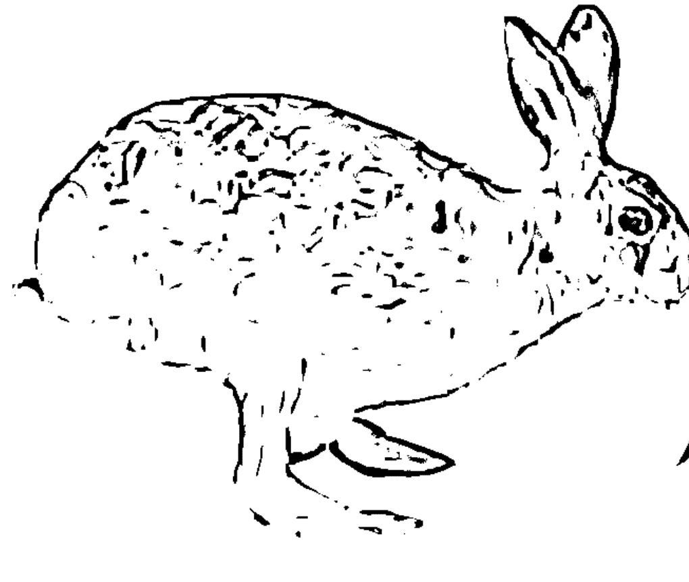

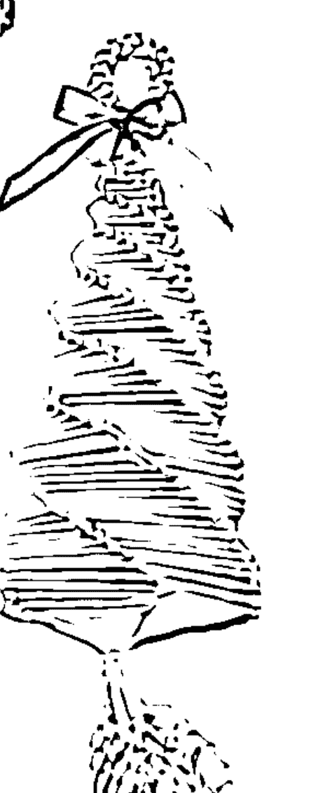

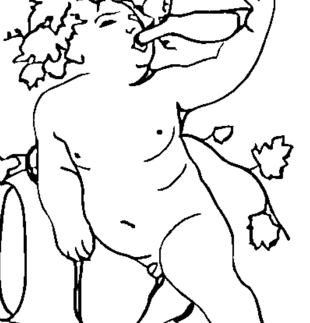

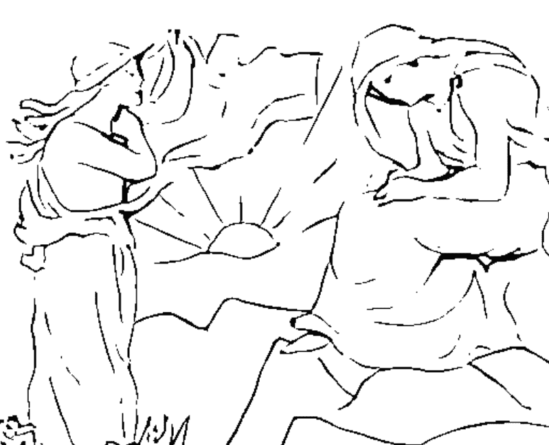

△ 巴克斯
希臘酒神巴克斯（Bacchus，也稱 Dionysus），與慶祝秋天葡萄的豐收有關。

△ 普西芬尼
普西芬尼（Persephone）女神象徵穀類。每年在她返回大地之前，穀類就會開始發芽，象徵持續不變的再生過程。

△ 稻草人
用麥稈編織而成的稻草人，用於凱爾特繁殖儀式，是古代歐洲豐收的風俗之一。

## 豐年祭

感謝豐收的祭典在各地的農業社會都很普遍。在儀式中，他們結集社區族人於一堂，慶祝一年的豐收，並紀念祖先，與豐收有關的食物、飲料都是為了參加慶典的人所準備。

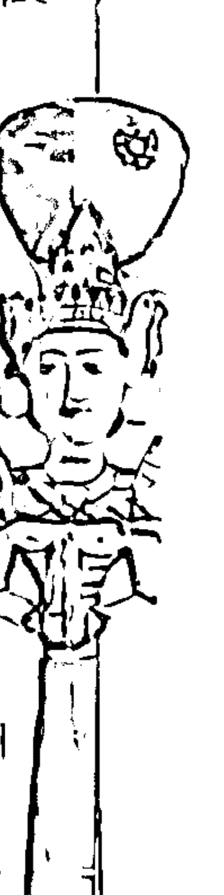

▶ 豐饒女神
峇里島和爪哇一年一度的稻米慶祝儀式，是為了供獻給豐饒女神（Dewi Sri），她頭戴皇冠，有時手持一朵代表輪迴的蓮花。

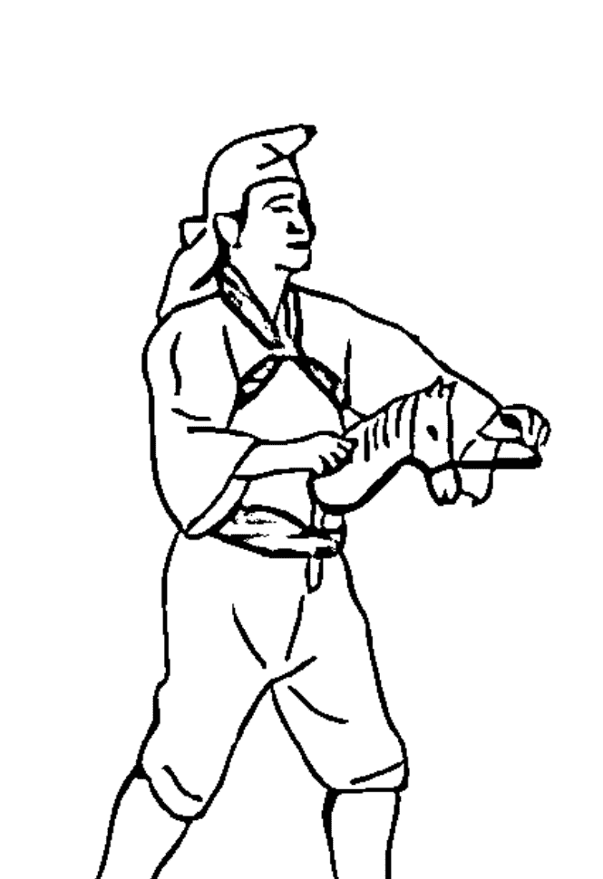

△ 八重山舞者
在日本的八重山群島，傳統舞者藉由表演以祈豐收。這種舞蹈反映了民眾每天的作息活動。圖中的舞者騎著木馬出征。

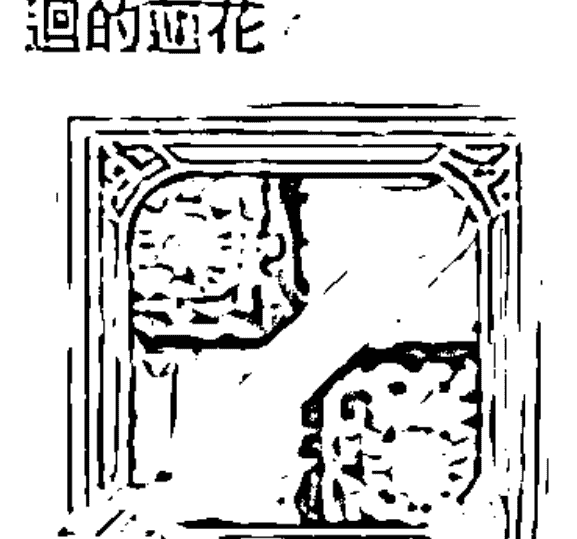

△ 中國月餅
中國人在中秋節吃月餅來慶祝秋收，有些月餅內包代表圓月的蛋黃。

## 冬天

當冬天嚴寒的冷風降臨時，死亡的季節也到來。樹木葉片凋零，地球看起來荒涼無生氣。許多文化都有傳說來解釋季節的改變。古代希臘神話中，普西芬尼被誘拐到了陰間，她不在人間時，地球變得昏暗、萬物皆停止生長。即使日後她被釋回，冥神哈得斯（Hades）還是強迫她一年得回到陰間數月。當她不在時地球變得荒蕪，這段時期稱為冬季。

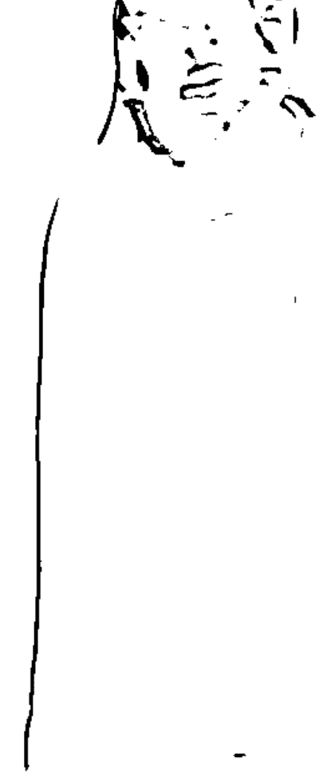

◀ 擬人化的冬天
這座小型古代羅馬雕像詮釋傳統的冬天。雕像常是年長的女人或男人，穿著禦寒的斗篷，通常駝著背抵抗嚴寒的天氣。

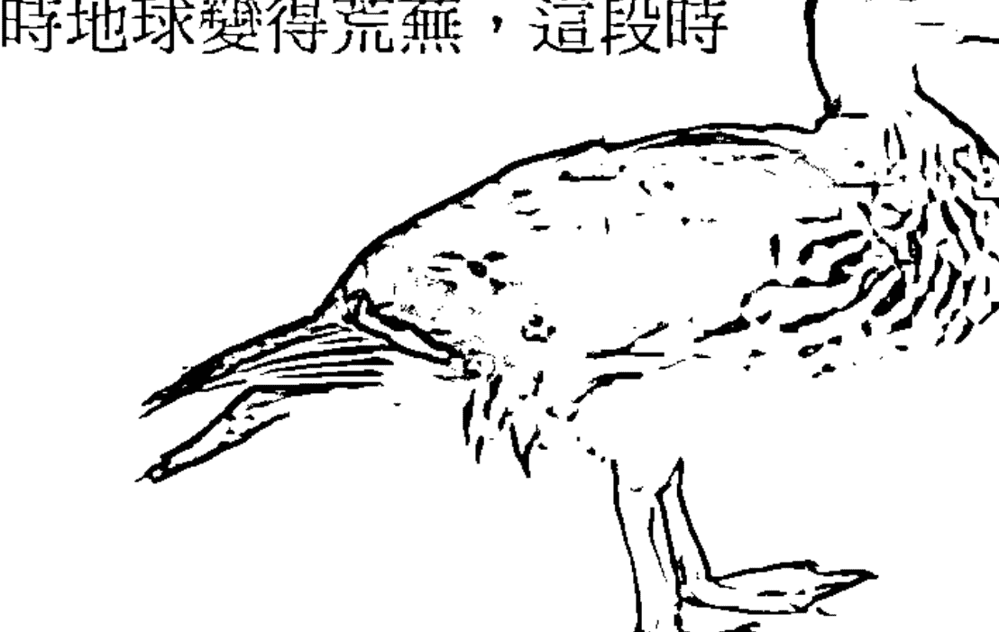

△ 鴨子
鴨子與埃及的死亡女神伊西絲（Isis）有關，傳統上也與冬天相關聯。野鴨常是冬天常見的獵物。

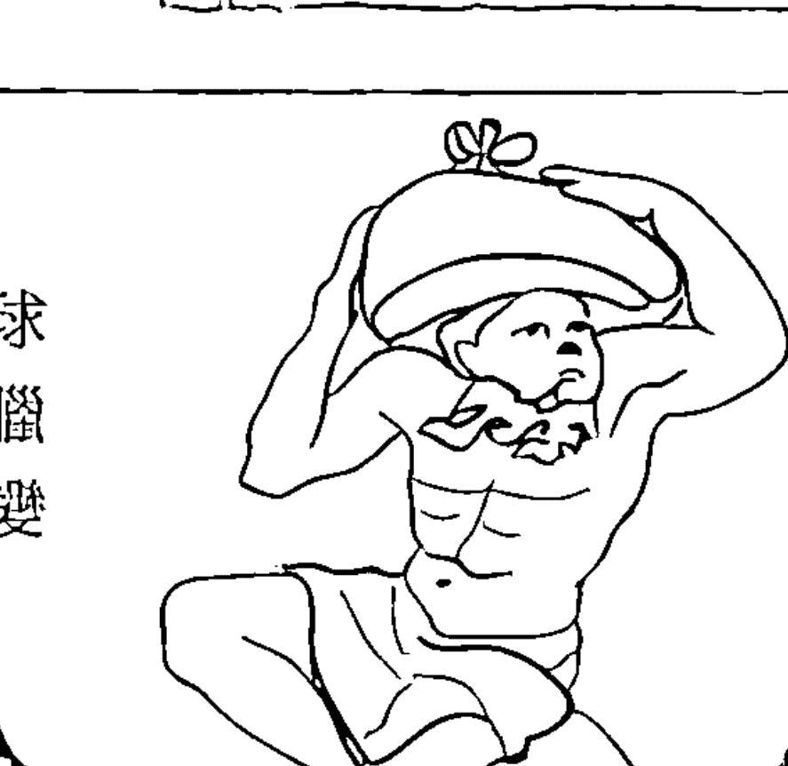

△ 北風之神
北風之神玻璃阿斯（Boreas）帶來寒冷的北風及冬天。古代神話傳說中的北風之神毀滅性強，人們因而懼怕。雅典艦隊膜拜他，並為他舉行玻璃阿斯米（Boreasmi）祭典儀式。

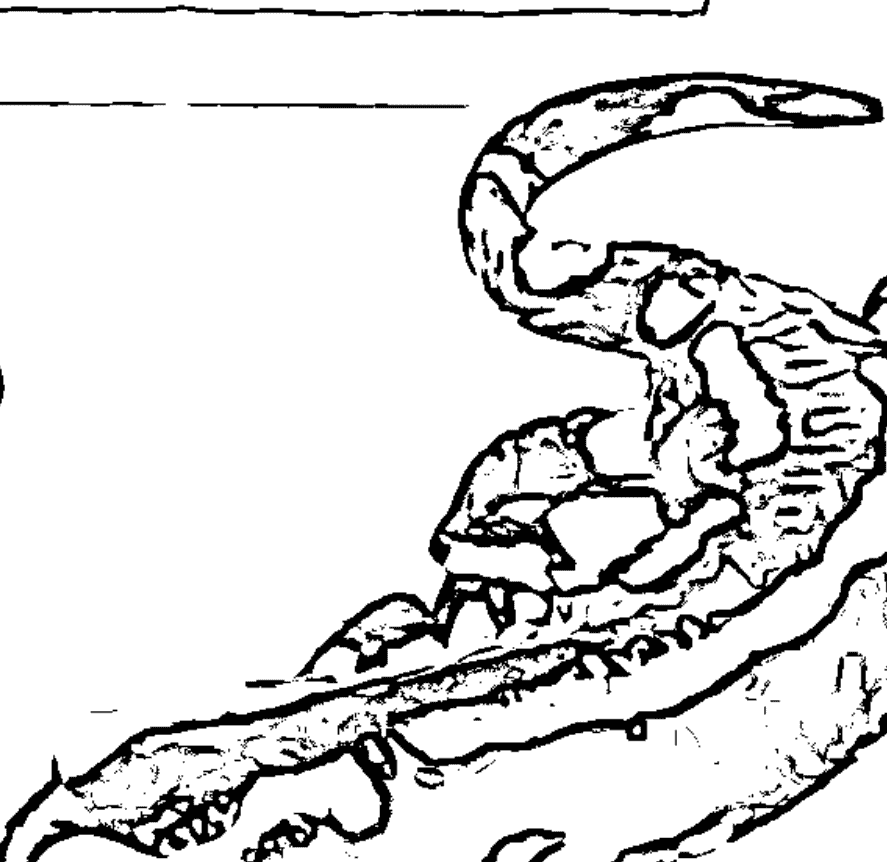

△ 蠑螈
古羅馬作家蒲林尼（Pliny）曾經說過，「蠑螈此類動物體溫極冷，甚至可以把火熄滅……就如同冰一般。」蠑螈是堅定信仰、所向無敵的象徵，也與火有關聯。

參見
月亮18-19頁
哺乳類52-55頁
鳥類58-61頁
繁衍與分娩120-123頁
埃及神祇138-139頁
希臘與羅馬神祇140-141頁
基督教176-179頁

## 珍貴寶石

貴寶石與半寶石閃爍著不同的顏色和光芒。寶石的神奇能量在於它們來自大地，象徵心靈的能量、純潔，有些並有治療及保護的神力。幾世紀以來，寶石是地位的象徵。透明的寶石與神聖有關，紅色寶石象徵熱情和生命力。寶石代表不同的出生月份。有些寶石更有其獨特的意涵。

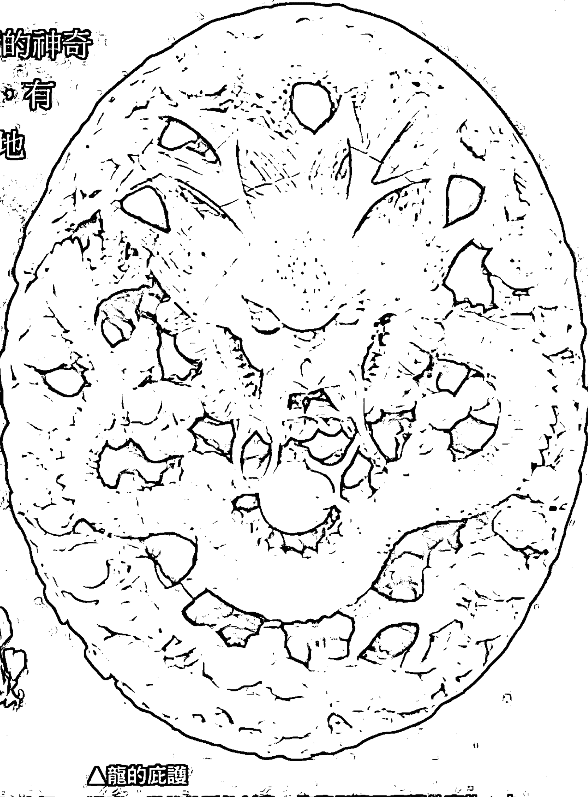

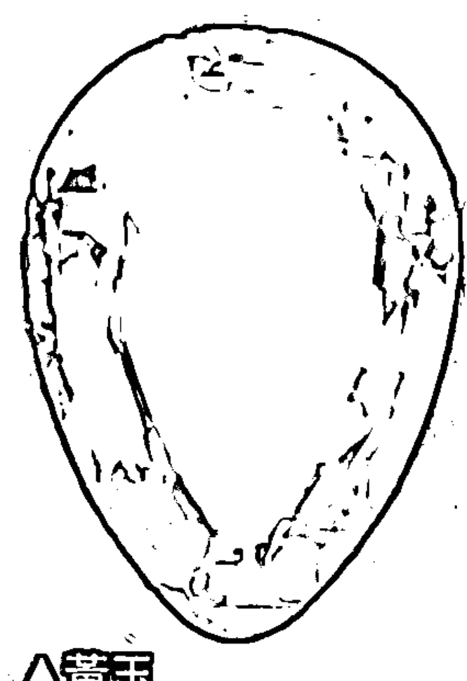

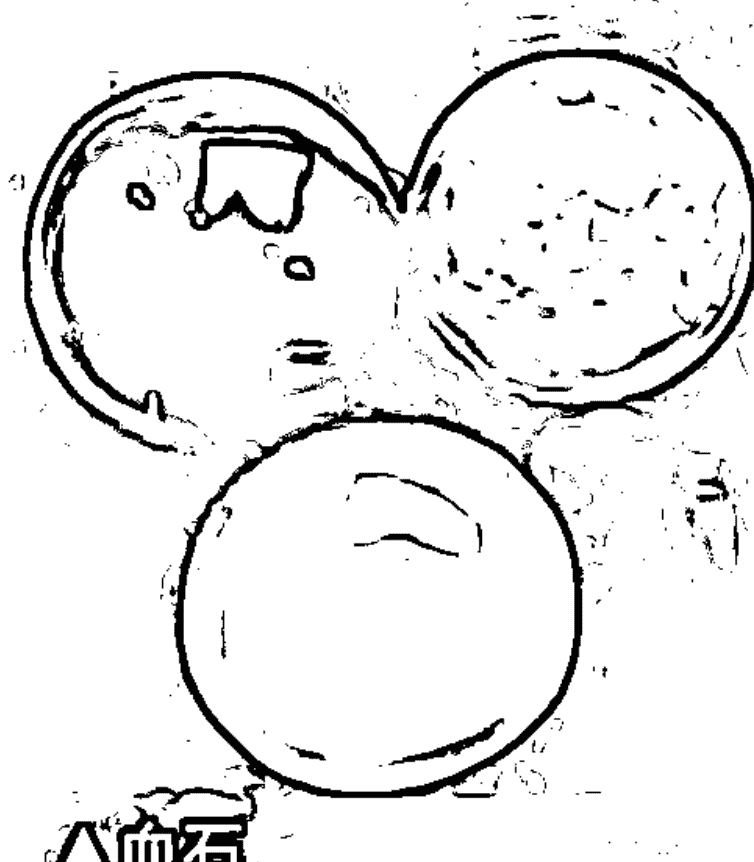

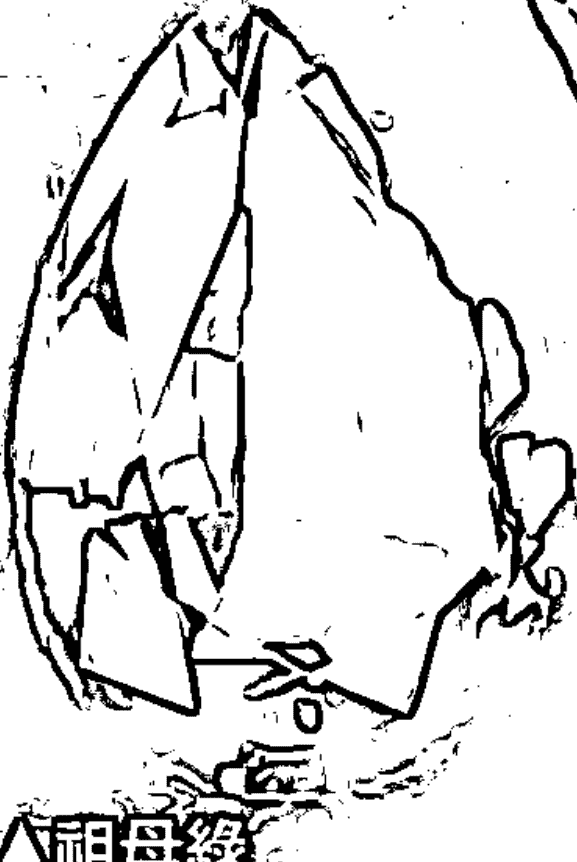

△ 黃玉
黃玉 (Topaz) 是具有移情作用的寶石，象徵虔信、神力、友誼、寬恕及愛情。在醫學上，黃玉可安定神經和刺激食欲。

△ 血石
血石 (Bloodstone) 具有療效，能增進人際關係且有淨化效果。戰士佩帶它希望能消除障礙和獨賜勇氣。血石還可用於抵抗血液失調及阻止失血過多。

△ 祖母綠
祖母綠 (Emerald) 的顏色象徵繁殖、長生不老、春天和年輕。埃及人將死者與祖母綠同葬，表示不變的青春。基督教中祖母綠是虔誠信仰的信物，在民間常用來治病。

△ 龍的庇護
這塊14世紀的雕飾刻畫一條龍保護著藏匿的寶物。中國文化傳統上，土龍保護著深埋地底的珍貴物品及珠寶。這寶物也象徵學識或真理。

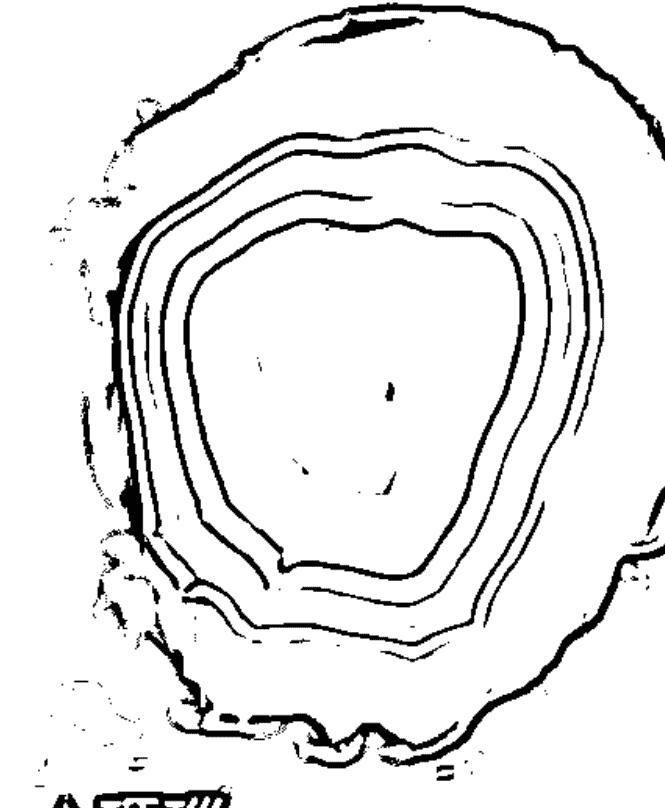

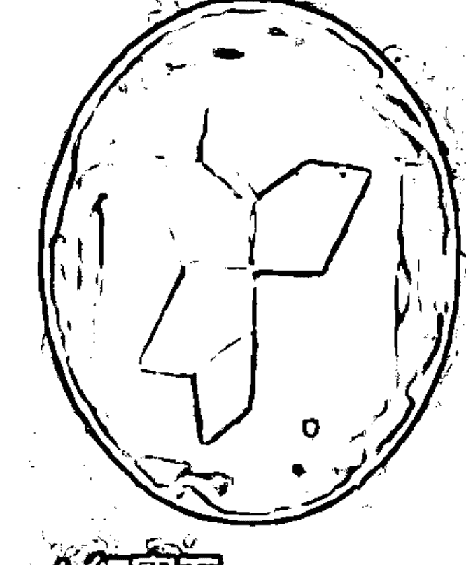

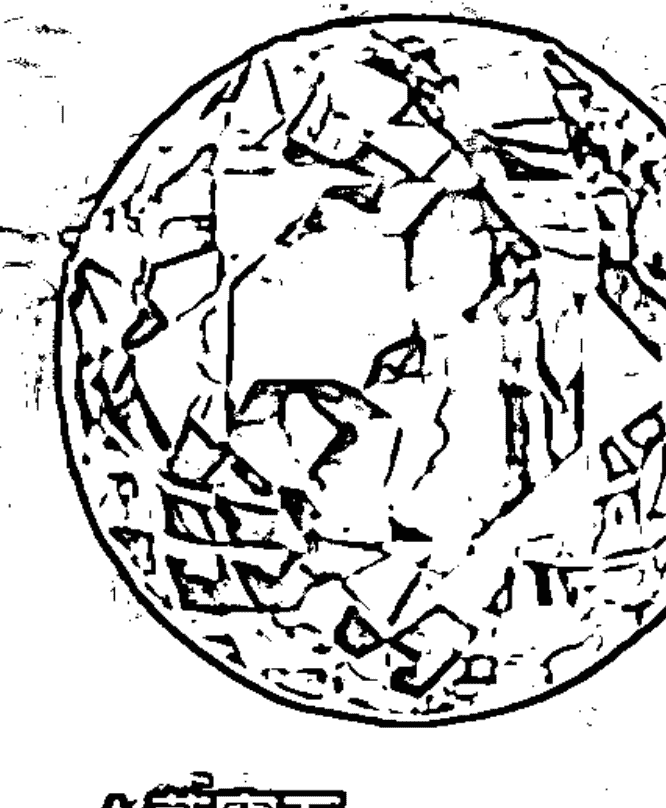

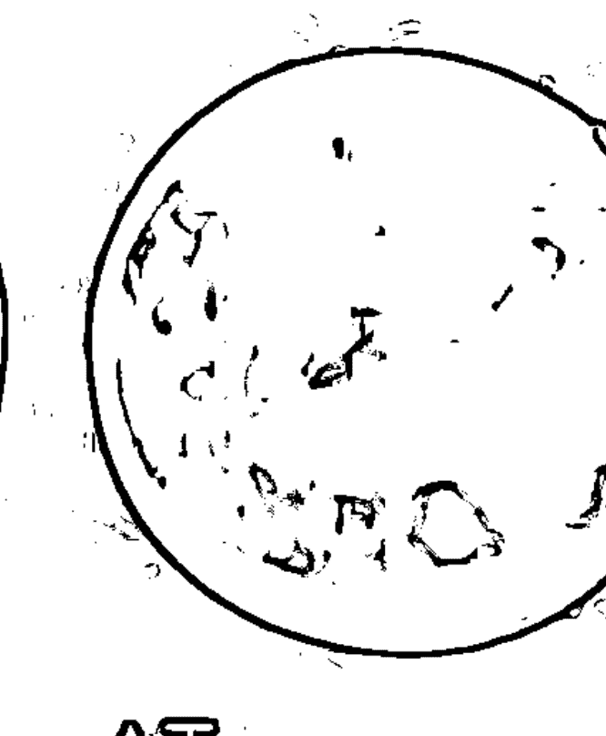

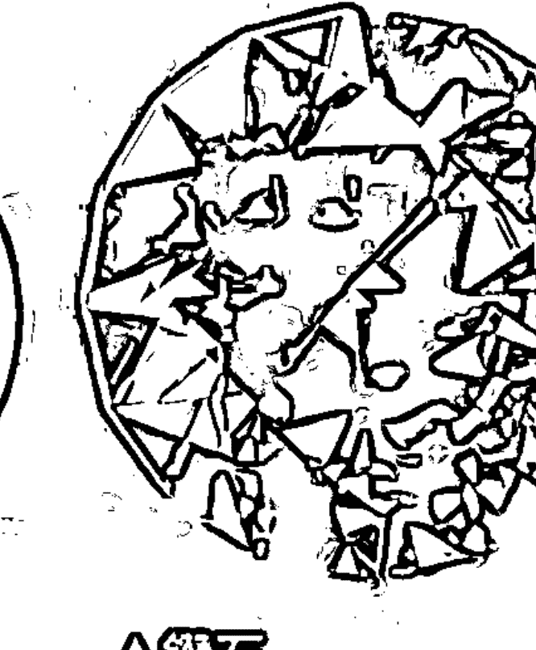

△ 瑪瑙
古代傳說瑪瑙 (Agate) 的神奇力量能讓穿戴的人消失不見。瑪瑙代表勇氣、長壽和繁榮。過去人們將瑪瑙綁在公牛角上以保佑好的收成。

△ 紅寶石
紅寶石象徵愛情、勇氣、生命力。土星和充滿熱情的火星都與紅寶石有關。皇族喜愛佩帶紅寶石，他們相信危險來臨時，紅寶石會暫時變得暗淡。

△ 藍寶石
藍寶石 (Sapphire) 代表神聖的和諧、和平和真理。印度教的傳統裡，藍寶石與土星和自律有關，有些地區也認為它可以阻擋邪惡入侵。

△ 玉
中國人的玉是來自天堂的寶石，代表純潔，是太陽與陽性的表徵。它也象徵正義、勇氣、和諧與道德。圓潤的玉不但代表幸運，也有含蓄的性含義。

△ 鑽石
鑽石象徵純淨、真理和貞節。鑽石是受歡迎的訂婚戒指選擇。它光芒四射與太陽相當。鑽石還可平撫佩帶人的情緒，潔淨人的心靈。

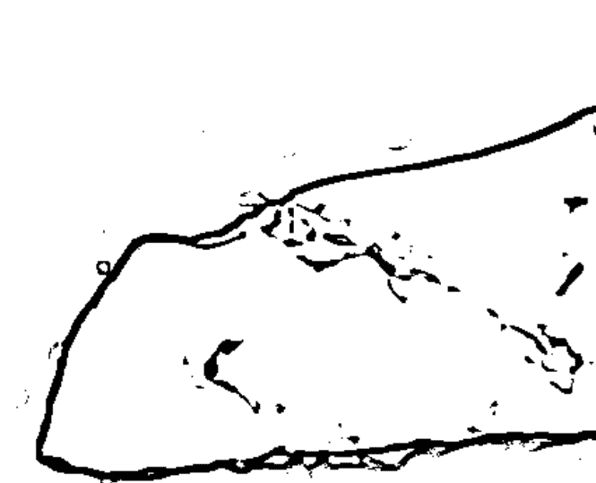

△ 蛋白石
蛋白石（Opal）象徵神聖的洞察、宗教奉獻及貞節。古羅馬認為蛋白石是由天上的閃電所帶來。有些文化稱蛋白石為「眼石」（Eye Stone），可以保護皇室。

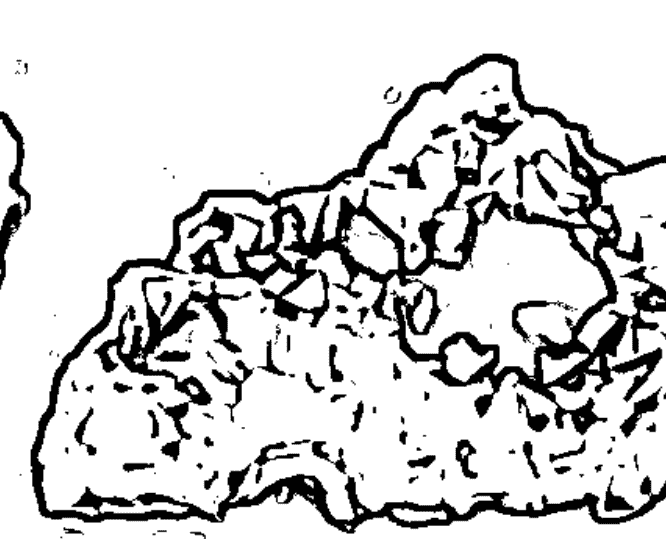

△ 紫水晶
紫水晶（Amethyst）有保護及通靈的功能。天主教的主教佩帶紫水晶戒指。它也可以用來安定心靈及防止酒醉。

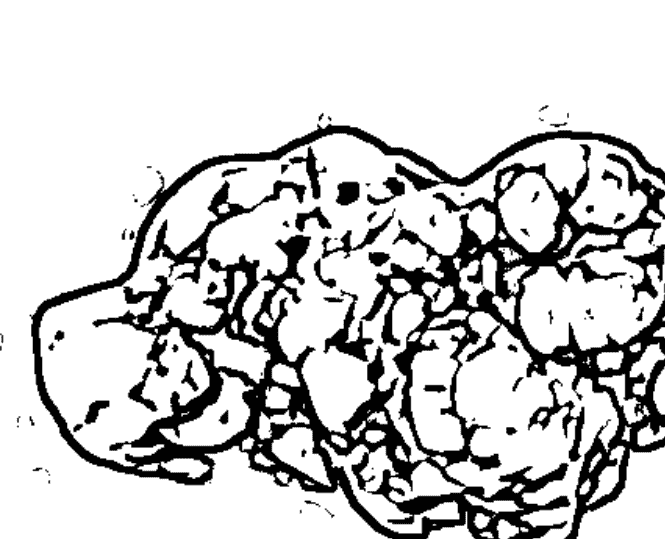

△ 綠松石
綠松石（Turquoise）一直是用來抵抗邪惡的辟邪物。它是勇氣、成功、願望實現的象徵。在墨西哥，它象徵太陽和火焰。西藏人把它當神聖寶物。

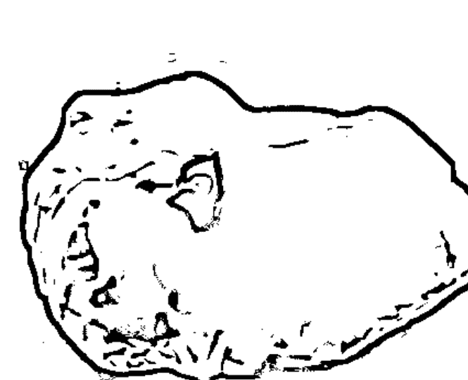

△ 紅玉髓
紅玉髓（Cornelian）的通靈、療效及創造力使得它備受重視，成為宗教的象徵物。先知穆罕默德的封印就是一只嵌鑲玉髓的銀戒。

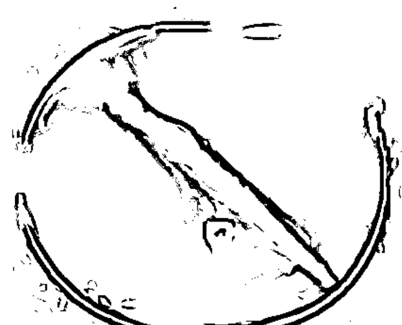

△ 貓眼石
又稱虎眼石的貓眼石（Cat's Eye），象徵敏銳的洞悉力、澄澈的心智，因此與深思冥想有關。佩帶者祈求它帶來好運，並抵擋邪惡侵身。

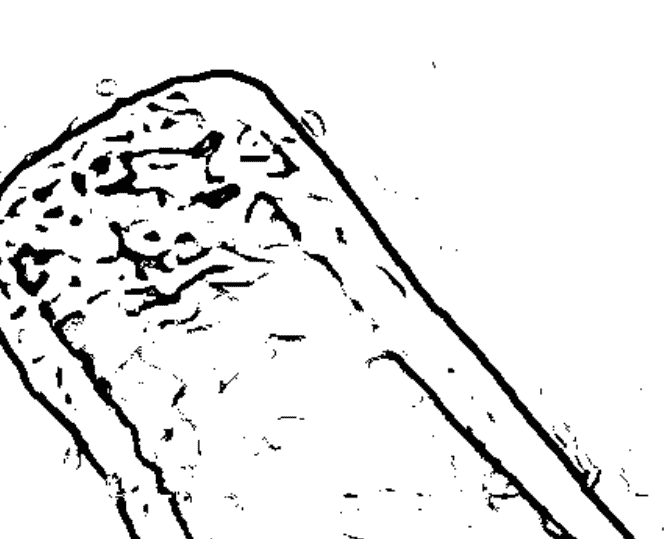

△ 青金石
青金石（Lapis lazuli）是一種具神聖象徵的藍色寶石，代表權力、智慧及內斂。據說它可幫助靈媒的感應能力，也象徵友誼。

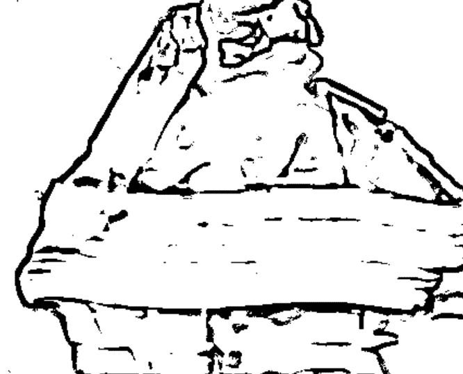

△ 縞瑪瑙
縞瑪瑙（Onyx）是一種黑色寶石，具有保護能量。傳統上佩帶縞瑪瑙可以轉移消極阻力。它象徵提升理智、自信心及心靈韌性。夫婦之間的幸福與真誠也與縞瑪瑙有關。

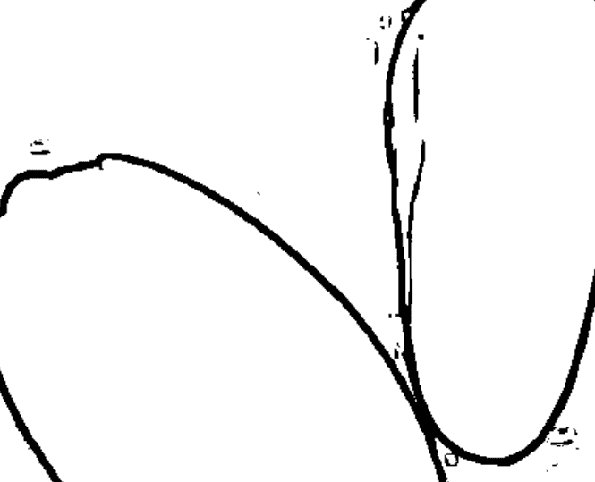

△ 月長石
月長石（Moonstone）乳白的七彩光芒，使它長久以來與月光和戀人有關。月長石與生育力之間深厚的關係，使得阿拉伯婦女將它縫製於長袍內。月長石據說也能平衡婦女的月經。

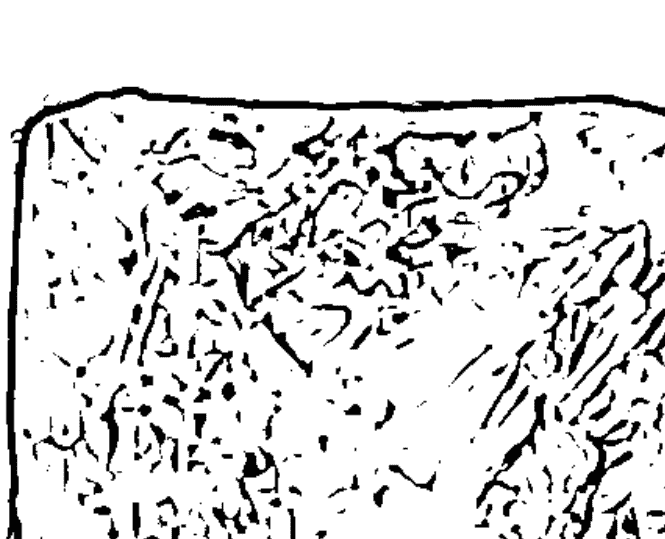

△ 水晶
傳統上象徵純潔的水晶，由於水晶球與民間故事中的神奇水晶鞋，在奇蹟方面甚是重要。水晶據說可以儲存及轉換能量，作為醫療與冥想的器具。

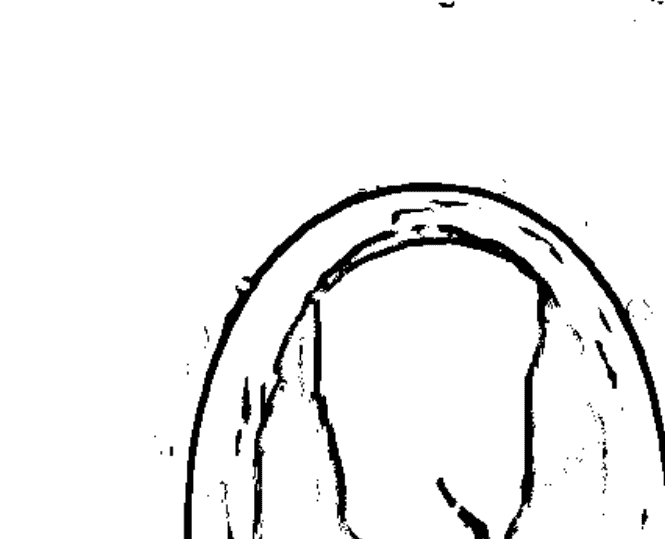

△ 柘榴石
從銅器時代就很受歡迎的柘榴石（Garnet），有保護、祛邪、防止憂慮、增加勇氣等功能。傳統上它還象徵能量、奉獻和貞節。

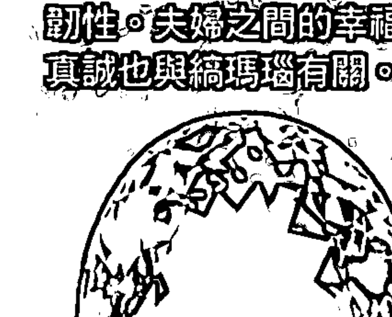

△ 海藍寶石
古人相信海洋能匯聚在海藍寶石（Aquamarine）中。因此航海員佩帶海藍寶石來保護他們在深海中航行。海藍寶石與創造力、溝通、自我意識和自信心有關。

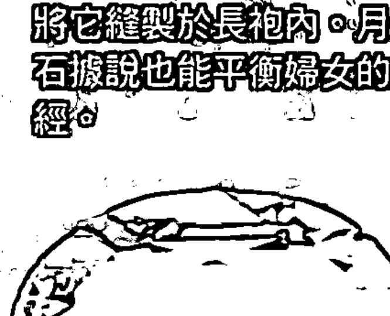

△ 橄欖石
橄欖石（Peridot）是名利、精力、能量的象徵，也是8月的生日石。夏威夷的傳說中，橄欖石是火山女神佩蕾的眼淚。

## 生日石

有些寶石代表一年中不同月份的生日石，據說可以為當月出生的人帶來好運或影響。各地區也許有不同的選擇，但最普遍的生日石代表是：1月的柘榴石、2月的紫石英、3月的海藍寶石、4月的鑽石、5月的祖母綠、6月的月長石、7月的紅寶石、8月的橄欖石、9月的藍寶石、10月的蛋白石、11月的黃玉、12月的綠松石。

▶ 綠松石項鍊
12月生日石綠松石會為人帶來好運，並象徵友誼的增進。它亮麗的顏色是自信心的表現。

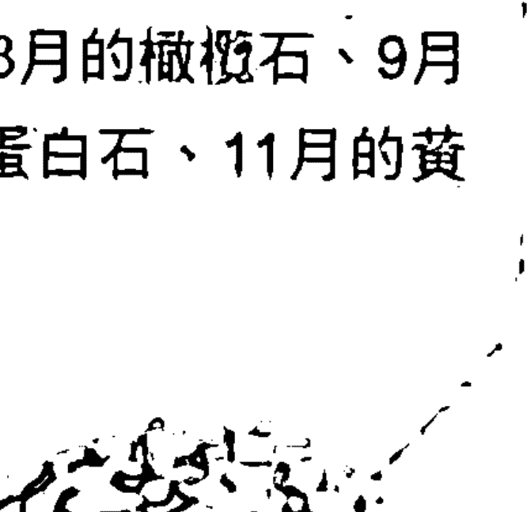

▶ 內在的光芒
這塊黃玉經由切割後，展現它內在的美麗及光芒。象徵地說，切割寶石的過程反映了心靈的完美漸進，而達到神聖的大智階段，也表現了人類靈魂從肉體中昇華的境界。

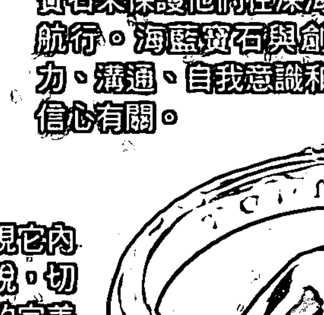

參見
眼78-79頁
愛情與婚姻126-127頁
辟邪物194-195頁
皇室216-217頁
珠寶254-255頁

## 珍貴寶石

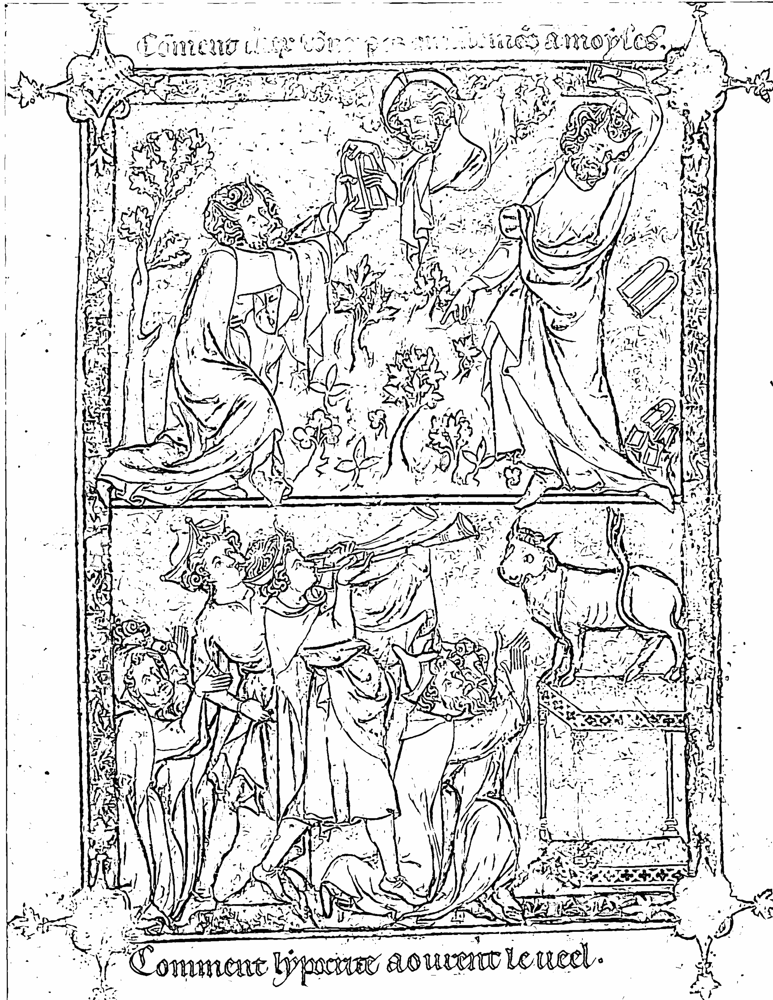

▲ 金色的偶像
「崇拜金色小牛」被視為崇拜偶像及反叛上帝的象徵，這個典故與《聖經》中記載以色列人膜拜金牛的故事類似。

## 黃金

黃金閃亮耀眼有如直射的太陽，很久以前人們就為黃金而瘋狂。它也成為貴族、啟蒙及神聖的重要指標。

黃金是最完美的金屬，既有耀眼的光澤、耐磨、可鍛性高，又不會生鏽。黃金輝煌的色彩象徵太陽的完美及中心角色。也說明了人們對於心靈、道德與純淨的高度渴望。

### 需求的重要性

世界各地，黃金對於王權或君主政治國家的高層階級來說，占有很重要的地位。在印加帝國的登基典禮中，新統治者披著樹脂，全身鋪滿金粉。這個習俗是來自「黃金城」（El Dorado）的傳說。現代生活中，黃金是高度成就或榮耀的象徵。長久以來，黃金的品質使它擁有商業價值，使用黃金作為流通貨幣。

### 神聖的黃金

黃金的象徵也見於數個古代神祇和宗教。希臘神話中的伊阿宋（Jason）歸還金羊毛（Golden Fleece）的故事，象徵尋求精神的啟蒙。基督教對黃金有著矛盾的看法，它既代表貪腐，比如「崇拜金色羔牛」（左圖）的故事；但也是神聖的象徵。中世紀基督教的加冕儀式中，國王被賦予黃金皇冠，表示天堂不滅的光芒與神權所在。至於拜占庭帝國和東正教的神權，則顯露在他們中世紀的黃金葉狀飾品藝術上。

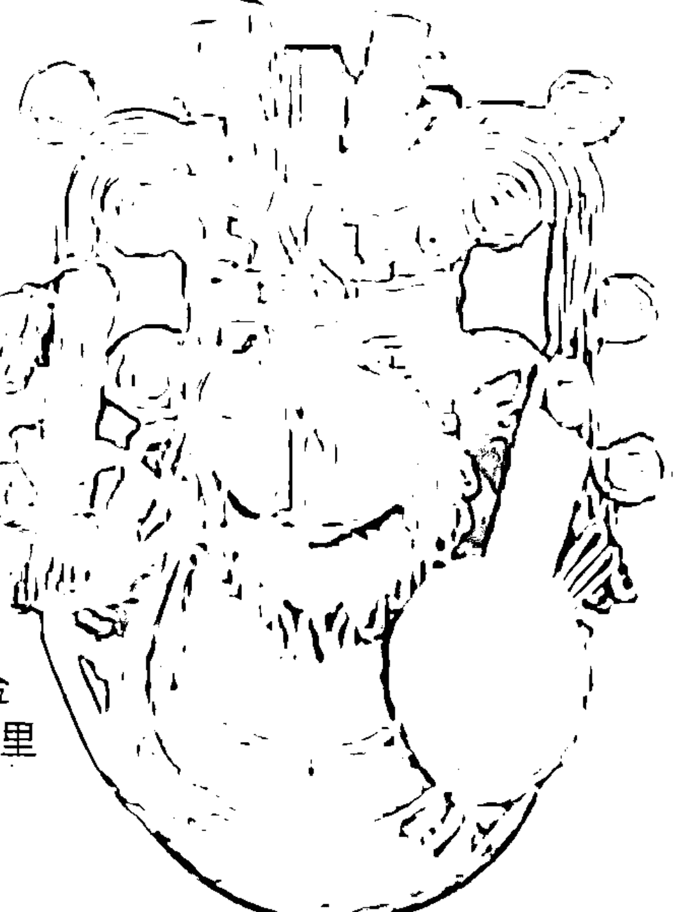

▶ 膜拜的物品
一如馬雅和印加文化，阿茲特克人也膜拜黃金，而且是高層階級或祭典之用的專利。對阿茲特克人來說，黃金代表太陽神胡伊齊洛波契特里（Huitzilopochtli）的排泄物。

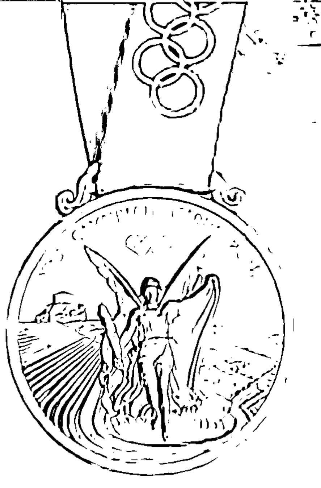

▲ 傑出的標誌
黃金或金色是世界通行的傑出標誌，常常在獎章上，比如說奧運獎牌、裝飾、獎盃甚至演藝類的獎座。

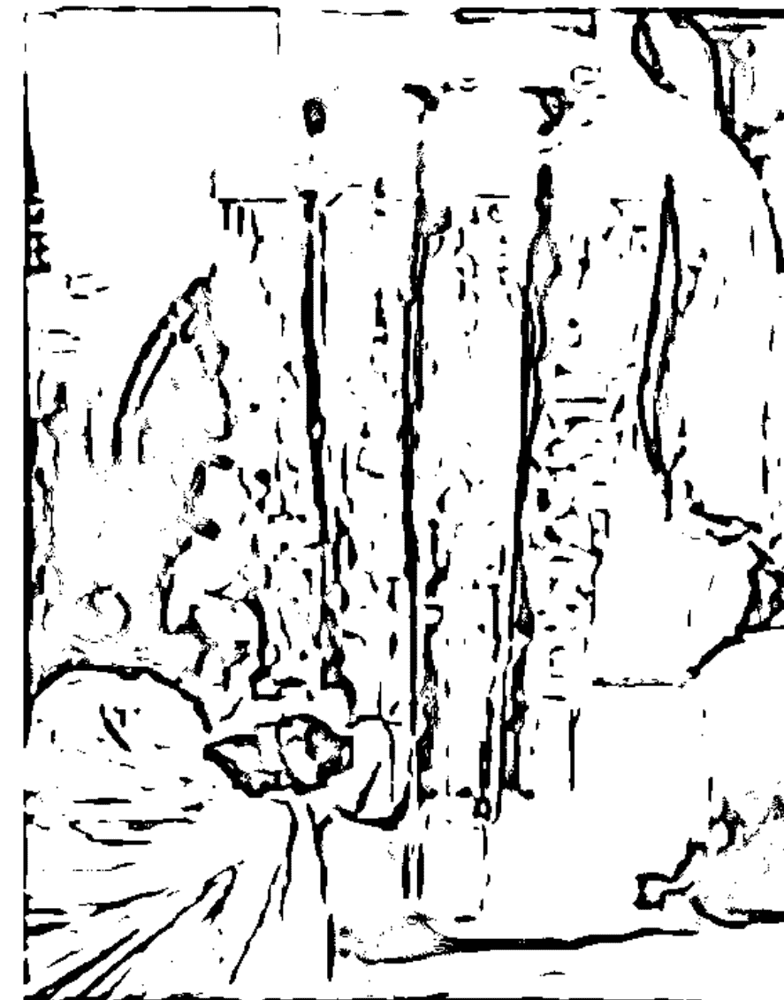

▲ 啟發的表示
貼飾金箔的佛像是啟發的表示。黃金以其純淨而有價值，佛教徒把金箔敷貼在聖物表面，代表做功德。

黃金在佛教與基督教中都有啟發的含義。在印度教信仰中，黃金是光的礦物化身、是太陽的餘暉。埃及人相信他們強而有力的神是由黃金構成的，「拉」（Re）一般稱為金山。

古代藝術中，把普通金屬鍊成黃金的嘗試，是一種心靈淨化的比喻；也是鍊金術士的一項偉大成就。中國的鍊金術士視黃金為天堂的精華，也是陽氣的和諧表現。

### 貪腐的象徵

美洲印第安人的蘇族稱黃金為「讓白人瘋狂的黃色金屬」，這對黃金有一定程度的負面批評。在共產社會的蘇俄，黃金懷表是較高階層才有的奢侈品，成為「階級敵人」的象徵。

有些文化很懼怕黃金，相信它有邪惡的超能力。很多傳說描述黃金是對貪心誘惑的警告，希臘神話中著名的米達斯王（Midas）就是一個很貼切的例子，他向神許願他所摸到的每樣東西都會變成黃金，這讓他後悔無比。

參見
- 太陽16-17頁
- 珍貴的物質46-47頁
- 埃及神祇138-139頁
- 佛教164-169頁
- 基督教176-179頁
- 鍊金術210-211頁
- 皇家飾品218-219頁
- 珠寶254-255頁
- 顏色280-283頁

## 珍貴的物質

古代人們相信貴金屬能夠凝聚宇宙的能量，是地底的物質但擁有天上的潛能。這種說法發展出宇宙間的神職統治階級，讓金屬與七座已知的行星配對。貴金屬不但出現在象徵神祇的神聖物品中，也見於工具和武器。相較於琥珀和珍珠等珍品，貴金屬以其美麗及稀有而尊貴，通常也象徵社會階級的高低。

### 珍珠

珍珠與其他珍貴寶石鑲嵌在這頂12世紀時期拜占庭帝國的皇冠（下圖）上。珍珠象徵皇室、公正、智慧及純潔。在古代，只有皇室才能擁有珍珠。在伊斯蘭教和印度教的哲理中，珍珠代表完美；長久以來珍珠也是身分地位的象徵，備受世界各地的統治者所渴慕。

荷蘭畫家維梅爾（Johannes Vermeer）的〈戴珍珠耳環的少女〉（*Girl with a Pearl Earring*，右圖），完美地描繪出以光影來代表純潔。珍珠雖然常用來表示財富，但也是月亮、女性及心靈智慧的表徵。對中國人而言，珍珠是火與水的組合。

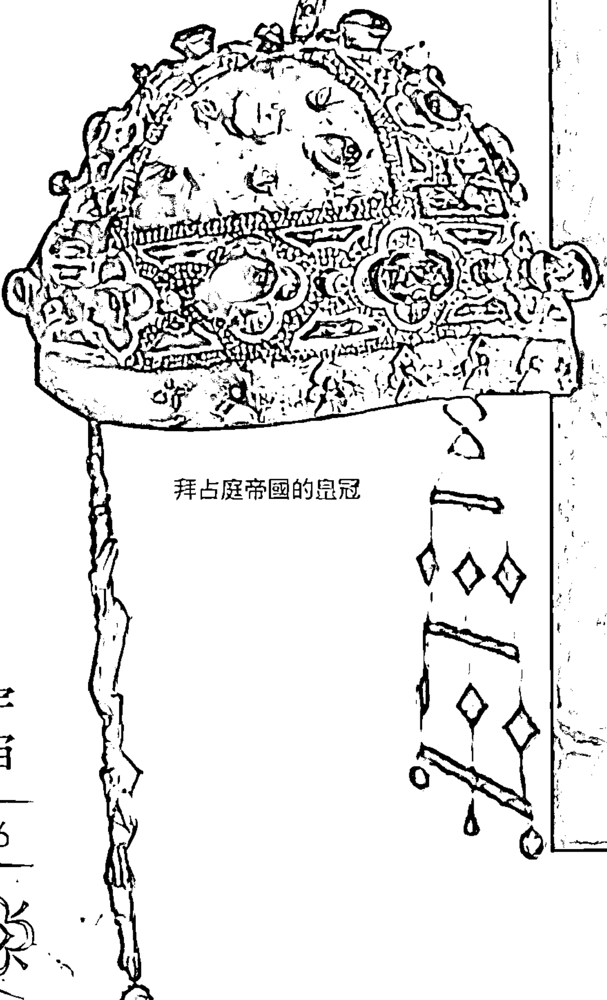

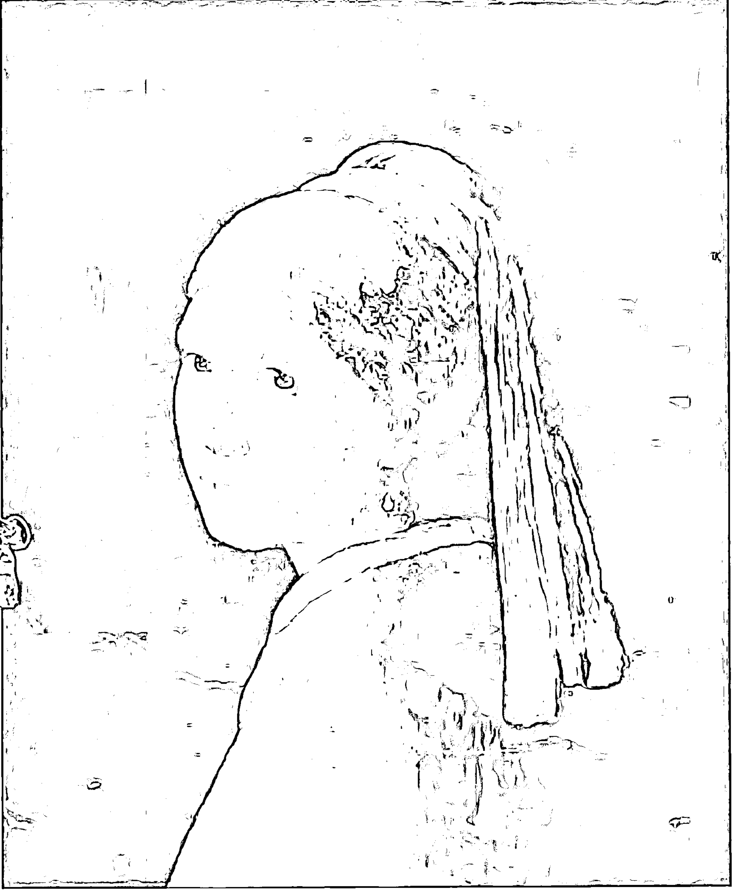

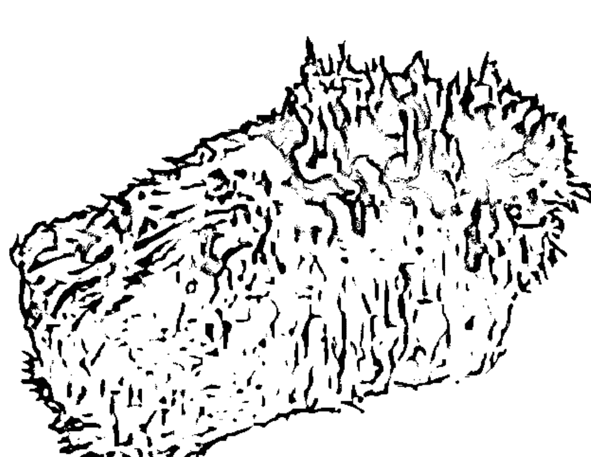

△ 磁石
具磁性的磁石（Lodestone）讓人把它與魔法聯想在一起。帶著磁石的人據說可以走過爬蟲類身邊而毫髮無傷，並可預見未來。

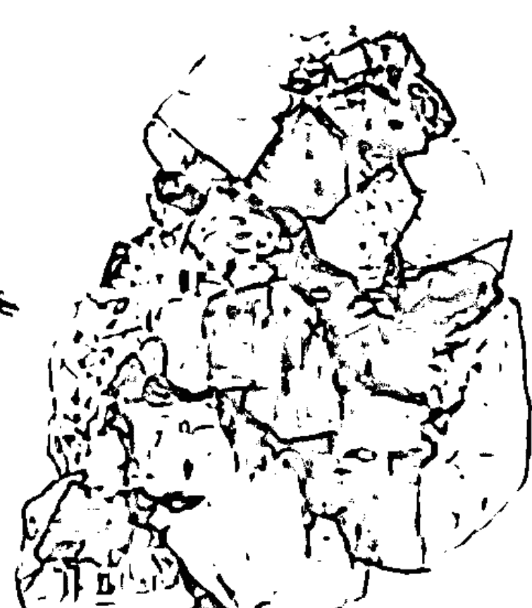

△ 硫化鉛
煉金術會用到硫化鉛（Lead Sulphide），其中的鉛代表人類肉體與靈魂的沉重無力感。它歸屬於土星，是分隔界線的安置者。它是非貴重金屬，象徵最底層，由此心靈有所成長是可能的。

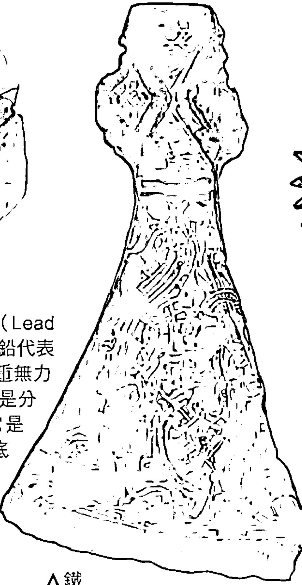

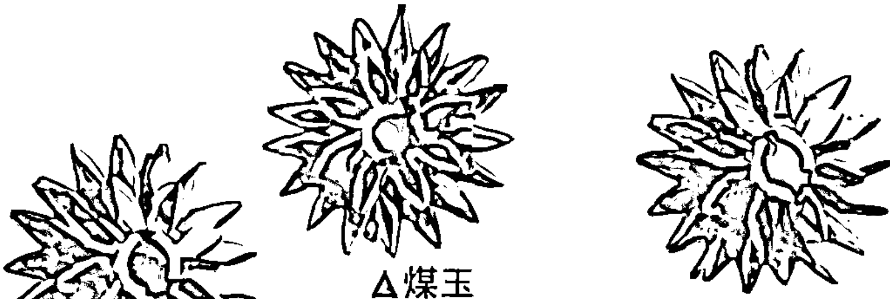

△ 煤玉
是一種遠古的樹木化石。煤玉（Jet）可當作護身符來抵擋疾病，也用來治療偏頭痛、胃痛、感冒等疾病。煤玉顏色深沉，西方社會常用它作為喪禮時佩帶的珠寶。

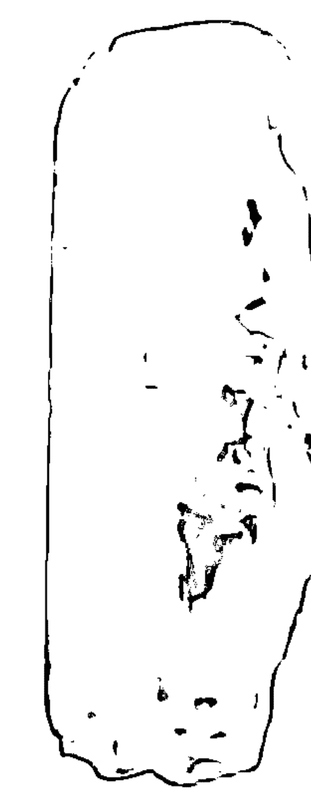

△ 琥珀
琥珀（Amber）其實是一種遠古樹脂的化石，旅行者常用它作為護身符。早期基督教認為它代表神的現身，中國人則認為琥珀象徵老虎的靈魂或勇氣。它也用來抵抗關節炎之類的慢性病。

△ 鐵
鐵代表精力及耐力。許多文化視鐵的熔煉具有崇高的精神意義，打造物品的鑄鐵過程有如生產一般。

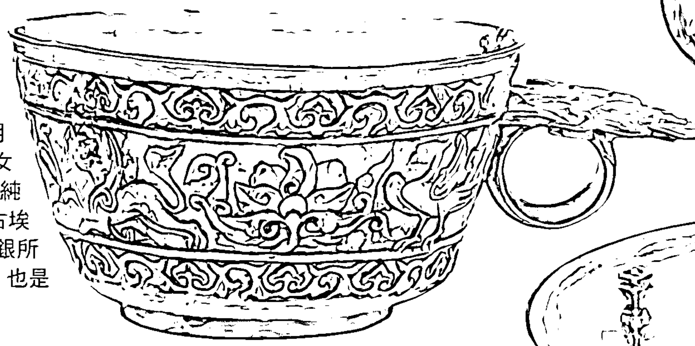

△ 銀
拜占庭帝國的銀杯與月亮、戴安娜等月神以及女皇有關。它代表貞德、純潔、智慧及希望之光。古埃及人以為神的骨骼是由銀所構成。銀常用於貨幣中，也是財富的表徵。

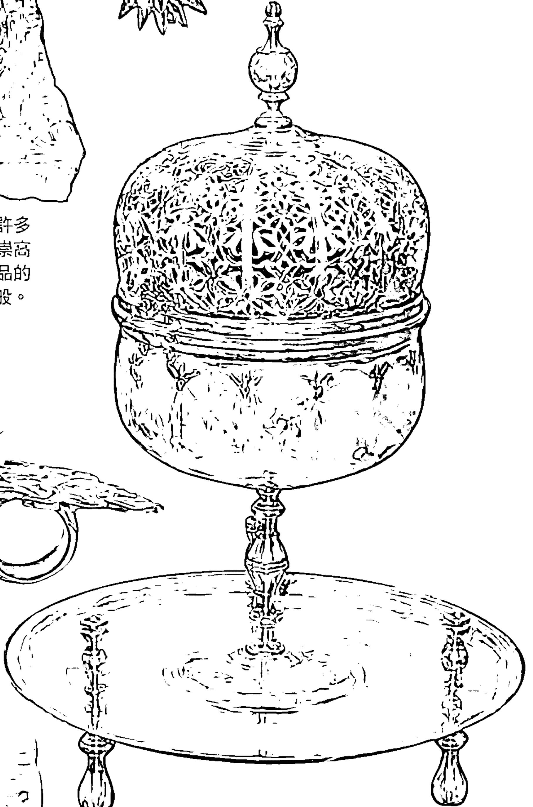

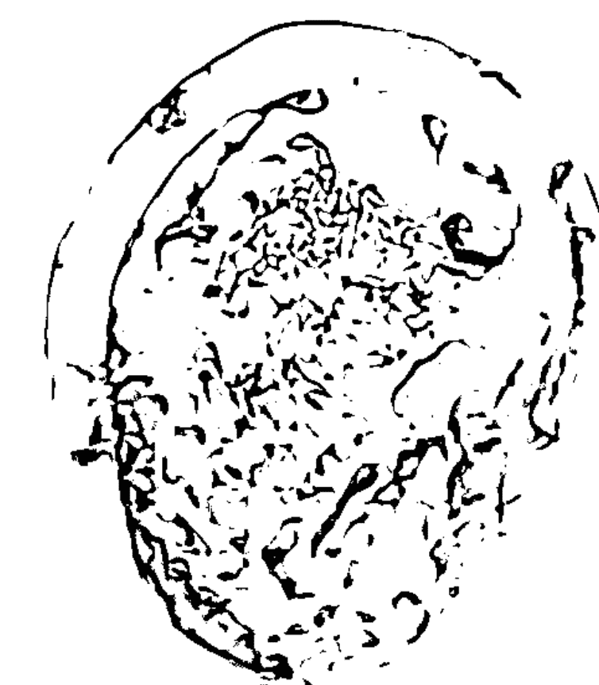

△ 珍珠母貝
早期社會認為珍珠母貝（Mother-of-pearl）的價值要比珍珠高得多。它的虹光象徵信任、博愛及天真；也有人認為它可以增進注意力。

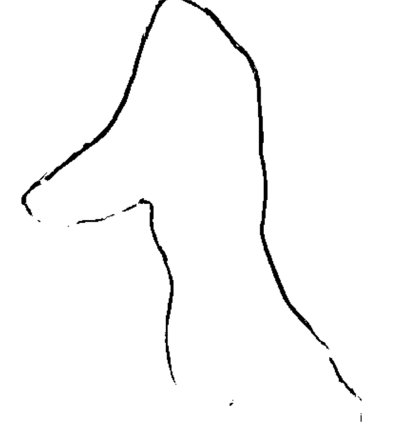

△ 珊瑚
珊瑚來自海中，所以與月亮的關係一向密切。古希臘人認為它與再生有關；中國人把珊瑚當作是社會地位及好運的象徵；基督教則認為它是基督的鮮血。

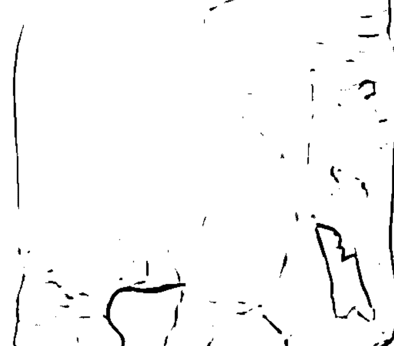

△ 象牙
乳白色的象牙象徵純潔，堅硬的材質代表它不腐敗、不被收買。象牙塔是指無法達成的任務，基督教的象牙塔則象徵聖母瑪利亞。

△ 銅
這座香爐是銅製的，與作為女性代表的維納斯女神有密切關係。銅在非洲西部是身份地位的象徵，也使用於祭禮和巫術中。銅還可用來治療，即使是今天，人們還佩帶銅製手鏈來消除關節炎。

## 珍貴的物質

參見
月亮18-19頁
死亡與哀悼128-131頁
基督教176-179頁
辟邪物194-195頁
顏色280-283頁

## 自然界

自翱翔天際的老鷹，下到陰鬱晦暗的沼澤，從原始人住在洞穴中開始，大自然就滋養著我們的想像力。無論是字面還是象徵意義，植物與動物都深深影響我們看待世界的方式。人類一直依賴動植物維生，也與動物共存，並且把牠們當作食物、衣服、勞力、保護，甚至是工具。因此，從蛇的蛻皮（重生），到魚生活在水裡（生命與繁衍），牠們生命中的種種面貌都蘊含著重要的象徵意義。

動物以及部分植物在創世記的傳說故事中，或扮演祖先的角色，或被聯想成神祇，而世間的統治者也借用雄偉莊嚴的物種，像是獅子，來彰顯自己的榮耀。人們高度強調動物在生理與感官上的能力，並且把這些能力聯想成超自然的力量。

也普遍認為可以藉由巫術祭典，利用這些超自然力量。還有一些人們深信的事情則被收納於主要的宗教信仰中，比如說，鳥是天國的使者或是神聖的靈魂。

每種動物都截然不同，有時像鏡子般反射出人類的行為。牠們就像人類，有些讓人感到害怕或尊敬；有些則如小丑或惡作劇的小精靈，被當作是娛樂消遣。神話故事所創造出的雜種動物與怪獸，代表複雜的精神挑戰。因此，「屠龍」即是暗指善良戰勝邪惡或戰勝心中的惡魔。

和動物一樣，植物與樹木也是人類食物的來源，並且被聯想成富裕、繁衍，以及從生、死到再生永不止息的循環。主要的農作物在象徵意義上格外重要，也經常在創世神話故事中扮演重要的角色。

其他像茶和咖啡這類食物，則與盛情招待和典禮儀式有關。果實是植物生產力的極盛期，讓人聯想到永生；雖然它已經抵達生命週期的終點，但是卻仍然保有永續生存的種子。

無論是字面還是象徵意義，植物與動物都深深影響我們看待世界的方式。

徵符號，代表美麗與熱情。樹木與其他植物的生命過程一樣，讓人聯想到繁衍以及生命的循環，而它體積龐大與長壽的特色卻額外引發關於庇護、恆久不變以及長生不死的話題。以前人們膜拜很多樹木，認為巨大的宇宙樹能夠把塵世、天界以及地獄連結在一起。還有些神木則通常具有區域性的代表意義，像是中東地區可以維持生命的棗椰樹。

許多植物被用來治病。另外也有一些植物被當作迷幻藥、毒藥或是興奮劑，早期的社會把牠們視為具有神奇魔力的東西，嚴重影響我們的身心健康。許多植物擁有芬芳的氣味或繽紛的色彩，使牠們能產生情緒上的共鳴。花朵稍縱即逝的美麗象徵青春的燦爛與短暫，演變成目前還保存的「花語」；比如說，紅玫瑰依舊是大家公認的象

植物的象徵意義大部分都是正面的，但若是大自然顯露出「尚未被馴服」的狀態時，像是在樹林或森林裡，就會產生心理作用並孕育出較黑暗的象徵意義。人在陰暗又危險的地方很容易迷路，因此森林是個強而有力的暗喻，用來象徵成為成年人的過渡期。時至今日，我們仍想盡辦法透過各種符號與象徵來解釋這個世界。

## 哺乳類

自遠古時代以來，人類與動物的生活就緊密地結合在一起，並且提供了豐富的象徵意義。動物被人當作神祇來膜拜，不僅被聯想成好運氣或壞運氣的意象，也被視為權力與智慧的起源。許多動物的象徵意義與人類的特質有了連結，採集狩獵的原始人不但尊敬動物，有時甚至將動物尊崇為他們視之神聖的自然界的一部分。人類把這些動物當作圖騰或視為祖先，希望能獲得牠們與生俱來的智慧。

- △狼
古羅馬時期，狼是母性照護、勇氣與勝利的象徵。在現今的西方國家，狼卻令人聯想到狡猾、殘忍、好色和貪婪。美洲印第安人在舞蹈中祈求牠在來世引導靈魂。

- △狐狸
狐狸具體表現出妖魔的特質，能言善道、奸詐、背叛。狐狸在美洲印第安及東方文化中，是變形人的化身，經常在民間傳說與文學作品裡以偽裝的方式出現。

- △土狼
土狼因吃腐肉而被視為不潔、懦弱及貪婪。早期人們相信牠能變性，於是土狼就演變成象徵性別偏差的標誌。

- △胡狼（豺）
胡狼是一種食腐動物，在印度代表破壞與邪惡；但古埃及人卻把胡狼當成在通往來世的冥道上引領亡靈的神祇阿努比司（Anubis）來崇拜。在《舊約聖經》中，胡狼是孤獨荒蕪的象徵。

- ◀郊狼
左圖是郊狼造型的戰士面具。在美洲印第安文化中，狡猾的郊狼被視為妖魔、化身、老師及文化英雄。牠同時意指愚蠢、智慧，以及兩者之間的平衡。

- ▶浣熊
浣熊是美洲印第安民間傳說故事的最愛，是個妖精，象徵頑皮、機敏及適應力。牠面具般的臉代表善於偽裝的本領。

- ◀熊
在許多巫術傳說中，熊被聯想成巫術、治療和智慧。一般說來，牠象徵力量和勇氣，與好戰的神性有關聯。

## 狗

自古以來，狗就一直被視為象徵忠誠、保護及狩獵的陪伴動物。早期的社會將牠與靈界聯想在一起。非洲和美洲印第安文化中，人們認為狗能控制火和降雨；然而伊斯蘭教徒卻認為狗是不潔淨的，把狗當成輕蔑詞語來形容非伊斯蘭教徒。

- ▶打獵
自遠古時代以來，狗就讓人聯想到打獵以及相關的神祇。在希臘神話中，天狼星象徵獵戶星座中的獵犬。

- ▶刻耳伯洛斯
冥界入口的守護者，刻耳伯洛斯（Cerberus）是希臘神話中長著三個頭的看門狗，象徵死亡與復活這類神祕知識的守護者。

- △紋章
刻繪在紋章上的狗象徵勇氣、警戒與忠誠。常用的品種是灰狗和大丹犬。

- △墓碑
許多文化將狗視為忠實的伙伴，即使死後也是如此。在墓碑上，狗經常被雕刻成堅定不變的警戒姿態。

- △松鼠
在中世紀，紅松鼠的警戒特性與顏色使牠成了惡魔的象徵。牠是愛爾蘭女神梅德卜（Medb）的標誌。

- △飛狐
一種吃水果的蝙蝠，在薩摩亞（Samoa）的民間傳說中，被視為森林的守護者；在新幾內亞，飛狐卻是獵首行動的象徵符號，經常刻在盾牌上。

- △蝙蝠
在西方，蝙蝠與吸血鬼、魔鬼和巫術相連結。被視為半鳥半鼠的蝙蝠象徵表裡不一。美洲印第安人則認為蝙蝠能帶來降雨。

- △小鼠
小鼠（mouse）通常讓人聯想到膽小，但基督徒卻把老鼠視為惡魔，啃噬生命之樹的根。此外，老鼠也令人聯想到節約。

- △大鼠
大鼠（rat）在亞洲是好運和財富的象徵標誌，但牠更常令人聯想到死亡、腐敗及破壞。

- △海狸
海狸是美洲印第安神話的重要動物，這位建築大師同時象徵勤勉不懈、家庭及家族。在基督教的象徵意義中，海狸則代表貞操。

- ▶袋鼠
袋鼠是澳洲的象徵，只能向前走的特色說明牠為什麼是國徽上象徵進步的標誌。袋鼠行動快速以及可以連續幾個月不喝水的本領，使得牠和活力、耐力有了連結。在薩滿教的巫術中，袋鼠代表家累；但對澳洲原住民而言，袋鼠是祖先也是部落的圖騰動物。

- △兔子
兔子是月亮的象徵，長久以來就連結了繁殖和再生的象徵意義。牠的警戒、迅速和膽小使牠成為基督教中象徵警戒和避開誘惑的標誌。

- △野兔
野兔讓人聯想到月亮，是妖魔、英雄或繁衍的象徵標誌。在歐洲，野兔是女巫的同伴；在東方，野兔卻是佛陀歷劫累世中的一個化身。

- ▶刺蝟
刺蝟在美洲印第安文化中象徵自我保護，基督徒把刺蝟聯想成邪惡。愛爾蘭人則認為女巫會變身為刺蝟，吸食乳牛的奶水。

參見
神木96-97頁
頭部106-109頁
繁衍與分娩120-123頁
部落圖騰、英雄與魔法師150-151頁
夢境152-153頁
薩滿教154-155頁
中國星象學204-205頁

哺乳類
53

- △骆驼
人们曾以为骆驼将水储存于驼峰中，因此骆驼成了沙漠、节制、谦恭、中庸及毅力的化身。骆驼让人联想到忠诚及财富，屈膝的习惯也使牠成了祷告者的标志。

- △河马
在古埃及，河马在尼罗河肥沃的泥沙中打滚，象征再生与返老还童。职掌生产与保护的埃及女神塔沃里特（Tawaret）以怀孕的河马形象出现，而红河马则令人联想到不协调以及干旱之神塞特。

- △山羊
山羊是令人联想到情欲及繁衍的阳性象征，也代表敏捷。攀登中的山羊意味着决心。古希腊神话中的牧人之神潘恩（Pan）、酒神狄俄尼索斯（Dionysus）以及天神宙斯都与山羊有关联。

- △母牛
母牛是象征母性养育的标志，也是大地之母的化身。牠与月亮和星星都有关联，弯月形的牛角代表月亮，而牛奶则代表银河繁星。牛是印度教中最神圣的动物。

- △猪
令人联想到繁衍和繁荣的母性神（Mother Goddess），也令人联想到自私和无知。犹太人与穆斯林认为猪是不洁的低等动物，基督徒则将猪的贪婪与撒旦连结在一起。

- △牛
道教创始者老子所骑的青牛代表劳动、力量和财富。基督徒视之为「基督的轭」，而佛教徒则视白牛为沉思的智慧。

## 馬

馬讓人聯想到征服的力量，就像古典主義時期的騎馬塑像所呈現的，是象徵高貴、迅速、自由和美的符號。在古代，馬是生命力的標誌，與太陽及天空的神祇有關。白色、黑色或金色的馬各有其不同的象徵意義。

- △洞穴藝術
這匹有斑點的馬出現在法國派許摩爾（Pech Merle）一處二萬年歷史的洞穴壁畫上。馬是古老的象徵符號，代表風、雨、暴風雨、火、奔騰的水以及波浪。

- △珀伽索斯
跟白馬一樣，長著翅膀的馬是象徵太陽或心靈的標誌。珀伽索斯（Pegasus）是希臘神話中的飛馬，經常象徵如閃電般快速的靈感。

- △白馬
白馬是代表心靈啟發、復活和生命的陽性象徵，也是眾多神祇的象徵標誌。穆斯林則將白馬聯想成快樂。

- △奔馳的馬
傳統上，馬象徵迅速和生命力。如「疾風般奔馳」的馬讓人聯想到宇宙間自然元素的力量與自由，也被視為使者。

- ▲雄鹿
雄鹿令人聯想到打獵和神聖的象徵意義，是繁衍的陽性象徵。鹿角象徵生命之樹及再生，也經常是紋章設計中的主題圖案。

- ▲瞪羚
在非洲及印第安文化中，瞪羚是諸神的坐騎，象徵和平、迅速及優雅。瞪羚快速逃避掠奪者的攻擊，象徵飛快逃避世間情慾的靈魂。

- ▲羔羊
羔羊是天真無邪、溫順及柔和的全球性象徵符號。牠讓人立刻聯想到基督教，基督教教義中總是用牠來代表基督與犧牲。

- ▲黑羊
綿羊象徵柔順，所以羊群需有人來指揮管理。黑羊像個不遵守常規的特異份子，也因此常被用來形容特立獨行的家庭成員。

- ▲公羊
公羊是火與太陽能量的象徵標誌，讓人聯想到太陽、空中諸神以及雄壯的男子。螺旋狀的羊角象徵閃電。

- ▲野豬
野豬是象徵力量、勇氣與兇猛的古老標誌，特別是在北歐。凱爾特人視野豬為擁有超自然力量的神聖動物，在宗教儀式中吃牠的肉並將牠埋葬起來。在美拉尼西亞（Melanisia）以及一些文化中，如督伊德（Druid）的文化，野豬被視為一種變身的動物。在印度教中，牠是保護神毗濕奴的化身。

- ◀大象
在非洲與亞洲，大象象徵力量、穩定和智慧，長久以來都讓人聯想到統治權力。印度人膜拜象頭神格涅沙（Ganesha）。

- ▲犀牛
犀牛是象徵力量與統治權的標誌，在紋章學中牠代表固執、活力與和諧；而非洲人則視犀牛為勇氣與繁衍的象徵符號。犀牛因為牠的角可以用來治病或當作催情劑而遭人獵殺。黑犀牛現在已經成了保育野生動物的現代標誌。

- ◀驢子
驢子代表繁衍、淫蕩、頑固、謙讓與耐心。在《仲夏夜之夢》中，莎士比亞給名叫波頓（Bottom）的滑稽角色一個驢頭造型。

- ▲野驢
在西方驢子是愚蠢和頑固的標誌，在東方牠卻象徵智慧和力量；但在埃及，漠驢則代表寂寞和孤立。

- ▲猴子
在基督教教義中，猴子令人聯想到欺騙與虛榮；但是在印度教教義中，猴神哈奴曼（Hanuman）是位擁護羅摩（Rama）的偉大戰士。在日本，猴子是受人尊敬的動物，三猴象徵正道，即「非禮勿聽、非禮勿視、非禮勿言」。

參見
夜空20-23頁
繁衍與分娩120-123頁
印度教158-163頁
佛教164-169頁
道教與神道170-171頁
基督教176-179頁
中國星象學204-205頁
紋章圖案318-323頁

哺乳類
55

- ▲善恶的力量
在东方，老虎象征勇气与力量；有时老虎被描绘成中国神仙的坐骑，以强调神仙善于控制兽性的本领。老虎属阳性动物，具有驱魔的力量。图为张天师骑虎降五毒——蛇、蜈蚣、蝎子、蜘蛛及蟾蜍。

## 貓科動物

從古埃及時期開始，貓就引發人們的想像力。牠們被當作神受人膜拜，也被當成惡魔而遭受迫害，並被賦予極端正反兩面的象徵意義。

貓科動物引發人們對比的聯想，牠們同時具有太陽與月亮的象徵意義就是其中一例。獅子身上有著黃色的外衣及火焰般的鬃毛，屬於陽性的野獸，不過母獅也可能令人聯想到母性神祇和月亮。獅子經常被雕刻成神殿門柱上保護聖地的守護者，牠的頭也被用來裝飾建築物的承溜口。這些陽性排水孔導流並結合牆壁的水，創造出繁衍的象徵意義。家貓冷漠和夜行的習性，被賦予月亮和黑暗所代表的象徵意義。現在人們認為黑貓是吉祥的動物，但因為過去常與巫婆一起出現，人們曾經把牠和巫術聯想在一塊。

豹皮作為其權力的象徵。當時的人相信巫師死後會變成豹。在古典世界中，豹是羅馬酒神巴克斯（Bacchus），也就是希臘酒神狄俄尼索斯（Dionysus）的標誌，與其繁殖力崇拜有關。然而，在埃及豹卻是執掌陰府與植物生長的奧西里斯（Osiris）的標誌，因此又再一次與繁衍的象徵意義相連結。古埃及人尊敬貓，並且膜拜貓神巴斯特（Bastet）。

### 萬獸之王

在西方獅子是眾所皆知的萬獸之王，在東方老虎才是，在美洲則是由美洲豹奪走了這個名號。所有的大型貓科動物都是凶猛的獵者，因而備受人們敬畏。在中國，老虎被視為象徵勇氣的標誌，代表迅速、力量和美。印度女神難近母（Durga）騎著老虎，象徵善於控制獸性，而濕婆（Shiva）也以同樣的理由披上了虎皮。獅子和豹象徵勇氣和力量，因此牠們出現在紋章藝術作品中，強調貴族血統中的這兩項特質。

### 藝術作品中的貓

貓科動物，特別是獅子，早就出現在許多畫作中。在古希臘神話中，赫克力士（Hercules）的12項艱鉅任務之一就是要將獅皮獻給尤里修斯國王（King Eurystheus），他空手搏獅的情景出現在許多繪畫中。有些畫作則是描述凶猛的獅子被一位好人馴服的情景。比方說，在聖耶柔米（St. Jerome）的畫像中通常有獅子相伴。據說他為獅子除去爪子上的刺之後，獅子就斷絕了凶猛的天性，與聖耶柔米和平相處並成為他的追隨者。這樣的傳說是大家喜歡聽的故事，也蘊含了額外的象徵意義，即人類有能力克服本身的獸性。

### 神性

在世界各個文明中，貓科動物引發人們許多神聖的聯想。美洲豹是阿茲特克人心目中最崇高的泰司卡特黎波卡神（Tezcatlipoca）的化身；馬雅人的浮雕刻畫出祭司穿著豹皮服飾進行獻祭儀式。豹也同時令人聯想到南美洲的薩滿教巫師，他們會假裝成動物或穿上豹皮作為其權力的象徵。當時的人相信巫師死後會變成豹。在古典世界中，豹是羅馬酒神巴克斯（Bacchus），也就是希臘酒神狄俄尼索斯（Dionysus）的標誌，與其繁殖力崇拜有關。然而，在埃及豹卻是執掌陰府與植物生長的奧西里斯（Osiris）的標誌，因此又再一次與繁衍的象徵意義相連結。古埃及人尊敬貓，並且膜拜貓神巴斯特（Bastet）。

在中美洲文化中，美洲豹被視為黑夜的主宰、守護者及保護者，也經常被描繪在阿茲特克的陶器上。

參見
月亮18-19頁
水32-33頁
埃及神祇138-139頁
希臘與羅馬神祇140-141頁
薩滿教154-155頁
道教與神道170-171頁
巫師與巫教192-193頁
紋章圖案318-323頁

## 鳥類

在象徵意義上，鳥類飛行的本領使牠們被認定是天界與塵世之間的信使。飛行意味著從塵世有形的肢體束縛中解脫出來，因此鳥類也象徵著靈魂。在埃及藝術作品中，長著鳥頭的神祇經常象徵人性的心靈層面。傳統上，鳥類也讓人聯想到學識、智慧和敏捷的思緒。英語有句話說「有隻小鳥告訴我」(a little bird told me)，就是起源於一個古老的信念：鳥會吐露秘密。

▲信天翁
總是漫遊徘徊的信天翁象徵漫長的海上旅途。對毛利人而言，牠代表力量與美；但西方人卻認為牠代表過世水手的靈魂，若殺死信天翁則會帶來不幸。

▲鵜鶘
傳說鵜鶘用胸部抽出的血來餵食幼鳥，因此成了象徵慈善、愛及基督受難的標難的標誌。

▲蒼鷺
陽性鳥，其象徵意義與意義與鶴、鷺相似，代表警戒、穩靜和機智。在古埃及，牠象徵旭日及再生。

▲翠鳥（魚狗）
翠鳥連結的意象是婚姻幸福、優雅和迅速，也令人聯想到希臘神話中象徵平靜的翡翠鳥。

▲朱鷺
在古埃及，朱鷺是智慧的象徵，是負責文書的智慧之神托特（Thoth）的化身。牠被製作成木乃伊，好在來世繼續教化世人。

▲鶴
牠遷移的習性使人聯想到春天和新生活。牠也是喜訊的先兆。與鶴所連結的象徵意義是生產，這可以追溯到希臘神話中用鶴來祭祀生產的守護神天后赫拉（Hera）。

▲火鶴
古埃及人尊火鶴為太陽神拉（Re）的化身。由於火鶴的顏色會隨著飲食而改變，因此也被聯想成幻影和變形。

▲天鵝
天鵝是美和純潔的象徵。陽性鳥，讓人聯想到光，也與阿波羅有關聯。天鵝從一而終的習性也使牠成了貞節的象徵。在希臘神話中，宙斯偽裝成天鵝來誘惑斯巴達王后勒達（Leda）。

▶鵝
野鵝的遷徙習性使牠成了自由與更生的象徵，意味著警戒。在印度教中，牠是創造神梵天的坐騎。民間傳說中，鵝代表家庭生活、忠誠與饒舌。

▲鴨
鴨在許多文化的神話傳說中被視為創造鳥，普遍被聯想成永生不死。在中國，鴛鴦意味著婚姻幸福與忠貞，而凱爾特人則認為鴨代表機智與誠實。

△戴勝
在古埃及時期，戴勝（Hoopoe）象徵快樂與情感。據說牠會照顧年邁的雙親，所以也代表孝順。在中國，牠被視為一種吉祥的鳥。

△鴕鳥
鴕鳥在紋章學中象徵忠實與沉思的動物。在古埃及，鴕鳥的羽毛象徵真相。對祆教徒而言，鴕鳥為神聖的暴風鳥；然而在閃族與巴比倫的文化中，牠卻又成了邪惡的鳥。

△鶴
在亞洲，鶴小心翼翼的動作代表機智。在中國，鶴意味著長壽，也成為象徵警戒的動物。在埃及神話中，雙頭鶴則象徵繁榮。

△鵪鶉
牠使人聯想到春夏時期、性慾與新生命。若是送給情人的禮物，籠中鵪鶉則象徵被禁錮的靈魂。羅馬人認為牠象徵勇氣，並且把鵪鶉當成一種鬥鳥。

△奇異鳥
奇異鳥是紐西蘭的國家標誌，也用來諷稱紐西蘭人，並當作軍隊的象徵符號。在玻里尼西亞神話故事中，牠是從神聖植物葫蘆中創造出來的。

△鷹
鷹是太陽神的標誌，象徵天空、力量、王權與智慧。阿茲特克人將牠視為神的使者。在中國，鷹意味著戰爭；在古埃及則代表靈魂。

△隼
隼是象徵雄性力量的陽性鳥，凌空翱翔的隼象徵靈魂的自由。美洲印第安人認為牠是祖先的使者。牠是貴族狩獵時的獵鷹，象徵高貴。在古埃及，隼則是神聖君權的象徵。

△貓頭鷹
屬夜行性的肉食鳥類，貓頭鷹連結了黑暗、死亡、智慧和巫術的意象。澳洲原住民認為貓頭鷹代表女性的靈魂。許多文化都把貓頭鷹和靈魂的象徵意義連結在一起。

貓頭鷹是希臘女神雅典娜和雅典城的象徵。

△禿鷹
禿鷹以死屍上的腐肉為食，因而具有混雜的象徵意義：牠一方面象徵死亡與投機主義，另一方面卻又象徵淨化。西藏人與印度祆教徒讓禿鷹去吃人的屍體，並相信牠能釋放或運送死者的靈魂。據謠傳，當食物缺乏時禿鷹會用自己的肉餵食幼鳥，所以也象徵母親的關懷。

△鷲
是美洲印第安人重要的象徵，同時被視為創造者和破壞者，據說牠雙翅展開巨大的翼幅會造成日蝕。加州神鷲讓人聯想到醫治及超自然神力，也常用於獻祭儀式中。

參見
太陽16-17頁
繁衍與分娩120-123頁
埃及神祇138-139頁
希臘與羅馬神祇140-141頁

◀鹦鹉

鹦鹉以模仿他人的习性闻名，故象征模仿。牠是印度爱神伽靡（Kama）的象征，因为恋爱中的人会模仿对方的行为举止。美洲印第安人认为牠是祈祷者的信使，会带来降雨，同时也是位先知。

▲公鸡

阳性鸟，象征黎明、男性的骄傲、繁殖与勇气。鸡鸣代表主宰。公鸡常被用来祭祀一些古希腊罗马的神祇。公鸡图案常用来装饰日本神道的太鼓，鼓声召唤人们前来祈祷。

◀孔雀

孔雀的华丽代表神性、忠诚、美与爱。在印度教中，牠是战神韦驮天（Kartikeya）的坐骑，而佛教徒却将牠视为同情与警戒。孔雀尾巴的花纹具有眼睛、星星与太阳的象征意义。趾高气昂的雄孔雀则令人联想到虚荣、自大。

▲蜂鸟

是众神的佳音使者，美洲印第安人视之为美、和谐、真相与力量的象征。牠的羽毛装扮了阿兹特克和玛雅神话中的神，据说拥有神奇魔力。蜂鸟也象征再生与医治。

▲母鸡

肥胖的母鸡绕着一窝小鸡团团转的传统画面，总让人联想到喋喋不休的母亲。母鸡也意味着生育和神的仲裁。在希伯来的律法中，公鸡与母鸡在一起则代表新郎与新娘。

▲大乌鸦

人们认为大乌鸦（Raven）会说话，因而被联想到预言，但在不同文化中却引来各式各样的象征意义，有的代表太阳和智慧，有的则代表黑暗与破坏。在北欧神话中，战神奥丁（Odin）有二只大乌鸦相伴，而美洲印第安人则视为创造者与妖精。

▲乌鸦

一如大乌鸦，吃腐尸的乌鸦（Crow）在欧洲有负面的象征意义，令人联想到厄运、死亡与邪恶。然而，美洲印第安人却认为牠是有创造力、有文明的太阳鸟。在日本，乌鸦象征家庭温暖；但基督徒却把牠从腐尸上啄出眼珠的动作，联想成恶魔撒旦弄瞎罪人的眼睛。

▲极乐鸟

极乐鸟以占据别人鸟巢与模仿他人闻名，让人联想到恶作剧与厄运。美洲印第安人视之为骗子、创造者与守护者。牠以啁啾的叫声警告来犯的敌人。

▲夜莺

夜莺以日夜不断的美妙歌声闻名，令人联想到渴望、爱憎与死亡。在基督教传统中，夜莺的歌声代表通往天堂，而清晨愉悦的合唱则象征基督之光（Christ's Light）的降临。

▲喜鹊

喳喳喳喳的喜鹊是一种会预言的鸟。在西方，牠黑白的羽毛令人联想到主教；在中国，牠象征好运与爱情；而澳洲原住民则把牠与快乐联想在一起。然而，在欧洲民间传说中，落单的喜鹊却被视为一种凶兆。

△燕子

俯衝的燕子象徵好運，是希望與春天的預兆。牠一年一次的遷徙與飛回老巢的習性，讓人同時聯想到離別與返回，代表死亡與復活。

△杜鵑鳥

在北歐，杜鵑鳥（cuckoo）是春天的傳統使者，象徵繁殖。牠在別的鳥巢下蛋的寄生習性讓人聯想到自私和不貞，因此用「cuckold」這個字來表示一個男人戴了綠帽。然而，西藏人卻認為杜鵑鳥是一種神聖的鳥並具有神奇的魔力。

△天堂鳥

天堂鳥是新幾內亞的國旗圖案，以華麗的羽毛和細膩的求歡儀式聞名。牠飛翔在國旗的紅色部分，象徵成功晉升為獨立國家。當地部落在儀式中使用天堂鳥的羽毛，也用來作為裝飾。

▷鴿子

鴿子是和平與靈魂的世界通用象徵。鴿子銜著橄欖枝回到挪亞身邊，象徵上帝在洪水過後寬恕人類。鴿子讓人聯想到神聖的靈魂，是受洗的象徵。在古羅馬，鴿子被用來祭祀維納斯；在中國，牠卻代表繁衍。屬於同種的斑鳩象徵愛情與忠貞。

△渡渡鳥

17世紀就絕種的渡渡鳥（dodo）象徵已死亡或廢棄的東西。牠出現在原產地模里西斯的紋章上，也是一些保育組織的標誌。

▷烏鶇

烏鶇（blackbird）擁有迷人的歌聲和烏黑亮麗的羽毛，在基督教中象徵性的誘惑。

△金翅雀

讓人聯想到荊棘與荊棘的金翅雀（goldfinch），在基督教藝術中牠紅色的臉象徵基督受難。此外，牠代表繁衍，也是防禦瘟疫的象徵。

△知更鳥

在歐洲，知更鳥讓人聯想到冬至，是人人喜愛的耶誕節象徵。據說牠像金翅雀一樣，從基督的頭冠上扯下荊棘，而將鮮血濺在胸前。

△鷦鷦鷯

嬌小的鷦鷯是靈的象徵，在歐洲民間傳說中被稱為「鳥中之王」。美洲印第安人認為牠是快樂的象徵。在傳統上，鷦鷯被視為古老年代的象徵。

△麻雀

謙卑的麻雀在基督教中的象徵意義是卑微。義大利西西的聖方濟各（St.Francis of Assisi）對麻雀講道以彰顯他對萬物的愛。麻雀也代表繁衍，是希臘愛神愛芙羅黛蒂（Aphrodite）的標誌，在日本則象徵忠誠。

參見
- 太陽16-17頁
- 頭部106-109頁
- 部落圖騰、英雄與巫法師150-151頁
- 印度教158-163頁
- 基督教176-179頁

▲ 雙頭鷹
神聖羅馬帝國查理五世（Charles V，1519-1558）的紋章中，仔細描繪了一隻雙頭鷹。牠代表羅馬東西兩個帝國，一個頭往西看向羅馬，另一個頭往東望向拜占庭。

雙頭鷹紋章

## 老鷹

一個明確、舉世公認的權力象徵，
老鷹總是讓人聯想到太陽與天空的象徵意義，
連結了王權與眾神的意象。

老鷹的體型、力量與權威使牠成了象徵權力的標誌。銳利的目光、敏捷的速度、獵奪的本事及毫不費力就能盤旋直衝天際的本領，造就了牠讓人聯想到的象徵意義。老鷹經常和蛇、公牛或獅子配對，這些都意指心靈的勝利。

的意思是「戰勝黑暗」，用來代表羅馬皇帝。在印第安文化中，蘇族人認為老鷹的羽毛代表太陽的光芒。阿茲特克人將老鷹視為上升的太陽，吞噬黑暗的蛇。在希伯來傳統中，牠象徵東方世界與復活。雙頭鷹是古代的太陽象徵，廣泛使用於家徽與紋章的設計上。

### 權力的符號

身為鳥中之王，高飛的老鷹象徵地位、勝利與全知。由於牠意謂權力與領導地位，許多國家如美國和德國，甚至連像羅馬帝國這麼強盛的文明，都用牠來象徵主權與國家認同。老鷹是俄羅斯帝國與奧地利帝國的帝王標誌，也出現於拿破崙的軍旗上。老鷹擁有的體型特徵與恐怖獵人的名聲，使牠連結了戰士的象徵意義，也令人聯想到戰神，如北歐戰神奧丁。中國人把老鷹和勇氣、不屈不撓、力量以及無畏的精神畫上等號；然而在基督教教義中，牠則代表神的力量。

### 神的使者

凌空翱翔的老鷹代表接近上帝，並使人聯想到升天。在教堂裡，放在鷹形讀經台的《聖經》代表上帝的話為世人帶來的力量與啟示。老鷹象徵神奇的力量，普遍被認為是神的使者，牠也代表心靈的護衛，能夠超脫物質世界並看清隱藏的心靈真相。在美洲印第安文化中，老鷹意謂著啟示。牠被聯想成許許多多的神，也是凱爾特人用來象徵再生與復活的標誌。對古埃及人而言，老鷹則象徵永恆的生命。

### 太陽鳥

老鷹屬陽性鳥，象徵天空諸神。牠是羅馬太陽神的標誌，「sol invictus」

△ 查廝古鳥
查廝古鳥（Chapungu）是紹納語（Shona）中的「短尾鵰」，牠被尊為引導神靈的護衛者以及神的使者。這個查廝古鳥的雕刻品出自大辛巴威（Great Zimbabwe）的城市遺址。

參見
太陽16-17頁
埃及神祇138-139頁
希臘與羅馬神祇140-141頁

猶太教172-173頁
基督教176-179頁
紋章圖案318-323頁

△ 老鷹勇士
這個阿茲特克人的雕像來自新墨西哥，代表老鷹勇士，象徵戰場上的勇氣。

## 爬蟲類與兩棲類

古老、神秘、具有威脅性的爬蟲類與兩棲類動物，老早就緊扣住人類的想像力。許多爬蟲類與兩棲類動物會週期性地蛻皮或改變顏色，因此讓人聯想到太陽與月亮，以及宇宙與創造的象徵意義，意謂著改變和復活。兩棲類動物與某些爬蟲類動物可以同時在水中和陸地上存活，象徵牠們能夠來回穿梭於有形與無形的兩個世界。牠們的習性、外觀以及一些怪異的防禦機制一起造就了牠們所象徵的意義。

▲巨蜥
巨蜥（monitor lizard）是一種令人聯想到魔力的圖騰動物，象徵變形、改變、敏捷與超然客觀。更為普遍的是，蜥蜴曾被誤以為沒有舌頭，因而象徵沉默；牠們也象徵神性的智慧。

▲短吻鱷
短吻鱷（alligator）是美洲印第安人的圖騰，代表母愛（與大部分的爬蟲類不同，短吻鱷會守護牠的窩巢）、偷偷摸摸、攻擊、存活與適應力。美洲的神話故事曾提到一個鱷魚人，使得牠與變形的意象連結在一起。

▲鱷魚
鱷魚（crocodile）廣受人們敬畏，在古埃及時期，甚至被當成鱷魚神索貝克（Sobek）受人膜拜，牠象徵黎明與富饒水域，並守護著生與死之間的門檻。傳說鱷魚在吃掉人之後會掉眼淚，因此人們用「鱷魚的眼淚」這個辭來形容假慈悲。

▲變色龍
變色龍（chameleon）以改變膚色的本事聞名，象徵變化無常。牠可以單獨轉動一隻眼睛，據說可以一眼看進未來，一眼回望過去。

▲傘蜥
在澳洲的神話中，傘蜥（frilled lizard）原指鋼德門（Gundamen），提醒族人需要遵循部落規範。鋼德門原本擁有光滑的皮膚，因為在祭典中做錯事，而被變成長滿鱗片的蜥蜴。

▲希拉毒蜥
根據美洲印第安的納瓦伙族的傳說，希拉毒蜥（gila monster）是最早的巫醫。牠行走時獨特的步伐被聯想成抖動的手，像是巫師用來占卜以及治療嚴重疾病的魔力。

▲蟒螈
蟒螈（salamander）是火的象徵，經常被描繪成小龍或是從火焰中跳出來、沒有長翼的蜥蜴。在紋章學中，蟒螈令人聯想到勇氣。人們最初認為牠並沒有雌雄之分，所以也代表貞操。

## 青蛙與蟾蜍

長久以來，從古埃及到日本，青蛙和蟾蜍的象徵意義包羅萬象，其中大部分是關於繁衍及魔法。牠們變質性的生命週期連結了月亮和水的象徵意義，更讓人聯想到誕生與變化，所以才有從青蛙變成王子的著名童話故事。在15世紀的歐洲，青蛙與蟾蜍都與魔法及巫術有關。

◀壁虎
無害的壁虎（一種小型的家蜥，又稱守宮）象徵智慧、敏捷與適應力，被當作是一種幸運的動物。玻里尼西亞人則認為牠是神聖的。牠能夠自斷尾巴並且長出新尾巴，象徵重生。

△蝌蚪
從蝌蚪變形為青蛙的過程象徵復活。在古埃及，青蛙是後位胎兒的符號，而執掌生產的青蛙女神海奎特（Heqet）則與演化有關。

▷角蜥
角蜥（horned lizard）是美洲印第安人健康和幸福的象徵。美國西南部的阿納薩齊（Anasazi）與閔波（Mimbres）部落經常將牠描繪在陶器和石刻作品上。牠也是代表德州的爬蟲類。

△青蛙
在凱爾特族的神話中，青蛙是大地和治病神水的主宰。馬雅人視青蛙為水神，蛙鳴聲會招來雨水。在中國，青蛙與月亮有關，是象徵「太陰」的符號。

△牛蛙
牛蛙是膽和龐大、具攻擊性的兩棲動物，以其音量聞名。在印度，牠象徵閃電；在中國，據說牠會吞下月亮而造成月蝕。牠同時是美國密蘇里州與奧克拉荷馬州的標誌。

△蛙群
在《聖經》中，可怕的蛙群指的是上帝降給埃及的一個災難，以警告埃及人必須改變生活。

△海龜
海龜身上的花紋意謂著水手已經越過赤道。在古埃及，海龜代表乾旱；然而在美洲印第安文化中，牠卻是個膽小的吹牛大王。

△蟾蜍
在歐洲，蟾蜍分泌的毒液連結了魔鬼的意象。牠是一個死亡的標誌，也代表順從女巫差遣的妖精。在中國，蟾蜍則會帶來雨水，象徵好運氣。

△蔗蟾
對澳洲原住民而言，有劇毒的蔗蟾（cane toad）代表白人的惡意，因為就是他們把這個物種引進澳洲的。蔗蟾是一種多產的動物，牠具有和其他蟾蜍一樣的象徵意義，讓人聯想到繁殖力。

◀鱉
在北非的聖泉裡，鱉被認為是法力高強的水神，殺了牠會帶來厄運。但在美洲印第安的神話傳說中，鱉卻被描述成妖精。

參見
太陽16-17頁
月亮18-19頁
繁衍與分娩120-123頁
部落圖騰、英雄與魔法師150-151頁

爬蟲類與兩棲類

65

▲伊甸園中的蛇
伊甸園中的蛇明知吃了禁果後會導致墮落，還是引誘夏娃去品嘗長在智慧樹（Tree of Knowledge）上的禁果。伊甸園中的蛇代表欺騙與誘惑；纏繞在夏娃身上的蛇則代表男女之間的關係。

## 蛇類

蛇不尋常的外觀及獨特的行走方式，總是讓人對牠感到著迷又厭惡。蛇的外型簡單而美麗，但牠所象徵的意象卻既複雜又強烈，兩者間有相當大的差異。

沉默無語、神秘，加上棲息在地下洞穴與蛻皮的習性，蛇成了冥府的生物，即與地獄有關的動物。牠如波浪般起伏的動作讓世界各地的早期文化聯想到蜿蜒的河流、起伏的山丘、糾纏紛亂的根，以及盤旋上升的宇宙。結果，與蛇有關的象徵意義多到數不清，包括二元性、繁衍、原始生活力量與創造。

意象，加上牠能在黑暗中滑行的本領以及令人迷惑的睜眼注視，總是讓人聯想到智慧。在古埃及，眼鏡蛇代表神聖與君王的智慧。毛利人把蛇看作是世間的智慧；然而在許多文化中，蛇卻是縱橫天界、世間與地獄之間既聰明又狡猾的傳達者。在印度，蛇會讓人聯想到濕婆（Shiva）、毗濕奴（Vishnu）以及象神格涅沙（Ganesha）。在密宗的教義中，以拙火（kundalini）或是蛇來象徵脊柱裡的靈量。

### 二元力量

在神話故事與宗教中，蛇是一種二元力量，同時代表正負兩面的象徵意義。牠是守護者也是破壞者，是光明也是黑暗，是善也是惡。牠的毒液能致人於死地，也能吞下比牠大得多的動物，然而牠蛻皮的習性卻連結了復活與療傷的意象。在基督教教義中，蛇說服夏娃去品嘗禁果，使她墮落；上帝的詛咒使牠從此被視為惡魔。然而，在佛教的教義中，蛇王曾經護持佛陀而被賦予較正面的意象。蛇可以自在地待在黑暗的地底下，故令人聯想到地獄，得以接近亡靈的力量。相對地，蛇也連結了諸神和神力的意象。

### 繁衍與誕生

由於蛇的模樣、緊貼著土地與蛻皮的特性，使牠成了象徵繁衍與崇拜陽具的符號。牠令人聯想到大地之母，在部分大洋洲國家中，牠也連結了懷孕的意象。在其他地方，蛇會帶來降雨，並且代表一股與世間神秘事物和諧律動的生命力量。在印度神話中，毗濕奴躺在蛇的身上如同漂浮在浩瀚的宇宙中。在大洋洲，蛇是個創造者；在別的地方，蛇是神話傳說中的祖先。就像澳洲原住民的夢境傳說（Australian Aboriginal Dreamtime）裡的彩虹蛇一樣，蛇會帶來降雨，象徵繁衍與農作物豐收。

### 蛇的智慧

蛇連結了遠古時期及宇宙的

參見
神木96-97頁
地球上的果實98-99頁
繁衍與分娩120-123頁
希臘與羅馬神祇140-141頁
夢境152-153頁
創世傳說156-157頁
印度教158-163頁
基督教176-179頁
邪惡標誌314-315頁

## 水生動物

長期以來，水中生物一直被當成受人膜拜的神祇或令人敬畏的深水怪物，然而牠們的肉、皮、油、骨頭、殼以及蛋卻難逃被捕獲的命運。無論是這些動物的習性與外觀、牠們對人類文化造成的衝擊，還是牠們的生長環境，全都和牠們所象徵的意義緊密地結合在一起。因此，這些動物令人聯想到的象徵意義大都跟水有關，特別是與誕生、創造、月亮等這些主題有關的時候。魚經常讓人聯想到神靈的智慧、繁衍和再生。牠們自由自在地徜徉在水裡，故經常意指和諧與幸福美滿的婚姻。

▶ 鯉魚
在中國和日本，鯉魚形狀的風箏象徵勇氣與耐力。鯉魚之所以被聯想到這些特質是因為牠逆流而上的習性。牠是好運與長壽的象徵，也代表學術成就和企業手腕。

▶ 螃蟹
螃蟹令人聯想到占星術中的巨蟹座，生長在水邊的習性使牠成為與月亮有關的動物。牠使人想起月亮的圓缺，脫殼的習性也象徵重生。在中國，螃蟹的橫行姿態則代表不誠實與不可靠。

▲ 龍蝦
日本人把龍蝦跟長壽以及快樂的事聯想在一起，比如說新年。對中國人來說，龍蝦則是財富和美滿婚姻的象徵，所以經常是喜宴上的一道佳餚。龍蝦是高價位的食材，在現代社會中象徵鋪張、奢侈。

▶ 海馬
海馬是船員喜歡的標誌。在紋章學中，牠象徵優雅、自信、大海的力量與平安的航程。在希臘神話中，就是海馬拉著海神波塞頓的戰車橫跨大海。

▲ 鯊魚
鯊魚象徵男性力量、獵食本事和凶猛殘暴，太平洋和非洲的文化都對牠相當敬畏。鯊魚在男性成年禮的儀式中出現，也被當成圖騰。在大洋洲，人們常用鯊魚來象徵祖先的形象；澳洲原住民則視為創造者。

▲ 海豚
海豚常被當作是護送靈魂到陰間的動物，讓人聯想到拯救、變形和愛情。牠同時具有太陽和月亮的聯想。

▼ 鯨魚
鯨魚是子宮與再生的象徵符號。《舊約聖經》中關於約拿和鯨魚的故事中提到，這隻海中巨獸代表大海的力量。在毛利族的傳統中，鯨魚就是富裕。

▶海豹
海豹象徵變形，在希臘與北歐的神話傳說中，牠經常變成美人魚或寧芙（nymph，即半神半人的美少女或仙女）。在伊努特人的傳說中，海豹代表祖先，同時也是神的使者。

◀海膽
海膽象徵蠻伏的力量，讓人聯想到代表生命起源的宇宙蛋，也與石頭的象徵意義有關。在中世紀的概述中，牠附著在岩石的習性被詮釋為暴風雨來臨的警示。

### 貝殼

貝殼連結了水和月亮的象徵意涵，被視為如女性般的嬌柔；牠內凹的形狀代表子宮和生產，也讓人聯想到創造。有些神祇被描繪成從貝殼現身而出。在基督教教義中，貝殼與受洗有關，因為在儀式中用貝殼來灑水。

△海星
海星是神聖的象徵符號，也代表神的愛。在基督教教義中，牠使人聯想到聖靈和聖母馬利亞。牠驚人的再生能力象徵重生。

△鰻魚
普遍被當作是陽具崇拜的象徵符號。在中國，鰻魚令人聯想到性愛；在其他地方，鰻魚意指狡猾的人。在大洋洲文化中，鰻魚則是騙徒和繁衍的象徵。在一些沒有蛇的國家，如紐西蘭，鰻魚則取代了蛇的象徵意義。

△瑪瑙貝
瑪瑙貝是繁衍的象徵，讓人聯想到女性陰部與性交，它是最早象徵財富的一種標誌，也用來卜卦。

△當作戰車的貝殼
貝殼戰車是海洋神祇的標誌，如口中的希臘海神波塞頓，貝殼戰車有時也代表橫越大海的旅程。

△鮭魚
在凱爾特族的文化中，鮭魚代表智慧與知識。牠也讓人聯想到繁衍和慷慨。牠是美洲印第安人喜愛的圖騰。鮭魚是一個跟月亮有關的象徵符號，代表重生，因為牠能神奇地從大海回到牠誕生的河流來產卵，進而死亡。

▽章魚
章魚改變形體的能力，象徵超自然的力量。牠改變顏色的本領象徵善變。有些美洲印第安部落把牠視為神靈的幫手；在夏威夷的神話故事中，牠則代表創造神卡納羅（Kanaloa）。

▶鸚鸚鵡螺
鸚鵡螺的形狀讓人聯想到月旋（lunar spiral）、海洋或是日升日落。在伊斯蘭教世界中，鸚鵡螺象徵可以聽到神諭的耳朵。它也是佛教的八吉祥物之一。

▶扇貝
在基督教教義中，那些前往聖地牙哥-德孔波斯特拉（Santiago de Compostela）的朝聖者會佩上扇貝，此後扇貝就成了朝聖的象徵。在古羅馬時期，人們把扇貝和繁衍及情慾連結在一起。

參見
水32-33頁
希臘與羅馬神祇140-141頁
創世傳說156-157頁
佛教164-169頁
西洋占星術200-201頁
紋章圖案318-323頁

### 維納斯的誕生

這幅文藝復興時期的畫作所表達的是維納斯女神站在貝殼上自大海現身的那一剎那。她被西風吹到岸邊，一位時序女神在岸上等候並遞給她一件裝飾著花朵圖案的斗篷。這絕不是一幅簡簡單單的畫，畫家在這幅畫中加入許多小細節來詮釋這個神話故事。

1. **維納斯**
傳說中，維納斯象徵生產與繁衍，愛情以及對性愛的渴望。這位赤裸的女神在此畫中所象徵的不僅僅是肉體的愛，同時也象徵精神之愛。有些人將這個意象比喻成聖母馬利亞。

2. **粉紅色的玫瑰**
維納斯是花神，令人特別聯想到粉紅色的玫瑰花。它代表人類的性欲及渴望。

3. **扇貝**
維納斯所站立的扇貝原本是女性生殖器官的象徵。基督教改造了這個繁衍的神話故事，使扇貝轉而成為象徵期待復活與重生的符號。

4. **寧芙仙女**
荷賴 (Horae) 是春神，而春天是象徵繁衍與誕生的季節。她穿戴著春天的花和桃金孃。桃金孃是一種象徵幸福快樂的植物，經常用於結婚儀式中。

5. **西風**
西風之神澤費羅斯 (Zephyrus) 與克洛莉絲 (Chloris) 象徵超越世俗的激情。他們兩將他將精神世界與物質世界融合在一起。

6. **黃金**
整幅畫作中，畫家採用黃金的顏色來強調這幅畫的珍貴並呼應維納斯的神聖地位。黃金也用來象徵完美、熱情與愛情。

波提且利 (Sandro Botticelli) 畫作《維納斯的誕生》，約1485年

### 可怕的蟲子

蟲子象徵世界上所有細小而又微不足道的事物，但令人無法逃避的現實是，一旦沒有了這些蟲子，人類很快就會滅亡。牠們在生態系中發揮極為重要功能，包括鬆土、傳播花粉、控制蟲害以及分解死屍。這些習性加上各式各樣的形體，賦予牠們豐富的象徵意義。許多昆蟲也使人聯想到神祇、精靈及地獄。

▶祈禱螳螂
祈禱螳螂 (Praying mantis) 擁有相互矛盾的象徵意義，既神奇、神聖，卻又代表邪惡與毀滅。「Mantis」這個字起源於希臘文的「prophet」，意思是「先知」，代表神奇的力量。在日本，牠是受大眾喜愛的日本武士標誌，代表勇氣與敏捷。

△蒼蠅
蒼蠅是疾病傳播者，象徵毀滅及邪惡。惡魔畢索巴布 (Beelzebub) 源起於希伯來文，意為「蒼蠅王」。在美洲印第安的納瓦荷與東索族，「大蒼蠅」(Big Fly) 是精靈使者，與巫術有關。

△蜻蜓
在中國，蜻蜓飄忽不定以及快速的飛行，意謂著不可靠；然而在日本，牠卻是象徵快樂以及帝王的標誌。蜻蜓如彩虹般的顏色讓人聯想到魔法與幻影。

△蝴蝶
蝴蝶不可思議的變形週期使牠連結了變化、復活與靈魂的意象。牠也象徵幸福與美麗。在日本，蝴蝶是巫婆的象徵符號，但是蝴蝶成雙成對則代表美滿的婚姻。

△蛾
蛾通常在夜間活動，讓人聯想到黑暗。在波士尼亞 (Bosnia)，人們認為巫婆會變身為蛾。牠們繞著火焰盤旋的習性，為牠們帶來相互矛盾的象徵意義：一個是追尋上帝的靈魂，另一個是急速飛向毀滅的瘋狂行為。

△黃蜂
從古埃及到波蘭，黃蜂一直被視為惡魔，相對於象徵善良的蜜蜂。在印度傳統中，黃蜂是一種最下等的生物。

◀甲蟲
古埃及人認為金龜子是神聖的，並令人聯想到破曉時的太陽神 凱布利 (Khepri)。牠代表更生、永生以及神的智慧。

△瓢蟲
瓢蟲 (ladybird) 是幸運的象徵，這可能是因為牠可以吃下大量的害蟲。傳統上，牠令人聯想到聖母瑪利亞 ("Our Lady's bird"，我們聖母的鳥)、繁衍及母性。

△蟋蟀
在古希臘時期，蟋蟀的繁殖能力使得牠成了象徵富足的符號，當時的貴族會在頭髮上戴著金子做的蟋蟀；在亞洲，牠的歌聲代表佛教和尚的誦經聲；在中國，蟋蟀則是好運的象徵。

### 蜜蜂

蜜蜂是通俗的象徵符號，意指秩序、勤奮、永生與合作。這些特質使得蜜蜂經常成為基督教的象徵符號，就像蜂蜜代表甜美，而蜜蠟（可以做成蠟燭）用來象徵光明。蜜蜂也令人聯想到王權和神性。

有蜜蜂相伴的伽摩（Kama）是印度教的愛神，象徵愛情的痛苦與甜蜜。他是長著翅膀的青年，騎著鸚鵡，像丘比特般也帶著弓箭，但他的弓弦其實是一排蜜蜂。

對共濟會及紋章學而言，蜂窩都是重要的象徵符號，意謂勤勞與合作。蜂窩也代表教會。然而在希臘，由於蜂窩是傳統墳墓的形狀，所以也象徵永生。蜂窩也被聯想成有紀律的社會。

蜂窩裡的生活以女王蜂為中心，使得牠成了王權的標誌；在近代，它則象徵女性當家。女王蜂也代表聖母馬利亞及至高無上的母親。

蜜蜂是經常被使用的基督教象徵符號，與其他東西一樣，代表上帝的僕人。教宗烏爾班八世（Pope Urban VIII，1623-1644）的紋章中，描繪了三隻金色蜜蜂，就是取其忠誠與勤奮的象徵意義。

### 蝗蟲

蝗蟲大量摧毀農作物的本事，使人聯想到災難與毀滅。在《舊約聖經》中，上帝把蝗災當成可怕的懲罰。而在中世紀的動物寓言中，牠們則象徵精神的折磨、優柔寡斷以及毀滅。

螞蟻的象徵意義反映出牠刻苦耐勞以及守紀律的行為。在西非的馬利（Mali），螞蟻象徵繁殖，加上靠近蟻丘的水井經常會塌陷，所以人們相信螞蟻知道水源的位置。

就繁殖與勤奮的特質而言，白蟻和螞蟻的象徵意義很難區分。在印度，白蟻的土堆象徵通往來世的入口，由納加（具有神性的蛇）守護著，土堆並擺放許多祭品。

蜘蛛被視為大地之母、命運編織者及掠奪者，是太陽的象徵符號。蜘蛛與蜘蛛網都具象徵意義。在喀麥隆，牠代表勤奮與智慧。在中國，蜘蛛網上的蜘蛛則是吉祥的象徵。

天蠍座是占星術中的一個星座，蠍子也讓人聯想到冥王布魯圖（Pluto）。一般說來，牠致命的螯刺象徵死亡與毀滅。基督教徒將蠍子聯想成背叛；但在非洲，很多人談到蠍子時都用委婉的方式來稱呼牠，因為他們相信只要說出牠的名字就會招來惡魔。在非洲西部的阿善提（Ashanti），人們配戴蠍子護身符來保護自己不被蠍子的刺螯到。

在紋章學中，蝸牛象徵慎重沉著與堅定的意志，但牠更常被聯想到緩慢。蝸牛是陰柔的象徵符號，螺旋狀的殼代表無窮無盡及迷宮，也象徵子宮。

蚯蚓象徵塵世、死亡與分解，在藝術作品中有時也代表難逃死亡命運。愛爾蘭及中國文化中，蚯蚓則與祖先及創造者的神話傳說有關。

### 可怕的蟲子

參見
太陽16-17頁
巫術與分娩120-123頁
西洋占星術200-201頁
共濟會組織260-261頁
形狀284-289頁
紋章圖案318-323頁

## 傳說中的怪獸

虛構的怪獸被視為是超自然力量或人類精神各層面的象徵。長久以來，牠們在民間傳說、神話故事以及宗教意象上，扮演著重要的角色。牠們有時是使者、教師，有時卻代表黑暗，是自然界中必須制伏的野性力量。如此一來，怪獸會被英雄人物打敗，像是騎士殺了龍，好讓善良戰勝邪惡，或在一片混亂中建立秩序。傳說中的怪獸常讓人聯想到一些神祇，有時則是作為神祇的交通工具或坐騎。混種的怪獸，是混合數種生物於一體的動物，或是半人半獸的動物，藉著牠所融合的象徵意涵來創造出新的意義。

▲ 鳳凰
鳳凰是傳說中的火鳥，從火焰中重生。鳳凰的神話最早是用來說明日升日落的循環，後來卻演變成為復活的標誌。

▲ 雷鳥
對美洲印第安人而言，雷鳥是強而有力的鳥神，牠鼓動翅膀引起雷聲，投擲閃電作為武器。雷鳥象徵自然界的威力、天空、戰爭以及變形。

▲ 獅鷲格里芬
不管是在古典世界、中世紀的基督教或是紋章學中，半鷹半獅的獅鷲格里芬（Griffin）都是流行的象徵符號。牠從象徵太陽、力量與復仇的標誌，演變成小心謹慎的保護者。在象形文字中，牠象徵神的懲罰。

▲ 翼蜥
可怕的翼蜥（basilisk，或雞蛇〔cockatrice〕）有著公雞的翅膀、雞冠、爪子，以及爬蟲類的身軀，成為象徵惡魔的基督教標誌，然而在中世紀時期，牠卻被聯想成色慾與疾病。

▲ 駿駿鷹
駿鷹（Simurgh）起源於波斯，是半鳥半哺乳類的龐然大物。牠是具有治癒能力的守護者，象徵天界、塵世與繁衍三者的結合。

◀ 緊那羅與緊那裡
傳說中的緊那羅（kinnara）起源於印度，在亞洲是大家都熟悉的標誌。這個人與鳥的混種怪獸是神話故事中的樂神，讓人聯想到永恆的戀人。牠的女性形體，即圖中的緊那裡（kinnari），象徵美麗、優雅以及才藝。在一些印度教傳統中，緊那羅代表佛陀的四個動物化身。

◀ 天狗
日本的天狗是神道傳說故事中的人物，牠面貌兇惡、雙腳長著爪子，還有翅膀以及鳥頭。牠對人們膜拜佛祖很反感，認為那是牠應得的。這個超自然的妖魔是個有武術的妖精，會對偽善與傲慢的人施以懲罰。

## 金翅大鵬鳥與納加

金翅大鵬鳥（Garuda，或譯迦樓羅）是隻太陽鳥，也是印度神毗濕奴的坐騎（梵文 vahana），而納加（Naga）則是神話傳說中的蛇，讓人聯想到孕育生命的水域與繁衍。這兩種生物在印度教的神話故事中都是屬於較次要的神祇。在西方，金翅大鵬鳥象徵不受拘束的神靈，而納加則象徵盤根錯節的大地之母。

△ 金翅大鵬鳥
佛教與印度教神話故事中，金翅大鵬鳥是老鷹和人混種的怪獸。牠是泰國的國家標誌，也是泰國王室的象徵。這個怪獸圖案稱為「Krut Pha」，意思是「擔任（毗濕奴的）坐騎的金翅大鵬鳥」。

◁ 納加
納加是神話故事中看守寶藏的蛇。在印度，牠們被尊為自然界的神靈，也是井水、河水以及河川的保護者，經常令人聯想到雨水和繁衍。在佛教中，納加經常變成龍和蛇的模樣。

△ 糾纏於永恆的爭鬥
在印度史詩《摩訶婆羅多》（Mahabharata）中，金翅大鵬鳥與納加原本是同族兄弟，在一場賭注中，金翅大鵬鳥被迫需要完成納加的一個怪想法，兩人從此成為死敵。在這個永恆的爭鬥，這兩隻怪獸象徵太陽和水的對立，金翅大鵬鳥的勝利就如同太陽蒸發了水氣。

▷ 雙頭蛇
在中美洲文化中，神話故事裡有巨大的雙頭蛇支撐太陽橫越天空。圖中這個雙頭蛇形是天空的象徵也是權力的標誌。牠象徵人間及宇宙。

△ 九頭蛇蜥海德拉
希臘神話中的九頭怪獸海德拉（Hydra）被描繪成蛇的樣子。若是其中一個頭不見了，會在同樣的位置長出另一個頭來。牠的再生能力讓人聯想到繁殖力。

◁ 蛇髮女妖戈耳貢
在古希臘，戈耳貢（Gorgon）的標誌常用來抵擋惡魔。這個長著一頭扭動毒蛇的女妖，讓人聯想到海洋、地獄，以及雅典娜具有破壞力的陽性意象。

▷ 摩竭
摩竭（Makara）是印度神話中的水龍，是動物、爬蟲類以及魚類的混合體。牠代表占星術中的魔羯座，在印度曆法中稱為「摩竭」或「摩羯」。牠也令人聯想到性愛之神迦摩天（Kamadeva），以及生命及繁衍源頭的水。

參見
神木96-97頁
希臘與羅馬神祇140-141頁
佛教164-169頁
西洋占星術200-201頁
紋章圖案318-323頁

▲ 魑頭
神話故事中的魑頭（Qitou）在中國是墳墓的看守者與亡靈的保護者。牠長著有如鬼怪的臉龐、大象的巨大耳朵、翅膀以及獅子的身體，背上還飾有羽毛。

▲ 克提穆卡
根據神話故事，克提穆卡（Kirttimukha）被稱作「榮耀之臉」（Face of Glory），是奉濕婆之命將自己吞噬的惡魔。牠的面像被放在寺廟的門口上方，象徵奉獻與保護。

▲ 欽泰
緬甸文化中，欽泰（Chinthe或Chin-thei）象徵全能的力量以及護衛，在寺廟的入口經常刻並一對欽泰，以保護寺廟免受惡靈侵擾。半獅半龍的欽泰，是吉祥的神獸，也讓人聯想到占星術中的獅子座。

▲ 客邁拉
希臘神話中的噴火怪獸客邁拉（Chimera）是山羊、獅子以及蛇的混合體，上圖即刻繪出這三種動物的頭部。通常牠代表極度的憤怒與危險；然而，由於牠是想像的動物，所以也象徵不存在的事物或瘋狂的幻想。

▲ 獅身人面像
埃及的獅身人面像是長著人頭的獅子，象徵太陽的力量與法老王。牠保護墳墓、宮殿及神聖的道路。

▲ 麒麟
麒麟是保衛者的象徵，被稱為中國的獨角獸。是腳上有蹄、頭上有角以及身上有鱗片的混合生物。牠是陰陽的象徵，代表繁殖、仁慈與純潔。

◀ 飛馬珀迦索斯
珀迦索斯（Pegasus）是希臘神話中長著翅膀的白馬，象徵人類天性中動物本能與性靈啟發的二元論。在神話故事中，英雄人物柏勒洛豐（Bellerophon）騎著這匹飛馬殺死窮凶極惡的客邁拉，代表光明戰勝黑暗。

▲ 獨角獸
擁有神力又廣受大家喜愛的白色獨角獸，是神話故事中長著一隻角的馬，牠象徵純潔、勇氣以及殷勤的愛情，據說只有處女才能觸摸到牠。獨角獸令人聯想到聖母馬利亞，也是聖賈斯緹娜（St. Justina）的標誌。據說牠的角可以用來解毒。

## 美人魚

美人魚、海上女妖以及雄性人魚都是半人形的海中生物，牠們與水、月亮以及繁衍的意象有密切關聯，在象徵意義上顯得有些矛盾。水不僅是生命的源頭，也是溺水死亡的原因。水也代表不自覺的欲望，因此出現一些神話故事，述說著如何迷惑人類進入未知的水中世界。

▶ 美人魚
美人魚是海中美麗的混合生物，象徵注定毀滅的激情。她不僅代表愛情、希望、變形、安全航行、引誘，也代表失去靈魂與背叛。中世紀的教會卻把美人魚比擬為低俗的、不合自然律法的欲望，讓男人得不到救贖。

▲ 海神特里頓
特里頓（Triton）是海神波塞頓的兒子，是一隻雄性人魚，有著男人的上半身和魚的尾巴。特里頓通常被描繪成拿著或吹著號角或海螺，擁有控制海水的力量。

◀ 海上女妖
海上女妖（Siren）是危險的生物，她們用令人銷魂的歌聲、豎琴以及長笛來誘惑船員，使他們步入死亡。她們代表幻覺以及感官的誘惑力量。最初，海上女妖是有著女人頭部的鳥，令人聯想到捕獲靈魂，但後來也常被當作美人魚。

▶ 羊魚怪獸
古代文明把天空比喻成海洋，並創造許多神話，故事中的奇妙生物由空氣和水組成，因此創造出山羊和魚的混種動物，即摩羯座（Capricornus）。摩羯座是冬天的星座，讓人聯想到冬至。它也和巴比倫神「海中羚羊」以亞·歐那斯（Ea-Oannes）有關。

▲ 斯萊普尼爾
斯萊普尼爾（Sleipnir）又稱「滑行者」（Gliding One），是長著八隻腳的馬。牠是北歐天神奧丁的坐騎，載著天神來回穿梭在有形世界與神靈世界之間。牠的八隻腳象徵羅盤方向以及在空中及陸地上行走的本領，並象徵太陽輪的八根輻條。

▲ 人馬怪獸
在希臘神話中，人馬怪獸（centaur）有互相矛盾的象徵意義：有些像半人馬神凱龍（Chiron），代表高貴與溫和；有些卻意謂通姦、狂野以及好戰。他們象徵著動物本能與人類智慧的結合。

▲ 鳥身女妖
這些可怕的鳥身女妖（Harpy）長著可怕的臉、禿鷹的身體以及尖銳的爪子，令人聯想到死亡、命運與神的懲罰。鳥身女妖有時被視為偷偷搶走亡者靈魂的惡魔。

▶ 牛頭人米諾托
半牛半人的牛頭人米諾托（Minotaur）是希臘神話傳說中克里特島王后與白公牛的後代。牠被米諾斯（Minos）囚禁在迷宮中，象徵內在的野蠻獸性。

參見
- 哺乳類52-55頁
- 凱爾特與北歐神祇142-143頁
- 印度教158-163頁
- 西洋占星術200-201頁

▷ 中國的龍與龍珠
中國的龍經常與環繞著火舌的龍珠（請見圖像的中央部分）一起出現。龍珠與龍代表隆隆的雷聲、能招來雨水的月亮，或者與道家內在修為有關的「金丹」。五爪金龍象徵太陽的力量與帝王。

## 龍

世界各地的神話傳說與民間故事都找得到龍的蹤跡，強而有力的龍融合了蛇與鳥的象徵意義，是個舉世通用的複雜標誌，代表令人敬畏的力量。

龍這個字起源於希臘文的蛇（drakon），牠原先是吉祥的標誌，擁有兩個象徵意義：蛇的富饒水域與鳥的「生命氣息」。後者被聯想成天上的神祇與統治者。後來，龍的象徵意義卻變得很矛盾，同時具有創造與毀滅的意象。

身邊解救出來，代表擊敗惡魔之後所發出的聖潔力量。看守寶藏的龍則經常意謂必須奮力拼搏才能得到令人垂涎的神秘知識。龍也連結國王與戰士的意象。

### 創造者與破壞者

從神話故事中可以看出龍既是創造者也是破壞者，引發許多史詩的主題，如宇宙的混亂、創世記以及重生。就本質來說，龍象徵打雷之後帶來生機的雨水，以及閃電、洪水的破壞力。

### 東方的龍

東方的龍被視為吉祥、慈善及有智慧的動物。龍象徵靈界及塵世中強大的力量，讓人聯想到智慧、力量及自然界的創造能量。牠們受人尊敬也被供奉在寺廟裡。

最早關於龍的神話故事是蘇美文化中的龍，稱為「Zu」。牠偷走了維持宇宙和諧的律法之碑，後來被太陽神尼努爾塔（Ninurta）殺死，避免了黑暗與混亂。

龍具有多種面貌，每一種都有其獨特的象徵意義。比方說，當龍與鳳凰一起出現時，象徵天地的結合。最特別的是，住在天上的五爪青龍象徵天界與帝王的力量、太陽、富饒、快樂、靈智以及永生。四爪龍代表世俗的權力；而三爪龍則是雨的象徵符號。

### 西方的龍

中世紀時期的龍結合了空氣、水、火以及土的象徵意義，並被描繪成一隻噴火怪獸，頭上長著角，全身布滿鱗片，腳上有爪，如蛇般的尾巴上還有個倒鉤。在西方神話故事中，人與龍的搏鬥象徵善惡之間的戰爭，或是善於駕馭人類的本性，並且反映出早期的基督教信仰。把少女從龍的

中國人認為自己是龍的傳人，而且相信在龍年出生的人會擁有健康、財富與長壽，所以特別有福氣。

威爾斯龍
紅色的龍是威爾斯的標誌。牠起源於威爾斯紅龍大戰白龍的傳說故事，故事中白龍象徵入侵的撒克遜人。

參見
珍貴寶石42-43頁
傳說中的怪獸74-77頁
道教與神道170-171頁
中國星象學204-205頁
紋章圖案318-323頁
旗幟324-329頁

## 植物

植物讓人聯想到大地之母以及生命的循環。有許多植物象徵繁衍生育的神祇，這些植物的汁液代表富饒的水域以及母性；有些植物被當成神話中的祖先；也有一些植物被認為是由神祇或英雄人物的血液變化而成，是死亡與復活的依據。根據西方《藥草綱目》（Doctrine of Signatures）所記載的古代科學哲理，假如植物的外觀看起來像身體的某個部位，那就可以用它來治療該部位的病痛。

▲ 蕨類
蕨類象徵孤獨，也是古代紋章符號，讓人聯想到富饒與忠誠。銀色蕨類是紐西蘭的國家標誌，代表不屈不撓。毛利人把新長出來的蕨類葉片叫做「Koru」，象徵即將展開新的生活、想法以及無限的潛力。

▲ 竹子
在東方國家，竹子是非常重要的建築材料與食物來源。強韌的竹子自古以來就是禪學與佛教哲學的基本元素。它代表繁殖、勇氣與謙虛。在中國，竹子筆直而又富有彈性的特性，象徵通向啟蒙覺悟的道路。

▲ 蘆葦
在凱爾特族的傳統中，蘆葦的生長環境讓人聯想到淨化，據說也能用來趕走巫婆。蘆葦使埃及人聯想到王權以及尼羅河，它也與希臘的音樂神潘恩（Pan）有關。

▲ 曼陀羅
曼陀羅（Mandrake）讓人聯想到魔法，根部像人形，據說把曼陀羅拔起來時，會發出痛苦的尖叫聲。希伯來文的曼陀羅意指「愛的植物」。有些文化認為它能使人懷孕。

▲ 槲寄生
槲寄生是一種常綠植物，冬至時象徵永恆與新生。督伊德教徒（Druid）認為槲寄生是神聖不可侵犯的，而且聯想到保護、繁衍、愛情及健康。

▲ 白花酢漿草
白花酢漿草（Shamrock）又稱為白花苜蓿或三葉苜蓿，是愛爾蘭的非官方標誌。基督徒認為它是三位一體的象徵。傳統上，苜蓿被用來占卜愛情、當作香料以及治療皮膚病。

▲ 四葉苜蓿
罕見的四葉苜蓿令人聯想到好運氣，昔日人們還相信找到四葉苜蓿的人可以看到仙女。它的四個葉片代表希望、信仰、愛情以及幸運。

顛茄 (Deadly nightshade)
又名惡魔的漿果，因為它的果實看起來誘人卻有毒，象徵欺騙、危險以及死亡。把它跟附子草混合之後，變成藥效強勁的迷幻藥，在中世紀被女巫當作藥劑使用。

指頂花 (Foxglove) 的名字源起於它開得像手指頭的花，它曾被想像成仙女的手套。指頂花被用來治病，它長得像喉嚨的喇叭形花朵，被認為可以治療嘴巴與喉嚨的相關疾病。

薊是個紋章標誌，在基督教中，代表罪惡與基督的痛苦。它也象徵嚴峻與復仇。在蘇格蘭，薊則是令人聯想到防禦敵人的標誌。

這個長得像薊的莨菪 (Acanthus)，是古典藝術中的基本圖案，廣泛使用在圖樣設計與建築上。它的葉子象徵智慧與藝術，而它的刺以及旺盛的生命力則意味著戰勝生命中的所有障礙。莨菪也讓人聯想到永生，是古代墓園中常見的基本圖案。

長春藤首先讓人聯想到的就是永生不朽，埃及神話中冥王奧西里斯總是傘著象徵美德的長春藤權杖。在斯巴達，長春藤代表聲望與戴著勝利頭冠的運動員。維多利亞時代的人把長春藤與忠誠畫上等號。在其他地方，它纏繞攀爬的特性代表依賴。

美洲印第安人認為菸葉是神聖的，在典禮儀式上吸食菸草是與神靈溝通的一種方式，它讓人聯想到和平。普維波洛 (Pueblo) 印第安人則把它和淨化連結在一起。

幾千年來大麻一直被用來當作催情劑。在日本神道與拉斯特法里教 (Rastafarianism) 的宗教儀式中，大麻擔任重要角色，讓人聯想到純潔、繁衍以及聖潔。在西方，它獨特的葉片形狀象徵年輕人的叛逆。

根據希臘神話故事，有毒的附子草 (Wolfsbane，或稱烏頭 (Aconite))，是從三頭犬怪刻耳伯洛斯 (Cerberus) 的口水變成的。從它的名字可以看出它最初是用來誘捕狼的毒餌；它也用來對人下毒，而且與巫術有關。

常綠植物桃金孃 (Myrtle) 代表永生，它的嫩枝經常與往生者一起埋葬，好在陰間的道路上幫助亡靈。桃金孃讓人聯想愛神維納斯，象徵繁衍與幸福美滿的婚姻。在中國，它則代表成功。

### 菌類

菌類的外型十分古怪，加上有時具有毒性會引起幻覺的特性，長久以來都讓人聯想到巫術。在歐洲的民間傳說中，菌類就是被聯想成仙女的魔法。澳洲阿潤塔族 (Australian Arunta) 則認為蘑菇是天上掉下來的星星，而中國人卻把它聯想成永生不朽。如今，人們早已把它和原子彈的蕈狀雲聯想在一起了。

山楂令人聯想到醫治、繁衍、婚禮、保護、貞節以及仙女。它也讓人想起一些神祇，包括羅馬神話中的花神芙羅拉 (Flora) 以及希臘神話中的婚姻之神海門 (Hymen)，因此是非常受歡迎的新娘花。

參見
愛侶與婚姻126-127頁
希臘與羅馬神祇140-141頁
道教與神道170-171頁
基督教176-179頁
巫師與巫教192-193頁
紋章圖案318-323頁

## 花卉

盛開的花朵象徵自然界的最高榮耀。它們影射所有被動的與女性化的事物，也讓人聯想到美麗、青春、春天以及心靈的完美與寧靜。許多花朵的象徵意義都與它的顏色、氣味以及外觀有關。維多利亞時期發展出一套「花語」，用花朵來傳遞隱含的訊息。從遠古時期開始，花朵就被用來治病並在典禮儀式中使用。

### ◀菊花
人們把花期較晚的菊花和秋天聯想在一起。在東方，菊花一直到冬天還開花，所以成了象徵長壽、財富與快樂幸福的符號。菊花呈放射狀的花瓣讓人聯想到太陽以及日本的皇室。在西方藝術中，菊花則意謂頹廢與死亡。

### △水仙花
水仙花象徵春天，是個令人振奮的象徵符號，還讓人聯想到復活以及基督教的四旬齋。希臘水仙又稱納西瑟斯（Narcissus）。在神話故事中，名叫納西瑟斯的年輕人愛上自己的水中倒影，因此水仙花就成為自戀的象徵。

### △百合花
百合花同時連結了處女女神以及繁衍的象徵意義，令人聯想到純潔與寧靜。在中國，人們相信萱草（day lily）能減輕痛苦，但對澳洲原住民而言，巨大的幾米百合（Gymea Lily）則象徵耐力。

### △鬱金香
鬱金香是波斯的一個象徵符號，代表完美的愛情，後來人們把它與真神阿拉聯想在一起，並成為土耳其鄂圖曼統治者的標誌。鬱金香與荷蘭的關係密切，是阿姆斯特丹、財富、美麗與春天的象徵。

### △風信子
天神阿波羅寵愛的美少年海爾辛塞斯（Hyacinthus）因鐵餅意外致死，從他流出的血所開出來的花，被阿波羅命名為風信子（Hyacinth）。或許就是因為這個故事，在基督教中，風信子的象徵意義是謹慎小心。

### △櫻草花
櫻草花（Primrose）代表初戀、青春以及純潔，又因為花開得早而被稱為「第一朵玫瑰」（prima rosa），它令人想起北歐的愛神弗蕾雅（Freya），而凱爾特人卻將它視為仙女的花。在傳統上，櫻草花也可以用來治病。

### △番紅花
番紅花一直以來都讓人聯想到春天、年輕人的歡樂、愉快以及繁衍。人們相信戴上用番紅花編成的花環可以避免酒醉。深黃色的番紅花則用作布料的黃色染劑。

### △蘭花
在東方，蘭花連結了美麗、熱情以及富饒的意象，也象徵女性的優雅。在西方，它則代表奢華、美麗以及高尚，也是象徵完美的標誌。蘭花上的斑點，據說代表基督的血。

### △雪花蓮
雪花蓮的純樸美麗使它成了象徵純潔與希望的標誌，它的出現預告春天的到來。它靠近地面生長，維多利亞時期的人把它聯想成已埋葬的死者。雪花蓮也是聖母瑪利亞與聖燭節的標誌。

### △仙客來
仙客來（Cyclamen）的中央部分是深紅色的，因而讓人聯想到熱情；它的根部可用作愛情迷藥。紅色的斑點象徵聖母瑪利亞淌著血的心。它也讓人聯想到辭職與道別。

### △西番蓮
到美洲大陸的西班牙傳教士用西番蓮（Passion flower）來象徵耶穌被釘死在十字架上：例如，花的副冠代表基督當時所戴的棘冠，而頂端的三個柱頭則象徵把釘住基督的釘子。在以色列，它的外觀讓人想起它的綽號：「時鐘花」。

### ◁紫羅蘭
「畏縮的紫羅蘭」（shrinking violet）一辭用來形容膽小羞怯的人，並暗指紫羅蘭緊抱地面以及半隱身於葉片下的模樣。在以崇拜基督為主題的畫作中，紫羅蘭象徵聖母瑪利亞的貞節以及聖嬰的溫順。在中世紀時期，紫羅蘭則象徵恆定不變。

### △三色堇
花容酷似人臉的三色堇也叫做「heartsease」，意思是「心平氣和」，它常讓人聯想到思想、愛情及內心的困擾。民間傳說流傳，想確保情人的愛不變，就得配戴一朵三色堇。

### △忍冬
忍冬纏繞的捲鬚象徵情人的擁抱，而香味據說會帶來熱情的夢。根據民間傳說，若把忍冬帶到屋子裡，婚禮就會在一年之內舉行。

### △鳶尾花
鳶尾花象徵希望與光的力量，與希臘的彩虹女神愛麗斯（Iris）有關。在中國，它指的是孤獨之美；法語中的「fleur de lys」是融合了百合與愛麗斯花形的裝飾圖案，三片花瓣象徵信仰、智慧及英勇。

### △牡丹
牡丹在中國是王者之花，春天開花，令人聯想到美麗與女性特質。日本人認為它是繁衍的標誌，象徵美滿幸福的婚姻。牡丹也普遍被當作傳統藥材。

- 參見
  - 愛情與婚姻126-127頁
  - 死亡與哀悼128-131頁
  - 希臘與羅馬神祇140-141頁
  - 凱爾特與北歐神祇142-143頁

## 玫瑰

複雜又芳香的玫瑰象徵完美與熱情。不管是俗世的還是神聖的，人們普遍將它與愛情聯想在一起。由於一些女神的緣故，它意謂繁衍、童貞或是美麗。玫瑰花從花苞慢慢綻放的過程，象徵秘密與生命的奧妙。在基督教教義中，玫瑰花的象徵意義相當於蓮花在東方所代表的含義。紅色玫瑰與白色玫瑰都令人聯想到基督教的精神，而玫瑰的刺則象徵棘冠與基督的殉難。此外，不同顏色的玫瑰都有它特別的意義。

### △勿忘我
根據歐洲的民間傳說，「勿忘我」是一位青年為了摘這個花送給情人而遭溺斃前所說的最後幾個字。它藍色的花朵象徵回憶、友誼、忠誠以及絕望的愛情。它讓人聯想到許多慈善機構。

### △白玫瑰
白色玫瑰花連結了純潔、水、月亮、尊敬以及聖母馬利亞的意象，建築物天花板上所刻畫的玫瑰，在傳統上意謂著保密，也就是對人們在玫瑰花下所說的話或所做的事保守秘密，這個意象起源於拉丁文的「sub rosa」，意思是「秘密」。

### △黃玫瑰
黃色玫瑰花連結了太陽的意象，象徵溫暖的友誼與快樂。傳統上，它也令人聯想到嫉妒和已逝的愛情。在今日，黃玫瑰是美國德州的象徵符號。在天主教中，金色玫瑰則是教宗的代表標誌。

### △紅玫瑰
紅色玫瑰花是愛神維納斯的標誌，意指美麗、愛情、熱情以及圓滿，它也令人聯想到火的元素。在基督教傳統中，它象徵殉教者的鮮血以及復活。在伊斯蘭教中，它代表先知穆罕默德與其兩個兒子的鮮血。

### ◀金鳳花
金鳳花（Buttercup）象徵財富，是羅馬神話中瑪爾斯（Mars）的標誌，他本來是繁衍之神。金鳳花樸素的外觀與靠近地面生長的特性，象徵謙恭與整潔。人們曾以為金鳳花可以醫治精神錯亂，也把金鳳花聯想成愚弄與童年，還戲謔地用來猜測別人是否喜歡奶油。

### △玫瑰窗
玫瑰窗是以玫瑰圖案為基礎的彩繪玻璃窗，特別讓人聯想到哥德式建築。玫瑰窗到處充滿象徵意義，而且經常是贈於聖母與聖嬰。圖中的玫瑰窗在法國的夏特爾大教堂（Chartres Cathedral）。

### △都鐸玫瑰
玫瑰戰爭（1455-85）是蘭開斯特與約克兩個王室家族為爭奪英格蘭王位而引起的一連串戰役。兩個家族都有各自的玫瑰標誌，蘭開斯特是紅玫瑰，約克是白玫瑰。這兩個標誌在戰後合併成都鐸王朝的紅白玫瑰，象徵聯合統一的符號。

### △雛菊
雛菊（Daisy）是太陽的標誌，它的名字引伸自人們最初對它描述「day's eye」，即「白天的眼睛」。雛菊是象徵謙虛與單純的最佳符號，也使人聯想到天真無邪與忠實的愛。傳統上，女孩子會一邊拔下雛菊的花瓣、一邊反覆地說著「他愛我、他不愛我」，直到最後只剩下一片花瓣，來決定她們的追求者是否真心。

### △向日葵
向日葵巨大低垂的頭不斷隨著太陽的方向移動，象徵如奴隸般卑躬屈節的崇拜；然而，它經常改變的姿勢則又象徵不可靠。向日葵是向日葵屬（Helianthus），令人聯想到希臘的太陽神赫利俄斯（Helios）。中國人則認為向日葵迎結了永生的意象。

### △罌粟花
罌粟花生長在一次大戰的戰場上，因此西方人用血紅色的罌粟花來紀念戰死的人。罌粟花的種子可以製成鴉片，所以中國人把罌粟花和鴉片的邪惡聯想在一起。在古希臘，罌粟花連結了分別執掌睡眠和夢境的神祇，許普諾斯（Hypnos）與莫菲斯（Morpheus）。罌粟花也象徵偉大的大地之母、冬天的死寂與緊接而來的繁榮。

### △薰衣草
芳香的薰衣草從遠古時期就具有香水、清潔與醫治的用途，帶給人許多象徵意義的聯想。它可以當作幸運符、愛慕的標誌，也可以幫助睡眠。薰衣草讓人聯想到愛情，用它做成的乾燥花可以用來辟邪。

### △康乃馨
粉紅色的康乃馨象徵母愛，白色的康乃馨代表純潔的愛。人們相信紅色康乃馨具有刺激性慾的特性，因此常用來象徵愛情與繁衍，並令人聯想起婚姻。在描繪聖母與聖嬰的畫作中，康乃馨經常代表母愛。

### △蒲公英
蒲公英讓人聯想到治病和預言，它毛絨絨的種子球可以當作愛情的預言，而蒲公英茶據說可以增加心靈的能力。它呈放射狀的金黃色花瓣象徵太陽。另外，它的葉子嚐起來有苦味，所以也象徵苦難。

### △金盞花
金盞花是太陽標誌，被稱為「太陽的藥草」，象徵熱情與創造力。在中國，它讓人聯想到長壽；在印度，則令人想起牧牛神黑天。金盞花的發音與「聖母馬利亞的黃金」（Mary's Gold）十分相似，早期的基督徒將它當作奉獻品。

### △銀蓮花
由希臘字「風」（anemos）衍生而來，因此深紅色的銀蓮花（anemone）又稱「風之花」。它的花如曇花一現般短暫，因此銀蓮花象徵生命的短暫，也令人聯想到哀悼。

- 參見
  - 蓮花86-87頁
  - 死亡與哀悼128-131頁
  - 印度教158-163頁
  - 基督教176-179頁

### △千瓣蓮花
在佛教宇宙論中，安坐在完美的蓮花尖頂寶座上的佛陀，經常被詮釋為蓮花上的一顆寶石。千瓣蓮花是個強而有力的符號，象徵開悟，特別是與採蓮花坐姿的佛陀同時出現的時候。

### 蓮花

在印度、埃及、中國和日本，蓮花廣受人們敬重，是創造與繁衍的古老象徵。它出污泥而不染，所以也象徵純淨。

蓮花的莖又長又彎，象徵綁住人類起源的臍帶，而蓮花的花苞則代表人類無限的潛力。蓮花呈放射狀的花瓣在晨曦中綻放，在日落時含閉，與太陽從浩瀚的宇宙中升起的意象相呼應。

在水面上露臉的花苞，被視為純淨的象徵，而盛開的蓮花則代表啟蒙。

蓮花也在佛像畫中扮演重要的角色。佛陀在畫像中經常以蓮花坐姿（padmasana）坐在蓮花寶座上（梵文中的「padma」意思就是「蓮花」）。蓮花手菩薩（Padmapani）是觀音菩薩的一位化身，手持蓮花。眾所皆知的六字真言「唵嘛呢叭咪吽」原意是「蓮花中的寶石」。在深奧的佛法中，這意謂男性器官（寶石）與女性器官（蓮花）的結合，象徵強大的創造力量。

### 太陽與創造
蓮花是印度文化中最為普遍的象徵符號之一，代表太陽、創造、純淨與完美。它經常在印度的建築和雕像中出現。印度教的創世神話故事裡，最主要部分是關於創造之神梵天的誕生。當偉大的保護神毗濕奴睡臥在乳海時，從毗濕奴的肚臍生出一朵千瓣蓮花，梵天現身於千瓣蓮花上，並創造出一個全新的宇宙。印度神話中的太陽神蘇利耶也被描繪成雙手各握著一朵綻放的蓮花，象徵啟發。

### 誕生與重生
對古埃及人來說，蓮花的開閉與太陽的運轉相契合，是誕生和重生的象徵，這令人聯想到少年神奈賀爾廷（Nefertem）以及太陽神拉（Re），後者有時被描繪成躺在蓮花上的嬰兒或金色少年。水與太陽的連結使得蓮花成為強而有力的圖像。根據埃及的創世神話，在太古時期，有一朵巨型蓮花從原始水面湧現，而太陽也在第一個早晨從蓮花的中央升起。

蓮花經常用來裝飾寺廟大門上的橫樑，為所有進入寺廟的人帶來好運。寺廟圓柱底座的蓮花花瓣，使整座寺廟看起來像是坐落在一朵盛開的蓮花上面，象徵塵世和宇宙海洋。

### 啟蒙
蓮花是佛教哲學中的核心象徵。它生長的污泥漿，代表無知以及令人厭倦的繁衍、繁衍、再繁衍（即輪迴，samsara），蓮花的莖挺出水面，象徵佛教教義的精髓，即人類能夠自我提升，並超越與生俱來的卑微天性。至於

儘管蓮花的地位後來被睡蓮給取代了，它仍是早期基督教教會的象徵。在佛教的傳說故事中，悉達多王子剛出生時，雙腳踩過之處皆開出朵朵蓮花，他就是後來的釋迦牟尼佛。

- 參見
  - 太陽16-17頁
  - 植物80-81頁
  - 花卉82-85頁
  - 埃及神祇138-139頁
  - 創世傳說156-157頁
  - 佛教164-169頁

## 藥草與香料

藥草與香料具有獨特的味道與氣味，長久以來都讓人聯想到烹飪，不過它們用在治病與宗教儀式上，卻早已有數千年的歷史。許多藥草和香料都帶有香味，因此與感情情緒有關；不過有些藥草與香料則被認為是神聖的。很多藥草與香料都具有傷害的能力或醫治的藥效，所以常會讓人把它們與魔法或惡魔的意象相連結。根據歐洲的傳說故事，藥草和植物的象徵意義跟它們的外表有很大的關係。

### ◀羅勒
從非洲的剛果到英國的都鐸王朝，羅勒（basil）都被當作是驅魔辟邪的護身符。在希臘神話中，它是蛇怪毒液的解藥。此外，羅勒不僅連結愛情與財富的意象，在葬禮的儀式中也會用到它。

### ▲茴香
茴香（fennel）是人們很早耕種的植物，自古就是勇氣的象徵。古羅馬的角鬥士（Gladiator）食用茴香子來提升勇氣，而盎格魯撒克遜人則把它當作護身符。茴香讓人聯想到直覺、淨化以及聖母，也可當成治病的草藥。

### ▲香芹
根據民間傳說，人們相信香芹（parsley）長長的根可以直達地獄，象徵邪惡。古希臘人把香芹當作是遺忘和死亡的象徵，因此成了葬禮上的藥草。然而在猶太傳統中，慶祝逾越節的儀式上，茴香則象徵重生。

### ▲迷迭香
迷迭香（rosemary）讓人聯想到懷念，經常被種在墳墓上，象徵永生。在歐洲，它是代表忠誠的傳統標誌，因此曾是新娘捧花的素材。古羅馬時期，學生會用迷迭香來幫助自己集中精神。

### ▲鼠尾草
人們對鼠尾草（sage）的療效給予高度評價，它的名字是從拉丁文「salvare」演繹而來，意思是「解救」。鼠尾草讓人聯想到永生、保護和智慧，是基督教中象徵聖母的標誌。美洲印第安人會在治病儀式中焚燒白色鼠尾草。

### ▲百里香
百里香（thyme）象徵勇氣。15世紀的英格蘭婦女會在獻給騎士的禮物上，繡著野生百里香的圖案。據說羅馬士兵會以百里香浸泡身體，以提升勇氣。它還令人聯想到治病、睡眠、淨化、愛情與精神的力量。

### ▲薄荷
阿拉伯人認為薄荷是一種催情劑；但當作茶來招待客人時，傳統上象徵對客人的殷勤款待。希臘神話描述了冥王哈得斯如何把少女門塔（Menthe）變成一叢薄荷，以逃過他嫉妒心重的妻子。在宗教儀式上，薄荷被用來象徵保護、預言以及驅邪降魔。

### △大蒜
關於大蒜能對抗吸血鬼的古老迷信，人們至今仍深信不疑。古希臘人曾把大蒜放在交叉路口，當作是獻給掌管冥界的女神海克緹（Hecate）的祭品，並且把大蒜和力量聯想在一起。在中國，人們認為大蒜是吉祥的，而且與生殖力有關。

### △薑
在夏威夷，開花的薑讓人想起卡希里（kahili），即酋長所配戴的王權標誌。它可供食用的地下根嚐起來十分火辣，因而連結了激情與成功的意象。長久以來被當成香料買賣，它的重要性讓人聯想到財富與權力。

### △人參
薩滿教巫師以人參試驗，希望能找到長生不老的仙丹，因此人參讓人聯想到永生和長壽。人參是具有男性特質的陽性藥草，與男性生殖力有關。人參意為「人的根部」，傳說住在人參裡的「人參孩兒」會服侍吃人參的人。

### △肉桂
據說鳳凰會在混入肉桂的柴堆上燃燒自己，而這個傳說使肉桂成了在耶誕節象徵復活的標誌。肉桂也被當成一種催情劑，具有極高的評價，也相當昂貴。在中國，它則是能淨化人心的香料。

### △肉豆蔻
肉豆蔻起源於亞洲的印度尼西亞，現在卻在拉丁美洲的格瑞那達大量種植，並成為格瑞那達國旗上的圖案。肉豆蔻普遍被當成催情劑，在18、19世紀的歐洲，它變成財富的象徵；那些買得起肉豆蔻的人，會拿一些來磨碎，灑在食物上。

### △丁香
丁香樹象徵愛與保護。傳統上，人們種植丁香樹來記錄孩子的誕生，把樹當成孩子的化身。萬一這棵樹倒了，就是預告孩子的死亡。丁香是廣受歡迎又十分昂貴的香料，也是財富的象徵。

### △檳榔
檳榔是溫和的興奮劑。嚼檳榔在亞洲與太平洋文化中非常重要，檳榔讓人聯想到殷勤好客、回禮與繁衍。檳榔的果實象徵女性，而葉子則代表男性。越南人認為檳榔是愛情與婚姻的象徵。

### ▶番紅花
番紅花香料是從乾的番紅花柱頭製造而來，它的顏色令人聯想到太陽。它被用來染黃佛教僧侶的袈裟，成了象徵謙恭的標誌，也讓人聯想到愛情與魔法。

### ◀沒藥
沒藥（myrrh）在宗教儀式上被當作香料，象徵祈禱者上達天堂，它也令人聯想到純潔與甜蜜。古埃及時期，在製造木乃伊的過程中使用沒藥，連結到死亡的意象。沒藥是以阿拉伯文的「苦」字來命名，象徵痛苦、悔恨與基督受難。

- 參見
  - 植物80-81頁
  - 花卉82-85頁
  - 愛情與婚姻126-127頁
  - 希臘與羅馬神祇140-141頁
  - 猶太教172-173頁
  - 辟邪物194-195頁

△心理學上的象徵符號
《兩兄弟》（The Two Brothers）是格林兄弟所著的童話故事，故事中森林代表內心的恐懼。只有勇敢面對並認真解決，才能讓這恐懼漸漸消失，發展到最後，森林就成了闡釋自我發現的象徵符號。

## 森林

陰影幢幢的森林老是引起相當混雜的象徵意義，它既是恐怖的地方，也是心靈的避難所，在許多文化中具有心理與宗教的深沉意義。

森林總是緊緊扣住人類的靈魂，廣大又神秘地矗立著，卻又隨著隱藏其中的生命不停跳動。森林是可知世界與未知世界之間的隘口，象徵黑暗、神秘以及陰柔，讓人聯想到萌芽、子宮、啟蒙與許許多多超自然的現象。

度的傳統中，退隱山林的人就是要去過寧靜的冥想生活。

## 危險之處

在森林中，影像與聲音、真實與不真實、明亮與黑暗，它們之間的差異是相當模糊的。森林的樹冠擋住了陽光，使森林成為與太陽力量相反的標誌，象徵恐怖與冷靜。森林與極具危險性的動物共存，同時也象徵尚未馴服的天性。

## 神聖之地

森林是自然界中容易讓人聯想到神靈的地方，供奉的祭品則掛在樹上。在許多文化中，人們認為樹木是精靈和靈魂的住所；澳洲的瓦勒皮里人（Warlpiri）也認為靈魂會聚集在樹林裡，而灑落著微弱光線的濃密樹林，很可能蘊藏著邪惡之氣，象徵未知的世界與死亡。

歐洲的童話故事，如《糖果屋》（Hansel and Gretel），大都充滿森林的象徵意義，並且融入古老的、西方的恐懼，那就是：森林是讓人容易迷失方向的危險地方。

樹幹被比喻成寺廟或教堂的柱子，層層樹冠則被比喻成大教堂內寬闊的建築結構。而許多禮拜場所也確實是建造在神聖的小樹林裡，包括法國的夏特爾大教堂（Chartres Cathedral）。

## 門檻

在象徵意義上，人們在森林中得面對恐懼，並對自我有真正的了解。這個觀念在榮格心理學的理論中得到共鳴。他認為：森林是門檻的標誌，象徵起因不明的無意識恐懼狀態。森林是考驗場或是啟蒙的地方，暗指克服經驗不足以及轉變為成年人。

在基督教教義中，森林是「尚未馴服的天性」，令人聯想到異教徒，象徵人類迷失在黑暗中，得不到心靈的啟發。然而在亞洲，森林卻是靈性成長與冥想的地方。在印

如今，全球性的砍伐林木帶給大家全新的考驗場以及全新的門檻象徵。雨林已經變成現代的標誌，象徵飽受威脅的大自然。

- 參見
- 樹木94-95頁
- 自然的神靈148-149頁
- 印度教158-163頁
- 基督教176-179頁
- 童話故事272-273頁

## 黑天與羅陀

這是印度神黑天（Krishna）與他最喜愛的牧牛女孩羅陀（Radha）在小樹林中的場景，經常出現在16到19世紀的印度宮廷畫中。

這位印度畫家採用富有詩意的象徵，使畫中的主人翁充滿浪漫的熱情。花不僅僅是花，雲也不僅僅是雲；所有事物都包含了更深一層的象徵意義。

1. 羅陀
羅陀對黑天的激情象徵靈魂渴望，願意與天神合而為一。他們的擁抱代表濕婆（Shiva）與薩蒂（Shakti）；以我們的角度來看，就是男性與女性渴望與對方再度結合。

2. 黑天
黑天是勇士、偉大的哲學家和教師，象徵有才幹的政治家。在這裡他被描繪成俊美的青年，象徵愛情、熱忱與快樂。

3. 攀藤植物
環繞著樹幹的攀藤植物，盛開著花朵，暗示熱情與浪漫，象徵性地重現黑天與羅陀的擁抱。

4. 蓮花
蓮花代表美麗與獨立。它出污泥而不染，印證了印度人的一個信念：人活在世上不應該眷戀俗世。

5. 蒼鷺
河中的幾隻白色蒼鷺象徵警戒、長壽與幸福。

## 樹木

樹木為我們提供了生計、食物、避難所、建築材料、木柴，令人聯想到豐饒、長壽與力量。它們代表蓬勃的生命、死亡以及新生，在象徵意義上連結了天堂、塵世以及冥界的意象。許多樹木是神聖不可侵犯的，讓人聯想到某位神祇或精靈；而一些結了果實的樹木，如棗椰樹，則經常被用來象徵生命之樹。常綠樹木意謂永生，落葉樹木象徵重生，還有一些樹木是社區的聚集場所。

△橡樹
橡樹代表男性的力量與勇氣。對督伊德教徒來說，橡樹是神聖的樹，讓人聯想到預言；凱爾特人也尊敬橡樹，並連結了與閃電、天空與繁衍有關的各種不同的神祇。猶太人則認為橡樹象徵神的同在。

△山毛櫸
在西伯利亞，山毛櫸是非常珍貴的樹，象徵堅定、繁榮與預言。在凱爾特人的神話傳說中，飛格斯（Fagus，也是山毛櫸的生物學屬名）是山毛櫸樹神。它是丹麥的標誌，代表堅忍不拔。

△柳樹
在西方，垂柳象徵哀悼，並讓人聯想到惡魔。在東方，它卻代表春天以及女性優雅的姿態。日本的阿伊努人（Ainu）則認為原始人的脊柱是用柳樹枝做成的。

△椴樹
在歐洲，椴樹象徵幸福與美麗，也代表友誼。由於女神弗蕾雅（Freya）的緣故，加上人們一直以來都認為椴樹可以避雷，因此成為村落「守護者」的象徵。

△月桂樹
在北非，人們相信月桂樹可以驅邪，然而在希臘羅馬的傳統中，它代表勝利、和平、淨化以及預言。月桂樹也是太陽神阿波羅的標誌，象徵永恆。

△冬青樹
冬青樹(holly)令人聯想到德國的女神霍拉(Holle)，是希望與快樂的象徵。紅色果實代表霍拉灑在冬青樹上的鮮血，使它常綠、永生。冬青樹被用來祭祀羅馬神薩坦(Saturn)，有時也被視為基督受難樹。

△紫杉
紫杉生長在凱爾特人的樹林裡，象徵永生，有些樹林後來成了建造基督教教堂的位置。凱爾特人認為紫杉具有不可思議的魔力，因此用它來製作權杖和弓。

△松樹
松樹象徵品德力量與男子氣概，屬於常綠植物，也令人聯想到永生和羅馬神話中的酒神巴克斯。對於美洲印第安的易洛魁族（Iroquois）而言，白杉是象徵和平的樹。

△聖誕樹
聖誕樹（傳統上均採用冷杉木）是一種常綠植物，象徵冬至。裝飾聖誕樹的習俗可追溯到16世紀的德國，而裝飾在樹上的燈泡則象徵星星、太陽與月亮一起照亮生命之樹。

△扁柏
在西方，扁柏象徵死亡與哀悼，使人聯想到陰間的神祇。人們相信扁柏可以保存屍體，因此常在墓園裡種植扁柏。在東方，象徵陽具崇拜的扁柏則代表忍耐與永生不朽。

△榕树
对印度人来说，榕树是神圣的，它巨大的树冠象征永恒，气根则象征神灵的世界。在菲律宾的神话传说中，榕树里住着恶作剧的精灵与恶魔。它也出现在印尼的纹章上，代表国家的团结。

△面包树
面包树（Baobab）巨大的体积与寿命长、有耐力的特性，使它成为非洲文化中受人尊敬的生命之树，象征忍耐力、保护与创造力。面包树经常是传统村庄的聚会地点。

△银杏
达尔文称银杏为「活化石」，中医认为银杏能延年益寿。它也象征希望与爱情。银杏的叶子在日本是非常受欢迎的标志，是传统日本武士的标志，象征忠诚。

△柽柳
柽柳（Tamarisk）被尊为中东沙漠里的生命之树，它所渗出的甜美树脂，可能是《圣经》记载的吗哪（manna），即古代以色列人漂泊荒野时上帝所赐的食物，犹太人视之为神的恩典。埃及人用柽柳来祭祀冥王奥西里斯。

△无花果树
自远古时代，无花果就被当作是食物；在亚洲、大洋洲与埃及这些地方，都视无花果为生命之树。无花果树象征多产、繁荣以及和平；在佛法中则代表道德教化。无花果树的叶子令人联想到男性的生殖器官。

△洋槐
洋槐（Acacia）是犹太基督教中用来象征永生的标志。属于同种的皂荚木（shittah）具有神圣力量，被用来建造约柜。此外，它白色和红色的花朵意味生命与死亡。树木本身的好几个部位可用來制成香。

△棕榈树
棕榈树是阿拉伯与埃及文化中的生命之树，它是太阳的标志，令人联想起繁衍与胜利。在希腊罗马的传统中，人们用棕榈树叶来向胜利者欢呼致敬；在基督教中，这个象征意义演变为战胜死亡。

△橄榄树
一个古老的标志，象征和平、荣耀与不朽。在古希腊罗马与犹太基督教的象征意义中，橄榄树是神圣不可侵犯的。橄榄叶用来编织优胜运动员戴的头冠。《旧约圣经》记载大洪水过后，鸽子捎给挪亚的橄榄枝则象征和平。

△杏仁树
杏仁树是波斯文化中的天堂之树，代表神的恩典、隐藏的真理以及童贞。在中国文化中，它象征女性的柔美与复原弹性。杏花是每年最早甦醒的花朵，所以杏仁树也让人联想到警戒。

△桃树
桃子是道教的仙果，在日本与中国文化中是非常吉祥的标志，象征快乐、不朽及女性魅力。据说桃花木可用來驱魔；而飘落的桃花则代表柔弱与妓女。

△桑树
桑树是生命之树，中国人相信它具有制伏邪魔的神奇力量，也让人联想起孝道与勤奋的美德。它与蚕丝（蚕吃桑叶）的关系，使它成了象征财富与纵欲的符号。

△梅树
梅花在日本文化中象征幸福与好运气。它也代表春天、勇气以及刻苦的精神，是日本武士的标志。在中国，它则象征贞洁、美丽与长寿。

△樱花树
樱花是日本的国花。匆匆飘落的樱花，象征甜蜜却短暂的青春。它未长叶子就先开花的习性，象征人类是空无一物地来到这个世界。

- 参见
- 神木96-97页
- 佛教164-169页
- 基督教176-179页

▲尤克特拉希爾
北歐神話中的生命之樹尤克特拉希爾（Yggdrasil），是一棵巨大的樺木，連接天上、人間與地獄。從它的根部湧出一道泉水，是河流的起源。

## 神木

樹木一直是象徵生命、死亡與復活的重要符號，其中有些樹木是神聖不可侵犯的。它們使人聯想到繁衍、知識、保護與創造。

▲菩提樹
佛陀在神聖的無花果樹下悟道，即梵文的「菩提」，意思是「大徹大悟」。菩提樹讓人聯想到智慧與謹慎。

自遠古時代開始，樹木就一直受到人類的尊崇。它們提供滋養的食物與庇護的處所，象徵大地之母。它們就像是為紀念死亡、生命與時間的永恆輪迴而豎立的天然紀念碑，並以年輪來記錄消逝的時光。樹木在塵世的土壤生根，向天際伸展，連結了天國、塵世以及富饒水域，象徵宇宙與創造。

### 生命與知識

生長在天堂的生命之樹，代表永生以及輪迴的開始與結束，呈現出宇宙樹的另一個面貌。扎根於潮濕的地獄，樹幹挺立在凡間，樹葉伸向天界，生命之樹象徵成長、死亡與再生，因此代表永生不朽。生命之樹的形狀象徵男子氣概與陽具崇拜，由於它總是結滿果實，所以也令人聯想到大地之母與祈求繁衍的祭禮。在許多文化中，包括古代蘇美、印度、中國與日本，生命之樹是眾所皆知的標誌。在猶太基督教的傳統中，知識之樹是結合了善與惡的二元化標誌，代表人類可能墮落的極樂天堂。成雙成對或樹幹分叉的樹木也同樣代表二元化。

### 宇宙樹

宇宙樹或稱世界樹，出現在許多文明的神話傳說中，代表充滿活力的生命力量。宇宙樹通常是指一個區域中某種特別重要的樹，作為連接地獄、人間與天國的軸線。在許多文化中，樹木生長在天堂或是聖山的最高峰。棲息在樹枝上的鳥類，代表神聖的信使，而纏繞在底部的蛇則象徵從大地引出的創造能量。宇宙樹可能象徵人類克服基本天性的方法，並進而追求心靈的啟蒙。它經常與述說人類誕生的神話故事有關。

▲埃及的生命之樹
埃及無花果樹（sycamore）是埃及的神木，也是生命樹。它從生死分界的神聖土墩長出來，象徵創造的開始。

### 神秘主義與冥想

倒轉樹是一棵宇宙樹，它的根從天國吸取神靈的養分，經由樹枝散布開來，往下延伸到塵世。它是猶太神秘哲學卡巴拉（Kabbalah）的象徵符號，經常與神秘主義有關。在猶太神秘學中，反轉的塞菲洛特樹（Sefirotic Tree）是由十個球體組成，象徵天啟的階段。對佛教徒來說，它是具有宗教意義的樹。據說在2500年前，佛陀於神聖的無花果樹下冥思悟道，而菩提樹就是那棵樹的後代。不管是原本的聖樹，還是以它的幼枝繁殖出來的樹，其生長的位置都被視為聖地。

◀智慧樹
在《聖經》中，分辨善惡的智慧樹代表二元化以及自然與神聖的分別。蛇代表誘惑，而果實則象徵上帝不願人類知道的奧秘。

- 參見
- 樹木94-95頁
- 創世傳說156-157頁
- 佛教164-169頁
- 猶太神秘哲學174-175頁

## 大地的果實

果實是極妙的創作品，蘊藏了可以繁衍下一代的種子，象徵豐腴繁衍與永生不死。果實讓人聯想到為天神提供食物的生命之樹，以及能分辨善惡的智慧樹，後者象徵人類在神的恩典中墮落。果實裡面長滿了種子和果漿，它的氣味與味道連接我們的感官知覺。這個象徵意義經常出現在藝術作品中。許多果實被視為神的象徵，具有宗教的深遠意義。

▲蘋果
在歐洲，蘋果象徵愛情、繁衍、青春與永生不死；它圓圓的形狀代表永恆不朽。蘋果經常被聯想成智慧樹。對凱爾特人來說，蘋果象徵來世與繁衍。在中國，它意指太平。《聖經》中，蘋果是夏娃吃下的禁果，象徵誘惑及罪惡。

▲桃子
在中國與日本，桃子都令人聯想到永生不死，而桃花則令人想起春天。道教徒與歐洲人把桃子和童貞連結在一起，它也被用來祭祀羅馬的婚姻之神海門（Hymen）。在西方藝術作品中，桃子若與聖母、聖嬰一起出現，就是象徵救贖。

▲檸檬
檸檬苦苦的味道使人聯想到乖僻與失望。然而在希伯來的傳統中，它卻是象徵心的標誌。

▲柳橙
柳橙的花和果實同時出現，讓人把柳橙和童貞、繁衍聯想在一起；芳香的柳橙花也成了婚禮上的傳統花朵。中國人在新年的第二天吃橘子，希望能帶來好運，把橘子和永生的意象連結在一起。

▲梨子
梨子鼓脹的外觀，讓梨子連結了愛情與母親的象徵意義。在古希臘，雅典娜女神被認為是梨樹之母。中國人把樹齡很長的梨樹聯想成長壽，基督徒則認為梨子象徵基督對世人的愛。

▲無花果
無花果可說是象徵繁衍的舉世標誌。在傳說故事中，無花果樹代表生命之樹，同時象徵男性與女性：無花果的葉子代表男性，無花果代表女性。在希伯來傳統中，無花果代表和平與繁榮。查德的寇托寇人（Kotoko）則把它聯想成分娩。

▶鳳梨
在西印度群島，鳳梨是二元化的象徵符號，同時代表妨礙與好客；在美國，它是殷勤好客的標誌。

▲甜瓜
甜瓜代表繁衍、甜美、滋潤與生命力。甜瓜帶給人富足的感受，連結了奢華與飲食無度的意象，令人驚訝的成長速度則象徵創造的力量。在中國，甜瓜傳統上讓人聯想到繁衍，瓜子曾出現在婚禮上成為待客零嘴。在北歐，十分罕見的甜瓜曾用來象徵財富。

△葫芦
葫芦一直被用作水瓶、祭典面具、乐器，甚至是阴茎的护套。在许多文化中，普遍把葫芦和关于创造、繁衍的神话联想在一起；毛利人在生育的祭典上也使用葫芦。此外，葫芦还与医疗以及超自然的现象有关。

△芒果
芒果有时被形容为天神的食物，是印度教中爱惜与繁衍的象征。它的叶子代表生命，在祭典上也用它来祈求好运。苏格兰佩斯利（Paisley）出产的细毛披巾上的变形虫花纹，就是抄袭自15世纪喀什米尔披肩上的芒果图案。

△石榴
在这幅罗马的镶嵌艺术作品中，石榴的果实从闪闪发光的种子中迸裂出来。它是太阳的标志，象征繁衍（子宫）以及维持生命的血液。在中国，这个象征主题延伸为：上天赐予许多有德的子嗣。在希腊神话中，石榴象征返老还童。

△番茄
当番茄被引进到欧洲时，人们认为它是一种催情剂，因此叫它「爱的苹果」。这或许是因为果实中藏有大量的种子。教会则迅速将番茄认定与魔鬼有关。

△柿子
柿子在植物分类中属于柿树属（Diospyros），意思是「众神的果实」。柿子在中国象征快乐；传统中医把柿子当作药材，认为可以用它来调气。在日本，人们相信柿子代表胜利。

△榴莲
据说东南亚的榴莲拥有天堂的美味以及地狱的恶臭，象征阻隔通往内在真相与美丽的不愉快事物。马来人将它视为一种催情剂；但在香港，昂贵的榴莲则反映人的身份地位。

△枣子
枣椰树能在恶劣的沙漠地区提供人们食物，是阿拉伯的生命之树，也代表坚忍不拔的毅力。在古埃及与中东地区，它的果实象征繁衍，而独特的叶片则是犹太部落的古老标志。

△杏仁
杏仁令人联想到纯洁是起源于希腊神话，故事中河神女儿以处女之身怀孕，产下阿提斯（Attis）。在中国，它代表女性之美。在婚礼中，单数的杏仁果代表好运。在圣经符号中，杏仁则象征快速步入老年。

△葡萄
葡萄与酒的关系密不可分，因此让人联想到罗马神话中的酒神巴克斯，以及伴随而来的纵酒狂欢、快乐与繁衍。在基督教传统中，葡萄酒象征基督的血。葡萄也被习惯性地联想到秋天的收成与执掌农耕的神祇。

- 参见
- 树木94-95页
- 神木96-97页
- 爱惜与婚姻126-127页
- 希腊与罗马神祇140-141页

## 大地的食物

從有農業開始，對耕種的人而言，主要作物就是象徵繁衍與重生的標誌。穀物成為復活的有力象徵，歷經成熟與死亡的過程，然後又神奇地在春天再度出現。有些「大地的食物」令人聯想到富足或是繁衍；有些則用來象徵眾神的食物，如蜂蜜；也有不少農作物被賦予特殊的宗教意義，或用來表示殷勤好客。

△小麥
在古埃及，小麥被聯想成永生不朽。在有些地方，小麥也與夏天、繁衍與豐收有關。

△稻米
稻米是亞洲地區的主要作物，是富裕的象徵，也代表永生、心靈的滋養、純潔以及知識。在婚禮中灑稻米的習俗源自印度，代表繁衍與幸福。在日本，人們認為稻米可以用來驅魔辟邪。

◀玉米
從歷史的角度來看，玉米是美洲的重要作物，被視為生命的象徵。它同時具有其他穀物所象徵的意義，通常令人聯想到繁衍與充足。玉米在許多創世神話中扮演重要角色，在許多祭典中也有用途。

△西谷椰子
在新幾內亞，西谷椰子是主要的農作物，象徵生命。然而，對印尼伊里安查亞（Irian Jaya）的阿茲馬特人（Asmat people）來說，西谷椰子樹代表人類的身體，果實則代表人類的頭部。

△山藥
這種薯類植物的地下莖有三個部分，在一些文化中被看作是人類的身體。山藥在新幾內亞以及非洲、太平洋文化中，都扮演相當重要的角色。在許多與生長和收成有關的祭典上，令人聯想到男性的生殖能力、縱慾以及社會地位。

◀麵包
麵包是代表肉體、心靈，以及兩者合一的食物。在猶太人的逾越節儀式中，沒有發酵過的硬麵包象徵謙恭與犧牲。撕開麵包讓人聯想到分享與基督教的聖餐禮，在儀式中麵包象徵基督的身體。

△青蒜
在一場威爾斯人與撒克遜人的戰役中，威爾斯人頭戴青蒜以辨別敵我。因此，青蒜成為威爾斯著名的標誌，令人聯想到勝利。希伯來文的「leek」意思不是青蒜，而是「砍下」；在猶太新年（Rosh Hashanah）吃青蒜，象徵「砍下」敵人。

△洋蔥
洋蔥內部的同心圓環狀結構令人聯想到永恆。一層層撥開洋蔥則象徵揭開秘密。在古埃及，洋蔥被當成葬禮祭品，象徵永恆不朽；而在中世紀的歐洲，洋蔥則被用來代替租金。

△蛋
宇宙蛋是舉世用來象徵繁衍與生命潛能的標誌，是許多創世神話故事的重點。在佛教教義中，突破「無明殼」象徵本性開悟；在基督教教義中，蛋則是復活的象徵。

△牛奶
牛奶象徵母性，是維持生命的食物，使人聯想到繁衍、富裕以及心靈滋養。牛奶也意謂憐憫，「the milk of human kindness」指的就是「惻隱之心」，在一些正式的入會儀式上也用蛋來象徵復活。

▷蜂蜜
金黃色的蜂蜜代表永生不朽，是眾神的食物。據說蜂蜜可以作為催情劑，所以令人聯想到繁衍。在基督教信仰中，蜂蜜代表神諭的甜美。中國人則以「蜜裡調油」形容融洽的感情。

△巧克力
巧克力被視為一種催情劑，象徵縱慾與墮落。在馬雅人與阿茲特克人眼中，巧克力是神聖的；巧克力飲料在馬雅人的訂婚和結婚儀式上更扮演重要角色。阿茲特克人用可可豆當貨幣，巧克力飲料也只限菁英份子才能飲用。巧克力至今仍保持其奢華的意象。

△咖啡
傳說中，衣索比亞的牧羊人注意到山羊在嚼了咖啡豆之後變得活蹦亂跳，因而發明了咖啡。後來咖啡的聲名遠播，咖啡館如雨後春筍般林立，咖啡也就成了象徵善於交際以及殷勤好客的標誌。

▷茶
茶象徵家庭、好客與和諧，在東方是典禮儀式上不可或缺的東西。在中國，拜訪外交人員時常收到茶具禮物，象徵和平心意。在日本，茶道是受到禪學影響的一種藝術形態，象徵紀律、尊敬與寧靜。

◁鹽
鹽曾是昂貴的日常必需品，在古羅馬時期就用鹽來支付士兵的工資。長期以來，鹽總讓人聯想到肉類的保存，象徵純潔與靈魂不朽。在基督教信仰中，它代表神的智慧；在民間傳說中，從肩膀上往後丟灑鹽可以去除霉運。

## 大地的食物

+   參見
頭部106-109頁
繁衍與分娩120-123頁
愛情與婚姻126-127頁
創世傳說156-157頁
猶太教172-173頁
基督教176-179頁

## 人類

人類和動物的區別在於人類具有推理、發明和創造的能力，我們的神話故事、象徵意義與符號標誌就是最好的證明。幾千年來，哲學家就人類在宇宙中的地位，以及該如何處理誕生、生命以及死亡等重要議題而爭論不休。為了創造生活中的秩序和意義，人類建構出各式各樣的宗教儀式與象徵符號，以配合人類生命中的重要時刻，像是誕生、青春期、結婚以及死亡。

古時候，人類的身體經常被視為宇宙的縮影。例如：中國人認為健康的身體代表陰陽調和，而許多宗教則將它與神力聯想在一塊兒，所以很多神祇會以人類的形體出現。身體每個部位的功能與外觀，會激發出該部位所代表的象徵意義。比方說：頭部代表生命的力量、理智的根源以及靈性。人們把掌權的人稱為「頭頭」，皇族則在頭上戴上皇冠。頭部的重要性不言自明。眼睛可以洞燭一切，也是「靈魂之窗」；鼻子通常被視為崇拜陽具的象徵；而頭髮則是象徵力量的符號。在象徵意義上，男性相當於火，代表陽具崇拜；而女性與水有關，具有接受容納的力量。兩者合一，如同太陽和水，形成一個整體，象徵創造力。

早期的社會注意到：人類（特別是女性）的生命週期與四季變換的節奏相呼應。神祇和象徵符號與土壤肥沃以及生長、死亡與再生的季節模式，有著密切的關係。例如：一捆捆金黃色的小麥象徵繁衍與富裕。許多文化強調男性是繁衍的根源，男性生殖器也被尊崇為強而有力的象徵符號，並用圓柱、方尖塔以及五月柱來代表男性的生殖能力。然而，在早期的農耕社會中，體現女性本質的母性神是所有生命的源頭。

標示出人生重要的轉捩點，也是用來規範與統整社會的一種方式。
每一種文化都以不同的態度來看待死亡這件事，這可以從如何埋葬死者、如何哀悼到如何紀念亡者，一一反映出這些態度。人們盡最大的努力以確保亡者可以平安地抵達來世，並且創造出無數的神話故事來描述死後的世界。這些死後的世界有快樂的，有恐怖的，也有中間的過渡地帶；死後的世界經常被視為是對死者一生所作所為的獎賞或是懲罰。

昔日人們相信：與生產、繁衍有關的神和象徵符號，有助於提高受孕、減輕生產疼痛或是確保孩子健康。狀似女性陰部的瑪瑙貝就是具有這種象徵意義的護身符。繁複的社交儀式與宗教祭典也隨之形成，如孩子的命名、成年儀式和結婚典禮。這些儀式不僅

在葬禮和服喪的儀式中，從墳墓的安置到喪服的顏色，處處都充滿了象徵意義。有些符號演變成死亡的象徵，以提醒世人人生在世是短暫的，如地獄死者鐮刀手（Grim Reaper）或腐爛的水果。

## 頭部

在許多文化中，頭部被認為是人類身體最重要的部分，因為它裡面裝著象徵生命力量的頭腦。頭部是推理能力、學識、智慧以及靈性的根源。頭腦的重要性使頭部成為生命的象徵，因此低頭行禮表示尊敬，王室成員的頭上戴著皇冠，勝利者被授與象徵光榮的頭冠，而掌權的人也被稱為「頭頭」或「頭子」。

### 多頭

神話中多的是長著好幾個頭的生物，不管這生物是人、精靈還是神祇，每個頭各自代表主人的不同面貌。海克緹最早在5世紀時被描述成一位三頭神，三個頭代表她三個不同的面貌，有時被狗、馬和蛇這三種動物的頭所取代。多頭的生命體在東方較為普遍，特別是印度教與佛教中的神話故事，如創造神梵天。

### ▽濕婆

濕婆（Shiva）通常以一個頭的形像現身，此處被描繪成三頭神。中間是濕婆本尊，右邊代表他的妻子雪山女天（Parvati），左邊代表毀滅神，即濕婆的忿怒相。

### ▲海克緹

海克緹（Hecate）這位羅馬女神的神像經常豎立在交叉路口上，她的三個頭象徵可以看清所有方向，保護行經這些危險地帶的旅行者。

### 耳朵

在象徵意義上，耳朵的形狀讓人聯想到螺旋物與貝殼。貝殼是生產的象徵符號，與女性的外陰部有關，這也說明為什麼有從耳朵誕生出來的想像。在印度教的神話故事中，卡爾瑪（Karma）就是從他母親的耳朵生出來的。在埃及的符號象徵中，右耳代表接收「生命的氣息」，左耳則接收「死亡的氣息」。在非洲，耳朵代表性欲的本質；而在佛教及耆那教（Jainism）的信仰中，長長的耳朵則代表智慧。

### ▷薩特

薩特（Satyr）是希臘酒神狄俄尼索斯的追隨者，他長得像隻山羊，有對突出的尖耳朵。山羊象徵男性的性欲，耳朵則強調薩特狂野、桀驁不馴的靈魂以及迷戀於肉體的快感。

### ◁雅努斯

職掌開始與結束的羅馬門神雅努斯（Janus），被描繪成長著兩個頭，既可以同時看著兩個相反的方向，也可以看到過去與未來。門神的兩個頭分別看守出口與入口。

### ▲梵天

在印度教的藝術作品中，梵天（Brahma）通常有四個頭，據說代表許多印度教的觀點，如四種吠陀（印度教四部古經）、四個種姓（種姓制度）以及四個紀元（yuga、時間的劃分）。

### ▲刻有耳朵圖案的石版

埃及人陪葬藝術品中的耳朵，據說可以幫助神祇聽清楚祈禱文。這種石版相當普遍，特別是稱為耳形石版的浮雕作品。這些石版是用來獻祭給某些特定的神祇，以感謝他們的關懷。

### ▲佛陀的耳朵

長長的耳垂是佛陀的特徵，代表佛陀的智慧，也提醒我們祂曾經是帶著沉重耳環的王子。即使祂已經不再戴耳環，耳垂上仍看得到以前的塵世財產所留下的疤痕。

## 眼睛

眼睛象徵那些能洞燭一切的神祇，特別是與太陽有關的神。眼睛代表洞察力與心靈的啟蒙。兩隻眼睛通常被視為太陽與月亮，而第三隻眼睛可能代表火。眼睛具有毀滅的力量，但是在埃及，眼睛則被用來當成護身符。在佛教中，它象徵智慧，但也有人認為它是惡魔的眼睛，看一眼就會帶來詛咒。自古以來，人們害怕眼睛的魔力，因此藝術作品中的眼睛早已被破壞得殘缺不全。

▲上帝之眼
在基督教教義中，上帝之眼（Eye of Providence）代表上帝的無所不知、無所不在。自文藝復興時期的後期開始，畫在三角形裡的眼睛常被用來象徵基督教的「三位一體」。

▲荷魯斯的右眼
這個象徵符號叫做瓦吉特（wadjet）或烏加特（udjat），被比喻為隼的眼睛，經常用來代表埃及神話中長著鷹頭的守護神荷魯斯（Horus），也因此令人聯想到太陽。

▲荷魯斯的左眼
「荷魯斯之眼」即「荷魯斯的左眼」，代表月亮，他的兩隻眼睛代表整個宇宙。「荷魯斯之眼」是個神聖的象徵符號，幾乎所有的埃及藝術品中都看得到。

▲奧西里斯
在埃及的象形文字中，寶座及上方的一隻眼睛代表冥王奧西里斯，意思是「眼睛的位置」。根據神話故事，法老守護神荷魯斯把這隻眼睛當作禮物送給奧西里斯，幫助他管理冥界。

▲啟蒙
在印度教與佛教的教義中，第三隻眼睛指「智慧之眼」（Eye of Wisdom），是位於一位神祇（濕婆）的第六個脈輪（眉間輪），象徵啟蒙。

▲基克洛普斯
在希臘神話中，基克洛普斯（Cyclops）是野蠻殘暴的巨人，只有一隻眼睛長在額頭中央。有人認為這暗示：獨眼巨人還不完全具備人形，只具有部分的意識。

## 鼻子

鼻子意謂辨別力與靈敏的感覺，普遍被視為敏銳的象徵。它還有一個特徵，就是象徵窺探和愛管閒事。人們用鼻子來感覺氣味，因此，以採集和漁獵為生的原始部落十分敬重鼻子，還把獵物的鼻子收集起來。鼻子被當作男性生殖器的象徵，所以男性比較喜歡大鼻子，而女性則偏愛小巧的鼻子，意味著女性氣質與性別自覺。

▲船頭
邪惡的眼睛是一種極為普遍的迷信，而人們也用眼睛形狀的護身符來保護自己免遭邪惡之眼所帶來的厄運。在地中海地區，人們有時會在船隻鋸上眼睛圖案，以抵禦惡魔的符咒。

▲孔雀的羽毛
古希臘巨人阿爾戈斯（Argos）有一百隻眼睛，而且每次只有幾隻眼睛在睡覺。阿爾戈斯死時，天后赫拉（Hera）把他的眼睛鑲在孔雀的尾巴上，象徵專心看著外在的世界。

▲天狗
在日本，追求名聲又濫用佛教經典的僧侶在死後會變成天狗，即長著長鼻子的山中惡魔。在日本，傲慢的人被描繪成長著長長的鼻子，而且也被叫做天狗。

▲皮諾丘
在卡洛·科洛迪所著的義大利小說《木偶奇遇記》中，小木偶皮諾丘（Pinocchio）說謊時鼻子會越長越長。現在，拉長鼻子的手勢即暗示有人在說謊。

◀衣索比亞的肖像畫
在衣索比亞的藝術作品中，肖像畫上的所有人都長著大大的眼睛，這與其他原住民的藝術作品十分不同，用意在強調眼睛為靈魂之窗。

◀抬高鼻子或皺鼻
在歐洲，抬高鼻子或皺鼻表示傲慢或厭惡，片語「to turn one's nose up」就是「瞧不起」的意思。在日文中，「鼻高」的意思也是驕傲。

+   參見
埃及神祇138-139頁
希臘與羅馬神祇140-141頁
印度教158-163頁
佛教164-169頁
辟邪物194-195頁
圖形文字300-305頁

## 頭髮

從古代開始，頭髮就被用來象徵一個人的內在力量與權力，即使在死後也不會消失。剪下頭髮意謂投降與犧牲。從頭部呈放射狀長出來的頭髮象徵太陽的光芒。它也令人聯想到大地，而草就是大地的頭髮。在單純的農業社會，人們把頭髮的生長看作是農作物生長，所以小心照顧頭髮，以確保能夠豐收。

△參孫與大利拉
在《舊約聖經》中，參孫（Samson）滿頭的長髮象徵力量與生殖力，並以過人的力氣聞名。參孫意為「如太陽一般」，長髮象徵太陽散發的力量。當大利拉（Delilah）背叛他，剪下他的頭髮時，他變得力氣全失，毫無招架能力。

△抹大拉的馬利亞
在許多中世紀的基督教藝術作品中，抹大拉的馬利亞（Mary Magdalene）被描繪成留著一頭紅色的披肩長髮。以當時婦女的標準來說，這樣的打扮是影射在性方面的不當行為以及表示懺悔。

△宙斯
幾位古埃及的英雄人物都有著一頭長髮，希臘士兵會留著長髮上戰場，以表示自己是貴族。圖中希臘天神宙斯（Zeus）濃密的頭髮，象徵神性的力量與生殖力。

△濕婆
濕婆（Shiva）時常以一頭既濃密又蓬亂的頭髮出現，像是一頂皇冠。據說他的頭髮擁有神奇的魔力與能量，因此濕婆從未剪過頭髮，並有圓形頭光作為裝飾。

△佛陀的髮髻
佛陀頭上通常都梳著圓形頂髻（ushnisha），象徵心靈的智慧。這可能源自於祂放棄王子生涯前所戴的頭飾。

△埃及神
埃及象形文字中，留鬍子的人形代表神，因為鬍子是神的標誌。不管埃及法老王在真實生活中是否蓄有鬍子，他們在正式圖像中一定是留著鬍子。

## 舌頭

舌頭是說話的器官，它可以破壞也可以創造。舌頭飛快的顫動與紅紅的顏色，經常被比喻成火焰。對古埃及人來說，舌頭可以把言語具體地表現出來，埃及的創造之神布塔（Ptah）就是用這種方式創造天地萬物。在許多文化中，會用吐著舌頭的臉部圖像來抵禦害人的妖精。

◁蛇髮女妖戈耳貢
在古希臘時期，戈耳貢（Gorgon）頭像是最常被用來辟邪的圖像。這個凸眼、蛇髮、吐舌的駭人圖像放置於門、牆及墓碑上，期能抵擋惡魔。

△埃及樂神貝斯
古埃及的次級神貝斯（Bes）被描繪成侏儒，大頭又突舌。貝斯是能夠大戰妖魔的家庭保護神。據說他會在生產的過程中驅退妖魔鬼怪，所以變成與生產有關的神祇。

△毛利人的戰鬥吶喊
紐西蘭的毛利人在開戰之前會跳哈卡（haka）戰舞，以祈求戰神突馬陶安嘎（Tumatauenga）的保佑，並警告敵人即將被殺的命運。戰舞包括可怕的表情以及盡可能伸長的舌頭，象徵攻擊與挑戰。

△女神迦梨
印度教毀滅女神迦梨（Kali）的塑像經常是很恐怖的，她睜大眼睛並吐出如火焰般的舌頭，臉部的表情顯示無邊的破壞力量，顫動的舌頭則象徵嘲笑人類的愚昧無知。

## 牙齒

牙齒用來咀嚼和撕咬食物，因此象徵動物的力量與攻擊。佛教神祇用齜牙咧嘴的表情顯示其忿怒相。不過，牙齒的象徵意義並非全球一致的。在有些文化中，象徵美麗的銼齒儀式（tooth filing）在成年禮上非常重要；還有些文化，長長的牙齒則代表雄心壯志。

◀卡德摩斯
古希臘時期，牙齒象徵繁殖。斯巴托（Spartoi，意即「被播種的人」），是從卡德摩斯（Cadmus）種下龍齒的地上長出的強壯戰士，那裡後來建立底比斯城。

△忿怒的神祇
印度教濕婆門派與佛教的神祇，如迦梨與閻摩，在顯示其忿怒相時經常是齜牙咧嘴的模樣。尖銳又凸出的牙齒代表權力和力量，保護神的塑像若出現這樣的牙齒則被視為驅魔辟邪。又大又尖的牙齒是亞洲魔鬼的特徵之一。

△沒有牙齒
牙齒掉光了象徵失去青春，以及失去戰鬥與自衛的能力。它代表挫折與衰弱，因為健康的上下顎意味活力與自信。英文的「toothless」一字也就成為缺乏力量的同義字。

△德古拉
尖銳的牙齒已經成為吸血鬼的標誌。在許多關於吸血鬼的傳說故事中，最有名的是斯托克（Bram Stoker）小說中的德古拉（Dracula）伯爵，他把尖牙刺進受害者的身體之後再吸光血液。銳利的牙齒刺進人體的動作，也隱含著性慾的象徵意義。

## 嘴巴

我們用嘴巴說話、飲食和呼吸，並把它視為創造力的象徵符號。不過我們說出來的話，可能會在不知不覺中損及我們推理和表達思想的能力。言語可以將我們提升至高尚境界，也可以讓我們墮入較低級的爭執世界。嘴巴有時被描繪成天使的嘴唇，有時是怪獸的大嘴。

## 嘴唇

人們認為女人飽滿、紅潤的嘴唇非常迷人，因為看起來像脹漲的女性生殖器：女人的雌激素越多嘴唇就越飽滿，飽滿的嘴唇顯得格外吸引人，因此象徵生殖力。口紅就是基於這個意象，帶給人們引發性慾的感覺。

◀地獄嘴
在中世紀的基督教藝術中，利維坦（Leviathan）是海中的蛇形巨獸，牠噴著火焰的大嘴巴經常被描繪成地獄入口。在這幅末日審判的畫作中，那些不配進入天堂的人被惡魔帶到地獄口，裡面則是永恆的痛苦與折磨。

- 參見
  - 埃及神祇138-139頁
  - 希臘與羅馬神祇140-141頁
  - 印度教158-163頁
  - 佛教164-169頁
  - 基督教176-179頁
  - 圖像文字300-305頁

## △剝頭皮

對美洲印第安人而言，頭皮象徵一個人的生命力量。被剝下的頭皮不僅是戰場上的戰利品，還能證明勝利者的勇氣。被割掉頭皮的受害者雖然身受重傷，有時卻還能僥倖存活。關於如何從戰場帶回頭皮，以及頭皮的乾燥處理與裝飾等種種過程，均有相關的祭典儀式。

## 頭顱戰利品

▲骷髏杯
西藏佛教中使用的骷髏杯，是用人類頭骨裝飾而成，象徵短暫。

頭骨是最讓人感到怵目驚心的象徵符號。人們普遍認為人類靈魂的力量存在於頭部，因此在許多文化中，頭骨或是頭顱就成了最有價值的戰利品。

張嘴獰笑的骷髏頭象徵人類終究難逃一死的視覺暗喻，特別是在西方。比方說，它是標示在有毒商品上的警告標誌，也是紀念石碑上的陰森符號。不過有些文化對頭骨則抱持非常不一樣的看法，人們尊敬頭骨並視為生命與繁衍的源頭，而非令人害怕恐怖的死亡標誌。

本人、他的土地或部落。若是部落中有人死亡或農作物歉收，獵首就是恢復繁衍與靈魂力量的重要方式。在一些文化中，獵首是轉為成年人的象徵，年輕人要獵取生平的第一個頭顱之後才能結婚。在東南亞和美拉尼西亞的部落中，如伊班族（Iban）、依隆格族（Ilongot）與達雅族（Dayak），獵首是宗教儀式，也是戰爭行為。毛利人保存敵人首級的方式是先把頭骨去掉，再用煙燻。在中國秦朝，士兵也收集敵人的首級；由於大部分的士兵都是奴隸，他們若能從戰場上帶回敵人的頭顱就可獲得自由。

### 神聖的頭骨

頭骨令人聯想到靈魂與來世，因此具有強烈的宗教意涵。古時候的人普遍把頭骨當成神聖的物品來膜拜。在北歐神話中，巨人族的始祖尤彌爾（Ymir）死後，他的頭骨變成天空；在哥倫布發現美洲之前，阿茲特克人與其他部落都對頭骨十分尊敬。許多印度神祇與佛教神祇的造像中，頭骨經常是花環或權杖上的圖案。頭骨也是基督教的標誌，讓人聯想到懺悔，並提醒人們生命的短暫。

▲髑髏地
基督在各各他被釘死於十字架上，有些人認為那裡就是埋葬亞當的頭骨的位置。據說基督滴在地上的血可以洗淨人類的原罪。

### 獵首儀式

直到近代，東南亞、大洋洲以及南美洲的部分地區，有些民族仍然普遍視人類頭部為權力的象徵。獵首儀式起因於人們相信頭顱是靈魂棲息的地方，獵首者藉此將受害者的靈魂或生命力移轉給他

### 乾縮的頭顱

在世界上許多獵首文化中，就只有厄瓜多與秘魯境內亞馬遜森林中的黑瓦洛人（Jivaro），以實際製作乾縮頭顱（tsantsa）而聞名於世。黑瓦洛的戰士在戰鬥中所獵取的人頭，可以增加他個人的力量（arutam），然而死者的靈魂仍然具有危險性。縮小頭顱可以摧毀死者的力量，預防受害者回來報仇。乾縮的頭顱據說還可以促進農作物的生長。

◀新幾內亞的聚會場所
這是一個舉行宗教儀式的大型聚會場所，位於澳洲北邊的新幾內亞島上。裡面展示著獵首行動中所斬獲的頭顱。

▲乾縮頭顱的方法
乾縮頭顱的方法是，先把頭骨拿掉，在頭皮內裝滿燒熱的沙子或小石子，然後一直按壓頭皮到頭皮收縮為止。

- 參見
  - 死亡與哀悼128-131頁
  - 印度教158-163頁

De anatomia. Vaginatio musculi. In o. l. l. l. l. l. l. l. l. l. l. l. l. l. l. l. l. l. l. l. l. l. l. l. l. l. l. l. l. l. l. l. l. l. l. l. l. l. l. l. l. l. l. l. l. l. l. l. l. l. l. l. l. l. l. l. l. l. l. l. l. l. l. l. l. l. l. l. l. l. l. l. l. l. l. l. l. l. l. l. l. l. l. l. l. l. l. l. l. l. l. l. l. l. l. l. l. l. l. l. l. l. l. l. l. l. l. l. l. l. l. l. l. l. l. l. l. l. l. l. l. l. l. l. l. l. l. l. l. l. l. l. l. l. l. l. l. l. l. l. l. l. l. l. l. l. l. l. l. l. l. l. l. l. l. l. l. l. l. l. l. l. l. l. l. l. l. l. l. l. l. l. l. l. l. l. l. l. l. l. l. l. l. l. l. l. l. l. l. l. l. l. l. l. l. l. l. l. l. l. l. l. l. l. l. l. l. l. l. l. l. l. l. l. l. l. l. l. l. l. l. l. l. l. l. l. l. l. l. l. l. l. l. l. l. l. l. l. l. l. l. l. l. l. l. l. l. l. l. l. l. l. l. l. l. l. l. l. l. l. l. l. l. l. l. l. l. l. l. l. l. l. l. l. l. l. l. l. l. l. l. l. l. l. l. l. l. l. l. l. l. l. l. l. l. l. l. l. l. l. l. l. l. l. l. l. l. l. l. l. l. l. l. l. l. l. l. l. l. l. l. l. l. l. l. l. l. l. l. l. l. l. l. l. l. l. l. l. l. l. l. l. l. l. l. l. l. l. l. l. l. l. l. l. l. l. l. l. l. l. l. l. l. l. l. l. l. l. l. l. l. l. l. l. l. l. l. l. l. l. l. l. l. l. l. l. l. l. l. l. l. l. l. l. l. l. l. l. l. l. l. l. l. l. l. l. l. l. l. l. l. l. l. l. l. l. l. l. l. l. l. l. l. l. l. l. l. l. l. l. l. l. l. l. l. l. l. l. l. l. l. l. l. l. l. l. l. l. l. l. l. l. l. l. l. l. l. l. l. l. l. l. l. l. l. l. l. l. l. l. l. l. l. l. l. l. l. l. l. l. l. l. l. l. l. l. l. l. l. l. l. l. l. l. l. l. l. l. l. l. l. l. l. l. l. l. l. l. l. l. l. l. l. l. l. l. l. l. l. l. l. l. l. l. l. l. l. l. l. l. l. l. l. l. l. l. l. l. l. l. l. l. l. l. l. l. l. l. l. l. l. l. l. l. l. l. l. l. l. l. l. l. l. l. l. l. l. l. l. l. l. l. l. l. l. l. l. l. l. l. l. l. l. l. l. l. l. l. l. l. l. l. l. l. l. l. l. l. l. l. l. l. l. l. l. l. l. l. l. l. l. l. l. l. l. l. l. l. l. l. l. l. l. l. l. l. l. l. l. l. l. l. l. l. l. l. l. l. l. l. l. l. l. l. l. l. l. l. l. l. l. l. l. l. l. l. l. l. l. l. l. l. l. l. l. l. l. l. l. l. l. l. l. l. l. l. l. l. l. l. l. l. l. l. l. l. l. l. l. l. l. l. l. l. l. l. l. l. l. l. l. l. l. l. l. l. l. l. l. l. l. l. l. l. l. l. l. l. l. l. l. l. l. l. l. l. l. l. l. l. l. l. l. l. l. l. l. l. l. l. l. l. l. l. l. l. l. l. l. l. l. l. l. l. l. l. l. l. l. l. l. l. l. l. l. l. l. l. l. l. l. l. l. l. l. l. l. l. l. l. l. l. l. l. l. l. l. l. l. l. l. l. l. l. l. l. l. l. l. l. l. l. l. l. l. l. l. l. l. l. l. l. l. l. l. l. l. l. l. l. l. l. l. l. l. l. l. l. l. l. l. l. l. l. l. l. l. l. l. l. l. l. l. l. l. l. l. l. l. l. l. l. l. l. l. l. l. l. l. l. l. l. l. l. l. l. l. l. l. l. l. l. l. l. l. l. l. l. l. l. l. l. l. l. l. l. l. l. l. l. l. l. l. l. l. l. l. l. l. l. l. l. l. l. l. l. l. l. l. l. l. l. l. l. l. l. l. l. l. l. l. l. l. l. l. l. l. l. l. l. l. l. l. l. l. l. l. l. l. l. l. l. l. l. l. l. l. l. l. l. l. l. l. l. l. l. l. l. l. l. l. l. l. l. l. l. l. l. l. l. l. l. l. l. l. l. l. l. l. l. l. l. l. l. l. l. l. l. l. l. l. l. l. l. l. l. l. l. l. l. l. l. l. l. l. l. l. l. l. l. l. l. l. l. l. l. l. l. l. l. l. l. l. l. l. l. l. l. l. l. l. l. l. l. l. l. l. l. l. l. l. l. l. l. l. l. l. l. l. l. l. l. l. l. l. l. l. l. l. l. l. l. l. l. l. l. l. l. l. l. l. l. l. l. l. l. l. l. l. l. l. l. l. l. l. l. l. l. l. l. l. l. l. l. l. l. l. l. l. l. l. l. l. l. l. l. l. l. l. l. l. l. l. l. l. l. l. l. l. l. l. l. l. l. l. l. l. l. l. l. l. l. l. l. l. l. l. l. l. l. l. l. l. l. l. l. l. l. l. l. l. l. l. l. l. l. l. l. l. l. l. l. l. l. l. l. l. l. l. l. l. l. l. l. l. l. l. l. l. l. l. l. l. l. l. l. l. l. l. l. l. l. l. l. l. l. l. l. l. l. l. l. l. l. l. l. l. l. l. l. l. l. l. l. l. l. l. l. l. l. l. l. l. l. l. l. l. l. l. l. l. l. l. l. l. l. l. l. l. l. l. l. l. l. l. l. l. l. l. l. l. l. l. l. l. l. l. l. l. l. l. l. l. l. l. l. l. l. l. l. l. l. l. l. l. l. l. l. l. l. l. l. l. l. l. l. l. l. l. l. l. l. l. l. l. l. l. l. l. l. l. l. l. l. l. l. l. l. l. l. l. l. l. l. l. l. l. l. l. l. l. l. l. l. l. l. l. l. l. l. l. l. l. l. l. l. l. l. l. l. l. l. l. l. l. l. l. l. l. l. l. l. l. l. l. l. l. l. l. l. l. l. l. l. l. l. l. l. l. l. l. l. l. l. l. l. l. l. l. l. l. l. l. l. l. l. l. l. l. l. l. l. l. l. l. l. l. l. l. l. l. l. l. l. l. l. l. l. l. l. l. l. l. l. l. l. l. l. l. l. l. l. l. l. l. l. l. l. l. l. l. l. l. l. l. l. l. l. l. l. l. l. l. l. l. l. l. l. l. l. l. l. l. l. l. l. l. l. l. l. l. l. l. l. l. l. l. l. l. l. l. l. l. l. l. l. l. l. l. l. l. l. l. l. l. l. l. l. l. l. l. l. l. l. l. l. l. l. l. l. l. l. l. l. l. l. l. l. l. l. l. l. l. l. l. l. l. l. l. l. l. l. l. l. l. l. l. l. l. l. l. l. l. l. l. l. l. l. l. l. l. l. l. l. l. l. l. l. l. l. l. l. l. l. l. l. l. l. l. l. l. l. l. l. l. l. l. l. l. l. l. l. l. l. l. l. l. l. l. l. l. l. l. l. l. l. l. l. l. l. l. l. l. l. l. l. l. l. l. l. l. l. l. l. l. l. l. l. l. l. l. l. l. l. l. l. l. l. l. l. l. l. l. l. l. l. l. l. l. l. l. l. l. l. l. l. l. l. l. l. l. l. l. l. l. l. l. l. l. l. l. l. l. l. l. l. l. l. l. l. l. l. l. l. l. l. l. l. l. l. l. l. l. l. l. l. l. l. l. l. l. l. l. l. l. l. l. l. l. l. l. l. l. l. l. l. l. l. l. l. l. l. l. l. l. l. l. l. l. l. l. l. l. l. l. l. l. l. l. l. l. l. l. l. l. l. l. l. l. l. l. l. l. l. l. l. l. l. l. l. l. l. l. l. l. l. l. l. l. l. l. l. l. l. l. l. l. l. l. l. l. l. l. l. l. l. l. l. l. l. l. l. l. l. l. l. l. l. l. l. l. l. l. l. l. l. l. l. l. l. l. l. l. l. l. l. l. l. l. l. l. l. l. l. l. l. l. l. l. l. l. l. l. l. l. l. l. l. l. l. l. l. l. l. l. l. l. l. l. l. l. l. l. l. l. l. l. l. l. l. l. l. l. l. l. l. l. l. l. l. l. l. l. l. l. l. l. l. l. l. l. l. l. l. l. l. l. l. l. l. l. l. l. l. l. l. l. l. l. l. l. l. l. l. l. l. l. l. l. l. l. l. l. l. l. l. l. l. l. l. l. l. l. l. l. l. l. l. l. l. l. l. l. l. l. l. l. l. l. l. l. l. l. l. l. l. l. l. l. l. l. l. l. l. l. l. l. l. l. l. l. l. l. l. l. l. l. l. l. l. l. l. l. l. l. l. l. l. l. l. l. l. l. l. l. l. l. l. l. l. l. l. l. l. l. l. l. l. l. l. l. l. l. l. l. l. l. l. l. l. l. l. l. l. l. l. l. l. l. l. l. l. l. l. l. l. l. l. l. l. l. l. l. l. l. l. l. l. l. l. l. l. l. l. l. l. l. l. l. l. l. l. l. l. l. l. l. l. l. l. l. l. l. l. l. l. l. l. l. l. l. l. l. l. l. l. l. l. l. l. l. l. l. l. l. l. l. l. l. l. l. l. l. l. l. l. l. l. l. l. l. l. l. l. l. l. l. l. l. l. l. l. l. l. l. l. l. l. l. l. l. l. l. l. l. l. l. l. l. l. l. l. l. l. l. l. l. l. l. l. l. l. l. l. l. l. l. l. l. l. l. l. l. l. l. l. l. l. l. l. l. l. l. l. l. l. l. l. l. l. l. l. l. l. l. l. l. l. l. l. l. l. l. l. l. l. l. l. l. l. l. l. l. l. l. l. l. l. l. l. l. l. l. l. l. l. l. l. l. l. l. l. l. l. l. l. l. l. l. l. l. l. l. l. l. l. l. l. l. l. l. l. l. l. l. l. l. l. l. l. l. l. l. l. l. l. l. l. l. l. l. l. l. l. l. l. l. l. l. l. l. l. l. l. l. l. l. l. l. l. l. l. l. l. l. l. l. l. l. l. l. l. l. l. l. l. l. l. l. l. l. l. l. l. l. l. l. l. l. l. l. l. l. l. l. l. l. l. l. l. l. l. l. l. l. l. l. l. l. l. l. l. l. l. l. l. l. l. l. l. l. l. l. l. l. l. l. l. l. l. l. l. l. l. l. l. l. l. l. l. l. l. l. l. l. l. l. l. l. l. l. l. l. l. l. l. l. l. l. l. l. l. l. l. l. l. l. l. l. l. l. l. l. l. l. l. l. l. l. l. l. l. l. l. l. l. l. l. l. l. l. l. l. l. l. l. l. l. l. l. l. l. l. l. l. l. l. l. l. l. l. l. l. l. l. l. l. l. l. l. l. l. l. l. l. l. l. l. l. l. l. l. l. l. l. l. l. l. l. l. l. l. l. l. l. l. l. l. l. l. l. l. l. l. l. l. l. l. l. l. l. l. l. l. l. l. l. l. l. l. l. l. l. l. l. l. l. l. l. l. l. l. l. l. l. l. l. l. l. l. l. l. l. l. l. l. l. l. l. l. l. l. l. l. l. l. l. l. l. l. l. l. l. l. l. l. l. l. l. l. l. l. l. l. l. l. l. l. l. l. l. l. l. l. l. l. l. l. l. l. l. l. l. l. l. l. l. l. l. l. l. l. l. l. l. l. l. l. l. l. l. l. l. l. l. l. l. l. l. l. l. l. l. l. l. l. l. l. l. l. l. l. l. l. l. l. l. l. l. l. l. l. l. l. l. l. l. l. l. l. l. l. l. l. l. l. l. l. l. l. l. l. l. l. l. l. l. l. l. l. l. l. l. l. l. l. l. l. l. l. l. l. l. l. l. l. l. l. l. l. l. l. l. l. l. l. l. l. l. l. l. l. l. l. l. l. l. l. l. l. l. l. l. l. l. l. l. l. l. l. l. l. l. l. l. l. l. l. l. l. l. l. l. l. l. l. l. l. l. l. l. l. l. l. l. l. l. l. l. l. l. l. l. l. l. l. l. l. l. l. l. l. l. l. l. l. l. l. l. l. l. l. l. l. l. l. l. l. l. l. l. l. l. l. l. l. l. l. l. l. l. l. l. l. l. l. l. l. l. l. l. l. l. l. l. l. l. l. l. l. l. l. l. l. l. l. l. l. l. l. l. l. l. l. l. l. l. l. l. l. l. l. l. l. l. l. l. l. l. l. l. l. l. l. l. l. l. l. l. l. l. l. l. l. l. l. l. l. l. l. l. l. l. l. l. l. l. l. l. l. l. l. l. l. l. l. l. l. l. l. l. l. l. l. l. l. l. l. l. l. l. l. l. l. l. l. l. l. l. l. l. l. l. l. l. l. l. l. l. l. l. l. l. l. l. l. l. l. l. l. l. l. l. l. l. l. l. l. l. l. l. l. l. l. l. l. l. l. l. l. l. l. l. l. l. l. l. l. l. l. l. l. l. l. l. l. l. l. l. l. l. l. l. l. l. l. l. l. l. l. l. l. l. l. l. l. l. l. l. l. l. l. l. l. l. l. l. l. l. l. l. l. l. l. l. l. l. l. l. l. l. l. l. l. l. l. l. l. l. l. l. l. l. l. l. l. l. l. l. l. l. l. l. l. l. l. l. l. l. l. l. l. l. l. l. l. l. l. l. l. l. l. l. l. l. l. l. l. l. l. l. l. l. l. l. l. l. l. l. l. l. l. l. l. l. l. l. l. l. l. l. l. l. l. l. l. l. l. l. l. l. l. l. l. l. l. l. l. l. l. l. l. l. l. l. l. l. l. l. l. l. l. l. l. l. l. l. l. l. l. l. l. l. l. l. l. l. l. l. l. l. l. l. l. l. l. l. l. l. l. l. l. l. l. l. l. l. l. l. l. l. l. l. l. l. l. l. l. l. l. l. l. l. l. l. l. l. l. l. l. l. l. l. l. l. l. l. l. l. l. l. l. l. l. l. l. l. l. l. l. l. l. l. l. l. l. l. l. l. l. l. l. l. l. l. l. l. l. l. l. l. l. l. l. l. l. l. l. l. l. l. l. l. l. l. l. l. l. l. l. l. l. l. l. l. l. l. l. l. l. l. l. l. l. l. l. l. l. l. l. l. l. l. l. l. l. l. l. l. l. l. l. l. l. l. l. l. l. l. l. l. l. l. l. l. l. l. l. l. l. l. l. l. l. l. l. l. l. l. l. l. l. l. l. l. l. l. l. l. l. l. l. l. l. l. l. l. l. l. l. l. l. l. l. l. l. l. l. l. l. l. l. l. l. l. l. l. l. l. l. l. l. l. l. l. l. l. l. l. l. l. l. l. l. l. l. l. l. l. l. l. l. l. l. l. l. l. l. l. l. l. l. l. l. l. l. l. l. l. l. l. l. l. l. l. l. l. l. l. l. l. l. l. l. l. l. l. l. l. l. l. l. l. l. l. l. l. l. l. l. l. l. l. l. l. l. l. l. l. l. l. l. l. l. l. l. l. l. l. l. l. l. l. l. l. l. l. l. l. l. l. l. l. l. l. l. l. l. l. l. l. l. l. l. l. l. l. l. l. l. l. l. l. l. l. l. l. l. l. l. l. l. l. l. l. l. l. l. l. l. l. l. l. l. l. l. l. l. l. l. l. l. l. l. l. l. l. l. l. l. l. l. l. l. l. l. l. l. l. l. l. l. l. l. l. l. l. l. l. l. l. l. l. l. l. l. l. l. l. l. l. l. l. l. l. l. l. l. l. l. l. l. l. l. l. l. l. l. l. l. l. l. l. l. l. l. l. l. l. l. l. l. l. l. l. l. l. l. l. l. l. l. l. l. l. l. l. l. l. l. l. l. l. l. l. l. l. l. l. l. l. l. l. l. l. l. l. l. l. l. l. l. l. l. l. l. l. l. l. l. l. l. l. l. l. l. l. l. l. l. l. l. l. l. l. l. l. l. l. l. l. l. l. l. l. l. l. l. l. l. l. l. l. l. l. l. l. l. l. l. l. l. l. l. l. l. l. l. l. l. l. l. l. l. l. l. l. l. l. l. l. l. l. l. l. l. l. l. l. l. l. l. l. l. l. l. l. l. l. l. l. l. l. l. l. l. l. l. l. l. l. l. l. l. l. l. l. l. l. l. l. l. l. l. l. l. l. l. l. l. l. l. l. l. l. l. l. l. l. l. l. l. l. l. l. l. l. l. l. l. l. l. l. l. l. l. l. l. l. l. l. l. l. l. l. l. l. l. l. l. l. l. l. l. l. l. l. l. l. l. l. l. l. l. l. l. l. l. l. l. l. l. l. l. l. l. l. l. l. l. l. l. l. l. l. l. l. l. l. l. l. l. l. l. l. l. l. l. l. l. l. l. l. l. l. l. l. l. l. l. l. l. l. l. l. l. l. l. l. l. l. l. l. l. l. l. l. l. l. l. l. l. l. l. l. l. l. l. l. l. l. l. l. l. l. l. l. l. l. l. l. l. l. l. l. l. l. l. l. l. l. l. l. l. l. l. l. l. l. l. l. l. l. l. l. l. l. l. l. l. l. l. l. l. l. l. l. l. l. l. l. l. l. l. l. l. l. l. l. l. l. l. l. l. l. l. l. l. l. l. l. l. l. l. l. l. l. l. l. l. l. l. l. l. l. l. l. l. l. l. l. l. l. l. l. l. l. l. l. l. l. l. l. l. l. l. l. l. l. l. l. l. l. l. l. l. l. l. l. l. l. l. l. l. l. l. l. l. l. l. l. l. l. l. l. l. l. l. l. l. l. l. l. l. l. l. l. l. l. l. l. l. l. l. l. l. l. l. l. l. l. l. l. l. l. l. l. l. l. l. l. l. l. l. l. l. l. l. l. l. l. l. l. l. l. l. l. l. l. l. l. l. l. l. l. l. l. l. l. l. l. l. l. l. l. l. l. l. l. l. l. l. l. l. l. l. l. l. l. l. l. l. l. l. l. l. l. l. l. l. l. l. l. l. l. l. l. l. l. l. l. l. l. l. l. l. l. l. l. l. l. l. l. l. l. l. l. l. l. l. l. l. l. l. l. l. l. l. l. l. l. l. l. l. l. l. l. l. l. l. l. l. l. l. l. l. l. l. l. l. l. l. l. l. l. l. l. l. l. l. l. l. l. l. l. l. l. l. l. l. l. l. l. l. l. l. l. l. l. l. l. l. l. l. l. l. l. l. l. l. l. l. l. l. l. l. l. l. l. l. l. l. l. l. l. l. l. l. l. l. l. l. l. l. l. l. l. l. l. l. l. l. l. l. l. l. l. l. l. l. l. l. l. l. l. l. l. l. l. l. l. l. l. l. l. l. l. l. l. l. l. l. l. l. l. l. l. l. l. l. l. l. l. l. l. l. l. l. l. l. l. l. l. l. l. l. l. l. l. l. l. l. l. l. l. l. l. l. l. l. l. l. l. l. l. l. l. l. l. l. l. l. l. l. l. l. l. l. l. l. l. l. l. l. l. l. l. l. l. l. l. l. l. l. l. l. l. l. l. l. l. l. l. l. l. l. l. l. l. l. l. l. l. l. l. l. l. l. l. l. l. l. l. l. l. l. l. l. l. l. l. l. l. l. l. l. l. l. l. l. l. l. l. l. l. l. l. l. l. l. l. l. l. l. l. l. l. l. l. l. l. l. l. l. l. l. l. l. l. l. l. l. l. l. l. l. l. l. l. l. l. l. l. l. l. l. l. l. l. l. l. l. l. l. l. l. l. l. l. l. l. l. l. l. l. l. l. l. l. l. l. l. l. l. l. l. l. l. l. l. l. l. l. l. l. l. l. l. l. l. l. l. l. l. l. l. l. l. l. l. l. l. l. l. l. l. l. l. l. l. l. l. l. l. l. l. l. l. l. l. l. l. l. l. l. l. l. l. l. l. l. l. l. l. l. l. l. l. l. l. l. l. l. l. l. l. l. l. l. l. l. l. l. l. l. l. l. l. l. l. l. l. l. l. l. l. l. l. l. l. l. l. l. l. l. l. l. l. l. l. l. l. l. l. l. l. l. l. l. l. l. l. l. l. l. l. l. l. l. l. l. l. l. l. l. l. l. l. l. l. l. l. l. l. l. l. l. l. l. l. l. l. l. l. l. l. l. l. l. l. l. l. l. l. l. l. l. l. l. l. l. l. l. l. l. l. l. l. l. l. l. l. l. l. l. l. l. l. l. l. l. l. l. l. l. l. l. l. l. l. l. l. l. l. l. l. l. l. l. l. l. l. l. l. l. l. l. l. l. l. l. l. l. l. l. l. l. l. l. l. l. l. l. l. l. l. l. l. l. l. l. l. l. l. l. l. l. l. l. l. l. l. l. l. l. l. l. l. l. l. l. l. l. l. l. l. l. l. l. l. l. l. l. l. l. l. l. l. l. l. l. l. l. l. l. l. l. l. l. l. l. l. l. l. l. l. l. l. l. l. l. l. l. l. l. l. l. l. l. l. l. l. l. l. l. l. l. l. l. l. l. l. l. l. l. l. l. l. l. l. l. l. l. l. l. l. l. l. l. l. l. l. l. l. l. l. l. l. l. l. l. l. l. l. l. l. l. l. l. l. l. l. l. l. l. l. l. l. l. l. l. l. l. l. l. l. l. l. l. l. l. l. l. l. l. l. l. l. l. l. l. l. l. l. l. l. l. l. l. l. l. l. l. l. l. l. l. l. l. l. l. l. l. l. l. l. l. l. l. l. l. l. l. l. l. l. l. l. l. l. l. l. l. l. l. l. l. l. l. l. l. l. l. l. l. l. l. l. l. l. l. l. l. l. l. l. l. l. l. l. l. l. l. l. l. l. l. l. l. l. l. l. l. l. l. l. l. l. l. l. l. l. l. l. l. l. l. l. l. l. l. l. l. l. l. l. l. l. l. l. l. l. l. l. l. l. l. l. l. l. l. l. l. l. l. l. l. l. l. l. l. l. l. l. l. l. l. l. l. l. l. l. l. l. l. l. l. l. l. l. l. l. l. l. l. l. l. l. l. l. l. l. l. l. l. l. l. l. l. l. l. l. l. l. l. l. l. l. l. l. l. l. l. l. l. l. l. l. l. l. l. l. l. l. l. l. l. l. l. l. l. l. l. l. l. l. l. l. l. l. l. l. l. l. l. l. l. l. l. l. l. l. l. l. l. l. l. l. l. l. l. l. l. l. l. l. l. l. l. l. l. l. l. l. l. l. l. l. l. l. l. l. l. l. l. l. l. l. l. l. l. l. l. l. l. l. l. l. l. l. l. l. l. l. l. l. l. l. l. l. l. l. l. l. l. l. l. l. l. l. l. l. l. l. l. l. l. l. l. l. l. l. l. l. l. l. l. l. l. l. l. l. l. l. l. l. l. l. l. l. l. l. l. l. l. l. l. l. l. l. l. l. l. l. l. l. l. l. l. l. l. l. l. l. l. l. l. l. l. l. l. l. l. l. l. l. l. l. l. l. l. l. l. l. l. l. l. l. l. l. l. l. l. l. l. l. l. l. l. l. l. l. l. l. l. l. l. l. l. l. l. l. l. l. l. l. l. l. l. l. l. l. l. l. l. l. l. l. l. l. l. l. l. l. l. l. l. l. l. l. l. l. l. l. l. l. l. l. l. l. l. l. l. l. l. l. l. l. l. l. l. l. l. l. l. l. l. l. l. l. l. l. l. l. l. l. l. l. l. l. l. l. l. l. l. l. l. l. l. l. l. l. l. l. l. l. l. l. l. l. l. l. l. l. l. l. l. l. l. l. l. l. l. l. l. l. l. l. l. l. l. l. l. l. l. l. l. l. l. l. l. l. l. l. l. l. l. l. l. l. l. l. l. l. l. l. l. l. l. l. l. l. l. l. l. l. l. l. l. l. l. l. l. l. l. l. l. l. l. l. l. l. l. l. l. l. l. l. l. l. l. l. l. l. l. l. l. l. l. l. l. l. l. l. l. l. l. l. l. l. l. l. l. l. l. l. l. l. l. l. l. l. l. l. l. l. l. l. l. l. l. l. l. l. l. l. l. l. l. l. l. l. l. l. l. l. l. l. l. l. l. l. l. l. l. l. l. l. l. l. l. l. l. l. l. l. l. l. l. l. l. l. l. l. l. l. l. l. l. l. l. l. l. l. l. l. l. l. l. l. l. l. l. l. l. l. l. l. l. l. l. l. l. l. l. l. l. l. l. l. l. l. l. l. l. l. l. l. l. l. l. l. l. l. l. l. l. l. l. l. l. l. l. l. l. l. l. l. l. l. l. l. l. l. l. l. l. l. l. l. l. l. l. l. l. l. l. l. l. l. l. l. l. l. l. l. l. l. l. l. l. l. l. l. l. l. l. l. l. l. l. l. l. l. l. l. l. l. l. l. l. l. l. l. l. l. l. l. l. l. l. l. l. l. l. l. l. l. l. l. l. l. l. l. l. l. l. l. l. l. l. l. l. l. l. l. l. l. l. l. l. l. l. l. l. l. l. l. l. l. l. l. l. l. l. l. l. l. l. l. l. l. l. l. l. l. l. l. l. l. l. l. l. l. l. l. l. l. l. l. l. l. l. l. l. l. l. l. l. l. l. l. l. l. l. l. l. l. l. l. l. l. l. l. l. l. l. l. l. l. l. l. l. l. l. l. l. l. l. l. l. l. l. l. l. l. l. l. l. l. l. l. l. l. l. l. l. l. l. l. l. l. l. l. l. l. l. l. l. l. l. l. l. l. l. l. l. l. l. l. l. l. l. l. l. l. l. l. l. l. l. l. l. l. l. l. l. l. l. l. l. l. l. l. l. l. l. l. l. l. l. l. l. l. l. l. l. l. l. l. l. l. l. l. l. l. l. l. l. l. l. l. l. l. l. l. l. l. l. l. l. l. l. l. l. l. l. l. l. l. l. l. l. l. l. l. l. l. l. l. l. l. l. l. l. l. l. l. l. l. l. l. l. l. l. l. l. l. l. l. l. l. l. l. l. l. l. l. l. l. l. l. l. l. l. l. l. l. l. l. l. l. l. l. l. l. l. l. l. l. l. l. l. l. l. l. l. l. l. l. l. l. l. l. l. l. l. l. l. l. l. l. l. l. l. l. l. l. l. l. l. l. l. l. l. l. l. l. l. l. l. l. l. l. l. l. l. l. l. l. l. l. l. l. l. l. l. l. l. l. l. l. l. l. l. l. l. l. l. l. l. l. l. l. l. l. l. l. l. l. l. l. l. l. l. l. l. l. l. l. l. l. l. l. l. l. l. l. l. l. l. l. l. l. l. l. l. l. l. l. l. l. l. l. l. l. l. l. l. l. l. l. l. l. l. l. l. l. l. l. l. l. l. l. l. l. l. l. l. l. l. l. l. l. l. l. l. l. l. l. l. l. l. l. l. l. l. l. l. l. l. l. l. l. l. l. l. l. l. l. l. l. l. l. l. l. l. l. l. l. l. l. l. l. l. l. l. l. l. l. l. l. l. l. l. l. l. l. l. l. l. l. l. l. l. l. l. l. l. l. l. l. l. l. l. l. l. l. l. l. l. l. l. l. l. l. l. l. l. l. l. l. l. l. l. l. l. l. l. l. l. l. l. l. l. l. l. l. l. l. l. l. l. l. l. l. l. l. l. l. l. l. l. l. l. l. l. l. l. l. l. l. l. l. l. l. l. l. l. l. l. l. l. l. l. l. l. l. l. l. l. l. l. l. l. l. l. l. l. l. l. l. l. l. l. l. l. l. l. l. l. l. l. l. l. l. l. l. l. l. l. l. l. l. l. l. l. l. l. l. l. l. l. l. l. l. l. l. l. l. l. l. l. l. l. l. l. l. l. l. l. l. l. l. l. l. l. l. l. l. l. l. l. l. l. l. l. l. l. l. l. l. l. l. l. l. l. l. l. l. l. l. l. l. l. l. l. l. l. l. l. l. l. l. l. l. l. l. l. l. l. l. l. l. l. l. l. l. l. l. l. l. l. l. l. l. l. l. l. l. l. l. l. l. l. l. l. l. l. l. l. l. l. l. l. l. l. l. l. l. l. l. l. l. l. l. l. l. l. l. l. l. l. l. l. l. l. l. l. l. l. l. l. l. l. l. l. l. l. l. l. l. l. l. l. l. l. l. l. l. l. l. l. l. l. l. l. l. l. l. l. l. l. l. l. l. l. l. l. l. l. l. l. l. l. l. l. l. l. l. l. l. l. l. l. l. l. l. l. l. l. l. l. l. l. l. l. l. l. l. l. l. l. l. l. l. l. l. l. l. l. l. l. l. l. l. l. l. l. l. l. l. l. l. l. l. l. l. l. l. l. l. l. l. l. l. l. l. l. l. l. l. l. l. l. l. l. l. l. l. l. l. l. l. l. l. l. l. l. l. l. l. l. l. l. l. l. l. l. l. l. l. l. l. l. l. l. l. l. l. l. l. l. l. l. l. l. l. l. l. l. l. l. l. l. l. l. l. l. l. l. l. l. l. l. l. l. l. l. l. l. l. l. l. l. l. l. l. l. l. l. l. l. l. l. l. l. l. l. l. l. l. l. l. l. l. l. l. l. l. l. l. l. l. l. l. l. l. l. l. l. l. l. l. l. l. l. l. l. l. l. l. l. l. l. l. l. l. l. l. l. l. l. l. l. l. l. l. l. l. l. l. l. l. l. l. l. l. l. l. l. l. l. l. l. l. l. l. l. l. l. l. l. l. l. l. l. l. l. l. l. l. l. l. l. l. l. l. l. l. l. l. l. l. l. l. l. l. l. l. l. l. l. l. l. l. l. l. l. l. l. l. l. l. l. l. l. l. l. l. l. l. l. l. l. l. l. l. l. l. l. l. l. l. l. l. l. l. l. l. l. l. l. l. l. l. l. l. l. l. l. l. l. l. l. l. l. l. l. l. l. l. l. l. l. l. l. l. l. l. l. l. l. l. l. l. l. l. l. l. l. l. l. l. l. l. l. l. l. l. l. l. l. l. l. l. l. l. l. l. l. l. l. l. l. l. l. l. l. l. l. l. l. l. l. l. l. l. l. l. l. l. l. l. l. l. l. l. l. l. l. l. l. l. l. l. l. l. l. l. l. l. l. l. l. l. l. l. l. l. l. l. l. l. l. l. l. l. l. l. l. l. l. l. l. l. l. l. l. l. l. l. l. l. l. l. l. l. l. l. l. l. l. l. l. l. l. l. l. l. l. l. l. l. l. l. l. l. l. l. l. l. l. l. l. l. l. l. l. l. l. l. l. l. l. l. l. l. l. l. l. l. l. l. l. l. l. l. l. l. l. l. l. l. l. l. l. l. l. l. l. l. l. l. l. l. l. l. l. l. l. l. l. l. l. l. l. l. l. l. l. l. l. l. l. l. l. l. l. l. l. l. l. l. l. l. l. l. l. l. l. l. l. l. l. l. l. l. l. l. l. l. l. l. l. l. l. l. l. l. l. l. l. l. l. l. l. l. l. l. l. l. l. l. l. l. l. l. l. l. l. l. l. l. l. l. l. l. l. l. l. l. l. l. l. l. l. l. l. l. l. l. l. l. l. l. l. l. l. l. l. l. l. l. l. l. l. l. l. l. l. l. l. l. l. l. l. l. l. l. l. l. l. l. l. l. l. l. l. l. l. l. l. l. l. l. l. l. l. l. l. l. l. l. l. l. l. l. l. l. l. l. l. l. l. l. l. l. l. l. l. l. l. l. l. l. l. l. l. l. l. l. l. l. l. l. l. l. l. l. l. l. l. l. l. l. l. l. l. l. l. l. l. l. l. l. l. l. l. l. l. l. l. l. l. l. l. l. l. l. l. l. l. l. l. l. l. l. l. l. l. l. l. l. l. l. l. l. l. l. l. l. l. l. l. l. l. l. l. l. l. l. l. l. l. l. l. l. l. l. l. l. l. l. l. l. l. l. l. l. l. l. l. l. l. l. l. l. l. l. l. l. l. l. l. l. l. l. l. l. l. l. l. l. l. l. l. l. l. l. l. l. l. l. l. l. l. l. l. l. l. l. l. l. l. l. l. l. l. l. l. l. l. l. l. l. l. l. l. l. l. l. l. l. l. l. l. l. l. l. l. l. l. l. l. l. l. l. l. l. l. l. l. l. l. l. l. l. l. l. l. l. l. l. l. l. l. l. l. l. l. l. l. l. l. l. l. l. l. l. l. l. l. l. l. l. l. l. l. l. l. l. l. l. l. l. l. l. l. l. l. l. l. l. l. l. l. l. l. l. l. l. l. l. l. l. l. l. l. l. l. l. l. l. l. l. l. l. l. l. l. l. l. l. l. l. l. l. l. l. l. l. l. l. l. l. l. l. l. l. l. l. l. l. l. l. l. l. l. l. l. l. l. l. l. l. l. l. l. l. l. l. l. l. l. l. l. l. l. l. l. l. l. l. l. l. l. l. l. l. l. l. l. l. l. l. l. l. l. l. l. l. l. l. l. l. l. l. l. l. l. l. l. l. l. l. l. l. l. l. l. l. l. l. l. l. l. l. l. l. l. l. l. l. l. l. l. l. l. l. l. l. l. l. l. l. l. l. l. l. l. l. l. l. l. l. l. l. l. l. l. l. l. l. l. l. l. l. l. l. l. l. l. l. l. l. l. l. l. l. l. l. l. l. l. l. l. l. l. l. l. l. l. l. l. l. l. l. l. l. l. l. l. l. l. l. l. l. l. l. l. l. l. l. l. l. l. l. l. l. l. l. l. l. l. l. l. l. l. l. l. l. l. l. l. l. l. l. l. l. l. l. l. l. l. l. l. l. l. l. l. l. l. l. l. l. l. l. l. l. l. l. l. l. l. l. l. l. l. l. l. l. l. l. l. l. l. l. l. l. l. l. l. l. l. l. l. l. l. l. l. l. l. l. l. l. l. l. l. l. l. l. l. l. l. l. l. l. l. l. l. l. l. l. l. l. l. l. l. l. l. l. l. l. l. l. l. l. l. l. l. l. l. l. l. l. l. l. l. l. l. l. l. l. l. l. l. l. l. l. l. l. l. l. l. l. l. l. l. l. l. l. l. l. l. l. l. l. l. l. l. l. l. l. l. l. l. l. l. l. l. l. l. l. l. l. l. l. l. l. l. l. l. l. l. l. l. l. l. l. l. l. l. l. l. l. l. l. l. l. l. l. l. l. l. l. l. l. l. l. l. l. l. l. l. l. l. l. l. l. l. l. l. l. l. l. l. l. l. l. l. l. l. l. l. l. l. l. l. l. l. l. l. l. l. l. l. l. l. l. l. l. l. l. l. l. l. l. l. l. l. l. l. l. l. l. l. l. l. l. l. l. l. l. l. l. l. l. l. l. l. l. l. l. l. l. l. l. l. l. l. l. l. l. l. l. l. l. l. l. l. l. l. l. l. l. l. l. l. l. l. l. l. l. l. l. l. l. l. l. l. l. l. l. l. l. l. l. l. l. l. l. l. l. l. l. l. l. l. l. l. l. l. l. l. l. l. l. l. l. l. l. l. l. l. l. l. l. l. l. l. l. l. l. l. l. l. l. l. l. l. l. l. l. l. l. l. l. l. l. l. l. l. l. l. l. l. l. l. l. l. l. l. l. l. l. l. l. l. l. l. l. l. l. l. l. l. l. l. l. l. l. l. l. l. l. l. l. l. l. l. l. l. l. l. l. l. l. l. l. l. l. l. l. l. l. l. l. l. l. l. l. l. l. l. l. l. l. l. l. l. l. l. l. l. l. l. l. l. l. l. l. l. l. l. l. l. l. l. l. l. l. l. l. l. l. l. l. l. l. l. l. l. l. l. l. l. l. l. l. l. l. l. l. l. l. l. l. l. l. l. l. l. l. l. l. l. l. l. l. l. l. l. l. l. l. l. l. l. l. l. l. l. l. l. l. l. l. l. l. l. l. l. l. l. l. l. l. l. l. l. l. l. l. l. l. l. l. l. l. l. l. l. l. l. l. l. l. l. l. l. l. l. l. l. l. l. l. l. l. l. l. l. l. l. l. l. l. l. l. l. l. l. l. l. l. l. l. l. l. l. l. l. l. l. l. l. l. l. l. l. l. l. l. l. l. l. l. l. l. l. l. l. l. l. l. l. l. l. l. l. l. l. l. l. l. l. l. l. l. l. l. l. l. l. l. l. l. l. l. l. l. l. l. l. l. l. l. l. l. l. l. l. l. l. l. l. l. l. l. l. l. l. l. l. l. l. l. l. l. l. l. l. l. l. l. l. l. l. l. l. l. l. l. l. l. l. l. l. l. l. l. l. l. l. l. l. l. l. l. l. l. l. l. l. l. l. l. l. l. l. l. l. l. l. l. l. l. l. l. l. l. l. l. l. l. l. l. l. l. l. l. l. l. l. l. l. l. l. l. l. l. l. l. l. l. l. l. l. l. l. l. l. l. l. l. l. l. l. l. l. l. l. l. l. l. l. l. l. l. l. l. l. l. l. l. l. l. l. l. l. l. l. l. l. l. l. l. l. l. l. l. l. l. l. l. l. l. l. l. l. l. l. l. l. l. l. l. l. l. l. l. l. l. l. l. l. l. l. l. l. l. l. l. l. l. l. l. l. l. l. l. l. l. l. l. l. l. l. l. l. l. l. l. l. l. l. l. l. l. l. l. l. l. l. l. l. l. l. l. l. l. l. l. l. l. l. l. l. l. l. l. l. l. l. l. l. l. l. l. l. l. l. l. l. l. l. l. l. l. l. l. l. l. l. l. l. l. l. l. l. l. l. l. l. l. l. l. l. l. l. l. l. l. l. l. l. l. l. l. l. l. l. l. l. l. l. l. l. l. l. l. l. l. l. l. l. l. l. l. l. l. l. l. l. l. l. l. l. l. l. l. l. l. l. l. l. l. l. l. l. l. l. l. l. l. l. l. l. l. l. l. l. l. l. l. l. l. l. l. l. l. l. l. l. l. l. l. l. l. l. l. l. l. l. l. l. l. l. l. l. l. l. l. l. l. l. l. l. l. l. l. l. l. l. l. l. l. l. l. l. l. l. l. l. l. l. l. l. l. l. l. l. l. l. l. l. l. l. l. l. l. l. l. l. l. l. l. l. l. l. l. l. l. l. l. l. l. l. l. l. l. l. l. l. l. l. l. l. l. l. l. l. l. l. l. l. l. l. l. l. l. l. l. l. l. l. l. l. l. l. l. l. l. l. l. l. l. l. l. l. l. l. l. l. l. l. l. l. l. l. l. l. l. l. l. l. l. l. l. l. l. l. l. l. l. l. l. l. l. l. l. l. l. l. l. l. l. l. l. l. l. l. l. l. l. l. l. l. l. l. l. l. l. l. l. l. l. l. l. l. l. l. l. l. l. l. l. l. l. l. l. l. l. l. l. l. l. l. l. l. l. l. l. l. l. l. l. l. l. l. l. l. l. l. l. l. l. l. l. l. l. l. l. l. l. l. l. l. l. l. l. l. l. l. l. l. l. l. l. l. l. l. l. l. l. l. l. l. l. l. l. l. l. l. l. l. l. l. l. l. l. l. l. l. l. l. l. l. l. l. l. l. l. l. l. l. l. l. l. l. l. l. l. l. l. l. l. l. l. l. l. l. l. l. l. l. l. l. l. l. l. l. l. l. l. l. l. l. l. l. l. l. l. l. l. l. l. l. l. l. l. l. l. l. l. l. l. l. l. l. l. l. l. l. l. l. l. l. l. l. l. l. l. l. l. l. l. l. l. l. l. l. l. l. l. l. l. l. l. l. l. l. l. l. l. l. l. l. l. l. l. l. l. l. l. l. l. l. l. l. l. l. l. l. l. l. l. l. l. l. l. l. l. l. l. l. l. l. l. l. l. l. l. l. l. l. l. l. l. l. l. l. l. l. l. l. l. l. l. l. l. l. l. l. l. l. l. l. l. l. l. l. l. l. l. l. l. l. l. l. l. l. l. l. l. l. l. l. l. l. l. l. l. l. l. l. l. l. l. l. l. l. l. l. l. l. l. l. l. l. l. l. l. l. l. l. l. l. l. l. l. l. l. l. l. l. l. l. l. l. l. l. l. l. l. l. l. l. l. l. l. l. l. l. l. l. l. l. l. l. l. l. l. l. l. l. l. l. l. l. l. l. l. l. l. l. l. l. l. l. l. l. l. l. l. l. l. l. l. l. l. l. l. l. l. l. l. l. l. l. l. l. l. l. l. l. l. l. l. l. l. l. l. l. l. l. l. l. l. l. l. l. l. l. l. l. l. l. l. l. l. l. l. l. l. l. l. l. l. l. l. l. l. l. l. l. l. l. l. l. l. l. l. l. l. l. l. l. l. l. l. l. l. l. l. l. l. l. l. l. l. l. l. l. l. l. l. l. l. l. l. l. l. l. l. l. l. l. l. l. l. l. l. l. l. l. l. l. l. l. l. l. l. l. l. l. l. l. l. l. l. l. l. l. l. l. l. l. l. l. l. l. l. l. l. l. l. l. l. l. l. l. l. l. l. l. l. l. l. l. l. l. l. l. l. l. l. l. l. l. l. l. l. l. l. l. l. l. l. l. l. l. l. l. l. l. l. l. l. l. l. l. l. l. l. l. l. l. l. l. l. l. l. l. l. l. l. l. l. l. l. l. l. l. l. l. l. l. l. l. l. l. l. l. l. l. l. l. l. l. l. l. l. l. l. l. l. l. l. l. l. l. l. l. l. l. l. l. l. l. l. l. l. l. l. l. l. l. l. l. l. l. l. l. l. l. l. l. l. l. l. l. l. l. l. l. l. l. l. l. l. l. l. l. l. l. l. l. l. l. l. l. l. l. l. l. l. l. l. l. l. l. l. l. l. l. l. l. l. l. l. l. l. l. l. l. l. l. l. l. l. l. l. l. l. l. l. l. l. l. l. l. l. l. l. l. l. l. l. l. l. l. l. l. l. l. l. l. l. l. l. l. l. l. l. l. l. l. l. l. l. l. l. l. l. l. l. l. l. l. l. l. l. l. l. l. l. l. l. l. l. l. l. l. l. l. l. l. l. l. l. l. l. l. l. l. l. l. l. l. l. l. l. l. l. l. l. l. l. l. l. l. l. l. l. l. l. l. l. l. l. l. l. l. l. l. l. l. l. l. l. l. l. l. l. l. l. l. l. l. l. l. l. l. l. l. l. l. l. l. l. l. l. l. l. l. l. l. l. l. l. l. l. l. l. l. l. l. l. l. l. l. l. l. l. l. l. l. l. l. l. l. l. l. l. l. l. l. l. l. l. l. l. l. l. l. l. l. l. l. l. l. l. l. l. l. l. l. l. l. l. l. l. l. l. l. l. l. l. l. l. l. l. l. l. l. l. l. l. l. l. l. l. l. l. l. l. l. l. l. l. l. l. l. l. l. l. l. l. l. l. l. l. l. l. l. l. l. l. l. l. l. l. l. l. l. l. l. l. l. l. l. l. l. l. l. l. l. l. l. l. l. l. l. l. l. l. l. l. l. l. l. l. l. l. l. l. l. l. l. l. l. l. l. l. l. l. l. l. l. l. l. l. l. l. l. l. l. l. l. l. l. l. l. l. l. l. l. l. l. l. l. l. l. l. l. l. l. l. l. l. l. l. l. l. l. l. l. l. l. l. l. l. l. l. l. l. l. l. l. l. l. l. l. l. l. l. l. l. l. l. l. l. l. l. l. l. l. l. l. l. l. l. l. l. l. l. l. l. l. l. l. l. l. l. l. l. l. l. l. l. l. l. l. l. l. l. l. l. l. l. l. l. l. l. l. l. l. l. l. l. l. l. l. l. l. l. l. l. l. l. l. l. l. l. l. l. l. l. l. l. l. l. l. l. l. l. l. l. l. l. l. l. l. l. l. l. l. l. l. l. l. l. l. l. l. l. l. l. l. l. l. l. l. l. l. l. l. l. l. l. l. l. l. l. l. l. l. l. l. l. l. l. l. l. l. l. l. l. l. l. l. l. l. l. l. l. l. l. l. l. l. l. l. l. l. l. l. l. l. l. l. l. l. l. l. l. l. l. l. l. l. l. l. l. l. l. l. l. l. l. l. l. l. l. l. l. l. l. l. l. l. l. l. l. l. l. l. l. l. l. l. l. l. l. l. l. l. l. l. l. l. l. l. l. l. l. l. l. l. l. l. l. l. l. l. l. l. l. l. l. l. l. l. l. l. l. l. l. l. l. l. l. l. l. l. l. l. l. l. l. l. l. l. l. l. l. l. l. l. l. l. l. l. l. l. l. l. l. l. l. l. l. l. l. l. l. l. l. l. l. l. l. l. l. l. l. l. l. l. l. l. l. l. l. l. l. l. l. l. l. l. l. l. l. l. l. l. l. l. l. l. l. l. l. l. l. l. l. l. l. l. l. l. l. l. l. l. l. l. l. l. l. l. l. l. l. l. l. l. l. l. l. l. l. l. l. l. l. l. l. l. l. l. l. l. l. l. l. l. l. l. l. l. l. l. l. l. l. l. l. l. l. l. l. l. l. l. l. l. l. l. l. l. l. l. l. l. l. l. l. l. l. l. l. l. l. l. l. l. l. l. l. l. l. l. l. l. l. l. l. l. l. l. l. l. l. l. l. l. l. l. l. l. l. l. l. l. l. l. l. l. l. l. l. l. l. l. l. l. l. l. l. l. l. l. l. l. l. l. l. l. l. l. l. l. l. l. l. l. l. l. l. l. l. l. l. l. l. l. l. l. l. l. l. l. l. l. l. l. l. l. l. l. l. l. l. l. l. l. l. l. l. l. l. l. l. l. l. l. l. l. l. l. l. l. l. l. l. l. l. l. l. l. l. l. l. l. l. l. l. l. l. l. l. l. l. l. l. l. l. l. l. l. l. l. l. l. l. l. l. l. l. l. l. l. l. l. l. l. l. l. l. l. l. l. l. l. l. l. l. l. l. l. l. l. l. l. l. l. l. l. l. l. l. l. l. l. l. l. l. l. l. l. l. l. l. l. l. l. l. l. l. l. l. l. l. l. l. l. l. l. l. l. l. l. l. l. l. l. l. l. l. l. l. l. l. l. l. l. l. l. l. l. l. l. l. l. l. l. l. l. l. l. l. l. l. l. l. l. l. l. l. l. l. l. l. l. l. l. l. l. l. l. l. l. l. l. l. l. l. l. l. l. l. l. l. l. l. l. l. l. l. l. l. l. l. l. l. l. l. l. l. l. l. l. l. l. l. l. l. l. l. l. l. l. l. l. l. l. l. l. l. l. l. l. l. l. l. l. l. l. l. l. l. l. l. l. l. l. l. l. l. l. l. l. l. l. l. l. l. l. l. l. l. l. l. l. l. l. l. l. l. l. l. l. l. l. l. l. l. l. l. l. l. l. l. l. l. l. l. l. l. l. l. l. l. l. l. l. l. l. l. l. l. l. l. l. l. l. l. l. l. l. l. l. l. l. l. l. l. l. l. l. l. l. l. l. l. l. l. l. l. l. l. l. l. l. l. l. l. l. l. l. l. l. l. l. l. l. l. l. l. l. l. l. l. l. l. l. l. l. l. l. l. l. l. l. l. l. l. l. l. l. l. l. l. l. l. l. l. l. l. l. l. l. l. l. l. l. l. l. l. l. l. l. l. l. l. l. l. l. l. l. l. l. l. l. l. l. l. l. l. l. l. l. l. l. l. l. l. l. l. l. l. l. l. l. l. l. l. l. l. l. l. l. l. l. l. l. l. l. l. l. l. l. l. l. l. l. l. l. l. l. l. l. l. l. l. l. l. l. l. l. l. l. l. l. l. l. l. l. l. l. l. l. l. l. l. l. l. l. l. l. l. l. l. l. l. l. l. l. l. l. l. l. l. l. l. l. l. l. l. l. l. l. l. l. l. l. l. l. l. l. l. l. l. l. l. l. l. l. l. l. l. l. l. l. l. l. l. l. l. l. l. l. l. l. l. l. l. l. l. l. l. l. l. l. l. l. l. l. l. l. l. l. l. l. l. l. l. l. l. l. l. l. l. l. l. l. l. l. l. l. l. l. l. l. l. l. l. l. l. l. l. l. l. l. l. l. l. l. l. l. l. l. l. l. l. l. l. l. l. l. l. l. l. l. l. l. l. l. l. l. l. l. l. l. l. l. l. l. l. l. l. l. l. l. l. l. l. l. l. l. l. l. l. l. l. l. l. l. l. l. l. l. l. l. l. l. l. l. l. l. l. l. l. l. l. l. l. l. l. l. l. l. l. l. l. l. l. l. l. l. l. l. l. l. l. l. l. l. l. l. l. l. l. l. l. l. l. l. l. l. l. l. l. l. l. l. l. l. l. l. l. l. l. l. l. l. l. l. l. l. l. l. l. l. l. l. l. l. l. l. l. l. l. l. l. l. l. l. l. l. l. l. l. l. l. l. l. l. l. l. l. l. l. l. l. l. l. l. l. l. l. l. l. l. l. l. l. l. l. l. l. l. l. l. l. l. l. l. l. l. l. l. l. l. l. l. l. l. l. l. l. l. l. l. l. l. l. l. l. l. l. l. l. l. l. l. l. l. l. l. l. l. l. l. l. l. l. l. l. l. l. l. l. l. l. l. l. l. l. l. l. l. l. l. l. l. l. l. l. l. l. l. l. l. l. l. l. l. l. l. l. l. l. l. l. l. l. l. l. l. l. l. l. l. l. l. l. l. l. l. l. l. l. l. l. l. l. l. l. l. l. l. l. l. l. l. l. l. l. l. l. l. l. l. l. l. l. l. l. l. l. l. l. l. l. l. l. l. l. l. l. l. l. l. l. l. l. l. l. l. l. l. l. l. l. l. l. l. l. l. l. l. l. l. l. l. l. l. l. l. l. l. l. l. l. l. l. l. l. l. l. l. l. l. l. l. l. l. l. l. l. l. l. l. l. l. l. l. l. l. l. l. l. l. l. l. l. l. l. l. l. l. l. l. l. l. l. l. l. l. l. l. l. l. l. l. l. l. l. l. l. l. l. l. l. l. l. l. l. l. l. l. l. l. l. l. l. l. l. l. l. l. l. l. l. l. l. l. l. l. l. l. l. l. l. l. l. l. l. l. l. l. l. l. l. l. l. l. l. l. l. l. l. l. l. l. l. l. l. l. l. l. l. l. l. l. l. l. l. l. l. l. l. l. l. l. l. l. l. l. l. l. l. l. l. l. l. l. l. l. l. l. l. l. l. l. l. l. l. l. l. l. l. l. l. l. l. l. l. l. l. l. l. l. l. l. l. l. l. l. l. l. l. l. l. l. l. l. l. l. l. l. l. l. l. l. l. l. l. l. l. l. l. l. l. l. l. l. l. l. l. l. l. l. l. l. l. l. l. l. l. l. l. l. l. l. l. l. l. l. l. l. l. l. l. l. l. l. l. l. l. l. l. l. l. l. l. l. l. l. l. l. l. l. l. l. l. l. l. l. l. l. l. l. l. l. l. l. l. l. l. l. l. l. l. l. l. l. l. l. l. l. l. l. l. l. l. l. l. l. l. l. l. l. l. l. l. l. l. l. l. l. l. l. l. l. l. l. l. l. l. l. l. l. l. l. l. l. l. l. l. l. l. l. l. l. l. l. l. l. l. l. l. l. l. l. l. l. l. l. l. l. l. l. l. l. l. l. l. l. l. l. l. l. l. l. l. l. l. l. l. l. l. l. l. l. l. l. l. l. l. l. l. l. l. l. l. l. l. l. l. l. l. l. l. l. l. l. l. l. l. l. l. l. l. l. l. l. l. l. l. l. l. l. l. l. l. l. l. l. l. l. l. l. l. l. l. l. l. l. l. l. l. l. l. l. l. l. l. l. l. l. l. l. l. l. l. l. l. l. l. l. l. l. l. l. l. l. l. l. l. l. l. l. l. l. l. l. l. l. l. l. l. l. l. l. l. l. l. l. l. l. l. l. l. l. l. l. l. l. l. l. l. l. l. l. l. l. l. l. l. l. l. l. l. l. l. l. l. l. l. l. l. l. l. l. l. l. l. l. l. l. l. l. l. l. l. l. l. l. l. l. l. l. l. l. l. l. l. l. l. l. l. l. l. l. l. l. l. l. l. l. l. l. l. l. l. l. l. l. l. l. l. l. l. l. l. l. l. l. l. l. l. l. l. l. l. l. l. l. l. l. l. l. l. l. l. l. l. l. l. l. l. l. l. l. l. l. l. l. l. l. l. l. l. l. l. l. l. l. l. l. l. l. l. l. l. l. l. l. l. l. l. l. l. l. l. l. l. l. l. l. l. l. l. l. l. l. l. l. l. l. l. l. l. l. l. l. l. l. l. l. l. l. l. l. l. l. l. l. l. l. l. l. l. l. l. l. l. l. l. l. l. l. l. l. l. l. l. l. l. l. l. l. l. l. l. l. l. l. l. l. l. l. l. l. l. l. l. l. l. l. l. l. l. l. l. l. l. l. l. l. l. l. l. l. l. l. l. l. l. l. l. l. l. l. l. l. l. l. l. l. l. l. l. l. l. l. l. l. l. l. l. l. l. l. l. l. l. l. l. l. l. l. l. l. l. l. l. l. l. l. l. l. l. l. l. l. l. l. l. l. l. l. l. l. l. l. l. l. l. l. l. l. l. l. l. l. l. l. l. l. l. l. l. l. l. l. l. l. l. l. l. l. l. l. l. l. l. l. l. l. l. l. l. l. l. l. l. l. l. l. l. l. l. l. l. l. l. l. l. l. l. l. l. l. l. l. l. l. l. l. l. l. l. l. l. l. l. l. l. l. l. l. l. l. l. l. l. l. l. l. l. l. l. l. l. l. l. l. l. l. l. l. l. l. l. l. l. l. l. l. l. l. l. l. l. l. l. l. l. l. l. l. l. l. l. l. l. l. l. l. l. l. l. l. l. l. l. l. l. l. l. l. l. l. l. l. l. l. l. l. l. l. l. l. l. l. l. l. l. l. l. l. l. l. l. l. l. l. l. l. l. l. l. l. l. l. l. l. l. l. l. l. l. l. l. l. l. l. l. l. l. l. l. l. l. l. l. l. l. l. l. l. l. l. l. l. l. l. l. l. l. l. l. l. l. l. l. l. l. l. l. l. l. l. l. l. l. l. l. l. l. l. l. l. l. l. l. l. l. l. l. l. l. l. l. l. l. l. l. l. l. l. l. l. l. l. l. l. l. l. l. l. l. l. l. l. l. l. l. l. l. l. l. l. l. l. l. l. l. l. l. l. l. l. l. l. l. l. l. l. l. l. l. l. l. l. l. l. l. l. l. l. l. l. l. l. l. l. l. l. l. l. l. l. l. l. l. l. l. l. l. l. l. l. l. l. l. l. l. l. l. l. l. l. l. l. l. l. l. l. l. l. l. l. l. l. l. l. l. l. l. l. l. l. l. l. l. l. l. l. l. l. l. l. l. l. l. l. l. l. l. l. l. l. l. l. l. l. l. l. l. l. l. l. l. l. l. l. l. l. l. l. l. l. l. l. l. l. l. l. l. l. l. l. l. l. l. l. l. l. l. l. l. l. l. l. l. l. l. l. l. l. l. l. l. l. l. l. l. l. l. l. l. l. l. l. l. l. l. l. l. l. l. l. l. l. l. l. l. l. l. l. l. l. l. l. l. l. l. l. l. l. l. l. l. l. l. l. l. l. l. l. l. l. l. l. l. l. l. l. l. l. l. l. l. l. l. l. l. l. l. l. l. l. l. l. l. l. l. l. l. l. l. l. l. l. l. l. l. l. l. l. l. l. l. l. l. l. l. l. l. l. l. l. l. l. l. l. l. l. l. l. l. l. l. l. l. l. l. l. l. l. l. l. l. l. l. l. l. l. l. l. l. l. l. l. l. l. l. l. l. l. l. l. l. l. l. l. l. l. l. l. l. l. l. l. l. l. l. l. l. l. l. l. l. l. l. l. l. l. l. l. l. l. l. l. l. l. l. l. l. l. l. l. l. l. l. l. l. l. l. l. l. l. l. l. l. l. l. l. l. l. l. l. l. l. l. l. l. l. l. l. l. l. l. l. l. l. l. l. l. l. l. l. l. l. l. l. l. l. l. l. l. l. l. l. l. l. l. l. l. l. l. l. l. l. l. l. l. l. l. l. l. l. l. l. l. l. l. l. l. l. l. l. l. l. l. l. l. l. l. l. l. l. l. l. l. l. l. l. l. l. l. l. l. l. l. l. l. l. l. l. l. l. l. l. l. l. l. l. l. l. l. l. l. l. l. l. l. l. l. l. l. l. l. l. l. l. l. l. l. l. l. l. l. l. l. l. l. l. l. l. l. l. l. l. l. l. l. l. l. l. l. l. l. l. l. l. l. l. l. l. l. l. l. l. l. l. l. l. l. l. l. l. l. l. l. l. l. l. l. l. l. l. l. l. l. l. l. l. l. l. l. l. l. l. l. l. l. l. l. l. l. l. l. l. l. l. l. l. l. l. l. l. l. l. l. l. l. l. l. l. l. l. l. l. l. l. l. l. l. l. l. l. l. l. l. l. l. l. l. l. l. l. l. l. l. l. l. l. l. l. l. l. l. l. l. l. l. l. l. l. l. l. l. l. l. l. l. l. l. l. l. l. l. l. l. l. l. l. l. l. l. l. l. l. l. l. l. l. l. l. l. l. l. l. l. l. l. l. l. l. l. l. l. l. l. l. l. l. l. l. l. l. l. l. l. l. l. l. l. l. l. l. l. l. l. l. l. l. l. l. l. l. l. l. l. l. l. l. l. l. l. l. l. l. l. l. l. l. l. l. l. l. l. l. l. l. l. l. l. l. l. l. l. l. l. l. l. l. l. l. l. l. l. l. l. l. l. l. l. l. l. l. l. l. l. l. l. l. l. l. l. l. l. l. l. l. l. l. l. l. l. l. l. l. l. l. l. l. l. l. l. l. l. l. l. l. l. l. l. l. l. l. l. l. l. l. l. l. l. l. l. l. l. l. l. l. l. l. l. l. l. l. l. l. l. l. l. l. l. l. l. l. l. l. l. l. l. l. l. l. l. l. l. l. l. l. l. l. l. l. l. l. l. l. l. l. l. l. l. l. l. l. l. l. l. l. l. l. l. l. l. l. l. l. l. l. l. l. l. l. l. l. l. l. l. l. l. l. l. l. l. l. l. l. l. l. l. l. l. l. l. l. l. l. l. l. l. l. l. l. l. l. l. l. l. l. l. l. l. l. l. l. l. l. l. l. l. l. l. l. l. l. l. l. l. l. l. l. l. l. l. l. l. l. l. l. l. l. l. l. l. l. l. l. l. l. l. l. l. l. l. l. l. l. l. l. l. l. l. l. l. l. l. l. l. l. l. l. l. l. l. l. l. l. l. l. l. l. l. l. l. l. l. l. l. l. l. l. l. l. l. l. l. l. l. l. l. l. l. l. l. l. l. l. l. l. l. l. l. l. l. l. l. l. l. l. l. l. l. l. l. l. l. l. l. l. l. l. l. l. l. l. l. l. l. l. l. l. l. l. l. l. l. l. l. l. l. l. l. l. l. l. l. l. l. l. l. l. l. l. l. l. l. l. l. l. l. l. l. l. l. l. l. l. l. l. l. l. l. l. l. l. l. l. l. l. l. l. l. l. l. l. l. l. l. l. l. l. l. l. l. l. l. l. l. l. l. l. l. l. l. l. l. l. l. l. l. l. l. l. l. l. l. l. l. l. l. l. l. l. l. l. l. l. l. l. l. l. l. l. l. l. l. l. l. l. l. l. l. l. l. l. l. l. l. l. l. l. l. l. l. l. l. l. l. l. l. l. l. l. l. l. l. l. l. l. l. l. l. l. l. l. l. l. l. l. l. l. l. l. l. l. l. l. l. l. l. l. l. l. l. l. l. l. l. l. l. l. l. l. l. l. l. l. l. l. l. l. l. l. l. l. l. l. l. l. l. l. l. l. l. l. l. l. l. l. l. l. l. l. l. l. l. l. l. l. l. l. l. l. l. l. l. l. l. l. l. l. l. l. l. l. l. l. l. l. l. l. l. l. l. l. l. l. l. l. l. l. l. l. l. l. l. l. l. l. l. l. l. l. l. l. l. l. l. l. l. l. l. l. l. l. l. l. l. l. l. l. l. l. l. l. l. l. l. l. l. l. l. l. l. l. l. l. l. l. l. l. l. l. l. l. l. l. l. l. l. l. l. l. l. l. l. l. l. l. l. l. l. l. l. l. l. l. l. l. l. l. l. l. l. l. l. l. l. l. l. l. l. l. l. l. l. l. l. l. l. l. l. l. l. l. l. l. l. l. l. l. l. l. l. l. l. l. l. l. l. l. l. l. l. l. l. l. l. l. l. l. l. l. l. l. l. l. l. l. l. l. l. l. l. l. l. l. l. l. l. l. l. l. l. l. l. l. l. l. l. l. l. l. l. l. l. l. l. l. l. l. l. l. l. l. l. l. l. l. l. l. l. l. l. l. l. l. l. l. l. l. l. l. l. l. l. l. l. l. l. l. l. l. l. l. l. l. l. l. l. l. l. l. l. l. l. l. l. l. l. l. l. l. l. l. l. l. l. l. l. l. l. l. l. l. l. l. l. l. l. l. l. l. l. l. l. l. l. l. l. l. l. l. l. l. l. l. l. l. l. l. l. l. l. l. l. l. l. l. l. l. l. l. l. l. l. l. l. l. l. l. l. l. l. l. l. l. l. l. l. l. l. l. l. l. l. l. l. l. l. l. l. l. l. l. l. l. l. l. l. l. l. l. l. l. l. l. l. l. l. l. l. l. l. l. l. l. l. l. l. l. l. l. l. l. l. l. l. l. l. l. l. l. l. l. l. l. l. l. l. l. l. l. l. l. l. l. l. l. l. l. l. l. l. l. l. l. l. l. l. l. l. l. l. l. l. l. l. l. l. l. l. l. l. l. l. l. l. l. l. l. l. l. l. l. l. l. l. l. l. l. l. l. l. l. l. l. l. l. l. l. l. l. l. l. l. l. l. l. l. l. l. l. l. l. l. l. l. l. l. l. l. l. l. l. l. l. l. l. l. l. l. l. l. l. l. l. l. l. l. l. l. l. l. l. l. l. l. l. l. l. l. l. l. l. l. l. l. l. l. l. l. l. l. l. l. l. l. l. l. l. l. l. l. l. l. l. l. l. l. l. l. l. l. l. l. l. l. l. l. l. l. l. l. l. l. l. l. l. l. l. l. l. l. l. l. l. l. l. l. l. l. l. l. l. l. l. l. l. l. l. l. l. l. l. l. l. l. l. l. l. l. l. l. l. l. l. l. l. l. l. l. l. l. l. l. l. l. l. l. l. l. l. l. l. l. l. l. l. l. l. l. l. l. l. l. l. l. l. l. l. l. l. l. l. l. l. l. l. l. l. l. l. l. l. l. l. l. l. l. l. l. l. l. l. l. l. l. l. l. l. l. l. l. l. l. l. l. l. l. l. l. l. l. l. l. l. l. l. l. l. l. l. l. l. l. l. l. l. l. l. l. l. l. l. l. l. l. l. l. l. l. l. l. l. l. l. l. l. l. l. l. l. l. l. l. l. l. l. l. l. l. l. l. l. l. l. l. l. l. l. l. l. l. l. l. l. l. l. l. l. l. l. l. l. l. l. l. l. l. l. l. l. l. l. l. l. l. l. l. l. l. l. l. l. l. l. l. l. l. l. l. l. l. l. l. l. l. l. l. l. l. l. l. l. l. l. l. l. l. l. l. l. l. l. l. l. l. l. l. l. l. l. l. l. l. l. l. l. l. l. l. l. l. l. l. l. l. l. l. l. l. l. l. l. l. l. l. l. l. l. l. l. l. l. l. l. l. l. l. l. l. l. l. l. l. l. l. l. l. l. l. l. l. l. l. l. l. l. l. l. l. l. l. l. l. l. l. l. l. l. l. l. l. l. l. l. l. l. l. l. l. l. l. l. l. l. l. l. l. l. l. l. l. l. l. l. l. l. l. l. l. l. l. l. l. l. l. l. l. l. l. l. l. l. l. l. l. l. l. l. l. l. l. l. l. l. l. l. l. l. l. l. l. l. l. l. l. l. l. l. l. l. l. l. l. l. l. l. l. l. l. l. l. l. l. l. l. l. l. l. l. l. l. l. l. l. l. l. l. l. l. l. l. l. l. l. l. l. l. l. l. l. l. l. l. l. l. l. l. l. l. l. l. l. l. l. l. l. l. l. l. l. l. l. l. l. l. l. l. l. l. l. l. l. l. l. l. l. l. l. l. l. l. l. l. l. l. l. l. l. l. l. l. l. l. l. l. l. l. l. l. l. l. l. l. l. l. l. l. l. l. l. l. l. l. l. l. l. l. l. l. l. l. l. l. l. l. l. l. l. l. l. l. l. l. l. l. l. l. l. l. l. l. l. l. l. l. l. l. l. l. l. l. l. l. l. l. l. l. l. l. l. l. l. l. l. l. l. l. l. l. l. l. l. l. l. l. l. l. l. l. l. l. l. l. l. l. l. l. l. l. l. l. l. l. l. l. l. l. l. l. l. l. l. l. l. l. l. l. l. l. l. l. l. l. l. l. l. l. l. l. l. l. l. l. l. l. l. l. l. l. l. l. l. l. l. l. l. l. l. l. l. l. l. l. l. l. l. l. l. l. l. l. l. l. l. l. l. l. l. l. l. l. l. l. l. l. l. l. l. l. l. l. l. l. l. l. l. l. l. l. l. l. l. l. l. l. l. l. l. l. l. l. l. l. l. l. l. l. l. l. l. l. l. l. l. l. l. l. l. l. l. l. l. l. l. l. l. l. l. l. l. l. l. l. l. l. l. l. l. l. l. l. l. l. l. l. l. l. l. l. l. l. l. l. l. l. l. l. l. l. l. l. l. l. l. l. l. l. l. l. l. l. l. l. l. l. l. l. l. l. l. l. l. l. l. l. l. l. l. l. l. l. l. l. l. l. l. l. l. l. l. l. l. l. l. l. l. l. l. l. l. l. l. l. l. l. l. l. l. l. l. l. l. l. l. l. l. l. l. l. l. l. l. l. l. l. l. l. l. l. l. l. l. l. l. l. l. l. l. l. l. l. l. l. l. l. l. l. l. l. l. l. l. l. l. l. l. l. l. l. l. l. l. l. l. l. l. l. l. l. l. l. l. l. l. l. l. l. l. l. l. l. l. l. l. l. l. l. l. l. l. l. l. l. l. l. l. l. l. l. l. l. l. l. l. l. l. l. l. l. l. l. l. l. l. l. l. l. l. l. l. l. l. l. l. l. l. l. l. l. l. l. l. l. l. l. l. l. l. l. l. l. l. l. l. l. l. l. l. l. l. l. l. l. l. l. l. l. l. l. l. l. l. l. l. l. l. l. l. l. l. l. l. l. l. l. l. l. l. l. l. l. l. l. l. l. l. l. l. l. l. l. l. l. l. l. l. l. l. l. l. l. l. l. l. l. l. l. l. l. l. l. l. l. l. l. l. l. l. l. l. l. l. l. l. l. l. l. l. l. l. l. l. l. l. l. l. l. l. l. l. l. l. l. l. l. l. l. l. l. l. l. l. l. l. l. l. l. l. l. l. l. l. l. l. l. l. l. l. l. l. l. l. l. l. l. l. l. l. l. l. l. l. l. l. l. l. l. l. l. l. l. l. l. l. l. l. l. l. l. l. l. l. l. l. l. l. l. l. l. l. l. l. l. l. l. l. l. l. l. l. l. l. l. l. l. l. l. l. l. l. l. l. l. l. l. l. l. l. l. l. l. l. l. l. l. l. l. l. l. l. l. l. l. l. l. l. l. l. l. l. l. l. l. l. l. l. l. l. l. l. l. l. l. l. l. l. l. l. l. l. l. l. l. l. l. l. l. l. l. l. l. l. l. l. l. l. l. l. l. l. l. l. l. l. l. l. l. l. l. l. l. l. l. l. l. l. l. l. l. l. l. l. l. l. l. l. l. l. l. l. l. l. l. l. l. l. l. l. l. l. l. l. l. l. l. l. l. l. l. l. l. l. l. l. l. l. l. l. l. l. l. l. l. l. l. l. l. l. l. l. l. l. l. l. l. l. l. l. l. l. l. l. l. l. l. l. l. l. l. l. l. l. l. l. l. l. l. l. l. l. l. l. l. l. l. l. l. l. l. l. l. l. l. l. l. l. l. l. l. l. l. l. l. l. l. l. l. l. l. l. l. l. l. l. l. l. l. l. l. l. l. l. l. l. l. l. l. l. l. l. l. l. l. l. l. l. l. l. l. l. l. l. l. l. l. l. l. l. l. l. l. l. l. l. l. l. l. l. l. l. l. l. l. l. l. l. l. l. l. l. l. l. l. l. l. l. l. l. l. l. l. l. l. l. l. l. l. l. l. l. l. l. l. l. l. l. l. l. l. l. l. l. l. l. l. l. l. l. l. l. l. l. l. l. l. l. l. l. l. l. l. l. l. l. l. l. l. l. l. l. l. l. l. l. l. l. l. l. l. l. l. l. l. l. l. l. l. l. l. l. l. l. l. l. l. l. l. l. l. l. l. l. l. l. l. l. l. l. l. l. l. l. l. l. l. l. l. l. l. l. l. l. l. l. l. l. l. l. l. l. l. l. l. l. l. l. l. l. l. l. l. l. l. l. l. l. l. l. l. l. l. l. l. l. l. l. l. l. l. l. l. l. l. l. l. l. l. l. l. l. l. l. l. l. l. l. l. l. l. l. l. l. l. l. l. l. l. l. l. l. l. l. l. l. l. l. l. l. l. l. l. l. l. l. l. l. l. l. l. l. l. l. l. l. l. l. l. l. l. l. l. l. l. l. l. l. l. l. l. l. l. l. l. l. l. l. l. l. l. l. l. l. l. l. l. l. l. l. l. l. l. l. l. l. l. l. l. l. l. l. l. l. l. l. l. l. l. l. l. l. l. l. l. l. l. l. l. l. l. l. l. l. l. l. l. l. l. l. l. l. l. l. l. l. l. l. l. l. l. l. l. l. l. l. l. l. l. l. l. l. l. l. l. l. l. l. l. l. l. l. l. l. l. l. l. l. l. l. l. l. l. l. l. l. l. l. l. l. l. l. l. l. l. l. l. l. l. l. l. l. l. l. l. l. l. l. l. l. l. l. l. l. l. l. l. l. l. l. l. l. l. l. l. l. l. l. l. l. l. l. l. l. l. l. l. l. l. l. l. l. l. l. l. l. l. l. l. l. l. l. l. l. l. l. l. l. l. l. l. l. l. l. l. l. l. l. l. l. l. l. l. l. l. l. l. l. l. l. l. l. l. l. l. l. l. l. l. l. l. l. l. l. l. l. l. l. l. l. l. l. l. l. l. l. l. l. l. l. l. l. l. l. l. l. l. l. l. l. l. l. l. l. l. l. l. l. l. l. l. l. l. l. l. l. l. l. l. l. l. l. l. l. l. l. l. l. l. l. l. l. l. l. l. l. l. l. l. l. l. l. l. l. l. l. l. l. l. l. l. l. l. l. l. l. l. l. l. l. l. l. l. l. l. l. l. l. l. l. l. l. l. l. l. l. l. l. l. l. l. l. l. l. l. l. l. l. l. l. l. l. l. l. l. l. l. l. l. l. l. l. l. l. l. l. l. l. l. l. l. l. l. l. l. l. l. l. l. l. l. l. l. l. l. l. l. l. l. l. l. l. l. l. l. l. l. l. l. l. l. l. l. l. l. l. l. l. l. l. l. l. l. l. l. l. l. l. l. l. l. l. l. l. l. l. l. l. l. l. l. l. l. l. l. l. l. l. l. l. l. l. l. l. l. l. l. l. l. l. l. l. l. l. l. l. l. l. l. l. l. l. l. l. l. l. l. l. l. l. l. l. l. l. l. l. l. l. l. l. l. l. l. l. l. l. l. l. l. l. l. l. l. l. l. l. l. l. l. l. l. l. l. l. l. l. l. l. l. l. l. l. l. l. l. l. l. l. l. l. l. l. l. l. l. l. l. l. l. l. l. l. l. l. l. l. l. l. l. l. l. l. l. l. l. l. l. l. l. l. l. l. l. l. l. l. l. l. l. l. l. l. l. l. l. l. l. l. l. l. l. l. l. l. l. l. l. l. l. l. l. l. l. l. l. l. l. l. l. l. l. l. l. l. l. l. l. l. l. l. l. l. l. l. l. l. l. l. l. l. l. l. l. l. l. l. l. l. l. l. l. l. l. l. l. l. l. l. l. l. l. l. l. l. l. l. l. l. l. l. l. l. l. l. l. l. l. l. l. l. l. l. l. l. l. l. l. l. l. l. l. l. l. l. l. l. l. l. l. l. l. l. l. l. l. l. l. l. l. l. l. l. l. l. l. l. l. l. l. l. l. l. l. l. l. l. l. l. l. l. l. l. l. l. l. l. l. l. l. l. l. l. l. l. l. l. l. l. l. l. l. l. l. l. l. l. l. l. l. l. l. l. l. l. l. l. l. l. l. l. l. l. l. l. l. l. l. l. l. l. l. l. l. l. l. l. l. l. l. l. l. l. l. l. l. l. l. l. l. l. l. l. l. l. l. l. l. l. l. l. l. l. l. l. l. l. l. l. l. l. l. l. l. l. l. l. l. l. l. l. l. l. l. l. l. l. l. l. l. l. l. l. l. l. l. l. l. l. l. l. l. l. l. l. l. l. l. l. l. l. l. l. l. l. l. l. l. l. l. l. l. l. l. l. l. l. l. l. l. l. l. l. l. l. l. l. l. l. l. l. l. l. l. l. l. l. l. l. l. l. l. l. l. l. l. l. l. l. l. l. l. l. l. l. l. l. l. l. l. l. l. l. l. l. l. l. l. l. l. l. l. l. l. l. l. l. l. l. l. l. l. l. l. l. l. l. l. l. l. l. l. l. l. l. l. l. l. l. l. l. l. l. l. l. l. l. l. l. l. l. l. l. l. l. l. l. l. l. l. l. l. l. l. l. l. l. l. l. l. l. l. l. l. l. l. l. l. l. l. l. l. l. l. l. l. l. l. l. l. l. l. l. l. l. l. l. l. l. l. l. l. l. l. l. l. l. l. l. l. l. l. l. l. l. l. l. l. l. l. l. l. l. l. l. l. l. l. l. l. l. l. l. l. l. l. l. l. l. l. l. l. l. l. l. l. l. l. l. l. l. l. l. l. l. l. l. l. l. l. l. l. l. l. l. l. l. l. l. l. l. l. l. l. l. l. l. l. l. l. l. l. l. l. l. l. l. l. l. l. l. l. l. l. l. l. l. l. l. l. l. l. l. l. l. l. l. l. l. l. l. l. l. l. l. l. l. l. l. l. l. l. l. l. l. l. l. l. l. l. l. l. l. l. l. l. l. l. l. l. l. l. l. l. l. l. l. l. l. l. l. l. l. l. l. l. l. l. l. l. l. l. l. l. l. l. l. l. l. l. l. l. l. l. l. l. l. l. l. l. l. l. l. l. l. l. l. l. l. l. l. l. l. l. l. l. l. l. l. l. l. l. l. l. l. l. l. l. l. l. l. l. l. l. l. l. l. l. l. l. l. l. l. l. l. l. l. l. l. l. l. l. l. l. l. l. l. l. l. l. l. l. l. l. l. l. l. l. l. l. l. l. l. l. l. l. l. l. l. l. l. l. l. l. l. l. l. l. l. l. l. l. l. l. l. l. l.

## 人和宇宙

人和宇宙的關係是文藝復興時期的一個重要思考議題。達文西的素描《維特魯威人》是以羅馬建築師維特魯威（Vitruvian）的思想為基礎，把人體的結構比擬為宇宙結構。內特薩姆的阿格里帕（Agrippa of Nettesheim，1486-1535）是煉金術士兼作家，他認為身體是包含宏觀世界的微觀世界，也就是整個宇宙的縮影。


## 1. 圓形

文藝復興時期的古典文學研究家把完美的圓形比喻為上帝。以達文西所繪的素描為例，他們認為人可構成一個圓形（精神世界），身體畫圓的動作象徵富有創造力的精神。藉此，人們就能夠超越有形世界的限制（正方形）。

## 2. 正方形

圓形的上面疊著一個正方形，人就站在正方形裡面。有些人認為，達文西不僅運用了比例原則，還象徵性地描繪出人類該如何同時存在於自然世界與精神世界。

## 3. 神聖比例

達文西受到維特魯威的啟發，他這張素描的主要目的在於闡明所謂「神聖比例」的概念。根據這個原理，身體的每個部分都是整體的一個簡單比例。比方說，從額頭到下巴的長度，剛好是身高的十分之一。雙臂盡量往外伸直也總是與身高相當。人類身體的神聖比例反映出宇宙間處處可見的對稱現象。

## 人是宇宙的縮影

內特薩姆的阿格里帕是文藝復興時期關於巫術、占星術與秘教的頂尖作家。他最有名的著作是《神秘哲學》（De Occulta Philosophia），共有三冊。這套書檢視當時相當普遍的概念，那就是：宇宙是建構在人的模型上，具有靈魂。阿格里帕把人看作是一個微觀世界，而呈現出同樣形狀的五芒星則代表整個宇宙，或稱為宏觀世界。在這張素描中，五芒星的五個頂點被當成象徵符號，代表身體的各個部分以及當時占星學家所知道的行星。最頂端代表人的頭部和火星、雙手與金星（左）和木星（右）有關、雙腳則與水星（左）和土星（右）有關。五芒星的中間部分是月亮，靠近生殖器官。

達文西的作品《維特魯威人》（The Vitruvian Man, 1492）

## 人體

在許多傳統習俗中，人類的身體被視為宇宙的縮影，意思是：人體內部的構造和器官可代表人類周遭的所有事物。大部分的文化賦予身體各個構造和器官不同的象徵意義，而這些意義往往超越其生物學功能之外。在全世界的許多宗教中，人類形體象徵至高無上的神力，也是神界最重要的象徵符號。許多神祇以人形現身，在《舊約聖經》中也提到：「神照著自己的形像造人」。

### 骷髏

陰森、恐怖的骷髏是死神的化身。在古希臘羅馬時期，正式的宴會上會擺放骷髏以提醒世人，生命中的歡樂稍縱即逝。在畫像中，骷髏經常坐在祭師與農夫中間提醒世人，所有人在死神面前一律平等。

### 骨頭

骨頭是支撐人體的架構，代表力氣、穩定與決心。亞馬遜河的亞挪馬納（Yanomana）部落認為人的靈魂棲息於骨髓中，所以他們會吃已故親人的骨髓，以確保他們的靈魂可以一直活下去。因此，骨髓也象徵永生不朽與復活。


◀塔羅牌死神卡
在塔羅牌的死神卡上，頭和手臂生長在生命的原野中，一具骷髏正用大鐮刀割下其中的一顆頭。這張卡代表的意義是改變、變形與死亡。


◀肋骨
《舊約聖經·創世記》中，敘述上帝如何從亞當的身上取出一根肋骨來做成夏娃。從此，肋骨就象徵從男人身上生出的女人。


◀亡者之日
在墨西哥，死亡被視為再一次與災難搏鬥，也是最終的解放。在亡者之日（Day of the Dead）當天的典禮上，墨西哥人崇拜骷髏與骷髏頭，即使是玩具和糖果也都是骷髏的造型。這對令人毛骨悚然的夫妻就是結婚蛋糕上的裝飾。


▲脊柱
柱子狀的節德柱（djed）代表埃及神奧西里斯的脊椎。在佛教的密宗信仰中，七個主要的脈輪（chakra）是人體能量的中樞，會在脊柱上下移動，也會在打坐冥想時開啟並釋放出能量。

## 器官

在埃及，製作木乃伊過程中，肝、肺、胃以及腸子等四種器官分別放在有蓋罐子裡。四個罐子由荷魯斯的四個兒子分別保護，也令人聯想到四個基本的方向。在中國，說到器官總令人聯想到身體的「七孔」。


△腸子
無盡結象徵長壽與永恆，被認為是代表腸子的風格化圖形。亞述神話故事中的巨人洪巴巴（Humbaba），他的臉看起來就像野獸和人類盤繞的腸子。


脾臟被視為掌管情緒的器官，不管是開懷大笑或是悲傷憂鬱。在東方，胰臟只有歡樂的意思；而在中國，胰臟與八卦有關，在陰陽學中屬陰。

古羅馬人認為肝臟是掌管熱情的器官。在中國，肝臟是佛陀的八大器官之一，以蓮花作為象徵。

## 四肢

手和腳是人體中最具有活動力的部分。腳是平衡與向前行的標誌。腳象徵吉祥，被描繪在有四個分支的卍字符號與三隻腳的三曲腿圖上，表示繁衍與再生。手臂展示力量、權力與保護，是正義的工具。


最著名的腳形標誌或許就是西西里與馬恩島（Isle of Man）旗幟（左圖）的三曲腿圖。它穩定、持續的行動和腳步意謂著幸運、繁衍與再生。

## 心臟

心臟一直被用來象徵人類精神與情緒的核心，人們普遍把心和愛情聯想在一起，而在詩文中，「心」這個字指的就是靈魂。心臟總是用來代表愛情，而在基督教藝術中，基督的聖心（Sacred Heart）是很普遍的主題圖案，常常包在棘冠中置於基督的胸口。


在古埃及人的信仰中，心臟扮演著極為重要的角色。在審判廳上，死者的心會被拿來與真理正義女神毛雅特（Ma'at）的鴕鳥羽毛秤重比較。

對阿茲特克人而言，心臟是生命力與信仰的中心。曾有好幾千人仍在跳動的心臟被用來獻給太陽神，以確保農作物的復活與土地的再生。


長著翅膀的心意思是上升，是伊斯蘭教神秘的派別，蘇菲運動的象徵標誌。它的象徵意義是：心處於靈魂與肉體之間，是精神與物質的媒介。

## 手臂

在戰爭中舉高雙手代表投降，向上帝禱告祈求時也同樣舉起雙手。在印度教中，長有很多手的神祇，如圖中的毗濕奴，象徵扮演多種角色。


- 參見
  - 蓮花86-87頁
  - 死亡與哀悼128-131頁
  - 印度教158-163頁
  - 佛教164-169頁
  - 道教與神道170-171頁
  - 基督教176-179頁
  - 伊斯蘭教180-183頁

## 手與腳

對許多人來說，手與足跡會讓我們想起某些人曾經到過的某些地方。在佛教中，據稱是佛陀留下的足跡備受人們崇敬。至於手部的動作也充滿了象徵意義，在許多不同的文化中用不同的手勢來增強冥想與宣揚宗教儀式。雙腳代表平衡、人間以及旅行，在走過的路上留下足跡，象徵自由的意志。

## 手

雙手具有無限的表達能力，可用各式各樣的手勢來表現各種不同的意思。手可以是指揮的工具，也可以象徵保護、創造、祝福、權力、誓約、力氣與教導。醫療者放上雙手就可以治療疾病，人們緊握著手來傳達愛與感情，見面時要彼此握手；當別人遭遇困難時，我們一樣要伸出「援手」。


▶上帝的手
從天堂伸出的手經常被描繪成上帝的手。上帝的左手代表正義，右手代表慈悲。上帝的手能創造也能保護，但是若不遵從祂的律法，上帝的手也會施以懲罰。


◀哈姆薩手
這個歷史悠久的手的符號最常被稱為哈姆薩（Hamsa）或哈美許（Hamesh），被猶太人和穆斯林用來當作防禦惡魔之眼的護身符。在某些情況下，手掌的中央會有一個風格化的眼睛圖形。


▲創造神
埃及的創造神布塔與公羊神克奴姆（Khnum）是職掌創造的神祇，他們的手是創造力的象徵。布塔創造天界和人間，圖中的克奴姆則是創造人類。


▲信仰與正義
紋章學中，在家徽與盾牌上的手意謂發誓要遵守信仰、真誠與正義。兩隻交握的右手代表團結與聯盟。張開的手掌也可能象徵太陽。


▲洗手
洗手象徵清白無辜，起源於總督彼拉多（Pontius Pilate）在審判基督後清洗雙手的典故。乾淨的手暗指純潔、無罪的靈魂。

▶墓碑上的手
墓碑上的手勢代表很多不同的意義。握手是向人間告別，食指向上是希望上天堂，抓住一枝箭意謂「人難免一死」，而在斷了的鏈條上方握手則是代表損失一名家族成員。


△雙手交握藏於袖中
在中國，雙手交握並藏於長長的衣袖中，代表尊敬與和氣，因為這樣就不能用手來攻擊別人了。合掌是一種打招呼的方式，象徵尊敬的態度。

△指套
在亞洲，長長的指甲被當作是財富的象徵，因為只有富人才可以閒著不做事，把指甲留長。這對精雕細琢的黃金指套來自中國，應該曾經用來保護長指甲。

△度量的單位
手被當成度量單位，可以追溯至古埃及時期。今天，這個用法主要用於度量馬的高度。在峇里島，人們仍然根據屋主的體型，量他手的寬度和手臂長度來蓋房子。

## 腳

腳象徵行動的能力與「穩固的基礎」。在印度教信仰中，雙腳被視為人類和塵世間神聖的接觸點。在中東，主人會為客人或朋友洗腳，以示尊敬；在亞洲，人們卻認為腳很髒，在他人面前指著自己的腳跟是個禁忌。


△赤腳
在西方，赤腳代表謙恭與貧弱。基督與祂的門徒、方濟各會的修士以及聖徒們，在藝術作品中都以光腳的形象出現。東方國家在進行所有宗教膜拜儀式中，通常也都打赤腳。在古代，赤腳也是表示哀傷的標誌。

△洗腳
在朝聖途中的修道院，為清教徒洗腳最初是象徵殷勤好客。洗腳這件事讓人回想起基督在「最後的晚餐」親自為門徒洗腳，以表現祂謙卑的服侍與對世人無條件的愛。由於腳給人的感覺是身上骯髒的部位，所以意謂謙卑。

△毗濕奴的大跨步
人們膜拜毗濕奴的腳和腳印，是因為在神話故事中，毗濕奴以侏儒化身出現，要求巴利國王（King Bali）送給他三步距離的土地。在他變回原形之後，一腳踩在地上，一腳伸向天際，然後一腳踩在國王的頭上。

△惡魔的腳
腳的功用是讓整個身體站得筆直，據說可以支撐靈魂。因此一些妖魔鬼怪經常被描繪成長著一雙與人類不一樣的腳，不是毛茸茸的強調獸性，就是長錯方向。

- 參見
  - 死亡與哀悼128-131頁
  - 印度教158-163頁
  - 撒旦與惡魔190-191頁
  - 辟邪物194-195頁
  - 紋章圖案318-323頁
  - 肢體語言334-337頁

## 手與腳


## 佛陀的脚印

佛陀的脚印（梵文Buddhapada）出现在许多佛教寺庙中，被视为佛陀真实存在的标志。据说佛陀留下脚印就是要启迪教化人心。许多佛脚印装饰着具有象征意义的图案，其中包含佛陀32相、108相或132相。这双佛脚印出自印度阿玛拉瓦提僧院（Amaravati）的舍利塔，脚印的四周都是具有象征意义的装饰图案。


1. 脚心
脚心是一个千辐轮，即法轮（dharma-chakra），边缘的带状装饰图案是开着四片花瓣的花朵。法轮象征佛陀的教诲，也是八吉祥物之一。

2. 卍字
佛教的卍字符号象征「吉祥」，是古印度时期就有的符号。

3. 佛教三宝
这个记号是寓意深远的象征符号。在花形图案上方的三叉尖头部分，象征佛教的三宝：佛、法、僧。

4. 莲花
佛脚的四周缠绕着莲花。莲花也是八吉祥物之一。莲花的根深植于污泥之中，莲花的茎挺出水面，花朵在阳光下绽放，因而象征纯洁与启蒙。

5. 脚指
十只等长的脚指头，又长又直，是佛陀的32相之一。

6. 结
这个结打的形状象征佛陀无上的智慧。

7. 小的人像
脚指头旁边是有慈悲心的夜叉，他的脐带就像是一条藤蔓，上面长着像果实般的宝石。

## 繁衍與分娩

古往今來，人們一直很尊崇各種象徵繁衍與誕生的符號，其範圍之廣，包括男性生殖器與守護聖徒等。每個古文明都有專門用來祈求創造新生命與豐收的宗教儀式。傳說美索不達米亞人在祈求繁衍的祭典上使用小人像，而埃及人則向無數的神祇祈求，希望神祇能協助繁衍。異教徒舉行的主要祭典大都在春天進行，以慶祝重生與繁衍。各種基督宗教的出現並沒有使人們不再相信這些繁衍的象徵，這些符號早已深植於文化中，而且有很多符號至今仍在使用。

### 繁衍的神

縱觀古今中外，只有正常的生產過程才能確保孩子的存活。各種文化衍生出許多神祇以看顧生產過程並提高生殖能力。對這些神祇膜拜致敬，就能召喚某種神力，幫助婦女平安度過分娩的過程。這些神祇代表部落人口的繁衍與土地的肥沃。


敏（Min）是司掌動物繁衍與農作物收成的埃及神祇，也掌管降雨。埃及人在收成季節膜拜他，祈求能保護農作物。敏經常被描繪成陰莖勃起的模樣。


林迦（Linga）是象徵男性生殖器的標誌。在印度，人們經常用林迦來象徵至高無上的創造神濕婆，還把林迦當成濕婆來膜拜。強而有力地刻畫出濕婆的無色相，是創作的核心。


這個誇張的黃金人形圖案雕鑄出閃族的女神阿斯塔蒂（Astarte，或稱為阿許塔（Ashtart）），是掌管性愛、母性與繁衍的女神。這個黃金像大約是西元前16世紀的作品。


普利阿普斯（Priapus）是希臘的繁衍神，特徵是超級巨大的陰莖。他是愛神愛芙羅黛蒂（Aphrodite）與酒神狄俄尼索斯或眾神使者赫耳墨斯的兒子，是牲畜、果樹、庭園與男性生殖器的守護神。


神秘的印度女神拉迦高利（Lajja Gauri）被描繪成蓮花為頭，雙腿張開、抬高，使人聯想到正在生產或正準備性交。她是所有生命的自然力量。


## 繁衍的象徵

某些動植物因為其多產的特性與外觀，讓人聯想到繁衍；於是，這些動植物的圖像有時被當成能提高生殖力的護身符。包括公牛、小公雞、兔子與多籽的石榴。


以前的人認為孔雀會在下雨之前跳舞，因而孔雀一直令人聯想到繁衍。牠扇形的尾巴據說是太陽的象徵；另一個說法是，孔雀的羽毛代表天空，而羽毛上的「眼睛」則代表星星。


這尊維納斯雕像是對女性形象的理想化。這個小雕像是1908年於奧地利維倫多夫（Willendorf）附近的一處舊石器時代遺址發現的。她明顯的外陰部、乳房以及下腹部等等，都與生育能力有密切關係。


復活節（Easter）慶祝活動的象徵意義有很多並非起源於基督教。復活節兔子與巧克力蛋是模仿古代在春天舉行的繁衍祭典。而「Easter」一字起源於盎格魯撒克遜人的繁衍女神尤絲特（Eostre）。


在許多文化中，松樹是繁衍的有力象徵。凱爾特婦女如果想懷孕，就要收集松果，作成象徵繁衍的護身符，睡覺時將護身符放在枕頭下。


橡樹與橡實被當作是強而有力的繁衍標誌，這可追溯到異教盛行的時期。在夜間採集的橡實最具繁殖的效果。


榛樹營養豐富的果實以及偏好在水邊生長的特性，使它成為象徵繁衍與女性智慧的傳統標誌。將榛果串起來掛在房間，可以為居住的人帶來繁衍能力。


石榴多籽的特性使它成為繁衍、誕生與永生的象徵。祭典上的物品，例如毯子、垂飾以及權杖等，經常採用石榴的形狀。


瑪瑙貝的外表像極了女性的生殖器，因此經常被視為繁衍、誕生與成年女子的象徵。據說送瑪瑙貝給新娘子，可以保證多子多孫以及平安生產。


幾千年來，魚被當成舉世通用的宗教符號，讓人聯想到異教信仰中的母性神。這個魚的象徵符號經常被畫成兩條很細的新月形線條交疊在一起。


「Cornucopia」一字是由「cornu」（角）與「copiae」（富饒）兩個字組合而成，字面意義是「豐收之角」。在古希臘羅馬的藝術作品中，豐收之角經常裝滿了果實、小麥與花朵，用來祈求富裕。


一捆小麥意謂豐收、繁衍以及親近大地及大地資源。對早期農耕的人來說，小麥豐收就是確保能有足夠的麵包，讓整個村落安然度過冬天。


中世紀時期，在愛爾蘭的教堂牆壁上經常可以看到有著誇大生殖器官的女性雕刻席拉納姬（Sheela na Gig），她被視為具保護力量的繁衍象徵。

- 參見
  - 水生動物68-71頁
  - 大地的果實98-99頁
  - 印度教158-163頁
  - 基督教176-179頁

## 陽具象徵

陽具（勃起的男性生殖器官），是繁衍與力量的象徵。陽具象徵見於歐亞出土的最古老文物中，恰恰說明它長久以來與繁衍的關係。陽具崇拜的對象可能是神，如希臘羅馬神祇普利阿普斯；也可能是一個物品，如印度神濕婆的林迦。環繞著五月柱和紀念柱所舉行的繁衍儀式，也算是對陽具的頌揚與崇拜。


◀項鍊上的公牛角
公牛是自然界象徵男性本能的超強符號，充滿生殖繁衍的能力，在埃及、印度以及部分地中海地區廣受人們崇拜。現在，公牛角項鍊是廣受年輕人喜愛的珠寶飾品。

▶神柱
古代雅典城的每個街角都豎立一根獻祭給赫耳墨斯的神柱。神柱是方形柱，頂部是赫耳墨斯神的頭像，過路人會觸摸刻於石柱上勃起的陰莖，希望帶來好運。


▶塞爾納亞巴斯
塞爾納亞巴斯（Cerne Abbas）巨人，或稱「野蠻的人」（Rude Man），是英國境內最大的丘陵人像。人像刻鑿於地表的白堊，身高達55公尺。他怪異的陰莖與巨大的棍棒象徵繁衍與復活。


◀女祭司與酒神杖
祭祀希臘酒神狄俄尼索斯的酒神杖（thyrsos），是一支纏繞著長春藤、頂端為松果的權杖，很明顯是個陽具象徵。狄俄尼索斯的同伴是一群女祭司美娜德（maenad）與半人半獸精靈薩特（satyr）。在慶祝繁衍的儀式中，個個都身著獸皮、手握權杖。

## 現代的陽具象徵

在西方世界中，儘管陽具象徵不再總是令人聯想到再生，但它在現代文化中的風靡程度，相較於古代仍是不相上下。外形看起來像陽具的物品，比較容易讓人聯想到權力。在20世紀，心理學家佛洛伊德的理論對西方文化產生巨大的衝擊。佛洛伊德認為，在我們的潛意識中，所有拉長的物體都代表男性的器官。


▲火箭
火箭就是典型的陽具象徵，甚至其相關用語如「推進」，也是模仿性交動作。它也可以詮釋為男性征服的慾望，在這裡指的是征服外太空。


△槍枝
槍枝是大家公認的現代陽具象徵。有些人認為電影「槍戰」中的慢動作畫面象徵射精，而失去槍枝則象徵被閹割了。


△跑車
心理學家堅稱：任何一種交通工具，如汽車、機車或踏板車，都可能成為陽具象徵，而跑車當然是最佳選擇。跑車的身價、車身長度與高辛烷引擎，代表性能力以及生殖能力。


◀吉他
自1950年代搖滾樂出現並成為反叛與性奮的象徵以來，電吉他就代表了男子氣概。有些演奏者還會用具有強烈性暗示的動作來彈奏吉他。

## 生產象徵

生產與新生的最高表現就是把嬰兒帶到這個世間，因此，在人類歷史中，這個過程受人們崇敬、渲染成各種神話傳說。生產過程的種種象徵與祭祀儀式，目的就是要保護母親、確保孩子的健康，或僅僅是慶祝生產的奇蹟。水象徵生產，是最通用、最有力的一個符號，它令人聯想到女性的本質以及宇宙的子宮。


## 生產的守護神

生產是一件危險卻又很重要的人生大事，因此人類向眾多保護神和女神祈求庇佑，就一點也不奇怪。在大多數的文化中，都有保護神在生產過程中保佑母子平安，不管是生育女神，如羅馬女神露西娜（Lucina）；母子的守護者，如希臘女神朱諾（Juno）、埃及神伊西絲（Isis）與哈瑟（Hathor）；或是天主教的諸位聖徒。


- 參見
  - 鳥類58-61頁
  - 希臘與羅馬神祇140-141頁
  - 凱爾特與北歐神祇142-143頁
  - 中南美洲神祇144-145頁
  - 西洋占星術200-201頁
  - 圖形文字300-305頁


△割禮
割禮的儀式歷史悠久，在許多傳統社會中已司空見慣。從這幅石版畫可以看出，古埃及人把割除包皮的陰莖視為繁衍的象徵。

## 入門儀式

在生與死之間，人類會經歷許多重要的變化。具有象徵意義的儀式經常用來記錄生命中的各個重要里程碑，像是進入成人世界。

人類生命週期中最重要的大事就是從一個階段進入下一個階段的過程。在為孩子命名或轉為成年人的重要時刻，都有特定的儀式帶領他們進入人生的下一個階段，並為他們祝福。

### 命名儀式

幾乎所有的文化都有為孩子命名的儀式。許多基督徒用象徵淨化心靈的儀式為孩子施行受洗禮，以成為基督教教會的一員。在希臘，嬰兒出生後的第五天或第七天，會為嬰兒舉行命名儀式。依照傳統，若生的是男孩，該戶人家就會在大門上方懸掛以橄欖葉編成的花冠，象徵成功。在伊斯蘭教的命名儀式上，有時會獻祭一隻牲畜，以代表對真神賜予孩子的感恩之意。

### 剪髮儀式

在世界各地，成年禮會依據當地的信仰與文化而有所不同。然而，有些儀式（像是剪髮儀式）在不同的社群與宗教信仰中卻是相當普遍。例如，猶太男孩第一次剪頭髮是在滿三歲時，表示他們已經準備好要開始學習。在印度，初生嬰兒要剃除頭上所有的胎毛，據說胎毛帶著前世的業障；剃頭象徵斷絕與前世的關聯，為孩子的將來作準備。

### 青春期

在宗教儀式中，時常能看到生命中的重要里程碑，例如猶太教的成年禮「誡命之子」（Bar Mitzvah）。在有些社會中，即將長大成人的年輕人得接受人格測試，歷經象徵「死亡」的儀式，然後以成年人的身分出現。當這名新成員與群體隔離時，這些儀式通常會包括一段時間的考驗與學習。對青春期的男生而言，割包皮通常是這些儀式的最後步驟。這個令人十分痛苦的儀式，象徵這個小孩已進入成年男人的世界；在有些文化傳統中，割包皮代表割掉男性身上的「女性」部分。女性的割禮比較罕見，女孩子比較可能是慶祝第一次月經來潮。在迦納，女孩子會進行淨身儀式並穿上新衣；而在尼泊爾的佛教儀式中，女孩要避開陽光及所有男人達12天之久。

祖魯族（Zulu）的女孩會在身上塗抹泥土，象徵重返嬰兒時期的純真，之後才轉變為成人。


▲受洗禮
用水進行淨化的儀式，令人聯想到進入基督教信仰。


▲生命的轉變
身上用赭土顏料彩繪的澳洲原住民男孩，在叢林中待上一段時間後，準備進行割禮。


◀猶太教的成年禮
「Bar Mitzvah」的意思是「誡命之子」，指猶太男孩在13歲開始用心鑽研律法書（Torah）。女孩子的成年禮在12歲舉行，稱為「誡命之女」（Bat Mitzvah）。圖中男孩的成年禮在耶路撒冷的西牆舉行。


▲青春期儀式
迦納的科羅泊族（Krobo）為正值青春年華的少女舉行蒂波（dipo）儀式，女孩要先隔離一段時間，再穿戴傳統服飾與珠寶飾品出現在公開的典禮儀式上。

- 參見
  - 印度教158-163頁
  - 佛教164-169頁
  - 猶太教172-173頁
  - 基督教176-179頁

## 愛情與婚姻

家庭是所有人最早體驗到的（或是最強大的）社會約束。因此，婚姻在社會上扮演極為重要的角色，象徵秩序與穩定。在西方，大家都認為愛情是世界運轉的動力，並且是許多人生活的重心和幸福。世界上幾乎每個角落都發展出愛情的象徵符號，包括英國的紅玫瑰以及日本與中國的楓葉。

### 愛情的信物

用各種象徵愛情的信物來表達心意，既真誠又高雅；因此自古以來，人們就千方百計想用這些信物來向心儀的女性示愛。許多象徵愛情的符號或信物，其由來可追溯到古代，例如月亮和星星象徵熱情、誘惑與忠貞。然而歷經好幾世紀的變遷，如今戀人們改用花朵、香水、寶石、動物、塔羅牌圖像以及顏色來表達情意。


▲一箭穿心
許多文化認為心是人類感情的所在，特別是愛情。當愛神丘比特（希臘是厄洛斯（Eros））用箭射穿一個人的心臟時，這個人就會陷入愛情之中無法自拔。這就是為什麼說愛情讓人既快樂又痛苦。


▲斑鳩
斑鳩從一而終，因此被視為愛情、忠貞與和平的象徵。牠是春天與縱慾的標誌，讓人聯想到維納斯。斑鳩和橄欖枝一起出現則象徵和平與復活。


▲槲寄生
在有些地區槲寄生是神聖的植物，通常讓人聯想到神秘、魔法與智慧。人們在槲寄生下相吻，它既不是樹也不是灌木叢，因此被視為掙脫束縛的自由。


▲楓葉
在中國和日本，楓葉是戀人的標誌。北美洲的早期移民習慣把楓葉塞在床尾以辟邪，也可以增加閨房情趣或者睡眠品質。


▲紅色玫瑰
紅色玫瑰代表所有關於感官的、純潔的與浪漫的事物。在古希臘羅馬時期，人們用玫瑰花來祭祀愛神愛芙羅黛蒂（羅馬神話中的維納斯），並且象徵她的美麗。在西方，紅玫瑰代表熱情、慾望與愛情。


▲月亮與星星
安地卡（Adinkra）是西非迦納的一個象徵符號，由月亮（男性）與星星（女性）組成，又稱為Osram ne nsoromma，代表和諧與愛情。這個符號是根據傳說而來，故事中北極星深愛丈夫月亮，癡心等待丈夫回返。

### 情人卡的由來

現存最早的情人卡是法國奧爾良公爵查爾斯（Charles, Duke of Orleans）所寫的詩。他在1415年的阿金庫爾戰役（Battle of Agincourt）被俘，囚禁在倫敦塔時寫了這首詩寄給遠在法國的妻子。現在，人們在每年的2月14日情人節當天寄送情人卡。喬叟（Geoffrey Chaucer）於1382年所著的《禽鳥議會》（Parliament of Fowls）可能是最早把這一天與浪漫連結的文字紀錄。


◀情人卡
維多利亞時期，情人卡發展得更加精巧複雜，卡片上描繪任何與愛情和戀人相關的象徵物，如斑鳩、金銀製情人結、弓箭、戒指、紅玫瑰、愛神丘比特、手、勿忘我以及淌血的心。


▲愛之匙
愛之匙的雕工極為講究，傳統威爾斯年輕人會將它送給心儀的對象，當作愛情的信物。愛之匙是以整塊木頭雕刻而成，結合好幾個浪漫符號，比方心，意思是「我的心是你的」。

## 婚姻

婚姻是人類所創造最早的社會制度之一，歷史上幾乎所有的社會都遵行結婚儀式。婚姻的目的在於生育，是相反兩方的結合，即男－女、陰－陽、男神－女神，形成一個整體。人們會與族群內外的人結婚。兩個家庭因婚姻而成為聯盟，形成強大的社會約束力量。結婚儀式包羅萬象，從極度鋪張到低調儉樸，可以是世俗的慶典，也可能是宗教的儀式。


▲黃金戒指
看不出頭尾的結婚對戒象徵永恆。傳統上，夫妻雙方都要在左手中指上戴一枚婚戒，據說中指的血管會通到心臟，將夫妻倆的命運連結在一起。


▲俄羅斯婚戒
這種戒指是以三種不同顏色的金子纏繞而成，即玫瑰金、黃金與白金，據說代表神聖的三位一體，而且至今仍受歡迎。伊麗莎白女王時代的人稱這款戒指為連環套戒指。


▲七巧環
在中東地區，婦女會戴上七巧環（puzzle ring）以表達對先生的忠誠。它是由許多環戒組成，戴法正確時，會形成一枚組戒。複雜的設計意謂這枚戒指很少會拿下來。


◀愛情結
根據羅馬傳說，這個結代表赫克力士傳奇的生殖能力。愛情結又名婚姻結，象徵永恆的愛情，新娘的貞操帶編織此結，等著讓新郎解開。


▲以指甲花彩繪雙手
印度新娘在曼蒂日（Mehndi Day，即彩繪日）當天用指甲花在雙手及雙腳彩繪繁複褶緻的圖樣，象徵婚姻愛情的力量。深色的彩繪圖樣代表吉祥，新人的名字也經常隱藏在圖案中。


▲白無垢和服
日本婚禮上的白色和服稱為「白無垢」，取其白色（shiro）與純潔（muku）的字義，象徵純真無邪。新娘也繫上白色腰帶，代表女性美德。


▲吉都什杯
在猶太人的結婚典禮上，新人會共用一只吉都什（Kiddush）杯子喝酒，象徵兩人的愛情。依傳統，在婚禮上要摔破一只玻璃杯，代表結束單身生活，開始兩人世界。


▲愛情杯
在婚禮上使用愛情杯是個古老的傳統，源自於凱爾特及猶太文化。新郎與新娘以夫妻身分共飲第一杯酒，表示兩個家族的結合。


▲新娘頭紗
在許多文化中，新娘會戴上頭紗，據說頭紗是要讓惡靈認不出新娘，具有辟邪功能，同時象徵天真無邪。在婚禮中掀開頭紗，代表揭露與光明。


▲綁住手腕
用絲帶或棉繩把新婚夫婦的手腕綁起來，是個古老的傳統，以營造新人之間永恆的象徵意義。To tie the knot表示「結婚」，據說就是起源於這個儀式。


▲稻米和五彩碎紙
對剛完婚的新人去灑東西是非常古老的傳統，可以回溯到古羅馬或埃及時代。稻米象徵富饒，拋灑稻米的用意是希望新人能成功富裕、子孫滿堂。


▲新娘捧花
在以前，人們相信新娘能傳給別人好運，因此婚禮賓客都想摸一摸新娘。為了避開這個困擾，新娘會拋出捧花。現在，據說接到捧花的單身女子會是下一個結婚的人。


▲結婚蛋糕
結婚蛋糕是西方婚禮最重要的象徵。新婚夫婦會一起切下第一刀，象徵共同開創未來。在英國，結婚蛋糕裡頭會有水果及堅果，象徵繁衍。

- 參見
  - 花卉82-85頁
  - 人體112-115頁
  - 希臘與羅馬神祇140-141頁
  - 基督教176-179頁

## 死亡與哀悼

人類生活在死亡與未知世界所籠罩的陰影之中。每個文化如何處理死亡的恐懼，取決於它本身的信仰、神話傳說與風俗習慣。有些文化發展出來世信仰，有些則相信永生不朽或是再生。因此，關於死亡的種種儀式，包括照料屍體、處理方式、紀念儀式以及服喪等等，每一個過程都極為重要。死亡涵蓋許多的象徵，反映出預兆、哀傷、前往另一個世界的旅程以及它可能帶來的快樂。

### 死亡的象徵

死亡的意象十分廣泛，包含了從對地獄使者鐮刀手（Grim Reaper）的直接描述，到對生命脆弱的間接描述。在許多文化與宗教傳統中，人類的骷髏頭是死亡的象徵。時鐘、蠟燭、沙漏以及日晷也都代表消逝的時光。烏鴉、貓、貓頭、貓頭鷹、禿鷹以及蝙蝠等等，這類動物也令人聯想到死亡。有的是因為吃腐屍為生，有的則是因為全身烏黑，或是屬於夜行性動物。


△天使
在基督教的傳說中，天使是上帝與人類之間的使者，象徵天堂與人間的過渡。圖中的大天使米迦勒，據說能從惡魔撒旦手中拯救信仰堅定者的靈魂，特別是在彌留之際。


△烏鴉
儘管在許多文化中，烏鴉被視為智慧、希望與繁衍的象徵，但是對基督徒而言，烏鴉則是相對於天真無邪的白鴿。烏鴉吃腐肉，是死亡、瘟疫以及戰爭的使者，讓人聯想到惡魔撒旦。


△禿△禿鷹
禿鷹以吃腐肉與腐屍聞名，成為死亡的象徵。在西藏的天葬儀式中，即是讓禿鷹來把人的屍體吃光。


△地獄死者鐮刀手
在西方文化中，死亡常被稱為地獄死者鐮刀手。他被描繪成拿著大鐮刀（將生命腰斬的收割工具）的骷髏，穿著有兜帽的漆黑斗篷。


◁貓頭鷹
貓頭鷹是夜行性動物，代表不幸與精神的黑暗面。有些文化認為，貓頭鷹會俯衝大地，吞噬將死之人的靈魂。牠響亮又尖銳刺耳的叫聲以及目光呆滯的凝視，被認為是死亡與災難的預兆。


△降半旗
降半旗起源自海軍慣例，是象徵哀悼的符號。隨著儀式的進行，旗幟緩緩降至旗桿中間。有些國家只降下一面旗幟的寬度，為肉眼看不見的「死亡之旗」留下空間。


△罌粟花
遠在第一次世界大戰之前，紅色罌粟花就已經是象徵睡眠、死亡以及基督鮮血的標誌。據說陣亡將士紀念日（Remembrance Day）這天的每一朵罌粟花，均代表一位陣亡戰士的靈魂。

## 葬禮

古今中外，處理屍體時所舉行的儀式，均有其象徵意義。這些葬禮儀式不僅包括對屍體的準備工作和處理方式，也要顧及遺族的平安、幸福。各種不同的處理方式與死者的宗教信仰、社會地位以及氣候有關。葬禮關係到人們對來世的信仰，火葬有時視為解放死者的靈魂。

△扁柏
在地中海地區的國家，扁柏被視為葬禮的樹，因為它會立刻讓人聯想到掌管冥界的羅馬神冥王普魯托（Pluto）；但若與宙斯、維納斯與阿波羅相關，它則象徵生命。

△猶太人的棺木
在猶太人的信仰中，死者被放在一個簡單、沒有磨光、沒有手把或襯墊的箱子中埋葬，象徵在死亡的國度中人人平等，無視個人財富多寡。葬禮一直是件樸素、單純的事情。

△製成木乃伊
古埃及人研發製造木乃伊的方法，以保存屍體並確保死者在來世得到永生。製作好的木乃伊再放置在層層鍍金的木棺中。

△鐘聲
「喪鐘」的聲音通報死亡的信息，讓大家知道有靈魂正進入下一個世界，並請大家為亡靈祈禱。據說，鐘聲也能嚇走邪惡的精靈。

△迦納的喀族
迦納沿海的喀族（Ga）認為人死後會進入另一種生命。棺木象徵死者的一生，圖中的魚形棺木表示死者與大海有密切關係。

△爵士葬禮
源自美國境內的非裔宗教習俗，這種獨特的送喪傳統已成為紐奧良的象徵。送喪隊伍會先演奏沉鬱的輓歌，但在最後大家一起慶祝生命的儀式中，卻以活潑愉快的音樂和舞蹈作結。

△馬雅人的墳墓
馬雅人在死後會被埋葬在面朝北方或西方的墳墓中，那是天堂的方向，好讓死者更容易進到另一個世界。馬雅人的墳墓有九階平台，象徵陰間的九個層級。

△船葬
盎格魯撒克遜人在皇室喪禮中會使用船隻，因為船隻狀似子宮、因水而生，象徵國王的復活。人們也會在船上裝滿各種物品，供死者在來生使用。

△骷髏之舞
骷髏之舞（Danse macabre）這個富寓意的壁畫場景出現在黑死病的年代，又稱「死亡之舞」，描述死神帶領一群人狂歡，說明死亡是不可避免與平等的。

◁錢幣
在希臘羅馬的神話故事中，圍繞地獄的冥河（Styx）是人間與陰間的分界。冥河的船夫卡隆會收渡船費才帶領亡魂渡過冥河。為了讓死者能平安抵達陰間，在許多葬禮中，人們會在死者的舌頭或眼睛上放置錢幣。

## 火葬

火葬的儀式在古代文明中十分普遍，火葬用的柴堆也是古希臘羅馬葬禮中的重點。在古代民族中，猶太人禁止火葬，認為這是對屍體的褻瀆。印度人大都採用火葬；火可以幫助靈魂掙脫肉體的束縛，準備好投胎轉世。

△蠟燭
蠟燭代表時間的消逝與人生在世的短暫，而且終將燃燒殆盡。它經常被納入勸世畫派的畫作中，是充滿象徵主義的靜物畫。

◁恆河
對印度人來說，恆河是一條聖河。在河中洗澡就是洗滌靈魂，把死者骨灰倒入河水中就是希望有很好的來世。

△峇里人的火葬
火葬是峇里人信仰中的重要儀式，所費不貲，十分講究。動物造型的精美石棺則是家族階級的象徵。

- 參見
  - 鳥類58-61頁
  - 花卉82-85頁
  - 樹木94-95頁
  - 希臘與羅馬神祇140-141頁
  - 印度教158-163頁
  - 家238-241頁

## 服喪

死亡讓人陷於哀傷，而表達哀傷的形式則取決於當事人的文化信仰。在有些社會中，服喪的期間可能長達數年，有些則完全沒有任何服喪儀式。一般說來，服喪旨在向死者致敬，令在世的人感到慰藉。在西方文化中，這些方式包括長凳上的紀念名牌、墓碑以及紀念花園等。在服飾方面則經常使用黑色，象徵夜晚與哀傷。有些文化，包括佛教與印度教，則穿戴白色喪服，象徵死者抵達光明之境。

▲寡婦的無邊帽
19世紀的英格蘭，寡婦會戴上黑色無邊小帽以及毫無裝飾的「哭泣面紗」，居喪期間要超過二年。年邁的寡婦可能終其一生都一直穿著居喪服。

▲維多利亞女王
維多利亞女王在夫婿亞伯特親王去世後，穿上全黑的喪服。往後的漫長人生，她一直穿著招牌寡婦裝，這對19世紀的居喪服飾產生重要影響。

▶黑色臂章
維多利亞時期，服喪期間的男子要配戴臂章，這個習俗一直到1940年代還很普遍。雖然現在已經過時了，運動隊伍的成員在隊友去世後，仍會配戴臂章以示哀悼。

◀喪服
白色曾經是歐洲皇室的喪服顏色，雖然西方國家後來改用黑色，許多文化仍然穿白色衣服象徵哀傷。澳門大多數的居民是佛教徒，圖中是一群穿著白色喪服的澳門婦女。

## 悼念珠寶

悼念珠寶，或稱紀念珠寶，自中世紀以來就有人配戴，具有非常實質的目的。人們配戴悼念珠寶以紀念去世的親友，真情流露。許多珠寶配件都刻著文字，或者裝著心愛的人的一小綹頭髮。維多利亞時期的悼念珠寶，最受喜愛的象徵符號有花朵（如勿忘我）、心形、十字架以及長春藤葉等等。這些圖案後來竟變得比具有死亡意象的符號（如骷髏頭、棺木以及墓碑等等）更流行，其目的是要抵禦死亡或不祥的事情。

▲戒指
在17、18世紀，悼念戒指是身分的象徵。骷髏戒指通常是使用黃金與黑色琺瑯製作的，提醒人們要記住死亡。

▲掛在項鍊上的小金盒
亡者的頭髮經常被鑲入戒指、裝進項鍊的小金盒墜子，或編成細帶當作項鍊。頭髮是生命的象徵，在許多文化中，剪掉頭髮與葬禮有關。

▲胸針
悼念珠寶大多是黑色的，而且最好是啞光的表面。以前很流行用煤玉（一種深黑色的岩屑）來製造悼念飾品。

## 紀念建築物與節日

每個文化都藉由將死者葬於何處（簡單的墳墓、精心設計的墓穴或金字塔），以及每年舉行慶典來表示對死者的尊敬與懷念。這些節日可能是歡樂的，如墨西哥的「亡者之日」；也可能是憂傷的日子，如「陣亡將士紀念日」。這些節日大部分具有濃厚的宗教基礎，可以安撫祖先的靈魂，安慰在世的親友，或確保死者在來世可以平安幸福。

▲金字塔
有人推測，古埃及的金字塔是從太古時期的初水中升起的第一塊土地。金字塔的頂端連結了太陽意象，而金字塔作為埃及法老王的陵寢，目的是要確保法老可以平安抵達富裕的來世。

▲泰姬瑪哈陵
泰姬瑪哈陵（Taj Mahal）是世界有名的紀念建築物，是印度與哀悼的象徵。慕塔芝瑪哈（Mumtaz Mahal）是蒙兀兒君王沙賈汗（Shah Jahan）的第三位妻子，不幸在生第14個孩子時難產而死。傷心欲絕的沙賈汗於1631年下令開始興建泰姬陵，於1648年左右竣工。

△陣亡將士紀念碑
位於倫敦市中心的陣亡將士紀念碑（Cenotaph），其希臘文的原意是「空墳」。最初的紀念碑是以木頭與石砲為材料，於1919年完工，用來慶祝一次大戰停戰協定的週年紀念日。後來順應民意，決定讓它成為紀念陣亡將士的永久性建築。

△亡者之日
墨西哥人在每年的11月1日慶祝「亡者之日」，與天主教的萬聖節同時間。它是墨西哥特有的節日，用來向靈魂與死者致敬，並邀請他們回到人間與大家同樂。

△盂蘭盆會
盂蘭盆會（Obon）是日本佛教紀念死者的節日，在這段時間死者的靈魂會回到人間。家家戶戶會點亮紙燈籠，懸掛在家門口，幫助亡靈找到回家的路。

## 墓碑

自古以來，數千種裝飾在墓碑上的宗教和俗世象徵符號與標誌，可以看出死者對死亡與來世的不同態度、死者是否為兄弟會組織的會員，或是他個人的職業。在基督教信仰中，長著翅膀的天使代表靈魂進到天堂，骷髏與沙漏提醒我們生命短暫，而聖經故事場景則傳達更多理念，像是基督復活、恪遵神論以及人類的罪孽。

△燈
所有的燈（包括這個墓碑上的油燈）都象徵永生、信仰、智慧之光與上帝的智慧。

△獅子
獅子永遠守護著墳墓，防止惡靈侵犯，並且象徵勇氣、力量以及復活。獅子的雕像經常安置在守護者或英雄的墓碑上。

△沙漏
沙漏是「時光老人」（Father Time）的傳統象徵，代表時間的流逝。快速流動的沙漏提醒人們時間飛逝，側躺的沙漏則意謂亡者的時間停止了。

△火炬
勝利人生的火炬象徵相對於死亡的永生不朽與生命，就像在接力賽中，火炬一棒棒地傳接下去。上下顛倒的火炬則表示生命之火已經熄滅。

△蝴蝶
蝴蝶暗喻短暫的生命，經常見於小孩的墳墓。蝴蝶也代表基督徒的蛻變過程：毛毛蟲、蝶蛹與蝴蝶都是具有象徵意義的符號，代表生命、死亡與復活。

△五芒星
五芒星象徵「伯利恆之星」（Star of Bethlehem），為死者提供神的引導與保護。它也代表基督身上的五處傷口。

△橡樹葉
在軍人的墳墓上常常可以看到橡樹葉，代表權力、權威與勝利。橡樹本身象徵力量、榮耀與耐力。至於橡實則代表成熟的希望與力量。

- 參見
  - 樹木94-95頁
  - 手與腳116-119頁
  - 聖地232-233頁
  - 顏色280-283頁
  - 形狀284-289頁

死亡與哀悼

△鹦鹉螺与鲁特琴静物画
荷兰画家纳弗（Matthys Naiveu）在这幅劝世画中运用许多象征符号，包括完美（鹦鹉螺）、消逝的时光（沙漏）、人类存在的虚幻（地球仪）、生命的短暂（乐器及枯萎的花朵）以及死亡的宿命（熄灭的蜡烛与骷髅头）。

## 勸世畫派

寓意性的勸世靜物畫提醒人們俗世中的權力、歡樂甚至於美麗，都是短暫、虛幻的。所有的事物最終必定消失無蹤。

勸世畫派（Vanitas）是16、17世紀時期的著名畫派，起源於荷蘭、法蘭德斯以及法國。「Vanitas」這個名詞指的是：世間所有的事物，不管是財富、美貌、娛樂或是學識，到頭來都是虛幻一場。這個字起源自拉丁文，意思是空虛或徒勞無益。這類畫作的創作源頭來自於《舊約聖經・傳道書》的啟示，其第一章第二節記述「虛空的虛空，凡事都是虛空」。

象徵死亡的恐怖象徵則非骷髏頭莫屬。在莎士比亞的劇作《哈姆雷特》中，這位哈姆雷特王子手中握著僕人約立克（Yorick）的骷髏頭，悲嘆紅塵俗世的毫無意義和短暫。死亡是無法避免的，而生命中的事也毫無邏輯可言。

### 道德啟示

勸世畫包含好幾個藝術層面，而非只是一幅精緻的藝術作品而已。畫作中充滿象徵意義，令欣賞者回頭細想死亡的宿命以及人類的野心所導致的愚昧行為。勸世畫的目的在於教化世人，並提醒（甚至是警告）大家：不要在世間萬物加諸任何引伸的意義或重要性。傳統上，勸世畫的一些標誌象徵物質財富、知識、大自然以及世界上所有有形或短暫的事物，而這些標誌總是和象徵期待基督復活與永生的物品並列。

▲受洗禮
鐘錶（包括日晷）象徵時光的流逝，也經常被當成座右銘，如拉丁文「ultima forsan」意為「或許是最後時刻」。

### 勸世畫的象徵符號

在這種風格的藝術作品中，畫中出現的事物往往不是它外表所要表達的意義。一杯紅酒可以簡化為盛著發酵葡萄汁的器皿，也能夠象徵基督的鮮血（特別是放在麵包旁邊時），或是代表人類的味覺，甚至是縱欲狂歡。勸世靜物畫中的元素可以分為三種類型：一般人的身外之物，如書本、工具、皮包或是事蹟；能顯示出人生無常的物品，如骷髏或是沙漏；以及暗示可以得到救贖與永生的物品，像是玉米穗、月桂樹枝或象牙。貝殼和紫色布料象徵財富，而一堆雜亂的杯盤可能暗示著：完全不顧靈魂的救贖，反而以俗事為重心的生活是愚昧行為。鏡子代表智慧與知識，然而若鏡子上沾滿灰塵，則代表被無明所蒙蔽的靈魂。

### 人類必死的命運

勸世畫中經常出現的元素還包括：腐爛的果實象徵衰老；泡沫意謂死亡的突然；熄滅的蠟燭與時鐘，提醒世人生命的短暫。然而，在勸世畫中最常用來

▲拿頭骨的年輕男子
荷蘭畫家哈爾斯（Frans Hals）畫作中的年輕男子，有時被認為是哈姆雷特。骷髏頭意指警告、思考死亡的意義，即使是青春年少時期。

▲三隻猴子
猴子象徵貪婪與好色。席得斯（Frans Snyders）的畫用猴子對待食物的態度警告世人：被動物本能牽著走產生的後果。

- 參見
  - 頭顱戰利品110-111頁
  - 死亡與哀悼128-131頁
  - 顏色280-283頁

## 世界地理图册

我們懼怕未知，因而創造宗教，希望能與神共處於宇宙之間，祈求神指引我們穿越生命旅程或來生。每個文化都有其獨特的象徵性、創世神話和祖先傳說，而這幫助我們深切認知文化根源，加強我們認清自己的身分。

自古以來，不同的文化產生不同的神，而每位神祇各有不同的屬性。例如，希臘神話的厄洛斯（Eros）掌管愛情。雖說各個文化迥異，但創世的神話普遍存在，英雄人物或是魔法師就是其中的主要角色。從水晶球到占星學的各種卜卦術，這些能夠回顧過往預測未來的超能力，多年來人們不斷地重複使用。

數千年來，許多宗教信仰從起源地散播到意想不到的遠處，其中有些因而成為世界性的宗教。印度教就是集合多種信念而逐步形成的混合式宗教。重要的宗教總有創始人、先知或先師，例如佛祖、基督、穆罕默德，以及錫克教的那納克祖師（Guru Nanak），這些人物揭示了教義，後被集結成冊而成為各個宗教的寶典。

有些文化的信仰系統和象徵是獨立發展的，教義對外人來說難以理解。澳洲原住民的「夢境」傳說就是其中一例。美洲印第安人各族群之間的象徵性也同樣偏狹，但不管是信仰差異還是儀式傳統有所不同，所有文化宗教都對生命、死亡及死後的本質有著基本關懷。

許多族群的祖先在死後的世界占有重要的地位，中國人的祖先觀念就是一個很好的例子。

每個文化都有其象徵性、創世神話和祖先傳說，而這幫助我們深切認知文化根源。

例子。當人死後，他們也加入了祖先行列，保佑後代子孫，在祭典、戰場及節慶中受到歌頌、崇拜。祖先的標誌常在武器或房屋上看到，他們存在於人們的日常生活中，時時提醒子孫代代相傳、生生不息的事實。

房屋也有靈魂存在，通常靈魂安置在家中佛祖或祖先的牌位旁邊，象徵性的呈上祭品，有如祭拜諸神的儀式。

每個文化都有所謂的靈媒，像是神父、巫師，這些靈媒對神靈常有更敏銳的認知，熟知背後隱藏的象徵意涵，在凡人與神明、靈魂之間扮演溝通角色。例如天主教的教士主持儀式及教授教義；或如薩滿教的巫師利用魔法與神靈溝通。大多數靈媒的作為是為了大眾的益處；但有些卻利用黑色魔法讓擁護者對他們更加懼怕。一般來說，當人們意識到與神溝通的必要性時，靈媒依舊會受到大眾的尊敬。靈媒幫忙與神靈溝通，這讓人們能夠好好地過日子。

有些文化中，雖然宗教信仰的地位崇高，但是靈魂的影響力還是占有一席之地。人們相信靈魂居住在深山、樹林、水中、石頭或原野裡，他們供給靈魂一些小祭品，希望能與它們和諧相處。人們甚至相信居住的

## 埃及神祇

埃及神的發展由兩個早期文化合併而一：一個崇拜人身神；另一個則是崇拜動物神。由此，埃及漸漸地發展出一套高度象徵性的迷信死亡的宗教。埃及神祇總是穿戴或拿著權力的象徵物，比如皇冠、鉤杖或連枷；有些還拿著象徵古埃及不朽生命的安卡（ankh）。但這些宗教的象徵標誌與埃及象形文字的標誌又不盡相同。

▲奧西里斯
冥神奧西里斯（Osiris）是再生及繁殖的象徵。他的身軀被拋進尼羅河中，他善嫉的兄弟塞特將他肢解後踏進土中，之後他的身軀卻奇蹟似地重生。這個重生的過程象徵著葬禮，是萌芽的開始，也表示肥沃的尼羅河谷地農作物的強大生長力。奧西里斯是陰府中的判官，他手持鉤杖和連枷代表威嚴與權力。

▲塔沃里特
塔沃里特（Tawaret）是埃及河馬神之一，總是呈站立姿勢，有著腫大的腹部及胸部。她專職保護分娩中的產婦。她的安卡是生命及長生不老的象徵。

▲努特和蓋布
努特（Nut）是象徵創造的女神，她是穹蒼也是復活的表徵。每天夜晚她把太陽吞入口中，早晨再吐出重生。圖中顯示她彎曲身子覆蓋著大地之神蓋布。蓋布（Geb）支撐的手肘表示谷地，而弓曲的膝蓋表示山脈。手持數個安卡（象徵不朽生命）的空氣之神休（Shu）阻隔在他們中間。二艘日光接駁船象徵性地穿越天空，一艘代表夜晚，一艘代表白晝。

▲阿蒙
隱藏不被人類發現的阿蒙（Amun），是所有物質的靈魂或精髓所在。他是創造之神，但後與太陽神拉（Re）合而為一，成為凡人肉眼可見的阿蒙-拉（Amun-Re）。他變為人形時頭戴羽毛頭飾，象徵天空和風之間的關係。有時他會以尼羅河鵝或大蛇的形象出現，象徵水的再新。以圖中的公羊造型出現時，保護用的彎曲羊角象徵繁殖。

▲荷鲁斯
荷鲁斯（Horus）是天空之王，象征王权，以隼的身形体现。「荷鲁斯之眼」（udjat）是一种护身符，戴着它可以抵抗恶魔。

▲塞特
塞特（Seth）是混乱及苦难之神。图中呈现的是神话中的动物形象，手持安卡和代表权力的权杖。

▲阿努比斯
有着胡狼头的阿努比斯（Anubis）是丧葬之神，职责是监看死尸进行防腐过程。他成为死亡象征的原因，可能出自于胡狼总在夜晚徘徊墓地择食死尸。他总是以黑色造型出现，象征死亡和木乃伊的颜色。

▲苏博克
苏博克（Sobek）是尼罗河神，他的头型是鳄鱼，穿戴鸵鸟羽毛的皇冠及牛角装饰的太阳圆盘，象征法老的权威。

▲雪可美特
雪可美特（Sekhmet）是战争与恐怖的象征，也是保护与治疗之神。雪可美特的狮头是凶猛的标志，而手上的莲花小刀是关怀治疗的表示。

▲巴斯特
巴斯特（Bastet）是月亮神。图中的她有着猫头，手中的盾牌显示她的残酷，也说明她与雪可美特战神之间的紧密关系。

▲伊西丝
伊西丝（Isis）头上的宝座皇冠，说明她是法老王座的化身。伊西丝解救奥西里斯，回复生命，这行动象征复活。

▲托特
托特（Thoth）是月亮之神，给予了人们文字书写的艺术，常与智慧及神力有关。他通常呈人身朱鹭头或是被描绘成狒狒。

▲拉
拉（Re或Ra）是埃及的创造神之一，常被描绘成头戴太阳圆盘的隼。他手拿安卡与其他权力象征物，如钩杖、连枷及权杖。

▶毛雅特
毛雅特（Ma'at）带有翅膀时，是神圣保护的象征。她经常在头饰上插着羽毛，象征事实真相。人死后将他的心拿来与羽毛秤重比较，心脏轻于羽毛的死者才能进入阴府。

参见
鸟类58-61页
头部106-109页
辟邪物194-195页
图画文字300-305页

## 希臘與羅馬神祇

古代希臘文明與具有威權的眾神有著密切關聯，這些喜歡爭論、令人厭惡或令人敬愛的神，常與凡人的性格非常接近。後起的羅馬文化承繼了希臘文化諸神，並給予眾神羅馬名字。例如，希臘的宙斯（Zeus），羅馬人稱為朱比特（Jupiter）。有時甚至將神的起源混合，例如，當克洛諾斯（Cronus）成為農神薩坦（Saturn）時，戰鬥大鐮刀就換成了農作小鐮刀。直到今天我們仍然熟悉主要神祇，因為他們不同的神力特性早已成為西方文化中古典繪畫及建築的特色。

▷宙斯／朱比特
宙斯（Zeus，羅馬神Jupiter）是眾神之王，也是天空之神。他的多項愛情戰利品反映了希臘征服鄰近地區以及母性女神的從一而終。他特有的標誌是老鷹，代表他的威力及王權地位。

▲哈得斯／普魯托
哈得斯（Hades，羅馬神Pluto）是死亡之神也是陰府的統治者。常頭戴皇冠手持一支帶有兩尖叉的權杖，兩尖叉分別代表生命與死亡。他身旁的三頭狗刻耳柏洛斯是看守哈得斯的看門侍衛。

▲尼姬／維多利亞
對希臘人來說，尼姬（Nike，羅馬神Victoria）是權威及戰爭勝利的代表。她長著翅膀，單獨出現時象徵勝利的短暫片刻。她的翅膀經過改造，成為一家著名運動品牌的商標。

▲愛芙羅黛蒂／維納斯
愛芙羅黛蒂（Aphrodite，羅馬神Venus）是春天的化身，代表美麗、性欲及繁衍。她通常裸體出現，引發諸神的騷動。她的象徵有天鵝、扇貝殼、海豚及赤熱的心。

▲厄洛斯／丘比特
厄洛斯（Eros，羅馬神Cupid）是愛神。他帶著筒弓和箭射擊受害者。金色的箭象徵真愛；鉛質的代表熱情。他有時會蒙上雙眼，象徵愛情的盲目。

▲狄俄尼索斯／巴克斯
狄俄尼索斯（Dionysus，羅馬神Bacchus）是釀酒及製酒之神。對希臘人來說，他還掌管繁殖。狄俄尼索斯經常穿戴一頂葡萄或蔓藤所編織的皇冠，象徵不朽的生命。

▲赫拉／朱諾
赫拉（Hera，羅馬神Juno）是權威的女神。象徵標誌據說是她自己創造的孔雀（如圖），以及蓮花，後者使她成為與婚姻有關的女神。

▲波塞頓／尼普頓
波塞頓（Poseidon，羅馬神Neptune）象徵海洋的威力及桀驁不馴。他通常化身為留著鬍鬚的老者，他的代表物有象徵閃電的三叉戟，以及象徵海洋和平及遇難船隻救世主的海豚。

▶阿瑞斯／瑪爾斯
阿瑞斯（Ares，羅馬神Mars）是戰爭之神，象徵物有頭盔及矛。在特洛伊戰爭中，他被雅典娜擊敗，象徵智慧勝過暴力。有時阿瑞斯身旁會有狼相伴，這也許是因為他的雙胞胎兒子是由母狼扶養長大。

母狼與戰神瑪爾斯的兩個兒子：羅穆盧斯（Romulus）和瑞摩斯（Remus）。

▲赫耳墨斯／墨丘利
身為眾神的訊息傳遞者，赫耳墨斯（Hermes，羅馬神Mercury）穿著一件有翅膀的斗篷，腳踝長著翅膀，象徵他的動作迅速。他擁有一支雙翅杖，象徵平衡與和諧。

▲克洛諾斯／薩坦
克洛諾斯（Cronus，羅馬神Saturn）是穀物之神，他隨身攜帶採收穀物的鐮刀因而成為象徵標誌。然而，薩坦的標誌卻變成戰鬥鐮刀，象徵死亡以及再生前的毀滅。

▶阿波羅
阿波羅（Apollo）是光明及藝術之神，也是男性美感的化身。他的象徵標誌包括豎琴、弓箭，或是蛇與狼。這些標誌代表他放牧的出身，也象徵他對羊群掠奪者的神力制裁。德爾斐神諭（Delphic oracle）所在地即是阿波羅神廟。

▲雅典娜／密娜瓦
雅典娜（Athena，羅馬神Minerva）本是智慧及學習女神。在邁錫尼（Mycenaean）文明時期，雅典娜增加了戰爭的屬性，常被描繪成頭戴頭盔、手握矛或盾。雅典娜是雅典的守護神，她的動物標誌是貓頭鷹。

▶潘恩
潘恩（Pan）是牧羊及狩獵之神，他頭上的角、腳上的蹄及尾巴代表他的動物本性。有時他被描繪成正用管笛吹奏靡音。他也擅長灌輸一種無法控制的恐懼於人心中；英文中形容恐懼的「panic」一字就是源自潘恩。

參見
蛇類66-67頁
水生動物68-71頁
創世傳說156-157頁
巫術標誌314-315頁

## 凱爾特與北歐神祇

在羅馬文化之前的凱爾特人與北歐民族所崇拜的神祇，不外乎是創造和大地母神的類型，或是掌管繁殖、戰爭或愛情的眾神。神祇的象徵力量比人類的強大許多。神祇執行所分配到的各種任務，掌管不同事宜，而這些事項是當時人類無法清楚了解的；例如人們以為雷電的發生，是由索爾的姆喬爾尼爾（Mjollnir）神鎚製造的。凱爾特人的神祇是永生不朽的，但北歐民族的神祇卻必須食用青春之神伊登（Idun）所種植的特別蘋果，才能永保青春。

△索爾
索爾（Thor）駕駛著山羊所拉的戰車，跨越天空。他是戰爭之神，天空的統治者。他掌管雷電與暴風雨，索爾同樣是他的雷神之鎚。他的職責是象徵繁殖、神聖及智慧的棟木。

△阿瑞安赫德
威爾斯傳說的冥府之神阿瑞安赫德（Arianrhod），也是星星及月亮女神。她被稱為「銀色之輪」，因為她帶領靈魂坐著銀色之輪前去轉世，象徵新生及再生。

△科努諾斯
頭上長角的科努諾斯（Cernunnos）是冥府之神，擁有控制陰間的能力。他通常被描繪成瑜伽坐姿，一手握著扭曲的項圈，另一手抓著一條大蛇，分別是女性及男性的象徵。蛇也有復活的含義。科努諾斯象徵奉獻的雄性動物，也表示性慾。必須灑灑他所犧牲的鮮血，才能維持和諧。

△布莉吉妲
布莉吉妲（Brigid）是凱爾特人的太陽神，也是金屬工匠的保護神。如圖所示，火是她的屬性之一，她也與具療效的聖泉有關。

△摩莉根
摩莉根（Morrigan）是凱爾特人的戰爭、繁殖及種植女神，常與馬的象徵連結。摩莉根也與烏鴉有關，她會化身成烏鴉，預言戰事的結果。

△芮安娜
芮安娜（Rhiannon）是凱爾特人的女神，專司馬匹及陰府。她騎著一匹母馬，象徵大自然的力量。芮安娜與大地有關，是繁殖與再生的象徵。

△寇凱帝爾斯
寇凱帝爾斯（Cocidius）是英國的戰爭及狩獵之神。圖中描繪他一手握盾牌，另一手握矛，頭上的兩隻小角，象徵男性生殖力及繁殖力。

## 奧丁

奧丁（Odin）為天空、戰爭、勝利之神。他召喚陣亡者前往天堂瓦爾哈拉（Valhala），即位於阿斯加（Asgard）的英靈殿。在北歐、冰島及德國的神話中，奧丁是非常有名的。他的標誌是食腐肉動物的狼與烏鴉，象徵死亡。將戰俘當作犧牲品奉獻給奧丁，是模仿他在世界之樹尤克特拉希爾（Yggdrasil）自我犧牲的表現。

▲奧丁的馬
奧丁的坐騎是一匹八隻腳的神馬，名叫斯萊普尼爾（Sleipnir），跑得比其他馬快。這也象徵牠不論在陸地、海洋或空中都可飛快奔馳。

▲奧丁的角
經過設計的三個飲用角是奧丁的標誌，這個標誌強調毅力及酒能。它代表奧丁遠征後在神奇原野上獲得的三股強風。

弗蕾雅（Freya）是代表愛情、繁殖、種植、戰爭及死亡的女神。駕御的戰車由貓拉行。有時她會變身成象徵繁殖的山羊。

弗麗嘉（Frigg）為北歐維京人的生育及母性之神。她的屬性標誌一是鴿，一種送子鳥的象徵；二是紡車，弗麗嘉用它紡織雲團。

泰爾（Tyr）是北歐的戰爭及正義之神，象徵自我犧牲。圖中的泰爾只有一隻手，他犧牲右手當作誘餌，好讓其他神將象徵惡魔的芬尼爾（Fenrir）野狼制服。

弗雷（Frey）是弗蕾雅的雙胞胎兄弟，是北歐專司生育、繁榮及和平之神。他被描繪為生育之神時，身旁常跟隨一隻強壯的野豬，還佩帶一把具有神奇魔力的劍。這把劍會自行殺死吃人的巨魔。

巴爾德（Baldr）從小被保護周全，除了槲寄生之外，萬物都無法殺害他。在狡猾的洛基（Loki）唆使之下，他的兄弟利用槲寄生做了一枝矛殺死巴爾德。他的死亡象徵北歐眾神最終的死亡命運，而他的標誌常青樹則象徵他的再生。

達古（Dagr）是白晝之神，掌管日光。他每天騎乘閃閃發光的白色種馬斯基法克西（Skinfaxi），跨越天空，閃亮的馬鬃照亮了地球。黑夜女神諾特（Nott）生育白晝之神達古，象徵日夜輪迴。

參見
天氣34-35頁
神木96-97頁
部落圖騰、英雄與魔法師150-151頁
撒旦與惡魔190-191頁

## 中南美洲神祇

遼闊的美洲大陸有著截然不同的氣候與地形，孕育出許多文明及神祇。發展於中南美洲偉大的馬雅文明、阿茲特克及印加帝國都是高度組織化所產生的文化。這些富有的帝國所興建的金字塔及神廟，是他們完美的文化象徵物的展示場所。這些文明由祭典儀式所主導，子民藉由供奉人類或動物犧牲品來安撫眾神，他們認為濺灑鮮血是保持大自然和諧的必要儀式。

### 馬雅之神

偉大的馬雅文明在西元前2000至900年間在中美洲地區興盛發展。他們利用象徵性的符號創造了一套書寫系統，也擁有複雜的天文圖表及曆法。許多城市如提奧提華坎（Teotihuacan）就是依照小型宇宙所建立的，其中的金字塔有如太陽、月亮在宇宙的地位一般。馬雅神界由各種有關元素、穀物、生育及死亡的神祇所組成，他們各有屬性符號來方便辨識。

▲蜘蛛女
蜘蛛女是馬雅文明的陰府女神，她的頭飾極為繁複，有時則佩戴盤用來遮掩口鼻，象徵轉變蜘蛛網的過程。從雙手滴下的水強調了她與水的淵源。

▲自殺女神
自殺女神伊須特伯（Ixtab）總以脖子勒上一條繩索的形象出現。結束自己的生命是馬雅文化中進入天堂的一條途徑，人們因而崇拜自殺女神。

▲死亡之神
死亡之神（Yum Cimil）以骨架形態出現。他身上的黑色斑點強調了腐朽解體；身上的裝飾是用骨頭做成。手中的玉蜀黍象徵物代表再生及重生。

▶庫酷爾肯
庫酷爾肯（Kukulcan）又名「長羽毛的蛇」，他是半響尾蛇、半克沙爾鳥。庫酷爾肯是地球毀滅後的重建者。蛇象徵大地，而鳥則是天空或神界。阿茲特克人稱庫酷爾肯為「奎茲爾科亞特爾」（Quetzalcoatl）。

### 阿茲特克神祇

馬雅文化崩滅瓦解之後，阿茲特克人逐漸在中美洲形成勢力。帝國採神職階級統治，由戰士等級主導，因此專司戰爭、死亡及火焰的神祇最為突出。阿茲特克的神祇如同馬雅神祇一樣，都有生理上的特徵及裝飾，充分說明了他們的象徵角色。

### 印加神祇

1100至1530年代西班牙人入侵之前，秘魯的印加帝國文化極為優秀傑出。他們是好戰的民族，崇拜性格殘酷的神祇，其中包括需要獻祭動物和人類的印提。統治神印提被視為太陽的化身。印加人將神祇當作恐嚇與控制其征服者的工具；他們也敬奉征服之神帕查卡美克。

▲威威泰奧特
身為火神的威威泰奧特（Huehueteotl）也稱為「老人」。他常被刻畫成年邁老者，蓄著鬍鬚，頭上頂著一個香爐，來表示他主持以火為主題的犧牲祭典。

▲印提
太陽之神印提（Inti）的圖像是個發亮圓盤，中間帶著人臉，周圍射出閃亮的光芒。人們懼怕他強大的神力，認為日蝕是他的憤怒所造成，黃金則象徵他的汗水。

▲威齊洛波契特里
這位威齊洛波契特里（Huitzilopochtli）是太陽與戰爭之神，通常被描畫成戰士。他頭戴蜂鳥的羽毛，象徵死去的戰士。一手拿著老鷹羽毛做的盾牌，象徵宇宙中的精靈及光亮；另一手握著蛇狀棍桿，象徵大地的繁衍。他的神殿漆滿代表戰爭的紅色。

▲維和寇查
維和寇查（Viracocha）在印加文化之前就已存在，是太陽、創造與暴風雨之神。人們認為印加文明的維和寇查就是馬雅文明的庫酷爾肯。他以小矮人的形象出現，頭上的光環象徵太陽。手中握著雷電，是他掌管暴風雨的象徵。

▲帕查卡美克
帕查卡美克（Pachacamac）也是印加文化之前就存在的神，專司地震及火。圖中這尊木雕像，衣袍上的玉米穗軸表示他與農業的關係。

▲米克藍特奎提
米克藍特奎提（Mictlantecuhtli）是阿茲特克死神。他通常被描繪成骷髏架，有著悶然的眼睛及暴牙。他是陰間的統治者，身上的白色象徵為將要落下的太陽及夜晚。

參見
火30-31頁
傳說中的怪獸74-77頁
圖形文字300-305頁

## 祖先

世界上許多地方都有敬祖的習俗，祖先甚至也成為神明。祖先保佑、守護著後代，對子孫而言，敬祖象徵出身、身分與家族團結。因此，人們供奉祖先，也將他們的人像、牌位加入祭典儀式中。比如說，有些民族的面具可讓子孫處於祖先的保護之下。有些國家的人們將祖先製成木乃伊；而有些國家的子民則將祖先姓名代代相傳。祖先通常代表權威，例如埃及法老王就聲稱自己是天神的後代。

人的遺體在親屬關係中是重要的象徵。秘魯的齊木人（Chimu）在神聖房間中保存了祖先的木乃伊，在節日慶典中再把他們請出來。

## 崇敬祖先

對於許多人來說，敬拜祖先是接受社會傳統與結構的一部分。後代子孫崇敬特別社群的古物及過往事蹟，藉此肯定自己的社會定位與價值信仰，而這正是祖先所辛苦維繫的。

對薩伊的庫巴人（Kuba）來說，圖中的草裙式面具就是祖靈的代表。在成年禮中，男孩被正式介紹給列祖列宗，他們從舞者的兩腿中間爬行而過，象徵族群根源就此與男人相連結。

新幾內亞的阿斯馬特人（Asmat）習慣豎立比斯柱（Bisj poles），柱上雕刻著祖先人像。側邊的突出叫做特傑門（tjemen），意思是陽具，代表繁殖。這些柱子有強烈的保護象徵，在祭典儀式中與獵人頭及穀物繁殖有關。

## 孔子

孔子生於西元前6世紀，是許多人心目中中國傳統價值的典範。孔子是偉大的教育家，宣揚的理論是建立在忠孝、家族及國家之上，強調忠誠在家族中的重要，而所宣揚的敬祖觀念也早已在中國普遍扎根結果，他的圖像被放置在許多家族神龕中，有些宗氏祠堂甚至把孔子像與宗氏祖先並列。

## 動物的後代

有些民族相信他們是某些動物或半人半動物的後裔，因此認為自己與這種動物之間有臍帶關係。這些動物祖先的特質帶有非常重要的象徵性，一隻鳥可以代表與諸神的親密感，或是視覺的敏銳。動物還可代表勇氣、力量及私密。

## 神祇的後代

有些朝代將自己與神界相連，甚至直接聲稱自己就是某些神祇的後代，藉以強調身為統治者的正統性。這些所謂神祇的後代地位有如神格一般，以神的威權嚇阻其他覬覦王位者。神祇的後代也代表了一種象徵性的階級，介於天與地之間、神與人之間。神的意願由統治者與祭司向人民解釋。

- 參見
  - 太陽16-17頁
  - 哺乳類52-55頁
  - 爬蟲類與兩棲類64-65頁
  - 頭顱戰利品110-111頁
  - 埃及神祇138-139頁
  - 夢境152-153頁

## 自然的神靈

幾乎每個國家的人民對自然神靈都曾有一段崇拜時期。這些自然神靈象徵河流、海洋、山脈、樹木及動物的實體，能帶來保護及好運。人們尊崇他們，以消除他們的怒氣。在非洲的祈舞儀式中，穿戴面具可召喚自然神靈；而美洲原住民則以玩偶或陶像作為象徵物。對於許多民族來說，崇敬自然神靈已是久遠以前的歷史。但在某些國家，隨處可見的路邊神龕，就說明了對自然的崇敬依然盛行。例如自然神靈在日本神道信仰就居重要地位。

- ◀卡欽那
  如阿布一般，卡欽那（Kachina）也是住在高山的自然神靈。美洲霍皮族人（Hopi）呼喚他們，祈求降雨；如果沒有卡欽那的幫助，所有農作物會因此枯死。圖中的偶像為雲神（Cloud Man），頭上的黑白半圓形是雨的象徵，通常此類偶像呈黑色。他斗篷上像T的形狀是雲的象徵。

- ◀阿布
  阿布（Apu，神的意思）是居於安地斯山脈峰頂的守護神，通常以男性出現，是神聖而又有權威的神。人們以白紙包著大自然的產物（稱為despachos），奉獻給阿布，象徵對他的愛，也標示了人類與萬物之間的緊密關係。

- △緬甸的靈媒
  有時神靈會附身在一些男女身上，這種通靈能力佔據了他們的生活，好似與神靈通婚一般。這些神靈迫使他們改變個性，行為舉止異常到讓人無法接受。在保守傳統的社會中，這也許象徵他們野性的一面。

- △納特與披
  緬甸與泰國路邊有很多隨處可見的神龕，其中供奉的神靈稱為納特（Nats）與披（phi）。這些神龕的所在地通常是危險之處，也可能是事故發生地。經過的旅行者會奉上供品，確保接下來的旅程平安。

神話與宗教
148

- ▲博人飛行精靈
  這個面具屬於非洲國家布吉納法索的博人（Bwa），戴上它可召喚老鷹的保護。老鷹是象徵太陽及神聖的鳥類。面具上鋸齒形的線條象徵祖先的腳步，棋盤式的圖案代表知識與無知、光亮與黑暗。

- ◀水靈
  這個河馬型面具屬於奈及利亞的地吉馬地區（Degema region）。它象徵水的精靈，也代表對錯是非。面具主要用在年度的祭典舞蹈中，祈求豐饒降臨人間。

- ▲野牛精靈
  在布吉納法索的努那族（Nuna），野牛象徵威權及力量。這個具有保護及降福能力的精靈，常在祭典舞蹈中被召喚出來，附身於帶面具的人體之中。

- ▲大象精靈
  用於祈神舞蹈中的面具，扮演精靈擬人的角色。雖然奈及利亞境內大象早已絕跡，但這個風格化的面具還是保留了大象精靈神聖的力量，繼續在祭典中使用。圖中的面具象徵醜陋。

- ▶水中精靈
  歐洲地區的水中精靈溫蒂娜（Undines）與美人魚相似，但以人類形體出現。她們長得非常美麗，隨波逐流的她們是水中創造力量的象徵。

- ▲地精
  地精「Gnome」大概是源自希臘文的genomos，意思是住在地底的人。傳說地精保護埋在大地深處的寶藏，因此象徵富饒、保護及好運。

- ▲小矮人精靈
  小矮人（Elves）是自然界的精靈，在德國及北歐地區非常普遍。他們通常住在井中、泉水或是森林中。各地對他們有不同的描述，例如：北歐地區的小矮人有時潔白如天使一般，有時則皮膚暗如侏儒。佩戴小矮人的十字標誌可以免受淘氣小矮人的作弄。

- 參見
  - 天氣34-35頁
  - 部落圖騰、英雄與魔法師150-151頁
  - 道教與神道170-171頁
  - 辟邪物194-195頁
  - 面具270-271頁

自然的神靈
149

## 部落圖騰、英雄與魔法師

每個文化或多或少都有頗具影響力的神話人物。這些有如祖先般的人物也許是解救民眾的英雄；也許是賜予人民才能的巫師。這些神話人物有時兩者兼具，有時扮演更多角色，成為文化起源的象徵。人們傳述著這些人物的象徵故事，進而了解自己文化開天闢地的創世故事以及族群的第一批居民。

### 部落圖騰

動物類祖先是最普遍的圖騰型式，但有些植物也被視為具神聖性。在狩獵的社會中，部落圖騰表示特定的族群，族人在祭典儀式中對它表示敬畏。許多文化的動物祖先被雕刻成圖騰桿上的圖形，象徵部落的由來及本質。圖騰上的動物與族人關係密切，獵殺這些親如兄弟般的動物是一大禁忌。

### ▷ 圖騰柱

圖騰柱上的所有圖像都具有象徵意味。右圖是加拿大夸夸嘉夸(Kwakwaka'wakw)印第安部落的圖騰柱，最上方是象徵力量的雷鳥；再來是象徵威力及勇氣的殺人鯨，以及象徵繁榮的青蛙。伯克渥斯(Bukwas)面具與死者有關，尤其是那些溺水而死的人。但頌努刻渥(Dzunukwa)則象徵溺水者或在森林失蹤的人。

### ▷ 熊

圖中的熊象徵力量、保護以及真理的甜蜜，許多文化都視為神聖的。在北美洲，熊是大西部的守護神，許多印第安部落都有熊圖騰，如夸陶瓦克族(Quataouaks)。

## 民族英雄及魔法師

民族英雄有時是神話人物，有時是動物。這些英雄創造了人類或賦予人們技能，比如生火與種植穀物。他們位於公眾意識之中，成為社會價值的象徵，也是社會善行的最佳指標。至於魔法師則是個帶惡意、狡猾、有時滑稽的人物。他們常不按理出牌，有時幫助人類，有時則只為了洩憤。魔法師帶有超能力，他們反映了人類無道德意識的本性，違背神界或自然界的規章。他們有時滑稽，有時裝瘋賣傻，但最終目的是幫助人類，象徵他們對社會有一定的承諾。

- △白色野牛女人
  野牛對於美洲的印第安人來說是權威與力量的代表，也是供給食物及皮毛的來源。白色野牛代表神聖，能應驗人們祈求的事物。白色野牛女人是拉科塔人（Lakota）的英雄人物，為他們帶來祭典用的神笛，是重要的文化象徵物。

- △羚羊奇瓦拉
  羚羊奇瓦拉（Chi Wara）為非洲馬利（Mali）班巴拉（Bambara）族人帶來農業生產。牠蹄上的雷電標記表示降雨，是繁殖的象徵。

- △大烏鴉
  牠是美洲印第安人有名的魔法師，象徵開始。大烏鴉在蛤殼中尋獲人類，再利用魔法幫助人類找尋食物。

- △阿奈西
  這個西非符號是蜘蛛網的象徵，代表蜘蛛英雄兼魔法師阿奈西（Anansi），牠協助創造了人類。

- △土狼
  土狼是美洲的重要魔法師，能預知事情的發生。牠將密封的罐子打開，讓星星逃離，為霍皮（Hopi）族人創造了銀河。牠也帶給人們火、洪水及夜晚。

- △咪咪
  咪咪（Mimi）生活在澳洲安恆地區（Arnhem Land）的洞穴和石縫中。他們是魔法師精靈，也是文化的象徵。擬人化的形體細細有如火柴棒。咪咪教導人們如何打獵及採集，也讓人們知道正確的儀式細節及社會習俗。

- △洛基
  洛基（Loki）又稱「狡猾者」，是冰島地區的魔法師，象徵狡猾奸詐。是「所有騙局的蒼蠅者」。他與奧丁大神非常接近，但是他的詭計害自己的兒子巴爾德（Baldr）死去，巴爾德象徵無知、和平與美麗。

- 〈貝爾兔
  西非的兔子是巧妙的魔法師，他和土狼一般，偷取火苗贈予人類。它雖然以計謀勝過不誠實的鬣狗，但也因此破壞彼此的友誼而成為恐懼的象徵。貝爾兔（Brer Rabbit）跟隨非洲的奴隸船入境牙買加及美國。

- △松鼠
  斯堪地納維亞的松鼠是帶來惡運的魔法師。牠在世界之樹尤克特拉希爾的樹枝上製造了老鷹與大蛇之間的爭執。

- △瑞那德狐狸
  瑞那德狐狸（Renard the fox）是比利時及法國的魔法師，象徵狡猾。他拿貴族階層與神職教士當笑柄，因此成為民間傳說的英雄人物。

- 〈那那布須
  那那布須（Nanabush）是北美大湖區歐及布威族（Ojibway）的文化英雄及魔法師。那那布須身為這個文化的象徵，相信他在洪水之後再造世界。他的特色包括一對像兔子的耳朵。

- 參見
  - 火30-31頁
  - 哺乳類52-55頁
  - 鳥類58-61頁
  - 神木96-97頁
  - 凱爾特與北歐神話142-143頁

- △男人夢境
  澳洲原住民的繪畫充滿象徵性，乍看之下頗為抽象。圖中的波浪狀線條表示流水，腳印表示旅人在「夢境」中的行跡、同心圓表示水源或營地。

## 夢境

澳洲原住民傳說與土地有著特別的關係。這種關係不論是來自於自然、道德或精神，都是參考「夢境」而來。

澳洲原住民有著豐富象徵性的「夢境」（The Dreaming），述說了宇宙與神話故事，提供人們與自然和諧共處的意識形態架構。夢境不只一個，而是涉及地方、族群，以及個人的錯綜複雜的夢境網絡。

### 祖先的起源

根據澳洲原住民傳說，「夢境」象徵最初祖靈創造地球的那一段時間。當時祖靈從平凡之地現身，到處旅行，塑造景觀，型塑地形與特徵。這些祖靈能夠變身，有時是人形，有時是動物、樹木等等。當他們的工作完成後，這些祖靈又回歸大地，或成為雲、海洋，或蟄伏休憩於大地之下。今日我們看到的土地自然特徵，就是這些祖靈旅行時的遺跡，例如洞穴入口代表祖靈現身地表的洞口；山川就是祖靈旅行時所塑造的地形特徵。這塊土地或稱為「國土」，如今仍是澳洲原住民精靈的中心，這塊土地自己可以感覺，可以聽聞，也會懼怕，提醒人們自身的起源。這片神話大地象徵性的心臟地區位於烏魯魯（Uluru）（也稱為艾雅斯岩〔Ayers Rock〕）。

### 豐富的遺產

當祖靈開始旅行，他們彈奏音樂、唱歌、跳舞及說故事，還在石塊或穴壁上塗畫、雕刻。如今這些已與澳洲原住民的宗教合而為一。族人相信這些岩畫及雕刻不是祖靈的傑作，就是對他們的描述。這些繪畫潛在的精力，讓人們在祭儀時重新畫過，象徵釋放祖靈力量，作為膜拜的形式。這些圖像不只象徵創造地球，更代表植基於尊重土地的道德及社會規則。古代藝術得以存活至今，是因為不同的族群發揮各自的想像力，他們用樹皮畫、人體畫、石板畫及雕刻來解釋他們心目中的「夢境」。

### 象徵性的連繫

「夢境」的所有藝術都以土地為主，也包含了自然界形狀的象徵，其中包括斷線代表雨絲、曲線代表彩虹、腳印代表旅程、動物足跡表示不同的動物、橢圓形表示盾牌、同心圓表示營地或水源所在。數千年來，這些藝術讓藝術家、各自的「夢境」與土地連結在一起，象徵澳洲原住民與祖先的強烈連繫。

- 參見
  - 部落圖騰、英雄與魔法師150-151頁
  - 形狀284-289頁

## 薩滿教

薩滿（shaman）傳統上是個巫師，也是可控制靈魂的靈媒。他們可以靈魂出竅神遊，並利用魔法為人治療疾病。他們利用象徵性的犧牲祭品或其他方式來預測未來。在他們的社會中，薩滿巫師是一道連結自然界與靈魂世界強而有力的橋樑。他們的角色通常是繼承制，穿著的衣物也異於常人。薩滿巫師源於北極或西伯利亞地區，但類似的靈媒其實各洲都有。

### 必要的附屬物

一個小孩（通常是男生）一旦被認為日後可能成為薩滿巫師，人們就會把他奉獻給神祇，並開始進行訓練，訓練過程持續數年。在這期間，男孩會接受祭典及象徵性的物品，比如鼓、響環、骨頭及牙齒等。這些附屬物給予他神力，而這神力正與他使用器具上的金屬，或是他身上穿戴有關鳥及動物的骨頭或牙齒相連結。

薩滿巫師是族群中的精神核心所在，也是族人與神界之間的連結橋樑。他的鼓，象徵宇宙的韻律，具蠱惑人心的效果，有如靈魂棲息於鼓壁之間。

鹿角是保衛的象徵，圖中的鹿角加上鈴鐺及羽毛，更增加它的象徵性與神力。金屬物被視為堅固形體上具有宇宙能量，代表地球的神力；而羽毛象徵心靈飛行，與天堂有密切關係。

巫師的服裝上常見動物形體或骨頭，象徵賦予巫師這些動物的力量。他們也代表生命、死亡及更新。

薩滿巫師圍裙上的動物圖像及祖先護身符，可增強巫師的權威，以保護巫師在祭典中以及進行靈界之旅的安全。對有些族群來說，這些物品是靈媒助手的象徵物。

這種帶有盧恩字母的鼓用在不同儀典之中，通常是以動物皮革製作，再標記盧恩字母。儀式中巫師搖擺著圓環，根據圓環落點所在的盧恩字母，來宣布他們的決議。

巫師只有在祭儀上才會戴頭飾，而頭飾也象徵祭儀本身。薩滿巫師的頭飾常以羽毛、翅膀或動物爪子裝飾。羽毛或翅膀象徵心靈的旅程；動物爪子可給予巫師動物的力量。

響環是一種神器，它的聲響可以嚇阻惡靈使其轉向。它類似雨聲的節奏可在祈雨儀式中祈雨。響環上通常雕刻動物或鳥類的象徵形狀，如圖中的大烏鴉形狀響環在底端有隻可增加力量的雀鷹。

## 靈媒助手

大多數的薩滿巫師都有助手，藉以引導及保護他們進入靈界。靈媒助手可以是動物、植物或是部落的祖先。熊是最常見的靈媒助手，可能是因為牠象徵威權及力量。各地區因地理因素，熊的種類也不盡相同，例如：伊努特人（Inuit）的薩滿巫師有北極熊做助手；北極熊的白色皮毛有額外的象徵意義，代表純潔。

▲奈奈特人的靈媒助手
當西伯利亞的奈奈特人（Nenet）薩滿巫師神遊靈界時，通常有隻野豬相伴，野豬是力量及野性的象徵。

▲伊努特的靈媒助手
伊努特薩滿巫師的靈媒助手是北極熊，由於牠會冬眠，以及母熊在春天產小熊的習性，北極熊也象徵力量及再生。北極熊不但是祖先，也是至高神靈的具體代表。史前時代，北極熊骨頭跟人類的遺骸合葬。

## 自然界

薩滿巫師在社會中代表神靈，對自然界了解甚深，可以充分利用大自然的動物及植物。有些巫師使用可產生幻覺的植物柯合巴（Cohoba）粉末，達到靈魂出竅的效果，讓靈魂能夠旅行至靈界。有些巫師前往靈界時，披掛著動物皮毛；或帶著裝飾精美的權杖，作為神力的實體標誌。

## 汗屋

美洲印第安平原族群中的汗屋（Sweat Lodge）是一種重要的儀式，象徵純淨及再生。汗屋是個小小的密閉空間，以象徵死亡及再生的落葉樹木材製成，汗屋內包括了火、空氣、水及土壤等元素。在黑暗的屋中，水澆在滾熱的石頭上來製造瀰漫的蒸氣，這與母體子宮內的環境相似，象徵人類的再生。

▲手中的權杖
薩滿巫師手握雕刻的權杖，不但象徵神力，也代表自然界與靈界的界線。蘇門答臘巴達克族（Batak）的薩滿巫師稱為達圖（datus），手中的權杖含有一種神奇的成分：帕克帕克（pukpuk）。

▲薩滿樹
雅庫特人（Yakut）與鄂溫克人（Evenk）的薩滿巫師都有象徵反省沉思的樹。圖中的鼓面畫著一棵世界之樹，樹根、樹幹及樹枝各自象徵下、中、上三個世界的途徑，並將之連結起來。

◀披掛動物皮毛
黑腳族（Blackfoot）薩滿巫師披掛著動物皮毛，通常是熊毛、狼毛或野牛毛。披掛動物皮毛讓巫師能夠擁有動物的威力，並得到保護。對任何與巫師有接觸的人來說，皮毛也成為這些動物的可見標誌。

▲柯合巴粉末
加勒比海的薩滿巫師在與神鳥助手進入象徵性的靈界前，會先吸入柯合巴粉末，以進入恍惚出神的境界。在這兒他們也勸誘受傷的心靈，使它們得以痊癒。巫師不用任何幫助就能回復正常，這更讓人相信他們的神奇威力。

▲儀式性的再生
當人們進入汗屋時，象徵死亡離開塵世；在汗屋待了數小時後出來，代表了再生。

參見
哺乳類52-55頁
植物80-81頁
神木96-97頁
入門儀式124-125頁

## 神話與宗教

▷初始
這幅12世紀的手繪圖說明了上帝在六天中創造宇宙的過程。上帝先創造了天地，然後大海、陸地、植物、星星、太陽、魚鳥，最後是野獸及人類。

## 創世傳說

每個文化的創世傳說都試著解釋開天闢地一說，對許多文化而言，這不只是文獻記載，而可能是察覺真理的象徵。

雖說多數創世傳說的真正出處早已泯滅在時間洪流中，但它們都有一些共通主題。例如：如果有創世傳說，通常也有大洪水的故事，洪水將所有生物沖刷一空，象徵新的開始。有些故事則牽涉到天神、半神半人及動物的所作所為，每個傳說都有各自的寓意。

### 結合與蛋

生育的觀念存在於各種創造神話中，通常也牽涉到象徵性的母親與父親角色。例如在希臘神話中，大地女神蓋亞（Gaia）以及天空之神優拉納斯（Uranus）的結合，象徵整個宇宙。他們創造了很多的兒女，兒女又繼續創造了更多事物，包括植物及動物。

另外一個創造的主題是關於宇宙蛋（宇宙的象徵）的孵化。中國人的創造之神盤古在如蛋的混沌天地中誕生，並創造陰與陽、太陽與月亮、河海與大地。後來他因為開天闢地過度勞累而死。斐濟群島傳說中的老鷹土魯克渥（Turukawa）孵出兩顆蛋，從中誕生了一男一女，大蛇恩藏傑（Degei）教導他們說話、生火、煮食，並為他們創造食物。

### 混沌中的秩序

許多創世傳說敘述宇宙的和諧是由混沌的巨大力量所產生的。巴比倫的傳說中，如此的混沌狀態由泰亞曼（Tiamat）代表。她是眾神及眾怪獸之母，代表了在地層之下的水。天神馬爾杜克（Marduk）殺死了她，利用她的上半身創造天空，下半身創造大地。泰亞曼的淚水則形成底格里斯河與幼發拉底河。

▲蓋亞
希臘女神蓋亞象徵「大地之母」。許多有關她的描繪都是呈現半裸體的樣貌，置身於大自然，甚至是從大地中湧出。

印度的諸多創世神話中，其中一則是毗濕奴（Vishnu）漂浮在汪洋中，依靠在象徵永恆的阿難陀龍（Ananta）身上。毗濕奴升起了梵天，而梵天又從初水中創造了宇宙。每隔一段時間，當毗濕奴的毀滅相樓陀羅（Rudra）出現時，他會吞食一切，於是海水又會回復。然後，創造神毗濕奴會喚醒躺在阿難陀龍的毗濕奴（Vishnu Anantasayana），輪迴再度展開。

### 神的創作

一個宗教信仰的支柱，通常是一個強而有力的上帝或神，祂從一無所有中創造了宇宙。《舊約》提到，上帝在六天中創造世界，這也象徵了祂對地球有無上的控制權。猶太人視安息日為上帝休息的第七天。同樣地，在錫克教、伊斯蘭教及馬雅文化的創世傳說中，一個或數個至高無上的神，在一無所有的情況下創造了宇宙。

▲泰亞曼
這幅圖出自亞述人的創世泥板（Tablets of Creation），圖中描繪天神馬爾杜克與泰亞曼的爭鬥，象徵秩序終究戰勝混沌，也因此創造天地。

參見
地球24-25頁
洪水38-39頁
龍78-79頁
印度教158-163頁

## 印度教

印度教的眾多男神和女神是融合多種文化的成果。每一尊神所代表的是「梵」（Brahman，即至高全能的存有）的不同層面，例如毗濕奴是護持的具象，梵天則是創造的體現。有些神祇的姿勢是帶有含義的，比如濕婆的那吒羅闍（Nataraja）舞，各種姿勢都表示了不同的主題。每一尊神也都有各自的座騎（vahana），象徵他們與自然生物合一，並且能駕馭動物的情緒。

### 濕婆

濕婆（Shiva）是毀滅之神，也與創造繁殖有密切關係，常以男性生殖器的造形為人所膜拜。濕婆具有多種形象，比如雲遊的苦行僧、老師或舞者。濕婆的標誌是一把三叉戟，象徵他身為毀滅者、創造者及護持者的三個角色。

濕婆成坐姿，頭上戴著茉莉花及金盞花花圈，額頭塗抹著吉祥記。花圈表示尊敬及崇拜，前額的紅點則是象徵祝福及幸運。

圖中的濕婆置身火輪之中，正擺著那吒羅闍（Nataraja）舞姿。濕婆的神職之一是跳輪迴之舞，包括了誕生、死亡及再生。他飄動的頭髮象徵恆河，腳底踩著的矮人象徵愚癡。

毀滅神濕婆（Shiva Bhairava）是濕婆的忿怒相，與絕滅有關。在這分身中，他有一隻獮狗相伴，手上捧著一只頭骨製成、象徵死亡的托缽。

濕婆的配偶是雪山天女（Parvati），他們兩者都有忿怒相。圖中描繪他倆為一對恩愛夫妻，由侍者侍奉著騎上濕婆的白牛難底（Nandi），「喜悅者」難底象徵多產。濕婆的左下手施與願印，右下手施無畏印。

### 毗濕奴

毗濕奴（Vishnu）本是地位不重要的神，後來神格逐漸提高至主要神祇，並以多種化身示現。他是宇宙的守護神，也是暨有秩序的維持者。四臂毗濕奴的特有法器有法螺、神杵、金環及蓮花，通常騎著金翅大鵬鳥迦樓羅（Garuda）。

◀毗濕奴
他的面貌黝黑，常穿著黃色長袍。毗濕奴的手各握著不同物品：法螺象徵創造；蓮花是創造及純淨；神杵代表權力；金環代表思想的存在或快速傳達。毗濕奴與多頭蛇阿難陀龍（Ananta）關係密切，牠代表無窮。

### 毗濕奴的化身

毗濕奴為了要打敗惡魔，曾以各種化身下凡人間，毀滅惡魔、重建秩序。他一共有九次化身：魚麻磋（Matsya）、海龜鳩里摩（Kurma）、野豬婆羅訶（Varaha）、人獅那羅辛訶（Narasimha）、侏儒伐摩那（Vamana）、戰士帕拉羅摩（Parashurama）、王子羅摩（Rama）、牧神黑天（Krishna）及聖者佛陀（Buddha）。毗濕奴的最後一次化身還未出現，這一次他會化身為白馬迦爾吉（Kalki）。

△侏儒伐摩那
在化身為侏儒伐摩那時，他面對魔王巴利（Bali），要求三步之地，並接受此項挑戰。毗濕奴的腳步遍及整個地球，肯定了他支配全世界無上的法力。

△羅摩
羅摩通常被描繪為有著藍色皮膚及手持弓箭，打敗魔王羅波那（Ravana）及他的軍隊。羅摩在印度歷受崇敬，在印度教中，Ram是上帝的同義字。

△阿難陀龍床的毗濕奴
躺在阿難陀龍床的毗濕奴（Vishnu Anantasayana），黎明時在乳白色的海洋之上隨波逐流，坐在蓮花中的梵天從毗濕奴的肚臍升起，創造新的世界；每一劫（kalpa，43億2000萬年）輪迴一次。

### 梵天

雖然梵天（Brahma）是創造神，但他受到的崇敬沒有毗濕奴或濕婆來得普遍。他的四個頭各自面對四個方向，象徵四部《吠陀》（vedas），也就是婆羅門教的四部古經。他的第五個頭被濕婆的分身毀滅神（Bhairava）所砍下。

△牧神黑天
對很多印度人來說，黑天是最受崇敬的神。他通常被描繪為有著藍色皮膚，以牧童或牧神的形象出現。他也是一位賢者，在《薄伽梵歌》（Bhagavad Gita）中，揭示真愛與責任的真諦，傳授人們智慧。

△那羅辛訶
半人半獅的那羅辛訶是毗濕奴的化身，從傲慢的父王希蘭亞卡西普手中救出王子（毗濕奴的皈依者），而挫敗一項預言。

△海龜鳩里摩
毗濕奴化身為海龜鳩里摩，在眾神與惡魔攪和乳海，企圖取得甘露（amritsa）時，鳩里摩潛入海底背負曼荼羅山（Mount Mandara）。

▶梵天
梵天不像其他神祇，他沒有佩帶武器。手中拿的是一本聖典、一個水瓶象徵生命之水、一串念珠象徵時間不斷運轉，以及一隻湯匙象徵祭典的供品淨化。他的坐騎是鵝或天鵝。

參見
哺乳類52-55頁
傳說中的怪獸74-77頁
繁衍與分娩120-123頁
愛情與婚姻126-127頁
創世傳說156-157頁
迦梨與濕婆162-163頁
佛教164-169頁

### 其他男女神祇

除了濕婆、毗濕奴、梵天三大主神之外，印度還有很多男女神祇，可以因不同理由在不同時間召喚他們，比如說格涅沙（Ganesha）是除礙者。眾神都有各自的特徵，也有各自的法器，來象徵他們獨特的神力。比如說，女神吉祥女天（Lakshmi）的法器有蓮花及錢幣；而猴神哈奴曼（Hanuman）則總是手握武器。

△格涅沙
象頭神格涅沙（Ganesha）下方的手分別握著用來寫字的刺棒和一碗甜食；上方的手分別握著絞索及神杵（趕大象的刺棒），前者象徵追逐名利的欲望，後者象徵在生命軌道中驅使人們前進。

△韋韋馱天
韋馱天（Kartikeya）是戰神，圖中他是個六頭男童，有司堪達（Skanda）、庇瑪羅（Kumara）及薩伯拉哈曼亞（Subrahmanya）等名稱。坐騎孔雀象徵王室的階級及不朽。手握多項武器包括短斧、矛、劍，以抵抗惡靈的力量。

△哈奴曼
哈奴曼（Hanuman）是忠心及英雄的象徵，歷受印度次大陸的人們所崇敬。他穿著紅、黃色衣服，表示權力及犧牲。這個猴神戰士擁有多項武器，圖中他拿著最心愛的神杵，用以毀滅妖魔。他還拿著弓、棍棒、石頭或竿子。

△阿普莎拉
當乳白色海洋搖晃時，天女阿普莎拉（Apsaras）從水中升起，她們肉欲的身軀讓人們聯想到繁殖。她們會具體呈現為雲霧，常出現在寺廟門口，象徵豐饒。

△迦梨
迦梨（Kali）女神同時代表絕望及希望，兩隻左手分別握著一把劍及頭顱，前者象徵去除無明，後者象徵死亡；而兩隻右手的手印分別結施無畏印及與願印。她頸上的頭骨花圈象徵短暫。

△吉祥天女
吉祥天女（Lakshmi）是溫和的母性神，代表財富及寬恕。她坐在從水中升起的蓮花座上，象徵幸運及豐碩的白色大象使她潔淨，金幣如瀑布般落下，一如她衣服上的金黃色刺繡般象徵繁榮。

△難近母
難近母（Durga）是美麗但凶殘的女神，圖中描繪她騎著老虎，顯示她無止盡的神力。宰殺大野牛、趕走牛羣內惡靈，象徵她控制獸性的優勢以及女神崇拜的力量。

### 敬神的行為

崇拜（puja）是一種神聖的責任，它包含祈願、吟誦真言以及在寺廟或家中祭拜奉獻。此外，另一種敬神的行動稱為「覲視」（darshan），意指看見神的形象與存在。人們常為神祇戴上花圈表示尊敬。有時會前往某些特定地點朝聖，例如瓦拉納西（Varanasi），人們在這裡涉過恆河，象徵跨越到另一個世界。

排燈節（Diwali）是慶祝毗濕奴化身的羅摩（中左）及吉祥天女化身的悉多（Sita，中右）流亡回歸的節日。連續五晚，人們點燃代表智慧及知識的燈火，來迎接吉祥天女來到家中，象徵帶來好運。

神龕是印度每戶家中的神聖處，人們在神龕前供奉花卉、新鮮水果、燃香，這些都是豐盛的象徵，它們的精華會由繚繞香煙傳上天堂。

印度教的寺廟是一種象徵性建築物。中心殿堂是眾神的居所：聖山。神像所在的內殿（garbhagrah），有母性生殖的象徵。寺廟本身因圍繞的各層通道而阻礙發展，這強調了連接人間到天堂的入口極為重要。

禁欲主義是印度教文化生活的一部分。苦行僧（Sadhu）額頭上的三條線以及棍棒上的野牛角，表示他是濕婆的追隨者。印度教的完美境界是來生成為苦行僧。

唵（Aum, Om）的A、U、M象徵精華、行動及慣性的三德（gunas），也代表三相神（Trimurti），即梵天、濕婆及毗濕奴。「唵」是神聖的真言，也是有力量的音節。

恆河從眾神住所的喜馬拉雅山流下，是印度最神聖的一條河，並神格化為剛迦（Ganga）女神。朝聖者到瓦拉納西洗滌身上的罪惡，也帶著親人的骨灰灑進聖水之中，他們認為河水最終會與宇宙海相會合。

參見
死亡與哀悼128-131頁
宗教建築228-231頁

## 迦梨與濕婆

這幅19世紀的印度畫作描繪了女神迦梨坐在濕婆無生命的身體上。背景是火葬場，迦梨與濕婆被胡狼和吃腐肉的鳥包圍著。膜拜者供奉迦梨的鮮血，一旁的梵天及毗濕奴正在觀看。

1. **黑色女神**
迦梨為「黑色女神」，她缺乏色彩的特性是超然存在的象徵，裸體表示沒有任何幻象的存在。

2. **迦梨的三隻眼與牙齒**
迦梨的三隻眼代表太陽、月亮及火，可以看到過去、現在及未來。她的尖銳獠牙如動物及惡魔一般，她伸出的舌頭象徵她貪婪的本性。

3. **人的頭顱**
迦梨的項鍊是用人的頭顱所串成的，象徵死亡的確定以及接下來的再生。

4. **迦梨的四隻手**
迦梨的四條手臂象徵她的神性及獨有的標誌。她的一隻手緊抓住一把劍，象徵摧毀無明；另一隻手抓住頭顱，象徵死亡。她的裙襬有數隻分解的手臂。

5. **橫臥的濕婆及雪山天女**
濕婆躺於迦梨腳下，代表只有迦梨能釋放的創造潛能，也就是女性創造的本質「神能化身」(Shakti)。迦梨正在讓濕婆超然存在的形體重生。躺在濕婆旁邊的雪山天女，是另一個母性女神的代表，正在誘惑濕婆進入家庭世界。

6. & 7. **毗濕奴和梵天**
印度教的宇宙觀中，梵天創造了世界，他與毗濕奴在旁膜拜迦梨。

8. **和諧的模式**
這幅畫乍看之下非常可怕，但細看畫面其實是以一種和諧的形式，象徵生命及死亡的認知也屬於和諧形式。

## 佛教

在西元前6世紀中葉的北印度，悉達多（Siddhartha）王子捨棄世俗奢華的生活，去找尋一種擺脫苦難及生死無止盡輪迴（samsara）的境界。當他藉由禪定觀想與苦行而達到覺悟之道時，終於成為「覺者」佛陀。佛教藝術中有很多畫面和姿態都象徵著佛陀的教誨，這些藝術在視覺上壓縮簡化，迥異於繁複的佛教教義。


△臥佛
在終生教授佛教教義之後，佛陀於80歲時圓寂，擺脫輪迴。佛陀這種右邊側臥的姿勢，象徵寂靜涅槃（parinirvana）。

### 阿薩那

佛陀有四種不同的姿勢：坐姿、立姿、行走及臥姿，這稱為阿薩那（Asanas）。每種姿勢表示一個階段發生的大事。最普遍的坐姿表示他坐著冥想「證道覺悟」的時刻。從身體的外觀，到微笑及手勢，關於佛陀的每一項事物都有內在深邃的意涵。


▷坐佛
在菩提樹下禪定沉思的佛陀，右手指著大地結觸地印，是他在與魔羅（Mara）對抗時召喚大地之母的象徵。


△立佛
佛陀的右手上結施無畏印，長長的耳垂代表他的智慧悟性。


◁行走的佛陀
圖中佛陀有著陰柔飽滿的形體，也許是代表他內在的心靈美德。走路中的佛陀頭頂上有一個火焰般的佛頂髻（ushnisha），象徵他的無上知識。臉上的微笑代表他的和善本性。脖子的圓環象徵他神聖般的音。他舉起的左手表示教誨眾生。

### 各種手印

佛陀總是運用各種手勢，稱為結手印（mudra）。有些手印只有佛陀使用，例如觸地印（bhumispar mudra）；另有一些手印則使用得較廣泛，例如打坐冥想時的禪定印（dhyana mudra）。結手印旨在提醒人們佛陀的教誨。

### 禪定印

禪定印（dhyana mudra）是冥想時所用的手印，將右手放在左手之上，兩手掌心均朝上。佛陀經常以結此手印的形象出現，有時會加上一個托缽。


### 觸地印

所謂的觸地印（bhumispar mudra）就是指尖觸摸地面的手勢，象徵佛陀的證道覺悟。

### 與願印

與願印（varada mudra）可用在任何一隻手，象徵傳授知識、願望實現或賜福。

### 轉法輪印

佛陀在證道覺悟之後，在波羅奈（Benares）的鹿野苑講道，轉法輪印（dharmachakra mudra）在那次講道時象徵轉動法輪。

### 說法印

說法印（vitarka mudra）是一個教授的手勢，以大拇指與食指碰觸，可用單手或雙手，表示佛陀的講學。

### 施無畏印

高舉手心朝旁觀者，施無畏印（abhaya mudra）是不怕任何恐懼的象徵，代表那些追隨佛陀者的無畏決心。

### 八吉祥的象徵

佛教八吉祥取自印度文化的圖像，都有久遠的歷史。每個吉祥物皆代表佛教教義的不同層面，但有時會因不同國家而有不同的解釋。八吉祥常運用在圖畫、陶瓷器及漆器之上，在西藏、尼泊爾及中國尤其盛行。它們也用在儀典中象徵慈悲與善意，有時單獨出現，有時成雙或成群。


### 雙魚

代表覺悟者的能力，象徵自主無懼的移動。雙魚也象徵印度的兩大河流：恆河及亞穆納河（Yamuna）。

### 華蓋

華蓋是精神力量的象徵，在典禮儀式中，華蓋會伴隨在佛像及重要人物之上。

### 法螺

法螺代表權力、權威及教義的力量；它可發出律法真諦的聲響。


### 無盡結

沒有盡頭的直角線條，象徵佛陀無止境的知識，也是慈悲及智慧的結合。

### 寶幢

寶幢象徵心靈能戰勝消極力量，也代表佛教教義戰勝有害的極勢。

### 寶瓶

這個著名的寶瓶符號象徵富裕，表示佛陀無窮的智慧及豐富的心靈。

### 法輪

法輪象徵佛陀第一次說法時轉動的法輪，代表佛法。

### 蓮花

蓮花是純淨的象徵，盛開時意謂有益的行為。

參見
水生動物66-71頁
蓮花86-87頁
神木96-97頁

### 菩薩

菩薩（bodhisattvas）有兩種類型，而且都與覺悟正道有密切關係。第一類菩薩是悟道之前的喬達摩（Guatama）王子以及他所有的前世化身；第二類菩薩是早已悟道成佛，卻誓願要等到度盡娑婆世間所有眾生之後，才願進入涅槃成佛。菩薩常常穿戴著華麗的衣冠首飾，攜帶不同的象徵法器。


△彌勒菩薩
彌勒菩薩（Maitreya）是佛教的未來佛，通常呈大肚便便、笑臉迎人的形象。心寬體胖是快樂的象徵，而祂的大肚子充滿宇宙的智慧。隨身帶著的布袋表示豐碩。

△觀世音菩薩
廣受描述的觀世音菩薩（Avalokiteshvara）象徵大慈大悲。祂的諸多手印及法器都是神力無邊的象徵，比如念珠即代表生命的週期。

△度母
度母（Tara）是觀世音菩薩的女性化身，圖中她的右手象徵授予智慧；左手表示教誨，帶領眾生驅逐無明，進入領悟的境界。

△觀音
在中國，觀世音菩薩是女性，稱為觀音（Kuan Yin）。她是慈悲憐憫的菩薩，呈現多種不同的形體。圖中的她穿著一件飄逸的白色長袍，是女性及純潔的象徵。右手呈說法印，象徵講授佛法教義。

△文殊菩薩
年輕的文殊菩薩（Manjusri）是智慧的化身，通常戴著一條精緻的皮帶及一條老虎利爪的項鍊。左手拿著一朵象徵純潔的蓮花，蓮花頂著象徵智慧的經文。他打開右手施與願印，象徵憐憫及施捨。

### 五方佛

五方佛也稱為「五智如來」，是西藏佛教的重心所在。五方佛包含四個方向及中心的如來。五方佛卓越的本體象徵神聖的力量，是沉思覺悟過程中的集中焦點。每尊佛菩薩有特別象徵性的方向、元素、顏色及標誌，也各有各的美德，例如北方不空成就佛專門抵抗嫉妒及猜忌；中央毗盧遮那佛是對抗傲慢無知；東方阿閦佛則是對抗憤怒及仇恨。


▽西方阿彌陀佛
阿彌陀佛（Amitabha）的名字有「無限光亮」及「妙觀察智」之義。阿彌陀佛的標誌包括了火、代表夕陽的紅色、象徵憐憫的孔雀，以及表示純淨的蓮花。

◁北方不空成就佛
不空成就佛（Amoghasiddhi）名字的意思是「成就一切智慧」，象徵「成所作智」。他的標誌是風、代表智慧的綠色，以及金翅鳥迦樓羅。


▷中央毗盧遮那佛
毗盧遮那佛（Vairocana）擁有「法界體性智」。他的標誌包括有象徵純淨的白色、代表法輪常轉的法輪，以及空間。

▷南方寶生佛
寶生佛（Ratnasambhava）代表「平等性智」。他控制的元素是土；代表顏色是黃色，象徵陽光光芒萬丈。他手持如意珠，象徵有求必應。

△東方阿閦佛
阿閦佛（Aksobhya）象徵「大圓鏡智」，與他相關的法器是金剛杵。他控制的元素是水，顏色是藍色，坐騎寶象是堅定信念及力量的象徵。

### 佛陀的象徵

在佛教早期發展過程中，佛陀的出現是在有關祂生平主題的藝術中。例如，菩提樹、腳印、施捨缽都可以作為佛陀的代表。其他如法輪，則是佛陀本身及佛法兩者的象徵物。


### 佛教僧侶

小沙彌在正式成為僧侶之前，會象徵性地模仿悉達多王子的苦行之旅。進入寺院後，小沙彌的外表會同其他僧侶一樣，對別人而言這是他們身分的象徵。僧侶的團體稱為僧伽（sangha），僧是佛教三寶之一，其他二寶是佛陀及正法（dharma）。

在佛陀覺悟證道之後，祂捨棄所有物質享受，穿著一件樸素袍子，帶著一個施捨缽出遊。對僧侶來說，施捨缽時時提醒他們保持謙恭態度；對施捨眾生而言，布施象徵累積功德。


這塊楣條上雕刻了釋迦牟尼王子離開他的王宮，宣布放棄所有世俗名利的景象，為知名的「大出離」（Great Departure）。將成為僧侶的佛教弟子會象徵性地重演這幕，在進入寺廟之前穿上袈裟。

佛陀在菩提樹下覺悟正道，因此菩提樹及樹葉成為奉獻的象徵。不論在哪兒，佛教寺廟種植菩提樹都是此一象徵的提示。

獅子是佛陀的象徵，也是佛陀所屬釋迦族的徽章。獅子吼象徵佛陀訓示的力量。圖中的獅子雕像位於佛陀第一次說法的鹿野苑，是同樣以獅子為徽章的阿育王所豎立的。


空寶座是佛陀王族的標誌，也是佛陀身為精神領袖的象徵。圖中的柱子底端刻滿了鹿，這也是特別具有含義的（下圖）。


剃度的僧侶穿著橘黃色或紅色袈裟。僧侶與教士不同，他們沒有行使任何儀式法事的義務。他們的衣物象徵單純的生活形態，這是遵循佛陀的教誨；而他們的光頭則是重申捨棄世俗名利。僧侶大部分時間都用在打坐冥思。


轉經筒起源於西藏，代表人們的祈禱。神聖的真言（mantras）刻在經筒或是藏於經筒之中的薄片。轉動經筒一回，等於誦讀了一遍真言。

法輪（Dharma）是佛教重要的代表物，象徵佛陀的教誨，而它不同的部分也代表不同的含義：輪邊代表專心；輻條表示智慧；輪轂為紀律。輻條也表示達到涅槃的八正道：正見、正思惟、正語、正業、正命、正精進、正念、正定。旁邊的鹿象徵佛陀在鹿野苑第一次講授佛法。

參見
神木96-97頁
家238-241頁


### 佛教的生命之輪

佛教的生命之輪象徵我們時時受到支配的六道輪迴。它顯示了因果報應的規則。由於幻想與欲望所導致的行為，讓我們無法生起覺悟脫苦出離，陷入六道輪迴之中。


#### 1. 中心

在生死輪迴圓的中心，雞表「貪」、蛇表「嗔」、豬是「癡」。每個生物追逐咬住前一個生物的尾巴，象徵無止盡的生命輪迴。而這三種毒念是阻礙我們達到涅槃的原因。

#### 2. 內圈

從中心往外的一圈有著半邊黑色、半邊白色的背景。這裡根據中陰身的所作所為，來決定他們來世的起落。白色半邊造作善業的中陰身得以上升；相反地，黑色半邊的中陰身則會被送到無明的黑暗之地。

#### 3. 中圈

在輻條中的空間象徵眾生輪迴的處所。上半部是較高等級的人道、天道及阿修羅道。下半部是三惡道：畜牲、地獄及餓鬼。不論在哪一道，只要行善，佛陀會應允來世的解脫。

#### 4. 外圈

在最外圈的十二小格中表示的是十二因緣，是眾生在生死輪迴運作中的重要過程。外圈表現了各種重要人生的層面：新生、信仰、年老、生病、死亡等等。自圓的右上格開始是：無明（表示盲人）、行（與陶者與拉坯轉盤）、識（猴子爬樹）、名色（划船的人）、六入（空窗的房屋）、觸（雙人擁抱）、受（眼中插箭的人）、愛（喝酒的人）、取（摘果實的女人）、有（懷孕的婦人）、生（蹲著的婦人）、老死（背著重物的老者）。

#### 5. & 6. 閻摩和佛陀

鬼王閻摩（Yama）掌控生命之輪，也是控制萬物死亡的主宰者。圖中的右上方，佛陀手指明路，開示脫出輪迴之道。

## 道教與神道

道教與神道分別是中國和日本的宗教，著重和諧地與自然共處。圍繞在我們四周的景觀：海洋、山脈、湖泊及花草都是我們生命平衡中的一部分。這種和諧共鳴是這二種宗教的特色，也是其篤信者努力想要維護的境界。道教神能夠控制自然界及生活各層面；而神道的神靈則無所不在，居住在諸如洞穴及泉源等地。

### 道教

道家哲學是古老的思想體系，始於老子的學說，相傳老子大約在西元前6世紀至4世紀期間，撰著《道德經》一書。他認為自然界的萬物皆遵循自然法則，從山脈、岩石到樹木、葉脈無不如此。道家哲理強調「無為」，也就是任何作為都不要違背自然法則。至於「陰」和「陽」則是相反但平衡的力量，例如女性與男性。


▲陰與陽
自然界中充滿了相反但相輔的陰陽兩股勢力，圖中顯示的是象徵「道」的陰陽圓形。陰是女性、暗面、退讓、低下及黑夜；陽則代表男性、光亮、強壯、高上及白晝。例如山谷代表陰，而山脈則是陽。


▲未經雕刻的石塊
老子提及未經雕刻的岩石，有著不盡的變化。在藝術的角度來看，這多變形的塊狀物沒有一個角度是重複的。類似石塊常放置於庭園中，來比喻小型宇宙。


▲自然的紋路
道教重要的教義是去了解自然界萬物的秩序條理，例如觀察樹木及樹葉，或是地理上所謂的龍脈，都是生命一致與陰陽調和的象徵。


▲道教的繪畫
金木水火土等五行常見於中國藝術中，以象徵某樣物品的本質。泥巴屬於土，用煤炭繪畫則是火，水則是與其他作畫顏料相混合。


◀玉
道教中，玉是天堂的精華，傳說是龍的精液所形成。玉還象徵高貴、完美及不朽。


◀老子
老子生平不為人知，他學說的根本是「道」。傳說他出生時已老，有灰白的鬍鬚及長長的耳垂，這些特徵表示他的智慧。圖中的老子拿著一把扇子，象徵他散播道教教義及尋找解脫之道。這也有整合圓滿的含義。道教信徒尊奉他為始祖，他頭上的光環表示其神聖的地位。


▲《易經》
《易經》是一本古籍，年代非常久遠。卦及爻都象徵陰陽屬性，至今仍然沿用於占卜算命，遵循自然法則告知人們行事的黃道吉日。每一卦由六爻組成。

## 神道

歷史悠久的神道與日本民間古老傳說有很直接的關聯。神道以眾神為中心，強調自然界不同元素與力量。任何自然界的不平衡，例如濫伐樹木及濫殺動物所引起的，都須經由祭典的淨化儀式來回復。


◀神道神社
神社是神道信徒膜拜的地點。要進入神社之前，信徒必須通過山門「鳥居」(torii)此一神聖入口，「鳥居」是明顯的標誌，象徵進入神聖領域的道路。這神道連接水天，象徵自然的和諧。

### 神道的神靈

在神道中，任何不尋常或使人敬畏的神聖存在都可稱為「神」(kami)，天照大神是其中最重要的一位。但不管這些神是好的（如稻荷神），或是惡毒的（如燒毀房屋的火神），都可稱為神。


▲稻荷神
稻荷神(Inari)的職責是確保豐收及富饒。他常握著一顆許願寶石，身旁跟隨著二隻象徵力量的白狐狸，作為傳訊者。

▲天照大神
天照大神是耀眼的太陽女神，她常被描繪為頭部有萬丈光芒射出，日本人認為她是日本天皇的祖先。


◀大黑天
日本的福神常與財富與豐饒的意象連結。圖中的神道神祇大黑天(Daikoku)坐在一袋米上，手握應允人們願望實現的木槌。


▲神道的象徵物
三種象徵物在神道的神社中常見：天照大神所佩帶的勾玉珠項鍊，象徵憐憫；金屬製的真理之鏡，誘喚天照大神從洞穴中出來；素盞鳴尊(Susa-No-O)找到的一把神力寶劍，後為日本第一位天皇所擁有。


▲山神
大部分的山或火山都有各自的神靈，藉此來神格化與象徵山的力量。例如，富士山的山神是淺間大神(Sengen-Samba)。


◀火神
日本人敬畏的火神迦具土神(Kagu-Zuchi)，總是被描繪成高高的年輕人，敞開的胸膛帶著唯有他能控制的火焰。火焰是日本木造房屋的頭號敵人，因此日本人會定期祭拜火神。

▶庭園的格局
神道「自然和諧」的理念構成了日本傳統習俗的基礎。比如庭園的設計及花草配置，就象徵一個小型宇宙的和諧。


參見
太陽16-17頁
火30-31頁
祖先146-147頁
占卜196-199頁
花園244-247頁

## 猶太教

3500多年前，古老的猶太教在西亞的迦南（Canaan）地區創立。猶太人相信他們是上帝的選民，由耶和華（Yahweh）帶領從受奴役的埃及遷移到這塊聖地。現代猶太人遍及世界各地，因此宗教的象徵物成了重要的統一指標。猶太人生活的各項層面，從節日吃的食物、祈禱時穿的衣物，到猶太會堂中的祭典物品，都表現出他們豐富的歷史，以及上帝的厚愛。

### 民族及教義

猶太人的身分與民族概念緊密連結。猶太人數千年來一直居無定所，想要擁有自己的國家是長久以來的渴望。對多數猶太人而言，以色列就是猶太教的象徵，而當年爭奪以色列領土的苦痛還歷歷在目。猶太人相信他們的律法書（halakah）是上帝賜予摩西，讓猶太民族的道德結構更具體化。

△大衛之星
這個普遍的符號到處可見，讓人馬上聯想到猶太教。大衛之星也是猶太人身分認同和國家統一的權威標誌。17世紀末大衛之星用於猶太人的墓碑上；1890年代為猶太復國主義者（Zionist）所使用；現在則出現在以色列國旗上。

△耶路撒冷
自從大衛王在大約三千多年成為耶路撒冷的統治者後，這個古老的聖城就成了猶太人的禱告中心及民族象徵。

△哭牆
耶路撒冷的聖殿被羅馬人於西元70年所摧毀，現今只剩下哭牆（The Western Wall）。對猶太人來說，哭牆是朝聖地與民族象徵。

◁約櫃
木製的約櫃原是上帝賜給的禮物，被認為是十誡的存放處。現代的猶太教堂都有一個象徵的約櫃，是存放摩西五書的聖箱。

△摩西五書
摩西五書（Torah，律法書）是上帝的律法，也是猶太人信仰的重心。手抄的摩西五書包括五卷「希伯來聖經」的手卷，捲動手卷的兩根軸柱（Azei Hayyim）象徵生命之樹。

△摩西五書的布罩
摩西五書是由一幅布罩保護著，上頭繡有猶太教象徵性圖案。圖中皇冠代表摩西五書的王室地位，左右兩獅護衛著，是非常普遍的猶太家族標記。

## 節日及節日及禱告

禱告對猶太教來說是最基本的，虔誠的猶太人一天禱告三次。星期六的安息日非常重要；此外猶太人還有一系列的節日慶祝他們的歷史及傳統，堅定對上帝的信仰。禱告在猶太教中的重要性，可從幾個祭典中象徵性的禮器及儀式看出。

幾個猶太教的物品都與禱告有關，其中包括象徵上帝真言的祈禱書。祈禱書華麗的封面裝飾表示書中文字的神聖。它通常在成年禮（Bar Mitzvah）中贈予即將滿13歲的男孩。

猶太人的住棚節（Sukkoth）是感念猶太人尋找應許之地時，上帝對他們的照顧。搭建臨時的棚屋象徵在沙漠中用的帳篷。人們用棕櫚樹、柳樹及桃金孃的葉片編織成盧拉夫束（lulavs），在教堂中揮動，表示上帝對宇宙的權威及祈求隔年的降雨。

### 安息日

猶太人的安息日（Sabbath，希伯來文Shabbat）始於星期五傍晚，結束於隔天的夜晚。正統派男性猶太教徒會戴兩個經匣（Tefillin），皮製經匣內裝五卷的經文；頭上戴著表示上帝存在的基帕帽（kippah）；穿著祈禱披肩（tallis），飾有613個流蘇，是十誡的象徵。

### 門柱聖卷

門柱聖卷（Mezuzah）是個小盒子，通常擺在猶太人家前門門柱之上。它象徵居住者的信仰。傳統上，一個人進入家前必須先親吻手指再觸摸它，來表示他對上帝的崇敬。門柱聖卷的內容是一小段經文。

### 逾越節

逾越節（Passover）是慶祝猶太人脫離埃及人的統治。這個節慶包括許多象徵性的祭典。逾越節餐提供各種食物（如下圖），也各有不同的象徵意義。

### 無酵餅

未經發酵的無酵餅（Matzah bread）象徵當年猶太人急著離開埃及，來不及等待餅發酵就匆忙離開。

### 羊角號

羊角號（Shofar）象徵上帝滿意亞伯拉罕的忠心，也代表亞伯拉罕獻祭的公羊（上帝允許以公羊來取代他兒子）。羊角號也意謂猶太新年（Rosh Hashanah）到來。

### 分支燭台

七支燭台是猶太教最古老的象徵標誌。分支燭台（Menorah）也許源自古代的生命之樹。它的光象徵摩西五卷的永恆光亮。

### 鹽水

為苦澀蔬菜準備的沾料，象徵以前在埃及為奴的猶太人祖先的淚水。

參見
神木96-97頁
入門儀式124-125頁
猶太神秘哲學174-175頁
形狀284-289頁
旗幟328-329頁

## 猶太神秘教派卡巴拉

猶太神秘教派卡巴拉（Kabbalah）是猶太教的神秘支派，其追隨者研究摩西五書（《舊約》的前五部經典）的潛在意義，與上帝建立更多的心靈關係。利用各種圖形、象徵圖案及數值占卜術，卡巴拉成為一種高深難解的複雜系統。它原本是一種口述傳統，但從13世紀開始，加入了文字記載，其中《光明書》（Zohar）被視為最重要的文獻。

### 卡巴拉神

卡巴拉信徒對上帝有二元論的想法：第一種是遙遠的、無形的上帝，在禱告中並不特別強調；第二種則是顯現的、積極活動的上帝，與之發展出信仰關係。卡巴拉重要的一個元素是利用冥想沉思來集中注意力，或冥視一個象徵物或圖形，用來代替上帝的存在。

▲上帝的72個名稱
卡巴拉冥思符號有上帝的72個名稱，人們認為這些名稱可使先知創造奇蹟，例如摩西分開紅海海水。這72個名稱源自〈出埃及記〉的三篇詩篇，每一篇都包含希伯來的72個字母。從每一詩篇取一個字母：第一詩篇的字母由左到右排列，第二詩篇由右到左，第三篇再由左到右，由此形成72組三個字母的上帝名稱。

▲十個原質
上圖象徵生命之樹，在卡巴拉中，生命樹總是倒轉生長在天堂中。生命樹描繪十個原質，即所謂的塞菲洛特（Sefirot），而這些正是卡拉巴的思想核心所在，代表上帝無盡的前進，從未知的上帝到活動創造宇宙的上帝。這十個原質代表個人與上帝關係的不同層面，並與他人連結來形成族群。

▲四個世界
利用上帝的十個放射元素分成四個世界，可用來解釋生命之樹的原質（塞菲洛特）。每個世界都象徵創造過程中不同的階段。

▲空無邊際
這個符號代表「空無邊際」（Ein Sof），意指無限、無窮的上帝，卡巴拉信徒認為祂存在於創世之前，而後藉由十個原質顯現為創世、受尊崇的上帝。「空無邊際」通常象徵上帝明光。

### 希伯來字母代碼

希伯來字母代碼（Gematria）是一種希伯來文字形式的數值學。卡巴拉利用它去尋求文字的潛在意義，以及十個原質與希伯來字母之間的關係。這種複雜的藝術有不同的運用，每個字母的聲音或在字中的位置都具象徵性。字母也都有數值上的重要性，當它們加入數值時，文字可以重新詮釋。一個文字與其他總數也相同的文字有連結關係，通常第二個字會帶給第一個字新的意義。

▶四面體

卡巴拉的四面體（Tetraktys）是宇宙的象徵，源自古希臘哲學家畢達哥拉斯（Pythagoras）的論點，他以降冪排列十點，說明創造是由單數變為多數。圖中利用希伯來字母拼出四個字母的上帝名稱YHWH，並形成生命之樹的基礎：原質。

| 字母 | 發音 | 數值 |
|---|---|---|
| א | ALEPH | 1 |
| ב | BET | 2 |
| ג | GIMEL | 3 |
| ד | DALED | 4 |
| ה | HE | 5 |
| ו | WAW | 6 |
| ז | ZAYIN | 7 |
| ח | HETH | 8 |
| ט | TETH | 9 |
| י | YODTH | 10 |
| כ | KAPH | 20 |
| ל | LAMED | 30 |
| מ | MEM | 40 |
| נ | NUN | 50 |
| ס | SAMEKH | 60 |
| ע | AYIN | 70 |
| פ | PE | 80 |
| צ | TSADI | 90 |
| ק | QOPH | 100 |
| ר | RESH | 200 |
| ש | SHIN | 300 |
| ת | TAW | 400 |
| ך | KAPH | 500 |
| ם | MEM | 600 |
| ן | NUN | 700 |
| ף | PE | 800 |
| ץ | TSADI | 900 |

▶希伯來三元素

希伯來三元素（The Hebrew Triad）構成希伯來字母shin，是利用生命之樹前三個原質的圖形詮釋，中間是皇冠，父親在左，母親在右。

### 紅色手環

卡巴拉信徒戴上紅色羊毛手環當作護身符，保護自己不受惡魔之眼的負面能量侵襲。毛線在裁成手環的長度前，必須纏在拉結（Rachel）的墓碑。拉結是雅各（Jacob）的妻子，對卡巴拉信徒來說，她象徵對抗惡魔的保護力量。

▶紅線手環

卡巴拉信徒將紅線手環戴在左手腕，這可維持精力從身體的左側進入，從右側離開，也可防止惡魔的侵犯。

◀希伯來字母

希伯來文一共有22個字母，其中的五個重複出現兩次，這端賴它們在字首、字中還是字尾出現。

參見
猶太教172-173頁
辟邪物94-195頁
命理學206-207頁

## 基督教

基督教出現於大約兩千年前左右，根源於猶太教。基督教徒相信，基督死於十字架上來救贖世上的一切罪惡。十字架因而成為基督教信仰的最高代表，信徒戴著十字架來表明他們的信仰，十字架更反映在許多教堂的外型。《聖經》故事引出許多象徵性，比如：和平的鴿子、殉道者為信仰而死，或是傳教士帶來的其他象徵。

### 信仰的象徵

表現藝術一直是基督教的一部分，信仰中的許多象徵物也是基督教認知標準的一部分。比如說十字架、基督及聖徒頭部後方的光環或光輪，都是聖潔的象徵物。其他基督教的代表圖像還包括魚和鴿子。到現代還普遍出現於基督教中的魚圖形，最早源於羅馬帝國時代，那時基督教徒還處於被迫害的階段；而現代的鴿子則是世界通行的和平象徵。

△聖母與聖嬰
裸體的聖嬰基督坐在一疋白布上，象徵天真、純潔及神聖。聖母馬利亞的出現，一則表現她的母性本質，二則呈現基督人性化的一面。

△聖母馬利亞
圖中的聖母馬利亞穿著紅色上衣，外罩藍色長袍，這不僅是天堂的象徵，也表示她天后的地位。她在胸前雙手合十祈禱，表示她的真摯及謙恭。

△基督誕生
這是描寫基督在馬槽中出生時，牧羊人及東方三賢人來拜訪，象徵基督教能接受各種背景及族群。

△站立的羔羊
代罪羔羊象徵基督。羔羊與旁邊豎立的旗幟，表示基督被釘死在十字架上，而後復活的勝利。

△臥躺的羔羊
羔羊側躺在十字架及七封印書上，這表示了基督教徒在最後審判中的勝利。

▷耶穌基督
基督教徒相信耶穌基督是上帝之子，而耶穌基督為聖母馬利亞所生。在俄羅斯畫家的這幅肖像中，頭戴光環的基督舉起右手賜福予虔信者。觸摸的三根手指頭表示聖三位一體（Holy Trinity），而其他兩根手指頭則象徵基督的人性以及祂以人體降生在凡間。他的左手握著《聖經》。

◁基督魚
耶穌基督、上帝之子、救世主的開頭字母，拼成了希臘文的基督魚（Ichthus）。它是早期基督教徒確認身分的暗號，如一人先畫出一條弧線，第二條線會由知道暗號的另一人完成。

△百合花
對基督教徒來說，百合花是聖三位一體（聖父、聖子及聖靈）的表徵；也代表聖母馬利亞的純潔及大天使加百利。

◁鴿子
鴿子是聖三位一體中第三位成員聖靈的象徵。鴿子也是和平的象徵，銜著一枝橄欖樹枝返回挪亞方舟。

△荊棘冠
基督頭上的荊棘冠象徵祂所受到的屈辱。荊棘冠在基督教徒的心目中是基督忍辱受苦以拯救人類的啟示。

△三根釘子
用於釘死基督十字架上的三根釘子，有如荊棘冠一般，是基督苦痛犧牲的象徵。

### 基督教的聖徒

有的凡人因宗教而奉獻生命，在死後由教會追認為聖徒。許多聖徒象徵特別的個性，例如奉獻，也有獨有的象徵標誌。有些徽章代表這些聖徒受迫害的方法；有些較直接，例如聞名的聖彼得十字形鑰匙，就象徵使徒聖彼得本身。

△聖安巴斯提安
箭象徵瘟疫及聖安巴斯提安（St. Sebastian）；因為聖安巴斯提安是被箭射到，但並未死亡，而箭留下的疤痕與瘟疫的後遺症相似。他後來是被石頭砸死。

△亞西西的聖方濟
聖方濟（St. Francis of Assisi）是動物及鳥的保護聖徒，他總是被鳥獸所圍繞，象徵慈愛的天性。

▷聖保羅
聖保羅（St. Paul）在前往大馬士革的路上皈依基督教，他右手握著一支十字柄的劍，象徵他得到上帝教誨。他也曾帶著一封親筆信，表示他曾與設立的各個教堂通信無數。

▷聖彼得
通常手拿著天堂之鑰的聖彼得（St Peter），十字形的鑰匙正是他的象徵物，表示鎖住並出教會的門，敞開赦免之門，鑰匙象徵他寬容罪者的權力。

△聖凱瑟琳
為了表示對上帝的信仰，聖凱瑟琳（St. Catherine）殉難於燃燒的四火輪，而成為奉獻的象徵。她的徽章是帶刺釘的車輪，也稱為凱瑟琳輪。

### 崇信的行動

基督教徒到教堂作禮拜，參加諸如受洗禮及葬禮等儀式。天主教徒可用念珠祈禱。信仰堅定的信徒則參加彌撒和聖餐式，這是他們信仰的重心，象徵他們與上帝合一的境界。

◁念珠
名稱源自白玫瑰，是象徵聖母馬利亞的純潔。念珠標記出反覆念誦「福哉馬利亞」的祈禱詞。

△教堂
教堂擁有不同層面的象徵。十字形平面格局的教堂中，西邊的部分稱為中殿，它源自拉丁文「船」一字；更早的敘述則說教堂是方舟。

◁聖餐式
虔誠信徒領聖餐式（Communion）神聖儀典，源自於基督與門徒最後的晚餐。基督指他們所吃的麵包與酒有如祂自己身上的肉體與鮮血。很多教徒相信這是確實不誇張的事，也有人認為它象徵真理。

參見
天使188-189頁
聖杯208-209頁
宗教建築228-231頁
肢體語言334-337頁

## 十字架

雖然十字架與過去很多事物都有關聯，但它可能是基督教信仰中最受廣泛認知的標誌，象徵基督死在十字架上以拯救人類的犧牲。不僅如此，十字形的標誌也代表聖三位一體；教士在禮拜儀式中傳給信徒十字手勢，則代表賜福。這個手勢畫於空中，先畫垂直線，再畫水平線。歷經長久的演變，十字架的形狀略有不同，而這些改變都各有含義，也分別為不同的組織及基督教派別所運用。舉例來說，馬爾他十字架是保護的象徵，也是美國救火員的徽章。

▶ 耶穌受難像十字架
耶穌受難像十字架（Crucifix）的畫面，讓十字架成為基督教徒奉獻的象徵。

▲ 拉丁十字架
垂直線較長、平行線較短的拉丁十字架（Latin Cross）是基督犧牲的象徵。早期基督教認為它令人毛骨悚然，而較常使用魚符號，但它仍慢慢成為代表基督的標誌。

▲ 聖安德魯十字
聖安德魯十字（St. Andrew's Cross）就是所謂的X形十字，表示聖安德魯犧牲在十字架上。象徵堅定及忍耐度過難關。它也出現在蘇格蘭及牙買加的國旗。

▲ 聖彼得十字
聖彼得十字（St. Peter's Cross）是因聖彼得而命名，他是被倒釘在十字架上。這個十字架代表基督徒的謙恭。但在現代，它卻代表魔鬼的化身，用來諷刺基督的十字架。

▲ 聖安東尼十字
聖安東尼十字（St. Anthony's Cross）的圖形來自希伯來文的最後一個字母，後被轉換記錄於希臘文中。它也稱為T形十字（Tau Cross）。它是羅馬人標準的基督受難十字架圖形，代表救贖及安康。

▲ 羅馬十字
由字母X及P組合而成，是希臘文基督的兩個開頭字母，羅馬十字（Chi-Ro Cross）後被羅馬君士坦丁大帝所使用。追溯到遠古，它也代表古希臘時間之神克洛諾斯（Chronos）。

▲ 科普特十字
科普特十字（Coptic Cross）來自埃及的安卡（ankh），使用於早期埃及基督教會中，埃及的基督教是由聖馬克傳教引進的。它的變形後來成為衣索比亞基督教會的象徵。

▲ 凱爾特十字
凱爾特十字（The Celtic Cross）是古老的十字，十字部分被一個圓形包圍，有人認為它象徵和諧一致與上帝對人類不朽的愛；也有人認為它代表上帝的光環。在愛爾蘭，這個符號出現得比基督教還要早。

▲ 希臘十字
希臘十字（Greek Cross）非常好辨認，因為它的四條線都是同樣長度，自4世紀以來就成為基督教的常用標誌。它象徵基督福音傳播到世界各地。

▲ 馬爾他十字架
馬爾他十字架（The Maltese Cross）的形狀與希臘十字類似，但四條線逐漸加寬成燕尾狀，八個尖角象徵再生。它還是榮譽及保護的象徵，代表許多不同的基督教組織。

## 十字架或耶穌受難像

總體來說，十字架是基督教的象徵，但不同派別有各自的十字標誌。舉例來說，新教徒（Protestants）應用普通的十字架，象徵基督從死亡中復活。天主教徒使用耶穌受難像十字架，表示基督為人類犧牲。基督在十字架上出現，也代表上帝的工作將會繼續進行，而非隨著基督的死亡與復活而結束。有些天主教的十字架下端出現頭骨，這代表各各他（Golgotha），也就是髑髏地（Calvary），基督被釘上十字架受難的地方。


△素十字架
這個沒有裝飾的鋼製素十字架（Plain cross）位於新加坡的現代衛理公會教堂前，類似的十字架可在新教徒的教堂中看見。


△耶穌受難像
位於克羅地亞天主教堂的耶穌受難像，年代可追溯到約14至15世紀，十字架上頭有上帝往下看著正在受難的基督。


△花蕾十字
花蕾十字（Budded Cross）從拉丁十字演變而來，尾端帶著有如三葉草的花蕾形狀。三個花蕾表示聖三位一體。它也許來自督伊德（Druid）十字，督伊德十字的三葉草代表大地、海洋及天空。


△俄羅斯正教十字
俄羅斯正教十字（Russian Orthodox Cross）代表救濟及詛咒之間的平衡，為俄羅斯正教教會所採用。下端的條橫代表犯罪悔悟者進入天堂，而其他的人則會判入地獄。


△朱利安十字
朱利安十字（Julian Cross）是吟遊詩人的徽章，由四個拉丁十字以直角交叉組合而成。它各自指向世界的四個角落，因此也被稱為傳教士十字（Missionary Cross）。


△教皇十字
教皇十字（Papal Cross）為羅馬教皇專用，三條橫槓分別代表他權力所及的三大領域：天堂、地球及教堂。教皇十字會出現在所有教皇巡行行列的前端。


△洛林十字
洛林十字（The Cross of Lorraine）是一種紋章式十字，帶有二條等長的橫槓。天主教堂用此表示主教的身分。這個十字由聖女貞德帶入戰役中，而後成為自由法國的象徵。


△牧牛者十字
牧牛者十字（Camargue Cross）源自於法國南部卡馬格（Camargue），它含有三個元素：十字、船錨及心臟，各自象徵信仰、希望及仁慈（或是愛），船錨也象徵當地的漁民。


△船錨十字
船錨十字（Anchor Cross）正確說法應是聖克萊門十字（St. Clement's Cross），源自於聖克萊門被綁在船錨上丟入海中。它象徵船錨帶領基督徒平穩穿越人生的暴風雨。


△布里吉特十字
愛爾蘭有基督教之前，布里吉特十字（Brighid's (Bride's) Cross）就已存在；聖布里吉特也許從凱爾特女神演變而成。布里吉特十字通常以草編製，使用於聖燭節中；它也是繁榮及保護的象徵。


◀洗禮用十字
洗禮用十字（The Baptismal Cross），它的八條線是由X形與希臘十字組合而成。它通常用於洗禮儀式中，數字「8」象徵再生，也表示基督從進入耶路撒冷到他復活之間的八天時間。

參見
頭部戰利品110-111頁
希臘與羅馬神祇140-141頁
凱爾特與北歐神祇142-143頁
撒旦與惡魔190-191頁
辟邪物194-195頁
形狀284-289頁
圖形文字300-305頁
紋章圖案318-323頁
旗幟324-329頁

基督教
179

## 伊斯蘭教

伊斯蘭教的信徒稱為穆斯林，他們相信世上只有一位真主，而穆罕默德是真主的先知。伊斯蘭教是一種迴避任何肖像藝術的宗教，但有一些物體，例如星星、新月及法蒂瑪（Fatimah）之手，已成為信仰的象徵。象徵春天的綠色在伊斯蘭教中特別重要，《古蘭經》就提到天堂的居民都穿著綠絲綢的服裝。


## 清真寺和麥加

伊斯蘭教穆斯林的禮拜之處叫做清真寺（mosques），信徒每個星期至少會來此禮拜一次。雖然清真寺沒有一定的設計形式，但大多帶有圓頂，宣禮塔或有或無，這些寺廟顯著形成了城市的天際線，成為伊斯蘭教信仰的最佳指標。有些清真寺建築納入五根柱子，代表信仰的五功，並包含一個指示麥加方向的壁龕。聖地麥加（Mecca）是伊斯蘭教最重要的信仰中心，所有穆斯林有生之年至少會去朝聖一次。正朝（Hajj，朝聖月到麥加朝聖）是五功之一。


▲星星與新月
約在14世紀，新月繼星星之後成為伊斯蘭教的象徵，它代表主權及威嚴。它們對依照陰曆行宗教活動的伊斯蘭教人民有提醒的作用。

▲法蒂瑪之手
法蒂瑪之手（Hand of Fatimah）是一種護身符，通常是女人佩帶來保護防止惡靈侵身。法蒂瑪之手（法蒂瑪是穆罕默德的女兒）還有其他意思。五隻手指頭象徵伊斯蘭教的五功；證信（Shahada）是勸唸清真言、禮拜（Salat）是一天祈禱五次、天課（Zakat）為施捨救濟、封齋（Sawm）為在拉瑪月禁食、正朝（Hajj）是去麥加朝聖。


▲圓頂清真寺
清真寺象徵伊斯蘭教信仰與社團集結的中心。圓頂是古代女性的象徵，表示天堂的拱門，穿過它就有如穿越虔誠的門檻到達另一個境界。哈里發（Caliphs）建造清真寺來公開表示他們的虔誠。有些清真寺位於特別的地點，例如圓頂清真寺就是大天使加百利帶穆罕默德夜行天堂前的地方。


▲清真燈
陶瓷或金屬製的清真燈常懸掛在清真寺中。展現的光芒表示不朽真理、智慧及阿拉的力量，象徵神力可由此展現。


▲宣禮塔
宣禮塔有召喚信徒祈禱的作用，是清真寺不可或缺的一部分，也是有力的伊斯蘭教信仰指標。信徒在宣禮塔頂端刻上真主之名，來強調阿拉至高無上的權威。


▲卡巴天房
所有穆斯林祈禱時會面向位於麥加的卡巴天房（Ka'ba），卡巴天房象徵伊斯蘭教統合與唯一真神。朝聖者圍繞天房七圈的動作，象徵穆罕默德七次登上天堂。

## 祈禱與記文

禮拜為伊斯蘭教的第二功，伊斯蘭教徒一天要禮拜祈禱五次。淨身是祈禱儀式中最重要的層面，在每一次的祈禱前，要確實依伊斯蘭教規定的儀式方式清潔身體。其實很多宗教也有類似象徵洗淨罪惡、自我潔淨的行為。由於肖像藝術是禁止的，伊斯蘭教徒另有獨創方式來讚美他們的真神，從伊斯蘭國家都可見的精美裝飾用書法，到拉瑪月彩色燈籠的點燃，都是經過設計以達到視覺上尊崇真主的目的。


一日五次，穆斯林面對麥加朝拜祈禱。他們高舉雙手，手心朝外，表示他們心無雜念只有真主的存在，再以他們的額頭碰觸地面並唸誦「阿拉是偉大的」（Allah is great），象徵服從真主。


潔淨是祈禱中最重要的一部分，祈禱專用毯象徵為禱告者開闢的一處聖潔之地，指南針則指向聖地麥加的方向。


穆斯林的念珠一共有99顆珠子，象徵真主的99個聖名。通常加入橢圓形的首珠（leader），合成第100個名字：精髓（Essence），這只有天堂才有。穆斯林吟誦真主的聖名，並在第100顆念珠加入「阿拉」的頌揚。


《可蘭經》（the Koran）也稱為《古蘭經》（Qur'an），書中的內容是穆罕默德得之於真主的啟示真言，象徵伊斯蘭教的精髓所在。它以阿拉伯語寫成，也就是顯示給先知時所使用的語言。《古蘭經》大多有精美的框邊及漩渦式裝飾。


伊斯蘭教的裝飾元素見於圖案精緻的陶磚。這塊伊斯蘭精湛工藝的星形磚，星星的圖案象徵伊斯蘭的神聖及無上權威。


伊斯蘭書法象徵美麗、力量及和諧，是一種精緻的藝術作品。從《古蘭經》經文到真主阿拉的聖名都可看到裝飾性書法，連清真寺牆上的陶磚圖案也不例外。


拉瑪月（Ramadan，禁食月）是一年的第九個月，穆斯林在白天時刻禁食。拉瑪月的傳統開始於點燃一種刺鼻的玫瑰香精（attar），再用麵條（simahi）準備日落後要吃的甜食。在埃及的拉瑪月期間，穆斯林點燃各種色彩的分努（fanoo）飾燈，象徵人們對真主的感謝。

參見
聖地232-233頁
形狀284-289頁


## 伊斯兰地毯

伊斯兰艺术拥有丰富传统的几何图案象征，并与许多传统工艺相结合。伊斯兰地毯的构图及色彩所包含的范围非常大，拥有地毯的主人可追溯出地毯的历史，看它属于哪一个部落、地区或城镇。


1. 图案及对称
伊斯兰地毯的对称图案象征平衡的比例。地毯中轴线的两边是一样的设计图案和相对的位置。使用重复的图案象征多重性的协调统合。

2. 边框
伊斯兰地毯通常有数个边框，边框的数目具有象征性。数字三、五、七、九是神圣的，决定一张地毯将会有几个边框。图中的地毯有三个边框，象征地球、天空、水、神圣、丰饶、繁衍。

3. & 4. 形状
星形具有丰富的象征，它的不同角数代表不同意义。八角星象征从出生到死亡的生命之线。而地毯中心的那一点，表示伊斯兰教的唯一真神阿拉，以及麦加是穆斯林面向礼拜的信仰中心。

5. 色彩
伊斯兰地毯的每种颜色各有不同的意义；例如，黄色代表丰富宽裕的生活；蓝色表示深邃神秘的天空及海洋；绿色则代表春天及天堂。

## 錫克教

錫克教（Sikhism）是一神論的宗教，15世紀創教於印度北部，創立者是那納克祖師（Guru Nanak），後由九個祖師繼承發揚。不論個人信仰為何，錫克教徒尊重所有人類的平等，強調對他人的服務、謙讓以及每日禱告。錫克教徒在謁師所放一些重要的宗教象徵物品，而不供奉神或其他祖師的肖像。對於錫克教祖師的描述總是非常抽象，而錫克教徒的外表採用五K，也頗具象徵性。


◀那納克祖師
身為錫克教十代祖師中的第一位，那納克祖師具現了錫克教義的智慧。他被描繪為手握祈禱念珠，還有後腦的光環，兩者都象徵他崇高的地位。他半閉的眼睛表示精神上的忘我境界，又長又白的鬍鬚則象徵智慧。

## 五K標誌

錫克教徒穿戴的五種裝備，名稱都以K字母開頭，是由錫克教第十位也是最後一代祖師哥賓德辛格（Gobind Singh）於1699年制定，這是信徒追隨他紀律規範的明顯標誌。五K分別是：吉爾班短刀、康格木梳、卡拉手環、綁束帶的喀恰短褲、不修剪的長髮克須。現代錫克教徒仍然沿用這五K，表示對於錫克教的信仰及驕傲。


▶吉爾班短刀
吉爾班短刀（kirpan）是典禮用的武器，象徵勇氣與公正，它也是每個錫克教徒願意保護弱者與受虐者的象徵。佩帶的短刀靠近皮膚，提醒佩帶者人皆有一死的命運；它也代表公正、秩序及死亡。


▲康格木梳
康格（kangha）是木製梳子，象徵不朽、精神自制以及潔淨。錫克教徒將木梳插戴於頭髮中，每日梳理兩次。梳理頭髮可使他們與不潔、亂髮打結的印度教苦行僧有所區別。


▲卡拉手環
習慣戴在右手腕的鋼製手環稱為卡拉（kara），象徵力強及誠實。圓形的造型是完美的象徵，也表示與神祇的和諧一致，它時時提醒教徒不要忘記對錫克教義的誓約，以免做出不名譽的舉動。


▲喀恰短褲
喀恰（kachhera）是棉製短褲，但又不同於拳擊手短褲，男性錫克教徒將它當貼身衣物穿著。雖然它寬鬆可以行動自如，但是喀恰短褲是自制及壓抑性欲的象徵，禁止教徒通姦。


◀克須
蓄留未剪的頭髮稱為克須（kesh），是聖潔的象徵。所有男性錫克教徒都蓄長髮，據說可以保持他們與上帝相處狀態的和諧。他們以纏頭巾包覆長髮，這也是錫克教徒一個明顯的標誌。

## 錫克教謁師所

錫克教的神沒有物質形體，錫克教徒也不像其他宗教藉由焚香或蠟燭等象徵物來崇拜他們的神。錫克教沒有所謂的神職人員或任何人來主持宗教儀式，但是每一處謁師所（Gurdwara）都有一名「誦經者」（granthi）。「誦經者」有唸誦經文以及保管聖典《格蘭特尊者祖師》（Guru Granth Sahib）的責任。謁師所是錫克教宗教生活的核心，也是膜拜的象徵。

## 紋章及名稱

唯一神的力量及平等是錫克教的主要教義。康達紋章由象徵三種準則的三元素所組合。錫克教徒採用一種方式來表示人人平等，即 Singh代表男性，Kaur代表女性。


錫克教謁師所通常有四個門，分別是：生計之門、學習之門、恩典之門、和平之門。這四個門象徵錫克教歡迎四面八方的人們；謁師所有一盞永遠光亮的燈火，也基於同樣的原因。


社會服務是錫克教信仰重要的部分，例如供應餐點（如圖）。這些社服工作提醒信徒謙卑及服務的美德。


在錫克教信仰的紋章康達（khanda）中，有一把雙刃刀，象徵真理及正義；兩把向外彎的單刃刀，代表上帝的力量。圓形代表一種武器查克拉（chakra），象徵永恆。


「Ek Onkar」意為「神是唯一」，是錫克教聖典《格蘭特尊者祖師》開頭的兩個字，為錫克教徒最常被誦的詞句。這文句是錫克教義的基礎之一，而書寫形式則成為錫克教最有名的標誌。


金廟是由第四任祖師拉姆達斯（Ram Das）所建立，後由第五代祖師阿爾瓊（Arjan Dev）擴建。金廟位於阿姆利澤（Amritsar）聖湖湖畔，湖水象徵創造與豐碩。金廟的建造是為了收藏錫克教的聖典。


錫克教的聖典稱為《格蘭特尊者祖師》，內容包含歷任祖師及其他作家的讚美詩。每處謁師所都有一名指定的聖典守護者。誦經時要在聖典上方揮舞一把神聖的拂塵（chauri），拂塵象徵榮譽及主權。


所有錫克教男子都以Singh為名，意指獅子；而女子則採用Kaur，意為公主。第十任祖師哥賓德辛格（Gobind Singh）的信徒最先採用Singh為名，而後其他人也跟進。這種一律相同的稱謂強調錫克教的平等，唾棄印度以姓來分別階級的種姓制度。


參見
頭部106-109頁
工具與武器224-225頁
聖地232-233頁
頭飾250-251頁


▲瓦提媽媽的神壇
在祭祀儀典中，神壇通常布滿蠟燭及其他召喚羅亞神靈的象徵物品及禮物。圖中瓦提媽媽的手臂纏繞著蛇，象徵繁殖與更新。

## 巫毒教


巫毒是一種關於自然界泛靈力量的信仰，最初在奴隸間秘密進行，信徒利用象徵物來掩飾他們的信仰。

巫毒「Voodoo」一字源自西非的vodun，就是靈魂的意思。此一宗教始於海地，時間大約是18世紀的奴隸時期，其中並融合一些西非信仰的不同元素。這些奴隸藉由加入基督教儀式讓他們的信仰得以存活。他們給予古老靈魂基督教的名字，同時又保持他們獨有的象徵性。巫毒教常遭外界人士誤解，而與惡靈及大量活死人畫上等號。

膜拜者與羅亞之間的關係，也形成儀式的重點所在。膜拜者供奉動物牲禮酬謝羅亞，羅亞則回報膜拜者好運、健康及不受惡靈入侵。


## 巫毒教儀式

舉行象徵性的祭典儀式，為的是回報近來得到的好運，或祈求幫助化解所遇的厄運。膜拜者利用吟誦或鼓聲的旋律起舞，向特定的一位羅亞祈求，直到一人或數人神靈附身為止。能夠進入恍惚的狀態象徵膜拜者的忠誠，也讓其他人知道神靈的到來。之後，羅亞會透過膜拜者傳達神意。

## 羅亞

「靈」的概念是巫毒教不可或缺的，它以不同的方式來表現。在極尊大師（Gran Met）之下是一群守護神羅亞（loa，羅亞字面為神秘之意）。每一名守護神都是重要的祖靈，例如，前世為國王、高等祭司或英雄。羅亞也代表自然界不同的層面，包括人的健康、死亡、愛、森林及溪流等，而且有神力去影響任何它們象徵的事物，無論是會更好或更壞。羅亞守護神因此成了巫毒教信仰的中心。信仰者在儀式的一開始，先在地上畫出一個祭儀象徵圖形「維瓦」（vever），藉以召喚羅亞。每名羅亞的特有標誌，組合不同主題，象徵其特性及神力的不同層面。一種互惠元素存在於膜拜者與羅亞之間。

## 巫毒教法術

羅亞有兩大類型：親切型的拉達（rada），據信源自非洲；而刻薄的佩卓（petro），則來自加勒比海地區，通常具有報復性質。拉達的巫師通常施行一般認為是有益的善良法術，包括調配愛情魔水及具有療效的草藥。巫毒教中的佩卓神靈就多與邪惡的妖術有關。


象徵圖形唯瓦
儀式開始時，利用玉米粉畫出象徵圖形唯瓦（Vevers），這些圖形與羅亞的屬性有微妙關係。圖中的唯瓦從上而下分別為擂吉巴老爸（Papa Legba）、丹博拉火炬（Damballah La Flambeau）、阿伊申（Ayizan）、比駒特（Brigitte）及歐故（Ogoun）。有時同一個儀式會同時召喚多名羅亞。

參見
撒旦與惡魔190-191頁
巫師與巫教192-193頁

## 天使

天使是天堂純淨和慈愛的化身，在《舊約》、《新約》和《古蘭經》中都有提及。猶太人、基督教徒及伊斯蘭教的穆斯林都視天使為上帝的傳訊者，認定他們是超乎人類的精神存在，是人類與上帝之間的傳遞媒介，將上帝的意旨反應給人類。《聖經》中的天使總是年輕又美麗，這是天使高貴身分的象徵，他們身上的白袍則表示靈性及純潔。

### 天使特質

除了恩典中墮落的天使之外，天使大多是神聖無罪的。數個世紀以來，《聖經》對於天使有各種描述，其中共同的主題如天使的翅膀或頭上光環等，就逐漸出現在藝術中。天使的出現往往表示有重要的象徵意義，在許多例子中，他們以實體出現，但代表精神上的啟示。

△大天使加百利
基督教徒都熟知：大天使加百利（Archangel Gabriel）宣布聖母馬利亞即將誕生基督。伊斯蘭教中，加百利向穆罕默德揭示《古蘭經》。加百利經常被描繪為拿著一支喇叭，代表他使者的身分。

△翅膀
翅膀是天使靈性的象徵，也代表天使與上帝的接近。翅膀更象徵天使有能力從天堂飛到人間，藉以傳達上帝的旨意。

△豎琴
上帝身旁圍繞的許多天使是天堂的天使軍。他們時常帶著樂器，尤其是器，尤其是豎琴。豎琴象徵他們彈奏用來讚美上帝的和諧曲調。

△香爐
香爐用以焚香，繚繞的香煙可傳達人們的祈禱上達天堂。天使搧動香氣傳於天神的聖者形象描繪，是一種尊崇的表示。

◀光環
光環是光亮與神聖的象徵，《聖經》中有關天使的記載都會提到：天使是光輝耀眼的形體，被靈氣所圍繞。許多天使（其他聖神也是）的圖像都有光環圍繞在他們頭上。

## 天國的天使團

天國的天使軍各有不同等級之分，及不同職責及象徵。西元5世紀時，古希臘的學者狄俄尼索斯（Dionysus the Areopagite），曾經將天使分類為三個團體，第一團：熾天使（Seraphim）、智天使（Cherubim）及座天使（Thrones）；第二團：主天使（Dominations）、力天使（Virtues）及能天使（Powers）；第三團：權天使（Principalities）、大天使（Archangels）及天使們。

▷七位大天使
大天使是《聖經》中唯一的帶名天使，這說明了他們的重要性。他們最能代表上帝的意旨，將之傳達到人間。

△大天使米迦勒
大天使米迦勒（Archangel Michael）與上帝的天使軍關係密切，從天堂中驅逐撒旦。不論基督教或猶太教，他都是騎士風範的代表，也被認為是以色列的保護神。

△大天使拉斐爾
基督教徒心目中的大天使拉斐爾（Raphael）象徵治療（其希伯來文名字是「上帝治療」之意）。對穆斯林而言，他則代表審判日的來臨，是帶來這個消息的使者。

△智天使
智天使與上帝很接近，因而對於上帝的意旨有深切了解，也就成了智慧的象徵。智天使是把亞當與夏娃從伊甸園驅逐的執行者。

△熾天使
熾天使是等級最高的天使，與上帝最接近。這四位熾天使在上帝的寶座周圍飛行歌頌上帝的美德。他們閃閃發亮身有六隻翅膀，是愛與光亮的象徵。

△守護天使
守護天使是上帝保護子民的象徵，他們可以保護特定的個人，將他（或她）的祈禱帶給上帝，引導他們走過生命旅程。

## 小天使

常與智天使混淆。小天使（cherubs）或丘比特（putti，源自古義大利文putto，指孩童）在古典圖像中總以圓滾滾的裸體嬰兒造型出現，總是男嬰，通常有著翅膀。他們是天真與純潔的象徵，假如帶有翅膀，更強調了靈性的重要。小天使在文藝復興時期非常流行，有些小天使例如丘比特等是愛與浪漫的象徵，因此有了神話象徵主義；至於其他的小天使則被描繪為接迎人類前往天堂的使者，因此有了宗教象徵主義。人們描繪小天使時會加上器物，比如樂器、頭顱，以強調象徵意義。

◁死亡警示物
象徵天真無邪的小天使有時會與死亡警示物（Memento mori）並列出現，例如圖中的頭顱。這幅畫面表示人生無常，天使象徵出生與開始，而頭顱則表示死亡與結束。

△巴洛克小天使
巴洛克時期的建築或家具中，雕塑或雕刻的小天使並非罕見的裝飾元素。鍍金的效果可強調他們神聖的地位。

- 參見
  - 死亡與哀悼128-131頁
  - 勸世派132-133頁
  - 希臘與羅馬神祇140-141頁
  - 撒旦與惡魔190-191頁
  - 花園244-247頁

## 撒旦與惡魔

不論是古代或現代，大多數文化的神話及宗教都有魔王撒旦與惡魔的存在。惡魔可僅僅形容厄運或病痛，也可以是更嚴重的邪惡及死亡。這些人物角色也與黑暗及未知相關，他們掠奪我們最深的恐懼，其中尤以撒旦為最，他是地獄的象徵，與天堂對抗。

<崇拜撒旦
幾個有關崇拜撒旦的團體近來特別引人注目發展，例如撒旦教堂。它排斥其他宗教組織，崇信撒旦。撒旦在此並不代表邪惡，而僅是站在對抗上帝的一方。

### 撒旦與惡魔主義

在《聖經》故事中，撒旦是上帝的敵人。撒旦本是天使路西法（Lucifer），因為挑戰上帝的威權而被擲出天堂。因此，撒旦成了邪惡的表徵、欺騙的高手、誘惑的化身。在中世紀時期，魔王撒旦涵蓋所有反對基督教的人。留存至今的許多撒旦圖像都是那個時期流傳下來的，各自代表不同的象徵意涵。

<塞特
古埃及人的塞特（Seth）象徵邪惡，他是混亂、暴風雨及戰爭之神。英文的惡魔主義「Satanism」大概就是從崇拜塞特（Setanism）而來。

△邪神
祆教（Zoroastrianism）是波斯的古老宗教，也是最先認知上帝與惡魔是對抗勢力的宗教。邪神（Ahriman）是祆教中惡魔的象徵，之後影響猶太教與基督教的撒旦概念。

<三叉戟
中世紀的基督教徒把異教神的象徵物「惡魔化」，而污辱了他們的聲譽。在古希臘與印度教中原是對抗惡魔的三叉戟，這變成了惡魔的象徵、邪惡的武器。

△巴風滅的魔符
在巴風滅（Baphomet）魔符中，朝下的三點象徵（自制禁慾的）基督教三位一體；朝上的兩點則是山羊臉的兩隻角，象徵肉慾與淫蕩。

△科努諾斯
中世紀的基督教徒不只讓三叉戟與撒旦扯上關係，還可能將凱爾特神科努諾斯（Cernunnos）頭上的一對角也給了他。他們把那對角作為魔王的象徵，藉以貶低這位異教神。

△黑色彌撒
撒旦的信徒舉行黑色彌撒時，許多基督教象徵都顛倒了：倒反的十字架，酒杯中裝的是鮮血而不是酒。儀式中也許讓人有性慾的聯想，或有犧牲品，這些都強調人類的性慾優越感。

△變成蛇的撒旦
撒旦善於變身來欺騙。他變成蛇誘惑亞當與夏娃偷吃伊甸園中的禁果。上帝的詛咒使蛇成為背叛上帝恩典的最佳象徵。

<洪諾留魔導書
中世紀的黑色魔咒書並非不普遍。有關咒語、象徵、藥方的《洪諾留魔導書》（Grimoire of Honorius）出版於17世紀，教導人們如何做彌撒召喚魔鬼，它模仿基督教彌撒儀式，因此象徵褻瀆。

## 惡魔與魔鬼

時光流逝，許多文明的信仰仍舊有惡魔的存在。他們被認為是厄運及災難的指標；他們也被視為人的黑暗面，常用來解釋精神疾病的發生。許多案例顯示，惡魔與宗教迷信糾結不清；也與人們認知的壞事何以會發生在這個世界有所關聯。在這個世界，上帝是善良的，上帝是萬能的。因此，許多惡魔與魔鬼的象徵物都與他們和上帝之間的爭鬥有關。

△蓋拉
美索不達米亞神話有七個惡魔稱為蓋拉 (Galla)。牠們是死亡與黑暗的象徵。蓋拉在黑暗中遊蕩，尋找犧牲目標將他們拖下地獄。

△中世紀的惡魔
中世紀時，基督教傳說例如惡魔不停地追蹤著聖安東尼大師，這故事象徵信仰上帝的力量勝過惡魔的誘惑。

△魔羅的女兒
佛教中的魔羅 (Mara) 象徵誘惑。他嘗試分散佛陀禪坐領悟時的注意力，甚至派遣他貌美的幾個女兒去誘惑佛陀。然而佛陀未受引誘，覺悟證道之後便到處去宣講教義。

△托克洛希
非洲南部的惡魔以托克洛希 (Tokoloshi) 的形態出現。人們以磚塊墊高床的高度，因為他們懼怕這些惡魔會在夜晚侵犯。

△夏威夷之神庫
很多文化中的神，例如庫 (Ku)。可怕的外貌讓人懼怕而尊敬；對外人來說這讓人難以區別神與魔鬼的不同。

△巴比倫惡魔
巴比倫傳統中，人們普遍認為：一個人有精神或生理上的疾病，或者蒙受重大損失，都會觸犯天神。他們的不幸是惡魔的象徵，證明惡魔在運作。

## 驅邪儀式

惡魔有能力進入一個人的身軀，而不顧及個人的意願與否。在基督教的驅邪儀式 (Exorcism) 中，使用了下列象徵物來驅逐附在人們身上的惡魔。

△十頭魔王羅波那
印度教中，波羅那 (Ravana) 是魔王的具象，也象徵自大自滿。他常被描繪成有十個頭及多條手臂，象徵他的力量及貪婪。人們在十勝節 (Dusshera) 會焚燒波羅那的雕像。

△阿修羅
印度神話中的阿修羅 (Asuras) 是一群有力的追尋者，不停地與天神戰鬥。雖然他們也與惡魔相關，但又不完全是惡魔的象徵，而與乾旱、洪水及饑荒有關。

△羅睺
羅睺 (Rahu) 是阿修羅的一員，因為他偷喝長生甘露而被斬首。也代表日月蝕的現象，因為他追逐並吞噬太陽與月亮，之後日月從他被斬的脖子重新出現。

- 參見
  - 月亮18-19頁
  - 埃及神祇138-139頁
  - 凱爾特與北歐神祇142-143頁
  - 天使188-189頁
  - 巫師與巫教192-193頁
  - 樂器274-275頁

## 巫師與巫教

巫術是一種古老的傳統，可追溯回古埃及文明，它的影響遍及世界各地。對於凱爾特人來說，巫教（wicca）就是巫師的意思，不僅與大自然息息相關，也與魔法秘學有關。一般來說，巫師的智慧與知識還是為人尊敬的，但15至17世紀期間，它遭基督教會不斷打壓，巫術演練自然而然成為異教，被視為惡魔的象徵。

◀玩偶的使用
玩偶用以表示某一特定的人，它有神奇的特性，可容製作者控制此特定人選的生活或降臨災難。

## 巫師

魔法在巫術中是重頭戲，數百年來，數種不同的器具及圖形成為巫師的鮮活標誌，而馴養的動物也與儀式中唸咒語或靈療的意象連結。雖然巫師的形象通常是穿著全身黑色的老醜女人，但其他象徵或資質的巫師標誌也出現在今日的巫師描繪中。

▲掃帚
以樺木樹枝紮成的掃帚象徵生產與再生，以榛木製成的象徵生育與知識，以紫杉木製成的則代表死亡與復活；掃帚掃除一切霉運並有崇拜男性生殖器的象徵。傳說巫師在繁殖的儀式中騎乘在掃帚柄上。

▲魔杖
魔杖普遍與巫術有關，象徵巫師的精力及能量。它可用任何材料製造，最普通的是可有效傳遞能量的木材。神奇魔杖在巫師唸咒語或某些儀式中，用來傳輸及指引能量的方向。

▶大鍋
這口大鍋在某些祭典中是核心所在。它非常具有象徵性，象徵子宮、生育及再生。使用它時，它也象徵地、水、火及空氣四大元素。

▲高腳杯
常用來預卜未來，高腳杯象徵巫師的超能力、直覺及感情。

▲咒語與魔藥
唸咒語可善可惡，而製造魔藥的材料也具有象徵性。例如，使用蟾蜍就是強調行為惡劣。

## 檢定女巫

15到17世紀時，女巫為魔王膜拜者的想法受到鼓勵，逮捕女巫是非常普遍的現象。數以千計的女巫（有時包含她們的寵物）被處死。一本叫做《女巫之鎚》（Malleus Maleficarum）的手冊中記載如何檢定女巫，利用撒旦的記號（通常是胎記）及被迫害者的恐懼。有時受害者被綁住丟入水中，看她們是否會淹死，能存活下來的人更讓人相信她是女巫。

△咒語書
巫師的咒語書象徵神力，這種書也許是擷取自中世紀留存下來的魔法書。

△黑貓
人們認為黑貓是魔王的寵物，女巫飼養的黑貓是黑夜及厄運的象徵。

△大烏鴉
大烏鴉常出現在巫術中，它象徵治療及預兆，並與變身有關。

△蟾蜍
蟾蜍讓人聯想到地獄，它也是死亡、黑暗及毒藥的象徵，蟾蜍是傳說中供女巫差遣的妖精。

## 巫教

巫教（wicca）是一種至今還在實行的巫術，最初是由凱爾特人的巫術傳統而來。它有許多象徵符號：有的用於不同祭儀中，如三個圓形；有的象徵眾神；還有一些無法探究來源的符號。

◀五角星形
五角星形（Pentacle）被圓形環繞。五角星的其中四個角象徵空氣、火、土及水，而第五個角則是大氣，象徵靈魂。圓形是統合的表示。整個符號象徵身心融成一體。

△科努諾斯
圖中是古代凱爾特神科努諾斯的標誌，這位頭帶山羊角的神祇專司森林及森林中的動物。這個標誌也代表巫術的男性力量。

△母性神
巫術女性力量的符號有時是源於埃及母性神。頭帶山羊角的科努諾斯是她的配偶。

△三個圓環
圖中的符號常用於祭典中召喚三位一體女神（母神、少女神、婆神），分別代表心靈、身體及靈魂。

△七角星形
一線歪到底的七角星形（Heptagram），它的七個角可詮釋為七個星球。

△三月圓形
這個圓形象徵月亮的盈、滿、虧，也代表了人生的週期。

△靈魂之環
所有巫術祭典中都須投擲圓形，圓中的每個四分之一代表四大元素之一。

◀巫師的符號
這個符號的真正意義並不明確，有人解釋正方形為地球，三角形則代表心靈、身體、靈魂、男人、女人及孩童。

- 參見
  - 鳥類58-61頁
  - 爬蟲類與兩棲類64-65頁
  - 繁殖與分娩120-123頁
  - 埃及神祇138-139頁
  - 聖杯208-209頁

## 辟邪物

數千年來，人類佩戴具有慈善力量的辟邪物，來保護自己，獲得力量。它們以不同的天然材料製成，例如象牙、寶石及木材。這些小型物品也可稱為護身符，人們戴著有如飾品，或隨身攜帶希望它們能帶來好運、保護及力量。辟邪物也許源於宗教或迷信，象徵人們擺脫惡魔的慾望。

◀阿札巴諧
在南美洲，新生兒有時會收到一條金手鍊，掛著一個黑色或紅色珊瑚製的握拳綴飾，稱為「阿札巴諧」(Azabache)；象徵抵抗。這個手鍊可以保護新生兒免受邪惡之眼 (mal do ojo) 的侵犯，與過度的讚嘆有關。

▲銀製小手鍊
20世紀初以來，年輕女孩就喜愛這種銀製綴飾手鍊當生日禮物，往後每年生日可再繼續加入小綴飾。每個小綴飾都有特別的意義，例如馬蹄鐵代表幸運，丘比特代表愛情，鶴則象徵嬰兒誕生。

▶香盒
中世紀非常流行內放香料的香盒 (Pomander)，人們將它戴在頸上，象徵甜蜜及保護，可預防傳染病上身。

▲眼睛
流行於中東地區的此類辟邪物，可保護穿戴者免受嫉妒者「邪惡之眼」的侵犯。辟邪物上的眼睛標誌可以反射旁觀者的注視。

▶金屬辟邪物
古代的亞述國王在脖子上戴著象徵天神的金屬辟邪物。金屬代表地球的力量。

▲騎士辟邪物
中世紀的騎士常戴辟邪物上戰場。上圖的標誌來自波蘭騎士的皮帶，象徵健康、財富及權力。

▲帕祖祖
古代亞述婦人分娩時，會戴著有帕祖祖 (Pazuzu) 像的辟邪物。根據傳說，這個古代惡靈可以保護產婦免受流產及新生兒死亡。

▲紅白色線
根據保加利亞的傳統，人們在手腕上綁一段紅色及白色的線當綴飾，催促春天的來臨。紅色與白色組合代表喜悅。

## 埃及的辟邪物

古埃及生活中，象徵符號非常重要，尤其是使用在辟邪物上。它們的材質可從陶瓷、寶石到金屬不等，各自標誌出代表的神祇及動物；它們也是頌揚、保護及好運的象徵；埃及人將它們與木乃伊陪葬，保佑死者往生來世的旅程。


△寶石辟邪物
寶石辟邪物象徵真理與光明，它們作為陪葬品，一則保護死者免受惡魔侵襲，二則識別身分，才能進入來世的正確層級。


△聖甲蟲
聖甲蟲象徵古埃及朝陽之神凱布利（Khepri），他滾著太陽橫越天空，有如甲蟲推滾糞球。人們認為聖甲蟲可以保護心臟，因此拿來作為護身符。


△安卡
安卡（Ankh）與太陽有關，象徵不朽的生命。大部分以黃金或紫銅製成。安卡通常放置於墳墓中，象徵人在來生所需的氣息。


△荷魯斯之眼
荷魯斯（Horus）的右眼象徵太陽，左眼象徵月亮。這個眼睛的符號可保護人免受惡魔侵犯，還授予佩帶者病癒的神力。


△小鍊盒
這種小鍊盒本來用於盛裝香草來祛除疾病，不過如果鍊盒內放愛人的頭髮或相片就成為愛的象徵。


△虎牙
來自動物爪子或牙齒之類的辟邪物，通常可象徵這動物的優點，例如虎牙象徵勇氣與力量。


△兔腳
長久以來，兔腳在西方被視為好運的吉祥物，會帶來生育力；中國人則視它為繁榮的象徵。


△聖克里斯多夫
傳說戴上聖克里斯多夫（St. Christopher）的護身符可以預防黑死病。它代表安全，特別是旅行平安。


△護符玉
護符玉（Hei Tiki）是毛利人的護身符。它的形狀有如人體，象徵嬰兒的胚胎，女人佩帶它可助長生育力。


▷佛陀護身符
佛教徒常佩帶佛陀的護身符，表示他們的虔誠。佛陀可有數種姿勢，且各有含義。圖中佛陀的右手施「觸地印」，象徵佛陀證道覺悟的那一剎那。


△耶穌受難十字架
象徵耶穌受難的十字架護身符，一直是基督信仰的表現。它是善良的縮影，保護佩帶者不受邪惡侵犯。


△基督魚
基督魚（Ichthys）是古代的護身符，原本象徵繁衍，後來演變為基督教的標誌。它本是信徒之間的暗號，信徒佩帶它當作護身符。在北美洲，魚被視為一種圖騰，象徵內涵的智慧，可佩帶護身。

參見
太陽16-17頁
頭部106-109頁
繁衍與分娩120-123頁
埃及神祇138-139頁
部落圖騰、英雄與魔法師150-151頁
佛教164-169頁
基督教176-179頁

## 占卜

自古以來，各個文化都發現有占卜的習俗，用以預測未來或解釋不尋常的現象。占卜的方法不等，有的使用投擲籤棒或石塊；有的觀察喝完的茶葉及動物的內臟；有的看手相或算塔羅牌。有的占卜方式完全靠某種「徵兆」來解答，比如鐘擺是向右或左擺動；但有些占卜者有複雜的系統，利用需要解釋的符號及圖表來達到合理恰當的結論。

## 解讀符號

占卜者預測未來或解釋現象的方法有好幾種，有時他們觀看緩緩升起的煙霧；或是查看熱熔再凝固的蠟燭形狀；有時則觀察茶葉或咖啡渣的圖形。這些最終形成的形狀都代表了更深層面的含義，例如：叉子般的線條代表要做決定，一條直線上升的煙表示有展望的未來。

## 動態的觀察

一個只需回答「是」或「不是」的簡單問題，都可以依賴「上天的符號」來解決，不論所謂的符號是鐘擺的搖晃、鳥群飛翔的圖案還是兩根卜棒的交疊。此類占卜方式行之有年，最早可回溯至古埃及時期。


茶葉算命法是解釋喝茶後的茶葉形狀。茶杯底的圖案表示過去，茶水上的圖案代表未來。不同圖案有不同含義，例如大烏鴉的圖案表示惡訊、橡實表示成功、旗幟表示危險。


甲骨文是古代中國占卜的一種形式。在動物的骨頭刻上象形文字，再鑽幾個不穿透的洞，然後將骨頭加熱，脆弱的骨頭會產生裂紋，占卜者就用這些線條的關係來解釋神意。

鐘擺的使用是卜棒的一種。占卜者首先發問一系列的簡單問題，再依照鐘擺的移動來決定「是」或「不是」。


古羅馬的預言者常在戰爭前詢問神雞的意見。他們讓雞啄吃飼料以及用腳爪刨地，觀察其中的寓意。雞吃下飼料代表好預兆；雞拒絕進食即表示凶兆。

## 水晶球

水晶球常用於占卜，可以聚集太陽或其他光源的光芒，因此人們認為它具有神光與天上的力量，占卜者必須淨空思緒，專心注視水晶球的深處，擷取其中的浮光掠影，那影像象徵看到了「來自過去或未來」的片段。


奈及利亞的約魯巴人（Yorba）用沙裝滿神爐，再用木棒拍打表面。拍打形成的圖形由占卜者解釋結果。

## 《易經》

「易」是改變的意思。《易經》一書是中國傳統哲學的基礎，也是占卜用書。《易經》利用「八卦」（見圖）的變化組合來占卜。每一卦有三爻，斷開的兩小橫線稱為「陰爻」，相連的一長橫線稱為「陽爻」；將「陰爻」和「陽爻」交叉組合，構成基本的八卦，這些卦象都象徵宇宙的各個層面，如不同的元素、方位、關係、人物及身體部分。


## 物品的投擲排列

許多文化利用投擲籤木、石塊、木條或其他物品來占卜，《易經》中的易數大概是最為人所熟知的。其他還包括了古老文字、骰子，甚至椰子殼。這種方法也可以只用一支籤木，如「求籤」；或是排列組合24個盧恩字母（runes）。這種投擲排列法的特質在於結果是隨機的，符號每次都會重新解釋。


△椰子殼
非洲一些地區採用四片椰子殼的投擲方式，椰子殼的正反面決定投擲者的祈求結果，它僅有五種排列組合，答案從肯定漸進到否定。投擲錢幣也是同樣原理。


▷求籤
在一個筒子中裝滿運籤，搖晃筒子直到其中一或數支落出，每支籤都有它特定的意義，依求到的籤條由占卜者解答所祈求的問題。


◁骰子
骰子大概是最容易辨識的機率標誌，依占卜的目的不同，以不同方法來丟擲骰子。其中一種是丟擲三枚骰子，以輪流丟骰子出現的數字來解釋命運的預兆。


△盧恩字母石
最早利用盧恩字母石（Rune stones）的占卜方式可追溯回中世紀時期。這24個字母石以不同組合方式排列，占卜者依字母的含義及排列位置給予解釋。


◁非洲讖骨術
今日已經沒落的讖骨術曾一度非常普遍。這種占卜方式是丟擲四到十四塊的骨頭，依照它們的落點及所指方向加以詮釋。每一個骨頭代表不同意義，比如鳥類的翅膀骨象徵旅行，而胸骨則是愛的象徵。

參見
珍寶寶石42-43頁
薩滿教154-155頁
道教與神道170-171頁
巫毒教186-187頁

## 手相

手相是另一種歷史久遠的命運占卜術。手掌上的一切細部都在考慮之內，包括手掌及手指的形狀、手紋、手心幾條主要線條、手指與大拇指的底部，甚至於手指的相對長度，手紋線條的長度及深度也都非常重要。每個部分代表人生命中重要的層面。比如說，手指代表一個人的自信心、自律、創造力及溝通能力，而手指底部則表示自尊、想像力、愛情及悲傷。再加上手的形狀與顏色、手如何握緊等，都可以讓手相算命師看出現在以及未來的命運。


▽掌心上的油
倒少許油在掌心是阿拉伯國家的傳統算命法，藉觀察油漫入手紋的方向，來說明人的性格，預測這個人的命運。


## 塔羅牌

至少自15世紀以來，紙牌解讀或卜卦就為人所熟知。一副塔羅牌包含22張圖卡，稱為「大阿爾克那」（Major Arcana，如圖），以及四種花色卡（聖杯、錢幣、寶劍及權杖）的「小阿爾克那」（Minor Arcana）。大阿爾克那牌一般用於算命，想算命者必須先洗牌，再由卜卦者依照詢問的問題以不同方式排列，解讀牌卡的方法非常複雜，每張牌代表這個人不同的生命階段，不論是排出來的順序、緊臨的牌卡，以及牌卡的正面或反面，都可改變象徵意義。


▲愚者或小丑
常被描繪成扛著行李。愚者象徵天真及樂觀，通常代表找尋財富及（或）一段新旅程。但它的倒牌卻是無知與愚蠢的象徵。


▲魔術師
象徵意志力及達成任務的能力。圖中的魔術師站在桌子旁，桌上放滿小阿爾克那牌中的杯子、錢幣、權杖及劍。它的倒牌代表濫用技能。


▲女祭司
常被描繪成坐在寶座上沉思。女祭司意謂智慧及正確的判斷力。它的倒牌卻是缺乏遠見及判斷錯誤。


▲皇后
皇后代表創造及成長，她常被描繪手握十字架寶珠以及亞有維納斯象徵物的盾牌。倒牌的意義為遲鈍及優柔寡斷。


▲國王
國王通常坐在寶座上，是物質享受及王權的象徵；他永遠握有絕對的掌控權。倒牌的意義為易受欺騙及不夠成熟。


▲教皇
教皇坐在兩根代表天堂之門的柱子前，手握一支三排橫桿的權杖，頭戴王冠，象徵和平與協調。倒牌意指軟弱。


▲戀人
戀人卡象徵心的意向，也反應了心靈的和諧。牌中丘比特盤旋在戀人的上空。倒牌則是誘惑及分離的象徵。


▲戰車
戰車象徵奮鬥及集中注意力，還代表抑制不同看法以便達到成功的目的。倒牌則指某件事物的失敗。

神話與宗教
198


## 正義

圖中的女人手握寶劍及審判之尺，這張牌象徵平衡，也強調精神與物質均衡的重要性。倒牌為缺乏平衡及偏頗。


## 隱士

隱士手中常拿著一盞燈，代表內省及自我檢討，也表示缺乏忠告。倒牌表示頑固及不聽忠告。


## 命運之輪

野獸在命運之輪上不斷旋轉，代表行動，是全新輪迴的開始及意外的好運。倒牌則代表惡運及無法預測的災難。


## 力量

這張牌中，少女的手打開獅子嘴巴是潛能及堅定的象徵。倒牌代表缺乏自信心及軟弱個性。


## 吊人

這張吊人牌是沉思及犧牲小我的象徵，吊人總是以同樣的方式倒吊，一腳綁吊著，另一腳彎曲，兩手放在身後。倒牌代表自私。


## 死神

骸骨總是出現在死神牌中，它象徵的是改造及革新。倒牌代表呆滯及無能為力。


## 節制

牌中的天使正從一個杯子往另一個杯子倒液體，象徵中庸及自制。倒牌表示缺乏自制或利益衝突。


## 魔鬼

圖中的兩人被枷鎖銬住，中間的魔鬼象徵服從或失敗；也可以表示毀滅。倒牌的意義為解脫束縛。


## 高塔

倒塌的高塔意指突然的全新改革，例如變換信仰。倒牌象徵拒絕改變及陷入既定格式。


## 星星

星星牌象徵希望及願望實現，天上的星星照著一名正從水瓶倒水的赤裸女人。倒牌象徵自我懷疑及未完成的願望。


## 月亮

滿月及新月同時出現，月亮牌象徵某種騙局，以及行進必需小心。倒牌為一切將有完美的結局。


## 太陽

太陽牌象徵知足及滿意，還代表個人目標的達成。倒牌為日後計劃的延誤。


## 審判

天使對著從墳墓爬出的人吹著喇叭，象徵接受過去以及拋開過往的一切。倒牌卻意指無法忘舊不能重新開始。


## 世界

在這張牌中，女人站在橢圓形的花圈中，旁邊圍繞著天使、老鷹、公牛及獅子，這些都是啟示錄中的象徵。世界牌代表偉大的成就。倒牌的意義為無疾而終。

參見
夜空20-23頁
人體112-115頁
手與腳116-119頁
希臘與羅馬神祇140-141頁

## 西洋占星術

占星術是一種占卜的方式，其歷史最早可追溯回紀元前3000年的美索不達米亞文化。這類占卜方式是根據太陽、月亮、行星、星星在天空中的位置，加上個人的生辰，並利用象徵性的特質，由占星學家集合這些資訊來解釋個人的個性，進而排列出星座的意義。同樣方法也用於卜卦這個人未來的命運。

### 太陽星座

西洋占星術的軸心是天文學中的黃道帶，也就是地球外圍黃道帶上的12個主要星座，黃道帶是天際中太陽行經的軌道，占星學家因此稱為「太陽」星座，星座由牡羊座開始，雙魚座結束。每個星座大概四個星期左右，12星座加起來大約是地球環繞太陽所需的一年時間。每個星座有它特定的標誌，比如說天秤為天秤座的標誌，而標誌也用於推敲一個人的命運。占星學家推演出一人出生時太陽、月亮及其他星星位置的圖表，根據各個天體之間的關係來集結所有資訊評論星座個性，進而演算此人命運中可能發生的重大事件或影響。


◀星象織毯
自中世紀至文藝復興時期，占星學在歐洲皇室的重要性可從這幅法蘭德斯的星象織毯看出。占星學不只是西方文化生活的一部分，也成為知識的一環及政治上的一個話題。

## 上昇星座及下降星座

為了建立完整的占星十二宮圖，占星學家會標示出一個人出生時在東方地平線上的上昇星座（Ascendant），上昇星座有助於了解此人的童年及成長過程，在相反的方向，西方地平線的下降星座（Descendant）則表示這個人的人際關係。一旦確定了這兩個星座的位置，再加上剩下的十個星座，就可以更完整的算出此人的命運。

## 主宰行星

依照一個人的生辰與天體之間的關係，占星學家可以看出此人的命運。每個太陽星座有它特定的主宰行星，但有時行星也許主宰的不只一個星座，例如金星同時主宰金牛座及天秤座。每個行星都有其象徵性，一個人的個性也會因行星而突顯出來。


△太陽
太陽象徵雄性，代表統治者、父親、力量、權威及自我表現。


△月亮
月亮是女性的象徵，它代表母親、內心世界及與過去的關係。


△火星
火星是勢力及能量的象徵，與頭腦相關聯，是野心、強迫及侵略的表徵。


△金星
金星是愛情及美麗的象徵，與腎臟相關聯，代表人際關係、和諧及合作。


△水星
水星是溝通的象徵，與神經系統相關，代表思想、邏輯及教育。


△木星
木星象徵擴展、冒險及探索知識。木星控制的器官是肝臟。


△土星
土星與命令、責任、限制及熱心學習都有關，與身體有關的為皮膚及骨骼。


△天王星
天王星是反抗及轉變的象徵，也代表創新、理想及個人的自由主義。


△海王星
海王星是神秘的象徵，與夢境及幻想有關，代表靈性及通靈的能力。


△冥王星
冥王星是轉變的象徵，它也與新生有關，代表生命、死亡及更新。

參見
太陽16-17頁
月亮18-19頁
夜空20-23頁
中國星象學204-205頁

## 占星圖表

占星學 (astrology) 一字來自於希臘，意為「星星的科學」。希臘的黃道帶雖是我們現今黃道帶的基礎，卻是從巴比倫的系統擷取而來。古代的天文學家在星座中辨識出動物及神話人物的形體，其中一部分就成為黃道帶12星座。黃道帶最初是用來測量時間，但後來也用於預測。利用太陽星座來標誌十二宮圖，最早可追溯回西元前410年。圖中的16世紀圖象原是航海圖的一部分，它集結了天體、曆法及天象的資訊，反映出彼此之間的互動關係。

1. & 2. 黃道星座及象徵標誌
黃道的12星座各自是由它們的星座得名，但也可以是很抽象的象徵，例如：天蠍座可有蠍子和弓箭為象徵圖形，這個象徵的起源已不可考，但有些人認為弓箭有如蠍子的毒螫。

### 異常的詮釋
1660年出版的《和諧大宇宙》(Harmonia Macrocosmica) 包含基督教化後的黃道星座，十三使徒成為星座的替代造型，而北極星座及南極星座則由《新約》及《舊約》的人物所取代。

3. 陰曆週期
每個星座涵蓋約四星期的時間，與陰曆的週期相當，但與西曆的12個月份並不相等。每個星座的時間包含前後相連兩個月的一部分，例如天秤座開始於9月24日，結束於10月23日。

4. 行星部分
行星對於判斷一個人的星座圖也很重要，但在此圖完成時的16世紀，對於宇宙的知識還不是很成熟，並不是所有行星都出現在圖中，它們與星座間的關係也不是很明確。

## 中國星象學

中國古代的星象學運用自然科學與哲學，與中國思想息息相關。約五千年前，中國星象學就以天體行經路線來建立卜卦的形式，這些天體包括了太陽、月亮、行星及彗星。任何人格或命運都可以簡單的名詞來說明，可以是單一的元素，如木、土、火、氣或水；可以是一種動物。無論如何，這些都是陰陽的象徵。

## 十二生肖

十二生肖指十二種動物，這些動物是最容易辨識的中國星象學標誌。不似西方的星座以月份計算，十二生肖與出生的年份有關，依照長達12年的木星運行軌道為一輪，一甲子60年即出現五輪的週期。每個週期開始於西曆2月的中國新年，這也是陰曆一年的開始。第一個生肖為鼠，最後一個為豬，每個動物代表不同的人格，特別顯現出這個人的外在行為表現，同時也受到陰陽五行的影響。

▲鼠
1960, 1972, 1984, 1996
老鼠通常代表野心勃勃及工作勤奮，是陽性生肖。老鼠性格害羞及冷漠，很愛聚財。

▲牛
1961, 1973, 1985, 1997
屬牛的通常很可靠、有條不紊、有耐心，但也很固執。牛屬於陰性生肖，遲鈍但感情深厚。

▲虎
1962, 1974, 1986, 1998
老虎的個性衝動、不可預測、大方及富感情，是陽性生肖。老虎喜歡冒險，但運氣多數都很好。

▲兔
1963, 1975, 1987, 1999
屬兔的人富有藝術天分、常會為人設想，聰慧又幸運，喜歡安逸的生活。兔子屬於陰性生肖。

▲龍
1964, 1976, 1988, 2000
龍的個性剛強暴躁，屬龍的人有時自大及蠻橫，是陽性生肖，屬龍的人通常都很有成就。

▲蛇
1965, 1977, 1989, 2001
蛇是敏感、富創造力、小心及負責任的，是陰性生肖。屬蛇的人也許很神秘、自我懷疑及猜疑心重。

▲馬
1966, 1978, 1990, 2002
屬馬的人很受歡迎且富幽默感。它是陽性生肖，身心都很敏捷。屬馬的人反覆無常，也容易上當。

▲羊
1967, 1979, 1991, 2003
羊屬陰性生肖。屬羊的人多愁善感、無知及易受傷害，但他們很受歡迎、善解人意及極富感情。

▲猴
1968, 1980, 1992, 2004
好奇、具有創造力又智力敏捷是猴子的特點，它屬於陽性生肖。屬猴的人富競爭力、自大且易猜疑。

▲雞
1969, 1981, 1993, 2005
雞屬陰性生肖。典型屬雞的人非常有規律又具組織能力；有時行為古怪，但常以詼諧方式表現。

▲狗
1970, 1982, 1994, 2006
狗具有誠實、忠心及熱情的本性，它屬於陽性生肖。典型屬狗的人常給人玩世不恭及頑固的印象。

▲豬
1971, 1983, 1995, 2007
屬豬的人交際能力強、忠心及可靠，屬陰性生肖。他們天性熱情，但也可能是天真及縱容的。

## 五行

與「天干」、「地支」有關的五行，指的是「金木土火水」五種元素，在中國星象學占有非常重要的地位。五行搭配陰陽，一月為陰、一月為陽，形成週期。而60年為一甲子，開始於木（陽）鼠年，結束於水（陰）豬年，這是由五行、十「天干」、十二「地支」（生肖）組合而成。五行中的四個元素（金、木、火、水）與出生時辰及年月有關。

△中國十二生肖圖
象徵完美與平衡的陰陽，位於這個十二生肖輪的中心。輪盤的外圈是十二生肖的動物圖形，中間一輪的文字是十二生肖所對應的十二地支。在十二地支與動物圖形之間的四色環，代表生肖對應的四大元素，例如紅色代表火，生肖有蛇、馬、羊。

△土
土象徵土星，主中心，顏色是黃色，主掌胃與脾。土行的人個性野心勃勃、固執及負寶。

△金
金象徵金星，主西方，顏色是白色，主掌身體的肺。金行的人堅毅及值得信賴。

△木
木象徵木星，主東方，顏色為綠色，主掌身體的膽及肝臟。木行的人大多熱情大方。

△火
火象徵火星，主南方，顏色為紅色，主掌心臟及循環系統。火行的人競爭力強、精力旺盛。

△水
水象徵水星，主北方，顏色為黑色，主掌消化系統。水行的人具有同情心、充滿智慧及創造力。

## 內在及秘密的象徵

判定一個人的性格可從外在、內在及生肖象徵來觀察。外在的個性是由一個人的出生年來推算，以所對應的生肖（地支，如左圖）描述其個性。內在性格則由出生的月份來決定，而且是依照中國農曆月份，一個月大約四週；利用十二生肖可看出一個人的內心情感及人際關係。隱密的性格則是由誕生時辰決定，這可以看出一個人最精準的真實面貌。

參見
火30-31頁
水32-33頁
哺乳類52-55頁
蛇類66-67頁
道教與神道170-171頁
西洋占星術200-201頁
字母文字306-309頁

## 命理學

許多不同的文化使用命理學來解釋過去歷史、預測未來之事，例如在中國古代算命用的「幻方」(magic square)，與古埃及、古印度的數理占卜法也都有關聯。其他民族如古希臘、猶太及巴比倫都曾發展出數理運算及數列加法，例如特定一年的四位數。這些不同的命理學形式沿襲至今。而不論何種系統，命理學的基礎為數字1到9，它們都各具含義，這些含義用於解釋一個人的個性、過去發生的重大事件或預測未來。11與22同樣在某些文化中為重要的象徵。

## 加法列數

至今最為流行的命理學形式是利用加法，加至一個重要的數字為止。最簡單的就是利用出生年月日的數字。比如某人的生日在1984年的12月2日，計算如下：0+2+1+2+1+9+8+4=27，再把2加7等於9。依此類推，可以演算出1941年7月17日出生的代表數字為3。古希臘哲學家畢達哥拉斯應用同樣的原則在英文字母上，A代表1、B代表2……依此類推。如果字母的代表數字是二位數字，比如說Z（26），將二個數字相加，就得到8（英文字母／數字的對照表參考下圖）。依據這種系統可以得到一生中的重要數據，進而解釋可影響的重大事件及情況。

## 幻方

幻方對於好些民族來說都有重要的意義，最有名的古老例子是中國的洛書（Lo Shu），洛書九宮格中的橫向及縱向各有三行列，1至9數字在方塊中的排列位置，讓每行或每列的總合為15（也稱為神奇常數）。其他民族也應用了類似的原理，但因為數字及方塊大小的不同，所以神奇常數也會隨之不同。

| A | B | C | D | E | F | G | H | I |
|---|---|---|---|---|---|---|---|---|
| 1 | 2 | 3 | 4 | 5 | 6 | 7 | 8 | 9 |
| J | K | L | M | N | O | P | Q | R |
| 1 | 2 | 3 | 4 | 5 | 6 | 7 | 8 | 9 |
| S | T | U | V | W | X | Y | Z |   |
| 1 | 2 | 3 | 4 | 5 | 6 | 7 | 8 |   |

## 數字的意義

生日、姓名字母對應的數字或姓名筆畫，讓人的一生有了重要的數字，而每個數字都有它象徵的意義。這些數字可以說明這人的資訊，包括個性、天分、目標及動機。有些數字會重複出現，重複數字的象徵意義就顯得格外重要了。數字沒有所謂的好壞，但每個數字同樣有正面及負面的性質存在，這些性質各自表達出一人的優缺點。

數字一旦被認定對人可能有負面影響時，這些影響可由即將發生的行動調解或阻絕。例如，一個人可以試著去控制某一性向，以及選擇如何使用不同的能力來改善。有時既定的數字象徵在日常生活中已是有目共睹，或在日後形成重要的影響。

▲創造力及自信心
數字1代表創造的態度、果斷的決心。如果被阻隔了，1也可以是上癮的行為、侵略或統治的力量。

▲合作及平衡
數字2代表適應力與合作的能力，是合夥關係、協調人的象徵。如果受阻，它也代表害羞及自知之明的本質。

▲表達及敏感
數字3代表自我表達，可以是語言或創造力方面的，但也可能是激發他人的。如果受阻，樂觀與玩樂的個性會轉為嚴重的指責及感情用事。

▲穩定及進步
數字4代表在建立穩固的基礎上勇往直前，有良好的組織及管理能力。受阻時，同樣的數字卻代表沒有彈性及阻礙發展。

▲自由與紀律
數字5代表多才多藝及豁達的個性，在任何場合都能反應靈敏。受阻時，它也代表缺乏耐心及煩亂不寧的本性。

▲遠見與寬容
數字6代表美麗、純潔、理想主義、均衡、大公無私的處事方式。如受阻時，數字6象徵頑固跋扈的本性及審判的傾向。

▲信任及開朗
數字7代表獨特，渴望學習、有科學頭腦，要求完美的傾向。如受阻，天生的吸引力會消失，代替的是冷漠、譏諷及嘲笑的本性。

▲豐富及力量
數字8代表權威感、決策能力及強而有力。受阻時，天生的倫理道德會因野心、處理不當及濫用權力而消失。

▲正直及智慧
數字9代表天生的魅力、領袖天才及忘我無私的境界。如果受阻，也可象徵負面、占有欲強及迷失方向。

參見
道教與神道170-171頁
占卜196-199頁
數字294-297頁

## 聖杯

聖杯是基督教神話中強而有力的象徵物，源於中世紀的故事。聖杯象徵最終的目標、尋求不朽的生命以及深植的靈性。

聖杯（Holy Grail）是中世紀藝術和文學一再出現的特徵，聖杯可能是一只碗、一個高腳酒杯，或一個盤子。數個世紀以來，人人為聖杯而著迷，有些人甚至想要找出聖杯確切的地點及真正的含義。對大多數人來說，聖杯的象徵意涵多於一個實體物品。

## 聖杯的本質

用象徵的角度來說，聖杯的出處與凱爾特神話中的大鍋有關。大鍋是異教徒儀式的中心器具，象徵繁衍及豐碩。有些故事敘述聖杯為具有神力的許願盤碟；有些則說它具有卜卦的神力，不同於希臘神話的神諭；還有些則認為聖杯是石頭做的東西。直到中世紀為止，多數人認定聖杯是一只碗或杯子，是基督在最後的晚餐使用的，是亞利馬太的約瑟用來承接基督釘於十字架上所滴下的血；這讓尋找聖杯具有神聖的意義。有些聖杯傳說，將聖杯與矛連結，矛是穿刺上帝身側的象徵。不管聖杯在這些傳說中的形態如何，聖杯象徵的本質及追尋事實的真諦才是最重要的。

## 尋找聖杯

廣為人知的聖杯故事中，包括了中世紀時有關威爾斯平民珀西瓦爾（Percival）的記錄，以及亞瑟王的圓桌武士故事。在類似的傳說中，聖杯只有最聖潔、最高貴及最傑出的人才能獲得。故事的主人翁開始一場自我探索、長途跋涉的艱鉅旅程，旅程當中，他屢屢接受試驗；最後只有在受到啟發的時刻，才能如願得到聖杯。因此，聖杯成為真諦及善行的象徵，尋獲它的人即可青春永駐，得到豐饒的回報。

## 近代的爭議

比較近代的理論建立於聖杯的法文「San Greal」。如果改變字母排列，意義就變為聖血（sang real）；這引發一個理論：聖杯其實是象徵抹大拉的馬利亞（Mary Magdalene）的子宮，她與基督結婚，孕育了基督的後代。「基督之血」因此代表了基督的血親。2003年丹布朗（Dan Brown）所寫的暢銷小說《達文西密碼》（The Da Vinci Code），此一理論就引起廣泛的討論，雖然許多嚴肅的歷史學家不以為然，卻是我們持續著迷於聖杯的宣示。

## 煉金術

在古埃及及美索不達米亞文化的影響之下，西方的煉金術於中世紀在歐洲發展。基本上，煉金術是嘗試將非貴重金屬轉變為黃金或白銀。對於煉金術士而言，它另有象徵性的深度意義：將金屬轉換成黃金是將不純淨變為純淨；因此，對煉金術士來說它是精神上的象徵旅程，從無明進入覺悟。

## 煉金術的象徵性

煉金術士曾利用太陽及月亮等星體標誌，作為煉金術的象徵。但在中世紀時期，他們因為懼於迫害而發明一套複雜語彙標誌，來記錄及傳授他們的知識。由於秘密不為人所知，煉金術與欺騙、敲詐畫上等號，也阻礙了它在科學方面發展的成就。

△醫藥化學著作
此一插圖出自1618年的《醫藥化學著作》(The Opus Medico Chymicum)，呈現四大元素（土、水、空氣、火），以及其他煉金術象徵，比如國王、皇后、月亮、老鷹、獅子及鳳凰。

## 尋金熱

煉金術士尋找黃金，代表他追求靈性的渴望。為了要達到這個層次，煉金者必須要找到所謂的「煉金術士的點金石」。傳說中的點金石或紅色粉末有各種神奇特性，在煉金的過程中是不可缺少的。這種所謂的點金石有時稱為「長生不老丹」，象徵純潔及不朽，並為煉金術士的「偉大工程」帶來完美的結果。

△煉金術士的點金石
這個複雜的符號代表點金石，包含數個有關點金術的重要原則。其中的三角形代表神聖的材料（風、硫磺、水銀）；正方形表示四大元素；圓圈象徵煉金術士的「整體合一」的信念。

◀所羅門封印
所羅門封印是六角星形，代表不同的信仰，最有名的是猶太教。它結合了火與水的象徵圖案，代表對立的結合及煉金術最後的階段。

◀太陽與月亮
太陽標誌用以表示黃金，對煉金術士來說代表完美成果。中心的圓點象徵「偉大工程」的完成。月亮則代表銀，稱為「次要工程」，代表直覺及繁衍，也象徵身體，相對於太陽的靈魂。

土是煉金術四大元素的第一個，代表煉金過程中的乾冷階段，也象徵生育及創造，與銅金屬有關。

水是煉金術四大元素的第二個，代表煉金過程的冷溼階段，是淨化過程的象徵，與金屬錫有關。

空氣是煉金術四大元素的第三個，代表煉金過程中的熱溼階段，是生命氣息的象徵，與鐵金屬有關。

## 動物代表

煉金術有許多動物標誌，各有其象徵意義。例如，四大元素的代表動物為老鷹（空氣）、獅子（土）、魚（水）、龍（火）。動物也用於代表不同的煉金過程，一開始是變黑（烏鴉或大烏鴉），最後結束於完成的作品（鳳凰）。

火是煉金術四大元素的第四個，代表煉金過程中的乾熱階段，與金屬鉛有關，是最後的轉變象徵。

鳳凰在浴火死亡前產卵於灰燼中，象徵煉金過程中轉變為完美黃金的最後一個步驟。

銜尾蛇 (Uroborus) 吞食自己的尾巴造成了圓環，這形狀象徵無限及不朽，也是煉金術士所謂的「整體合一」的信念。

硫磺是三種神聖材料之一，作為基本成分。它乾燥、易燃的威力與水銀的流動性相互作用，是想達到更高精神境界的象徵。硫磺有時與男性特質有關，恰與象徵女性的水銀相對比。

這幅水彩畫出自1598年出版的煉金術文獻《輝煌的太陽》(Splendor Solis)，畫中各種顏色包括了黑色、白色、紅色及金色，且都各有含義。比如說，黑色代表煉金過程的第一個步驟，之後為白色、紅色，以及最後的金色結果。

雙蛇杖 (Caduceus) 代表硫磺與水銀兩種對立材料的融合，也象徵轉變的力量，杖上的翅膀則象徵成果的平衡。

綠獅子代表一種腐蝕性高的綠色硫酸，用於許多煉金過程中。圖中的綠獅子正在吞食太陽，象徵煉金過程的最後成果，也就是黃金。

水銀與鹽、硫磺同是神聖材料，它的流動性代表從非貴重金屬轉變為黃金，象徵精神與物質的融合。

老鷹象徵從非貴重金屬到黃金的轉變過程，是汙濁的結束及純淨的誕生。展翅的老鷹代表空氣與水銀，獅子代表土壤與硫磺。

## 參見
- 黃金44-45頁
- 珍貴的物質46-47頁
- 老鷹62-63頁
- 傳說中的怪獸74-77頁
- 形狀284-289頁

## 社会与文化

象徵存在於社會及文化認知的核心，為一個群體的顯著方法，並加強利用了相同文化及民族象徵。它們也許來自於自然界，也可能是人類所創；可以是有生命力，也可以沒有；它們的形狀多變、範圍之廣，從存在意象的祭典到敘述的故事都可涵蓋。象徵有維持生命力的功能，因為它們的存在讓我們連繫在一起，進而創造了一套彙集常理的系統，反映我們的地位、民族性、文化活動及其他功能。

這些圖像也許取自動物或鳥類，例如紐西蘭的國鳥鷸鴕（Kiwi）、國旗、郵票；或者是取自於歷史大事，例如英國的蓋伊福克斯之夜（Guy Fawkes Night）。

在一些古老文明中，統治者與神是合一、沒有區別的，至今還延續這種尊崇觀念的國家有日本及泰國等。皇室以及其儀典的壯觀華麗及專用的徽章，都是用來提升與加持王室的階級性，好讓王室成員與他的子民有所區隔。

自古以來，每個文化與社會都將他們的熱切期望表現於建築中。從讚揚帝國權力的古典建築，到具神聖象徵意義的教堂尖塔或清真寺圓頂，建築師創造了世界通行的視覺聲明。相較於那些宏偉建築，普通建築也許只是純機能的用途，但它們卻連結根深柢固的家園意象。住屋有如子宮及女性溫柔，為人們的庇護及安全之處，它的牆壁阻隔外界的干擾。樓梯與昇華的靈性覺悟有關；窗戶則是靈魂之眼，引進真理之光。這類象徵性也與宗教建築有關。每一民族性是把人民歸屬感的需求對所有族群社會來說是最基本的，足以提升我們的文化認同感。

每個文化都有其具象徵深意的聖地，那可能是人造的如英國的巨石陣，或天然物如印度的恆河。

心理學或宇宙都有不同的連繫關係。

服飾與服裝反映了社會文化的不同層面，包括民族、職業、宗教、個性、抱負及地位。西方的服飾極容易受到流行的影響，但世界許多民族仍然穿著帶有象徵意義的傳統服飾，例如印度人的紗麗。

花園與家屋一樣都被視為天堂，但花園還象徵無數的其他理念與想法，包括從社會地位到人間天堂等，而園丁在其中打造一切。其他看似隨意的物品例如工具及武器，當它們與政治、宗教或鄉野傳奇牽上關係時，似乎就有重要的象徵性了。音樂、舞蹈及戲劇等文化活動在古代就已植根；而童話故事經代代相傳，與宗教、

珠寶一直是地位的象徵，也可作為族群認同的一種標記。身體上的飾品傳統上與族群、軍隊及宗教團體有所關聯。歸屬感的需求對所有族群社會來說是最基本的，足以提升我們的文化認同感。不論是與生俱來、加入社團集會或是宗教信仰，這種「會員關係」以服裝、儀式、慶祝及文化圖像作為象徵，將我們緊密地連結在一起。

## 皇室王族

古代掌權的菁英份子被人民尊崇為住在人間的神。在埃及，只有神、君王及皇后才能佩帶象徵權勢或「生命」的安卡，安卡授與他們賜予或剝奪生命的權力。至今，有些王室仍受到人們的尊敬，泰國的蒲美蓬（Bhumibol Adulyadej）是有史以來在位最久的國王，他受尊崇為泰國的「導航之光」。世界上仍有30餘國沿襲皇室儀典與國家的象徵。

皇后是一個不得不讓人聯想到權威與女性的象徵。伊莉莎白一世女王（Queen Elizabeth I）善於經營她的公眾形象，她的許多肖像都結合了自信威嚴與貞操、財富、和平的象徵。

威廉三世（William III）及瑪麗皇后二世（Mary II）表示國王與皇后的共治，象徵和諧及融洽。這只1689年的紀念盤（身著帶有象徵意義的王冠及貂皮披肩）是慶祝他們的登基。

圖坦卡門（Tutankhamen）有如天神一般，為人世與天堂之間的媒介。人們認為天神的身軀是黃金，因此他的面具是以黃金製造，金藍相間的條紋頭巾表示真理，亦代表崇高身分的王室顏色。

### 國王

人們曾認為國王是天神在人間的化身。許多國家仍在儀典中認定國王為權力的擁有者，王冠上的徽章、寶珠，權杖及寶座，讓王室的象徵得以存續。錢幣、圓飾及勳章代表對國王的崇拜，例如法國銅製的「太陽王」路易十四勳章（上圖），昭告人民他依「君權神授」來統治。貝南（Benin）國的國王歐巴（Oba，右圖）被認為是神的後代，有如他手中握的豹一般，令人又敬又畏。

## 權勢遊戲

撲克牌遊戲及自古流衍的西洋棋利用王室及宮廷人物為代表，包括了國王、皇后及軍隊。以一種象徵性的遊戲方式與敵軍對抗，遊戲的目標是先掌握對方無法攻堅的基地，再去挑戰對手或打敗他們擁有的軍隊。

自中世紀以來就很流行的西洋棋，是一種在國王、皇后、其他「支援」的棋子及士卒之間的戰爭。「將死」（checkmate）一詞是由阿拉伯文的「國王死了」的說法而來。

撲克牌的發展相當於宮廷中的階級及王室人物的高度模仿，特別是在16世紀的法國，僕人（Jack，古時稱為Knave）、皇后及國王經常以全套的長袍、寶珠、王冠及寶劍出現，讓他們成為最典型的王室代表。

## 帝王

在中國和日本，帝王被尊奉為天子，是平衡天地之間道德秩序的維持者。最有名的帝王為秦始皇，他在西元前221年成為中國的第一個君王。在西安城外的秦始皇塚陪葬了8,000多個與真人體型相當的兵馬俑，象徵這些侍衛依舊在陰間保護他。

## 女皇

女皇代表皇室並兼具創造及成長的象徵。衣索比亞傳統的君主為男性，也就是歐洲人所謂的國王，女皇佐迪圖（Zewditu）卻是女性的國王，自1916年至1930年統治國家。雖然她是第一位國際認可的現代非洲女性統治者，但維持一貫保守的價值觀。

## 騎士

騎士是騎著馬的戰士，為君王提供軍隊及稅收。不論是日本武士或是基督教傳說中的屠龍勇士聖喬治騎士，他們象徵的都是騎士精神。這種騎士風度對待女性（儒雅之愛）或是敵人都是極度有禮。達到這種理想的過程，無論在宗教儀式或王室禮儀上都過於拘泥刻板，其中包括授予騎士爵位。

## 王子與公主

同時出現於寓言及現實生活中，王子與公主代表一種男女英雄的典範。他們常被描繪成將要繼承王位的年輕王族成員，必須排除萬難才能結合及得到最後的成功。英俊的王子打敗強敵、克服妖法，最終解救了公主。而公主以淡泊心境忍受殘酷的困境，結合了美麗與道德勇氣。

## 高文爵士

高文（Gawain）爵士是亞瑟王圓桌武士中的英雄人物。跟其他騎士相較，他是騎士精神及忠誠的縮影。有些史料記載，高文與凱爾特人的太陽神有關。

## 日本武士

日本武士是諸侯的菁英部隊，他們最重要的象徵物及武器為劍。武士的行為準則強調了對領主的忠誠及自律精神。

## 戰鬥中的騎士

這片飾板來自墳墓的裝飾物，描繪典型的騎士騎著馬匹、穿著閃亮盔甲，是權力、威嚴及勇氣的明顯象徵。

## 弄臣

在娛樂他人的偽裝之下，弄臣可以嘲弄國王而不受到懲罰，弄臣通常帶給宮廷幸運並防止邪惡之眼入侵。他們補綴的彩色戲服稱為小丑衣（motley），象徵他們的異於常人。

## 參見
- 太陽16-17頁
- 皇家飾品218-219頁
- 工具與武器224-225頁

## 皇家飾品

為了確保高尚的地位，統治者總是華麗的官方裝備打點自己。具象徵意義的加冕儀式，以及彰顯國家的校閱遊行、國家宴會，甚至皇家侍衛，在許多重要場合都可見到君王穿戴華麗服裝及寶石飾物，端坐在裝飾精美的御座上。皇家飾品無疑加強了統治者高人一等的象徵性，甚至擁有神格或半神格的地位。

### 王室的標誌

皇家的紋章與徽章稱為王室標誌（regalia），借用看似「超世俗」的「道具」，來提升統治者象徵性的俗世權威。布滿寶石鑲飾或誇張羽飾的王冠，是最典型王室標誌的體現。

▶ 權杖
統治者在儀式場合中握著滿是裝飾的權杖，權杖是權威及至高力量的象徵。它可能是從沒有金屬尖刀的長矛發展而來，藉以在和平時期喚起至高無上力量。這根鑲滿珠寶的權杖，是18世紀由法國呈獻給中國乾隆皇帝。

△ 拂塵
拂塵是領袖階級的象徵物，在非洲、亞洲及太平洋地區尤其常見。人們相信拂塵曾經為神擁有，圖坦卡門就擁有一把鍍金的駝鳥羽毛拂塵。

◀ 寶珠
寶珠對於古羅馬人來說是宇宙的象徵，十字架是中世紀時期加上，以象徵基督教統治世界。寶珠表現女性特色，藉以平衡權杖的雄性象徵。

△ 泰國皇室標誌
1946年6月9日在象徵國王的白色大華蓋下，蒲美蓬登基為泰國國王，典禮中展示了王室專用的祭具，包括這個擺在御座旁、象徵皇家與神聖的獻酒皿。

△ 王冠
埃及法老兼任上埃及和下埃及的領袖，出現時常戴著雙王冠（上圖）。有著許多基督教象徵意義的神聖羅馬帝國的王冠（頂圖），王冠上的拱形表示進入天堂的門拱。

## 皇家的紋章及印記

紋章，在中世紀時期用以確認特定的領主或騎士身分。不論是描繪在盾牌、盔甲、鎧甲外衣或旗幟上，各式紋章標誌都是代表身分地位的象徵，其中以皇家的紋章最具代表性。印記或印璽帶有皇家的標誌，以熱蠟蓋印在文件及信件上來鑑定所有權和確保私密性。皇家印記可能帶有君王的訊息，古時候大多數子民無法諳寫，印記可以讓人民容易辨識國王所批示的命令。

▲ 皇家紋章
皇家紋章上的動物、神話生物、花草、樂器及銘文等圖案，象徵英國、蘇格蘭、威爾斯及愛爾蘭。王冠下若有舵柄，這個紋章代表女王本身（左圖）。如果沒有舵柄，在法院及駐外使館中則代表英國（右圖）。

▲ 愛德華三世的印記
皇家的印記經常描繪國王登基，但英王愛德華三世（1327-1377）的印記呈現了他騎馬的英姿，反映他對抗法國的軍事勝利。

## 御座

御座象徵權力、穩定以及統治者坐在上面的華麗形象。御座在古希臘是眾神的坐椅，到了現代，底座部分加上高台來加強影響力。御座通常放置於宮殿的正中央，代表宇宙的中心。如今它不僅是皇室的象徵，更是皇室語彙的一部分，「御座」一詞指的就是統治者。例如，「孔雀御座」就是指昔日的波斯或伊朗的君主，而「廢黜王位」則代表統治者失去政權。

▲ 寶獅御座
緬甸國王這張180年歷史的寶獅御座，底座是個高台，無論是字面或象徵意義上，都意謂國王的地位高過於子民的頭。

▶ 象牙御座
恐怖的伊凡四世（Ivan the Terrible）是1547年登基的第一位俄國沙皇，這座象牙御座正是為他而作。高椅背造型裝飾著象牙及海象骨頭。御座有些飾板刻畫《聖經》故事場景，包括了大衛王的生平，大衛王象徵完美的統治者。

## 宮殿

宮殿為統治者的住宅，是天堂也是國土核心的象徵。不論是以木材、大理石或石材等建造，宮殿皆為當代或當地最宏偉、用材最豪華的建築物，也反映出贊助者的堂皇設計。宮殿內部經常堆滿皇族禮物及購買的物品，如同在說「看我無可匹敵的財富及品味」。然而，宮殿的某些廳室也會放置象徵心靈真理的寶物。

▶ 紫禁城
北京紫禁城的對稱性及建築物的相對配置，是仿自佛教及印度教的宇宙觀。南方可為人帶來好運，所以宮殿、寺廟及住宅的座向全都朝南。大約有十萬個王室象徵標誌遍及城牆之內，以確保奉天承運之鴻福。

▲ 凡爾賽宮
凡爾賽宮是歐洲最華麗的宮殿，由太陽王路易十四在政治混亂的17世紀興建。建造及維護同樣耗資，凡爾賽宮成為路易十四的宮廷所在，也是王室富裕的象徵。

參見
太陽16-17頁
加冕儀式220-221頁
紋章圖案318-323頁

## 加冕礼服

为了彰显这位大英国协象征的女王角色，哈特奈尔（Norman Hartnell）为伊莉莎白二世女王继位大典设计的加冕礼服，融合其他大英国协会员国家的徽章，包括英国的都铎玫瑰、苏格兰的蓟、威尔斯的韭葱及爱尔兰的三叶草，还有澳洲的金合欢、加拿大的枫叶、纽西兰的银蕨、南非的帝王花、印度与锡兰（斯里兰卡）的莲花、巴基斯坦的麦、棉花及黄麻。这些图案以丝线、珍珠、钻石、紫水晶及水晶绣在礼服上。

## 加冕儀式

華麗莊嚴的加冕儀式中，從儀典中的馬車到王冠上的珠寶都成了法條信號，象徵性的昭告天下，新任統治者在這塊土地的權力及神權。

加冕儀式是最具象徵性的典禮，藉以確認新任國王、皇后或君王，並戳下皇家印記。典禮充滿華麗的行列及景況，大規模的象徵符碼呈現的不只是典禮本身，連典禮中的禮服、展示的禮器，或是新法令的頒布也有明確的代表性。許多象徵事物用來抹油或洗禮新國王，包括了神聖的貝殼或角、聖油瓶，或用來穿戴或掌握的王冠、權杖以及拜占庭帝國與西方國家常見的寶珠。在每個文明中幾乎都還保留御座為加冕禮中的重要象徵。歐洲的儀式及禮器發展於9世紀與15世紀之間，這使得神聖王權的象徵得以持續，這種現象在神聖羅馬帝國及梵蒂岡的教宗儀式中尤為顯著。

1763）的勝利。在西敏寺舉行的加冕儀式，象徵王權的俗世及精神責任，也暗示了上帝給予新主權的祝福，與古代帝王神權的回響。

▲皇家金色馬車
女王伊莉莎白二世乘坐著自1762年來歷代英國國王使用過的金色馬車前往自己的加冕典禮，馬車車頂上代表英國、蘇格蘭、愛爾蘭的小天使支撐著王冠。

在融合宗教及俗世權力的象徵性動作之後，伊莉莎白在英國大主教坎特伯雷（Archbishop of Canterbury）的引介下，成為合法的王位繼承者。在宣誓永遠忠誠之後，女王穿著一身象徵純潔的簡單白色長袍，用一只聖油專用的湯匙從鷹狀的聖油瓶中盛聖油，老鷹象徵王權。結束塗油儀式後，將分別象徵仁慈、權力及正義的三把寶劍呈獻給新女王，藉以告誡女王「要平等地獻身正義並保護上帝的神聖教會」。伊莉莎白二世女王被授為「信仰維護者」，接受象徵基督轄下世界的寶珠。每一項皇家標誌的物品都增強了女王新角色的神聖本質。

### 女王伊莉莎白二世

1953年6月2日，全世界電視轉播的伊莉莎白二世女王的加冕儀式，依然延續了君王神聖適法性的許多象徵與宗教符碼，保持了加冕儀式的一貫傳統。金色馬車載著女王從白金漢宮到達西敏寺，馬車四角裝飾著棕櫚樹，棕櫚樹從獅頭立起，承載著獎杯，象徵大英帝國七年戰爭（1756-

▲皇室象徵
伊莉莎白二世女王穿著加冕長袍，頭戴皇家王冠。她手握的寶珠及權杖象徵教會權威，以及女皇身為「信仰維護者」的皇室職責。

◀王冠珠寶
英國王冠珠寶帶有皇家裝飾，只用於實際的加冕儀式，是神聖及俗世王權的象徵。英國是歐洲唯一仍在王位加冕的神聖典禮中使用王室標誌的皇室。

- 參見
老鷹62-63頁
皇室216-217頁
皇家飾品218-219頁

## 民族性

由於血源、出生或移民歸化等原因，讓我們成為一特定國家或民族的一份子。民族認同從共同文化、語言及歷史而來，也藉由類似圖像映現於外。不論這些圖像是雕像、舞蹈形式，還是鄉野英雄傳說，我們都能輕易地理解它們的重要象徵意義。50年前，世界上共有82個獨立國家，但在21世紀伊始，已發展成194個國家。民族性對於我們很重要，而分享象徵事物更強化了彼此的歸屬感。

△徽章
挪威的徽章描繪戴著王冠、手握斧頭的獅子，象徵力量、正義及皇室（挪威的國王為國家的統治者）。王冠上的寶珠與十字象徵挪威福音路德教會的國家宗教信仰。

△法國之印
「法國之印」是1848年君主政權瓦解下的產物，其圖像是代表自由的朱諾女神。她穿著與美國自由女神像一樣的皇冠與長袍（見左下圖）。她手握象徵公民權利的古代標誌：法西斯（fasces）。許多具象徵意義的物品圍繞著女神像，包括麥束（象徵農業）及齒輪（象徵工業）。

△自由女神像
自由女神像位於紐約港口，橫渡大西洋的移民正是由此登陸，第一次看到新大陸。這座高46公尺的雕像手握象徵安全及自由的火炬及書版，強調美國有如「世界之光」。

△紀念物
格蘭特將軍神木是唯一具有「生命力」的國家紀念聖地，紀念美國為國犧牲的男男女女。每年聖誕節時，國家公園護林員會在這棵巨杉樹下放置大型花圈。

△音樂與舞蹈
一個國家傳統的舞蹈及音樂反映了這個民族的特性。佛朗明哥舞就是典型的例子，藉由激情複雜的舞步、擊掌及吉他好手的伴奏，象徵了西班牙民族的熱情、亢奮及精神。

△郵票
英國郵票刻印在位君王的肖像，藉以代表國家認同。英國自1840年引入預付郵票制度以來，至今是全球唯一不在郵票上印記國家名稱的國家。

鬥牛犬打扮成約翰·布爾 (John Bull) 的模樣，自1700年代以來鬥牛犬即成為英國的象徵圖像。

追溯：18世紀初，蘇格蘭作家阿巴思諾特 (John Arbuthnot) 出版一本諷刺小說，書中主角約翰布爾是位身材肥胖、性格急躁的保守紳士，身後總跟著一隻鬥牛犬。此形象最能代表英國紳士，故而許多漫畫家紛紛以此形象來指英國人。

▽緬甸船型豎琴
這個裝飾精緻的弓形豎琴 (saung gauk) 被視為緬甸的音樂象徵，它的歷史古遠，曾有人認為它是「佛陀的聲音」。

▷英國鬥牛犬
二次世界大戰，邱吉爾帶領英國對抗德國納粹的侵略之後，英國鬥牛犬就與英國人的「頑強」意象有所連結。

◁民族英雄
民族性常因豪傑及女中英雄的出現而具體化，不論是真實的或是想像的。羅賓漢「劫富濟貧」，因此成了英國受壓抑人民的自由代表，並藉由中世紀的詩歌和吟遊曲流傳下來。現代的戲劇、電視節目及電影也戲劇化了這位人物。

## 象徵國家的鳥獸

大多數國家會選用某種動物或鳥類當作國徽來象徵這個國家，選擇的理由可能是力量、美麗、速度、勇氣或獨特性，例如美國的白頭鷹及澳洲的袋鼠。

△紐西蘭奇異鳥
奇異鳥是紐西蘭的特有種，因此成為紐西蘭國家的徽章。奇異鳥的圖像印飾在國家橄欖球代表隊的球衣上。

△蓋伊福克斯之夜 (Guy Fawkes Night)
每年的11月5日為蓋伊福克斯之夜，英國藉由篝火及煙花表演紀念蓋伊福克斯及1605年的火藥陰謀案，當時天主教教徒福克斯意圖推翻新教君王的專政。英國人從小被教導「謹記11月5日」，時時警惕要防守領土。

▽泰國的白象
白象在泰國備受尊崇，「白象勳位」是泰皇授予的最高榮銜，泰國皇家海軍的旗幟上也有白象圖像。

◁感恩節
火雞及小紅莓果醬是感恩節晚餐餐桌上的焦點。如今已深植於美國人的生活中。餐點象徵當年移民先鋒登陸普利茅斯岩石之後，渴望用一頓盛宴來慶祝1621年的豐碩收成。

◁巴哈馬的徽章
五彩繽紛的巴哈馬徽章，在盾牌上方有一個海螺，兩側有國鳥火烈鳥以及象徵豐富海洋生物的馬林魚。哥倫布的旗艦「聖塔瑪麗亞號」(Santa Maria) 也出現在盾牌上。

△俄國的熊
俄國的熊是一種隱喻，牠賦予國家擬人化的象徵。自從破崙時期開始，熊就成為諷刺漫畫，用來描寫俄國的巨大及力量。

參見
哺乳類52-55頁
衣著與服飾248-249頁
集會組織258-259頁
紋章圖案318-323頁
旗幟324-329頁

## 工具與武器

自石器時代以來，工具與武器便是完全以目的取向而創造的物件，無論這些物件是設計來製作或修補、宰殺或傷害。雖然它們是重要的實用物件，但這兩者與宗教、鄉野傳奇及政治相關時，總是連結龐大的象徵意義。武器與工具也可幫助辨識眾神，當它們握在諸神的手裡，可能代表力量、保護或毀滅。有些工具如鐮刀，則同時象徵死亡與生命。

◀索爾的神鎚
古代北歐神祇索爾的神鎚掌握雷（不停的敲打）與電，是古代北歐的象徵。神鎚的北歐名字mjolnir是閃電的意思。神鎚百發百中，拋出後還會自動回到索爾手上。迷你型神鎚是維京人常見的護身符，與基督徒十字架相互匹敵。

▲錘子與敵。

▲錘子與鐮刀
錘子與鐮刀相互重疊的圖像，象徵工人與農民的結合。這也是共產黨員在1920年代選擇這個圖像作為勞工標誌時的信念。

▲斧頭
自尼安德塔人開始使用斧頭以來，這個工具就象徵力量及權威。斧頭也密切連結兩大元素：雷電的指揮者及稻穀的保護者。

▲大鐮刀
死亡最顯著的代表是地獄使者鐮刀手和他準備要「收成」死者靈魂的大鐮刀。他的另一隻手握著沙漏，象徵時光老人減短人的壽命。

▲盾牌
盾牌是兼具實用性與象徵性的護具，與希臘女神雅典娜一樣，盾牌帶有女性貞德和力量的聯想。一個裝飾華麗的盾牌也帶有宣示社會地位的象徵。

▲弓與箭
弓箭合一代表狩獵及戰爭。箭有崇拜男性生殖器的特質，而新月形的彎弓則有性欲高張的象徵。弓另有心靈力量及紀律的意義，而箭則可代表閃電、雨及力量。對基督徒來說，貫穿的箭象徵聖賽巴斯提安，他總是被描繪為綁在柱子上，一箭穿心。

◀矛
一般認為矛為君王的武器，搶奪敵人的矛通常是使其蒙羞的行為，也是優越感的表現。矛同樣有崇拜陽具的含義，也有宗教意義，例如「命運之矛」(Spear of Destiny) 是指穿刺耶穌的那支長矛。

短刀是古代文明犧牲祭典上用來宰殺人類或動物的器具，它強力象徵放血、猝死與愉悅眾神。左圖的波紋刀（kris）是東南亞常見的一種短刀，刀上常銘刻《古蘭經》經文以代表絕對真理。

槍帶有強烈陽具與男性挑釁的象徵，發射子彈的能力代表生殖力及受精力。槍通常被認定為雄武的男性，常出現在幫派電影中增強效果。

## 劍

長長的刀刃，讓劍帶有雄性的象徵。對十字軍騎士來說，劍把形狀與十字架相似，以神的名義讓殺人正當化。許多基督教聖徒佩帶劍代表他們的徽章。劍是王室權力、軍力與榮譽的象徵。在佛教教義與道家哲理中，劍象徵斬斷無明的智慧。

犁代表對大地（意指女性的溝畦）的滲透及施肥，用犁耕耘更是象徵創造的行動，有如打破最初物質形成不同的生命形態。

天秤讓人聯想到正義與公平。正義常被描繪成一個瞎眼婦女手持天秤。「平衡的審判」可溯至古埃及時期的一則神話故事：在冥王奧西里斯面前，死者的心臟與代表真理的羽毛在天秤上比重。

沙烏地阿拉伯國旗上的劍是「扎根於信仰的力量」的象徵，這句伊斯蘭教的神聖文字即寫於劍的上方。

幾個世紀以來，在授以騎士階級的傳統習俗中，統治者以劍身碰觸受勛者的肩膀，象徵此人的階級升等。

19世紀末期迦納阿善提人的口劍，劍柄帶有鍍金的木珠，象徵財富及地位。

繩索有抑制與連接的象徵意義。阿茲特克人利用繩子作為套索，但它也有交易的價值。繩索作為梯子或橋樑時，有連結天堂的意象。對印度教徒而言，繩索代表純潔，因為濕婆戴著一條神聖的繩子。但在基督教中，它代表背叛，因為捉拿基督的人用繩索捆綁了祂。

基督徒心目中的網象徵信仰的豐收，因為基督教將門徒成為「得人如魚的漁夫」。有些古老文化中，網與女性設圈套的能力相關。中國人形容滿天星斗為「繁星如織」。

以捕魚維生的文化，例如毛利人，魚鉤象徵興榮。在玻里尼西亞群島，鉤子代表力量與領導力。現代文化認為鉤子有誘惑及吸引的象徵含義，使人沉迷「上鉤」但又被鉤子束縛無法動彈。

日本武士的劍象徵精神與戰鬥的同等重要。武士道是武士的精神，結合了哲理及武術，武士的劍以其精美與銳利聞名。

參見
繁衍與分娩120-123頁
死亡與哀悼128-131頁
凱爾特與北歐神祇142-143頁
基督教176-179頁
專業標誌314-315頁

## 建築

縱觀人類歷史，每個文化與社會都把他們的抱負表現在建築上。從古希臘羅馬建築物所代表的帝國權勢，到拱形圓頂及宏偉尖塔的哥德式大教堂所傳達的宗教象徵，建築師創造、型塑他們的作品，使之成為世界通行的視覺語言。不同造型的建築物代表不同的象徵意涵，例如摩天大樓代表著地位與成就，而有環境自覺、環保意識的建築物則顯示了我們親近自然與嚮往自然形體。

## 橋樑

以象徵意義來說，橋樑代表人間與天堂的溝通途徑，或是從一個存在狀態過渡到另一個存在狀態的轉變。無論如何，依據橋樑獨特的所在背景，橋樑可以達到圖像的特質，成為我們想像中一個地區的地標，甚至是一個國家的地標。


▲城市的代表圖像
這座壯觀又具實用功能的倫敦塔橋，是以蒸氣動力為首的維多利亞時期土木工程上的一大傑作，現在已成為大英帝國首都的觀光地標。


▲國家榮耀的焦點
雪梨港灣大橋於1932年完成，是澳洲及雪梨的主要口像，代表現代國家的自由及時機。

## 反映自然

人類利用天然材料來建造房屋，例如非洲的土磚小屋、北極的圓形冰屋。現代社會人類對回歸自然的渴望，可從此類環境自覺的建築物增多而看出。


▲親近大地的住屋
祖魯人的住屋都是呈圓形，右側由男性居住，左側給女性居住，儲存用具及重要財物的地方為神靈居所。


▲與自然和諧共處
美國建築師萊特（F. L. Wright）位於賓州的落水山莊呈現他有機建築的概念，模仿岩架的形狀，整座住宅坐落在瀑布上的懸臂式岩架上，融合了人類與自然和諧共處的理想。

## 巴別塔

巴別塔（Tower of Babel）雖然是出自《聖經》的記載，但有其真實的前身。這座高塔是古代巴比倫帝國的階梯式金字塔。巴比倫人想要建造一座可以直入天庭的高塔，但根據《聖經》的記載，上帝讓建造者說不同的語言使得他們無法互相溝通與了解，高塔就永遠無法完成。這象徵了人類的傲慢天性。


▲人類的傲慢
《聖經·創世記》記載了這個神話傳說，像徵性提醒著：當人類反叛上帝，「傲慢必帶來失敗」。

## 陰性建築

不論是平面格局或立面圖視，抑或是附屬裝飾，建築物設計的某些形狀會藉由聯想立即傳達信號給我們。因此，低層樓房的「包封感」是陰性的造型，而高樓結構的突出則是陽性的特徵。陰性建築物利用彎曲的形狀來象徵子宮的安全及安穩。


◀城堡
英國東薩塞克斯郡的博迪恩（Bodiam）城堡曾在戰爭期間提供給貴族及其農奴安全庇護。城堡周圍環繞著護城河，保護及滋潤的女性象徵非常強烈。此外，城堡本身還象徵力量和權勢。


▲羅馬競技場
橢圓形競技場是古羅馬偉大的建築，它代表帝王及權勢；今天它也是義大利這座「永恆之城」的重要地標。它橢圓的形狀帶有女性、保護的象徵，也暗寓它子宮般的包覆感。

## 陽性建築

高塔象徵力量，與陽具崇拜的雄性霸權。自中世紀的尖塔到現代的摩天大樓，人類（或國家）莫不競相藉由陡峭又霸氣凌人的高度來表現優越感。影響到一個國家強盛優越感的象徵性例子，就是恐怖份子在2001年9月11日攻擊的紐約世貿中心。

## 雙重象徵

許多建築物同時傳達出陰陽兩性的訊息。西藏布達拉宮（Portala Palace）供奉了兼具男女兩性分身的觀世音菩薩。圓頂可同時是陽性及陰性，如倫敦的02體育館，全方位的環繞設計寓意知識與藝術的養成。


◀摩天大樓
1931年建造的紐約帝國大廈曾經長達40年是全球最高的建築物。今天這棟藝術裝飾風格的紐約地標，仍然保持一貫美國無拘束及自信的自負雄性象徵。


◀宮殿
拉薩的布達拉宮（1645-1695）是西藏及藏傳佛教的象徵，也曾是西藏精神領袖達賴喇嘛的居所。屹立在山脊上輝煌的紅白金三色宮殿使人印象深刻。


◀燈塔
代表真理的明燈和男性生殖力的燈塔，也象徵上帝的教誨；燈塔之光指引船隻安全航向，就如同給予崇信者心靈信仰的指標。


▲台北101大樓
台北市的101大樓曾是全球最高的建築物，大樓的設計模仿中國的寶塔和竹節。這棟大樓反映了台灣的文化歷史，也突顯台灣在21世紀亟欲展現的雄心。


▲巨蛋建築
有如古典建築中的圓頂，倫敦02體育館（02 Arena）象徵宇宙的穹蒼。圓頂式建築最初是在文藝復興時期融入政府建築，象徵權力。

參見
繁衍與分娩120-123頁
宗教建築228-231頁
聖地232-233頁

## 宗教建築

寺廟、清真寺、教堂及神壇都是膜拜神祇的場所，這些宗教建築內部，到處充滿了崇拜者信仰中心以及他們與神祇關係的提醒物件。宗教建築暨複雜又具高度象徵性。尖頂、高塔、宣禮塔以及圓頂召喚遠方信眾（藉由鐘聲或報時人召集前來祈禱），指引人們到達另一個神聖、精神的世界。

## 裝飾

宗教場所的信仰裝飾符號使得它們很容易辨識，這些符號包括十字架、星形、新月、神祇、聖者的雕像，以及刻畫在石塊、木頭及玻璃上的神聖形狀及圖案。象徵符碼的範圍從中世紀大教堂代表地獄之火、詛咒的滴水嘴獸，到《古蘭經》美麗的經文書法皆有。


△彩繪玻璃窗
傳統的彩繪玻璃窗是由彩色玻璃鑲嵌《聖經》故事及聖者生平。威爾斯聖井地區聖溫伏瑞德（St. Winefride）教堂的右片描繪聖布諾（St. Beuno）。


△伊斯蘭花磚
花磚是伊斯蘭教清真寺的裝飾特色，通常避免使用人類與動物的圖像，象徵意味的幾何圖形、《古蘭經》章句及植物是較受歡迎的圖案。


△路德教堂內部
主要見於西北歐的路德教派，由於強調《聖經》的重要，因此教堂避免使用誇耀的藝術形式，內部呈現未加裝飾的簡樸風格。圖中教堂唯一強調的重點是十字架。


△供奉聖者的教堂
天主教教堂的內部充滿了象徵意義的裝飾。這些象徵性表現於雕像、繪畫及其他可見的圖案。圖中是墨西哥特拉斯卡拉（Tlaxcala）的奧科特蘭（Ocotlan）大教堂，內部有聖母馬利亞及使徒的雕繪作品。


◁高台教聖殿
融合世界主要宗教信仰以提升和平的高台教（Cao Dai），在九階之上建立高台廟，象徵到達天堂的九階梯。繪飾藍天白雲的天花板象徵天堂。


△猶太教堂
猶太教的法條只約略規範教堂形式，但規定一定要有窗戶。他們認為在至聖所之外還存在著一個世界，在那裡必須做好事。波蘭克拉科夫（Krakow）的庫帕（Kupa）猶太教堂是在1643年為窮人所設立的。

## 方位

宗教建築的方位極具象徵性：太陽升起的東方表示新生，日落的西方代表死亡及再生。許多古老異教團體崇拜太陽，他們的宗教建築或神壇常朝向太陽活動週期開始的東方。

## 佛教寶塔

佛教寶塔是具高度象徵性的結構體，原本為埋葬屍骨的墳塚，後來用來安放佛陀的遺骨或聖物。寶塔的形狀與佛陀冥思悟道的坐姿相呼應，因此，寶塔可作為冥想修行的輔助工具，更是進入涅槃的象徵。


印度以其寺院及神龕浮雕而著名，這些浮雕代表許多男女神祇。上圖的浮雕是位於印度中部卡修拉荷（Khajuraho）的帕爾斯瓦那特寺廟（Parsvanath Temple）。


壁龕（Mihrab）意指清真寺內牆的神龕，指向麥加的方向，正是穆斯林禮拜的方位。壁龕也象徵神存在於人間。


在印度教寺廟中，並沒有寬敞的內部空間供民眾膜拜，主神神像因此放置在聖所（Garbha Griha），意為子宮；其他神像則安排在主要座向的壁龕中。


中國寶塔的不同之處在於屋簷，通常為七層或九層，每一層漸進地向上縮小，象徵天堂的不同層面及覺悟證道的不同階段，有如古代印度的浮屠，中國寶塔同樣象徵覺悟之道。


窣堵波（Stupa）或稱浮屠（浮圖），原為埋葬的小土墩，為佛教象徵進入涅槃的入口。尼泊爾的斯瓦揚布（Swayambhu）佛塔，其哈米嘎（Harmika）塔尖的佛陀雙眼是提醒世人證悟的可能性。


12世紀的柬埔寨吳哥窟（Angkor Wat）寺廟建築群，是為高棉國王蘇耶跋摩二世（King Suryavarman II）所建造。寺廟及高塔象徵印度眾神居住的須彌山。


浮屠的平台數目及不同特徵來自於佛陀的教義，其目的都在集中注意力，向上進入覺悟證道之境。這個立面圖形似加冠的佛陀在寶座上沉思悟道。


中國的寺廟門口時常可看到呈戰鬥立姿的武神及威武守護的獅子坐鎮，據說他們可以抵擋惡靈及鬼怪入侵。


許多教堂建造時，十字形的平面格局總是面向東方，象徵基督教的信仰。由於幾乎都是朝向東方，因此主祭壇總是位於教堂的東端，面對聖地耶路撒冷。

參見
山28-29頁
伊斯蘭教180-183頁
建築226-227頁
天梯236-237頁


## 婆羅浮屠

建於8、9世紀的婆羅浮屠（Borobudur）位於爪哇，是世界上最大的佛教古蹟。由504尊佛像及1460個描繪佛教故事的雕刻石版裝飾而成。婆羅浮屠如同一本巨書，象徵頓悟及進入頓悟之道。虔誠皈依者登上各層平台，一邊觀賞雕刻的浮雕圖像，一邊爬向塔頂，同時昇華了身心的境界。


1. 基座
在基座的浮雕代表欲界（Kamadhatu），象徵人們仍然為色欲所牽絆。

2. 方形四層
方形四層的浮雕代表色界（Rupadhatu），象徵人們雖斷了色欲，但仍然為虛榮所困。

3. 圓形三層
圓形的三層平台上，多孔的圓形舍利塔內供奉佛像，代表無色界（Arupadhatu），象徵人們擺脫了色欲及虛榮。

4. 主圓塔
浮屠的整個結構屹立於山丘上，狀似長方形六層平台的階梯式金字塔。平台之上的頂端部分為主圓塔（Arupa），象徵佛陀涅槃的超境界。圓塔中有一尊佛陀像。

5. 曼荼羅之型
從上鳥瞰婆羅浮屠有如一個曼荼羅（mandala），宛似宇宙的視覺隱喻。主要特徵為圓形包含在正方形中，正方形四邊中央的四扇「門」面向四個主方位（佛教四界）。曼荼羅主要用來輔助禪修冥想，雖然並沒有有關這方面的任何現代記載，但看起來似乎如此。

## 聖地

數千或數百年來的禮拜崇敬，使各個文化都有其充滿神聖意味的地點或空間。有的是人類建造，例如寺廟及金字塔；有的是自然景觀，例如河流、石頭及樹木。不論是受到宗教或民俗要素的影響，這個世界遍布聖地，這些聖地深植人心，已經成為當地人民文化的象徵之一。


△卡巴天房
立體四方造形的卡巴天房位於麥加大清真寺，是伊斯蘭文化的核心所在。如果可能的話，穆斯林一生中至少會去麥加正朝（hajj）一次。朝聖者圍繞卡巴天房七次，這個動作象徵穆罕默德上達天堂七次。


△泰山
泰山不只是神明的居所（有如奧林帕斯山），人們視泰山本身為神，尊它為天帝之子。至少在西元前3000年，中國帝王即行封禪大典於泰山，視它為聖山。


△德爾斐
德爾斐（Delphi）是古地中海地區神秘的先知故鄉，這兒充滿傳說，是大地女神蓋亞的聖地及希臘天神阿波羅的聖所。附近的帕納薩斯峰（Mount Parnassus）也是希臘神話中繆司女神的聖地。


△查爾瑪
墨西哥的查爾瑪（Chalma）是前哥倫布時期的神聖洞穴，當地美洲印第安人尋求治療之處。這個祭典處在1530年代被西班牙移民接手，改建成朝聖的教堂。皇家修道院及聖所遂成為基督教的聖地，朝聖者到此地來尋求治療，或感謝還願神的恩典。


△巨石陣
建造於約西元前2000年，巨石陣可能用作天文時鐘或天象計算器。古代的部落視太陽與月亮為聖靈，計算冬夏至及春秋分的日期對他們來說非常重要。月亮的週期、四季及日月蝕可以由石塊的組合來觀察，並舉行神聖祭儀以慶祝。


△玉佛寺
泰國最受尊崇的佛寺首推曼谷的玉佛寺（Wat Phra Keo），泰皇每年來此更換玉佛的衣服三次。


△菩提伽耶
菩提伽耶（Bodh Gaya）象徵佛陀悟道成佛，這處佛教聖地位於印度比哈爾邦。摩訶菩提寺立於菩提樹之旁，相傳此樹為佛陀在樹下悟道成佛的菩提樹的後代。


△珍納哥拉
位於波蘭的珍納哥拉（Jasna Góra）修道院是全球最大的天主教聖所，對波蘭人而言是國家和宗教的象徵；琴斯托霍瓦（Czestochowa）黑色聖母也在此處。


△克利穆圖火山
克利穆圖（Kelimutu）火山位於印尼弗洛勒斯（Flores）島，山上有三個不同顏色的湖，人們相信這裡是亡者的居所，歸向依亡魂生前所過的生活而定。


△羅馬聖彼得大教堂
聖彼得在西元64年時殉難，三百年後第一位基督教羅馬皇帝君士坦丁在此處建立一座教堂。今日，位於梵蒂岡的聖彼得大教堂是羅馬天主教會的精神信仰中心。


△大金字塔
大金字塔不只是個保護法老的巨型墳墓，也象徵古埃及國王進入天界，加入太陽天神的入口。

## 岩壁藝術

史前時代和澳洲原住民的岩壁藝術是最早的繪畫圖冊，利用岩石雕刻、象形文字及洞窟繪畫來敘說故事。這些高度象徵性的符號語言比金字塔還要早上一萬年。大地景觀與各式生物之間的關係形成了此類藝術的基本圖形。


△瓦拉納西
位於恆河旁的瓦拉納西是印度的主要朝聖處，也是印度教徒認定最神聖的死亡和火葬之處。恆河象徵神聖的自覺，進而達到不朽的境界。


◁猶他州的報紙岩
美國猶他州的報紙岩是觸刻在沙岩峭壁上的壁畫，記錄了人類橫跨2000多年的活動，表現美國印第安部落的文化，其中包括阿那薩齊（Anasazi）族與納瓦荷族


△聖墓教堂
耶路撒冷的聖墓教堂（Church of the Holy Sepulchre）是全球最神聖的空間之一，傳聞是耶穌的墓地。其中的小禮拜堂，基督徒相信是最神聖的聖地。


△提奧提華坎
阿茲特克人的太陽金字塔（上圖）坐落於墨西哥複合城市提奧提華坎。塔上有許多充滿象徵的雕刻，其中包括長羽毛的蛇神：雨神奎茲爾科亞特爾。


▷拉斯科
在法國的史前時代拉斯科（Lascaux）洞穴群壁畫可追溯至西元前1萬5千至1萬3千年，繪刻動物、人類及符號等圖像。這些洞穴也許作為狩獵祭典或是作法儀式的場所

參見
山28-29頁
死亡與哀悼128-131頁
建築226-227頁
宗教建築228-231頁

## 房屋

雖然建築師設計建築物時，會同時考慮實用性及視覺美學，但對大部分的人來說，建造房子的目的只是純為實用。在東方，房室內外的和諧與座向，直接影響一個人的精神安寧。古代中國人講究風水，而今風水也應用在不少西方建築物上，使房間格局與室內裝潢搭配完善，藉此防止惡靈入侵及厄運降臨。

## △阁楼

窘迫在屋顶之下的阁楼通常为家中的储藏空间，堆满旧玩具及纪念物品。以象征意义来说，它代表半梦半醒的真理，正等着寻觅者来发掘。

## △地下室

地下室、地窖或者通常有拱形天花板的地下墓室，代表阴间冥府。坟墓就卧置在那儿，在人间及天堂之下。有些文化中的房屋以脚柱垫高，底下的空间（家畜或家禽蓄养处）表示次等领域。

## △拱门

拱门象征自一个存在状态到达另一个存在状态的途径。入会仪式中，通过拱门象征重生。圣路易拱门（St. Louis Gateway Arch）代表通往具有历史意义的美国西部通道。

## △墙壁

象征力量、隐私及抑制的墙壁，可以容纳及保护建筑物内部或花园。某些例子，如加萨走廊或中国万里长城，都代表分割、孤立及隔绝。

## △地板

地板属于俗世领域，介于天堂（屋顶）与地狱（地下室或地板底下）之间。有时地板会装饰着符号及图案。

## △圆顶

自古代以来，历经不同的文化及宗教，圆顶代表天堂的弧拱以及众神居住的领域。这正是许多教堂及寺庙的圆顶内部会彩绘星星及其他神圣物体的理由。

## △屋顶

屋顶代表女性及庇护本质，保护建筑物不受恶魔侵略。它属于神圣空间，在神圣建筑中象征着天堂。再加入众神、天使及滴水兽，来增加它的保卫力量。

## 门口

房屋或圣地的入口，象征性地标记出神圣与俗世的界线，从生命的一个阶段转变到另一个阶段，由生命到死亡的通道。为了确保入口安全不受恶魔影响，人们在入口周围的支柱上装饰雕刻图案，或在门上加上象征图腾，例如马蹄铁或是门扣。

## △门扣

虽然带着圆梨装饰的门扣被视为好客，饰着马蹄铁或四叶苜蓿的门扣象征好运；但门扣的声音可解释为不可抗拒的命运及死亡的降临。

## ▷壁柱

在寺庙或教堂入口处的门楣及壁柱上，常刻有保护性质的神祇像，这些象征符号可为穿过的人带来好运。在东方国家，莲花是很普遍的图案。

## △门廊

门廊可同时是实用的或隐喻的，它是一个转换空间，带领人们走向其他的门或是通道。当数个「门」同时打开时，不管是精神隐喻与否，都象征生命中的抉择时刻，展现新的契机。

## 参见

- 伊斯兰教180-183页
- 建筑226-227页
- 宗教建筑228-231页
- 圣地232-233页
- 天梯236-237页

## △雅各的天梯

西方象徵學中最為有名的梯子是雅各的天梯。在《舊約全書》中，雅各逃避兄弟的怒氣，枕著石頭在地上睡覺。雅各夢到一座有天使爬上天堂的梯子。在天梯頂端，上帝賜予雅各祝福，並答應保證他旅程平安。梯子後來成為上下天堂的象徵。

## 天梯

梯子或階梯代表前往卓絕之境的通道：每一梯級或台階代表心靈的不同階段，是攀登之路上自我覺醒的新層面；或者象徵陡峭下沉的火熱地獄。

有如生命之樹一般，梯子與階梯與善惡知識有關。不同的階段代表在人間與天堂之間的通路。

## 人生道路的梯階

在許多文化中，梯子的階梯數目等同於人必須通過試驗的次數，以得到自覺的領悟。

## 梯子

梯子是眾所周知的神話主題，最常被解釋為個人達成圓滿的象徵。梯子的兩根豎立柱與天堂樂園中的兩棵樹有關：一是分辨善惡的智慧樹，一是生命之樹，心靈智慧的階梯統合了這兩棵樹。

階梯數大多為七階。例如，在佛教中，七階象徵七層天和七覺支（七項開悟的要素）。從蘇美人的宇宙論到現代的共濟會，梯子也都以七階出現。在教堂中，教士逐步登上數階到高於會眾的祭壇，象徵祭壇的聖潔。

在埃及神話中，梯子與奧西里斯有關，他是復活及陰府之神；梯子總被描繪為太陽光所照亮，因此又與太陽神拉（Re）的意象連結。佛教教義中，佛陀走下連結天體與人間的梯子，象徵了悟道者更接近極樂世界。

## 樓梯

就樓梯而言，不同的樓層代表了不同宇宙，也表示尋求覺悟證道的成就。螺旋梯或許代表充滿疑惑的旅程，旋轉部分有如心靈旅程中的扭曲命運。我們必須牢記，梯子或樓梯不代表只有往上走。紙上遊戲「蛇與梯子」如同心靈生活中向上的腳步，其中暗藏許多突發淪落的誘惑（其象徵為蛇）。

《聖經》描述雅各夢境中有天使在天梯上上下下，這象徵精神與物質或自覺與無意識之間的溝通。

類似的象徵性也出現於伊斯蘭教：先知穆罕默德夢見梯子，表示虔信者可以爬上天梯接近真神。

## 祭壇台階

祭壇通常設在台階之上，就如同圖中所見的馬爾他瓦萊塔（Valletta）的聖約翰聯合教堂。走上祭壇的台階可視為祭儀的晉升。提高的平台暗寓與神的接近。石材祭壇意謂神的永恆不滅。

## 參見

- 蛇類66-67頁
- 神木96-97頁
- 埃及神祇138-139頁
- 佛教164-169頁
- 共濟會260-261頁

## 螺旋梯

螺旋梯象徵著漸次昇華到新的自覺。在迴旋攀登樓梯時看不到盡頭，實質上及象徵性來說，都有登達頂端的含義。

## 家

家有如子宮般帶著女性的溫柔，同時代表了隔絕外界的庇護所及安全處。家中許多熟悉的日常用品，人們已經習以為常，比如說碗、鐘、掃帚及鏡子，其實長久以來都與宇宙論及宗教有深奧的象徵性關聯，常常無法以世俗的觀念來了解。

▷爐床
直到不久之前，家的中心象徵還是爐床。溫暖的壁爐邊是家人團聚處，爐床也將母性的溫暖及滋潤予以具象化。古希臘時期，爐床是奉獻給看管奧林帕斯山聖火的女神赫斯提（Hestia）。

△鏡子
鏡子是一個極度複雜的象徵，具有多重意涵，表示真理、清澈及自我審視。對道家來說，它是聖賢內心平靜的象徵。鏡子能反射光線，因此與太陽及月亮的意象連結。對印度教徒而言，鏡子象徵真實的幻覺本質。當鏡子破裂時，它象徵美麗或純真的喪失，或是惡運的徵兆。

◁線
線象徵由眾神紡織的人類生命。希臘神話中，提修斯（Theseus）跟隨一球線團而逃出迷宮。在印度教，較高階級的男性穿戴一條三股編成的線，象徵現實、熱情與平靜。

◁桌子
對基督教徒來說，桌子代表最後的晚餐。圓桌則象徵天空的圓形及平等，因為圓桌沒有所謂的「枱面領袖」，最佳例證是亞瑟王的圓桌會議。

△掃帚
掃帚表示清潔，可以掃除任何問題。古羅馬時期，它象徵掃除家中一切可能會傷害孩童的惡魔。掃帚還成為抗衡詛咒的工具，人們將它掛在前門以保護住家免於惡靈侵犯。

△碗
裝滿水的碗，是女性本質及繁殖的象徵。佛教和尚攜帶的施捨碗，象徵放棄身外之物。

▷箱子
箱子可以隱藏秘密，古希伯來文的十誡石板就是保存在約櫃中。希臘的箱子用以存放秘密，只對新成員揭露。羅馬人認為箱子是神秘主義的象徵。

▷鵝毛筆與墨汁
如同中國的毛筆一般，鵝毛筆是代表學習的符號，它可以在一張紙上標記我們的命運。它的形狀是雄性的表現，在有如女性造型的盛墨容器中沾潤墨汁，書寫出它的創造力。

## 社會與文化

◀屏風
半遮半掩的屏風帶有神秘的象徵。基督教教堂中，祭壇屏風隔絕了會眾聚坐的中殿與祭室，祭室是祭壇所在之處，象徵神聖。

◀光
無論是以燈或蠟燭的方式出現，光象徵光明、知識及神聖。光照射出如太陽的光芒，表示真理、輝煌與天堂之光。在基督教藝術中，蠟燭用來代表耶穌降生人間的光芒。

◀刀
雖然刀是死亡及犧牲的象徵，但由於阿茲特克人用石頭及黑曜石做的刀切除犧牲者的心臟，因此刀又代表分離、自由切割。在佛教教義中，刀切斷無明的羈絆。刀也是一些基督教殉道者的徽章，例如聖巴托洛繆（St. Bartholomew）。

△計時器
如同日晷與時鐘，沙漏也有測量時間的功能，因此也象徵死亡。生命衰竭就如同沙漏中的沙子流逝。

△錢包
裝滿錢財的錢包，代表世俗的浮華及財富的無常。在基督教藝術中，它是聖馬太（St. Matthew）及加略人猶大（Judas Iscariot）的象徵；前者是收稅人，後者則是為了30銀幣出賣基督的門徒。

◀鑰匙
鑰匙可以打開鎖住的房間，所以是一種智慧、知識及成功的象徵；它也能給予一個人自由，因此象徵解放。在基督教中，二把交叉的鑰匙是聖彼得的徽章，他掌管天堂大門的鑰匙。

△盒子
盒子象徵包容，也可以代表女性。蓋上盒子，表示毫無知覺；打開盒子時，則釋放出各式各樣的惡靈，有如希臘神話「潘朵拉的盒子」一般。

◀織布機
織布機是母性與月亮女神的代表，象徵女性力量和保護。英勇的希臘女神雅典娜是工藝的保護者及「世界的織補者」。

◀書
一本打開的書是學習及智慧的象徵；一本闔上的書意謂結束、審判及死亡，有如吹熄的蠟燭及報喪的鐘（世俗流傳「鐘、書及蠟燭」，指的是將恣意妄為的教徒逐出天主教會的儀式器物）。

△扇子
扇子不但是女性、也是階級的象徵，人們認為它可以驅退惡魔。道家哲理中，扇子表示將靈魂釋放到長生不老的世界中。

◀紡紗輪
傳統中用於紡紗，紡紗輪象徵宇宙的運轉。聖雄甘地（Mahatma Gandhi）也用它來象徵印度的獨立奮鬥。

## 參見

- 希臘與羅馬神祇140-141頁
- 佛教164-169頁
- 基督教176-179頁
- 聖杯208-209頁
- 工具與武器224-225頁
- 房屋234-235頁

## 阿諾菲尼的婚禮

荷蘭畫家范艾克 (van Eyck) 最著名畫作《阿諾菲尼的婚禮》(The Arnolfini Marriage)，被認為是紀念富商阿諾菲尼 (Giovanni Arnolfini) 及新娘齊納米 (Giovanna Cenami) 的婚禮。這幅畫充滿了象徵與寓意，是幅多重層面的作品；可視作一對夫妻的肖像；也可作為兩人結婚的紀錄；或是15世紀時有關婚姻的評論。

1. 服裝
新娘穿著綠色禮服，綠色是強烈的繁殖象徵。雖然她並沒有懷孕，但她的姿勢強調她的生育力及日後受孕的可能性。

2. 蠟燭
分枝吊燈上的單支蠟燭，象徵上帝的存在。它的位置在床旁，強調這位妻子希望懷孕的願望。

3. & 4. 鞋子
丟在地上的鞋子表示即將進行的宗教儀式，光腳站在地板上象徵了生育力。鞋子的位置也是有含義的：先生的鞋子在靠門的位置，象徵他主外的角色；而新娘的鞋子靠床，意指她的生育角色。

5. 狗
狗是對彼此及上帝忠誠的象徵，狗站在夫妻之間，則表示了他們俗世的愛。

6. 水晶念珠
掛在牆上的水晶念珠，象徵純潔及新娘虔誠的本性。

7. 橘子
這些昂貴的水果象徵這對夫妻的富裕。橘子也被稱為「亞當的蘋果」，代表伊甸園中的禁果，是肉慾的象徵，婚姻的祭品。

8. 床架
床架上雕刻著一個女性人形，腳旁伏著一條龍。這個雕像也許是生育的守護聖者瑪格麗特 (St. Margaret)。

凸面鏡的細部
鏡子位於畫作的中心，如同可以看到整個房間反射場景的旁觀者，其中也許包括了畫家本人。小型圓形浮雕嵌入鏡子的外框，呈現「耶穌受難」的場景，表示上帝永遠應許的救贖，這項承諾圍繞著反射在凸面鏡中的人。毫無瑕疵的鏡面也象徵聖母瑪利亞，表示聖母的聖靈懷胎 (Immaculate Conception) 及純潔。

范艾克的畫作《阿諾菲尼的婚禮》，約作於1421年。

## 船

船是個強烈的象徵，代表安全、子宮以及搖晃在浩瀚海洋中的容器；它也象徵探勘新領域。在古埃及和美索不達米亞文化中，船是太陽及月亮跨越天空的載具；日本信仰中相信會帶來幸福的七福神也是坐船來的。對基督教徒來說，船是教會的象徵，也代表挪亞方舟。船可以象徵安全，但當它橫渡河川到達陰間地府，或者載著戰士或貴族的屍體進行最後的旅程時，它代表的則是死亡。

六分儀為過去水手不可或缺的航海工具，是航海、冒險及新視野的象徵。它也與進步的概念有關，即用它來描繪新領域的藍圖，進而拓展新知識的領域。

有如六分儀一般，望遠鏡也是航海的象徵標誌。再進一步探討，它所放大的視野，增加了知識，有助於在人與宇宙間的罅隙上建立橋樑。它也象徵男性生殖器。

對航海員來說，信天翁代表好預兆，象徵不倦的力量，但牠也事先警告惡劣天氣。信天翁被認為是死亡水手的靈魂，因此殺害牠是不吉祥的。

船頭經常可見裝飾雕像，人們認為它有保護船隻及船員的功能。這些船頭雕飾也許是神祇（如海神波塞頓）、美人魚或是海中生物。

潛水艇主要與戰爭相關，但仍有其他的混合意義。它的陽具形狀象徵男性的力量，而魚雷則表示生殖力。但潛水艇也具有保護、子宮般的屬性，悠遊於富有創造性的宇宙汪洋之中。

船錨讓船在暴風雨肆虐的海中得以穩定，象徵堅定、力量和希望。早期的基督徒以船錨隱喻十字架；它也常出現在印記、彩繪玻璃窗及紋身圖案中。

有些民族述及他們的祖先是乘船越洋而來。蘇門答臘南邦（Lampang）的居民有用於祭典之中的船布。這些船布上描繪著象徵過去歷史與命運的船隻。

船帆象徵風和空氣，也是靈魂的呼吸。起伏的風帆寓意懷孕；但它隨著風向而改變，也象徵反覆無常。對基督徒來說，風帆代表聖靈降臨。

這是一個象徵死刑的說法，代表在海上對罪行的終極處罰。做錯事的人被朦住雙眼，捆綁雙手，然後走上伸出船舷外的跳板，直到掉落海中淹死為止。

救生船在危險時刻是安全的象徵。它載運海員返回陸地，有如對知識的渴望，安全載送靈魂駛往終極真理。

## 航海的信號

以旗幟表示信號已沿用了數個世紀，最早可溯至17世紀的英國。細長的三角旗及其他旗幟蘊含了特別意義，如今已有一套標準的國際旗幟信號讓船隻彼此傳遞訊息。

△ 羅盤
航海用的羅盤與指引方向的星星，都是航海、探險及安全返航的標誌。它也代表整個宇宙與天空。

△ 骷髏頭及交叉大腿骨
這個標誌表示「海盜旗」(Jolly Roger)，骷髏頭及交叉大腿骨則意謂海盜受害者的骨頭。許多海盜船會豎立一面中立國的旗子，當要展開攻擊之前，就會升起這面海盜旗。

△ 桅桿與桁端
桅桿是船的重心，象徵宇宙的中心軸。它的十字形狀也象徵基督教的十字架。桁端對水手來說則是死亡的象徵，因為做錯事的人會被吊死在此處。

△ 旗幟的訊息
這幅旗幟代表「船著火了，救我！」在特拉法加戰役中，海軍司令納爾遜升上三角旗回覆說：「英國希望每個人各盡職責。」

△ 數字
代表數字的旗子在18世紀由英國海軍所引介。左邊的旗子由上到下代表數字1到3，右邊的旗子則表示數字6到8。

## 船葬

乘船跨過水域常與死亡有關，有如死亡之船駛向來世。古埃及人建造精美的木質葬船，載運辭世的法老穿越尼羅河到達墳地，再將船埋葬在法老附近。有時維京人和盎格魯撒克遜人的國王會有陪葬船隻，船上裝滿來世所需的生活用品、武器及珍寶。船葬意謂著高等階級和榮耀，也代表前去天堂的旅程。

△ 薩頓胡
這艘長27公尺，屬於一位盎格魯撒克遜國王的葬船遺跡，1939年在沙佛克 (Suffolk) 的薩頓胡 (Sutton Hoo) 連同陪葬品一同出土。

△ 埃及的葬船
這些古埃及的象形文字描繪一群舵手正划著船、載著法老遺船跨越尼羅河。類似的象形文字也顯示船隻準備運送法老駛向來世。

- 參見
  - 鳥類58-61頁
  - 死亡與哀悼128-131頁
  - 希臘與羅馬神祇140-141頁
  - 基督教176-179頁
  - 身體裝飾256-257頁
  - 旗幟324-329頁

## 庭園

庭園可以是避難所、啟發靈感及滋潤心靈的園地，更可以是遊樂園或彰顯地位的表徵。庭園提供人們一個逃避現實及撫慰靈魂創傷的庇護所；而有些庭園則是活生生的紀念處。庭園既然是地球上的天堂，而園丁就是此天堂的創造者，庭園象徵一個馴服及秩序井然的大自然。從禪式庭院的寧靜到正規庭園的束縛或野生花園的繁茂，每一種形式的庭園都有它各自富含象徵的植物、結構及設計。

▲正規庭園
歐洲文藝復興期間，庭園設計逐漸變得拘謹而對稱，代表人類控制大自然的能力，也顯現了園主的社會地位。古典的象徵符號表現在雕像及庭園結構上，暗示這是適合眾神的居所。

▲野生花園
相對於象徵井然有序的庭園風格，野生花園代表的則是繁茂的自然及未馴心靈的野性。大自然以不受限制的方式成長，象徵豐沛富饒與生生不息的生命。

◀禪式庭院
最早為佛教僧侶所建造，禪式庭院以迷你格局象徵大自然的壯觀。耙梳過的沙石地代表水（陰），而大石頭則象徵山（陽）。兩者合而為一創造了和諧、安詳、疏離的氣氛，有助於禪修沉思。

▲伊斯蘭花園
伊斯蘭花園象徵精神與感官的滋潤，園區根據水與對稱的原理分為好幾個區域，分別代表天堂的四大樂園：心靈、靈魂、精神及本質。

◀伊甸園
有如人間的天堂一般，伊甸園代表「神聖的純潔」的狀態，在亞當與夏娃偷吃禁果被逐出園外之前，伊甸園中的人類、上帝及自然和諧共處。伊甸園常出現於西方藝術或文學作品當中。伊甸園也代表渴望喚回失去的美麗及純潔。

▲陵園
有些東方文化會為帝王建造陵園，例如這座位於越南的明命（Minh Mang）皇陵，陵園象徵人間樂園，反應出死者的身分地位。

### △庭園內的庭園

在波斯，圍牆內的庭園是擺脫日常生活的傳統平靜處、心靈隱退所。精神隱遁的主題在中世紀的歐洲持續著。這也是一種女性、保護的象徵，與聖母馬利亞相關。

### △秘密花園

秘密花園被比擬成充滿愛與喜悅的失樂園，需要一把擁有特許知識的鑰匙才能解開秘密，也才能讓生理及心靈的花朵同時盛開。這象徵性題材充塞在女作家伯納特 (Frances Hodgson Burnett) 的同名著作《秘密花園》。

### △迷宮

迷宮中的迂迴曲折象徵了人生的道路。進入迷宮等同於死亡，走出迷宮又好似獲得重生。四方形的迷宮代表宇宙及東西南北四個基本方位。

### ◁洞穴

Grotto (洞穴) 一字源於希臘文kruptos (隱藏)，與陰間、大地之母及子宮相關。水的出現代表生命；而洞穴本身則為人類與諸神會面之處。在古代，洞穴經常作為膜拜用的神祠。

### △織錦式庭園

正規的織錦式庭園或稱花壇 (parterre)，闡釋人類控制自然的優勢。密閉的四方形代表穩定及大地。圖案與栽種的植物也許代表感情及宗教。

### △涼亭

傳統上，這種有樹蔭的涼亭是由交纏的藤本植物及攀枝花朵所構成，象徵庇護所及女性本質。以基督教來說，指的是聖母馬利亞；但在文學中，它有時指縱慾及誘惑。

### △噴泉

當閃亮的水柱噴灑而出，噴泉代表女性本質及生命泉源。生命之泉與長生不老相關。在天堂中，噴泉自生命之樹的根部湧出，形成了四大河流。

- 參見
  - 水32-33頁
  - 花卉82-85頁
  - 樹木94-95頁
  - 神木96-97頁
  - 撒旦與惡魔190-191頁
  - 圖案290-293頁

### 美德戰勝罪惡

曼迪那 (Mantegna) 的這幅畫作顯示一座密閉花園，水池中的「罪惡」化身怪態形體正茁壯成長中。領先於一群小天使之前，智慧與戰爭女神雅典娜跨步向前，在兩名女神的協助之下欲驅逐「罪惡」。藉由驅逐「罪惡」，她讓美德回歸花園。

1. 「罪惡」
   畫中描繪的「罪惡」包括了「懶惰」、「貪婪」、「忘恩負義」、「怨恨」及「愚昧無知」。圖中的「懶惰」為一個夢魘似的無臂生物，密爾瓦女神正扯拽著它，它意謂無盡的怨懟、欺瞞和惡意。看畫者因「懶惰」而得到警惕：在進入花園時以精力旺盛的智能思想取代怠惰。「愚昧無知」(最右側) 正由「忘恩負義」和「貪婪」抬著。

2. 擬人樹
   左側站立的擬人化月桂樹，表示道德荒廢、美德之母遭到囚禁。

3. 戴安娜和人馬獸
   畫作中央是貞節女神戴安娜，根據古典模式所描畫，她被象徵色慾的人馬獸所誘拐。

4. & 5. 基本的美德
   基本美德的其中三個「節欲」、「公平」和「堅忍」(或「信心」、「希望」和「博愛」) 乘坐雲朵回到花園；他們在所有墮落行為佔據花園時被逐出。另一個美德「謹慎」被囚禁在畫中右側的石牆內，只有飄動的白色紙條反映她的求救。

6. 遠方的景色
   透過樹籬拱門望出，可看到遠方令人愉悅的景色，也顯露出「罪惡」正在逃逸以及老樹根的新生萌芽。這是再生及純潔的象徵，說明了當罪惡逃離時，美麗就會重現。

曼迪那的畫作《美德戰勝罪惡》(Triumph of Virtue Over Vice)，約作於1504年。

## 衣著與服飾

人們的穿著打扮會依氣候、文化、性別、可利用的材料以及流行走向而決定。我們穿在身上的服飾會發出視覺訊息，包括：我們是誰、來自何處、我們的抱負是什麼等等；透過這些訊息，任何人看到我們時，都可部分解碼我們的個性和社會地位、我們的種族，以及我們以什麼維生。西方服飾的風格，尤其是女性的，服飾穿著常因潮流的走向而不斷改變。不過，世界上也有許多地區的民族仍然穿著傳統服飾，這反映了他們的文化價值觀，也是他們民族性的象徵標誌。

▷胸衣
16世紀到1950年代，富裕的西方女性穿著這種僵硬束縛的胸衣。維多利亞時期的胸衣是特別的沙漏形，腰身部分特別緊縮，藉以強調胸部與臀部的線條。以象徵性來說，此種胸衣反映出當時女性在社會中的服從角色。

▲牛仔褲
美國最初為加州金礦礦工所設計的牛仔褲，後來變成普遍的工作服。如今牛仔褲到處可見，象徵在社會上及性別上的平等。

▲領帶
領帶與團體意識有關。1950年代，英國泰迪男孩打上細如鉛筆的窄領帶；70年代，紈絝子弟愛好鮮豔的寬領帶。葬禮時打黑領帶，白領帶及燕尾服象徵上流社會。

▲手套
手套最初是階級和出身名門的象徵。「以小山羊皮手套」處置某人，是指以溫和態度對待人；丟下臂鎧（gauntlet，17世紀應戰男用手套）是下挑戰書決鬥。

### 蠟染花布圖案

蠟染花布（Batik）是傳統的布料，印尼皇室在特別的儀式中穿著，它是印尼文化的代表。精緻的圖案以蠟染的技巧製成，通常是幾何圖形，但以葉子、鳥類、野獸或雲等為特色。顏色通常是沉靜的，與印尼人不喜好誇耀的本性一致。

▷傳統設計
複雜的設計可傳達特別的歡迎詞，例如「歡迎蒞臨」、「幸福快樂」和「心心之人」。從前，不同的圖案代表不同的家族或部落。

### 樹皮布料

▷樹皮布料
數千年以來，太平洋群島的島民穿著塔帕（tapa）做的衣服，那是一種繪有圖案的樹皮衣料。圖案包括了以幾何圖形設計的植物、魚、貝殼，反映了島民的日常生活及他們與自然的親密關係。蘊含象徵的平衡和對稱圖案是設計的重要元素。現代的塔帕只在如婚禮等重要場合穿著。

△越南長袍
這種優雅的越南長袍（Ao dai）是兩側開高叉的長衣，穿於絲質長褲外。它代表成年女性，也是越南的一種象徵。男性的長袍則是下襬較短。

△阿拉伯服裝
阿拉伯男性穿著的傳統寬鬆長袍，是沙漠景觀的象徵。這種服裝能讓空氣暢通，使穿衣者保持涼爽；再裹上一條飄垂的頭巾以避免高溫日曬。

▷印度紗麗
紗麗（Sari）象徵印度的富裕文化及女性的高貴，是一種繁複精緻的衣服，依照不同地區及穿著者的地位，可以有多種方式束紮。職業、種姓階級和地區都可以表現在這優雅的服飾上。

△馬薩伊服裝
東非的馬薩伊人（Masai）穿著簡單裝飾的長袍，這已成為東非文化傳承的一個非官方標誌。馬薩伊勇士手拿著矛神氣直挺地站著，這圖像已成為這個區域的象徵。

△呼拉舞裙
這些草編的舞裙原本是以樹皮衣料製成，是夏威夷文化的標誌。跳呼拉舞（Hula）時，舞者戴著厚重的花圈隨著吟唱起舞，吟唱的內容與古老創世神話傳說有關。

### 鞋子

從羅馬式涼鞋到華麗高跟鞋，鞋子顯示的不僅是氣候而已，還有社會地位和時尚風潮。中國婦女的纏足一直到20世紀初還是很普遍的風俗，因為小腳是女性嬌弱及服從的象徵。

△運動鞋
原先只是為了運動而設計的鞋子，而今快速地成為流行的物件。今天，運動鞋已成為男男女女每天都可穿著的休閒鞋。

△厚底鞋
幾個世紀以來，厚底鞋已進出時尚好多回。它讓人們實現想要「高挺行走」的慾望及吸引他人注目。它們也象徵了魅力及性氏。

△日本和服
傳統T字形的織花和服是全球通行的日本象徵。和服的顏色及通常取自大自然的裝飾圖案，都帶有強烈的象徵內涵，並透露了穿者的年齡、地位、財富及品味。

△籠基
這種緬甸傳統的服飾籠基（longyi）只由一疋布料組成，通常穿於下半身。男女都可穿著，男士通常把籠基紮進兩腿之間讓行動方便。籠基通常以棉布製造，絲綢質料的籠基則在特別的場合中穿著。

△蘇格蘭格子呢短裙
男性短裙（kilt）是蘇格蘭的民族傳統服裝之一，同時象徵了血統關係及男性氣概。不同氏族的成員可由他們短裙的顏色及格子呢圖案來辨識。在蘇格蘭的運動比賽或是其他文化活動，他們自傲地穿上短裙遊行。

- 參見
  - 民族性222-223頁
  - 頭飾250-251頁
  - 制服252-253頁
  - 珠寶254-255頁
  - 面具270-271頁

## 頭飾

帽子與頭飾總讓人引發各種聯想，只要驚鴻一瞥，它們就可以傳遞訊息，例如整體文化或宗教，或是藉以辨識職業、地位、性別或功能。頭飾也可以代表權威及勢力，例如象徵權力「尖端」的王冠是帝王戴的。隱喻來說，當想要改變外表時，我們會「戴上不同的帽子」。在某些社交場合中脫下帽子，可以表示謙恭（如在教堂），或是一種有禮貌的舉動。

△土耳其氈帽
垂著纓束、沒有帽緣的土耳其氈帽（fez），曾經是土耳其民族服飾的一部分。1925年當土耳其成為共和國時，禁用了土耳其氈帽與女性面紗。

△主教冠
天主教的主教、總主教、樞機主教、修道院院長及教宗會戴這高頂的主教冠（mitre）。冠上的開口象徵五旬節「分裂的舌頭」，即十二使徒充滿聖靈而能夠說外國語言。

△美洲印第安人的羽毛頭飾
一般認為羽毛頭飾起源於美洲印第安人的蘇族，它極具象徵意義。每一根羽毛都是經由勇敢的行為獲取，最高殊榮的象徵是老鷹的羽毛。

△基帕帽
這種稍微蓋過頭骨的小帽稱為基帕帽（kippah），是猶太教的象徵。大多數猶太男人戴著基帕帽禱告或是上教堂。

△木髓盔帽
最早是以木髓片編織，後改以軟木製成。木髓盔帽具有實用性，也是日後歐洲國家開拓非洲和印度殖民地的標準帽子圖像。

△高頂大禮帽
在1940年代是上流社會的同義字，高挺筆直的高頂大禮帽暗寓遊手好閒男子的優雅。直到今天，這種暱稱topper的大禮帽仍見於婚禮或其他正式場合。

△頭巾
在東方，頭巾（turban）代表信念和地位。阿拉伯人、印加人、巴比倫人和埃及人都會纏頭巾。對錫克教徒來說，頭巾仍是他們服裝的一部分。

△學士帽
學士帽從羅馬天主教士戴的無邊便帽演變而來。當教師或畢業生戴著學士帽時，象徵從教育中所獲得的學識。

### ▽面紗

面紗是傳統女性的裝扮，意味著謙虛和純潔。今天的面紗有各式各樣，包括波卡（burqa）和尼卡博（niqab），穆斯林女性戴著面紗屬於宗教打扮，也是謙遜的象徵。在基督教中，當女性成為修女時會說她「蒙上面紗」（take the veil）。

### ▽廚師帽

廚師帽在歐洲是可立即辨識的標誌。始自16世紀，法文toque指的是在廚房中的等級。主廚戴著高高的廚師帽，相對的，普通廚師則戴較低的廚師帽。

### ▽便帽

棒球帽源於1840年代的紐約荷蘭移民，自此之後，它成為「社會平等主義者」的標誌，美國總統（布希與柯林頓）及饒舌派歌手等藝人都會戴。象徵地說，它也可以像蘋果派一樣代表美國，但其他國家的人也會戴著它。低頂圓帽與英國及愛爾蘭的勞工階級有很深的淵源，現在它則成為鄉間生活概念的標誌。

### 假髮

古埃及、古希臘和羅馬人都有戴假髮的習慣。假髮在17世紀的法國及後來的英國成為流行的男性裝扮。18世紀時，不論男女都戴假髮，成為一種富裕及高尚階級的象徵。查理二世時，律師開始戴上假髮；自此它成為象徵英國法律系統的全球通行標誌，也在法庭提供匿名的要素。

浪頭形、球形或玫瑰花頂的英國警察頭盔由高禮帽演變而來，高禮帽自1829年即由警察所使用。英國警察頭盔的特色在於它的圓頂形狀，是法律與秩序的有力象徵。

傳統上，圓形的貝雷帽（Beret）與法國勞工階級有關。它也是軍人勇氣的象徵，特別是帶有「色彩」時，如美國陸軍精良的特種部隊：「綠色貝雷」。

1815年，愛爾蘭衛隊、蘇格蘭衛隊、擲彈衛隊、冷溪衛隊及威爾斯衛隊率先採用厚重的黑毛皮帽（Bearskin）。象徵在滑鐵盧戰役擊敗了也是戴這種毛皮帽的法國皇家衛隊。

- 參見
  - 猶太教172-173頁
  - 基督教176-179頁
  - 錫克教184-185頁
  - 衣著與服飾248-249頁
  - 制服252-253頁

## 制服

數個世紀以來，人們穿著制服來表示他們的職業、地位及所屬單位。不同的制服創造出不同的印象：有時是權威的，有時為團體或照護組織的一部分。

制服通常帶有徽章或標記來象徵其所代表的主體。有些制服可辨別政府當局，可象徵每天應該遵守的法則，例如美國的海軍部隊；而有些制服則象徵慶祝或禮儀的義務，例如梵蒂岡的瑞士禁衛軍。對大多數人來說，校服會是第一次穿的制服。學校制服必須是實用又舒適，但又要有特色，這樣才容易辨識出孩子的學校。

### 軍隊服裝

穿著軍隊制服的男女戰士捍衛國家，因此軍服象徵勇氣；有些制服專用於典禮，例如擲彈衛隊的緋紅色短上衣及巨型黑毛皮帽。其他的軍服可能專為戰爭而設計，例如卡其偽裝服專門為在沙漠作戰而設計。軍階通常由上臂及肩膀上的徽章來判斷。通常，越多條槓、錦緞或勳章，表示軍官階級越高或受到的表揚越多。

### 宗教制服

宗教派別成員穿著的長袍是一種象徵性制服，使旁觀者得以辨認著裝者的信仰。神職階級的高低可由長袍的華麗或顏色來判斷；例如，金色在有些宗教代表光亮及最崇高的真相。佛教僧侶穿著樸實的橘黃色或赭褐色長袍，來表示黃色、橘色或褐色的落葉，象徵尋求覺悟證道過程中所放棄的五光十色。修女也很容易從所穿的服裝辨識，由於她們已經戒絕了所有世俗牽絆，因此她們的制服非常簡單。護士的制服是由修女服演變而來（傳統上修女照顧病人），護士的制服象徵專業看護與世界潔淨。

### 意識形態

對一個團體來說，制服可以代表一種意識形態的忠誠，例如1860年代義大利革命領袖加里波底（Giuseppe Garibaldi）和他的游擊隊「紅衫軍」，以及1930年代莫斯利（Oswald Mosley）所帶領的英國法西斯聯盟，後來稱為「黑衫黨」。相反地，救世軍（Salvation Army）採用類似軍隊的制服，以反應基督教「部隊」為社會慈善而「戰鬥」，為大家提供實質的照顧。

## 珠寶

自史前時代以來，人類就使用珠寶來裝飾自己，所用的各類型裝飾物件從貝殼、骨頭到寶石都有。珠寶一直具有重要的意義，是地位和權力的象徵，也可以作為部落或族群認同的標誌。長久以來，珠寶更是愛與榮耀的信物，或是表現財富的簡單聲明。有些寶石和主題圖案含有豐富的象徵意義，例如虔誠或生育，或給予佩戴者保護的力量。

### 非洲串珠

非洲大陸到處可見串珠，串珠也可當貨幣使用，象徵權力及財富，並可當作神聖的護身符。馬薩伊婦女以佩戴精美的串珠頸飾而知名；祖魯文化則利用串珠的顏色及圖案來傳達複雜的密碼訊息。

### 玉佛像

古代中國，玉是最珍貴的寶石。根據道家的信念，玉是由龍涎製成。佛教中，綠色代表和諧與平衡；這說法適切反映於圖中的玉佛像墜子。

### 鈷石之星

這個12角芒的星鈷胸針約於1870年製作，象徵佩戴者光芒四射。12角星也可以代表以色列的12氏族、12使徒，或聖誕節的12天。

### 頸環

緬甸東部山區的巴東族（Padaung），傳統婦女穿戴頸環以象徵美麗。每過一段時間會增加一圈頸環，時間長達數年。對巴東族人來說，這是他們家鄉的象徵；也認為婦女因此擁有如野鵝般的優雅，以及神奇的保護特質。

### 水果飾品

水果象徵生育和女性性別，它也意謂好運、豐收及上天的恩惠。如此正面的象徵符號，使得水果成為珠寶飾品上的普遍自然特色。一種水果可能有數個涵義，例如蘋果象徵誘惑（禁果）及沉淪，但也代表女性的胸部及性欲。

### 銀製飾品

中國貴州雷公山區的婦女穿著刺繡繁複的傳統節慶服飾，佩戴全套的銀製項鍊、頭飾及護胸。穿戴這麼多銀製首飾，一則象徵婦女的部族，二則代表婦女的適婚狀態。

### 石榴墜子

這枚古希臘的墜子可追溯回西元前1300年左右，也許是婚禮中新娘配戴的飾品。它呈現多籽石榴的造型，是一種普遍的繁殖力象徵符號。

### 亞麻葉

葡萄和亞麻葉代表了生氣蓬勃的生活、健康成長與好運。這枚維多利亞時期的別針，蛋面切割的石榴石葡萄裝飾著黃金亞麻葉，也許是具象徵意義的結婚禮物。

## 身體裝飾

在現代西方社會，身體裝飾關乎自我表現，甚或衝擊價值觀。無論如何，身體裝飾源自於根深柢固的祭典，藉以象徵性地辨識擁有者的種族、軍隊或神聖社群。身體藝術已實際運用達數千年之久；例如發現於阿爾卑斯山區的5千3百歲木乃伊奧茲冰人（Otzi the Iceman），身上即有59處刺青。

### 人體藝術

自石器時代以來，人類把自己的身體當畫布來表現文化認同，象徵權力及地位，榮耀神聖的或祖先的血脈相承，或是標記祭典的過程。在許多社會中，人們不只利用具象徵意義的衣物、珠寶來裝飾自己，也採取化妝、彩繪、刺青、身體打洞，甚至割破皮膚形成圖案。其象徵性會因文化不同而異，但通常意謂著：步入成年的過程、防禦邪惡之眼，或渴望在戰鬥中嚇阻敵人。

### 刺青

刺青是古老的身體藝術，可能也是最痛苦的一種形式。有些社會中，刺青標記著無法抹滅的族群記號或是社會地位；它象徵進入成人的過程，也用來辨識階級或技能，甚至是提高性愛的誘惑。傳統上，刺青被視為有抵擋惡魔的保護作用；象徵性圖案刺在皮膚上可作為終生的護身符。

### 穿洞

身體穿洞（piercings）也稱為身體修飾（modification），在現代西方社會非常普遍。耳洞可以有好幾個，肚臍、乳頭、舌頭及陰唇都可見穿洞；有時螺栓直接釘穿男性的陽具。穿洞通常是一種流行的聲明，可增加性慾情趣，也象徵進入成年期。

## 集會組織

所有人類社會都強烈需求屬於一個團體的歸屬感。不論是與生俱來還是後天信仰，集會組織讓我們保有社會共同體、歷史、記憶、願望的意識，而這些意識又增添了我們的文化認同。社群組織因共同歷史（通常是奮鬥史）、風俗習慣和傳統文化而結合統一。歸屬感常因外在象徵而得以立即辨識，這些外在象徵包括服飾裝扮、法律行為、慶典儀式、比賽競爭和文化圖像。

### 運動

大多數的運動都有強烈的視覺認知，代表標誌及盾形徽章（本質來說運動是戰爭的替代品）。擁護者帶著「布條」及代表球隊的各種標誌來表現他們的支持。最具代表性的標誌首推奧運的五環圖案，象徵五大洲聯合參加運動競賽，而奧運自古以來就喚醒運動員精神。

### 社團和幫派

人們常被吸引去參加同年齡或同性別的社團，例如女童軍或同志大遊行，有時是為了爭取更多的社會認同以彰顯問題，但大多是單純想要與同類型人交流。通常以服裝、儀式及各種活動來象徵歸屬性，或分享服飾品味或音樂嗜好，例如龐克、鄉村和西方音樂。特別一提的是，青少年特別喜歡參加所謂的「種族」會社，當作是一種反抗成人的行為密碼，故意使用外人無法理解的術語。

### 崇拜和慶祝

無論是分享神聖儀式和祭典、佩戴象徵性的護身符，或是明白表露自己的信仰，這類激烈行為可回溯至古代。今天，在宗教場合進行定期的膜拜，在多數文化中已成傳統；對於信眾來說，這也象徵強化他們的信仰。基督教徒如果去遠方旅行，在大多數地方大概都能找到教堂作禮拜。同樣地，穆斯林只需一張祈禱毯即可面向東方聖地麥加祈禱，這種行為表達他們對真主的服從。

## 政治

象徵之使用在政治上非常普遍，特別是組織的代表標誌。每個政黨都有自己的旗幟及權力的紋章，例如甘地象徵非暴力反抗的紡車，以及美國民主黨象徵耐力和勇氣的驢子。支持者穿上這些標語或手拿旗幟標語來展現他們的主張。這類象徵物可以鼓動人群，一如1930年代希特勒的卐標誌旗海飄揚在紐倫堡。

## 參見

- 珍貴寶石42-43頁
- 老鷹62-63頁
- 大地的果實98-99頁
- 愛情與婚姻126-127頁
- 道教與神道170-171頁
- 形狀284-289頁
- 基督教176-179頁
- 伊斯蘭教180-183頁
- 品牌與商標316-317頁
- 紋章圖案318-323頁

## 共濟會

共濟會可能是世界上最古老的男性組織，是個兄弟會團體，會員高達數百萬人。它的運作是秘密進行的，廣泛使用標誌和隱喻象徵。它發展自結社的石匠團體，這些石匠在中世紀的歐洲建造大教堂。也有人認為這個組織早在建造所羅門聖殿時就已產生，但直到17世紀才有保存下來的會議紀錄。共濟會顯然是全球最大的「封閉社群」，以各種型態生存在世界各地。

### 共濟會的象徵符號

共濟會自手工藝工會中一枝獨秀後，許多象徵符號都與建築和石工技術有關，水平儀和直角尺是明顯例子。當大教堂建築式微，這個會所開始接受非石匠的會員加入，之後發展的標誌多與宗教派別及十字軍兄弟會有關。

#### 新成員入會

共濟會透過儀式來教導會員道德課程，會員經過不同等級的儀式來接受指導，每一個等級是過程中的一「階」。共濟會舉辦獨有的典禮儀式，來歡迎新會員加入他們的神祕世界：

▼第一級儀式描摹板
當獲准加入共濟會時，即將秘密語交藉由描摹板透露給新成員，組織的許多象徵符號都呈現在板上。


太陽是男性雄力、光亮和溫暖的具體化身。

光芒環繞中的全視之眼，被認為是全能的上帝注視著人類。

雅各之梯是連接天堂和人世之間的通道。它的三個主要階級為信仰、希望和博愛。

▲入會儀式
在入會儀式中，新會員被蒙上雙眼，象徵他對真相的無知，接著第一次介紹給其他會員，並宣誓他對上帝和國家的忠誠。

這把鑰匙代表開啟真理之鑰，只有有德者才能轉動它。

月亮象徵神秘和創造。

三根柱子自左到右分別是多立克式、愛奧尼亞式和科林斯式三種風格的柱子，代表了曾展示在所羅門聖殿的「三大法則」：力量、智慧和美麗。

未經雕刻的方石代表未成形的，而對面雕刻過的石塊則表示完美之作。

黑白格子地板象徵黑暗和光明、善和惡，以及它們之間的持續抗爭。

描摹板邊上顯示四個方向，指示方位和俗世的力量。

## 石匠的工具

當石匠成為會員時，共濟會的職責並不在於教導石作技藝。相反地，它利用中世紀石匠的工程作為道德發展的隱喻。因此，共濟會的象徵符號是中世紀石匠所使用的普通工具，例如工作圍裙（原是羊皮製的）、槌子、梯子、水平儀等等。


▲直角尺
直角尺是會所導師(Lodge Master)的徽章，「安置」會員走向公民義務的正確途徑，代表道德規範。直角尺也是一種工具，讓不同的元素統合有序。

## 抓握和握手

共濟會常有不為外人所知的指關節互相觸碰的握手方式、抓握和密語。共濟會成員藉由各種複雜的握手方式來辨識彼此，由於是秘密組織，這意義當然不足為外人道；更別提，致意（和歡迎入會）方式是依據入會等級而有階級之分。


▲水平儀
水平儀象徵公平和正義，在儀式中總和測錘放置一起。石匠有「在水平上」(on the level)會面的說法，是指無關乎職業或收入，所有會員都是兄弟。


▲槌子
槌子是一種造形的和陽性的力量，象徵正義和權威。傳統上，石匠的槌子是以山毛櫸製造，代表興隆和持久。


▲水泥抹刀
石匠的水泥抹刀不論是字義或隱喻，都有「接黏」兄弟會和散播兄弟情誼的象徵。至今它仍是表示共濟會和諧一致及兄弟情誼的象徵物。


◀握手
秘傳的抓握和握手方式中，「包士」(Boaz，上圖)被認為是「剛入會見習者的握手式」，據說每位共濟會成員要將拇指按壓在對方的第一節指關節上。至於「圖布肯」(Tubulcain，中圖)則代表「成為導師的過關握手式」。「獅爪」(Lion's Paw，下圖)則代表「導師的真正握手」。


◀測錘和測線
營造者利用測錘和測線從已知點來決定垂直的部分。在共濟會中，這些工具象徵著道德清廉及正直行為。鉛錘也表示分會中資歷較淺的看管人。


◀梯子
梯子連接天堂與人間。有些共濟會會員會將眼光定在梯子最高處的標的，然後開始攀爬；但大多數會員，只看得到眼前的一、兩個梯級。當會員的特質變得越強，更多的梯級就會展現在他們面前。


◀圓規
圓規是共濟會的重要徽章。一副圓規象徵上帝並出祂對世界的計畫。當與直角尺交疊時，朝上與朝下的三角形也許是指原始的象徵，即結合男女生理的特徵和繁殖。

## 一元紙鈔

美國的第一任總統喬治·華盛頓就是共濟會會員，由憲法中的許多象徵意義可看出，美國共和黨與共濟會的價值觀互相吻合：公民義務以及非常重視學習與發展。共濟會的象徵符號被吸收成為國家的部分徽章，全視之眼和金字塔都出現在一元紙鈔上。

## 共濟會的標記

追蹤中世紀歐洲石匠在建築物等公共結構的石頭上刻畫記號或字母，所有共濟會會員也都有各自可辨認的標記。卍字形是個古老、普遍的符號，象徵太陽以及生死輪迴；它在印度尤其普遍（早在納粹占用之前）。


星星


卍字


圓形

參見
天梯236-237頁
家238-241頁
形狀284-289頁

## 藝術

藝術家將象徵符號融入創作之中。許多繪畫作品部署了一整套象徵語彙，因此物品和人像所代表的就不僅是它們本身，也涵蓋想法與概念。藉由觀賞在藝術作品中出現的象徵符號，我們可以檢視那些決定藝術家思想的信仰和意識形態。了解圖像語言的象徵意義，可以揭露藝術家想像世界中的信念和情感。

## 自然

藝術家經常系統性地使用自然界的象徵符號，藉以表現暗喻的意義，一如在這幅頗具風格的中國明代繪畫（右圖）中所見的。布勒哲爾（Peter Brueghel）創新的視覺語言（下圖），表現在寒冷冬天的鄉間景色和人類活動。高更（Paul Gauguin，底圖）利用個人及基本語言，展現他獨特的自然觀點與人類身處其中的地位。


▲殷宏，《早春花鳥圖》
這幅約畫於1500年的明代卷軸畫是很好的花鳥圖範例。此類畫作常懸掛於宮廷中，是君王及朝廷利用自然來傳遞充滿象徵意義的暗喻。圖中繪畫的主題暗寓對朝廷忠誠：雉雞象徵勇敢和踏實，而鸚鵡代表忠誠的皇帝追隨者。


◀布勒哲爾，《雪中的獵人》
1565年布勒哲爾的六幅系列畫作中的一幅，這個系列表現的是四季變化和鄉間活動。此圖描繪人類（前景）與遼闊大自然的奮鬥。目光隨著幾株枯樹往下眺望，還可見白雪覆蓋的村落、結冰的湖泊和遠處的山頭。


◀高更，《吾人自何處來？吾人為何人？吾人往何處去？》
高更1897年的畫作，利用不同的人物思索幾個有關人類存在的問題。這幅畫應自右向左瀏覽：三個女人和熟睡的嬰兒是生命的起源；中間的群體象徵年輕的成人期；在最後的一批人中，高更這麼寫著：「一個老婦人安然接受自己步向死亡」。

## 宗教

各種文化的藝術家透過作品，反映他們的宗教信念，而象徵主義也是多數宗教藝術的要素。自古埃及到文藝復興以降，宗教圖像一直用來在藝術中傳遞宗教教義。基督教藝術利用象徵符號，例如十字架、蛇、光環等來傳達隱喻的意義。波希（Hieronymus Bosch）為中世紀優秀的藝術家，擅長描繪人類與生俱來的缺點。救贖世人是可以達成的，但必須付出最大的努力，緬甸的微型佛教圖畫就描繪佛陀的生平，呈現證道覺悟的心靈之路。

▷波希，
〈死亡與守財奴〉
這塊嵌板畫是法蘭德斯畫家波希在1490年的作品，表現了守財奴生命的最後巡禮。善惡對抗的象徵在此圖中表現無遺。垂死的男子似乎還無法取捨救濟和貪婪（貪婪為七大罪惡之一）。一個惡靈從床下探出頭來想以一袋金子誘惑男子，而右邊的守護天使則鼓勵他面對窗戶的十字架。化身骷髏的死神手握一枝箭從左邊進入，床頂上的惡靈提著地獄之火。


△〈未來佛陀的宮廷生活〉
這幅19世紀的緬甸手繪本，表現了悉達多王子由他父王帶領，騎在白象之上，象徵王室的華蓋為他遮蔽太陽。國王正進行春耕祭典，是確保田地繁榮的象徵。


△史賓塞，〈復活，庫克罕〉
這幅畫約創作於1925年。史賓塞（Stanley Spencer）描繪教堂墓園中死者復活的想像畫面，場景就在他居住的伯克郡（Berkshire）庫克罕（Cookham）村莊。身為虔誠的基督徒，史賓塞的信仰形塑了他的藝術，他尋求在普通人身上找到聖靈的象徵。

參見
鳥類58-61頁
佛教164-169頁
基督教176-179頁
形狀284-289頁

## 政治

16世紀早期的肖像畫都帶有微妙的政治意涵。這裡以霍爾班（Hans Holbein）的作品為例，藉由畫面小心鋪陳、圍繞在主題人物旁的物品和象徵符號，霍爾班讓我們洞察了1533年的英國政治張力。相反地，20世紀初期的義大利未來主義運動，則更具政治意圖，直接處理社會議題，尤其是城市生活。此外，1930年代蘇聯的社會寫實主義藝術，是史達林統治下的一面，企求表達平民百姓的奮鬥掙扎，教育及鼓舞群眾。社會寫實主義要求藝術家忠實表現，支持改革。


▷小霍爾班，《使節》
這幅霍爾班1533年的畫作，描繪兩名法國使節被多項象徵性物品所環繞。在上層架可看到天體儀，暗示哥白尼的觀點：宇宙中心是太陽而不是地球。前景是扭曲的骷髏頭，象徵死亡。當觀者從某個角度望向畫的右側，骷髏頭不再呈扭曲狀。


△波丘尼，《街頭噪音入侵房舍》
這幅波丘尼（Umberto Boccioni）在1911年的畫作，他嘗試創造時間與行動的象徵手法。他不只創造了街景的形式，同時將混亂街頭的韻律和聲音融入畫中。

△德涅卡，《我們是機械化的頓巴斯》
社會寫實主義藝術家德涅卡（Alexander Deineka）描繪蘇聯人民的生活和工作。這張1930年的海報《我們是機械化的頓巴斯》以象徵手法表現史達林統治下的蘇聯共產主義革命精神。

## 靈魂

賈漢吉爾（Jahangir）國王委託藝術家繪製垂危朝臣伊那亞特汗（Inayat Khan）的肖像，如下圖客觀的微型畫所呈現的，他對於記錄死亡現象特別感興趣。相反地，表現主義畫派強調主觀的情感，繪畫象徵了藝術家的心理狀態。非自然的顏色與扭曲的形狀用來表現內心的混亂。孟克（Edvard Munch）的代表作（吶喊，右圖）特別涉及存在的苦惱，探討人處在沒有上帝的宇宙中，被遺棄在不確定和憂慮狀態下的處境。


◀作者不詳，
《垂死的伊那亞特汗》
這幅1618年印度蒙兀兒王朝的微型畫，描繪了賈漢吉爾國王的一名垂死朝臣。賈漢吉爾國王是偉大的藝術贊助者，在他的統治下，繪畫成為貴族喜好描述宮廷生活的方式。畫中主角因為耽溺於酒精和鴉片而垂危，他的眼盲也細緻描繪。由於作品呈現的隱密性，讓觀賞者有如闖入了畫面一般。


△孟克，《吶喊》
孟克的《吶喊》是現代藝術的代表作，這幅著名的表現主義作品繪於1893年，描繪一個苦悶的人背對著血紅色地平線吶喊。許多人以它來隱喻現代人飽受生存處境的苦惱所擾。

## 夢境

睡眠與夢境是藝術家佛謝利（Henry Fuseli）畫作中常見的主題，他是浪漫主義運動的重要人物。的確，佛謝利超越他同時期的藝術家，藉由作品開始探索人類靈魂。直到1920年代（在佛謝利死後近百年），深受佛洛伊德其潛意識和夢境理論所影響的超現實主義，才開始探討類似主題。超現實主義畫家如馬格利特（René Magritte）、德爾沃（Paul Delvaux）和達利（Salvador Dalí）等，都曾利用潛意識的概念來創造個人和幻想的象徵性畫作。


◀佛謝利，《噩夢》
佛謝利這幅1781年的作品，描繪一名女子身陷噩夢的控制。畫家想像出一個可怕的圖像，充滿性慾和恐懼。夢魘坐在女子身上是表示最深的恐懼。許多人認為佛謝利這幅畫是佛洛伊德潛意識概念的先聲。


△德爾沃，《奉獻給羅馬女灶神的處女》
這幅1972年的畫作陳述了德爾沃最喜愛的主題：難以親近的夢幻女性出現於建築式場景。圖中人物是奉獻給羅馬女灶神的處女，她們立下貞節的誓約。景物和建築則創造出夢境般的世界。

參見
夜空20-23頁
勸世畫派132-133頁

## 流動慾望的誕生

達利是一位光芒四射的畫家，有時也是作家、雕刻家和實驗電影工作者。他大概是當今最了不起的超現實主義藝術家，利用奇異的夢境影像創造使人印象深刻、不會遭受誤解的內心世界景觀。達利大部分的超現實作品都檢視自己的潛意識，將其所發現的恐懼及幻想記錄在充滿象徵意義的圖像中。圖中的四個形體在一個奇怪的結構中互動。


**1 & 2. 人形**
位於中央的人形也許是父親、兒子和母親，這個形體已溶成一個惡夢般的兩性怪物。左側的人形被視為畫家本身。這些人形象徵達利與他父親難以親近的關係。

**3. 一條麵包**
親身經歷的父子問題，達利常將之與威廉泰爾（William Tell）的故事相連結。泰爾是瑞士的神射手，被迫射擊自己兒子頭上的蘋果。對達利來說，這個故事象徵父親閹割兒子的恐懼，蘋果在此處為一條麵包所代替。

**4. 陰影**
源自未知的黑色陰影籠罩在畫面上，象徵達利所察覺父親對他的威脅。更廣泛地說，它代表一種憂傷和死亡的感覺。

**5. 雲**
烏雲起自那條麵包。烏雲上的法語寫著：「Consigne: gâcher l'ardoise totale?」意思可為：「忠告：應銷毀全部的帳單嗎？」更增添畫作難以理解的本質。

達利作品《流動慾望的誕生》(Birth of Liquid Desires)，1931年


## 舞蹈與戲劇

從戰場上聲勢驚人的跺地頓足到華爾滋，從霹靂舞到肚皮舞，受到靈感激發的舞蹈動作完全表現出愉快、運動、豐沛或莊嚴的象徵。在古代，舞蹈用以召喚聖靈或是慶祝自然循環的聖典；同樣地，也可以用在入會儀式、婚禮或戰爭之中。戲劇演出常常將舞蹈融入，藉由表演、布景及主題將我們生活的世界以象徵手法表現出來。


△歌舞伎
這是日本一種非常正式的傳統娛樂，望文生義即知是由歌、舞、技巧三者組合而成，借歪了高深的象徵意味，利用化妝和道具來傳達故事。例如，揮動扇子的動作是表示修剪花朵或喝清酒。

△劍舞
從蘇格蘭到菲律賓，世界上有關劍的舞蹈所在多有。劍舞有時是為了抵擋惡靈侵犯，或在戰爭時強化劍的力量。有些劍舞的終結姿勢仿若揮劍斬首，有些則在戰爭或古代祭儀中召喚勝利。

◁五朔節舞
自古希臘羅馬時期以來，歐洲人為了慶祝萬物蓬勃的春天來臨，舉行圍繞五月柱跳舞的傳統。五月柱象徵男性生殖器官或是樹木，在慶祝繁榮的祭典上，人們圍繞著它跳起古代的生育祭典舞。


△泰國舞者
泰國舞者風格化的手勢，強調了舞者為天堂精靈的表現。有些舞蹈加入靈活的持燭手勢，或是配戴長長的黃銅指甲，這些都有各自的象徵意義。

△芭蕾舞
訓練有素的古典芭蕾舞者，其精準的動作與姿態忠實呈現情感寓意及敘說故事。早期的芭蕾形式，舞者的舞步是仿效貴族贊助者的舉止行為。

◁默劇丑角
默劇（mime）演員利用手勢、姿態和面部表情，不用任何口白，創造出一個角色或故事。藉由約定俗成的象徵手勢和姿勢，觀眾不需要語言溝通即能了解演員所表達的意義。


△迴旋行者
最早的迴旋行者是13世紀的穆斯林宗教團體：毛拉維（Mawlawiyah）教團。這些行者以右腳旋轉來進行祈禱，歐洲人以此命名。他們的舞蹈象徵邁向完美的精神之旅。

△傳統印度舞蹈
印度傳統舞蹈中主導傳達情緒、動作、對象或人物的是舞蹈手勢，每種手勢都具象徵性並有明確的意義。在受限的舞蹈姿態下，舞者的身體儼然成為活生生的傀儡。

△印尼的皮影戲
瓦陽庫里特（Wayang Kulit）為印尼皮影戲的一種形式，操縱薄皮製成的傀儡在白色布幕後表演，影子投射在觀眾面前的布幕上，角色人物表現善惡的真實面貌。

△中國京劇
中國古典的傳統京劇，無論唱作皆高度風格化，藉以象徵世界通用的抽象概念，例如愛憎、送別或復仇。敲擊樂器包括鑼、鈸和響板等，控制戲劇的韻律節奏。


◀易卜生的象徵戲劇
戲劇可以藉由故事、布景或對白來表達象徵性意義。19世紀的挪威劇作家易卜生，撰寫一系列「象徵戲劇」。在〈大建築師〉（The Master Builder）劇中，主角建造了有如「空中城堡」的高樑，象徵他想「登頂」的野心。


◀索福克勒斯式的悲劇
在〈伊底帕斯王〉（Oedipus the King）一劇中，悲劇作家索福克勒斯利用眼盲和視覺作為無知與知識的象徵。伊底帕斯對於生命的真相一無所知，事實上他也無法逃脫命運。但在領悟之後，他寧願選擇成為盲人，依舊活在黑暗之中。

△莎士比亞戲劇
莎士比亞的〈馬克白〉（Macbeth）劇中，鮮血成為主角罪惡的象徵。透過演員的對白和動作，表現出罪惡已經污染良心，好似永遠無法洗刷。

參見
手與腳116-119頁
面具270-271頁
樂器274-275頁
手語與手勢330-333頁
肢體語言334-337頁

## 面具

面具代表隱匿及轉變成另個身分，可以象徵感情或性格的不同層面。自古以來，許多文化的祭典舞蹈和慶典儀式即使用面具代表神明或動物祖先。在戲劇中，面具可以代表喜劇或悲劇；而西方文化中，面具象徵欺騙和罪惡。


△巴龍舞
在峇里島的慶典儀式中，巴龍（Barong）舞劇與古典神話有關。女巫讖特（Rangda）扮演「黑寡婦」的角色，她的面具是惡魔的化身。聖獸巴龍則象徵健康和幸運，一撮真人毛髮的鬍鬚垂在面具下，裝飾的雞蛋花據信帶有聖獸的神力。這一對演出的「出神舞蹈」象徵善惡之爭。

△印度的面具
在印度，面具被視為「馬亞」（Maya），意即面具有能力讓人們相信眼前的假象。面具在各種儀式和表演場合中都用得到，在過程中，人們相信神祇會降靈至面具之中。

△爪哇的面具
別具風格的虎靈面具常見於古典的敘事詩舞劇，稱為「瓦揚圖佩」（wayang topeng）。西元1000年以降，這在爪哇宮廷非常流行，可能與整個太平洋群島的古面具舞蹈有關。

△能劇面具
日本傳統的能劇，風格獨特的面具代表天神、惡靈和男女老少。面具的顏色象徵情緒，諸如生氣或熱情；也代表特性，如惡毒之心。


△夸克特爾面具
美洲印第安夸克特爾族（Kwakiutl）的舞者能夠利用一副「變身面具」扮演多種身分，舞者只要一拉面具上的桿子和繩子，即能揭開外層露出內層面具。夸克特爾面具與神話傳說有關。美洲印第安人也採用鳥獸圖騰面具作為家族的徽章。

▷新幾內亞的面具
阿斯馬特族（Asmat）戴著「籃子」（jipae）面具，藉以表示部落中新近逝世的族人。在亡靈前往陰間之前，族人在夜晚將「籃子」從森林中引誘出來，加入男性族人的祭典盛宴；這時，戴著面具的人將承擔死者的俗世職責。


◀希腊戏剧面具
古希腊人设计戏剧用的面具，藉以代表不同的角色，角色可能是英雄、坏人或神祇。唱诗班的成员也都要戴面具。


▶威尼斯面具
化妆舞会在15世纪的威尼斯成为流行的公开活动。对富有的威尼斯人而言，这类舞会提供了一个逃离正规生活的避难处，打开进入神秘、诡谲、性自由的世界门扉。


△玉米壳面具
美洲印第安人的易洛魁族（Iroquois）穿着玉米壳面具来阻吓恶魔，玉米壳的脸部被认为是家中治疗疾病的神灵。易洛魁人的「假面社群」是由一群药师组成，人们认为当他们戴上面具时具有神奇的力量。

△伊博面具
西非伊博族（Igbo）有仪式使用的「美少女」面具，象征女性神灵。面具设计来迷惑旁观者，安抚神灵。面具的脸部通常是白色而不是黑色，原因据信是神灵的世界与人类的世界是相反的。

▶喀麦隆面具
来自喀麦隆的班米雷克（Bamileke）面具是以数百颗彩色珠子串成，代表大象和豹，也是国王的权力和财富象征。根据班米雷克的传说，国王可以随意将自己变为象或豹。


▶德国面具
回溯中世纪的地方乡土庆典和风俗，德国南部和瑞士人会在特定的庆典戴上手工雕刻的木制面具。庆典面具可代表「好」与「理想的美」，怪异的面具则象征「丑陋」与「兽性」。


◀忏悔星期二面具
忏悔星期二（Mardi Gras）为四旬斋前狂欢饮宴的日子；四旬斋是复活节前须禁食和祈祷的一段时间。忏悔星期二的庆典活动首推纽奥良的最为精致。面具可以是滑稽或讽刺的，通常也是嬉闹和不入流的最佳藉口。

△阿兹特克人的马赛克面具
图中面具的年代为15或16世纪，人们认为它是阿兹特克人所崇拜的伟大天神泰司卡特黎波卡（Tezcatlipoca）的代表。面具是由绿松石条和褐煤条镶嵌在人类的头骨上。头骨的后脑被切除，后再衬入皮革。

◀玻里尼西亚人的面具
太平洋群岛中的传统仪式面具，用以象征善或恶的灵性力量。每一小岛都各有其代表文化的面具。

参见
中南美洲神祇144-145页
自然的神灵148-149页
萨满教154-155页
舞蹈与戏剧268-269页


△ 《傑克與魔豆》
耳熟能詳的童話故事《傑克與魔豆》是口耳相傳的民間故事，可能起源於北歐的冒險故事，故事中充滿了許多象徵意涵。豌豆莖代表的是「生命之樹」或「智慧之樹」，每一次傑克爬上樹，就會帶回更多世俗之物以及更智慧的方法。


## 童話故事

▲《阿里巴巴》
在發現四十大盜藏匿於山洞的寶藏之後，阿里巴巴花了數年時間逃過了大盜的報復，終於成為富有及成功的人。

童話是充滿想像力的神奇故事，具有豐富的象徵意義，也是世代口耳相傳的民間故事。

童話故事是民間傳說，以象徵手法來描繪純真的死亡和童年的誕生。它們也強調社會理想，教導我們面對恐懼。

事實上，心理學家佛洛伊德和榮格（Carl Jung）解釋童話中的要素，其實是暗示我們心靈中最深的焦慮以及人類共有的懼怕及渴望。

中，代表新宗派（天主教會）趕上了舊宗派（指前基督教的大地之母崇拜）。純潔的少女白雪公主被善嫉的後母趕出後，她與森林中的野獸和七個小矮人相處融洽，這隱喻了古老母權社會的信仰。白雪公主的後母代替了她親生母親「自然之母」，前者象徵基督教，摧毀了古老的自然信仰；白雪公主的父親則代表在兩種信仰中搖擺不定的凡人。


### 野獸

在《小紅帽》的故事中，我們看到了打敗野獸的熟悉主題。無辜的孩童被大野狼活生生地吞噬，但後來當大野狼的肚皮被割開時，看到小紅帽（及她的祖母）依然活著。純真已消失，但卻出現了新生命。至於《美女與野獸》故事中，美女犧牲自己給野獸來救父親，當她愛上野獸時，她發現野獸內心的善良，美女解開了施在野獸身上的魔法，讓他回復英俊王子的模樣；這意謂他的獸性被征服，善良得到最終勝利。

▲《小紅帽》
《小紅帽》故事中，壞野狼想吃掉無辜的小女孩。結局是：罪惡終究不敵善良。

### 貧窮到富裕

有些童話故事的英雄總是在追尋，有時他們以喜劇收場與女主角終成眷屬。有些故事中的英雄人物不全然是貴族出身，也不特別傑出，例如《一千零一夜》的〈阿里巴巴〉和《傑克與魔豆》的故事中，財富和智慧都是經歷許多磨練之後才獲得的。

此一課題告誡我們：不論是物資或精神上的回饋都需要努力去掙得。


### 文化衝突

童話故事可以不同的方式詮釋，有些人在其中看見宗教和宇宙的重要意義；也有人看見心理的解釋。此外，這些故事以文化衝突的觀點來閱讀，因為許多歷史包含了後起文化的傳統。例如在《白雪公主》故事


▲《白雪公主》
後母皇后（裝扮成一位慈祥老婦人）帶給白雪公主毒蘋果，象徵夏娃失去了上帝的恩典，也象徵「禮拜自然之母」，後者是教會認定有罪的。

◄《美女與野獸》
在城堡與野獸會面之後，美女不再害怕反而墜入情網。由於她愛野獸真實的自我，野獸得以變回貴族王子的身分。

参见
神木96-97頁
基督教176-179頁

童話故事
273

## 樂器

最早的音樂大約肇基於自然的聲音和韻律，例如心臟的跳動、打雷的震響、小鳥的鳴唱。樂器象徵了大自然的和諧和生命的脈動。弦樂器代表了天籟之聲；鼓及其他打擊樂器則常與天啟、狂喜和神聖真理有關。有些樂器已成為國家民族的象徵物；而有些樂器則與戰爭、精神安寧或慶祝有關。


△長笛
對印度人來說，黑天的長笛是對人類全體的永恆呼喚。在太平洋地區，長笛是精靈的聲音。基督徒認為長笛象徵靈魂對上帝的渴望。中國神話中，長笛表示和諧。


△風笛
蘇格蘭的民族樂器。風笛的單音管象徵蘇格蘭的自由及力量。至於其他文化，長久以來都將風笛與力量、生殖力和解脫的自由相連結。


△十三弦古箏
這種十三條弦的古箏形似齊特琴，它象徵音樂，也是日本的國樂，最早彈奏於8世紀。中國的琴與韓國的箏都是類似的樂器。


▷豎琴
在猶太教和基督教中，豎琴是大衛王的標誌，象徵神聖的音樂，也常與天使相提並論。凱爾特人的天父待格達（Dagda），彈奏一把神奇的豎琴，安排四季各就各位。豎琴也是威爾斯和愛爾蘭的民族象徵。豎琴的弦象徵前往來世的天梯。


△喇叭
古羅馬時期，吹響喇叭代表動員軍力，因此常與戰爭相關聯。《聖經》及《古蘭經》都曾敘述，當死者在被抬棺入葬前一天，要吹響喇叭。


△鼓
鼓聲讓人聯想到雷鳴。鼓象徵了宇宙的核心，濕婆在宇宙之舞中擊出鼓的節奏，召喚人們向神明禱告。鼓也常用在戰場上激勵士兵。


◁鐘
純淨的鐘聲象徵天人之間的和諧、智慧，以及保護人們不受惡靈侵犯。鐘聲也可以記錄一天的時間，通知重要事件與活動，集合民眾。「鐘聲為此人而響」意謂著人人都會辭世。手搖鈴和風鈴代表了來自天堂的聲音。有些文化認為鐘是處女的象徵，有些則認為是階級和尊嚴。


△古希臘七弦琴
俄耳甫斯（Orpheus）彈奏的七弦琴是宇宙和諧的象徵，他以音樂控制人類與野獸。阿波羅也彈奏七弦琴。七弦琴也是特普絲歌利（Terpsichore）的標誌，她是專司歌舞靈感的女神。


◀锣
锣的沉重声响被认为具有神奇和保护的特质。在佛教寺庙中，打锣标示仪式进行的步骤，也可阻止恶魔的侵袭。锣是神圣的，常见精致的装饰花纹。几乎在印尼任何祭典仪式都有的甘美朗（gamelan）合奏乐团中，常见锣和其他打击乐器伴奏。


△齐特琴
齐特琴（Zither）在中国古代或称「箜篌」，是音乐的象征，也是一种膜拜的乐器。当文人或贤士弹奏齐特琴时，会有股力量为他揭开重要真理。


◀迪吉里杜管
迪吉里杜管（Didjeridu）是一种低音笛，数千年来，澳洲原住民用它来伴奏歌声。它低沉轰隆的声调有如呼叫强烈的神灵之声。它已成为澳洲原住民文化的象征。迪吉里杜管与长笛同为最古老的风管乐器。


△铙钹
铙钹象征两个半球，是新石器时代的大地之母赛贝尔（Cybele）的标志，也让人联想到罗马酒神巴克斯的狂舞。藏传佛教在「和平」和「愤怒」祭典上都会敲打铙钹。


△鲁特琴
鲁特琴在文艺复兴和巴洛克时期的欧洲非常流行，可说是音乐和听觉的化身。在中国，婚姻和政治上有「琴瑟和鸣」的说法，琴也是古时文人「琴棋书画」四大雅趣之一。


◀管风琴
自10世纪以来，管风琴的声音就与基督教信仰和教会产生关联。许多历史悠久的教堂都有一座管风琴，目的为赞美上帝的圣歌伴奏，并鼓舞精神的体验和感知神圣的冥思。


△木鱼
在中国，木鱼这种小型法器传统上呈鱼形。在佛教和道教的梵呗仪轨和皈依仪式中，常会用到木鱼。在韩国和日本，敲打木鱼在祭典中有板眼（节奏）功能。寺庙里，木鱼声响与梵呗持续共鸣。


△西塔琴
西塔琴（Sitar）是印度的弦乐器，常常与手鼓共奏。流行至今已经七百多年了，是印度的音乐象征。音乐家拉维香卡（Ravi Shankar）带动流行，让西塔琴成为印度文化的同义字。

参见
希腊与罗马神祇140-141页
印度教158-163页
天使188-189页
民族性222-223页
天梯236-237页


## 美丽北安


## 象徵系統

象徵系統是由一群彼此間有密切關係的象徵符號所組成。這些符號群包括了定義嚴謹的正規系統，如字母及數字，到定義較不正式的符號群，如形狀及顏色。有些象徵系統歷經數千年的演化，存在著文化上的差異；有些則相對地快速形成、流傳，進而舉世通用。及時的大眾傳播、人們負擔得起的國際旅遊、跨國企業及全球體育賽事，不斷縮短現代化世界的時空距離。嶄新、通用的象徵系統也不斷地出現，逐漸超越了語言的隔閡。

象徵系統中最貼切的範例就是字母。在這系統中，單一字母並無任何意義，雖然有些字母有它本身的含義，但絕大多數的字母只有在與其他字母並用時才顯得有意義。相較之下，數字符號比較獨立，可以在最簡單的狀況下單獨使用，也就是它所代表的數量。但大部分數字的廣泛象徵意義在於其本身與最初五個數字的數學關係。比方說，數字7象徵全體，因為它是神性（3）與物質世界（4）的總和。至於定義較不正式的系統，如形狀與顏色，雖然系統中每個成員的象徵意義可以單獨成立，卻無法概括全貌。例如：象徵陰暗、邪惡的黑色，只有在與代表純潔、神聖的白色對照下，才更顯得強而有力。

形狀與顏色的象徵意義歷經了漫長的演化過程，幾乎已被編入各自文化的基因排序。然而，紋章與旗幟的象徵意義，其形成卻快速得多，兩者都是被刻意創造、被當


象徵系統中最貼切的範例就是字母。在這系統中，單一字母並無任何意義。

成可辨識系統來控制。紋章構成了一個最複雜也最具共鳴的象徵系統，它所包含的象徵意義是明確、清晰、不含糊的。國旗的象徵意義也同樣毫不含糊。近來的現象是，許多旗幟包含通用的象徵符號，如代表基督教國家的十字架，代表伊斯蘭教國家的新月，以及代表動物或天體的文字。在這個系統中，國旗彼此間的關聯可視為旗幟設計的相互啟發，如法國的藍、白、紅三色旗促使因革命而誕生的國家也使用三色旗；而衣索比亞國旗的顏色，也同樣對許許多多非洲新獨立國家的國旗有所啟發，使得紅、綠、黃被稱為「泛非洲顏色」。

國際性的符號包括舉世通用的象徵系統，例如音符、數學符號、貨幣記號與天氣符號。這些符號的形狀和顏色顯示出是否有禁止、警告，指示或提供資訊的意思，極為重要。

對國際旅客來說，同樣重要的還包括讓他們可以找到藥劑師、理髮師的專業符號，以及找到最愛的球鞋、飲料或漢堡的品牌標誌。但是，在國際溝通中最重要的符號又是什麼呢？當然是舉世用來標示廁所的男女圖像囉！


## 顏色

每個文化的人都會經常不自覺地對顏色產生情緒反應。比方說，心理學家已經證實：「暖」色系的顏色（紅、黃、橘）令人感到興奮、刺激；「冷」色系的顏色（藍、靛藍、紫藍）則讓人覺得舒緩與放鬆。儘管對顏色的詮釋因文化不同而有所差異，顏色的象徵意義是舉世通用的，是重要的人類象徵系統。

### 紅色

紅色是暖色系中最溫暖的顏色，不僅最具刺激性，也是最曖昧的顏色。紅色不但代表愛情與熱情，也代表攻擊與戰爭；既是好運，也是危險；既象徵富饒、繁衍，又象徵地獄之火。不管是在政治上（紅色是革命的顏色）或在情緒上（英文seeing red代表生氣），紅色警告人們不要再前進，但又激勵人們採取行動。


△火
無論是東方或是西方，紅色都是火的顏色，在許多文化中，它還讓人聯想到地獄中的火焰。紅色也代表情緒激昂的行為、男性的活力以及憤怒。


△戰爭
紅色是戰爭的顏色。火星是紅色的星球，以羅馬戰神瑪爾斯的名字為名；其他文化也以其戰神來命名，如巴比倫人的內爾格勒（Nergal），古希臘人的阿瑞斯（Ares）。


△愛情與熱情
紅色玫瑰花是愛情的象徵。在西方，紅色代表熱情，但經常是不正當的（如紅燈區與淫婦（scarlet woman））。在東方，紅色象徵純潔的愛情。印度、中國的新娘穿紅色禮服。


△繁衍與再生
紅色象徵繁衍與再生，因為紅色與某些事物會令人聯想到子宮、成熟的果實以及神話中的鳳凰。據說鳳凰會在火焰中燃燒自己，再從灰燼中重生。


△嗜血
紅色具有引起憤怒與攻擊的能力，不僅象徵勇敢與男子氣概，還暗喻嗜血的意義。在基督教教會中，紅色代表基督在十字架上的犧牲以及殉教者的鮮血。

### 橘色

橘色是由紅色與黃色混合而成，因此兼具這兩種顏色的象徵意義。它代表紅色熱情與黃色靈性之間的平衡點，或是偏向任何一端。橘色可能象徵奢華顯赫，也可能意謂拋棄世間的一切享樂（就像穿著橘色袈裟的佛教僧侶）。古羅馬時期，新娘會穿橘色衣服。橘紅色的「紅鋯石」（jacinth），又稱「風信子石」，象徵忠誠。


△出家
佛教僧侶穿著橘色的袈裟，以表明心志過儉樸的生活。


◁永恆不變
羅馬新娘有時會穿著橘色衣服，象徵永恆不變的婚姻。

## 黃色

黃色令人聯想到黃金、明亮、啟蒙以及太陽。由於許多春天的花也是黃色的，因此也讓人聯想到新生。黃色在許多國家中象徵懦弱；在某些國家中卻又代表羨慕、嫉妒。黃色的旗子曾象徵疾病以及檢疫隔離。

## 綠色

綠色是春天的顏色，所以是青春、希望與快樂的顏色；不過，綠色也是衰敗的顏色，經常象徵嫉妒。對伊斯蘭教穆斯林而言，綠色是神聖的顏色。有人說這是因為先知穆罕默德的斗篷是綠色的，也有人說那是因為綠色是新生命的顏色。


△生態保護運動
綠色是大自然的顏色，象徵生態保護運動與人們對保護地球資源的關心。它是大多數環保人士組成政黨的名稱。

△太陽
黃色象徵太陽（以及太陽神阿波羅），因此代表生命與溫暖。在東方，黃色被認為是相對於太陽神經叢（Solar Plexus）的臍輪（Nabhi Chakra）的顏色，令人聯想到火的元素。


△王權
在中國與東南亞，黃色象徵王權。在6世紀的中國，黃色成為帝王的顏色，只有皇帝（象徵皇帝等同於太陽）與某些僧侶才能穿黃色衣服。

△背叛
這幅文藝復興時期的作品中，猶大身著黃色斗篷。1215年的拉特蘭會議規定猶太人要戴上黃色標記（一如幾個世紀後的納粹），就是基於他們的族人曾經背叛基督。

△返鄉
在美國，若有人從危險的地方（像是戰場）平安返鄉，會用黃絲帶來裝飾那個人的家鄉。因此才有那首流行歌曲〈繫條黃絲帶在老橡樹上〉。

△大自然
葉綠素讓植物呈現綠色，人們從遠古時期就把綠色與大自然聯想在一起。奧西里斯原先是埃及農業神（後來成為掌管陰間的冥王），經常被塗成綠色。

△青春
綠色因為與春天有關，所以象徵青春。這可從兩個角度來看：綠色令人聯想到的正面意義是活力與力量，而另一面則是天真與青澀。

△繁衍
許多文化中的綠人神（Green Man）象徵掌管大自然的神祇或是一般的繁衍神。基督教教會把綠人神當成是復活節與基督復活的象徵。

## 藍色

藍色是天空的顏色，象徵虛空、無窮以及神性。藍色是最深奧的顏色，也是除了白色以外最純潔的顏色，象徵平靜、深思熟慮與才智。在西方，藍色在口語上有各式含義，比方說憂鬱（藍色憂鬱，the blues）、色情的露骨說法（色情電影，blue movies）以及社會階層（藍領階級，blue-collar；出身貴族，blue-blooded）等。


△天真
在北歐，說一個人有藍眼睛意指天真或是容易受騙。同樣地，在日本，藍色象徵天真或是經驗不足，類似綠色在西方的象徵意義。


△神性
藍色經常象徵神性。古埃及神阿蒙常被塗繪成藍色，印度神包括羅摩、濕婆以及黑天也是如此。

△平靜
藍色是冷色系的顏色，令人聯想到水，讓人感到平靜並引人深思。對佛教徒來說，藍色是東方不動如來阿閦佛的顏色。

△純潔
在藝術創作的傳統中，天使的藍色罩袍象徵神的智慧，而聖母馬利亞的藍色罩袍則象徵純潔。在羅馬天主教藝術作品中，藍色代表謙恭；在古埃及，藍色則是真理的顏色。

- 參見
  - 埃及神祇138-139頁
  - 希臘與羅馬神祇140-141頁
  - 佛教164-169頁
  - 基督教176-179頁

## 紫色與紫羅蘭色

由於最初的紫色染料所費不貲，紫色衣服一直是富豪人家的專屬。因此從古代起，紫色在許多文化中就一直是奢華、財富以及權力的象徵。紫色是介於激情紅色與理性藍色的平衡點，也象徵節制與深思熟慮的行為。


## 粉紅色

西方文化中，粉紅色在傳統上象徵女性的特質（如右下角的粉紅色絲帶）以及縱欲。在西方，傳統上小女嬰會穿粉紅色衣服。粉紅色讓人聯想到起源於二次世界大戰的同性戀運動，當時納粹強迫同性戀者戴上粉紅色的三角形臂章，而現在粉紅色已經成為同志大遊行的象徵標誌。「粉紅英鎊」(Pink Pound) 的商機使得同性戀者被視為一個消費群。

在羅馬天主教教會中，在耶穌降臨節與四旬齋期間，神職人員的罩袍與教堂的帷幔會使用紫羅蘭色，象徵基督的死亡與復活。在歐洲，紫羅蘭色曾經是維多利亞時期「半喪服」(half mourning) 的顏色。


泰爾紫 (Tyrian purple) 染料又稱為「帝王」紫，價值遠超過黃金，象徵羅馬皇帝的身分地位。在中世紀的歐洲，藍色的染料極為昂貴，色調偏藍的「皇家紫色」亦具有相同的象徵意義。


紫羅蘭花朵的象徵意義已經從放縱無度（在縱酒狂歡的酒神節上所配戴的花朵）轉變為謙虛（如「shrinking violet」指的是害羞、謙遜的人）。白色紫羅蘭象徵天真無邪，而藍色紫羅蘭則象徵忠誠。


遊行行列中的男同志戴著浮誇的粉紅色花圈，象徵團結。

粉紅色已經被公認為代表乳癌防制運動的顏色。

## 黑色與灰色

黑色是一種無彩色或光亮的顏色，有時被視為中性的顏色，不過較常用來象徵邪惡（黑暗的力量）與秘密。黑色也代表陰間，令人聯想到哀傷、不幸與死亡。灰色是黑色與白色的平衡點，象徵陰暗、不明或是不確定，同時也是一種仲裁的顏色。


黑色象徵道德（如僧袍的顏色），更象徵邪惡（如妖術稱為black arts）。在歐洲，大烏鴉是厄運、疾病以及死亡的凶兆。

身穿黑色衣服以象徵悼念是好幾千年前就有的社會習俗。廣為人知的是，維多利亞女王孀居的40年歲月中，只穿黑色衣服。

占星術中黑色象徵土星，名字來自於羅馬神話的農神薩坦（希臘神話的克洛諾斯），讓人聯想到時間、年老與死亡。

## 白色

許多文化中，白色象徵純潔、天真無邪與神聖；但在中國、日本以及印度的傳統中，白色卻與死亡以及哀悼有關（如昔日的歐洲）。對佛教徒而言，白色令人聯想到蓮花（光明與純潔的象徵）與智慧（覺悟）。在美洲印第安人眼裡，白色象徵神靈；而伊斯蘭教蘇菲派的信徒則將白色視為智慧的象徵。


△投降
用白色旗子來象徵投降，可以遠溯至西元1世紀的古代中國。這個用法已被納入日內瓦公約，而不正當使用白旗是一種戰爭罪行。

△懦弱與和平
在英國與前大英帝國的成員中，一支白色的羽毛象徵懦弱，據說尾巴上長著白色羽毛的鬥雞不善於打鬥。一些和平組織也用白色羽毛作為和平的象徵。


△神聖
白色在許多文化中代表神聖與聖潔。因此，凱爾特族的督伊德僧侶（如上圖）穿著白色罩袍，獻祭的動物也經常是白色的；羅馬天主教教堂中，在與基督相關的節慶上也是穿著白色衣服。


△天真無邪與純潔
在西方世界中，新娘身穿白色衣服，象徵天真無邪與純潔；接受洗禮以及第一次領受聖餐時也要穿白色衣服。藉由聯想，白色百合花則象徵純潔與聖母馬利亞。

## 顏色代碼

顏色代碼是把顏色的象徵意義融入日常生活的一種方式。一般說來，綠色表示安全或「前進」，紅色表示危險或「停止」。黃色或琥珀色則代表潛在的危險。顏色代碼也運用於工業產品與運動項目上。


- 參見
  - 鳥類58-61頁
  - 蓮花86-87頁
  - 愛情與婚姻126-127頁
  - 死亡與哀悼128-131頁
  - 西洋占星術200-203頁

## 形狀

形狀是所有有形物品的建構基礎，非常具有象徵意義。從遠古時期開始，形狀就被用來代表其他方式不容易表達清楚的意義層次，特別是在發明書寫文字以前。所有的文化都會運用一些最基本的形狀，包括圓形、正方形與三角形。而人類也發明了許多其他的形狀，並且賦予它們許多象徵意義。

### 圓形與球體

圓形與球體所代表的象徵意義大致相同，二者分別以二度空間與三度空間來代表同樣的理念。圓形通常是象徵上帝的符號。大多數的宗教將圓形當作是天體以及星星和星球的運轉。對印度教徒與佛教徒而言，圓形代表誕生、死亡與重生；佛教徒也用圓形來象徵法輪。


▲圓形
圓形看不出起點或終點，是舉世通用的符號，象徵圓滿、永恆與完美。它代表男性與女性的本質，也象徵上帝、環繞地球的水域以及生命的循環。


▲壽
這是道教用來象徵長壽的字，經常被歪成圓形的象徵符號。在中國，它有時會與其他象徵長壽的標誌配對出現，當壽字與桃子一起出現時，象徵長長久久的幸福婚姻。


▲同心圓
同心圓象徵創造的順序、條理。澳洲原住民在他們的夢境傳說中，以同心圓代表靜止的水與響地。


▲禪學中的圓圈
對佛教禪宗的信徒而言，同心圓象徵內心修行臻於完美的不同階段，象徵人從一個階段進展到下個階段時達到心靈上的和諧。


▲但丁的地獄圓圈
義大利詩人但丁把基督教的地獄視為九個同心圓。每一個圓圈容納不同類型的罪人，從異教徒與未受洗者所在的第一圈，到叛徒被置於中央的第九圈。


▲圓桌
亞瑟王的圓桌傳說象徵平等，因為從圓桌的位置來看，沒有任何一位騎士可以宣稱自己的地位高出別人。相同的象徵意義也出現在21世紀的「圓桌」會議概念。


▲巨石陣
巨石陣證實，在史前時代的英國，圓形是一個重要的象徵符號，不過卻無法斷言它的功能為何。它可能是舉行崇拜儀式的地點、天文鐘，或祭祀太陽神與大地之母的神殿。


▲戒指
戒指象徵誓言的約束力，例如婚姻的誓約。傳統上，戴上戒指象徵愛情，有時則象徵權力與權威。戒指也可以代表保護人免於毀滅的力量。


「三位一體之盾」(scutum fidei) 外圍的三個圓圈象徵基督教教義中聖父、聖子與聖靈的三位一體。每個圓圈都與中心的第四個圓圈相連，象徵上帝是三者合一。


球體與圓形具有同樣的象徵意義，經常代表天堂以及（或是）靈魂的宇宙。但丁把天堂描述成一層包著一層的同心圓球體，建構在以地球為中心點的宇宙上。


球體象徵天堂，在建築上以清真寺、拜占庭式教堂以及一些文藝復興時期教堂的圓頂作為代表。這類建築的底層通常是正方體，象徵地球。

### 平面螺旋線與立體螺旋曲線

無論是在形狀或是象徵意義上，二維空間的平面螺旋線（spiral）與三維空間的立體螺旋曲線（helix）兩者間關係密切，而且經常被混淆。這兩種形狀擁有複雜的意義。最重要的是，它們令人聯想到如地球迴轉般的強大力量、旋風以及漩渦。在大多數的文化中，螺旋線被視為一種女性的形狀。


這是一個象徵能量（據說會呈螺旋狀流動）與生命節奏的古老符號。對馬雅人而言，它象徵冬至以及新的年度循環，玻里尼西亞人則認為它象徵永恆不朽。


在旋轉的舞蹈中，「迴旋行者」(Whirling Dervishes) 的舞姿象徵不停地旋轉向上，直到認識真神。這類旋轉舞蹈也反映行星的運行。


這個螺旋形狀發現於石器時代的人像中，長久以來就是一種繁衍象徵，一來是它本身的形狀，再者是它與月亮週期與其他繁衍標誌（如立體螺旋的角）在象徵意義上的連結。


這個雙螺旋線象徵陰和陽之間的關係，是道教哲學中相互依存的兩大要素，兩者共同創造出和諧的世界。太極是一個象徵生命的符號，代表正反兩面的融合。


在這個印度神話中，螺旋線象徵對立雙方的通力合作。蛇王婆蘇吉（Vasuki）先把自己擰成環繞著曼荼羅大山的螺旋曲線，接著諸天（devas）與阿修羅把蛇王當成繩索拉扯以轉動大山、攪動乳海，以取得不死甘露並創造出其他不可思議的神奇事物。


這個象徵符號與太極很類似，代表對立雙方之間相互依存的關係，比方說生死（或是歷經啟蒙之後的誕生與再生）以及男女。


凱爾特族的三展圓形（三螺旋）是古老的太陽象徵，基督徒擷取來象徵聖三位一體。有些新異教徒也用它來象徵三性女神（Triple Goddess）。


立體螺旋曲線與平面螺旋線的象徵意義大致相同，其中包括繁衍的象徵。這個雙立體螺旋曲線（如同DNA）逐漸成為以科學方式來認識人類的一種象徵。

- 參見
  - 愛情與婚姻126-127頁
  - 佛教164-169頁
  - 道教與神道170-171頁
  - 聖杯208-209頁
  - 聖地232-233頁

## 三角形與金字塔

三角形與數字3的象徵意義大致相同，代表起點、中點與終點。在許多文化中，包括古埃及與巴比倫以及近代的基督教與印度教等等，三角形都與三位一體的神祇有關。它也象徵其他的三一組合，例如肉體、靈魂、神靈以及男人、女人、小孩。


▲頂點朝上的正三角形
在許多古文明中，這個圓形象徵男性的器官與火元素。對西台人而言，它代表健康；對馬雅人而言，它象徵太陽（延伸到繁衍）；在普韋布洛 (Pueblo) 印第安藝術中，它則代表聖山。


▲頂點朝下的正三角形
這個三角形在大多數的文化中都用來象徵女人。在古代的印度、希臘以及羅馬，它代表女性的陰部（呈三角形），也代表水元素。


▲直角三角形
在以正三角形象徵神性的文化中，直角三角形（正三角形的一半）代表人類，有時也代表塵世。在共濟會的象徵系統中，它代表水。


▲不等邊三角形
在共濟會的象徵系統中，不等邊三角形的內角與邊長都不一樣，代表空氣（風）元素。


▲等腰三角形
等腰三角形是兩個內角角度一樣、兩個邊長等長的三角形。在共濟會的象徵系統中，這類三角形代表火元素。


▲共濟會的三角形
共濟會三角形的底部象徵毅力，兩個邊象徵光明與黑暗。整個三角形象徵靈性的成長，以及信、望、愛的理念。


▲底部相對的三角形
在有些文化中，底部相對的兩個三角形象徵月亮的盈虧。


▲頂點對頂點的三角形
頂點對頂點的兩個三角形代表男性與女性，以及塵世與天空之間的接觸。在印度，它們代表濕婆的沙漏型達嘛嚨鼓（damaru），它所發出的聲音啟發了創造之舞。


▲金字塔
金字塔的正方形底部象徵大地，而它的頂點則代表天界。在幾個與宗教信仰有關的古文明遺址當中，金字塔非常具有特色，同時也是埋葬埃及法老的墓穴。

## 三角形與煉金術

古代煉金術用正三角形來代表四大元素。頂點朝上的正三角形象徵火，頂點朝上、內橫一條平行線的正三角形象徵空氣（或稱風，因為風生火），頂點朝下的正三角形象徵水，而頂點朝下、內橫一條平行線的正三角形象徵地（水向下流入大地）。四個象徵符號結合成一個六芒星形，是一個強而有力的煉金術象徵。

## 正方形與立方體

就像圓形與球體的關係一樣，正方形與立方體的象徵意義大致上相同，分別以二度空間與三度空間來表現同樣的觀念。對照於圓形象徵的迴轉與三角形代表的活力，正方形與立方體象徵暫停或是停止。不過這樣的象徵意義並不完全是負面性質，它也暗指穩定與長久的圓滿。

△正方形
在許多文化的宇宙論述中，正方形代表塵世以及四個方向。在伊斯蘭教思想中，正方形代表一個人敞開內心去接受神、天使、人類與惡魔這四種影響力。

△正方形的光環
在一些基督教的畫像中，人物的頭部後方有正方形的光環，這表示：在作畫時，畫中的人物是個凡人而且還活著，因為正方形象徵塵世。

△立方體
立方體象徵物質世界，代表智慧、真理與道德的堅定不變。卡巴天房是伊斯蘭教的一個象徵，這個立方體代表伊斯蘭教子民與唯一真神阿拉合而為一。

△隱藏的十字架
立方體也是一個隱晦的基督教象徵，因為將立方體展開來會形成一個「拉丁十字」。這個由六個一樣大小的正方形所組成的十字架，也是許多基督教教堂底層平面圖的形狀。

△迴廊環繞的庭院
自中世紀以來，象徵永恆與穩定的正方形建構，被應用在與宗教有關的建築物、城鎮、公共廣場以及迴廊環繞的庭院。

△建築上的立方體
伊斯蘭教的建築物，立方體（象徵物質世界）與球體（象徵靈性世界）的結合體，可見於清真寺的方形底座與圓頂，以及伊斯蘭教聖徒的墳墓。

參見
印度教158-163頁
基督教176-179頁
伊斯蘭教180-183頁
煉金術210-211頁
共濟會組織260-261頁

## 星形

一般說來，星形象徵智慧與心靈上的指引；星光則是個暗喻，代表智慧的光芒穿過無知的陰霾，或是道德的光芒穿透罪惡的黑暗。在許多文化中，星星與命運有密切關聯。此外，還有許多特殊的星形圖案，令人聯想到獨特的象徵意義。

△夜空繁星
許多文化中，星星代表神話故事中的人物或神祇，而且可能對該星座出生的人產生影響。有些文化中，星星象徵死亡。而對某些人來說，晨星象徵生命的本質。

△大英帝國的星形勳章
每個英國騎士勳章的徽章上都有一個星形，象徵獲勳成員的傑出貢獻。圖中是「最優秀大英帝國勳章」（Most Excellent Order of the British Empire）中的爵級司令勳章，男性為騎士爵級司令勳章（Knight Commander），簡稱（KBE），女性為夫人爵級司令勳章（Dame Commander），簡稱（DBE）。

△聖徒與星形
基督教藝術傳統上在描繪聖徒時會加上星形。例如聖道明（St. Dominic）都會與一顆星星同時出現。另外還有韓伯特（Humbert）和阿爾坎塔拉的彼得（Peter of Alcantara）。

△星星的評等
星形一直是優秀的象徵。在旅館與餐飲業界，星級的評等可從一顆星到三顆星（分別代表「很好」、「優秀」與「特優」），乃1990年起由米其林指南首創。

△伯利恆之星
這個四芒星象徵耶穌的誕生，令人想起《新約》中關於「耶穌誕生」（Nativity）的故事。故事中這顆星星引導三位智者到伯利恆朝拜剛出生的基督。

△五芒星：五個尖角的星形
單一尖角向上的五芒星象徵整個人類，五個尖角代表頭部、兩隻手臂及兩條腿。上下顛倒的五芒星則象徵惡魔，上方的兩個尖角代表頭上的兩支角。

△六芒星：六個尖角的星形
六芒星是由兩個連鎖的正三角形所組成。在印度教中，它代表男女的結合；在煉金術中，它是宇宙四大元素的連結。至於「大衛之星」則是猶太教的象徵符號。

△七芒星：七個尖角的星形
七芒星與數字7的象徵意義大致相同。對異教徒來說，它是具有神奇魔力的標誌。對基督徒而言，它象徵創世記的七天。佛教中，它代表通往覺悟證道的七個階段。

△吉祥女天之星
印度教中，八角的星形象徵八吉祥天女（ashtalakshmi），以八位女神代表吉祥天女（Lakshmi）的八個法相，她是掌管富饒（即健康、智慧、力量與繁榮）的女神。

## 十字形

十字形是當代世界中最廣為人知的基督教象徵，但事實上十字形遠比基督教更早出現。對新石器時代的人類而言，圓形中的十字代表太陽，後來的阿茲特克人與古埃及人將之視為神聖的記號。一般說來，十字形與正方形、立方體或是數字4所代表的象徵意義大致相同。

西方思想中，四臂等長的十字形象徵自然界的四大元素；在東方，它則象徵東南西北四個方向的風以及四個基本方位。形狀相似的「十字金剛杵」(visvavajra) 象徵佛陀的教化力量。

麵包上的十字據說是象徵基督受難像。傳統上，基督教徒會在基督受難日食用，撒克遜的異教徒也會吃這種麵包，以紀念女神尤絲特 (Eostre)，復活節 (Easter) 就是起源於她的名字。

許多勳章均採用馬爾他十字形，包括英國軍隊的最高榮譽「維多利亞十字勳章」（上圖）。十字軍東征之後，馬爾他十字已成為象徵英勇與基督教德行的符號。

這個古老的象徵在史前藝術中處處可見，亦稱為輪形十字 (wheel cross)。它象徵太陽每日的重現與四季循環。長期演變後，「輪子」的輪圈不見了，變成一個正十字。

安卡是一個古埃及的象形文字，可能是結合了奧西里斯的T形十字與伊西絲的橢圓形，象徵生命。後來，安卡被埃及的科普特基督徒當成「crux ansate」，意思是「有柄的十字」。

以希臘字母T命名，是救贖的象徵。在古代，這個記號曾用來標示以色列人，使他們免遭殘殺。它也象徵羅馬神密特拉斯 (Mithras)、希臘神阿提斯 (Attis) 以及埃及的聖安東尼 (St. Anthony)。

拉丁十字已經成為基督教的象徵。然而，早在西元前的古老製品上，就已經出現這個標誌，而基督教徒一直到西元3世紀才普遍使用拉丁十字。

萬字形 (Swastika) 亦稱為旋轉十字（左旋或右旋），象徵太陽、四個基本方位、四個方向的風、自然界的四大元素、閃電、北歐雷神索爾的錘子、佛陀或惡名昭彰的希特勒納粹黨。

## 新月形與多邊形

十字形並非基督教專屬的象徵符號；同樣地，新月形也不是伊斯蘭教特有的符號。它象徵羅馬的狩獵與月亮女神黛安娜，泛指一般女性，並且極為矛盾地同時象徵貞潔與生產。在天文學與占星術中，新月形就是月亮的象徵；在煉金術中它象徵銀，一種讓人聯想到月亮的金屬。

新月形作為權力的象徵，可溯至巴比倫與蘇美時期。波斯與奧圖曼帝國均使用新月形，許多信奉伊斯蘭教的國家也沿用這個圖形。後來新月形被視同伊斯蘭教本身。

許多古代的神話故事都對三性女神或三面女神有所描述。上圖就是象徵三性女神的其中一種符號：逐漸變大的新月、滿月以及逐漸變小的弦月。

另一個由交錯的新月所組成的標誌，有時也代表三性女神。這個符號也成為普瓦捷的迪安娜 (Diane of Poitiers) 的標誌，她是16世紀法王亨利二世的情婦。

在基督教信仰中，六角形象徵死亡。在伊斯蘭教中，它象徵天堂、放置物品的六個位置（上、下、前、後、左、右）以及移動的六個方向（上去、下來、往前、退後、向左、向右）。

八角形的象徵意義與六角形相反，在基督教它是聖安伯 (St. Ambrose) 的象徵符號，代表復活。受洗時使用的聖水器通常有八根柱子，象徵永恆的生命；而六角形水盆則象徵罪惡的消失。

這個杏仁形的象徵符號有時會出現於基督教藝術作品中，是圍繞著基督的光環，用在聖母馬利亞的情形倒很少。這個光環象徵靈性世界與物質世界的相互影響。

參見
夜空20-23頁
埃及神祇138-139頁
印度教158-163頁
佛教164-169頁
猶太教172-173頁
基督教176-179頁
煉金術210-211頁

## 圖案

許多圖案被視為宇宙的象徵。從錢幣到建築物都看得到這些圖案，經常象徵人類內心的狀態，而非指外在世界的現象。例如，燕陀羅（Yantras，即「具」）與曼茶羅（Mandala）代表追求內心的寧靜。在中世紀時期，迷宮象徵尋找通達上帝的正確途徑，在途中需要克服種種障礙並做出合乎道德的選擇。

## 迷宮與迷陣

「Labyrinth」與「maze」中文都叫做迷宮或迷陣。嚴格說來，「maze」有許多路徑，但是只有一條能通往中心點（multicursal）；而「labyrinth」卻始終只有一條通往中心點的路徑（unicursal）。古代迷宮或迷陣的設計是象徵困住惡靈，但是中世紀的迷宮或迷陣則是代表朝聖。

△中世紀的迷宮
中世紀時期，人們認為迷宮已經達到完美的極致。這些迷宮的圖案是以同心圓為基礎。

△諾索斯迷宮
這枚西元前3世紀的銀幣上有克里特島的諾索斯迷宮（Knossos labyrinth）。根據傳說，迷宮中關著半人半牛的米諾托。

△克里特迷宮
人類已知最早的迷宮圖案是克里特錢幣上較為簡單的設計圖形。這個圖案以螺旋形為基礎，起點則是一個十字形。

△觀賞型迷宮
現今，迷宮與迷陣的宗教意涵已經消失殆盡。大部分是當成娛樂或是作為庭園設計，如圖中這個樹籬迷宮。

## 燕陀羅與曼茶羅

燕陀羅是印度教與佛教密宗在坐禪冥思時所用的圖像，象徵宇宙及宇宙中神聖的力量。用最簡單的方式來形容曼茶羅，就是圓形的燕陀羅，同樣代表宇宙。在曼茶羅中央的正方形，象徵經常關閉的神聖空間。被籠統地歸類為曼茶羅的西方工藝品，包括稱為捕夢網（dreamcatcher）的美洲印第安人的傳統圓形編織。

▲西藏的曼茶羅
在這個曼茶羅的中央，將觀修之佛教諸天諸尊如法安置在一座壇城之中。西藏的僧侶有時會用彩色的沙子創作出能治病的曼茶羅。

▲燕陀羅
燕陀羅的基本元素是三角形（宇宙的能量）、蓮花花瓣（逐漸展開的自覺）、一個正方形（應世），以及在四個基本方位的四個入口。

◀玫瑰窗
玫瑰窗可能是設計來作為靜觀與冥想的物件，具備與曼茶羅相似的功用。據說彩色的鑲板象徵通往救贖（中央部分）的途徑。

◀捕夢網
傳統上，美洲印第安人的捕夢網是掛在床的上方，在惡夢侵襲睡覺的人之前將惡夢攔住。這個設計也被視為一種曼茶羅，象徵宇宙萬物與潛意識之間的關係。

▶自然界中的曼茶羅
大自然中經常可以看到不斷出現的曼茶羅的基本圖案。向日葵花芯部分成螺旋狀排列的種子、樹幹年輪、雪花、中央有細胞核的細胞等，都顯示曼茶羅象徵性地表現出整個宇宙。

參見
傳說中的怪獸74-77頁
花卉82-85頁
蓮花86-87頁
宗教建築228-231頁

## 西藏的曼茶羅

「曼茶羅」(mandala) 的字源來自於古印度的梵文。意譯是「圓形」或「圓滿」，即「輪圓具足」。圓形內的圖案設計象徵圓滿和宇宙。一連串編織交錯的幾何圖形其目的是要引導思想，因為曼茶羅被當成一種幫助冥想的精神工具。

1. 內部的圓形
曼茶羅中間的圓形部分是許多曼茶羅的起始點。它是宇宙能量的焦點，也是觀看者在冥想時被吸引的中心點。圖中，喜金剛 (Hevajra) 與無我佛母 (Nairatma，即喜金剛的明妃) 兩位神祇相擁相合。當他們圓滿和諧地合為一體時，象徵證悟正覺的境界。他們具體表現出佛教的信念：所有的人都要摒除自我的執迷。貼身圍繞的是八位「空行母」(dakini) 女性圖像，每一位均代表一個方位。

2. 正方形
環繞著中心圓形的正方形有四個出口，象徵無盡的思緒，意即慈愛、慈悲、憐憫與寧靜。

3. 同心圓
連續的同心圓圖案表現出宇宙萬物間的秩序，如能量場與氣場。從中心向外的圓形是由蓮花花瓣所組成，象徵重生；八個墳墓代表苦行者冥想的恐怖地方；鑽石或金剛圈 (vajra) 象徵啟蒙；而外圍的火焰圈則代表一般人要進入裡層境界所必須經歷的轉型過程。

4. 圓圈外的佛像
在圓圈外的佛像是護衛者。

5. 顏色
不同的顏色代表佛陀不同的特質：白色代表純潔，藍色代表浩大無邊的教化與教導的真理，紅色代表溫暖與慈悲。

## 數字

古代的文化不相信機率的概念，因此某些特定數量的物品或現象就蘊含了重要的意義。如此一來，原本用來計算數量的數字也就具備了強而有力的象徵意義。除了表現數量的概念之外，數字能呈現出獨特的性質，甚至還具有宇宙的力量。對這些力量的研究稱為命理學，柏拉圖稱之為「知識的最高境界」。

1 「一」象徵「造物主」，即宇宙萬物的起源或創造宇宙萬物。在一神論的宗教中，這個數字代表造物的神，這在伊斯蘭教的文獻中最為明顯，「一」專門用來代表唯一的真神。「一」也象徵人類，表現出人類獨特的直立姿態。獨角獸頭上的角是權力與純潔的象徵；希臘神話中的獨眼巨人基克洛普斯（Cyclops）象徵非理性的力量超越理智。在現代西方文化中，「第一」就代表是最好的。

2 對希臘哲人畢達哥拉斯而言，「二」代表多樣性，而且可能會造成混亂與邪惡。因此，第二個月份的第二天被認為是邪惡的日子，並在這一天祭祀冥王普魯托。然而在有些哲學體系中，二卻是秩序與平衡的象徵。比方說，在道教哲理中，陰陽象徵融合了正反兩極的圓滿。在中國文化中，二是一個吉祥的數字，好的東西都要成雙成對。

3 在大多數的宗教信仰中，「三」是一個神聖的數字。不僅古埃及有強而有力的三位一體神伊西絲、奧西里斯、荷魯斯，古希臘羅馬也是如此。希臘（羅馬）的三位一體神是：天神朱比特（宙斯）、海神尼普頓（波塞頓）與冥王普魯托（哈得斯）。朱比特的標誌是三叉閃電，尼普頓的標誌是三叉戟，而普魯托的標誌則是三頭狗。印度教徒膜拜三位一體的神祇，稱為「Trimurti」，意思是「三相神」，其中包括創造之神梵天、護持之神毗濕奴與毀滅之神濕婆。基督徒相信聖三位一體，也就是聖父、聖子、聖靈。在伊斯蘭教中，三象徵人類的靈魂。對畢達哥拉斯來說，三象徵完美和諧，是一致（一）與差異（二）的總和。

4 「四」是全體與普遍的象徵，經常以正方形與十字形作為代表，數字「4」本身就是十字的變形。四和正方形均象徵穩定。對畢達哥拉斯來說，四象徵完美，是第一個平方數。在日本與中國的部分地區，四是一個禁忌，因為四與「死」的發音相似。對美洲印第安人而言，四象徵結構組織：空間劃為四個區域，時間分成四個單位（日、夜、月、年），人類的一生也劃分為四個時期（童年、青少年、成年以及老年）。

5 「五」象徵人類，五芒星的五個尖角代表人的頭部與四肢。對馬雅人來說，五是一個神聖的數字，象徵玉米神，因為玉米的種子在播種後的第五天就會發芽；對阿茲特克人而言，它象徵圓滿與甦醒。在伊斯蘭教中，五是一個意義深遠的數字，是「信仰五功」的數字，與每日禮拜的次數、正朝等宗教方面的事相關。

6 與六芒星一樣，「六」象徵和諧與完美的平衡。在中國，六象徵極為幸福、快樂；對基督徒而言，六卻代表完全，因為上帝在六天之內創造出這個世界。對馬雅人來說，六是一個不吉祥的數字，象徵死亡。在現代西方文化中，六象徵幸運，是骰子能擲出的最高點數。

## 彩虹的七種顏色

7 在許多文化中，「七」象徵完整，是神性（三）與物質世界（四）的結合。在印度教、伊斯蘭教與猶太—基督教的經典中，六個一組被賦予了完全與圓滿的第七種面貌；在這些文化中，七是一個吉祥的數字。分支燭台是猶太教的象徵，它的七個分支代表創世的日子以及天上的星體。在古埃及，七象徵永恆的生命；而美洲印第安人則認為七象徵生命的夢想。

在凱爾特人的神話中，九顆白色的石頭代表九位處女

8 在東方思想中，「八」是一個吉祥的數字。佛教徒認為，法輪的八根輻條象徵通往開悟的八條途徑。在中國，八是一個吉利的數字，因為八與「發」同音，並且與八正道、易經八卦以及八仙相呼應。在日本的神道中，八也是一個不斷出現的數字。

9 「九」是三的三倍，增強了數字三的力量，象徵永恆、完成與實現。在中國，九與「久」同音，被視為吉祥的數字；但是在日本，它的發音聽起來很像「苦」，所以是不吉利的。阿茲特克人認為九是不吉祥的，象徵夜晚的神靈；但是馬雅人卻認為九是吉利的。此外，在有些文化中，九柱神（ennead）或是九芒星代表九位神祇；在猶太教中，九則象徵智慧與真理。

10 「十」是人類手指與腳趾的數目，也是大多數計算方式的基礎，象徵在經過數字的循環之後又回到原點。由於這個原因（也因為十是前四個數字的總和），畢達哥拉斯認為十是一個神聖的數字，象徵宇宙萬物的創造。在中國，十是五的兩倍（五代表全體），象徵二元性。

在古希臘羅馬神話中，十年代表一個完整的循環：圖中描繪奧德賽在歷經十年的遊蕩之後返回家鄉

11 在美洲印第安人的「大地算法」（earth count）中，11代表星星，藉由旅程的隱喻，象徵經過改變的意識狀態。在許多非洲傳統中，11被視為神聖的數字，象徵繁衍，他們認為精液要花11天的時間才能到達卵子。在其他文化中，11是過度與不平衡的象徵，因為它比象徵圓滿的十還要多。因此，聖奧古斯丁曾說：「數字11是罪惡的紋章。」

12 「12」是神性（三）與俗世（四）相乘之後的數，同時象徵精神上與世俗上的秩序。在美洲印第安人的「大地算法」中，12代表12個星球與12道風。12在《聖經》中也是非常重要的數字，以色列的支族、基督的門徒、生命樹上的果實以及耶路撒冷的大門，都是12這個數字。

參見
埃及神祇138-139頁
希臘與羅馬神祇140-141頁
印度教158-163頁
道教與神道170-171頁
命理學206-207頁

數字
295

# 0

「零」源自於阿拉伯文的「sifr」，意思是「空的」；與其他數字相較，「零」是一個近代的發明。幾千年來，如果在某個算式中沒有任何數字出現時，數學家就會在那裡留一個空格；一直到大約西元876年時，印度才有人用「0」來表示這個空間。關於零是不是一個數字的問題，曾經引起很大的爭論，因為加零或減零都不會對其他數字產生任何改變，但是若把它放在數字的後面就會使該數字增為十倍。零象徵一個毫無權力的人。在馬雅文化中，零象徵玉米神在獻祭與重生之間的時刻，這也呼應了零在數學上介於正數與負數之間的位置。

13在許多文化中，「13」象徵厄運。這與基督的最後晚餐有13個人有關，因為其中一人背叛了基督。對猶太男孩而言，13象徵負責任的年紀，他們會成為「誠命之子」，即「適用戒律的人」。

20在已開發國家中，20：20代表完美的視力，意思是一個人可以在20呎之外看清視力測試表上的符號。在許多中南美洲的國家中，20象徵人類，因為人類是由20根手指與腳趾所組成的個體。

21「21」一直都是完美的象徵（七乘以三）。在西方，21也是責任與成年的象徵；在這個年紀，親友經常會贈送具有象徵意義的「開啟人生的鑰匙」。在許多國家，國民也是在年滿21歲才具有投票的資格（現在已經普遍降為18歲了）。

40「40」經常不斷地出現在宗教經典中，象徵等待與懲罰。摩西待在西奈山上、以利亞吃烏鴉叼來的肉餅、大洪水降雨的天數，以及基督在荒野中禁食等等，都是整整40個晝夜。「quarantine」是40天的檢疫隔離期，就是源自於經典中所提到的這一段時間。

50在現代的慣用語中，「50」象徵公平、平等（50：50平分），或是模稜兩可（50：50的決定）。在美國，50是夏威夷的象徵，因為它是加入聯邦的第50個州。五十週年紀念日，如結婚五十週年，被當成「如黃金般金碧輝煌」來慶祝。

666對基督徒而言，666象徵邪惡，《聖經·啟示錄》中所提到的獸名數目，就是666（six hundred threescore and six）。許多學者認為：這個數字起源於古羅馬暴君尼祿（Emperor Nero），666就是從他的姓名所轉換成的數碼，其延伸的象徵意義為：錯誤或沒有依據的神格化。這可以追溯到早期基督徒在羅馬的統治下所遭受的迫害，當時只能用代號來辨識敵人。關於666的象徵意義還有許多不同的說法，不管是不是另一個名字的數碼，這個數字在西方世界仍被視為反基督（Antichrist）的象徵。

60古代巴比倫人在數學與天文學上採用六十進位法；目前在角度與時間的測分上仍然使用六十進位的方式：一個圓形有360度、一小時有60分鐘、一分鐘有60秒。

70所有七與十的倍數都象徵某種程度的完美：「70」是十乘七的數字，象徵雙重的完美。在《聖經》中，70象徵完全：例如，60年加上10代表一個圓滿的人生循環。

象徵系統

296

# 數系

古代巴比倫、埃及與羅馬的數字都是指用來表示數目的手指。羅馬數字中的V（五）代表四指並攏、張開大拇指；X（十）就是兩個V。後來，這些記號也應用在進位計數法中，數字的位置意味著它的力量。比方在777這個數字中，7也代表700以及70。在布雷爾點字法（Braille）中，數字的表現方式是在字母前放上數字記號（例如：數字記號+「a」=1）。摩斯密碼的數字則是視覺的組合或是聽覺的信號。

| 巴比倫 | 埃及 | 希臘 | 羅馬 | 中文 | 馬雅 | 印度 | 阿拉伯 | 現代阿拉伯 |
|---|---|---|---|---|---|---|---|---|
| 𐤀 | I | Aα | I | 一 | • | ١ | ١ | 1 |
| 𐤀𐤀 | II | Bβ | II | 二 | •• | ٢ | ٢ | 2 |
| 𐤀𐤀𐤀 | III | Γγ | III | 三 | ••• | ٣ | ٣ | 3 |
| 𐤀𐤀𐤀𐤀 | IIII | Δδ | IV | 四 | •••• | ٤ | ٤ | 4 |
| 𐤀𐤀𐤀𐤀𐤀 | IIIII | Eε | V | 五 | — | ٥ | ٥ | 5 |
| 𐤀𐤀𐤀𐤀𐤀𐤀 | IIIIII | Ϛ | VI | 六 | —• | ٦ | ٦ | 6 |
| 𐤀𐤀𐤀𐤀𐤀𐤀𐤀 | IIIIIII | Zζ | VII | 七 | —•• | ٧ | ٧ | 7 |
| 𐤀𐤀𐤀𐤀𐤀𐤀𐤀𐤀 | IIIIIIII | Hη | VIII | 八 | —••• | ٨ | ٨ | 8 |
| 𐤀𐤀𐤀𐤀𐤀𐤀𐤀𐤀𐤀 | IIIIIIIII | Θθ | IX | 九 | —•••• | ٩ | ٩ | 9 |
| < | ∩ | Iι | X | 十 | = | | | 10 |

# 布雷爾點字法數字

# 摩斯密碼數字

參見
入門儀式124-125頁
愛情與婚姻126-127頁
猶太教172-173頁
基督教176-179頁

# 七宗罪

15、16世紀社會籠罩在政治動亂的陰影之下，畫家波希（Hieronymus Bosch，約1450-1516）以獨特非凡的藝術作品反映那個時代的焦慮不安。在這幅畫中，他描繪出環繞著四輪的七宗罪，而救世主基督就在這四輪的中央。

1. **傲慢或虛榮**
以一位凝視著鏡子（象徵自覺）的貴婦來表現傲慢。但是她並沒有察覺到是一個惡魔在幫她拿鏡子。

2. **生氣或暴怒**
以兩名酒醉的農夫在街上打架來詮釋暴怒。

3. **妒忌或羨慕**
在這個場景中，一對夫婦與下方的狗作對照。這隻狗不理會伸手可得的骨頭，反而喜歡別的骨頭。

4. **貪婪或貪心**
用來詮釋貪婪的是一個剝削窮人的錢財、賄賂法官的有錢人。

5. **貪食**
以人們大吃大喝來表現貪食。食物由修女端出。在人們飽餐之際，一個孩童卻大便在衣服上。

6. **懶惰或怠惰**
在表現懶惰的場景中，一位穿戴整齊準備上教堂的婦女正要叫醒一個酣睡的男人（可能是懶惰的農夫）。

7. **色慾**
此掛畫中有兩對戀人正在談情說愛，放在地上的樂器象徵激情。

8. **萬民四末**
出現在圓畫四個角落的「萬民四末」（Four last things，即人生的最後歸宿）是要讓觀賞的人看到我們最後終將面對的事。從左邊依順時鐘方向依序為：死亡、最後的審判、天堂以及地獄。

9. **圓形**
大的圓形據說代表上帝的眼睛。在正中央的「瞳孔」，我們可以看到基督正從墳墓中起身。下方的拉丁文題詞意思是「小心！小心！上帝正在看哪！」，暗示著所有罪行都會被看到。

波希的作品《七宗罪》（The Seven Deadly Sins），1485年

# 圖畫文字

大部分的書寫文字都起源於圖畫文字。它不同於一般的繪畫，而是一套標準的象徵符號，也就是所謂的繪畫文字或象形文字。繪畫與象形文字從對事物的如實描繪演變成詞符文字（logograms），也就是用象徵性的符號，而不再是用圖形，來表現物品與概念的一種文字。接下來就是字音表（代表不同音節的符號系統），以及最終的字母表。

## 楔形文字
西元前3500-650年

與埃及的象形文字一樣，楔形文字也是一種古老的書寫方式。楔形文字（cuneiform）發展於西元前四千年的美索不達米亞（現今的伊拉克與伊朗的西部），是蘇美人、亞述人、巴比倫人與西台人所使用的文字。這種由楔形印記所組成的文字，是用削尖的蘆葦桿在潮濕的泥版上書寫文字。楔形文字的名字源自拉丁文的「cuneus」，意思是「楔子」。

▲楔形文字泥版
這片泥版可以追溯到西元前三千年。後來，楔形文字從純粹的圖形描繪演變成可以表現聲音的文字。楔形文字在1802年由德國語言學家戈羅特芬德（Georg Friedrich Grotefend）首度破解。

## 埃及的象形文字

埃及的象形文字起源於西元前四千多年，是以希臘文的「hieros」（神聖的）與「gluphe」（雕刻）來命名。這種文字發展成繪畫文字（描畫實物）與表音文字（表示聲音的符號）的組合。藉由刻在羅塞塔石碑（the Rosetta Stone，大約是西元前196年）上的三種文字，即象形文字、當時在埃及普遍使用的通俗文字以及希臘文，埃及的象形文字才得以在1819年破解。

▷墓穴裡的石碑
約西元前2250年
兩個人物之間的符號幫助我們了解刻在石版右邊的四行文字，文字內容描述一位國王葬禮的供品。

# 中文

中國的文字約起源於西元前1500年左右，是目前仍在使用的最古老文字。它從純粹的象形文字演變成象形文字與詞符文字（即代表整個詞的符號）的組合。在現代的中文系統中，經常用較古老的符號來組成新的複合詞。比方說，「飛」加上「機」合起來就是「飛機」。

△甲骨
刻在牛的肩胛骨與龜甲上的甲骨文是最早的中國文字。在占卜甲骨上燒灼所產生的裂縫，被詮釋為祖靈的預言，並且記錄下來。

# 馬雅的象形文字

馬雅的象形文字大致起源於西元前3世紀左右，是從象形文字演變成由象形文字、詞符（一個完整的詞，如圖所示）與音節字符（代表音節）所組合而成的文字。這種文字經常刻寫在成對的刻文圓柱上，讀法為由右而左、由上而下。

△耶朱地蘭神廟的嵌板
這塊耶朱地蘭神廟（Yaxchilan temple）西元725年的石灰嵌版，描繪著放血的儀式，虎盾國王（King Shield Jaguar）雙手握著火炬，王后秀可夫人（Lady Xoc）正刺著舌頭放血。上方的象形文字記錄了日期等訊息。

參見
埃及神祇138-139頁
中南美洲神祇144-145頁
占卜196-199頁

# 岩石藝術

石器時代的岩畫遍布世界各地，其中有些超過三萬年的歷史。另一種史前岩石藝術（rock art）則是原始人石刻，它是一種雕刻（而不是繪畫）的圖案，可追溯到大約一萬五千年以前。從這兩種藝術類型發展到成熟的圖畫／象形文字，中間隔著一段很長的時間。

▲納瓦荷的岩石雕刻
在這幅岩石雕刻中，出現了鹿、大角羊、水牛、幾何形狀以及熊的腳印。這些岩石雕刻是阿納薩齊人、弗里蒙特人（Fremont）以及納瓦荷人在現今的猶他州峽谷地國家公園的報紙岩州立歷史紀念碑上所雕刻的圖案，已經超過1500年的歷史。

# 刻在樹皮上的路標

樹皮刻痕（blaze）就是削下一些樹皮，然後在樹幹上作記號，通常是為了標明路徑（trail）方向，所以才有「trailblazing」這個字的產生。現在，這種在樹上刻痕做記號的做法，被視為缺乏生態保護意識，特別是在保護區內。步道可以改用顏料、固定標記、旗幟或是石堆來做記號。列於下方的樹皮刻痕路標是1930年代由紐約暨紐澤西步道研討會的成員所發展出的一套路標系統。

# 美洲印第安人的繪畫文字

如歐洲及亞洲的民族一樣，美洲印第安人把岩石藝術發展成一套正式的繪畫文字，如下方的圖。圖騰柱上的視覺文字有系統地運用了這些繪畫文字，這極可能是北美洲最早的書寫文字。

▲美洲印第安人的繪畫文字
這幅年代久遠的美洲印第安人岩石藝術，位於內華達州拉斯維加斯附近的紅岩峽谷國家保護區的柳樹泉區，其主要特色就是手印、動物以及幾何圖形的繪畫文字。

# 流浪勞工的記號

流浪勞工（hobo）指的是流動的工人，並非沒有工作、四處流浪的流浪漢，也不是沒有工作又不流浪的無業遊民。這個名詞的由來眾說紛紜，可能起源自「hoe-boy」（農場工人）、「ho, boy」（打招呼的方式），或是休士頓（Houston）與紐約市中流浪者聚集的包爾立街（Bowery）這兩個字的縮寫。這些流浪勞工用各種象徵符號對其他流浪勞工提供引導、警告以及資訊。

參見
哺乳類52-55頁
鳥類58-61頁
水生動物68-71頁
部落圖騰、英雄與魔法師150-151頁

## 象形文字

在埃及第十八王朝（西元前1539-1295），於烏雅（Yuya）與圖雅（Tuya）的墓室發現了這幅帶狀的象形文字，那是用來裝飾一個埃及珠寶箱的側邊。他們的女兒緹耶皇后（Queen Tiye）嫁給法老王阿蒙霍特普三世（Amenhotep III）。這象形文字表達出希望這對夫妻在死後仍可過著幸福富裕的生活。

- 1. 鴨子
鴨子與其他動物一起面向左邊，意思是這些象形文字要從左往右讀。

- 2. 安卡
安卡代表「生命」，在藍色背景襯托下的安卡擁有「水」所代表的深層意義，象徵著宇宙間的水孕育出所有生命，但同時也是天地萬物的最後歸宿。

- 3. 圖畫符號的結合
中央的安卡象形文字的兩側，是混亂之神塞特（Seth，象徵統治權）的權杖。底下的半月形稱為「neb」，意思是「全部」。這個象形文字合起來的意思是「所有的生命與統治權」。

- 4. 象形文字框
這種橢圓形外框被稱為「象形文字框」（cartouche）。框內的象徵符號代表法老王的名字。這種象形文字框專門用來顯示帝王的姓名，此處指的是阿蒙霍特普三世。

## 字母文字

當圖畫文字演變成每個符號各自代表獨特的發音時，就是最早的字母文字（alphabets）出現的時候。所有的字母文字都源自於西元前1700年左右發展於地中海地區的北閃米特字母（North Semitic）。這個文字系統為後來的腓尼基字母（Phoenician alphabet，即第一個以文字的聲音為基礎的主要字體）奠定了基礎，也促進了希伯來字母、歐洲語系字母（經由希臘文）以及亞洲語系字母（經由阿拉米語〔Aramaic〕）的發展。

| 現代羅馬字母 | 北方閃米特字母 | 腓尼基字母 | 早期希伯來字母 | 阿拉米字母 | 後期希伯來字母 |
| :--- | :--- | :--- | :--- | :--- | :--- |
| A | alef | 'aleph | 'alep | aleph | aleph |
| B | beth | beth | bet | beth | beth |
| G | gimel | gimmel | gimel | gimel | gimel |
| D | daleth | daleth | dalet | delath | delath |
| H | he | he | he | he | heh |
| W | vav | waw | waw | waw | vav |
| Z | zayin | zayin | zayin | zayin | zayin |
| H | cheth | heth | het | heth | cheth |
| T | teth | teth | tet | teth | teth |
| Y | yod | yodh | yod | yodh | yod |
| K | kaf | kaph | kap | kaph | kaph |
| L | lamed | lamedh | lamed | lamedh | lamed |
| M | mem | mem | mem | mem | mem |
| N | nun | nun | nun | nun | nun |
| S | samekh | samekh | samek | samekh | samekh |
| O | ayin | 'ayin | ayin | 'ayin | ayin |
| P | pe | pe | pe | pe | peh |
| S | tsade | tsade | tsade | sadhe | tsaddi |
| Q | quf | qoph | qop | qoph | qoph |
| R | resh | res | res | resh | resh |
| S | shin | sin | sin | sin | shin |
| T | tau | taw | taw | taw | tau |

## 希臘字母

希臘字母是所有現代歐洲語系字母的前身，是從腓尼基字母演變而來，這個過程歷時超過兩百年（從西元前1000到800年間）。「alphabet」（字母）這個字就是源於希臘字母的第一個字母「alpha」與第二個字母「beta」的結合。

| ALPHA | BETA | GAMMA | DELTA | EPSILON | ZETA | ETA | THETA | IOTA | KAPPA | LAMBDA | MU |
|---|---|---|---|---|---|---|---|---|---|---|---|
| A | B | Γ | Δ | E | Z | H | Θ | I | K | Λ | M |
| NU | XI | OMICRON | PI | RHO | SIGMA | TAU | UPSILON | PHI | CHI | PSI | OMEGA |
| N | Ξ | O | Π | P | Σ | T | Y | Φ | X | Ψ | Ω |

## 伊特魯斯坎字母

西元前700到600年左右，在伊特魯利亞（Etruria，即現在的托斯卡尼（Tuscany）與翁布里亞（Umbria））發展出的這套字母，是從一種希臘字母演變而成，這種希臘字母由當時愛琴海的尤比亞（Euboea）移民帶至義大利。

| A | B | C | D | E | W | Z | H | TH | I | K | L |
|---|---|---|---|---|---|---|---|---|---|---|---|
| A | B | C | D | E | W | Z | H | TH | I | K | L |
| M | N | O | P | M | Q | R | S | T | Y | PH | KH |
| M | N | O | P | M | Q | R | S | T | Y | PH | KH |

## 羅馬字母

羅馬字母大約是在西元前600年從伊特魯斯坎字母演變而來。一直到19世紀中葉，「V」與「J」才被視為獨立的字母，而不再只是「I」與「U」的變體。如今，全世界有大約20億人使用這套系統。

| A | B | C | D | E | F | G | H | I | J | K | L | M |
|---|---|---|---|---|---|---|---|---|---|---|---|---|
| a | B | C | D | e | F | G | H | I | J | K | L | m |
| N | O | P | Q | R | S | T | U | V | W | X | Y | Z |
| n | O | P | Q | R | S | T | U | V | W | X | Y | Z |

## 古弗薩克字母

發展於北歐的盧恩字母（runes）可能源自於伊特魯斯坎字母，而最早的盧恩字母就是古弗薩克字母（Elder Futhark或Old Futhark）。盧恩字母之所以被稱為「弗薩克」，是因為這個字是由這套字母的前六個字母所組成。

| F | U | TH | A | R | K | G | WV | H | N | I | JY |
|---|---|---|---|---|---|---|---|---|---|---|---|
| F | U | TH | A | R | K | G | WV | H | N | I | JY |
| E | P | Z | S | T | B | E | M | L | NG | O | DW |
| E | P | Z | S | T | B | E | M | L | NG | O | DW |

## 西里爾字母

目前俄羅斯與東歐仍使用的這套字母，據說是聖西里爾（St. Cyril）與聖美多迪烏斯（St. Methodius）在西元前900年左右從希臘文發展出來的，最初被稱為格拉哥里（Glagolitic）字母，後來才以聖西里爾的名字重新命名。

| A | B | V | G | D | E | YO | ZH | Z | I | Y |
|---|---|---|---|---|---|---|---|---|---|---|
| A | Б | В | Г | Д | E | Ё | Ж | З | И | Й |
| K | L | M | N | O | P | R | S | T | U | F |
| К | Л | М | Н | O | П | Р | С | Т | У | Ф |
| KH | TS | CH | SH | SHCH | - | Y | - | E | IO | YA |
| Х | Ц | Ч | Ш | Щ | Ъ | Ы | Ь | Э | Ю | Я |

參見
圖形文字300-305頁
手語與手勢330-333頁

字母文字

307

## 阿拉伯字母

阿拉伯字母是在西元前4世紀時，從納巴泰人（Nabataean）的阿拉米字母演變而來，主要是在現有的字母上增用四點，以解決阿拉伯文中大量使用子音的問題。如今，它是全球第三大字母系統，僅次於羅馬字母與中文字。

| A | B | T | TH | J | H | KH | D | DH | R | Z | S | SH | S |
|---|---|---|---|---|---|---|---|---|---|---|---|---|---|
| ا | ب | ت | ث | ج | ح | خ | د | ذ | ر | ز | س | ش | ص |
| D | T | TH | | GH | F | Q | K | L | M | N | H | W | Y |
| ض | ط | ظ | ع | غ | ف | ق | ك | ل | م | ن | ه | و | ي |

## 婆羅米字母

印度的婆羅米（Brahmi）字母是西元前6世紀從阿拉米或閃米特字母演變而來。它是許多亞洲語系字母（主要是印度文字母）的前身，包括天城體梵文、孟加拉、高棉、西藏以及緬甸等各種文字的字母。

| A | Ā | BA | BHA | GA | GHA | DA | DHA | DA | DHA | HA | VA |
|---|---|---|---|---|---|---|---|---|---|---|---|
| 𑀅 | 𑀆 | 𑀩 | 𑀪 | 𑀕 | 𑀖 | 𑀤 | 𑀧 | 𑀠 | 𑀡 | 𑀳 | 𑀯 |
| U | U | O | GA | GHA | GHA | THA | THA | TA | YA | KA |
| 𑀉 | 𑀊 | 𑀑 | 𑀕 | 𑀖 | 𑀖 | 𑀞 | 𑀞 | 𑀢 | 𑀬 | 𑀓 |
| LA | LA | MA | -M | NA | NA | NA | SA,SA | SA | SA | AI | I |
| 𑀮 | 𑀮 | 𑀫 | 𑀁 | 𑀦 | 𑀦 | 𑀦 | 𑀲 | 𑀲 | 𑀲 | 𑀎 | 𑀇 |
| Ī | E | PA | PHA | CA | CHA | KHA | RA | SA | TA |
| 𑀈 | 𑀏 | 𑀧 | 𑀧𑀸 | 𑀘 | 𑀙 | 𑀔 | 𑀭 | 𑀲 | 𑀢 |

## 天城體梵文

天城體梵文（Devanagari）是11世紀從婆羅米字母發展出來的一套現代印度文字母，是神聖的梵文書寫文字。天城體也用來書寫北印度語（Hindi）、信德語（Sindhi）、馬拉地語（Marathi）以及其他語言，是印度最通行的字體（全球第四大通行文字），使用者達二億六千萬人。

| KA | KHA | GA | GHA | NA | CA | CHA | CHA | CHA | NA | NA | NA |
|---|---|---|---|---|---|---|---|---|---|---|---|
| क | ख | ग | घ | ङ | च | छ | ज | झ | ञ | ट | ठ |
| DA | DHA | NA | THA | THA | DA | DHA | NA | PA | PHA | BA | BHA |
| ड | ढ | ण | त | थ | द | ध | न | प | फ | ब | भ |
| MWA | YA | RA | LA | VA | SA | SA | SA | HA | LA |
| म | य | र | ल | व | श | ष | स | ह | ळ |

## 高棉字體

高棉（柬埔寨）字母是在西元7世紀時從婆羅米字母演變而來。它是世界上最長的字母，其音節系統中每一個子音都有二種形式（單獨上半部或是兩個部分的結合）。另外還有一些母音字母，沒有列入這張圖表。

| KA | KHA | KO | KHO | NGO | CA | CO | CHA | CHO | NO | DA | THA |
|---|---|---|---|---|---|---|---|---|---|---|---|
| ក | ខ | គ | ឃ | ង | ច | ឆ | ជ | ឈ | ន | ដ | ឋ |
| DO | THO | NA | TA | THA | TO | THO | NO | BA | PHA | PO | PHO | MA |
| ឌ | ឍ | ណ | ត | ថ | ទ | ធ | ន | ប | ផ | ព | ភ | ម |
| YO | RO | LO | WO | SA | HA | QA |
| យ | រ | ល | វ | ស | ហ | ឃ |

## 中國的漢字

中國的漢字是現今仍在使用的最古老文字系統，可以追溯至西元前一千五百年左右。它不是字母，而是一種詞符文字，即象形文字與表意文字（以抽象的符號代表一個完整的詞）的組合。右圖表可以看到部分例子。

| 美 | 清 | 英 | 命 | 花 | 慈 | 朋友 | 恩 | 福 | 和 |
|---|---|---|---|---|---|---|---|---|---|
| BEAUTY | CLARITY | ELITE | DESTINY | FLOWER | FORGIVENESS | FRIEND | GRACE | HAPPINESS | HARMONY |
| 貴 | 愛 | 月 | 平 | 神 | 星 | 日出 | 安 | 乎 | 智 |
| VALUABLE | LOVE | MOON | PEACE | SPIRIT | STAR | SUNRISE | TRANQUILLITY | TRUST | WISDOM |

## 摩斯密碼

一位名叫塞繆爾·摩斯（Samuel Morse）的美國藝術家兼發明家，在1830年代至1840年代期間研發出著名的摩斯密碼。在這套由點與線所組成的字母表中，用最短的代碼來代表最常使用的字母。歷史上的第一通電報在1844年5月24日當天發出，內容是《聖經》的一句話「What hath God wrought?（神行了何等的大事？）」

| A | B | C | D | E | F | G |
|---|---|---|---|---|---|---|
| .- | -... | -.-. | -.. | . | ..-. | --. |
| H | I | J | K | L | M | N |
| .... | .. | .--- | -.- | .-.. | -- | -. |
| O | P | Q | R | S | T | U |
| --- | .--. | --.- | .-. | ... | - | ..- |
| V | W | X | Y | Z | | |
| ...- | .-- | -..- | -.-- | --.. | | |

## 布雷爾點字字母

三歲就失明的法國教育學家布雷爾（Louis Braille）在1821年研發出的這套系統，是以巴畢耶（Charles Barbier）設計的點字系統為基礎。巴畢耶原先的目的是要讓拿破崙的軍隊可以在夜裡毫無聲息地傳達軍情。布雷爾發明了六個凸點的字母格，將這個系統加以改良，至今仍是盲人用來溝通的標準書寫形式。

| A | B | C | D | E | F | G |
|---|---|---|---|---|---|---|
| ⠁ | ⠃ | ⠉ | ⠙ | ⠑ | ⠋ | ⠛ |
| H | I | J | K | L | M | N |
| ⠓ | ⠊ | ⠚ | ⠅ | ⠇ | ⠍ | ⠝ |
| O | P | Q | R | S | T | U |
| ⠕ | ⠏ | ⠟ | ⠗ | ⠎ | ⠞ | ⠥ |
| V | W | X | Y | Z | | |
| ⠧ | ⠺ | ⠭ | ⠽ | ⠵ | | |

參見
數字294-297頁
圖形文字300-305頁

字母文字
309

## 國際通用標誌

就某方面來說，圖像可以超越文字無法跨越的語言障礙。例如，在一根香菸上劃條紅線是舉世公認的「禁止吸菸」符號。如同所有的交通標誌或其他公共號誌，圖像不用任何文字就能清楚地傳達指令。至於其他更複雜的概念，也可以用國際認可的標誌來進行非文字的溝通，例如音符與數學符號。

## 公共標誌

為了能達到最大的視覺效果，交通標誌與公共標誌均採用簡單、明確的圖案，以及形狀、顏色在我們潛意識中所代表的意義，以傳達警告、指示以及引導的訊息。

## 危險化學物警告標誌

「HAZCHEM」（危險化學物）是危險（HAZardous）與化學物質（CHEMicals）的縮寫。凡是運送這類物品的公路、鐵路等交通工具，均必須標示警告標誌，以確認所運送的化學物質，並提供訊息供意外事件的危機處理人員參考。

緊急措施代號，標明滅火方式與安全措施

危險物品的類型

聯合國編號，標明精確的化學物品名稱

專家諮詢電話號碼

公司商標

## 天氣符號

電視氣象預報的天氣符號簡單易懂，並不需要文字說明（請參照本頁下方標誌）。不過世界氣象組織（World Meteorological Organization）所設計的符號系統則較為複雜。這套系統用雪、雨、毛毛雨等各種符號，組合成不同的排列方式，以代表雨量與雪量的多寡。


## 包裝

在打包裝箱及運送容易損壞的物品時，必須貼上世界各國認可的標誌。


參見
頭飾戰利品110-111頁
形狀284-289頁

## 國際通用標誌

## 數學符號

數學符號的演變過程歷經好幾個世紀。「＋」和「－」這兩個符號，第一次出現在15世紀德國數學家魏德曼（Johannes Widman）的著作中。「＝」和「√」出現在16世紀，「×」和「÷」則遲至17世紀才出現。


## 貨幣符號

貨幣符號經常是該貨幣名稱的字首字母，並且在字母上劃線，方便與標準字母作為區別。例外的情形包括「£」（引用字母「L」，代表拉丁文中的秤（libra）以及「$」（可能源自於某個西班牙紋章）。


## 運動項目符號

運動項目的符號就一如交通標誌，用一個清晰、簡單的圖案就可以超越所有語言障礙，表達得清清楚楚。在眾多體育項目中，這裡舉出九個以黑色人形標示進行的運動項目。


## 音樂的記譜法

從五線譜的位置可以看出音高（較高音記在高音譜號五線譜，較低音記在低音譜號五線譜）。音符與休止符的外觀顯示它的音值（音的長度）。降記號與升記號用來改變音高（升高半音或降低半音）；有些符號則標示音量的大小。


## 表情符號

在書信中，表情符號（emoticon）可用來表達內心的感覺。最早的表情符號是由卡內基美隆大學的史考特·法爾曼（Scott Fahlman）於1982年所提出。


參見
圖形文字300-305頁

國際通用標誌
313

## 專業標誌

專業與商業的標誌包羅萬象，可以粗分為三個主要類別：第一類代表某種職業的標誌，如扭結椒鹽餅（pretzel）代表烘焙店，雙蛇杖代表醫界；第二類是品質管制的標誌，代表貨品符合某種特定純度或道德標準；第三類是認證的記號，表示貨品符合該管制機關所制訂的安全標準。

## 職業標誌

沒有任何理由或原因可以解釋，為什麼有些行業擁有全世界認可的代表符號，有些卻沒有。這裡列出一些象徵某種特殊職業的標誌，以及其背後的各種象徵意義。


△醫界
雙蛇杖是傳說中希臘神祇赫耳墨斯（羅馬神話的墨丘利）用來催人入睡的權杖。兩條纏繞在魔杖上一模一樣的蛇象徵醫治與毒害，以及疾病與健康。


△紅十字
紅十字會採用的標誌與瑞士國旗的顏色剛好相反，以紀念紅十字會的瑞士籍創辦人，象徵保護那些致力於人道工作的人。


△藥房
藥劑師的標誌是一個特殊的「R」，代表醫生寫在處方單上的指示。「R」是拉丁文「recipe」（處方）的縮寫字母。


△牙醫
在許多文化中，三角形與圓形均象徵健康。中間的標誌是希臘醫神阿斯克勒庇俄斯（Asclepius），即羅馬神愛斯庫拉庇厄斯（Aesculapius）的權杖。


△理髮師
在理髮師為人施行放血療法的那個年代，患者會用手握住一根棍子，而白色的螺旋就是代表纏繞在棍子上的繃帶。至於其他部分則代表裝著水蛭的碗以及血液。


△司法界
天秤象徵正義，是古埃及、希臘、羅馬、基督教以及伊斯蘭教思想中的共同點。天秤依據證據來裁定善行或是惡行。


△烘焙店
用扭結椒鹽餅作為烘焙店的標誌，起源於奧地利與德國，而且已經流傳到全歐洲以及美國。


△當鋪
為什麼當鋪的標誌是三個金球呢？有一種說法是：典當品被贖回的機率是二比一。

## 品質管制標誌

在貴重金屬表面打上印記以證明其純度的作法始於14世紀。在英國，這些標誌被稱為「hallmark」，因為當時的檢驗過程都在金匠廳（Goldsmiths' Hall）進行。從那時候起，用印記來標明品質的做法，還推廣到其他諸如皮件或是雞蛋等各式各樣的產品上。


## 認證記號

許多國家設立一些標準協會，以制定並測量相關貨物與服務的品質、安全、對環境的衝擊以及其他要素的標準。達到這些標準的產品與服務，才有資格在產品上標示該特定協會的認證記號。


參見
蛇類66-67頁
人腦112-115頁
形狀284-289頁

## 專業標誌

## 品牌與商標

商標的起源可以追溯到好幾千年以前。古埃及人、希臘人、羅馬人以及中國人都會在陶器或磚塊等這類物品上壓印記號，以標明製造者；歐洲中世紀的同業公會也延續這種慣例。19世紀時，商標不僅是標示貨物來源的記號，同時也被視為一種徽章或是簽名。這造就了一個現代觀念：商標可以顯示出該產品或服務的「個性」以及它們的生產製造者。

▲國際樂施會
國際樂施會（Oxfam International）是Oxford Committee for Famine Relief的縮寫，創立於1942年，目的是救助當時納粹占領下的希臘。標誌是由「O」與「X」這兩個字母所組成，代表頭部與肩膀。

▲世界野生動物基金會
1961年，世界野生動物基金會（WWF）創立於英國，當時倫敦動物園的大貓熊「姬姬」正風靡全球。共同創始人史考特爵士以貓熊可愛的模樣設計這個極具創意的標誌。

▲解除核武運動
解除核武運動（CND）標誌於1958年第一次歐德馬斯頓（Aldermaston）和平遊行中首度出現。圓形象徵生命，直線則代表用旗語打出英文字母「ND」（nuclear disarmament）的手臂位置。

▶國際特赦組織
聞名全球的國際特赦組織（Amnesty International）的創始者彼得·本奈生（Peter Benenson）從「與其詛咒黑暗，不如點亮蠟燭」這句話中得到靈感。這支蠟燭象徵希望、支持以及世界輿論所帶來的光明，而帶刺的鐵線則代表壓迫。

◀歐盟
在歐盟（European Union）的官方文件中敘述道：「在西方世界的藍天襯托下，星星代表歐洲各民族圍成一個圓圈，象徵團結一致。星星的數目始終固定在十二，象徵完全與完美。」

▶國際刑警組織
地球象徵這個警察組織遍及全世界，橄欖枝代表和平，劍代表行動，天秤則代表正義。「OIPC」及「ICPO」在法國與英國均代表國際刑警組織。

◀奧林匹克五環
奧運五環象徵非洲、美洲、亞洲、歐洲以及大洋洲在體育活動上的團結。五環旗上的顏色（包括白底）象徵參加競賽的國家，這六種顏色是1913年設計這面五環旗時，所有參賽國國旗上出現的顏色。

## 象徵系統

△ 联合国
联合国（United Nations）的标志象征世界和平地团结在一起。采用以极地为中心点的地球投影图显示出全球大部分的陆块。举世通用的和平象征，橄榄枝，则包围着整个地球。

△ 世界卫生组织
世界卫生组织（World Health Organization）的标志是在联合国标志上覆盖希腊医疗之神阿斯克勒庇厄斯的权杖。阿斯克勒庇厄斯经常被描绘成握着象征医生的权杖，权杖上缠绕着一条蛇。

△ 联邦快递
嵌在「E」与「X」两个字母之间的反白箭头，象征联邦快递（FedEx）的速度与准确。设计师隐藏箭头的内敛设计极为出色，因此被评为近代设计史上的最佳八大设计之一。

△ 健力士黑啤酒
竖琴在凯尔特文化中占有重要地位。自13世纪以来，国王布莱恩·波鲁（Brian Boru）的竖琴就一直是爱尔兰的象征。健力士（Guinness）于1862年采用这个图案，不过图案上竖琴的方向与爱尔兰国家纹章上的方向是相反的。

△ 微软视窗
视窗这个名称的由来是因为它提供了图表的「环境」（窗户），使用者只要滑鼠（首创于1980年代，是个革命性的概念）在握，就能够悠游其中。这个商标是由四个颜色的色块所组成的窗户，其象征意义显而易见。

△ 宝马
这个商标让人记住宝马（BMW）原本是一家航空引擎的制造商。带有格子花样的圆形纹章取材自德国巴伐利亚（BMW的发源地）的旗帜，代表白色航空器的螺旋桨在蓝天中不停地旋转。

△ 朋驰；宾士
三芒星象征发明家戈特利布·戴姆勒（Gottlieb Daimler）想要建造路、海、空电动运输工具的梦想。戴姆勒上市的车子取名为朋驰（Mercedes），这原本是一位股东的女儿的名字。1926年朋驰与宾士（Benz）两家公司合并之后，仍保留这个三芒星的标志。

△ 法拉利
黑色跃马图案是为了纪念第一次世界大战的意大利空战英雄巴勒可（Francesco Baracca），这个图案是他座机上的标志；也是吉祥的象征，以带领法拉利（Ferrari）的赛车手夺得胜利。黄色是法拉利的故乡摩德纳市（Modena）的代表颜色。

△ 标致；齐狮
弗朗什-孔泰（Franche-Comté）纹章上的狮子，1847年被经营锯链事业的标致（Peugeot）家族用来作为锯齿刀片产品上的记号。它象征力量、灵活性以及切割的速度。

△ 雪铁龙
和标致一样，雪铁龙（Citroën）的商标可以追溯到其早期所经营的事业。1913年，安德列·雪铁龙（André Citroën）开始从事齿轮制造。他率先设计的人字齿轮，以双层的山形符号作为象征。

参见
哺乳类52-55页
家238-241页
乐器274-275页
形状284-289页

## 紋章圖案

紋章的使用源起於中世紀的騎士紋章，方便在戰場上辨別身分，這些符號是一種極為複雜、又能夠讓人產生共鳴的象徵。紋章最主要的元素是盾（escutcheon），上面裝飾著各種顏色、形狀（「ordinaries」，普通紋）以及圖案（「charges」，圖紋）。當時紋章的設計由國王的紋章官所管制，因此這門藝術就稱為紋章學。

## 顏色與普通紋

「普通紋」可以把飾有紋章的盾區分成幾類，而且經常採用含有象徵意義的顏色，如黑色（謹慎、悲傷）；白色、銀色（天真無邪、和平）；天藍色（忠誠）；紅色（堅忍不拔）；綠色（愛、希望、快樂）；金色、黃色（信仰、榮耀）以及紫色（王權、正義）。

## 常用的圖紋

## 動物的姿勢

▲昂首伏臥
這是昂首伏臥的野獸。

▲伏臥靜止
這是伏臥靜止並將頭靠在前爪上的野獸。

▲張開翼爪
在觀者面前展開翅膀與爪子、面朝側邊的老鷹。美國總統的印璽上就有一隻張開翼爪的老鷹。

▲側身直視
臉部朝向觀看者的野獸象徵小心謹慎。這隻前腿伸直坐著、側身直視的獅子代表小心謹慎與智慧。

▲以尾巴站立
魚類或海中的哺乳動物昂首、以尾巴站立的姿勢。這個圖紋通常就如字面所示，並沒有任何象徵意義。

▲泳姿
魚、水中哺乳類以及水鳥展現泳姿。魚類常成為紋章上的視覺雙關語，如lucie魚代表Lucy家族，鰻魚(eel)代表Ellis家族。

▲向前直行的猛獸
舉起一隻前爪、向前看、往前走的掠食性動物。此姿勢象徵決心。

▲向前直行、側身直視
向前走、側身直視觀看者的掠食性動物，象徵決心與謹慎的結合。

▲向前直行、回頭向後看
向前走、回頭往後看的掠食性動物，象徵決心與慎重。

▲用後腳直立
以後腳直立、同時向前看的掠食動物。這個姿勢象徵雅緻。

▲用後腳直立、側身直視
用後腳直立、側身直視觀者的掠食動物，象徵雅緻與謹慎。

▲用後腳直立、回頭向後看
用後腳直立、從肩膀回頭往後看的掠食性動物，象徵雅緻與慎重。

▲前腳騰空的跳躍姿勢
如獅子或狼之類的野獸做出跳躍或跳起的姿勢，象徵勇猛。

▲前腿伸直坐姿
採坐姿的野獸象徵正義、智慧以及忠告。在紋章學中，兩隻背對背坐著的野獸，稱為「背對背坐姿」。

▲立姿
採四隻腳著地站姿的野獸，或兩隻腳著地的鳥類（比如鵲或蒼鷲）。就野獸而論，這個姿勢象徵備戰。

▲向前直跑的鹿
被獵捕的動物（像是鹿）舉起前腳、正在奔跑。這個姿勢與「向前直行的猛獸」相同，不過後者專指掠食性猛獸。

▲水平飛翔
飛行的鳥象徵因功績而獲得的尊貴地位。水平飛翔的姿勢也代表準備好採取行動。

## 家族輩分的記號

為了區分家族中兩個或兩個以上有權繼承家族紋章的兒子，所發展出的家族輩分記號（cadency marks）系統，採用不同的記號來代表每一個兒子。一代傳過一代，記號也就越加越多。比方說，三子所生的第五個兒子，就會在星形之外再加上一個小環。

長子：三叉門楣

次子：新月

三子：星形

四子：無足鳥

五子：小環

六子：百合花、鳶尾花

七子：玫瑰

八子：風車式、貓式十字

九子：八葉形

参见
哺乳类52-55页
鸟类58-61页
老鹰62-63页
水生动物68-71页
基督教176-179页

## 紋章

一個完整的紋章包括紋章盾牌（即有飾紋的盾）、頭盔、頂飾、彩飾以及持護者（持扶在盾牌兩側的人、獸形）。紋章上有時候也會出現箴言。最初，騎士穿在鎧甲外面的外套上會繡著紋章圖案，外套功用是避免弄髒甲胄或預防鎧甲在日曬後過熱。起源於12世紀的紋章制度，已經不再限定只有貴族才能使用，如今也用來設計代表各個機構、城市以及國家的紋章。

△阿倫德爾
阿倫德爾城（Arundel）的紋章有三隻造型特殊的燕子，在紋章學中稱為無足鳥。法文的燕子叫做「hirondelle」，發音與「Arundel」相似。這種視覺雙關語在紋章學中相當普遍。

△科索福德
科索福德（Castleford）這個小鎮以淺灘上的一座城堡作為代表。從頂飾那隻羅馬的老鷹標誌可看出它與羅馬的淵源；老鷹身上戴著一盞礦工的燈，象徵當地的煤礦工業。

△牛津
從這個盾牌的紋章上可以看出，牛津一開始是牛群涉水過河的淺灘。兩旁的持護獸是伊莉莎白一世的宮廷大員：黑色大象代表法蘭西斯·諾利斯爵士（Sir Francis Knollys），綠色的海獺則代表亨利·諾瑞爵士（Henry Norreys）。

△希德威爾
盾牌上最主要的圖紋是希德威爾（Sitwell）家族的紋章，較小的圖紋是富比士（Forbes）家族紋章。希德威爾夫人（娘家本姓為富比士）並無兄弟，所以有資格使用富比士的紋章，因此希德威爾勳爵將它融入自己的紋章中。

△安道爾
這個紋章代表安道爾（Andorra）的幾位諸侯：主教的禮帽代表烏蓋爾（Urgell）主教；三條垂直中線代表福瓦（Foix）伯爵；四條盤架代表亞拉岡（Aragon）的皇冠；兩隻牛代表福瓦－倍恩（Foix-Béarn）家族。

△多明尼加共和國
被紅色與藍色分為四個部分的紋章盾牌，顯現出該國的國旗。中央的十字象徵宗教信仰。《聖經》翻開到〈約翰福音〉第八章第三十二節：「真理必叫你們得以自由。」

◁甘比亞共和國
波浪線條象徵白色的水與維多利亞瀑布。頂飾是一隻金黃色老鷹，象徵自由以及對未來的希望。紋章盾牌的持護者則是該國的人民。

◁厄瓜多
紋章上描繪出欽博拉索（Chimborazo）山、瓜亞斯（Guayas）河、一艘船（貿易）以及太陽（前哥倫比亞傳統）。頂飾為一隻禿鷹，代表權力與勇氣，而棕櫚樹與月桂樹的葉子則象徵和平與尊嚴。

## 東方的勳章

日本是歐洲以外唯一擁有類似紋章學的傳統紋章系統的國家。如同西方的紋章學，日本「家紋」的制度起源於中世紀的封建制度，武士在戰場上配戴這些標誌，以辨識敵我。家紋通常是圓形的，描繪圖案包括昆蟲、植物、天體或諸如箭與銅鑼之類的物品。具有象徵性的圖案（包括圓形的徽章），也應用在中國傳統的朝服上，以表示官階。

▲索邦大學
此圖章顯示索邦（Sorbonne）與教會的淵源。中世紀時期，「大學」也有「同業公會」的意思，所以徽章的銘辭寫道：「巴黎教師暨學者同業公會」。

▲雪梨大學
打開的書象徵知識，同時代表牛津大學；高貴的獅子代表劍橋。四顆星星代表位於南半球的南十字星座。

▲海德堡大學
與索邦大學一樣，這枚圖章反映出這座大學在中世紀時的建築以及本身與教會的淵源。最初稱為魯普萊希特—卡爾（Ruprecht Karls）大學，是德國歷史最悠久的教育機構。

▲劍橋大學
劍橋大學的紋章獲賜於1573年，包括一個十字（基督教）、四隻直行側身直視的獅子（決心與謹慎）以及一本書（知識）。

▲哈佛大學
這個盾形紋章採用該校傳統的深紅色，三本翻開的書象徵知識，書頁上拼出一個拉丁字「veritas」，意思是「真理」。

參見
哺乳類52-55頁
鳥類58-61頁
植物80-81頁
花卉82-85頁
基督教176-179頁

## 紋章圖案

## 威爾斯王子的紋章

威爾斯王子的紋章設計可以追溯至維多利亞女王統治時期，紋章上的各個組成元素代表數個世紀的歷史演變。威爾斯王子的兒子，威廉與哈利兩位王子，在18歲生日時都被授與屬於他們自己的紋章。這兩個紋章的主要元素均來自皇室紋章；此外，這兩個紋章也包含了史賓塞家族的標誌（即兩位王子已故的母親，黛安娜王妃的家族），以及區分兩個王子的家族輩分記號。

- 1. & 2. 持護獸
紋章盾牌上的持護獸為獅子（勇氣）與獨角獸（美德），從環繞在牠們脖子上的三叉橫幅，顯示出這個紋章的擁有者是君王的長子。

- 3. 有紋飾的盾
分為四個部分的盾牌描繪英國王室的標誌：金黃色的獅子代表英格蘭的君王；紅色的獅子專屬於蘇格蘭；而豎琴則代表愛爾蘭。

- 4. 王子的徽章
三根鴕鳥羽毛代表法定繼承人的徽章。羽毛被鑲著寶石的冠冕圍住，下方是威爾斯王子的箴言：「我願效力」（Ich dien）。

- 5. 威爾斯龍
王子羽毛相對的另一邊是象徵威爾斯的紅龍徽章。

- 6. 皇家頭盔
盾的上方是皇室頭盔。代表王室身分的金色與白底黑紋的貂皮彩飾則披蓋在兩旁。

- 7. 皇家頂飾
紋章的最頂端是一隻金色獅子。牠站在大寶冠上，脖子上戴著威爾斯王子的冠冕以及白色的三叉橫幅。

- 8. 康沃爾公爵領地
威爾斯王子也是康沃爾公爵（Duchy of Cornwall），這個有15個拜占庭金幣的小盾牌，就是康沃爾公國的紋章。這些錢幣代表當時籌措的贖金，以解救在十字軍東征時期被囚禁的康沃爾公爵。

威廉王子的紋章
白色的家族輩分記號（三叉橫幅）意味著這個紋章是屬於一位長子。紅色的扇貝源自於史賓塞家族。這類貝殼最初是朝聖的象徵。

哈利王子的紋章
這個五叉橫幅也是一個家族輩分記號，在君王的所有孫子女中，除了最年長的男性繼承人以外，人人都可以使用的記號。哈利王子的紋章上有三個承襲自史賓塞家族的扇貝。

## 旗幟

旗幟是一種強而有力的辨識標誌，同時也象徵忠誠、歸順或是壓迫。對某個國家或運動事件的支持者而言，旗幟是一種號召力，但也是反對者的攻擊目標。旗幟最初的用途是辨識戰場上的各個軍團，如今最普遍的用途則是作為國家的象徵標誌。接下來的六頁將介紹194個國際公認的國家旗幟。

## 非洲

▼衣索比亞
自1896年衣索比亞擊退義大利殖民統治以來，綠色、黃色與紅色就一直是衣索比亞的代表顏色。它所代表的象徵意義有幾種不同的詮釋，紅色通常代表在追求獨立的奮鬥過程中所灑下的鮮血，黃色象徵和平，而綠色則代表土地的肥沃與生產力。這幾種「泛非洲顏色」也已經被仿效衣索比亞獨立的非洲國家所採用。源自於所羅門封印的五芒星象徵對未來的希望，而它散發出的光芒則象徵衣索比亞各個種族間的和平與團結。

## 南美洲

參見
顏色280-283頁
形狀284-289頁

## 北美洲與中美洲

## 歐洲

加拿大

墨西哥

瓜地馬拉

貝里斯

冰島

挪威

薩爾瓦多

宏都拉斯

尼加拉瓜

哥斯大黎加

丹麥

瑞典

### ▽美國

第一面美國國旗（升起於1776年）上有13條條紋，代表由反抗的殖民地13州所組成的聯盟，左上角是英國的國旗。最早的星條旗於隔年問世，藍色背景上由13顆白色星星圍成的圓圈取代了原先英國國旗的部分。星條旗至今共經歷了26次變化，第一次是1794年佛蒙特州與肯塔基州獲准加入聯邦共和國時，在國旗上增加兩顆星星與兩條條紋。1818年，條紋的數目恢復成原來的13條，並決定往後若有新的州加入聯邦時，只增加星星的數目。

巴拿馬

牙買加

芬蘭

愛沙尼亞

50個星星代表目前的50州

13條條紋象徵最初的13州

古巴

巴哈馬

拉脫維亞

立陶宛

海地

多明尼加共和國

波蘭

德國

聖克里斯多福及尼維斯

安地卡及巴布達

多明尼加

聖露西亞

比利時

愛爾蘭

## 象徵系統

聖文森及格瑞納丁

巴貝多

格瑞那達

千里達及托巴哥

法國

盧森堡

## 荷蘭

荷蘭國旗正式採用於1572年，時值對抗西班牙統治的八年戰爭期間，是世界上歷史最悠久的三色旗。它以當時的統治者奧倫治親王旗幟上的顏色為基礎，即橘、白、藍三種顏色，稱為「親王旗幟」。這面旗幟後來因為某些原因消失了（或許是為了能更加鮮明，也或許是橘色逐漸褪為紅色所致），後來變成了目前的紅、白、藍三色旗。1972年荷蘭為慶祝新國旗問世400週年，還發行了一套紀念郵票。荷蘭的海外移民極力讓最早的親王旗幟繼續沿用；直到1994年南非採用新國旗才告一個段落。

歷史最悠久的三色旗。三條色帶的設計簡單、大膽，後來有五十多個國家採用這種設計概念。


## 英國

英國國旗的正式名稱為「聯合旗幟」（Union Flag），俗稱「聯合艦艏旗」（Union Jack）。它象徵英格蘭、蘇格蘭與愛爾蘭君權的結合。1603年，蘇格蘭國王詹姆士六世成為英格蘭國王詹姆士一世。三年後，英格蘭與蘇格蘭的旗幟合併成新的英國旗幟，包含了白底上的紅色聖喬治十字形（代表英格蘭），以及藍底上的白色聖安得魯X形十字（代表蘇格蘭）。在愛爾蘭簽訂聯合法案之後，於1801年1月1日，代表愛爾蘭的守護神聖派區克的紅色X形十字加進這面旗幟，組成了目前所用的國旗。聯合旗幟也是澳洲、紐西蘭以及吐瓦魯國旗上的組成元素。


參見
顏色280-283頁
形狀284-289頁

旗幟
327

## 澳洲與大洋洲

## 亞洲


澳洲


萬那杜


亞塞拜然


亞美尼亞

土耳其


喬治亞


斐濟


巴布亞紐幾內亞


黎巴嫩


敘利亞


塞普勒斯


以色列


所羅門群島


帛琉


約旦


沙烏地阿拉伯


葉門


阿曼


密克羅尼西亞


馬紹爾群島


阿拉伯聯合大公國


卡達

## 尼泊爾

尼泊爾的國旗是唯一既不是正方形也不是長方形的國旗。雙層三角形由兩個三角旗組合而成，分別代表兩個敵對的尼泊爾統治者。藍色的框邊象徵和平與和諧，深紅色的底則代表英勇。新月代表王室，太陽則是尼泊爾拉納（Rana）家族的象徵。雖然這些象徵符號有各式各樣的詮釋，但都是希望尼泊爾可以像太陽與月亮一樣，永遠高掛在天上。


幾個世紀以來，紅色三角旗一直是印度教中象徵勝利的標誌。


諾魯


吉里巴斯


巴林


科威特


吐瓦魯


薩摩亞


伊拉克

伊朗

## 象徵系統

328


東加王國


紐西蘭


土庫曼


烏茲別克


哈薩克


蒙古


## 其他的旗幟


△白旗
舉白旗是國際公認為休戰、停火或是投降的象徵。在日內瓦公約中明訂要保護舉白旗的人。

△綠旗
「前進」：在道路、鐵路上以及其他情況下，綠旗信號表示通行無阻以及可以平安繼續前進。

△藍旗
海灘的環境若符合環保教育協會（Foundation for Environmental Education）針對清潔、安全、服務以及環境管理所制定的標準，就會獲頒藍旗。


△紅旗
「停！」：在絕大多數的情況下，紅旗被公認是一種危險的標誌，或是一種停止的信號。紅旗也是社會主義的象徵。

△格子旗
在賽車場上用格子旗來表示領先者已經完成賽程，已經有超過100年的歷史。如今在其他場合中，這面旗也用來表示成功地完成任務。

△佛教經幡
這五面旗代表空間（藍色）、水（白色）、火（紅色）、空氣（綠色）以及大地（黃色），代表經文在空中隨風傳誦，帶來祥和之氣。


參見
太陽16-17頁
月亮18-19頁
顏色280-283頁
形狀284-289頁

## 手語與手勢

象徵性的姿勢與手語兩者之間有些交集，但兩者卻是分屬不同系統。每種姿勢都可以表達一種獨特的概念，而手語卻是一種由姿勢與手勢組成的系統，讓使用者可以用手取代文字，傳達複雜的概念。聾啞人士所使用的手語從16世紀發展至今。在許多情況下，非文字的溝通是一種願望，也是必要的需求。

### 美式手語字母

手語字母是學習手語時最有用的第一步。然而，大部分的手勢所表達的是整個字，而不是一個一個字母的拼法。字母主要是用來表示某些專有名詞或專業術語。


## 旗語

法國人克勞德·沙佩（Claude Chappe）於1793年發明了一套信號系統，後來改以手旗操作。旗語是第一個（除了煙霧訊號以外）讓人們能夠在聲音範圍之外「說話」的系統。


## 機場飛機停放指揮信號

這些信號所傳遞的指示其實非常簡單，但要在極度吵雜的環境中，指揮調度飛行員及地面工作人員，這些信號是萬萬不可或缺的。信號員會戴上手套或是握著有照明裝置的信號棒。


參見
字母文字306-309頁
象徵性的姿勢334-337頁

## 潛水

潛水者得在水中與潛水的同伴進行溝通，因此發展出一套標準的信號，以傳達重要的訊息，例如：「往上」、「往下」或「氧氣筒沒空氣了」。


## 板球裁判的手勢


## 美式足球

## 足球


暫停

達陣

個人犯規

直接自由球

間接自由球


越位

非法阻擋

非法移動

紅牌驅逐出場

黃牌警告


首攻

妨礙接球

拒絕罰球

優勢

參見
手與腳116-119頁
象徵性的姿勢334-337頁

## 手語與手勢

333

## 象徵性的姿勢

儘管姿勢和文字一樣可能會遭人誤解，但就一個人的姿態而言，「聽其言，不如觀其行。」這句話是很貼切的。有意識的姿勢如手勢，經常能超越語言障礙；但在不同的文化中，同一個姿勢有時會代表不同的意思。潛意識的姿勢會透露某人真正的想法，但在詮釋其肢體語言時，卻沒有明確的規則，要依當時的情況而定。

### 有意識的姿勢

頭部和手所傳達的信息有助於強調甚至代替個人所說的話。但是要注意：即使是最簡單的姿勢，對不同的人可能會代表不同的意義。某個人認為極為友善的姿勢，對另一個人來說或許是天大的侮辱。

△眨眼
眨眼所代表的意義不勝枚舉，包括單純的打招呼到性暗示，或是一個暗示、警告，甚至兩人之間的密謀。


△抬眼向上看
抬眼向上看，有時再附帶一聲「唷」，通常是一種表示紆尊降貴、無聊或是惱怒的姿勢。


△挑高眉毛
挑高眉毛是懷疑或不相信的姿勢。臉部兩邊不協調的表情表現出互相衝突的想法。


△點頭
在大多數西方文化中，點頭意謂著「是」，但在包括斯里蘭卡的某些國家中，卻是代表「不」的意思。點頭也常被當成一種認可或問候的姿勢。

△搖頭
在大多數文化中，搖頭表示「不」，但在印度與巴基斯坦，正面地搖晃頭部卻代表「是、好」。在北非，搖頭的動作是猛然將頭轉向一邊再轉回來。

△吐舌頭
在世界各地，孩子伸出舌頭的動作都被當作沒有禮貌、但又像開玩笑的姿勢。這通常是孩子學會用來侮辱別人的第一個姿勢。


△親吻臉頰
在西方文化中，親吻臉頰是朋友間互相問候或道別的動作。在法國，大多數的人會親吻雙頰；在比利時，人們會親吻一邊的臉頰，再親另外一邊，然後再親第一次親吻的那一邊。


△親吻手背
這種表示尊敬與禮貌的動作，曾經是紳士向淑女問好的嚴格規定動作。如今，除了在極為正式的場合或為了表現嘲諷的時刻外，這個動作已經十分罕見了。


△親吻腳背
這個表示謙卑與尊敬的動作，是猶太基督教的《聖經》典籍中提及的一種姿勢，是教宗在受難週會履行的一種儀式。


△飛吻
飛吻象徵從遠處飛來的一個吻，在與朋友、情人、小孩或父母分開時，有時被用來代替揮手。


△鞠躬
在西方文化中，鞠躬意謂「較卑微」的人在「較尊貴」的人面前所表現出的謙卑（如平民對王室成員）。在日本，相同輩分的人見面時經常互相鞠躬，以互表尊重。


△揮手
揮手通常是表示再見的動作，也是一種打招呼或單純想引起注意的手勢。在中國，手掌朝下的招手則是表示「過來」。


△擊掌
一種打招呼、慶祝或是互相道賀的動作。當某支隊伍在體育競賽中得分時，也經常做這個動作。


△握手
在西方文化中，握手是比較正式的姿勢，代表互相尊重。這是在見面、分手或是達成協議時，經常使用的動作。


△舉起雙手
舉起雙手是投降的姿勢，舉起手臂表示這個人的手上沒有攜帶武器，也不會伸手去拿武器。


△雙手合掌祈禱
這個基督徒的祈禱姿勢，在印度及東南亞代表問候與表示尊敬，在西方現實生活中，雙手合掌則是一種請求的姿勢。


△十指交握請求
在西方，這也是一種祈禱的姿勢，但比較常被用來強調請求。

△手指放在嘴唇上
這幾乎是舉世通用的手勢，象徵守口如瓶或要求他人保持安靜。經常還會加上一聲「噓！」。


△用手指著額頭
經常是用手指敲敲額頭或在旁邊畫圈圈。這個動作表示瘋狂，或指某人是個「傻蛋」或「少根筋」。

△用手指著眼睛
在沙烏地阿拉伯，這個姿勢表示某個人非常愚蠢，意思是：「我一看就知道你是個笨蛋」。


△拇指按在鼻尖，其他四指伸開
和吐舌頭一樣，是一種有點滑稽或開玩笑的嘲弄動作。


△用指尖輕彈牙齒
在地中海國家，這是常見的侮辱性動作。在莎士比亞的《羅密歐與茱麗葉》劇中，凱普雷特（Capulet）的幾個僕人對著蒙特鳩（Montague）的僕人「咬大拇指」，引發一場打鬥。


△思考
當一個人陷入沉思中時，經常會用手指抵著嘴唇或下巴，這個姿勢是從「雙手合掌祈禱」演變而來的。


△手指交叉
這個普遍使用的手勢代表一個人希望能有好運，象徵基督教的十字架。


△豎起大拇指
豎起大拇指在西方是一個表示贊同的手勢，起源於羅馬競技場上的格鬥表演，觀眾用來表達意見的手勢。然而，在中東、西非、南美以及俄羅斯，卻被當成一種侮辱的手勢。


△勝利手勢
邱吉爾比出這個代表勝利的手勢，使得它在第二次世界大戰期間非常流行。1960年代的嬉皮則把它當成一個和平的手勢。


△手指比成角的形狀
經常被當成可以抵禦惡魔或厄運的手勢，或用來驅退邪惡之眼。惡魔崇拜者也會用這個手勢代表惡魔。


△詢問
在義大利，手指頭和大拇指靠在一起，整隻手上下抖動的意思是：「你要什麼？」或是「你的意思是什麼？」。


△OK
在美國與歐洲，這個手勢的意思是「OK」；在日本則代表錢。在某些國家卻可能是很唐突、無禮的。在德國與巴西，這是象徵生理構造的一種粗俗手勢。

參見
手與腳116-119頁
基督教176-179頁
手語與手勢330-333頁


▲手指當成頭上的角
在地中海國家，這個手勢代表妻子不貞的男人頭上的角；在日本，它代表的意思是生氣或嫉妒的女人。


▲中指
豎起中指是一種侮辱人的手勢，意思是「去你的！」。羅馬人把這手勢叫做「厚顏無恥的手指」。


▲「V」字形手勢
在英國以及澳洲（當地人稱這個手勢為「叉子」），這個手背朝外的V字形手勢（勝利手勢的反面）意思是「滾開」。在美國，這個手勢同樣代表勝利與和平。


▲食指
西方文化中，這個手勢通常意指第一，有時也用來命令他人「等一下」。在中東、土耳其以及希臘，它所代表的意思與中指在其他地區所代表的意思一樣，就是「去你的！」。

▲柯林頓拇指
這個因為美國前總統柯林頓而大為流行的手勢，可能沿用了前總統約翰·甘迺迪的手勢，用這個手勢來強調語氣，不會像食指給人過於武斷或強勢的感覺。


▲暫停
在美國大多數的體育比賽中，這個手勢表示「暫停」；比較明顯的例外是籃球，代表技術性犯規。在英國，它象徵「午茶時間」，在日本則是「請結帳」。


▲招手
這是一個非常普遍的手勢，意思是「過來」。這通常是上對下或是比較不禮貌的用法，也可能是一種性挑逗，端視其臉部表情與當時的環境、氣氛而定。


▲瓦肯手禮
瓦肯人史巴克先生（Mr. Spock）是電視影集「星艦迷航記」中一種虛構的尖耳生物，他使用瓦肯手禮（Vulcan salute）代表「長命富貴」，源自於猶太人的祝福手勢。


▲把拇指夾在兩指之間
對古羅馬人而言，這是一個幸運手勢，現在仍然有些國家用它來代表運氣。在土耳其、印尼以及俄羅斯，它是一個猥褻的手勢，意思是「去你的！」。在印度，它則被當成一種威脅的手勢。


▲食指方向
這是一般用來指明某一物品或方向的手勢。在大多數文化中，直接用手指著別人是一種無禮的動作。如果需要指明某個人，比較禮貌的方式是用整個手掌。


▲砰！砰！
依實際狀況而定，這個模仿開槍的手勢可能是開玩笑的打招呼方式，也可能是一種恐嚇或威脅。瞄準自己太陽穴的開槍動作，被當成是承認錯誤，或者是希望能逃離無趣、令人沮喪的情境。


▲啪啦啪啦
這個模仿嘴唇動個不停的動作是個表示輕蔑的手勢，意思是「無趣」或「我不想聽」。有些運動賽事的裁判也用這個動作來表示球員不服從裁判判決。


▲握緊拳頭
在身體前面握緊拳頭是一種侵略的動作。高舉緊握的拳頭經常是國家主義擁護者、革命份子或受壓迫團體表達反抗的動作，也是軍中請求重裝武器支援的手勢。

## 肢體語言

一般說來，肢體語言是人們下意識表現出來的動作或是回應的動作，就算知道某些肢體動作所代表的意思，還是會刻意地用這些動作來強調所說的話。姿勢、方向、性情、眼神的接觸外加其他因素，會透露某個人的許多真實的感覺與態度，即使當事人本身並沒有察覺。雖然肢體語言經常讓人聯想到調情賣俏或是性關係，但是在面談與業務上均扮演著重要角色。


過度的眼神接觸會顯得無禮、過於做作或是有點冒犯；太少則顯得缺乏興趣。極少或完全沒有眼神接觸表示這個人不是非常害羞就是蓄意騙人。


站或坐得太遠顯得「有點冷漠」，坐得太近則顯得過於熱切、有企圖心或太過魯莽。人與人之間的距離不見得要保持一成不變，在某些場合傾身靠近一下下或往前一點、靠近一些，都是有意義的動作。


盤腿閃避某人（如這位女士的動作）或是整個身體轉開，都是象徵防禦心理或興趣缺缺的姿勢，反之亦然。手掌朝上或向外（如這位男士）則是表示坦率與友善。


雙手叉在腰際意謂著率直與自信。抬頭正視而不歪向一邊，展現出一種有自信與權威的氣勢。


肩膀下垂、手臂交叉或抱著身體、頭歪一邊、眼睛往下看，全部都是象徵緊張不安與防衛心理的姿勢。


雙手夾在身體兩側或擺在身後的站姿，表示這個人相當有自信而且處變不驚。


經常被視為一種防禦姿勢，不過如圖中一派輕鬆的模樣以及張開的雙臂，卻比較像是一種舒適的坐姿。


一般說來，不管是坐著還是站著，四肢伸展開來表示坦率，而交叉或併攏則意謂著防禦心理。然而，若是穿著短裙，那麼雙腿併攏就單純只是禮貌問題而已。

參見
手與腳116-119頁
手語與手勢330-333頁

## 名詞釋義

**化身下凡 Avatar**
梵文，意指「下降」，也就是印度神在俗世的化身。

**梵天 Brahma**
梵天是印度教的創造之神，也是三位一體神的其中一位，與護持之神毗濕奴與毀滅之神濕婆合稱「三相神」。

**雙蛇杖 Caduceus**
在希臘神話中，這支纏繞著兩頭蛇的帶翼權杖，為希臘諸神的傳令使者赫耳墨斯所擁有；後來成為醫師的象徵符號。

**阿拉 Allah**
阿拉伯文中的「神」。

**布雷爾點字法 Braille**
盲人或視力受損人士專用的一種書寫或印刷系統，由代表各個字母與數字的凸點字母格所組成，需要靠觸覺來辨識。

**肉慾 Carnality**
指生理上的慾望，特別是性慾。

**辟邪物/護身符 Amulet**
這個小小的護身符象徵善良的力量；傳統上，穿戴護身符是為了能受到保護或得到力量。

**脈輪 Chakra**
根據瑜珈哲學，人的身體有七個「脈輪」，或是靈量中心，與我們的生理、心理以及情緒狀況息息相關。

**巴比倫帝國 Babylonia**
古代美索不達米亞的巴比倫帝國，位於底格里斯河與幼發拉底河之間，即現在的伊拉克。

**佛陀 Buddha**
意指已經悟道、無所不知的存在。佛陀可指歷史上的釋迦牟尼，或指抽象的、至高無上的佛陀本質顯現。

**安卡 Ankh**
頂端有個環狀物的T形十字，是古埃及的象徵符號，代表「永生」，經常被當成項鍊。

**圖紋 Charge**
紋章上的圖案，如紋章盾牌上的動物、物件或是形狀。

**誠命之子／之女 Bar/Bat Mitzvah**
猶太男孩在年滿13歲時就被視為成年人，成為所謂的「誠命之子」，必須為他的道德與宗教義務負責。這個象徵成年與認可的儀式也叫做「誠命之子」。女孩的儀式則稱為「誠命之女」。

**拜占庭世界 Byzantine world**
西元330年羅馬帝國的首都從羅馬遷移至拜占庭（現在的伊斯坦堡）後，逐漸形成所謂的拜占庭世界，指拜占庭帝國以及它獨具一格的建築、藝術與文化。

**使徒 Apostle**
早期基督教教會的傳教士或是信徒。

**基督受難 Christ's Passion**
代表基督被釘在十字架上所受的痛苦。

**阿薩那 Asana**
佛陀的四種姿勢：坐、站、走或側躺，都可稱為阿薩那。

**黑色魔法 Black magic**
通常以罪惡的方式進行此種法術，常與惡魔為伍。

**神秘神 Chthonic god**
掌管陰間或與陰間冥府有關的神祇。

**禁慾主義者；苦行僧 Ascetic**
這種宗教信念的皈依者放棄一切物質享受，選擇嚴厲的自我戒律。

**布雷斯紋章 Blaze**
紋章學上用來形容紋樣的專有名詞。

**彗星 Comet**
傳統上，彗星被視為不祥的星體，象徵即將來臨的戰爭或者災難。

**亞述 Assyria**
古老的民族與帝國。亞述帝國的疆域涵蓋美索不達米亞的北半邊，即現在伊拉克的部分地區。

**菩提樹 Bodhi tree**
在佛教中，菩提樹就是指佛陀在樹下打坐、悟道的那棵無花果樹。

**家族盪分記號 Cadency mark**
這套家族盪分記號的目的是為了區分家族中有權繼承家徽的數名兒子；每一位都有屬於他自己的記號，一代傳一代，記號也就越加越多。

**豐收之角 Cornucopia**
豐收之角是一種裝滿了果實、花朵以及穀物的圓錐形容器，象徵富裕。令人聯想到希臘的神話。

**吉祥物 Auspicious symbol**
在佛教的「八吉祥」中，每一個吉祥物均象徵佛陀的一種教化。

**菩薩 Bodhisattva**
菩薩是指終能成就菩薩道的人，他也指引其他人通往悟道的途徑。

**宇宙海 Cosmic ocean**
代表太古時期的初水，是天地萬物的生命源頭。


## 文化英雄 Culture hero

受到人民崇拜或尊重的神仙、凡人或動物的形象。文化英雄经由英勇或富同情心的行为，使整个文化因而受益，传统上人们会向某些文化英雄祈求保护与指引。

## 伊斯兰教五功(五柱) Five Pillars of Islam

代表每一位穆斯林必须履行的五种义务。念功：默念信仰要义“万物非主，唯有真主；穆罕默德是阿拉的使者”；拜功：每天五次祈祷、礼拜；斋功：在拉玛月期间谨守斋戒；课功：施舍、赈济贫民；朝功：朝觐圣地麦加。

## 地狱使者镰刀手 Grim Reaper

这个传说人物是死亡的化身，被描绘成手持大镰刀的骷髅，身穿漆黑长袍、罩袍或连着兜帽的斗篷。

## 表情符号 Emotion

在书信中用标点符号组合成的记号，以表达内心的感受。

## 火药密谋 Gunpowder Plot

英国天主教徒在1605年计划炸毁英国国会的一场失败的密谋，后来人们在每年的11月5日纪念这个事件。

## 觉悟证道 Enlightenment

佛教或印度教的觉悟证道是一种清净的境界，个体自欲望及痛苦中升华而进入涅槃。

## 四元素 Four element

炼金术中，以正三角形代表四种元素（火、土、风、水）。

## 谒师所 Gurdwara

谒师所是锡克教宗教生活的重心，也是教徒膜拜的象征。

## 兄弟会 Fraternity

由一群拥有共同目标或兴趣的男子所组成的团体，如共济会。

## 祖师 Guru

这个名词可解释为“心灵导师”，用于锡克教、藏传佛教和印度教。

## 骷髅之舞 Danse macabre

中世纪的“死亡之舞”，骷髅象征死神，将一行人引领至坟墓。

## 白底黑纹貂皮袍 Ermine

白底黑纹貂皮用作王室成员袍子上的边饰，因此令人联想到王室；其间点缀着貂尾末端的黑色皮毛，以强调袍子的洁白。

## 佛洛伊德的 Freudian

用以形容与心理学家佛洛伊德的理论相关的某些态度、信仰或行为。

## 观视 Darshan

印度教专有名词，意指“看到”，特别是看到圣物或圣人的影像。

## 恶魔之眼 Evil eye

有些文化相信某些人只消看人一眼，就会给对方带来诅咒。人们经常配戴护身符以避开恶魔之眼招来的厄运。

## 未来主义 Futurism

20世纪初期源于意大利的一种艺术风格，表现现代生活的动力，特别在机械化方面。

## 法轮 Dharma Wheel

佛陀教化的一种重要象征图形。

## 转法轮印 Dharmachakra mudra

这个佛教结手印表示佛陀悟道后的第一次讲道，强调法轮转动后的定律。

## 表现主义 Expressionism

20世纪初期的艺术风格，直接表现艺术家内心的强烈情感，如艺术家孟克（Edvard Munch）画中的扭曲现实、鲜明色彩及粗犷笔触。

## 危险化学物警告标志 Hazchem

危险（Hazardous）与化学物质（Chemicals）的缩写。

## 排灯节 Diwali

印度教庆祝光的节日，排灯节也代表冬季的来临。

## 指甲花染料 Henna

采集自指甲花叶子的一种棕红色染料，用作身体彩绘的颜料和头发的染剂，在节日庆典上（如婚礼）象征好运。

## 督伊德 Druid

古代凯尔特人的祭司、占卜师、巫师或者是教师。

## 诵经人 Granthi

字面的意思为“锡克教圣典的保管人及解说者”。

## 七芒星 Heptagram

据说这个七角星拥有神奇的特性；它也带给人许多联想，包括了犹太神秘教派卡巴拉（Kabbalah）以及用来驱退恶魔的标志。

## 王朝 Dynasty

代表同一个家族的统治者所连续继承的朝代。

## 洪诺留魔导书 Grimoire of Honorius

黑色魔法的手册，能用来召唤恶魔与灵魂。

## 异教邪说 Heretical

形容与国教教义有所抵触的信仰或行为。

## 风水 Feng Shui

古代中国安排物品的位置及房屋的方位，基于相信气或能量的顺畅能够带来和谐、繁荣和健康。

## 名词释义

## 六芒星 Hexagram

在许多文化中，这个六角星的对称几何图形，使它成为一个拥有精神力量或神奇魔力的流行标志。

## 道成肉身 Incarnation

指某一位神祇化身为俗世形体，这在宗教上是一个普遍的概念，如佛教与印度教。

## 卡钦那 Kachina

美洲霍皮族相信名叫“卡钦那”的超自然生物是存在的，它会带来雨水，也是精灵的传讯者，它可以调停村落的生活并给予村民惩处。卡钦那玩偶称为堤菟（tithu），通常在舞蹈日给予女孩，以教导她们霍皮族不同的卡钦那。

## 象形文字 Hieroglyph

任何图形文字的字形，其中最有名、也最古老的象形文字，就是古埃及的象形文字。

## 伊努特人 Inuit

在当地方言意思是“人民”，伊努特是一个集合名称，泛指加拿大北极圈和格陵兰岛的居民。

## 神 Kami

神道中受崇拜的神灵。

## 幻方 Magic Square

幻方中的数字以相等的行与列来排列，每一行或列或对角的总值相同。许多民族的文化中都有类似的方块雕刻在金属或岩石上，或带在身上作为护身符。人们相信它有卜卦和占星的特质，与长寿及健康相关。

## 流浪劳工 Hobo

指毫无目的、四处漂泊的流浪者，或是四处迁移的流浪工人，他们没有固定的住所或者工作。

## 同音异义字 Homonym

同音异义字是指听起来或看起来很像，但意义却不一样的字。例如，在中文与日文中，“4”的发音与“死”很相似，因此“4”被认为是不吉祥的数字。

## 曼荼罗／坛城 Mandala

一种代表宇宙的象征性图像，在佛教与印度教中，被当成一种能促进冥想的工具。

## 荣格论 Jungian

荣格（Carl Gustave Jung）是瑞士心理学家及精神病医生，也是心理分析的热爱者。他的理论强调文化和种族的遗传和继承对个体心理的重要影响，主张人有内向和外向的二个基本类型。

## 迷宫 Labyrinth

由互相连结的小径、通路或地道所组成的一种错综复杂的排列结构，也称为“maze”；人们进入迷宫里很容易就迷失方向。

## 光环 Mandorla

这个将整个身体包围住的杏仁形光环，象征神圣或是圣灵。在艺术作品中，它常围绕着基督或圣母马利亚的图像。

## 奠祭皿 Libation vessel

这是一种饮用的器皿，通常呈角或杯的形状。

## 真言 Mantra

传统上，真言是一种神圣的字或短句，在祈祷、冥想，或与印度教及佛教有关的咒文中不断重复。

## 《易经》 I Ching

中国古代占卜的系统建立在道家理论的《易经》。《易经》利用“八卦”的变化组合来占卜，每一卦有三爻，断开的称为“阴爻”，相连的称为“阳爻”。“阴爻”和“阳爻”交叉组合构成基本的八卦。两组八卦结合可得六十四卦。

## 林迦 Linga

林迦又称为林迦玛（lingam），是一种风格化的男性生殖器像，印度人把它视为湿婆的象征来膜拜。

## 殉教者 Martyr

为个人的宗教信仰而死的人。

## 卡巴天房 Ka'ba

伊斯兰教最神圣的神殿，位于麦加的大清真寺中。

## 商标 Logo

让人一眼就能辨识出来的符号、名字或品牌的设计图案。

## 中世纪时期 Medieval times

在欧洲的历史上，通常是指西元479至1453年之间。

## 歌舞伎 Kabuki

日本传统的高度风格化戏剧。歌舞伎与能剧相关，能剧中穿着华丽戏服的男性扮演男女两种角色。

## 路德教派 Lutheran

属于或与新教徒运动有关，以德国宗教改革家马丁路德（1483-1546）的教条为基础。路德教派的理论在16世纪宗教改革时期创于德国，它最初的目的是改革西方天主教教会。

## 冥想 Meditation

全神贯注于某件事物（如一件东西、一个声音或一个想像），目的是放大当下的意识、舒缓压力并增进心灵成长。是许多东方宗教的特色。

## 图像 Iconography

这是一种艺术或表现手法，以特定对象的图像或画像为主题，基督教的图像从天使到圣者都有。

## 名词释义

**中美洲 Meso-America**
指地理上与文化上的中美洲地区，范围包括从墨西哥到萨尔瓦多。

**美索不达米亚 Mesopotamia**
底格里斯河与幼发拉底河之间的区域，即现在的伊拉克。

**银河 Milky Way**
在夜里的天空绽放光芒的银河系，包含太阳与太阳系。

**明朝 Ming Dynasty**
中国历史上的一个王朝，西元1368至1644年间。

**纹 Mon**
日本传统的象征标志系统，类似西方的纹章系统。

**君主政体 Monarchy**
由一位君主所统治或领导的政权。

**一神信仰 Monotheistic faith**
相信只有一位神的宗教信仰，包括基督教与伊斯兰教。

**摩斯密码 Morse**
用一连串的凸点与横线来表示数字与字母的电报密码。

**母性神／大地之母 Mother Goddess**
出现在许多文化中的母性神，其概念可追溯至最遥远的时代。那时，肩负责任的女性神祇象征大地，让人联想到创造与繁衍。

**结手印 Mudra**
佛教中的结手印是一系列的仪典手势，每一个手势都有特别的意义；也用于印度教的图像之中。

**蒙兀儿帝国 Mughal Empire**
蒙兀儿帝国兴盛于西元1526至1857年，艺术及建筑受到来自于印度、伊斯兰和波斯的影响。

**制成木乃伊 Mummification**
根据古埃及的习俗，对死者身体所进行的防腐与层层包裹的过程。死者的内脏被取出并保存于特殊的瓮子里；接着用碳酸钠使身体完全脱水、干燥，再用绷带层层包裹。

**神秘主义 Mysticism**
这种理论建立在上帝无限智慧或是心灵真谛的信念，以平凡的体验或了解来感应精神上的直觉。

**神话 Myth**
一种传说故事，通常与神祇或英雄人物有关，特别是用来说明某种文化习俗或自然现象的起源。

**涅槃 Nirvana**
佛教的最高境界，脱离生、死轮回的极乐与自由，与宇宙合而为一，这种境界只有在消除一切负担和欲念之后，才能达成。

**八正道 Noble Eightfold Path**
依据佛教教义，八正道是通往领悟的途径，它的要素包括了行和受。

**预兆 Omen**
被视为可以预告凶、吉的一种现象或预言性的记号。

**普通纹 Ordinary**
纹章学中的普通纹，是指盾形纹章设计上的一种基本形状，如横条纹。

**原罪 Original Sin**
在基督教教义中，原罪是指每个人一出生就背负的罪，是亚当与夏娃偷食禁果所造成的后果。

**正教教会 Orthodox Church**
基督教的一支教派，源于拜占庭帝国，崇敬君士坦丁为大主教的身份，而不是教宗。

**异教神 Pagan god**
凡是与基督教、犹太教或伊斯兰教不相关的神，都被这三种宗教的信徒视为异教神。

**逾越节 Passover**
犹太教中纪念犹太人离开埃及的重要节日。

**五芒星 Pentagram**
这种带有五个尖角的五芒星令人联想到神奇的力量，在古希腊与巴比伦帝国，具有重要的象征意义。在基督教教义中，它代表基督身上的五处伤口。

**岩石雕刻 Petroglyph**
雕刻在岩石上的图像，被视为一种史前艺术。

**象形／绘画文字 Pictogram**
运用各种符号或图案来传达讯息的一种视觉语言，如古埃及坟墓上的象形文字；公厕门上的男女人像。

**岩石壁画画 Pictograph**
画在岩石壁上的图像。

**预兆 Portent**
被诠释为象征某件重要事情即将发生的记号或事件。

**太古时期的初水／海 Primordial waters/ocean**
孕育出天地万物的水域，也代表在开天辟地之前，宇宙一片混沌的时期。

**通灵能力 Psychic powers**
这个名词是指利用超能力感应看见一般感官无法探测的感觉（可以是过去或未来的）；传统上，巫师和占卜者会运用此种能力。

**亡灵指引者 Psychopomp**
把亡灵带到阴间的引导者，如冥河的船夫卡隆（Charon）或赫耳墨斯。

**托勒密体系 Ptolemaic universe**
宇宙的模型是根据希腊天文学家托勒密的理论，他认为地球是宇宙的中心，太阳、月亮、行星和星星都以地球为主轴而运转。

## 名词释义

## 毕达哥拉斯 Pythagoras

希腊哲学家，被视为史上第一位真正的数学家。毕达哥拉斯（约西元前580-500年）认为：数字包含了自然界中所有事物的精髓。

## 灵魂转世 Reincarnation

在亚洲的宗教信仰中，灵魂转世是指灵魂在另一个躯体中重生复活。

## 文艺复兴 Renaissance

指古典艺术的再生。文艺复兴时期始于14世纪的意大利，后来传遍整个欧洲，直到16世纪末。

## 冥河 River Styx

在希腊神话中，冥河（斯堤克斯河）是冥府中的一条河，亡者须搭船过河才能抵达阴间。

## 楼陀罗／湿婆 Rudra/Shiva

意为毁灭者，楼陀罗是吠陀的风雨之神。随着印度教的演变，楼陀罗的名字改为湿婆。

## 卢恩字母 Rune

用来占卜的卢恩字母是一套古老的记号，起源于古代日耳曼部族所使用的字母。

## 苦行僧 Sadhu

印度教中的苦行僧是指流浪的圣者，他放弃所有的物质欲望及世间享乐。

## 圣徒 Saint

基督教教会公开承认的圣者，特别是在此位圣者死后追认，给予尊崇的称谓受世人膜拜，也可在俗世中扮演为人调停的角色。

## 轮回 Samsara

在印度教和佛教的传统中，轮回是代表生和再生的无尽循环，并由业（Karma，因果报应）来支配。只有得到真理的领悟才能自轮回中解放。

## 日本武士 Samurai

日本封建制度下贵族出身的军人或是职业武士。

## 石棺 Sarcophagus

形容石制棺柩的专有名词，置于地面上的石棺常装饰得十分精致。

## 萨特 Satyr

在希腊神话中，萨特是森林的精灵，长着人类的头和身躯、一对尖尖的耳朵以及山羊的后腿，偏好色欲及纵酒狂欢。

## 所罗门印记 Seal of Solomon

根据不同的情况，所罗门印记是指具有神奇力量的六角星形或六芒星形；犹太教的大卫之星；或是25种开花种类的黄精属植物。

## 塞菲洛特树 Sefirotic tree

在犹太神秘教派卡巴拉中，塞菲洛特生命树是由10个主要的数字与22条道路所组成，象征在创造背后的力量。这些数字显现出的圆圈称为塞菲洛特，形成一棵树的形状。塞菲洛特树也令人联想到塔罗牌。

## 旗语 Semaphore

双手各拿一面旗子来发出信息的一套视觉系统，其字母密码是以信号员手臂的位置为依据。

## 半神 Semi-god

即半人半神，有时也扮演英雄的角色，如希腊神话中的赫克力士（Hercules）。

## 萨满祭司 Shaman

某些部落的祭司，萨满祭司为介于人类和精灵世界之间的灵媒，作法目的在于治疗、占卜或是控制自然事件。女性与男性都可成为萨满祭司。

## 变形／化身 Shapeshifter

在神话或虚构小说中，变形是指可以变换成另一种形体的人或物，最著名的例子是从人类变为狼人。

## 寿 Shou

寿字代表长命百岁，在道教文化中，寿字常以圆形图案出现。在中国寿字有时会与其他长寿的符号一起出现。

## 社会写实主义 Socialist realism

这是一种艺术、文学和音乐的风格，1930年代首见于苏联。社会写实主义者提倡社会主义的发展，普遍以英雄或理想化人物来描绘工人和其他共产主义社会的成员。

## 灵媒助手 Spirit helper

灵媒助手是萨满祭司的伙伴或助手，对祭司来说是手下的角色，而不是保护者或导师。

## 窣堵波／浮屠 Stupa

原本是指古代埋葬死者的小土丘。窣堵波是一种圆顶的纪念建筑，在佛陀去世后成为存放其舍利子和圣物的佛塔。重要的佛塔成了朝圣处，膜拜者朝圣时以顺时钟方向行走。

## 苏菲主义 Sufism

神秘的伊斯兰教运动，提倡藉由直接与神接触的亲身经验，寻找真理，即神圣的爱与智慧。

## 超现实主义 Surrealism

出现于20世纪的艺术风格，旨在表现出潜意识的心灵状态。超现实主义通常以梦境似的图像为特征，主题以意外的方式并列。达利就是超现实主义风格的艺术家。

## 塔布拉手鼓 Tabla

起源于北印度的一种小型手鼓。

## 太极 Tai Chi circle

双螺旋太极是生命的象征，代表阴、阳之间的关系。阴、阳是道家哲学中相互依存的两个要素，共同创造出一个平衡、协调的状态。

## 名词释义

**塔罗牌 Tarot**
利用塔罗牌是占卜的一种方式，在78张牌中，包括了22张代表罪恶、道德和基本元素的牌。

**经匣 Tefillin**
两个小型皮制匣盒之一，内置希伯来文的经文，晨间祈祷时传统上由犹太男子戴着。

**梦境神话 The Dreaming**
澳洲原住民的传统中，梦境神话可以追溯至创世时期；或是指个人或团体的精神信仰的制定。

**大出离 The Great Departure**
在佛教中，这段旅程是指成佛前的悉达多王子的事迹，他宣布放弃奢华的王宫生活，展开流浪的苦行僧云游。佛教男子信徒在成为僧侣之前必须经历这个过程。

**图腾 Totem**
图腾可能是动物、植物或是自然界的事物（或是此事物的代表）。图腾是部落、氏族或家族的徽章；有时它又如祖先、守护天神或创造人物般为人们所崇拜。

**智慧树 Tree of Knowledge**
《圣经》故事中提到的“智慧树”，是伊甸园里能分辨善恶的树。亚当与夏娃吃了树上的禁果，使他们从神的恩典中堕落，并且被逐出伊甸园。

**生命树 Tree of Life**
指生长在天堂里的生命树。若是吃了生命树上的果实，就能够永生不死。

**三色旗 Tricolour**
指由三种不同颜色的平行条纹所组成的旗帜。其形式可能是垂直纹、平行纹或斜纹，条纹的宽度不一定要相等，旗面可有图形（如带有纹章或设计图案）或素面。

**爻 Trigram**
爻是由三条或虚或实的平行线所构成，在中国《易经》中作为占卜算命之用。

**三相神 Trimurti**
“三相神”是印度教徒膜拜的三位一体神，包括创造之神梵天（Brahma）、护持之神毗湿奴（Vishnu）与毁灭之神湿婆（Shiva）。

**三位一体神 Trinity**
在基督教教义中，神圣的三位一体代表圣父、圣子、圣灵。

**乌加特 Udjat**
作为护身符来配戴的乌加特，被描绘成人类正面的右眼与右眉；又称为“瓦吉特”(wadjet) 或“荷鲁斯之眼”(Eye of Horus)。

**佛顶髻 Ushnisha**
佛顶髻是一种成佛的标志，通常是指发髻、火焰似的元素，或是佛陀头上的肉髻。

**伐诃纳／坐骑 Vahana**
许多印度神祇都被描绘成坐在某种动物或鸟的身上，象征与该神祇有关的某种特殊能力；例如，湿婆骑着一头公牛，象征力量与权势。

**劝世画派 Vanitas**
蕴含象征意义、风格沉郁的一种静物画派，流行于16、17世纪的法兰德斯与荷兰等地。劝世静物画提醒我们生命的短暂、欢乐的无益以及死亡的不可避免。画中常用的象征包括沙漏与腐烂的果实。

**种姓 Varna**
在印度教中，种姓是指印度种姓制度中的四个阶级。

**吠陀 Veda**
印度教最古老、最具权威的圣典，共有四部。

**吠陀的 Vedic**
指任何属于吠陀或与之相关的事物；此类梵文的创作，或是指印度文化的渊源。

**唯瓦象征图形 Vever**
巫毒教中，每一个象征图形“唯瓦”都是为特定神灵而设计的。这种图形是在祭仪之前或期间把粉末（如玉米粉）洒在地上。它是召唤神灵祭典的核心，也是供奉祭品的神坛。

**阳 Yang**
根据中国古代哲学，阳是构成和控制自然的两个互补能量（或原则）其中之一；它代表雄性的和正面的。

**燕陀罗 Yantra**
源自于梵文，意思是“支撑”。燕陀罗是一种几何图形，传统上印度教徒在冥想时用来辅助集中精神。

**阴 Yin**
中国古代哲学中，阴代表负面的、滋润的和雌性的；它刚好是阳的相反面。

**纪元（时间单位）Yuga**
在印度教的宇宙思想中，每一个世界周期包含四个时期，一个时期称为一个纪元。

**禅宗 Zen**
大乘佛教的支派之一，最初始于中国，禅宗理论认为顿悟可从打坐冥想和精神自我纪律去完成，而非经由礼拜祈祷。这种方式在中国、日本、韩国和越南颇为常见。

## 名词释义

## 延伸阅读

Ayto, J. (ed.) (2007). *Brewer's Dictionary of Phrase and Fable*. Orion: London.

Bacquart, J.B. (1998). *The Tribal Arts of Africa*. Thames & Hudson: New York.

Barbier, J.-P. & Newton, D. (1988). *Islands and Ancestors: Indigenous Styles of Southeast Asia*. Metropolitan Museum: New York.

Baring, A. & Cashform, J. (1991). *The Myth of the Goddess. Evolution of an Image*. Penguin: London.

Bechert, H. & Gombrich, R. (1984). *The World of Buddhism*. Thames & Hudson: London.

Becket, Sister W. (1994). *The Story of Painting*. Dorling Kindersley: London.

Belcher, S. (2005). *African Myths of Origin*. Penguin Classics: London.

Black, J. & Green, A. (1992). *Gods, Demons and Symbols of Ancient Mesopotamia*. British Museum Publications: London.

Blurton, T.R. (1992). *Hindu Art*. British Museum Publications: London.

Brown, D. (2003). *The Da Vinci Code*. Corgi: London.

Bruce-Mitford, R. (1972). *The Sutton Hoo Ship Burial*. British Museum Publications: London.

Burr, E. (Trans.) (1994). *The Chiron Dictionary of Greek and Roman Mythology*. Chiron Publications: New York.

Campbell, J. (1992). *The Masks of God: Primitive Mythology, vol. 1*. Arcana: New York.

Campbell, J. (1992). *The Masks of God: Oriental Mythology, vol. 2*. Arcana: New York.

Campbell, J. (1992). *The Masks of God: Occidental Mythology, vol. 3*. Arcana: New York.

Campbell, J. (1992). *The Masks of God: Creative Mythology, vol. 4*. Arcana: New York.

Carr-Gomm, E. (2001). *The Secret Language of Art*. Duncan Baird: London.

Caruana, W. (1987). *Aboriginal Art*. Thames & Hudson: London.

Chetwynd, T. (1982). *Dictionary of Symbols*. Harper Collins: London.

Chevalier, J. & Gheerbrant, A. (1996). *The Penguin Dictionary of Symbols*. Penguin: London.

Christie, A. (1968). *Chinese Mythology*. Hamlyn: London.

Cirlot, J.E. (1971). *A Dictionary of Symbols*. English translation. Routledge & Kegan Paul: London.

Cooper, J.C. (1992). *Symbolic and Mythological Animals*. Harper Collins: London.

Cooper, J.C. (1978). *An Illustrated Encyclopaedia of Traditional Symbols*. Thames & Hudson: London.

Cotterell, A. (ed.) (1999). *The Encyclopedia of World Mythology*. The Foundry: London.

Craze, R. (1997). *Practical Feng Shui*. Anness Publishing: London.

Crossley-Holland, K. (1980). *The Norse Myths: Gods of the Vikings*. Harmondsworth: Penguin.

Dallapiccola, A. (2002). *Dictionary of Hindu Lore and Legend*. Thames & Hudson: London.

Eberhard, W. (1986). *A Dictionary of Chinese Symbols*. Routledge & Kegan Paul: London.

Eiseman, F.B. Jr. (1990). *Bali: Sekala & Niskala Vol. 2: Essays on Society, Tradition, and Craft*. Periplus Editions: Singapore.

Epstein, I. (1959). *Judaism*. Penguin: Harmondsworth.

Feest, C. F. (1992). *Native Arts of North America*. Thames & Hudson: London.

Ferber, M. (2007). *A Dictionary of Literary Symbols*. Cambridge University Press: Cambridge.

Ferguson, G. (1961). *Signs and Symbols in Christian Art*. Oxford University Press: New York.

Findlay-Brown, I. (1998). *Visions from Vietnam. Contemporary Vietnamese Art from British Private Collections*. Asia House: London.

Fisher, R. E. (1993). *Buddhist Art and Architecture*. Thames & Hudson: London.

Fontana, D. (1993). *The Secret Language of Symbols*. Pavilion Books: London.

Foster, R. & Tudor-Craig, P. (1986). *The Secret Life of Paintings*. BBC Press: London.

Glassé, C. (2001). *The Concise Encyclopedia of Islam*. Stacey International: London.

Gombrich, E.H. (1989). *The Story of Art*. Oxford University Press: Oxford.

Gombrich, E.H. (1960). *Art and Illusion. A Study in the Psychology of Pictorial Representation*. Phaidon Press: Oxford.

Govinda, Lama A. (1960). *Foundations of Tibetan Mysticism*. Hutchinson Group: London.

Graham-Campbell, J. & Kidd, D. (1980). *The Vikings*. British Museum Publications: London.

Hall, J. (1974). *Dictionary of Subjects and Symbols in Art*. John Murray: London.

Hall, J. (1994). *Illustrated Dictionary of Symbols in Eastern and Western Art*. John Murray: London.

Hall, J. (2003). *The Crystal Bible: A Definitive Guide to Crystals*. Godsfield Press: London.

Herbert, P. (1992). *The Life of the Buddha*. British Library Publications: London.

Honour, H. & Fleming, J. (1982). *A World History of Art*. Fleming-Honour: London.

Hoult, J. (1987). *Dragons: Their History and Symbolism*. Gothic Images Publication: Glastonbury.

Huntington, S.L. (1985). *The Art of Ancient India*. John Weatherhill: New York.

Hutt, M. (1994). *Nepal: A Guide to the Art and Architecture of the Kathmandu Valley*. Kiskadale: Stirling.

Ibbott, S. (1994). *Folklore, Legends and Spells: Rural Traditions in Lore and Legend, Witchcraft and Spells*. Ashgrove Press: Bath.

James, G. (1912, 1996). *Japanese Fairy Tales*. Senate: London.

Jansen, E.R. (1993). *The Book of Hindu Imagery: Gods, Manifestations and their Meaning*. Binkey Kok Publications: Holland.

Jensen, H. (1970). *Sign, Symbol and Script*. George Allen & Unwin: London.

Jones, D.M. & Molyneaux, B.L. (2002). *The Mythology of the Americas: An Illustrated Encyclopedia of the Gods, Spirits and Sacred Places of North America: Mesoamerica and South America*. Anness Publishing: London.

Jordan, M. (1993). *Encyclopedia of Gods: Over 2500 Deities of the World*. Facts on File: New York.

Kana-Devilee, P. & Uterwijk, R. (1996). *A Divine Gesture: A Hundred Characteristics of Hindu and Buddhist Gods in the Rijksmuseum*. Zuidvleugel Rijksmuseum: Amsterdam.

Knappert, J. (1993). *The Encyclopedia of Middle Eastern Mythology and Religion*. Element Books: Longmead, Dorset.

Knappert, J. (1992). *Pacific Mythology*. Harper Collins: London.

Lao Tzu, *Tao Te Ching*, translated by D.C. Lao. (1963). Dover Publications: New York.

Little, B. (1999). *The Illustrated Herbal Encyclopedia*. Abbeydale Press: Leicester.

Lundquist, J.M. (1993). *The Temple: Meeting Place of Heaven and Earth*. Thames & Hudson: London.

Marshall Cavendish (1987). *Dreams and Destiny: Telling Fortunes and Reading Dreams*. Marshall Cavendish: London.

McArthur, M. (2002) *Reading Buddhist Art*. Thames and Hudson: London.

McCloud, W.H. (ed.), (1999). *Sikhs and Sikhism*. Oxford University Press: India.

McNeill, D. (1998). *The Face*. Little Brown & Co.: London.

Megaw, R. & V. (1989). *Celtic Art From Its Beginnings to the Book of Kells*. Thames & Hudson. London.

Meyer, A.J.P. (1995). *Oceanic Art*. Kohnemann: Köln, Germany.

Miksic, J. (1990). *Borobudur: Golden Tales of the Buddha*. Periplus Editions: Singapore.

Miller, M.E. (1986). *The Art of Mesoamerica*. Thames & Hudson: London.

Millman, D. (1993). *The Life You Were Born to Lead: A Guide to Finding your Life Purpose*. H.J. Kramer Inc: Tiburon, California.

Moore, A.C. (1995). *Arts in the Religions of the Pacific: Symbols of Life*. Cassell: London.

Murray, P. & L. (1996) *The Oxford Companion to Christian Art and Architecture*. Oxford University Press: Oxford.

Guirand, F. (ed.). (1968). *New Larousse Encyclopedia of Mythology*. Hamlyn: London.

Orliac, C. & Orliac, M. (1995). *The Silent Gods: Mysteries of Easter Island*. Thames & Hudson English edition: London.

Price, S. & Kearns, E. (eds) (2003). *The Oxford Companion to Classical Myth and Religion*. Oxford University Press: Oxford.

Radice, B. (ed.) (1975). *Hindu Myths*. Penguin Classics: Harmondsworth.

Rawson, P. & Legeza, L. (1973). *Tao: The Chinese Philosophy of Time and Change*. Thames & Hudson: London.

Rawson, P. *Tantra*. (1973). Thames and Hudson: London.

Rawson, P. (1978). *The Art of Tantra*. Thames & Hudson: London.

Reid, A. (1988). *Southeast Asia in the Age of Commerce 1450-1680, Volume One: The Land Below the Winds*. Yale University Press: Newhaven and London.

Rogers, S. (1983). *Power and Gold: Jewelry from Indonesia, Malaysia and the Philippines from the Collection of the Barbier-Mueller Museum Geneva*. The Barbier-Mueller Museum: Geneva.

Ryken, L., Wilhoit, J., & Longman, T. (eds.). (1998). *Dictionary of Biblical Imagery*. Inter-varsity Press: Westmont, Illinois.

Sharper Knowlson, T. (ed.) (1994). *The Origins of Popular Superstitions and Customs*. Studio Editions: London.

Shepherd, R., Shepherd, R., & Kennedy, R. (2002). *1000 Symbols: What Shapes Mean in Art and Myth*. Thames & Hudson: London.

Stutley, M. & Stutley, J. (1977). *A Dictionary of Hinduism, Its Mythology, Folklore and Development 1500 BC-AD 1500*. Routledge & Kegan Paul: London.

Thomas, N. (1995). *Oceanic Art*. Thames & Hudson: London.

Too, L. (1996). *The Complete Illustrated Guide to Feng Shui*. Harper Collins: London.

Tregear, M. (1980). *Chinese Art*. Thames & Hudson: London.

Tresidder, J. (ed.) (2004). *The Complete Dictionary of Symbols in Myth, Art and Literature*. Duncan Baird: London.

Versluis, A. (1994). *Native American Traditions*. Element Books: Shaftesbury.

Walker, B.G. (1988). *The Woman's Dictionary of Symbols and Sacred Objects*. Harper Collins: San Francisco.

Werner, E.T.C. (1994). *Myths and Legends of China*. Dover Publications: New York.

Werness, H.B. (2000). *The Continuum Encyclopedia of Native Art*. Continuum: New York.

Wheatley, D. (1971). *The Devil and All His Works*. Peerage Books: London.

Willett, F. (Revised ed.). (1993). *African Art: An Introduction*. Thames & Hudson: London.

Wittkower, R. (1977). *Allegory and the Migration of Symbols*. Thames & Hudson: New York.

Yong Y. & Cotterell, A. (1975). *The Early Civilization of China*. Weidenfeld & Nicholson: London.

Zaehner, R.C. (ed.) (1967). *The Concise Encyclopedia of Living Faiths*. Beacon Press: Boston.

Zimmer, H. (1946). *Myths and Symbols in Indian Art and Civilization*. Pantheon Books: New York.

# 索引

X光透视性绘画 X-ray paintings 153
X形十字 saltire 178

# 一劃

《一千零一夜》 Thousand and One Nights 273

# 二劃

七角星 heptagram 193, 286, 339
九头蛇蜥海德拉 Hydra 75
人：宇宙 Man and the Universe 112-13
人马怪兽 Centaur 77
人体 human body 104, 114-15
宇宙 universe and 112-13
八正道 Noble Eightfold Path 341
八角形 octagon 289
八重山舞者 Yaeyama dancers 41
十三弦古筝 koto 274
十字架 cross 176, 178-79, 279, 287, 289
十诫 Ten Commandments 29, 172

# 三劃

三大法则 rule of three 260
三曲腿 triskelion 115
三色旗 tricolour 279, 343
三位一体之盾 Shield of the Trinity 285
三位一体神 Trinity 285, 343
三角形 triangle 286-87
三相神 Trimurti 343
三个饮用角 drinking horn triple 143
上帝 God:
手 Hand of 116
名字 names of 174
上帝之眼 Eye of Providence 107
亡者之日 Day of the Dead 114, 130, 131
土耳其帽 fez 250
土星 Saturn (planet) 21, 201
土狼（动物） coyote (animal)
土狼（魔法师） Coyote (trickster) 151
土佐克渥 Turukawa 157
大乌鸦 raven 60, 128, 151, 193
大天使加百利 Gabriel, Archangel 188
大天使米迦勒 Michael, St., Archangel 128, 189
大天使拉斐尔 Raphael, Archangel 189
大出離 Great Departure 342
大地之母 Mother Earth 24
大蛇 serpent 37, 75, 190
大麻 cannabis 81
大黑天 Daikoku 171
大卫之星 Star of David 22, 172
大卫王 David, King 172
大锅 cauldron 192, 209
女神 Goddess 8-9
女神雅典娜 Pallas Athene 246-47
小天使 cherubs 35, 189
小手链 charm bracelets 194
《小红帽》 Little Red Riding Hood 273
山 mountains 14, 28-29
山羊座 Capricorn 200
工具 tools 215, 224-25

# 四劃

不等边三角形 scalene triangle 286
中美洲 Meso-America 340
丹布朗 Brown, Dan 209
五月柱 maypole 105, 268
五芒星 pentagram 22, 113, 287, 341
五角星 five-pointed star 22
五角星形 pentacle 193
内特霍姆的阿格里帕 Agrippa of Nettesheim 113
六分仪 sextant 242
六角形 hexagon 289
六角星 hexagram 22, 288, 339
六角星 six-pointed star 22
公共标志 public information signs 310
公羊角 ram's horn 173
分支烛台 menorah 173
分娩 childbirth 105, 120, 123
化身下凡 avatar 338
厄瓜多：纹章 Ecuador: coat of arms 320
厄洛斯 Eros 136, 140
天文学 astronomy 22
天王星 Uranus (planet) 21, 201
天主教 Catholics:
教士：神职人员 priests 137, 282
圣地 sacred places 233
天使 angels 128, 188-89
天城体梵文字母 Devanagari alphabet 308
天气 weather 34-39, 311
天狼星 Sirius (star) 23
天秤座 Libra 200
天堂 Heaven:
与地球 link with Earth 22
阶梯 staircase to 236-37
天堂之河 Paradise: rivers of 33
天照大神 Amaterasu 147, 171
天蝎座 Scorpio 123, 200
太阳 Sun 14, 16-17, 210
占星术 in astrology 201
为民族徽章 as national emblem 17
神 gods 17
崇拜 cults 17
象征 symbols 57, 63, 85, 87, 147, 281
献祭 sacrifice to 115
太阳星座 Sun signs 200-1
孔子 Confucius 146
尤克特拉希尔：生命之树 Yggdrasil 96
巴比伦帝国 Babylonia 34, 338
巴克斯 Bacchus 41, 57, 99, 141
巴别塔 Tower of Babel 226
巴东族 Paduang 255
巴哈马：徽章 Bahamas: coat of arms 223
巴风特 Baphomet 190
巴斯特（猫神） Bastet 19, 57, 139
巴尔德 Baldr 143
巴龙舞 Barong dance-drama 270
幻方 magic square 206, 340
心脏 heart 115, 126
戈耳工 Gorgon 75, 108
手 hands 116-17
手势 gestures 335
佛教徒 Buddhist 164, 165, 339, 341
舞蹈 dance 269
手印 mudras 164, 165, 339, 341
手指：手势 fingers: gestures 335, 336
手相 palmistry 198
手套 gloves 248
手语 manual languages 330-33
手链 bracelets 194
文化英雄 culture heroes 151, 338
日本 Japan:
地震 earthquakes 25
和服 kimono 249
帝王 emperors 147
神 gods 34, 35
勋章 badges of honour 321
徽章 emblem 17
艺术 art 91
日本武士 Samurai 217, 342
月亮 Moon 14, 18-19, 210
三月 triple 193
月蚀 eclipse 18
占星术 in astrology 201
男女神祇 gods and goddesses 19
星星 and star 126
象征 symbols 57
周期 cycles 18
影响 influence 18
月蚀 eclipse: lunar 18
木星 Jupiter (planet) 21, 201
木髓盔帽 pith helmet 250
比斯柱 bjls poles 146
比诺丘 Pinocchio 74, 107
毛毛反抗运动 Mau Mau 259
毛利族 Maoris 23, 31, 37, 67, 108, 257
毛依神 Maui 31
毛雅特 Ma'at 139
水 water 10, 14, 15, 32-33, 104, 211
水平仪 level 260, 261
水生动物 aquatic creatures 68-69
水星 Mercury (planet) 21, 201
水瓶座 Aquarius 200
水晶球 crystal ball 136, 196
水银 mercury (metal) 211
火 fire 14, 15, 30-31, 104, 211, 280
火山 volcanoes 25
火山女神佩蕾 Pele 25
火星 Mars (planet) 21, 201
火药密谋 Gunpowder Plot 223, 339
爻 trigrams 343
牛津：纹章 Oxford: coat of arms 320
王冠 crown 218, 221
王冠珠宝 Crown Jewels 221
王室徽章 regalia: of royalty 218

# 五劃

世界野生动物基金会 WWF 316
世界卫生组织 World Health Organization 317
丘比特 Cupid 140
主教冠 mitre 250
以色列 Israel 172
以亚·欧那斯 Ea Oannes 77
代德拉斯 Daedalus 17
仙客来 cyclamen 83
兄弟会 fraternity 339
出家 renunciation 280
加冕典礼 coronations 220-21
北风之神 Boreas 35, 41
北闪米特字母 North Semitic alphabet 306
北极星 Pole Star 23
北欧神话 Nordic mythology 34, 77, 123, 142-43, 224
半神 semi-god 342
半宝石 semi-precious stones 42
卡巴天房 Ka'ba 180, 232, 340
卡巴拉 Kabbalah 97, 174
卡拉手镯 kara 184
卡纳罗 Kanaloa 69
卡钦那 kachina 148, 340
卡德摩斯 Cadmus 109
占卜 divination 136, 196-99
占星术 astrology 15, 22, 136
占星术 horoscopes
中国 Chinese 204-05
西方 Western 200-01
古弗萨克字母 Elder Futhark 307
《古兰经》 Koran 180, 181, 183
四季 seasons 14, 40-41, 104
四面体 tetraktys 175
尼努尔塔 Ninurta 79
尼姬 Nike 140
尼普顿 Neptune (god) 32, 141
巨石阵 Stonehenge 16, 215, 232
巨蟹座 Cancer 200
布勒哲爾 Brueghel, Peter 262
布莉吉姐 Brigid (goddess) 142
布萊斯峽谷，猶他州 Bryce Canyon, Utah 24
布塔 Ptah 108, 116
布爾 Braille, Louis 309
布爾紋章 blaze 338
布爾點字法 braille 297, 309
弗雷 Frey 143
弗蕾雅 Freya 143
弗麗嘉 Frigg 123, 143
未來主義 Futurism 264, 339
正三角形 equilateral triangle 286
母性神 Mother Goddess 341
民族性 nationality 214, 222-23
玉米娃娃 corn dollies 41
玉佛寺 Wat Phra Keo 232
玉髓 cornelian 43
瓦肯手勢 Vulcan salute 336
瓦挺媽媽 Mama Wati 186
瓦爾基爾 Valkyrie 35
生日石 birthstones 15, 43
生命之輪 Wheel of Life 168-69
生命之樹 Tree of Life 96-97, 173, 174, 343
生產象徵 birth symbols 123
甲骨 oracle bones 196, 301
甲蟲 beetle 72
白無垢 Shiro-muku kimono 127
皮影戲 shadow theatre 269
石棺 sarcophagus 342
石榴 pomegranate 99, 121, 255
立方體 cube 287
立體螺旋曲線 helix 285
交通號誌 traffic lights 283
交通標誌 traffic signs 310

# 六劃

伊西絲 Isis 23, 41, 139, 147
伊努特人 Inuit 32, 155, 340
伊甸園 Eden, Garden of 244
伊阿宋 Jason 45
伊特魯斯坎字母 Etruscan alphabet 307
伊察爾 Ixchel 19, 123
伊斯蘭教 Islam 8, 180-81
五功 Five Pillars of 180, 339
天使 angels 188
地毯 carpet 182-83
花磚 tiles 181, 228
建築 architecture 287
祈禱 prayer 181
庭園 garden 244
象徵 symbols 180
聖地 sacred places 232
膜拜 worship 259
徽章 emblem 23, 69
伊斯蘭教五功 Five Pillars of Islam 180, 339
伊登 Idun 142
伊須特伯 Ixtab 144
伐由 Vayu 35
伐訶納；座騎 vahana 158, 343
伐摩那 Varmana 159
仲夏日 Midsummer's day 16
《光明書》 Zohar, Book of Splendour 174
光環 halo 188
光環 mandorla 289, 340
全黑隊 All Blacks 258
共濟會 Freemasonry 17, 73, 260-61, 286
印加帝國 Incas:
珠寶 jewellery 254
諸神 deities 145
印尼：皮影戲 Indonesia:
shadow theatre 269
印度 India:
面具 masks 270
紗麗 sari 249
舞蹈姿態 dance gestures 269
印度教 Hinduism 136, 158-63
水 water in 32
地震 earthquakes 25
神木 sacred tree 95
神話傳說 mythology 28, 33, 34, 36, 57, 73, 92-93, 106, 108, 115, 158-60, 285
婚姻 marriage 127
蛇 snake in 67
創世紀神話 creation myths 87, 157
惡魔 demons 17
經文 scriptures 39
膜拜 worship 161
覺悟證道 enlightenment 107, 339
印提 Inti 145
危險化學物標誌 Hazchem signs 310, 339
吉祥女天 Lakshmi 160-61, 288
吉祥物 auspicious symbol 165, 338
吉都什杯 Kiddush cup 127
《吉爾伽美什史詩》 Epic of Gilgamesh 39
吉爾班短刀 kirpan 184
各各他 Golgotha 111
因陀羅 Indra 36
地球 Earth 15, 24-25, 211
女神 goddesses of 24
與天堂相聯 link with Heaven 22
地毯：伊斯蘭 carpet: Islamic 182-83
地獄 Hell:
圓圈 circles of 284
嘴 Mouth of 109
地獄天使 Hells Angels 258
地獄使者鐮刀手 Grim Reaper 105, 128, 339
地精 gnomes 149
多邊形；多角形 polygons 289
夸克特爾面具 Kwakiutl mask 270
字母文字 alphabets 175, 278, 300, 306-09
字音表 syllabaries 300
宇宙星球系統 cosmic hierarchy 46
宇宙海 cosmic ocean 338
宇宙論 cosmology 14
宇宙樹 Cosmic Tree 51, 97
守護天使 guardian angels 189
安卡 ankh 195, 289, 305, 338
安息日 Sabbath 173
安道爾紋章 Andorra: coat of arms 320
寺廟 temples:
山形 in shape of mountains 29
中國 Chinese 229
印度 Hindu 161, 229
高台教 Cao Dai 228
墨西哥 Mexican 29
錫克教 Sikh 185
成年禮 Initiation rites 105, 124-25, 260
托克洛希 lokoloshi 191
塔羅牌 Tarot 114, 198-99, 342
托特 Thoth 139
朱比特 Jupiter (god) 140
朱諾 Juno 141
死亡 death 105, 114, 128-31, 282
死亡之神 Yum Cimil 144
死亡警示物 memento mori 189
百合花（鳶尾花） fleur de lis 177, 294
米克蘭特奎提 Mictlantecuhtli 145
米達斯王 Midas 45
米諾托 Minotaur 77, 290
羊 sheep 55, 204
羊毛標誌 wool mark 315
羊角號 shofar 173
羊魚怪獸；摩羯座標誌 Capricornus 77
羽毛頭飾 feather headdress 250
老子 Lao Tzu 170
老年 age 282
老鷹 eagle 62-63, 211, 223
耳朵 ear 106, 256
肋骨 ribs 114
自然的神靈 nature spirits 148-49
自然界 natural world 50-51
舌頭 tongue 108, 334
色彩 colours 241, 278, 280-83, 318
艾林馬人 Elema people 147
行：元素 elements 205, 339
行星 planets 15, 20-21, 201, 203
衣索比亞 Ethiopia:
旗幟 flag 279, 324
藝術 art 107
西里爾字母 Cyrillic alphabet 307
西洋棋 chess 216
西風之神 Zephyrus 35, 70-71
西塔琴 sitar 275
卍字 swastika 7, 119, 142, 261, 289

# 七劃

住棚節 Sukkoth 173
佛陀 Buddha 86, 87, 97, 136, 159, 167, 338
手印 mudras 164, 165, 339, 341
方向 directional 166
玉 jade 255
耳朵 ears 106
阿薩那（姿勢） asanas (postures) 164
眼睛 eyes 229
階梯 steps of 237
腳印 footprint 116, 118-19
頭髮 hair 108
護身符 as amulet 195
佛洛伊德 Freud, Sigmund 122, 265, 273, 339
佛朗明哥舞 flamingo 58, 223
佛教 Buddhism 8, 14, 37, 164-69
八正道 Noble Eightfold Path 341
八吉祥 Eight Auspicious Symbols 119, 165, 338
大出離 Great Departure 342
紀念碑 monument 230-1
神話 mythology 28, 191
脈輪 chakras 115
蛇 snake 67
象徵 symbols 69, 86, 87
節日 festival 131
聖地 sacred places 232, 233
僧伽 monkhood 167
藝術 art 10, 164-65
覺悟證道 enlightenment 45, 87, 107, 164, 166, 339
佛教三寶 triratna 119
佛頂髻 ushnisha 343
佛謝利 Fuseli, Henry 265
何瑞山 Horeb, Mount 29
佐迪圖，衣索比亞女皇 Zewditu, Empress of Ethiopia 217
伽尼（愛神） Kama 73
但丁 Dante Alighieri 284
但努克刻涅 Dzunukwa 150
伯克渥斯 Bukwas 150
伯利恆之星 Star of Bethlehem 288
克利穆圖火山 Kelimutu 233
克里布地斯 Charybdis 32
克洛利絲 Chloris 70-71
克洛諾斯 Cronos 140, 141
克提穆卡 Kirtimukha 76
克須 kesh 184
兵馬俑 terracotta soldiers 217
努恩 Nun (god) 32
努特 Nut (god) 139
吳哥窟 Angkor Wat 229
君士坦丁大帝 Constantine, Emperor 233
君王；君主政體 monarchy 216, 341
《吠陀》 veda 343
吠陀諸神 Vedic gods 17, 30, 35
含棉標誌 cotton mark 315
巫毒娃娃 dolls: voodoo 187
巫毒教 voodoo 186-87
巫師 witches 192-93
測驗 test for 33
檢定 detecting 193
巫教 Wicca 192, 193
希伯來三元素 Hebrew Triad 175
希伯來字母 Hebrew alphabet 175, 306
希伯來字母代碼 gematria 175
希拉毒蜥 gila monster 64
希德威爾：紋章 Sitwell: coat of arms 320
希臘 Greeks:
文字字母 alphabet 306-309
神話 mythology 1, 17, 19, 24, 29, 32, 35, 36, 40

# 索引

41, 45, 53, 57, 58, 69, 77, 85, 107, 120, 140-41

戲劇面具 theatre mask 271

形狀 shapes 278, 284-89

戒指 ring 130, 254, 284

求籤 Kau Cim 197

沙佩 Chappe, Claude 331

沙法山 Safa, Mount 29

沙賈汗 Jahan, Shah 130

沙漏 hourglass 131

沒藥 myrrh 89

牡羊座 Aries 200

狄俄尼索斯 Dionysus 57, 106, 141

男性生殖器象徵 phallic symbols 67, 104, 120, 122

禿鷲 vulture 59, 128

角 horns 335, 336

貝斯 (埃及樂神) Bes 108

貝殼 shell 69, 70-71

貝雷帽 beret 251

貝爾兔 Brer Rabbit 151

走跳板 walking the plank 242

足球 (裁判) 手勢 football signals 333

身體 body 104

穿洞 piercing 257

裝飾 adornment 256-57

繪畫 painting 153

身體器官 organs of body 115

邪神 Ahriman 190

那納克祖師 Guru Nanak 136, 184

那羅辛訶 Narasimha 159

## 八劃

亞西西的聖方濟各 Francis of Assisi, St. 10, 177

亞述 Assyria 338

亞馬遜河：氾濫 Amazon: flooding 39

亞當 Adam 190

依莉莎白二世：加冕典禮 Elizabeth II: coronation 220, 221

兩棲類 amphibians 64-65

刻在樹皮上的路標 trail blazes 302

刻耳柏洛斯 Cerberus 53, 81

刻瑞斯 Ceres 40

刺青 tattooing 257

制服 uniforms 252-53

受孕 conception 105

受洗禮 baptism 125

呼拉裙 hula skirts 249

《和諧大宇宙》 Harmonia Microcosmia 21, 203

命名儀式 naming ceremonies 125

命理學 numerology 175, 206-07, 294

夜空 night sky 22-3

奇瓦拉 Chi Wara 151

奈奈特人 Nenet 155

奈賈爾廷 Nefertem 87

姆希爾尼爾 Mjolnir 142

宗教制服 religious uniforms 253

宗罪 Deadly Sins 298-9

宙斯 Zeus 36, 58, 108, 140

岩石雕刻 petroglyph 302, 341

岩石藝術 rock art 233, 302

帕查卡馬克 Pachacamac 145

帕祖祖 Pazuzu 194

《往世書》 Purana 39

念珠 prayer beads 181, 241

所羅門封印 Seal of Solomon 22, 210, 342

拉 Re 45, 139

拉迦高利 Lajja Gauri 120

拉斯科洞穴群 Lascaux caves 233

拉斯特法里教 Rastafarianism 81

拉瑪月 (禁食月) Ramadan 181

拉薩：布達拉宮 Lhasa: Potala Palace 227

抹大拉的馬利亞 Mary Magdalene 108, 209

披 phi 148

易卜生 Ibsen, Henrik 269

《易經》 Book of Changes (I Ching) 170, 197, 340

呂蒂可 Chanlico 30

服喪 mourning 105, 128, 130-31, 282

服飾 clothes 215, 248-53

- 制服 uniforms 252-53
- 服喪 mourning 130
- 頭飾 headwear 250-51

果實 fruits 51, 98-99, 255

林迦 (林迦瑪) linga (lingam) 120, 122, 340

板球：裁判的手勢 cricket: umpire's signals 332

武器 weapons 215, 224-25

波丘尼 (街道噪音入侵房舍) Boccioni, Umberto: Street Noises Invade the House 264

波希 Bosch, Hieronymus 《七宗罪》 Seven Deadly Sins 298-99

《死亡與守財奴》 Death and the Miser 263

波塞頓 Poseidon 32, 69, 141

法蒂瑪之手 Hand of Fatimah 180

法輪 Dharma Wheel, Wheel of Law 165, 167, 169, 339

爬蟲類 reptiles 64-67

玫瑰窗 rose window 84, 291

孟蘭盆會 Obon 131

孟克 Munch, Edvard 265

直角尺；正方形 square 261, 287

社會寫實主義 Social Realism 264, 342

社團：集會組織 clubs: group affiliations 258

空無邊際 Ein Sof 174

肢體語言 body language 334, 337

芙蘿拉 Flora 40, 81

花卉 flowers 51, 82-85

花磚：伊斯蘭 tiles: Islamic 181, 228

表音文字 phonograms 300

表情符號 emoticons 313, 339

表現主義 Expressionism 265, 339

邱吉爾 Churchill, Winston 223

金牛座 Taurus 200

金字塔 pyramid 29, 130, 233, 261, 286

金羊毛 Golden Fleece 45

金星 Venus (planet) 21, 201

金納里 kinnari 74

金納那 kinnara 74

金翅雀 goldfinch 61

長笛 flute 274

門柱聖卷 mezuzah 173

門塔 Menthe 88

門諾亞 Menolo 147

阿布 apu 148

阿札巴諾飾 Azabache 194

阿努比斯 Anubis 52, 115, 139

阿里巴巴 Ali Baba 273

阿奈西 Anansi 151

阿姆利則：金廟 Amritsar: Golden Temple 185

阿拉 Allah 338

阿拉米字母 Aramaic alphabet 306

阿拉伯字母 Arabic alphabet 308

阿拉伯服裝 Arabian dress 249

阿波羅 Apollo 17, 40, 82, 141, 232

阿修羅 asuras 191

阿倫德爾城：紋章 Arundel: coat of arms 320

阿耆尼 Agni 30

阿茲特克 Aztecs 63, 101

- 以人當祭品 human sacrifice 115
- 神話 mythology 19, 23, 24, 29, 30, 36, 39, 57, 145
- 祭典 rites 31
- 聖地 sacred places 233
- 鑲嵌面具 mosaic mask 271

阿斯塔蒂 Astarte 120

阿普莎拉 apsaras 160

阿普提劍 Asante sword 225

阿珊安薩薇 Arianrhod 142

阿瑞斯 Ares 141

阿蒙 Amun 138

阿薩那 asana 164, 338

阿難陀 Ananta 157

阿難陀臥床的毗濕奴 Vishnu Anantasayana 157, 159

附子草 wolfsbane 81

青金石 lapis lazuli 43

青春期：儀式 adolescence: rituals 125

## 九劃

冠狀角蜥 horned lizard 65

南風之神 Notus 35

咪咪 Mimi 151

品牌 brands 316-17

品質管制 (標誌) quality control 315

哈比神 Hapi 33, 39

哈卡 haka 108

哈奴曼 Hanuman 160

哈姆薩 (哈美阡) 手 Hamsa (Hamesh) hand 116

哈特奈爾 Hartnell, Norman 220

哈得斯 Hades 88, 140

哈爾斯 Hals, Franz 133

奎茲爾科亞特爾 Quetzalcoatl 39, 144, 233

姿勢：象徵性的 gestures: symbolic 334-37

威廉王子：紋章 William, Prince: coat of arms 323

威齊洛波契特里 Huitzilopochtli 145

宣禮塔 minaret 180

客邁拉 chimera 76

建築 architecture 226-31

- 宗教 religious 228-29
- 建築元素 buildings: elements 234-35
- 陰性 feminine 227
- 陽性 masculine 227
- 聖地 sacred places 232-33
- 雙重象徵 dual-symbolism 227

建築物 buildings 214-15

- 元素 elements 234-35

恆河 Ganges, River 129, 161, 215

拜占庭帝國 Byzantine empire 46, 338

指甲花 henna 127, 256, 339

指套 nail guards 117

施捨缽 alms bowl 167, 238

春秋分 equinoxes 232

星星 stars 14, 15, 22-3, 261, 288

- 五芒 five-pointed 131
- 珠寶 jewellery 255
- 星座 constellations 15, 22

柯合巴 cohoba powder 155

柯林頓拇指 Clinton thumb 336

查理五世：神聖羅馬帝國 Charles V, Holy Roman Emperor 62

查爾瑪：墨西哥 Chalma, Mexico 232

柏勒洛豐 Bellerophon 76

毗濕奴 Vishnu 67, 75, 87, 115, 117, 157, 159, 163

洪巴巴 Humbaba 115

洪水 floods 14, 37, 39

《洪諾留魔法書》 Grimoire of Honorius 190

流浪勞工 hobo 303, 340

洞穴藝術 cave art 54

洗淨 washing:

- 手 of hands 116
- 腳 of feet 117

派許摩爾：法國：洞穴藝術 Pech Merle, France: cave art 54

洛基 Loki 143, 151

玻里尼西亞人的面具 Polynesian mask 271

珍納哥拉 Jasna Gora 233

珍貴物質 precious matter 46-7

- 珍貴金屬 metals: precious 46-47
- 珍貴寶石 precious stones 15, 42-43

珀伽索斯 Pegasus 54, 76

皇室 royalty 214, 216-17, 281

- 加冕典禮 coronations 220-21
- 飾品 trappings 218-19
- 儀誌 regalia 218
- 盾牌 shield 224

祆教 Zoroastrianism 31

祈禱披肩 prayer shawl 173

祈禱毯 prayer mat 181

科努諾斯 Cernunnos 142, 190, 193

科索福德：紋章 Castleford: coat of arms 320

科納·阿巴斯 Cerne Abbas 122

約櫃 Ark of the Covenant 95, 172

美人魚 mermaid 77

《美女與野獸》 Beauty and the Beast 273

美少年海爾辛塞斯 Hyacinthus 82

英式足球裁判手勢 American football signals 333

美洲印第安人 American Indians 16, 23, 24, 29, 31, 34, 45, 52, 136

- 剝頭皮 scalping 110
- 象形／繪畫文字 pictograms 302

美娜德；女祭司 maenad 122

美索不達米亞：繁衍儀式 Mesopotamia: fertility rites 120

美國 United States of America 63, 223, 326

耶朱地蘭神廟：象形文字 Yaxchilan temple: hieroglyphs 301

耶路撒冷 Jerusalem 172

- 聖墓教堂 Church of the Holy Sepulchre 233

范艾克 Van Eyck, Jan 240-41

苦行僧 sadhu 161, 342

英式足球裁判手勢 association football signals 333

英國 Britain:

- 象徵 symbol 223
- 郵票 stamps 222
- 運動標誌 England: sports emblem 258

英雄 heroes 136, 151, 338

軍隊制服 military uniforms 253

迦具土神 Kagu-Zuchi 171

迦梨 Kali 108, 109, 160, 162-63

迦爾吉 Kalki 159

迦樓羅 Garuda 75, 159

面具 masks 16, 146, 147, 149, 270-71

面紗 veil 127, 251

章駁天 Kartikeya 60, 160

音樂：傳統 music: traditional 222

音樂的配譜法 musical notation 279, 313

風 winds 35, 70-71

風水 Feng Shui 339

食物 foods 100-01

香料 spices 88, 89

香盒 pomander 194

香爐 censer 188

峇里；火葬 Bali: cremation 129

岡迦 Ganga 33, 161

岡德斯特芮普大鍋 Gundestrup cauldron 209

剝頭皮 scalping 110

原罪 Original Sin 341

原質（塞菲洛特）Sefirot 174

哥賓德辛格 Gobind Singh 185

哺乳類 mammals 52-55

哭牆 Wailing Wall 172

唇塞 lip plugs 254, 256

埋葬 burials 129, 243

埃及 Egypt:

- 大金字塔 Great Pyramid 233
- 金字塔 pyramids 29
- 信仰 beliefs 115
- 度量 measurements 117
- 建築 architecture 87
- 神 gods 17, 19, 23, 30, 32, 33, 41, 45, 57, 108, 116, 120, 138-39
- 船葬 ship burial 243
- 蛇 snake in 67
- 創世神話 creation myth 87
- 象形文字 hieroglyphs 123, 300, 304-05, 339
- 象徵 symbols 53
- 製成木乃伊 mummification 115, 129
- 繁衍儀式 fertility rites 120
- 鬍子 beards 108
- 護身符 amulets 195

夏冬至 solstices 16, 232

夏娃 Eve 66, 67, 190

夏威夷：女神 Hawaii: goddesses 25

家 home 214, 238-39

家族亞分配型 cadency marks 319, 338

射手座 Sagittarius 200

席得斯 Snyders, Frans 133

血又色奇 Coyolxauhqui 19

庫巴人 Kuba 146

庫酷拉 Kahakura 37

庫酷爾肯 Kukulcan 144

庭園 gardens 215, 244-45

恐怖的伊凡四世 Ivan the Terrible 219

恩賜傑 Degei 157

扇貝 scallop 69, 70-71

捕夢網 dreamcatcher 291

挪亞 Noah 37

- 方舟 Ark 38, 39

時光老人 Father Time 131, 224-

書法 calligraphy 181

格瓦拉，切 Guevara, Che 259

格里芬 griffin 74

格林兄弟 Grimm Brothers 90

格涅沙 Ganesha 67, 160

《格爾特尊者祖師》 Guru Granth Sahib 185

桁端 yardarm 243

殷宏 Yip Hong 262

泰司卡特黎波卡 Tezcatlipoca 57, 271

泰亞曼 Tiamat 157

泰姬瑪哈陵 Taj Mahal 130

泰國 Thailand:

- 舞者 dancers 268
- 徽章 emblem 223

泰爾 Tyr 143

海上女妖 sirens 77

海王星 Neptune (planet) 21, 201, 225

海克提 Hecate 19, 24, 89, 106, 123

海門 Hymen 81, 98

海普諾斯 Hypnos 85

涅槃 Nirvana 341

烏加特 udjat 107, 343

烏特納匹什提姆 Utnapishtim 39

特拉克山 Tlaloc, Mount 29

特傑門 tjemen 146

特爾斐 Delphi 232

珠寶 jewellery 215, 254-55

- 服喪；哀悼 mourning 130

真言 mantra 340

秘密花園 secret garden 245

祖先 ancestors 136-37, 146-47

祖師 gurus 184, 339

祖魯人住屋 Zulu: houses 226

神 deities 14

- 大地的 of Earth 24
- 山 of mountains 29
- 天氣 of weather 34, 35, 36, 37
- 太陽 of Sun 17
- 月亮 of Moon 19
- 水 of water 32, 33
- 火 of fire 30, 31
- 生育 of childbirth 123
- 多頭 multiple-headed 106
- 多臂 multiple-armed 115
- 雨 of rain 36
- 後代 descent from 147
- 星星 of stars 23
- 神秘神 chthonic 338
- 異教 pagan 341
- 繁衍 of fertility 120

神 kami 340

神性 divinity 281

神柱 herm 122

《神秘哲學》 De Occulta Philosophia 113

神秘神 chthonic god 338

神聖比例 Divine Proportion 113

神道 Shinto 81, 170, 171

神龕 shrines 161

- 印度 Hindu 229
- 神道 Shinto 171
- 路邊 wayside 148

秦始皇 Qin Shi Huangdi 217

紡紗輪 spinning wheel 239

紗麗 sari 249

紋章 coats of arms 53, 222, 223, 320-21

- 老鷹 eagle on 62, 63
- 威爾斯王子 Prince of Wales's 322-23
- 皇家 royal 219
- 蜜蜂 bee in 73

紋章學 heraldry 116, 278-89, 318-23, 320-21

索益明尊 Susa-No-O 171

索爾 Thor 34, 142, 224

索福克勒斯 Sophocles 269

紐約：帝國大廈 New York: Empire State Building 227

納西瑟斯 Narcissus 33, 82

納弗：新世派 Nalveu, Matthys: vanitas painting 132

納瓦荷 Navajo 29, 37, 233, 302

紙牌卜卦 cartomancy 198-99

紙牌解讀 card reading 198-99

胸針：哀悼 brooches: mourning 130

脈輪 chakras 114, 338

能劇面具 Noh theatre: mask 270

航海的符號 nautical symbols 243

荊棘冠 Crown of Thorns 177

茶 tea 51, 101, 196

迷宮 labyrinth 290, 340

迴旋行者 whirling dervishes 269, 285

酒神杖 thyrsos 122

陣亡將士紀念日 Remembrance Day 130

陣亡將士紀念碑 Cenotaph 131

馬雅 Maya 18, 19, 101, 129, 144, 301

- 馬雅曆法 calendars: Mayan 18

馬爾杜克 Marduk 34, 157

馬薩伊服裝 Masai: costume 249

骨頭 bones 114

- 甲骨文 oracle 197

高台教寺廟 Cao Dai temple 228

高更 Gauguin, Paul 262

高棉字母 Khmer alphabet 308

動物 animals 50

- 皮毛 skins 156
- 姿勢 attitudes 319
- 星座標誌 horoscope signs 204
- 祖先 as ancestors 147, 150
- 紋章學的 heraldic 318-19
- 骨頭 bones 154

國家／民族象徵 national symbols 223

- 煉金術 in alchemy 211

參孫與大利拉 Samson and Delilah 108

曼荼羅 mandalas 231, 291-93, 340

亞蒂日 Mehndi Day 127

商標 logos, trademarks 279, 316-17, 340

唯瓦象徵圖形 vevers 187, 343

國家 countries:

- 象徵 symbols 222-3
- 旗幟 flags 115, 324-29
- 數目 number of 222, 324

國家馬車 coach of state 221

國際刑警組織 Interpol 316

國際特赦組織 Amnesty International 316

國際符號 international signs 310-13

國際樂施會 Oxfam 316

基本道德 Cardinal Virtues 247

基克洛普斯 Cyclops 107, 294

基帕 kippah 173, 250

基督 Christ 111, 136, 176, 338

基督受難十字架 crucifix 178-79, 195, 287

基督教 Christianity 14, 16, 22, 24, 31, 176-79

- 十字架 cross 176, 178-79
- 三位一體 Trinity 285, 343
- 天使 angels 128, 188
- 水 water in 32
- 受洗禮 baptism 125
- 東正教會 Orthodox Church 259, 341
- 原罪 Original Sin 341
- 崇拜的行動 acts of worship 177
- 教堂 churches 228
- 蛇 snake in 67
- 象徵 symbols 81, 84, 176-77, 242
- 聖心 Sacred Heart 115
- 聖地 sacred places 233
- 聖徒 saints 177
- 路德教派 Lutheran 340
- 繁衍象徵 fertility symbols 120

## 十劃

倫敦 London:

- 02體育館 O2 arena 227
- 倫敦塔橋 Tower Bridge 226
- 聖保羅大教堂 St Paul's Cathedral 285

冥王星 Pluto (planet) 21,

## 十一劃

健力士（黑啤酒） Guinness 317

# 索引

禮拜 worship 259
藝術 art 9-10
啟蒙 enlightenment 45
基督魚 Ichthys 195
基督誕生 nativity scene 176
婦女會 Women's Institutes 258
婚姻 marriage 105, 126, 127
婆羅米字母 Brahmi alphabet 308
婆羅浮圖 Borobudur, Java 230-31
婆羅訶 Varaha 159
寇凱帝爾斯 Cocidius 142
密希克特 Mixcoatl 23
密宗 Tantra 67
密爾瓦 Minerva 141
密特拉 Mithra 24
專業符號 professional symbols 314-15
崇拜金色小牛 Adoration of the Golden Calf 44
康格木梳 kangha 184
彗星 comet 338
彩繪玻璃 stained glass 228
悉達多王子 Siddhartha, Prince 87, 167, 263, 342
情人卡 Valentines 126
成奎寇特 Cihuacoatl 24
掃帚 broom 192, 238
排燈節 Diwali 161, 339
教堂 church 177
天主教 Catholic 228
方向 orientation 229
路德教派 Lutheran 228
敏 Min 120
梵 Brahman 158
梵天 Brahma 87, 106, 157-59, 163, 338
梅瑞茲格 Meretseger 67
欲界 Kamadhatu 231
淺間大神 Sengen-Samba 171
清真寺 mosques 180, 229
球體 sphere 284
眼圈墨 kohl 256
眼睛 eye 104, 107, 194
用手指套眼眸 finger to 335
全視 all-seeing 260, 261
抬眼向上看 raised 334
祭壇台階 altar steps 237
船 ships 242-43
船葬 ship burials 129, 243
荷魯斯 Horus 107, 139, 195
荷頓 Horae 71
處女座 Virgo 200
蛇 snake 66-67, 204
蛇梯棋；蛇與梯子 Snakes and Ladders 67, 237
貨幣符號 currency symbols 279, 312
貪食 gluttony 299

野豬 boar 55, 155, 204
陰陽 Yin and Yang 26-27, 104, 157, 170, 343
陰曆迎期 lunar cycle 203
雪山天女 Pārvatī 106, 158, 163, 257
雪可美特 Sekhmet 30, 139
雪鐵龍 Citroën 317
魚 fish 68-69, 121, 176, 195
鳥身女妖 Harpies 77
鳥類 birds 50, 58-63
麥加 Mecca 180, 181, 232
麻蹉 Matsya 39, 159
唵 Aum 161

## 十二劃

《傑克與豌豆》 Jack and the Beanstalk 272, 273
鬃蜥 frilled lizard 64
最後的晚餐 Last Supper 177, 209
凱布利 Khepri 17, 72
凱爾特人 Celts 63, 142-43, 209, 295
凱龍 Chiron 77
割禮法 scarification 256
割禮 circumcision 124, 125
創世神話 creation myths 14, 16, 50, 87, 156-57
博人的飛行精靈 bwa flying spirit 149
喀亞 Koya 257
喀恰短褲 kachhera 184
喀族 Ga tribe 129
喀麥隆面具 Cameroon mask 271
奠祭皿 libation vessel 218, 340
帽子 hats 250-51
復活島：摩艾神像 Easter Island: moai figures 147
惡魔 demons 117, 190-91
惡魔之眼 evil eye 107, 116, 175, 194, 339
惡魔主義 Satanism 190-91
惡魔畢賽巴布 Beelzebub 72
提奧提華坎 Teotihuacan 144, 233
斯密司 semese 147
斯堤克斯冥河 Styx, River 33, 342
斯萊普尼爾 Sleipnir 77, 143
普西芬尼 Persephone 24, 41
普利阿普斯 Priapus 120, 122
普通紋 ordinary 318, 341
普魯托 Pluto (god) 21, 140
普羅米修士 Prometheus 31
智天使 Cherubim 189
智慧之眼 Eye of Wisdom 107
智慧樹 Tree of Knowledge 66, 97, 343
朝聖地 pilgrimage: sites of 232-33

森林 forest 90-91
植物 plants 50-51, 80-81
欽泰 Chinthe (Chin-thei) 76
渡渡鳥 dodo 61
測錘和測線 plumb rule and line 261
無花果 fig 95, 98, 336
無盡節 endless knot 115
犀牛 rhinoceros 55
猶太教 Judaism 172-75
- 天使 angels 188
- 卡巴拉 Kabbalah 97, 174
- 祈禱 prayer 173
- 婚禮 wedding 127
- 猶太教堂 synagogue 228
- 象徵 symbols 22
- 節日 festivals 173
- 葬禮 burials 129
琴斯托霍瓦聖母 Czestochowa, Our Lady of 233
童話故事 fairy tales 7, 37, 90, 91, 272-73
菩提伽耶 Bodh Gaya 233
菩提樹 Bodhi tree 97, 167, 338
菩薩 bodhisattvas 164, 166, 338
萊特 Wright, Frank Lloyd 226
詞符文字 logograms 300, 309
象形／圖形文字 hieroglyphs 123, 300, 301, 304-05, 339
象形／圖形文字 pictograms 300-03, 309, 341
象徵（性） symbols:
- 日常生活 in daily life 9
- 定義 definition 6
- 現代 modern 11
- 夢境 of dreams 10-11
- 遷移 migration 7-8
- 藝術與文學 in art and literature 9-10
階梯 ladder 9, 236-7, 261
陽具 phallus 105, 120, 122
陽性象徵 Yang symbols 17, 29
雅各天梯 Jacob's Ladder 236, 260
雅努斯 Janus 34, 57, 67, 106
雅典娜 Athena 141
須彌山 Sumeru, Mount 28
黃金 gold 44-45, 71
品質管制標誌 quality control 315
煉金術 alchemy and 210-11
黃金人 El Dorado 45
黃道帶 zodiac 22, 200-01, 202-03, 205
黑天 Krishna 92-3, 159
黑色彌撒 black mass 190
黑色魔法 black magic 190, 338

## 十三劃

催情劑 aphrodisiacs 88, 89, 99, 101
圓形 circle 7, 261, 284
- 三個 triple 193
- 同心圓 concentric 284
- 靈魂之環 spirit 193
圓柱 columns 105
圓桌武士 Knights of the Round Table 208, 209
圓頂 dome 227, 235, 285
圓頂清真寺 Dome of the Rock 180
塞拉流斯 Cellarius, Andreas 21
塞特 Seth 139, 190
塞菲洛特樹 Sefirotic Tree 97, 342
塞德娜 Sedna 32
塔布拉手鼓 tabla 342
塔沃里特 Tawaret 123, 138
奧丁 Odin 77, 143
奧西里斯 Osiris 23, 57, 107, 114, 138, 147
奧林匹克五環 Olympic rings 316
奧林匹克運動會 Olympic Games 31, 45
奧林帕斯山 Olympus, Mount 29
愛芙羅黛蒂 Aphrodite 140
愛情戒 love ring 254
愛情結 love knot 127
愛提米思 Artemis 19
愛麗絲 Iris (goddess) 37, 83
新月 crescent 279, 289
- 星星 star and 23
新娘捧花 bridal bouquet 127
新幾內亞 New Guinea 111, 270
新奧爾良：葬禮 New Orleans: funerals 129
楔形文字 cuneiform 300
極道 yakusa 257
毀滅神 Bhairava 106, 159
溫蒂娜 undines 149
煉金術 alchemy 45, 47, 210-11, 287
獅子 lion 57, 131, 167
獅座 Lion Throne 219
綠色 green 211
獅身人面獸 sphinx 76
瑞那德狐狸 Renard the fox 151
禁欲主義者；苦行僧 ascetic 338
萬民四末 Four Last Things 299
節德柱 djed 114
經匣 tefillin 173, 342

經幡 prayer flags 329
罪惡 Vices 246-47
聖心 Sacred Heart 115
聖母馬利亞 Virgin Mary 8, 19, 23, 47, 176, 245
聖甲蟲 scarab beetle 72, 195
聖地 sacred places 215, 232-33
聖安妮 Anne, St. 123
聖所 garbha griha 229
聖杯 Holy Grail 208-09
聖哲拉馬則 Gerard Majella, St. 123
聖徒 saints 177, 342
聖喬治 George, St. 79
聖餐式 communion: rite of 177
聖賽巴斯提安 Sebastian, St. 177
蒂波儀式 dipo ritual 125
蒂亞特 Demeter 24, 40
葬禮儀式 funerary rites 129
解除核武運動 CND 316
賈漢吉爾國王 Jahangir, Emperor 265
路易十四 Louis XIV 17, 216, 219
辟邪物 amulets 116, 180, 194-95, 338
運動項目符號 sports symbols 312
道成肉身 incarnation 340
道教 Taoism 29, 78, 170
道德 Virtues 247
達文西 Leonardo da Vinci 209
維特魯威人 Vitruvian Man 112-13
《達文西密碼》 Da Vinci Code 209
達古 Dagr 143
達剛 Dhakhan 147
達娜安 Danaë 36
達爾文 Darwin, Charles 95
逾越節 Passover 173, 341
雷 thunder 14, 34
雷鳥 thunderbird 74, 150
龜里摩 Kurma 159
鼓 drum 274
盧恩字母 rune 154
窣堵波（浮屠） stupas 229, 342
督伊德 Druids 80, 339

## 十四劃

嘉年華會 Carnival 259
圖坦卡門 Tutankhamen 216
圖案 patterns 290-93
圖章戒指 signet ring 254
圖形文字 picture writing 300-05
圖像 iconography 340

圖騰 totems 150, 342
墓碑 tombstones/gravestones 53, 116, 131
夢：象徵性 dreams: symbolism 10-11
夢：藝術 dream: in art 265, 266-67
夢境 Dreaming, The 10, 67, 136, 152-53, 342
旗語 semaphore 331, 342
旗幟 flags 15, 115, 278-79, 324-29
- 降半旗 at half mast 128
- 航海 nautical 243
歌舞伎 Kabuki 268, 340
瑪瑙貝 cowrie shell 69, 105, 121
瑪爾斯 Mars (god) 84, 141
種姓 varnas 343
管風琴 organ (musical) 275
綠松石 turquoise (gemstone) 43
維多利亞 Victoria (goddess) 140
維多利亞女王 Victoria, Queen 130
維京：龍 Vikings: dragons 79
維和寇查 Viracocha 145
維倫多夫的維納斯 Venus of Willendorf 121
維特魯威人 Vitruvian Man 112-13
維納斯 Venus (goddess) 24, 70-71, 140
維梅爾 Vermeer, Johannes 46
維維特土爾 Huehuetotl 30, 145
舞蹈 dances 268-9
- 五月柱 maypole 268
- 日本 Japanese 41
- 印度 Indian 269
- 死亡之舞 of death 129
- 西班牙 Spanish 222
- 芭蕾舞 ballet 268
- 雨 rain 36
- 哈卡 haka 108
- 泰國 Thai 268
- 劍 sword 268
螺旋（線） spiral 285
蒙兀兒帝國 Mughal empire 265, 341
蒲美蓬（泰王） Bhumibol Adulyadej 216, 218
蓋布 Geb 138
蓋伊福克斯 Fawkes, Guy 214, 223
蓋亞 Gaia 24, 157, 232
蓋拉 Galla 191
製成木乃伊 mummification 129, 146, 341
標準記號 standards compliance 315
誠命之子／之女 Bar/Bat Mitzvah 125, 338

赫立奧斯 Helios 17, 85
赫耳墨斯 Hermes 141
赫克力士：艱鉅任務 Hercules: Labours of 57
赫拉 Hera 141
銀 silver 47, 255, 315
銀河 Milky Way 23, 151, 340
銜尾蛇 Uroborus 211
鳶尾花 iris (flower) 83
齊木人 Chimu people 146

## 十五劃

劍 swords 225, 268
廚師帽 chef's hat 251
德古拉 Dracula 109
德涅卡 Deineka, Alexander 264
德國：面具 Germany: mask 271
摩艾石像 moai figures 147
摩西 Moses 29
《摩西五書》 Torah 172
摩斯（密碼） Morse 297, 309, 341
《摩訶婆羅多》 Mahabharata 75
摩羯 Makara 75
撲克牌遊戲 card games 216
撒旦 Satan 190-91
數字 numbers 278, 294-97
數學符號 mathematical symbols 312
標標緻：獅子 Peugeot 317
樓陀羅 Rudra 34, 157, 342
樓梯／階梯 staircase/stairs 214, 234, 237
樂器 musical instruments 274-75
潛水 scuba diving 332
稻米 rice 100, 127
稻荷神 Inari 171
緬甸：象徵 Burma: symbol 223
蔗蟾 cane toad 65
蓮花 lotus 86-87, 93, 115, 119
蝴蝶 butterfly 72, 131
豎琴 harp 188, 223, 274
《輝煌的太陽》 Splendor Solis 211
鞋子 footwear 249
骷髏 skeleton 114
骷髏之舞 danse macabre 129, 339
骷髏頭 skulls 111
- 項鍊 necklace of 163
- 勸世畫派 in vanitas paintings 133
黎明女神厄俄斯 Eos 16
墨丘利 Mercury (god) 141
墨西哥 Mexico:
- 亡者之日 Day of the Dead 114, 130, 131
- 神殿 temples 29

## 十六劃

壁龕 Mihrab 229
學士帽 mortar board 250
學生制服 school uniform 253
樹木 trees 50, 51, 91, 94-95, 96-97
機場飛機停放指揮信號 airport marshalling signals 331
澳洲原住民 Australian aboriginal 37, 147, 233
- 夢境傳說 Dreaming 10, 67, 136, 152-53, 342
熾天使 Seraphim 189
曼陀羅 yantra 343
獨角獸 unicorn 76
盧恩字母 runes 197, 307, 342
盧恩字母鼓 rune drum 154
穆罕默德（先知） Muhammad, Prophet 29, 136, 180, 232
《糖果屋》 Hansel and Gretel 91
謁師所 gurdwara 185, 339
貓眼石 Cat's Eye 43
錢幣 coins 129, 254
錫克教 Sikhism 184-85
閻摩 Yama 109, 169
霍皮族 Hopis 34, 151
霍爾班 Holbein, Hans, the Younger 264
頭部 head 104, 106-9
- 多頭 multiple 106
- 乾縮頭顱 shrunken 111
- 當作戰利品 as trophy 110-11
頭飾 headwear 250-51
頭髮 hair 108, 125
龍 dragon 8, 36, 42, 78-79, 204, 241
龍神 Ryujin 34

## 十七劃

優拉納斯 Uranus (god) 157
幫派 gangs:
- 刺青 tattoos 257
- 幫會組織 group affiliations 258
劇場 theatre 268-69
濕婆 Shiva 34, 57, 67, 106, 108, 120, 158, 162-63, 342
禪 Zen 244, 284, 343
繁衍 fertility 104-5, 120-23, 280, 281
- 神 gods 120
- 象徵 symbols 67, 121
- 儀式 rites 122

聯邦快遞 FedEx 317
螺旋（線） spirals 285
螺旋梯 spiral staircase 237
賽貝爾 Cybele 24

## 十八劃

擲彈衛隊 Grenadier Guards 253
獵戶星 Orion 23
獵首 headhunting 111
織布機 loom 239
繡錦式庭園 knot garden 245
薩坦 Saturn (god) 140, 141
薩特 satyr 106, 342
薩滿 shaman 57, 137, 342
薩滿教 shamanism 154-55
豐收之角 cornucopia 121, 338
豐饒女神 Dewi Sri 41
轉經筒 prayer wheel 167
鎚子與鐮刀 hammer and sickle 224
鐘擺 pendulum 196

## 十九劃

雙子座 Gemini 200
雙杖蛇 caduceus 67, 211, 314, 338
雙魚座 Pisces 200
顏色密碼 colour codes 283
鯉魚 carp 68
龍頭 qitou 76
羅波那 Ravana 191
羅陀 Radha 92-93
羅馬 Rome:
- 圓形競技場 Colosseum 227
- 聖彼得 St. Peter's 233
羅馬字母 Roman alphabet 306, 307
羅馬神話 Roman mythology 24, 30, 32, 40, 106, 140-41
羅賓漢 Robin Hood 223
羅摩 Rama 159
羅盤 compass 181, 243, 294
羅睺 Rahu 17, 191
藝術 art 262-65
- 伊斯蘭教的 Islamic 180, 181
- 衣索比亞的 Ethiopian 107
- 佛教徒 Buddhist 164-65
- 岩石 rock 233, 302
- 象徵 symbolism 9-10
- 道教 Taoist 170
- 澳洲原住民 Australian aboriginal 152-53
藝術作品中的貓 cats in art 57
勸世靜物畫 Vanitas paintings 132-33
藥草 herbs 88-89

## 二十劃以上

勸世畫派 vanitas 132-33, 343
寶石 gemstones 42-43
懺悔星期二面具 Mardi Gras mask 271
罌粟花 poppy 85, 128
蘇利耶 Surya 17, 87
蘇美文化的龍 Zu 79
蘇族 Sioux 45, 63, 250
蘇博克 Sobek 139
蘇菲教派 Sufism 342
頓悟證道 enlightenment 45, 87, 107, 164, 166, 237, 339
警告標誌 warning signs 279, 310
危險化學物 Hazchem 310, 339
鐘 bells 129, 154, 274
鏡鈸 cymbals 275
蠑螈 salamander 41, 64
纏頭巾 turban 250
蠟染花布圖案 Batik patterns 248
蠟燭 candle 129
護符玉 Hei Tiki 195
護西娜 Lucina 123
響板 rattle 154
響螺 conch 69
魔杖 wand 155, 192
魔法 magic:
- 巫毒教 voodoo 187
- 巫術 witchcraft 192
- 黑色 black 190, 338
魔法師 tricksters 136, 151
魔鬼 Devil 190-91, 192
魔羅 Mara 164, 191
權杖 sceptre 218, 221
籠基 longyi 249
聾啞人士使用的手語 deaf sign languages for 330
變形；化身 shapeshifter 342
鷹 condor 59
蘭達 Rangda 270
薩媒助手 spirit helpers 155, 342
鹽 salt 101
觀視 darshan 161, 339

## 致谢

Dorling Kindersley would like to thank: Ann Baggaley, David Tombesi-Walton, Diane Vowles, and Angela Wilkes for editorial help; Mandy Earey, Peter Laws, Dean Morris, Simon Murrell, and Adam Walker for design help; Caroline Hunt for proofreading; Dorothy Frame for indexing; Richard Attwood and Jo Walton for picture research assistance; Lucy Claxton, Rose Horridge and Emma Shepherd for picture library assistance; Adam Brackenbury and John Goldsmith for creative technical support; and Lee Ellwood, Tim Lane, Megan Jones, Ella Peters, and Sarah Ruddick for modelling.

Miranda Bruce-Mitford would like to thank: Dr Martha Black, Curator of Ethnology, Royal British Columbia Museum (for totem pole details); Dr Laurent Dousset, Centre de Recherche et de Documentation sur l'Océanie (for help on The Dreaming painting); Dr Heather Elgood, Director, Asian Arts Diploma, School of Oriental and African Studies, (for advice on Islam spread); Dr Elisabeth O'Connell, Department of the Ancient Near East, The British Museum (for information on ancient Near East); Shaukat Dungarwalla (for advice on Islam spread); John Lewis, formerly of the University of London (for help on Freemasonry); and Robert Greenfield, Kate Bevington, and John Cordingley for their encouragement.

## 图片来源

Dorling Kindersley would like to thank the following for their kind permission to reproduce their photographs:

Key:
(a above; b below/bottom;
c centre; f far; l left; r right;
t-top)

4Corners Images: Bocchi Massimo 29c; nkg-images: Biblioteca Nacional, Madrid 38; British Library 44; Musée Condé 156; DACS London 2008 265br; Erich Lessing 116cl, 116tr, 202, 203c, 218l, 298-299, 299cr; Musée du Louvre/Erich Lessing 67br, 246-247, 247c; Narodni Galerie, Prague/Erich Lessing 291; Jean-Louis Nou 39c, 157c; Staatsbib. Preuß. Kulturbesitz. 211bc; Alamy Images: 257c; Rex Allen 229c; Allover Photography/Vienmaphoto 335c; Arco Images/Dolder, W. 256bl; ArkReligion.com 184c, 185c; Bill Bachmann 226tr; Graham Bell 79bl; Biju 127c; Peter Bowater 287cr; Celtic Collection - Homer Sykes 295tr; Chris Stock Photography 334br; Ashley Cooper 285l; Dennis Cox 255c; Danita Delimont/Cindy Miller Hopkins 285c; Danita Delimont/Walter Bibikow 314cb; Detail Nottingham 223c; Leslie Garland Picture Library 79br; Glenn Harper 74c; Christoph Henning/Das Fotoarchiv/Black Star 125br; Nigel Hicks 227cr; Holmes Garden Photos/Neil Holmes 258bl; Robert Holmes 227bc; imagebroker/Barbara Boensch 222l.

Images Etc Ltd/Tony Craddock 284c; Images&Stories 125l; Interfoto Pressebildagentur/Alamy 185br; Jon Arnold Images Ltd 107bl; Jon Arnold Images Ltd/Gavin Hellier 228bl; Jupiterimages/Brand X/Steve Allen 232br; Justin Kase zdroz 314br; K-Photos 284br; Kalpana Karik 254l; Matthew Lodge 285tr; Melvyn Longhurst 258c; Craig Lovell/Eagle Visions Photography 111l, 233cr; J Marshall - Tribaleye Images 242cr; Mary Evans Picture Library 20-21, 21c, 77br, 96, 116c, 223bc, 223tr; Michael Matthews 335c; Neil McAllister 233tr; Megapress 244br; Stuart Melvin 284bl; Eric Nathan 197br; Dave Pattison 129l; Pick and Mix Images 289tr; Pictorial Press Ltd 282; Helene Rogers 151c; Paul Rollins 155br; Steve Allen Travel Photography 281cla; Stocksearch 235l, 281c (ribbon); Gary Stone 249l; Paul Stuart 296c; Keren Su/China Span 281cl; tompodesign.com 115bl; V&A Images 160bc; Visual Arts Library (London) 75c, 242bc; Visual Arts Library (London)/French School, (12th century) 287c; Marcos Welsh 153bl; War 126br; Amnesty International UK: 316tr; Ancient Art & Architecture Collection: 67c; Ronald Sheridan 57br; Art Resource, NY: Kimbell Art Museum, Fort Worth, Texas 262r; The Art Archive: 273cr; Bodleian Library Oxford 265l; Culver Pictures 63c; Musée du Petit Palais Avignon/Gianni Dagli Orti 236; Museo del Templo Mayor Mexico/Gianni Dagli Orti 65br; National Anthropological Museum Mexico/Gianni Dagli Orti 39bl; National Museum of Art Mexico/Gianni Dagli Orti 108l; Gianni Dagli Orti 97bl; Victoria and Albert Museum London/Eileen Tweedy 162-163, 163cr; Arundel Town Council: 320l; The Bridgeman Art Library: Anthony Crane Collection, UK 273c; Bibliothèque des Arts Décoratifs, Paris, France, Archives Charmet 154c; Bibliothèque Nationale, Cabinet de Médailles, Paris, Archives Charmet 56; Bibliothèque Nationale, Paris, France 208; British Library, London, UK, © British Library Board. All Rights Reserved 263c; Chandigarh Museum, Chandigarh, Punjab, India. Ann & Bury Peerless Picture Library 285cr; Czartoryski Museum, Cracow, Poland 67l; The Detroit Institute of Arts, USA. Founders Society purchase with Mr and Mrs Bert L. Smokler 265bl; Dinodia 291tr; Dorset County Museum, UK 99r; Galleria dell' Accademia, Venice, Italy 112, 113; Guildhall Library, City of London 321bl; Horniman Museum, London, UK. Photo © Heini Schneebeli 186; Kress Collection, Washington D.C., USA 263r; Kunsthistorisches Museum, Vienna, Austria 218bl, 226br, 262c; Louvre, Paris, France, Giraudon 111c, 133c; Mauritshuis, The Hague, The Netherlands 46br; Musée Denon, Chalon-sur-Saone, France, Roger-Viollet, Paris 281cla; Musée des Beaux-Arts, Lyon, France, Peter Willi 36br; Musée des Tapisseries, Angers, France, Giraudon 296c; Museo Archeologico Provinciale, Palestrina, Italy, Roger-Viollet, Paris 39br; Museum of Fine Arts, Boston, Massachusetts, USA. Gift by Subscription 66; Museum of Fine Arts, Boston, Massachusetts, USA. Gift in honour of Edward W. Forbes from his friends 107c; Museum of Fine Arts, Boston, Massachusetts, USA. Gift of John Goelet 292, 293; Museum of Fine Arts, Boston, Massachusetts, USA. Otis Norcross Fund 80c; Museum of Fine Arts, Boston, Massachusetts, USA. Tompkins Collection 262b; Nasjonalgalleriet, Oslo, Norway/ DACS London 2008 265tr; National Gallery, London, UK 240, 241c, 241l, 264tr; National Museum, Bangkok, Thailand 237c; Nationalmuseum, Stockholm, Sweden 142tr; Niedersächsisches Landesmuseum, Hannover, Germany 264bl; Oriental Museum, Durham University, UK 116br; Paris, France, Peter Willi 133br; Private Collection 203c; Private Collection, © Look and Learn 225c; Private Collection, © Michael Graham-Stewart 110; Private Collection, © Philip Mould Ltd, London 40r; Private Collection, Peter Newark American Pictures 155bl; Private Collection, Photo © Bolin Picture Library/The Bridgeman Art Library 45bl; Private Collection, The Stapleton Collection 256c; Santa Maria della Grazie, Milan, Italy 209bc; Saqqara, Egypt, Giraudon 124; Sarnath Museum, Uttar Pradesh, India 167c; St. Bavo Cathedral, Ghent, Belgium, Giraudon 62bl, 62c; Städelisches Kunstinstitut, Frankfurt-am-Main, Germany 245l; Stourton Contemporary Art, Australia 152; The Trustees of the Chester Beatty Library, Dublin 78; Tokyo National Museum, Japan 91br; Johnny van Haeften Gallery, London, UK 132; Victoria & Albert Museum, London, UK 216c; Villa dei Misteri, Pompeii, Italy 280br; The Trustees of the British Museum: 118-119, 119c; Gift of Major Robert Grenville Guyer-Anderson 57l; China Tourism Photo Library: 157bl, 219br; Christie's Images Ltd: 182-183, 183c; Citroën UK Ltd: 317br; CND: 316c; Corbis: Paul A. Souders 253br, 55bl; Theo Allofs/zefa 87bl; Paul Almasy 130ca; James L. Amos 57c; Archive Iconographica, S.A. 109bl; The Art Archive/Salvador Dalí, Gala-Salvador Dalí Foundation/Artists Rights Society (ARS), New York 266, 266-267; Mariana Bazo/Reuters 131c; Bettmann 111br, 221br, 221c, 223b; Stefano Bianchetti 273l; Blue Lantern Studio 272; BOCOG - HANDOUT/epa 45tr; Tibor Bognar 253bl; Christophe Boisvieux 45c, 87c; Burstein Collection 26-27, 27c; Christie's Images 170c; Elo Clool 194c; Keith Dannemiller 257bl; Jason Hawkes 245c; Lindsay Hebberd 74bl; Historical Picture Archive 129c; Hulton-Deutsch Collection 130tr, 219c, 259bl; Janet Jarman 257bc; Bob Krist 129br; Frans Lanting 30c; Charles & Josette Lenars 153; Christian Liewig/Liewig Media Sports 258tr; Philippe Lissac/Godong 172tr; Jeffrey Markowitz/Sygma 336cl; Robert Mulder/Godong 125bl; National Gallery Collection: By kind permission of the Trustees of the National Gallery, London 133bl; Kazuyoshi Nomachi 232l; Lucy Pemoni/Reuters 131br; Wolfgang Rattay/Reuters 129cla; Michael Rehle/Reuters 129c; Michael Reynolds/epa 252; Günter Rossenbach/zefa 94cl; Bob Sacha 129cra; Albrecht G. Schaefer 111bl; Christine Schneider/zefa 334br; Skyscan 284cb; St James's Palace 232tr; Summerfield Press 70-71, 71c; Swim Ink 259br; Luca I. Tettoni 97l; Penny Tweedie 125c; Sandro Vannini 304-305, 305cra; Ron Watts 87bl; Werner Forman 160l; DK Images: American Museum of Natural History 154bc, 154bl, 270bl, 271tr; Anthony Barton Collection 275c; Archaeological Receipts Fund (TAP) 188bc; Ashley Leiman 223bl; Ashmolean Museum, Oxford 42r; Board of Trustees of the Royal Armouries 225br; Bolton Metro Museum 146l, 148l; British Library 196r, 301cla; British Museum 295bl, 301cb; The British Library 181c; The British Museum 73bl, 167tr, 180bl, 243bl; The British Museum/Alan Hills 117c; The British Museum/Alan Hills and Barbara Winter (c) 120br, 129cl; The British Museum/Chas Howson 59c, 239c, 261br; The British Museum/Janet Peckham 171c, 188tr; The British Museum/Nick Nicholls 67bl; The British Museum/Peter Hayman 65c, 107tr, 129tr, 138br, 256tr; Chateau de Saumur 294c; Conaculta-INAH-Mex/The Instituto Nacional De Antropología E Historia 145c; Courtesy of Glasgow Museum 173c; Courtesy of the Central London Gurdwara 185bl; Courtesy of the Natural History Museum, London 24br; Crafts Museum, New Delhi 159c, 161c; Andy Crawford 239c; Danish National Museum/Peter Anderson 178r; Exeter City Museums and Art Gallery, Royal Albert Memorial Museum 196br; Glasgow Museum 146bl, 149c, 181cl; Golders Green United Synagogue, London 173tr; Alan Hills 249c; Horniman Museum, London 109c, 270ca; Ellen Howdon/St Mungo, Glasgow Museums 101l, 75l; Sean Hunter 283bl; Jewish Museum, London 172br; Beni Joshi 233bc; Kelvingrove Art Gallery and Museum, Glasgow Museums 192tr; Barnabas Kindersley 160br; Judith Miller/Anastasias Antiques 190tr; Judith Miller/Arthur Millner 159c; Judith Miller/Lyon and Turnbull Ltd 127c; Judith Miller/Poueries Specialist Auctions 223l; Judith Miller/Sloan's 25tr, 76c, 107l, 164bl; Judith Miller/Gordon Reece Galleries 271c; Judith Miller/IYP Tribal Art 270br; Musée National du Moyen-Age Thermes de Cluny 76c; Museo Internazionale delle Marionette Pasqualino, Palermo 46bl; Museum of Mankind/Peter Anderson 235c; Museum of the Moving Image, London 269c; NASA 33c; National Maritime Museum, London/James Stevenson 243l; National Museum, New Delhi 158tr, 160br; National Museums of Scotland 76l; Natural History Museum 121tr; Pitt Rivers Museum, University of Oxford 154clb, 270cra; Powell-Cotton Museum, Kent 167br; Rough Guides 271bl, 282cra, 283cla; Royal Green Jackets Museum, Winchester 289cla; Royal Museum of Scotland, Edinburgh 57bl; Royal Ontario Museum Toronto/Francesca Yorke 58l, 140tr; Scott Polar Research Institute, Cambridge 151r; St Mungo, Glasgow Museums 173r, 181cr; Statens Historiska Museum, Stockholm 47cl; Kim Taylor 58c; Steve Teague 164bc; The American Museum of Natural History 150bl; University Museum of Archaeology and Anthropology, Cambridge 155c; European Parliament Photo Service: 316cl; European Space Agency: 288cla; Federal Express: 317c; FLPA: Frans Lanting 91c; folita: EyeMark 314cr; James Steidl 314cl; Freemasons' Hall: 260bl; Getty Images: Bridgeman 128bl; Dave Etheridge-Barnes 257tr; Fox Photos 221bl; Keystone Features 258br; MPI 257l; National Geographic/Martin Gray 232bl; Antonio Scorza/AFP 259c; Prakash Singh/AFP 129bc; Stone/Cris Umigh 237bl; Stone/Peter Adams 237br; Stone/Siri Stafford 337br; The Image Bank/Romilly Lockyer 252c; Pierre Verdy/AFP 282c; INTERPOL: 316br; IOC/Olympic Museum Collections: 316bl; iStockphoto.com: 131c, 222bc, 233c; Andrasov Konstantin 126tr; Geir-Olav Lyngfjell 302cla; Stephen Turner 127r; David King Collection: 264br; Lo Scarabeo: 198-199; Mary Evans Picture Library: 33br, 90, 97c, 107br, 114c, 130cla, 130c, 223c, 282br; Microsoft: 317c; Oxfam: 316bl; Oxford City Council: 320tr; PA Photos: 220; St James's Palace 323br; Peugent: 317cr; Photolibrary: 37c; Robert Harding Picture Library/Luca Tettoni 230-231, 231c; PunchStock: Constock Images 268br; Sir Reresby, Renishaw Hall: 320cl; Rex Features: Mark Baynes 259cl; Photo Scala, Florence: Photo Ann Ronan/HIP/Scala 79c; Roland Smithies: 169; Stapleton Collection: Victoria & Albert Museum, London, UK 92-93; SuperStock: Prisma 219c; Tate, London: DACS London 2008 263bl; TopFoto.co.uk: 216r; Ann Ronan Picture Library/HIP 309tr; Art Media/HIP 209c; Fastfoto Picture Library 269cl; Fortean 127bl; Marilyn Kingwill/ArenaPal 269br; John Richard Stephens 187l; Charles Walker 157br, 174tr, 180tr, 210bl; Colin Willoughby/Arena Images 269bl; World History Archive 108c; TRH The Prince of Wales and The Duchess of Cornwall: 322-323; Université Paris-Sorbonne: 321l; University of Heidelberg: 321clb; University of Sydney: 321c; V&A Images: 244bl; Wakefield Council: 320c; Werner Forman Archive: Art Gallery of New South Wales, Sydney 147c; The Palace Museum, Peking 29bl; Private Collection, New York 63bl, 153l; Spink & Son, London 28; WWF International: 316l

All other images © Dorling Kindersley
For further information see:
www.dkimages.com

為什麼「一箭穿心」的圖形是典型的愛情象徵？

為什麼天秤是公平正義的象徵？

而古代繁衍生育的象徵又是什麼？

擷取2000多個從古代象形文字到現代標誌的符號及象徵，解讀其密碼，揭露其神秘起源與意義。

這本豐富精美的圖解百科，帶領讀者探索圖像背後的真正意涵。