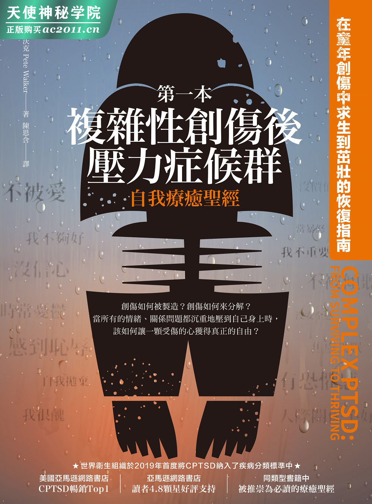
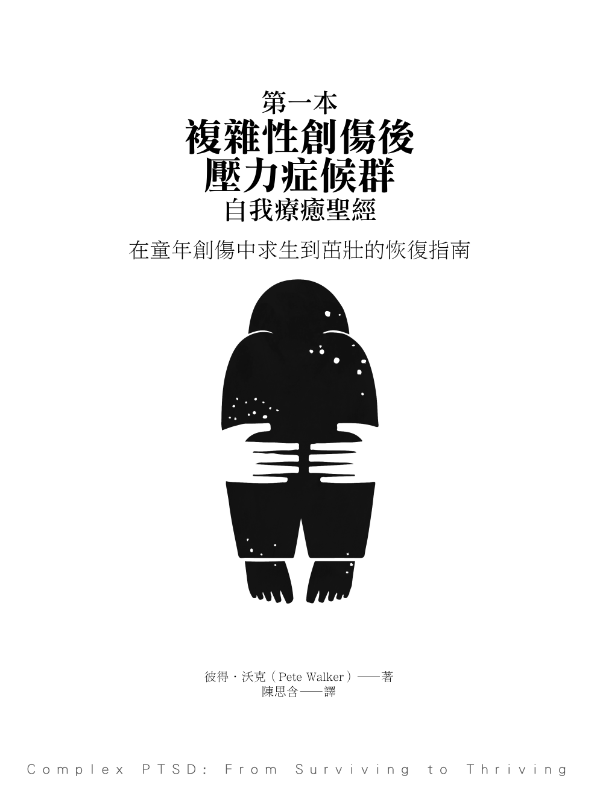
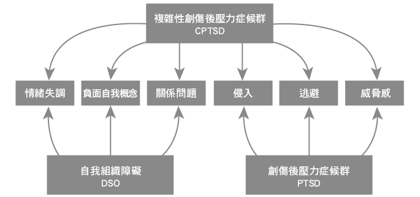
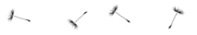
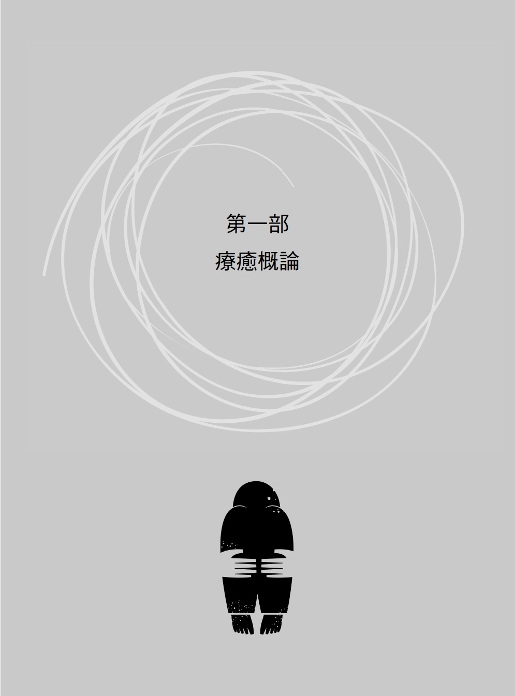
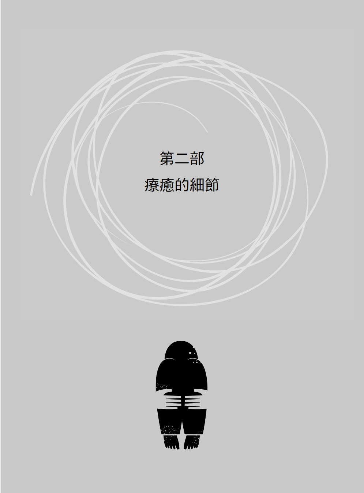
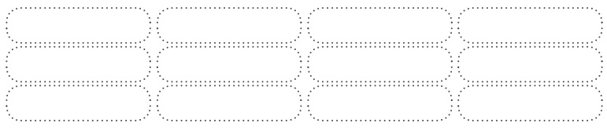
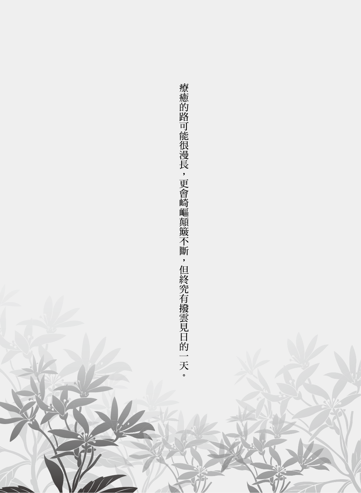
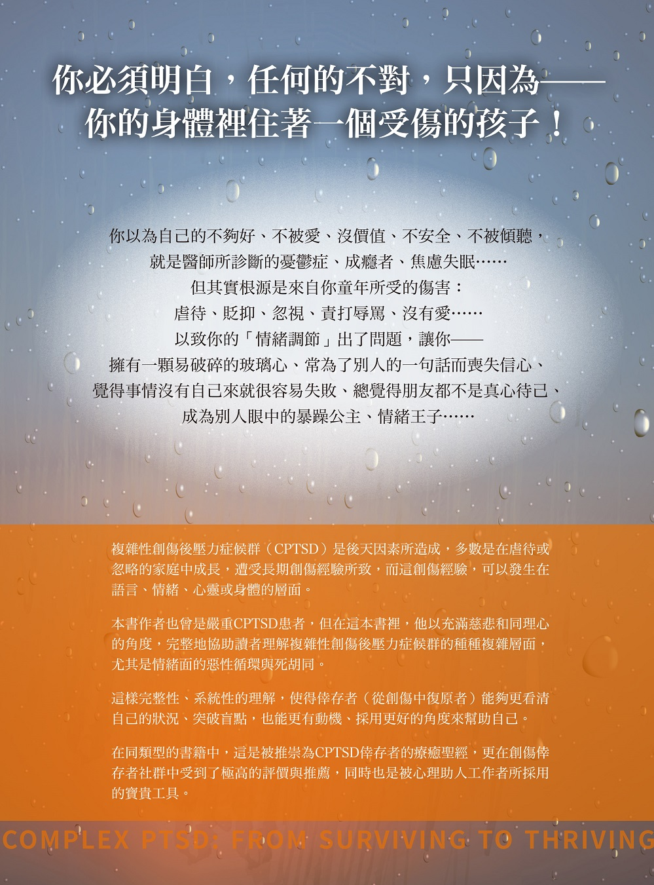

# 目录

1.  推荐序
    1.  创伤不是你的错，但复原是自己的责任
    2.  送一个礼物给成年后的自己
    3.  改变，可以透过链接内在与外在的力量发生
    4.  别让童年的伤害勒索你一辈子
    5.  值得分享并保留一辈子的好书
    6.  彼得给中文版读者的话
2.  译序／美国心理治疗师的话—给自我疗愈中的你
3.  好评见证
4.  致谢
5.  前言
6.  第一部 疗愈概论
    1.  第一章　CPTSD 的疗愈之旅
        1.  复杂性创伤后压力症候群（CPTSD）是什么？
        2.  情绪重现的例子
        3.  毒性羞耻：情绪重现的表象
        4.  常见的 CPTSD 症状
        5.  自杀意念
        6.  你可能遭到的误诊
        7.  CPTSD 的源头
        8.  进一步谈创伤
        9.  4F：战、逃、僵、讨好
        10.  制造 CPTSD 的家庭中的 4F
        11.  糟糕的养育方式制造出病态的手足竞争
    2.  第二章　复原的各层面
        1.  CPTSD 中关键的发展停滞
        2.  认知层面的疗愈
            1.  缩小找碴鬼
            2.  发展停滞的健康自我
            3.  心理教育和认知疗愈
            4.  正念
        3.  情绪层面的疗愈
            1.  复原情绪的天性
        4.  情绪智力
            1.  毒性羞耻与灵魂谋杀
            2.  哀悼是情绪智力的一部分
        5.  灵性层面的疗愈
            1.  透过高层次归属感抚慰遗弃造成的失落
            2.  感恩与够好的养育
        6.  生理层面的疗愈
            1.  生理层面的自助
            2.  CPTSD 与身体疗法
            3.  药物的角色
            4.  自我药疗
            5.  处理饮食议题
    3.  第三章　改善关系
        1.  预先警告
        2.  视 CPTSD 为一种依附疾患
        3.  社交焦虑的源头
        4.  关系疗愈的旅程
        5.  疗愈把我们困在孤独中的羞耻感
        6.  找到够好的关系性协助
        7.  切割父母与关系性疗愈
        8.  学会处理关系中的冲突
        9.  重新抚育
        10.  当自己的父母
        11.  自我母育能孕育出自我怜悯
        12.  无条件之爱的限制
        13.  内在小孩的工作
        14.  自我父育与时光机救援任务
        15.  代理团的重新抚育
        16.  自我关系与他人关系之道
    4.  第四章　复原的进展
        1.  复原的迹象
        2.  复原的阶段
        3.  以渐进复原培养耐心
        4.  求生之于茁壮
        5.  辨识复原迹象的困难
        6.  接受疗愈是一辈子的事
        7.  有疗愈意义的情绪重现和生长痛
        8.  最佳压力
        9.  黑暗中的曙光
        10.  未经检视的人生不值得活
        11.  “别担心，要开心”的情绪霸业
7.  第二部 疗愈的细节
    1.  第五章　如果我不曾被打呢？
        1.  否认与不当一回事
        2.  言语虐待和情绪虐待
        3.  找碴鬼的神经生物理论
        4.  情绪忽略：CPTSD 的核心伤口
        5.  生长迟滞症候群
        6.  情绪饥渴和成瘾
        7.  依附需求的演化基础
        8.  遗弃会降低情绪智力和关系智力
        9.  正视情绪遗弃
        10.  练习脆弱
        11.  叙事的力量
    2.  第六章　我的创伤类型是哪一种？
        1.  健康的使用 4F
        2.  视 CPTSD 为一种依附疾患
        3.  战类型与自恋型防卫
            1.  迷人的恶霸
            2.  其他的自恋狂类型
            3.  从极端化的战反应中复原
        4.  逃类型与强迫型防卫
            1.  左脑解离
            2.  从极端的逃反应中复原
        5.  僵类型与解离型防卫
            1.  右脑解离
            2.  从极端的僵反应中复原
        6.  讨好型与关系依赖型防卫
            1.  从极端的讨好反应中复原
        7.  混合的创伤类型
            1.  战—讨好混合型
            2.  逃─僵混合型
            3.  战─僵混合型
        8.  自我评估
            1.  4F 的正面与负面光谱
            2.  复原与自我评估
    3.  第七章　疗愈以创伤为基础的关系依赖
        1.  讨好的来源相较于战、逃、僵的来源
        2.  什么是以创伤为基础的关系依赖？
        3.  关系依赖的次类型
            1.  讨好─僵：代罪羔羊
            2.  讨好─逃：超级护理师
            3.  讨好─战：令人窒息的母亲
        4.  再谈从极端的讨好反应中复原
            1.  面对自我揭露的恐惧
            2.  以哀悼化解关系依赖
            3.  后期的疗愈
        5.  “不认同，没关系”
    4.  第八章　管理情绪重现
        1.  十三个具体可行的步骤
            1.  诱发因子和情绪重现
            2.  那个眼神：一个常见的诱发因子
            3.  不容忽视的内在诱发因子
            4.  预防性地辨识诱发因子
            5.  情绪重现的迹象
            6.  再谈自我药疗
            7.  治疗会谈中的情绪重现
            8.  哀悼可以化解情绪重现（第九步骤）
            9.  管理内在找碴鬼（第八步骤）
        2.  进阶的情绪重现管理
            1.  在遗弃性的忧郁中醒来
            2.  情绪重现是内在小孩的求救讯号
            3.  弹性地使用情绪重现管理步骤
            4.  存在性的诱发因子
            5.  后期的疗愈
        3.  帮助儿童管理情绪重现
    5.  第九章　缩小内在找碴鬼
        1.  找碴鬼的起源
        2.  十四个常见的内在找碴鬼攻击
            1.  完美主义攻击
            2.  草木皆兵攻击
            3.  “我是个世界级笨蛋！”
            4.  思想就是诱发因子
            5.  找碴鬼如同内化的羞辱性父母
            6.  面对找碴鬼的固执
            7.  完美主义和情绪忽略
            8.  再谈草木皆兵
            9.  利用愤怒来对找碴鬼进行思考中断法
            10.  羞耻是不公平地责难自己
            11.  拥抱找碴鬼
        3.  思考取代法和思考修正法
            1.  观点取代法和观点修正法
            2.  观点取代与感恩
            3.  大脑的神经可塑性
    6.  第十章　缩小外在找碴鬼
        1.  外在找碴鬼：关系的敌人
        2.  4F 类型和内外在找碴鬼的比例
        3.  被动攻击和外在找碴鬼
            1.  拒绝让找碴鬼的观点发声
        4.  外在找碴鬼主宰的情绪重现
        5.  模仿媒体的外在找碴鬼
            1.  找碴鬼：潜意识二级电影的制片
            2.  看新闻成了诱发因子
        6.  亲密与外在找碴鬼
            1.  必输的局面
            2.  吓跑别人
        7.  在内外在找碴鬼之间摇摆
            1.  摇摆的找碴鬼案例
        8.  当找碴鬼身为法官、陪审团和执刑者
            1.  寻找代罪羔羊
        9.  正念和缩小外在找碴鬼
            1.  当正念看似使找碴鬼更严重时
            2.  思考取代和思考修正：撵走找碴鬼
        10.  哀悼可截断外在找碴鬼
            1.  透过处理移情来弱化外在找碴鬼
            2.  健康的外在找碴鬼发泄
            3.  路怒、移情与外在找碴鬼
    7.  第十一章　哀悼
        1.  哀悼会扩大洞察力和理解力
            1.  哀悼父母照顾的缺席
        2.  哀悼会改善情绪重现
            1.  内在找碴鬼妨碍哀悼
            2.  以哀悼卸掉找碴鬼的燃料
        3.  哀悼的四个历程
            1.  发怒：缩小恐惧与羞耻
            2.  哭泣：为自己的失去而哭
            3.  言语抒发：通往亲密感的黄金道路
            4.  感觉：被动地解决哀悼
    8.  第十二章　地图：管理遗弃性的忧郁
        1.  反应性的循环
        2.  反应性循环中的解离层次
        3.  父母的遗弃制造了自我的遗弃
        4.  破解自我遗弃
        5.  忧郁思考和忧郁感觉的比较
        6.  正念会代谢忧郁
        7.  身体的正念
        8.  身体的觉察可以疗愈性地诱发痛苦的记忆
        9.  内省的身体工作
        10.  以完全感受化解忧郁
        11.  饥饿是忧郁的伪装
        12.  假性循环性情感症
        13.  区分必要和不必要的苦难
        14.  复原是渐进的　
        15.  以全方位的疗愈工作来处理情绪重现
    9.  第十三章　以关系性的取向来疗愈遗弃
        1.  心理治疗的关系层面
        2.  CPTSD 的关系性疗愈
            1.  同理心
            2.  真诚地展现脆弱
            3.  对话性
            4.  合作的关系修复
        3.  寻找心理治疗师
            1.  寻找线上或现场的支持团体
            2.  互助谘商
    10.  第十四章　原谅：从自己开始
        1.  真正的原谅
        2.  原谅是一种爱的感觉
    11.  第十五章　阅读治疗与书本聚落
    12.  第十六章　自助工具
        1.  一号工具箱：复原的意图建议
        2.  二号工具箱：人权法案（公平与亲密的参考指南）
        3.  三号工具箱：对常见找碴鬼攻击的内在反应建议
        4.  四号工具箱：有爱地化解冲突
        5.  五号工具箱：感恩
        6.  六号工具箱：管理情绪重现的十三步骤

健康 smile 67

第一本复杂性创伤后压力症候群自我疗愈圣经：

在童年创伤中求生到茁壮的恢复指南

原书书名　Complex PTSD: From Surviving to Thriving

作　　者　彼得‧沃克（Pete Walker）

翻　　译　陈思含

封面设计　林淑慧

主　　编　刘信宏

总编辑　林许文二

出　　版　柿子文化事业有限公司

地　　址　11677 台北市罗斯福路五段 158 号 2 楼

业务专线 （02）89314903#15

读者专线 （02）89314903#9

传　　真 （02）29319207

邮拨帐号　19822651 柿子文化事业有限公司

投稿信箱　editor@persimmonbooks.com.tw

服务信箱　service@persimmonbooks.com.tw

业务行政　郑淑娟、陈显中

ISBN　978-986-98513-5-0

COMPLEX PTSD: FROM SURVIVING TO THRIVING

AN AZURE COYOTE BOOK / 2013

www.pete-walker.com

First Edition

Copyright 2014 by Pete Walker

All Rights Reserved

粉丝团：60 秒看新世界

∼柿子在秋天火红 文化在书中成熟∼

国家图书馆出版品预行编目(CIP)资料

第一本复杂性创伤后压力症候群自我疗愈圣经：在童年创伤中求生到茁壮的恢复指南 /

彼得‧沃克（Pete Walker）着 ; 陈思含译.

-- 一版. -- 台北市 : 柿子文化, 2020.2

　面 ; 　公分. -- (健康 smile ; 67)

译自 : Complex PTSD: From Surviving to Thriving

ISBN 978-986-98513-5-0 (平装)

1.创伤后障碍症 2.心理治疗

178.8 109000052

【推荐序】

创伤不是你的错，但复原是自己的责任

留佩萱，美国谘商教育博士、美国执业心理谘商师

在我的谘商工作中，有机会谘商许多经历童年创伤的个案：肢体虐待、情绪虐待与疏忽、性侵害、自恋型父母亲或父母亲有药物酒瘾问题等等。在谘商这些个案时，我也理解到提供创伤相关教育非常重要——我一直相信知识就是力量，当我们可以了解创伤如何影响人（尤其是那些童年时期不断重复的受创事件），就能够理解到：“这不是我有问题！”

所以，我非常兴奋看到彼得．沃克这本谈论复杂性创伤后压力症候群（CPTSD）的书被翻译成中文，也很感谢陈思含心理治疗师翻译这本书，让台湾人可以阅读这些创伤心理教育。

我常常会跟个案说，很多你现在的“问题行为”，其实都是过去为了在受创环境下求生存的生存机制。这本书中提到的 CPTSD 症状，像是内在找碴鬼、毒性羞耻等等，其实也都是“为了要保护你”。譬如，小时候的你需要这个内在找碴鬼不断批判你，让你时时警戒自己把事做好，这样才不会因为又做错了事情被妈妈羞辱；又或者，羞耻这个情绪会使你全身缩起来，使你安静不反抗暴怒的父亲，其实是要保护你，让你更安全（如果反抗，你可能会被打得更惨）。这些“症状”，其实都是过去为了求生存所发展出来的保卫机制，是一个人所展现的复原力和韧性。

我相信，你发生的创伤都不是你的错，但复原是自己的责任。这本书可以带着你去好好理解创伤，陪伴着你走这条复原之路。

送一个礼物给成年后的自己

张景然博士，国立彰化师范大学谘辅系系主任

本书有十个可能让读者感到兴趣的亮点：

1. 预定二〇二二年出版的《国际疾病分类标准第十一版》（ICD-11）于二〇一九年对外发表首度收纳了 CPTSD（Complex post-traumatic stress disorder, 复杂性创伤后压力症候群）这项疾患。

2. 本书主要在介绍童年时期父母养育过程所造成的创伤，在其成长后的各种关系中遭受伤害，或经历重大打击，也有可能出现 CPTSD。

3. 除了涵盖全数 PTSD 的诊断标准外，CPTSD 的概念亦兼具严重且持续的情绪调节、负面自我概念、关系困难等自我组织障碍。

4\. 处理 CPTSD 需要结合多元的治疗取向，宣称单一疗法对某种症状具有疗效的行销手法，可能因为效果有限，致使案主更加自我挫败，连带不信任心理专业服务。

5. 实务工作上，许多案主会被笼统归类为焦虑类或忧郁类疾患，甚至比例高到令人起疑的 ADHD、强迫症、自恋型或边缘型人格疾患等，治疗上遂治标而不治本。

6. 上述疾患多数属于先天缺陷，CPTSD 则是后天习得的不健康压力适应模式。重点在于，既然是学习而来的疾患，就能被反向消除，也就是可以借由学习获得改善。

7. 专业书籍必然会使用大量专门术语，从大众较熟知的霸凌、忧郁、羞耻、自尊……到进一步的情绪重现、社交焦虑、发展停滞、正念……甚至冷僻的名词如 EMDR、inner critic、D. W. Winnicott……不小心处理就可能形成文字沙拉（word salad）堆砌，但在本书中则可以看到逻辑而有系统的排列阐释。

8. 谘商系所的学生或实务工作者往往求知若渴地参加各类研习、督导、案例研讨，或是速读式的翻阅理论与案例，本书是基本的理论教科书之外，值得逐句逐段逐页细细研读、反复内省的第二本教科等级的书。

9\. 这本书具备教科书般的准确严谨，所有的注释与粗体字重点也很精采。

10. 本书译者陈思含老师在美国有十多年的求学、生活、执业经验，是这个领域少数充分熟悉台美两地语文、人情、文化、心理疾病的专业工作者，具批判精神，但文笔温婉，她的部落格我从未错过，故乐为之序。

改变，可以透过链接内在与外在的力量发生

吴雅雯，李政洋身心诊所及开心生活诊所驻诊精神科医师、英国艺术治疗师与创伤谘商师

儿童时期在养育过程中的关系创伤很困难，因为在受伤的经验里混杂着爱与依附的需求，很难像外来的创伤事件一样，被清楚切割。

受创者常常有着想要保护父母，或者需要否认受创的部分。彼得．沃克作为一个曾经受创的治疗师，深刻地分享了复原的路径可以如何前进。

这本书真的让我非常感动。我相信，改变可以透过链接内在与外在的力量发生。

别让童年的伤害勒索你一辈子

陈志恒，谘商心理师、作家

当我阅读这本书的译稿时，内心感动万分！

在心理卫生知识普及的今日，创伤后压力症候群（PTSD）广为人知，但复杂性创伤后压力症候群（CPTSD）却鲜为人知。

在我的实务工作中，遇过许多符合 CPTSD 描述的个案与求助者，他们不一定知道自己怎么了，但就是觉得自己在目前的工作、人际关系、家庭生活、健康或心情等各方面，简直只能用“糟透了”三个字来形容；他们每天处在痛苦之中，不是自我否定，就是怨天尤人，但却无力脱离这样的困境。

细究之下，他们往往有着童年成长过程中的不堪回忆，而那些伤害常来自于原生家庭，也就是由不当教养引发的创伤。想帮助他们没有那么简单，光要让这些求助者理解自己怎么了，就是一件相当费力的事情，因为他们总会问：“为什么是我？”

很庆幸，《第一本复杂性创伤后压力症候群自我疗愈圣经》这本书的中译本问世了，让国内的一般大众与心理专业人员都能受惠。作者除了详加介绍 CPTSD 的症状与来源，帮助我们认识在威胁来临时 4F 的反应模式——战（fight）、逃（flight）、僵（freeze）与讨好（fawn）是如何保护我们度过危机，同时也带来诸多适应不良的后遗症；同时，更从各个不同心理治疗理论取向的观点与技术，去探讨如何协助 CPTSD 的案主迈向疗愈之路。

疗愈的路可能很漫长，更会崎岖颠簸不断，但终究有拨云见日的一天。这本书值得专业人员及受苦中的你细细品读，反复钻研。

值得分享并保留一辈子的好书

戴萝．伊莉莎白．盖德尼（Daryl Elizabeth Gedney），美国科罗拉多州心理治疗师

彼得．沃克的书是如此地广泛充分，以至于读这本书可比拟为上了一门 CPTSD 的课。这位作者是心理治疗师，也是严重童年创伤的幸存者，这本书他取材于自己治疗创伤幸存者三十年的经验、许多心理学与自我发现的智慧，以及他自己个人的疗愈之旅。因为他的分享是那么地谦卑和真情流露，而使他能以不论断的心理教育来启迪读者，并且以深深的慈悲来鼓励疗愈。

彼得．沃克说明了童年创伤不只是来自于肉体虐待或性虐待，还来自照顾者或父母的羞辱、贬低、忽略、遗弃及其他形式的情绪虐待。这样的创伤经验，使得幸存者透过“内在找碴鬼”而形成脆弱的或发展不完全的自尊，因“外在找碴鬼”而无法创建亲密、有信任感的关系。

但是，作者说有好消息：复原是有可能的，因为那些事实上是习得的反应，和未完全的发展任务。他说，若是习得的，就能够透过学习而消除。

彼得．沃克在书中详述了如何辨识自己的反应风格（战、逃、僵、讨好），以及如何管理诱发因子和情绪重现。在这个地图之外，他还提供了其他无价的自我帮助工具：如何哀悼童年所失和童年之伤、如何消除找碴鬼、如何捍卫自己，以及如何解决冲突。此外，我觉得他介绍的阅读疗法（推荐书籍清单）是给读者的绝佳资源。

彼得．沃克的书不是可以快速读完的书，也不该如此。这是一本可以保留一辈子的书，可以一读再读，并且分享给案主、同僚和朋友的书。我自己是心理治疗师，我可以很诚实地说，它会帮助我成为更好的治疗者，也会帮助我个人在两个重要的方面继续成长：当自己有爱且慈悲的朋友，以及加深我与他人真挚且健康的关系。

彼得给中文版读者的话

我年轻的时候，非常幸运地造访台湾三天，当中的亮点是从台北搭乘令人愉快的火车到台中。美丽的乡村景致，和火车上每个人对我的欢迎与和善，使我很开心。如果读者当中或是你们的亲戚、朋友，刚好有人也在那列火车上，岂不很棒！

复杂性创伤后压力症候群（CPTSD）在美国是很盛行的问题，我相信它在世界的其他地方也很盛行，因为我时常收到来自世界各地（几乎每个国家）有 CPTSD 的许多人的电子邮件。这个情况令人难过，尤其是 CPTSD 可以对一个人的一辈子产生那么多种残害幸福的影响。

当思含联络我，表示她渴望翻译我的书时，我很庆幸自己有机会能与台湾的民众及中文读者分享我对 CPTSD 的知识、经验和旅途。我或许对台湾的文化不甚熟悉，但我相信，我们人类都有相同的心理发展，有毒的东西，不会因为一个文化有不同的诠释，就变得无害。文化差异或许是需要被考量的重要变项，但疗愈未化解的创伤是普世重要的。

思含告诉我，CPTSD 在台湾不太盛行，而且几乎没人听过。能够透过发行这本书，在台湾和其他中文社会提倡对 CPTSD 的觉知，是我的荣幸。这本书已经被翻译成数种语言，但如果我的书也能帮助疗愈许多使用中文的 CPTSD 幸存者，那会是我特别的光荣。

如果你成长的环境使你觉得自己不重要、不被爱、没价值、不安全或不被倾听，深深地觉得自己“不够好”，便有很高的可能性有 CPTSD。在不安全的环境中成长，你可能会发展出持续的草木皆兵心态，这些深刻的感觉可能会发展出各种不健康的补偿策略，而你可能不知道，自己一辈子都在用不健康的方式应对。你有时候会怀疑人生为何如此累人、孤单、令人失望或没意义，甚至可能怀疑这人生到底值不值得活下去。

我希望这本书会帮助你发现人生中不尽人意的根源，并且带领你前往更幸福、够好的人生之旅。我们无法改变过往的历史，但我们可以疗愈出更好的未来。你受过伤，但你不必继续痛！

我诚挚地希望你透过阅读这本书，能够渐渐化解不必要的焦虑、羞耻和忧郁。当这情况发生时，我希望、也祈祷你的自尊会成长，你会在人生中找到有爱且支持你的人，而且你会越来越从求生模式转为茁壮模式。

彼得‧沃克

【译序】

美国心理治疗师的话——给自我疗愈中的你

彼得‧沃克的这本著作，是复杂性创伤后压力症候群幸存者的疗愈圣经。它在创伤幸存者社群中不仅受到了极高的评价与推荐，同时也是心理助人工作者的宝贵工具。

复杂性创伤后压力症候群简称 CPTSD，有时我会两者交替使用，因为中文全名真的太长了。

虽然这本书聚焦在童年父母养育过程中所造成的创伤，可是复杂性创伤后压力症候群并不只发生在有过童年教养创伤的人身上。在关系中受到持续性的伤害（无论是显性或隐性），或是接二连三的遭遇重大打击，都有可能造成复杂性创伤后压力症候群。霸凌受害者、家暴受害者、受邪教控制的受害者、自恋型虐待受害者……等，都是极可能发生复杂性创伤后压力症候群的例子（关于自恋型虐待，请参见 https://freeryou.com/narcabuse 的系列文章）。如果你曾受过恶待或接二连三的打击，即使没有想得出来的童年教养创伤，依然可以参考这本书，撷取或修改当中的信息，应用在自己身上。

在翻译并发行中文版之前，我一次又一次地推荐这本书给我的外国案主，以及其他受过关系创伤的外国友人。无一例外，他们每一位都被这本书触动，并且得到了大幅度的疗愈。

我并不是说光靠阅读这本书，就一定能够完全从复杂性创伤后压力症候群中复原。但是，彼得以充满慈悲和同理的角度，完整地协助读者理解复杂性创伤后压力症候群的种种复杂性，尤其是情绪面的恶性循环与死胡同。这样完整性、系统性的理解，使得幸存者能够更看清自己的状况、突破误区，也能更有动机、采用更好的角度来帮助自己。

在心理治疗工作中，治疗师其实不太容易以口头进行复杂性创伤后压力症候群的知识教育（心理教育），因为这个主题的知识交错复杂，更因为许多的 CPTSD 幸存者会反射性地抗拒“说教”，尤其是来自“权威”的说教——即使本质上不是说教，而是善意的分享——特别是面对面、现场来自对方的声音。这是由于他们的创伤经验，容易把这个善意的分享诠释为说教。然而，他们的抗拒不是他们的错，无论那抗拒是辩论、否定、神游、左耳进右耳出、或者口是心非的同意，那都是幸存者的创伤反应。

尤其当心理教育涉及了请他们接纳或释放长期来压抑的情绪时，那种抗拒更是强烈，因为他们会有意识或无意识地害怕。长期的压抑，来自于对那些情绪的惧怕，甚至有时候他们的压抑，可能严重到使他们完全不知道那些情绪的存在、感觉不到那些情绪，于是更容易否定和抗拒这种心理教育。

可是，知识就是力量，而这本书，能帮助幸存者用最少的抗拒去了解复杂性创伤后压力症候群的种种知识，更了解自己。最重要的是，彼得温柔慈爱的话语，让幸存者能够独自在有隐私的安全空间，放心地流下感动泪水——一种终于被理解、被同理、被抚慰的泪水。那是极具疗愈性的，我所推荐阅读的每位幸存者，无不流下这种泪水，并且告诉我，那是疗愈的泪水。

究竟什么是复杂性创伤后压力症候群（CPTSD）呢？彼得出版此书之时，学界尚未创建 CPTSD 的正式诊断标准，所以彼得并未在原书中详细说明诊断标准，但是他提供了心理治疗师们在实务工作中普遍认同的共通性和症状。就在本书翻译完成后不久，世界卫生组织（WHO）在二〇一九年五月的世界卫生大会上，对会员国发表了最新的《国际疾病分类标准第十一版》（ICD-11），并且将于二〇二二年正式生效。

在这一版的诊断分类中，首度收纳了 CPTSD 这项疾患，并且给予了诊断说明：

复杂性创伤后压力症候群（CPTSD）1 是在接触一个或一系列本质上极具威胁性或极为恐怖的事件后，可能发展出的疾患，尤其是长时间或重复发生、难以逃脱或无法逃脱的事件（如折磨、奴役、大屠杀、持续的家庭暴力、重复发生的童年性虐待或肢体虐待等）。CPTSD 必须符合创伤后压力症候群的全部诊断标准，并且具备严重且持续的：

1\. 情绪调节问题；

2. 相信自己是渺小的、挫败的或无价值的，并且感到与创伤事件有关的羞耻、罪恶或失败；

3\. 难以维持关系和与他人感到亲近。

这些症状会导致个人、家庭、社交、教育、工作，或其他重要领域的功能显著损坏。

简单来说，就是广为人知的“创伤后压力症候群”，属于 CPTSD 的一部分，另外又加上其他症状。下图呈现了 CPTSD 的精华概念。

正确地分辨究竟是复杂性创伤后压力症候群，还是一般的创伤后压力症候群、边缘性人格障碍、自恋型人格障碍、焦虑症、忧郁症、解离性障碍，也能使当事人得到正确的协助，避免治标不治本，或是误诊误治，或者头痛医头、脚痛医脚的状况。比方说，CPTSD 的许多现象和边缘性人格障碍非常相似，但是 CPTSD 有很高的机会可以透过多元整合式的疗法，疗愈至当事人几乎不受影响，人生重获光明喜乐；而边缘性人格障碍，目前最被推荐的疗法是辩证行为治疗（Dialectical Behavioral Therapy），而且即使此疗法有帮助，也仅能“管理”边缘性人格障碍的症状，成效有限。如果单一地将辩证行为治疗用在复杂性创伤后压力症候群的案主身上，则可能无效。

亦常见 CPTSD 的幸存者或治疗者误将 CPTSD 当作是一般的创伤后压力症候群，试图用单一模式的创伤疗法去帮助案主，却不见成效。即使是在心理治疗领域中广受好评的创伤疗法“眼动减敏与历程更新治疗法”（EMDR），对 CPTSD 的疗效也非常有限。彼得的书中，多次强调多元取向的治疗方式，才是对 CPTSD 有效的疗法。

还有，正确发现自己有复杂性创伤后压力症候群，而非其他的常见错误标签，能帮助当事人更正确地了解自己，并且摆脱种种因为错误标签和无效治疗所带来的自卑感或挫折感——这些常会加重 CPTSD 的各种毒性。

除了复杂性创伤后压力症候群的知识，以及温暖的同理心，彼得更是不藏私地提供各种自我帮助的具体建议，以及许多的参考资料。

我也非常认同彼得不怕得罪同业的诚实：处理复杂性创伤后压力症候群，不能靠单一的“某某疗法”而达到效果。处理复杂性创伤后压力症候群需要整合多元的治疗取向与治疗技术，搭配心理治疗师的知识与经验，在适当的时候采用适当的做法。可是在一个强调行销的年代，即使是专业的心理助人工作，也常为了行销考量，而打出某某单一疗法就有效的口号。然而，实际上却不是如此，甚至会使案主因为治疗无效而更加打击自己，或者全面地不信任专业心理工作。

彼得更是不怕得罪同业，大胆批评心理谘商与心理治疗中的经典“白屏幕”风格。在我的经验中，他的批评完全正确，因为协助受害者时，白屏幕常常会重演案主的创伤经验。

受害者的类型很多，而复杂性创伤后压力症候群的根源，就是当事人曾在关系中受到恶待或背叛，所以，我认为所有的 CPTSD 当事人都是受害者。彼得以“幸存者”（survivors）称呼他们，但我想他们始于“受害者”，透过疗愈与成长，才会成为真正的幸存者。这就有如本书的原文书名标题“From Surviving to Thriving”：从求生到茁壮。

同时彼得也同样不怕犯众怒地批判了宗教、身心灵领域，以及普遍的社会价值观。在尊重各种信仰的前提下，他勇敢地告诉读者，当某些信仰或意识形态宣称“只要这么做就会快乐”，或是不当地要求幸存者“放下、原谅”，又或是否定负面情绪的价值，其实是有害心理健康的，尤其更会阻碍复杂性创伤后压力症候群的疗愈。

我一次次地看到，相较于没有阅读过这本书的案主，那些阅读过这本书的案主，搭配对处理复杂性创伤后压力症候群有经验的心理治疗师，大多能够有非常良好的进展。没有阅读过这本书的案主，大多常常在心理治疗中花了非常多的时间原地打转，因为他们很难突破误区和恶性循环，同时又强烈抗拒治疗师试图破解的介入。可是，在他们好好阅读过这本书后，便开始对那些误区和恶性循环有更好的觉察，也能够在疗程中与治疗师产生更具建设性的互动，疗愈与复原的进展就变得更为明显。

当我回到台湾后，我时常想推荐这本书给其他幸存者，却苦于没有中文版，而无法让中文世界的 CPTSD 幸存者也得到相同的疗愈。同时，看到时常出现在媒体中或社群网站分享中的各种“奥客”和无理取闹事件，以及社会中时常出现情绪失衡（无论是爆炸或者麻木）的现象，加上传统所支持的子女教养模式，都不难推测复杂性创伤后压力症候群在我们社会中的普遍性。当然，这并不是说所有情绪失衡或无理取闹，都能用 CPTSD 来解释，有时候那些表现的背后另有原因。

可是，大部分的人，都对复杂性创伤后压力症候群一无所知，于是不了解自己，也不了解他人，陷入一种集体的多向指责与情绪恶性循环。甚至，我怀疑复杂性创伤后压力症候群的普遍，结合对于终身婚姻义务观念的解放，是台湾近年来离婚率飚高的原因之一。后者的观念解放，是好事，但是结合了 CPTSD 时，常常就会因为情绪重现和内外找碴鬼的影响，而破坏了原本可以维持的幸福，不必要地处死了一段亲密关系。

未受到妥善处理的复杂性创伤后压力症候群，除了造成自己内在的长期不幸福，也常会造成人际关系和亲密关系的问题。

深感这本书的重要，于是我主动联络了彼得，表达希望能翻译这本书，而他也很快地同意了。

着手翻译后，才发现这是一本很难翻译的书，因为有太多的专业心理学概念，不易以中文直接翻译表达。幸好彼得同意我可以适当修饰，并且加入各种补充说明的注脚。

许多读者会发现，这不是一本好阅读的书，不是可以一气呵成、快速读完的书。其实，大部分的读者，不分语言，只要认真阅读本书，都会有这个现象。

原因是，除了有许多复杂抽象的新知识、新概念需要理解与消化外（尤其是要理解并接受那些一直以来压抑的东西），如果你是复杂性创伤后压力症候群的幸存者，根据你的创伤反应模式，你可能本来就不易集中精神，但更多的原因是，你可能不时地被彼得的话语勾起了情绪反应。

也许不易一气呵成地阅读，才是好事。

我这么说，是因为我在实务工作中发现，当案主慢慢地咀嚼消化彼得的文字、允许自己去感受被勾起的情绪时，他们反而能得到最多的疗愈。而那些囫囵吞枣、只看文字，却没有深度经历情绪的案主，都不太能够从此书中获益；甚至，他们这种“速读”方式，正展现了他们仍然在逃避情绪、逃避深度疗愈、陷入焦虑性的匆忙，连阅读自助书籍都还在采用自己的 4F 反应模式（彼得的书中会说明什么是 4F）。

所以，如果你是寻求疗愈的读者，我想建议你这么使用此书，来帮助自己获得最大的疗愈功效：

1. 慢慢读

大约读懂了一部分后，再继续读下一个部分。你不需要执着在了解每一个字词（CPTSD 幸存者有时会发生不必要的完美主义现象，于是太过钻牛角尖），但请尽量了解每一个概念。有时候对一小部分感到模煳不懂，可能在稍后的阅读中会有更多的说明或理解，所以不需要为了某一小部分的困难而感到挫败或执着。尽量就好。有时候你可能会发现自己反复重复阅读同一句话或同一个段落，这是正常的。

如果你觉得严重“卡关”、一直无法前进，也许可以谘询他人，或是考虑参加读书会。复杂性创伤后压力症候群极为普遍，所以你可能不难找到可以共读的同伴。如果你真的找不到讨论的同伴，欢迎你联络我，也许我们可以组织一个读书会或讲座。

2. 允许自己去感觉

如果在阅读期间，你的某些感觉有可能被挑起，请不要急着压抑、否定或分散它。请允许它发生，去感受它，在安全合理的范围内，想哭就哭，想发怒就发怒，这是最具疗愈性的部分。如果那个感觉强大到令你觉得难以承受，请寻求心理治疗师或心理师的协助。事实上，当你有那么强大的情绪反应或生理反应时，最适合接受心理协助。

3. 作笔记

彼得用较为线性、广泛性的方式介绍各种概念与自助技巧，也许你会觉得本书充满了有用的信息，但有时不太容易实时利用各种建议。彼得提供了多个好用的工具箱，但也许你还想要把其他的有用建议给组织起来。你可以作笔记，整理出各种你可能会用到的技术或建议，以你自己的方式去组织统整出一个方便使用的自制工具箱。

许多案主发现，他们如果把这个工具箱存在手机里，会很方便他们随时随地利用这些工具。

你自己整理的工具箱，可能会比他人为你整理的工具箱更好用，因为那是最客制化、最符合你使用习惯的系统。

我根据实务经验和彼得的建议，自制了一套“利用情绪重现而成长”的练习单，以一步步的内观，帮助案主对情绪重现、内在找碴鬼、外在找碴鬼有更好的觉察，并且进一步把这样的觉察化为成长与疗愈的工具。但是，这样的练习单，在没有协助的状况下，或是在不适合的时间点，就不一定适合你。这只是“自制工具箱”的一个例子，你可以制作适合自己的工具箱。

4. 反复阅读

这不是读一次就够的书。在我的经验中，即使幸存者慢慢地、仔细地阅读，并且允许自己去感觉，但在他们第一次阅读时，其实不太能够完全享受这本书的贡献。大部分的原因是，第一次阅读时，我们通常会本能地聚焦在“吸引我们”、“有共鸣”的部分，对于仍抗拒的知识给予较少的注意力。但是，我们越是抗拒的部分，就越是需要下功夫的部分。

在我的工作中，我常看到案主第一次阅读时深受感动、很有共鸣，并且大幅突破误区，可是在我们的疗程中，他们表现得好像完全没看到书中的某些重要信息一样，而且那“有看没有到”的部分，正是他们在疗程中的关卡或瓶颈部分。通常我会建议他们再读一次，并且留意这些被忽略的部分，有意识地处理自己的抗拒。读者常常会发现，每次重新阅读这本书，就会有新的启发与收获。

5. 适时地寻求专业协助

这本书有极大的疗愈性，但不一定能全然化解你的议题，也可能有些内容是无法靠自己阅读就理解或应用的。或者，你可能在阅读后发现自己潘朵拉的盒子被打开了，却不知该如何应对。这时，求助有复杂性创伤后压力症候群治疗经验的心理师或心理治疗师，能够帮助你突破这些瓶颈，并且更完全地疗愈自己。

另外，我也注意到，在大部分的亚洲文化中，“情绪”常常是被忽略的、不常被正视的。甚至，强烈的情绪还可能遭到羞辱或批判。荣耀父母地位、强调“乖”与服从的传统文化，也可能迫使我们从小必须压抑或否定自己的感受。我们也许会有“情绪发作”，却可能对“意识情绪的存在、辨别、处理”有困难。所以，许多亚洲文化中的案主无法立刻理解或应用本书的内容，于是一开始需要先创建情绪觉察的基本功。

加上许多受到童年养育创伤的人，很可能因为创伤经验而习惯压抑或漠视自己的情绪，所以即使不是亚洲人，也常发生这种现象，只是我们的文化更助长它。当你被问到“你有什么情绪”，而你通常回答不出具体的情绪词汇时，你可能就是众多需要先创建这个基本功的人之一，然后你才能够更加理解这本书所谈的各种情绪议题，进而应用本书的各种建议。

如何创建情绪觉察的基本功呢？我建议采取这两个简单的步骤：

首先，创建情绪辞典。请先蒐集、累积大量的情绪词汇，像是“快乐”、“悲伤”、“愤怒”、“恐惧”……等，越多越好。记得，不要把“行为”和“想法”，或文学性描述手法，加入到这个情绪辞典中。否定词也不算是情绪词汇，例如“不爽”、“不开心”。聚焦在精确的情绪词汇。

如果你对于区分什么算是或不算是“情绪”有困难，也许你会需要一些协助。网络上搜寻相关信息，是便宜有效率的方法之一。如果真的觉得很困难，可能表示你的情绪议题颇深，需要专业的协助。

创建情绪辞典，没有截止日期，你可以一直做下去。

然后，当你累积了合理数量的情绪词汇后，请开始把情绪词汇加入你的口语或文字表达中。你可以多多练习“我觉得（情绪）”这类的句子，无论是对他人说，或对自己说。当你越常结合情绪词汇到你的表达或内省之中，你的情绪觉察能力就会越好，也越能利用这本书的知识与建议。

最后，我想感谢彼得写了这么好的书，并且允许我翻译它。我也要感谢我的家人与朋友，你们非常包容我为了翻译此书而焦头烂额、镇日埋首电脑键盘。感谢我的案主们，你们的勇气令我敬佩，你们的成长使我一同成长，并且给了我无数的启发。谢谢美国加州柏克莱市的心理治疗师 Diana Shapiro，谢谢你给我的疗愈、支持和勇气，并带领我认识 CPTSD。感谢柿子文化出版社的支持，让这本好书得以中文传播，帮助许多有需要的人。

因复杂性创伤后压力症候群而辛苦或孤单的你，请记得，你很好，你只是受伤了。祝福你打破 CPTSD 的控制。

* * *

1 由于台湾尚无 CPTSD 的正式中文名称，而创伤后压力症候群（PTSD）为大众耳熟能详的病名，故本书译为复杂性创伤后压力症候群。且目前尚无台湾版的 ICD-11，所以疾病与诊断介绍为非正式之英翻中版本。

好评见证

“我谨代表加拿大的虐待幸存者疗愈社团（Survivors of Abuse Recovering；S.O.A.R.）联络您。我们希望把您的‘情绪重现管理十三步骤’纳入我们的资源手册中。”

“我找回了我自己。我在你的文字中找到了自己，就像你解开了我，踏入我受创的内在自我，在当中漫步，然后写下你在我里面发现的内容。我人生中第一次有自觉……我已经五十几岁了……我不觉得自己有缺陷……或疯了……或‘奇怪’……或甚至不值得被爱。”

——D.M.

“我在旧金山机场坐着读你的书（在洗手间里边颤抖边哭），然后鼓起勇气进行下一段旅程。仅仅知道你就住在这个区域，就给了我很大的帮助——很奇怪的是，我根本没有见过你！你的网站和书对我是无价之宝。”

——A.R.

“我要非常谢谢你给我的一切帮助（还有，我把你的网站分享给其他人，他们也都受你帮助）。你对情绪重现的理解，对我的人生造成了极大的影响。我从被大浪打垮，变成有了冲浪板可以至少冲一些浪；而且就算我摔下来，也知道那不是永远的。”

——来自新西兰的 J

“谢谢你关于 CPTSD 和遗弃的一切教育信息，我终于找到好几年来试图向心理治疗师解释的东西了。你的信息的每个部分，完全都是我经历的 CPTSD 和依附性忧郁。”

——A

“我从私人立场和专业立场都要谢谢你。你关于疗愈 CPTSD 的文章令我兴奋，也使我得到认同。现在我会是更好的心理治疗师，并且自己也更进一步地疗愈了。”

——D

“你的文章会是我常态发给我的案主的资料。不用说，我觉得这些信息还有你表达的方式，真是救星！”

——L.P.

“你所写的一切对我造成很大的影响，而且我也在你的网页中得到很多的疗愈。就像你写的阅读疗法文章所提到的作者——我相信如果我有机会与你见面，你会对我有同理心。此时此刻，这个信念强大地实现了。”

——J.S.

“从恐慌症，到分离焦虑，到依附疾患、躁郁症、广泛性焦虑……等，我都被诊断过，也贴过标签。然后我找到了一位治疗师，他说我的创伤后压力症候群来自于我爸爸长期的情绪虐待和妈妈的情绪忽略，那时我才真的觉得有道理。我觉得我在你网站上读到的一切，是我长期追寻的最后一块拼图，这真的给了我很多力量，也解放了我。”

——A.M.

“我现在已经走了很久的复原之路，并且最近决定想要回顾和庆祝我的成就。你的文字正是我此时需要的，我觉得真的被看见、了解和欣赏。这真是个礼物！”

——P.

“我读了你的文章很多很多次，尤其是遗弃性忧郁的部分，你让我有希望不要自杀。非常谢谢你花时间在网络上写这些绝佳的文章，我怎么谢你都不够。”

——来自北爱尔兰的 T.M.

“这几年我都在用你的书。我人生中第一次能够做自己，并且感到全面的感觉——我的孩子们因为这个辛苦的工作而开始茁壮。所以，谢谢你。”

——N.A.

“我想要表达我的感谢，谢谢你分享关于复杂性创伤后压力症候群的全部信息，这显然是网络上最好的资源。”

——J.C.

“大约五年前，我发现了你的网络文章，然后我一边和很棒的治疗师处理 CPTSD，一边持续地回去阅读你的文章。你的文字很扎实、慈悲、直接。我现在发现人生值得再活下去。还有，我的包包中放着一份情绪重现管理十三步骤。”

——P.B.

“光是误打误撞看到你的文章，这是，也永远会是，我人生中历史性的一天！我在治疗中大大浪费了十二年，乘上痛苦。你说得太棒了！我是说，汎‧德‧寇克（van der Kolk）可以向你学学。我向来厌恶那些唠叨的心理学，说什么能够有名字称呼它有多赞，有的没的。但是我翻转了，知道情绪重现就是它，彻底是个奇迹。”

——M.

“有了心理学的学位、谘商的训练，以及数十年的治疗，这是我第一次看到有人描述了我的内在状态！”

——F.K.

“我刚看完你的书，它强而有力又温柔。我现在重新再看一次你的书，并且一边看一边用萤光笔画重点。你的写作邀请了读者进入一个温暖的治疗关系。很美、很美的书！谢谢你！”

——A.R.

“我要谢谢你在网站上分享你的作品，那正是我需要用来让我生命中的一部分解困的！你的作品洞悉透彻，你的建议可行，而且最重要的是，它们成功地使我的人生发生需要的温柔改变。”

——L.K.

“我从来没有读过什么能使我得到这么多对自己人生经验的个人体悟和明晰。接受教练、疗者、治疗师协助好几年后，我从未能够明确指出我的内在历程究竟发生了什么，我也从来没有明确地符合任何框框或诊断……直到现在。读这些文章，并且知道我的挣扎是有道理的，是来自我辛苦的人生（和童年）经验，让我松了一口气。知道有办法正向地处理它，让我松了更大的一口气。”

——R.T.

“我是受 CPTSD 所苦的人，而你的文章比其他的东西使我有更深刻的了解，并给了我希望。我很感恩，并希望与他人分享这些知识，请同意我们把你的文章发布在 www.ptsdforum.org。”

——Anthony

“读你的文章就像拨云见日。我没疯，我不笨，我也不是永远地坏掉，我只是有情绪重现，而且那不是我的错。”

——M.L.

“说你的作品可能救了我的命，和我未婚夫的命，我想一点也不为过，因为我们都有复杂性创伤后压力症候群，而且都差不多要放弃人生了，但你的作品使我们了解我们怎么了。你的作品真的打开了我的眼睛。”

——M.M.

“对我，以及几千名像我一样受折磨、挣扎着找到自己的愤怒（快来了！）、自我保护、自我悲伤和成长的人，你是个礼物。我正在重建、重新抚育我自己。”

——英国的 L.K.

“我刚重读了你的书，并且几乎全部都划重点。我已经从你的网站得到很多收获，而现在是你的书。接受治疗超过三年，我很惊讶自己改变了很多。现在，当我读到讨好型的东西时，我感到震撼，并且发现我已经不太那么做了。”

——A.

“我在谘商教育这一个领域已经做了十二年了，而我可以很诚实地说，我以前从未看过像这样的信息和理论。”

—— C.M.，谘商心理学助理教授

“我找过谘商、心理学家、精神科医师、灵性协助，你说得出来的，我都试过了。我有很多自助书籍和网络资源，它们都给了我一些有用的信息，但是你的文章给我的，比别的都还要多。”

——J.T.

“我觉得必须要写来感谢你，谢谢你的复杂性创伤后压力症候群文章。读你的 CPTSD 文章，第一次使我为了人生旅途至此经历过的痛苦与失去，发自身体深处哭出真实的眼泪。”

—— M.

献词

致我的太太莎拉‧玮柏格，与我的儿子杰登‧麦可‧沃克。

你们时时让我知道，我已经脱离了我父母永恒不止的轻蔑，我能够以爱与慈善滋养我们的家庭，并且持续在你们慷慨施予我的爱与慈善中疗愈。

我还想将此书献予那些惯性地在餐桌上遭受语言或情绪虐待的人。我祈祷这本书能助你疗愈你所受到的伤害，以及你与食物的关系。

日子到了

那躲在密实的花苞中的风险

远比绽放的风险更为痛苦

　　　　　　　　——佚名

当内在的柔软

发现了秘密的痛，

痛本身将裂开顽石，

然后，啊！让灵魂浮现吧。

　　　　——鲁米（Rumi）

我们都是极为复杂的生物，并借由认为自己复杂而帮助自己。否则，我们就住在一个不存在的梦境世界中，那里简单而黑白分明的思维，根本不适用于人生。

——西奥多‧鲁宾（Theodore Rubin）

致谢

感恩我每一位可爱的案主。这三十多年来，我很荣幸得到他们勇敢地展现脆弱，以及他们的真诚。他们的故事使我确认了，糟糕的育儿方式的确是普遍的问题。而且他们激励人心的努力证明了，糟糕育儿的影响大多可以被克服。

我亦感恩我第一本书的读者们，还有在我网站上回应的造访者们。我在写这本书要让大众看到我的文字时，存在着表现焦虑，而他们的回馈大幅地减轻了我的表现焦虑。由于在我的童年中，我的话语常被当作武器反过来伤害我，所以写书时我也有这样的恐惧，而他们压倒性的正面支持，减轻了我的恐惧。

感谢我的好友比尔‧欧布莱恩，他给我无价的编辑协助。

感谢在疗愈过程中与我同病相怜的朋友们，我们在疗愈旅程中大大地帮助了彼此。

声　　明

我并非复杂性创伤后压力症候群的学术专家。我研读了大量的相关知识，但绝对称不上无所不知，而且我也不敢说自己虔诚地跟上所有的发展新知。我在此献上的，是将近三十年来治疗创伤幸存者的经验，包括个别治疗与团体治疗。我在此书所叙述的，是务实且多面向的疗愈取向，是我所见对我的案主、我所爱的他人，以及我自己有效的方式。

前言

如果你现在就陷在痛苦中，请看第八章，并阅读减轻 CPTSD 恐惧与压力的十三个步骤。

四十年前，我在印度搭乘由德里驶往加尔各答的火车。那时，正是我在印度为期一年心灵探索的尾声，但这趟探索之旅失败了，我没有得到启悟，我的救赎幻想只为我带来了绝望和阿米巴痢疾。后者让我少了十三多公斤，看起来像个憔悴瘦弱的和尚。

更糟的是，阅读华特‧惠特曼（Walt Whitman）的《大道之歌》而燃起的希望，完全消失殆尽。那个希望，在我被突然逐出家门后，支撑了我五年的世界之旅……

回来谈那火车。我和贱民、鸡、羊为伍，坐在我那拥挤的二等座位上，阅读着英文版的印度报纸。报纸说，加尔各答，我的目的地，正充斥着逃离孟加拉水灾的十万难民，他们显然就满街睡在闹区的骑楼下。

我深夜抵达时，果然看到一个个身躯包裹在毯子里，肩碰着肩，排满了各街道。我住进了另一位旅人介绍的旅馆，一晚二十分钱。

我睡不好，畏惧第二天早上将看到的景象。我要如何面对满满的绝望人群，尤其当我什么都给不了时？去澳洲我会有机会攒点钱，但我质疑自己连去澳洲的钱都不够。

次日早上，我好不容易挤下楼，但我被街头景象的转变给惊呆了。那些毯子摊开来，像是野餐毯一样，每张毯子上是一个快乐的家庭。小小的携带式炉子煮了餐点和茶，人们带着惊人的生命力与热情，开着玩笑。还有小孩……孩子们（这部分刻记在我的记忆中）在父母身上爬着，尤其是爸爸们充满感情地和孩子们玩起体操，而且这些爸爸们似乎和孩子们一样喜爱这个游戏。

我被从未经历过的混杂情绪给淹没了——一种陌生鸡尾酒式的放松、愉悦和焦虑。我直到十年后才能理解那个焦虑：那原来是我潜意识渗透出来的羡慕。

我深深地羡慕着这个豪华的亲情大餐，那是我不曾经历或目睹的。我成长过程中所看过的家庭喜剧（甚至是甜腻腻的那种），都无法呈现出如此真诚有感的健康链接与依附。

多年后，身为人类学及社工的学生，我理解了那是怎么一回事。我回想起在其他未工业化的国家，也曾见到相似的情景，只是场面没那么大：摩洛哥、泰国、峇里岛，还有澳洲的原住民保留区。

这些回忆使我发自内腑地知道，无论是我自己的家庭，或是朋友的家庭，我从没见过这样的感情。多年来，我消化着这个经验，并用它来克服我对自己童年所欠缺的否认。我开始了数十年的追寻，引领我写下这本书，以及之前的那本书《完全感受之道》。

我希望透过这本书努力创造一张地图，使你可以依循着去疗愈来自童年缺爱的伤口。如果我有时重复谈论“缩小找碴鬼”、“哀悼童年所失”之类的话题，那是因为我一次又一次地试图用不同的方式，来强调他们在疗愈过程中的重要性。如果你发现自己迷路了，不知道如何回到地图上，那些话题永远会是帮助你重回地图的关键。

我有时会建议读者看看目录，然后选一个最得你心的主题做为开始。虽然这本书是以线性的方式撰写，不过每个人的疗愈之旅都不同，所以这些旅程可以用不同的方式开始。

疗愈之旅可能始于死亡或巨大失去所引发的情绪风暴，由此打开了积藏的童年痛苦；或是友人分享了他自己的疗愈过程，引起你的共鸣；或是一本书、一个电视节目，触发了你认真思考究竟童年发生了什么；或是在伴侣谘商中什么被“打开”了；或是以恐慌发作或精神崩溃的形式出现疗愈危机，使你必须寻求外界的帮助；或是为了平抚忧郁和焦虑，而习惯漤用药物，却失控了，导致你必须对外求助。

我希望读者们能把这本书当作疗愈的课本教材，而且有些部分你应该重复阅读，因为随着时间和有效的疗愈工作，有些主题会持续发展出越来越深的意义。

在这种情况下，你会发现目录相当完整。有时候使用这本书最好的方式，就是浏览过目录，然后阅读你最有兴趣的章节。

此外，这本书并不是一体通用的疗愈公式。根据你童年创伤的特定模式，这本书中的某些建议可能与你不太相关，甚至无关。那就请你聚焦在适用于你、对你有帮助的内容吧。

我也希望这份地图能带领你进入疗愈之地，使你成为自己最坚定的慈爱与怜悯之源，并且在这旅途之外，你会找到至少另一个人，同等地、足够地如此与你互爱。

最后，我在这本书描述了许多真实的例子，所有的人名和身分辨识信息都已经被改变，以保护当事人的隐私。

| 第一章 | CPTSD 的疗愈之旅 |

我撰写这本书的视角，来自于我自己就有复杂性创伤后压力症候群（CPTSD）1，并且这些年来我的症状已经大幅减轻。在这漫长、充满风波的疗愈路上，我发现了许多慰藉，这也是我写这本书的观点。在我的一些朋友及长期案主的疗愈过程中，也见到相同的现象。

先说说关于 CPTSD 的好消息。CPTSD 是学习而来的反应，来自于重要发展任务的失败 2。这表示，这是后天造成的，而非先天的。换句话说，不像其他许多的错误诊断，CPTSD 不是先天的，也不是性格问题，它是习得而来的。它并没有被刻印到你的基因里，它来自于后天的影响（或可说缺乏好的影响），而不是与生俱来的。

这是特别好的消息，因为习得而来的就能被反向消除。你的父母以前没有给你的，现在你自己和别人可以给你。

要从 CPTSD 中复原，必须重视自己帮助自己（简称自助）以及人际关系的成分。人际关系的部分，可以来自于作家、朋友、伴侣、老师、治疗师、疗愈团体，或是这些的综合，我喜欢称之为“代理团的重新抚育”（reparenting by committee）。

然而，我必须强调，有些 CPTSD 幸存者被他们的父母彻底背叛，使他们必须花很长一段时间才能信任另一个人，并创建起有疗愈性的关系。在这种状况下，宠物、书籍，或者与 CPTSD 相关的疗愈网站，也能提供显著的疗愈关系。

这本书描写的是多元的 CPTSD 治疗模式，主要是针对最普遍的那种 CPTSD，也就是在严重虐待或忽略的家庭中成长的受创经验。所以本书介绍的正是因受到虐待和遗弃而造成伤害的疗愈之旅。创伤性的虐待与遗弃，可以发生在语言、情绪、心灵或身体的层面，性虐待更是特别严重的创伤。

我相信，创伤性家庭非常普遍。目前的研究数据显示，有三分之一的女孩，以及五分之一的男孩，在成年前曾受到性虐待。金基金会（The Kim Foundation）最近的统计表示，十八岁以上的美国人，有百分之二十六的人口被诊断出精神疾病。

当虐待或忽略够严重时，任何一种类型都能使孩子发展出 CPTSD。从第五章中可见，如果父母两人都是情绪忽略的共犯，孩子便可能产生 CPTSD。如果虐待与忽略是多面向的，CPTSD 也会更严重。

复杂性创伤后压力症候群（CPTSD）是什么？

CPTSD 是较严重的创伤后压力症候群（PTSD）。我们可以用较广为人知的五大常见且恼人的创伤症状来描绘它：情绪重现（emotional flashbacks）、毒性羞耻（toxic shame）、自我抛弃（self-abandonment）、恶性的内在批判（vicious inner critic，或称内在找碴鬼），以及社交焦虑（social anxiety）。

“情绪重现”可能是最明显、最典型的 CPTSD 特色。创伤性抛弃的幸存者极容易被痛苦的情绪重现影响，它不像 PTSD 通常有视觉重现（visual component，或称经验重现）的成分。

情绪重现是突发的，而且常有一段时间的退化现象，排山倒海地感受到童年受虐或受遗弃时的感觉。这种感受可能包括压倒性的恐惧、羞耻、孤立、暴怒、哀恸或忧郁，也包括不必要地触发我们战或逃的本能。

在此郑重提醒，情绪重现犹如人生中大多的事情一般，随时会出现。重现的强度范围，从些微不明到恐怖严重，都有可能。持续的时间也能从短短几秒钟到数周之久，甚至陷入心理治疗师 3 所说的退化（regression）。

最后，一个较临床且广泛的 CPTSD 定义，可以在朱蒂‧荷门（Judith Herman）的书《创伤与修复》中找到。

情绪重现的例子

写到这里，我试图回想所能想起最早的情绪重现例子。我直到它发生的十年后，才知道它是什么。当时我与第一个伴侣住在一起，当她意外地对我大吼时，我们的蜜月期就踩了紧急煞车，而我已经不记得她为何大吼了。

我所能清晰想起的是，她的大吼给了我什么样的感受，那像是一阵火烫的风，我觉得自己好像被吹走了，五脏六腑像是蜡烛被吹熄般地被熄灭了。

后来当我首次听说“灵光”（aura）这东西时，我又重回到了那个情境，感觉就像我的灵光被完全剥去了。当时我觉得彻底迷惘，说不出话来，无法回应或思考。我吓坏了，发着抖，并且觉得渺小。不知怎么地，我才终于能够踉跄走到门口，离开房子，最终把自己整理起来。

如我先前所说，我花了十年才搞清楚，原来这个令人困惑且心烦的现象，是一种强烈的情绪重现。数年后，我了解了这种退化的本质。我理解到，它重现了我母亲数百次带着杀人般的面容，以暴怒轰炸我，使我感到惊恐、羞耻、解离 4 和无助。

情绪重现时，战或逃的本能也会被强烈唤醒，以及交感神经系统会过度反应。交感神经系统是神经系统中负责唤醒与激活的那一半，一旦情绪重现时的主要情绪是恐惧，这个人便会感到极度焦虑、恐慌，甚至想死；当绝望是主要情绪时，可能会出现深度的麻木、麻痹，以及极欲躲藏的反应。

感到渺小、年幼、脆弱、无力、无助，也是情绪重现中常有的经验，而所有的症状通常会蒙上一层丢脸、令人难以承受的毒性羞耻。

毒性羞耻：情绪重现的表象

在约翰‧布雷萧（John Bradshaw）的《治愈束缚性的羞耻》一书中，探讨了毒性羞耻。毒性羞耻使 CPTSD 幸存者压倒性地觉得自己丑陋、愚蠢、令人厌恶，或烂得要命，于是消灭了幸存者的自尊 5（self-esteem）。强烈的自我蔑视通常是一种情绪重现，重回到在创伤性父母的轻蔑与扭曲中挣扎的感受。毒性羞耻也可能来自于父母持续的忽略和拒绝。

在我事业的早期，我有一位案主叫大卫，是一位英俊、聪明的职业演员。有一天，大卫在一场成功的试镜后来找我，并忘我激动地说：“我从没让任何人知道，可是我自知我真的非常丑。我如此不堪入目，还试图当演员，真是蠢！”

我永远不会忘记，一开始我有多么震惊和不可置信：如此英俊的人竟觉得自己丑？但是进一步探索后，我就了解了。

大卫的童年充满了各种虐待与忽略。他是一个大家庭中没人要的老幺，而且他的酗酒父亲反复地攻击他，嫌恶地看待他。

更糟糕的是，他的家人也都模仿他的父亲，时常以各种沉重的轻蔑来羞辱他，他的哥哥最爱用“我真是受不了看见你，你让我想吐！”并搭配作呕的鬼脸来嘲讽他。

毒性羞耻可以一眨眼就消灭你的自尊。在情绪重现当中，你可能一下子就退化到自己毫无价值、令人鄙视的感觉或想法，犹如你的家人如何看待你那样。

当你被搅入情绪重现中，毒性羞耻即会恶化成强烈的、痛苦的孤立感，而它来自于复杂的抛弃感——羞耻、恐惧与忧郁搅在一起的混乱。

“复杂的抛弃感”是包围着遗弃性忧郁的恐惧和毒性羞耻，并与遗弃性忧郁交互作用。“遗弃性忧郁”，是犹如走入死巷尽头的无助和无望，折磨着受创伤的孩子。

毒性羞耻亦会阻碍我们寻求慰藉和支持。情绪重现使我们重演童年的抛弃经验，受创伤的人因此常会自我隔离，并且无助地向庞大的羞辱感投降。

如果你深感自己是毫无价值的、有缺陷的，或可鄙的，你便可能处于情绪重现当中。这也常发生在你迷失于自我仇恨与狠毒的自我批判时。在第八章中，列出了十三项实用的步骤，可以立即帮助你管理情绪重现。

众多的案主和我的网站回应者告诉我，“情绪重现”这个概念让他们大大地松了一口气。

他们说，那是他们第一次觉得自己饱受困扰的人生有点道理了，常见的回应是“现在我了解，为何我过往求助的那些心理与心灵门派，都不能提供我解答了”。

很多人也说，他们终于从那一串羞辱人的误诊中得到解脱，无论是自己还是别人给的错误诊断。

而这样的觉知，使他们能够抛掉那自我毁灭的习惯，不再蒐集自己有缺陷或是疯子的证据。

许多人也说，他们在挑战习得的自我仇恨和自我厌恶方面，动机有了大跃进。

常见的 CPTSD 症状

幸存者们可能不会有每一种症状，各式的组合都是常见的。影响你症状组合的因素是你的 4F 类型，还有你所遭受童年虐待或童年忽略的模式。

以下是常见的症状：

● 情绪重现

● 暴虐的内在找碴鬼或外在找碴鬼

● 毒性羞耻

● 自我抛弃

● 社交焦虑

● 悲惨的孤独感和遗弃感

● 脆弱的自尊

● 依附疾患

● 发展停滞 6

● 关系困难

● 极端的情绪变化（很像循环性情感症，请见第十二章）

● 解离——透过分散注意力的活动或是心智历程

● 极易被引发战或逃反应

● 对有压力的情况过度敏感

● 自杀意念

自杀意念

“自杀意念”在 CPTSD 中是常见的现象，尤其是发生严重或长时间的情绪重现时。自杀意念是忧郁性的思考，或幻想着去死，它从积极性的自杀到消极性的自杀都有可能。

在我所认识的 CPTSD 幸存者中，“消极自杀”是较为常见的。从希望死掉，到幻想怎么死，都是消极自杀的范围。

迷失在自杀意念当中时，幸存者甚至可能祈祷生命被结束，或是幻想自己死于命中注定的灾难。他们甚至可能会沉迷于走到车子前被撞死，或是从高楼跳下这样的想法，但不是认真的。

然而，如果不是认真地要杀死自己，幻想通常会结束。这和积极自杀不同，积极自杀的人会采取终结生命的行动。

我会谈到消极自杀，是因为我们不必像对待积极自杀那般惊慌。消极自杀通常是童年早期的情绪重现，当受到的遗弃是那么深刻，很自然就会希望上天，或谁，或什么来结束这一切。

当幸存者发觉自己在做自杀白日梦时，有益的方法是，你可以把它看作是你有多少痛苦的象征，以及情绪重现特别严重的讯号，然后采取第八章的情绪重现管理步骤来对应。然而，如果情绪重现管理无效，自杀的想法越来越积极，请拨打 1995 给生命线协谈专线（简称生命线），因为这可能是需要帮助的状况，而生命线能给你协助。

熟练的治疗师和照顾者能够区辨积极自杀和消极自杀的意念，遇到后者并不会惊慌失措、紧张兮兮。治疗师知道在大多数的情况下，口头抒发自杀意念底下的情绪重现，能够破解自杀意图，所以会邀请幸存者探索自己的自杀想法和感受。

在较少发生的积极自杀中，鼓励幸存者口头抒发，也可以帮助治疗师或助人者判断是否真的有自杀的风险，以及是否需要采取保护的行动。

你可能遭到的误诊

我曾听知名的创伤专家约翰‧布宜尔（John Briere）讽刺地说，如果 CPTSD 被当回事，那么所有心理健康专业人士所遵循的 DSM7（《精神疾病诊断与统计手册》的英文缩写），就要从厚重的砖块书缩小成一本小册子了。换句话说，童年创伤在大多数成人心理疾病中所扮演的角色，占有巨大的份量。

我见证了许多 CPTSD 案主被误诊为各式各样的焦虑类或忧郁类疾患。有些案主甚至被不公平且不正确地贴上躁郁症、自恋、关系依赖、自闭、边缘性人格等标签（但这不是说 CPTSD 一定不会和这些疾患一起发生）。

还有更多的混淆，像是注意力不足过动症、强迫症这两种，的确存在固着的“逃”创伤反应（请见之后关于四种创伤反应［又称 4F］的说明）。注意力缺失症，与某些忧郁类和解离类的疾患，也的确存在着固着的“僵”创伤反应。

这并不是说，被误诊为以上那些疾患的人并没有类似那些疾患的症状。重点是，那些标签是不完整的，而且那些疾病标签不必要地羞辱了 CPTSD 幸存者。把 CPTSD 简化成“焦虑症”，就像是把食物过敏称为慢性眼睛痒一样。当作焦虑症治疗，而过度聚焦在治疗恐慌症状，就像在这个比喻中只治疗眼睛痒一样，都是治标不治本。恐慌症状，或是眼睛痒，都能用药物去抑制，但真正造成这症状的整体大问题依旧没有得到根治。

此外，上述的那些疾患大多被认为有先天体质缺陷的问题，而非是后天习得的不健康压力适应模式（即幸存者在童年受虐时被迫学习的适应方式）。最重要的是，后天习得的适应模式通常可以被消除或大幅减轻，并以更健康的压力适应方式取而代之。

因此我相信，许多物质成瘾或行为成瘾的状况，也都是来自于应对父母的虐待与遗弃时，发展出走偏的、不健康的适应模式。那是试图舒缓或分散 CPTSD 所带来的心智、情绪与肉体上的痛苦时，早年发展出的适应模式。

CPTSD 的源头

因虐待或遗弃而受创的孩子，是怎么发展出 CPTSD 的呢？

虽然 CPTSD 的源头，通常与童年一段时间的身体虐待或性虐待有关，但我的观察使我相信，持续的言语虐待和情绪虐待也会造成 CPTSD。

婴幼儿为了链接和依附而悲伤地哭唤，可是许多功能不良的父母却给予轻蔑的反应。轻蔑对儿童是极具创伤性的，就算是对成人也很有伤害性。

轻蔑是言语虐待和情绪虐待的有毒鸡尾酒，就像致命的水银化合物般混合了贬损、暴怒和憎恶。暴怒会制造恐惧，而憎恶会在孩子内心制造羞耻，使孩子很快地学会压抑哭喊，不再寻求关注。用不了多久，这孩子就会完全放弃寻求帮助或放弃创建关系。孩子因试图与人亲近或得到接纳的努力，最后却徒劳无功，于是只能在遗弃所带来的恐怖绝望中受苦。

施虐的父母更会透过体罚和轻蔑的结合，来加深遗弃性的创伤。奴隶的主人和狱卒常使用轻蔑和奚落来摧毁受害者的自尊。奴隶、囚犯、儿童，在被影响至觉得自己毫无价值且无力后，便会陷入“习得的无助”（learned helplessness），并且变得更容易被控制。邪教领袖用短暂且虚假的无条件的爱拐到信徒后，也常使用轻蔑来弱化信徒，使信徒陷入彻底的服从。

还有，单是情绪忽略这一项就能够造成 CPTSD，在第五章会详述这个重要主题。如果你发现，你因为自己的创伤经验似乎不比别人严重，你就苛责自己，那么请你现在先去读第五章，读完第五章再回来继续读这一章。

在显见的创伤底下，通常都潜伏着情绪虐待。父母的惯性忽略，或是不理睬孩子为求关注、亲密或帮助的呼唤，就是将孩子弃于极大的恐惧之中，孩子最后会放弃，并被无助与无望所造成的忧郁、死亡般的感受给压垮。

这类的拒绝同时放大了孩子的恐惧，然后再镀上一层羞耻感。这恐惧与羞耻会随着时间的进展，演变成有毒的内在找碴鬼，使孩子直到长大后，都还完全地承担着父母的抛弃，最终他变成自己最糟糕的敌人，落入 CPTSD 的深渊。

进一步谈创伤

当攻击或遗弃诱发了强烈的战或逃反应，严重到即使威胁已经结束，当事人也无法关闭这个反应，这就是创伤。他卡在一种肾上腺素高亢的状态，交感神经系统被锁定在打开状态，而无法打开副交感神经的放松状态。

一个常见的例子是，孩子放学后遭到霸凌，他可能会维持高度警戒、恐惧的状态，直到有人向他保证他不会再受害，直到有人帮助他释放神经系统的过度启动为止。

如果这孩子从以往的经验中学到，当他受伤、害怕或需要帮助时，可以找至少父母其中一人，那么他就会告诉爸爸或妈妈这个事件。他会对父母进行言语抒发、哭泣、发怒，借以哀悼暂时失去的安全感（第十一章会详述哀悼历程）。

此外，他的父母会举报那个霸凌者，并采取做为确保这样的事不再发生，然后这孩子通常就会从创伤中解脱，他会自然地回到副交感神经运作的放松、安全状态。

如果 CPTSD 不存在，“简单”、单一事件的创伤通常可以比较容易被解决。

可是如果霸凌事件发生多次，而且这孩子没有求助，或是这孩子的生活环境危险到父母无力提供适度的安全性 8，光靠父母的安慰，可能不足以让孩子摆脱创伤。如果这个创伤的持续时间不算太长，而且也能有效处理大环境的危险的话，短期的心理治疗是有可能解决创伤的。

然而，如果创伤反复发生、持续，并且缺乏帮助，这孩子可能会被困在创伤当中，开始产生“单纯性”9 的创伤后压力症候群的症状。在战争、或受困于邪教、或困于家暴状况中的长期创伤，也会发生相同现象。不过，如果一个人还受到持续的家庭虐待或深层的情绪遗弃，创伤会发展成特别严重的情绪重现，因为他已经有了 CPTSD——尤其当他的父母本身就是霸凌者时，更是如此。

4F10：战、逃、僵、讨好

先前我提到了战或逃反应，那是人类遇到危险时内在的自动反应。较完整且精确的说法，其实应该是：战（fight）、逃（flight）、僵（freeze）、讨好（fawn）反应。复杂的神经系统使人可以采取这四种不同的反应。

当一个人突然用有攻击性的反应去对待威胁，就是“战”的反应；当一个人逃跑，或象征式地过度活跃，就是“逃”的反应；“僵”反应则是一个人遭遇威胁时，认知到反抗无效，遂有放弃、麻木、进入解离或崩溃，像是接受注定会受伤一样的反应；“讨好”反应是遇到威胁时，用取悦或提供帮助的方式，企图缓和或阻止对方。这四种反应统称为 4F。

受创的孩子为了生存，常会过度使用这四种反应模式的其中一种，而且随着时间发展，这四种模式会演变成壕沟般的防卫结构，近似于自恋性（战）、强迫性 11（逃）、解离性（僵），或关系依赖性（讨好）的防卫。

这些结构帮助了孩子在可怕的童年中生存，却也使他们对人生的反应变得非常狭小受限。更糟的是，他们成年后已经不需要再重度依赖如此原始的反应模式，但他们却仍卡在这些模式中。

我们必须了解，人们优先选择 4F 当中的哪一种，会受到童年虐待或忽略的模式、出生排行、先天体质差异等所影响。

在下一节，我们会探讨父母造成的创伤，会如何影响孩子而导致这些防卫模式。在下面案例中的四个孩子，分别是四类创伤幸存者的一类。

鲍勃：战，自恋型

凯萝：逃，强迫型

茉德：僵，解离型

尚恩：讨好，关系依赖型

制造 CPTSD 家庭中的 4F

凯萝是家里的代罪羔羊。自恋型和边缘型人格的父母通常会拿至少一个孩子做为家里的代罪羔羊。

施暴者透过攻击较弱的一方，把自己的痛苦、压力、挫折归因于外，往外卸除，而这个受害的弱者就是“代罪羔羊”。

利用代罪羔羊，施暴者通常可以得到短暂的纾解，可是这无法完全有效地代谢或解除痛苦，于是当他内在的不舒服再度发生时，他又会找代罪羔羊来发泄。

威尔汉‧莱克（Wilhelm Reich）在他杰出的书《法西斯主义心理学》当中，说明了找代罪羔羊是一个连续性光谱，从施暴父母迫害特定的孩子，到纳粹恐怖地拿犹太人当代罪羔羊，都是例子。在功能特别差的家庭，像是凯萝的家，找代罪羔羊的父母通常会把其他家人组织起来，一起来对付这个代罪羔羊。

凯萝透过看家庭影片而更了解自己的童年。她的父母是那么地自恋又无感，他们无耻地多次录下凯萝被他们言语虐待和情绪虐待的事件。那些纪录通常是在他们拍摄偏宠的那个孩子时，也就是凯萝的哥哥，顺便录到背景的虐待事件。

重度自恋的父母绝少会为自己的攻击行为感到丢脸，他们觉得因为孩子不顺他们的意而处罚孩子是理所当然的，无论他人看来有多么不合理。

凯萝的父母在她还不满一岁时，就因为她弄脏了尿布而鄙视地责难她。到了她三岁时，她已经常常因为说话和玩着、探索着家里而产生噪音，被频繁处罚，导致她时常处在恐惧的状态中，并产生了像是注意力不足过动症（ADHD）的症状。

凯萝家的大后院是她的避风港，她可以在那里尽兴地玩耍——攀爬、奔跑、跳跃；用玩具、树叶、树枝、石头建造村落，再洗劫它。她会从早餐时间忙到晚餐时间，当中常忘了进屋吃午餐；后来回想，她认为这让她母亲的日子更好过，因为她母亲从不会唤她进屋去吃饭。

那时期的一段家庭影片，是使凯萝无法再否认家庭虐待的最后一根稻草。在影片中，她玩着一种游戏：她摇摇晃晃地在客厅走着，触摸各种小东西，并反复地用力打自己的手，说自己是坏女孩。有很多段录像是她的父母与手足在背景中大声地、开心地嘲弄她。

年幼时的轻蔑取代了人类慈善的滋养，会使这孩子感到羞辱并难以承受。这孩子太过无助，无法抗议，甚至无法了解被虐待是多么不公平；她最终会相信自己是有缺损的、是彻底有瑕疵的。因此，她常相信自己应该承受父母的迫害。

凯萝四岁时，她“不小心”从二楼的窗户摔了出去。大约三年后，她走到街上的车子前被撞倒在地。成年后，她认为那两次的受伤，造成了她严重疼痛的早发性嵴柱侧凸。她也相信自己因为承受了那么多的痛苦，而不自觉地试图结束自己的生命。

幸运的是，学校提供了凯萝一丝喘息的机会。一位慈善的三年级老师看出了她的聪明，给予她足够的赞美，使她很快地成为优秀的学生。不幸的是，她从早到晚、日日夜夜地生活在糟糕的焦虑中，那焦虑很快地变成了对课业的强迫倾向，后来这又发展成破坏生活的完美主义和工作狂。

凯萝的哥哥，鲍勃，是父母最宠爱的孩子和英雄。他不像凯萝被恐惧和拒绝所框架，鲍勃接受了父母的自恋型期望，他表现不完美时，父母就会收回认同，于是他被形塑成多方面的成就者。如果他的杰出成就可以让父母有面子，他就会得到些许的赞美。他也被收编去把凯萝当作代罪羔羊，渐渐地，他对凯萝的折磨更胜于父母。

我相信，困扰着许多功能不健全家庭的手足虐待，是很普遍的。这些家庭中的兄弟姊妹会对“代罪羔羊”受害者产生创伤，其严重程度和父母所造成的创伤是一样的，因此在父母疏离冷漠的家庭中，这些兄弟姊妹实际上会是主要的创伤来源。

父母对孩子的情绪忽略相当普遍，他们惯性地被建议“让孩子自己搞定”，这在我们的文化中尤其如此。但是，一个力气只有哥哥、姊姊一半大的孩子，如何在没有强力同盟的情况下自己搞定，停止被折磨呢？

鲍勃自己并没有逃离父母的病态影响，找代罪羔羊变成了他的习惯。他发展出自恋狂的第六感，能辨识出被家庭所害的受害者，并且拿这些受害者当靶子。父母的利用和对完美的要求伤害了鲍勃，使他长大后成了彻底的自恋狂和控制狂。他强势地试图塑造他“爱”的人，就像他的父母那样塑造他。所以，当凯萝在接受心理治疗时，鲍勃正试图把他的第四任妻子鞭斥至他想要的样子。

我们再回来谈凯萝。在她青春期时，她的社交圈很赞赏她哥哥的成就，他们和她的家人一起对凯萝贴上“坏胚子”的标签，使得凯萝的创伤更痛、更深。

很不幸地，凯萝成年后，事情越来越糟，即使她看似已经脱离了她的家庭。然而，凯萝掉入自恋狂的圈套，他们就和她的父母一样地虐待她、忽略她，她象征性地仍被她的家庭所困。这个广为人知的心理现象叫做“强迫性重复”（repetition compulsion）或“重演”（reenactment），极常发生在创伤幸存者身上。我们会在此书中详细探究这个现象。

老三茉德比凯萝晚两年出生。此时他们的父母已经因为无时无刻地雕塑鲍勃与凯萝而筋疲力尽。把鲍勃和凯萝鞭斥成英雄与代罪羔羊后，茉德已经没什么用处了。他们没有足够的精力或兴趣去把茉德打造成任何东西。

茉德变成了典型的失落孩子，靠自己长大。她很快地发现，食物和白日梦是她慰藉的唯一来源。然而，因为鲍勃也喜欢拿她当靶子，所以她尽可能地待在自己的房间里。

凯萝后来回想，她认为鲍勃曾性骚扰茉德。她推测这是茉德无法忍受妈妈把她丢在各家托儿所和幼稚园的原因。

渐渐地，茉德把自己麻痹至一种低度的解离性忧郁，并且在社交场合感到极度的焦虑和逃避。

茉德四岁时，有位自我中心的阿姨在她房间放了台电视，茉德很快就迷上了。她发展出一种依附疾患，她与电视的依附远胜于与他人的依附。令人难过的是，成长后的她依然迷失在那样的关系中，靠身心障碍补助过活，住在囤积着大量废物的杂乱拥挤公寓里。

糟糕的养育方式制造出病态的手足竞争

如同许多来自 CPTSD 制造工厂的孩子，茉德无法向她的手足寻求慰藉，因为她的父母无意识地施行“分而治之”原则。她的父母向孩子们示范了讥讽和经常性的找麻烦，并鼓励他们这么做，合作或温暖的互动甚至会被惯性地嘲笑。

失能家庭的孩子在最少量的抚育中存活，因此没有办法互相给予资源，于是手足相争就更为强化。甚至为了竞争父母所能施给的那一点点什么，手足之间的斗争就更残酷了。

两年后，尚恩出生了。一开始看似他也会和茉德一样步上迷失、解离的命运，但随着他的成熟，他成了爱丽丝‧米勒（Alice Miller）《幸福童年的秘密》书中所描述的“小大人”（gifted child）。

尚恩带到这一世的天赋，是他的慈悲心，以及他觉得如果他足够了解他的母亲，并且搞懂她需要什么，他就能给予她需要的。有时候，这会使她平静下来，并使她比较不危险，比较不尖酸刻薄。

多年来尚恩磨练了那样的技巧，并且像是有透视眼般地洞悉母亲的痛处、情绪和喜好。有时候就像是尚恩比母亲还早知道她需要什么，并且经由练习而善于卸除她的愤怒，有时甚至能获得她一点点的认同。

同时，她的母亲知道自己渐老，也知道她那爱发酒疯的丈夫应该会比她先走。因为不想一个人孤单，她剥削了尚恩富有慈悲心的天性，把尚恩打造成配合她需要的家庭帮佣。尚恩一直住在家里，直到他二十九岁，他母亲的去世才把他从情感的囚禁中释放出来。这就是关系依赖的奴役，我们会在第七章详述。

尚恩有位朋友认识他每位已成年的哥哥、姊姊，他惊异于他们每个人好像是来自不同的父母似的。

最后，我必须提醒，代罪羔羊并不一定只发生在凯萝那种“逃”反应类型上。根据个别家庭的不同状况，4F 的任何一种类型都可能发生。代罪羔羊的角色也可能随着时间，从一个人身上转移到另一个人身上，各个父母或手足也可能选择不同的代罪羔羊。

第六章与第七章会仔细探讨 4F 的个别状况，以及他们相对应的防卫结构。这两章也会帮助你判断你的主要防卫类型是哪一种，并说明你的 CPTSD 类型。

* * *

1 求简短，本书中大多数时候，都会以 CPTSD 简称复杂性创伤后压力症候群。

2 发展任务，指的是一个人从受孕、出生、成长至死亡，一生中在各个阶段应发展出来的生理、心理、社会等能力。

3 专业心理助人工作者的头衔，会因各地区法规与制度而有所不同，例如台湾有谘商心理师与临床心理师，而美国有相当多种头衔与分类。在美国，即作者的国家，一般人口语上普遍使用 therapist（治疗师，即心理治疗师 psychotherapist 的简称）或 counselor（谘商师）两种称呼，而美国当地的专业心理助人工作者多数偏好治疗师一词，作者在此书中也大多使用心理治疗师或治疗师这样的字眼。基于各地头衔不同，缺乏一致性，所以本翻译维持作者的用语，请读者自行应用至所属地区对应的专业头衔。

4 解离（dissociation），是一种心理防卫机制，为了因应重大压力而产生感官感觉抽离、情绪麻木、自我认同混乱或改变、失去自我感（感觉不到自己，退到自己之外）、失去现实感（觉得不真实）、失忆……等现象。

5 自尊，self-esteem，并非“自我尊重（self respect）”，而是指一个人主观对自己的态度、想法、情绪、认为价值等，可以描述成一个人如何主观地看待自己，并感受自己。

6 发展停滞是指在成长发展过程中，某项发展任务没有顺利发展。比方说，应发展出安全感的阶段没有发展出安全感、应发展出社交能力的阶段没有发展出社交能力……等。

7 DSM《精神疾病诊断与统计手册》是全球专业人士用以诊断精神疾病的两大准则之一，由美国精神医学会制订；另一准则是 ICD《国际疾病分类》，由世界卫生组织制订。

8 例如严重高犯罪率的社区、接触的人口普遍拥有武器、警方或制度性的腐败，都是大环境使父母的保护有限的例子。

9 作者是以“单纯性”创伤后压力症候群与“复杂性”创伤后压力症候群做对比，事实上并无“单纯性创伤后压力症候群”此一名词，而是指“创伤后压力症候群”而言。

10 由于这四种反应的英文字都是以字母 F 开头，所以作者统称他们为 4F。

11 本书中以“强迫”描述某些症状或倾向的时候，是指类似强迫症般的想法或行为，不同于“勉强他人、逼迫他人”的行为。强迫症的症状，是一直觉得必须重复某些行为、或一直有某些挥之不去的想法，以致当事人在某些行为或认知层面失去了自主性。

| 第二章 | 复原的各层面 |

从 CPTSD 中复原是复杂的。我必须强调这一点，因为有太多单一面向的创伤疗法自认为是万能解药。然而，我认为，单一治疗方式并无法处理造成 CPTSD 的所有层面伤害。此外，采用过度简化的取向，一旦你无法达到它所宣称的功效时，便很可能使你困在毒性羞耻中。我之所以想要写这本书，很大一部分原因是，以前我常因为最新的万灵丹疗法帮不了我，而使我多次陷入新一层的自我蔑视之中。

我会反复使用“关键”来表示复原所依赖的各种任务。这本书提供了观点与方法的钥匙（关键），可帮你打开爱丽丝‧米勒所说的“童年囚犯”的牢笼。

虐待性的、遗弃性的父母会在很多层面伤害并遗弃孩子们：认知层面、情绪层面、灵性层面、生理层面和关系层面。要复原，就需要学会如何支持自己——满足各层面没有被满足的，以及与童年创伤经验相关的发展需求。

这一章是一些 CPTSD 复原任务的简短介绍。在本书的第二部会更深入的说明。这本书的详细目录会指引你到本章所涵盖的各项主题，所以，请利用目录去探索引起你兴趣的部分。

CPTSD 中关键的发展停滞

以下是 CPTSD 最常出现的发展停滞（developmental arrests）状况，你可能会发现自己已然失去或缺乏这些健康人类的重要特征。但是，各个幸存者有哪些或有多少这些发展停滞，通常是不太一样的，其影响因素有：你的 4F 类型、你的童年虐待或童年忽略的模式、你的天性，以及你已经完成的疗愈工作。

最常出现的发展停滞：

自我接纳／清楚的身分感／自我怜悯／自我保护／从关系中得到慰藉的能力／放松的能力／完全自我表达的能力／意志力和积极性／心智平和／自我照顾／相信“生命是个礼物”／自尊／自信

因为我在早期的复原过程中带着憎恨，所以尽管试图培养这些发展停滞的领域，却是有限且失败的。“为什么我必须这样做？”是我常有的内在抑制。这憎恨应该是冲着我的父母，却常常回旋到我自己身上，破坏、阻扰了我在自我培养上的努力。

幸好持续的疗愈工作有助于纠正这种憎恨，它教我要练习自我照顾，精神层面上如同给予需要被帮助、值得被帮助的孩子一样。

我发现透过小说家大卫‧米邱（David Mitchell）妙语的观点，对于处理发展停滞会有帮助：“……火是从木头中自己开展的太阳。”类似的有效复原，就是你与生俱来从无意识中开展出来的自然潜能，这是你因为童年创伤而可能没有意识到的天生潜能。

有种特别悲惨的发展停滞折磨着许多幸存者，也就是失去意志力和自我激励。

许多失能的父母以破坏性的反应，来对待孩子刚萌芽的主动进取性，如果这样的状况持续发生在幸存者的童年，幸存者即可能会对人生感到迷失和漫无目标，他可能会在整个人生中毫无方向、没有动力般地漂流。

此外，即使他有办法确定自己选择的目标，可能也很难持续专注地贯彻始终。治疗这种发展停滞是必要的，因为非常多新的心理学研究显示，“持续性”远比智力或先天才能更是达到人生满足感的必要心理特征。

我协助过很多卡在这种无助当中的成人幸存者，那些能从中复原过来的人，通常会大量地投入哀伤的愤怒工作中，本书会不断讨论这部分。

唤起意志力的能力似乎与能否健康地表达愤怒的能力有关，透过足够的复原，你可以学会生产你的意志。一开始你可以假装，直到弄假成真，这就是史蒂芬‧强森（Stephen Johnson）所说的“苦工奇迹”。

有些幸存者空有自信，但没有自尊。童年时，我自己的“逃”反应，被引导成获得外界所奖励的学业能力。但是，那些奖励的好处从没有穿透过我的毒性羞耻，不足以使我觉得自己是个有价值的人。

我的找碴鬼，像是我的父母，总是会在我身上找缺点，来否定我所收到的好回馈。考试拿九十九分没什么好骄傲的，反而刺激我为了少一分而大肆自我批判。就像我协助过的许多幸存者一样，我发展出了“冒牌者症候群 1”。这毛病否定了我所得到的外界好评，它坚持如果人们真的认识我，他们就会知道我是怎样的一个失败者。然而，我最后变得对自己的智力有自信，即使我的自尊仍然糟透了。

认知层面的疗愈

复原的第一步，通常涉及了修复被 CPTSD 破坏的、关于自己的想法与信念。

认知层面的复原工作的目标，在于使你的大脑使用者友善，它聚焦在辨识并消除那些从小被灌输的破坏性想法和思考历程。

认知层面的疗愈，也有赖于学习选择健康且更正确的方式，来对自己说话和看待自己。用最广义的层次来说，这涉及了升级如何对自己诉说自己的苦痛故事。

我们需要好好了解，低劣的养育如何创造了我们现在所处的永久创伤，并以卸下沉重如山的不公平自责为方向，来试着学着了解它。我们可以把这个责怪重新导向于父母糟透了的育儿方式，透过了解它，进一步激励我们去拒绝受他们的影响，使我们可以自由地安排自己的复原之路。

这个工作需要我们强烈地效忠自己。我们的脑袋因为被制约，攻击了许多正常的部分，而在认知疗愈工作解放脑袋的过程中，这样的忠诚会让我们坚定地继续疗愈下去。

你的父母灌输了你自我仇恨的批判，而认知疗愈工作，却是帮助你停止认同这种批判的重要基础。我写到这里的同时，我儿子的朋友正好告诉他：“我做的这个乐高生物会散佈脑袋攻击，还会把人吃掉。”我惊异于这个同步性，并且想着：“这画面多么适合制造创伤的父母啊！”

缩小找碴鬼 2

早年的虐待和遗弃，迫使孩子把他的身分和超我做了结合。超我是孩子脑中学习照顾者的规则的部分，以求得到并维持接纳。然而，因为在制造 CPTSD 的家庭中是不可能得到接纳的，所以超我被困在过度运作的状态中，追求着不可能的目标。孩子锲而不舍地寻找赢得父母接纳的公式，最终变得拥抱完美主义，以此做为减少父母的危险性、使父母更亲近的一种策略。他的希望是，如果他变得聪明、有帮助、漂亮、够无瑕，他的父母最终可能会在乎他。

令人难过的是，试图赢得父母的心却持续失败，迫使他相信自己有要命的缺陷，他不被爱不是因为他的犯错，而是因为他就是个错，他只看得到自己哪里不对或哪里有缺失。

无论他做什么、说什么、想什么、想像或感觉什么，都有可能把他卷入恐惧和毒性羞耻的忧郁深渊，也就是说，他的超我长成了彻底的、创伤所致的找碴鬼。于是自我批判不停地、狗急跳墙地努力逃避可能会带来拒绝的错误，因而变得执着地极端，试图预见并避免惩罚，避免遭遗弃而变得更糟。同时，持续地在他的心里填入灾难性的故事与画面。

不许其他、只许完美的狱卒囚禁了幸存者。幸存者被歇斯底里的司机接送着，这司机却处处只看到危险，而看不到其他。

第九章与第十章会深入介绍缩小找碴鬼的实用工具。

发展停滞的健康自我

找碴鬼渐渐的与幸存者身分画上了等号，超我演变成极权的找碴鬼，胜过了健康自我的发展（自我比超我晚发展）。

“自我（ego）3”是有别于流行的用法，并非不好的字眼。在心理学中，“自我（ego）”代表着我们通常说的“我自己”或是“我的身分认同”。健康的自我（ego）是使用者友善的心理管理员，不幸的是，制造 CPTSD 的父母会破坏自我怜悯（self-compassion）与自我保护（self-protection）的重要自我发展，因而阻挠了自我（ego）的成长。

他们的做法是，每当你有自然的冲动要同情自己或捍卫自己时，他们就羞辱你或凶你。照顾自己和保护自己的本能便因此进入休止。

心理教育 4 和认知疗愈

具备 CPTSD 的心理知识，是处理这种有害健康自我的第一步。一旦你了解父母对你的健康自我多么有害时，你就会更有动机地去矫正他们所造成的伤害；而你越能辨识他们所造成的伤害，你就越知道要处理什么。

这很重要，因为如果自我（ego）没有发挥妥善的功能，你就无法做出健康决定的中心。你的决定大多数都是来自于害怕惹上麻烦或害怕被遗弃，而非来自于与世界有意义且公平的互动原则。

你可以用支持你、让你不自己吓自己的观点，去渐渐取代找碴鬼的有毒观点。

你现在是自由的成人，可以发展心灵的平静，并且与自己创建支持性的关系。拥护自己，可以把你的存在，从挣扎求生转化蜕变至充实的茁壮。

你现在就可以开始了。邀请你那自我怜悯和自我保护的本能，来唤醒并丰盛你的人生。

阅读之前的内容或许可以打开或加强在认知层面的疗愈，也希望你现在对自己苦难的核心有所领悟。

有些读者可能已花了数年时光在寻求知性上的答案，并且透过阅读和心理治疗，创建了疗愈工作的大量知性基础。

同时，那些只试过用认知行为疗法治疗创伤的人，对于听到知性层面工作的重要性，可能会有强烈的抗拒感受。如果你像我一样，你可能听过它被夸大的效果。知性工具在治疗认知层面的问题是无可取代的，但它们无法处理全方位的伤害，如接下来所要说的，它们对于处理情绪层面的问题，尤其有限。

在早期的疗愈阶段，认知层面的心理教育通常来自他人的智慧：老师、作家、朋友和治疗师，这些比我们更懂 CPTSD 的人。然而，当心理教育发挥到最强大有效程度时，它会演变为正念（Mindfulness）。

正念

在心理学中，正念是指花时间在专注上，去全然觉知自己的想法和感受，借此而可以有更多的选择去回应它们。我真的同意这个想法吗？还是我是被迫相信它呢？我想要如何回应这个感觉？是分散自己的注意力？压抑它？表达它？还是单纯地感受它，直到它有所变化呢？

正念结合了自我观察的能力，以及自我怜悯的本能，因此你有能力用客观、自我接纳的角度来观察自己。这是健康发展的自我（ego）的重要功能，有时被称为“观察性的自我”或“见证自我”。

正念是对自己内在经验的良性好奇心。发展这种有益的内省历程，可以大幅地加强复原，而随着正念的发展，它可以用来辨识并解除从伤害性家庭所学到的信念或观点。

我必须强调，你对自己内在评论的觉察有多么重要。透过足够的练习，正念会唤醒你的战斗精神，去抗拒来自童年的虐待性抑制，并且以自我支持的想法取而代之。正念也可以帮助你创建可用的洞察力，来引导你努力地疗愈自己。

如同史蒂芬‧勒温（Steven Levine）、杰克‧寇恩斐德（Jack Kornfield）和约翰‧卡贝–曾（John Kabat-Zinn）的著作，本书第十二章中即详述了加强正念的方法。最后，我还要强调，正念通常会以渐进的方式发展和扩展，以至我们各层面的经验、认知、情绪、生理和关系。正念是带领我们各层面疗愈的精髓，这本书会更进一步地细谈这个原理。

情绪层面的疗愈

创伤性的父母对我们造成的情绪伤害与思想伤害一样多，于是我们在情绪层面要做的疗愈工作也很多，尤其当整体社会也对我们造成情绪伤害时。

复原情绪的天性

寻求与自己的情绪创建健康关系的幸存者，会努力接受一个与存在相关的现象：人类的感受通常是矛盾的，而且常会在极端相反的感觉之间波动。情绪出乎意料地在连续光谱上变化，是颇为正常的。这光谱从多种极端的情绪连到另一种极端。所以，极端的情绪改变其实符合人性，也很健康，像是快乐与悲伤、热情与忧郁、爱与怒、信任与怀疑、勇敢与恐惧，以及原谅与怪罪。

很不幸的，这个社会只允许极端“正向”的情绪，这往往会造成逃避“负面”的一端，进而造成至少两种痛苦的状况。

第一个是，这个人会强迫性地试图逃避不被接受的情绪，导致伤害或耗竭了自己，而且会更卡在那样的情绪中。这就像典型的小丑表演，疯狂地试图摆脱苍蝇粘纸，却使得他更难以行动，更被困住。

第二个是，压抑情绪光谱的其中一端，通常会导致整个光谱都被压抑，于是这个人就变得情绪麻木，就像要倒掉小婴儿的洗澡水，却把婴儿也一起倒掉般，情绪生命力连同情绪洗澡水一起没了。

拒绝进入这个人性经验的重要基础，会导致许多不必要的失去，就像没有黑夜就没有白天，没有工作就没有游乐，没有饥饿就没有饱足，没有恐惧就没有勇气，没有泪水就没有喜乐，没有愤怒就没有真爱。

大多数选择或被迫只认同“正向”情绪的人，最后通常会陷入缺乏情绪生命力的妥协点——漠然、麻木、解离于没有情绪的“无人之境”。

此外，当一个人试图过度地维持一种他所偏好的情绪时，通常会显得不自然和虚假，像是人工草坪或塑胶花那般。如果他愿意臣服于正常的人性经验，接受心情本来就会潮起潮落的事实，他终会在情绪弹性方面得到自我复原力的成长。

压抑所谓的负面情绪，会产生许多不必要的痛苦，也会失去情绪的许多精华。事实上，大多数蔓延在现代工业化社会中的过度寂寞、孤立感和成瘾性的分心，皆来自于人们学会并被迫要拒绝、病态化或惩罚自己与他人的许多正常情绪状态。

即使是在自己最隐蔽的深处，或是在最亲密的朋友面前，一般人都不被允许拥有并探索各种正常的情绪。愤怒、忧郁、忌妒、悲伤、恐惧、不信任……等，都是生命中正常的一部分，就像面包、花朵、街道一般正常。然而，这些却成了我们极尽所能想要逃避并感到羞耻的人性体验。

这是怎样的悲剧啊！在完全整合的心灵中，这些情绪全都具有极为重要且健康的功能，尤其是在健康的自我保护方面。

无法进入不舒服或痛苦的感觉，将剥夺我们去注意环境中不公、虐待或忽略等最根本的能力。

无法感觉到自己的悲伤的人，常常不会发现自己被不公平地排挤；而那些无法感觉到自己对虐待的正常愤怒或恐惧反应的人，则常常将自己置于不战而降、容忍虐待的危险之中。

也许人类史上从没有像二十一世纪时，这么地被孤立于自己的正常情绪之外，也从没有这么多人是情绪麻木和情绪贫乏的。

这种情绪营养不良症是广为存在的，它对健康的影响常被委婉地称为压力。如同情绪，压力也常被当作该被丢掉的垃圾。

直到情绪能够被全然地接纳（接纳并不表示可以不负责任地乱发泄情绪或恶待他人），一个人才能变得完整，感觉安好，感到坚实的自尊。因此，就算当你感觉到爱、快乐或平静时，你能够容易地喜欢自己，但是深度的心理健康，却是展现于即使面临人生无可避免的偶发性失去、孤独、困惑、无法控制的不公、意外的错误时，仍能维持爱自己和自我尊重。

人类的感觉，犹如天气，时常变幻莫测，无论认知行为疗法怎么说，都没有哪一个“正向”情绪可以被维持成永恒的感受。虽然这很令人失望，虽然我们可能宁愿否定这个事实，虽然这使每个人的生命中会有挫折，虽然我们被教育要试图控制并选择情绪，但这仍是人性的真理，并非我们的意志可以决定。

情绪智力

丹尼尔‧高曼（Daniel Goleman）对情绪智力的定义是，能成功辨识管理自己情绪，并健康地回应他人情绪的能力。如前面所透露的，我相信情绪智力的品质，反应在我们有多么接受自己的情绪，不自动地解离，或不使用伤己或伤人的方式表达情绪。当我们情绪智力好时，我们会把这样的接纳延伸到亲密的人身上，我的一位案主称之为“关系的品质标章”。

换句话说，就是我有足够的自尊可以让我为自己的一切情绪敞开心房，而且当我和朋友彼此提供这种情绪接纳时，我就拥有了亲密感。

再一次强调，这并不代表可以用破坏性的方式来表达愤怒，因为那对信任与亲密是有反效果的。

制造 CPTSD 的父母常常会虚伪且矛盾地攻击孩子的情绪表达。孩子表达情绪时会被虐待，同时也被父母那有毒的情绪表达所影响。制造创伤的父母，大多数会特别不屑孩子所表达的情绪痛苦，这种不屑，逼得孩子将重要的健康哀悼能力推入了发展停滞状况。

一种典型的例子是，当父母伤害到孩子哭了，他们竟然会说：“不准哭！要不然我就让你哭得更厉害！”有位案主曾经告诉我，他常幻想如此愤怒地回应他的父亲：“你在说什么？你已经害我哭了啊！”然而他没有这么做，因为他早就学乖了，知道愤怒的回应是带来罪大恶极、最野蛮的报复，那通常会是杀人般的暴怒：“我要把你从这里揍飞到天国去！”

上述当然是屠杀情绪表达的显白例子。同样常见的，还有对情绪表现的阴险被动攻击，这常在父母回避孩子的情绪表达中见到，像是情绪遗弃型的父母，会在孩子哭闹时采用隔离惩罚，或惯性地躲到自己的房间里。

最糟糕、最具伤害性的状况是，这被用在还不会说话、只能用情绪表达的婴幼儿身上。要知道，还不会说话的孩子本来就太过幼小，根本无法学会两、三岁孩子的发展任务，用话语来沟通感受啊！

有一种特别令人难以忍受的情绪虐待，是在创伤性的家庭中，孩子就算是表现出愉悦的情绪，也会被攻击。

当我写到这里，我有一个场景重现了，就是我母亲讥讽我的妹妹，咆哮着说：“你在高兴什么！”还有我父亲经常说：“笑什么笑！给我把你脸上的笑容擦掉！”

情绪虐待几乎总是和情绪遗弃一起出现。情绪遗弃，简单来说，就是父母持续无情地缺乏温暖与爱意。有时候最辛酸的说法，就是父母不喜欢你。虽然很多制造 CPTSD 的父母嘴巴上说爱自己的孩子，但是实际上却用一千种方式表现，说明其实他们不爱自己的孩子。在我成长的过程中，“看到你我就觉得恶心”是父母常说的话，这是最明显的例子。

回想起我那被情绪遗弃的妹妹躲在房子的角落，求我们家的狗：“喜欢我，金爵，喜欢我！”这记忆仍会令我眼眶泛泪。

毒性羞耻与灵魂谋杀

父母拒绝我们的情绪表达，使我们被孤立于自己的感受之外，这样的情绪虐待或情绪忽略，把我们吓得脱离自己的情绪，同时也使我们害怕别人的情绪。

约翰‧布雷萧用“灵魂谋杀”来形容这种对孩子情绪天性的蹂躏。他说，孩子的情绪表达（也是孩子自我表达的第一个语言）被憎恶地攻击，以至于任何的情绪经验都会立即地陷入毒性羞耻中。

我相信毒性羞耻是内在找碴鬼造成的。内在找碴鬼的思考历程是羞耻性的认知——一种从最初的遗弃所放射而出的可怕阴阳历程 5。

因为家庭与社会对我们的情绪自我攻击雪上加霜，所以我们需要修复内在的情绪智力。这非常重要，也是因为像是卡尔‧荣格（Carl Jung）所强调的，情绪会告诉我们，什么才是对我们真正重要。

当情绪智力受限时，我们常会不知道自己真正想要的是什么，以至于连做个小小的决定都充满挣扎。

随着情绪疗愈的进展，之前提到的正念会开始扩展到情绪面，而这会帮助我们停止自动地和感觉解离，然后学会辨识自己的感觉，并选择以健康的方式对感觉做出反应，或如何健康地从中反应。这样的情绪发展彰显了我们的自然好恶，于是能够帮助我们更容易地做好的决定。

经过长期治疗的尾声，我的一位男性案主告诉我：“昨天，我仔细思索了我们合作这几年来的发现。我很惊异我的价值观已经脱离了那个从小在当中长大、强调男子气概的家庭与文化。我觉得现在自己偏好艺术胜过科学、小说胜过非小说、做园艺胜过看高尔夫赛、在家陪另一半胜过去酒吧玩乐。”

哀悼是情绪智力的一部分

哀悼是与压抑的情绪智力再度链接的重要历程。

哀悼把我们和整套的感觉重新链接了起来。要释放并突破糟糕童年所失的相关痛苦，哀悼是必要的。这些失去就像是我们自己的一些部分已然死去，而哀悼可以促使他们重生。

哀悼能修复发展停滞至关重要的言语抒发能力。“言语抒发（或口头抒发）”是哀悼的倒数第二步，它是以释放并化解情绪苦恼的方式，让人发自感受的诉说。以下我要描述一组六幅漫画，我相信它能够以视觉的方式，传达出言语抒发的强烈转化力量。

在第一幅的无字漫画中，一个头顶有乌云的女人正在和一位朋友说话，而那位朋友头上有着闪耀的太阳。第二幅中，第一个女人看起来像是在抱怨，那朵乌云遮住了她朋友的太阳。第三幅，随着女人的愤怒倾泄，那朵乌云开始放出闪电，她的朋友也跟着眼睛发怒起来。在第四幅中，那朵乌云降下雨水在她们身上，两个人相拥，在雨中共享泪水和安慰。在第五幅里，解脱在她们脸上扩散开来，云从太阳处移开。在第六幅中，太阳照耀着她们两人，她们微笑着进入愉快的谈话。

这组漫画彻底说明了言语抒发的力量。言语抒发是链接亲密关系的过程，它也是有效的心理治疗中关键的疗愈历程，而这正好是心理治疗中言语抒发的例子。

案主来谘商时是处在情绪重现和痛苦中的，他在口头上抒发感受，成了退化的受伤孩子，觉得很糟，而且他的某部分很悲伤，某部分很愤怒。他再次迷失于原始遗弃所造成的痛苦感受中，这种状态就像死亡一样，对哀悼可以有良好的反应。

随着他让感受化为语音，发自痛苦，然后他说、他哭、他发怒。透过处理他的痛苦，他会渐渐脱离重现的情绪，会被修复回日常的正常状态，而不被童年创伤所困，这让他感到宽心，使他可以回到正常的应付能力。如果哀悼得够深，他通常会觉得更有希望、更轻松愉快。也常见案主重十幽默感，言语抒发当中穿插着笑声，这种笑声大大异于他一开始来接受治疗时的状态，也就是他的内在找碴鬼挖苦讽刺、自我霸凌的幽默。

内在找碴鬼对于哀悼有时候很有敌意，所以缩小内在找碴鬼可能是你疗愈工作中的必须优先项目。在找碴鬼被驯服以前，哀悼实际上可能使情绪重现变得更糟，而非只靠它就能进行修复。

我协助过的许多案主，受创之深导致我们必须花上数个月时光去处理认知层面，才能让哀悼从恶性找碴鬼的坏影响中释放出来。第十一章提供了大量可帮助你重建哀悼能力的实用指引。

灵性 6 层面的疗愈

透过高层次归属感抚慰遗弃造成的失落

灵性的信仰是很个人的议题，有时候也是很私密的话题，我相信也希望我在此撰写的并不会动摇你的信仰。

我的目标反而是要点出灵性方面不分宗派的心理学观点。然而，我了解有些幸存者在童年时遭受了糟糕的灵性虐待。如果“灵性（或信仰）”这种字眼冒犯了你，或是勾起你的任何不快，敬请跳过这一节。在这本工具箱中还有很多其他有用的工具。

在 CPTSD 的遗弃性忧郁中，有一个关键是，缺乏在人类群体、人生、任何人或任何事物中的归属感。我认识很多幸存者首次得到的些微“归属”，多来自于他们开始追寻灵性层面的时候，只因为在人类的国度中只有背叛，所以他们转向灵性层面求助。

灵性的追求有时候来自无意识地希望找到归属感，一个孩子所能遭遇最糟糕的事，就是他的原生家庭不欢迎他，永远排挤他。此外，很多幸存者只有甚少安全的、受欢迎的人际经验，甚至毫无这样的经验。

许多幸存者也觉得在传统的宗教组织中找不到归属感，因为他们觉得传统的宗教太像他们失能的家庭，所以倾向于较独自性的灵性取向，他们透过阅读灵性书籍或冥想，感到自己归属于更宏大、更舒慰的某种什么，而这也让他们可以避开直接与人接触的危险。

其他幸存者则透过接触大自然、听音乐、欣赏艺术，来感受到自己归属于更宏大的、更值得的什么。我曾对一本书感到惊奇，但我现在已记不清它的书名。它是一本语录，收录了许多知名人士透过直接欣赏自然美景所感受的神圣体验。

“神圣”体验是一种强大的幸福感动，并伴随着一种“在宇宙背后以及自己之中，存在着正面、良性力量”的感觉。有时这会渐渐带来足够的恩典，你会有一种深层的感觉，感受到你本质上是有价值的，你在人生中有归属，而生命是一份礼物。

我的网站回应者中，有一位寄给我她的疗愈性感恩。她的名字是玛莉‧昆，来自爱尔兰。当我征求她的同意使用她的文字时，她的回答是：“可以，而且为了向小时候的我致敬，也为了她的声音没有被听见的那些时候，你可以使用我的名字。”以下是她的感恩文。

“前天早上我去海边坐看日出。我有了难以置信的一刻，感到最纯净的清晰。我看着鸟儿们在水上低飞而过，月亮依然可见，太阳正缓缓升起。我发现我正看着三个星球，而且放眼所见，一个人也没有。

那是美丽得令人屏息的一刻，能够这么深刻地感受，使得眼泪从我脸上滑落。我已经麻木很久了，我抱着自己，并且强烈地感觉到小时的我的存在，强烈到几乎痛苦，但这是一种疗愈的方式，如果这合理的话。我理解是我至今所有的人生经验带我到了此时此刻，并且给了我如此欣赏感动的深度。一种像是温和潮浪的平安感洗透了我，并且让我感受到短暂的链接，能感觉到这一切都是人生的一部分。那是令人屏息的美丽！我觉得我正用我所有的感官经历着这一刻，而我从不知道我的身体里可以这么丰富。

当这感恩发生时，它是深刻且深层的，感觉像是与生命本身做最深层的链接，而且人生中一切的状况，以及我认为的难题，在此时刻全都变得黯淡无足轻重，只有最纯净的爱。这个感觉真的像是恩赐，尽管短暂，却给了我足够的份量与希望，让我可以继续踏上这段旅程。”

无论来自什么，灵性或神圣的经验有时能让幸存者感受到归属于更大的、真正的良善，此经验可以引领幸存者接近有类似感受的作家、演讲者或其他的疗愈旅人，然后打开一道门，让幸存者从另一个人身上寻到慰藉。最终，甚至可能成长为“这世上有些人是好的、够安全、可以往来”的感受。

感恩与够好的养育

当发展中的孩子接受了“够好的养育”，他们会觉得人生是一份礼物，即使它通常会有困难与痛苦的经历。

“够好的养育（good enough parenting）”来自于知名的成人与儿童心理学家 D. W. 温尼考特（D. W. Winnicott），用以描述他的观察：孩童不需要完美的父母。他的这个词是呼应“够好的母职（good enough mothering）”一词。透过他长期的工作，他注意到，当孩子的父母具有合理的一致性，并且有爱和给予支持时，孩子的成长过程就会有自尊，并且具有创建亲密关系的能力。

这年头很多心理治疗师把“够好的”这个词汇结合在朋友、伴侣、治疗师或个人等概念上，这通常是用来解构对关系的完美期待——一种不切实际且会破坏真正值得的关系的期待。

当我将“够好的”这个概念应用在人身上，一般来说，我指的是一个人本质上是好心、尽力公平的，并且大部分时候都会说到做到。

我也喜欢应用“够好的”在其他概念上，像是够好的工作、够好的尝试、够好的外出、够好的一天，或够好的人生。

我都是随意地运用这个概念，来对抗非黑即白、全有全无的找碴鬼思考模式。因为找碴鬼思考模式会反射性地论断人和事物：如果他们不完美，就是有缺陷的。

够好的父母会提供大量的支持、保护与安慰，他们也会引导孩子用有建设性的方式，去处理生命中反复出现的困难，像是失去、真正的坏人、痛苦的世界事件，以及对于朋友与家人的正常失望。

最重要的是，他们会示范如何修复对于亲密之人的失望。他们示范的关键是，能容易地原谅孩子正常的错误和短处。

获得够好的养育的孩子，可以轻易辨识出欺侮、剥削他人的人，也能保护自己不被这些人欺侮剥削，因为他们没有习惯被不当对待。

在够安全也够有爱的家庭中成长，自然而然地会加强孩子注意并享受人生许多礼物的能力，他们学到了人生中有足够的良善，能大幅地胜过必然的失去和艰难。

然而，在制造创伤的家庭中，很少、甚至没有什么是够好的，因此也没什么可以感恩的。

于是，孩子被迫过度发展找碴鬼，过度聚焦在自己与他人危险的不完美，这有时可以帮助他可能遭到处罚时将自己隐藏起来，也可能进一步帮助他避开可能处罚他的人。

不幸的是，多年下来，这会使孩子习惯“只”看到自己的负面，人生的负面，和他人的负面。

结果，即使当他长大并离开了真正有伤害性的家庭，他也无法看见人生所提供的许多新可能性。他看见自己好的能力，以及看见某些够安全的人的能力，仍在发展停滞中。

感恩的培养需要平衡的观点，你不必放弃对不可接受的或负面情况的辨识能力，也能学会看见并感激生命中的美好。

生理层面的疗愈

创伤会以各种方式拖累我们的肉体，所以我们需要了解 CPTSD 对身体所造成的生理伤害，以激励我们来帮助自己生理层面的疗愈。

长期创伤造成的生理伤害，大多来自于我们在很多时间里被迫卡在过度反应的战、逃、僵与讨好状态。

当我们被慢性压力压垮（卡在交感神经启动的状态），有害的生理变化便会被深深地烙印在身体中。以下是 CPTSD 有害身体最常见的压力反应：

● 过度警觉。

● 浅而不完整的呼吸。

● 持续的高肾上腺素状态。

● 武装，例如慢性的肌肉紧绷。

● 因仓促或武装而造成的损伤。

● 无法完全感受身体的当下、无法放松，并感到不踏实。

● 因过度运作而有睡眠问题。

● 因消化道紧绷而产生消化疾病。

● 因过度使用酒精、食物或药物试图自我药疗 7 而造成生理伤害。

此外，如果有身体虐待或性虐待，身体接触会很难安抚我们；如果有言语虐待或情绪虐待，则很难发展出被眼神接触或人声抚慰的能力。

生理层面的自助

好消息是，透过更有效的情绪重现管理，可以降低我们的身体压力，有些生理层面的修复会自行出现。其中尤其有效的是，透过哀悼工作，能重十自我怜悯性的哭泣能力，以及表达自我保护性的愤怒能力。两种历程都能释放武装、促进身体统合、改善睡眠、减少过度反应，并且有助较深、较规律的呼吸。

然而，如果没有更进一步、更明确的生理疗愈工作，便可能无法达到完全放松地住在身体里的境界。幸好，还有其他自我帮助的方式，可以让我们来疗愈 CPTSD 生理层面的伤。

第十二章的“生理正念”和“内省的身体工作”会教导我们如何降低肾上腺素、更深层地放松，以及改善消化的技巧。此外，第八章的情绪重现管理步骤当中，第七步骤包含了六种生理层面的自助技巧，可用以帮助放松情绪重现时的生理过度反应。

另一个特别有益于生理疗愈的方法是伸展运动。规律地、系统性地伸展身体的主要肌肉群，可以帮助减少因 4F 反应慢性发作而产生的武装反应，这是在预期必须要反击、逃离、使自己不被注意或讨好他人时，4F 会发作，并使我们的身体紧绷收缩之故。

就我个人来说，由于我身体的极度武装，学习伸展对我来说是个大考验。如我先前所说，那时我强烈厌恶自我抚育，所以我花了很长一段时间，才能规律地练习伸展。

雪上加霜的是，我总是一群人里柔软度最差的那一个，这使我必须承受很多毒性羞耻的攻击。当很多人说伸展有多舒服时，我会感到一头雾水，并且感到更加羞耻，因为伸展对我来说一点都不愉快。

然而，幸好阅读相关文献说服了我伸展有多重要，而且经由持续的练习，最终给了我无法否认的成果。我的奖品是，数十年来的背痛解决了。虽然我依旧不太喜欢这个练习，但我完全相信它是我即使六十几岁了，还能跑步、游泳、打篮球的原因。

伸展已经成为我真实的自爱与自我抚育的功课。

瑜伽、按摩、冥想和放松练习，都是有助释放身体不必要紧绷的形式，很多地方都能找到价格合理的相关课程。

最后，“僵”的主要类型与次要类型，通常也能受惠于多种的动态疗法和规律的有氧运动。此外，练习把话说出来和释放愤怒，对于不擅表达自己或自我保护的幸存者，特别有帮助。

CPTSD 与身体疗法

有很多种身体疗法也能帮助疗愈身体，就像我之前对认知行为疗法的评论，如果有身体疗法宣称可以不处理认知与情绪层面就治愈 CPTSD，我建议你要小心。有些身体疗法回避了“缩小内在找碴鬼”这个重要的工作，且全面性地否定认知层面的工作。有些身体疗法也相信他们的技术可以跳过基本功，这些基本功包括哀悼童年所失、了解虐待性与忽略性的养育方式是我们问题的根源。

但是，有些身心治疗师可以舒缓我们身体中卡住的生理创伤，只要他们不否定或妨碍你的认知层面与情绪层面的工作。

像是眼动减敏与历程更新疗法（EMDR，Eye Movement Desensitization Reprocess）和身体经验创伤疗法（Somatic Experiencing）是减压的强效工具。他们对于化解单纯性的 PTSD 特别有益。然而，他们并非完整的 CPTSD 治疗，除非治疗师能够兼容并蓄地纳入内在找碴鬼的处理，以及哀悼童年所失的工作。

至于其他有帮助的身体技术，还包括罗森派身体疗法（Rosen Method Bodywork）、罗夫疗法（Rolfing）、重生疗法（Rebirth Therapy），以及莱克疗法（Reichian Bodywork）。在疗愈性地触动泪水与愤怒方面，这些技术也对修复这些能力很有帮助。

我相信罗森派身体疗法对身体虐待或性虐待的幸存者帮助特别大。我发现，罗森派身体疗法对于温柔触碰的强调，疗愈了我因为 CPTSD 而对触碰会产生的惊吓反应。“惊吓反应”是指，幸存者遇到大声的噪音或不预期的身体接触时，全身突然缩起来的反应。这通常是一种对于从前受虐经验的身体性重现。以我来说，因为父母经常打我巴掌，导致惊吓反应深植于我内心。我喜欢在公共游泳池游泳，可是常被我身边泳者的手脚动作给惊吓到，我花了很多年时间才大幅减轻这种惊吓反应。

我也花了一番功夫才找到能包容我言语抒发的罗森派身体治疗师，因为有些治疗师喜欢安静地工作，只是这限制了或消除了大多数幸存者能受惠的疗愈效果。

在此也必须强调，许多身体虐待或性虐待的幸存者会对触碰或身体的接近有焦虑反应，而身体疗法对这种反应特别有效。例外的是，我接触过一些幸存者，他们透过非常仁慈且安全的伴侣，而得到了症状的改善。

药物的角色

做为心理治疗师，我无权给予药物方面的建议，但我常常发现，选择性血清素回收抑制剂（SSRI）这种抗忧郁剂，似乎对需要使用药物的幸存者最为有效。适量使用 SSRI，通常不会使你变得情绪平板、无法哀悼。

此外，如果在长期的缩小找碴鬼工作后，如果你的找碴鬼仍不退让，SSRI 通常可以使找碴鬼小声点、少刻薄点，足以使你可以有效地缩小它，等它被消灭够了，你就可以不再需要药物。

要提醒你的是，如果你没有做大量的缩小找碴鬼工作，药效过后，找碴鬼还是会如同往常一般强壮。

自我药疗

对于那些试图停掉或减少使用非疗愈性药物或物质、却一再失败的人，盖博‧麦特（Gabor Mate）在降低伤害方面的研究可能有帮助。药物与酒精漤用的治疗超出了这本书的范围，但如果你陷在自我药疗的习惯中，而不允许自己处理 CPTSD 的疗愈，我鼓励你向戒瘾相关单位求助。

处理饮食议题

让我们来谈谈生理性疗愈的最后一个主题，那就是饮食的自我帮助。我同意约翰‧布雷萧所说的：“几乎每个在失能家庭中成长的人都有饮食疾患。消化道问题是常见的 CPTSD 症状，而饮食问题是一个关键因素。”

改变饮食习惯是极为困难的，有位案主在我的等候区布告栏留下了这段话：“治疗酒精和药物成瘾就像是对付笼子里的老虎。治疗饮食疾患则像是一天三次把老虎放出来，还带着它去熘熘。”

破解饮食成瘾是令人气馁的工作，需要渐进以对，并且抱持慈悲之心。这是因为受到抛弃创伤的孩子，为求慰藉，会自然地投向食物的怀抱。食物提供了身体之外首次的自我慰藉经验，当一个孩子渴求爱的时候，他常会把食物当作爱的对象，长期下来，他很可能会从食物升级到药物。此外，越来越多的科学证据显示，混有大量的糖、盐、脂肪的加工食品，特别容易使人上瘾。

食物成瘾在人还不会说话的时候就开始了，它在当时具有功能性，可帮助我们度过令人难以忍受的抛弃感。不幸的是，我们通常被迫长期需依赖食物的慰藉，以至于很难克服这种过度依赖。

除非你的饮食问题会造成生命威胁，否则我不建议任何人在 CPTSD 疗愈的初期就专攻饮食议题。我倒是建议使用盖博‧麦特的降低伤害取向。此外，吉尼‧罗斯（Geneen Roth）的书《挣脱强迫性饮食》也提供了温和且合理的饮食改善方式。

许多幸存者对自己有害的饮食习惯并不自觉，但我也遇过许多受害者走向另一种极端。有些人执着地过度注意饮食上的自我帮助，期望找到完美的饮食就能解决他们一切的苦难，我也曾是其中之一。也有很多人为了这个目的，而盲从所有受到吹捧的、新的健康补充品，有些人也为此而过度运动。

这些是可被理解，却也过度简单的救赎幻想，而且常排除了解决核心议题的疗愈工作。还有，几乎每个人都对自己怎么吃（和怎么运动）比较健康有些想法。我的建议是，如果你做得到，可以试着在温和、可行的程度内调整饮食。

* * *

1 冒牌者症候群：主观上觉得自己不是外界所看到的那么好，觉得自己被他人赞赏的优点其实是假象，自己像是骗子或冒牌货，即使客观事实上这些优点都是真的。

2 原文的“critic”在不同的表达方式中，意义不同，有时代表“批判者”，有时是“批判行为”或“挑剔、找麻烦”。因此在中文翻译时，配合作者的语意，以“找碴鬼”翻译“苛刻的批判者”之意，其他意义则根据作者语意而有翻译变化。

3 英文的“self”或“ego”在中文都是“自我”，可是两者在心理学中各有不同的意义。若作者所述是“ego”，译者便特别标明原文；若是“self”，则不另说明。“self”通常是“自己”的意思，有别于他人的个人自我。“ego”根据不同的理论学说有不同的定义，但在心理分析学派以外的心理学，通常与自尊、自重、自我价值、自我认同相关。

4 心理教育（psychoeducation）是对案主进行相关心理知识方面的教育，是心理治疗中常用的技术与过程之一。

5 作者以道教与太极图的“阴/阳”概念来比喻，其所要表达的是，“毒性羞耻”和“内在找碴鬼”二者就像鸡生蛋、蛋生鸡的关系，但除了循环的因果关系外，二者还互补相成，近似一体。

6 英文的“spirituality”是广义的心灵灵性意义，包含了宗教，以及不属于宗教或标签的任何心灵层面。本书的翻译，译者根据原作者表达上的脉络与意义，以广义的“灵性”或“信仰”穿插使用。

7 自我药疗，意谓非医师医嘱状况下，采用任何物质试图疗愈自己。物质不限合法药物与非法药物，食物、酒精或其他物质，都可能是自我药疗的“药”。疗愈也不一定是有效或适当的疗愈，而是非专业的做法，可能有好的目标，但做法不当，也可能是一种暂时的逃避或麻痹。

| 第三章 | 改善关系 |

预先警告

有些父母的背叛是如此严重，以至于期望幸存者试着再信任他人，是不公平也不合理的。本章建议你试着敞开心胸接受他人的帮助，但如果这建议使你感到非常不快或难以忍受，请尽管跳过这一章，本书中还有很多其他内容可以帮助你减轻许多 CPTSD 症状。由于复原是相对而论的，也没有完成的时候，而且你并不需要实践书中的每一个建议，只需挑拣对你最好的。

此外，如我的个人经验，以及我许多的案主与网站回应者所告诉我的，真正的关系性疗愈，可以来自人类以外的关系，这在哺乳类宠物身上尤其如此。它们的依附需求与设定和我们几乎相似，以至于与宠物之间可以形成相互疗愈的关系。猫和狗可以是卡尔‧罗杰斯（Carl Rogers）所说的“无条件的正向关怀”的极佳来源。“无条件的正向关怀”是孩童茁壮所必需的。

其他的疗愈性关系来源，包括了大自然、音乐与艺术。还有，对于一些幸存者，有益的书籍作者也能在安全距离范围内提供疗愈。

最后，即使是最令人发指的背叛，有时也会发生奇迹，使幸存者能发现一个有疗愈性的人类链接，尤其是在疗愈的后期。

视 CPTSD 为一种依附疾患

许多治疗师把 CPTSD 视为一种“依附疾患”。这意思是，幸存者童年成长时缺乏具安全性的大人可以让他创建健康依附。容我重复，情绪忽略几乎总是 CPTSD 的核心。情绪忽略的关键结果，就是孩子在成形过程中没有人示范关系技巧，而关系技巧是创建亲密感所必需的。

当幸存者童年时的发展需求——与主要照顾者练习创建健康的关系——没有被满足，长大后通常会难以找到并维持健康的、有支持性的关系。

社交焦虑的源头

成长过程中没有人提供可靠之爱、支持与保护的孩子，往往会对社交非常不自在，他们很自然地会变得不愿向他人寻求支持，并且不得不把“靠自己”当作求生的策略。

对别人有需求，可能会使他感到特别危险，以致幸存者很难、甚至无法感受关系中的慰藉和支持。许多高功能的幸存者，即使有足够的社交能力，但他们内心里也仍是如此。

在结构性的情境 1 中，期待很清楚，共同目标比谈天更重要，且聚焦在完成任务上。然而，在没有结构的社交情境中，如参加派对，或只是和他人聚聚，则可能会令人相当焦虑，因为随兴地表达自我，感觉就像童年时会导致灾难的陷阱一样。

无论是有结构的或随性的情境，创建关系通常需要隐藏大量的焦虑和不安。我有位案主是成功的生意人，他告诉我：“在会议中我是那么的酷、冷静、镇定，有如麦可‧凯恩（Michael Caine）的风采，称得上是名副其实的舌灿莲花。我的外在像是个国王，可是内在却是个激动女王，为了自己所说所做的每件事而感到怀疑、羞耻，并因此感到痛苦。”

最坏的状况是，社交焦虑可能严重到成为社交恐惧，尤其是经历长期的情绪重现时，因为大量的童年虐待，会给幸存者安装上“人类很危险”的强大程序。

当我状况很差的时候，我在情绪重现时，连拿垃圾出去都做不到。我还害怕我的邻居——她总是很和蔼，总是会说好话——会看出窗外，并发现我有多卑鄙可悲。更糟糕的是，我害怕她可能会想来与我互动。

但数十年来，我还是会在必要的时候社交，而且似乎做得很好，无论我的内在找碴鬼认为我有多烂，甚至在没有情绪重现时，我还能看清原来有很多人真的喜欢我。

但不幸的是，这样的观点几乎无法使我感到满意或宽慰，因为在我圆滑的表象底下，我仍感受到极度的痛苦，而且不时都在计算何时可以用最不冒失的方式逃脱社交情境。

关系疗愈的旅程

打开心房接受真正的亲密感，是我漫长、渐进的旅程，接下来要说的故事，是这旅程中关键的一大步。我和我的狗，乔治，一起坐在我家前廊——乔治是我唯一能够放松共处的对象。突然的，它挣脱了牵绳，飞奔到街道对面去追一只猫，但它还没抓到猫，就被车子撞了，还被车子的前后轮辗了过去。那是我成人后所经历最糟的一件事。当我的惊吓（解离）退去后，就深陷在被抛弃的复杂情绪中。

不只震惊心碎，我同时还感到恐慌、口齿不清，就像我小时候觉得受不了时一样，而且在房间里躲了三十六小时，逃避接触我那酒肉朋友型的室友。当时我二十八岁，仍然彻底害怕显现出我的任何脆弱。我所有的人际关系都创建在讨好他人的行为，以及我是个有趣家伙的表象，而此刻，我什么笑话也没有，我不可能让他人看到我这种令人反感的状态。

我睡不着，而随着睡眠不足越来越严重，我开始害怕我真的要疯了！然而，却突然来了个奇异恩典，它就隐藏在我通常厌恶的型态中，那是深深地臣服于哭泣的恩典——长长的啜泣带来的释放，是我所经历过最大的抚慰。

那是我在第十一章以及贯穿全书所谈及的释放。把眼泪哭出来时，我知道我会没事，并且知道我不会发疯。我可以用我有生以来所知最真实的（或许可说是感官性的）自尊感觉，来面对我的室友。从那时候起，我知道我想要更多这种极为疗愈的眼泪。

疗愈把我们困在孤独中的羞耻感

然而，我很快地发现，我的眼泪一直都卡住了，或者至少从我六岁开始——那是我最后一次记得的哭泣。进一步的阅读和研究引导我去寻求帮助，接着接受心理治疗的洗礼，受到好运的祝福，我所找到的第一位治疗师就够好了。

这是我成就的里程碑，然后它发展成一条漫长曲折的旅途，去寻找各种疗愈者、治疗师、治疗团体、更深的友谊，以求得到更多关系性的协助。这段经验从极为有益到反效果都有，但随着时间过去，却是越来越有帮助。

这些关系工作真正有效的核心，是约翰‧布雷萧所说的“治愈束缚性的羞耻”。我相信毒性羞耻必须靠关系性的协助才能疗愈，而一些治疗师和团体大大地帮助我从毒性羞耻中松了绑。那毒性羞耻曾使我只要无法完美，就想要躲起来。同时，我学到了真正的亲密感，与我分享了多少自己的脆弱极其相关，当我持续练习情绪的真诚，我的孤独感就开始如冰融化。

有个重点是，要治愈毒性羞耻，团体治疗可以比个人治疗更强大。这是因为比起个人治疗，在团体中通常大家都更有共同的脆弱感。此外，怜悯有相似苦难的人，有时自然而然地会使我们怜悯起自己。

疗愈性的关系体验大幅强化了我的自我怜悯，其效果更胜于靠自己。还有，我相信自我怜悯不足是最糟糕的一种发展停滞，而修复自我怜悯是有效疗愈的关键。

事后我可以看清楚，当我的自我怜悯增加，我的毒性羞耻就减低。神经科学的现代发展（请见《爱的概论》）认为，我们自己调节情绪和安抚自己的能力，本质上是有限的，而越来越多的研究指出，我们消化痛苦情绪的能力，可以透过安全的与他人沟通而得到提升。

找到够好的关系性协助

我在第十三章提供了如何找到够好的治疗师建议，我也会更深入地说明“治疗性关系疗愈”，来帮助你了解什么是对治疗师的合理期待。

我认识一些运气不错的幸存者，他们能够得到这类的关系性疗愈，无论是来自伴侣或是朋友，而这伴侣或朋友通常会有够好的父母，或是自己也走过疗愈之路。

另外，依附理论专家研究发展了一个“赢得的安全依附”（earned secure attachment）的概念，用以描述“疗愈足够的状态”，也就是 CPTSD 的依附疾患能大幅痊愈。痊愈的证据，通常是幸存者能创建至少一个有支持性的、够可靠的关系。

我所带领的许多成功治疗，是以案主能够在我们的治疗关系之外，创建起赢得安全关系做为结束。那对象通常能让案主真正做自己，像是伴侣或最好的朋友。

关系性疗愈的另一个可能来源是互助谘商关系。创建互助谘商关系的指南也在第十三章。

我网站上的许多回应者，热情地分享他们透过线上疗愈团体和线上疗愈论坛所得到的帮助。对于尚未能在真实世界展现脆弱的幸存者，这些团体特别有益。有时候，这些论坛的距离和相对的匿名性，可以减低自我揭露的恐惧，并且提升疗愈性的关系创建。因此，似乎有越来越多的治疗师也是基于相同的原因，而提供了远端电话疗程。

在第十三章的“寻找线上团体”那段，我列出了线上团体的推荐清单。

切割父母与关系性疗愈

我的许多案主开始接受我的帮助时，还处在被他们创伤性父母过度控制的状况中，包括外在和内在，有时候甚至仅透过一周一通电话就维持着控制情况。

这些案主也常常处在跟父母一样虐待性、忽略性的关系中，而被压迫或被遗弃。这是强迫性重复中最具破坏性的，这迫使幸存者经历了两个世界的最坏状况。

透过深度探索童年创伤，很多原本还受困的案主都能够达到心理上的自由，首次挣脱他们父母的控制。我再重复一次，即使他们已经独自生活了几十年，但都不代表他们拥有真正的自由。

这些案主逐渐学会不受他们过度控制的父母的影响，他们创建起自我抚育的能力，而这几乎总是与大幅减少或完全切割与父母的关系相关。

我的案主，乔，受到各种误诊：类精神分裂型人格、亚斯伯格症、妄想症。他开始接受我的治疗时，是自己独居的。他极度地封闭，并自给自足，但他阅读我网站上的文章后，自觉是“僵”的类型。

一开始，要他讲话就像是拔牙一样勉强，但我后来发现，他每天都和他那自恋、阉割性的母亲通电话。

透过我们的工作以及他个人强大的勇气，他渐渐地减少和母亲通电话，一开始降到一周一次，后来一个月一次，再后来只有重大节日才通电话，几年后就几乎不联络了。

当父母的无情具备毒性，幸存者即使只听到父母说几个字，都能引起强烈的情绪重现。我的许多案主与他们有毒的父母保持联络时，疗愈的进程便非常艰难。因此，这类案主通常必须与父母切割，才能有所进展。罗伯特‧哈夫曼（Robert Hoffman）的经典书籍《与父母分手》便与这个议题相关。

随着脱离“令人窒息的母爱”而得到外在的自由，乔渐渐地也达到越来越多的内在自由。这时，他在 ACA 团体中开始体验到人生首次有意义的关系——这团体多年来提供了他大量的正向陪伴和关系性疗愈。当乔与一位团体成员维持了两年健康的主要关系时，他终于结束了我们的疗程。

学会处理关系中的冲突

要修复真诚做自己的能力，有一件要注意的事：如果你伤害性地发怒或蔑视他人，却期望别人接受你，这是不合理也不公平的。

有些创伤幸存者会因为情绪重现，导致外在找碴鬼发作，因而出现这种行为。如果你有这种状况，第十章提供了指引，可帮助你破解这种摧毁亲密关系的习惯。

同理，我们必须注意，亲密关系不等于无条件的爱。如约翰‧高曼（John Gottman）的学术研究所示，在关系中，某种程度的争执、不满、失望，都是很正常的。

成功伴侣关系的特征是，他们能够以有建设性、文明的方式处理愤怒与受伤的感受。高曼的研究指出，在一起超过十年的伴侣仍然真心喜欢彼此，这就是一个关键。

第十六章的四号工具箱“有爱地化解冲突”，是一个务实的清单，提供了技巧与观点，能帮助伴侣们化解关系和谐方面的问题。

此外，高曼博士夫妻的书，以及苏‧强生（Sue Johnson）的书，也提供了很多实用的协助。我还发现丹‧比佛（Dan Beaver）的书《超越婚姻幻想》对男性特别有帮助。

重新抚育

重新抚育是关系疗愈的一个关键。受创孩子的许多需求发生了发展停滞，而重新抚育是处理这种需求的过程。在本书中，我们会不断提到这些需求的两大基础：爱与保护。

第十六章的一号工具箱“复原的意图建议”，也提供了另一种介绍，描述了 CPTSD 幸存者可能在发展停滞方面尚未得到解决，而这个工具箱把那些发展需求化为具体的目标，能指引幸存者在疗愈过程中的努力方向。

当自己的父母

重新抚育当中一个重要的阴阳状态，就是平衡地当自己的母亲（自我母育）和自己的父亲（自我父育）。当一个孩子对母爱的需求获得足够满足时，他就会发自内心地创建自我怜悯。同样的，当他对父爱的需求得到足够满足时，自我保护的能力也会深植其中。

自我怜悯是疗愈的家，自我保护则是这个家的地基。当自我怜悯足够成为不顺时的避风港时，一股想要保护自己的强烈欲望便会因它油然而生，而生活在缺乏这两种求生本能的世界中，实在可怕！

当我们认真投入重新当自己的父母时，我们的疗愈过程将会有大幅度的进展。我想鼓励有 CPTSD 的你现在就投入，成为你不可动摇的自我怜悯与自我保护的来源。

自我母育能孕育出自我怜悯

自我母育最重要的任务，就是创建一种“我们是可爱的、也值得被爱”的深深感受。自我母育，是要关爱并接纳内在小孩心智、情绪、生理经验的所有方面（如果“内在小孩”对你是个困难的概念，你可以想像抚育自己发展停滞的部分）。

自我母育，是根基于“无条件的爱是每个孩子与生俱来的权利”这个基本认知。然而，要从失去无条件的爱修复，并不容易。童年没有得到足够的无条件的爱，是最大的失去，更令人难过的是，这种失去永远无法被完全修复，因为无条件的爱只有在人生的头两年是适当且有助发展的。

过了那头两年，幼儿就必须学习人类的爱带有一些条件。虽然此时仍需要源源不绝的爱，但是孩子必须被温柔地教育，有些行为是不被容许的，像是打人、咬人和破坏东西。此时，无条件的爱阶段性已经开始，并且透过渐进、渐增地教导必要且健康的限制与规则，将成功地引导发展无条件的爱。

获得够好养育的幼儿，能够相对容易地适应无条件的爱渐渐消失，在此适应时间中，他一点一滴地学到别人也有权利和需求，他那“我要即我得”的态度已到了该结束的时候，而他的父母不会再总是为了他而牺牲自己的需求。

再提一次，心理健康创建于两岁以前拥有这种毫无质疑、无条件的爱，这是种正常健康的自恋，佛洛伊德形容为“宝宝陛下”。

然而，如果幼儿没有开始学习到自己不能够再予取予求，将会产生严重的问题。如果长期处在无限制的状态，就可能发展出成人的自恋问题。反之，如果太早给予过多的限制，则会造成创伤。

明智的父母会缓慢而稳当地带入限制，他们的速度会控制在，当孩子进入青春期的时候，使孩子能够在利己与利人之间取得平衡，并学会分享与回馈——这是在人生中维持亲密关系的重要发展任务。

CPTSD 是一种无条件的爱（或卡尔‧罗杰斯所说的“无条件的正向关怀”）不足时，所造成的并发症。在童年早期，如果无条件的爱以全有全无的方式切断，也会造成 CPTSD。

有些父母可以极为宠爱婴孩，但等孩子长成幼儿，并开始表达自己的意志时，他们反而会变得非常严苛和排斥。

无条件之爱的限制

糟糕地缺乏爱（或突然过早地终止爱），会造成极度的痛苦，而且这种失去非常难以处理。我们常会渴望那被不当剥夺的无条件之爱，但身为成人，我们无法期待他人满足我们幼年未被满足的予取予求。

有一个例外，就是进行心理治疗时，但这只有每星期一或两小时的时间而已。神奇的是，我已经多次见过治疗师无条件的正向关怀，足以显著地修复缺乏父母之爱所造成的伤害。治疗师一致的、足够的关心，能唤醒发展停滞的需求，使幸存者能够以足够的无条件之爱来拥抱自己。

幸存者常常苦于管理可被理解却不实际的渴求，也就是渴望从朋友或伴侣得到永恒的无条件之爱。有如幼童，我们终究必须接受成人之爱的限制，这在爱情中尤其如此。

在爱情中，无条件之爱的狂喜很少能维持一年以上，然后，因为伴侣们各自的需求不同，他们将无可避免地开始对彼此感到挫折。

但是，爱情仍可以是疗愈性、近似无条件之爱的重要来源，尤其如果它能撑过无可避免的失望时。苏珊‧坎贝尔（Susan Campbell）的《一对伴侣的旅途》是一本务实、有研究基础的书，论及如何在正常关系的失望中获得更多亲密感。

内在小孩的工作

让我们回来谈谈自我母育。身为自己的母亲，我们要投入于增进自我怜悯和无条件的正向关怀。自我母育坚决地拒绝沉溺于自我仇恨和自我抛弃之中，它深深了解自我惩罚是反效果的。一旦了解耐心与自我鼓励比自我论断和自我拒绝更有助于疗愈修复，我们便更能够做到这些。

要提升自我母育的技巧，你可以想像在心中创造一个安全的地方，那是你的内在小孩和现在的你永远受到欢迎之处。用对自己一样的温柔之心，欢迎这孩子进入你现在的成人身躯，向他展现这里是一个受到温暖、有力成人所保护的滋养之处。

以这孩子不曾从父母那里得到的疗愈性话语，更正内在找碴鬼的负面讯息，也有助于你成为自己的母亲。我的一位案主曾与我分享他的智慧：“想法——只是想法而已——和电池一样有力，可以像阳光那么棒，也可以像毒药那么糟。”

以下是一些可用于滋养你自我怜悯和自尊的讯息。建议你想像对着你的内在小孩说这些话，尤其是当你受情绪重现所苦的时候。

● 我好庆幸你出生了。

● 你是好人。

● 我爱真实全部的你，并且尽我所能永远支持你。

● 无论何时你觉得受伤或不高兴，你都可以来找我。

● 你不必完美才能得到我的爱与保护。

● 我能接受你一切的感受。

● 我总是很高兴见到你。

● 你生气没关系，我不会让你伤害自己或别人。

● 你可以犯错，错误是你的老师。

● 你能知道你需要什么并且求助。

● 你可以有自己的喜好与品味。

● 看着你令我欣喜。

● 你可以选择自己的价值。

● 你可以选择自己的朋友，而且你不必喜欢每一个人。

● 你有时候会觉得困惑、不确定、不知道所有的答案，但没有关系。

● 你使我感到骄傲。

自我父育与时光机救援任务

很多被遗弃的孩子成年后会觉得这世界很危险，因为他们缺乏保护自己的能力。

“自我母育”聚焦在疗愈忽略造成的创伤，“自我父育”则是疗愈无法保护自己免于虐待所造成的创伤。

自我父育是企图创建为自己说话的能力，以及自我保护的能力。这包括了学习有效地对抗外在或内在的虐待，还有为成年孩子的权利挺身而出，这在第十六章的二号工具箱有所说明。许多幸存者能从自信表达训练的课程和书籍中获益。

我最喜欢的自我父育练习之一，是“时光机救援任务”，我用它帮助了我自己以及我的案主。帮助案主的时候，我用它打造一个过程，让案主击退常伴随情绪重现而来的巨大无助感。

以下是我用来帮助自己和案主的一个版本。

我告诉内在小孩，如果时光旅行是可能的，我会旅行到过去，并阻止我父母的虐待。在这当中，我会说这样的话：“我会打给 110，我会通报社会局；如果他们要打你，我会抓住他们的手臂，把他们的手臂反折到背后；我会捂住他们的嘴，这样他们就不能吼你或挑剔你；我会把他们的头套起来，这样他们就不能表现不满或是瞪你；我会不给他们吃甜点就要他们去睡觉。无论你想要我怎么保护你，我都会做到。”

这样的想像常常能使我逃离恐惧和羞耻，有时候甚至能使内在小孩愉快地笑出来。有时我会以此做结：我告诉内在小孩，我会通报有关单位，这样父母就会被送去接受谘商辅导，学学怎么当更好的父母。

或者，我会说，如果可以的话，我会在那些糟糕的事情发生前，就带他到未来和我一起生活。我提醒他，他事实上就和我一起活在现在，我会永远尽全力保护他。我们现在拥有强而有力的身躯，更好的自我保护技巧，以及能够保护我们的同伴和法律系统。

当幸存者持续一致地欢迎内在小孩的全部，这孩子就会觉得越来越安全，并且变得越来越有生气，也能够自我表达。当他体会到他的成人自己总是会保护他时，他会觉得够安全，可以开始使用他与生俱来的生命力、玩兴、好奇心和自发性。

代理团的重新抚育

重新抚育的最佳状态是一种阴阳动态，平衡着“受他人重新抚育”和“自己重新抚育”两者相互提升的过程。重新抚育有时候需要由他人开始，并且由他人示范，像是由治疗师、赞助者、慈爱的朋友、支持性的团体，来示范如何自己重新抚育。

或者，有许多幸存者是透过我某位案主所说的“书籍社群”，直觉、自发性地接受他人的重新抚育。那些作者鼓励他们重视自己、支持自己，使幸存者得到重新抚育。

爱丽丝是个幸存者，她的家庭对她造成了全面性的童年创伤，这使她很快地学到，向他人展现脆弱是危险的、愚蠢的、不用考虑的。然而，她依然渴望得到那些被不公平剥夺的支持与帮助，这种渴望在觉知层面的展现，使她被那些自助书籍所强烈吸引。透过阅读非常多的心理学知识，她终于得到了足够帮助，能思考也许真的有仁慈、安全、能帮助的真人存在，并接受一些非常有帮助的治疗（第十五章的“阅读治疗”内含我最喜欢也乐意推荐的自助疗愈书）。

在我能够克服恐惧与尴尬而投入治疗之前，我自己也花了很长一段时间慢慢阅读和参加讲座。如先前所说的，我很幸运地能够找到够好的治疗师，帮我把关系性的疗愈提升到另一个层次。

心理治疗让我内化并模仿我的治疗师，像她那样一致且可靠地站在我自己这边。然后，这导致我被更安全、更真正亲密的友谊所吸引，而我在许多案主和朋友身上，也看到了同样的结果。

后来，我达到了我在治疗关系以外首次的“赢得安全依附”，于是治疗关系不再是我能得到深度、有意义链接的唯一来源。

我相信，从他人得到父育和母育般的支持，这种需求是一辈子的，并不仅限于童年。很幸运地，在多年后我体验到他人多重层次的重新抚育，我称之为“代理团的重新抚育”。我对“代理团的重新抚育”的概念是，一群朋友有各种不同的亲密层级，我自己的重新抚育委员内部小圈圈，包括了我五位最亲近的朋友。

我认为这内部小圈圈是我可以无话不谈、卸下心防的人，这个圈子内有我的妻子、一位治疗师友人、我的运动伙伴，以及我长期参与的男性团体中的两位成员。在这个圈子外围还有一些人，如果我能够多见到他们的话，他们也可能纳入内部小圈圈里。

在这个圈圈外，是各种关系，属于比较没那么亲密，但仍有意义的。再往外一圈，是过去很亲密但现在不常见到的人，而我现在透过想像他们关心我，便可以得到慰藉。我已过世的祖母、三位前治疗师、两位陆军伙伴、高中与大学的朋友、我在澳洲十年时的四位最要好朋友，都在这个圈子内。

再往外一圈，是我的医护师、我偶尔造访的身体工作者、一些治疗师同僚，以及常帮我替儿子选书的睿智老图书馆员。

往外再一圈，是我一起运动的朋友、我儿子朋友的父母，还有一些邻居。和那些人接触，不会使我感到特别脆弱，而且我们之间有一种轻松的感觉，能帮助我在整体上有归属感。

最外圈是偶尔碰到的陌生人，有时候，在一些机缘下，我有幸能和他们产生自在舒服的互动。

我知道许多幸存者因着有效的复原工作，使他们从他人那里得到了足够的爱，于是他们对帮助与支持的童年饥渴，得到了显著的满足。像我一样，他们的代理团从第一个够亲密的人开始，再把自己算进去，这代理团就有两个人了，然后这代理团可以慢慢地，一段友谊一段友谊地创建起来。

自我关系与他人关系之道

于是，透过他人的安全帮助，我们的复原疗愈会在各个层面提升。然而，再说一次，曾遭遇特别严重背叛的幸存者，可能需要先改善其他层面，才能够承担展现脆弱的风险，并愿意接受关系性的帮助。

此外，深度的复原和健康的“人性存在”，通常是自助与他助的混合体。关系工作有助疗愈家庭遗弃的初始创伤；自我工作则能降低因童年模仿父母遗弃自己所造成的自我遗弃。也就是说，你花越多的时间练习本书所提出的各种自我照顾方法，你就会花越少的时间在自我遗弃上。持续下去，自我照顾会变成无价、无可取代的习惯。

在进阶的疗愈中，自我帮助和关系之助混合成了重要之道。道，是相反又互补的阴阳结合。“关系性疗愈之道”涉及了在健康独立和健康依赖两者中取得平衡。

对于幸存者，疗愈会发生在当你改善了自己支持自己的能力，进而使你能选择、接受他人的助益关系时。有时候，与他人创建了安全、有支持性的关系，同时也会促进你更好的自我支持。然后，这会使你减少惯性自发的自我遗弃。锦上添花的是，这会促进你的社群发展——那是你童年时被不公平地剥夺的重要人生资源。

我们越能自我支持，就会吸引越多支持我们的人；我们越受到他人支持，我们就越能支持自己。我们进入这个道，有时候是始于自己的努力，有时候则是幸运地找到支持我们的朋友或专业助人者。

对于许多幸存者来说，在尚未能够清明地选择安全有益的支持前，我们必须先做大量的自我帮助工作，才能接受他人关系的支持。

* * *

1 结构性情境，是指有硬性或柔性制度的情境，像是上班、上学、当兵、在便利商店购物和结帐……等，有制度可循，知道自己和别人该如何扮演角色的情境。相对来说，作者所说的参加派对、朋友聚餐之类，没有明确规则，可自由发挥与他人互动的情境，就属于非结构性情境。

| 第四章 | 复原的进展 |

复原的迹象

有效的疗愈工作会使情绪重现越来越少发生。透过足够的练习，渐渐的，你会变得更擅于管理被诱发的状态，这会使情绪重现较不常发生，程度较不严重，也较不难受。

另一个重要的复原迹象是，你的找碴鬼开始缩小，并且失去对你心理的控制。而随着它的缩小，你那使用者友善的自我（ego）会有成长的空间，并发展出正念，去辨识出找碴鬼是否又占领你了，而这会使你逐渐拒绝找碴鬼的完美主义和极端化，你将不再为了正常的小缺点而迫害自己。还有，你也比较不会执着地为了他人的失误而失望。

复原的更进一步征兆，是你越来越能够放松，这会使你越来越不会在被诱发时过度反应，然后你能够用健康、不自我毁灭的方式，来善用你的战、逃、僵、讨好本能反应。这表示，你只会在遇到真正的攻击时开战，只会在无能为力时逃开，只会在需要进入敏锐观察时定住，只会在自我牺牲是合宜的时候讨好。

减少过度反应的另一种解释，是你在战与讨好的两个极端中取得良好平衡。随着越来越了解这点，你便可以在表达自己的需求及妥协于他人的需求之间健康地摆荡。另一个是在逃和僵两个极端中得到平衡。这会发展出行动与存在之间的平衡、交感神经与副交感神经的平衡、左脑和右脑的平衡。第六章会再详述平衡战、逃、僵、讨好的重要性。

深度的疗愈也会显现于你越来越能在够安全的陪伴中放松，然后你会越来越能在可信任的关系中表现出真诚与脆弱。运气好的话，你还能达到终极的结果，也就是你能获得亲密的、互相支持的关系，而且你们都能永远有福同享、有难同当。

进阶的疗愈和放掉救赎幻想有关，那救赎幻想就是——你永远不会再有情绪重现。放弃这个救赎幻想，是“进两步、退一步”过程中的一个例子，我们往往必须和“自我的否认”辛苦角力，以渐渐接受一个不公平的现实——我们不会永远没有情绪重现。如果不接受这个现实，我们很难以自我怜悯、自我安抚和自我保护，去辨识情绪重现，并且快速地反应。

复原的阶段

虽然我们常常同时进行许多层面的疗愈，但复原在某种程度上是渐进的，它一开始是在认知层面接受心理教育和学习正念，借以帮助我们了解自己有 CPTSD，而这个觉醒会使我们学习解构 CPTSD 所造成的各种人生破坏动态。

接着依然是在认知层面，但我们下一步是长期的缩小找碴鬼工作。有些幸存者必须在这方面下很多苦工，才能进展到情绪层面的工作，也就是如何有效地哀悼。

强烈地哀悼童年的失去，这阶段可能会持续两年。如果在哀悼中得到足够的进步，幸存者会自然地进入到下一个复原阶段，它包括透过哀悼在这世上失去的安全，从而化解掉恐惧。在这阶段，我们也学会透过哀悼失去的自尊，来化解我们的恶性羞耻。

随着越来越擅于运用这种深度的哀悼，我们就可以进一步处理创伤的核心议题——遗弃性忧郁。这项工作涉及了透过身体工作，放下武装，和放下对遗弃性忧郁的生理反应。在第十二章会介绍这项身体工作。处理被遗弃的忧郁，将使我们学会在忧郁时怜悯并支持自己。

最后，就如我们会在第十三章中探讨的，很多幸存者需要一些关系性的帮助，以达成复杂的任务，去解构旧痛苦所造成的防卫机制的各个层面。

以渐进复原培养耐心

如先前提到的，CPTSD 的疗愈是复杂的。有时候它复杂到令人绝望，以至于教人完全放弃，并且长时间卡在惰性中，这也是为什么了解疗愈是渐进的、是时进时退的，很重要。

通常要有效复原，同一时间的进展不宜超过两个主题，操之过急往往会造成反效果。

身为“逃”的类型，我花了数年时间在适度的复原中，如工作狂般拼命试图一下子改变一切。

在早期的疗愈中，常常需要简化我们的自我帮助。因此，如果你不确定如何进行，我建议你把（第九章）“缩小找碴鬼”当作是首要的功课。

等到找碴鬼缩小到你的头脑有好一段时间是使用者友善的，想要帮助、照顾自己的冲动便会自然升起。

此时，你会更容易分辨自己究竟是用爱，还是严苛地在引领自己。如果发现你对自己很严苛，请试着卸下找碴鬼的武装，并以仁慈对待自己——如对待受苦孩童的那种仁慈。

改善对自己的耐心，和处理内在找碴鬼同等重要。内在找碴鬼几乎是无所不在，以至于无法在它每一次发作时挑战它。如果每一次都要挑战它，你可能会没有时间做别的事了。

但是，如果我们渐进地练习缩小找碴鬼，便能更持续一致地脱离它的负面焦点，并转换到更自我支持的观点。然后，拯救自己脱离羞耻和自我仇恨，会变成新的正向习惯，而且这习惯会自己壮大。现在我仍有许多情绪重现，但我很少会让有毒的找碴鬼发生作用。

我们都会试图要把任何自助练习变成第二本能，其实当我们练习足够了，自我帮助就会开始变成常识。精神与灵魂的真正本质是支持自己的，随着我们与自己的精神与灵魂合拍，自我帮助就会变成“对的事”，并且渐渐地自己茁壮。

每当找碴鬼用全有全无的思考方式来批判我们的不完美时，勇于挑战它可以大幅帮助我们疗愈。“进步而非完美”是强而有力的口号，可带领我们自助疗愈。

随着越来越复原，尤其是找碴鬼缩小了，想要帮助自己、照顾自己的欲望，就会变得更自然自发，而当我们以正念、爱、仁慈为自己做事时，尤其会如此。因此，我们可以为童年的自己而做，就是那个没有错却被剥夺的孩子。我们做得到，因为我们相信每个小孩毫无例外地值得被爱、被照顾。

最后，如果你和以前的我一样，对于自己的苦难没有全面性的理解，你可能会觉得自己像是危险且失控地瞎忙。我花了十几年尝试各种方法，只觉得越来越徒劳无功和有缺陷。

幸好，我后来到达了一个看不见的临界值，并理解我实际上已经大有长进，且已经在疗愈地图的拼图中，得到好几个拼块，只需要把它们在地图中整理一下，就能走得更长远。所以，我设计了一个基础计划，它帮助了我自己、我的案主，以及我的网站造访者，可以更理解自己的苦难，并知道如何有效地减轻它。

我同时也希望这本书所制作的地图，能减轻你的痛苦。

求生之于茁壮

复原涉及了学习处理不可预见的内在情绪改变。

也许这部分的终极次元，是我所说的“求生←→茁壮”连续光谱。

在进入疗愈之前，我们可能觉得人生只不过是奋力存活而已。然而，当疗愈的进展足够时，便会开始有些体验，感觉像是我们正在茁壮。

一开始可能感觉像是乐观、有希望，以及确定我们的确在复原中。

然后，低潮无可避免地出现，因为疗愈从来就不是一直前进的过程。喔，这多么不公平啊！我们又回到了几乎难以存活的感觉，更糟的是，我们还忘了曾从求生中暂停下来。再来，一个情绪重现，我们就极端化地回到光谱中的求生端，受困于焦虑和麻木的混杂遗弃感中。

在求生模式中，即使是最小、正常容易的事，都能使我们觉得痛苦地困难，就像童年时那般，什么都觉得很难。如果情绪重现特别强烈，桑纳托斯（Thanatos，希腊神话中的死神之名）还可能会来敲你的门。桑纳托斯是佛洛伊德所说的死之欲，在情绪重现中，它和第一章所提到的自杀意念有关。

我必须再说一次，这种感受状态是童年最糟糕时光的情绪重现，那时我们生存的意志受到相当大影响。但随着改进正念，我们可以辨认出自杀意念代表着情绪重现，并开始用第八章的管理步骤来拯救我们自己。

随着渐渐复原，即使回到求生模式，也不会再那么使我们处在光谱极端的彻底绝望中。但是，求生模式仍然会使我们觉得很糟糕，尤其当它具有高度焦虑或使人瘫痪的忧郁时。

当情绪重现管理效果不佳时，处在求生模式中尤其令人痛苦，而且觉得人生就是一场挣扎，这感觉可以持续数天，甚至数周。这种情况下，情绪重现往往会发展成退化。

我相信，退化有时是心理在呼叫我们重视重要的发展停滞。在这种状况下，在长时间的痛苦中，我们需要学会坚定的自我接纳，并且需要发展出绝不退让的自我保护。这种防卫自己不受不公平待遇的热切意愿，是一种基本天性，需要渐渐强壮起来，才能使我们反抗内在找碴鬼的攻击。

此外，透过使用第十三章的正念技巧，练习并创建持久的自我怜悯，便可以培养度过求生模式的能力。还有，如果疗愈足够到拥有一个安全的盟友，便可以征求他的支持，帮助我们在口头上抒发困在求生模式的痛苦。

这种时刻，我们很可能受到强烈的诱惑，想要回到过去不是很好的自我抚慰方式。根据 4F 类型的不同，这常会造成过度饮食、物质漤用、工作狂、过度睡眠，或是不当的性生活。

有时候，我们被诱发而自行药疗，因为我们拼命地想要把自己维持在光谱上茁壮的那一端，即使我们在现实中已经做不到了，但拼命地试图茁壮，是难以抗拒的冲动。

然而，随着疗愈和正念的增加，我们会开始注意到，这种自我药疗意味着处于求生的情绪重现，我们不再真诚地想待在光谱上茁壮的那一端。因此，透过进一步的退化，透过自我药疗，而不自然地想延长偏好的体验，于是我们加倍地退化。这时，对我们最好的方式，是再次试着练习自我接纳，再次承诺要当自己的支持者，无论我们在光谱的哪里。

值得再提的是，所有的人类都会受到存在性的挑战：应对茁壮变成求生所产生的失望。然而，只是幸存者处理这种改变的困难度会更高，因为被遗弃在求生的那一端实在太久了。可是随着渐渐地复原，当困于求生模式时，反而能够更支持自己。

辨识复原迹象的困难

有些读者可能是长期地耕耘着自己的疗愈，却错误且羞耻地觉得自己没有任何进步。这是因为 CPTSD 常带有全有全无的思考方式，所以在早期疗愈阶段的幸存者，常常没有注意或不认同自己的进步。

如果不留意自己在疗愈中的进步，我们就非常容易放弃。非黑即白的思考方式，可能经常使我们不承认或不重视实际上的成就。因此，在早期疗愈阶段，常见幸存者以完美主义的角度去否定未达满分的进步。

以下是我常见疗愈中的幸存者渐渐进步的迹象，但他们自己却不留意且不认同的状况：

1\. 4F 反应较不强烈。

2\. 较能抗拒找碴鬼。

3\. 对于情绪重现或内在找碴鬼的攻击，更能善用正念来应对。

4\. 觉得自己够好的时间增加了。

5\. 在满足第二章所列的停滞发展有所进步。

6\. 较少过度反应，或较少自我药疗。

7\. 与他人有够好的关系经验增加了。

8\. 情绪重现的痛苦与强度减低了。

关于上列的第三点，要注意的重点是，即使正念没有立即停止情绪重现或找碴鬼的攻击，光是能够意识到并辨识 CPTSD 的现象，就已经比盲目迷失于其中更进步了。此外，持续地辨识，能使我们更容易采取有效的进步做为，并使我们更能记得如何使用第八章所列的情绪重现管理技巧。

另外，也很重要的是，我们要注意到情绪重现的强度已渐渐减低，像是焦虑、羞耻与忧郁。社交焦虑会渐渐减少，光谱上的恐慌也将退缩，以致较能容忍社交上的不舒服，甚至感受到一段时间的社交自在。忧郁也会渐渐消失，从光谱上使人瘫痪的绝望，到无法感到快乐，再到倦怠、缺乏动力的平静。当然了，这两种历程通常会是摇摆的，时进时退的。

撰写至此，我感到一些过往的悲哀，有数十年时间，我用不是好就是坏的全有全无方式，论断我的情绪，如果觉得不太好，我就觉得一切都很糟。既然感觉很棒是大部分人少数时间才会有的感觉，所以“感觉很糟”就不必要地主导了我的体验。事实上，轻微不悦的感受，透过羞耻的污染、全有全无的思考，通常很快地就能使我感到很糟糕。

我很感恩那改变我一生的领悟，引领我放弃过往热切期望的“欢庆”，取而代之的是“平静”。

只要发生新的情绪重现，无论它比起以前来有多轻微，内在找碴鬼的思考历程仍会驳斥进步的迹象。每次只要再感觉到羞耻、恐惧或忧郁，找碴鬼都会将之解读为，这是一切都没有改变的证据，即使不被诱发的时间已经越来越多了。

找碴鬼非黑即白的评估是这样的：“我不是被治愈了，就是我仍有无可救药的缺陷。”一旦你认同找碴鬼宣告的缺陷，你就会向下沉沦至情绪重现的大发作，再次被困于毒性羞耻的冰层中，冻结于 CPTSD 无助与无望的紧箍咒里。

接受疗愈是一辈子的事

这个提议（也是事实）是极难被接受的：疗愈没有终点。

虽然我们可以期待情绪重现会随着时间大幅减少，但要放下“永远不会再有情绪重现”的救赎幻想，是令人极度难以接受，有时候甚至是不可能接受的。

但是，如果不放掉这个救赎幻想，我们就极可能在每次情绪重现发作时，就责难自己。了解这一点非常重要，因为复原之路本来就是一个偶尔会发生退步的过程。

大部分在疗愈中的人，不幸地常会有这种主观感受，亦即这暂时性的退步感觉像水泥般永恒，尤其因为情绪重现时那没完没了的感觉，会使得这种主观感受更加强烈。情绪重现时，我们会退化到童年的心智，无法想像未来会有不同于现在持续着的遗弃感。

那要如何接受“我们糟糕的童年造成了一些永久性伤害”的事实呢？对我有帮助的是，我把我的 CPTSD 当作像是糖尿病一样，一种必须终身控制的慢性病。这自然是一种让人感到讨厌的坏消息，但好消息是，就像糖尿病一样，随着我们变得更擅于管理情绪重现，CPTSD 会越来越不扰人。更重要的是，我们可以进化至活出更丰盛且有回报的人生。

还有更好的消息，就是如果 CPTSD 管理得好，会带给我们礼物，它将伴随着黑暗中的一丝曙光而来，这是没受过这么大创伤的人无法得到的，我们在本章尾声时会说明。

有疗愈意义的情绪重现和生长痛

疗愈童年创伤是一个漫长的过程，因为自我表达的复原需要大量的练习。做自己可能很吓人，并且会引发情绪重现，只因为在失能的家庭中，健康地表达自己会受到严厉的惩罚。一开始练习时，用父母不允许的方式表达自己，通常会引发强烈的情绪重现，这可能会使你忘记，这个练习能渐渐减少你因为一直隐形而产生的长期痛苦。

我们可以把这种状况想成是有疗愈意义的情绪重现，用以鼓励自己面对这些生长痛。然后，我们可以选择度过这些情绪重现，以停止羁绊我们的过去，重获被父母剥夺的基本人权，并最终拥有我们应得的自由。

我们也可以把表达自己和牙痛看牙相比拟，以支撑我们挺过这些必要的情绪重现，因为如果我们不接受牙医治疗的剧痛，就得一直忍受慢性的牙痛呀！所以，如果我们不表达自己，沉默所带来的孤寂就会永远徒刑我们。

疗愈极痛苦的童年相当不容易，因为可想而知，我们都想要避免更多的痛苦。我们甚至可能相信，需要冒着情绪重现的风险，来练习表达自己，而面对沉默，就可以轻易避免诱发状况，因此我们有时忍不住会放弃，并保持噤声。

然而，如果要复原我们真正的声音，有时候是必须拿出勇气来的。我认为，勇气是透过恐惧来定义的，它是即使害怕也要做对的事，做不害怕的事情算不上勇敢。

第十一章所介绍的愤怒工作可以大幅地帮助你。透过够强的意图，一开始你可以偶尔透过“感到害怕但还是要做”的方式带出勇气。你可以轻轻敦促自己这么做，把内在小孩从一直被忽视的孤独中拯救出来。

还有，当我们拥抱这个练习后，会学到一件事，即恐惧并不一定会使人失去能力。我们可以害怕又同时有力地行动，我们可以拒绝不表达自己、拒绝没有表达空间、拒绝不表达自己的好恶，并拒绝从不说“不”与从不创建界线。

有足够练习的话，疗愈性的情绪重现不只会消失，而且会被健康的自豪所取代，因为我们是如此勇敢地为自己而战，我们会越来越得到在这世界上的安全归属感。

了解这一点，对我们的深度疗愈相当重要：感到恐惧、羞耻、罪恶，有时是我们说对了或做对了的反应。那是情绪重现，来自我们过去试图要求正常权利时却受到创伤的经验。

随着疗愈的进展，我们需要学会容忍这些感觉，其关键在于重新诠释这些感觉中更深的意义。这通常来自于这样的领悟：

“我现在觉得很害怕，但我现在已不像小时候那样处于危险中。”

“我有罪恶感，不是因为我有罪，而是因为我小时候被吓得为了表达自己的意见、需求和好恶，而感到罪恶。”

“我觉得羞耻，是因为我的父母对于我做自己充满了憎恶。我坚决地对这些恶性父母的诅咒说：不！并且很自豪且正确地看穿他们是怎么试图谋杀我的灵魂。我憎恶地把他们的羞耻还回去——那种憎恶，是任何健康的成人看见父母以轻蔑霸凌孩子时的感觉，或是看见父母无情地忽视受苦中的孩子的感觉。”

最佳压力

从童年创伤中持续成长并进化挣脱，这样的追求，有时候在我记起一位诗人所说的话时，会比较好接受：“他不是忙着出生，就是忙着死亡。”事实上，近期的一些神经科学研究表示，我们的生活中真的需要少量的压力，这种压力称为“最佳压力”（optimal stress）。

最佳压力是平衡、适度的压力，而且有必要与维持大脑健康相关的新神经元与神经元连接。研究显示，过度的压力会产生损伤脑部神经元的生化状况，太少的压力也会导致神经元的萎缩和死亡，并缺乏能取代旧神经元的新神经元，这就是为什么终身学习被广为认同是预防阿兹海默症的必要做法。

我认为，终身疗愈是终身学习的一种提升。我相信，当我们去做那些能疗愈发展停滞的行为时，就是常常在接受最佳压力，阅读自助书籍、参加自我成长工作坊、透过写日志来处理深度的自我发现，或是努力地在心理治疗时，或在发展中的关系里，展现脆弱和真诚，这些都是一些很好的例子。

此外，小小的情绪重现有时候也可以是最佳压力，我确实知道有一些长期疗愈的人似乎一直在进化，并且在老年时变得更精明。

黑暗中的曙光

我们生活在一个情绪贫乏的文化中，但那些坚持长期疗愈的人，常常获得比一般人更好的情绪智力。这其实有些矛盾，因为童年创伤的幸存者比起一般人，遭受了更严重的情绪伤害。

然而，这黑暗中的曙光是，我们很多人必须有意识地处理苦难，因为我们的伤是那么严重。那些认真接受疗愈的人，不只显著地修复了他们的情绪伤害，还从一般大众的情绪贫乏中升级。我的一位案主说，这变得“比‘正常人’的情绪智力好上太多”。

也许情绪智力的进步，最大的收获是，有更好的能力去创建更深的亲密关系。情绪智力是关系智力的基本成分，而一般人常常失去关系智力。

如前所说，当两个人能无话不谈时，亲密感便会大幅提升，尤其当他们超越完全的情感沟通禁忌时。因此，当我们互相显现完全的自己时——自信或害怕、爱或孤立、骄傲或尴尬，就会自然地增加爱、欣赏与感恩的感受。

当彼此创造了如此真诚且支持的关系，是多么了不起的成就啊！我见过许多最亲密的关系，即存在于两个努力从成长经验中解放自己的人当中。

未经检视的人生不值得活

疗愈所带来的更多光明，包括获得更丰富的内在生命。

内省的过程对于有效的疗愈非常重要，而且可以使幸存者的心灵更有深度、更丰富。持续以正念探索全方位的经验，可以帮助我们体会苏格拉底所说的：“未经检视的人生不值得活。”

如果幸存者选择走那条内省、较少人走的路，他会渐渐从强迫性、无意识的忠诚中解脱出来，那是在小时易受影响的年纪时，被灌输关于家庭、宗教、社会价值的无用忠诚。

复原中的人这时可以选择自己的价值，并拒绝对自己不是最有利的价值。他会发展出更深、更扎实的自我尊重——不盲从、不跟流行。用心理学的说法，就是变得够自由、够勇敢，能够个体化，并且更能够发展自己的完全潜力。

用约瑟夫‧坎贝尔（Joseph Campbell）的话说，幸存者将学着“跟随自己的福气”。他能更自由地追求自然吸引自己的活动与兴趣；他会发展出自己的风格，甚至可能大胆地不照主流时尚标准地打扮自己；他可能把这种自由延伸到家中的装饰。我看过许多幸存者发现了自己的美感，并且整体来说，更能欣赏美，相较于我那些“正常的”运动伙伴几乎没什么装饰的家，好似他们太害怕那些装饰品不够酷，而不敢放上来。

随着幸存者重获自由选择权，他会更愿意尝试新的事物——那些主流社会可能认为不酷，甚至是禁忌的健康事物。这里是一些我认为有益疗愈和每日健康生活的例子：自发性的单纯、改善饮食、冥想、另类医学 1、广泛的慈悲心、环境主义、更深度的情感沟通，以及更广泛使用的哀悼历程。

在疗愈之路追求长期发展的幸存者，通常会比一般人成就更大的全面性进化。许多没有创伤经验的人通常在结束正规学习后（无论是高中或是大学），往往就停止了持续学习。

内省性的发展也使疗愈中的人在做重要人生决定时，能更透彻、更有智慧，它也会改善这个人日常的本能选择，像是遇到危险时究竟要战、逃、僵，或是讨好。

最后，另一道曙光，通常发生在疗愈阶段的晚期，就是用最健康且最不重复受创的方式面对正常的痛苦。

我所说的“正常的痛苦”，是指每个人都会偶尔经历的复发性、存在性痛苦，这种痛苦通常发生于失落、疾病、财务困难、时间压力……等情况。这种造成痛苦的时刻会引起一些情绪反应，像是愤怒、悲伤、恐惧、忧郁。一般人若没有学到如何用言语抒发和代谢他们这样的感受，这会使得他们被过久地卡在痛苦的情绪中，尤其是忧郁。

“别担心，要开心”的情绪霸业

复原中的幸存者能够得到更好的情绪智力，原因之一是，他们后来看透了主流媒体总是在灌输人们应该要开心。

然而，一般大众和自己的全面情绪经验越来越解离，他们焦虑地努力为自己的情绪打气。许多“正常人”努力地追求快乐，犹如爱国义务一样，但渐渐地，他们会采用社会允许的“瘾”来达成这个目标。于是，乱吃零食、乱花钱、自我药疗、挂在网络上……似乎是越来越普遍的广泛瘾头。

有一种特别猖獗且不健康的情绪改变行为，就是色情成瘾。对色情影像成瘾，会对许多受苦恼的男性造成糟糕的意识窄化，并常会摧毁他们真正亲密关系的能力，但悲剧性地，色情越来越被正常化，即使是在许多心理学的圈子中也一样。

这里是两个有启发性的相关参考资料：

http://www.interchangecounseling.com/blog/why-men-are-so-obsessed-with-sex/和 https://www.youtube.com/watch?v=wSF82AwSDiU

随着情绪智力越来越好，我们就可以把自己从引起歇斯底里的压力中解放出来，也就是让自己一直充满着喜悦的压力。

请不要把我说的解读成“反喜悦的颂歌”。拥有自然合理的笑声和感觉很好，是一种恩赐，但我也相信，抗拒越来越庞大的情绪霸业——要求我们成为喜悦之泉，也是一种恩赐。我们每天都在遭受广告讯息的攻击，受充满罐头笑声的电视节目攻击，以及如果我们没有一直开开心心地充满如迪士尼乐园般的狂热狂喜，新世纪（台湾亦称“身心灵领域”）的启迪大师们就会羞辱我们，使我们觉得自己不够好。

数十年来，必须要一直保持正面情绪的压力，对我来说足以引发强大的羞耻感，同时我也必须很难过地说，已看到越来越多的案主与朋友因为不够快乐，而受自我轻蔑所苦。

再说一次，我不是在否定喜乐，但如果喜乐不是真诚的，它会是难堪的悲伤，而且有时候会造成孤立。最坏的情况是，爱控制人的自恋狂可以情绪勒索我们，使我们加入他去虚假地制造喜乐。同样痛苦的是，我们关系依赖者强迫自己用笑来掩盖恐惧或羞耻。

但是，这不是说真诚的喜乐不能有渲染力。有感染性的喜乐是被正向地诱发去同感，并分享他人的真诚欣喜（要体会这种经验，你可以上 Youtube 搜寻“四胞胎的笑声”〔Quadruplets Laughing〕）。

在我的经验中，受到良好养育的孩子，生命中似乎较常有真诚的喜乐。我不认为喜乐是成人生活中的主要情绪，除非是透过药物或酒精诱发。另一方面，随着幸存者在疗愈中努力增加自己在这世上的安全感，他的喜乐可以越来越常出现。

我大量地见证，随着情绪智力越来越好，我们对于喜乐的期待会变得更合理。这使我们能够放掉不实际的复原目标，也就是“永远的快乐”。在放掉这不实际的目标前，我们仍会因为自己不够喜乐，而受到找碴鬼的轻蔑谩骂。我的一位案主最近变得有足够正念可以看透，自己是怎么为了不像啤酒广告那样欢喜而羞辱自己。

在这概论的最后，我必须要强调，就像生命中大多数的事物一样，CPTSD 也是有分程度的。CPTSD 的光谱，从轻微的神经质到精神错乱，从高功能到失能，都有可能。它的严重程度，可以从长时间没有情绪重现，到大部分时间里都在经历恐怖的完全情绪重现。而它的范围，也可以从更为茁壮的状态，到几乎残废的求生状态。

复原的进展，显现于情绪重现越来越好管理，并且越来越常对人生感到满意。我的一位朋友曾经开玩笑说：“我复原了这么多，我已经超越正常了，我让正常人看起来像是他们才有 CPTSD。”

我们即将结束概论，进入到下一章，在下一章节里，将说明各种的童年创伤经验如何造成 CPTSD，我们也会了解言语虐待和情绪虐待是如何造成 CPTSD，以及深层的情绪遗弃通常是 CPTSD 的核心。

1 这里所说的另类医学，是以美国文化观点而言，像是中医、顺势疗法……等主流西医以外的医学，但非系统性的偏方不算。

| 第五章 | 如果我不曾被打呢？ |

肢体虐待和性虐待是孩童所能经历的最明显创伤，尤其如果是持续性的。然而，在制造 CPTSD 的家庭中，还有很多不受注意的创伤，这通常是因为父母的肢体虐待，比言语或情绪的虐待或忽略更为明显之故。而我认为，因为情绪创伤而出现 CPTSD 的孩子，和因为肢体创伤而出现 CPTSD 的孩子一样多。

否认童年遗弃的创伤影响，会严重地阻碍疗愈进程。在童年时持续的情绪忽略，通常会产生压倒性的恐惧、羞耻和空虚。身为成人幸存者，你可能会持续情绪重现这种受遗弃的复杂感受。复原有赖了解：恐惧、羞耻、忧郁是源于无爱的童年的持续影响，如果没有这样的了解，你那关键的、未被满足的需求（需要抚慰性的人际关系），会把你卷入不必要的严重痛苦中。

否认与不当一回事

挑战否认不是件简单的工作，儿童是那么需要相信父母爱自己、在乎自己，以至于面对极严重的忽略和虐待时，他们都会采取否认或不当一回事。

停止不当一回事，是挑战否认的一个关键，那是一个人瓦解他童年创伤“没什么”的防卫机制的过程。停止看轻童年创伤的影响，就像剥很滑且有刺激性的洋葱，最外层，对某些人来说，是赤裸裸的虐待证据，如性虐待或过度体罚；下一层则是言语、灵性和情绪的虐待；核心则是言语、灵性和情绪的忽略。

从一种病态的讽刺角度来说，我父母对我的肢体虐待是一种恩赐，因为那是如此直白，以至于我到了青春期就无法再试图压抑、合理化、不当一回事、轻松以对，而且我可以看透我父亲是个恶霸（之后我也才看透我的母亲其实也虐待我，而我对她过度理想化了）。

认清我父亲的虐待后，帮助了我能够觉察父母较不直白的压迫，然后我发现了童年遗弃中的言语虐待和情绪虐待。

言语虐待和情绪虐待

许多童年创伤受害者常常对于言语虐待和情绪虐待的创伤缺乏了解，以致虽然在复原过程中很少忽略这件事，但受到洗脑的受害者仍容易产生 CPTSD。

言语虐待和情绪虐待的许多幸存者，从没学会肯定虐待所造成的灵魂伤害。他们从没有正确地把现在的痛苦归因于它，而且常会认为，和常常被打的孩子相比，自己的遭遇不算什么。小时候，我父亲常打我巴掌，而我会和那些常被爸爸殴打的朋友相比，于是觉得没那么严重。

然而，我后来终于了解，对我以及很多案主来说，言语虐待和情绪虐待对我们的伤害，比我们所遭受过的肢体伤害更大。吹毛求疵的持续言语攻击，系统性地摧毁自尊，并且由有毒的内在找碴鬼取而代之，不断地论断我们是有瑕疵的。更糟的是，有情绪毒性的轻视话语，灌输了恐惧和毒性羞耻给孩子，而这制约了孩子，使孩子不寻求关注，以及避免会引来关注的自我表达。不久后，他就学会了不寻求任何帮助或链接。

找碴鬼的神经生物理论

无情的苛责，尤其是来自父母的怒火和责骂，伤害性足以改变孩子的脑部结构。

重复的鄙视讯息会被孩子内化和接受，然后孩子会反复不停地鄙视自己，并创建自我仇恨和自我憎恶的神经通路。渐渐地，自我仇恨的反应会越来越附着在孩子的思考、感受和行为上。

后来，只要想真诚或脆弱地表达自己，就会引发自我嫌恶的内在神经网络。于是，这孩子被迫活在自我攻击的极大损伤中，然后变成完全的自我遗弃，他支持自己的能力将会被大幅毁灭。

随着父母持续的强化，这些神经通路会扩展成很大且复杂的神经网络，变成主导心智活动的内在找碴鬼。内在找碴鬼的负面观点，产生了许多自我拒绝的完美主义程序，同时也不停地执着于危险和灾难。后续第九章和第十章会进一步探讨如何缩小、破解这些破坏人生的程序，而在完成这些之前，幸存者大多时候都活在各种程度的情绪重现中。

虐待洋葱的言语和情绪层之下，有很多层的不当一回事。我听过案主们开玩笑地用不同版本一再重复这样的话：“我知道我对自己很严苛，但是如果我不时常督促自己，我会比现在更失败。事实上，如果我试图偷懒的话，我真的需要你严格地对我！”童年时充斥着的言语和情绪虐待，逼使孩子如此彻底地认同找碴鬼，好像找碴鬼就是他的身分一样。

断开对找碴鬼的认同，是一辈子的战斗。要把自己的身分认同，从有毒的找碴鬼中解放出来，你必须长期重复地挑战它，如果能够原谅自己重复地掉入自责的旧习惯，你会更容易成功，同时要明白，进步是渐进且时进时退的过程。

但很讽刺的，自我仇恨的一种致命类型，可能和觉得自己很有瑕疵的自我论断会成为一体，因此无法轻易地赶走找碴鬼。而这正是找碴鬼典型有毒、全有全无的思考方式。

令人难过的是，许多幸存者在了解找碴鬼是怎么偷偷地大肆折磨他们之前，就放弃了对抗找碴鬼。然而，终究没有比逐渐将心灵从找碴鬼的控制中释放出来，更为崇高的事了，只是在这有显著的进展前，会很难发展健康的、使用者友善的自我（ego）。

现在让我们来了解，光是情绪忽略就能如何产生控制心灵的找碴鬼。

情绪忽略：CPTSD 的核心伤口

不把大量情绪忽略所造成的伤害当一回事，是 CPTSD 否认洋葱的核心。如果真的能感觉到并了解情绪遗弃有多具毁灭性，我们的疗愈之旅就会发生大跃进。

缺乏父母的爱和投入，尤其在人生的头几年，会产生一种压倒性的空虚感。被长时间忽略、没有慰藉和关照的婴孩及幼童，会觉得对人生感到苦恼、惊恐。一旦孩子长时间地感到无助和无力，觉得无人可靠时，便会觉得害怕、悲惨和沮丧。许多成人幸存者之所以活在持续的焦虑中，大多原因是来自仍对骇人的遗弃感到痛苦害怕。

很多幸存者从没发现并突破与之相关的伤口，因为他们把自己的痛苦，过度地归因于显性的虐待，却从没触及核心的情绪遗弃。如之前所说的，特别容易有这种状况的幸存者，是轻忽地把自己的创伤，和那些较明显、较戏剧化受虐的人，相比较的人。

这使我觉得相当讽刺，因为有些人经历了严重的显性虐待，却没有产生 CPTSD。一般来说，他们能被“放过”，是因为至少有一位照顾者没有在情绪上忽略他们。

如果孩子有需求或遇到危险时，却没有任何照顾者可供他求助，就会造成情绪忽略的创伤，一旦没有其他大人（亲戚、兄姊、邻居或老师）可以提供慰藉和保护，CPTSD 就会进驻。当生命的前几年每日每夜都受到遗弃时，尤其会如此。

在情绪忽略中成长，就像隔绝在父母温暖和兴趣之泉的围墙外，几乎渴死。情绪忽略使孩子觉得自己没有价值、不值得被爱，还有痛苦地空虚，那使他们存在着一种渴求——饥渴地需要他人的温暖和慰藉——啃蚀着他们存在的中心。

生长迟滞症候群

当一个孩子持续地缺乏照顾者的抚育，对爱的饥渴会稳定地增加，有时候会变成生长迟滞症候群。

生长迟滞是二十世纪中的一个用语，描述一种婴儿死亡的常见现象，发生在医院开始出现恐惧细菌的新风气时，当时新的标准是，护士不可以抱婴儿，因为怕会感染他们。然而，婴儿的死亡率立刻开始攀高。

由于生长迟滞的研究，现代医疗已经抛弃了那种无情的做法，东欧孤儿院的资料——人手不足以满足婴儿的接触抚慰需求——也证实了这方面的研究。现代医学也已经接受这个科学事实，就是婴儿需要大量的肢体接触和抚育才能茁壮。

在我的经验中，生长迟滞并非是全有全无的现象，而是一个光谱，从被遗弃的忧郁，到死亡。许多 CPTSD 幸存者在婴儿时期从未得到茁壮，我相信他们很多人承受着一回又一回的持续痛苦，在光谱末端感觉如同死亡。我的几位案主常开玩笑说，当他们在情绪重现时，就像是“死亡温暖着我”。

还有，我怀疑有些受创孩童的确是死于遗弃。也许是他们的免疫系统变弱，使他们更容易生病；也许像大卫‧卡谢（David Kalshed）所指出的，他们无意识地被致命的“意外”所吸引，以终结他们的悲惨。

当我与一位案主在处理她深陷其中的情绪重现时，她分享了这个痛苦的回忆。她当时才十岁，在恍惚中，从两辆停着的汽车间走出到马路车流中。然后，她被一辆卡车撞到，住院了数个月才救回她的腿。重新经历这段回忆，最让她哭泣的部分是，她记得自己在医院醒来，对自己还活着感到极为失望。

情绪饥渴和成瘾

来自父母遗弃的情绪饥渴，通常会演变成对物质或成瘾性历程的欲求不满。某些幸存者对早年遗弃不当一回事，后来常会转化成不把自己的物质成瘾或历程成瘾当一回事。幸好，很多幸存者后来会发现自己的成瘾是个问题，但很多幸存者仍会看轻成瘾的有害影响，并且不在乎自己其实需要停止或减少对物质或历程的依赖。

当幸存者不了解创伤的影响，或不记得自己受过创伤时，成瘾通常是可被理解的，而这是错误地试图调节痛苦的情绪重现。然而，许多幸存者后来已能看透成瘾是多么地自我毁灭，而他们年纪已经足以学习用更健康的方式来自我抚慰。

物质成瘾和历程成瘾可以被视为是，试图用错误的方式去分散内在的痛苦，想要降低这种习惯的渴望，可以用来激励成瘾的幸存者学习更好的自我抚慰方式，也是 CPTSD 疗愈工作的一部分。

第十一章会看到哀悼工作提供了无可取代的工具，可用以处理内在的痛苦，而这会帮助我们不再需要用有害的方式来分散痛苦。

依附需求的演化基础

狩猎–采集时期占据了人类在地球上百分之九十九点八的时间，同时，人类的大脑也在这段时间进化。在这段时期，小孩子要想不受掠夺者的危害，有赖于紧紧跟着大人，即使是极短暂的时间和父母分开，都会引发恐慌的感觉，因为野兽只需要几秒钟就能逮到没有受保护的孩子。

恐惧深植于小孩心中，是和大人分开时的健康反应，而且恐惧也会自动地和“战”反应链接，这样，当婴幼儿需要关注、帮助和遭受遗弃时，他们就会自动大哭。然而，制造 CPTSD 的家庭厌恶大哭，而且他们许多人还会找到专业人士，支持他们放任婴幼儿自己哭到停。

在最失能的家庭中，父母会对孩子任何的帮助或关注需求感到不屑，甚至是最善意的父母，也会因为相信二十世纪极糟糕的“智慧”，就是“小孩需要有品质的时间、重质不重量”，而严重地忽略孩子。

当孩子长久时间觉得无力获得与父母的链接，就会越来越焦虑、不悦和忧郁。在制造 CPTSD 的家庭中，照顾与关心是极度缺乏的，照顾者很少、甚至从不提供支持、慰藉或保护。

如果这是你的经历，你长大后便会觉得：大家都不喜欢你；没有人愿意倾听你；没有人想接近你；没有人对你有同理心；没有人给你温暖；没有人会让你亲近；没有人关心你的想法、感受、所做所为、想要什么、梦想什么。于是，你早早就学到，不管有多痛，感到多么孤立或害怕，找父母只不过使你会更感到被拒绝。

当父母背弃孩子对于帮助与支持的需求，孩子的内在世界就会越来越如同恶梦般，混合着恐惧、羞耻和忧郁，这个被遗弃的孩子会觉得，这世界是个教人害怕的地方。

渐渐地，这孩子对于自己的主要体验，会充满情绪痛苦，并且难以控制到他必须解离、自我药疗、对外采取攻击性的行为，或对内攻击自己，来分散这种痛苦。

随着持续缺乏温暖与保护，导致内在找碴鬼恶性成长，这个被遗弃的孩子状况只会越来越糟。

孩子会把自己想要被接受的愿望投射成自我完美，等到孩子能够自我省思时，他的认知层面会这样说：“我是如此可鄙、没价值、不值得被爱和丑陋。如果我能把自己变得像电视上那些完美的小孩一样，也许我的父母就会爱我。”

这样一来，这个孩子就会过度注意不完美，并且努力想变得完美无瑕。到后来，他会根除终极的瑕疵——就是想要父母的时间或精力的凡人之罪。这个过程的本质，是越来越过度警觉地意识到，只要他需要什么，无论是关注、倾听、兴趣或情感，父母就会背弃他，或变得愤怒或厌恶。

光是情绪忽略，就能使孩子遗弃他自己，并且放弃形成自我。他们会保存和父母链接的错觉，并且保护自己不要失去这个微薄的链接，这通常需要放弃自我，像是丧失自尊、自信、自我照顾、自我兴趣和自我保护。

此外，随着这孩子学会不能要父母保护他（无论外面的世界有多危险与不公，更不用说是家里面），找碴鬼的有害程序就会开始激增，而他唯一能做的，就是对出错的可能性保持高度警觉。找碴鬼则为他蒐集了一长串可能发生的灾难，尤其是媒体上生动呈现的那些。

媒体大量地喂养了被遗弃孩子的找碴鬼。这孩子可能每天有好几个小时都在看经美化后嘲讽的节目，或是中伤、欺负人的节目，而新闻节目所报导的百分之九十都是坏消息，使他脑袋里充满了这世界尽是敌意与危险的印象。更糟糕的是，情绪忽略的父母通常会把孩子遗弃给他们最爱的保母，也就是电视。

透过这样的忽略，孩子的意识会被极端化和灾难化的历程所淹没，导致孩子持续地预演着可怕情景，然后徒然无益地试图做最坏的打算。这个过程会使 CPTSD 过度发展的压力与毒性羞耻程序开始发作，并且会被一般来说无害的大量刺激给诱发创伤反应。

在这些刺激当中，最明显的就是别人，尤其是不认识的人，或是会使孩子有点联想到父母的人。渐渐地，找碴鬼会认为别人都是危险的，并且只要有陌生人或不确定的人进入视线内，就会让孩子自动地启动战、逃、僵或讨好反应。

这种“人们很危险”的历程，通常会变成社交焦虑，这是常见的 CPTSD 症状。最坏的状况是，它会发展成社交恐惧症和惧旷症。我认为，惧旷症很少是真的害怕空旷之处，反而是社交恐惧的一种掩饰，为了怕遇到别人而害怕外出。

遗弃会降低情绪智力和关系智力

如前面所说，被情绪遗弃的孩子通常会觉得他人都是危险的，无论他们事实上有多无害或宽厚，就算爱朝他们而来，也会下意识被威胁性地弹回去。他们直觉地感到害怕，如果他们短暂地“拐”到他人喜欢自己，但只要他们的社交完美主义无可避免地失败，并且暴露了他们的一无是处，那禁忌的奖品就会消失。还有，当这状况真的发生，他们的遗弃感就会被诱发，且深陷其中。

父母的遗弃会迫使情绪智力和关系智力进入发展停滞状态，孩子因此从未学到，和健康的他人创建关系可以是舒适且充实的。对爱与他人的关心敞开心房，从爱与他人的关心中受益，这些常是呈现休眠且未发展的能力。

还有，从没有人向他们示范，如何适当地在重要关系中管理反复出现的正常情绪，于是关于愤怒、悲伤、恐惧的健康性与功能性情绪智力，便犹如休耕般停滞。

正视情绪遗弃

如同处理肢体虐待，有效地处理言语和情绪虐待的伤，有时会让我们开始正视情绪虐待所造成的糟糕影响。我有时候很同情那些“只有”被忽略的案主，因为忽略很难被视为“遗弃”的有力证据，大多数人对四岁以前的事记得的很少，而到了四岁，这种伤害多半已经形成了，通常需要很深的内省工作，才能知道现在情绪重现的痛苦，是以前情绪遗弃的再现。

记起并正视情绪忽略的影响，可能要花很长的时间，这通常是直觉地把各种线索拼在一起，而谜团常常会在童年重建到达一个临界值时才解开。有时候这会促进领悟，领悟到忽略的确是现在受苦的核心；有时候这个领悟会带来宽心的确定感，知道脆弱的自尊、频繁的情绪重现、反复出现缺乏支持的关系，是来自于父母紧闭的心。

我有时候会感到遗憾，因为当我写第一本书时，我并不知道现在所了解的这种遗弃，所以希望自己没有过度聚焦于虐待在童年创伤所扮演的角色上。要传达这样的信息给某些案主是很困难的，因为他们的找碴鬼会发誓不当一回事，并且羞辱他们，把他们不当地与我相比：“我的遭遇没有你那么坏。我妈妈从没打我！”

讽刺的是，这通常会引起我的一种感觉，觉得至今我所发生过最坏的事，就是在情绪遗弃中成长。事实上，直到我学会把现在的各种情绪重现痛苦归因于童年的凄苦，我才能有效地处理那导致我进入许多忽略性关系的强迫性重复。

我要再说一次，这并非否认或淡化造成 CPTSD 的创伤确实是来自各式各样的虐待——肢体的、性方面的、言语的和情绪的。

练习脆弱

我们讨论过，真正的亲密感可以疗愈情绪遗弃。但我要再说一次，真正的亲密感有赖于我们展现脆弱。当我们在情绪重现，感觉困于恐惧、羞耻和忧郁的混杂遗弃感时，如果能够成功地与够安全的他人链接，便会带来深度的复原。

在这种情况下，我必须多年精心并刻意地练习在痛苦时现身，但一开始我只能偶尔这么做。我太习惯童年既定的方式，只要感到被复杂的遗弃感抓住时，就会以物质来躲避或伪装。然而，我越来越对我那讨好他人的关系依赖和社交完美主义觉得实在反感，于是提起勇气增加练习。但不知怎么的，我就是知道我的孤独永远不会减少，除非冒险一试，看看是否某些经妥善选择的人能够全盘地接受我的一切经历，而不是只接受我光鲜的一面。

当然，如同大部分的幸存者，一开始我也很无知，根本不知道自己在经历遗弃感的情绪痛苦时，除了隐藏它，我还能怎么办？

即使我已经相当正视我的童年虐待与忽略，我仍相信，如果我分享自己的情绪重现，除了治疗师外，恐怕每个人都会厌恶我。而我对治疗师的信任，一开始也颇为摇摆不定，尤其是在我最深的情绪重现发生时。

幸好，我与治疗师有足够的正面经验，使我后来能有勇气把真诚的脆弱带入其他选择过、经时间考验过的关系中，在那些关系里，我找到了接纳、安全和支持，那是我以前想都想不到的。

前述的洋葱比喻是有限的。疗愈的后期通常涉及同时处理多种层面，而正视是一生的必须过程，回顾受遗弃故事中的核心议题，有时对我们的影响会比当初更为深刻。

有一个事件使我纠结于这样的想法：挨打好过于被遗弃在我忧郁的母亲上锁的房门外好几个小时。因为我无法忍受这种隔离，所以我会狂敲她的门，即使我知道她会暴怒。虽然我已经知道这点很久了，可是写下这件事，仍然会带来一些悲喜交加的新泪水。

在持续“剥否认的洋葱”工作中，悲喜交加的眼泪是很常见的。悲的眼泪，来自于理解了遗弃远比之前以为的更有毁灭性；喜的眼泪，来自于泪水确认了回忆的真实，并且把责备归属到它真正该去的地方。然后，眼泪可能又悲苦了，因为在我们那么小的时候，合理地需要那么多帮助的时候，一次次地发生了可怕的遗弃；泪水可能又变得甜美，是感激的泪水，因为经历这么深的疗愈工作，常常需要更怜悯自己的苦难，并且对自己的幸存感到健康的骄傲。

在我最近一次的哀悼经验中，甜美的泪水来自于知道我的确经常在关系中，体验到够好的爱和够好的安全感。然后，我的泪水又变得悲苦，因为我仍会情绪重现至孤寂悲凉之感，无法从他人那里得到慰藉，甚至有时候连妻儿都无法使我感到安慰。之后，我又得到喜悦的泪水，因为现在我的情绪重现已经更容易处理了，尤其当我越来越擅长使用第八章里面的技巧时。

叙事的力量

有越来越多的证据显示，CPTSD 的复原，会反应在一个对自己人生故事的叙述中。幸存者复原了多少，他的故事就会有多完整、协调、情绪一致，并且以自我同情的角度诉说。

在我的经验中，深层的复原常常反应在突显情绪忽略的叙说中，描述着一个人受了什么苦、持续应付着什么。

我的案主，麦特，在母亲节的两天前剥了一大层否认与不当一回事的洋葱。然后，他带着糟糕的情绪重现来到会谈中。“人生烂透了，而我甚至更烂！我甚至连挑母亲节卡片这么简单的事都做不到。”

幸运的是，从前一年的母亲节起，麦特已经在“正视”方面有大幅的进展。一年前，他还以为他的母亲是个好妈妈，只因为她从没打过他。然而，此时他因为花了一小时在卡片商店中挑不出一张母亲节卡片，而被严重地引发情绪重现。

随着我们进一步探索，我们发现，原来是每一张卡片中所印的词句，都会使他觉得，如果他寄出这张卡片，就是背叛了自己的内在小孩。

“我跟你说，彼得，没有一张卡片描述了我能感恩的事。我完全不记得她曾经为我做过或说过的任何好事！”不久，他进入深深的哀悼，哀悼他的母亲给他多么少的爱护。

他与母亲的互动充满了母亲轻蔑的表情和挖苦的语调，他为此哭泣、发怒。“为什么我在母亲牌卡中拿到这么一手烂牌？！”

在那次会谈的尾声，如同健康的哀悼通常会发生的，他觉得他的情绪重现被化解了，并重新感觉到自己站在自己这一边。脱离情绪重现所带来的纾解，也使他的健康幽默感回来了。他开始絮叨起来：“我要创立一个卡片生意给我这样的人。我要制作一系列的卡片给有失能母亲的人。这个如何？‘谢谢妈妈从不知道我读几年级’，或‘谢谢妈妈给我的记忆，记得你在我痛苦的时候走开’，或是‘谢谢妈妈教会我只注意到自己不对的地方’；又或是‘谢谢妈妈教我如何自我厌恶地对自己皱眉’。”

你复原的关键之一，是要了解父母在抚育与保护你的职责上有多么严重失职，而看清情绪重现来自于童年受到的父母拒绝，对你大有好处。当你大幅破解了自我否认时，你通常会真诚地怜悯童年的自己。

在你的童年经验中，痛苦时得不到同理心，反而是受到轻蔑或遗弃，而自我怜悯可提供童年所缺乏的同理经验，于是减缓情绪忽略，而这会翻转童年的求生习惯——自动的自我遗弃。然后，这能激励你去辨识和处理所受到的各种虐待和忽略。

最后，真正了解童年情绪忽略有多么深层而重要，是一种使人更有力量的成就。在情绪重现的混乱和无望当下，理解它其实是情绪上再度经历童年创伤，常常都能化解情绪重现。特别的是，这能产生一种自我保护的冲动，想保护童年的自己和现在的自己，打开化解各种情绪重现的过程。

| 第六章 | 我的创伤类型是哪一种？ |

本章会介绍创伤的分类，以便辨识不同的 CPTSD 类型，并从中复原。人类对童年创伤的反应不尽相同，这个模块详述了四种基本的求生策略和防卫类型，他们是发展于战、逃、僵和讨好的本能反应。

你的童年虐待或遗弃模式、出生排行、基因等差异，会导致你偏向 4F 求生策略中的其中一种，而你小时候会这么做，是为了预防、逃离或改善更多的创伤。“战”类型会发展出一种像是自恋性的防卫反应；“逃”类型会发展出一种类似强迫症的防卫反应；“僵”类型会发展出一种像是解离的防卫反应；“讨好”类型则会发展出类似关系依赖的防卫反应。

健康的使用 4F

童年经历了“够好的养育”的人，在成年后面对危险时，会有健康且有弹性的反应技能。一旦面对真正的危险，他们可以妥当的选择运用全部的 4F 类型。

能够容易采用“战”反应，可确保一个人可以维持良好的界线、健康的表达、有侵略性的自我保护（如果必要的话）。

未受创的人可以容易、妥当的使用“逃”的本能，并且在对抗会造成更大的危险时，能够停止互动，并且撤退。

如果进一步的行动或抵抗是无益或反效果，未受创的人也可以适当的“僵住”，并且放弃挣扎。还有，“僵”反应有时是面对危险的一个反应，我们会变得静止、安静、伪装起来，以换取时间，并且评估危险，决定究竟最好的办法是战、逃、继续僵，还是讨好。

最后，未受创的人能以不卑躬屈膝的态度做到讨好，能够倾听、帮助、妥协，并且同等的表达自我，表达自己的需求、权利和观点。

以下和下一章会深入说明这四种防卫的来源。

4F 的正面特色

| 战 | 逃 | 僵 | 讨好 |
| 敢言 | 脱离 | 警觉 | 爱与服务 |
| 界线 | 健康的撤退 | 正念 | 妥协 |
| 勇气 | 勤劳 | 沉稳就绪 | 倾听 |
| 大胆 | 知道怎么做 | 平静 | 公平 |
| 领导力 | 坚忍不拔 | 当下 | 调停 |

童年反复受到创伤的人，会变得过度使用 4F 中的一种或两种来求生。固着地使用 4F 中的任何一种，不只会限制采用其他策略的能力，还会严重损害在非防卫状态下放松的能力。另外，它还会把我们捆限在狭隘、耗竭的人生经验中。

渐渐的，惯性的单一防卫类型也会“帮”我们从找碴鬼的唠叨声、造成的痛苦中分散注意力。如果满脑子都是防卫反应，我们会对自己未化解的过去创伤缺乏觉察，也会对自己现在因孤立而产生的痛苦变得驽钝。

接下来的表格比较了 4F 有害的防卫行为，情绪重现发生时，真实或想像的危险通常会引发这些行为。

4F 有害的特色

| 战 | 逃 | 僵 | 讨好 |
| --- | --- | --- | --- |
| 自恋 | 强迫性 | 解离 | 关系依赖 |
| 有爆炸性的 | 恐慌 | 紧缩 | 谄媚 |
| 控制狂 | 匆促或担忧 | 隐藏 | 奴性 |
| 理所当然的心态 | 受驱策的 | 隔离 | 失去自我 |
| A 型性格 | 追求刺激 | 沙发马铃薯 | 讨好他人 |
| 霸凌 | 疯狂忙碌 | 活在自己的世界 | 任人践踏 |
| 暴君 | 过度管理者 | 隐士 | 奴仆 |
| 要求完美 | 受完美主义驱使 | 害怕成就 | 社交完美主义 |
| 反社会性格(社会病态) | 情绪障碍（躁郁症） | 精神分裂 | 家暴受害者 |
| 品行疾患 | 注意力不足过动症 | 注意力缺失症 | 小大人 |

视 CPTSD 为一种依附疾患

对战、逃、僵或讨好反应的过度依赖，是因为受创伤的孩子，会无意识地试图借此应付接连不断而来的危险，也会借此强化一种幻想：爸爸妈妈真的在乎我！

成年后，所有的 4F 类型通常都会对真正的亲密关系存有矛盾心态，这是因为亲近感常会引发痛苦的情绪重现，它提醒了我们，童年时是如何在缺乏慰藉链接的状况下存活。

对他人展现脆弱会导致更深的链接，于是 4F 防卫机制会透过防阻这样的关系，来保护我们不受更进一步的遗弃。

幸存者逃避展现脆弱的人际交往，也是因为他们的过去经验使他们相信，自己会如童年那样被攻击或遗弃，所以展现脆弱通常会引发痛苦的情绪重现。

许多“战”类型的人用愤怒与控制要求无条件的爱，使他人疏远，借此逃避真正的亲密关系，这种不切实际的要求，企图满足童年没有满足的需求，摧毁了亲密关系的可能性。还有，某些战类型的人会自我欺骗地相信自己很完美，这种防卫信念使他们认为，自己理所当然地可以把关系问题全都怪到父母身上。

很多“逃”类型的人会没完没了地忙碌和辛勤工作，以逃避会引发情绪重现的深度交往。还有其他逃类型的人会过度努力使自己完美，希望有天自己会值得被爱，这种逃类型的人很难展现自己不完美的一面。

许多“僵”类型的人会躲在自己的房间和幻想里，深信与他人创建关系一点好处也没有。还没有被糟糕的童年忽略或虐待，伤害得完全排斥关系的僵类型人，会偏好网际网络上的关系，因为线上交往可以在家里安全地进行，而且越少接触越好。

很多讨好型的人会借由鲜少展现自己，而逃避情感投入和可能的失望，他们躲在助人的表象下，过度倾听、过度引诱或过度为他人努力，借由过度聚焦在伴侣上，他们就不必冒险真的把自己暴露出来，也不需承受深层拒绝的风险。

以下的表格比较了 4F 类型的差异。

4F 对依附和安全的扭曲直觉

|  | 战 | 逃 | 僵 | 讨好 |
| 与他人链接的手段 | 控制 | 自己必须完美 | 不要链接 | 融合 |
| 追求安全的手段 | 暴怒 | 自己必须完美 | 隐藏 | 卑躬屈膝 |

现在，以减少过度依赖 4F 防卫反应的角度，来更进一步了解它们。

战类型与自恋型 1 防卫

战类型相信权力和控制能够创造安全、减缓遗弃和稳固爱，并无意识地受到这样的信念驱使。被宠坏且没有得到足够限制（一种独特的痛苦遗弃类型）的小孩，可能会变成战的类型；小孩如果被允许模仿自恋型父母的霸凌，也可能会发展出惯性的战反应，许多战类型的人始于身为哥哥、姊姊用权力制伏弟弟、妹妹，就像父母用权力制伏他们一样。

战类型学会用愤怒去回应遗弃感，他们许多人会使用轻蔑——一种自恋型暴怒 2 与憎恶的有毒混合物——去胁迫并羞辱他人，使他人回应自己。自恋狂则对待别人犹如别人是自己的延伸。

有着理所当然心态的战类型，通常把别人当作自己滔滔不绝独白的听众，他们可能对待“被捕获”的僵或讨好型人，犹如主从关系中的奴仆。与极端自恋狂进入一段关系的代价，就是自我毁灭，我的一位案主说：“自恋狂没有人际关系，他们只有俘虏。”

迷人的恶霸

格外下等的战类型，可能会变成社会病态 3。社会病态是一个光谱，可以从贪腐的政客到邪恶的罪犯，其中一种特别令人厌恶的社会病态，我称之为“迷人的恶霸”，大概落于这个光谱的中间。迷人的恶霸有时候表现得很友善，他们甚至偶尔会倾听并给予小小的协助，但他们仍然会用轻蔑去制伏和控制他人。

这种类型人通常会把他们的尖酸刻薄倾倒在代罪羔羊身上，这些不幸的代罪羔羊通常比他们弱，可能属于弱势的群体，如弱势族裔的员工、同性恋者、女性、恶霸的“问题”小孩或妻子……等。恶霸一般来说会对他们最偏爱的人手下留情，除非这些人犯了规。

如果迷人的恶霸够有魅力，亲近恶霸的人常常会忽略他们对代罪羔羊没良心的恶行，而恶霸偏宠的人常会进入否认，为了自己不是目标而感到慰藉。特别有魅力的恶霸甚至可能受到钦佩，被视为优秀。身为这种恶霸的代罪羔羊小孩或配偶，是最容易发生问题的，因为很难得到别人承认，你的确受到了恶霸的恶行对待。

我记得以前我对希特勒仁慈对待他自己孩子的照片感到十分困惑。写到这里，我也想到有很多亿万富翁受到尊崇，但他们大多数人却如何的禁不起近距离检视，有那么多亿万富翁使用社会病态的手段获得财富，如恶性接收、剥削性的劳工政策、有害健康的工作条件、毁灭环境的做为，以及其他各种的作弊、谎言和陷害。

“伟大的”偶像亨利‧福特（Henry Ford），会例行地把年轻的新工人安排在“创新的”装配线前，一旦在装配线远端那些疲倦、被榨干的工人跟不上进度，就会被随便地赶出后门。后来公会在美国限制了这样的做法，可是从那时起，很多工作就被出口到缺乏规范的第三世界国家去了，那里的工人必须在恶劣、摧毁身体与心灵的环境中工作。

从较小的层面来说，我记起一位二十几岁时的挚友，几乎有两年的时间，我都以为他是很棒的家伙，直到有一天我和他在超市购物，目睹他完全只是出于恶意，就损人地痛骂无辜的结帐人员。

其他的自恋狂类型

暴怒狂类型的自恋狂会把自己的愤怒倾倒在他人身上，他们对这样的情绪净化上了瘾，但那种缓解通常维持不了太久，然后，他们又会开始寻找下一个解瘾的机会。

这种自恋完全就是霸凌，而霸凌本身会造成创伤后压力症候群，如果持续得够久，像是失能家庭中的恶霸父母，它便可能形成 CPTSD。如果你对这有感触，请造访 www.nobully.com。

与这本书的主题更为密切的是，我有多位案主被他们自恋的社会栋梁父母恐怖地虐待了。我那温文尔雅、沉默安静的父亲，便是恐怖父母的代表之一，他经常对我和妹妹暴怒和挥耳光，但他在社区里却非常受到景仰。

自恋的最后一个例子，是一种迷人、不一定是恶霸的自恋狂，我称之为披着关系依赖外衣的自恋狂。我朋友的父亲就是这种迷人的自恋狂，你见到他时，他会用问题和打探诱惑你，使你觉得他对你很有兴趣。但是，在你上钩后的几分钟内，他会突然变成自说自话，长篇大论起来。这种类型通常擅于不断句、滔滔不绝地说话，完全让人找不到插话的空隙，甚至连找借口逃走的空间也没有，最后，你变成受俘的听众，而且不容易被释放。

从极端化的战反应中复原

极端的自恋狂和社会病态，普遍被认为是无法治疗的，我同意这个看法。他们通常认为自己是完美的，所有的问题都在别人身上。

然而，并非真正的自恋狂战类型者，如果了解自己用恐吓、批评、讥讽去控制别人，付出了的多大代价，就能从这样的了解中获益。我协助的一些案主后来看清了，自己有攻击性的行为是如何地吓跑可能的亲密对象。一位幸存者也理解到，虽然她的伴侣没有离开，但他很害怕并怨恨她的苛求和易怒，以至于他无法再提供她所拼命渴望的温暖或真实的好感。

我也帮助了一些战类型者了解自己的过度控制，是如何造成势力和孤立的恶性循环：过度使用势力，引发他人害怕地情绪退缩，于是战类型者更觉得被遗弃了，然后战类型者变得更愤怒和瞧不起人，使自己和亲密对象的距离拉得更远，这再度使战类型者更愤怒和反感，于是更制造了距离，以及永远地失去温暖。

如果战类型者能学会把愤怒移转至他们糟糕的童年——那个害他们学会采用这种破坏亲密防卫反应的童年——便能帮他们破解将遗弃感立刻变成愤怒和反感的习惯。

随着复原中的战类型者越来越觉察自己的遗弃感，他们可以学着透过泪水，来释放恐惧和羞耻感。我帮助过好几位战类型者，带领他们哭出自己的伤痛，而非总是极端地发怒。我们受伤时，一部分会感到悲伤，一部分会感到愤怒，但不管如何，发怒永远都无法代谢悲伤。

战类型者需要看清自己高傲的道德魔人角色，是如何的疏离他人，和如何维持他们现有的遗弃感。他们必须抛弃自己很完美的错觉，以及把自己完美主义的内在找碴鬼投射到他人身上的习惯。

战类型者在发现自己被引发情绪重现和过度吹毛求疵时，若学会自发地暂停，对他们也有益处。暂停时可以把他们受伤的感觉大量地转移至哀悼，并处理他们原本的遗弃感，而非破坏性地错植到现在的亲密对象上。

如同所有僵化的 4F，战类型者在使用其他 4F 反应类型方面，需要变得更有弹性、更适当。如果你是复原中的战类型者，你会特别受惠于学习讨好型的同理心反应。一开始，试着想像如果你是与你互动的那个人，你会有什么感受？尽量常常这么做。然后你可以扩展它，对于你希望创建亲密感的人，发展正念去体察他们的需要、权利和感受。

在疗愈的早期，你可以在还没办法真正做到之前，先假装就好。必须知道，如果不练习替他人着想，如果没有互惠和双向互动（相较于长篇大论的独白），你渴望的亲密感就难以发生。

逃类型与强迫型 4 防卫

极端的逃类型就像开关卡在“开”的机器，他们执着且强迫地受到一种无意识的信念所驱使，深信完美会带给他们安全，并且可以使他们被他人所爱。他们也急于完成目标，于是在想法上冲刺（执着），也在行动上冲刺（强迫）。

逃类型小时候对家庭创伤的反应，是多变地落在过动的光谱上。逃防卫类型在光谱上可以是极端的拼命优秀学生，也可以是辍学乱跑的注意力不足过动症者，只因为逃类型者想用不停忙碌的象征性逃跑，来逃离躲避内在的抛弃之苦。

左脑解离

当强迫症般的逃类型人没有在忙着做什么时，他就是在担忧和计划要做什么，他变成了约翰‧布雷萧所说的“做事的人”（而非“存在的人”）。执着是左脑的解离，和僵类型典型的右脑解离不同。

左脑解离是利用不停思考，来分散自己对遗弃痛苦的注意力。当思考等于忧虑时，就好像深层的恐惧飘起沾染了思考过程。如果强迫行为是为了抢得先机，去控制你所压抑的痛苦，那么执着的思考就是借由担心，来居高临下地控制你深层的痛苦。

像我自己就是逃类型人，我有时候会发现自己在讲课前，会执着地担心讲课大纲，当我这么做时，有一部分会浮现在我的表现焦虑上，这表现焦虑其实是我遗弃恐惧的一个次类型。在教书早期，我会采用一种强迫行为的防卫反应，当我焦虑地在脑中搜寻一个想不起来的字时，我会走来走去，甚至会狂乱地翻遍字典找字。我没有意识到的是，那就像是我在寻找一个严重焦虑以外的安全地方。

逃类型者也容易对自己的肾上腺素上瘾，有些人便常常鲁莽地追求有风险性的危险活动，以激发肾上腺素。另外，逃类型者也容易变成工作狂和忙碌狂这种对过程上瘾的人，为了维持这些忙碌的过程，他们可能恶化至对兴奋物质成瘾。

也就是说，严重受创的逃反应者，可能会发展出强迫症。

从极端的逃反应中复原

我协助过的逃类型者总是忙着试图超越自己的痛苦，治疗的会谈钟点内说出内省的话，是他们能够自我检视的唯一时间，而学习 4F 知识常常能帮助他们抛弃内在找碴鬼的完美主义要求。

我温和并重复地聚焦在挑战他们如何否认完美主义的代价，如何不把它当一回事，这对工作狂尤其重要，他们常会承认自己的瘾，但又偷偷地不肯放手，把这瘾当作骄傲和优越。

逃类型人可能会因过度分析而卡在自己脑袋里，一旦对于 CPTSD 的了解到达临界值，让他们转移到感受层面就至关重要了，他们早晚必须更深层地哀悼童年所失。

自我怜悯的哭泣是无比有用的工具，可以缩小找碴鬼持续的执着，并改善强迫性匆忙的习惯。随着渐渐复原，逃类型者可以有一个“变速箱”，让他们用各种不同的速度处理生活，当中也包括 N 档（空档）。所以，耕耘空档对逃类型者尤其重要。

如果你是逃类型者，有非常多的书、光碟、课程可以帮你学习放松和减少惯性的忙碌，这非常必要，因为你会迷失在忙碌中，变得见树不见林，而这会使你容易放错优先顺序，并且在不重要的事情上瞎忙。当我情绪重现时，我常常会觉得自己必须要忙于很简单的小事，但这有时候反而忽略了重要的责任。

在情绪重现时，逃类型者可能会恶化至“无头鸡”的状态，恐惧和焦虑会驱使他们进入杂乱的活动中，以致他们可能没重点地瞎忙，好像行动本身才是重点。

这种时候，逃类型者可以借由把一句陈腔漤词反过来，把自己从恐慌乱逃中救出来：“别做些什么。待着。”我说的“待着”，是停止你正在做的，并且花点时间静心和重新安排轻重缓急。我推荐三分钟的椅上小冥想，如果你是逃类型者，每天做个几次，可以使你的复原有大幅进展。

椅上小冥想可以始于闭上双眼，然后温柔地请自己的身体放松。感觉你的每个主要肌肉群，并温和地鼓励它们放松。深深地、慢慢地呼吸……

当你的肌肉已然放松，而且呼吸既深且慢时，便问问自己：“我现在最重要的优先事项是什么？接下来我能做最有益的事是什么？”

当你越来越熟练，并且能够做得更久时，试试这个问题：“我正在逃避什么伤痛？我是否能敞开心房，接受在痛苦中抚慰自己的想法和画面呢？”

最后，有很多逃类型者呈现的症状可能被误诊为循环型情绪障碍症，一种轻度的躁郁症。这议题会在第十二章做详细的说明。

僵类型与解离型防卫

僵反应，又称为保护色反应，常使幸存者躲藏、隔离和逃避与他人接触。另外，僵类型可以退避成开关似乎卡在“关”的状态。

4F 当中，僵类型似乎有最深的无意识信念，深信人和危险是同义词。虽然 4F 的每个类型都常有社交焦虑，但是僵类型通常会更避居于孤独当中，有些僵类型人甚至完全放弃与他人创建关系，并且变得极度孤立。除了幻想外，他们许多人也完全放弃了爱的可能性。

右脑解离

通常是代罪羔羊或最被深深遗弃的孩子（失落的孩子）会习惯性地使用僵反应，因为僵类型者不被允许成功地使用战、逃或讨好反应，所以他们发展出典型的右脑解离做为防卫。解离让僵类型者能切断遗弃的痛苦经验，并保护他们远离有风险的、任何可能会引起再度受创感受的社交互动。

如果你是僵类型者，便可能会长时间地大睡、做白日梦、想着心愿，或和右脑活动一样，像是看电视、挂在网络上、打电玩，透过这样的解离，来避难并获得慰藉。

有些僵类型者会有（或看起来像有）注意力缺失症，而且他们擅于在内在感受不舒服时切换内在频道，如果受到特别大的创伤或情绪重现，他们就可能呈现类似精神分裂的状况，与一般现实脱节，这是最糟的状况，像是《未曾许诺的玫瑰园》书中的主角一样。

从极端的僵反应中复原

僵类型者的复原，涉及了三个关键的挑战。

首先，他们很少有正面的关系经验，甚至完全没有。因此，他们极度不愿进入能转化他们的那种亲密关系，甚至不太愿意寻求心理治疗的帮助。那些克服了这种不情愿的人，通常很容易受惊，很快就结束治疗。

其次，僵类型者和战类型者有两个相同点，他们比较没有意愿去试着了解童年创伤的影响，许多人都不知道自己有个麻烦的内在找碴鬼，或是自己活在情绪痛苦中。

还有，他们倾向于把找碴鬼的完美主义要求投射到他人身上，而非自己，这种求生机制在童年时，帮助他们拿别人的不完美来合理化自己的隔离，这在过去的经验里，隔离是聪明、寻求安全的行为。

第三，僵类型者否认他们这种单一适应模式对人生的局限性结果，其否认程度更胜工作狂的逃类型者。有些我协助过的僵类型者，似乎对自己的隔离有很长一段时间的满足，我认为他们或许有能力释放体内的“鸦片”（脑内啡）来自我药疗，那是我们的动物性脑部，在面对巨大危险、死亡似乎无可避免时会释放的元素。

僵类型者比较容易释放内在鸦片，是因为僵反应有它自己的光谱，而最极端的反应，就是崩溃。崩溃反应是意识的一种极端遗弃，它看起来像是一种超脱身体的体验，是一种终极的解离，有时候在即将被杀的狩猎动物身上可以见到，我在自然影片中曾见过，那被狩猎的小动物显现出完全的放弃状态，死亡似乎毫无痛楚似的。

然而，僵类型者的鸦片对他们的止痛效果是有限的。麻痹的满足会变成严重的忧郁，然后可能会变成透过物质成瘾来自我药疗，像是使用酒精、大麻和毒品。或者，僵类型者可能会使用抗忧郁和抗焦虑药物，并且越用越重。我甚至怀疑，有些精神分裂症患者其实是极度受创的僵类型人，而且彻彻底底地解离至无法回归现实。

我的好几位僵类型回应者非常推荐一本自助书籍，那是苏洁‧布恩（Suzette Boon）所写的《处理创伤相关的解离》，该书充满了非常有用的作业，对于疗愈有强大的功用。

僵类型人通常比其他类型更需要治疗性的关系，因为他们的隔离，使他们难以发现有关系疗愈性质的友谊。不过，我也知道有些状况是，他们透过宠物、书籍和网际网络团体那种有安全距离的人类疗愈，得到了够好的关系疗愈。

菲莉丝自称是个懒骨头，一开始带着非常犹豫矛盾的心情接受我的治疗。她所用的第三种抗焦虑药物已经无效了，而且每天使用大麻，使得她越来越偏执多疑。她的死亡幻想出现得越来越频繁、越来越病态。她告诉我：“我知道治疗不会有用，但是我怕我的丈夫会离开我。他说他开始怕我了。”

菲莉丝能维持婚姻，是因为她丈夫负责养家，并且任凭她看电视、看科幻小说，或挂在网络上。而且他还是个工作狂，很少在家，就算在家也是与电脑为伍。

在疗程中，创建信任感是一个漫长渐进、时进时退的过程，无论是哪种 4F 类型，这都是常见的现象。

菲莉丝的黑色幽默是个可取之处，能够帮助她承受我的心理教育，以致当我试着链接她现在的痛苦和糟糕的童年时，她常常会嘲讽地反驳。幸好，在纽约长大的我对于嘲讽有些抵抗力，而且我愿意忍受她的嘲讽式幽默，因为她没有恶意。

后来我帮她把她嘲讽中的愤怒，导向她那霸凌的家庭，于是我的心理教育终于开始渗透一些道理进去了。她渐渐地开始愤怒地抱怨父亲的性虐待、母亲无声的共犯，以及全家人拿她当靶子。后来，演变成了哭泣，使她第一次经历到自我怜悯。

已经治疗了数年，直到这个阶段，菲莉丝才稍微了解恶毒的内在找碴鬼如何迫害她。在这之前，她认为我的“找碴鬼鬼话”很荒诞，且不愿接受。

随着处理内在找碴鬼的进展足够了，同样的历程也发生在我对她的假设上：她有严重的根本恐惧与焦虑，导致她足不出户。对此，她用非常讽刺的幽默笑着说：“看看我，彼得！没有什么吓得了我，我这么放松，连在椅子上都坐不直了。天啊！你知道我常常打瞌睡，我丈夫都叫我‘棉黄糖’（菲莉丝是金发）。”

有一次她在我办公室外与一位男子擦身而过，他长得就像她父亲的分身。然后，那天我们终于有了突破性的发展。她一进入我们的会谈室，一副几乎快要换气过度的样子，我一边协助她把呼吸放慢、放深，她则一边在我的办公室里有了疗愈性的重现。她重现了一个骇人的回忆，是她父亲在晚上偷偷进到她的房里……然后，许多的哀悼化解了她的性虐待重现。

在这次的会谈中，菲莉丝的否认大幅缩小了，她真的理解了社交焦虑的确把她困在家里。从这时候起，深度的疗愈工作就开始接连发生，她甚至觉得胆子大到可以重返校园了。之后，她成了一名医疗助理，这为她打开了一道门，这是一处让她可以在外面世界找到意义的地方。这意义的关键之一是，她与一位同样在疗愈中的同事发展出健康的友谊关系。

僵类型人的疗愈进展通常是这样的：渐进地创建信任感，使他们可以接受心理教育，学习糟糕的父母在他们的痛苦中所扮演的角色；然后，这能够为他们铺好缩小找碴鬼的道路，也促使他们哀悼童年所失。哀悼的愤怒工作对僵类型人来说，就像有氧运动般特别具有疗愈性，两者都有助于复苏幸存者沉睡的意志和干劲。

讨好型与关系依赖型防卫

讨好型者通常是透过与他人的希望、需求和要求合而为一，来得到安全感。他们表现得像是相信进入任何关系的代价，就是要放弃自己一切的需求、权利、好恶和界线。

讨好型者从童年就开始被剥夺权利。他们学到，只要当父母有用且配合的奴仆，便能使他们得到少量的安全和依附。

讨好型者，或关系依赖者，童年通常有至少一位自恋型父母。那名自恋狂，颠倒了亲子关系，孩子成为小大人，并且要照顾自恋型父母的需求，而自恋型父母表现得像是需索无度且闹脾气的小孩一般。在这种情况下，这孩子可能会被当成自恋型父母的心腹、代班配偶、教练或佣人，或者可能被迫代理母职照顾弟妹。最糟糕的状况是，他可能会遭到性剥削。

有些关系依赖的孩子透过娱乐他人来适应这种状况。因此，他们变成了弄臣，非正式地负起取悦父母的责任。

迫使孩子提供关系依赖式的服务，涉及了用恐惧和羞耻来阻止他们发展自我。在 4F 当中，讨好型者在健康自我方面的发展停滞是最为严重的。

从极端的讨好反应中复原

针对 4F 所实施的心理教育，通常能带给讨好型者很大的慰藉。然后，这会帮助他们辨识，自己是如何一次又一次不由自主地受到剥削他们的自恋狂所吸引。

关系依赖者需要了解，自己是如何透过过度倾听而出卖了自己。他们的疗愈，包括了缩小倾听防卫的机制，同时要练习扩大自己的言语和情绪自我表达。

我见过很多积习已深的关系依赖者，一旦发现连说“不”都会引发情绪重现，他们就会有动机要变得更敢言。在很多的努力后，一位案主很惊讶地发现，当他盘算着要挑战他老板的糟糕行为时，他的解离有多严重。这个惊讶变成了一种愤怒的领悟，领悟到在他的家庭中要抗议任何事情时会有多危险。这在我们后来的工作中，大幅帮助他克服对练习敢言角色扮演的抗拒。

以往他只要想要表达自己，找碴鬼的声音就会使他立即短路，而不敢说话；透过大量的练习，他克服了这个状况。在这过程中，他记得童年时，他是如何重复地被迫压抑自己的个体性。哀悼这些失去后，帮助他重新获得了发展停滞的自我表达。

下一章会更深入地探讨讨好型者的疗愈。

混合的创伤类型

当然，单一的创伤类型并不多见，而且各种类型都是落在由轻至重的光谱上，因此大部分创伤幸存者都是 4F 的混合型。当优先类型的效果不佳时，我们会采取备用反应，如果两者都无用，我们通常会有第三或第四个选项。以下是一些常见的混合类型。

战——讨好混合型

战─讨好型对应了先前所说的迷人恶霸。这种型结合了两个相反的关系类型：自恋和关系依赖。然而，战─讨好型的核心通常是自恋性的予取予求，这种类型的极端，可能会是边缘性人格障碍，他们会频繁且夸张地在战与讨好反应间摆荡。当战─讨好型者对某人不高兴时，他们可能会在同一次的互动中，一再地在攻击诽谤和强烈表示在乎之间变来变去。

战─讨好型如果与讨好─战型相较，你会更深入地了解它，下一章我们会介绍讨好─战型。讨好─战型在情绪重现时，也容易两极化地摆荡，但他们通常没那么伤人，也没那么予取予求。

战─讨好型和讨好─战型的另一个差别，是战─讨好型的“关心”给人的感觉是高压或有操弄性的，这通常是为了达成私人目的，从露骨的到隐晦的都有。战─讨好型很少会为了自己造成别人的问题，而承担起任何真正的责任，他们通常会用典型的战反应把不完美投射到他人身上。本质上，这个自恋的类型和讨好─战型还有一个差别，就是战─讨好型更为予取予求，他们的讨好通常缺乏真正的同理心或怜悯。

我协助过好几位被他人或自己错误地贴上边缘性人格标签的案主，但我从他们心的素质便能够知道，其实他们不是。他们本质上是对他人仁慈且善意的，情绪重现退去后，他们总是会回到这个本质。他们伤害到别人时（每个人难免都会犯的），也能感到并展现真正的懊悔自责。适当的时候，也能够真诚地道歉并改过、补偿，不像真正的边缘性人格有着自恋的核心。

另一种战─讨好的状况，是同一个人在一个关系中表现得像战类型，在另一个关系中却像讨好型。例如，典型怕老婆的老公，在工作时像个暴君，而且因为他偏好战的状况，所以他长时间工作，但也可以反过来，在家像个怪兽，在办公室却很讨喜。

逃——僵混合型

逃─僵类型是最不会创建关系，也是最精神分裂的组合。他们偏好一切自己来的隔离式安全感，有时候这种类型的人也可能被误诊为亚斯伯格症。

逃─僵类型者会用强迫症般和解离性的两步骤，去逃避再度受到关系创伤的可能性。第一步是把自己累到筋疲力尽；第二步是垮掉至完全放空状态，直到重新累积足够的精力，能够去重复第一步骤。这种非必要安全感的代价，就是严重窄化的存在。

逃─僵类型的死胡同在男性身上较为常见，尤其是那些在童年因为显露脆弱而受创的男性，这导致他们在隔离或“轻亲密”关系中寻求安全感。

有些不强势的男性幸存者结合了逃和僵的防卫反应，变成了刻板印象中的科技宅男。远距办公当然是他们偏好的方式，所以逃─僵类型者是电脑成瘾者，他们会花很长的时间专注于工作上，然后解离地飘入电脑游戏、物质漤用或大睡。

逃─僵类型者容易对色情上瘾。在逃反应时，他们过度地在网络上找幽灵伴侣，并强迫性地自慰；在僵反应时，如果没有色情影像，他们就会进入右脑的性幻想世界。

还有，如果他们有轻亲密的关系，他们通常在真正有性互动时，更受自己幻想的理想伴侣吸引，而胜于真正的伴侣。

战——僵混合型

这种类型的人很少会主动寻求疗愈。我的一位同业跟我说过一位战─僵类型的人被他的妻子拖去做治疗。她抱怨，如果自己一个星期内能从他嘴里挤出十个字就算幸运了，她已经穷途末路了，如果心理治疗搞不定他，她就要诉请离婚。

那位丈夫是一位电脑工程师。他远距办公，而且只有在上厕所和吃饭时离开家里的办公室，就连吃饭也不和妻子一起吃，而且逼他的妻子要依照他寄电子邮件给她的时间表供餐。

我的同业第一次对那位丈夫打招呼，得到的是一脸怒容和嘀咕声。直觉地，她尽量不把焦点放在他身上，但每次细腻地尝试要与他创建链接时，都会换来他讽刺轻蔑的断然拒绝。“你以为我会被那虚假的微笑给骗走吗？”“你才没办法用你的心理鬼话唬弄我的脑袋！”

我这位同业是我所认识最慈悲、最没有侵入性的人，她无法打开这个可怜男子极端社交退缩的带刺战反应保护壳。她说，后来回顾时，她很惊讶他竟然能待上二十分钟，才因敌意和怨恨发作而离开。

我有几次也在类似的状况中见过战─僵类型者，他们像是被威胁要离婚，并且是被拖来做心理治疗，每一个都像是名诗中所描述的：“早餐桌上的独裁者。”

战─僵类型者是阴性或被动型的自恋狂，他们要求凡事都要照他们的意思来，但他们对于与他人互动没什么兴趣。餐桌上没人可以说话，连他们自己也不行，除非有人必须要被教训。

战─僵类型者是约翰‧伟恩 5 和懒骨头的综合体，用坏心情和单音的咕哝与咒骂来支配全家，他们通常像前述的极端战类型人那样没救。

自我评估

我建议你评估自己 4F 的使用优先顺序，试着判断自己的主要类型和混合型，然后想想自己在各种 4F 类型上花多少百分比的时间。

你也可以评估自己是位于以下各个光谱上的何处。

4F 的正面与负面光谱

战：敢言←→恶霸

逃：效率←→拼命

僵：平静←→木然

讨好：乐于助人←→受人奴役

复原与自我评估

如前所述，复原的关键目标之一，是要能够容易且适当地使用 4F，另外还有两个光谱可以用来评估这个目标。我们能多么平衡地使用 4F，便反应了我们疗愈了多少。

● 与他人创建健康关系的战←→讨好光谱

当两个人能够轻松且互惠地在敢言与接受之间移动，就能创建健康的关系。常见且重要的例子是，在听与说之间来来回回，在帮助与被帮助之间来来回回，以及在领导和跟随间来来回回。

正常健康的自恋和关系依赖落在这个光谱的中间，如果在自恋或战的光谱极端，你会滔滔不绝地独白、控制整个对话；如果在关系依赖或讨好的光谱极端，你会困在过度倾听的防卫反应，以及隐藏自己一旦显露所思所感会带来的脆弱。

对话当然不可能刚刚好落在中间，否则就会像单音来回的乒乓球了。而随着时间越多，真正的平衡也会越多，比方在一个小时的对话中，我们各自大约说了半小时。

● 与自己创建健康关系的逃←→僵光谱

与自己创建健康的关系，会显现于能够在做与存在间取得平衡，在坚持不懈和放手间取得平衡，在交感神经与副交感神经运作间取得平衡，在紧张专注和放松做白日梦之间取得平衡。

* * *

1 心理学中的“自恋”不同于一般口语中形容虚荣或自以为美丽或了不起的自恋。心理学中的“自恋”是指病态地自我中心、同理心不良或缺乏，以及其他自恋型人格障碍的诊断标准。然而，作者在此并非指符合自恋型人格障碍诊断者，而是广泛性地描述战类型者出现许多类似自恋型人格障碍的症状，但实际上并不一定有自恋型人格障碍。

2 关于自恋型暴怒，可见此网页的介绍：https://freeryou.com/2603/narcissistic-rage。

3 社会病态（sociopathy）与心理病态（psychopathy）二词常被交互使用，都是指反社会人格疾患中最严重、最恶性的类型。源自于病态自恋的社会病态与心理病态，亦被称为病态自恋狂，以下网页中有深入的介绍：https://freeryou.com/1893/narcabuse-01。

4 如前注释，本书多次使用“强迫”一词，是精神医学与心理学的术语，是“强迫症般”的意思。强迫症的症状有认知层面的执着与行为层面的强迫，但中文病名只有“强迫”二字，易造成中文读者混淆，误以为只有行为上的强迫症状。若无特别说明，本书中的“强迫”症般的描述与翻译，即包含认知与行为层面，而非只有强迫性的行为。

5 约翰‧伟恩（John Wayne）是二十世纪著名的美国演员，以硬汉、牛仔、叛逆小子的形象最为深入人心。

| 第七章 | 疗愈以创伤为基础的关系依赖 |

如果你在上一章评估自己的次类型是讨好型，或是在战←→讨好光谱上偏右，即使讨好不是你的主要类型，这一章也可能与你有关。

以下的第一节包含了关于各类型来源的重要信息。

我把一整章献给关系依赖，是因为这是 4F 当中我最了解的类型。这知识来自于我私人的疗愈之旅，也来自二十多年专攻治疗关系依赖的经验。

我在一个有幸开悟的夜晚写了这一章节的要旨，那时我注意到自己焦虑地向一张撞到的椅子道歉。当时我想，我这辈子大概向物件道歉了很多次，而这是我第一次注意到这件事。

觉察到自己刚刚向椅子道歉，使我突然感到愤怒。我怒不可遏，因为曾经发生在我身上的事，使我有帕夫洛夫 1 的“对不起”反应。

那时我已经探索原生家庭议题好一阵子了，而累积的证据很快地使我相信，父母对我深深地烙印了讨好反应。

也因此，我被缺省程序洗脑了，只要我周边事物的正常秩序改变，我就要讨好地道歉。

以我的例子来说，对显然无害的状况突然产生焦虑反应，常常是对早期创伤事件的情绪重现。有时候当下的事件和过去的创伤状况可能只是模煳地相似，但就足以引发心理上既有的战、逃、僵或讨好反应。

在这个故事中，我讨好椅子，潜意识中犹如经历了危险的父母，并且关系依赖地像幼童般对椅子道歉，因为预期会因碰了不该碰的东西而受处罚。随着自由联想这件事，我也发现自己对道歉上了瘾，我曾为了很久的红灯道歉，为了天气变化道歉，尤其会为了别人的错误和坏心情道歉……

讨好的来源相较于战、逃、僵的来源

我选择“讨好（fawn）”这个字做为 4F 中的第四个 F，是因为在韦伯斯特 2 字典中，这个字的意思是：“表现得卑躬屈膝，畏缩奉承。”我相信，这种反应是许多关系依赖者行为的核心。

关系依赖者在幼童时期很快就学到了，抗议会导致父母更吓人的报复。因此，他们放弃自己的战反应，把“不”从他们的语汇中删除，并且永不发展健康敢言的语言技巧。而且，很多虐待子女的父母会对回嘴施以最严酷的处罚，于是残酷地消灭了孩子的战反应。很不幸地，这通常是在孩子很小的时候发生，以至于他们后来几乎想不起来这样的经历。

未来的关系依赖者也很早就学到，如果试图逃走，他们的逃反应会强化他们的危险。“你再跑试试看！”这样的话常在他们逃跑时出现，随之而来的是挨打。之后，当孩子大一点时，他们也学到了终极的逃反应（离家出走）是无望地不切实际，甚至更加充满危险。然而，制造创伤的家庭似乎越来越多，有很多的孩子（小至青春期前的孩子）试图离家出走，而且落入了可怕悲惨的境地。

在某个阶段，许多幼童会把他们的战反应转化为过动地跑来跑去绕圈圈，这种适应在某种层面是有用的，可以帮助他们逃离强大的复杂遗弃感。后来许多这些不幸的孩子，虽然象征性地逃离痛苦，但他们恶化至强迫症般的适应方式，像是工作狂、忙碌狂、败金、对性与爱成瘾，都是逃类型的常见现象。

不采用逃防卫反应的幼童，可能会发展出僵反应，并成为“失落的孩子”，他们靠陷入越来越深的解离，来逃避恐惧，也学会让父母的言语和情绪虐待“左耳进、右耳出”。这种类型也常在青春期陷入麻痹型物质成瘾，像是大麻、酒精、鸦片和其他具镇静麻醉效果的物质。

然而，未来成为关系依赖者的幼童，明智地放弃战、逃和僵反应，他们学会采用讨好，这被视为是有用的，能借此获得偶尔的安全。值得重复一提的是，讨好型者常是爱丽丝‧米勒《幸福童年的秘密》书中所说的天赋小孩（gifted children），他们是早熟的小孩，发现如果自己对父母有许多用处，就能换取些微的安全。

奴役状态、逢迎、奉承变成重要的求生策略，他们聪明地放弃所有可能造成父母不便的需求，而不再具有可能使父母生气的好恶和意见。他们弃守各种界线，好让父母放松，而父母却不再履行照顾他们的义务。如上一章所看到的，这些孩子常会变成小大人，并且尽可能地帮助父母。

我想知道，除了我以外，有多少的治疗师是如此进入这一行的。

这些自我的失去，在孩子们还不会说话时就开始了，当然，那时他们也没有洞察力。对成形中的关系依赖者，所有的危险讯号都会立即引发奴从行为，并使他们放弃权利与需求。

这些反应模式深植在心理中，以至于许多关系依赖者成年后，对威胁的自动反应就像狗一样，象征性地四脚朝天、摇着尾巴、希望得到一点仁慈和偶尔的一口施舍。卫伯斯特字典中对讨好的第二条定义是：“狗：用舔手、摇尾巴……等表现友善。”我觉得很可悲的是，有些关系依赖者就像狗一样忠诚，即使是对最坏的“主人”亦如是。

最后，我注意到极端的情绪遗弃（如第五章所介绍的），也会制造这种关系依赖。被严重忽略的孩童，体验到极端缺乏链接的创伤，有时候会过度发展出讨好反应，来回应这种可怕的状况。一旦孩子理解到，当个有用的人，并且不为自己要些什么，就能够让他得到父母的一些正向关注，关系依赖就会开始成长。然后几年下来，关系依赖就变成越来越自动化的习惯。

什么是以创伤为基础的关系依赖？

我的许多案主一开始不喜欢“关系依赖”这个词汇，他们认为这词汇很令人困惑，或是无关紧要，因为他们读过或听过的介绍很贬损人，也有些人觉得这个描述并不符合他们的状况。如果你也是如此，以下对关系依赖次类型的介绍，会说明讨好反应是如何可能演变成各种不同的行为。

我把“以创伤为基础的关系依赖”定义为一种自我遗弃和自我牺牲的症候群。关系依赖以恐惧为基础，而无法在关系中表达权利、需求和界线。它是一种“敢言能力”出问题的病，特色是沉睡的战反应，以及呈现出容易受到剥削、虐待或忽略的弱点。

在交谈互动中，关系依赖者是透过倾听和引诱对方说话，来获得关系中的安全感和接纳。因为邀请对方说话，能够避免冒险暴露出自己的想法、观点和感受。因此，他们会问问题，让焦点不放在自己身上。这其实都源于父母让他们学会：说话是危险的，同时他们的话语会证明自己毫无价值。

怎么做才会比较安全？讨好型的隐藏密码是：1.多听、少说；2.多同意、少反对；3.多照顾别人、少要求帮助；4.多引诱别人表达、少表达自己；5.多让别人做决定、少表达自己的好恶。

令人难过的是，未复原的讨好型者最能够满足自己需求的方式，就是帮助别人。不过，讨好型者通常可以借由熟记第十六章二号工具箱的人权法案，来加强自己的疗愈。

我有个讽刺的幻想，是关于两位关系依赖者的第一次约会。不知怎么地，他们同意去看电影，但他们要如何选择哪部电影呢？“你想看哪一部？”“喔，我都可以。你想看哪部？”“我真的都可以。我什么都喜欢。”“我也是。你选吧。”“喔，我觉得你选比较好。”“喔，我没办法，我总是挑错片。”“我也是，我选的一定是最烂的。”就这样下去，没完没了，直到时间超过什么都没得看，两人都为了不用表达自己而感到轻松，然后结束了这个夜晚。

关系依赖的次类型

关于关系依赖的一些困惑，我认为可以透过了解以下三种关系依赖的次分类得到厘清：讨好─僵、讨好─逃、讨好─战。

讨好─僵：代罪羔羊

讨好─僵类型通常是关系依赖最严重的类型。然而，并非所有的代罪羔羊都是讨好─僵类型，因为讨好和僵都倾向于极度的自我否认，所以他们很多人最后成了代罪羔羊。

这也是因为这两种类型是 4F 当中最被动的类型，他们通常都是在幼年时，因为表达自己而受到最多的处罚或拒绝。

当讨好─僵类型者无法逃离童年的代罪羔羊角色时，通常他们成年后也会成为类似的受害者。

最坏的状况是，讨好─僵类型者很容易被战类型者认出并俘虏，战类型者很可能会把讨好─僵类型者踩在脚下，并对他们家暴。有时候，讨好─僵类型者不知道自己被虐待，甚至他们会怪罪自己，就像童年怪罪自己一样。

还有，我们从研究家暴循环的资料中得知，有许多自恋狂施暴者很了解，在受害者想要离去时，应何时和如何给予受害者些许的浪漫。这些自恋狂常是上一章所介绍的迷人恶霸，他们偶尔略施的小惠，就比关系依赖者原生家庭所得到的还要温暖。所以关系依赖者很快又会上钩，也很快地重启家暴循环 3。

一个重点是，许多迷人的恶霸也会在追求期短暂给予大量的浪漫，但一旦成功捕获对方，这些浪漫就会渐渐停止到几乎没有。

很多讨好─僵类型者在疗愈中只做表面功夫，如果他们没有完全逃避疗愈的话。讨好─僵类型者常必须彻底抛弃自己的保护本能，变得受困于心理学家所说的“习得的无助”。

最后，有越来越多的证据显示，很多的男性也在默默地承受家暴。有一次，一位男性案主告诉我，无论他的妻子如何攻击他，他都无法不对她说对不起。即使每次他都会被妻子赏耳光，使她更生气，但他仍只会情绪重现地说：“我为我说对不起而对不起。”

不意外地，进一步探究后，便发现了他有个边缘性人格的母亲，每当她对他有所不满时，就会打他耳光。身为小孩的他，被打时必须把手放低，然后必须为了使她“应该要”处罚他而道歉。不幸的，几次会谈后他就不再接受治疗了，因为他的妻子看了他的支票本，为了“浪费他的时间和她的金钱”而一直打他。

在我做电话危机谘商的那几年，我协助了非常多的讨好─僵类型者。他们的希望在于了解自己童年的受虐经验，如何害他们现在也受虐。但这常常是件很困难的事，因为讨好─僵类型的代罪羔羊，从前就常常因为抱怨而受到特别严重的惩罚。

我多次听过家暴受害人这么说：“但是我不想表现得像个受害者！”通常我会试着帮助他们看清楚，自己小时候的确是个受害者。然而，如果我无法使他们看清这个事实，他们还是无法把自己救出现在的受害状况。

讨好——逃：超级护理师

讨好─逃类型最常出现在忙碌狂的父母、护理师或行政助理，这些从早忙到晚去协助家庭、医院或公司的人。他们强迫性地照顾每个人的需要，但几乎从未想到自己。

讨好─逃类型的人有时候像是搞错的德蕾莎修女（Mather Teresa），借由把自己视为完美、无私的照顾者，去逃离自我遗弃的痛苦。他们也借由强迫症般匆忙地帮助一个人又一个人，来远离自己的痛苦。有些讨好─逃类型的案主也有强迫症般的洁癖。我的一位实习生告诉我，她的讨好─逃类型案主有一打用颜色标签的牙刷，分别用于家中浴室和厨房的细部清洁。

有些讨好─逃类型者会投射他们的完美主义到别人身上，并自诩为荣誉顾问，以自己的建议造成别人的负担。然而，讨好─逃类型者有必要学会“关心和处理是两回事”，尤其当想帮助的人处于情绪痛苦时，很多时候这个人所需要的只是同理心、接纳和有机会能够口头抒发而已。还有，有些情绪也需要时间去化解，在别人感觉很糟时去爱他们，就是强而有力的关心。

这也关乎允许别人的不完美，要知道，每个人都有一些难改的小局限和怪癖，我们爱的人不需要被逼迫去做不可能的改变。对此，我处理的方式，向来是用“你可接受，也可不接受”的态度，来表达我的忠告。为了证明我是真心的，我会避免一再唠叨同一件事。此外，我通常会先询问对方，是否真的想要我的意见。

讨好——战：令人窒息的母亲

上面两段的建议，也适用于许多讨好─战类型的幸存者，因为他们当中有些人在试图帮助别人时，可能会相当具有侵略性。他们常认为帮助就等于改变，并且因为坚持施压他人要接受他们的建议，而把别人越推越远。

讨好─战类型者是令人窒息的爱的照顾者，他们过度聚焦在对方身上的这种照顾方式，有时候是在重复他们童年的奴仆角色。还有，他们的帮助通常比战─讨好类型（上一章介绍过）较不自私自利，但他们的热心照顾，有时候会使对方相信他们所说的：“我爱你爱得要死。”

情绪重现时，讨好─战类型者可能会恶化成有操弄性或胁迫性的照顾，他们可能会用窒息的爱使对方配合，呈现出他们认为对方应有的样子。

讨好─战类型者有时候可能会到达一个挫折的临界值，当“病人”拒绝他们的建议，或对他们的建议有所犹豫时，他们就会爆炸。有时候他们理所当然的觉得，可以“为了他们好”而处罚对方，尤其是在主要关系中。

讨好─战类型有时候会被误诊为边缘性人格障碍，这是因为他们在情绪重现时，情绪可能会非常强烈。一旦被引发遗弃的恐慌时，他们会拼命地渴求爱，并且可能极端地在狠狠索求和卑微谄媚之间摆荡。然而，他们没有在前一章所看到的真正边缘性人格核心的自恋。

讨好─战类型和边缘性人格的另一个差别是，讨好─战类型者会寻求真正的亲密感。讨好─战类型者是最关系导向的一种类型，也最容易对爱上瘾，这一点和战─讨好类型相反，战─讨好类型较倾向于对肉体宣泄上瘾，也因此较容易有性成瘾。

再谈从极端的讨好反应中复原

父母如何造成他们的讨好反应，这方面的心理教育帮助了很多我的案主。他们很多人立刻理解到，自己会有关系依赖，只不过是因为自己最基本的健康自利，被持续地攻击和羞辱扭曲为自私。

有位四十几岁的案主，估计自己骂自己“自私”的次数已经多到数不清，直到某一个夜晚，她突然领悟到自己根本不够自私。她是在看一个给自恋型母亲的成年孩子网站上的留言时，得到了这个领悟，她突然了解，她的母亲垅断了他们家的自利。

这位案主于是了解，每次她想为自己做点什么时，她不只会感到焦虑，还会为了自己可怕地像她母亲而觉得羞耻。

讨好型者需要了解，害怕因为不够讨好而被攻击，这样的恐惧会使他们放弃自己的界线、权利和需求。

对于复原，了解这样的动态是必要的，但仍不足够，很多关系依赖者虽然了解自己倾向于放弃自己，但一遇到在关系中可以适当表达自己时，就忘了自己所学的一切。

在我的早期疗愈中，我越来越察觉自己在约会新对象时，是多么过度地引导约会对象说话，然后将自己困于没什么可说的状况，然而，我很难打破这个模式。

一段时间后，我才明白原来我是想要更主动地表达自己，但是这样的意图却把我吓到情绪重现，这使我发生了解离，并且忘记自己原本打算要说的一切。

当杏仁核绑架（amygdala hijacking）4 了我的左脑，我能想到要做的只有使我的约会对象讲话，然后自己退化到惯用的安全姿态，也就是倾听和引导对方说话。

直到我的治疗师建议我在手掌上写下一些关键字，我才开始掌握状况。看看那些字，可以把我的左脑带回来，而且我渐渐地能够掌握住自己的对话去认识彼此。

后来，我有了这个体悟：“难怪我陷入了一个又一个自恋狂的圈套。自恋狂之所以爱我，是因为我支持他们单向式的滔滔不绝，而我也可能遇过很多平衡的好人，只是他们不想再跟我约会了，因为我似乎有所隐瞒，而且很难认识。”

大约是这个时候，我也有一个讨好型的朋友，她也有同样的问题。她喜欢开玩笑说，她的倾听和引导别人说话的防卫技巧，好到能够让任何人（甚至是白屏幕 5 的治疗师）变成滔滔不绝的自恋狂。

要从关系依赖中解脱，幸存者必须学会和当下的恐惧共处——那种会引发自我放弃的讨好反应的恐惧。在面对恐惧时，他们必须尝试练习扩展更多更有功能的反应（见下一章的情绪重现管理步骤）。

面对自我揭露的恐惧

处理原生家庭议题时，常会引发真正想克服这个挑战的动机。我们需要直觉地知道，并且拼凑出创伤的详细全貌——那是首次把我们吓得脱离健康自我表达本能的创伤。

当情绪上记得童年时是如何地被压迫，才能开始理解，那是因为我们当时年纪太小，无法为自己说话的缘故，但现在我们有着成人的身体，而且已经处于有力的状况。即使现在被引发情绪重现时，仍有时会觉得渺小无助，但我们可以学着提醒自己，我们现在有着成人的身体，而且成人地位给予了我们很多资源，可以去为自己而战，并且能有效地抗议关系中的不公平。

以哀悼化解关系依赖

我常发现，要破解关系依赖，必须要有大量的哀悼，这通常要为这么久以来没有健康的自利和自我保护的失去和痛苦，流下许多眼泪。过着没有自我的一生着实令人愤怒，而哀悼也会为这种健康的愤怒解锁。

然后，这种愤怒可以被用来打造健康的战反应。再说一次，战反应是自我保护本能的基础，是平衡地自我表达的基础，也是追求平等互惠关系的勇气基础。

后期的疗愈

在帮助幸存者重十自我表达时，我会鼓励他们想像自己是在挑战一个现在或过去的不公平事件。这种角色扮演是细腻的工作，因为这可能会引起疗愈性的情绪重现，引起旧有的恐惧。

随着幸存者学习如何在自我表达的角色扮演中留在当下，他们会越来越察觉，恐惧是如何使自己采取讨好反应。然后，他们可以练习与恐惧共处，并且同时表达自己。

“虽然害怕，仍硬着头皮做”是他们以前没学到的发展能力，而借由足够的练习，他们会治愈这个发展停滞，这能够帮助他们准备好去瓦解自我伤害的恐惧反应，如过度给予或过度妥协。还有，这也会让幸存者更擅于管理情绪重现。

随着后期疗愈的进展，幸存者会越来越“懂自己的脑袋”，他们慢慢地能够化解反射性地同意他人好恶与意见的习惯，也会更容易地表达自己的观点，以及做自己的选择。最重要的是，他们学会待在自己的里面。

许多讨好型的人借由持续把焦点放在父母身上，来搞清楚要如何安抚父母，并以此存活。因此，有些人变得几乎像通灵般，能读懂父母的心情和期待。然后，这能够帮助他们搞清楚，当父母带来危险时，什么是化解这危险的最佳反应。有些人甚至偶尔因此得到认同。

幸存者需要解除这个习惯，努力留在自己的体验中，而不要一直把注意力投射在解读他人上，至于依然习惯取悦他人的讨好型者，则必须努力减少自己讨好的行为。多年来我注意到，一位幸存者有多么努力的在讨好我，就反应了他的父母有多么危险。

复原需要我们越来越觉知自己自动迎合与镜像模仿 6 的行为，这会减少我们同意任何人说的任何事的反射性习惯。能够大幅减少言语迎合，是很大的成就，而如果能够减少不真诚的情绪镜像模仿，就是更强大的成就。

对具有破坏性的讥讽嘲笑，表现得像被逗乐、对惩罚者表现爱、对一再伤害自己的人表现原谅，都是一些失能的情绪迎合行为。

复原需要创建界线，来使我们真实地对待自己真正的情绪经验，我称此为“情绪个体化工作”（emotional individuation work）。

在进阶的疗愈中，情绪个体化工作发生于减少自动改变自己的情绪去迎合别人情绪的时候。我这么说，并不是指压抑真诚的同理心，因为与亲密对象同哭同笑，是真正美好的体验。

我在此建议的是，要抗拒假装自己总是和对方有相同感受，如果不好笑，你就不需要笑；如果你的朋友心情不好，你也不需要表现得像心情不好；如果你心情不好，也不需要表现得一副很开心的样子。

幸亏我身为治疗师，所以我学到了很多这方面的东西，而且在我的案主忧郁时，如果我把自己的情绪和行为都调整成忧郁，对他并没有帮助。

然而，我总是真诚地同理案主的忧郁，因为我能透过自己的经验而感同身受。我可以关心地与他同在，但不抛弃我自己当下的满足。

相同的，在你为某事充满热情时，我也能感到忧郁，同时真诚地体会你的快乐，而不会羞耻地抛弃我暂时忧郁的自己。

这是另一个例子。假设你的心情很好，并告诉我你很爱最近看的老音乐剧，但我心情消沉，而且不喜欢老音乐剧。如果我是战类型，那么我们就准备大大地互相疏远吧。

如果我是未复原的讨好型，我可能会压制自己的坏心情和音乐剧喜好，焦虑地挤出高音，勉强地用轻挑的方式说弗雷德‧阿斯泰尔 7 有多好。不过，我却可以取得更深、更真诚的事实，我能让你知道，我很高兴你有过美好的时光，毕竟我真的相信每个人的喜好都不同。

在写这段文字时，我想起了布鲁诺，一位接受安宁照护的亲爱老案主。有次造访他时，他告诉我：“我受不了跟那个新志工讲话。我是说，到底是谁要死了……是我，还是她？我跟你说，我不知道谁比较糟糕，是她，还是另一个笑咪咪的志工，那个总是一副到了迪士尼乐园样子的人？”

“不认同，没关系”

在疗愈的早期，有位备受尊敬的导师给了我这个自我肯定句：“不认同，没关系。”关系依赖的我，热切地欢迎他的忠告：我该一直练习这句话，直到它成真。但私底下我却想着：“你当然在开玩笑！”毕竟我的前三十年，都是靠喜剧演员般的使命存活着，并试图证明“我从来没遇过我不喜欢的人”。

我那时尚不知道自己无意识地被全有全无的胡扯所吸引，因为我拼命地试着引诱每一个遇到的人来喜欢我，希望我能终于有安全感。

随着我深思这个自我肯定句，我判定它显然很荒谬，而且明显地做不到。然而，不到一个星期，突然有什么点燃了我，使我真的希望它会成真。

但那仍是我对关系依赖有任何认识的很久以前，而我花了将近二十年时间，才有一点点进步。学会处理和接受不被认同，这个重要性无数次地进进出出我的觉察。

但是现在，经过三十年后我在写这本书，我觉得它是我学到最重要的事之一。

我大部分的时间都在享受朋友和亲密他人大量的认同，于是我通常很容易地就接受他们有建设性的意见。直接的结果是，我极少在乎我不认识、或是不认识我的人怎么想我。

当然，这不是完美的成就。他人不认同我，偶尔仍会引发我的情绪重现，但现在我很欣悦地报告，现在当我不被认同时，大多非常平静。有时候我甚至能觉得，别人的不认同是好事，而且确认了我在往对的方向做对的事。我努力拯救案主脱离自恋父母或自恋伴侣的奴役时，那些自恋父母或自恋伴侣的不认同，便是最好的证明。他们对我的不认同，事实上肯定了我的确在做对的事。

大多数时候，不认同我，没关系喔！

* * *

1 帕夫洛夫（Pavlov）是制约研究的著名学者。作者意味自己对物品道歉的行为，是犹如被制约般的反射反应。

2 Merriam-Webster 是美国的权威字典。

3 关于自恋狂和家暴循环，可参见此网页的介绍：https://freeryou.com/1901/narcabuse-04。

4 杏仁核是大脑的一部分，与情绪反应相关。下一章将进一步说明杏仁核绑架。

5 “白屏幕”是指心理治疗师（泛指各式的专业心理助人工作者）专业上处于一种无我的状态去协助案主，包括不谈自己、不透漏个人信息、不透漏个人想法、好恶与感受。

6 镜像模仿或镜射（mirroring），是心理学上的一个术语，指称模仿对方的行为（有时也可能是情绪或想法），使对方觉得亲近或站在同一阵线。人的本能具有这样的天性和能力，可以无意识地自然发生，但随着成长，也可能有意识地故意使用这样的行为。在婴幼儿发展阶段，婴幼儿与主要照顾者的互相镜像模仿是重要的发展过程。

7 Fred Astaire，美国电影演员、舞者、舞台剧演员、编舞家、歌手。

| 第八章 | 管理情绪重现 |

对于难以承受的童年遗弃感受，情绪重现是极为扰人的退化情况（杏仁核绑架），一旦你卡在情绪重现中时，恐惧、羞耻或忧郁便可能掌控了你的感觉。情绪重现有着一些共同的现象：你会觉得很渺小、脆弱、无助；一切都觉得很困难；当下感觉人生非常可怕；被他人看见，会感到极其痛苦的脆弱；你的电池好像没电了。在最糟的情绪重现里，你会觉得世界末日马上就要发生在你身上。

当你困在情绪重现中，你就是在重新经历童年最糟的情绪，一切都令人难以承受和困惑，尤其是因为 CPTSD 的情绪重现鲜少有视觉成分。这是因为，如高曼 1 的研究显示，“杏仁核绑架”是脑部的情绪记忆部分有强烈的反应，压过了理性的脑部部位。被引发 4F 反应的人，他们的大脑频繁地有这种反应，以至于小事也能引发恐慌感受。

十三个具体可行的步骤

以下的清单列出了十三个实用步骤，可以帮助你管理情绪重现（情绪重现时，聚焦在粗体字的部分）：

1\. 对自己说：“我正在经历情绪重现。”情绪重现把你带到没有时间感的内心，让你感到无助、绝望、身处险境，如同你的童年。但是，你正在感受的这些感觉是过去的记忆，现在已经无法伤害你。

2\. 提醒自己：“我感到害怕，但我没有危险！我现在很安全。”记得你现在是处于安全的当下，远离了过去的危险。

3\. 承认自己有界线的权利和需求。提醒你自己，你不必允许任何人错待你；你可以自由地离开危险的情境，并且抗议不公平的行为。

4\. 安慰鼓励的对内在小孩说话。你的内在小孩需要知道你无条件地爱他，知道当他觉得迷失或害怕时，可以寻求你的安慰和保护。

5\. 破解伤痛永恒的想法。在儿时，恐惧和遗弃感觉像是永无止尽，安全的未来是难以想像的。但记得，这个情绪重现会过去，就像它以往种种总是会过去一样。

6\. 提醒自己现在是处于成人的身体中，有你儿时所没有的盟友、技巧和资源可以提供保护（觉得脆弱渺小是情绪重现的一个征兆）。

7\. 重回你的身体。恐惧会使你过度用脑地担忧，或是麻木和放空。

A. 温和地告诉自己的身体要放松：感觉你的每一个主要肌肉群，温柔地鼓励它们放松（紧绷的肌肉会传送错误的危险讯号到你的大脑）。

B. 深深地、慢慢地呼吸（憋气也会传送危险讯号）。

C. 放慢。急躁会使你的大脑打开逃反应。

D. 找个安全的地方，去放松和舒缓自己：用毯子包住自己、抱着枕头或填充动物玩偶、躺在床上、躺在衣柜里、泡澡，或是小睡一下。

E. 感觉你身体的恐惧，但不做反应。恐惧只是你身体的一股能量，只要你不逃避它，它就无法伤害你。

8\. 抗拒内在找碴鬼的夸大和灾难化。

A. 使用思考中断法，去停止找碴鬼没完没了地夸大危险，和总是计划控制无法控制的一切。拒绝羞辱、仇恨或遗弃你自己。把自我攻击的愤怒，用来对找碴鬼不公平的自我苛责说：“不！”

B. 使用思考取代法和思考修正法，记住一连串你的优点和成就，去取代负面思考。

9\. 允许自己哀悼。情绪重现是释放陈旧压抑的恐惧、伤害和遗弃的机会，可借以肯定并且安抚内在小孩过往无助且绝望的经历。健康的哀悼能把你的眼泪转化成自我怜悯，也能把你的愤怒转化为自我保护。

10\. 培养安全的关系和寻求支持。需要的话，花些时间独处，但不要让羞耻感隔绝你，感到羞耻不代表你就是可耻的。教育你的亲密他人，什么是情绪重现，并请他们帮助你在情绪重现时，用谈话和感受去度过它。

11\. 学习辨识会引起情绪重现的诱发因子。避开不安全的人、地方、活动和会引发情绪重现的心智活动。如果诱发因子是无可避免的，就用这些步骤练习预防措施。

12\. 搞清楚情绪重现了什么经历。情绪重现是发现、肯定、疗愈过往受虐和遗弃伤口的机会，它们也能指向你未满足的发展需求，并且能使你有动机去满足那些需求。

13\. 对缓慢的复原过程要有耐心。现在你需要时间去降低肾上腺素的运作，以及未来需要很多时间，去渐渐降低情绪重现的强度、持续时间和频率。真正的复原是渐进的过程，常常前进两步就后退一步，而非一蹴可及的救赎幻想。所以，不要为了情绪重现的发生而打击自己。

我有些案主把这个清单贴在容易看见的地方，直到他们能够记得那些重点，这让他们的复原进度通常较为迅速。你也可以打印我网站上的“十三步骤”网页：www.pete-walker.com。（全英文网站）

诱发因子和情绪重现

诱发因子是会引发情绪重现的外在或内在刺激，通常发生在正常意识之外的潜意识层次，因此要辨识什么会诱发我们的情绪重现，可能很困难。但是，能够越来越觉察诱发引子，是至关重要的事，因为它有时候能让我们避开引发情绪重现的人、情境和行为。

外在的诱发因子，是使我们重回痛苦创伤经历的那些人、事、地、物、表情、沟通风格……等。这里是一些常见而强大的诱发因子：再访你的父母、看见很像童年施虐者的人、特别创伤性事件的纪念日、听到某人使用父母羞辱你时的语调或用字遣词。

然而，很多诱发因子没有这么明确，有时候不认识的成人也能诱发我们的恐惧，即使他们一点也不像原本的施虐者。当我遇到一群青少年时，我仍偶尔会被诱发情绪重现，因为我成长的社区有很多暴力的青少年。因此，我那颇具同理心的儿子常开玩笑说，他长大时不会变成青少年。

有时候别人看着我们，或甚至仅注意到我们，也能诱发我们的恐惧和毒性羞耻。我的一位案主有一次来找我时被严重诱发了，只因为一只猫盯着他看。其他常见的诱发因子，包括犯错、请求帮助，或者必须在一群人面前说话。还有，光是感到疲倦、生病、寂寞或饥饿，有时也会诱发情绪重现。任何身体疼痛也可能是诱发因子。

对很多幸存者来说，权威人士是最大的诱发因子。我认识好几位幸存者，他们连一张停车罚单都没拿过，可是只要经过警察或警车旁边，他们就会焦虑地全身紧绷。

没什么比教学更会诱发我了，但我花了几十年时间去克服教书的严重表现焦虑。幸好我不愿放弃这项活动，因为只要开始做，我大部分的时候都很享受它。除了硬撑过去，我没有任何真正的进步，直到我了解了我的表现焦虑，是情绪重现了和家人晚餐谈话的时刻。这个领悟使我能看清自己无意识地害怕我的父母会出现，并且当众嘲笑我。

一开始，我（我的找碴鬼）认为这是荒谬可笑的想法，但当我在去教书的车程中，开始想像并练习积极地捍卫自己以抵抗父母，我很快就感觉到焦虑大幅减少。这个练习使我想出了情绪重现管理步骤的第六步，还有对找碴鬼发怒（我们会在下一章说明对找碴鬼发怒）。

那个眼神：一个常见的诱发因子

初期使用这个管理步骤协助案主时，我很惊讶地发现，有些案主的童年受虐经验不算严重，却深受情绪重现所苦。他们多数人都很确定，自己从未被打，但他们当中许多人都提到，自己有多痛恨父母给他们的那个眼神。

在多数情况中，“那个眼神”伴随着轻蔑的表情。轻蔑，是强而有力的惩罚性面容，充满恫吓和厌恶的情绪力道。如果间歇地加上拉高的音量，更可以加强那个情绪力道。

当父母给孩子那个眼神，他就是在“告诉”孩子：你不只大难临头，而且你还不配当人。久而久之，那个眼神会使他的恐惧与羞耻情绪重现，使他感到害怕和可憎。

如果那个眼神是用来控制年纪较大的孩子，它通常会使孩子情绪重现推至早期、还没有记忆的时期，而那个眼神在那个时期若配上有创伤性的惩罚，会更为强大。事实上，那个会引发情绪重现的眼神，几乎都曾和鞭打或其他可怕的情况一起出现过，否则光是那个眼神，是很少能够把孩子吓到乖乖听话的。在亲职压力服务单位工作数年的经验，使我相信，那个眼神确实曾与创伤性的惩罚一起出现过。

那个眼神通常是透过一种称为“制约”的心理历程而产生力量，这是源于一个嫌恶制约的经典案例：技术人员对笼子内的动物施以电击，同时响起铃铛声。被电击的动物当然会对电击有害怕和痛苦的反应。然而，一直重复结合电击和铃铛声，不消几次，就能使动物只听到铃铛声也会害怕。

我相信，这就是孩子如何变得害怕那个眼神的同样道理，那个眼神和体罚或极度的遗弃结合次数够多的话，父母不用打，光靠那个眼神，就能得到相同的结果。而且在童年早期重复次数够多的话，这个结合效果就可以维持一生，以至于父母可以永远用那个眼神来控制孩子。我在安宁照护工作时，看到好几位将死且瘦弱的母亲，仍然可以用那个眼神就把他们壮硕的儿子吓个半死。

那个眼神于是成为成年幸存者的强力诱发因子，使他们情绪重现童年时的恐惧和羞辱。再说一次，我的许多案主并不记得这些，因为那些惩罚只需要和那个眼神一起在他们幼童时期出现几个月，那个眼神就能永远深植成诱发因子，而很少有人可以记得三岁或四岁以前的事。

不幸的是，那个眼神可以一直有效，甚至延续到父母死后。这至少有两个原因。

第一个原因，我们会内化我们的父母。当我们不完美时，他们能够在我们的潜意识和想像中出现，并且给我们那个眼神。这“不完美”包括了想法、感受或行动。

令人难过的是，我常看到情绪重现中的案主出现同样的表情，沉着脸藐视他们自己。

第二个原因，当有人不认同地看着我们时，我们可能会概化地认为，他们就像父母一样危险，如同我在第一章说过自己情绪重现的例子。

童年被那个眼神创伤的最糟糕状况是，当我们被引发情绪重现时，会错误地把那个眼神的记忆转移和投射到他人身上，尤其容易对权威人士或像我们父母的人这么做，即使他们没有做出那个眼神。

不容忽视的内在诱发因子

过了疗愈初期后，我们会开始注意到内在诱发因子比外在诱发因子更常见，这种诱发因子通常是内在找碴鬼令人讨厌的产物，它们通常是危险的或必须完美的想法或视像。幸存者可能会没来由地把某人看做会虐待人的人，也可能无缘无故地认为自己没有完美地做好一项工作，把自己烦恼到情绪重现。他们还可能列举自己会搞砸事情的种种可能性，自己吓自己。

内在诱发因子发作最严重时，一点点小失误就能引发情绪重现大发作，然后让幸存者极端地注意负面，不停地执着于缺陷和危险，固执于曾经出差错或可能出差错的一切。

随着渐渐复原，许多幸存者会很震惊地发现，自己的情绪重现大多来自于内在找碴鬼造成的内在诱发因子。接下来，我们会探讨如何从内在找碴鬼的诱发历程中自救。

预防性地辨识诱发因子

随着持续疗愈，我们会越来越懂得诱发因子，并尽可能避开它们。辨识诱发因子，也能帮助我们更快地进入情绪重现管理状态。进一步的辨识，可以帮我们应付无可避免的诱发情境。事先准备可以让我们在发作前，就预防性地练习情绪重现管理，就像先前我提到自己的表现焦虑。

辨识自己正在被诱发，甚至比辨识诱发因子更重要。这是因为，有时候情绪重现一开始时并不明显，但会越来越严重。即早辨识，有助于我们早点应用管理步骤，并减低情绪重现的强度和缩短发作时间。

最后，化解情绪重现需要重新平衡脑部与身体的重大生化改变，而这需要一些时间。比方说，肾上腺素过旺，有时候会戏剧性地变成肾上腺素过耗的疲累，直到肾上腺素的运作回归平衡。采用快速的改善方式去降低情绪重现的强度，可以缩减身体复原的时间。

情绪重现的迹象

我们可能常常处在情绪重现中，却没有“看到重现”。然而，有许多线索能帮助我们辨识，其实自己正在经历情绪重现。这是疗愈中很重要的一件事，因为光是能点出我们正在经历的是情绪重现（情绪重现管理的第一步），往往就能立即让我们有所缓和。更重要的是，辨识情绪重现，会指引我们去做情绪重现管理的其他十二个步骤。

情绪重现的一个常见迹象，是我们会觉得渺小、无助、无望。在强烈的情绪重现中，这种感觉会强到变成羞耻感，羞耻到我们不愿意外出或露脸。

感到脆弱、紧张不安、易受伤，也是另一个呈现方式。幸存者可能会注意到，自己离家后所创建的自尊蒸发了。这是童年时家庭里不明说的规则——不准有自尊——的情绪重现。

另一个常见的情绪重现迹象，是内在或外在找碴鬼益发恶毒，通常是变得更夸张或更灾难化，还有更严厉的自我批判或批判他人。一个非常常见的例子是，落入极端化、全有全无的思考模式，像是只看得到自己或他人的哪里不好。

在我疗愈的中期，我学到了如果自己特别严重地论断别人，通常就代表我情绪重现至我就在苛刻的父母身边。诱发因子通常是因为我自己的一些脆弱之处占了上风，而我的反应是，过度注意别人的过错，这样我可以有借口逃避那些人，并且逃避被别人看到自己不光鲜状态的那种尴尬。

还有一个情绪重现的迹象，就是我们的情绪反应和诱发因子不成比例。两个常见的状况有：1.一件小小不愉快的事，却感觉像紧急大事般；2.一点小小的不公平，就感觉像是严重的正义破裂。

第一个状况举例来说，如果你掉了原本拿着的书，你就勃然大怒，狂骂自己好几个小时。第二个状况的例子是，别的驾驶人换线没打方向灯，虽然没有造成什么大害，可是引发你愤慨暴怒，在你心中回荡了数小时。

在这样的时候若我们缺乏觉察，便会对自己爆发自我厌恶和自我仇视，或者可能会不公平地对无辜的他人爆炸。

另一方面，一旦我们辨识出情绪重现是针对童年的真正危机和不公，就可以选择使用健康的情绪重现管理。此外，我们可以借由把情绪重现视为的确受到创伤的证明，而在疗愈中有所收获。当我们做到后者，就可以把我们的愤怒转化成健康愤慨，而对象是成长过程中可憎的不公不义。

再谈自我药疗

情绪重现的另一个迹象，是更加重地使用原始的自我纾解方式。很多幸存者早早就学会透过食物、令人分心的活动，或是改变情绪的物质，去管理自己痛苦的感受。一段时间后，自我药疗可能会变成一种习惯，并且恶化成物质成瘾或历程成瘾。

我相信自我药疗的严重程度是一个光谱，从一端是偶尔使用，到另一端的真正成瘾。对很多幸存者来说，自我药疗只是程度上的差别而已，但如果出现比平时更强烈地渴望使用更多的物质或历程，那就是强力的讯号，说明你正在经历情绪重现。

练习觉察突然高涨的渴望，把它解读为是时候该采取情绪重现管理步骤了。还有，我见到许多幸存者，透过有效地使用这些管理步骤，也渐渐地减少了自我药疗的习惯。

治疗会谈中的情绪重现

这部分是写给正在接受心理治疗的幸存者，或是考虑接受治疗的幸存者。多年来，我注意到随着幸存者对我越来越有安全感，在会谈中处理情绪重现的机会也就变得更加频繁。有时候，甚至好像他们的某个部分已“计划”好，在会谈中或快要会谈时让情绪重现发作，有如他们希望在情绪重现管理方面能“边做边学”。有些治疗师认为，这是案主退化以创建健康自我（ego）的机制。

我最近有这样的经验：一位案主冲进我的办公室，她晚到了五分钟，看得出来很激动、很焦虑。她的开场白是大喊：“我真是个失败者！我什么都做不好！你一定对我很厌烦了。”这位案主曾经因为我认同她在我们的治疗工作中的成就而感动。

根据上次会谈中她揭露母亲会惩罚不完美，所以我很确定，迟到诱发了她的情绪重现。此刻她正经历着右脑的情绪主宰，以及左脑较弱的理性思考。如同情绪重现常有的状况，她暂时忘记了成年后的知识和理解，这似乎是一种解离机制。在此例中，它使这位案主忘记了我非常重视我们的合作。

我相信这种解离也造成了信任不断地被反复创建又失去，这在情绪重现中很常见，而随着疗愈的进展，我们将学到情绪重现会使我们忘记盟友事实上依然可靠。而且，透过足够的练习，我们可以学会把不信任可靠朋友的感觉，解读成情绪重现的讯号，是无人可信赖的童年的情绪重现。

哀悼可以化解情绪重现（第九步骤）

回到上一个案例。我对那位案主说出我的怀疑：“你觉得自己有没有可能正在经历情绪重现？”因为之前我们多次辨识过她的负面情绪其实就是情绪重现，所以她这次立刻辨识出来，放下，并且陷入深深的啜泣。

她掉入了深沉的哀悼。

她的哭泣结合了放松的泪水和哀悼的泪水，放松的泪水来自于能够接受我的同理心，哀悼的泪水则来自于释放糟糕的童年痛苦。而她放松的泪水也来自于记得这种困惑，与难以承受的痛苦来源。

她继续哭着，释放原本的创伤痛苦。在情绪重现中，有很多眼泪可能哭不出来。

她停止哭泣后，回忆起小时候在圣诞袜中收到一颗煤块，因为她恶劣的母亲以此惩罚她晚了十分钟上餐桌。她的眼泪马上变成了对此虐待的健康愤怒，并且觉得自己回到了有力量的自我。这是哀悼把她带回到现在，并打破了情绪重现的失忆。

然后她记得要唤起自我保护的本能，我们已经透过角色扮演和自我表达训练，渐进地在重建这本能。于是她愤怒地抱怨父母如何破坏她捍卫自己、抵抗虐待和不公的权利，开始厚着脸皮反复地喊：“不公平！”好像在告诉她的父母，他们再也没办法因为她这么说而攻击她。

她接着重申自己有权拥有界线，讥笑她的父母不配当父母。然后，她把愤怒转向找碴鬼，响亮地对它说：“不！”“不，你不能论断我。不，你不能再撕裂我了。不，你不能用你愚蠢的担心浪费我的时间！”

最后，我提醒她要再唤起自己的安全感，记得自己现在处于成人的身体里，她也不再受到父母的控制；她有很多资源可用：聪明、力量、恢复力、归属感；她住在安全的家中；她有治疗师和两位朋友的支持，我们是她的盟友，随时看得到她本质的价值。

我也告诉她我的观察：她的情绪重现管理能力持续地在进步，而且她的情绪重现越来越少发作，也越来越不强烈了。

过了大约四十分钟，她从情绪重现中解脱。我多次见证哀悼的这种修复力量。我们会在第十一章探讨复杂的疗愈性哀悼。

管理内在找碴鬼（第八步骤）

CPTSD 幸存者成年并脱离创伤家庭后，通常不会意识到自己的心智受到内在找碴鬼所主宰。我在帮助他人管理情绪重现时，最常提供的帮助，就是鼓励他们挑战那个危言耸听和完美主义的找碴鬼。

我的心理治疗工作中常发生这种状况：一位案主正在说着一个无关紧要的小过失，却突然进入灾难化的说法。他的说法来自于内在找碴鬼恶梦般的幻想，认为他的人生正分崩离析、每况愈下、充满灾难……那是他童年持续被过度惩罚时的情绪重现。

我的一位案主极端化的状况像是这样：“今天早上我上完厕所回到座位，我的老板看我的眼神怪怪的。我知道，他一定认为我又懒又笨，他想开除我了。我知道，我会找不到下一份工作，我的女朋友会认为我是个废物，并且离开我，我会因为压力而生病，而且没钱付医疗保险和租金。很快的，我就得靠购物推车过活。”许多夸张的内在找碴鬼嚷嚷，都是以流落街头作结。这相当令人不安，完全是遗弃的象征啊！

复原需要能够辨识内在找碴鬼的灾难化，这样我们才能用“思考中断法”和“思考修正法”去对抗它。在这个例子中，我提醒我的案主，我们已经多次发现他的找碴鬼，为了他的人生可能完蛋的各种方式而“抓狂”。然后，我鼓励他拒绝沉溺在这个过程中，也鼓励他，只要找碴鬼试图吓他或贬低他，就对找碴鬼愤怒地说“不”。

最后，我提醒他各种实际上和老板有过的正面经验（思考修正法），也协助他列举工作上、学业上、人生中的各种成功经验。

内在找碴鬼不只会加重情绪重现，还会变成诱发情绪重现的心理作用。下两章将会谈及如何翻转找碴鬼的伤害。

进阶的情绪重现管理

在遗弃性的忧郁中醒来

随着疗愈的进展，你会注意到诱发过程的更多微妙之处，然后变得更能够觉察内在找碴鬼不易被发现的诱发因子。你也会发现，有些诱发因子很难辨识，尤其是睡着时发生的状况。

进阶的情绪重现管理，涉及了学习如何管理这种令人仓皇失措的状况：你觉得入睡时好好的，可是却在情绪重现中醒来。

这通常是因为梦境诱发了你的情绪重现，如果记得梦见了什么，有时还可以弄清楚诱发因子是什么。而随着觉察能力越来越好，你甚至可能知道是前一天的什么事引发了你的梦。

最难管理的状况是，你不记得梦见什么。这种情绪重现可能令人感觉特别不公平和气馁。那是找碴鬼的养料，甚至借此宣称你的疗愈不但没有进步，还退步了。

情绪重现是内在小孩的求救讯号

如果找不出诱发因子，我认为最好的办法是，把情绪重现当作小时候的你在试图沟通。那个小孩是在提醒你，他无数次地在那不是家的房子中孤寂凄凉地醒来，醒来时感到气馁，因为必须再回到有毒的家庭环境中。

那孩子现在正在请你满足他未被满足的需求，也就是醒来感觉很苦时，有人可以给予安慰，就像是他在说着：“看！以前就是这么糟。我以前大多时候就是觉得这么喘不过气来、羞耻和悲惨。”

管理在遗弃性忧郁中醒来的痛苦，是疗愈过程中最困难的长期挑战，因为睡眠似乎是退化的，且以右脑为主的状况。醒来时，暂时和左脑认知功能失去链接的情况并不少见，而左脑认知功能控制着我们对现实生活较复杂的理解力。如果没有左脑的功能，情绪重现管理常常会回到找碴鬼身上，以及早期童年试图应付的方式，这会滋养找碴鬼，引爆找碴鬼的自我病理化（下一章会介绍）。

数年前，我如果在情绪重现中醒来，我会习惯像是虑病症 2 般地对我的健康状况钻牛角尖：“我的精力怎么了？我一定有哪里出了大问题。我觉得好像要死了，我的背痛大概是肿瘤吧？我这个月瘦了将近一公斤，我就知道我有癌症！我真希望我赶快死了算了。”

这种的极端化有时候能持续好几个小时，甚至好几天。它制造的焦虑，通常会严重到足以逼我跳脱遗弃性的忧郁，逼我下床去瞎忙，然后我会一整天无意识地急着把那糟糕的思想历程（以及潜藏于它底下的遗弃性痛苦）抛在脑后。

因为大量的练习，所以我现在很快就能知道，如果我在虑病，就表示我在情绪重现。因此，我努力地把思考焦点转移到生产爱与仁慈给我的内在小孩。我把这个努力奉献给过去的我，那个无数次在恐怖的遗弃感中醒来、处于缺爱的原生家庭中的孩子。这现在是我练习最多的情绪重现管理：打破与找碴鬼的结合，专注于爱护我自己。

还有另一种情绪重现的讯息，似乎也来自于我的内在小孩，就是我又落入忽略他的老习惯。

这常发生在我退化到过度使用逃反应而忽视他时，我的情绪重现就像是他喧嚷着要我证明，我对他的慈爱并不只是空洞的花言巧语。

通常当我放慢思绪并开始内省，便会发现自我遗弃的老痛苦——我现在认为是“为自己孤独”的老痛苦。这常会使我哭泣，但也常让我从情绪重现中解脱。

弹性地使用情绪重现管理步骤

海伦在会谈的开场白，是深深的自我疏离：“我就是个没希望的个案。昨天我把自己卡在很糟的情绪重现里，完全没有原因。而且那不是你一直告诉我的，那种无法搞懂的起床情绪重现，我整个早上都还好，然后……砰！我就发作了，一直到现在，而且没有任何蠢诱发因子。没有任何事情引发它，就是我，毫无希望地搞砸了！我脑袋坏了！”

辨识情绪重现的诱发因子是个滑坡（slippery slope）3。认出诱发因子常常可以使我们为了停止情绪重现，而责难自己和厌恨自己，但我们并不总是能找出诱发因子。这种情况，寻找诱发因子可以很快地劣化成自我病理化的活体解剖。随着落入情绪重现的深渊，这个滑坡很快地会变成悬崖。

这几乎是观点的问题，在寻找诱发因子时，是来自于支持自己，还是来自于找麻烦？如果是后者，那最好别再找诱发因子，而改成提取自我接纳，毕竟总是会有我们无法理解的诱发因子。这种时候，这个自我支持的过程需要胜过“把一切弄清楚”的健康欲望。

当你拼命想要搞定情绪重现时，如果这个努力会变得使你对自己恼怒或对自己失望，那么自我接纳的过程就需要胜过这个努力。如前所述，有时候整体上你所能做到的最好理解，就是“你的内在小孩正深深地感到被遗弃”。他正因为找碴鬼的羞辱攻击而蜷缩害怕，并且需要你做出改变，证明你无论如何都会爱护他。

存在性的诱发因子

许多心理学家使用“存在”一词来描述一个事实：所有的人类都会遇上痛苦的事件。有些是每个人时不时都会经历的正常且反复出现的痛苦，恐怖的国际事件、困难的抉择、疾病、偶尔感到凄苦孤独，都是存在性痛苦的常见例子。存在性的苦难对于 CPTSD 幸存者来说，特别容易诱发情绪重现，因为我们通常有非常多原生家庭的不幸，可诱发情绪重现。

另一个特别会诱发情绪重现的存在性现象，就是我们都会遭受看不见、不可预测的情绪变化。好心情有时候会莫名其妙地变成坏心情，好像小说家大卫‧米切（David Mitchell）所写的：“好心情脆弱如蛋……而坏心情脆弱如砖。”

无法预测的情绪变化通常会造成 CPTSD 的问题，能很快地诱发情绪重现大发作，这往往是因为你以前展现自己全面的感受时会受到惩罚或遗弃，所以现在，基于旧习，你心情变坏时，你就会自动地解离。

这时，内在小孩常会觉得，你又回到了疗愈前那个没空感觉的人。这小孩于是觉得自己再度被困在那个具毁灭性、遗弃的过去，而导致情绪重现或许是他唯一能够引起你注意的办法。

这就是为什么我试着尽可能用无条件的正向关怀，把我的缺省立场转向自己和我的内在小孩。

后期的疗愈

当复原的程度足够，你会理解到，情绪重现的痛苦大多是合宜的，那只是童年受虐和忽略的延迟反应。由此，你可用化解情绪重现的方式去处理感受，并且创建越来越健康的自我。

接着，这会开始减少你那未化解的童年痛苦——那个点燃你情绪重现的痛苦。情绪重现的频率于是变得较少，强度变弱，也比较让人能够承受。后来，你一发现自己被诱发情绪重现，就会学着唤醒你的自我保护本能。

随着情绪重现渐少，并且变得更容易管理，它周围所创建的防卫机制（自恋、强迫性、解离或关系依赖等），也会变得更容易瓦解。

在你复原的这个阶段，当你脱离一个情绪重现时，你可能会“讽刺地”感到满意。在觉知的许多层面里，你或许会感觉到在父母屋檐下的童年生活，远比你以为的更糟，但同时你可能会感到解脱了，因为现在的你已经比起以前父母破坏你人生的时候，更自由了。

帮助儿童管理情绪重现

这个清单是给社工、老师、亲戚、邻居和朋友，用来帮助创伤家庭的孩子们。这清单是根据本章一开始的步骤调整而来，而根据小孩的年龄，有些步骤可能比其他步骤更适合。即使你并非处于帮助儿童的角色，也请为你的内在小孩至少读过一次。

1. 帮助小孩发展对情绪重现的觉察：“你以前什么时候有过这种感觉？这是不是有人对你很坏时的感觉？”

2. 展示“觉得危险并不代表你身陷危险”。教他们有些地方比其他地方安全。用温柔、轻松的语调说：“也许你可以和我一起休息一下。”“你在我身边很安全。”“这里没有人可以伤害你。”

3. 示范有大人在乎他的照料和保护，目标是成为这孩子的第一个安全关系。帮孩子与其他安全、爱护他的大人、团体或社团创建链接。

4. 用舒缓、可靠的方式对孩子说话。平衡“爱与限制”：每一个负面要有五个正面。慈爱地设立限制。

5\. 引导孩子的思绪回到他自己的身体，以减少过度换气和过度刺激。

A. 教他系统性地放松主要肌肉群。

B. 教他深深的、慢慢的腹式呼吸。

C. 鼓励他放慢，以减少会增加恐惧的匆促。

D. 教他冷静、集中注意力的活动，像是画画、合气道、太极、瑜伽、伸展活动。

E. 辨识安全的地方，并鼓励他到那里避静。

6. 教他“用说的”。在有些家庭中，说话是危险的，而言语抒发可以释放痛苦与恐惧，并重建应对技巧。

7. 帮助他哀悼安全感的逝去。虐待和忽略会导致悲伤和愤怒，哭泣则会释放恐惧。以不伤害他人的方式宣泄愤怒，可以创建安全感。

8. 缩小内在找碴鬼。让大脑变得更为“使用者友善”，更加地觉察对自己说负面的话，和基于恐惧的幻想。教他思考中断法和思考取代法：帮助他创建一个清单，可以记得他的好处、优势、成就和资源。

9. 帮助他辨识自己的 4F 类型，以及那个类型的优点。使用象征法、歌曲、卡通或电影角色。战：金刚战士；逃：蓝色哔哔鸟、巴布工程师；僵：降世神通；讨好：芝麻街的格罗弗。

10. 教育他这些权利和需求：界线、说不、抗议不公平、寻求负责的大人保护。

11. 辨识并且避开危险的人、地方和活动（例如，超人会避开氪石，运动明星不嗑药）。

12. 破解永恒式的思考。创造可得的未来的鲜明景象，那里更安全、更友善、更富足，并以类似的成功故事举例。

* * *

1 丹尼尔‧高曼（Daniel Goleman），心理学家，EQ 的作者，被誉为“情绪智商之父”。

2 虑病症是一种精神疾病，患者会过度怀疑自己有健康问题，或是只有一点点不适就怀疑自己有严重疾病，把注意力过度注意在身体和健康上。

3 滑坡，或滑坡谬误，是一种逻辑错误，认为一事会导致下一事，下一事又导致下下一事，以夸大又过度的因果关系推论出结果。

| 第九章 | 缩小内在找碴鬼 |

本章要介绍的是，我一位案主所说的“找碴鬼的噁烂鬼祟伎俩”。

找碴鬼的起源

制造情绪重现的找碴鬼，通常来自于充满危险的童年家庭，无论危险是被动地忽略遗弃，或是主动的虐待遗弃。当父母没有提供足够安全的链接和正向回馈时，孩子就会在焦虑和恐惧中挣扎。很多孩子似乎注定使用完美主义，来应对这种四面楚歌的遗弃。

这强烈的危险氛围迫使孩子的超我 1，会过度地培养各种下列的完美主义和草木皆兵。再说明一次，超我是在心理中学习父母的规矩，以获得他们接纳的部分。

内在找碴鬼就是崩坏的超我。内在找碴鬼是过度运作的超我，饥渴地试图赢得父母的认同，一旦完美主义的努力无法赢得父母的欣然接纳，内在找碴鬼就会变得越来越有敌意和刻薄，它会败坏成狠毒的内在声音，越来越显露自我仇恨、自我厌恶和自我遗弃。内在找碴鬼会不停地怪罪你的缺点，认为那是父母拒绝你的原因。它无法理解，父母真正拒绝的原因，其实是父母本身的缺点。

身为受创的孩子，过度活跃的交感神经，也会使你变得越来越处于高度警戒状态。高度警戒是因为过度暴露在真正的危险中，而导致执着地注意危险。在试图辨识、预测、避免危险的过程中，高度警戒根深柢固地存在于面对人生的方式中，把注意力窄化至不停地、警戒地扫描身边的人，也会时常投射至未来，想像即将到来的社交活动有危险。还有，过度警戒通常会恶化成强烈的表现焦虑，影响自我表达的每个层面。

就像士兵战斗过久会发生创伤后压力症候群，因为他们觉得自己一直遭受攻击。很不幸的，你现在是内在的攻击加在外在攻击之上，使你卡在过度警戒和交感神经过度启动中。

受创的孩子变得拼命地要纾解遗弃性的焦虑和忧郁，而受到找碴鬼驱使的孩子，却只能想到自己的太过或不足，于是孩子发展中的自我感（健康的自我（ego））就找不到发展的空间，接下来的身分实际上就变成了找碴鬼。也就是说，超我战胜了自我。

在这过程中，找碴鬼变得越来越狠毒，然后从父母内化的声音“你是坏小孩”，转为第一人称的“我是坏小孩”。一段时间后，自我驱赶会越来越严重：“我真是个失败者！我真可悲……坏……丑……没价值……笨……有缺陷……”

这不像战斗的士兵，他们不会发展出有毒的找碴鬼。然而，超我变得恶性的过程，是 PTSD 变成 CPTSD 的关键，也就是说，残酷集权的内在找碴鬼是 CPTSD 的一个差别关键。

我的一位案主哀悼地记起他童年不断的抑制：“如果我没那么依赖和自私……如果我的雀斑可以淡掉……如果我能投一场完美的球赛……如果我吃晚餐的时候不会被罐头青豆仁噎到……如果我能一直祷告让妈妈的风湿好起来，那么也许她就不会再找我麻烦，也许爸爸会愿意和我丢球接球。”

在我协助幸存者的工作中，内在找碴鬼有多常引发幸存者难以承受的情绪重现，其持续的情况使我相当震惊。来自 CPTSD 的内在找碴鬼，把我们的遗弃恐惧和对自己不完美的自我仇恨结合起来，然后用完美主义和草木皆兵的交缠毒蛇折磨我们。这里说的草木皆兵，是指一直把够安全的情境投射成危险的历程。

你的复原有赖学会如何辨识并挑战下列十四个内在找碴鬼的攻击。如果跳过这个复原过程，这个根深柢固的运作程序会继续使你跌入童年遗弃，以及那难以承受的恐惧、羞耻和无望。

十四个常见的内在找碴鬼攻击

以下每个攻击或运作程序，都会配上疗愈性的思考修正反应，以作为你击退内在找碴鬼的参考。

完美主义攻击

1. 完美主义

“我的完美主义来自于试图在我危险的家庭中得到安全感和支持。完美是一种自我迫害的迷思，现在我不需要完美才能得到安全或被爱。我要放掉要求我完美的关系，我有权犯错，犯错并不会使我成为一个错误。而且，每个错误或不幸都是练习爱自己的机会。”

2. 全有全无、非黑即白的思考

“我拒绝极端或过度概化的描述、论断或批评。一个偶发的负面事件，不代表我就必须困在永无止尽的失败中，那些用 ‘总是’、‘从不’描述我的言论，通常都是非常不正确的。”

3. 自我仇恨、自我厌恶、毒性羞耻

“我对自己投入承诺。我与自己同一阵线。我是够好的人。我拒绝糟蹋自己。我把羞耻转回成责难和厌恶，并且把它往外还给羞辱我正常感受和小缺点的人。只要我没有伤害任何人，我就拒绝因为正常的情绪反应而被羞辱，像是愤怒、悲伤、恐惧和忧郁。我尤其拒绝为了很难完全消除自我仇恨而攻击我自己。”

4. 微型管理 2／担忧／执着／脑内循环／过度思考未来

“我不会重复地一再检视细节，不会跳跃至负面的结论，不会没完没了地事后质疑自己。我无法改变过去，所以我原谅过去的一切错误。我无法使未来完美地安全，所以我会停止追寻可能发生的问题。我不会试着控制无法控制的情况，所以我不会微管理自己或别人。我只要做到‘够好’，而且接受存在的事实即可，就算努力有时会带来希望的结果，而有时候不会。”

“神啊，请赐予我宁静的心，去接受我无法改变的事；请赐予我勇气，去改变我能改变的事；请赐予我智慧，能知道前述两者的差别。”——宁静祷文 3。

5. 不公平或贬低地与他人相较，或是与自己最完美的时刻相较

“我拒绝不当地把自己与他人相比较。我不会拿自己的内在去比较他人的外在。我不会因为没有一直保持最佳表现而论断自己。这个社会总是会给我们要表现开心的压力，但我不会因为不开心而自找麻烦。”

6. 罪恶感

“觉得内疚不代表我就是有罪。我拒绝以罪恶感来做决定和选择。即使有时候会有罪恶感，我也必须做该做的事。当我无可避免、非故意地伤害到别人，我会道歉、弥补，并且放下罪恶感。我不会一再地道歉。我不再是受害者。我不会接受不公平的责难。罪恶感有时候是伪装的恐惧，所以我会告诉自己：‘我觉得罪恶和害怕，但我并没有罪，也非身处险境。’”

7. “应该”

“我会把‘应该’两个字改成‘想要’，并且除非有法律、道德、伦理义务，否则我只做我想做的必要之事。”

8. 过度生产/工作狂/忙碌狂

“我是凡人的存在，而非凡人的做为。我不会选择永无止尽地生产。当我平衡工作、玩乐和休息时，长期下来我会更有生产力。我不会总试图要表现一百分。我认同在效率光谱上摆荡是正常的。”

9. 严厉论断，责骂自己或他人

“我不加入或同意人生早年的恶霸和找碴鬼，而使他们获胜。我拒绝攻击自己或虐待别人。我不把属于不良照顾者的批评和责难错揽到自己身上，或归于我现在生活中的他人。”

“我会照顾自己。越是孤独，越是缺乏朋友，越是无依无靠，我越是尊敬我自己。” ——《简爱》

草木皆兵攻击

10. 夸张化／灾难化／虑病

“我感到害怕，但我没有危险。我没有惹到父母。我不会把事情放大。我拒绝用人生恶化的想法或景象吓自己。我不再看自制的恐怖片和灾难片。我不会把每一个痛楚变成迫在眉睫的死亡故事。我是安全且平安的。”

11. 聚焦于负面

“我不再过度注意和执着于自己可能有什么问题或人生可能有什么问题。我会把自己的特质当一回事。现在，我会注意、视觉化、列举我的成就、才能和优点，以及人生给我的许多礼物，例如：大自然、音乐、电影、食物、美、色彩、朋友、宠物……等。”

12. 时间紧迫性

“我并非身处险境。我不需要急匆匆，除非是真正的紧急事件，否则我不会匆忙。我正学着用放松的速度，享受我日常的活动。”

13. 使人失能的表现焦虑

“借由提醒自己不接受任何人不公平的批评或完美的期待，我会减少拖延，即使感到害怕，我也会向不公平的批评捍卫自己。我不会让恐惧帮我做决定。”

14. 执着于受攻击的可能

“除非有明显的危险征兆，否则我会使用思考中断法，停止把过去的恶霸或找碴鬼投射到他人身上。大部分的人类是和平的人，如果有少数不和平的人威胁到我，我有警察司法可以保护我。我想起朋友的爱与支持，以及这些画面。”

找碴鬼的攻击，如同大部分的事情，并不是全有全无的。找碴鬼的攻击有各种不同的强度和时间长度。接下来的例子，大多属于比较严重的案例，我选择这些例子，是因为他们比较能清楚说明找碴鬼是怎么运作的。一旦你熟悉于辨识严重的找碴鬼攻击，通常会发展出发现较低调攻击所需的觉察能力。这是很必要的，因为大部分的幸存者绝大部分时间都不知道自己在不停地挑剔自己。

如同情绪重现管理步骤，记得这些对找碴鬼的反驳，并且把他们当口号般使用，特别有助于缩小找碴鬼。

“我是个世界级笨蛋！”

内在找碴鬼常用上列的各种攻击，来增加情绪重现的强度。情绪重现可能会恶化成越来越痛苦的遗弃性忧郁，一个攻击可以反复地渲染另一个攻击，并且使人陷入更深的无望感。在打架中被殴了一拳已经够糟了，如果一拳又一拳地袭来，那受害者就是被痛殴了。

再提醒一次，CPTSD 的情绪重现通常没有视觉成分，但幸存者被诱发情绪重现时，有时候会重现父母轻蔑脸色的画面，这也是常见的。

我的案主迪米崔的一次会谈开场白，是告诉我他在自家厨房安逸地闲晃，然后不小心打翻了一杯水。他父亲的样子立即浮现出来，同时还有一个内在声音脱口大喊：“我是个世界级笨蛋！”

事后回想，他知道自己那时是立刻地落入了情绪重现，焦虑很快地席卷了他，而且很快地迷失在来自找碴鬼的自我攻击长篇恶骂中。

“笨蛋”是找碴鬼擅长的骂人例子之一，它综合了上列找碴鬼攻击的第一、三、九项。

很快地，找碴鬼的攻击恶化成他所有不完美的冗长清单，这些项目很典型地被夸大了，而且通常不是事实。找碴鬼吼着：“我这么笨手笨脚，什么都做不好！（第二项，全有全无的思考）我连免费午餐都会搞砸！”

迪米崔的思绪很快地被负面聚焦（第十一项）完全主导，还结合了夸大化（第十项），结束的高点是攻击幻想（第十四项），这使得他取消了外出计划。

这只是可能伴随情绪重现无止尽突击勐攻的极小例子之一。在承受非常多次这种过程的精心之作后，迪米崔变得深陷在终极的遗弃性灾难中（第十项）：“难怪我没有另一半或朋友，谁受得了这么一个失败者！”（第二项。他其实有两位好朋友。）

迪米崔的被遗弃感接着演变成自我遗弃。原始的自我慰藉行为再度出现，他透过狂吃各种垃圾食物来自我药疗，然后退避到卧室，用白天长睡来解离。

这“全都是”对于打翻一杯水小小失礼的反应！

我必须在此强调，迪米崔的找碴鬼把打翻一杯水弄成一场大难，但不代表迪米崔疯了或有缺陷，这全都是透过情绪重现而重返真正的创伤经验，也就是因为小过错而被父母深深拒绝的经验。他的父亲曾无数次轻蔑地告诉他：他连一顿免费午餐都能搞砸。

随着迪米崔化解这个情绪重现，并从中获得学习价值后，他告诉我：“彼得，我无法告诉你他们有多恐怖。在家里的日子是一个又一个毫无赢面、把人搞疯的情况。我这也不对，那也不对，难怪这些年来我都被这个枷锁束缚住：‘别放下你的警戒！’我的内在有些感动。我发誓，我要开始对自己宽容点！”

思想就是诱发因子

拒绝子女的父母通常会使孩子相信，自己的意见和感受是危险的不完美。最糟的状况是，光是想说话的冲动，就会诱发恐惧和羞耻。这孩子说的任何话，怎么可能不透漏他的愚笨和毫无价值呢？因为开口就一定会导致更深的拒绝和麻烦啊！

随着持续的忽略和虐待，找碴鬼反复地被强化，即使是最无害、最自利的想法，都能诱发情绪重现的警铃大作。为了维持有天能赢得父母认同的错觉希望，这孩子更加地追求完美，并且可能变得像有强迫症般，然后就连错误的想像都能引发情绪重现。

找碴鬼如同内化的羞辱性父母

常有案主来会谈时，会像这样羞耻地告解：“昨晚我一次又一次地叫我自己脑残。我内在一定很有问题，因为我知道我妈妈从没那样说，就算她再坏，她也从未咒骂过我。而且我很怀疑，她根本没听过这种字眼。”

对于这个现象的解释是，找碴鬼本质上是一种历程，是一种会持续发展的过程，以结合我们的创造力，注入于新版本、改造版的方式，来模仿父母的贬抑。

父母的蔑视是产生毒性羞耻的情绪虐待关键。毒性羞耻是遗弃性忧郁的情绪基础，也是把我们无助地黏在情绪重现中的胶水。因此，毒性羞耻是内在找碴鬼的情感或情绪调性。羞耻糟蹋着我们，并在情绪方面强化着前述的十四项攻击。

在主流的心理学中，羞耻常被描述为一种社交性的情绪。正常的羞耻，是当有人看到我们做不公平、冒犯或有伤害性的事情时，所发出的一种健康、自我调节的情绪反应。

然而，毒性羞耻并非如此，许多疗愈中的 CPTSD 幸存者很快就会发现，自己不需要有目击者，也会突然地落入到羞耻攻击中。

迪米崔打翻水杯的时候，只有自己一个人。

或者，他真的是一个人吗？毒性羞耻的攻击，有一种隐形的社交脉络。毒性羞耻是社交性的，因为内在找碴鬼是透过与父母病态地互动而存在。还有，毒性羞耻在我们独自经历情绪重现时，也是社交性的，因为当下就像是我们的父母在场一般。

对我来说，这个状况的最强力证据，是我自己一个人试着做困难的事情时，如果我犯了错，或无法有效率地完成任务，我通常会觉得非常焦虑，就像是我被看着，并且被批评一样。

我相信这个现象与我们内化父母有关。父母是我们生命发展中雕塑我们且可畏的存在，以至于他们强力地存在于我们的心里。这种存在，包括了他们对我们的信念和谴责。在我们努力缩小他们的影响之前，内化的父母就一直存在于我们的心中，成为控制我们人生的关键。

面对找碴鬼的固执

缩小找碴鬼是疗愈过程中最精华的部分之一。随着你阅读到此，这件事的价值应该很明显了，不过，抛弃找碴鬼比表面看起来更具挑战性。

父母不只把找碴鬼的运作程序深深地烧录在我们的心中，而且借由模仿父母，不知不觉地，也把它刻在我们的心智上。此时，我们自己就是强化绵延此毒性的关键媒介。

对此缺乏觉察的情况下，我们以难以计量的愤怒和自我厌恶重复着他们的论断，以此伤害自己。对此，疗愈有赖于你切断撤销盲目地效忠这个只注意自己负面的糟糕历程。

削弱这些自我否定的模式，是会令人气馁的任务，因为它通常是一生的工作，而且常常是进两步退一步。喔，还有，那后退的一步往往感觉像是六步，多么不公平啊！

然而，神经科学的近期研究《爱的概论：谈话治疗》，显示了生物学上所深植的心智模式，能够透过长期且重复的疗愈工作被削弱和取代。我相信，这可比喻成增加或减少你身材部分的尺寸，而这通常似乎需要数不清的重复锻鍊。

这两年来，我的大脑已经从几乎一直是我最糟的敌人，变成非常可靠的朋友，并与我站在同一阵线。我也在许多长期协助的案主身上，看到与此相似的收获。

完美主义和情绪忽略

如前所述，完美主义似乎也是受到情绪遗弃的孩童，其本能的防卫反应。完美是存在性的不可能，使孩童得以免于被遗弃，直到或除非一直失败，迫使他遁入解离性的僵反应中，或是反社会的战反应中。

完美主义也为无力且不受支持的孩子提供了一种意义感和方向。努力达到完美，给了孩子一种控制感的假象；追求自我控制也比较安全，因为遗弃性的父母通常会严厉地惩罚抗议他们的忽略的孩子。

随着对完美的追求一再失败，以及父母的接纳和抚育依然难求，不完美就变成了羞耻和恐惧的同义词。

自认不完美就会诱发遗弃性的恐惧，而遗弃性的恐惧会诱发对不完美的自我仇恨，然后这个自我仇恨会把遗弃扩大成自我遗弃，这会使恐惧更加强烈，然后增强自我厌恶。如此一直下去，它就陷入了恐惧和忧郁（以羞耻包装）的恶性循环，这能持续数小时、数天、数周；而对于有严重 CPTSD 的人来说，它可能变成人生的标准状态。

再谈草木皆兵

找碴鬼草木皆兵程序的重要性，怎么说也不为过，我协助过许多“被好好治疗”的人，大致上没有完美主义，但仍然严重地受到找碴鬼的影响，且上瘾般地注意潜在危险。换句话说，虽然我见过幸存者消灭了自己大部分完美主义、自我攻击的想法，却完全没意识到，找碴鬼仍然以制造恐惧的想法和画面充斥在他们的头脑中。

早在我学会停止让找碴鬼用危险画面折磨我之前，便先学会了停止认同完美主义。事实上，我很擅长把那些画面变成长片，主题是我迫在眉睫的即将死去。

永恒的遗弃、公开羞辱、致命疾病、孤独死亡、迫切的攻击和身无分文无家可归，是很多幸存者常见的草木皆兵主题。我的一位案主这样说过自己内在找碴鬼草木皆兵的历程：“我的找碴鬼，是恐怖电影制作人。”那使得我这么想：“我的找碴鬼，是恐怖分子。”

如果我必须描述找碴鬼最关键的两个历程，我会这么说。

第一，找碴鬼是极度负面注意的自发持续循环过程。

第二，找碴鬼是持续的高度警戒，认为灾难下一刻就会发生，要进入全面防守。

利用愤怒来对找碴鬼进行思考中断法

思考中断法是使用意志力，去断开并打断毒性想法和毒性视像的过程。有时候，同时视觉想像一个停止牌，能有助于强化思考中断。

由于创伤性的父母损坏了孩子本能的战反应，所以修复战反应中的愤怒，对于疗愈 CPTSD 有其必要性。我们需要战反应的帮助，来使中断找碴鬼思考的过程更有力量。

我积极的鼓励你使用愤怒，去停止找碴鬼的思路，一点也不为过。我们可以重新拦截找碴鬼攻击当中的愤怒，并且强迫它改投向找碴鬼，而非我们自己。所以，我们可以不出声地说“不！”、“停！”或“闭嘴！”，来截断夸张化和完美主义的思考历程。

对找碴鬼愤怒地说“不”，会创建一条内在界线，对抗不自然、反自己的历程，这是自我翻修的木工榔头，能够重新打造自我保护的本能。此外，把我们的愤怒朝向曾帮助安装找碴鬼的人，还有现在继续维持找碴鬼的人，我们的疗愈就得以深化。

我最近收到了一封电邮，来信者是在看过我写的对找碴鬼发怒的网络文章后，发文给我的，他说：“我很喜欢的另一个解释，是让没什么战反应的人开始用它来停止内在找碴鬼。我是自我怜悯的大粉丝，自我怜悯近来真的帮助了我（爱与仁慈），并且我只是持续地接受所有的讯息，让它们流去。当我听到你说对他们说‘不’，并且拒绝它们，我的反应是‘嗯，我猜彼得可能还没搞定。’我那时的想法太封闭了，不过两天后我试了这招。我的天啊，真的有用！现在我会发怒，然后它会关闭我的焦虑，并且把羞耻转为责难或愤怒。这对我来说感觉好多了！毕竟那不是我会给自己的讯息，它们都是来自我父母的讯息。”

成功缩小找碴鬼，通常需要和找碴鬼发生数千次的愤怒小冲突。当我们建构一个成长过程的准确想像，通常就会产生热切的动机去缩小找碴鬼。当我们真正的了解，父母欺负我们，到我们恨自己，让我们觉得自己有多么小、多么无力自保，就会升起自然的愤怒。

大部分的创伤幸存者原本都是一张白纸，被洗脑到把找碴鬼当作自己的主要身分认同。一个家庭有多么制造 CPTSD，它就有多么像一个迷你邪教，而邪教势必要求对领导权威和信仰系统的绝对忠诚。在早期的思考中断工作，大部分幸存者需要用健康的愤怒，来使他们的努力更有力量，那是对父母摧毁他们的自我忠诚和自我个体化的愤怒。然而，在足够的练习后，幸存者健康的观察性自我（ego），可以只靠意志力就切断找碴鬼。

我儿子的出生带给我偌大的动机，要练习对找碴鬼使用思考中断法。见证我儿子持续发展的许多奇迹，感动了我要更加深化与他的情感链接，这使我的找碴鬼相当仓皇失措，它开始努力地发挥草木皆兵程序。

找碴鬼没完没了地警告我，我快速地扩展与儿子的依附会有多危险，而它是在试图保护我……如果我充满爱的情感投资结果就像我与父母的关系那么糟，我将无法避免随之而来的打击。还有，如果不可信任的“人生”使他死掉，或成了“坏胚子”呢？

找碴鬼制造了最糟的恐怖电影，充满了意外、疾病、绑架、精神疾病、俄狄浦斯式的背叛……等。如果我不懂得辨识、诠释，并拒绝沉溺在这些灾难化里面，我肯定会很难和我儿子变得亲密。还有，如果我无法使用我的愤慨去断开找碴鬼，光靠思考中断法根本就不够有力。

我特别喜欢这样挑战找碴鬼：“我再也不怕你们了，爸、妈。你们就是找碴鬼，你们把找碴鬼放到我里面。我将抛弃你们的有毒讯息，把你们的羞耻和厌恶拿回去吧，我对你们可耻的父职母职感到恶心！”

一位案主与我分享了一句话，那是她在家对抗找碴鬼时自然而然想到的：“你彻底毁了我的童年，而我不会让你毁掉我现在的人生。”她说，这个观点就刻划在她的意识中，且现在常帮助她充满火力地击退找碴鬼。

羞耻是不公平地责难自己

伟大的心理学家艾瑞克‧艾瑞克森（Erik Erikson）给了我们了不起的工具——情绪数学等式，“羞耻等于朝向自己的责难”。

我们的父母太大、太有力量，以致我们无法责难他们，于是我们必须责怪自己。然而，现在我们已经脱离了他们，可以把不公平的自我责难重新导向他们，来切断找碴鬼的羞耻来源。

你可以把找碴鬼责难讯息中对你的愤怒重新导向至他处，如导向安装找碴鬼的人，或是朝向找碴鬼。你可以借由允许自己对父母欺负你而感到愤怒和恶心，来把羞耻还回去。你可以因为他们在你太年幼无法自卫时用羞耻压倒你，而对他们愤恨发怒。

然而，从儿时就一直主宰我们的那个内在找碴鬼，不会轻易放弃对我们心理的统治，它固执地拒绝接受新信息：现在的成人阶段提供了更多安全健康的依附可能性。这就有如找碴鬼在我们的脑袋里，磨耗出如大峡谷那般大的情绪重现引发沟槽。如此，前述的任何一种思考模式都能轻易诱发杏仁核的挟持，把我们丢入遗弃性的复杂情绪中。

缩小找碴鬼的进展一开始常常是极度缓慢、几乎看不出来的，这都是因为我们的大脑已经成瘾于只注意什么有问题、什么很危险，如同大部分的成瘾状况，要打破这个根深柢固的习惯，可能需要一辈子的管理。

在早期的疗愈工作中，我们需要挑战找碴鬼一而再再而三、极尽所能、勐烈且偏颇的负面聚焦。

透过练习，我们能找到有一部分的自己，对于父母不公平地欺负我们和对我们无所谓而感到愤怒；我们可以找到有一部分的自己，对于被灌输慢性的自我遗弃和自我欺负而感到愤慨；我们可以愤怒地说出，那些事是发生在我们太年幼无法自保，或甚至不知道到底发生什么事情的时候；我们能够渐渐创建，当发现找碴鬼攻击我们时，我们有说“不”、“闭嘴”的能力。

透过足够的、健康的内在自我防卫，幸存者渐渐学会拒绝无意识地接受自我虐待和自我遗弃。如此，健康的自我保护会开始浮现，并且在一段时间后，成长为强烈的意愿，去阻止不公的批评，无论是内在的还是外在的。

以心理学来说，这是解决重复强迫过程的一部分。瓦解强迫性重复方面，有分内在与外在。内在方面，我们会透过坚定地挑战内在找碴鬼，来减少重复把父母的虐待施加在自己身上的习惯。然后，这会使我们变得更能觉察外在面向，也就是当别人重演父母对我们的不当对待时，我们可以挑战他们，要他们停止，或把他们放逐在生活之外。

透过足够的练习，我们可以断绝父母糟糕的传承——爱就是麻木地接受虐待和忽略。

拜伦‧布朗（Byron Brown）的《没有羞耻的灵魂》和贝佛莉‧茵葛（Beverly Engel）的《疗愈你的情绪自我》，有更多对找碴鬼疗愈性发怒的鼓励和指导。

拥抱找碴鬼

在我的经验中，在战反应大幅修复以前，认知行为疗法、心理动力疗法、正念等这些鼓励接纳找碴鬼的技术，对 CPTSD 案主的帮助不大。但在后期的疗愈，当幸存者已经拔除找碴鬼的毒针时，这些技术便可能会有相当的价值。那时，也只有那时，我们才能和健康自我批评的好处重新链接（参见史东（Stone）的书《拥抱你的内在找碴鬼》）。

找碴鬼已经柔和到有功能性，一个常见的迹象是，它会用仁慈且有帮助的声音对我们说话。当我们能够也应该做得更好时，它会淡定地提醒我们要调整自己的行为。然而，如果它为了我们的不完美而轰炸我们，它就是在透露，它是父母所安装的有毒找碴鬼。

左脑性、客观的拥抱找碴鬼方式极少有用，除非有主观、右脑性的敢言自我保护能力做为平衡，这也许是因为内在找碴鬼与右脑高度情绪化的情绪重现动态，同步运作的关系。也许有毒的内在找碴鬼历程是那么地令人难以承受，以至于用理智淡定地去抗拒它，会是虚弱无效的努力。

思考取代法和思考修正法

思考取代法，尤其是以思考修正的型式，是中断找碴鬼思考的另一个强化工具。

许多年前，我觉得找碴鬼变得就像经大量锻鍊的健美先生的二头肌那么强硬。我猜想，类似地对找碴鬼练习自我保护反应，会锻鍊我的思考修正“肌肉”。它的确有用，而且当我被诱发情绪重现时，保护的本能现在几乎总会自动升起。我相信，若说好几万次的思考取代已经奖赏我相当一致好用的心理状态，并非夸大之词。

因此，我鼓励你立即用正面讯息去挑战找碴鬼的负面讯息，像是本章一开始所列的那些。这在 CPTSD 疗愈中很重要，因为光是一个未受挑战的有毒想法，就能像病毒般狂暴地感染你，使你失控地进入羞耻、恐惧、无助的流感中。

快速地进入思考中断和思考修正，常常能避免勐然跌入情绪重现的恶性循环。这在处理找碴鬼的工作中很重要，因为找碴鬼一旦开始得逞，就会勐烈地攻击我们。这时，找碴鬼可能会为了我们明知却又犯、又落入自我批判，而高度吹毛求疵地奚落我们。然而，更胜以往，像我上一个实习生常对她的案主说的，这是更需要“思考修正而非自我苛责”的时候。

还有，我要鼓励你写下一个清单，列出你的正向特质和成就，如果你迷失在自我仇恨中时，就读这个清单。第十六章的五号工具箱是个实用的练习，可以帮助你在许多方面扩展这份清单。

创建你正向特质的文字纪录特别有用，因为情绪重现常常会使你暂时对自己的本质价值和优点失忆。情绪重现似乎与暂时无法进入当下的左脑学习有关，核磁共振成像显示，高度反应中的 CPTSD 幸存者，左脑活动大幅减少。在我的经验中，记住你的清单内容，会帮助你化解那个失忆现象。

像口号般反复背诵整个清单或清单的部分内容，也能在找碴鬼特别严重无情时帮助你。如果你在完成清单或填写五号工具箱有困难，不妨询问朋友或治疗师的意见。此外，请容我提醒你，那些特质并不需要是完美或持续地存在，如果大多数时候它属实，那就算是你的正向特质。

最后，正向的视觉想像可以强力地附加于思考取代法。一些幸存者渐渐学会借由提取过往成功与成就的画面（视觉地想像一个安全的地方、有爱的朋友，或是令人宽慰的回忆），去截断找碴鬼制造恐惧的过程。在亚马逊网站之类的地方也有很多种光碟，可提供引导冥想，采用能帮助关闭反应和帮助放松的正向语言和画面。

观点取代法和观点修正法

思想修正法当中最重要的一种，是改变我们思考的观点。

观点取代，是扩大我们的观点，把观点从找碴鬼的狭隘、负面聚焦，移到观察性的自我（ego）（也是正念觉察的自我）更平衡精确的焦点。

观点取代法能帮助我们把找碴鬼从它否定的人生观点中罢黜，这就像是开除不好的经理人或无能的教练——因为他们有着扭曲的观点，沉溺在问题里，而看不见任何没问题的事。

如第一章所说，感恩的灵性练习有助于观点取代。因此，感恩是一种正念，寻找着“即使人生有时候很辛苦，但人生本质上是好的”的实证。

观点取代与感恩

感恩是一个敏感的话题，因为很多幸存者曾受到羞辱性的忠告虐待，像是“你有这些就该感恩了”，于是许多幸存者完全拒绝感恩的概念，变得因噎废食。

再说一次，如果你的童年的确没什么值得感恩之处，这是情有可原的。

还有，感恩的概念被一些心理学家有害地使用，去支持叫做“否认”的心理防卫。他们把感恩吹捧成可以绕过创伤痛苦的快速办法，但应用在 CPTSD 幸存者身上，这是无比荒谬的。事实上，这是对幸存者羞辱的虐待，因为深层、长期广大的创伤在被完全理解和处理之前，是无法化解的。

然而，感恩是美好的自然体验，能够一再提升你的生活品质。只要你不图谋制造永恒的感恩，你就可以培养一种开放的观点，去注意有什么值得感恩。一段时间后，感恩的态度会渐渐使真诚的感恩增加。

最好的例子就是爱。对我们的朋友和选择的家人采取一种认知型的爱，当然是健康的，不过我们不可能总是充满爱，如果有这种期待，就会给内在找碴鬼源源不绝的养料，最终为了不够有爱而攻击自己。相同的，如果期待自己总是要有感恩之心，就会使找碴鬼强大的自我失望程序不断地强健充沛起来。

但是，和爱与感恩这类的态度结盟，通常是有疗愈性的。当我暂时地卡在情绪重现中，觉得被人生疏离时，如果记起我人生中“通常”会感恩的项目，有时确实能把我拉出极端的负面思考。

提取感恩特别困难，一开始常是不可能的，因为情绪重现通常会把我们绞入难以承受的情绪中，使我们无法感受到人生中的任何好事。提醒自己人生中有什么是值得的，似乎在使用这个工具的早期不会有什么效果。然而，正向注意的练习如果足够，有时是可以透过提取感恩的记忆，从情绪重现中放松。

当我在特别长久的情绪重现的尾声阶段，正向注意有时候会自发地出现，并且带来甜美的感激泪水，通常其中也会有解脱的泪水，以及达成归属感的泪水。

这些泪水通常没来由地不请自来，它们是被美或链接的经验所正向诱发，像是花朵让我再次真正感觉到美丽，或是当我音乐欣赏回来时，灵魂深深地被感动，或是当我突然彻底感觉到自己有多爱我的妻子、儿子、朋友或案主。

痛苦地无法在情绪面享受那些经验一阵子后，这种感受的回归，带来了充满感恩的泪水，随着重新面对浮现的真诚感恩，这些泪水在重要的场合能够摇摆于哭泣和欢笑之间。

我的经验是，我越常练习聚焦在感恩的思考取代法，如果失去感恩时，真诚的感恩就会越快回来。

练习观点修正法的一个强大方式是：晚上就寝后，列出至少十项当天发生的正面事件。大部分的时候，这些不会是颠峰的经验，而是基本且简单的愉悦和感谢。它们可能简单到像是洗脑的曲调、吸睛的颜色、甜美的香气、好吃的食物、本地花园的一朵鲜花、令人满意的电视节目、邻居打招呼、爬楼梯时觉得身体状态良好、最喜欢的作者的抚慰文字，或仅仅是与宠物的愉快接触。

几十年来，这个练习已经无法计量地帮助我升级来自父母很酸的观点。与这个健康的观察性自我（ego）的功能结盟，可以提供我们对人生与他人更平衡精确的观点。

大脑的神经可塑性

神经科学研究有越来越多的证据证明大脑神经具可塑性，而这一再令我感到振奋。神经可塑性是指，大脑在我们一生中能够成长和改变，旧的、自我毁灭的神经通路可以被消灭，而新的、较健康的神经通路可以取代旧的，汤玛士‧刘易斯（Thomas Lewis）的《爱的概论》启发人心地阐述了这个事实。而这个事实可帮助我记得，长期、频繁地投入使用思考中断、思考取代、思考修正，的确可以真的缩小找碴鬼。

随着复原的进展，你会在找碴鬼的攻击变得多元前，很快就注意到它。然后，这会让你采取立即性的自我保护行动。还有，在复原的后期，CPTSD 情绪重现可以被用来当作童年创伤的证据，因为情绪重现不可否认地指向了一个事实：父母的遗弃迫使你习惯高度警戒和负面注意。

* * *

1 超我，superego，是精神分析学派所提出，认为是人格结构中，代表理想、道德、自我规范的部分。

2 微型管理，或微管理，是指过度管理所有的小细节或小事，通常被视为等同过度控制。

3 宁静祷文是神学家 Reinhold Niebuhr 在一九四三年所写的祷告词，后来被广泛应用在戒酒团体和其他十二步骤团体中。

| 第十章 | 缩小外在找碴鬼 |

外在找碴鬼：关系的敌人

CPTSD 的找碴鬼可以分成两种：内在找碴鬼和外在找碴鬼。

内在找碴鬼是你的心智视你为有瑕疵，且没价值的那个部分。外在找碴鬼是把其他人都看成有瑕疵，且没价值的那个部分。当外在找碴鬼主导你的心智时，人们会显得很糟糕且太危险，而不能信任。

当我的一位案主卡在外在找碴鬼的攻击时，她常会这么嚷嚷：“每个人都烂透了！人们是如此自私和可怕，他们不是害死你，就是令你失望。”她后来称此为“我要搬去另一个星球的情绪重现”。

外在找碴鬼之于摧毁自尊的内在找碴鬼，它就像你的内在找碴鬼用完美主义和草木皆兵在对付你自己一样，只是外在找碴鬼是用完美主义和草木皆兵在对付他人。

透过外在找碴鬼全有全无的程序，它会因为别人的不完美且无法保证是安全的，而拒绝他们。

如同内在找碴鬼，外在找碴鬼的攻击通常是内在且沉默的，除非你是我们接下来会提到的战类型。

一旦退化到外在找碴鬼时，我们会执着于他人的无价值（不完美）和背叛（危险），之所以会不自觉地这么做，是为了逃避在关系中投入情感。

父母太过危险而不能被信任，使我们有所反应，而外在找碴鬼就是发展自这些反应。外在找碴鬼会帮助我们，对父母要出现最危险行为时的最细微讯号，随时保持高度警觉。一段时间后，外在找碴鬼便会相信，任何人都会无可避免地像我们的父母一样，不能被信任。

现在，即使我们处在不需要外在找碴鬼的状况，它依然会使我们疏离他人。它会攻击别人，并把他们吓走，或是筑起隔离的堡垒，城墙就是一长串夸大的他人缺点。很讽刺的是，找碴鬼试图保护我们不受遗弃，却把我们吓得更被遗弃。

如果我们可以发现与他人宽慰链接的舒适感受，势必能打破找碴鬼的心智独裁。因此，我们必须有意识地辨识，并逐渐关闭外在找碴鬼破坏亲密感的兵工厂。

4F 类型和内外在找碴鬼的比例

根据 4F 类型，你可能会偏向内在或外在找碴鬼。亦即不同的 4F 类型，一般会有不同的内外在找碴鬼比例，并且有些人会很极端。

僵和战类型通常会是外在找碴鬼的极端；讨好类型倾向于受到内在找碴鬼的掌控；逃类型的内外在找碴鬼比例最多样化。而所有的次类型也会有所影响。

僵类型者可能会论断地废弃整个外在世界，去正当化自己全有全无的信念，也就是人们都是危险的。逃类型者可能会用他自己完美主义的努力来胜出，这样他的外在找碴鬼可以把他人都看成比自己低等。讨好型者使用内在找碴鬼的自我仇恨去自我审查，并且逃避在关系中真诚并显露脆弱的恐惧。战反应者，矛盾地透过外在找碴鬼去控制他人，以预防被他们遗弃，可是同时满身是刺地不让人们太接近他。

战反应者也可能一发现对方无法被控制时，就离开对方。一位我短期协助过的逃─战反应者，非常不满地告诉我最近遭到的背叛，他的新伴侣“坚持”要换掉用完的卷筒卫生纸轴，这样新的一卷会从下面开始而不是上面。他有次请她照他的方法来，当她没有配合时，他觉得深受背叛而与她分手了。我忍不住觉得，她逃过了，真是运气好。

不幸地，这位案主无法接受自己的不满其实有很大一部分是情绪重现。这情绪重现是他死板的控制狂母亲把他吓得相信，卷筒卫生纸必须从上面开始拉，她把他惩罚到相信这是普世皆然的真理。然而，落入外在找碴鬼手中的完美主义，可能偏执地无聊。

在幸存者大幅缩小主要的找碴鬼后，也常发生毒性的反向增加。有一次，当我在恭贺自己的找碴鬼已经变成一个小阴影时，这个现象使我感到失望又震惊。很快地，我注意到我受到一种新的、反常的论断所纠缠。

然而，对于这个发展的好奇心以及成长中的正念，把我带到本章所分享的许多洞察与理解。透过足够的正念，这个找碴鬼风格的改变，可以变成更进一步缩小内外在综合找碴鬼的机会。

被动攻击和外在找碴鬼

儿童本该对父母的虐待或忽略生气地回应。然而，除了战类型外，大部分受创孩童早早就学到，抗议父母的不公是不可饶恕的罪行。他们的抗议和抱怨通常会被压抑，然后这会使他们的愤怒变得沉默，并进入潜意识。只是，这个愤怒并没有消失，它之后会像一直累积的海水般渗透出来，使得外在找碴鬼更执着地找出每个人的过错和危险。

外在找碴鬼透过父母遗弃的眼镜看待所有的关系，也从不放下防备，它持续地把未表达的童年愤怒转移到他人身上，并且夸大现在的失望，默默地把他人当作代罪羔羊。

把小错当作正当性的借口，幸存者重现了外在找碴鬼的模式，并且在长长的钻牛角尖论断中，默默地发怒、发牢骚，像是伊莉莎白‧巴雷特‧白朗宁（Elizabeth Barrett Browning，英国维多利亚时代备受尊敬的诗人）说的：“我要如何知道你的不足呢？让我数数吧。”

当默默地错怪他人成了一种习惯，这习惯会演变成被动攻击，常见的例子是，在受伤的退缩中拉开距离，或用讥讽的赞美把别人推开。其他的例子包括，不擅倾听、假装开玩笑的伤人逗弄、不给予正向的回馈和感谢。另外，总是迟到和说到没做到，也是对他人表达愤怒的无意识被动攻击方式。

拒绝让找碴鬼的观点发声

外在找碴鬼是破坏亲密感程序的作者：诚实到有错。在诚实的伪装下，外在找碴鬼可以负面地只注意别人的不完美之处。而在完美主义魔咒之下，外在找碴鬼可以用一长串对方正常的弱点和小缺点去撕碎他。一旦受到挑战，很多战反应者会这样回应：“我只是实话实说而已！”

内在找碴鬼有它自己版本的过度诚实，有时候我称之为“捷足先登”，因为害怕被批评（如同童年），所以内在找碴鬼会把幸存者带入“告解”，告解自己的每个缺陷，希望跳过别人提起这些缺点。只因为听自己说这些批评，比听别人说，感觉更不受伤害，毕竟对你和你的找碴鬼来说，那已经不是新闻了。

真诚是我最崇高的价值观之一，但那不包括分享我的外在找碴鬼对你的看法，或是暴露我内在找碴鬼对我的不公平论断。

如先前所说，有毒的找碴鬼并不是我们真正的一部分，我们生来时并没有它的存在。我们是被父母灌输的，而他们用极为负面且有偏见的方式看待我们。因此，我们需要保护亲密对象不遭受找碴鬼扭曲且具破坏性的论断。同样重要的是，我们需要保护自己不去疏离他人，不要表现得好像我们有缺陷，不值得被爱。

外在找碴鬼主宰的情绪重现

荷莉是一位年长的逃─战类型案主，并受到与年纪有关的轻度失忆所苦。她在会谈一开始时即轻声笑着表示：“昨晚我又读了一次你写的外在找碴鬼文章。三年前我读它时，并不太了解，但现在我懂了，而且我认为是因为我的记忆力恶化带来了好处。

你知道，每当我家里有事情不顺时，我总是怪罪我丈夫。现在我开始了解，那是我卡在全有全无的外在找碴鬼历程使然。

几十年来，我都怪他乱放东西或没有把东西收好，但我开始注意到，其实是我常常乱放东西。昨晚煮饭时，我在找用来剪叶菜的剪刀，它不在墙上的磁条上——那是我坚持该放置的地方。随着我找遍各个抽屉都找不到时，我越来越生气，我越找越恼火。当然，我发现自己细数着他所有的过失。我的气忿迅速地高涨，到了高点，我决定这次我真的要离开他。我一边继续累积证据，证明他是个糟糕的失败者，而我的决定是明智的。然后，我回到瓦斯炉前，发现了我五分钟前留在那里的剪刀，我还能看到刚才在锅子上剪菠菜的残渣仍在剪刀上！

多么羞愧的启发啊！尤其自从前一晚发生了类似的牙膏事件。我忘了自己在重新整理时把它放在药柜里，然后我认定是法兰克把它放到不该放的地方了。我开始对他大怒，激烈到他假装自己必须去车里拿东西。然后，我去药柜拿阿斯匹林，才发现牙膏就在那里！

我的天啊！那外在找碴鬼一刹那间变成了内在找碴鬼。然后，当它轻蔑地痛斥到我哭了，我突然有了另一个领悟，就是我如何让法兰克的任何过失，引发我把他的过往错误翻出两大本旧帐，然后我就卡在负面的注意中，导致我无法想起这个三十五年来的好丈夫的任何一件好事。”

荷莉和我花了很多的时间探讨这个议题。她能看清外在找碴鬼会诱发她进入一种非常久远的感觉，并且相信“人们如此不可靠——他们总是令人失望——他们就是不能被信任”！

然后我们进一步探讨她的童年，寻找这个“人们不可信任”的信念如何开始的线索。她闭上眼睛，深呼吸几次，然后当她睁开眼睛时，泪水滑下她的脸庞。

“是父亲，爹地，那个极为自私、酗酒的王八蛋……请原谅我的粗话。无论我把当保母打工赚来的钱藏在哪里，他总是会找到，然后醉醺醺地回来，哭诉着他有多抱歉，以后不会再犯。他从来不让我对他发怒！喔，我的天啊，就像可怜的法兰克！他就坐在那里接受。只是可怜的法兰克（更多的眼泪）从没有这样对待过我，他大多数时都挺可靠的，除了不像我一样有条理外。”

模仿媒体的外在找碴鬼

我们不易离开外在找碴鬼的壕沟，是因为我们的社会把它正常化，或是更糟地颂扬它。在大部分的喜剧中，为难他人似乎是标准作法。还有，很多有影响力、看似健康的成人，示范了一种沟通型态，充满了论断、讥讽、负面、制造恐惧和代罪羔羊。

流露脆弱面的沟通方式可能会带来亲密感，可是把我们社交互动的控制权交给外在找碴鬼，会阻碍我们培养这样的沟通。我们必须废弃无意识的外在找碴鬼策略，像是：

1. “我会用愤怒的批评，来使你惧怕我，这样我就能安全地不受到你的伤害。”

2. “每个人都是自私败坏的，所以我又何必与他们往来。”（全有全无的思考）

3\. “我会完美主义地对你微管理，以预防你背叛或遗弃我。”

4. “我会滔滔不绝地狂说，或是一出现孤独的感觉就离开，因为‘如果你真的爱我，我就绝对不会感到孤独’。”

找碴鬼：潜意识二级电影的制片

外在找碴鬼通常在情绪重现时的作用力最强，这种时候，它把无意识的遗弃性痛苦，转变为整体性对他人和人生的庞大负面观点。有意识和无意识地，它执着地幻想人们如何曾经伤害我们，或可能如何伤害我们。

多年下来，这些幻想通常会从一些可怕的画面扩展成电影片段，甚至是完整的电影。如果没有察觉，我们可能会累积收藏影片，内容是关于真实的或想像的背叛，而这些背叛会使我们没有能力接受与人接触所带来的抚育。

“不要相信任何人”、“当独行侠而感到骄傲”、“你只能依靠自己”、“爱人总是会离开你”、“孩子会伤你的心”、“只有傻子会泄漏自己真实的想法”、“他们会得寸进尺”，这些都是幸存者在追求人际安全感时，可能会发展出来的电影主题。

这些防卫性且常是潜意识的白日梦，可模拟为找碴鬼制造的噩梦，那些噩梦则把我们吓到必须隔离出“安全感”来作业。然而，随着足够的疗愈一段时间后，侵入性的反亲密幻想会提示我们正经历情绪重现，以及需要采取情绪重现管理技巧了。

不当一回事和否认，常会模煳了外在找碴鬼的运作。因为外在找碴鬼的执着和“白日噩梦”常常发生在我们的觉知之外，透过如重复的海浪潮声、城市车水马龙声，找碴鬼以重复地叫你或别人混蛋、失败者、白痴的声音，来进入我们的潜意识。

看新闻成了诱发因子

有时候找碴鬼对于引发假警报的热爱，会让我们对新闻有着无法满足的饥渴，如果不抗拒这个喂养我们心理的垃圾食物——在负能量中兴奋的新闻“服务”，我们可能会在恐怖的高度警戒中挣扎地活着。

然后，找碴鬼会过度累积无可辩驳的证据：这世界是不可饶恕地危险。于是，孤立，以及极小程度或肤浅地交往，就成了我们唯一的办法。这时，就连电话都还没拿起来，任何想要打电话给朋友的意念，都会诱发出拒绝和羞辱的画面。当情绪重现特别严重时，想要外出探险的冲动，可能会立即诱发被口头骚扰或甚至在街上被抢的幻想。

最坏的状况是，外在找碴鬼的夸大恶化成了疑神疑鬼的偏执。最严重时，这偏执会恶化成被迫害的幻想和妄想。

我记得一个在我二十多岁时极为丢脸的经验，那时我严重睡眠不足，当时就坐在公园的长凳上，努力试着要专心读书。我已经读同一段短短的文字四次了，可是连一个字都进不了我的脑袋。同时，我越来越注意到有一群人就坐在我后面，我开始觉得羞耻，因为他们正有着愉快的时光，而我坐在那里痛苦地不自在和沮丧。

突然，我注意到他们在轻蔑地谈论我，但我太害怕而不敢回头。他们的评论越来越羞辱人，大笑声变得越来越具嘲弄性。我头脑的眼睛可以看到他们全都盯着我、指着我：“看看那个可悲的废物，他在假装自己没在听！”最后，我狗急跳墙地转头，咕哝地说出很弱的一句：“怎么了？”

我很震惊，甚至更算是极度尴尬。他们根本没在看我，他们正沉溺在自己愉快的嬉笑中，完全没注意到我转头说话。当下我立刻明白了，那是我糟糕的虚构想像。我偷偷地在羞耻中离开，并且过了数十年才了解，是我的 CPTSD 和外在找碴鬼制造了那个糟糕的偏执。

亲密与外在找碴鬼

如先前所说，CPTSD 通常包括了一种依附障碍，通常来自于童年缺乏具有同情心的照顾者。当发展中的孩子缺乏父母支持性的庇护，他们就学不到他人能够抚慰孤独和情绪痛苦，也学不到真正的亲密感是来自分享自己全部的经历。

照顾者因我们展现脆弱面，而有多严重地攻击或遗弃我们，我们之后就会多严重地逃避真诚的自我表达——亲密感的基础。

外在找碴鬼的形成是要提醒我们，所有的人一定和我们原本的照顾者一样危险，而关于寻求父母支持而被鄙视的潜意识记忆，会切断我们想要分享自己的困难和求助欲望。

更糟的是，当我们真的展现脆弱面时，受到反击的幻想可能会纠缠我们好几个小时或好几天。我有一次便经历了这个状况，当时我在一个工作面试中，对于八人一组的面试官非常诚实，并显露了我的脆弱面。接下来三个失眠的夜晚，我的外在找碴鬼不停地播放着面试官瞧不起我说的一切，并且厌恶我所没说的一切。即使他们之后热切地雇用我，外在找碴鬼依然用“冒名顶替症候群 1”的幻想纠缠我，幻想我的无能会在新工作中曝光。

必输的局面

外在找碴鬼一边把我们吓得无法信任别人，一方面推使我们过度控制别人，来使自己更安全。过度控制的行为包括羞辱、过度批评、自言自语长篇大论（对话控制），以及整体性的专断蛮横。后面的极端例子是“必输的局面”，也就是左右两难，白话文就是“这也不对，那也不对”（只有最严重的战类型会有意识地这么做。这种类型属于自恋光谱的极端，也就是自恋已经成了一种社会病态）。

史德林是我的一位战类型案主，他强烈地自恋，但还不到社会病态。他要我大约在他说话的每一个段落，就给他一个同理性的“嗯哼”，来证明我有仔细专注地听他没有停顿的长篇独白。他常会在句子尾端加上“你知道吗？”来提醒我。

一段时间后，我通常能够知道他在情绪重现，因为他会被我说“嗯哼”的频率或品质给惹恼。

如果我说太多或太少“嗯哼”，他都会感到挫折。前者，他会怒问：“你没听过反问句吗？”后者，他的挫折会对我的缺乏同情心发怒，因为我“嗯哼”的回应不够。

必输的局面也有内在找碴鬼的版本。霍华德来会谈时，有着严重的流行性感冒和快三十九度的发烧。他告诉我：“我在床上忽冷忽热，而找碴鬼狠狠教训我：‘你这个懒惰、古怪的大便！停止自怜！挪动你的烂屁股，去你的预约会谈！’”

然后霍华德告诉我，他和这个找碴鬼对抗了大约十五分钟，但找碴鬼最后胜利了，所以他来了。

当他坐在我的等候室时，找碴鬼又开始了：“你真是个白痴！你怎能笨到这样出门？你这个自虐的失败者，你只是在试着杀了你自己。你何必要试着痊愈？”

吓跑别人

为了逃避与别人亲近的脆弱感，外在找碴鬼也会播放内在找碴鬼的各种草木皆兵程序。把灾难化的想法说出来，可能会对别人产生相当大的影响，并可能是在不自觉间试图地让他们害怕我们。

我的一位篮球球友对一个专注厄事和惨事的本地新闻台成了瘾，他传教般不停地宣扬我们时代中的灾难，导致运动中心的每个人都疏远他。其中一位球友开玩笑说，他再也不会把球传给他了，因为他认为那家伙相信投篮永远不会中。

幸存者过度放送各种可能的问题，不必要地吓别人，以致很少能受到他人的喜爱。此外，当他们的负面注意到达颠峰，并且变成噪音污染时，就会“逼”得别人要逃避和遗弃他们。

在内外在找碴鬼之间摇摆

很多 CPTSD 幸存者在刻薄的论断中挣扎，在病态化别人（外在找碴鬼的毒性羞耻）和病态化自己（内在找碴鬼的毒性羞耻）之间来回，以致卡在与他人关系和与自己关系不足间的无限循环中。

我父母的扭曲版本可以浓缩成这样：“我们再烂都比你好。”卡伦‧荷妮（Karen Horney）2 描述这个创伤二步舞为：在自大的自我和鄙视的自我两种极端之间摇摆着。

当我们迷失在这个历程中时，我们会错过对于归属感的关键情绪需求，而永远活在疏离中，摆荡于“自己太优秀”或“自己太不讨喜”的极端之间。这是貌似杰纳斯 3 的找碴鬼极其痛苦的社交完美主义：我们因他人太有缺陷而不能爱他们；我们因自己太有瑕疵而不能被爱。

典型的找碴鬼循环就像是这样：社交诱发了需要逃脱“身处险境”的感觉，而这个感觉诱发了外在找碴鬼的论断。甚至只是想到交往，都能引发我们的不认同程序，以至于觉得孤立是有正当性的。然而，长期的退缩再度唤醒我们与人交往的渴望，以及想要链接的念头。但这同时，把外在找碴鬼翻转成了内在找碴鬼，然后找碴鬼详列出我们的不足之处，并说服我们，自己太过可恶而无法与他人社交。接着，这产生了自哀自怜的被迫害幻想，而这被迫害幻想又重新把外在找碴鬼请来说人们有多坏……没完没了，喋喋不休，这个循环使我们保持“安全”地躲在沉默的疏远中。

当摇摆的找碴鬼从内在找碴鬼放射出来时，就是如此。幸存者的负面自我驱使他们要完美，于是他们不停地努力，以至于憎恶不追求完美的人。一旦这憎恶累积够了，他人的小失礼就会诱发他进入外在找碴鬼极端的失望和挫折。然后，他们会默默地继续，并详列“人们”的一切过错和背叛。

他们会在外在找碴鬼的极端维持多久，通常是根据他们的 4F 类型而定，但早晚都会开始为此觉得有罪恶感，内在找碴鬼并会突然地出现，严厉地论断他们竟然如此论断别人，然后继续认真地编录自己的缺陷。

摇摆的找碴鬼案例

我妻子和我已经同住超过十年，对于去应付打理一个有孩子的家庭所会有的无穷事项，我们花了很多功夫协调出，什么对我们两人（大多数时候）是公平且有弹性的方式。但有时候，当我正在经历长时间的情绪重现时，我会开始过度注意家里整体秩序的不完美。

找碴鬼会从哪里开始找碴，并不一定，如果我老套的求生状态被诱发，内在找碴鬼会为了我不及格的贡献而大骂我。反之，如果我的逃反应被诱发，并且已经在忙着清理，我的外在找碴鬼会开始算帐。在后者的状态里，我的外在找碴鬼可能会不断地清算我妻子和我相比下来，做的有多么少，而这些比较通常都是关于我最近过度贡献的项目。

但我的讨好面向颇强的，所以不消多久，我可能会开始注意到各种我做得不如她多的地方。然后，我突然成了家中自私的懒鬼，随着情绪重现继续下去，我可能会变成大骂自己吹毛求疵和小气。在特别强烈的情绪重现中，外在找碴鬼早晚会回来，把我的贡献看得更有份量且更重要，然后贬低妻子的懒惰、不为他人着想、只顾自己……等。

在我们关系的早期，我可以这样循环好一段时间，花上数小时，甚至数天，对我妻子感到不满，也对我自己不满。我的心灵平静会崩裂成内在的战场，觉得被她遗弃了，同时又为了遗弃她而论断我自己。在最坏的情绪重现中，这个历程不只存于内在，我们还会有这方面的冲突。

近期，冲突很少是关于家事了，因为我已经了解外在找碴鬼，所以这方面的内在循环已经大幅减少。对于我的内外在找碴鬼历程的正念，使我能更早辨识他们，并且更快地把我自己和我的关系从它们的手中救出来。

以上的状况也是情绪重现中担忧的典型例子。

当找碴鬼身为法官、陪审团和执刑者

如前所述，并不是所有的幸存者都会隐藏他们的外在找碴鬼。战反应和战次反应可能会是被动攻击中不被动的那种，并且变得相当有攻击性。在外在找碴鬼的极端幸存者中，常会发展出一种似是而非的信念，认为自己主观正确性标准就是客观事实。

被诱发情绪重现时，他们可能会使用找碴鬼的“警探加律师加法官”功能，为了小小的或没有证据的背叛，而去迫害别人。想像的轻视、无足轻重的小过错、误判的脸部表情，以及不精确的“心灵”感知，都能被用来审判关系。

在审判过程中，外在找碴鬼通常会拒绝交出正向的证据，于是这不公平的审判不会考虑情有可原的状况。

此外，任何关系的失望都可能会导致有罪的判决，对那段关系处以死刑。在这个过程中，嫉妒也可能变得恶性且作乱。

在另一个层面，外在找碴鬼擅于正当化自命清高的态度，并从这个高傲的位置，找碴鬼主张自己有权对他人微管理，这通常是用“为对方好”来合理化。

然而，这种控制往往焊接在无意识的层次，用以保护幸存者免于早期父母虐待或遗弃的重演。

对他人微管理也会恶化成各种的控制行为，战类型者把别人当成听众俘虏，给予对方并未要求的表现评鉴，不合理地要求对方改善，并且控制他们的时间表、社交排程和衣食选择。更糟的情况是，他们夸张地表现出自己的嫉妒，且常常没有正当理由。在最坏的状况，外在找碴鬼的交往看起来就像是挟持囚犯，而非交朋友。

寻找代罪羔羊

寻找代罪羔羊是外在找碴鬼把个人的挫折，不公平地倒在他人身上的历程。童年遗弃的愤怒如果没有解决，往往会对这个状况火上加油。然而，把愤怒错置到错误的对象身上，也无法释放或化解旧伤害或无关的伤害。

寻找代罪羔羊，常常是父母虐待者角色的重演，盲目地模仿父母惯性用没分寸的暴怒，来释放自己的挫折。当战类型的父母把周遭的人当作代罪羔羊，他们就是在强化一种病态的镜射，因为他们要确定，当自己感觉不好时，别人也会感觉不好，这就像是我某天看到的汽车保险杆贴纸：“如果妈妈不开心，大家都不开心。”

我在童年时见过好几次找代罪羔羊的例子。我父母痛恨迟到的人，如果我们小孩子有人迟到，即使只有一分钟，他们就会觉得自己完全可以正当地以正义魔人姿态抨击我们。即使我们很快地都学乖了，变得偏执地准时，他们仍是如此。然而，因为他们自己有未处理的 CPTSD，所以他们的愤怒仅是未表达的怒火的冰山一角，而那怒火是关于他们自己的童年伤害。这种情况，是他们在重视过去的愤怒情绪，是来自于他们父母的慢性迟到，以及在他们有正常童年需求时，没有出现并满足他们。

正念和缩小外在找碴鬼

减少外在找碴鬼的反应，需要大量的觉察，这对于攻击性外显的战类型，和对于默默怒吼全人类都是“他妈的烂人”的其他创伤类型，都一样重要。对于被外在找碴鬼的论断困在孤立中的幸存者来说，这也非常重要。

正念，再说明一次，是越来越能复杂地觉察我们内在的一切的过程，尤其是想法、影像、感受和感觉。在处理外在找碴鬼的工作中，我们必须对想法中的认知和情绪两种内容要越来越有正念。

在处理内在找碴鬼方面也一样，主要缩小的部分是认知和情绪方面。在处理内在和外在找碴鬼时，处理认知层面时，涉及了思考中断和思考取代的破坏与重建过程；处理情绪层面，则涉及了哀悼工作，也就是移除找碴鬼的能量来源——未表达的童年愤怒，和一生遗弃经验中未哭出来的泪水。

当正念看似使找碴鬼更严重时

在早期的疗愈中，我们越是挑战外在找碴鬼，它似乎就变得越强、越恶劣，甚至可能以为自己是在反效果地煽动它，或竟敢抗拒它而使它更恶化。

当我们对找碴鬼的正念似乎使它更坚强时，我们往往会有童年时抗议父母的攻击的情绪重现——他们是如何的训斥我们。这通常很难记得，因为失能的父母往往在我们的记忆功能运作前，就扼杀了我们的抗议能力。对父母报复的恐惧，仍然常是无意识的运作状态，把我们吓得不敢去挑战自己的毒性思考，这就是为什么幸存者在早期疗愈中，常常需要提取愤怒的自我保护本能，好让自己有力量去执行思考中断法。

当缩小找碴鬼的工作似乎使找碴鬼更强而非更弱时，还有另一种运作状态在发生。随着越来越不解离，我们会开始注意到，一直都在觉察之外的找碴鬼历程。从痛苦的找碴鬼历程中解离出来，帮助了我们在童年的求生。结果，许多人要疗愈时，已经变得几乎无法注意到找碴鬼。

我们的复原有赖运用正念去减少解离的习惯，这样才能看清那个我们需要瓦解、缩小、有意识地否定的找碴鬼程序，这通常需要学习忍受发现找碴鬼有多无所不在、且找碴鬼有多强壮的痛苦。

我们有时会很难接受这种痛苦，因为一开始不容易看到对抗找碴鬼的进展。而且，即使缩小找碴鬼的工作是有效的，我们通常也会觉得进展是令人失望地缓慢。在情绪重现时，当找碴鬼似乎更胜以往地强壮时，尤其如此。

如先前所说，找碴鬼在童年时就如癌细胞般蔓延成长，它就像是扩散的癌症，需要多次难受的手术清除。我们可以选择面对缩小找碴鬼工作的急性疼痛，因为我们想要终止的是，找碴鬼摧毁我们人生享受的慢性疼痛。这是一生的战斗！

思考取代和思考修正：撵走找碴鬼

很多人依然卡在这个发展停滞中：需要我们的心理去注意他人与人生有什么好的、可信任的、值得爱的。在缩小外在找碴鬼的工作中，思考取代法主要是提取他人是正向的想法和画面，来腐蚀找碴鬼撕裂他人而破坏亲密感的惯性。

一个有用的思考取代法练习，是列出与朋友互动的五项正向记忆，以及这位朋友的五项特质。这个技术也同样适用于我们自己，帮助我们分离内在找碴鬼的负面自我形象。

在第十六章的五号工具箱中，有一个作业可以使你更欣赏筛选过后有益于你的人。

既然想法通常会出现在话语中，所以我也建议你，在给予所爱的人意见时，不妨练习“五正一负”的原则。

约翰‧高曼的研究显示，这个比例是亲密关系成功的伴侣们的沟通特性。这很关键的原因，也是因为我们父母示范的至少是相反的比例，使得外在找碴鬼在我们童年时就已经产生了。

哀悼可截断外在找碴鬼

哀悼的角色，在缩小外在找碴鬼和内在找碴鬼中，同等重要。就像之于内在找碴鬼那般，对外在找碴鬼发怒，会有助于关掉它的声音，而哭泣则能帮助我们消散它。

我们可以用哀悼中的愤怒，去帮思考修正打气，这有助于挑战找碴鬼根深柢固的全有全无观点，或认为每个人都和我们的父母一样危险。还有，当我们的哀悼化为哭泣，它可以释放外在找碴鬼用来吓唬我们、使我们不敢对他人敞开心房的恐惧。

眼泪也会帮助我们了解，现在我们的孤寂造成了许多不必要的痛苦，而这可以激励我们对找到安全链接的可能性敞开心门。

透过处理移情来弱化外在找碴鬼

“移情”（也称为“投射”或“错置”），是过去未处理的情绪，放大了现在的感受。外在找碴鬼主导的情绪重现，其中的一个关键特色是，我们把过去关系的情绪痛苦错置于现在的关系上了。移情是来自过去的管道，把愤怒输送给找碴鬼，使找碴鬼去控制、攻击或否定现在的关系。

就像婴孩因爱而茁壮，找碴鬼则因愤怒而茁壮。有如寄生虫，外在找碴鬼对压抑的愤怒狼吞虎嚥，然后错误地把愤怒分配给现在的失望。

我所知最常见的移情运作状态，是有关父母的伤痛遗留下来后，被错置到那些感觉现在正在伤害我们的人身上。当这情况发生时，我们会用放大的愤怒或痛苦来回应他们，那些愤怒和痛苦与他们的做为不成比例。

移情也能极度扭曲我们的见解，有时候会把无害的人误认为有害，可能会激发找碴鬼去想像其实没发生的怠慢。外在找碴鬼捉狂时，通常就是移情发狂的时候。

就像内在找碴鬼把未释放的愤怒转为自我仇恨，外在找碴鬼则用它来控制别人或把别人推开。未表达和未处理的童年伤害愤怒，是找碴鬼永远能够利用的隐藏储备资源。哀悼童年所失中的愤怒工作是必要的，因为它会破解找碴鬼的愤怒补给线。

哀悼我们未表达的陈年痛苦（关于我们糟糕的养育经验），会渐渐的破解把这痛苦不公平地移情到他人身上的过程。这很关键，因为当找碴鬼习惯性地投射旧愤怒到亲密对象身上时，就等于谋杀了爱和亲密感。

健康的外在找碴鬼发泄

有时候，外在找碴鬼的发泄是健康、自我保护行为；有时候，外在找碴鬼的判断是精确的；有时候，他人的确像我们小时候父母那般有虐待行为。

因此，外在找碴鬼攻击有两种健康应用，一种是在别人真的攻击我们时，借以保护我们自己，另一种是用于哀悼童年所失的工作中。

如在下一章会看到的，愤怒地批判父母恶劣的虐待和过失，对幸存者大有益处。

路怒 4、移情与外在找碴鬼

让我们再看看外在找碴鬼如何把过去的愤怒错置到现今的关系上。

我的案主强尼带着强烈的路怒来会谈。他开车来我办公室的路上，发生了一件令人大怒的事。他的屁股还没坐上沙发，就开炮了：“那个浮夸的王八蛋！人们有够讨厌。每个人都开得像路上只有他自己一样。真是混蛋！开得像整条路都是他的，只想到自己，也不想想别人，每个人都只在乎自己不在乎别人！天啊！别让我讲我老婆。我不知道我早上为什么要起床？这混蛋一定忘了方向灯是干嘛用的，我真想直接撞上那自以为是的混蛋，和他闪亮亮的新宝马！”

强尼的愤怒三百六十度地放射，他恨突然超他车的那位驾驶，其他所有的道路驾驶、他的妻子、他的员工、他的邻居、政府和最后（幸好是最不恨的）这个总是假装多么有同理心的“收费太高的治疗师”。

强尼是讨好─战类型的人，他大多时候是讨好型，在我协助他的两年中，我从未见过他如此盛怒。我相当吃惊，当时的确有点难保持同理心，但我知道他正在经历情绪重现。

我鼓励他用网球拍打靠枕，借以进一步地发泄（这是典型的愤怒释放技术，以无害的方式外显愤怒）。于是强尼卖命地打。

当他渐渐停止宣泄，我请他闭上眼睛。我建议他问自己，他的大怒是否与过去有关？

过了一会儿，他说：“我好生气，我现在不想做你说的任何事情。这很诡异，因为我知道你想钓出我父亲，但我一直想到我母亲。她真是个窝囊废！她决不会像那个宝马混蛋那样开车，而且她不会像那个人那样对我怒骂。但你知道，我就是对她超不爽，因为她那些年来容忍他，而且从来没有为我站出来或保护我。有他当父亲已经够糟了，但有她，甚至更不公平！”

强尼又用网球拍发泄了一回：“我以为母亲应该要保卫他们的小孩！你知道，就像是熊妈妈那样。真是不公平……真是他妈的难以置信的不公平！我真想狠狠摇晃她，把她抖出她那麻木的状态，就是把她摇正常点！”

然后他流泪了。稍后当他停止流泪，有所顿悟时，他笑了，而且是发自内心的。那是解脱的笑声，当我们终于了解某事真正困扰的原因时，有时是会有这种笑声。他说：“你知道这听起来很扯，就像我讨厌的心理学鬼话，但人生天杀的不公平真的令我不爽。你知道，那种拿到黑桃皇后牌的倒楣运，那种在一群人当中唯一被鸽子大便的人的倒楣运，那种在父母牌里拿到那两张混蛋的诅咒楣运，真是天杀的不公平！爸妈的不公平是他妈的传奇！

高速公路上的那个混蛋，换线不打方向灯，也不公平。我是说，如果我没看到他，我就会出严重的车祸。但老实说，事情其实没有那么糟，我有很多的时间可以调整，如果我来不及调整，表示我是很烂的驾驶。

但是，我是说，那还是很危险，只是和在我家里长大相比不算什么，那才是彻底真正的危险。我猜我的暴怒，大部分与自己必须在那个烂家中长大的不公平有关。”

路怒，和比较没那么严重地对其他驾驶不悦，通常是外在找碴鬼移情的型态。当我们对自己开车的挫折，或其他轻微的日常不悦更具正念时，我们就能看到冰山一角所提醒我们的底下冰山，和那陈旧未表达的愤怒与伤痛。

我鼓励你，下次你为了别的驾驶的小错而不相称地愤怒时，做这个实验。你可以试问自己：“这个情况或感觉，使我想起什么？”

在下一章，我们会更深入探讨借由陷入情绪重现谷底所发现的旧伤痛，来哀悼的历程。

* * *

1 冒名顶替症候群（imposter syndrome）并非心理疾病，是描述成功者自认为缺乏实力，对于成功感到心虚，担心自己的缺乏实力会被发现的现象。

2 卡伦‧荷妮（Karen Horney）德国心理学家和精神病学家，新弗洛伊德学派研究者，社会心理学的先驱。

3 杰纳斯（Janus），罗马门神，常被形容成有两张脸、各朝向一方。

4 路怒（road rage），是指驾驶人因驾驶状况而大发雷霆的状况。

| 第十一章 | 哀悼 |

要化解情绪重现时所浮现令人难以承受的感觉，哀悼绝对是无可取代的工具。

要处理在制造 CPTSD 的家庭中成长所带来的各种失去，哀悼也是非常关键的历程。

我们哀悼童年所失，是因为这些失去犹如我们自己重要的部分已然死去，而有效的哀悼，会让这些部分死而复生。

本章会介绍透过四种哀悼练习所能得到的疗愈，那四种分别为：发怒、哭泣、言语抒发和感受。

如果你发现哭泣或发怒是做不到的、没用的，或是使你感觉更糟，那你的疗愈工作可能需要更聚焦在瓦解和缩小你的内在找碴鬼。

哀悼会扩大洞察力和理解力

我看见哀悼饮着一杯忧伤，便说：

“尝起来甜甜的，不是吗？”

“你逮到我了，”哀悼回答，

“而且你毁了我的生意。

我要如何贩卖忧伤，当你知道他的祝福？”

　　　　　　　　　　　——鲁米（Rumi）

洞察力虽然极为重要，却绝不足以达成更深度的复原。再多的意图或领悟，都无法免除幸存者的必修课，就是在情绪重现时，要以爱来照顾自己。当我们感到害怕、悲伤、愤怒或不开心时，我们要以仁慈来回应自己，这是很关键的事。

幸存者迷失且困在情绪重现时，感觉有如死亡一般，而哀悼能大大地帮助幸存者处理这个状况。哀悼能够代谢最痛苦的遗弃感，尤其是那些引起自杀意念和最糟的积极自杀感觉。

疗愈中的人也需要哀悼他们早期依附需求之死。因此，我们必须哀悼一个糟糕的事实：安全感和归属感在我们的家庭中是稀有的或不存在的。另外，早年挫折地试图赢得父母的认同和感情，所换来无数的心碎，我们也需要为这些心碎哀痛。

哀悼也能够支持我们从童年创伤所造成的痛苦，以及如死亡般的许多失去中复原。其中，重要的童年所失，就是我们的关键发展停滞了；而当中最重要的，就是自我怜悯、自尊、自我保护和自我表达的死亡。

哀悼父母照顾的缺席

随着哀悼能力的进化，通常会发现许多未解决的问题，是有关我们缺乏发展与茁壮所需要的慈爱抚育。

以下是所有的小孩赖以茁壮成长的父母抚育关键类型。了解这些未满足的需求，能够帮助你以哀悼来化解未释放的痛苦，而那痛苦即来自于成长过程中所缺乏的这类支持。还有，这个知识能引导你更慈爱地重新抚育自己，与自己互动。

1. 言语慈爱：热切地参与各方面的对话；大量的赞美和正向回馈；愿意回答所有问题；教导、读故事、提供持续言语发展的资源。

2. 灵性慈爱：看见孩子的本质价值；基本的良善和有爱的天性，并且反射给孩子；使孩子体验喜乐、乐趣和爱，以维持孩子觉得人生是个礼物的天性；灵性或哲学性的指导，以帮助孩子整合人生中痛苦的部分；滋养孩子有创意的自我表达；经常接触大自然。

3. 情绪慈爱：一致地以关心、关怀和兴趣对待孩子；欢迎并重视孩子全面的情绪表达；示范没有虐待性的情绪表达；教导用不伤害自己或伤害他人的安全方式释放愤怒；大量的爱、温暖、温柔和慈悲；荣耀释放痛苦的泪水；当个安全的避难所；幽默。

4. 肢体慈爱：感情与保护；健康的饮食和睡眠；教导打理仪容、纪律和责任感的习惯；帮助孩子发展嗜好、户外兴趣，以及个人风格；帮助孩子平衡休息、玩乐和工作。

《完全感受之道》一书内有辨识及哀悼童年所失的大量指导和鼓励。珊卓‧布伦（Sandra Bloom）的文章［不敢说自己名字的哀悼，第二部，处理童年的毁灭］，也以非常确切、有说服力的方式指出来自创伤的童年所失（请见 www.sanctuaryweb.com）。

要哀悼那么久以前的失去，常常让人缺乏动力，因为这些失去很多似乎是那么的模煳，以至于试图欣然接受哀悼，有点像是试图欣然接受牙科治疗一样。谁想去看牙医呢？但是，当牙痛变得严重时，又有谁不去呢？

灵魂的痛相当难归因于童年所失，但那些接受哀悼之旅的人会毫无疑问地知道，他们灵魂之痛和心理痛苦的核心，是成长在遗弃性父母之下所造成的失去未获得解决。

这些失去必须得到哀悼，直到真的了解你的照顾者是多么的不称职，以及你的父母是多么不称职的同盟。你需要哀悼，直到你停止为他们的虐待或忽略而责怪自己。你需要哀悼，直到你完全了解他们糟透了的养育，带给你的是怎样持续的后果：复杂性创伤后压力症候群。你需要哀悼，直到了解你习得的自动自我遗弃习惯，是在重演他们严重失败地与你同在。

为这些糟透了的现实哀痛，会使我们在各方面的自我照顾发展上更有力量。随着哀悼越来越有效，我们的自我怜悯和自我保护能力会成长，而且心理也会变得越来越使用者友善。

哀悼会改善情绪重现

“痛苦是多余的精力哭求释放。” ——杰罗‧何德（Gerald Heard）

哀悼有时对我来说是神圣的，它能把我带出遗弃的复杂情绪，包含极度痛苦的混合体：恐惧、羞耻、忧郁，这些是大部分情绪重现的情绪核心。

幸存者能学会用哀悼把自己带出恐惧，也就是安全感之死；能学会用哀悼把自己带出羞耻，也就是价值感之死；能学会用哀悼把自己带出忧郁，也就是活力感之死。

借由足够的哀悼，幸存者会了解自己小时候是天真无辜、任谁都觉得可爱的孩子，当他们为了没能出生到有爱的父母家庭而哀痛，他们便会发现自己内在强烈、不可动摇的自我忠诚，无论内在或外在经历着什么，他们都乐于且能够挺住自己。

哀悼工作也会将你从不耐烦和挫折感中释放出来，那些都是困于内在找碴鬼攻击时可能会发生的感觉。在“怪兽”般的情绪重现发生时，找碴鬼可能会把你霸凌到想要放弃，所以这工作尤其重要。情绪重现时，对这种过去的糟糕入侵而发怒和哭泣，能使你不会忘记自己已经进步了多少，以及现在你有多么的安全。

内在找碴鬼妨碍哀悼

有效哀悼的最大障碍，通常是内在找碴鬼。当这找碴鬼特别有毒时，在早期疗愈中，哀悼可能会出现反效果或禁忌。童年时表达情绪却一再被病理化和惩罚的人，可能会觉得哀悼加重了他们的情绪重现，而非解脱。

我协助过非常多一流泪就引发毒性羞耻的幸存者，他们本可以用来宽慰的眼泪，却引发了糟糕的自我攻击：“我真是可悲！难怪没人受得了我！”“天啊，我这样流鼻涕真是不讨喜！”“我搞砸了，然后唉唉叫发牢骚，这使我更加是个失败者！”“自怜自哀的哭有什么用，那只会使你更弱！”

后者的那种反应尤其讽刺。一旦找碴鬼可以避免哀悼，这个人就无法重建内在的力量和应付能力——像是痛哭一场。而我光靠让痛苦的人哭出来，就化解了非常多次的积极自杀。

发怒也可能立即诱发幸存者的毒性羞耻，或者只要一个生气的想法或幻想时，也会发生。失能的父母通常在孩子生气时施以最坏的惩罚，而这导致了孩子的愤怒被困于内在。

管理找碴鬼常常是哀悼工作早期的主要项目，这工作需要认得并挑战找碴鬼妨碍或羞辱哀悼历程的方式。随着与找碴鬼逐步拆伙的过程，哀悼最好可以从低强度的言语抒发开始，一段时间后，言语抒发的语调就可以越来越带有哀伤和愤怒的感觉。

当找碴鬼被缩小够了，而且思考修正法已经使心理状态变得更为友善时，幸存者就会开始接触到哀悼所能带来的解脱潜力，他们会学着提倡并增加慈悲心，给过去身为被遗弃的孩子的自己，以及现在身为幸存者、但仍受情绪重现剧烈痛苦折磨的自己，以此方式哀悼。

以哀悼卸掉找碴鬼的燃料

恐惧会驱使着有毒的内在找碴鬼，所以找碴鬼会以恐惧为养料，并且把幸存者带到童年可怕时刻的情绪重现。幸存者只会从父母轻蔑的、吓人的、拒绝的眼睛看见自己，并且困于这种视角，然后他们会模仿父母，并轻蔑地嘲弄自己“有缺陷”、“丑陋”、“不讨喜”。他们也用草木皆兵的情境吓自己，并为了自己小小的不完美而憎恶自己。

因为恐惧是核心的情绪经验，所以幸存者需要情绪工具，来管理情绪重现中发狂的害怕。

健康的发怒和哭泣，能使恐惧不会演变成找碴鬼诱发情绪重现的认知，而我已曾数千次看过，哀悼是如何立刻停止了找碴鬼具有毁灭性的夸张化与灾难化程序。

儿童似乎与生俱来就会用发怒和哭泣来释放恐惧。初生婴儿，为了失去在母亲体内的安生日子与完全的包容而哀痛，发出第一次的愤怒哭声，不只是为了召唤照顾与注意，也是为了释放恐惧。

然而，在失能的家庭，制造创伤的父母很快就消灭了孩子表现情绪的能力。孩子因为变得害怕，并羞于自己的眼泪和愤怒。眼泪被关掉，而愤怒被困于内在，并且转为对自己的自我攻击、自我仇恨、自我厌恶和自我拒绝。其中，自我仇恨是最令人悲痛的父母遗弃重演。

一段时间后，愤怒也会变成找碴鬼的燃料，并且借由创造一个越来越危险的内在环境，真的使恐惧更形恶化。幸存者所说、所想、所感、所想像，或者所希望的一切，都会受到吓人的内在攻击。

这里是一些常见的、受愤怒带动的找碴鬼攻击，他们以找碴鬼无可避免学会的第一人称呈现：“我为什么要问这么蠢的问题？”“我的脸部表情还能更丑陋吗？”“我在唬谁？像我这种配不上的失败者怎能想要爱？”“难怪我觉得很废；我就是个废物！”

从找碴鬼那里吸收愤怒，并且把它用于远离、缩小找碴鬼，对复原大有帮助。当你变得善于哀悼，你会注意到，内在找碴鬼的声量和强度会大幅的衰退。

事实上，如果没有有效的哀悼帮助，缩小找碴鬼的进展会很有限。

哀悼的四个历程

哀悼最有效的时候，就是幸存者能够以这四种方式来表现哀悼：发怒、哭泣、言语抒发和感觉。

发怒：缩小恐惧与羞耻

“发怒”是一种哀悼技术，激烈地抱怨现在或过去的失去和不公不义。幸存者的童年中，恫吓、羞辱、忽略取代了抚育，而幸存者需要对此发怒——有时候需要暴怒。

当他们变得擅于哀悼，他们对于自己家庭所弥漫的缺乏安全感，所发出的健康怨恨，会以发怒宣泄出来。上万次需要帮助时却得不到帮助，这种背叛会激怒他们；对于以前需要被指导或受保护时，却没有人可以指导或保护，他们会感到盛怒；过去需要争取公平或赞同自己的发展成就时，却没有可以争取的对象，也会使他们怒吼。

我的第一本书《完全感受之道：从责怪中收割原谅》详尽阐述了用不伤人伤己的方式，发出童年痛苦之怒的安全过程。在大多数的状况中，幸存者不需要直接对在世的父母发怒或责怪，关键的发怒方向是，针对你内化的父母——也就是你过去的父母。

不过，最常见的例外是，父母现在仍然有虐待性。我的第一本书对于这点和其他的例外有深入的介绍。

当幸存者抱怨童年创伤时（尤其是用找碴鬼的自我仇恨，在抱怨创伤的持续影响时），发怒是有疗愈性的。

对找碴鬼，也就是父母的代理人，愤怒地说“不！”或“闭嘴！”，能够外显幸存者的愤怒。这能阻止幸存者把这愤怒朝向自己，并且让他们复苏失去的本能：为不公不义的攻击防卫自己。

还有，许多幸存者会盲目地让父母恶毒的责怪转为羞耻，而发怒能把幸存者从中救出来。发怒会把责怪重新导向到该去的地方，发怒也会使幸存者更积极地努力创建内在界线，去对付找碴鬼。

发怒可以是一个人的时候进行，也可以在有认同你的见证者的情况下进行，像是信任的朋友或治疗师。一段时间后，大部分的发怒需要在你自己私密无声的心中进行，这是保护你不受内在找碴鬼的攻击，而以愤怒为能量的思想中断法。

许多幸存者的身分认同完全等于找碴鬼，这样的幸存者通常需要聚焦于对抗找碴鬼，直到他们创建了能健康自我保护的自我（ego）功能。

发怒也能把幸存者从情绪重现的无力感中拯救出来，发怒会提醒他们，自己现在是在成人的身体里，并且能用这个身体防卫自己。

透过这些功能，发怒能减少或化解恐惧，重新唤起并滋养自我保护的本能。透过练习，它会渐渐创建起内在与外在的界线，这些界线会渐渐地把我们带离伤害，使我们不受他人欺侮的伤害，也不受最坏的恶霸（也就是内在找碴鬼）伤害。

最后，发怒也能使无数的思想修正和思想取代更有力量，而幸存者需要思想修正与思想取代，去创建自己本质是美好的信念，以及可以有选择性爱他人的能力。发怒能够支撑他们长期、渐进地把自我形象从找碴鬼手中抢救出来，也能重新教育自己的心理，使它更使用者友善和亲密关系友善。

发怒有助于破解强迫性重复

幸存者需要唤醒自己对于父母不当对待的本能性愤怒，否则他们很可能会盲目地接受他人，再重演那些不当的对待。

有一位柔弱、怯生的案主，在成年后三度遭到信任的男性极具伤害的性勾引。一段时间后，我们追溯到她童年时曾被信任的叔叔背叛，而那位叔叔是她童年唯一看似仁慈的照顾者。她受到父母的情绪遗弃，而叔叔利用了她的孤独，渐进式地展现肢体情感，一步步地发展，并益发带有性的意味。

我的案主面对叔叔的情况很无助，因为她说“不”的能力，在上幼稚园以前就被父母消灭了。说“不”的能力，是我们自我保护本能的勇气。所以，她无法对叔叔的性侵表达抗议。

在后来的人生中，一位牧师、一位医师和一位治疗师，分别透过原本事件的重演，而占她便宜。那三个事件发生时，她迷失在情绪重现中，以至于无法去抗议他们的剥削和背叛。她只能在事后对这些事件有反应，而反应的方式是，把愤怒转向自己的内在，并为了自己没有阻止那些事件而责怪、羞辱自己。

后来，在我们的合作中，她终于能够做到哀悼中的发怒历程。我花了六个月，见证并认同她对多位侵犯者的愤怒，然后有一周，她容光焕发地带着骄傲前来。她一边说着自己成功阻止了一位同事的侵犯（ 相似的勾引早期阶段），一边涌着喜悦和解脱的泪水。

那阶段是貌似友善的碰触，但她不想要的拍背，渐渐加重成轻微的性暗示、摸手和摸手臂摸太久，这些是她以前无法对施暴者们抗议的初期不当侵犯。她极为兴奋、佩服自己能够对着那位同事说：“请不要碰我。我不喜欢你碰我，而且我不要你以后再碰我。”这次的性试探就立即停止了。

哭泣：为自己的失去而哭

在哀悼中，发怒是阳性的历程，而哭泣是阴性的互补历程。当我们受伤时，我们直觉地会感到悲伤和愤怒，如同新生儿因失去子宫的完美安全感而受伤，于是愤怒哭嚎。

哭泣也是无可取代的工具，能截断找碴鬼的情绪资源。泪水能在恐惧化为害怕与吓人的想法前就释放恐惧，事实上，哭泣有时候是化解情绪重现的唯一方式。我自己就见证过数百次，在大哭一场后，我的找碴鬼便弱化至无害的程度，而其他的数千次，我看到我的案主用泪水化解他们的恐惧、羞耻和自我遗弃。我也见到他们接着上升到健康愤怒的状况，一旦发现有不可接受的不公事件，就会坚决地挑战这些事件。

一位案主在为期一年的治疗后，搬迁到别处，最近来信告诉我一个她哭泣的经验。她因为严重胃痛而住院，很快地得知自己罹患了癌症。她已经明智地与有毒的家人切割，但在新生活中孤单一人。为此，她恐惧万分，觉得自己快要崩溃了。她写道：

“我知道你以为我没听进去你对我说的那些关于哭泣的话，我自己也这样以为，但是当我觉得最了无希望的那一刻，我想起了你的一些话，然后泪如雨下。这一开始时吓到了我，但我很快地就开始感到一种神奇的解脱，觉得如果我接受开刀的话，我就会没事。现在已经过了十二个月，也流过许多泪（更别提对上帝怒吠了一点点），我似乎很好、很健康。”

另一则关于泪水的力量的证词，节录自一位男案主的电邮。他接受了一年的疗程，结束后六个月，他写了这封电邮：

“我认为是眼泪……晚来的大哭……你是对的！哭泣很棒；我爱哭泣，悲伤的眼泪、世界之美的眼泪、哀悼失去的眼泪，以及对于我的人生终于变得可管理、甚至亲密的感恩眼泪。过去两个月来我所流的泪，比过去二十年来还要多。我现在真的对人生敞开了心房，人生变得较不狭隘，不再只是痛苦、羞耻、罪恶感……还有别的、相当美丽的事物。”

哭泣的另一个好处是，不怕难为情的泪水会激发副交感神经系统的放松反应，这会平衡情绪重现时交感神经过度警觉的状态。

随着学习有效的哀悼，我们会允许自己为童年缺乏父母的正向关注而哀痛。父母过去的关注通常是负面且危险的，我们会为这个可怕的现实感到悲伤。但是，随着疗愈的进展，我们也会为那个不受赏识，被认为不特别、无价值、不讨喜的孩子而哭。

哭泣和自我怜悯

当我们以自我接纳的方式来迎接自己的眼泪时，哭泣会唤醒我们发展停滞的自我怜悯本能。

一旦透过一致且重复的练习，创建起自我怜悯，它就会成为自尊越来越好的基石。而当自我怜悯变成一种习惯的态度，它就能立刻化解情绪重现中典型的自我遗弃。

自我怜悯也将创造一个基础，使我们可以创建真诚、有益亲密感的怜悯给予他人。与亲密对象同在的能力，通常是根据我们对于自己坚定效忠的程度而定。

哭泣与发怒共舞

哭泣与发怒是释放遗弃性痛苦的两个关键性情绪工具，通常我们同时需要两者，才能得到完全的释放。

哭泣和发怒共舞不同于发牢骚，发牢骚是一种情绪表现，但给了哀悼坏名声。发牢骚是个敏感的议题，因为很多人用健康的方式抱怨或哭泣时，却被当作有病的“发牢骚”。然而，失调的发牢骚常常是发怒与哭泣的不健康混合体，不仅压抑了愤怒或悲伤，而且是用一种烦人的方式流露出来。

这里有两个例子。当一个受伤的人只会表达愤怒时，他压抑的悲伤会无意识地渗入愤怒中，使他听起来像是个受难者，或有被害妄想的人。因为没有大量释放他的悲伤，所以发再多的牢骚也无法使他解脱，并且可能使他无止尽地生气发牢骚，耗竭听者的同理心。相同的，当一个受伤的人只会哭，他的悲伤会带有一丝压抑的愤怒，使他的哭泣听起来像是易怒不止的牢骚。我的一位案主称之为“愤怒从很小的洞跑出来”。

我们许多人因为受社会化的过程所害，认为发怒属于男人、哭泣属于女人，所以男孩子很小就会因为哭泣被羞辱，而女孩子则因为发怒被羞辱。因此，男孩变成了只能透过发怒来抒发情绪痛苦的男人，悲伤于是必须转为一种易怒的情绪、恶化的发牢骚或愤怒发泄。相对的，一些女人会无意识地试图透过发牢骚或哭泣，把她们的愤怒挤出来，却演变成卡在无助和自怨自哀中的感觉。

很多男人也依赖愤怒去处理他们一切的情绪表达，他们害怕、丢脸或心情不好时会愤怒。另一方面，许多女人只能试着把这些感觉哭出来。这些，通常会导致非常不完全的释放，情绪的完整移动被卡住了，于是各性别的人都有一半的情绪释放过程发生了障碍。

如果无法完整地表达受伤的感觉，幸存者可能会困于情绪不稳中，他们未表达的情绪会恶化成停滞而持续的情绪。从恶化的憎恶，到受羞耻污染、缺乏自我怜悯的自怨自哀，都可能是这种情绪不稳定的范围。受阻碍的愤怒，可能会恶化成尖刻不满的郁郁寡欢，而受阻碍的悲伤，可能会恶化成忧郁的自我沉溺。

这可与我六岁儿子的健康哀悼做对比。他偶尔会哀悼自己失去的自恋型予取予求权，因为他越来越不能当佛洛伊德所说的“宝宝陛下”。

他的予取予求在以前是恰当的，但现在渐渐失去了这样的权利，他会对那些符合他年龄该学的新规则轻微哭叫——哭叫是婴儿愤怒哭声的进化，能透过愤怒的哭泣而释放痛苦——于是这个下午，他对放学后必须做功课才能玩的“不公平”怒吼了一下。

我们一边爬着三十七阶的阶梯回家，他的哭泣一边穿插着阵阵的生气谴责：“我不喜欢你，爸爸，你不公平。我不要当你的朋友。”我为这样的健康哀悼而感到庆幸，但也感到惊异，当我帮助他代谢这个早期童年自恋特权的失去时，我竟然能平静地忍住脾气。

等到我们到达最上面一阶时，他打开门，发自内心真诚地大笑：“爸爸，看！皮卡丘从桌上摔下来了。爸爸，等我练习完写字母后，我们可以玩宝可梦吗？”

哀悼几乎立即把他从痛苦的失去，带到热切理解人生的乐趣和有什么可向往。我常常见到我的案主在痛苦的情绪重现中彻底哀悼后，重新记得自己现实中是有资源的。

当在情绪重现中再度经历早期遗弃时，如果能够发怒和哭泣，我们就能从这个遗弃感中获得更完整的释放。每位幸存者最好能评估自己的发怒或哭泣，是否受到阻碍或僵化，然后努力修复它。

当然，有许多男人和女人是上述性别两极化的相反。还有，有许多幸存者的发怒和哭泣两者都受阻了，如果能把愤怒和眼泪从找碴鬼的妨碍阻挠中救出来，对他们将会大有益处。

如果你无法哭泣或感到愤怒，请聚焦在呼吸上，这会帮助你运作情绪，如果能注意呼吸时下腹部伸缩的感觉，尤其有效。深深的、慢慢的、有规律的呼吸，会伸展多处的内部肌肉和内脏，有时会把感觉带到觉察之中。

如果这没有效，不妨利用整体自疗重生法和莱克疗法中使用的特殊呼吸技术，来解放困住的情绪。我认识的许多幸存者，首次重获自己情绪运作的能力，就是透过这些技术。

言语抒发：通往亲密感的黄金道路

“快乐因分享而加倍，悲伤因分享而减半。” ——古谚

这是哀悼的第三个历程。言语抒发就是以排放与释放痛苦的方式去说或写。当我们的文字、语言发自内心感受，言语就会充满情绪，痛苦就会从所说、所想、所写中得到释放。随着哀悼的能力越来越好，就能够用言语抒发我们的失去，用化解羞耻的语言去说自己的故事——我们是如何不公平地被剥夺与生俱来应被家庭接纳并珍惜的权利。

我最喜欢的加强言语抒发技术，是鼓励幸存者聚焦在感受上，并用毫无忌讳的方式，谈自己想到的任何东西。如果对感受没有觉察，就聚焦在身体的感觉上，也能提供丰富有益的言语抒发。

言语抒发的疗愈程度，端视一个人的字语有多么被自己的愤怒、悲伤、恐惧、羞耻或忧郁所渲染，字语又是如何地描述那些感受。如果能自在地穿插着哭泣或发怒，这样的抒发尤其有效。

言语抒发的神经科学理论

言语抒发是能够矫正创伤所造成的脑部改变的工具，苏珊‧瓦根（Susan Vaughan）的核磁共振成像（MRI）研究显示，情绪重现会过度启动以情绪为主的右脑，并抑制以思考为主的左脑，这个左右脑的极端化，会使得擅长情绪记忆的右脑再度带出令人难以承受的童年痛苦，而幸存者同时也无法使用左脑较高的认知功能。这个暂时性的失去认知视角，解释了为何幸存者那么难以觉察自己只是正在经历情绪重现，而非真的迷失于过去的危险、无助与无望中。

言语抒发最有效时，便是一种疗愈性历程，会把左脑的认知带入至右脑的激烈情绪里，促进幸存者用文字描述感受的能力，最终能够精确地诠释并沟通自己的各种感觉。

当这个历程重复次数够多时，会长出新的神经通路，让左脑和右脑能够合作，这样他就能够真正的同时思考和感受。

脑胼胝体（corpus callosum）是连接左脑和右脑的部位。研究显示，某些 CPTSD 幸存者的脑胼胝体比较小，而进一步的研究发现，大脑能够产生新的神经元与新的神经作链接，来修复这个状况。

思考与感觉同步

当幸存者变得擅于言语抒发时，他会疗愈重要的发展停滞，学会用能够产生健康、有用、适当情绪反应的方式，去思考自己的情绪状态，这些反应的特色是，对自己和他人的尊重。在丹尼尔‧高曼的书《EQ》中，他指出这是情绪智力的核心特质。

借由继续练习，言语抒发会协调左右脑，这样当右脑在情绪重现中过度启动时，左脑也会完全地加入（这在 MRI 中也看得出来）。左脑的加入，会使幸存者能够记得使用情绪重现管理步骤，去成功地处理情绪重现。

如同发怒和哭泣，言语抒发只有在脱离找碴鬼的控制时才有效。在早期的疗愈中，言语抒发很容易就会变成自我鞭笞，因为从找碴鬼的自我攻击或夸大化视角进行言语抒发，鲜少是有效的哀悼，反而会诱发情绪重现，或使情绪重现更加强烈，然后常会引发出伤害自己或伤害亲密关系的行为。

很多幸存者在早期疗愈中，无法发现自己无意识地过度认同找碴鬼的观点。在这种情况下，他们通常需要治疗师或已经大幅疗愈的亲密对象，来帮助他们辨识和消灭找碴鬼。

言语抒发是一个特别有转化性的哀悼历程，它不只像发怒与哭泣那样，会促进相同的恐惧释放和羞耻化解，还能揭发找碴鬼的自我攻击，以及引发恐惧的各种伪装。言语抒发也有助于我们辨识，因童年遗弃经验而长期以来未得满足的需求，并能够沟通这方面的需求。

自言自语的言语抒发

自言自语的言语抒发，也就是没有人听得到你说话，这是一个有帮助性的疗愈技术。未受创伤的小孩在玩耍的时候常常这么做，对自己很好。这个工具强而有力，并且有助恢复，为了把它收到你的 CPTSD 工具箱，值得向找碴鬼进行许多的小争斗。

我的一位案主在她车子的副驾驶座放着一根十八英吋（约四十六公分）长的橡胶管和一本电话簿。她做大量愤怒工作的那些年，只要她那洗脑的、虐待她的父亲进入脑海，她就会用那根橡胶管大声地打电话簿。当然，她这么做时，会先把车停到路边。

一段时间后，她便能够不引人注意地在隐私有限的环境中这么做。我觉得那几年她缩小找碴鬼的程度非常了不起。

解离会麻痹言语抒发

区分言语抒发不同于没有建设性的担心、解离性的幻想与执着，是很重要的。

解离是一种防卫，是孩童遭遇难以承受的遗弃性痛苦时，为了让自己分心、保护自己，所发展出来的。状况发生时，缺乏支持的小孩，必须解离，正因为无法有效地哀悼，而为了保护自己，所以必须不让最勐烈的痛苦完全进入觉知中。

如我们在第六章所见，解离最常见的类型有两种：右脑的解离和左脑的解离。

“右脑解离”可以被视为典型的解离，也是僵类型最常见的防卫方式。它是麻痹强烈感觉，或麻痹内在找碴鬼没完没了的攻击的右脑历程。

解离是分心的历程，幸存者解离的方式，常是迷失在幻想中，或是脑雾、看电视、疲倦、睡觉。用自我分心的方式叙述，实际上是言语抒发的相反。迷失在白日梦般、不太可能发生的救赎幻想描述，是在心理治疗会谈中，案主逃避痛苦的常见方式。另一种常见的例子是，冗长地详述梦境，但缺乏情绪内涵或认真的内省。

在我事业的早期，我短暂地协助过一位僵─战型的案主，蒂娜卡在一种逃避的历程中，没完没了地述说着自己的梦，她用缺乏生命力且令人难受的细节来叙述那些梦。事实上，她这种死气沉沉的诉说方式，就是她谈大部分事情时的现象。

蒂娜那时是治疗师实习生，借由深信梦境工作是心理治疗的最佳项目，来封锁自己的脆弱。我试图引导她探索自己更深的根本经验，却总是遭遇她战反应的怒气。很不幸地，当时我的经验不足以帮助她看清，这是她小时候为了应对非常有侵入性的母亲并保护自己，而建构出来的解离防卫。

令人难过的是，她不高兴地离开疗程，并且依旧困在隔离中——她用自己疏远的、抽象的、单向式的长篇大论来隔离他人。

左脑解离

左脑解离是一种执着。通常这个严重性的范围，从沉溺於单一的忧虑，到反复循环一连串的担心，到惊慌失措、夸大化和灾难化都有。这种来自内在痛苦的解离，会把幸存者绞入没有帮助的钻牛角尖，不停的想着和自己苦难的真正本质无关或只有极小关联的事。

以下是一个例子：你的朋友没完没了地抱怨坏天气，或不打方向灯的人有多么不好。他无法停止发牢骚，因为再怎样抱怨那些错事，都无法释放使他执着于不平的真正痛苦。如果他能够更深地看看真正困扰他的是什么，他可能会发现，他的妻子有建设性的意见，正持续地重现他母亲言语虐待他时的恐惧和羞耻情绪。

左脑解离也可以是一种琐碎化的历程，在幸存者过度聚焦于表浅的外在担心时，这会分散他内在不舒服的体验。满脑子都是体育数据或好莱坞名人的生活，是常见的例子，但不是说不该在适度的范围内有这种兴趣。

最后，左脑解离也可以发生在智能化中，这就是小说家伊恩‧麦克艾温（Ian McEwan）所说的“专注思考的高墙堡垒”。有些幸存者过度依赖理性和崇高的对话，借以保护自己免于情绪世界可能的杂乱和痛苦，但如果过度使用，即使是最高阶的创意思考，也可能恶化成执着的防卫。

言语抒发会疗愈遗弃感

当我们分享情绪上重要性的话题时，我们会与对方以有意义且有疗愈性的方式进行链接，这包括分享使我们兴奋或开心的事，也包括使我们害怕或沮丧的事。

然而，童年遗弃最有害的结果，也许莫过于被迫惯性地隐藏真实的自己，以致在我们长大后，便相信他人对我们所说的没有兴趣，如同我们父母一样。

我们必须驳斥这个过往的遗毒！言语抒发是人们交朋友的关键，这类似温柔的触碰、舒心的声音、欢迎的表情那样，用以帮助婴儿与幼童创建联结和依附。当我们练习在安全的环境进行以情绪为基础的言语抒发，便能够修复童年时这个需求没被满足所造成的伤害。言语情绪亲密感是全人类终身都需要的必需品，而这样的言语抒发，会打开达成言语情绪亲密感的可能性。

贯彻这种练习，通常需要勇气和毅力，因为真诚的分享可能会诱发幸存者重现以前因为展现脆弱而被处罚、被拒绝的情绪经验。但请记得，心理治疗，无论是个别还是团体治疗，都能大幅帮助你克服这些活化自我表达过程中的困难。

言语抒发与亲密感

互相的言语抒发是通往成人关系亲密感的快速道路。与够安全的他人做足够的练习，会带来令人欣慰、修复性链接的真诚体验。对我和我的很多案主来说，这对孤独的缓解，远超过我们的预期。

最真实的状况，就是互相怜悯。互相怜悯是两个亲密的人，互相同情对方的麻烦与困难的历程，它是最深、最亲密的亲密感管道，比性更深沉。

互相怜悯通常也会促使我们自然而然地打开心房，进入轻松自然、各种层次的链接。

随着与他人有深度且有意义的链接，变得越来越可及和频繁时，幸存者的遗弃性忧郁也会越来越缩小。

有些受欢迎的身体疗法贬低谈话性疗法的功用，在此我必须重申，虽然身体工作是疗愈的重要工具，但光靠身体疗法并无法缩小那有毒的找碴鬼，或复苏自我表达。要知道，认知工作（尤其透过言语抒发去加强），是 CPTSD 疗愈的基础。

至此，我们就要迈向“感觉”，也就是哀悼的第四个历程——一种身体工作。感觉是聚焦在身体经验的一种方式，而身体经验能使我们重十能力，去体验完全、放松、生气勃勃的身体居所。

感觉：被动地解决哀悼

“感觉是痛苦的对立面……一个人感觉越多痛苦，他就越不会受痛苦所折磨。” ——亚瑟‧简诺夫（Arthur Janov）

持续进行发怒、哭泣、言语抒发等主动的哀悼历程，能帮助我们发现第四个哀悼历程：感觉。“感觉”是一种比表达情绪更隐晦、被动的历程。透过比较情绪表达和感觉这两种概念，是最好的说明。情绪表达是用哭泣、发怒或言语宣泄，把内在的情绪能量释放出来；感觉则是一种处于当下内在情绪体验，而不做反应的静态过程。在疗愈中，感觉是把自己交付给内在的痛苦体验，而不论断或抗拒那些体验，也不做情绪表达。

感觉是一种动觉（kinesthetic）的体验，而非认知的体验，它是把思考关掉，打开情感、能量、感官感受的觉察过程，也就是俗话说的“不要多想”和“进到你的身体”。

感觉，做为一个哀悼历程，涉及了有意识地翻转习得的求生机制，也就是压抑痛苦，把它逐出觉知之外。

感觉“发生”于把注意力导向情绪或身体的痛苦状态，不抗拒地把自己交付于这个体验，一旦接纳并放松地进入痛苦，我们可以学习温柔地把痛苦吸收到经验中。然后，感觉的功能就像是溶剂般，会溶解并代谢情绪的情感、能量和感官感受。

感觉可以疗愈消化问题

练习感觉也很像健康的消化食物，放松的消化道能让我们有效地消化吸收养分。然而，如果压抑感觉，我们的身体通常会武装起来，同时变紧绷，尤其是消化道。

我相信消化道紧绷会产生常与 CPTSD 共同出现的消化问题，如腹泻有时候是强烈危险情绪所引起的生理反应，这种时候，恐惧诱发了交感神经系统，进而诱发了大肠立即性的排泄。呕吐也很类似。另外，便秘有时候是消化道的紧绷，阻碍了健康排泄所需的肠道蠕动。

情绪与生理的链接

情绪和生理感受常有密切的关系。

生理感受常与感觉一起发生。还有，紧绷与压力的生理感受，可能是发展来抵抗感觉的一种防卫表征，随着未表现的感觉累积下去，就必须要用更紧绷的肌肉去压抑它。

因为表现情绪而反复受到惩罚的小孩，学会了害怕内在情绪体验，并且紧绷（武装）肌肉组织，努力地把感觉关在里面、赶出觉知之外。

憋气是武装的进一步产物，是很常用来压抑感觉的方法，因为呼吸很自然地会把你的觉察带到感觉的层次。

我的案主凯莉，对一个特别强烈的情绪重现进行了自由联想，她痛苦地想起自己经历的创伤——试图避免母亲为了她的哭泣而处罚她。

她最糟的记忆是，有一天在超级市场，她母亲一直骂她，同时她试图压抑自己快速想哭的冲动。她知道，自己如果哭的话会发生最糟的惩罚，她屏住呼吸，好让泪水不流出来。但她憋气太久，以至于缺氧昏倒，头撞到地面而造成头部裂开。她的母亲为了这自以为的公开羞辱而感到丢脸，回家后把她打得青一块、紫一块。

我们花了两年时间创建信任感，才把这个事件带回到觉知层面。然后，她首次在这件事发生后流泪——那件事发生在三十年前。这是她记忆中的第一次流泪，同时也带来解脱。

把觉知聚焦在生理感受的技术，能帮助你变得更擅于练习“感觉”，而借由足够的练习，注意紧绷的脸、喉咙、心脏或肚子，会把感觉带入觉知，并用感觉去解决。然而，在你聚焦于生理感受的初期，感觉有可能会很强烈地出现，因此让自己适度表达情绪会有帮助。

平衡感觉与表达情绪

当我们对感觉的隐晦感官感受变得更具正念时，用感觉解决被动哀悼历程，就能够与动态的哀悼历程相辅相成。因此，当我们可以用“表达情绪”和“感觉”两种方式，处理愤怒、悲伤、恐惧、羞耻和忧郁时，通常就是在高阶的疗愈状态。

还有，感觉也可以帮助我们把情绪带入觉知——需要透过动态、净化的情绪表达来被哀悼处理。因此，当我们可以流畅地在感觉和情绪表达之间切换，哀悼就会特别深刻。有时候，我们只需要全然地感觉并接受痛苦的感官感受。其他时候我们则想对他人（那些允许我们用发怒和眼泪替文字上色的人）以言语来抒发我们的痛苦。

学会感觉

随着幸存者变得越来越擅于发怒和哭泣，他们会更不害怕自己的感觉，而学习单纯感觉的机会也会出现。他们可以借由被动地适应较隐晦的愤怒与悲伤感官感受，去善用这些机会。

一段时间后，这个练习会创建起被动地与自己较深的感觉同在的能力，像是恐惧、羞耻和忧郁，但在早期阶段，这个觉知常会演变成动态地表达情绪的需求——用哀悼来处理自己的遗弃感。然而，他们的遗弃感觉后来也会纯然地借由觉知而被消化和处理。

这也适用于焦虑。这常是在觉知层面下的恐惧，借由充足的练习，被动感觉常常能够解决焦虑。下一章会详细地介绍这个历程。

一个感觉的练习

这个练习可以加强用感觉和哀悼来处理痛苦的能力。

想像自己在做时光旅行，回到过去你觉得特别受到遗弃的地方。在各种痛苦的情绪状态或情境中，让成人的你，把身为被遗弃的孩子的你，带来坐在成人的你的腿上，并且安慰他。

你可以口头上安慰他：“大部分时候，你如此被遗弃，感到如此孤单，使我觉得很悲伤。你被困在这种遗弃痛苦中，尤其是因为你忍受了这么久，而没有人来安慰你时，我更爱你。那不该发生在你身上，不该发生在任何一个小孩身上。就让我安慰你、抱着你吧。你不用急着忘掉它，那不是你的错，也不是你造成的，而且不用怪罪于你。你什么都不用做，让我抱着你就好。慢慢来……我永远爱你，无论如何都在乎你。”

我非常推荐这个练习，即使它感觉很假，即使需要花很大的力气击退找碴鬼。请继续练习，然后你会发自内心地感受到对你那个受创小孩的自我怜悯。当它发生时，你会知道，自己的疗愈工作已经到达了很深的层次。

邀请并提升哀悼的技术

在我成年后的第一次突破性哭泣后，我就变得很难流泪（但现在已经不会这样了）。我不易流泪那时候，常常渴望那令人难以置信的解脱，但是，不像发怒，我无法强迫自己哭泣。我后来得知很多人也是这样，我的朋友马侃也遭受同样的挫折，想哭到想把柠檬汁挤到自己眼睛里去，后来他能够笑谈这件事，但也严肃地警告我，绝对别尝试这种行为。

这里我整理出一个清单，列出我们讨论过如何让自己大哭一场的方法。

如同本书中所有的忠告，请自由使用你觉得适合的忠告建议，并且自由安排你觉得最好的顺序。不同的组合，可能会提升哭泣或发怒，或者两者同时出现。有时候怎么做都没用，但我鼓励你，再多试试直觉上觉得可能有用的技术。

1\. 找一个安全、舒适、不会被听见的地方。

2. 闭上眼睛，回忆你曾对某人感到慈悲怜悯的时候。这可以来自真实生活，或是读过的一本书或一首诗，或是看过的电影或新闻。

3. 借由回忆某人对你很仁慈，或是想像某人应该会对你仁慈，来提取自我怜悯。像是我，我就会对你很仁慈。

4. 进行言语抒发，谈谈困扰你的事。可以写下来，也可以对真实的朋友、想像的朋友，或是对我诉说。

5. 想像自己受到更高的力量安慰。看见自己坐在这个仁慈的更高力量，或应该是仁慈的真人腿上（我有一位案主觉得圣诞老人很好用）。

6. 回忆你曾经在哭泣或发怒后觉得好多了的经验，或看见别人在真实生活中或电影中哭泣。

7\. 回忆你曾经生气，或别人的生气，而使你免于伤害的经验。

8\. 想像你的愤怒在周围形成一个火红的保护屏障。

9\. 想像你的眼泪或愤怒带着恐惧、羞耻或忧郁，升起并且发散出来。

10. 想像自己慈悲地抱着你的内在小孩，告诉他这很正常，觉得不高兴或受伤时，都可以感到悲伤或生气。

11\. 告诉你的内在小孩，你会保护他不受批判。

12\. 深深地、慢慢地、完全地呼吸。

13\. 播放可以感动你的或挑起情绪的音乐。

14\. 看凄美的电影。

15\. 看的电影内容，含有令你羡慕的愤怒发泄。

关于第十五项，有好几位案主告诉我，一九七六年的电影《萤光幕后》（Network），里面有一幕是主角对着窗外大喊“我们再也不要忍受了”，能帮助带出并抒发他们的愤怒。

最后，如果阅读这本书后，并没有使你开始释放找碴鬼对你哀悼能力的束缚，请考虑寻求心理治疗师或支持团体帮助你，来处理找碴鬼用以破坏你哀悼能力的羞耻。

| 第十二章 | 地图：管理遗弃性的忧郁 |

CPTSD 能轻易地诱发出痛苦的情绪重现，而情绪重现，是对遗弃性忧郁层层防卫的反应，都是针对童年遗弃的危险感和绝望感的重现，所产生的反应，包括生理性、行为性、认知性、情绪性，以及关系性的反应。

这一章提供了这种遗弃性痛苦层层防卫反应的地图。这份地图会告诉你，在什么时候最需要处理什么反应。这份地图包括了降低有伤害性而不必要的反应策略，这个策略需要在困于恐惧或忧郁时，用自我怜悯的方式来抚慰自己，这样你就不会陷入强烈的恐惧、毒性羞耻、找碴鬼攻击，或是伤害自己的 4F 反应。

反应性的循环

这一节是要说明在情绪重现中的反应层次。

忧郁和遗弃的感受会诱发我们陷入恐惧和羞耻，然后恐惧和羞耻会启动狂乱的内在找碴鬼思考，这内在找碴鬼思考接着会使我们陷入高肾上腺素的战、逃、僵、讨好的创伤性反应。

情绪重现中的反应性就是如此。例如，一位幸存者醒来后觉得忧郁，因为童年的经验已经制约她，相信自己这样是没有价值且不可接受的，于是她就觉得焦虑和可耻。然后，这启动了她的内在找碴鬼，用完美主义的嚷嚷吓她：“难怪没人喜欢我。我得把自己没用的懒屁股拖下床，要不然我就会像公园的那个流浪女子一样！”

被自己的内在声音再度创伤，于是她掉入了最习惯的 4F 行为。她强势地对最近的人发飚（战），或忙碌地掉入焦虑性的生产（逃），或打开电视并模模煳煳地恍神或打瞌睡（僵），或自我遗弃地把注意力转向如何帮朋友处理问题（讨好）。

这些通常会发生得非常快，快到我们不会去注意到恐惧与羞耻，或是内在找碴鬼。在早期疗愈中，通常第一个注意到的事，就是我们突然在做自己最习惯的 4F 反应。

随着疗愈的进步，我们会变得注意到找碴鬼，然后这会促进对恐惧和羞耻的正念——恐惧和羞耻是找碴鬼的养料。最后，在后期的疗愈中，我们对遗弃性的忧郁将产生觉察。

不幸的是，这个动态也常发生相反的状况。在早期疗愈中，突然注意到自己落入不好的 4F 行为，这诱发了你新的自我攻击批判，然后加强了恐惧和羞耻。于是，你的自我遗弃过程强烈运作，最后遗弃性忧郁增加了。

你拼命地想逃离遗弃性忧郁那死亡般的感受，但初始的循环却又开始了。忧郁制造了喂养恶毒找碴鬼攻击的恐惧和羞耻，并且使你掉入战、逃、僵或讨好反应。

幸存者可能在这些反应层次中横冲直撞、来来回回，制造了持续运作的内在创伤循环。我相信，这个过程和许多幸存者所说的一个现象有关，就是在强烈的情绪重现中，他们会觉得急遽恶化。

以下就是这种动态的文字图示：

遗弃性忧郁←→恐惧和羞耻←→内在找碴鬼←→4F

让我们透过下面这个例子，来看看在反向的诱发中，会是什么样子？我有一位超级完美主义、战类型的案主，晚了五分钟到我们的会谈，那是他两年治疗来第一次的迟到。

当时，马力欧处于完全发作的战反应状态，满身大汗，他是从另一区外的停车场跑上坡来的。他告诉我，他今天就是不能坐在沙发上，并问我能不能在沙发前走来走去。“我痛恨迟到。我不会告诉你，拜托别问……我在高速公路上开得有多快！”

马力欧强迫性地走来走去，但这种驱策远比不上他执着的速度，此刻，他急促地说着第九章中内在找碴鬼攻击程序的许多版本。

对他而言，他的迟到只是他防卫的冰山一角。随着对自己的抱怨越来越强烈，他更加地用自己的话语来吓自己，也用父母的憎恶来羞辱自己。

最后，他好像累透了，倒在沙发上，陷入了我很久没听他说起过的自杀意念。他落入了遗弃感（恐惧与羞耻所包覆的忧郁）的坑，并陷入坑底无助且无望的绝望忧郁。这是他童年的特征，也就是真实的无助感和无望感。

幸好，这两年来我很认真地埋下他需要哀悼的种子。从幼年以后，他第一次哭了，那是我多年来见过最感人的雨季，他为那个被抛弃的小男孩而哭。回家后，他透过自己的痛苦与自己同在。经过自我遗弃的长期放逐后，在他有记忆以来，这是首度的暂时结束。

现在我们来看看这个变成气旋的反应性循环。

塞车诱发了迟到的“糟糕危险”，复杂性创伤后压力症候群使他落入了战反应，在我的办公室里走来走去。这战反应也立即诱发了内在找碴鬼，为了迟到而攻击他，并且把后果灾难化。找碴鬼这么做时，他陷入了越来越深的羞耻和恐惧，最终陷入遗弃性的忧郁。

然而，马力欧这次用泪水打破了情绪重现，用哭泣释放了恐惧和羞耻，而这削弱了找碴鬼，并使他的身体开始释放掉战反应的高度反应。

如果他没有那么做，他极可能用充满羞耻的完美主义和充满恐惧的夸张化继续攻击自己，然后，他会回去执着且强迫地整天忙于永无止尽的代办事项清单。

反应性循环中的解离层次

在反应性循环中各个层次的反应，都是对遗弃性忧郁的防卫，也是对底下其他层次的防卫。因此，每个层次都是一种解离。

当我们被诱发，并迷失在一个 4F 反应中时，我们会以战、逃、僵或讨好反应，把自己从找碴鬼痛苦的声音中解离开来。在较深的层次中，找碴鬼会分散并解离情绪痛苦。还有，恐惧和羞耻也会把我们从底层（那糟糕的遗弃性忧郁）解离开来。所以，解离是使这些所有层次缺乏意识或完全无意识的过程。

但随着渐渐复原，而且学着不要那么解离、学着够处于当下和找碴鬼同在，并开始缩小找碴鬼，我们会越来越能意识到底下潜伏的恐惧与羞耻。借由充分感觉到恐惧与羞耻，我们会注意到恐惧与羞耻掩盖了遗弃性忧郁的麻木感。学习自我支持地处于当下，与这个忧郁感同在，是最深层的疗愈工作。当我们能够这么做时，就到达了很深刻层次的疗愈。

父母的遗弃制造了自我的遗弃

再一次，因为发展程度不足以处理被遗弃所造成的痛苦，所以我们必须用这些层次的防卫来解离。

我们无法忍受感觉其中的恐惧、羞耻和伤心欲绝，无法使用愤怒和眼泪去释放这羞耻和恐惧，无法忍受一直接收没完没了、有被害妄想，而我们无能为力的找碴鬼讯息，所以我们只能战、逃、僵或讨好。一段时间后，这精密的自我遗弃过程就变成了一种习惯。

慢性情绪遗弃对孩子的摧毁，通常会使孩子觉得或显得麻木和忧郁。正常功能的父母会以关心和安慰，去回应孩子的忧郁，而遗弃性的父母，则以愤怒、憎恶和（或）更多的遗弃来回应孩子，使得恐惧、羞耻、绝望更形恶化，最终变成了复杂的遗弃感。

破解自我遗弃

由于父母的拒绝，即使是最轻微的一丝忧郁（无论多具功能性或多合宜），都能立即使我们原始的遗弃性忧郁情绪重现。而我们一直没有以发掘自我爱护来经受任何忧郁感的能力（无论是多么轻微的忧郁感），所以父母遗弃的原始经验，便化为了惯性的自我遗弃。

这惯性是以恐惧与羞耻、内在找碴鬼的灾难化、4F 对忧郁做出反应，但我们可以逐步地破解此自我遗弃的习惯。下面介绍的正念历程，会唤醒心理的内在能力，以慈悲来回应忧郁。即便对于忧郁感到恐惧和羞耻，但正念也能够帮助我们将其代谢掉。

终结对忧郁的反应，通常是漫长且困难的旅途，这是因为社会文化常态性地为任何忧郁的表现而羞辱我们，它把我们当作病态，犹如我们违背了投入于“追求幸福 1”的爱国义务一般。

心理学单位甚至也显露出关于忧郁的禁忌 2——某些学派不认同它是正当的感觉，对他们来说，忧郁只不过是负面思考的垃圾产物。其他学派则单纯地把它贬低成压抑较不禁忌情绪（像是悲伤和愤怒）的失能状态。我并不是说那些因素不会造成忧郁，我的意思是，忧郁是正当的感觉，常含有以下所说有用且重要的信息。

忧郁思考和忧郁感觉的比较

当我们学着区分忧郁的思考（我们需要消灭它）和忧郁的感觉（我们有时候需要去感觉它）时，疗愈会有进步。

偶尔感到无精打采和无法感到快乐，是正常且存在的，而少量的倦怠和不满，是人生入场费的一部分。

还有，忧郁有时候是需要慢下来休息和修复的宝贵征兆。忧郁最有用的时机，是让我们能够进入独特的直觉之泉，并且好像在告诉我们，我们曾经重视的工作或关系，对我们已经不再健康有益。在这种例子中，我们会觉得忧郁是因为某些无法挽救的改变，已经使得生命中很重要的东西变得对我们有害，这种有功能的忧郁是在提醒我们，要懂得断舍离了。

对忧郁过度反应，会强化习得的毒性羞耻，它会对这个人强化这样的信念：在忧郁时，他是没价值的、有缺损的，并且是不值得爱的。

难过的是，这通常会使他更深地进入遗弃所造成的隔离。

正念会代谢忧郁

童年创伤的深度疗愈，需要把忧郁正常化，并抛弃对忧郁的惯性反射性反应。这当中的重点是，发展自我怜悯的正念。再提醒一次，正念就是待在自己的身体里，与自己所有的内在经历完全同在。

练习正念能够培养我们保持开放，并接纳自己在情绪、内在和身体上的体验，而不退却到反应性的循环。史蒂芬‧勒温（Steven Levine）的好书《谁死》，是学习正念练习方面很有启发性、不说术语，而且容易使用的指导书籍。

身体的正念

因为 CPTSD 的忧郁常会立刻化为恐惧，所以早期的正念工作，即包括了与恐惧高度唤起的身体感觉同在。这个技术称之为“感官聚焦”，是练习在上一章所谈的“感觉”。

轻微的恐惧感觉会使身体任一处的肌肉紧绷，尤其是消化道。下颚、喉咙、胸部、横膈膜或下腹部的紧绷，也常跟恐惧有关。更强烈的恐惧感觉有恶心、坐立难安、紧张亢奋、呼吸短促、过度换气、消化道不适等。

正念也包括注意心理如何强烈地倾向于解离不舒服的感觉。再提一次，解离可以是典型的右脑放空、做白日梦或睡觉，或者也可以是左脑认知型的担心和执着。

幸存者需要一遍又一遍地把自己从解离中拯救出来，并且温柔地把自己的觉察，带至完全感觉身体的恐惧感受。虽然身体的恐惧感受一开始可能会使人无法承受，但持续用不反应的注意力聚焦，会化解那些感觉，犹如觉察本身在消化和整合它们似的。

身体的觉察可以疗愈性地诱发痛苦的记忆

对身体的觉察和感官聚焦，有时候会打开童年虐待和忽略的记忆，以及未处理的哀悼感觉。不过，这个现象提供了颇具价值及疗愈性的机会，更能够完全地哀悼童年所失。如果浮现的痛苦超越自己能消化的程度，请考虑寻求更有经验的人，来帮助你走过这段过程。

透过大量的练习，你可以开始有所觉察，从恐惧痛苦中挖掘出潜藏的忧郁感觉。这些反应不足的感觉很隐讳，而且一开始几乎感觉不到，它们可能包括沉重感、肿胀感、精疲力竭、空虚感、饥饿感、渴求、疼痛，或是藁木死灰。

这些感觉一开始就像恐惧感那样很难共处。然而，透过持续的练习，聚焦的注意力也将可消化它们，同时整合至意识中。

正念地聚焦在忧郁上，最大的挑战之一是不要解离到睡觉。在舒服的椅子上坐正，可以帮助保持清醒，并且聚焦在全然地感觉和代谢你的忧郁上。

随着练习得越来越好，这些忧郁的感觉可能会转化为一种平安、放松和轻松的感觉。在特殊的情况下，有时候还会打开清晰、安康、归属，这些先天的核心情绪经验。

内省的身体工作

我学习如何感觉的旅程，始于每天花半小时去感觉我的恐惧体感。

这极端困难，因为以前我都靠着过动症般的忙碌度过我的童年。以前，我每天用马拉松式的活动，来让自己保持领先一步于恐惧和充满羞耻的忧郁之前。成年后，我把这马拉松减少了一半，但我仍是个忙碌狂，即使表面看起来很放松。

变得那么高亢，其实令人怯步。在我努力变得更具正念的过程中，我常因为自己的知觉频繁地逃离身体、回到思考或白日梦中，而非常恼火。

在头几个月，我的焦点在感觉恐惧的紧绷体感和被内在找碴鬼思考打断之间大幅摆荡，深受过度的灾难化思考和灾难化画面所困扰。我的找碴鬼反复地误解我的恐惧，好像我仍困在有毒的家庭中一样。

我的找碴鬼不断驱使我进入逃模式。我渴望忙碌，渴望到我会有奇怪的诱人幻想，幻想打扫我的公寓，然而这通常是我最不喜欢做的事之一。

做这个练习的第一年，我常常得紧握住我椅子的扶手，来保持和身体感受同在，否则我会用过度的肾上腺素冲去自我药疗。

以完全感受化解忧郁

渐渐地，我聚焦的觉察开始代谢我的恐惧。几个月后，我通常都能够在十分钟内放松情绪重现的强烈恐惧体感。而随着越来越成功地消化恐惧，我靠经验发现了遗弃性忧郁最底层、最根本的感觉。

以正念融合忧郁的隐晦情绪和身体感觉，是瓦解自我遗弃的最终工具。一次又一次地，我聚焦在忧郁的身体感觉中，偶尔这些感觉很强烈，但大多数时候非常隐晦不明。另外，要抗拒睡着的冲动相当困难，而且很多次我无法抗拒。

其他时候，我注意到忧郁多么立即地把我吓到进入恐惧中，同时忧郁的身体感觉也诱发了我的毒性羞耻。我常常发现，自己重复着父母的轻蔑：“……很坏、懒惰、一文不值、毫不可取、无聊透顶……”

幸好，透过持续的练习，我渐渐学会不认同找碴鬼的有毒词汇，也学会大部分时候保持清醒。然后，发现自己能更精确地指出回顾的童年感觉：渺小、无助、寂寞、不受支持、不被爱。一段时间后，我得到的奖励是，对自己曾经的遗弃有深刻的慈悲怜悯。

还有，我有一个美好的发现，就是当我把感官聚焦练习得很好也发展得很好时，它便是终极的思考中断技术。当找碴鬼特别大声且坚持时，把觉知从思考转移到感觉身体感受，是回到较安全之处的强而有效方法，如一位幸存者告诉我的，它是“回到你身体母亲的家中休息”。

在我目前的疗愈工作中，我最常把这个正念技术用在求生状态的忧郁。对我来说，这个遗弃性忧郁的轻度发展，通常是被几晚没睡好给诱发，而几晚没睡好通常会使我的精力下降，并且使我不易专心。

我人生中大部分时候，这种感觉提供了找碴鬼丰富的养料，但几年下来，增加的正念使我能看清，自己无论多累或觉得多内向，我通常能够好好做事。最近，我有时甚至能够真诚地欢迎最筋疲力竭的体验，把它视为在不是那么重要的例行公事中休息的机会。我学会了如何抗拒找碴鬼全有全无的“生产力程序”，并且对没做完那么多事的日子感到满意。

饥饿是忧郁的伪装

遗弃感常常会伪装成生理上的饥饿感，在吃完一顿大餐后，很快又感到饥饿，却很少真的与饮食充饥有关，这通常是伪装的情绪饥饿，而和渴望安全、滋养有所链接。食物无法满足遗弃性的饥饿痛苦，只有充满爱的支持可以，吉尼‧罗斯（Genne Roth）的书在这个主题方面，提供了强而有力的自我帮助方法。

即使练习了十年，我仍觉得很难分辨这种依附性的饥饿和生理性的饥饿。一个可靠的线索是，渴望依附滋养的感觉，通常会在小肠的位置，而生理的饥饿则比较高，在胃的位置。当我能花时间冥想这个下腹部的感觉时，常会觉察自己正处于轻度的情绪重现。去感受这种不舒服的身体感觉，通常能够化解情绪重现和假性饥饿。

我相信这种情绪性的饥饿是大多数食物成瘾的核心。食物成瘾很难处理的原因之一是，食物是自我慰藉随手可得的第一个来源，尤其是当其他的慰藉匮乏时，难怪我们会变得过度依赖吃东西来获得滋养。

事实上，如同盖博‧麦特所说的，我相信依附性的饥饿，是大部分行为成瘾、甚至历程成瘾的核心。后者的例子之一，是性与爱情成瘾者拼命地追求高强度的链接关系。也许所有的成瘾行为都是我们误入歧途的努力，试图以此对较深的遗弃性痛苦和未满足的依附需求进行自我药疗。

假性循环性情感症 3

如同假性饥饿，疲累有时候和睡眠不足其实无关，而与遗弃性忧郁的情绪相关。我相信，情绪性的疲累，是来自于与自己或他人安全关系中的休息不足，这种情绪耗竭常常假扮成生理的疲累。而不幸地，一段时间后，两者可能会令人困惑地纠缠在一起。

当遗弃性忧郁未被矫正，任何一种疲累都能够诱发恐惧，而这会启动内在找碴鬼，把“疲累”解读成“危险的不完美”，进而诱发 4F 反应。

讽刺的是，对情绪性疲累的过度反应，之后会制造真正的生理耗竭。我把该历程称为“循环性情感症二步舞”（The cyclothymic two-step）。循环性情感症二步舞是逃反应或次反应之舞，惯性地以工作狂或忙碌狂行为对自己的疲累过度反应，借由用自己的肾上腺素来自我药疗，“跑”去抵抗未处理的遗弃性忧郁的情绪性疲累。

然而，很多人后来把自己的身体累透，并且暂时变得太过耗竭或生病，而不能再“跑”。这种时候，他们会垮掉，进入一种累积的忧郁，痛苦到只要一有肾上腺素再度补充的迹象，就迫切地想要重新进入“逃速度”。这种模式的幸存者，因为在肾上腺素高亢和遗弃性的低潮间“突然地”摆荡，所以有时候会自我误诊为躁郁症。

另外值得注意的是，许多幸存者是以生理为主的方式，去处理情绪性疲累，但这是无用的经历，效果也有限，通常反而会增加他们的羞耻感：“我真的有毛病！我已经改变了整个饮食习惯、睡眠习惯和运动习惯，也吃了各种能到手的营养补充品，看了各种想得到的医生，但我还是醒来时觉得累得要死！”

要走出这个方向错误的死胡同，有一个健康的方法，就是在那些无可避免的疲累、不快、寂寞或忧郁时，耕耘自我仁慈。在这方面，著名的戒酒团体十二步骤的缩写“HALT”（停）——饥饿（hungry）、愤怒（angry）、寂寞（lonely）、疲累（tired）——很有用。因此，我建议要往内在聚焦，当你有 HALT 的感觉时，看看是否有遗弃性忧郁的情绪重现。如果是，你可以试着产生上述内在、自我怜悯的关注。

区分必要和不必要的苦难

有时候你可以借由把忧郁的感觉，当作是内在小孩感觉被遗弃的讯息，来获得做这个困难工作的动机。

也许这次你能用更安慰、更保护的方式，带着重新母育（remothering-self）4 的自己，来陪伴内在小孩。

透过这样的练习，你可以渐渐达成疗愈，也就是佛教徒所说的区分必要和不必要的苦难——必要的苦，像是正常的恐惧和忧郁；不必要的苦，像是无意识的自我遗弃，导致无助感、毒性羞耻、CPTSD 恐惧、内在找碴鬼再度向内制造创伤，以及 4F 的对外反应。

复原是渐进的

这一节，我以重复第四章的“复原的阶段”这一段作为开场。

这一段列出了复原的全部过程。希望你会注意到，自从你开始读这本书后，你对 CPTSD 的了解已经丰富多了，同时我也希望你能感受到大量的自我怜悯，以及疗愈过程的方向。

“虽然我们常常同时进行许多层面的疗愈，但复原在某种程度上是渐进的，它一开始是在认知层面接受心理教育和学习正念，借以帮助我们了解自己有 CPTSD，而这个觉醒会使我们学习解构 CPTSD 所造成的各种人生破坏动态。

接着依然是在认知层面，但我们下一步是长期的缩小找碴鬼工作。有些幸存者必须在这方面下很多苦工，才能进展到情绪层面的工作，也就是如何有效地哀悼。

强烈地哀悼童年的失去，这阶段可能会持续两年。如果在哀悼中得到足够的进步，幸存者会自然地进入到下一个复原阶段，它包括透过哀悼在这世上失去的安全，从而化解掉恐惧。在这阶段，我们也学会透过哀悼失去的自尊，来化解我们的恶性羞耻。

随着越来越擅于运用这种深度的哀悼，我们就可以进一步处理创伤的核心议题——遗弃性忧郁。这项工作涉及了透过身体工作，放下武装，和放下对遗弃性忧郁的生理反应。在第十二章会介绍这项身体工作。处理被遗弃的忧郁，将使我们学会在忧郁时怜悯并支持自己。

最后，就如我们会在第十三章中探讨的，很多幸存者需要一些关系性的帮助，以达成复杂的任务，去解构旧痛苦所造成的防卫机制的各个层面。”

以全方位的疗愈工作来处理情绪重现

以下是介绍化解情绪重现时，各层次反应性的最后一个例子。

当我在三十年前开始目前这个工作时，我吃得很糟糕，而且不知道该如何用健康的食物，来慰藉和滋养我自己。

然而，几年的疗愈工作后，我深深地、直觉地知道，我需要多下厨，才能把自我滋养带到下一个阶段。我没有多下厨，是因为我讨厌做菜，但幸好，我把做菜当成是爱的苦力去拥抱。很长一段时间后，烹饪对我而言仍是非常累人且不愉快的事（事实上，这非常像我多年挣扎着要赢过找碴鬼）。

然而，烹饪变成了我自我母育很重要的一部分。直到我更了解自己的逃反应动态，我才了解，我多常在烹饪的时候匆匆忙忙，而透过越来越多的正念，我发现许多没预料到、最小的困难，也能引发胸口像是小小电击般的感觉。这些困难，包括打翻东西、盖子锁太紧打不开、没想到的额外工作，或是时钟显示进度落后等等，这些正常障碍的任何一个，都能立即性地使我在厨房匆忙起来，和发生低度的恐慌。每当发生这种状况时，我会在食物煮好后立即狼吞虎嚥起来，只为了赶快结束这场折磨。

这是成年后日常中常见的情绪重现例子。也就是说，常常会诱发情绪重现的，是小小的日常挫折，而非重复童年的大侮辱和折磨事件。

透过持续的复原工作，我了解了，任何和食物有关的事，都能轻易地使我情绪重现我那失能家庭的餐桌战场。但有很多有成效的哀悼经验均来自于此，它们使我领悟到，做任何复杂、有很多步骤的事时，会使我情绪重现父母把我撕碎的感觉。然后我发现，当做复杂的事诱发我时，对父母发怒，能显著地降低我的愤怒。

然而，我的食物创伤仍有很大一部分无法缩小，直到我开始做本章所介绍的身体工作。

从那时候起，多年地练习身体正念，便大幅减少了烹饪所轻易引发的焦虑，只是仍有进步的空间。

至于反应性的循环，我偶尔因食物或做菜而引发情绪重现，像是：我在出门上班前，有三十分钟可以做菜和吃早餐，但我一进到厨房……“喔，不，水槽满满的都是昨晚忘记洗的碗盘！”当情绪重现管理步骤第一步进入意识时，我立刻注意到，我即将陷入疯狂洗碗的行为。“我正在情绪重现。”

我直接进入第七步骤，并且试图回到我的身体里。我坐在最爱的单人沙发上，闭上眼睛，把意识带到下腹部，也就是焦虑通常最强烈进攻的地方。我感到害怕，并想像我父亲的大手掐着我的小肠。

我开始虑病症般地担心下腹部这种紧绷感可能的长期影响，但我的正念立刻警醒我，采取第八步骤的思想修正法。然后我慢慢地反复念着目前最喜欢的草木皆兵对抗口诀：“我很安全，我很放松……”

我把呼吸放慢放深，而且尽可能感受腹部的肌肉，感觉这些肌肉随着呼吸慢慢地放松和紧缩。而随着注意呼吸与肌肉的变化，这个循环渐渐变得更流畅了。

大约过了五十个深呼吸，我感觉到疲累感在全身膨胀起来，像是墨水扩散一样。我的内脏不时地又紧绷起来，想去阻挡遗弃性忧郁的糟糕麻木感。

但我对麻木感投降，会这么做，是因为我知道那紧紧的感觉是恐惧，而且它很快就会演变成大吼痛责我要迟到了的找碴鬼。我对找碴鬼的“如果你赶快，你就可以”、试图把我带入逃反应的警报说不。

我与那麻木、疲累、缺乏生气的感觉同在，并且试着更去感受它、欢迎它。我感到自己开始与忧郁的感觉合而为一。

因为我练习得很充分，所以忧郁感开始渐渐地变成扩散的放松感，它散布到我的全身，身体开始感觉像是坐在一张舒服的椅子上。

我看看手表，发现花了二十分钟的“宝贵时间”。我知道找碴鬼正试图熘进来，想用“已经花了宝贵的二十分钟”这种话驱策我。

但我不认同找碴鬼，切换到重新父育（refathering-self）的自我，并且对找碴鬼做思考修正。“彼得，没关系，这都是小事，你没有危险（第二步骤），而且这绝对不是紧急事件。”

我在哀悼的发怒部分（第九步骤）花了一点时间，并且强化了界线去对抗内化的父母。“去你的，海伦（母亲）、查理（父亲）！你们为了我犯错而那么吓我，使我现在遇到事情进行得不完美就惊慌失措！”

“喔，那引起了几滴眼泪。真是解脱！我有多少次困在那种紧迫感，而不知道如何停止？！”

我回到思考修正。“就像我说的，彼得，没关系，反正你总是提早一小时到办公室，你可以在例行公事中多拨出二十分钟来。所以，你在这个放松的状态中待久一点，也仍然有时间能轻松地把每件事情做完。”

我有时可在案主身上可见到一种胜利感，就是当他们已经很努力，且成功地控制并解决情绪重现时，所出现的胜利感。“它有效！”这次我打破了那个循环，被诱发的逃反应最严重也只是一些短暂的匆忙。

我成功阻止了反应性循环恶化成内在找碴鬼来恶骂我，没有沉溺在外在找碴鬼，没让它使我试图把没洗的碗盘怪到妻子身上。我选择与忧郁同在，绕过了羞耻和恐惧，以前我无法接纳自己当下的状态和存在时，有上万次卡在它们之中；以前我把自己当沉船般地抛弃（小时候，海伦和查理每天、每小时、每年都在遗弃我），但这次我拒绝遗弃我自己。

我也很高兴地告诉你，我现在经常下厨，也很少被下厨诱发情绪重现，我甚至变得很享受烹饪，而很少外食。

* * *

1 “追求幸福”（the pursuit of happiness）是美国独立宣言内容的一部分，后来也成为“美国梦”理想的精髓。

2 这里指的是某些心理学单位、学派对于忧郁的不接纳、排斥，甚至认为忧郁是不好的、不该存在的，好像忧郁是一种禁忌一样。

3 循环性情感症，是精神疾病躁郁症的一种轻度型式，有轻度的躁症和轻度的郁症。

4 在本书中，“父育”和“母育”，指的是对待方式，而无关实际性别。

| 第十三章 | 以关系性的取向来疗愈遗弃 |

我曾写过一篇文章来指导从事 CPTSD 工作的心理治疗师，而本章是该篇文章的改编。本章有一个段落在谈如何选择心理治疗师，我希望这个信息可以帮助你，当你选择心理治疗师时，可以知道要寻求什么、要求什么。

最后，如果心理治疗对你来说并非一个选项，我在本章最末提供了指导建议，教你如何和朋友创造互相谘商的关系。如果那也做不到，我还列出了一些推荐的线上论坛，你可以在那些论坛上，和那些分享自己疗愈旅程的人互动。

心理治疗的关系层面

很多 CPTSD 幸存者从未有过“够安全”的关系，而要疗愈我们的依附疾患，通常需要一个修复性的关系经验，无论是和治疗师、伴侣或信任的朋友（这个朋友必须能够和他自己痛苦与烦躁不安的感觉慈悲地共处）。不过，他们要能自在地感受和表现自己的悲伤、愤怒、恐惧、羞耻、忧郁，这是很重要的。

当一位治疗师有这种程度的情绪智力，他就能带领案主渐渐放下自动排斥自己感觉的习得习惯，而这也会帮助案主免于失落在反应性的循环中。

当一位治疗师有“够好的”情绪智力，与这位治疗师安全且有同理心的眼神和声音链接时，便能够为案主示范如何接纳地与自己所有的情感同在。

丹尼尔‧席格（Daniel Siegel）称之为“情感的共同调节”，苏珊‧瓦根的工作则说明了“情感的共同调节”能促进神经回路的发展，而这是我们代谢令人难以承受的痛苦所必须的。

此外，越来越多的神经科学证据显示，这个历程是透过镜像神经元而生理性地达成。在一个实验中，测量两只猴子的神经活动，当一只猴子看着另一只剥开坚果，最后两只猴子的神经活动会完全一样。因此，当案主学会像治疗师一样，对痛苦的感受没有反射性的反应时，也许镜像神经元是其中的影响因素之一。

CPTSD 的关系性疗愈（以下文章已发表于《治疗师》和《东湾治疗师》）

很多创伤专家把依附疾症视为 CPTSD 的关键症状之一。协助受创的案主时，在心理教育的阶段，我通常会把依附疾症解释为：在主要照顾者身边成长的结果，常常使得案主感到危险。他们的危险感受，来自于贬抑的声音、粗暴的高压，或是较隐晦的危险，像是疏远和不在乎。

反复发生的虐待和忽略，会使孩童习惯地活在恐惧、交感神经系统亢奋之中，那使得他们很容易被诱发抛弃感，充满令人难以承受的恐惧和羞耻，与遗弃性忧郁交缠着。

父母无法或不愿提供够安全的依附给孩子，孩子就无法把发展中的自己，完整地交予任何人。

没有人能提供反馈、认同和指导，有麻烦时，没有足够安全的人能让他寻求安慰或帮助。想哭时，没有人；遇到不公、需要保护时，没有人；受伤、犯错、发生意外、遭受背叛时，也没有人可以提供怜悯。

没有足够安全的人可以一起发光发亮、一起“展示和介绍 1”，并且被当成骄傲。甚至没有人可以让他练习非常重要的亲密关系创建技巧——也就是对话。

不只一位案主这么说过：“和妈妈讲话，就像是提供军火给敌人。我说的任何话，都可能会被用来对付我。难怪，人们总是告诉我，我好像很少为自己说什么。”

有 CPTSD 造成依附疾症的人，从没学到能带来亲近和归属感的沟通技巧。至于创建关系，他们常常充满了削弱力量的社交焦虑，一旦他们在 CPTSD 光谱严重的那一端时，就是社交恐惧。

很多来寻求我协助的案主，从未有过足够安全的关系。强迫性重复驱使他们成年后，无意识地寻求重演童年主要照顾者的虐待或遗弃创伤的关系。

对很多这样的案主而言，我们是他们第一个具安全且滋养关系的正当尝试。他们要开始发展够好的信任感，就需要某种程度的安全感，如果我们没有足够的技巧，去创造那种安全感，便可能会是他们最后一次的尝试。

因此，当我们在安全的关系中教案主情绪重现管理时，他会更有力量。案主需要对治疗师有安全感，能让他们诉说自己的羞辱和不知所措。同时，治疗师也必须能够滋养地提供同理和镇定的支持，那是案主早期经验中所缺少的。

同样重要的，CPTSD 很典型地会出现信任感突然消失的状况，而治疗师需要能够包容并疗愈性地处理它。

由于信任开关常常自动地被情绪重现给关掉，而创伤幸存者又无法自己主动打开信任开关，所以在治疗过程中，治疗师必须能够一再地安抚疑虑并修复信任。我听过太多案主失望的故事，都是关于治疗师因案主不易信任他们而感到生气。

随着这个体悟的重要性在心中越来越发酵，我也越来越能拥抱共同主观性的取向，或是关系性的取向。这表示，我相信案主与我的关系品质能提供矫正性的情绪经验，把案主从终身注定肤浅的链接（或更糟的社交孤立和疏离）中解救出来。

我还注意到，如果没有对我发展一点点的信任感，CPTSD 案主对于我的指导接受度会非常有限，对我的同理心助益也是如此。

因此，以下我将介绍创建关系的四个关键特性，我相信它们对发展信任非常重要。我也会介绍随之而来的关系性疗愈，它们是同理心、真诚地展现脆弱、对话性，以及合作的关系修复。

同理心

我总以为同理心的价值是众所皆知的，但是我却很难过地听到太多缺乏同理心的疗程故事。因此，我必须说，如果治疗师对案主很严厉且没有同情心，便会诱发他们的危险和遗弃感，就和他们从父母那里所经历的一样。

至于定义，我特别喜欢寇哈特（Kohut）说的：“同理心是感觉你进入了他人的经验，从而把自己浸淫在他人的心理状态中。”

无论案主的经历一开始看似多令人困惑或过度反应，当我对它探索够深时，我会无可避免地发现其中有心理学的道理，尤其当我辨识出它的情绪重现部分时。事实上，我可以诚实地说，透过移情和创伤的观点来看时，我从来没有遇过一种感觉或行为是没道理的。

当然，透过仔细倾听和完全引出案主的经验，还有使用历史悠久的“镜像模仿”与“复述技巧”，向案主显示我们有多懂他，同理心将会更深。

注意主观的自由联想，常常会提升我的同理协调，以及提升用情绪精确且认同的方式反馈案主。当案主情绪上处在自己的世界中时，在适当的时候，我会和案主分享关于我自己的自由联想。我这么做是要让他知道，我真的同理他的分享。

这里有一个例子，我的案主非常尴尬地告诉我，她整个周末都待在家里，因为她鼻子上长了一颗痘痘。她因为这颗痘痘而感到羞耻，也为自己的“虚荣”感到羞耻。她对自己发起牢骚：“我怎么会笨到让这样一件小事困扰我？”

我突然记起有次我因为唇疱疹而取消一个约会，那次我也是迷失在毒性羞耻的攻击中。我向案主分享了这件事，但不包括现今的羞耻感。她泛泪，然后笑了，随着她的羞耻散去，她感到解脱。几个月后，她告诉我，那一刻她对我的信任迅速增加。

稍后，我会说明如何谨慎使用这种自我揭露。

同理心的许多好处中，最大的好处或许是它示范了“自我同理”，也称为“自我接纳”。我们有多么和案主的经验合拍，有多么欢迎案主的一切经验，案主就有多么能够学会这样地在内在中欢迎自己。

真诚地展现脆弱

真诚地展现脆弱，是创建亲密关系的第二个特性。

真诚地展现脆弱，常始于反射情绪给案主。我发现，反射案主的情绪，在培养发展信任与真正的关系性亲密中，是无可取代的。

情绪反射需要治疗师自己能真诚地展现脆弱，并且透漏自己有时也感到生气、悲伤、不悦和害怕。示范展现脆弱，就像示范同理心，向案主显示了展现脆弱的价值，并且鼓励他冒险一试也展现他的脆弱。

我以前的一位治疗师是老套的“白屏幕”学派，在她的疗程中缺乏疗愈性的脆弱展现，我才学到教训，知道疗愈性的脆弱展现有多重要。她很坚持心理分析学派的“最佳的挫折”，她很有距离、说话简洁，并且过度保留。与她进行疗程，就像重演有缺陷的孩子和完美父母的互动关系，实际上这对我有反效果，而且使我的羞耻更恶化。

疗愈性的情绪揭露

幸好，我后来了解我有未解决的依附议题，并且找了一位关系治疗师，她重视用自己的脆弱和情绪真诚做为疗程的工具。

她适中且适时的情绪自我揭露，帮助了我瓦解从小创建来隐藏痛苦的无敌假面。这里是一些特别有帮助的例子：“天啊，假日可能很糟糕。”“我教书的时候也会害怕。”“很抱歉，我刚才没听到你说什么。我对今天下午要看牙医感到焦虑，这使我有点分心。”“你母亲对你那么刻薄，我觉得很难过。”“你以前被你父母那样欺负，真是让我很生气。”

我的治疗师示范了愤怒、悲伤、恐惧和忧郁是能够被健康地表达的情绪，这帮助我抛弃了深陷的压抑痛苦、情绪完美主义。透过她，我学会停止埋藏自己的感觉以求被爱。我抛弃那“别再想了”的哲学，并且拥抱脆弱，做为终于能与别人亲近的方式。

我确实需要这种示范，来浮现出我因为心情不好或手足无措，而害怕被攻击、被羞辱或被遗弃的恐惧。

要放掉我永无止尽的救赎幻想，达到恒常的快乐，便需要经验到所有不够闪亮的一切都能被另一个人所接纳。看到她自在地接纳自己不开心的感觉，使我相信，她真的不会厌恶我的不悦。

治疗师谨慎地使用情绪自我揭露，能帮助案主离开情绪完美主义那滑熘、充满羞耻的坑。以下是我说的一些自我揭露的话，好帮助案主更加自我接纳情绪：“发生在你身上的事，使我真的觉得很难过。”“你困在那么糟糕的家庭，我真的感到很生气。”“当我暂时觉得困惑，而且不知道该说什么或做什么时，我……”“当我遭受羞耻攻击时，我……”“当我的恐惧被诱发时，我……”“当内在找碴鬼过度反应时，我会用温尼考特的概念提醒自己，就是我只要当一个‘够好’的人。”

这里有两个情绪自我揭露的例子，是我在心理治疗工作中的重要工具。

针对幸存者被教导成仇恨自己这一点，我会反复地表达真诚的愤慨。一段时间后，这常会唤醒幸存者的本能，也对这个扭曲感到愤怒。然后，这会赋予他力量，去对抗内在找碴鬼，帮助他把情绪投资在创建健康的自我拥护工作上。

还有，我也会反复用同理心和慈悲回应幸存者的苦难。一段时间后，这通常会帮助唤醒幸存者的自我同理心。然后，当他在情绪重现时，或是在其他痛苦的情况中，他将渐渐学会安抚自己，且会越来越少向自我仇恨、自我失望和自我遗弃的内在折磨投降。

案主们对我最一致的回馈是，我这样的反应（尤其是正常化恐惧和忧郁的反应）大大帮助了他们瓦解完美主义，并且接受自我怜悯和自我接纳。

自我揭露的原则

要确保我们的自我揭露是谨慎和疗愈性的，有什么原则呢？

我相信，以下的五个原则帮助了我应用疗愈性的揭露，并且避免无意识地去分享自己的自恋性满足。

首先，我很少自我揭露。

第二，我的揭露主要是用来提倡这段关系中的安全感和信任感。相同的，我之所以展现脆弱，是要正常化和去羞耻化人类状态中不可阻拦的存在性不完美，像是我们都会犯错，我们都会承受痛苦的感觉，我们都会经历困惑……等。

第三，我不分享尚未平静、尚未整合的脆弱。

第四，我绝不会为了处理自己的议题而揭露，也不会为了言语抒发、个人成长、满足我的自恋需求而揭露。

第五，当案主试图聚焦在我的脆弱或安抚我的脆弱时，虽然我可能会表达谢意或感动，但我从不接受他们所给予的。我温柔地谢谢他们的关心，并提醒他们，我们的疗愈工作是以案主为中心，并且让他们知道，我有外界的支持网络。

情绪自我揭露和分享相同的创伤历史

很多案主是看过我那类似自传、关于我如何从失能的家庭中复原的书之后，来寻求我的协助，但是自我揭露过去的创伤，有时候是悬而未决的问题。这个状况同时帮助我了解，这种揭露在疗愈羞耻和培养希望中，力量会有多强大。

一次又一次，案主们告诉我，我展现脆弱又务实的故事（我如何处理父母所带来的创伤性虐待和遗弃），给了他们勇气，去进入漫长且辛苦的疗愈之路。

现在，无论对方有没有看过我的书，对于适当的案主，我会谨慎并少量地分享我的相同经验。我这么做，是为了给予案主心理教育，也是为了让他们在处理自己类似烦恼的方式上做出示范。

常见的例子像是：“我也痛恨情绪重现，即使我现在的情绪重现已经比刚开始疗愈时少了很多，但再度掉入以前的恐惧和羞耻时，真的很糟糕。”

我有时也会说：“我真的能感受你对于内在找碴鬼的无望和无力。在疗愈工作的早期，我常感觉挫折得受不了，试着缩小找碴鬼似乎使它更糟。但在重复一万次的思考中断和思考修正后，现在我的找碴鬼只不过是之前的影子而已。”

最后一个例子，是关于纯粹的情绪自我揭露。当案主以言语抒发令人悲伤的经历时，我有时候会允许自己真诚地同情他们的痛苦而眼睛泛泪。对我最有帮助的治疗师，第一次对我这么做时，我对她的信任有了大跃进。

对话性

对话性是两个对话中的人能够流畅地在说（一种健康的自恋）和听（一种健康的关系依赖）之间切换。这种互惠的互动，可避免任一人陷入极端的关系创建，像是失能的自恋或关系依赖。

对话性使谈话的两个人充满精神，其关系链接和窃取能量的独白大不相同。后者，是自恋狂病态地剥削关系依赖者的倾听防卫。

很多人十分认同我的观察，因为听自恋狂自言自语的感觉，就像是在榨干他们的能量。

我对这种动态的觉察变得很好，以至于在新的社交情境中，如果突然感觉很累，通常会注意自己是否正在和一位自恋狂说话？以及在一个真正互惠的交流中，我和谈话对象的精力高昂会有多么不同。另外，我怀疑是否镜像神经元与此有关。

有一天我在翻阅家庭购物目录时，看到一组特价的咖啡杯，杯子上面印着“指定说话者”和“指定倾听者”，当下使我目瞪口呆。妻子和我仔细思量了几分钟，然后猜想这些杯子应该是自恋狂设计的，我们想像自恋狂订购了这些杯子，把这些杯子当作圣诞节礼物，送给他们最喜欢的应声虫。

在心理治疗中，对话性发展自团队合作的取向——一种关于案主的议题与困扰的相互脑力激荡。这种取向有助于完全探索矛盾心理、冲突和其他的人生难题。

当治疗师用“随案主要不要接受都可以”的态度提供回馈时，即能提升对话性，而对话性也暗示着“相互尊重”。对话性和传统心理分析学派疗法的“中性节制的白屏幕”有明显的对比，后者太常重演案主童年的言语忽略与情绪忽略。

我相信，节制通常会诱发案主遗弃感的情绪重现，然后使他们躲避到“安全的”肤浅揭露，越来越不说什么，或过早地逃离治疗。

满足健康自恋的需求

说到这里，在疗程的早期，大量的对话性通常是不妥的。当案主的正常自恋需求从未被满足，且仍在发展停滞的时候，尤其是如此。

在这种情况下，案主需要被大量地倾听，他们需要透过自然的自我表达，去发现自己的感觉、需求、喜好和观点的本质。

对于自我表达能力被照顾者重挫的那些幸存者，很多时间都必须花在自我聚焦的言语探索，而且把它做为主要的项目，否则，未成型的健康自我就没有空间可以成长，并脱离找碴鬼，案主的健康自我感会继续受困于过大的超我的霸权。

然而，这并不表示治疗师退至极端的倾听位置，就对案主有益。在第一次的会谈时，听到治疗师说些真实或“私人”的话，对于大部分的案主都有好处，可以帮助他们克服可能引起羞耻的“被看（案主）/ 隐形（治疗师）”的关系动态。

当一个人展现脆弱，而另外一人并不的时候，羞耻就有极大的成长空间，也会使案主可能卡在童年的情绪重现中，也就是展现脆弱的孩子被看似毫不脆弱的父母一再地拒绝。

于是我的许多同业认为，团体治疗是疗愈羞耻特别强而有力方式，因为团体治疗会创造出不只一人冒险展现脆弱的环境，因而修正了那种不平衡。

在这方面，大约十五年前，有一个针对加州心理治疗师的有趣大型调查，这个调查是关于这些心理治疗师的喜好。调查结果，有超过百分之九十的治疗师都强调，自己不想要白屏幕的治疗师，而比较想要偶尔提供意见和忠告的治疗师。

二十五年来，我固定会在第一次会谈时询问案主：“根据你以往接受心理治疗的经验，你希望我们的合作中有些什么、不要什么？”案主们常常和该调查的心理治疗师有相似的回应。

第二个我常得到的回应是，“我不想要全都是他在讲话的治疗师。”有不少人这么说：“我完全插不上话！”我多希望我们的资格考试，能找出那些考到执照后，把已经是关系依赖的案主变成自己的应声虫的自恋狂，并取消他们的资格。这是白屏幕治疗师的另一种黑暗的相反极端。

心理教育做为对话性的一部分

我的经验告诉我，童年创伤幸存者案主，通常能从 CPTSD 的心理教育中受惠。当案主了解 CPTSD 疗愈过程的全貌，他们会更有动力参与疗愈的自我帮助，也会增加他们全面的希望感和对疗愈过程的投入。我有时候会想，越来越受欢迎的教练服务，是否是对于各种传统治疗性忽略的反弹？

最糟糕的一种治疗性忽略，是治疗师没有注意或挑战到案主没完没了、自我仇恨的抨击。我相信，这就像是默默地认同，而且串通共谋了案主的内在找碴鬼。

也许治疗的保留和节制，来自于西方家庭常见的缺席父亲症候群；也许传统的心理治疗，过度强调倾听和无条件的爱的母育原则，而忽略了鼓励和指导的父育原则。后者是教练服务的强项。

当然，过度的教练就和过度的倾听一样会有反效果和失衡状况，它会干扰案主自我探索和自我发掘的过程。最糟的情况是，它会引诱治疗师进入自恋性的陷阱，活在自己的世界中自说自话。

教练最大的好处，是可以做为治疗的必要工具，就像养育一个均衡的小孩需要完整的父育和母育。因此，要满足被剥夺依附的案主的发展停滞，便需要治疗中的父育和母育原则。

老练的治疗师会同样重视父育和母育两个原则，并且根据案主当下的发展需求，直觉地在两者间切换。有时候，我们会以心理教育、疗愈性的自我揭露，以及主动的正向注意提供指导，而大多数时候，我们接受性地滋养案主，在进步中能自然的自我表达和言语宣泄。

再说一次，我相信倾听在早期的疗程及之后的许多疗愈阶段，通常是必须且主要的做法。我估计我所做的治疗，大约有百分之九十的时间，都是在倾听。

最后，我常注意到，疗程的最后阶段特色，通常是对话性的增加——一种说与听的更平衡流动。这种谈话的互惠，是健康亲密感的关键特色。还有，成功的疗程会使案主将平等互惠方面的进步，带到疗程外的世界，使他们创建起更健康的关系。

对话性和 4F

由于后来的关系中童年遗弃和强迫性重复，很多 4F 类型想被听见“想得要死”。然而，不同的 4F 类型在疗程中的对话需求其实是非常不同的。

讨好（关系依赖）类型，借由成为父母的应声虫或父母的靠山，来度过童年，他们可能会用自己的倾听防卫，去鼓励治疗师说更多。借由引诱防卫机制，他们甚至可能使粗心的治疗师进入自恋性的独白。

僵（解离）类型，早早就学会在沉默中寻求安全感。他们常会需要大量的鼓励，去发掘并谈论自己的内在经验。心理教育能帮助他们了解，家庭从未滋养他们自我表达的健康自恋型需求。

还有，僵类型在努力学习谈自己的过程中，很容易迷失在肤浅且几乎无关的自由联想中。这当然需要被欢迎一段时间，但迟早必须帮助他们看到自己的逃离幻想，或没完没了地谈梦，主要是他们解离防卫的产物。

僵类型需要学到，缺乏情绪链接的说话是童年的旧习，发展来让他们在未解决的情绪痛苦上保持愉快。因此，必须反复引导他们接触自己的感受，这样他们才能学会表达自己最重要的困扰。

战（自恋）类型，进入治疗时常常习惯被关注、崇拜，通常会用说话来防卫逃避真正的亲密感。对于这类人，心理治疗有可能呈现反效果，因为数月或数年在会谈中不被打断的独白，会加重他们的应有特权感。提供持续不打断的倾听，治疗师会强化他们用过度控制谈话而破坏亲密感的防卫机制。迟早我们必须把自己插入这段关系中，去帮助他们学习倾听。

当我写到这里，我想起了实习时的案主哈利。我每次五十分钟不打断地倾听，成为他对关系的新常态和新期待，消灭了他原本对妻子还有些微的倾听能力。结果，他妻子留言告诉我，心理治疗如何使他更令人难以忍受，我因此很有罪恶感，也学到了一课。

然而，几年后另一位案主告诉我，哈利的妻子后来对这个“治疗性”的改变感到高兴，这使我得到了宽慰。她丈夫越来越严重的自我中心，是压垮她的最后一根稻草，最后她痛快地甩了他。

如果治疗师自己是讨好型，可能会躲在倾听和引诱的防卫机制下，来避免这个可怕的工作，这工作就是自己渐渐渗入这段关系，以及把关系推向对话性。然而，如果我们不把案主推向互动，案主就不会复原。关于如何处理这部分，请见本章的最末。

逃（类强迫症）类型，有时候会表现得比其他类型更具对话性。然而，就像僵类型，逃类型可能执着于“安全”的抽象困扰，却与自己更深的议题无关。于是治疗师需要带领他们进入更深、且有情绪基础的困扰，以帮助他们学习有助于亲密感的对话性。否则，逃类型人可能会一直卡在对表象烦恼的执着坚持和挣扎中，而这些表象烦恼只不过是压抑痛苦的左脑解离罢了。

要注意的一个重点是，4F 类型全都会使用左脑解离或右脑解离，来逃避童年所失的感觉或哀悼，但随着对话性的创建，我们可以引导揭开未曾哀悼的伤痛，并且在言语上和情绪上宣泄。

合作的关系修复

“合作的关系修复”是透过成功的冲突解决，使关系恢复并变得更亲密的过程。而每个有意义的关系，存在性地都会出现不协调和不满的时候。我们都需要学习，当歧见暂时打断了安全链接的感觉时，要如何重建亲密感。

我相信，如果大部分的人愿意想想，都会发现自己最好的朋友，是那些他们有过冲突然后和好的人。当一段友谊挺过了伤人的不协调，那通常代表这段友谊已经过了表面客套的阶段。

在重新编辑上一章节时，我儿子反常地在学校发生了冲突。在三年级的下课时间，他的两位好朋友反常地开始戏弄他。发现他们不愿停止时，我儿子推了他们，这使得他们全都被叫到校长室。这位校长很严格，但也是特别有智慧和仁慈的女士。

我儿子的行为（用肢体蛮力处理冲突）是校规中最严重的犯行，不过他的朋友也被认为有责任，并且在戏弄他人方面，受到了有启发性的教导。

我儿子不习惯惹麻烦，所以大哭了一场。然后他同意，失去一天的下课时间，并写道歉信给那两位朋友，是合理的惩罚。

两天后我问他，他和那两位朋友现在怎么样。他带着惊讶和欣喜的神情告诉我：“爸爸，真的很好笑。现在我们感觉好像比以前更要好了。”

修复友好，可能是治疗师所能示范最具蜕变性、最能创建亲密感的过程。我认为，关系不协调或冲突通常是双方共同造成的，而且用这种观点来引导修复友好的过程。因此，通常需要透过平等相互尊重的对话历程，来修复友好。

例外的情况是，欺负人的自恋狂找代罪羔羊和制造混乱，在这种状况下，自恋狂是完全有错的一方。关系依赖的案主向欺负人的父母道歉，好像是他们使父母虐待他们一样，我常对此感到难过。

在较正常的不协调中，我通常会借由两个接近的方法，来打开修复过程。首先，我会指出这个不协调（如“我想我可能误会了你”）。接着，我会说明自己怎么破坏了彼此的链接，来示范展现脆弱。

简短版的例子像是这样：“我想我可能有点说教……或陈腐……或怠慢……或没耐性……被我自己的移情给诱发了。”担负起自己在冲突中的责任，证实了在关系中失望的常态，也证实了友善化解的艺术。

承担自己在误会中的责任，也有助于瓦解案主外在找碴鬼的信念——关系必须是完美的。同时，也示范了化解冲突的建设性方式，并且一段时间后，会使大部分的案主有兴趣探索自己在冲突中的责任，这会变成他们可以用在其他关系中的无价技巧。

可预期的，战类型人是 4F 当中最不可能合作、并承担在关系不协调中的责任。极端的战类型，像是被诊断为自恋型人格疾患的人，长期以来被视为是传统心理分析中无法被治疗的人。

至于比较没那么极端的类型，我有时候能够成功地对他们进行心理教育，让他们知道自己是如何习得控制的防卫机制。然后，我会试着帮助他们看清，自己这么爱控制所必须付出的代价。一连串代价中的第一名，是亲密感饥荒（intimacy-starvation）。

战类型人有意识地或无意识地，都渴望着人类的温暖，但他们却无法从所控制的人身上得到。这是战类型人的受害者太怕他们，而无法足够放松地产生真诚温暖的缘故。

最后，我相信案主过早取消疗程最常见的原因之一，是他们觉得无法有足够的安全去提起或谈论逐渐累积的不满。有希望茁壮成长的一切关系，都是因个人或双方没有能力可安全地化解歧异和冲突，而凋谢死亡，这是多么令人难过啊！请见第十六章的四号工具箱，有许多实用的工具可用来“有爱地化解冲突”。

从遗弃到亲密：个案研究

一位可爱、僵─讨好型的案主，受到严重的童年情绪遗弃所苦。他的双亲都是工作狂，完全符合定义的极度遥不可及。身为五个孩子中的么子，法兰克总是在手足竞争父母的零星照顾中成为最后一名，以致他的成年生活，很不幸地，重演了童年的关系贫乏。

童年创伤使法兰克极容易地被诱发退缩和隔离，他从未体验过持久性的关系。然而，在我们长期的心理治疗工作后，他变得更有动力地寻求关系，最后成功地与一位健康且可及的伴侣交往。他们交往的头六个月里，我的教练工作和伴侣的仁慈本性，使他能够更勇于展现自己，而他得到的奖励是，与她创建关系，而且越来越放松自在。

然而，当他接受她的同居要求时，他反复发生的情绪重现变得更难隐瞒了。他比以往更加相信，自己的恐惧、羞耻和忧郁，是他许多要命的瑕疵中最可鄙的。

随着在疗程中处理他的这个信念，他记起有很多次，即使是他最轻微的情绪低落，都能造成他母亲退缩到家中的办公室内。他发现，母亲能有一丁点时间给他时，是他少数心情够愉悦到能让她开心的时候。于是，他坚定地相信，社交接纳有赖于他让别人开心。他既阴郁又尴尬地承认道：“那对我来说很困难，彼得。我不是一个相处起来很好玩的人。”

要一直讨人喜欢并且同意别人，这种关系依赖防卫机制早已深深地灌输在他的思想里。他无法甩掉这个恐惧：如果自己不够乐观，他的新伴侣就会厌恶并遗弃他。他说他在家中的情绪重现增加了，有时候他感觉到迫切地需要隔离和躲起来。由于僵反应如此被启动，于是他越来越抽离他的伴侣，进入沉默。他知道自己太过于躲在电脑活动、过度睡觉、马拉松式地看电视运动节目中，但他无法停止。

在最严重的情绪重现发作时，他的恐惧和自我厌恶严重到，会发明各种离开家的借口。他被困在再度单身的想法和幻想中了，找碴鬼正在赢这一战。他很确定伴侣对他的情绪的厌恶，就像他母亲一样。他几乎真的要逃开了，就像以前，每当他少有的关系的短暂迷恋期结束时一样。

接下来，我们花了很多次的会谈，来管理这些原始遗弃感的情绪重现。于是他更深地了解，他的沉默抽离是情绪重现的证据，然后他决定，在这些时候要重读那十三个情绪重现管理步骤，并在情绪重现时使用它们。

透过我的鼓励和温柔的督促，他比以往更深地哀悼自己原始的遗弃感，一次次地，他挑战找碴鬼的投射——也就是把他的母亲投射到伴侣身上。

同时，我鼓励法兰克对他的伴侣更加展现自己的脆弱面，由我陪着他用角色扮演来练习。受到这些疗愈工作的鼓励，他开始和女友谈起自己的复杂性创伤后压力症候群。

她是个心善的人，以同情和支持回应了他，这后来帮助他告诉女友，脆弱地谈话使他感到更害怕和羞耻。让他大松一口气的是，她不但很有同理心，而且很感谢他展现了脆弱。她告诉他，他展现脆弱时，使她觉得更有安全感，并能分享自己更深一层的脆弱面。他告诉我这件事时，痛哭出感恩的泪水，我则用涌上眼眶的甜美泪水来安慰他。

几个月后，法兰克终于有勇气告诉她，他忧郁的时候是什么状况，这使法兰克获得了最高成就。这个突破进一步增进了他们的亲密感，他们的爱扩展到了特别深刻的亲密关系，那是只有人们觉得够安全地能够无所不谈时，才能达到的。

随着法兰克变得更善于展现脆弱，他获得的是来自相互怜悯、无可取代的亲密感。次年，他和这位未来的妻子变成彼此言语宣泄的可靠资源，法兰克再也不需要我的协助了。

挣得的安全依附

案主借由学习，能够谈论起自己待在人际接触时的情绪痛苦，而能在心理治疗中获得最大的收获。这些都渐渐地向他们展现了，无论当下有什么感受或体验，他们都是可以被接纳的和值得的。

随着幸存者更深地了解情绪重现是对不正常童年的正常反应，他们的羞耻便开始消散，而这会平息他们因为被视为有缺陷而产生的恐惧。然后，他们情绪重现时的隔离习惯，或把别人推开的习惯就会消失。

挣得的安全依附是最近才被承认的一个健康依附种类，很多依附治疗师相信，有效的治疗能帮助幸存者“挣得”至少一个真正亲密的关系。挣得的安全依附，是这本书从头到尾所谈的，够好、且具有丰富亲密感的依附。

我相信这一章所描绘出的原则，是达到挣得的安全依附的关键。在这个情况下，好的心理治疗会是一种示范亲密的关系，它会使我们有意愿并实际采取制造亲密感的行为。

你与治疗师的链接会变成一种“过渡性的挣得安全依附”，然后，这会使你在治疗关系之外获得挣得的安全依附。我一再地看到我最成功的案主们获得这样的结果，同时我很感恩地报告，我自己最后的心理治疗经验，也使我得到了这样的奖品。

从找碴鬼手中拯救幸存者

“拯救”这个词，还有它代表的意义，在许多心理治疗圈和十二步骤运动（例如，戒酒团体、关系依赖团体、酒瘾者子女团体）中，已经变成了一种禁忌。

“拯救”这个字眼，常常以全有全无的方式被使用，以至于任何一种主动帮助他人的行为都被视为病态。然而，我相信帮助幸存者脱离情绪重现的深渊，是一种必要的拯救。

实践健康拯救的一个关键之处，就是直捣找碴鬼的地盘。我相信，有一个未满足的童年需求，就是拯救；而我从找碴鬼（也就是他们父母的代表者）手中“救”出我的案主时，即满足了这个需求。这是一个从没有人满足过的需求，更没有人从创伤性的父母手中拯救那孩子；这是另一个父母、亲戚、邻居或老师的糟糕忽略，他们忽视了孩子因受虐而枯萎的讯号。

数十年的创伤工作，使我的心无法允许我看到他人的内在找碴鬼发动攻击时还保持沉默。对我而言，沉默就等于默默同意。所以，当幸存者用父母内化的声音虐待自己时，我再也无法安静地坐着而不介入。

因为我自己第一次长期的心理分析疗法失败，所以我更有动力去挑战案主有毒的找碴鬼。我的“白屏幕”治疗师，让我没完没了地挣扎于用自我仇恨和自我挣扎攻击自己，她没有一次点出，我可以、也应该挑战这个反自我的行为。加州大学旧金山分校的创伤专家哈维‧佩斯金（Harvey Peskin）会说，这是小孩创伤的失败见证。

我现在要大声地挑战找碴鬼的谎言和诽谤，并且试着拉幸存者一把，帮助他们离开找碴鬼将他们堆落的恐惧和羞耻深渊。

我花了一些时间，才突破早期训练所灌输给我关于拯救的不健康罪恶感。现在，讽刺的是，当我觉得有罪恶感时，有时候是因为我退步了，让内在找碴鬼趁机虐待我的朋友或案主。这种罪恶感实际上是健康的情绪智力，它来自我的同理心——也就是正确的行动是要挑战找碴鬼。在这种时候，如果我不去注意案主如何把自己吊在父母的炸药上，我觉得身为一个人和专业人士，是怠忽职守的。

幸好，我再也不能忽略它，就像案主成长时，身边的每一个人都忽略他那样，被动地与内化的挑剔父母共谋。当一个小孩受到破坏性的批评攻击时，如果大人不抗议，这大人就是找碴鬼的沉默共犯，以致这孩子被迫认为轻蔑是正常且可接受的，而目击的大人抛弃了自己的责任——保护这个孩子不受父母的持续虐待。

当我指出案主的父母制造创伤的行为是可鄙的，就等于开始了案主对自我保护发展停滞需求的觉醒。我向他们示范了，他们过去应当受到保护，还有他们现在可以抗拒，在心理层面模仿从前的虐待。

这鼓励了我大多数的案主停止认同侵略者，也使案主不那么内化攻击性的父母，也就是找碴鬼的核心。

我自己的情况是，以前祖母和我的家庭住在一起，而且我觉得受她所爱，但是她没有帮助我看清：父母刻薄的暴怒是错的，而非我的错。后来想想，这使我相信，她的忽略让我深深觉得自己值得受他们的虐待，而这打下了我把他们的轻蔑化为自我厌恶的基础。我的确这么做了，为时长达将近二十年。

我也注意到，如果幸存者童年时有人帮助他们看清，受创并非自己的错，这些幸存者会非常不一样；如果有一位大人能充分地责怪那些错待，幸存者大多不会发展出那么凶残、自我毁灭的找碴鬼。通常这位大人是另一位父母、已觉醒的兄姊、亲戚、老师或仁慈的邻居。

寻找心理治疗师 2

我还没有训练过旧金山湾区以外的心理治疗师，所以我无法推荐这个区域以外的治疗师。然而，因为我的取向和约翰‧布雷萧的取向相容，所以我会介绍别人去一个网站，上面列出使用他的取向的美国治疗师，网址是：https://creativegrowth.com/

不过，我和该机构（创意成长中心，The Creative Growth Center）本身无法保证这些治疗师好不好，因为我们并没有亲自熟悉他们的工作。不过，我想这是一个开始的好地方。

但在寻找治疗师之前，请先阅读以下关于面谈治疗师的建议。

面谈治疗师的目的，是为了确认他是否能够、也愿意像我所说明的那样处理那些层面。我建议，如果可能的话，先面谈至少三位治疗师，并且和他们会谈看看，来确定他们的取向是不是符合我所介绍的那样。

合适的治疗师会乐于回答你关于他们治疗取向的问题，并且通常愿意在正式疗程会谈之前，至少与你谈个五分钟。如果一位治疗师对你的态度很冷漠、苛刻或有羞辱性，我会立刻把他从名单上删掉，并且继续寻找别的、适合的治疗师。

最后，要注意的一个重点是，有很多心理治疗师即使有执照，但自己没有接受过治疗。而我的经验是，这种治疗师绝少有能力可以做到 CPTSD 疗愈所需要的深度。

我相信，询问候选的治疗师自己有没有接受过治疗是适当的。然后，我至少会期待他的回答是，他有接受过治疗，而且有帮助。

最理想状况是，该位治疗师也愿意让你知道，他们也处理过自己原生家庭的相关议题。

在网站“Alice Miller”（http://www.alice-miller.com/）中，可以找到更多如何寻找心理治疗师的说明。点选上方的“articles（文章）”，然后在下一页面的左边点选“FAQ How to find the right therapist（如何找到对的治疗师）”，即可进入说明页。

这个网站对幸存者很有帮助，是大名鼎鼎的爱丽丝‧米勒的网站，也就是写了《幸福童年的秘密》这本杰作的人。

祝你好运、找到合适的治疗师。如果你住的城市不算太小，而且能够坚持下去，我认为你会很有机会找到“够好的”治疗师。

寻找线上或现场的支持团体

如果你无法负担心理治疗，或是找不到够有用的心理治疗，有很多自助团体是免费的，而且有强大的疗愈性。

还有，如果你正在接受心理治疗，使用以下的任一资源，都可能使你的复原过程更好。

以下是一些别人常常推荐给我的网站：

www.outofthefog.org

www.ptsdforum.org

www.coda.org（是关系依赖者的匿名自助团体的网站，是我最喜欢的团体之一；它对于主类型或次类型是讨好型的人可能特别有帮助。）

www.ascasupport.org（给童年虐待幸存者的网站。）

www.adultchildren.org（提供支持给酒瘾父母的成年子女。）

www.siawso.org（对乱伦幸存者有帮助的网站。）

www.standagainstdv.org（适合因童年受虐而后来变成家暴受害者的人。）

www.nobully.com（适合因为倒楣或强迫性重复而陷于被欺负的工作或关系中的人。）

www.daughtersofnarcissisticmothers.com

www.narcissisticmother.org

（以上两个网站适合疗愈被自恋母亲养大的人。）

以上的网站中，有好几个也列出了可以现场参加的聚会。先前提到的创意成长中心也提供了疗愈羞耻和哀悼童年所失的团体治疗，地点在加州柏克莱市。

最后，如果这些建议都不合适，谷歌搜寻“童年创伤的线上疗愈团体”，也会有非常多的搜寻结果。

在寻找够安全的线上或现场团体时，有一个重要的参考原则是：如果你发现领导者或有成员以自恋型的行为过度主导团体（像是活在自己的世界中自言自语长篇大论、一个人占据过多的时间、强迫他人接受不想要的建议、羞辱他人等），请允许自己离开，并试试别的团体。

互助谘商

如果你找不到或负担不起“够好的”治疗师，或是如果现在有接受心理治疗，而希望有所补充，就像我妻子和我固定一起做的，你可以寻找愿意与你合作、一起形成互助谘商关系的安全伙伴。

互助谘商有很多种形式。谷歌搜寻“互助谘商”会找到更多信息 3。

我妻子与我有一个简单的结构，来创建安全且疗愈的互助谘商关系。我们已经采用这个模式许多年了，并且大有获益。我以前也透过与两位很棒的朋友的互助谘商，得到相似的好处。当然，请以适合你们共同需求和共识的方式，自由改造这个模式。

● 每周见面一次，每次互动三十或六十分钟。

● 由被谘商者开始谈自己所有的烦恼，但谘商者不得干涉，只练习主动倾听。

● “主动倾听”创建在“无条件的正向关怀”上，它有助于被谘商者全然的言语宣泄，并且使用非指导性、非侵入性的言语回馈，去使被谘商者知道你和他合拍，并且关注他。

● 主动倾听包括像是“嗯哼”、“嗯”这样的回应，也包括镜像模仿的技术。“镜像模仿”是指重复对方说的关键字或词，让对方知道我们在关注他们。

● 进阶的镜像模仿，是用自己的话语复述所听到的内容。然而，只有在我们翻译精确的时候，这才有用。

● 最后，使用“开放式问题”也许是倒数第二重要的主动倾听技术。像是“你可以多告诉我一些吗？”、“还发生了什么？”、“关于这个，你有没有其他的想法或感觉？”这类问题，会非常有帮助。

开放式问题和指向式问题非常不同，后者通常会限制或形塑被谘商者的回应。“对于这个，你有什么想法或感觉？”会比“对于这个，你觉得不高兴吗？”允许对方更大的内在探索空间。后者可能被视为是一种叙述，而非问题，听起来像是你在告诉对方，应该要有什么感觉。

人们对于多少主动倾听才有帮助，反应不一。请保持开放的心胸，去给予和接受自己和对方的回馈、彼此想要多少主动倾听。

要创建安全感和信任感，除了主动倾听外，需始于承诺努力不给建议、批评或任何未经要求的回馈。如果有想要给回馈的欲望，最好让被谘商者决定，他们想要何时得到回馈、得到何种和多少回馈。给回馈时，最好的态度是任凭对方接受或不接受。

除非是被明确地要求，否则不要给任何回馈。被谘商者通常会明确的说清楚，自己想要何种回馈，或是不想要任何回馈，像是：“我只想要口头宣泄我的关系问题，但我不想要任何回馈，所以只要主动倾听就好。”其他时候，被谘商者可能会说：“这件事我真的想要一些回馈。我想知道我对我老板的看法是否清晰？”

透过足够的恩典、运气、尊重、练习和慈悲，共同的信任感可能会发展到很深的程度，甚至双方都同意有时候可以自然地给予回馈。但请不要急着这么做，并且永远保留在任何议题、任何互助谘商时，无论多少次，都可以要求对方不给回馈的权限。

这种情况，我妻子或我可能会向对方说：“我想今天只要你主动倾听就好。我只想要好好地自由联想，并且探索我胸口的这个焦虑感，而不要任何意见。”

练习治疗性的保密，也就是在互助谘商中说的，不要流出去。

我也建议双方在进入互助谘商关系前，先阅读第十六章的四号工具箱，以及前面介绍的关系性疗愈的四个关键特性。

* * *

1 “展示和介绍”（show and tell），是一些国家的小学中常见活动，小学生带物品到学校，向同学展示、介绍该物品。

2 由于作者是美国旧金山湾区的治疗师，并且于著作此书时针对的是美国读者，所以提供的资源主要是英语、美国的资源，可能不适用于华语世界的读者，但为了保持作者原着的完整性，仍保留其原着内容。

3 作者使用“互助谘商（co-counseling）”一词，在华语社会多半指的是心理助人专业者的一种专业谘商形式，与作者此处应用于非专业人士的互助情境不同，因此如果以中文“互助谘商”进行搜寻，不易找到符合作者试图建议的相关信息。但为了维持作者原着的完整性，在此仍保留原着内容。

| 第十四章 | 原谅：从自己开始 |

这一章是重写我在一九九一年十一月发表于《恢复》（Recovering）的一篇文章。我写那篇文章，是因为我对于案主们所受到“要原谅并忘记”的巨大压力，感到相当惊骇。那导致许多人否认自己所承受的创伤，以及不把创伤当一回事。然后，当他们的内在找碴鬼为了他们的记仇而诋毁他们时，他们的复原过程便踩了紧急煞车。

在疗愈社群和许多灵性教导中，有很多关于原谅的羞辱性、危险且不正确的“指导”，说必须拥抱完全且永远的原谅，才能得到复原，但许多失能家庭的幸存者却因为这种简化、非黑即白的忠告，而受到了伤害。

不幸的是，那些接受这种建议去原谅虐待的人，通常会发现自己在疗愈路上毫无进展，他们还是无法完全哀悼，虐待也仍在发生，甚至那虐待令人发指到不该也不可能被原谅。

事实上，当我们过早地用理智决定去原谅，通常就无法达到真正的原谅。这是因为过早的原谅，就像否认和压抑的防卫机制，会把童年创伤未处理的愤怒和受伤感受，保持在觉知之外。

真正的原谅

真正的原谅和过早的原谅大不相同。真正的原谅几乎是有效哀悼的副产品，而且如果没有做大量的情绪工作，无论多少想法、意图或信念，都不能使它成真。

反过来说，不相信原谅的可能性的信仰系统，有时候会阻碍我们接触原谅的感觉，以及使这些感觉存在。

关于原谅，最健康的认知态度，也许是允许它有可能发生大量哀悼的另一面。

这种态度如果能包含一个条件，效果会最好，即不强迫也不假装原谅的感觉，不去掩盖任何未解决的伤害或愤怒。

很重要的是，要了解某些类型的虐待（如社会病态、故意的残忍、许多种代罪羔羊和亲子乱伦），是那么地极端和伤害受害者，而原谅不会是一个选项。

有意义的原谅，是能够在心中明显地感受到，并且通常是一种慈悲情绪的扩展。

慈悲当然并不总是和原谅一样，但它通常是原谅的诞生处。这经常发生在一种中间的过程，当我们大量地哀悼童年所失时，偶尔会发现，父母对我们的忽略或虐待，可能是情有可原的状况所造成。

这些情有可原的状况，最常有两种议题。

第一，父母常盲目地复制他们自己被养育的方式，来养育我们。

第二，当时时代的社会常态和价值观，常支持他们的不当教养。

但是，依然非常重要的是，在显著地处理父母的虐待和遗弃所造成的创伤后果以前，我们不要一下子就考虑减轻他们犯行的情节。

当考虑减轻父母犯行的情节时，我们有时候可能会理解他们也是受害者，并且可能会发现，自己偶尔会为他们感到难过。

有时候这种为他们感到慈悲的经验，会变得够深刻，使我们理解他们的童年有多么相似地糟糕和不公。这种感受性的理解，有时候可能演变成某些原谅他们的感觉。

然而，除非这种对父母的原谅感深植于对自己的慈悲怜悯，要不然这种历程只是空虚的头脑运动而已，甚至更糟的是，它可能变成真正复原的基础发怒工作的一大障碍。

过早的原谅，会阻止向内在小孩展现他对父母狠心遗弃发怒的权利，会阻止我们帮助他表达并释放那些陈年的愤怒。

过早的原谅，也会抑制受害者与自己自我保护本能的重新链接，他可能永远都无法学到，在必要的时候，用自己的愤怒去阻止现在的不公平。

真正的原谅主要是一种感觉，就像其他各种感觉，是短暂的，不是完全的，不是永恒的，也不是木已成舟的。

人性感受的动态控制着原谅。我们的情绪经验是常常在改变的，是无法选择的，也是无法预测的心理过程。

没有一种情绪状态能够被引出并永远维持下去，尽管这看似伤感，尽管我们不愿承认，尽管这持续使我们感到挫折，尽管承受着要控制并选择我们情绪的压力，情绪仍然肯定是人性，是在我们的意志力之外。

原谅是一种爱的感觉

原谅，就像爱，是人类的一种感觉经验，不过是暂时属于我们。然而，当我们彻底地宣泄关于过去的愤怒，就更容易得到原谅的感觉。当我们学习如何用哀悼把自己带离遗弃性的情绪重现，我们会再度回到归属感和对世界的爱。

还有，当我们学着去哀悼当今的伤，很自然地就会回到爱的感觉。随着情绪弹性益发成熟，失去的爱与原谅会可靠地回归，它们可以变成有意识的一种选择价值。

因此，当我偶尔觉得被亲密的人伤害时，我可能无法立即地提取爱或原谅的感觉给他们，但我知道，借由足够的沟通和非虐待性的发泄，我终会再度欣赏他们。

我有多么能原谅自己，我就多么能原谅他人。

我常原谅别人的，就是从自我仇恨的厌恶中所释放的、我自己的陈年旧痛。那是我的陈年脆弱，而我现在爱它、欢迎它，把它当成折翼之鸟。羞耻和自我仇恨并非从我开始，但我衷心希望他们会在我这里停止。

我想要别人怎么对待我，我就该怎么对待我自己。

卡洛‧露丝‧克诺斯（Carol Ruth Knox）写了一首诗，是关于爱的感觉，以及爱的感觉似乎在与我们玩捉迷藏。

它来又走了，不是吗？

有时和人们有关

和他们如何对我们有关

有时候无关

有时和月亮有关

和个人经济有关

和人生问题有关

和虚无有关

和一切有关

和季节、时间

和我们的吃食

和……

有时候爱的艺术似乎不在于你爱或不爱，而是你是否信任当爱离开时，是有原因的，而且它会再回来。总是如此。

我们人类天生是爱的工具。

（整个宇宙也是如此！）

当爱吹过我们，

我们自然地唱起情歌。

当没有爱的风在吹，

虽然让我们感觉陌生，

如柳树般，

爱去到了空荡的场地

再度充满自己的风帆

这样它可能回来

并且再一次吹过我们

这些饥渴的工具。

等待时我们该做什么？

我们当然该流泪——

像爱那么可爱般

离开时留下了一个缺洞。

我们将记住心中的爱

并且在问题与质疑中徘徊时

在温柔慈爱中等待

直到我们记起，

“爱总是会回来。”

| 第十五章 | 阅读治疗与书本聚落 |

“阅读治疗”一词，是指因为阅读而受到正向且有疗效的影响的过程。如之前所说的，阅读治疗最强而有力的时候，就是它同时也具备了关系性的疗愈。它能把你从 CPTSD 常有的悲惨孤立与疏离中拯救出来。

阅读治疗在 CPTSD 复原中可以扮演很重大的角色。我常发现，个案中进步最大的那些人，就是用阅读功课来增加疗程效果的那些人，无论是自己选的或是我建议的读物。

那些写下自己对所读内容的想法与情绪反应的人，特别能加强阅读的效果。我相信，记录心境有助于创建新的生理与神经元的脑部回路——那是能有效地满足发展停滞的童年需求时会发生的。

像我这种在危险社交环境（充满着只会批评我、威吓我、厌恶我的大人）中成长的人，阅读治疗尤其有帮助。阅读治疗也能同等地帮助那些在人生早期缺乏给予安全支持和指导的人。

直到后来，我接受了几年团体治疗和个别治疗，才了解我的复原之路，其实在我正式接受治疗前的几十年就开始了，它始于直觉上吸引我的疗愈性阅读和写作。

我直觉地受到很多心灵和心理自助书籍的吸引，无意识地在当中寻求他人的帮助。

虽然没有真的很了解，但我获得了如何改进对待自己与他人的宝贵洞见。同等重要的是，我在潜意识层面知道有一些好的、安全的、有智慧的、有帮助的大人存在，他们可以被信任，也能提供很多明智仁慈的指导。

我记得第一次进入“书本聚落”时很深的情绪经验。我在图书馆的诗集区不甘愿地拖着脚步，试着要找到一本高中英文功课用的书。

我已经到了“W”开头的书区，但一直找不到能引起我一丁点兴趣的书。这时，我看到了一本选集，封面上有一位非常引人注意的老人，华特‧惠特曼（Walt Whitman）！他壮丽的诗《我自己的歌》和《大道之歌》使我感到激动，并且改变了我的人生。他变成了我的英雄，也是第一个可以教我有用且重要东西的成人榜样。他的思想成了我生存的理由，并且给了我有希望的计划——当我脱离我的家庭时，我要做什么。

一段时间后，书本聚落的作者们似乎像是小部落的长者们。我把他们想像成，他们是会给我同理心的人。后来，当我到达了这种觉察的临界值时，我终于能够冒险一试地去接受心理治疗。我的运气很好，找到了够好的治疗师，能帮助我在疗愈中采取行动，那是我靠自己做不到的。

以下是一些在我疗愈路上对我特别有帮助的作者（和他们的作品），而这些有智慧的叔伯姑姨，与我没有血缘关系。

| 爱丽丝‧米勒（Alice Miller） | 《幸福童年的秘密》克服否认、了解糟糕教养的深刻影响的好书。与讨好型非常有关。 |
| 赫伯特‧格拉维兹（Herbert L. Gravitz）与朱莉‧鲍登（ Julie D. Bowden） | 《恢复指南》对复原有很棒的简短有力介绍。主要是针对从酒瘾父母的养育中复原，但对于有创伤性的父母的人也非常有用。如果你只能读一本书，就读这本。 |
| 艾伦‧贝丝（E. Bass）与萝拉‧戴维斯（L. Davis） | 《错不在你》疗愈性虐待的经典。 |
| 杰克‧康菲尔德（Jack Kornfield） | 《踏上心灵幽径：穿越困境的灵性生活指引》以冥想增加自我怜悯。 |
| 史蒂芬‧莱文（Stephen Levine ） | 《谁死了》正念与彻底自我接纳。 |
| 苏珊‧强森（Sue Johnson） | 《抱紧我：扭转夫妻关系的七种对话》这本书以及同名的 DVD 中，作者教真正的伴侣如何用自己的情感脆弱面发展真正的亲密感和健康的依附。 |
| 约翰‧布雷萧（John Bradshaw） | 《疗愈毒性羞耻》疗愈毒性羞耻和在失能家庭中成长所受伤害的杰作。 |
| 茱蒂丝‧赫曼（Judith Herman） | 《创伤和复原》作者在此书创造了复杂性创伤后压力症候群一词。此书的后半与复原较有关。 |
| 苏珊‧安德森（Susan Anderson） | 《从遗弃到疗愈的旅程》主要针对离婚后的复原，但与 CPTSD 有非常高的相关性。 |
| 珍妮‧米德尔顿-莫兹（Jane Middelton-Moz） | 《受创的孩子》关于疗愈很全面的好书。 |
| 贝弗利‧恩格尔（Beverly Engel） | 《疗愈你的情绪自我》提倡对找碴鬼发怒的工作。 |
| 西奥多‧艾萨克‧鲁宾（Theodore I. Rubin） | 《同情和自我仇恨》自我怜悯的极佳诉求。 |
| 苏珊‧福沃德（Susan Forward） | 《纯真的背叛》关于疗愈很全面的好书。 |
| 拜伦‧布朗（Byron Brown） | 《没有羞耻的灵魂》用对内在找碴鬼发怒和正念的方法去缩小找碴鬼。 |
| 苏珊‧维根（Susan Vaughan） | 《心理治疗现场：透析心理治疗与脑部沟通》以浅显易懂的神经科学证据，说明心理治疗和关系性疗愈的作用，以及具有启发性的心理治疗观点。 |
| 汤玛斯‧刘易斯 等人 （Lewis & Amini） | 《爱在大脑深处》浅显易懂、富有诗意的科学论述，谈论人类对爱与依附的需求。 |
| 派特‧罗福（Pat Love） | 《情绪乱伦症候群》疗愈自恋型母亲造成的关系依赖圈套的杰作。 |
| 罗宾‧诺伍德（Robin Norwood） | 《爱得太多的女人》关系依赖的早期经典之作。 |
| 盖‧亨德里克斯（Gay Hendricks） | 《学会爱自己》 |
| 露西雅‧卡帕席恩(Lucia Capacchione) | 《恢复你的内在小孩》关于日记疗法的好书。 |
| 谢里‧胡贝尔（Cheri Huber） | 《你没什么毛病》克服羞耻、培养自我怜悯的好书。 |
| 克莉丝汀‧罗森（Christine Lawson） | 《了解边缘型母亲》边缘性人格或自恋型人格母亲的子女的疗愈；探讨五种类型。 |
| 埃兰‧格伦布（Elan Golomb） | 《困在镜子里》自恋型人格母亲的子女的疗愈。 |
| 约翰‧高曼 （John Gottman） | 《七个让爱延续的方法：两个人幸福过一生的关键秘诀》 |

| 第十六章 | 自助工具 |

本章有六个工具箱，每个工具箱均有一套工具，分别用于不同的疗愈议题。但是，即便是不同的议题，我仍把这些清单视为自己复原之路不可或缺的附属品，而且我常常在案主的复原之路适时给他们这些清单，我也会发给来上我课的学生。有很多人给了我正面的回响，告诉我这些工具对他们的复原多么有帮助。

我进步最快的朋友和案主，是那些能采取自我帮助行为，去补充他们的心理治疗的人。把清单列出来，随身带着，或贴在容易看到的地方，直到这些清单内容能根深柢固牢记于心的人，似乎在复原上会有较大的跃进。

我希望你能沉浸在这些清单中，也希望它们能带给你疗愈的支持，就像我看到很多其他人获得的那样。

我最近看到这首诗被涂鸦在墙上。属名是“汉克”：

你的人生是你的人生

别让它被打击到湿冷地屈服

要提防着

有出路

某处有光亮

也许不是很亮

但它打败黑暗

要提防着

众神会给你机会

知道它们，拿下它们

你无法打败死亡

但有时你能在生命中打败死亡

你越常学着去做

就有越多的光亮

你的人生是你的人生

当你拥有它时要知道

你很了不起

众神等着要让你内心欣喜

结论

结论是，你 CPTSD 多重面向的伤，复原时是这样的：

1\. 越来越好的正念减少了你 4F 的无意识发作。

2\. 你的找碴鬼缩小了。

3\. 你的大脑变得越来越使用者友善。

4\. 哀悼童年所失创建了你的情绪智力。

5\. 你的身体放松、心智平静。

6\. 你的健康自我（ego）成熟发展成健康的自我感。

7\. 你的人生叙述变得自我怜悯和自我肯定。

8\. 你的情绪脆弱面创造了真诚的亲密感。

9\. 你获得了“够好的”安全关系。

让我再度强调，复原不是全有全无的现象，它是渐进的过程，特色是在以上各方面持续成长，尤其是减少情绪重现的频率、强度和长度。

我希望并祈祷你很快就会越来越容易体验到第四章中所说的曙光。

我希望你能感觉到发展停滞在持续化解。

我希望你会注意到你对自己越来越仁慈、越来越为你美丽的独特性感到骄傲。

我希望你能如自己所需地对自己忠肝义胆，以感到自己安全地归属于这个世界。

我更希望，你改善的情绪智力所带来的好处，会带给你至少一个亲密关系，在其中，你可以持续地发现安全且多面向的关系的益处。

一号工具箱：复原的意图建议

这里列的是正常且安全的想要与需要，用以培养心智、灵性、情绪和身体的能量。如往常一样，聚焦在最吸引你的那些，跳过感觉不对或你还不想做的那些。

1\. 我想要和自己发展更持续有爱和接纳的关系，我想要越来越接纳自己。

2\. 我想要变成自己最好的朋友。

3. 我想要吸引关系到我的生命中，那些关系的基础是爱、尊重、公平和互相支持。

4\. 我想要解放完全的、无拘无束的自我表达。

5\. 我想要获得可能范围内最大的身体健康。

6\. 我想要培养活力和平静的平衡。

7\. 我想要为自己吸引有爱的朋友和有爱的社群。

8\. 我想要越来越从毒性羞耻中解放。

9\. 我想要越来越从不必要的恐惧中解放。

10\. 我想要有回报且有成就感的工作。

11\. 我想要足够的身、心、灵平静。

12\. 我想要增加自己玩乐享受的能力。

13\. 我想要在我的人生中制造很多空间给美与大自然。

14\. 我想要充足的物质与金钱资源。

15\. 我想要足够的帮助（来自自己、他人或上天），让我得到所需要的。

16\. 我想要神的爱、恩典和祝福。

17\. 我想要在工作、休息、玩乐之间取得平衡。

18\. 我想要稳定和变化的平衡。

19\. 我想要有爱的互动和健康的自给自足，而且两者是平衡的。

20\. 我想要笑与泪平衡的全然情绪表达。

21\. 我想要有意义感和成就感。

22\. 我想要找到有效且非虐待性的方法，去处理愤怒。

23\. 我想要每一个人都能得到这些。

二号工具箱：人权法案（公平与亲密的参考指南）

1\. 我有权被尊重对待。

2\. 我有权说不。

3\. 我有权犯错。

4\. 我有权拒绝不请自来的忠告或回馈。

5\. 我有权商量改变。

6\. 我有权改变我的想法或计划。

7\. 我有权改变我的状况或行动。

8\. 我有权有自己的感觉、信念、意见、喜好……等。

9\. 我有权抗议挖苦、破坏性的批判，或是不公平的对待。

10\. 我有权感到愤怒，和采取非虐待性的方式表达它。

11\. 我有权拒绝为别人的问题负责。

12\. 我有权拒绝为别人的坏行为负责。

13\. 我有权觉得矛盾和偶尔不一致。

14\. 我有权玩乐、浪费时间、不总是生产。

15\. 我有权偶尔像孩子般天真不成熟。

16\. 我有权抱怨人生的不公不义。

17\. 我有权偶尔用安全的方式不理性。

18\. 我有权寻求健康且相互支持的关系。

19\. 我有权向朋友讨点帮助和情绪支持。

20\. 我有权适度抱怨和口语宣泄。

21\. 我有权成长、进化、昌盛。

三号工具箱：对常见找碴鬼攻击的内在反应建议

找碴鬼的攻击常常运作在自我觉察的雷达之下。除非能辨识它们，否则就会任凭它们摆佈，并且无力瓦解它们。一旦我们学会辨识内在找碴鬼的攻击，以像是思考中断和思考替代这样简单的技术，就能强力地截断找碴鬼。

攻击有两大类。一是完美主义攻击，由毒性羞耻火上加油，创造了慢性的自我仇恨和自我鞭笞。另一是草木皆兵攻击，由恐惧加油添醋，创造出慢性的高度警戒和焦虑。

完美主义攻击

1. 完美主义

我的完美主义来自于试图在危险的家庭中获得安全和支持。完美是自我迫害的迷思，我现在不需要完美才能感受安全或被爱，我要放掉要求完美的关系。我有权犯错，错误不会使我成为一个错误，而每一个错误或不幸，都是练习爱自己不曾被爱的机会。

2. 全有全无和非黑即白的思考

我拒绝极端或过度概化的描述、论断或批判。用“总是如何”或“从不如何”形容我的话，通常都是大错特错的。

3. 自我仇恨、自我厌恶和毒性羞耻

我忠于自己，我和自己同一阵线。我是够好的人，我拒绝贬低自己。我把羞耻转回责怪和厌恶，并且把它往外归给羞辱我正常感受与小缺点的人。只要我没伤害别人，我拒绝为了正常的情绪（像是愤怒、悲伤、恐惧和忧郁）被羞辱。我尤其拒绝为了很难完全消除自我仇恨的习惯，而攻击自己。

4. 微管理、担心、执着、脑内循环、过度思考未来

我不会一而再、再而三地检查细节。我不会没完没了地怀疑自己的决定。我无法改变过去，我原谅过往的一切错误。我无法使未来完美地安全。我会停止搜寻出错的可能。我不会试着控制无法控制的。我不会微管理自己或他人。我用“够好”的方式做事，并且接受存在性的事实：我的努力有时会带来想要的结果，而有时不会。

“神赐我宁静去接受我无法改变的，赐我勇气去改变我能改变的，并赐我智慧去知道两者之别。”1

5. 不公平或贬低地比较他人或自己最完美的时刻

我拒绝不利地比较自己和他人，我不会拿自己的内在与他人的外在相较。我不会因为自己不总是处在最佳表现而论断自己。

在一个总是施压我们要一直表现开心的社会，我不会为了心情不好而对自己不满。

6. 罪恶感

有罪恶感不代表我有罪。我拒绝根据罪恶感做决定和选择；有时候我需要即使感到罪恶也依然要那么做。当我无可避免地不慎伤害他人时，我会道歉、弥补，并放下罪恶感。我不会一直道歉。我不再是受害者。我不会接受不公平的责难。罪恶感有时候是恐惧的掩饰：“我很害怕，但我没有罪，也没有危险。”

7. 应该

我会用“想要”来取代“应该”，并且只有在我想这么做时，才遵从这样的责任，除非我有法律、伦理或道德的义务。

8. 过度生产、工作狂、忙碌狂

我是存在的人类，而非行动的人类。我选择拒绝不断的生产。当我能平衡工作、玩乐和休息时，长期下来我会更有生产力。我不会试图表现一百分，我认同在效能光谱上的变化是正常的。

9. 对自己与他人的严厉论断、骂人

我不会加入或同意人生早年的恶霸和找碴鬼，而使他们赢。我拒绝攻击自己或虐待他人。我不会把原本属于找碴鬼的批判和责难，错置到自己身上，或错置到现在生活中的他人身上。

“我喜欢自己。越是独处，越少朋友，我的支持越少，我就越尊重自己。” ——《简爱》

草木皆兵攻击

10. 夸张化/灾难化/虑病

我感到害怕，但我没有危险。我并没惹到我父母。我拒绝用我人生分崩离析的想法或画面来吓自己。再也没有自制的恐怖电影和灾难片。再也不把小毛病当成将死的故事。

11. 聚焦于负面

我会停止焦虑地找寻、过度注意和沉溺于可能出的差错，或我有什么毛病，或我的人生有什么问题。现在，我会去注意、想像并列举我的成就、才能和特质，以及人生给予我的许多礼物，像是音乐、电影、食物、美、色彩、书籍、大自然、朋友……等。

12. 时间紧迫

我没有危险。我不需要匆促。我不需要匆忙，除非有真正的紧急事件。我正学着用放松的步调享受每天的活动。

13. 使人失能的表现焦虑

我提醒自己不要接受任何人不公平的批评或完美主义的期待，并因此减少拖延。即使是害怕时，我也会保卫自己对抗不公平的批评。我不会让恐惧替我做决定。

14. 总认为被攻击

除非有清楚的危险征兆，否则我会停止投射过去的恶霸或找碴鬼到他人身上。大部分的人都是和平的人。如果有少数不和平的人威胁到我，也有警察和法律可以保护我。我想像朋友的爱与支持。

四号工具箱：有爱地化解冲突

这个清单是我多年来蒐集的技巧和观点，可以帮助伴侣们尽可能有爱地化解冲突。我给协助的伴侣们这个清单时，会请他们花点时间，在家一起有声音地念出来，并且（有必要的话）尽量讨论每一条，看看是否能够对于采用该项目做为处理冲突的原则取得共识。

十一年前我刚与妻子交往时，我们在一趟周末的旅行中，花了很多时间逐条讨论这些指导原则。我们说出自己对于使用这些原则的考量、热忱、警告和保留。接下来几年，我们精简了使用它们的方式，并且发展出一种冲突沟通风格，帮助我们维持亲密关系的健康和持续成长。

1. 无可避免的冲突是正常的，但要创建一个安全的冲突沟通平台。尽可能讨论并同意清单上的各条指导原则，越多条越好，这可能很有用。

2. 目标是告知信息并协商改变，而非处罚。处罚会毁灭信任。爱可以打开对方心的耳朵。

3. 想像对方如何表达不满，你最容易听得进去。用你们彼此最能接受的方式去说。

4\. 在抱怨之前，先表达你们所知对方的好，以及你们关系的好。

5\. 不可骂人、挖苦或做人身攻击。

6\. 不可分析对方或读心。

7\. 不可打断对方或阻挠对方说话。

8. 要有对话性。说精简、让对方可回应的话，并且复述重点，让你们知道自己的话有被对方听到。

9\. 不可否认对方的权利，就像前面的人权法案所列出的那些。

10. 歧异通常无关对错。两个人都可能是对的，只是不同而已。要愿意有时候接受不同的想法。

11. 避免用“你”的陈述方式。用“我”的陈述方式，指出对于你认为的不公平的感觉和经验。

12. 一次谈一件事情，并搭配辨识得出来的行为。要找出最重点的抱怨，问问自己什么最让你受伤。

13. 维持在同一个主题，直到双方都觉得被完全倾听。再轮流谈不同的主题。

14\. 不可打断对方或阻挠对方说话。

15\. 尽可能用有爱且平静的方式提出抱怨。

16. 暂停：如果你们的讨论变得激动，任何一方都可以暂停（从一分钟到二十四小时），只要喊出暂停的一方有提出一个结束暂停的时间即可（请见下方的“暂停”）。

17\. 事前尽可能清除累积的不满。

18\. 如果没有早点谈，而累积了愤怒并且爆发，要承担责任。

19. 如果错置了来自别的原因的伤害，要承担责任（请见下方的“关于移情的进一步说明”）。

20\. 彻底投入去了解自己的不满，有多少是来自于童年虐待或遗弃。

21\. 透过有效的辨识、哀悼、改造，彻底投入童年所失的复原。

22. 不羞耻地道歉，尽可能弥补，包括打算改正未来的行为，解释你的情有可原（但不是找借口），证明你并不是故意要伤害对方。

暂停（第十六项）

关系破裂最常见的两个原因，是无法化解的歧异，和无法修补的伤害。在很多案例中，如果伴侣们知道如何善用暂停的话，后者就可以被避免。

对于战类型的创伤幸存者尤其如此，因为他们在情绪重现时，很容易会失控于外在找碴鬼，并且说出破坏亲密关系的话。学习辨识自己正在过度启动的征兆，对于幸存者大有好处，这样他们能采取暂停，来为找碴鬼发狂而产生的伤害止血。

情绪重现严重时所说的话，可能会对对方造成很深的伤害，并且深深地刻在他们的心中而破坏信任。如果双方同意，当任何一方觉得自己被诱发而无法带着爱争论，或是觉得另一方因情绪重现而过度有攻击性时，任何一方都能提出暂停，那么大部分都能避免这种不必要的亲密关系破坏。

根据一方或双方需要多少时间去完成够好的情绪重现管理，从一分钟到二十四小时的暂停皆可。

暂停最好的做法，是提出暂停的一方提议一个重新继续解决问题的时间点，这样暂停才不会变成逃避问题的方式。

暂停也可以用来让自己独自释放任何累积的情绪。你可以使用安全的发怒技巧去做，我在《完全感受之道》的第五章中有这方面的说明。

关于移情的进一步说明（第十九与二十项）

用这个清单帮助伴侣们的时候，我注意到，那些最擅于冲突解决的伴侣，几乎都是已经很擅长第十九项和第二十项的那些人。那两项与如何处理移情有关。

对于创伤幸存者，移情常是一种情绪重现，是对于重要他人做出无意识的反应，犹如他们是我们的童年主要照顾者。一旦这种状况发生时，我们就是把自己未解决的童年情绪痛苦，大量地错置到他们身上。

一个常见的例子是，一位伴侣合理且轻微的抱怨，诱发了对方愤怒、恐惧或羞耻的大爆发，而那些情绪是其父母数十年来压垮性、拒绝性的批评所遗留下来的。

另一个例子是，一方（假设是男方）期待听到另一方（假设是女方）说出某些话，而她没有这么说时，便诱发了他数十年来冷漠疏离的父母所造成的痛苦。这种现象在任何性别组合都可能发生。

我在工作中见证过的大多数冲突，其组成成分似乎大约百分之九十是过往痛苦的再次经历，和百分之十当下的真正痛苦。哈维尔‧韩瑞斯（Harville Hendrix）的《得到你想要的爱》一书，是疗愈童年之伤，并同时提高亲密感，去解决这种现象的极佳指南。

在我的经验里，两个合意的成人间的冲突，绝大多数的情况是，两人皆对扰乱爱的链接有责任。

真正疗愈地化解冲突，通常来自双方各自承担起自己的责任，并且为自己在这冲突中的责任道歉。在深度的冲突解决中，这通常包括了为自己的移情道歉。

好的道歉像是这样：“我很抱歉在表达失望时那么激动。虽然我相信我的抱怨算是合理，但我表达的方式太过强烈了。很抱歉我回应你的方式，好像你是我那总是疏离的母亲一样。”

五号工具箱：感恩

自我感恩

以下的表格是创建自尊的练习，而且最好的做法是逐渐进展地做。试着为每一个分类想出十二个答案。

抗拒找碴鬼全有全无的习惯；如果有一点是大致上、大部分的时候如此，就把它写下来。

不要在情绪重现时做这个练习。请教你够信任的人，让他们协助你做这个练习。

1. 成就

2. 特质

3. 善行

4. 最好、最颠峰的经验

5. 人生中的享受

6. 意图

7. 好习惯

8. 工作

9. 学习过的科目

10. 克服的困难

11. 接受的恩典

12. 滋养性的回忆

感恩他人

以下的表格练习，是用来破解外在找碴鬼的程序，也就是把每个人概化为和我们制造创伤的照顾者一样危险。

使用的方式和前面的自我感恩表格练习一样，请试着在每一个分类中想出十二个答案。

1. 朋友（过去或现在）

2. 有启发性的人

3. 有启发性的作者

4. 同学（无论是否仍保持联络）

5. 朋友圈（过去或现在）

6. 童年的朋友（无论是否仍保持联络）

7. 老师

8. 陌生人的善意

9. 宠物和动物

10. 职场友人（过去或现在）

11. 团体（过去或现在）

12. 滋养性的回忆

六号工具箱

我将以复习 CPTSD 疗愈中最重要的教条，为本书作结。请再次阅读以下步骤，并把它们深植在你的内心里。也请注意看看，它们现在是否比你在第八章第一次阅读它们时，更能引起你的回响？

管理情绪重现的十三步骤

1\. 对自己说：“我正在经历情绪重现。”情绪重现把你带到没有时间感的内心，让你感到无助、绝望、身处险境，如同你的童年。但是，你正在感受的这些感觉是过去的记忆，现在已经无法伤害你。

2\. 提醒自己：“我感到害怕，但我没有危险！我现在很安全。”记得你现在是处于安全的当下，远离了过去的危险。

3\. 承认自己有界线的权利和需求。提醒你自己，你不必允许任何人错待你；你可以自由地离开危险的情境，并且抗议不公平的行为。

4\. 安慰鼓励的对内在小孩说话。你的内在小孩需要知道你无条件地爱他，知道当他觉得迷失或害怕时，可以寻求你的安慰和保护。

5\. 破解伤痛永恒的想法。在儿时，恐惧和遗弃感觉像是永无止尽，安全的未来是难以想像的。但记得，这个情绪重现会过去，就像它以往种种总是会过去一样。

6\. 提醒自己现在是处于成人的身体中，有你儿时所没有的盟友、技巧和资源可以提供保护（觉得脆弱渺小是情绪重现的一个征兆）。

7\. 重回你的身体。恐惧会使你过度用脑地担忧，或是麻木和放空。

A. 温和地告诉自己的身体要放松：感觉你的每一个主要肌肉群，温柔地鼓励它们放松（紧绷的肌肉会传送错误的危险讯号到你的大脑）。

B. 深深地、慢慢地呼吸（憋气也会传送危险讯号）。

C. 放慢。急躁会使你的大脑打开逃反应。

D. 找个安全的地方，去放松和舒缓自己：用毯子包住自己、抱着枕头或填充动物玩偶、躺在床上、躺在衣柜里、泡澡，或是小睡一下。

E. 感觉你身体的恐惧，但不做反应。恐惧只是你身体的一股能量，只要你不逃避它，它就无法伤害你。

8\. 抗拒内在找碴鬼的夸大和灾难化。

A. 使用思考中断法，去停止找碴鬼没完没了地夸大危险，和总是计划控制无法控制的一切。拒绝羞辱、仇恨或遗弃你自己。把自我攻击的愤怒，用来对找碴鬼不公平的自我苛责说：“不！”

B. 使用思考取代法和思考修正法，记住一连串你的优点和成就，去取代负面思考。

9\. 允许自己哀悼。情绪重现是释放陈旧压抑的恐惧、伤害和遗弃的机会，可借以肯定并且安抚内在小孩过往无助且绝望的经历。健康的哀悼能把你的眼泪转化成自我怜悯，也能把你的愤怒转化为自我保护。

10\. 培养安全的关系和寻求支持。需要的话，花些时间独处，但不要让羞耻感隔绝你，感到羞耻不代表你就是可耻的。教育你的亲密他人，什么是情绪重现，并请他们帮助你在情绪重现时，用谈话和感受去度过它。

11\. 学习辨识会引起情绪重现的诱发因子。避开不安全的人、地方、活动和会引发情绪重现的心智活动。如果诱发因子是无可避免的，就用这些步骤练习预防措施。

12\. 搞清楚情绪重现了什么。情绪重现是发现、肯定、疗愈过往受虐和遗弃伤口的机会，它们也能指向你未满足的发展需求，并且能使你有动机去满足那些需求。

13\. 对缓慢的复原过程要有耐心。现在你需要时间去降低肾上腺素的运作，以及未来需要很多时间，去渐渐降低情绪重现的强度、持续时间和频率。真正的复原是渐进的过程，常常前进两步就后退一步，而非一蹴可及的救赎幻想。所以，不要为了情绪重现的发生而打击自己。

* * *

1 这篇祷文最早是由美国清教徒神学家瑞合‧尼布尔（Reinhold Niebuhr）在 1943 年所写下的，后来被称为“宁静祷文”。

