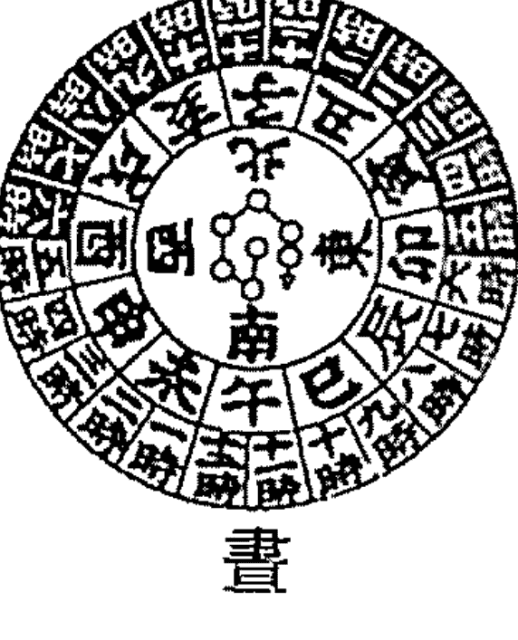
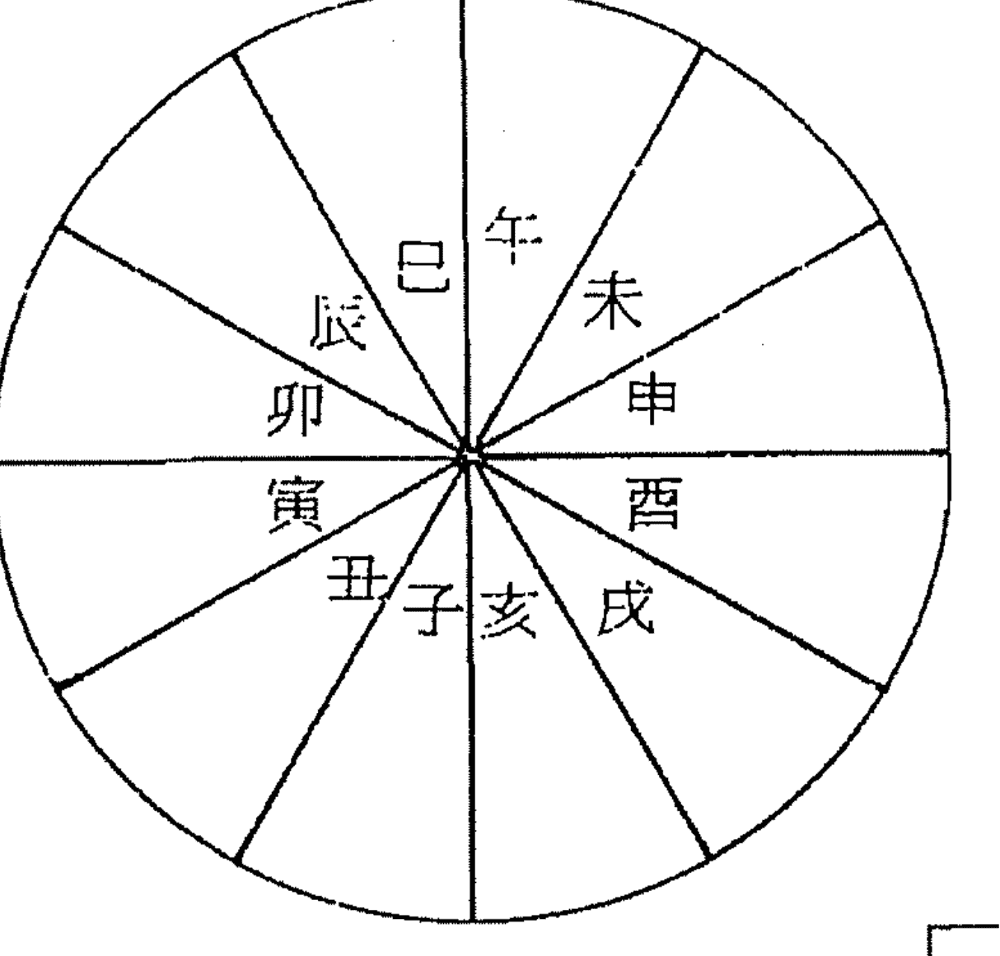
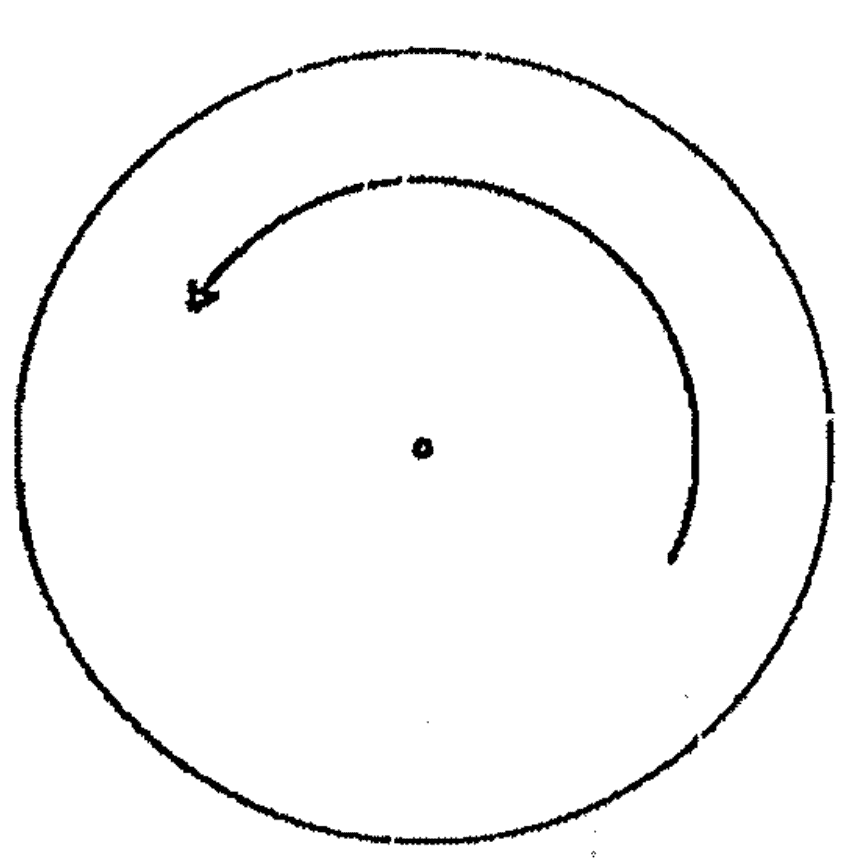
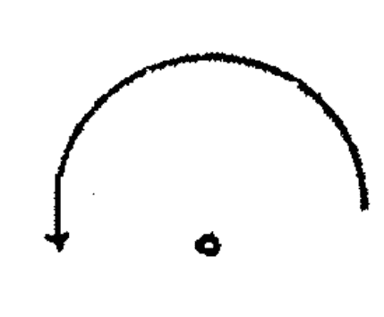
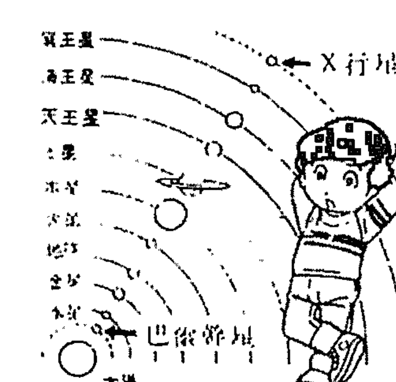

# 紫微命谱上

# 先賢序

余自幼好玄學、命理，希冀求得鬼谷術，遍訪明師數十年，所遇盛名而虛偽者，不下三十餘位，或傳教有理，占之不靈；或全篇大道，而茫然不敢批斷；或盡說謬論，卻無法占卜吉凶大事；偶有一、二卦準訣，又纏雜眾多牽強卦辭，天下之大，竟路不通，難尋一明師，個中苦味，殆已偏嘗。探求命理，只投一位師傅，實在不夠，非得多位師父之理論，互相印證，實難辨知真假與虛實，自入星化派紫微斗數一門後，始知星命奧妙通乾坤，貫宇宙，透造化，無物不大不包，無微不括，無物不容，投師雖多，而妙通一性「命醫」三絕者，師祖沈平山一人耳。

吾師星禪子（鄭子磯），係師祖的紫微奇門弟子，對佛學、風水素有研究，課堂常聽及師祖的種種傳奇，個個同學驚異萬分，令佩不已。

近月，有幸跟隨老師拜

# 異能神醫

命理大師

房中奇仙

# 卜正宗

沈平山

世儒崇尙實學，而淺求理數，但知有強權，而匪知天命，沈君乃吾所見之年青奇士，風流倜儻。平素生活，恬淡寡慾，手不拿筆，夜不把書，然一年之間，竟完成十多部「星命鉅作」，今示近代名人命譜二書，文中思維之詳實，寫作之神速，令人詫異。

覽閱此書，實一般命學專家難於下筆者。

- 一難，批命是難，知人生辰更難。
- 二難，透徹紫微文意頗難，創見星命源旨更難。
- 三難，窮通天文科學、與人類歷史尤難。

觀其批命，不問生辰，不排星命，輒然掏指神算，而知來人紫斗盤，占事如神，前可知往，後可預卜，堪臻造化。試探所學，無師而自通，不讀命書而天合其意，是吾所見奇人中之奇人，試謂之「半仙」。

房山
姚鳳翔

# 中國命理一大宗派

仙機絕學

命理講座

星化派祖師沈平山，每年傳授斗數新法，高徒儕儕，名揚五術界。

星化天地禪，洞觀造化不離乾坤大道，飛星佈局，推排萬象天機，移星換斗，數理通神，斗數二分，無形術，由我八百年後，尚有三五分，由神水老祖，找阿有微夷奇神蠱，伏羲示陰陽，蜘蛛姐窟八卦，螺龜紫微天歲，宮蛛伏找尚有斗移乾星，笑雄姐示陰陽，蜘蛛姐窟八卦，螺龜紫微天歲，宮蛛伏找尚有斗移乾星，笑雄姐示陰陽，蜘蛛姐窟八卦，螺龜紫微天歲，宮蛛伏找尚有斗移乾星，笑雄姐示陰陽，蜘蛛姐窟八卦，螺龜紫微天歲，宮蛛伏找尚有斗移乾星，笑雄姐示陰陽，蜘蛛姐窟八卦，螺龜紫微天歲，宮蛛伏找尚有斗移乾星，笑雄姐示陰陽，蜘蛛姐窟八卦，螺龜紫微天歲，宮蛛伏找尚有斗移乾星，笑雄姐示陰陽，蜘蛛姐窟八卦，螺龜紫微天歲，宮蛛伏找尚有斗移乾星，笑雄姐示陰陽，蜘蛛姐窟八卦，螺龜紫微天歲，宮蛛伏找尚有斗移乾星，笑雄姐示陰陽，蜘蛛姐窟八卦，螺龜紫微天歲，宮蛛伏找尚有斗移乾星，笑雄姐示陰陽，蜘蛛姐窟八卦，螺龜紫微天歲，宮蛛伏找尚有斗移乾星，笑雄姐示陰陽，蜘蛛姐窟八卦，螺龜紫微天歲，宮蛛伏找尚有斗移乾星，笑雄姐示陰陽，蜘蛛姐窟八卦，螺龜紫微天歲，宮蛛伏找尚有斗移乾星，笑雄姐示陰陽，蜘蛛姐窟八卦，螺龜紫微天歲，宮蛛伏找尚有斗移乾星，笑雄姐示陰陽，蜘蛛姐窟八卦，螺龜紫微天歲，宮蛛伏找尚有斗移乾星，笑雄姐示陰陽，蜘蛛姐窟八卦，螺龜紫微天歲，宮蛛伏找尚有斗移乾星，笑雄姐示陰陽，蜘蛛姐窟八卦，螺龜紫微天歲，宮蛛伏找尚有斗移乾星，笑雄姐示陰陽，蜘蛛姐窟八卦，螺龜紫微天歲，宮蛛伏找尚有斗移乾星，笑雄姐示陰陽，蜘蛛姐窟八卦，螺龜紫微天歲，宮蛛伏找尚有斗移乾星，笑雄姐示陰陽，蜘蛛姐窟八卦，螺龜紫微天歲，宮蛛伏找尚有斗移乾星，笑雄姐示陰陽，蜘蛛姐窟八卦，螺龜紫微天歲，宮蛛伏找尚有斗移乾星，笑雄姐示陰陽，蜘蛛姐窟八卦，螺龜紫微天歲，宮蛛伏找尚有斗移乾星，笑雄姐示陰陽，蜘蛛姐窟八卦，螺龜紫微天歲，宮蛛伏找尚有斗移乾星，笑雄姐示陰陽，蜘蛛姐窟八卦，螺龜紫微天歲，宮蛛伏找尚有斗移乾星，笑雄姐示陰陽，蜘蛛姐窟八卦，螺龜紫微天歲，宮蛛伏找尚有斗移乾星，笑雄姐示陰陽，蜘蛛姐窟八卦，螺龜紫微天歲，宮蛛伏找尚有斗移乾星，笑雄姐示陰陽，蜘蛛姐窟八卦，螺龜紫微天歲，宮蛛伏找尚有斗移乾星，笑雄姐示陰陽，蜘蛛姐窟八卦，螺龜紫微天歲，宮蛛伏找尚有斗移乾星，笑雄姐示陰陽，蜘蛛姐窟八卦，螺龜紫微天歲，宮蛛伏找尚有斗移乾星，笑雄姐示陰陽，蜘蛛姐窟八卦，螺龜紫微天歲，宮蛛伏找尚有斗移乾星，笑雄姐示陰陽，蜘蛛姐窟八卦，螺龜紫微天歲，宮蛛伏找尚有斗移乾星，笑雄姐示陰陽，蜘蛛姐窟八卦，螺龜紫微天歲，宮蛛伏找尚有斗移乾星，笑雄姐示陰陽，蜘蛛姐窟八卦，螺龜紫微天歲，宮蛛伏找尚有斗移乾星，笑雄姐示陰陽，蜘蛛姐窟八卦，螺龜紫微天歲，宮蛛伏找尚有斗移乾星，笑雄姐示陰陽，蜘蛛姐窟八卦，螺龜紫微天歲，宮蛛伏找尚有斗移乾星，笑雄姐示陰陽，蜘蛛姐窟八卦，螺龜紫微天歲，宮蛛伏找尚有斗移乾星，笑雄姐示陰陽，蜘蛛姐窟八卦，螺龜紫微天歲，宮蛛伏找尚有斗移乾星，笑雄姐示陰陽，蜘蛛姐窟八卦，螺龜紫微天歲，宮蛛伏找尚有斗移乾星，笑雄姐示陰陽，蜘蛛姐窟八卦，螺龜紫微天歲，宮蛛伏找尚有斗移乾星，笑雄姐示陰陽，蜘蛛姐窟八卦，螺龜紫微天歲，宮蛛伏找尚有斗移乾星，笑雄姐示陰陽，蜘蛛姐窟八卦，螺龜紫微天歲，宮蛛伏找尚有斗移乾星，笑雄姐示陰陽，蜘蛛姐窟八卦，螺龜紫微天歲，宮蛛伏找尚有斗移乾星，笑雄姐示陰陽，蜘蛛姐窟八卦，螺龜紫微天歲，宮蛛伏找尚有斗移乾星，笑雄姐示陰陽，蜘蛛姐窟八卦，螺龜紫微天歲，宮蛛伏找尚有斗移乾星，笑雄姐示陰陽，蜘蛛姐窟八卦，螺龜紫微天歲，宮蛛伏找尚有斗移乾星，笑雄姐示陰陽，蜘蛛姐窟八卦，螺龜紫微天歲，宮蛛伏找尚有斗移乾星，笑雄姐示陰陽，蜘蛛姐窟八卦，螺龜紫微天歲，宮蛛伏找尚有斗移乾星，笑雄姐示陰陽，蜘蛛姐窟八卦，螺龜紫微天歲，宮蛛伏找尚有斗移乾星，笑雄姐示陰陽，蜘蛛姐窟八卦，螺龜紫微天歲，宮蛛伏找尚有斗移乾星，笑雄姐示陰陽，蜘蛛姐窟八卦，螺龜紫微天歲，宮蛛伏找尚有斗移乾星，笑雄姐示陰陽，蜘蛛姐窟八卦，螺龜紫微天歲，宮蛛伏找尚有斗移乾星，笑雄姐示陰陽，蜘蛛姐窟八卦，螺龜紫微天歲，宮蛛伏找尚有斗移乾星，笑雄姐示陰陽，蜘蛛姐窟八卦，螺龜紫微天歲，宮蛛伏找尚有斗移乾星，笑雄姐示陰陽，蜘蛛姐窟八卦，螺龜紫微天歲，宮蛛伏找尚有斗移乾星，笑雄姐示陰陽，蜘蛛姐窟八卦，螺龜紫微天歲，宮蛛伏找尚有斗移乾星，笑雄姐示陰陽，蜘蛛姐窟八卦，螺龜紫微天歲，宮蛛伏找尚有斗移乾星，笑雄姐示陰陽，蜘蛛姐窟八卦，螺龜紫微天歲，宮蛛伏找尚有斗移乾星，笑雄姐示陰陽，蜘蛛姐窟八卦，螺龜紫微天歲，宮蛛伏找尚有斗移乾星，笑雄姐示陰陽，蜘蛛姐窟八卦，螺龜紫微天歲，宮蛛伏找尚有斗移乾星，笑雄姐示陰陽，蜘蛛姐窟八卦，螺龜紫微天歲，宮蛛伏找尚有斗移乾星，笑雄姐示陰陽，蜘蛛姐窟八卦，螺龜紫微天歲，宮蛛伏找尚有斗移乾星，笑雄姐示陰陽，蜘蛛姐窟八卦，螺龜紫微天歲，宮蛛伏找尚有斗移乾星，笑雄姐示陰陽，蜘蛛姐窟八卦，螺龜紫微天歲，宮蛛伏找尚有斗移乾星，笑雄姐示陰陽，蜘蛛姐窟八卦，螺龜紫微天歲，宮蛛伏找尚有斗移乾星，笑雄姐示陰陽，蜘蛛姐窟八卦，螺龜紫微天歲，宮蛛伏找尚有斗移乾星，笑雄姐示陰陽，蜘蛛姐窟八卦，螺龜紫微天歲，宮蛛伏找尚有斗移乾星，笑雄姐示陰陽，蜘蛛姐窟八卦，螺龜紫微天歲，宮蛛伏找尚有斗移乾星，笑雄姐示陰陽，蜘蛛姐窟八卦，螺龜紫微天歲，宮蛛伏找尚有斗移乾星，笑雄姐示陰陽，蜘蛛姐窟八卦，螺龜紫微天歲，宮蛛伏找尚有斗移乾星，笑雄姐示陰陽，蜘蛛姐窟八卦，螺龜紫微天歲，宮蛛伏找尚有斗移乾星，笑雄姐示陰陽，蜘蛛姐窟八卦，螺龜紫微天歲，宮蛛伏找尚有斗移乾星，笑雄姐示陰陽，蜘蛛姐窟八卦，螺龜紫微天歲，宮蛛伏找尚有斗移乾星，笑雄姐示陰陽，蜘蛛姐窟八卦，螺龜紫微天歲，宮蛛伏找尚有斗移乾星，笑雄姐示陰陽，蜘蛛姐窟八卦，螺龜紫微天歲，宮蛛伏找尚有斗移乾星，笑雄姐示陰陽，蜘蛛姐窟八卦，螺龜紫微天歲，宮蛛伏找尚有斗移乾星，笑雄姐示陰陽，蜘蛛姐窟八卦，螺龜紫微天歲，宮蛛伏找尚有斗移乾星，笑雄姐示陰陽，蜘蛛姐窟八卦，螺龜紫微天歲，宮蛛伏找尚有斗移乾星，笑雄姐示陰陽，蜘蛛姐窟八卦，螺龜紫微天歲，宮蛛伏找尚有斗移乾星，笑雄姐示陰陽，蜘蛛姐窟八卦，螺龜紫微天歲，宮蛛伏找尚有斗移乾星，笑雄姐示陰陽，蜘蛛姐窟八卦，螺龜紫微天歲，宮蛛伏找尚有斗移乾星，笑雄姐示陰陽，蜘蛛姐窟八卦，螺龜紫微天歲，宮蛛伏找尚有斗移乾星，笑雄姐示陰陽，蜘蛛姐窟八卦，螺龜紫微天歲，宮蛛伏找尚有斗移乾星，笑雄姐示陰陽，蜘蛛姐窟八卦，螺龜紫微天歲，宮蛛伏找尚有斗移乾星，笑雄姐示陰陽，蜘蛛姐窟八卦，螺龜紫微天歲，宮蛛伏找尚有斗移乾星，笑雄姐示陰陽，蜘蛛姐窟八卦，螺龜紫微天歲，宮蛛伏找尚有斗移乾星，笑雄姐示陰陽，蜘蛛姐窟八卦，螺龜紫微天歲，宮蛛伏找尚有斗移乾星，笑雄姐示陰陽，蜘蛛姐窟八卦，螺龜紫微天歲，宮蛛伏找尚有斗移乾星，笑雄姐示陰陽，蜘蛛姐窟八卦，螺龜紫微天歲，宮蛛伏找尚有斗移乾星，笑雄姐示陰陽，蜘蛛姐窟八卦，螺龜紫微天歲，宮蛛伏找尚有斗移乾星，笑雄姐示陰陽，蜘蛛姐窟八卦，螺龜紫微天歲，宮蛛伏找尚有斗移乾星，笑雄姐示陰陽，蜘蛛姐窟八卦，螺龜紫微天歲，宮蛛伏找尚有斗移乾星，笑雄姐示陰陽，蜘蛛姐窟八卦，螺龜紫微天歲，宮蛛伏找尚有斗移乾星，笑雄姐示陰陽，蜘蛛姐窟八卦，螺龜紫微天歲，宮蛛伏找尚有斗移乾星，笑雄姐示陰陽，蜘蛛姐窟八卦，螺龜紫微天歲，宮蛛伏找尚有斗移乾星，笑雄姐示陰陽，蜘蛛姐窟八卦，螺龜紫微天歲，宮蛛伏找尚有斗移乾星，笑雄姐示陰陽，蜘蛛姐窟八卦，螺龜紫微天歲，宮蛛伏找尚有斗移乾星，笑雄姐示陰陽，蜘蛛姐窟八卦，螺龜紫微天歲，宮蛛伏找尚有斗移乾星，笑雄姐示陰陽，蜘蛛姐窟八卦，螺龜紫微天歲，宮蛛伏找尚有斗移乾星，笑雄姐示陰陽，蜘蛛姐窟八卦，螺龜紫微天歲，宮蛛伏找尚有斗移乾星，笑雄姐示陰陽，蜘蛛姐窟八卦，螺龜紫微天歲，宮蛛伏找尚有斗移乾星，笑雄姐示陰陽，蜘蛛姐窟八卦，螺龜紫微天歲，宮蛛伏找尚有斗移乾星，笑雄姐示陰陽，蜘蛛姐窟八卦，螺龜紫微天歲，宮蛛伏找尚有斗移乾星，笑雄姐示陰陽，蜘蛛姐窟八卦，螺龜紫微天歲，宮蛛伏找尚有斗移乾星，笑雄姐示陰陽，蜘蛛姐窟八卦，螺龜紫微天歲，宮蛛伏找尚有斗移乾星，笑雄姐示陰陽，蜘蛛姐窟八卦，螺龜紫微天歲，宮蛛伏找尚有斗移乾星，笑雄姐示陰陽，蜘蛛姐窟八卦，螺龜紫微天歲，宮蛛伏找尚有斗移乾星，笑雄姐示陰陽，蜘蛛姐窟八卦，螺龜紫微天歲，宮蛛伏找尚有斗移乾星，笑雄姐示陰陽，蜘蛛姐窟八卦，螺龜紫微天歲，宮蛛伏找尚有斗移乾星，笑雄姐示陰陽，蜘蛛姐窟八卦，螺龜紫微天歲，宮蛛伏找尚有斗移乾星，笑雄姐示陰陽，蜘蛛姐窟八卦，螺龜紫微天歲，宮蛛伏找尚有斗移乾星，笑雄姐示陰陽，蜘蛛姐窟八卦，螺龜紫微天歲，宮蛛伏找尚有斗移乾星，笑雄姐示陰陽，蜘蛛姐窟八卦，螺龜紫微天歲，宮蛛伏找尚有斗移乾星，笑雄姐示陰陽，蜘蛛姐窟八卦，螺龜紫微天歲，宮蛛伏找尚有斗移乾星，笑雄姐示陰陽，蜘蛛姐窟八卦，螺龜紫微天歲，宮蛛伏找尚有斗移乾星，笑雄姐示陰陽，蜘蛛姐窟八卦，螺龜紫微天歲，宮蛛伏找尚有斗移乾星，笑雄姐示陰陽，蜘蛛姐窟八卦，螺龜紫微天歲，宮蛛伏找尚有斗移乾星，笑雄姐示陰陽，蜘蛛姐窟八卦，螺龜紫微天歲，宮蛛伏找尚有斗移乾星，笑雄姐示陰陽，蜘蛛姐窟八卦，螺龜紫微天歲，宮蛛伏找尚有斗移乾星，笑雄姐示陰陽，蜘蛛姐窟八卦，螺龜紫微天歲，宮蛛伏找尚有斗移乾星，笑雄姐示陰陽，蜘蛛姐窟八卦，螺龜紫微天歲，宮蛛伏找尚有斗移乾星，笑雄姐示陰陽，蜘蛛姐窟八卦，螺龜紫微天歲，宮蛛伏找尚有斗移乾星，笑雄姐示陰陽，蜘蛛姐窟八卦，螺龜紫微天歲，宮蛛伏找尚有斗移乾星，笑雄姐示陰陽，蜘蛛姐窟八卦，螺龜紫微天歲，宮蛛伏找尚有斗移乾星，笑雄姐示陰陽，蜘蛛姐窟八卦，螺龜紫微天歲，宮蛛伏找尚有斗移乾星，笑雄姐示陰陽，蜘蛛姐窟八卦，螺龜紫微天歲，宮蛛伏找尚有斗移乾星，笑雄姐示陰陽，蜘蛛姐窟八卦，螺龜紫微天歲，宮蛛伏找尚有斗移乾星，笑雄姐示陰陽，蜘蛛姐窟八卦，螺龜紫微天歲，宮蛛伏找尚有斗移乾星，笑雄姐示陰陽，蜘蛛姐窟八卦，螺龜紫微天歲，宮蛛伏找尚有斗移乾星，笑雄姐示陰陽，蜘蛛姐窟八卦，螺龜紫微天歲，宮蛛伏找尚有斗移乾星，笑雄姐示陰陽，蜘蛛姐窟八卦，螺龜紫微天歲，宮蛛伏找尚有斗移乾星，笑雄姐示陰陽，蜘蛛姐窟八卦，螺龜紫微天歲，宮蛛伏找尚有斗移乾星，笑雄姐示陰陽，蜘蛛姐窟八卦，螺龜紫微天歲，宮蛛伏找尚有斗移乾星，笑雄姐示陰陽，蜘蛛姐窟八卦，螺龜紫微天歲，宮蛛伏找尚有斗移乾星，笑雄姐示陰陽，蜘蛛姐窟八卦，螺龜紫微天歲，宮蛛伏找尚有斗移乾星，笑雄姐示陰陽，蜘蛛姐窟八卦，螺龜紫微天歲，宮蛛伏找尚有斗移乾星，笑雄姐示陰陽，蜘蛛姐窟八卦，螺龜紫微天歲，宮蛛伏找尚有斗移乾星，笑雄姐示陰陽，蜘蛛姐窟八卦，螺龜紫微天歲，宮蛛伏找尚有斗移乾星，笑雄姐示陰陽，蜘蛛姐窟八卦，螺龜紫微天歲，宮蛛伏找尚有斗移乾星，笑雄姐示陰陽，蜘蛛姐窟八卦，螺龜紫微天歲，宮蛛伏找尚有斗移乾星，笑雄姐示陰陽，蜘蛛姐窟八卦，螺龜紫微天歲，宮蛛伏找尚有斗移乾星，笑雄姐示陰陽，蜘蛛姐窟八卦，螺龜紫微天歲，宮蛛伏找尚有斗移乾星，笑雄姐示陰陽，蜘蛛姐窟八卦，螺龜紫微天歲，宮蛛伏找尚有斗移乾星，笑雄姐示陰陽，蜘蛛姐窟八卦，螺龜紫微天歲，宮蛛伏找尚有斗移乾星，笑雄姐示陰陽，蜘蛛姐窟八卦，螺龜紫微天歲，宮蛛伏找尚有斗移乾星，笑雄姐示陰陽，蜘蛛姐窟八卦，螺龜紫微天歲，宮蛛伏找尚有斗移乾星，笑雄姐示陰陽，蜘蛛姐窟八卦，螺龜紫微天歲，宮蛛伏找尚有斗移乾星，笑雄姐示陰陽，蜘蛛姐窟八卦，螺龜紫微天歲，宮蛛伏找尚有斗移乾星，笑雄姐示陰陽，蜘蛛姐窟八卦，螺龜紫微天歲，宮蛛伏找尚有斗移乾星，笑雄姐示陰陽，蜘蛛姐窟八卦，螺龜紫微天歲，宮蛛伏找尚有斗移乾星，笑雄姐示陰陽，蜘蛛姐窟八卦，螺龜紫微天歲，宮蛛伏找尚有斗移乾星，笑雄姐示陰陽，蜘蛛姐窟八卦，螺龜紫微天歲，宮蛛伏找尚有斗移乾星，笑雄姐示陰陽，蜘蛛姐窟八卦，螺龜紫微天歲，宮蛛伏找尚有斗移乾星，笑雄姐示陰陽，蜘蛛姐窟八卦，螺龜紫微天歲，宮蛛伏找尚有斗移乾星，笑雄姐示陰陽，蜘蛛姐窟八卦，螺龜紫微天歲，宮蛛伏找尚有斗移乾星，笑雄姐示陰陽，蜘蛛姐窟八卦，螺龜紫微天歲，宮蛛伏找尚有斗移乾星，笑雄姐示陰陽，蜘蛛姐窟八卦，螺龜紫微天歲，宮蛛伏找尚有斗移乾星，笑雄姐示陰陽，蜘蛛姐窟八卦，螺龜紫微天歲，宮蛛伏找尚有斗移乾星，笑雄姐示陰陽，蜘蛛姐窟八卦，螺龜紫微天歲，宮蛛伏找尚有斗移乾星，笑雄姐示陰陽，蜘蛛姐窟八卦，螺龜紫微天歲，宮蛛伏找尚有斗移乾星，笑雄姐示陰陽，蜘蛛姐窟八卦，螺龜紫微天歲，宮蛛伏找尚有斗移乾星，笑雄姐示陰陽，蜘蛛姐窟八卦，螺龜紫微天歲，宮蛛伏找尚有斗移乾星，笑雄姐示陰陽，蜘蛛姐窟八卦，螺龜紫微天歲，宮蛛伏找尚有斗移乾星，笑雄姐示陰陽，蜘蛛姐窟八卦，螺龜紫微天歲，宮蛛伏找尚有斗移乾星，笑雄姐示陰陽，蜘蛛姐窟八卦，螺龜紫微天歲，宮蛛伏找尚有斗移乾星，笑雄姐示陰陽，蜘蛛姐窟八卦，螺龜紫微天歲，宮蛛伏找尚有斗移乾星，笑雄姐示陰陽，蜘蛛姐窟八卦，螺龜紫微天歲，宮蛛伏找尚有斗移乾星，笑雄姐示陰陽，蜘蛛姐窟八卦，螺龜紫微天歲，宮蛛伏找尚有斗移乾星，笑雄姐示陰陽，蜘蛛姐窟八卦，螺龜紫微天歲，宮蛛伏找尚有斗移乾星，笑雄姐示陰陽，蜘蛛姐窟八卦，螺龜紫微天歲，宮蛛伏找尚有斗移乾星，笑雄姐示陰陽，蜘蛛姐窟八卦，螺龜紫微天歲，宮蛛伏找尚有斗移乾星，笑雄姐示陰陽，蜘蛛姐窟八卦，螺龜紫微天歲，宮蛛伏找尚有斗移乾星，笑雄姐示陰陽，蜘蛛姐窟八卦，螺龜紫微天歲，宮蛛伏找尚有斗移乾星，笑雄姐示陰陽，蜘蛛姐窟八卦，螺龜紫微天歲，宮蛛伏找尚有斗移乾星，笑雄姐示陰陽，蜘蛛姐窟八卦，螺龜紫微天歲，宮蛛伏找尚有斗移乾星，笑雄姐示陰陽，蜘蛛姐窟八卦，螺龜紫微天歲，宮蛛伏找尚有斗移乾星，笑雄姐示陰陽，蜘蛛姐窟八卦，螺龜紫微天歲，宮蛛伏找尚有斗移乾星，笑雄姐示陰陽，蜘蛛姐窟八卦，螺龜紫微天歲，宮蛛伏找尚有斗移乾星，笑雄姐示陰陽，蜘蛛姐窟八卦，螺龜紫微天歲，宮蛛伏找尚有斗移乾星，笑雄姐示陰陽，蜘蛛姐窟八卦，螺龜紫微天歲，宮蛛伏找尚有斗移乾星，笑雄姐示陰陽，蜘蛛姐窟八卦，螺龜紫微天歲，宮蛛伏找尚有斗移乾星，笑雄姐示陰陽，蜘蛛姐窟八卦，螺龜紫微天歲，宮蛛伏找尚有斗移乾星，笑雄姐示陰陽，蜘蛛姐窟八卦，螺龜紫微天歲，宮蛛伏找尚有斗移乾星，笑雄姐示陰陽，蜘蛛姐窟八卦，螺龜紫微天歲，宮蛛伏找尚有斗移乾星，笑雄姐示陰陽，蜘蛛姐窟八卦，螺龜紫微天歲，宮蛛伏找尚有斗移乾星，笑雄姐示陰陽，蜘蛛姐窟八卦，螺龜紫微天歲，宮蛛伏找尚有斗移乾星，笑雄姐示陰陽，蜘蛛姐窟八卦，螺龜紫微天歲，宮蛛伏找尚有斗移乾星，笑雄姐示陰陽，蜘蛛姐窟八卦，螺龜紫微天歲，宮蛛伏找尚有斗移乾星，笑雄姐示陰陽，蜘蛛姐窟八卦，螺龜紫微天歲，宮蛛伏找尚有斗移乾星，笑雄姐示陰陽，蜘蛛姐窟八卦，螺龜紫微天歲，宮蛛伏找尚有斗移乾星，笑雄姐示陰陽，蜘蛛姐窟八卦，螺龜紫微天歲，宮蛛伏找尚有斗移乾星，笑雄姐示陰陽，蜘蛛姐窟八卦，螺龜紫微天歲，宮蛛伏找尚有斗移乾星，笑雄姐示陰陽，蜘蛛姐窟八卦，螺龜紫微天歲，宮蛛伏找尚有斗移乾星，笑雄姐示陰陽，蜘蛛姐窟八卦，螺龜紫微天歲，宮蛛伏找尚有斗移乾星，笑雄姐示陰陽，蜘蛛姐窟八卦，螺龜紫微天歲，宮蛛伏找尚有斗移乾星，笑雄姐示陰陽，蜘蛛姐窟八卦，螺龜紫微天歲，宮蛛伏找尚有斗移乾星，笑雄姐示陰陽，蜘蛛姐窟八卦，螺龜紫微天歲，宮蛛伏找尚有斗移乾星，笑雄姐示陰陽，蜘蛛姐窟八卦，螺龜紫微天歲，宮蛛伏找尚有斗移乾星，笑雄姐示陰陽，蜘蛛姐窟八卦，螺龜紫微天歲，宮蛛伏找尚有斗移乾星，笑雄姐示陰陽，蜘蛛姐窟八卦，螺龜紫微天歲，宮蛛伏找尚有斗移乾星，笑雄姐示陰陽，蜘蛛姐窟八卦，螺龜紫微天歲，宮蛛伏找尚有斗移乾星，笑雄姐示陰陽，蜘蛛姐窟八卦，螺龜紫微天歲，宮蛛伏找尚有斗移乾星，笑雄姐示陰陽，蜘蛛姐窟八卦，螺龜紫微天歲，宮蛛伏找尚有斗移乾星，笑雄姐示陰陽，蜘蛛姐窟八卦，螺龜紫微天歲，宮蛛伏找尚有斗移乾星，笑雄姐示陰陽，蜘蛛姐窟八卦，螺龜紫微天歲，宮蛛伏找尚有斗移乾星，笑雄姐示陰陽，蜘蛛姐窟八卦，螺龜紫微天歲，宮蛛伏找尚有斗移乾星，笑雄姐示陰陽，蜘蛛姐窟八卦，螺龜紫微天歲，宮蛛伏找尚有斗移乾星，笑雄姐示陰陽，蜘蛛姐窟八卦，螺龜紫微天歲，宮蛛伏找尚有斗移乾星，笑雄姐示陰陽，蜘蛛姐窟八卦，螺龜紫微天歲，宮蛛伏找尚有斗移乾星，笑雄姐示陰陽，蜘蛛姐窟八卦，螺龜紫微天歲，宮蛛伏找尚有斗移乾星，笑雄姐示陰陽，蜘蛛姐窟八卦，螺龜紫微天歲，宮蛛伏找尚有斗移乾星，笑雄姐示陰陽，蜘蛛姐窟八卦，螺龜紫微天歲，宮蛛伏找尚有斗移乾星，笑雄姐示陰陽，蜘蛛姐窟八卦，螺龜紫微天歲，宮蛛伏找尚有斗移乾星，笑雄姐示陰陽，蜘蛛姐窟八卦，螺龜紫微天歲，宮蛛伏找尚有斗移乾星，笑雄姐示陰陽，蜘蛛姐窟八卦，螺龜紫微天歲，宮蛛伏找尚有斗移乾星，笑雄姐示陰陽，蜘蛛姐窟八卦，螺龜紫微天歲，宮蛛伏找尚有斗移乾星，笑雄姐示陰陽，蜘蛛姐窟八卦，螺龜紫微天歲，宮蛛伏找尚有斗移乾星，笑雄姐示陰陽，蜘蛛姐窟八卦，螺龜紫微天歲，宮蛛伏找尚有斗移乾星，笑雄姐示陰陽，蜘蛛姐窟八卦，螺龜紫微天歲，宮蛛伏找尚有斗移乾星，笑雄姐示陰陽，蜘蛛姐窟八卦，螺龜紫微天歲，宮蛛伏找尚有斗移乾星，笑雄姐示陰陽，蜘蛛姐窟八卦，螺龜紫微天歲，宮蛛伏找尚有斗移乾星，笑雄姐示陰陽，蜘蛛姐窟八卦，螺龜紫微天歲，宮蛛伏找尚有斗移乾星，笑雄姐示陰陽，蜘蛛姐窟八卦，螺龜紫微天歲，宮蛛伏找尚有斗移乾星，笑雄姐示陰陽，蜘蛛姐窟八卦，螺龜紫微天歲，宮蛛伏找尚有斗移乾星，笑雄姐示陰陽，蜘蛛姐窟八卦，螺龜紫微天歲，宮蛛伏找尚有斗移乾星，笑雄姐示陰陽，蜘蛛姐窟八卦，螺龜紫微天歲，宮蛛伏找尚有斗移乾星，笑雄姐示陰陽，蜘蛛姐窟八卦，螺龜紫微天歲，宮蛛伏找尚有斗移乾星，笑雄姐示陰陽，蜘蛛姐窟八卦，螺龜紫微天歲，宮蛛伏找尚有斗移乾星，笑雄姐示陰陽，蜘蛛姐窟八卦，螺龜紫微天歲，宮蛛伏找尚有斗移乾星，笑雄姐示陰陽，蜘蛛姐窟八卦，螺龜紫微天歲，宮蛛伏找尚有斗移乾星，笑雄姐示陰陽，蜘蛛姐窟八卦，螺龜紫微天歲，宮蛛伏找尚有斗移乾星，笑雄姐示陰陽，蜘蛛姐窟八卦，螺龜紫微天歲，宮蛛伏找尚有斗移乾星，笑雄姐示陰陽，蜘蛛姐窟八卦，螺龜紫微天歲，宮蛛伏找尚有斗移乾星，笑雄姐示陰陽，蜘蛛姐窟八卦，螺龜紫微天歲，宮蛛伏找尚有斗移乾星，笑雄姐示陰陽，蜘蛛姐窟八卦，螺龜紫微天歲，宮蛛伏找尚有斗移乾星，笑雄姐示陰陽，蜘蛛姐窟八卦，螺龜紫微天歲，宮蛛伏找尚有斗移乾星，笑雄姐示陰陽，蜘蛛姐窟八卦，螺龜紫微天歲，宮蛛伏找尚有斗移乾星，笑雄姐示陰陽，蜘蛛姐窟八卦，螺龜紫微天歲，宮蛛伏找尚有斗移乾星，笑雄姐示陰陽，蜘蛛姐窟八卦，螺龜紫微天歲，宮蛛伏找尚有斗移乾星，笑雄姐示陰陽，蜘蛛姐窟八卦，螺龜紫微天歲，宮蛛伏找尚有斗移乾星，笑雄姐示陰陽，蜘蛛姐窟八卦，螺龜紫微天歲，宮蛛伏找尚有斗移乾星，笑雄姐示陰陽，蜘蛛姐窟八卦，螺龜紫微天歲，宮蛛伏找尚有斗移乾星，笑雄姐示陰陽，蜘蛛姐窟八卦，螺龜紫微天歲，宮蛛伏找尚有斗移乾星，笑雄姐示陰陽，蜘蛛姐窟八卦，螺龜紫微天歲，宮蛛伏找尚有斗移乾星，笑雄姐示陰陽，蜘蛛姐窟八卦，螺龜紫微天歲，宮蛛伏找尚有斗移乾星，笑雄姐示陰陽，蜘蛛姐窟八卦，螺龜紫微天歲，宮蛛伏找尚有斗移乾星，笑雄姐示陰陽，蜘蛛姐窟八卦，螺龜紫微天歲，宮蛛伏找尚有斗移乾星，笑雄姐示陰陽，蜘蛛姐窟八卦，螺龜紫微天歲，宮蛛伏找尚有斗移乾星，笑雄姐示陰陽，蜘蛛姐窟八卦，螺龜紫微天歲，宮蛛伏找尚有斗移乾星，笑雄姐示陰陽，蜘蛛姐窟八卦，螺龜紫微天歲，宮蛛伏找尚有斗移乾星，笑雄姐示陰陽，蜘蛛姐窟八卦，螺龜紫微天歲，宮蛛伏找尚有斗移乾星，笑雄姐示陰陽，蜘蛛姐窟八卦，螺龜紫微天歲，宮蛛伏找尚有斗移乾星，笑雄姐示陰陽，蜘蛛姐窟八卦，螺龜紫微天歲，宮蛛伏找尚有斗移乾星，笑雄姐示陰陽，蜘蛛姐窟八卦，螺龜紫微天歲，宮蛛伏找尚有斗移乾星，笑雄姐示陰陽，蜘蛛姐窟八卦，螺龜紫微天歲，宮蛛伏找尚有斗移乾星，笑雄姐示陰陽，蜘蛛姐窟八卦，螺龜紫微天歲，宮蛛伏找尚有斗移乾星，笑雄姐示陰陽，蜘蛛姐窟八卦，螺龜紫微天歲，宮蛛伏找尚有斗移乾星，笑雄姐示陰陽，蜘蛛姐窟八卦，螺龜紫微天歲，宮蛛伏找尚有斗移乾星，笑雄姐示陰陽，蜘蛛姐窟八卦，螺龜紫微天歲，宮蛛伏找尚有斗移乾星，笑雄姐示陰陽，蜘蛛姐窟八卦，螺龜紫微天歲，宮蛛伏找尚有斗移乾星，笑雄姐示陰陽，蜘蛛姐窟八卦，螺龜紫微天歲，宮蛛伏找尚有斗移乾星，笑雄姐示陰陽，蜘蛛姐窟八卦，螺龜紫微天歲，宮蛛伏找尚有斗移乾星，笑雄姐示陰陽，蜘蛛姐窟八卦，螺龜紫微天歲，宮蛛伏找尚有斗移乾星，笑雄姐示陰陽，蜘蛛姐窟八卦，螺龜紫微天歲，宮蛛伏找尚有斗移乾星，笑雄姐示陰陽，蜘蛛姐窟八卦，螺龜紫微天歲，宮蛛伏找尚有斗移乾星，笑雄姐示陰陽，蜘蛛姐窟八卦，螺龜紫微天歲，宮蛛伏找尚有斗移乾星，笑雄姐示陰陽，蜘蛛姐窟八卦，螺龜紫微天歲，宮蛛伏找尚有斗移乾星，笑雄姐示陰陽，蜘蛛姐窟八卦，螺龜紫微天歲，宮蛛伏找尚有斗移乾星，笑雄姐示陰陽，蜘蛛姐窟八卦，螺龜紫微天歲，宮蛛伏找尚有斗移乾星，笑雄姐示陰陽，蜘蛛姐窟八卦，螺龜紫微天歲，宮蛛伏找尚有斗移乾星，笑雄姐示陰陽，蜘蛛姐窟八卦，螺龜紫微天歲，宮蛛伏找尚有斗移乾星，笑雄姐示陰陽，蜘蛛姐窟八卦，螺龜紫微天歲，宮蛛伏找尚有斗移乾星，笑雄姐示陰陽，蜘蛛姐窟八卦，螺龜紫微天歲，宮蛛伏找尚有斗移乾星，笑雄姐示陰陽，蜘蛛姐窟八卦，螺龜紫微天歲，宮蛛伏找尚有斗移乾星，笑雄姐示陰陽，蜘蛛姐窟八卦，螺龜紫微天歲，宮蛛伏找尚有斗移乾星，笑雄姐示陰陽，蜘蛛姐窟八卦，螺龜紫微天歲，宮蛛伏找尚有斗移乾星，笑雄姐示陰陽，蜘蛛姐窟八卦，螺龜紫微天歲，宮蛛伏找尚有斗移乾星，笑雄姐示陰陽，蜘蛛姐窟八卦，螺龜紫微天歲，宮蛛伏找尚有斗移乾星，笑雄姐示陰陽，蜘蛛姐窟八卦，螺龜紫微天歲，宮蛛伏找尚有斗移乾星，笑雄姐示陰陽，蜘蛛姐窟八卦，螺龜紫微天歲，宮蛛伏找尚有斗移乾星，笑雄姐示陰陽，蜘蛛姐窟八卦，螺龜紫微天歲，宮蛛伏找尚有斗移乾星，笑雄姐示陰陽，蜘蛛姐窟八卦，螺龜紫微天歲，宮蛛伏找尚有斗移乾星，笑雄姐示陰陽，蜘蛛姐窟八卦，螺龜紫微天歲，宮蛛伏找尚有斗移乾星，笑雄姐示陰陽，蜘蛛姐窟八卦，螺龜紫微天歲，宮蛛伏找尚有斗移乾星，笑雄姐示陰陽，蜘蛛姐窟八卦，螺龜紫微天歲，宮蛛伏找尚有斗移乾星，笑雄姐示陰陽，蜘蛛姐窟八卦，螺龜紫微天歲，宮蛛伏找尚有斗移乾星，笑雄姐示陰陽，蜘蛛姐窟八卦，螺龜紫微天歲，宮蛛伏找尚有斗移乾星，笑雄姐示陰陽，蜘蛛姐窟八卦，螺龜紫微天歲，宮蛛伏找尚有斗移乾星，笑雄姐示陰陽，蜘蛛姐窟八卦，螺龜紫微天歲，宮蛛伏找尚有斗移乾星，笑雄姐示陰陽，蜘蛛姐窟八卦，螺龜紫微天歲，宮蛛伏找尚有斗移乾星，笑雄姐示陰陽，蜘蛛姐窟八卦，螺龜紫微天歲，宮蛛伏找尚有斗移乾星，笑雄姐示陰陽，蜘蛛姐窟八卦，螺龜紫微天歲，宮蛛伏找尚有斗移乾星，笑雄姐示陰陽，蜘蛛姐窟八卦，螺龜紫微天歲，宮蛛伏找尚有斗移乾星，笑雄姐示陰陽，蜘蛛姐窟八卦，螺龜紫微天歲，宮蛛伏找尚有斗移乾星，笑雄姐示陰陽，蜘蛛姐窟八卦，螺龜紫微天歲，宮蛛伏找尚有斗移乾星，笑雄姐示陰陽，蜘蛛姐窟八卦，螺龜紫微天歲，宮蛛伏找尚有斗移乾星，笑雄姐示陰陽，蜘蛛姐窟八卦，螺龜紫微天歲，宮蛛伏找尚有斗移乾星，笑雄姐示陰陽，蜘蛛姐窟八卦，螺龜紫微天歲，宮蛛伏找尚有斗移乾星，笑雄姐示陰陽，蜘蛛姐窟八卦，螺龜紫微天歲，宮蛛伏找尚有斗移乾星，笑雄姐示陰陽，蜘蛛姐窟八卦，螺龜紫微天歲，宮蛛伏找尚有斗移乾星，笑雄姐示陰陽，蜘蛛姐窟八卦，螺龜紫微天歲，宮蛛伏找尚有斗移乾星，笑雄姐示陰陽，蜘蛛姐窟八卦，螺龜紫微天歲，宮蛛伏找尚有斗移乾星，笑雄姐示陰陽，蜘蛛姐窟八卦，螺龜紫微天歲，宮蛛伏找尚有斗移乾星，笑雄姐示陰陽，蜘蛛姐窟八卦，螺龜紫微天歲，宮蛛伏找尚有斗移乾星，笑雄姐示陰陽，蜘蛛姐窟八卦，螺龜紫微天歲，宮蛛伏找尚有斗移乾星，笑雄姐示陰陽，蜘蛛姐窟八卦，螺龜紫微天歲，宮蛛伏找尚有斗移乾星，笑雄姐示陰陽，蜘蛛姐窟八卦，螺龜紫微天歲，宮蛛伏找尚有斗移乾星，笑雄姐示陰陽，蜘蛛姐窟八卦，螺龜紫微天歲，宮蛛伏找尚有斗移乾星，笑雄姐示陰陽，蜘蛛姐窟八卦，螺龜紫微天歲，宮蛛伏找尚有斗移乾星，笑雄姐示陰陽，蜘蛛姐窟八卦，螺龜紫微天歲，宮蛛伏找尚有斗移乾星，笑雄姐示陰陽，蜘蛛姐窟八卦，螺龜紫微天歲，宮蛛伏找尚有斗移乾星，笑雄姐示陰陽，蜘蛛姐窟八卦，螺龜紫微天歲，宮蛛伏找尚有斗移乾星，笑雄姐示陰陽，蜘蛛姐窟八卦，螺龜紫微天歲，宮蛛伏找尚有斗移乾星，笑雄姐示陰陽，蜘蛛姐窟八卦，螺龜紫微天歲，宮蛛伏找尚有斗移乾星，笑雄姐示陰陽，蜘蛛姐窟八卦，螺龜紫微天歲，宮蛛伏找尚有斗移乾星，笑雄姐示陰陽，蜘蛛姐窟八卦，螺龜紫微天歲，宮蛛伏找尚有斗移乾星，笑雄姐示陰陽，蜘蛛姐窟八卦，螺龜紫微天歲，宮蛛伏找尚有斗移乾星，笑雄姐示陰陽，蜘蛛姐窟八卦，螺龜紫微天歲，宮蛛伏找尚有斗移乾星，笑雄姐示陰陽，蜘蛛姐窟八卦，螺龜紫微天歲，宮蛛伏找尚有斗移乾星，笑雄姐示陰陽，蜘蛛姐窟八卦，螺龜紫微天歲，宮蛛伏找尚有斗移乾星，笑雄姐示陰陽，蜘蛛姐窟八卦，螺龜紫微天歲，宮蛛伏找尚有斗移乾星，笑雄姐示陰陽，蜘蛛姐窟八卦，螺龜紫微天歲，宮蛛伏找尚有斗移乾星，笑雄姐示陰陽，蜘蛛姐窟八卦，螺龜紫微天歲，宮蛛伏找尚有斗移乾星，笑雄姐示陰陽，蜘蛛姐窟八卦，螺龜紫微天歲，宮蛛伏找尚有斗移乾星，笑雄姐示陰陽，蜘蛛姐窟八卦，螺龜紫微天歲，宮蛛伏找尚有斗移乾星，笑雄姐示陰陽，蜘蛛姐窟八卦，螺龜紫微天歲，宮蛛伏找尚有斗移乾星，笑雄姐示陰陽，蜘蛛姐窟八卦，螺龜紫微天歲，宮蛛伏找尚有斗移乾星，笑雄姐示陰陽，蜘蛛姐窟八卦，螺龜紫微天歲，宮蛛伏找尚有斗移乾星，笑雄姐示陰陽，蜘蛛姐窟八卦，螺龜紫微天歲，宮蛛伏找尚有斗移乾星，笑雄姐示陰陽，蜘蛛姐窟八卦，螺龜紫微天歲，宮蛛伏找尚有斗移乾星，笑雄姐示陰陽，蜘蛛姐窟八卦，螺龜紫微天歲，宮蛛伏找尚有斗移乾星，笑雄姐示陰陽，蜘蛛姐窟八卦，螺龜紫微天歲，宮蛛伏找尚有斗移乾星，笑雄姐示陰陽，蜘蛛姐窟八卦，螺龜紫微天歲，宮蛛伏找尚有斗移乾星，笑雄姐示陰陽，蜘蛛姐窟八卦，螺龜紫微天歲，宮蛛伏找尚有斗移乾星，笑雄姐示陰陽，蜘蛛姐窟八卦，螺龜紫微天歲，宮蛛伏找尚有斗移乾星，笑雄姐示陰陽，蜘蛛姐窟八卦，螺龜紫微天歲，宮蛛伏找尚有斗移乾星，笑雄姐示陰陽，蜘蛛姐窟八卦，螺龜紫微天歲，宮蛛伏找尚有斗移乾星，笑雄姐示陰陽，蜘蛛姐窟八卦，螺龜紫微天歲，宮蛛伏找尚有斗移乾星，笑雄姐示陰陽，蜘蛛姐窟八卦，螺龜紫微天歲，宮蛛伏找尚有斗移乾星，笑雄姐示陰陽，蜘蛛姐窟八卦，螺龜紫微天歲，宮蛛伏找尚有斗移乾星，笑雄姐示陰陽，蜘蛛姐窟八卦，螺龜紫微天歲，宮蛛伏找尚有斗移乾星，笑雄姐示陰陽，蜘蛛姐窟八卦，螺龜紫微天歲，宮蛛伏找尚有斗移乾星，笑雄姐示陰陽，蜘蛛姐窟八卦，螺龜紫微天歲，宮蛛伏找尚有斗移乾星，笑雄姐示陰陽，蜘蛛姐窟八卦，螺龜紫微天歲，宮蛛伏找尚有斗移乾星，笑雄姐示陰陽，蜘蛛姐窟八卦，螺龜紫微天歲，宮蛛伏找尚有斗移乾星，笑雄姐示陰陽，蜘蛛姐窟八卦，螺龜紫微天歲，宮蛛伏找尚有斗移乾星，笑雄姐示陰陽，蜘蛛姐窟八卦，螺龜紫微天歲，宮蛛伏找尚有斗移乾星，笑雄姐示陰陽，蜘蛛姐窟八卦，螺龜紫微天歲，宮蛛伏找尚有斗移乾星，笑雄姐示陰陽，蜘蛛姐窟八卦，螺龜紫微天歲，宮蛛伏找尚有斗移乾星，笑雄姐示陰陽，蜘蛛姐窟八卦，螺龜紫微天歲，宮蛛伏找尚有斗移乾星，笑雄姐示陰陽，蜘蛛姐窟八卦，螺龜紫微天歲，宮蛛伏找尚有斗移乾星，笑雄姐示陰陽，蜘蛛姐窟八卦，螺龜紫微天歲，宮蛛伏找尚有斗移乾星，笑雄姐示陰陽，蜘蛛姐窟八卦，螺龜紫微天歲，宮蛛伏找尚有斗移乾星，笑雄姐示陰陽，蜘蛛姐窟八卦，螺龜紫微天歲，宮蛛伏找尚有斗移乾星，笑雄姐示陰陽，蜘蛛姐窟八卦，螺龜紫微天歲，宮蛛伏找尚有斗移乾星，笑雄姐示陰陽，蜘蛛姐窟八卦，螺龜紫微天歲，宮蛛伏找尚有斗移乾星，笑雄姐示陰陽，蜘蛛姐窟八卦，螺龜紫微天歲，宮蛛伏找尚有斗移乾星，笑雄姐示陰陽，蜘蛛姐窟八卦，螺龜紫微天歲，宮蛛伏找尚有斗移乾星，笑雄姐示陰陽，蜘蛛姐窟八卦，螺龜紫微天歲，宮蛛伏找尚有斗移乾星，笑雄姐示陰陽，蜘蛛姐窟八卦，螺龜紫微天歲，宮蛛伏找尚有斗移乾星，笑雄姐示陰陽，蜘蛛姐窟八卦，螺龜紫微天歲，宮蛛伏找尚有斗移乾星，笑雄姐示陰陽，蜘蛛姐窟八卦，螺龜紫微天歲，宮蛛伏找尚有斗移乾星，笑雄姐示陰陽，蜘蛛姐窟八卦，螺龜紫微天歲，宮蛛伏找尚有斗移乾星，笑雄姐示陰陽，蜘蛛姐窟八卦，螺龜紫微天歲，宮蛛伏找尚有斗移乾星，笑雄姐示陰陽，蜘蛛姐窟八卦，螺龜紫微天歲，宮蛛伏找尚有斗移乾星，笑雄姐示陰陽，蜘蛛姐窟八卦，螺龜紫微天歲，宮蛛伏找尚有斗移乾星，笑雄姐示陰陽，蜘蛛姐窟八卦，螺龜紫微天歲，宮蛛伏找尚有斗移乾星，笑雄姐示陰陽，蜘蛛姐窟八卦，螺龜紫微天歲，宮蛛伏找尚有斗移乾星，笑雄姐示陰陽，蜘蛛姐窟八卦，螺龜紫微天歲，宮蛛伏找尚有斗移乾星，笑雄姐示陰陽，蜘蛛姐窟八卦，螺龜紫微天歲，宮蛛伏找尚有斗移乾星，笑雄姐示陰陽，蜘蛛姐窟八卦，螺龜紫微天歲，宮蛛伏找尚有斗移乾星，笑雄姐示陰陽，蜘蛛姐窟八卦，螺龜紫微天歲，宮蛛伏找尚有斗移乾星，笑雄姐示陰陽，蜘蛛姐窟八卦，螺龜紫微天歲，宮蛛伏找尚有斗移乾星，笑雄姐示陰陽，蜘蛛姐窟八卦，螺龜紫微天歲，宮蛛伏找尚有斗移乾星，笑雄姐示陰陽，蜘蛛姐窟八卦，螺龜紫微天歲，宮蛛伏找尚有斗移乾星，笑雄姐示陰陽，蜘蛛姐窟八卦，螺龜紫微天歲，宮蛛伏找尚有斗移乾星，笑雄姐示陰陽，蜘蛛姐窟八卦，螺龜紫微天歲，宮蛛伏找尚有斗移乾星，笑雄姐示陰陽，蜘蛛姐窟八卦，螺龜紫微天歲，宮蛛伏找尚有斗移乾星，笑雄姐示陰陽，蜘蛛姐窟八卦，螺龜紫微天歲，宮蛛伏找尚有斗移乾星，笑雄姐示陰陽，蜘蛛姐窟八卦，螺龜紫微天歲，宮蛛伏找尚有斗移乾星，笑雄姐示陰陽，蜘蛛姐窟八卦，螺龜紫微天歲，宮蛛伏找尚有斗移乾星，笑雄姐示陰陽，蜘蛛姐窟八卦，螺龜紫微天歲，宮蛛伏找尚有斗移乾星，笑雄姐示陰陽，蜘蛛姐窟八卦，螺龜紫微天歲，宮蛛伏找尚有斗移乾星，笑雄姐示陰陽，蜘蛛姐窟八卦，螺龜紫微天歲，宮蛛伏找尚有斗移乾星，笑雄姐示陰陽，蜘蛛姐窟八卦，螺龜紫微天歲，宮蛛伏找尚有斗移乾星，笑雄姐示陰陽，蜘蛛姐窟八卦，螺龜紫微天歲，宮蛛伏找尚有斗移乾星，笑雄姐示陰陽，蜘蛛姐窟八卦，螺龜紫微天歲，宮蛛伏找尚有斗移乾星，笑雄姐示陰陽，蜘蛛姐窟八卦，螺龜紫微天歲，宮蛛伏找尚有斗移乾星，笑雄姐示陰陽，蜘蛛姐窟八卦，螺龜紫微天歲，宮蛛伏找尚有斗移乾星，笑雄姐示陰陽，蜘蛛姐窟八卦，螺龜紫微天歲，宮蛛伏找尚有斗移乾星，笑雄姐示陰陽，蜘蛛姐窟八卦，螺龜紫微天歲，宮蛛伏找尚有斗移乾星，笑雄姐示陰陽，蜘蛛姐窟八卦，螺龜紫微天歲，宮蛛伏找尚有斗移乾星，笑雄姐示陰陽，蜘蛛姐窟八卦，螺龜紫微天歲，宮蛛伏找尚有斗移乾星，笑雄姐示陰陽，蜘蛛姐窟八卦，螺龜紫微天歲，宮蛛伏找尚有斗移乾星，笑雄姐示陰陽，蜘蛛姐窟八卦，螺龜紫微天歲，宮蛛伏找尚有斗移乾星，笑雄姐示陰陽，蜘蛛姐窟八卦，螺龜紫微天歲，宮蛛伏找尚有斗移乾星，笑雄姐示陰陽，蜘蛛姐窟八卦，螺龜紫微天歲，宮蛛伏找尚有斗移乾星，笑雄姐示陰陽，蜘蛛姐窟八卦，螺龜紫微天歲，宮蛛伏找尚有斗移乾星，笑雄姐示陰陽，蜘蛛姐窟八卦，螺龜紫微天歲，宮蛛伏找尚有斗移乾星，笑雄姐示陰陽，蜘蛛姐窟八卦，螺龜紫微天歲，宮蛛伏找尚有斗移乾星，笑雄姐示陰陽，蜘蛛姐窟八卦，螺龜紫微天歲，宮蛛伏找尚有斗移乾星，笑雄姐示陰陽，蜘蛛姐窟八卦，螺龜紫微天歲，宮蛛伏找尚有斗移乾星，笑雄姐示陰陽，蜘蛛姐窟八卦，螺龜紫微天歲，宮蛛伏找尚有斗移乾星，笑雄姐示陰陽，蜘蛛姐窟八卦，螺龜紫微天歲，宮蛛伏找尚有斗移乾星，笑雄姐示陰陽，蜘蛛姐窟八卦，螺龜紫微天歲，宮蛛伏找尚有斗移乾星，笑雄姐示陰陽，蜘蛛姐窟八卦，螺龜紫微天歲，宮蛛伏找尚有斗移乾星，笑雄姐示陰陽，蜘蛛姐窟八卦，螺龜紫微天歲，宮蛛伏找尚有斗移乾星，笑雄姐示陰陽，蜘蛛姐窟八卦，螺龜紫微天歲，宮蛛伏找尚有斗移乾星，笑雄姐示陰陽，蜘蛛姐窟八卦，螺龜紫微天歲，宮蛛伏找尚有斗移乾星，笑雄姐示陰陽，蜘蛛姐窟八卦，螺龜紫微天歲，宮蛛伏找尚有斗移乾星，笑雄姐示陰陽，蜘蛛姐窟八卦，螺龜紫微天歲，宮蛛伏找尚有斗移乾星，笑雄姐示陰陽，蜘蛛姐窟八卦，螺龜紫微天歲，宮蛛伏找尚有斗移乾星，笑雄姐示陰陽，蜘蛛姐窟八卦，螺龜紫微天歲，宮蛛伏找尚有斗移乾星，笑雄姐示陰陽，蜘蛛姐窟八卦，螺龜紫微天歲，宮蛛伏找尚有斗移乾星，笑雄姐示陰陽，蜘蛛姐窟八卦，螺龜紫微天歲，宮蛛伏找尚有斗移乾星，笑雄姐示陰陽，蜘蛛姐窟八卦，螺龜紫微天歲，宮蛛伏找尚有斗移乾星，笑雄姐示陰陽，蜘蛛姐窟八卦，螺龜紫微天歲，宮蛛伏找尚有斗移乾星，笑雄姐示陰陽，蜘蛛姐窟八卦，螺龜紫微天歲，宮蛛伏找尚有斗移乾星，笑雄姐示陰陽，蜘蛛姐窟八卦，螺龜紫微天歲，宮蛛伏找尚有斗移乾星，笑雄姐示陰陽，蜘蛛姐窟八卦，螺龜紫微天歲，宮蛛伏找尚有斗移乾星，笑雄姐示陰陽，蜘蛛姐窟八卦，螺龜紫微天歲，宮蛛伏找尚有斗移乾星，笑雄姐示陰陽，蜘蛛姐窟八卦，螺龜紫微天歲，宮蛛伏找尚有斗移乾星，笑雄姐示陰陽，蜘蛛姐窟八卦，螺龜紫微天歲，宮蛛伏找尚有斗移乾星，笑雄姐示陰陽，蜘蛛姐窟八卦，螺龜紫微天歲，宮蛛伏找尚有斗移乾星，笑雄姐示陰陽，蜘蛛姐窟八卦，螺龜紫微天歲，宮蛛伏找尚有斗移乾星，笑雄姐示陰陽，蜘蛛姐窟八卦，螺龜紫微天歲，宮蛛伏找尚有斗移乾星，笑雄姐示陰陽，蜘蛛姐窟八卦，螺龜紫微天歲，宮蛛伏找尚有斗移乾星，笑雄姐示陰陽，蜘蛛姐窟八卦，螺龜紫微天歲，宮蛛伏找尚有斗移乾星，笑雄姐示陰陽，蜘蛛姐窟八卦，螺龜紫微天歲，宮蛛伏找尚有斗移乾星，笑雄姐示陰陽，蜘蛛姐窟八卦，螺龜紫微天歲，宮蛛伏找尚有斗移乾星，笑雄姐示陰陽，蜘蛛姐窟八卦，螺龜紫微天歲，宮蛛伏找尚有斗移乾星，笑雄姐示陰陽，蜘蛛姐窟八卦，螺龜紫微天歲，宮蛛伏找尚有斗移乾星，笑雄姐示陰陽，蜘蛛姐窟八卦，螺龜紫微天歲，宮蛛伏找尚有斗移乾星，笑雄姐示陰陽，蜘蛛姐窟八卦，螺龜紫微天歲，宮蛛伏找尚有斗移乾星，笑雄姐示陰陽，蜘蛛姐窟八卦，螺龜紫微天歲，宮蛛伏找尚有斗移乾星，笑雄姐示陰陽，蜘蛛姐窟八卦，螺龜紫微天歲，宮蛛伏找尚有斗移乾星，笑雄姐示陰陽，蜘蛛姐窟八卦，螺龜紫微天歲，宮蛛伏找尚有斗移乾星，笑雄姐示陰陽，蜘蛛姐窟八卦，螺龜紫微天歲，宮蛛伏找尚有斗移乾星，笑雄姐示陰陽，蜘蛛姐窟八卦，螺龜紫微天歲，宮蛛伏找尚有斗移乾星，笑雄姐示陰陽，蜘蛛姐窟八卦，螺龜紫微天歲，宮蛛伏找尚有斗移乾星，笑雄姐示陰陽，蜘蛛姐窟八卦，螺龜紫微天歲，宮蛛伏找尚有斗移乾星，笑雄姐示陰陽，蜘蛛姐窟八卦，螺龜紫微天歲，宮蛛伏找尚有斗移乾星，笑雄姐示陰陽，蜘蛛姐窟八卦，螺龜紫微天歲，宮蛛伏找尚有斗移乾星，笑雄姐示陰陽，蜘蛛姐窟八卦，螺龜紫微天歲，宮蛛伏找尚有斗移乾星，笑雄姐示陰陽，蜘蛛姐窟八卦，螺龜紫微天歲，宮蛛伏找尚有斗移乾星，笑雄姐示陰陽，蜘蛛姐窟八卦，螺龜紫微天歲，宮蛛伏找尚有斗移乾星，笑雄姐示陰陽，蜘蛛姐窟八卦，螺龜紫微天歲，宮蛛伏找尚有斗移乾星，笑雄姐示陰陽，蜘蛛姐窟八卦，螺龜紫微天歲，宮蛛伏找尚有斗移乾星，笑雄姐示陰陽，蜘蛛姐窟八卦，螺龜紫微天歲，宮蛛伏找尚有斗移乾星，笑雄姐示陰陽，蜘蛛姐窟八卦，螺龜紫微天歲，宮蛛伏找尚有斗移乾星，笑雄姐示陰陽，蜘蛛姐窟八卦，螺龜紫微天歲，宮蛛伏找尚有斗移乾星，笑雄姐示陰陽，蜘蛛姐窟八卦，螺龜紫微天歲，宮蛛伏找尚有斗移乾星，笑雄姐示陰陽，蜘蛛姐窟八卦，螺龜紫微天歲，宮蛛伏找尚有斗移乾星，笑雄姐示陰陽，蜘蛛姐窟八卦，螺龜紫微天歲，宮蛛伏找尚有斗移乾星，笑雄姐示陰陽，蜘蛛姐窟八卦，螺龜紫微天歲，宮蛛伏找尚有斗移乾星，笑雄姐示陰陽，蜘蛛姐窟八卦，螺龜紫微天歲，宮蛛伏找尚有斗移乾星，笑雄姐示陰陽，蜘蛛姐窟八卦，螺龜紫微天歲，宮蛛伏找尚有斗移乾星，笑雄姐示陰陽，蜘蛛姐窟八卦，螺龜紫微天歲，宮蛛伏找尚有斗移乾星，笑雄姐示陰陽，蜘蛛姐窟八卦，螺龜紫微天歲，宮蛛伏找尚有斗移乾星，笑雄姐示陰陽，蜘蛛姐窟八卦，螺龜紫微天歲，宮蛛伏找尚有斗移乾星，笑雄姐示陰陽，蜘蛛姐窟八卦，螺龜紫微天歲，宮蛛伏找尚有斗移乾星，笑雄姐示陰陽，蜘蛛姐窟八卦，螺龜紫微天歲，宮蛛伏找尚有斗移乾星，笑雄姐示陰陽，蜘蛛姐窟八卦，螺龜紫微天歲，宮蛛伏找尚有斗移乾星，笑雄姐示陰陽，蜘蛛姐窟八卦，螺龜紫微天歲，宮蛛伏找尚有斗移乾星，笑雄姐示陰陽，蜘蛛姐窟八卦，螺龜紫微天歲，宮蛛伏找尚有斗移乾星，笑雄姐示陰陽，蜘蛛姐窟八卦，螺龜紫微天歲，宮蛛伏找尚有斗移乾星，笑雄姐示陰陽，蜘蛛姐窟八卦，螺龜紫微天歲，宮蛛伏找尚有斗移乾星，笑雄姐示陰陽，蜘蛛姐窟八卦，螺龜紫微天歲，宮蛛伏找尚有斗移乾星，笑雄姐示陰陽，蜘蛛姐窟八卦，螺龜紫微天歲，宮蛛伏找尚有斗移乾星，笑雄姐示陰陽，蜘蛛姐窟八卦，螺龜紫微天歲，宮蛛伏找尚有斗移乾星，笑雄姐示陰陽，蜘蛛姐窟八卦，螺龜紫微天歲，宮蛛伏找尚有斗移乾星，笑雄姐示陰陽，蜘蛛姐窟八卦，螺龜紫微天歲，宮蛛伏找尚有斗移乾星，笑雄姐示陰陽，蜘蛛姐窟八卦，螺龜紫微天歲，宮蛛伏找尚有斗移乾星，笑雄姐示陰陽，蜘蛛姐窟八卦，螺龜紫微天歲，宮蛛伏找尚有斗移乾星，笑雄姐示陰陽，蜘蛛姐窟八卦，螺龜紫微天歲，宮蛛伏找尚有斗移乾星，笑雄姐示陰陽，蜘蛛姐窟八卦，螺龜紫微天歲，宮蛛伏找尚有斗移乾星，笑雄姐示陰陽，蜘蛛姐窟八卦，螺龜紫微天歲，宮蛛伏找尚有斗移乾星，笑雄姐示陰陽，蜘蛛姐窟八卦，螺龜紫微天歲，宮蛛伏找尚有斗移乾星，笑雄姐示陰陽，蜘蛛姐窟八卦，螺龜紫微天歲，宮蛛伏找尚有斗移乾星，笑雄姐示陰陽，蜘蛛姐窟八卦，螺龜紫微天歲，宮蛛伏找尚有斗移乾星，笑雄姐示陰陽，蜘蛛姐窟八卦，螺龜紫微天歲，宮蛛伏找尚有斗移乾星，笑雄姐示陰陽，蜘蛛姐窟八卦，螺龜紫微天歲，宮蛛伏找尚有斗移乾星，笑雄姐示陰陽，蜘蛛姐窟八卦，螺龜紫微天歲，宮蛛伏找尚有斗移乾星，笑雄姐示陰陽，蜘蛛姐窟八卦，螺龜紫微天歲，宮蛛伏找尚有斗移乾星，笑雄姐示陰陽，蜘蛛姐窟八卦，螺龜紫微天歲，宮蛛伏找尚有斗移乾星，笑雄姐示陰陽，蜘蛛姐窟八卦，螺龜紫微天歲，宮蛛伏找尚有斗移乾星，笑雄姐示陰陽，蜘蛛姐窟八卦，螺龜紫微天歲，宮蛛伏找尚有斗移乾星，笑雄姐示陰陽，蜘蛛姐窟八卦，螺龜紫微天歲，宮蛛伏找尚有斗移乾星，笑雄姐示陰陽，蜘蛛姐窟八卦，螺龜紫微天歲，宮蛛伏找尚有斗移乾星，笑雄姐示陰陽，蜘蛛姐窟八卦，螺龜紫微天歲，宮蛛伏找尚有斗移乾星，笑雄姐示陰陽，蜘蛛姐窟八卦，螺龜紫微天歲，宮蛛伏找尚有斗移乾星，笑雄姐示陰陽，蜘蛛姐窟八卦，螺龜紫微天歲，宮蛛伏找尚有斗移乾星，笑雄姐示陰陽，蜘蛛姐窟八卦，螺龜紫微天歲，宮蛛伏找尚有斗移乾星，笑雄姐示陰陽，蜘蛛姐窟八卦，螺龜紫微天歲，宮蛛伏找尚有斗移乾星，笑雄姐示陰陽，蜘蛛姐窟八卦，螺龜紫微天歲，宮蛛伏找尚有斗移乾星，笑雄姐示陰陽，蜘蛛姐窟八卦，螺龜紫微天歲，宮蛛伏找尚有斗移乾星，笑雄姐示陰陽，蜘蛛姐窟八卦，螺龜紫微天歲，宮蛛伏找尚有斗移乾星，笑雄姐示陰陽，蜘蛛姐窟八卦，螺龜紫微天歲，宮蛛伏找尚有斗移乾星，笑雄姐示陰陽，蜘蛛姐窟八卦，螺龜紫微天歲，宮蛛伏找尚有斗移乾星，笑雄姐示陰陽，蜘蛛姐窟八卦，螺龜紫微天歲，宮蛛伏找尚有斗移乾星，笑雄姐示陰陽，蜘蛛姐窟八卦，螺龜紫微天歲，宮蛛伏找尚有斗移乾星，笑雄姐示陰陽，蜘蛛姐窟八卦，螺龜紫微天歲，宮蛛伏找尚有斗移乾星，笑雄姐示陰陽，蜘蛛姐窟八卦，螺龜紫微天歲，宮蛛伏找尚有斗移乾星，笑雄姐示陰陽，蜘蛛姐窟八卦，螺龜紫微天歲，宮蛛伏找尚有斗移乾星，笑雄姐示陰陽，蜘蛛姐窟八卦，螺龜紫微天歲，宮蛛伏找尚有斗移乾星，笑雄姐示陰陽，蜘蛛姐窟八卦，螺龜紫微天歲，宮蛛伏找尚有斗移乾星，笑雄姐示陰陽，蜘蛛姐窟八卦，螺龜紫微天歲，宮蛛伏找尚有斗移乾星，笑雄姐示陰陽，蜘蛛姐窟八卦，螺龜紫微天歲，宮蛛伏找尚有斗移乾星，笑雄姐示陰陽，蜘蛛姐窟八卦，螺龜紫微天歲，宮蛛伏找尚有斗移乾星，笑雄姐示陰陽，蜘蛛姐窟八卦，螺龜紫微天歲，宮蛛伏找尚有斗移乾星，笑雄姐示陰陽，蜘蛛姐窟八卦，螺龜紫微天歲，宮蛛伏找尚有斗移乾星，笑雄姐示陰陽，蜘蛛姐窟八卦，螺龜紫微天歲，宮蛛伏找尚有斗移乾星，笑雄姐示陰陽，蜘蛛姐窟八卦，螺龜紫微天歲，宮蛛伏找尚有斗移乾星，笑雄姐示陰陽，蜘蛛姐窟八卦，螺龜紫微天歲，宮蛛伏找尚有斗移乾星，笑雄姐示陰陽，蜘蛛姐窟八卦，螺龜紫微天歲，宮蛛伏找尚有斗移乾星，笑雄姐示陰陽，蜘蛛姐窟八卦，螺龜紫微天歲，宮蛛伏找尚有斗移乾星，笑雄姐示陰陽，蜘蛛姐窟八卦，螺龜紫微天歲，宮蛛伏找尚有斗移乾星，笑雄姐示陰陽，蜘蛛姐窟八卦，螺龜紫微天歲，宮蛛伏找尚有斗移乾星，笑雄姐示陰陽，蜘蛛姐窟八卦，螺龜紫微天歲，宮蛛伏找尚有斗移乾星，笑雄姐示陰陽，蜘蛛姐窟八卦，螺龜紫微天歲，宮蛛伏找尚有斗移乾星，笑雄姐示陰陽，蜘蛛姐窟八卦，螺龜紫微天歲，宮蛛伏找尚有斗移乾星，笑雄姐示陰陽，蜘蛛姐窟八卦，螺龜紫微天歲，宮蛛伏找尚有斗移乾星，笑雄姐示陰陽，蜘蛛姐窟八卦，螺龜紫微天歲，宮蛛伏找尚有斗移乾星，笑雄姐示陰陽，蜘蛛姐窟八卦，螺龜紫微天歲，宮蛛伏找尚有斗移乾星，笑雄姐示陰陽，蜘蛛姐窟八卦，螺龜紫微天歲，宮蛛伏找尚有斗移乾星，笑雄姐示陰陽，蜘蛛姐窟八卦，螺龜紫微天歲，宮蛛伏找尚有斗移乾星，笑雄姐示陰陽，蜘蛛姐窟八卦，螺龜紫微天歲，宮蛛伏找尚有斗移乾星，笑雄姐示陰陽，蜘蛛姐窟八卦，螺龜紫微天歲，宮蛛伏找尚有斗移乾星，笑雄姐示陰陽，蜘蛛姐窟八卦，螺龜紫微天歲，宮蛛伏找尚有斗移乾星，笑雄姐示陰陽，蜘蛛姐窟八卦，螺龜紫微天歲，宮蛛伏找尚有斗移乾星，笑雄姐示陰陽，蜘蛛姐窟八卦，螺龜紫微天歲，宮蛛伏找尚有斗移乾星，笑雄姐示陰陽，蜘蛛姐窟八卦，螺龜紫微天歲，宮蛛伏找尚有斗移乾星，笑雄姐示陰陽，蜘蛛姐窟八卦，螺龜紫微天歲，宮蛛伏找尚有斗移乾星，笑雄姐示陰陽，蜘蛛姐窟八卦，螺龜紫微天歲，宮蛛伏找尚有斗移乾星，笑雄姐示陰陽，蜘蛛姐窟八卦，螺龜紫微天歲，宮蛛伏找尚有斗移乾星，笑雄姐示陰陽，蜘蛛姐窟八卦，螺龜紫微天歲，宮蛛伏找尚有斗移乾星，笑雄姐示陰陽，蜘蛛姐窟八卦，螺龜紫微天歲，宮蛛伏找尚有斗移乾星，笑雄姐示陰陽，蜘蛛姐窟八卦，螺龜紫微天歲，宮蛛伏找尚有斗移乾星，笑雄姐示陰陽，蜘蛛姐窟八卦，螺龜紫微天歲，宮蛛伏找尚有斗移乾星，笑雄姐示陰陽，蜘蛛姐窟八卦，螺龜紫微天歲，宮蛛伏找尚有斗移乾星，笑雄姐示陰陽，蜘蛛姐窟八卦，螺龜紫微天歲，宮蛛伏找尚有斗移乾星，笑雄姐示陰陽，蜘蛛姐窟八卦，螺龜紫微天歲，宮蛛伏找尚有斗移乾星，笑雄姐示陰陽，蜘蛛姐窟八卦，螺龜紫微天歲，宮蛛伏找尚有斗移乾星，笑雄姐示陰陽，蜘蛛姐窟八卦，螺龜紫微天歲，宮蛛伏找尚有斗移乾星，笑雄姐示陰陽，蜘蛛姐窟八卦，螺龜紫微天歲，宮蛛伏找尚有斗移乾星，笑雄姐示陰陽，蜘蛛姐窟八卦，螺龜紫微天歲，宮蛛伏找尚有斗移乾星，笑雄姐示陰陽，蜘蛛姐窟八卦，螺龜紫微天歲，宮蛛伏找尚有斗移乾星，笑雄姐示陰陽，蜘蛛姐窟八卦，螺龜紫微天歲，宮蛛伏找尚有斗移乾星，笑雄姐示陰陽，蜘蛛姐窟八卦，螺龜紫微天歲，宮蛛伏找尚有斗移乾星，笑雄姐示陰陽，蜘蛛姐窟八卦，螺龜紫微天歲，宮蛛伏找尚有斗移乾星，笑雄姐示陰陽，蜘蛛姐窟八卦，螺龜紫微天歲，宮蛛伏找尚有斗移乾星，笑雄姐示陰陽，蜘蛛姐窟八卦，螺龜紫微天歲，宮蛛伏找尚有斗移乾星，笑雄姐示陰陽，蜘蛛姐窟八卦，螺龜紫微天歲，宮蛛伏找尚有斗移乾星，笑雄姐示陰陽，蜘蛛姐窟八卦，螺龜紫微天歲，宮蛛伏找尚有斗移乾星，笑雄姐示陰陽，蜘蛛姐窟八卦，螺龜紫微天歲，宮蛛伏找尚有斗移乾星，笑雄姐示陰陽，蜘蛛姐窟八卦，螺龜紫微天歲，宮蛛伏找尚有斗移乾星，笑雄姐示陰陽，蜘蛛姐窟八卦，螺龜紫微天歲，宮蛛伏找尚有斗移乾星，笑雄姐示陰陽，蜘蛛姐窟八卦，螺龜紫微天歲，宮蛛伏找尚有斗移乾星，笑雄姐示陰陽，蜘蛛姐窟八卦，螺龜紫微天歲，宮蛛伏找尚有斗移乾星，笑雄姐示陰陽，蜘蛛姐窟八卦，螺龜紫微天歲，宮蛛伏找尚有斗移乾星，笑雄姐示陰陽，蜘蛛姐窟八卦，螺龜紫微天歲，宮蛛伏找尚有斗移乾星，笑雄姐示陰陽，蜘蛛姐窟八卦，螺龜紫微天歲，宮蛛伏找尚有斗移乾星，笑雄姐示陰陽，蜘蛛姐窟八卦，螺龜紫微天歲，宮蛛伏找尚有斗移乾星，笑雄姐示陰陽，蜘蛛姐窟八卦，螺龜紫微天歲，宮蛛伏找尚有斗移乾星，笑雄姐示陰陽，蜘蛛姐窟八卦，螺龜紫微天歲，宮蛛伏找尚有斗移乾星，笑雄姐示陰陽，蜘蛛姐窟八卦，螺龜紫微天歲，宮蛛伏找尚有斗移乾星，笑雄姐示陰陽，蜘蛛姐窟八卦，螺龜紫微天歲，宮蛛伏找尚有斗移乾星，笑雄姐示陰陽，蜘蛛姐窟八卦，螺龜紫微天歲，宮蛛伏找尚有斗移乾星，笑雄姐示陰陽，蜘蛛姐窟八卦，螺龜紫微天歲，宮蛛伏找尚有斗移乾星，笑雄姐示陰陽，蜘蛛姐窟八卦，螺龜紫微天歲，宮蛛伏找尚有斗移乾星，笑雄姐示陰陽，蜘蛛姐窟八卦，螺龜紫微天歲，宮蛛伏找尚有斗移乾星，笑雄姐示陰陽，蜘蛛姐窟八卦，螺龜紫微天歲，宮蛛伏找尚有斗移乾星，笑雄姐示陰陽，蜘蛛姐窟八卦，螺龜紫微天歲，宮蛛伏找尚有斗移乾星，笑雄姐示陰陽，蜘蛛姐窟八卦，螺龜紫微天歲，宮蛛伏找尚有斗移乾星，笑雄姐示陰陽，蜘蛛姐窟八卦，螺龜紫微天歲，宮蛛伏找尚有斗移乾星，笑雄姐示陰陽，蜘蛛姐窟八卦，螺龜紫微天歲，宮蛛伏找尚有斗移乾星，笑雄姐示陰陽，蜘蛛姐窟八卦，螺龜紫微天歲，宮蛛伏找尚有斗移乾星，笑雄姐示陰陽，蜘蛛姐窟八卦，螺龜紫微天歲，宮蛛伏找尚有斗移乾星，笑雄姐示陰陽，蜘蛛姐窟八卦，螺龜紫微天歲，宮蛛伏找尚有斗移乾星，笑雄姐示陰陽，蜘蛛姐窟八卦，螺龜紫微天歲，宮蛛伏找尚有斗移乾星，笑雄姐示陰陽，蜘蛛姐窟八卦，螺龜紫微天歲，宮蛛伏找尚有斗移乾星，笑雄姐示陰陽，蜘蛛姐窟八卦，螺龜紫微天歲，宮蛛伏找尚有斗移乾星，笑雄姐示陰陽，蜘蛛姐窟八卦，螺龜紫微天歲，宮蛛伏找尚有斗移乾星，笑雄姐示陰陽，蜘蛛姐窟八卦，螺龜紫微天歲，宮蛛伏找尚有斗移乾星，笑雄姐示陰陽，蜘蛛姐窟八卦，螺龜紫微天歲，宮蛛伏找尚有斗移乾星，笑雄姐示陰陽，蜘蛛姐窟八卦，螺龜紫微天歲，宮蛛伏找尚有斗移乾星，笑雄姐示陰陽，蜘蛛姐窟八卦，螺龜紫微天歲，宮蛛伏找尚有斗移乾星，笑雄姐示陰陽，蜘蛛姐窟八卦，螺龜紫微天歲，宮蛛伏找尚有斗移乾星，笑雄姐示陰陽，蜘蛛姐窟八卦，螺龜紫微天歲，宮蛛伏找尚有斗移乾星，笑雄姐示陰陽，蜘蛛姐窟八卦，螺龜紫微天歲，宮蛛伏找尚有斗移乾星，笑雄姐示陰陽，蜘蛛姐窟八卦，螺龜紫微天歲，宮蛛伏找尚有斗移乾星，笑雄姐示陰陽，蜘蛛姐窟八卦，螺龜紫微天歲，宮蛛伏找尚有斗移乾星，笑雄姐示陰陽，蜘蛛姐窟八卦，螺龜紫微天歲，宮蛛伏找尚有斗移乾星，笑雄姐示陰陽，蜘蛛姐窟八卦，螺龜紫微天歲，宮蛛伏找尚有斗移乾星，笑雄姐示陰陽，蜘蛛姐窟八卦，螺龜紫微天歲，宮蛛伏找尚有斗移乾星，笑雄姐示陰陽，蜘蛛姐窟八卦，螺龜紫微天歲，宮蛛伏找尚有斗移乾星，笑雄姐示陰陽，蜘蛛姐窟八卦，螺龜紫微天歲，宮蛛伏找尚有斗移乾星，笑雄姐示陰陽，蜘蛛姐窟八卦，螺龜紫微天歲，宮蛛伏找尚有斗移乾星，笑雄姐示陰陽，蜘蛛姐窟八卦，螺龜紫微天歲，宮蛛伏找尚有斗移乾星，笑雄姐示陰陽，蜘蛛姐窟八卦，螺龜紫微天歲，宮蛛伏找尚有斗移乾星，笑雄姐示陰陽，蜘蛛姐窟八卦，螺龜紫微天歲，宮蛛伏找尚有斗移乾星，笑雄姐示陰陽，蜘蛛姐窟八卦，螺龜紫微天歲，宮蛛伏找尚有斗移乾星，笑雄姐示陰陽，蜘蛛姐窟八卦，螺龜紫微天歲，宮蛛伏找尚有斗移乾星，笑雄姐示陰陽，蜘蛛姐窟八卦，螺龜紫微天歲，宮蛛伏找尚有斗移乾星，笑雄姐示陰陽，蜘蛛姐窟八卦，螺龜紫微天歲，宮蛛伏找尚有斗移乾星，笑雄姐示陰陽，蜘蛛姐窟八卦，螺龜紫微天歲，宮蛛伏找尚有斗移乾星，笑雄姐示陰陽，蜘蛛姐窟八卦，螺龜紫微天歲，宮蛛伏找尚有斗移乾星，笑雄姐示陰陽，蜘蛛姐窟八卦，螺龜紫微天歲，宮蛛伏找尚有斗移乾星，笑雄姐示陰陽，蜘蛛姐窟八卦，螺龜紫微天歲，宮蛛伏找尚有斗移乾星，笑雄姐示陰陽，蜘蛛姐窟八卦，螺龜紫微天歲，宮蛛伏找尚有斗移乾星，笑雄姐示陰陽，蜘蛛姐窟八卦，螺龜紫微天歲，宮蛛伏找尚有斗移乾星，笑雄姐示陰陽，蜘蛛姐窟八卦，螺龜紫微天歲，宮蛛伏找尚有斗移乾星，笑雄姐示陰陽，蜘蛛姐窟八卦，螺龜紫微天歲，宮蛛伏找尚有斗移乾星，笑雄姐示陰陽，蜘蛛姐窟八卦，螺龜紫微天歲，宮蛛伏找尚有斗移乾星，笑雄姐示陰陽，蜘蛛姐窟八卦，螺龜紫微天歲，宮蛛伏找尚有斗移乾星，笑雄姐示陰陽，蜘蛛姐窟八卦，螺龜紫微天歲，宮蛛伏找尚有斗移乾星，笑雄姐示陰陽，蜘蛛姐窟八卦，螺龜紫微天歲，宮蛛伏找尚有斗移乾星，笑雄姐示陰陽，蜘蛛姐窟八卦，螺龜紫微天歲，宮蛛伏找尚有斗移乾星，笑雄姐示陰陽，蜘蛛姐窟八卦，螺龜紫微天歲，宮蛛伏找尚有斗移乾星，笑雄姐示陰陽，蜘蛛姐窟八卦，螺龜紫微天歲，宮蛛伏找尚有斗移乾星，笑雄姐示陰陽，蜘蛛姐窟八卦，螺龜紫微天歲，宮蛛伏找尚有斗移乾星，笑雄姐示陰陽，蜘蛛姐窟八卦，螺龜紫微天歲，宮蛛伏找尚有斗移乾星，笑雄姐示陰陽，蜘蛛姐窟八卦，螺龜紫微天歲，宮蛛伏找尚有斗移乾星，笑雄姐示陰陽，蜘蛛姐窟八卦，螺龜紫微天歲，宮蛛伏找尚有斗移乾星，笑雄姐示陰陽，蜘蛛姐窟八卦，螺龜紫微天歲，宮蛛伏找尚有斗移乾星，笑雄姐示陰陽，蜘蛛姐窟八卦，螺龜紫微天歲，宮蛛伏找尚有斗移乾星，笑雄姐示陰陽，蜘蛛姐窟八卦，螺龜紫微天歲，宮蛛伏找尚有斗移乾星，笑雄姐示陰陽，蜘蛛姐窟八卦，螺龜紫微天歲，宮蛛伏找尚有斗移乾星，笑雄姐示陰陽，蜘蛛姐窟八卦，螺龜紫微天歲，宮蛛伏找尚有斗移乾星，笑雄姐示陰陽，蜘蛛姐窟八卦，螺龜紫微天歲，宮蛛伏找尚有斗移乾星，笑雄姐示陰陽，蜘蛛姐窟八卦，螺龜紫微天歲，宮蛛伏找尚有斗移乾星，笑雄姐示陰陽，蜘蛛姐窟八卦，螺龜紫微天歲，宮蛛伏找尚有斗移乾星，笑雄姐示陰陽，蜘蛛姐窟八卦，螺龜紫微天歲，宮蛛伏找尚有斗移乾星，笑雄姐示陰陽，蜘蛛姐窟八卦，螺龜紫微天歲，宮蛛伏找尚有斗移乾星，笑雄姐示陰陽，蜘蛛姐窟八卦，螺龜紫微天歲，宮蛛伏找尚有斗移乾星，笑雄姐示陰陽，蜘蛛姐窟八卦，螺龜紫微天歲，宮蛛伏找尚有斗移乾星，笑雄姐示陰陽，蜘蛛姐窟八卦，螺龜紫微天歲，宮蛛伏找尚有斗移乾星，笑雄姐示陰陽，蜘蛛姐窟八卦，螺龜紫微天歲，宮蛛伏找尚有斗移乾星，笑雄姐示陰陽，蜘蛛姐窟八卦，螺龜紫微天歲，宮蛛伏找尚有斗移乾星，笑雄姐示陰陽，蜘蛛姐窟八卦，螺龜紫微天歲，宮蛛伏找尚有斗移乾星，笑雄姐示陰陽，蜘蛛姐窟八卦，螺龜紫微天歲，宮蛛伏找尚有斗移乾星，笑雄姐示陰陽，蜘蛛姐窟八卦，螺龜紫微天歲，宮蛛伏找尚有斗移乾星，笑雄姐示陰陽，蜘蛛姐窟八卦，螺龜紫微天歲，宮蛛伏找尚有斗移乾星，笑雄姐示陰陽，蜘蛛姐窟八卦，螺龜紫微天歲，宮蛛伏找尚有斗移乾星，笑雄姐示陰陽，蜘蛛姐窟八卦，螺龜紫微天歲，宮蛛伏找尚有斗移乾星，笑雄姐示陰陽，蜘蛛姐窟八卦，螺龜紫微天歲，宮蛛伏找尚有斗移乾星，笑雄姐示陰陽，蜘蛛姐窟八卦，螺龜紫微天歲，宮蛛伏找尚有斗移乾星，笑雄姐示陰陽，蜘蛛姐窟八卦，螺龜紫微天歲，宮蛛伏找尚有斗移乾星，笑雄姐示陰陽，蜘蛛姐窟八卦，螺龜紫微天歲，宮蛛伏找尚有斗移乾星，笑雄姐示陰陽，蜘蛛姐窟八卦，螺龜紫微天歲，宮蛛伏找尚有斗移乾星，笑雄姐示陰陽，蜘蛛姐窟八卦，螺龜紫微天歲，宮蛛伏找尚有斗移乾星，笑雄姐示陰陽，蜘蛛姐窟八卦，螺龜紫微天歲，宮蛛伏找尚有斗移乾星，笑雄姐示陰陽，蜘蛛姐窟八卦，螺龜紫微天歲，宮蛛伏找尚有斗移乾星，笑雄姐示陰陽，蜘蛛姐窟八卦，螺龜紫微天歲，宮蛛伏找尚有斗移乾星，笑雄姐示陰陽，蜘蛛姐窟八卦，螺龜紫微天歲，宮蛛伏找尚有斗移乾星，笑雄姐示陰陽，蜘蛛姐窟八卦，螺龜紫微天歲，宮蛛伏找尚有斗移乾星，笑雄姐示陰陽，蜘蛛姐窟八卦，螺龜紫微天歲，宮蛛伏找尚有斗移乾星，笑雄姐示陰陽，蜘蛛姐窟八卦，螺龜紫微天歲，宮蛛伏找尚有斗移乾星，笑雄姐示陰陽，蜘蛛姐窟八卦，螺龜紫微天歲，宮蛛伏找尚有斗移乾星，笑雄姐示陰陽，蜘蛛姐窟八卦，螺龜紫微天歲，宮蛛伏找尚有斗移乾星，笑雄姐示陰陽，蜘蛛姐窟八卦，螺龜紫微天歲，宮蛛伏找尚有斗移乾星，笑雄姐示陰陽，蜘蛛姐窟八卦，螺龜紫微天歲，宮蛛伏找尚有斗移乾星，笑雄姐示陰陽，蜘蛛姐窟八卦，螺龜紫微天歲，宮蛛伏找尚有斗移乾星，笑雄姐示陰陽，蜘蛛姐窟八卦，螺龜紫微天歲，宮蛛伏找尚有斗移乾星，笑雄姐示陰陽，蜘蛛姐窟八卦，螺龜紫微天歲，宮蛛伏找尚有斗移乾星，笑雄姐示陰陽，蜘蛛姐窟八卦，螺龜紫微天歲，宮蛛伏找尚有斗移乾星，笑雄姐示陰陽，蜘蛛姐窟八卦，螺龜紫微天歲，宮蛛伏找尚有斗移乾星，笑雄姐示陰陽，蜘蛛姐窟八卦，螺龜紫微天歲，宮蛛伏找尚有斗移乾星，笑雄姐示陰陽，蜘蛛姐窟八卦，螺龜紫微天歲，宮蛛伏找尚有斗移乾星，笑雄姐示陰陽，蜘蛛姐窟八卦，螺龜紫微天歲，宮蛛伏找尚有斗移乾星，笑雄姐示陰陽，蜘蛛姐窟八卦，螺龜紫微天歲，宮蛛伏找尚有斗移乾星，笑雄姐示陰陽，蜘蛛姐窟八卦，螺龜紫微天歲，宮蛛伏找尚有斗移乾星，笑雄姐示陰陽，蜘蛛姐窟八卦，螺龜紫微天歲，宮蛛伏找尚有斗移乾星，笑雄姐示陰陽，蜘蛛姐窟八卦，螺龜紫微天歲，宮蛛伏找尚有斗移乾星，笑雄姐示陰陽，蜘蛛姐窟八卦，螺龜紫微天歲，宮蛛伏找尚有斗移乾星，笑雄姐示陰陽，蜘蛛姐窟八卦，螺龜紫微天歲，宮蛛伏找尚有斗移乾星，笑雄姐示陰陽，蜘蛛姐窟八卦，螺龜紫微天歲，宮蛛伏找尚有斗移乾星，笑雄姐示陰陽，蜘蛛姐窟八卦，螺龜紫微天歲，宮蛛伏找尚有斗移乾星，笑雄姐示陰陽，蜘蛛姐窟八卦，螺龜紫微天歲，宮蛛伏找尚有斗移乾星，笑雄姐示陰陽，蜘蛛姐窟八卦，螺龜紫微天歲，宮蛛伏找尚有斗移乾星，笑雄姐示陰陽，蜘蛛姐窟八卦，螺龜紫微天歲，宮蛛伏找尚有斗移乾星，笑雄姐示陰陽，蜘蛛姐窟八卦，螺龜紫微天歲，宮蛛伏找尚有斗移乾星，笑雄姐示陰陽，蜘蛛姐窟八卦，螺龜紫微天歲，宮蛛伏找尚有斗移乾星，笑雄姐示陰陽，蜘蛛姐窟八卦，螺龜紫微天歲，宮蛛伏找尚有斗移乾星，笑雄姐示陰陽，蜘蛛姐窟八卦，螺龜紫微天歲，宮蛛伏找尚有斗移乾星，笑雄姐示陰陽，蜘蛛姐窟八卦，螺龜紫微天歲，宮蛛伏找尚有斗移乾星，笑雄姐示陰陽，蜘蛛姐窟八卦，螺龜紫微天歲，宮蛛伏找尚有斗移乾星，笑雄姐示陰陽，蜘蛛姐窟八卦，螺龜紫微天歲，宮蛛伏找尚有斗移乾星，笑雄姐示陰陽，蜘蛛姐窟八卦，螺龜紫微天歲，宮蛛伏找尚有斗移乾星，笑雄姐示陰陽，蜘蛛姐窟八卦，螺龜紫微天歲，宮蛛伏找尚有斗移乾星，笑雄姐示陰陽，蜘蛛姐窟八卦，螺龜紫微天歲，宮蛛伏找尚有斗移乾星，笑雄姐示陰陽，蜘蛛姐窟八卦，螺龜紫微天歲，宮蛛伏找尚有斗移乾星，笑雄姐示陰陽，蜘蛛姐窟八卦，螺龜紫微天歲，宮蛛伏找尚有斗移乾星，笑雄姐示陰陽，蜘蛛姐窟八卦，螺龜紫微天歲，宮蛛伏找尚有斗移乾星，笑雄姐示陰陽，蜘蛛姐窟八卦，螺龜紫微天歲，宮蛛伏找尚有斗移乾星，笑雄姐示陰陽，蜘蛛姐窟八卦，螺龜紫微天歲，宮蛛伏找尚有斗移乾星，笑雄姐示陰陽，蜘蛛姐窟八卦，螺龜紫微天歲，宮蛛伏找尚有斗移乾星，笑雄姐示陰陽，蜘蛛姐窟八卦，螺龜紫微天歲，宮蛛伏找尚有斗移乾星，笑雄姐示陰陽，蜘蛛姐窟八卦，螺龜紫微天歲，宮蛛伏找尚有斗移乾星，笑雄姐示陰陽，蜘蛛姐窟八卦，螺龜紫微天歲，宮蛛伏找尚有斗移乾星，笑雄姐示陰陽，蜘蛛姐窟八卦，螺龜紫微天歲，宮蛛伏找尚有斗移乾星，笑雄姐示陰陽，蜘蛛姐窟八卦，螺龜紫微天歲，宮蛛伏找尚有斗移乾星，笑雄姐示陰陽，蜘蛛姐窟八卦，螺龜紫微天歲，宮蛛伏找尚有斗移乾星，笑雄姐示陰陽，蜘蛛姐窟八卦，螺龜紫微天歲，宮蛛伏找尚有斗移乾星，笑雄姐示陰陽，蜘蛛姐窟八卦，螺龜紫微天歲，宮蛛伏找尚有斗移乾星，笑雄姐示陰陽，蜘蛛姐窟八卦，螺龜紫微天歲，宮蛛伏找尚有斗移乾星，笑雄姐示陰陽，蜘蛛姐窟八卦，螺龜紫微天歲，宮蛛伏找尚有斗移乾星，笑雄姐示陰陽，蜘蛛姐窟八卦，螺龜紫微天歲，宮蛛伏找尚有斗移乾星，笑雄姐示陰陽，蜘蛛姐窟八卦，螺龜紫微天歲，宮蛛伏找尚有斗移乾星，笑雄姐示陰陽，蜘蛛姐窟八卦，螺龜紫微天歲，宮蛛伏找尚有斗移乾星，笑雄姐示陰陽，蜘蛛姐窟八卦，螺龜紫微天歲，宮蛛伏找尚有斗移乾星，笑雄姐示陰陽，蜘蛛姐窟八卦，螺龜紫微天歲，宮蛛伏找尚有斗移乾星，笑雄姐示陰陽，蜘蛛姐窟八卦，螺龜紫微天歲，宮蛛伏找尚有斗移乾星，笑雄姐示陰陽，蜘蛛姐窟八卦，螺龜紫微天歲，宮蛛伏找尚有斗移乾星，笑雄姐示陰陽，蜘蛛姐窟八卦，螺龜紫微天歲，宮蛛伏找尚有斗移乾星，笑雄姐示陰陽，蜘蛛姐窟八卦，螺龜紫微天歲，宮蛛伏找尚有斗移乾星，笑雄姐示陰陽，蜘蛛姐窟八卦，螺龜紫微天歲，宮蛛伏找尚有斗移乾星，笑雄姐示陰陽，蜘蛛姐窟八卦，螺龜紫微天歲，宮蛛伏找尚有斗移乾星，笑雄姐示陰陽，蜘蛛姐窟八卦，螺龜紫微天歲，宮蛛伏找尚有斗移乾星，笑雄姐示陰陽，蜘蛛姐窟八卦，螺龜紫微天歲，宮蛛伏找尚有斗移乾星，笑雄姐示陰陽，蜘蛛姐窟八卦，螺龜紫微天歲，宮蛛伏找尚有斗移乾星，笑雄姐示陰陽，蜘蛛姐窟八卦，螺龜紫微天歲，宮蛛伏找尚有斗移乾星，笑雄姐示陰陽，蜘蛛姐窟八卦，螺龜紫微天歲，宮蛛伏找尚有斗移乾星，笑雄姐示陰陽，蜘蛛姐窟八卦，螺龜紫微天歲，宮蛛伏找尚有斗移乾星，笑雄姐示陰陽，蜘蛛姐窟八卦，螺龜紫微天歲，宮蛛伏找尚有斗移乾星，笑雄姐示陰陽，蜘蛛姐窟八卦，螺龜紫微天歲，宮蛛伏找尚有斗移乾星，笑雄姐示陰陽，蜘蛛姐窟八卦，螺龜紫微天歲，宮蛛伏找尚有斗移乾星，笑雄姐示陰陽，蜘蛛姐窟八卦，螺龜紫微天歲，宮蛛伏找尚有斗移乾星，笑雄姐示陰陽，蜘蛛姐窟八卦，螺龜紫微天歲，宮蛛伏找尚有斗移乾星，笑雄姐示陰陽，蜘蛛姐窟八卦，螺龜紫微天歲，宮蛛伏找尚有斗移乾星，笑雄姐示陰陽，蜘蛛姐窟八卦，螺龜紫微天歲，宮蛛伏找尚有斗移乾星，笑雄姐示陰陽，蜘蛛姐窟八卦，螺龜紫微天歲，宮蛛伏找尚有斗移乾星，笑雄姐示陰陽，蜘蛛姐窟八卦，螺龜紫微天歲，宮蛛伏找尚有斗移乾星，笑雄姐示陰陽，蜘蛛姐窟八卦，螺龜紫微天歲，宮蛛伏找尚有斗移乾星，笑雄姐示陰陽，蜘蛛姐窟八卦，螺龜紫微天歲，宮蛛伏找尚有斗移乾星，笑雄姐示陰陽，蜘蛛姐窟八卦，螺龜紫微天歲，宮蛛伏找尚有斗移乾星，笑雄姐示陰陽，蜘蛛姐窟八卦，螺龜紫微天歲，宮蛛伏找尚有斗移乾星，笑雄姐示陰陽，蜘蛛姐窟八卦，螺龜紫微天歲，宮蛛伏找尚有斗移乾星，笑雄姐示陰陽，蜘蛛姐窟八卦，螺龜紫微天歲，宮蛛伏找尚有斗移乾星，笑雄姐示陰陽，蜘蛛姐窟八卦，螺龜紫微天歲，宮蛛伏找尚有斗移乾星，笑雄姐示陰陽，蜘蛛姐窟八卦，螺龜紫微天歲，宮蛛伏找尚有斗移乾星，笑雄姐示陰陽，蜘蛛姐窟八卦，螺龜紫微天歲，宮蛛伏找尚有斗移乾星，笑雄姐示陰陽，蜘蛛姐窟八卦，螺龜紫微天歲，宮蛛伏找尚有斗移乾星，笑雄姐示陰陽，蜘蛛姐窟八卦，螺龜紫微天歲，宮蛛伏找尚有斗移乾星，笑雄姐示陰陽，蜘蛛姐窟八卦，螺龜紫微天歲，宮蛛伏找尚有斗移乾星，笑雄姐示陰陽，蜘蛛姐窟八卦，螺龜紫微天歲，宮蛛伏找尚有斗移乾星，笑雄姐示陰陽，蜘蛛姐窟八卦，螺龜紫微天歲，宮蛛伏找尚有斗移乾星，笑雄姐示陰陽，蜘蛛姐窟八卦，螺龜紫微天歲，宮蛛伏找尚有斗移乾星，笑雄姐示陰陽，蜘蛛姐窟八卦，螺龜紫微天歲，宮蛛伏找尚有斗移乾星，笑雄姐示陰陽，蜘蛛姐窟八卦，螺龜紫微天歲，宮蛛伏找尚有斗移乾星，笑雄姐示陰陽，蜘蛛姐窟八卦，螺龜紫微天歲，宮蛛伏找尚有斗移乾星，笑雄姐示陰陽，蜘蛛姐窟八卦，螺龜紫微天歲，宮蛛伏找尚有斗移乾星，笑雄姐示陰陽，蜘蛛姐窟八卦，螺龜紫微天歲，宮蛛伏找尚有斗移乾星，笑雄姐示陰陽，蜘蛛姐窟八卦，螺龜紫微天歲，宮蛛伏找尚有斗移乾星，笑雄姐示陰陽，蜘蛛姐窟八卦，螺龜紫微天歲，宮蛛伏找尚有斗移乾星，笑雄姐示陰陽，蜘蛛姐窟八卦，螺龜紫微天歲，宮蛛伏找尚有斗移乾星，笑雄姐示陰陽，蜘蛛姐窟八卦，螺龜紫微天歲，宮蛛伏找尚有斗移乾星，笑雄姐示陰陽，蜘蛛姐窟八卦，螺龜紫微天歲，宮蛛伏找尚有斗移乾星，笑雄姐示陰陽，蜘蛛姐窟八卦，螺龜紫微天歲，宮蛛伏找尚有斗移乾星，笑雄姐示陰陽，蜘蛛姐窟八卦，螺龜紫微天歲，宮蛛伏找尚有斗移乾星，笑雄姐示陰陽，蜘蛛姐窟八卦，螺龜紫微天歲，宮蛛伏找尚有斗移乾星，笑雄姐示陰陽，蜘蛛姐窟八卦，螺龜紫微天歲，宮蛛伏找尚有斗移乾星，笑雄姐示陰陽，蜘蛛姐窟八卦，螺龜紫微天歲，宮蛛伏找尚有斗移乾星，笑雄姐示陰陽，蜘蛛姐窟八卦，螺龜紫微天歲，宮蛛伏找尚有斗移乾星，笑雄姐示陰陽，蜘蛛姐窟八卦，螺龜紫微天歲，宮蛛伏找尚有斗移乾星，笑雄姐示陰陽，蜘蛛姐窟八卦，螺龜紫微天歲，宮蛛伏找尚有斗移乾星，笑雄姐示陰陽，蜘蛛姐窟八卦，螺龜紫微天歲，宮蛛伏找尚有斗移乾星，笑雄姐示陰陽，蜘蛛姐窟八卦，螺龜紫微天歲，宮蛛伏找尚有斗移乾星，笑雄姐示陰陽，蜘蛛姐窟八卦，螺龜紫微天歲，宮蛛伏找尚有斗移乾星，笑雄姐示陰陽，蜘蛛姐窟八卦，螺龜紫微天歲，宮蛛伏找尚有斗移乾星，笑雄姐示陰陽，蜘蛛姐窟八卦，螺龜紫微天歲，宮蛛伏找尚有斗移乾星，笑雄姐示陰陽，蜘蛛姐窟八卦，螺龜紫微天歲，宮蛛伏找尚有斗移乾星，笑雄姐示陰陽，蜘蛛姐窟八卦，螺龜紫微天歲，宮蛛伏找尚有斗移乾星，笑雄姐示陰陽，蜘蛛姐窟八卦，螺龜紫微天歲，宮蛛伏找尚有斗移乾星，笑雄姐示陰陽，蜘蛛姐窟八卦，螺龜紫微天歲，宮蛛伏找尚有斗移乾星，笑雄姐示陰陽，蜘蛛姐窟八卦，螺龜紫微天歲，宮蛛伏找尚有斗移乾星，笑雄姐示陰陽，蜘蛛姐窟八卦，螺龜紫微天歲，宮蛛伏找尚有斗移乾星，笑雄姐示陰陽，蜘蛛姐窟八卦，螺龜紫微天歲，宮蛛伏找尚有斗移乾星，笑雄姐示陰陽，蜘蛛姐窟八卦，螺龜紫微天歲，宮蛛伏找尚有斗移乾星，笑雄姐示陰陽，蜘蛛姐窟八卦，螺龜紫微天歲，宮蛛伏找尚有斗移乾星，笑雄姐示陰陽，蜘蛛姐窟八卦，螺龜紫微天歲，宮蛛伏找尚有斗移乾星，笑雄姐示陰陽，蜘蛛姐窟八卦，螺龜紫微天歲，宮蛛伏找尚有斗移乾星，笑雄姐示陰陽，蜘蛛姐窟八卦，螺龜紫微天歲，宮蛛伏找尚有斗移乾星，笑雄姐示陰陽，蜘蛛姐窟八卦，螺龜紫微天歲，宮蛛伏找尚有斗移乾星，笑雄姐示陰陽，蜘蛛姐窟八卦，螺龜紫微天歲，宮蛛伏找尚有斗移乾星，笑雄姐示陰陽，蜘蛛姐窟八卦，螺龜紫微天歲，宮蛛伏找尚有斗移乾星，笑雄姐示陰陽，蜘蛛姐窟八卦，螺龜紫微天歲，宮蛛伏找尚有斗移乾星，笑雄姐示陰陽，蜘蛛姐窟八卦，螺龜紫微天歲，宮蛛伏找尚有斗移乾星，笑雄姐示陰陽，蜘蛛姐窟八卦，螺龜紫微天歲，宮蛛伏找尚有斗移乾星，笑雄姐示陰陽，蜘蛛姐窟八卦，螺龜紫微天歲，宮蛛伏找尚有斗移乾星，笑雄姐示陰陽，蜘蛛姐窟八卦，螺龜紫微天歲，宮蛛伏找尚有斗移乾星，笑雄姐示陰陽，蜘蛛姐窟八卦，螺龜紫微天歲，宮蛛伏找尚有斗移乾星，笑雄姐示陰陽，蜘蛛姐窟八卦，螺龜紫微天歲，宮蛛伏找尚有斗移乾星，笑雄姐示陰陽，蜘蛛姐窟八卦，螺龜紫微天歲，宮蛛伏找尚有斗移乾星，笑雄姐示陰陽，蜘蛛姐窟八卦，螺龜紫微天歲，宮蛛伏找尚有斗移乾星，笑雄姐示陰陽，蜘蛛姐窟八卦，螺龜紫微天歲，宮蛛伏找尚有斗移乾星，笑雄姐示陰陽，蜘蛛姐窟八卦，螺龜紫微天歲，宮蛛伏找尚有斗移乾星，笑雄姐示陰陽，蜘蛛姐窟八卦，螺龜紫微天歲，宮蛛伏找尚有斗移乾星，笑雄姐示陰陽，蜘蛛姐窟八卦，螺龜紫微天歲，宮蛛伏找尚有斗移乾星，笑雄姐示陰陽，蜘蛛姐窟八卦，螺龜紫微天歲，宮蛛伏找尚有斗移乾星，笑雄姐示陰陽，蜘蛛姐窟八卦，螺龜紫微天歲，宮蛛伏找尚有斗移乾星，笑雄姐示陰陽，蜘蛛姐窟八卦，螺龜紫微天歲，宮蛛伏找尚有斗移乾星，笑雄姐示陰陽，蜘蛛姐窟八卦，螺龜紫微天歲，宮蛛伏找尚有斗移乾星，笑雄姐示陰陽，蜘蛛姐窟八卦，螺龜紫微天歲，宮蛛伏找尚有斗移乾星，笑雄姐示陰陽，蜘蛛姐窟八卦，螺龜紫微天歲，宮蛛伏找尚有斗移乾星，笑雄姐示陰陽，蜘蛛姐窟八卦，螺龜紫微天歲，宮蛛伏找尚有斗移乾星，笑雄姐示陰陽，蜘蛛姐窟八卦，螺龜紫微天歲，宮蛛伏找尚有斗移乾星，笑雄姐示陰陽，蜘蛛姐窟八卦，螺龜紫微天歲，宮蛛伏找尚有斗移乾星，笑雄姐示陰陽，蜘蛛姐窟八卦，螺龜紫微天歲，宮蛛伏找尚有斗移乾星，笑雄姐示陰陽，蜘蛛姐窟八卦，螺龜紫微天歲，宮蛛伏找尚有斗移乾星，笑雄姐示陰陽，蜘蛛姐窟八卦，螺龜紫微天歲，宮蛛伏找尚有斗移乾星，笑雄姐示陰陽，蜘蛛姐窟八卦，螺龜紫微天歲，宮蛛伏找尚有斗移乾星，笑雄姐示陰陽，蜘蛛姐窟八卦，螺龜紫微天歲，宮蛛伏找尚有斗移乾星，笑雄姐示陰陽，蜘蛛姐窟八卦，螺龜紫微天歲，宮蛛伏找尚有斗移乾星，笑雄姐示陰陽，蜘蛛姐窟八卦，螺龜紫微天歲，宮蛛伏找尚有斗移乾星，笑雄姐示陰陽，蜘蛛姐窟八卦，螺龜紫微天歲，宮蛛伏找尚有斗移乾星，笑雄姐示陰陽，蜘蛛姐窟八卦，螺龜紫微天歲，宮蛛伏找尚有斗移乾星，笑雄姐示陰陽，蜘蛛姐窟八卦，螺龜紫微天歲，宮蛛伏找尚有斗移乾星，笑雄姐示陰陽，蜘蛛姐窟八卦，螺龜紫微天歲，宮蛛伏找尚有斗移乾星，笑雄姐示陰陽，蜘蛛姐窟八卦，螺龜紫微天歲，宮蛛伏找尚有斗移乾星，笑雄姐示陰陽，蜘蛛姐窟八卦，螺龜紫微天歲，宮蛛伏找尚有斗移乾星，笑雄姐示陰陽，蜘蛛姐窟八卦，螺龜紫微天歲，宮蛛伏找尚有斗移乾星，笑雄姐示陰陽，蜘蛛姐窟八卦，螺龜紫微天歲，宮蛛伏找尚有斗移乾星，笑雄姐示陰陽，蜘蛛姐窟八卦，螺龜紫微天歲，宮蛛伏找尚有斗移乾星，笑雄姐示陰陽，蜘蛛姐窟八卦，螺龜紫微天歲，宮蛛伏找尚有斗移乾星，笑雄姐示陰陽，蜘蛛姐窟八卦，螺龜紫微天歲，宮蛛伏找尚有斗移乾星，笑雄姐示陰陽，蜘蛛姐窟八卦，螺龜紫微天歲，宮蛛伏找尚有斗移乾星，笑雄姐示陰陽，蜘蛛姐窟八卦，螺龜紫微天歲，宮蛛伏找尚有斗移乾星，笑雄姐示陰陽，蜘蛛姐窟八卦，螺龜紫微天歲，宮蛛伏找尚有斗移乾星，笑雄姐示陰陽，蜘蛛姐窟八卦，螺龜紫微天歲，宮蛛伏找尚有斗移乾星，笑雄姐示陰陽，蜘蛛姐窟八卦，螺龜紫微天歲，宮蛛伏找尚有斗移乾星，笑雄姐示陰陽，蜘蛛姐窟八卦，螺龜紫微天歲，宮蛛伏找尚有斗移乾星，笑雄姐示陰陽，蜘蛛姐窟八卦，螺龜紫微天歲，宮蛛伏找尚有斗移乾星，笑雄姐示陰陽，蜘蛛姐窟八卦，螺龜紫微天歲，宮蛛伏找尚有斗移乾星，笑雄姐示陰陽，蜘蛛姐窟八卦，螺龜紫微天歲，宮蛛伏找尚有斗移乾星，笑雄姐示陰陽，蜘蛛姐窟八卦，螺龜紫微天歲，宮蛛伏找尚有斗移乾星，笑雄姐示陰陽，蜘蛛姐窟八卦，螺龜紫微天歲，宮蛛伏找尚有斗移乾星，笑雄姐示陰陽，蜘蛛姐窟八卦，螺龜紫微天歲，宮蛛伏找尚有斗移乾星，笑雄姐示陰陽，蜘蛛姐窟八卦，螺龜紫微天歲，宮蛛伏找尚有斗移乾星，笑雄姐示陰陽，蜘蛛姐窟八卦，螺龜紫微天歲，宮蛛伏找尚有斗移乾星，笑雄姐示陰陽，蜘蛛姐窟八卦，螺龜紫微天歲，宮蛛伏找尚有斗移乾星，笑雄姐示陰陽，蜘蛛姐窟八卦，螺龜紫微天歲，宮蛛伏找尚有斗移乾星，笑雄姐示陰陽，蜘蛛姐窟八卦，螺龜紫微天歲，宮蛛伏找尚有斗移乾星，笑雄姐示陰陽，蜘蛛姐窟八卦，螺龜紫微天歲，宮蛛伏找尚有斗移乾星，笑雄姐示陰陽，蜘蛛姐窟八卦，螺龜紫微天歲，宮蛛伏找尚有斗移乾星，笑雄姐示陰陽，蜘蛛姐窟八卦，螺龜紫微天歲，宮蛛伏找尚有斗移乾星，笑雄姐示陰陽，蜘蛛姐窟八卦，螺龜紫微天歲，宮蛛伏找尚有斗移乾星，笑雄姐示陰陽，蜘蛛姐窟八卦，螺龜紫微天歲，宮蛛伏找尚有斗移乾星，笑雄姐示陰陽，蜘蛛姐窟八卦，螺龜紫微天歲，宮蛛伏找尚有斗移乾星，笑雄姐示陰陽，蜘蛛姐窟八卦，螺龜紫微天歲，宮蛛伏找尚有斗移乾星，笑雄姐示陰陽，蜘蛛姐窟八卦，螺龜紫微天歲，宮蛛伏找尚有斗移乾星，笑雄姐示陰陽，蜘蛛姐窟八卦，螺龜紫微天歲，宮蛛伏找尚有斗移乾星，笑雄姐示陰陽，蜘蛛姐窟八卦，螺龜紫微天歲，宮蛛伏找尚有斗移乾星，笑雄姐示陰陽，蜘蛛姐窟八卦，螺龜紫微天歲，宮蛛伏找尚有斗移乾星，笑雄姐示陰陽，蜘蛛姐窟八卦，螺龜紫微天歲，宮蛛伏找尚有斗移乾星，笑雄姐示陰陽，蜘蛛姐窟八卦，螺龜紫微天歲，宮蛛伏找尚有斗移乾星，笑雄姐示陰陽，蜘蛛姐窟八卦，螺龜紫微天歲，宮蛛伏找尚有斗移乾星，笑雄姐示陰陽，蜘蛛姐窟八卦，螺龜紫微天歲，宮蛛伏找尚有斗移乾星，笑雄姐示陰陽，蜘蛛姐窟八卦，螺龜紫微天歲，宮蛛伏找尚有斗移乾星，笑雄姐示陰陽，蜘蛛姐窟八卦，螺龜紫微天歲，宮蛛伏找尚有斗移乾星，笑雄姐示陰陽，蜘蛛姐窟八卦，螺龜紫微天歲，宮蛛伏找尚有斗移乾星，笑雄姐示陰陽，蜘蛛姐窟八卦，螺龜紫微天歲，宮蛛伏找尚有斗移乾星，笑雄姐示陰陽，蜘蛛姐窟八卦，螺龜紫微天歲，宮蛛伏找尚有斗移乾星，笑雄姐示陰陽，蜘蛛姐窟八卦，螺龜紫微天歲，宮蛛伏找尚有斗移乾星，笑雄姐示陰陽，蜘蛛姐窟八卦，螺龜紫微天歲，宮蛛伏找尚有斗移乾星，笑雄姐示陰陽，蜘蛛姐窟八卦，螺龜紫微天歲，宮蛛伏找尚有斗移乾星，笑雄姐示陰陽，蜘蛛姐窟八卦，螺龜紫微天歲，宮蛛伏找尚有斗移乾星，笑雄姐示陰陽，蜘蛛姐窟八卦，螺龜紫微天歲，宮蛛伏找尚有斗移乾星，笑雄姐示陰陽，蜘蛛姐窟八卦，螺龜紫微天歲，宮蛛伏找尚有斗移乾星，笑雄姐示陰陽，蜘蛛姐窟八卦，螺龜紫微天歲，宮蛛伏找尚有斗移乾星，笑雄姐示陰陽，蜘蛛姐窟八卦，螺龜紫微天歲，宮蛛伏找尚有斗移乾星，笑雄姐示陰陽，蜘蛛姐窟八卦，螺龜紫微天歲，宮蛛伏找尚有斗移乾星，笑雄姐示陰陽，蜘蛛姐窟八卦，螺龜紫微天歲，宮蛛伏找尚有斗移乾星，笑雄姐示陰陽，蜘蛛姐窟八卦，螺龜紫微天歲，宮蛛伏找尚有斗移乾星，笑雄姐示陰陽，蜘蛛姐窟八卦，螺龜紫微天歲，宮蛛伏找尚有斗移乾星，笑雄姐示陰陽，蜘蛛姐窟八卦，螺龜紫微天歲，宮蛛伏找尚有斗移乾星，笑雄姐示陰陽，蜘蛛姐窟八卦，螺龜紫微天歲，宮蛛伏找尚有斗移乾星，笑雄姐示陰陽，蜘蛛姐窟八卦，螺龜紫微天歲，宮蛛伏找尚有斗移乾星，笑雄姐示陰陽，蜘蛛姐窟八卦，螺龜紫微天歲，宮蛛伏找尚有斗移乾星，笑雄姐示陰陽，蜘蛛姐窟八卦，螺龜紫微天歲，宮蛛伏找尚有斗移乾星，笑雄姐示陰陽，蜘蛛姐窟八卦，螺龜紫微天歲，宮蛛伏找尚有斗移乾星，笑雄姐示陰陽，蜘蛛姐窟八卦，螺龜紫微天歲，宮蛛伏找尚有斗移乾星，笑雄姐示陰陽，蜘蛛姐窟八卦，螺龜紫微天歲，宮蛛伏找尚有斗移乾星，笑雄姐示陰陽，蜘蛛姐窟八卦，螺龜紫微天歲，宮蛛伏找尚有斗移乾星，笑雄姐示陰陽，蜘蛛姐窟八卦，螺龜紫微天歲，宮蛛伏找尚有斗移乾星，笑雄姐示陰陽，蜘蛛姐窟八卦，螺龜紫微天歲，宮蛛伏找尚有斗移乾星，笑雄姐示陰陽，蜘蛛姐窟八卦，螺龜紫微天歲，宮蛛伏找尚有斗移乾星，笑雄姐示陰陽，蜘蛛姐窟八卦，螺龜紫微天歲，宮蛛伏找尚有斗移乾星，笑雄姐示陰陽，蜘蛛姐窟八卦，螺龜紫微天歲，宮蛛伏找尚有斗移乾星，笑雄姐示陰陽，蜘蛛姐窟八卦，螺龜紫微天歲，宮蛛伏找尚有斗移乾星，笑雄姐示陰陽，蜘蛛姐窟八卦，螺龜紫微天歲，宮蛛伏找尚有斗移乾星，笑雄姐示陰陽，蜘蛛姐窟八卦，螺龜紫微天歲，宮蛛伏找尚有斗移乾星，笑雄姐示陰陽，蜘蛛姐窟八卦，螺龜紫微天歲，宮蛛伏找尚有斗移乾星，笑雄姐示陰陽，蜘蛛姐窟八卦，螺龜紫微天歲，宮蛛伏找尚有斗移乾星，笑雄姐示陰陽，蜘蛛姐窟八卦，螺龜紫微天歲，宮蛛伏找尚有斗移乾星，笑雄姐示陰陽，蜘蛛姐窟八卦，螺龜紫微天歲，宮蛛伏找尚有斗移乾星，笑雄姐示陰陽，蜘蛛姐窟八卦，螺龜紫微天歲，宮蛛伏找尚有斗移乾星，笑雄姐示陰陽，蜘蛛姐窟八卦，螺龜紫微天歲，宮蛛伏找尚有斗移乾星，笑雄姐示陰陽，蜘蛛姐窟八卦，螺龜紫微天歲，宮蛛伏找尚有斗移乾星，笑雄姐示陰陽，蜘蛛姐窟八卦，螺龜紫微天歲，宮蛛伏找尚有斗移乾星，笑雄姐示陰陽，蜘蛛姐窟八卦，螺龜紫微天歲，宮蛛伏找尚有斗移乾星，笑雄姐示陰陽，蜘蛛姐窟八卦，螺龜紫微天歲，宮蛛伏找尚有斗移乾星，笑雄姐示陰陽，蜘蛛姐窟八卦，螺龜紫微天歲，宮蛛伏找尚有斗移乾星，笑雄姐示陰陽，蜘蛛姐窟八卦，螺龜紫微天歲，宮蛛伏找尚有斗移乾星，笑雄姐示陰陽，蜘蛛姐窟八卦，螺龜紫微天歲，宮蛛伏找尚有斗移乾星，笑雄姐示陰陽，蜘蛛姐窟八卦，螺龜紫微天歲，宮蛛伏找尚有斗移乾星，笑雄姐示陰陽，蜘蛛姐窟八卦，螺龜紫微天歲，宮蛛伏找尚有斗移乾星，笑雄姐示陰陽，蜘蛛姐窟八卦，螺龜紫微天歲，宮蛛伏找尚有斗移乾星，笑雄姐示陰陽，蜘蛛姐窟八卦，螺龜紫微天歲，宮蛛伏找尚有斗移乾星，笑雄姐示陰陽，蜘蛛姐窟八卦，螺龜紫微天歲，宮蛛伏找尚有斗移乾星，笑雄姐示陰陽，蜘蛛姐窟八卦，螺龜紫微天歲，宮蛛伏找尚有斗移乾星，笑雄姐示陰陽，蜘蛛姐窟八卦，螺龜紫微天歲，宮蛛伏找尚有斗移乾星，笑雄姐示陰陽，蜘蛛姐窟八卦，螺龜紫微天歲，宮蛛伏找尚有斗移乾星，笑雄姐示陰陽，蜘蛛姐窟八卦，螺龜紫微天歲，宮蛛伏找尚有斗移乾星，笑雄姐示陰陽，蜘蛛姐窟八卦，螺龜紫微天歲，宮蛛伏找尚有斗移乾星，笑雄姐示陰陽，蜘蛛姐窟八卦，螺龜紫微天歲，宮蛛伏找尚有斗移乾星，笑雄姐示陰陽，蜘蛛姐窟八卦，螺龜紫微天歲，宮蛛伏找尚有斗移乾星，笑雄姐示陰陽，蜘蛛姐窟八卦，螺龜紫微天歲，宮蛛伏找尚有斗移乾星，笑雄姐示陰陽，蜘蛛姐窟八卦，螺龜紫微天歲，宮蛛伏找尚有斗移乾星，笑雄姐示陰陽，蜘蛛姐窟八卦，螺龜紫微天歲，宮蛛伏找尚有斗移乾星，笑雄姐示陰陽，蜘蛛姐窟八卦，螺龜紫微天歲，宮蛛伏找尚有斗移乾星，笑雄姐示陰陽，蜘蛛姐窟八卦，螺龜紫微天歲，宮蛛伏找尚有斗移乾星，笑雄姐示陰陽，蜘蛛姐窟八卦，螺龜紫微天歲，宮蛛伏找尚有斗移乾星，笑雄姐示陰陽，蜘蛛姐窟八卦，螺龜紫微天歲，宮蛛伏找尚有斗移乾星，笑雄姐示陰陽，蜘蛛姐窟八卦，螺龜紫微天歲，宮蛛伏找尚有斗移乾星，笑雄姐示陰陽，蜘蛛姐窟八卦，螺龜紫微天歲，宮蛛伏找尚有斗移乾星，笑雄姐示陰陽，蜘蛛姐窟八卦，螺龜紫微天歲，宮蛛伏找尚有斗移乾星，笑雄姐示陰陽，蜘蛛姐窟八卦，螺龜紫微天歲，宮蛛伏找尚有斗移乾星，笑雄姐示陰陽，蜘蛛姐窟八卦，螺龜紫微天歲，宮蛛伏找尚有斗移乾星，笑雄姐示陰陽，蜘蛛姐窟八卦，螺龜紫微天歲，宮蛛伏找尚有斗移乾星，笑雄姐示陰陽，蜘蛛姐窟八卦，螺龜紫微天歲，宮蛛伏找尚有斗移乾星，笑雄姐示陰陽，蜘蛛姐窟八卦，螺龜紫微天歲，宮蛛伏找尚有斗移乾星，笑雄姐示陰陽，蜘蛛姐窟八卦，螺龜紫微天歲，宮蛛伏找尚有斗移乾星，笑雄姐示陰陽，蜘蛛姐窟八卦，螺龜紫微天歲，宮蛛伏找尚有斗移乾星，笑雄姐示陰陽，蜘蛛姐窟八卦，螺龜紫微天歲，宮蛛伏找尚有斗移乾星，笑雄姐示陰陽，蜘蛛姐窟八卦，螺龜紫微天歲，宮蛛伏找尚有斗移乾星，笑雄姐示陰陽，蜘蛛姐窟八卦，螺龜紫微天歲，宮蛛伏找尚有斗移乾星，笑雄姐示陰陽，蜘蛛姐窟八卦，螺龜紫微天歲，宮蛛伏找尚有斗移乾星，笑雄姐示陰陽，蜘蛛姐窟八卦，螺龜紫微天歲，宮蛛伏找尚有斗移乾星，笑雄姐示陰陽，蜘蛛姐窟八卦，螺龜紫微天歲，宮蛛伏找尚有斗移乾星，笑雄姐示陰陽，蜘蛛姐窟八卦，螺龜紫微天歲，宮蛛伏找尚有斗移乾星，笑雄姐示陰陽，蜘蛛姐窟八卦，螺龜紫微天歲，宮蛛伏找尚有斗移乾星，笑雄姐示陰陽，蜘蛛姐窟八卦，螺龜紫微天歲，宮蛛伏找尚有斗移乾星，笑雄姐示陰陽，蜘蛛姐窟八卦，螺龜紫微天歲，宮蛛伏找尚有斗移乾星，笑雄姐示陰陽，蜘蛛姐窟八卦，螺龜紫微天歲，宮蛛伏找尚有斗移乾星，笑雄姐示陰陽，蜘蛛姐窟八卦，螺龜紫微天歲，宮蛛伏找尚有斗移乾星，笑雄姐示陰陽，蜘蛛姐窟八卦，螺龜紫微天歲，宮蛛伏找尚有斗移乾星，笑雄姐示陰陽，蜘蛛姐窟八卦，螺龜紫微天歲，宮蛛伏找尚有斗移乾星，笑雄姐示陰陽，蜘蛛姐窟八卦，螺龜紫微天歲，宮蛛伏找尚有斗移乾星，笑雄姐示陰陽，蜘蛛姐窟八卦，螺龜紫微天歲，宮蛛伏找尚有斗移乾星，笑雄姐示陰陽，蜘蛛姐窟八卦，螺龜紫微天歲，宮蛛伏找尚有斗移乾星，笑雄姐示陰陽，蜘蛛姐窟八卦，螺龜紫微天歲，宮蛛伏找尚有斗移乾星，笑雄姐示陰陽，蜘蛛姐窟八卦，螺龜紫微天歲，宮蛛伏找尚有斗移乾星，笑雄姐示陰陽，蜘蛛姐窟八卦，螺龜紫微天歲，宮蛛伏找尚有斗移乾星，笑雄姐示陰陽，蜘蛛姐窟八卦，螺龜紫微天歲，宮蛛伏找尚有斗移乾星，笑雄姐示陰陽，蜘蛛姐窟八卦，螺龜紫微天歲，宮蛛伏找尚有斗移乾星，笑雄姐示陰陽，蜘蛛姐窟八卦，螺龜紫微天歲，宮蛛伏找尚有斗移乾星，笑雄姐示陰陽，蜘蛛姐窟八卦，螺龜紫微天歲，宮蛛伏找尚有斗移乾星，笑雄姐示陰陽，蜘蛛姐窟八卦，螺龜紫微天歲，宮蛛伏找尚有斗移乾星，笑雄姐示陰陽，蜘蛛姐窟八卦，螺龜紫微天歲，宮蛛伏找尚有斗移乾星，笑雄姐示陰陽，蜘蛛姐窟八卦，螺龜紫微天歲，宮蛛伏找尚有斗移乾星，笑雄姐示陰陽，蜘蛛姐窟八卦，螺龜紫微天歲，宮蛛伏找尚有斗移乾星，笑雄姐示陰陽，蜘蛛姐窟八卦，螺龜紫微天歲，宮蛛伏找尚有斗移乾星，笑雄姐示陰陽，蜘蛛姐窟八卦，螺龜紫微天歲，宮蛛伏找尚有斗移乾星，笑雄姐示陰陽，蜘蛛姐窟八卦，螺龜紫微天歲，宮蛛伏找尚有斗移乾星，笑雄姐示陰陽，蜘蛛姐窟八卦，螺龜紫微天歲，宮蛛伏找尚有斗移乾星，笑雄姐示陰陽，蜘蛛姐窟八卦，螺龜紫微天歲，宮蛛伏找尚有斗移乾星，笑雄姐示陰陽，蜘蛛姐窟八卦，螺龜紫微天歲，宮蛛伏找尚有斗移乾星，笑雄姐示陰陽，蜘蛛姐窟八卦，螺龜紫微天歲，宮蛛伏找尚有斗移乾星，笑雄姐示陰陽，蜘蛛姐窟八卦，螺龜紫微天歲，宮蛛伏找尚有斗移乾星，笑雄姐示陰陽，蜘蛛姐窟八卦，螺龜紫微天歲，宮蛛伏找尚有斗移乾星，笑雄姐示陰陽，蜘蛛姐窟八卦，螺龜紫微天歲，宮蛛伏找尚有斗移乾星，笑雄姐示陰陽，蜘蛛姐窟八卦，螺龜紫微天歲，宮蛛伏找尚有斗移乾星，笑雄姐示陰陽，蜘蛛姐窟八卦，螺龜紫微天歲，宮蛛伏找尚有斗移乾星，笑雄姐示陰陽，蜘蛛姐窟八卦，螺龜紫微天歲，宮蛛伏找尚有斗移乾星，笑雄姐示陰陽，蜘蛛姐窟八卦，螺龜紫微天歲，宮蛛伏找尚有斗移乾星，笑雄姐示陰陽，蜘蛛姐窟八卦，螺龜紫微天歲，宮蛛伏找尚有斗移乾星，笑雄姐示陰陽，蜘蛛姐窟八卦，螺龜紫微天歲，宮蛛伏找尚有斗移乾星，笑雄姐示陰陽，蜘蛛姐窟八卦，螺龜紫微天歲，宮蛛伏找尚有斗移乾星，笑雄姐示陰陽，蜘蛛姐窟八卦，螺龜紫微天歲，宮蛛伏找尚有斗移乾星，笑雄姐示陰陽，蜘蛛姐窟八卦，螺龜紫微天歲，宮蛛伏找尚有斗移乾星，笑雄姐示陰陽，蜘蛛姐窟八卦，螺龜紫微天歲，宮蛛伏找尚有斗移乾星，笑雄姐示陰陽，蜘蛛姐窟八卦，螺龜紫微天歲，宮蛛伏找尚有斗移乾星，笑雄姐示陰陽，蜘蛛姐窟八卦，螺龜紫微天歲，宮蛛伏找尚有斗移乾星，笑雄姐示陰陽，蜘蛛姐窟八卦，螺龜紫微天歲，宮蛛伏找尚有斗移乾星，笑雄姐示陰陽，蜘蛛姐窟八卦，螺龜紫微天歲，宮蛛伏找尚有斗移乾星，笑雄姐示陰陽，蜘蛛姐窟八卦，螺龜紫微天歲，宮蛛伏找尚有斗移乾星，笑雄姐示陰陽，蜘蛛姐窟八卦，螺龜紫微天歲，宮蛛伏找尚有斗移乾星，笑雄姐示陰陽，蜘蛛姐窟八卦，螺龜紫微天歲，宮蛛伏找尚有斗移乾星，笑雄姐示陰陽，蜘蛛姐窟八卦，螺龜紫微天歲，宮蛛伏找尚有斗移乾星，笑雄姐示陰陽，蜘蛛姐窟八卦，螺龜紫微天歲，宮蛛伏找尚有斗移乾星，笑雄姐示陰陽，蜘蛛姐窟八卦，螺龜紫微天歲，宮蛛伏找尚有斗移乾星，笑雄姐示陰陽，蜘蛛姐窟八卦，螺龜紫微天歲，宮蛛伏找尚有斗移乾星，笑雄姐示陰陽，蜘蛛姐窟八卦，螺龜紫微天歲，宮蛛伏找尚有斗移乾星，笑雄姐示陰陽，蜘蛛姐窟八卦，螺龜紫微天歲，宮蛛伏找尚有斗移乾星，笑雄姐示陰陽，蜘蛛姐窟八卦，螺龜紫微天歲，宮蛛伏找尚有斗移乾星，笑雄姐示陰陽，蜘蛛姐窟八卦，螺龜紫微天歲，宮蛛伏找尚有斗移乾星，笑雄姐示陰陽，蜘蛛姐窟八卦，螺龜紫微天歲，宮蛛伏找尚有斗移乾星，笑雄姐示陰陽，蜘蛛姐窟八卦，螺龜紫微天歲，宮蛛伏找尚有斗移乾星，笑雄姐示陰陽，蜘蛛姐窟八卦，螺龜紫微天歲，宮蛛伏找尚有斗移乾星，笑雄姐示陰陽，蜘蛛姐窟八卦，螺龜紫微天歲，宮蛛伏找尚有斗移乾星，笑雄姐示陰陽，蜘蛛姐窟八卦，螺龜紫微天歲，宮蛛伏找尚有斗移乾星，笑雄姐示陰陽，蜘蛛姐窟八卦，螺龜紫微天歲，宮蛛伏找尚有斗移乾星，笑雄姐示陰陽，蜘蛛姐窟八卦，螺龜紫微天歲，宮蛛伏找尚有斗移乾星，笑雄姐示陰陽，蜘蛛姐窟八卦，螺龜紫微天歲，宮蛛伏找尚有斗移乾星，笑雄姐示陰陽，蜘蛛姐窟八卦，螺龜紫微天歲，宮蛛伏找尚有斗移乾星，笑雄姐示陰陽，蜘蛛姐窟八卦，螺龜紫微天歲，宮蛛伏找尚有斗移乾星，笑雄姐示陰陽，蜘蛛姐窟八卦，螺龜紫微天歲，宮蛛伏找尚有斗移乾星，笑雄姐示陰陽，蜘蛛姐窟八卦，螺龜紫微天歲，宮蛛伏找尚有斗移乾星，笑雄姐示陰陽，蜘蛛姐窟八卦，螺龜紫微天歲，宮蛛伏找尚有斗移乾星，笑雄姐示陰陽，蜘蛛姐窟八卦，螺龜紫微天歲，宮蛛伏找尚有斗移乾星，笑雄姐示陰陽，蜘蛛姐窟八卦，螺龜紫微天歲，宮蛛伏找尚有斗移乾星，笑雄姐示陰陽，蜘蛛姐窟八卦，螺龜紫微天歲，宮蛛伏找尚有斗移乾星，笑雄姐示陰陽，蜘蛛姐窟八卦，螺龜紫微天歲，宮蛛伏找尚有斗移乾星，笑雄姐示陰陽，蜘蛛姐窟八卦，螺龜紫微天歲，宮蛛伏找尚有斗移乾星，笑雄姐示陰陽，蜘蛛姐窟八卦，螺龜紫微天歲，宮蛛伏找尚有斗移乾星，笑雄姐示陰陽，蜘蛛姐窟八卦，螺龜紫微天歲，宮蛛伏找尚有斗移乾星，笑雄姐示陰陽，蜘蛛姐窟八卦，螺龜紫微天歲，宮蛛伏找尚有斗移乾星，笑雄姐示陰陽，蜘蛛姐窟八卦，螺龜紫微天歲，宮蛛伏找尚有斗移乾星，笑雄姐示陰陽，蜘蛛姐窟八卦，螺龜紫微天歲，宮蛛伏找尚有斗移乾星，笑雄姐示陰陽，蜘蛛姐窟八卦，螺龜紫微天歲，宮蛛伏找尚有斗移乾星，笑雄姐示陰陽，蜘蛛姐窟八卦，螺龜紫微天歲，宮蛛伏找尚有斗移乾星，笑雄姐示陰陽，蜘蛛姐窟八卦，螺龜紫微天歲，宮蛛伏找尚有斗移乾星，笑雄姐示陰陽，蜘蛛姐窟八卦，螺龜紫微天歲，宮蛛伏找尚有斗移乾星，笑雄姐示陰陽，蜘蛛姐窟八卦，螺龜紫微天歲，宮蛛伏找尚有斗移乾星，笑雄姐示陰陽，蜘蛛姐窟八卦，螺龜紫微天歲，宮蛛伏找尚有斗移乾星，笑雄姐示陰陽，蜘蛛姐窟八卦，螺龜紫微天歲，宮蛛伏找尚有斗移乾星，笑雄姐示陰陽，蜘蛛姐窟八卦，螺龜紫微天歲，宮蛛伏找尚有斗移乾星，笑雄姐示陰陽，蜘蛛姐窟八卦，螺龜紫微天歲，宮蛛伏找尚有斗移乾星，笑雄姐示陰陽，蜘蛛姐窟八卦，螺龜紫微天歲，宮蛛伏找尚有斗移乾星，笑雄姐示陰陽，蜘蛛姐窟八卦，螺龜紫微天歲，宮蛛伏找尚有斗移乾星，笑雄姐示陰陽，蜘蛛姐窟八卦，螺龜紫微天歲，宮蛛伏找尚有斗移乾星，笑雄姐示陰陽，蜘蛛姐窟八卦，螺龜紫微天歲，宮蛛伏找尚有斗移乾星，笑雄姐示陰陽，蜘蛛姐窟八卦，螺龜紫微天歲，宮蛛伏找尚有斗移乾星，笑雄姐示陰陽，蜘蛛姐窟八卦，螺龜紫微天歲，宮蛛伏找尚有斗移乾星，笑雄姐示陰陽，蜘蛛姐窟八卦，螺龜紫微天歲，宮蛛伏找尚有斗移乾星，笑雄姐示陰陽，蜘蛛姐窟八卦，螺龜紫微天歲，宮蛛伏找尚有斗移乾星，笑雄姐示陰陽，蜘蛛姐窟八卦，螺龜紫微天歲，宮蛛伏找尚有斗移乾星，笑雄姐示陰陽，蜘蛛姐窟八卦，螺龜紫微天歲，宮蛛伏找尚有斗移乾星，笑雄姐示陰陽，蜘蛛姐窟八卦，螺龜紫微天歲，宮蛛伏找尚有斗移乾星，笑雄姐示陰陽，蜘蛛姐窟八卦，螺龜紫微天歲，宮蛛伏找尚有斗移乾星，笑雄姐示陰陽，蜘蛛姐窟八卦，螺龜紫微天歲，宮蛛伏找尚有斗移乾星，笑雄姐示陰陽，蜘蛛姐窟八卦，螺龜紫微天歲，宮蛛伏找尚有斗移乾星，笑雄姐示陰陽，蜘蛛姐窟八卦，螺龜紫微天歲，宮蛛伏找尚有斗移乾星，笑雄姐示陰陽，蜘蛛姐窟八卦，螺龜紫微天歲，宮蛛伏找尚有斗移乾星，笑雄姐示陰陽，蜘蛛姐窟八卦，螺龜紫微天歲，宮蛛伏找尚有斗移乾星，笑雄姐示陰陽，蜘蛛姐窟八卦，螺龜紫微天歲，宮蛛伏找尚有斗移乾星，笑雄姐示陰陽，蜘蛛姐窟八卦，螺龜紫微天歲，宮蛛伏找尚有斗移乾星，笑雄姐示陰陽，蜘蛛姐窟八卦，螺龜紫微天歲，宮蛛伏找尚有斗移乾星，笑雄姐示陰陽，蜘蛛姐窟八卦，螺龜紫微天歲，宮蛛伏找尚有斗移乾星，笑雄姐示陰陽，蜘蛛姐窟八卦，螺龜紫微天歲，宮蛛伏找尚有斗移乾星，笑雄姐示陰陽，蜘蛛姐窟八卦，螺龜紫微天歲，宮蛛伏找尚有斗移乾星，笑雄姐示陰陽，蜘蛛姐窟八卦，螺龜紫微天歲，宮蛛伏找尚有斗移乾星，笑雄姐示陰陽，蜘蛛姐窟八卦，螺龜紫微天歲，宮蛛伏找尚有斗移乾星，笑雄姐示陰陽，蜘蛛姐窟八卦，螺龜紫微天歲，宮蛛伏找尚有斗移乾星，笑雄姐示陰陽，蜘蛛姐窟八卦，螺龜紫微天歲，宮蛛伏找尚有斗移乾星，笑雄姐示陰陽，蜘蛛姐窟八卦，螺龜紫微天歲，宮蛛伏找尚有斗移乾星，笑雄姐示陰陽，蜘蛛姐窟八卦，螺龜紫微天歲，宮蛛伏找尚有斗移乾星，笑雄姐示陰陽，蜘蛛姐窟八卦，螺龜紫微天歲，宮蛛伏找尚有斗移乾星，笑雄姐示陰陽，蜘蛛姐窟八卦，螺龜紫微天歲，宮蛛伏找尚有斗移乾星，笑雄姐示陰陽，蜘蛛姐窟八卦，螺龜紫微天歲，宮蛛伏找尚有斗移乾星，笑雄姐示陰陽，蜘蛛姐窟八卦，螺龜紫微天歲，宮蛛伏找尚有斗移乾星，笑雄姐示陰陽，蜘蛛姐窟八卦，螺龜紫微天歲，宮蛛伏找尚有斗移乾星，笑雄姐示陰陽，蜘蛛姐窟八卦，螺龜紫微天歲，宮蛛伏找尚有斗移乾星，笑雄姐示陰陽，蜘蛛姐窟八卦，螺龜紫微天歲，宮蛛伏找尚有斗移乾星，笑雄姐示陰陽，蜘蛛姐窟八卦，螺龜紫微天歲，宮蛛伏找尚有斗移乾星，笑雄姐示陰陽，蜘蛛姐窟八卦，螺龜紫微天歲，宮蛛伏找尚有斗移乾星，笑雄姐示陰陽，蜘蛛姐窟八卦，螺龜紫微天歲，宮蛛伏找尚有斗移乾星，笑雄姐示陰陽，蜘蛛姐窟八卦，螺龜紫微天歲，宮蛛伏找尚有斗移乾星，笑雄姐示陰陽，蜘蛛姐窟八卦，螺龜紫微天歲，宮蛛伏找尚有斗移乾星，笑雄姐示陰陽，蜘蛛姐窟八卦，螺龜紫微天歲，宮蛛伏找尚有斗移乾星，笑雄姐示陰陽，蜘蛛姐窟八卦，螺龜紫微天歲，宮蛛伏找尚有斗移乾星，笑雄姐示陰陽，蜘蛛姐窟八卦，螺龜紫微天歲，宮蛛伏找尚有斗移乾星，笑雄姐示陰陽，蜘蛛姐窟八卦，螺龜紫微天歲，宮蛛伏找尚有斗移乾星，笑雄姐示陰陽，蜘蛛姐窟八卦，螺龜紫微天歲，宮蛛伏找尚有斗移乾星，笑雄姐示陰陽，蜘蛛姐窟八卦，螺龜紫微天歲，宮蛛伏找尚有斗移乾星，笑雄姐示陰陽，蜘蛛姐窟八卦，螺龜紫微天歲，宮蛛伏找尚有斗移乾星，笑雄姐示陰陽，蜘蛛姐窟八卦，螺龜紫微天歲，宮蛛伏找尚有斗移乾星，笑雄姐示陰陽，蜘蛛姐窟八卦，螺龜紫微天歲，宮蛛伏找尚有斗移乾星，笑雄姐示陰陽，蜘蛛姐窟八卦，螺龜紫微天歲，宮蛛伏找尚有斗移乾星，笑雄姐示陰陽，蜘蛛姐窟八卦，螺龜紫微天歲，宮蛛伏找尚有斗移乾星，笑雄姐示陰陽，蜘蛛姐窟八卦，螺龜紫微天歲，宮蛛伏找尚有斗移乾星，笑雄姐示陰陽，蜘蛛姐窟八卦，螺龜紫微天歲，宮蛛伏找尚有斗移乾星，笑雄姐示陰陽，蜘蛛姐窟八卦，螺龜紫微天歲，宮蛛伏找尚有斗移乾星，笑雄姐示陰陽，蜘蛛姐窟八卦，螺龜紫微天歲，宮蛛伏找尚有斗移乾星，笑雄姐示陰陽，蜘蛛姐窟八卦，螺龜紫微天歲，宮蛛伏找尚有斗移乾星，笑雄姐示陰陽，蜘蛛姐窟八卦，螺龜紫微天歲，宮蛛伏找尚有斗移乾星，笑雄姐示陰陽，蜘蛛姐窟八卦，螺龜紫微天歲，宮蛛伏找尚有斗移乾星，笑雄姐示陰陽，蜘蛛姐窟八卦，螺龜紫微天歲，宮蛛伏找尚有斗移乾星，笑雄姐示陰陽，蜘蛛姐窟八卦，螺龜紫微天歲，宮蛛伏找尚有斗移乾星，笑雄姐示陰陽，蜘蛛姐窟八卦，螺龜紫微天歲，宮蛛伏找尚有斗移乾星，笑雄姐示陰陽，蜘蛛姐窟八卦，螺龜紫微天歲，宮蛛伏找尚有斗移乾星，笑雄姐示陰陽，蜘蛛姐窟八卦，螺龜紫微天歲，宮蛛伏找尚有斗移乾星，笑雄姐示陰陽，蜘蛛姐窟八卦，螺龜紫微天歲，宮蛛伏找尚有斗移乾星，笑雄姐示陰陽，蜘蛛姐窟八卦，螺龜紫微天歲，宮蛛伏找尚有斗移乾星，笑雄姐示陰陽，蜘蛛姐窟八卦，螺龜紫微天歲，宮蛛伏找尚有斗移乾星，笑雄姐示陰陽，蜘蛛姐窟八卦，螺龜紫微天歲，宮蛛伏找尚有斗移乾星，笑雄姐示陰陽，蜘蛛姐窟八卦，螺龜紫微天歲，宮蛛伏找尚有斗移乾星，笑雄

訪師祖，真不敢相信，頭髮雖白，卻很年青的四十多歲士子，就是老師日夜敬唸的大仙，所師曰：「術不在先，高者為師」。
數千年來，中國奇人異士中，師祖堪稱奇中龍，能「萬里知人命，千里治人病」，屢生神通，國內外名士常登門請益，受其秘文，求其玄學，其預言蔣經國駕崩之日，李登輝當頭之年，昭和天皇壽限，台灣股市狂飆，王建瑄三年辭職，鄧小平壽在九十米，已逐次應驗。異能神醫術，更是師祖的神功絕技，天下第一奇術，能將中風病患，數十分鐘起身走路；老人痴呆症，瞬間恢復神智；眼睛失明轉眼看見景物；腹內長瘤，數月退消；末期癌症，突然消失；隔空治療癒症啊！若非杏林名醫親身目睹，實難相信這身宇宙造化的四度空間醫學。祖元神，十面狼君，乃師月叢花，一御十數女風，秘研人類生命根源。
國內五術界，舉凡命運吉凶，風水盛衰、擇日剋應、宗教禪義、道術玄門，皆可靈通，一學精明，百術開竅，突破虛空界，造化應於心，宇宙入於掌，師祖術，神乎至道，吾能投入此派，恭謁創派明師，享見今世毗盧遮那真人佛，幸矣！
第三代弟子
鳳翔 徐伯卿 筆

## 紫微斗数

## 目录

## 上册

## 第一篇 星辰结构

- 东方命学 ………… 2
- 西洋命学 ………… 3
- 本银河系（紫微垣） ………… 4
- 紫微星群（本银河系） ………… 5
- 干支对照表 ………… 8
- 排盘次序表 ………… 11
- 命宫及身宫表 ………… 13
- 十二宫表 ………… 14
- 十二宫意义 ………… 15
- 身落诸宫合位意义 ………… 16
- 十二宫天干表 ………… 18

## 第二篇 古星要訣

- 小限表

## 第二篇 諸星形性

- 紫微 ………… 99
- 天機 ………… 101
- 太陽 ………… 102
- 武曲（紀） ………… 103
- 天同 ………… 105
- 廉貞（綱） ………… 106
- 天府 ………… 108
- 太陰 ………… 109
- 貪狼（太） ………… 111

- 相貌賦 ………… 92
- 論貧富 ………… 94
- 論大限 ………… 94
- 論流年 ………… 95
- 論生時 ………… 96
- 談命要論 ………… 96
- 論兒命 ………… 97

- 判斷六親之宮位 ………… 59
- 婚姻 ………… 60
- 疾厄 ………… 61
- 財帛 ………… 62
- 官祿、僕役 ………… 63
- 官祿名位 ………… 64
- 職業 ………… 65
- 田宅 ………… 66
- 星命心法 ………… 74
- 凶暴星 ………… 76
- 富貴星 ………… 77
- 孤空星 ………… 78
- 哭喪星 ………… 79
- 因果論 ………… 80
- 推命口訣 ………… 84
- 太微賦 ………… 85
- 增補太微賦 ………… 87
- 斗數骨髓賦 ………… 89

## 第四篇 民國人物前集

- 封誥 ………… 135
- 文曲（紐） ………… 136
- 文昌、天貴、恩光 ………… 137
- 天空 ………… 138
- 地劫 ………… 139
- 火星 ………… 140
- 鈴星 ………… 141
- 天辰降世表 ………… 143
- 中國地脈 ………… 145
- 領袖坐宮紫微辰位命垣表 ………… 148
- 國父孫中山 ………… 149
- 宋慶齡 ………… 179
- 孫科 ………… 186
- 陳少白 ………… 190
- 吳稚暉 ………… 197
- 林森 ………… 202

- 巨門（元） ………… 112
- 天相、天梁 ………… 113
- 七殺 ………… 114
- 破軍（關） ………… 116
- 祿存 ………… 118
- 擎羊 ………… 120
- 陀羅、天魁、天鉞 ………… 122
- 破碎 ………… 123
- 天福、截空 ………… 124
- 孤辰、寡宿 ………… 125
- 蜚廉、天哭 ………… 127
- 天虛 ………… 128
- 紅鸞 ………… 129
- 天姚 ………… 130
- 天巫、天馬 ………… 131
- 天刑 ………… 132
- 三台、八座 ………… 133
- 旬空 ………… 134

- 康有為 ………… 263
- 梁啟超 ………… 268
- 袁世凱 ………… 272
- 趙秉鈞 ………… 278
- 徐世昌 ………… 279
- 馮國璋 ………… 282
- 曹錕 ………… 285
- 黎元洪 ………… 289
- 段祺瑞 ………… 293
- 吳佩孚 ………… 296
- 張作霖 ………… 301
- 張學良 ………… 305
- 郭松齡 ………… 308
- 馬占山 ………… 309
- 張宗昌 ………… 311
- 馮玉祥 ………… 316
- 孫傳芳 ………… 321
- 汪精衛 ………… 325

- 陸皓東 ………… 205
- 熊希齡 ………… 207
- 許世英 ………… 209
- 黃興 ………… 210
- 張靜江 ………… 215
- 陳其美 ………… 219
- 黃郛 ………… 222
- 陳炯明 ………… 224
- 廖仲愷 ………… 227
- 于右任 ………… 232
- 胡漢民 ………… 236
- 譚延闓 ………… 241
- 孔祥熙 ………… 245
- 王寵惠 ………… 248
- 唐繼堯 ………… 250
- 蔡鍔 ………… 253
- 閻錫山 ………… 257
- 吳鐵城 ………… 260

## 第一篇 星火燎原

- 陳公博 ………… 329

# 東方命學

| 秉賦 | 推理 | 鬼神 |
|---|---|---|
| 人體 | 占卜 | 夢 |
| 名字 | 文字 | 靈 |
| 環境 | | 鬼 |
| | | 神 |
| 誕生時辰（陰曆年月日時） | | |
| 星象 | | |
| ○李虛中法 | | |
| ○子平八字 | | |
| ○紫微斗數 | | |
| ○果老星宗 | | |
| ○奇門遁甲 | | |
| ○星曆 | | |
| ○鐵板神數 | | |
| ○面相 | | |
| ○掌相 | | |
| ○骨相 | | |
| ○姓名學 | | |
| ○陽宅 | | |
| ○墳墓 | | |
| ○米卦 | | |
| ○易卦（梅花易數） | | |
| ○龜卜 | | |
| ○角卜 | | |
| ○鳥卜 | | |
| ○葉卜 | | |
| ○拆字 | | |
| ○諸葛神算 | | |
| ○印相 | | |
| ○筆跡學 | | |
| ○周公解夢 | | |
| ○梓柳靈報術 | | |
| ○夢遊 | | |
| ○鬼靈（童報、鬼報、陰落陰） | | |
| ○扶鸞 | | |
| ○巫咒 | | |
| ○符術 | | |
| ○丁甲神 | | |
| ○漢女神 | | |
| ○其他 | | |
| 九宮星氣（日本以它為推命術，我國川在地理：元） | | |
| 五行、星辰。 | | |
| 太陽系、北斗、廿八星宿。 | | |
| 太陽系、南斗、北斗、廿八星宿、其他星辰。 | | |
| 北斗、地氣。 | | |
| 諸星。 | | |
| 氣色、骨骼、紋路、痣。 | | |
| 紋理。 | | |
| 五行、數、文字。 | | |
| 地形、地氣、星辰。 | | |

# 西洋命學

| 誕生日 | 人體 | 占卜 | 夢 | 神秘 |
|---|---|---|---|---|
| （陽曆年月日） | ○人相 | ○撲克牌 | ○解夢術 | ○魔女法術 |
| ○西洋占星術（巴比倫星命學） | ○骨相 | ○水晶球 | | ○煉金術 |
| 太陽系、黃道十二宮 | | ○花瓣占卜術 | | ○黑色魔術 |

第一篇 星辰推納

# 本銀河系(紫微垣)

# 紫微星群（本銀河系）

# 二十八星宿

# 五斗星系

# 青龍

# 玄武

# 白虎

# 朱雀

# 太陽系

# 其他星辰

| 太陽系 | 五斗星系 | 青龍 | 玄武 | 白虎 | 朱雀 | 其他星辰 |
|---|---|---|---|---|---|---|
| 太陽 | 北斗 | 角 | 斗 | 奎 | 井 | |
| 太陰 | 南斗 | 亢 | 牛 | 婁 | 鬼 | |
| 水星 | 中斗 | 氐 | 女 | 胃 | 柳 | |
| 火星 | 西斗 | 房 | 虛 | 昴 | 星 | |
| 木星 | | 心 | 危 | 畢 | 張 | |
| 土星 | | 尾 | 室 | 觜 | 翼 | |
| 金星 | | 箕 | 壁 | 參 | 軫 | |
| 天王星 | | | | | | |
| 海王星 | | | | | | |
| 冥王星 | | | | | | |

# 占星

| | 太陽系 | 北斗系 | 南斗系 | 角 | 亢 | 氐 | 房 | 心 | 尾 | 箕 | 斗 | 牛 | 女 | 虛 | 危 | 室 | 壁 | 奎 | 婁 | 胃 | 昴 | 畢 | 觜 | 參 | 井 | 鬼 | 柳 | 星 | 張 | 翼 | 軫 |
|---|---|---|---|---|---|---|---|---|---|---|---|---|---|---|---|---|---|---|---|---|---|---|---|---|---|---|---|---|---|---|
| 紫微派 | 太陽、太陰、水星、木星、金星、火星、土星 | 貪狼、巨門、祿存、文曲、廉貞、武曲、破軍、擎羊、陀羅 | 天府、天相、天梁、天同、天機、七殺、火星、鈴星 | 天福、天貴 | | 天廚、天刑、天空 | 天姚、天哭 | 天刑、天空 | 天恩、天虛 | 天巫、天廚、天奎 | | | | | | | | | | | | | | | | | | | | | |
| 沈氏派 | | | | 天貴 | 天庫、天印 | 天祿、天壽、紅鸞、天杖 | 天刃、天哭、天姚、天房、毛頭 | 天刑、天空、天心 | 天尾 | | | | | | | | | | | | | | | | | | | | | |
| 果老星宗 | 太陽、太陰、水星、木星、金星、火星、土星 | | | | | 紅鸞 | 天刃、天哭、天姚 | 天刑 | 天恩 | | | | | | | | | | | | | | | | | | | | | |
| 子平八字 | | | | | | 天刃、天姚 | | | | | | | | | | | | | | | | | | | | | | | | |
| 奇門遁甲 | | | | 天蓬、天英、天任、天輔、天芮、天柱、天禽、天心 | | | | | | | 朱雀、青龍、玄武 | 玉女 | | | | | | | | | | | | | | | | | | |
| 擇日 | 太陽 | | | 天福、天貴 | 天祿、紅鸞 | 天刃、天哭、天姚 | 天刑 | 天虛、天德、天恩 | 天廚、天奎 | | 四煞、九火、天危、飛廉、撞命、劍鋒 | 天祿 | 天后、天女 | 黃幡、歲破 | | | | | | | | | | | | | | | | |
| 堪輿 | 太陽 | | | | | | | 天恩、天德 | | | 九火、七死、大凶 | | | | | | | | | | | | | | | | | | | |
| 易卜 | | | | | | 天姚 | | 天虛、天德、天恩 | | | | | | | | | | | | | | | | | | | | | | |

自古以來，人們就知道人體會發出奇妙的輝光，但一直到一九三八年，才利用科學方法，展開有系統的研究工作。

# 干支對照表

| 干支 | 民國前 | 朝代帝號 | 日本年代 | 西曆紀元 |
|---|---|---|---|---|
| 辛亥 | 一 | 宣統三 | 明治四四 | 1911 |
| 庚戌 | 二 | 宣統二 | 明治四三 | 1910 |
| 己酉 | 三 | 宣統元 | 明治四二 | 1909 |
| 戊申 | 四 | 光緒三四 | 明治四一 | 1908 |
| 丁未 | 五 | 光緒三三 | 明治四〇 | 1907 |
| 丙午 | 六 | 光緒三二 | 明治三九 | 1906 |
| 乙巳 | 七 | 光緒三一 | 明治三八 | 1905 |
| 甲辰 | 八 | 光緒三〇 | 明治三七 | 1904 |
| 癸卯 | 九 | 光緒二九 | 明治三六 | 1903 |
| 壬寅 | 一〇 | 光緒二八 | 明治三五 | 1902 |
| 辛丑 | 一一 | 光緒二七 | 明治三四 | 1901 |
| 庚子 | 一二 | 光緒二六 | 明治三三 | 1900 |
| 己亥 | 一三 | 光緒二五 | 明治三二 | 1899 |
| 戊戌 | 一四 | 光緒二四 | 明治三一 | 1898 |
| 丁酉 | 一五 | 光緒二三 | 明治三〇 | 1897 |
| 丙申 | 一六 | 光緒二二 | 明治二九 | 1896 |
| 乙未 | 一七 | 光緒二一 | 明治二八 | 1895 |
| 甲午 | 一八 | 光緒二〇 | 明治二七 | 1894 |
| 癸巳 | 一九 | 光緒一九 | 明治二六 | 1893 |
| 壬辰 | 二〇 | 光緒一八 | 明治二五 | 1892 |
| 辛卯 | 二一 | 光緒一七 | 明治二四 | 1891 |
| 庚寅 | 二二 | 光緒一六 | 明治二三 | 1890 |
| 己丑 | 二三 | 光緒一五 | 明治二二 | 1889 |
| 戊子 | 二四 | 光緒一四 | 明治二一 | 1888 |
| 丁亥 | 二五 | 光緒一三 | 明治二〇 | 1887 |
| 丙戌 | 二六 | 光緒一二 | 明治一九 | 1886 |
| 乙酉 | 二七 | 光緒一一 | 明治一八 | 1885 |
| 甲申 | 二八 | 光緒一〇 | 明治一七 | 1884 |
| 癸未 | 二九 | 光緒九 | 明治一六 | 1883 |
| 壬午 | 三〇 | 光緒八 | 明治一五 | 1882 |
| 辛巳 | 三一 | 光緒七 | 明治一四 | 1881 |
| 庚辰 | 三二 | 光緒六 | 明治一三 | 1880 |
| 己卯 | 三三 | 光緒五 | 明治一二 | 1879 |
| 戊寅 | 三四 | 光緒四 | 明治一一 | 1878 |
| 丁丑 | 三五 | 光緒三 | 明治一〇 | 1877 |
| 丙子 | 三六 | 光緒二 | 明治九 | 1876 |
| 乙亥 | 三七 | 光緒元 | 明治八 | 1875 |
| 甲戌 | 三八 | 同治一三 | 明治七 | 1874 |
| 癸酉 | 三九 | 同治一二 | 明治六 | 1873 |
| 壬申 | 四〇 | 同治一一 | 明治五 | 1872 |
| 辛未 | 四一 | 同治一〇 | 明治四 | 1871 |
| 庚午 | 四二 | 同治九 | 明治三 | 1870 |
| 己巳 | 四三 | 同治八 | 明治二 | 1869 |
| 戊辰 | 四四 | 同治七 | 明治元 | 1868 |
| 丁卯 | 四五 | 同治六 | 慶應四 | 1867 |
| 丙寅 | 四六 | 同治五 | 慶應三 | 1866 |
| 乙丑 | 四七 | 同治四 | 慶應二 | 1865 |
| 甲子 | 四八 | 同治三 | 慶應元 | 1864 |
| 癸亥 | 四九 | 同治二 | 元治元 | 1863 |
| 壬戌 | 五〇 | 同治元 | 文久三 | 1862 |
| 辛酉 | 五一 | 咸豐一一 | 文久二 | 1861 |
| 庚申 | 五二 | 咸豐一〇 | 文久元 | 1860 |
| 己未 | 五三 | 咸豐九 | 萬延元 | 1859 |
| 戊午 | 五四 | 咸豐八 | 安政六 | 1858 |
| 丁巳 | 五五 | 咸豐七 | 安政五 | 1857 |
| 丙辰 | 五六 | 咸豐六 | 安政四 | 1856 |
| 乙卯 | 五七 | 咸豐五 | 安政三 | 1855 |
| 甲寅 | 五八 | 咸豐四 | 安政二 | 1854 |
| 癸丑 | 五九 | 咸豐三 | 安政元 | 1853 |
| 壬子 | 六〇 | 咸豐二 | 嘉永六 | 1852 |
| 辛亥 | 六一 | 咸豐元 | 嘉永五 | 1851 |

| 值年甲子 | 民國 | 朝代帝號 | 日本年代 | 西曆紀元 |
|---|---|---|---|---|
| 壬子 | 民國元 | 中華民國 | 大正元 | 1912 |
| 癸丑 | 二 | | 大正二 | 1913 |
| 甲寅 | 三 | | 大正三 | 1914 |
| 乙卯 | 四 | | 大正四 | 1915 |
| 丙辰 | 五 | | 大正五 | 1916 |
| 丁巳 | 六 | | 大正六 | 1917 |
| 戊午 | 七 | | 大正七 | 1918 |
| 己未 | 八 | | 大正八 | 1919 |
| 庚申 | 九 | | 大正九 | 1920 |
| 辛酉 | 一〇 | | 大正一〇 | 1921 |
| 壬戌 | 一一 | | 大正一一 | 1922 |
| 癸亥 | 一二 | | 大正一二 | 1923 |
| 甲子 | 一三 | | 大正一三 | 1924 |
| 乙丑 | 一四 | | 大正一四 | 1925 |
| 丙寅 | 一五 | | 昭和元 | 1926 |
| 丁卯 | 一六 | | 昭和二 | 1927 |
| 戊辰 | 一七 | | 昭和三 | 1928 |
| 己巳 | 一八 | | 昭和四 | 1929 |
| 庚午 | 一九 | | 昭和五 | 1930 |
| 辛未 | 二〇 | | 昭和六 | 1931 |
| 壬申 | 二一 | | 昭和七 | 1932 |
| 癸酉 | 二二 | | 昭和八 | 1933 |
| 甲戌 | 二三 | | 昭和九 | 1934 |
| 乙亥 | 二四 | | 昭和一〇 | 1935 |
| 丙子 | 二五 | | 昭和一一 | 1936 |
| 丁丑 | 二六 | | 昭和一二 | 1937 |
| 戊寅 | 二七 | | 昭和一三 | 1938 |
| 己卯 | 二八 | | 昭和一四 | 1939 |
| 庚辰 | 二九 | | 昭和一五 | 1940 |
| 辛巳 | 三〇 | | 昭和一六 | 1941 |
| 壬午 | 三一 | | 昭和一七 | 1942 |
| 癸未 | 三二 | | 昭和一八 | 1943 |
| 甲申 | 三三 | | 昭和一九 | 1944 |
| 乙酉 | 三四 | | 昭和二〇 | 1945 |
| 丙戌 | 三五 | | 昭和二一 | 1946 |
| 丁亥 | 三六 | | 昭和二二 | 1947 |
| 戊子 | 三七 | | 昭和二三 | 1948 |
| 己丑 | 三八 | | 昭和二四 | 1949 |
| 庚寅 | 三九 | | 昭和二五 | 1950 |
| 辛卯 | 四〇 | | 昭和二六 | 1951 |
| 壬辰 | 四一 | | 昭和二七 | 1952 |
| 癸巳 | 四二 | | 昭和二八 | 1953 |
| 甲午 | 四三 | | 昭和二九 | 1954 |
| 乙未 | 四四 | | 昭和三〇 | 1955 |
| 丙申 | 四五 | | 昭和三一 | 1956 |
| 丁酉 | 四六 | | 昭和三二 | 1957 |
| 戊戌 | 四七 | | 昭和三三 | 1958 |
| 己亥 | 四八 | | 昭和三四 | 1959 |
| 庚子 | 四九 | | 昭和三五 | 1960 |
| 辛丑 | 五〇 | | 昭和三六 | 1961 |
| 壬寅 | 五一 | | 昭和三七 | 1962 |
| 癸卯 | 五二 | | 昭和三八 | 1963 |
| 甲辰 | 五三 | | 昭和三九 | 1964 |
| 乙巳 | 五四 | | 昭和四〇 | 1965 |
| 丙午 | 五五 | | 昭和四一 | 1966 |
| 丁未 | 五六 | | 昭和四二 | 1967 |
| 戊申 | 五七 | | 昭和四三 | 1968 |
| 己酉 | 五八 | | 昭和四四 | 1969 |
| 庚戌 | 五九 | | 昭和四五 | 1970 |
| 辛亥 | 六〇 | | 昭和四六 | 1971 |
| 壬子 | 六一 | | 昭和四七 | 1972 |

第一篇 星辰推步

| 甲子 | 癸亥 | 壬戌 | 辛酉 | 庚申 | 己未 | 戊午 | 丁巳 | 丙辰 | 乙卯 | 甲寅 | 癸丑 | 壬子 | 辛亥 | 庚戌 | 己酉 | 戊申 | 丁未 | 丙午 | 乙巳 | 甲辰 | 癸卯 | 壬寅 | 辛丑 | 庚子 | 己亥 | 戊戌 | 丁酉 | 丙申 | 乙未 | 甲午 | 癸巳 | 壬辰 | 辛卯 | 庚寅 | 己丑 | 戊子 | 丁亥 | 丙戌 | 乙酉 | 甲申 | 癸未 | 壬午 | 辛巳 | 庚辰 | 己卯 | 戊寅 | 丁丑 | 丙子 | 乙亥 | 甲戌 | 癸酉 | 壬申 | 辛未 | 庚午 | 己巳 | 戊辰 | 丁卯 | 丙寅 | 乙丑 |
|---|---|---|---|---|---|---|---|---|---|---|---|---|---|---|---|---|---|---|---|---|---|---|---|---|---|---|---|---|---|---|---|---|---|---|---|---|---|---|---|---|---|---|---|---|---|---|---|---|---|---|---|---|---|---|---|---|---|---|---|---|
| 民國六二 | 六一 | 六〇 | 五九 | 五八 | 五七 | 五六 | 五五 | 五四 | 五三 | 五二 | 五一 | 五〇 | 四九 | 四八 | 四七 | 四六 | 四五 | 四四 | 四三 | 四二 | 四一 | 四〇 | 三九 | 三八 | 三七 | 三六 | 三五 | 三四 | 三三 | 三二 | 三一 | 三〇 | 二九 | 二八 | 二七 | 二六 | 二五 | 二四 | 二三 | 二二 | 二一 | 二〇 | 一九 | 一八 | 一七 | 一六 | 一五 | 一四 | 一三 | 一二 | 一一 | 一〇 | 九 | 八 | 七 | 六 | 五 | 四 | 三 | 二 | 一 |
| 帝號 | | | | | | | | | | | | | | | | | | | | | | | | | | | | | | | | | | | | | | | | | | | | | | | | | | | | | | | | | | | | | |
| 年代 | 四八 | 四九 | 五〇 | 五一 | 五二 | | | | | | | | | | | | | | | | | | | | | | | | | | | | | | | | | | | | | | | | | | | | | | | | | | | | | | | | | | |
| 紀元 | 1973 | 1974 | 1975 | 1976 | 1977 | 1978 | 1979 | 1980 | 1981 | 1982 | 1983 | 1984 | 1985 | 1986 | 1987 | 1988 | 1989 | 1990 | 1991 | 1992 | 1993 | 1994 | 1995 | 1996 | 1997 | 1998 | 1999 | 2000 | 2001 | 2002 | 2003 | 2004 | 2005 | 2006 | 2007 | 2008 | 2009 | 2010 | 2011 | 2012 | 2013 | 2014 | 2015 | 2016 | 2017 | 2018 | 2019 | 2020 | 2021 | | | | | | | | | | |

# 紫微命譜

## 日光節約時歷年起迄日期

| 年代 | 名稱 | 起迄日期 |
|---|---|---|
| 民國三十四年 | 夏令時間 | 五月一日至九月三十日 |
| 民國四十一年 | 日光節約時間 | 三月一日至十月卅一日 |
| 民國四十二年 | 日光節約時間 | 四月一日至十月卅一日 |
| 民國四十三年 | 日光節約時間 | 四月一日至十月卅一日 |
| 民國四十四年 | 日光節約時間 | 四月一日至九月三十日 |
| 民國四十五年 | 日光節約時間 | 四月一日至九月三十日 |
| 民國四十六年 | 夏令時間 | 四月一日至九月三十日 |
| 民國四十八年 | 夏令時間 | 六月一日至九月三十日 |
| 民國四十九年 | 夏令時間 | 六月一日至九月三十日 |
| 民國五十一年 | 停止夏令時間 | |
| 民國六十三年 | 日光節約時間 | 四月一日至九月三十日 |
| 至六十四年 | | 民國六十五年停 |

日光節約時也叫做夏令時，其辦法將標準時撥快一小時，分秒不變。恢復時再撥慢一小時。我國實行日光節約時，始自民國34年，每年起迄日期與名稱略有更動，茲記載於前表，以資參考。民國51年至62年間停止使用。原因是多數國內專家學者反對這種時制；因為此時制，易使時間紀錄上陷於混亂。民國63年由於阿拉伯產油國家，提高油價引起能源危機。我國政府為節約能源，再度恢復使用日光節約時。每年起迄日期及名稱均由政府公布施行。

## 排盤次序表

（生辰）

年 月 日 時

| 1. 命身 | 父母 福德 田宅 官祿 僕役 遷移 疾厄 財帛 子女 夫妻 兄弟 身命 |
|---|---|
| 2. 五行局 | 養 胎 絕 墓 死 病 衰 帝旺 臨官 冠帶 沐浴 長生 |
| 3. 紫微 | 廉貞 天同 武曲 太陽 天機 紫微 |
| 4. 天府 | 破軍 七殺 天梁 天相 巨門 貪狼 太陰 天府 |

## 第一篇 星辰推納

註：閏月生人，作下月論。
23～24時生人，以該日子時與前日亥時同時論斷。

| 月正 | 身命 | 生時 |
|---|---|---|
| 十二月 | 丑 | 子 夜（23～1時） |
| 十一月 | 子 | 丑 （1～3時） |
| 十月 | 亥 | 寅 （3～5時） |
| 九月 | 戌 | 卯 晨（5～7時） |
| 八月 | 酉 | 辰 （7～9時） |
| 七月 | 申 | 巳 （9～11時） |
| 六月 | 未 | 午 午（11～13時） |
| 五月 | 午 | 未 （13～15時） |
| 四月 | 巳 | 申 （15～17時） |
| 三月 | 辰 | 酉 昏（17～19時） |
| 二月 | 卯 | 戌 （19～21時） |
| 正月 | 寅 | 亥 （21～23時） |

## 命宮及身宮表

## 盤天圖

## 例：民國74年（乙丑）三月24日亥時誕生。

## 命盤推納次序

- ① 命身十三宮（參閱13.14.頁）
- ② 五行局（參閱19.頁）
- ③ 紫微、天府諸星（參閱22.23.24.頁）
- ④ 年干諸星、四化、長生十二星（參閱26.頁）
- ⑤ 年支諸星（參閱28.頁）
- ⑥ 月系（參閱29.頁）
- ⑦ 日系（參閱30.頁）
- ⑧ 時系（參閱31.頁）
- ⑨ 流年歲星
- ⑩ 流年將星
- ⑪ 大限、小限
- ⑫ 廟、旺、利、陷
- ⑬ 四化

## 十二宮意義

〔 性 示 顯 〕

| 命宮 | 兄弟宮 | 夫妻宮 | 子女宮 | 財帛宮 | 疾厄宮 | 遷移宮 | 僕役宮 | 官祿宮 | 田宅宮 | 福德宮 | 父母宮 |
|---|---|---|---|---|---|---|---|---|---|---|---|
| 判斷人的容貌、形態、品格、才能，以及一生禍福。 | 判斷兄弟姐妹的命運，及彼此感情關係。 | 判斷夫妻間的感情、緣份，甚至以變卦位，看對方的背景、個性、美醜、學識。 | 指子女的個性、學識、品德與發展。 | 錢財多寡，賺錢能力，事業情況。 | 健康狀況、疾病部位。 | 對外關係、出外吉凶，身份地位、行動範圍、思想意像。 | 佣人和部屬的關係，以及其人品格，是否有扶助或破壞跡象。 | 職業運，包括陞遷、祿用、工作機會。 | 判斷居住環境及房屋、土地之產業。 | 判斷一生吉凶禍福與道德行為。 | 判斷父母地位及彼此感情，尚可推及家庭背景。 |

## 十二宮表

| 餘宮\命宮 | 兄弟 | 夫妻 | 子女 | 財帛 | 疾厄 | 遷移 | 僕役 | 官祿 | 田宅 | 福德 | 父母 |
|---|---|---|---|---|---|---|---|---|---|---|---|
| 子 | 亥 | 戌 | 酉 | 申 | 未 | 午 | 巳 | 辰 | 卯 | 寅 | 丑 |
| 丑 | 子 | 亥 | 戌 | 酉 | 申 | 未 | 午 | 巳 | 辰 | 卯 | 寅 |
| 寅 | 丑 | 子 | 亥 | 戌 | 酉 | 申 | 未 | 午 | 巳 | 辰 | 卯 |
| 卯 | 寅 | 丑 | 子 | 亥 | 戌 | 酉 | 申 | 未 | 午 | 巳 | 辰 |
| 辰 | 卯 | 寅 | 丑 | 子 | 亥 | 戌 | 酉 | 申 | 未 | 午 | 巳 |
| 巳 | 辰 | 卯 | 寅 | 丑 | 子 | 亥 | 戌 | 酉 | 申 | 未 | 午 |
| 午 | 巳 | 辰 | 卯 | 寅 | 丑 | 子 | 亥 | 戌 | 酉 | 申 | 未 |
| 未 | 午 | 巳 | 辰 | 卯 | 寅 | 丑 | 子 | 亥 | 戌 | 酉 | 申 |
| 申 | 未 | 午 | 巳 | 辰 | 卯 | 寅 | 丑 | 子 | 亥 | 戌 | 酉 |
| 酉 | 申 | 未 | 午 | 巳 | 辰 | 卯 | 寅 | 丑 | 子 | 亥 | 戌 |
| 戌 | 酉 | 申 | 未 | 午 | 巳 | 辰 | 卯 | 寅 | 丑 | 子 | 亥 |
| 亥 | 戌 | 酉 | 申 | 未 | 午 | 巳 | 辰 | 卯 | 寅 | 丑 | 子 |

## 身落諸宮合位意義

| 宮 | 命宮 | 兄弟宮 | 夫妻宮 | 子女宮 | 財帛宮 | 疾厄宮 | 遷移宮 | 僕役宮 | 官祿宮 | 田宅宮 | 福德宮 | 父母宮 |
|---|---|---|---|---|---|---|---|---|---|---|---|---|
| 意義 | 白手成家。 | 投靠兄弟。 | 依賴妻子（或丈夫）。 | 受子女供養。 | 事業心重，左右財源。 | 疾病纏身，災害頻仍。 | 一生奔波，他鄉立業。 | 僕役之命；佐人成業。 | 因職在外，一生官祿高。 | 田園工作或居家之命。 | 修道、善士。 | 與父母相依為命。 |

註：依照前表，將十三宮納入命盤。例命宮在亥，則兄弟在戌，夫妻宮在酉，……。

| 遷移 | 疾厄 | 財帛 | 子女 |
|---|---|---|---|
| 巳 | 午 | 未 | 申 |
| 僕役 | | | 夫妻 |
| 辰 | | | 酉 |
| 官祿 | | | 兄弟 |
| 卯 | | | 戌 |
| 田宅 | 福德 | 父母 | 命 |
| 寅 | 丑 | 子 | 亥 |

## 第一篇 星辰推斷

| 本生年干 | 甲 | 乙 | 丙 | 丁 | 戊 |
| :--- | :--- | :--- | :--- | :--- | :--- |
| 命宮 | 己 | 庚 | 辛 | 壬 | 癸 |
| 子丑 | 水二局 | 火六局 | 土五局 | 木三局 | 金四局 |
| 寅卯 | 火六局 | 土五局 | 木三局 | 金四局 | 水二局 |
| 辰巳 | 木三局 | 金四局 | 水二局 | 火六局 | 土五局 |
| 午未 | 土五局 | 木三局 | 金四局 | 水二局 | 火六局 |
| 申酉 | 金四局 | 水二局 | 火六局 | 土五局 | 木三局 |
| 戌亥 | 火六局 | 土五局 | 木三局 | 金四局 | 水二局 |

## 五行局表

政七

太陰（月亮） 太陽 金星—金四局 木星—木三局 土星—土五局 火星—火六局 水星—水二局

## 十二宮天干表

| 本生年干 | 甲 | 乙 | 丙 | 丁 | 戊 |
| :--- | :--- | :--- | :--- | :--- | :--- |
| 十二宮 | 己 | 庚 | 辛 | 壬 | 癸 |
| 寅 | 丙 | 戊 | 庚 | 壬 | 甲 |
| 卯 | 丁 | 己 | 辛 | 癸 | 乙 |
| 辰 | 戊 | 庚 | 壬 | 甲 | 丙 |
| 巳 | 己 | 辛 | 癸 | 乙 | 丁 |
| 午 | 庚 | 壬 | 甲 | 丙 | 戊 |
| 未 | 辛 | 癸 | 乙 | 丁 | 己 |
| 申 | 壬 | 甲 | 丙 | 戊 | 庚 |
| 酉 | 癸 | 乙 | 丁 | 己 | 辛 |
| 戌 | 甲 | 丙 | 戊 | 庚 | 壬 |
| 亥 | 乙 | 丁 | 己 | 辛 | 癸 |
| 子 | 丙 | 戊 | 庚 | 壬 | 甲 |
| 丑 | 丁 | 己 | 辛 | 癸 | 乙 |

紫微命譜

## 五行長生十二星辰

| 星級 | 名星 | 順逆 | 五行局 | 陽男陰女 | 陰男陽女 | 長生 | 沐浴 | 冠帶 | 臨官 | 帝旺 | 衰 | 病 | 死 | 墓 | 絕 | 胎 | 養 |
|---|---|---|---|---|---|---|---|---|---|---|---|---|---|---|---|---|---|
| | | | 水二局 | 陽男陰女 | 陰男陽女 | 申 | 酉 | 戌 | 亥 | 子 | 丑 | 寅 | 卯 | 辰 | 巳 | 午 | 未 |
| | | | 木三局 | 陽男陰女 | 陰男陽女 | 亥 | 子 | 丑 | 寅 | 卯 | 辰 | 巳 | 午 | 未 | 申 | 酉 | 戌 |
| | | | 金四局 | 陽男陰女 | 陰男陽女 | 巳 | 午 | 未 | 申 | 酉 | 戌 | 亥 | 子 | 丑 | 寅 | 卯 | 辰 |
| | | | 土五局 | 陽男陰女 | 陰男陽女 | 申 | 酉 | 戌 | 亥 | 子 | 丑 | 寅 | 卯 | 辰 | 巳 | 午 | 未 |
| | | | 火六局 | 陽男陰女 | 陰男陽女 | 寅 | 卯 | 辰 | 巳 | 午 | 未 | 申 | 酉 | 戌 | 亥 | 子 | 丑 |

## 第一篇 星辰推斷

| 官祿通顯表 | 長生 | 沐浴 | 冠帶 | 臨官 | 帝旺 | 衰 | 病 | 死 | 墓 | 絕 | 胎 | 養 |
|---|---|---|---|---|---|---|---|---|---|---|---|---|
| | 官出為魁星，周年半載出大官。 | 官出為財祿，作官淫亂。 | 官出為才華，作官清政。 | 官出為政事，作官九遷。 | 官出為通達，作官九遷。 | 官出為迍滯，有官無祿。 | 官出為征戰，為官惡死。 | 官出為無氣，為官發舉，不及第。 | 官出為祿庫，為官積寶。 | 官出為退財，為官路死。 | 官出為貌美，為官清秀。 | 官出為仁慈，為官念善。 |

## 起紫微表

| 五行局 | 生日 |
|---|---|
| 水二局 | 一 初 |
| 木三局 | 二 初 |
| 金四局 | 三 初 |
| 土五局 | 四 初 |
| 火六局 | 五 初 |
| 水二局 | 六 初 |
| 木三局 | 七 初 |
| 金四局 | 八 初 |
| 土五局 | 九 初 |
| 火六局 | 十 初 |
| 水二局 | 一 十 |
| 木三局 | 二 十 |
| 金四局 | 三 十 |
| 土五局 | 四 十 |
| 火六局 | 五 十 |
| 水二局 | 六 十 |
| 木三局 | 七 十 |
| 金四局 | 八 十 |
| 土五局 | 九 十 |
| 火六局 | 十 二 |
| 水二局 | 一 廿 |
| 木三局 | 二 廿 |
| 金四局 | 三 廿 |
| 土五局 | 四 廿 |
| 火六局 | 五 廿 |
| 水二局 | 六 廿 |
| 木三局 | 七 廿 |
| 金四局 | 八 廿 |
| 土五局 | 九 廿 |
| 火六局 | 十 三 |

## 紫微諸星表

| 形性 | 星名 |
|---|---|
| 忠 | 七殺 |
| 孝 | 天梁 |
| 仁 | 太陽 |
| 愛 | 太陰 |
| 信 | 巨門 |
| 義 | 武曲 |
| 和 | 天同 |
| 平 | 紫微 |
| 禮 | 天府 |
| 誠 | 天相 |
| 廉 | 廉貞 |
| 智 | 天機 |
| 勇 | 破軍 |

| 紫微 | 諸星 | 天機 | 太陽 | 武曲 | 天同 | 廉貞 |
|---|---|---|---|---|---|---|
| 子 | 亥 | 酉 | 申 | 未 | 午 | 巳 |
| 丑 | 子 | 戌 | 酉 | 申 | 未 | 午 |
| 寅 | 丑 | 亥 | 戌 | 酉 | 申 | 未 |
| 卯 | 寅 | 子 | 亥 | 戌 | 酉 | 申 |
| 辰 | 卯 | 丑 | 子 | 亥 | 戌 | 酉 |
| 巳 | 辰 | 寅 | 丑 | 子 | 亥 | 戌 |
| 午 | 巳 | 卯 | 寅 | 丑 | 子 | 亥 |
| 未 | 午 | 辰 | 卯 | 寅 | 丑 | 子 |
| 申 | 未 | 巳 | 辰 | 卯 | 寅 | 丑 |
| 酉 | 申 | 午 | 巳 | 辰 | 卯 | 寅 |
| 戌 | 酉 | 未 | 午 | 巳 | 辰 | 卯 |
| 亥 | 戌 | 申 | 未 | 午 | 巳 | 辰 |
| 子 | 亥 | 酉 | 申 | 未 | 午 | 巳 |
| 丑 | 子 | 戌 | 酉 | 申 | 未 | 午 |
| 寅 | 丑 | 亥 | 戌 | 酉 | 申 | 未 |
| 卯 | 寅 | 子 | 亥 | 戌 | 酉 | 申 |
| 辰 | 卯 | 丑 | 子 | 亥 | 戌 | 酉 |
| 巳 | 辰 | 寅 | 丑 | 子 | 亥 | 戌 |
| 午 | 巳 | 卯 | 寅 | 丑 | 子 | 亥 |
| 未 | 午 | 辰 | 卯 | 寅 | 丑 | 子 |
| 申 | 未 | 巳 | 辰 | 卯 | 寅 | 丑 |
| 酉 | 申 | 午 | 巳 | 辰 | 卯 | 寅 |
| 戌 | 酉 | 未 | 午 | 巳 | 辰 | 卯 |
| 亥 | 戌 | 申 | 未 | 午 | 巳 | 辰 |

| 慈祥愷悌 | 機謀權略 | 博施泛愛 | 篤學力行 | 疏通明辨 | 慳吝無情 |
|---|---|---|---|---|---|

## 第一篇 星辰推納

## 天府諸星表

| 紫微 | 天府 | 太陰 | 貪狼 | 巨門 | 天相 | 天梁 | 七殺 | 破軍 |
|---|---|---|---|---|---|---|---|---|
| 子 | 辰 | 巳 | 午 | 未 | 申 | 酉 | 戌 | 寅 |
| 丑 | 卯 | 辰 | 巳 | 午 | 未 | 申 | 酉 | 丑 |
| 寅 | 寅 | 卯 | 辰 | 巳 | 午 | 未 | 申 | 子 |
| 卯 | 丑 | 寅 | 卯 | 辰 | 巳 | 午 | 未 | 亥 |
| 辰 | 子 | 丑 | 寅 | 卯 | 辰 | 巳 | 午 | 戌 |
| 巳 | 亥 | 子 | 丑 | 寅 | 卯 | 辰 | 巳 | 酉 |
| 午 | 戌 | 亥 | 子 | 丑 | 寅 | 卯 | 辰 | 申 |
| 未 | 酉 | 戌 | 亥 | 子 | 丑 | 寅 | 卯 | 未 |
| 申 | 申 | 酉 | 戌 | 亥 | 子 | 丑 | 寅 | 午 |
| 酉 | 未 | 申 | 酉 | 戌 | 亥 | 子 | 丑 | 巳 |
| 戌 | 午 | 未 | 申 | 酉 | 戌 | 亥 | 子 | 辰 |
| 亥 | 巳 | 午 | 未 | 申 | 酉 | 戌 | 亥 | 卯 |

| 星 | 紫微 | 天府 | 太陰 | 貪狼 | 巨門 | 天相 | 天梁 | 七殺 | 破軍 |
|---|---|---|---|---|---|---|---|---|---|
| 化 | 謙恭辭讓 | 溫良和順 | 滑稽流蕩 | 浮躁僭侈 | 清約簡儉 | 謹厚木訥 | 嚴威儼格 | 決烈果斷 |  |

## 年、月、日、時諸星系

| 年 | 月 | 日 | 時 |
|---|---|---|---|
| 年干 | 年支 |  |  |
| 祿存、擎羊、陀羅、天官、天魁、天鉞、截空、天福、化祿、化權、化科、化忌。 | 天喜、鳳閣、龍池、紅鸞、寡宿、孤辰、破碎、天哭、天虛、蜚廉、天才、天壽、旬空。 | 左輔、右弼、天刑、天姚、天馬、解神、天巫、天月、陰煞。 | 三台、八座、恩光、天貴。 |
|  |  |  | 文昌、文曲、火星、鈴星、天空、地劫、台輔、封誥。 |

## 第一篇 星辰推納

## 年干星

| 級星 | 諸星 | 年干 |
|---|---|---|
| 祿存(土) | 甲 | 甲 |
| 擎羊(火金) | 乙 | 乙 |
| 陀羅(金) | 丙 | 丙 |
| 天魁(火) | 丁 | 丁 |
| 天鉞(火) | 戊 | 戊 |
| 化祿(土) | 己 | 己 |
| 化權(木) | 庚 | 庚 |
| 化科(水) | 辛 | 辛 |
| 化忌(水) | 壬 | 壬 |
| 天官(土) | 癸 | 癸 |
| 天福(土) | - | - |
| 截空 | - | - |

安生年博士十二星法
尋祿存星起博士，陽男陰女順行，陰男陽女逆行。
丙級星
尋祿存星起博士。

| 博士 | 祿存 |
|---|---|
| 力士 | 不論男女命，尋祿存星起博士，陽男陰女順行，陰男陽女逆行。 |
| 青龍 | - |
| 小耗 | - |
| 將軍 | - |
| 奏書 | - |
| 飛廉 | - |
| 喜神 | - |
| 病符 | - |
| 大耗 | - |
| 伏兵 | - |
| 官府 | - |

## 旬中空之表（旬空）

表
按本生年之干支
丙級星

| 空位置 | 年支 | 年干 |
|---|---|---|
| 子 | 丑 | 甲 |
| 寅 | 卯 | 乙 |
| 辰 | 巳 | 丙 |
| 午 | 未 | 丁 |
| 申 | 酉 | 戊 |
| 戌 | 亥 | 己 |
| 子 | 丑 | 庚 |
| 寅 | 卯 | 辛 |
| 辰 | 巳 | 壬 |
| 午 | 未 | 癸 |

## 天傷、天使表

| 星級 | 星名 | 命宮 |
|---|---|---|
| 丙 | 天傷 | 天使 |
| 未 | 巳 | 子 |
| 申 | 午 | 丑 |
| 酉 | 未 | 寅 |
| 戌 | 申 | 卯 |
| 亥 | 酉 | 辰 |
| 子 | 戌 | 巳 |
| 丑 | 亥 | 午 |
| 寅 | 子 | 未 |
| 卯 | 丑 | 申 |
| 辰 | 寅 | 酉 |
| 巳 | 卯 | 戌 |
| 午 | 辰 | 亥 |

註：天傷永在僕役宮。
天使永在疾厄宮。

第一篇
星辰推納

# 紫微命譜

## 年支系諸星表

| 星級 | 諸星 | 本生年支 |
|---|---|---|
| 乙 | 天壽(土) | 子 |
| 乙 | 天才(木) | 丑 |
| 乙 | 破碎(火) | 寅 |
| 乙 | 蜚廉(火) | 卯 |
| 乙 | 寡宿(火) | 辰 |
| 乙 | 孤辰(火) | 巳 |
| 乙 | 天喜(水) | 午 |
| 乙 | 紅鸞(水) | 未 |
| 乙 | 鳳閣(土) | 申 |
| 乙 | 龍池(水) | 酉 |
| 乙 | 天虛(土) | 戌 |
| 乙 | 天哭(金) | 亥 |

由身宮起子，順行，數至本生年支，即安天壽星。

| 宮位 | 天壽 | 天才 | 破碎 | 蜚廉 | 寡宿 | 孤辰 | 天喜 | 紅鸞 | 鳳閣 | 龍池 | 天虛 | 天哭 |
|---|---|---|---|---|---|---|---|---|---|---|---|---|
| 命宮 | 巳 | 申 | 戌 | 寅 | 酉 | 卯 | 戌 | 辰 | 午 | 午 | 子 | 子 |
| 父母 | 丑 | 酉 | 戌 | 寅 | 申 | 寅 | 酉 | 巳 | 未 | 巳 | 丑 | 丑 |
| 福德 | 酉 | 戌 | 丑 | 巳 | 未 | 丑 | 申 | 午 | 申 | 辰 | 寅 | 寅 |
| 田宅 | 巳 | 巳 | 丑 | 巳 | 午 | 子 | 未 | 未 | 酉 | 卯 | 卯 | 卯 |
| 官祿 | 丑 | 午 | 丑 | 巳 | 巳 | 亥 | 午 | 申 | 戌 | 寅 | 辰 | 辰 |
| 僕役 | 酉 | 未 | 辰 | 申 | 辰 | 戌 | 巳 | 酉 | 亥 | 丑 | 巳 | 巳 |
| 遷移 | 巳 | 寅 | 辰 | 申 | 卯 | 酉 | 辰 | 戌 | 子 | 子 | 午 | 午 |
| 疾厄 | 丑 | 卯 | 辰 | 申 | 寅 | 申 | 卯 | 亥 | 丑 | 亥 | 未 | 未 |
| 財帛 | 酉 | 辰 | 未 | 亥 | 丑 | 未 | 寅 | 子 | 寅 | 戌 | 申 | 申 |
| 子女 | 巳 | 亥 | 未 | 亥 | 子 | 午 | 丑 | 丑 | 卯 | 酉 | 酉 | 酉 |
| 夫妻 | 丑 | 子 | 未 | 亥 | 亥 | 巳 | 子 | 寅 | 辰 | 申 | 戌 | 戌 |
| 兄弟 | 酉 | 丑 | 戌 | 寅 | 戌 | 辰 | 亥 | 卯 | 巳 | 未 | 亥 | 亥 |

| 星 | 化 |
|---|---|
| 有壽 | 才能 |
| 破耗損失 | 行事遲滯 |
| 忌入夫妻宮。 | 忌入父母宮。 |
| 婚姻喜慶 | 婚姻喜慶 |
| 近貴 | 近貴 |
| 虛耗 | 喪傷 |

## 第一篇 星辰推納

## 月系諸星表

| 星 | 生月 | 正月 | 二月 | 三月 | 四月 | 五月 | 六月 | 七月 | 八月 | 九月 | 十月 | 十一月 | 十二月 |
|---|---|---|---|---|---|---|---|---|---|---|---|---|---|
| 天姚 | 丑 | 丑 | 丑 | 辰 | 辰 | 辰 | 未 | 未 | 未 | 戌 | 戌 | 戌 | 丑 |
| 左輔 | 辰 | 巳 | 午 | 未 | 申 | 酉 | 戌 | 亥 | 子 | 丑 | 寅 | 卯 | 辰 |
| 右弼 | 戌 | 酉 | 申 | 未 | 午 | 巳 | 辰 | 卯 | 寅 | 丑 | 子 | 亥 | 戌 |
| 天刑 | 申 | 酉 | 戌 | 亥 | 子 | 丑 | 寅 | 卯 | 辰 | 巳 | 午 | 未 | 申 |
| 天馬 | 巳 | 午 | 未 | 申 | 酉 | 戌 | 亥 | 子 | 丑 | 寅 | 卯 | 辰 | 巳 |
| 天巫 | 申 | 申 | 申 | 申 | 申 | 申 | 申 | 申 | 申 | 申 | 申 | 申 | 申 |
| 解神 | 申 | 申 | 申 | 申 | 申 | 申 | 申 | 申 | 申 | 申 | 申 | 申 | 申 |
| 陰煞 | 寅 | 寅 | 寅 | 寅 | 寅 | 寅 | 寅 | 寅 | 寅 | 寅 | 寅 | 寅 | 寅 |
| 天月 | 戌 | 戌 | 戌 | 戌 | 戌 | 戌 | 戌 | 戌 | 戌 | 戌 | 戌 | 戌 | 戌 |
| 天富 | 辰 | 辰 | 辰 | 辰 | 辰 | 辰 | 辰 | 辰 | 辰 | 辰 | 辰 | 辰 | 辰 |
| 天財 | 辰 | 辰 | 辰 | 辰 | 辰 | 辰 | 辰 | 辰 | 辰 | 辰 | 辰 | 辰 | 辰 |
| 天醫 | 卯 | 卯 | 卯 | 卯 | 卯 | 卯 | 卯 | 卯 | 卯 | 卯 | 卯 | 卯 | 卯 |
| 生氣 | 子 | 子 | 子 | 子 | 子 | 子 | 子 | 子 | 子 | 子 | 子 | 子 | 子 |
| 歲刑 | 巳 | 巳 | 巳 | 巳 | 巳 | 巳 | 巳 | 巳 | 巳 | 巳 | 巳 | 巳 | 巳 |
| 陰奸 | 未 | 未 | 未 | 未 | 未 | 未 | 未 | 未 | 未 | 未 | 未 | 未 | 未 |
| 水殺 | 辰 | 辰 | 辰 | 辰 | 辰 | 辰 | 辰 | 辰 | 辰 | 辰 | 辰 | 辰 | 辰 |
| 惡殺 | 子 | 子 | 子 | 子 | 子 | 子 | 子 | 子 | 子 | 子 | 子 | 子 | 子 |
| 冤殺 | 戌 | 戌 | 戌 | 戌 | 戌 | 戌 | 戌 | 戌 | 戌 | 戌 | 戌 | 戌 | 戌 |
| 天賊 | 辰 | 辰 | 辰 | 辰 | 辰 | 辰 | 辰 | 辰 | 辰 | 辰 | 辰 | 辰 | 辰 |
| 天狗 | 卯 | 卯 | 卯 | 卯 | 卯 | 卯 | 卯 | 卯 | 卯 | 卯 | 卯 | 卯 | 卯 |
| 五墓 | 未 | 未 | 未 | 未 | 未 | 未 | 未 | 未 | 未 | 未 | 未 | 未 | 未 |
| 三丘 | 丑 | 丑 | 丑 | 丑 | 丑 | 丑 | 丑 | 丑 | 丑 | 丑 | 丑 | 丑 | 丑 |

| 星 | 化 |
|---|---|
| 卑諂詔媚 | 公忠輔外 |
| 賢達助內 | 詭詐奸險 |
| 奔波、利財官 | 喜巫道、宗教 |
| 移凶解厄 | 昏濁蒙昧 |
| 時行疾病 | 富足 |
| 財盛 | 疾厄痊厄 |
| 大吉 | 公訟刑獄 |
| 陰人通奸 | 落水凶亡 |
| 惡傷暴死 | 冤家相謀 |
| 當賊 | 捉賊 |
| 坟墓崩陷 | 坟墓為窠 |

## 日系諸星表

| 星級 | 諸星 | 安星方 |
|---|---|---|
| 乙 | 三台 | 從左輔上起初一，順行，數到本日生。 |
| 乙 | 八座 | 從右弼上起初一，逆行，數到本日生。 |
| 乙 | 恩光 | 從文昌上起初一，順行，數到本日生再退後一步。 |
| 乙 | 天貴 | 從文曲上起初一，逆行，數到本日生再退後一步。 |

## 時系諸星表

| 星級 | 本生時 | 諸星 | 甲 | 甲 | 乙 | 乙 |
|---|---|---|---|---|---|---|
| | | | 文昌金 | 文曲水 | 鈴星火 | 火星火 |
| | | | 戌午寅 | 辰子申 | 丑酉己 | 未卯亥 |
| 子 | 戌 | 辰 | 丑 | 卯 | 戌 | 酉 |
| 丑 | 酉 | 巳 | 寅 | 辰 | 亥 | 戌 |
| 寅 | 申 | 午 | 卯 | 巳 | 子 | 亥 |
| 卯 | 未 | 未 | 辰 | 午 | 丑 | 子 |
| 辰 | 午 | 申 | 巳 | 未 | 寅 | 丑 |
| 巳 | 巳 | 酉 | 午 | 申 | 卯 | 寅 |
| 午 | 辰 | 戌 | 未 | 酉 | 辰 | 卯 |
| 未 | 卯 | 亥 | 申 | 戌 | 巳 | 辰 |
| 申 | 寅 | 子 | 酉 | 亥 | 午 | 巳 |
| 酉 | 丑 | 丑 | 戌 | 子 | 未 | 午 |
| 戌 | 子 | 寅 | 亥 | 丑 | 申 | 未 |
| 亥 | 亥 | 卯 | 子 | 寅 | 酉 | 申 |

| 星級 | 諸星 | 星化 |
|---|---|---|
| 甲 | 文昌金 | 教育昌盛 |
| 甲 | 文曲水 | 文學 |
| 乙 | 鈴星火 | 性烈 |
| 乙 | 火星火 | 戲劇、法令 |
| 乙 | 鈴星火 | 少進取 |
| 乙 | 火星火 | 空幻 |
| 乙 | 鈴星火 | 台閣 |
| 乙 | 火星火 | 衰賞 |

紫微命谱

第一卷 星辰推步

## 庙旺利陷表

| 紫微 | 天机 | 太阳 | 武曲 | 天同 | 廉贞 | 天府 | 太阴 | 贪狼 | 巨门 | 天相 | 天梁 | 七杀 | 破军 | 子 |
|---|---|---|---|---|---|---|---|---|---|---|---|---|---|---|
| 平 | 庙 | 陷 | 旺 | 旺 | 平 | 庙 | 庙 | 旺 | 旺 | 庙 | 庙 | 庙 | 旺 | 子 |
| 庙 | 陷 | 失地 | 庙 | 陷 | 利 | 庙 | 庙 | 庙 | 陷 | 庙 | 庙 | 旺 | 陷 | 丑 |
| 旺 | 地 | 旺 | 地 | 利 | 庙 | 庙 | 旺 | 平 | 庙 | 庙 | 庙 | 旺 | 地 | 寅 |
| 旺 | 庙 | 庙 | 利 | 平 | 平 | 地 | 陷 | 利 | 庙 | 陷 | 庙 | 陷 | 旺 | 卯 |
| 地 | 利 | 旺 | 庙 | 平 | 利 | 庙 | 陷 | 陷 | 庙 | 陷 | 地 | 陷 | 庙 | 辰 |
| 旺 | 平 | 旺 | 平 | 陷 | 庙 | 地 | 陷 | 陷 | 旺 | 陷 | 地 | 旺 | 陷 | 巳 |
| 庙 | 旺 | 庙 | 旺 | 陷 | 平 | 旺 | 旺 | 旺 | 陷 | 旺 | 庙 | 庙 | 旺 | 午 |
| 地 | 陷 | 地 | 陷 | 利 | 陷 | 庙 | 陷 | 庙 | 陷 | 庙 | 陷 | 旺 | 陷 | 未 |
| 地 | 地 | 地 | 地 | 旺 | 庙 | 旺 | 利 | 平 | 庙 | 利 | 平 | 旺 | 陷 | 申 |
| 旺 | 平 | 旺 | 平 | 利 | 平 | 旺 | 旺 | 旺 | 利 | 旺 | 陷 | 旺 | 旺 | 酉 |
| 利 | 失地 | 利 | 平 | 庙 | 利 | 庙 | 旺 | 旺 | 陷 | 庙 | 地 | 旺 | 陷 | 戌 |
| 旺 | 陷 | 平 | 陷 | 庙 | 陷 | 地 | 陷 | 旺 | 旺 | 旺 | 旺 | 旺 | 旺 | 亥 |

## 身主表

| 身主 | 星名 | 本生年支 |
|---|---|---|
| 火星 | 子 | 子 |
| 天相 | 丑 | 丑 |
| 天梁 | 寅 | 寅 |
| 天同 | 卯 | 卯 |
| 文昌 | 辰 | 辰 |
| 天机 | 巳 | 巳 |
| 火星 | 午 | 午 |
| 天相 | 未 | 未 |
| 天梁 | 申 | 申 |
| 天同 | 酉 | 酉 |
| 文昌 | 戌 | 戌 |
| 天机 | 亥 | 亥 |

## 命主表

| 命主 | 星名 | 命宫 |
|---|---|---|
| 贪狼 | 子 | 子 |
| 巨门 | 丑 | 丑 |
| 禄存 | 寅 | 寅 |
| 文曲 | 卯 | 卯 |
| 廉贞 | 辰 | 辰 |
| 武曲 | 巳 | 巳 |
| 破军 | 午 | 午 |
| 武曲 | 未 | 未 |
| 廉贞 | 申 | 申 |
| 文曲 | 酉 | 酉 |
| 禄存 | 戌 | 戌 |
| 巨门 | 亥 | 亥 |

第一篇 星辰推断

| 文曲 | 文昌 | 火星 | 铃星 | 地劫 | 天空 | 天刑 | 天姚 | 天巫 |
|---|---|---|---|---|---|---|---|---|
| 地 | 地 | 陷 | 陷 | | 陷 | 平 | 平 | |
| 庙 | 庙 | 地 | 地 | | 庙 | 陷 | 陷 | 庙 |
| 平 | 陷 | 庙 | 庙 | | 庙 | 庙 | 平 | 庙 |
| 旺 | 利 | 利 | 利 | | 陷 | 庙 | 庙 | 庙 |
| 地 | 地 | 陷 | 陷 | 庙 | 陷 | 平 | 平 | 庙 |
| 庙 | 庙 | 地 | 地 | | 庙 | 平 | 平 | |
| 陷 | 陷 | 庙 | 庙 | | 庙 | 平 | 平 | |
| 旺 | 利 | 利 | 利 | | 陷 | 陷 | 陷 | |
| 地 | 地 | 陷 | 陷 | | 陷 | 平 | 平 | |
| 庙 | 庙 | 地 | 地 | | 庙 | 庙 | 庙 | |
| 陷 | 陷 | 庙 | 庙 | 庙 | 庙 | 庙 | 庙 | 庙 |
| 旺 | 利 | 利 | 利 | | 陷 | 平 | 庙 | 庙 |

| 天虚 | 天哭 | 化忌 | 化科 | 化权 | 化禄 | 天使 | 天伤 | 天寿 | 天福 | 陀罗 | 擎羊 | 禄存 | 破军 | 七杀 |
|---|---|---|---|---|---|---|---|---|---|---|---|---|---|---|
| | | 庙 | 平 | 失地 | 陷 | 祸轻 | 祸紧 | | | | 陷 | 庙 | 庙 | 旺 |
| 庙 | 庙 | 庙 | 庙 | 庙 | 失地 | 祸紧 | 祸轻 | | | | 庙 | 庙 | 旺 | 庙 |
| | | 陷 | 利 | 利 | 庙 | | | | | 庙 | 陷 | | 庙 | 地 | 庙 |
| 庙 | 庙 | 地 | 地 | 地 | 陷 | 祸紧 | | | | | 陷 | 庙 | 陷 | 旺 |
| | | 利 | 地 | 平 | 失地 | 祸紧 | 祸紧 | | | | 庙 | 庙 | 旺 | 庙 |
| | | 陷 | 利 | 平 | 地 | | | | | 庙 | 陷 | | 庙 | 平 | 平 |
| | | 陷 | 旺 | 平 | 陷 | 祸轻 | 祸紧 | | | | 陷 | 庙 | 庙 | 旺 |
| | | 利 | 利 | 利 | 失地 | 祸轻 | 祸紧 | | | | 庙 | 庙 | 旺 | 庙 |
| 庙 | 庙 | 失地 | 旺 | 失地 | 庙 | | | | | 庙 | 陷 | | 庙 | 地 | 庙 |
| | | 失地 | 失地 | 失地 | 陷 | 祸紧 | 祸轻 | 庙 | | | 陷 | 庙 | 陷 | 旺 |
| | | 陷 | 地 | 地 | 失地 | 祸紧 | 祸紧 | 庙 | | | 庙 | 庙 | 旺 | 庙 |
| | | 陷 | 平 | 平 | 地 | | | | | 庙 | 庙 | 陷 | | 庙 | 平 | 平 |

紫微命谱

## 大限表

| 大限宫 | 陰陽 | 五行局 | 命宮 | 兄弟 | 夫妻 | 子女 | 財帛 | 疾厄 | 遷移 | 僕役 | 官祿 | 田宅 | 福德 | 父母 |
|---|---|---|---|---|---|---|---|---|---|---|---|---|---|---|
| 陰陽 | 女 | 水二局 | 2-11 | 12-21 | 22-31 | 32-41 | 42-51 | 52-61 | 62-71 | 72-81 | 82-91 | 92-101 | 102-111 | 112-121 |
| 陰陽 | 男 | 水二局 | 11-21 | 1-11 | 111-121 | 101-111 | 91-101 | 81-91 | 71-81 | 61-71 | 51-61 | 41-51 | 31-41 | 21-31 |
| 陰陽 | 女 | 木三局 | 3-12 | 13-22 | 23-32 | 33-42 | 43-52 | 53-62 | 63-72 | 73-82 | 83-92 | 93-102 | 103-112 | 113-122 |
| 陰陽 | 男 | 木三局 | 12-22 | 2-12 | 112-122 | 102-112 | 92-102 | 82-92 | 72-82 | 62-72 | 52-62 | 42-52 | 32-42 | 22-32 |
| 陰陽 | 女 | 金四局 | 4-13 | 14-23 | 24-33 | 34-43 | 44-53 | 54-63 | 64-73 | 74-83 | 84-93 | 94-103 | 104-113 | 114-123 |
| 陰陽 | 男 | 金四局 | 13-23 | 3-13 | 113-123 | 103-113 | 93-103 | 83-93 | 73-83 | 63-73 | 53-63 | 43-53 | 33-43 | 23-33 |
| 陰陽 | 女 | 土五局 | 5-14 | 15-24 | 25-34 | 35-44 | 45-54 | 55-64 | 65-74 | 75-84 | 85-94 | 95-104 | 105-114 | 115-124 |
| 陰陽 | 男 | 土五局 | 14-24 | 4-14 | 114-124 | 104-114 | 94-104 | 84-94 | 74-84 | 64-74 | 54-64 | 44-54 | 34-44 | 24-34 |
| 陰陽 | 女 | 火六局 | 6-15 | 16-25 | 26-35 | 36-45 | 46-55 | 56-65 | 66-75 | 76-85 | 86-95 | 96-105 | 106-115 | 116-125 |
| 陰陽 | 男 | 火六局 | 15-25 | 5-15 | 115-125 | 105-115 | 95-105 | 85-95 | 75-85 | 65-75 | 55-65 | 45-55 | 35-45 | 25-35 |

## 流年吉凶

流年

小限（以歲數論）

太歲（以木星運轉宮位，判斷吉凶，應驗最準）

子年斗君（以北斗的變動方位，判斷行事現象）

四化（以年干四化位，探求特殊喜忌神）

歲建（穩現星）

歲將（穩現星）

## 判斷吉凶

## 小限表

| 小限之歲 | 一 | 二 | 三 | 四 | 五 | 六 | 七 | 八 | 九 | 一〇 | 一一 | 一二 |
| :--- | :--- | :--- | :--- | :--- | :--- | :--- | :--- | :--- | :--- | :--- | :--- | :--- |
| 本生年支 | 三 | 四 | 五 | 六 | 七 | 八 | 九 | 一〇 | 一一 | 一二 | 一三 | 一四 |
| 小限值宮 | 二五 | 二六 | 二七 | 二八 | 二九 | 三〇 | 三一 | 三二 | 三三 | 三四 | 三五 | 三六 |
| | 三七 | 三八 | 三九 | 四〇 | 四一 | 四二 | 四三 | 四四 | 四五 | 四六 | 四七 | 四八 |
| | 四九 | 五〇 | 五一 | 五二 | 五三 | 五四 | 五五 | 五六 | 五七 | 五八 | 五九 | 六〇 |
| | 六一 | 六二 | 六三 | 六四 | 六五 | 六六 | 六七 | 六八 | 六九 | 七〇 | 七一 | 七二 |
| | 七三 | 七四 | 七五 | 七六 | 七七 | 七八 | 七九 | 八〇 | 八一 | 八二 | 八三 | 八四 |
| | 八五 | 八六 | 八七 | 八八 | 八九 | 九〇 | 九一 | 九二 | 九三 | 九四 | 九五 | 九六 |
| | 九七 | 九八 | 九九 | 一〇〇 | 一〇一 | 一〇二 | 一〇三 | 一〇四 | 一〇五 | 一〇六 | 一〇七 | 一〇八 |
| | 一〇九 | 一一〇 | 一一一 | 一一二 | 一一三 | 一一四 | 一一五 | 一一六 | 一一七 | 一一八 | 一一九 | 一二〇 |
| 寅午戌 | 男 | 辰 | 巳 | 午 | 未 | 申 | 酉 | 戌 | 亥 | 子 | 丑 | 寅 | 卯 |
| | 女 | 辰 | 卯 | 寅 | 丑 | 子 | 亥 | 戌 | 酉 | 申 | 未 | 午 | 巳 |
| 申子辰 | 男 | 戌 | 亥 | 子 | 丑 | 寅 | 卯 | 辰 | 巳 | 午 | 未 | 申 | 酉 |
| | 女 | 戌 | 酉 | 申 | 未 | 午 | 巳 | 辰 | 卯 | 寅 | 丑 | 子 | 亥 |
| 巳酉丑 | 男 | 未 | 申 | 酉 | 戌 | 亥 | 子 | 丑 | 寅 | 卯 | 辰 | 巳 | 午 |
| | 女 | 未 | 午 | 巳 | 辰 | 卯 | 寅 | 丑 | 子 | 亥 | 戌 | 酉 | 申 |
| 亥卯未 | 男 | 丑 | 寅 | 卯 | 辰 | 巳 | 午 | 未 | 申 | 酉 | 戌 | 亥 | 子 |
| | 女 | 丑 | 子 | 亥 | 戌 | 酉 | 申 | 未 | 午 | 巳 | 辰 | 卯 | 寅 |

## 中限

中限行運圖
（若知中限行運圖，占卜禍福勝神仙，不用四化要中限，祿權科忌攝人痴。）

【起中限】
遷命財福是運限
若能明此神仙訣
批人吉凶不差移
此中玄理大乾坤

## 子年斗君表

| 生月\生時 | 子 | 丑 | 寅 | 卯 | 辰 | 巳 | 午 | 未 | 申 | 酉 | 戌 | 亥 |
|---|---|---|---|---|---|---|---|---|---|---|---|---|
| 正月 | 子 | 丑 | 寅 | 卯 | 辰 | 巳 | 午 | 未 | 申 | 酉 | 戌 | 亥 |
| 二月 | 丑 | 寅 | 卯 | 辰 | 巳 | 午 | 未 | 申 | 酉 | 戌 | 亥 | 子 |
| 三月 | 寅 | 卯 | 辰 | 巳 | 午 | 未 | 申 | 酉 | 戌 | 亥 | 子 | 丑 |
| 四月 | 卯 | 辰 | 巳 | 午 | 未 | 申 | 酉 | 戌 | 亥 | 子 | 丑 | 寅 |
| 五月 | 辰 | 巳 | 午 | 未 | 申 | 酉 | 戌 | 亥 | 子 | 丑 | 寅 | 卯 |
| 六月 | 巳 | 午 | 未 | 申 | 酉 | 戌 | 亥 | 子 | 丑 | 寅 | 卯 | 辰 |
| 七月 | 午 | 未 | 申 | 酉 | 戌 | 亥 | 子 | 丑 | 寅 | 卯 | 辰 | 巳 |
| 八月 | 未 | 申 | 酉 | 戌 | 亥 | 子 | 丑 | 寅 | 卯 | 辰 | 巳 | 午 |
| 九月 | 申 | 酉 | 戌 | 亥 | 子 | 丑 | 寅 | 卯 | 辰 | 巳 | 午 | 未 |
| 十月 | 酉 | 戌 | 亥 | 子 | 丑 | 寅 | 卯 | 辰 | 巳 | 午 | 未 | 申 |
| 十一月 | 戌 | 亥 | 子 | 丑 | 寅 | 卯 | 辰 | 巳 | 午 | 未 | 申 | 酉 |
| 十二月 | 亥 | 子 | 丑 | 寅 | 卯 | 辰 | 巳 | 午 | 未 | 申 | 酉 | 戌 |

註：自子年斗君所落之宮位起子，順數至流年年支，即爲本流年之斗君。

## 化祿、權、科、忌

| 年干\四化 | 化祿 | 化權 | 化科 | 化忌 |
|---|---|---|---|---|
| 甲 | 廉貞 | 破軍 | 武曲 | 太陽 |
| 乙 | 天機 | 天梁 | 紫微 | 太陰 |
| 丙 | 天同 | 天機 | 文昌 | 廉貞 |
| 丁 | 太陰 | 天同 | 天機 | 巨門 |
| 戊 | 貪狼 | 太陰 | 右弼 | 天機 |
| 己 | 武曲 | 貪狼 | 天梁 | 文曲 |
| 庚 | 太陽 | 武曲 | 太陰 | 天同 |
| 辛 | 巨門 | 太陽 | 文曲 | 文昌 |
| 壬 | 天梁 | 紫微 | 左輔 | 武曲 |
| 癸 | 破軍 | 巨門 | 太陰 | 貪狼 |

擎羊、祿存、陀羅（低潮）

擎羊、祿存、陀羅（起伏）

擎羊、祿存、陀羅（高潮）

擎羊、祿存、陀羅（起伏）

## 流年將星

| 星級\諸星\年支 | 將星 | 鞍星 | 驛神 | 歲蓋 | 華蓋(木) | 劫煞(火) | 災煞 | 天煞 | 指背 | 咸池 | 月煞 | 亡神 |
|---|---|---|---|---|---|---|---|---|---|---|---|---|
| 戊 | | | | | | | | | | | | |
| 丁 | | | | | | | | | | | | |
| 戊 | | | | | | | | | | | | |
| 丁 | | | | | | | | | | | | |
| 寅午戌 | 午 | 未 | 申 | 酉 | 戌 | 亥 | 子 | 丑 | 寅 | 卯 | 辰 | 巳 |
| 申子辰 | 子 | 丑 | 寅 | 卯 | 辰 | 巳 | 午 | 未 | 申 | 酉 | 戌 | 亥 |
| 巳酉丑 | 酉 | 戌 | 亥 | 子 | 丑 | 寅 | 卯 | 辰 | 巳 | 午 | 未 | 申 |
| 亥卯未 | 卯 | 辰 | 巳 | 午 | 未 | 申 | 酉 | 戌 | 亥 | 子 | 丑 | 寅 |
| 星化 | 威望 | 功名可期 | 遷動 | 消沉 | 孤高 | 被打劫 | 災患 | 疾病亡 | 誹謗 | 桃花 | 月行不利 | 凶事不起來吉事難來 |

## 流年歲星

| 星級\諸星\年支 | 歲建(火) | 晦氣 | 喪門 | 貫索 | 官符(火) | 小耗(火) | 大耗(火) | 龍德 | 白虎(金) | 天德 | 吊客(火) | 病符 |
|---|---|---|---|---|---|---|---|---|---|---|---|---|
| 戊 | | | | | | | | | | | | |
| 丁 | | | | | | | | | | | | |
| 戊 | | | | | | | | | | | | |
| 丁 | | | | | | | | | | | | |
| 子 | 子 | 丑 | 寅 | 卯 | 辰 | 巳 | 午 | 未 | 申 | 酉 | 戌 | 亥 |
| 丑 | 丑 | 寅 | 卯 | 辰 | 巳 | 午 | 未 | 申 | 酉 | 戌 | 亥 | 子 |
| 寅 | 寅 | 卯 | 辰 | 巳 | 午 | 未 | 申 | 酉 | 戌 | 亥 | 子 | 丑 |
| 卯 | 卯 | 辰 | 巳 | 午 | 未 | 申 | 酉 | 戌 | 亥 | 子 | 丑 | 寅 |
| 辰 | 辰 | 巳 | 午 | 未 | 申 | 酉 | 戌 | 亥 | 子 | 丑 | 寅 | 卯 |
| 巳 | 巳 | 午 | 未 | 申 | 酉 | 戌 | 亥 | 子 | 丑 | 寅 | 卯 | 辰 |
| 午 | 午 | 未 | 申 | 酉 | 戌 | 亥 | 子 | 丑 | 寅 | 卯 | 辰 | 巳 |
| 未 | 未 | 申 | 酉 | 戌 | 亥 | 子 | 丑 | 寅 | 卯 | 辰 | 巳 | 午 |
| 申 | 申 | 酉 | 戌 | 亥 | 子 | 丑 | 寅 | 卯 | 辰 | 巳 | 午 | 未 |
| 酉 | 酉 | 戌 | 亥 | 子 | 丑 | 寅 | 卯 | 辰 | 巳 | 午 | 未 | 申 |
| 戌 | 戌 | 亥 | 子 | 丑 | 寅 | 卯 | 辰 | 巳 | 午 | 未 | 申 | 酉 |
| 亥 | 亥 | 子 | 丑 | 寅 | 卯 | 辰 | 巳 | 午 | 未 | 申 | 酉 | 戌 |
| 星化 | 一年修咎 | 阻礙 | 喪亡 | 囚獄 | 訟訴 | 小破敗 | 蕩業 | 化凶為吉 | 遇凶 | 諸吉 | 孝服 | 疾病 |

# 紫微命譜

## 論位

對（吉星）
衝（凶星）

對衝者，宮位對照也。如子午對照。
子⇧⇩午。丑⇧⇩未。寅⇧⇩申。卯⇧⇩酉。
辰⇧⇩戌。巳⇧⇩亥。

※對者，行事順利。※衝者，諸事悖逆。

## ◎拱

拱者，三合也。如申辰對子拱合。
申⇧⇩子
辰⇧⇩子

未⇧⇩卯
卯⇧⇩亥

午⇧⇩寅
寅⇧⇩戌

巳⇧⇩丑
丑⇧⇩酉

※吉星拱合，根基穩固，事業有成。※凶星拱照，憂愁交加。

## 第一篇 星辰探討

## 第一篇 星辰推納

| 星名 | 紫微 | 天機 | 太陽 | 武曲 | 天同 | 廉貞 | 天府 | 太陰 | 貪狼 | 巨門 | 天相 | 天梁 | 七殺 | 破軍 | 文昌 | 文曲 | 火星 | 鈴星 |
|---|---|---|---|---|---|---|---|---|---|---|---|---|---|---|---|---|---|---|
| 五行 | 土 | 木 | 火 | 金 | 水 | 火木 | 土 | 水 | 木水 | 水 | 水 | 土 | 金火 | 水 | 金 | 水 | 火 | 火 |
| 斗分 | 南北 | 南三 | 南北 | 北六 | 南四 | 北五 | 南三 | 南北 | 北一 | 北二 | 南五 | 南二 | 南六 | 北七 | 南北 | 北四 | 南助 | 南助 |
| 化主 | 尊 | 善 | 貴 | 財 | 福 | 凶 | 賢能 | 富 | 桃花 | 暗 | 印 | 陰 | 將 | 耗 | 科甲 | 科甲 | 殺 | 殺 |

| 星名 | 地劫 | 天空 | 台輔 | 封誥 | 左輔 | 右弼 | 天刑 | 天姚 | 天馬 | 解神 | 天巫 | 天月 | 陰煞 | 三台 | 八座 | 恩光 | 天貴 | 祿存 |
|---|---|---|---|---|---|---|---|---|---|---|---|---|---|---|---|---|---|---|
| 五行 | 火 | 火 | 土 | 土 | 土 | 水 | 火 | 水 | 火 | | | | | 土 | 土 | 火 | 土 | 土 |
| 斗分 | | | | | 南北 | 南北 | | | | | | | | | | | | 北三 |
| 所主 | 多災 | 失 | 主貴 | 主貴 | 助力 | 助力 | 孤剋 | 風流 | 主動 | 解災 | 陞遷 | 主有小人 | 主貴 | 主貴 | 主受殊恩 | 主貴 | 爵祿 |

| 星名 | 擎羊 | 陀羅 | 天魁 | 天鉞 | 化祿 | 化權 | 化科 | 化忌 | 天官 | 天福 | 博士 | 力士 | 青龍 | 小耗 | 將軍 | 奏書 | 飛廉 | 喜神 |
|---|---|---|---|---|---|---|---|---|---|---|---|---|---|---|---|---|---|---|
| 五行 | 金 | 金 | 水 | 火 | 土 | 木 | 水 | 水 | 土 | 土 | 水 | 火 | 水 | 火 | 木 | 金 | 火 | 水 |
| 斗分 | 北助 | 北助 | | | | | | | | | | | | | | | | |
| 化主 | 刑 | 忌 | 陽貴 | 陰貴 | 財祿 | 權勢 | 聲名 | 多吝 | 貴顯 | 爵祿 | 聰明 | 權勢 | 喜氣 | 耗財 | 威猛 | 福祿 | 孤剋 | 吉慶 |

◎ 夾

近夾
見吉星，有近福。
見凶星，有近禍。

遠夾
見吉星，有晚福。
見凶星，終有災。

連夾
見吉星，福祿綿綿。
見凶星，災禍交加。

夾者，夾命也。

輔弼者，左右宮位也。
遇吉星，富貴安康。
遇凶星，祖業難為，先賤後貴，或先貧後富。

弼 輔

紫微命譜

## 第一篇

| 星名 | 病符 | 大耗 | 伏兵 | 官府 | 天哭 | 天虚 | 龙池 | 凤阁 | 红鸾 | 天喜 | 孤辰 | 寡宿 | 蜚廉 | 破碎 | 天才 | 天寿 | 长生 | 沐浴 |
|---|---|---|---|---|---|---|---|---|---|---|---|---|---|---|---|---|---|---|
| 五行 | 水 | 火 | 火 | 火 | 金 | 土 | 水 | 土 | 水 | 水 | 火 | 火 | 火 | 火 | 木 | 土 | | |
| 所主 | 主灾病 | 退祖破财 | 口舌是非 | 口舌刑杖 | 主忧伤 | 主忧伤 | 主科甲 | 主科甲 | 主婚姻 | 主喜庆 | 孤 | 寡 | 主孤剋 | 主损耗 | 主才能 | 主有寿 | 主生发 | 主桃花 |

| 星名 | 冠带 | 临官 | 帝旺 | 哀 | 病 | 死 | 墓 | 绝 | 胎 | 养 | 截空 | 旬空 | 天伤 | 天使 | 将星 | 攀鞍 | 岁驿 | 息神 |
|---|---|---|---|---|---|---|---|---|---|---|---|---|---|---|---|---|---|---|
| 五行 | | | | | | | | | | | | | 水 | 水 | | | | |
| 所主 | 主喜庆 | 主喜庆 | 旺 | 颜败 | 疾病 | 丧亡 | 收藏 | 绝灭 | 主喜 | 主福 | 诸空 | 诸空 | 虚耗 | 灾祸 | 化凶为吉 | 利功名 | 利运动 | 消沉 |

| 星名 | 华盖 | 劫煞 | 灾煞 | 天煞 | 捏背 | 咸池 | 月煞 | 亡神 | 岁建 | 晦气 | 丧门 | 贯索 | 官符 | 小耗 | 大耗 | 龙德 | 白虎 | 天德 | 吊客 | 病符 |
|---|---|---|---|---|---|---|---|---|---|---|---|---|---|---|---|---|---|---|---|---|
| 五行 | 木 | 火 | | | | | | | 火 | | 木 | | 火 | 火 | 火 | | 金 | | 火 | |
| 所主 | 孤高 | 窃盗 | 灾患 | 克父剋夫 | 诽谤 | 桃花 | 克母剋妻 | 耗败 | 一年修 | 主各 | 丧已 | 狱灾 | 主讼 | 小败 | 大败 | 化凶为吉 | 诸凶 | 化凶为吉 | 孝服 | 疾病 |

# 紫微命譜

## 甲子年正月十一日子時誕生

## 天地飛星盤

## 第二篇 占星要訣

## 面部圖

## 身體星坐位

## 紫微命理

## 臉部及身體各部位的痣，即「天上星辰」的遙控相位。

銀河系似圓非圓，如指輪

第二篇 占星要訣

## 紫微命理

## 星化變爻

## (一) 星爻

## 例：天刑

## (二) 位爻

## 例：

## 第二篇 占星要訣

## 紫微命讲

## 例：

## (三) 交 交

| 僕役 | 遷移 | 疾厄 | 財帛 |
|---|---|---|---|
| 官祿 | | | 子女 |
| | | | 天火天祿 |
| | | | 虛星官存 |
| 田宅 | | | 夫妻 |
| 福德 | 父母 | 命身 | 兄弟 |

## 廟、旺、利、地、陷

宇宙萬物，都有它的地理環境，星辰也是一樣，「廟、旺、利、地、陷」就是意指星辰運行天際的星力，遠近以及得位與否，其對人類影響的吉凶強弱。譬如紫微行在陷地，雖是尊貴，也只浪得其位，機不逢時，眾僚相逼，做事不順。因此同樣一顆星，由於廟、旺、利、地、陷的不同，顯化的富貴貧賤也有很大差異。如：

| 天刑 | |
|---|---|
| 外科醫生 | 宙 |
| 律師 | 旺 |
| 司法官 | |
| 警察 | 利 |
| 屠夫 | 地 |
| 官司 | 陷 |
| 受傷 | |
| 手術 | |
| 刑牢 | |
| 殘廢 | |
| 傷亡 | |

| 武曲 | |
|---|---|
| 將軍 | 廟 |
| 企業家鉅富 | 旺 |
| 運動家 | 利 |
| 軍人 | |
| 勞役 | 地 |
| 流氓 | 陷 |

## 第二篇 占星要訣

祿存 — 錢財
天官 — 職位
天虛 — 體弱
火星 — 暴躁
祿存、天官 — 金融官
祿存、天虛 — 錢財不豐
天官、祿存 — 虛位
火星、祿存 — 暴發財富
火星、官祿 — 迭起、迭落
天虛、天官、祿存 — 感冒
天虛、天官、祿存 — 龍官
火星、天虛、祿存 — 憂薪
火星、天官、祿存 — 能源官吏
火星、天虛、天官 — 憂焚官位
火星、祿存、天虛、天官 — 保全官

## 六親

紫微斗數

父母
兄弟
夫妻
子女

| 紫微 | 天機 | 太陽 | 武曲 | 天同 | 廉貞 | 天府 | 太陰 | 貪狼 | 巨門 | 天相 | 天梁 | 七殺 | 破軍 |
|---|---|---|---|---|---|---|---|---|---|---|---|---|---|
| 尊嚴。 | 理智分明。 | 慈祥。 | 嚴格，好打罵。 | 和睦，感情融洽。 | 凶烈。 | 有度量、和藹。 | 溫柔。 | 貪慳。 | 悝吝，口舌衝突、離家。 | 骨肉情深。 | 負責任，不推諉。 | 暴燥。 | 隔閡、好打罵、離異。 |

| 天福 | 天空 | 天魁 | 天鉞 | 祿存 | 擎羊 | 陀羅 | 破碎 | 天喜 | 鳳閣 | 孤辰 | 寡宿 | 天刑 | 天姚 | 左輔 | 右弼 | 天巫 | 天馬 | 天哭 | 天虛 | 解神 | 陰煞 | 天空 | 地劫 | 文昌 | 文曲 | 封誥 | 天貴 | 天思 | 天光 |
|---|---|---|---|---|---|---|---|---|---|---|---|---|---|---|---|---|---|---|---|---|---|---|---|---|---|---|---|---|---|
| 多福。 | 緣散。 | 強橫。 | 剛決。 | 好飲食。 | 兇暴，易起衝突。 | 做事滯慢，講話反覆。 | 離散。 | 相處愉快。 | 漂亮、愛打扮。 | 多愁。 | 感情薄、曉嘴。 | 出外多貴人。 | 是非多、自私自利。 | 風流桃花。 | 感情不和，言語相激。 | 多助。 | 恬靜在家。 | 修德有善心。 | 心性不寧。 | 行善。 | 航業。 | 做事疏忽，感情平淡。 | 疏遠。 | 斯文儒雅。 | 有禮儀。 | 行為模範。 | 貴格之命。 |

## 第二篇 占星要訣

| 命宮 | 兄弟宮 | 夫妻宮 | 子女宮 | 財帛宮 | 疾厄宮 | 遷移宮 | 僕役宮 | 官祿宮 | 田宅宮 | 福德宮 | 父母宮 |
|---|---|---|---|---|---|---|---|---|---|---|---|
| 大伯 | 大姑媽 | 二姑媽 | 三姑媽 | 四姑媽 | 五姑媽 | 六姑媽 | 六伯（叔） | 五伯 | 四伯 | 三伯 | 父親（叔） |
| 二伯 | 大姑丈 | 二姑丈 | 三姑丈 | 四嬸 | 三嬸 | 二嬸 | 大嬸 | 大姑丈 | 三姑丈 | 二姑丈 | 大姑丈 |
| 二哥（弟） | 大哥 | 大姐 | 二姐（妹） | 三姐（妹） | 四姐（妹） | 五姐（妹） | 七哥（弟） | 六哥（弟） | 五哥（弟） | 四哥（弟） | 三哥（弟） |
| 四子 | 三子 | 次子 | 長子 | 長女 | 次女 | 叄女 | 肆女 | 伍女 | 七子 | 六子 | 五子 |
| 四堂兄（弟） | 三堂兄（弟） | 二堂兄（弟） | 大堂兄（弟） | 大堂姐（妹） | 二堂姐（妹） | 叄堂姐（妹） | 肆堂姐（妹） | | | | |
| 四姪 | 三姪 | 二姪 | 大姪 | 大姪女 | 二姪女 | 叄姪女 | 肆姪女 | | | | |
| 本命 | 妻母 | | | 妻父 | 妻 | | | | | | |
| 三姨子 | 四姨子 | | | 三舅子 | 二舅子 | 大舅子 | 大姨子 | 二姨子 | | | |

## 婚姻（主星）

| 星曜 | 描述 |
|---|---|
| 紫微 | 守家守業（安份型） |
| 天相 | 扶助型）忌見天空、地劫。 |
| 天機 | 敏慧聰明，善於照顧對方。 |
| 天梁 | 智慧型）忌見天空、天虛。 |
| 天同 | 善掌丈夫事業或家務事（賢慧型） |
| 天府 | 感情融洽，（和睦型） |
| 武曲 | 思想溝通。 |
| 廉貞 | 度量寬厚，（多福型） |
| 文昌 | 善積錢財。 |
| 文曲 | 賺錢能手，（能幹型） |
| 鈴星 | 事業心重。 |
| 台輔 | 清廉，（節儉型、守節型） |
| 封誥 | 貞節。 |
| 天巫 | 傳輸知識（教夫育子型）忌見破 |
| 天月 | 碎、天空、天虛。 |
| 祿存 | 專攻文翰（藝術型）忌見陰煞。 |
| | 喜好音樂（陶冶型）忌見擎羊。 |
| | 扶助（體貼型）忌見截空。 |
| | 完美（能幹型）。 |
| | 宗教信仰（勸善型），忌見陰煞。 |
| | 醫理（保護型），忌見天哭、天虛。 |
| | 富貴（財富型），忌見破碎、破軍 |
| | 天空、地劫。 |
| | 忌見貪狼、天姚。 |
| | 忌見天空、地劫。 |
| | 忌見破軍、擎羊、破碎。 |
| | 忌見天刑、擎羊。 |
| | 忌見七殺、天刑。 |
| | 忌見天空、天虛。 |
| | 忌見天空、地劫。 |
| | 忌見天空、地劫。 |
| | 忌見天空、地劫。 |
| | 忌見天空、地劫。 |
| | 忌見天空、地劫。 |
| | 忌見天空、地劫。 |
| | 忌見天空、地劫。 |
| | 忌見天空、地劫。 |
| | 忌見天空、地劫。 |
| | 忌見天空、地劫。 |
| | 忌見天空、地劫。 |
| | 忌見天空、地劫。 |
| | 忌見天空、地劫。 |
| | 忌見天空、地劫。 |
| | 忌見天空、地劫。 |
| | 忌見天空、地劫。 |
| | 忌見天空、地劫。 |
| | 忌見天空、地劫。 |
| | 忌見天空、地劫。 |
| | 忌見天空、地劫。 |
| | 忌見天空、地劫。 |
| | 忌見天空、地劫。 |
| | 忌見天空、地劫。 |
| | 忌見天空、地劫。 |
| | 忌見天空、地劫。 |
| | 忌見天空、地劫。 |
| | 忌見天空、地劫。 |
| | 忌見天空、地劫。 |
| | 忌見天空、地劫。 |
| | 忌見天空、地劫。 |
| | 忌見天空、地劫。 |
| | 忌見天空、地劫。 |
| | 忌見天空、地劫。 |
| | 忌見天空、地劫。 |
| | 忌見天空、地劫。 |
| | 忌見天空、地劫。 |
| | 忌見天空、地劫。 |
| | 忌見天空、地劫。 |
| | 忌見天空、地劫。 |
| | 忌見天空、地劫。 |
| | 忌見天空、地劫。 |
| | 忌見天空、地劫。 |
| | 忌見天空、地劫。 |
| | 忌見天空、地劫。 |
| | 忌見天空、地劫。 |
| | 忌見天空、地劫。 |
| | 忌見天空、地劫。 |
| | 忌見天空、地劫。 |
| | 忌見天空、地劫。 |
| | 忌見天空、地劫。 |
| | 忌見天空、地劫。 |
| | 忌見天空、地劫。 |
| | 忌見天空、地劫。 |
| | 忌見天空、地劫。 |
| | 忌見天空、地劫。 |
| | 忌見天空、地劫。 |
| | 忌見天空、地劫。 |
| | 忌見天空、地劫。 |
| | 忌見天空、地劫。 |
| | 忌見天空、地劫。 |
| | 忌見天空、地劫。 |
| | 忌見天空、地劫。 |
| | 忌見天空、地劫。 |
| | 忌見天空、地劫。 |
| | 忌見天空、地劫。 |
| | 忌見天空、地劫。 |
| | 忌見天空、地劫。 |
| | 忌見天空、地劫。 |
| | 忌見天空、地劫。 |
| | 忌見天空、地劫。 |
| | 忌見天空、地劫。 |
| | 忌見天空、地劫。 |
| | 忌見天空、地劫。 |
| | 忌見天空、地劫。 |
| | 忌見天空、地劫。 |
| | 忌見天空、地劫。 |
| | 忌見天空、地劫。 |
| | 忌見天空、地劫。 |
| | 忌見天空、地劫。 |
| | 忌見天空、地劫。 |
| | 忌見天空、地劫。 |
| | 忌見天空、地劫。 |
| | 忌見天空、地劫。 |
| | 忌見天空、地劫。 |
| | 忌見天空、地劫。 |
| | 忌見天空、地劫。 |
| | 忌見天空、地劫。 |
| | 忌見天空、地劫。 |
| | 忌見天空、地劫。 |
| | 忌見天空、地劫。 |
| | 忌見天空、地劫。 |
| | 忌見天空、地劫。 |
| | 忌見天空、地劫。 |
| | 忌見天空、地劫。 |
| | 忌見天空、地劫。 |
| | 忌見天空、地劫。 |
| | 忌見天空、地劫。 |
| | 忌見天空、地劫。 |
| | 忌見天空、地劫。 |
| | 忌見天空、地劫。 |
| | 忌見天空、地劫。 |
| | 忌見天空、地劫。 |
| | 忌見天空、地劫。 |
| | 忌見天空、地劫。 |
| | 忌見天空、地劫。 |
| | 忌見天空、地劫。 |
| | 忌見天空、地劫。 |
| | 忌見天空、地劫。 |
| | 忌見天空、地劫。 |
| | 忌見天空、地劫。 |
| | 忌見天空、地劫。 |
| | 忌見天空、地劫。 |
| | 忌見天空、地劫。 |
| | 忌見天空、地劫。 |
| | 忌見天空、地劫。 |
| | 忌見天空、地劫。 |
| | 忌見天空、地劫。 |
| | 忌見天空、地劫。 |
| | 忌見天空、地劫。 |
| | 忌見天空、地劫。 |
| | 忌見天空、地劫。 |
| | 忌見天空、地劫。 |
| | 忌見天空、地劫。 |
| | 忌見天空、地劫。 |
| | 忌見天空、地劫。 |
| | 忌見天空、地劫。 |
| | 忌見天空、地劫。 |
| | 忌見天空、地劫。 |
| | 忌見天空、地劫。 |
| | 忌見天空、地劫。 |
| | 忌見天空、地劫。 |
| | 忌見天空、地劫。 |
| | 忌見天空、地劫。 |
| | 忌見天空、地劫。 |
| | 忌見天空、地劫。 |
| | 忌見天空、地劫。 |
| | 忌見天空、地劫。 |
| | 忌見天空、地劫。 |
| | 忌見天空、地劫。 |
| | 忌見天空、地劫。 |
| | 忌見天空、地劫。 |
| | 忌見天空、地劫。 |
| | 忌見天空、地劫。 |
| | 忌見天空、地劫。 |
| | 忌見天空、地劫。 |
| | 忌見天空、地劫。 |
| | 忌見天空、地劫。 |
| | 忌見天空、地劫。 |
| | 忌見天空、地劫。 |
| | 忌見天空、地劫。 |
| | 忌見天空、地劫。 |
| | 忌見天空、地劫。 |
| | 忌見天空、地劫。 |
| | 忌見天空、地劫。 |
| | 忌見天空、地劫。 |
| | 忌見天空、地劫。 |
| | 忌見天空、地劫。 |
| | 忌見天空、地劫。 |
| | 忌見天空、地劫。 |
| | 忌見天空、地劫。 |
| | 忌見天空、地劫。 |
| | 忌見天空、地劫。 |
| | 忌見天空、地劫。 |
| | 忌見天空、地劫。 |
| | 忌見天空、地劫。 |
| | 忌見天空、地劫。 |
| | 忌見天空、地劫。 |
| | 忌見天空、地劫。 |
| | 忌見天空、地劫。 |
| | 忌見天空、地劫。 |
| | 忌見天空、地劫。 |
| | 忌見天空、地劫。 |
| | 忌見天空、地劫。 |
| | 忌見天空、地劫。 |
| | 忌見天空、地劫。 |
| | 忌見天空、地劫。 |
| | 忌見天空、地劫。 |
| | 忌見天空、地劫。 |
| | 忌見天空、地劫。 |
| | 忌見天空、地劫。 |
| | 忌見天空、地劫。 |
| | 忌見天空、地劫。 |
| | 忌見天空、地劫。 |
| | 忌見天空、地劫。 |
| | 忌見天空、地劫。 |
| | 忌見天空、地劫。 |
| | 忌見天空、地劫。 |
| | 忌見天空、地劫。 |
| | 忌見天空、地劫。 |
| | 忌見天空、地劫。 |
| | 忌見天空、地劫。 |
| | 忌見天空、地劫。 |
| | 忌見天空、地劫。 |
| | 忌見天空、地劫。 |
| | 忌見天空、地劫。 |
| | 忌見天空、地劫。 |
| | 忌見天空、地劫。 |
| | 忌見天空、地劫。 |
| | 忌見天空、地劫。 |
| | 忌見天空、地劫。 |
| | 忌見天空、地劫。 |
| | 忌見天空、地劫。 |
| | 忌見天空、地劫。 |
| | 忌見天空、地劫。 |
| | 忌見天空、地劫。 |
| | 忌見天空、地劫。 |
| | 忌見天空、地劫。 |
| | 忌見天空、地劫。 |
| | 忌見天空、地劫。 |
| | 忌見天空、地劫。 |
| | 忌見天空、地劫。 |
| | 忌見天空、地劫。 |
| | 忌見天空、地劫。 |
| | 忌見天空、地劫。 |
| | 忌見天空、地劫。 |
| | 忌見天空、地劫。 |
| | 忌見天空、地劫。 |
| | 忌見天空、地劫。 |
| | 忌見天空、地劫。 |
| | 忌見天空、地劫。 |
| | 忌見天空、地劫。 |
| | 忌見天空、地劫。 |
| | 忌見天空、地劫。 |
| | 忌見天空、地劫。 |
| | 忌見天空、地劫。 |
| | 忌見天空、地劫。 |
| | 忌見天空、地劫。 |
| | 忌見天空、地劫。 |
| | 忌見天空、地劫。 |
| | 忌見天空、地劫。 |
| | 忌見天空、地劫。 |
| | 忌見天空、地劫。 |
| | 忌見天空、地劫。 |
| | 忌見天空、地劫。 |
| | 忌見天空、地劫。 |
| | 忌見天空、地劫。 |
| | 忌見天空、地劫。 |
| | 忌見天空、地劫。 |
| | 忌見天空、地劫。 |
| | 忌見天空、地劫。 |
| | 忌見天空、地劫。 |
| | 忌見天空、地劫。 |
| | 忌見天空、地劫。 |
| | 忌見天空、地劫。 |
| | 忌見天空、地劫。 |
| | 忌見天空、地劫。 |
| | 忌見天空、地劫。 |
| | 忌見天空、地劫。 |
| | 忌見天空、地劫。 |
| | 忌見天空、地劫。 |
| | 忌見天空、地劫。 |
| | 忌見天空、地劫。 |
| | 忌見天空、地劫。 |
| | 忌見天空、地劫。 |
| | 忌見天空、地劫。 |
| | 忌見天空、地劫。 |
| | 忌見天空、地劫。 |
| | 忌見天空、地劫。 |
| | 忌見天空、地劫。 |
| | 忌見天空、地劫。 |
| | 忌見天空、地劫。 |
| | 忌見天空、地劫。 |
| | 忌見天空、地劫。 |
| | 忌見天空、地劫。 |
| | 忌見天空、地劫。 |
| | 忌見天空、地劫。 |
| | 忌見天空、地劫。 |
| | 忌見天空、地劫。 |
| | 忌見天空、地劫。 |
| | 忌見天空、地劫。 |
| | 忌見天空、地劫。 |
| | 忌見天空、地劫。 |
| | 忌見天空、地劫。 |
| | 忌見天空、地劫。 |
| | 忌見天空、地劫。 |
| | 忌見天空、地劫。 |
| | 忌見天空、地劫。 |
| | 忌見天空、地劫。 |
| | 忌見天空、地劫。 |
| | 忌見天空、地劫。 |
| | 忌見天空、地劫。 |
| | 忌見天空、地劫。 |
| | 忌見天空、地劫。 |
| | 忌見天空、地劫。 |
| | 忌見天空、地劫。 |
| | 忌見天空、地劫。 |
| | 忌見天空、地劫。 |
| | 忌見天空、地劫。 |
| | 忌見天空、地劫。 |
| | 忌見天空、地劫。 |
| | 忌見天空、地劫。 |
| | 忌見天空、地劫。 |
| | 忌見天空、地劫。 |
| | 忌見天空、地劫。 |
| | 忌見天空、地劫。 |
| | 忌見天空、地劫。 |
| | 忌見天空、地劫。 |
| | 忌見天空、地劫。 |
| | 忌見天空、地劫。 |
| | 忌見天空、地劫。 |
| | 忌見天空、地劫。 |
| | 忌見天空、地劫。 |
| | 忌見天空、地劫。 |
| | 忌見天空、地劫。 |
| | 忌見天空、地劫。 |
| | 忌見天空、地劫。 |
| | 忌見天空、地劫。 |
| | 忌見天空、地劫。 |
| | 忌見天空、地劫。 |
| | 忌見天空、地劫。 |
| | 忌見天空、地劫。 |
| | 忌見天空、地劫。 |
| | 忌見天空、地劫。 |
| | 忌見天空、地劫。 |
| | 忌見天空、地劫。 |
| | 忌見天空、地劫。 |
| | 忌見天空、地劫。 |
| | 忌見天空、地劫。 |
| | 忌見天空、地劫。 |
| | 忌見天空、地劫。 |
| | 忌見天空、地劫。 |
| | 忌見天空、地劫。 |
| | 忌見天空、地劫。 |
| | 忌見天空、地劫。 |
| | 忌見天空、地劫。 |
| | 忌見天空、地劫。 |
| | 忌見天空、地劫。 |
| | 忌見天空、地劫。 |
| | 忌見天空、地劫。 |
| | 忌見天空、地劫。 |
| | 忌見天空、地劫。 |
| | 忌見天空、地劫。 |
| | 忌見天空、地劫。 |
| | 忌見天空、地劫。 |
| | 忌見天空、地劫。 |
| | 忌見天空、地劫。 |
| | 忌見天空、地劫。 |
| | 忌見天空、地劫。 |
| | 忌見天空、地劫。 |
| | 忌見天空、地劫。 |
| | 忌見天空、地劫。 |
| | 忌見天空、地劫。 |
| | 忌見天空、地劫。 |
| | 忌見天空、地劫。 |
| | 忌見天空、地劫。 |
| | 忌見天空、地劫。 |
| | 忌見天空、地劫。 |
| | 忌見天空、地劫。 |
| | 忌見天空、地劫。 |
| | 忌見天空、地劫。 |
| | 忌見天空、地劫。 |
| | 忌見天空、地劫。 |
| | 忌見天空、地劫。 |
| | 忌見天空、地劫。 |
| | 忌見天空、地劫。 |
| | 忌見天空、地劫。 |
| | 忌見天空、地劫。 |
| | 忌見天空、地劫。 |
| | 忌見天空、地劫。 |
| | 忌見天空、地劫。 |
| | 忌見天空、地劫。 |
| | 忌見天空、地劫。 |
| | 忌見天空、地劫。 |
| | 忌見天空、地劫。 |
| | 忌見天空、地劫。 |
| | 忌見天空、地劫。 |
| | 忌見天空、地劫。 |
| | 忌見天空、地劫。 |
| | 忌見天空、地劫。 |
| | 忌見天空、地劫。 |
| | 忌見天空、地劫。 |
| | 忌見天空、地劫。 |
| | 忌見天空、地劫。 |
| | 忌見天空、地劫。 |
| | 忌見天空、地劫。 |
| | 忌見天空、地劫。 |
| | 忌見天空、地劫。 |
| | 忌見天空、地劫。 |
| | 忌見天空、地劫。 |
| | 忌見天空、地劫。 |
| | 忌見天空、地劫。 |
| | 忌見天空、地劫。 |
| | 忌見天空、地劫。 |
| | 忌見天空、地劫。 |
| | 忌見天空、地劫。 |
| | 忌見天空、地劫。 |
| | 忌見天空、地劫。 |
| | 忌見天空、地劫。 |
| | 忌見天空、地劫。 |
| | 忌見天空、地劫。 |
| | 忌見天空、地劫。 |
| | 忌見天空、地劫。 |
| | 忌見天空、地劫。 |
| | 忌見天空、地劫。 |
| | 忌見天空、地劫。 |
| | 忌見天空、地劫。 |
| | 忌見天空、地劫。 |
| | 忌見天空、地劫。 |
| | 忌見天空、地劫。 |
| | 忌見天空、地劫。 |
| | 忌見天空、地劫。 |
| | 忌見天空、地劫。 |
| | 忌見天空、地劫。 |
| | 忌見天空、地劫。 |
| | 忌見天空、地劫。 |
| | 忌見天空、地劫。 |
| | 忌見天空、地劫。 |
| | 忌見天空、地劫。 |
| | 忌見天空、地劫。 |
| | 忌見天空、地劫。 |
| | 忌見天空、地劫。 |
| | 忌見天空、地劫。 |
| | 忌見天空、地劫。 |
| | 忌見天空、地劫。 |
| | 忌見天空、地劫。 |
| | 忌見天空、地劫。 |
| | 忌見天空、地劫。 |
| | 忌見天空、地劫。 |
| | 忌見天空、地劫。 |
| | 忌見天空、地劫。 |
| | 忌見天空、地劫。 |
| | 忌見天空、地劫。 |
| | 忌見天空、地劫。 |
| | 忌見天空、地劫。 |
| | 忌見天空、地劫。 |
| | 忌見天空、地劫。 |
| | 忌見天空、地劫。 |
| | 忌見天空、地劫。 |
| | 忌見天空、地劫。 |
| | 忌見天空、地劫。 |
| | 忌見天空、地劫。 |
| | 忌見天空、地劫。 |
| | 忌見天空、地劫。 |
| | 忌見天空、地劫。 |
| | 忌見天空、地劫。 |
| | 忌見天空、地劫。 |
| | 忌見天空、地劫。 |
| | 忌見天空、地劫。 |
| | 忌見天空、地劫。 |
| | 忌見天空、地劫。 |
| | 忌見天空、地劫。 |
| | 忌見天空、地劫。 |
| | 忌見天空、地劫。 |
| | 忌見天空、地劫。 |
| | 忌見天空、地劫。 |
| | 忌見天空、地劫。 |
| | 忌見天空、地劫。 |
| | 忌見天空、地劫。 |
| | 忌見天空、地劫。 |
| | 忌見天空、地劫。 |
| | 忌見天空、地劫。 |
| | 忌見天空、地劫。 |
| | 忌見天空、地劫。 |
| | 忌見天空、地劫。 |
| | 忌見天空、地劫。 |
| | 忌見天空、地劫。 |
| | 忌見天空、地劫。 |
| | 忌見天空、地劫。 |
| | 忌見天空、地劫。 |
| | 忌見天空、地劫。 |
| | 忌見天空、地劫。 |
| | 忌見天空、地劫。 |
| | 忌見天空、地劫。 |
| | 忌見天空、地劫。 |
| | 忌見天空、地劫。 |
| | 忌見天空、地劫。 |
| | 忌見天空、地劫。 |
| | 忌見天空、地劫。 |
| | 忌見天空、地劫。 |
| | 忌見天空、地劫。 |
| | 忌見天空、地劫。 |
| | 忌見天空、地劫。 |
| | 忌見天空、地劫。 |
| | 忌見天空、地劫。 |
| | 忌見天空、地劫。 |
| | 忌見天空、地劫。 |
| | 忌見天空、地劫。 |
| | 忌見天空、地劫。 |
| | 忌見天空、地劫。 |
| | 忌見天空、地劫。 |
| | 忌見天空、地劫。 |
| | 忌見天空、地劫。 |
| | 忌見天空、地劫。 |
| | 忌見天空、地劫。 |
| | 忌見天空、地劫。 |
| | 忌見天空、地劫。 |
| | 忌見天空、地劫。 |
| | 忌見天空、地劫。 |
| | 忌見天空、地劫。 |
| | 忌見天空、地劫。 |
| | 忌見天空、地劫。 |
| | 忌見天空、地劫。 |
| | 忌見天空、地劫。 |
| | 忌見天空、地劫。 |
| | 忌見天空、地劫。 |
| | 忌見天空、地劫。 |
| | 忌見天空、地劫。 |
| | 忌見天空、地劫。 |
| | 忌見天空、地劫。 |
| | 忌見天空、地劫。 |
| | 忌見天空、地劫。 |
| | 忌見天空、地劫。 |
| | 忌見天空、地劫。 |
| | 忌見天空、地劫。 |
| | 忌見天空、地劫。 |
| | 忌見天空、地劫。 |
| | 忌見天空、地劫。 |
| | 忌見天空、地劫。 |
| | 忌見天空、地劫。 |
| | 忌見天空、地劫。 |
| | 忌見天空、地劫。 |
| | 忌見天空、地劫。 |
| | 忌見天空、地劫。 |
| | 忌見天空、地劫。 |
| | 忌見天空、地劫。 |
| | 忌見天空、地劫。 |
| | 忌見天空、地劫。 |
| | 忌見天空、地劫。 |
| | 忌見天空、地劫。 |
| | 忌見天空、地劫。 |
| | 忌見天空、地劫。 |
| | 忌見天空、地劫。 |
| | 忌見天空、地劫。 |
| | 忌見天空、地劫。 |
| | 忌見天空、地劫。 |
| | 忌見天空、地劫。 |
| | 忌見天空、地劫。 |
| | 忌見天空、地劫。 |
| | 忌見天空、地劫。 |
| | 忌見天空、地劫。 |
| | 忌見天空、地劫。 |
| | 忌見天空、地劫。 |
| | 忌見天空、地劫。 |
| | 忌見天空、地劫。 |
| | 忌見天空、地劫。 |
| | 忌見天空、地劫。 |
| | 忌見天空、地劫。 |
| | 忌見天空、地劫。 |
| | 忌見天空、地劫。 |
| | 忌見天空、地劫。 |
| | 忌見天空、地劫。 |
| | 忌見天空、地劫。 |
| | 忌見天空、地劫。 |
| | 忌見天空、地劫。 |
| | 忌見天空、地劫。 |
| | 忌見天空、地劫。 |
| | 忌見天空、地劫。 |
| | 忌見天空、地劫。 |
| | 忌見天空、地劫。 |
| | 忌見天空、地劫。 |
| | 忌見天空、地劫。 |
| | 忌見天空、地劫。 |
| | 忌見天空、地劫。 |
| | 忌見天空、地劫。 |
| | 忌見天空、地劫。 |
| | 忌見天空、地劫。 |
| | 忌見天空、地劫。 |
| | 忌見天空、地劫。 |
| | 忌見天空、地劫。 |
| | 忌見天空、地劫。 |
| | 忌見天空、地劫。 |
| | 忌見天空、地劫。 |
| | 忌見天空、地劫。 |
| | 忌見天空、地劫。 |
| | 忌見天空、地劫。 |
| | 忌見天空、地劫。 |
| | 忌見天空、地劫。 |
| | 忌見天空、地劫。 |
| | 忌見天空、地劫。 |
| | 忌見天空、地劫。 |
| | 忌見天空、地劫。 |
| | 忌見天空、地劫。 |
| | 忌見天空、地劫。 |
| | 忌見天空、地劫。 |
| | 忌見天空、地劫。 |
| | 忌見天空、地劫。 |
| | 忌見天空、地劫。 |
| | 忌見天空、地劫。 |
| | 忌見天空、地劫。 |
| | 忌見天空、地劫。 |
| | 忌見天空、地劫。 |
| | 忌見天空、地劫。 |
| | 忌見天空、地劫。 |
| | 忌見天空、地劫。 |
| | 忌見天空、地劫。 |
| | 忌見天空、地劫。 |
| | 忌見天空、地劫。 |
| | 忌見天空、地劫。 |
| | 忌見天空、地劫。 |
| | 忌見天空、地劫。 |
| | 忌見天空、地劫。 |
| | 忌見天空、地劫。 |
| | 忌見天空、地劫。 |
| | 忌見天空、地劫。 |
| | 忌見天空、地劫。 |
| | 忌見天空、地劫。 |
| | 忌見天空、地劫。 |
| | 忌見天空、地劫。 |
| | 忌見天空、地劫。 |
| | 忌見天空、地劫。 |
| | 忌見天空、地劫。 |
| | 忌見天空、地劫。 |
| | 忌見天空、地劫。 |
| | 忌見天空、地劫。 |
| | 忌見天空、地劫。 |
| | 忌見天空、地劫。 |
| | 忌見天空、地劫。 |
| | 忌見天空、地劫。 |
| | 忌見天空、地劫。 |
| | 忌見天空、地劫。 |
| | 忌見天空、地劫。 |
| | 忌見天空、地劫。 |
| | 忌見天空、地劫。 |
| | 忌見天空、地劫。 |
| | 忌見天空、地劫。 |
| | 忌見天空、地劫。 |
| | 忌見天空、地劫。 |
| | 忌見天空、地劫。 |
| | 忌見天空、地劫。 |
| | 忌見天空、地劫。 |
| | 忌見天空、地劫。 |
| | 忌見天空、地劫。 |
| | 忌見天空、地劫。 |
| | 忌見天空、地劫。 |
| | 忌見天空、地劫。 |
| | 忌見天空、地劫。 |
| | 忌見天空、地劫。 |
| | 忌見天空、地劫。 |
| | 忌見天空、地劫。 |
| | 忌見天空、地劫。 |
| | 忌見天空、地劫。 |
| | 忌見天空、地劫。 |
| | 忌見天空、地劫。 |
| | 忌見天空、地劫。 |
| | 忌見天空、地劫。 |
| | 忌見天空、地劫。 |
| | 忌見天空、地劫。 |
| | 忌見天空、地劫。 |
| | 忌見天空、地劫。 |
| | 忌見天空、地劫。 |
| | 忌見天空、地劫。 |
| | 忌見天空、地劫。 |
| | 忌見天空、地劫。 |
| | 忌見天空、地劫。 |
| | 忌見天空、地劫。 |
| | 忌見天空、地劫。 |
| | 忌見天空、地劫。 |
| | 忌見天空、地劫。 |
| | 忌見天空、地劫。 |
| | 忌見天空、地劫。 |
| | 忌見天空、地劫。 |
| | 忌見天空、地劫。 |
| | 忌見天空、地劫。 |
| | 忌見天空、地劫。 |
| | 忌見天空、地劫。 |
| | 忌見天空、地劫。 |
| | 忌見天空、地劫。 |
| | 忌見天空、地劫。 |
| | 忌見天空、地劫。 |
| | 忌見天空、地劫。 |
| | 忌見天空、地劫。 |
| | 忌見天空、地劫。 |
| | 忌見天空、地劫。 |
| | 忌見天空、地劫。 |
| | 忌見天空、地劫。 |
| | 忌見天空、地劫。 |
| | 忌見天空、地劫。 |
| | 忌見天空、地劫。 |
| | 忌見天空、地劫。 |
| | 忌見天空、地劫。 |
| | 忌見天空、地劫。 |
| | 忌見天空、地劫。 |
| | 忌見天空、地劫。 |
| | 忌見天空、地劫。 |
| | 忌見天空、地劫。 |
| | 忌見天空、地劫。 |
| | 忌見天空、地劫。 |
| | 忌見天空、地劫。 |
| | 忌見天空、地劫。 |
| | 忌見天空、地劫。 |
| | 忌見天空、地劫。 |
| | 忌見天空、地劫。 |
| | 忌見天空、地劫。 |
| | 忌見天空、地劫。 |
| | 忌見天空、地劫。 |
| | 忌見天空、地劫。 |
| | 忌見天空、地劫。 |
| | 忌見天空、地劫。 |
| | 忌見天空、地劫。 |
| | 忌見天空、地劫。 |
| | 忌見天空、地劫。 |
| | 忌見天空、地劫。 |
| | 忌見天空、地劫。 |
| | 忌見天空、地劫。 |
| | 忌見天空、地劫。 |
| | 忌見天空、地劫。 |
| | 忌見天空、地劫。 |
| | 忌見天空、地劫。 |
| | 忌見天空、地劫。 |
| | 忌見天空、地劫。 |
| | 忌見天空、地劫。 |
| | 忌見天空、地劫。 |
| | 忌見天空、地劫。 |
| | 忌見天空、地劫。 |
| | 忌見天空、地劫。 |
| | 忌見天空、地劫。 |
| | 忌見天空、地劫。 |
| | 忌見天空、地劫。 |
| | 忌見天空、地劫。 |
| | 忌見天空、地劫。 |
| | 忌見天空、地劫。 |
| | 忌見天空、地劫。 |
| | 忌見天空、地劫。 |
| | 忌見天空、地劫。 |
| | 忌見天空、地劫。 |
| | 忌見天空、地劫。 |
| | 忌見天空、地劫。 |
| | 忌見天空、地劫。 |
| | 忌見天空、地劫。 |
| | 忌見天空、地劫。 |
| | 忌見天空、地劫。 |
| | 忌見天空、地劫。 |
| | 忌見天空、地劫。 |
| | 忌見天空、地劫。 |
| | 忌見天空、地劫。 |
| | 忌見天空、地劫。 |
| | 忌見天空、地劫。 |
| | 忌見天空、地劫。 |
| | 忌見天空、地劫。 |
| | 忌見天空、地劫。 |
| | 忌見天空、地劫。 |
| | 忌見天空、地劫。 |
| | 忌見天空、地劫。 |
| | 忌見天空、地劫。 |
| | 忌見天空、地劫。 |
| | 忌見天空、地劫。 |
| | 忌見天空、地劫。 |
| | 忌見天空、地劫。 |
| | 忌見天空、地劫。 |
| | 忌見天空、地劫。 |
| | 忌見天空、地劫。 |
| | 忌見天空、地劫。 |
| | 忌見天空、地劫。 |
| | 忌見天空、地劫。 |
| | 忌見天空、地劫。 |
| | 忌見天空、地劫。 |
| | 忌見天空、地劫。 |
| | 忌見天空、地劫。 |
| | 忌見天空、地劫。 |
| | 忌見天空、地劫。 |
| | 忌見天空、地劫。 |
| | 忌見天空、地劫。 |
| | 忌見天空、地劫。 |
| | 忌見天空、地劫。 |
| | 忌見天空、地劫。 |
| | 忌見天空、地劫。 |
| | 忌見天空、地劫。 |
| | 忌見天空、地劫。 |
| | 忌見天空、地劫。 |
| | 忌見天空、地劫。 |
| | 忌見天空、地劫。 |
| | 忌見天空、地劫。 |
| | 忌見天空、地劫。 |
| | 忌見天空、地劫。 |
| | 忌見天空、地劫。 |
| | 忌見天空、地劫。 |
| | 忌見天空、地劫。 |
| | 忌見天空、地劫。 |
| | 忌見天空、地劫。 |
| | 忌見天空、地劫。 |
| | 忌見天空、地劫。 |
| | 忌見天空、地劫。 |
| | 忌見天空、地劫。 |
| | 忌見天空、地劫。 |
| | 忌見天空、地劫。 |
| | 忌見天空、地劫。 |
| | 忌見天空、地劫。 |
| | 忌見天空、地劫。 |
| | 忌見天空、地劫。 |
| | 忌見天空、地劫。 |
| | 忌見天空、地劫。 |
| | 忌見天空、地劫。 |
| | 忌見天空、地劫。 |
| | 忌見天空、地劫。 |
| | 忌見天空、地劫。 |
| | 忌見天空、地劫。 |
| | 忌見天空、地劫。 |
| | 忌見天空、地劫。 |
| | 忌見天空、地劫。 |
| | 忌見天空、地劫。 |
| | 忌見天空、地劫。 |
| | 忌見天空、地劫。 |
| | 忌見天空、地劫。 |
| | 忌見天空、地劫。 |
| | 忌見天空、地劫。 |
| | 忌見天空、地劫。 |
| | 忌見天空、地劫。 |
| | 忌見天空、地劫。 |
| | 忌見天空、地劫。 |
| | 忌見天空、地劫。 |
| | 忌見天空、地劫。 |
| | 忌見天空、地劫。 |
| | 忌見天空、地劫。 |
| | 忌見天空、地劫。 |
| | 忌見天空、地劫。 |
| | 忌見天空、地劫。 |
| | 忌見天空、地劫。 |
| | 忌見天空、地劫。 |
| | 忌見天空、地劫。 |
| | 忌見天空、地劫。 |
| | 忌見天空、地劫。 |
| | 忌見天空、地劫。 |
| | 忌見天空、地劫。 |
| | 忌見天空、地劫。 |
| | 忌見天空、地劫。 |
| | 忌見天空、地劫。 |
| | 忌見天空、地劫。 |
| | 忌見天空、地劫。 |
| | 忌見天空、地劫。 |
| | 忌見天空、地劫。 |
| | 忌見天空、地劫。 |
| | 忌見天空、地劫。 |
| | 忌見天空、地劫。 |
| | 忌見天空、地劫。 |
| | 忌見天空、地劫。 |
| | 忌見天空、地劫。 |
| | 忌見天空、地劫。 |
| | 忌見天空、地劫。 |
| | 忌見天空、地劫。 |
| | 忌見天空、地劫。 |
| | 忌見天空、地劫。 |
| | 忌見天空、地劫。 |
| | 忌見天空、地劫。 |
| | 忌見天空、地劫。 |
| | 忌見天空、地劫。 |
| | 忌見天空、地劫。 |
| | 忌見天空、地劫。 |
| | 忌見天空、地劫。 |
| | 忌見天空、地劫。 |
| | 忌見天空、地劫。 |
| | 忌見天空、地劫。 |
| | 忌見天空、地劫。 |
| | 忌見天空、地劫。 |
| | 忌見天空、地劫。 |
| | 忌見天空、地劫。 |
| | 忌見天空、地劫。 |
| | 忌見天空、地劫。 |
| | 忌見天空、地劫。 |
| | 忌見天空、地劫。 |
| | 忌見天空、地劫。 |
| | 忌見天空、地劫。 |
| | 忌見天空、地劫。 |
| | 忌見天空、地劫。 |
| | 忌見天空、地劫。 |
| | 忌見天空、地劫。 |
| | 忌見天空、地劫。 |
| | 忌見天空、地劫。 |
| | 忌見天空、地劫。 |
| | 忌見天空、地劫。 |
| | 忌見天空、地劫。 |
| | 忌見天空、地劫。 |
| | 忌見天空、地劫。 |
| | 忌見天空、地劫。 |
| | 忌見天空、地劫。 |
| | 忌見天空、地劫。 |
| | 忌見天空、地劫。 |
| | 忌見天空、地劫。 |
| | 忌見天空、地劫。 |
| | 忌見天空、地劫。 |
| | 忌見天空、地劫。 |
| | 忌見天空、地劫。 |
| | 忌見天空、地劫。 |
| | 忌見天空、地劫。 |
| | 忌見天空、地劫。 |
| | 忌見天空、地劫。 |
| | 忌見天空、地劫。 |
| | 忌見天空、地劫。 |
| | 忌見天空、地劫。 |
| | 忌見天空、地劫。 |
| | 忌見天空、地劫。 |
| | 忌見天空、地劫。 |
| | 忌見天空、地劫。 |
| | 忌見天空、地劫。 |
| | 忌見天空、地劫。 |
| | 忌見天空、地劫。 |
| | 忌見天空、地劫。 |
| | 忌見天空、地劫。 |
| | 忌見天空、地劫。 |
| | 忌見天空、地劫。 |
| | 忌見天空、地劫。 |
| | 忌見天空、地劫。 |
| | 忌見天空、地劫。 |
| | 忌見天空、地劫。 |
| | 忌見天空、地劫。 |
| | 忌見天空、地劫。 |
| | 忌見天空、地劫。 |
| | 忌見天空、地劫。 |
| | 忌見天空、地劫。 |
| | 忌見天空、地劫。 |
| | 忌見天空、地劫。 |
| | 忌見天空、地劫。 |
| | 忌見天空、地劫。 |
| | 忌見天空、地劫。 |
| | 忌見天空、地劫。 |
| | 忌見天空、地劫。 |
| | 忌見天空、地劫。 |
| | 忌見天空、地劫。 |
| | 忌見天空、地劫。 |
| | 忌見天空、地劫。 |
| | 忌見天空、地劫。 |
| | 忌見天空、地劫。 |
| | 忌見天空、地劫。 |
| | 忌見天空、地劫。 |
| | 忌見天空、地劫。 |
| | 忌見天空、地劫。 |
| | 忌見天空、地劫。 |
| | 忌見天空、地劫。 |
| | 忌見天空、地劫。 |
| | 忌見天空、地劫。 |
| | 忌見天空、地劫。 |
| | 忌見天空、地劫。 |
| | 忌見天空、地劫。 |
| | 忌見天空、地劫。 |
| | 忌見天空、地劫。 |
| | 忌見天空、地劫。 |
| | 忌見天空、地劫。 |
| | 忌見天空、地劫。 |
| | 忌見天空、地劫。 |
| | 忌見天空、地劫。 |
| | 忌見天空、地劫。 |
| | 忌見天空、地劫。 |
| | 忌見天空、地劫。 |
| | 忌見天空、地劫。 |
| | 忌見天空、地劫。 |
| | 忌見天空、地劫。 |
| | 忌見天空、地劫。 |
| | 忌見天空、地劫。 |
| | 忌見天空、地劫。 |
| | 忌見天空、地劫。 |
| | 忌見天空、地劫。 |
| | 忌見天空、地劫。 |
| | 忌見天空、地劫。 |
| | 忌見天空、地劫。 |
| | 忌見天空、地劫。 |
| | 忌見天空、地劫。 |
| | 忌見天空、地劫。 |
| | 忌見天空、地劫。 |
| | 忌見天空、地劫。 |
| | 忌見天空、地劫。 |
| | 忌見天空、地劫。 |
| | 忌見天空、地劫。 |
| | 忌見天空、地劫。 |
| | 忌見天空、地劫。 |
| | 忌見天空、地劫。 |
| | 忌見天空、地劫。 |
| | 忌見天空、地劫。 |
| | 忌見天空、地劫。 |
| | 忌見天空、地劫。 |
| | 忌見天空、地劫。 |
| | 忌見天空、地劫。 |
| | 忌見天空、地劫。 |
| | 忌見天空、地劫。 |
| | 忌見天空、地劫。 |
| | 忌見天空、地劫。 |
| | 忌見天空、地劫。 |
| | 忌見天空、地劫。 |
| | 忌見天空、地劫。 |
| | 忌見天空、地劫。 |
| | 忌見天空、地劫。 |
| | 忌見天空、地劫。 |
| | 忌見天空、地劫。 |
| | 忌見天空、地劫。 |
| | 忌見天空、地劫。 |
| | 忌見天空、地劫。 |
| | 忌見天空、地劫。 |
| | 忌見天空、地劫。 |
| | 忌見天空、地劫。 |
| | 忌見天空、地劫。 |
| | 忌見天空、地劫。 |
| | 忌見天空、地劫。 |
| | 忌見天空、地劫。 |
| | 忌見天空、地劫。 |
| | 忌見天空、地劫。 |
| | 忌見天空、地劫。 |
| | 忌見天空、地劫。 |
| | 忌見天空、地劫。 |
| | 忌見天空、地劫。 |
| | 忌見天空、地劫。 |
| | 忌見天空、地劫。 |
| | 忌見天空、地劫。 |
| | 忌見天空、地劫。 |
| | 忌見天空、地劫。 |
| | 忌見天空、地劫。 |
| | 忌見天空、地劫。 |
| | 忌見天空、地劫。 |
| | 忌見天空、地劫。 |
| | 忌見天空、地劫。 |
| | 忌見天空、地劫。 |
| | 忌見天空、地劫。 |
| | 忌見天空、地劫。 |
| | 忌見天空、地劫。 |
| | 忌見天空、地劫。 |
| | 忌見天空、地劫。 |
| | 忌見天空、地劫。 |
| | 忌見天空、地劫。 |
| | 忌見天空、地劫。 |
| | 忌見天空、地劫。 |
| | 忌見天空、地劫。 |
| | 忌見天空、地劫。 |
| | 忌見天空、地劫。 |
| | 忌見天空、地劫。 |
| | 忌見天空、地劫。 |
| | 忌見天空、地劫。 |
| | 忌見天空、地劫。 |
| | 忌見天空、地劫。 |
| | 忌見天空、地劫。 |
| | 忌見天空、地劫。 |
| | 忌見天空、地劫。 |
| | 忌見天空、地劫。 |
| | 忌見天空、地劫。 |
| | 忌見天空、地劫。 |
| | 忌見天空、地劫。 |
| | 忌見天空、地劫。 |
| | 忌見天空、地劫。 |
| | 忌見天空、地劫。 |
| | 忌見天空、地劫。 |
| | 忌見天空、地劫。 |
| | 忌見天空、地劫。 |
| | 忌見天空、地劫。 |
| | 忌見天空、地劫。 |
| | 忌見天空、地劫。 |
| | 忌見天空、地劫。 |
| | 忌見天空、地劫。 |
| | 忌見天空、地劫。 |
| | 忌見天空、地劫。 |
| | 忌見天空、地劫。 |
| | 忌見天空、地劫。 |
| | 忌見天空、地劫。 |
| | 忌見天空、地劫。 |
| | 忌見天空、地劫。 |
| | 忌見天空、地劫。 |
| | 忌見天空、地劫。 |
| | 忌見天空、地劫。 |
| | 忌見天空、地劫。 |
| | 忌見天空、地劫。 |
| | 忌見天空、地劫。 |
| | 忌見天空、地劫。 |
| | 忌見天空、地劫。 |
| | 忌見天空、地劫。 |
| | 忌見天空、地劫。 |
| | 忌見天空、地劫。 |
| | 忌見天空、地劫。 |
| | 忌見天空、地劫。 |
| | 忌見天空、地劫。 |
| | 忌見天空、地劫。 |
| | 忌見天空、地劫。 |
| | 忌見天空、地劫。 |
| | 忌見天空、地劫。 |
| | 忌見天空、地劫。 |
| | 忌見天空、地劫。 |
| | 忌見天空、地劫。 |
| | 忌見天空、地劫。 |
| | 忌見天空、地劫。 |
| | 忌見天空、地劫。 |
| | 忌見天空、地劫。 |
| | 忌見天空、地劫。 |
| | 忌見天空、地劫。 |
| | 忌見天空、地劫。 |
| | 忌見天空、地劫。 |
| | 忌見天空、地劫。 |
| | 忌見天空、地劫。 |
| | 忌見天空、地劫。 |
| | 忌見天空、地劫。 |
| | 忌見天空、地劫。 |
| | 忌見天空、地劫。 |
| | 忌見天空、地劫。 |
| | 忌見天空、地劫。 |
| | 忌見天空、地劫。 |
| | 忌見天空、地劫。 |
| | 忌見天空、地劫。 |
| | 忌見天空、地劫。 |
| | 忌見天空、地劫。 |
| | 忌見天空、地劫。 |
| | 忌見天空、地劫。 |
| | 忌見天空、地劫。 |
| | 忌見天空、地劫。 |
| | 忌見天空、地劫。 |
| | 忌見天空、地劫。 |
| | 忌見天空、地劫。 |
| | 忌見天空、地劫。 |
| | 忌見天空、地劫。 |
| | 忌見天空、地劫。 |
| | 忌見天空、地劫。 |
| | 忌見天空、地劫。 |
| | 忌見天空、地劫。 |
| | 忌見天空、地劫。 |
| | 忌見天空、地劫。 |
| | 忌見天空、地劫。 |
| | 忌見天空、地劫。 |
| | 忌見天空、地劫。 |
| | 忌見天空、地劫。 |
| | 忌見天空、地劫。 |
| | 忌見天空、地劫。 |
| | 忌見天空、地劫。 |
| | 忌見天空、地劫。 |
| | 忌見天空、地劫。 |
| | 忌見天空、地劫。 |
| | 忌見天空、地劫。 |
| | 忌見天空、地劫。 |
| | 忌見天空、地劫。 |
| | 忌見天空、地劫。 |
| | 忌見天空、地劫。 |
| | 忌見天空、地劫。 |
| | 忌見天空、地劫。 |
| | 忌見天空、地劫。 |
| | 忌見天空、地劫。 |
| | 忌見天空、地劫。 |
| | 忌見天空、地劫。 |
| | 忌見天空、地劫。 |
| | 忌見天空、地劫。 |
| | 忌見天空、地劫。 |
| | 忌見天空、地劫。 |
| | 忌見天空、地劫。 |
| | 忌見天空、地劫。 |
| | 忌見天空、地劫。 |
| | 忌見天空、地劫。 |
| | 忌見天空、地劫。 |
| | 忌見天空、地劫。 |
| | 忌見天空、地劫。 |
| | 忌見天空、地劫。 |
| | 忌見天空、地劫。 |
| | 忌見天空、地劫。 |
| | 忌見天空、地劫。 |
| | 忌見天空、地劫。 |
| | 忌見天空、地劫。 |
| | 忌見天空、地劫。 |
| | 忌見天空、地劫。 |
| | 忌見天空、地劫。 |
| | 忌見天空、地劫。 |
| | 忌見天空、地劫。 |
| | 忌見天空、地劫。 |
| | 忌見天空、地劫。 |
| | 忌見天空、地劫。 |
| | 忌見天空、地劫。 |
| | 忌見天空、地劫。 |
| | 忌見天空、地劫。 |
| | 忌見天空、地劫。 |
| | 忌見天空、地劫。 |
| | 忌見天空、地劫。 |
| | 忌見天空、地劫。 |
| | 忌見天空、地劫。 |
| | 忌見天空、地劫。 |
| | 忌見天空、地劫。 |
| | 忌見天空、地劫。 |
| | 忌見天空、地劫。 |
| | 忌見天空、地劫。 |
| | 忌見天空、地劫。 |
| | 忌見天空、地劫。 |
| | 忌見天空、地劫。 |
| | 忌見天空、地劫。 |
| | 忌見天空、地劫。 |
| | 忌見天空、地劫。 |
| | 忌見天空、地劫。 |
| | 忌見天空、地劫。 |
| | 忌見天空、地劫。 |
| | 忌見天空、地劫。 |
| | 忌見天空、地劫。 |
| | 忌見天空、地劫。 |
| | 忌見天空、地劫。 |
| | 忌見天空、地劫。 |
| | 忌見天空、地劫。 |
| | 忌見天空、地劫。 |
| | 忌見天空、地劫。 |
| | 忌見天空、地劫。 |
| | 忌見天空、地劫。 |
| | 忌見天空、地劫。 |
| | 忌見天空、地劫。 |
| | 忌見天空、地劫。 |
| | 忌見天空、地劫。 |
| | 忌見天空、地劫。 |
| | 忌見天空、地劫。 |
| | 忌見天空、地劫。 |
| | 忌見天空、地劫。 |
| | 忌見天空、地劫。 |
| | 忌見天空、地劫。 |
| | 忌見天空、地劫。 |
| | 忌見天空、地劫。 |
| | 忌見天空、地劫。 |
| | 忌見天空、地劫。 |
| | 忌見天空、地劫。 |
| | 忌見天空、地劫。 |
| | 忌見天空、地劫。 |
| | 忌見天空、地劫。 |
| | 忌見天空、地劫。 |
| | 忌見天空、地劫。 |
| | 忌見天空、地劫。 |
| | 忌見天空、地劫。 |
| | 忌見天空、地劫。 |
| | 忌見天空、地劫。 |
| | 忌見天空、地劫。 |
| | 忌見天空、地劫。 |
| | 忌見天空、地劫。 |
| | 忌見天空、地劫。 |
| | 忌見天空、地劫。 |
| | 忌見天空、地劫。 |
| | 忌見天空、地劫。 |
| | 忌見天空、地劫。 |
| | 忌見天空、地劫。 |
| | 忌見天空、地劫。 |
| | 忌見天空、地劫。 |
| | 忌見天空、地劫。 |
| | 忌見天空、地劫。 |
| | 忌見天空、地劫。 |
| | 忌見天空、地劫。 |
| | 忌見天空、地劫。 |
| | 忌見天空、地劫。 |
| | 忌見天空、地劫。 |
| | 忌見天空、地劫。 |
| | 忌見天空、地劫。 |
| | 忌見天空、地劫。 |
| | 忌見天空、地劫。 |
| | 忌見天空、地劫。 |
| | 忌見天空、地劫。 |
| | 忌見天空、地劫。 |
| | 忌見天空、地劫。 |
| | 忌見天空、地劫。 |
| | 忌見天空、地劫。 |
| | 忌見天空、地劫。 |
| | 忌見天空、地劫。 |
| | 忌見天空、地劫。 |
| | 忌見天空、地劫。 |
| | 忌見天空、地劫。 |
| | 忌見天空、地劫。 |
| | 忌見天空、地劫。 |
| | 忌見天空、地劫。 |
| | 忌見天空、地劫。 |
| | 忌見天空、地劫。 |
| | 忌見天空、地劫。 |
| | 忌見天空、地劫。 |
| | 忌見天空、地劫。 |
| | 忌見天空、地劫。 |
| | 忌見天空、地劫。 |
| | 忌見天空、地劫。 |
| | 忌見天空、地劫。 |
| | 忌見天空、地劫。 |
| | 忌見天空、地劫。 |
| | 忌見天空、地劫。 |
| | 忌見天空、地劫。 |
| | 忌見天空、地劫。 |
| | 忌見天空、地劫。 |
| | 忌見天空、地劫。 |
| | 忌見天空、地劫。 |
| | 忌見天空、地劫。 |
| | 忌見天空、地劫。 |
| | 忌見天空、地劫。 |
| | 忌見天空、地劫。 |
| | 忌見天空、地劫。 |
| | 忌見天空、地劫。 |
| | 忌見天空、地劫。 |
| | 忌見天空、地劫。 |
| | 忌見天空、地劫。 |
| | 忌見天空、地劫。 |
| | 忌見天空、地劫。 |
| | 忌見天空、地劫。 |
| | 忌見天空、地劫。 |
| | 忌見天空、地劫。 |
| | 忌見天空、地劫。 |
| | 忌見天空、地劫。 |
| | 忌見天空、地劫。 |
| | 忌見天空、地劫。 |
| | 忌見天空、地劫。 |
| | 忌見天空、地劫。 |
| | 忌見天空、地劫。 |
| | 忌見天空、地劫。 |
| | 忌見天空、地劫。 |
| | 忌見天空、地劫。 |
| | 忌見天空、地劫。 |
| | 忌見天空、地劫。 |
| | 忌見天空、地劫。 |
| | 忌見天空、地劫。 |
| | 忌見天空、地劫。 |
| | 忌見天空、地劫。 |
| | 忌見天空、地劫。 |
| | 忌見天空、地劫。 |
| | 忌見天空、地劫。 |
| | 忌見天空、地劫。 |
| | 忌見天空、地劫。 |
| | 忌見天空、地劫。 |
| | 忌見天空、地劫。 |
| | 忌見天空、地劫。 |
| | 忌見天空、地劫。 |
| | 忌見天空、地劫。 |
| | 忌見天空、地劫。 |
| | 忌見天空、地劫。 |
| | 忌見天空、地劫。 |
| | 忌見天空、地劫。 |
| | 忌見天空、地劫。 |
| | 忌見天空、地劫。 |
| | 忌見天空、地劫。 |
| | 忌見天空、地劫。 |
| | 忌見天空、地劫。 |
| | 忌見天空、地劫。 |
| | 忌見天空、地劫。 |
| | 忌見天空、地劫。 |
| | 忌見天空、地劫。 |
| | 忌見天空、地劫。 |
| | 忌見天空、地劫。 |
| | 忌見天空、地劫。 |
| | 忌見天空、地劫。 |
| | 忌見天空、地劫。 |
| | 忌見天空、地劫。 |
| | 忌見天空、地劫。 |
| | 忌見天空、地劫。 |
| | 忌見天空、地劫。 |
| | 忌見天空、地劫。 |
| | 忌見天空、地劫。 |
| | 忌見天空、地劫。 |
| | 忌見天空、地劫。 |
| | 忌見天空、地劫。 |
| | 忌見天空、地劫。 |
| | 忌見天空、地劫。 |
| | 忌見天空、地劫。 |
| | 忌見天空、地劫。 |
| | 忌見天空、地劫。 |
| | 忌見天空、地劫。 |
| | 忌見天空、地劫。 |
| | 忌見天空、地劫。 |
| | 忌見天空、地劫。 |
| | 忌見天空、地劫。 |
| | 忌見天空、地劫。 |
| | 忌見天空、地劫。 |
| | 忌見天空、地劫。 |
| | 忌見天空、地劫。 |
| | 忌見天空、地劫。 |
| | 忌見天空、地劫。 |
| | 忌見天空、地劫。 |
| | 忌見天空、地劫。 |
| | 忌見天空、地劫。 |
| | 忌見天空、地劫。 |
| | 忌見天空、地劫。 |
| | 忌見天空、地劫。 |
| | 忌見天空、地劫。 |
| | 忌見天空、地劫。 |
| | 忌見天空、地劫。 |
| | 忌見天空、地劫。 |
| | 忌見天空、地劫。 |
| | 忌見天空、地劫。 |
| | 忌見天空、地劫。 |
| | 忌見天空、地劫。 |
| | 忌見天空、地劫。 |
| | 忌見天空、地劫。 |
| | 忌見天空、地劫。 |
| | 忌見天空、地劫。 |
| | 忌見天空、地劫。 |
| | 忌見天空、地劫。 |
| | 忌見天空、地劫。 |
| | 忌見天空、地劫。 |
| | 忌見天空、地劫。 |
| | 忌見天空、地劫。 |
| | 忌見天空、地劫。 |
| | 忌見天空、地劫。 |
| | 忌見天空、地劫。 |
| | 忌見天空、地劫。 |
| | 忌見天空、地劫。 |
| | 忌見天空、地劫。 |
| | 忌見天空、地劫。 |
| | 忌見天空、地劫。 |
| | 忌見天空、地劫。 |
| | 忌見天空、地劫。 |
| | 忌見天空、地劫。 |
| | 忌見天空、地劫。 |
| | 忌見天空、地劫。 |
| | 忌見天空、地劫。 |
| | 忌見天空、地劫。 |
| | 忌見天空、地劫。 |
| | 忌見天空、地劫。 |
| | 忌見天空、地劫。 |
| | 忌見天空、地劫。 |
| | 忌見天空、地劫。 |
| | 忌見天空、地劫。 |
| | 忌見天空、地劫。 |
| | 忌見天空、地劫。 |
| | 忌見天空、地劫。 |
| | 忌見天空、地劫。 |
| | 忌見天空、地劫。 |
| | 忌見天空、地劫。 |
| | 忌見天空、地劫。 |
| | 忌見天空、地劫。 |
| | 忌見天空、地劫。 |
| | 忌見天空、地劫。 |
| | 忌見天空、地劫。 |
| | 忌見天空、地劫。 |
| | 忌見天空、地劫。 |
| | 忌見天空、地劫。 |
| | 忌見天空、地劫。 |
| | 忌見天空、地劫。 |
| | 忌見天空、地劫。 |
| | 忌見天空、地劫。 |
| | 忌見天空、地劫。 |
| | 忌見天空、地劫。 |
| | 忌見天空、地劫。 |
| | 忌見天空、地劫。 |
| | 忌見天空、地劫。 |
| | 忌見天空、地劫。 |
| | 忌見天空、地劫。 |
| | 忌見天空、地劫。 |
| | 忌見天空、地劫。 |
| | 忌見天空、地劫。 |
| | 忌見天空、地劫。 |
| | 忌見天空、地劫。 |
| | 忌見天空、地劫。 |
| | 忌見天空、地劫。 |
| | 忌見天空、地劫。 |
| | 忌見天空、地劫。 |
| | 忌見天空、地劫。 |
| | 忌見天空、地劫。 |
| | 忌見天空、地劫。 |
| | 忌見天空、地劫。 |
| | 忌見天空、地劫。 |
| | 忌見天空、地劫。 |
| | 忌見天空、地劫。 |
| | 忌見天空、地劫。 |
| | 忌見天空、地劫。 |
| | 忌見天空、地劫。 |
| | 忌見天空、地劫。 |
| | 忌見天空、地劫。 |
| | 忌見天空、地劫。 |
| | 忌見天空、地劫。 |
| | 忌見天空、地劫。 |
| | 忌見天空、地劫。 |
| | 忌見天空、地劫。 |
| | 忌見天空、地劫。 |
| | 忌見天空、地劫。 |
| | 忌見天空、地劫。 |
| | 忌見天空、地劫。 |
| | 忌見天空、地劫。 |
| | 忌見天空、地劫。 |
| | 忌見天空、地劫。 |
| | 忌見天空、地劫。 |
| | 忌見天空、地劫。 |
| | 忌見天空、地劫。 |
| | 忌見天空、地劫。 |
| | 忌見天空、地劫。 |
| | 忌見天空、地劫。 |
| | 忌見天空、地劫。 |
| | 忌見天空、地劫。 |
| | 忌見天空、地劫。 |
| | 忌見天空、地劫。 |
| | 忌見天空、地劫。 |
| | 忌見天空、地劫。 |
| | 忌見天空、地劫。 |
| | 忌見天空、地劫。 |
| | 忌見天空、地劫。 |
| | 忌見天空、地劫。 |
| | 忌見天空、地劫。 |
| | 忌見天空、地劫。 |
| | 忌見天空、地劫。 |
| | 忌見天空、地劫。 |
| | 忌見天空、地劫。 |
| | 忌見天空、地劫。 |
| | 忌見天空、地劫。 |
| | 忌見天空、地劫。 |
| | 忌見天空、地劫。 |
| | 忌見天空、地劫。 |
| | 忌見天空、地劫。 |
| | 忌見天空、地劫。 |
| | 忌見天空、地劫。 |
| | 忌見天空、地劫。 |
| | 忌見天空、地劫。 |
| | 忌見天空、地劫。 |
| | 忌見天空、地劫。 |
| | 忌見天空、地劫。 |
| | 忌見天空、地劫。 |
| | 忌見天空、地劫。 |
| | 忌見天空、地劫。 |
| | 忌見天空、地劫。 |
| | 忌見天空、地劫。 |
| | 忌見天空、地劫。 |
| | 忌見天空、地劫。 |
| | 忌見天空、地劫。 |
| | 忌見天空、地劫。 |
| | 忌見天空、地劫。 |
| | 忌見天空、地劫。 |
| | 忌見天空、地劫。 |
| | 忌見天空、地劫。 |
| | 忌見天空、地劫。 |
| | 忌見天空、地劫。 |
| | 忌見天空、地劫。 |
| | 忌見天空、地劫。 |
| | 忌見天空、地劫。 |
| | 忌見天空、地劫。 |
| | 忌見天空、地劫。 |
| | 忌見天空、地劫。 |
| | 忌見天空、地劫。 |
| | 忌見天空、地劫。 |
| | 忌見天空、地劫。 |
| | 忌見天空、地劫。 |
| | 忌見天空、地劫。 |
| | 忌見天空、地劫。 |
| | 忌見天空、地劫。 |
| | 忌見天空、地劫。 |
| | 忌見天空、地劫。 |
| | 忌見天空、地劫。 |
| | 忌見天空、地劫。 |
| | 忌見天空、地劫。 |
| | 忌見天空、地劫。 |
| | 忌見天空、地劫。 |
| | 忌見天空、地劫。 |
| | 忌見天空、地劫。 |
| | 忌見天空、地劫。 |
| | 忌見天空、地劫。 |
| | 忌見天空、地劫。 |
| | 忌見天空、地劫。 |
| | 忌見天空、地劫。 |
| | 忌見天空、地劫。 |
| | 忌見天空、地劫。 |
| | 忌見天空、地劫。 |
| | 忌見天空、地劫。 |
| | 忌見天空、地劫。 |
| | 忌見天空、地劫。 |
| | 忌見天空、地劫。 |
| | 忌見天空、地劫。 |
| | 忌見天空、地劫。 |
| | 忌見天空、地劫。 |
| | 忌見天空、地劫。 |
| | 忌見天空、地劫。 |
| | 忌見天空、地劫。 |
| | 忌見天空、地劫。 |
| | 忌見天空、地劫。 |
| | 忌見天空、地劫。 |
| | 忌見天空、地劫。 |
| | 忌見天空、地劫。 |
| | 忌見天空、地劫。 |
| | 忌見天空、地劫。 |
| | 忌見天空、地劫。 |
| | 忌見天空、地劫。 |
| | 忌見天空、地劫。 |
| | 忌見天空、地劫。 |
| | 忌見天空、地劫。 |
| | 忌見天空、地劫。 |
| | 忌見天空、地劫。 |
| | 忌見天空、地劫。 |
| | 忌見天空、地劫。 |
| | 忌見天空、地劫。 |
| | 忌見天空、地劫。 |
| | 忌見天空、地劫。 |
| | 忌見天空、地劫。 |
| | 忌見天空、地劫。 |
| | 忌見天空、地劫。 |
| | 忌見天空、地劫。 |
| | 忌見天空、地劫。 |
| | 忌見天空、地劫。 |
| | 忌見天空、地劫。 |
| | 忌見天空、地劫。 |
| | 忌見天空、地劫。 |
| | 忌見天空、地劫。 |
| | 忌見天空、地劫。 |
| | 忌見天空、地劫。 |
| | 忌見天空、地劫。 |
| | 忌見天空、地劫。 |
| | 忌見天空、地劫。 |
| | 忌見天空、地劫。 |
| | 忌見天空、地劫。 |
| | 忌見天空、地劫。 |
| | 忌見天空、地劫。 |
| | 忌見天空、地劫。 |
| | 忌見天空、地劫。 |
| | 忌見天空、地劫。 |
| | 忌見天空、地劫。 |
| | 忌見天空、地劫。 |
| | 忌見天空、地劫。 |
| | 忌見天空、地劫。 |
| | 忌見天空、地劫。 |
| | 忌見天空、地劫。 |
| | 忌見天空、地劫。 |
| | 忌見天空、地劫。 |
| | 忌見天空、地劫。 |
| | 忌見天空、地劫。 |
| | 忌見天空、地劫。 |
| | 忌見天空、地劫。 |
| | 忌見天空、地劫。 |
| | 忌見天空、地劫。 |
| | 忌見天空、地劫。 |
| | 忌見天空、地劫。 |
| | 忌見天空、地劫。 |
| | 忌見天空、地劫。 |
| | 忌見天空、地劫。 |
| | 忌見天空、地劫。 |
| | 忌見天空、地劫。 |
| | 忌見天空、地劫。 |
| | 忌見天空、地劫。 |
| | 忌見天空、地劫。 |
| | 忌見天空、地劫。 |
| | 忌見天空、地劫。 |
| | 忌見天空、地劫。 |
| | 忌見天空、地劫。 |
| | 忌見天空、地劫。 |
| | 忌見天空、地劫。 |
| | 忌見天空、地劫。 |
| | 忌見天空、地劫。 |
| | 忌見天空、地劫。 |
| | 忌見天空、地劫。 |
| | 忌見天空、地劫。 |
| | 忌見天空、地劫。 |
| | 忌見天空、地劫。 |
| | 忌見天空、地劫。 |
| | 忌見天空、地劫。 |
| | 忌見天空、地劫。 |
| | 忌見天空、地劫。 |
| | 忌見天空、地劫。 |
| | 忌見天空、地劫。 |
| | 忌見天空、地劫。 |
| | 忌見天空、地劫。 |
| | 忌見天空、地劫。 |
| | 忌見天空、地劫。 |
| | 忌見天空、地劫。 |
| | 忌見天空、地劫。 |
| | 忌見天空、地劫。 |
| | 忌見天空、地劫。 |
| | 忌見天空、地劫。 |
| | 忌見天空、地劫。 |
| | 忌見天空、地劫。 |
| | 忌見天空、地劫。 |
| | 忌見天空、地劫。 |
| | 忌見天空、地劫。 |
| | 忌見天空、地劫。 |
| | 忌見天空、地劫。 |
| | 忌見天空、地劫。 |
| | 忌見天空、地劫。 |
| | 忌見天空、地劫。 |
| | 忌見天空、地劫。 |
| | 忌見天空、地劫。 |
| | 忌見天空、地劫。 |
| | 忌見天空、地劫。 |
| | 忌見天空、地劫。 |
| | 忌見天空、地劫。 |
| | 忌見天空、地劫。 |
| | 忌見天空、地劫。 |
| | 忌見天空、地劫。 |
| | 忌見天空、地劫。 |
| | 忌見天空、地劫。 |
| | 忌見天空、地劫。 |
| | 忌見天空、地劫。 |
| | 忌見天空、地劫。 |
| | 忌見天空、地劫。 |
| | 忌見天空、地劫。 |
| | 忌見天空、地劫。 |
| | 忌見天空、地劫。 |
| | 忌見天空、地劫。 |
| | 忌見天空、地劫。 |
| | 忌見天空、地劫。 |
| | 忌見天空、地劫。 |
| | 忌見天空、地劫。 |
| | 忌見天空、地劫。 |
| | 忌見天空、地劫。 |
| | 忌見天空、地劫。 |
| | 忌見天空、地劫。 |
| | 忌見天空、地劫。 |
| | 忌見天空、地劫。 |
| | 忌見天空、地劫。 |
| | 忌見天空、地劫。 |
| | 忌見天空、地劫。 |
| | 忌見天空、地劫。 |
| | 忌見天空、地劫。 |
| | 忌見天空、地劫。 |
| | 忌見天空、地劫。 |
| | 忌見天空、地劫。 |
| | 忌見天空、地劫。 |
| | 忌見天空、地劫。 |
| | 忌見天空、地劫。 |
| | 忌見天空、地劫。 |
| | 忌見天空、地劫。 |
| | 忌見天空、地劫。 |
| | 忌見天空、地劫。 |
| | 忌見天空、地劫。 |
| | 忌見天空、地劫。 |
| | 忌見天空、地劫。 |
| | 忌見天空、地劫。 |
| | 忌見天空、地劫。 |
| | 忌見天空、地劫。 |
| | 忌見天空、地劫。 |
| | 忌見天空、地劫。 |
| | 忌見天空、地劫。 |
| | 忌見天空、地劫。 |
| | 忌見天空、地劫。 |
| | 忌見天空、地劫。 |
| | 忌見天空、地劫。 |
| | 忌見天空、地劫。 |
| | 忌見天空、地劫。 |
| | 忌見天空、地劫。 |
| | 忌見天空、地劫。 |
| | 忌見天空、地劫。 |
| | 忌見天空、地劫。 |
| | 忌見天空、地劫。 |
| | 忌見天空、地劫。 |
| | 忌見天空、地劫。 |
| | 忌見天空、地劫。 |
| | 忌見天空、地劫。 |
| | 忌見天空、地劫。 |
| | 忌見天空、地劫。 |
| | 忌見天空、地劫。 |
| | 忌見天空、地劫。 |
| | 忌見天空、地劫。 |
| | 忌見天空、地劫。 |
| | 忌見天空、地劫。 |
| | 忌見天空、地劫。 |
| | 忌見天空、地劫。 |
| | 忌見天空、地劫。 |
| | 忌見天空、地劫。 |
| | 忌見天空、地劫。 |
| | 忌見天空、地劫。 |
| | 忌見天空、地劫。 |
| | 忌見天空、地劫。 |
| | 忌見天空、地劫。 |
| | 忌見天空、地劫。 |
| | 忌見天空、地劫。 |
| | 忌見天空、地劫。 |
| | 忌見天空、地劫。 |
| | 忌見天空、地劫。 |
| | 忌見天空、地劫。 |
| | 忌見天空、地劫。 |
| | 忌見天空、地劫。 |
| | 忌見天空、地劫。 |
| | 忌見天空、地劫。 |
| | 忌見天空、地劫。 |
| | 忌見天空、地劫。 |
| | 忌見天空、地劫。 |
| | 忌見天空、地劫。 |
| | 忌見天空、地劫。 |
| | 忌見天空、地劫。 |
| | 忌見天空、地劫。 |
| | 忌見天空、地劫。 |
| | 忌見天空、地劫。 |
| | 忌見天空、地劫。 |
| | 忌見天空、地劫。 |
| | 忌見天空、地劫。 |
| | 忌見天空、地劫。 |
| | 忌見天空、地劫。 |
| | 忌見天空、地劫。 |
| | 忌見天空、地劫。 |
| | 忌見天空、地劫。 |
| | 忌見天空、地劫。 |
| | 忌見天空、地劫。 |
| | 忌見天空、地劫。 |
| | 忌見天空、地劫。 |
| | 忌見天空、地劫。 |
| | 忌見天空、地劫。 |
| | 忌見天空、地劫。 |
| | 忌見天空、地劫。 |
| | 忌見天空、地劫。 |
| | 忌見天空、地劫。 |
| | 忌見天空、地劫。 |
| | 忌見天空、地劫。 |
| | 忌見天空、地劫。 |
| | 忌見天空、地劫。 |
| | 忌見天空、地劫。 |
| | 忌見天空、地劫。 |
| | 忌見天空、地劫。 |
| | 忌見天空、地劫。 |
| | 忌見天空、地劫。 |
| | 忌見天空、地劫。 |
| | 忌見天空、地劫。 |
| | 忌見天空、地劫。 |
| | 忌見天空、地劫。 |
| | 忌見天空、地劫。 |
| | 忌見天空、地劫。 |
| | 忌見天空、地劫。 |
| | 忌見天空、地劫。 |
| | 忌見天空、地劫。 |
| | 忌見天空、地劫。 |
| | 忌見天空、地劫。 |
| | 忌見天空、地劫。 |
| | 忌見天空、地劫。 |
| | 忌見天空、地劫。 |
| | 忌見天空、地劫。 |
| | 忌見天空、地劫。 |
| | 忌見天空、地劫。 |
| | 忌見天空、地劫。 |
| | 忌見天空、地劫。 |
| | 忌見天空、地劫。 |
| | 忌見天空、地劫。 |
| | 忌見天空、地劫。 |
| | 忌見天空、地劫。 |
| | 忌見天空、地劫。 |
| | 忌見天空、地劫。 |
| | 忌見天空、地劫。 |
| | 忌見天空、地劫。 |
| | 忌見天空、地劫。 |
| | 忌見天空、地劫。 |
| | 忌見天空、地劫。 |
| | 忌見天空、地劫。 |
| | 忌見天空、地劫。 |
| | 忌見天空、地劫。 |
| | 忌見天空、地劫。 |
| | 忌見天空、地劫。 |
| | 忌見天空、地劫。 |
| | 忌見天空、地劫。 |
| | 忌見天空、地劫。 |
| | 忌見天空、地劫。 |
| | 忌見天空、地劫。 |
| | 忌見天空、地劫。 |
| | 忌見天空、地劫。 |
| | 忌見天空、地劫。 |
| | 忌見天空、地劫。 |
| | 忌見天空、地劫。 |
| | 忌見天空、地劫。 |
| | 忌見天空、地劫。 |
| | 忌見天空、地劫。 |
| | 忌見天空、地劫。 |
| | 忌見天空、地劫。 |
| | 忌見天空、地劫。 |
| | 忌見天空、地劫。 |
| | 忌見天空、地劫。 |
| | 忌見天空、地劫。 |
| | 忌見天空、地劫。 |
| | 忌見天空、地劫。 |
| | 忌見天空、地劫。 |
| | 忌見天空、地劫。 |
| | 忌見天空、地劫。 |
| | 忌見天空、地劫。 |
| | 忌見天空、地劫。 |
| | 忌見天空、地劫。 |
| | 忌見天空、地劫。 |
| | 忌見天空、地劫。 |
| | 忌見天空、地劫。 |
| | 忌見天空、地劫。 |
| | 忌見天空、地劫。 |
| | 忌見天空、地劫。 |
| | 忌見天空、地劫。 |
| | 忌見天空、地劫。 |
| | 忌見天空、地劫。 |
| | 忌見天空、地劫。 |
| | 忌見天空、地劫。 |
| | 忌見天空、地劫。 |
| | 忌見天空、地劫。 |
| | 忌見天空、地劫。 |
| | 忌見天空、地劫。 |
| | 忌見天空、地劫。 |
| | 忌見天空、地劫。 |
| | 忌見天空、地劫。 |
| | 忌見天空、地劫。 |
| | 忌見天空、地劫。 |
| | 忌見天空、地劫。 |
| | 忌見天空、地劫。 |
| | 忌見天空、地劫。 |
| | 忌見天空、地劫。 |
| | 忌見天空、地劫。 |
| | 忌見天空、地劫。 |
| | 忌見天空、地劫。 |
| | 忌見天空、地劫。 |
| | 忌見天空、地劫。 |
| | 忌見天空、地劫。 |
| | 忌見天空、地劫。 |
| | 忌見天空、地劫。 |
| | 忌見天空、地劫。 |
| | 忌見天空、地劫。 |
| | 忌見天空、地劫。 |
| | 忌見天空、地劫。 |
| | 忌見天空、地劫。 |
| | 忌見天空、地劫。 |
| | 忌見天空、地劫。 |
| | 忌見天空、地劫。 |
| | 忌見天空、地劫。 |
| | 忌見天空、地劫。 |
| | 忌見天空、地劫。 |
| | 忌見天空、地劫。 |
| | 忌見天空、地劫。 |
| | 忌見天空、地劫。 |
| | 忌見天空、地劫。 |
| | 忌見天空、地劫。 |
| | 忌見天空、地劫。 |
| | 忌見天空、地劫。 |
| | 忌見天空、地劫。 |
| | 忌見天空、地劫。 |
| | 忌見天空、地劫。 |
| | 忌見天空、地劫。 |
| | 忌見天空、地劫。 |
| | 忌見天空、地劫。 |
| | 忌見天空、地劫。 |
| | 忌見天空、地劫。 |
| | 忌見天空、地劫。 |
| | 忌見天空、地劫。 |
| | 忌見天空、地劫。 |
| | 忌見天空、地劫。 |
| | 忌見天空、地劫。 |
| | 忌見天空、地劫。 |
| | 忌見天空、地劫。 |
| | 忌見天空、地劫。 |
| | 忌見天空、地劫。 |
| | 忌見天空、地劫。 |
| | 忌見天空、地劫。 |
| | 忌見天空、地劫。 |
| | 忌見天空、地劫。 |
| | 忌見天空、地劫。 |
| | 忌見天空、地劫。 |
| | 忌見天空、地劫。 |
| | 忌見天空、地劫。 |
| | 忌見天空、地劫。 |
| | 忌見天空、地劫。 |
| | 忌見天空、地劫。 |
| | 忌見天空、地劫。 |
| | 忌見天空、地劫。 |
| | 忌見天空、地劫。 |
| | 忌見天空、地劫。 |
| | 忌見天空、地劫。 |
| | 忌見天空、地劫。 |
| | 忌見天空、地劫。 |
| | 忌見天空、地劫。 |
| | 忌見天空、地劫。 |
| | 忌見天空、地劫。 |
| | 忌見天空、地劫。 |
| | 忌見天空、地劫。 |
| | 忌見天空、地劫。 |
| | 忌見天空、地劫。 |
| | 忌見天空、地劫。 |
| | 忌見天空、地劫。 |
| | 忌見天空、地劫。 |
| | 忌見天空、地劫。 |
| | 忌見天空、地劫。 |
| | 忌見天空、地劫。 |
| | 忌見天空、地劫。 |
| | 忌見天空、地劫。 |
| | 忌見天空、地劫。 |
| | 忌見天空、地劫。 |
| | 忌見天空、地劫。 |
| | 忌見天空、地劫。 |
| | 忌見天空、地劫。 |
| | 忌見天空、地劫。 |
| | 忌見天空、地劫。 |
| | 忌見天空、地劫。 |
| | 忌見天空、地劫。 |
| | 忌見天空、地劫。 |
| | 忌見天空、地劫。 |
| | 忌見天空、地劫。 |
| | 忌見天空、地劫。 |
| | 忌見天空、地劫。 |
| | 忌見天空、地劫。 |
| | 忌見天空、地劫。 |
| | 忌見天空、地劫。 |
| | 忌見天空、地劫。 |
| | 忌見天空、地劫。 |
| | 忌見天空、地劫。 |
| | 忌見天空、地劫。 |
| | 忌見天空、地劫。 |
| | 忌見天空、地劫。 |
| | 忌見天空、地劫。 |
| | 忌見天空、地劫。 |
| | 忌見天空、地劫。 |
| | 忌見天空、地劫。 |
| | 忌見天空、地劫。 |
| | 忌見天空、地劫。 |
| | 忌見天空、地劫。 |
| | 忌見天空、地劫。 |
| | 忌見天空、地劫。 |
| | 忌見天空、地劫。 |
| | 忌見天空、地劫。 |
| | 忌見天空、地劫。 |
| | 忌見天空、地劫。 |
| | 忌見天空、地劫。 |
| | 忌見天空、地劫。 |
| | 忌見天空、地劫。 |
| | 忌見天空、地劫。 |
| | 忌見天空、地劫。 |
| | 忌見天空、地劫。 |
| | 忌見天空、地劫。 |
| | 忌見天空、地劫。 |
| | 忌見天空、地劫。 |
| | 忌見天空、地劫。 |
| | 忌見天空、地劫。 |
| | 忌見天空、地劫。 |
| | 忌見天空、地劫。 |
| | 忌見天空、地劫。 |
| | 忌見天空、地劫。 |
| | 忌見天空、地劫。 |
| | 忌見天空、地劫。 |
| | 忌見天空、地劫。 |
| | 忌見天空、地劫。 |
| | 忌見天空、地劫。 |
| | 忌見天空、地劫。 |
| | 忌見天空、地劫。 |
| | 忌見天空、地劫。 |
| | 忌見天空、地劫。 |
| | 忌見天空、地劫。 |
| | 忌見天空、地劫。 |
| | 忌見天空、地劫。 |
| | 忌見天空、地劫。 |
| | 忌見天空、地劫。 |
| | 忌見天空、地劫。 |
| | 忌見天空、地劫。 |
| | 忌見天空、地劫。 |
| | 忌見天空、地劫。 |
| | 忌見天空、地劫。 |
| | 忌見天空、地劫。 |
| | 忌見天空、地劫。 |
| | 忌見天空、地劫。 |
| | 忌見天空、地劫。 |
| | 忌見天空、地劫。 |
| | 忌見天空、地劫。 |
| | 忌見天空、地劫。 |
| | 忌見天空、地劫。 |
| | 忌見天空、地劫。 |
| | 忌見天空、地劫。 |
| | 忌見天空、地劫。 |
| | 忌見天空、地劫。 |
| | 忌見天空、地劫。 |
| | 忌見天空、地劫。 |
| | 忌見天空、地劫。 |
| | 忌見天空、地劫。 |
| | 忌見天空、地劫。 |
| | 忌見天空、地劫。 |
| | 忌見天空、地劫。 |
| | 忌見天空、地劫。 |
| | 忌見天空、地劫。 |
| | 忌見天空、地劫。 |
| | 忌見天空、地劫。 |
| | 忌見天空、地劫。 |
| | 忌見天空、地劫。 |
| | 忌見天空、地劫。 |
| | 忌見天空、地劫。 |
| | 忌見天空、地劫。 |
| | 忌見天空、地劫。 |
| | 忌見天空、地劫。 |
| | 忌見天空、地劫。 |
| | 忌見天空、地劫。 |
| | 忌見天空、地劫。 |
| | 忌見天空、地劫。 |
| | 忌見天空、地劫。 |
| | 忌見天空、地劫。 |
| | 忌見天空、地劫。 |
| | 忌見天空、地劫。 |
| | 忌見天空、地劫。 |
| | 忌見天空、地劫。 |
| | 忌見天空、地劫。 |
| | 忌見天空、地劫。 |
| | 忌見天空、地劫。 |
| | 忌見天空、地劫。 |
| | 忌見天空、地劫。 |
| | 忌見天空、地劫。 |
| | 忌見天空、地劫。 |
| | 忌見天空、地劫。 |
| | 忌見天空、地劫。 |
| | 忌見天空、地劫。 |
| | 忌見天空、地劫。 |
| | 忌見天空、地劫。 |
| | 忌見天空、地劫。 |
| | 忌見天空、地劫。 |
| | 忌見天空、地劫。 |
| | 忌見天空、地劫。 |
| | 忌見天空、地劫。 |
| | 忌見天空、地劫。 |
| | 忌見天空、地劫。 |
| | 忌見天空、地劫。 |
| | 忌見天空、地劫。 |
| | 忌見天空、地劫。 |
| | 忌見天空、地劫。 |
| | 忌見天空、地劫。 |
| | 忌見天空、地劫。 |
| | 忌見天空、地劫。 |
| | 忌見天空、地劫。 |
| | 忌見天空、地劫。 |
| | 忌見天空、地劫。 |
| | 忌見天空、地劫。 |
| | 忌見天空、地劫。 |
| | 忌見天空、地劫。 |
| | 忌見天空、地劫。 |
| | 忌見天空、地劫。 |
| | 忌見天空、地劫。 |
| | 忌見天空、地劫。 |
| | 忌見天空、地劫。 |
| | 忌見天空、地劫。 |
| | 忌見天空、地劫。 |
| | 忌見天空、地劫。 |
| | 忌見天空、地劫。 |
| | 忌見天空、地劫。 |
| | 忌見天空、地劫。 |
| | 忌見天空、地劫。 |
| | 忌見天空、地劫。 |
| | 忌見天空、地劫。 |
| | 忌見天空、地劫。 |
| | 忌見天空、地劫。 |
| | 忌見天空、地劫。 |
| | 忌見天空、地劫。 |
| | 忌見天空、地劫。 |
| | 忌見天空、地劫。 |
| | 忌見天空、地劫。 |
| | 忌見天空、地劫。 |
| | 忌見天空、地劫。 |
| | 忌見天空、地劫。 |
| | 忌見天空、地劫。 |
| | 忌見天空、地劫。 |
| | 忌見天空、地劫。 |
| | 忌見天空、地劫。 |
| | 忌見天空、地劫。 |
| | 忌見天空、地劫。 |
| | 忌見天空、地劫。 |
| | 忌見天空、地劫。 |
| | 忌見天空、地劫。 |
| | 忌見天空、地劫。 |
| | 忌見天空、地劫。 |
| | 忌見天空、地劫。 |
| | 忌見天空、地劫。 |
| | 忌見天空、地劫。 |
| | 忌見天空、地劫。 |
| | 忌見天空、地劫。 |
| | 忌見天空、地劫。 |
| | 忌見天空、地劫。 |
| | 忌見天空、地劫。 |
| | 忌見天空、地劫。 |
| | 忌見天空、地劫。 |
| | 忌見天空、地劫。 |
| | 忌見天空、地劫。 |
| | 忌見天空、地劫。 |
| | 忌見天空、地劫。 |
| | 忌見天空、地劫。 |
| | 忌見天空、地劫。 |
| | 忌見天空、地劫。 |
| | 忌見天空、地劫。 |
| | 忌見天空、地劫。 |
| | 忌見天空、地劫。 |
| | 忌見天空、地劫。 |
| | 忌見天空、地劫。 |
| | 忌見天空、地劫。 |
| | 忌見天空、地劫。 |
| | 忌見天空、地劫。 |
| | 忌見天空、地劫。 |
| | 忌見天空、地劫。 |
| | 忌見天空、地劫。 |
| | 忌見天空、地劫。 |
| | 忌見天空、地劫。 |
| | 忌見天空、地劫。 |
| | 忌見天空、地劫。 |
| | 忌見天空、地劫。 |
| | 忌見天空、地劫。 |
| | 忌見天空、地劫。 |
| | 忌見天空、地劫。 |
| | 忌見天空、地劫。 |
| | 忌見天空、地劫。 |
| | 忌見天空、地劫。 |
| | 忌見天空、地劫。 |
| | 忌見天空、地劫。 |
| | 忌見天空、地劫。 |
| | 忌見天空、地劫。 |
| | 忌見天空、地劫。 |
| | 忌見天空、地劫。 |
| | 忌見天空、地劫。 |
| | 忌見天空、地劫。 |
| | 忌見天空、地劫。 |
| | 忌見天空、地劫。 |
| | 忌見天空、地劫。 |
| | 忌見天空、地劫。 |
| | 忌見天空、地劫。 |
| | 忌見天空、地劫。 |
| | 忌見天空、地劫。 |
| | 忌見天空、地劫。 |
| | 忌見天空、地劫。 |
| | 忌見天空、地劫。 |
| | 忌見天空、地劫。 |
| | 忌見天空、地劫。 |
| | 忌見天空、地劫。 |
| | 忌見天空、地劫。 |
| | 忌見天空、地劫。 |
| | 忌見天空、地劫。 |
| | 忌見天空、地劫。 |
| | 忌見天空、地劫。 |
| | 忌見天空、地劫。 |
| | 忌見天空、地劫。 |
| | 忌見天空、地劫。 |
| | 忌見天空、地劫。 |
| | 忌見天空、地劫。 |
| | 忌見天空、地劫。 |
| | 忌見天空、地劫。 |
| | 忌見天空、地劫。 |
| | 忌見天空、地劫。 |
| | 忌見天空、地劫。 |
| | 忌見天空、地劫。 |
| | 忌見天空、地劫。 |
| | 忌見天空、地劫。 |
| | 忌見天空、地劫。 |
| | 忌見天空、地劫。 |
| | 忌見天空、地劫。 |
| | 忌見天空、地劫。 |
| | 忌見天空、地劫。 |
| | 忌見天空、地劫。 |
| | 忌見天空、地劫。 |
| | 忌見天空、地劫。 |
| | 忌見天空、地劫。 |
| | 忌見天空、地劫。 |
| | 忌見天空、地劫。 |
| | 忌見天空、地劫。 |
| | 忌見天空、地劫。 |
| | 忌見天空、地劫。 |
| | 忌見天空、地劫。 |
| | 忌見天空、地劫。 |
| | 忌見天空、地劫。 |
| | 忌見天空、地劫。 |
| | 忌見天空、地劫。 |
| | 忌見天空、地劫。 |
| | 忌見天空、地劫。 |
| | 忌見天空、地劫。 |
| | 忌見天空、地劫。 |
| | 忌見天空、地劫。 |
| | 忌見天空、地劫。 |
| | 忌見天空、地劫。 |
| | 忌見天空、地劫。 |
| | 忌見天空、地劫。 |
| | 忌見天空、地劫。 |
| | 忌見天空、地劫。 |
| | 忌見天空、地劫。 |
| | 忌見天空、地劫。 |
| | 忌見天空、地劫。 |
| | 忌見天空、地劫。 |
| | 忌見天空、地劫。 |
| | 忌見天空、地劫。 |
| | 忌見天空、地劫。 |
| | 忌見天空、地劫。 |
| | 忌見天空、地劫。 |
| | 忌見天空、地劫。 |
| | 忌見天空、地劫。 |
| | 忌見天空、地劫。 |
| | 忌見天空、地劫。 |
| | 忌見天空、地劫。 |
| | 忌見天空、地劫。 |
| | 忌見天空、地劫。 |
| | 忌見天空、地劫。 |
| | 忌見天空、地劫。 |
| | 忌見天空、地劫。 |
| | 忌見天空、地劫。 |
| | 忌見天空、地劫。 |
| | 忌見天空、地劫。 |
| | 忌見天空、地劫。 |
| | 忌見天空、地劫。 |
| | 忌見天空、地劫。 |
| | 忌見天空、地劫。 |
| | 忌見天空、地劫。 |
| | 忌見天空、地劫。 |
| | 忌見天空、地劫。 |
| | 忌見天空、地劫。 |
| | 忌見天空、地劫。 |
| | 忌見天空、地劫。 |
| | 忌見天空、地劫。 |
| | 忌見天空、地劫。 |
| | 忌見天空、地劫。 |
| | 忌見天空、地劫。 |
| | 忌見天空、地劫。 |
| | 忌見天空、地劫。 |
| | 忌見天空、地劫。 |
| | 忌見天空、地劫。 |
| | 忌見天空、地劫。 |
| | 忌見天空、地劫。 |
| | 忌見天空、地劫。 |
| | 忌見天空、地劫。 |
| | 忌見天空、地劫。 |
| | 忌見天空、地劫。 |
| | 忌見天空、地劫。 |
| | 忌見天空、地劫。 |
| | 忌見天空、地劫。 |
| | 忌見天空、地劫。 |
| | 忌見天空、地劫。 |
| | 忌見天空、地劫。 |
| | 忌見天空、地劫。 |
| | 忌見天空、地劫。 |
| | 忌見天空、地劫。 |
| | 忌見天空、地劫。 |
| | 忌見天空、地劫。 |
| | 忌見天空、地劫。 |
| | 忌見天空、地劫。 |
| | 忌見天空、地劫。 |
| | 忌見天空、地劫。 |
| | 忌見天空、地劫。 |
| | 忌見天空、地劫。 |
| | 忌見天空、地劫。 |
| | 忌見天空、地劫。 |
| | 忌見天空、地劫。 |
| | 忌見天空、地劫。 |
| | 忌見天空、地劫。 |
| | 忌見天空、地劫。 |
| | 忌見天空、地劫。 |
| | 忌見天空、地劫。 |
| | 忌見天空、地劫。 |
| | 忌見天空、地劫。 |
| | 忌見天空、地劫。 |
| | 忌見天空、地劫。 |
| | 忌見天空、地劫。 |
| | 忌見天空、地劫。 |
| | 忌見天空、地劫。 |
| | 忌見天空、地劫。 |
| | 忌見天空、地劫。 |
| | 忌見天空、地劫。 |
| | 忌見天空、地劫。 |
| | 忌見天空、地劫。 |
| | 忌見天空、地劫。 |
| | 忌見天空、地劫。 |
| | 忌見天空、地劫。 |
| | 忌見天空、地劫。 |
| | 忌見天空、地劫。 |
| | 忌見天空、地劫。 |
| | 忌見天空、地劫。 |
| | 忌見天空、地劫。 |
| | 忌見天空、地劫。 |
| | 忌見天空、地劫。 |
| | 忌見天空、地劫。 |
| | 忌見天空、地劫。 |
| | 忌見天空、地劫。 |
| | 忌見天空、地劫。 |
| | 忌見天空、地劫。 |
| | 忌見天空、地劫。 |
| | 忌見天空、地劫。 |
| | 忌見天空、地劫。 |
| | 忌見天空、地劫。 |
| | 忌見天空、地劫。 |
| | 忌見天空、地劫。 |
| | 忌見天空、地劫。 |
| | 忌見天空、地劫。 |
| | 忌見天空、地劫。 |
| | 忌見天空、地劫。 |
| | 忌見天空、地劫。 |
| | 忌見天空、地劫。 |
| | 忌見天空、地劫。 |
| | 忌見天空、地劫。 |
| | 忌見天空、地劫。 |
| | 忌見天空、地劫。 |
| | 忌見天空、地劫。 |
| | 忌見天空、地劫。 |
| | 忌見天空、地劫。 |
| | 忌見天空、地劫。 |
| | 忌見天空、地劫。 |
| | 忌見天空、地劫。 |
| | 忌見天空、地劫。 |
| | 忌見天空、地劫。 |
| | 忌見天空、地劫。 |
| | 忌見天空、地劫。 |
| | 忌見天空、地劫。 |
| | 忌見天空、地劫。 |
| | 忌見天空、地劫。 |
| | 忌見天空、地劫。 |
| | 忌見天空、地劫。 |
| | 忌見天空、地劫。 |
| | 忌見天空、地劫。 |
| | 忌見天空、地劫。 |
| | 忌見天空、地劫。 |
| | 忌見天空、地劫。 |
| | 忌見天空、地劫。 |
| | 忌見天空、地劫。 |
| | 忌見天空、地劫。 |
| | 忌見天空、地劫。 |
| | 忌見天空、地劫。 |
| | 忌見天空、地劫。 |
| | 忌見天空、地劫。 |
| | 忌見天空、地劫。 |
| | 忌見天空、地劫。 |
| | 忌見天空、地劫。 |
| | 忌見天空、地劫。 |
| | 忌見天空、地劫。 |
| | 忌見天空、地劫。 |
| | 忌見天空、地劫。 |
| | 忌見天空、地劫。 |
| | 忌見天空、地劫。 |
| | 忌見天空、地劫。 |
| | 忌見天空、地劫。 |
| | 忌見天空、地劫。 |
| | 忌見天空、地劫。 |
| | 忌見天空、地劫。 |
| | 忌見天空、地劫。 |
| | 忌見天空、地劫。 |
| | 忌見天空、地劫。 |
| | 忌見天空、地劫。 |
| | 忌見天空、地劫。 |
| | 忌見天空、地劫。 |
| | 忌見天空、地劫。 |
| | 忌見天空、地劫。 |
| | 忌見天空、地劫。 |
| | 忌見天空、地劫。 |
| | 忌見天空、地劫。 |
| | 忌見天空、地劫。 |
| | 忌見天空、地劫。 |
| | 忌見天空、地劫。 |
| | 忌見天空、地劫。 |
| | 忌見天空、地劫。 |
| | 忌見天空、地劫。 |
| | 忌見天空、地劫。 |
| | 忌見天空、地劫。 |
| | 忌見天空、地劫。 |
| | 忌見天空、地劫。 |
| | 忌見天空、地劫。 |
| | 忌見天空、地劫。 |
| | 忌見天空、地劫。 |
| | 忌見天空、地劫。 |
| | 忌見天空、地劫。 |
| | 忌見天空、地劫。 |
| | 忌見天空、地劫。 |
| | 忌見天空、地劫。 |
| | 忌見天空、地劫。 |
| | 忌見天空、地劫。 |
| | 忌見天空、地劫。 |
| | 忌見天空、地劫。 |
| | 忌見天空、地劫。 |
| | 忌見天空、地劫。 |
| | 忌見天空、地劫。 |
| | 忌見天空、地劫。 |
| | 忌見天空、地劫。 |
| | 忌見天空、地劫。 |
| | 忌見天空、地劫。 |
| | 忌見天空、地劫。 |
| | 忌見天空、地劫。 |
| | 忌見天空、地劫。 |
| | 忌見天空、地劫。 |
| | 忌見天空、地劫。 |
| | 忌見天空、地劫。 |
| | 忌見天空、地劫。 |
| | 忌見天空、地劫。 |
| | 忌見天空、地劫。 |
| | 忌見天空、地劫。 |
| | 忌見天空、地劫。 |
| | 忌見天空、地劫。 |
| | 忌見天空、地劫。 |
| | 忌見天空、地劫。 |
| | 忌見天空、地劫。 |
| | 忌見天空、地劫。 |
| | 忌見天空、地劫。 |
| | 忌見天空、地劫。 |
| | 忌見天空、地劫。 |
| | 忌見天空、地劫。 |
| | 忌見天空、地劫。 |
| | 忌見天空、地劫。 |
| | 忌見天空、地劫。 |
| | 忌見天空、地劫。 |
| | 忌見天空、地劫。 |
| | 忌見天空、地劫。 |
| | 忌見天空、地劫。 |
| | 忌見天空、地劫。 |
| | 忌見天空、地劫。 |
| | 忌見天空、地劫。 |
| | 忌見天空、地劫。 |
| | 忌見天空、地劫。 |
| | 忌見天空、地劫。 |
| | 忌見天空、地劫。 |
| | 忌見天空、地劫。 |
| | 忌見天空、地劫。 |
| | 忌見天空、地劫。 |
| | 忌見天空、地劫。 |
| | 忌見天空、地劫。 |
| | 忌見天空、地劫。 |
| | 忌見天空、地劫。 |
| | 忌見天空、地劫。 |
| | 忌見天空、地劫。 |
| | 忌見天空、地劫。 |
| | 忌見天空、地劫。 |
| | 忌見天空、地劫。 |
| | 忌見天空、地劫。 |
| | 忌見天空、地劫。 |
| | 忌見天空、地劫。 |
| | 忌見天空、地劫。 |
| | 忌見天空、地劫。 |
| | 忌見天空、地劫。 |
| | 忌見天空、地劫。 |
| | 忌見天空、地劫。 |
| | 忌見天空、地劫。 |
| | 忌見天空、地劫。 |
| | 忌見天空、地劫。 |
| | 忌見天空、地劫。 |
| | 忌見天空、地劫。 |
| | 忌見天空、地劫。 |
| | 忌見天空、地劫。 |
| | 忌見天空、地劫。 |
| | 忌見天空、地劫。 |
| | 忌見天空、地劫。 |
| | 忌見天空、地劫。 |
| | 忌見天空、地劫。 |
| | 忌見天空、地劫。 |
| | 忌見天空、地劫。 |
| | 忌見天空、地劫。 |
| | 忌見天空、地劫。 |
| | 忌見天空、地劫。 |
| | 忌見天空、地劫。 |
| | 忌見天空、地劫。 |
| | 忌見天空、地劫。 |
| | 忌見天空、地劫。 |
| | 忌見天空、地劫。 |
| | 忌見天空、地劫。 |
| | 忌見天空、地劫。 |
| | 忌見天空、地劫。 |
| | 忌見天空、地劫。 |
| | 忌見天空、地劫。 |
| | 忌見天空、地劫。 |
| | 忌見天空、地劫。 |
| | 忌見天空、地劫。 |
| | 忌見天空、地劫。 |
| | 忌見天空、地劫。 |
| | 忌見天空、地劫。 |
| | 忌見天空、地劫。 |
| | 忌見天空、地劫。 |
| | 忌見天空、地劫。 |
| | 忌見天空、地劫。 |
| | 忌見天空、地劫。 |
| | 忌見天空、地劫。 |
| | 忌見天空、地劫。 |
| | 忌見天空、地劫。 |
| | 忌見天空、地劫。 |
| | 忌見天空、地劫。 |
| | 忌見天空、地劫。 |
| | 忌見天空、地劫。 |
| | 忌見天空、地劫。 |
| | 忌見天空、地劫。 |
| | 忌見天空、地劫。 |
| | 忌見天空、地劫。 |
| | 忌見天空、地劫。 |
| | 忌見天空、地劫。 |
| | 忌見天空、地劫。 |
| | 忌見天空、地劫。 |
| | 忌見天空、地劫。 |
| | 忌見天空、地劫。 |
| | 忌見天空、地劫。 |
| | 忌見天空、地劫。 |
| | 忌見天空、地劫。 |
| | 忌見天空、地劫。 |
| | 忌見天空、地劫。 |
| | 忌見天空、地劫。 |
| | 忌見天空、地劫。 |
| | 忌見天空、地劫。 |
| | 忌見天空、地劫。 |
| | 忌見天空、地劫。 |
| | 忌見天空、地劫。 |
| | 忌見天空、地劫。 |
| | 忌見天空、地劫。 |
| | 忌見天空、地劫。 |
| | 忌見天空、地劫。 |
| | 忌見天空、地劫。 |
| | 忌見天空、地劫。 |
| | 忌見天空、地劫。 |
| | 忌見天空、地劫。 |
| | 忌見天空、地劫。 |
| | 忌見天空、地劫。 |
| | 忌見天空、地劫。 |
| | 忌見天空、地劫。 |
| | 忌見天空、地劫。 |
| | 忌見天空、地劫。 |
| | 忌見天空、地劫。 |
| | 忌見天空、地劫。 |
| | 忌見天空、地劫。 |
| | 忌見天空、地劫。 |
| | 忌見天空、地劫。 |
| | 忌見天空、地劫。 |
| | 忌見天空、地劫。 |
| | 忌見天空、地劫。 |
| | 忌見天空、地劫。 |
| | 忌見天空、地劫。 |
| | 忌見天空、地劫。 |
| | 忌見天空、地劫。 |
| | 忌見天空、地劫。 |
| | 忌見天空、地劫。 |
| | 忌見天空、地劫。 |
| | 忌見天空、地劫。 |
| | 忌見天空、地劫。 |
| | 忌見天空、地劫。 |
| | 忌見天空、地劫。 |
| | 忌見天空、地劫。 |
| | 忌見天空、地劫。 |
| | 忌見天空、地劫。 |
| | 忌見天空、地劫。 |
| | 忌見天空、地劫。 |
| | 忌見天空、地劫。 |
| | 忌見天空、地劫。 |
| | 忌見天空、地劫。 |
| | 忌見天空、地劫。 |
| | 忌見天空、地劫。 |
| | 忌見天空、地劫。 |
| | 忌見天空、地劫。 |
| | 忌見天空、地劫。 |
| | 忌見天空、地劫。 |
| | 忌見天空、地劫。 |
| | 忌見天空、地劫。 |
| | 忌見天空、地劫。 |
| | 忌見天空、地劫。 |
| | 忌見天空、地劫。 |
| | 忌見天空、地劫。 |
| | 忌見天空、地劫。 |
| | 忌見天空、地劫。 |
| | 忌見天空、地劫。 |
| | 忌見天空、地劫。 |
| | 忌見天空、地劫。 |
| | 忌見天空、地劫。 |
| | 忌見天空、地劫。 |
| | 忌見天空、地劫。 |
| | 忌見天空、地劫。 |
| | 忌見天空、地劫。 |
| | 忌見天空、地劫。 |
| | 忌見天空、地劫。 |
| | 忌見天空、地劫。 |
| | 忌見天空、地劫。 |
| | 忌見天空、地劫。 |
| | 忌見天空、地劫。 |
| | 忌見天空、地劫。 |
| | 忌見天空、地劫。 |
| | 忌見天空、地劫。 |
| | 忌見天空、地劫。 |
| | 忌見天空、地劫。 |
| | 忌見天空、地劫。 |
| | 忌見天空、地劫。 |
| | 忌見天空、地劫。 |
| | 忌見天空、地劫。 |
| | 忌見天空、地劫。 |
| | 忌見天空、地劫。 |
| | 忌見天空、地劫。 |
| | 忌見天空、地劫。 |
| | 忌見天空、地劫。 |
| | 忌見天空、地劫。 |
| | 忌見天空、地劫。 |
| | 忌見天空、地劫。 |
| | 忌見天空、地劫。 |
| | 忌見天空、地劫。 |
| | 忌見天空、地劫。 |
| | 忌見天空、地劫。 |
| | 忌見天空、地劫。 |
| | 忌見天空、地劫。 |
| | 忌見天空、地劫。 |
| | 忌見天空、地劫。 |
| | 忌見天空、地劫。 |
| | 忌見天空、地劫。 |
| | 忌見天空、地劫。 |
| | 忌見天空、地劫。 |
| | 忌見天空、地劫。 |
| | 忌見天空、地劫。 |
| | 忌見天空、地劫。 |
| | 忌見天空、地劫。 |
| | 忌見天空、地劫。 |
| | 忌見天空、地劫。 |
| | 忌見天空、地劫。 |
| | 忌見天空、地劫。 |
| | 忌見天空、地劫。 |
| | 忌見天空、地劫。 |
| | 忌見天空、地劫。 |
| | 忌見天空、地劫。 |
| | 忌見天空、地劫。 |
| | 忌見天空、地劫。 |
| | 忌見天空、地劫。 |
| | 忌見天空、地劫。 |
| | 忌見天空、地劫。 |
| | 忌見天空、地劫。 |
| | 忌見天空、地劫。 |
| | 忌見天空、地劫。 |
| | 忌見天空、地劫。 |
| | 忌見天空、地劫。 |
| | 忌見天空、地劫。 |
| | 忌見天空、地劫。 |
| | 忌見天空、地劫。 |
| | 忌見天空、地劫。 |
| | 忌見天空、地劫。 |
| | 忌見天空、地劫。 |
| | 忌見天空、地劫。 |
| | 忌見天空、地劫。 |
| | 忌見天空、地劫。 |
| | 忌見天空、地劫。 |
| | 忌見天空、地劫。 |
| | 忌見天空、地劫。 |
| | 忌見天空、地劫。 |
| | 忌見天空、地劫。 |
| | 忌見天空、地劫。 |
| | 忌見天空、地劫。 |
| | 忌見天空、地劫。 |
| | 忌見天空、地劫。 |
| | 忌見天空、地劫。 |
| | 忌見天空、地劫。 |
| | 忌見天空、地劫。 |
| | 忌見天空、地劫。 |
| | 忌見天空、地劫。 |
| | 忌見天空、地劫。 |
| | 忌見天空、地劫。 |
| | 忌見天空、地劫。 |
| | 忌見天空、地劫。 |
| | 忌見天空、地劫。 |
| | 忌見天空、地劫。 |
| | 忌見天空、地劫。 |
| | 忌見天空、地劫。 |
| | 忌見天空、地劫。 |
| | 忌見天空、地劫。 |
| | 忌見天空、地劫。 |
| | 忌見天空、地劫。 |
| | 忌見天空、地劫。 |
| | 忌見天空、地劫。 |
| | 忌見天空、地劫。 |
| | 忌見天空、地劫。 |
| | 忌見天空、地劫。 |
| | 忌見天空、地劫。 |
| | 忌見天空、地劫。 |
| | 忌見天空、地劫。 |
| | 忌見天空、地劫。 |
| | 忌見天空、地劫。 |
| | 忌見天空、地劫。 |
| | 忌見天空、地劫。 |
| | 忌見天空、地劫。 |
| | 忌見天空、地劫。 |
| | 忌見天空、地劫。 |
| | 忌見天空、地劫。 |
| | 忌見天空、地劫。 |
| | 忌見天空、地劫。 |
| | 忌見天空、地劫。 |
| | 忌見天空、地劫。 |
| | 忌見天空、地劫。 |
| | 忌見天空、地劫。 |
| | 忌見天空、地劫。 |
| | 忌見天空、地劫。 |
| | 忌見天空、地劫。 |
| | 忌見天空、地劫。 |
| | 忌見天空、地劫。 |
| | 忌見天空、地劫。 |
| | 忌見天空、地劫。 |
| | 忌見天空、地劫。 |
| | 忌見天空、地劫。 |
| | 忌見天空、地劫。 |
| | 忌見天空、地劫。 |
| | 忌見天空、地劫。 |
| | 忌見天空、地劫。 |
| | 忌見天空、地劫。 |
| | 忌見天空、地劫。 |
| | 忌見天空、地劫。 |
| | 忌見天空、地劫。 |
| | 忌見天空、地劫。 |
| | 忌見天空、地劫。 |
| | 忌見天空、地劫。 |
| | 忌見天空、地劫。 |
| | 忌見天空、地劫。 |
| | 忌見天空、地劫。 |
| | 忌見天空、地劫。 |
| | 忌見天空、地劫。 |
| | 忌見天空、地劫。 |
| | 忌見天空、地劫。 |
| | 忌見天空、地劫。 |
| | 忌見天空、地劫。 |
| | 忌見天空、地劫。 |
| | 忌見天空、地劫。 |
| | 忌見天空、地劫。 |
| | 忌見天空、地劫。 |
| | 忌見天空、地劫。 |
| | 忌見天空、地劫。 |
| | 忌見天空、地劫。 |
| | 忌見天空、地劫。 |
| | 忌見天空、地劫。 |
| | 忌見天空、地劫。 |
| | 忌見天空、地劫。 |
| | 忌見天空、地劫。 |
| | 忌見天空、地劫。 |
| | 忌見天空、地劫。 |
| | 忌見天空、地劫。 |
| | 忌見天空、地劫。 |
| | 忌見天空、地劫。 |
| | 忌見天空、地劫。 |
| | 忌見天空、地劫。 |
| | 忌見天空、地劫。 |
| | 忌見天空、地劫。 |
| | 忌見天空、地劫。 |
| | 忌見天空、地劫。 |
| | 忌見天空、地劫。 |
| | 忌見天空、地劫。 |
| | 忌見天空、地劫。 |
| | 忌見天空、地劫。 |
| | 忌見天空、地劫。 |
| | 忌見天空、地劫。 |
| | 忌見天空、地劫。 |
| | 忌見天空、地劫。 |
| | 忌見天空、地劫。 |
| | 忌見天空、地劫。 |
| | 忌見天空、地劫。 |
| | 忌見天空、地劫。 |
| | 忌見天空、地劫。 |
| | 忌見天空、地劫。 |
| | 忌見天空、地劫。 |
| | 忌見天空、地劫。 |
| | 忌見天空、地劫。 |
| | 忌見天空、地劫。 |
| | 忌見天空、地劫。 |
| | 忌見天空、地劫。 |
| | 忌見天空、地劫。 |
| | 忌見天空、地劫。 |
| | 忌見天空、地劫。 |
| | 忌見天空、地劫。 |
| | 忌見天空、地劫。 |
| | 忌見天空、地劫。 |
| | 忌見天空、地劫。 |
| | 忌見天空、地劫。 |
| | 忌見天空、地劫。 |
| | 忌見天空、地劫。 |
| | 忌見天空、地劫。 |
| | 忌見天空、地劫。 |
| | 忌見天空、地劫。 |
| | 忌見天空、地劫。 |
| | 忌見天空、地劫。 |
| | 忌見天空、地劫。 |
| | 忌見天空、地劫。 |
| | 忌見天空、地劫。 |
| | 忌見天空、地劫。 |
| | 忌見天空、地劫。 |
| | 忌見天空、地劫。 |
| | 忌見天空、地劫。 |
| | 忌見天空、地劫。 |
| | 忌見天空、地劫。 |
| | 忌見天空、地劫。 |
| | 忌見天空、地劫。 |
| | 忌見天空、地劫。 |
| | 忌見天空、地劫。 |
| | 忌見天空、地劫。 |
| | 忌見天空、地劫。 |
| | 忌見天空、地劫。 |
| | 忌見天空、地劫。 |
| | 忌見天空、地劫。 |
| | 忌見天空、地劫。 |
| | 忌見天空、地劫。 |
| | 忌見天空、地劫。 |
| | 忌見天空、地劫。 |
| | 忌見天空、地劫。 |
| | 忌見天空、地劫。 |
| | 忌見天空、地劫。 |
| | 忌見天空、地劫。 |
| | 忌見天空、地劫。 |
| | 忌見天空、地劫。 |
| | 忌見天空、地劫。 |
| | 忌見天空、地劫。 |
| | 忌見天空、地劫。 |
| | 忌見天空、地劫。 |
| | 忌見天空、地劫。 |
| | 忌見天空、地劫。 |
| | 忌見天空、地劫。 |
| | 忌見天空、地劫。 |
| | 忌見天空、地劫。 |
| | 忌見天空、地劫。 |
| | 忌見天空、地劫。 |
| | 忌見天空、地劫。 |
| | 忌見天空、地劫。 |
| | 忌見天空、地劫。 |
| | 忌見天空、地劫。 |
| | 忌見天空、地劫。 |
| | 忌見天空、地劫。 |
| | 忌見天空、地劫。 |
| | 忌見天空、地劫。 |
| | 忌見天空、地劫。 |
| | 忌見天空、地劫。 |
| | 忌見天空、地劫。 |
| | 忌見天空、地劫。 |
| | 忌見天空、地劫。 |
| | 忌見天空、地劫。 |
| | 忌見天空、地劫。 |
| | 忌見天空、地劫。 |
| | 忌見天空、地劫。 |
| | 忌見天空、地劫。 |
| | 忌見天空、地劫。 |
| | 忌見天空、地劫。 |
| | 忌見天空、地劫。 |
| | 忌見天空、地劫。 |
| | 忌見天空、地劫。 |
| | 忌見天空、地劫。 |
| | 忌見天空、地劫。 |
| | 忌見天空、地劫。 |
| | 忌見天空、地劫。 |
| | 忌見天空、地劫。 |
| | 忌見天空、地劫。 |
| | 忌見天空、地劫。 |
| | 忌見天空、地劫。 |
| | 忌見天空、地劫。 |
| | 忌見天空、地劫。 |
| | 忌見天空、地劫。 |
| | 忌見天空、地劫。 |
| | 忌見天空、地劫。 |
| | 忌見天空、地劫。 |
| | 忌見天空、地劫。 |
| | 忌見天空、地劫。 |
| | 忌見天空、地劫。 |
| | 忌見天空、地劫。 |
| | 忌見天空、地劫。 |
| | 忌見天空、地劫。 |
| | 忌見天空、地劫。 |
| | 忌見天空、地劫。 |
| | 忌見天空、地劫。 |
| | 忌見天空、地劫。 |
| | 忌見天空、地劫。 |
| | 忌見天空、地劫。 |
| | 忌見天空、地劫。 |
| | 忌見天空、地劫。 |
| | 忌見天空、地劫。 |
| | 忌見天空、地劫。 |
| | 忌見天空、地劫。 |
| | 忌見天空、地劫。 |
| | 忌見天空、地劫。 |
| | 忌見天空、地劫。 |
| | 忌見天空、地劫。 |
| | 忌見天空、地劫。 |
| | 忌見天空、地劫。 |
| | 忌見天空、地劫。 |
| | 忌見天空、地劫。 |
| | 忌見天空、地劫。 |
| | 忌見天空、地劫。 |
| | 忌見天空、地劫。 |
| | 忌見天空、地劫。 |
| | 忌見天空、地劫。 |
| | 忌見天空、地劫。 |
| | 忌見天空、地劫。 |
| | 忌見天空、地劫。 |
| | 忌見天空、地劫。 |
| | 忌見天空、地劫。 |
| | 忌見天空、地劫。 |
| | 忌見天空、地劫。 |
| | 忌見天空、地劫。 |
| | 忌見天空、地劫。 |
| | 忌見天空、地劫。 |
| | 忌見天空、地劫。 |
| | 忌見天空、地劫。 |
| | 忌見天空、地劫。 |
| | 忌見天空、地劫。 |
| | 忌見天空、地劫。 |
| | 忌見天空、地劫。 |
| | 忌見天空、地劫。 |
| | 忌見天空、地劫。 |
| | 忌見天空、地劫。 |
| | 忌見天空、地劫。 |
| | 忌見天空、地劫。 |
| | 忌見天空、地劫。 |
| | 忌見天空、地劫。 |
| | 忌見天空、地劫。 |
| | 忌見天空、地劫。 |
| | 忌見天空、地劫。 |
| | 忌見天空、地劫。 |
| | 忌見天空、地劫。 |
| | 忌見天空、地劫。 |
| | 忌見天空、地劫。 |
| | 忌見天空、地劫。 |
| | 忌見天空、地劫。 |
| | 忌見天空、地劫。 |
| | 忌見天空、地劫。 |
| | 忌見天空、地劫。 |
| | 忌見天空、地劫。 |
| | 忌見天空、地劫。 |
| | 忌見天空、地劫。 |
| | 忌見天空、地劫。 |
| | 忌見天空、地劫。 |
| | 忌見天空、地劫。 |
| | 忌見天空、地劫。 |
| | 忌見天空、地劫。 |
| | 忌見天空、地劫。 |
| | 忌見天空、地劫。 |
| | 忌見天空、地劫。 |
| | 忌見天空、地劫。 |
| | 忌見天空、地劫。 |
| | 忌見天空、地劫。 |
| | 忌見天空、地劫。 |
| | 忌見天空、地劫。 |
| | 忌見天空、地劫。 |
| | 忌見天空、地劫。 |
| | 忌見天空、地劫。 |
| | 忌見天空、地劫。 |
| | 忌見天空、地劫。 |
| | 忌見天空、地劫。 |
| | 忌見天空、地劫。 |
| | 忌見天空、地劫。 |
| | 忌見天空、地劫。 |
| | 忌見天空、地劫。 |
| | 忌見天空、地劫。 |
| | 忌見天空、地劫。 |
| | 忌見天空、地劫。 |
| | 忌見天空、地劫。 |
| | 忌見天空、地劫。 |
| | 忌見天空、地劫。 |
| | 忌見天空、地劫。 |
| | 忌見天空、地劫。 |
| | 忌見天空、地劫。 |
| | 忌見天空、地劫。 |
| | 忌見天空、地劫。 |
| | 忌見天空、地劫。 |
| | 忌見天空、地劫。 |
| | 忌見天空、地劫。 |
| | 忌見天空、地劫。 |
| | 忌見天空、地劫。 |
| | 忌見天空、地劫。 |
| | 忌見天空、地劫。 |
| | 忌見天空、地劫。 |
| | 忌見天空、地劫。 |
| | 忌見天空、地劫。 |
| | 忌見天空、地劫。 |
| | 忌見天空、地劫。 |
| | 忌見天空、地劫。 |
| | 忌見天空、地劫。 |
| | 忌見天空、地劫。 |
| | 忌見天空、地劫。 |
| | 忌見天空、地劫。 |
| | 忌見天空、地劫。 |
| | 忌見天空、地劫。 |
| | 忌見天空、地劫。 |
| | 忌見天空、地劫。 |
| | 忌見天空、地劫。 |
| | 忌見天空、地劫。 |
| | 忌見天空、地劫。 |
| | 忌見天空、地劫。 |
| | 忌見天空、地劫。 |
| | 忌見天空、地劫。 |
| | 忌見天空、地劫。 |
| | 忌見天空、地劫。 |
| | 忌見天空、地劫。 |
| | 忌見天空、地劫。 |
| | 忌見天空、地劫。 |
| | 忌見天空、地劫。 |
| | 忌見天空、地劫。 |
| | 忌見天空、地劫。 |
| | 忌見天空、地劫。 |
| | 忌見天空、地劫。 |
| | 忌見天空、地劫。 |
| | 忌見天空、地劫。 |
| | 忌見天空、地劫。 |
| | 忌見天空、地劫。 |
| | 忌見天空、地劫。 |
| | 忌見天空、地劫。 |
| | 忌見天空、地劫。 |
| | 忌見天空、地劫。 |
| | 忌見天空、地劫。 |
| | 忌見天空、地劫。 |
| | 忌見天空、地劫。 |
| | 忌見天空、地劫。 |
| | 忌見天空、地劫。 |
| | 忌見天空、地劫。 |
| | 忌見天空、地劫。 |
| | 忌見天空、地劫。 |
| | 忌見天空、地劫。 |
| | 忌見天空、地劫。 |
| | 忌見天空、地劫。 |
| | 忌見天空、地劫。 |
| | 忌見天空、地劫。 |
| | 忌見天空、地劫。 |
| | 忌見天空、地劫。 |
| | 忌見天空、地劫。 |
| | 忌見天空、地劫。 |
| | 忌見天空、地劫。 |
| | 忌見天空、地劫。 |
| | 忌見天空、地劫。 |
| | 忌見天空、地劫。 |
| | 忌見天空、地劫。 |
| | 忌見天空、地劫。 |
| | 忌見天空、地劫。 |
| | 忌見天空、地劫。 |
| | 忌見天空、地劫。 |
| | 忌見天空、地劫。 |
| | 忌見天空、地劫。 |
| | 忌見天空、地劫。 |
| | 忌見天空、地劫。 |
| | 忌見天空、地劫。 |
| | 忌見天空、地劫。 |
| | 忌見天空、地劫。 |
| | 忌見天空、地劫。 |
| | 忌見天空、地劫。 |
| | 忌見天空、地劫。 |
| | 忌見天空、地劫。 |
| | 忌見天空、地劫。 |
| | 忌見天空、地劫。 |
| | 忌見天空、地劫。 |
| | 忌見天空、地劫。 |
| | 忌見天空、地劫。 |
| | 忌見天空、地劫。 |
| | 忌見天空、地劫。 |
| | 忌見天空、地劫。 |
| | 忌見天空、地劫。 |
| | 忌見天空、地劫。 |
| | 忌見天空、地劫。 |
| | 忌見天空、地劫。 |
| | 忌見天空、地劫。 |
| | 忌見天空、地劫。 |
| | 忌見天空、地劫。 |
| | 忌見天空、地劫。 |
| | 忌見天空、地劫。 |
| | 忌見天空、地劫。 |
| | 忌見天空、地劫。 |
| | 忌見天空、地劫。 |
| | 忌見天空、地劫。 |
| | 忌見天空、地劫。 |
| | 忌見天空、地劫。 |
| | 忌見天空、地劫。 |
| | 忌見天空、地劫。 |
| | 忌見天空、地劫。 |
| | 忌見天空、地劫。 |
| | 忌見天空、地劫。 |
| | 忌見天空、地劫。 |
| | 忌見天空、地劫。 |
| | 忌見天空、地劫。 |
| | 忌見天空、地劫。 |
| | 忌見天空、地劫。 |
| | 忌見天空、地劫。 |
| | 忌見天空、地劫。 |
| | 忌見天空、地劫。 |
| | 忌見天空、地劫。 |
| | 忌見天空、地劫。 |
| | 忌見天空、地劫。 |
| | 忌見天空、地劫。 |
| | 忌見天空、地劫。 |
| | 忌見天空、地劫。 |
| | 忌見天空、地劫。

## 財帛宮

算命不能只占本命財帛宮，須逐次大限、中限、小限、流年、流月、流日推算，方能應驗。

| 星 | 福 | 強 | 苦 | 箭 |
|---|---|---|---|---|
| 紫微 | 財路自得，老闆之命，員工、職員相輔。 | | | |
| 天府 | 財帛天成，利路自來。 | | | |
| 太陰 | 依附之財，屬職員、家庭主婦或依賴家妻賺錢。 | | | |
| 貪狼 | 錢財起伏，偏向坐享、貪圖、隱私、欺詐之財。 | | | |
| 左輔 | 得自朋友、他人扶助之外來財。 | | | |
| 右弼 | 得自祖先田產、土地、房屋，亦或祖先父母、兄弟、妻子、姊妹六親之內助財。 | | | |
| 七殺 | 財利亨通，得五路之財，擁有多家商店、公司、工廠，可建立連鎖事業，與凶星會，可大暴其利。 | | | |
| 破軍 | 財利堅強，但有破人錢財之性質，如保險……。 | | | |
| 武曲 | 財源滾滾，鬧中求財，勞心、勞力事業，如市場生意、運輸、報關、營造、工業製造……。 | | | |
| 天相 | 左右逢源，屬借貸、合夥、股份、錢會之財。 | | | |
| 天同 | 交往之財，屬交際、服務性質之事業；如貿易、工商服務、信託、保險、旅遊。 | | | |
| 天機 | 財路難測，白手得財，開創性事業；如發明、秘書、算命、風水、設計……。 | | | |
| 太陽 | 財路艱辛，戶外營生事業，如外務、捆工、農作、墾伐、建築……。 | | | |
| 天梁 | 錢財主管，經濟大樑，謀用艱苦。 | | | |
| 廉貞 | 錢財窮苦，利路不昌。 | | | |

| 星 | 吉 | 半吉 | 凶 | 劣 |
|---|---|---|---|---|
| 恩光、天貴、三台、八座、龍池、鳳閣 | 富貴錢足，財庫數重。 | | | |
| 天福 | 福份自得，錢財無憂。 | | | |
| 天魁 | 五鬼運財，財富鼎足，利潤高，喜好收集古董，略有人事是非。 | | | |
| 天鉞 | 錢財高強，官祿致貴，貪圖暴利，在生意上難免開價高昂，如珠寶、工業產品、金融。 | | | |
| 祿存 | 錢財富足，忌見凶劣星。 | | | |
| 文昌 | 財祿綿綿，事業昌盛。 | | | |
| 封誥 | 受惠之財；如承襲祖業……。 | | | |
| 天姚 | 四處沾恩，有意外之財。 | | | |
| 天馬 | 巫馬交馳，財利十足，暴發鉅富。 | | | |
| 天喜 | 意外之財，突然之利；如中獎、貿易。 | | | |
| 紅鸞 | 錢財暗昧，多憂擾。 | | | |
| 陰煞 | 遇吉，不為吉；遇凶，不為凶，然錢財易失。 | | | |
| 解神 | 與吉星聚會，發財更強；與凶星聚，財源不足。 | | | |
| 孤辰 | 與吉星聚會，發財更強；與凶星聚，財源不足。 | | | |
| 寡宿 | 與吉星聚會，發財更強；與凶星聚，財源不足。 | | | |
| 陀羅 | 儲財難展，事業晚成。 | | | |
| 天刑 | 錢財有是非，容易犯官司、刑罰，難免險中求財如鑽取法律漏洞、貪污、賭博、詐騙、勾結、搶劫、偷取、扒竊。 | | | |
| 擎羊 | 事業早成，難免不折手段，具霸佔、強奪性質；錢財有爭端。 | | | |
| 天空 | 錢財難招，庫存空乏。 | | | |
| 地劫 | 發財不易，事業不展。 | | | |
| 破碎 | 錢財易散，儲存艱難。 | | | |
| 截空 | 錢財有失，事業有敗。 | | | |
| 天月 | 事業多問題，破財迭起。 | | | |
| 天哭 | 為財愁苦，事業難為。 | | | |
| …… | 錢財艱苦，可看下可引；如有不功奎聚，貧金 | | | |

## 官祿、僕役

| 職位 | 紫微 | 天機 | 太陽 | 武曲 | 天同 | 廉貞 | 天府 | 太陰 | 貪狼 | 巨門 | 天相 | 天梁 | 七殺 | 破軍 |
|---|---|---|---|---|---|---|---|---|---|---|---|---|---|---|
| | 主管、老闆 | 秘書、參謀、參議、設計 | 獎金（衛生、勞保、福利……） | 國防、經濟、經營工作（經理） | 外交、禮賓司 | 監察工作 | 財政工作 | 侍從、幹事 | 福利工作（影戲、歌唱、文化藝術活動） | 通訊、運輸工作、守衛、外勤 | 行政人事工作 | 領袖、內政、立法、廠長。 | 司法 | 警務、警備、治安工作。 |
| 行事 | 無為而治 | 籌謀。 | 公益。 | 效力工作 | 酬交際、應 | 清政廉能 | 理財 | 忠心 | 娛樂 | 外務 | 組織 | 責擔當、負 | 管制 | 偵緝 |

| 遷 | 陞 | 星 | 跎 | 星 | 官 | 星 | 是 | 星 | 非 | 星 | 祿 | 福 |
|---|---|---|---|---|---|---|---|---|---|---|---|---|
| 恩光 | 擎羊 | 天姚 | 天巫 | 天馬 | 天魁 | 天鉞 | 化祿、化權 | 天喜、紅鸞 | 陀羅 | 天空 | 地劫 | 陰煞 |
| 受寵得位 | 爭權奪位 | 謀媚陞進 | 佳績勳祿 | 連陞三級、後陞六級 | 連陞三級、迅速 | 有權位 | 陞官 | 陞官 | 睦陀 | 沒機會 | 不進 | 暗晦 |
| 創意 | 積極 | 巴結 | 優秀 | 巫、馬交馳，高陞最強。 | | | 有權貴 | 有表現 | 遲緩 | 不踏實，多疏忽。 | 不積極 | 耍陰謀。 |

| 星 | 跎 | 星 | 官 | 星 | 是 | 星 | 非 | 星 | 祿 | 福 |
|---|---|---|---|---|---|---|---|---|---|---|
| 天哭 | 天虛 | 截空 | 解神 | 破軍 | 巨門 | 天刑 | 天魁 | 蜚廉 | 破碎 | 火星 |
| 憂擾 | 虛權、虛位。 | 免職 | 辭職 | 失職 | 退職 | 官司 | 人為是非 | 糾紛 | 問題重重 | 毀事 |
| 心情惡劣。 | 無表現、體弱多病。 | 不幹事 | 慵懶 | 出差錯（常被責罵） | 多口舌（不受喜歡）、愛誹謗。 | 犯科 | 惹事 | 生非 | 破壞 | 兇暴難馴 |

| 星 | 祿 | 福 |
|---|---|---|
| 祿存 | 文昌 | 鈴星 |
| 薪祿 | 剛強 | 權威 |
| 實際 | 認真 | |

| 星 | 祿 | 福 |
|---|---|---|
| 龍池、鳳閣 | 天福 | 左輔 |
| 貴格 | 福蔭綿綿 | 權傾（外輔） |
| | | 擔當 |

| 星 | 祿 | 福 |
|---|---|---|
| 右弼 | 孤辰、寡宿 | |
| 權傾（內政） | 崇高 | |
| 擔當 | | |

※與劣星聚，好事不美

※與劣星聚，陞遷憂擾易失

## 官祿名位 簡表

| 官祿名位 | 地位 | 命宮 | 官祿宮 | 福德宮 | 財帛宮 | 人名 |
|---|---|---|---|---|---|---|
| 總統、國家主席 | 總統 | 紫微、破軍、龍池、鳳閣 | 紫微、天相、龍池、左輔、天官、陀羅 | 右弼、天魁、天禍 | | 附總統 經國先生命盤 |
| 副總統 | 副總統 | 天梁、擎羊、龍池、左輔 | | | | 陳誠 |
| 國大代表立法委員 | | 天府、陀羅、天魁、天官 | | | | 張繼 |
| 行政院長、總理 | | 天鉞、天官 | | | | 張樹屏 |
| 外交部長 | | 天同、龍池、天哭。 | | | | 靳雲鵬 |
| 考試院長 | | 天同、天梁、天鉞 | | | | 宋子文 |
| 中央研究院長 | | 天同、孤辰、台輔、天官、天姚 | | | | 孔祥熙 |
| 財政部長 | | 天相、廉貞、陰煞、解神、祿存 | | | | 伍朝樞 |
| 稅務局長 | | 紫微、七殺、祿存、紅鸞、台輔、天姚。 | | | | 汪大燮 |
| 銀行行長 | | 紫微、祿存、封誥、文昌 | | | | 王寵惠 |
| 交通部長 | | 天機、陀羅、天魁、紅鸞 | | | | 戴李陶 |
| 公路局長 | | 巨門、擎羊、封誥、天機。 | | | | 胡適 |
| 鐵道局長 | | (巨門、擎羊)沖見天機。 | | | | 李思浩 |
| 省主席 | | (天機、巨門、祿存、天官、龍池、破碎、天空)。 | | | | 張弧 |
| 內政部長 | | 七殺、解神、陰煞 | | | | 李欽 |
| 司法院長 | | 七殺、截空、天刑、紫微 | | | | 張壽齡 |
| 警察廳長 | | | | | | 盛昇頤 |
| 偵輯隊長 | | | | | | 陸子冬 |
| 綏靖主任 | | | | | | 陳光甫 |
| 副主任 | | | | | | 趙鐵橋 |
| | | | | | | 俞飛鵬 |
| | | | | | | 朱有卿 |
| | | | | | | 張嘉璈 |
| | | | | | | 湯壽潛 |
| | | | | | | 蔡廷鍇 |
| | | | | | | 李漢魂 |
| | | | | | | 陳公俠 |
| | | | | | | 朱桂辛 |
| | | | | | | 董康 |
| | | | | | | 夏超 |
| | | | | | | 盧英 |
| | | | | | | 岳維峻 |
| | | | | | | 林祖鏞 |

| 紫微 | 天機 | 太陽 | 武曲 | 天同 | 廉貞 | 天府 | 太陰 | 貪狼 | 巨門 | 天相 | 天梁 | 七殺 | 破軍 |
|---|---|---|---|---|---|---|---|---|---|---|---|---|---|
| 老闆。 | 機械業、電腦業、算命、電子業、參謀、秘書、參議工作。 | 流動攤販、眼鏡行、鐘錶、慈善事業、照明器材。 | 運動員、勞役工、舞蹈、體育、國術館、健身院、一般雜貨店。 | 外交人員、外務員、電訊、貿易、郵務、旅行社、會計師、翻譯社。 | 瓦斯、石油、煤炭、電池等能源業。 | 行政。 | 自來水、水電、旅社、賓館、冷凍、冰。 | 飲食、餐廳、娛樂業、玩具、狗店、棋社、妓女院。 | 海關單位、交通業。 | 照相、藝術、影視業、百貨、演藝人、服裝店員、影印、室內設計、油漆、顏料。 | 木材、傢俱、建築公司、公園管理、園藝、農業、山林作物、老闆。 | 打字行、手工藝（草袋、桶店、雕刻）。 | 香燭、鞭炮業、軍火、石材、磚、瓦業、玉石雕刻。 |

| 陀羅 | 擎羊 | 天魁 | 天鉞 | 天廚 | 天喜 | 龍池 | 鳳閣 | 紅鸞 | 天哭 | 天虛 | 蜚廉 | 孤辰寡宿 | 天姚 | 天刑 | 右弼 | 左輔 | 天巫 | 天馬 | 解神 | 陰煞 | 文昌 | 文曲 | 天空 | 地劫 | 鈴星 | 火星 | 封誥 |
|---|---|---|---|---|---|---|---|---|---|---|---|---|---|---|---|---|---|---|---|---|---|---|---|---|---|---|---|
| 汽車、機車、輪胎、引擎。 | 鑄造廠、鐵工廠、流氓、彈子房。 | 古董店、舊書攤、古物商、紀念館員。 | 守衛、珠寶店、金融業、金屬工業。 | 廚具、餐具、飲食業、碗盤出租。 | 禮服店、交誼社、媒人。 | 船運、船員、水產養殖、漁商、浴場、游泳池、水族業。 | 鳥店、動物園、家禽。 | 花店、化粧品。 | 歌仔戲班、喪儀社、墓工、樂師、殯儀。 | 委託行、公證行、經紀事業、療養院。 | 蛇店、昆蟲研究。 | 單身漢、單幫生意。 | 酒吧、咖啡館、茶室、妓院。 | 刑警、法律人員、警備、治安人員。 | 黨政人員。 | 民意代表。 | 傳教人員、巫術之流。 | 田徑選手。 | 醫生、律師、消防、代書、清潔服務、衛生用品。 | 廢氣處理員、消毒、洗衣店、清潔員、舊貨店、謀報員。 | 記者、傳播界、教師、社教館人員、技術指導、傳授各類技能、教育用品。 | 出版社、書店、書攤、寫作、書法家、印刷、文具、打字。 | 航空事業、天文、氣象單位、星相師。 | 礦工、地理師、開墾工程、鞋業。 | 電台廣播、歌廳、演唱、戲劇、錄音。 | 香煙、香火業。 | 徽章、獎品店、包裝業、倉庫業、門窗業、金庫、保險、保管箱。 |

## 田宅宮

| 星 | 近鄰 | 居住情況 |
|---|---|---|
| 紫微 | ○理髮院 | ○住樓頂、上樓 ○住宅中區、市中心、村中 |
| 天機 | ○工廠 ○機場 ○車行 ○電器行 | ○常在飛機、車上 ○鋼筋水泥之宅 ○經營機械、電子、營造 |
| 太陽 | ○曠地、廣場 | ○常在郊野 ○屋內易受陽光炎照 |
| 武曲 | ○商場 ○鬧區 | ○開店 ○器物常搬動 ○家庭熱鬧 |
| 天同 | ○外交部 ○港口 | ○經營貿易公司 ○租屋 ○出國 ○住公寓 ○有親戚來住 |
| 廉貞 | ○貧民區 | ○簡陋樸素之宅 ○易起火災 |
| 天府 | ○行政機關 | ○巨宅府院 |
| 太陰 | ○溪河 ○妓院 ○理髮廳 ○海邊 | ○房屋有漏雨現象 ○住女人家 ○陰暗 ○潮濕 ○有水池 ○常在家中 |
| 貪狼 | ○菜市場 | ○移居 ○經營犬狗事業 ○經營娛樂、餐飲 |
| 巨門 | ○河口 ○車站 ○機場 ○港口 | ○離家鄉 ○門口多 ○常出外 ○服務交通業 ○他鄉立業 |
| 天相 | ○電影院 ○服飾店 ○百貨公司 | ○與他人共居 ○經營電影院 |
| 天梁 | ○山 ○農村 ○公園 ○別墅 | ○木屋 ○經營建築業 ○陰院（有庭園） |
| 七殺 | ○屠宰場 ○外科醫院 ○內科醫院 | ○屋內雜亂 ○田宅廢寢 ○經營建築業 |

## 星

| 星 | 近鄰 | 居住情況 |
|---|---|---|
| 祿存 | ○銀行 ○藥局 ○飯店 ○菜市場 | 「住旅社、飯店」、「購屋」、「經營糧食、食品、土地房屋買賣」、「有房」屋土地」、「有房子出租」 |
| 擎羊 | ○爭紛是非地（流氓聚集地） | ○田宅有爭端。 ○佔人房屋或土地。 |
| 陀羅 | ○車行 | ○好逛街、逛家。 |
| 天魁 | ○高樓 ○墳墓 | ○住高樓大廈。 ○供奉神明 |
| 天鉞 | ○銀樓珠寶店 ○金屬機械業 | ○住宿舍。 ○巨宅。 ○廣置田宅。 |
| 天福 | | ○居家享福。 |
| 破碎 | ○零落區 | ○田宅分崩離析 |
| 天喜 | ○禮服店 | ○得祖業。 |
| 紅鸞 | ○貴族區 | ○華屋。 |
| 龍池 | ○湖泊○池塘 ○水庫○游泳池 ○動物園○公園 | ○居海上船舶。 ○地勢低，易遭水患 ○有池塘 |
| 鳳閣 | ○風月場所 | ○名門 |
| 天哭 | ○殯儀館○墳墓 ○寺廟○ | ○家業頗敗。 ○先破後盛 |
| 天虛 | ○病疫流行區 ○鄰居稀少 | ○家中乏人。 ○少在家中 |
| 截空 | | ○退租田產。 ○被查封、佔奪。 |
| 冥宿 | ○曠野 | ○家門伶仃。 ○獨戶宅院 |
| 孤辰 | | ○孤身在家。 ○少鄰家 |
| 蜚廉 | | ○家中多是非。 ○田宅有糾紛 |
| 天姚 | ○風月場所 | ○華屋。 ○有花園 |
| 天刑 | ○法院○屠宰場 ○凶宅○五金店 | ○田宅有官司。 ○與家庭隔閡 |
| 左輔 | ○住外側 | ○宅居外地 |
| 右弼 | ○住親戚家 | ○宅居深巷 |
| 台輔 | ○台架 | ○供人寄住 |
| 天巫 | ○寺廟 ○教堂 | ○常遊寺廟、教堂 |
| 天馬 | ○靠馬路 | ○常乘車子。 ○奔波在外 |
| 解神 | ○情報局 ○律師事務所 | ○離家。 ○賣田宅 |
| 陰煞 | ○深巷 ○垃圾場 ○髒地方 | ○房屋破舊。 ○骯髒污穢 |
| 天月 | ○醫院 | ○住醫院 |
| 鈴星 | ○馬路 ○瓦斯店 ○煙火店 | ○開歌廳。 ○房子噪音大。 ○賣唱片。 ○常放音樂 |
| 火星 | ○歌廳 ○唱片行 | ○常燒、起火 |
| 文昌 | ○學校 ○教育部 | ○住校。 ○廣置房屋、土地 |
| 文曲 | ○出版社○書局 | ○屋內多繞巷、迴廊 |
| 封誥 | ○禮品店○招牌 ○牢監 | ○受益土地、房屋 |
| 天貴 | | ○名門旺宅 |

The request was rejected because it was considered high risk

# 紫微命譜

機同宮，公卿之位。貪鈴並守，將相之名。天魁天鉞，蓋世文章。天祿天馬，驚人甲第。左輔文昌會吉星，尊居八座。貪狼火星居廟旺，名振諸邦。巨日同宮，官封三代，紫府朝垣，食祿萬鐘。科權對拱，躍三汲於禹門。日月並明，佐九重於堯殿。府相同來會命宮，全家食祿。三合明珠生旺地，穩步蟾宮。七殺破軍宜出外。機月同梁作吏人。紫府日月居旺地，斷定公侯器。日月科祿丑未中，定是方伯公。天梁天馬陷，飄蕩無疑。廉貞殺不加，聲名遠播。日照雷門，富貴榮華。月朗天門，進爵封侯。寅逢府相，位登一品之榮。墓逢左右，尊居八座之貴。科祿巡逢，周勃欣然入相。文星暗拱，賈誼尤矣登科。擎羊火星，威權出眾。同貪武，威壓邊夷。李廣不封，擎羊逢於力士。顏回夭折，文昌陷於天傷。仲由猛烈，廉貞入廟遇將軍。子羽才能，巨宿同梁沖且合。寅申最喜同梁會。辰戌應嫌陷巨門。祿倒馬倒，忌太歲之合劫空。運衰限衰，喜紫微之解凶惡。孤貧多有壽，富貴即天亡。弔客喪門，綠珠有墜樓之危。官符太歲，公治有縲絏之憂。限至天羅地網，屈原溺水而亡。運遇地劫天空，阮籍有貧窮之苦。文昌文曲會廉貞，喪命英年。命空限空無吉湊，功名蹭蹬。生逢天空，猶如半夭折翅。命中遇劫，恰如浪裡行船。項羽英雄，限至天空而喪國。石崇豪富，限行劫地以亡家。呂后專權，兩重天祿天馬。楊妃好色，三合文曲文昌。天梁遇馬，女命賤而且淫。昌曲夾權，男命貴而且顯。極居卯酉，多為脫俗僧人。貞居卯酉，定是公門胥吏。左府同宮，專居萬乘。廉貞七殺，流蕩天涯。鄧通餓死，運逢大耗之鄉。

## 第二篇 占星要訣

夫子絕糧，限到天傷之內。鈴昌羅武，限至投河。巨火擎羊，終身縊死。命裡逢空，不飄流即主貧苦。馬頭帶箭，非天折則主刑傷。子午破軍，加官進祿。昌貪居命，粉骨碎屍。朝斗仰斗，爵祿榮昌。文華，九重貴顯。丹墀桂墀，早遂青雲之志。合祿拱祿，定為巨擘之臣。輔弼遇財官，衣紵著紫。曲，出世榮華。輔弼遇財官，衣紵著紫。巨梁相會會廉貞併合祿，鸞鴻一世榮。天祿朝垣，身宮多手藝。貪狼陷地作屠人。武曲，身榮顯貴。魁星臨命，位列三台。武曲，戊亥上，最怕逢貪狼。化祿還為好，休向墓中藏。子午巨門，石中隱玉。明祿暗祿，錦上添花。紫微辰戌遇破軍，富而不貴。有虛名。昌曲破軍逢，刑剋多勞碌。貪武，墓中居，三十穀發福。天同戊宮為陷地，辛人化吉主大貴。巨門辰戌為陷地，辛人化吉主大貴。巨機酉上化吉者，縱遇財官化吉祿崢嶸。巨機酉上化吉者，縱遇財官也不榮。日月最嫌反背，乃為失輝。身命定要精求，恐差分數。陰煞延年增百福，至於陷地不遭傷。命實運堅，槁田得雨。命衰限弱，嫩草遭傷。論命必推星善惡，巨破擎羊性必剛。府相同梁性必好，失劫空貪性不常。昌曲祿機清秀巧，陰陽左右最慈祥。武破廉貪沖合曲全固貴，羊陀七殺相雜互見則傷。貪狼廉貞破軍惡，七殺擎羊陀羅凶。火星鈴星專作禍，劫空傷使禍重重。巨門忌星皆不吉，身命運限忌相逢。更兼太歲官符至，官非口舌決不空。弔客喪門又相遇，管教災病兩相攻。七殺守身終是夭，貪狼入命必為娼。心好命微亦主壽，心毒命固卻夭亡。今人命有千金貴，運去之時豈久長。數內包藏多少理，學者須當仔細詳。

## 紫微命谱

## 相貌赋

原夫紫微帝座，生為厚重之容。天機為不長不短之資，情懷好善。太陽相貌雄壯，面方圓滿，聰明慈愛，不較是非。武曲乃至剛至毅之操，心性果決。天同肥滿，目秀清奇。廉貞眉寬口闊面橫，為人性暴，好忿好爭。天府尊星，當主純和之體，聰明清秀，多學多能。太陰聰明清秀，心性和，度量寬宏，博學多能。貪狼為善惡之星，入廟必應長聳，出垣必定頑蠢。巨門乃是非之曜，在廟敦厚溫良。天梁穩重，玉潔冰清。七殺精神相貌持重。

## 紫微命谱

## 论命先富后贫及先贫后富之理由

人生於富贵之家，一生快乐享福，财官显达，妻荣子贵，奴仆成行，声名赫奕。及至中途，人丁遭伤，财帛耗散，官非火盗，身丧家亡，此等非关命也。却係限步不扶，大小二限及太岁冲照，又逢凶杀守临，故此破败，不贫即损寿也。所谓先大后小，先富后贫者也。

又有人出身微贱，营谋为活，或农或工或商，或劳其心，或劳其力，初歷艰辛。及至中末，平地升腾，财禄遂心，威权出众。盖此等之命，虽生在中局，后因限步相扶，星辰逢吉曜兼庙旺得地，因此突然发达。所谓先小后大，先贫后富者也。

## 论大限十年祸福

如宫分星缠全吉，庙旺得地，无羊陀火铃空劫忌星者，主十年安静，人财全美。若限内有羊陀火铃空劫忌星为伴，成败不一。如宫分星缠陷地，值羊陀火铃空劫忌星，又加流年恶杀凑合，及小限又逢凶杀，则官灾死亡立见。大限将出，有吉众者，悔少无灾。杀众者，灾多，损人破财不利。凡行至寅申巳亥子午宫，遇紫微天府天同太阳太阴昌曲禄存禄主吉星，主人财兴旺，添丁进口之庆。行至辰戌丑未卯酉宫，遇七杀廉贞天伤天使羊陀火铃空劫忌星，遇左右昌曲，主人酒色荒迷，贫乏死亡。

# 論人生時要審的確

如人生子亥二時，最難定準，須要仔細推詳。如子時有八刻，上四刻屬昨夜亥時，下四刻屬今日子時。若時辰有差訛，則命不準矣，此時兼具上日亥時命與下日子時命，故應同參。

# 定生時訣

- 一、按照頭上之髮旋決定生料訣：
子午卯酉單頂門，或偏左邊二三分。寅申巳亥亦單頂，偏居右去始為真。辰戌丑未是雙頂，胞胎受定正時辰。
- 二、按照小兒臨盆時睡相決定生時訣：
子午卯酉面向天。寅申巳亥側身眠。辰戌丑未臉伏地。臨盆當試用心堅。

# 談命要論

凡人立身安命之後，最宜先看身命。祿馬不落空亡，天空截空最緊，旬空次之。第一看命宮吉凶，廟旺，化吉，化忌，生剋。次看身宮吉凶，生剋。三看遷移、財帛、官祿三宮星辰吉凶，廟陷。四看福德宮對財帛宮也。命宮、身宮、遷移、財帛、官祿、福德六宮，俱在成照，聚吉化吉，富貴高壽。六宮俱陷，聚凶化忌，孤寡夭壽。又看父母、夫妻、子女三宮，俱有劫、空、殺、忌，僧道之命，否則孤獨貧窮。若命宮無正曜者，財帛、官祿二宮有吉星拱照，富貴全美，或偏房庶母所生。三方有惡星沖照，或二姓可延生，離祖可保成家。如命宮有正曜吉星，廟旺化吉，三方又有吉星會合，上上之命。如無正曜吉星，三方有吉，上次之命。命宮星辰無吉無凶，或吉凶相伴，如三方亦有中等星辰，為中格。又命宮星辰廟旺，三方有惡星守照，為破格。命宮星辰陷背，加羊陀化忌，卻得化吉來相守，亦為中等之命。苦命無吉星，返有凶殺、化忌、無祿、落陷，為下格之命。三方有吉星，亦可為中等，先小後大，不能久遠，終為成敗夭折論。若安命星纏陷地，又加凶殺、化忌，三方又會羊陀火鈴空劫，為下格、貧賤、二姓延生，僕役之命，否則夭折壽促之命。

# 論小兒剋親

如子午卯酉生人，見辰戌丑未時最毒，寅申巳亥生人次之。若寅申巳亥生人，見午子酉卯時，主先剋父，出十六歲則不妨。若辰戌丑未生人，見子午卯酉申亥時生者，主先剋母。

# 論小兒命形

博士、力士，斷其上長下短。青龍、將軍，決定腮小頭圓。小耗、大耗、鼻仰、唇縮。病符，主人聲高性雄。官府、奏書、逢凶曜，落地無聲。白虎、太歲、遇七殺，幼弱遭傷。須分生剋制化之垣，更看紫祿盛衰之地，後觀關殺，方知壽夭窮通。小兒初生，命中星辰廟旺，大小二限未行，斷其災少，易養，父母無剋。若命坐惡殺及纏陷弱之地，大小二限未行，斷其災多，難養，刑剋父母。

# 第三篇 紫微星形性

# 盤上掌

# 盤 宮 地

| 巳 | 午 | 未 | 申 |
|---|---|---|---|
| 辰 | | | 酉 |
| 卯 | | | 戌 |
| 寅 | 丑 | 子 | 亥 |

- ① 命身十三宮
參閱 13. 14. 頁
- ② 五行局
參閱 19. 八頁
- ③ 紫微、天府諸星
參閱 22. 24. 頁

| 命 | 父母 | 福德 | 田宅 |
|---|---|---|---|
| | 天機 | 破軍 紫微 | |
| 兄弟 | | 金 四 局 | 官祿 |
| 太陽 | | | |
| 夫妻、身 | | | 僕役 |
| 七殺 武曲 | | | |
| 子女 | 財帛 | 疾厄 | 遷移 |
| 天梁 天同 | 天相 | | |

# 本命盤河系（紫微垣）

# 紫微

其神最尊貴，所至之處，一切凶殺隱然迴避。
命宮紫微週廟、旺，無凶照破，形貌軒昂，令人仰羨，性靈穎悟，處世富貴，福壽雙全，仁慈道德，好善樂賢，作事與人方便，心懷仁義，無垢毒，多謹願，利官少病，長壽。理義分明，不喜雜數，純粹大器，身緝道德，眾人欽愛。命宮落陷或遇死絕，九流僧道，心孤身寡，一生好靜。與劫、七殺、武曲併，貌厚有威，足計多謀。與文昌併教育士子，桃李滿天下。與文曲併，文翰飄逸濟惠廣遊，君子人也。
身、命遇紫微，功名早達，官祿易進，百事順適，不犯科刑，如乘旺氣，終登大位，大小運至，遷官進財。
最怕天刑、天空、截空、絕、死、病、衰敗之地，犯之者平生困苦勞心，福力淺薄。

- 「兄弟」 兄弟各分立，若吉星聚，姊妹進龍庭，凶星照宮，兄弟落僧流。
- 「夫妻」 夫妻情密。
- 「子女」 先生女，子孫穎悟更美容，家門昌盛福無窮。
- 「財帛」 橫發財寶。

第三篇 諸星形性紫微

# 紫微斗數

- 「疾厄」不染時災。
- 「遷移」一生安穩壽康。
- 「僕役」門下出緇流。
- 「官祿」爲官清貴。
- 「田宅」高田巨富。
- 「福德」道德日彰，俊雅超羣。
- 「父母」福蔭雙親保壽齡，看取者年精力健。

水二局命，智能俊彥。
火六局命，醫巫可當。
土五局、木三局命，行事懶慢。
金四局命，妻妾易爲娼尼。

# 天機

圖書之象，五行屬木，八卦屬震，貴人之星，行赦之神，相貌清秀，心性溫和，行事矯揉，爲性機變，有方有圓，觸之則怨恨於心，悅之則喜無不信，但心難測隱，行事細密，雖語默而暗計有餘，縱於事緊，而反寬反緩，有寬急之心性，不忙殺、觸人。人品爲儒生，好詩書，試舉登科，爲官翰林、館閣、胄監、給舍，在官孝友，子孫昌盛，六畜興盛，在公位爲三六九，好寅甲卯乙，巽，樂乙辛丁癸，畏正兌方，以亥卯未爲福應之期。

第三篇 諸星形性 天機

# 太陽

圓滿容貌性又溫，此身必具五厚形，即唇厚、鼻厚、耳厚、肚厚、尻肢厚；為人通達，性剛毅，言語殊常人仰重，處心無黨亦無嗔，率量仁慈惠他人，修道善行有陰德，衣祿堅長久，災疾自消磨，夜生人無大福，晝生人福尤多，壽永臨中末，初年勞碌過。

- 「兄弟」 同胞雖是如手足，分張各自置庄田。
- 「夫妻」 吉星聚，和睦德貴崇；凶星聚，反目無情多悖逆。
- 「子女」 太陽獨行子難當，破損頭男兒受殃，若有吉星來交會，二男異日貴非常。
- 「財帛」 畫生為福，夜為凶，財帛尤閑壽不中。
- 「疾厄」 身體康榮福自生，反傷目睛不光明。
- 「遷移」 好將平日胸中學，對策天庭謁帝王。
- 「僕役」 僕役多勞不久長。
- 「官祿」 抱負宏才仰大儒，官高職重掌機樞。
- 「田宅」 須知安位最高強，榮祖榮宗福祿昌。
- 「福德」 享福壽遐齡。
- 「父母」 祖業少靠不堅強。

# 武曲 (紀)

名魁，又名閭陽，又曰危星，主天倉五穀，又名天輔，巳、未生人屬之，管土星真君、心、尾、斗、箕四宿，為天之太常，主升進。變形象頭人，壽星真符、散禍之符。（壽）（紫錦飛裳，錦裙）
北斗第六宮武曲星君，善注人間財帛、金銀、五穀，善利他人莫生毒害，九月六日夜半子時，朝拜北斗武曲星，望斗星賜福本命，降衣祿，增崇元辰共護，乞神庇祐，急急如律令。
武曲號天財，政事文章冠世雄，官祿足巍巍，財盈足珍珠。
命，夜生人面目微黃眉又疏，有武藝，會兵書，言辭快猛，氣豪粗，形神上小下長，握重權，掌兵機，生來財物有積儲。
心明氣量宏，倚公成附勢，財利初年散，成家未及終。
若能行順旺，權重財祿豐。

畫生人，面生觀骨惡肌膚，眼大性剛多暴躁，常懷氣概立身軀，不招祖業資財散，博弄經紀及屠宰。木三局人俱備文武；土五局人英雄亂世人；金四局人淫慾徒招妻產難定嗚呼。

- 「身宮」 平生喜怒難測，做事立成。
- 「兄弟」 主流徒，爭競紛紛惹禍多，親戚有恩還反目，自然手足不相和。
- 「夫妻」 克妻，須先殂。
- 「子女」 此星刑剋最為凶，若是主君廟旺，必產奇子一、二龍。
- 「財帛」 財帛旺初年，中年更興旺，晚年略差。
- 「疾厄」 瘟黃腰背曲，四肢有刑傷。
- 「遷移」 商賈外州居，亦或師巫徒。
- 「僕役」 刑害牛馬定多災，得地專權自主裁。
- 「官祿」 威烈銓曹少始終，附鳳攀龍難持久，有憂虞，血光刑獄事區區。
- 「田宅」 祖基破盡受貧窮，若是廟方當發福，不然孤苦一生中。
- 「福德」 中人促壽，夜生人福豐隆，晝生人破敗受貧窮。
- 「父母」 多破落。

# 天同

為性通變，喜怒無常，激之則揚，抵之則怒，順之則喜，巧智之人，人物和氣，骨肉無情，能施恩布惠，逐波隨流，只是於事多般，東西無定，具媚外思想；為人誠實，行事儉約，惟有慳吝之習，若妻旺夫衰，必妻秉男權，於家幹疊，如官祿宮吉星聚，妻子賢能，自已反享現成之福。

第三篇 諸星形性 天同

# 紫微命譜

# 廉貞（網）

辰、申生人屬之，名魁，又名衡，又名殺星，主殺有罪，又名天禽，管木星真君、角、亢、氐、房四宿，為天之斗君，主命祿，變形獨警，官職真符、消災（官職）（青衣、白裙）

面顏似火膽如神，骨相堂堂粗勇貌，有心機，多巧妙，性暴逞才能，依高附勢門，家財事業成。入廟，雍容台輔股肱臣，聲名顯赫有威風，掌握重權執要人。入旺地，聚散資財立身鬧，經求博算及屠沽，心膽優多執拗。

水二局命，易淪為盜賊不良人。
火六局命，徒流成材器。
木三局命，吉兆。
金四局命，妻妾被人傷。

- 「兄弟」 昆仲薄義，各自營謀，凶星會，有惡亡。
- 「夫妻」 超二、三妻，心情乖張。
- 「子女」 二、三子，性烈梟雄，宜外姓及偏生。
- 「財帛」 多計較，富貴變為虛有。

第三篇 諸星形性 廉貞

- 「疾厄」 主風、癆、血氣、災咎。
- 「遷移」 吉星會，出外迎祥；凶星照，定傾危。
- 「僕役」 不走還須損壽元，家中耗損，招賊盜偷財。
- 「官祿」 士庶少吉，居官多害，易靜諫逆上。
- 「田宅」 福祿消亡禍自深，家庭到頭少照拂，空勞計較沒身心。
- 「福德」 遇凶反吉，患難尤能拯危急。
- 「父母」 祖業蕭索。

# 太陰

后妃之象，五行屬水，八卦屬坎，龍墀之號，助福之神，男命俊秀好儀形，女命溫柔嫻淑美，受人瞻仰快人情。相貌端正，心性慈祥，行事明白，人品清貴，此身一世多閒逸，當官為東宮屬僚，外戚、幸臣、推恩、任子、京官，治家清白，子孫流衍，錢財富足，奴僕眾多，在公位為三六九，好申庚辛乾，樂庚丙壬，畏午位，以巳、酉、丑為福應之期。

- 「兄弟」 棠棣雖疎好兄弟。
- 「夫妻」 妻妾貌嬌婷。
- 「子女」 女先男後，英俊美貌折桂枝。
- 「財帛」 陰貴成。
- 「疾厄」 無刑少災疾（吉星聚）。
- 「遷移」 喜夜遊。
- 「僕役」 出身多下賤。
- 「官祿」 有官自有福。
- 「田宅」 自立榮華招滿溢，遷移之處振家風。

# 天府

頭圓而帶方，身平等，人君之象，五行屬金，八卦屬乾，帝座之星，救禍之神，相貌端莊，心性圓明，行事果決，人品富貴，為官赴召拜命，為宰相、台諫、監司、牧守，創業立家盛隆，子孫多財，多奴婢，在公位為一四七，好申、庚、酉、辛、乾，樂甲寅丙壬，畏正午位，以巳酉丑為福應之期。

# 紫微斗數

- 「福德」 雍容道德貴尊崇，為官須坐玉堂中。

- 水二局命，貴位榮華。
- 火六局命，得延齡。
- 土五局命，言語多遲鈍。
- 金四局命，好色，妻亦淫，不賢內政非禮迎。
- 木三局命，賢聖善，外家送物不曾停。

# 貪狼（太）

名魁，又名天樞，正星，又名天英，管太陽真君、室壁奎婁四宿，為天之太尉，身星、延生之符，形如鬼神，赤色面赤。
旌柳之星，五行屬水，八卦屬坎，咸池之星（又名胡星），流連之神，相貌狠襲，心性柔懦，行事委靡，變智風流，智之小者，所知者功利之私，所能者眼前之巧，諂多同靡，矜己忽人，喜從諫不喜箴規，愛人情，不愛清致。事述細密，人品（身宮）為倡優，好風流，為官（官祿宮）曹運、都水、教坊、雜職；於家被劫；在（子女宮），子女飄蕩；在（財帛宮），財畜消散。

- 「僕役宮」 奴婢逃亡。
- 「疾厄宮」 賭錢、酗酒、落水、投河、淫亂、鬥毆、拋離鄉井、點面刺額、倒路扛屍；癆瘵、水腫、腳氣、腎、癩。

在公位為一四七，好亥壬子癸，樂寅申巳亥，畏辰戌丑位，以申子辰為禍發之期。

第二篇 諸星形性貪狼

## 紫微命谱

# 巨门 (元)

離而不合，宮氣耗散之星。名魁，又名璇，又曰法，主陰刑，又名天任。大限、小限、流年、太歲，若臨巨門，物不穩，生活難寧，內憂外患，動搖顯倒。雖然富貴崇高，勢位炎盛，大運逢之，十年可畏，朝官定當竄逐，居家必罹凶咎，事業亦遭麻煩；縱有吉神扶持，不免禍福倚伏。命宮遇之，形貌陋樸，面有顴骨，鼻挺口大，眼生威角，禿額臀高，手腳強硬，聲音宏亮。廟旺則落魄大度，不別是非，不分善惡，顛倒鵰突。落陷、死、絕則寒酸薄劣，形貌猥下，語言渾濁，不識羞辱，破敗坎坷，甘習下流。遇官符，多招無辜之擾。遇地劫、七煞，不循細行，做事動搖愧忽，易招危辱，窮賤無恥。婦人得之，聲雄性濁，好淫私通，奴賤鬼魅為憑，不遵禮法，一生多災，生子拗而不孝。身命貧賤莫強於巨門，此人非貧即夭，祖產難存，大業易招易失。

# 天相

輔臣之象，五行屬木，八卦屬震，寶蓋之星，輔正之神，相貌清潔，心性圓轉，行委曲，人品士夫，好技藝，長壽之人，為官侍臣，佐貳、幕官，立家昌隆，子孫良，財產富，多奴婢，在公位三、五、八，好亥壬子癸，樂寅申巳亥，畏辰戌丑未，以申子辰為福應之期。

# 天梁

倉廩之象，五行屬木，八卦屬震，天馬之星，制用之神，相貌厚重，心性誠實，有柔有剛，志合則從，不合則去，不以私滅公，徹情悅眾，不背信負義，聰明伶俐，事不憚煩，心懷側隱。行事朴直，人品為商曹，好貨財，能進產，為官轉運、抗治（災害）、市舶、權貨，家道安康，雙妾、雙生，足財畜，多奴婢，在公位一、四、七，好丑艮未坤，樂辰戌丑未，畏正寅位，以申子辰為福應之期。

第三篇 諸星形性 天梁

# 七殺

處相對之位，形性相賊，陰陽併而相爭，乃剋我之星，互相剋戰，故叫七殺，譬如小人與我作對，兇暴無忌憚，無禮法；不懲不戒，必傷其主，有天鉞、祿存、封誥、龍池、天巫，可化殺相生，殺不攻身，借殺之勢而顯貴。七殺攻身，似非美物，而大貴格，多存七煞，蓋控制得宜，殺為我用，如英雄豪傑，勢難駕馭，而處之有方，則驚天動地之功，勢壓百僚，此王侯將帥多屬七殺命。

若逢七殺化為權，武職功名奏九天；威鎮邊疆蓋世功，貔貅雲擁盡揚鞭。七殺入廟化為祿，垂手登雲發少年，歲運若行旺身地，功名大舉利雙全。身弱殺強無制神，易生災禍不堪論；那言更入官強地，耽疾遭刑喪性命。命宮遇七殺入廟，勢壓三公，愛軒昂而扶弱欺強，文章秀麗，聰明特達，雄武絕倫。男則美麗堂堂，女則輕盈嬌媚。七殺落陷，好酒色而偏爭好鬥，顯詐狂妄，浮蕩是非，官府獄訟，性情如虎，急躁如風。兵刑貴難。遇文曲、祿存、尊弄筆硯、撰飾文詞，因公起家，干涉官利或為胥徒。

有財可滋殺力，則為富貴之命；但遇空亡、天虛、破碎，非貧即夭。見武曲、破軍，可借其殺戮之氣，以成權勢。身宮不旺遇七殺，無制神，多生災禍刑傷，終身有損，當為黑頭宰相。臨到大限，生命如履薄冰。在長生、沐浴、冠帶、帝旺、臨官，峻厲有威，謀略算計，見事如神，事不露跡，兵行詭計，始終爭勝，言事折辯，壯年進用。命為人多義，心明志自豪，傑公成附勢，權用才能高，男兒晚歲牢，初年多偃蹇，成敗幾多遭，若與吉凶聚，名門貴族福無涯。兄弟雖是雁行同氣者，反成背面不相親，只因分金斷手足。夫妻共榮多福兆（廟、旺），若逢刑剋有爭端。子女子息當有四麟兒，榮宗耀祖不須疑。財帛祿多富足眾所欽。疾厄英雄氣概少災殃，若教擊刑骨折傷。遷移若無凶曜聚遷官，調任榮遷福自宜，仰觀平地上雲梯。僕役面是背非。官祿文武英豪，官祿高強。田宅擎刑交加，田產爭端；吉曜成局，一世榮豐。福德冠世英雄據錦繡，禹門一躍過天池。（吉曜聚會）

# 紫微斗數

# 破軍（閑）

名魁，又名瑶光，又曰部星、應星、主兵，又名天衝，管金星真君、牛、女、虛、危四宿，為天之上帝，主天地機運、四時長短，天地否泰、劫會之數，變形豬頭人面，口吐赤氣，妻妾真符，扶衰之符。

此命安靜尊厚，賢德君子，職清品貴，初年碌碌多憂勞，祖業有如無，附依終為有，成家晚不虛，如其為祿主，晝遇貴豪族。廟旺，人肥大敦厚而重實，背隆而腰厚，必有信義，掌握資財有福人，落陷遇剋，人瘦弱，面色矮黃，不招祖業與資財，四體多災苦憔悴，居官惡處立其身，博弄操刀從幹利。夜生人，剋了尊賢難躲避，母位亦必不堅牢，若在下弦目障翳。木三局人主文章，火六局人遠行千里餘；金四局人妻早棄；水二局人刑殺。若逢紫微、陰煞，懶慵人。火星照對雙目難看視。天刑同宮法場終。陀羅交會腰駝背曲。

- 「身宮」主大鼻，少言語，多慳細，硬直心腸有膽氣。
- 「財帛」財帛最堪嘉，此命應有外鄉財。
- 「兄弟」兄弟五人，得他之力福重重，恐招異姓為兄弟，四海相逢也是空。
- 「田宅」高占強宮為福澤，若交凶殺神，家易退，起禍生災豈能滅。

第三篇 諸星形性破軍

- 「子女」難育子女，若有必五人，若遇擎羊，疾患半成空，子息雖多不成器。
- 「僕役」引盜來偷，萬般謀運一無成，不如釋道歸林教，高臥雲中有大名。
- 「夫妻」壽考雍容福無窮，凶星聚會，離婚、吵架。
- 「疾厄」凶星餓餓定災厄，癱瘓風邪堪驚悸，多因雙啞雙眼翳，不是駝腰必病脾。
- 「遷移」男人漂蕩他鄉，女子淫奔外姓，命裡作客盜賊侵。
- 「官祿」兇惡威嚴不可當，若在廟方為祿主，桓圭端冕侍君王。
- 「福德」自是英雄多膽志。
- 「身宮」此星凶熾不堪聞，限弱身衰主禍迍。
不是年來羅蓋網，須愁狂疾不完身。

# 祿存

名魁，字祿存，又名天柱，管水星真君、參、鬼、井、柳四宿，為天之司空，福星真符、保命之符，寅戌生人屬之，形如二十歲美丈夫。

祿存坐命，肌厚氣實，體格清秀，一生安逸足財利。

遇空亡、截空，多遭失破財。

遇死、絕、墓，氣濁神慢，吝畜猥鄙。

遇七殺，賤技小商，好貪取不義之財，多因賒貸牙儈，得財至死不通，惟財是念。

遇地劫、截空，又無天馬，必主貧賤。

官祿宮，受祿必多。

財帛宮、福德宮，必富。

父母宮，必享祖蔭。

遷移宮，一生貧蹇，而離鄉討生，平生見財不聚，病少壽長。

兄弟宮，難招祖業。

怕遇空亡、破碎、天虛、破軍，必停職剋官，衣食不足，閒祿虛名。

祿存、天馬同宮，財官雙美。

祿存、天馬自衰至死兼敗絕，若無吉神加助時，定知破祖多浮劣。又遇天空、空亡、地劫位，貧賤為奴多乞食，飄逸身心西又東。

福祿逢財（財帛宮）名利全，命宮逢之，貴且奇。

祿存、天馬同宮，財官雙美。

第三篇 諸星形性祿存

# 紫微命譜

# 擎羊

擎羊者，在天為紫暗星，專行誅戮，祿前一位是也，喜居官祿宮，又遇七殺（殺無刃不顯，刃無管不威，必發富貴，為將為相）。

命值擎羊，眼禿凶相，奸貪猛暴，恃強不憚，性情乖張，破祖遺業，以怨報德，無側隱慈惠之心，刻薄不仁，累犯刑法憲章，多帶宿疾，貪暴不足，進退孤疑，偏正庶出，離祖過房，剋父傷妻，官祿宮見七殺、天刑、武曲入廟，發跡邊疆，好鬥爭強，命宮落陷，流為盜賊小人。

運逢擎羊，必傷妻，破財，陰私口舌，小人相侵；遇吉星，只有浮災，尚無大咎；宮遇死、絕、衰、病、墓敗之地，有擎羊不作凶論。

兄弟如仇敵，爭鬥永無了。

夫妻博鬥，有疾厄。

兒女悖逆犯上，兇頑惡劣。

若見天空、地劫守財帛宮，一生窮途懷惶，出祖離鄉，外象謙和尚義，內心狠毒刻薄，無慈惠之心。

多見殺星，大貴登科第。

第三篇 諸星形性擎羊

此種主凶殺，有劫財刃、護祿刃、背祿刃三種，歲運臨頭，主一年蹇滯，因財競爭，兄弟分居，離妻去妾，災殃立至。

多盲瞽鬥狠、慘死、墜樓。

樹敵多。

以下犯上，無禮刑。

爭權奪位。

土地、房屋有爭端。

心懷奸惡，多詐。

父子不和。

## 陀羅

此星運行天際遲緩柔弱，磁力線強大而變異反覆，若落入命宮，受胎誕生將延期，弟妹先登而為兄姊，蕪氣勢凝結，不能從化命造，一生所為，蹇滯難通，老而發科仕宦，位久而顯達方至，乃大器晚成之命，婚姻遲，成家立業遲，得子遲，陞官發財遲。

## 天魁

性格最為高，形相猙獰膽氣豪，不奈是非無垢毒，凶星會，性急，怨宿交仇，能做妖孽、刑暴，有武斷之威；入廟或與吉星聚，雄端貴品，為人慷慨，文武兼備，性不受觸，有操持，榮加旌節，迎恩見貴豪。

## 天鉞

甲胄之象，五行屬金，八卦屬兌，相貌雄偉，心性剛毅，行事果敢，人品為師生，為官侍衛、刑官、司寇；求財理金融，營商利在珠寶、五金。即天槍三星，在北斗杓東，瑤光之旁，天之武備，在紫宮之左右，所以禦難也。

## 破碎

禮之小者，性之於躁，燥必厭煩，煩必怒生，生而勇敢，一怒而易消，事皆為而後悔，心剛勁而膽寒，為人輕財好義，喜受人趨奉，嗜酒貪花，財輕分奪禍多端。

- 身宮 面斑有癩，易罹癌症。
- 兄弟 弟兄分枝。
- 夫妻 夫妻反目。
- 子女 子女難依。
- 財帛 屢破財。
- 疾厄 酒痔氣疾、損目，女常血擾。
- 遷移 行事不足，敗事有餘。
- 僕役 不利主人。
- 官祿 惹事招非。

## 天福

得享福祉，體厚好謳歌，善飲食，姿質豐肥，所至之宮，必主安樂、清閒、福祿綿綿。

有官無福，是非憂纏。有財無福，一生勞碌。

天福應在腹、頷，官遇天福，身體腹部、下頷豐滿，生旺有氣，科名巍峨，官職尊崇，威勢自成，文翰秀美；財遇天福，財路廣進，貿易絡繹。

福星獨居命宮，帝王之格。

## 截空

主多才藝，傲物氣高，心險無忘憚，所謀少遂，弄巧成拙，常以天下人不如己，而人亦憚之惡之，故一生事業屢見波折，好事成空，成敗迭優。

## 孤辰、寡宿

幼而無父曰孤，老而無夫曰寡。辰為星辰，宿為星宿，指其神也。男命宮逢孤辰，平生難得婚偶；女命遇寡宿，屢嫁不能偕老。縱有婚偶，男必剋妻，女害夫。

此星天上孤高之宿，鄰星少，主孤寡，縱貴亦不免孤獨，喜作僧道。

性聰敏，終受問於人，妻順於夫，夫從於妻，性不自專，謀事多密，口納言，而心算計，孤潔有餘，自愛自好之性，難免讓人感到自私自利。

- 塘子
- 孤孀
- 過房庶出
- 填房入贅
- 孤寡
- 僧道

孤寡為庇蔭之神，主人曠達神清，性靈恬澹寡慾，一生不利財物，惟與夾貴併則為福，清貴特達。

# 紫微命譜

遇紫微、三台、八座、台輔、封誥、恩光、天貴，即公、卿、侯、伯。

遇天空、空亡、破軍，便是幽閉藝術人，性頗聰慧。

遇地劫，偏宜僧道。

孤寡喜入財、官二宮，或與魁、鉞、祿存相會，高官、鉅富不為難。

## 蜚廉

進退慵懶，十事九錯，疑誤者多，錢財少利，行為易失，事倍功半，容貌欹斜，身品瑣弱多癖疥，膽怯心虛，是非易生，凡事無成。

## 天哭

此人心性狠惡，敢於棄命從殺，旺神發怒，易生禍患，命宮弱星，自遭其傷，安於貧苦，絕處重生，雖有顛墜覆溺之憂，四處沖神、財、官、名、六親駁走，敵勢難以伏降，不棄本志，險中求一線生機，冒險突圍，是故一生困頓苦熬，愁雲慘霧，憂患坎坷，終成事業，勢力無邊，始敗終成。

第三篇 諸星形性 天哭

## 天虛

命宮 膚花之人，如逆水行舟，言不由衷，虛而不實，做事少周詳，不夠積極，表裡不一，重外表，為官不落實，祖業亦難保，一生遭池孤寒，白屋之人。

身宮 身體虛弱。

中刻 先剋父，衣祿足，自然和氣春風，心行公道，心中招怨，出祖成家，六親少倚，兄弟情疏，祖業興衰之命。

下刻 先剋母，兄弟二三，衣祿足，心慈性直，為人有功，一喜一憂，逢凶不怕，遇險無危，一生平穩之命。

## 紅鸞

為人眉目眼笑，男命英俊瀟灑，女命秀麗可愛，文武近貴人，利在外地，多良緣，易對異性放感情，是多情多慾之人，難免淪落樂妓、風塵。

上四刻 無剋破，衣祿足，祖業招，文武皆能近貴人，子息有，災殃少，六親和，兄弟須有，無情之命。

中四刻 先剋父，衣食不足，祖業難招，發達遲，為人無力，多愁怨，好惹是非，心慈口直，事不藏機，兄弟六親如同冰炭，自卓自立，晚年吉，子息難為，須有宜遲。

下四刻 先剋母，六親不得力，兄弟亦無情，心慈性直，在祿近貴，藝術立心身，子息稀招之命。

## 天姚

又名桃花，主邪淫貪鄙。
遇沐浴，風流不堪聞，無義亂人倫，叔伯姑姨合共婚。
廟、旺、地，美容儀，耽酒色，疏財好歡。
落陷地，在死絕之地，惟務貪淫，破散家業，落魄不檢，言行姦詐，遊蕩賭博，忘恩失信，私濫姦淫，靡所不為。
遇大耗，多得匪人爲妻。
遇祿存、天財，因婦人暗昧之財起家，因酒賭、風流之業爲生。
遇擎羊、七殺、破軍，姦淫惹事生非，療羸病死，因色亡身。
遇天馬，命犯桃花，隨情人出走。
遇天官、封誥，男女身居貴格福祿可誇。
遇廉貞，入廟，端人正士，烈婦貞女。
遇鈴星，落陷，貧且賤，爲娼爲妓走天涯，日夜迎賓送客。
流爲俳侶或江湖賣藝人，以容貌、姿色惑衆。

## 天巫

主人精神異常，襟懷卓越，奇志尚大，博學多能。與魁、鉞、祿存會，勳業超羣，財富無變；三合入局，當成國家柱石；遇空亡，脫離塵俗，富貴不淫，威武不屈。
所知者百子之書，所能者九流之技，煩心好靜，事能多曉，妨妻害子，其性孤高。

## 天馬

又叫驛馬，古時傳遞官方文書的交通工具，所以驛馬通常代表動態。
星入廟、旺，此人氣韻凝峻，通變趨時，平生多聲望。
星入死、絕、落陷，此人個性有頭無尾，或是或非，一生少成，不安於家庭，流浪四方，經常勞苦，漂泊不定。
遇祿存，福祿優遊。
遇七殺、孤辰、弔客、爽門，離井背鄉之人，或爲僧道，或爲商賈。
居在財帛宮，發財如猛虎。
官祿宮，貴人多升擢。
遷移宮，一生多奔波，身不安閒。

第三篇 諸星形性 天巫

## 天刑

囚圉之象，五行屬金，八卦屬乾，天鉤之星（又名天烈星），吐毒之神，隱含凶貌，心性頑鈍，行事詭妄變幻，相貌古怪，心性高潔，行事簡略，人品為僧道，好理訟，為官內侍、僧官、道職，在家離宗過房乞養，財畜退失，奴僕亡失，身罹凶禍，風聲淫亂、絞死、產亡，男鰥女寡，坐牢、繫獄、絕嗣覆宗，病於蠱毒，足跛癰腫，在公位為三、六、九，好申、庚、酉、辛、乾，樂甲、庚、丙、壬，畏正午位，以巳、酉、丑為禍應之期。

## 三台、八座

三台有六星，兩兩而起，其勢橫亙北斗第二魁星之前，一日天柱乃三公之位，在天曰三台，在人曰三公，西近文昌，二星曰上台為司命，主壽；次二星曰中台，為司中，主宗室；東二星為司錄，主兵。

又曰：上台司命為太尉 面赤
中台司中為司徒 面白
下台司錄為司空 面小而光芒

上台
上星 天子
下星 女后

中台
上星 諸侯
下星 卿大夫

下台
上星 士
下星 庶人

三台、八座 夫妻宮 生離剋破
三台之星如雙目疊為三級，以覆斗魁，是名天階，若人見之，生前無刑囚之憂，身後不淪沒之苦。

## 句空

人情虚假，事不尽诚。闻忧不忧，闻喜不喜。求谋不就，望用无成。行人虚信，病讼无危。逃亡未获，失物难寻。

- 凶神落空，凶事销镕。
- 吉神落空，喜信难逢。
- 诸合落空，喜未扶同。
- 旺相落空，过旬始通。
- 财官落空，进取无功。
- 鬼贼落空，虽凶不凶。

## 封誥

好容儀，眉目分明世所希，文學聰明多藝術，常懷仁義有尊卑，心少毒，貌怡怡，言談有德好珍奇，少病，利官無險難，壽長時期頤。男、女之命，為人勤儉忠厚，怡，侍父母翁姑，孝道無差，公事負責，在家體貼妻子，相夫教子，敦睦鄰里，吉星聚會，榮蒙朝廷封誥，是模範父母。

- 兄弟二人，手足相隨。
- 夫妻美顏妻。
- 子女誕生貴男兒。
- 財帛橫發須守得。
- 疾厄無災疾。
- 遷移品德受人迎，出外好榮華。
- 僕役奴役得力。
- 官祿官資顯赫。
- 田宅承襲祖業。
- 福德壽考亦龐眉。
- 父母父母貴格。

第三篇 諸星形性 封誥

# 紫微命譜

## 文曲（紐）

名權，又曰伐星，主天理，伐無道，又名天心，卯酉生人屬之，管火星、張星翼軫四宿，為天之遊擊，主伐逆，姓靈樞，如婦人面，祿星真符。入廟，快利有文章，形色清嚴色潤光，智慧聰明多巧妙，出羣學問不尋常，性溫良，遇圓則圓，遇方則方。落忌限，反成迍邅，處事優柔寡斷，迂腐難為，貧且賤。

- 「兄弟」 上有親兄下有弟，兩頭無義便侵欺。
- 「夫妻」 富貴貞賢人難洽，心蕩情淫性無定。
- 「子女」 一男俊邁好文章，振起家風富貴榮。
- 「財帛」 進退難逃反起災，手藝一生得進退。
- 「疾厄」 手指、小腸多隱疾。
- 「遷移」 溫和待物好品節，人際出處有歡寧。
- 「僕役」 冠世文章用處空，縱使南宮高鼎甲，棲遲薄祿為下人。
- 「官祿」 吉星聚會，出類超羣福自隆，官居高品貴尊崇。
- 「福德」 福厚智識賢良才，公嚴德厚人欽重。
- 「父母」 凜凜清風傳家寶。

## 文昌

為人學問真實，品行端正，禮儀風範，吉星相照，祖蔭風隆，早登仕途，青雲得志，運入財鄉，福祿高，聲名遠播，福壽平生；運入官鄉祿必清，官居廊廟作公卿。文昌如半月形，在北斗右上方，共有六星，一曰上將，建威武；二曰次將，正左右；三曰貴相，理文緒；四曰司命，主災咎；五曰司中，主佐理；六曰司祿，賞進士。

## 天貞

此星坐命、身宮，為人愷悌，貴氣軒昂，儀渥而仁慈寬大，豁達而聲韻和揚，豐姿美而秀麗，端正有勢，做事清平無災，敏而聰明，孚得衆望，剛柔相濟，溫稀可人。

## 恩光

聰明絕頂，時運英豪，庇蔭深厚，少年英俊，寵信不失，機遇湊匯，吉利光亨，秉令四方，福祿並臻，功名浩蕩，飛黃騰達。

第三篇 諸星形性恩光

## 天空

空虛叫空亡。入廟，氣度寬大，動招虛名，高大，有意外無心之福；遇旺，成為理想主義者，性喜幻想，信之小者，機巧有餘，能言之士，內外異態，二、三其心，所作無常，所謀不一，到中年方保安康，安之則刑六親。有利天文、哲學、航空等事業。

遇落陷，一生成敗飄泊，但在有氣之地或吉星拱照，常遇驚恐之事。得地、平，小人得位，奸詐諂諛，靡所不為，性情無常。

遇文曲，佞媚多文。

遇地劫、七殺，狡勇難馴。

遇亡神，飄蓬他鄉。

遇大耗，顛倒鵲突。

遇祿存，一生破散。

遇貪狼，多凶暴卒。

命宮 騙詐不實，思想玄空。

身宮 僧道、骸骨。

夫妻宮 有災殃。

父母宮 有損傷。

## 地劫

自外奪己的意思，為災不可當，徒然奔走名利場，須防祖業消亡盡，妻子如何得久長。

在官祿宮，主執兵權助聖明，令人仰慕，不怒而威氣十足。

若在長生、沐浴、冠帶、臨官、帝旺等生氣方，聰慧敏捷，才智過人，事不留行，胸羅萬象，高明爽迅，武德橫財。

若在衰、病、死、墓、絕，昏濁邪穢，毒害性重，宿疾刑徒，兵刀折傷，執拗內狠，貪奪無情。

遇大耗，空亡為盜。

命在申、酉位，好雕刻事業。

遇空亡，為打鐵、屠僧、捕獵、籠養之人。

遇七殺、擎羊、天刑、陀羅，災害疊生，橫禍難免，有打架、車馬顛覆之災。

## 鈴星

容貌端嚴冠衆倫，機智清閒芸術儀，謀略威權人莫測，所爲秩序井然，生機活潑，聰明傲氣，且好僭奪，居人上，則嚴刑峻法；居人下，則蔑視法令，恣意妄爲；人品好音樂、戲劇，所爲自成權威，能成大富大貴之命。

## 火星

火星坐命，威烈形似黑，眉目精神光灼爍，神威鎮猛少言詞，膽氣驚雄心性惡，能運謀，多禮樂，最有心機，難測度，財多聚散一身孤，父母家財多索寞。與官福星聚會，堂堂容貌有威權，富貴崢嶸人驚愕。與劣星聚，形貌矮醜。

木三局命，有威權。
金四局命，貪淫妻受譏，男爲巫術，女爲尼。
水二局命，穿窬爲偷盜。
土、火命，亂世出英雄。

兄弟不和，三人三路行。
夫妻婦家貧，又無義。
子女好似門庭當旺盛。
財帛招橫財，久亦耗散。
疾厄腸風病，少年刑傷染非災。
遷移此命最宜入空門，否則口舌陰謀被凌辱，連厄敗家他鄉死。
僕役走失。
官祿有權柄。
田宅破家貧。
福德有利於己，無益於人。

## 天辰降世表

※人類文明常由聖賢開啟，他們超然的智慧，通常歸諸於天靈，古來，中國就有很多別星球降世的人物，以下就是一些例子。

| 星辰 | 人物 | 說明 |
|---|---|---|
| 貪狼 | 黃帝 | 母曰附寶，在祁野，見大電繞北斗樞星，感而懷孕。 |
| 流星 | 少昊 | 母女節見星如虹下流華渚既而夢接意感。 |
| 破軍（瑤光） | 顓頊 | 母女樞見瑤光之星貫月如虹，感己於幽房之宮，生顓頊於若水。 |
| 大虹 | 舜 | 譽叟之妻曰握登，見大虹意感而生舜。 |
| 流星 | 禹 | 父鯀，母脩己，見流星貫昴，夢接薏苡，胸坼而生禹。 |
| 流星 | 老子 | 李母夜見五色流星，大如彈丸，自天降下，吞下，即有娠。 |

第二篇 諸星形性

| 歲星（木星） | 昴星 | 太陽（赤烏） | 火星 | 婁宿 | 玄武宿 | 逆天 |
|---|---|---|---|---|---|---|
| 東方朔 | 蕭何 | 劉邦 | 趙匡胤 | 明太祖 | 國父 孫中山 | 武乙 |
| 辰尾為宿，歲星降為東方朔。 | 窺昴星而生。 | 母夢赤烏如龍，戲己。另云有寶雞銜赤珠出炫日，吞之，生高祖。 | 宋太祖誕生時，鄰人見其宅發火。 | 朱元璋誕生於婁宿降靈。 | 母楊太夫人，夜夢北帝神，披髮現形，驚醒後，生國父。 | 無道，作偶人，謂之天神，與之博鬥，令人為行，天神不勝，乃僇辱之，盛血革囊，迎而射之，叫「射天」。未久，武乙於河渭溪旁射獵，暴雷震死武乙。 |

# 紫微命譜

中國三大幹龍（祖山—喜馬拉雅山）
（一）北幹繞過新疆、蒙古、東北，入大興安嶺、長白山、高麗，產生元朝、金朝、清朝。
（二）中幹出青海、陝西，到伏牛山、大別山、熊耳山，產生宋朝、明朝、袁世凱。
（三）南幹出西康、四川、雲南、湖南，再分三支小龍，一支向湖南（產生毛澤東），一支向廣東（產生國父），一支向福建、浙江（產生先總統蔣中正）。

第三篇 諸星形性

## 第四篇

## 民國人物

## 前集

先總統 蔣公於民國前二十五年出生於浙江省奉化縣的溪口鎮，奉化縣地勢「苞山根江而掖海」，象山港浩蕩東注於海，四明山屏列於左，甬江襟帶於前，溪口成為水木清華之區，居民多勤勞樸實，性剛直，任氣尚義，具有舊志所稱「輕勢利厭繁華」之特色。
溪口東距奉化縣城三十里，自武嶺入溪口，約千戶人家，臨流成鎮。武嶺為四明山的支脈，攀臨武嶺，放目遠眺，群山環拱，武嶺儼然居其中心。民國十四年六月，蔣公親撰武嶺樂記，備述武嶺勝景。雪竇寺、天童寺、育王寺、金峨寺、妙高臺、千丈巖、徐鳧巖、隱潭、石倉、石窗、獅子山……等都是附近尋幽攬勝的名勝古蹟。

第四篇 民國人物前集：國父孫中山

## 國父 孫中山

（內文參考張鳳岐所著 國民革命通俗演義）

國父名文，字德明，廣東省香山縣翠亨村人，該地居廣州南方一百二十里處，三面環山，一面臨海，祖先世代經農，以勤儉持家，父親孫達成急公好義，在村中常替人排解糾紛，早年曾到澳門做過裁縫，壯年回故鄉種田養豬，母親楊太夫人，出自同縣隔田鄉的望族，家中共兄弟姊妹共六人，二兄、二姊、一個妹妹（二哥跟大姊在國父誕生之前死亡），大哥孫德

## 領袖坐宮 紫微辰位命垣表

紫微命譜

| | | | | |
|---|---|---|---|---|
| | 天梁 | 七殺 | 廉貞 | |
| 王莽 | 天相 紫微 | 命 | | 明太祖（反盤）
| | | 垣 | | 同治帝
| 蔣公中正 | 巨門 天機 | | | 國父
| | | | 破軍 | 總統蔣經國
| | 貪狼 | 太陰 太陽 | 武曲 天府 | 天同 康熙帝 |
| | | 劉邦 毛澤東 甘迺迪 | | |

第四篇 民國人物前集 〈國父孫中山

| 財帛 | 子女 | 夫妻 | 兄弟 |
|---|---|---|---|
| 天龍天天
哭池馬梁
42-51 | 天截天文七
月空刑曲殺
32-41 | 天虛
22-31 | 天天天陰天文台廉
喜福鉞煞巫昌輔貞
12-21 |
| 疾厄 | 水二局 | 國父孫中山
乙丑年十月六日寅時生
同治四年 | 命 |
| 恩擎解天封天紫
光羊神官誥相微
52-61 | | | 螽鳳天
廉閣空
2-11 |
| 遷移 | | | 父母 |
| 祿巨天
存門機 | | | 天寡天破
貴宿姚軍 |
| 僕役 | 官祿、身 | 田宅 | 福德 |
| 紅孤陀貪
鸞辰羅狼 | 破左右地太太
碎輔弼劫陰陽 | 天天武
魁府曲 | 天同 |

彰善於經營，年青即隨舅父楊文納到檀香山謀生，在茂宜島租下千畝荒地，從事畜牧和事畜牧和墾殖，漸致富厚，有「茂宜王」稱號。

(父) 達成
(母) 楊氏
(長子) 德彰
(長女) 金星 (四歲而殤)
(次子) 德祐 (六歲夭折)
(次女) 妙茜
(三子) 德明 (國父孫中山)
(幼女) 秋綺

1884年5月26日與盧慕貞結婚。
1901年與日本女子大月結婚。
1914年10月25日與宋慶齡結婚。

# 紫微命譜

天空，乃天上空亡之神，一個朝代即將滅亡，必由天空星下凡，以推翻前朝帝制；相對地，這顆星命就是創立新朝代的開國主，清代、康熙、順治、雍正也是天空坐命。國父天空坐命，一生海闊天空，四海遨遊，是一思想家，也是革命主義的創始者，推翻滿清，受之於天命，一生風險易見。身官日月拱曜，內外輔弼，乃高閣貴人，一國之領袖，羣臣扶佐；但地劫、破碎交纏，偉業晚成。

## 少年時期

星辰

天空

鳳閣

蜚廉

1 ~ 11 歲

（好聽往古故事，是非易見。）

◎西元一八六六年，清同治五年陰曆十月六日寅時誕生。在誕生前一日，其母楊太夫人夜夢村廟北帝神（玄武大帝），披髮現形，驚醒後，誕生國父於翠亨村的里弟，於是是以帝象為幼名，長大取號曰日新，又號逸仙；有時愛自署載之，或公武。（三十二歲旅居日本時，取名中山樵，所以一般人都稱他為中山先生）

紫微命譜

青年時期
星辰

十二歲一變局
（子）（亥）

（兄弟）

天同
（三合拱見天機、巨門）

廉貞 文昌 台輔 天巫 陰煞 天鉞 天福 天喜
（12 - 21 歲）

（讀書奇才，皈依洋教，婚姻早就。）

◎大哥孫德彰回國結婚

變局（夫妻）←

天空 鳳閣 蜚廉

十五歲（卯）

天機 巨門 祿存

◎與母親一齊出國到檀香山大哥家，入英國人辦的卑涉書館讀書，欲皈依基督教。（三合拱見天同，必出國）

第四篇 民國人物前集 ～ 國父孫中山

上圖：由香港將手活道往上望之中央書院新校址。國父一百年前曾肄業該校。
下圖：為該校之註冊紀錄：孫帝象即國父。

can be ascertained he spent about a year in the school, and then proceeded to the Hong Kong School of Medicine (this later became the Medical School of the Hong Kong University), where he graduated in July 1892.

The entry in the school register reads---

| Admission Number | Name | Residence | Age | Date of Admission | Remarks |
|---|---|---|---|---|---|
| 2746 | Sun Tai Tseung (孫帝象) | 2, Bridges Street | 18 | 15.4.84 | Parents in Houng Shan (香山) |

The last entry in the school register in 1936 is number 19,817, so that some 17,000 boys have entered Queen's since Dr. Sun.

※※※※
※。白虎生，二靈終歸卯辰年
※※※※

# 紫微命譜

學業登魁，深受褒賞

紫微
天相
封誥
解神
擎羊
天官

十六歲
（辰）

◎ 卑涉學校畢業，英文成績冠全校，受夏威夷王架刺鳩親加獎賞。（封誥、解神）

◎ 秋天，入美國教會所辦的奧阿厚學院深造。（三合拱見天巫、文昌）

萬事不宜，行為虛空

十九歲
（未）

天虛

◎ 夏，休學回國。

◎ 與同學陸皓東相交甚篤，七月，一天，到村中北帝廟內將北帝神像手指折斷，又將金花夫人神像面皮刮破，一耳墜下，鄉人大為鼓譟。（七月，流月到申，見天巫、陰煞，有信仰糾紛。）

◎ 秋八月，到香港進拔萃書院。（流月到申，見文昌）

五福臨門，婚姻學業並喜

二十歲
（申）

廉貞
文昌
台輔
天巫
陰煞
八座
天鉞
天福
天喜

◎ 正月，轉入皇仁書院。（文昌）

◎ 四月，回鄉與盧夫人結婚。（天喜）

◎ 再往茂宜島。

第四篇 民國人物前集 國父孫中山

# 第四篇 民國人物前集 一 國父孫中山

# 二十一歲（酉）

# 鳳凰來儀

+   天空
鳳閣
蜚廉

◎ 回國。（天空）
◎ 秋，再入皇仁書院。（流月到申，見文昌）
◎ 十一月，進廣州博濟醫院，攻習西醫。（流月沖見天月）
◎ 十一月，在香港綱紀慎會禮拜堂受基督教洗禮，署名日新，區鳳墀先生又為國父取號逸仙。（三合拱見天巫該見鳳字）

# 成年時期 星辰 天虛（22 - 31歲）

# 智慧超群，榮譽遠揚，交遊滿天下

# 二十七歲（卯）

+   天機
巨門
祿存

◎ 七月，在西醫學院畢業，在校五年半，各種考試大部份滿分，香港總督頒發榮譽獎狀給他。（流月到申，見文昌）
◎ 九月，到澳門創辦中西藥局（祿存），病人絡繹不絕，聲名遠播。（巨門）

# 二十八歲（辰）

+   紫微
天相
封誥
解神
擎羊

◎ 遭葡籍醫生諱言，不能立足澳門，便遷到廣州沙基開業，取名「東西醫藥局」。

# 一業之領袖，但遭同行嫉妒

# 貴人可見，卻無利贊

# 第四篇 民國人物前集 ～ 國父孫中山

# 壯年時期

星辰
七殺 文曲 天刑 天月 三台 截空
(32 - 41 歲)
(文人，投筆革命，生命多危)

# 三十一歲 ～ 天虛

◎ 全家離鄉，轉往檀香山。（沖見地劫）
◎ 一月生長女。（流月見天貴、紅鸞）
◎ 六月，在美國遊歷三個月。（三合拱見天同、天機、巨門）
◎ 八月到倫敦。
◎ 九月五日，遭滿清駐英大使誘往拘禁。（流月見破軍、天姚沖見封誥）
◎ 十月二十三日，因康德黎老師援助，被釋放。（流月沖見龍池、天馬）
「孫逸仙自傳」，每天到大英博物院、圖書館讀書。

> 遇見小人，險厄易遭

◎ 流亡日本，又在橫濱組織「興中會」支會。
，不得在香港居留。（截空）

# 二十九歲
(巳)

天梁 火星 天馬 天哭 龍池
◎ 到北京進謁李鴻章，陳書「富國利民」之策，未得李鴻章採納。（龍池、天哭、天馬）
◎ 十一月在檀香山卑涉銀行經理何寬的住宅內開會，成立「興中會」組織。（天梁）
◎ 胞兄孫德彰與同志鄧蔭南捐贈財產，充作革命義餉。（丑宮變局為財帛，見左輔、右弼，有人贊助財物。）

# 三十歲
(午)

七殺 文曲 天刑
◎ 廣州起義失敗，差點被捕。（天刑、七殺、截空）
◎ 十月，被香港政府放逐五年

> 有革命肅殺之舉，中途失敗，生命見危

# 第四篇 民國人物前集 一 國父孫中山

# 紫微命譜

# 三十二歲（申）

# 三十四歲（戊）

# 軍事起義，不利兵戈

# 遊歷四方八國，海外學子共襄義舉

+   廉貞
文昌
台輔
天巫
陰煞
八座
天鉞
天福
天喜

+   破軍
天姚
寡宿

◎ 二月，遊歷德國、法國、比利時等一些歐洲國家。六月三日離開英國，到日本。（流月見天機、巨門）

◎ 十月，兩湖哥老會、三合會、與興中會合組「興漢會」，公推國父為總會長。（流月見天同，沖見天梁）

◎ 六月，乘船到越南西貢，再回到香港，但遭港政府拒絕登陸。（流月見地劫）

◎ 八月九日到台北。八月十五日發動惠州革命，失敗。（破軍）

紫微命譜

第四篇 民國人物前集 ～ 國父孫中山

辛亥革命時國父在英留影

圖為民國元年國父與家人攝於上海。坐者為國父與元配盧慕貞女士，後排左起國父長女瑗（金琰）、哲嗣科（哲生）、秘書宋靄齡（慶齡、美齡之胞姊，後為孔祥熙夫人）次女琬（金琬）。

中年時期

萬事不順，剋害尤多

四十歲（辰）

紫微 天相 封誥 天官 解神 擎羊

◎四月一日，坐輪船到舊金山，當地政府不准國父入境，被美國移民局扣留在船上一天一夜，船開之後，又被移到安琪兒島的一間小木屋，聽候裁判，然後釋放。（封誥化凶，為禁閉，擎羊、解神）

◎周遊全美數十埠，歷時半年有餘，實施洪門總註冊。（紫微、天相）

星辰

天梁 天馬 龍池 天哭（42-51歲）

（舉國棟樑材，有喜亦有泣）

人群領袖，出入有困

三十八歲（寅）

遨遊四海，名利雙收，凶險屢見

貪狼 陀羅 孤辰 紅鸞

◎八月六日乘西伯利亞號輪船作美洲之遊。（流月見天空）

◎八月十五日到達檀香山。

◎十二月把檀香山興中會改名為「中華革命黨」。

◎保皇會份子陳儀倪暗買兇徒，謀刺國父，但均被楊文納（國父的舅父）事先知道。（流月見地劫、破碎）

◎加入洪門幫會，得「洪棍」榮銜。

國父就臨時大總統職後出席臨時參議院攝影

紫微命譜

四十二歲
（午）
七殺 文曲 天刑 截空 天月
◎十月二十九日晨，鎮南關之役失敗。（流月見破軍）
◎法國駐越南總督迫使國父離開河內。（截空）

同志一心，中華統一，海內同歡

四十七歲
（亥）
天同
◎十月十日辛亥革命成功。（流年、流月皆見天同）
◎十一月六日，離開倫敦，繞經法國，回到上海。（天同、天機、巨門三合拱見）
◎十一月十三日（即民國元年陽曆一月一日），就任民國臨時大總統。（沖見天梁、龍池）

功高蓋世，發位難久

五十四歲
（年）
七殺 文曲 天刑 天月 三台 截空
◎五月四日辭職。（截空）
◎完成「民權初步」、「實業計劃」、「孫文學說」。（七殺、文曲）

老年時期
星辰
紫微 天相 擎羊 天官 封誥 解神
（政治領袖，官位有爭）

眾望所歸，億民是賴

五十六歲
（申）
廉貞 文昌 台輔 天巫
◎四月七日，選舉國父為大總統。（官祿宮變局為武曲、天府、鈴星、恩光、天魁，流月見紫微、天）

# 紫微命譜

# 四十八歲（子）

武曲
天魁
天府

◎四月一日，宣布解職，為期僅三個月。（沖見天刑、截空，流月見龍池、天哭）

◎二月十六日夫人及宋愛琳受傷，迅速痊癒。（夫妻宮見破軍）

◎八月二十五日，國民黨在北京開成立大會；國父留京一個月，與袁世凱會談十三次。（流月沖見天機、巨門。又沖見天官、擎羊、天相，有名位之爭）

◎十二月二十日，生長女，殤亡；長孫隔數日誕生。（流月見太陰、破碎，子女宮見天空、鳳閣。變局子孫宮見天喜）

日月照，左右扶，威勢大

# 四十九歲（丑）

太陽
太陰
地劫
左輔
右弼
破碎

◎六月二十三日，中華革命黨選舉大會，被推舉為總理。（太陽、太陰、左輔、右弼）

◎十月二十五日，與宋慶齡結婚。（流年見太陰，流月見天同）

文學有力，地位有失

# 五十七歲（酉）

天空
鳳閣
蜚廉

◎六月，蒙難白鵝潭，陳炯明叛變。

是非多難

天喜
天福
天鉞
八座
陰煞

◎五月五日，就任大總統職。（流月見龍池、天梁、天馬、火星）

# 五十九歲（戌）

破軍
天姚
寡宿

◎十一月北上，開國民會議。（流月見天同）

◎十二月四日正午，抵平津，一百五十多個團體代表，三萬餘人齊集碼頭盛大歡迎。（流月見天同）

身體有疾

# 第四篇 民國人物前集（一）國父孫中山

# 孫中山先生逝世與奉安大典

◎十二月三十一日扶病進京，巡入北京飯店延醫治療，斷定「肝臟癰瘍」，接，受開刀手術。（流月見武曲、天府，沖見天刑、七殺）。

◎二月二十四日下午，病勢轉惡，生命垂危，公子孫科等至榻前請 國父預備遺信。（流月見祿存、巨門，醫藥罔效。）

◎二月十二日九點三十分，與世長辭。（流月見天相、封誥、天官，封棺殯體）。

陽光失茫，偉人殤逝

六十歲（丑）

太陽 太陰 地劫 左輔 右弼 破碎

# 國父與國家運勢

◎國內政治紛亂不定，主義、理想尚難實施

天空 鳳閣 蜚廉

◎南方之國貧窮落後崇尚宗教信仰。

◎東北之國文化鼎盛，有助益傳輸之功。

天喜 天福 天鉞 八座 陰煞 天巫 台輔 文昌 廉貞

鄰國

國運

| 鄰國 | 國運 | 前代 | 福德 |
|---|---|---|---|
| 邦交 | 變局 | 領土 | 地位 |
| 百姓 | 經濟 | 厄運 | 交流 |
| 百官 | | | |

國運

邦交——天虛◎邦交有名無實。

第四篇 民國人物前集 一 國父孫中山

第四卷 民國人物前集 一 國父孫中山

紫微命譜

地位
太陽
太陰
地劫
左輔
右弼
破碎
◎ 扶佐之臣儕儕。

百官
貪狼
天貴
陀羅
紅鸞
孤辰
◎ 官員爭權求位，政治體系屢有變異。

交流
天機
巨門
祿存
◎ 交流廣泛，四方多助。

厄運
紫微
天相
封誥
解神
擎羊
天官
◎ 政治地位易遭爭奪。

經濟
天梁
火星
天馬
天哭
龍池
◎ 財力弱，華僑助益多。

百姓
七殺
文曲
天刑
天月
三台
◎ 國內爭鬥頻仍。

173

172

第四篇 民國人物前輩 （國父孫中山

國父元配盧慕貞夫人乘坐人力車與公子孫科博士合影

國父與宋慶齡夫人（一九一四年十一月廿五日攝於東京）

明治三十四年國父與日本女子大月結婚大月出生靜岡縣銀行世家，橫濱女子學校肄業，享年八十二歲。

方今強鄰環列，虎視鷹睨，久垂涎於中華五金之富，物產之饒，蠶食鯨吞，已效尤於接踵，瓜分豆剖，實堪慮於目前。有心人不禁大聲疾呼，亟斯民於水火，切扶大廈之將傾，用特集會眾以興中，協賢豪以共濟，抒此時艱，奠我中夏，仰諸同志，益自勉旃。

「中國積弱非一日矣，上則因循苟且，粉飾虛張；下則蒙昧無知，鮮能遠慮。近之辱國喪師，強藩壓境，堂堂華廈不齒於鄰邦，文物冠裳，被輕於異族。有志之士，能無撫膺？夫以四百兆蒼生之眾，茶毒蒼生，一蹶不興，如斯之極！

> 國父所記興中會章程

領土
武曲
天府
鈴星
恩光
天魁
北方之國兵強力盛。

福德
天同
深得眾望。

前代
破軍
天姚
前朝政權，國滅權失。

寡宿

# 「武昌起義」與「各省獨立」

參考傳記文學 32 卷第一期
沈雲龍 著

遂清宣統三年（一九一一）辛亥八月十九日（陽曆十月十日），湖北文學社，共進會之革命黨人，其散佈在新軍中者，首揭紅地十八黑星之鐵血旗，起義武昌。湖廣總督滿人瑞澂及提督兼第八鎮（師）統制張彪，俱畏怯遁走。黨人以事起倉促，軍中無主，乃羣集諮議局，商組軍政府及推舉都督。時預定之都督劉公，隔絕在漢口（尚未收復）；副都督劉英，遠在京山；戰時總司令蔣翊武隨隊出防岳州；參謀長孫武趕製炸彈受傷。各軍首義領袖，俱下級官佐，以資望淺，不足資號召，咸認為第二十一混成協（旅）協統黎元洪，雖未隸籍革命黨，而為人謹厚，素得軍心，乃擁立為中華民國軍政府鄂軍都督，並推諮議局議長湯化龍（立憲派）為民政總長以輔佐之。清廷聞訊震動，亟命陸軍大臣蔭昌親率近畿兩鎮兵援鄂，並起用因「現患足疾，步履維艱」而罷黜已兩年餘之袁世凱為湖廣總督，世凱則以「足疾未愈」一辭不應命。嗣清軍戰不利，乃召還蔭昌，復命袁世凱為欽差大臣，督辦湖北剿撫事宜，節制各軍，並以馮國璋、段祺瑞分任第一、二軍軍統。而世凱提出召開國會、組織責任內閣、寬容革命黨人、解除黨禁、賦予指揮水陸各軍全權及充足軍費各條件，均獲清廷接受，世凱始於九月十一日勉赴孝感視師，馮國璋軍亦於是日攻下漢口，縱火焚掠，益為武漢人民所切齒。適黃興自辛亥「三、二九」廣州之役失敗，方蟄居香港，至是聞風奮起，率先赴義，於九月初七日潛行抵鄂，元洪欽其威望，任之為戰時總司令官，登壇授印，禮極隆重。興統率革命軍守禦漢陽，反攻漢口，與清軍血戰於武漢大智門、劉家廟一帶，屢退屢進，聲勢益壯。

泊武昌軍政府成立，宣布滿清罪狀，照會各國領事，俱以黃帝紀元四千六百零九年為年號，舉動文明，七邑無驚，各國遂視為交戰團體，嚴守中立。因是自八月十九日舉義起，迄十月中旬，各省及重要地區，先後響應，宣告獨立，除直隸（河北）、河南、甘肅、山東及關外奉、吉、黑三省成立自治會尚受清廷支配外，革命軍已奄有全國三分之二，其成功之速，史所罕有，晚清親貴專政之自召覆亡，有非人力所可挽回，而全國民心之向背，尤為決定成敗之重大因素。茲將各省區宣告獨立時日及都督人選列舉如次（參考：張國淦：「辛亥革命史料」）：

+   九月初一日 湖南獨立 都督焦達峰（共進會首領。旋以兵變被殺，改推諮議局議長譚延闓繼任）
九月初二日 九江獨立 都督馬毓寶（新軍標統）
九月初八日 山西獨立 都督閻錫山（新軍標統、同盟會）
九月初九日 雲南獨立 都督蔡鍔（新軍協統）
九月初十日 南昌獨立 都督吳介璋（新軍協統。後為彭程萬、馬毓寶）
九月十四日 上海獨立 都督陳其美（同盟會）
九月十四日 貴州獨立 都督楊藎誠（新軍教練官）

# 宋慶齡

（1893—1981）（參考民國人物小傳）

宋慶齡，廣東文昌人，祖籍山西。清光緒十八年十二月初十日（一八九三年一月二十七日）生於上海。父耀如，傳教士、母倪桂香（倪母徐太夫人乃徐光啟之後），育子女六人：藹齡、慶齡、子文、美齡、子良、子安。七歲，入上海中西女塾。三十四年（一九〇八），年十六，挈美齡乘船由滬赴美，入美國喬治亞州馬根埠衛理教會創辦之衛斯理揚女子學院，攻讀哲學。慶齡有語言天才，除精於英文外，兼擅法文、婚後復習德文、俄文。民國元年任衛斯理揚（The Wesleyan）雜誌文學版編輯，同年加入國民黨。二年春，獲文學士學位；秋，考入衛斯理揚女子大學，畢業後，至日本省親，時值，父耀如、姊藹齡隨孫中山先生亡命日本，為孫先生處理來往英文函件及掌管密碼通訊。三年，藹齡與孔祥熙在東京結婚，慶齡一度繼藹齡為孫先生英文秘書。因而由敬慕發生愛情。四年三月，孫先生與元配盧慕貞協議分居；十月二十五日，在東京與孫先生舉行婚禮，時孫先生五十歲，慶齡二十三歲。五年四月，隨孫先生由日返滬；八月，陪孫先生遊覽普陀山。

六年七月，隨孫先生由滬至穗；九月，孫先生任中華民國軍政府海陸軍大元帥。七年五月，孫先生辭大元帥職，經日本返回上海，同月父耀如（一八六三—一九一八）在滬去世。十年五月，孫先生就任非常大總統；七月，慶齡任廣州「粵軍出征軍人慰勞會」會長，以何

第四篇 民國人物前集（宋慶齡）

179

178

| 日期 | 地點 | 事件 | 都督 | 備註 |
|---|---|---|---|---|
| 九月十五日 | 蘇州獨立 | 都督程德全 | （原任江蘇巡撫） | |
| 九月十五日 | 浙江獨立 | 都督湯壽潛 | （曾任江西提學使、兩淮鹽運使、浙省鐵路公司總理。後為蔣尊簋） | |
| 九月十六日 | 松江獨立 | 都督鈕永建 | （同盟會） | |
| 九月十六日 | 淮陰獨立 | 都督蔣雁行 | （原任江北督練公所參議兼新軍標統） | |
| 九月十七日 | 廣西獨立 | 都督沈秉堃 | （原任廣西巡撫，旋由提督陸榮廷繼任） | |
| 九月十八日 | 鎮江獨立 | 都督林述慶 | （原任安徽巡撫。後為李烈鈞、孫毓筠，均同盟會） | |
| 九月十八日 | 安徽獨立 | 都督朱家寶 | （原任安徽巡撫。後為李烈鈞、孫毓筠，均同盟會） | |
| 九月十九日 | 福建獨立 | 都督孫道仁 | （新軍統制） | |
| 九月十九日 | 廣東獨立 | 都督蔣尊簋 | （新軍協統，旋為胡漢民、陳炯明先後繼任，均同盟會） | |
| 九月廿三日 | 山東獨立 | 都督孫寶琦 | （原任山東巡撫，旋取消獨立，清廷以張廣建任巡撫，復改稱都督。共和宣布，胡瑛、周自齊先後繼任。） | |
| 九月二十日 | 揚州獨立 | 都督徐寶山 | （鹽務緝私統領） | |
| 十月初二日 | 重慶獨立 | 都督張培爵 | （同盟會） | |
| 十月初七日 | 成都獨立 | 都督蒲殿俊 | （諮議局議長，旋以防營兵變，改由陸軍小學總辦尹昌衡繼任。） | |
| 十月十二日 | 南京光復 | 都督程德全 | （後為曾任廣西兵備道莊蘊寬代理） | |
| 十一月廿一日 | 伊犁獨立 | 都督廣福 | （前伊犁將軍） | |

# 紫微命譜

香凝為總幹事；十一年六月十六日晨二時，孫先生接獲電話，謂陳炯明將砲轟粵秀樓總統府（今「孫中山紀念館」址），即穿上長衫，喬裝中醫，從長堤天字碼頭乘艇登寶璧艦，以便指揮軍事。同日下午，於亂兵攻入總統府後，由侍衛馬湘、黃惠龍等保護，混在人群中脫險而出，匿於民居。十七日逃往沙面，旋乘小汽艇暫避，因連日勞累，引致小產，其後終身無所出。

十三年一月，任中國國民黨第一次全國代表大會代表，二十八日，宋慶齡應神戶縣立高等女校之邀，發表有關婦女運動之演說；十二月三十一日，孫先生扶病由津入京。十四年三月十一日，孫先生在遺囑上簽字，家事遺囑上列明：「其所遺之書籍、衣物、住宅等，一切均付吾妻宋慶齡，以為紀念。」十二日上午九時卅分，孫先生因肝癌病逝北京鐵獅子胡同行館，享年六十歲；四月二日，移靈西山碧雲寺，事畢，慶齡由何香凝陪同南下，居於上海法租界莫利哀路二十九號（今香山路七號）孫宅。

十五年一月，當選為中國國民黨二屆中央執行委員、婦女部部長（辭不就，後由何香凝繼任）；十一月，隨鮑羅廷、徐謙、宋子文、陳友仁等北上；十六年初，在漢口開辦婦女政治訓練班；二月，與高爾基（Maxim Gorky）、羅曼·羅蘭（Roman Rolland）、巴比塞（Henri Barbusse）等發起在北京布魯塞爾成立「反帝國主義同盟」；三月，中國國民黨在漢口舉行二屆三中全會，當選為政治委員會委員、國民政府委員；二十八日，與陳友仁至海參崴；九月抵莫斯科，自言為「中國國民黨左派代表」，後遊歷德、法各國，留歐時以居於柏林、莫斯科之日為多，曾參加「反帝大同盟」、「國際革命互助會」等組織；同月任在比利時召開之「反帝大同盟」大會名譽主席。十八年三月，當選為中國國民黨三屆中央執行委員；五月十六日，由柏林取道西伯利亞返北平，參與孫先生移靈典禮，二十八日，靈櫬運抵南京中國國民黨中央黨部；三十日行封棺儀式，由蔣介石、孫科、孔祥熙塗殯；六月一日，出席孫先生奉安大典，銅棺安放於南京中山陵；八月，「反帝大同盟」在德召開大會，獲選為大會名譽主席。十九年，離滬赴歐。二十一年夏返滬；七月，母倪太夫人病逝壽島；十一月，當選中國國民黨四屆中央執行委員。十二月初，為營救「中國國民黨臨時行動委員會」（即「第三黨」，現「中國農工民主黨」前身）主席鄧演達，由滬入京，要蔣公釋鄧（在上海被捕，十二月在南京伏法），不果，回滬發表對時局宣言，指「國民黨早喪失其革命團體之地位」。

二十一年一月，「一二八事變」起，與何香凝等在上海設立第十一傷兵醫院（院長黃雯）；八月，姊弟六人具名立石，葬父母於上海萬國公墓；十二月，與蔡元培、楊銓、魯迅等在上海發起組織「中國民權保障同盟」。二十二年一月，任同盟上海分會執行委員、出席同盟全國代表大會代表；二月，在上海寓所接待到訪之英國著名劇作家蕭伯納；三月，任同盟「營救政治犯委員會」主席。

二十三年四月，與馬相伯、李杜、何香凝等署名發表「中華人民對日作戰基本綱領」六條，號召「成立工農兵學商代表選出的中華民族武裝自衛委員會」；八月，中共發表「八一宣言」，提出「抗日人民統一戰線」，要求組織「全國人民聯合國防政府」，慶齡與何香凝、柳亞子、陳樹人、經亨頤等率先響應。二十四年十一月，當選中國國民黨五屆中央執行委員。二十五年五月，任「全國各界救國聯合會」（簡稱「救國會」）執行委員；六月，行委員。

紫微命譜

祥熙病逝紐約。五十七年，慶齡曾多次以「國家元首」身份，在官式場合中接見外國使節。五十八年，弟子安病逝香港。六十年四月，弟子文在舊金山去世。六十二年，姊藹齡病逝美國、孫科病逝臺灣。六十四年一月，任四屆「人大」全國常務委員會副委員長；四月五日，妹增蔣公介石在臺北去世。六十七年三月，任五屆「人大」全國常務委員會副委員長。同年，三度當選「全國婦聯」名譽主席。六十八年十一月，「魯迅研究學會」成立，任名譽會長（會長沈雁冰）。

七十年五月十四日晚，因數月來患冠心病及慢性淋巴細胞性白血病（血癌），加上嚴重心力衰竭，病勢危殆，十五日，中共藉此展開統戰工作，破例由「中共中央」、「人大常委會」、「國務院」聯合為之發表病情公告。同日下午中國共產黨中央政治局以宋慶齡過去曾請求入黨，最近病重時復重申前請，決定「接收」其為正式黨員；十六日，五屆「人大」常委會第The request was rejected because it was considered high risk

## 陸皓東

廣東香山縣翠亨鄉人，父親在上海經商，積產頗豐，九歲父亡。小國父二歲，與國父要好，好畫圖，有一天經過北帝廟，看見鄉人向神像叩頭，恥笑鄉人愚昧，並將神像毀壞，羣豪大譁，國父避香港，17 歲皓東到上海，學習電報，23 歲結婚，與陳少白、尤烈、楊鶴齡、國父被稱四大寇。

西元一八九六年九月十一日與革命黨人被捕，被施予釘插手足、鑿齒等種種毒刑，死而復生四次，至 21 日就義成仁。

| 命 | 父母 | 福德 | 田宅 |
|---|---|---|---|
| 八天天孤天祿 座喜貴辰巫存 5-14 | 鳳擎蜚天 閣羊廉機 15-24 | 鈴天破紫 星鉞軍微 25-34 | 解龍地天 神池劫馬 35-44 |
| 兄弟 | 林森 國家主席 | 土五局 戊辰年正月十八日酉時生 （同治七年） | 官祿 三天恩天 台刑光府 45-54 |
| 夫妻 | | | 僕役 天右太 虛弼陰 55-64 |
| 子女 | 財帛 | 疾厄 | 遷移、身 |
| 天天陰天天 哭空煞梁同 | 天文破寡天文天 姚曲碎宿魁昌相 | 截巨 空門 75-84 | 火封紅食廉 星詰鸞狼貞 65-74 |

林森
一生奉獻革命事業，曾任參議院院長及國家主席。
批示：
祿存、天巫、孤辰、天貴、天喜、八座居命垣，又身宮見封誥，孤棲之命，六親難得力，宜出祖宅，外處好榮華，福祿致公卿。
15～24 歲，大限至午位，見天機，身宮遇巨門、截空，遠離家鄉，就職交通行業（青年時代來台灣）。
25～34 歲，大限至未位，見天相、文昌、天魁、文曲，在福州創辦民報社。
75～77 歲運入丑位，見巨門、截空，命有危；77 歲流年太歲到申位，身宮見天空、天哭，命見解神，故亡。

## 熊希齡

原有湘西「熊鳳凰」之稱的熊希齡，年方廿四歲，便已得中光緒乙未進士，累官奉天鹽運使，財政總長，至民國二年，居內閣總理之職，是個成名最早，地位甚高的人物。早前的時候，無論官場民間，一般揄揚達官貴人，都不直稱其名，而以其出生的籍貫代稱之，熊秉三——希齡是湖南鳳凰人，因此很自然地被尊稱作熊鳳凰。陳渠珍也是鳳凰人，並曾受熊鳳凰的提拔，既也「名重一時」，所以人亦稱他「陳鳳凰」。

敗湘西近世人物，必以宋以宋漁父、蔣翊武、覃理鳴、熊鳳凰并齊，宋與蔣、覃，早歲奔走革命，功在黨國，名垂青史。惟熊鳳凰以經生文人出身，適逢清政倡議改革之時，為溫和之維新派，并居於立憲的嶄新人物之中，終因清廷翻雲覆雨，變化無常，致其在政壇上，未曾有多大的發展；至民國建立，才風雲際會，飛黃騰達。迨其組織第一流人才內閣，卻祇是曇花一現，落個「鳳凰鍛羽」的結局，斯時斯地，他又能急流勇退，絕意政治，轉任慈幼教育事業，這就更加顯見其清才淑望，高人一籌。

民國廿九年九月初暈眩，不能坐立，至十月十九日病逝，享年七十九歲。

| 命 | 父母 | 福德 | 田宅 |
|---|---|---|---|
| 天孤祿天 喜辰存梁 5-14 | 封文鳳蜚擎天七 詰昌闌廉羊廚殺 15-24 | 天天天 空月鉞 25-34 | 文天天龍廉 曲姚馬池貞 |
| 兄弟 | 土五局 | 陸皓東 清同治七年 戊辰年八月十五日辰時生 | 官祿 |
| 地天陀天紫 劫刑羅相微 | | | 僕役 台天破 輔虛軍 |
| 夫妻 | | | |
| 右天天天巨 弼福官機門 | | | |
| 子女 | 財帛、身 | 疾厄 | 遷移 |
| 解天貪 神哭狼 | 寡破天太 宿碎魁陰陽 | 陰截武天 煞空曲府 | 左天紅天 輔巫鸞同 |

陸皓東
革命志士，國父同鄉好友。
批示：
太陽、太陰、天魁、破碎居身宮，
生性剛烈，有氣魄，有鴻志，不畏惡勢，
不懼凶險，故命運多乖。
15～24歲，大限見七殺、擎羊、蜚廉、文昌、封誥，才華出眾，一代英烈
25～28歲運入丑位，命身遇天魁、破碎，就義成仁。
矢志革命。

七殺
擎羊
武曲
天廚
七殺
受刑。
手足。
牙齒。

第四編 民國人物前集 許世英

許世英九十大慶時先總統 蔣公（中）李石曾（右一）張知本（右二）趙恆惕（右三）于右任（左一）往臨致賀時留影。

| 福 德 | 田 宅 | 官 祿 | 僕 役 |
|---|---|---|---|
| 文天天天 昌福鉞同 | 天紅天武 空鸞府曲 | 封天寡太太 誥姚宿陰陽 | 火貪 星狼 |
| 父 母 | 水二局 同治十二年癸酉七月十九日巳時生 許世英 | 遷 移 |
| 地右破 劫弼軍 | 文天巨天 曲哭門機 |
| 命 | 疾 厄 |
| 鈴天天天 星刑虛魁 | 左天紫 輔相微 |
| 兄 弟 | 夫妻·身 | 子 女 | 財 帛 |
| 天天陰解廉 馬巫煞神貞 | 龍鳳截擎 池閣空羊 | 天祿七 喜存殺 | 孤陀天 辰羅梁 |

| 子 女 | 夫 妻 | 兄 弟 | 命 |
|---|---|---|---|
| 天右廉貪 馬弼貞狼 | 天天巨 姚福門 | 天陀截天 鉞羅空相 | 天孤祿天 巫辰存梁同 |
| 財 帛 | 水二局 同治九年庚午六月廿五日亥時生 熊希齡 | 父 母 |
| 陰寡鳳太 煞宿閣陰 | 左紅擎七 輔鸞羊殺曲 |
| 疾 厄 | 福 德 |
| 文天天 曲喜府 | 地龍太 劫池陽 |
| 遷 移 | 僕 役 | 官 祿 | 田 宅 |
| 天鈴天 貴星刑 | 封天破紫 誥魁軍微 | 恩火天解天天天 光星空神虛哭機 | 文昌 |

紫微命譜

209

208

## 黃興

黃興原名軫，字克強，一九○四年改名興，字杞園，湖南善化人，清同治十三年九月十六日生，幼從父筱村公誦詩書，入私塾。一八八八年，入長沙嶽麓書院。一八九三年，中縣試。一八九八年，保送至武昌兩湖書院，歷時四年。一九○二年5月，以湖北官費赴日本留學，與陳天華等創辦湖南「遊學譯編」雜誌。一九○三年，與留日學生組織「拒俄義勇隊」，連續創立「華興會」、「軍國民教育會」、「同仇會」。一九○四年，起事於長沙，事洩，脫險赴滬；復以萬福華刺王事件，牽連被捕，獲釋東渡。一九○五年，中國同盟會成立於東京，任庶務部長，並推國父為總理。一九○七年，與國父發動鎮南關之役。一九○八年，二月率革命軍進攻欽廉；五月任雲南國民軍總司令，在越南老街被法警拘留，被解出境。一九○九年，創勸學會於東京。一九一一年，與國父在廣州起義；武昌起義，任民軍總司令，民國成立，任陸軍總長兼參謀總長。

一九一二年民國二年，創「浩然廬」與「政法學校」。一九一三年，離日赴美。一九一五年，自美歸國，10月31日病逝上海。享年43歲。

第四篇 民國人物前集 一 黃興

| 子女 | 夫妻 | 兄弟 | 命 |
|---|---|---|---|
| 天天紅天七紫 刑巫鸞廚殺微 | 文曲 | 寡天宿官鉞 | 文台天天截 昌輔馬哭空 4-13 |
| 財帛 | 金四局 | 甲同 戌治 年十 九三 月年 十六 日寅 時 | 父母 |
| 封解天天天 誥神虛梁機 | 黃克強 (黃興) | | 天天天破廉 空姚福軍貞 14-23 |
| 疾厄 | 命主： 身主： | | 福德 |
| 擎天天 羊機相 | | | 陰煞 24-33 |
| 遷移 | 僕役 | 官祿、身 | 田宅 |
| 天右龍祿巨太 月弼池存門陽 | 地破天陀貪武 劫碎魁羅狼曲 | 左蜚鳳太天 輔廉閣陰同 | 孤天 天 辰喜府 34-43 |

## 張靜江

張靜江，名人傑，號飲光，又第臥禪，浙江吳興人。民前卅五（一八七七）年生，本富商之家，他廿八歲（光緒卅年）初與國父孫中山先生相識時，就對國父的革命事業，竭誠贊助；當即表示「今後如有困難，可以接濟」。嗣後，國父每因革命需款，向他求助，他都如數匯濟，毫不吝惜，終至為革命而傾家。國父曾經感慨的說：「自同盟會成立後，始有向外籌資之舉，當時出資最勇而多者，張靜江也。傾其巴黎之店，所得六、七萬元，盡以助餉」。

民國二年，袁世凱謀刺宋教仁，國父發動二次革命，陳英士任上海討袁軍總司令，張靜江復全力資助。二次革命失敗，袁黨在上海搜捕國民黨人，張仍設法多方掩護，或資助生活，或遣送川資，不遺餘力。

張靜江結識國父和陳英士，贊助革命，都是在他們的革命事業最低潮的時期；其動機的純正熱誠，和識見的深遠宏大，較之古人，尤比卜式輸財助邊為高明，較之當世，則罕有其匹亞了。

他力促政府實施建設，自十七年二月，他就任直隸屬於國民政府的建設委員會委員長，以迄廿六年建設委員會結束，僅僅九年時間，他卻在國家財政極度困難之下，以僅僅十萬元國幣的經費，完成了很多與國防民生有關的大工程、大事業，替國家創建淨值一千萬銀元的資產；不但建設了很多電信動力，而且也培養了很多建設工程人才，留待抗戰時期為國效力。

有人向他問起當年捐輸巨款濟助革命之事，他都沉默不語，不願舊事從提。晚年在美，值國難期間，早已身無餘蓄；而仍然樂善好施。居衡自奉儉樸。長齋禮佛。他的為人，確已做到無私無我，大慈大悲地步。

民國卅九年九月三日，張靜江病逝紐約寓所。根據隨侍在側的張夫人和弟妹七人的透露，當他易簧之夕，帳內忽大放光明，異香滿室，竟然有成佛之象。其實，以他晶瑩淨澈，無量光明的智慧，包羅萬象的氣度，與摩頂放踵，普渡眾生的胸襟；完全是佛的規範，假如真的有佛，他必然成佛了。

寧滬粵三方代表召開和平會議（距鏡頭最近者為孫科，另排由右至左陳友仁、鄒魯、吳鐵城、張繼、陳銘樞）。

△作者張人傑

第四篇 民國人物新集 / 張靜江

## 黃興

建國功勳

批示：
太陽、巨門、祿存、龍池、右弼居遷移宮，命該遠方遊，他鄉好榮華，此生近貴堂，官祿自然得。天同居身宮，一生寄寓他邦。24～33 歲運見陰煞，開始革命活動，身宮見巨門、龍池，28 歲渡海遊學日本。

一九○四年，流年太歲到巳位，見紫微、七殺、天刑，革命起事，及萬福華刺王之事，牽連被捕。幸身宮見天空，獲釋而出。

41～43 歲運入丑位，見天魁、破碎、地劫；流年太歲見天虛、解神，身宮見天哭、截空，病逝。

## 陳其美

陳其美，吳興人，字英士，初為賈尋遊學日本，習警察。與孫中山、黃克強諸先生交，加入同盟會，屢回國，謀革命。辛亥起義，率部攻克江南製造局，為滬軍都督。南北統一後，袁世凱為總統，任為工商總長，旋退職，二次革命時，集舊部舉義不成，走日本。袁氏將稱帝，其美謀討之，乃在上海謀襲肇和兵艦，並攻製造局均未果。民國五年在滬被刺，卒。

## 上海的光復

清宣統三年九月十三日（十月三日），陳其美組織一部分同志，進攻製造局，以該局有備，一時未能攻下。其美徒手親往製造局向駐軍開導，反被守軍扣留，圍攻同志以為他已遇害，進攻愈急，翌日製造局終被攻克，公推其美為都督，時駐泊吳淞的海軍艦隊，繼之宣布獨立。翌日，吳淞亦光復，上海局面從此大定。
上海之光復，影響大局至鉅，蓋上海為國際視聽之所在，且為南北交通之樞紐。故中山先生云：「時響應之最有力而影響於全國最大者，厥為上海。陳其美在此積極進行，故漢口一失，其美能取上海以抵之，由上海乃能窺取南京；後漢陽一失，吾黨又得南京以抵之，革命之大局因以益振，則上海其美一木之支者，較他者尤多也。」

| 父母 | 福德 | 田宅 | 官祿 |
|---|---|---|---|
| 文龍陀天 昌池羅府 | 恩天祿太天 光空存陰同 | 封擊貪武 誥羊狼曲 | 天火天天巨太 貴星姚喜門陽 |
| 命 | | 日光張 巳時人 生三傑 年（ 丁靜 丑江 8） 月 13 | 僕役 |
| 地天 劫刑 | 火 六 局 | | 文鳳天天 曲閣鉞相 |
| 兄弟 | | | 遷移 |
| 鈴右破廉 星弼軍貞 | | | 寡天天 宿梁機 |
| 夫妻、身 | 子女 | 財帛 | 疾厄 |
| 解孤紅截 神辰鸞空 | | 陰 煞 | 天天左天天七紫 馬巫輔福魁殺微 |

| 疾厄 | 財帛 | 子女 | 夫妻 |
|---|---|---|---|
| 天封龍陀太 哭詰池羅陰 | 火解祿貪 星神存狼 | 八三天擎文文巨天 座台虛羊昌曲門同 34 - 43 | 天天天天武 喜刑空相曲 24 - 33 |
| 遷移、身 | 金四局 | 陳其美 丁丑年（光緒三年） 12月5日卯時生 遭暗殺斃命 | 兄弟 |
| 恩陰天廉 光煞府貞 | 命主：祿存 身主：天相 | | 鳳台天蜚天太 閣輔鉞廉梁陽 14 - 23 |
| 僕役 | | | 命 |
| 左輔 | | | 天寡七 貴宿殺 4 - 13 |
| 官祿 | 田宅 | 福德 | 父母 |
| 孤天截地紅破 辰官空劫鸞軍 | 鈴破 星碎 | 天紫 姚微 | 右天天天天天 弼福巫馬魁機 |

第四篇 民國人物前集 ～ 陳其美

陳其美
革命志士。
批示：
七殺、寡宿、天貴居命垣，志氣英雄豪，堪當艱鉅任，性巧伶俐，兵柄入廟堂。
24 ～ 33 歲大限見天刑、武曲、天相、天空、天喜，性硬氣高，勇謀雙全，能施為，只因萬人頭上出英雄，是處成非，官刑易見。
36 ～ 39 歲運入未位，見巨門、擎羊、天虛，又有武曲、天刑、解神、火星前後夾凶，37 歲辰年斗君至申位，遇武曲、天相、天空、天刑，沖見破軍、截空，被人刺殺身亡。
破軍、截空 ｜ 身亡。
天刑 ｜ 刺殺。

## 黃 鄰

目幼喪父，家境貧苦，由母氏陸太夫人撫養成人，送入杭州養正義塾讀書。十七歲中秀才後，即以教讀為生，到了二十五歲以第一名考取浙江武備學堂，棄文習武。

辛亥武昌起義後，上海由陳英士策動光復，出任滬軍都督，膺白先生請假南下，為之佐助，任參謀長兼第二師師長，先總統蔣公任第五團團長，陳、黃、蔣三人結為異姓昆季之交，即在此時。

民國二年，二次革命討袁失敗，自中山先生而下，俱亡命日本，黃克強、陳英士與膺白先生俱被懸賞通緝。

洪憲帝制失敗，法統重光，膺白先生移家天津，淡泊寧靜，從事著述，先後寫成「歐戰之教訓與中國之將來」及「戰後之世界」、「歐戰後之中國」。在此一時期，膺白先生一任外交總長，兩任教育總長。外長任內僅四個月。民國15年，國民政府奠都南京，任上海特別市長。17年任外交部長。

49～54歲，與夫人退隱莫干山六載，所居名「白雲山莊」，精研內典。民國22年任行政院駐平政務整理委員會委員長，與日方簽訂「塘沽協定」。民國24年辭職，南歸莫干山養病，25年12月6日以肝癌不治逝世，享年57歲。

| 官祿 | 田宅 | 福德 | 父母 |
|---|---|---|---|
| 天解龍祿天紫 馬神池存府微 | 陀天天 羅鉞機 | 鳳天破 閣福軍 | 天孤天太 巫辰喜陽 |
| 44～53 | 34～43 | 24～33 | 14～23 |
| 僕役 | 黃 鄰 光緒六年庚辰正月28日戌時生 金四局 | | 命 左武 輔曲 |
| 地天擎太 劫刑羊陰 | | | 4～13 |
| 遷移 | | | 兄弟 天同 |
| 右天貪 弼虛狼 | | | |
| 疾厄 | 財帛、身 | 子女 | 夫妻 |
| 紅巨 鸞門 | 封文廉天 誥昌貞相 | 破天天寡天天 碎空姚宿魁梁 | 文陰天七 曲煞哭殺 |

第四篇 民國人物前集～黃鄰

## 陳炯明
（1878 — 1933）

陳炯明，字贊三，二十三歲應縣試起，即以炯明為名。廣東海豐人。清光緒三年十二月生。七歲入私塾讀書，二十二歲（一八九八）始入縣學。光緒三十年，入海豐速成師範學堂。次年正月，與鄉中同志鍾景棠等秘密締盟，從事革命運動。七月以優等成績畢業於法政學堂宣統元年四月，創辦海豐自治報。六月當選廣東諮議局議員。冬，與丘逢甲等赴滬參加諮議局代表請願立憲。是年，正式加入同盟會。三二九之役，初任統籌部編制課長。避居香港後，復與劉思復組東方暗殺團。粵垣光復被推為副督。十二月代理都督。

民國元年改任廣東總綏靖處經略，專辦會盜賭關諸事。十二月改任廣東護軍使。民國二年六月，為粵督。三年出遊歐洲後回新加坡。同年冬，回港謀討袁。五年一月，潛入惠州，起兵討龍濟光。十二月入京，黎元洪總統授為「定威將軍」。六年，曾出遊山西及東三省。十月，受命為廣東省長公署親軍司令。十二月國父任命其為「援閩粵軍」總司令。十一月受命為廣東省長兼粵軍總司令。四月二十一日令免本兼各職，專任陸軍部長。炯明聞訊離廣州。六月十六日叛變舉兵圍攻總統府。十二月一日滇桂討賊軍入粵，所統粵軍第一師內變，兵敗逃港。十二月復自任粵軍總司令職。十四年二月蔣校長率黃埔學生軍東征，炯明兵敗逃港轉滬。十月任中國致公黨總理。次年二月又在港設立致公俱樂部。十六年居港，撰「中國統一芻議」，並倡「三建」（建國、建亞、建世）主義。二十年十月，創中國致公黨中央黨部於香港，以中國社會主義為該黨主義。二十二年一月，以母病南旋；八月因腸炎入院，九月二十二日卒，年五十七歲。

（參考：「陳競存先生年譜」）

民國十年（一九二一），聯省自治的空氣彌漫全國，陳炯明雖奉中山先生之命，負粵東的軍事和政治，但他因實權在握，卻傾向聯治運動，冀圖保存本身的實力。起初暗中反對中山先生在粵建立政府，繼又破壞中山先生北伐的計劃，最後竟公然演出十一年（一九二二）六月十六日的叛變事件。

| 命 | 兄弟 | 夫妻、身 | 子女 |
|---|---|---|---|
| 天天紫 刑喜府 微 5—14 | 封天擎天 詰虛羊機 陷 15—24 | 天解祿破 空神存軍 25—34 | 文龍天天陀太 昌池哭廚羅陽 35—44 |
| 父母 | | 土五局 | 財帛 |
| 文蜚鳳天太 曲廉閣鉞陰 | | 陳炯明 月十一日巳時生 光緒三年（丁丑）十二 | 地陰武 劫煞曲 45—54 |
| 福德 | | | 疾厄 |
| 寡貪 宿狼 | | | 左天 輔同 55—64 |
| 田宅 | 官祿 | 僕役 | 遷移 |
| 台天天右天天巨 輔巫馬弼魁門 | 天廉天 姚貞相 | 破天 碎梁 | 天孤紅天截七 月辰煞官空殺 |

> 陳炯明
參與革命運動，終因爭權奪利惡名昭彰。
批示：
紫微、天府、天喜、天刑坐命，為人快意，作事敢為，巧言令色，官祿高聳，但行為悖逆，胸懷異志，以致官途有失。
雖然命裡犯刑，幸身宮見天空、解神，憂喜參半，凶災可解，有驚無險。

## 廖仲愷（1878—1925）

廖仲愷，原名恩煦。原籍廣東惠陽縣。父竹賓，為旅美華僑。仲愷於一八七八年三月十日生於美國，幼在美求學。十七歲回國，在香港英文學校就讀。二十歲與何香凝結婚，旋留學日本，初入早稻田大學經濟預科，繼入中央大學政治經濟科。次年，妻何香凝亦到東京留學。一九○五年國父在東京成立中國同盟會，仲愷夫婦均加入。次年被國父派赴天津，與法國駐華武官布加卑做聯絡工作。辛亥廣東光復，仲愷任財政部副部長，實際負責整理廣東財政。民六年任軍政府財政部次長。在「建設」發表論文如「平均地權」、「消費合作社概論」及「答胡適之論井田書」等文。均著重民生主義之闡發。又譯威爾奧斯（Delos F. Wilcox）之「全民政治」（Government by all the people）一書，介紹民權思想。民十年為財政部次長兼廣東省財政廳長。十一年六月被陳炯明囚禁石龍六十二天。五月，改任廣東省長。旋任臨時中央執行委員，參與起草黨綱章程，籌備全國代表大會。十三年一月，國民黨舉行第一次全國代表大會。當選中央執行委員。五月任黃埔軍校黨代表。旋任常務委員兼中央工人部長。九月為軍需總監兼財政部長，又兼廣東省財政廳長。民十四年七月一日，國民政府成立於廣州，設委員會，任財政部長。八月二十日，於廣州中央黨部遇刺身亡。

| 命 | 兄弟 | 夫妻、身 | 子女 |
|---|---|---|---|
| 天天紫 刑喜府 微 5—14 | 封天擎天 詰虛羊機 陷 15—24 | 天解祿破 空神存軍 25—34 | 文龍天天陀太 昌池哭廚羅陽 35—44 |
| 父母 | | 土五局 | 財帛 |
| 文蜚鳳天太 曲廉閣鉞陰 | | 陳炯明 月十一日巳時生 光緒三年（丁丑）十二 | 地陰武 劫煞曲 45—54 |
| 福德 | | | 疾厄 |
| 寡貪 宿狼 | | | 左天 輔同 55—64 |
| 田宅 | 官祿 | 僕役 | 遷移 |
| 台天天右天天巨 輔巫馬弼魁門 | 天廉天 姚貞相 | 破天 碎梁 | 天孤紅天截七 月辰煞官空殺 |

> 陳炯明
參與革命運動，終因爭權奪利惡名昭彰。
批示：
紫微、天府、天喜、天刑坐命，為人快意，作事敢為，巧言令色，官祿高聳，但行為悖逆，胸懷異志，以致官途有失。
雖然命裡犯刑，幸身宮見天空、解神，憂喜參半，凶災可解，有驚無險。

The request was rejected because it was considered high risk

## 蔡鍔
（1882—1916）

蔡鍔，原名艮寅，字松坡，湖南邵陽人。生於光緒八年（一八八二）十二月十二日。十七歲入長沙時務學堂，戊戌政變後，轉入南洋公學。一八九九年東渡日本，入東京大同高等學校，並加入唐才常所領導之「自立會」，一九○○年組織「自立軍」謀起義，失敗後重回日本，始改名鍔，又以「奮翻生」筆名，在梁啟超主編之「新民叢報」上，發表「軍國民請」。一九○一年入東京成城學校，一九○三年入日本陸軍士官學校騎兵科，與蔣方震、張孝準並稱「中國三傑」，又與蔣方震、張孝準、周家樹有「士官四傑」之譽。一九○四年應聘為江西續備左軍隨營學堂監督；翌年，湖南巡撫端方聘為教練處幫辦兼武備、弁目兩學堂教官，時年二十四；同年任新軍總參謀官兼總教練官，又兼隨營學堂總理官。民國元年，被舉為雲南都督。民國二年，奉調入京任陸軍部編譯處副總裁、約法會議議員資格審定會會員、政治會議會員，後任將軍府昭威將軍、參政院參政兼審議長、陸海軍大元帥統率辦事處處員、模範軍教官、國防會議副議長，最後任全國經界局督辦。十一月，秘密出京赴天津，十二月離津赴日，過香港轉雲南，與唐繼堯、李烈鈞、羅佩金、戴戡等數十人歃血為盟，擁護共和；組織護國軍，首先獨立，通電討袁。民國五年任益武將軍督署四川軍務兼四川巡按使；七月改稱四川督軍兼署省長，九月赴日就醫，同月，援助一位；十一月八日病故於日本九州福岡大學醫院，年三十五歲。同月十日，政府明令表揚；廿八日追贈陸軍上將。六年四月十二日，靈櫬運歸湖南嶽麓山，舉行國葬。著有「蔡松坡先生遺集」、「軍中遺墨」，又輯有「曾胡治兵語錄」一書。（參考：吳相湘「民國百人傳」及傳記文學出版社「民國大事日誌」第一冊。）

紫微命譜

唐繼堯
雲南都督
批示：
巨門、孤辰、天喜、台輔居命垣，太陽、天官、紅鸞、天刑、文昌照見，一發如水，求名求利，必是異鄉貴客，出外營謀，統率人群，權柄特高，是非口舌當見，孝服多有，陰氣凜凜。
巨門、太陽—出外異鄉人，官祿得失互見。
天喜、台輔、天官、紅鸞、文昌—官路亨通，謀事可就。
孤辰—一生孤高多剋。
天刑—是非。
福德宮見天梁、天鉞、陀羅，又有天機、天魁、破碎、寡宿、封誥相照，天賦美德，秉性聰敏，能成大事業，福祿無窮，能開厥祥。
天梁、天鉞、天機、天魁—領袖之官，參謀之職。
封誥—道德功高。
陀羅、破碎—美事不足。

第四篇 民國人物前集 ～ 蔡鍔

| 遷移、身 | 疾厄 | 財帛 | 子女 |
|---|---|---|---|
| 封天破天太 誥巫碎鉞陰 | 天貪 福狼 | 文文天巨 昌曲同門 | 天天解孤天武 空馬神辰相曲 忌 |
| 僕役 | 蔡 鍔 | 金 四 局 | 夫妻 |
| 左寡鳳廉天 輔宿閣貞府 科 | | 都督 天壽，年僅三十五歲 光緒八年（壬午）正 月五日卯時生 | 台天紅天太天 輔刑鸞廚陽梁 祿 |
| 官祿 | | | 兄弟 |
| 天天 喜魁 | | | 右天龍天陀七 弼月池官羅殺 |
| 田宅 | 福德 | 父母 | 命 |
| 地陰蜚截破 劫煞廉空軍 34—43 | 天姚 24—33 | 天天擎紫 虛哭羊微 權 14—23 | 祿天 存機 4—13 |

蔡鍔
民初，袁世凱僭謀帝位，幸蔡鍔組織護國軍通電討袁，方免再入帝制政體。
批示：
天機、祿存居命垣，沖見太陰、天鉞、破碎、天巫、封誥，聰慧出來，敏捷過人，高尚爽直，威嚴聲旺，名利雙全，能成大事業，奏厥功。
天機、祿存—秉性穎悟，官祿順遂
太陰、天鉞—威儀四方。
天巫、封誥—建一世之豐功偉業。
破碎—行事難遂。
34～37歲運入申位，身遇破軍、截空、蜚廉、陰煞、地劫，疾痼纏綿，壽元欠長，明星殞落。

## 閻錫山（1883—1960）

閻錫山，字伯川，號龍池。山西省五臺縣人。光緒九年（一八八三）生。幼讀私塾，十二歲時，爲打抱不平，曾刀傷村中一惡人。十八歲被舉爲村中紳首（等於現在村長）。

十九歲考入太原國立武備學堂，歷三年，由清政府選送日本習陸軍。連續在東京振武學校、弘前步兵第三十一聯隊、東京日本士官學校，攻研五年。並結識孫中山先生，加入同盟會。旋糾合同盟會軍事同志二十八人，組織鐵血丈夫團，光緒三十三年，一度奉命由東京攜炸彈回晉，佈置革命工作。二十七歲由日本畢業返國，初任山西陸軍小學教員，旋考中舉人；並任山西陸軍第二標教練官，翌年升任標統，成立「辛亥俱樂部」，鼓吹革命。辛亥年九月初八日（陽曆一九一一年十月廿九日），舉義旗，光復山西，被舉爲山西都督。民元，兼任山西民政長。民三，任同武上將軍督理山西軍務。民五，任山西督軍。民六，兼任山西省長。民十四，督辦山西軍務善後事宜。十六年，當選中國國民黨中央執行委員，並任國民政府委員，內政部長。十八年，兼任蒙藏委員會委員長，平津衛戍總司令，第三集團軍總司令，太原政治分會主席，並任國民政府委員，內政部長。

# 紫微命譜

## 第四篇 民國人物前集～閻錫山

| 遷移 | 疾厄 | 財帛 | 子女 |
|---|---|---|---|
| 台天天天天七紫 輔巫刑福鉞殺微 62 — 71 | 天官 52 — 61 | 42 — 51 | 天紅孤 馬鸞辰 32 — 41 |
| 僕役 | 水二局 閻錫山 月八日亥時 光緒九年（癸未）九 | 夫妻、身 | |
| 解寡天天 神宿機梁 72 — 81 | 天廉破 姚貞軍 22 — 31 陷 | | |
| 官祿 | 兄弟 | | |
| 文蜚鳳天天 曲廉閣魁相 陷 | 地陰 劫煞 12 — 21 | | |
| 田宅 | 福德 | 父母 | 命 |
| 右天天巨太 弼月喜門陽 | 封破天擎貪武 詔碎虛羊狼曲 | 天左祿截天太 空輔存空同陰 | 文天龍陀天天 昌哭池羅廚府 2 — 11 |

任第二戰區司令長官。三十二年，兼任山西省政府主席。三十八年六月十三日任行政院長兼國防部長。三十九年三月，退就總統府資政。四十九年五月廿三日病逝臺北，享年七十八歲。

其著作有：「物產證券與按勞分配」、「中國的哲學」、「世界和平與世界大戰」、「反共什麼、憑什麼反共」、「大同之路」、「孔子是個什麼家」、「中國政治與土地問題」、「人應當怎樣」、「安和世界言論選集」、「世界大同」、「三百年的中國」。（參考：「閻故資政錫山事略」）

閻錫山在日本讀書時即參加同盟會，但他佔有山西後，所採取的一直是閉關自守的政策，所以，他雖是早期的革命黨人，世人仍將他的軍隊列入軍閥之列。

> 閻錫山
> 曾任行政院長、國防部長。
> 批示：
> 天府、天廚、陀羅、龍池、天哭、文昌居命垣，作事從容，根基穩厚，一生榮貴，食祿千鍾，名播邦國。
> 紫微、七殺、天鉞、天刑、天福、天巫、台輔居遷移宮，英雄豪傑自天生，堅固邦基鎮國寧，巍巍一柱直天擎，廟堂赫赫一元戎。
> 紫微、七殺、天鉞、天刑、天福、天巫、台輔居遷移宮，英雄豪傑自天生，堅固邦基鎮國寧，巍巍一柱直天擎，廟堂赫赫一元戎。
> 武曲、貪狼、封誥居福德宮，忠心耿耿，武職功高，威名顯耀；可借遇擎羊、天虛、破碎，難免好爭戰，功過互見，圖謀無利。

## 吳鐵城（1888—1953）

吳鐵城，廣東省中山縣（原稱香山縣）人，清光緒十四年生。七歲就讀於九江新安會館私塾，越三年，入九江同文書院，二十歲畢業。由林森介紹加入同盟會。辛亥武昌首義，九江響應，組軍政府，出任參謀次長兼外交部長。民元六月，隨孫中山先生入北京，西遊太原，後返上海。二次革命失敗，赴日本入明治大學，專攻法律。民四，奉派赴檀香山主持黨務，並應華僑自由新報聘為主筆。民五回國，往來香港澳門，組織民軍討袁。民十，任大本營中將參軍。旋競選為中山縣首任民選縣長。十一年陳炯明叛變後，粵軍二次回粵，中山先生再組政府，奉令領全省警務處兼省會公安局長，建廣東省警衛軍，並創設警衛軍講武堂，考選各省革命青年，入堂習軍事，旋併入黃埔軍校第二期。民十三，協助黃埔軍校校長平廣州商團變亂。民二十六年春任廣東省政府委員兼主席。二十八年春奉密令主持港澳黨務。民二十九任海外部長，赴南洋宣慰華僑，由香港而菲律賓，遍歷東印度巴達維亞、爪哇、蘇門答臘、麻六甲、馬來亞、緬甸各邦，經一百三十城市。民三十年春，自南洋回國，出任中國國民黨中央黨部秘書長。三十四年日本投降後，當選行憲後第一屆立法委員。三十七冬出任行政院副院長兼外交部長。四十二年十一月十九日病逝臺北，享年六十有六。（參考：「吳鐵城先生回憶錄」）

第四篇 民國人物前集 / 吳鐵城

## 康有為（1858 — 1927）

康有為，原名祖詒，字廣廈，號長素，戊戌後，號更生，別署西樵山人。因籍隸廣東南海縣，世稱康南海或南海先生。生於咸豐八年二月初五日（一八五八年三月十九日）。世以理學傳家，為粵中名族。曾祖式鵬，講學於鄉，稱醇儒。祖贊修，官合浦、連州、欽州等地教諭，專以程朱之學，矜式多士。父達初，字植謀，號少農，為江西知縣。母勞連枝，生子二，長即有為，次有溥，以戊戌之變，與譚嗣同（壯飛）、林旭（暾谷）、楊深秀（漪邨）、劉光第（裴村）、楊銳（叔嶠）同時駢戮，世稱「六君子」。

有為六歲入私塾，從番禺簡鳳儀學。十八歲遊學於粵中，凡六年，於經史義理辭章得以培植根底。光緒八年，應順天鄉試不售，返粵。

| 官祿 | 僕役 | 遷移 | 疾厄 |
|---|---|---|---|
| 破天交祿 碎巫曲存 44 — 53 | 化天擎天天三 忌虛羊哭費台機 54 — 63 | 台天破紫 輔鉞軍微 64 — 73 | 解恩八天 神光座馬廉 |
| 田宅 | | | 財帛 |
| 陀龍左太 羅池輔陽 34 — 43 | 金四局 吳鐵城 廣東省主席 （光緒十四年） 戊子年正月二十七日 丑時生 | 天天鈐文 刑喜星昌府 | |
| 身、福德 | | | 子女 |
| 火天天封紅七武 星官福詰殺曲 24 — 33 | | | 化化天鳳右寡天 權科月閣弼宿空陰 |
| 父母 | 命 | 兄弟 | 夫妻 |
| 孤陰天天 辰煞梁同 14 — 23 | 天天天 姚魁相 4 — 13 | 截地互 空劫門 | 化貪廉 祿狼貞 |

途經上海，搜購江南製造局及西教會所譯群書，光緒九年至十三年，於南海西樵山獨學五年。光緒十七年，於廣州長興里，創設萬木草堂，著「長興學記」，從學多志士，如陳千秋、曹泰、梁啟超、韓文舉、梁朝杰、王覺任、麥孟華、麥仲華、徐勤、馬鏡如、張伯楨等，皆為一時之雋秀，在此期中完成「新學偽經考」、「孔子改制考」、「大同書」三大著作，時年三十四歲。

十九年，中廣東鄉試。翌年甲午，入都會試，不售；同年七月，給事中余聯沅奏劾有為惑世誣民，非聖無法，同於少正卯，請焚「新學偽經考」而禁粵士從學，卒賴盛昱、沈曾植等營救。

光緒二十一年，適值會試之年，有為與弟子梁啟超赴京應試。是年，成進士，授工部主事，更迭次上書請變法，大臣不為代奏，議終不行。七月，創「強學會」，又發刊「強學報」於上海，鼓吹變法。

光緒二十四年戊戌（一八九八年），給事中高燮曾、協辦大學士翁同龢等薦於德宗，帝乃命王大臣延見康於總理各國通商事務衙門，詢以變法及天下大計，至是總署始將康疏上呈，帝覽奏大受感動，復讀有為所著「日本變政考」、「俄帝大彼得傳」等，並命康具摺奏事。六月，設「時務報」為官辦，命有為督辦。新政自六月十一日起推行，至九月二十日政變發生為止，前後僅得一百零三日，世稱「戊戌維新」或「百日維新」。有為由英艦保護出險，先往香港，後亡命日本，流轉南洋，遍歷歐美各國。

有為亡命海外，凡十六年，遊遍四洲，經三十一國，行六十萬里，至民國二年（一九一三）始行返國，創「不忍雜誌」。民國六年為宣統九年，任康為弼德院副院長，賞頭品頂戴，同月十二日，復辟失敗，有為避居東交民巷美國使館，至十二月始由美公使派員護送出京返滬，次年三月獲赦。十五年，設天遊學院於上海。十六年三月三十一日卒於青島，享年七十歲。

有為述作甚多，其著者有：「新學偽經考」、「孔子改制考」、「大同書」、「孟子微」、「春秋筆削大義微言考」、「孟子大義」、「廣藝舟雙楫」、「春秋公羊傳注」、「禮運注」、「論語注」、「中庸注」、「春秋董氏學」、「禮運注」、「歐洲十一國遊記」、「丁巳要件」、「南海先生詩集」、「戊戌奏稿」、「光緒聖德記」、「康子內外篇」等，其門人張伯楨彙刊為「萬木草堂叢書」。

「康子內外篇」等，其門人張伯楨彙刊為「萬木草堂叢書」。

自訂年譜」。

——原載傳記文學第三十二卷第三期

（參考：康有為「康南海

第四篇 民國人物前集 ～ 康有為

第四章 民國人物前集／康有為

批示：
七殺、孤辰坐命、沖見紫微、天府、文曲、右弼，此人堅毅剛拔，做事果斷，勇往直前，百折不撓，文章才學獨傲羣倫，附庸近貴之人。
33～36歲，運入巳位，犯天刑，被余聯沅、奏劾「惑世誣民」，本觸犯刑法，幸遇巨門、天福二星照護，始免於災。
40～42歲，運入丑位，見天機、擎羊、空亡、天哭、天空，因「戊戌維新」，流亡海外。

| 命 | 兄弟 | 夫妻 | 子女 |
|---|---|---|---|
| 七殺 孤辰 天馬 廟 3 - 12 | 天梁 蜚廉 旺 | 廉貞 天官 天相 平 廟 | 巨門 天鉞 天福 鳳閣 天刑 天巫 旺 |
| 父母 | （咸豐八年） 戊午年2月5日未時生 木三局 康有為 身主：火星 命主：廉貞 | | 財帛 貪狼 天喜 寡宿 台輔 解神 廟 |
| 福德、身 武曲 紅鸞 陰煞 廟 23 - 32 | | 疾厄 天使 太陰 天魁 陷 | |
| 田宅 太陽 陀羅 天廚 天虛 陷 33 - 42 | 官祿 破軍 祿存 截空 文昌 封誥 左輔 廟 得地 43 - 52 | 僕役 天機 擎羊 空亡 天空 哭 天 陷 53 - 62 | 遷移 紫微 天府 文曲 右弼 天月 旺 廟 陷 63 - 72 |

## 梁啟超（1873—1929）

梁啟超，字卓如，號任公，別號飲冰室主人，廣東新會人，生於清同治十二年（一八七三）正月二十六日，民國十八年（一九二九）一月十九日午後卒於北平協和醫院，享年五十七歲。

任公六歲入塾，十二歲應試學院，補博士弟子員，十七歲中舉人，同時亦是南海康有為所主持的萬木草堂的受業門生，此後康、梁師徒的最大表現，厥為清光緒二十四年（一八九八）的「戊戌變法」。任公亡命日本十四年後主辦五種刊物：清議報、新民叢報、新小說、政論、國風報等，鼓吹政體的改造。民國成立後，自日返國，結束其流亡生涯。

任公為民初進步黨人，曾任司法總長、財政總長兩職。民國五年，發表「異哉所謂國體問題者」一文，反對袁世凱稱帝。

任公的政治主張，雖時變而有原則地誘發中國知識份子的甦醒和自覺；他底「先破壞後建設」的革命理論，點燃了革命運動的火種；其維護共和的堅決和執着，使袁的「帝制」與張的「復辟」一一煙消雲散。

民國九年（一九二○）初，任公自歐洲考察返國，全力從事於國民實際基礎之教育事業，如組織共學社，發起講學社，邀請國外著名學者來華講學。其本人並先後任教於北京大學、南開大學、東南大學，後任清華學校國學研究院的導師、北京圖書館館長、司法儲才館館長等職。

任公在學術界的貢獻，尤為卓著，計其一生著述，當不下一千四百萬言。多為膾炙人口的不朽之作，如：「飲冰室文集」、「中國近三百年學術史」、「中國歷史研究法」、「中國文化史綱」、「先秦政治思想史」、「墨子學案」、「墨經校釋」、「清代學術概論」、「梁任公學術講演集」、「佛教研究十八篇」等。（參看文江：「梁任公先生年譜長編初稿」）

第四篇 民國人物前集～梁啟超

| 財帛 | 子女 | 夫妻、身 | 兄弟 |
|---|---|---|---|
| 破碎天巫文昌天鉞天福破軍武曲 平平 | 紅鸞天空天官太陽 旺 | 寡宿封誥天府 廟 | 解神天馬天機太陰 地利 |
| 43 - 52 | 33 - 42 | 23 - 32 | 13 - 22 |
| 疾厄 | 木三局 | 已時生 癸酉年（同治12年）元月26日 | 命 |
| 左輔地劫天同 平 | | | 天哭天刑文曲貪狼紫微 利旺 |
| 53 - 62 | | | 3 - 12 |
| 遷移 | | | 父母 |
| 天虛天魁 | | | 右弼天月巨門 陷 |
| 僕役 | 官祿 | 田宅 | 福德 |
| 陰煞 | 龍池鳳閣天姚擎羊七殺廉貞 廟利 | 天喜截空祿存天梁 廟 | 孤辰蜚廉台輔陀羅天相 地 |

批示：
紫微、貪狼、文曲居命垣，沖見天魁，文翰冠群倫，奈何天刑、天虛交纏，做事遇險端，思想高超，難容於當時政體。
13～22歲，大限見太陰、天機、天馬，智慧敏銳。17歲，流年到丑宮，廉貞、七殺、擎羊、鳳閣沖見天姚、龍池，中舉人。
23～32歲，田宅宮見封誥，中舉人。
33～42歲，身宮見巨門；33～42歲，見天同，十多年間亡命國外。又見天官；廉貞、七殺沖見封誥，任司法總長、財政總長。
38歲，太歲到丑宮，見天官；又見天同，十多年間亡命國外。42歲，太歲到巳宮會財帛，任財政總長。

## 袁世凱（1859—1916）

袁之背叛民國公然，竟圖稱帝者，主要因為帝王思想的作祟，而他一向又迷信武力與依恃列強作他的靠山，惟當時人心都不滿他的作為，終因大勢所趨，使他眾叛親離，帝王夢想歸於失敗。

袁世凱，字慰廷，號容庵主人，河南項城人。光緒七年，年廿二，至登州任職於軍中，並隨張謇習制藝。翌年，隨師渡海援朝鮮；年廿四，以援韓之役有功，奉旨以同知用；二十五歲，會辦朝鮮防務，光緒二十年（一八九四年）奉調回國，時年三十五歲。翌年，袁奉命督練新軍。光緒二十四年，帝銳意變法，新黨譚嗣同建議利用袁世凱，奪舊黨直督榮祿兵權，太后大怒，引致戊戌政變，袁以告密有功，升任山東巡撫。光緒二十七年（一九〇一年），署直隸總督，翌年，授直隸總督兼北洋大臣。光緒三十三年，奉調入京，任外務部尚書，旋與張之洞同入軍機，權勢益盛。光緒三十四年十月載灃攝政，欲誅世凱，得張之洞解救始得免，是年十二月，袁奉命以足疾開缺回籍養病，時年四十九歲。宣統三年（一九一一年），武昌起義成功，清廷為勢所迫，起用袁為湖廣總督，袁以「足疾未痊」為藉口，拒不接受命；後清廷委以全權，任為內閣總理大臣；袁遂入京。清帝於民國元年二月十二日宣佈退位，首任臨時大總統孫中山先生隨即辭職，二月十五日參議院舉袁為第二任臨時大總統，政府北移，袁於三月八日在北京宣誓就職。民國二年十月，袁世凱當選第一任正式大總統。民國四年八月，楊度倡組「籌安會」，鼓吹君主立憲，又由所謂「國民代表」擁戴袁氏為中華帝國皇帝，同年十二月十二日袁世凱叛國稱帝，定明年為洪憲元年，元旦行登極大典。

## 袁世凱狂詩

1. 少時，他的老師王雁臣曾命題「普天之下，莫非王土，率土之濱，莫非王臣」，要他撰寫一篇八股文，他寫道：「東亞兩洋，歐亞兩洲，手挈之不為重。吾將舉天下之士，席捲囊括于座下，而不毛者，猶將深入。堯舜假仁，湯武假義，此心薄之而不為。吾將強天下之士，非手稽首闕下，有不從者，殺之無赦。」
2. 「眼前龍虎鬥不了，殺氣直上千雲霄。我欲向天張巨口，一口吞盡胡天驕。」
3. 我今獨上雨花台，萬古英雄付劫灰，謂是孫策破劉處，相傳梅鍋屯兵來，大江滾滾向東去，寸心鬱鬱何時開，祇等毛羽一豐滿，飛下九天拯鴻哀。
4. 過去我好奮匹夫之勇，現在學人萬人之敵，才知道好勇鬥狠，實在沒有用處，三軍不可奪帥。我手上如果能掌握十萬精兵，便可橫行天下。

生合編：「容庵弟子記」、邱逸興」。（參考：沈祖憲、吳閭內，享年五十七歲。著有「圭塘唱和集」養憤成疾，於六月六日暴斃於北京新華宮留其大總統職位，但為護國軍所拒，袁氏典；民國五年三月下令取消帝制，仍圖保

## 袁世凱

清末，民初的政治人物。

批示：七殺、三台、天喜居命垣，又有紫微、天府、天鉞、孤辰相沖照，此人立馬殺場，秉握軍權，勢力威強。可惜，天刑、武曲、火星、天空會身宮，又有貪狼沖見，樹敵眾多，身命常遭凶險。

16 ～ 25 歲入丑宮，運見天貴、天梁，少年躊躇滿志，宦途崢嶸；田宅遇天同（沖會太陰，渡海援朝鮮。26 ～ 35 歲，身帶七殺、三台，置身軍旅，掌握虎符。46 ～ 55 歲，貪狼沖犯身宮之武曲、火星、天刑，身運又遇天魁，行事有官非，遇險厄，故載澧攝政，欲誅袁世凱幸天相加會，得張之洞解救，始免於難。

## 袁世凱命造範例

| 遷移 | 僕役 | 官祿 | 田宅 |
|---|---|---|---|
| 紫微旺 天鉞 孤辰 天廚 天機 紅鸞 天姚 壬申 | 天機 擎羊 華蓋 辛未 | 破軍 地劫 祿存 庚午 | 太陽旺 鈴星 陀羅 天馬 恩光 己巳 |
| 疾厄 | | | 身、福德 |
| 太陰旺 天才 癸酉 | | | 武曲 火星 天刑 寡宿 天哭 (祿)戊辰 |
| 財帛 | | | 父母 |
| 貪狼(權)甲戌 | | | 天同 文曲 右弼 鳳閣 丁卯 |
| 子女 | 夫妻 | 兄弟 | 命 |
| 巨門旺 文曲 左輔 天壽 龍池 乙亥 | 廉貞平 天相 天魁 天喜 咸池 丙子 | 天梁旺 天貴 (科)丁丑 | 七殺 三台 天喜 丙寅 |

己未年八月二十八日未時
陰男
火六局

6 - 15
16 - 25
26 - 35
36 - 45
46 - 55
56 - 65

## 第四篇 民國人物前集 ～ 徐世昌

## 徐世昌（1855 — 1939）

徐世昌，字菊人，號東海，直隸天津人，生於清咸豐五年（一八五五），早歲任河南懷寧縣署書吏，與袁世凱為莫逆之交；年卅二，得袁資助，入京赴試，中光緒十二年丙戌科進士。十五年散館，授翰林院編修。二十一年，任順天鄉試磨勘官、國史館武英殿協修官。二十六年，入新建陸軍，參袁世凱戎幕。二十六年，張之洞、袁世凱保薦人才，徐世昌列名疏中，得軍機處記名。光緒二十九年，商部成立，旋擢國子監司業。光緒二十九年，商部成立，任右丞；加副都統銜充練兵處提調。三十年，署兵部侍郎；翌年奉命在軍機大臣上學習行走兼政務大臣、會辦練兵大臣，又除左侍郎署本部尚書事；同年六月出洋考察憲政，於北京正陽門車站登車之際，吳樾投擲炸彈，數人受傷

## 趙秉鈞

| 田宅 | 宮祿 | 僕役 | 遷移 |
|---|---|---|---|
| 天天巫同 | 天天武虛哭府曲 | 天太天鉞陰陽 | 解天貪神馬空狼 |
| 福德 | 火六局 | 同治三年甲子正月一日子時生 趙秉鈞 | 疾厄 |
| 文左龍破曲輔池軍 | | | 天天巨天刑喜福門機 |
| 父母 | | | 財帛 |
| 天紅擎貴鸞羊 | | | 文右寡鳳天紫昌弼宿閣相微 |
| 命身 | 兄弟 | 夫妻 | 子女 |
| 封陰孤祿廉詰煞辰存貞 | 天陀天姚羅魁 | 七殺 | 恩地天天光劫空梁 |

# 紫微命譜

遂中止出發；九月任巡警部尚書，補軍機大臣、方略館副總裁、經筵講官。光緒三十二年專任民政部尚書。三十三年，任東三省總督兼管三省軍事務，仍兼領政務大臣。翌年六月，兼署奉天巡撫。宣統元年，調任郵傳部尚書；五月，充督辦津浦鐵路大臣。二年，授協辦大學士、憲政編查館大臣；七月，復任軍機大臣；八月，免去郵傳部尚書，旋授體仁閣大學士。三年四月，任慶親王內閣「協理大臣」；九月，轉任軍諮大臣，授太保，是年冬，辭職避居青島。民國三年五月，任國務卿。翌年十月稱帝歸豫，十二月二十日，袁世凱奪徐世昌、趙爾巽、張謇、李經羲為「嵩山四友」，以示尊寵；翌日，免去國務卿職務。五年三月，袁再任世昌為國務卿，四月辭職；十一月，應黎邀入京，排解府院之爭，後遷居天津。

| 福德 | 父母 | 命 | 兄弟 |
|---|---|---|---|
| 天文天天天紫 馬曲福鉞府微 地旺 | 鳳龍天天 閣池空機 陷 | 天文封截破 喜昌詰空軍 廟 | 天天孤破蜚太 巫刑辰碎廉陽 旺 |
| 田宅 | 13 咸豐 5 年 (乙卯年 9 月 13 日辰時) 總督、內閣總理、總統 木三局 | | 夫妻 |
| 天天太 姚虛陰 旺 | | | 解擎天武 神羊官曲 病 |
| 官祿 | | | 子女 |
| 陰台貪 煞輔狼 廟 | | | 天地祿天 哭劫存同 平 |
| 僕役 | 遷移 | 疾厄 | 財帛、身 |
| 巨門 旺 | 廉貞天紅左 相天魁輔機 廟平 | 天梁 旺 | 七右陀 殺弼羅 廟 |

徐世昌
批示：
民國初期，北方軍閥的政治人物。
破軍、封誥、文昌、天喜居命垣，
又沖見天相、廉貞、天魁，此人行事中
正，修身養性，為人廉節，道德功高，
治事賢能，四方擁載，入居相閣，可惜
截空侵害，一旦登上總統之職，壽命亦
見終。（無法承受一國領袖之福）。
紫微、天府、天鉞、天福、天馬與
文曲會於福德，又有七殺來照，文章、
道德顯耀一生。

六年七月一日，逐帝溥儀命徐以太傅大學士輔政，任弼德院院長，以形勢不利，未敢應命；九月四日新國會選舉徐世昌為大總統。是年，巴黎大學授予名譽博士學位。晚年以書畫自遣。民國二十八年六月六日卒於天津，年八十五歲。著有：「退耕堂政書」、「大清畿輔先哲傳」、「書髓樓藏書目」、「歐戰後之中國」、「水竹邨人集」、「將吏法言」等；又輯有「清儒學案」、「東三省政略」等書。（參考：沈雲龍「徐世昌評傳」）

——原載傳記文學第三十二卷第四期

第四編 民國人物前集（徐世昌）

# 馮國璋（1859—1919）

馮國璋，字華符，一作華符，河北河間人，清咸豐八年十二月四日生。家貧廢學，二十七歲始肄業保定蓮池書院。旋投身行伍。適李鴻章在天津創設武備學堂，因識字被保送入步兵科，畢業後，供職於聶士成之武衛軍，漸露頭角。二十五年，袁任山東巡撫，國璋隨之到魯，負責全省督操事宜。二十八年五月任軍政司（後改督練公所）教練處總辦。三十一年秋赴日本參觀陸軍特別大演習。十二月，以副都統任貴胄學堂總辦。三十二年九月，署理蒙古正白旗副都統。三十三年，任軍諮處正使。三十四年九月，以鑲白旗漢軍副都統銜任禁衛軍統領。宣統三年八月任東軍總統。適武昌起義，國璋任第一軍統授二等男爵。為禁衛軍總統，仍兼禁衛軍軍統。二年七月二十三日，以第二軍軍統兼江淮宣撫使，任宣武上將軍。十二月十六日任江蘇都督。五年繼任大總統，七月六日，任江蘇督軍。十月三十日，當選副總統。六年七月代行大總統職權。時北洋系已告分裂，國璋為直系領袖。七年八月十二日，國璋以代總統任期屆滿，通電表示無意戀棧及競選。八年十二月二十八日，在北京帽兒胡同本宅病卒，年六十二歲。（參考：劉鳳翰「新建陸軍」及「民國大事日誌」）

第四篇 民國人物前集 馮國璋

# 曹錕（1862—1938）

曹錕，字仲珊，河北天津大沽口人。生於清同治元年（一八六二）農曆十月。幼年家貧，以負販為業，年二十，肩布正至保定，為守城門衛兵所辱，遂負氣投軍，後獲保送入北洋武備學堂深造。光緒十六年畢業，任毅軍哨官，後任右翼軍一營管帶。二十八年任直隸常備軍右翼部隊第一營管帶。翌年任北洋軍第一鎮第一協協統。光緒三十三年，任第三鎮統制。宣統三年四月清廷授以副督統銜；七月又補總兵。民國元年二月，袁世凱嗾使駐北京第三鎮曹錕部譁變；是年秋，第三鎮改為第三師，曹錕改任師長；九月，晉陞陸軍中將。三年四月升任長江上游警備總司令。四年一月任第二路軍副司令；六月，任曹四川軍務；五年九月，任直隸督軍。

| 財帛、身 | 子女 | 夫妻 | 兄弟 |
| :--- | :--- | :--- | :--- |
| 祿破七紫 存碎殺微 平旺 | 攀解文封 羊神昌詰 | 天天 鉞空 | 孤天文 辰刑曲 |
| 疾厄 | 馮國璋 （總統） 殁於己未年 | 木三局 | 戊午年12月4日辰時生 （咸豐8年） | 命 紅廉破 鸞貞軍 平陷 |
| 遷移 | | | 父母 龍台 池輔 |
| 天天左地天 官福喜輔劫相 陷 | | | 13 - 22 |
| 僕役 | 官祿 | 田宅 | 福德 |
| 蟹天巨太 廉月門陽 廟旺 | 天貪武 魁狼曲 廟廟 | 截天天天天太天 空哭虛姚陰同 廟旺 | 天天右天 巫馬弼府 地 |
| 53 - 62 | 43 - 52 | 33 - 42 | 23 - 32 |

批示：
馮國璋
北洋軍閥
紫微、武曲、廉貞
與七殺、破軍、貪狼二
班殺星拱立命垣，此人
威武森嚴，位高勢聳，
氣盛蓋世，武門致貴。
身宮紫微、七殺、
祿存，有天府、天馬、
天巫照曜，祿位功高，
奈何破碎交纏，美中不
足，權祿弗順。
60～62歲，中限到
辰位，身宮遇天虛、天
哭、截空，罹病身亡。

第四篇 民國人物前集 ～ 曹錕

十七日在天津逝世，年七十七歲；國民政府以曹錕尚能克保晚節，於同年六月十四日明令褒揚。

紫微命譜

| 遷移 | 疾厄 | 財帛 | 子女 |
|---|---|---|---|
| 天天紅互 馬鉞鵞門 旺 64 - 73 | 天天天台天廉 福刑月輔相貞 廟平 74 - 83 | 寡天 宿梁 旺 | 陰天天七 煞哭巫殺 廟 |
| 僕役 | 曹錕 金四局 丁巳年為總統 | 壬戌年10月21日子時 （同治元年） | 夫妻 天同平 |
| 文天解貪 曲虛神狼 廟 54 - 63 | | | 兄弟 陀天文昌天武 羅姚官曲 廟 |
| 官祿 | | | |
| 天太 魁陰 陷 44 - 53 | | | |
| 田宅 | 福德 | 父母 | 身、命 |
| 龍封截天紫 池詰空府微 廟旺 34 - 43 | 左破右天 輔碎弼機 陷 24 - 33 | 蛋擊鳳破 廉羊閣軍 廟 14 - 23 | 祿天孤天地太 存喜辰空劫陽 陷 4 - 13 |

六年七月，任西路軍總司令；同月，兼任直隸省長；十二月，任第一路軍總司令。七年一月，任兩湖宣慰使；六月，任川粵湘贛四省經略使；十一月，在北京組「戊午同胞社」（後易名為「參戰同志社」），自任社長，用以鞏固北洋團體。九年二月，組八省聯盟；同月，革職留任；八月，任直魯豫巡閱使。十二年九月，在保定戲院被人投擲炸彈，未中。十二年十月五日，賄選成功，於十月十日由保定入京，宣誓就總統職。十三年十一月二日因於延慶樓將大總統印璽移交國務院直至十五年釋出。民國二十六年七七事變後，華北淪陷，拒任偽職。翌年五月

# 黎元洪（1864—1928）

黎元洪，字宋卿，湖北黄陂人，生於清同治三年（一八六四）十月十九日，早歲入天津北洋水師學堂，攻習機械科，光緒十八年畢業後，派赴德國留學，返國後服務海軍，曾充鎮遠艦砲弁，又曾率廣甲艦參加甲午八月黃海之戰，船毀投海，遇救生還，曾三赴日本考察軍事，歷任湖北護軍馬隊隊長、前鋒統帶、第二鎮協統兼管長江艦隊暨馬砲工輜各隊事務，成協協統兼管長江艦隊暨馬砲工輜各隊事務，加陸軍協都統銜、並提調兵工鋼藥兩廠，監督武昌中學堂，會辦陸軍特別學堂。

辛亥武昌革命軍興，被舉為中華民國軍政府鄂軍大都督兼總司令，後復由各省代表舉為中央大都督兼陸軍大元帥。民元一月，當選為中華民國臨時副總統、仍兼鄂軍都督；同月，任「民社」理事長，三月，任同盟會協理，辭大元帥職，兼領參謀總長事；五月，民社與統一黨、國民黨、國民協進會合組為共和黨，被舉為理事長；九月，晉陞陸軍上將；十月，袁世凱授以大勳位。二年四月，共和黨與民主黨、統一黨合併為進步黨，任進步黨理事長；十月當選正式副總統，

黎元洪被革命軍推為武昌軍政府都督時恐懼畏縮，連說：「勿害我！勿害我！」一圖為袁世凱死後繼任大總統時的黎元洪。

# 紫微命講

# 曹錕

民初，北洋軍閥人物。

批示：

太陽、天空、地劫、孤辰、天馬、天喜、祿存居命垣，遷移宮又遇巨門、天馬，少年貧困，窮無立錐，早歲在外奔波，獨立營生，在外好榮華。

太陽——在外
巨門——遠離家鄉
天馬——奔波
祿存——錢財
天空——空乏
地劫——貧困

14～19歲，運至子午位，見天相、廉貞、破軍、鳳閣，以肩布疋為業。

20～23歲運至申、寅位，遇七殺、紫微、天府、封誥，投軍致貴。

民國元年，流年至子位，見破軍、蜚廉、擎羊，受袁世凱嚇使劫掠地方。

民國九年，流年至申位，見天巫、天哭、陰煞，官祿宮又遇破軍、蜚廉，官位遭革職。

60～63歲到午位，天相、廉貞、天刑，沖見破軍、擎羊，容易被人暗殺或刑囚；故民國12年九月，在保定戲院被人投擲炸彈未中。民國13年被囚於延慶樓。民國十二年，太歲到亥位，見天喜、祿存、孤辰，三合拱會天梁，沖見天馬、紅鸞、天鉞，官祿宮又遇太陰、天魁，於十月五日賄選成功；十月十日宣誓就總統職。

天喜——諸事利見。
孤辰——稱孤道寡。
祿存——金錢得祿位。

民國13年，太歲到子位，官祿宮見解神、天虛，被逼辭下總統職。

紫微命譜

第四篇 民國人物前集～黎元洪

| 兄弟 | 命 | 父母 | 福德 |
|---|---|---|---|
| 破天巨 碎刑巫門 旺 | 天天封文天廉 天哭虛誥昌相貞 廟平 | 天天天天梁 天官鉞空 旺 | 截蜚天文七 空廉馬曲殺 廟 |
| 5-14 | 15-24 | 25-34 |
| 夫妻 | 黎元洪 總統 土五局 甲子年9月9日辰時生 （同治三年） | 田宅 |
| 龍解貪 池神狼 廟 | 天天天天同 天福喜姚 平 |
| 35-44 |
| 子女 | 官祿 |
| 擎紅地太 羊鬱劫陰 陷 | 寡鳳陰台武 宿閣煞輔曲 廟 |
| 45-54 |
| 財帛、身 | 疾厄 | 遷移 | 僕役 |
| 祿孤右天紫 存辰弱月府微 廟旺 | 陀天天 羅魁機 陷 | 左破 輔軍 廟 | 太陽 陷 |
| 65-74 | 55-64 |

仍兼湖北都督；三年五月，任參政院院長。十二月冊封武義親王，堅辭不就。五年六月繼任大總統。宣統帝溥儀封元洪爲一等公，十四日自日使館返私寓，通電引咎辭職，移居天津，任中實業公司董事長。十一年六月復任大總統，同月，入京復職，宣布恢復舊國會、舊約法，十二年六月，被迫出京，由津轉滬，擬設政府於上海不果，去而之日本，數月後復歸天津，從此不問國事，十七年六月以腦溢血病逝世，年六十五歲。遺著有「黎副總統政書」。（參考：「中華今代名人傳」）

# 紫微命譜

# 黎元洪

民初，北洋軍閥人物。

批示：

天相、廉貞、文昌、封誥居命垣，為人廉節，清正不阿，賢能輔政，標功秉國。但有哭、虛坐命，一生憂擾多。

15 ～ 21 歲，運入丑、未、卯三位，見天機、太陰，早歲入天津北洋水師學堂，攻習機械科。

21 ～ 24 歲運入酉位，見天同，赴德國留學。

25 ～ 34 歲大限入申位，遇七殺星，身居辰位見龍池，返國服務海軍。

35 ～ 44 歲，官祿宮見紫微、天府、孤辰、祿存，二戰，船毀投海，遇救生還（流年見哭、虛，命凶；喜天相、封誥化厄。

45 ～ 54 歲官祿宮見天機、天魁；55 ～ 58 歲，運入巳位，見巨門、天刑、破碎，民國十二年官祿阻失位，有小人是非，須離國遠遊。

65 ～ 67 歲，運入午位，見廉貞、天哭、天虛，沖會破軍，腦溢血病逝。

◎ 廉貞（血液）
◎ 破軍（溢泄）
◎ 天哭
◎ 天虛
V 逝世

龍池｜海洋（投身海軍）
七殺｜軍隊

但截空傷命，幸有解神救身；甲午年中日之戰，船毀投海，遇救生還（流年見哭、虛，命凶；喜天相、封誥化厄。

# 段祺瑞

合肥人。字芝泉。清光緒間，畢業於天津武備學堂，復遊學德國。返國後，佐袁世凱練北洋新軍，歷任高級軍職，及北洋武備學堂監督，北洋派軍人，多出其門。辛亥革命軍興，授為第二軍軍統，派赴武漢作戰；祺瑞聯合北洋統兵諸將，通電迫請清帝遜位，清祚遂覆。民國成立，任為陸軍總長。袁世凱圖謀稱帝，祺瑞勸阻不聽，託病辭職。隨而雲南起義，袁氏退位，復出組織責任內閣。袁死，黎元洪繼為總統，祺瑞聯任內閣，兼長陸軍。會歐戰勃發，我國宣布中立；已而德國用潛艇政策，破壞國際公法，美國憤而邀請各中立國一致對德宣戰，祺瑞力主參戰。旋去職；迨張勳復辟，祺瑞在馬廠誓師，舉兵討逆；張敗，共和再造。七年，復

# 第四篇 民國人物前集 ～ 段祺瑞

紫微命盤

出組閣，欲以武力統一南北，未有成效。九年，直皖戰起，祺瑞任定國軍總司令；戰敗，退隱天津。十三年，奉直之戰，直系失敗，被推為臨時執政。十五年，下野。二十一年，被聘為國難會議委員，南下居滬，深居簡晦，不問政事。生平信奉佛教，常茹素唸經。又精於弈。二十五年卒，年七十三。

| 命 | 兄弟 | 夫妻 | 子女 |
|---|---|---|---|
| 天解天天天 巫神喜福鉞 2-11 | 天空 虛亡 12-21 | 地截天 劫空廚 22-31 | 左天龍天七紫 輔馬池哭殺微 平旺 天月 32-41 |
| 父母 | | | 財帛 |
| 右封蜚鳳破廉 弼詔閣軍貞 陷平 | | | 天天擎天天 空官羊梁機 廟利 42-51 |
| 福德、身 | | | 疾厄 |
| 火天寡 星刑宿 | | | 文祿天 昌存相 陷 52-61 |
| 田宅 | 官祿 | 僕役 | 遷移 |
| 文天府 曲地 得地 | 陰天太天 煞魁陰同 廟旺 | 台破貪武 輔碎狼曲 廟廟 72-81 | 天孤紅陀巨太 姚辰欄羅門陽 廟旺 62-71 |

第四篇 民國人物前集 ～ 段祺瑞

段祺瑞
執政
命主：廉貞
身主：天相
水二局
乙丑年2月9日未時生
（同治4年）

段祺瑞
批示：
民初，北洋軍閥人物。
天鉞、天福、天喜、天巫居命垣，沖見巨門，官祿高強，福蔭深寵，他鄉立業，一生簡約佛教。
22～25歲運入子位，見天同、太陰，遊學德國。
32～41歲大限至巳位，見紫微、七殺、龍池，歷任高級軍職，武官顯耀。
52～61歲，運見天相、祿存、文昌、官祿宮遇空亡、天虛，祿位起伏不一。

# 吳佩孚

（1874—1939）

吳佩孚，字子玉，山東蓬萊人，生於清同治十三年三月初七日。年十四，父病故而輟學，入山東登州府水師學營充學兵，餘暇仍讀詩書。年二十三，中秀才。翌年因案被革，逃往北京，以算命維生。年二十五，入聶士成之武衛軍，旋

張一麐

吳子玉先生書中堂

聖治之成在不違其時，人能善法乎天，應乎運，則時亦應矣，其本末在於元氣，其功正在於大德，共進在於乾，共行在於泰，共復在於否，其功在於非，共變在於革，惟人善因之而善則也。

署陸軍第三師師長；三月，敗湘軍，陷岳州，佔衡陽；六月，授孚威將軍，任援粵軍副司令（正張懷芝）。七月，段祺瑞經由徐世昌總統將吳及曹錕免職，交陸軍部依法懲辦，同月直皖之戰起，任討賊軍前敵總司令兼西路總指揮；九月，任直魯豫巡閱副使（正曹錕），以洛陽為駐節練兵之地；十月，加陸軍上將銜。

五十誕辰，一時保洛道上，冠蓋絡繹，賀客盈門，康有為壽以聯云：「牧野鷹揚，百歲勳名纔一半；洛陽虎踞，八方風雨會中州。」一時傳誦遐邇；十月晉升陸軍上將；十一月，任直魯豫巡閱使，並兼直魯豫航空監督。十三年一月，兼任督辦直魯豫汽車道路事宜；九月，第二次直奉之戰起，任討逆軍總司令；十一月，任護憲軍前敵總司令。十四年，至湖北黃州休養；十月，受非奉系將領擁戴，就十四省討賊聯軍總司令職，設總部於漢口。

十五年九月，佩孚匆匆北逃；二十信係被日人及漢奸齊燮元謀害，年六十六歲，厝於北平西郊玉泉山。吳氏一生奉行「不住租界、不積私財、不舉外債」聞名。國民政府以佩孚克保晚節，於同月九日下令褒揚，追贈陸軍一級上將，並於重慶舉行追悼大會。

佩孚著有：「正一道銓」、「循分新書」、「春秋正義」、「易經新解」

先後入開平武備學堂、保定陸軍速成學堂測量科；年三十，以第一名畢業，派任中尉。光緒三十年（一九○四），日俄之戰起，入中日組成之混合偵探隊，任隊員，曾為俄軍所俘，判以死刑，翌年，獲賴乘機逃脫得免；翌年，獲日明治天皇贈勳六等及單日光旭日章。三十二年，入北洋精銳第三鎮（師），旋任第三鎮步兵第十一標第一營督隊官，再升管帶（營長）。

民國二年二月，任砲兵第三團團長；同年，調師部副官長。四年三月，升任第三師步兵第六旅旅長。五年，授陸軍中將。七月二日，

第四篇 民國人物前集 — 吳佩孚

297

296

紫微斗數

「明德講義」、「蓬萊詩草」、「蓬萊吳公講話錄」等，趙恆懇等編有「吳佩孚先生集」。（參考「吳佩孚先生集」）

第四篇 民國人物前集 ～ 吳佩孚

| 官祿 | 僕役 | 遷移、身 | 疾厄 |
|---|---|---|---|
| 封紅天天 詰鸞厨梁 陷 42 - 51 | 左七 輔殺 52 - 61 | 文文寡天天 昌曲宿鉞官 62 — 71 | 天右天截廉 空弼哭空貞 |
| 田宅 | 水二局 | 卯時生 同治13年甲戌三月七日 吳佩孚 | 財帛 |
| 天天天紫 月虛相微 32 - 41 | | | 台輔 |
| 福德 | | | 子女 |
| 天擎巨天 姚羊門機 22 - 31 | | | 陰解破 煞神軍 |
| 父母 | 命 | 兄弟 | 夫妻 |
| 地天天龍祿貪 劫巫馬池存狼 12 - 21 | 破天陀太太 碎魁羅陰陽 陷 2 - 11 | 鳳蜚武天 閣廉曲府 | 天天孤天 刑喜辰同 |

298

299

## 張作霖

張作霖，字雨亭，奉天（今遼寧省）海城人。（據繆澂流稱，作霖原籍河北大城，本姓李，其先代出嗣張姓妹妹家，故其一系改姓張，後移居遼寧。）清光緒元年二月十二日（一八七五年三月十九日）生於海城小窪村。兄弟三人，行三（兄作泰、作孚）。十五年，年十五，父有財爲仇家所殺，隨母投二道溝外祖家就食。二十年，甲午之戰起，投清軍宋慶標下當兵。二十一年，清軍移防，離隊至小黑山與趙氏女結婚。二十二年，由馮麟閣介紹，在廣寧投身匪幫。二十六年，庚子之亂起，俄軍入侵東北，盛京將軍增祺等潰逃，遼西兵匪交加，作霖在小黑山趙家廟組織團練，號稱「保險隊」，後移至廣寧中安堡，任「保險隊」頭目（總巡長馮麟閣）。二十七年初，遭受突擊，由中安堡逃往臺安八角臺，與張景惠、張作相等合爲「保險隊」合股，其後復與湯玉麟、張作惠之「保險隊」合併。

## 第四編 民國人物前集（張作霖）

圖：張作霖（一）與美國軍事將領 W. D. Connor 準將之合影

，任安國軍總司令，稱大元帥，進握北方政權，與國民革命軍對抗。十七年失敗返遼，至皇姑屯被炸負傷卒。

之戰起，清廷宣佈東三省中立，作霖受嫌為俄國間諜，為日軍拘捕，後因願暗中掩護日諜，刺探俄軍軍情，得以釋出，並由此認識時任中佐參謀之田中義一。三十二年，盛京將軍趙爾巽將舊軍編為八路巡防營，任為前路統領（巡防營務處督辦張錫鑾）。先後為張錫鑾、趙爾巽拔識。清末為營長，屢遷陸軍二十四鎮統制。民國初，任陸軍第二十八師師長，為袁世凱所信任。任為代理奉天軍務督理，兼署省長。張勳擁溥儀復辟，作霖助段祺瑞平亂有功；翌年與徐樹錚會師南下，與吳佩孚結合，擊退馮玉祥所部之國民軍。

## 第四篇 民國人物前集 — 張學良

圖為民國二十年九一八事變時任陸海空軍副司令兼東北邊防軍司令長官駐節北平行營之張學良

## 張學良

張作霖死後，其子張學良繼續統治東北，他痛恨日人炸殺其父，便於民國十七年（一九二八）十二月底通電政府，宣佈奉、吉、黑、熱四省易幟，插上青天白日的國旗，服從中央的領導，至是北伐大業，終告完成，全國復歸於統一。

| 田宅 | 官祿 | 僕役 | 遷移 |
|---|---|---|---|
| 天左天文天貪廉 月輔馬曲康狼貞 庙 陷陷 | 截天巨 空廚門 旺 | 天台天空天 傷輔哭亡相 地 | 天解天天天天 巫神福鉞梁同 陷旺 |
| 福德、身 | | 土五局 | 乙亥年2月12日丑時生 （光緒元年） | 疾厄 |
| 紅天擎太 鸞官羊陰 陷 | 張大 作元 霖帥 被炸殞命 | | 右文破七武 弼昌碎殺曲 庙 旺利 |
| 父母 | 命主：祿存 身主： | | | 財帛 |
| 封龍祿天 誥池存府 地 | | | | 火天寡天太 星空宿喜陽 不得地 |
| 命 | 兄弟 | 夫妻 | 子女 |
| 天孤陀 姚辰羅 5 — 14 | 蛩破紫 廉軍微 旺庙 15 — 24 | 陰地天天 煞劫魁機 庙 25 — 34 | 咸闘 35 — 44 |

張作霖
北洋軍閥
批示：
孤辰坐命，又有天同、天梁、天鉞、天福、解神、天巫照垣，官祿孤高，權柄勢傾，身官、福德見擎羊、天官，作事多曲，有剛權，苦經營，難免爭權奪勢。又因沖見天喜、天空、火星，好事成凶，禍患終見。台輔（橋、車）、天哭——命喪車、橋上天機（車子）、天魁（見神惡煞）地劫、陰煞（暗埋危險物）巨門、截空——出外變身民國十七年流年到辰位，身遭天空、火星之劫。

紫微命譜

第四篇 民國人物前集 — 張學良

| 父母 | 福德、身 | 田宅 | 官祿 |
|---|---|---|---|
| 文龍天天破武 曲池哭福車曲 | 天天太 魁廚陽 | 台左右天天 輔弼弼虛府 | 陰天陀太天 煞喜羅陰機 |
| 命 | | | 僕役 |
| 天截天 姚空同 | 水二局 | 張學良 光緒廿七年（辛丑）四月十七日丑時生 | 文蜚鳳天祿貪紫 昌廉閣官存狼微 |
| 兄弟 | | | 遷移 |
| 封誥 | | | 天解寡擎巨 空神宿羊門 |
| 夫妻 | 子女 | 財帛 | 疾厄 |
| 天紅孤天 月鸞辰鉞 | 破七廉 碎殺貞 | 地天天 劫刑梁 | 天天天 馬巫相 |
| 22 - 31 | 32 - 41 | 42 - 51 | 52 - 61 |

張學良
東北軍閥張作霖之子，曾
禁先總統蔣公於西安。
批示：
武曲、破軍、天福、天哭
、龍池居父母宮，其父武門顯
威，因以致貴，然有天哭戾氣
，父命難終全。
身宮見太陽、天魁，沖見
天梁、天刑、地劫，一生是非
多端有牢獄之災。
22～31歲，父母運到卯位
，身見武曲、破軍、天哭，父
命危彈。民國17年，太歲流年
到卯，父母運遇天同、截空，
沖見巨門、擎羊、天空、解神
，父親出外，被日人炸亡。
32～41歲，運到酉宮，父
母身宮見截空，沖遇巨門、擎
羊、解神、天空諸星，發起西
安事變，蔣公受困，不久而釋
放。
42～51歲運見天刑、地劫，
身羅牢獄，至62～71歲見解神可
釋放。

左圖：民國十九年十一月十二日張學良（前左）抵南京後與蔣主席（前右）合影（立於蔣、張之中者為孔祥熙）

## 郭松齡

遼河東岸的日本砲兵出動，吳俊陞的馬占山團開上前線，郭松齡便垮了，郭松齡夫婦雙雙在白旗堡被逮，從汽車中拉出來就地被槍殺。

奉軍第四軍軍長郭松齡，民國十四年冬通電要求張作霖下野，揮軍反攻瀋陽，日軍助張作霖擊郭松齡，郭兵敗被殺。

| 父母 | 福德 | 田宅 | 官祿 |
|---|---|---|---|
| 天府 天福 天鉞 | 天同 太陰 左輔 | 武曲 貪狼 | 太陽 巨門 右弼 孤辰 |
| 命身 | | | 僕役 |
| 文曲 寡宿 天貴 5～14 | | | 天相 火星 |
| 兄弟 | | | 遷移 |
| 破軍 天魁 廉貞 紅鸞 天姚 15～24 | | | 天機 天梁 文昌 解神 陰煞 恩光 鈴星 |
| 夫妻 | 子女 | 財帛 | 疾厄 |
| 天喜 天巫 封誥 天馬 25～34 | 天梁 擎羊 35～44 | 祿存 45～54 | 紫微 七殺 天刑 天空 地劫 龍池 陀羅 天哭 55～64 |

## 馬占山

馬占山，遼寧省奉天縣懷德人，他是一個傳奇性的人物，出身在貧窮的農家，沒受過什麼教育，他精於騎射，當張作霖的部下郭松齡倒戈時，馬占山率領騎兵擊敗郭松齡，得到了張大帥的賞識，出仕中將師長兼黑河鎮守使，不久又兼黑龍江警備司令，九一八事變後，國民政府任命他為黑龍江省主席。

民國二十年（一九三一）十一月四日，馬占山將軍率領五百名東北義勇軍，在嫩江橋畔抵抗日軍，日本人死傷一〇八名，義勇軍也犧牲了二百人，此戰績雖未使東北的局勢好轉，卻振奮了全國人心，別的地方也出現了義勇軍。

## 張宗昌

（1881—1932）

張宗昌，字效坤，山東掖縣人。生於清光緒七年。出身微賤，但為人豪爽，事母至孝。早年曾充任衛署門衛，後輾轉由煙臺往關外謀生，自撫順而至哈爾濱，一度窮途潦倒，淪為鬍匪。後被聘為商團隊長。

武昌首義後，投入陳其美部下，被任為先復軍騎兵獲立團團長。民國成立，任騎兵第三團團長。嗣獲馮之賞識為侍從武官。民七改屬直系，隨同曹錕、吳佩孚、張敬堯等入湘，歸吳佩孚指揮。九年被湘軍擊敗；孤軍入贛，又為贛督陳光遠繳械遣散。西走洛陽見吳自效，吳拒不納；復謁曹錕求職，又不見用；乃出關投奔張作霖，被任為巡署高等顧問。

民國十一年為旅長，在哈爾濱招募新軍，並收編白俄散兵。十四年，張奉命假道山東進攻江蘇，一戰將蘇督齊燮元驅走。四月，任山東督辦兼省長。

民國十七年一月，蔣總司令復職，繼續北伐。當革命軍進抵濟南時，張部即退出山東；後在長城以南，負隅頑抗迫奉軍撤出關外，乃亡命大連、日本。「九一八」事變後，張方離日返國，潛居天津租界。民國二十一年九月，張因思鄉心切，欲

| 子女 | 財帛 | 疾厄 | 遷移 |
|---|---|---|---|
| 天陰天天天巨太 巫煞鉞福門陽 | 寡貪武 宿狼曲 | 台天天紅截天天太 輔月刑煞空厨同陰 | 天破天 馬碎府 |
| 夫妻 | | | 僕役 |
| 天天 哭相 | | | 文解天繫 曲神官羊 |
| 兄弟 | | | 官祿 |
| 文天天天 昌姚梁機 | | | 天祿廉破 虛存貞軍 |
| 身、命 | 父母 | 福德 | 田宅 |
| 地天孤蠻七紫 劫空辰廉殺微 | 天天 喜魁 | 右左龍鳳 弼輔池閣 | 封陀 誥羅 |

馬占山
抗日英雄
批示：
紫微、七殺、天空、地劫、孤辰居命垣，對宮天府、破碎、天馬，作事剛直，所為審慎，心無私曲，性若風雷，胸襟灑落，成敗不常，進退不定，風雲際會，兵戰威烈，名揚一世。
天馬居遷移，躍馬殺場，精於騎射。
天魁、天喜居父母宮，深受上司賞識。
龍池、鳳閣、左輔、右弼居福德宮，呈祥，內外輔弼。
沖見武曲、貪狼、寡宿，武門致貴，龍鳳

紫微命譜

第四篇 民國人物前集 — 張宗昌

本是吹鎖吶的，母親留氏是個叫魂收驚的巫婆。當張宗昌十二、三歲時，就幫著他父親在迎親或喪葬行列中奏鏡鈸，十六歲那年，隨母親赴遼寧營口，在賭寶的寶棚裏混，日與扒手小偷為伍，當地士紳深以為患，便把他趕出營口；他一不做二不休，率性跑到吉林去做鬍匪去了。張留氏在營口，和澡堂老闆、補鞋匠和賣布的貨郎姘好。貨郎因為爭風殺死補鞋匠，被公安局逮捕，張留氏也被驅逐。

民國十五年六月廿八日張作霖假北平順承王府歡宴後留影。1.張作霖 2.張宗昌 3.吳佩孚 4.張學良

返鄉一行。時韓復榘主魯政，對張頗有戒心，聞張欲返鄉，遂佯示友好，邀約其至濟南一行。於九月三日夜宴後，韓復榘率警衛送張至濟南火車站登車，時任省府參議鄭繼成為報父仇，乃對張開槍，張因身上手槍已被石友三騙去，只得由車上跳下而逃，終被鄭繼成追及擊斃。（按鄭繼成之父鄭金聲曾任國民革命軍第二集團軍副總司令，於十六年冬在魯西與張宗昌作戰被俘，後被押解濟南槍斃。）
國人戲謔為「狗肉將軍」或「長腿將軍」的張宗昌，山東掖縣人，父親張益三

313

312

## 紫微命谱

## 第四篇 民国人物前集 ～ 张宗昌

张宗昌
北洋军阀人物
批示：
太阴、寡宿、凤阁、左辅、台辅居命垣，能妆饰外景，爱结识好
人，立志孤高，天性聪明，作事无私曲，为人有直肠，敢出大言，不
怕小人招忌，背后怪，相逢见面即相亲，凶中有救，吉神多。
身宫会财帛，遇天机、擎羊、天虚、天哭、文昌、封诰，机谋操
略，会施为，借势劫取民财，好强斗勇，所求无阻，但命里发凶。

太阴、凤阁（命垣）—妻妾成群。
太阳、天官、龙池（迁移）—出外逢贵人。
天机、文昌、封诰—机智过人。
擎羊（身、财帛）—好勇斗狠、劫财。
天哭、天虚（身）—终必横死。

| 官禄 | 田宅 | 福德 | 父母 |
|---|---|---|---|
| 天同 天梁 孤辰 天马 解神 | 天相 | 巨门 天福 | 贪狼 廉贞 天钺 破碎 天巫 |
| | 36-45 | 26-35 | 16-25 |
| 仆役 | | | 命 |
| 武曲 七杀 天厨 红鸾 天刑 地劫 | | | 太阴 寡宿 凤阁 左辅 右辅 |
| | | | 6-15 |
| 迁移 | | | 兄弟 |
| 太阳 天官 陀罗 龙池 右弼 天月 | | | 天府 天魁 天喜 |
| 疾厄 | 财帛、身 | 子女 | 夫妻 |
| 禄存 | 天机 擎羊 天虚 天哭 文昌 封诰 | 紫微 破军 天姚 天空 铃星 | 截空 蜚廉 阴煞 文曲 |

张宗昌
火六局
日戌时生
光绪八年（壬午）正月十五
兵多、财多、内嬖多
都督

## 馮玉祥 (1882 — 1947)

馮玉祥，字煥章，安徽巢縣人。清光緒八年（一八八二）出生。其父為淮軍低級軍官，常駐保定。玉祥因得居父營中，接受隨營教育。十五歲（一八九七）正式入伍。庚子（一九○○）八國聯軍之役，玉祥親歷其變，仇視帝國主義思想因植其根。一

九○一年，服役於淮軍元字前營，任副教習。一九○二年，改投袁世凱之武衛右軍，駐天津近郊。一九○五年，武衛右軍改編為第六鎮，玉祥任隊官。時與黨人秘密往還，參加「武學研究會」等團體，密謀排滿。一九一○年，第一混成協改編為第二十鎮，任管帶。辛亥武昌起義，第二十鎮移駐灤州，與王金銘、施從雲等起義於灤州，事敗，被遞解返保定，以陸建章之保釋得脫。

民國元年，投效陸建章之左路備補軍，任營長。二年，改編為京衛軍，任團長。三年，京衛軍改編為第七師，入豫、陝追剿白狼。事成，任第十六混成旅旅長。五年，入川勦匪。七年二月，為國務總理段祺瑞免職，閒死，任陝督。

十一年任豫督。十一月，調任陸軍檢閱使，駐南苑。十二年五月，兼任西北邊防督辦。十三年任總司令兼第一軍軍長。十四年一月任西北邊防督辦。旋為奉直聯軍所敗，於十五年一月通電下野，三月，赴俄求援。

十五年八月，廣州國民政府任玉祥為軍事委員會委員，國民政府委員。九月，玉祥自俄京返抵五原，任國民聯軍總司令，率所部參加中國國民黨，響應北伐。十六年，任國民革命

第四篇 民國人物前集 — 馮玉祥

紫微命譜

軍第二集團軍總司令。十七年北伐告成，任行政院副院長兼軍政部長。十八年，當選中國國民黨第三屆中央執行委員，其後並連任第四、五、六屆中央執行委員。十八年離京，原戰爭，爲政府救平，遂再宣告下野，二十一年五月，組織察哈爾民眾抗日同盟軍，自任總司令。二十五年一月，任軍事委員會副

，帳所部叛變。十九年，與閻錫山等發動中

委員長。二十六年抗日戰起，先後出任第三戰區及第六戰區司令長官。三十五年奉派赴美考察水利，時常發表反政府言論。三十六年八月，自美搭俄輪「勝利號」（Pobeda）赴俄，於九月一日，在黑海敖德薩港，以輪中放映電影起火而被焚斃。年六十五歲。著有「我的生活」、「馮玉祥日記」、「馮煥章演講集」、「馮玉祥軍事通電彙編」等書。（參考：余非「馮玉祥傳」。）

馮玉祥，原屬直系，民國十三年（一九二四）奉直戰爭時倒戈，自組國民軍，與奉系及廣東的革命勢力相結。國民軍共有三軍，國民一軍屬馮玉祥，控制察哈爾、綏遠及北京附近，民國十四年秋的兵力約九萬人；國民二軍屬胡景翼，軍隊駐河南，在民國十四年的兵力，約二十五萬人；但北伐完成後，與國民政府時分時合。在外交上恆結俄以自重。

第四篇 民國人物前集

319

318

## 孫傳芳

孫傳芳，字馨遠。山東泰安人。生於清光緒十一年（一八八五）農曆三月初三日。早歲入保定軍校速成學堂，二十年東渡日本，入陸軍士官學校第六期，三十四年（一九〇八）冬畢業歸國，初入北洋第二鎮，任步隊第五標教官，旋改爲第二師輜重第二營營長，後以功升第六師第六團團長。民國六年一月，任第二師第三旅旅長；十月，任第二混成旅旅長，深得鄂督王占元信任，後升第二師、第十八師師長。十年八月，任長江上游總司令。十二年五月，任閩粵邊防督辦；九月，任浙閩巡閱使。十月，自任浙蘇閩皖贛五省聯軍總司令兼第三軍總司令（共分五軍）；十一月，固鎮一役，孫軍大勝，並捕獲奉軍張宗昌部前敵總指揮施從濱，繼任江蘇都督。十五年五月，在上海就淞滬商埠督辦兼職；十月，革命軍克武昌，同月，國民政府發表「討伐孫傳芳宣言」；十一月，蔣總司令對孫傳芳下總攻擊令，兩軍在江西涂家埠展開主力戰，孫軍大敗，由湖口乘軍艦退往南京，降附奉張；十二月，在南京職兼五省聯軍總司令。十六年七月，任安國軍第一方面軍團長

| 父母 | 福德 | 田宅 | 官祿 |
|---|---|---|---|
| 地天天天破天天 劫空巫刑碎鉞同 16-25 | 天天武 福府曲 26-35 | 火太太 星陰陽 36-45 | 封天孤封天孤貪 誥馬辰狼 46-55 |
| 身、命 | 馮 玉 祥 | 火 六 局 | 軍 閥 |
| 文解寡鳳破 昌神宿閣軍 6-15 | | 副 委 員 長 | 六 日 午 時 |
| 兄弟 | | 光 緒 八 年 （壬午）九月廿 | 僕役 |
| 天天 喜魁 | | | 天紅天巨天 姚燮廚門機 56-65 |
| 夫妻 | 子女 | 財帛 | 疾厄 |
| 天右蜚截廉 月弼廉空貞 | | 台左天天擎七 輔輔哭虛羊殺 | 祿天 存梁 陷 |
| | | | 遷移 |
| | | | 文陰龍天陀天紫 曲煞池官羅相微 |

> 馮玉祥
北洋軍閥人物
批示：
破軍、鳳閣、寡宿、解神、文昌居命宮，用武之機，可奏厥功，權力勢餒，性情剛直，脾氣暴燥，排除萬難，功到駕前。武曲、天府居福德宮，沖見七殺、擎羊，驕兵驟武。
天同、天刑、破碎、天空、地劫聚會，個性專橫，不喜與軍閥勾結。
天刑—斷裂。
天同—聯盟。
破碎、天空、地劫—分離。

紫微命譜

，指揮魯西軍事。十七年一月，奉命改編所部為三軍；四月，孫軍主力在鄒縣被擊破；六月二日，通電即日解除各職；復任東三省軍務總指揮；十二月息影津門皈依佛教。二十一年一月，國府聘為國難會議會員。二十四年十一月十三日在天津紫竹林堂聽經時被刺殞命，年五十一歲。兇手施劍翹，女性，自首時述係為父（前兗州鎮守使施從濱）報仇。（參考：「民國大事日誌」第一冊。）

第四篇 民國人物前集 ～ 孫傳芳

| 夫妻 | 兄弟 | 命 | 父母 |
| :--- | :--- | :--- | :--- |
| 破巨門 破碎 23 - 32 | 左紅天截廉天 輔鸞廚空貞相 13 - 22 | 寡天 宿梁 3 - 12 | 地右天天七 劫弼福鉞殺 |
| 子女 | 孫傳芳 木三局 | 光緒十一年（乙酉）三月三日 酉時生 五省聯軍總司令 得運五年 曇花一現 | 福德 |
| 天擎天貪 月羊官狼 33 - 42 | | | 天天 哭同 |
| 財帛 | | | 田宅 |
| 台天天祿太 輔姚虛存陰陷 43 - 52 | | | 陰解武 煞神曲 |
| 疾厄 | 遷移、身 | 僕役 | 官祿 |
| 天天天陀天紫 空馬巫羅府微 | 文文鳳龍天 昌曲閣池機陷 | 天天破 喜魁軍 | 封天孤蜚太 誥刑辰廉陽陷 |

## 汪精衛

汪精衛祖籍安徽婺源，其後遷至浙江山陰，歷居數世，所以他的本籍應屬紹興。汪的父親名玫，字省齋，是個不得第的讀書人。紹興是有名出「師爺」的地方，這位省齋先生因功名無份，也就轉而習幕，熟諳刑名錢穀之事；後因遊幕廣東甚久，遂又寄籍番禺。元配盧氏，生一男三女，男名兆鏞，就是汪的大哥。汪是庶出，生母吳氏卻是道地的廣東人，生子兆鈞、兆鈞，汪是老么，名兆銘，因排行最幼，故字曰季新（後來汪的親信多稱為季公），一字癸辛。「精衛」則是民前七年（公元一九○五年）同盟會在日本東京創辦「民報」寫文章時所用的筆名。汪於清光緒九年（一八八三）三月二十日出生於廣東三水縣署，其時父年已六十三，母的年齡比他父親小三十歲。

## 孫傳芳

民初，軍閥人物

批示：

天梁、寡宿居命垣，身週天機、龍池、鳳閣、文昌、文曲，此人運幄籌謀，聰穎機智，龍鳳呈祥，本該一國棟樑元首。奈何大運多難，福氣潛薄（福德見天哭）。

18～22歲運入寅、申位，遇天空，田宅宮見天同，出國遊學。

23～32歲大限田宅宮見七殺、天鉞，投入軍伍。

33～42歲大限見貪狼、天官、擎羊，沖遇武曲、解神、陰煞，爭權奪位，戰事相搏。

43～52歲大限哭虛相見，51歲流年犯天刑，被刺殞命。（田宅宮見天巫，沖見七殺、天鉞、右弼，在佛堂聽經，被女人殺害）。

天巫—廟堂。

七殺、天鉞—刺殺。

右弼—女流之難。

## 第四篇 民國人物前集 ～ 汪精衛

他的經濟來源完全是靠翻譯書籍所得的報酬來支應。

一九○五年，國父到東京與黃興會合，創立同盟會。汪與朱執信（汪的大姊丈，時在法政同學）往謁國父，遂加入同盟會為會員。在此之前，汪曾專程到橫濱晉見保皇黨領袖梁啟超不遇，這才改投了同盟會。可以說這是他一生最大的幸運，由此之後也展開了他的政治生涯。

同年七月三十日，同盟會在東京開籌備會，由汪負責起草會章。八月二十日同盟會開成立大會，公推國父為總理，汪為評議員。

清廷見革命黨的聲勢日大，請求日本政府嚴加取締，當時日本西園寺內閣竟徇清廷的要求，公然驅逐黨人出境。汪、胡等人乃不得不隨國父轉赴河內，當然「民報」也被迫停刊了。

清宣統二年，即中華民國建國前二年的二月二十一日，汪精衛在北京謀刺攝政王載灃失事被捕事件，這在民國開國史上顯然也佔有光榮的一頁。

生活清苦，但還保持著「世代書香」的傳統觀念，從五歲開始就把他送入家塾就讀，晚間還要抽出工夫來親自督課。

可惜好景不常，像是註定了汪幼年孤露的命運。他十三歲喪母，十四歲喪父，乃繼續受教於他同父異母的長兄兆鏞。據說兆鏞生性冷酷，對他督責極嚴，不稍假辭色，真有動輒得咎之感。可是汪的學業卻因而獲益匪淺，從此打下了學殖的基礎。

因為家境清寒，他在十七歲時就開始教書維生，同時從他姊丈袁尹白練習書法。十九歲去應考，縣試府試皆列第一。一說他在十七歲那一年就考中了廣州府番禺縣的案首，也就是秀才的第一名。那時候廣州府屬的番禺、南海等縣，文風特盛，考生上萬，他以一個年僅十七歲的小童生，居然考列案首，的確是難能可貴的了。

二十一歲（光緒二十九年即一九○三年）考取留日法政大學速成科官費生，東渡留學。一年半後畢業，又以自費生升入法政大學專科深造。這個時候

這事震動朝野，汪也自分必死，所以在獄中寫出了那膾炙人口「引刀成一快」的四首絕句，題為「被逮口占」：

唧石成癡絕，滄波萬里愁，孤飛終不倦，羞逐海鷗浮。
姹紫嫣紅色，從知渲染難；他時好花發，認取血痕斑！
慷慨歌燕市，從容作楚囚。引刀成一快，不負少年頭！
留得心魂在，殘軀付劫灰，青磷光不滅，夜夜照燕臺。

汪擔心陳璧君留京將肇致禍端，因又賦「金縷曲」一闋報之，並促伊儘速離京。此詞是仿顧貞觀致慰吳兆騫金縷曲的寫法，亦纏綿有致。詞曰：

別後平安否？便相逢淒涼萬事，不堪回首。國破家亡無限恨，禁得此生消受，又添了離愁萬斗。眼底心頭如昨日，訴心期夜夜常攜手，一腔血，為君剖。淚痕料漬雲箋透，倚寒衾循環細讀，殘燈如豆。留此餘生成底事？空令故人僝僽，願孤魂繞護車前後，腸已斷，歌難又。

宣統三年八月十九日，武昌起義，東南各省相繼獨立，清廷再起用袁世凱，汪也開釋出獄，他是被英雄式的接送出來的，據說當時典獄司官還和他相對作了三揖，而北京市民及各部員司，聚集在法部大門，爭看這個「少年頭」，闖街塞巷，熱烈非凡。計汪自宣統二年二月入獄，三年八月出獄，在獄監禁時期剛剛是一年半。

袁世凱的復起，就存下了一個大野心，他計畫著要在清廷和革命黨對峙的局勢中先造成自己第三者的地位。他看中了汪是可供利用的人物，他要利用汪作為與革命黨謀取合作的橋樑，然後再圖進一步達成他個人的政治野心。其間經過了許多曲折，使出了種種手段。

和平統一會議在上海舉行，汪又從中斡旋折衝，終於南北統一，國父只得將大總統讓與了袁世凱。北京政府統一成立後，汪出京南下，袁志得意滿，率全體閣員為汪餞行，啟程之日，並贈汪以勳二位另外還送了大筆的程儀，汪都欣然接受了。

民十一陳炯明叛變，國父被迫離粵，翌年國父重返廣東恢復大元帥職。這時候聯共似已成為國民黨的政治決策，而主張容共最力的就是汪精衛。十三年一月國民黨改組並在廣州召開第一次全國代表大會，大會宣言便是汪起草的，同時也公布了聯俄容共的政策。這年十一月十三日，國父在汪的事前聯絡安排下，抱病北上。

前面已經說過，汪的先天性格是個富於感情而缺乏理智的人。因之他的心理有欠平衡，意志不堅。

十五年秋，國民黨中央和國民政府由廣東遷到了武漢。四月六日，他由滬搭船到達漢口，果然不出蔣公所料，他這一去不但沒有回來，而且擔任了武漢政權的最高負責人。這時他的頭銜是國民黨中央常務委員、組織部部長、政治委員會主席團主席、軍事委員會主席團主席、國民政府常務委員（國府主席一職已廢除）。從表面上看，他集黨、政、軍大權。

民國二十一年他出任國民政府行政院院長，主政中樞，才與委員長蔣公再度合作，共同擔負安內攘外的大任。二十四年十二月，在南京被刺出國。二十五年十二月西安事變發生後，復回南京任中央政治會議主席。二十七年全面抗戰進入第二年，他當選國民黨副總裁、國民參政會議長，他竟經不起考驗，忽於是年年底脫離抗戰陣營，離滬出走，倡議和平，最後且投入日本軍閥的懷抱，潛赴南京組織了傀儡政權，終於落得身敗名裂，抱愧而死。

霹靂一聲，民國三十四年八月十日，日本戰敗，宣佈投降，我八年堅苦抗戰，終於獲得最後勝利。南京汪記偽組織，一旦之間，煙消雲散。而汪精衛本人，則早於三十三年十一月十日病死在日本之名古屋，旋即歸葬於南京近郊的梅花山。此人晚節遭臭，罪孽滿身，卻能逃過國法的顯戮，亦云幸矣。距生於民前二十八年，共活了六十一歲。

「幼讀淵明詩，每作山林想：……弱冠嬰世變，此樂不敢望；崎嶇塵土中，舉步即羅網，偶逢佳山水，耳目始一放。蹉跎將六十，人事益搶攘，登臨久已廢，歸夢餘倘怳，蟄居不出戶，自詭因鞅掌，屋梁風雨夕，白首空自仰。……」

汪精衛與日本駐偽政府大使谷正之簽訂「日華條約」。

汪夫婦裸體殉像

## 陳公博

汪精衛於民國二十七年多叛國離滬，發表豔電以後，中央政府即知其勢必投敵，果於二十八年組織偽政府於南京，甘為敵人傀儡，汪手下一員大將陳公博，原不贊同汪之叛國主張，然以私誼關係，不能斷然取捨，終於溺私昧公，到寧參加汪記偽組織的遷都醜劇。據說，陳在赴寧飛機內，大醉痛哭，及任南京偽立法院長後，仍意志消沉，內心顯然痛苦。其後任偽行政院長，一度代理主席，我抗戰勝利後，陳公博逃至日本，卒引渡回國就刑，死前曾寫下遺言三四萬言，語多懺痛亦自知難逃一死。公博為人文采風流，人謂其好色貪財，然就刑之日，態度從容，一彈畢命。亦不失為一小丈夫。

| 子女 | 財帛 | 疾厄 | 遷移 |
|---|---|---|---|
| 紅孤右鸞辰弼 | 封七廉誥殺貞 | 天天左天空官輔梁 | 文天天八天昌福鉞座相 |
| 夫妻、身 | | | 僕役 |
| 文三曲台 | | | 化地寡巨權劫宿門 |
| 兄弟 | | | 官祿 |
| 陰解天煞神同 | | | 化恩蜚鈴天天鳳貪紫忌光廉星魁姚闘狼微 |
| 命 | 父母 | 福德 | 田宅 |
| 化天龍陀天台天破武祿貴池羅刑輔哭軍曲 | 祿太存陽 | 破擎天截天碎羊虛空府 | 化天天火天太天科馬巫星喜陰機 |

汪精衛 漢奸 批示：武曲、破軍、龍池、天貴坐命，做事會操持，機智多謀，有權柄，龍樓貴格之宿，不幸天哭、天刑、陀羅交會，此命苗而不秀，秀而不實，事業惟艱，行為乖張，吉事藏凶。天府、截空、天虛、擎羊、破碎聚會福德宮，做事肯施為，奈何與人多爭端，恩者反作仇冤看，親者如同陌路人，爭名奪利，是非易見。身宮三台，又有紫微、貪狼、鳳閣、天姚、天魁、鈴星、恩光拱照，越蔭貌貅聲價別，重厚祿承天恩，朱紫堂前戲綵榮，鳳閣名標失晚節。

## 周佛海

周佛海，湖南沅陵人。生於清光緒二十三年（一八九七），早年肄業於沅陵辰郡聯合中學，因事革退，旋東渡日本，入第一高等學校，取得湖南省官費，後轉第七高等學校。民國九年八月，與陳獨秀等在上海籌組中國共產黨。翌年七月，以留日代表資格，出席中國共產黨第一次全國代表大會，「一大」當選為候選中央委員；十一月回日，繼續學業，預科畢業後，升讀京都大學，研究經濟，隨河上肇博士研究馬克思主義。十三年三月畢業，四月，返穗任國民黨宣傳部（部長戴季陶）秘書兼廣東大學教授；九月，脫離共產黨（其後曾撰「我逃出了赤都武漢」，以誌經過）。

十五年三月，由日返國任武昌商科大學教務長，稍後南下，任革命軍總司令部秘書兼政治部主任；五月，自武漢潛赴上海，為上海清黨委員會陳羣捕獲，後得北伐軍總政治訓練部副主任陳銘樞營救，始獲省釋，任南京中央陸軍軍官學校政治教官。十七年一月，在上海發行「新生命月刊」，又創辦「新生活書店」，出版叢書；同年，任中央陸軍軍官學校政治部主任；十月，辭去軍校職務。

十八年三月，任出席國民黨第三次全國代表大會代表，同月，任訓練監部政治訓練處處長兼總司令部訓練部主任。二十年十一月，任國民黨「四全大會」代表，並當選為中央執行委員；十二月，任江蘇省政府委員兼教育廳長，後兼中央民眾訓練部部長。二十六年八月，任委員長侍從室副主任。

| 子女 | 財帛、身 | 疾厄 | 遷移 |
|---|---|---|---|
| 鈴天龍 星姚池 | 陳公博 光緒十八年壬辰8月29日戌時生 | 鳳天紫 閣福微 | 孤天天天 辰喜鉞機 |
| 夫妻 | 金四局 | | 僕役 |
| 地劫 | | | 天七 刑殺 |
| 兄弟 | | | 官祿 |
| 天陀廉天 虛羅貞府 | | | 右截天天天 弼空魁梁陽 |
| 命 | 父母 | 福德 | 田宅 |
| 天天左紅祿太 馬巫輔鸞存陰 | 火封文陰擎貪 星誥昌煞羊狼 | 天寡巨天 空宿門同 | 文解天天天 曲神哭相曲 |

兼任第五組（研究）組長；九月，任國防參議會參議員；同年，免除中央民眾訓練部長。二十七年八月，辭江蘇省教育廳長職，同年任中央黨部宣傳部副部長、代理部長，並兼任汪系「藝文研究社」總幹事。二十八年七月，國民黨中常會決議永遠開除其黨籍；九月，汪召開偽國民黨第六次代表大會，周當選為南京偽「國民黨中央黨部」財務、特務兩委員會主任委員；十一月，出席在上海召開之「日華國交調整原則協議會議」。二十九年三月，汪偽政權成立，任偽「國民政府」財政部長兼警政部長、「軍事委員會」副委員長，後繼褚民誼之後，兼「行政院」副院長。三十年一月，兼「中央儲備銀行」總裁，發行「中儲券」；並歷任「國民新聞」董事長、偽「中國國民黨中央執行委員會」常務委員、偽「中國國民黨中央政治委員會」指定委員。三十四年九月，周由軍統局長戴笠押赴重慶。三十五年十月，南京高等法院處以死刑。三十六年三月，獲蔣主席特赦，改判無期徒刑，囚於南京老虎橋監獄。三十七年二月二十八日因心臟病發，病死獄中，年五十二歲，葬於南京市郊永安公墓。

著有「三民主義的理論體系」、「往矣集」、「民眾運動篇」、「物價問題」、「國際投資淺說」、「抗戰建國綱領研究外交論」、「周佛海日記」、「周佛海回憶錄」；譯有：「互助論」、「社會問題概論」、「經濟科學概論」、「國際商業政策」、「社會主義的理論與實際」、「金融經濟概論」、「商業經濟概論」（與郭心崧合譯）。

（參考：「周佛海回憶錄」。）

| 疾厄 | 遷移 | 僕役 | 官祿 |
|---|---|---|---|
| 文陰天天 曲煞梁同 陷 | 天右左寡擎天 空弼輔宿羊相 | 封文紅封文紅祿巨 誥昌鸞存門 | 破天陀貪廉 碎廚羅狼貞 陷陷 |
| 財帛、身 | 周佛海 木三局 光緒廿三年（丁酉）四月廿八日辰時生 | | 田宅 |
| 天天七武 哭鉞殺曲 43～52 | | | 天太 姚陰 陷 |
| 子女 | | | 福德 |
| 台解太 輔神陽 陷 33～42 | | | 地天天 劫虛府 |
| 夫妻 | 兄弟 | 命 | 父母 |
| 天天孤雀天天 巫馬辰廉福魁 23～32 | 天天天 刑喜機 13～22 | 鳳龍破紫 閣池軍微 3～12 | 天天截 月官空 |

周佛海一生政治立場不穩，先後參與共產黨、國民黨、汪精衛政權。

紫微、破軍、龍池、鳳閣居命垣，此格貴以成，秉權入龍庭，榮祿勢高強。可惜擎羊、天空入遷移，為人多巧計。四方難得力，浮生百事憂。

13～22歲大限沖見巨門、文昌，須遠方求學。18～20歲運入申位，見天同、天梁、陰煞、文曲，在日本逐漸沈迷馬克思主義，後來與陳獨秀等在上海籌組共產黨。

天同（申）
天機
文曲
陰煞
天機

日本
參與黨組織
文書
書記

民國十三年，流年太歲到子位，沖見文昌、巨門，任國民黨宣傳部秘書，兼廣東大學教授。文昌、巨門沖見天機，宣傳部秘書。文昌祿存，教授。

23～32歲大限見天魁、天福、孤辰、天馬、天巫，官祿高強，但有是非。民國16年5月，流月封誥沖見天刑，被捕，幸有天喜、巨門救護，得以釋放。

40～42歲運入子位，見天機、天喜、天刑，官祿喜參半，投入汪精衛政權，任南京偽「國民黨中央黨部」財務、特務兩會主任委員，再任為財政部長、兼警政部長。另外被廣東國民黨中常會開除黨籍，並被通緝。

43～52歲，大限見武曲、七殺、天鉞、天哭，凶星交纏，又沖見天虛、地劫，身亦沖會天魁，因官事是非入獄亡。

## 毛澤東

（參考民國演義及陳綏民先生著作毛澤東與江青）

毛澤東出身一湘潭農家子弟，中小學沒畢業，到了民國二年，才由湖南第四師範併入第一師範的乙班學生，少年時代喜歡逃學，十三歲，他父親不再讓他到私塾讀書，白天種田看牛，晚上記帳，常和父親鬧彆扭，十六歲與父親衝突，負氣離開家庭，二十八歲參加共產黨，由於青少年時期的種種境遇，導致晚年許多怪異行為，造成中國歷史上的一大浩劫。

| 晚年政事 | 遠因 |
| --- | --- |
| 文化大革命 | 1. 在北大圖書館當管理員時，頗受新文化運動的大學生冷落與歧視。 2. 在湖南上書陳獨秀，被批「落後與無知」，受到知識份子的鄙視，以致極度痛恨文人，而產生晚年報復運動。 |
| 全國大毀墳 | 祖墳遭何鍵破壞（積恨難消）。 |
| 治淮修黃河 | ◎效法樊梨花移山倒海精神，全國大勞改。 |
| 三反、五反 | ◎用武松打虎的追打精神，對付左傾、右傾反革命份子。 |
| 出兵北韓 | ◎薛仁貴跨海征東。 |
| 狂傲心態 | ※民間小說的怪異幻想。 |

| 流年 24歲太歲 | | |
| --- | --- | --- |
| 夫妻運 文陰寡天天紫 曲煞宿喜相微 | 輪 局 | |

| 官祿 | 僕役 | 遷移 | 疾厄 |
| --- | --- | --- | --- |
| 鳳天天天 閣福鉞梁 | 台解天七 輔神官殺 | | 天孤廉 刑辰貞 |
| 田宅 | 丙辰年 8月卒 享壽84歲 | 金四局 | 子時生 癸巳年12月26日 | 財帛 |
| 文陰寡天天紫 曲煞宿喜相微 | | | | 破龍 碎池 |
| 福德 | | | | 子女 |
| 左天巨天 輔魁門機 | | | | 文紅破 昌鸞軍 |
| 父母 | 命、身 | 兄弟 | 夫妻 |
| 封天貪 誥月狼 | 天擎太太 哭羊陰陽 | 天截祿武天 姚空存曲府 | 地天右天天天陀天天 劫空弼巫馬虛羅廚同 |

一歲 西元一八九一年（癸巳）十二月廿六日子時 ，誕生於湖南省湘潭縣韶山沖的毛家村，該 地交通便利，文風頗盛。（秦始皇時，謂此 雲夢有王者之氣，曾到此厭伏。）

十四 歲 △娶妻（彭家童養媳）大6歲。 ※「天喜見夫妻宮」

本篇採用 變局論命

父親（毛仁生）

+   1. 日月同宮，見擎羊，欲與太陽、月 亮比功高，一生好鬥爭，自誇「東 方的紅太陽」。
2. 魁哭在命，地獄魔君轉世，使大陸 成爲人間地獄，六親受害。
3. 七殺見僕，扶佐功臣有被戮之厄。
4. 破軍到戌，破碎到酉，百姓有妻離 子散之悲，文化有浩劫。

子 毛澤潭
子 毛澤民
子 毛澤東

頭妻彭氏（無生）
二妻楊開慧（生二子）
三妻賀子貞（生一子）
四妻江青（無生）

| 教科書 | 升學 | 零用金 |
| --- | --- | --- |
| 成績 | 變局 | |
| 學校環境 | | 男女運 |
| 與人相處 | 老師 | 行運 | 同學 |

二十歲

△西元一九一二年，入湖南第一師範學校。
△在寢室內不穿衣褲而狂叫，下雨獨自狂奔，不修邊幅，穿學生服不扣領扣。
※（爲人聰明，人群之領袖，呼羣結黨，好與人鬥爭，與老師不和、打架，喜歡交女同學。轉學成功。文章不錯。同學之間，人緣不佳。）
（行運）武曲—好打架。
（老師）擎羊—與師長不和。
（行運）天哭—交女同學。
（男女運）紅鸞—交女同學。

| 【中限】 | | 流年太歲 |
| 台解天七 | 蓋廉 | 十六歲 |
| 輔神官殺 | | 父母 |
| 14 — 17 | 輪局 | 破龍碎池 |
| | | 官祿 |
| 天擎哭羊 | 天截祿武天 | |
| | 姚空存曲府 | |

十六歲

△與父親衝突，負氣離家，當了半年兵。
※中限14～17歲，七殺見武曲、祿存，行入武門。
武曲「當兵」
七殺「但有截空、解神，當兵難久。父母運見蓋廉、擎羊、天哭，與家人衝突。

| 政黨 | 變局 | 教育 |
| 文陰天紫 曲煞相微 | | 文紅破 昌機軍 |
| | 流年 | |

三十歲

△西元一九二一年，回長沙搞「文化書店」，辦「自修大學」。（文昌、天相）與「馬克思主義研究會」。（文曲、天相）參加中國共產黨。（天相、陰煞、紫微）

| 是非 | 變局 | 流年 |
| 寡天陰文天紫 宿喜煞曲相微 | | |
| | | 學校 |
| | | 紅文破 機昌軍 |

二十六歲

△師範學校畢業。（解神）

二十九歲

△西元一九二一年，在師附小當教員，不久離職。（文昌、破軍）

△進入北京大學圖書館當管理員。（文曲、天相、紫微）

△回長沙組織「新民學會」主編「湘江評論」宣傳反封建，唱反革命。（文曲、天相、陰煞）

△參加湖南「罷學驅張」運動，冒充代表，製造糾紛，得到勝利。（陰煞、紫微、天相、見破軍）

△研究「物種原始論」及梁啟超、陳獨秀的文章，對文史有偏好。（文曲、天喜）

| 流 年 | 輪 局 | |
|---|---|---|
| 天陰文天紫 喜煞曲相微 | | |
| | | 伏紅文破 兵機昌軍 |

三十六歲

△在湖南組織農民協會，被許克祥發起「馬列劃共」，摧毀一切共黨機關，陳公博，毛澤東、彭澤湖等人欲赴長沙慰問軍民，許克祥派遣軍隊，埋伏岳陽和長沙車站，準備截擊，幸好被彭德懷知悉，接送諸人回武漢。（衡見伏兵，有人埋伏截擊）（衡見破軍，躲過別人截擊）

| 官 祿 | | | |
|---|---|---|---|
| 願天天天 閣福鉞梁 | | | |
| | 輪 局 | | |
| | 流 年 | | |

三十三歲

△當選國民黨候補執行委員。（天梁）（在國父的俄人顧問鮑羅廷的掩護下，中共黨員多加入國民黨。）△任廣州「農民運動講習所」所長。（天梁、天鉞）天梁｜農業 天鉞｜官員

第四篇 民國人物前集 一 毛澤東

毛澤東的老巢—井岡山。

| 流年 | | | |
|---|---|---|---|
| 台解天七
輔神宮殺 | | | |
| 夫妻
文陰寡天天紫
曲煞宿喜相微 | 輪、變局 | 墳墓
破龍
碎池 | |
| 子女
左天巨天
輔魁門機 | | | |

三十八歲
△娶賀子貞（年方16、17歲），中途一度流產。（轉局夫妻宮見天喜，子女宮見天魁。）
△發起兩湖秋收暴動，被地方民團所擒，於遞解途中，乘隙逃脫，逃入井岡山。（七殺、解神、台輔。）
△祖墳被毀。田宅宮見龍池、破碎。

| 流年 | | | |
|---|---|---|---|
| 廟天天天
關福鉞梁 | | | |
| | 輪
局 | | |
| 夫妻
左天巨天
輔魁門機 | | | |

三十七歲
△西元一九二七年，妻子楊開慧被梟首示眾。
（轉局夫妻宮見天魁）
△鬥爭陳獨秀。（天鉞）

紫微命譜

第四篇 民國人物前集 ～ 毛澤東

| | | | |
|---|---|---|---|
| | 輪、變局 | | |
| | | 同 志 | 文紅破
昌機軍 |
| | | 流年 |
| | | 地天右天天天陀天天
劫空弼巫馬虛羅廚同 |

| | | | |
|---|---|---|---|
| 地位 | | | |
| 文陰寡天天紫
曲煞宿喜相微 | | | |
| | | | 流年
文紅破
昌機軍 |
| 官祿 | | | |
| 封天貪
誥月狼 | | | |

四十二歲

△被選爲中共蘇維埃政府主席。
（封誥化爲當選）
（紫微、天相化爲政府主席）
受陳紹禹打擊，準備赴蘇俄。
（破軍、紅機）

四十三歲

△二萬五千里流竄到四川，九月再逃到
陝北、安塞、瓦窯堡。（陀羅、天馬
、天空、地劫）
△解除國際派王明路線，鬥倒張國燾，
奪取政權。（破軍）

賀子珍（左）因江青的介入與毛澤東的距離愈來愈遠！

第四篇 民國人物前集 1 毛澤東

| | | | 流年 |
|---|---|---|---|
| | | | 孤天廉 辰刑貞 |
| | 輪 變 | 長官 破龍 軍池 | |
| 敵人 天封貪 月詰狼 | | 官祿 截祿天武天 空存姚曲府 | |

| | 解天台七 神官輔殺 | | |
|---|---|---|---|
| | 輪 局 | 子女 破龍 碎池 |
| | | 夫妻 紅文破 變昌軍 |
| | | 流年 |

紫微命譜

四十六歲 △與江青結婚。（貪狼、廉貞，夫妻宮見天姚，招手成婚）

五十三歲 △當選中共中央主席。（天府、武曲、祿存）

△八月二十八日到重慶見蔣委員長，舉行「雙十會談」。（龍池、破軍）

四十四歲 △由劉子丹、高崗接應到延安。（天官、解神、台輔）

△妻病子亡（賀子貞生）（夫妻見破軍，子女宮見破碎）

△鬥倒陳紹禹，解除秦邦憲的總書記職務。

第四篇 民國人物前集 一 毛澤東

| 地位 | 輸局 |
|---|---|
| 文陰寡天天紫
曲煞宿喜相微 | |
| | |
| | 流年
截祿天武天
空存姚曲府 |

五十六歲

△九月二十一日在北平召開「全國人民協商會議」。
△九月三十日被選為「主席」。（紫微、天相）
△十月一日成立中華人民共和國，以北京作為中央政權的「國都」。
※中限 54 ～ 57 歲入寅位，見貪狼、封誥，田宅運遇天梁、天鉞、天福，持國秉政，威儀四方。

紫微命譜

| 敵方 | |
|---|---|
| 文陰寡天天紫
曲煞宿喜相微 | |
| | |
| | 流年
紅文破
鸞昌軍 |

五十五歲

△反對國民大會，反對和談。（紫微、天相、破軍）
△胡宗南將軍派兵攻破其防線，毛澤東與周恩來等倉惶逃亡，躲入王姓老百姓家中，毛騎一馬跑掉。（破軍、天喜）
※中限 54 ～ 56 歲入卯位，見天機、巨門、天魁，生命險危，顯滯流亡。
「天魁｜凶險乖張。
巨門、天機｜一線生機，得於逃亡。

第四篇 民國人物前集 一 毛澤東

| 流年 | | |
|---|---|---|
| 天梁 天鉞 | | |
| | | |
| | | |
| | | 官位 |
| | | 天同 天空 地劫 右弼 天馬 天巫 陀羅 天廚 天虛 |

六十三歲
△搞人民公社。（流年在巳，見天梁、天鉞、天同）
被迫下台。（流年見天空、地劫，官祿宮遇巨門、天魁）
大限54～63歲入申位，田宅見天同、天廚、天馬、天空、地劫；子女宮遇天鉞、天梁，土地大翻耕，百姓如馬牛，大夥一鍋飯。

+   百姓
天鉞 — 耕作
天梁 — 農業

田宅
地劫 — 一清二白
天空
天馬 — 馬駝
陀羅
天廚 — 同鍋飯
天同

| 軍隊 | 敵人 |
|---|---|
| 七殺 台輔 天官 解神 | 貪狼 廉貞 |
| 變局 | |
| | |
| 流年 | 結盟國 |
| 太陰 太陽 擎羊 天哭 天空 亡 | 天同 天空 地劫 右弼 天馬 天巫 陀羅 天廚 天虛 |

五十七歲
△向蘇俄一面倒。（天同、右弼）
△十月二十五日發動抗美援朝志願軍，跨過鴨綠江與美軍作戰。（擎羊、空亡、天哭、七殺）

第四篇 民國人物前集 ～ 毛澤東

| 流年 | 輪局 | 下官 |
| :--- | :--- | :--- |
| 寡天陰文天紫
宿喜煞曲相微 | 輪
局 | 破龍
軍池 |
| 百姓 | | |
| 天空擎太太
哭亡羊陰陽 | | |

| 流年 | | | |
| :--- | :--- | :--- | :--- |
| | 輪
變
局 | | |
| 國境 | 下官 | | |
| 封天貪
誥月狼 | 天空擎太太
哭亡羊陰陽 | | |

紫微斗數

六十四歲

△封鎖國境。（封誥）
△與彭德懷爭吵，被黃克誠、周小舟、
張聞天罵為好大喜功，修天安門，中
南海，共幹羣起反毛。（太陽、太陰
、擎羊、天哭）

七十二歲
△發動「文化大革命」
（文曲、陰煞）
△支持紅衛兵造反運動
。（擎羊、空亡、天
哭）
△鬥爭劉少奇、鄧小平
、扣押彭真、羅瑞卿
、陸定一、周揚、賀
龍，重新掌握權利。
（龍池、破軍）

百姓
天哭
空亡
擎羊—鬥爭
哭亡

The request was rejected because it was considered high risk

紫微命譜

## 第四篇 民國人物前集 (朱德)

席、「中國人民解放軍」總司令；四十三年八月，任一屆「人大」四川省代表；九月，撤銷「解放軍」總部，改設國防部，由彭德懷任部長，免去「中國人民解放軍」副總司令職務，同月獲選為「中華人民共和國」副主席。四十四年八月，任「國防委員會」副主席。四十四年八月，獲中共慶祝北韓建國十週年代表團團長；九月，獲中共授予元帥軍銜，名列十元帥之首，並獲頒一級「八一勳章」、一級「獨立自由勳章」、一級「解放勳章」；十二月，率領軍政代表團訪問羅馬尼亞。四十五年一月，率團訪問東德、匈牙利、捷克、波蘭；二月，率團訪問蘇聯參加蘇共第二十次全國代表大會，會畢順道訪問蒙古；九月，於中共八屆一中全會中，當選為中共中央委員、中央政治局委員、中央政治局常務委員、中共中央委員會副主席。四十七年七月，任二屆「人大」四川省代表。四十八年三月，率領中共共產黨代表團參加波蘭統一工人黨第三次全國代表大會，同月參加匈牙利建國四十週年紀念大會；四月，當選二屆「人大」常務委員會委員長。五十四年一月，當選三屆「人大」常務委員會委員長。五十五年八月，當選中共中央政治局常務委員。五十八年四月，當選中共九屆中央委員會委員、中央政治局委員。六十二年八月，備受攻擊。五十八年四月，當選中共九屆中央委員會委員、中央政治局委員。六十二年八月，當選中共十屆中央政治局委員。六十四年一月，任四屆「人大」常務委員會委員長。六十五年七月六日下午三時零一分因病在北平去世，終年九十一歲，骨灰葬於北平八寶山「革命公墓」。

著有：「我們怎樣打退敵人」、「抗戰到底」、「朱德詩選集」。（參考：「民國人物小傳」）

—原載傳記文學第四十卷第二期

## 朱德

國民政府所謂「消滅朱毛」，乃意指朱德、毛澤東，兩者是中共政權兩大領導者。

批示：
殺、破、狼會合紫、武、廉，殺星聚會，大權可握，××××，耀武揚威。
命垣見天魁、孤辰，官祿見封誥，遷移見祿存、恩光，武職××××××××之命。

20 歲，流年太歲到巳宮，天府、祿存、紅鸞、文曲、恩光沖見天喜、天魁，中秀才。

天喜，主宰著男女性能力；以此可以瞭解婚姻狀況。太陰、天同沖見鳳閣；妻宮又見文昌，乃數重婚姻之命，生性天喜、天The request was rejected because it was considered high risk

## 劉少奇（1898—1969）

劉少奇，又名九熊、紹箕，參加工運後始改名少奇。湖南寧鄉人。清光緒二十四年（一八九八年）十一月二十四日生於寧鄉南塘花公塘。年十六，赴長沙入鉅省中學。八年，北上入「勞動補習學校」。九年，在北京加入「社會主義青年團」。十年春，由張國燾遴選派赴蘇學習，經海參崴、赤塔至莫斯科，入東方勞動大學；十一年春，由蘇返國，任「中華勞動組合」書記處書記；九月任江西安源煤礦工人俱樂部特派員。十二年四月，任中國國民黨湖南第二分部籌備主任；六月，至廣州出席中共第三次全國代表大會，奉命以個人身份加入中國國民黨；十三年在上海策動「五卅大罷工」；十一月，被當局通緝，由上海逃往長沙；十二月十六日，在長沙文化書局被捕，押往長沙戒嚴司令部，湖南省長趙恆惕擬將之槍斃，後准予交保開釋，遂離湘赴滬。

十五年五月，任第三次「全國勞動代表大會」秘書長；十六年四月，於中共第五次全國代表大會上，獲選為中央委員。十七年初，任中共中央職工運動委員會書記；秋，任中共河北省委書記兼組織部長。十九年七月，任滿洲省委書記，化名趙之啟至奉；八月一日，在瀋陽被捕，後以證據不足獲釋。二十年一月，於中共六屆四中全會上，當選為政治局委員；秋，任中共中央職工部部長、「中華全國總工會」黨團書記。二十一年二月任「中華蘇維埃共和國」（主席毛澤東）全國總工會委員長，後兼福建省委書記。二十二年八月一日，在「紅都」瑞金組織「工人師」。二十三年一月，於中共六屆五中全會，當選為中央委員、政治局委員；十月由江西之中央蘇區突圍西竄，歷任中共第八軍團政治部主任、第五軍團中央代表、第三軍團政治部主任。二十四年一月，出席「遵義會議」。二十五年春，任中共中央北方局書記。二十七年冬，任中共中央中原局書記；三十四年六月，於中共第七次全國代表大會上獲選為中共中央副主席、政治局委員、中央書記處書記。三十六年二月，與第四任太太王光美在延安結婚（前三人為蘇聯人某女士、賀寶珍、王前）；三月，中共中央書記處分為兩組，劉與朱德、康生等另組中共中央工作委員會，任書記，在河北平山縣西柏坡辦公，處理中共中央日常事務。三十七年八月，當選「中華全國總工會」主席。

三十八年九月，任第一屆「政協」共產黨代表、主席團成員、全國委員會委員；十月，任「中華人民共和國中央人民政府」副主席、「人民革命軍事委員會」副主席、「中蘇友好協會」會長。四十一年九月，任中共代表團團長，赴莫斯科出席蘇共第十九次全國代表大會。四十二年一月，任「憲法起草委員會」委員；五月，任「中華全國總工會」名譽主席，同年任「選舉委員會」主席。四十三年九月，任一屆「人大」常務委員會委員長。四十五年九月，於中共第八次全國代表大會上當選為中央委員、政治局委員、政治局常務委員、中共中央副主席。四十七年五月，於中共八屆五中全會上，批評毛澤東之「大躍進」、「人民公社」、「三面紅旗」等極左經濟政策。四十八年四月，二屆「人大」為「中華人民共和國」主席兼國防委員會主席。

五十二年，先後與彭真實行資產階級專政；五十六年，備受中共報刊指名攻擊，稱之為「中國赫魯曉夫」，及曾企圖發The request was rejected because it was considered high risk