# 謝昕潤著

揚昌意，量凶心空。
昂吉遂難，你底用成。
者更常妙，損延枉入禍。
旺祿求入劫，忌勞入。
生祿所照，祿科徒神。
星望神魂，計神。
地天謀用，地天百用。

瑞成書局

# 謝昕潤 著

揚，昌，意，量，重，凶，心，空。
昂，吉，遂，難，脫，歲，用，底。
者，更，常，抄，損，繼，枉，稍。
旺，權，求，入，斷，忌，勞，入。
生，祿，所，照，魂，科，徒，神。
星，星，望，神，星，星，計，神。
地，天，謀，用，地，天，百，用。

國家圖書館出版品預行編目資料

| 紫微國寶／謝昕潤著 |
| --- |
| ---一版.--臺中市：瑞成，民95印刷 |
| 面；　　公分 |
| ISBN 978-957-785-602-9(平裝) |
| 1.命書 |
| 293.1　　　　　　　95016428 |

# 紫 微 國 寶

作　者：謝昕潤
發行所：瑞成書局 (D)
出版部地址：台中市東區天乙街107號
電　話：04/2280-8033
傳　真：04/2280-8035
門市部地址：台中市雙十路1段4-33號
電　話：04/2212-0708
傳　真：04/2212-0709
郵政劃撥：00200373
設　計：sophia
印刷者：瑞成書局
定　價：500元整
行政院新聞局出版事業登記證局版台業字第0519號
ISBN-10：957-785-602-0
ISBN-13：978-957-785-602-9
網址：www.juichen.com.tw
中華民國九十五年八月一版一刷
◎版權所有・翻印必究◎

# 自序

自從我的前一本著作《斗數四化原理與應用》於1999年1月問市以來，即不斷收到来自各方讀者的來信。絕大多數的讀者都很肯定該書中所揭露之關於紫微等十八顆主副星及四化的創作原理，一致認同這創作原理就是紫微斗數的根，也都希望能進一步和我討論紫微斗數這門命理學。

然而我礙於分身乏術，無法為各地的讀者一一提供討論的機會，內心不免覺得辜負了讀者們求取這門知識的熱情，遂於數個月前再度提筆，先將命宮等十二宮職、紫微等十四主星及輔弼曲昌四副星、以及祿權科忌四化等紫微斗數的根本原理一一闡明，首開歷代先賢之所未言，使傳世千年的紫微斗數得以歸其體有其根；後將紫微斗數研習者經常會遇到的學習障礙，以及解決這些障礙的方法集結成論，使後學之人得以明其理知其用，再創紫微斗數之新氣象。這些資料皆為千年來首見，所以命之為《紫微國寶》。

紫微斗數是一門平實的命理學，凡是存在於自然界中的道理，就是紫微斗數的道理；據此，我在書中概以平實的筆調來敘述紫微斗數，以自然界中的平凡道理來佐證紫微斗數命理。

也正因為紫微斗數的創作精神係取自然界中的道理，所以其存於內的本體可謂至精至純，現於外的面貌則是包羅萬象，儘管本書講求體用兼備力求面面俱到，然而寸管難以描述三千大世界，本書仍僅能揭露這門命理學之全貌於一二。

寫書對我個人來說，是一件需要聚精會神的事，稍有雜事或旁鶩，都會使我的筆路變得混亂無章；寫本書這段期間，全賴內人采廷全力照料與我有關的一切人事物，還有我兩個孩子在生活上與我配合無間，讓我得以全神貫注。藉本書出版之際，我要表達我對家人的謝意，沒有他們的全力支持，本書就不能順利完成。

本書成稿之際，我委請王維甄小姐協助校閱，王小姐於百忙之中撥冗校讀全書，並且提出許多寶貴的意見，讓本書更臻於完善；另外，羅玉琳小姐及徐雅玲小姐也對書中部份章節提供了建言，藉此機會一併感謝她們三位的熱心協助。

十年來教授紫微斗數的經驗，使得我在撰寫本書時，自然而然地以「教」與「學」的陳述方式下筆，然而再縝密的編寫，也有不周之處，書中遺漏之處尚請各位先進大德賜教是為至盼。

謝昕潤序於台中市 2006年8月

# 目錄

自序

目錄

紫微國寶讀者閱後如何與作者對話

導讀

# 第一章 武破男和太陰女的愛情

# 第二章 祿權科忌四化、紫府兩大星群、輔弼曲昌四副星的創作原理

## 第一節 陰陽

- 陰陽的定義
- 陰陽合體
- 陰陽變化的模式
- 陰陽的對照關係

## 第二節 五行

- 物質五行
- 物理五行
- 五行生剋關係
- 五行生剋的應用
- 五行屬性會因為物理特性和生剋關係而改變
- 五行生剋克應在地理方位的歷史事實
- 五行意象一覽表

## 第三節 十天干

- 十天干之陰陽、五行、方位、意象一覽表
- 天干五合

## 第四節 十二地支

- 十二地支陰陽、五行、意象一覽表

## 第五節 十二長生

- 十二長生的含義
- 五行的生旺墓絕

## 第六節 易

- 八卦
- 先天八卦
- 變易、簡易、不易
- 後天八卦
- 先天八卦演繹成後天八卦的原理---爻變
- 先天八卦變後天八卦的爻變過程
- 京房卦變和五行易

## 第七節 洛書

- 洛書的由來

## 第八節 河圖

- 生數、成數、天干五合

## 第九節 紫微斗數十二主星、四副星、四化的創作流程

- 先天八卦排列的特點
- 後天八卦排列的特點
- 後天八卦配洛書數
- 後天八卦配河圖數
- 八卦納甲
- 先天八卦納十天干
- 後天八卦納十天干
- 十天干取洛書數
- 後天八卦納十二地支
- 八卦配陰陽五行、配洛書數、配河圖數、納甲、納支一覽表
- 化忌的原理
- 紫微、天府二大星群之由來，以及在命盤中的排列原理
- 化祿的原理
- 祿權相生八卦納甲
- 化權的原理
- 化科的原理
- 天干中的甲、乙、丙、丁、戊五個生數化科
- 天干中的己、庚、辛、壬、癸五個成數化科
- 化科問題反思
- 庚干化科
- 左輔、右弼、文曲、文昌之由來，以及在命盤中的排列原理
- 文曲化忌和文昌化忌的謬誤

## 第十節 主副星及四化創作原理後記

- 壹、天干、地支、洛書數三者是紫微斗數命盤的主架構
- 貳、紫微斗數是一連串數納八卦的演化
- 參、紫微斗數先有四化才有主副星
- 肆、紫府星群共有十二加二顆主星
- 伍、紫府星群十二種盤局
- 陸、紫微斗數與河洛理數同源而分流
- 《問題思考》

## 第三章 十二宮職的創作原理

### 第一節 十二宮職的名稱

### 第二節 六內宮、六外宮、六親宮、本對宮

### 第三節 取宮職用神

### 第四節 十二宮職的定位點---命宮

### 第五節 十二宮職的功能

- 【命宮】
- 【兄弟宮】
- 【夫妻宮】
- 【子女宮】
- 【財帛宮】
- 【疾厄宮】
- 【遷移宮】
- 【奴僕宮】
- 【官祿宮】
- 【田宅宮】
- 【福德宮】
- 【父母宮】
- 《問題思考》

### 第六節 十二宮職的創作原理

- 命宮的由來
- 疾厄宮、福德宮、子女宮的由來
- 財帛宮及官祿宮的由來
- 田宅宮、夫妻宮、奴僕宮的由來
- 兄弟宮、遷移宮、父母宮的由來
- 《問題思考》

### 第七節 十二宮職的時空意義

### 第八節 靜盤與動盤

### 第九節 體宮與用宮

## 第四章 十四主星的基本定義及應用方法

### 第一節 紫微斗數原始基本盤--十四主星在十二原始宮職的所在地

- 紫微斗數原始基本盤十二原始宮職的位置、十四主星在十二原始宮職的所在地總歸納
- 七殺星的創作原理
- 天相星的創作原理

### 第二節 十四主星意象一覽表

### 第三節 十四主星和易經八卦的對應關係

### 第四節 十四主星隱義探索

- 紫微星
- 天機星
- 太陽星
- 武曲星
- 天同星
- 廉貞星
- 天府星
- 太陰星
- 貪狼星
- 巨門星
- 天相星
- 天梁星
- 七殺星
- 破軍星

### 第五節 十四主星的性格特質

- 十四主星最精要之個性定義一覽表
- 紫微族
- 天機族
- 太陽族
- 武曲族
- 天同族
- 廉貞族
- 天府族
- 太陰族
- 貪狼族
- 巨門族
- 天相族
- 天梁族
- 七殺族
- 破軍族
- 紫府族
- 紫貪族
- 紫相族
- 紫殺族
- 紫破族
- 機陰族
- 機巨族
- 機梁族
- 陽陰族
- 巨陽族
- 陽梁族
- 武府族
- 武貪族
- 武相族
- 武殺族
- 武破族
- 同陰族
- 同巨族
- 同梁族
- 廉府族
- 廉貪族
- 廉相族
- 廉殺族
- 廉破族

### 第六節 十四主星的人格型態分類--先鋒型、主導型、遊擊型、跟隨型

- 十四主星的人格型態分類一覽表
- 先鋒型主星--殺破狼
- 主導型主星--紫府廉武
- 遊擊型主星--巨機同
- 跟隨型主星--陽梁陰相

### 第七節 論命技巧講解（初級）--愛情合盤採用命宮主星配對論命法

- 合盤論命步驟一、論主星五行生剋
- 合盤論命步驟二、論主星人格型態
- 《問題思考》

### 第八節 論命技巧講解（初級）--宮支和主星採用五行生剋論命法

- 宮支和主星之間的五行生剋及其定義
- 宮支和主星之間的五行生剋範例講解
- 空宮---當宮中無主星時

### 第九節 論命技巧講解（初級）--「宮星生剋關係」論

# 目錄

命格高低 ……………………………………………………219

《問題思考》 ……………………………………………………226

第十節 論命技巧講解（初級）--六親性格分析有「主星相對論法」和「主星絕對論法」 …………227

揭露命主與六親之間的相對性格 ………………………………228

揭露六親自身的絕對性格 ……………………………………229

第十一節 論命技巧講解（初級）--宮星生剋關係論斷六親與命主之互動好壞 ………………230

《問題思考》 ……………………………………………………231

第十二節 論命技巧講解（初級）--主星在十二宮職的論述範例 ………………………………233

《問題思考》 ……………………………………………………236

第十三節 十二宮職之宮星生剋關係吉凶一覽表 …………237

# 第五章 四化的基本定義及應用方法 …………………………250

第一節 什麼是四化 ………………………………………………250

第二節 十天干與主星、副星四化表 …………………………251

第三節 四化的功能 ………………………………………………252

第四節 四化的發射及接受、交易象及變易象 ………………254

第五節 四化的化入、沖、照 ……………………………………256

第六節 四化的種類 ………………………………………………260

宮干自化 …………………………………………………………260

宮干四化 …………………………………………………………263

平面四化和立體四化 …………………………………………264

歲干四化 …………………………………………………………265

生年四化 …………………………………………………………265

本命四化 …………………………………………………………266

大命四化 …………………………………………………………266

流命四化 …………………………………………………………266

流月四化 …………………………………………………………266

流日四化 …………………………………………………………266

流時四化 …………………………………………………………266

觸機四化 …………………………………………………………267

四化盤說明 ……………………………………………………267

第七節 四化與主星的角色扮演 …………………………268

第八節 四化與主星如何分工合作 ………………………270

第九節 四化的單象及多象 ………………………………271

第十節 單象及多象的吉凶分類 …………………………275

第十一節 四化的人格型態分類--先鋒型、主導型、遊擊型、跟隨型 …………………………………………280

四化與四性 ……………………………………………………280

「祿、權、科、忌」對應「跟隨型、主導型、遊擊型、先鋒型」……………………………………………281

第十二節 四化人格型態應用在命盤上的實例講解……287

#### 《問題思考》

## 第六章 紫微斗數的宮盤和星盤

- 第一節 紫微斗數宮盤論命法

- 第二節 紫微斗數星盤論命法

- 第三節 十四顆主星都是命主的個性之星

- 第四節 左輔、右弼、文曲、文昌專論

## 第七章 從清朝十一帝的父母宮和命宮談大清帝國的興衰

- 第一節 清十一帝一后的權力傳承史

  - 主掌授權者的宮位：父母宮

  - 主掌命主個性、能力、執行力的宮位：命宮

  - 清史

- 第二節 清朝十一位皇帝的紫微斗數命盤及其父母宮和命宮的結構分析

  - 清太宗·崇德皇帝

  - 清世祖·順治皇帝

  - 清聖祖·康熙皇帝

  - 清世宗·雍正皇帝

  - 清高宗·乾隆皇帝

  - 清仁宗·嘉慶皇帝

  - 清宣宗·道光皇帝

  - 清文宗·咸豐皇帝

  - 清穆宗·同治皇帝 …………………………………………………… 342

  - 清德宗·光緒皇帝 …………………………………………………… 345

  - 清遜帝·宣統皇帝 …………………………………………………… 348

  - 慈禧太后 ……………………………………………………………… 351

- 第三節 總體分析 …………………………………………………… 356

  - A.本命父母宮的四化結構 ………………………………………… 356

  - B.同樣是取廉破為命宮用星的命造，比較開國皇帝清太宗與乾隆皇帝之盤局的異同 …………………………………………………… 359

  - C.同是太陽太陰在命遷二宮的紫破盤（紫破在未），比較順治皇帝、嘉慶皇帝兩位皇帝之盤局的異同 … 362

  - D.四個命宮化入遷移宮的命造，比較崇德皇帝、康熙皇帝、道光皇帝、同治皇帝四位皇帝之盤局的異同 363

  - E.命宮化祿到遷移宮與遷移宮化忌入命宮的命造，比較崇德皇帝與宣統皇帝兩位皇帝之盤局的異同 …… 366

  - 《問題思考》 ………………………………………………………… 367

# 第八章 國寶觀點 …………………………………………………… 369

- 太陽星和太陰星為什麼會反背？ ………………………………… 369

- 太陽星和太陰星的五行 …………………………………………… 371

- 星星亮不亮，重要嗎？ …………………………………………… 374

- 「四化星」到底在哪裡？ ………………………………………… 375

- 破軍化忌、天梁化忌 ……………………………………………… 376

- 化科，是吉還是凶？ …………………………………………………… 377

- 生年四化和宮干自化 …………………………………………………… 378

- 親愛的，我們會不會幸福美滿？ ……………………………………… 380

- 何時結婚，誰說了算？ ………………………………………………… 382

- 為何不再多子多孫？ …………………………………………………… 384

- 紫微斗數的時與位 …………………………………………………… 385

- 表裡不一的偽君子 …………………………………………………… 387

- 生命是一個動態的過程 ………………………………………………… 388

- 生活，從來就不單是一個人的事 ……………………………………… 390

- 我該從事什麼行業 …………………………………………………… 392

- 主星知我心、神煞得當心！ ………………………………………… 396

- 紫微斗數的竅門 …………………………………………………… 398

- 學習紫微斗數的目的 ………………………………………………… 399

# 第九章 解盤步驟---分、辨、合、斷、驗 …………………………… 400

# 第十章 安打、安打、全壘打！ ……………………………………… 409

# 附錄 …………………………………………………………………… 413

- 表1：定命宮 ………………………………………………………… 413

- 表2：定命宮以外的其他十一個宮職 ………………………………… 414

- 表3：定十二個宮位的宮干 ………………………………………… 414

- 表4：求命宮五行局 ………………………………………… 415

- 表5：定紫微星 ……………………………………………… 416

- 表6：定紫微星系 …………………………………………… 417

- 表7：定天府星 ……………………………………………… 418

- 表8：定天府星系 …………………………………………… 419

- 表9：紫府星群十二種盤局 ………………………………… 420

- 表10：定月系星：左輔、右弼 ……………………………… 423

- 表11：定時系星：文曲、文昌 ……………………………… 423

- 表12：十天干四化 ………………………………………… 424

# 紫微國寶讀者閱後如何與作者對話

《紫微國寶》作者首開五術書籍之風，於作者網站「百合命相廣場」（www.lead.idv.tw）中設立【紫微國寶問答錄】專區，提供讀者與本書作者對話及討論的服務。

讀者於閱讀本書時，若對書中內容有不瞭解之處，均可至該專區查閱是否已有相關問題的解說；若沒有，則可透過該專區的留言欄發問，或將不瞭解之處E-mail給作者，作者會根據問答內容視情形公開答覆於【紫微國寶問答錄】專區中；惟為維持問答品質，請讀者遵守以下發問規則：

1. 發問內容以《紫微國寶》書中所述者為範圍。凡發問內容不是本書所述及者，或為其他書籍、資料或他人言論者，請恕概不予答覆。

2. 《紫微國寶》一書內容係以介紹本命格（靜盤）為主，並沒有介紹大命或流年等行運的判斷方法，請發問者勿提問與行運有關的問題。

3. 發問前請先至「百合命相廣場」的【紫微國寶問答錄】專區網頁查看是否已有相關的答詢內容可供參考；若有，則請勿重複提問相同的問題，以免浪費社會資源。

4. 《紫微國寶》的讀者皆為禮儀之士，來信請保持書信禮節。

5. 請勿直接來電發問。

6. 可以透過傳真發問，惟作者不會直接回覆給發問者；作者會根據問答內容視情形公開答覆於【紫微國寶問答錄】專區中。

7. 作者的E-mail及傳真號碼可能時有異動，請以「百合命相廣場」網站上公告者為準。

8. 欲瞭解紫微斗數各類長短期教學課程的讀者，敬請隨時至「百合命相廣場」網站查詢。

9. 為方便讀者後續學習上的需求，本書另搭配「紫微國寶型態學講義・上冊」供讀者申購，意者請至「百合命相廣場」網站查詢購買方式。

# 導讀

本書共有十章，第一章《武破男和太陰女的愛情》，是一篇以談論紫微斗數男女合盤為主軸的愛情故事；第十章《安打、安打、全壘打！》，內容以勵志為取向。這兩章皆屬於與日常生活有關的小品，讀者可以選擇在任何閱讀階段閱讀之；而第四章第七節則以第一章中的武破男和太陰女為對象，介紹男女愛情合盤的論斷方法。

第二章《祿權科忌四化、紫府兩大星群、輔弼曲昌四副星的創作原理》完整地介紹四化、紫府兩大主星群及輔弼曲昌四副星的創作原理；第三章《十二宮職的創作原理》介紹以命宮為首之十二宮職的創作原理。第二章及第三章皆屬理論的證明，也是自紫微斗數傳世以來，唯一完整揭露其創作理論的文獻，建議讀者在閱讀本書時，優先閱讀這兩章。

第四章《十四主星的基本定義及應用方法》及第五章《四化的基本定義及應用方法》，都是建構在第二章及第三章的基礎上，進一步細膩地對十四主星及祿權科忌四化下定義，並且提出其相關的應用方法；此外，七殺星和天相星的創作原理也揭露在第四章中。讀者在閱讀這兩章時，宜和第二章及第三章前後對照，以收一氣呵成之效。

在第六章《紫微斗數的星盤和宮盤》中，介紹兩項具實用價值的論命技巧---「星盤論命法」和「宮盤論命法」，讀者在進入第七章以後各實際論命單元之前，應先熟悉本章所介紹的論命技巧要點。

在第七章《從清朝十一帝的父母宮和命宮談大清帝國的興衰》中，完整地介紹清朝十一位皇帝紫微斗數命盤中的父母宮及命宮結構，讀者可根據自本章所學得之關於父母宮的論述技巧，應用於自己命盤的六親宮上，並根據第七章中關於各皇帝命宮結構的分析說明，瞭解命宮是如何反映命主的人格特質和行事風格。

在第八章《國寶觀點》中，共有十八篇不同主題的短文，讀者透過這些短文內容，可以瞭解許多關於紫微斗數甚至關於整個命理學說更深層的結構性問題，並且針對該些問題進行反思。

第九章《解盤步驟---分、辨、合、斷、驗》介紹具體化的解盤流程，適合在閱讀過全書後才進行研讀。

必須一提的是，第二章《祿權科忌四化、紫府兩大星群、輔弼曲昌四副星的創作原理》是本書中最艱深、也是最枯燥的部分，讀者在閱讀本章時若出現理解上的困難，可採取先將全章瀏覽一遍，隨後接著研讀第三章以後各章節，在研讀的同時，再回過頭來參閱第二章各相關內容的方式進行，如此即可得到更佳的研讀效果。

# 第一章

# 武破男和太陰女的愛情

車子剛上高速公路匝道，隨著武破男的重踩油門，引擎同步發出少有的嘶吼聲，車子如閃電般地朝北方而去；車內的收音機正播出「頭文字D」的《一路向北》：

> 「後視鏡裡的世界
越來越遠的道別
妳轉身向背
側臉還是很美
我用眼光去追
竟聽見妳的淚……」

才在二十分鐘前，武破男接到她家人打來的電話，這是他近三個月來第一次聽到有關她的消息。聽完她家人的敘述，武破男在自責中含帶幾分感激，感激她家人主動打來這通電話，在向她家人要了她的新手機號碼後，武破男隨即放下手邊的工作，提前離開公司朝她家人提供的地址直駛而去。

一個小時後，武破男到達她住所門口，按下門鈴……

由於連月來的睡不成眠，加上過度的思念，太陰女已有好長一段時日食不下嚥，虛弱的體力只夠維持自己基本的行動能力。這段日子以來，太陰女每當闔上眼就會浮現他的容顏，以及過去四年來與他相處時的種種美好，她除了極度後悔三個月前自己的不告而別之外，目前所想做的，就是重度放棄自己，讓生命決定生命！

門鈴響了，太陰女緩步移動，打開門，站在門外的，竟然是他，三個月不見，他看起來有一股比記憶中更為健壯的成熟和帥氣，太陰女用生平最大的深呼吸努力穩住自己的萬種情緒：「你怎麼來了？」

「是妳家人打電話給我，妳怎麼把自己弄成這付模樣？」武破男語帶心疼地責問。

太陰女：「對不起！請原諒我的不告而別，我以為暫時的分開，可以緩和我們總是爭吵不休的相處模式，可是離開後，我才知道我的心裡始終沒有辦法走出你的世界，而我倔強的個性又讓我低不下頭主動與你連絡。」面對他的突然出現，她一時之間理不出該有的邏輯性思考，像個犯錯的小女孩帶著些許道歉的語調，雜亂地說著自離開以來對他的思念。

太陰女：「我能不能問你一件事？」她像怕失去機會地追問。

武破男：「什麼事？」

太陰女：「我們有可能復合嗎？」

「不可能！我們的個性差異太大，勉強在一起只會讓我們痛苦，而且先前妳的家人也不喜歡我，這對我們而言都是壓力。」武破男未經思索，在第一時間答道。

太陰女聽到他的回答，淚水奪眶而出，聲調不由自主地微微升高：「我知道我的脾氣並不好，但我可以改；我的家人並沒有不喜歡你，一切都是我處理得不好，才會造成家人和你之間的誤會。」

武破男：「我今天接到妳家人的電話，已經知道妳家人對我的觀感不是我想像中的壞，我很感激妳的家人，但我們的個性真的差太多，即使復合，我沒有把握妳什麼時候會再不告而別。」他二度強調倆人之間存在著莫大的個性差距。

太陰女深怕倆人又回到以前相處時的針鋒相對，她沒有、也不敢在第一時間應答，只是淚眼地望著他，倆人之間的空氣急速凝結，四周沉靜了下來。

過了許久，太陰女帶著期望的眼神看著他：「我們有可能復合嗎？」她再次重複剛才問他的、日日夜夜期待的答案，是問他，更似在問自己。

武破男：「不……」他開了口，但還沒發出半絲聲音，就闔上了嘴，看得出來他有點怕再刺傷她。

「三個月前，妳的不告而別曾讓我痛苦不堪，畢竟這四年來我們都深深地付出過感情，但是我現在已經走出來了，我希望妳也能走出來，否則看到妳這樣過日子，我會深深自責，我今天來，就是要告訴妳這些。」武破男帶著理智地說。

太陰女：「難道已經沒有機會了嗎？」

武破男：「妳生活上要是有任何問題，儘管跟我說，我一定會幫忙到底，我不希望看到妳把自己的生活弄成這個樣子……」他沒有回應她的問題，但花了很多時間安撫她的情緒，直到她平靜下來他才離開，離開前告訴她會再跟她連絡。

深夜兩點，太陰女如常地無法闔眼睡覺，自他離開到現在已經過了四個小時，他應該到家了吧！他睡了嗎？他現在在想什麼呢？他真的只是來要我好好地過生活嗎？他現在對我的是愛情還是友情？一連串的問題在太陰女的腦海中盤旋。

擺放在床頭的手機響了，是簡訊，他發來的。太陰女急忙按出簡訊：「不是誰的對或錯，只因在翻落凡間的剎那，妳我錯開了緊握的雙手，從此也錯過了彼此的承諾，如今再度重逢，妳說是緣份，我說這是妳我前世的約定！」看完簡訊，太陰女連月來深鎖的眉頭漸漸地化了開來……

*** *** ***

在紫微斗數主星中，武破的個性是積極而直接表態的，他們總希望在第一時間處理好他們認為應該處理的事，而太陰的個性是溫和的，經常在被催促之後才有所表態，處理事情的模式總是希望求穩甚於求快，但這特質看在武破眼裡，卻是溫吞而拖泥帶水的，這是這兩類主星在性格上的最大差異點，也是上述真實故事中，武破男和太陰女這一對戀人相處時的最大問題之所在，不過，在情感上，武破與太陰是互為相生的組合，他們很容易互被對方的一顰一笑所吸引，彼此之間容易產生情感上的認同。

武破與太陰在情感上互為相生，但個性上卻是分處兩極，這兩項特質讓武破與太陰成為一對「相愛容易相處難」的組合，而因為這二者的情感是互愛的，所以當相處不下去時，他們不會向對方使出激烈的傷害性手段，而是選擇默默地掉頭而去。

武破男和太陰女若要維持長長久久的關係，雙方都得先把自己所認為的對方的缺點，當成是與自己互補的優點，將原先對彼此的否定質變為欣賞，藉由情感上的互愛包容對方，並在包容的基礎上修整彼此個性上的巨大落差；此外，二者之間建立良好的溝通模式更是必需的，而不是一言不和就掉頭離去，若能做到這兩點，武破男和太陰女就會是人人稱羨的一對戀人。

愛的反面不是恨，而是冷漠以對！當初太陰女的不告而別，這是冷漠，會對被冷漠者造成終生難以抹滅的陰影。冷漠的對立面是溝通，當武破男在聽到太陰女的近況後，即不假思索地在第一時間主動對太陰女付出善意，這比起當初太陰女的冷漠表現而言，是成熟的。

一對戀人之間的相處問題，有很大一部份是來自當事人之間的溝通不良善，並因而造成誤會，所以即使是要分手，也要心平氣和地把話說清楚，良好的溝通能讓當事人在分手後諒解自己，也會諒解對方，這樣會讓雙方的罣礙降到最低，也較不會對往後各自的人生造成巨大的心理陰影，人生的道路可以因而走得順遂。

在武破男和太陰女開始建立良好的溝通模式之後，祝福他們，也祝福天下每一對戀人。

（本文完成於2005年12月1日，同一日公開於作者網站《百合命相廣場》中，收錄於本書一併出版，以本文為例的紫微斗數愛情合盤法請參閱本書第四章第七節。）

# 第二章 祿權科忌四化、紫府兩大星群、輔弼曲昌四副星的創作原理

紫微斗數是一套人為設計而成的測算工具，其過程是先有設計理論，而後漸次推演，最後才產生紫微斗數命盤；換言之，紫微斗數是一門先有理論，再由理論驗證實務的命理學科，因此，學習紫微斗數而欲有成者，非得從最根本的設計理論著手不可。

本章將從最基本的命理元素開始，逐一證明並且公開紫微斗數之四化、紫微天府兩大星群以及輔弼曲昌的創作原理。

## 第一節 陰陽

### 陰陽的定義

陰陽，是自然界中具相互關聯性的事物或現象之主客雙方的概括；陰陽屬性並非絕對而是相對的，其相對性為在一定的條件下，陰陽可以相互轉化，陰可以轉化為陽，陽也可以轉化為陰，主客雙方是變動不居的。

例如：某學校內A教室中，老師正在對學生講解知識，此時若將老師定位為主，學生則為客，當學生有不了解之處而向老師提問的當下，學生即反客為主，老師則易主為客，這是陰陽的相互轉化；而當時該A教室中的老師，則不與其它教室中的學生構成陰陽關係，因為他們之間沒有相互關聯性。

### 陰陽合體

《易經·繫辭傳》：「一陰一陽之謂道……陰陽合德，而剛柔有體。」剛柔相摩合為一體，這個合體內部可能是協合的，也可能是對抗的。例如：當人體受到流行性感冒病毒入侵時，防疫系統會對感冒病毒發動防禦作戰，此時人體與感冒病毒即為剛柔相摩的合體，而這合體內部是對抗的；又如：某人體發出口渴的訊息，當其補充水份後，該人體因為水份的進入而感到舒適的生理現象，此時，由人體與水所構成的陰陽合體其內部是協合的。

## 陰陽變化的模式

陰陽學說認為，世界本身是陰陽二氣對立或統一的結果，自然界間一切事物的發展，是由陰陽兩個方面的運動變化所構成的。例如：白晝與黑夜、炎熱與寒冷、運動與靜止、發射與接受、明與暗、熱情與冷淡等。

陰陽之間的運動變化可以有下列模式：

1. 陰陽互根互用：孤陰不生、孤陽不長，陰陽互相依存，互相為用，沒有陰就顯示不出陽，反之亦然。如前述之老師對學生的授課講解，沒有學生，就對應不出老師這個角色；又如我們所使用的筷子，單隻筷子發揮不了什麼大作用，但兩隻筷子在一起時就可以互相依存、互相為用，其作用遠比單隻筷子要大得多。
2. 陰陽對立制約：通常出現在陰陽能量相當而且互不相容的時候，例如兩軍打仗，當彼此軍力相當時，沒有一方敢冒然發動攻擊，因而出現相互對立、相互制約的情形，而所謂的恐怖平衡也屬於這種模式。
3. 陰陽互相轉化：當陰陽二者之間的對比能量超過臨界點時，陰陽的角色就會發生轉化，這是物極必反的道理。例如前述之老師對學生的授課講解，假設聆聽講解的學生為陰，當學生對授課內容不了解的程度超過臨界點而向老師提問的當時，便出現由陰轉陽的變化；又如乒乓球比賽中的雙方球員，其攻守角色不斷地隨著球去球來而更迭，這也是陰陽互相轉化的現象。
4. 陰陽互相包含：通常在既競爭又需要合作的時候，就會出現這種陰中有陽、陽中有陰的現象。例如不同的手機製造廠商，先互相合作制定手機的共同規格，以利於一起把市場做大；而在做大市場的同時，廠商與廠商之間為了擴大自己的市場佔有率，又會採取互相競爭的手段。
5. 陰陽互相包容：當陰陽把對方視為自身的一部份時，就會出現互相包容的情形。例如一對熱戀中的情侶，為了愛，可以包容對方的一切，包括對方的缺點；又如一對夫妻為了共同的家庭目標，可以排開自己的異見，以互相包容的方式。
6. 陰陽再分陰陽：陰陽可以幾近無止盡地一再分裂。例如：地球上有生物及非生物→生物中有動物及植物→動物中有人類及非人類→人類中有女生及男生→女生中有已成為媽媽及未成為媽媽者→已成為媽媽者中有職業婦女及非職業婦女……等。
7. 陰陽同步上升：當陰陽某一方的力量增強時，另一方的力量也同步升起。例如糾眾打群架，當一方集結越多人馬時，與其對立的一方也同步反應集結更多的人，升高對立的力量以圖對抗甚至將對方消滅，形成「反者道之動」的效應。
8. 陽上升陰下降：陽者清、陰者濁，清升濁降、陽升陰降。例如燒開水的過程，溫度較高的水向上升，溫度較低的水向下降。

生活中的任一事件，都是由上述運動變化模式之一項或多項所構成。例如一對男女朋友，在感情發展之初，為了愛，可以包容對方的缺點，甚至對方的缺點也都被視為優點，這是「陰陽互相包容」的模式；當這對男女朋友交往一段時日之後，可能會出現以自我意識為主的相處模式，男女雙方會堅持己見，當彼此之間出現不同的認知時，任誰也不願向對方妥協，甚至出現互用情緒和另一半對抗，這是「陰陽同步上升」的模式。

所以說，陰陽之間的運動變化是無時不在進行的，其間的變化模式也未必會從一而終，若能根據上列陰陽變化的模式來解析生活中任一事件的發展，就能掌握該事件變化的軌跡，進而浮現對該事件更具前瞻性的掌握能力。

## 陰陽的對照關係

| 陽 | 陰 |
|---|---|
| 上 | 下 |
| 左 | 右 |
| 前 | 後 |
| 高 | 低 |
| 動 | 靜 |
| 明 | 暗 |
| 氣 | 血 |
| 發散 | 收斂 |
| 發射 | 接受 |
| 熱情 | 冷淡 |
| 主動 | 被動 |
| 積極 | 消極 |
| 擴張 | 萎縮 |
| ... | ... |

## 第二節 五行

中國先賢認為，自然界中的能量可概分為五種，分別為木行、火行、土行、金行、水行，簡稱五行（註：先賢用「行」字代表「能量」之意）。

### 物質五行

物質五行指的是從化學成份的觀點所歸納而成的五行。

- 木行：木材；
- 火行：火焰；
- 土行：土石；
- 金行：金屬；
- 水行：水液。

### 物理五行

物理五行指的是從功能性的觀點所歸納而成的五行。

- 木行・生發：四方發散、曲直、竄行、向上成長向下扎根
- 火行・炎上：往上昇華、光熱、升溫；
- 土行・承載：土載四行、承接、化生；
- 金行・收縮：向內收斂、凝固、革新；
- 水行・潤下：趨低下沉、流動、降溫、滋潤。

## 五行生剋關係

前述之陰陽合體，提到其內部可能是對抗的，也可能是協合的，這些對抗或協合現象更充分反應在五行之間的相摩變化；若將五行中的某一行（能量）與其它另一行（能量）形成陰陽合體的條件（使其二者成為相互關聯性的事物或現象之主客雙方），則彼此之間會因為能量的不同，而出現對抗或協合，前者稱之為相剋，後者稱之為相生。

例如：前述之人體受到流行性感冒病毒入侵現象，人體屬五行中的木，感冒病毒屬五行中的金，當感冒病毒進入人體破壞機轉的平衡時，此即形成「金剋木」的陰陽合體（註：人體中的呼吸道及肺部屬五臟六腑中的金，感冒病毒從此而入）。

又如：前述之人體發出口渴的訊息，當其補充水份後，該人體因為水份的進入而趨向舒適的生理現象；人體屬五行之中的木，當外部的水進入人體，使其由不平衡趨向平衡時，即形成「水生木」的陰陽合體。因此，每當不同的五行兩兩一組構成陰陽之相互關聯性時，彼此之間就會出現相生或相剋的現象。

五行之間的生剋關係如下：

- 生：木生火、火生土、土生金、金生水、水生木。
- 剋：木剋土、土剋水、水剋火、火剋金、金剋木。

由以下之《五行生剋關係圖》可以更容易看出五行之間的生剋關係。

## 五行生剋關係圖

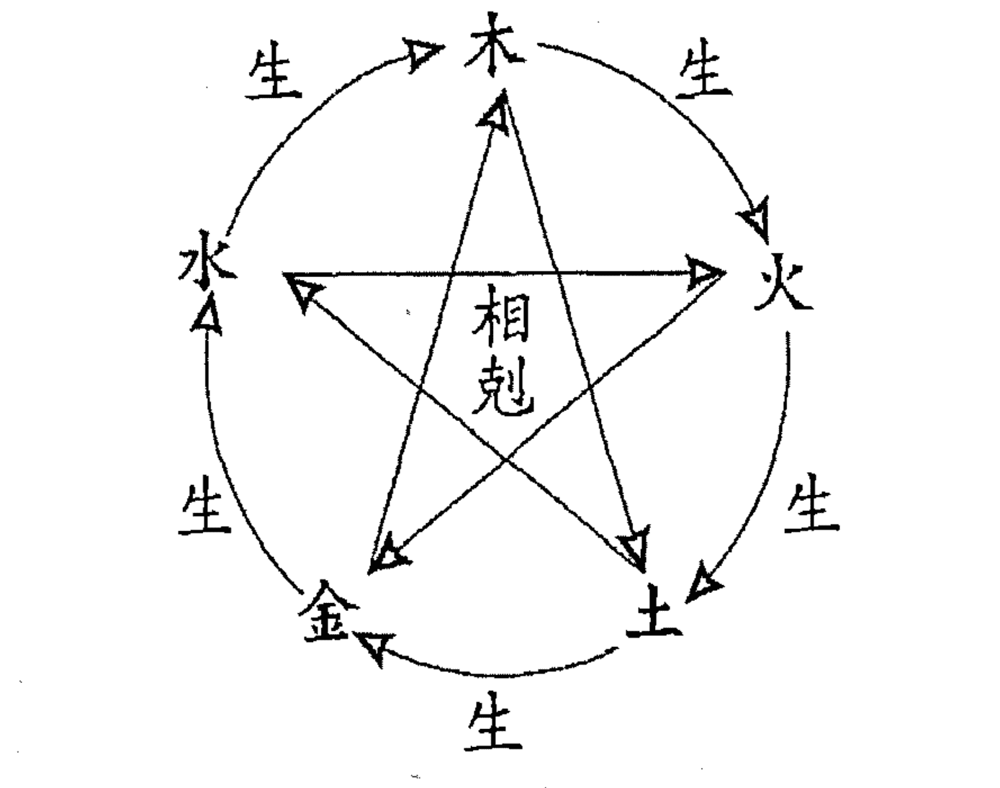

## 五行生剋的應用

五行之間的生剋是一種自然法則，吾人可以在日常生活中充分運用這些法則。例如「土剋水」：水有體無形，若有土剋，則可以規範水，讓水行的運作更有秩序，像小至家中的洗臉盆、中至都市中的下水道、大至水庫中的攔水壩等，都是用土把水限制在其中，或是令水依一定的秩序流動，這是「土剋水」的應用。

## 五行屬性會因為物理特性和生剋關係而改變

五行會因為其功能的不同，而出現不同的屬性界定。例如：木頭的材料屬性為木，但當木頭被製成木船，便具有「承載」人或物品的功能，此時，該木頭的物理五行因為具備「承載」的功能而被界定為「土」。

又如：某些山區因為樹木大量被砍伐，致使土石滑動而出現土石流，此時的有效解決之道，是在當地再廣栽樹木，利用樹根在土石裡蔓延來堵住土石的滑動，這是利用「土剋水」的自然法則；此時樹木的物理五行變為「土」，而會滑動的土石則變為「水」。

又如：某列火車將乘客自甲地載送到乙地，此時該火車具有「承載」乘客的功能，相對於乘客而言，該火車的物理五行為「土」；而火車在軌道上移動，此時該火車相對於軌道而言，其物理五行則變為在軌道上流動的「水」。

## 五行生剋克應在地理方位的歷史事實

五行的方位配置如下圖：

## 五行與地理方位表

| | 火（南方） | |
|---|---|---|
| 木（東方） | 土（中央） | 金（西方） |
| | 水（北方） | |

從《五行與地理方位表》的五行生剋關係及其所對應的方位可以發現，歷史上許多朝代的興衰便一再地反應在這套生剋系統上。

在中國的歷史上，有四個分為前後朝的朝代：東西周、東西漢、東西晉、北南宋。其中的周、漢、晉三朝，分別是先有西周、西漢、西晉，而後因為西方外患入侵（西漢是因為皇室內部的混亂），使得後來的繼位者將國都東遷，才有東周、東漢、東晉。

從地理方位來看待這些朝代的興衰，其前朝的國都皆是建立在比後朝更西邊的位置，後由於抵擋不住來自西方的強敵外患，迫使後繼的執政者將國都東遷，從五行的觀點，這是「金剋木・西剋東」的具體事實。

東周末戰國時代，齊、楚、燕、秦、韓、趙、魏七雄並立，最後由位居西方的西秦以強大的武功統一了國家，秦王嬴政自稱始皇帝，建立中央集權制度的封建帝國，中國從此進入了長達兩千多年的帝治社會，再次印證了「金剋木・西剋東」的生剋規則。

北宋建都開封，後期不敵來自北方的強敵金軍，連徽、欽二帝都被虜去；北宋亡後，皇族趙構逃往南方，在臨安（今杭州）重建宋，史稱南宋。從五行的觀點來看，來自北方的金攻破南方的北宋，這是「北剋南・水剋火」的具體事實。

中國歷史上的各個朝代，其外患強敵幾乎都來自比當朝政權更北方的民族，但卻不曾出現南方蕃屬國來犯而成功者。東漢末，北魏、東吳、蜀漢三國鼎足而立，最後統一國家的，也是來自北方的北魏，天下第一軍師諸葛孔明最終仍然不敵北魏位居北方的地理先天優勢；而萬里長城的建置，正是因為北方強敵不斷來犯，使得歷代主政者一再修築長城，這種意圖將北方強敵阻擋於塞外的思維至為明顯；而發生在美國境內的南北戰爭，最後也是由北軍獲勝。凡此種種，都一再地具體印證著北半球之「北剋南・水剋火」的規則。

鑑古觀今，大至國家的治理、中至企業的經營、小至個人的規劃，可不參五行生剋之思維乎！？

## 五行意象一覽表

| 五行 | 木 | 火 | 土 | 金 | 水 |
| --- | --- | --- | --- | --- | --- |
| 季節 | 春 | 夏 | 長夏 | 秋 | 冬 |
| 後天八卦 | 震巽 | 離 | 艮坤 | 乾兌 | 坎 |
| 河圖數 | 3、8 | 2、7 | 5、10 | 4、9 | 1、6 |
| 方位 | 東 | 南 | 中 | 西 | 北 |
| 顏色 | 綠、青色 | 紅、紫、桃色 | 黃、咖啡色 | 白、銀、淺色 | 黑、藍、深色 |
| 天干 | 甲乙 | 丙丁 | 戊己 | 庚辛 | 壬癸 |
| 地支 | 寅卯 | 巳午 | 辰戌丑未 | 申酉 | 亥子 |
| 臟 | 肝 | 心 | 脾 | 肺 | 腎 |
| 腑 | 膽 | 小腸 | 胃 | 大腸 | 膀胱 |
| 型狀 | 長條型 | 三角型、尖型 | 方型、梯型、馬蹄型 | 圓型 | 波浪型 |
| 五喻 | 井 | 滎 | 俞 | 經 | 合 |
| 顏色 | 綠 | 紅 | 黃 | 白 | 黑 |
| 味覺 | 酸 | 苦 | 甜 | 辛 | 鹹 |
| 情慾 | 怒 | 喜 | 憂 | 悲 | 恐 |
| 五官 | 眼 | 舌 | 口 | 鼻 | 耳 |
| 聲音 | 呼 | 笑 | 歌 | 哭 | 呻 |
| 五津 | 泣 | 汗 | 濕 | 燥 | 寒 |
| 五惡 | 風 | 熱 | 濕 | 燥 | 寒 |
| 五體 | 肌膜 | 血脈 | 肌肉 | 皮毛 | 骨髓 |
| 五音 | 嘘 | 呵 | 呼 | 哭 | 吹 |
| 五律 | 角（牙） | 徵（舌） | 宮（喉） | 商（齒） | 羽（唇） |
| 五常 | 仁 | 禮 | 信 | 義 | 智 |
| 五勞 | 步 | 視 | 坐 | 臥 | 立 |
| 五變 | 握 | 憂 | 噦 | 咳 | 慄 |
| 五精 | 魄 | 神 | 意 | 魂 | 志 |

## 第三節 十天干

天干共有十個，分別是甲、乙、丙、丁、戊、己、庚、辛、壬、癸，是由五行再分陰陽而來，如下列之《十天干五行方位圖》，其中木分為陽木及陰木、火分為陽火及陰火、土分為陽土及陰土、金分為陽金及陰金、水分為陽水及陰水，為方便記錄起見，先賢將陽木稱之為甲、陰木稱之為乙……等，詳如《十天干之陰陽、五行、方位、意象一覽表》。

## 十天干五行方位圖

| | 丙火
丁火
(南方) | |
| --- | --- | --- |
| 甲木
乙木
(東方) | 戊土
己土
(中央) | 庚金
辛金
(西方) |
| | 壬水
癸水
(北方) | |

## 十天干之陰陽、五行、方位、意象一覽表

| 天干名 | 甲 | 乙 | 丙 | 丁 | 戊 | 己 | 庚 | 辛 | 壬 | 癸 |
| :--- | :--- | :--- | :--- | :--- | :--- | :--- | :--- | :--- | :--- | :--- |
| 序數 | 1 | 2 | 3 | 4 | 5 | 6 | 7 | 8 | 9 | 10 |
| 陰陽五行 | 陽木 | 陰木 | 陽火 | 陰火 | 陽土 | 陰土 | 陽金 | 陰金 | 陽水 | 陰水 |
| 方位 | 東 | 東 | 南 | 南 | 中央 | 中央 | 西 | 西 | 北 | 北 |
| 意象 | 大樹 | 花草 | 太陽 | 燈燭 | 堤岸 | 濕土 | 尖硬金屬：如鋼鐵 | 較軟金屬：如飾金 | 大海 | 露水 |

十天干既是由五行分裂而來，五行代表五種能量，所以十天干也可以說是代表十種能量的意思，因為其能量的分類比五行更細，所以其分工也比五行來得更完整。十天干在紫微斗數中佔有非常重要的地位，這十種能量會催動斗數命盤，使命盤出現動態的生命現象。

## 天干五合

甲己合化土，乙庚合化金，丙辛合化水，丁壬合化木，戊癸合化火，此為天干五合。紫微斗數創作者在設計十天干化科時，即用了天干五合的原理，詳見本章第九節中的《化科的原理》。

## 天干五合

| 天干五合 | 化氣 |
| :---: | :---: |
| 甲 己 | 土 |
| 乙 庚 | 金 |
| 丙 辛 | 水 |
| 丁 壬 | 木 |
| 戊 癸 | 火 |

## 第四節 十二地支

十二地支是子、丑、寅、卯、辰、巳、午、未、申、酉、戌、亥，其排列位置如《十二地支圖》所示。

### 十二地支圖

| 巳 | 午 | 未 | 申 |
|---|---|---|---|
| 辰 | | | 酉 |
| 卯 | | | 戌 |
| 寅 | 丑 | 子 | 亥 |

如果說天干是陰陽中的「陽」，那麼地支就是陰陽中的「陰」；在紫微斗數命盤中，天干擔任發動者角色，地支扮演接受者角色。

## 十二地支陰陽、五行、意象一覽表

| 地支 | 寅 | 卯 | 辰 | 巳 | 午 | 未 | 申 | 酉 | 戌 | 亥 | 子 | 丑 |
| :--- | :--- | :--- | :--- | :--- | :--- | :--- | :--- | :--- | :--- | :--- | :--- | :--- |
| 序數 | 3 | 4 | 5 | 6 | 7 | 8 | 9 | 10 | 11 | 12 | 1 | 2 |
| 陰陽五行 | 陽木 | 陰木 | 陽土 | 陰火 | 陽火 | 陰土 | 陽金 | 陰金 | 陽土 | 陰水 | 陽水 | 陰土 |
| 生肖 | 虎 | 兔 | 龍 | 蛇 | 馬 | 羊 | 猴 | 雞 | 狗 | 豬 | 鼠 | 牛 |
| 月份 | 1 端月 孟春 | 2 花月 仲春 | 3 桐月 季春 | 4 梅月 孟夏 | 5 蒲月 仲夏 | 6 暑月 季夏 | 7 瓜月 孟秋 | 8 桂月 仲秋 | 9 菊月 季秋 | 10 陽月 孟冬 | 11 葭月 仲冬 | 12 臘月 季冬 |
| 節氣 | 立春 雨水 | 驚蟄 春分 | 清明 穀雨 | 立夏 小滿 | 芒種 夏至 | 小暑 大暑 | 立秋 處暑 | 白露 秋分 | 寒露 霜降 | 立冬 小雪 | 大雪 冬至 | 小寒 大寒 |
| 季節 | 春 | 春 | 春 | 夏 | 夏 | 夏 | 秋 | 秋 | 秋 | 冬 | 冬 | 冬 |
| 方位 | 東北東 | 正東 | 東南東 | 南東南 | 正南 | 南西南 | 西南西 | 正西 | 西北西 | 北西北 | 正北 | 北東北 |
| 意象 | 雜木 | 純木 | 濕土 | 暖火 | 烈火 | 乾土 | 剛金 | 純金 | 燥土 | 暖水 | 冰水 | 冰土 |

## 第五節 十二長生

十二長生是長生、沐浴、冠帶、臨官、帝旺、衰、病、死、墓、絕、胎、養的合稱。

### 十二長生的含義

明・《三命通會》對十二長生有如下之詮釋

| 十二長生 | 詮釋 |
| :--- | :--- |
| 長生 | 萬物生發向榮，如人始生而向長也。 |
| 沐浴 | 以萬物始生，形體柔脆，易為所損，如人生後三日，以沐浴之，幾至困絕也。 |
| 冠帶 | 萬物漸榮秀，如人具衣冠也。 |
| 臨官 | 如人之臨官也。 |
| 帝旺 | 萬物成熟，如人之興旺也。 |
| 衰 | 萬物形衰，如人之氣衰也。 |
| 病 | 萬物病，如人之病也。 |
| 死 | 萬物死，如人之死也。 |
| 墓 | 又叫庫，以萬物成功而藏之庫，如人之終而歸墓也。 |
| 絕 | 以萬物在地中，未有其象，如母腹空，未有物也。 |
| 胎 | 天地氣交，氤氳造物，其物在物中萌芽，始有其氣，如人受父母之氣也。 |
| 養 | 萬物在地中成形，如人在母腹成形也。 |

## 五行的生旺墓絕

| | 長生 | 沐浴 | 冠帶 | 臨官 | 帝旺 | 衰 | 病 | 死 | 墓 | 絕 | 胎 | 養 |
|---|---|---|---|---|---|---|---|---|---|---|---|---|
| 木 | 亥 | 子 | 丑 | 寅 | 卯 | 辰 | 巳 | 午 | 未 | 申 | 酉 | 戌 |
| 火 | 寅 | 卯 | 辰 | 巳 | 午 | 未 | 申 | 酉 | 戌 | 亥 | 子 | 丑 |
| 金 | 巳 | 午 | 未 | 申 | 酉 | 戌 | 亥 | 子 | 丑 | 寅 | 卯 | 辰 |
| 水 | 申 | 酉 | 戌 | 亥 | 子 | 丑 | 寅 | 卯 | 辰 | 巳 | 午 | 未 |
| 土 | 申 | 酉 | 戌 | 亥 | 子 | 丑 | 寅 | 卯 | 辰 | 巳 | 午 | 未 |

註：本表採五行易卦學之「水土共長生」的系統。

## 第六節 易

## 八卦

八卦是由乾、兌、離、震、巽、坎、艮、坤等八個卦所構成，《易經·繫辭上傳》：「易有太極，是生兩儀，兩儀生四象，四象生八卦，八卦定吉凶，吉凶生大業。」自太極至八卦的衍生過程如下表（由下而上逐步分裂衍生）：

| 人倫 | 老父 | 少女 | 中女 | 長男 | 長女 | 中男 | 少男 | 老母 |
|---|---|---|---|---|---|---|---|---|
| 自然界意象 | 天 | 澤 | 火 | 雷 | 風 | 水 | 山 | 地 |
| 卦序 | 1 | 2 | 3 | 4 | 5 | 6 | 7 | 8 |
| 口訣 | 乾三連 | 兌上缺 | 離中虛 | 震仰盂 | 巽下斷 | 坎中滿 | 艮覆碗 | 坤六斷 |
| 八卦 | ☰ 乾 | ☱ 兌 | ☲ 離 | ☳ 震 | ☴ 巽 | ☵ 坎 | ☶ 艮 | ☷ 坤 |
| 四象 | ☰ 老陽 | ☱ 少陰 | ☲ 少陽 | ☳ 老陰 | | | | |
| 兩儀 | 陽儀 | | | | 陰儀 | | | |
| 太極 | 清升↑ ☯ ↓濁降 | | | | | | | |

## 先天八卦

八卦包括乾☰、震☳、坎☵、艮☶等四個陽卦，以及坤☷、巽☴、離☲、兌☱等四個陰卦；每卦均由下、中、上三個爻所組成，爻有陰陽，符號--代表陰爻、符號—代表陽爻。八卦中，乾卦☰由三個陽爻所組成，為陽卦；坤卦☷由三個陰爻所組成，為陰卦；震卦☳、坎卦☵、艮☶分別由一個陽爻及兩個陰爻所組成，此三卦皆為陽卦（陽卦多陰）；巽卦☴、離卦☲、兌卦☱分別由一個陰爻及兩個陽爻所組成，此三卦皆為陰卦（陰卦多陽）。

八卦依其排列的方式，可分為先天八卦及後天八卦，下圖為先天八卦：

## 先天八卦圖

| ☱ 兌(澤) | ☰ 乾(天) | ☴ 巽(風) |
| :---: | :---: | :---: |
| ☲ 離(火) | | ☵ 坎(水) |
| ☳ 震(雷) | ☷ 坤(地) | ☶ 艮(山) |

上圖中的乾☰、兌☱、離☲、震☳四卦衍生自太極中的陽儀，亦稱為陽儀四卦；巽☴、坎☵、艮☶、坤☷衍生自太極中的陰儀，亦稱為陰儀四卦。

八卦的自然界意象：乾為天、兌為澤、離為火、震為雷、巽為風、坎為水、艮為山、坤為地；《易經·繫辭傳》對先天八卦的排列位置作了這樣的闡述：「天地定位，山澤通氣，雷風相薄，水火不相射。」

## 變易、簡易、不易

「易」有三易：一是變易、二是簡易、三是不易。

1. 變易：易者，改變也！變易是「易」的啟始階段。凡是自然界中具相互關聯性的事物或現象者，即構成一陰陽合體，該合體中的剛柔相摩，陰陽無時不刻地消長，除了消長，陰陽更可以相互轉化；因此，在變易階段中的萬事萬物都是有對待性的、是無常的、變動不居的。
2. 簡易：簡易是「易」的過渡階段，也是將自然界中諸相化繁為簡，屬於「為道日損，損之又損，以至於無為」的過程，是「易」的蛻變階段。
3. 不易：當簡易發展到極致時，陰陽兩儀即回歸到母體---「太極」。在太極之中陰陽俱存但沒有對待，處於「色不異空，空不異色；色即是空、空即是色」的恆常，臻於「既無所來、亦無所去」的「無為而無不為」境界，是「易」的最終階段，也是「易」的最高境界。

## 後天八卦

後天八卦是自先天八卦演繹而來，其分布位置及五行配屬如下圖。

## 後天八卦圖

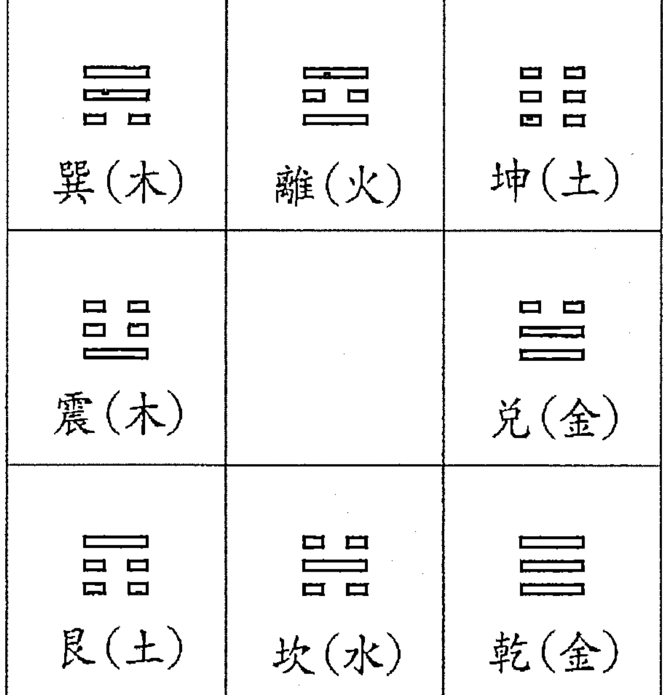

## 先天八卦演繹成後天八卦的原理---爻變

後天八卦演繹自先天八卦，相傳是由周文王所定，其演繹原理就是採用三易之中的「變易」法則，自陽儀四卦中的震卦及兌卦分別開始爻變（註：所謂爻變就是卦中的陰陽爻相互轉化，陰爻轉化為陽爻、陽爻轉化為陰爻，如同易經卜卦中的動爻，陰動則變陽、陽動則變陰）。

## 爻變的規則

1. 陽升陰降：

A. 當卦中有陰爻轉化為陽爻時，陽氣增加，卦會上升；當一個卦中有一個陰爻轉化為陽爻時，該卦會上升一個高度；當一個卦中有兩個陰爻轉化為陽爻時，該卦會上升兩個高度。

B. 當卦中有陽爻轉化為陰爻時，陰氣增加，卦會下降；當一個卦中有一個陽爻轉化為陰爻時，該卦會下降一個高度；當有兩個陽爻轉化為陰爻時，則會下降兩個高度。

C. 當原卦變成綜卦時，卦中之陰陽爻的數量不增不減，該卦不升也不降，但會平移至同一高度的其他位置（註：何謂綜卦？以巽卦☴為例，如果把巽卦☴倒過來看，或是平放在桌面上，站到對面來看，就成了兌卦☱，這時，兌卦☱就是巽卦☴的綜卦；此外，艮卦☶與震卦☳亦同此理）。

2. 陽動陰靜，先天八卦之動始自陽儀所衍生之卦：

參看《先天八卦圖》，震卦☳、離卦☲、兌卦☱均屬衍生自陽儀，震卦☳居下方、離卦☲居中間、兌卦☱居上方，這三個卦的爻變規則是：「居下方者變上爻、居中間者變中爻、居上方者變下爻」。

## 先天八卦變後天八卦的交變過程

⊙陽儀迴路

陽儀迴路：先天《震、離、乾、艮》卦變後天

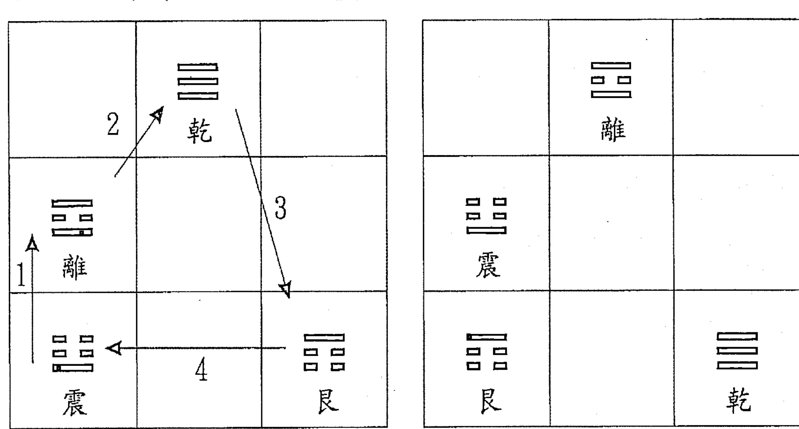

左圖：先天「震離乾艮」卦變迴路
右圖：「震離乾艮」四卦在後天的位置

1. 震卦：震卦☳變上爻，得離卦☲
先天震卦☳居先天八卦圖的左列下方，所以變上爻；震卦☳上爻為陰，陰動則變陽，故震卦☳變上爻而成為離卦☲；先天離卦☲在先天八卦圖的左列中間，當先天震卦☳上爻變而成為離卦☲後，增加一個陽氣，後天震卦☳便上升一個高度，進入先天八卦中之離卦☲的位置，該處即為震卦☳在後天八卦中的位置。
2. 離卦：離卦☲變中爻，得乾卦☰
當前述第1點之後天震卦☳進入先天離卦☲的位置時，也觸動先天離卦☲產生卦變。先天離卦☲居先天八卦圖的左列中間，所以變中爻；離卦☲中爻為陰，陰動則變陽，故離卦☲變中爻而成為乾卦☰；先天乾卦☰居先天八卦圖的上方中間，當先天離卦☲變中爻而成為乾卦☰後，增加一個陽氣，後天離卦☲便上升一個高度，進入先天八卦中之乾卦☰的位置，該處即為離卦☲在後天八卦中的位置。

3. 乾卦：乾卦☰變下爻及中爻，得艮卦☶

當前述第2點之後天離卦☲進入先天乾卦☰的位置時，也觸動先天乾卦☰產生卦變。先天乾卦☰居先天八卦圖的上方中間，若依上述之「居上方者變下爻」的規則，乾卦☰下爻為陽，陽動則變陰，此時即變為巽卦☴；再依上述之「當一個卦中有一個陽爻轉化為陰爻時，該卦會下降一個高度」的規則，乾卦☰在下爻變之後應下降一個高度，但先天巽卦☴在先天八卦圖的上方右側，與先天乾卦☰處於同一高度，因此後天乾卦☰會出現「降不下去」的衝突；緣此，先天乾卦☰正確的變法是採取下爻及中爻皆變的方式而成為艮卦☶，而且因為乾☰變艮☶是兩個陽爻同時變陰爻，陰氣增加兩個，所以後天乾卦☰便下降兩個高度，進入先天艮卦☶的位置，該處即為乾卦☰在後天八卦中的位置。

4. 艮卦：艮卦☶變綜卦，得震卦☳

當前述第3點之後天乾卦☰進入先天艮卦☶的位置時，也觸動先天艮卦☶產生卦變。先天艮卦☶居下方右側，若依上述之「居下方者變上爻」的規則，艮卦☶上爻為陽，陽動則變陰，此時即變為坤卦☷；再依上述之「當一個卦中有一個陽爻轉化為陰爻時，該卦會下降一個高度」的規則，艮卦☶在變上爻之後應下降一個高度，但先天艮卦☶已居最下方，會出現「降不下去」的衝突；因此，先天艮卦☶正確的變法，是採取變為綜卦的方式而成為震卦☳。由於艮卦☶變震卦☳的過程中，陰陽二氣並沒有增減，所以後天艮卦☶不需要升降其高度，而是以平移的方式進入先天震卦☳的位置，該處即為艮卦☶在後天八卦中的位置。

### 【說明】

A. 當先天艮卦☶進入先天震卦☳的位置之後，此一自震☳變離☲、離☲變乾☰、乾☰變艮☶、艮☶變震☳的過程便形成一個封閉式循環迴路，此一迴路與另外四個卦「兌☱、坎☵、坤☷、巽☴」的爻變沒有關聯性。

B. 上述四卦中的乾☰、震☳、艮☶三卦為陽卦，離☲為陰卦，離卦☲雖屬陰卦，但其五行屬火，火為陽，故離卦之陰陽一氣。乾☰、震☳、離☲均衍生自陽儀，再加入陽卦艮☶，與之形成由三個陽卦加一個陰卦（離卦）的封閉式循環迴路，此迴路象徵先天八卦變後天八卦之後的新陽儀，乾☰、震☳、艮☶三卦代表新陽儀中的那整個陽，離☲代表新陽儀中的那一點陰。

C. 後天離卦☲取先天乾卦☰之位而代之，離卦☲五行屬火，故《易·說卦傳》：「離為火……為乾卦」。

## ○陰儀迴路

陽儀迴路：先天《兌、坎、坤、巽》卦變後天

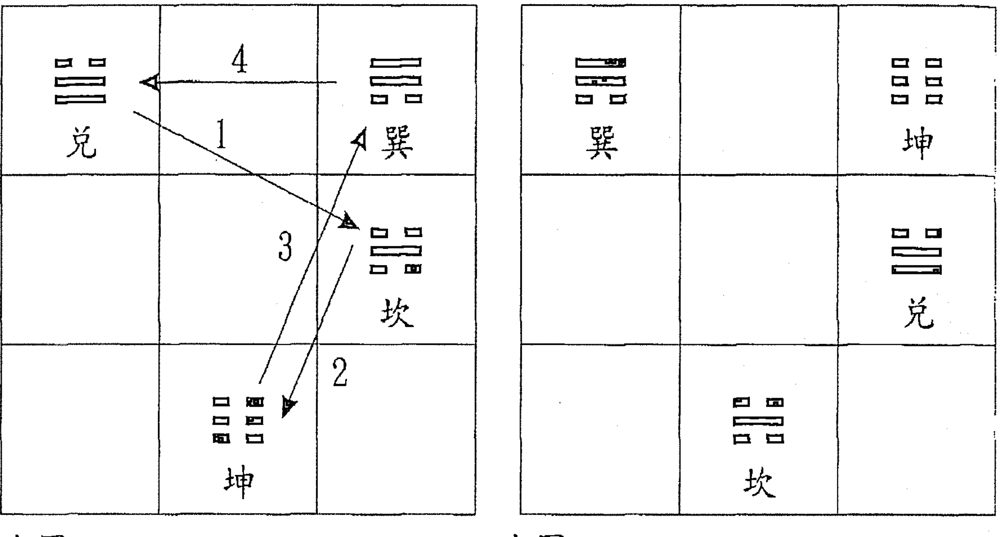

1. 兌卦：兌卦☱變下爻，得坎卦☵
先天兌卦☱居先天八卦圖的左列上方，所以變下爻；兌卦☱下爻為陽，陽動則變陰，故兌卦☱下爻變而成為坎卦☵；先天坎卦☵在先天八卦圖的右列中間，當先天兌卦☱下爻變而成為坎卦☵後，增加一個陰氣，後天兌卦☱便下降一個高度，進入先天八卦中之坎卦☵的位置，該處即為兌卦☱在後天八卦中的位置。

2. 坎卦：坎卦☵變中爻，得坤卦☷
當前述第1點之後天兌卦☱進入先天坎卦☵的位置時，也觸動先天坎卦☵產生卦變。先天坎卦☵居先天八卦圖的右列中間，所以變中爻；坎卦☵中爻為陽，陽動則變陰，故坎卦☵中爻變而成為坤卦☷；先天坤卦☷居先天八卦圖的下方中間，當先天坎卦☵變中爻而成為坤卦☷後，增加一個陰氣，後天坎卦☵便下降一個高度，進入先天八卦中之坤卦☷的位置，該處即為坎卦☵在後天八卦中的位置。

3. 坤卦：坤卦☷變上爻及中爻，得巽卦☴

當前述第2點之後天坎卦☵進入先天坤卦☷的位置時，也觸動先天坤卦☷產生卦變。先天坤卦☷居先天八卦圖的下方中間，若依上述之「居下方者變上爻」的規則，坤卦☷上爻為陰，陰動則變陽，此時即變為艮卦☶；再依上述之「當一個卦中有一個陰爻轉化為陽爻時，該卦會上升一個高度」的規則，坤卦☷在上爻變之後應上升一個高度，但先天艮卦☶在先天八卦圖的下方右側，與先天坤卦☷處於同一高度，因此後天坤卦☷會出現「升不上去」的衝突；緣此，先天坤卦☷正確的變法是採取上爻及中爻皆變的方式而成為巽卦☴，而且因為坤☷變巽☴是兩個陰爻同時變陽爻，陽氣增加兩個，所以後天坤卦☷便上升兩個高度，進入先天巽卦☴的位置，該處即為坤卦☷在後天八卦中的位置。

4. 巽卦：巽卦☴變綜卦，得兌卦☱

當前述第3點之後天坤卦☷進入先天巽卦☴的位置時，也觸動先天巽卦☴產生卦變。先天巽卦☴居上方右側，若依上述之「居上方者變下爻」的規則，巽卦☴下爻為陰，陰動則變陽，此時即變為乾卦☰；再依上述之「當一個卦中有一個陰爻轉化為陽爻時，該卦會上升一個高度」的規則，巽卦☴在變下爻之後應上升一個高度，但先天巽卦☴已居最上方，會出現「升不上去」的衝突；因此，先天巽卦☴正確的變法，是採取變為綜卦的方式而成為兌卦☱。由於巽卦☴變兌卦☱的過程中，陰陽二氣並沒有增減，所以後天巽卦☴不需要升降其高度，而是以平移的方式進入先天兌卦☱的位置，該處即為巽卦☴在後天八卦中的位置。

### 【說明】

A. 當先天巽卦☴進入先天兌卦☱的位置之後，此一自兌☱變坎☵、坎☵變坤☷、坤☷變巽☴、巽☴變兌☱的過程便形成一個封閉式循環迴路，此一迴路與另外四個卦「震☳、離☲、乾☰、艮☶」的爻變沒有關聯性。

B. 上述四卦中的坤☷、巽☴、兌☱三卦為陰卦，坎☵為陽卦。坎卦☵雖屬陽卦，但其五行屬水，水為陰，故坎卦之陰陽一氣。坤☷、巽☴、坎☵均衍生自陰儀，再加入陰卦兌☱，與之形成由三個陰卦加一個陽卦（坎卦）的封閉式循環迴路，此迴路象徵先天八卦變後天八卦之後的新陰儀，坤☷、巽☴、兌☱三卦代表新陰儀中的那整個陰，坎☵代表新陰儀中的那一點陽。

C. 後天坎卦☵取先天坤卦☷之位而代之，坎卦☵五行屬水，故《易·說卦傳》：「坎為水……為月」。

## 京房卦變和五行易

## 京房卦變與八宮世爻表

| | 本宮 | 一世 | 二世 | 三世 | 四世 | 五世 | 遊魂 | 歸魂 |
|---|---|---|---|---|---|---|---|---|
| 乾宮 | 乾為天 | 天風姤 | 天山遯 | 天地否 | 風地觀 | 山地剝 | 火地晉 | 火天大有 |
| 坎宮 | 坎為水 | 水澤節 | 水雷屯 | 水火既濟 | 澤火革 | 雷火豐 | 地火明夷 | 地水師 |
| 艮宮 | 艮為山 | 山火賁 | 山天大畜 | 山澤損 | 火澤睽 | 天澤履 | 風澤中孚 | 風山漸 |
| 震宮 | 震為雷 | 雷地豫 | 雷水解 | 雷風恆 | 地風升 | 水風井 | 澤風大過 | 澤雷隨 |
| 巽宮 | 巽為風 | 風天小畜 | 風火家人 | 風雷益 | 天雷無妄 | 火雷噬嗑 | 山雷頤 | 山風蠱 |
| 離宮 | 離為火 | 火山旅 | 火風鼎 | 火水未濟 | 山水蒙 | 風水渙 | 天水訟 | 天火同人 |
| 坤宮 | 坤為地 | 地雷復 | 地澤臨 | 地天泰 | 雷天大壯 | 澤天夬 | 水天需 | 水地比 |
| 兌宮 | 兌為澤 | 澤水困 | 澤地萃 | 澤山咸 | 水山蹇 | 地山謙 | 雷山小過 | 雷澤歸妹 |

漢朝先賢「京房」參考前述之先天八卦變後天八卦的規則，針對六十四卦中的八個純卦（乾、坎、艮、震、巽、離、坤、兌）加以演繹，形成八個本宮卦變的系統，習稱「京房卦變」。後來又有先賢把京房卦變之爻定義為「世爻」，並將六十四卦配上十二地支，發明六親、世應、動變爻等之斷卦技術，習稱「五行易」，又稱「文王聖卦」，此方術以不帶感情、吉凶直判著稱，為中國易卦占卜中的主流學派（註：「五行易」斷卦方法請參考筆者網站《百合命相廣場》，網址：www.lead.idv.tw）。

京房卦變的演繹規則：「自初至五不動復，下飛四往伏用飛，上飛下飛復本體，便是十六變卦例。」以乾卦的卦變次序為例：

1. 本宮卦為「乾為天」（本宮）；
2. 第一爻變，成為「天風姤」（一世）；
3. 第二爻變，成為「天山遯」（二世）；
4. 第三爻變，成為「天地否」（三世）；
5. 第四爻變，成為「風地觀」（四世）；
6. 第五爻變，成為「山地剝」（五世）；
7. 下飛第四爻變，成為「火地晉」（遊魂）；
8. 下卦全變，成為「火天大有」（歸魂）。

## 第七節 洛書

洛書是由1至9這九個數字排列而成（如下圖），其排列方式是根據《先天八卦》之乾坤與六子的位置而來，先賢根據各數所在的位置編成口訣：「戴九履一、左三右七、四二為肩、八六為足、五居中間」（註：乾為老父、坤為老母、震為長男、坎為中男、艮為少男、巽為長女、離為中女、兌為少女，所以乾坤為父母，餘之六卦為六子）。

| 4 | 9 | 2 |
|---|---|---|
| 3 | 5 | 7 |
| 8 | 1 | 6 |

## 洛書的由來

先天八卦包括四個陽卦：乾（老父）、震（長男）、坎（中男）、艮（少男）；及四個陰卦：坤（老母）、巽（長女）、離（中女）、兌（少女）。

《易經·繫辭傳》：「天尊地卑」，乾卦與坤卦分別象徵天與地，所以分別配屬洛書九數中的最大數「9」與最小數「1」；震（長男）、坎（中男）、艮（少男）則順其長幼依序跟隨於老父乾卦之後，分別為：震配8、坎配7、艮配6；同理，巽（長女）、離（中女）、兌（少女）也順其長幼依序跟隨於老母坤卦之後，分別為：巽配2、離配3、兌配4。

把以上各卦與所配的洛書數放到《先天八卦圖》上，各洛書數會分別進到如下之《先天八卦配洛書數圖》中的位置，並將半數「5」放入中宮，這就是洛書的排列方式（註：「5」居洛書數1至9的中間，稱做中數，又稱半數，是洛書數陰陽變化的中樞、進退消長的關鍵。「5」於紫微斗數中化身為「紫微星」，而這也正是斗數這門術數取名為「紫微」斗數的由來）。

## 先天八卦配洛書數圖

| ☱ 兌 4 | ☰ 乾 9 | ☴ 巽 2 |
| :---: | :---: | :---: |
| ☲ 離 3 | 5 | ☵ 坎 7 |
| ☳ 震 8 | ☷ 坤 1 | ☶ 艮 6 |

## 第八節 河圖

河圖包括十個數字，分別是1至10，其中的1至5為生數、6至10為成數。其排列方式以及五行配屬如下之《河圖》。先賢根據其排列位置寫成口訣：「一六共宗、二七同道、三八為朋、四九為友、五十同途」，用以彰顯「一與六、二與七、三與八、四與九、五與十」這兩兩一組之互為表裡的關聯性。

河圖

| | 2(火) 7(火) 南 | |
|---|---|---|
| 3(陽木) 8(陰木) 東 | 5(陽土) 10(陰土) 中 | 4(陰金) 9(陽金) 西 |
| | 1(水) 6(水) 北 | |

## 生數、成數、天干五合

《考原》：「五合者，即五位相得而各有合也。河圖一與六、二與七、三與八、四與九、五與十皆各有合。以十干之次言之，一為甲、六為己，故甲與己合；二為乙、七為庚，故乙與庚合；三為丙、八為辛，故丙與辛合；四為丁、九為壬，故丁與壬；五為戊、十為癸，故戊與癸合。」此為先賢將生數和成數應用於天干五合的說明。

## 第九節 紫微斗數十二主星、四副星、四化的創作流程

## 先天八卦排列的特點

如第28頁之《先天八卦圖》，其排列方式有一主要特點：「本卦與對卦互為錯卦，其佈列方式在本質上具有互通有無、彼此往來之意。」

1. 何謂本卦與對卦？以震卦☳為例：若震卦☳稱為本卦，則在對角線的巽卦☴即為其對卦；餘之乾卦☰與坤卦☷、兌卦☱與艮卦☶、離卦☲與坎卦☵亦是互為本對卦。
2. 所謂錯卦就是由本卦的陽爻變陰爻、或陰爻變陽爻後所得之卦。例如：震卦☳，其下爻為陽爻，二爻及上爻均為陰爻，若將其下爻之陽爻變為陰爻，二爻、上爻之陰爻變為陽爻，則變成巽卦☴，因此，巽卦☴就是震卦☳的錯卦；餘之乾卦☰與坤卦☷、兌卦☱與艮卦☶、離卦☲與坎卦☵亦是互為錯卦。

> 《易經·繫辭傳》：「剛柔相摩，八卦相盪」，剛者為陽，就卦爻而言為陽爻；柔者為陰，就卦爻而言為陰爻。「剛柔相摩」，陰陽爻相推互換也；「八卦相盪」，即八卦中的任一卦會與其他七卦相盪，而當其中的本卦與對卦相盪時，陰陽爻互換而互成錯卦。故先天八卦圖之本對卦相摩相盪互為錯卦，其佈列方式在本質上具有「互通有無、彼此往來」之意。

## 後天八卦排列的特點

如第30頁之《後天八卦圖》，其排列方式有兩個主要特點：

一、「本卦與對卦相盪而不交」：各組本對卦中，只有「離☲坎☵」互為錯卦，餘之「巽☴乾☰」、「震☳兌☱」、「艮☶坤☷」均非錯卦，象徵彼此不交易往來；
二、「陽卦與陰卦剛柔不相摩」：四陽卦與四陰卦各自集結，群聚成兩大封閉性系統，系統與系統之間不相容，象徵彼此無法溝通。

### 【說明】

1. 何謂陽卦？「陽卦多陰」（易經·繫辭傳），在《後天八卦圖》中，除乾卦☰內含三個陽爻，當然為陽卦外，坎卦☵、艮卦☶、震卦☳均為單陽爻雙陰爻，陰多於陽是為「多陰」，為陽卦；乾、坎、艮、震這四個陽卦集結成列位於後天八卦圖的左下半部（如下圖）。

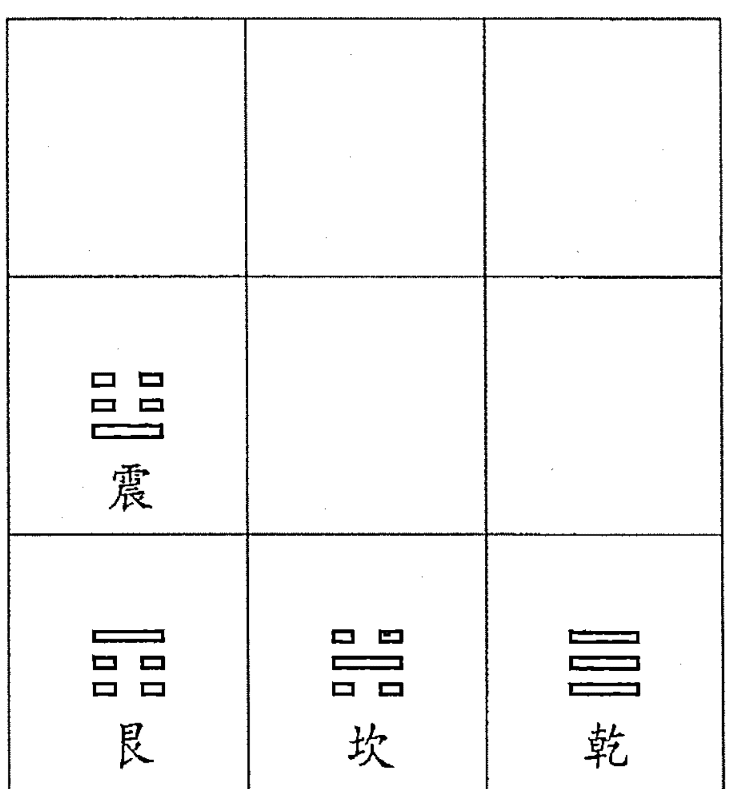

2. 何謂陰卦？「陰卦多陽」（易經・繫辭傳），在《後天八卦圖》中，除坤卦☷內含三個陰爻，當然為陰卦外，巽卦☴、離卦☲、兌卦☱均為單陰爻雙陽爻，陽多於陰是為「多陽」，為陰卦；巽、離、坤、兌這四個陰卦集結成列位於後天八卦圖的右上半部（如下圖）。

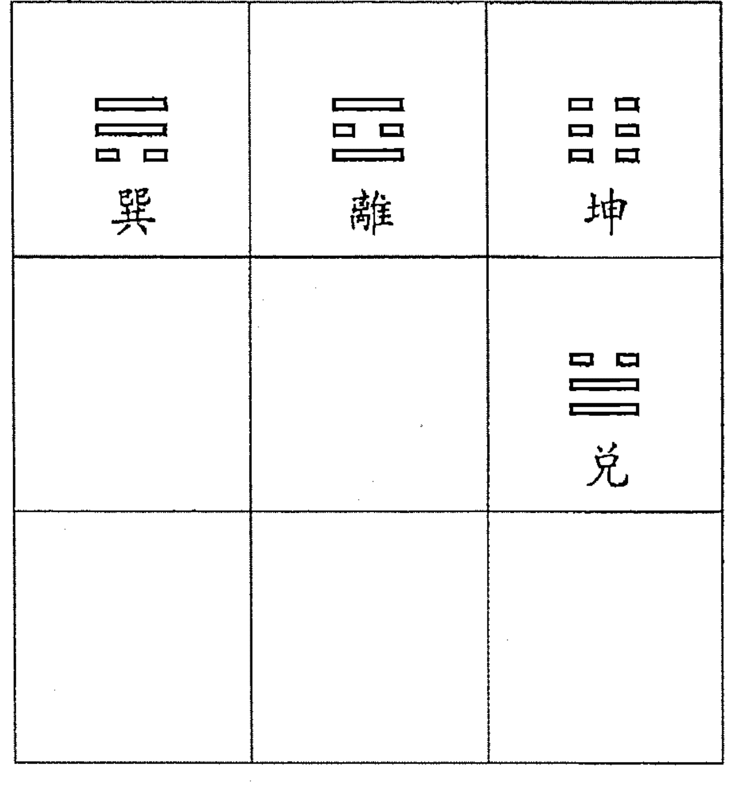

## 後天八卦配洛書數

《易經的星命與占卜》（朱文光博士著・老古文化出版。P. 57）：「後天八卦取數：即一坎數兮二數坤、三震四巽數中分、五寄中宮六乾是、七兌八艮九離門。據傳述，是由洛書和文王八卦方位相配而來。」

後天八卦配洛書數的方式，是把後天八卦圖和洛書疊放在一起而得，其各卦與各洛書數之間的對應關係如《後天八卦配洛書數表》。

## 後天八卦配洛書數表

| 後天八卦 | 洛書數 | 後天八卦 | 洛書數 |
| :---: | :---: | :---: | :---: |
| 乾 | 6 | 巽 | 4 |
| 坎 | 1 | 離 | 9 |
| 艮 | 8 | 坤 | 2 |
| 震 | 3 | 兌 | 7 |

將《後天八卦配洛書數表》轉換成圖示，則如《後天八卦配洛書數圖》。

## 後天八卦配洛書數圖

| ☴ 巽 4 | ☲ 離 9 | ☷ 坤 2 |
| :---: | :---: | :---: |
| ☳ 震 3 | 5 | ☱ 兌 7 |
| ☶ 艮 8 | ☵ 坎 1 | ☰ 乾 6 |

## 後天八卦配河圖數

如下列左側圖之河圖數，可與後天八卦配屬，成為如右側後天八卦圖中之配屬關係，其配屬方式為：

- 河圖數1及6配五行同樣為水的坎卦；
- 河圖數2及7配五行同樣為火的離卦；
- 河圖數3配五行同樣為陽木的震卦；
- 河圖數8配五行同樣為陰木的巽卦；
- 河圖數4配五行同樣為陰金的兌卦；
- 河圖數9配五行同樣為陽金的乾卦；
- 河圖數5配五行同樣為陽土的艮卦；
- 河圖數10配五行同樣為陰土的坤卦。

## 河圖

| | | |
|---|---|---|
| | 2(火) 7(火) | |
| 3(陽木) 8(陰木) | 5(陽土) 10(陰土) | 4(陰金) 9(陽金) |
| | 1(水) 6(水) | |

## 後天八卦配河圖數圖

| | | |
|---|---|---|
| ☴ 巽(陰木) 8 | ☲ 離(火) 2、7 | ☷ 坤(陰土) 10 |
| ☳ 震(陽木) 3 | | ☱ 兌(陰金) 4 |
| ☶ 艮(陽土) 5 | ☵ 坎(水) 1、6 | ☰ 乾(陽金) 9 |

## 八卦納甲

「西漢京房易學的納甲，是以八卦統屬歸納了天干的十位數。它的固定律例是：乾納甲、壬；坤納乙、癸；坎納戊；離納己；艮納丙；震納庚；兌納丁；巽納辛。」（《易經的星命與占卜》P. 90）

將上述之八卦與十天干之間的配屬關係整理成《八卦納甲表》。

## 八卦納甲表

| 八卦 | 十天干 | 八卦 | 十天干 |
| :--- | :--- | :--- | :--- |
| 乾 | 甲、壬 | 巽 | 辛 |
| 兌 | 丁 | 坎 | 戊 |
| 離 | 己 | 艮 | 丙 |
| 震 | 庚 | 坤 | 乙、癸 |

上述之八卦與十天干之間的配屬關係，可分別與先天八卦圖及後天八卦圖搭配，前者得《先天八卦納十天干圖》，此圖是十天干化祿的基礎；後者得《後天八卦納十天干圖》，此圖是十天干化忌的基礎。

## 先天八卦納十天干圖

| ☱ 兌 丁 | ☰ 乾 甲、壬 | ☴ 巽 辛 |
| :---: | :---: | :---: |
| ☲ 離 己 | | ☵ 坎 戊 |
| ☳ 震 庚 | ☷ 坤 乙、癸 | ☶ 艮 丙 |

## 後天八卦納十天干圖

| ☴ 巽 辛 | ☲ 離 己 | ☷ 坤 乙、癸 |
| :---: | :---: | :---: |
| ☳ 震 庚 | | ☱ 兌 丁 |
| ☶ 艮 丙 | ☵ 坎 戊 | ☰ 乾 甲、壬 |

## 十天干取洛書數

十天干取洛書數「是根據納甲和後天八卦取數而來。按照漢代易學京房納甲之法，乾納甲、壬，乾的後天八卦取數為六，所以甲和壬取數為六。坤納乙、癸，坤數二，所以乙和癸取數為二。艮納丙，艮數八，所以丙取數為八。兌納丁，兌數七，所以丁數亦七。坎納戊，坎數一，所以戊取數為一。離納己，離數九，所以己取數九。震納庚，震數三，所以庚取數為三。巽納辛，巽數四，所以辛取數為四。」（《易經的星命與占卜》P. 59）

十天干與洛書數之間的對照關係如下列之《十天干取洛書數表》，以及下列之《後天八卦納甲配洛書數圖》。

## 十天干取洛書數表

| 天干 | 洛書數 | 天干 | 洛書數 |
| :---: | :---: | :---: | :---: |
| 甲 | 6 | 己 | 9 |
| 乙 | 2 | 庚 | 3 |
| 丙 | 8 | 辛 | 4 |
| 丁 | 7 | 壬 | 6 |
| 戊 | 1 | 癸 | 2 |

## 後天八卦納甲配洛書數圖

| ☴ 巽 辛 4 | ☲ 離 己 9 | ☷ 坤 乙、癸 2 |
| :---: | :---: | :---: |
| ☳ 震 庚 3 | | ☱ 兌 丁 7 |
| ☶ 艮 丙 8 | ☵ 坎 戊 1 | ☰ 乾 甲、壬 6 |

## 後天八卦納十二地支

> 「納支是由地理上所用的二十四山而來。二十四山相傳漢朝時已有，但不知始於何人。根據《二十四山圖》，可知坎納子，艮納丑寅，震納卯，巽納辰巳，離納午，坤納未申，兌納酉，乾納戌亥。」（《易經的星命與占卜》P. 109）

## 二十四山圖

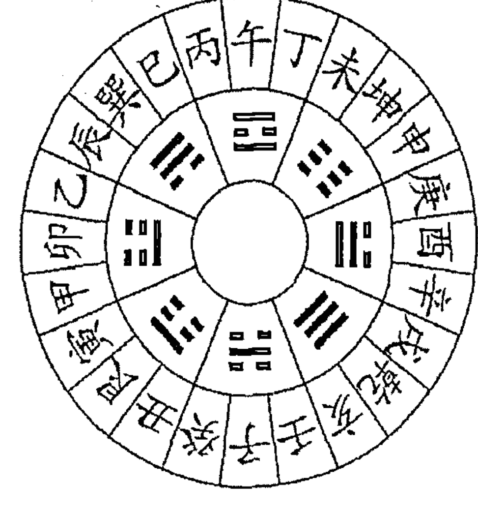

將上述之後天八卦與十二地支之間的配屬關係整理成《後天八卦納十二地支表》。

## 後天八卦納十二地支表

| 後天八卦 | 十二地支 |
| :--- | :--- |
| 乾 | 戌、亥 |
| 坎 | 子 |
| 艮 | 丑、寅 |
| 震 | 卯 |
| 巽 | 辰、巳 |
| 離 | 午 |
| 坤 | 未、申 |
| 兌 | 酉 |

後天八卦納十二地支的對照關係如《後天八卦納十二地支圖》。

## 後天八卦納十二地支圖

| ☴ 巽 辰、巳 | ☲ 離 午 | ☷ 坤 未、申 |
|---|---|---|
| ☳ 震 卯 | | ☱ 兌 酉 |
| ☶ 艮 寅、丑 | ☵ 坎 子 | ☰ 乾 亥、戌 |

## 八卦配陰陽五行、配洛書數、配河圖數、納天干、納地支一覽表

將前述之八卦的陰陽屬性、五行配屬、配洛書數、配河圖數、納十天干、納十二地支的結果歸納於下表。

| 陰陽 | 八卦 | 五行 | 洛書數 | 河圖數 | 天干 | 地支 |
|---|---|---|---|---|---|---|
| 陽 | 乾 | 陽金 | 6 | 9 | 甲、壬 | 戌、亥 |
| 陽 | 坎 | 水 | 1 | 1、6 | 戊 | 子 |
| 陽 | 艮 | 陽土 | 8 | 5 | 丙 | 丑、寅 |
| 陽 | 震 | 陽木 | 3 | 3 | 庚 | 卯 |
| 陰 | 巽 | 陰木 | 4 | 8 | 辛 | 辰、巳 |
| 陰 | 離 | 火 | 9 | 2、7 | 己 | 午 |
| 陰 | 坤 | 陰土 | 2 | 10 | 乙、癸 | 未、申 |
| 陰 | 兌 | 陰金 | 7 | 4 | 丁 | 酉 |

上表有幾個特點，列舉如下：

1. 不同的元素以後天八卦為媒介而使彼此之間形成一定的對應關係：
天干、地支、五行、洛書數、河圖數等各個元素分別與後天八卦配對，也因而使得天干、地支、五行、洛書數、河圖數這些不同的元素彼此之間形成一定的對應關係。
例如乾卦☰：納天干甲壬、納地支亥戌、配洛書數6、配五行陽金、配河圖數9；因為有乾卦☰為媒介，天干甲壬便與地支亥戌、以及洛書數6形成一定的對應關係；
又如兌卦☱：納天干丁、納地支酉、配洛書數7、配五行陰金、配河圖數4，因為有兌卦☱為媒介，天干丁便與地支酉、以及洛書數7形成一定的對應關係；餘之各卦亦同此理。

2. 陽卦納陽干、陰卦納陰干：
「乾、坎、艮、震」四陽卦分納「甲壬、戊、丙、庚」五陽干；
「巽、離、坤、兌」四陰卦分納「辛、己、乙癸、丁」五陰干。

3. 八卦依太極之陽中一點陰、陰中一點陽的精神搭配五行：
四陽卦中的「乾、艮、震」分配陽金、陽土、陽木，象陽儀；坎卦配水，象陽儀中那一點陰。
四陰卦中的「巽、坤、兌」分配陰木、陰土、陰金，象陰儀；離卦配火，象陰儀中那一點陽。

根據以上這些特點，吾人可將前述之《後天八卦配洛書數圖》與《後天八卦配河圖數圖》合併，成為《後天八卦九宮配洛書數與河圖數圖》，此圖是紫微天府兩大星群的形成基礎，在稍後之《紫微、天府二大星群之由來，以及在命盤中的排列原理》文中將有詳細的解說。

## 後天八卦配洛書數圖

| ☴ 巽(陰木) 4 | ☲ 離(火) 9 | ☷ 坤(陰土) 2 |
|---|---|---|
| ☳ 震(陽木) 3 | | ☱ 兌(陰金) 7 |
| ☶ 艮(陽土) 8 | ☵ 坎(水) 1 | ☰ 乾(陽金) 6 |

## 後天八卦配河圖數圖

| ☴ 巽(陰木) 8 | ☲ 離(火) 2、7 | ☷ 坤(陰土) 10 |
|---|---|---|
| ☳ 震(陽木) 3 | | ☱ 兌(陰金) 4 |
| ☶ 艮(陽土) 5 | ☵ 坎(水) 1、6 | ☰ 乾(陽金) 9 |

## 後天八卦九宮配洛書與河圖數圖

| 巽(陰木) 洛書數4 河圖數8 | 離(火) 洛書數9 河圖數2、7 | 坤(陰土) 洛書數2 河圖數10 |
|---|---|---|
| 震(陽木) 洛書數3 河圖數3 | 洛書數5 | 兌(陰金) 洛書數7 河圖數4 |
| 艮(陽土) 洛書數8 河圖數5 | 坎(水) 洛書數1 河圖數1、6 | 乾(陽金) 洛書數6 河圖數9 |

另將前述之《後天八卦納甲配洛書數圖》中各天干與各洛書數的配屬關係，以及《後天八卦納十二地支圖》中各天干與各地支的配屬關係合併，並且轉換為以十二地支為基礎背景的《十天干配洛書九數圖(1)》。

## 後天八卦納甲配洛書數圖

| ☴ 巽 辛 4 | ☲ 離 己 9 | ☷ 坤 乙、癸 2 |
|---|---|---|
| ☳ 震 庚 3 | | ☱ 兌 丁 7 |
| ☶ 艮 丙 8 | ☵ 坎 戊 1 | ☰ 乾 甲、壬 6 |

## 後天八卦納十二地支圖

| ☴ 巽 辰、巳 | ☲ 離 午 | ☷ 坤 未、申 |
|---|---|---|
| ☳ 震 卯 | | ☱ 兌 酉 |
| ☶ 艮 寅、丑 | ☵ 坎 子 | ☰ 乾 亥、戌 |

## 十天干配洛書九數圖(1)

| | ←己 (9) 午 | 乙 (2A) 未 | 癸 (2B) 申 |
|---|---|---|---|
| 巳 | | | |
| 辛 (4) 辰 | 5B | | 丁 (7) 酉 |
| 庚 (3) 卯 | 5A | | 壬 (6B) 戌 |
| 丙 (8) 寅 | 丑 | ←戊 (1) 子 | 甲 (6A) 亥 |

## 化忌的原理

由《十天干配洛書九數圖(1)》可知，十個天干分入丑與巳之外的十個地支，不過仍應稍做調整：將戊（配洛書數1）自子宮移入丑宮，將己（配洛書數9）自午宮移入巳宮，得《十天干配洛書九數圖(2)》。其理由為：子午二宮等同坎離二卦，坎離互為錯卦，象徵彼此交易往來，所以子午二宮在十天干化忌時虛而不用。

此《十天干配洛書九數圖(2)》是十天干化忌的雛型。

## 十天干配洛書九數圖(2)

| 己 (9) 巳 | 午 | 乙 (2A) 未 | 癸 (2B) 申 |
| 辛 (4) 辰 | 5B | | 丁 (7) 酉 |
| 庚 (3) 卯 | 5A | | 壬 (6B) 戌 |
| 丙 (8) 寅 | 戊 (1) 子 | 子 | 甲 (6A) 亥 |

《十天干配洛書九數圖(2)》中天干、地支、洛書數三者間的配置原則：

1. 以「陽逆陰順」原則配置天干地支：甲與壬為陽干，以逆旋方式配地支，甲配亥、壬配戌；乙與癸為陰干，以順旋方式配地支，乙配未、癸配申。
2. 每一天干皆配置洛書數：如《八卦配陰陽五行、配洛書數、配河圖數、納天干、納地支一覽表》，甲與壬均配6、乙與癸均配2，乃二干配一數。若將該數僅與一天干配對，例如6僅配屬於甲或僅配屬於壬、2僅配屬於乙或僅配屬於癸，則另一沒有被配對的天干將造成虛化而毫無用處；因此，紫微斗數創作者將洛書數6及2分別配置兩個天干，而成為《十天干配洛書九數圖(2)》之「甲配6A」、「壬配6B」、「乙配2A」、「癸配2B」的配置關係。
3. 十天干只分布於十個地支而沒有進入中宮，所以位居中宮的洛書數5在十天干化忌時沒有配置天干；因此，由洛書數5衍生出來的5A（即後來的紫微星）及5B（即後來的天府星）不會化忌。

紫微斗數創作者將《十天干配洛書九數圖(2)》各洛書數分別命名如下：

- 洛書數1：天機。
- 洛書數2A：太陰。
- 洛書數2B：貪狼。
- 洛書數3：天同。
- 洛書數4：天梁。
- 洛書數5A：紫微。
- 洛書數5B：天府。
- 洛書數6A：太陽。
- 洛書數6B：武曲。
- 洛書數7：巨門。
- 洛書數8：廉貞。
- 洛書數9：破軍。

將上述諸星名代入《十天干配洛書九數圖(2)》得下之《十天干化忌圖》：

## 十天干化忌圖

| 己 9(破軍) 巳 | 午 | 乙 2A(太陰) 未 | 癸 2B(貪狼) 申 |
|---|---|---|---|
| 辛 4(天梁) 辰 | 5B(天府) | 丁 7(巨門) 酉 | |
| 庚 3(天同) 卯 | 5A(紫微) | 壬 6B(武曲) 戌 | |
| 丙 8(廉貞) 寅 | 戊 1(天機) 丑 | 子 | 甲 6A(太陽) 亥 |

紫微斗數創作者並將《十天干化忌圖》之各天干與其所配置之洛書數的關係定義為「化忌」，形成：

1. 甲與洛書數6A（太陽）化忌。
2. 乙與洛書數2A（太陰）化忌。
3. 丙與洛書數8（廉貞）化忌。
4. 丁與洛書數7（巨門）化忌。
5. 戊與洛書數1（天機）化忌。
6. 己與洛書數9（破軍）化忌。
7. 庚與洛書數3（天同）化忌。
8. 辛與洛書數4（天梁）化忌。
9. 壬與洛書數6B（武曲）化忌。
10. 癸與洛書數2B（貪狼）化忌。

註：己干化破軍忌及辛干化天梁忌詳見後之「文曲化忌和文昌化忌的謬誤」說明。

筆者研判當初紫微斗數創作者將《十天干配洛書九數圖(1)》調整為《十天干配洛書九數圖(2)》並定義其為化忌之原因如下：

1. 以後天八卦的觀點而言，《十天干配洛書九數圖(2)》之天干、地支、洛書數對應關係是根據後天八卦納甲、納支以及配洛書數的結果，而後天八卦中各本對卦中，只有「坎離」是互為錯卦，餘各組如「巽乾」、「震兌」、「艮坤」等均非錯卦，象徵本對卦之間不相交易往來，此現象可進一步申論為：「以後天八卦各本卦為軸心所對應而得的天干與洛書數之間也是不相交易往來的」。

例如：天干甲與洛書數6A之間不相交易往來、天干乙與洛書數2A之間不相交易往來、天干丙與洛書數8之間不相交易往來……等，紫微斗數創作者將這個現象定義為化忌，是以化忌具有「不流通、或劃地自限、或自掃門前雪……等」之意。由此之故，化忌就人而言代表冷漠、隔閡、難以溝通；就財而言代表萎縮、週轉不順；就事業而言代表阻礙難行；就身體健康而言代表違和……等。

2. 子午二宮等同坎離二卦，坎離互為錯卦，象徵彼此交易往來，紫微斗數創作者在十天干化忌時，虛子午二宮而不用，將戊移至丑、將己移至巳，此舉使得十干不入子午位（坎離卦）而入其它不相往來之六卦所納的十個地支，既然不相往來，所以，紫微斗數創作者將這個現象定義為化忌。

## 紫微、天府二大星群之由來，以及在命盤中的排列原理

> 《易鑰・陳炳元著・P.189》：「一至十數五居中，所以五為中心……是在中心位置，可上可下亦可東可西，等於把握了重心，所以五是中數亦是心，能使上下四方平衡，身心亦平衡，所以書云『允執厥中』，能夠執中，才可以應變御變，我們必須了解中數的五是象數關鍵之一，亦是善用易者執常御變，通變求常的方法之一。再說五是半數，因為只有五介於生成體用之間，生數得之其體始備，成數得之其用始全，所以不論生成體用，都不能離開它，它是陰陽變化的中樞。」

若此，將《十天干化忌圖》所列之十二地支以「卯辰」及「戌酉」為界，分割成上下二大部份（註：以地支「卯辰」及「戌酉」為界的理由是戌、亥、子、丑、寅、卯為四陽卦乾、坎、艮、震的居地；辰、巳、午、未、申、酉為四陰卦巽、離、坤、兌的居地，分別代表陽與陰的區域），並將位於中宮的半數5也分裂成5A及5B以使上下對稱，則該圖之洛書數呈以下之規則性：

1. 水平線下半部的洛書數來自四陽卦，並形成自5A（在中宮）→至1（在丑）→至6A（在亥）→至6B（在戌）→至3（在卯）→至8（在寅）的數列，該數列形成逆旋排列的規則性（5→1→6→3→8）；而之所以逆旋排列，乃因這些洛書數係對應四個陽卦「坎乾震艮」，陽象天，「天道逆（左）旋」之故。
2. 水平線上半部的洛書數來自四陰卦，並形成自5B（在中宮）→至2A（在未）→至2B（在申）→至7（在酉）→至4（在辰）→至9（在巳）的數列，該數列形成順旋排列的規則性（5→2→7→4→9）；而之所以順旋排列，乃因這些洛書數係對應四個陰卦「坤兌巽離」，陰象地，「地道順（右）旋」之故。

《易鑰·P.212～P.213》：「河圖洛書，本陰陽一氣所出，五行、八卦、九宮、十干、十二支、五聲、十二律一切盈虛消息之所由生。」又說：「先天河圖，後天洛書，為八卦之原，所以相通。」回到《後天八卦九宮配洛書數與河圖數圖》（如下），中宮有洛書後天數5，與艮方之河圖先天數5相通；更進一步說，原本在中宮的後天洛書數5動起來了，並且與河圖先天數5互為感應而進入寅宮。

## 後天八卦九宮配洛書與河圖數圖

| 巽(陰木) 洛書數4 河圖數8 | 離(火) 洛書數9 河圖數2、7 | 坤(陰土) 洛書數2 河圖數10 |
|---|---|---|
| 震(陽木) 洛書數3 河圖數3 | 洛書數5 ↘ | 兌(陰金) 洛書數7 河圖數4 |
| 艮(陽土) 洛書數8 河圖數5 | 坎(水) 洛書數1 河圖數1、6 | 乾(陽金) 洛書數6 河圖數9 |

依天道逆旋法則，將5A→1→6A→6B→3→8數列以寅宮作為第一個數5A的落點，餘各數則依逆旋規則排入其他地支，惟不入子卻入午，得《紫微星群5→1→6→3→8逆行圖》，該圖所佈之星即習稱之紫微星群；再依地道順旋法則，將5B→2A→2B→7→4→9數列以寅宮作為第一個數5B的落點，餘各數則依順旋規則排入其他地支，惟不入午卻入子，得《天府星群5→2→7→4→9順行圖》，該圖所佈之星即習稱之天府星群。

## 紫微星群5→1→6→3→8逆行圖

| 巳 | 午 | 未 | 申 |
|---|---|---|---|
| | 洛書數8 (廉貞) | | |
| 辰 | | | 洛書數3 (天同) 酉 |
| | | | 洛書數6B (武曲) 戌 |
| 卯 | 洛書數5A (紫微) | | |
| 洛書數5A (紫微) 寅 | 洛書數1 (天機) 丑 | 子 | 洛書數6A (太陽) 亥 |

## 天府星群5→2→7→4→9順行圖

| → 洛書數7 (巨門) 巳 | 午 | ↓ 洛書數4 (天梁) 未 | 申 |
|---|---|---|---|
| ↑ 洛書數2B (貪狼) 辰 | 洛書數5B (天府) ↙ | | 酉 |
| ↑ 洛書數2A (太陰) 卯 | | | 戌 |
| ↑ 洛書數5B (天府) 寅 | 丑 | 洛書數9 (破軍) 子 | 亥 |

## 探討

1. 《後天八卦九宮配洛書數與河圖數圖》位於中宮的洛書後天數5，與位於艮方的河圖先天數5互感而生紫、府二大星群。《易鑰・P.190》：「易數無不由中而為出發點，中則上下前後都是各得其半，易數無不以平為標準，平則左右輕重亦均是各佔其半，陰陽剛柔一切錯綜變化，無不由此半與彼半進退交易之作用而發生變化影響。」紫微斗數之紫府二星群的創作精神，乃洛書後天數5感應河圖先天數5而出中宮入黃宮，此充分且貼切地應用了易數5之為半數的理則，並且「上下各得其半」地佈列於十二地支當中。由此觀之，紫微斗數各主星被設計的原旨就是以洛書「數」為基調，這也是紫微斗「數」一名的由來。

2. 為何紫微星群逆行佈列，天府星群順行佈列？如前所述，紫微斗數各主星不過是洛書數的代名詞，紫微斗數創作者將洛書九宮數一分為二便得「上下各得其半」，而且中宮數5也分別與下半部之數（1、6、3、8）及上半部之數（2、7、4、9）結合，形成5→1→6→3→8以及5→2→7→4→9兩大數串；前者因與後天八卦之四陽卦相配，陽象天，「天道逆（左）旋」，故紫微星群逆行佈列；後者因與後天八卦之四陰卦相配，陰象地，「地道順（右）旋」，故天府星群順行佈列。

3. 紫微星群5→1→6→3→8來自四陽卦，故紫微星群為陽星群，該星群不入子水而令最後一顆星廉貞入午火；同理，天府星群5→2→7→4→9來自四陰卦，故天府星群為陰星群，該星群不入午火而令後一顆星破軍入子水；此舉與太極陰陽二儀中之陰中一點陽、陽中一點陰有異曲同工之妙，此佈列法則再次印證了斗數之設計精神及法則與易之太極相通，故古賦曰：「斗數之列眾星，猶大易之分八卦。」

將《紫微星群5→1→6→3→8逆行圖》及《天府星群5→2→7→4→9順行圖》合併成 《紫府星群原始佈列圖》，此圖在「化祿」一文中會再次談到。

## 紫府星群原始佈列圖

| 巨門 (洛書數7) 巳 | 廉貞 (洛書數8) 午 | 天梁 (洛書數4) 未 | 申 |
| :--- | :--- | :--- | :--- |
| 貪狼 (洛書數2B) 辰 | | | 天同 (洛書數3) 酉 |
| 太陰 (洛書數2A) 卯 | | | 武曲 (洛書數6B) 戌 |
| 天府(洛書數5B) 紫微(洛書數5A) 寅 | 天機 (洛書數1) 丑 | 破軍 (洛書數9) 子 | 太陽 (洛書數6A) 亥 |

## 化祿的原理

首先，如第28頁之《先天八卦圖》，「使乾、坤二卦位不動（天地定位）；使離、坎二卦位互換（水火相射）；使兌、震、艮、巽四隅卦同時逆轉二卦位，令其仍入四隅位，轉位後仍不脫山澤通氣，雷風相薄之理。」（《斗數四化原理與應用》·謝昕潤著·百觀出版社）如此，可得如下之《祿權相生八卦圖》。

## 先天八卦圖

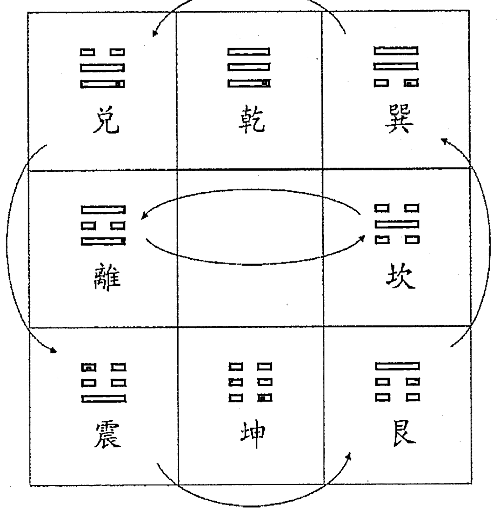

## 祿權相生八卦圖

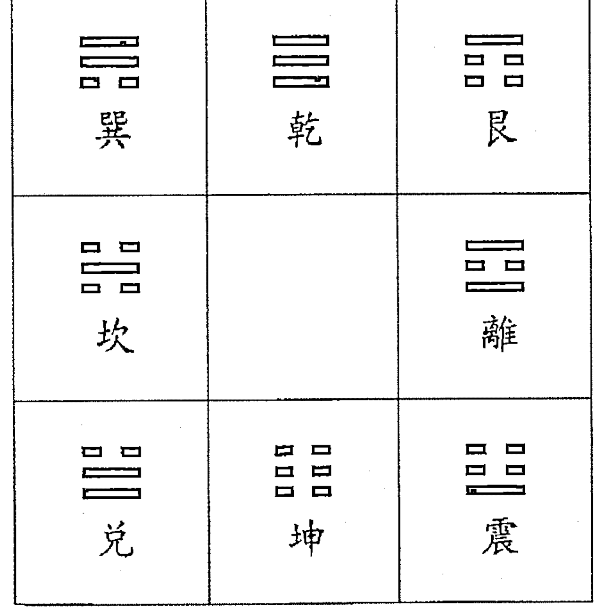

## 祿權相生八卦納甲

其次，根據八卦納甲，將《八卦配陰陽五行、配洛書數、配河圖數、納天干、納地支一覽表》各卦所納得之天干分別置入《祿權相生八卦圖》之各卦，得如下之《祿權相生八卦納甲圖》。

## 祿權相生八卦納甲圖

| ☴ 巽 辛 | ☰ 乾 甲、壬 | ☶ 艮 丙 |
| :---: | :---: | :---: |
| ☵ 坎 戊 | | ☲ 離 己 |
| ☱ 兌 丁 | ☷ 坤 乙、癸 | ☳ 震 庚 |

接下來，使《祿權相生八卦納甲圖》中之十天干由所在之八卦方位，擴散轉化成以十二地支為基礎，並分別與《紫微、天府星群的佈列圖》之各洛書數同宮，得如下之《十天干化祿化權圖》。

## 十天干化祿化權圖

| 巽、辛
7(巨門)
巳 | 乾、甲
8(廉貞)
午 | 乾、壬
4(天梁)
未 | 申 |
| --- | --- | --- | --- |
| 坎、戊
2B(貪狼)
辰 | | | 艮、丙
3(天同)
酉 |
| 兌、丁
2A(太陰)
卯 | | | 離、己
6B(武曲)
戌 |
| 5B(天府)
5A(紫微)
寅 | 坤、乙
1(天機)
丑 | 坤、癸
9(破軍)
子 | 震、庚
6A(太陽)
亥 |

紫微斗數創作者將《十天干化祿化權圖》中之各天干與其所配對之各洛書數的關係定義為「化祿」，依序如下：

1. 甲與洛書數8（廉貞）化祿。
2. 乙與洛書數1（天機）化祿。
3. 丙與洛書數3（天同）化祿。
4. 丁與洛書數2A（太陰）化祿。
5. 戊與洛書數2B（貪狼）化祿。
6. 己與洛書數6B（武曲）化祿。
7. 庚與洛書數6A（太陽）化祿。
8. 辛與洛書數7（巨門）化祿。
9. 壬與洛書數4（天梁）化祿。
10. 癸與洛書數9（破軍）化祿。

## 說明與推論

1. 紫微斗數創作者為何將《十天干化祿化權圖》中在同一地支宮內的天干與洛書數之關係定義為「化祿」？

A. 在《十天干化祿化權圖》中，各天干與同一地支中的各洛書數所對應的後天八卦之五行都互為相生或相同，紫微斗數創作者將各天干與所對應之主星五行互生相容的對應關係定義為「化祿」；因此，「化祿」的精神之一是在談天干五行與主星五行之互生相容（註：四化的精神之一也是在談天干五行與主星五行之間的生剋，詳見本書第五章《四化的基本定義及應用方法》）。

B. 以先天八卦圖的觀點而言，先天八卦圖中各本對卦均互為錯卦，在本質上具有陰陽互換、彼此往來、互通有無之意。而《祿權相生八卦圖》之本對卦的陰陽互換本質與先天八卦圖相通，當然也具有先天八卦「彼此往來、互通有無」的本質，而且這些本質係建立在「剛柔相摩，陰陽互換」的基礎上，符合「生生之謂易」的大原則，也就是屬於良性的互動能量，所以「化祿」具有正面的涵意。

2. 為何要將《先天八卦圖》調整成《祿權相生八卦圖》？

A. 前文之「使離、坎二卦位互換（水火相射）；使兌、震、艮、巽四隅卦同時逆轉二卦位」，之所以如此轉換的理由係取用「先天八卦變後天八卦的爻變過程」的陽儀迴路與陰儀迴路意涵（詳見本書P.32及P.36）。《祿權相生八卦圖》中的「乾、艮、離、震」四卦集結於右上側，此乃採用先天八卦變後天八卦的爻變過程中，陽儀迴路係由《震、離、乾、艮》四卦組合成一迴路系統之意涵；同理，「坤、兌、坎、巽」四卦集結於右下側，此乃採用先天八卦變後天八卦的爻變過程中，陰儀迴路係由《兌、坎、坤、巽》四卦組合成一迴路系統之意涵。

B. 將《十天干化祿化權圖》中的十個天干一一取出，另示於下列之《十天干五行順行順生圖》，得「木生火、火生土、土生金、金生水、水生木」之五行順行順生原則，故「化祿」具有「依序相生、一路相生、生生不息」的意涵。

## 十天干五行順行順生圖

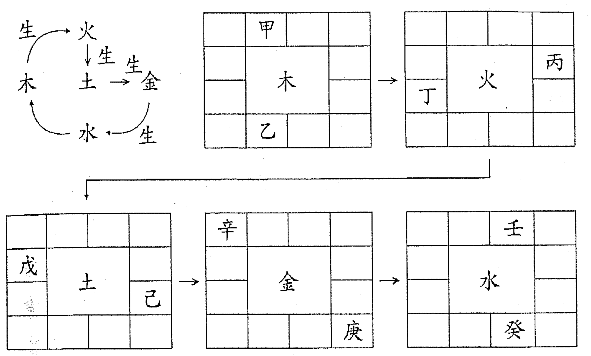

3.《十天干化祿化權圖》中的寅宮為何沒有天干：
因為寅宮中有「5A」及「5B」兩個半數（「5A」即為紫微星、『5B』即為天府星），若配置天干，將會出現一個天干對應兩個數的不均衡問題，故寅宮沒有配置天干；此外，在寅之對宮的申沒有洛書數，所以該地支也沒有配置天干。

## 化權的原理

在「化祿」原理之後，緊接著要揭露「化權」原理，因為這兩者乃是同源。
化權的原理是取自「八卦相盪」，在《祿權相生八卦納甲圖》之盪法為：乾坤互盪、艮兌互盪、坎離互盪、震巽互盪。

根據這個法則，《十天干化祿化權圖》中由十二地支所形成的宮位，及各宮位中的天干亦可「本對宮相盪」，說明如下：

1. 甲干：甲在午宮，其與本宮主星的關係為「廉貞化祿」；盪到對宮子，與對宮主星的關係為「破軍化權」。地支相盪在子午線。
2. 乙干：乙在丑宮，其與本宮主星的關係為「天機化祿」；盪到對宮未，與對宮主星的關係為「天梁化權」。相盪的地支由子午線順旋至丑未線。
3. 丙干：乙干自丑宮盪至未宮後，若依地支相盪順旋法則，應順旋至寅申線，惟寅申二宮位不納天干，故再順旋至卯酉線；而天干的部分則依「天干順生」規則，由「甲乙木」順旋順生到「丙丁火」（參閱《十天干五行順行順生圖》），相盪的地支由丑未線順旋至卯酉線。此時丙在酉宮，其與本宮主星的關係為「天同化祿」，而原本在乙干化祿的天機盪至丙干時則昇華為化權，用以連延自「甲乙木」順旋至「丙丁火」之氣。
4. 丁干：丁在卯宮，其與本宮主星的關係為「太陰化祿」；盪到對宮酉，與對宮主星的關係為「天同化權」。
5. 戊干：依「天干順生」規則，由「丙丁火」順旋順生到「戊己土」，相盪的地支由卯酉線順旋至辰戌線。此時戊干在辰宮，其與本宮主星的關係為「貪狼化祿」，而原本在丁干化祿的太陰盪至戊干時則昇華為化權，用以連延自「丙丁火」順旋至「戊己土」之氣。
6. 己干：己在戌宮，其與本宮主星的關係為「武曲化祿」；盪到對宮辰，與對宮主星的關係為「貪狼化權」。
7. 庚干：依「天干順生」規則，由「戊己土」順旋順生到「庚辛金」，相盪的地支由辰戌線順旋至巳亥線。此時庚干在亥宮，其與本宮主星的關係為「太陽化祿」，而原本在己干化祿的武曲盪至庚干時則昇華為化權，用以連延自「戊己土」順轉至「庚辛金」之氣。
8. 辛干：辛在巳宮，其與本宮主星的關係為「巨門化祿」；盪到對宮亥，與對宮主星的關係為「太陽化權」。
9. 壬干：依「天干順生」規則，由「庚辛金」順旋順生到「壬癸水」。此時壬干在未宮，其與本宮主星的關係為「天梁化祿」，對宮為丑，惟地支丑未相盪已為先前乙干所使用，故壬在未宮盪向對宮時轉用丑宮之鄰---寅宮內之「紫微」化權。（註：由《二十四山圖》可知後天艮卦含丑宮與寅宮，故壬干化權之宮位取寅代丑仍符卦理。）
10. 癸干：癸在子宮，其與本宮主星的關係為「破軍化祿」，對宮為午，而地支子午相盪亦已為先前甲干所使用，故癸在子宮盪向對宮時轉用午宮之鄰---巳宮內之「巨門」化權。（註：用巳火代替午火亦符五行）

至此，歸納十天干與各主星化祿及化權關係如下：

甲干：廉貞化祿、破軍化權。
乙干：天機化祿、天梁化權。
丙干：天同化祿、天機化權。
丁干：太陰化祿、天同化權。
戊干：貪狼化祿、太陰化權。
己干：武曲化祿、貪狼化權。
庚干：太陽化祿、武曲化權。
辛干：巨門化祿、太陽化權。
壬干：天梁化祿、紫微化權。
癸干：破軍化祿、巨門化權。

## 化科的原理

紫微斗數十天干化科的原理，是將《十天干化忌圖》中位居中土的紫微、天府，及分居辰、戌、丑、未四土（庫）位的天梁、武曲、天機、太陰等六顆星另外提出來（如《化科衍生自化忌的辰土、戌土、丑土、未土、中土圖》），再加上另創「左輔、右弼、文曲、文昌」等四顆副星，合計共十顆星，分別和十天干形成化科關係（如《十天干化科圖》）。

## 化科衍生自化忌的辰土、戌土、丑土、未土、中土圖

| 巳 | 午 | 2A(太陰) 未 | 申 |
|---|---|---|---|
| 4(天梁) 辰 | 5B(天府) | | 酉 |
| 卯 | 5A(紫微) | | 6B(武曲) 戌 |
| 寅 | 1(天機) 丑 | 子 | 亥 |

## 十天干化科圖

| 巳 | 午 | 癸
2A(太陰)
未 | 申 |
|---|---|---|---|
| 己、4(天梁)
辛、文曲
壬、左輔
辰 | 庚
5B(天府) | | 酉 |
| 卯 | 乙
5A(紫微) | | 甲、6B(武曲)
丙、文昌
戊、右弼
戌 |
| 寅 | 丁
1(天機)
丑 | 子 | 亥 |

## 天干中的甲、乙、丙、丁、戊五個生數化科

參考《十天干化科圖》，化科的設計是取十天干中的五個生數：甲（1）、乙（2）、丙（3）、丁（4）、戊（5）分別與後天四陽卦中的戌土、中土、丑土搭配，得下列結果：

1. 甲干在戌土，與該宮內的主星武曲化科。
2. 乙干在中土，與該宮內的主星紫微化科。
3. 丙干在戌土，與該宮內另創的副星文昌化科。
4. 丁干在丑土，與該宮內的主星天機化科。
5. 戊干在戌土，與該宮內另創的副星右弼化科。

### 【說明】

A. 甲為十干之首，乾卦為八卦之首，乾卦納地支戌、納洛書數6。十天干化科時，係起自十干之首的甲進入八卦之首乾卦所納的地支戌，而此時的甲干也和十天干化忌時位在戌宮的武曲星形成化科關係。

B. 乙為陰干之首，進入中土與十四主星之首的紫微星形成化科關係。

C. 丁為陰干，進入同樣具有陰性本質的丑土（陰土），並和十天干化忌時位在丑宮的天機星形成化科關係。

D. 丙為陽干，按前之「甲為陽干，納陽土戌；丁為陰干，納陰土丑」之理，丙為陽，故進入戌土、中土、丑土三者中的陽土戌，惟原位居戌土內的武曲星已和甲干形成化科關係，故紫微斗數創作者於十四主星之外，再創一副星文昌，以和丙干形成化科關係。

E. 按前述丙干納戌土之理，戊為陽干，故仍納陽土戌，而紫微斗數創作者在此也另創一副星右弼，用以和戊干形成化科關係。

## 天干中的己、庚、辛、壬、癸五個成數化科

取十天干中的五個成數：己（6）、庚（7）、辛（8）、壬（9）、癸（10）分別與後天四陰卦中的辰土、中土、未土搭配，得下列結果：

6. 己干在辰土，與該宮內的主星天梁化科。
7. 庚干在中土，與該宮內的主星天府化科。
8. 辛干在辰土，與該宮內另創的副星文曲化科。
9. 壬干在辰土，與該宮內另創的副星左輔化科。
10. 癸干在未土，與該宮內的主星太陰化科。

### 【說明】

A. 己為十天干中的成數6，與生數為1的甲具有「一六共宗」之關聯性，故己進入甲所在之戌土的對宮---辰土；而甲和在戌宮的主星武曲（洛書數6）化科，因此，由己和在辰宮的主星天梁（洛書數4）化科，具有一生一成、一右一左之對稱性。

B. 庚為十天干中的成數7，與生數為2的乙具有「二七同道」之關聯性，故庚配置在乙所在之中土；而乙和在中宮下方的主星紫微（洛書數5）化科，因此，由庚和同在中宮上方的主星天府（洛書數5）形成化科關係，具有一生一成、一下一上之對稱性。

C. 辛為十天干中的成數8，與生數為3的丙具有「三八為朋」之關聯性，故辛進入丙所在之戌土的對宮---辰土；而丙干和在戌宮另創的副星文昌化科，因此，紫微斗數創作者也在辰宮另創一副星文曲，用以和辛干化科，此理在一生一成、一右一左之間仍具有其對稱性。

D. 若按上述各天干化科之理，壬為十天干中的成數9，與生數為4的丁具有「四九為友」之關聯性，故壬應進入丁所在之丑土的對宮---未土；癸為十天干中的成數10，與生數為5的戊具有「五十同途」之關聯性，故癸應進入戊所在之戌土的對宮---辰土。惟紫微斗數創作者將壬與癸互換，使癸進入未土，和十天干化忌時位在未宮的太陰星成為化科關係，筆者推測其理由為：癸居十天干之末，又是陰干，所以和八卦之末坤卦所納地支未宮內的洛書數2（取名為太陰）化科，以與十天干之首甲和乾卦所納地支戌宮內的洛書數6（取名為武曲）化科前後呼應。

E. 最後，壬進入辰宮，紫微斗數創作者也在辰宮另創一副星左輔，用以和壬化科。

## 化科問題反思

紫微斗數十天干化科的設計是演繹自十天干化忌，而自古以來紫微斗數術家皆以化科為吉，或認為化科可以化解忌之惡，這種論點成立嗎？如果成立，各術家們是否可以提出合於學理的證明？

## 庚干化科

斗數界對於若干四化之星有不同看法，其中庚干化科之星亦受爭議，一說太陰化科，一說天府化科。

就學理而言，從本推演過程中可以很明確地看出：從化忌、化祿，一路演繹至化權與化科，均符合易理、陰陽、五行、先後天八卦、河圖、洛書、八卦納甲、八卦納支等基本法則，而且首尾呼應，前後相連、環環相扣。讓我們回到庚干化科這個議題，參考《十天干化科圖》，圖中的中土有「紫微」與「天府」二星，其中「紫微」用於和乙（生數2）化科，那麼同在中土的「天府」和庚（成數7）化科，不僅上下對稱，更符合河圖先天數中「二七同道」之理則。

就邏輯而言，中土與辰、戌、丑、未四土位共有「紫微」、「天府」、「天梁」、「武曲」、「天機」、「太陰」等六顆星，設計化科時將此六顆星分配給十天干中的六個，所餘未能配置星之四個天干（丙、戊、辛、壬）再對分為二，分至具有對稱性的辰、戌二宮亦屬合理。若說庚干為太陰化科，癸干亦是太陰化科，同一顆太陰星在兩個天干化科，不僅邏輯強度不夠，論者也應提出合於學理依據之探討與說明。

## 左輔、右弼、文曲、文昌之由來，以及在命盤中的排列原理

斗數在創作天干化科的同時，連帶規範了月系星左輔、右弼，以及时系星文曲、文昌在斗數命盤中的排列法則：左輔、文曲皆起自辰宮順旋，其順旋的原因，是因為辰宮在後天八卦的配置中，屬於四陰卦的一方，陰為地，「地道順（右）旋」之故；同理，右弼、文昌皆起自戌宮逆旋，其逆旋的原因，是因為戌宮在後天八卦的配置中，屬於四陽卦的一方，陽為天，「天道逆（左）旋」之故。

## 文曲化忌和文昌化忌的謬誤

在此回過頭來說明自古流傳至今，坊間慣用的「己干化文曲忌」和「辛干化文昌忌」，筆者推測其可能性為紫微斗數自開始流傳以來，其創作原理從未被公開，而在一代一代的流傳過程中，被有心人刻意竄改，將「己干化破軍忌」改為「己干化文曲忌」，「辛干化天梁忌」改為「辛干化文昌忌」，以致現今坊間所慣用者皆是竄改後的謬誤。若此，現今的紫微斗數命理術家若仍堅持使用「己干化文曲忌」和「辛干化文昌忌」的論點，則有責任針對這兩項論點提出合於學理的證明。

## 第十節 主副星及四化創作原理後記

壹、天干、地支、洛書數三者是紫微斗數命盤的主架構

以洛書數8為例，在《十天干化忌圖》中，丙干在寅宮，與洛書數8化忌；在《十天干化祿化權圖》中，甲干在午宮，和洛書數8化祿（洛書數8即後來被命名為廉貞星），此即形成了天干、地支、洛書數三者間的複雜關係：

1. 洛書數（即所謂的星）與天干的關係：

各洛書數與各天干形成一定的四化對應關係，例如8（廉貞星）與甲為化祿關係、與丙為化忌關係；又如1（天機星）與乙為化祿關係、與丙為化權關係、與丁為化科關係、與戊為化忌關係……等。

2. 洛書數（即所謂的星）與地支的關係：

洛書數配後天八卦後，即分成「5→1→6→3→8」及「5→2→7→4→9」兩大數列，並分別「逆旋」及「順旋」而成為紫府兩大星群；因此，紫府兩大星群所含的每一主星都是洛書數的化身，同時也都等同是各洛書數所配置之卦的化身。緣此，紫微斗數每一主星的五行需由其所對應之卦的五行來定義，例如：太陽星是洛書數6的化身，為乾卦，乾卦屬金，故太陽星的五行為金；太陰星是洛書數2的化身，為坤卦，坤卦屬土，故太陰星的五行為土，餘之各主星依此類推。就此觀念推而廣之，在實際推命時可衍生為「若某主星的五行與其所在之地支的五行若相生則為吉，若相剋則為凶」。

3. 天干與地支的關係：

以甲干為例，根據《十天干化祿化權圖》，甲干在午宮與廉貞化祿，這是紫微斗數化祿的基本盤；而在實際應用方面，甲干和廉貞可能分別出現在十二地支中的任一支，例如某一紫微斗數命盤其甲干出在現在辰，而廉貞出現在申，此時會因為甲干和廉貞化祿的關聯性，而使得辰和申成為「陰陽合體」，辰因為有甲干而成為發射宮（為陽宮），申因為有廉貞星而成為接受宮（為陰宮）。就此觀念推而廣之，在實際推命時可衍生為「在某地支內的天干若經催動，就會感應該天干所對應之化祿、化權、化科、化忌的各個星體，而與各該星體所在的地支形成陰陽合體」；這些不同的「陰陽合體」則因為化祿、化權、化科、化忌的緣故，而分別呈現吉或凶的現象。

貳、紫微斗數是一連串數納八卦的演化

1. 紫微斗數創作者分別對各洛書數命名，如「1」命名為「天機」、「7」命名為「巨門」……等，所以紫微斗數各個主星本身就是「數」的代名詞。
2. 紫微星群包括紫微星、天機星、太陽星、武曲星、天同星、廉貞星，其原始盤的排列方式是紫微星自中宮進入寅宮，其餘各星依逆旋方式向北方鋪排，所以紫微星群屬紫微斗數中的北斗星群；同理，天府星群包括天府星、太陰星、貪狼星、巨門星、天梁星、破軍星，其原始盤的排列方式是天府星自中宮進入寅宮，其餘各星依順旋方式向南方鋪排，所以天府星群屬紫微斗數中的南斗星群。而這也是紫微斗數被取名為紫微「斗」數的由來。

3. 天干是十進位「數」，地支是十二循環「數」；而構成一張斗數命盤的三大主角：「宮、星、四化」，宮就是十二地支「數」、主星就是洛書「數」，四化則統合了天干、地支與洛書數，也是「數」。

4. 「紫微星」是洛書中宮數5的化身，「5是半數，不論生成體用，都不能離開它，它是陰陽變化的中樞。」（《易鑰》），故「紫微帝座以輔弼為佐貳，作數中之主星，乃有用之源流。是以南、北斗集而成數，為萬物之靈。」（《星垣論》·紫微斗數古賦）由以上可見，紫微斗數是一連串數的變化。

## 參、紫微斗數先有四化才有主副星

《易嘆》：「易者，一易而無不易，上下易，陰陽易，此所以成天地之用。而乾坤之位，豈有一定而不易之理……是以八卦陰陽，都要活著，先天後天之圖，祇存其大體梗概，萬不可拘滯泥執」。此段話說明了易理、術數在在都要活用。

在眾多命理術數當中，紫微斗數是極為獨特的一支，尤其四化更是出眾，因為四化的設計理念圓融地活用了易理、陰陽、五行、天干、地支、先後天八卦、河圖、洛書、及八卦納甲、八卦納支等所有五術文化的基本法則，是超高智慧表現，必是出自超級行家之手。

更重要的是，紫微斗數創造者在設計四化的同時，也連帶設計了紫微星群、天府星群、左輔、右弼、文曲、文昌等諸星，不僅設計了這些星，同時也規範了這些星在斗數命盤中的排列法則與順序。例如武曲星的由來，乃是因為乾卦納洛書數6、納天干甲與壬、納地支亥與戌，為符合兩個天干（甲壬）在兩個地支（亥戌）的配置，所以將洛書數6一數兩用，在太陽星之外另再創造武曲星；同理，如貪狼星的由來，乃是因為坤卦納洛書數2、納天干乙與癸、納地支未與申，為符合兩個天干（乙癸）在兩個地支（未申）的配置，所以將洛書數2一數兩用，在太陰星之外另再創造貪狼星；此外，左輔、右弼、文曲、文昌也是因為先有十天干化科的需要，而後才創設這四顆副星。所以，紫微斗數若不談天干四化，主星及副星則無立錐之地，這是斗數中人不得不有的基本認知。

在過去、在現代，多少紫微斗數命理學家或不知紫微斗數基本學理，或人云亦云不求甚解，或空穴來風妄加附會，致使紫微斗數命理學一路走來跌跌撞撞，筆者特將紫微斗數四化的原理公諸於世，以扶正四化在紫微斗數中的地位，進而端正紫微斗數在命理學界及五術界中之視聽。

## 肆、紫府星群共有十二加二顆主星

如《紫府星群原始佈列圖》，紫府星群原各有六顆主星，合計共十二顆；現今流傳的紫微斗數主星則還在天府星群裡加上天相星及七殺星（天相星及七殺星的創作原理請見本書第四章《十四主星的基本定義及應用方法》），所以共有十四顆，分別是紫微星群六顆：紫微、天機、太陽、武曲、天同、廉貞，以及天府星群八顆：天府、太陰、貪狼、巨門、天相、天梁、七殺、破軍。

紫微星群是以四陽卦為基礎的設計，陽象天、逆旋，所以紫微星群採逆時鐘方向排列；天府星群是以四陰卦為基礎的設計，陰象地、順旋，所以天府星群採順時鐘方向排列。因此紫微斗數古賦《玄微論》即直指核心：「斗數之列眾星，猶大易之分八卦」。

紫微天府這兩大星群在命盤十二宮上會各自帶開，就好像兩列不同方向的火車，跑在兩條並排而圍成圓圈的軌道上一樣，所以有時會出現會車的情形；我們可以這麼想像，紫微星群這列火車有紫微、天機、太陽、武曲、天同、及廉貞等六節車廂，天府星群這列火車有天府、太陰、貪狼、巨門、天相、天梁、七殺、及破軍等八節車廂，當它們在並排的軌道上交會時，紫微這個車廂就有可能與天府星群的某個車廂出現重疊的現象，這時候命盤上就會出現雙主星並列的情況，例如紫微會天府、紫微會貪狼、紫微會天相、紫微會七殺、或紫微會破軍。

## 伍、紫府星群十二種盤局

底下之《原始盤---紫微在寅》圖，是紫府兩大星群的原始盤，其他的十一種變化盤都是衍生自這個原始盤，例如《衍生盤---紫微在卯》圖就是其中之一。

### 原始盤－紫府盤．紫微在寅

| 巨門 巳 | 廉貞 天相 午 | 天梁 未 | 七殺 申 |
| :--- | :--- | :--- | :--- |
| 貪狼 辰 | | | 天同 酉 |
| 太陰 卯 | | | 武曲 戌 |
| 紫微 天府 寅 | 天機 丑 | 破軍 子 | 太陽 亥 |

### 衍生盤－紫貪盤．紫微在卯

| 天相 巳 | 天梁 午 | 廉貞 七殺 未 | 申 |
| :--- | :--- | :--- | :--- |
| 巨門 辰 | | | 酉 |
| 紫微 貪狼 卯 | | | 天同 戌 |
| 天機 太陰 寅 | 天府 丑 | 太陽 子 | 武曲 破軍 亥 |

### 衍生盤－紫相盤．紫微在辰

| 天梁 巳 | 七殺 午 | 未 | 廉貞 申 |
| :--- | :--- | :--- | :--- |
| 紫微 天相 辰 | | | 酉 |
| 天機 巨門 卯 | | | 破軍 戌 |
| 貪狼 寅 | 太陽 太陰 丑 | 武曲 天府 子 | 天同 亥 |

### 衍生盤－紫殺盤．紫微在巳

| 紫微 七殺 巳 | 午 | 未 | 申 |
| :--- | :--- | :--- | :--- |
| 天機 天梁 辰 | | | 廉貞 破軍 酉 |
| 天相 卯 | | | 戌 |
| 太陽 巨門 寅 | 武曲 貪狼 丑 | 天同 太陰 子 | 天府 亥 |

### 衍生盤－紫微盤。紫微在午

| 巳 | 午 | 未 | 申 |
|---|---|---|---|
| 天機 | 紫微 | | 破軍 |
| 七殺 | | | 酉 |
| 辰 | | | 廉貞 |
| 太陽 | | | 天府 |
| 天梁 | | | 戌 |
| 卯 | | | |
| 武曲 | 天同 | 貪狼 | 太陰 |
| 天相 | 巨門 | | |
| 寅 | 丑 | 子 | 亥 |

### 衍生盤－紫破盤。紫微在未

| 巳 | 午 | 未 | 申 |
|---|---|---|---|
| 太陽 | 天機 | 紫微破軍 | |
| 辰 | | | 天府 |
| 武曲 | | | 酉 |
| 七殺 | | | 太陰 |
| 卯 | | | 戌 |
| 天同 | 天相 | 巨門 | 廉貞貪狼 |
| 天梁 | | | |
| 寅 | 丑 | 子 | 亥 |

### 衍生盤－紫府盤。紫微在申

| 巳 | 午 | 未 | 申 |
|---|---|---|---|
| 太陽 | 破軍 | 天機 | 紫微天府 |
| 武曲 | | | 太陰 |
| 辰 | | | 酉 |
| 天同 | | | 貪狼 |
| 卯 | | | 戌 |
| 七殺 | 天梁 | 廉貞天相 | 巨門 |
| 寅 | 丑 | 子 | 亥 |

### 衍生盤－紫貪盤。紫微在酉

| 巳 | 午 | 未 | 申 |
|---|---|---|---|
| 武曲破軍 | 太陽 | 天府 | 天機太陰 |
| 天同 | | | 紫微貪狼 |
| 辰 | | | 酉 |
| 卯 | | | 巨門 |
| | | | 戌 |
| 寅 | 廉貞七殺 | 天梁 | 天相 |
| | 丑 | 子 | 亥 |

### 衍生盤－紫相盤・紫微在戌

| 天同 巳 | 武曲 天府 午 | 太陽 太陰 未 | 貪狼 申 |
|---|---|---|---|
| 破軍 辰 | | | 天機 巨門 酉 |
| 卯 | | | 紫微 天相 戌 |
| 廉貞 寅 | 丑 | 七殺 子 | 天梁 亥 |

### 衍生盤－紫殺盤・紫微在亥

| 天府 巳 | 天同 太陰 午 | 武曲 貪狼 未 | 太陽 巨門 申 |
|---|---|---|---|
| 辰 | | | 天相 酉 |
| 廉貞 破軍 卯 | | | 天機 天梁 戌 |
| 寅 | 丑 | 子 | 紫微 七殺 亥 |

### 衍生盤－紫微盤・紫微在子

| 太陰 巳 | 貪狼 午 | 天同 巨門 未 | 武曲 天相 申 |
|---|---|---|---|
| 廉貞 天府 辰 | | | 太陽 天梁 酉 |
| 卯 | | | 七殺 戌 |
| 破軍 寅 | 丑 | 紫微 子 | 天機 亥 |

### 衍生盤－紫破盤・紫微在丑

| 廉貞 貪狼 巳 | 巨門 午 | 天相 未 | 天同 天梁 申 |
|---|---|---|---|
| 太陰 辰 | | | 武曲 七殺 酉 |
| 天府 卯 | | | 太陽 戌 |
| 寅 | 紫微 破軍 丑 | 天機 子 | 亥 |

## 陸、紫微斗數與河洛理數同源而分流

「所謂河洛理數，顧名思義，當然不外以河圖、洛書的數理為準則。不過它的方法，是以天干十位數，地支十二位數，配合八卦的象數而構成一套理念性，抽象性的計算公式。它是淵源於西漢易學象數的納甲方法，發展為另一種推命的公式和學理。」這是《易經的星命與占卜・P.90》一書中對河洛理數的描述，若將這段文字一開頭的「河洛理數」換成「紫微斗數」，則可發現，該段文字幾乎是為了紫微斗數的創作根源所寫的。

河洛理數與紫微斗數這兩套學說在後續的發展方面，河洛理數朝向由數起卦，再由八卦相盪成本命卦方向延伸；紫微斗數則由數轉化成星，以及取天干與數的對應關係定位四化。「況且在中國推算星命的各種方法中，真正以易理為主體的，只有河洛理數一書，別無它書。」（《易經的星命與占卜》・P.89）筆者認為，除了河洛理數一門之外，還要加上紫微斗數，至於它推斷現實人生際遇的準確度如何，那是另一命題，當另闢專題討論之。

#### 《問題思考》

1. 根據本章之系統化的理論證明，得知紫微斗數是根據易，再搭配天干、地支、河洛數設計而成；換個角度看，易是紫微斗數的理論母體，紫微斗數是易的應用學科，易與紫微斗數二者之間存有體用關係。因此，紫微斗數術家若不學易，有可能將紫微斗數發揮到如庖丁解牛般地淋漓盡致嗎？

2. 如果上述第1. 點的結論是肯定的，那麽該如何將易這個抽象的母體轉換成可供紫微斗數論命的實際價值？易與紫微斗數二者間轉換的介面在哪裡？轉換的方法為何？

3. 紫微斗數為易的應用學科，《易經·繫辭上傳》：「易與天地準，故能彌綸天地之道。」若此，使用者可否經由對紫微斗數的觀察及實踐，而得到「彌綸天地之道」的體悟？回到三易中之不易的真如境界？

4. 坊間流傳之紫微斗數命盤常摻雜若干神煞，如羊刃、陀羅、火星、鈴星、天空、地劫等，多者甚至達百餘顆，持神煞叢辰法論命者常捨紫微斗數之母體架構（包括主星、副星、四化）不用，而偏重神煞，若能斷得準，神煞倒也有其參考價值，惟紫微斗數若忽略主星、副星、四化這個母體架構不用，還有資格堂而皇之稱為紫微斗數嗎？

5. 紫微斗數自傳世千年以來，其創作理論即從未曾被公開，是以古本及今本各紫微斗數書籍對主星、副星、四化的主觀論述多憑使用者的經驗而差異甚遠莫衷一是，如今紫微斗數的創作理論現世，那麽各主星、副星、四化的內涵需不需要根據其創作理論重新定義？若答案是肯定的，該如何定義？若答案是否定的，為什麽不需要重新定義？

6. 承上述，若紫微斗數各主星、副星、四化的內涵需根據創作理論重新定義，那麼紫微斗數的論命方法需不需要重新整理？論命模型需不需要另外分解歸納整合？如果不需要，是根據什麼理由認為不需要？

7. 古有劍術高超的「盲劍客」，與對手決鬥時靠聞聲辨位而精準出手制敵，後來由於弓箭武器的發展，敵人可於百尺之外一箭射穿「盲劍客」，更甚者，若「盲劍客」生活於現代，即使在有利自己的夜間和敵人作戰，他的敵人也大可透過夜視狙擊槍於百米之外一槍令「盲劍客」斃命。重新定義之後的紫微斗數，其論命模型將會因為有完整的理論背景，而出現高度標準化及全方位精準化的嶄新趨勢；此時，紫微斗數術家若仍食古不化，不能跟上新的論命模型及新的方法論，會不會如「盲劍客」般被日新又新的全天候武器所瞬間消滅？若有他人向如「盲劍客」者問命，會不會出現「問道於盲」的致命錯誤？

8. 承上述，當紫微斗數論命的模型出現高度標準化及全方位精準化時，後進的學習者一旦採用這套系統化的新論命模型，其功力有沒有可能在一夕之間超越研究數十年傳統紫微斗數的前人？

## 第三章 紫微斗數十二宮職的創作原理

### 第一節 十二宮職的名稱

紫微斗數十二宮職是指命宮、兄弟宮、夫妻宮、子女宮、財帛宮、疾厄宮、遷移宮、奴僕宮、官祿宮、田宅宮、福德宮、父母宮；這十二個宮職以命宮為首，依逆時鐘方向排列，構成紫微斗數命盤中之「宮盤」的部分。

說明：

1. 任一紫微斗數命盤均內含「宮盤」、「星盤」、「四化盤」三種盤面。
2. 紫微斗數還有另外一種由十二地支所構成的十二宮，例如子宮、丑宮……、亥宮等；這十二宮的功能是在代表空間（包括位置、方向）和時間（包括歲次、月建、日建、時辰），不同於由命宮、兄弟宮……、父母宮等所構成的十二宮職。

### 第二節 六內宮、六外宮、六親宮、本對宮

#### 六內宮、六外宮

紫微斗數十二宮職依其生成體用原則，又可分為六內宮及六外宮。

六內宮：命宮、財帛宮、疾厄宮、官祿宮、田宅宮、福德宮。

六外宮：遷移宮、兄弟宮、夫妻宮、子女宮、奴僕宮、父母宮。

#### 六親宮

紫微斗數十二宮職中含有六個六親宮，分別是兄弟宮、夫妻宮、子女宮、奴僕宮、父母宮、遷移宮，皆是屬於與他人有關的宮位；前五個宮職都有明確的對應對象，例如兄弟宮代表與命主的手足、同學、同事等，遷移宮則沒有特定的對應對象，例如與命主不相識的社會大眾。

#### 本對宮

根據本宮與對宮的關係，十二宮職可分成六組本對宮：

1. 本命<-->本遷（又稱「命遷線」）
2. 本兄<-->本奴（又稱「兄奴線」）
3. 本夫<-->本官（又稱「夫官線」）
4. 本子<-->本田（又稱「子田線」）
5. 本財<-->本福（又稱「財福線」）
6. 本父<-->本疾（又稱「父疾線」）

### 第三節 取宮職用神

宮職是指宮位的職責及功能。每個宮職都有其特定的職責，例如：命宮的職責及功能為揭露命主的性格、命主的應變能力、命主的情緒管理；財帛宮的職責及功能為揭露命主獲得財物的難易度。

#### 取宮職用神

取命盤上某宮職來查看某人或某事的方法，就叫做「取宮職用神」。例如：若要瞭解命盤主人的性格，就要查看命盤上的命宮；若要瞭解命盤主人是否容易獲得財物，就要查看命盤上的財帛宮。

### 第四節 十二宮職的定位點—命宮

命宮是十二宮職的定位點，排紫微斗數命盤（以下簡稱命盤）時需先定命宮。

定命宮時，係取農曆生月及生時為參數，將寅宮視為農曆的一月，按順時針方向依序「順數至生月」，也就是說，卯宮是農曆的二月、辰宮是農曆的三月、巳宮是農曆的四月……等，依此類推；然後再自農曆生月的宮位依逆時針方向「逆數至生時」，如此「自寅起算，先順數至生月，再逆數至生時」，即可得知命宮位在何處。

#### 定命宮圖

1. 自寅宮起算順數至生月

| 4月 巳 | 5月 午 | 6月 未 | 7月 申 |
| :--- | :--- | :--- | :--- |
| 3月 辰 | | | 8月 酉 |
| 2月 卯 | | | 9月 戌 |
| 1月 寅 | 12月 丑 | 11月 子 | 10月 亥 |

2. 以生月為起算點逆數生時

說明：

1. 上圖以農曆6月、辰時生人為例。寅宮為農曆的1月，因此定命宮時，要以寅宮為起算點順數至6月，得知6月的落點在未宮；再將未宮視為子時的起算點，自未宮逆數生時，得知該命主的命宮在卯宮。
2. 「順數至生月」的目的，是在推算地球繞太陽公轉時所處的黃道位置；「逆數至生時」的目的，則是在推算地球自轉時，地球上各該時區相對於太陽的角度；因此，紫微斗數的命宮具有「定位命主在地球上出生的落點位居黃道面上哪個區間」的抽象概念。

### 第五節 十二宮職的功能

#### 【命宮】

命宮的功能如下：

1. 命宮是所有宮位的立基點，它也代表命主所能控制、所能表達的部分，例如：情緒管理（EQ）、逆境商數（AQ）、膽識、性格傾向、才華、能力、執行力、品味、格調、容不容易成為社會名流……等。
2. 廣義的命宮也代表命宮以外的其他十一個宮職。這句話的意思是指命宮有時也可以代表其他宮職，例如代表財帛宮，當命宮代表財帛宮時，當時的命宮就具有能判斷得財難易度的功能；又如，命宮也可以代表夫妻宮，當命宮代表夫妻宮時，當時的命宮就具有能判斷婚姻好壞的功能。這種用命宮來代表其他十一個宮職的技巧難度較高，依其用法可分成兩大層面：
    A. 命宮代表靜盤（註）中的其他十一個宮職，並用於判斷先天的命格。例如：命宮有武曲星者，武曲為原始財帛宮的主星（詳見本書第四章第一節），因此這個命宮結構可用於判斷命主得財的難易度。
    B. 命宮代表動盤（註）中的其他十一個宮職，並用於判斷後天的運勢（這是判斷後天行運的技巧，後天行運不在本書介紹之列，故從略）。

註：「靜盤」及「動盤」的定義請參閱本章第八節。

#### 【兄弟宮】

兄弟宮的功能如下：

1. 揭露命主與平輩之間的相對性：兄弟宮在揭露命主與平輩之間的互動情形，強調命主與平輩之間的相對性。
2. 揭露命主與競爭者之間的相對性。
3. 揭露平輩的絕對主體性：兄弟宮在揭露平輩的特徵，如情緒管理（EQ）、逆境商數（AQ）、膽識、性格傾向、才華、能力、執行力、品味、格調等，強調平輩自身的絕對主體性。

說明：

這裡的平輩包括兩大部份：

A. 狹義的平輩：包括命主的兄弟姐妹、堂兄弟姐妹、表兄弟姐妹、結拜的兄弟姐妹、共修的師兄弟姐妹、與命主交情菲淺的朋友、共同學習課程的同學、位階相近的同事等。
B. 廣義的平輩：包括事業上的合夥人、事業上的合作廠商、與命主之權力支配有關的結盟夥伴、作戰時的友軍等。

#### 【夫妻宮】

夫妻宮的功能如下：

1. 揭露命主與另一半之間的相對性：夫妻宮在揭露命主與另一半之間的互動情形，強調兩人之間的相對性。
2. 揭露另一半的絕對主體性：夫妻宮在揭露命主之另一半的特徵，如情緒管理（EQ）、逆境商數（AQ）、膽識、性格傾向、才華、能力、執行力、品味、格調等，強調配偶或親密異性朋友自身的絕對主體性。
3. 揭露命主之某一段男女感情的好壞。
4. 揭露命主之婚姻是否幸福美滿。
5. 代表婚後的夫家（女命）、或婚後的娘家（男命）。

說明：

這裡的另一半包括婚前的親密異性朋友、未婚但同居在一起的異性朋友、婚後的配偶等。

#### 【子女宮】

子女宮的功能如下：

1. 揭露命主與下一輩之間的相對性：子女宮在揭露命主與下一輩之間的互動情形，強調命主與下一輩之間的相對性。
2. 揭露下一輩的絕對主體性：子女宮在揭露下一輩的特徵，如情緒管理（EQ）、逆境商數（AQ）、膽識、性格傾向、才華、能力、執行力、品味、格調等，強調下一輩自身的絕對主體性。
3. 揭露命主的身體健康情形。
4. 揭露命主的性生活。

說明：

這裡的下一輩包括兩大部份：

A. 狹義的下一輩：包括命主的子女、女婿、媳婦、養子女、義子、姪兒女、外甥、外甥女、孫子女、學生、部屬、徒弟等。
B. 廣義的下一輩：包括被命主授權的個人或團體、連鎖事業體系中的加盟店、傳銷體系中的下線、選舉時的樁腳等。

#### 【財帛宮】

財帛宮的功能如下：

- 1. 代表命主的財源。
- 2. 代表命主所飲食的食物。
- 3. 揭露命主獲得錢財及物資的難易度。
- 4. 揭露命主獲得或失去錢財及物資的方式。
- 5. 揭露命主的買賣運是否順利。
- 6. 代表命主購買某商品時其品質的優劣。
- 7. 代表上班族的薪資福利之高低好壞。
- 8. 代表企業主經營事業的營業額。

9. 財帛宮更寬廣的定義在指命主與「有形物資」之間的關係，物資與錢財實為一體兩面，當一個人獲得物資時，我們可以說他得財；反之，當一個人失去物資時，我們可以說他失財（或稱「得債」）。

#### 【疾厄宮】

疾厄宮的功能如下：

- 1. 代表命主的肉體。
- 2. 揭露命主先天體質之強弱。
- 3. 揭露命主發生疾病的部位及病症。
- 4. 揭露命主發生外來傷害時受傷的部位。

#### 【遷移宮】

遷移宮的功能如下：

- 1. 代表與命主有對立關係之人，以及不特定之人事物。
- 2. 代表命主所要前往的地方。
- 3. 揭露命主出外的際遇。
- 4. 代表命主所面臨的時勢。
- 5. 代表命主所不能控制的外在大環境。
- 6. 代表未來。
- 7. 代表宇宙自然界的能量。
- 8. 揭露命主與宇宙自然界之互動的好壞。

#### 【奴僕宮】

奴僕宮的功能如下：

- 1. 代表與命主有金錢或物資往來關係的社會大眾。
- 2. 代表與命主泛泛之交的朋友。
- 3. 代表命主的異性桃花緣。
- 4. 代表命主三角戀情的第三者、命主婚後外遇的第三者。
- 5. 代表命主在生意場上的顧客。
- 6. 揭露命主與芸芸眾生（含人及動物）之間的對待關係。

#### 【官祿宮】

官祿宮的功能如下：

- 1. 代表命主的權力。
- 2. 揭露命主在競逐權力時的吉凶得失。
- 3. 揭露命主在下達權令時是否能令出則行沒有障礙。
- 4. 揭露命主在參加考試以取得就學資格的難易度。
- 5. 揭露命主在參加測試以取得就業資格的難易度。
- 6. 揭露命主在事業上之名位或權位的高低。
- 7. 揭露命主在某一團體中（含家庭）之權位的高低。
- 8. 揭露命主在官訟時的吉凶得失。

#### 【田宅宮】

田宅宮的功能如下：

- 1. 代表命主的財庫。
- 2. 代表大地、土地、房屋。
- 3. 代表命主的居住場所。
- 4. 揭露居住場所會對命主產生哪些利弊得失。
- 5. 代表命主經營事業時的營業場所，如店面、公司、工廠。
- 6. 揭露營業場所會對命主產生哪些利弊得失。
- 7. 揭露命主的搬家運。
- 8. 揭露命主的購屋運、購地運。
- 9. 代表陰宅（需與其他宮職同參）。

#### 【福德宮】

福德宮的功能如下：

- 1. 代表命主的靈體。
- 2. 代表命主的智慧（IQ）、思考力、決策思維及決策模式、創意、潛意識、心情、第六感等。
- 3. 揭露命主與神鬼互動時的吉凶利弊。
- 4. 揭露命主與宗教的緣份。
- 5. 揭露命主的祖蔭。

#### 【父母宮】

父母宮的功能如下：

- 1. 揭露命主與上一輩之間的相對性：父母宮在揭露命主與上一輩之間的互動情形，強調命主與上一輩之間的相對性。
- 2. 揭露上一輩的絕對主體性：父母宮在揭露上一輩的特徵，如情緒管理（EQ）、逆境商數（AQ）、膽識、性格傾向、才華、能力、執行力、品味、格調等，強調上一輩自身的絕對主體性。
- 3. 揭露命主來自上一輩授予权力時的吉凶得失（參閱本書第七章《從清朝十一帝的父母宮和命宮談大清帝國的興衰》）。
- 4. 揭露命主參加考試時之成績的高低。

說明：

- 1. 這裡的上一輩包括兩大部份：
  - A. 狹義的上一輩：包括命主的父母、祖父母、公婆、岳父母、父母（祖父母、公婆、岳父母）的兄弟姐妹及其配偶、父母（祖父母、公婆、岳父母）的朋友、老師、上司等。
  - B. 廣義的上一輩：包括幫命主看診的醫師、可授權給命主的個人或團體、連鎖事業體系中的加盟總部、傳銷體系中的上線、學校、中央黨部、執法人員（例如法官、警察）、政府機關等。
- 2. 父母宮還代表：文件、證書、證照、支票、契約、文章、書籍、信件、電腦程式檔案資料等。

#### 《問題思考》

- 1. 當您在書局購買這本書時，您是該書局的消費者，相對於該書局銷售人員的紫微斗數命盤而言，您是他的什麼宮？（提示：財帛宮？遷移宮？或奴僕宮？）
- 2. 當您在閱讀這本書時，您是這本書的讀者，相對於筆者的紫微斗數命盤而言，您是筆者的什麼宮？（提示：子女宮？遷移宮？奴僕宮？或父母宮）
- 3. 本書由筆者所撰寫，透過書局這個通路銷售，當您在書局購買這本書時，相對於筆者的紫微斗數命盤而言，書局是筆者的什麼宮？（提示：兄弟宮？財帛宮？遷移宮？或奴僕宮？）同上，相對於書局而言，筆者是書局的什麼宮？（提示：兄弟宮？遷移宮？或奴僕宮？或父母宮？）
- 4. 假設您目前處於沒有婚姻的狀態，某天您認識了一位異性朋友，後來發展成為男女朋友關係，在您的命盤上，這位異性朋友應以何宮職為用神？
- 5. 承上，若後來您又交了第二位異性朋友，並與第一位異性朋友形成三角戀情關係，在您的命盤上，這第二位異性朋友應以何宮職為用神？
- 6. 如果您正在參加某公司的應徵考試，在您的命盤上，該公司的主考官應以何宮職為用神？
- 7. 如果您正準備要購買一部數位相機，若要知道該數位相機的品質如何，應以何宮職為用神？
- 8. 打官司時，當事人所聘請的律師應以何宮職為用神？與當事人訴訟的另一造應以何宮職為用神？
- 9. A先生和B小姐是同在某量販店上班的同事，A先生的職務是行銷企劃，B小姐的職務是櫃台收銀，以紫微斗數論斷該二人的事業好壞時，A先生應以何宮職為用神？B小姐又應以何宮職為用神？
- 10. C先生和D小姐是一對夫妻，D小姐希望透過紫微斗數瞭解她與婆婆的關係如何，此時應以C先生的命盤為判斷依據，還是以D小姐的命盤為判斷依據？該判斷命盤中的那些宮職？
- 11. E小姐自備快餐車自營早餐生意，F小姐加盟某連鎖系統經營早餐店，以紫微斗數論斷該二人的事業好壞時，E小姐應以何宮職為用神？F小姐又應以何宮職為用神？（提示：用神不只一個。）
- 12. A、B、C三位先生要合夥創業，其中A先生負責產品研發，B先生負責人事管理，C先生負責市場行銷，此時A先生應以哪幾個宮職用神為判斷吉凶之依據？B先生又應以哪幾個宮職用神為判斷吉凶之依據？C先生呢？（提示：用神不只一個。）

### 第六節 十二宮職的創作原理

紫微斗數十二宮職的排列定位有其一定的規則及道理，十二宮職的排列原理並非如「命宮的逆行一宮為兄弟宮→兄弟宮的逆行一宮為夫妻宮」這麼一宮接一宮地被產生出來，而是採用河圖之「一六共宗」及易之「數往者順，知來者逆，是故，易逆數也。」（易經・說卦傳）的自然界規則及道理設計而成。在介紹紫微斗數十二宮職的創作原理之前，請讀者先思考一個生物現象：「自然界中的生命會自己尋找出路，試圖讓自己的生命存活下去並繁衍下一代；而人類、乃至於地球上的哺乳類動物，其與生俱來的本性中除了求生存之外，還具備哪些天生的本性？」

#### 命宮的由來

宇宙間生物的生成起源是從水開始，地球就是個鮮明的例證。地球是個有機體，地球上一切生物最初都是依附水而誕生，由單細胞生物逐漸演化而成目前的繁雜生物世界，即使號稱萬物之靈的人類，其最初的胚胎也是水泡的型態，因此水是生命之源，同時也形成了令生命延續下去的秩序。

### 第六節 十二宮職的創作原理

河圖

| | 南 | |
|---|---|---|
| | 2(火)
7(火) | |
| 東 | 中 | 西 |
| 3(陽木)
8(陰木) | 5(陽土)
10(陰土) | 4(陰金)
9(陽金) |
| | 北 | |
| | 1(水)
2(水) | |

洛書

| | | |
|---|---|---|
| 4 | 9 | 2 |
| 3 | 5 | 7 |
| 8 | 1 | 6 |

《河圖》：「天一生水」，這個「一」是河圖數1，河圖數1與上列洛書圖之洛書數1相通，二者的五行都屬水；換言之，洛書數1也代表生命的源起。紫微斗數創作者根據這個自然數的法則，將「自寅起算，先順數至生月，再逆數至生時」所得到的落點視為第一宮，稱之為「命宮」，代表命主生命的開始及命運的開啟，由此可知，命宮最原始的意旨是在強調生命的生成。

#### 紫微斗數十二宮職的創作原理

| 巳 | 午 | 未 | 申 |
|---|---|---|---|
| 辰 | | | 酉 |
| 卯 | | | 戌 |
| 第一宮【命宮】寅 | 丑 | 子 | 亥 |

#### 疾厄宮、福德宮、子女宮的由來

疾厄宮、福德宮、子女宮生成圖

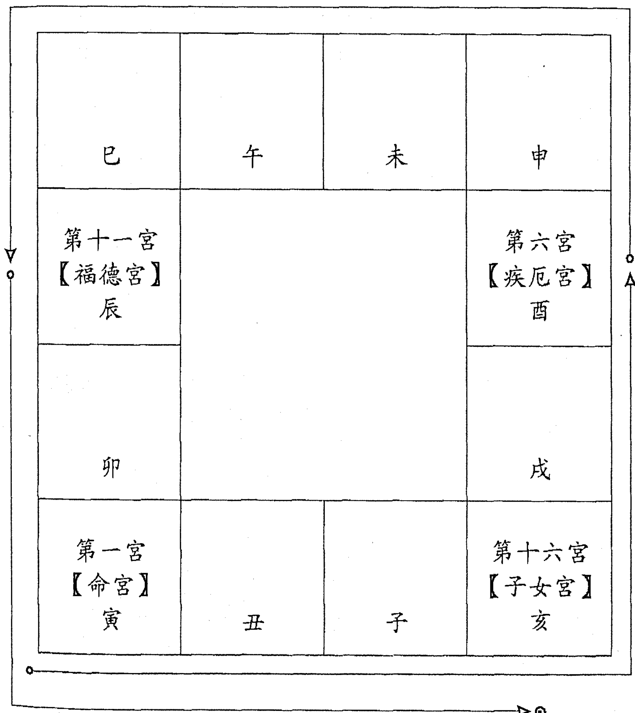

人的生命之所以能夠生成，是來自肉體與靈體的結合，從陰陽的角度看，肉體與靈體的結合也是「陰陽合體」的形式。《河圖》的觀念認為一六共宗，數「一」和數「六」是一體的兩面，一為生數、六為成數，二者相合則構成生成體用的變化。若將命宮視為紫微斗數十二宮職中的第一宮，那麼自命宮逆算的第六宮，則是與命宮互為體用的宮位，這個宮位代表生命之肉體的生成，紫微斗數創作者將這個宮位命名為疾厄宮。

再以疾厄宮為起點逆算的第六個宮位（等於自命宮逆算的第十一宮），則是與疾厄宮互為體用的宮位，這個宮位代表生命的靈體，紫微斗數創作者將這個宮位命名為福德宮。

說明：

- 1. 為什麼以命宮為第一宮起算第六宮時，是逆算而非順算？
  《易經·說卦傳》：「數往者順，知來者逆，是故，易逆數也。」紫微斗數創設的要旨是為了數算人生的命運，一個人的命運自被誕生的那一瞬間便開始起變化，自出生的那一瞬間起，人生的未來即充滿了變數，為了能有效地數算人生未來的變數，所以紫微斗數創作者採用易的大道理：「知來者逆」，在紫微斗數的第一宮被定位完成之後，第六個宮位的定位即採用逆算的規則，而後續其他宮職的定位方式也都是依照這個法則。

- 2. 人的生命，其生成是緣自肉體和靈體的結合，為什麼自命宮逆算的第六宮被定位為肉體的宮位而非靈體的宮位？
  人類生命的生成是肉體和靈體的結合，而身為色相的胚胎（肉體）又先一步形成，而後才有靈體來附；所以，命宮逆算的第六宮被定位為先一步形成的肉體宮（疾厄宮），自疾厄宮逆算的第六宮（等於自命宮逆算的第十一宮）被定位為來附的靈體宮（福德宮）。

根據上面的宮職生成規則，再以福德宮為起點逆算的第六個宮位（等於自命宮逆算的第十六宮），則是與福德宮互為生成體用的宮位，這個宮位代表生命的延續和傳承，紫微斗數創作者將這個宮位命名為子女宮。

#### 財帛宮及官祿宮的由來

命宮、財帛宮、官祿宮生成圖

| 第十宮 巳 | 第九宮 【官祿宮】 未 | 第八宮 未 | 第七宮 申 |
| :--- | :--- | :--- | :--- |
| 第十一宮 辰 | | | 第六宮 酉 |
| 第十二宮 卯 | | | 第五宮 【財帛宮】 戌 |
| 第一宮 【命宮】 寅 | 第二宮 丑 | 第三宮 子 | 第四宮 亥 |

> 「人類、乃至於地球上的哺乳類動物，其與生俱來的本性中除了求生存之外，還具備哪些天生的本性？」

人的本性有真實及虛偽的面向，動物本能是人類真實的一面，倫理道德則是虛偽的一面；虛偽的一面很多人看不清楚，但若仔細觀察，可以發現絕大多數人所謂的倫理道德都抗拒不了動物本能的需求；因此，若能仔細瞭解人類的動物本能需求，就能預知人類最終的行為表現。

紫微斗數創作者根據這些觀察，分別將人類與生俱來的三項最重要動物本能提列出來，其一是求生存，其二是奪利（取得食物），其三是爭權（取得領導地位），並將這三大基本需求分別置放於紫微斗數的第一宮、第五宮、及第九宮；換言之，紫微斗數命盤的第一宮是求生存的宮位（被取名為「命宮」），第五宮是奪利的宮位（被取名為「財帛宮」），第九宮是爭權的宮位（被取名為「官祿宮」），其後另自命宮、財帛宮、官祿宮各再分別衍生出三個宮職，成為十二宮職的命盤型態，從此發展成可以解析人類真實的一面，進而推斷出人類虛偽的面向，再由此構成一生的命與運。

#### 《說明》

- 1. 不只是人類會爭權、奪利、求生存，許許多多的動物也都具有這些與生俱來的本能，例如獅子為了求生存，會集體生活而且集體獵食（奪利），也會出現爭取成為獅群領導者的行為（爭權）；又如猴群的爭權、奪利、求生等模式也是與獅群一樣。既然爭權、奪利、求生存是動物的本能，那麼就可以假設：「絕大多數的動物終其一生的行為模式都脫離不了其本性的限制。」由此可知，紫微斗數創作者將動物本能納入命盤的設計，這使得紫微斗數這套術數在論斷人的命運時，得以掌握精確的命運軌跡。

- 2. 如前所述：「知來者逆」，所以紫微斗數採用「逆旋」為訂定十二宮職的規則，但是為什麼自命宮逆算的第五宮是奪利的宮位（財帛宮）而非爭權的宮位（官祿宮）？
  如洛書圖，洛書數1居下方中間，洛書數5居中宮，洛書數9居上方中間；這1、5、9三數形成洛書圖的中流砥柱，洛書數1納坎水，是生命的開始，洛書數5居中土，土生納萬物，所以先賢有「以土為財」的應用，洛書數9為洛書之最大數，納離火，象徵高高在上的至大權力，所以第一宮是命宮，自第一宮逆算的第五宮是財帛宮，自第一宮逆算的第九宮是官祿宮，這些安排都是取自洛書的原理。

#### 田宅宮、夫妻宮、奴僕宮的由來

財帛宮、田宅宮、夫妻宮、奴僕宮生成圖

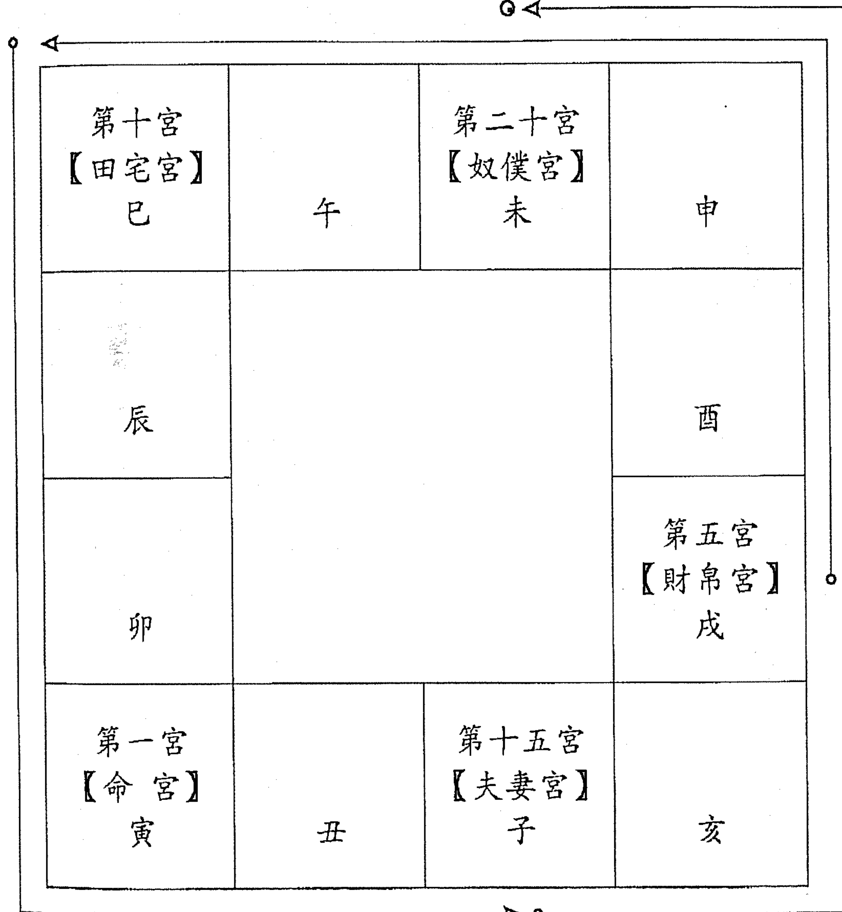

同前述之疾厄宮、福德宮、子女宮的演繹流程，根據河圖「一六共宗」的規則，自財帛宮逆算的第六宮（等於自命宮逆算的第十宮），則是與財帛宮互為體用的宮位，五與十為河圖數的中土之數，五為生數、十為成數，生數代表緣起、成數代表結果；因此，若自命宮逆算的第五宮（財帛宮）代表「利」的緣起，代表財源之強弱，則自命宮逆算的第十宮（田宅宮），其最原始的定義就是在談「利」的歸屬，也就是財庫之有無。

同上理，讀者當可自證從田宅宮逆算的第六宮（等於自命宮逆算的第十五宮）如何演繹出夫妻宮，並進而瞭解夫妻宮的原始定義為何；以及自夫妻宮逆算的第六宮（等於自命宮逆算的第二十宮）如何演繹出奴僕宮，並進而瞭解奴僕宮的原始定義為何。

#### 兄弟宮、遷移宮、父母宮的由來

官祿宮、兄弟宮、遷移宮、父母宮生成圖

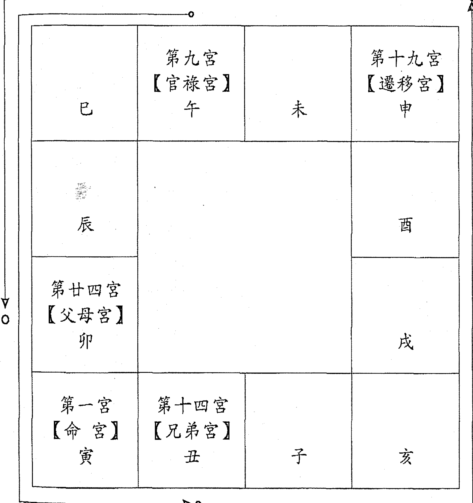

同前述之田宅宮、夫妻宮、奴僕宮的演繹流程，讀者也應可自證：

- 1. 自官祿宮逆算的第六宮（等於自命宮逆算的第十四宮）如何演繹出兄弟宮，並進而瞭解兄弟宮的原始定義為何；
- 2. 自兄弟宮逆算的第六宮（等於自命宮逆算的第十九宮）如何演繹出遷移宮，並進而瞭解遷移宮的原始定義為何；
- 3. 自遷移宮逆算的第六宮（等於自命宮逆算的第二十四宮）如何演繹出父母宮，並進而瞭解父母宮的原始定義為何。

#### 《說明》

假若以自命宮起算的第一宮至第十二宮為第一個循環迴圈，自命宮起算的第十三宮至第二十四宮為第二個循環迴圈，則紫微斗數十二個宮職中，分別有六個宮職落在第一個循環迴圈之內，另外六個宮職落在第二個循環迴圈之內，列舉如下：

- 1. 命 宮：第一宮 （落在第一個循環迴圈之內）
- 2. 兄弟宮：第十四宮 （落在第二個循環迴圈之內）
- 3. 夫妻宮：第十五宮 （落在第二個循環迴圈之內）
- 4. 子女宮：第十六宮 （落在第二個循環迴圈之內）
- 5. 財帛宮：第五宮 （落在第一個循環迴圈之內）
- 6. 疾厄宮：第六宮 （落在第一個循環迴圈之內）
- 7. 遷移宮：第十九宮 （落在第二個循環迴圈之內）
- 8. 奴僕宮：第二十宮 （落在第二個循環迴圈之內）
- 9. 官祿宮：第九宮 （落在第一個循環迴圈之內）
- 10. 田宅宮：第十宮 （落在第一個循環迴圈之內）
- 11. 福德宮：第十二宮 （落在第一個循環迴圈之內）
- 12. 父母宮：第二十四宮（落在第二個循環迴圈之內）

以上之落在第一個循環迴圈之內的宮位謂之六內宮，落在第二個循環迴圈之內的宮位謂之六外宮，又稱六親宮，這是六內宮、六外宮、六親宮之分類原則的由來。

#### 《問題思考》

1. 紫微斗數十二宮職的由來，是先定下第一宮（命宮）、第五宮（財帛宮）、第九宮（官祿宮）後，再由這三個宮職衍生出其他另外九個宮職，分別為：

- 1. 命宮→疾厄宮→福德宮→子女宮；
- 2. 財帛宮→田宅宮→夫妻宮→奴僕宮；
- 3. 官祿宮→兄弟宮→遷移宮→父母宮。

因此，各宮職所具備的原始意涵，絕非如其字面上所示的這般膚淺；若此，自古流傳下來之各個宮職所代表的功能是否需要重新定義？若是，該如何定義方為恰當？若不是，為什麼不需重新定義？

2. 請根據十二宮職創作原理推論各宮職的原始意涵，並思考：

- A. 假如您是一位公務人員或從政人員，當您要瞭解自己的事業運時，應以何宮職為主要用神？
- B. 假如您是一位產品銷售人員，當您要瞭解自己的事業運時，應以何宮職為主要用神？
- C. 假如您是一位醫護人員，當您要瞭解自己的事業運時，應以何個宮職為主要用神？
- D. 假如您是一位演藝人員，當您要瞭解自己的事業運時，應以何宮職為主要用神？
- E. 假如您是一位企業主，當您要瞭解自己的事業運時，應以何宮職為主要用神？

### 第七節 十二宮職的時空意義

十二宮職以十二地支為體，在應用方面具有時空的意義，依命盤的使用需要可以分為：

- 1. 本命宮職：指本命命宮、本命兄弟宮、本命夫妻宮……等，是用以判斷一個事件是吉是凶的空間，不具時間要素；本命命宮簡稱本命、本命兄弟宮簡稱本兄、本命夫妻宮簡稱本夫，其他各本命宮職亦依此比照之。
- 2. 大命宮職：指大命命宮、大命兄弟宮、大命夫妻宮……等，用以判斷一個事件的吉凶，以及該吉凶會應驗在哪個十年大運，含有時間要素；大命命宮簡稱大命、大命兄弟宮簡稱大兄、大命夫妻宮簡稱大夫，其他的大命宮職亦比照之。
- 3. 流命宮職：指流命命宮、流命兄弟宮、流命夫妻宮……等，用以判斷一個事件的吉凶，以及該吉凶會應驗在哪個流年，含有時間要素；流命命宮簡稱流命、流命兄弟宮簡稱流兄、流命夫妻宮簡稱流夫，其他的流命宮職亦比照之。
- 4. 流月宮職：指流月命宮、流月兄弟宮、流月夫妻宮……等，用以判斷一個事件的吉凶，以及該吉凶會應驗在哪個月份，含有時間要素；流月命宮簡稱流月命、流月兄弟宮簡稱流月兄、流月夫妻宮簡稱流月夫，其他的流月宮職亦比照之。
- 5. 流日宮職：指流日命宮、流日兄弟宮、流日夫妻宮……等，用以判斷一個事件的吉凶，以及該吉凶會應驗在哪一日，含有時間要素；流日命宮簡稱流日命、流日兄弟宮簡稱流日兄、流日夫妻宮簡稱流日夫，其他的流日宮職亦比照之。
- 6. 流時宮職：指流時命宮、流時兄弟宮、流時夫妻宮……等，用以判斷一個事件的吉凶，以及該吉凶會應驗在哪個時辰，含有時間要素。流時命宮簡稱流時命、流時兄弟宮簡稱流時兄、流時夫妻宮簡稱流時夫，其他的流時宮職亦比照之。

### 第八節 靜盤與動盤

以上之本命各宮職不具時間要素，屬命盤中的靜盤；除此之外的其他宮職皆含有時間要素，例如大命、流命等，屬命盤中的動盤。

靜盤，其宮職的所在地不會移動，例如本命命宮在地支寅者，其一生的本命命宮都在寅，位居寅宮的天干及宮內的主副星對命主的行事風格會形成終生的影響力，所以靜盤所揭露的是終生命格。動盤，其宮職會因為時間的推移而變動，例如大命揭露以每十年為一個時間單位的區間運勢，大命的各相關宮職每十年就會移動一個宮位；又如流年揭露以每一年為一個時間單位的區間運勢，流命的各相關宮職每一年就會移動一個宮位，所以動盤所揭露的是區間運勢。

命格有強弱，運勢有高低。命格強弱決定於靜盤的型態，屬先天的條件；運勢高低決定於動盤的變化，屬後天的造化。而變動不居的動盤則又衍生自如如不動的靜盤，其二者在命盤結構上存在著「動生於靜」、「有生於無」的「運由命定」因果關係。

### 第九節 體宮與用宮

母為體，子為用。紫微斗數十二宮依其體用關係可分成以下之對照組別：

- 1. 六內宮為體宮，六外宮為用宮。
- 2. 本宮為體宮，對宮為用宮。
- 3. 命宮是六內宮的體宮，遷移宮是六外宮的體宮。
- 4. 命宮在寅的原始基礎盤為體宮，命宮在寅以外的其他十一種變化盤為用宮（「原始基礎盤」及其他十一種「變化盤」的定義請參閱本書第四章第一節）。
- 5. 有自化象的宮為體宮，沒有自化象的宮為用宮（「自化象」的定義請參閱本書第五章第四節）。
- 6. 四化的發射宮為體宮，該四化的接受宮為接受宮（「四化發射宮」及「接受宮」的定義請參閱本書第五章第四節）。

以上各組體宮與用宮在命盤中的運用法則及其所顯示的吉凶因果關係，屬於紫微斗數「宮盤」領域中的高階應用，當另關專文論之。

## 第四章 十四主星的基本定義及應用方法

> 《特別提醒》
> 在閱讀本章之前，務必先閱讀第二章《祿權科忌四化、紫府兩大星群、輔弼曲昌四副星的創作原理》。

### 第一節 紫微斗數原始基本盤---十四主星在十二原始宮職的所在地

紫微斗數創作者在設計紫微星群及天府星群之排列法則時，是以紫微星和天府星「出中宮、入寅宮」而得到紫微斗數原始基礎盤（如下圖），進而衍生出其他十一個變化盤，這一點在第二章《祿權科忌四化、紫府兩大星群、輔弼曲昌四副星的創作原理》中已經有非常詳細的介紹。

#### 紫微斗數原始基礎盤

| 巨門 巳 | 廉貞 天相 午 | 天梁 未 | 七殺 申 |
| :--- | :--- | :--- | :--- |
| 貪狼 辰 | 天府 紫微 中宮 | | 天同 酉 |
| 太陰 卯 | | | 武曲 戌 |
| 天府 紫微 寅 | 天機 丑 | 破軍 子 | 太陽 亥 |

因為紫微星是排列紫微斗數十四主星時的第一顆星，而且紫微星「出中宮」後所進入的地支是寅宮，加上寅是每年的第一個月份，所以，在排定十二宮職時，是自寅宮開始順數月份（註：詳見第二章《祿權科忌四化、紫府兩大星群、輔弼曲昌四副星的創作原理》），換句話說，寅宮就是紫微斗數原始基本盤的第一宮---命宮，根據這個設定，丑宮就是紫微斗數原始基本盤的第二宮---兄弟宮，餘依此類推。

經由以上這個設定，可以推導出紫微斗數十四主星在許多層面的應用規則，而且這些規則可以解答絕大部份紫微斗數古賦文的問題，更能創新紫微斗數應用的新方向。這個「寅宮就是紫微斗數原始基本盤的第一宮---命宮」的設定及接下來的推導內容都是筆者的獨門要訣，能讓任何一位紫微斗數學習者或使用者得到煥然一新的論命方式，這創新的論命方式比起自紫微斗數傳世以來的任何年代、任何教材都要簡單甚多，其論斷要訣更容易上手，而其論斷結果更精準，特別提出來和讀者分享。

#### 紫微斗數原始基本盤十二原始宮職圖

| 巨門 第十宮 【田宅宮】巳 | 廉貞 天相 第九宮 【官祿宮】午 | 天梁 第八宮 【奴僕宮】未 | 七殺 第七宮 【遷移宮】申 |
| :--- | :--- | :--- | :--- |
| 貪狼 第十一宮 【福德宮】辰 | | | 天同 第六宮 【疾厄宮】酉 |
| 太陰 第十二宮 【父母宮】卯 | | | 武曲 第五宮 【財帛宮】戌 |
| 紫微 天府 第一宮 【命 宮】寅 | 天機 第二宮 【兄弟宮】丑 | 破軍 第三宮 【夫妻宮】子 | 太陽 第四宮 【子女宮】亥 |

紫微斗數原始基本盤十二原始宮職的位置、十四主星在十二原始宮職的所在地總歸納：

- 1. 原始【命 宮】在寅，「紫微」和「天府」是原始【命 宮】的主星；
- 2. 原始【兄弟宮】在丑，「天機」是原始【兄弟宮】的主星；
- 3. 原始【夫妻宮】在子，「破軍」是原始【夫妻宮】的主星；
- 4. 原始【子女宮】在亥，「太陽」是原始【子女宮】的主星；
- 5. 原始【財帛宮】在戌，「武曲」是原始【財帛宮】的主星；
- 6. 原始【疾厄宮】在酉，「天同」是原始【疾厄宮】的主星；
- 7. 原始【遷移宮】在申，「七殺」是原始【遷移宮】的主星；
- 8. 原始【奴僕宮】在未，「天梁」是原始【奴僕宮】的主星；
- 9. 原始【官祿宮】在午，「廉貞」和「天相」分別是原始【官祿宮】的主星和從星；
- 10. 原始【田宅宮】在巳，「巨門」是原始【田宅宮】的主星；
- 11. 原始【福德宮】在辰，「貪狼」是原始【福德宮】的主星；
- 12. 原始【父母宮】在卯，「太陰」是原始【父母宮】的主星。

從以上條列，可以印證紫微斗數古賦文對各主星之定義的由來，並且提出比古賦文更正確的新答案：

- 1. 紫微星被古人定義為「帝主」，其原因為紫微星是原始命宮的主星，而且是紫府兩大星群的首席之星，象徵精神領袖，故化氣為「尊」。
- 2. 天府星被古人定義為「帝之佐貳」，其原因為天府星和紫微星是同時自中宮動而進入原始命宮的主星，紫微星為洛書數5的化身，是為陽星；而天府星是河圖數10的化身，是為陰星，陽若為主，陰則為從，紫微星既然為「帝主」，天府星便為「帝之佐貳」，象徵協助「帝主」治理朝政的「宰相」，故天府星又稱「令星」，是掌令者，化氣為「賢能」；此外河圖數10為納財之庫位，所以古賦文有「天府……為財帛之主宰……，在數則執掌財帛田宅衣祿之神」之說法。
- 3. 武曲星被古人定義為「財帛主」，其原因為武曲星是原始財帛宮的主星，主掌錢財物資之進出盈枯，故化氣為「財」。
- 4. 廉貞星被古人定義為「官祿主」，其原因為廉貞星是原始官祿宮的主星，主掌權位與權力，得勢時可以權「囚」人（控制指揮他人），失勢時反被他人之權所「囚」（被他人所控制指揮），故化氣為「囚」。
- 5. 天機星被古人定義為「兄弟主」，其原因為天機星是原始兄弟宮的主星，兄弟宮屬六外宮，主掌命主與手足及平輩之間的互動關係；故命主若想擁有左右逢源擁抱人和的條件，從小就要訓練自己與一起長大的手足們處處為善，因此天機星化氣為「善」。
- 6. 破軍星被古人定義為「司夫妻、子息、奴僕之神」，其原因為破軍星是原始夫妻宮的主星，主掌婚姻及婚後生子育女之事；此外，破軍為洛書數9的化身，9乃洛書數中之最大數，亦主掌發號施令之權（詳見第三章《十二宮職的創作原理》中之「財帛宮及官祿宮的由來」文），所以破軍也為「司奴僕之神」。破軍星屬離卦，離為火，故破軍星具有火之烈性，而其在紫微斗數原始基本盤中位居子宮之水，有烈火滾水之象，故破軍星常會引爆事端，這是紫微斗數古賦文《諸星論》主張破軍：「在天為煞氣，在數為耗星，故化氣為耗」的由來。
- 7. 太陽星被古人定義為「官祿主」，其原因為太陽星是乾卦的化身，乾為天，象徵官權，故化氣為「貴」（官貴）。此外，太陽星位居紫微斗數原始基本盤中的子女宮，所以太陽星也是被用以判斷有無子息的主星。
- 8. 天同星被古人定義為「保生之星」，乃因為天同星位居紫微斗數原始基本盤中的疾厄宮，故主掌生理、外貌之事；另外紫微斗數古賦文《諸星論》主張天同星：「不畏諸凶同度，十二宮中皆為福論」，這是謬論。天同星為洛書數3及震卦的化身，震為陽木，木是五行中唯一代表生命現象者，因為五行中只有木具有「生發」的功能，人之五行即屬木，陽木代表生命的新生和盎然，所以天同也代表力求生存的原始生命力，惟其生命力是否得以有效發揮，仍得視其與哪個天干及哪個地支同宮而定，不應以居「十二宮中皆為福論」。
- 9. 天梁星被古人定義為「蔭星」，這個「蔭」字用得好，但後人大都誤解、也誤用了「蔭」的意思。天梁星是洛書數4和巽卦的化身，巽為陰木、為花果，「陽木成樑、陰木成蔭」，所以天梁的「蔭」是「樹大成蔭、開花結果」之意，在代表事情之有無結果；此外，洛書數4主掌文書，所以天梁亦主掌文書、文采。天梁星在紫微斗數原始基本盤中位居奴僕宮，奴僕宮代表命主與芸芸眾生之間的對待關係（詳見第三章《十二宮職的創作原理》），所以天梁星可用以揭露命主與眾生之間的互動會不會有好結果，也代表一個人的外在人緣（俗稱桃花）。
- 10. 巨門星被古人定義為「暗星」。巨門星是洛書數7及兌卦的化身，洛書數7之顏色為「赤」色，為相爭而見血之意，又兌卦屬陰金，故巨門星具有陰暗而好鬥之本質；紫微斗數古賦文《諸星論》主張巨門：「陰精，化氣為暗，在天司品萬物，在數掌是非，於人主暗昧，疑是多非，進退離開，欺瞞天地。其性則面是心非，六親寡合，交人初善終惡」。
- 11. 貪狼星被古人定義為「桃花星」，紫微斗數古賦文《諸星論》主張貪狼：「乃主禍福之神，在數則喜和放蕩處，於人則矮小，主其性則機關，心多計較，隨波逐浪，受惡善，定奸詐，瞞人受學神仙之術，又好高吟，浮蕩疏狂，作巧成拙」，此一謬論令貪狼星背負了許多不可承受的原罪。貪狼星在紫微斗數原始基本盤中位居福德宮，是主掌思考力、精神層面及智慧高低的主星；在古代之封建思想中，統治者常「授民以愚」，以免百姓因為太聰明而造反，而貪狼星的智慧會戳破統治者所編織的神話，所以常不見容於古代之統治者，也因此在古人眼中，貪狼星「其性則機關，心多計較」，但在現今各行各業力求創新的競爭環境下，貪狼星的思考力反倒是得以出類拔萃的利器。
- 12. 太陰星被古人定義為「田宅主」，化氣為「富」，這是因為太陰星為洛書數2及坤卦的化身，坤為陰土，陰土為平原土，在古人「有土斯有財」的觀念下，具有坤土本質的太陰星自然就被古人認為是田宅及財富的代表。

#### 【重要觀念】

紫微星化氣為「尊」，但這不代表命宮擁有紫微星的人就一定尊貴無比，而是得藉由判斷紫微星是否得「宮干」相助，或紫微星是否對「宮支」有加分而定（註：前者在談主星與天干互動之良好與否、後者在談主星與地支互動之良好與否。透過此論斷法，使用者得以更簡易而且精準地判斷該命盤總格局之高低，本書後續會有非常詳細的解說），始能得知該命主是否擁有尊貴之格的結論；同理，天機星化氣為「善」，這也不代表命宮擁有天機星的人就一定善良仁慈，如果天機星和宮干的互動不良，此時命宮擁有天機星的人反而是不善良、不仁慈的，其餘諸星之化氣的論法亦同。

註：

「廉貞」是原始【官祿宮】內的主星，「天相」是原始【官祿宮】內的從星，這部分在本節稍後的《天相星之創作原理》文中會有詳細的解說。

#### 七殺星的創作原理

紫微斗數七殺星的設計與四柱八字的十神理論相似（十神又稱六神）。四柱八字之十神的定義為：以十天干為主體，若主體為甲，而另有一客體也為甲，則該二者為「比肩」；若另有一客體為乙，則此乙對主體甲為「劫財」，餘之天干也同樣按其兩個主客體間的生剋關係依次定義，列表如下：

#### 十神表

| | 甲 | 乙 | 丙 | 丁 | 戊 | 己 | 庚 | 辛 | 壬 | 癸 |
|---|---|---|---|---|---|---|---|---|---|---|
| 甲 | 比肩 | 劫财 | 食神 | 伤官 | 偏财 | 正财 | 七杀 | 正官 | 偏印 | 正印 |
| 乙 | 劫财 | 比肩 | 伤官 | 食神 | 正财 | 偏财 | 正官 | 七杀 | 正印 | 偏印 |
| 丙 | 偏印 | 正印 | 比肩 | 劫财 | 食神 | 伤官 | 偏财 | 正财 | 七杀 | 正官 |
| 丁 | 正印 | 偏印 | 劫财 | 比肩 | 伤官 | 食神 | 正财 | 偏财 | 正官 | 七杀 |
| 戊 | 七杀 | 正官 | 偏印 | 正印 | 比肩 | 劫财 | 食神 | 伤官 | 偏财 | 正财 |
| 己 | 正官 | 七杀 | 正印 | 偏印 | 劫财 | 比肩 | 伤官 | 食神 | 正财 | 偏财 |
| 庚 | 偏财 | 正财 | 七杀 | 正官 | 偏印 | 正印 | 比肩 | 劫财 | 食神 | 伤官 |
| 辛 | 正财 | 偏财 | 正官 | 七杀 | 正印 | 偏印 | 劫财 | 比肩 | 伤官 | 食神 |
| 壬 | 食神 | 伤官 | 偏财 | 正财 | 七杀 | 正官 | 偏印 | 正印 | 比肩 | 劫财 |
| 癸 | 伤官 | 食神 | 正财 | 偏财 | 正官 | 七杀 | 正印 | 偏印 | 劫财 | 比肩 |

由上列之《十神表》可知，凡是以任一主體天干為起算點，往前數到第七個天干時，該天干即對主體天干形成「七殺」；換言之，所謂七殺就是與主體天干具有相同陰陽屬性而且剋主體天干者，例如：庚與甲皆為陽天干，而且庚剋甲，所以庚是甲的七殺；乙與辛皆為陰天干，而且辛剋乙，所以辛是乙的七殺，餘依此類推。

回到前列之《紫微斗數原始基本盤十二原始宮職圖》，寅宮為原始命宮，申宮為自寅宮起算的第七個宮位，所以在申宮的天干對於在寅宮的天干而言必然形成「七殺」關係；例如：若寅宮天干為甲，則申宮天干必為庚，而庚是甲的七殺；又如：若寅宮天干為丙，則申宮天干必為壬，而壬是丙的七殺，餘同此理。由此故，紫微斗數之「七殺星」的設計，是取「假設命宮在寅，自命宮天干順算至遷移宮，得知遷移宮之天干剋命宮天干」的原則而來，有別於紫府兩大星群的創作流程，是自成一格的天干相剋系統，據此推導，可得以下結論：

- 1. 在紫微斗數原始基本盤中，紫微星群有六顆主星，天府星群也有六顆主星，計十二顆，這十二顆主星分別居於除了申宮（原始遷移宮）以外的其他十一個宮位，如此一來，原始遷移宮便形成沒有主星的現象，為解決這個原始遷移宮無主星的問題，遂有七殺星之設計；因此，七殺是紫微斗數原始基本盤中之原始遷移宮內的主星。
- 2. 七殺星的設計，是取「假設命宮在寅，自命宮天干順算至遷移宮，得知遷移宮之天干剋命宮天干」的原則而來，而天府星群的排列規則，是以天府為首，其後諸星順旋佈列；以此觀之，七殺與天府星群均有順旋的特性，所以七殺星被歸類為天府星群，而且永遠和天府星相隔七個宮位。
- 3. 紫微斗數原始基本盤的遷移宮在地支申，所以七殺星的五行為申金。
- 4. 在紫微斗數原始基本盤中，七殺居遷移宮、在申，紫微和天府居命宮、在寅，紫微和天府分別是北斗星群及南斗星群的首席之星，所以有「若命宮在寅，七殺在申，為七殺朝斗」之說。
- 5. 七殺居申，為原始遷移宮之主星，主掌銜帝主之命在外遂行主帥意志之權，故七殺星又稱「將星」，亦稱「大殺神」，具獨立行使權令之能，是紫微斗數十四顆主星中的最先鋒部隊，有「將在外，君命有所不受」之本質。
- 6. 以上列舉之七殺星諸項特質正是紫微斗數古賦文《諸星論》：「七殺……乃斗中之上將，實成敗之孤辰，在斗司斗柄，主於風憲，其威作金之靈，其性若清涼之狀」的由來。

#### 天相星的創作原理

紫微斗數天相星的設計是針對廉貞星而來。在紫微斗數原始基本盤中，廉貞是原始官祿宮的主星，執掌官權，廉貞若和丙干同宮或與宮支不和時，反而「犯官符之撓，後化為囚」。

天相星被定位為與廉貞同居於官祿宮的從星，紫微斗數古賦文《諸星論》：「天相……化氣曰印，為官祿文星，佐帝之位……，官祿得之，則顯榮；帝座合之，則爭權；能佐日月之祥，兼化廉貞之惡」，此段文即在談天相與廉貞、天相與官祿宮之間的特定關係，所以天相被定位為廉貞之從星，意即廉貞若為主官，天相則為其機要秘書（或軍師、顧問、策略長），主掌主官廉貞之正印。廉貞為艮卦，艮為陽土，十天干中的陽土為戊干，故廉貞土可類比十天干中的戊土；因此天相若為廉貞之正印，按前述之十神理論，天相之五行即為生戊土的「丁火」（見前之《十神表》），丁火為陰火，故天相之性溫熱而不烈。

另類觀點：

在紫微斗數原始基本盤中，有紫府兩大星群共十二顆主星，除了紫微星和天府星同時自中宮進入寅宮，而形成寅宮有兩顆主星、以及申宮沒有主星之外，其他各宮皆以一宮一星的方式佈列，若單為了廉貞這顆「官星」而另創設天相「印星」，此理雖不矛盾，但理由略嫌單薄，故實際論命時，可將天相視為廉貞的從星，其本身沒有獨立作戰的能力，甚至於若將天相存而不論，也不會影響到論斷的結果及精準性，惟本書為敘述之一體性，仍將天相歸入十四主星之一。

### 第二節 十四主星意象一覽表

從第二章《祿權科忌四化、紫府兩大星群、輔弼曲昌四副星的創作原理》得知，紫府兩大星群十二顆主星分別是河洛數和八卦的化身，所以這十二顆主星的陰陽五行需與其各自對應的河洛數及八卦一致，例如：廉貞星是洛書數8及艮卦的化身，艮為陽土，所以廉貞是陽星，其五行屬土；又如：貪狼星是洛書數2及坤卦的化身，坤為陰土，所以貪狼是陰星，其五行屬土。此外，從本章節之七殺星和天相星的創作原理得知，七殺星是申金、天相星是丁火，根據本書前述各項推導結論，整理成《十四主星意象一覽表》於下：

#### 紫微星群

| 星名 | 紫微 | 天機 | 太陽 | 武曲 | 天同 | 廉貞 |
| :--- | :--- | :--- | :--- | :--- | :--- | :--- |
| 陰陽 | 陽 | 陰陽同體 | 陽 | 陽 | 陽 | 陽 |
| 五行 | 土 | 水 | 金 | 金 | 木 | 土 |
| 卦象 | 無(類艮) | 坎 | 乾 | 乾 | 震 | 艮 |
| 數 | 5 | 1 | 6 | 6 | 3 | 8 |
| 原始宮 | 命宮 | 兄弟宮 | 子女宮 | 財帛宮 | 疾厄宮 | 官祿宮 |
| 方位 | 中央四方 | 北(子) | 西北(亥) | 西北(戌) | 東(卯) | 東北(丑、寅) |
| 六親 | • 父 • 排行在中間的兄弟或兒子 | • 父 • 中男 | • 父 • 長男 | • 父 • 排行在中間的兄弟或兒子 | • 父 • 繼(養)父 • 岳父 • 長男 • 次男代長男 | • 父 • 少男 |
| 顏色 | 黃、淡黃、暖色系 | 黑、藍、深色系 | 白、銀、淺色系 | 白、銀、淺色系 | 綠色系 | 淡黃、白 |
| 形狀 | 方 | 彎曲 | 圓 | 圓 | 直、高 | 方 |
| 自然象 | 高原、平台 | 水 | 天 | 天 | 雷 | 山 |

### 第二節 十四主星意象一覽表

| 星名 | 紫微 | 天機 | 太陽 | 武曲 | 天同 | 廉貞 |
| :--- | :--- | :--- | :--- | :--- | :--- | :--- |
| 天象 | 乾旱、地震 | 月、雪、雨、霜、露、涼風、漲退潮、暗夜 | 晴天、自晚秋到初冬 | 寒氣、白天、晴天 | 雷雨、閃電、冰雹、海嘯 | 氣候變化不定的階段 |
| 地象 | 山脈、高原、平台 | 河川、大海、溪谷、急流、井、險峻的地方 | 高原、高台、名勝古蹟 | 礦山、繁華的地區 | 震區、森林、大馬路、春天的田野 | 山林、土堤、路的盡頭、一個區域中的最高點、山路、樓梯 |
| 身體部位 | 腹、胃、脾 | 耳、血液、體液、腎臟、脊髓、肛門、膀胱、尿道 | 頭、心臟 | 心、肺、頸 | 腳、足、肝、膽、毛髮、肋膜 | 背、腰、手 |
| 味覺 | 甘甜 | 鹹 | 辛辣 | 辛辣 | 酸 | 甘甜 |
| 化氣 (按古賦文的說法) | 尊 | 善 又名善星 | 貴 | 財 又名財星 | 福 又名福星 | 囚 又名囚星 |
| 宮主 (按古賦文的說法) | 帝(命)主 | 兄弟主 | 官祿主 | 財帛主 | 福德主 | 官祿主 |

#### 天府星群

| 星名 | 天府 | 太陰 | 貪狼 | 巨門 | 天相 | 天梁 | 七殺 | 破軍 |
| :--- | :--- | :--- | :--- | :--- | :--- | :--- | :--- | :--- |
| 陰陽 | 陰 | 陰 | 陰 | 陰 | 陰 | 陰 | 陰 | 陰陽同體 |
| 五行 | 土 | 土 | 土 | 金 | 火 | 木 | 金 | 火 |
| 卦象 | 無（類坤） | 坤 | 坤 | 兌 | 無（丁火） | 巽 | 無（申金） | 離 |
| 數 | 10 | 2 | 2 | 7 | 無 | 4 | 無 | 9 |
| 原始宮 | 命宮 | 父母宮 | 福德宮 | 田宅宮 | 官祿宮 | 奴僕宮 | 遷移宮 | 夫妻宮 |
| 方位 | 中央四方 | 西南（未） | 西南（申） | 西（酉） | 南（巳） | 東南（辰巳） | 西（申） | 南（午） |
| 六親 | • 母 • 排行在中間的姊妹或女兒 | • 母 • 長女 | • 母 • 繼（養）母 • 岳母 • 長女 • 次女代長女 | • 母 • 少女 | • 母 • 排行在中間的姊妹或女兒 | • 母 • 長女 | • 母 | • 母 • 中女 |
| 顏色 | 黃、深黃、暖色系 | 黃、土黃、黑 | 黃、土黃、黑 | 白、銀、淺色系赤 | 紅、暗紅 | 綠色系 | 白、銀、淺色系 | 紫、紅 |
| 形狀 | 方 | 方 | 方 | 圓 | 尖 | 直、高 | 圓 | 尖 |
| 自然象 | 盆地、平原 | 地 | 地 | 澤 | / | 風 | / | 火 |

### 第二節 十四主星意象一覽表

| 星名 | 天府 | 太陰 | 貪狼 | 巨門 | 天相 | 天梁 | 七殺 | 破軍 |
| :--- | :--- | :--- | :--- | :--- | :--- | :--- | :--- | :--- |
| 天象 | 颱風、乾旱、地震、水災 | 陰天、溼冷、霧、晚夏初秋 | 陰天、溼冷、霧、晚夏初秋 | 雨天、由晴轉雨、黃昏、秋風 | 晴天、熱天 | 起風、下弦月、雖有雲但未雨的天候 | 晴天、涼爽的天氣 | 晴天、大熱天 |
| 地象 | 平地、田野、農村、郊外、盆地 | 平地、田野、農村、郊外、盆地 | 礦場、砂石場、砂石地、礦石、田野、碼頭 | 湖泊、井、游泳池、小河、斷層地 | 溫泉區、有地熱之地區、溫度稍高的地區 | 機場、道路、平交道、隧道、陸橋 | 金屬礦區、涼爽的區域 | 乾涸的地方、火山地帶、熱的地方、噴火口、繁華地區 |
| 身體部位 | 腸、胃、脾 | 陰部、子宮、卵巢、生殖器 | 下消化器官、骨盆腔內器官 | 肺、頸、喉嚨、牙、聲帶 | 心、血管、腸 | 肝、膽、股、肱 | 肺、牙、骨骼 | 心臟、心血管、脈搏 |
| 味覺 | 甘甜 | 甘甜 | 甘甜 | 辛辣 | 苦 | 酸 | 辛辣 | 苦 |
| 化氣（按古賦文的說法） | 賢能 | 富 | 桃花，又名桃花星 | 暗，又名暗星 | 印，又名印星 | 蔭，又名蔭星 | 將，又名將星 | 耗，又名耗星 |
| 宮主（按古賦文的說法） | 財帛主，為帝之佐貳 | 田宅主 | / | / | 官祿文星，佐帝之位 | 父母主 | / | 司夫妻、子息、奴僕之神 |

#### 十四主星的基本定義及應用方法

說明：

1. 上列主星的陰陽五行與古傳紫微斗數各主星的陰陽五行大不相同，在本書往後各主星之陰陽五行的使用規則均以上述二表格所列者為主。
2. 上列表格中若有「／」符號者，代表該項無特定的對應關係。
3. 古賦文所謂「化氣」就是「給一個簡要的定義」的意思，例如紫微星化氣為「尊」的意思就是紫微星的簡要定義為尊。

### 第三節 十四主星和易經八卦的對應關係

| 主星名稱 | 八卦名稱 | 易經說卦傳 | 易經說卦傳對八卦的定義原文 |
| :--- | :--- | :--- | :--- |
| 紫微 | 無 | 無 | 註：紫微納洛書數5，不納卦。 |
| 天機 | 坎卦 | 第四章 | 雨以潤之 |
| | | 第八章 | 坎為豕 |
| | | 第九章 | 坎為耳 |
| | | 第十章 | 坎再索而得男，故謂之中男 |
| | | 第十一章 | 坎為水、為溝瀆、為隱伏、為矯輮、為弓輪。其於人也，為加憂、為心病、為耳痛、為血卦、為赤。其於馬也，為美脊、為亟心、為下首、為薄蹄、為曳。其於輿也，為多眚。為通、為月、為盜。其於木也，為堅多心。 |
| 太陽 | 乾卦 | 第四章 | 乾以君之 |
| | | 第八章 | 乾為馬 |
| | | 第九章 | 乾為首 |
| | | 第十章 | 乾天也，故稱父 |
| | | 第十一章 | 乾為天、為圜、為君、為父、為玉、為金、為寒、為冰、為大赤、為良馬、為老馬、為瘠馬、為駁馬、為木果。 |
| 武曲 | | | 同太陽星之於乾卦 |
| 天同 | 震卦 | 第四章 | 雷以動之 |
| | | 第八章 | 震為龍 |
| | | 第九章 | 震為足 |
| | | 第十章 | 震一索而得男，故謂之長男 |
| | | 第十一章 | 震為雷、為龍、為玄黃、為敷、為大塗、為長子、為決躁、為蒼筤竹、為萑葦。其於馬也，為善鳴、為馵足，為的顙。其於稼也，為反生。其究為健，為蕃鮮。 |
| 廉貞 | 艮卦 | 第四章 | 艮以止之 |
| | | 第八章 | 艮為狗 |
| | | 第九章 | 艮為手 |
| | | 第十章 | 艮三索而得男，故謂之少男 |
| | | 第十一章 | 艮為山、為徑路、為小石、為門闕、為果蓏、為閽寺、為指、為狗、為鼠、為黔喙之屬。其於木也，為堅多節。 |
| 天府 | 無 | 無 | 註：天府其體為洛書數5，其用為河圖數10，不納卦。 |
| 太陰 | 坤卦 | 第四章 | 坤以藏之 |
| | | 第八章 | 坤為牛 |
| | | 第九章 | 坤為腹 |
| | | 第十章 | 坤地也，故稱母 |
| | | 第十一章 | 坤為地、為母、為布、為釜、為吝嗇、為均、為子母牛、為大輿、為文、為眾、為柄、其於地也為黑。 |
| 貪狼 | | | 同太陰星之於坤卦 |
| 巨門 | 兌卦 | 第四章 | 兌以說之 |
| | | 第八章 | 兌為羊 |
| | | 第九章 | 兌為口 |
| | | 第十章 | 兌三索而得女，故謂之少女 |
| | | 第十一章 | 兌為澤、為少女、為巫、為口舌、為毀折、為附決。為大輿、為文、為眾、為柄、其於地也為黑。 |
| 天相 | 無 | 無 | 註：天相不納卦、不納數。 |
| 天梁 | 巽卦 | 第四章 | 風以散之 |
| | | 第八章 | 巽為雞 |
| | | 第九章 | 巽為股 |
| | | 第十章 | 巽為一索而得女，故謂之長女 |
| | | 第十一章 | 巽為木、為風、為長女、為繩直、為工、為白、為長、為高、為進退、為不果、為臭。其於人也，為寡髮、為廣顙、為多白眼、為近利市三倍。其究為躁卦。 |
| 七殺 | 無 | 無 | 註：七殺不納卦、不納數。 |
| 破軍 | 離卦 | 第四章 | 日以烜之 |
| | | 第八章 | 離為雉 |
| | | 第九章 | 離為目 |
| | | 第十章 | 離再索而得女，故謂之中女 |
| | | 第十一章 | 離為火、為日、為電、為中女、為甲冑、為戈兵。其於人也，為大腹、為乾卦。為鰲、為蟹、為嬴、為蚌、為龜。其於木也，為科上槁。 |

### 第四節 十四主星隱義探索

#### · 紫微星

紫微星納「5」這個數，不納卦，5為陽土，所以紫微星的五行也為陽土。從河圖及洛書的排列方式來看，5居中宮，在中宮的前後左右、四面八方則佈滿了其他的數，所以5宛如坐於陣中運籌帷幄的被擁戴者，是以紫微星有帝星之稱，也被引申為「尊」；但反過來思考，5坐於中宮，若其作為不見容於天下，則恐將反被包圍，造成四面楚歌的困境，這正是每一顆主星的星情都具有一體兩面的寫照（一個星體內含善與惡的兩個對立面）；換言之，每一顆星都有其善的本質與惡的成份，至於呈現善的一面或惡的一面，應視其與同一宮內的天干及地支呈現哪種生剋關係而定，關於此論點，本書後續會有非常詳細的解說。

#### · 天機星

天機星為坎卦的化身，納數1，坎為水，所以天機星的五行屬水，水主智，所以天機星亦稱智星，有智多星之稱。天機星的原始宮位在兄弟宮，故古賦文謂：「天機兄弟主。」易經《說卦傳》曰「坎為水……為月。」所以天空中的月亮並不是坊間紫微斗數所流傳的以太陰星為代表，而是天機星。

#### · 太陽星

太陽星為乾卦的化身，乾者，是「至剛」之意，所以太陽星並非指天上的太陽，而是指「至陽至剛」的意思，在五行之中，最剛強的能量就是陽金，所以乾卦納陽金，太陽星也納陽金，這是與古賦文以及坊間之描述的不同之處。在易經中說：「乾者，直、方、大。」因此，太陽星也代表直來直往、方剛而不拐彎抹角之意。

#### · 武曲星

武曲星與太陽星一樣都是乾卦的化身，五行屬陽金，其原始宮位為財帛宮，是以向來有財星之稱。另外，武曲星與太陽星同歸乾卦，乾為天，都是老大，但在長幼的排序上，太陽星長於武曲星，只是同為乾卦的武曲星也不願屈居老二，因此武曲星有股「次代長」的能量，具有爭出頭天、不向老大低頭的意味，例如：「以次男之輩份代長男之職。」

#### · 天同星

天同星為震卦的化身，納數3，五行為陽木。震為陽木，陽木代表生命的新生和盎然，所以天同代表最原始的生命力，同時也是原始疾厄宮的主星；震木為陽木，為參天大樹，參天大樹其質可當大樑，其性也堅；故天同星若得位，能肩挑大任，若失位，則直來直往易生衝撞。

#### · 廉貞星

廉貞星納數8，為艮卦的化身，故廉貞星為陽土；艮為高山、在其山頭有白雪之象。《易經·彖傳》：「艮，止也。時止則止，時行則行，動靜不失其時，其道光明。」是一個進退合宜的卦象，所以廉貞星是一個很能掌握時機的能量體，其得時則進，不得時則止，但它的止不會是真正的靜止不動，而是以鴨子滑水般的方式無聲地前進，因此常給他人莫測高深的感覺。高山是變化多端而神秘的，總隨著陰、晴、雲、雨、霧、露的天氣變化而各有不同，所以廉貞星總令人覺得是神秘的。廉貞星的原始宮為官祿宮，所以廉貞星若得位則掌權，若失位則有失權及官符之憂。

#### · 天府星

天府星納數10，不納卦，10為陰土，所以天府星的五行也為陰土。在紫微星尚未「帝出乎震」之前，天府星與納數5的紫微星同居於中宮，在紫微星「帝出乎震」而進入寅宮時，天府星也跟著進入寅宮，對紫微星可說是亦步亦趨，所以古賦文說天府星「為帝之佐貳」。天府星納數10，5與10均為土，在有土斯有財的觀念下，5與10均與財有關，5為生數，10為成數，生數5為生財之源，成數10則為財庫之所在，故古賦文說天府星「為財帛之主宰……在數則執掌財帛田宅衣祿之神。」

#### · 太陰星

太陰星為坤卦的化身，納數2，坤為陰土，所以太陰星也為陰土。太陰星之於坤者，乃至陰至柔之象也；坤為地，五行為土，地之為體能生萬物；《易經·繫辭傳》：「君子藏器於身待時而動」，象徵地之應時育物，故坤致養；在古賦文中也說太陰星「為田宅主，化富。」由此可知，太陰星並非指天上的月亮，而是指孕育生物的大地。吾人常說大地是我們的母親，所以，太陰星也是母星，而父母宮正是太陰星的原始宮位，一前一後在在都呼應著太陰星的特性。

#### · 貪狼星

貪狼星和太陰星同樣都納坤卦，在十二地支中，未與申皆納於坤，太陰星坐落於其中的未，而貪狼星坐落於其中的申，所以，太陰星含有未「土」的能量，而貪狼星則除了含未土之外，還含有申「金」的內涵，因此，同樣都是納坤卦的太陰和貪狼，太陰要比貪狼來得柔軟（土軟於金），貪狼要比太陰來得有魄力與決斷力。

貪狼星也會和武曲星有類似的「次代長」意象，會「以次女之輩份代長女之職」。貪狼的原始宮在福德宮，是一顆和智慧、思考力有極大關係的星，古代認為貪狼是第一桃花星，其實貪狼的桃花是以精神上的喜歡或愛慕居多，應該說貪狼對異性有很強的鑑賞力，但未必會有所行動。

#### · 巨門星

巨門星為兌卦，納數7，兌為陰金，故巨門屬陰金。兌為口，易經《說卦傳》：「兌，說也。」所以巨門是一顆會不斷地用言語表態的星；兌者，悅也，口出嘉言，則聽者悅，在取得他人的喜悅之下，謀事則易成；《易經·說卦傳》說兌「為口舌」，若口出惡語，則勢必口舌是非爭鬥不斷，故巨門之善或惡，端視其運用之當或不當；此外，兌的卦象為公羊，公羊好與同類鬥，故巨門星具有比其他主星更高的鬥性。

#### · 天相星

天相星不納卦也不納數，五行為丁火，其原始宮為官祿宮，古賦文說天相「化氣曰印，是為官祿文星。」天相與廉貞的原始宮同在午，可視為廉貞的副手，古賦文說天相「佐帝之位」，這裡的「帝」可指紫微星，亦可說是廉貞星。古賦文又說天相「官祿得之，則顯榮。帝座合之，則爭權。能佐日月之祥，兼化廉貞之惡。」可見天相與官祿宮、及天相與廉貞之間的關係之密切。

#### · 天梁星

天梁星納巽卦，納數4，巽為風、為陰木、為花果，所以天梁屬陰木，陽木成樑、陰木成蔭，古賦文說天梁「化氣為蔭」。洛書數4在九宮飛星術數中代表文書之數，故天梁星亦掌文采；巽為風，風無恆向，是以天梁星亦有不穩定、出爾反爾之性。

#### · 七殺星

七殺星不納卦也不納數，五行屬申金，其原始宮為遷移宮，為天府星的對宮之星，主掌在外（遷移宮）之能量，有「將在外，君命有所不受」之氣勢，能獨力遂行自己的意志，故古賦文說七殺為「將星」、「乃斗中之上將，實成敗之孤辰，在斗司斗柄，主於風憲，其威作金之靈，其性若清涼之狀。」

#### · 破軍星

破軍星納離卦，納數9，離為火，故破軍星五行屬火。《易經·說卦傳》：「離為火，為日。」所以天空中的太陽並不是坊間紫微斗數所流傳之以太陽星為代表，而是破軍星。9為洛書數中至陽之數，是至權的象徵，故破軍星也是一顆權力之星，若得位，可掌權，若失位，則反成為權力鬥爭下的犧牲者。破軍星為離火，兼具有火的積極性與衝動性，若得位，雖性情為急先鋒，但仍能開創有成；若失位，則其衝動性反將變成破壞力，恐將一事無成竟成灰。

《易經·說卦傳》：「離為甲胄、為戈兵。」所以破軍具有戰鬥的性能。破軍的原始宮在夫妻宮，古賦文說破軍「司夫妻、子息、奴僕之神」，是一顆論斷男女婚姻的重要之星。

### 第五節 十四主星的性格特質

紫微斗數命盤中命宮和六親宮內的主星可分別用以揭露命主以及其六親的性格，本節將十四主星位居命宮和六親宮時所具有的性格特質分列如下。

#### 十四主星最精要之個性定義一覽表

| 主星 | 最精要個性定義 |
|---|---|
| 紫微 | 性「逸」 |
| 天機 | 性「浮」 |
| 太陽 | 性「直」 |
| 武曲 | 性「剛」 |
| 天同 | 性「勇」 |
| 廉貞 | 性「傲」 |
| 天府 | 性「圓」 |
| 太陰 | 性「溫」 |
| 貪狼 | 性「快」 |
| 巨門 | 性「悶」 |
| 天相 | 性「熱」 |
| 天梁 | 性「急」 |
| 七殺 | 性「冷」 |
| 破軍 | 性「烈」 |

#### · 紫微族

紫微族具有凡事需要被尊重，但卻不願親力親為的本性，與他人的互動往往會想要透過第三者來居中處理，往好處想，是能授權給他人行事，具有寬大包容的人格特質；可是，從另一個角度看，卻有不敢或不願直接面對事情、無法立即解決問題的特質，有推諉卸責，不願承擔責任的個性。此外，紫微族有「以我為尊」的心態，認為別人對我的服務與奉獻都是理所當然的，經常有「人人為我」的想法。

#### · 天機族

天機族具有一顆不安定的心，這裡逛逛那裡看看，是這個族群特有的現象，而天機族的不安定，最主要是他們的好奇心使然，凡是新鮮的事務都會引起天機族的好奇，不過，要是不能進一步挑起他們的興趣，天機們很快就會將好奇心轉移到下一個新鮮事上。此外，反應機靈也是天機的另一個特質，所以天機族向來有智多星之稱，只是，天機的智是要運用得當，才是大智慧的顯現，否則就只是耍弄小聰明罷了；有時候天機族會因為自以為頭好壯壯，以致在有意無意之下目中無人，會樹立敵人而自不知。

#### · 太陽族

太陽族具有崇高的理想，可以為了那天邊的彩霞，而捨棄腳下的玫瑰，擁有大開大闔的特質。此外，「專注」是這個族群的天性，所以當他們投入於有興趣的事務時，就很難再分心於「他們所認定的其他雜務」，如果要太陽族一心二用，那是很容易兩頭皆落空的。太陽族的行事作風比較直接了當，也不太會掩飾內心的想法，屬於言行一致的人；因此，太陽族行為上所做的，就是他們內心裏所想的，他們還有一顆服務的心，是「我為人人」的族群。

#### · 武曲族

武曲族粗中帶細且條理分明的頭腦，讓他們有極佳的反應，以及優於他人的先見之明，是有自信的族類，他們也是具有行動力的一群，即知即行，行事敏捷，所以在工作上是個強人（好強之人），不太能接受他人的意見，特別是會看不慣與自己行事風格不同的主管，所以常不得主管緣。武曲族有條理分明的頭腦，再加上具有積極的行動力，所以也是個注重實力的人，他們不太對人奉承，而是以實力證明自己。

#### · 天同族

天同族擁有比其他族群更大的「勇」氣，所以常「敢」於行事，但未必具有三思而「行」的特質，因此成敗常決定於行事之前是否「謀定」，如果不能慎謀，天同族極易成為有勇無謀之人。天同族先做再說的特性，再加上不太動腦的習慣，常讓自己陷於風險中而不知，運氣好時，可以一帆風順，運氣背的話，就會惹來一身波折，是個容易受命運牽著走的族群；不過，也由於天同族那不太用腦的特質，讓他們即使身處困境，也不會覺得太難過，他們會認為忍一忍就過了，反正當下次機會來的時候，再搏它一搏就是了。

#### · 廉貞族

廉貞族心思細密警覺性超強，善於觀察外界的人事物，然後不動聲色地藏於內心，所以其他家族大多搞不清楚廉貞族的內心到底在想什麼，是屬於內斂型的族群，他們待人柔和，但外柔內剛，有鴨子滑水般的行事風格，經常在不動聲色的情況下，完成了令其他族類出乎意料之外的事情。廉貞族很堅持自己的信念行事，但過度的內剛，則常造成與人格格不入的現象，在人際關係上，容易親近但不易深入。廉貞也是愛面一族，常以保護自己為行事準則，也因此而具有較大的懷疑心，與異性交往時則易吃醋。

#### · 天府族

天府族是個很好的「中間人」，他們習慣居中幫人協調事情，因為天府族比其它族類更具有能屈能伸的特質，所以在行事風格上也具有較大的彈性，是個「做人」比「做事」強的族類。天府族還是「老二主義」的最佳代言人，他們可以一面奉承上意，另一面對其他人發號施令，善盡領袖副手的角色，當「老大」不在時，他們會很快地站上發言台的位置，趁機掌握形勢。

#### · 太陰族

太陰族溫和，親切柔順，但內心卻是堅持己見，甚至有挑剔的個性，決斷力不足，是屬於保守型的族群，也因為保守，所以太陰族的行事風格講求的是「漸變」，總是先求穩，再求快。此外，太陰族的承受力與耐性也是一流的，雖不致事事逆來順受，但很少在第一時間就與人針鋒相對，而是耐著性子溫和地向人解釋，盡量處處與人為善，因此大多能化干戈於無形；「務實」則是太陰族的另一個特徵，他們在動手做之前，通常會仔細衡量目標的可行性，勝算高時才會執行。

#### · 貪狼族

貪狼族的原創力並不強，但吸收力強反應快，所以凡事一旦讓他們進入狀況之後，他們具有舉一反三的快速應變能力，速度之快常讓其他族群的人措手不及，是屬於學習型的族群，所以貪狼族有時看起來不太機靈，也有點粗線條，其實，他們的心思極為細膩，思考速度比超級電腦的運算速度還要快。貪狼族還可以將大事、小事、重要的事、無關緊要的事分得很清楚，所以一旦他們規劃要做的事，會有條不紊地逐一完成。

#### · 巨門族

巨門族具有極鮮明的「愛」「恨」個性，而且他們對一個人的愛或恨，會很直接了當地透過言語表達出來，對所喜愛的人，會巧言令色，對所厭恨的人，則會將其批評得體無完膚，是個行事作風頗受爭議的族群。巨門族具有正義感，總認為世間事要有個公平與正義，而「好鬥」也是巨門族的人格特質之一，他們會為了追求自己的理想，而不斷地去挑「鬥」他們所認定的敵人，直到有一方倒下或逃跑了，才善罷干休。

#### · 天相族

天相族擁有一顆暖暖的心，濟弱扶傾是他們終其一生的職志，必要的時候，他們能燃燒自己，照亮別人，所以天相一族具有寬大的胸懷，他們寧願將榮耀獻給他們認為值得奉獻的人，也很少站上第一線接受讚美與掌聲，這就是天相。天相族也是「追星一族」，一旦有他們喜愛的偶像出現，他們極易出現不理性的崇拜，對演藝人員如此，對宗教大師也是如此。

#### · 天梁族

天梁族順應環境的能力相當好，當他們得勢之時，喜歡逆勢操作，總能創新話題，引發新風潮；失勢的時候，他們見風轉舵的功力也是一流的，能夠放下身段，在夾縫中求生存。「毅力堅強」是天梁族的特質，當他們設定了某個目標之後，會持續不斷地去執行，一波接一波的綿密手段，總令人看得目不暇給，而且只要一逮到機會，見縫插針的功力更是上乘。天梁族是個務實的族群，會將成果看得比過程要來得重要，為達目的，手段方面會有些不近人情，行事急如風，容易給人強悍的觀感。

#### · 七殺族

七殺族是個以冷靜見長的族群，即使他們的內心已經緊張得很，或是熱血沸騰得不得了，外表上看看起來總是酷酷的模樣，其他族群容易以為七殺族愛耍酷，其實這是他們的性格使然，而這種性格也讓他們活得有些孤獨，所以七殺族經常是獨來獨往的。除了冷靜，七殺族獨力行事的能力也非常強，他們會儘可能克服內心的恐懼，勇敢地獨力向環境挑戰，是個有勇有謀的族類。而他們那愛面子，以及不擅表達情感的特質，則常讓他們在感情方面生活得很辛苦，也因為他們的愛恨不形於色，所以七殺族若要報復某個人，那可真是十年也不嫌晚。

#### · 破軍族

破軍族是個反應敏捷，行動力超強的族群，他們總是充滿自信，經常憑著一時的衝動而行事，具有敢衝敢撞的行事風格，成敗常在一瞬間。在火烈的個性中，破軍族其實對人很關心，也願意付出心力來照顧他人，但他們老是不夠體貼，經常在自以為是的態度之下與人互動；因此，所付出的善意也老是無法獲得同等的回饋，甚至引發爭執或爭吵。「不怕挫折」是破軍族的另一特質，他們很少向環境低頭，如果不幸失敗了，他們常能在極短的時間內打起精神重新來過。

#### · 紫府族

紫府族喜愛享有運籌帷幄於內、決勝於千里之外的領導感覺，他們也自視頗高，總是認為自己比較優越，所以會想辦法讓自己能成為人上人，權力、名位、財富都會是他們努力追求的目標。在待人處事方面，當紫府族擁有某種程度的權力地位時，會表現出高傲的姿態，而當他們在追求金錢財利時，又會有平易近人的身段，常能根據外在環境的變化而調整自己的行事策略及行動步驟，可說是個能運用兩面手法的族群。

#### · 紫貪族

紫貪族是個如果沒有擁有了自認為足夠的錢時，就會覺得非常沒有安全感的族群，因此他們經常汲汲營營於如何獲得金錢財利這件事上，他們也很喜歡把錢花在自己身上的那種感覺，所以一旦他們身邊有了自認為足夠的錢時，總不忘為自己打點行頭與享用美食，身上穿的用的會講究是否為名牌之流，也容易養成用物質去衡量他人的心態。相對於用物資建構起來的有形外表，紫貪族做事謹慎保守，當紫貪族遇到進退兩難的事時，他們那無形的內心會變得非常沒有自信，此時會轉而徵詢他人的意見，以此來為自己的決定壯膽，增強自己的信心。

#### · 紫相族

紫相族是個機會主義者，當外界情勢不利於他們時，他們能屈居於別人的屋簷下，甚至於幫人抬轎都是可以的，當外界情勢對他們有利時，他們會有強烈地意志想要另立山頭，希望自己能獨領風騷，享受他人崇拜的尊越。紫相族追求權勢名位的慾望高於金錢財利，所擁有的通常是先得名或先掌權後才得財的際遇，待人熱心則是紫相族的另一個特徵，不過他們的待人熱心是建立在能獲得他人的讚美、掌聲、及回報的條件之下，當他們得不到這些回饋時，他們會縮手而表現出一付事不關己的模樣。

#### · 紫殺族

紫殺族集規劃力及執行力於一身，常能做出具建設性的革新，是個有為有所守的族群，他們也能為了達成心中設定的目標而忍受異於常人的孤獨，對事業地位、錢財、異性的追求等，都能謀定而後動，對他們的競爭者而言，紫殺族堪稱是既可敬又可怕的對手。相較於冷靜理性的處事態度，他們的內心是熱情而極為感性的，心軟是紫殺族的優點也是弱點，所以對付紫殺族最有用的招式就是動之以情，以及向他們示弱裝可憐。

#### · 紫破族

紫破族具有積極除舊佈新的開創性格，即知即行是這個家族的特性，但是，他們經常會犯下思慮不週的毛病，所以雖說有很好的行動力，卻未必能獲得良好的執行成果，是個開創頗有力、守成難有功的族群。紫破族總是希望自己在團體中能成為領導人物，而為了鞏固自身在團體中的權力地位，即使與人爭長比短也在所不惜，必要時甚至會自立門戶與老東家互別苗頭一較高下，他們也會將這股爭長比短的習性展現在婚姻生活中，會讓另一半感到壓力難舒解。

#### · 機陰族

機陰族機巧靈變，做事嚴謹待人隨和，所以人緣也都不錯，性子急但有選擇性，對於不能引起機陰族在意的議題，他們可以漠不關心到極點，但只要是機陰族有興趣的事務，他們會迫不及待地想要去了解與體驗。機陰族沒什麼耐性，也總是認為外頭的世界較迷人，所以有事沒事就會想要出門蹓躂蹓躂，即使是盲目的閒逛也無所謂，只要別叫他們一直待在家裡那個像牢房的地方就行了。機陰族那待人隨和的個性，使得他們在多數的時候都會與人為善，不過要是把他們惹毛了，機陰族那特有的內斂機巧會轉化成工於心計，對人耍小手段，變成外強內陰的陰狠角色。

#### · 機巨族

機巨族有強烈的冒險犯難精神，他們認為生活要是沒有變化就會索然無味，不太能忍受平凡無奇的人生，在浮動不安定的個性下，注意力很容易受到外界的新鮮事務所影響，往好的方面想，他們的行事作風機變靈活有創意，往壞處看，卻也容易造成欠缺平穩性與一貫性的做事風格，因而不易取得他人的信賴感，也容易造成與人相交始善終惡的現象。動口不動手是機巨族的另一個特性，他們容易忘情地高談闊論，儼然一付意見領袖的模樣，但是若要動手執行時，卻不太能掌握好大方向與大原則；所以，實事求是穩健踏實，培養執行力以避免一再地眼高手低，是機巨族得謹記在心的座右銘。

#### · 機梁族

機梁族在工作上守原則重紀律，在職場中通常能受到信賴與肯定，這是機梁族的理性表現；他們大都擁有高遠的理想，以及廣結善緣的情懷，所以能憑著一股熱情而為社會大眾之事做出奉獻，這是機梁族的感性表現。機梁族善良，加上他們那外柔的性格，所以與人交往時，很能獲得他人的好感；機梁族重理想，加上他們那內剛的性格，所以與人交往時，特別是對所喜愛的異性朋友，通常會不顧一切地投入感情，甚至於為了追隨自己所愛的另一半而拋棄得來不易的一切也在所不惜。

#### · 陽陰族

陽陰族有著縝密的心思，希望自己所做的決定都能面面俱到，這種性格會使得他們在做事時力求完善。在人際方面，陽陰族很容易遇上不得不面對長者及在上位者的處境，若週旋得當，他們具有比其他族群更佳的承先啟後能耐，若適應不良，他們也很容易變成上一輩眼中所謂的頑固份子，這也常使得陽陰族為了力求人我之間的和諧而深感焦慮。

#### · 巨陽族

巨陽族有快速的行動力，但欠缺週延的思考力，他們是良好的改革者，經常會對當下不滿意的事務提出改革的建議並付出行動，但卻未必是盡職的守成者，因為性急的巨陽族不耐打耐久戰。巨陽女個性豪爽，做事態度巾幗不讓鬚眉，在以父系社會為主的古代是很不被欣賞的，巨陽男的性情反倒不愛強出頭，言談舉止之間透露著一股溫和，但不經意地脫口而出的傷人話語，則是巨陽族所共有的毛病，可說是個做事比做人強的族群。

#### · 陽梁族

陽梁族喜歡以老大自居，喜愛當主導者，也喜歡關心人，待人方式除了強勢之外，還有熱情。陽梁女的異性緣濃厚，經常是一個不小心，就得在男生堆中週旋，而她們那強悍作風的個性會制人而不受制於人，所以，乖乖牌的男生較能得到她們的喜愛，只是，不期而遇的邂逅機會雖多，但更得提防一再地不歡而散。容易情緒化是陽梁族普遍具有的特性，這常使得他們難以冷靜地處理生活上的問題，特別是在人和方面較易吃虧。

#### · 武府族

武府族深謀遠慮，做事態度在沉穩中見衝勁，為人方面具有領導慾，不喜歡被人命令或指揮，所以會想辦法讓自己成為人上人，他們的獨立性也很強，與自己有關之事喜歡獨立完成。武府族對金錢流動的嗅覺很敏感，喜愛賺錢，也喜愛理財，他們重視金錢的程度甚於社會地位的高低，會為了錢事挺而走險。

#### · 武貪族

武貪族個性豪邁，總是用滿滿的熱情對待周圍的人，他們有很強的主見，在做事方面，一旦下定了決心就會向前衝衝衝，在親情方面，他們不太能接受屈居老二的感覺，喜歡指揮家人，包括父母。武貪族凡事親恭帶頭向前衝的特質，常使得他們在年紀輕輕的時候，就擁有比同年齡的人更多的生活歷練，也容易出現早年有成的機會，只是，他們那種年紀輕輕就把地球踩在腳下的優越感，為人處事不免出現年少輕狂的態度，很容易在日後的人生旅途中遭受到遲來的挫折。

#### · 武相族

武相族在熱情待人的外表下，有著一股堅硬不移的頑固個性，由於他們有著實事求是的生活態度，所以喜歡依照規則行事，這也使得他們經常為了一心想達成事物的完美性，而忽略了圓融的待人方式，是個做事能力優於做人技巧的族群。武相族追求權力名位的慾望高於追求財富，但這並表示他們不重視金錢物質，只是當他們遇到名與利二者不可兼得時，他們通常會捨利而就名，會為了面子而失去裡子，因此，若要討好武相族，最好用的方法就是不斷地讚美他們的一切，當他們陶醉在他人的掌聲中時，也就是被人予取予求的時候了。

#### · 武殺族

武殺族堅硬剛毅，行事作風堅持己見勇往直前，與人相處時直來直往，很難向不同理念的人低頭妥協，是個有稜有角有原則的族群。武殺族也是個「向錢看」的經濟活動者，他們的生活大都建立在以求取錢財為目的的基礎之上，為了求財，即使披星戴月四處奔波也在所不辭，他們會為了謀取更多的物資利益而對他人略施小惠，但也會因為爭財而與人反目相向，可說是人生以金錢為目的模範家族。由於武殺族有著金錢掛帥的人生觀，以及堅硬剛毅的個性，所以若想得到他們掏心掏肺的忠誠，先施之以利再軟性地動之以情是最有效的方式。

#### · 武破族

武破族具有開創再開創的特質，他們會為了心中的人生目標而奮戰不懈，特別是在爭取權位及賺取財富方面的表現最是不落人後，是屬於開創型的族群；但是在家庭生活方面，武破族的經營手法就顯粗糙而不夠用心，他們很想取得在家庭的核心地位，會因為一心一意地想達到目標，以致忽略了手段是否傷及家人，所以武破族的婚姻生活也容易出現欠缺溫馨和樂的一面。

#### · 同陰族

同陰族喜歡安定的過日子，激進冒險的行為對他們來說，是只能想想不可當真的，他們很能墨守成規，可接受單調且變化少的事務性工性；與人相處時多能表現出和善的態度，會是別人眼中的好好先生或好好小姐，在家庭生活中或在小的生活團體裡，則會有著為別人撐起一把保護傘的奉獻心，只要在他們能力所及的範圍內，他們會對親友伸出援手。同陰族的規劃能力相當強，他們能掌握大原則，也能看到小細節，工作能力強的同陰族懂得向下發展人脈組織，向上管理頂頭上司，尤其是遇到沒什麼能力的上司時，同陰族很容易出頭天。

#### · 同巨族

同巨族的情緒震盪度很大，時而樂觀開朗，時而灰心沮喪，他們有時非常敢於衝撞舊有的社會禮制，容易被認為是挑動社會神經的先驅，有時又非常維護傳統禮俗，一付衛道者的使命模樣，而這一切看似前後矛盾的性格，全都來自他們對於各該事務的認知程度，因為同巨族很容易認為自己的判斷就是對的，所以當他們對事務的判斷能力越高時，就越有理性的表現，反之，對事務的判斷能力越低時，就容易出現不理性的行爲舉止了；因此，同巨族若能培養自己有更高的眼界與更大的氣度，他們很容易出類拔萃，成爲引領風騷的意見領袖。同巨族在選擇異性朋友時，容易放棄不該放棄的，追求不該追求的，在感情方面易有憾事。

#### · 同梁族

同梁族生性較保守被動，守成尚可開創不足，同梁女對自我的要求較高，會鞭策自己多多學習以走入社會，她們也很願意爲悅己者容，雖不致於處處招蜂引蝶，但異性緣大都不錯，同梁男常有得過且過的心態，認爲凡事過得去就好，在家庭生活中容易養成茶來伸手飯來張口的依賴；因此，婚後的同梁男要不是常被太太碎碎唸，就是會被太太當成拒絕往來戶，連最起碼的理會都顯得意興闌珊。

#### · 廉府族

廉府族具有很強的觀察力，很能觀察人性、觀察團體中權力流動的方向以及觀察社會經濟事務中金錢流動的方向，他們雖然不致於老是與人爭權奪利，但是在掌握權柄以及創造財富方面，的確有一套管用的方法。廉府族在待人方面，會盡量創造和諧的氣氛以與人為善，在處事過程裡，則多會謀定而後動，當他們看不清楚事情的真相時，他們很能保持觀望再觀望的定力，以避免讓自己落入不可預知的危機中，是看的時候多、做的時候少，動腦多於動手的族群。

#### · 廉貪族

廉貪族經常自以為是，他們的行事作風是以「事」為主、以「人」為輔，遇事時會與人溝通，但難與人產生共識，是個做事比做人強的族群，他們也不太會掩飾內心的想法，嘴裡說的與心裡想的並無二致，所以並沒有什麼心機，只是言語不太柔軟，有時脫口而出的話語會傷人而自己仍不知。廉貪族經常用直線式的思考模式看人生，生活的創意比較有限，與人相處時的態度不是很穩定，他們有時會檢討自己，但大多數的時候是以檢討別人來掩飾自己的不足，在人際關係方面毀譽不定。

#### · 廉相族

廉相族很獨立，他們認為凡事都由自己獨當一面是理所當然的，而在寧為雞首的行事態度下，他們通常也都會鞭策自己成為一方的領導人，廉相族有時也會崇拜偶像，但被崇拜者的能力與見識得超越廉相族甚多才行，否則廉相族會依照他們那慣有的傲氣看待他人。廉相族吃軟不吃硬，在傲氣的舉止中，其實他們深具同情心，能對比他們弱勢的人伸出援手，特別是金錢物資方面的援助，不過，廉相族不能容許別人挑戰他們的權威，一旦廉相族認為別人有意與他們爭權時，他們會立即出現防衛之心，此時要再與他們商量什麼大概都免談。

#### · 廉殺族

廉殺族性情敏感警覺性高，常能在第一時間就嗅出週遭人事的變化，是個足智多謀的謀略家，他們不喜歡欠別人人情，凡是能自食其力獨立完成的事情，他們鮮少假手他人，因而給人堅毅、獨來獨往、獨斷獨行的感覺。雖然廉殺族總是讓人感覺有點冷漠，但他們的內心其實是非常熱情而且喜好幫助弱勢者的，他們常能在適當的時機對有需要的人雪中送炭，不過可別以為他們會對所有的來者不拒有求必應，廉殺族是遇弱則弱，遇強則強的族群，他們沒有偶像情結，不太向強權低頭，若用高壓手段對付廉殺族，肯定會換來反效果。

#### · 廉破族

廉破族具有極強的權力慾，他們會透過一切可運用的手段以掌握在事業上及家庭中的權柄，為了達到手握大權的目的，他們那不喜愛拘束的衝動性格甚至會與當權者翻臉相向，因此對掌權者而言，廉破族很具破壞力與威脅性。沒有耐性、很容易不耐煩、但是又很好強、不喜歡被說不好、及愛面子等，都是廉破族的特性；也因此，他們具有善攻不善守的創業性格，會主動去改變看不順眼的環境，在團隊中能身先士卒，起帶頭作用；相對的，與廉破族相處的人經常會感受到時時繃緊神經的壓力。

### 第六節 十四主星的人格型態分類

先鋒型、主導型、游擊型、跟隨型

命宮和六親宮可用以彰顯命主及其六親的個性，所以命宮和六親宮內的主星可用以揭露命主以及其六親的人格特質，紫微斗數十四主星依其人格特質可歸納成四大類型：

1. 先鋒型：七殺、破軍、貪狼（殺破狼）
2. 主導型：紫微、天府、廉貞、武曲（紫府廉武）
3. 游擊型：巨門、天機、天同（巨機同）
4. 跟隨型：太陽、天梁、太陰、天相（陽梁陰相）

#### 十四主星的人格型態分類一覽表

| 人格型態 | 人格特徵 | 主星族群 | 同中有異 |
| :--- | :--- | :--- | :--- |
| 先鋒型 | ◎是四種主星類型中最不容易被影響的人 ◎習於自己獨立做決策，不習慣和人合作 ◎習慣逆勢操作 ◎具高度戰鬥性格 | 七殺 | ◎是先鋒型主星中最具獨立作戰的獨行者 ◎能長期忍受孤獨以遂行意志 ◎極端不能接受被人背叛 |
| | | 破軍 | ◎是先鋒型主星中最擅長帶頭作戰的指揮者 ◎不能忍受拐彎抹角的人事物 ◎直接向上挑戰領導者的權威 |
| | | 貪狼 | ◎是先鋒型主星中最具謀略的人 ◎慣用虛實兩面手法 ◎是先鋒型主星中最具刁鑽性格的族群 |

#### 十四主星的基本定義及應用方法

| 人格型態 | 人格特徵 | 主星族群 | 同中有異 |
| :--- | :--- | :--- | :--- |
| 主導型 | ◎是四種主星類型中最強調事事需要被尊重的人 ◎很難接受自己不在團體中的核心圈內 ◎習於採取果斷的決策模式以迫使他人讓步 | 紫微 | ◎是主導型主星中最能對外授權的人 ◎習慣鼓動或指揮他人行事 ◎有理想性但又有些不切實際 |
| | | 天府 | ◎是主導型主星中身段最柔軟、也最具親和力的人 ◎不打高空，具有務實的本質 ◎以身作則帶頭向前行 |
| | | 廉貞 | ◎是主導型主星中最事必躬親的族群 ◎直接介入強力遂行己意 ◎是主導型主星中，最不能容許自己的權威被挑戰的人 |
| | | 武曲 | ◎是主導型主星中最具陽剛氣息的人 ◎除了在乎「權力」的有無，也是主導型主星中最在乎「錢力」的人 |

### 第六節 十四主星的人格型態分類

| 人格型態 | 人格特徵 | 主星族群 | 同中有異 |
| :--- | :--- | :--- | :--- |
| 游擊型 | ◎是四種主星類型中最具機靈巧智的人 ◎具有靈活彈性的族群 | 巨門 | ◎是游擊型主星中最具巧智的人 ◎常以煽動他人為能事 ◎是游擊型主星中最善鬥之人 |
| | | 天機 | ◎是游擊型主星中最具隨機應變能力的人 ◎會放棄己見而改搭他人的順風車 ◎是游擊型主星中最容易與人親近、朋友最多的族群 |
| | | 天同 | ◎是游擊型主星中最喜好追求新願景的人 ◎注重大體但不太強調細節 ◎不強調凡事都要由自己親力親為 |

#### 十四主星的基本定義及應用方法

| 人格型態 | 人格特徵 | 主星族群 | 同中有異 |
| :--- | :--- | :--- | :--- |
| 跟隨型 | ◎是四種主星類型中最不願在第一時間公開表態的人 ◎不喜歡獨立做決策 | 太陽 | ◎是跟隨型主星中最具熱心和熱情的人 ◎具有為他人服務的熱誠 ◎在團體組織中，遇強則弱、遇弱則強 |
| | | 天梁 | ◎是跟隨型主星中最不願獨立做決策的人 ◎容易一再改變自己原先設立的立場 ◎是跟隨型主星中個性最急躁的人 |
| | | 太陰 | ◎是跟隨型主星中對外界反應最被動的人 ◎不喜歡處理衝突 ◎不願意在第一時間勇於提出自己的主張 |
| | | 天相 | ◎是跟隨型主星中最願意當副手的人 ◎高度的服從性 ◎遇到衝突時會先行讓步 |

#### 先鋒型主星－殺破狼

| 【田宅宮】 | 【官祿宮】 | 【奴僕宮】 | 【遷移宮】 |
| :---: | :---: | :---: | :---: |
| 貪狼 | | | 七殺 |
| 【福德宮】 | 先鋒型主星 殺破狼 | 【疾厄宮】 | |
| 【父母宮】 | | | 【財帛宮】 |
| 【命 宮】 | 【兄弟宮】 | 【夫妻宮】 | 【子女宮】 |
| | | 破軍 | |

先鋒型主星坐命的人具有堅定的意志貫徹力，是四種主星類型中最不容易被影響的人，他們不喜歡被管理，不願意在第一時間向人低頭，習於自己獨立做決策，不習慣和人合作，對於決定要做的事會身體力行並且堅持到底；他們也是四種主星類型中最具冒險精神的先行者，習慣逆勢操作，喜好高度自由的生活，看不慣封閉性的社會體制，在團體中總是立場鮮明，而且勇於挑戰居上位者的領導模式，具高度戰鬥性格，所以在古代封建體制下的「殺破狼」族群經常被認為是離經叛道者。

#### 先鋒型主星「殺破狼」三者間的異同

- 七殺：七殺族是先鋒型主星中最具獨立作戰的獨行者，他們不擅於與人合作，為達到目的，他們能長期忍受孤獨以遂行意志；七殺族具有冷靜的性格，做事非常專注而且要求精確無誤，與人相處時極端不能接受被人背叛，會對背叛者使出玉石俱焚的激烈報復手段。
- 破軍：破軍族是先鋒型主星中最擅長帶頭作戰的指揮者，他們會組織小型團體並帶領團隊披荊斬棘，行事作風習慣直搗黃龍，不能忍受拐彎抹角的人事物；破軍族也是先鋒型主星中最直接向上挑戰領導者權威的人，他們把向上管理視為天經地義的事，卻也經常使自己與上層領導人處於針鋒相對的局面。
- 貪狼：貪狼族是先鋒型主星中最具謀略的人，在開創新局時慣用虛實兩面手法，當外部情勢對貪狼族有利時，他們會刀槍齊發毫不手軟，當情勢對貪狼族不利時，他們會改以有技巧地迂迴前進而不硬闖，是先鋒型主星中最具刁鑽性格的族群。

#### 主導型主星－紫府廉武

主導型主星坐命的人是四種主星類型中，最強調事事需要被尊重的人，他們的權力可以與人分享，但前提是對方必須以主導型主星坐命者馬首是瞻，最好凡事都能先徵詢他們的意見，即使只是做做樣子也可以；因此與主導型主星坐命者的最佳相處模式，就是「尊重其位，自己就能分享地位」。主導型族群很難接受自己不在團體中的核心圈內，為了取得在組織中的主導地位，他們習於採取果斷的決策模式以迫使他人讓步，是個具有侵略性格的族群。

#### 主導型主星「紫府廉武」四者間的異同

- 紫微：紫微族是主導型主星中最能對外授權的人，他們喜好擘畫超過自己能力範圍的願景，然後再試圖鼓動或指揮他人幫其代為執行，所以其他族群常認為紫微族是動口多於動手、有理想性但又有些不切實際的人，因此，紫微族若能強化自己的執行能力及執行意志，就會成為一位令人不可忽視的領導者。
- 天府：天府族是主導型主星中身段最柔軟、也是最具親和力的人，他們不打高空，具有務實的本質，能在團體組織中提出目標明確的方案，並且以身作則帶頭向前行；天府族的八面玲瓏，也常使得與其接觸的人覺得他們易於相處，甚至誤以為他們是沒有主見的人，進而出現對其敷衍塞責的想法，只是天府族一旦發現旁人漫不經心時，就會正經八百地告之、誡之、耳提面命之，再度表現出主導者的作為。
- 廉貞：廉貞族是主導型主星中最事必躬親的族群，在團體組織中，廉貞族一旦發現與自己的想法或做法有出入的人與事時，他們若不是直接介入強力遂行己意，就是揚長而去另立山頭，再回過頭來攻擊原有的組織，所以廉貞族具有令人覺得恐怖的報復意志；廉貞族也是主導型主星中，最不能容許自己的威權被挑戰的人，他們很在乎自身權力的有無，所以寧為雞首、不為牛後的心態極為強烈。
- 武曲：武曲族是主導型主星中最具陽剛氣息的人，在團體組織中，他們即使表現得平易近人，但心中其實卻早已有其不可能被更改的定見，對於不能接受的人與事，他們會直接提出否定的看法，對於認同的人事物，他們也會直接表示肯定與支持。武曲族除了在乎「權力」的有無，也是主導型主星中最在乎「錢力」的人，當他們感覺到外在的身價不被他人肯定時，就會變得非常沒有安全感，此時他們就會在主導錢財的權力上與人斤斤計較。

#### 十四主星的基本定義及應用方法

#### 游擊型主星－巨機同

| 巨門 【田宅宮】 | 【官祿宮】 | 【奴僕宮】 | 【遷移宮】 |
| 【福德宮】 | 游擊型主星 巨機同 | 天同 【疾厄宮】 |
| 【父母宮】 | | 【財帛宮】 |
| 【命宮】 | 天機 【兄弟宮】 | 【夫妻宮】 | 【子女宮】 |

游擊型主星坐命的人是四種主星類型中最具機靈巧智的人，他們很能適應現實環境的變化，會運用各種方法伺機而動，經常使用不可預期的游擊戰略以讓自己永保競爭力，所以是非常具有靈活彈性的族群，也是四種主星類型中看似最沒有原則，但卻是最能長保原則的人。在團體組織中，游擊型主星坐命的人屬於機會主義者，為了利益，他們可以與不同立場的個人或團體結合，為了利益，他們也可以改弦易轍另闢蹊徑，他們的行事準則經常飄忽不定，總讓其他類型主星坐命的人認為是難以掌握的族群。

#### 游擊型主星「巨機同」三者間的異同

- 巨門：巨門族是游擊型主星中最具巧智的人，他們經常企圖以口服人，會一再地運用言語說服他人，在團體組織中，巨門族喜好遊說他人，常以煽動他人為能事。巨門族也是游擊型主星中最善鬥之人，為了獲得勝利，他們經常聯合次要敵人來打擊主要敵人，因此他們也是很有謀略的族群。
- 天機：天機族是游擊型主星中最具隨機應變能力的人，在團體組織中，他們一旦發現自己所提出的主張不切實際或滯礙難行時，就會放棄己見而改搭他人的順風車，所以也是游擊型主星中最容易與人親近、朋友最多的族群。
- 天同：天同族是游擊型主星中最喜好追求新願景的人，他們習於一再地向外尋求新機會，所以也是擅於伺機而動的族群；天同族注重大體但不太強調細節，有很好的前瞻能力，但卻沒有足以匹配的後續執行力，也不強調凡事都要由自己親力親為，因此他們在團體組織中會四處游擊，尋找各種與他人合作的機會。

#### 跟隨型主星－陽梁陰相

| 【田宅宮】 | 天相 【官祿宮】 | 天梁 【奴僕宮】 | 【遷移宮】 |
| :--- | :--- | :--- | :--- |
| 【福德宮】 | | | 天同 【疾厄宮】 |
| 太陰 【父母宮】 | | | 【財帛宮】 |
| 【命宮】 | 【兄弟宮】 | 【夫妻宮】 | 太陽 【子女宮】 |

跟隨型主星坐命的人是四種主星類型中最不願在第一時間公開表態的人，他們不喜歡獨立做決策，在團體組織中，他們通常會先行了解他人的意向之後，才提出自己的主張，當他們所提出的主張不被接受時，他們鮮少立即採取激進的衝撞作為，而是婉轉地提出說明，甚至於就乾脆放在心裡不明講，所以也常讓其他族群誤以為他們是沒有太多主見的人，其實跟隨型主星坐命者的己見並不會比其他族群的人來得少，只是他們那種「習慣先讓對方提議、自己再隨後補充說明」的性格造成外人的這種看法。

#### 跟隨型主星「陽梁陰相」四者間的異同

- 太陽：太陽族是跟隨型主星中最熱心也最熱情的人，具有為他人服務的熱誠，在團體組織中，他們「遇強則弱、遇弱則強」，面對立場堅定的人時，他們會適度的讓步，但是與比自己弱勢的人相處時，他們反而會出現濟弱扶傾的惻人胸懷。
- 天梁：天梁族是跟隨型主星中最不願獨立做決策的人，他們習慣四處徵詢別人的意見，也容易因此而一再改變自己原先設定的立場；天梁族也是跟隨型主星中個性最急躁的人，當他們下定目標並開始執行時，總是急於在第一時間就看到成果。
- 太陰：太陰族是跟隨型主星中對外界反應最被動的人，他們不喜歡處理衝突，習於在第一時間扮演好好先生或好好小姐的形象，所以在團體組織中，他們也不願意在第一時間勇於提出自己的主張，若有不滿或抱怨，也大都是在私底下進行。
- 天相：天相族是跟隨型主星中最願意當副手的人，他們具有偶像情結，對於自己所肯定的人，會展現出高度的服從性，在團體組織中，他們鮮少站上第一線搖旗吶喊引領風潮，當遇到衝突時總會先行讓步，處處顯露出以和為貴的性格。

### 第七節 論命技巧講解（初級）

愛情合盤採用命宮主星配對論命法

問世間情為何物，直叫人為其癡狂！男女之間的感情發展是極為微妙且多變的，有感情穩定相知相許者、有感情反覆起伏不定者、有相愛容易相處難者、更有相處容易相愛難者，諸此種種現象不一而定；而一對男女之間的感情適配程度能否從紫微斗數命盤查個端倪呢？若能同時拿到男女雙方的紫微斗數命盤，取其二者的命宮主星加以比對，則不難推導出結論。

接下來以本書第一章《武破男和太陰女的愛情》文中這一對男女組合的真實故事為例，介紹男女愛情之合盤論命法（建議讀者在閱讀下文之前，先再閱讀一遍《武破男和太陰女的愛情》全文）：

#### 合盤論命步驟一、論主星五行生剋

1. 該故事中之男生的命宮主星為武破（武曲 + 破軍），因為是男命，故採「七分武曲、三分破軍」模式論之（男命以陽星為主、陰星為從，武曲為陽星、破軍為陰星，所以設定武曲佔宮內所有主星之七成的影響力，破軍佔宮內所有主星之三成的影響力）；女生的命宮主星為太陰，在不考慮遷移宮內之主星為何的情況下，採「十分太陰」模式論之（設定太陰佔宮內所有主星的全部影響力）。
2. 武曲的五行屬金，破軍的五行屬火，太陰的五行屬土。男命的破軍火生女命的太陰土，屬男生愛女生的陰陽合體（相生者代表愛中有包容；相剋者代表愛中含有嫉妒、愛中含有恨、彼此容易出現對立）；女命的太陰土生男命的武曲金，屬女生愛男生的陰陽合體。綜上兩個結構，可以得知這是一對互相喜愛、而且愛中有包容的男女組合。

#### 合盤論命步驟二、論主星人格型態

1. 男生的命宮主星為武破（武曲 + 破軍），武曲屬主導型的主星，破軍是先鋒型的主星，所以男命的人格型態是積極而直接表態的，不怕製造衝突，他總希望在第一時間處理好他認為應該處理的事，他較不能接受和他相處的人憂柔寡斷或默不表態。
2. 女生的命宮主星為太陰，太陰屬跟隨型的主星，習慣被動表態，不喜歡處理衝突，因此在生活中，當太陰女出現與武破男有不同的認知時，經常會選擇乾脆放在心裡不明講，但越是如此，武破男就越是要強迫太陰女依據武破男制訂的標準而行，當武破男的要求超越太陰女可承受的臨界點時，太陰女就會選擇逃避或乾脆消失不見。

#### 結論

A.根據以上分析，武破男和太陰女到底能不能成為幸福的一對呢？從主星五行生剋的觀點來說，可以確定他們是互相喜愛，而且愛中有包容的組合，如果他們把這份對彼此的互愛與包容，也擴及到包容對方的人格型態，武破男降低對太陰女的咄咄逼人；太陰女提升對武破男的快速回應，如此一來就能消弭大半二人相處時的緊張與對立，他們的感情也就能穩定而長久。

B.世上有多少對男女其感情的發展及性格的互動是天生就完美無瑕？答案恐怕是鳳毛麟角！換個角度想，男女雙方若沒有緊張對立，就不可能有磨合的機會；磨合，是在磨彼此的性格、合彼此的人生價值觀，命宮主星五行相生的男女較容易在互愛的基礎上磨合出好結果；反之，命宮主星五行相剋的男女，倆人之間的愛往往帶有大量雜質，如果再加上其人格型態或人生價值觀又大不相同，就不容易磨合出好結果了。

C.相識靠機緣，相處靠修為！一對男女之間的感情會不會長長久久，一半靠先天的機緣，一半靠後天的修為；若此，談感情可以捨天生機緣而一廂情願地強求嗎？談感情可以不靠個人修為而任性胡為嗎？一對男女在談及感情之際，若能細細檢驗「倆人的機緣」和「彼此的修為」兩大層面，那麼，該段感情該如何取捨就很清楚了。

#### 《問題思考》

1. 當取任意兩張紫微斗數命盤的命宮主星進行合盤配對分析時，其出現的主星配對型態會是760種之中的其中一種，例如：「太陽男 + 天梁女」、「太陽男 + 破軍女」、「破軍女 + 七殺男」、「機巨男 + 機巨女」、「天同女 + 巨門男」……等，請依據本節之武破男和太陰女的合盤論命模式，論斷其他各種型態的主星合盤。
2. 本節論男女感情是否適配的方法，是用男女雙方的命宮主星加以合盤比對，是否可將此論命法擴及男女合婚？若可，該取哪些宮職的主星進行合盤？若不可，其理由為何？

### 第八節 論命技巧講解（初級）

宮支和主星採用五行生剋的論命法

紫微斗數命盤上每一個宮職內部都包括三個要件：

1. 天干（以下簡稱宮干）
2. 星（包括主星、副星，以下簡稱星）
3. 地支（以下簡稱宮支）

由此構成「天（天干）、人（星）、地（地支）」宮職三才。

宮職三才中的「宮干和主星、宮干和副星」可能會形成特定的自化結構，這部分需判斷宮職三才中的「天干和星」是否形成陰陽合體關係，詳請參閱第五章《四化的基本定義及應用方法》；此外，「宮支和主星」則會因為各自之五行的同異而形成比和、相生或相剋的陰陽合體，詳見以下講解。

#### 宮支和主星之間的五行生剋及其定義

每一地支皆有其五行，例如：地支子的五行屬水、丑的五行屬土、寅的五行屬木……等；每一主星也皆有其五行，例如：紫微星的五行屬土、天機星的五行屬水、太陽星的五行屬金……等。根據第二章《祿權科忌四化、紫府兩大星群、輔弼曲昌四副星的創作原理》中對陰陽所下的定義：「陰陽，是自然界中具相互關聯性的事物或現象之主客雙方的概括」可知，任一宮職內的「地支和主星」是具相互關聯性的主客雙方，是互為陰陽的合體。

任一宮職中的地支五行和主星五行會出現相同、相生、或相剋三種情況，這些情況即如第二章第一節《陰陽》中所述：「剛柔相摩合為一體，這個合體內部可能是協合的，也可能是對抗的。」因此，一旦比對宮職內的地支五行和主星五行，即可得到其二者間的生剋結構，這生剋結構有助於快速判斷該宮職格局之高、低、好、壞。

比對宮職內的地支五行和主星五行時，是以宮支為主體（為我），以星為客體（為人），一一比對主客之間（人我之間）的五行生剋關係，這主客之間的生剋型態共有五種，敘述並定義如下：

1. 同我：「主星五行」同「宮支五行」，簡稱《星同宮》，定義為「旺」。
2. 生我：「主星五行」生「宮支五行」，簡稱《星生宮》，定義為「生」。
3. 我生：「宮支五行」生「主星五行」，簡稱《宮生星》，定義為「洩」。
4. 我剋：「宮支五行」剋「主星五行」，簡稱《宮剋星》，定義為「制」。
5. 剋我：「主星五行」剋「宮支五行」，簡稱《星剋宮》，定義為「損」。

※上述之生剋型態化成口訣如下（宜熟記）：

1. 同我為旺
2. 生我為生
3. 我生為洩
4. 我剋為制
5. 剋我為損

#### 宮支和主星之間的五行生剋範例講解

| 紫七微殺洩制 | | | |
|---|---|---|---|
| 巳 【奴僕宮】 | 午 【遷移宮】 | 未 【疾厄宮】 | 申 【財帛宮】 |
| 天天機梁制損 | | | 廉破貞軍生損 |
| 辰 【官祿宮】 | | | 酉 【子女宮】 |
| 天相洩 | | | |
| 卯 【田宅宮】 | | | 戌 【夫妻宮】 |
| 太巨陽門損損 | 武貪曲狼洩旺 | 天太同陰洩損 | 天府損 |
| 寅 【福德宮】 | 丑 【父母宮】 | 子 【命 宮】 | 亥 【兄弟宮】 |

註：以上之命盤格式可直接在筆者的網站《百合命相廣場》（www.lead.idv.tw）免費下載，歡迎使用。

以上列命盤各宮職內的宮支五行和主星五行之生剋關係（以下簡稱「宮星生剋關係」）為例，一一說明如下：

| 宮職 | 宮職內的宮支五行和主星五行之生剋關係 |
| :--- | :--- |
| 1. 命宮 | ○命宮在子，內有雙主星天同和太陰。 ○子的五行屬水，天同屬木，太陰屬土。 ○子水和天同木的生剋關係為「宮生星」、為「洩」的結構。 ○子水和太陰土的生剋關係為「星剋宮」、為「損」的結構。 |
| 2. 兄弟宮 | ○兄弟宮在亥，內有主星天府。 ○亥的五行屬水，天府屬土。 ○亥水和天府土的生剋關係為「星剋宮」、為「損」的結構。 |
| 3. 夫妻宮 | ○夫妻宮在戌，內無主星，見下節說明。 |
| 4. 子女宮 | ○子女宮在酉，內有雙主星廉貞和破軍。 ○酉的五行屬金，廉貞屬土，破軍屬火。 ○酉金和廉貞土的生剋關係為「星生宮」、為「生」的結構。 ○酉金和破軍火的生剋關係為「星剋宮」、為「損」的結構。 |
| 5. 財帛宮 | ○財帛宮在申，內無主星，見下節說明。 |
| 6. 疾厄宮 | ○疾厄宮在未，內無主星，見下節說明。 |
| 7. 遷移宮 | ○遷移宮在午，內無主星，見下節說明。 |

#### 十四主星的基本定義及應用方法

| 8. 奴僕宮 | ○奴僕宮在巳，內有雙主星紫微和七殺。 ○巳的五行屬火，紫微屬土，七殺屬金。 ○巳火和紫微土的生剋關係為「宮生星」、為「洩」的結構。 ○巳火和七殺金的生剋關係為「宮剋星」、為「制」的結構。 |
| 9. 官祿宮 | ○官祿宮在辰，內有雙主星天機和天梁。 ○辰的五行屬土，天機屬水，天梁屬木。 ○辰土和天機水的生剋關係為「宮剋星」、為「制」的結構。 ○辰土和天梁木的生剋關係為「星剋宮」、為「損」的結構。 |
| 10. 田宅宮 | ○田宅宮在卯，內有主星天相。 ○卯的五行屬木，天相屬火。 ○卯木和天相火的生剋關係為「宮生星」、為「洩」的結構。 |
| 11. 福德宮 | ○福德宮在寅，內有雙主星太陽和巨門。 ○寅的五行屬木，太陽屬金，巨門屬金。 ○寅木和太陽金的生剋關係為「星剋宮」、為「損」的結構。 ○寅木和巨門金的生剋關係為「星剋宮」、為「損」的結構。 |
| 12. 父母宮 | ○父母宮在丑，內有雙主星武曲和貪狼。 ○丑的五行屬土，武曲屬金，貪狼屬土。 ○丑土和武曲金的生剋關係為「宮生星」、為「洩」的結構。 ○丑土和貪狼土的生剋關係為「星同宮」、為「旺」的結構。 |

#### 空宮---當宮中無主星時

若某宮內無主星，謂之「空宮」，當本宮為空宮時，則取對宮的主星為用。紫微斗數命盤的【本宮<-->對宮】關係如下表所示：

| 以宮職名稱區分 | 以十二地支區分 |
| :--- | :--- |
| 命<-->遷 | 子<-->午 |
| 兄<-->奴 | 丑<-->未 |
| 夫<-->官 | 寅<-->申 |
| 子<-->田 | 卯<-->酉 |
| 福<-->財 | 辰<-->戌 |
| 父<-->疾 | 巳<-->亥 |

再以前文之命盤為例，該命盤中的夫妻宮、財帛宮、疾厄宮、遷移宮內均無主星，當宮內無主星時，直取對宮的主星為用，在此要特別注意的是，在比對宮支五行和主星五行時，需以「本宮的宮支五行」和「對宮主星的五行」為比對的要件，例如：

1. 上述命盤中的夫妻宮在戌，宮內無主星，此時則取對宮主星天機和天梁為用，戌的五行屬土，天機屬水，天梁屬木，戌土和天機水的生剋關係為「宮剋星」、為「制」的結構，戌土和天梁木的生剋關係為「星剋宮」、為「損」的結構。
2. 上述命盤中的財帛宮在申，宮內無主星，此時則取對宮主星太陽和巨門為用，申的五行屬金，太陽屬金，巨門屬金，申金和太陽金的生剋關係為「星同宮」、為「旺」的結構，申金和巨門金的生剋關係為「星同宮」、為「旺」的結構。
3. 上述命盤中的疾厄宮在未，宮內無主星，此時則取對宮主星武曲和貪狼為用，未的五行屬土，武曲屬金，貪狼屬土，未土和武曲金的生剋關係為「宮生星」、為「洩」的結構，未土和貪狼土的生剋關係為「星同宮」、為「旺」的結構。
4. 上述命盤中的遷移宮在午，宮內無主星，此時則取對宮主星天同和太陰為用，午的五行屬火，天同屬木，太陰屬土，午火和天同木的生剋關係為「星生宮」、為「生」的結構，午火和太陰土的生剋關係為「宮生星」、為「洩」的結構。

將以上各空宮的宮星生剋結果併入前述表格中，得到以下完整十二宮職的宮星五行生剋關係（見次頁）：

| 宮職 | 宮職內的宮支五行和主星五行之生剋關係 |
| :--- | :--- |
| 1. 命宮 | ◎命宮在子，內有雙主星天同和太陰。 ◎子的五行屬水，天同屬木，太陰屬土。 ◎子水和天同木的生剋關係為「宮生星」、為「洩」的結構。 ◎子水和太陰土的生剋關係為「星剋宮」、為「損」的結構。 |
| 2. 兄弟宮 | ◎兄弟宮在亥，內有主星天府。 ◎亥的五行屬水，天府屬土。 ◎亥水和天府土的生剋關係為「星剋宮」、為「損」的結構。 |
| 3. 夫妻宮 | ◎夫妻宮在戌，宮內無主星，此時則取對宮主星天機和天梁為用。 ◎戌的五行屬土，天機屬水，天梁屬木。 ◎戌土和天機水的生剋關係為「宮剋星」、為「制」的結構。 ◎戌土和天梁木的生剋關係為「星剋宮」、為「損」的結構。 |
| 4. 子女宮 | ◎子女宮在酉，內有雙主星廉貞和破軍。 ◎酉的五行屬金，廉貞屬土，破軍屬火。 ◎酉金和廉貞土的生剋關係為「星生宮」、為「生」的結構。 ◎酉金和破軍火的生剋關係為「星剋宮」、為「損」的結構。 |
| 5. 財帛宮 | ◎財帛宮在申，宮內無主星，此時則取對宮主星太陽和巨門為用。 ◎申的五行屬金，太陽屬金，巨門屬金。 ◎申金和太陽金的生剋關係為「星同宮」、為「旺」的結構。 ◎申金和巨門金的生剋關係為「星同宮」、為「旺」的結構。 |
| 6. 疾厄宮 | ○疾厄宮在未，宮內無主星，此時則取對宮主星武曲和貪狼為用。 ○未的五行屬土，武曲屬金，貪狼屬土。 ○未土和武曲金的生剋關係為「宮生星」、為「洩」的結構。 ○未土和貪狼土的生剋關係為「星同宮」、為「旺」的結構。 |
| 7. 遷移宮 | ○遷移宮在午，宮內無主星，此時則取對宮主星天同和太陰為用。 ○午的五行屬火，天同屬木，太陰屬土。 ○午火和天同木的生剋關係為「星生宮」、為「生」的結構。 ○午火和太陰土的生剋關係為「宮生星」、為「洩」的結構。 |
| 8. 奴僕宮 | ◎奴僕宮在巳，內有雙主星紫微和七殺。 ◎巳的五行屬火，紫微屬土，七殺屬金。 ◎巳火和紫微土的生剋關係為「宮生星」、為「洩」的結構。 ◎巳火和七殺金的生剋關係為「宮剋星」、為「制」的結構。 |
| 9. 官祿宮 | ◎官祿宮在辰，內有雙主星天機和天梁。 ◎辰的五行屬土，天機屬水，天梁屬木。 ◎辰土和天機水的生剋關係為「宮剋星」、為「制」的結構。 ◎辰土和天梁木的生剋關係為「星剋宮」、為「損」的結構。 |
| 10. 田宅宮 | ◎田宅宮在卯，內有主星天相。 ◎卯的五行屬木，天相屬火。 ◎卯木和天相火的生剋關係為「宮生星」、為「洩」的結構。 |
| 11. 福德宮 | ◎福德宮在寅，內有雙主星太陽和巨門。 ◎寅的五行屬木，太陽屬金，巨門屬金。 ◎寅木和太陽金的生剋關係為「星剋宮」、為「損」的結構。 ◎寅木和巨門金的生剋關係為「星剋宮」、為「損」的結構。 |
| 12. 父母宮 | ◎父母宮在丑，內有雙主星武曲和貪狼。 ◎丑的五行屬土，武曲屬金，貪狼屬土。 ◎丑土和武曲金的生剋關係為「宮生星」、為「洩」的結構。 ◎丑土和貪狼土的生剋關係為「星同宮」、為「旺」的結構。 |

#### 《重點說明》

紫微斗數之紫府星群的創作，是取四陽卦及四陰卦分別對應於十二地支中的相對位置而來，四陽卦及洛書數5成為後來的紫微星群，四陰卦及河圖數10成為後來的天府星群。

紫府星群的排列方式，是採紫微星群逆時鐘方向排列，天府星群順時鐘方向排列的方式，在命盤十二宮上各自帶開，就好像兩列不同方向的火車，跑在兩條並排而圍成圓圈的軌道上一樣，所以有時會出現會車的情形，當其會車時，就會出現在某一宮位中有雙主星並存的現象，此時其對宮常會出現沒有主星的情況（詳可參照第二章第十節《主副星及四化創作原理後記》中之紫府星群「原始盤」圖及十一個「衍生盤」圖），這種宮內無星的情況就叫做空宮，換句話說，當某宮為空宮時，其對宮一定是雙主星同宮。

《易經・繫辭傳》：「剛柔相摩，八卦相盪」；因此，身為八卦化身的各主星也一體適用「八卦相盪」這個大原則，意即位在本宮的主星可以影響到對宮，同時位在對宮的主星也可以影響到本宮。根據這個大原則，當命盤上某一宮位為空宮時，則取對宮的主星為用，甚至於更高段的紫微斗數論法會特別強調：「當本宮有單一主星時，則以該單一主星為『主星』，以對宮內之另一主星為『從星』，本對宮內的所有主星都是要同時參用的，只是在能量的分配上有其輕重比例的不同。」

### 第九節 論命技巧講解（初級）---「宮星生剋關係」論命格高低

如前所述，紫微斗數命盤中的任一宮職均包括「宮干」、「星」、「宮支」三個要件（即使是某一宮職之中沒有主星，也還有對宮之主星的投射）；其中的「宮干」和「星」存在著自化關係（詳見第五章第六節《四化的種類》）；另外，「宮支」和「星」存在著五行生剋的關係，本節針對後者說明如下。

在宮職的三個要件中，「星」這一要件包括有主星和副星兩個群組，以這兩個群組對宮職影響力的強度而言，主星佔絕對性的主要能量，副星則以主星「馬首是瞻」，主星若吉，副星則為良臣，主星若凶，副星則為惡吏（副星的論法詳見第六章第四節《左輔、右弼、文曲、文昌專論》）。而主星之吉或凶，是根據「主星和宮干」以及「主星和宮支」之間的相互關係而來，並不是一見到某A星就視之為吉星，或見到某B星就視之為凶星這般莽撞的論斷；因此，如果能精確判斷主星對其所在之宮位是產生加分或扣分的結構，就可以決定該主星相對於該宮職是吉或是凶，並且更進一步地得知該宮職之格局的高、低、好、壞了。

「主星和宮支」之間的相互依存關係是吉或是凶，是取決於主星五行和地支五行的生剋結構，在說明主星和宮支的五行生剋之前，先談談「主客」關係。動者為客、靜者為主；先動為客、後動為主。「主星」和「宮支」分別為宮職三才之中的「人」及「地」，「地」者承載萬物，象徵空間，是為被動者，故「地」主靜而「人」主動；「人」為發動者，「地」為接受者；因此，「人」為客而「地」為主，由此故，得知主星為客、宮支為主。

主客之間的生剋吉凶關係，古有先賢論述於「奇門遁甲」之《論主客》中：「太公曰：「

1. 客和主：行藏皆遂。
2. 客生主：稱意美滿，進益多端。
3. 主生客：耗散遲延。
4. 主剋客：半實半虛，自敗虛花，事不為果。
5. 客剋主：戰敗無成，求吉招凶。」」

將前述之主星為客、地支為主的定位套入上文，得下表：

## 第九節 論命技巧講解（初級）

| 宮星生剋關係 | 主剋論 | 代表的意義 | 主星和宮支之生剋定義 | 格局旺衰 |
| :--- | :--- | :--- | :--- | :--- |
| 星同宮 | 《客和主》：行藏皆遂。 | 客和主皆協和，行住坐臥皆順利之意。此時該主星相對於該宮位而言以吉星論。 | 「旺」（旺我：吉） | 旺格 |
| 星生宮 | 《客生主》：稱意美滿，進益多端。 | 客來生我，吉事臨門、貴人來助。此時該主星相對於該宮位而言以吉星論。 | 「生」（生我：吉） | |
| 宮生星 | 《主生客》：耗散遲延。 | 我生客，乃洩我元氣、散我能量。此時該主星相對於該宮位而言以凶星論。 | 「洩」（我洩：凶） | 衰格 |
| 宮剋星 | 《主剋客》：半實半虛，自敗虛花，事不為果。 | 我剋客，我不以和為貴，短期可勝出，長期則露敗績，難有好結果。此時該主星相對於該宮位而言以凶星論。 | 「制」（我制：凶） | |
| 星剋宮 | 《客剋主》：戰敗無成，求吉招凶。 | 客剋我，我欲求吉事卻反招惡果，敗而無成。此時該主星相對於該宮位而言以凶星論。 | 「損」（損我：凶） | |

由上表之宮星生剋關係的吉凶歸納，可用以進一步論斷每一宮職格局的高低好壞，以本章第八節之紫微斗數命盤為例：

| 宮職名稱 | 宮職內的宮星生剋關係 |
| :--- | :--- |
| 1. 命宮 | ◎命宮在子，內有雙主星天同和太陰。 ◎子的五行屬水，天同屬木，太陰屬土。 ◎子水和天同木的生剋關係為「宮生星」、為「洩」的結構。 ◎子水和太陰土的生剋關係為「星剋宮」、為「損」的結構。 ◎小結論：天同木洩子宮之水氣、太陰土損子宮之水氣，此二者皆為「衰格」，故此命造之命宮屬「衰宮」，簡稱「衰」。 |
| 2. 兄弟宮 | ◎兄弟宮在亥，內有主星天府。 ◎亥的五行屬水，天府屬土。 ◎亥水和天府土的生剋關係為「星剋宮」、為「損」的結構。 ◎小結論：天府土損亥宮之水氣，為「衰格」，故此命造之兄弟宮屬「衰宮」，簡稱「衰」。 |
| 3. 夫妻宮 | ◎夫妻宮在戌，宮內無主星，此時則取對宮主星天機和天梁為用。 ◎戌的五行屬土，天機屬水，天梁屬木。 ◎戌土和天機水的生剋關係為「宮剋星」、為「制」的結構。 ◎戌土和天梁木的生剋關係為「星剋宮」、為「損」的結構。 ◎小結論：戌宮之土氣剋制天機水，天梁木損戌宮之水氣，此二者皆為「衰格」，故此命造之夫妻宮屬「衰宮」，簡稱「衰」。 |
| 4. 子女宮 | ◎子女宮在酉，內有雙主星廉貞和破軍。 ◎酉的五行屬金，廉貞屬土，破軍屬火。 ◎酉金和廉貞土的生剋關係為「星生宮」、為「生」的結構。 ◎酉金和破軍火的生剋關係為「星剋宮」、為「損」的結構。 ○小結論：廉貞土生酉宮之金氣，為「旺格」，破軍火損酉宮之金氣，為「衰格」，一旺一衰互為消補，故此命造之子女宮屬「平宮」，簡稱「平」。 |
| 5. 財帛宮 | ◎財帛宮在申，宮內無主星，此時則取對宮主星太陽和巨門為用。 ◎申的五行屬金，太陽屬金，巨門屬金。 ◎申金和太陽金的生剋關係為「星同宮」、為「旺」的結構。 ◎申金和巨門金的生剋關係為「星同宮」、為「旺」的結構。 ○小結論：太陽金同申宮之金氣，巨門金同申宮之金氣，二者皆為「旺格」，故此命造之財帛宮屬「旺宮」，簡稱「旺」。 |
| 6. 疾厄宮 | ◎疾厄宮在未，宮內無主星，此時則取對宮主星武曲和貪狼為用。 ◎未的五行屬土，武曲屬金，貪狼屬土。 ◎未土和武曲金的生剋關係為「宮生星」、為「洩」的結構。 ◎未土和貪狼土的生剋關係為「星同宮」、為「旺」的結構。 ●小結論：武曲金洩未宮之土氣，為「衰格」，貪狼土同未宮之土氣，為「旺格」，一旺一衰互為消補，故此命造之疾厄宮屬「平宮」，簡稱「平」。 |
| 7. 遷移宮 | ◎遷移宮在午，宮內無主星，此時則取對宮主星天同和太陰為用。 ◎午的五行屬火，天同屬木，太陰屬土。 ◎午火和天同木的生剋關係為「星生宮」、為「生」的結構。 ◎午火和太陰土的生剋關係為「宮生星」、為「洩」的結構。 ⊙小結論：天同木生午宮之火氣，為「旺格」，太陰土洩午宮之火氣，為「衰格」，一旺一衰互為消補，故此命造之遷移宮屬「平宮」，簡稱「平」。 |
| 8. 奴僕宮 | ◎奴僕宮在巳，內有雙主星紫微和七殺。 ◎巳的五行屬火，紫微屬土，七殺屬金。 ◎巳火和紫微土的生剋關係為「宮生星」、為「洩」的結構。 ◎巳火和七殺金的生剋關係為「宮剋星」、為「制」的結構。 ⊙小結論：紫微土洩巳宮之火氣，巳宮之火氣剋七殺金，此二者皆為「衰格」，故此命造之奴僕宮屬「衰宮」，簡稱「衰」。 |
| 9. 官祿宮 | ◎官祿宮在辰，內有雙主星天機和天梁。 ◎辰的五行屬土，天機屬水，天梁屬木。 ◎辰土和天機水的生剋關係為「宮剋星」、為「制」的結構。 ◎辰土和天梁木的生剋關係為「星剋宮」、為「損」的結構。 ⊙小結論：辰宮之土氣剋天機水，天梁木損辰宮之土氣，此二者皆為「衰格」，故此命造之官祿宮屬「衰宮」，簡稱「衰」。 |
| 10. 田宅宮 | ◎田宅宮在卯，內有主星天相。 ◎卯的五行屬木，天相屬火。 ◎卯木和天相火的生剋關係為「宮生星」、為「洩」的結構。 ◎小結論：天相火洩卯宮之木氣，為「衰格」，故此命造之田宅宮屬「衰宮」，簡稱「衰」。 |
| 11. 福德宮 | ◎福德宮在寅，內有雙主星太陽和巨門。 ◎寅的五行屬木，太陽屬金，巨門屬金。 ◎寅木和太陽金的生剋關係為「星剋宮」、為「損」的結構。 ◎寅木和巨門金的生剋關係為「星剋宮」、為「損」的結構。 ◎小結論：太陽金剋寅宮之木氣，巨門金剋寅宮之木氣，二者皆為「衰格」，故此命造之福德宮屬「衰宮」，簡稱「衰」。 |
| 12. 父母宮 | ◎父母宮在丑，內有雙主星武曲和貪狼。 ◎丑的五行屬土，武曲屬金，貪狼屬土。 ◎丑土和武曲金的生剋關係為「宮生星」、為「洩」的結構。 ◎丑土和貪狼土的生剋關係為「星同宮」、為「旺」的結構。 ◎小結論：武曲金洩丑宮之土氣，為「衰格」，貪狼土同丑宮之土氣，為「旺格」，一旺一衰互為消補，故此命造之父母宮屬「平宮」，簡稱「平」。 |

總結論：
以上十二個宮職中，有一個旺宮、四個平宮、七個衰宮，衰多於旺，故整體而論，這張紫微斗數命盤的總格局屬「弱勢格局」。

說明：
旺宮多於衰宮者為強勢格局，反之為弱勢格局；擁有強勢格局命盤的人，其一生遇到的機會較多，擁有弱勢格局命盤的人，其一生遇到的挑戰和陷阱較多。

《特別強調》
以上分析是在不考慮宮干和主星之自化關係的情況下而得到的結論，所以算是一個初步的判定結果，當再加入宮干和主星的自化關係後，這張原屬「弱勢格局」的命盤還會有更進一步的變化，而其總格局的高低好壞，需以變化後的盤勢為最後的依歸（宮干和主星之自化關係請參閱本書第五章《四化的基本定義及應用方法》）。

《問題思考》
請根據本節所介紹的方法，判斷您自己及親友們之紫微斗數命盤十二宮職的旺衰情形，並初步判定該命盤屬於強勢格局或弱勢格局。

### 第十節 論命技巧講解（初級）---
六親性格分析有「主星相對論法」和
「主星絕對論法」

在紫微斗數命盤中，有六個落在第二個循環迴圈的宮位，謂之六外宮，又稱六親宮，分別是：

1. 兄弟宮：第十四宮
2. 夫妻宮：第十五宮
3. 子女宮：第十六宮
4. 遷移宮：第十九宮
5. 奴隸宮：第二十宮
6. 父母宮：第二十四宮

> （以上六親宮的來由請參閱本書第三章《十二宮職的創作原理》）

六親宮，顧名思義，即在揭露與命主有相互關聯性的其他人士，這些人士包括父母、兄弟姐妹、配偶、子女、朋友、不特定的陌生人等，故稱之為六親。從紫微斗數命盤六親宮判斷六親性格時，可分成兩大方向：

#### 十四主星的基本定義及應用方法

| 紫七微殺洩制 巳【奴僕宮】 | 午【遷移宮】 | 未【疾厄宮】 | 申【財帛宮】 |
|---|---|---|---|
| 天天機梁制損 辰【官祿宮】 | | | 廉破貞軍生損 酉【子女宮】 |
| 天相洩 卯【田宅宮】 | | | 戌【夫妻宮】 |
| 太巨陽門損損 寅【福德宮】 | 武貪曲狼洩旺 丑【父母宮】 | 天太同陰洩損 子【命宮】 | 天府損 亥【兄弟宮】 |

1. 揭露命主與六親之間的相對性格：所謂相對性格，是指所探討的方向著重在六親和命主之間的性格差異性，以上列命盤為例，該命盤之命宮主星為同陰，代表命主是具有同陰性格的人，而其父母宮的主星是武貪，這代表命主的父母親是比命主更為武貪性格的人，依此準則套用於其他的六親宮，可得知命主的手足是比命主更具天府性格的人、命主的配偶是比命主更具機梁性格的人、命主的子女是比命主更具廉破性格的人、命主的朋友是比命主更具紫殺性格的人。
這種相對性的六親論斷法，比較適用於論斷先天的本命格局，用以判斷一生中出現於命主身邊之六親性格的類型通則，尤其是多張命盤一起出現時，更可以顯示出其合理性，例如某家庭中育有三位子女，老大命盤中的父母宮主星是天府，老二命盤中的父母宮主星是武破，老三命盤中的父母宮主星是天同，在判讀這三個子女的父母宮時，應解讀為其父母親相對於老大而言，是比老大更具天府性格的人，相對於老二而言，是比老二更具武破性格的人，相對於老三而言，是比老三更具天同性格的人，而不應將其解讀為其父母親一定是具天府性格、或武破性格、或天同性格的人。

2. 揭露六親自身的絕對性格：所謂絕對性格，是指所探討的方向著重在六親自身的性格，這種絕對性格的六親論斷法，比較適用於論斷後天的運勢流程，用以判斷在某段運勢中，出現於命主身邊之六親性格的類型特例，例如某個女生在哪個流年會遇到什麼性格的男朋友，這是從命盤上的大命夫妻宮或流命夫妻宮推論而得知的，而當時大命夫妻宮或流命夫妻宮內的主星即可用以揭露其男朋友的絕對性格。

### 第十一節 論命技巧講解（初級）---
宮星生剋關係論斷六親與命主之互動好壞

如前節之命盤，其父母宮在丑，內有雙主星武曲和貪狼，由前節之六親性格論斷方法可知，命主的父母是比命主更具武貪性格的人，這是在揭露命主與其父母之間的性格差異，至於命主和其父母是否合得來，則需進一步判斷父母宮與武貪之間的宮星五行生剋關係。

判斷六親宮之宮位與宮內主星五行的生剋關係時，是「以宮為我（命主）、以星為六親（人）」的模式定位「人」、「我」，當宮內有雙主星時，以陽星代表該六親當中的男生，以陰星代表該六親當中的女生。前節命盤中的父母宮在丑土，宮內主星武曲為陽星，屬金，貪狼為陰星，屬土，比對宮支五行及主星五行之後，可得以下結構及結論：

1. 父母宮在丑土，生武曲金：此為宮支五行生主星五行的「宮生星」結構，宮代表命主，武曲星代表命主的父親，此解讀為命主是一位順從父親的人（宮生星），尤其是會不吝提供金錢物資（武曲星掌管金錢物資）給父母親使用，所以命主是對父親比較付出的人。
2. 父母宮在丑土，與貪狼土同五行：此為宮支五行同主星五行的「宮同星」結構，宮代表命主，貪狼星代表命主的母親，此解讀為命主會把母親視為平起平坐、可以相互扶持、能夠一起承擔責任、也能夠共同分享喜悅的人（宮同星），尤其是和母親之間的知識及人生觀方面的交流更是如此（貪狼星主掌智慧及人生觀），而命主可以從這樣的互動和交流中得到更多的收穫和成長。

#### 《重點提示》

從以上解說可知，根據六親宮之宮與星的五行生剋關係，可以建立兩階段的論述法則：
第一階段：談論宮和星的生剋關係。解讀的方向為「命主能不能從六親那裡獲得幫助及利益，或是會因為該六親而造成命主的負擔和包袱」，並且根據星的陰陽屬性分別對應與女性六親及男性六親互動時的差異性；
第二階段：談論星的內涵。解讀的方向為「會因為什麼原因（根據主星的各種特性）而收到来自六親的利益或包袱」。

#### 《問題思考》

1. 請根據本節所介紹的方法，判斷您自己與各六親之間的互動是好是壞（根據宮星生剋關係），以及分析這些好壞的內涵為何（根據主星的各種特性）。
2. 當父母宮內有雙主星時，取陽星代表父親、陰星代表母親；
當兄弟宮內有雙主星時，取陽星代表兄弟、陰星代表姐妹；
當子女宮內有雙主星時，取陽星代表兒子、陰星代表女兒。

#### 當夫妻宮內有雙主星時，該取何星代表配偶？

### 第十二節 論命技巧講解（初級）---
主星在十二宮職的論述範例

如第二章《祿權科忌四化、紫府兩大星群、輔弼曲昌四副星的創作原理》所證得的結果，每一顆主星就是一個河圖數或洛書數的化身，而河洛數又納卦，所以只要能掌握到河洛數和卦的原意及衍生意，就可以針對主星做出相對應的詮釋。

以巨門星為例，巨門是洛書數7及兌卦的化身，巨門對應於洛書數7及兌卦的原意及衍生意已整理於本章第二節之「十四主星意象一覽表」中：

- 【巨門】
  - 陰陽：陰
  - 五行：金
  - 原始宮：田宅宮
  - 六親：少女
  - 顏色：白、銀、淺色系、赤
  - 形狀：圓
  - 自然象：澤
  - 天象：雨天、由晴轉雨、黃昏、秋風
  - 地象：湖泊、井、游泳池、小河、斷層地
  - 身體部位：肺、喉嚨、牙、聲帶
  - 味覺：辛辣

而《易經·說卦傳》對兌卦的定義如下，這些定義都可以套用於巨門的身上：

- 兌以說之
- 兌為羊
- 兌為口
- 兌三索而得女，故謂之少女
- 兌為澤、為少女、為巫、為口舌、為毀折、為附決。其於地也，為剛鹵。為妾、為羊。

另外，巨門的最精要個性定義為「門」。

以上所列舉之人、事、時、地、物均可適用於巨門星身上，使用的方法和時機需視巨門星坐落於何宮職而定，例如：

1. 巨門在命宮，代表命主為喜愛動「口」之人（兌為口）；
2. 巨門在兄弟宮，代表命主和姐妹之間的互動情況（巨門為陰星），尤其是和么姐或么妹的互動情況（巨門為少女）；
3. 巨門在夫妻宮，代表命主和配偶之間的互動情況，若已婚而且有外遇者，可代表和外遇者之間的互動情況（兌為妾）；
4. 巨門在子女宮，代表命主和女兒之間的互動情況（巨門為陰星），尤其是和小女兒的互動情況（巨門為少女）；
5. 巨門在財帛宮，代表命主得財或得債的方式常和言語、說服能力有關（兌以說之）；另外，財帛宮也代表所吃的食物，例如巨門代表辛辣口味的食物（巨門為辛辣）、羊肉（兌為羊）；
6. 巨門在疾厄宮，代表命主身體的某些特定部位，如肺、喉嚨、牙、聲帶等部位；
7. 巨門在遷移宮，代表命主外出時所遇到的天氣多為雨天、由晴轉雨、黃昏、西風；
8. 巨門在奴僕宮，代表命主和女性朋友之間的互動情況（巨門為陰星）；
9. 巨門在官祿宮，代表命主得權或失權的方式常和言語、說服能力有關（兌以說之）；另外，官祿宮也代表訴訟之事，若官祿宮與巨門星的五行相剋，代表會因為言語而生訟（兌為口舌）；
10. 巨門在田宅宮，代表命主生活及居住之地多與湖泊、井、游泳池、小河、斷層地有關；
11. 巨門在福德宮，代表命主思考事情的角度多偏重在如何對抗的層面（巨門性鬥）、說服的層面（兌以說之）；
12. 巨門在父母宮，代表命主和媽媽之間的互動情況（巨門為陰星）。

至於巨門對各個宮職的作用力是吉或是凶，則還需根據宮支五行和主星五行的宮星生剋關係，以及宮干和主星的自化關係而定，而不是一看到巨門在某宮，就代表該宮是吉或是凶。例如：巨門在官祿宮，若命主出現打官司的事件，而巨門和官祿宮之地支的五行生剋關係為「損」時（星剋宮），代表該官司的判決將不利於命主，但若是官祿宮之宮干和主星的關係為自化祿時，則該官司會化險為夷、轉危為安；也就是說，四化對命盤吉凶的影響力，高於宮星生剋關係對命盤吉凶的影響力，關於四化的定義和論斷方法，在第五章《四化的基本定義及應用方法》中還會有非常完整的介紹。

#### 《問題思考》

請依照本節介紹之巨門星在十二宮職的使用方法，寫出其他各主星在十二宮職所代表的人、事、時、地、物。

### 第十三節 十二宮職之宮星生剋關係吉凶一覽表

以下表列內容，是根據宮支五行和主星五行之間的生剋關係，所得到之「旺」、「生」、「洩」、「制」、「損」五種結構的吉凶判斷，是判斷紫微斗數十二宮職之格局高低的入門法則，讀者可依據表列內容初步檢視自己命盤十二宮職格局的高低好壞。

> 《說明》
>
> 以下表列內容尚未加入天干四化的判斷方法，所以是初步的結論，當命盤加入四化的判斷之後，各宮職的吉凶情況可能會再出現不同的吉凶變化，讀者可將本節所介紹之宮支和主星的五行生剋論命法作為學習紫微斗數的基礎訓練。

| 宮職 | 宮星生剋關係論吉凶 |
| :--- | :--- |
| 命宮 | **旺（星同宮）** 1. 命主依命宮主星的性格行事時可以有效發揮自己的人生價值觀。 2. 命主在執行事情時會有正確的方法，執行力佳。 |
| | **生（星生宮）** 1. 命主依命宮主星的性格行事時可以有效發揮自己的人生價值觀。 2. 命主在執行事情時會有正確的方法，執行力佳。 |
| | **洩（宮生星）** 1. 命主依命宮主星的性格行事時可以勉強發揮自己的人生價值觀，會先辛苦而後始有成。 2. 命主在執行事情時，剛開始時常抓不到訣竅，需要在累積一些經驗之後才會漸入佳境。 |
| | **制（宮剋星）** 1. 命主依命宮主星的性格行事時可以勉強發揮自己的人生價值觀，會先有小成就但後來辛苦而無成。 2. 命主在執行事情時，經常抓不到訣竅，並出現一意孤行的現象。 |
| | **損（星剋宮）** 1. 命主依命宮主星的性格行事時難以發揮自己的人生價值觀，辛苦而無成。 2. 命主在執行事情時，經常抓不到訣竅，並出現事與願違的現象。 |

| 宮職 | 宮星生剋關係論吉凶 |
| :--- | :--- |
| 兄弟宮 | **旺（星同宮）** 1. 手足、同事、同學等平輩之人的人生價值觀和命主相近。 2. 手足、同事、同學等平輩之人會和命主出現既競爭又合作的競合互動關係，屬於良性的人我關係。 |
| | **生（星生宮）** 1. 手足、同事、同學等平輩之人的人生價值觀和命主相近。 2. 手足、同事、同學等平輩之人會經常幫助命主，是命主的貴人，屬於良性的人我關係。 |
| | **洩（宮生星）** 1. 手足、同事、同學等平輩之人的人生價值觀和命主相近。 2. 手足、同事、同學等平輩之人會經常需要命主的幫助或支援，命主對他們的付出比較多。 |
| | **制（宮剋星）** 1. 命主不能認同手足、同事、同學等平輩之人的人生價值觀。 2. 命主經常否定手足、同事、同學等平輩之人的行事作風。 |
| | **損（星剋宮）** 1. 手足、同事、同學等平輩之人不能認同命主的人生價值觀。 2. 手足、同事、同學等平輩之人會限制命主的發展，經常站在命主的對立面，甚至阻撓及破壞命主的發展。 |

| 宮職 | 宮星生剋關係論吉凶 |
| :--- | :--- |
| 夫妻宮 | **旺（星同宮）** 1. 配偶或情人的人生價值觀和命主相近。 2. 配偶或情人會和命主平起平坐，會和命主有相近的價值觀並且相互扶持，屬於良性的人我關係。 |
| | **生（星生宮）** 1. 配偶或情人的人生價值觀和命主相近。 2. 配偶或情人會體貼命主、關懷命主，平起平坐，會和命主有相近的價值觀並且相互扶持，是命主的貴人，屬於良性的人我關係。 |
| | **洩（宮生星）** 1. 配偶或情人的人生價值觀和命主相近。 2. 命主會體貼、關懷配偶或情人，命主對另一半的付出比較多。 |
| | **制（宮剋星）** 1. 命主不能認同配偶或情人的人生價值觀。 2. 命主經常否定配偶或情人的行事作風。 |
| | **損（星剋宮）** 1. 配偶或情人不能認同命主的人生價值觀。 2. 配偶或情人會限制命主的發展，經常站在命主的對立面，甚至阻撓及破壞命主的發展。 |

| 宮職 | 宮星生剋關係論吉凶 |
| :--- | :--- |
| 子女宮 | **旺（星同宮）** 1. 子女、部屬、學生等下一輩之人的人生價值觀和命主相近。 2. 子女、部屬、學生等下一輩之人會和命主平起平坐，他們不太認為自己是比命主輩份更低之人，屬於有些緊張但會相互協調的良性人我關係。 |
| | **生（星生宮）** 1. 子女、部屬、學生等下一輩之人的人生價值觀和命主相近。 2. 子女、部屬、學生等下一輩之人會認同命主、跟隨命主、輔助命主，屬於良性的人我關係。 |
| | **洩（宮生星）** 1. 子女、部屬、學生等下一輩之人的人生價值觀和命主相近。 2. 子女、部屬、學生等下一輩之人會經常需要命主的幫助或支援，命主對他們的付出比較多。 |
| | **制（宮剋星）** 1. 命主不能認同子女、部屬、學生等下一輩之人的人生價值觀。 2. 命主經常否定子女、部屬、學生等下一輩之人的行事作風。 |
| | **損（星剋宮）** 1. 子女、部屬、學生等下一輩之人不能認同命主的人生價值觀。 2. 子女、部屬、學生等下一輩之人經常站在命主的對立面，甚至阻撓及破壞命主的發展。 |

| 宮職 | 宮星生剋關係論吉凶 |
| :--- | :--- |
| 財帛宮 | **旺（星同宮）** 1. 命主得財的機會多，財源旺。 2. 命主錢財的進出量大。 |
| | **生（星生宮）** 1. 命主得財的機會多。 2. 命主的財源細水長流、源源不絕。 |
| | **洩（宮生星）** 1. 命主洩財的危機多。 2. 命主的財源少。 |
| | **制（宮剋星）** 1. 命主得財的機會多，但多屬短期之財。 2. 命主所謀之財多為險財。 |
| | **損（星剋宮）** 1. 命主得財的機會少，得債的陷阱多。 2. 命主所謀之財多為險財，財來禍亦隨之而來。 |

| 宮職 | 宮星生剋關係論吉凶 |
| :--- | :--- |
| 疾厄宮 | **旺（星同宮）** 1. 命主先天的體質佳。 2. 命主生病時復原的速度快。 |
| | **生（星生宮）** 1. 命主先天的體質良好。 2. 命主生病時復原的速度快。 |
| | **洩（宮生星）** 1. 命主先天的體質稍差。 2. 命主生病時復原的速度稍慢。 |
| | **制（宮剋星）** 1. 命主先天的體質差。 2. 命主生病時復原的速度慢。 |
| | **損（星剋宮）** 1. 命主先天的體質差。 2. 命主生病時復原的速度慢。 |

| 宮職 | 宮星生剋關係論吉凶 |
| :--- | :--- |
| 遷移宮 | **旺（星同宮）** 1. 命主的際遇佳，機會多。 2. 命主的出外運佳。 |
| | **生（星生宮）** 1. 命主的際遇佳，機會多。 2. 命主的出外運佳。 |
| | **洩（宮生星）** 1. 命主的際遇少，機會少。 2. 命主的出外運稍差。 |
| | **制（宮剋星）** 1. 命主的際遇差，陷阱多。 2. 命主的出外運差。 |
| | **損（星剋宮）** 1. 命主的際遇差，陷阱多。 2. 命主的出外運差。 |

| 宮職 | 宮星生剋關係論吉凶 |
| :--- | :--- |
| 奴僕宮 | **旺（星同宮）** 1. 朋友的人生價值觀和命主相近。 2. 朋友多為對命主有話直說的諍友，屬於有些緊張但會相互扶持的良性人我關係。 |
| | **生（星生宮）** 1. 朋友的人生價值觀和命主相近。 2. 朋友會經常幫助命主，是命主的貴人，屬於良性的人我關係。 |
| | **洩（宮生星）** 1. 朋友的人生價值觀和命主相近。 2. 朋友會經常需要命主的幫助或支援，命主對他們的付出比較多。 |
| | **制（宮剋星）** 1. 命主不能認同朋友的人生價值觀。 2. 命主經常否定朋友的行事作風。 |
| | **損（星剋宮）** 1. 朋友不能認同命主的人生價值觀。 2. 朋友會限制命主的發展，經常站在命主的對立面，甚至阻撓及破壞命主的發展。 |

| 宮職 | 宮星生剋關係論吉凶 |
| :--- | :--- |
| 官祿宮 | **旺（星同宮）** 1. 命主掌權的機會多。 2. 命主的權力穩固。 |
| | **生（星生宮）** 1. 命主掌權的機會多。 2. 命主的權力穩固。 |
| | **洩（宮生星）** 1. 命主失權的危機多。 2. 命主的權力不穩固。 |
| | **制（宮剋星）** 1. 命主掌權的機會少，而且多屬短期之權。 2. 命主所謀之權多有凶險。 |
| | **損（星剋宮）** 1. 命主掌權的機會少，失權的陷阱多。 2. 命主所謀之權多有凶險，權來禍亦隨之而來。 |

| 宮職 | 宮星生剋關係論吉凶 |
| :--- | :--- |
| 田宅宮 | **旺（星同宮）** 1. 命主的財庫旺。 2. 命主居住到好陽宅的機會多。 |
| | **生（星生宮）** 1. 命主的財庫旺。 2. 命主居住到好陽宅的機會多。 |
| | **洩（宮生星）** 1. 命主的財庫弱。 2. 命主居住到好陽宅的機會少。 |
| | **制（宮剋星）** 1. 命主的財庫弱。 2. 命主容易居住到不好的陽宅。 |
| | **損（星剋宮）** 1. 命主的財庫弱。 2. 命主容易居住到不好的陽宅。 |

| 宮職 | 宮星生剋關係論吉凶 |
| :--- | :--- |
| 福德宮 | **旺（星同宮）** 1. 命主的思考力強，常能做出正確的判斷。 2. 命主多能出現正向的思考，樂觀居多。 |
| | **生（星生宮）** 1. 命主的思考力強，常能做出正確的判斷。 2. 命主多能出現正向的思考，樂觀居多。 |
| | **洩（宮生星）** 1. 命主的思考力略強，需要思考一些時間才得到正確的判斷。 2. 命主多能出現正向的思考，樂觀居多。 |
| | **制（宮剋星）** 1. 命主的思考缺乏宏觀性，思考力不佳，容易因為一廂情願而做出錯誤的判斷。 2. 命主多會出現負向的思考，情緒穩定度不高。 |
| | **損（星剋宮）** 1. 命主的思考欠缺完整性，容易因為思考盲點而做出錯誤的判斷。 2. 命主多會出現負向的思考，情緒穩定度低。 |

| 宮職 | 宮星生剋關係論吉凶 |
| :--- | :--- |
| 父母宮 | **旺（星同宮）** 1. 父母、上司、師長等上一輩之人的人生價值觀和命主相近。 2. 父母、上司、師長等上一輩之人會心存善意、但以直來直往的方式和命主互動，屬於有些緊張但會相互協調的良性人我關係。 |
| | **生（星生宮）** 1. 父母、上司、師長等上一輩之人的人生價值觀和命主相近。 2. 父母、上司、師長等上一輩之人會經常幫助命主，是命主的貴人，屬於良性的人我關係。 |
| | **洩（宮生星）** 1. 父母、上司、師長等上一輩之人的人生價值觀和命主相近。 2. 父母、上司、師長等上一輩之人會經常需要命主的幫助或支援，命主對他們的付出比較多。 |
| | **制（宮剋星）** 1. 命主不能認同父母、上司、師長等上一輩之人的人生價值觀。 2. 命主經常否定父母、上司、師長等上一輩之人的行事作風。 |
| | **損（星剋宮）** 1. 父母、上司、師長等上一輩之人不能認同命主的人生價值觀。 2. 父母、上司、師長等上一輩之人會限制命主的發展，經常站在命主的對立面，甚至阻撓及破壞命主的發展。 |

## 第五章 四化的基本定義及應用方法

> 《特別提醒》
> 在閱讀本章之前，務請先閱讀第二章《祿權科忌四化、紫府兩大星群、輔弼曲昌四副星的創作原理》。

### 第一節 什麼是四化

四化是化祿、化權、化科、化忌的合稱，其本質來自易經八卦納甲；其目的在具體化易經八卦與十天干剛柔相摩時所產生的吉凶能量；其體與易經四象---少陰、老陽、少陽、老陰相呼應；其用在催動主星和副星之吉凶，化祿、化權催動諸星之吉，化科、化忌突顯諸星之凶。

| 四化的本質 | 來自易經八卦納甲。 |
| :--- | :--- |
| 四化的目的 | 使易經八卦和十天干剛柔相摩時所產生的吉凶能量具體化。 |
| 四化的體 | 祿權科忌與易經四象--少陰、老陽、少陽、老陰相呼應；故四化又稱四象或四化象，例如祿象、權象、科象、忌象。 |
| 四化的用 | 催化主星及副星之吉凶。化祿、化權催動諸星之吉；化科、化忌催動諸星之凶。 |

### 第二節 十天干與主星、副星四化表

| | 化祿 | 化權 | 化科 | 化忌 |
|---|---|---|---|---|
| 甲 | 廉貞 | 破軍 | 武曲 | 太陽 |
| 乙 | 天機 | 天梁 | 紫微 | 太陰 |
| 丙 | 天同 | 天機 | 文昌 | 廉貞 |
| 丁 | 太陰 | 天同 | 天機 | 巨門 |
| 戊 | 貪狼 | 太陰 | 右弼 | 天機 |
| 己 | 武曲 | 貪狼 | 天梁 | 破軍 |
| 庚 | 太陽 | 武曲 | 天府 | 天同 |
| 辛 | 巨門 | 太陽 | 文曲 | 天梁 |
| 壬 | 天梁 | 紫微 | 左輔 | 武曲 |
| 癸 | 破軍 | 巨門 | 太陰 | 貪狼 |

### 第三節 四化的功能

每一顆主星及副星都代表著一個陰陽中和、穩定性高、靜態的能量或現象；四化的功能是在透過天干的催動，使得某一顆星的好能量或壞能量明確地呈現出來。例如：廉貞星與甲干化祿、與丙干化忌，當甲催動廉貞化祿時，也就是說甲會使得廉貞本有的、好的那一面具體化、吉凶化、外顯化；當丙催動廉貞化忌時，亦即丙會使得廉貞本有的、壞的那一面具體化、吉凶化、外顯化。

根據太極與陰陽的觀念，一個太極就是一個單位 (Unit)，一個單位中會同時存在著陰陽兩股能量，這就好比每一個人（一個人就好比是一顆廉貞星）都同時存有慈悲心與貪婪心這二種處於天秤兩端的天性，當一個人受到情境A所觸動時，其慈悲心會油然而生（情境A好比是廉貞星與甲干化祿），當一個人受到情境B所觸動時，其貪婪心會蠢蠢欲動（情境B好比是廉貞星與丙干化忌）。

當每一顆主星及副星受到與其有四化關係的天干催動時，它那原有之陰陽中和、穩定性高、靜態的能量就會產生變化，進而出現陰陽不平衡、不穩定、動態的現象；這些被催化後的能量，有的可能出現去陰柔而剩陽剛，有的可能出現去陽剛而剩陰柔；有的可能出現去陰暗而剩光明，有的可能出現去光明而剩陰暗等多種不同的變化。所以說，四化的功能，就是激發某顆星原有的能量，使其產生新的變化，使其原有的內涵具體化、吉凶化、外顯化。

### 第四節 四化的發射及接受、交易象及變易象

| 天梁生
癸巳【奴僕宮】 | 七殺制
甲午【疾厄宮】 | 乙未【財帛宮】 | 廉貞生
丙申【子女宮】 |
|---|---|---|---|
| 紫微天相旺生
壬辰【奴僕宮】 | | | 丁酉【夫妻宮】 |
| 天機巨門生損祿
辛卯【官祿宮】 | | | 破軍生
戊戌【兄弟宮】 |
| 貪狼制
庚寅【田宅宮】 | 太陽太陰洩旺
辛丑【福德宮】 | 武曲天府生損
庚子【父母宮】 | 天同洩
己亥【命宮】 |

四化在命盤上的結構，是由某宮干以及與該宮干具有祿、權、科、忌關聯性之主星或副星產生連動而成型。此時該宮干所位居之宮職謂之發射宮，與該宮干具有祿、權、科、忌關聯性之主星或副星所位居的宮職謂之接受宮，而該宮干和其具有祿、權、科、忌關聯性之主星或副星可能會在同一宮內，也可能不在同一宮內；因此，可依發射宮和接受宮是否為同一宮，進一步歸納成交易象和變易象兩種型態：

1. 交易象：當發射宮和接受宮不為同一宮時，其所發生的四化象謂之交易象。如上圖，疾厄宮在甲午，化破軍權入兄弟宮，這裡的疾厄宮為發射宮，兄弟宮為接受宮，疾厄宮和兄弟宮並非同一宮，此時就形成該兩個宮位之間因為化權的穿引而成為「陰陽合體」，兩者之間是互為陰陽宮，其中的發射宮為陽，接受宮為陰；這些結構可以寫為「疾厄宮在甲午，化破軍權入兄弟宮」的記錄型式。同理，疾厄宮的宮干甲也化了一個武曲科給父母宮，記錄為「疾厄宮在甲午，化武曲科入父母宮」。這種發射宮和接受宮不為同一宮時，其所發生的四化象謂之交易象。

2. 變易象：當發射宮與接受宮在同一宮時，其所發生的四化象謂之變易象。如上圖中，官祿宮在辛卯，化巨門祿進入自己的宮內，此時的官祿宮既為發射宮，也為接受宮，本身即自成陰陽宮，這種由自己發射、也由自己接受的四化象就叫做變易象。

### 第五節 四化的化入、沖、照

#### 化入

承上節，若接受宮為「用神宮職」（「用神宮職」的定義為：被選用作為判斷吉凶的宮位），則形成「發射宮化某象入用神宮職」的結構；如前一節所介紹的交易象，其中的兄弟宮及父母宮分別為疾厄宮化權及化科的接受宮；又如前一節所介紹的變易象，其中的官祿宮為官祿宮化祿的接受宮。這些接受宮都是被「化入」的宮位。

#### 沖、照

| 天梁生
癸巳【遷移宮】 | 七殺制
甲午【疾厄宮】 | 乙未【財帛宮】 | 廉貞生
丙申【子女宮】 |
|---|---|---|---|
| 紫微天相旺生
壬辰【奴僕宮】 | 祿照對宮
科沖對宮 | 權照對宮
科 | 丁酉【夫妻宮】 |
| 天機巨門生損祿
辛卯【官祿宮】 | 太陽太陰洩旺
辛丑【福德宮】 | 武曲天相生損
庚子【父母宮】 | 破軍生
戊戌【兄弟宮】 |
| 貪狼制
庚寅【田宅宮】 | 太陽太陰洩旺
辛丑【福德宮】 | 武曲天相生損
庚子【父母宮】 | 天同洩
己亥【命宮】 |

沖的定義：「化入接受宮的科及忌會沖其對宮」。

照的定義：「化入接受宮的祿及權會照其對宮」。

化入接受宮的象會反沖或反照該接受宮的對宮，若用神宮職在接受宮的對宮，則會受到發射宮以及其所化之吉凶象的影響。以前列命盤為例：

1. 「疾厄宮在甲午，化武曲科入父母宮」，該武曲科會回沖父母宮的對宮疾厄，若疾厄宮為該事件的用神宮職，則會受到發射宮疾厄以及其所化之武曲科的影響。

2. 「疾厄宮在甲午，化破軍權入兄弟宮」，該破軍權會折照兄弟宮的對宮奴僕，若奴僕宮為該事件的用神宮職，則會受到發射宮疾厄以及其所化之破軍權的影響。

3. 「官祿宮在辛卯，化巨門祿入本官」，該巨門祿會照其對宮夫妻，並且折回照官祿宮，若官祿宮為該事件的用神宮職，則會受到發射宮官祿以及其所化之巨門祿的影響。

說明：上述之第1點及第3點為宮干自化的結構，第2點為宮干四化的結構，詳見本章第六節中之「宮干自化」及「宮干四化」說明。

#### ◎重要觀念

命宮是所有宮職的核心宮位，而遷移宮在其對宮，是互為本對宮的陰陽合體，十二宮職中的任何一宮若發射四化象進入遷移宮，則一定「折照／折沖」命宮，此時的發射宮就會對命宮形成影響力，例如：

1. 父母宮化祿入遷移宮，則折照命宮（詳請參閱本書第七章所介紹之「清世祖・順治皇帝」命盤的本父結構）。

2. 父母宮化忌入遷移宮，則折沖命宮（詳請參閱本書第七章所介紹之「清穆宗・同治皇帝」命盤的本父結構）。

3. 命宮化祿入遷移宮，則回照命宮（詳請參閱本書第七章所介紹之「清太宗・崇德皇帝」命盤的本命結構）。

4. 命宮化忌入遷移宮，則回沖命宮（詳請參閱本書第七章所介紹之「清穆宗・同治皇帝」命盤的本命結構）。

5. 當遷移宮有自化象時，也構成「照或沖」命宮的型態，因為當遷移宮有自化象時，其既是發射宮，也是接受宮，一旦遷移宮成為接受宮，其所接受的四化能量也會折向命宮，並且對命宮產生影響力（詳請參閱本書第七章所介紹之「清太宗・崇德皇帝」命盤的本遷結構）。

### 第六節 四化的種類

四化的種類如下：

#### 1. 宮干自化

| 天梁生
癸巳【遷移宮】 | 七殺制
甲午【疾厄宮】 | 乙未【財帛宮】 | 廉貞生忌
丙申【子女宮】 |
|---|---|---|---|
| 紫微相旺生權
壬辰【奴僕宮】 | 忌 | 科忌 | 丁酉【夫妻宮】 |
| 天機巨門生損祿
辛卯【官祿宮】 | 科 | 破軍生
戊戌【兄弟宮】 |
| 貪狼制
庚寅【田宅宮】 | 太陽太陰洩旺權
辛丑【福德宮】 | 武曲天府生損權科
庚子【父母宮】 | 天同洩
己亥【命宮】 |

宮干自化是所有四化型態的母體，其能量不需催動就顯而易現，是先天象；其他的四化型態都是從宮干自化衍生而來的變體，其能量需經催動才會顯現，是後天象。宮干自化也是所有四化的型態中，對命盤影響力最大的動能，若要從紫微斗數命盤判斷一個人命格的高低好壞，宮干自化是判斷最終結果的總依歸。

#### ○宮干自化包括「化入本宮」及「化入對宮」

宮干自化包括兩種型態，一種是「化入本宮」，另一種是「化入對宮」。

A. 化入本宮：當宮職內的宮干化某象給自己宮內的主星或副星時，謂之化入本宮。例如前列命盤之子女宮在丙申，內有廉貞星，丙和廉貞星具有化忌的相互關聯性，因此就形成了子女宮內的丙化忌象給自己宮內的廉貞星，敘述方式為「子女宮在丙申，內有廉貞自化忌」，若不考慮宮職這層關係，則可簡約為「丙申有廉貞自化忌」。其他如：

- 「奴僕宮在壬辰，內有紫微自化權」（簡約為：壬辰有紫微自化權）
- 「官祿宮在辛卯，內有巨門自化祿」（簡約為：辛卯有巨門自化祿）
- 「福德宮在辛丑，內有太陽自化權」（簡約為：辛丑有太陽自化權）
- 「父母宮在庚子，內有武曲自化權和天府自化科」（簡約為：庚子有武府自化權科）

以上所列都是自化的型態。

B. 化入對宮：當宮職內的宮干與其對宮內的主星或副星具有四化的相互關聯性時，此即形成在本宮職的宮干化某四化象入對宮的型態，謂之化入對宮。例如前列命盤中，命宮在己亥，對宮遷移宮內有天梁星，此即形成「命宮在己亥，化天梁科入對宮遷移」的型態（簡約為己亥化天梁科入對宮）；其他如「夫妻宮在丁酉，化天機科和巨門忌入對宮官祿」、「財帛宮在乙未，化太陰忌入對宮福德」等，都是化入對宮的型態。

#### ⊙重要觀念提示

化入對宮之所以被歸類為宮干自化的原因：在理論的部分，「化權」的創作原理為「在本宮的天干與在對宮的主星發生感應，使得本宮的天干化權象進入對宮」，這就是在強調本對宮的自化關係；再則，紫微斗數在主星、副星及四化的創作原理中，非常強調本對宮的關係，認為本對宮是「一體一用、互為陰陽、合為太極、不可切割」的合體，所以，化入對宮的化象被歸類為宮干自化的型態。在實證的部份，化入對宮的吉凶克應強度不在化入本宮之下，具有極為實用而且不可忽視的價值。

#### 2. 宮干四化

| 天梁生
癸巳【遷移宮】 | 七殺制
甲午【疾厄宮】 | 乙未【財帛宮】 | 廉貞生
丙申【子女宮】 |
|---|---|---|---|
| 紫微相旺生權
壬辰【奴僕宮】 | 權
科
祿
忌 | | 丁酉【夫妻宮】 |
| 天機巨門生損
辛卯【官祿宮】 | | | 破軍生
戊戌【兄弟宮】 |
| 貪狼制
庚寅【田宅宮】 | 太陽太陰洩旺
辛丑【福德宮】 | 武曲天府生損
庚子【父母宮】 | 天同洩
己亥【命宮】 |

紫微斗數命盤中的每一宮職皆有宮干，這宮干若一經催動，就會與該宮干具有四化關聯性的主星或副星產生感應，此時該宮干就會發射祿權科忌分別進入各主星或副星所位居的宮位，這種四化結構謂之宮干四化。以前列命盤中的財帛宮為例，該財帛宮在乙未，和天干乙具有四化關聯性的星分別是：

- 乙化天機祿；
- 乙化天梁權；
- 乙化紫微科；
- 乙化太陰忌。

當乙干經催動時，就會分別感應天機、天梁、紫微、太陰四顆星，並且和這四顆星所位居的宮職產生能量的交易，形成：「財帛宮在乙未，化天機祿入官祿宮、化天梁權入遷移宮、化紫微科入奴僕宮、化太陰忌入福德宮」的宮干四化結構，其中的「化太陰忌入福德宮」是為「化入對宮」的結構，已於先前被歸類為宮干自化，所以說「宮干自化」是「宮干四化」的母體，反過來說，「宮干四化」是「宮干自化」的變體，這個變體可衍生出更多的論命規則和模型，其對紫微斗數命盤的影響力僅次於宮干自化。

範例：詳見第七章《從清朝十一帝的父母宮和命宮談大清帝國的興衰》文中，除了「清德宗·光緒皇帝」以外之十位皇帝的父母宮和遷移宮、父母宮和命宮的結構說明。

#### 3. 平面四化和立體四化

在實際論斷命盤時，宮干四化可分為平面四化和立體四化兩種論述層面，例如上述之「財帛宮在乙未，化天機祿入官祿宮」的型態，發射宮是財帛宮，接受宮是官祿宮，假設上列之十二宮職都屬本命宮職，則發射宮財帛和接受宮官祿都同處在同一平面盤上，這就是平面四化。平面四化被用以判斷一個事件之吉凶但不具有時間要素，詳見第七章《從清朝十一帝的父母宮和命宮談大清帝國的興衰》文中對每一位皇帝的命盤分析。

續上例，當命主的十年大命行至與本命的官祿宮重疊時，就等同於本命的財帛宮發射天機祿進入該十年大命，發射宮本財是本命的宮職，接受宮大命是大命的宮職，兩者並不在平面上，這就是立體四化。立體四化用以判斷一個事件的吉凶會應驗在哪個時間點，具有時間要素，詳見第八章《國寶觀點·我該從事什麼行業》一文。

#### 4. 歲干四化

古人使用天干和地支做為歲次的紀元，例如甲子年、乙丑年、丙寅年等，這裡的甲、乙、丙就是歲干。由歲干所產生的四化謂之歲干四化，歲干四化會對命盤上相對應的流年產生一年的影響力。

#### 5. 生年四化

命主出生那一年的歲干所對應的四化謂之生年四化，例如公元兩千年歲次庚辰，庚所對應的四化主星分別為太陽祿、武曲權、天府科、天同忌，由這四顆星所組成的四化謂之生年四化。

#### 6. 本命四化

由本命十二個宮職所發射的四化謂之本命四化，本命四化對命盤的影響力上至一生、下至十年。

#### 7. 大命四化

由大命十二個宮職所發射的四化謂之大命四化，大命四化對命盤的影響力上至十年、下至一年。

#### 8. 流命四化

由流命十二個宮職所發射的四化謂之流命四化，流命四化對命盤的影響力上至一年、下至一月。

#### 9. 流月四化

由流月十二個宮職所發射的四化謂之流月四化，流月四化對命盤的影響力上至一月、下至一日。

#### 10. 流日四化

由流日十二個宮職所發射的四化謂之流日四化，流日四化對命盤的影響力上至一日、下至一個時辰（兩個小時）。

#### 11. 流時四化

由流時十二個宮職所發射的四化謂之流時四化，流時四化對命盤的影響力上至一個時辰（兩個小時）、下至十分鐘。

#### 12. 觸機四化

由當下之機所發射的四化謂之觸機四化，觸機四化對命盤的影響力上至一生、下至當下之瞬間。

#### 四化盤說明

宮干自化是本節所介紹之所有四化型態的母體，而本節所介紹的所有四化型態在命盤中的運用法則及其所顯示的吉凶因果關係，屬於紫微斗數「四化盤」領域中的高階應用；例如宮干自化可分為平面自化及立體自化兩種論述層面，平面自化偏重在以論斷一個事件的空間為主，論斷一個事件的時間為輔；立體自化則相反，是偏重在以論斷一個事件的時間為主，論斷一個事件的空間為輔。「四化盤」是判斷紫微斗數命盤吉凶的最重要依據，與此相關的諸多四化論斷法則當另闢專文論之。

### 第七節 四化與主星的角色扮演

如第二章《祿權科忌四化、紫府兩大星群、輔弼曲昌四副星的創作原理》所證得的結果，每一顆主星就是一個河圖數或洛書數的化身，而河洛數又納卦，所以只要能掌握到河洛數和卦的原意及衍生意，就可以針對主星做出相對應的詮釋。

以巨門星為例，巨門是兌卦及洛書數7的化身，屬陰星，五行為金，原始宮在田宅，論六親時代表少女……（詳見本書第四章第十二節）；至於巨門對各個宮職的作用力是吉或是凶，則還需根據宮支五行和主星五行的宮星生剋關係、以及宮干和主星的自化關係而定：

例如：A命主其官祿宮在己卯，內有天機和巨門雙主星，若A命主因為與人口舌而出現打官司的事件時，則以巨門為用星（巨門為口舌），得其宮星生剋關係為「損」（巨門金剋卯木），而宮干和主星之間沒有自化關係，故以宮星生剋關係的「損」為判斷該官司的吉凶，剋我為「損」，代表該官司的判決將不利於命主。

又例：B命主其官祿宮在辛卯，內有天機和巨門雙主星，若B命主因為與人口舌而出現打官司的事件時，同樣以巨門為用星（巨門為口舌），得其宮星生剋關係為「損」（巨門金剋卯木），而宮干辛和主星巨門之間又存在著自化祿的關聯性，化祿為吉象，四化對命盤吉凶的影響力，高於宮星生剋關係對命盤吉凶的影響力，所以該官司會化險為夷、轉危為安，也就是說，在一個宮位中，當由宮干自化所判得的吉凶，和宮星生剋關係所判得吉凶互為衝突時，需以宮干自化所顯示的吉凶為最後的依歸。

由以上兩個例子，可以得知四化和主星分別扮演不同的角色：

1. 主星扮演揭露人、事、時、地、物的角色及靜態事務，而且只負責揭露而不涉及吉凶，代表位能。
2. 宮星生剋關係揭露主星對其所在之宮職的靜態吉凶影響力，對宮職吉凶的影響力低。
3. 四化（含自化）揭露主星對其所在之宮職的動態吉凶影響力，對宮職吉凶的影響力高。
4. 四化（含自化）對命盤吉凶的影響力，高於宮星生剋關係對命盤吉凶的影響力；在一個宮位中，若是出現由宮干自化所判得的吉凶，與宮星生剋關係所判得吉凶互為衝突時，需以宮干自化所顯示的吉凶為最後的吉凶總依歸（說明：天干代表動能，影響力速而強；地支代表位能，影響力緩而弱）。

### 第八節 四化與主星如何分工合作

承上節，主星扮演揭露人、事、時、地、物的角色，隱含吉凶而不外露，四化負責激發該主星所揭露之事件的吉凶成份，使其具體化、外顯化。所以主星用在呈現人、事、時、地、物的靜態樣貌，四化在激發該靜態樣貌使其發生變化；化祿象和化權象在激發主星之吉的成份，使該主星所代表的事件出現吉的方向或吉的結果；化科象和化忌象在激發主星之凶的成份，使該主星所代表的事件出現凶的方向或凶的結果。

如果主星是一部電視機，四化就是該電視機所播放的內容及所呈現出來的聲光效果，這些內容及聲光效果會帶動觀賞者的情緒，出現喜怒哀樂的情感變化，當該電視機不播放時，螢幕不再有影像的變化，那就只是一部置放在空間中某個位置的硬體，此時其對觀賞者的影響力就會大大地降低；所以說，電視機這個硬體對人們的影響力低而微，其所播放的內容對人們的影響力高而大。

同理，主星若未經四化催動，其所顯現出來的影響力將是低而微；反之，四化若沒有主星做為載體，也不可能憑空出現，由此可知其二者之間的關係是極為緊密而相互依存的。

### 第九節 四化的單象及多象

四化若依其在命盤上的數目分類，有單象及多象等兩種型態。

1. 單象：是指發射宮和接受宮之間只出現四種化象中的一化。單象會出現在宮干自化及宮干四化這兩種結構中，如下圖：

#### 單象

| 天梁生
癸巳【遷移宮】 | 七殺制
甲午【疾厄宮】 | 乙未【財帛宮】 | 廉貞生忌
丙申【子女宮】 |
|---|---|---|---|
| 紫微天相旺生權
壬辰【奴僕宮】 | 忌 | 權 | 丁酉【夫妻宮】 |
| 天機巨門生損祿
辛卯【官祿宮】 | 忌 | 科 | 破軍生
戊戌【兄弟宮】 |
| 貪狼制
庚寅【田宅宮】 | 太陽太陰洩旺權
辛丑【福德宮】 | 武曲天府生損
庚子【父母宮】 | 天同洩
己亥【命宮】 |

A. 宮干自化：當宮干自化的化象數目只有一個時，謂之單象，如上圖中之

- ○子女宮在丙申，內有廉貞自化忌→有一個自化忌。
- ○奴僕宮在壬辰，內有紫微自化權→有一個自化權。
- ○官祿宮在辛卯，內有巨門自化祿→有一個自化祿。
- ○福德宮在辛丑，內有太陽自化權→有一個自化權。
- ○命宮在己亥，化天梁科入對宮遷移→有一個自化科。
- ○財帛宮在乙未，化太陰忌入對宮福德→有一個自化忌。

B. 宮干四化：當宮干自化的化象數目只有一個時，謂之單象，如上圖中之

- ○疾厄宮在甲午，化破軍權入兄弟宮→有一個交易權象。
- ○田宅宮在庚寅，化天同忌入命宮→有一個交易忌象。

註：任一命盤上的宮干四化結構中，會出現許多單象，以上所列只是舉例。

2. 多象：是指發射宮和接受宮之間會同時出現兩個以上（含兩個）的化象。多象也會出現在宮干自化及宮干四化這兩種結構中，當命盤中出現多象的結構時，象與象之間會互相碰撞，此時需進一步判斷碰撞時所發生的吉凶新變化。

#### 多象

| 天梁生
癸巳【遷移宮】 | 七殺制
甲午【疾厄宮】 | 乙未【財帛宮】 | 廉貞生
丙申【子女宮】 |
|---|---|---|---|
| 紫微相旺生
壬辰【奴僕宮】 | 權 | 忌
科忌 | 丁酉【夫妻宮】 |
| 天機巨門生損祿
辛卯【官祿宮】 | 權科 | | 破軍生
戊戌【兄弟宮】 |
| 貪狼制
庚寅【田宅宮】 | 太陽太陰洩旺權
辛丑【福德宮】 | 武曲天府生損權科
庚子【父母宮】 | 天同洩
己亥【命宮】 |

A. 宮干自化：當宮干自化的化象數目有兩個或兩個以上時，謂之多象，如上圖中之

- ○夫妻宮在丁酉，化天機科和巨門忌入對宮官祿→有一個自化科、一個自化忌，形成科忌雙象。
- ○父母宮在庚子，內有武曲自化權和天府自化科→有一個自化權、一個自化科，形成權科雙象。

B. 宮干四化：當發射宮發射兩個或兩個以上的交易象進入接受宮時，謂之多象，如上圖中之

- ○田宅宮在庚寅，化武曲權和天府科入接受宮父母→有一個交易權科、一個交易科，形成權科雙象。

C. 宮干四化碰上宮干自化：當發射宮發射一個或一個以上的交易象進入接受宮、而且接受宮也有一個或一個以上的自化象時，謂之多象，如上圖中之

- ○夫妻宮在丁酉，化天機科和巨門忌入對宮官祿，而官祿宮又有巨門自化祿→有一個交易科、一個交易忌、一個自化祿，形成祿科忌三象。
- ○子女宮在丙申，化天機權入官祿宮，而官祿宮又有巨門自化祿→有一個交易權、一個自化祿，形成祿權雙象。
- ○財帛宮在乙未，化太陰忌入對宮福德，而福德宮內又有太陽自化權→有一個化入對宮的自化忌、一個在對宮的自化權，形成權忌雙象。

註：任一命盤上的宮干四化結構中，會出現許多個多象，以上所列只是舉例。

### 第十節 單象及多象的吉凶分類

從第二章《祿權科忌四化、紫府兩大星群、輔弼曲昌四副星的創作原理》證得的結果可知，化祿是源自十天干與先天八卦之間的特定對應關係，先天八卦的本卦與對卦相盪往來，所以化祿的本質，是指其在同一時空條件下所媒介的兩者彼此相盪往來、互通有無、有無相生、生生不息，代表有生機、有轉機、有活力。化權則架構在化祿的基礎上再往前推升，因此化祿和化權是同根生，都代表正向發展的能量，當此二者被用來判斷某一事件的發展時，化祿和化權都是代表會有好機會、好結果的吉象。

此外，化忌是源自十天干與後天八卦之間的特定對應關係，後天八卦的本卦與對卦互不相盪，所以化忌的本質，是指其在同一時空條件下所媒介的兩者彼此不相盪、不交易往來、封閉自我、拒絕融合，代表萎縮、看不到未來、死氣沉沉。化科則站是在化忌的基礎上進一步演化而來，因此化忌和化科是一體兩面，都代表負向發展的能量，當此二者被用來判斷某一事件的發展時，化忌和化科都是代表會遇到陷阱、過程棘手、會有壞結果的凶象。

由以上說明可知，單象的吉凶分類為：化祿和化權屬吉、化科和化忌屬凶。若將「祿權科忌」對應到一個事件的發展過程，則有如「興盛衰敗」四個階段：

1. 祿代表事件之良性轉折點的興起（興）；
2. 權代表事件之由興而盛（盛）；
3. 科代表事件之由盛而衰（衰）；
4. 忌代表事件之由衰而敗（敗）。

當兩個或兩個以上的化象同時出現在同一宮內時，謂之多象。當命盤中出現多象的結構時，象與象之間會互相碰撞，此時需進一步判斷碰撞時所發生的吉凶新變化。例如祿忌雙象，祿代表良性轉折點的興起，忌代表由衰而敗的負面方向，當祿忌形成雙象時，代表事件的進行過程時好時壞，機會若來陷阱亦隨之而至，事件的結果常以悔恨收場，其他的多象組合也可依此推導模式推論出其吉凶的變化。

將單象及多象應用在人和、財物、權力、健康等事件的吉凶分類列表如下：

#### 單象及多象吉凶分類表

| | 人和 | 財物 | 權力 | 健康 |
|---|---|---|---|---|
| 1. 祿 | 中吉～上吉 | 中吉 | 中吉 | 中吉 |
| 2. 權 | 中吉 | 中吉～上吉 | 中吉～上吉 | 小凶 |
| 3. 科 | 中凶(主星) 小吉(副星) | 小凶～中凶 | 小吉 (得之不名) | 中凶～大凶 |
| 4. 忌 | 中凶～大凶 | 中凶～大凶 | 中凶～大凶 | 中凶～大凶 |
| 5. 祿權 | 中吉～上吉 | 上吉 | 上吉 | 中吉 |
| 6. 祿科 | 小吉 | 小吉 | 小吉 | 小吉 |
| 7. 祿忌 | 中凶 | 中凶 | 中凶 | 中凶 |
| 8. 權科 | 小吉 | 小吉～中吉 | 小吉～中吉 | 小凶 |
| 9. 權忌 | 中凶～大凶 | 中凶～大凶 | 中凶～大凶 | 中凶～大凶 |
| 10. 科忌 | 中凶～大凶 | 中凶～大凶 | 中凶～大凶 | 中凶～大凶 |
| 11. 祿權科 | 小吉～中吉 | 小吉～中吉 | 小吉～中吉 | 小吉 |
| 12. 祿權忌 | 小凶～中凶 | 小凶～中凶 | 小凶～中凶 | 小凶～中凶 |
| 13. 祿科忌 | 小凶～中凶 | 小凶～中凶 | 小凶～中凶 | 小凶～中凶 |
| 14. 權科忌 | 小凶～中凶 | 小凶～中凶 | 小凶～中凶 | 小凶～中凶 |

以上單象及多象對應於人和方面的吉凶時，可適用於命主與六親之間的互動，例如：

1. 某A女命主，其夫妻宮在丁巳，內有巨門自化忌，以此結構論斷其與先生之間的婚後互動模式為：「其先生是一位比命主多嘴的人（巨門），而且先生的言語常令命主覺得刺耳（自化忌），因而使得婚後生活變得不愉快，嚴重時會危及婚姻。」
2. 某B女命主，其夫妻宮在辛巳，內有巨門自化祿，以此結構論斷其與先生之間的婚後互動模式為：「其先生是一位比命主多嘴的人（巨門），而且先生的言語常使命主覺得溫柔體貼（自化祿），因而使得婚後的生活比婚前更幸福。」

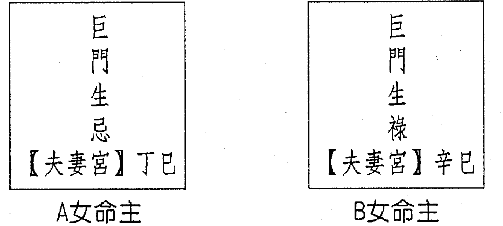

註：

1. 如前所述，化權屬吉，但若論及與身體健康有關的事件時，化權代表身體內部的陰陽不調和，故為小凶。
2. 化科之於權力的取得，多為非光明正大之權，命主執掌該權位時，常行暗昧之事，是可掌權，但非正道；故化科若論及權力的爭奪及取得而言，屬得中有失的小凶程度。
3. 化科是從化忌演化而來，其本質為凶，但其凶不若化忌之程度，當科和祿、科和權形成雙象時，科會受到祿及權的正向拉昇，而出現凶中藏吉的小吉局面。
4. 化科論人和時，主星化科以化凶論，四副星化科以小吉論。

### 第十一節 四化的人格型態分類---先鋒型、主導型、游擊型、跟隨型

如本書第四章《十四主星的基本定義及應用方法》所述，紫微斗數十四主星依其人格特質可歸納成先鋒型、主導型、游擊型、跟隨型四大類型；而本章所介紹的四化應用於人格型態的歸類時，也可以分別與先鋒型、主導型、游擊型、跟隨型對應；四化的人格型態經常使得十四主星的原始人格型態產生質變，因此可以從命盤上解讀出更多關於命主細部而微妙的性格變化。

#### 四化與四性

以四化論斷一個人的性格傾向時，祿、權、科、忌分別會呈現感性、霸性、理性、率性的特徵：

1. 主星化祿之人的性格傾向感性，注重情感的感受，與人互動時會先讓人三分。
2. 主星化權之人的性格傾向霸性，強調積極的主導，與人互動時會先進逼三分。
3. 主星化科之人的性格傾向理性，在意謀定而後動，與人互動時會先觀察三分。
4. 主星化忌之人的性格傾向率性，常隨當下的感覺走，與人互動時會率性而為。

### 第十一節 四化的人格型態分類

「祿、權、科、忌」對應「跟隨型、主導型、游擊型、先鋒型」

- ⊙化祿的人在與人互動時會先讓人三分，這是跟隨型人格型態的特徵；
- ⊙化權的人在與人互動時會先進逼三分，這是主導型人格型態的特徵；
- ⊙化科的人在與人互動時會先觀察三分，這是游擊型人格型態的特徵；
- ○化忌的人在與人互動時常會率性而為，這是先鋒型人格型態的特徵。

| 四化 | 四性 | 四種人格型態 | 性格精要 |
| :--- | :--- | :--- | :--- |
| 化祿 | 感性 | 跟隨型 | 側重深層的情感感受，注重人與人之間的協調性，強調溝通與包容，與人互動時，較在意自己在別人心中的看法和形象。 |
| 化權 | 霸性 | 主導型 | 強調與人互動時的遊戲規則需由自己來設定，在意自己的主導地位是否被侵犯，除了管理自己，也喜好管理他人。 |
| 化科 | 理性 | 游擊型 | 優先保護自己，特別是當與他人的權力和利益有衝突時更是如此，理性科不太與人針鋒相對，而是先默不作聲地旁敲側擊，再伺機一舉達到自己的目的。 |
| 化忌 | 率性 | 先鋒型 | 經常跟著自己的感覺走，在只要我喜歡，沒什麼不可以的行事作風之下，會一再做出讓自己有悔恨、令別人不諒解的事情來。 |

1. 跟隨型的感性祿：感性祿的人格特質側重深層的情感感受，注重人與人之間的協調性，強調溝通與包容，與人互動時，較在意自己在別人心中的看法和形象。

A. 感性祿會使得先鋒型主星（七殺、破軍、貪狼）的剛性人格特質朝往兼具柔性的方向發展，會降低先鋒型族群與人互動時的尖銳性，並且使先鋒型族群放寬待人處事的彈性，呈現更圓融的一面。

B. 感性祿會使得主導型主星（紫微、天府、廉貞、武曲）的果斷人格特質兼具細膩與溫和，會降低主導型族群與人互動時的咄咄迫人，提升主導型族群的親和力。

C. 感性祿會使得游擊型主星（巨門、天機、天同）的彈性人格特質保有其原有的機動性，並且在彈性處理人事物的同時，更重視對該人事物的承諾和熱情，會增強游擊型族群的可被信賴性。

D. 感性祿會使得跟隨型主星（太陽、天梁、太陰、天相）的婉轉人格特質朝往更柔情的性格發展，也會降低跟隨型族群的被動性，提升其與人互動時的積極態度，會強化跟隨型族群的主動反應能力。

2. 主導型的霸性權：霸性權的人格特質強調與人互動時的遊戲規則需由自己來設定，在意自己的主導地位是否被侵犯，除了管理自己，也喜好管理他人。

A. 霸性權會使得先鋒型主星（七殺、破軍、貪狼）的剛性人格特質更形剛硬，會適度地授權給他人，但卻更不容許自己的權力地位被挑戰，強調以我為尊、令出必行。

B. 霸性權會使得主導型主星（紫微、天府、廉貞、武曲）的果斷人格特質更強化自己的決策速度和決策正確性，會想要掌握更大的權限，採取權力由自己收、自己放的中央集權方式和他人互動。

C. 霸性權會使得游擊型主星（巨門、天機、天同）的彈性人格特質變得專制而缺乏彈性，也變得更具咄咄迫人的侵略性，即使是心直無毒，也會令他人覺得有不少的壓迫感。

D. 霸性權會使得跟隨型主星（太陽、天梁、太陰、天相）的婉轉人格特質變得直接而強勢，使得跟隨型族群原有那不願意單獨做決策的性格消失無蹤，與人互動時的態度會顯得霸氣而堅定。

3. 游擊型的理性科：理性科的人格特質注重優先保護自己，特別是當與他人的權力和利益有衝突時更是如此，理性科不太與人針鋒相對，而是先默不作聲地旁敲側擊，再伺機一舉達到自己的目的。

A. 先鋒型主星（七殺、破軍、貪狼）都不化科，所以理性科不會直接改變先鋒型族群的人格特質。

B. 理性科會使得主導型主星（紫微、天府、廉貞、武曲）的果斷人格特質兼具謀略及心機，會算計各方權力和財力的消長，並透過一切可能的方法讓自己時時處於利益的中心。

C. 理性科會使得游擊型主星（巨門、天機、天同）的彈性人格特質更具謀略及心機，會算計各方權力的消長，與人相處時不太真誠相待，經常以有所保留的態度看待週遭人事物的消長和變化。

D. 理性科會使得跟隨型主星（太陽、天梁、太陰、天相）的婉轉人格特質變得深沉而不可測，與人互動時，在看似隨和的言行舉止之下，埋伏著評估再評估、衡量再衡量的特質，不輕易與人交心。

說明：四副星左輔、右弼、文曲、文昌化科時，以理性的人格特質論之。

4. 先鋒型的率性忌：率性忌的人格特質為經常跟著自己的感覺走，在只要我喜歡，沒什麼不可以的行事作風之下，會一再做出令自己有悔恨、讓別人不諒解的事情來。

A. 率性忌會使得先鋒型主星（七殺、破軍、貪狼）的剛性人格特質更一意孤行，使先鋒型族群的冒險性格更加強烈，容易衝動，也容易做出令人悔恨的事情來。

B. 率性忌會使得主導型主星（紫微、天府、廉貞、武曲）的果斷人格特質變得莽撞而一意孤行，使主導型族群經常以狹隘的視野做出淺短的決策，並令主導型族群以偏激的言行與他人互動。

C. 率性忌會使得游擊型主星（巨門、天機、天同）的彈性人格特質變得僵化而頑固，使游擊型族群不再悠遊於靈活的彈性中，而且動輒對他人使出攻擊的言行。

D. 率性忌會使得跟隨型主星（太陽、天梁、太陰、天相）的婉轉人格特質變得直接了當，而且是漫無章法、率性而為的直接了當，使得跟隨型族群失去情緒的穩定性，經常在極端樂觀和極端悲觀間來回擺盪。

由以上歸納可知，紫微斗數十四主星的人格特質不是一成不變的，當任一主星出現化祿、化權、化科或化忌時，該主星就會由原有的型態轉變為以感性、霸性、理性或率性的型態出現，這是紫微斗數命理學中較為高階的應用層次，其精細程度遠在單用十四主星分類人格特質的低階應用層次之上，讀者一旦領略其中變化的要訣，就等於進入了紫微斗數的寶山。

### 第十二節 四化人格型態應用在命盤上的實例講

| 巳 【奴僕宮】
紫微
七殺
洩制 | 午 【遷移宮】 | 未 【財帛宮】 | 申 【財帛宮】 |
|---|---|---|---|
| 辰 【官祿宮】
天機
天梁
制損 | 女命 | | 酉 【子女宮】
廉貞
破軍
生損 |
| 卯 【田宅宮】
天相
洩 | | | 戌 【夫妻宮】 |
| 寅 【福德宮】
太陽
巨門
損損 | 丑 【天母宮】
貪狼
曲狼
洩旺 | 戊子【命宮】
天同
太陰
洩損
權 | 亥 【兄弟宮】
天府
損 |

以前列之女命命盤為例，其命宮在戊子，內有主星天同和太陰，因為命主是女命，故採「七分太陰、三分天同；以太陰為主、以天同為從」的模式論斷命主的人格型態；太陰是跟隨型的主星，若以太陰的人格特質而言，「他們不喜歡處理衝突，習慣在第一時間扮演好好先生或好好小姐的形象，所以在團體組織中，他們也不願意在第一時間勇於提出自己的主張，若有不滿及抱怨，也大都是在私底下進行。」

太陰坐命宮的女命，向來被美化為是具有「溫、良、恭、儉、讓」的優雅婦女，尤其是位居子宮的太陰，更是被強調富貴忠良，不過，這顆太陰一旦出現自化象時，情況就極有可能改觀。前列命盤中的太陰在戊子，當太陰和戊干同宮時會產生自化權，此時的太陰即由跟隨型的「溫、良、恭、儉、讓」，一變而成為霸性權的主導型，此時的太陰再也不害怕衝突，也不再老是扮演好好小姐，而是強調與人互動時的遊戲規則需由自己設定，在意自己的主導地位是否被侵犯，除了管理自己，也喜好管理他人；所以如前列命盤之太陰女，在婚後的生活中是不會屈就環境，也不會以先生或夫家為馬首是瞻的，一旦和先生或夫家處得不好，命主敢於採取離婚的手段做為收場。

前列之命盤，是實際發生離婚事件的命造，舉此為例，提醒讀者要特別注意主星在自化或四化之後，其性質會出現相當大幅度的質變及量變，這是精斷紫微斗數命盤的關鍵，萬萬不可輕忽！

#### 《問題思考》

1. 如果您自己以及您親友之紫微斗數命盤上出現夫妻宮化某象進入命宮的結構時，此時的夫妻宮即為發射宮，命宮為接受宮。請推論該夫妻宮所發動之化象會對命宮產生什麼樣的吉凶影響。
2. 如果您自己以及您親友之紫微斗數命盤上的兄弟宮、夫妻宮、子女宮、奴僕宮、父母宮等六親宮內有出現主星自化的結構，請依本章第八節和第十節的推論模式，推論各該宮內主星自化後對命盤的影響力，並且推論其對命造當事人會產生哪些克應的事實。

## 第六章 紫微斗數的宮盤和星盤

紫微斗數命盤依其基礎架構，可分為「宮盤」、「星盤」及「四化盤」三種盤面，本章將介紹「宮盤」及「星盤」。

### 第一節 宮盤論命法

一張紫微斗數命盤中有十二個宮職，每一個宮職中皆包含有天干、星、地支三個元素，各宮干和星之間可能還存有自化關係，這種探討每一宮職在何地支、宮內有哪些星、這些星有無自化的盤面謂之「宮盤」。

### 第一節 宮盤論命法

| 天府
洩
26—35【夫妻宮】
丁 10 22 34 46 58
巳 70 82 94 106 | 天太右
同陰弼
生洩
權科
16—25【兄弟宮】
戊 11 23 35 47 59
午 71 83 95 107 | 武貪
曲狼
洩旺
祿權
6—15【命宮】
己 12 24 36 48 60
未 72 84 96 108 | 太巨左
陽門輔
旺旺
祿
116—125【父母宮】
庚 1 13 25 37 49
申 61 73 85 97 |
| --- | --- | --- | --- |
| 36—45【子女宮】
丙 9 21 33 45 57
辰 69 81 93 105 | 權

【女命】 | 科

「宮盤」的論述技巧是根據各宮職的定義，以及其所代表的人事時地物為出發點，是以命盤各宮職為主軸一一判斷其宮內結構的吉凶，以及該吉凶對命盤的影響層面。

以上列之命盤為例，若欲以宮盤論述其身體的健康情況，則首先需取宮職用神，在命盤十二宮職中，疾厄宮是判斷身體健康的首要宮位，所以在步驟上宜先從疾厄宮判斷起，命例中的疾厄宮在甲寅，宮內無主星，取對宮主星太陽和巨門為用，疾厄宮的宮干甲與其對宮的太陽星具有化忌的相互關聯性，形成「疾厄宮在甲寅，化太陽忌入對宮」的宮盤結構，此結構克應在命主的事實是命主常出現頭痛問題（註一）。

其次，和疾厄宮具有連帶性質的宮職還有命宮、福德宮、和子女宮，這三個宮位也都是可用以判斷一個人之健康情形的宮位。上列命盤中，「命宮在己未，內有武曲自化祿和貪狼自化權」，祿象論病時為吉，權象論病時為小凶，克應在其健康的事實是命主會有輕度的腸胃病、牙痛、失聲、喉炎、咽喉腫痛等病（註二）；此外，命宮也是揭露命主個性的宮位，因此，以上之生理問題也會影響到命主的日常情緒波動。

「福德宮在辛酉，化文曲科入對宮，對宮有雙主星廉貞和破軍」，文曲為副星，不單獨操持吉凶大權，但當其化科時，便有示吉或逞凶之力，惟其吉凶之特徵仍需以和其位居同宮之主星為依據，「福德宮在辛酉，化文曲科入對宮，對宮有雙主星廉貞和破軍」，此命盤結構需以破軍為斷病之所在，科象論

### 第二節 星盤論命法

「星盤論命法」是指「專以十四主星搭配四副星，並且觀察各主副星有無自化」為主軸的論命方式，其論命模式不包括「宮職」這一項因素。

若欲以星盤論述身體的健康情況，則命盤中各主星若有自化權、自化科或自化忌者（含化入本宮和化入對宮），該主星即為病處；若命盤中各副星有自化科者，則與該副星位居同宮之主星即為病處。以上列之命盤為例，盤中「戊午宮內有主星天同、太陰自化權、副星右弼自化科」，權及科論病時，皆以凶論，此結構中的右弼為副星，其吉凶之特徵需以化權的主星太陰為依據，太陰星之病為腎臟病、生殖系統病（註），副星為致病的增生物，此結構克應在命主健康的事實是命主有子宮肌瘤，此乃子宮屬太陰星所代表的物相之一，腫瘤為副星右弼所代表的增生物（命主於三十八歲時因子宮肌瘤開刀）。

註：
太陰的病症為：泌尿系統病、尿中毒、痔瘡、遺精（男）、無生殖能力、精蟲稀少（男）、受精卵不易著床（女）、中風、失眠、頭痛、眼球痛、眼睛昏黃、目眩、流淚、耳病、鼻塞或多涕、流鼻血、三叉神經痛、甲狀腺病、頸背腰痛及運動障礙、坐骨神經痛、下肢麻痺、腳筋痙攣、足小指疼痛及運動受限等，當太陰星化權時，常有以上疾病之一項或數項。

### 第三節 十四顆主星都是命主的個性之星

每個人的性格都是多樣化的，只是大部分的人會有較為顯而易見的個性傾向，這些顯而易見的個性傾向通常都和命主的命宮主星性格相近，因此取命宮主星判斷一個人的性格是比較接近事實的；但是命宮主星並非為命主的唯一性格，紫微斗數十四顆主星既然出現在命主的命盤上，各主星的人格特質就都是命主性格的一部分，就好像一個人對某人很友善，但對另外的人卻很無情；這個人管理事業的態度很強勢，但談及男女感情時卻變得柔軟；理財行為有時很衝動，有時又很理性 等。這些出現在同一個人身上的不同性格，是根據不同宮職內的主星，以及這些主星在靜盤及動盤上所居的位置觀察而得的，所以說，十四顆主星都是命主的個性之星。

### 第四節 左輔、右弼、文曲、文昌專論

從本書第二章《祿權科忌四化、紫府兩大星群、輔弼曲昌四副星的創作原理》可知，左輔、右弼、文曲、文昌的來源是因為設計十天干化科時，原位居辰、戌、丑、未之主星數量不敷使用而再另創的星，所以視之為副星，其能量強度在紫府兩大星群之下，對紫微斗數命盤的影響力低於紫府兩大星群。

左輔、右弼、文曲、文昌是紫府兩大星群的副星，論斷這四顆副星的訣竅，是將其視為「增生的人、事、物」，這四顆副星與各主星同宮時，具有強化主星能量之功，但無扭轉吉凶之力，當主星對其所位居的宮職示吉時（例如主星自化吉象、或主星旺宮支、生宮支時），這四顆副星就加強其吉的力道；反之，當主星對其所位居的宮職逞凶時（例如主星自化凶象、或主星損宮支、洩宮支、受宮支制時），這四顆副星就加強其凶的力道；因此，左輔、右弼、文曲、文昌四星之論，需以其同宮之主星馬首是瞻，此正所謂「兵隨將轉」也。

左輔、右弼、文曲、文昌這四顆代表「增生的人、事、物」的副星，可適用於與人、事、物有關的事件，如前述之女命，命盤上有「戊午宮內有主星天同、太陰自化權、副星右弼自化科」的結構，當使用這個結構判斷病症時，副星右弼就代表發病部位會有增生的腫瘤；而當副星與具有骨質意涵的主星同宮時，若該主星自化凶象、或該副星有自化科，則該主星或其相關結構所對應的骨骼部位易生骨刺。

又例，次頁命盤之女命主，「本夫在丙戌，宮內無主星，有副星文昌自化科」，夫妻宮有文昌自化科，代表命主在婚姻路上會有「新增之人」，而克應的事實是命主在離過一次婚後，又成為別人的小老婆。

| 紫七微殺洩制 | | | |
|---|---|---|---|
| 56—65【奴僕宮】 辛 11 23 35 47 59 巳 71 83 95 107 | 66—75【遷移宮】 壬 12 24 36 48 60 午 72 84 96 108 | 76—85【疾厄宮】 癸 1 13 25 37 49 未 61 73 85 97 | 86—95【財帛宮】 甲 2 14 26 38 50 申 62 74 86 98 |
| 天天文機梁曲制損 | | | 廉破貞軍生損 |
| 46—55【官祿宮】 庚 10 22 34 46 58 辰 70 82 94 106 | 陰女 農曆：44年 公曆：1956年 命宮：子 身宮：子 命主：貪狼 身主：天相 火六局(霹靂火)生肖：羊 生年四化： 天機(祿) 天梁(權) 紫微(科) 太陰(忌) | | 96—105【子女宮】 乙 3 15 27 39 51 酉 63 75 87 99 |
| 天相洩 | | | 文昌科 |
| 36—45【田宅宮】 己 9 21 33 45 57 卯 69 81 93 105 | | | 106—115【夫妻宮】 丙 4 16 28 40 52 戌 64 76 88 100 |
| 太巨左陽門輔損損 | 武貪曲狼洩旺祿權 | 天太右同陰弼洩損權科 | 天府損 |
| 26—35【福德宮】 戊 8 20 32 44 56 寅 68 80 92 104 | 16—25【父母宮】 己 7 19 31 43 55 丑 67 79 91 103 | 6—15【命 宮】 戊 6 18 30 42 54 子 66 78 90 102 | 116—125【兄弟宮】 丁 5 17 29 41 53 亥 65 77 89 101 |

四副星在其他功能的應用方面，例如以紫微斗數命盤判斷陽宅時，左輔、右弼、文曲、文昌四副星代表該陽宅除了建築主體之外，還會有突出或增建的建物，至於該突出或增建之建物會出現在建築主體的哪個方位，可參照其同宮的主星或相對於命宮（註）的方位加以判斷而得知；此外，該突出或增建之建物對建築主體的吉凶影響性，則以自化或四化為依歸。

以四副星判斷官祿宮所主掌的權力而言，代表增生的權力；判斷財帛宮所主掌的財物時，代表增生的財或債；判斷遷移宮所主掌的際遇時，代表增生的機會或陷阱，判斷其他各宮所主掌的人事物時，均依此原則類推。

註：
這裡的命宮係包括靜盤的命宮和動盤的命宮，其取用基準視被判斷之事件的主客觀條件而定。

## 第七章 從清朝十一帝的父母宮和命宮談大清帝國的興衰

紫微斗數命盤中含有六個六親宮，分別是兄弟宮、夫妻宮、子女宮、奴僕宮、父母宮、遷移宮，都是屬於與他人有關的宮位。六親宮的主要功能在揭露「人我關係」，例如父母宮，即在揭露有權力主導命主之人和命主之互動的好壞；六親宮的論斷模式大同而小異，所以只要能理解其中某一宮的論述方法，便可同步掌握其他各宮的論斷要訣。

紫微斗數命盤中還有一個命宮，是所有宮位的立基點，代表命主所能控制、以及所能表達的部分，例如：情緒管理（EQ）、逆境商數（AQ）、膽識、性格傾向、才華、能力、執行力、品味、格調、是否容易成為社會名流……等；因此，若要判斷一個人的個性風格、行事習慣、以及是否具有「英雄造時勢」能力等，命宮是一個非常關鍵的宮位。

本章將以清朝自開國至皇朝結束，前後共十一位皇帝之紫微斗數命盤的父母宮和命宮為背景，解說父母宮和命宮的判斷模式以及其應用法則，並且解讀清朝十一帝命盤之父母宮結構和命宮結構的吉凶，同時印證各該吉凶結構對大清帝國興衰的影響。本章之末還介紹影響清朝末葉至深且巨的人物---慈禧太后及其紫微斗數命盤，從其命宮和官祿宮的結構，解說慈禧太后為何具有在封建皇朝下的家父長制中不斷地進行權力鬥爭，並且取得掌控國家大權的條件。

### 第一節 清十一帝一后的權力傳承史

#### 主掌授權者的宮位：父母宮

父母宮是《官祿宮→兄弟宮→遷移宮→父母宮》這一條延伸線的最末宮位，主掌公權力（如：司法官的權力）與私權力（如：父母親的權力）的授予及分配，凡能主掌、分配命主權力的個人及機關團體，就是命主的父母宮。

狹義的父母宮指命主的父母親；廣義的父母宮包括輩份高於命主的親戚、老師、上司、裁判、主考官、司法官、政府機關、中央黨部、連鎖店的總部、上游廠商、規則制定者、文書資料等。父母宮結構佳者，常能得到上述人員或機關的助力；反之，則易受其傷害，本章將以大清帝國前後共十一位皇帝的紫微斗數命盤為例，針對每一位皇帝其命盤父母宮的結構做一系列的分析與比對，進而建立判斷父母宮的規則。

#### 主掌命主個性、能力、執行力的宮位：命宮

命宮是所有宮位的立基點，代表命主所能控制及所能表達的部分，本章將以清十一帝一后的命宮型態為背景，解析各命主領導國家大政的行事風格，及其對國家成敗的影響力。

#### 清史

在談清十一帝一后的紫微斗數命盤之前，先來談談大清帝國史。

清朝建立於1636年，自1644年至1911年統治中國，是中國封建史上最後一個王朝，統治者為滿族愛新覺羅氏。在中國的封建制度下，皇位是父子之間的傳授，在位者或將皇位傳予能者，如太祖努爾哈赤傳位予清太宗皇太極；或將皇位傳予所愛者，如清世祖順治皇帝傳位予聖祖康熙皇帝（康熙皇帝繼位時年僅八歲）；或因皇帝駕崩後，宮廷集眾族人、大臣意見而傳予者，如清德宗光緒皇帝駕崩後，皇位傳予光緒皇帝之皇弟愛新覺羅載灃之子愛新覺羅溥儀（溥儀即位時年僅三歲，年號宣統皇帝）。

康熙皇帝八歲即位，溥儀三歲稱帝，以此稚齡當然不可能因為有什麼戰功、或突出的治國表現而獲大位，即使清太宗皇太極當時戰功彪炳，也還得受到父皇的首肯始能獲得君位，這些繼承皇位者，不論當時年齡大小，總得仰承「上意」始有正統，在君權時代的家父長體制之下，「上意」決定了他們此後的一生。在清朝十一位皇帝的命盤上，代表他們家父長的父母宮各自出現了哪些結構？有哪些相似性與相異性？這些相似性與相異性對繼任者日後所掌理的國運盛衰有什麼樣的對照關係？從清朝十一位皇帝的紫微斗數命盤，我們看到了大清帝國由盛而衰的軌跡，在分析清朝十一帝的命盤之前，先來看一段清史（以下清史參考《基維百科網站》）。

#### 大清十一帝一后之即位年齡、在位年數、父母宮結構、命宮結構一覽表

| 帝號 | 即位年齡 | 在位年數 | 父母宮結構 | 命宮結構 |
| :--- | :--- | :--- | :--- | :--- |
| 大金（後金）太祖・努爾哈赤 | | 11年（1616～1626年） | | |
| 清太宗崇德皇帝 | 36歲 | 17年（1627～1643年） | 本父在甲辰，化《廉貞祿+破軍權》入本遷（己酉），照本命。 | 本命在癸卯，化《破軍祿》入本遷（己酉），此為自化定義中的「化入對宮」結構。 |
| 清世祖順治皇帝 | 6歲 | 18年（1644～1661年） | 本父在丁巳，化《太陰祿》入本遷（壬戌），照本命。 | 本命在丙辰，內有主星太陽，副星左輔，沒有自化。 |
| 清聖祖康熙皇帝 | 8歲 | 61年 (1662～1722年) | 本父在丙子，化《天同祿》入本命。 | 本命在乙亥，內有主星天同，化《天梁權》入對宮本遷。 |
| 清世宗雍正皇帝 | 45歲 | 13年 (1723～1735年) | 本父在戊午，化《貪狼祿》入本遷（癸亥），照本命。 | 本命在丁巳，沒有主星，取對宮之廉貪為用，對宮貪狼自化忌。 |
| 清高宗乾隆皇帝 | 26歲 | 60年 (1736～1795年) | 本父在戊戌，化《右弼科》入本遷（辛卯），照本命。 | 本命在丁酉，沒有自化，有天相坐之，天相不以主星論，取對宮主星廉破為用。 |
| 清仁宗嘉慶皇帝 | 37歲 | 25年 (1796～1820年) | 本父在丁亥，化《太陰祿》入本命。 | 本命在丙戌，太陰坐本命，沒有自化。 |
| 清宣宗道光皇帝 | 40歲 | 30年 (1821~1850年) | 本父在丁未，化《太陰祿+天同權》入本遷（壬子），照本命。 | 本命在丙午，宮內沒有主星，取對宮主星同陰為用，化天同祿入對宮。 |
| 清文宗咸豐皇帝 | 20歲 | 11年 (1851~1861年) | 本父在乙未，化《天機祿》入本遷（庚子），照本命。 | 本命在甲午，宮內主星巨門，沒有自化。 |
| 清穆宗同治皇帝 | 6歲 | 13年 (1862~1874年) | 本父在戊戌，化《天機忌》入本遷（辛卯），沖本命。 | 本命在丁酉，宮內無主星，化《天機科+巨門忌》雙凶象入對宮遷移。 |
| 清德宗光緒皇帝 | 4歲 | 34年 (1875~1908年) | 本父在戊申，化《太陰權+天機忌》入對宮本疾（壬寅），回沖本父。 | 本命在丁未，宮內主星《廉貞+七殺》，沒有自化。 |
| 清遜帝宣統皇帝 | 3歲 | 4年 (1908～1912年) | 本父在辛丑，化《太陽權》入本命、化《天梁忌》入本遷（沖本命）。 | 本遷化太陽忌入本命，本命有太陽星自化祿。 |
| 慈禧太后（慈禧太后是以發動政變的方式取得政權，故取官祿宮而不看父母宮） | | 48年 (1861～1908年) | 本官在己卯，有紫微、貪狼雙主星，貪狼自化權；本官化《武曲祿+破軍忌》入本命。 | 本命在丁亥，有《武曲+破軍》雙主星，沒有自化。 |

#### 後金・太祖（在位期間：1616年～1626年）

1583年（明・萬曆十一年），努爾哈赤受襲封為指揮使，以祖、父遺甲十三副，相繼兼併海西四部，征服東海女真，統一了分散在東北地區的女真各部。1616年（明・萬曆四十四年），努爾哈赤建立王朝稱汗，廟號「太祖」，國號大金，史稱後金，定都於赫圖阿拉，在今中國遼寧省新賓縣西永陵鎮老城。1626年，努爾哈赤在攻打由明名將袁崇煥鎮守的寧遠時，被葡萄牙制的紅衣大炮擊傷，後來死在回瀋陽的路上，終年六十八歲。

#### 第一位皇帝：清太宗・崇德皇帝（在位期間：1627年～1643年）

努爾哈赤死後，由第八子皇太極繼位，廟號「太宗」。皇太極在世時期維護漢人、減輕農民負擔，並遷都瀋陽。1636年皇太極控制漠南蒙古後，改國號為「大清」，改元「崇德皇帝」，是清朝的實際建立者和開國皇帝。他還誘使多疑的明思宗凌遲處死袁崇煥，為後來清朝滅明立下基礎。皇太極病逝於1643年農曆八月初九晚十時，年五十二歲。

#### 第二位皇帝：清世祖・順治皇帝（在位期間：1644年～1661年）

皇太極病逝後，九子福臨繼位，是為順治皇帝，廟號「世祖」。1644年，李自成農民軍推翻明朝統治，明崇禎帝自殺，吳三桂引清軍入關打敗農民軍，同年（順治皇帝元年），多爾袞迎順治皇帝入關，在北京再次即位，並定都北京，此後清廷先後鎮壓了各地的農民軍殘餘勢力以及南明的抗清武裝力量，逐步統一全國。在清朝統一全國的過程中，由於規定所有人必須剃髮易服，遭到了部分漢族人民的武裝抵抗，發生過揚州十日、嘉定三屠等屠殺漢族的事件；而鄭成功為了抗清，還在1661年攻下了被荷蘭殖民者佔領的臺灣。

順治皇帝是清朝入關的第一位皇帝，公曆1643年4月4日承襲父位，時年六歲，由叔父睿親王多爾袞及鄭親王濟爾哈朗輔政，十四歲（1651年）親政。至於順治皇帝到底是怎麼離位的，傳統上有兩種說法：

第一種說法是順治皇帝在順治十八年因病而死，原因為其愛子及寵妃相繼病亡，順治皇帝因此受到巨大的精神打擊，身體每況愈下，後又染上了天花，於順治十八年正月初七日（1661年2月5日）子時崩於紫禁城內的養心殿，年僅二十四歲，中國歷史第一檔案館的檔案支持這種說法；而據歷史文獻記載，福臨確實想要出家，但受到皇宮內保守勢力的極度反對，最終未能成行，而不久則死於天花，他也是清朝歷史上唯一公開皈依禪門的皇帝。另一種民間傳說，是愛宗教的福臨出家當了和尚。

#### 第三位皇帝：清聖祖・康熙皇帝（在位期間：1662年～1722年）

康熙皇帝繼位時只有八歲，是順治皇帝的第三子，在位達六十一年，廟號「聖祖」，是中國歷史上統治時間最長的皇帝。康熙皇帝在位期間，擒鰲拜、削平吳三桂等三藩之亂、消滅佔領臺灣的鄭氏政權攻佔臺灣、平定準噶爾的叛亂、打敗沙俄侵略簽訂《尼布楚條約》。康熙皇帝重視對漢族知識分子的優遇，他曾多次舉辦博學鴻儒科，創建南書房制度，並親臨曲阜拜謁孔廟。康熙皇帝還組織官員編輯並且出版《康熙皇帝字典》、《古今圖書集成》、《曆象考成》、《數理精蘊》、《康熙皇帝永年曆法》、《康熙皇帝皇輿全覽圖》等圖書、曆法和地圖。康熙皇帝在位期間被臣民稱為「康熙皇帝盛世」。

康熙十三年，康熙皇帝立皇后所生，時年一歲的皇次子胤礽為太子，但由於太子本身的素質問題及其在朝中結黨而廢太子。廢太子後眾皇子覬覦皇位，矛盾更加尖銳，故太子廢而復立，但康熙皇帝仍無法容忍其結黨，三年後二廢太子，最終在康熙皇帝六十一年臨終時傳位於皇四子胤禛，有傳說認為康熙皇帝是因為鍾愛胤禛之四子弘曆（後來的乾隆皇帝）而傳位於胤禛。

#### 第四位皇帝：清世宗・雍正皇帝（在位期間：1723年～1735年）

康熙皇帝去世後，雍正皇帝即位，廟號「世宗」。雍正皇帝一朝，整頓吏治，創立密折制度，並設立軍機處以強化中央權力，攤丁入地，廢除賤籍，並且建立了秘密選儲制度，使皇位繼承問題制度化。雍正皇帝在位期間，勤於政事，自詡「以勤先天下」。

雍正皇帝四十五歲即位，其即位過程至今也是一個不解之謎，對其繼位之說有很多版本。此外，雍正皇帝對其兄弟的手段頗為毒辣，用各種方式進行迫害，例如皇位競爭者之一的康

## 第五位皇帝：

## 清高宗·乾隆皇帝（在位期间：1736年～1795年）

清高宗乾隆皇帝，庙号「高宗」，讳弘历，是雍正皇帝第四子，生于康熙皇帝五十年，卒于嘉庆皇帝四年，于雍正皇帝十三年即位，于乾隆六十年禅位于十五子颙琰，自己成为太上皇，在位共六十年，是中国封建史在位时间第二久的皇帝，仅次于祖父康熙皇帝，而且是寿命最长的皇帝。

乾隆皇帝自称文治武功十全老人，一生喜文喜诗，作诗数以万计，下令编纂《四库全书》，也擅长武术，主要施政特点是宽猛相济。他在位时期，平定新疆、蒙古，还使四川、贵州等地继续改土归流，人口不断增加，突破了三亿大关，约占当时世界人口的三分之一，开创了中国封建社会最后一个盛世——「康乾盛世」，强大的中国屹立于世界的东方。但他同时又好大喜功、专制骄横，曾六下江南，大肆搜刮民脂民膏，大兴文字狱，中后期在政治上也越来越腐败，尤其是其晚年重用「贪官之王」大奸臣和珅，使清朝国库逐渐虚空，百姓生活贫苦，应该说清朝是从乾隆皇帝中后期开始走向衰落的。

乾隆皇帝六十年（1796年），高宗以在位期不越祖父康熙皇帝为名禅位于子颙琰，是为清仁宗，又号嘉庆皇帝，乾隆自称太上皇，仍然继续执政，直到嘉庆皇帝四年（1799年）去世为止。

## 第六位皇帝：

## 清仁宗・嘉庆皇帝（在位期间：1796年～1820年）

嘉庆皇帝，庙号「仁宗」，继位后最初四年，太上皇乾隆皇帝还控制着政治局面，嘉庆四年，乾隆皇帝去世，颙琰开始亲政，亲政第六天就逮捕乾隆朝大奸臣和珅，但是和珅价值连城的金银财宝等物品全部归属嘉庆皇帝所有，所以当时有民谚讽刺：「和珅跌倒，嘉庆皇帝吃饱」，形容当时统治者的贪婪与朝政的腐败。嘉庆皇帝时期，官吏贪污，政治更加腐败，还爆发了白莲教起义、天道教起义等农民起义事件，清朝国势日非。

## 第七位皇帝：

## 清宣宗·道光皇帝（在位期间：1821年～1850年）

清宣宗道光皇帝在位三十年，终年六十九岁。他比较朴素，但却不能明察秋毫，为人优柔寡断，又是一个平庸之人，所以导致清朝国势更加衰弱。道光皇帝在位期间曾支持林则徐禁烟，之后第一次鸦片战争爆发，由于道光皇帝不能知人善任、缺乏准备，以及武器装备相对比较落后等原因，清朝战败于英国，道光皇帝罢免林则徐，并向英人求和，签订近代首条不平等条约《南京条约》，割让香港并开放五口通商，自始开启中国五千年未遇之大变。

## 第八位皇帝：

## 清文宗·咸丰皇帝（在位期间：1851年～1861年）

清文宗咸丰皇帝，道光皇帝第四子，二十岁继帝位，年号咸丰，在位十一年，享年三十一岁。咸丰皇帝奢侈无度，纵情声色，朝政十分腐败，清朝病入膏肓，无可救药，在位期间爆发了太平天国运动及第二次鸦片战争，对外签定了一系列不平等条约，中国进一步丧失了主权，大清国逐渐沦为半封建半殖民的国家，咸丰皇帝更把自己的故乡满洲割让予俄国，是为中国近代一大国耻。

## 第九位皇帝：

## 清穆宗·同治皇帝（在位期间：1862年～1874年）

清穆宗同治皇帝，讳载淳，是咸丰皇帝的长子，其生母为叶赫那拉氏慈禧太后。咸丰皇帝死后，载淳的年号本定为「祺祥」，慈禧及慈安两名太后与恭亲王奕訢发动辛酉政变后，将年号改为「同治」，以志「两宫同治」的垂帘听政。

同治皇帝六岁即位后，一直在被母亲慈禧太后所控制，十八岁亲政，次年即病死。同治皇帝在位的期间，西方列强未有入侵，太平天国被消灭，清室亦兴办洋务，颇有发愤图强之心，此段时期被称为「同治中兴」，但同治皇帝本人却十分无能，他只知道看戏、享乐，不好读书，因此有史者将同治皇帝和大昏君明武宗相提并论。据清室记载，同治皇帝是死于天花，另民间传说同治皇帝是死于梅毒。同治皇帝无后，慈禧太后挑出咸丰皇帝之弟醇亲王奕譞之子载湉为帝，是为光绪皇帝。

## 第十位皇帝：

## 清德宗·光绪皇帝（在位期间：1875年～1908年）

光绪皇帝四岁登基，由慈禧、慈安两宫太后垂帘听政至十九岁，此后名义上虽归政于他，实际上大权仍掌握在慈禧太后手中。光绪皇帝二十年（1894年）甲午战争爆发，光绪皇帝坚决主战，但由于以慈禧太后及李鸿章为首的主和派阻挠，致使军资不足，贻误战机。中国战败后，光绪皇帝被迫在马关条约上签字用玺，自此他意识到变法革新的必要性，为了不做亡国之君，于1898年启用康有为、梁启超等人推行新政，受到以慈禧太后为首的保守派反制，1898年八、九月间，世间盛传慈禧太后有借「天津阅兵」以废弑光绪皇帝的阴谋。

光绪皇帝打算依靠袁世凯发兵杀荣禄（慈禧太后的亲信）、围颐和园（慈禧太后的居所），但被袁出卖，从此被慈禧太后幽禁在三面环水的南海瀛台，慈禧太后对外则宣布光绪皇帝生病，由太后训政，从戊戌年（1898年）四月二十三日光绪皇帝下「明定国是」诏起，到政变发生的八月六日为止（西历6月11日至9月21日），整个变法维新历时不过103天，故称百日维新。

光绪皇帝二十六年（1900年、庚子年），义和团反洋起事，导致八国联军攻入北京，慈禧太后挟光绪皇帝逃亡至西安，次年签定辛丑条约（庚子赔款）后才回到北京，此后处境虽稍有改善，但仍被慈禧太后软禁。

光绪皇帝1908年秋病逝于瀛台，时年三十八岁，因他只比慈禧早一天死亡，所以死因诸说纷纭，没有历史定论，一说他为慈禧太后（或谓李莲英，或谓袁世凯）毒死，一说他自然病死。光绪皇帝无后，即以其侄、第二代醇亲王载沣之子溥仪为帝。

## 第十一位皇帝：

## 清逊帝、宣统皇帝（在位期间：1908年～1912年）

溥仪是中国清朝最后一位皇帝，即清逊帝，年号「宣统」，又称宣统皇帝，即位时仅三岁，实权由其父摄政王爱新觉罗载沣为之。宣统三年（公元1911年），孙中山在武昌起义中获得了胜利，宣布成立中华民国，也推翻了清朝政权，溥仪被迫在1912年2月12日离位，但仍保留皇帝的名义继续住在紫禁城内。1924年11月5日，冯玉祥的军队包围紫禁城，其部将鹿仲麟率部入故宫赶走了溥仪。

日本占领东北之后，建立满洲国，溥仪自1932年3月9日至1934年2月28日任满洲国执政，年号大同，于1934年3月1日登基称帝，年号康德，所以他又被称为康德皇帝，在这段期间，虽然他名为皇帝，实际上重大决定都要得到关东军的批准，日本在第二次世界大战中战败后，满洲国解体。1964年，溥仪成为中共全国政协委员，直到于1967年10月17日2时30分因患肾癌、尿毒症、贫血性心脏病逝世于北京。

注：

溥仪通称宣统皇帝，也被尊为清逊帝、或末皇帝。2004年，清皇室家族后代依宣国公建议，已协商为溥仪上庙号为恭宗，追加谥号为潜皇帝，尊骨灰奉安处为献陵。

#### 《慈禧太后》

#### 大事记

- 1852年5月，选秀入宫，赐号兰贵人。
- 1856年，生同治皇帝，当日晋懿妃。
- 1861年，同治皇帝即位，被尊为圣母皇太后。同年8月22日发动辛酉政变，遂掌握最高权力达四十八年。
- 1862年，同治皇帝上徽号慈禧。
- 1874年，同治皇帝崩，慈禧令光绪皇帝继位。
- 1894年～1895年，甲午战争，中国战败，签订马关条约。
- 1898年，镇压戊戌变法。
- 1900年，义和团运动，八国联军入京，慈禧逃离北京。
- 1908年11月15日下午五时病逝。

谈清史，就不能不谈慈禧太后。清朝在慈禧太后统治期间屡遭外强侵略，国际地位一落千丈，加上传统道德对女性执政的偏见等因素，过去历史对慈禧的评价几乎完全是负面的，例如：保守、无能、愚昧、昏聩、阴险、狭隘、虚荣、卖国的专制暴君等，近来，史学界和评论界开始客观评价，但她在学界和大多数人的心目中，依然是一位负面人物。

#### 正面评价

作为一个女性，她不失聪明与能干，并在危急时刻曾尽力维护国家利益，做出了虽不成功但在当时可称合理的反应，她曾经在1884年马尾海战爆发后向法国宣战，1894年向日本宣战，1895年6月21日向八国联军宣战；她破除满汉界限，大力起用曾国藩、李鸿章、张之洞等名臣，开办洋务运动，造成所谓「同治中兴」气象；执政后期，发布新政诏书，废除科举，兴办新式学堂，大量选派留学生，开始宪政改革等举措，是为人才方面的重要改革；此外，她推动京剧艺术发展，建立北京动物园，都是不应被人遗忘的。

#### 负面评价

慈禧太后的负面评价依然很多，远大于她的正面评价，她起用湘军、淮军人物，也是为了镇压太平天国，维护其统治目的，并非自愿破除满汉界限。在她执政的四十多年间，以她为首的清政府签订了众多丧权辱国的不平等条约，如《马关条约》、《辛丑合约》等。她的残忍也是出名的，1861年发动政变夺取政权，原来八位控制政权的原大臣中，有三位被其处死，1881年毒死同有训政权的太后慈安。1885年，在镇南关战胜法国，大捷之后她竟仍让清政府向法国求和，让中国「不败而败」，法国「不胜而胜」，显示出她的昏聩无能。1894年中日甲午战争爆发时，她依然大兴土木，花巨资兴建颐和园以庆祝自己的六十大寿，并留有名言：「谁让我不高兴一阵子，我就让他不高兴一辈子」（有多种版本）。1898年，她彻底扼杀了戊戌变法，囚禁光绪皇帝，使中国依旧沉沦在半封建半殖民地的社会中，她又杀害支援维新变法的光绪皇帝宠妃珍妃，残忍行径为人所不齿。

### 第二节 清朝十一位皇帝的紫微斗数命盘及其父母宫和命宫的结构分析

本节将以清朝十一位皇帝的紫微斗数命盘为例，一一分析其父母宫和命宫的结构，并且讨论这些结构对皇帝本人和其所掌理之国家的运势影响。

注：

本节及下节所讨论之清朝十一位皇帝及慈禧太后的生辰，系摘自五术前辈「陈道隐」大德所著之《八字特殊格局汇解》（武陵出版）。

#### 清太宗·崇德皇帝

清朝近三百年天下的开国皇帝。姓名：爱新觉罗·皇太极
庙号：太宗 年号：崇德皇帝
在世：1592年～1643年 在位：1627年～1643年

| 紫七微杀泄制科 24—33【福德宫】 乙 2 14 26 38 50 巳 62 74 86 98 | 34—43【田宅宫】 丙 3 15 27 39 51 午 63 75 87 99 | 44—53【官禄宫】 丁 4 16 28 40 52 未 64 76 88 100 | 54—63【奴仆宫】 戊 5 17 29 41 53 申 65 77 89 101 |
|---|---|---|---|
| 天天机梁制损 14—23【父母宫】 甲 1 13 25 37 49 辰 61 73 85 97 | 阳男：清太宗·崇德皇帝 农历：1592年10月25日申时 公历：1592年11月28日申时 命宫：卯 身宫：未 命主：文曲 身主：文昌 金四局(金箔金)生肖：龙 四柱八字： 壬辰(年) 辛亥(月) 辛亥(日) 丙申(时) 生年四化： 天机(禄) 天梁(权) 紫微(科) 太阴(忌) | 廉破贞军生损忌 64—73【迁移宫】 己 6 18 30 42 54 酉 66 78 90 102 |
|---|---|---|
| 天相泄 4—13【命 宮】 癸 12 24 36 48 60 卯 72 84 96 108 | | 74—83【疾厄宫】 庚 7 19 31 43 55 戌 67 79 91 103 |
|---|---|---|
| 太巨文阳门昌损损 114—123【兄弟宫】 壬 11 23 35 47 59 寅 71 83 95 107 | 武贪左右曲狼辅弼泄旺忌 104—113【夫妻宫】 癸 10 22 34 46 58 丑 70 82 94 106 | 天太文同阴曲泄损 94—103【子女宫】 壬 9 21 33 45 57 子 69 81 93 105 | 天府损 84—93【财帛宫】 辛 8 20 32 44 56 亥 68 80 92 104 |

##### 《命盘结构与说明》

##### 1. 父母宫

⊙【本父结构】本父在甲辰，化《廉贞禄 + 破军权》入本迁（己酉），照本命。

⊙【结构讲解】发射宫：本父，接受宫：本迁，属「宫干四化」的结构；禄及权皆属吉象，当本父化吉象入本迁时，则照本命，代表命主可以得到来自父母、长辈、或上司的肯定、支持、及协助，克应在皇太极的事实，是他得自父亲努尔哈赤完整的皇权授予，顺利继承帝位并且全权处理国政。

##### 2. 命宫

⊙【本命结构】本命在癸卯，化《破军禄》入本迁（己酉），此为自化定义中的「化入对宫」结构。

⊙【结构讲解】命宫代表命主，迁移宫代表外在的大环境，破军为勇冠三军的先锋型主星，是最擅长带头作战的指挥者，他们会组织小型团体并带领团队披荆斩棘，行事作风习惯直捣黄龙。本命化破军禄入本迁，属英雄造时势的命格，克应在皇太极的事实，是他有能力在其父皇打下的基础上继续开疆辟土，例如：

- A. 维护汉人、减轻农民负担，并迁都沈阳；
- B. 控制漠南蒙古；
- C. 改国号为「大清」，是清朝的实力建立者和开国皇帝；
- D. 诱使多疑的明思宗凌迟处死袁崇焕，为后来清朝灭明立下基础。

#### 《清世祖·顺治皇帝》

姓名：爱新觉罗·福临
庙号：清世祖
年号：顺治皇帝
在世：1638年～1661年
在位：1644年～1661年

| 15—24【父母宫】 丁 4 16 28 40 52 巳 64 76 88 100 | 25—34【福德宫】 戊 5 17 29 41 53 午 65 77 89 101 | 35—44【田宅宫】 己 6 18 30 42 54 未 66 78 90 102 | 45—54【官禄宫】 庚 7 19 31 43 55 申 67 79 91 103 |
|---|---|---|---|
| 太左 阳辅 泄  5—14【命宫】 丙 3 15 27 39 51 辰 63 75 87 99 | 阳男：清世祖·顺治皇帝 农历：1638年1月30日戌时 公历：1638年3月15日戌时 命宫：辰 身宫：子 命主：廉贞 身主：天梁 土五局(砂中土)生肖：虎 四柱八字： 戊寅(年) 乙卯(月) 甲午(日) 甲戌(时) 生年四化： 贪狼(禄) 太阴(权) 右弼(科) 天机(忌) | 天府 生  55—64【奴仆宫】 辛 8 20 32 44 56 酉 68 80 92 104 |
| 武七 曲杀 损损  115—124【兄弟宫】 乙 2 14 26 38 50 卯 62 74 86 98 | | | 太右 阴弼 旺  65—74【迁移宫】 壬 9 21 33 45 57 戌 69 81 93 105 |
| 天天文 同梁曲 旺旺  105—114【夫妻宫】 甲 1 13 25 37 49 寅 61 73 85 97 | 天 相 生  95—104【子女宫】 乙 12 24 36 48 60 丑 72 84 96 108 | 巨文 门昌 生  85—94【财帛宫】 甲 11 23 35 47 59 子 71 83 95 107 | 廉贪 贞狼 损损 忌  75—84【疾厄宫】 癸 10 22 34 46 58 亥 70 82 94 106 |

##### 《命盘结构与说明》

##### 1. 父母宫

⊙【本父结构】本父在丁巳，化《太阴禄》入本迁（壬戌），照本命。

⊙【结构讲解】发射宫：本父，接受宫：本迁，属「宫干四化」的结构；禄属吉象，当本父化吉象入本迁时，则照本命，代表命主可以得到来自父母、长辈、或上司的肯定、支持、及协助，克应在顺治皇帝的事实，是他得自父亲崇德皇帝完整的皇权授予，顺利继承帝位并全权处理国政。

##### 2. 命宫

○【本命结构】本命在丙辰，内有主星太阳，副星左辅，没有自化。

○【结构讲解】太阳星为热心的跟随型主星，太阳族有一颗服务心，太阳在辰宫为泄宫气，代表命主有处处为人着想的柔情性格。一位具有柔情性格的君主，在必须四方征战、动辄以杀戮迫使敌人屈服的开国阶段，想必其内心会产生巨大的煎熬，而克应在顺治皇帝的事实，是他想要出家，是清朝历史上唯一公开皈依禅门的皇帝，希望藉由宗教力量来获得内心的平静。

#### 《清圣祖·康熙皇帝》

姓名：爱新觉罗·玄烨
庙号：圣祖
年号：康熙皇帝
在世：1654年～1722年
在位：1661年～1722年

| 天文 梁昌 生 科 66—75【迁移宫】 己 12 24 36 48 60 巳 72 84 96 108 | 七左 杀辅 制 76—85【疾厄宫】 庚 1 13 25 37 49 午 61 73 85 97 | 86—95【财帛宫】 辛 2 14 26 38 50 未 62 74 86 98 | 廉右 贞弼 生 96—105【子女宫】 壬 3 15 27 39 51 申 63 75 87 99 |
|---|---|---|---|
| 紫天 微相 旺生 56—65【奴仆宫】 戊 11 23 35 47 59 辰 71 83 95 107 | 权科 阳男：清圣祖·康熙皇帝 农历：1654年3月18日巳时 公历：1654年5月4日巳时 命宫：亥 身宫：酉 命主：巨门 身主：火星 火六局(山头火)生肖：马 四柱八字： 甲午(年) 戊辰(月) 戊申(日) 丁巳(时) 生年四化： 廉贞(禄) 破军(权) 武曲(科) 太阳(忌) | 权 文曲 106—115【夫妻宫】 癸 4 16 28 40 52 酉 64 76 88 100 |
| 天巨 机门 生损 科忌 46—55【官禄宫】 丁 10 21 33 45 57 卯 70 82 94 106 | 忌 | 权 | 破 军 生 权 116—125【兄弟宫】 甲 5 17 29 41 53 戌 65 77 89 101 |
| 贪 狼 制 36—45【田宅宫】 丙 9 21 33 45 57 寅 69 81 93 105 | 太太 阳阴 泄旺 禄 26—35【福德宫】 丁 8 20 32 44 56 丑 68 80 92 104 | 武天 曲府 生损 16—25【父母宫】 丙 7 19 31 43 55 子 67 79 91 103 | 天 同 泄 6—15【命 宮】 乙 6 18 30 42 54 亥 66 78 90 102 |

##### 《命盘结构与说明》

##### 1. 父母宫

⊙【本父结构】本父在丙子，化《天同禄》入本命。

⊙【结构讲解】发射宫：本父，接受宫：本命，属「宫干四化」的结构；禄属吉象，当本父化吉象入本命时，代表命主可以得到来自父母、长辈、或上司的肯定、支持、及协助，克应在康熙皇帝的事实，是他得自父亲顺治皇帝完整的皇权授予，顺利继承帝位并全权处理国政。

##### 2. 命宫

⊙【本命结构】本命在乙亥，内有主星天同，化《天梁权》入对宫本迁。

⊙【结构讲解】天同星是最喜好追求新愿景的游击型主星，重文墨，加上本命化权到本迁，是主导型的霸性权，重武功，具有对外扩张的执行力，两种结构均代表命主是具有安内攘外能力的人，而克应在康熙皇帝的事实，是他在位期间，擒鳌拜、削平吴三桂等三藩之乱、消灭占领台湾的郑氏政权、平定准噶尔叛乱、打败沙俄侵略，这些都是武功的运用；康熙皇帝重视对汉族知识分子的优遇，他曾多次举办博学鸿儒科，创建了南书房制度，并亲临曲阜拜谒孔庙，康熙皇帝还组织官员编辑与出版了《康熙皇帝字典》、《古今图书集成》、《历象考成》、《数理精蕴》、《康熙皇帝永年历法》、《康熙皇帝皇舆全览图》等图书、历法和地图，这些都

#### 《清世宗·雍正皇帝》

姓名：爱新觉罗·胤禛
庙号：清世宗
年号：雍正皇帝
在世：1678年～1735年
在位：1722年～1735年

| 5—14【命宫】 丁 巳 10 22 34 46 58 70 82 94 106 | 天机 损 忌 15—24【父母宫】 戊 午 11 23 35 47 59 71 83 95 107 | 紫微 破军 旺生 忌 25—34【福德宫】 己 未 12 24 36 48 60 72 84 96 108 | 35—44【田宅宫】 庚 申 1 13 25 37 49 61 73 85 97 |
| 太阳 文昌 泄 科 115—124【兄弟宫】 丙 辰 9 21 33 45 57 69 81 93 105 | 阳男：清世宗·雍正皇帝 农历：1678年10月30日午时 公历：1678年12月13日午时 命宫：巳 身宫：巳 命主：武曲 身主：天梁 土五局(砂中土)生肖：猴 四柱八字： 戊午(年) 甲子(月) 丁酉(日) 癸卯(时) 生年四化： 贪狼(禄) 太阴(权) 右弼(科) 天机(忌) 科 | 天府 生 45—54【官禄宫】 辛 酉 2 14 26 38 50 62 74 86 98 |
| 武曲 七杀 损损 105—114【夫妻宫】 乙 卯 8 20 32 44 56 68 80 92 104 | 天同 天梁 旺旺 95—104【子女宫】 甲 寅 7 19 31 43 55 67 79 91 103 | 天相 左辅 右弼 生 85—94【财帛宫】 乙 丑 6 18 30 42 54 66 78 90 102 | 巨门 生 75—84【疾厄宫】 甲 子 5 17 29 41 53 65 77 89 101 | 廉贞 贪狼 损损 忌 65—74【迁移宫】 癸 亥 4 16 28 40 52 64 76 88 100 |

##### 《命盤結構與說明》

##### 1. 父母宮

⊙【本父結構】本父在戊午，化《貪狼祿》入本遷（癸亥），照本命。

⊙【結構講解】發射宮：本父，接受宮：本命，屬「宮干四化」的結構；祿屬吉象，當本父化吉象入本遷時，則照本命，代表命主可以得到來自父母、長輩、或上司的肯定、支持、及協助，克應在雍正皇帝的事實，是他得自父親康熙皇帝完整的皇權授予，順利繼承帝位並全權處理國政。

##### 2. 命宮

⊙【本命結構】本命在丁巳，沒有主星，取對宮之廉貪為用，對宮貪狼自化忌。

⊙【結構講解】廉貪是自以為是的主導型兼先鋒型主星，與人相處時的態度不是很穩定，自化忌時尤甚，他們大多數的時候是以檢討別人來掩飾自己的不足，在人際關係方面毀譽不定，克應在雍正皇帝的事實，是雍正皇帝對其兄弟手段頗為毒辣，常用各種方式進行迫害，連同母的兄弟、康熙皇帝十四子愛新覺羅胤禵得知康熙皇帝駕崩後，從西寧撫遠大將軍任上趕回弔喪，雍正皇帝也不允許其進城，後又下旨令其在遵化看守康熙皇帝的景陵，對其監禁；雍正皇帝臨死前，把皇位傳給皇四子寶親王弘曆（乾隆皇帝），命皇三子弘時自斃。

#### 《清高宗·乾隆皇帝》

姓名：爱新觉罗·弘历
庙号：清高宗
年号：乾隆皇帝
在世：1711年～1799年
在位：1736年～1796年

| 天府 洩 46—55【财帛宫】 癸 巳 3 15 27 39 51 63 75 87 99 | 天同 太阴 生洩 36—45【子女宫】 甲 午 4 16 28 40 52 64 76 88 100 | 武曲 贪狼 洩旺 26—35【夫妻宫】 乙 未 5 17 29 41 53 65 77 89 101 | 太阳 巨门 旺旺 16—25【兄弟宫】 丙 申 6 18 30 42 54 66 78 90 102 |
| 文曲 56—65【疾厄宫】 壬 辰 2 14 26 38 50 62 74 86 98 | 阴男：清高宗·乾隆皇帝 农历：1711年8月13日早子时 公历：1711年9月25日早子时 命宫：酉 身宫：酉 命主：文曲 身主：天同 火六局(山下火)生肖：兔 四柱八字： 辛卯(年) 丁酉(月) 庚午(日) 丙子(时) 生年四化： 巨门(禄) 太阳(权) 文曲(科) 天梁(忌) | 天相 损 6—15【命 宫】 丁 酉 7 19 31 43 55 67 79 91 103 |
| 廉贞 破军 右弼 制洩 66—75【迁移宫】 辛 卯 1 13 25 37 49 61 73 85 97 | | 天机 天梁 文昌 制损 忌 116—125【父母宫】 戊 戌 8 20 32 44 56 68 80 92 104 |
| 76—85【奴仆宫】 庚 寅 12 24 36 48 60 72 84 96 108 | 86—95【官禄宫】 辛 丑 11 23 35 47 59 71 83 95 107 | 96—105【田宅宫】 庚 子 10 22 34 46 58 70 82 94 106 | 紫微 七杀 左辅 损生 106—115【福德宫】 己 亥 9 21 33 45 57 69 81 93 105 |

##### 《命盤結構與說明》

##### 1. 父母宮

◎【本父結構】本父在戊戌，化《右弼科》入本遷（辛卯），照本命。

◎【結構講解】發射宮：本父，接受宮：本遷，屬「宮干四化」的結構；副星化科屬小吉象，當本父化右弼科入本遷時，則照本命，代表命主可以得到來自父母、長輩、或上司的支持及協助，克應在乾隆皇帝的事實，是他得自父親雍正皇帝的輔助，但科象在人與人之間是有所保留的互動。

##### 2. 命宮

◎【本命結構】本命在丁酉，沒有自化，有天相坐之，天相不以主星論，取對宮主星廉破為用。

◎【結構講解】廉破是沒有耐性又好強的主導型兼先鋒型主星，摘取本書對廉破入命的性格解釋如下：「廉破族具有極強的權力慾，他們會透過一切可運用的手段以掌握在事業上的權柄……沒有耐性、很容易不耐煩、但是又很好強、不喜歡被說不好、及愛面子等，都是廉破族的特性；也因此，他們具有善攻不善守的創業性格，會主動去改變看不順眼的環境，在團隊中能身先士卒，起帶頭作用；相對的，與廉破族相處的人經常會感受到時時繃緊神經的壓力。」克應在乾隆皇帝的事實，是他在位時期，平定新疆、蒙古，還使四川、貴州等地繼續改土歸流，人口不斷增加，突破了三億大關，约占当时世界人口的三分之一，开创了中国封建社会最后一个盛世---「康乾盛世」，但他同时又比较好大喜功、专制骄横，曾六下江南大肆搜刮民脂民膏，大兴文字狱，中后期的政治也越来越腐败（善攻不善守），尤其是其晚年重用「贪官之王」大奸臣和珅，使国库逐渐虚空，百姓生活贫苦，清朝从乾隆皇帝中后期开始走向衰落。乾隆皇帝六十年（1796年），高宗禅位于子颙琰，自称太上皇（极强的权力欲），仍然继续执政，直到嘉庆皇帝四年（1799年）去世为止。

#### 《清仁宗·嘉庆皇帝》

姓名：爱新觉罗·颙琰
庙号：清仁宗
年号：嘉庆皇帝
在世：1760年～1820年
在位：1796年～1820年

| 文曲 科 75—84【疾厄宫】 辛 巳 2 14 26 38 50 62 74 86 98 | 天机 损 85—94【财帛宫】 壬 午 3 15 27 39 51 63 75 87 99 | 紫微 破军 旺生 禄 95—104【子女宫】 癸 未 4 16 28 40 52 64 76 88 100 | 105—114【夫妻宫】 甲 申 5 17 29 41 53 65 77 89 101 |
|---|---|---|---|
| 太阳 泄 禄 65—74【迁移宫】 庚 辰 1 13 25 37 49 61 73 85 97 | 阳男：清仁宗·嘉庆皇帝 农历：1760年10月6日丑时 公历：1760年11月13日丑时 命宫：戊 身宫：子 命主：禄存 身主：文昌 土五局(屋上土)生肖：龙 四柱八字： 庚辰(年) 丁亥(月) 丁丑(日) 辛丑(时) 生年四化： 太阳(禄) 武曲(权) 天府(科) 天同(忌) 忌 忌 | 天府 文昌 生 115—124【兄弟宫】 乙 酉 6 18 30 42 54 66 78 90 102 |
|---|---|---|---|
| 武曲 七杀 损损 禄 55—64【奴仆宫】 己 卯 12 24 36 48 60 72 84 96 108 | | 太阴 旺 5—14【命 宫】 丙 戌 7 19 31 43 55 67 79 91 103 |
|---|---|---|---|
| 天同 天梁 旺旺 45—54【官禄宫】 戊 寅 11 23 35 47 59 71 83 95 107 | 天相 左辅 右弼 生 35—44【田宅宫】 己 丑 10 22 34 46 58 70 82 94 106 | 巨门 生 25—34【福德宫】 戊 子 9 21 33 45 57 69 81 93 105 | 廉贞 贪狼 损损 15—24【父母宫】 丁 亥 8 20 32 44 56 68 80 92 104 |

##### 《命盤結構與說明》

##### 1. 父母宮

⊙【本父結構】本父在丁亥，化《太陰祿》入本命。

⊙【結構講解】發射宮：本父，接受宮：本命，屬「宮干四化」的結構；祿屬吉象，當本父化吉象入本命時，代表命主可以得到來自父母、長輩、或上司的肯定、支持、及協助，克應在嘉慶皇帝的事實，是他得自父親乾隆皇帝完整的皇權授予，順利繼承帝位並全權處理國政。

##### 2. 命宮

○【本命結構】本命在丙戌，太陰坐本命，沒有自化。

⊙【結構講解】太陰是保守的跟隨型主星，可以在體制內發揮所長，卻難以打破明規另創新局，若遇外來的侵略者，則顯得軟弱而沒有抵抗能力，太陰在戌宮者若從政者，會認為財力比權力更重要，而克應在嘉慶皇帝的事實，是他在繼位的最初四年，太上皇乾隆皇帝還控制著政治局面，乾隆皇帝去世後，嘉慶皇帝開始親政，親政僅六天即逮捕乾隆皇朝的大奸臣和珅，但是和珅價值連城的金銀財寶等物品全部歸屬嘉慶皇帝所有，所以當時有民諺諷刺曰：「和珅跌倒，嘉慶皇帝吃飽」，形容統治者的貪婪與朝政的腐敗。嘉慶皇帝時期，官吏貪污，政治更加腐敗，還爆發了白蓮教起義、天道教起義等農民起義，清朝國勢日非。

#### 《清宣宗·道光皇帝》

姓名：爱新觉罗·旻宁
庙号：清宣宗
年号：道光皇帝
在世：1782年～1850年
在位：1821年～1850年

| 紫微 七杀 泄制 科 112—121【兄弟宫】 乙 巳 4 16 28 40 52 64 76 88 100 | 文曲 文昌 12—21【父母宫】 丁 未 6 18 30 42 54 66 78 90 102 | 22—31【福德宫】 戊 申 7 19 31 43 55 67 79 91 103 |
|---|---|---|
| 天机 天梁 制损 102—111【夫妻宫】 甲 辰 3 15 27 39 51 63 75 87 99 | 阳男：清宣宗·道光皇帝 农历：1782年8月8日卯时 公历：1782年9月6日卯时 命宫：午 身宫：子 命主：破军 身主：天梁 水二局(天河水)生肖：虎 四柱八字： 壬寅(年) 己酉(月) 壬申(日) 癸卯(时) 生年四化： 天梁(禄) 紫微(权) 左辅(科) 武曲(忌) | 廉贞 破军 生损 忌 32—41【田宅宫】 己 酉 8 20 32 44 56 68 80 92 104 |
|---|---|---|
| 天相 右弼 泄 92—101【子女宫】 癸 卯 2 14 26 38 50 62 74 86 98 | | 42—51【官禄宫】 庚 戌 9 21 33 45 57 69 81 93 105 |
|---|---|---|
| 太阳 巨门 损损 82—91【财帛宫】 壬 寅 1 13 25 37 49 61 73 85 97 | 武曲 贪狼 洩旺 忌 72—81【疾厄宫】 癸 丑 12 24 36 48 60 72 84 96 108 | 天同 太阴 洩损 62—71【迁移宫】 壬 子 11 23 35 47 59 71 83 95 107 | 天府 左辅 损 52—61【奴仆宫】 辛 亥 10 22 34 46 58 70 82 94 106 |

##### 《命盤結構與說明》

##### 1. 父母宮

⊙【本父結構】本父在丁未，化《太陰祿 + 天同權》入本遷（壬子），照本命。

○【結構講解】發射宮：本父，接受宮：本遷，屬「宮干四化」的結構；祿及權皆屬吉象，當本父化吉象入本遷時，則照本命，代表命主可以得到來自父母、長輩、或上司的肯定、支持、及協助，克應在道光皇帝的事實，是他得自父親嘉慶皇帝完整的皇權授予，順利繼承帝位並全權處理國政。

##### 2. 命宮

○【本命結構】本命在丙午，宮內沒有主星，取對宮主星同陰為用，本命化天同祿入對宮。

○【結構講解】本命化天同祿入對宮，命主溫和，會盡量處處與人為善；同陰是活潑的游擊型兼跟隨型的雙星組合，同陰族喜歡安定的過日子，激進冒險的行為對他們來說，是只能想想而不可當真的，他們很能墨守成規，太微賦：「太陰居子，號曰水澄桂萼，得清要之職，中諫之才。」同陰居子宫，若無戊干同宮，則隨遇而安，宜臣不宜君，若為君，則只宜太平時期不宜亂世之際，蓋因同陰為君時沒有巨擘的遠見雄圖，難納百川，是為墨守成規之雙星組合，此命造又得「本命化天同祿入對宮遷移」，「感性祿會使得跟隨型主星的婉轉人格特質朝往更柔情的性格發展」，而克應在道光皇帝的事實，是道光皇帝比較樸素，但是卻不能明察秋毫，為人優柔寡斷，又是一個平庸之人，所以導致清朝國勢更加衰弱。道光皇帝在位期間曾支持林則徐禁煙，之後第一次鴉片戰爭爆發，由於道光皇帝不能知人善任、缺乏準備，以及武器裝備相對比較落後等原因，清朝戰敗於英國，道光皇帝罷免林則徐，並向英人求和，簽訂近代首條不平等條約南京條約，割讓香港及開放五口通商，自始開啟中國五千年未遇之大變。

#### 《清文宗·咸豐皇帝》

姓名：愛新覺羅·奕
廟號：清文宗
年號：咸豐皇帝
在世：1831年～1861年
在位：1851年～1861年

| 廉贞 贪狼 右弼 文曲 洩洩 忌 14—23【兄弟宮】 癸 巳 3 15 27 39 51 63 75 87 99 | 巨门 制 4—13【命 宮】 甲 午 4 16 28 40 52 64 76 88 100 | 天相 生 114—123【父母宮】 乙 未 5 17 29 41 53 65 77 89 101 | 天同 天梁 制制 祿 104—113【福德宮】 丙 申 6 18 30 42 54 66 78 90 102 |
| 太阴 旺 24—33【夫妻宮】 壬 辰 2 14 26 38 50 62 74 86 98 | 科 阴男：清文宗·咸豐皇帝 農曆：1831年6月9日丑時 公曆：1831年7月12日丑時 命宮：午 身宮：申 命主：破軍 身主：天同 金四局(砂中金)生肖：兔 四柱八字： 辛卯(年) 乙未(月) 己丑(日) 乙丑(時) 生年四化： 巨門(祿) 太陽(權) 文曲(科) 天梁(忌) | 武曲 七杀 左辅 文昌 旺旺 94—103【田宅宮】 丁 酉 7 19 31 43 55 67 79 91 103 |
| 天府 制 34—43【子女宮】 辛 卯 1 13 25 37 49 61 73 85 97 | 忌 | 權 | 太阳 洩 84—93【官祿宮】 戊 戌 8 20 32 44 56 68 80 92 104 |
| 44—53【財帛宮】 庚 寅 12 24 36 48 60 72 84 96 108 | 紫微 破军 旺生 54—63【疾厄宮】 辛 丑 11 23 35 47 59 71 83 95 107 | 天机 旺 64—73【遷移宮】 庚 子 10 22 34 46 58 70 82 94 106 | 74—83【奴僕宮】 己 亥 9 21 33 45 57 69 81 93 105 |

##### 《命盤結構與說明》

##### 1. 父母宮

⊙【本父結構】本父在乙未，化《天機祿》入本遷（庚子），照本命。

⊙【結構講解】發射宮：本父，接受宮：本遷，屬「宮干四化」的結構；祿屬吉象，當本父化吉象入本遷時，則照本命，代表命主可以得到來自父母、長輩、或上司的肯定、支持、及協助，克應在咸豐皇帝的事實，是他得自父親道光皇帝完整的皇權授予，順利繼承帝位並全權處理國政。

##### 2. 命宮

⊙【本命結構】本命在甲午，宮內主星巨門，沒有自化。

⊙【結構講解】巨門居午宮坐命者，其宮星生剋關係屬宮剋星的「我剋為制」結構，我剋者，代表命主經常出現「強行為之」的手段。巨門是強於內鬥的游擊型主星，坐午宮時喜歡玩弄熟悉的內部敵人，卻不敢碰撞陌生的外部強患，為君者內鬥內行、外鬥外行，為了擁有權力，即使生靈塗炭也在所不惜，克應在咸豐皇帝的事實，是咸豐皇帝奢侈無度，縱情聲色，朝政十分腐敗，清朝病入膏肓，無可救藥，在位期間爆發了太平天國運動及第二次鴉片戰爭，對外簽定了《天津條約》、《瑷琿條約》、《北京條約》等一系列不平條約，中國進一步喪失主權，逐漸淪為半封建半殖民的國家，咸豐皇帝更把自己的故鄉滿洲割讓予俄國，是為中國近代一大國恥。

#### 《清穆宗·同治皇帝》

姓名：爱新觉罗·载淳
庙号：清穆宗
年号：同治皇帝
在世：1856年～1874年
在位：1862年～1874年

| 天梁 生 | 七杀 左辅 制 | | 廉贞 右弼 生忌 |
| :--- | :--- | :--- | :--- |
| 86—95【财帛宫】 癸 巳 2 14 26 38 50 62 74 86 98 | 96—105【子女宫】 甲 午 3 15 27 39 51 63 75 87 99 | 106—115【夫妻宫】 乙 未 4 16 28 40 52 64 76 88 100 | 116—125【兄弟宫】 丙 申 5 17 29 41 53 65 77 89 101 |
| 紫微 天相 旺生 权 | | | 科忌△ 6—15【命宫】 丁 酉 6 18 30 42 54 66 78 90 102 |
| 76—85【疾厄宫】 壬 辰 1 13 25 37 49 61 73 85 97 | 阳男：清穆宗·同治皇帝 农历：1856年3月23日未时 公历：1856年4月22日未时 命宫：酉 身宫：亥 命主：文曲 身主：文昌 火六局(山下火)生肖：龙 四柱八字： 丙辰(年) 壬辰(月) 庚辰(日) 癸未(时) 生年四化： 天同(禄) 天机(权) 文昌(科) 廉贞(忌) | | 破军 生 16—25【父母宫】 戊 戌 7 19 31 43 55 67 79 91 103 |
| 天机 巨门 文昌 生损 禄 | | | 科△ |
| 66—75【迁移宫】 辛 卯 12 24 36 48 60 72 84 96 108 | | | |
| 贪狼 制 | 太阳 太阴 泄旺 权 | 武曲 天府 生损 权科 | 天同 文曲 泄 |
| 56—65【奴仆宫】 庚 寅 11 23 35 47 59 71 83 95 107 | 46—55【官禄宫】 辛 丑 10 22 34 46 58 70 82 94 106 | 36—45【田宅宫】 庚 子 9 21 33 45 57 69 81 93 105 | 26—35【福德宫】 己 亥 8 20 32 44 56 68 80 92 104 |

##### 《命盤結構與說明》

##### 1. 父母宮

⊙【本父結構】本父在戊戌，化《天機忌》入本遷（辛卯），沖本命。

⊙【結構講解】發射宮：本父，接受宮：本遷，屬「宮干四化」的結構；忌屬凶象，當本父化凶象入本遷時，則沖本命，代表命主會受到來自父母、長輩、或上司的抵制、排斥、及陷阱，克應在同治皇帝的事實，他六歲即位，年號本定為「祺祥」，後來被兩名太后與恭親王奕訢發動辛酉政變後，將年號改為「同治皇帝」，以誌「兩宮同治」的垂簾聽政。同治皇帝一直受母親慈禧太后控制，直至十八歲親政，次年即病死。同治皇帝是清朝的第九位皇帝，是包括前八位皇帝在內的九份紫微斗數命盤中，第一位出現本父化忌沖本命之結構者，也是清朝第一位被發動政變、在位期間全由太后垂簾聽政，毫無自主權利的皇帝。

##### 2. 命宮

⊙【本命結構】本命在丁酉，宮內無主星，化《天機科 + 巨門忌》雙凶象入對宮遷移。

⊙【結構講解】本命機巨雙星組合又化科忌雙凶象時，是人浮滑不安定，做事風格欠缺平穩性與一貫性，容易忘情地高談闊論，儼然一付意見領袖的模樣，但是若要動手執行時，卻不易掌握大方向與大原則，克應在同治皇帝的事實，是其本人十分無能，他只知道看戲、享樂，不好讀書；因此說同治皇帝皇上是「浪蕩天子」一點也沒錯，甚至可以與大昏君明武宗比較，據清室記載，同治皇帝是死於天花，另民間傳說同治皇帝是死於梅毒。

#### 《清德宗·光緒皇帝》

姓名：愛新覺羅·載湉
廟號：清德宗
年號：光緒皇帝
在世：1871年～1908年
在位：1875年～1908年

| 天右相弼旺 | 天梁生 | 廉七貞殺旺洩 | 12—21【父母宮】 |
| :--- | :--- | :--- | :--- |
| 102—111【夫妻宮】 | 112—121【兄弟宮】 | 2—11【命宮】 | 戊 1 13 25 37 49 |
| 乙 10 22 34 46 58 | 丙 11 23 35 47 59 | 丁 12 24 36 48 60 | 申 61 73 85 97 |
| 巳 70 82 94 106 | 午 71 83 95 107 | 未 72 84 96 108 | |
| **巨文門曲洩** | **陽男：清德宗·光緒皇帝** | **左輔** | |
| 92—101【子女宮】 | 農曆：1872年6月28日早子時 | 22—31【福德宮】 | |
| 甲 9 21 33 45 57 | 公曆：1872年8月2日早子時 | 己 2 14 26 38 50 | |
| 辰 69 81 93 105 | 命宮：未 身宮：亥 | 酉 62 74 86 98 | |
| | 命主：武曲 身主：天梁 | | |
| | 水二局(天河水) 生肖：猴 | | |
| | 四柱八字： | | |
| | 壬申(年) 丁未(月) | | |
| | 辛巳(日) 戊子(時) | | |
| | 生年四化： | | |
| | 天梁(祿) 紫微(權) | | |
| | 左輔(科) 武曲(忌) | | |
| **紫食微狼制制忌** | **天文同昌生忌** | | |
| 82—91【財帛宮】 | 32—41【田宅宮】 | | |
| 癸 8 20 32 44 56 | 庚 3 15 27 39 51 | | |
| 卯 68 80 92 104 | 戌 63 75 87 99 | | |
| **天太機陰生制** | **天府旺** | **太陽生** | **武破曲軍生制** |
| 72—81【疾厄宮】 | 62—71【遷移宮】 | 52—61【奴僕宮】 | 42—51【官祿宮】 |
| 壬 7 19 31 43 55 | 癸 6 18 30 42 54 | 壬 5 17 29 41 53 | 辛 4 16 28 40 52 |
| 寅 67 79 91 103 | 丑 66 78 90 102 | 子 65 77 89 101 | 亥 64 76 88 100 |

##### 《命盤結構與說明》

##### 1. 父母宮

⊙【本父結構】本父在戊申，化《太陰權 + 天機忌》入對宮本疾（壬寅），回沖本父。

⊙【結構講解】發射宮：本父，接受宮：本父的對宮，屬「宮干自化」的結構；命主本父化權忌凶象入本疾回沖本父，代表命主與長上之間的關係欠佳，不僅在權力上得不到長上的真心協助，還會因為長上從中做梗而傷及命主，克應在光緒皇帝的事實，是他四歲登基，由慈禧、慈安兩宮太后垂簾聽政至十九歲，此後名義上雖歸政於他，實際上大權仍掌握在慈禧太后手中；又，本父化權忌凶象入本疾，疾厄宮是代表肉體的宮位，父化權忌入疾，代表長上會控制、干擾、負面地影響命主的身體，克應在光緒皇帝的事實，是光緒皇帝曾被袁世凱出賣，被慈禧幽禁在三面環水的南海瀛臺，對外則宣佈光緒皇帝生病，由太后訓政，八國聯軍攻入北京，慈禧挾光緒皇帝逃亡至西安，次年簽定辛丑條約（庚子賠款）後才回到北京，此後處境雖稍有改善，但仍被慈禧軟禁，光緒皇帝1908年秋病逝於瀛臺，時年三十八歲，因他比慈禧只早死一天，所以死因諸說紛紜，沒有歷史定論，一說他為慈禧（或謂李蓮英，或謂袁世凱）毒死；一說他自然病死，但光緒皇帝的一生受慈禧太后控制則是事實。光緒皇帝是繼同治皇帝之後，第二位紫微斗數命盤裡的本父化出凶象結構的清朝皇帝，這一前一後，兩位紫微斗數命盤父母宮均出現凶象結構的皇帝，皆被慈禧太后所控制，在父傳子位的封建體制中，徒有皇帝虛名，毫無君權可言。

##### 2. 命宮

⊙【本命結構】本命在丁未，宮內主星《廉貞 + 七殺》，沒有自化。

○【結構講解】廉殺是足智多謀的主導型兼先鋒型主星，坐命時，命主會有自立於山頭之上、掌握呼風喚雨大權的企圖心，本書第四章第五節文中對廉貞族的形容：「廉貞族一旦發現與自己的想法或做法有出入的人與事時，他們若不是直接介入強力遂行己意，就是揚長而去另立山頭，再回過頭來攻擊原有的組織」，克應在光緒皇帝的事實，是光緒皇帝二十年（1894年）甲午戰爭爆發，光緒皇帝堅決主戰，但由於以慈禧太后及李鴻章為首的主和派阻擾，致使軍資不足，貽誤戰機，中國戰敗後光緒皇帝被迫在馬關條約上簽字用璽，自此他意識到變法革新的必要性，為了不做亡國之君，於1898年啟用康有為、梁啟超等推行新政；此外，光緒皇帝還打算依靠袁世凱發兵殺榮祿（慈禧的親信）、圍頤和園（慈禧的居所），這些舉動皆是「另立山頭，再回過頭來攻擊原有的組織」，但後被袁出賣。光緒皇帝這些作為，在在表現出廉殺一付不向強權低頭、想要辟擘鴻圖的開創大志。

#### 《清遜帝·宣統皇帝》

姓名：愛新覺羅·溥儀
廟號：清恭宗
年號：宣統皇帝
在世：1906年～1967年
在位：1908年～1912年

| 天相旺 | 天文梁曲生 | 廉七貞殺旺洩 | 文昌科 |
| :--- | :--- | :--- | :--- |
| 55—64【奴僕宮】 | 65—74【遷移宮】 | 75—84【疾厄宮】 | 85—94【財帛宮】 |
| 癸 12 24 36 48 60 | 甲 1 13 25 37 49 | 乙 2 14 26 38 50 | 丙 3 15 27 39 51 |
| 巳 72 84 96 108 | 午 61 73 85 97 | 未 62 74 86 98 | 申 63 75 87 99 |
| **巨左門輔洩科** | **陽男：清恭宗·宣統皇帝** | **天右同弼損科** | |
| 45—54【官祿宮】 | 農曆：1906年1月14日寅時 | 105—114【夫妻宮】 | |
| 壬 11 23 35 47 59 | 公曆：1906年2月7日寅時 | 戊 5 17 29 41 53 | |
| 辰 71 83 95 107 | 命宮：子 身宮：辰 | 戌 65 77 89 101 | |
| | 命主：貪狼 身主：火星 | | |
| | 土五局(壁上土) 生肖：馬 | | |
| | 四柱八字： | | |
| | 丙午(年) 庚寅(月) | | |
| | 壬午(日) 壬寅(時) | | |
| | 生年四化： | | |
| | 天同(祿) 天機(權) | | |
| | 文昌(科) 廉貞(忌) | | |
| **紫貪微狼制制** | **天右同弼損科** | | |
| 35—44【田宅宮】 | 105—114【夫妻宮】 | | |
| 辛 10 22 34 46 58 | 戊 5 17 29 41 53 | | |
| 卯 70 82 94 106 | 戌 65 77 89 101 | | |
| **天太機陰生制** | **天府旺** | **太陽生祿** | **武破曲軍生制祿忌** |
| 25—34【福德宮】 | 15—24【父母宮】 | 5—14【命宮】 | 115—124【兄弟宮】 |
| 庚 9 21 33 45 57 | 辛 8 20 32 44 56 | 庚 7 19 31 43 55 | 己 6 18 30 42 54 |
| 寅 69 81 93 105 | 丑 68 80 92 104 | 子 67 79 91 103 | 亥 66 78 90 102 |

##### 《命盤結構與說明》

##### 1. 父母宮

⊙【本父結構】本父在辛丑，化《太陽權》入本命、化《天梁忌》入本遷（沖本命）。

○【結構講解】發射宮：本父，接受宮：本命及本遷，屬「宮干四化」的結構；本父化《太陽權》入本命，權屬吉象，代表長上會授權予命主；本父化《天梁忌》入本遷沖本命，忌屬凶象，長上也會介入干預命主之權利的行使，本父化一權一忌分別進入本命及本遷，合併成權忌雙象，以凶論，克應在宣統皇帝的事實為三歲登基，名為皇帝，實權則由其父攝政王愛新覺羅載灃為之；任滿洲國康德皇帝時期，雖名為皇帝，但實際上的重大決定都要得到關東軍的批准。

##### 2. 命宮

⊙【本命結構】本遷化太陽忌入本命，本命有太陽星自化祿。

○【結構講解】本遷化太陽忌入本命，遷移宮代表外部整體大環境的現實，化忌入命，時勢逼人也，克應在宣統皇帝的事實，為大環境時勢潮流所逼，宣統皇帝自清皇帝退位，結束清皇朝，成為大清皇朝及中國封建體制的最後一位皇帝。本命有太陽星自化祿，太陽星為官祿主，為權貴之星，化祿時可執掌權，宣統皇帝生長在封建體制下的皇朝中，雖繼承了皇位，但受本父化忌入本遷（沖本命），以及本遷化忌入本命之傷，其所掌之權終究是虛幻，於大清之宣統皇帝的皇位如此，於滿洲國的康德皇帝的皇位也是如此。

> 【追加說明】：宣統皇帝的紫微斗數命盤，是清朝十一位皇帝的命盤中，唯一一位本遷化忌（太陽忌）入本命的皇帝，也是一位完全無法抵擋外力侵犯，終至成為結束大清帝國命運的皇位繼任者，大清國祚傳至此命造遂戛然而止，天命乎？！

#### 《慈禧太后》

1852年5月，選秀入宮，賜號蘭貴人。

1856年，生同治皇帝，當日晉懿妃。

1861年，同治皇帝即位，被尊為聖母皇太后。同年8月22日發動辛酉政變，遂掌握最高權力達四十八年。

1862年，同治皇帝上徽號慈禧。

1874年，同治皇帝崩，慈禧令光緒皇帝繼位。

1894年～1895年，甲午戰爭，中國戰敗，簽訂馬關條約。

1898年，鎮壓戊戌變法。

1900年，義和團運動，八國聯軍入京，慈禧逃離北京。

1908年11月15日下午五時病逝。

##### 紫微斗數的宮盤和星盤

| 天相旺 | 天梁生祿 | 廉貞七殺旺洩 | 95—104【子女宮】 |
| :--- | :--- | :--- | :--- |
| 65—74【遷移宮】 | 75—84【疾厄宮】 | 85—94【財帛宮】 | 甲 2 14 26 38 50 |
| 辛 11 23 35 47 59 | 壬 12 24 36 48 60 | 癸 1 13 25 37 49 | 申 62 74 86 98 |
| 巳 71 83 95 107 | 午 72 84 96 108 | 未 61 73 85 97 | |
| **巨門文曲洩** | **陰女：慈禧太后** | **105—114【夫妻宮】** | |
| 55—64【奴僕宮】 | 農曆：1835年10月10日早子時 | 乙 3 15 27 39 51 | |
| 庚 10 22 34 46 58 | 公曆：1835年11月29日早子時 | 酉 63 75 87 99 | |
| 辰 70 82 94 106 | 命宮：亥 身宮：亥 | | |
| | 命主：巨門 身主：天相 | | |
| | 土五局(屋上土) 生肖：羊 | | |
| | 四柱八字： | | |
| | 乙未(年) 丁亥(月) | | |
| | 乙丑(日) 丙子(時) | | |
| | 生年四化： | | |
| | 天機(祿) 天梁(權) | | |
| | 紫微(科) 太陰(忌) | | |
| **紫微貪狼制制權** | **天文同昌損祿科** | | |
| 45—54【官祿宮】 | 115—124【兄弟宮】 | | |
| 己 9 21 33 45 57 | 丙 4 16 28 40 52 | | |
| 卯 69 81 93 105 | 戌 64 76 88 100 | | |
| **天機太陰生制忌權** | **天府左右輔弼旺** | **太陽生** | **武曲破軍生制** |
| 35—44【田宅宮】 | 25—34【福德宮】 | 15—24【父母宮】 | 5—14【命宮】 |
| 戊 8 20 32 44 56 | 己 7 19 31 43 55 | 戊 6 18 30 42 54 | 丁 5 17 29 41 53 |
| 寅 68 80 92 104 | 丑 67 79 91 103 | 子 66 78 90 102 | 亥 65 77 89 101 |

##### 《命盤結構與說明》

##### 1. 官祿宮

◎【本宮結構】本宮在己卯，有紫微、貪狼雙主星，貪狼自化權；本宮化《武曲祿＋破軍忌》入本命。

◎【結構講解】本宮有貪狼自化權，貪狼是以智慧取勝的先鋒型主星，在官祿宮化權時，可由謀略取得權力；權象日正當中之象，也是權力的代表，本宮有自化權，代表命主在權力的鬥爭過程中，會一再地勝出；祿忌雙象以凶論，本宮化《武曲祿＋破軍忌》入本命，代表命主在獲得權利之後，會出現權力使人墮落的負面效應。以上這些結構克應在慈禧太后一生的事實，是她在被選秀入宮後，在宮廷內部不斷地鬥爭過程中，一再地勝出，1861年8月22日發動辛酉政變成功，從此掌握最高權力四十八年，但她在掌權之後的評價也是非常負面的，這正是本宮化凶象入本命的克應。

##### 2. 命宮

◎【本命結構】本命在丁亥，有《武曲＋破軍》雙主星，沒有自化。

◎【結構講解1】：慈禧太后是武破坐命者，先來看一段本書關於武破坐命者的性格解說：「武破族具有開創再開創的特質，他們會為了心中的人生目標而奮戰不懈，特別是在爭取權位及賺取財富方面的表現最是不落人後，是屬於開創型的族群，但是在家庭生活方面，武破族的經營手法就顯粗糙而不夠用心，他們很想取得在家庭的核心地位，會因為一心一意地想達到目標，以致忽略了手段是否傷害了家人……等」，克應在慈禧太后的事實，是她：

- A. 1861年發動辛酉政變奪取政權；1894年中日甲午戰爭爆發時，她依然大興土木，花鉅資興建頤和園以慶祝自己的六十大壽（在爭取權位及賺取財富方面的表現最是不落人後）。
- B. 發動政變奪取政權，原來八位控制政權的元大臣中，有三位被其處死；毒死同有訓政權的太后慈安；囚禁光緒皇帝；殺害支援維新變法的光緒皇帝寵妃珍妃（在家庭生活方面，武破族的經營手法就顯粗糙而不夠用心，他們很想取得在家庭的核心地位，會因為一心一意地想達到目標，以致忽略了手段是否傷害了家人）。
- C. 她起用湘軍、淮軍人物鎮壓太平天國；在1884年馬尾海戰爆發後向法國宣戰；1894年她向日本宣戰；1895年6月向八國聯軍宣戰（具有開創再開創的特質，他們會為了心中的人生目標而奮戰不懈）。

【結構講解2】：慈禧太后是武破坐命的女性，是雙主星坐命的結構，在取主星用神時，以破軍為主星、武曲為從星；因此，慈禧太后的性格與行徑會偏向破軍的特質（請參考本書第四章《十四主星的基本定義及應用方法》關於雙主星入命宮時的主從取用解說）。破軍是與權力有關的主星，這克應在慈禧太后的事實，是她終其一生都在追逐權力、掌握權力、操弄權力，再加上慈禧太后的官祿宮自化權，也是與權力有密切關係的結構，其命宮與官祿宮的結構，在冥冥之中導引了她的一生，使她樂此不疲地走上權力鬥爭這條路，並留下許許多多負面的評價。

### 第三節 總體分析

本章總合清朝十一位皇帝的紫微斗數命盤，針對其本命父母宮及本命命宮的相似處及相異處，歸納成若干模型，紫微斗數的研究者與使用者若能掌握這些模型及其所具備的各式結構，將有助於快速進入系統化的理解程序，並進而擁有許多相當好用的解盤技巧。

#### A. 本命父母宮的四化結構：

【本父結構】

- 1. 清太宗・崇德皇帝：本父在甲辰，化《廉貞祿 + 破軍權》入本遷（己酉），照本命。
- 2. 清世祖・順治皇帝：本父在丁巳，化《太陰祿》入本遷（壬戌），照本命。
- 3. 清聖祖・康熙皇帝：本父在丙子，化《天同祿》入本命。
- 4. 清世宗・雍正皇帝：本父在戊午，化《貪狼祿》入本遷（癸亥），照本命。
- 5. 清高宗・乾隆皇帝：本父在戊戌，化《右弼科》入本遷（辛卯），照本命。
- 6. 清仁宗・嘉慶皇帝：本父在丁亥，化《太陰祿》入本命。
- 7. 清宣宗・道光皇帝：本父在丁未，化《太陰祿 + 天同權》入本遷（壬子），照命。
- 8. 清文宗・咸豐皇帝：本父在乙未，化《天機祿》入本遷（庚子），照命。
- 9. 清穆宗・同治皇帝：本父在戊戌，化《天機忌》入本遷（辛卯），沖命。
- 10. 清德宗・光緒皇帝：本父在戊申，化《太陰權 + 天機忌》入對宮本疾（壬寅）。
- 11. 清恭宗・宣統皇帝：本父在辛丑，化《太陽權》入本命、化《天梁忌》入本遷（沖本命）。

##### 【結構講解】

- 1. 自開國皇帝崇德，至第八位皇帝咸豐，這八位皇帝的本父都出現化吉象入本命或本遷的結構（吉象入本遷時則照本命），而這八位皇帝不論是成年即位、或稚齡即位，最終都能順利取得權利，都能獨立行使君權。
- 2. 同治、光緒、宣統，這三位相續繼任大清末葉的皇帝，其本父若非化忌凶象入本遷（凶象入本遷時則沖本命），就是化權忌凶象入對宮（此為化出的結構），發生在當事人的事實，是同治皇帝與光緒皇帝俱被太后操控，宣統皇帝則由其父醇親王主政，這三位皇帝都是沒有實權的虛君。
- 3. 從以上這兩個對照組，可以知道當命盤上的父母宮出現化吉象的結構時，例如化吉象入命、入遷、入對宮等，命主可得自上一輩的真正授權，也能得到來自上一輩實質而有用的幫助；當命盤上的父母宮出現化凶象的結構時，例如化凶象入命、入遷、入對宮等，命主會受到上一輩有意無意的干預或阻礙，來自上一輩的關懷反倒是一種假象或陷阱。

#### B. 同樣是取廉破為命宮用星的命造，比較開國皇帝清太宗與乾隆皇帝之盤局的異同：

【命遷結構】

- 1. 清太宗崇德皇帝的命宮結構：本命在癸卯，有天相星，化破軍祿入遷移宮；遷移宮在己酉，主星廉貞 + 破軍，破軍自化忌。
- 2. 乾隆皇帝的命宮結構：本命在丁酉，有天相星，沒有自化；遷移宮在辛卯，主星廉貞 + 破軍，沒有自化。

##### 【結構講解】

- 1. 崇德皇帝的命宮在卯，乾隆皇帝的命宮在酉，卯酉相對；其二人的星盤型態都是紫殺盤，也是在相反的位置。此二命造之命宮地支相對，星盤型態也相對，恰好形成同中存異、異中存同的對照。
- 2. 天相在原始星盤中為廉貞的從星，入命時，不以主星論，故崇德皇帝與乾隆皇帝二命造都需另取對宮的主星廉破為用。廉破是主導型兼先鋒型的雙星組合，居命宮時，命主具有開創新局的雄心壯志，以及向外擴張的強烈企圖，這種命盤結構克應在這兩位皇帝的具體事實，是崇德皇帝改國號為「大清」，為清朝的實際建立者和開國皇帝，他有能力控制漠南蒙古，以及誘使多疑的明思宗凌遲處死袁崇煥，為後來清朝滅明立下基礎，這些事件都是開創新局的行為；而乾隆皇帝在位期間，平定新疆、蒙古，還使四川、貴州等地繼續改土歸流，人口不斷增加，突破了三億大關，約占當時世界人口的三分之一，開創了中國封建社會最後一個盛世----「康乾盛世」，這些事件也都是開創新局的行為。
- 3. 再談天相，古賦文說天相化氣為「印」，是印星，利於文書；而天相在原始星盤中為廉貞的從星，是廉貞的文書官，其星情特徵屬於後勤支援性質，若崇德皇帝和乾隆皇帝兩位皇帝的命宮皆取天相為用，依其星情，斷不能使前者成為大清帝國的開國皇帝，使後者成為平定新疆、蒙古的盛世皇帝，故命盤若遇天相坐命者，對宮的主星反而為成為決定命主性格及各種重要影響力的能量。
- 4. 崇德皇帝的命宮化破軍祿入遷移宮，乾隆皇帝的命宮沒有自化。廉破是有極強的權力慾、不喜歡被說不好、而且又好強的剛性主星，若化祿，廉破同樣具有開創的性格，但性情則質變為兼具感性與柔軟，性格中會具有更多的謙卑特質，相較於崇德皇帝之維護漢人、減輕農民負擔的惠民措施，乾隆皇帝的六下江南大肆搜刮民脂民膏、大興文字獄、常以凌遲之刑處死欲反清復明的「非我族類」，就顯得專制而蠻橫，乾隆皇帝晚年禪位於子之後，仍然自稱太上皇，繼續執政直到去世為止，其強烈的權力慾表露無遺。從崇德皇帝與乾隆皇帝這個對照組，可以比較出命宮主星有無自化的異同，以及「祿」這個化象的感性層面。

#### 5. 兩張遷移宮內有相同主星但有不同自化象的命盤，克應在各自的人生時，其所面臨的外部環境及外來的挑戰也是截然不同的。崇德皇帝的遷移宮有廉破雙主星，該破軍自化忌；乾隆皇帝的遷移宮有廉破雙主星，沒有自化。遷移宮代表外部整體大環境的現實，化忌，代表橫阻在命主面前的，是一波接一波的考驗，是危機四伏的。大清開國皇帝崇德皇帝雖得先帝之基業，但該基業尚僅侷限於中國東北一隅，若要逐鹿中原，攤在面前的就是一連串非打不可的硬仗，若打不贏，還得面臨被消滅的危機，這是遷移宮自化忌的克應，相較之下，乾隆皇帝承接康熙皇帝與雍正皇帝兩朝盛世，當時的政治及經濟相較於崇德皇帝都要穩定甚多，國家版圖也已擴張到相當規模的程度，其所面臨的外部危機遠比開國皇帝崇德皇帝要小得多。

#### C. 同是太陽太陰在命遷二宮的紫破盤（紫破在未），比較順治皇帝、嘉慶皇帝兩位皇帝之盤局的異同：

##### 【命遷結構】

1. 順治皇帝的命宮結構：本命在丙辰，主星太陽，副星左輔；遷移宮在壬戌，主星太陰，副星右弼。
2. 嘉慶皇帝的命宮結構：本命在丙戌，主星太陰；遷移宮在壬戌，主星太陽。

##### 【結構講解】

太陽族為跟隨型主星中「最熱心和最熱情的人」，太陽星為官祿主，主權，入命宮時，命主有擴張權力版圖的本能；太陰星是保守的跟隨型主星，為田宅主，主財，入命宮且生旺時，命主有蓄積錢財的本能，但若是碰上權力衝突的時候，太陰的處理能力則顯得相對軟弱，克應在順治皇帝與嘉慶皇帝兩位皇帝的事實，為順治皇帝是清朝入關的第一位皇帝，他在位期間定都北京，此後清廷逐步統一全國，國家主權一再擴大；而嘉慶皇帝親政六天就逮捕乾隆皇帝朝的大奸臣和珅，但是和珅的金銀財寶等價值連城的物品全部歸屬嘉慶皇帝所有，所以當時有民謠諷刺曰：「和珅跌倒，嘉慶皇帝吃飽」，形容統治者的貪婪與朝政的腐敗，嘉慶皇帝時期，官吏貪污，政治更加腐敗，還爆發了白蓮教起義、天道教起義等農民起義，清朝國勢日非，國家主權受到挑戰，但卻看不到主政者有效的處理。

#### D. 四個命宮化入遷移宮的命造→比較崇德皇帝、康熙皇帝、道光皇帝、同治皇帝四位皇帝之盤局的異同：

##### 【命遷結構】

1. 崇德皇帝之命宮化入遷移宮的結構：命宮在癸卯，化《破軍祿》入遷移宮。
2. 康熙皇帝之命宮化入遷移宮的結構：命宮在乙亥，化《天梁權》入遷移宮。
3. 道光皇帝之命宮化入遷移宮的結構：命宮在丙午，化《天同祿》入遷移宮。
4. 同治皇帝之命宮化入遷移宮的結構：命宮在丁酉，化《天機科 + 巨門忌》入遷移宮。

##### 【結構講解】

1. 命宮化象到遷移宮，所代表的是命主對外在大環境所發生事務的應變本能，以及命主對外有無扭轉劣勢的能力、或對外在情勢會不會作出錯誤的判斷等。
2. 崇德皇帝的命宮化破軍祿入遷移宮：破軍為勇冠三軍的先鋒型主星，打起仗來總為急先鋒；化祿是感性的助燃劑，可調和破軍的急躁與火爆，讓破軍在攻擊中也能維持平穩的步調，達到執兩用中的境界，克應在崇德皇帝的事實，是他維護漢人，控制漠南蒙古，並在武力上持續對明朝進行有計劃的侵略，表現出對外部情勢的精準控制（崇德皇帝的化破軍祿入遷移宮也是一種英雄造時勢的結構）。
3. 康熙皇帝的命宮化天梁權入遷移宮：天梁為文書星，是文治比武功優先的跟隨型主星；化權是霸性的催化劑，可讓天梁的跟隨性格質變為具備允文允武的主導能力，克應在康熙皇帝的事實，是他重視對漢族知識分子的優遇、曾多次舉辦博學鴻儒科、還組織官員編輯與出版了《康熙字典》等圖書、曆法和地圖，除此之外，更強化武力，削平吳三桂等三藩之亂、消滅佔領臺灣的鄭氏政權、平定準噶爾叛亂、打敗沙俄侵略等，可謂對外部情勢瞭若指掌，而且也有能力去控制及改變外在大環境。
4. 道光皇帝的命宮化天同祿入遷移宮：天同族是游擊型主星中最喜好追求新願景的人，而化祿的天同則轉往感性層面發展，變成善文不善武，主張以理服人，而不在以力制人，這會讓天同祿在遇到蠻橫不講理的對手時，出現秀才遇到兵、有理說不清的困境，無法與之抗衡，克應在道光皇帝的事實，是他優柔寡斷，戰敗於英國之後向英人求和，簽訂近代首條不平等條約南京條約，開啟中國五千年未遇之大變。（道光皇帝的命宮化天同祿入遷移宮結構，道光皇帝若是一個平常百姓人家，則會處處與人為善，也會是一位眾人稱讚的好人）。
5. 同治皇帝的命宮化機巨科忌入遷移宮：機巨強於口才、低耐性、喜好追求新鮮的事物；科忌雙象則是引爆率性的導火線，這會讓機巨的行事作風只跟著感覺走、沒有遠見、容易忘情地高談闊論，但卻是眼高手低，克應在同治皇帝的事實，是他十分無能，只知道看戲、享樂，不好讀書，被評為「浪蕩天子」，後人將其和大昏君明武宗相提並論，而同治皇帝的命宮化機巨科忌入遷移宮，代表他沒有主導外在大環境的能力，而這也讓他的一生一事無成。

#### E. 命宮化祿到遷移宮與遷移宮化忌入命宮的命造，比較崇德皇帝與宣統皇帝兩位皇帝之盤局的異同：

##### 【命遷結構】

1. 崇德皇帝：命宮在癸卯，化破軍祿到遷移宮；遷移宮在己酉，內有破軍自化忌。
2. 宣統皇帝：命宮在庚子，內有太陽自化祿；遷移宮在甲午，化太陽忌入命宮。

##### 【結構講解】

1. 命宮代表命主，遷移宮代表外在的大環境，命宮化象入遷移宮，代表命主對外在大環境所發生事務的應變本能，遷移宮化象入命宮，代表外在大環境對命主的影響角度。
2. 崇德皇帝的命宮化破軍祿入遷移宮，代表他對外部環境有相當程度的掌控能力；宣統皇帝的遷移宮化太陽忌入命宮，代表時勢比人強，大環境會逼得宣統皇帝作出不得不為的決定。
3. 崇德皇帝命宮化破軍祿入遷移宮，宣統皇帝遷移宮化太陽忌入命宮，克應在這兩位皇帝的事實，是崇德皇帝開創新局，成為大清國的開國皇帝，而宣統皇帝結束殘局，是大清國的末代皇帝。
4. 破軍和太陽都是執掌權力的主星，克應在這兩位皇帝的事實，是崇德皇帝的破軍祿開創了國家的主權，而宣統皇帝結束了國家的主權，二者皆與權力有關。

#### 《問題思考》

1. 當某命造的父母宮催動四化能量進入命、遷、疾時，命主就會出現與該化象對應的父母、長輩、或權力事件，而當同樣是代表六親宮位的兄弟宮、夫妻宮、子女宮、奴僕宮也出現如本單元所談論的父母宮結構時，命主會不會也出現與各該六親的對應事件？其他的六親宮可以套用本單元父母宮的規則和模型嗎？在套用時需要做哪些調整？
2. 命宮主星為廉破的乾隆皇帝善攻不善守，主政期間曾帶領國家登上盛世，但中晚期卻由盛而衰，如果您看到一位創業者也是廉破坐命的結構，您會對其創業是成是敗作出什麼樣的判斷？以及給予什麼樣的建議？
3. 道光皇帝在國政的處理上算是失敗的，但如史評所說，道光皇帝是一位樸素的人，這是其優點，如前文所述「道光皇帝若是一個平常百姓人家，則會處處與人為善，也會是一位眾人稱讚的好人」，如果在您的親友當中，有命格如道光皇帝者，您會對其事業作出什麼樣的建議？而擁有這類命格的人，該把自己擺在什麼位置較容易成功？
4. 命宮主星為武破的慈禧太后，在一連串的權力鬥爭中殺出重圍，晉身為一國的最高權力統治者主政四十八年，就個人而言，她擁有了至高的尊榮，但其為人殘忍本性好戰的性格，卻把國家帶向殘破不堪的境地，國家因而陷入「一人得道、億人哀號」的慘狀，也因此，慈禧太后在歷史上的評價非常負面，如果，您也是具有和慈禧太后同樣命格的女性，您該做出什麼樣的改變才能避免重蹈慈禧太后的覆轍，並營造出個人成就與團體利益雙贏的局面？

## 第八章 國寶觀點

### 太陽和太陰為什麼會反背？

有些紫微斗數家認為，當太陽星坐落在命盤上的酉、戌、亥、子等宮位，或太陰星坐落在卯、辰、巳、午等宮位時，為「日月」無光，稱之為「日月反背」格。其論述的理由，是認為太陽星和太陰星分別代表天上的太陽和月亮，酉、戌、亥、子等地支代表一天當中，自下午五點到晚上十一點之時辰，當太陽星一旦落入酉、戌、亥、子等宮位時，即屬落日餘暉，甚至暗無天日的弱格；同理，卯、辰、巳、午等地支代表一天當中，自清晨五點到中午十一點之時辰，此時太陽的光芒正處於熾烈階段，當太陰星落入卯、辰、巳、午等宮位時，太陰星的光度將會隱沒於太陽的光芒之中。術家們根據這個理由，判定所謂具「日月反背」格的人，其一生將會辛苦勞碌不已，難成大氣候；然而，這樣的論述合乎道理嗎？

讓我們從兩個觀點來探討這個問題，首先，在理論部份，從本書關於紫微斗數創作原理的證明可知，太陽星和太陰星分別是易經之乾卦和坤卦的化身，《易經·說卦傳》從來只談「乾為天」、「坤為地」，而不說乾為日、坤為月；乾坤二卦分別代表宇宙中極陽和極陰的力量，所以，淺而易見地，紫微斗數的太陽星和太陰星也分別代表宇宙中極陽和極陰的力量。

其次，在紫微斗數十四顆主星中，只有太陽星和太陰星被冠以「太」字之名，何謂太？至高無上曰太、極致曰太。在歷代各皇朝中，通常只有當朝的開國皇帝，才有資格取用「太」字作為廟號，以此宣告開國皇帝在其朝代中至高無上的地位，例如宋太祖、宋太宗、遼太祖、遼太宗、元太祖、明太祖、清太祖、清太宗等；此外，古代皇帝在選擇儲君時，會在其皇子中選立一名「太子」，以「太子」之名拉拔該皇子，使其在手足之間具有至高無上的地位，凡此在在皆說明了「太」字在中國傳統命名中所要傳達的特殊意象。同理，紫微斗數的太陽星和太陰星之所以被取名為「太」字，也是在表徵該二者分別代表宇宙間「極致（太）的陽剛（陽）」和「極致（太）的陰柔（陰）」之意，其與高掛在天上的太陽及月亮根本是風馬牛不相及。

紫微斗數不是憑空變出來的自然界怪物，也不是外星人發明的星球運行理論，紫微斗數是一門經由人為設計的命理學，既然是人為的設計，就一定有其設計來由和設計理論，唯有透過對紫微斗數設計理論的精確掌握，始能真正釐清紫微斗數各主星的真正意旨，也才不致出現「看星名說故事」的貽笑之事，唯有如此，才能真正杜絕把太陽星當做是天上的太陽、把太陰星當做是天上的月亮這類「把馮京當馬涼」的離譜錯誤。

### 太陽和太陰的五行爲何？

有些紫微斗數家認爲，太陽星是天上的太陽、太陰星是天上的月亮，所以其在五行的歸類便認爲太陽星和太陰星分別爲象徵日月的火和水；然而，從前文《太陽和太陰爲什麼會反背？》已知太陽星和太陰星分別是易經之乾卦和坤卦的化身，乾卦的五行屬金，坤卦的五行屬土。從這個角度來看，術家把太陽星和太陰星分別歸類爲火和水，不但是一項毫無根據的說法，更是一項「看星名說故事」的文字遊戲。

讓我們從太陽星和太陰星四化時，其和天干之間的五行生剋關係來談談這兩顆星的正確五行。根據四化的吉凶分類，化祿及化權爲吉、化科及化忌爲凶，據此吉凶判定原則，當某一主星和天干化祿或化權時，其主星五行和天干五行之間應存著相生或相同的關係；反之，當某一主星和天干化科或化忌時，其主星五行和天干五行之間應存著相剋的關係。

太陽星，分別和甲干化忌、庚干化祿、辛干化權。若依古傳講法，認爲太陽星的五行爲火，火和甲木的五行相生，但卻被定義爲「化忌」；又，太陽火和庚金、辛金的五行皆爲相剋，但卻被定義爲「化祿」和「化權」，這合乎道理嗎？

太陰星，分別和乙干化忌、丁干化祿、戊干化權、癸干化科。若依古傳講法，認爲太陰星的五行爲水，水和乙木的五行相生，但卻被定義爲「化忌」；太陰水和丁火的五行相剋，但卻被定義爲「化祿」；太陰水和戊土的五行相剋，但卻被定義爲「化權」；太陰水和癸水的五行相同，但卻被定義爲「化科」，這合乎道理嗎？

依本書對紫微斗數創作原理的證明，太陽星和太陰星分別是易經之乾卦和坤卦的化身，乾卦的五行屬金、坤卦的五行屬土，因此，太陽星的正確五行為金、太陰星的正確五行為土。

當太陽屬金時，和甲木的五行為相剋，因為二者的五行相剋，所以被定義為「化忌」；太陽金和庚金、辛金的五行皆為相同，因此被定義為「化祿」和「化權」。

當太陰屬土時，和乙木的五行為相剋，因為二者的五行相剋，因此被定義為「化忌」；太陰土和丁火的五行相生，因此被定義為「化祿」；太陰土和戊土的五行相同，因此被定義為「化權」；太陰土和癸水的五行相剋，因此被定義為「化科」。由此可知，太陽屬乾卦金，太陰屬坤卦土，這才是太陽星和太陰星的正確五行。

許多術家們在使用八字學、卜卦學、陽宅學以及姓名學測算之際，總是一再強調當兩個五行相剋的個體碰在一起時，代表凶；當兩個五行相同或相生的個體碰在一起時，代表吉。既然如此，同是這一套五行生剋遊戲規則，也應同時拿來檢驗紫微斗數主星和天干四化時的五行生剋關係，否則，五術測算就會淪為個人自由心證的信口雌黃。

若有紫微斗數家仍堅持太陽星的五行屬火、太陰星的五行屬水，很簡單，拿出理論證明它！紫微斗數不是詭辯之術，紫微斗數有其非常紮實的設計理論，當觀點不同時，詭辯無益，無須漫天開喊：「這是從經驗值而來！」請拿出理論，結結實實地證明它！

### 星星亮不亮，重要嗎？

古傳紫微斗數常在星星的亮度上做文章，例如太陽星坐落午宮時為「旺」、太陽星坐落子宮時為「陷」。不過，這裡存在著一個重大問題：太陽星坐落午宮時為「旺」、太陽星坐落子宮時為「陷」的定義是怎麼來的？

檢驗紫微斗數各星亮度的標準為何？請拿出檢驗的理論來！老話一句，紫微斗數有其非常紮實的設計理論，無須漫天開喊：「這是老祖先流下來的講法，所以一定正確無誤。」請拿出理論證明它。

### 「四化星」到底在哪裡？

四化是化祿、化權、化科、及化忌的合稱，紫微斗數各主、副星是易經卦體及洛書數的化身，都屬於單一個體；而四化得以出現在紫微斗數命盤的條件，是當某一主星或副星受到與其有四化對應關係的天干催動時，始能現身。因此，四化是在談主、副星和天干碰撞時的能量變化，它不是單一個體，而是合體，它的形成基礎及條件與主、副星截然不同，更確切地說，四化是在引動星體內部能量的變化，它不是星，是化！

如果說星是代表某一物質內部的靜態能量，那麼四化就是催動該能量，使其變成動能的力量；如果說星是人體中的血，四化就是人體中的氣，星和四化可是代表著截然不同的意涵。經常有術家在描述四化時，會使用「四化星」這樣一個怪異的名詞，這是一個非常離譜的錯誤，四化，它不是星，是化！

### 破軍化忌、天梁化忌

古傳紫微斗數認為「天干己和文曲星化忌、天干辛和文昌星化忌」；而從本書對紫微斗數創作原理的證明可知，「天干己和破軍星化忌、天干辛和天梁星化忌」，這個結論對任何紫微斗數的學習者和使用者而言，都是一個前所未有的震撼！

請讀者們再仔細地詳讀一遍本書第二章《祿權科忌四化、紫府兩大星群、輔弼曲昌四副星的創作原理》，如果研讀得夠詳細，就會知道化忌是四化的設計過程中，第一個被設計而成的理論系統，化科是站在化忌的基礎理論上，再往上延伸的後段設計，而紫微斗數左輔、右弼、文曲、及文昌等四副星，都是在十天干化科階段才另創的新星；換言之，在設計十天干化忌階段時，左輔、右弼、文曲、及文昌等四副星是完全不存在的。既然如此，何來「天干己和文曲星化忌、天干辛和文昌星化忌」之理？

古傳紫微斗數之「天干己和文曲星化忌、天干辛和文昌星化忌」是個非常嚴重的錯誤，造成其錯誤的原因，極可能是紫微斗數在流傳過程中，遭到有心人的蓄意竄改；現代的紫微斗數家若仍依循這個重大錯誤替人測算，這對被測算者而言，恐將造成另一種嚴重的錯誤和傷害，其對被測算者所造成的負面影響是可想而知的。

### 化科，是吉還是凶？

化科，是四化之一，古傳紫微斗數多視之為吉，認為它具有消災解厄的能耐，現代的紫微斗數家也多以此為標準；然而，根據本書對紫微斗數創作理論的證明結果得知，化科是化忌的延續體，其本質為「凶」，屬四化「興、盛、衰、敗」四大階段之「衰」的階段，遇之不以吉論。

化科的設計，是取十天干化忌時分居辰、戌、丑、未等宮內的主星，轉做為十天干化科的主星，辰、戌、丑、未是十二地支的四墓庫，也是十二長生中的入墓之地，代表能量的收藏和沒入，其本質為「凶」。

化科是從化忌演變而來，其本質為凶，但其凶不若化忌之程度，當科和祿、科和權形成雙象時，科會受到祿及權的正向拉昇，出現凶中藏吉的小吉局面。

在實際應用方面，化科論人和時，主星化科以化凶論，四副星化科以小吉論；化科之於權力的取得，多為非光明正大之權，命主執掌該權位時，常行暗昧之事，可掌權，但非正道，故化科若論及權力的爭奪與取得而言，屬於得中有失的小凶程度；餘如財運、身體健康、出外際遇等皆不以吉論，讀者可自行加以驗證。

### 生年四化和宮干自化

在本書，完全沒有介紹生年四化的用法。

生年四化，是指由命主出生那一年的歲干所產生的四化，例如公元2000年的歲干是庚，和庚有四化對應關係的主星分別是：太陽化祿、武曲化權、天府化科、及天同化忌，這一組主星四化就是在公元2000年出生者的生年四化。

紫微斗數四化被設計完成的初始型態，是祿、科、忌三者皆自化在本宮，權則是化入對宮（詳見本書第二章第九節），所以四化最強大的原始力量，就是出現在化入本宮及化入對宮的「宮干自化」結構中，這是紫微斗數全部四化型態的始祖，也是「自化論命」的準確度之所以會特別高的原因。

然而，在紫微斗數四化的設計過程中，完全沒有涉及到生年天干的領域，更精確地說，是完全沒有涉及到年、月、日、時各個流運天干的領域，因此，生年四化的使用，或者說生年四化的被強調和被重視，是屬於後來使用者本身的偏好，若此，倒是可以思考一個問題：紫微斗數為何單單取用生年四化，而不仿照四柱八字之以日元為主，取用生日天干，形成生日四化的論命型態？或是為何不取用生月天干，形成生月四化的論命型態？

讀者們若仔細觀察就可以發現，紫微斗數命盤上各個宮干，其實就是命主出生那一年中各個月份的流月天干；換言之，本書所強調的宮干自化，其實就是命主出生那一年的流月干自化。至此，讀者應可發現，原來「四柱八字重視日（日元），紫微斗數重視月（月干）」，其道理就在這裡，一旦瞭解這層道理，讀者當可進一步參透生年四化與宮干自化二者對紫微斗數命盤的影響力孰輕孰重了。

### 親愛的，我們會不會幸福美滿？

婚事，向來是芸芸眾生的終生大事，即使某人決定一生不婚，那也是在對其終生大事作決定！

透過紫微斗數命盤，可以有效地確認命主會不會有好婚姻。確認的技巧有數種，例如本書第四章《十四主星的基本定義及應用方法》中所介紹的「愛情合盤法」，這是在取得男女雙方的命盤之後，逐一比對兩張命盤結構的方法，屬於「合盤法」。此外，還有本命法、十年大命法、流年法、生肖法、及觸機法等，後五者的判斷方式並不需要取得對方的命盤，只要判斷自己命盤上的型態與結構，就可以得到令人滿意的精準度，尤其是流年法和觸機法，其精準度並不在「合盤法」之下，是非常簡易而實用的論婚技巧。

人與人之間，往往存在著難以名狀的緣份。緣份，有良緣、也有孽緣，若逢良緣，一生和樂美滿可期；若遇孽緣，嚴重者，當事人可能得花費一生的精力來處理這份緣。而從男女感情或婚姻的角度而言，什麼時候會出現良緣或孽緣，在命主自己的命盤上是早有脈絡可尋的，命盤會告訴我們哪些時期是感情良緣或婚姻良緣的「對的時間」，而一旦「對的時間」到來，「對的人」也就呼之欲出。

一段男女感情或婚姻會不會幸福美滿，往往不是由結婚之年所決定，而是在男女雙方認識的那個時間點就決定了，這就是所謂的緣份！一對交往中的情侶要在哪一年結婚，是當事人可以做的決定，是人為的；但是一個人在什麼時候會遇到怎樣的人，卻關係到自然力量的牽引，那不是當事人可以強求而得的，即使當事人事先費心安排，也可能因為各種機緣巧合而出現變數。

由此可知，時間，是影響一個人會不會幸福美滿的重大要素，一旦我們從自己的命盤推論出何時會逢良緣、何時會遇孽緣，就可知所進退，良緣來時，緊緊把握；孽緣來時，知所迴避，如此一來，就可以在感情或婚姻路上達到趨吉避凶的效果了。

### 何時結婚，誰說了算？

紫微斗數命盤是取命主出生的年、月、日、時為參數製作而成，不論命盤的種類有多麼浩繁、命盤的型態有多麼複雜，全球各地區的人類都一起共用著這些命盤和型態。古代術家有透過紫微斗數命盤進行研究命主之結婚年齡者，理論上，具有同一命盤型態的人，其結婚的年齡會是一樣的，但事實上的現象並非如此，以公元2000年為例，台灣地區女性的初婚結婚年齡為26.1歲，然而大陸地區女性的初婚結婚年齡卻為22.6歲，相差3.5歲。

是什麼原因造成共用命盤的人們有這麼大的結婚年齡差距？這不得不令人思考，是紫微斗數命盤決定結婚的年齡？還是現實生活型態決定結婚的年齡？紫微斗數命盤是可以測算命主的結婚年齡，但其所推算出來的，是可能的結婚年齡，而非必然的結婚年齡；也就是說，從命盤上可以推算出命主在哪幾個年齡可能會結婚，但不能推算出命主一定會在哪一年結婚。

談到測算結婚的年齡，其實有必要重新檢討結婚的定義。古代社會的生活方式比現代社會要封閉得多，許多婚姻的成立是來自於媒妁之言，新郎和新娘幾乎都是在結婚那天，才第一次見到對方的長相，當然也是結了婚之後，才有婚姻之實。

現今社會對婚姻的態度比起以前開放得太多了，一對情侶雖尚未有婚姻之名，但可能早已有若干年的婚姻之實，當這對情侶舉行公開的結婚儀式時，那是對外宣告「從現在開始，我們是法律上的夫妻」，但其具有婚姻之實的時間，卻極有可能在若干年前就早已成立，只不過一直沒有對外公開宣示罷了。因此，可以單純地認為舉行公開結婚儀式那一年，就是命主的結婚之年嗎？何時結婚，誰說了算？

### 為何不再多子多孫？

台灣地區本籍婦女生育率在2004年已經跌到1.12人，即使有外籍新娘增產報國，婦女總生育率也只有1.18人，成為全世界最後一名。

紫微斗數命盤是取命主出生的年、月、日、時為參數製作而成，所有命盤中的型態每隔六十年就會重複出現，也就是說，我們是和六十年前、一百二十年前、一百八十年前 甚至更久遠的人們共用同樣的紫微斗數命盤，可是六十年前的台灣家庭中生七、八個小孩者比比皆是，現代社會與阿公阿嬤那個年代的生育率真是不可同日而語！

中國歷史上在位最久的康熙皇帝，生有三十五子、二十女，共五十五個小孩。康熙貴為一國之尊，為了開疆闢土所以連續生了那麼多孩子，對外，可以派上戰場；對內，可以授予權位以協助皇帝管理政事，但可別以為這是貴為皇帝者為了安邦定國才有的需求，在早期社會的共同價值中，誰家不認為多子多孫就是多福氣？現代社會呢？現代人不願生育小孩的首要原因，是認為小孩從小到大的教育費用太昂貴，孩子一旦生多了，不但分散了家庭內部的教育資源，連生活品質都大大地受影響。

我們和六十年前的人們共用相同的命盤，可是我們的生育率卻遠低於六十年前，根據這個事實，紫微斗數命盤可以測算命主會生幾個小孩嗎？是誰決定我們可以生幾個小孩？

### 紫微斗數的時與位

許多人都有一面開車、一面尋找路邊停車位的經驗；許多人也都有「前面那個停車位明明是我先看到的，但卻被別人停走了」的經驗。

來得早，不如來得巧！一個事件到頭來會不會達到令人滿意的結果，牽涉到兩項因素，其一是空間，其二是時間。路邊的停車位，是空間；我們何時到達那停車位，是時間。若是那停車位一直空在那裡，但我們並沒有使用它的需求，則那停車位和我們之間就沒有關聯性，這時，停車事件就不會成立。假若我們有使用停車位的需求，當我們到達那停車位時，它剛好是空的，而我們也順利的得了該停車位，此時，這個停車事件就成立了，其結果為「得」；當我們到達那停車位時，而它卻被後來的車輛先佔停了，此時，我們失了該停車位，但是這個停車事件仍然成立，只不過其結果為「失」。

我們終其一生會經歷無數的事件，每一事件都必然會牽涉時間和空間的因素，空間是指我們一生中會遇到哪些機會與陷阱，時間則是指那些機會或陷阱何時會出現。紫微斗數命盤可切割成靜盤和動盤兩大層面，靜盤屬於空間，可用以測算某一事件的吉凶得失；動盤屬於時間，可用以測算該一事件之吉凶會出現在哪個時間點。

本書所列各命例，都是從靜盤的角度來觀察其所發生事件的吉凶，至於各事件之吉凶會出現在什麼時間點，則屬於動盤的領域，需要細推各個行運才能得到答案。由此可知，動盤，可用以推測時間；靜盤，可用以觀察空間，這就是紫微斗數的時與位。

### 表裡不一的偽君子

有的人滿口仁義道德，但其行徑卻是欺詐拐騙；有的人不以言服人，但其行為反而符合仁義道德的標準。前者是偽君子，後者是真君子。

在本書第三章《十二宮職的創作原理》中有這麼一段話：「人的本性有真實及虛偽的面向，動物本能是人類真實的一面，倫理道德則是虛偽的一面，虛偽的一面很多人看不清楚，但若仔細觀察，可以發現絕大多數人所謂的倫理道德都抗拒不了動物本能的需求；因此，若能仔細瞭解人類的動物本能需求，就能預知人類最終的行為表現。」什麼是人類的動物本能？「爭權、奪利、求生存！」爭權、奪利是主動性的侵略，求生存是被動性的防衛。

自古以來，人類始終抗拒不了與生俱來的動物本能，因此征戰也從不休止。問題是，發起征戰之人從不會誠實告知大眾，說他自己是因為想爭權、奪利而發起戰爭，反倒是一定會編出一套仁義道德的說詞，以塑造他所發起的是正義之師的表象，這就是表裡不一的偽君子，也是人性的本能。

紫微斗數的設計原理，乃取自人性的本能，再加入許多的「人我關係」等因素而集大成，因此從我們自己的命盤上，就可以得知許多「與我互動之他人」的真實本性，以及知其是否為表裡不一的偽君子！

### 生命是一個動態的過程

當我們在外開車時，有時候會遇到一些突發的危險，這些危險，有的是出於自己的不小心，有的是來自於其他的車輛或環境。

我們所身處的是一個動態的環境，因此處處皆變數。變數來自我們本身，也來自他人或環境，而後者又遠高於前者，這些突如其來的變數，讓我們不得不停下原有的行進節奏，付出額外的時間和精神來面對及處理，也因此讓我們虛擲許多光陰，空耗許多心力。

從紫微斗數命盤十二宮職的觀點來看，命宮代表自己可掌握的能力、疾厄宮代表自己的身體、福德宮代表自己的智慧，這三者是命主得以掌控的部分，除此之外的其他九個宮職，則都操控在他人或環境的變數上，換句話說，只有四分之一或更低的變數，是可以由自己掌控的，因此，我們若要有所成就，就得懂得聚焦和專注。

每張紫微斗數命盤都會揭露若干利於命主以及不利於命主的事項，積極方面，可幫助我們把焦點聚集在有利的事件上；消極方面，能提醒我們避開不利的事件，免於虛擲時光，命主若是針對積極和消極兩個層面雙管齊下，持之以恆，就能達到趨吉避凶的效果。

生活從來就不以單一型態出現；相對的，出現在我們週遭的聲音也不會只有一種，這些聲音，有的是機會，但有的卻是陷阱，該如何辨別？當事人可針對現實中搜集得到的訊息加以分析；另外，透過紫微斗數命盤進行沙盤推演，也可以得到令人滿意的答案，因為紫微斗數命盤本身是一個動態的能量體，它所內含的，就是動態的生命能量；它所呈現的，就是動態的生命現象。

### 生活，從來就不單是一個人的事

個性決定命運！有人認為，只要調整或改變自己的個性，人生就會成功，進而提出若干改造命運的理論，然而，事實真是這般單純嗎？

假設企業家的成功與否可以經由票選來決定，我們就可以發現，全世界排名前一百位的成功企業家各有其大不相同的個性，有的個性積極而待人以和、有的個性積極而待人以霸、有的長袖善舞、有的卻木納寡言，這些個性上南轅北轍的企業家們都成功了，為什麼？因為個性不是決定一個人成敗的唯一要素！

俗謂：「可憐之人必有可恨之處！」這句話或許不絕對正確，但我們卻經常看到或聽到某些人指著他們所謂「失敗的人」說：「你之所以會失敗，都是因為你的個性。」個性何德何能，被無限上綱到必須擔負成敗之全責，何以如此？很簡單，欲加之罪，何患無辭！

一樣米養百樣人，而同樣個性的人，有的成功了，但有的卻不能如願，成功與否，問題並不全然出在個性上，一個人會不會成功，還有一個更大的關鍵因素，那就是環境；我們所生存的世界聖凡同居、龍蛇雜處，這世界的遊戲規則從來就不是我們自己說了算，否則力拔山兮的項羽就不會長嘆「時不我予」，才智頂天的周瑜也不會有「既生瑜，何生亮」之憾。

人生的命運是由許多複雜的因素所造成的，自己的個性和外在的際遇是其中的兩大關鍵，若要改變命運，調整自己的個性只是其中一個要項，切不可將其誇大為萬靈丹，否則，就會令聽聞者主觀地認為「人定勝天」，因而更不能、或更不願客觀地思考這世間的「人我關係」、「物我關係」、「自然與我的關係」，致使在作決策時一再錯估形勢，其結果是改變不了聽聞者的命運，卻反而令其更快速地走向失敗！

### 我該從事什麼行業

有些人的一生庸庸碌碌、平凡無奇；有些人的一生飛黃騰達、功成名就，這是命中使然？還是另有他因？

生命經常在某個角落發生出人意表的轉折，如果在轉折的十字路口可以停下來選擇新方向，又有多少人可以作出正確的決策？如果在轉折的當下可以有所選擇，我們手上有沒有一張正確的人生命運軌跡圖，幫助我們在第一時間就作出正確的決策？

下列命盤之命主在三十六歲時自樓上跌下而死，其當時的十年大命行至己未，是和本命子女宮重疊的第三大命，內有天梁自化科。科是一個凶象，天梁為巽卦，巽為風、為陰木，天梁化科時，其凶和「攀高（如攀岩）、駕風（如搭飛機）、肝經之病、樹木花草」有關，命主於該十年大命期間，若執行了和天梁相關的事件，將會得到因化科而產生的凶。

| 巨門 制 忌 52—61【疾厄宮】 丁 11 23 35 47 59 巳 71 83 95 107 | 廉天左 貞相輔 洩旺 42—51【財帛宮】 戊 12 24 36 48 60 午 72 84 96 108 | 天 梁 損 科 32—41【子女宮】 己 1 13 25 37 49 未 61 73 85 97 | 七右 殺弼 旺 22—31【夫妻宮】 庚 2 14 26 38 50 申 62 74 86 98 |
|---|---|---|---|
| 貪文 狼昌 旺 62—71【遷移宮】 丙 10 22 34 46 58 辰 70 82 94 106 | 陰男：36歲(戊午年)時 自樓上跌下而死 農曆：32年 公曆：1943年 命宮：戊 身宮：戊 命主：祿存 身主：天相 水二局(大海水)生肖：羊  生年四化： 破軍(祿) 巨門(權) 太陰(科) 貪狼(忌) | 科 天 同 制 12—21【兄弟宮】 辛 3 15 27 39 51 酉 63 75 87 99 | 太 陰 制 忌 72—81【奴僕宮】 乙 9 21 33 45 57 卯 69 81 93 105 |
| 權 祿 權 | 武文 曲曲 洩 忌 2—11【命 宮】 壬 4 16 28 40 52 戌 64 76 88 100 | 紫天 微府 制制 82—91【官祿宮】 甲 8 20 32 44 56 寅 68 80 92 104 | 天 機 制 祿 92—101【田宅宮】 乙 7 19 31 43 55 丑 67 79 91 103 |
| 破 軍 制 權 102—111【福德宮】 甲 6 18 30 42 54 子 66 78 90 102 | 太 陽 生 112—121【父母宮】 癸 5 17 29 41 53 亥 65 77 89 101 | | |

底下這張命例，命主白手起家，於三十二至四十一歲這十年間經營木雕藝品大盤買賣，資產累積至億元。其當時之十年大命行至壬午，是和本命的子女宮重疊的第三大命，內有天梁自化祿。天梁的本質不論在哪張命盤都一樣是「巽為風、為陰木」，但與前例不同的是，此例的天梁為自化祿，祿是一個吉象，克應在命主的事實，是命主於該十年大命期間執行了和天梁有關的事件，並且得到了令人滿意的結果。

| 天文 相昌 旺 42—51【財帛宮】 辛 11 23 35 47 59 巳 71 83 95 107 | 天 梁 生 祿 32—41【子女宮】 壬 12 24 36 48 60 午 72 84 96 108 | 廉七 貞殺 旺洩 22—31【夫妻宮】 癸 1 13 25 37 49 未 61 73 85 97 | 12—21【兄弟宮】 甲 2 14 26 38 50 申 62 74 86 98 |
|---|---|---|---|
| 巨左 門輔 洩 52—61【疾厄宮】 庚 10 22 34 46 58 辰 70 82 94 106 | 忌  陰男：十年間賺進上億元 農曆：44年 公曆：1955年 命宮：酉 身宮：未 命主：文曲 身主：天相 水二局(井泉水)生肖：羊  生年四化： 天機(祿) 天梁(權) 紫微(科) 太陰(忌) | 科  2—11【命 宮】 乙 3 15 27 39 51 酉 63 75 87 99 | |
| 紫貪 微狼 制制 權 62—71【遷移宮】 己 9 21 33 45 57 卯 69 81 93 105 | | 天右 同弼 損 祿 112—121【父母宮】 丙 4 16 28 40 52 戌 64 76 88 100 | |
| 天太 機陰 生制 忌權 72—81【奴僕宮】 戊 8 20 32 44 56 寅 68 80 92 104 | 天府 旺 82—91【官祿宮】 己 7 19 31 43 55 丑 67 79 91 103 | 太陽 生 92—101【田宅宮】 戊 6 18 30 42 54 子 66 78 90 102 | 武破 曲軍 生制 102—111【福德宮】 丁 5 17 29 41 53 亥 65 77 89 101 |

同樣都是天梁星，一例在己未、一例在壬午，這兩顆天梁星若按一般傳統的紫微斗數排盤法，則根本看不出其二者之間的差異，但是透過本門專用的紫微斗數命盤，卻能一眼就分辨出其間的不同，而且還能輕易地得知其吉凶的分界。

工欲善其事，必先利其器！本門專用的紫微斗數命盤向來以「不帶感情、吉凶直斷」著稱，是一張既精確又清晰的人生命運軌跡圖，擁有它，不但可以從中知道「我該從事什麼行業」或「我不該從事什麼行業」，更能幫助使用者在生命出現十字路口時作出正確的決策。擁有它、解讀它，您的生命將會出現截然不同的新意！

### 主星知我心、神煞得當心！

如第二章《祿權科忌四化、紫府兩大星群、輔弼曲昌四副星的創作原理》所證得的結果，每一顆主星就是一個卦或河洛數的化身，所以只要能掌握到卦或河洛數的原意及衍生意，就可以針對主星做出許多相對應的詮釋。

以巨門星為例，巨門是兌卦及洛書數7的化身，屬陰星，五行為金，原始宮在田宅，論六親時代表少女……（詳見本書第四章第十二節），由此可知，當巨門這顆星回歸到其母體兌卦、及洛書數7時，則一切與兌卦及洛書數7有關聯性的人事時地物，皆可適用於巨門這顆星體上，而其它的各個主星亦同此理；換句話說，當紫微斗數十四主星回歸到其母體易經八卦及河圖洛書數後，各主星的論述內容即和流傳數千年的易經文化相通，一旦如此，歷代古聖先賢加注在易經的智慧，即可全數移轉成為十四主星的內涵，紫微斗數十四主星的論述內容因此在一瞬間變得無限寬廣，站在這個幾乎可以無限延伸的全新架構上，紫微斗數十四主星更可以歸納出許多前所未有的論命模型，這些全新的論命模型具有更精簡易懂的推論技巧，以及更精準實用的型態結構等特性。

易經被尊為五經之首，其流傳時間已達數千年甚至更久，即使在科學昌明的現代社會，易經仍具有其歷久彌新的文化價值，早已被肯定為人類文明中最具有價值的文化資產之一；而紫微斗數十四主星的本體就是易經八卦，站在易經文化的基礎上，紫微斗數的未來將可和易經與時俱進、同步發光。至於古傳紫微斗數中的百餘顆神煞，如羊刃、陀羅、火星、鈴星、紅鸞、天姚、孤辰、寡宿……等，則要特別當心了，如果想要讓這百餘顆神煞的未來，也能如同十四主星般地與易經同步前進發光發熱，則必須提出相關的創作理論，從創作理論中尋找到其母體，再自母體重新定義、重新出發，在這種條件下的神煞才有可能在紫微斗數命盤上歷久不衰，否則遲早會被十四主星的巨大光芒所一一掩蓋，進而淡出紫微斗數命盤，終至消聲匿跡不復見！

### 紫微斗數的竅門

相對於我們所身處的真實人生，經由紫微斗數命盤所沙盤推演而來的命運曲線是虛擬的。

我們所擁有的血肉之軀，前後數十年即幻滅不存，透過血肉之軀的眼見耳聞未必是真；紫微斗數的母體是「易」，《易經·繫辭上傳》：「易與天地準，故能彌綸天地之道。」易是宇宙間的真道理，而紫微斗數緣自這個真道理。

人身所感受得到的人生未必是真，紫微斗數所推演而得的命運未必是虛。何者為真？何者非真？有賴當事人帶著血肉之軀進入虛擬的紫微斗數命盤親身體驗。

在親身體驗之際，母體不會以單一面貌現於眼前；面貌是虛幻的，對於出現在眼前的一切虛幻面貌，當事人若是都能辨識出其母體，即是領略了紫微斗數的竅門。

### 學習紫微斗數的目的

紫微斗數是一項測算工具，這工具本身是由多項元素所組成，例如天干、地支、五行、八卦、河洛數等，而這也造成了不同的紫微斗數使用者可以從不同的角度詮釋這套工具語言；樂觀的想，這是百花齊放，若往悲觀的方面看，這是紫微斗數使用者處於眾說紛紜之下的無所適從。

紫微斗數是一項測算工具，算得更精準、更細微，是一般人對這套工具的期許及要求；然而紫微斗數更是一門社會人文學科，紫微斗數學習者若能根據發生在自身的實際事件，對應到紫微斗數命盤上所出現的相關徵候訊號進行「思辨、反省、批判、欣賞與創造」等自我辯證，久而久之，就能具備洞察一個事件之前因後果的能力，也能因此而對自己產生嶄新的認識，屆時，是否凡事都需經過測算，反倒不是那麼重要了。

所以說，學習紫微斗數的最主要目的是要長智慧的；至於「算得更精準」的能力，則是長了智慧之後的附帶贈品。

## 第九章

## 解盤步驟—分、辨、合、斷、驗

解讀紫微斗數命盤是一門科學，也是一門藝術。紫微斗數的科學，講求的是精準度，解讀者必須充分瞭解命盤上各個元素所具有的意涵，解盤時才能鞭辟入裡，對命盤做出理性而正確的判斷；紫微斗數的藝術，講究的是細膩度，解讀者必須兼具豐厚的人文素養，解盤時始能旁徵博引，為命盤注入感性的生命力。

解讀紫微斗數命盤時，可以依據「分、辨、合、斷、驗」這五個步驟來進行。

- ◎分：是指對命盤中的各個型態作分類；
- ◎辨：是指對已分類完成的各個型態辨別其吉凶得失；
- ◎合：是指將已分類完成的各個型態整合成一個系統；
- ◎斷：是指對整合後的系統做出最終的評斷結論；
- ◎驗：是指事後追蹤，檢驗評斷結論與發生事實的吻合度。

「分、辨、合、斷」四者是屬於理論的部分，也是屬於沙盤推演的階段；「驗」是屬於實務的部份，也是屬於臨床實證的階段。「分、辨、合、斷」也可以再簡化為「分辨」和「合斷」。

「分、辨、合、斷、驗」是一套循環系統，在完成「驗」的階段後，可將沙盤推演的評斷結論與發生的事實結果做比對，將有差異的部份進一步歸納為新的型態，再將這些新的型態用於下一次解盤時的「分、辨、合、斷、驗」流程中，如此反覆練習，一段時日後解盤的功力就會有所增進了。

接下來以第八章之《我該從事什麼行業》文中介紹的「白手起家，在十年間賺進上億元之命例」為例，逐一介紹「分、辨、合、斷」所界定的範圍，及其用法綱要。

## 解盤步驟--分、辨、合、斷、驗

| 宮位 | 星曜 | 格局 | 宮位範圍 | 天干 | 地支 | 數字範圍 |
| :--- | :--- | :--- | :--- | :--- | :--- | :--- |
| 財帛宮 | 天相、文昌 | 旺 | 42—51 | 辛 | 巳 | 11, 23, 35, 47, 59, 71, 83, 95, 107 |
| 子女宮 | 天梁 | 生祿 | 32—41 | 壬 | 午 | 12, 24, 36, 48, 60, 72, 84, 96, 108 |
| 夫妻宮 | 廉貞、七殺 | 旺洩 | 22—31 | 癸 | 未 | 1, 13, 25, 37, 49, 61, 73, 85, 97 |
| 兄弟宮 | (無主星) | (平) | 12—21 | 甲 | 申 | 2, 14, 26, 38, 50, 62, 74, 86, 98 |
| 疾厄宮 | 巨門、左輔 | 洩 | 52—61 | 庚 | 辰 | 10, 22, 34, 46, 58, 70, 82, 94, 106 |
| 命宮 | (無主星) | (旺) | 2—11 | 乙 | 酉 | 3, 15, 27, 39, 51, 63, 75, 87, 99 |
| 遷移宮 | 紫微、貪狼 | 制制權 | 62—71 | 己 | 卯 | 9, 21, 33, 45, 57, 69, 81, 93, 105 |
| 父母宮 | 天同、右弼 | 損祿 | 112—121 | 丙 | 戌 | 4, 16, 28, 40, 52, 64, 76, 88, 100 |
| 奴僕宮 | 天機、太陰 | 生制忌權 | 72—81 | 戊 | 寅 | 8, 20, 32, 44, 56, 68, 80, 92, 104 |
| 官祿宮 | 天府 | 旺 | 82—91 | 己 | 丑 | 7, 19, 31, 43, 55, 67, 79, 91, 103 |
| 田宅宮 | 太陽 | 生 | 92—101 | 戊 | 子 | 6, 18, 30, 42, 54, 66, 78, 90, 102 |
| 福德宮 | 武曲、破軍 | 生制 | 102—111 | 丁 | 亥 | 5, 17, 29, 41, 53, 65, 77, 89, 101 |

**命例資訊：**
陰男：十年間賺進上億元
農曆：44年
公曆：1955年
命宮：酉 身宮：未
命主：文曲 身主：天相
水二局(井泉水) 生肖：羊
生年四化：天機(祿) 天梁(權) 紫微(科) 太陰(忌)

### 【分】

○ 這是紫微星在卯宮的紫貪盤（說明：紫貪盤有「紫微星在卯」及「紫微星在酉」兩種）。

○ 命宮在酉，宮干為乙。

○ 命宮內無主星，有副星文曲，取對宮主星紫微和貪狼為用，其宮星生剋關係為「紫微土生酉金」、「貪狼土生酉金」，宮的格局為「旺」。

○ 兄弟宮在甲申，宮內無主星，取對宮主星天機和太陰為用，其宮星生剋關係為「申金生天機水」、「太陰土生申金」，宮的格局為「平」。

○ 夫妻宮在癸未，內有主星廉貞和七殺，其宮星生剋關係為「廉貞土同未土」、「未土生七殺金」，宮的格局為「平」。

○ 子女宮在壬午，內有主星天梁，其宮星生剋關係為「天梁木生午火」，宮的格局為「旺」。

○ 財帛宮在辛巳，內有主星天相、副星文昌，其宮星生剋關係為「天相火同巳火」，宮的格局為「旺」。（註：天相不以主星論，故可另取其對宮之主星武曲和破軍為用，其宮星生剋關係為「巳火剋武曲金」、「巳火同破軍火」，宮的格局為「平」。）

○ 疾厄宮在庚辰，內有主星巨門、副星左輔，其宮星生剋關係為「辰土生巨門金」，宮的格局為「衰」。

○ 遷移宮在己卯，內有主星紫微和貪狼，其宮星生剋關係為「卯木剋紫微土」、「卯木剋貪狼土」，宮的格局為「衰」。

○ 奴僕宮在戊寅，內有主星天機和太陰，其宮星生剋關係為「天機水生寅木」、「寅木剋太陰土」，宮的格局為「平」。

○ 官祿宮在己丑，內有主星天府，其宮星生剋關係為「天府土同丑土」，宮的格局為「旺」。

○ 田宅宮在戊子，內有主星太陽，其宮星生剋關係為「太陽金生子水」，宮的格局為「旺」。

○ 福德宮在丁亥，內有主星武曲和破軍，其宮星生剋關係為「武曲金生亥水」、「亥水剋破軍火」，宮的格局為「平」。

○ 父母宮在丙戌，內有主星天同、副星右弼，其宮星生剋關係為「天同木剋戌土」，宮的格局為「衰」。

### 【辨】

說在前頭：這裡僅介紹此命盤中有自化的宮位，其餘無自化的宮位略之，但在實際論命時，無自化的宮位仍不可略而不論，其論述方式以宮星生剋關係為主。

○ 命宮在乙酉，化紫微科入對宮，屬於命宮自化科的型態，科論命主性格時屬理性者多，而紫微為主導型的主星，二者結合後則成為「理性科會使得主導型主星的果斷人格特質兼具謀略及心機，會算計各方權力和財力的消長，並透過一切可能的方法讓自己時時處於利益的中心」的型態。

○ 子女宮在壬午，內有天梁自化祿，祿為吉象，因此，天梁對此命盤而言屬吉星。

○ 疾厄宮在庚辰，化天同忌入對宮，屬於疾厄宮自化忌的型態，忌為凶象，因此，天同對此命盤而言屬凶星。

○ 遷移宮在己卯，內有貪狼自化權，權為吉象，因此，貪狼對此命盤而言屬吉星。

○ 奴僕宮在戊寅，內有太陰自化權、天機自化忌，權為吉象，忌為凶象，因此，太陰對此命盤而言屬吉星，天機對此命盤而言屬凶星。

○ 父母宮在丙戌，內有天同自化祿，祿為吉象，因此，天同對此命盤而言屬吉星。

### 【合】

說在前頭：這裡僅以上列命盤中同時出現自化祿及自化忌結構的天同星為例，解說當一命盤上的同一顆星與不同的天干產生不同吉凶力量的四化時，應該如何整合的技巧；而任一命盤中經常會出現多種吉凶駁雜的結構，如何整合成有意義的系統，都是屬於「合」的功夫。

○ 上述之天同，在疾厄宮時為自化忌，在父母宮時為自化祿，忌為凶、祿為吉，該如何整合成一個系統？

1. 從星的角度：這一顆天同星在同一張命盤上分別和兩個天干化忌和化祿，祿忌相隨，合為祿忌雙象，屬凶，故從星的角度來看，整合後的天同對此命盤而言屬凶星。

2. 從宮的角度：這一顆天同星在疾厄宮自化忌、在父母宮自化祿，從宮的角度來看，這天同星對此命盤的疾厄宮而言屬凶星、對父母宮而言屬吉星。

3. 特別說明：上述兩點，是在原「分、辨、合、斷」架構下的另一個次級「分、辨、合、斷」流程；換句話說，在原「分、辨、合、斷」架構下，可以一再細分為更多次級的「分、辨、合、斷」。

### 【斷】

說在前頭：這裡僅介紹此命盤中有自化的宮位，其餘無自化的宮位略之，但在實際論命時，無自化的宮位仍不可略而不論，其論述方式以宮星生剋關係為主。

○ 命宮有紫微自化科：命主對發生在週遭且與其有關聯性的事件，常抱持著非由自己主導不可的態度，喜歡運籌帷幄並對外發號施令（紫微星的人格特質）；其領導方式以長於謀略見稱，會透過一切可能的方法讓自己時時處於利益的中心，但也會因為過於機關算盡，而令原本與其親近的人漸行漸遠，以及因為難以同步對外在環境的變化提出對應策略，而失去許多先機（「難以同步對外在環境的變化提出對應策略」為命宮化科入遷移宮的人格特質，其餘為化科的人格特質）。

○ 子女宮有天梁自化祿：命主執行和天梁有關的事件時，多能得到預期的結果，適合從事和天梁有關的事業，也容易得到子女、部屬、下線、經銷商等的支持，並因而對命主產生加分的效果。

○ 疾厄宮有天同自化忌，與天同星相關的病會是命主身體健康的弱項。

○ 遷移宮有貪狼自化權：命主一生多能得到與貪狼星有關聯性的好際遇，亦適合從事和貪狼星有關的事業。

○ 奴僕宮有太陰自化權、天機自化忌：權忌雙象合為凶象，命主所結交之朋友的背景複雜，多為三教九流人士，而且損友多於益友；權與忌分為單象，太陰自化權，權為吉象，比命主年長的女性朋友（太陰星為坤卦，坤為老母、女性長輩）對命主有約束力（化權），也會是益友（化權為吉象）；天機自化忌，忌為凶象，天機星為兄弟主，主掌手足、朋友關係，化忌，故命主所結交之朋友，除了前述之年長的女性朋友外，多為損友。（此權忌雙象的合、分斷法亦為在原「分、辨、合、斷」架構下的另一個次級「分、辨、合、斷」解盤流程）

○ 父母宮有天同自化祿：祿為吉象，天同為陽星，坐落父母宮，代表父親、男性長輩、男性上司多為命主的貴人。

以上解例，僅提示「分、辨、合、斷」之解盤流程分界和大要，在實際解盤時，可視現實需求而彈性加減其細膩度。

解讀紫微斗數命盤是一門科學，也是一門藝術，紫微斗數命盤之型態多樣而且變化多端，對應至各命主事實時，更要根據命主的各項主客觀條件而做細微的調整，其運用之妙，全存乎一心，能否上手，全賴解盤者有無用心於其中。本書已將紫微斗數的創作原理及若干解盤的精華要義公諸於世，只要有心，都可自本書得到若干新的啟發，從而使自己的人生出現更有意義的新價值。

## 第十章
### 安打、安打、全壘打！

2003年3月1日，職棒十四年開幕戰，天母球場滿座的盛況，球迷回來了，滿場狂喊，有的人感動到熱淚盈眶，棒球，是台灣的運動。

棒球，一個令五年級生前段班、四年級生、或者再老一點的二、三年級生擁有共同記憶的運動，當年全台多數民眾於深夜起床，管他睡眠足不足，就是要看電視現場轉播中華棒球隊遠在美國比賽的實況。隨著電視畫面中的球起球落，觀眾的情緒就在屏息、婉惜、興奮、吶喊間輪轉，當時的電視畫面有如樂團指揮，指揮著全台觀眾做出同樣的表情，發出相同的聲音。比賽結束，要是贏球，全台當場響起高入雲霄的鞭炮聲，管他深夜四點或五點；要是輸了，彼此安慰一番，下次再來。

台灣發展職棒後，卻出現職棒簽賭打假球事件，使得棒球迷大量流失，棒運幾乎是一蹶不振。幸好在2001年第三十四屆世界盃棒球賽，我們的代表隊贏得亞洲第一、世界第三名，也才再次贏回球迷對棒球的熱情重新走回球場，根據相關單位統計分析，2002年（職棒十三年）上半球季的觀眾人數和票房收入，與2001年上半球季相比，皆有大幅成長，觀眾人數增加了67%，而票房則成長186%。

每種運動都會反應出當地的社會文化，棒球也不例外。以美國為例，美國職棒文化講求強力棒球，「攻擊是最佳的防守」這個精神，在美國職棒比賽中被充分貫徹，所以球隊會到世界各地網羅大砲型的強打者，台灣的強打好手陳金鋒就是其中一例，另一例是前日本職棒巨人隊第四棒「怪物」松井秀喜，也被美國得過最多次總冠軍的紐約洋基隊網羅，他的「怪」在於能對任何球路打出全壘打，不僅如此，在關鍵時刻還有一棒擊沈對方投手，造成逆轉勝的能力。

相較於美國的強力棒球，日本職棒文化就顯得秀氣些，因為不讓對方上壘、阻止對手得分，是各球隊的首要原則，因此，如何發揮團隊戰力來防守就顯得格外重要，所以像張誌家這種防守型的選手，就容易受到日本球隊的注意。除了秀氣，日本職棒文化還多了份細膩，比賽中除了用肢體作暗號外，交談時，一定會用手套或帽子遮住嘴巴，以防被對手讀唇成功，破解了己方的戰術。

反觀台灣的棒球文化，比賽時，不僅球員們將士用命，場邊熱情的觀眾還會賣命地加油，可說是全世界最可愛的棒球文化，咱們的觀眾很少在比賽還沒九局結束前就起身離席的，因為大家都知道，棒球比賽通常是九局下半、二人出局、二好球三壞球時才開始，要是落後者來個石破天驚的一擊，場面頓時豬羊變色，領先者馬上變輸家，過去有許多重要的比賽，都是在這樣的情況下演出大逆轉。而台灣這種堪稱全世界最可愛的棒球文化，也引來了手機製造商的注意，最近就有世界知名的手機大廠準備在手機上加印某職棒球隊的LOGO，藉以營造更大的買氣。

美國有強力棒球，日本有防守棒球，那，台灣呢？這可從台灣棒球迷的表現看出端倪，每場比賽當輪到球迷所支持的隊伍打擊時，支持的球迷們不是戰鼓衝天，就是戰歌連連，中間還會穿插為擊球員喊出「安打安打全壘打」的加油聲，聲勢之大，有時會令對手不戰而慄，看來，台灣球迷傾向為攻隊加油，台灣球迷喜愛看積極進取的攻勢比賽，尤其喜愛那種打擊者大棒一揮逆轉勝的球賽，而從某個角度看，棒球賽，也是最像人生運勢變化多端的運動比賽，怎麼說？人生不也永遠存在著大棒一揮逆轉勝的好機會，或球技不精被三振出局的窘境嗎？棒球，未打完九局，不知輸贏；人生，不也蓋棺才能定論？

棒球，打擊者深入敵區，看似隻身面對九名防守者，但背後還後有眾多球迷的加油，打擊者在站上打擊區的那一時間並不孤單。人生，即使是隻身挑戰險峻的環境，背後同樣有家人及朋友的支持與鼓勵，同樣不孤單，有至親好友的支持與鼓勵，人生不能自我放棄不上場，不能等著被保送，不要害怕閃躲，平時作好練習，比賽時專心一致，眼睛盯著球，順著球進壘的方向打擊，累積安打，就能累積勝率，生命就會昇華。

親愛的朋友，如果您正身處逆境，別放棄，因為自最困難的底層向上竄升時所激發出來的打擊力最強，它就是您成功的力量。比賽還沒結束，專心打球！

（本文完成於2003年3月29日，同一日公開於作者網站《百合命相廣場》中，收錄於本書一併出版。）

## 附錄

### 查表排紫微斗數命盤

※說明：以下所使用之年、月、日、時皆為農曆。

#### 表1：定命宮

定命宮時，取命主的「農曆出生月份」及「出生時辰」為參數

| | 一月 | 二月 | 三月 | 四月 | 五月 | 六月 | 七月 | 八月 | 九月 | 十月 | 十一月 | 十二月 |
| :--- | :--- | :--- | :--- | :--- | :--- | :--- | :--- | :--- | :--- | :--- | :--- | :--- |
| 子時 | 寅 | 卯 | 辰 | 巳 | 午 | 未 | 申 | 酉 | 戌 | 亥 | 子 | 丑 |
| 丑時 | 丑 | 寅 | 卯 | 辰 | 巳 | 午 | 未 | 申 | 酉 | 戌 | 亥 | 子 |
| 寅時 | 子 | 丑 | 寅 | 卯 | 辰 | 巳 | 午 | 未 | 申 | 酉 | 戌 | 亥 |
| 卯時 | 亥 | 子 | 丑 | 寅 | 卯 | 辰 | 巳 | 午 | 未 | 申 | 酉 | 戌 |
| 辰時 | 戌 | 亥 | 子 | 丑 | 寅 | 卯 | 辰 | 巳 | 午 | 未 | 申 | 酉 |
| 巳時 | 酉 | 戌 | 亥 | 子 | 丑 | 寅 | 卯 | 辰 | 巳 | 午 | 未 | 申 |
| 午時 | 申 | 酉 | 戌 | 亥 | 子 | 丑 | 寅 | 卯 | 辰 | 巳 | 午 | 未 |
| 未時 | 未 | 申 | 酉 | 戌 | 亥 | 子 | 丑 | 寅 | 卯 | 辰 | 巳 | 午 |
| 申時 | 午 | 未 | 申 | 酉 | 戌 | 亥 | 子 | 丑 | 寅 | 卯 | 辰 | 巳 |
| 酉時 | 巳 | 午 | 未 | 申 | 酉 | 戌 | 亥 | 子 | 丑 | 寅 | 卯 | 辰 |
| 戌時 | 辰 | 巳 | 午 | 未 | 申 | 酉 | 戌 | 亥 | 子 | 丑 | 寅 | 卯 |
| 亥時 | 卯 | 辰 | 巳 | 午 | 未 | 申 | 酉 | 戌 | 亥 | 子 | 丑 | 寅 |

#### 表2：定命宮以外的其他十一個宮職

定好命宮後，接下來就可以排定命宮以外的其他十一個宮職了。排列方式是以命宮為第一宮，以逆時鐘方向依序排定第二宮至第十二宮：(1)命宮(2)兄弟宮(3)夫妻宮(4)子女宮(5)財帛宮(6)疾厄宮(7)遷移宮(8)奴僕宮(9)官祿宮(10)田宅宮(11)福德宮。(12)父母宮

| 第1宮 | 第2宮 | 第3宮 | 第4宮 | 第5宮 | 第6宮 | 第7宮 | 第8宮 | 第9宮 | 第10宮 | 第11宮 | 第12宮 |
| :--- | :--- | :--- | :--- | :--- | :--- | :--- | :--- | :--- | :--- | :--- | :--- |
| 命宮 | 兄弟 | 夫妻 | 子女 | 財帛 | 疾厄 | 遷移 | 奴僕 | 官祿 | 田宅 | 福德 | 父母 |

#### 表3：定十二個宮位的宮干

| | 甲、己 | 乙、庚 | 丙、辛 | 丁、壬 | 戊、癸 |
| :--- | :--- | :--- | :--- | :--- | :--- |
| 寅 | 丙 | 戊 | 庚 | 壬 | 甲 |
| 卯 | 丁 | 己 | 辛 | 癸 | 乙 |
| 辰 | 戊 | 庚 | 壬 | 甲 | 丙 |
| 巳 | 己 | 辛 | 癸 | 乙 | 丁 |
| 午 | 庚 | 壬 | 甲 | 丙 | 戊 |
| 未 | 辛 | 癸 | 乙 | 丁 | 己 |
| 申 | 壬 | 甲 | 丙 | 戊 | 庚 |
| 酉 | 癸 | 乙 | 丁 | 己 | 辛 |
| 戌 | 甲 | 丙 | 戊 | 庚 | 壬 |
| 亥 | 乙 | 丁 | 己 | 辛 | 癸 |
| 子 | 丙 | 戊 | 庚 | 壬 | 甲 |
| 丑 | 丁 | 己 | 辛 | 癸 | 乙 |

#### 表4：求命宮五行局

| 命宮地支 | 命宮天干 | | | | |
| :--- | :--- | :--- | :--- | :--- | :--- |
| | 甲、乙 | 丙、丁 | 戊、己 | 庚、辛 | 壬、癸 |
| 子、丑 | 金四局 | 水二局 | 火六局 | 土五局 | 木三局 |
| 寅、卯 | 水二局 | 火六局 | 土五局 | 木三局 | 金四局 |
| 辰、巳 | 火六局 | 土五局 | 木三局 | 金四局 | 水二局 |
| 午、未 | 金四局 | 水二局 | 火六局 | 土五局 | 木三局 |
| 申、酉 | 水二局 | 火六局 | 土五局 | 木三局 | 金四局 |
| 戌、亥 | 火六局 | 土五局 | 木三局 | 金四局 | 水二局 |

#### 表5：定紫微星

| 農曆生日 | 水二局 | 木三局 | 金四局 | 土五局 | 火六局 |
| :--- | :--- | :--- | :--- | :--- | :--- |
| 初一 | 丑 | 辰 | 亥 | 午 | 酉 |
| 初二 | 寅 | 丑 | 辰 | 亥 | 午 |
| 初三 | 寅 | 寅 | 丑 | 辰 | 亥 |
| 初四 | 卯 | 巳 | 寅 | 丑 | 辰 |
| 初五 | 卯 | 寅 | 子 | 寅 | 丑 |
| 初六 | 辰 | 卯 | 巳 | 未 | 寅 |
| 初七 | 辰 | 午 | 寅 | 子 | 戌 |
| 初八 | 巳 | 卯 | 卯 | 巳 | 未 |
| 初九 | 巳 | 辰 | 丑 | 寅 | 子 |
| 初十 | 午 | 未 | 午 | 卯 | 巳 |
| 十一 | 午 | 辰 | 卯 | 申 | 寅 |
| 十二 | 未 | 巳 | 辰 | 丑 | 卯 |
| 十三 | 未 | 申 | 寅 | 午 | 亥 |
| 十四 | 申 | 巳 | 未 | 卯 | 申 |
| 十五 | 申 | 午 | 辰 | 辰 | 丑 |
| 十六 | 酉 | 酉 | 巳 | 酉 | 午 |
| 十七 | 酉 | 午 | 卯 | 寅 | 卯 |
| 十八 | 戌 | 未 | 申 | 未 | 辰 |
| 十九 | 戌 | 戌 | 巳 | 辰 | 子 |
| 二十 | 亥 | 未 | 午 | 巳 | 酉 |
| 廿一 | 亥 | 申 | 辰 | 戌 | 寅 |
| 廿二 | 子 | 亥 | 酉 | 卯 | 未 |
| 廿三 | 子 | 申 | 午 | 申 | 辰 |
| 廿四 | 丑 | 酉 | 未 | 巳 | 巳 |
| 廿五 | 丑 | 子 | 巳 | 午 | 丑 |
| 廿六 | 寅 | 酉 | 戌 | 亥 | 戌 |
| 廿七 | 寅 | 戌 | 未 | 辰 | 卯 |
| 廿八 | 卯 | 丑 | 申 | 酉 | 申 |
| 廿九 | 卯 | 戌 | 午 | 午 | 巳 |
| 三十 | 辰 | 亥 | 亥 | 未 | 午 |

#### 表6：定紫微星系

| 紫微 | 天機 | 太陽 | 武曲 | 天同 | 廉貞 |
| :---: | :---: | :---: | :---: | :---: | :---: |
| 子 | 亥 | 酉 | 申 | 未 | 辰 |
| 丑 | 子 | 戌 | 酉 | 申 | 巳 |
| 寅 | 丑 | 亥 | 戌 | 酉 | 午 |
| 卯 | 寅 | 子 | 亥 | 戌 | 未 |
| 辰 | 卯 | 丑 | 子 | 亥 | 申 |
| 巳 | 辰 | 寅 | 丑 | 子 | 酉 |
| 午 | 巳 | 卯 | 寅 | 丑 | 戌 |
| 未 | 午 | 辰 | 卯 | 寅 | 亥 |
| 申 | 未 | 巳 | 辰 | 卯 | 子 |
| 酉 | 申 | 午 | 巳 | 辰 | 丑 |
| 戌 | 酉 | 未 | 午 | 巳 | 寅 |
| 亥 | 戌 | 申 | 未 | 午 | 卯 |

#### 表7：定天府星

| 紫微 | 天府 |
| :---: | :---: |
| 子 | 辰 |
| 丑 | 卯 |
| 寅 | 寅 |
| 卯 | 丑 |
| 辰 | 子 |
| 巳 | 亥 |
| 午 | 戌 |
| 未 | 酉 |
| 申 | 申 |
| 酉 | 未 |
| 戌 | 午 |
| 亥 | 巳 |

#### 表8：定天府星系

| 天府 | 太陰 | 貪狼 | 巨門 | 天相 | 天梁 | 七殺 | 破軍 |
| :---: | :---: | :---: | :---: | :---: | :---: | :---: | :---: |
| 子 | 丑 | 寅 | 卯 | 辰 | 巳 | 午 | 未 |
| 丑 | 寅 | 卯 | 辰 | 巳 | 午 | 未 | 申 |
| 寅 | 卯 | 辰 | 巳 | 午 | 未 | 申 | 酉 |
| 卯 | 辰 | 巳 | 午 | 未 | 申 | 酉 | 戌 |
| 辰 | 巳 | 午 | 未 | 申 | 酉 | 戌 | 亥 |
| 巳 | 午 | 未 | 申 | 酉 | 戌 | 亥 | 子 |
| 午 | 未 | 申 | 酉 | 戌 | 亥 | 子 | 丑 |
| 未 | 申 | 酉 | 戌 | 亥 | 子 | 丑 | 寅 |
| 申 | 酉 | 戌 | 亥 | 子 | 丑 | 寅 | 卯 |
| 酉 | 戌 | 亥 | 子 | 丑 | 寅 | 卯 | 辰 |
| 戌 | 亥 | 子 | 丑 | 寅 | 卯 | 辰 | 巳 |
| 亥 | 子 | 丑 | 寅 | 卯 | 辰 | 巳 | 午 |

#### 表9：紫府星群十二種盤局

原始盤－紫府盤・紫微在寅

| 巳 | 午 | 未 | 申 |
| :--- | :--- | :--- | :--- |
| 巨門 | 廉貞天相 | 天梁 | 七殺 |
| 辰 | | | 酉 |
| 貪狼 | | | 天同 |
| 卯 | | | 戌 |
| 太陰 | | | 武曲 |
| 寅 | 丑 | 子 | 亥 |
| 紫微天府 | 天機 | 破軍 | 太陽 |

衍生盤－紫貪盤・紫微在卯

| 巳 | 午 | 未 | 申 |
| :--- | :--- | :--- | :--- |
| 天相 | 天梁 | 廉貞七殺 | |
| 辰 | | | 酉 |
| 巨門 | | | |
| 卯 | | | 戌 |
| 紫微貪狼 | | | 天同 |
| 寅 | 丑 | 子 | 亥 |
| 天機太陰 | 天府 | 太陽 | 武曲破軍 |

衍生盤－紫相盤・紫微在辰

| 巳 | 午 | 未 | 申 |
| :--- | :--- | :--- | :--- |
| 天梁 | 七殺 | | 廉貞 |
| 辰 | | | 酉 |
| 紫微天相 | | | |
| 卯 | | | 戌 |
| 天機巨門 | | | 破軍 |
| 寅 | 丑 | 子 | 亥 |
| 貪狼 | 太陽太陰 | 武曲天府 | 天同 |

衍生盤－紫殺盤・紫微在巳

| 巳 | 午 | 未 | 申 |
| :--- | :--- | :--- | :--- |
| 紫微七殺 | | | |
| 辰 | | | 酉 |
| 天機天梁 | | | 廉貞破軍 |
| 卯 | | | 戌 |
| 天相 | | | |
| 寅 | 丑 | 子 | 亥 |
| 太陽巨門 | 武曲貪狼 | 天同太陰 | 天府 |

衍生盤－紫微盤・紫微在午

| 巳 | 午 | 未 | 申 |
| :--- | :--- | :--- | :--- |
| 天機 | 紫微 | | 破軍 |
| 辰 | | | 酉 |
| 七殺 | | | |
| 卯 | | | 戌 |
| 太陽天梁 | | | 廉貞天府 |
| 寅 | 丑 | 子 | 亥 |
| 武曲天相 | 天同巨門 | 貪狼 | 太陰 |

衍生盤－紫破盤・紫微在未

| 巳 | 午 | 未 | 申 |
| :--- | :--- | :--- | :--- |
| | 天機 | 紫微破軍 | |
| 辰 | | | 酉 |
| 太陽 | | | 天府 |
| 卯 | | | 戌 |
| 武曲七殺 | | | 太陰 |
| 寅 | 丑 | 子 | 亥 |
| 天同天梁 | 天相 | 巨門 | 廉貞貪狼 |

衍生盤－紫府盤・紫微在申

| 巳 | 午 | 未 | 申 |
| :--- | :--- | :--- | :--- |
| 太陽 | 破軍 | 天機 | 紫微天府 |
| 辰 | | | 酉 |
| 武曲 | | | 太陰 |
| 卯 | | | 戌 |
| 天同 | | | 貪狼 |
| 寅 | 丑 | 子 | 亥 |
| 七殺 | 天梁 | 廉貞天相 | 巨門 |

衍生盤－紫貪盤・紫微在酉

| 巳 | 午 | 未 | 申 |
| :--- | :--- | :--- | :--- |
| 武曲破軍 | 太陽 | 天府 | 天機太陰 |
| 辰 | | | 酉 |
| 天同 | | | 紫微貪狼 |
| 卯 | | | 戌 |
| | | | 巨門 |
| 寅 | 丑 | 子 | 亥 |
| | 廉貞七殺 | 天梁 | 天相 |

衍生盤－紫相盤・紫微在戌

| 巳 | 午 | 未 | 申 |
| :--- | :--- | :--- | :--- |
| 天同 | 武曲天府 | 太陽太陰 | 貪狼 |
| 辰 | | | 酉 |
| 破軍 | | | 天機巨門 |
| 卯 | | | 戌 |
| | | | 紫微天相 |
| 寅 | 丑 | 子 | 亥 |
| 廉貞 | | 七殺 | 天梁 |

衍生盤－紫殺盤・紫微在亥

| 巳 | 午 | 未 | 申 |
| :--- | :--- | :--- | :--- |
| 天府 | 天同太陰 | 武曲貪狼 | 太陽巨門 |
| 辰 | | | 酉 |
| | | | 天相 |
| 卯 | | | 戌 |
| 廉貞破軍 | | | 天機天梁 |
| 寅 | 丑 | 子 | 亥 |
| | | | 紫微七殺 |

衍生盤－紫微盤・紫微在子

| 巳 | 午 | 未 | 申 |
| :--- | :--- | :--- | :--- |
| 太陰 | 貪狼 | 天同巨門 | 武曲天相 |
| 辰 | | | 酉 |
| 廉貞天府 | | | 太陽天梁 |
| 卯 | | | 戌 |
| | | | 七殺 |
| 寅 | 丑 | 子 | 亥 |
| 破軍 | | 紫微 | 天機 |

衍生盤－紫破盤・紫微在丑

| 巳 | 午 | 未 | 申 |
| :--- | :--- | :--- | :--- |
| 廉貞貪狼 | 巨門 | 天相 | 天同天梁 |
| 辰 | | | 酉 |
| 太陰 | | | 武曲七殺 |
| 卯 | | | 戌 |
| 天府 | | | 太陽 |
| 寅 | 丑 | 子 | 亥 |
| | 紫微破軍 | 天機 | |

#### 表10：定月系星：左辅、右弼

| 农历生月 | 左辅 | 右弼 | 农历生月 | 左辅 | 右弼 |
| :--- | :--- | :--- | :--- | :--- | :--- |
| 一月 | 辰 | 戌 | 七月 | 戌 | 辰 |
| 二月 | 巳 | 酉 | 八月 | 亥 | 卯 |
| 三月 | 午 | 申 | 九月 | 子 | 寅 |
| 四月 | 未 | 未 | 十月 | 丑 | 丑 |
| 五月 | 申 | 午 | 十一月 | 寅 | 子 |
| 六月 | 酉 | 巳 | 十二月 | 卯 | 亥 |

#### 表11：定时系星：文曲、文昌

| 出生时辰 | 文曲 | 文昌 | 出生时辰 | 文曲 | 文昌 |
| :--- | :--- | :--- | :--- | :--- | :--- |
| 子时 | 辰 | 戌 | 午时 | 戌 | 辰 |
| 丑时 | 巳 | 酉 | 未时 | 亥 | 卯 |
| 寅时 | 午 | 申 | 申时 | 子 | 寅 |
| 卯时 | 未 | 未 | 酉时 | 丑 | 丑 |
| 辰时 | 申 | 午 | 戌时 | 寅 | 子 |
| 巳时 | 酉 | 巳 | 亥时 | 卯 | 亥 |

#### 表12：十天干四化

| 天干 | 化祿 | 化權 | 化科 | 化忌 |
| :---: | :---: | :---: | :---: | :---: |
| 甲 | 廉貞 | 破軍 | 武曲 | 太陽 |
| 乙 | 天機 | 天梁 | 紫微 | 太陰 |
| 丙 | 天同 | 天機 | 文昌 | 廉貞 |
| 丁 | 太陰 | 天同 | 天機 | 巨門 |
| 戊 | 貪狼 | 太陰 | 右弼 | 天機 |
| 己 | 武曲 | 貪狼 | 天梁 | 破軍 |
| 庚 | 太陽 | 武曲 | 天府 | 天同 |
| 辛 | 巨門 | 太陽 | 文曲 | 天梁 |
| 壬 | 天梁 | 紫微 | 左輔 | 武曲 |
| 癸 | 破軍 | 巨門 | 太陰 | 貪狼 |