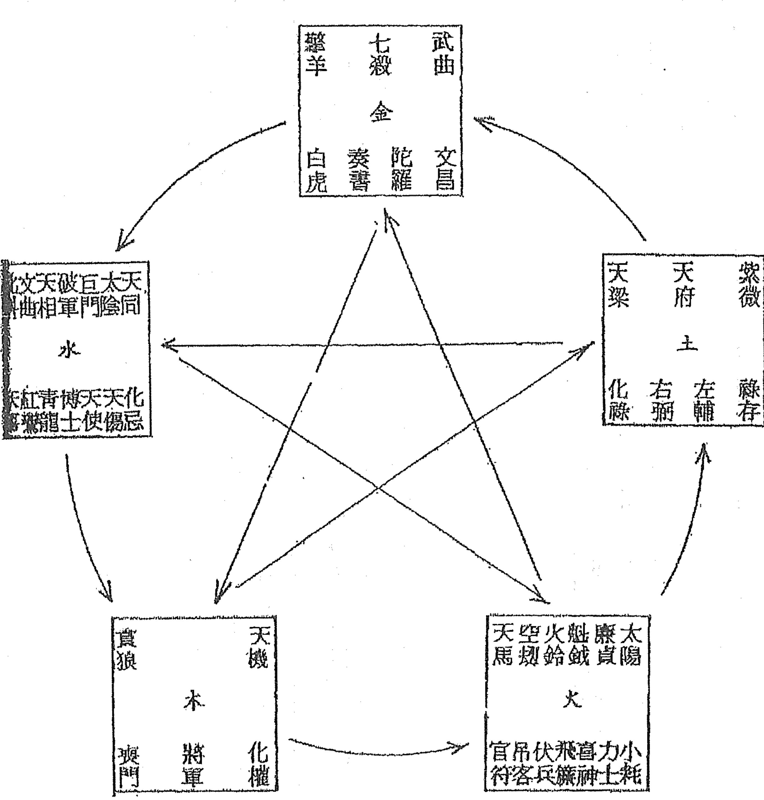

# 紫微斗数四系大辞

### 身命宮起例

（依「清代」楊一字版本）

人命皆是從「寅」上起算正月，順數到生月的月支。又再以生月之地支作「子」時，逆數至生時安「命宮」，順數至生時安「身宮」。設若正月「子」時，就「寅」宮按「身命」兩宮。「丑」時逆轉「丑」安「命宮」，順轉「卯」安「身宮」……餘「宮」都按此規則，（詳見「身命」宮表）。凡遇「閏」月，以下個月的「地支」推論。

「納音六十甲子」要背熟，「甲」年出生的人，安「命」宮在「寅」。以「甲己之年」為「丙寅」，納音為「丙寅爐中火」，即以「火局」定「紫微」。

### 十二宮起例

（不論陰陽男女俱逆轉）

- 一、命宮
- 二、兄弟宮
- 三、妻妾宮
- 四、子女宮
- 五、財帛宮
- 六、疾厄宮
- 七、遷移宮
- 八、僕役宮
- 九、官祿宮
- 十、田宅宮
- 十一、福德宮
- 十二、父母宮

### 五虎遁干起例

- 甲己之歲起丙寅。
- 乙庚之歲起戊寅。
- 丙辛之歲起庚寅。
- 丁壬之歲起壬寅。
- 戊癸之歲起甲寅。

### 南北諸星起例

紫微天機逆行旁，隔一陽武天同當。又隔一位廉貞地，空三復見紫微鄉。

天府太陰與貪狼，巨門天相及天梁。七殺空三破軍位，八星順轉細推詳。

### 文昌文曲起例

子時戌上起文昌，逆到生時是貴鄉。文曲數從辰上起，順到生時是本鄉。

### 左輔右弼起例

左輔正月起於辰，順逢生月是貴方。右弼正月戌宮尋，逆至生月便調停。

### 天魁天鉞起例

（天乙貴人）

甲戊庚牛羊，乙己鼠猴鄉。丙丁豬雞位，壬癸兔中藏。六辛逢馬虎，此是貴人方。

### 天馬起例

寅午戌人馬在申，申子辰人馬在寅。巳酉丑人馬在亥，亥卯未人馬在巳。

（驛馬，亦有由生月取天馬者）

### 祿存起例

（年祿）

甲人祿存在寅宮，乙人在卯丙戊巳。丁巳祿存停午方，庚祿居申辛祿酉，壬祿在亥癸祿子。

### 擎羊陀羅起例

祿前擎羊後陀羅，夾限逢凶禍患多。

（帝旺衰）

歲限逢之俱不利，人生遇此莫蹉跎。

### 火鈴起例

寅午戊人丑卯方，申子辰人寅戌歸。

（本生年支，亦有由時支取者）

巳酉丑人卯戌是，亥卯未人酉戌當。

### 祿權科忌起例

甲廉破武陽為伴，乙機梁紫月交侵。

丙同機昌廉貞位，丁月同機巨門尋。

戊貪月弼機為主，己武貪梁曲最真。

庚日武同相為首，辛巨陽曲昌至臨。

壬梁紫府武宿是，癸破巨陰貪狼停。

### 天空地劫起例

亥上起子順佈劫，逆回便是天空鄉。

### 天傷天使起例

命前六位是天傷，命後六位天使當。

（身宮與歲限加夾，更見惡曜多凶。）

### 太歲十二煞起例

博士力士青龍續，小耗將軍及奏書。

吉凶從此分禍福。

（陽男陰女尋祿存星逆行，陰男陽女尋祿存星順行。）

博士聰明力士權，青龍喜氣小耗錢。

病符帶疾耗退祖，伏兵官府口舌至。

飛廉喜神病符至，大耗伏兵至官府。

將軍威武奏書福，飛廉主孤喜神延。

生年坐守十二煞，方敢斷人禍福源。

### 天刑天姚起例

天刑從酉上起正月，順至本生月安之。

（論本生月）

天姚從丑上起正月，順數至本生月安之。

### 三台八座起例

三台尋左輔，將初一日加在左輔宮，順數至本生日安之。

（論本生日）

八座尋右弼，將初一日加在右弼宮，逆數至本生日安之。

### 天哭天虛起例

天哭天虛起年宮，午宮起子兩分際。哭逆巳兮虛順未，數到生年便居中。

（本生年支）

### 龍池鳳閣起例

龍池子順辰，鳳閣子逆戌。

（本生年支）

### 台輔封誥起例

台輔從午宮起子，順數至本生時安之。封誥從寅宮起子，順數至本生時安之。

（本生時支）

### 長生十二位起例

（陽男陰女順數，陰男陽女逆數。）

火局命寅起長生。木局命亥起長生。土局命申起長生。金局命巳起長生。水局命申起長生。

### 紅鸞天喜起例

卯上起子逆數之，數到當生太歲支。坐守此宮紅鸞位，對宮天喜不差移。

（本生年支）

年少婚姻喜事奇，老人必主喪其妻。三十年前為吉曜，五十歲後不相宜。

### 四飛星起例

（年支論式）

歲君前二是喪門，後二宮中吊客存。

對照喪門安白虎，吊客對照安官符。

### 斗君起例

（論流年太歲）

太歲宮中即是正，逆尋生月即停留。

又從生月宮輪子，順到生時鎮斗星。

### 天月德解神起例

（論流年歲支）

天德星自酉上起子，順數至流年太歲。

月德星自子上起子，順數至流年太歲。

解神從戌上起子，逆數至當生太歲。

| 流年太歲 | 天德 | 月德 |
|---|---|---|
| 子 | 酉 | 子 |
| 丑 | 戌 | 丑 |
| 寅 | 亥 | 寅 |
| 卯 | 子 | 卯 |
| 辰 | 丑 | 辰 |
| 巳 | 寅 | 巳 |
| 午 | 卯 | 午 |
| 未 | 辰 | 未 |
| 申 | 巳 | 申 |
| 酉 | 午 | 酉 |
| 戌 | 未 | 戌 |
| 亥 | 申 | 亥 |

| 當生太歲 | 解神 |
|---|---|
| 子 | 戌 |
| 丑 | 酉 |
| 寅 | 申 |
| 卯 | 未 |
| 辰 | 午 |
| 巳 | 巳 |
| 午 | 辰 |
| 未 | 卯 |
| 申 | 寅 |
| 酉 | 丑 |
| 戌 | 子 |
| 亥 | 亥 |

### 飛天三殺起例

（流年星）（奏書、將軍、官符）

寅午戌年飛入亥卯未宮，
巳酉丑年飛入寅午戌宮。
申子辰年飛入巳酉丑宮，
亥卯未年飛入申子辰宮。

奏書口舌禍來侵，
將軍飛入悔心驚。
官符官災終不免，
此是流年三殺星。

### 截路空亡起例

（論本生年）

甲己申酉宮，乙庚午未宮。
丙辛辰巳宮，戊癸子丑宮。
丁壬寅卯宮。

### 旬中空亡起例

（論本生年）

甲子旬中空戌亥，甲戌旬中空申酉。
甲申旬中空午未，甲午旬中空辰巳。
甲辰旬中空寅卯，甲寅旬中空子丑。

### 大限起例

陽男陰女自命前一宮起（父母宮）
陰男陽女自命後一宮起（兄弟宮）

註：「起大限」之一說，亦有自「命宮」起限之一詞。

### 小限起例

寅午戌人起辰宫，申子辰人起戌宫。巳酉丑人起未宫，亥卯未人起丑宫。

（男命皆顺数，女命皆逆数）

### 童限起例

一命二财三疾厄，四妻五福六官禄。余年一概顺流行，十五命宫看端的。

（依「果老星宗」起例）

### 命主起例

贪狼入子宫，巨门亥丑宫。禄存寅戌宫，文曲卯酉宫。

破军入年宫，廉贞申辰宫。武曲未巳宫。

（参阅「珠联璧合」一章）

注：假如「年」宫安命，寻「破军」星在何宫，即命主星也。

「左辅」随「丑」至「午」，「右弼」随「亥」至「午」。

### 身主起例

子午人火星铃星，丑未人天相星，寅申人天梁星。

辰戌人文昌星，巳亥人天机星，卯酉人天同星。

（论当生太岁）

### 金鎖鐵蛇關起例

當從戊上起子年，順數行年月逆推，日爻順數時逆轉，小兒壽夭可先知。

註：此法從「戊」上起年，順行至本生年，年上起月，逆數至本生月，月上起日，日上起子，逆數至本生時，恰遇「辰戌」一宮者死，而遇「丑未」一宮者為有救。

### 男女竹籮三限起例

法曰：同前帝皇局例，只是逆行以上。此二數逆排定，只托三方四正，「七殺、破軍」，俱皆作「竹籮三限」。若再如「巨、暗」凶星，便作三方四正定議。如果「大、小」兩限相遇，便作「大凶死限斷」。

### 定十二宮強弱

（參閱「術天機太乙金井紫微斗數」一書）

- 男命——強宮：財帛、官祿、福德、遷移、田宅。
  弱宮：子女、奴僕、兄弟、父母、疾厄。

- 女命——強宮：夫妻、子女、財帛、田宅、福德。
  弱宮：兄弟、疾厄、遷移、僕役、官祿、父母。

### 流祿流羊流陀起例

「流祿、流羊、流陀」是以「流年太歲」而言。假設「己丑」流年，它的「流祿」在「午」，「流羊」在「未」，「流陀」在「巳」。設若「甲子」生人，安「命」在「巳」，「小限」又正行入於「亥」宮。或「七殺」坐在「小限」，「擎羊」又在「卯」宮。卻是三方四正俱見「擎羊、流羊、流陀」，又見「七殺」重逢，定遭凶禍，此乃累試有驗之訣也。

### 星辰生剋制化

星曜全在於要明「生剋制化」之機，其次方以看在何宮？如「廉貞」屬火在「寅」宮，「寅」乃木鄉，正是能生「廉貞」之地。設若「武曲金星」與「廉貞火星」同宮，則「武曲」雖為財帛主，亦為無用之論，餘者做此。

- 制：
  金入火鄉
  火入水鄉
  水入土鄉
  土入木鄉
  木入金鄉。

### 六十花甲納音歌

甲子乙丑海中金
丙寅丁卯爐中火
戊辰己巳大林木
庚午辛未路旁土
壬申癸酉劍鋒金

甲戌乙亥山頭火
丙子丁丑澗下水
戊寅己卯城頭土
庚辰辛巳白蠟金
壬午癸未楊柳木

甲申乙酉泉中水
丙戌丁亥屋上土
戊子己丑霹靂火
庚寅辛卯松柏木
壬辰癸巳長流水

甲午乙未沙中金
丙申丁酉山下火
戊戌己亥平地木
庚子辛丑壁上土
壬寅癸卯金箔金

甲辰乙巳覆燈火
丙午丁未天河水
戊申己酉大驛土
庚戌辛亥釵釧金
壬子癸丑桑柘木

甲寅乙卯大溪水
丙辰丁巳沙中土
戊午己未天上火
庚申辛酉石榴木
壬戌癸亥大海水

### 六十甲子

| 甲子 | 乙丑 | 丙寅 | 丁卯 | 戊辰 | 己巳 | 庚午 | 辛未 | 壬申 | 癸酉 |
| 甲戌 | 乙亥 | 丙子 | 丁丑 | 戊寅 | 己卯 | 庚辰 | 辛巳 | 壬午 | 癸未 |
| 甲申 | 乙酉 | 丙戌 | 丁亥 | 戊子 | 己丑 | 庚寅 | 辛卯 | 壬辰 | 癸巳 |
| 甲午 | 乙未 | 丙申 | 丁酉 | 戊戌 | 己亥 | 庚子 | 辛丑 | 壬寅 | 癸卯 |
| 甲辰 | 乙巳 | 丙午 | 丁未 | 戊申 | 己酉 | 庚戌 | 辛亥 | 壬子 | 癸丑 |
| 甲寅 | 乙卯 | 丙辰 | 丁巳 | 戊午 | 己未 | 庚申 | 辛酉 | 壬戌 | 癸亥 |

| 所屬地支 | 陰陽 | 五行 | 生肖 |
| :--- | :--- | :--- | :--- |
| 子 | 陽 | 水 | 鼠 |
| 丑 | 陰 | 土 | 牛 |
| 寅 | 陽 | 木 | 虎 |
| 卯 | 陰 | 木 | 兔 |
| 辰 | 陽 | 土 | 龍 |
| 巳 | 陰 | 火 | 蛇 |
| 午 | 陽 | 火 | 馬 |
| 未 | 陰 | 土 | 羊 |
| 申 | 陽 | 金 | 猴 |
| 酉 | 陰 | 金 | 雞 |
| 戌 | 陽 | 土 | 狗 |
| 亥 | 陰 | 水 | 豬 |

一：陽年生人，男為陽男，女為陽女。
二：陰年生人，男為陰男，女為陰女。

註：如男命甲子年生，為陽男，餘類推。

| 所屬天干 | 陰陽 | 五行 |
| :--- | :--- | :--- |
| 甲 | 陽 | 木 |
| 乙 | 陰 | 木 |
| 丙 | 陽 | 火 |
| 丁 | 陰 | 火 |
| 戊 | 陽 | 土 |
| 己 | 陰 | 土 |
| 庚 | 陽 | 金 |
| 辛 | 陰 | 金 |
| 壬 | 陽 | 水 |
| 癸 | 陰 | 水 |

### 命宫身宫表

（不必依「建节」论生月）

| 生时 | 正月 | 二月 | 三月 | 四月 | 五月 | 六月 | 七月 | 八月 | 九月 | 十月 | 十一月 | 十二月 |
|---|---|---|---|---|---|---|---|---|---|---|---|---|
| 子 | 命寅 身丑 | 命卯 身寅 | 命辰 身卯 | 命巳 身辰 | 命午 身巳 | 命未 身午 | 命申 身未 | 命酉 身申 | 命戌 身酉 | 命亥 身戌 | 命子 身亥 | 命丑 身子 |
| 丑 | 命丑 身子 | 命寅 身丑 | 命卯 身寅 | 命辰 身卯 | 命巳 身辰 | 命午 身巳 | 命未 身午 | 命申 身未 | 命酉 身申 | 命戌 身酉 | 命亥 身戌 | 命子 身亥 |
| 寅 | 命子 身亥 | 命丑 身子 | 命寅 身丑 | 命卯 身寅 | 命辰 身卯 | 命巳 身辰 | 命午 身巳 | 命未 身午 | 命申 身未 | 命酉 身申 | 命戌 身酉 | 命亥 身戌 |
| 卯 | 命亥 身戌 | 命子 身亥 | 命丑 身子 | 命寅 身丑 | 命卯 身寅 | 命辰 身卯 | 命巳 身辰 | 命午 身巳 | 命未 身午 | 命申 身未 | 命酉 身申 | 命戌 身酉 |
| 辰 | 命戌 身酉 | 命亥 身戌 | 命子 身亥 | 命丑 身子 | 命寅 身丑 | 命卯 身寅 | 命辰 身卯 | 命巳 身辰 | 命午 身巳 | 命未 身午 | 命申 身未 | 命酉 身申 |
| 巳 | 命酉 身申 | 命戌 身酉 | 命亥 身戌 | 命子 身亥 | 命丑 身子 | 命寅 身丑 | 命卯 身寅 | 命辰 身卯 | 命巳 身辰 | 命午 身巳 | 命未 身午 | 命申 身未 |
| 午 | 命申 身未 | 命酉 身申 | 命戌 身酉 | 命亥 身戌 | 命子 身亥 | 命丑 身子 | 命寅 身丑 | 命卯 身寅 | 命辰 身卯 | 命巳 身辰 | 命午 身巳 | 命未 身午 |
| 未 | 命未 身午 | 命申 身未 | 命酉 身申 | 命戌 身酉 | 命亥 身戌 | 命子 身亥 | 命丑 身子 | 命寅 身丑 | 命卯 身寅 | 命辰 身卯 | 命巳 身辰 | 命午 身巳 |
| 申 | 命午 身巳 | 命未 身午 | 命申 身未 | 命酉 身申 | 命戌 身酉 | 命亥 身戌 | 命子 身亥 | 命丑 身子 | 命寅 身丑 | 命卯 身寅 | 命辰 身卯 | 命巳 身辰 |
| 酉 | 命巳 身辰 | 命午 身巳 | 命未 身午 | 命申 身未 | 命酉 身申 | 命戌 身酉 | 命亥 身戌 | 命子 身亥 | 命丑 身子 | 命寅 身丑 | 命卯 身寅 | 命辰 身卯 |
| 戌 | 命辰 身卯 | 命巳 身辰 | 命午 身巳 | 命未 身午 | 命申 身未 | 命酉 身申 | 命戌 身酉 | 命亥 身戌 | 命子 身亥 | 命丑 身子 | 命寅 身丑 | 命卯 身寅 |
| 亥 | 命卯 身寅 | 命辰 身卯 | 命巳 身辰 | 命午 身巳 | 命未 身午 | 命申 身未 | 命酉 身申 | 命戌 身酉 | 命亥 身戌 | 命子 身亥 | 命丑 身子 | 命寅 身丑 |

附註：凡閏月生人，作下月論。

### 定十二宫

（古版「父母宫」作「相貌宫」）

| 命宫 | 兄弟 | 夫妻 | 子女 | 财帛 | 疾厄 | 迁移 | 仆役 | 官禄 | 田宅 | 福德 | 父母 | 身宫 |
|---|---|---|---|---|---|---|---|---|---|---|---|---|
| 子 | 亥 | 戌 | 酉 | 申 | 未 | 午 | 巳 | 辰 | 卯 | 寅 | 丑 | 子 |
| 丑 | 子 | 亥 | 戌 | 酉 | 申 | 未 | 午 | 巳 | 辰 | 卯 | 寅 | 丑 |
| 寅 | 丑 | 子 | 亥 | 戌 | 酉 | 申 | 未 | 午 | 巳 | 辰 | 卯 | 寅 |
| 卯 | 寅 | 丑 | 子 | 亥 | 戌 | 酉 | 申 | 未 | 午 | 巳 | 辰 | 卯 |
| 辰 | 卯 | 寅 | 丑 | 子 | 亥 | 戌 | 酉 | 申 | 未 | 午 | 巳 | 辰 |
| 巳 | 辰 | 卯 | 寅 | 丑 | 子 | 亥 | 戌 | 酉 | 申 | 未 | 午 | 巳 |
| 午 | 巳 | 辰 | 卯 | 寅 | 丑 | 子 | 亥 | 戌 | 酉 | 申 | 未 | 午 |
| 未 | 午 | 巳 | 辰 | 卯 | 寅 | 丑 | 子 | 亥 | 戌 | 酉 | 申 | 未 |
| 申 | 未 | 午 | 巳 | 辰 | 卯 | 寅 | 丑 | 子 | 亥 | 戌 | 酉 | 申 |
| 酉 | 申 | 未 | 午 | 巳 | 辰 | 卯 | 寅 | 丑 | 子 | 亥 | 戌 | 酉 |
| 戌 | 酉 | 申 | 未 | 午 | 巳 | 辰 | 卯 | 寅 | 丑 | 子 | 亥 | 戌 |
| 亥 | 戌 | 酉 | 申 | 未 | 午 | 巳 | 辰 | 卯 | 寅 | 丑 | 子 | 亥 |

身宫不一定与命宫同宫。

### 十二宫五虎遁天干表

| 本生年干\十二宫 | 寅 | 卯 | 辰 | 巳 | 午 | 未 | 申 | 酉 | 戌 | 亥 | 子 | 丑 |
|---|---|---|---|---|---|---|---|---|---|---|---|---|
| 甲 | 丙寅 | 丁卯 | 戊辰 | 己巳 | 庚午 | 辛未 | 壬申 | 癸酉 | 甲戌 | 乙亥 | 丙子 | 丁丑 |
| 乙 | 戊寅 | 己卯 | 庚辰 | 辛巳 | 壬午 | 癸未 | 甲申 | 乙酉 | 丙戌 | 丁亥 | 戊子 | 己丑 |
| 丙 | 庚寅 | 辛卯 | 壬辰 | 癸巳 | 甲午 | 乙未 | 丙申 | 丁酉 | 戊戌 | 己亥 | 庚子 | 辛丑 |
| 丁 | 壬寅 | 癸卯 | 甲辰 | 乙巳 | 丙午 | 丁未 | 戊申 | 己酉 | 庚戌 | 辛亥 | 壬子 | 癸丑 |
| 戊 | 甲寅 | 乙卯 | 丙辰 | 丁巳 | 戊午 | 己未 | 庚申 | 辛酉 | 壬戌 | 癸亥 | 甲子 | 乙丑 |

### 定五行局表

| 本生年干\命宫 | 子 | 丑 | 寅 | 卯 | 辰 | 巳 | 午 | 未 | 申 | 酉 | 戌 | 亥 |
|---|---|---|---|---|---|---|---|---|---|---|---|---|
| 甲 | 水二局 | 水二局 | 火六局 | 火六局 | 木三局 | 木三局 | 土五局 | 土五局 | 金四局 | 金四局 | 火六局 | 火六局 |
| 乙 | 火六局 | 火六局 | 土五局 | 土五局 | 金四局 | 金四局 | 水二局 | 水二局 | 木三局 | 木三局 | 土五局 | 土五局 |
| 丙 | 土五局 | 土五局 | 木三局 | 木三局 | 水二局 | 水二局 | 金四局 | 金四局 | 火六局 | 火六局 | 木三局 | 木三局 |
| 丁 | 木三局 | 木三局 | 金四局 | 金四局 | 火六局 | 火六局 | 土五局 | 土五局 | 水二局 | 水二局 | 金四局 | 金四局 |
| 戊 | 金四局 | 金四局 | 火六局 | 火六局 | 土五局 | 土五局 | 木三局 | 木三局 | 水二局 | 水二局 | 火六局 | 火六局 |

### 紫微表

| 五行局 \ 生日 | 初一 | 初二 | 初三 | 初四 | 初五 | 初六 | 初七 | 初八 | 初九 | 初十 | 十一 | 十二 | 十三 | 十四 | 十五 | 十六 | 十七 | 十八 | 十九 | 二十 | 二十一 | 二十二 | 二十三 | 二十四 | 二十五 | 二十六 | 二十七 | 二十八 | 二十九 | 三十 |
| :--- | :--- | :--- | :--- | :--- | :--- | :--- | :--- | :--- | :--- | :--- | :--- | :--- | :--- | :--- | :--- | :--- | :--- | :--- | :--- | :--- | :--- | :--- | :--- | :--- | :--- | :--- | :--- | :--- | :--- | :--- |
| 水二局 | 丑 | 寅 | 寅 | 卯 | 卯 | 辰 | 辰 | 巳 | 巳 | 午 | 午 | 未 | 未 | 申 | 申 | 酉 | 酉 | 戌 | 戌 | 亥 | 亥 | 子 | 子 | 丑 | 丑 | 寅 | 寅 | 卯 | 卯 | 辰 |
| 木三局 | 辰 | 丑 | 寅 | 巳 | 寅 | 卯 | 午 | 卯 | 辰 | 未 | 辰 | 巳 | 申 | 巳 | 午 | 酉 | 午 | 未 | 戌 | 未 | 申 | 亥 | 申 | 酉 | 子 | 酉 | 戌 | 丑 | 戌 | 亥 |
| 金四局 | 亥 | 辰 | 丑 | 寅 | 子 | 巳 | 寅 | 卯 | 丑 | 午 | 卯 | 辰 | 寅 | 未 | 辰 | 巳 | 卯 | 申 | 巳 | 午 | 辰 | 酉 | 午 | 未 | 巳 | 戌 | 未 | 申 | 午 | 亥 |
| 土五局 | 午 | 亥 | 辰 | 丑 | 寅 | 未 | 子 | 巳 | 寅 | 卯 | 申 | 丑 | 午 | 卯 | 辰 | 酉 | 寅 | 未 | 辰 | 巳 | 戌 | 卯 | 申 | 巳 | 午 | 亥 | 辰 | 酉 | 午 | 未 |
| 火六局 | 酉 | 午 | 亥 | 辰 | 丑 | 寅 | 戌 | 未 | 子 | 巳 | 寅 | 卯 | 亥 | 申 | 丑 | 午 | 卯 | 辰 | 子 | 酉 | 寅 | 未 | 辰 | 巳 | 丑 | 戌 | 卯 | 申 | 巳 | 午 |

### 紫微星系表

| 紫微星系 | 紫微 | 天机 | 太阳 | 武曲 | 天同 | 廉贞 |
| :--- | :--- | :--- | :--- | :--- | :--- | :--- |
| 子 | 子 | 亥 | 酉 | 申 | 未 | 辰 |
| 丑 | 丑 | 子 | 戌 | 酉 | 申 | 巳 |
| 寅 | 寅 | 丑 | 亥 | 戌 | 酉 | 午 |
| 卯 | 卯 | 寅 | 子 | 亥 | 戌 | 未 |
| 辰 | 辰 | 卯 | 丑 | 子 | 亥 | 申 |
| 巳 | 巳 | 辰 | 寅 | 丑 | 子 | 酉 |
| 午 | 午 | 巳 | 卯 | 寅 | 丑 | 戌 |
| 未 | 未 | 午 | 辰 | 卯 | 寅 | 亥 |
| 申 | 申 | 未 | 巳 | 辰 | 卯 | 子 |
| 酉 | 酉 | 申 | 午 | 巳 | 辰 | 丑 |
| 戌 | 戌 | 酉 | 未 | 午 | 巳 | 寅 |
| 亥 | 亥 | 戌 | 申 | 未 | 午 | 卯 |

### 天府表

| 紫微星级 | 紫微 | 天府 |
| :--- | :--- | :--- |
| 子 | 子 | 辰 |
| 丑 | 丑 | 卯 |
| 寅 | 寅 | 寅 |
| 卯 | 卯 | 丑 |
| 辰 | 辰 | 子 |
| 巳 | 巳 | 亥 |
| 午 | 午 | 戌 |
| 未 | 未 | 酉 |
| 申 | 申 | 申 |
| 酉 | 酉 | 未 |
| 戌 | 戌 | 午 |
| 亥 | 亥 | 巳 |

### 天府星系表

| 星系\諸星 | 天府 | 太陰 | 貪狼 | 巨門 | 天相 | 天梁 | 七殺 | 破軍 |
|---|---|---|---|---|---|---|---|---|
| | 子 | 丑 | 寅 | 卯 | 辰 | 巳 | 午 | 未 |
| | 丑 | 寅 | 卯 | 辰 | 巳 | 午 | 未 | 申 |
| | 寅 | 卯 | 辰 | 巳 | 午 | 未 | 申 | 酉 |
| | 卯 | 辰 | 巳 | 午 | 未 | 申 | 酉 | 戌 |
| | 辰 | 巳 | 午 | 未 | 申 | 酉 | 戌 | 亥 |
| | 巳 | 午 | 未 | 申 | 酉 | 戌 | 亥 | 子 |
| | 午 | 未 | 申 | 酉 | 戌 | 亥 | 子 | 丑 |
| | 未 | 申 | 酉 | 戌 | 亥 | 子 | 丑 | 寅 |
| | 申 | 酉 | 戌 | 亥 | 子 | 丑 | 寅 | 卯 |
| | 酉 | 戌 | 亥 | 子 | 丑 | 寅 | 卯 | 辰 |
| | 戌 | 亥 | 子 | 丑 | 寅 | 卯 | 辰 | 巳 |
| | 亥 | 子 | 丑 | 寅 | 卯 | 辰 | 巳 | 午 |

### 年干星座表

| 星系/年干 | 禄存 | 擎羊 | 陀罗 | 天魁 | 天钺 | 化禄 | 化权 | 化科 | 化忌 | 天官 | 天福 |
|---|---|---|---|---|---|---|---|---|---|---|---|
| 甲 | 寅 | 卯 | 丑 | 丑 | 未 | 廉贞 | 破军 | 武曲 | 太阳 | 未 | 酉 |
| 乙 | 卯 | 辰 | 寅 | 子 | 申 | 天机 | 天梁 | 紫微 | 太阴 | 辰 | 申 |
| 丙 | 巳 | 午 | 辰 | 亥 | 酉 | 天同 | 天机 | 文昌 | 廉贞 | 巳 | 子 |
| 丁 | 午 | 未 | 巳 | 亥 | 酉 | 太阴 | 天同 | 天机 | 巨门 | 寅 | 亥 |
| 戊 | 巳 | 午 | 辰 | 丑 | 未 | 贪狼 | 太阴 | 右弼 | 天机 | 卯 | 卯 |
| 己 | 午 | 未 | 巳 | 子 | 申 | 武曲 | 贪狼 | 天梁 | 文曲 | 酉 | 寅 |
| 庚 | 申 | 酉 | 未 | 丑 | 未 | 太阳 | 武曲 | 天同 | 太相 | 亥 | 午 |
| 辛 | 酉 | 戌 | 申 | 午 | 寅 | 巨门 | 太阳 | 文曲 | 文昌 | 酉 | 巳 |
| 壬 | 亥 | 子 | 戌 | 卯 | 巳 | 天梁 | 紫微 | 天府 | 武曲 | 戌 | 午 |
| 癸 | 子 | 丑 | 亥 | 卯 | 巳 | 破军 | 巨门 | 太阴 | 贪狼 | 午 | 巳 |

### 博士十二星座表

不论男女命，寻禄存星起博士，阳男阴女顺行，阴男阳女逆行。

| 博士 | 禄存 | 力士 | 青龙 | 小耗 | 将军 | 奏书 | 飞廉 | 喜神 | 病符 | 大耗 | 伏兵 | 官府 |
|---|---|---|---|---|---|---|---|---|---|---|---|---|

### 月系星座表

「天馬」一說以「年支」起例」

| 星系/本生月 | 左輔 | 右弼 | 天刑 | 天姚 | 天馬 | 解神 | 天巫 | 天月 | 陰煞 |
|---|---|---|---|---|---|---|---|---|---|
| 正月 | 辰 | 戌 | 酉 | 丑 | 申 | 申 | 巳 | 戌 | 寅 |
| 二月 | 巳 | 酉 | 戌 | 寅 | 巳 | 申 | 申 | 巳 | 子 |
| 三月 | 午 | 申 | 亥 | 卯 | 寅 | 戌 | 寅 | 辰 | 戌 |
| 四月 | 未 | 未 | 子 | 辰 | 亥 | 戌 | 亥 | 寅 | 申 |
| 五月 | 申 | 午 | 丑 | 巳 | 申 | 巳 | 巳 | 未 | 午 |
| 六月 | 酉 | 巳 | 寅 | 午 | 巳 | 午 | 申 | 卯 | 辰 |
| 七月 | 戌 | 辰 | 卯 | 未 | 寅 | 未 | 寅 | 寅 | 寅 |
| 八月 | 亥 | 卯 | 辰 | 申 | 亥 | 申 | 亥 | 未 | 子 |
| 九月 | 子 | 寅 | 巳 | 酉 | 申 | 酉 | 辰 | 巳 | 戌 |
| 十月 | 丑 | 丑 | 午 | 戌 | 巳 | 戌 | 巳 | 午 | 申 |
| 十一月 | 寅 | 子 | 未 | 亥 | 寅 | 亥 | 未 | 寅 | 午 |
| 十二月 | 卯 | 亥 | 申 | 子 | 亥 | 子 | 申 | 亥 | 辰 |

### 日系星座表

### 安星方法

| 星系 | 諸星 | 三台 | 八座 | 恩光 | 天貴 |
|---|---|---|---|---|---|
| 安星方法 | 從左輔上起初一，順行，數到本日生。 | 從右弼上起初一，逆行，數到本日生。 | 從文昌上起初一，順行，數到本日生再退後一步。 | 從文曲上起初一，逆行，數到本日生再退後一步。 |

### 時系星座表

（火星、鈴星）明版「紫微斗數」取年支起例

| 星系 | 時系星座 | 本生星 | 本生年支 |
| :--- | :--- | :--- | :--- |
| 寅午戌 | 申子辰 | 巳酉丑 | 亥卯未 |
| 文昌 | 文曲 | 火星 | 鈴星 | 火星 | 鈴星 | 火星 | 鈴星 | 火星 | 鈴星 | 天空 | 地劫 | 台輔 | 封誥 |
| 戌 | 辰 | 丑 | 卯 | 寅 | 戌 | 卯 | 戌 | 酉 | 戌 | 亥 | 亥 | 午 | 寅 |
| 酉 | 巳 | 寅 | 辰 | 卯 | 亥 | 辰 | 亥 | 戌 | 亥 | 子 | 戌 | 未 | 卯 |
| 申 | 午 | 卯 | 巳 | 辰 | 子 | 巳 | 子 | 亥 | 子 | 丑 | 酉 | 申 | 辰 |
| 未 | 未 | 辰 | 午 | 巳 | 丑 | 午 | 丑 | 子 | 丑 | 寅 | 申 | 酉 | 巳 |
| 午 | 申 | 巳 | 未 | 午 | 寅 | 未 | 寅 | 丑 | 寅 | 卯 | 未 | 戌 | 午 |
| 巳 | 酉 | 午 | 申 | 未 | 卯 | 申 | 卯 | 寅 | 卯 | 辰 | 午 | 亥 | 未 |
| 辰 | 戌 | 未 | 酉 | 申 | 辰 | 酉 | 辰 | 卯 | 辰 | 巳 | 巳 | 子 | 申 |
| 卯 | 亥 | 申 | 戌 | 酉 | 巳 | 戌 | 巳 | 辰 | 巳 | 午 | 辰 | 丑 | 酉 |
| 寅 | 子 | 酉 | 亥 | 戌 | 午 | 亥 | 午 | 巳 | 午 | 未 | 卯 | 寅 | 戌 |
| 丑 | 丑 | 戌 | 子 | 亥 | 未 | 子 | 未 | 午 | 未 | 申 | 寅 | 卯 | 亥 |
| 子 | 寅 | 亥 | 丑 | 子 | 申 | 丑 | 申 | 未 | 申 | 酉 | 丑 | 辰 | 子 |
| 亥 | 卯 | 子 | 寅 | 丑 | 酉 | 寅 | 酉 | 申 | 酉 | 戌 | 子 | 巳 | 丑 |

### 年支星座表

由身宫起子，顺行，数至本生年支，即安天壽星。

| 星名/本生年支 | 子 | 丑 | 寅 | 卯 | 辰 | 巳 | 午 | 未 | 申 | 酉 | 戌 | 亥 |
| :--- | :--- | :--- | :--- | :--- | :--- | :--- | :--- | :--- | :--- | :--- | :--- | :--- |
| 天哭 | 午 | 巳 | 辰 | 卯 | 寅 | 丑 | 子 | 亥 | 戌 | 酉 | 申 | 未 |
| 天虚 | 午 | 未 | 申 | 酉 | 戌 | 亥 | 子 | 丑 | 寅 | 卯 | 辰 | 巳 |
| 龙池 | 辰 | 巳 | 午 | 未 | 申 | 酉 | 戌 | 亥 | 子 | 丑 | 寅 | 卯 |
| 凤阁 | 戌 | 酉 | 申 | 未 | 午 | 巳 | 辰 | 卯 | 寅 | 丑 | 子 | 亥 |
| 红鸾 | 卯 | 寅 | 丑 | 子 | 亥 | 戌 | 酉 | 申 | 未 | 午 | 巳 | 辰 |
| 天喜 | 酉 | 申 | 未 | 午 | 巳 | 辰 | 卯 | 寅 | 丑 | 子 | 亥 | 戌 |
| 孤辰 | 寅 | 寅 | 巳 | 巳 | 巳 | 申 | 申 | 申 | 亥 | 亥 | 亥 | 寅 |
| 寡宿 | 戌 | 戌 | 丑 | 丑 | 丑 | 辰 | 辰 | 辰 | 未 | 未 | 未 | 戌 |
| 破碎 | 巳 | 申 | 亥 | 寅 | 巳 | 申 | 亥 | 寅 | 巳 | 申 | 亥 | 寅 |
| 天才 | 命宫 | 父母 | 福德 | 田宅 | 官禄 | 仆役 | 迁移 | 疾厄 | 财帛 | 子女 | 夫妻 | 兄弟 |
| 天寿 | 由身宫起子，顺行，数至本生年支，即安天壽星。 | | | | | | | | | | | |

### 十二生旺库表

| 星系 | 星名 | 五行局 | 顺逆 | 长生 | 沐浴 | 冠带 | 临官 | 帝旺 | 衰 | 病 | 死 | 墓 | 绝 | 胎 | 养 |
|---|---|---|---|---|---|---|---|---|---|---|---|---|---|---|---|
| 申 | 陽男 | 水二局 | 顺 | 申 | 酉 | 戌 | 亥 | 子 | 丑 | 寅 | 卯 | 辰 | 巳 | 午 | 未 |
| 申 | 陰女 | 水二局 | 顺 | 申 | 酉 | 戌 | 亥 | 子 | 丑 | 寅 | 卯 | 辰 | 巳 | 午 | 未 |
| 未 | 陽女 | 水二局 | 逆 | 未 | 午 | 巳 | 辰 | 卯 | 寅 | 丑 | 子 | 亥 | 戌 | 酉 | 申 |
| 未 | 陰男 | 水二局 | 逆 | 未 | 午 | 巳 | 辰 | 卯 | 寅 | 丑 | 子 | 亥 | 戌 | 酉 | 申 |
| 亥 | 陽男 | 木三局 | 顺 | 亥 | 子 | 丑 | 寅 | 卯 | 辰 | 巳 | 午 | 未 | 申 | 酉 | 戌 |
| 亥 | 陰女 | 木三局 | 顺 | 亥 | 子 | 丑 | 寅 | 卯 | 辰 | 巳 | 午 | 未 | 申 | 酉 | 戌 |
| 戌 | 陽女 | 木三局 | 逆 | 戌 | 酉 | 申 | 未 | 午 | 巳 | 辰 | 卯 | 寅 | 丑 | 子 | 亥 |
| 戌 | 陰男 | 木三局 | 逆 | 戌 | 酉 | 申 | 未 | 午 | 巳 | 辰 | 卯 | 寅 | 丑 | 子 | 亥 |
| 巳 | 陽男 | 金四局 | 顺 | 巳 | 午 | 未 | 申 | 酉 | 戌 | 亥 | 子 | 丑 | 寅 | 卯 | 辰 |
| 巳 | 陰女 | 金四局 | 顺 | 巳 | 午 | 未 | 申 | 酉 | 戌 | 亥 | 子 | 丑 | 寅 | 卯 | 辰 |
| 辰 | 陽女 | 金四局 | 逆 | 辰 | 卯 | 寅 | 丑 | 子 | 亥 | 戌 | 酉 | 申 | 未 | 午 | 巳 |
| 辰 | 陰男 | 金四局 | 逆 | 辰 | 卯 | 寅 | 丑 | 子 | 亥 | 戌 | 酉 | 申 | 未 | 午 | 巳 |
| 申 | 陽男 | 土五局 | 顺 | 申 | 酉 | 戌 | 亥 | 子 | 丑 | 寅 | 卯 | 辰 | 巳 | 午 | 未 |
| 申 | 陰女 | 土五局 | 顺 | 申 | 酉 | 戌 | 亥 | 子 | 丑 | 寅 | 卯 | 辰 | 巳 | 午 | 未 |
| 未 | 陽女 | 土五局 | 逆 | 未 | 午 | 巳 | 辰 | 卯 | 寅 | 丑 | 子 | 亥 | 戌 | 酉 | 申 |
| 未 | 陰男 | 土五局 | 逆 | 未 | 午 | 巳 | 辰 | 卯 | 寅 | 丑 | 子 | 亥 | 戌 | 酉 | 申 |
| 寅 | 陽男 | 火六局 | 顺 | 寅 | 卯 | 辰 | 巳 | 午 | 未 | 申 | 酉 | 戌 | 亥 | 子 | 丑 |
| 寅 | 陰女 | 火六局 | 顺 | 寅 | 卯 | 辰 | 巳 | 午 | 未 | 申 | 酉 | 戌 | 亥 | 子 | 丑 |
| 丑 | 陽女 | 火六局 | 逆 | 丑 | 子 | 亥 | 戌 | 酉 | 申 | 未 | 午 | 巳 | 辰 | 卯 | 寅 |
| 丑 | 陰男 | 火六局 | 逆 | 丑 | 子 | 亥 | 戌 | 酉 | 申 | 未 | 午 | 巳 | 辰 | 卯 | 寅 |

### 天傷天使表

（「天傷、天使」參閱「古法歲限論式」一章）

| 星系\星名\命宮 | 子 | 丑 | 寅 | 卯 | 辰 | 巳 | 午 | 未 | 申 | 酉 | 戌 | 亥 |
| :--- | :--- | :--- | :--- | :--- | :--- | :--- | :--- | :--- | :--- | :--- | :--- | :--- |
| 天傷 | 巳 | 午 | 未 | 申 | 酉 | 戌 | 亥 | 子 | 丑 | 寅 | 卯 | 辰 |
| 天使 | 未 | 申 | 酉 | 戌 | 亥 | 子 | 丑 | 寅 | 卯 | 辰 | 巳 | 午 |

註：天傷永在僕役宮
天使永在疾厄宮

### 旬空表

| 干支 | 年 | 空 | 旬 |
|---|---|---|---|
| 甲 | 甲子 | 甲戌 | 甲申 | 甲午 | 甲辰 | 甲寅 |
| 乙 | 乙丑 | 乙亥 | 乙酉 | 乙未 | 乙巳 | 乙卯 |
| 丙 | 丙寅 | 丙子 | 丙戌 | 丙申 | 丙午 | 丙辰 |
| 丁 | 丁卯 | 丁丑 | 丁亥 | 丁酉 | 丁未 | 丁巳 |
| 戊 | 戊辰 | 戊寅 | 戊子 | 戊戌 | 戊申 | 戊午 |
| 己 | 己巳 | 己卯 | 己丑 | 己亥 | 己酉 | 己未 |
| 庚 | 庚午 | 庚辰 | 庚寅 | 庚子 | 庚戌 | 庚申 |
| 辛 | 辛未 | 辛巳 | 辛卯 | 辛丑 | 辛亥 | 辛酉 |
| 壬 | 壬申 | 壬午 | 壬辰 | 壬寅 | 壬子 | 壬戌 |
| 癸 | 癸酉 | 癸未 | 癸巳 | 癸卯 | 癸丑 | 癸亥 |

### 截路空亡表

| 星系 | 星名 | 本生年干 | 截空 |
|---|---|---|---|
| 截 | 空 | 甲 | 酉申 |
| | | 乙 | 未午 |
| | | 丙 | 巳辰 |
| | | 丁 | 卯寅 |
| | | 戊 | 丑子 |
| | | 己 | 酉申 |
| | | 庚 | 未午 |
| | | 辛 | 巳辰 |
| | | 壬 | 卯寅 |
| | | 癸 | 丑子 |

### 命主表

| 星名 | 命宫 |
|---|---|
| 貪狼 | 子 |
| 巨門 | 丑 |
| 祿存 | 寅 |
| 文曲 | 卯 |
| 廉貞 | 辰 |
| 武曲 | 巳 |
| 破軍 | 午 |
| 武曲 | 未 |
| 廉貞 | 申 |
| 文曲 | 酉 |
| 祿存 | 戌 |
| 巨門 | 亥 |

> （參閱「珠聯璧合」一章）

### 身主表

| 星名 | 本生年支 |
|---|---|
| 火星 | 子 |
| 天相 | 丑 |
| 天梁 | 寅 |
| 天同 | 卯 |
| 文昌 | 辰 |
| 天機 | 巳 |
| 火星 | 午 |
| 天相 | 未 |
| 天梁 | 申 |
| 天同 | 酉 |
| 文昌 | 戌 |
| 天機 | 亥 |

> （參閱「珠聯璧合」一章）

### 大限表

◎按古籍陽男陰女自命前一宮（父母宮）起大限，陰男陽女自命後一宮（兄弟宮）起大限。

| 宮 | 命宮 | 兄弟 | 夫妻 | 子女 | 財帛 | 疾厄 | 遷移 | 僕役 | 官祿 | 田宅 | 福德 | 父母 |
|---|---|---|---|---|---|---|---|---|---|---|---|---|
| 限 | 陰女 | 陽男 | 陰女 | 陽男 | 陰女 | 陽男 | 陰女 | 陽男 | 陰女 | 陽男 | 陰女 | 陽男 |
| 二局 | 2-11 | 112-121 | 102-111 | 92-101 | 82-91 | 72-81 | 62-71 | 52-61 | 42-51 | 32-41 | 22-31 | 2-21 |
| 三局 | 3-12 | 113-122 | 103-112 | 93-102 | 83-92 | 73-82 | 63-72 | 53-62 | 43-52 | 33-42 | 23-32 | 13-22 |
| 四局 | 4-13 | 114-123 | 104-113 | 94-103 | 84-93 | 74-83 | 64-73 | 54-63 | 44-53 | 34-43 | 24-33 | 14-23 |
| 五局 | 5-14 | 115-124 | 105-114 | 95-104 | 85-94 | 75-84 | 65-74 | 55-64 | 45-54 | 35-44 | 25-34 | 15-24 |
| 六局 | 6-15 | 116-125 | 106-115 | 96-105 | 86-95 | 76-85 | 66-75 | 56-65 | 46-55 | 36-45 | 26-35 | 16-25 |

### 小限表

（參閱「古法歲限論式」一章）

| 小限之歲 | 小限之宮 | 本生年支 | 寅午戌 | 申子辰 | 巳酉丑 | 亥卯未 |
| :--- | :--- | :--- | :--- | :--- | :--- | :--- |
| 一 | 一三 | 二五 | 三七 | 四九 | 六一 | 七三 |
| 二 | 一四 | 二六 | 三八 | 五〇 | 六二 | 七四 |
| 三 | 一五 | 二七 | 三九 | 五一 | 六三 | 七五 |
| 四 | 一六 | 二八 | 四〇 | 五二 | 六四 | 七六 |
| 五 | 一七 | 二九 | 四一 | 五三 | 六五 | 七七 |
| 六 | 一八 | 三〇 | 四二 | 五四 | 六六 | 七八 |
| 七 | 一九 | 三一 | 四三 | 五五 | 六七 | 七九 |
| 八 | 二〇 | 三二 | 四四 | 五六 | 六八 | 八〇 |
| 九 | 二一 | 三三 | 四五 | 五七 | 六九 | 八一 |
| 一〇 | 二二 | 三四 | 四六 | 五八 | 七〇 | 八二 |
| 一一 | 二三 | 三五 | 四七 | 五九 | 七一 | 八三 |
| 一二 | 二四 | 三六 | 四八 | 六〇 | 七二 | 八四 |
| 一三 | 三七 | 四九 | 六一 | 七三 | 八五 | 九七 |
| 一四 | 三八 | 五〇 | 六二 | 七四 | 八六 | 九八 |
| 一五 | 三九 | 五一 | 六三 | 七五 | 八七 | 九九 |
| 一六 | 四〇 | 五二 | 六四 | 七六 | 八八 | 一〇〇 |
| 一七 | 四一 | 五三 | 六五 | 七七 | 八九 | 一〇一 |
| 一八 | 四二 | 五四 | 六六 | 七八 | 九〇 | 一〇二 |
| 一九 | 四三 | 五五 | 六七 | 七九 | 九一 | 一〇三 |
| 二〇 | 四四 | 五六 | 六八 | 八〇 | 九二 | 一〇四 |
| 二一 | 四五 | 五七 | 六九 | 八一 | 九三 | 一〇五 |
| 二二 | 四六 | 五八 | 七〇 | 八二 | 九四 | 一〇六 |
| 二三 | 四七 | 五九 | 七一 | 八三 | 九五 | 一〇七 |
| 二四 | 四八 | 六〇 | 七二 | 八四 | 九六 | 一〇八 |
| 二五 | 四九 | 六一 | 七三 | 八五 | 九七 | 一〇九 |
| 二六 | 五〇 | 六二 | 七四 | 八六 | 九八 | 一一〇 |
| 二七 | 五一 | 六三 | 七五 | 八七 | 九九 | 一一一 |
| 二八 | 五二 | 六四 | 七六 | 八八 | 一〇〇 | 一一二 |
| 二九 | 五三 | 六五 | 七七 | 八九 | 一〇一 | 一一三 |
| 三〇 | 五四 | 六六 | 七八 | 九〇 | 一〇二 | 一一四 |
| 三一 | 五五 | 六七 | 七九 | 九一 | 一〇三 | 一一五 |
| 三二 | 五六 | 六八 | 八〇 | 九二 | 一〇四 | 一一六 |
| 三三 | 五七 | 六九 | 八一 | 九三 | 一〇五 | 一一七 |
| 三四 | 五八 | 七〇 | 八二 | 九四 | 一〇六 | 一一八 |
| 三五 | 五九 | 七一 | 八三 | 九五 | 一〇七 | 一一九 |
| 三六 | 六〇 | 七二 | 八四 | 九六 | 一〇八 | 一二〇 |
| 三七 | 六一 | 七三 | 八五 | 九七 | 一〇九 | 一二一 |
| 三八 | 六二 | 七四 | 八六 | 九八 | 一一〇 | 一二二 |
| 三九 | 六三 | 七五 | 八七 | 九九 | 一一一 | 一二三 |
| 四〇 | 六四 | 七六 | 八八 | 一〇〇 | 一一二 | 一二四 |
| 四一 | 六五 | 七七 | 八九 | 一〇一 | 一一三 | 一二五 |
| 四二 | 六六 | 七八 | 九〇 | 一〇二 | 一一四 | 一二六 |
| 四三 | 六七 | 七九 | 九一 | 一〇三 | 一一五 | 一二七 |
| 四四 | 六八 | 八〇 | 九二 | 一〇四 | 一一六 | 一二八 |
| 四五 | 六九 | 八一 | 九三 | 一〇五 | 一一七 | 一二九 |
| 四六 | 七〇 | 八二 | 九四 | 一〇六 | 一一八 | 一三〇 |
| 四七 | 七一 | 八三 | 九五 | 一〇七 | 一一九 | 一三一 |
| 四八 | 七二 | 八四 | 九六 | 一〇八 | 一二〇 | 一三二 |
| 四九 | 七三 | 八五 | 九七 | 一〇九 | 一二一 | 一三三 |
| 五〇 | 七四 | 八六 | 九八 | 一一〇 | 一二二 | 一三四 |
| 五一 | 七五 | 八七 | 九九 | 一一一 | 一二三 | 一三五 |
| 五二 | 七六 | 八八 | 一〇〇 | 一一二 | 一二四 | 一三六 |
| 五三 | 七七 | 八九 | 一〇一 | 一一三 | 一二五 | 一三七 |
| 五四 | 七八 | 九〇 | 一〇二 | 一一四 | 一二六 | 一三八 |
| 五五 | 七九 | 九一 | 一〇三 | 一一五 | 一二七 | 一三九 |
| 五六 | 八〇 | 九二 | 一〇四 | 一一六 | 一二八 | 一四〇 |
| 五七 | 八一 | 九三 | 一〇五 | 一一七 | 一二九 | 一四一 |
| 五八 | 八二 | 九四 | 一〇六 | 一一八 | 一三〇 | 一四二 |
| 五九 | 八三 | 九五 | 一〇七 | 一一九 | 一三一 | 一四三 |
| 六〇 | 八四 | 九六 | 一〇八 | 一二〇 | 一三二 | 一四四 |
| 六一 | 八五 | 九七 | 一〇九 | 一二一 | 一三三 | 一四五 |
| 六二 | 八六 | 九八 | 一一〇 | 一二二 | 一三四 | 一四六 |
| 六三 | 八七 | 九九 | 一一一 | 一二三 | 一三五 | 一四七 |
| 六四 | 八八 | 一〇〇 | 一一二 | 一二四 | 一三六 | 一四八 |
| 六五 | 八九 | 一〇一 | 一一三 | 一二五 | 一三七 | 一四九 |
| 六六 | 九〇 | 一〇二 | 一一四 | 一二六 | 一三八 | 一五〇 |
| 六七 | 九一 | 一〇三 | 一一五 | 一二七 | 一三九 | 一五一 |
| 六八 | 九二 | 一〇四 | 一一六 | 一二八 | 一四〇 | 一五二 |
| 六九 | 九三 | 一〇五 | 一一七 | 一二九 | 一四一 | 一五三 |
| 七〇 | 九四 | 一〇六 | 一一八 | 一三〇 | 一四二 | 一五四 |
| 七一 | 九五 | 一〇七 | 一一九 | 一三一 | 一四三 | 一五五 |
| 七二 | 九六 | 一〇八 | 一二〇 | 一三二 | 一四四 | 一五六 |
| 七三 | 九七 | 一〇九 | 一二一 | 一三三 | 一四五 | 一五七 |
| 七四 | 九八 | 一一〇 | 一二二 | 一三四 | 一四六 | 一五八 |
| 七五 | 九九 | 一一一 | 一二三 | 一三五 | 一四七 | 一五九 |
| 七六 | 一〇〇 | 一一二 | 一二四 | 一三六 | 一四八 | 一六〇 |
| 七七 | 一〇一 | 一一三 | 一二五 | 一三七 | 一四九 | 一六一 |
| 七八 | 一〇二 | 一一四 | 一二六 | 一三八 | 一五〇 | 一六二 |
| 七九 | 一〇三 | 一一五 | 一二七 | 一三九 | 一五一 | 一六三 |
| 八〇 | 一〇四 | 一一六 | 一二八 | 一四〇 | 一五二 | 一六四 |
| 八一 | 一〇五 | 一一七 | 一二九 | 一四一 | 一五三 | 一六五 |
| 八二 | 一〇六 | 一一八 | 一三〇 | 一四二 | 一五四 | 一六六 |
| 八三 | 一〇七 | 一一九 | 一三一 | 一四三 | 一五五 | 一六七 |
| 八四 | 一〇八 | 一二〇 | 一三二 | 一四四 | 一五六 | 一六八 |
| 八五 | 一〇九 | 一二一 | 一三三 | 一四五 | 一五七 | 一六九 |
| 八六 | 一一〇 | 一二二 | 一三四 | 一四六 | 一五八 | 一七〇 |
| 八七 | 一一一 | 一二三 | 一三五 | 一四七 | 一五九 | 一七一 |
| 八八 | 一一二 | 一二四 | 一三六 | 一四八 | 一六〇 | 一七二 |
| 八九 | 一一三 | 一二五 | 一三七 | 一四九 | 一六一 | 一七三 |
| 九〇 | 一一四 | 一二六 | 一三八 | 一五〇 | 一六二 | 一七四 |
| 九一 | 一一五 | 一二七 | 一三九 | 一五一 | 一六三 | 一七五 |
| 九二 | 一一六 | 一二八 | 一四〇 | 一五二 | 一六四 | 一七六 |
| 九三 | 一一七 | 一二九 | 一四一 | 一五三 | 一六五 | 一七七 |
| 九四 | 一一八 | 一三〇 | 一四二 | 一五四 | 一六六 | 一七八 |
| 九五 | 一一九 | 一三一 | 一四三 | 一五五 | 一六七 | 一七九 |
| 九六 | 一二〇 | 一三二 | 一四四 | 一五六 | 一六八 | 一八〇 |
| 九七 | 一二一 | 一三三 | 一四五 | 一五七 | 一六九 | 一八一 |
| 九八 | 一二二 | 一三四 | 一四六 | 一五八 | 一七〇 | 一八二 |
| 九九 | 一二三 | 一三五 | 一四七 | 一五九 | 一七一 | 一八三 |
| 一〇〇 | 一二四 | 一三六 | 一四八 | 一六〇 | 一七二 | 一八四 |
| 一〇一 | 一二五 | 一三七 | 一四九 | 一六一 | 一七三 | 一八五 |
| 一〇二 | 一二六 | 一三八 | 一五〇 | 一六二 | 一七四 | 一八六 |
| 一〇三 | 一二七 | 一三九 | 一五一 | 一六三 | 一七五 | 一八七 |
| 一〇四 | 一二八 | 一四〇 | 一五二 | 一六四 | 一七六 | 一八八 |
| 一〇五 | 一二九 | 一四一 | 一五三 | 一六五 | 一七七 | 一八九 |
| 一〇六 | 一三〇 | 一四二 | 一五四 | 一六六 | 一七八 | 一九〇 |
| 一〇七 | 一三一 | 一四三 | 一五五 | 一六七 | 一七九 | 一九一 |
| 一〇八 | 一三二 | 一四四 | 一五六 | 一六八 | 一八〇 | 一九二 |
| 一〇九 | 一三三 | 一四五 | 一五七 | 一六九 | 一八一 | 一九三 |
| 一一〇 | 一三四 | 一四六 | 一五八 | 一七〇 | 一八二 | 一九四 |
| 一一一 | 一三五 | 一四七 | 一五九 | 一七一 | 一八三 | 一九五 |
| 一一二 | 一三六 | 一四八 | 一六〇 | 一七二 | 一八四 | 一九六 |
| 一一三 | 一三七 | 一四九 | 一六一 | 一七三 | 一八五 | 一九七 |
| 一一四 | 一三八 | 一五〇 | 一六二 | 一七四 | 一八六 | 一九八 |
| 一一五 | 一三九 | 一五一 | 一六三 | 一七五 | 一八七 | 一九九 |
| 一一六 | 一四〇 | 一五二 | 一六四 | 一七六 | 一八八 | 二〇〇 |
| 一一七 | 一四一 | 一五三 | 一六五 | 一七七 | 一八九 | 二〇一 |
| 一一八 | 一四二 | 一五四 | 一六六 | 一七八 | 一九〇 | 二〇二 |
| 一一九 | 一四三 | 一五五 | 一六七 | 一七九 | 一九一 | 二〇三 |
| 一二〇 | 一四四 | 一五六 | 一六八 | 一八〇 | 一九二 | 二〇四 |
| 一二一 | 一四五 | 一五七 | 一六九 | 一八一 | 一九三 | 二〇五 |
| 一二二 | 一四六 | 一五八 | 一七〇 | 一八二 | 一九四 | 二〇六 |
| 一二三 | 一四七 | 一五九 | 一七一 | 一八三 | 一九五 | 二〇七 |
| 一二四 | 一四八 | 一六〇 | 一七二 | 一八四 | 一九六 | 二〇八 |
| 一二五 | 一四九 | 一六一 | 一七三 | 一八五 | 一九七 | 二〇九 |
| 一二六 | 一五〇 | 一六二 | 一七四 | 一八六 | 一九八 | 二一〇 |
| 一二七 | 一五一 | 一六三 | 一七五 | 一八七 | 一九九 | 二一一 |
| 一二八 | 一五二 | 一六四 | 一七六 | 一八八 | 二〇〇 | 二一二 |
| 一二九 | 一五三 | 一六五 | 一七七 | 一八九 | 二〇一 | 二一三 |
| 一三〇 | 一五四 | 一六六 | 一七八 | 一九〇 | 二〇二 | 二一四 |
| 一三一 | 一五五 | 一六七 | 一七九 | 一九一 | 二〇三 | 二一五 |
| 一三二 | 一五六 | 一六八 | 一八〇 | 一九二 | 二〇四 | 二一六 |
| 一三三 | 一五七 | 一六九 | 一八一 | 一九三 | 二〇五 | 二一七 |
| 一三四 | 一五八 | 一七〇 | 一八二 | 一九四 | 二〇六 | 二一八 |
| 一三五 | 一五九 | 一七一 | 一八三 | 一九五 | 二〇七 | 二一九 |
| 一三六 | 一六〇 | 一七二 | 一八四 | 一九六 | 二〇八 | 二二〇 |
| 一三七 | 一六一 | 一七三 | 一八五 | 一九七 | 二〇九 | 二二一 |
| 一三八 | 一六二 | 一七四 | 一八六 | 一九八 | 二一〇 | 二二二 |
| 一三九 | 一六三 | 一七五 | 一八七 | 一九九 | 二一一 | 二二三 |
| 一四〇 | 一六四 | 一七六 | 一八八 | 二〇〇 | 二一二 | 二二四 |
| 一四一 | 一六五 | 一七七 | 一八九 | 二〇一 | 二一三 | 二二五 |
| 一四二 | 一六六 | 一七八 | 一九〇 | 二〇二 | 二一四 | 二二六 |
| 一四三 | 一六七 | 一七九 | 一九一 | 二〇三 | 二一五 | 二二七 |
| 一四四 | 一六八 | 一八〇 | 一九二 | 二〇四 | 二一六 | 二二八 |
| 一四五 | 一六九 | 一八一 | 一九三 | 二〇五 | 二一七 | 二二九 |
| 一四六 | 一七〇 | 一八二 | 一九四 | 二〇六 | 二一八 | 二三〇 |
| 一四七 | 一七一 | 一八三 | 一九五 | 二〇七 | 二一九 | 二三一 |
| 一四八 | 一七二 | 一八四 | 一九六 | 二〇八 | 二二〇 | 二三二 |
| 一四九 | 一七三 | 一八五 | 一九七 | 二〇九 | 二二一 | 二三三 |
| 一五〇 | 一七四 | 一八六 | 一九八 | 二一〇 | 二二二 | 二三四 |
| 一五一 | 一七五 | 一八七 | 一九九 | 二一一 | 二二三 | 二三五 |
| 一五二 | 一七六 | 一八八 | 二〇〇 | 二一二 | 二二四 | 二三六 |
| 一五三 | 一七七 | 一八九 | 二〇一 | 二一三 | 二二五 | 二三七 |
| 一五四 | 一七八 | 一九〇 | 二〇二 | 二一四 | 二二六 | 二三八 |
| 一五五 | 一七九 | 一九一 | 二〇三 | 二一五 | 二二七 | 二三九 |
| 一五六 | 一八〇 | 一九二 | 二〇四 | 二一六 | 二二八 | 二四〇 |
| 一五七 | 一八一 | 一九三 | 二〇五 | 二一七 | 二二九 | 二四一 |
| 一五八 | 一八二 | 一九四 | 二〇六 | 二一八 | 二三〇 | 二四二 |
| 一五九 | 一八三 | 一九五 | 二〇七 | 二一九 | 二三一 | 二四三 |
| 一六〇 | 一八四 | 一九六 | 二〇八 | 二二〇 | 二三二 | 二四四 |
| 一六一 | 一八五 | 一九七 | 二〇九 | 二二一 | 二三三 | 二四五 |
| 一六二 | 一八六 | 一九八 | 二一〇 | 二二二 | 二三四 | 二四六 |
| 一六三 | 一八七 | 一九九 | 二一一 | 二二三 | 二三五 | 二四七 |
| 一六四 | 一八八 | 二〇〇 | 二一二 | 二二四 | 二三六 | 二四八 |
| 一六五 | 一八九 | 二〇一 | 二一三 | 二二五 | 二三七 | 二四九 |
| 一六六 | 一九〇 | 二〇二 | 二一四 | 二二六 | 二三八 | 二五〇 |
| 一六七 | 一九一 | 二〇三 | 二一五 | 二二七 | 二三九 | 二五一 |
| 一六八 | 一九二 | 二〇四 | 二一六 | 二二八 | 二四〇 | 二五二 |
| 一六九 | 一九三 | 二〇五 | 二一七 | 二二九 | 二四一 | 二五三 |
| 一七〇 | 一九四 | 二〇六 | 二一八 | 二三〇 | 二四二 | 二五四 |
| 一七一 | 一九五 | 二〇七 | 二一九 | 二三一 | 二四三 | 二五五 |
| 一七二 | 一九六 | 二〇八 | 二二〇 | 二三二 | 二四四 | 二五六 |
| 一七三 | 一九七 | 二〇九 | 二二一 | 二三三 | 二四五 | 二五七 |
| 一七四 | 一九八 | 二一〇 | 二二二 | 二三四 | 二四六 | 二五八 |
| 一七五 | 一九九 | 二一一 | 二二三 | 二三五 | 二四七 | 二五九 |
| 一七六 | 二〇〇 | 二一二 | 二二四 | 二三六 | 二四八 | 二六〇 |
| 一七七 | 二〇一 | 二一三 | 二二五 | 二三七 | 二四九 | 二六一 |
| 一七八 | 二〇二 | 二一四 | 二二六 | 二三八 | 二五〇 | 二六二 |
| 一七九 | 二〇三 | 二一五 | 二二七 | 二三九 | 二五一 | 二六三 |
| 一八〇 | 二〇四 | 二一六 | 二二八 | 二四〇 | 二五二 | 二六四 |
| 一八一 | 二〇五 | 二一七 | 二二九 | 二四一 | 二五三 | 二六五 |
| 一八二 | 二〇六 | 二一八 | 二三〇 | 二四二 | 二五四 | 二六六 |
| 一八三 | 二〇七 | 二一九 | 二三一 | 二四三 | 二五五 | 二六七 |
| 一八四 | 二〇八 | 二二〇 | 二三二 | 二四四 | 二五六 | 二六八 |
| 一八五 | 二〇九 | 二二一 | 二三三 | 二四五 | 二五七 | 二六九 |
| 一八六 | 二一〇 | 二二二 | 二三四 | 二四六 | 二五八 | 二七〇 |
| 一八七 | 二一一 | 二二三 | 二三五 | 二四七 | 二五九 | 二七一 |
| 一八八 | 二一二 | 二二四 | 二三六 | 二四八 | 二六〇 | 二七二 |
| 一八九 | 二一三 | 二二五 | 二三七 | 二四九 | 二六一 | 二七三 |
| 一九〇 | 二一四 | 二二六 | 二三八 | 二五〇 | 二六二 | 二七四 |
| 一九一 | 二一五 | 二二七 | 二三九 | 二五一 | 二六三 | 二七五 |
| 一九二 | 二一六 | 二二八 | 二四〇 | 二五二 | 二六四 | 二七六 |
| 一九三 | 二一七 | 二二九 | 二四一 | 二五三 | 二六五 | 二七七 |
| 一九四 | 二一八 | 二三〇 | 二四二 | 二五四 | 二六六 | 二七八 |
| 一九五 | 二一九 | 二三一 | 二四三 | 二五五 | 二六七 | 二七九 |
| 一九六 | 二二〇 | 二三二 | 二四四 | 二五六 | 二六八 | 二八〇 |
| 一九七 | 二二一 | 二三三 | 二四五 | 二五七 | 二六九 | 二八一 |
| 一九八 | 二二二 | 二三四 | 二四六 | 二五八 | 二七〇 | 二八二 |
| 一九九 | 二二三 | 二三五 | 二四七 | 二五九 | 二七一 | 二八三 |
| 二〇〇 | 二二四 | 二三六 | 二四八 | 二六〇 | 二七二 | 二八四 |
| 二〇一 | 二二五 | 二三七 | 二四九 | 二六一 | 二七三 | 二八五 |
| 二〇二 | 二二六 | 二三八 | 二五〇 | 二六二 | 二七四 | 二八六 |
| 二〇三 | 二二七 | 二三九 | 二五一 | 二六三 | 二七五 | 二八七 |
| 二〇四 | 二二八 | 二四〇 | 二五二 | 二六四 | 二七六 | 二八八 |
| 二〇五 | 二二九 | 二四一 | 二五三 | 二六五 | 二七七 | 二八九 |
| 二〇六 | 二三〇 | 二四二 | 二五四 | 二六六 | 二七八 | 二九〇 |
| 二〇七 | 二三一 | 二四三 | 二五五 | 二六七 | 二七九 | 二九一 |
| 二〇八 | 二三二 | 二四四 | 二五六 | 二六八 | 二八〇 | 二九二 |
| 二〇九 | 二三三 | 二四五 | 二五七 | 二六九 | 二八一 | 二九三 |
| 二一〇 | 二三四 | 二四六 | 二五八 | 二七〇 | 二八二 | 二九四 |
| 二一一 | 二三五 | 二四七 | 二五九 | 二七一 | 二八三 | 二九五 |
| 二一二 | 二三六 | 二四八 | 二六〇 | 二七二 | 二八四 | 二九六 |
| 二一三 | 二三七 | 二四九 | 二六一 | 二七三 | 二八五 | 二九七 |
| 二一四 | 二三八 | 二五〇 | 二六二 | 二七四 | 二八六 | 二九八 |
| 二一五 | 二三九 | 二五一 | 二六三 | 二七五 | 二八七 | 二九九 |
| 二一六 | 二四〇 | 二五二 | 二六四 | 二七六 | 二八八 | 三〇〇 |
| 二一七 | 二四一 | 二五三 | 二六五 | 二七七 | 二八九 | 三〇一 |
| 二一八 | 二四二 | 二五四 | 二六六 | 二七八 | 二九〇 | 三〇二 |
| 二一九 | 二四三 | 二五五 | 二六七 | 二七九 | 二九一 | 三〇三 |
| 二二〇 | 二四四 | 二五六 | 二六八 | 二八〇 | 二九二 | 三〇四 |
| 二二一 | 二四五 | 二五七 | 二六九 | 二八一 | 二九三 | 三〇五 |
| 二二二 | 二四六 | 二五八 | 二七〇 | 二八二 | 二九四 | 三〇六 |
| 二二三 | 二四七 | 二五九 | 二七一 | 二八三 | 二九五 | 三〇七 |
| 二二四 | 二四八 | 二六〇 | 二七二 | 二八四 | 二九六 | 三〇八 |
| 二二五 | 二四九 | 二六一 | 二七三 | 二八五 | 二九七 | 三〇九 |
| 二二六 | 二五〇 | 二六二 | 二七四 | 二八六 | 二九八 | 三一〇 |
| 二二七 | 二五一 | 二六三 | 二七五 | 二八七 | 二九九 | 三一一 |
| 二二八 | 二五二 | 二六四 | 二七六 | 二八八 | 三〇〇 | 三一二 |
| 二二九 | 二五三 | 二六五 | 二七七 | 二八九 | 三〇一 | 三一三 |
| 二三〇 | 二五四 | 二六六 | 二七八 | 二九〇 | 三〇二 | 三一四 |
| 二三一 | 二五五 | 二六七 | 二七九 | 二九一 | 三〇三 | 三一五 |
| 二三二 | 二五六 | 二六八 | 二八〇 | 二九二 | 三〇四 | 三一六 |
| 二三三 | 二五七 | 二六九 | 二八一 | 二九三 | 三〇五 | 三一七 |
| 二三四 | 二五八 | 二七〇 | 二八二 | 二九四 | 三〇六 | 三一八 |
| 二三五 | 二五九 | 二七一 | 二八三 | 二九五 | 三〇七 | 三一九 |
| 二三六 | 二六〇 | 二七二 | 二八四 | 二九六 | 三〇八 | 三二〇 |
| 二三七 | 二六一 | 二七三 | 二八五 | 二九七 | 三〇九 | 三二一 |
| 二三八 | 二六二 | 二七四 | 二八六 | 二九八 | 三一〇 | 三二二 |
| 二三九 | 二六三 | 二七五 | 二八七 | 二九九 | 三一一 | 三二三 |
| 二四〇 | 二六四 | 二七六 | 二八八 | 三〇〇 | 三一二 | 三二四 |
| 二四一 | 二六五 | 二七七 | 二八九 | 三〇一 | 三一三 | 三二五 |
| 二四二 | 二六六 | 二七八 | 二九〇 | 三〇二 | 三一四 | 三二六 |
| 二四三 | 二六七 | 二七九 | 二九一 | 三〇三 | 三一五 | 三二七 |
| 二四四 | 二六八 | 二八〇 | 二九二 | 三〇四 | 三一六 | 三二八 |
| 二四五 | 二六九 | 二八一 | 二九三 | 三〇五 | 三一七 | 三二九 |
| 二四六 | 二七〇 | 二八二 | 二九四 | 三〇六 | 三一八 | 三三〇 |
| 二四七 | 二七一 | 二八三 | 二九五 | 三〇七 | 三一九 | 三三一 |
| 二四八 | 二七二 | 二八四 | 二九六 | 三〇八 | 三二〇 | 三三二 |
| 二四九 | 二七三 | 二八五 | 二九七 | 三〇九 | 三二一 | 三三三 |
| 二五〇 | 二七四 | 二八六 | 二九八 | 三一〇 | 三二二 | 三三四 |
| 二五一 | 二七五 | 二八七 | 二九九 | 三一一 | 三二三 | 三三五 |
| 二五二 | 二七六 | 二八八 | 三〇〇 | 三一二 | 三二四 | 三三六 |
| 二五三 | 二七七 | 二八九 | 三〇一 | 三一三 | 三二五 | 三三七 |
| 二五四 | 二七八 | 二九〇 | 三〇二 | 三一四 | 三二六 | 三三八 |
| 二五五 | 二七九 | 二九一 | 三〇三 | 三一五 | 三二七 | 三三九 |
| 二五六 | 二八〇 | 二九二 | 三〇四 | 三一六 | 三二八 | 三四〇 |
| 二五七 | 二八一 | 二九三 | 三〇五 | 三一七 | 三二九 | 三四一 |
| 二五八 | 二八二 | 二九四 | 三〇六 | 三一八 | 三三〇 | 三四二 |
| 二五九 | 二八三 | 二九五 | 三〇七 | 三一九 | 三三一 | 三四三 |
| 二六〇 | 二八四 | 二九六 | 三〇八 | 三二〇 | 三三二 | 三四四 |
| 二六一 | 二八五 | 二九七 | 三〇九 | 三二一 | 三三三 | 三四五 |
| 二六二 | 二八六 | 二九八 | 三一〇 | 三二二 | 三三四 | 三四六 |
| 二六三 | 二八七 | 二九九 | 三一一 | 三二三 | 三三五 | 三四七 |
| 二六四 | 二八八 | 三〇〇 | 三一二 | 三二四 | 三三六 | 三四八 |
| 二六五 | 二八九 | 三〇一 | 三一三 | 三二五 | 三三七 | 三四九 |
| 二六六 | 二九〇 | 三〇二 | 三一四 | 三二六 | 三三八 | 三五〇 |
| 二六七 | 二九一 | 三〇三 | 三一五 | 三二七 | 三三九 | 三五一 |
| 二六八 | 二九二 | 三〇四 | 三一六 | 三二八 | 三四〇 | 三五二 |
| 二六九 | 二九三 | 三〇五 | 三一七 | 三二九 | 三四一 | 三五三 |
| 二七〇 | 二九四 | 三〇六 | 三一八 | 三三〇 | 三四二 | 三五四 |
| 二七一 | 二九五 | 三〇七 | 三一九 | 三三一 | 三四三 | 三五五 |
| 二七二 | 二九六 | 三〇八 | 三二〇 | 三三二 | 三四四 | 三五六 |
| 二七三 | 二九七 | 三〇九 | 三二一 | 三三三 | 三四五 | 三五七 |
| 二七四 | 二九八 | 三一〇 | 三二二 | 三三四 | 三四六 | 三五八 |
| 二七五 | 二九九 | 三一一 | 三二三 | 三三五 | 三四七 | 三五九 |
| 二七六 | 三〇〇 | 三一二 | 三二四 | 三三六 | 三四八 | 三六〇 |
| 二七七 | 三〇一 | 三一三 | 三二五 | 三三七 | 三四九 | 三六一 |
| 二七八 | 三〇二 | 三一四 | 三二六 | 三三八 | 三五〇 | 三六二 |
| 二七九 | 三〇三 | 三一五 | 三二七 | 三三九 | 三五一 | 三六三 |
| 二八〇 | 三〇四 | 三一六 | 三二八 | 三四〇 | 三五二 | 三六四 |
| 二八一 | 三〇五 | 三一七 | 三二九 | 三四一 | 三五三 | 三六五 |
| 二八二 | 三〇六 | 三一八 | 三三〇 | 三四二 | 三五四 | 三六六 |
| 二八三 | 三〇七 | 三一九 | 三三一 | 三四三 | 三五五 | 三六七 |
| 二八四 | 三〇八 | 三二〇 | 三三二 | 三四四 | 三五六 | 三六八 |
| 二八五 | 三〇九 | 三二一 | 三三三 | 三四五 | 三五七 | 三六九 |
| 二八六 | 三一〇 | 三二二 | 三三四 | 三四六 | 三五八 | 三七〇 |
| 二八七 | 三一一 | 三二三 | 三三五 | 三四七 | 三五九 | 三七一 |
| 二八八 | 三一二 | 三二四 | 三三六 | 三四八 | 三六〇 | 三七二 |
| 二八九 | 三一三 | 三二五 | 三三七 | 三四九 | 三六一 | 三七三 |
| 二九〇 | 三一四 | 三二六 | 三三八 | 三五〇 | 三六二 | 三七四 |
| 二九一 | 三一五 | 三二七 | 三三九 | 三五一 | 三六三 | 三七五 |
| 二九二 | 三一六 | 三二八 | 三四〇 | 三五二 | 三六四 | 三七六 |
| 二九三 | 三一七 | 三二九 | 三四一 | 三五三 | 三六五 | 三七七 |
| 二九四 | 三一八 | 三三〇 | 三四二 | 三五四 | 三六六 | 三七八 |
| 二九五 | 三一九 | 三三一 | 三四三 | 三五五 | 三六七 | 三七九 |
| 二九六 | 三二〇 | 三三二 | 三四四 | 三五六 | 三六八 | 三八〇 |
| 二九七 | 三二一 | 三三三 | 三四五 | 三五七 | 三六九 | 三八一 |
| 二九八 | 三二二 | 三三四 | 三四六 | 三五八 | 三七〇 | 三八二 |
| 二九九 | 三二三 | 三三五 | 三四七 | 三五九 | 三七一 | 三八三 |
| 三〇〇 | 三二四 | 三三六 | 三四八 | 三六〇 | 三七二 | 三八四 |
| 三〇一 | 三二五 | 三三七 | 三四九 | 三六一 | 三七三 | 三八五 |
| 三〇二 | 三二六 | 三三八 | 三五〇 | 三六二 | 三七四 | 三八六 |
| 三〇三 | 三二七 | 三三九 | 三五一 | 三六三 | 三七五 | 三八七 |
| 三〇四 | 三二八 | 三四〇 | 三五二 | 三六四 | 三七六 | 三八八 |
| 三〇五 | 三二九 | 三四一 | 三五三 | 三六五 | 三七七 | 三八九 |
| 三〇六 | 三三〇 | 三四二 | 三五四 | 三六六 | 三七八 | 三九〇 |
| 三〇七 | 三三一 | 三四三 | 三五五 | 三六七 | 三七九 | 三九一 |
| 三〇八 | 三三二 | 三四四 | 三五六 | 三六八 | 三八〇 | 三九二 |
| 三〇九 | 三三三 | 三四五 | 三五七 | 三六九 | 三八一 | 三九三 |
| 三一〇 | 三三四 | 三四六 | 三五八 | 三七〇 | 三八二 | 三九四 |
| 三一一 | 三三五 | 三四七 | 三五九 | 三七一 | 三八三 | 三九五 |
| 三一二 | 三三六 | 三四八 | 三六〇 | 三七二 | 三八四 | 三九六 |
| 三一三 | 三三七 | 三四九 | 三六一 | 三七三 | 三八五 | 三九七 |
| 三一四 | 三三八 | 三五〇 | 三六二 | 三七四 | 三八六 | 三九八 |
| 三一五 | 三三九 | 三五一 | 三六三 | 三七五 | 三八七 | 三九九 |
| 三一六 | 三四〇 | 三五二 | 三六四 | 三七六 | 三八八 | 四〇〇 |
| 三一七 | 三四一 | 三五三 | 三六五 | 三七七 | 三八九 | 四〇一 |
| 三一八 | 三四二 | 三五四 | 三六六 | 三七八 | 三九〇 | 四〇二 |
| 三一九 | 三四三 | 三五五 | 三六七 | 三七九 | 三九一 | 四〇三 |
| 三二〇 | 三四四 | 三五六 | 三六八 | 三八〇 | 三九二 | 四〇四 |
| 三二一 | 三四五 | 三五七 | 三六九 | 三八一 | 三九三 | 四〇五 |
| 三二二 | 三四六 | 三五八 | 三七〇 | 三八二 | 三九四 | 四〇六 |
| 三二三 | 三四七 | 三五九 | 三七一 | 三八三 | 三九五 | 四〇七 |
| 三二四 | 三四八 | 三六〇 | 三七二 | 三八四 | 三九六 | 四〇八 |
| 三二五 | 三四九 | 三六一 | 三七三 | 三八五 | 三九七 | 四〇九 |
| 三二六 | 三五〇 | 三六二 | 三七四 | 三八六 | 三九八 | 四一〇 |
| 三二七 | 三五一 | 三六三 | 三七五 | 三八七 | 三九九 | 四一一 |
| 三二八 | 三五二 | 三六四 | 三七六 | 三八八 | 四〇〇 | 四一二 |
| 三二九 | 三五三 | 三六五 | 三七七 | 三八九 | 四〇一 | 四一三 |
| 三三〇 | 三五四 | 三六六 | 三七八 | 三九〇 | 四〇二 | 四一四 |
| 三三一 | 三五五 | 三六七 | 三七九 | 三九一 | 四〇三 | 四一五 |
| 三三二 | 三五六 | 三六八 | 三八〇 | 三九二 | 四〇四 | 四一六 |
| 三三三 | 三五七 | 三六九 | 三八一 | 三九三 | 四〇五 | 四一七 |
| 三三四 | 三五八 | 三七〇 | 三八二 | 三九四 | 四〇六 | 四一八 |
| 三三五 | 三五九 | 三七一 | 三八三 | 三九五 | 四〇七 | 四一九 |
| 三三六 | 三六〇 | 三七二 | 三八四 | 三九六 | 四〇八 | 四二〇 |
| 三三七 | 三六一 | 三七三 | 三八五 | 三九七 | 四〇九 | 四二一 |
| 三三八 | 三六二 | 三七四 | 三八六 | 三九八 | 四一〇 | 四二二 |
| 三三九 | 三六三 | 三七五 | 三八七 | 三九九 | 四一一 | 四二三 |
| 三四〇 | 三六四 | 三七六 | 三八八 | 四〇〇 | 四一二 | 四二四 |
| 三四一 | 三六五 | 三七七 | 三八九 | 四〇一 | 四一三 | 四二五 |
| 三四二 | 三六六 | 三七八 | 三九〇 | 四〇二 | 四一四 | 四二六 |
| 三四三 | 三六七 | 三七九 | 三九一 | 四〇三 | 四一五 | 四二七 |
| 三四四 | 三六八 | 三八〇 | 三九二 | 四〇四 | 四一六 | 四二八 |
| 三四五 | 三六九 | 三八一 | 三九三 | 四〇五 | 四一七 | 四二九 |
| 三四六 | 三七〇 | 三八二 | 三九四 | 四〇六 | 四一八 | 四三〇 |
| 三四七 | 三七一 | 三八三 | 三九五 | 四〇七 | 四一九 | 四三一 |
| 三四八 | 三七二 | 三八四 | 三九六 | 四〇八 | 四二〇 | 四三二 |
| 三四九 | 三七三 | 三八五 | 三九七 | 四〇九 | 四二一 | 四三三 |
| 三五〇 | 三七四 | 三八六 | 三九八 | 四一〇 | 四二二 | 四三四 |
| 三五一 | 三七五 | 三八七 | 三九九 | 四一一 | 四二三 | 四三五 |
| 三五二 | 三七六 | 三八八 | 四〇〇 | 四一二 | 四二四 | 四三六 |
| 三五三 | 三七七 | 三八九 | 四〇一 | 四一三 | 四二五 | 四三七 |
| 三五四 | 三七八 | 三九〇 | 四〇二 | 四一四 | 四二六 | 四三八 |
| 三五五 | 三七九 | 三九一 | 四〇三 | 四一五 | 四二七 | 四三九 |
| 三五六 | 三八〇 | 三九二 | 四〇四 | 四一六 | 四二八 | 四四〇 |
| 三五七 | 三八一 | 三九三 | 四〇五 | 四一七 | 四二九 | 四四一 |
| 三五八 | 三八二 | 三九四 | 四〇六 | 四一八 | 四三〇 | 四四二 |
| 三五九 | 三八三 | 三九五 | 四〇七 | 四一九 | 四三一 | 四四三 |
| 三六〇 | 三八四 | 三九六 | 四〇八 | 四二〇 | 四三二 | 四四四 |
| 三六一 | 三八五 | 三九七 | 四〇九 | 四二一 | 四三三 | 四四五 |
| 三六二 | 三八六 | 三九八 | 四一〇 | 四二二 | 四三四 | 四四六 |
| 三六三 | 三八七 | 三九九 | 四一一 | 四二三 | 四三五 | 四四七 |
| 三六四 | 三八八 | 四〇〇 | 四一二 | 四二四 | 四三六 | 四四八 |
| 三六五 | 三八九 | 四〇一 | 四一三 | 四二五 | 四三七 | 四四九 |
| 三六六 | 三九〇 | 四〇二 | 四一四 | 四二六 | 四三八 | 四五〇 |
| 三六七 | 三九一 | 四〇三 | 四一五 | 四二七 | 四三九 | 四五一 |
| 三六八 | 三九二 | 四〇四 | 四一六 | 四二八 | 四四〇 | 四五二 |
| 三六九 | 三九三 | 四〇五 | 四一七 | 四二九 | 四四一 | 四五三 |
| 三七〇 | 三九四 | 四〇六 | 四一八 | 四三〇 | 四四二 | 四五四 |
| 三七一 | 三九五 | 四〇七 | 四一九 | 四三一 | 四四三 | 四五五 |
| 三七二 | 三九六 | 四〇八 | 四二〇 | 四三二 | 四四四 | 四五六 |
| 三七三 | 三九七 | 四〇九 | 四二一 | 四三三 | 四四五 | 四五七 |
| 三七四 | 三九八 | 四一〇 | 四二二 | 四三四 | 四四六 | 四五八 |
| 三七五 | 三九九 | 四一一 | 四二三 | 四三五 | 四四七 | 四五九 |
| 三七六 | 四〇〇 | 四一二 | 四二四 | 四三六 | 四四八 | 四六〇 |
| 三七七 | 四〇一 | 四一三 | 四二五 | 四三七 | 四四九 | 四六一 |
| 三七八 | 四〇二 | 四一四 | 四二六 | 四三八 | 四五〇 | 四六二 |
| 三七九 | 四〇三 | 四一五 | 四二七 | 四三九 | 四五一 | 四六三 |
| 三八〇 | 四〇四 | 四一六 | 四二八 | 四四〇 | 四五二 | 四六四 |
| 三八一 | 四〇五 | 四一七 | 四二九 | 四四一 | 四五三 | 四六五 |
| 三八二 | 四〇六 | 四一八 | 四三〇 | 四四二 | 四五四 | 四六六 |
| 三八三 | 四〇七 | 四一九 | 四三一 | 四四三 | 四五五 | 四六七 |
| 三八四 | 四〇八 | 四二〇 | 四三二 | 四四四 | 四五六 | 四六八 |
| 三八五 | 四〇九 | 四二一 | 四三三 | 四四五 | 四五七 | 四六九 |
| 三八六 | 四一〇 | 四二二 | 四三四 | 四四六 | 四五八 | 四七〇 |
| 三八七 | 四一一 | 四二三 | 四三五 | 四四七 | 四五九 | 四七一 |
| 三八八 | 四一二 | 四二四 | 四三六 | 四四八 | 四六〇 | 四七二 |
| 三八九 | 四一三 | 四二五 | 四三七 | 四四九 | 四六一 | 四七三 |
| 三九〇 | 四一四 | 四二六 | 四三八 | 四五〇 | 四六二 | 四七四 |
| 三九一 | 四一五 | 四二七 | 四三九 | 四五一 | 四六三 | 四七五 |
| 三九二 | 四一六 | 四二八 | 四四〇 | 四五二 | 四六四 | 四七六 |
| 三九三 | 四一七 | 四二九 | 四四一 | 四五三 | 四六五 | 四七七 |
| 三九四 | 四一八 | 四三〇 | 四四二 | 四五四 | 四六六 | 四七八 |
| 三九五 | 四一九 | 四三一 | 四四三 | 四五五 | 四六七 | 四七九 |
| 三九六 | 四二〇 | 四三二 | 四四四 | 四五六 | 四六八 | 四八〇 |
| 三九七 | 四二一 | 四三三 | 四四五 | 四五七 | 四六九 | 四八一 |
| 三九八 | 四二二 | 四三四 | 四四六 | 四五八 | 四七〇 | 四八二 |
| 三九九 | 四二三 | 四三五 | 四四七 | 四五九 | 四七一 | 四八三 |
| 四〇〇 | 四二四 | 四三六 | 四四八 | 四六〇 | 四七二 | 四八四 |
| 四〇一 | 四二五 | 四三七 | 四四九 | 四六一 | 四七三 | 四八五 |
| 四〇二 | 四二六 | 四三八 | 四五〇 | 四六二 | 四七四 | 四八六 |
| 四〇三 | 四二七 | 四三九 | 四五一 | 四六三 | 四七五 | 四八七 |
| 四〇四 | 四二八 | 四四〇 | 四五二 | 四六四 | 四七六 | 四八八 |
| 四〇五 | 四二九 | 四四一 | 四五三 | 四六五 | 四七七 | 四八九 |
| 四〇六 | 四三〇 | 四四二 | 四五四 | 四六六 | 四七八 | 四九〇 |
| 四〇七 | 四三一 | 四四三 | 四五五 | 四六七 | 四七九 | 四九一 |
| 四〇八 | 四三二 | 四四四 | 四五六 | 四六八 | 四八〇 | 四九二 |
| 四〇九 | 四三三 | 四四五 | 四五七 | 四六九 | 四八一 | 四九三 |
| 四一〇 | 四三四 | 四四六 | 四五八 | 四七〇 | 四八二 | 四九四 |
| 四一一 | 四三五 | 四四七 | 四五九 | 四七一 | 四八三 | 四九五 |
| 四一二 | 四三六 | 四四八 | 四六〇 | 四七二 | 四八四 | 四九六 |
| 四一三 | 四三七 | 四四九 | 四六一 | 四七三 | 四八五 | 四九七 |
| 四一四 | 四三八 | 四五〇 | 四六二 | 四七四 | 四八六 | 四九八 |
| 四一五 | 四三九 | 四五一 | 四六三 | 四七五 | 四八七 | 四九九 |
| 四一六 | 四四〇 | 四五二 | 四六四 | 四七六 | 四八八 | 五〇〇 |
| 四一七 | 四四一 | 四五三 | 四六五 | 四七七 | 四八九 | 五〇一 |
| 四一八 | 四四二 | 四五四 | 四六六 | 四七八 | 四九〇 | 五〇二 |
| 四一九 | 四四三 | 四五五 | 四六七 | 四七九 | 四九一 | 五〇三 |
| 四二〇 | 四四四 | 四五六 | 四六八 | 四八〇 | 四九二 | 五〇四 |
| 四二一 | 四四五 | 四五七 | 四六九 | 四八一 | 四九三 | 五〇五 |
| 四二二 | 四四六 | 四五八 | 四七〇 | 四八二 | 四九四 | 五〇六 |
| 四二三 | 四四七 | 四五九 | 四七一 | 四八三 | 四九五 | 五〇七 |
| 四二四 | 四四八 | 四六〇 | 四七二 | 四八四 | 四九六 | 五〇八 |
| 四二五 | 四四九 | 四六一 | 四七三 | 四八五 | 四九七 | 五〇九 |
| 四二六 | 四五〇 | 四六二 | 四七四 | 四八六 | 四九八 | 五一〇 |
| 四二七 | 四五一 | 四六三 | 四七五 | 四八七 | 四九九 | 五一一 |
| 四二八 | 四五二 | 四六四 | 四七六 | 四八八 | 五〇〇 | 五一二 |
| 四二九 | 四五三 | 四六五 | 四七七 | 四八九 | 五〇一 | 五一三 |
| 四三〇 | 四五四 | 四六六 | 四七八 | 四九〇 | 五〇二 | 五一四 |
| 四三一 | 四五五 | 四六七 | 四七九 | 四九一 | 五〇三 | 五一五 |
| 四三二 | 四五六 | 四六八 | 四八〇 | 四九二 | 五〇四 | 五一六 |
| 四三三 | 四五七 | 四六九 | 四八一 | 四九三 | 五〇五 | 五一七 |
| 四三四 | 四五八 | 四七〇 | 四八二 | 四九四 | 五〇六 | 五一八 |
| 四三五 | 四五九 | 四七一 | 四八三 | 四九五 | 五〇七 | 五一九 |
| 四三六 | 四六〇 | 四七二 | 四八四 | 四九六 | 五〇八 | 五二〇 |
| 四三七 | 四六一 | 四七三 | 四八五 | 四九七 | 五〇九 | 五二一 |
| 四三八 | 四六二 | 四七四 | 四八六 | 四九八 | 五一〇 | 五二二 |
| 四三九 | 四六三 | 四七五 | 四八七 | 四九九 | 五一一 | 五二三 |
| 四四〇 | 四六四 | 四七六 | 四八八 | 五〇〇 | 五一二 | 五二四 |
| 四四一 | 四六五 | 四七七 | 四八九 | 五〇一 | 五一三 | 五二五 |
| 四四二 | 四六六 | 四七八 | 四九〇 | 五〇二 | 五一四 | 五二六 |
| 四四三 | 四六七 | 四七九 | 四九一 | 五〇三 | 五一五 | 五二七 |
| 四四四 | 四六八 | 四八〇 | 四九二 | 五〇四 | 五一六 | 五二八 |
| 四四五 | 四六九 | 四八一 | 四九三 | 五〇五 | 五一七 | 五二九 |
| 四四六 | 四七〇 | 四八二 | 四九四 | 五〇六 | 五一八 | 五三〇 |
| 四四七 | 四七一 | 四八三 | 四九五 | 五〇七 | 五一九 | 五三一 |
| 四四八 | 四七二 | 四八四 | 四九六 | 五〇八 | 五二〇 | 五三二 |
| 四四九 | 四七三 | 四八五 | 四九七 | 五〇九 | 五二一 | 五三三 |
| 四五〇 | 四七四 | 四八六 | 四九八 | 五一〇 | 五二二 | 五三四 |
| 四五一 | 四七五 | 四八七 | 四九九 | 五一一 | 五二三 | 五三五 |
| 四五二 | 四七六 | 四八八 | 五〇〇 | 五一二 | 五二四 | 五三六 |
| 四五三 | 四七七 | 四八九 | 五〇一 | 五一三 | 五二五 | 五三七 |
| 四五四 | 四七八 | 四九〇 | 五〇二 | 五一四 | 五二六 | 五三八 |
| 四五五 | 四七九 | 四九一 | 五〇三 | 五一五 | 五二七 | 五三九 |
| 四五六 | 四八〇 | 四九二 | 五〇四 | 五一六 | 五二八 | 五四〇 |
| 四五七 | 四八一 | 四九三 | 五〇五 | 五一七 | 五二九 | 五四一 |
| 四五八 | 四八二 | 四九四 | 五〇六 | 五一八 | 五三〇 | 五四二 |
| 四五九 | 四八三 | 四九五 | 五〇七 | 五一九 | 五三一 | 五四三 |
| 四六〇 | 四八四 | 四九六 | 五〇八 | 五二〇 | 五三二 | 五四四 |
| 四六一 | 四八五 | 四九七 | 五〇九 | 五二一 | 五三三 | 五四五 |
| 四六二 | 四八六 | 四九八 | 五一〇 | 五二二 | 五三四 | 五四六 |
| 四六三 | 四八七 | 四九九 | 五一一 | 五二三 | 五三五 | 五四七 |
| 四六四 | 四八八 | 五〇〇 | 五一二 | 五二四 | 五三六 | 五四八 |
| 四六五 | 四八九 | 五〇一 | 五一三 | 五二五 | 五三七 | 五四九 |
| 四六六 | 四九〇 | 五〇二 | 五一四 | 五二六 | 五三八 | 五五〇 |
| 四六七 | 四九一 | 五〇三 | 五一五 | 五二七 | 五三九 | 五五一 |
| 四六八 | 四九二 | 五〇四 | 五一六 | 五二八 | 五四〇 | 五五二 |
| 四六九 | 四九三 | 五〇五 | 五一七 | 五二九 | 五四一 | 五五三 |
| 四七〇 | 四九四 | 五〇六 | 五一八 | 五三〇 | 五四二 | 五五四 |
| 四七一 | 四九五 | 五〇七 | 五一九 | 五三一 | 五四五 | 五五五 |
| 四七二 | 四九六 | 五〇八 | 五二〇 | 五三二 | 五四四 | 五五六 |
| 四七三 | 四九七 | 五〇九 | 五二一 | 五三三 | 五四五 | 五五七 |
| 四七四 | 四九八 | 五一〇 | 五二二 | 五三四 | 五四六 | 五五八 |
| 四七五 | 四九九 | 五一一 | 五二三 | 五三五 | 五四五 | 五五九 |
| 四七六 | 五〇〇 | 五一二 | 五二四 | 五三六 | 五四八 | 五六〇 |
| 四七七 | 五〇一 | 五一三 | 五二五 | 五三七 | 五四九 | 五六一 |
| 四七八 | 五〇二 | 五一四 | 五二六 | 五三八 | 五五〇 | 五六二 |
| 四七九 | 五〇三 | 五一五 | 五二七 | 五三九 | 五五一 | 五六三 |
| 四八〇 | 五〇四 | 五一六 | 五二八 | 五四〇 | 五五二 | 五六四 |
| 四八一 | 五〇五 | 五一七 | 五二九 | 五四一 | 五五三 | 五六五 |
| 四八二 | 五〇六 | 五一八 | 五三〇 | 五四二 | 五五四 | 五六六 |
| 四八三 | 五〇七 | 五一九 | 五三一 | 五四五 | 五五五 | 五六七 |
| 四八四 | 五〇八 | 五二〇 | 五三二 | 五四四 | 五五六 | 五六八 |
| 四八五 | 五〇九 | 五二一 | 五三三 | 五四五 | 五五七 | 五六九 |
| 四八六 | 五一〇 | 五二二 | 五三四 | 五四六 | 五五八 | 五七〇 |
| 四八七 | 五一一 | 五二三 | 五三五 | 五四五 | 五五九 | 五七一 |
| 四八八 | 五一二 | 五二四 | 五三六 | 五四八 | 五六〇 | 五七二 |
| 四八九 | 五一三 | 五二五 | 五三七 | 五四九 | 五六一 | 五七三 |
| 四九〇 | 五一四 | 五二六 | 五三八 | 五五〇 | 五六二 | 五七四 |
| 四九一 | 五一五 | 五二七 | 五三九 | 五五一 | 五六三 | 五七五 |
| 四九二 | 五一六 | 五二八 | 五四〇 | 五五二 | 五六四 | 五七六 |
| 四九三 | 五一七 | 五二九 | 五四一 | 五五三 | 五六五 | 五七七 |
| 四九四 | 五一八 | 五三〇 | 五四二 | 五五四 | 五六六 | 五七八 |
| 四九五 | 五一九 | 五三一 | 五四五 | 五五五 | 五六七 | 五七九 |
| 四九六 | 五二〇 | 五三二 | 五四四 | 五五六 | 五六八 | 五八〇 |
| 四九七 | 五二一 | 五三三 | 五四五 | 五五七 | 五六九 | 五八一 |
| 四九八 | 五二二 | 五三四 | 五四六 | 五五八 | 五七〇 | 五八二 |
| 四九九 | 五二三 | 五三五 | 五四五 | 五五九 | 五七一 | 五八三 |
| 五〇〇 | 五二四 | 五三六 | 五四八 | 五六〇 | 五七二 | 五八四 |
| 五〇一 | 五二五 | 五三七 | 五四九 | 五六一 | 五七三 | 五八五 |
| 五〇二 | 五二六 | 五三八 | 五五〇 | 五六二 | 五七四 | 五八六 |
| 五〇三 | 五二七 | 五三九 | 五五一 | 五六三 | 五七五 | 五八七 |
| 五〇四 | 五二八 | 五四〇 | 五五二 | 五六四 | 五七六 | 五八八 |
| 五〇五 | 五二九 | 五四一 | 五五三 | 五六五 | 五七七 | 五八九 |
| 五〇六 | 五三〇 | 五四二 | 五五四 | 五六六 | 五七八 | 五九〇 |
| 五〇七 | 五三一 | 五四五 | 五五五 | 五六七 | 五七九 | 五九一 |
| 五〇八 | 五三二 | 五四四 | 五五六 | 五六八 | 五八〇 | 五九二 |
| 五〇九 | 五三三 | 五四五 | 五五七 | 五六九 | 五八一 | 五九三 |
| 五一〇 | 五三四 | 五四六 | 五五八 | 五七〇 | 五八二 | 五九四 |
| 五一一 | 五三五 | 五四五 | 五五九 | 五七一 | 五八三 | 五九五 |
| 五一二 | 五三六 | 五四八 | 五六〇 | 五七二 | 五八四 | 五九六 |
| 五一三 | 五三七 | 五四九 | 五六一 | 五七三 | 五八五 | 五九七 |
| 五一四 | 五三八 | 五五〇 | 五六二 | 五七四 | 五八六 | 五九八 |
| 五一五 | 五三九 | 五五一 | 五六三 | 五七五 | 五八七 | 五九九 |
| 五一六 | 五四〇 | 五五二 | 五六四 | 五七六 | 五八八 | 六〇〇 |
| 五一七 | 五四一 | 五五三 | 五六五 | 五七七 | 五八九 | 六〇一 |
| 五一八 | 五四二 | 五五四 | 五六六 | 五七八 | 五九〇 | 六〇二 |
| 五一九 | 五四五 | 五五五 | 五六七 | 五七九 | 五九一 | 六〇三 |
| 五二〇 | 五四四 | 五五六 | 五六八 | 五八〇 | 五九二 | 六〇四 |
| 五二一 | 五四五 | 五五七 | 五六九 | 五八一 | 五九三 | 六〇五 |
| 五二二 | 五四六 | 五五八 | 五七〇 | 五八二 | 五九四 | 六〇六 |
| 五二三 | 五四五 | 五五九 | 五七一 | 五八三 | 五九五 | 六〇七 |
| 五二四 | 五四八 | 五六〇 | 五七二 | 五八四 | 五九六 | 六〇八 |
| 五二五 | 五四九 | 五六一 | 五七三 | 五八五 | 五九七 | 六〇九 |
| 五二六 | 五五〇 | 五六二 | 五七四 | 五八六 | 五九八 | 六一〇 |
| 五二七 | 五五一 | 五六三 | 五七五 | 五八七 | 五九九 | 六一一 |
| 五二八 | 五五二 | 五六四 | 五七六 | 五八八 | 六〇〇 | 六一二 |
| 五二九 | 五五三 | 五六五 | 五七七 | 五八九 | 六〇一 | 六一三 |
| 五三〇 | 五五四 | 五六六 | 五七八 | 五九〇 | 六〇二 | 六一四 |
| 五三一 | 五五五 | 五六七 | 五七九 | 五九一 | 六〇三 | 六一五 |
| 五三二 | 五五六 | 五六八 | 五八〇 | 五九二 | 六〇四 | 六一六 |
| 五三三 | 五五七 | 五六九 | 五八一 | 五九三 | 六〇五 | 六一七 |
| 五三四 | 五五八 | 五七〇 | 五八二 | 五九四 | 六〇六 | 六一八 |
| 五三五 | 五五九 | 五七一 | 五八三 | 五九五 | 六〇七 | 六一九 |
| 五三六 | 五六〇 | 五七二 | 五八四 | 五九六 | 六〇八 | 六二〇 |
| 五三七 | 五六一 | 五七三 | 五八五 | 五九七 | 六〇九 | 六二一 |
| 五三八 | 五六二 | 五七四 | 五八六 | 五九八 | 六一〇 | 六二二 |
| 五三九 | 五六三 | 五七五 | 五八七 | 五九九 | 六一一 | 六二三 |
| 五四〇 | 五六四 | 五七六 | 五八八 | 六〇〇 | 六一二 | 六二四 |
| 五四一 | 五六五 | 五七七 | 五八九 | 六〇一 | 六一三 | 六二五 |
| 五四二 | 五六六 | 五七八 | 五九〇 | 六〇二 | 六一四 | 六二六 |
| 五四五 | 五六七 | 五七九 | 五九一 | 六〇三 | 六一五 | 六二七 |
| 五四四 | 五六八 | 五八〇 | 五九二 | 六〇四 | 六一六 | 六二八 |
| 五四五 | 五六九 | 五八一 | 五九三 | 六〇五 | 六一七 | 六二九 |
| 五四六 | 五七〇 | 五八二 | 五九四 | 六〇六 | 六一八 | 六三〇 |
| 五四五 | 五七一 | 五八三 | 五九五 | 六〇七 | 六一九 | 六三一 |
| 五四八 | 五七二 | 五八四 | 五九六 | 六〇八 | 六二〇 | 六三二 |
| 五四九 | 五七三 | 五八五 | 五九七 | 六〇九 | 六二一 | 六三三 |
| 五五〇 | 五七四 | 五八六 | 五九八 | 六一〇 | 六二二 | 六三四 |
| 五五一 | 五七五 | 五八七 | 五九九 | 六一一 | 六二三 | 六三五 |
| 五五二 | 五七六 | 五八八 | 六〇〇 | 六一二 | 六二四 | 六三六 |
| 五五三 | 五七七 | 五八九 | 六〇一 | 六一三 | 六二五 | 六三七 |
| 五五四 | 五七八 | 五九〇 | 六〇二 | 六一四 | 六二六 | 六三八 |
| 五五五 | 五七九 | 五九一 | 六〇三 | 六一五 | 六二七 | 六三九 |
| 五六〇 | 五八〇 | 五九二 | 六〇四 | 六一六 | 六二八 | 六四〇 |
| 五六一 | 五八一 | 五九三 | 六〇五 | 六一七 | 六二九 | 六四一 |
| 五六二 | 五八二 | 五九四 | 六〇六 | 六一八 | 六三〇 | 六四二 |
| 五六三 | 五八三 | 五九五 | 六〇七 | 六一九 | 六三一 | 六四三 |
| 五六四 | 五八四 | 五九六 | 六〇八 | 六二〇 | 六三二 | 六四四 |
| 五六五 | 五八五 | 五九七 | 六〇九 | 六二一 | 六三三 | 六四五 |
| 五六六 | 五八六 | 五九八 | 六一〇 | 六二二 | 六三四 | 六四六 |
| 五六七 | 五八七 | 五九九 | 六一一 | 六二三 | 六三五 | 六四七 |
| 五六八 | 五八八 | 六〇〇 | 六一二 | 六二四 | 六三六 | 六四八 |
| 五六九 | 五八九 | 六〇一 | 六一三 | 六二五 | 六三七 | 六四九 |
| 五七〇 | 五九〇 | 六〇二 | 六一四 | 六二六 | 六三八 | 六五〇 |
| 五七一 | 五九一 | 六〇三 | 六一五 | 六二七 | 六三九 | 六五一 |
| 五七二 | 五九二 | 六〇四 | 六一六 | 六二八 | 六四〇 | 六五二 |
| 五七三 | 五九三 | 六〇五 | 六一七 | 六二九 | 六四一 | 六五三 |
| 五七四 | 五九四 | 六〇六 | 六一八 | 六三〇 | 六四二 | 六五四 |
| 五七五 | 五九五 | 六〇七 | 六一九 | 六三一 | 六四三 | 六五五 |
| 五七六 | 五九六 | 六〇八 | 六二〇 | 六三二 | 六四四 | 六五六 |
| 五七七 | 五九七 | 六〇九 | 六二一 | 六三三 | 六四五 | 六五七 |
| 五七八 | 五九八 | 六一〇 | 六二二 | 六三四 | 六四六 | 六五八 |
| 五七九 | 五九九 | 六一一 | 六二三 | 六三五 | 六四七 | 六五九 |
| 五八〇 | 六〇〇 | 六一二 | 六二四 | 六三六 | 六四八 | 六六〇 |
| 五八一 | 六〇一 | 六一三 | 六二五 | 六三七 | 六四九 | 六六一 |
| 五八二 | 六〇二 | 六一四 | 六二六 | 六三八 | 六五〇 | 六六二 |
| 五八三 | 六〇三 | 六一五 | 六二七 | 六三九 | 六五一 | 六六三 |
| 五八四 | 六〇四 | 六一六 | 六二八 | 六四〇 | 六五二 | 六六四 |
| 五八五 | 六〇五 | 六一七 | 六二九 | 六四一 | 六五三 | 六六五 |
| 五八六 | 六〇六 | 六一八 | 六三〇 | 六四二 | 六五四 | 六六六 |
| 五八七 | 六〇七 | 六一九 | 六三一 | 六四三 | 六五五 | 六六七 |
| 五八八 | 六〇八 | 六二〇 | 六三二 | 六四四 | 六五六 | 六六八 |
| 五八九 | 六〇九 | 六二一 | 六三三 | 六四五 | 六五七 | 六六九 |
| 五九〇 | 六一〇 | 六二二 | 六三四 | 六四六 | 六五八 | 六七〇 |
| 五九一 | 六一一 | 六二三 | 六三五 | 六四七 | 六五九 | 六七一 |
| 五九二 | 六一二 | 六二四 | 六三六 | 六四八 | 六六〇 | 六七二 |
| 五九三 | 六一三 | 六二五 | 六三七 | 六四九 | 六六一 | 六七三 |
| 五九四 | 六一四 | 六二六 | 六三八 | 六五〇 | 六六二 | 六七四 |
| 五九五 | 六一五 | 六二七 | 六三九 | 六五一 | 六六三 | 六七五 |
| 五九六 | 六一六 | 六二八 | 六四〇 | 六五二 | 六六四 | 六七六 |
| 五九七 | 六一七 | 六二九 | 六四一 | 六五三 | 六六五 | 六七七 |
| 五九八 | 六一八 | 六三〇 | 六四二 | 六五四 | 六六六 | 六七八 |
| 五九九 | 六一九 | 六三一 | 六四三 | 六五五 | 六六七 | 六七九 |
| 六〇〇 | 六二〇 | 六三二 | 六四四 | 六五六 | 六六八 | 六八〇 |
| 六〇一 | 六二一 | 六三三 | 六四五 | 六五七 | 六六九 | 六八一 |
| 六〇二 | 六二二 | 六三四 | 六四六 | 六五八 | 六七〇 | 六八二 |
| 六〇三 | 六二三 | 六三五 | 六四七 | 六五九 | 六七一 | 六八三 |
| 六〇四 | 六二四 | 六三六 | 六四八 | 六六〇 | 六七二 | 六八四 |
| 六〇五 | 六二五 | 六三七 | 六四九 | 六六一 | 六七三 | 六八五 |
| 六〇六 | 六二六 | 六三八 | 六五〇 | 六六二 | 六七四 | 六八六 |
| 六〇七 | 六二七 | 六三九 | 六五一 | 六六三 | 六七五 | 六八七 |
| 六〇八 | 六二八 | 六四〇 | 六五二 | 六六四 | 六七六 | 六八八 |
| 六〇九 | 六二九 | 六四一 | 六五三 | 六六五 | 六七七 | 六八九 |
| 六一〇 | 六三〇 | 六四二 | 六五四 | 六六六 | 六七八 | 六九〇 |
| 六一一 | 六三一 | 六四三 | 六五五 | 六六七 | 六七九 | 六九一 |
| 六一二 | 六三二 | 六四四 | 六五六 | 六六八 | 六八〇 | 六九二 |
| 六一三 | 六三三 | 六四五 | 六五七 | 六六九 | 六八一 | 六九三 |
| 六一四 | 六三四 | 六四六 | 六五八 | 六七〇 | 六八二 | 六九四 |
| 六一五 | 六三五 | 六四七 | 六五九 | 六七一 | 六八三 | 六九五 |
| 六一六 | 六三六 | 六四八 | 六六〇 | 六七二 | 六八四 | 六九六 |
| 六一七 | 六三七 | 六四九 | 六六一 | 六七三 | 六八五 | 六九七 |
| 六一八 | 六三八 | 六五〇 | 六六二 | 六七四 | 六八六 | 六九八 |
| 六一九 | 六三九 | 六五一 | 六六三 | 六七五 | 六八七 | 六九九 |
| 六二〇 | 六四〇 | 六五二 | 六六四 | 六七六 | 六八八 | 七〇〇 |
| 六二一 | 六四一 | 六五三 | 六六五 | 六七七 | 六八九 | 七〇一 |
| 六二二 | 六四二 | 六五四 | 六六六 | 六七八 | 六九〇 | 七〇二 |
| 六二三 | 六四三 | 六五五 | 六六七 | 六七九 | 六九一 | 七〇三 |
| 六二四 | 六四四 | 六五六 | 六六八 | 六八〇 | 六九二 | 七〇四 |
| 六二五 | 六四五 | 六五七 | 六六九 | 六八一 | 六九三 | 七〇五 |
| 六二六 | 六四六 | 六五八 | 六七〇 | 六八二 | 六九四 | 七〇六 |
| 六二七 | 六四七 | 六五九 | 六七一 | 六八三 | 六九五 | 七〇七 |
| 六二八 | 六四八 | 六六〇 | 六七二 | 六八四 | 六九六 | 七〇八 |
| 六二九 | 六四九 | 六六一 | 六七三 | 六八五 | 六九七 | 七〇九 |
| 六三〇 | 六五〇 | 六六二 | 六七四 | 六八六 | 六九八 | 七一〇 |
| 六三一 | 六五一 | 六六三 | 六七五 | 六八七 | 六九九 | 七一一 |
| 六三二 | 六五二 | 六六四 | 六七六 | 六八八 | 七〇〇 | 七一二 |
| 六三三 | 六五三 | 六六五 | 六七七 | 六八九 | 七〇一 | 七一三 |
| 六三四 | 六五四 | 六六六 | 六七八 | 六九〇 | 七〇二 | 七一四 |
| 六三五 | 六五五 | 六六七 | 六七九 | 六九一 | 七〇三 | 七一五 |
| 六三六 | 六五六 | 六六八 | 六八〇 | 六九二 | 七〇四 | 七一六 |
| 六三七 | 六五七 | 六六九 | 六八一 | 六九三 | 七〇五 | 七一七 |
| 六三八 | 六五八 | 六七〇 | 六八二 | 六九四 | 七〇六 | 七一八 |
| 六三九 | 六五九 | 六七一 | 六八三 | 六九五 | 七〇七 | 七一九 |
| 六四〇 | 六六〇 | 六七二 | 六八四 | 六九六 | 七〇八 | 七二〇 |
| 六四一 | 六六一 | 六七三 | 六八五 | 六九七 | 七〇九 | 七二一 |
| 六四二 | 六六二 | 六七四 | 六八六 | 六九八 | 七一〇 | 七二二 |
| 六四三 | 六六三 | 六七五 | 六八七 | 六九九 | 七一一 | 七二三 |
| 六四四 | 六六四 | 六七六 | 六八八 | 七〇〇 | 七一二 | 七二四 |
| 六四五 | 六六五 | 六七七 | 六八九 | 七〇一 | 七一三 | 七二五 |
| 六四六 | 六六六 | 六七八 | 六九〇 | 七〇二 | 七一四 | 七二六 |
| 六四七 | 六六七 | 六七九 | 六九一 | 七〇三 | 七一五 | 七二七 |
| 六四八 | 六六八 | 六八〇 | 六九二 | 七〇四 | 七一六 | 七二八 |
| 六四九 | 六六九 | 六八一 | 六九三 | 七〇五 | 七一七 | 七二九 |
| 六五〇 | 六七〇 | 六八二 | 六九四 | 七〇六 | 七一八 | 七三〇 |
| 六五一 | 六七一 | 六八三 | 六九五 | 七〇七 | 七一九 | 七三一 |
| 六五二 | 六七二 | 六八四 | 六九六 | 七〇八 | 七二〇 | 七三二 |
| 六五三 | 六七三 | 六八五 | 六九七 | 七〇九 | 七二一 | 七三三 |
| 六五四 | 六七四 | 六八六 | 六九八 | 七一〇 | 七二二 | 七三四 |
| 六五五 | 六七五 | 六八七 | 六九九 | 七一一 | 七二三 | 七三五 |
| 六五六 | 六七六 | 六八八 | 七〇〇 | 七一二 | 七二四 | 七三六 |
| 六五七 | 六七七 | 六八九 | 七〇一 | 七一三 | 七二五 | 七三七 |
| 六五八 | 六七八 | 六九〇 | 七〇二 | 七一四 | 七二六 | 七三八 |
| 六五九 | 六七九 | 六九一 | 七〇三 | 七一五 | 七二七 | 七三九 |
| 六六〇 | 六八〇 | 六九二 | 七〇四 | 七一六 | 七二八 | 七四〇 |
| 六六一 | 六八一 | 六九三 | 七〇五 | 七一七 | 七二九 | 七四一 |
| 六六二 | 六八二 | 六九四 | 七〇六 | 七一八 | 七三〇 | 七四二 |
| 六六三 | 六八三 | 六九五 | 七〇七 | 七一九 | 七三一 | 七四三 |
| 六六四 | 六八四 | 六九六 | 七〇八 | 七二〇 | 七三二 | 七四四 |
| 六六五 | 六八五 | 六九七 | 七〇九 | 七二一 | 七三三 | 七四五 |
| 六六六 | 六八六 | 六九八 | 七一〇 | 七二二 | 七三四 | 七四六 |
| 六六七 | 六八七 | 六九九 | 七一一 | 七二三 | 七三五 | 七四七 |
| 六六八 | 六八八 | 七〇〇 | 七一二 | 七二四 | 七三六 | 七四八 |
| 六六九 | 六八九 | 七〇一 | 七一三 | 七二五 | 七三七 | 七四九 |
| 六七〇 | 六九〇 | 七〇二 | 七一四 | 七二六 | 七三八 | 七五〇 |
| 六七一 | 六九一 | 七〇三 | 七一五 | 七二七 | 七三九 | 七五一 |
| 六七二 | 六九二 | 七〇四 | 七一六 | 七二八 | 七四〇 | 七五二 |
| 六七三 | 六九三 | 七〇五 | 七一七 | 七二九 | 七四一 | 七五三 |
| 六七四 | 六九四 | 七〇六 | 七一八 | 七三〇 | 七四二 | 七五四 |
| 六七五 | 六九五 | 七〇七 | 七一九 | 七三一 | 七四三 | 七五五 |
| 六七六 | 六九六 | 七〇八 | 七二〇 | 七三二 | 七四四 | 七五六 |
| 六七七 | 六九七 | 七〇九 | 七二一 | 七三三 | 七四五 | 七五七 |
| 六七八 | 六九八 | 七一〇 | 七二二 | 七三四 | 七四六 | 七五八 |
| 六七九 | 六九九 | 七一一 | 七二三 | 七三五 | 七四七 | 七五九 |
| 六八〇 | 七〇〇 | 七一二 | 七二四 | 七三六 | 七四八 | 七六〇 |
| 六八一 | 七〇一 | 七一三 | 七二五 | 七三七 | 七四九 | 七六一 |
| 六八二 | 七〇二 | 七一四 | 七二六 | 七三八 | 七五〇 | 七六二 |
| 六八三 | 七〇三 | 七一五 | 七二七 | 七三九 | 七五一 | 七六三 |
| 六八四 | 七〇四 | 七一六 | 七二八 | 七四〇 | 七五二 | 七六四 |
| 六八五 | 七〇五 | 七一七 | 七二九 | 七四一 | 七五三 | 七六五 |
| 六八六 | 七〇六 | 七一八 | 七三〇 | 七四二 | 七五四 | 七六六 |
| 六八七 | 七〇七 | 七一九 | 七三一 | 七四三 | 七五五 | 七六七 |
| 六八八 | 七〇八 | 七二〇 | 七三二 | 七四四 | 七五六 | 七六八 |
| 六八九 | 七〇九 | 七二一 | 七三三 | 七四五 | 七五七 | 七六九 |
| 六九〇 | 七一〇 | 七二二 | 七三四 | 七四六 | 七五八 | 七七〇 |
| 六九一 | 七一一 | 七二三 | 七三五 | 七四七 | 七五九 | 七七一 |
| 六九二 | 七一二 | 七二四 | 七三六 | 七四八 | 七六〇 | 七七二 |
| 六九三 | 七一三 | 七二五 | 七三七 | 七四九 | 七六一 | 七七三 |
| 六九四 | 七一四 | 七二六 | 七三八 | 七五〇 | 七六二 | 七七四 |
| 六九五 | 七一五 | 七二七 | 七三九 | 七五一 | 七六三 | 七七五 |
| 六九六 | 七一六 | 七二八 | 七四〇 | 七五二 | 七六四 | 七七六 |
| 六九七 | 七一七 | 七二九 | 七四一 | 七五三 | 七六五 | 七七七 |
| 六九八 | 七一八 | 七三〇 | 七四二 | 七五四 | 七六六 | 七七八 |
| 六九九 | 七一九 | 七三一 | 七四三 | 七五五 | 七六七 | 七七九 |
| 七〇〇 | 七二〇 | 七三二 | 七四四 | 七五六 | 七六八 | 七八〇 |
| 七〇一 | 七二一 | 七三三 | 七四五 | 七五七 | 七六九 | 七八一 |
| 七〇二 | 七二二 | 七三四 | 七四六 | 七五八 | 七七〇 | 七八二 |
| 七〇三 | 七二三 | 七三五 | 七四七 | 七五九 | 七七一 | 七八三 |
| 七〇四 | 七二四 | 七三六 | 七四八 | 七六〇 | 七七二 | 七八四 |
| 七〇五 | 七二五 | 七三七 | 七四九 | 七六一 | 七七三 | 七八五 |
| 七〇六 | 七二六 | 七三八 | 七五〇 | 七六二 | 七七四 | 七八六 |
| 七〇七 | 七二七 | 七三九 | 七五一 | 七六三 | 七七五 | 七八七 |
| 七〇八 | 七二八 | 七四〇 | 七五二 | 七六四 | 七七六 | 七八八 |
| 七〇九 | 七二九 | 七四一 | 七五三 | 七六五 | 七七七 | 七八九 |
| 七一〇 | 七三〇 | 七四二 | 七五四 | 七六六 | 七七八 | 七九〇 |
| 七一一 | 七三一 | 七四三 | 七五五 | 七六七 | 七七九 | 七九一 |
| 七一二 | 七三二 | 七四四 | 七五六 | 七六八 | 七八〇 | 七九二 |
| 七一三 | 七三三 | 七四五 | 七五七 | 七六九 | 七八一 | 七九三 |
| 七一四 | 七三四 | 七四六 | 七五八 | 七七〇 | 七八二 | 七九四 |
| 七一五 | 七三五 | 七四七 | 七五九 | 七七一 | 七八三 | 七九五 |
| 七一六 | 七三六 | 七四八 | 七六〇 | 七七二 | 七八四 | 七九六 |
| 七一七 | 七三七 | 七四九 | 七六一 | 七七三 | 七八五 | 七九七 |
| 七一八 | 七三八 | 七五〇 | 七六二 | 七七四 | 七八六 | 七八八 |
| 七一九 | 七三九 | 七五一 | 七六三 | 七七五 | 七八七 | 七九九 |
| 七二〇 | 七四〇 | 七五二 | 七六四 | 七七六 | 七八八 | 八〇〇 |
| 七二一 | 七四一 | 七五三 | 七六五 | 七七七 | 七八九 | 八〇一 |
| 七二二 | 七四二 | 七五四 | 七六六 | 七八八 | 七九〇 | 八〇二 |
| 七二三 | 七四三 | 七五五 | 七六七 | 七七九 | 七九一 | 八〇三 |
| 七二四 | 七四四 | 七五六 | 七六八 | 七八〇 | 七九二 | 八〇四 |
| 七二五 | 七四五 | 七五七 | 七六九 | 七八一 | 七九三 | 八〇五 |
| 七二六 | 七四六 | 七五八 | 七七〇 | 七八二 | 七九四 | 八〇六 |
| 七二七 | 七四七 | 七五九 | 七七一 | 七八三 | 七九五 | 八〇七 |
| 七二八 | 七四八 | 七六〇 | 七七二 | 七八四 | 七九六 | 八〇八 |
| 七二九 | 七四九 | 七六一 | 七七三 | 七八五 | 七九七 | 八〇九 |
| 七三〇 | 七五〇 | 七六二 | 七七四 | 七八六 | 七八八 | 八一〇 |
| 七三一 | 七五一 | 七六三 | 七七五 | 七八七 | 七九九 | 八一一 |
| 七三二 | 七五二 | 七六四 | 七七六 | 七八八 | 八〇〇 | 八一二 |
| 七三三 | 七五三 | 七六五 | 七七七 | 七八九 | 八〇一 | 八一三 |
| 七三四 | 七五四 | 七六六 | 七八八 | 七九〇 | 八〇二 | 八一四 |
| 七三五 | 七五五 | 七六七 | 七七九 | 七九一 | 八〇三 | 八一五 |
| 七三六 | 七五六 | 七六八 | 七八〇 | 七九二 | 八〇四 | 八一六 |
| 七三七 | 七五七 | 七六九 | 七八一 | 七九三 | 八〇五 | 八一七 |
| 七三八 | 七五八 | 七七〇 | 七八二 | 七九四 | 八〇六 | 八一八 |
| 七三九 | 七五九 | 七七一 | 七八三 | 七九五 | 八〇七 | 八一九 |
| 七四〇 | 七六〇 | 七七二 | 七八四 | 七九六 | 八〇八 | 八二〇 |
| 七四一 | 七六一 | 七七三 | 七八五 | 七九七 | 八〇九 | 八二一 |
| 七四二 | 七六二 | 七七四 | 七八六 | 七八八 | 八一〇 | 八二二 |
| 七四三 | 七六三 | 七七五 | 七八七 | 七九九 | 八一一 | 八二三 |
| 七四四 | 七六四 | 七七六 | 七八八 | 八〇〇 | 八一二 | 八二四 |
| 七四五 | 七六五 | 七七七 | 七八九 | 八〇一 | 八一三 | 八二五 |
| 七四六 | 七六六 | 七八八 | 七九〇 | 八〇二 | 八一四 | 八二六 |
| 七四七 | 七六七 | 七七九 | 七九一 | 八〇三 | 八一五 | 八二七 |
| 七四八 | 七六八 | 七八〇 | 七九二 | 八〇四 | 八一六 | 八二八 |
| 七四九 | 七六九 | 七八一 | 七九三 | 八〇五 | 八一七 | 八二九 |
| 七五〇 | 七七〇 | 七八二 | 七九四 | 八〇六 | 八一八 | 八三〇 |
| 七五一 | 七七一 | 七八三 | 七九五 | 八〇七 | 八一九 | 八三一 |
| 七五二 | 七七二 | 七八四 | 七九六 | 八〇八 | 八二〇 | 八三二 |
| 七五三 | 七七三 | 七八五 | 七九七 | 八〇九 | 八二一 | 八三三 |
| 七五四 | 七七四 | 七八六 | 七八八 | 八一〇 | 八二二 | 八三四 |
| 七五五 | 七七五 | 七八七 | 七九九 | 八一一 | 八二三 | 八三五 |
| 七五六 | 七七六 | 七八八 | 八〇〇 | 八一二 | 八二四 | 八三六 |
| 七五七 | 七七七 | 七八九 | 八〇一 | 八一三 | 八二五 | 八三七 |
| 七五八 | 七八八 | 七九〇 | 八〇二 | 八一四 | 八二六 | 八三八 |
| 七五九 | 七七九 | 七九一 | 八〇三 | 八一五 | 八二七 | 八三九 |
| 七六〇 | 七八〇 | 七九二 | 八〇四 | 八一六 | 八二八 | 八四〇 |
| 七六一 | 七八一 | 七九三 | 八〇五 | 八一七 | 八二九 | 八四一 |
| 七六二 | 七八二 | 七九四 | 八〇六 | 八一八 | 八三〇 | 八四二 |
| 七六三 | 七八三 | 七九五 | 八〇七 | 八一九 | 八三一 | 八四三 |
| 七六四 | 七八四 | 七九六 | 八〇八 | 八二〇 | 八三二 | 八四四 |
| 七六五 | 七八五 | 七九七 | 八〇九 | 八二一 | 八三三 | 八四五 |
| 七六六 | 七八六 | 七八八 | 八一〇 | 八二二 | 八三四 | 八四六 |
| 七六七 | 七八七 | 七九九 | 八一一 | 八二三 | 八三五 | 八四七 |
| 七六八 | 七八八 | 八〇〇 | 八一二 | 八二四 | 八三六 | 八四八 |
| 七六九 | 七八九 | 八〇一 | 八一三 | 八二五 | 八三七 | 八四九 |
| 七七〇 | 七九〇 | 八〇二 | 八一四 | 八二六 | 八三八 | 八五〇 |
| 七七一 | 七九一 | 八〇三 | 八一五 | 八二七 | 八三九 | 八五一 |
| 七七二 | 七九二 | 八〇四 | 八一六 | 八二八 | 八四〇 | 八五二 |
| 七七三 | 七九三 | 八〇五 | 八一七 | 八二九 | 八四一 | 八五三 |
| 七七四 | 七九四 | 八〇六 | 八一八 | 八三〇 | 八四二 | 八五四 |
| 七七五 | 七九五 | 八〇七 | 八一九 | 八三一 | 八四三 | 八五五 |
| 七七六 | 七九六 | 八〇八 | 八二〇 | 八三二 | 八四四 | 八五六 |
| 七七七 | 七九七 | 八〇九 | 八二一 | 八三三 | 八四五 | 八五七 |
| 七八八 | 七八八 | 八一〇 | 八二二 | 八三四 | 八四六 | 八五八 |
| 七七九 | 七九九 | 八一一 | 八二三 | 八三五 | 八四七 | 八五九 |
| 七八〇 | 八〇〇 | 八一二 | 八二四 | 八三六 | 八四八 | 八六〇 |
| 七八一 | 八〇一 | 八一三 | 八二五 | 八三七 | 八四九 | 八六一 |
| 七八二 | 八〇二 | 八一四 | 八二六 | 八三八 | 八五〇 | 八六二 |
| 七八三 | 八〇三 | 八一五 | 八二七 | 八三九 | 八五一 | 八六三 |
| 七八四 | 八〇四 | 八一六 | 八二八 | 八四〇 | 八五二 | 八六四 |
| 七八五 | 八〇五 | 八一七 | 八二九 | 八四一 | 八五三 | 八六五 |
| 七八六 | 八〇六 | 八一八 | 八三〇 | 八四二 | 八五四 | 八六六 |
| 七八七 | 八〇七 | 八一九 | 八三一 | 八四三 | 八五五 | 八六七 |
| 七八八 | 八〇八 | 八二〇 | 八三二 | 八四四 | 八五六 | 八六八 |
| 七八九 | 八〇九 | 八二一 | 八三三 | 八四五 | 八五七 | 八六九 |
| 七九〇 | 八一〇 | 八二二 | 八三四 | 八四六 | 八五八 | 八七〇 |
| 七九一 | 八一一 | 八二三 | 八三五 | 八四七 | 八五九 | 八七一 |
| 七九二 | 八一二 | 八二四 | 八三六 | 八四八 | 八六〇 | 八七二 |
| 七九三 | 八一三 | 八二五 | 八三七 | 八四九 | 八六一 | 八七三 |
| 七九四 | 八一四 | 八二六 | 八三八 | 八五〇 | 八六二 | 八七四 |
| 七九五 | 八一五 | 八二七 | 八三九 | 八五一 | 八六三 | 八七五 |
| 七九六 | 八一六 | 八二八 | 八四〇 | 八五二 | 八六四 | 八七六 |
| 七九七 | 八一七 | 八二九 | 八四一 | 八五三 | 八六五 | 八七七 |
| 七八八 | 八一八 | 八三〇 | 八四二 | 八五四 | 八六六 | 八七八 |
| 七九九 | 八一九 | 八三一 | 八四三 | 八五五 | 八六七 | 八七九 |
| 八〇〇 | 八二〇 | 八三二 | 八四四 | 八五六 | 八六八 | 八八〇 |
| 八〇一 | 八二一 | 八三三 | 八四五 | 八五七 | 八六九 | 八八一 |
| 八〇二 | 八二二 | 八三四 | 八四六 | 八五八 | 八七〇 | 八八二 |
| 八〇三 | 八二三 | 八三五 | 八四七 | 八五九 | 八七一 | 八八三 |
| 八〇四 | 八二四 | 八三六 | 八四八 | 八六〇 | 八七二 | 八八四 |
| 八〇五 | 八二五 | 八三七 | 八四九 | 八六一 | 八七三 | 八八五 |
| 八〇六 | 八二六 | 八三八 | 八五〇 | 八六二 | 八七四 | 八八六 |
| 八〇七 | 八二七 | 八三九 | 八五一 | 八六三 | 八七五 | 八八七 |
| 八〇八 | 八二八 | 八四〇 | 八五二 | 八六四 | 八七六 | 八八八 |
| 八〇九 | 八二九 | 八四一 | 八五三 | 八六五 | 八七七 | 八八九 |
| 八一〇 | 八三〇 | 八四二 | 八五四 | 八六六 | 八七八 | 八九〇 |
| 八一一 | 八三一 | 八四三 | 八五五 | 八六七 | 八七九 | 八九一 |
| 八一二 | 八三二 | 八四四 | 八五六 | 八六八 | 八八〇 | 八九二 |
| 八一三 | 八三三 | 八四五 | 八五七 | 八六九 | 八八一 | 八九三 |
| 八一四 | 八三四 | 八四六 | 八五八 | 八七〇 | 八八二 | 八九四 |
| 八一五 | 八三五 | 八四七 | 八五九 | 八七一 | 八八三 | 八九五 |
| 八一六 | 八三六 | 八四八 | 八六〇 | 八七二 | 八八四 | 八九六 |
| 八一七 | 八三七 | 八四九 | 八六一 | 八七三 | 八八五 | 八九七 |
| 八一八 | 八三八 | 八五〇 | 八六二 | 八七四 | 八八六 | 八九八 |
| 八一九 | 八三九 | 八五一 | 八六三 | 八七五 | 八八七 | 八九九 |
| 八二〇 | 八四〇 | 八五二 | 八六四 | 八七六 | 八八八 | 九〇〇 |
| 八二一 | 八四一 | 八五三 | 八六五 | 八七七 | 八八九 | 九〇一 |
| 八二二 | 八四二 | 八五四 | 八六六 | 八七八 | 八九〇 | 九〇二 |
| 八二三 | 八四三 | 八五五 | 八六七 | 八七九 | 八九一 | 九〇三 |
| 八二四 | 八四四 | 八五六 | 八六八 | 八八〇 | 八九二 | 九〇四 |
| 八二五 | 八四五 | 八五七 | 八六九 | 八八一 | 八九三 | 九〇五 |
| 八二六 | 八四六 | 八五八 | 八七〇 | 八八二 | 八九四 | 九〇六 |
| 八二七 | 八四七 | 八五九 | 八七一 | 八八三 | 八九五 | 九〇七 |
| 八二八 | 八四八 | 八六〇 | 八七二 | 八八四 | 八九六 | 九〇八 |
| 八二九 | 八四九 | 八六一 | 八七三 | 八八五 | 八九七 | 九〇九 |
| 八三〇 | 八五〇 | 八六二 | 八七四 | 八八六 | 八九八 | 九一〇 |
| 八三一 | 八五一 | 八六三 | 八七五 | 八八七 | 八九九 | 九一一 |
| 八三二 | 八五二 | 八六四 | 八七六 | 八八八 | 九〇〇 | 九一二 |
| 八三三 | 八五三 | 八六五 | 八七七 | 八八九 | 九〇一 | 九一三 |
| 八三四 | 八五四 | 八六六 | 八七八 | 八九〇 | 九〇二 | 九一四 |
| 八三五 | 八五五 | 八六七 | 八七九 | 八九一 | 九〇三 | 九一五 |
| 八三六 | 八五六 | 八六八 | 八八〇 | 八九二 | 九〇四 | 九一六 |
| 八三七 | 八五七 | 八六九 | 八八一 | 八九三 | 九〇五 | 九一七 |
| 八三八 | 八五八 | 八七〇 | 八八二 | 八九四 | 九〇六 | 九一八 |
| 八三九 | 八五九 | 八七一 | 八八三 | 八九五 | 九〇七 | 九一九 |
| 八四〇 | 八六〇 | 八七二 | 八八四 | 八九六 | 九〇八 | 九二〇 |
| 八四一 | 八六一 | 八七三 | 八八五 | 八九七 | 九〇九 | 九二一 |
| 八四二 | 八六二 | 八七四 | 八八六 | 八九八 | 九一〇 | 九二二 |
| 八四三 | 八六三 | 八七五 | 八八七 | 八九九 | 九一一 | 九二三 |
| 八四四 | 八六四 | 八七六 | 八八八 | 九〇〇 | 九一二 | 九二四 |
| 八四五 | 八六五 | 八七七 | 八八九 | 九〇一 | 九一三 | 九二五 |
| 八四六 | 八六六 | 八七八 | 八九〇 | 九〇二 | 九一四 | 九二六 |
| 八四七 | 八六七 | 八七九 | 八九一 | 九〇三 | 九一五 | 九二七 |
| 八四八 | 八六八 | 八八〇 | 八九二 | 九〇四 | 九一六 | 九二八 |
| 八四九 | 八六九 | 八八一 | 八九三 | 九〇五 | 九一七 | 九二九 |
| 八五〇 | 八七〇 | 八八二 | 八九四 | 九〇六 | 九一八 | 九三〇 |
| 八五一 | 八七一 | 八八三 | 八九五 | 九〇七 | 九一九 | 九三一 |
| 八五二 | 八七二 | 八八四 | 八九六 | 九〇八 | 九二〇 | 九三二 |
| 八五三 | 八七三 | 八八五 | 八九七 | 九〇九 | 九二一 | 九三三 |
| 八五四 | 八七四 | 八八六 | 八九八 | 九一〇 | 九二二 | 九三四 |
| 八五五 | 八七五 | 八八七 | 八九九 | 九一一 | 九二三 | 九三五 |
| 八五六 | 八七六 | 八八八 | 九〇〇 | 九一二 | 九二四 | 九三六 |
| 八五七 | 八七七 | 八八九 | 九〇一 | 九一三 | 九二五 | 九三七 |
| 八五八 | 八七八 | 八九〇 | 九〇二 | 九一四 | 九二六 | 九三八 |
| 八五九 | 八七九 | 八九一 | 九〇三 | 九一五 | 九二七 | 九三九 |
| 八六〇 | 八八〇 | 八九二 | 九〇四 | 九一六 | 九二八 | 九四〇 |
| 八六一 | 八八一 | 八九三 | 九〇五 | 九一七 | 九二九 | 九四一 |
| 八六二 | 八八二 | 八九四 | 九〇六 | 九一八 | 九三〇 | 九四二 |
| 八六三 | 八八三 | 八九五 | 九〇七 | 九一九 | 九三一 | 九四三 |
| 八六四 | 八八四 | 八九六 | 九〇八 | 九二〇 | 九三二 | 九四四 |
| 八六五 | 八八五 | 八九七 | 九〇九 | 九二一 | 九三三 | 九四五 |
| 八六六 | 八八六 | 八九八 | 九一〇 | 九二二 | 九三四 | 九四六 |
| 八六七 | 八八七 | 八九九 | 九一一 | 九二三 | 九三五 | 九四七 |
| 八六八 | 八八八 | 九〇〇 | 九一二 | 九二四 | 九三六 | 九四八 |
| 八六九 | 八八九 | 九〇一 | 九一三 | 九二五 | 九三七 | 九四九 |
| 八七〇 | 八九〇 | 九〇二 | 九一四 | 九二六 | 九三八 | 九五〇 |
| 八七一 | 八九一 | 九〇三 | 九一五 | 九二七 | 九三九 | 九五一 |
| 八七二 | 八九二 | 九〇四 | 九一六 | 九二八 | 九四〇 | 九五二 |
| 八七三 | 八九三 | 九〇五 | 九一七 | 九二九 | 九四一 | 九五三 |
| 八七四 | 八九四 | 九〇六 | 九一八 | 九三〇 | 九四二 | 九五四 |
| 八七五 | 八九五 | 九〇七 | 九一九 | 九三一 | 九四三 | 九五五 |
| 八七六 | 八九六 | 九〇八 | 九二〇 | 九三二 | 九四四 | 九五六 |
| 八七七 | 八九七 | 九〇九 | 九二一 | 九三三 | 九四五 | 九五七 |
| 八七八 | 八九八 | 九一〇 | 九二二 | 九三四 | 九四六 | 九五八 |
| 八七九 | 八九九 | 九一一 | 九二三 | 九三五 | 九四七 | 九五九 |
| 八八〇 | 九〇〇 | 九一二 | 九二四 | 九三六 | 九四八 | 九六〇 |
| 八八一 | 九〇一 | 九一三 | 九二五 | 九三七 | 九四九 | 九六一 |
| 八八二 | 九〇二 | 九一四 | 九二六 | 九三八 | 九五〇 | 九六二 |
| 八八三 | 九〇三 | 九一五 | 九二七 | 九三九 | 九五一 | 九六三 |
| 八八四 | 九〇四 | 九一六 | 九二八 | 九四〇 | 九五二 | 九六四 |
| 八八五 | 九〇五 | 九一七 | 九二九 | 九四一 | 九五三 | 九六五 |
| 八八六 | 九〇六 | 九一八 | 九三〇 | 九四二 | 九五四 | 九六六 |
| 八八七 | 九〇七 | 九一九 | 九三一 | 九四三 | 九五五 | 九六七 |
| 八八八 | 九〇八 | 九二〇 | 九三二 | 九四四 | 九五六 | 九六八 |
| 八八九 | 九〇九 | 九二一 | 九三三 | 九四五 | 九五七 | 九六九 |
| 八九〇 | 九一〇 | 九二二 | 九三四 | 九四六 | 九五八 | 九七〇 |
| 八九一 | 九一一 | 九二三 | 九三五 | 九四七 | 九五九 | 九七一 |
| 八九二 | 九一二 | 九二四 | 九三六 | 九四八 | 九六〇 | 九七二 |
| 八九三 | 九一三 | 九二五 | 九三七 | 九四九 | 九六一 | 九七三 |
| 八九四 | 九一四 | 九二六 | 九三八 | 九五〇 | 九六二 | 九七四 |
| 八九五 | 九一五 | 九二七 | 九三九 | 九五一 | 九六三 | 九七五 |
| 八九六 | 九一六 | 九二八 | 九四〇 | 九五二 | 九六四 | 九七六 |
| 八九七 | 九一七 | 九二九 | 九四一 | 九五三 | 九六五 | 九七七 |
| 八九八 | 九一八 | 九三〇 | 九四二 | 九五四 | 九六六 | 九七八 |
| 八九九 | 九一九 | 九三一 | 九四三 | 九五五 | 九六七 | 九七九 |
| 九〇〇 | 九二〇 | 九三二 | 九四四 | 九五六 | 九六八 | 九八〇 |
| 九〇一 | 九二一 | 九三三 | 九四五 | 九五七 | 九六九 | 九八一 |
| 九〇二 | 九二二 | 九三四 | 九四六 | 九五八 | 九七〇 | 九八二 |
| 九〇三 | 九二三 | 九三五 | 九四七 | 九五九 | 九七一 | 九八三 |
| 九〇四 | 九二四 | 九三六 | 九四八 | 九六〇 | 九七二 | 九八四 |
| 九〇五 | 九二五 | 九三七 | 九四九 | 九六一 | 九七三 | 九八五 |
| 九〇六 | 九二六 | 九三八 | 九五〇 | 九六二 | 九七四 | 九八六 |
| 九〇七 | 九二七 | 九三九 | 九五一 | 九六三 | 九七五 | 九八七 |
| 九〇八 | 九二八 | 九四〇 | 九五二 | 九六四 | 九七六 | 九八八 |
| 九〇九 | 九二九 | 九四一 | 九五三 | 九六五 | 九七七 | 九八九 |
| 九一〇 | 九三〇 | 九四二 | 九五四 | 九六六 | 九七八 | 九九〇 |
| 九一一 | 九三一 | 九四三 | 九五五 | 九六七 | 九七九 | 九九一 |
| 九一二 | 九三二 | 九四四 | 九五六 | 九六八 | 九八〇 | 九九二 |
| 九一三 | 九三三 | 九四五 | 九五七 | 九六九 | 九八一 | 九九三 |
| 九一四 | 九三四 | 九四六 | 九五八 | 九七〇 | 九八二 | 九九四 |
| 九一五 | 九三五 | 九四七 | 九五九 | 九七一 | 九八三 | 九九五 |
| 九一六 | 九三六 | 九四八 | 九六〇 | 九七二 | 九八四 | 九九六 |
| 九一七 | 九三七 | 九四九 | 九六一 | 九七三 | 九八五 | 九九七 |
| 九一八 | 九三八 | 九五〇 | 九六二 | 九七四 | 九八六 | 九九八 |
| 九一九 | 九三九 | 九五一 | 九六三 | 九七五 | 九八七 | 九九九 |
| 九二〇 | 九四〇 | 九五二 | 九六四 | 九七六 | 九八八 | 一〇〇〇 |
| 九二一 | 九四一 | 九五三 | 九六五 | 九七七 | 九八九 | 一〇〇一 |
| 九二二 | 九四二 | 九五四 | 九六六 | 九七八 | 九九〇 | 一〇〇二 |
| 九二三 | 九四三 | 九五五 | 九六七 | 九七九 | 九九一 | 一〇〇三 |
| 九二四 | 九四四 | 九五六 | 九六八 | 九八〇 | 九九二 | 一〇〇四 |
| 九二五 | 九四五 | 九五七 | 九六九 | 九八一 | 九九三 | 一〇〇五 |
| 九二六 | 九四六 | 九五八 | 九七〇 | 九八二 | 九九四 | 一〇〇六 |
| 九二七 | 九四七 | 九五九 | 九七一 | 九八三 | 九九五 | 一〇〇七 |
| 九二八 | 九四八 | 九六〇 | 九七二 | 九八四 | 九九六 | 一〇〇八 |
| 九二九 | 九四九 | 九六一 | 九七三 | 九八五 | 九九七 | 一〇〇九 |
| 九三〇 | 九五〇 | 九六二 | 九七四 | 九八六 | 九九八 | 一〇一〇 |
| 九三一 | 九五一 | 九六三 | 九七五 | 九八七 |

### 流年將前星表

（古籍局部取用）

| 星系\年支 | 將星 | 鞍星 | 歲驛 | 息神 | 華蓋 | 劫煞 | 災煞 | 天煞 | 指背 | 咸池 | 月煞 | 亡神 |
|---|---|---|---|---|---|---|---|---|---|---|---|---|
| 寅午戌 | 午 | 未 | 申 | 酉 | 戌 | 亥 | 子 | 丑 | 寅 | 卯 | 辰 | 巳 |
| 申子辰 | 子 | 丑 | 寅 | 卯 | 辰 | 巳 | 午 | 未 | 申 | 酉 | 戌 | 亥 |
| 巳酉丑 | 酉 | 戌 | 亥 | 子 | 丑 | 寅 | 卯 | 辰 | 巳 | 午 | 未 | 申 |
| 亥卯未 | 卯 | 辰 | 巳 | 午 | 未 | 申 | 酉 | 戌 | 亥 | 子 | 丑 | 寅 |

### 流年歲前星表

（古籍局部取用）

| 星系\年支 | 歲建 | 嗨氣 | 爽門 | 貫索 | 官符 | 小耗 | 大耗 | 龍德 | 白虎 | 天德 | 吊客 | 病符 |
|---|---|---|---|---|---|---|---|---|---|---|---|---|
| 子 | 子 | 丑 | 寅 | 卯 | 辰 | 巳 | 午 | 未 | 申 | 酉 | 戌 | 亥 |
| 丑 | 丑 | 寅 | 卯 | 辰 | 巳 | 午 | 未 | 申 | 酉 | 戌 | 亥 | 子 |
| 寅 | 寅 | 卯 | 辰 | 巳 | 午 | 未 | 申 | 酉 | 戌 | 亥 | 子 | 丑 |
| 卯 | 卯 | 辰 | 巳 | 午 | 未 | 申 | 酉 | 戌 | 亥 | 子 | 丑 | 寅 |
| 辰 | 辰 | 巳 | 午 | 未 | 申 | 酉 | 戌 | 亥 | 子 | 丑 | 寅 | 卯 |
| 巳 | 巳 | 午 | 未 | 申 | 酉 | 戌 | 亥 | 子 | 丑 | 寅 | 卯 | 辰 |
| 午 | 午 | 未 | 申 | 酉 | 戌 | 亥 | 子 | 丑 | 寅 | 卯 | 辰 | 巳 |
| 未 | 未 | 申 | 酉 | 戌 | 亥 | 子 | 丑 | 寅 | 卯 | 辰 | 巳 | 午 |
| 申 | 申 | 酉 | 戌 | 亥 | 子 | 丑 | 寅 | 卯 | 辰 | 巳 | 午 | 未 |
| 酉 | 酉 | 戌 | 亥 | 子 | 丑 | 寅 | 卯 | 辰 | 巳 | 午 | 未 | 申 |
| 戌 | 戌 | 亥 | 子 | 丑 | 寅 | 卯 | 辰 | 巳 | 午 | 未 | 申 | 酉 |
| 亥 | 亥 | 子 | 丑 | 寅 | 卯 | 辰 | 巳 | 午 | 未 | 申 | 酉 | 戌 |

### 子年斗君表

| 生月\生時 | 子 | 丑 | 寅 | 卯 | 辰 | 巳 | 午 | 未 | 申 | 酉 | 戌 | 亥 |
|---|---|---|---|---|---|---|---|---|---|---|---|---|
| 正月 | 子 | 丑 | 寅 | 卯 | 辰 | 巳 | 午 | 未 | 申 | 酉 | 戌 | 亥 |
| 二月 | 丑 | 寅 | 卯 | 辰 | 巳 | 午 | 未 | 申 | 酉 | 戌 | 亥 | 子 |
| 三月 | 寅 | 卯 | 辰 | 巳 | 午 | 未 | 申 | 酉 | 戌 | 亥 | 子 | 丑 |
| 四月 | 卯 | 辰 | 巳 | 午 | 未 | 申 | 酉 | 戌 | 亥 | 子 | 丑 | 寅 |
| 五月 | 辰 | 巳 | 午 | 未 | 申 | 酉 | 戌 | 亥 | 子 | 丑 | 寅 | 卯 |
| 六月 | 巳 | 午 | 未 | 申 | 酉 | 戌 | 亥 | 子 | 丑 | 寅 | 卯 | 辰 |
| 七月 | 午 | 未 | 申 | 酉 | 戌 | 亥 | 子 | 丑 | 寅 | 卯 | 辰 | 巳 |
| 八月 | 未 | 申 | 酉 | 戌 | 亥 | 子 | 丑 | 寅 | 卯 | 辰 | 巳 | 午 |
| 九月 | 申 | 酉 | 戌 | 亥 | 子 | 丑 | 寅 | 卯 | 辰 | 巳 | 午 | 未 |
| 十月 | 酉 | 戌 | 亥 | 子 | 丑 | 寅 | 卯 | 辰 | 巳 | 午 | 未 | 申 |
| 十一月 | 戌 | 亥 | 子 | 丑 | 寅 | 卯 | 辰 | 巳 | 午 | 未 | 申 | 酉 |
| 十二月 | 亥 | 子 | 丑 | 寅 | 卯 | 辰 | 巳 | 午 | 未 | 申 | 酉 | 戌 |

註：自子年斗君所落之宮位起子，順數至流年年支，即為本流年之斗君。

| 科祿得地 權忌不得地 | 科祿不得地 權忌不得地 | 科祿福慢 怕殺為禍 忌無用 | 科星得地 祿不得地 忌星凶 | 科祿福慢 忌星凶 |
|---|---|---|---|---|
| 科祿福重 沖殺為災 忌無用 | 科祿權忌 得地表 | 科祿權忌 得地表 | 科祿不得地 權忌不得地 | 科祿不得地 權忌不得地 |
| 科祿福祿 厚怕殺沖 忌星重重 | 科祿權忌 得地表 | 科祿權忌 得地表 | 科祿權喜怕 殺湊合 忌星得地 | 科祿權喜怕 殺湊合 忌星得地 |
| 忌星不宜 | 祿權不得地 忌星不凶 | 科祿福祿 緊不怕殺 忌星不忌 | 科祿福祿慢 有殺破財 忌星不吉 | 科祿福祿慢 有殺破財 忌星不吉 |

| 星\宮 | 貪狼木 | 天機木 | 天相水 | 巨門水 | 天梁土 | 陀羅金 | 天府土 | 天同水 | 廉貞火 | 文曲水 | 武曲金 | 擊羊金 | 破軍水 |
|---|---|---|---|---|---|---|---|---|---|---|---|---|---|
| 子 | | | | | | | | | | | | 旺 | 旺 |
| 丑 | | | | | | 墓 | | 墓 | | | | | |
| 寅 | | | 旺 | | | | | | | | | | |
| 卯 | 廟 | 廟 | | 通 | | | | | | | | | |
| 辰 | | | | | | 墓 | | | | | | | |
| 巳 | | | | | | | | | 旺 | 廟 | | | |
| 午 | | | | | | | | | | 廟 | | | |
| 未 | | | | | | 墓 | 墓 | | | | | | |
| 申 | | | | | | | | | | | 生 | | |
| 酉 | | | | | | | | | | | 旺 | | |
| 戌 | | | | | | 墓 | | | | | | | |
| 亥 | | | | | | | | | | 旺 | | | 旺 |

### 星垣廟旺表

### 諸星同宮之順序及宮位表(一)

| 紫微天府
申 寅 | 天機太陰
申 寅 | 太陽太陰
未 丑 | 武曲天府
午 子 | 天同太陰
午 子 | 廉貞天府
戌 辰 |
| --- | --- | --- | --- | --- | --- |
| 紫微貪狼
酉 卯 | 天機巨門
酉 卯 | 太陽巨門
申 寅 | 武曲貪狼
未 丑 | 天同巨門
未 丑 | 廉貞貪狼
亥 巳 |
| 紫微天相
戌 辰 | 天機天梁
戌 辰 | 太陽天梁
酉 卯 | 武曲天相
申 寅 | 天同天梁
申 寅 | 廉貞天相
午 子 |
| 紫微七殺
亥 巳 | | | 武曲七殺
酉 卯 | | 廉貞七殺
未 丑 |
| 紫微破軍
未 丑 | | | 武曲破軍
亥 巳 | | 廉貞破軍
酉 卯 |

### 諸星同宮之順序及宮位表（一）

| 天府紫微 申寅 | 太陰天機 申寅 | 貪狼紫微 酉卯 | 巨門天機 酉卯 | 天相紫微 戌辰 | 天梁天機 戌辰 | 七殺紫微 未丑 | 破軍紫微 未丑 |
|---|---|---|---|---|---|---|---|
| 天府武曲 午子 | 太陰太陽 未丑 | 貪狼武曲 未丑 | 巨門太陽 申寅 | 天相武曲 申寅 | 天梁太陽 酉卯 | 七殺武曲 酉卯 | 破軍武曲 亥巳 |
| 天府廉貞 戌辰 | 太陰天同 午子 | 貪狼廉貞 亥巳 | 巨門天同 未丑 | 天相廉貞 午子 | 天梁天同 申寅 | 七殺廉貞 未丑 | 破軍廉貞 酉卯 |

### 諸星十二宮廟旺利陷表

| 宮垣 | 子 | 丑 | 寅 | 卯 | 辰 | 巳 | 午 | 未 | 申 | 酉 | 戌 | 亥 |
|---|---|---|---|---|---|---|---|---|---|---|---|---|
| 廟 | 機府陰相梁破 | 祿紫武府陰貪相 | 祿廉府巨相梁殺 | 陽巨梁祿 | 陀武府貪梁殺羊 | 同昌曲祿 | 紫機相梁破祿 | 紫府貪殺羊 | 廉巨相殺祿 | 巨昌曲祿 | 陀武府貪梁殺羊 | 司陰祿 |
| 旺 | 武同貪巨 | 梁破 | 陽紫陰 | 殺紫曲機 | 陽破 | 紫陽巨 | 貪巨武府殺 | 梁破曲 | 紫同 | 陰殺紫機府 | 陰破 | 紫巨曲 |
| 得地 | 昌曲 | 火鈴 | 機武破 | 府 | 紫相昌曲 | 府相火鈴 | 陽相 | 破昌曲陽武府 | 梁火鈴 | 紫相 | 府相 |
| 利益 | 廉 | 同 | 火武貪昌鈴 | 機廉 | 鈴廉昌火 | 陰 | 武貪 | 機廉 | 昌火鈴 |
| 平和 | 紫 | 貪曲 | 同廉 | 同 | 機破殺 | 廉 | 貪 | 陽同廉 | 同 | 機武殺破 |
| 不得地 | 陽同巨 | 陰 | 同陰巨 | 陽 |
| 陷 | 陽羊火鈴 | 機 | 昌陀 | 陰相破 | 陰巨火鈴 | 陀廉陰貪梁 | 同昌曲羊 | 機 | 梁陀火鈴 | 相破羊 | 巨昌曲 | 陀陽廉貪梁 |

### 定十二宮星辰落閒

紫微在子辰亥為閒宮，
天梁在巳酉為閒宮，

貪狼在寅申為閒宮，
天機在巳為閒宮。

天相在辰戌為閒宮，
破軍在巳申為閒宮，

七殺在辰亥為閒宮
武曲在申為閒宮。

| 星\宮 | 子 | 丑 | 寅 | 卯 | 辰 | 巳 | 午 | 未 | 申 | 酉 | 戌 | 亥 |
|---|---|---|---|---|---|---|---|---|---|---|---|---|
| 紫微 | 閒 | | | | 閒 | | | | | | | 閒 |
| 貪狼 | | | 閒 | | | | | | 閒 | | | |
| 天相 | | | | | 閒 | | | | | | 閒 | |
| 七殺 | | | | | 閒 | | | | | | | 閒 |
| 天梁 | | | | | | 閒 | | | | 閒 | | |
| 天機 | | | | | | 閒 | | | | | | |
| 破軍 | | | | | | 閒 | | | 閒 | | | |
| 武曲 | | | | | | | | | 閒 | | | |

註：此表與常見「七殺廟旺」表不同，原「七殺」為「廟」此中為「閒」。

### 四化、傷使（歲限）吉凶表（一）

| 宮/星 | 化科 | 化祿 | 化權 | 化忌 | 天傷 | 天使 |
|---|---|---|---|---|---|---|
| 子 | 不得地 | 不得地 | 不得地 | 不凶 | 畏羊陀巨凶 | 畏羊陀巨凶 |
| 丑 | 福緊 | 福慢 | 福緊 | 不凶 | 畏禍巨緊 | 畏禍巨緊 |
| 寅 | 吉殺湊 | 福慢有殺破財 | 吉殺湊 | 不吉 | 畏甲人巨凶 | 畏甲人巨凶 |
| 卯 | 怕殺湊 | | 怕殺湊 | 得地 | 畏禍巨緊 | 畏禍巨緊 |
| 辰 | 福重災 | 福重災 | | 無用 | 畏禍巨緊 | 畏禍巨緊 |
| 巳 | 福慢 | 福慢 | | 凶 | 丙人凶 | 丙人凶 |
| 午 | 得地 | 不得地 | | 凶 | 大合身宮 | |
| 未 | 福慢 | 福慢 | 福慢 | 無用 | 畏禍巨緊 | 畏禍巨緊 |
| 申 | 得地 | 得地 | 不得地 | 不得地 | 畏庚人巨凶 | 畏庚人巨凶 |
| 酉 | 不得地 | 不得地 | 不得地 | 不得地 | 畏禍巨緊 | 畏禍巨緊 |
| 戌 | 福厚 | 福厚 | 福厚 | 重凶 | 大合斗君 | 大合斗君 |
| 亥 | 怕沖 | 怕沖 | 怕沖 | 凶 | 大合斗君 | 大合斗君 |

### （二）

| 六庚生人 | 天傷禍緊 | 天使禍緊 |
|---|---|---|
| 怕者如寅 | 天傷子辰午未宮禍緊 | 天使丑卯辰酉戌宮禍緊 |
| 一樣 | 可見殺太歲 | 臨此宮災惡 |
| | 限至此 | 宮大宜 |
| 六丙生人 | 天傷禍緊 | 天使禍緊 |
| 如寅一樣 | 天傷禍緊 | 天使禍緊 |
| 六甲生人 | 天傷二限逢 | 天使禍緊 |
| 宜到此怕傷 | 生主星弱太 | |
| 使二限太歲 | 歲非之必死 | |
| 相臨 | 此是羊陀當 | |

### 論小兒剋親

一、寅巳午酉年出生者，又出生於「辰戌丑未」時時，為最毒不利。

二、子卯申亥年生者，又出生於「辰戌丑未」時為次凶。

三、寅巳亥年生人，又出生於「午申酉」時，主先剋父，出十六歲以後則不妨。

四、辰巳未丑年出生人，又生於「子午卯酉巳申亥」時者，主剋母。

註：此說「準確」性，不能以絕對如此而論之。而且此中之古文原詞，亦極有可能訛植。而且論剋父母者，另有多種說法。

諸如：坊間以一時辰可分「頭中尾」三刻論父母。亦有「玄通六親」按一時六十分論六親。更有以「子平闡微」等多種說詞。不可儘信。

### 小兒剋親例表

| 時\年 | 子 | 丑 | 寅 | 卯 | 辰 | 巳 | 午 | 未 | 申 | 酉 | 戌 | 亥 |
|---|---|---|---|---|---|---|---|---|---|---|---|---|
| 子 | | 次凶 | | | 次凶 | | | 次凶 | | | 次凶 | |
| 丑 | | | | | | | | | | | | |
| 寅 | | | | | | | | | | | | |
| 卯 | | | | | | | | | | | | |
| 辰 | | 次凶 | | | 次凶 | | | 次凶 | | | 次凶 | |
| 巳 | | | | | | | | | | | | |
| 午 | | | | | | | | | | | | |
| 未 | | 次凶 | | | 次凶 | | | 次凶 | | | 次凶 | |
| 申 | | | | | | | | | | | | |
| 酉 | | | | | | | | | | | | |
| 戌 | | 次凶 | | | 次凶 | | | 次凶 | | | 次凶 | |
| 亥 | | | | | | | | | | | | |

（此表乃「明·嘉靖」羅洪先所審編）

### 論限南北斗及太歲

一、大限宮中獨守之星如何？

二、小限宮中獨守之星如何？

三、太歲過宮之中獨守之星如何？

四、歲與大限俱凶，則看大限與小限相逢之吉凶如何？以及大限與小限吉凶三者之中而調和之。

五、太歲與大限、小限對沖宮位之時，以「羊陀、七殺」為重。

六、「陽男陰女」大限入「南斗」之吉星為福重。「陰男陽女」大限入「北斗」之吉星為福重。

七、北斗諸星之吉凶，在「大限」上斷作前五年，「小限」上斷作上半年應驗。南斗諸星之吉凶，在「大限」上斷作後五年，「小限」上斷作下半年應驗。

八、太歲過宮，仍以三方對照之諸星相論其禍福，過「命宮」者，其禍福最緊。如「子」命宮，太歲又到「子」等。

並又配合出生年干之「祿」位相並論，例如：癸生人過「子」宮太歲，吉凶尤明顯。

### 論羊陀、七殺迭併

如「庚」生人，「命」宮在「卯」，「遷移宮」在「酉」，若遇「羊、陀」流年。以「庚」祿居「申」，流年在「酉」，「流陀」在「未」等。在「卯」宮原有「酉」宮擎羊沖合照。流年又遇「流陀」，謂之「羊陀迭併」。

又如命中三合（方）原有「七殺」守命，而流年又遇「流陀」沖照，七殺重逢。三者為禍最重，入廟災輕，陷地逢忌及「卯、酉」遇擎羊為「開」。

宮，午生人不利。然而「七殺」逢吉曜多，亦可轉凶化吉。「擎羊」、「陀羅」、「七殺」重逢，「紫微」、「天相」、「祿存」三合拱照可解。

### 大小二限與十二支人忌法

- 子人——忌「寅」、「申」、「午」歲限。
- 丑午人——忌「丑」、「午」歲限，及「七殺」星
- 寅卯人——忌「巳」、「亥」、「申」、「酉」歲限。
- 辰巳人——忌「辰」、「巳」、「戌」、「亥」歲限。
- 申人——忌「寅」歲限，及「火」、「鈴」二星
- 未人——忌「酉」、「戌」歲限，以及「擎羊」在「辰戌丑未」宮。
- 戌亥人——忌「辰巳」歲限，以及忌「羊陀」之歲限。
- 酉人——忌「卯」宮，及「羊」、「陀」歲限。

### 立命行限忌法

「命宮」干支之「納音五行」為主，而觀察過宮行限之吉凶，但以「大限」為重。

金人遇坎命須傷，木命落離有禍殃。
水遇艮宮應逆運，火來兌上禍難藏。
土到東南逢震巽，須防膿血及驚慌。
縱然吉曜相逢照，未免官災禍一場。

今以「命宮」之「納音五行」，分別述明其災禍過「宮」限之宮位，分別述於後。

註：此只以「命宮」之干支「納音五行」而論，並不是以出生之「年」干支而論。

### 六十甲子行限（五行局）

甲子宫——海中金，忌行「子」大、小限。
乙丑宫——海中金，忌行「子」大、小限。
丙寅宫——炉中火，忌行「酉」大、小限。
丁卯宫——炉中火，忌行「酉」大、小限。
戊辰宫——大林木，忌行「午」大、小限。
己巳宫——大林木，忌行「午」大、小限。
庚午宫——路旁土，忌行「卯」大、小限。
辛未宫——路旁土，忌行「卯」大、小限。
壬申宫——剑锋金，忌行「子」大、小限。
癸酉宫——剑锋金，忌行「子」大、小限。
甲戌宫——山头火，忌行「酉」大、小限。
乙亥宫——山头火，忌行「酉」大、小限。
丙子宫——涧下水，忌行「丑」大、小限。
丁丑宫——涧下水，忌行「丑」大、小限。
戊寅宫——城头土，忌行「卯」大、小限。
己卯宫——城头土，忌行「卯」大、小限。
庚辰宫——白蜡金，忌行「子」大、小限。
辛巳宫——白蜡金，忌行「子」大、小限。
壬午宫——杨柳木，忌行「午」大、小限。
癸未宫——杨柳木，忌行「午」大、小限。
甲申宫——泉中水，忌行「丑」大、小限。
乙酉宫——泉中水，忌行「丑」大、小限。
丙戌宫——屋上土，忌行「卯」大、小限。
丁亥宫——屋上土，忌行「卯」大、小限。
戊子宫——霹雳火，忌行「酉」大、小限。
己丑宫——霹雳火，忌行「酉」大、小限。
庚寅宫——松柏木，忌行「午」大、小限。
辛卯宫——松柏木，忌行「午」大、小限。
壬辰宫——长流水，忌行「丑」大、小限。
癸巳宫——长流水，忌行「丑」大、小限。
甲午宫——沙中金，忌行「子」大、小限。
乙未宫——沙中金，忌行「子」大、小限。
丙申宫——山下火，忌行「酉」大、小限。
丁酉宫——山下火，忌行「酉」大、小限。
戊戌宫——平地木，忌行「午」大、小限。
己亥宫——平地木，忌行「午」大、小限。
庚子宫——壁上土，忌行「卯」大、小限。
辛丑宫——壁上土，忌行「卯」大、小限。
壬寅宫——金箔金，忌行「子」大、小限。
癸卯宫——金箔金，忌行「子」大、小限。
甲辰宫——覆灯火，忌行「酉」大、小限。
乙巳宫——覆灯火，忌行「酉」大、小限。
丙午宫——天河水，忌行「丑」大、小限。
丁未宫——天河水，忌行「丑」大、小限。
戊申宫——大驿土，忌行「卯」大、小限。
己酉宫——大驿土，忌行「卯」大、小限。
庚戌宫——钗钏金，忌行「子」大、小限。
辛亥宫——钗钏金，忌行「子」大、小限。
壬子宫——桑柘木，忌行「午」大、小限。
癸丑宫——桑柘木，忌行「午」大、小限。
甲寅宫——大溪水，忌行「丑」大、小限。
乙卯宫——大溪水，忌行「丑」大、小限。
丙辰宫——沙中土，忌行「卯」大、小限。
丁巳宫——沙中土，忌行「卯」大、小限。
戊午宫——天上火，忌行「酉」大、小限。
己未宫——天上火，忌行「酉」大、小限。
庚申宫——石榴木，忌行「午」大、小限。
辛酉宫——石榴木，忌行「午」大、小限。
壬戌宫——大海水，忌行「丑」大、小限。
癸亥宫——大海水，忌行「丑」大、小限。

### 論福壽

廟旺表以羅氏「六度」表為準。

如「南」人有「天同」、「天梁」坐「命」在「子丑寅午」宮，「天梁」坐「命」在「卯巳亥」宮，主福壽雙全之命。

如「北」人有「紫微」、「武曲」、「破軍」、「貪狼」坐命旺之宮。即是「紫微」坐命在「丑寅未」宮，「武曲」坐命在「丑未戌」宮。「破軍」坐命在「子午」宮，「貪狼」坐命在「辰未戌」宮，主福壽之命。

| 星/宮 | 子 | 丑 | 寅 | 卯 | 辰 | 巳 | 午 | 未 | 申 | 酉 | 戌 | 亥 |
|---|---|---|---|---|---|---|---|---|---|---|---|---|
| 天同 | 命 | 命 | 命 | 命 | | 命 | | | | | | 命 |
| 天梁 | 命 | 命 | 命 | | | | 命 | | | | | |

（福壽表）

### 論聰明

（不須入廟旺）

如「文昌」、「文曲」、「天相」、「天府」、「武曲」、「破軍」三台八座、左輔、右弼」三合拱照「命身」宮者，主人極為聰明。

| 星/宮 | 子 | 丑 | 寅 | 卯 | 辰 | 巳 | 午 | 未 | 申 | 酉 | 戌 | 亥 |
|---|---|---|---|---|---|---|---|---|---|---|---|---|
| 紫微 | 命 | 命 | 命 | | | | 命 | 命 | | | | |
| 武曲 | 命 | 命 | | | | | 命 | 命 | | | | |
| 破軍 | 命 | | | | | | 命 | 命 | | | | |
| 貪狼 | | | | | 命 | | 命 | 命 | | | 命 | |

### 論威勇

（不須入廟旺）

如「武曲」、「文官」、「擎羊」、「七殺」坐「命宮」，又得「紫微」、「天府」、「左輔」、「右弼」三方拱照，主人十分威勇。得「權」、「祿」二星「拱照」者，尤為吉祥。

### 論文貴（須昌曲廟旺）

如「文昌、文曲、左輔、右弼、天魁、天鉞」坐命旺宮。又得「三方四正」「科祿權」相拱者，主為文官。

| 星\宮 | 子 | 丑 | 寅 | 卯 | 辰 | 巳 | 午 | 未 | 申 | 酉 | 戌 | 亥 |
|---|---|---|---|---|---|---|---|---|---|---|---|---|
| 文昌 | | 命 | | | | 命 | | | | 命 | | |
| 文曲 | 命 | | | | 命 | | | | | 命 | | |

（巳、酉、丑）坐命者最佳。

### 論武貴

須「七殺、武曲」廟旺

如「七殺、武曲」入廟旺之宮。又得「三台、八座、化權、化祿、天魁、天鉞」，三方拱照者，主武權之貴。（最佳在「巳酉丑」宮）

註：武貴，三方拱「化科、紫微、天府」等吉星，也無助力。

### 論刑名

如「擎羊、陀羅、火鈴、武曲、破軍」合「七殺」為上吉，三方不會，陷凶者主刑名。

| 星\宮 | 子 | 丑 | 寅 | 卯 | 辰 | 巳 | 午 | 未 | 申 | 酉 | 戌 | 亥 |
|---|---|---|---|---|---|---|---|---|---|---|---|---|
| 七殺 | | 命 | 命 | | | | | 命 | 命 | | 命 | |
| 武曲 | 命 | | | | | | 命 | | | | 命 | |

| 星\宮 | 子 | 丑 | 寅 | 卯 | 辰 | 巳 | 午 | 未 | 申 | 酉 | 戌 | 亥 |
|---|---|---|---|---|---|---|---|---|---|---|---|---|
| 擎羊 | | 命 | | | 命 | | | 命 | | | 命 | |
| 陀羅 | | | 命 | | | | 命 | | | | 命 | |
| 火星 | | | 命 | | | | 命 | | | | 命 | |
| 鈴星 | | | 命 | | | | 命 | | | | 命 | |
| 武曲 | 命 | | | | | | 命 | | | | 命 | |
| 破軍 | 命 | | | | | | 命 | | | | 命 | |

### 論富貴（不論廟旺）

如「紫微、天府、天相、祿、科、權、太陰、太陽、文昌、文曲、左輔、右弼、天魁、天鉞」守照「命宮」者主富貴。

### 論貧困（論入陷）

如「擎羊、陀羅、廉貞、七殺、武曲、破軍、天空、地劫、化忌」三方四正守照，諸凶入陷。

| 星/宮 | 子 | 丑 | 寅 | 卯 | 辰 | 巳 | 午 | 未 | 申 | 酉 | 戌 | 亥 |
|---|---|---|---|---|---|---|---|---|---|---|---|---|
| 破軍 | | | | | | | | | | | | |
| 廉貞 | | | | | | | | | | | | |
| 陀羅 | | | | | | | | | | | | |
| 擎羊 | | | | | | | | | | | | |
| 命 | | | | 命 | | 命 | 命 | | 命 | | 命 | 命 |

> 註：「七殺、武曲」依「六度」表無「陷」位。

### 論疾病（七殺坐身宮者凶）

如「貪狼、廉貞、擎羊、陀羅、地劫、天空、火鈴、化忌」三方守照在「命宮」，或在「疾厄宮」主多疾病。

### 論九流

如「天機、天梁、七殺、破軍、天空、地劫」犯「紫微」，又或帶「耗殺」加臨「命宮」者，多主宗教界人士，或者是丹青、棋藝、練氣、武技、詩詞」等之幕僚九流等人士。

### 論商賈

如「巨門、太陽、紫微、天府」守照「命宮」為仁德無私之人。如值「太陰、貪狼、天同、七殺、化忌」在「命宮」者，則喜財無厭。

### 論巧藝

貪月同殺會機梁，
經商紫府與擎羊，
殺破廉貞同左右，
因財計利作經商。

武曲遷移利市場，
羊鈴火宿遠傳揚。

開宮貪狼何生業，
機相巳亥府遷移。

破軍廉貞居卯酉，
紫祿入墓武破來。

| 星\宮 | 子 | 丑 | 寅 | 卯 | 辰 | 巳 | 午 | 未 | 申 | 酉 | 戌 | 亥 |
|---|---|---|---|---|---|---|---|---|---|---|---|---|
| 貪狼 | | | 藝 | | | | | | | | | |
| 破軍 | | | | 藝 | | | | 藝 | 藝 | | | |
| 武曲 | | | | | | | 藝 | 藝 | 藝 | | | |
| 紫微 | | 藝 | | | 藝 | | 藝 | | | 藝 | 藝 | |
| 廉貞 | | | | 藝 | | | | | | 藝 | | |
| 祿存 | | 藝 | | | 藝 | | 藝 | | | | 藝 | |
| 天機 | | | | | | | | | | | | |
| 天相 | | | | | | | | | | | | |
| 天府 | | | | | | | | | | | | |
| 遷移宮 | | | | | | 命 | | | | | | 命 |

### 論孤僻

見「文曲」主清福。

如「父母、夫妻、子女」三宮，無廟旺之吉星，卻有一「殺忌」坐「陷」。而「命宮」又有化忌凶星，如此十有七八，可能投身入宗教界。

極居卯酉遇劫空，
清閒幽靜度生平。

命坐空鄉定出家，
文曲臨身清閒喜。

天機七殺同梁破，
紫日入陷坐命同。

| 星\宮 | 子 | 丑 | 寅 | 卯 | 辰 | 巳 | 午 | 未 | 申 | 酉 | 戌 | 亥 |
|---|---|---|---|---|---|---|---|---|---|---|---|---|
| 天同 | | | | 命 | | | | | | 命 | | |
| 紫微 | | | | 命 | | | | | | 命 | | |
| 天機 | | 命 | | | | | | 命 | | | | |
| 天梁 | | | 命 | | | 命 | | | | | | 命 |
| 破軍 | | | 命 | | | | | | | | 命 | |
| 太陽 | 命 | 命 | | | | | | | | | 命 | 命 |

| (七) 土 | (七十) 火 | 水 |
|---|---|---|
| 紫微——主官祿以及名位。 | 太陽——主官祿以及名位。 | 天同——主福德之星。 |
| 天府——主財帛、房地產、不動產、壽命。 | 廉貞——屬次「桃花」。 | 太陰——主財帛、房地產。 |
| 天梁——主健康、長壽、少病。 | 魁鉞——吉星之助星。 | 巨門——主是非之星。 |
| 祿存——清高名位，以及財帛，近貴。 | 火鈴——化助之星。 | 官符——主訟訴。 |
| 左輔——吉星，最喜與「紫微」同宮合會。 | 空劫——損耗之星。 | 吊客——凶星。 |
| 右弼——吉星，最喜與「紫微」同宮合會。 | 天馬——主遷移。 | 伏兵——主是非之星。 |
| 化祿——吉星，最喜與「祿存」同宮合會。 | 大小耗——損耗之星。 | 飛廉——主孤僻性格。 |
| | 力士——主權力。 | 喜神——主喜。 |
| | 天刑——主孤僻性格。 | |

| (四十) 水 | (七) 金 | (五) 木 |
|---|---|---|
| 破軍——主夫妻、子女、屬下。 | 武曲——主財帛，喜「化權、巨門」。 | 天機——誠信善行，為兄弟主。 |
| 天相——主名位之星。 | 七殺——喜會吉星。 | 貪狼——主桃花之禍福。 |
| 文曲——主文才科甲。 | 擎羊——浮星，主化刑。 | 化權——吉星，喜「巨門、武曲」。 |
| 化科——最喜見「魁、鉞」。 | 文昌——主文才、科甲。 | 將軍——主毅力。 |
| 化忌——即「計都星」。 | 陀羅——助「化忌」。 | 夾門——凶星。 |
| 天傷——主敗耗。 | 奏書——主福祿。 | |
| 天使——主災難。 | 白虎——主是非。 | |
| 傅士——主聰明、智慧。 | | |
| 青龍——主吉事。 | | |
| 紅鸞——主婚姻感情之兆。 | | |
| 天喜——主吉事。 | | |

### 五行生剋表

### 十二宮廟陷系列

（十二宮廟陷系列是屬於最為常見之一種斗數系統）

「十二宮廟陷系列」是屬於「紫微斗數」最為常用的系統。這一個系統的主要優點簡列於下。

- 一、以「身命宮」中所坐之星煞是吉是凶？再會合「三方四正」之星煞，相互融匯。
- 二、取「坐廟旺」則佳，入陷宮則乏力之七段區分法。
- 三、以「加吉則吉，加凶則凶」以及「吉凶混雜」之時，則以「吉多則吉，凶多則凶」。
- 四、忌「命宮」無「正曜」。
- 五、「獨守」有肯定之含義。
- 六、不論吉凶之星座，在十二宮中，其吉凶的含義，皆以「宮」名所代表之事項為吉凶的代表象徵。

同樣也是以「廟、陷」為二分法加減吉凶的力量。

- 七、羊陀火鈴空劫、化忌，各有特定之所忌？諸如：天同忌四殺，不忌空劫！夫妻天府見四殺，化科無效！財帛……
- 八、加吉、加凶。有特定之規則。諸如：天相—加吉獨宜紫微。天梁—加吉獨宜天同、天機。

但依「十二宮廟陷系列」的規範，已經可以批斷出「命盤」中，約佔「六成」的吉凶或然率矣！

今先以「身命宮」為主，次以「兄弟、夫妻」等十二個宮位之吉凶列表，介紹於下。

### 紫微

#### 官祿主土

一稱「帝星」

陳希夷：紫微在諸宮，能降福消災，解諸凶，除七殺。縱有七殺沖破，亦為吉局。若得左輔、右弼、文昌、文曲、祿存、天馬，制火鈴，破空劫，加吉，富貴不貴。

白玉蟾：紫微以左輔、右弼、祿存、天馬、天魁、天鉞、文昌、文曲為相，為左右，為司分月梁。紫微四殺空劫沖破，只宜藝術九流。身命逢之，魁鉞、昌曲、從為吉。傳鐵日機。

| 宮 | 星合 | 論 | 吉凶註釋 |
|---|---|---|---|
| 紫微一 | 左輔、右弼、祿存、天馬 | 富貴之論。 | |
| 紫微一 | 天魁、天鉞、拱夾紫微 | 三台八座之貴。 | |
| 紫微一 | 文昌 | 須得美限。 | 文選之職。 |
| 紫微一 | 七殺 | 無四殺空劫。 | 近帝王之氣象。 |
| 紫微一 | 武曲、祿存 | | 奇美之命。 |
| 紫微一 | 文曲 | | 身受皇恩。 |
| 紫微一 | 太陽、太陰、天相、天府 | | 大吉之命。 |
| 紫微一 | 破軍（辰戌丑未宮） | | 忠孝不全。 |
| 紫微一 | （獨守）無吉星 | | 但為胥吏。 |
| 紫微一 | 羊、陀、火、鈴、空、劫 | | 奸詐假善。 |
| 紫微一 | 田宅宮（太陰、武曲） | | 財賦之官。 |
| 紫微一 | 子女宮（無殺湊） | | 得貴子。 |
| 紫微一 | 夫妻宮，加吉，無殺湊 | | 夫婦到老。 |
| 紫微一 | 遷移宮，加吉 | | 因人而貴。 |
| 紫微一 | 福德宮，不可加殺 | | 吉凶不定。 |
| 紫微一 | （男為陷宮，女為廟宮） | | |
| 紫微一 | 廉貞、貪狼 | | |
| 女命 | 飄蕩近風塵 | | |
| 紫微一 | 疾厄宮 | | 勞碌之命。 |
| 紫微一 | 兄弟宮 | | 勞碌之命。 |
| 紫微一 | 僕役宮 | | 勞碌之命。 |
| 紫微一 | 父母宮（相貌宮） | | 勞碌之命。 |

### 天機

兄弟主：希夷陳。若武：見七殺、化權、化祿、化忌、擎羊、陀羅、火星、鈴星、地空、地劫、天刑、天姚、天巫、天月、天哭、天虛、破碎、華蓋、咸池、大耗、龍池、鳳閣、天魁、天鉞、左輔、右弼、文昌、文曲。

「善天」稱一

陳希夷：武曲、七殺、破軍、貪狼、廉貞、天府、太陰、貪狼、巨門、天相、天梁、七殺、破軍。

若武：見七殺、化權、化祿、化忌、擎羊、陀羅、火星、鈴星、地空、地劫、天刑、天姚、天巫、天月、天哭、天虛、破碎、華蓋、咸池、大耗、龍池、鳳閣、天魁、天鉞、左輔、右弼、文昌、文曲。

命身守為武：見七殺、化權、化祿、化忌、擎羊、陀羅、火星、鈴星、地空、地劫、天刑、天姚、天巫、天月、天哭、天虛、破碎、華蓋、咸池、大耗、龍池、鳳閣、天魁、天鉞、左輔、右弼、文昌、文曲。

與地陷居若：梁天、化祿、化權、化忌、擎羊、陀羅、火星、鈴星、地空、地劫、天刑、天姚、天巫、天月、天哭、天虛、破碎、華蓋、咸池、大耗、龍池、鳳閣、天魁、天鉞、左輔、右弼、文昌、文曲。

「曲昌右左梁」與地陷居若：梁天、化祿、化權、化忌、擎羊、陀羅、火星、鈴星、地空、地劫、天刑、天姚、天巫、天月、天哭、天虛、破碎、華蓋、咸池、大耗、龍池、鳳閣、天魁、天鉞、左輔、右弼、文昌、文曲。

會「曲昌右左梁」與地陷居若：梁天、化祿、化權、化忌、擎羊、陀羅、火星、鈴星、地空、地劫、天刑、天姚、天巫、天月、天哭、天虛、破碎、華蓋、咸池、大耗、龍池、鳳閣、天魁、天鉞、左輔、右弼、文昌、文曲。

文為是：殺四逢又，地陷居若，梁天、化祿、化權、化忌、擎羊、陀羅、火星、鈴星、地空、地劫、天刑、天姚、天巫、天月、天哭、天虛、破碎、華蓋、咸池、大耗、龍池、鳳閣、天魁、天鉞、左輔、右弼、文昌、文曲。

清為文：會「曲昌右左梁」與地陷居若：梁天、化祿、化權、化忌、擎羊、陀羅、火星、鈴星、地空、地劫、天刑、天姚、天巫、天月、天哭、天虛、破碎、華蓋、咸池、大耗、龍池、鳳閣、天魁、天鉞、左輔、右弼、文昌、文曲。

顯清為文：會「曲昌右左梁」與地陷居若：梁天、化祿、化權、化忌、擎羊、陀羅、火星、鈴星、地空、地劫、天刑、天姚、天巫、天月、天哭、天虛、破碎、華蓋、咸池、大耗、龍池、鳳閣、天魁、天鉞、左輔、右弼、文昌、文曲。

局落為是：殺四逢又，地陷居若，梁天、化祿、化權、化忌、擎羊、陀羅、火星、鈴星、地空、地劫、天刑、天姚、天巫、天月、天哭、天虛、破碎、華蓋、咸池、大耗、龍池、鳳閣、天魁、天鉞、左輔、右弼、文昌、文曲。

會地陷居：婦貴為則「祿化、權化」見命女，四殺、七殺、破軍、貪狼、廉貞、天府、太陰、貪狼、巨門、天相、天梁、七殺、破軍。

居陷地：婦貴為則「祿化、權化」見命女，四殺、七殺、破軍、貪狼、廉貞、天府、太陰、貪狼、巨門、天相、天梁、七殺、破軍。

陷地居：婦貴為則「祿化、權化」見命女，四殺、七殺、破軍、貪狼、廉貞、天府、太陰、貪狼、巨門、天相、天梁、七殺、破軍。

地陷居：婦貴為則「祿化、權化」見命女，四殺、七殺、破軍、貪狼、廉貞、天府、太陰、貪狼、巨門、天相、天梁、七殺、破軍。

陷居地：婦貴為則「祿化、權化」見命女，四殺、七殺、破軍、貪狼、廉貞、天府、太陰、貪狼、巨門、天相、天梁、七殺、破軍。

居地陷：婦貴為則「祿化、權化」見命女，四殺、七殺、破軍、貪狼、廉貞、天府、太陰、貪狼、巨門、天相、天梁、七殺、破軍。

地陷居：婦貴為則「祿化、權化」見命女，四殺、七殺、破軍、貪狼、廉貞、天府、太陰、貪狼、巨門、天相、天梁、七殺、破軍。

陷居地：婦貴為則「祿化、權化」見命女，四殺、七殺、破軍、貪狼、廉貞、天府、太陰、貪狼、巨門、天相、天梁、七殺、破軍。

居地陷：婦貴為則「祿化、權化」見命女，四殺、七殺、破軍、貪狼、廉貞、天府、太陰、貪狼、巨門、天相、天梁、七殺、破軍。

地陷居：婦貴為則「祿化、權化」見命女，四殺、七殺、破軍、貪狼、廉貞、天府、太陰、貪狼、巨門、天相、天梁、七殺、破軍。

陷居地：婦貴為則「祿化、權化」見命女，四殺、七殺、破軍、貪狼、廉貞、天府、太陰、貪狼、巨門、天相、天梁、七殺、破軍。

居地陷：婦貴為則「祿化、權化」見命女，四殺、七殺、破軍、貪狼、廉貞、天府、太陰、貪狼、巨門、天相、天梁、七殺、破軍。

地陷居：婦貴為則「祿化、權化」見命女，四殺、七殺、破軍、貪狼、廉貞、天府、太陰、貪狼、巨門、天相、天梁、七殺、破軍。

陷居地：婦貴為則「祿化、權化」見命女，四殺、七殺、破軍、貪狼、廉貞、天府、太陰、貪狼、巨門、天相、天梁、七殺、破軍。

居地陷：婦貴為則「祿化、權化」見命女，四殺、七殺、破軍、貪狼、廉貞、天府、太陰、貪狼、巨門、天相、天梁、七殺、破軍。

地陷居：婦貴為則「祿化、權化」見命女，四殺、七殺、破軍、貪狼、廉貞、天府、太陰、貪狼、巨門、天相、天梁、七殺、破軍。

陷居地：婦貴為則「祿化、權化」見命女，四殺、七殺、破軍、貪狼、廉貞、天府、太陰、貪狼、巨門、天相、天梁、七殺、破軍。

居地陷：婦貴為則「祿化、權化」見命女，四殺、七殺、破軍、貪狼、廉貞、天府、太陰、貪狼、巨門、天相、天梁、七殺、破軍。

地陷居：婦貴為則「祿化、權化」見命女，四殺、七殺、破軍、貪狼、廉貞、天府、太陰、貪狼、巨門、天相、天梁、七殺、破軍。

陷居地：婦貴為則「祿化、權化」見命女，四殺、七殺、破軍、貪狼、廉貞、天府、太陰、貪狼、巨門、天相、天梁、七殺、破軍。

居地陷：婦貴為則「祿化、權化」見命女，四殺、七殺、破軍、貪狼、廉貞、天府、太陰、貪狼、巨門、天相、天梁、七殺、破軍。

地陷居：婦貴為則「祿化、權化」見命女，四殺、七殺、破軍、貪狼、廉貞、天府、太陰、貪狼、巨門、天相、天梁、七殺、破軍。

陷居地：婦貴為則「祿化、權化」見命女，四殺、七殺、破軍、貪狼、廉貞、天府、太陰、貪狼、巨門、天相、天梁、七殺、破軍。

居地陷：婦貴為則「祿化、權化」見命女，四殺、七殺、破軍、貪狼、廉貞、天府、太陰、貪狼、巨門、天相、天梁、七殺、破軍。

地陷居：婦貴為則「祿化、權化」見命女，四殺、七殺、破軍、貪狼、廉貞、天府、太陰、貪狼、巨門、天相、天梁、七殺、破軍。

陷居地：婦貴為則「祿化、權化」見命女，四殺、七殺、破軍、貪狼、廉貞、天府、太陰、貪狼、巨門、天相、天梁、七殺、破軍。

居地陷：婦貴為則「祿化、權化」見命女，四殺、七殺、破軍、貪狼、廉貞、天府、太陰、貪狼、巨門、天相、天梁、七殺、破軍。

地陷居：婦貴為則「祿化、權化」見命女，四殺、七殺、破軍、貪狼、廉貞、天府、太陰、貪狼、巨門、天相、天梁、七殺、破軍。

陷居地：婦貴為則「祿化、權化」見命女，四殺、七殺、破軍、貪狼、廉貞、天府、太陰、貪狼、巨門、天相、天梁、七殺、破軍。

居地陷：婦貴為則「祿化、權化」見命女，四殺、七殺、破軍、貪狼、廉貞、天府、太陰、貪狼、巨門、天相、天梁、七殺、破軍。

地陷居：婦貴為則「祿化、權化」見命女，四殺、七殺、破軍、貪狼、廉貞、天府、太陰、貪狼、巨門、天相、天梁、七殺、破軍。

陷居地：婦貴為則「祿化、權化」見命女，四殺、七殺、破軍、貪狼、廉貞、天府、太陰、貪狼、巨門、天相、天梁、七殺、破軍。

居地陷：婦貴為則「祿化、權化」見命女，四殺、七殺、破軍、貪狼、廉貞、天府、太陰、貪狼、巨門、天相、天梁、七殺、破軍。

地陷居：婦貴為則「祿化、權化」見命女，四殺、七殺、破軍、貪狼、廉貞、天府、太陰、貪狼、巨門、天相、天梁、七殺、破軍。

陷居地：婦貴為則「祿化、權化」見命女，四殺、七殺、破軍、貪狼、廉貞、天府、太陰、貪狼、巨門、天相、天梁、七殺、破軍。

居地陷：婦貴為則「祿化、權化」見命女，四殺、七殺、破軍、貪狼、廉貞、天府、太陰、貪狼、巨門、天相、天梁、七殺、破軍。

地陷居：婦貴為則「祿化、權化」見命女，四殺、七殺、破軍、貪狼、廉貞、天府、太陰、貪狼、巨門、天相、天梁、七殺、破軍。

陷居地：婦貴為則「祿化、權化」見命女，四殺、七殺、破軍、貪狼、廉貞、天府、太陰、貪狼、巨門、天相、天梁、七殺、破軍。

居地陷：婦貴為則「祿化、權化」見命女，四殺、七殺、破軍、貪狼、廉貞、天府、太陰、貪狼、巨門、天相、天梁、七殺、破軍。

地陷居：婦貴為則「祿化、權化」見命女，四殺、七殺、破軍、貪狼、廉貞、天府、太陰、貪狼、巨門、天相、天梁、七殺、破軍。

陷居地：婦貴為則「祿化、權化」見命女，四殺、七殺、破軍、貪狼、廉貞、天府、太陰、貪狼、巨門、天相、天梁、七殺、破軍。

居地陷：婦貴為則「祿化、權化」見命女，四殺、七殺、破軍、貪狼、廉貞、天府、太陰、貪狼、巨門、天相、天梁、七殺、破軍。

地陷居：婦貴為則「祿化、權化」見命女，四殺、七殺、破軍、貪狼、廉貞、天府、太陰、貪狼、巨門、天相、天梁、七殺、破軍。

陷居地：婦貴為則「祿化、權化」見命女，四殺、七殺、破軍、貪狼、廉貞、天府、太陰、貪狼、巨門、天相、天梁、七殺、破軍。

居地陷：婦貴為則「祿化、權化」見命女，四殺、七殺、破軍、貪狼、廉貞、天府、太陰、貪狼、巨門、天相、天梁、七殺、破軍。

地陷居：婦貴為則「祿化、權化」見命女，四殺、七殺、破軍、貪狼、廉貞、天府、太陰、貪狼、巨門、天相、天梁、七殺、破軍。

陷居地：婦貴為則「祿化、權化」見命女，四殺、七殺、破軍、貪狼、廉貞、天府、太陰、貪狼、巨門、天相、天梁、七殺、破軍。

居地陷：婦貴為則「祿化、權化」見命女，四殺、七殺、破軍、貪狼、廉貞、天府、太陰、貪狼、巨門、天相、天梁、七殺、破軍。

地陷居：婦貴為則「祿化、權化」見命女，四殺、七殺、破軍、貪狼、廉貞、天府、太陰、貪狼、巨門、天相、天梁、七殺、破軍。

陷居地：婦貴為則「祿化、權化」見命女，四殺、七殺、破軍、貪狼、廉貞、天府、太陰、貪狼、巨門、天相、天梁、七殺、破軍。

居地陷：婦貴為則「祿化、權化」見命女，四殺、七殺、破軍、貪狼、廉貞、天府、太陰、貪狼、巨門、天相、天梁、七殺、破軍。

地陷居：婦貴為則「祿化、權化」見命女，四殺、七殺、破軍、貪狼、廉貞、天府、太陰、貪狼、巨門、天相、天梁、七殺、破軍。

陷居地：婦貴為則「祿化、權化」見命女，四殺、七殺、破軍、貪狼、廉貞、天府、太陰、貪狼、巨門、天相、天梁、七殺、破軍。

居地陷：婦貴為則「祿化、權化」見命女，四殺、七殺、破軍、貪狼、廉貞、天府、太陰、貪狼、巨門、天相、天梁、七殺、破軍。

地陷居：婦貴為則「祿化、權化」見命女，四殺、七殺、破軍、貪狼、廉貞、天府、太陰、貪狼、巨門、天相、天梁、七殺、破軍。

陷居地：婦貴為則「祿化、權化」見命女，四殺、七殺、破軍、貪狼、廉貞、天府、太陰、貪狼、巨門、天相、天梁、七殺、破軍。

居地陷：婦貴為則「祿化、權化」見命女，四殺、七殺、破軍、貪狼、廉貞、天府、太陰、貪狼、巨門、天相、天梁、七殺、破軍。

地陷居：婦貴為則「祿化、權化」見命女，四殺、七殺、破軍、貪狼、廉貞、天府、太陰、貪狼、巨門、天相、天梁、七殺、破軍。

陷居地：婦貴為則「祿化、權化」見命女，四殺、七殺、破軍、貪狼、廉貞、天府、太陰、貪狼、巨門、天相、天梁、七殺、破軍。

居地陷：婦貴為則「祿化、權化」見命女，四殺、七殺、破軍、貪狼、廉貞、天府、太陰、貪狼、巨門、天相、天梁、七殺、破軍。

地陷居：婦貴為則「祿化、權化」見命女，四殺、七殺、破軍、貪狼、廉貞、天府、太陰、貪狼、巨門、天相、天梁、七殺、破軍。

陷居地：婦貴為則「祿化、權化」見命女，四殺、七殺、破軍、貪狼、廉貞、天府、太陰、貪狼、巨門、天相、天梁、七殺、破軍。

居地陷：婦貴為則「祿化、權化」見命女，四殺、七殺、破軍、貪狼、廉貞、天府、太陰、貪狼、巨門、天相、天梁、七殺、破軍。

地陷居：婦貴為則「祿化、權化」見命女，四殺、七殺、破軍、貪狼、廉貞、天府、太陰、貪狼、巨門、天相、天梁、七殺、破軍。

陷居地：婦貴為則「祿化、權化」見命女，四殺、七殺、破軍、貪狼、廉貞、天府、太陰、貪狼、巨門、天相、天梁、七殺、破軍。

居地陷：婦貴為則「祿化、權化」見命女，四殺、七殺、破軍、貪狼、廉貞、天府、太陰、貪狼、巨門、天相、天梁、七殺、破軍。

地陷居：婦貴為則「祿化、權化」見命女，四殺、七殺、破軍、貪狼、廉貞、天府、太陰、貪狼、巨門、天相、天梁、七殺、破軍。

陷居地：婦貴為則「祿化、權化」見命女，四殺、七殺、破軍、貪狼、廉貞、天府、太陰、貪狼、巨門、天相、天梁、七殺、破軍。

居地陷：婦貴為則「祿化、權化」見命女，四殺、七殺、破軍、貪狼、廉貞、天府、太陰、貪狼、巨門、天相、天梁、七殺、破軍。

地陷居：婦貴為則「祿化、權化」見命女，四殺、七殺、破軍、貪狼、廉貞、天府、太陰、貪狼、巨門、天相、天梁、七殺、破軍。

陷居地：婦貴為則「祿化、權化」見命女，四殺、七殺、破軍、貪狼、廉貞、天府、太陰、貪狼、巨門、天相、天梁、七殺、破軍。

居地陷：婦貴為則「祿化、權化」見命女，四殺、七殺、破軍、貪狼、廉貞、天府、太陰、貪狼、巨門、天相、天梁、七殺、破軍。

地陷居：婦貴為則「祿化、權化」見命女，四殺、七殺、破軍、貪狼、廉貞、天府、太陰、貪狼、巨門、天相、天梁、七殺、破軍。

陷居地：婦貴為則「祿化、權化」見命女，四殺、七殺、破軍、貪狼、廉貞、天府、太陰、貪狼、巨門、天相、天梁、七殺、破軍。

居地陷：婦貴為則「祿化、權化」見命女，四殺、七殺、破軍、貪狼、廉貞、天府、太陰、貪狼、巨門、天相、天梁、七殺、破軍。

地陷居：婦貴為則「祿化、權化」見命女，四殺、七殺、破軍、貪狼、廉貞、天府、太陰、貪狼、巨門、天相、天梁、七殺、破軍。

陷居地：婦貴為則「祿化、權化」見命女，四殺、七殺、破軍、貪狼、廉貞、天府、太陰、貪狼、巨門、天相、天梁、七殺、破軍。

居地陷：婦貴為則「祿化、權化」見命女，四殺、七殺、破軍、貪狼、廉貞、天府、太陰、貪狼、巨門、天相、天梁、七殺、破軍。

地陷居：婦貴為則「祿化、權化」見命女，四殺、七殺、破軍、貪狼、廉貞、天府、太陰、貪狼、巨門、天相、天梁、七殺、破軍。

陷居地：婦貴為則「祿化、權化」見命女，四殺、七殺、破軍、貪狼、廉貞、天府、太陰、貪狼、巨門、天相、天梁、七殺、破軍。

居地陷：婦貴為則「祿化、權化」見命女，四殺、七殺、破軍、貪狼、廉貞、天府、太陰、貪狼、巨門、天相、天梁、七殺、破軍。

地陷居：婦貴為則「祿化、權化」見命女，四殺、七殺、破軍、貪狼、廉貞、天府、太陰、貪狼、巨門、天相、天梁、七殺、破軍。

陷居地：婦貴為則「祿化、權化」見命女，四殺、七殺、破軍、貪狼、廉貞、天府、太陰、貪狼、巨門、天相、天梁、七殺、破軍。

居地陷：婦貴為則「祿化、權化」見命女，四殺、七殺、破軍、貪狼、廉貞、天府、太陰、貪狼、巨門、天相、天梁、七殺、破軍。

地陷居：婦貴為則「祿化、權化」見命女，四殺、七殺、破軍、貪狼、廉貞、天府、太陰、貪狼、巨門、天相、天梁、七殺、破軍。

陷居地：婦貴為則「祿化、權化」見命女，四殺、七殺、破軍、貪狼、廉貞、天府、太陰、貪狼、巨門、天相、天梁、七殺、破軍。

居地陷：婦貴為則「祿化、權化」見命女，四殺、七殺、破軍、貪狼、廉貞、天府、太陰、貪狼、巨門、天相、天梁、七殺、破軍。

地陷居：婦貴為則「祿化、權化」見命女，四殺、七殺、破軍、貪狼、廉貞、天府、太陰、貪狼、巨門、天相、天梁、七殺、破軍。

陷居地：婦貴為則「祿化、權化」見命女，四殺、七殺、破軍、貪狼、廉貞、天府、太陰、貪狼、巨門、天相、天梁、七殺、破軍。

居地陷：婦貴為則「祿化、權化」見命女，四殺、七殺、破軍、貪狼、廉貞、天府、太陰、貪狼、巨門、天相、天梁、七殺、破軍。

地陷居：婦貴為則「祿化、權化」見命女，四殺、七殺、破軍、貪狼、廉貞、天府、太陰、貪狼、巨門、天相、天梁、七殺、破軍。

陷居地：婦貴為則「祿化、權化」見命女，四殺、七殺、破軍、貪狼、廉貞、天府、太陰、貪狼、巨門、天相、天梁、七殺、破軍。

居地陷：婦貴為則「祿化、權化」見命女，四殺、七殺、破軍、貪狼、廉貞、天府、太陰、貪狼、巨門、天相、天梁、七殺、破軍。

地陷居：婦貴為則「祿化、權化」見命女，四殺、七殺、破軍、貪狼、廉貞、天府、太陰、貪狼、巨門、天相、天梁、七殺、破軍。

陷居地：婦貴為則「祿化、權化」見命女，四殺、七殺、破軍、貪狼、廉貞、天府、太陰、貪狼、巨門、天相、天梁、七殺、破軍。

居地陷：婦貴為則「祿化、權化」見命女，四殺、七殺、破軍、貪狼、廉貞、天府、太陰、貪狼、巨門、天相、天梁、七殺、破軍。

地陷居：婦貴為則「祿化、權化」見命女，四殺、七殺、破軍、貪狼、廉貞、天府、太陰、貪狼、巨門、天相、天梁、七殺、破軍。

陷居地：婦貴為則「祿化、權化」見命女，四殺、七殺、破軍、貪狼、廉貞、天府、太陰、貪狼、巨門、天相、天梁、七殺、破軍。

居地陷：婦貴為則「祿化、權化」見命女，四殺、七殺、破軍、貪狼、廉貞、天府、太陰、貪狼、巨門、天相、天梁、七殺、破軍。

地陷居：婦貴為則「祿化、權化」見命女，四殺、七殺、破軍、貪狼、廉貞、天府、太陰、貪狼、巨門、天相、天梁、七殺、破軍。

陷居地：婦貴為則「祿化、權化」見命女，四殺、七殺、破軍、貪狼、廉貞、天府、太陰、貪狼、巨門、天相、天梁、七殺、破軍。

居地陷：婦貴為則「祿化、權化」見命女，四殺、七殺、破軍、貪狼、廉貞、天府、太陰、貪狼、巨門、天相、天梁、七殺、破軍。

地陷居：婦貴為則「祿化、權化」見命女，四殺、七殺、破軍、貪狼、廉貞、天府、太陰、貪狼、巨門、天相、天梁、七殺、破軍。

陷居地：婦貴為則「祿化、權化」見命女，四殺、七殺、破軍、貪狼、廉貞、天府、太陰、貪狼、巨門、天相、天梁、七殺、破軍。

居地陷：婦貴為則「祿化、權化」見命女，四殺、七殺、破軍、貪狼、廉貞、天府、太陰、貪狼、巨門、天相、天梁、七殺、破軍。

地陷居：婦貴為則「祿化、權化」見命女，四殺、七殺、破軍、貪狼、廉貞、天府、太陰、貪狼、巨門、天相、天梁、七殺、破軍。

陷居地：婦貴為則「祿化、權化」見命女，四殺、七殺、破軍、貪狼、廉貞、天府、太陰、貪狼、巨門、天相、天梁、七殺、破軍。

居地陷：婦貴為則「祿化、權化」見命女，四殺、七殺、破軍、貪狼、廉貞、天府、太陰、貪狼、巨門、天相、天梁、七殺、破軍。

地陷居：婦貴為則「祿化、權化」見命女，四殺、七殺、破軍、貪狼、廉貞、天府、太陰、貪狼、巨門、天相、天梁、七殺、破軍。

陷居地：婦貴為則「祿化、權化」見命女，四殺、七殺、破軍、貪狼、廉貞、天府、太陰、貪狼、巨門、天相、天梁、七殺、破軍。

居地陷：婦貴為則「祿化、權化」見命女，四殺、七殺、破軍、貪狼、廉貞、天府、太陰、貪狼、巨門、天相、天梁、七殺、破軍。

地陷居：婦貴為則「祿化、權化」見命女，四殺、七殺、破軍、貪狼、廉貞、天府、太陰、貪狼、巨門、天相、天梁、七殺、破軍。

陷居地：婦貴為則「祿化、權化」見命女，四殺、七殺、破軍、貪狼、廉貞、天府、太陰、貪狼、巨門、天相、天梁、七殺、破軍。

居地陷：婦貴為則「祿化、權化」見命女，四殺、七殺、破軍、貪狼、廉貞、天府、太陰、貪狼、巨門、天相、天梁、七殺、破軍。

地陷居：婦貴為則「祿化、權化」見命女，四殺、七殺、破軍、貪狼、廉貞、天府、太陰、貪狼、巨門、天相、天梁、七殺、破軍。

陷居地：婦貴為則「祿化、權化」見命女，四殺、七殺、破軍、貪狼、廉貞、天府、太陰、貪狼、巨門、天相、天梁、七殺、破軍。

居地陷：婦貴為則「祿化、權化」見命女，四殺、七殺、破軍、貪狼、廉貞、天府、太陰、貪狼、巨門、天相、天梁、七殺、破軍。

地陷居：婦貴為則「祿化、權化」見命女，四殺、七殺、破軍、貪狼、廉貞、天府、太陰、貪狼、巨門、天相、天梁、七殺、破軍。

陷居地：婦貴為則「祿化、權化」見命女，四殺、七殺、破軍、貪狼、廉貞、天府、太陰、貪狼、巨門、天相、天梁、七殺、破軍。

居地陷：婦貴為則「祿化、權化」見命女，四殺、七殺、破軍、貪狼、廉貞、天府、太陰、貪狼、巨門、天相、天梁、七殺、破軍。

地陷居：婦貴為則「祿化、權化」見命女，四殺、七殺、破軍、貪狼、廉貞、天府、太陰、貪狼、巨門、天相、天梁、七殺、破軍。

陷居地：婦貴為則「祿化、權化」見命女，四殺、七殺、破軍、貪狼、廉貞、天府、太陰、貪狼、巨門、天相、天梁、七殺、破軍。

居地陷：婦貴為則「祿化、權化」見命女，四殺、七殺、破軍、貪狼、廉貞、天府、太陰、貪狼、巨門、天相、天梁、七殺、破軍。

地陷居：婦貴為則「祿化、權化」見命女，四殺、七殺、破軍、貪狼、廉貞、天府、太陰、貪狼、巨門、天相、天梁、七殺、破軍。

陷居地：婦貴為則「祿化、權化」見命女，四殺、七殺、破軍、貪狼、廉貞、天府、太陰、貪狼、巨門、天相、天梁、七殺、破軍。

居地陷：婦貴為則「祿化、權化」見命女，四殺、七殺、破軍、貪狼、廉貞、天府、太陰、貪狼、巨門、天相、天梁、七殺、破軍。

地陷居：婦貴為則「祿化、權化」見命女，四殺、七殺、破軍、貪狼、廉貞、天府、太陰、貪狼、巨門、天相、天梁、七殺、破軍。

陷居地：婦貴為則「祿化、權化」見命女，四殺、七殺、破軍、貪狼、廉貞、天府、太陰、貪狼、巨門、天相、天梁、七殺、破軍。

居地陷：婦貴為則「祿化、權化」見命女，四殺、七殺、破軍、貪狼、廉貞、天府、太陰、貪狼、巨門、天相、天梁、七殺、破軍。

地陷居：婦貴為則「祿化、權化」見命女，四殺、七殺、破軍、貪狼、廉貞、天府、太陰、貪狼、巨門、天相、天梁、七殺、破軍。

陷居地：婦貴為則「祿化、權化」見命女，四殺、七殺、破軍、貪狼、廉貞、天府、太陰、貪狼、巨門、天相、天梁、七殺、破軍。

居地陷：婦貴為則「祿化、權化」見命女，四殺、七殺、破軍、貪狼、廉貞、天府、太陰、貪狼、巨門、天相、天梁、七殺、破軍。

地陷居：婦貴為則「祿化、權化」見命女，四殺、七殺、破軍、貪狼、廉貞、天府、太陰、貪狼、巨門、天相、天梁、七殺、破軍。

陷居地：婦貴為則「祿化、權化」見命女，四殺、七殺、破軍、貪狼、廉貞、天府、太陰、貪狼、巨門、天相、天梁、七殺、破軍。

居地陷：婦貴為則「祿化、權化」見命女，四殺、七殺、破軍、貪狼、廉貞、天府、太陰、貪狼、巨門、天相、天梁、七殺、破軍。

地陷居：婦貴為則「祿化、權化」見命女，四殺、七殺、破軍、貪狼、廉貞、天府、太陰、貪狼、巨門、天相、天梁、七殺、破軍。

陷居地：婦貴為則「祿化、權化」見命女，四殺、七殺、破軍、貪狼、廉貞、天府、太陰、貪狼、巨門、天相、天梁、七殺、破軍。

居地陷：婦貴為則「祿化、權化」見命女，四殺、七殺、破軍、貪狼、廉貞、天府、太陰、貪狼、巨門、天相、天梁、七殺、破軍。

地陷居：婦貴為則「祿化、權化」見命女，四殺、七殺、破軍、貪狼、廉貞、天府、太陰、貪狼、巨門、天相、天梁、七殺、破軍。

陷居地：婦貴為則「祿化、權化」見命女，四殺、七殺、破軍、貪狼、廉貞、天府、太陰、貪狼、巨門、天相、天梁、七殺、破軍。

居地陷：婦貴為則「祿化、權化」見命女，四殺、七殺、破軍、貪狼、廉貞、天府、太陰、貪狼、巨門、天相、天梁、七殺、破軍。

地陷居：婦貴為則「祿化、權化」見命女，四殺、七殺、破軍、貪狼、廉貞、天府、太陰、貪狼、巨門、天相、天梁、七殺、破軍。

陷居地：婦貴為則「祿化、權化」見命女，四殺、七殺、破軍、貪狼、廉貞、天府、太陰、貪狼、巨門、天相、天梁、七殺、破軍。

居地陷：婦貴為則「祿化、權化」見命女，四殺、七殺、破軍、貪狼、廉貞、天府、太陰、貪狼、巨門、天相、天梁、七殺、破軍。

地陷居：婦貴為則「祿化、權化」見命女，四殺、七殺、破軍、貪狼、廉貞、天府、太陰、貪狼、巨門、天相、天梁、七殺、破軍。

陷居地：婦貴為則「祿化、權化」見命女，四殺、七殺、破軍、貪狼、廉貞、天府、太陰、貪狼、巨門、天相、天梁、七殺、破軍。

居地陷：婦貴為則「祿化、權化」見命女，四殺、七殺、破軍、貪狼、廉貞、天府、太陰、貪狼、巨門、天相、天梁、七殺、破軍。

地陷居：婦貴為則「祿化、權化」見命女，四殺、七殺、破軍、貪狼、廉貞、天府、太陰、貪狼、巨門、天相、天梁、七殺、破軍。

陷居地：婦貴為則「祿化、權化」見命女，四殺、七殺、破軍、貪狼、廉貞、天府、太陰、貪狼、巨門、天相、天梁、七殺、破軍。

居地陷：婦貴為則「祿化、權化」見命女，四殺、七殺、破軍、貪狼、廉貞、天府、太陰、貪狼、巨門、天相、天梁、七殺、破軍。

地陷居：婦貴為則「祿化、權化」見命女，四殺、七殺、破軍、貪狼、廉貞、天府、太陰、貪狼、巨門、天相、天梁、七殺、破軍。

陷居地：婦貴為則「祿化、權化」見命女，四殺、七殺、破軍、貪狼、廉貞、天府、太陰、貪狼、巨門、天相、天梁、七殺、破軍。

居地陷：婦貴為則「祿化、權化」見命女，四殺、七殺、破軍、貪狼、廉貞、天府、太陰、貪狼、巨門、天相、天梁、七殺、破軍。

地陷居：婦貴為則「祿化、權化」見命女，四殺、七殺、破軍、貪狼、廉貞、天府、太陰、貪狼、巨門、天相、天梁、七殺、破軍。

陷居地：婦貴為則「祿化、權化」見命女，四殺、七殺、破軍、貪狼、廉貞、天府、太陰、貪狼、巨門、天相、天梁、七殺、破軍。

居地陷：婦貴為則「祿化、權化」見命女，四殺、七殺、破軍、貪狼、廉貞、天府、太陰、貪狼、巨門、天相、天梁、七殺、破軍。

地陷居：婦貴為則「祿化、權化」見命女，四殺、七殺、破軍、貪狼、廉貞、天府、太陰、貪狼、巨門、天相、天梁、七殺、破軍。

陷居地：婦貴為則「祿化、權化」見命女，四殺、七殺、破軍、貪狼、廉貞、天府、太陰、貪狼、巨門、天相、天梁、七殺、破軍。

居地陷：婦貴為則「祿化、權化」見命女，四殺、七殺、破軍、貪狼、廉貞、天府、太陰、貪狼、巨門、天相、天梁、七殺、破軍。

地陷居：婦貴為則「祿化、權化」見命女，四殺、七殺、破軍、貪狼、廉貞、天府、太陰、貪狼、巨門、天相、天梁、七殺、破軍。

陷居地：婦貴為則「祿化、權化」見命女，四殺、七殺、破軍、貪狼、廉貞、天府、太陰、貪狼、巨門、天相、天梁、七殺、破軍。

居地陷：婦貴為則「祿化、權化」見命女，四殺、七殺、破軍、貪狼、廉貞、天府、太陰、貪狼、巨門、天相、天梁、七殺、破軍。

地陷居：婦貴為則「祿化、權化」見命女，四殺、七殺、破軍、貪狼、廉貞、天府、太陰、貪狼、巨門、天相、天梁、七殺、破軍。

陷居地：婦貴為則「祿化、權化」見命女，四殺、七殺、破軍、貪狼、廉貞、天府、太陰、貪狼、巨門、天相、天梁、七殺、破軍。

居地陷：婦貴為則「祿化、權化」見命女，四殺、七殺、破軍、貪狼、廉貞、天府、太陰、貪狼、巨門、天相、天梁、七殺、破軍。

地陷居：婦貴為則「祿化、權化」見命女，四殺、七殺、破軍、貪狼、廉貞、天府、太陰、貪狼、巨門、天相、天梁、七殺、破軍。

陷居地：婦貴為則「祿化、權化」見命女，四殺、七殺、破軍、貪狼、廉貞、天府、太陰、貪狼、巨門、天相、天梁、七殺、破軍。

居地陷：婦貴為則「祿化、權化」見命女，四殺、七殺、破軍、貪狼、廉貞、天府、太陰、貪狼、巨門、天相、天梁、七殺、破軍。

地陷居：婦貴為則「祿化、權化」見命女，四殺、七殺、破軍、貪狼、廉貞、天府、太陰、貪狼、巨門、天相、天梁、七殺、破軍。

陷居地：婦貴為則「祿化、權化」見命女，四殺、七殺、破軍、貪狼、廉貞、天府、太陰、貪狼、巨門、天相、天梁、七殺、破軍。

居地陷：婦貴為則「祿化、權化」見命女，四殺、七殺、破軍、貪狼、廉貞、天府、太陰、貪狼、巨門、天相、天梁、七殺、破軍。

地陷居：婦貴為則「祿化、權化」見命女，四殺、七殺、破軍、貪狼、廉貞、天府、太陰、貪狼、巨門、天相、天梁、七殺、破軍。

陷居地：婦貴為則「祿化、權化」見命女，四殺、七殺、破軍、貪狼、廉貞、天府、太陰、貪狼、巨門、天相、天梁、七殺、破軍。

居地陷：婦貴為則「祿化、權化」見命女，四殺、七殺、破軍、貪狼、廉貞、天府、太陰、貪狼、巨門、天相、天梁、七殺、破軍。

地陷居：婦貴為則「祿化、權化」見命女，四殺、七殺、破軍、貪狼、廉貞、天府、太陰、貪狼、巨門、天相、天梁、七殺、破軍。

陷居地：婦貴為則「祿化、權化」見命女，四殺、七殺、破軍、貪狼、廉貞、天府、太陰、貪狼、巨門、天相、天梁、七殺、破軍。

居地陷：婦貴為則「祿化、權化」見命女，四殺、七殺、破軍、貪狼、廉貞、天府、太陰、貪狼、巨門、天相、天梁、七殺、破軍。

地陷居：婦貴為則「祿化、權化」見命女，四殺、七殺、破軍、貪狼、廉貞、天府、太陰、貪狼、巨門、天相、天梁、七殺、破軍。

陷居地：婦貴為則「祿化、權化」見命女，四殺、七殺、破軍、貪狼、廉貞、天府、太陰、貪狼、巨門、天相、天梁、七殺、破軍。

居地陷：婦貴為則「祿化、權化」見命女，四殺、七殺、破軍、貪狼、廉貞、天府、太陰、貪狼、巨門、天相、天梁、七殺、破軍。

地陷居：婦貴為則「祿化、權化」見命女，四殺、七殺、破軍、貪狼、廉貞、天府、太陰、貪狼、巨門、天相、天梁、七殺、破軍。

陷居地：婦貴為則「祿化、權化」見命女，四殺、七殺、破軍、貪狼、廉貞、天府、太陰、貪狼、巨門、天相、天梁、七殺、破軍。

居地陷：婦貴為則「祿化、權化」見命女，四殺、七殺、破軍、貪狼、廉貞、天府、太陰、貪狼、巨門、天相、天梁、七殺、破軍。

地陷居：婦貴為則「祿化、權化」見命女，四殺、七殺、破軍、貪狼、廉貞、天府、太陰、貪狼、巨門、天相、天梁、七殺、破軍。

陷居地：婦貴為則「祿化、權化」見命女，四殺、七殺、破軍、貪狼、廉貞、天府、太陰、貪狼、巨門、天相、天梁、七殺、破軍。

居地陷：婦貴為則「祿化、權化」見命女，四殺、七殺、破軍、貪狼、廉貞、天府、太陰、貪狼、巨門、天相、天梁、七殺、破軍。

地陷居：婦貴為則「祿化、權化」見命女，四殺、七殺、破軍、貪狼、廉貞、天府、太陰、貪狼、巨門、天相、天梁、七殺、破軍。

陷居地：婦貴為則「祿化、權化」見命女，四殺、七殺、破軍、貪狼、廉貞、天府、太陰、貪狼、巨門、天相、天梁、七殺、破軍。

居地陷：婦貴為則「祿化、權化」見命女，四殺、七殺、破軍、貪狼、廉貞、天府、太陰、貪狼、巨門、天相、天梁、七殺、破軍。

地陷居：婦貴為則「祿化、權化」見命女，四殺、七殺、破軍、貪狼、廉貞、天府、太陰、貪狼、巨門、天相、天梁、七殺、破軍。

陷居地：婦貴為則「祿化、權化」見命女，四殺、七殺、破軍、貪狼、廉貞、天府、太陰、貪狼、巨門、天相、天梁、七殺、破軍。

居地陷：婦貴為則「祿化、權化」見命女，四殺、七殺、破軍、貪狼、廉貞、天府、太陰、貪狼、巨門、天相、天梁、七殺、破軍。

地陷居：婦貴為則「祿化、權化」見命女，四殺、七殺、破軍、貪狼、廉貞、天府、太陰、貪狼、巨門、天相、天梁、七殺、破軍。

陷居地：婦貴為則「祿化、權化」見命女，四殺、七殺、破軍、貪狼、廉貞、天府、太陰、貪狼、巨門、天相、天梁、七殺、破軍。

居地陷：婦貴為則「祿化、權化」見命女，四殺、七殺、破軍、貪狼、廉貞、天府、太陰、貪狼、巨門、天相、天梁、七殺、破軍。

地陷居：婦貴為則「祿化、權化」見命女，四殺、七殺、破軍、貪狼、廉貞、天府、太陰、貪狼、巨門、天相、天梁、七殺、破軍。

陷居地：婦貴為則「祿化、權化」見命女，四殺、七殺、破軍、貪狼、廉貞、天府、太陰、貪狼、巨門、天相、天梁、七殺、破軍。

居地陷：婦貴為則「祿化、權化」見命女，四殺、七殺、破軍、貪狼、廉貞、天府、太陰、貪狼、巨門、天相、天梁、七殺、破軍。

地陷居：婦貴為則「祿化、權化」見命女，四殺、七殺、破軍、貪狼、廉貞、天府、太陰、貪狼、巨門、天相、天梁、七殺、破軍。

陷居地：婦貴為則「祿化、權化」見命女，四殺、七殺、破軍、貪狼、廉貞、天府、太陰、貪狼、巨門、天相、天梁、七殺、破軍。

居地陷：婦貴為則「祿化、權化」見命女，四殺、七殺、破軍、貪狼、廉貞、天府、太陰、貪狼、巨門、天相、天梁、七殺、破軍。

地陷居：婦貴為則「祿化、權化」見命女，四殺、七殺、破軍、貪狼、廉貞、天府、太陰、貪狼、巨門、天相、天梁、七殺、破軍。

陷居地：婦貴為則「祿化、權化」見命女，四殺、七殺、破軍、貪狼、廉貞、天府、太陰、貪狼、巨門、天相、天梁、七殺、破軍。

居地陷：婦貴為則「祿化、權化」見命女，四殺、七殺、破軍、貪狼、廉貞、天府、太陰、貪狼、巨門、天相、天梁、七殺、破軍。

地陷居：婦貴為則「祿化、權化」見命女，四殺、七殺、破軍、貪狼、廉貞、天府、太陰、貪狼、巨門、天相、天梁、七殺、破軍。

陷居地：婦貴為則「祿化、權化」見命女，四殺、七殺、破軍、貪狼、廉貞、天府、太陰、貪狼、巨門、天相、天梁、七殺、破軍。

居地陷：婦貴為則「祿化、權化」見命女，四殺、七殺、破軍、貪狼、廉貞、天府、太陰、貪狼、巨門、天相、天梁、七殺、破軍。

地陷居：婦貴為則「祿化、權化」見命女，四殺、七殺、破軍、貪狼、廉貞、天府、太陰、貪狼、巨門、天相、天梁、七殺、破軍。

陷居地：婦貴為則「祿化、權化」見命女，四殺、七殺、破軍、貪狼、廉貞、天府、太陰、貪狼、巨門、天相、天梁、七殺、破軍。

居地陷：婦貴為則「祿化、權化」見命女，四殺、七殺、破軍、貪狼、廉貞、天府、太陰、貪狼、巨門、天相、天梁、七殺、破軍。

地陷居：婦貴為則「祿化、權化」見命女，四殺、七殺、破軍、貪狼、廉貞、天府、太陰、貪狼、巨門、天相、天梁、七殺、破軍。

陷居地：婦貴為則「祿化、權化」見命女，四殺、七殺、破軍、貪狼、廉貞、天府、太陰、貪狼、巨門、天相、天梁、七殺、破軍。

居地陷：婦貴為則「祿化、權化」見命女，四殺、七殺、破軍、貪狼、廉貞、天府、太陰、貪狼、巨門、天相、天梁、七殺、破軍。

地陷居：婦貴為則「祿化、權化」見命女，四殺、七殺、破軍、貪狼、廉貞、天府、太陰、貪狼、巨門、天相、天梁、七殺、破軍。

陷居地：婦貴為則「祿化、權化」見命女，四殺、七殺、破軍、貪狼、廉貞、天府、太陰、貪狼、巨門、天相、天梁、七殺、破軍。

居地陷：婦貴為則「祿化、權化」見命女，四殺、七殺、破軍、貪狼、廉貞、天府、太陰、貪狼、巨門、天相、天梁、七殺、破軍。

地陷居：婦貴為則「祿化、權化」見命女，四殺、七殺、破軍、貪狼、廉貞、天府、太陰、貪狼、巨門、天相、天梁、七殺、破軍。

陷居地：婦貴為則「祿化、權化」見命女，四殺、七殺、破軍、貪狼、廉貞、天府、太陰、貪狼、巨門、天相、天梁、七殺、破軍。

居地陷：婦貴為則「祿化、權化」見命女，四殺、七殺、破軍、貪狼、廉貞、天府、太陰、貪狼、巨門、天相、天梁、七殺、破軍。

地陷居：婦貴為則「祿化、權化」見命女，四殺、七殺、破軍、貪狼、廉貞、天府、太陰、貪狼、巨門、天相、天梁、七殺、破軍。

陷居地：婦貴為則「祿化、權化」見命女，四殺、七殺、破軍、貪狼、廉貞、天府、太陰、貪狼、巨門、天相、天梁、七殺、破軍。

居地陷：婦貴為則「祿化、權化」見命女，四殺、七殺、破軍、貪狼、廉貞、天府、太陰、貪狼、巨門、天相、天梁、七殺、破軍。

地陷居：婦貴為則「祿化、權化」見命女，四殺、七殺、破軍、貪狼、廉貞、天府、太陰、貪狼、巨門、天相、天梁、七殺、破軍。

陷居地：婦貴為則「祿化、權化」見命女，四殺、七殺、破軍、貪狼、廉貞、天府、太陰、貪狼、巨門、天相、天梁、七殺、破軍。

居地陷：婦貴為則「祿化、權化」見命女，四殺、七殺、破軍、貪狼、廉貞、天府、太陰、貪狼、巨門、天相、天梁、七殺、破軍。

地陷居：婦貴為則「祿化、權化」見命女，四殺、七殺、破軍、貪狼、廉貞、天府、太陰、貪狼、巨門、天相、天梁、七殺、破軍。

陷居地：婦貴為則「祿化、權化」見命女，四殺、七殺、破軍、貪狼、廉貞、天府、太陰、貪狼、巨門、天相、天梁、七殺、破軍。

居地陷：婦貴為則「祿化、權化」見命女，四殺、七殺、破軍、貪狼、廉貞、天府、太陰、貪狼、巨門、天相、天梁、七殺、破軍。

地陷居：婦貴為則「祿化、權化」見命女，四殺、七殺、破軍、貪狼、廉貞、天府、太陰、貪狼、巨門、天相、天梁、七殺、破軍。

陷居地：婦貴為則「祿化、權化」見命女，四殺、七殺、破軍、貪狼、廉貞、天府、太陰、貪狼、巨門、天相、天梁、七殺、破軍。

居地陷：婦貴為則「祿化、權化」見命女，四殺、七殺、破軍、貪狼、廉貞、天府、太陰、貪狼、巨門、天相、天梁、七殺、破軍。

地陷居：婦貴為則「祿化、權化」見命女，四殺、七殺、破軍、貪狼、廉貞、天府、太陰、貪狼、巨門、天相、天梁、七殺、破軍。

陷居地：婦貴為則「祿化、權化」見命女，四殺、七殺、破軍、貪狼、廉貞、天府、太陰、貪狼、巨門、天相、天梁、七殺、破軍。

居地陷：婦貴為則「祿化、權化」見命女，四殺、七殺、破軍、貪狼、廉貞、天府、太陰、貪狼、巨門、天相、天梁、七殺、破軍。

地陷居：婦貴為則「祿化、權化」見命女，四殺、七殺、破軍、貪狼、廉貞、天府、太陰、貪狼、巨門、天相、天梁、七殺、破軍。

陷居地：婦貴為則「祿化、權化」見命女，四殺、七殺、破軍、貪狼、廉貞、天府、太陰、貪狼、巨門、天相、天梁、七殺、破軍。

居地陷：婦貴為則「祿化、權化」見命女，四殺、七殺、破軍、貪狼、廉貞、天府、太陰、貪狼、巨門、天相、天梁、七殺、破軍。

地陷居：婦貴為則「祿化、權化」見命女，四殺、七殺、破軍、貪狼、廉貞、天府、太陰、貪狼、巨門、天相、天梁、七殺、破軍。

陷居地：婦貴為則「祿化、權化」見命女，四殺、七殺、破軍、貪狼、廉貞、天府、太陰、貪狼、巨門、天相、天梁、七殺、破軍。

居地陷：婦貴為則「祿化、權化」見命女，四殺、七殺、破軍、貪狼、廉貞、天府、太陰、貪狼、巨門、天相、天梁、七殺、破軍。

地陷居：婦貴為則「祿化、權化」見命女，四殺、七殺、破軍、貪狼、廉貞、天府、太陰、貪狼、巨門、天相、天梁、七殺、破軍。

陷居地：婦貴為則「祿化、權化」見命女，四殺、七殺、破軍、貪狼、廉貞、天府、太陰、貪狼、巨門、天相、天梁、七殺、破軍。

居地陷：婦貴為則「祿化、權化」見命女，四殺、七殺、破軍、貪狼、廉貞、天府、太陰、貪狼、巨門、天相、天梁、七殺、破軍。

地陷居：婦貴為則「祿化、權化」見命女，四殺、七殺、破軍、貪狼、廉貞、天府、太陰、貪狼、巨門、天相、天梁、七殺、破軍。

陷居地：婦貴為則「祿化、權化」見命女，四殺、七殺、破軍、貪狼、廉貞、天府、太陰、貪狼、巨門、天相、天梁、七殺、破軍。

居地陷：婦貴為則「祿化、權化」見命女，四殺、七殺、破軍、貪狼、廉貞、天府、太陰、貪狼、巨門、天相、天梁、七殺、破軍。

地陷居：婦貴為則「祿化、權化」見命女，四殺、七殺、破軍、貪狼、廉貞、天府、太陰、貪狼、巨門、天相、天梁、七殺、破軍。

陷居地：婦貴為則「祿化、權化」見命女，四殺、七殺、破軍、貪狼、廉貞、天府、太陰、貪狼、巨門、天相、天梁、七殺、破軍。

居地陷：婦貴為則「祿化、權化」見命女，四殺、七殺、破軍、貪狼、廉貞、天府、太陰、貪狼、巨門、天相、天梁、七殺、破軍。

地陷居：婦貴為則「祿化、權化」見命女，四殺、七殺、破軍、貪狼、廉貞、天府、太陰、貪狼、巨門、天相、天梁、七殺、破軍。

陷居地：婦貴為則「祿化、權化」見命女，四殺、七殺、破軍、貪狼、廉貞、天府、太陰、貪狼、巨門、天相、天梁、七殺、破軍。

居地陷：婦貴為則「祿化、權化」見命女，四殺、七殺、破軍、貪狼、廉貞、天府、太陰、貪狼、巨門、天相、天梁、七殺、破軍。

地陷居：婦貴為則「祿化、權化」見命女，四殺、七殺、破軍、貪狼、廉貞、天府、太陰、貪狼、巨門、天相、天梁、七殺、破軍。

陷居地：婦貴為則「祿化、權化」見命女，四殺、七殺、破軍、貪狼、廉貞、天府、太陰、貪狼、巨門、天相、天梁、七殺、破軍。

居地陷：婦貴為則「祿化、權化」見命女，四殺、七殺、破軍、貪狼、廉貞、天府、太陰、貪狼、巨門、天相、天梁、七殺、破軍。

地陷居：婦貴為則「祿化、權化」見命女，四殺、七殺、破軍、貪狼、廉貞、天府、太陰、貪狼、巨門、天相、天梁、七殺、破軍。

陷居地：婦貴為則「祿化、權化」見命女，四殺、七殺、破軍、貪狼、廉貞、天府、太陰、貪狼、巨門、天相、天梁、七殺、破軍。

居地陷：婦貴為則「祿化、權化」見命女，四殺、七殺、破軍、貪狼、廉貞、天府、太陰、貪狼、巨門、天相、天梁、七殺、破軍。

地陷居：婦貴為則「祿化、權化」見命女，四殺、七殺、破軍、貪狼、廉貞、天府、太陰、貪狼、巨門、天相、天梁、七殺、破軍。

陷居地：婦貴為則「祿化、權化」見命女，四殺、七殺、破軍、貪狼、廉貞、天府、太陰、貪狼、巨門、天相、天梁、七殺、破軍。

居地陷：婦貴為則「祿化、權化」見命女，四殺、七殺、破軍、貪狼、廉貞、天府、太陰、貪狼、巨門、天相、天梁、七殺、破軍。

地陷居：婦貴為則「祿化、權化」見命女，四殺、七殺、破軍、貪狼、廉貞、天府、太陰、貪狼、巨門、天相、天梁、七殺、破軍。

陷居地：婦貴為則「祿化、權化」見命女，四殺、七殺、破軍、貪狼、廉貞、天府、太陰、貪狼、巨門、天相、天梁、七殺、破軍。

居地陷：婦貴為則「祿化、權化」見命女，四殺、七殺、破軍、貪狼、廉貞、天府、太陰、貪狼、巨門、天相、天梁、七殺、破軍。

地陷居：婦貴為則「祿化、權化」見命女，四殺、七殺、破軍、貪狼、廉貞、天府、太陰、貪狼、巨門、天相、天梁、七殺、破軍。

陷居地：婦貴為則「祿化、權化」見命女，四殺、七殺、破軍、貪狼、廉貞、天府、太陰、貪狼、巨門、天相、天梁、七殺、破軍。

居地陷：婦貴為則「祿化、權化」見命女，四殺、七殺、破軍、貪狼、廉貞、天府、太陰、貪狼、巨門、天相、天梁、七殺、破軍。

地陷居：婦貴為則「祿化、權化」見命女，四殺、七殺、破軍、貪狼、廉貞、天府、太陰、貪狼、巨門、天相、天梁、七殺、破軍。

陷居地：婦貴為則「祿化、權化」見命女，四殺、七殺、破軍、貪狼、廉貞、天府、太陰、貪狼、巨門、天相、天梁、七殺、破軍。

居地陷：婦貴為則「祿化、權化」見命女，四殺、七殺、破軍、貪狼、廉貞、天府、太陰、貪狼、巨門、天相、天梁、七殺、破軍。

地陷居：婦貴為則「祿化、權化」見命女，四殺、七殺、破軍、貪狼、廉貞、天府、太陰、貪狼、巨門、天相、天梁、七殺、破軍。

陷居地：婦貴為則「祿化、權化」見命女，四殺、七殺、破軍、貪狼、廉貞、天府、太陰、貪狼、巨門、天相、天梁、七殺、破軍。

居地陷：婦貴為則「祿化、權化」見命女，四殺、七殺、破軍、貪狼、廉貞、天府、太陰、貪狼、巨門、天相、天梁、七殺、破軍。

地陷居：婦貴為則「祿化、權化」見命女，四殺、七殺、破軍、貪狼、廉貞、天府、太陰、貪狼、巨門、天相、天梁、七殺、破軍。

陷居地：婦貴為則「祿化、權化」見命女，四殺、七殺、破軍、貪狼、廉貞、天府、太陰、貪狼、巨門、天相、天梁、七殺、破軍。

居地陷：婦貴為則「祿化、權化」見命女，四殺、七殺、破軍、貪狼、廉貞、天府、太陰、貪狼、巨門、天相、天梁、七殺、破軍。

地陷居：婦貴為則「祿化、權化」見命女，四殺、七殺、破軍、貪狼、廉貞、天府、太陰、貪狼、巨門、天相、天梁、七殺、破軍。

陷居地：婦貴為則「祿化、權化」見命女，四殺、七殺、破軍、貪狼、廉貞、天府、太陰、貪狼、巨門、天相、天梁、七殺、破軍。

居地陷：婦貴為則「祿化、權化」見命女，四殺、七殺、破軍、貪狼、廉貞、天府、太陰、貪狼、巨門、天相、天梁、七殺、破軍。

地陷居：婦貴為則「祿化、權化」見命女，四殺、七殺、破軍、貪狼、廉貞、天府、太陰、貪狼、巨門、天相、天梁、七殺、破軍。

陷居地：婦貴為則「祿化、權化」見命女，四殺、七殺、破軍、貪狼、廉貞、天府、太陰、貪狼、巨門、天相、天梁、七殺、破軍。

居地陷：婦貴為則「祿化、權化」見命女，四殺、七殺、破軍、貪狼、廉貞、天府、太陰、貪狼、巨門、天相、天梁、七殺、破軍。

地陷居：婦貴為則「祿化、權化」見命女，四殺、七殺、破軍、貪狼、廉貞、天府、太陰、貪狼、巨門、天相、天梁、七殺、破軍。

陷居地：婦貴為則「祿化、權化」見命女，四殺、七殺、破軍、貪狼、廉貞、天府、太陰、貪狼、巨門、天相、天梁、七殺、破軍。

居地陷：婦貴為則「祿化、權化」見命女，四殺、七殺、破軍、貪狼、廉貞、天府、太陰、貪狼、巨門、天相、天梁、七殺、破軍。

地陷居：婦貴為則「祿化、權化」見命女，四殺、七殺、破軍、貪狼、廉貞、天府、太陰、貪狼、巨門、天相、天梁、七殺、破軍。

陷居地：婦貴為則「祿化、權化」見命女，四殺、七殺、破軍、貪狼、廉貞、天府、太陰、貪狼、巨門、天相、天梁、七殺、破軍。

居地陷：婦貴為則「祿化、權化」見命女，四殺、七殺、破軍、貪狼、廉貞、天府、太陰、貪狼、巨門、天相、天梁、七殺、破軍。

地陷居：婦貴為則「祿化、權化」見命女，四殺、七殺、破軍、貪狼、廉貞、天府、太陰、貪狼、巨門、天相、天梁、七殺、破軍。

陷居地：婦貴為則「祿化、權化」見命女，四殺、七殺、破軍、貪狼、廉貞、天府、太陰、貪狼、巨門、天相、天梁、七殺、破軍。

居地陷：婦貴為則「祿化、權化」見命女，四殺、七殺、破軍、貪狼、廉貞、天府、太陰、貪狼、巨門、天相、天梁、七殺、破軍。

地陷居：婦貴為則「祿化、權化」見命女，四殺、七殺、破軍、貪狼、廉貞、天府、太陰、貪狼、巨門、天相、天梁、七殺、破軍。

陷居地：婦貴為則「祿化、權化」見命女，四殺、七殺、破軍、貪狼、廉貞、天府、太陰、貪狼、巨門、天相、天梁、七殺、破軍。

居地陷：婦貴為則「祿化、權化」見命女，四殺、七殺、破軍、貪狼、廉貞、天府、太陰、貪狼、巨門、天相、天梁、七殺、破軍。

地陷居：婦貴為則「祿化、權化」見命女，四殺、七殺、破軍、貪狼、廉貞、天府、太陰、貪狼、巨門、天相、天梁、七殺、破軍。

陷居地：婦貴為則「祿化、權化」見命女，四殺、七殺、破軍、貪狼、廉貞、天府、太陰、貪狼、巨門、天相、天梁、七殺、破軍。

居地陷：婦貴為則「祿化、權化」見命女，四殺、七殺、破軍、貪狼、廉貞、天府、太陰、貪狼、巨門、天相、天梁、七殺、破軍。

地陷居：婦貴為則「祿化、權化」見命女，四殺、七殺、破軍、貪狼、廉貞、天府、太陰、貪狼、巨門、天相、天梁、七殺、破軍。

陷居地：婦貴為則「祿化、權化」見命女，四殺、七殺、破軍、貪狼、廉貞、天府、太陰、貪狼、巨門、天相、天梁、七殺、破軍。

居地陷：婦貴為則「祿化、權化」見命女，四殺、七殺、破軍、貪狼、廉貞、天府、太陰、貪狼、巨門、天相、天梁、七殺、破軍。

地陷居：婦貴為則「祿化、權化」見命女，四殺、七殺、破軍、貪狼、廉貞、天府、太陰、貪狼、巨門、天相、天梁、七殺、破軍。

陷居地：婦貴為則「祿化、權化」見命女，四殺、七殺、破軍、貪狼、廉貞、天府、太陰、貪狼、巨門、天相、天梁、七殺、破軍。

居地陷：婦貴為則「祿化、權化」見命女，四殺、七殺、破軍、貪狼、廉貞、天府、太陰、貪狼、巨門、天相、天梁、七殺、破軍。

地陷居：婦貴為則「祿化、權化」見命女，四殺、七殺、破軍、貪狼、廉貞、天府、太陰、貪狼、巨門、天相、天梁、七殺、破軍。

陷居地：婦貴為則「祿化、權化」見命女，四殺、七殺、破軍、貪狼、廉貞、天府、太陰、貪狼、巨門、天相、天梁、七殺、破軍。

居地陷：婦貴為則「祿化、權化」見命女，四殺、七殺、破軍、貪狼、廉貞、天府、太陰、貪狼、巨門、天相、天梁、七殺、破軍。

地陷居：婦貴為則「祿化、權化」見命女，四殺、七殺、破軍、貪狼、廉貞、天府、太陰、貪狼、巨門、天相、天梁、七殺、破軍。

陷居地：婦貴為則「祿化、權化」見命女，四殺、七殺、破軍、貪狼、廉貞、天府、太陰、貪狼、巨門、天相、天梁、七殺、破軍。

居地陷：婦貴為則「祿化、權化」見命女，四殺、七殺、破軍、貪狼、廉貞、天府、太陰、貪狼、巨門、天相、天梁、七殺、破軍。

地陷居：婦貴為則「祿化、權化」見命女，四殺、七殺、破軍、貪狼、廉貞、天府、太陰、貪狼、巨門、天相、天梁、七殺、破軍。

陷居地：婦貴為則「祿化、權化」見命女，四殺、七殺、破軍、貪狼、廉貞、天府、太陰、貪狼、巨門、天相、天梁、七殺、破軍。

居地陷：婦貴為則「祿化、權化」見命女，四殺、七殺、破軍、貪狼、廉貞、天府、太陰、貪狼、巨門、天相、天梁、七殺、破軍。

地陷居：婦貴為則「祿化、權化」見命女，四殺、七殺、破軍、貪狼、廉貞、天府、太陰、貪狼、巨門、天相、天梁、七殺、破軍。

陷居地：婦貴為則「祿化、權化」見命女，四殺、七殺、破軍、貪狼、廉貞、天府、太陰、貪狼、巨門、天相、天梁、七殺、破軍。

居地陷：婦貴為則「祿化、權化」見命女，四殺、七殺、破軍、貪狼、廉貞、天府、太陰、貪狼、巨門、天相、天梁、七殺、破軍。

地陷居：婦貴為則「祿化、權化」見命女，四殺、七殺、破軍、貪狼、廉貞、天府、太陰、貪狼、巨門、天相、天梁、七殺、破軍。

陷居地：婦貴為則「祿化、權化」見命女，四殺、七殺、破軍、貪狼、廉貞、天府、太陰、貪狼、巨門、天相、天梁、七殺、破軍。

居地陷：婦貴為則「祿化、權化」見命女，四殺、七殺、破軍、貪狼、廉貞、天府、太陰、貪狼、巨門、天相、天梁、七殺、破軍。

地陷居：婦貴為則「祿化、權化」見命女，四殺、七殺、破軍、貪狼、廉貞、天府、太陰、貪狼、巨門、天相、天梁、七殺、破軍。

陷居地：婦貴為則「祿化、權化」見命女，四殺、七殺、破軍、貪狼、廉貞、天府、太陰、貪狼、巨門、天相、天梁、七殺、破軍。

居地陷：婦貴為則「祿化、權化」見命女，四殺、七殺、破軍、貪狼、廉貞、天府、太陰、貪狼、巨門、天相、天梁、七殺、破軍。

地陷居：婦貴為則「祿化、權化」見命女，四殺、七殺、破軍、貪狼、廉貞、天府、太陰、貪狼、巨門、天相、天梁、七殺、破軍。

陷居地：婦貴為則「祿化、權化」見命女，四殺、七殺、破軍、貪狼、廉貞、天府、太陰、貪狼、巨門、天相、天梁、七殺、破軍。

居地陷：婦貴為則「祿化、權化」見命女，四殺、七殺、破軍、貪狼、廉貞、天府、太陰、貪狼、巨門、天相、天梁、七殺、破軍。

地陷居：婦貴為則「祿化、權化」見命女，四殺、七殺、破軍、貪狼、廉貞、天府、太陰、貪狼、巨門、天相、天梁、七殺、破軍。

陷居地：婦貴為則「祿化、權化」見命女，四殺、七殺、破軍、貪狼、廉貞、天府、太陰、貪狼、巨門、天相、天梁、七殺、破軍。

居地陷：婦貴為則「祿化、權化」見命女，四殺、七殺、破軍、貪狼、廉貞、天府、太陰、貪狼、巨門、天相、天梁、七殺、破軍。

地陷居：婦貴為則「祿化、權化」見命女，四殺、七殺、破軍、貪狼、廉貞、天府、太陰、貪狼、巨門、天相、天梁、七殺、破軍。

陷居地：婦貴為則「祿化、權化」見命女，四殺、七殺、破軍、貪狼、廉貞、天府、太陰、貪狼、巨門、天相、天梁、七殺、破軍。

居地陷：婦貴為則「祿化、權化」見命女，四殺、七殺、破軍、貪狼、廉貞、天府、太陰、貪狼、巨門、天相、天梁、七殺、破軍。

地陷居：婦貴為則「祿化、權化」見命女，四殺、七殺、破軍、貪狼、廉貞、天府、太陰、貪狼、巨門、天相、天梁、七殺、破軍。

陷居地：婦貴為則「祿化、權化」見命女，四殺、七殺、破軍、貪狼、廉貞、天府、太陰、貪狼、巨門、天相、天梁、七殺、破軍。

居地陷：婦貴為則「祿化、權化」見命女，四殺、七殺、破軍、貪狼、廉貞、天府、太陰、貪狼、巨門、天相、天梁、七殺、破軍。

地陷居：婦貴為則「祿化、權化」見命女，四殺、七殺、破軍、貪狼、廉貞、天府、太陰、貪狼、巨門、天相、天梁、七殺、破軍。

陷居地：婦貴為則「祿化、權化」見命女，四殺、七殺、破軍、貪狼、廉貞、天府、太陰、貪狼、巨門、天相、天梁、七殺、破軍。

居地陷：婦貴為則「祿化、權化」見命女，四殺、七殺、破軍、貪狼、廉貞、天府、太陰、貪狼、巨門、天相、天梁、七殺、破軍。

地陷居：婦貴為則「祿化、權化」見命女，四殺、七殺、破軍、貪狼、廉貞、天府、太陰、貪狼、巨門、天相、天梁、七殺、破軍。

陷居地：婦貴為則「祿化、權化」見命女，四殺、七殺、破軍、貪狼、廉貞、天府、太陰、貪狼、巨門、天相、天梁、七殺、破軍。

居地陷：婦貴為則「祿化、權化」見命女，四殺、七殺、破軍、貪狼、廉貞、天府、太陰、貪狼、巨門、天相、天梁、七殺、破軍。

地陷居：婦貴為則「祿化、權化」見命女，四殺、七殺、破軍、貪狼、廉貞、天府、太陰、貪狼、巨門、天相、天梁、七殺、破軍。

陷居地：婦貴為則「祿化、權化」見命女，四殺、七殺、破軍、貪狼、廉貞、天府、太陰、貪狼、巨門、天相、天梁、七殺、破軍。

居地陷：婦貴為則「祿化、權化」見命女，四殺、七殺、破軍、貪狼、廉貞、天府、太陰、貪狼、巨門、天相、天梁、七殺、破軍。

地陷居：婦貴為則「祿化、權化」見命女，四殺、七殺、破軍、貪狼、廉貞、天府、太陰、貪狼、巨門、天相、天梁、七殺、破軍。

陷居地：婦貴為則「祿化、權化」見命女，四殺、七殺、破軍、貪狼、廉貞、天府、太陰、貪狼、巨門、天相、天梁、七殺、破軍。

居地陷：婦貴為則「祿化、權化」見命女，四殺、七殺、破軍、貪狼、廉貞、天府、太陰、貪狼、巨門、天相、天梁、七殺、破軍。

地陷居：婦貴為則「祿化、權化」見命女，四殺、七殺、破軍、貪狼、廉貞、天府、太陰、貪狼、巨門、天相、天梁、七殺、破軍。

陷居地：婦貴為則「祿化、權化」見命女，四殺、七殺、破軍、貪狼、廉貞、天府、太陰、貪狼、巨門、天相、天梁、七殺、破軍。

居地陷：婦貴為則「祿化、權化」見命女，四殺、七殺、破軍、貪狼、廉貞、天府、太陰、貪狼、巨門、天相、天梁、七殺、破軍。

地陷居：婦貴為則「祿化、權化」見命女，四殺、七殺、破軍、貪狼、廉貞、天府、太陰、貪狼、巨門、天相、天梁、七殺、破軍。

陷居地：婦貴為則「祿化、權化」見命女，四殺、七殺、破軍、貪狼、廉貞、天府、太陰、貪狼、巨門、天相、天梁、七殺、破軍。

居地陷：婦貴為則「祿化、權化」見命女，四殺、七殺、破軍、貪狼、廉貞、天府、太陰、貪狼、巨門、天相、天梁、七殺、破軍。

地陷居：婦貴為則「祿化、權化」見命女，四殺、七殺、破軍、貪狼、廉貞、天府、太陰、貪狼、巨門、天相、天梁、七殺、破軍。

陷居地：婦貴為則「祿化、權化」見命女，四殺、七殺、破軍、貪狼、廉貞、天府、太陰、貪狼、巨門、天相、天梁、七殺、破軍。

居地陷：婦貴為則「祿化、權化」見命女，四殺、七殺、破軍、貪狼、廉貞、天府、太陰、貪狼、巨門、天相、天梁、七殺、破軍。

地陷居：婦貴為則「祿化、權化」見命女，四殺、七殺、破軍、貪狼、廉貞、天府、太陰、貪狼、巨門、天相、天梁、七殺、破軍。

陷居地：婦貴為則「祿化、權化」見命女，四殺、七殺、破軍、貪狼、廉貞、天府、太陰、貪狼、巨門、天相、天梁、七殺、破軍。

居地陷：婦貴為則「祿化、權化」見命女，四殺、七殺、破軍、貪狼、廉貞、天府、太陰、貪狼、巨門、天相、天梁、七殺、破軍。

地陷居：婦貴為則「祿化、權化」見命女，四殺、七殺、破軍、貪狼、廉貞、天府、太陰、貪狼、巨門、天相、天梁、七殺、破軍。

陷居地：婦貴為則「祿化、權化」見命女，四殺、七殺、破軍、貪狼、廉貞、天府、太陰、貪狼、巨門、天相、天梁、七殺、破軍。

居地陷：婦貴為則「祿化、權化」見命女，四殺、七殺、破軍、貪狼、廉貞、天府、太陰、貪狼、巨門、天相、天梁、七殺、破軍。

地陷居：婦貴為則「祿化、權化」見命女，四殺、七殺、破軍、貪狼、廉貞、天府、太陰、貪狼、巨門、天相、天梁、七殺、破軍。

陷居地：婦貴為則「祿化、權化」見命女，四殺、七殺、破軍、貪狼、廉貞、天府、太陰、貪狼、巨門、天相、天梁、七殺、破軍。

居地陷：婦貴為則「祿化、權化」見命女，四殺、七殺、破軍、貪狼、廉貞、天府、太陰、貪狼、巨門、天相、天梁、七殺、破軍。

地陷居：婦貴為則「祿化、權化」見命女，四殺、七殺、破軍、貪狼、廉貞、天府、太陰、貪狼、巨門、天相、天梁、七殺、破軍。

陷居地：婦貴為則「祿化、權化」見命女，四殺、七殺、破軍、貪狼、廉貞、天府、太陰、貪狼、巨門、天相、天梁、七殺、破軍。

居地陷：婦貴為則「祿化、權化」見命女，四殺、七殺、破軍、貪狼、廉貞、天府、太陰、貪狼、巨門、天相、天梁、七殺、破軍。

地陷居：婦貴為則「祿化、權化」見命女，四殺、七殺、破軍、貪狼、廉貞、天府、太陰、貪狼、巨門、天相、天梁、七殺、破軍。

陷居地：婦貴為則「祿化、權化」見命女，四殺、七殺、破軍、貪狼、廉貞、天府、太陰、貪狼、巨門、天相、天梁、七殺、破軍。

居地陷：婦貴為則「祿化、權化」見命女，四殺、七殺、破軍、貪狼、廉貞、天府、太陰、貪狼、巨門、天相、天梁、七殺、破軍。

地陷居：婦貴為則「祿化、權化」見命女，四殺、七殺、破軍、貪狼、廉貞、天府、太陰、貪狼、巨門、天相、天梁、七殺、破軍。

陷居地：婦貴為則「祿化、權化」見命女，四殺、七殺、破軍、貪狼、廉貞、天府、太陰、貪狼、巨門、天相、天梁、七殺、破軍。

居地陷：婦貴為則「祿化、權化」見命女，四殺、七殺、破軍、貪狼、廉貞、天府、太陰、貪狼、巨門、天相、天梁、七殺、破軍。

地陷居：婦貴為則「祿化、權化」見命女，四殺、七殺、破軍、貪狼、廉貞、天府、太陰、貪狼、巨門、天相、天梁、七殺、破軍。

陷居地：婦貴為則「祿化、權化」見命女，四殺、七殺、破軍、貪狼、廉貞、天府、太陰、貪狼、巨門、天相、天梁、七殺、破軍。

居地陷：婦貴為則「祿化、權化」見命女，四殺、七殺、破軍、貪狼、廉貞、天府、太陰、貪狼、巨門、天相、天梁、七殺、破軍。

地陷居：婦貴為則「祿化、權化」見命女，四殺、七殺、破軍、貪狼、廉貞、天府、太陰、貪狼、巨門、天相、天梁、七殺、破軍。

陷居地：婦貴為則「祿化、權化」見命女，四殺、七殺、破軍、貪狼、廉貞、天府、太陰、貪狼、巨門、天相、天梁、七殺、破軍。

居地陷：婦貴為則「祿化、權化」見命女，四殺、七殺、破軍、貪狼、廉貞、天府、太陰、貪狼、巨門、天相、天梁、七殺、破軍。

地陷居：婦貴為則「祿化、權化」見命女，四殺、七殺、破軍、貪狼、廉貞、天府、太陰、貪狼、巨門、天相、天梁、七殺、破軍。

陷居地：婦貴為則「祿化、權化」見命女，四殺、七殺、破軍、貪狼、廉貞、天府、太陰、貪狼、巨門、天相、天梁、七殺、破軍。

居地陷：婦貴為則「祿化、權化」見命女，四殺、七殺、破軍、貪狼、廉貞、天府、太陰、貪狼、巨門、天相、天梁、七殺、破軍。

地陷居：婦貴為則「祿化、權化」見命女，四殺、七殺、破軍、貪狼、廉貞、天府、太陰、貪狼、巨門、天相、天梁、七殺、破軍。

陷居地：婦貴為則「祿化、權化」見命女，四殺、七殺、破軍、貪狼、廉貞、天府、太陰、貪狼、巨門、天相、天梁、七殺、破軍。

居地陷：婦貴為則「祿化、權化」見命女，四殺、七殺、破軍、貪狼、廉貞、天府、太陰、貪狼、巨門、天相、天梁、七殺、破軍。

地陷居：婦貴為則「祿化、權化」見命女，四殺、七殺、破軍、貪狼、廉貞、天府、太陰、貪狼、巨門、天相、天梁、七殺、破軍。

陷居地：婦貴為則「祿化、權化」見命女，四殺、七殺、破軍、貪狼、廉貞、天府、太陰、貪狼、巨門、天相、天梁、七殺、破軍。

居地陷：婦貴為則「祿化、權化」見命女，四殺、七殺、破軍、貪狼、廉貞、天府、太陰、貪狼、巨門、天相、天梁、七殺、破軍。

地陷居：婦貴為則「祿化、權化」見命女，四殺、七殺、破軍、貪狼、廉貞、天府、太陰、貪狼、巨門、天相、天梁、七殺、破軍。

陷居地：婦貴為則「祿化、權化」見命女，四殺、七殺、破軍、貪狼、廉貞、天府、太陰、貪狼、巨門、天相、天梁、七殺、破軍。

居地陷：婦貴為則「祿化、權化」見命女，四殺、七殺、破軍、貪狼、廉貞、天府、太陰、貪狼、巨門、天相、天梁、七殺、破軍。

地陷居：婦貴為則「祿化、權化」見命女，四殺、七殺、破軍、貪狼、廉貞、天府、太陰、貪狼、巨門、天相、天梁、七殺、破軍。

陷居地：婦貴為則「祿化、權化」見命女，四殺、七殺、破軍、貪狼、廉貞、天府、太陰、貪狼、巨門、天相、天梁、七殺、破軍。

居地陷：婦貴為則「祿化、權化」見命女，四殺、七殺、破軍、貪狼、廉貞、天府、太陰、貪狼、巨門、天相、天梁、七殺、破軍。

地陷居：婦貴為則「祿化、權化」見命女，四殺、七殺、破軍、貪狼、廉貞、天府、太陰、貪狼、巨門、天相、天梁、七殺、破軍。

陷居地：婦貴為則「祿化、權化」見命女，四殺、七殺、破軍、貪狼、廉貞、天府、太陰、貪狼、巨門、天相、天梁、七殺、破軍。

居地陷：婦貴為則「祿化、權化」見命女，四殺、七殺、破軍、貪狼、廉貞、天府、太陰、貪狼、巨門、天相、天梁、七殺、破軍。

地陷居：婦貴為則「祿化、權化」見命女，四殺、七殺、破軍、貪狼、廉貞、天府、太陰、貪狼、巨門、天相、天梁、七殺、破軍。

陷居地：婦貴為則「祿化、權化」見命女，四殺、七殺、破軍、貪狼、廉貞、天府、太陰、貪狼、巨門、天相、天梁、七殺、破軍。

居地陷：婦貴為則「祿化、權化」見命女，四殺、七殺、破軍、貪狼、廉貞、天府、太陰、貪狼、巨門、天相、天梁、七殺、破軍。

地陷居：婦貴為則「祿化、權化」見命女，四殺、七殺、破軍、貪狼、廉貞、天府、太陰、貪狼、巨門、天相、天梁、七殺、破軍。

陷居地：婦貴為則「祿化、權化」見命女，四殺、七殺、破軍、貪狼、廉貞、天府、太陰、貪狼、巨門、天相、天梁、七殺、破軍。

居地陷：婦貴為則「祿化、權化」見命女，四殺、七殺、破軍、貪狼、廉貞、天府、太陰、貪狼、巨門、天相、天梁、七殺、破軍。

地陷居：婦貴為則「祿化、權化」見命女，四殺、七殺、破軍、貪狼、廉貞、天府、太陰、貪狼、巨門、天相、天梁、七殺、破軍。

陷居地：婦貴為則「祿化、權化」見命女，四殺、七殺、破軍、貪狼、廉貞、天府、太陰、貪狼、巨門、天相、天梁、七殺、破軍。

居地陷：婦貴為則「祿化、權化」見命女，四殺、七殺、破軍、貪狼、廉貞、天府、太陰、貪狼、巨門、天相、天梁、七殺、破軍。

地陷居：婦貴為則「祿化、權化」見命女，四殺、七殺、破軍、貪狼、廉貞、天府、太陰、貪狼、巨門、天相、天梁、七殺、破軍。

陷居地：婦貴為則「祿化、權化」見命女，四殺、七殺、破軍、貪狼、廉貞、天府、太陰、貪狼、巨門、天相、天梁、七殺、破軍。

居地陷：婦貴為則「祿化、權化」見命女，四殺、七殺、破軍、貪狼、廉貞、天府、太陰、貪狼、巨門、天相、天梁、七殺、破軍。

地陷居：婦貴為則「祿化、權化」見命女，四殺、七殺、破軍、貪狼、廉貞、天府、太陰、貪狼、巨門、天相、天梁、七殺、破軍。

陷居地：婦貴為則「祿化、權化」見命女，四殺、七殺、破軍、貪狼、廉貞、天府、太陰、貪狼、巨門、天相、天梁、七殺、破軍。

居地陷：婦貴為則「祿化、權化」見命女，四殺、七殺、破軍、貪狼、廉貞、天府、太陰、貪狼、巨門、天相、天梁、七殺、破軍。

地陷居：婦貴為則「祿化、權化」見命女，四殺、七殺、破軍、貪狼、廉貞、天府、太陰、貪狼、巨門、天相、天梁、七殺、破軍。

陷居地：婦貴為則「祿化、權化」見命女，四殺、七殺、破軍、貪狼、廉貞、天府、太陰、貪狼、巨門、天相、天梁、七殺、破軍。

居地陷：婦貴為則「祿化、權化」見命女，四殺、七殺、破軍、貪狼、廉貞、天府、太陰、貪狼、巨門、天相、天梁、七殺、破軍。

地陷居：婦貴為則「祿化、權化」見命女，四殺、七殺、破軍、貪狼、廉貞、天府、太陰、貪狼、巨門、天相、天梁、七殺、破軍。

陷居地：婦貴為則「祿化、權化」見命女，四殺、七殺、破軍、貪狼、廉貞、天府、太陰、貪狼、巨門、天相、天梁、七殺、破軍。

居地陷：婦貴為則「祿化、權化」見命女，四殺、七殺、破軍、貪狼、廉貞、天府、太陰、貪狼、巨門、天相、天梁、七殺、破軍。

地陷居：婦貴為則「祿化、權化」見命女，四殺、七殺、破軍、貪狼、廉貞、天府、太陰、貪狼、巨門、天相、天梁、七殺、破軍。

陷居地：婦貴為則「祿化、權化」見命女，四殺、七殺、破軍、貪狼、廉貞、天府、太陰、貪狼、巨門、天相、天梁、七殺、破軍。

居地陷：婦貴為則「祿化、權化」見命女，四殺、七殺、破軍、貪狼、廉貞、天府、太陰、貪狼、巨門、天相、天梁、七殺、破軍。

地陷居：婦貴為則「祿化、權化」見命女，四殺、七殺、破軍、貪狼、廉貞、天府、太陰、貪狼、巨門、天相、天梁、七殺、破軍。

陷居地：婦貴為則「祿化、權化」見命女，四殺、七殺、破軍、貪狼、廉貞、天府、太陰、貪狼、巨門、天相、天梁、七殺、破軍。

居地陷：婦貴為則「祿化、權化」見命女，四殺、七殺、破軍、貪狼、廉貞、天府、太陰、貪狼、巨門、天相、天梁、七殺、破軍。

地陷居：婦貴為則「祿化、權化」見命女，四殺、七殺、破軍、貪狼、廉貞、天府、太陰、貪狼、巨門、天相、天梁、七殺、破軍。

陷居地：婦貴為則「祿化、權化」見命女，四殺、七殺、破軍、貪狼、廉貞、天府、太陰、貪狼、巨門、天相、天梁、七殺、破軍。

居地陷：婦貴為則「祿化、權化」見命女，四殺、七殺、破軍、貪狼、廉貞、天府、太陰、貪狼、巨門、天相、天梁、七殺、破軍。

地陷居：婦貴為則「祿化、權化」見命女，四殺、七殺、破軍、貪狼、廉貞、天府、太陰、貪狼、巨門、天相、天梁、七殺、破軍。

陷居地：婦貴為則「祿化、權化」見命女，四殺、七殺、破軍、貪狼、廉貞、天府、太陰、貪狼、巨門、天相、天梁、七殺、破軍。

居地陷：婦貴為則「祿化、權化」見命女，四殺、七殺、破軍、貪狼、廉貞、天府、太陰、貪狼、巨門、天相、天梁、七殺、破軍。

地陷居：婦貴為則「祿化、權化」見命女，四殺、七殺、破軍、貪狼、廉貞、天府、太陰、貪狼、巨門、天相、天梁、七殺、破軍。

陷居地：婦貴為則「祿化、權化」見命女，四殺、七殺、破軍、貪狼、廉貞、天府、太陰、貪狼、巨門、天相、天梁、七殺、破軍。

居地陷：婦貴為則「祿化、權化」見命女，四殺、七殺、破軍、貪狼、廉貞、天府、太陰、貪狼、巨門、天相、天梁、七殺、破軍。

地陷居：婦貴為則「祿化、權化」見命女，四殺、七殺、破軍、貪狼、廉貞、天府、太陰、貪狼、巨門、天相、天梁、七殺、破軍。

陷居地：婦貴為則「祿化、權化」見命女，四殺、七殺、破軍、貪狼、廉貞、天府、太陰、貪狼、巨門、天相、天梁、七殺、破軍。

居地陷：婦貴為則「祿化、權化」見命女，四殺、七殺、破軍、貪狼、廉貞、天府、太陰、貪狼、巨門、天相、天梁、七殺、破軍。

地陷居：婦貴為則「祿化、權化」見命女，四殺、七殺、破軍、貪狼、廉貞、天府、太陰、貪狼、巨門、天相、天梁、七殺、破軍。

陷居地：婦貴為則「祿化、權化」見命女，四殺、七殺、破軍、貪狼、廉貞、天府、太陰、貪狼、巨門、天相、天梁、七殺、破軍。

居地陷：婦貴為則「祿化、權化」見命女，四殺、七殺、破軍、貪狼、廉貞、天府、太陰、貪狼、巨門、天相、天梁、七殺、破軍。

地陷居：婦貴為則「祿化、權化」見命女，四殺、七殺、破軍、貪狼、廉貞、天府、太陰、貪狼、巨門、天相、天梁、七殺、破軍。

陷居地：婦貴為則「祿化、權化」見命女，四殺、七殺、破軍、貪狼、廉貞、天府、太陰、貪狼、巨門、天相、天梁、七殺、破軍。

居地陷：婦貴為則「祿化、權化」見命女，四殺、七殺、破軍、貪狼、廉貞、天府、太陰、貪狼、巨門、天相、天梁、七殺、破軍。

地陷居：婦貴為則「祿化、權化」見命女，四殺、七殺、破軍、貪狼、廉貞、天府、太陰、貪狼、巨門、天相、天梁、七殺、破軍。

陷居地：婦貴為則「祿化、權化」見命女，四殺、七殺、破軍、貪狼、廉貞、天府、太陰、貪狼、巨門、天相、天梁、七殺、破軍。

居地陷：婦貴為則「祿化、權化」見命女，四殺、七殺、破軍、貪狼、廉貞、天府、太陰、貪狼、巨門、天相、天梁、七殺、破軍。

地陷居：婦貴為則「祿化、權化」見命女，四殺、七殺、破軍、貪狼、廉貞、天府、太陰、貪狼、巨門、天相、天梁、七殺、破軍。

陷居地：婦貴為則「祿化、權化」見命女，四殺、七殺、破軍、貪狼、廉貞、天府、太陰、貪狼、巨門、天相、天梁、七殺、破軍。

居地陷：婦貴為則「祿化、權化」見命女，四殺、七殺、破軍、貪狼、廉貞、天府、太陰、貪狼、巨門、天相、天梁、七殺、破軍。

地陷居：婦貴為則「祿化、權化」見命女，四殺、七殺、破軍、貪狼、廉貞、天府、太陰、貪狼、巨門、天相、天梁、七殺、破軍。

陷居地：婦貴為則「祿化、權化」見命女，四殺、七殺、破軍、貪狼、廉貞、天府、太陰、貪狼、巨門、天相、天梁、七殺、破軍。

居地陷：婦貴為則「祿化、權化」見命女，四殺、七殺、破軍、貪狼、廉貞、天府、太陰、貪狼、巨門、天相、天梁、七殺、破軍。

地陷居：婦貴為則「祿化、權化」見命女，四殺、七殺、破軍、貪狼、廉貞、天府、太陰、貪狼、巨門、天相、天梁、七殺、破軍。

陷居地：婦貴為則「祿化、權化」見命女，四殺、七殺、破軍、貪狼、廉貞、天府、太陰、貪狼、巨門、天相、天梁、七殺、破軍。

居地陷：婦貴為則「祿化、權化」見命女，四殺、七殺、破軍、貪狼、廉貞、天府、太陰、貪狼、巨門、天相、天梁、七殺、破軍。

地陷居：婦貴為則「祿化、權化」見命女，四殺、七殺、破軍、貪狼、廉貞、天府、太陰、貪狼、巨門、天相、天梁、七殺、破軍。

陷居地：婦貴為則「祿化、權化」見命女，四殺、七殺、破軍、貪狼、廉貞、天府、太陰、貪狼、巨門、天相、天梁、七殺、破軍。

居地陷：婦貴為則「祿化、權化」見命女，四殺、七殺、破軍、貪狼、廉貞、天府、太陰、貪狼、巨門、天相、天梁、七殺、破軍。

地陷居：婦貴為則「祿化、權化」見命女，四殺、七殺、破軍、貪狼、廉貞、天府、太陰、貪狼、巨門、天相、天梁、七殺、破軍。

陷居地：婦貴為則「祿化、權化」見命女，四殺、七殺、破軍、貪狼、廉貞、天府、太陰、貪狼、巨門、天相、天梁、七殺、破軍。

居地陷：婦貴為則「祿化、權化」見命女，四殺、七殺、破軍、貪狼、廉貞、天府、太陰、貪狼、巨門、天相、天梁、七殺、破軍。

地陷居：婦貴為則「祿化、權化」見命女，四殺、七殺、破軍、貪狼、廉貞、天府、太陰、貪狼、巨門、天相、天梁、七殺、破軍。

陷居地：婦貴為則「祿化、權化」見命女，四殺、七殺、破軍、貪狼、廉貞、天府、太陰、貪狼、巨門、天相、天梁、七殺、破軍。

居地陷：婦貴為則「祿化、權化」見命女，四殺、七殺、破軍、貪狼、廉貞、天府、太陰、貪狼、巨門、天相、天梁、七殺、破軍。

地陷居：婦貴為則「祿化、權化」見命女，四殺、七殺、破軍、貪狼、廉貞、天府、太陰、貪狼、巨門、天相、天梁、七殺、破軍。

陷居地：婦貴為則「祿化、權化」見命女，四殺、七殺、破軍、貪狼、廉貞、天府、太陰、貪狼、巨門、天相、天梁、七殺、破軍。

居地陷：婦貴為則「祿化、權化」見命女，四殺、七殺、破軍、貪狼、廉貞、天府、太陰、貪狼、巨門、天相、天梁、七殺、破軍。

地陷居：婦貴為則「祿化、權化」見命女，四殺、七殺、破軍、貪狼、廉貞、天府、太陰、貪狼、巨門、天相、天梁、七殺、破軍。

陷居地：婦貴為則「祿化、權化」見命女，四殺、七殺、破軍、貪狼、廉貞、天府、太陰、貪狼、巨門、天相、天梁、七殺、破軍。

居地陷：婦貴為則「祿化、權化」見命女，四殺、七殺、破軍、貪狼、廉貞、天府、太陰、貪狼、巨門、天相、天梁、七殺、破軍。

地陷居：婦貴為則「祿化、權化」見命女，四殺、七殺、破軍、貪狼、廉貞、天府、太陰、貪狼、巨門、天相、天梁、七殺、破軍。

陷居地：婦貴為則「祿化、權化」見命女，四殺、七殺、破軍、貪狼、廉貞、天府、太陰、貪狼、巨門、天相、天梁、七殺、破軍。

居地陷：婦貴為則「祿化、權化」見命女，四殺、七殺、破軍、貪狼、廉貞、天府、太陰、貪狼、巨門、天相、天梁、七殺、破軍。

地陷居：婦貴為則「祿化、權化」見命女，四殺、七殺、破軍、貪狼、廉貞、天府、太陰、貪狼、巨門、天相、天梁、七殺、破軍。

陷居地：婦貴為則「祿化、權化」見命女，四殺、七殺、破軍、貪狼、廉貞、天府、太陰、貪狼、巨門、天相、天梁、七殺、破軍。

居地陷：婦貴為則「祿化、權化」見命女，四殺、七殺、破軍、貪狼、廉貞、天府、太陰、貪狼、巨門、天相、天梁、七殺、破軍。

地陷居：婦貴為則「祿化、權化」見命女，四殺、七殺、破軍、貪狼、廉貞、天府、太陰、貪狼、巨門、天相、天梁、七殺、破軍。

陷居地：婦貴為則「祿化、權化」見命女，四殺、七殺、破軍、貪狼、廉貞、天府、太陰、貪狼、巨門、天相、天梁、七殺、破軍。

居地陷：婦貴為則「祿化、權化」見命女，四殺、七殺、破軍、貪狼、廉貞、天府、太陰、貪狼、巨門、天相、天梁、七殺、破軍。

地陷居：婦貴為則「祿化、權化」見命女，四殺、七殺、破軍、貪狼、廉貞、天府、太陰、貪狼、巨門、天相、天梁、七殺、破軍。

陷居地：婦貴為則「祿化、權化」見命女，四殺、七殺、破軍、貪狼、廉貞、天府、太陰、貪狼、巨門、天相、天梁、七殺、破軍。

居地陷：婦貴為則「祿化、權化」見命女，四殺、七殺、破軍、貪狼、廉貞、天府、太陰、貪狼、巨門、天相、天梁、七殺、破軍。

地陷居：婦貴為則「祿化、權化」見命女，四殺、七殺、破軍、貪狼、廉貞、天府、太陰、貪狼、巨門、天相、天梁、七殺、破軍。

陷居地：婦貴為則「祿化、權化」見命女，四殺、七殺、破軍、貪狼、廉貞、天府、太陰、貪狼、巨門、天相、天梁、七殺、破軍。

居地陷：婦貴為則「祿化、權化」見命女，四殺、七殺、破軍、貪狼、廉貞、天府、太陰、貪狼、巨門、天相、天梁、七殺、破軍。

地陷居：婦貴為則「祿化、權化」見命女，四殺、七殺、破軍、貪狼、廉貞、天府、太陰、貪狼、巨門、天相、天梁、七殺、破軍。

### 太陽

官祿主火
廟：卯
陷：午
亥子丑

陳希夷：喜：輔弼、祿存、魁鉞、左右昌曲、三合拱照、化祿、化權、得地、廟旺、太陰相守、身命人、福助、「巨門」忌，逢相「門巨」忌，非是較不耿忠，命身人守。相旺「陰太」樂。居卯午廟位，得化祿、化權。

### 武曲

「財、宿寡」：稱一 無未 金曲。
「梁天、府天、陰太、存祿」喜：夷希陳。
「制受」忌。

註：「曲武」有三項特徵：
一、不論「陷」而論「制受」。
二、以出生千年分而守命曲武，譬如：甲，福厚己人。
三、譬如：貪火、曲武，吉人北西。

| 宮星合論 | 吉凶註釋 |
| :--- | :--- |
| 武曲一天府 | 壽有。 |
| 武曲一貪狼 | 人之吝慳。 |
| 武曲一祿存、天馬 | 財發鄉遠。 |
| 武曲一貪狼、太陰 | 已利人損。 |
| 武曲一七殺、火星 | 劫被財因。 |
| 武曲一擎羊、陀羅 | 剋孤。 |
| 武曲一破軍 | 貴顯以難。 |
| 武曲一（獨守） | 吉人已甲。 |
| 武曲一貪狼、火星 | 吉人北西。 |
| 武曲一羊陀火鈐 | 吉方相破貪孤。 |
| 武曲一貪狼、破軍（子宫） | 水溺河投。 |
| 武曲一廉貞、破軍、七殺（卯宮） | 震雷壓木。 |

### 天同

廟：卯、巳、亥
五行：水

一稱「天福」。

陳希夷：身命值之，為人謙遜，秉性溫和，不忌七殺，不畏諸凶。

| 宮星合論 | 吉凶註釋 |
| --- | --- |
| 天同左、右、文昌、天梁。（巳亥二宮為宜） | 壬乙人生貴。本宜六庚人。 |
| 天同（獨守）酉宮不吉。 | |
| 女命 | |
| 天同羊、陀、火星、鈴星（巳亥）宮。 | 刑夫剋子。 |
| 天同天梁、太陰、四殺。 | 男命偏房，僧道。 |

### 廉貞

廟：寅、申
五行：火

一稱「次桃花」、「囚」。

| 宮星合論 | 吉凶註釋 |
| --- | --- |
| 廉貞紫微。 | 執權威。 |
| 廉貞祿存。 | 主富貴。 |
| 廉貞文昌。 | 好禮樂。 |
| 廉貞七殺。 | 威顯武職。 |
| 廉貞擎羊、化忌。 | 有疾。 |
| 廉貞白虎。 | 官非訟訟。 |
| 廉貞武曲。 | 木壓蛇傷。 |
| 廉貞火星、天空、旬空。 | 投河自縊。 |
| 廉貞破軍、太陽、太陰。 | 目疾不聰。 |
| 廉貞巨門。 | 是非官訟。 |
| 廉貞武曲、破軍。 | 破祖自立。 |
| 廉貞命宮（次桃花）。 | |
| 廉貞身宮。 | 加吉，吉祥。 |
| 廉貞官祿宮。 | 加吉，吉祥。 |

### 天府

陷。五行：土。府無。
陳希夷：掌財祿，制羊陀，火鈴。相貌清奇，溫良端雅。命逢相佐，夫妻子女不缺，忌空亡。

| 宮 | 星合論 | 吉凶註釋 |
|---|---|---|
| 天府一宮命身 | | 必登首選。 |
| 天府一宮財帛 | | 巨萬之富。 |
| 天府一宮田宅 | | 夫妻子女不缺。 |
| 天府一宮官祿 | | 廟樂吉。 |
| 天府一宮遷移 | | 廟樂吉。 |
| 天府一宮交友 | | 陷弱。 |
| 天府一宮父母 | （貌相） | 陷弱。 |
| 天府一宮兄弟 | | 平常。 |

### 太陰

陷。五行：水。陳希夷：喜「酉戌亥子丑」宮得地（廟）。嫌「寅卯辰巳午」門戶。又作星妻。為人聰明俊秀，溫純雅詳。男女皆為母星。殺四、殺七、貞廉。

| 宮 | 星合論 | 吉凶註釋 |
|---|---|---|
| 太陰一宮命身 | （宮身）門戶 | 離祖過房。 |
| 太陰一宮財帛 | （九流反吉）火鈴陀羊 | 作傷殘之論。 |
| 太陰一宮官祿 | 門戶、殺四、殺七、貞廉 | 作傷殘之論。 |
| 太陰一宮遷移 | 殺七、貪狼 | 恐有目疾。 |
| 太陰一宮交友 | 白虎、喪門、吊客 | 妻宜慎之。 |
| 太陰一宮疾厄 | （火鈴陀）見 | 遇之為災。 |
| 太陰一宮父母 | （宮午巳辰卯） | 流年白虎災母。 |

### 貪狼

辰戌丑未 五行：木水

一稱「桃花」。

陳希夷：在數則樂，放蕩為事，化氣為桃花，加吉，謀深機剛性人主。淫虛則凶過，吉則隨，潔不殺四過人女，定難恨憂，浪逐波。

| 宮星合論 | 吉凶註釋 |
|---|---|
| 貪狼一巳亥宮加殺 | 浮虛而拙成巧作。 |
| 貪狼一破軍（喜空亡） | 變命賭酒花因。 |
| 貪狼一祿存 | 祥吉。 |
| 貪狼一廉貞 | 訴訟。潔不。 |
| 貪狼一七殺 | 訴訟非官。 |
| 貪狼一擎羊、陀羅 | 流風、疾暗有。 |
| 貪狼一七殺 | 壓風有皆女男。 |
| 貪狼一武曲（有巧藝） | 心之己肥存每。 |
| 貪狼一文曲、文昌 | 寶少而虛多。 |
| 貪狼一七殺、太陰、太陽 | 花虛皆女男。 |
| 貪狼一巨門 | 有當非是舌口。 |
| 貪狼一紫微（加左右昌曲） | 祥吉。 |
| 貪狼一紫微（無左右昌曲） | 人之益無。 |
| 貪狼一財帛宮（加武曲、太陰） | 財之人他發。 |
| 貪狼一田宅宮 | 貧後富先。 |
| 貪狼一僕役宮（廟旺忌） | 破而下驕因反。 |
| 貪狼一夫妻宮 | 美不為俱女男。 |
| 貪狼一疾厄宮（忌羊陀巨殺） | 病之色酒主。 |
| 貪狼一遷移宮（須入廟） | 凶者陷失。 |
| 貪狼一火星（己戊人入廟） | 貴之職武。 |
| 貪狼一太陽（女命） | 流風。 |
| 貪狼一火、鈴、陀、羊 | 潔不且剋刑。 |
| 貪狼一七殺 | 態之香偷防。 |
| 貪狼一破軍 | 嫁自媒無舞歌。 |
| 貪狼一辰戌丑未入廟 | 忌大之命女。 |

| 宮星合論 | 吉凶註釋 |
| :--- | :--- |
| 巨門一太陽。 | 半吉半凶。 |
| 巨門一七殺。 | 主有外傷之災。 |
| 巨門一貪狼、破軍。 | 固執引發災。 |
| 巨門一紫微、祿存。 | 吉祥。 |
| 巨門一羊陀、火星、鈴星、白虎。 | 無紫微者凶。 |
| 巨門一夫妻宮（獨守）。 | 隔角分離。 |
| 巨門一命身宮（獨守）。 | 一生多是非。 |
| 巨門一兄弟宮（獨守）。 | 骨肉不和。 |
| 巨門一子女宮（獨守）。 | 先損一人。 |
| 巨門一財帛宮（獨守）。 | 因財引糾紛。 |
| 巨門一疾厄宮（四殺）。 | 眼目之疾。 |
| 巨門一遷移宮（獨守）。 | 出外招是非。 |
| 巨門一官祿宮（獨守）。 | 惹官非。 |
| 巨門一父母宮（相貌）。 | 不和。 |
| 巨門一福德宮。 | 為禍最微。 |

| 宮星合論 | 吉凶註釋 |
| :--- | :--- |
| 天相一文昌、文曲（女命反為侍妾）。 | 位至公卿。 |
| 天相一廉貞、武曲、破軍、羊陀。 | 高藝隨身。 |
| 天相一火星、鈴星。 | 殘疾有病。 |
| 天相一左輔、右弼。 | 職掌威權。 |
| 天相一十二宮中皆吉。 | |

### 天梁

五行：土
廟：子午寅申
陷：巳亥

一稱「舊天、星壽」。

陳希夷：主清人秀，形神穩重，善識機謀，忌四殺沖。

| 宮星 | 合論 | 吉凶註釋 |
|---|---|---|
| 天梁—昌曲、左右 | 位至台輔 | |
| 天梁—貪狼 | 則亂倫敗俗 | |
| 天梁—天機 | 藝術九流之兆 | |
| 天梁—太陽（福德宮） | 戊己入吉 | |
| 天梁—太陽、四殺 | 苗而不秀 | |
| 天梁—擎羊、陀羅（女命） | 刑剋不吉 | |
| 天梁—巨門 | 辛勞之命 | |

### 七殺

五行：火
廟：寅午戌
陷：丑未辰戌
無中

陳希夷：遇紫微則化權降福，遇火鈴剋其殺威，守身命作事進退。

| 宮星 | 合論 | 吉凶註釋 |
|---|---|---|
| 七殺—太陽、巨門 | 廟位大吉 | |
| 七殺—太陽、巨門、空亡、四殺 | 遭禍不輕 | |
| 七殺—紫微（合出大限三合日倒限） | 夢入南柯 | |
| 七殺—紫微 | 化殺為權大吉 | |
| 七殺—火星、鈴星 | 威勢有權 | |
| 七殺—文昌、文曲 | 性情乖頑 | |
| 七殺—左、右、昌、曲（加四殺巧藝平常之人） | 富貴出眾 | |
| 七殺—獨守身命宮 | 天禍 | |
| 七殺—獨守夫妻宮 | 孤剋半冷 | |
| 七殺—官祿宮 | 入廟尚佳 | |
| 七殺—在餘宮之中，獨守皆凶 | | |

### 破軍

一稱「星耗」。

經曰：司夫妻、子息、奴僕之神。居子午，則入廟。動則損人，合寡人與。生甲癸，主富貴。

| 宮星合論 | 吉凶註釋 |
|---|---|
| 破軍一子午宮（廟） | 吉人癸甲。 |
| 破軍一寅申宮，加四殺 | 巧藝身弱之人。 |
| 破軍一紫微 | 反失威權。 |
| 破軍一天府 | 作奸會偽。 |
| 破軍一天機 | 利己損小節。 |
| 破軍一廉貞，火星、鈴星 | 官非訟訟。 |
| 破軍一巨門 | 口舌是非爭執。 |
| 破軍一擎羊，化忌 | 久病纏身。 |
| 破軍一武曲（財帛宮） | 東傾西敗。 |
| 破軍一文昌 | 一生貧土。 |
| 破軍一天梁 | 吉祥。 |
| 破軍一祿存 | 吉祥。 |
| 破軍一文曲（卯宮） | 可主富貴。 |
| 破軍一子午宮，貪狼、七殺拱 | 威震華夷。 |
| 破軍一獨守，十二宮中皆不吉 | |

### 文昌

經曰：守身命，主為人聰明儒雅，魁秀清梧，博文廣識，機變異常，一舉成名。申辰巳酉，利。火生人不利。金生人先難後易。喜太陽、天同、天梁，曰「蔭福聚」。男命不忌四殺。女命忌四殺（偏房）。九流術藝大吉。

### 文曲

陳希夷：文曲守身宮，巳酉丑居官，侯伯。博愛聰明。文曲逢殺沖破，九流術藝，忌入土宮。

| 宮星合論 | 吉凶註釋 |
| :--- | :--- |
| 文曲一獨守身命，加四殺。 | 無名舌辯之徒。 |
| 文曲一貞廉。 | 公吏之人。 |
| 文曲一太陰（身宮）。 | 九流術士。 |
| 文曲一破軍。 | 慎水災之禍。 |
| 文曲一貪狼。 | 正事顛倒。 |
| 文曲一七殺、擎羊、貞廉。 | 作偽名莫。 |
| 文曲一祿存、化祿。 | 吉祥。 |
| 文曲一武曲、貪狼。 | 入廟吉祥。 |
| 文曲一文昌。 | 入廟吉祥。 |
| 文曲一巨門、擎羊、陀羅（午）。 | 火宮喪天。 |
| 文曲一天梁、天相（亥卯未宮）。 | 聰明博學。 |
| 文曲一巨門（女命大忌）。 | 失貞喪志。 |

### 左輔右弼

陳希夷：左輔守身命，主敦厚形貌，慷慨風流。喜「紫府祿權」三合拱照，主文武大貴。最忌「四殺」沖破，雖富貴亦不久。九流術藝亦可。（最忌廉貞）。
「左輔」獨守「夫妻宮」，主二婚。
右弼守身命，文墨精通，喜「紫微」同宮。
男命忌「羊、陀」。
女命不忌「四殺」，縱遇四殺沖破，亦不為下賤之論。
夫妻宮獨守「輔、弼」，主二婚。

### 魁鉞

一稱「天乙貴人」。

陳希夷：命入坐貴向貴，得左右吉聚，更週柴府，漢相「左、右、曲、昌、日、月、祿、權」。
主少年娶美妻。
論此不作，「墓」入後十四年中。
歲限主添子女喜：男生。
女命加殺不忌富貴，不免私淫。

### 祿存

陷：辰戌。

陳希夷：喜「日、月、府、武、梁、同」，入命身宮。
惟以「命身宮」財帛宮、田宅宮。
「祿存」守「命宮」乃守財庫之人。
「祿存」獨守，乃守財庫之人。
忌入「辰、戌」陷宮，及見「空亡」。

### 化祿

一稱「祿天」。

陳希夷：守身命宮中，又會「權、科」，必當可作官，貴之官。
大小二限逢之亦吉。
男命不忌「羊、陀、火、鈴、化忌」。
女命則忌加「羊、陀、火、鈴、化忌」。

### 化權

陳希夷：守身命宮中，又會「權、科」，當有功名且。
主文章冠世，男女論不均吉，大小二限皆吉。
週加殺者，宜作九流術藝之命。「擎羊、陀羅、破軍、天使、地劫、天空」。

### 化科

陳希夷：守身命宮中，又得「祿、權」，相逢，可主文章秀士，為師英範。「四殺」忌略命男，加殺亦可，逢相「權、祿」，又得，中宮命身守：陳希夷。臣之貴。男命略忌「四殺」，加殺亦可，逢相「權、祿」，又得，中宮命身守：陳希夷。臣之貴。女命則不忌「四殺」，雖「四殺」沖沖破，仍，論之貴富作。

### 化忌

陳希夷：守身人命，一生不順。大小二限，亦主悔吝。文人不耐久，武人只是有些口舌是非，並無大礙。

| 宮星合論 | 吉凶註釋 |
|---|---|
| 化忌—紫府昌曲左右科權 | 發財亦不久。 |
| 化忌—羊陀火鈴空劫破軍 | 奔波帶疾。 |
| （女命） | |
| 化忌—四殺、空劫、使破 | 一生困乏。 |

### 四殺（總論）

白玉蟾：擎羊、陀羅，二星在數主凶危。怕三合「身命宮」。忌：曰陀羅。入忌爻，「宮命身」合三怕。宮三「父母、田宅、兄弟」。「羊陀火鈴」名一「掃馬星」，又名「短壽」。君子失權，小人犯刑，孤剋六親，只宜九流藝術之命。

### 擎羊

廟：辰戌丑未
陷：卯巳午
一稱「刑」。

陳希夷：身命入宮中，性粗行暴，視親為疏，翻恩為怨。入「廟」則性剛果決，機謀好勇，主權貴。

| 宮星合論 | 吉凶註釋 |
| :--- | :--- |
| 擎羊—辰戌丑未—入。 | 主有權貴。 |
| 擎羊—辰戌丑未—宮。 | 十干生人皆吉。 |
| 擎羊—卯、酉—宮。 | 刑剋多禍。 |
| 擎羊—甲戊庚人—入卯、酉宮。（女命） | 必有凶禍。 |
| 擎羊—辰戌丑未人—辰戌丑未宮。 | 加吉上命。 |
| 擎羊—會合「陀火鈴、破軍」。 | 刑剋下局。 |
| 擎羊—太陽、太陰。 | 有傷頭目。 |
| 擎羊—貪狼。 | 花酒以忘身。 |
| 擎羊—廉貞。 | 風流惹禍。 |
| 擎羊—巨門。 | 暗疾傷頭目。 |
| 擎羊—七殺、巨門。 | 自招凌辱而帶疾。 |
| 擎羊—火星、鈴星。 | 只宜藝術九流。 |
| 擎羊—七殺。 | 官災多病。 |
| 擎羊—破軍。 | 諸事須仰求他人。 |
| 擎羊—貪狼、破軍。 | 恐有官災。 |
| 擎羊—兄弟宮。 | 不吉。 |
| 擎羊—田宅宮。 | 不吉。 |
| 擎羊—父母宮。 | 不吉。 |
| 擎羊—太陽、太陰（女命） | 夫婦互剋。 |
| （羊擎忌宮同月日） | |

### 陀羅

辰戌丑未 五行：金

陷：亥子

一稱「忌」。

陳希夷：守身命宮之中，心行不正，暗淚長流。性剛飄蕩，難以安定。作事進退，橫成橫退。

| 宮星合論 | 吉凶註釋 |
|---|---|
| 陀羅—貪狼。 | 因酒色以致成疾。 |
| 陀羅—火星、鈴星。 | 疫癘之災。 |
| 陀羅—辰戌丑未人。 | 有福之人。 |
| 陀羅—辰戌丑未宮。 | 文貴武吉，不久。 |
| 陀羅—亥子陷宮，加殺。 | 凶命。 |
| 陀羅—疾厄宮。 | 一生多病。 |
| 陀羅—（女命） | |
| 陀羅—亥子陷宮加殺。 | 刑剋不潔。 |
| 陀羅—太陽、太陰。 | 頭目有傷。 |
| 陀羅—貪狼。 | 花酒以忘身。 |
| 陀羅—廉貞。 | 風流惹禍。 |
| 陀羅—巨門。 | 暗疾頭傷。 |
| 陀羅—七殺、巨門。 | 自招凌辱，且帶疾。 |
| 陀羅—火星、鈴星。 | 只宜藝術九流。 |
| 陀羅—七殺。 | 官災多病。 |
| 陀羅—破軍。 | 諸事仰求於他人。 |
| 陀羅—貪狼、破軍。 | 恐有官災。 |
| 陀羅—兄弟宮。 | 不吉。 |
| 陀羅—田宅宮。 | 不吉。 |
| 陀羅—父母宮。 | 不吉。 |
| 陀羅—太陽、太陰。 | 夫婦剋死。 |
| （羊擎忌宮同月日） | |

### 火星

廟：寅午戌

一稱「大殺將」

陳希夷：火星為大殺將，性氣沉毒，剛強出众，其利。東南人，不利西北人。

| 宮星合論 | 吉凶註釋 |
|---|---|
| 火星一貪狼（寅午戌宮） | 封侯居上將 |
| 火星一擎羊 | 二姓可延生 |
| 火星一三方會「陷羊鈴」 | 飄蕩之命 |
| （女命） | |
| 火星一寅午戌宮 | 吉命 |
| 火星一西北生人 | 不吉 |

### 鈴星

廟：寅午戌 陷：亥子丑

一稱「大殺將」

陳希夷：入身命宮中，性格多沉吟，形貌多異常，有威勢，吉凶不定。

| 宮星合論 | 吉凶註釋 |
|---|---|
| 鈴星一貪狼（寅午戌宮） | 武職主貴 |
| 鈴星一七殺 | 忠烈之士 |
| 鈴星一破軍 | 財宅俱敗 |
| 鈴星一廉貞、擎羊 | 刀兵之災 |
| 鈴星一亥子丑宮 | 男女皆不潔 |

### 天使

### 天傷

一稱「天耗」

陳希夷：乃虛耗之神，大小二限以及太歲過宮，設若無吉星，又見「巨門、擎羊、陀羅、火星、天機、化忌」等凶神。其年必主官災、喪亡、破敗。

### 天地空劫

陳希夷：劫空守身命，男女俱相同。遇吉則吉，遇凶則凶。無加吉者，定主孤剋。

### 天刑

陳希夷：獨守「天刑」於身命宮之中，只宜藝術，九流弟兄父母皆不全。否，則定主孤貧。逢限二主之空門官事失財牢獄大。忌「天哭、天虛」。最喜「文昌、文曲」入廟同「天喜星」。

### 天姚

陳希夷：獨守「天姚」於身命宮，性陰多疑，善觀顏色，察風流多婢。一稱：「三不子」。

| 宮星合論 | 吉凶註釋 |
| --- | --- |
| 天姚一戌亥卯酉巳宮。 | 福厚耽酒色。 |
| 天姚一羊陀火鈴空劫。 | 因色犯刑破家。 |
| 天姚一紫微。 | 剛柔相濟性風流。 |
| 天姚一紅鸞。 | 越發淫蕩。 |
| 天姚一擎羊。 | 主天。 |

### 天哭天虛

陳希夷：入命身宮，陷地孤剋刑剋。入父母宮，破蕩田莊。入限二位，陷無吉曜，災殃不免。

以上的「表式」，是「身命宮」為主。而簡約兼附一些常見之基本常識。即是：

-   一：星座之五行所屬，以及「廟、陷」之「宮支」。
-   二：先賢文辭，諸如：「陳希夷、白玉蟾」等對「星座」的吉凶簡評。
-   三：「星座」與「宮支」的吉凶關聯。
-   四：「雙星、三星」等之配屬吉凶。
-   五：十二宮中之各別重點吉凶。
-   六：女命之重點提要註明。

以上皆可以視之為「平均性」概念，屬於「紫微斗數」之「常識」而參考之。

下附之「列表」，是屬於「命宮」以外的十一宮吉凶列表，各以「宮名」之代表而論單項之吉凶。諸如：「夫妻宮只論夫妻，子女宮只論子女……」等。

它的吉凶推論是以

-   一：「雙星、三星」配屬論吉凶。
-   二：「星座」之「廟、陷」論吉凶。
-   三：羊陀火鈴、空劫、化忌、陷位……等皆取分組而論。

畏「空劫」者，未必忌「坐陷」。
忌「四殺」者，未必畏「空劫」。

「十二宮」之論法，最為簡易好懂，研究紫微斗數之初階入門，恆常是以「十二宮」論式而有所領會。

| 星\宫 | 兄弟宮 (二) | 夫妻宮 (三) |
| :--- | :--- | :--- |
| 紫微 | 「寅丑未」宮，有依靠之長兄相助。見「羊陀火鈴」者兄弟欠和。 | 晚婚性剛，喜「天府」，忌「紫微」獨守。見「羊陀火鈴貪狼」者刑傷，不忌空劫。 |
| 天機 | 「子午辰戌卯酉」宮，兄弟二人。見「羊陀火鈴」者不和，不忌「空劫」。 | 男宜年少性剛之妻，早婚，女宜年長之夫。見「羊陀火鈴」有生離之虞，喜「太陰」。 |
| 太陽 | 「卯年寅辰巳」宮主兄弟三人。見「羊陀火鈴」二人，不忌陷宮。 | 宮相生吉，宮相剋凶，見「紫府」吉星皆吉。見「羊陀火鈴」者，遲婚吉。 |
| 武曲 | 「丑未戌子午」宮，兄弟二人，喜昌曲左右。見「羊陀火鈴空劫」一人無「陷」宮。 | 遲婚，夫婦同年最吉。見「羊陀火鈴空劫殺」，夫妻不和。 |
| 天同 | 「卯巳亥」宮，主兄弟四五人。 | 遲婚，宜夫長妻小，見「梁」「月」者極佳眷屬。見「羊陀火鈴」不和，不忌「空劫」。 |
| 廉貞 | 「丑未酉午」宮二人，見「羊陀火鈴空劫」孤。 | 喜「天府」夫婦偕老，否則刑傷。見「羊陀火鈴貪狼」主不和，不忌「空劫」。 |
| 天府 | 「寅申」宮二人，忌見「貪狼」主不和。 | 「子丑寅未午酉辰戌」遲婚吉，喜「梁同左右」。見「羊陀火鈴空劫耗」者，非禮成婚。 |
| 太陰 | 十二宮中皆主兄弟五人，喜「紫左右昌曲」。見「羊陀火鈴空劫」不和，不忌「陷」宮。 | 「亥子丑」宮，神仙眷屬，喜「機日昌曲」。見「羊陀火鈴空劫耗」夫妻口舌，不忌「陷」宮。 |
| 太陰 | 「亥子丑」宮兄弟五人，喜「科權」。見「羊陀火鈴空劫」三人不和，不忌「陷」宮。 | 見「羊陀火鈴空劫耗」夫妻口舌，不忌「陷」宮。 |

### 星宫 兄弟宫 (二) 夫妻宫 (三)

| 星宫 | 兄弟宫 (二) | 夫妻宫 (三) |
| :--- | :--- | :--- |
| 贪狼 | 「子午辰戌未」宫一人，见「廉贞」不和。 | 「子午辰戌未」迟婚为佳。见「紫微」同年吉。 |
| 巨门 | 「卯寅申酉子丑午亥」宫二人，忌天机。 | 「羊陀火铃空劫」及「巳亥」陷宫，慎重婚之嫌。 |
| 天相 | 「辰午戌」平和宫兄弟三人，忌「七杀」。 | 「子丑寅申」宫夫宜长，亲上加亲。 |
| 天梁 | 「子寅辰午丑未」宫二人。 | 「羊陀火铃空劫」及「申巳亥」宫，口舌不和。 |
| 七杀 | 「子午寅申」宫三人但不和，喜「昌曲左右」。 | 独守「七杀」者，十二宫中皆不吉，宜迟婚。 |
| 文昌 | 「子丑卯辰巳未申酉亥」三人，「寅午戌」无。 | 「羊陀火铃空劫」及「申巳亥」宫，口舌不和。 |
| 文曲 | 「羊陀火铃」陷宫无，「空劫」亦无。 | 忌「寅午戌」宫，及「羊陀火铃空劫」不吉。 |
| 左辅 | 见「羊陀火铃」二人。见「天同、昌曲」。 | 同年夫妇偕老，无「庙、陷」。 |
| 右弼 | 十二宫中皆三人，喜「紫府相昌曲」。 | 见「日月巨机火铃武杀」，慎中年有变。 |
| | 见「羊陀火铃」不和，不忌空劫。 | 见「日月巨机火铃火杀」，慎中年有变。 |
| 禄存 | 兄弟多寡不定，「火土」宫多，「水木」宫少。见「羊陀火铃七杀」不和，不忌「空劫」。 | 相生者吉，相克者凶，无「庙、陷」。见「羊陀火铃空劫、截空、空亡」孤单。 |
| 破军 | 「子午」宫兄弟三人，喜「昌曲左右」。见「羊陀火铃空劫」孤单。 | 独守「破军」男女皆忌，见「紫微」者迟婚吉。不忌四杀空劫，而忌「武贪」同宫。 |
| 擎羊 | 「辰戌丑未」宫一人，喜「紫府」二人。 | |
| 陀罗 | 「辰戌丑未」宫一人，喜「紫府」二人。 | |
| 火星 | 「寅午戌」宫逢「紫府」二人。 | 「寅午戌」宫逢「紫府」，夫妇皆福厚练达。 |
| 铃星 | 见「廉、破、铃、杀」无，不忌「空劫陷」。 | 见「羊陀空劫」不佳。 |
| 魁钺 | 「寅午卯戌」宫，「木火」宫多，「水」宫少。见「羊陀火空劫」者无。 | 「寅午戌」宫逢「紫府」夫妇皆福厚练达。见「羊陀空劫」不佳。 |
| | | 主贤美夫妻。 |
| | | 独坐「魁钺」不忌四杀。 |

### 星宫 子女宫（四） 财帛宫（五）

| 星宫 | 子女宫（四） | 财帛宫（五） |
| :--- | :--- | :--- |
| 紫微 | 「寅丑未」宫三男一女。见「羊陀火铃」二子。 | 见「破军」先难后易，见「天相」、「天府」富足。 |
| 天机 | 「子午辰戌卯酉」宫三子，喜「太阴」。见「羊陀火铃空劫」者有损。 | 见「左右」财政官员，见「七杀」得偏财。 |
| 太阳 | 「卯午寅辰巳」宫三男二女。 | 见「天梁」智慧生财，见「巨门」闹中生财。 |
| 武曲 | 「戌亥子丑」宫三子，「羊陀火铃空劫」一子。 | 见「火铃空劫火阴」，有成有败。 |
| 天同 | 「子」喜「贪狼」、「天相」。忌「破军」、「七杀」主孤单伤残。 | 「卯酉」宫，见「左右月禄巨」者大富。 |
| 廉贞 | 「卯巳亥子申」宫五子。 | 「子丑戌亥」宫者，劳碌渐利。 |
| 天府 | 「午」宫三子。见「羊陀火铃空劫」一子。 | 喜「化科」、「化权」、「化禄」、「天相」大富。「破军」财不聚，「七杀」、「贪狼」晚年发，忌四杀空亡。 |
| 太阴 | 「子」喜「天府」、「天相」同宫。 | 白手起家，见「天梁」大富。 |
| | 见「羊陀火铃空劫」贪破「有损。 | 见「羊陀火铃空劫」九流人士，不忌「陷」宫。 |
| | 五子。十二宫中皆吉。 | 「寅申」宫闹中生财，见「贪羊火」得偏财。 |
| | 见「羊陀火铃空劫」贪破「三人。 | 见「耗劫空」，慎官非破财。 |
| | 「亥子丑」宫兼「左右禄机同」大富。 | 「紫同巨贞武权禄」大富。 |
| | 「午辰寅巳卯」宫二男一女，忌「四杀空劫」。 | 见「羊陀火铃空劫」成败不一，见化科无效。 |
| | | 「亥子丑」宫兼「左右禄机同」大富。 |
| | | 「午辰寅巳卯」宫成败不一，不忌「四杀空劫」。 |
| 巨门 | 「卯寅申酉」宫二人，先难后易。不忌「羊陀火铃」，忌「空劫」一人。 | 「卯寅申宫」，白手成家，见天机九流财。见「羊陀火铃空劫」骤败骤起。 |
| 天相 | 二子，喜「昌曲左右紫武」，不忌陷宫。见「羊陀火铃空劫」不利外室之子。 | 十二支中皆吉，喜「紫武化禄」。独守「天天相」加「羊陀火铃耗」成败匆匆。 |
| 天梁 | 「子寅辰午丑未」宫二人，喜「昌曲左右」。见「羊陀火铃空劫」有损。 | 「子寅辰午」宫富贵。见「天机」智慧财。「申巳亥」宫勤劳，「羊陀火铃空劫」先难后易。 |
| 七杀 | 独守「七杀」不吉，见「紫微」善二人。见「羊陀火铃空劫」子性刚。 | 独守「七杀」成败匆匆。 |
| 破军 | 「子午辰戌丑未」宫三子，性刚。见「羊陀火铃空劫」减损。 | 「子午辰戌丑未」宫富足，见紫微反先败后成。 |
| 左辅 | 独守「左辅」三男一女，喜「紫府」。见「羊陀火铃空劫」破杀二子性刚。 | 「寅申」宫兼「武贞」工技之商不忌四杀。 |
| 右弼 | 独守「右弼」三子，喜紫府。见「羊陀火铃空劫」一子一女。 | 十二支中皆吉，喜「紫府化禄」。 |
| 文昌 | 三子。见「羊陀火铃空劫」一子。 | 「羊陀火铃空劫耗忌」，成败匆匆。 |
| | | 十二支中。喜「巨门」及「紫府左右」。 |
| | | 「寅年戌」宫见「紫府」，「羊陀火铃」，寒儒。 |
| 文曲 | 「子辰巳酉丑亥卯未」宫四子，不忌「空劫」。 | 「子辰巳酉丑」宫兼「紫、府」大富。 |
| 禄存 | 主孤，见「紫府」一人。 | 见「羊陀火铃空劫」，成败匆匆。 |
| 擎羊 | 见「火星」孤刑。 | 见「化禄、紫、府」大富。 |
| 陀罗 | 「辰戌丑未子申辰酉亥」见「紫府」者吉。 | 「羊陀火铃空劫耗忌」先成后败。 |
| 火星 | 见「化忌耗」者不吉。 | 「辰戌丑未」宫，闲中生财。 |
| 铃星 | 「辰戌丑未」宫，见「紫府」者吉。 | 「卯午巳」宫，鱼盐污垢中生财，不忌四杀。 |
| 魁钺 | 独守「魁钺」主得贵子。 | 「辰戌丑未」宫，闲中生财。 |
| 贪狼 | 不忌「空劫」。 | 「亥子」宫，财多不聚，忌「空劫」。 |
| | 「辰未戌子午」宫二人。 | 独守「火星」者有偏财。 |
| | 不忌拱会「四杀空劫」。 | 独守「寅午戌」宫者得偏财。 |
| | | 「子丑酉亥」宫辛苦得财。 |
| | | 清高中得财。 |
| | | 不忌「羊陀火铃空劫」。 |
| | | 「辰未戌子午」宫主偏财，见紫微守成。 |
| | | 「巳亥」宫艰困，不忌「四杀空劫」。 |

### 星宫 疾厄宫（六） 迁移宫（七）

| 星宫 | 疾厄宫（六） | 迁移宫（七） |
| :--- | :--- | :--- |
| 太阴 | 「亥子丑酉戌」宫少疾，「午寅辰巳卯」女人疾，羊陀火铃目疾。空劫—精神病疾。 | 太阳—极佳。天同—白手生财。 |
| 天相 | 少疾，不忌「四杀」。 | 喜「紫微」、「武曲」，主在外事业成功。 |
| 七杀 | 「武破贞空劫」，手足有伤。 | 「羊陀火铃贞」因财引是非，不忌「空劫」。 |
| 破军 | 幼年有疾，忌独守。 | 动中吉，喜「廉贞紫微」。 |
| 文昌 | 幼年有疾。 | 见「羊陀火铃空劫」，操心不宁，居所难定。 |
| 文曲 | 武曲—目疾。羊陀火铃贞—四肢之疾。 | 子午宫—吉，见「昌曲相武」为伶艺之人。 |
| 左辅 | 一生少疾。 | 见「羊陀火铃」奔驰各地，巧艺成名。 |
| 右弼 | 忌「羊陀火铃空劫」。 | 出外遇贵。不忌「空劫」。 |
| | 独守者，一生少疾。 | 见「羊陀火铃」欠安宁。 |
| | 忌「羊陀火铃空劫」。 | 出外遇贵，不忌空劫。 |
| | 独守者，一生少疾。 | 见「羊陀火铃」欠安宁。 |
| | 忌「羊陀火铃空劫」。 | 动中发福。 |
| | | 见「羊陀火铃」出外招是非。 |
| | | 动中发福。 |
| | | 见「羊陀火铃」出外招是非。 |
| 紫微 | 「寅丑未」宫，一生少疾。 | 左右—出外有贵人。天相—外乡发财。 |
| 天机 | 幼年多疾。巨门—血气疾。羊铃，暗疾。空劫，心疾。 | 羊陀火铃空劫—在外虽吉，但不安静。 |
| 太阳 | 太阴—疮灾。羊火—丑未宫四肢目疾。 | 外出主吉祥，居家反有是非。巨门太阴—忙中吉。 |
| 武曲 | 头风之疾。化忌羊陀—眼目疾。 | 羊陀火铃—在外多是非，不忌「空劫」。 |
| 天同 | 「午寅辰巳卯」宫亦主眼目之疾。 | 太阴宜动不宜静。巨门—劳心。 |
| 廉贞 | 幼年多疾。羊陀—一生多疾。 | 羊陀火铃空劫—身心不清闲。 |
| 天府 | 天相—眼疾。七杀—血疾。四杀—心疾。 | 忙中吉，静中退。贪狼—巨商。 |
| 巨门 | 「卯巳亥」宫，一生少疾。 | 七杀破军—身心不闲。羊陀火铃—外招是非。 |
| | 太阴羊火—血疾。天梁四杀—心疾。 | 出外有贵人。巨门、太阴—劳心辛勤。 |
| | 幼年多疾。「寅申」宫者少疾。 | 天梁—吉。羊陀火铃空劫—难展青云之志。 |
| | 贪狼—眼疾。七杀破军天府—少疾。 | 出外吉。贪狼七杀—闭中招财。 |
| | 一生少疾。羊陀火铃空劫—精神有病。 | 天相—动中吉。羊陀合三方—久居入籍他乡。 |
| | 廉贞、劫空、七杀—有伤疾。 | 出外遇贵人。 |
| | 少年有疾。太阳—头疾。天同—腰足疾。 | 廉贞武曲—闹中作巨商。 |
| | 羊火—慎酒色。化忌—耳目疾。 | 在外劳心，常有是非。 |
| | | 羊陀火铃空劫—是非愈多。 |
| 禄存 | 少年多疾，见紫、府同禄权等吉星方可。 | 出外事业有成。 |
| 擎羊 | 羊陀火铃，四肢疾。空劫—暗疾。 | 见「羊陀火铃空劫」事多反覆。 |
| 陀罗 | 紫府同禄权左右等方吉。 | 在「辰戌丑未」宫者大吉。 |
| 火星 | 头、四肢有疾。 | 在「卯巳午」宫，成败不一，不忌「四杀空劫」 |
| 铃星 | 幼年有灾。 | 当「紫、府、左、右...」等吉星。 |
| 贪狼 | 破相反吉。 | 忌「四杀空劫」，遇之成败不一。 |
| | 一生灾少。 | 独守「火星」者，出外难安。 |
| | 一生灾少。 | 见「羊陀铃空劫」者，慎于是非。 |
| | | 独守「铃星」者，出外难安。 |
| | | 见「羊陀火空劫」者，慎于是非。 |
| | | 独守者，在外劳碌甚忙中进财，忌廉贞。 |
| | | 「羊陀火铃空劫耗杀」之流年慎破财之灾。 |

### 星宫 仆役宫（八） 官禄宫（九）

| 星宫 | 仆役宫（八） | 官禄宫（九） |
| :--- | :--- | :--- |
| 紫微 | 「寅丑未」宫，属下多。破军，先无后多。羊陀空劫，相处不久。 | 「寅丑未」宫。左右昌曲魁钺方伯之贵。喜府相羊陀火铃，亦不失常人之富裕。 |
| 天机 | 「子午辰戌」宫，属下干练。天机—晚年属下多。四杀、太阴—皆乏力。 | 「子午辰戌」宫，均主贵。忌「丑未」陷宫，不忌「羊陀火铃」。 |
| 太阳 | 「卯午寅辰巳」宫，属下得力，喜「太阴」。 「午寅辰巳卯」宫，见「四杀、巨门—背信 | 「卯午」宫，见「科、禄、权」方面大员。见「羊陀火铃」有损清誉。 |
| 武曲 | 「丑未戌子午」宫，属下众多。喜「府相」。 七杀、贪狼，背信乏力，不忌「四杀」。 | 「丑未戌」宫。左右—武职。科禄权—财务官员破、七—意外功名。贪狼—失誉。忌「四杀劫忌 |
| 天同 | 「卯巳亥子申」宫，属下有力，喜「巨月梁」。 羊陀火铃—相处不久。 | 「卯巳亥」宫，喜「昌曲科禄权日月」皆吉。 「丑未酉年」陷宫，一般书吏而论。 |
| 廉贞 | 「寅申」宫，属下干练，喜「天同」。 羊陀火铃七杀—相处难久。 | 「寅申」宫武贵不久。紫府相—文职富贵。 不忌贪狼。四杀，而忌入「巳亥」陷宫。 |
| 太阴 | 「亥子丑酉戌」宫吉，喜「太阳」。 机同羊陀火铃空劫—难久留。 | 「亥子丑」宫吉。昌曲左右曰—文贵。 同机—员吏。午寅辰巳卯宫—因骗引祸。 |
| 天府 | 十二宫中皆吉，喜紫微，天同、武曲。 羊陀火铃—背信远离。 | 「子丑寅未」宫，「紫贞武」皆主贵。 羊陀火铃空劫耗，亦可得常人富裕。 |
| 贪狼 | 晚年得有力之属下。紫微无助力。羊陀火铃贞皆背信。 | 「辰戌」宫，遇「紫火铃」皆主贵。忌入「巳亥」陷宫。 |
| 巨门 | 「卯酉寅申」宫，晚年有力。喜「太阳」。忌「天同」，慎不同心之灾兆。 | 「卯酉寅申」宫宜武职。喜「太阳」。忌「天机」。亦忌四杀。 |
| 天相 | 喜「紫微」，晚年属下多。羊陀火铃贞武一属下得力，恐不长久。 | 「酉」宫忌「天机」。 |
| 天梁 | 喜「天同」，不忌「四杀空劫」。忌「天机」，宾主不一心，事多隐忧。 | 「子丑寅申」宫，喜「紫昌曲左右武贞」。 |
| 七杀 | 属下性刚，难以久处。羊陀火铃武贞一皆难久处。 | 午宫会「左右魁钺同机」，功名可成。羊陀火铃空劫，为官不久。 |
| 破军 | 「子午」宫中，主仆均和。喜「紫微」。羊陀火铃空劫贞武，背信难久处。 | 「丑寅未申戌」宜武职。喜「武贞」同宫。 |
| 文昌 | 独守「巳酉丑」者吉祥。忌见「羊陀火铃空劫」。 | 不忌四杀。 |
| 文曲 | 独守「子辰巳酉丑」者吉祥。 | 「子午辰戌丑未」，会「昌曲权禄」主贵。 |
| | | 「巳酉丑」宫，会「府曲阳同权禄」大贵。 |
| | | 「子辰巳酉丑亥卯未」宫，喜「紫府左右」。 |
| | | 机梁实权。忌「羊陀火铃空劫」。 |
| 左辅 | 独守「左辅」者，吉祥。忌「羊陀火铃空劫忌」—背信无义。 | 会「紫府昌曲同日月」等吉星之贵。忌「四杀、空劫」。 |
| 右弼 | 独守「右弼」者吉祥。忌「羊陀火铃空劫忌」，侵损主人财物。 | 宜文职，不宜武职。 |
| 禄存 | 喜「紫府左右昌曲同相科禄权」等吉星。忌「羊陀火铃耗忌」—貌合神离。 | 喜「紫、府、科、禄、权、日、月」等吉星。 |
| 擎羊 | 晚年可有得力助手。 | 「辰戌丑未」宫，宜武职。 |
| 陀罗 | 「辰戌丑未」宫，又见「紫府」等吉星，吉祥。忌「独守」而无吉星，又坐「子亥」陷宫。 | 忌入「卯巳午」陷宫。 |
| 火星 | 忌「独守」而无吉星。 | 喜「紫微、贪狼」。 |
| 铃星 | 「寅卯午戌」宫吉祥。忌入「亥子丑酉」宫，又加「四杀空劫耗」。 | 喜独守「寅午戌」宫。忌入「子丑酉亥」陷宫。 |

### 星宫 田宅宫（十） 福德宫（十一）

| 星宫 | 田宅宫（十） | 福德宫（十一） |
| :--- | :--- | :--- |
| 紫微 | 「寅丑未」宫，见「相左昌曲」自置产业。破军，出售祖产。四杀—屡进屡败。 | 羊陀火铃空劫—福薄。 |
| 天机 | 「卯」宫自置产业。「酉」宫更换祖业。天同—晚年置产。太阴—自创产业。 | 机府相—一生皆吉。破军—劳心劳力。 |
| 太阳 | 「卯午」宫得祖产。寅宫巨门—产业发。 「申」宫替换祖产。戊亥子丑宫—四杀无产。 | 巨门—先劳后安逸。梁月—一生快乐安稳。 |
| 武曲 | 独居「丑未戊」宫有祖业。破耗陷—退散。 天府—守成。相贪—晚年丰。火铃—极佳。 | 羊陀火铃空劫—多奔波。 |
| 天同 | 先少后丰。太阴—产业丰。天梁—晚年丰。 天梁—晚年退。四杀空劫—艰辛。 | 忙中发福。梁月—一生愉快。巨门—多逆事。 |
| 廉贞 | 自立产业。天府—守成。天相—晚年丰。 七杀—自立产业。 | 羊陀火铃空忌耗—终有不美之虞。 |
| 天府 | 「子丑寅未」宫产业丰盛。喜「紫贞武」。 羊陀火铃空劫—屡见成败。 | 「丑未戊」宫，安享福乐。破格—奔波欠安。 |
| 太阴 | 「亥子丑酉戊」宫产业丰。喜「左右权禄」。 同机—自置产业。四杀空劫陷—艰辛。 | 贪相—老运弥亨。火铃—吉。羊陀—烦心。 |
| | | 太阴，天梁—清闲安逸。 |
| | | 巨门—忧多喜少。 |
| | | 独守，忙中生福。府相—一生吉祥。 |
| | | 羊陀火铃破—晚境如意。 |
| | | 紫府—大吉。贞武—中晚之年，吉祥如意。 |
| | | 羊陀火铃空劫耗忌—辛勤求安。 |
| | | 「亥子丑」宫，日月同宫大吉。天机—心忙。 |
| | | 天同—安逸。羊陀火铃空劫—忧喜参半。 |
| 贪狼 | 喜「紫微」可守祖产，否则恐退祖基。武曲，晚年丰。忌「火铃」，恐有火焚之变。 | 劳心不安静。紫微，晚年吉祥。忌「廉贞」同宫，恐福薄之兆。 |
| 巨门 | 「卯申寅酉子丑午亥」宫，意外置产。日同，晚年丰。四杀空劫陷，艰辛。 | 天同，吉。机日，忧喜参半。 |
| 天相 | 「子丑寅申」有继产。紫微，自置产业。忌「武贞羊陀火铃空劫」，产业不久远。 | 羊陀火铃空劫，喜中多忧。 |
| 天梁 | 「子寅辰午丑未」得继产。 | 安逸一生。紫微、太阳，福寿双全。 |
| 破军 | 同机，无四杀空劫，晚年业丰。 | 天机，忙中吉。羊陀火铃空劫，不得心静。 |
| 文昌 | 「子午巳」宫，祖业难守。贞破，晚年丰。耗忌，艰辛。 | 喜「紫微」一生安逸。 |
| 文曲 | 「巳酉丑」宫，自立产业。 | 武贞，辛勤欠安。羊陀火铃。 |
| 左辅 | 羊陀火铃空劫，得而复失。 | 「寅午戌」宫，见「羊陀火铃空劫」不吉。 |
| | 「子辰巳酉丑」有祖基业。 | 「子辰巳酉丑」宫，吉祥安逸。 |
| | 羊陀火铃空劫，时得时失。 | 「年戌」宫，坐「四杀空劫」不佳。 |
| | 独守者有产业。 | 「紫府昌曲同相」拱合者吉祥。 |
| | 忌「羊陀火铃空劫」，难持久。 | 「羊陀火铃空劫」不吉。 |
| 右弼 | 喜「紫、府化禄」等吉星。忌「四杀、空劫」。 | 「紫府同相」拱合者吉祥。忌「羊陀火铃空劫」。 |
| 禄存 | 会「化禄、紫府」等吉星，产业丰盛。羊陀火铃空劫」主得之艰辛。 | 福厚安逸。忌「羊陀火铃空劫」。 |
| 擎羊 | 「辰戌丑未」宫，晚年置产。忌「卯巳午」陷宫及空劫。 | 独守「擎羊」，身心不安。喜「紫府同相」。 |
| 陀罗 | 得之艰辛。忌「空、劫」。 | 独守「陀罗」辛勤之命。 |
| 火星 | 「独守」退祖业。 | 勤劳，晚年吉。 |
| 铃星 | 「寅卯午戌」宫，中年后置产。忌「子亥丑酉」宫及「空劫」。 | 独守「铃星」者辛勤。 |
| 七杀 | 辛勤成业。忌「空、劫」。 | 「丑寅未申戌」有福。贞武—辛劳。紫微—晚年吉，女子忌单居。 |

### 父母宮（十一）

| 星\宫 | 父母宫（十一） | 父母宫（十二） |
| :--- | :--- | :--- |
| 紫微 | 父母吉祥。忌「破羊陀火铃空劫」。 | 得「紫微」者方吉。 |
| 天机 | 「子午辰戌」宫父母吉祥。忌「巨羊陀火铃空劫」。 | 「卯酉寅申」宫吉祥。忌「羊陀火铃空劫」。 |
| 太阳 | 「卯午」宫，父母吉祥。忌「巨羊陀火铃空劫」。 | 「子丑寅申」宫吉祥，喜「紫微」同宫。 |
| 武曲 | 最忌「贪狼、七杀、天相」同宫。四杀空劫见巨门亦忌。 | 「子寅辰午」宫吉祥。 |
| 天同 | 独守在「卯巳亥」宫父母吉祥。喜「太阴」，忌「羊陀火铃空劫」。 | 忌「羊陀火铃空劫」。 |
| 廉贞 | 难为父母，忌「七杀、贪狼」。忌「羊陀火铃空劫」。 | 不喜「独守」。喜「紫微」。 |
| 天府 | 父母双全，喜「紫、贞武」。忌「羊陀火铃空劫」。 | 忌「武贞羊陀火铃空劫」。 |
| 太阴 | 「亥子丑」宫，日月同宫者父母双全。喜「机、同」，忌「羊陀火铃」不利母。 | 独守「子辰巳酉丑」宫吉祥。 |
| | | 独守「巳酉丑」宫吉祥。 |

| 星\宫 | 父母宫（十二） |
| :--- | :--- |
| 辅弼 | 「独守」拱合「紫微」者吉。 |
| 羊陀 | 忌会拱「日、月」。 |
| 禄存 | 无「羊陀火铃空劫」者平安。 |
| 火铃 | 「独守」者不吉。 |
| 魁钺 | 「独守」者吉祥。 |

### 父母宫补注

- 一、父母宫以「太阳」为父，「太阴」为母。
- 二、「太阳」在「子丑戌亥」宫不利父。
- 三、「太阴」在「午寅辰巳卯」宫不利母。
- 四、「太阳、太阴」二星俱入陷宫，日生者，利父不利母。
- 五、「太阳、太阴」二星俱入陷宫，夜生者，利母不利父。
- 六、「生时」在「子丑戌亥」时者，不利父。
- 七、「生时」在「午寅辰巳卯」宫者，不利母。

以上可作参考之用，不必据以为确定之论。

以上「十一宫」之吉凶列表，有关「双星」或者是「三星」相互搭配之时，是以「自出式」的配属。因为在以上列表之中，有加入「文昌、文曲、左辅、右弼、化吉」等之配属。下附之「双星」十一宫吉凶列表，是以「十四正曜」，即是「紫微、天府」之南北斗系星座之「双星」而言之。基于「正曜」之「双星」可以同时并列于一宫位者，是属于固定规则之配属。至于同时又见「加吉」，或者是「加凶」之情形，就须要读者自行斟酌调停之。

### 双星十一宫表（一）

| 双星\宫 | 兄弟宫 | 夫妻宫 | 子女宫 | 财帛宫 | 疾厄宫 | 迁移宫 | 仆役宫 | 官禄宫 | 田宅宫 | 福德宫 | 父母宫 |
|---|---|---|---|---|---|---|---|---|---|---|---|
| 紫微天府 | 七人 | 白首偕老 | 四五人 | 丰足 | 吉祥 | 出外通泰 | 吉祥 | 权名兼备 | 吉祥 | 安逸 | 吉祥 |
| 紫微贪狼 | 三人 | 同年吉祥 | 二人 | 守成 | | 闹中立足 | | 权贵 | 退祖 | 平常 | 忌杀 |
| 紫微七杀 | 一人 | | 二人 | | | 如意 | | | | | |
| 紫微天同 | 二人 | 吉祥 | 三人 | 守成 | | 先难后易 | | 权贵 | 自立置业 | | 吉祥 |
| 紫微天相 | 二人 | 同年方吉 | 三四人 | 丰足 | | 劳碌致富 | 得力 | 权贵 | 自立置业 | 福厚 | 吉祥 |
| 紫微破军 | 二人 | 同年方吉 | 三人 | 先难后易 | | 近贵 | 得力 | 闹中立权 | 成败不一 | 劳心 | |
| 天机巨门 | 一人 | 性聪 | 一人 | 都市生财 | 血疾 | 动中方吉 | 和睦 | 卯宫吉 | | 欠安 | 忌杀 |
| 天机天梁 | 一人 | 同年夫妻 | 二人 | 智慧生财 | 腰足疾 | 如意 | 不同心 | 文武全才 | 晚年佳 | 安逸 | 吉祥 |
| 天机太阴 | 二三人 | 贤美内助五人 | | | 疮疾 | 忙中苦 | | 四方知名自立成业心忙 | | 吉祥 | |
| 武曲七杀 | 一人 | 慎再婚 | 半子 | 白手起家血疾 | 血疾 | 身心不静背信 | | | 无意中成欠安 | 忌杀 | |
| 武曲天相 | 一人 | 慎再婚 | 三人 | 丰足 | 暗疾 | 招财迟得 | 迟得 | | 迟得 | 吉祥 | |
| 武曲破军 | 一人 | 慎再婚 | 一人 | 财来财去血疾 | 血疾 | 身心不静背信 | 权贵 | 不久 | 奔波 | 忌杀 | |
| 武曲天府 | | | 二人 | | | 忙中吉 | 众多 | 权贵 | 守成 | 早年艰辛 | |
| 武曲贪狼 | | 迟婚吉 | 三人 | 晚年丰 | 血疾 | 互富 | | | | 晚年吉 | 忌杀 |
| 太阳太阴 | 五六人 | 贤美内助五人 | | 丰足 | 眼目疾 | 忙中吉 | 众多 | 权贵 | 丰宅 | 佳美 | 吉祥 |
| 太阳巨门 | 三人 | 无杀皆美二人 | 晚年丰 | 头疾 | 劳心 | 招怨 | 进退不一 | 贪官旺 | 忧中喜 | 忌杀 | |

### 双星十一宫表（二）

| 双星\宫 | 兄弟宫 | 夫妻宫 | 子女宫 | 财帛宫 | 疾厄宫 | 迁移宫 | 仆役宫 | 官禄宫 | 田宅宫 | 福德宫 | 父母宫 |
|---|---|---|---|---|---|---|---|---|---|---|---|
| 太阳天梁 | | 贤美内助 | | 忌杀 | | | | 忌杀 | | 安逸 | |
| 廉贞破军 | 一人 | 慎再婚 | 半子 | | 外伤 | | 乏力 | | | 不守静 | 忌杀 |
| 廉贞贪狼 | | 慎再婚 | 半子 | | 眼疾 | 艰难 | 乏力 | | | | |
| 廉贞天相 | 二人 | 忌杀 | 二子 | 丰足 | | 勤中吉 | 晚年得力 | 富贵 | 晚年丰 | 福寿 | 忌杀 |
| 廉贞天同 | 不和 | 慎口舌 | | | | | | 衣锦 | | | |
| 天府天同 | 一人 | 慎再婚 | 半子 | 开中生财 | | 在外招财乏力 | 武贵 | | 自力置产 | | 忌杀 |
| 天梁天同 | 二三人 | 极佳夫妻 | | 丰足 | 心疾 | 艺术之财多助 | 权贵 | | 有进退 | | 忌杀 |
| 巨门天同 | 三人 | 慎口舌 | | 进退不一心疾 | | 先难后易 | | | 自置产业多变 | 忌杀 |

### 双星十一宫表（四）

| 双星\宫 | 兄弟宫 | 夫妻宫 | 子女宫 | 财帛宫 | 疾厄宫 | 迁移宫 | 仆役宫 | 官禄宫 | 田宅宫 | 福德宫 | 父母宫 |
|---|---|---|---|---|---|---|---|---|---|---|---|
| 太阴天同 | 四五人 | 贤美内助五人 | 丰足 | 血疾 | 不安静 | 乏力 | 文武皆吉丰足 | 安逸 | 吉祥 | |
| 太阴昌曲 | | 慎再婚 | 半子 | | 眼目疾 | 颇离 | 乏力 | | | | 忌杀 |
| 天魁天钺 | | 郎才女貌一人 | | 清高之财 | | | | 贵显 | | | 忌廉贞 |

### 十二宫系——加吉

- 一、紫微——天府、天相、左辅、右弼、文昌、文曲、天魁、天钺。
- 二、天机——天梁、巨门、太阴。
- 三、太阳——巨门、太阴、天同、左辅、右弼、文昌、文曲、天魁、天钺、化科。
- 四、武曲——天府、紫微、破军、贪狼、七杀、火星、铃星、文昌、文曲、左辅、右弼、化科、化权。
- 五、天同——天梁、巨门、太阴、太阳、文昌、文曲、科禄权。
- 六、廉贞——天府、天相、贪狼、七杀、天同、左辅、右弼、文昌、文曲。
- 七、天府——紫微、廉贞、武曲、巨门、左辅、右弼、文昌、文曲、禄权。
- 八、太阴——太阳、天机、天同、禄存、科禄权、右弼、文昌、文曲、禄权。
- 九、贪狼——紫微、廉贞、武曲、火星、铃星、左辅、右弼。
- 十、巨门——太阳、天机、天同、左辅、右弼、文昌、文曲。
- 十一、天相——紫微、天机、太阴、武曲、廉贞、文昌、文曲、左辅、右弼、科禄权。
- 十二、天梁——天同、天机、文昌、文曲、左辅、右弼、天魁、天钺。
- 十三、七杀——紫微、破军、武曲、廉贞、左辅、右弼、禄权。
- 十四、破军——紫微、武曲、廉贞、文昌、文曲。
- 十五、文昌——天机、太阴、巨门、天府、文曲、科禄权。
- 十六、文曲——太阴、天机、紫微、天府、左辅、右弼、天魁、天钺。
- 十七、左辅——天同、贪狼、廉贞、紫微、天府。
- 十八、右弼——紫微、天府、文昌、文曲、天相。
- 十九、禄存——加吉。
- 二十、擎羊——加吉。
- 二一、陀罗——加吉。
- 二二、火星——紫微、贪狼。
- 二三、铃星——加吉。
- 二四、陀罗——加吉。
- 二五、魁钺——加吉。

注：只注「加吉」者，即是一般性之「紫微、天府、天同、左辅、右弼、文昌、文曲、天魁、天钺」等。

今将「十二宫」中「加吉、加凶」各「星煞」之「喜、忌」列表于下。

按：
一、加吉各宫所喜，各有所不同。
二、加吉与「诗赋系」之加吉不同。
三、加吉只以「十二宫」为主。
四、大限、小限、流年不能相通。

### 表（凶加、吉加）宫二十

| 凶 加 | 吉 加 | 紫 微 |
|---|---|---|
| 劫空铃火陀羊 | 军破相天同天府天 | 宫弟兄 |
| 铃火陀羊贪破 | 相天府天 | 宫妻夫 |
| 劫空 | 军破府天曲昌右左 | 宫女子 |
| 劫空铃火陀羊 | 杀右左破相府 | 宫帛财 |
| 忌劫空铃火陀羊破相 | 府天 | 宫厄疾 |
| 劫空铃火陀羊 | 军破同天府天 | 宫移迁 |
| 劫空铃火陀羊 | 相天机天同天 | 宫役仆 |
| | 相府钺魁曲昌右左 | 宫禄官 |
| 劫空铃火陀羊 | 曲昌右左相天 | 宫宅田 |
| 劫空铃火陀羊军破 | 机天相天府天 | 宫德福 |
| 劫空铃火陀羊 | | 宫母父 |

### 表（凶加、吉加）宫二十

| 凶 加 | 吉 加 | 天 机 |
|---|---|---|
| 劫空铃火陀羊陷 | 阴太梁天门巨旺庙 | 宫弟兄 |
| 铃火陀羊 | 阴太梁天 | 宫妻夫 |
| 劫空铃火陀羊 | 阴太梁天门巨旺 | 宫女子 |
| 劫空铃火陀羊 | 阴太梁天门巨 | 宫帛财 |
| 铃火陀羊阴梁巨陷 | | 宫厄疾 |
| 劫空铃火陀羊 | 门巨阴太同天 | 宫移迁 |
| 劫空铃火陀羊阴太 | 门巨梁天旺 | 宫役仆 |
| 陷 | 阴梁巨曲旺 | 宫禄官 |
| | 阴太梁天门巨 | 宫宅田 |
| 铃火陀羊同天 | 阴太梁天 | 宫德福 |
| 劫空铃火陀羊杀巨 | | 宫母父 |

### 表（凶加、吉加）宫二十

| 凶 加 | 吉 加 | 太 阳 |
|---|---|---|
| 劫空铃火陀羊陷 | 阴太门巨旺庙 | 宫 弟 兄 |
| 劫空铃火陀羊 | 巨阴右左同 | 宫 夫 妻 |
| 劫空铃火陀羊陷 | 阴太门巨庙 | 宫 女 子 |
| | 右左门巨存禄阴太庙 | 宫 财 帛 |
| 忌化阴太 | | 宫 疾 厄 |
| 劫空铃火陀羊 | 同天阴太阳太 | 宫 迁 移 |
| 铃火陀羊门巨 | （丑子亥）阴 太庙 | 宫 仆 役 |
| 铃火陀羊 | 权科钺魁曲昌右左阴庙 | 宫 官 禄 |
| 铃火陀羊陷 | 门巨阴太庙 | 宫 田 宅 |
| 劫空铃火陀羊门巨 | 梁天阴太 | 宫 福 德 |
| 劫空铃火陀羊梁巨陷 | （午卯）庙 | 宮 父 母 |

### 表（凶加、吉加）宫二十

| 凶 加 | 吉 加 | 武 曲 |
|---|---|---|
| 劫空铃火陀羊陷 | 右左曲昌相天旺庙 | 宫 弟 兄 |
| 劫空铃火陀羊杀贪 | 府紫 | 宫 夫 妻 |
| 铃火陀羊杀陷 | 军破狼贪 | 宫 女 子 |
| 铃火陀羊 | 军破相天杀七 | 宫 财 帛 |
| 铃火陀羊相杀贪 | （戌未丑）庙 | 宫 疾 厄 |
| 劫空铃火陀羊 | 军破杀七狼贪 | 宫 迁 移 |
| 狼贪杀七军破 | 相天府天 | 宫 仆 役 |
| 忌劫铃陀贪陷 | 杀破权禄科右左曲昌 | 宫 官 禄 |
| 劫空 | 铃火狼贪府天相天守独 | 宫 田 宅 |
| 陀羊杀破 | 铃火狼贪相天庙 | 宫 福 德 |
| 劫空铃火陀羊杀贪 | | 宫 父 母 |

### 表（凶加、吉加）宫二十

| 凶 加 | 吉 加 | 天同 |
|---|---|---|
| 劫空铃火陀羊 | 阴太门巨梁天庙 | 宫弟兄 |
| 铃火陀羊互 | 梁天阴太 | 宫妻夫 |
| 劫空铃火陀羊 | 阴太门巨庙 | 宫女子 |
| | 梁天门巨 | 宫帛财 |
| 劫空铃火陀羊梁阴互 | （亥巳卯）庙 | 宫厄疾 |
| 劫空铃火陀羊 | 梁天阴太门巨 | 宫移迁 |
| 劫空铃火陀羊 | 梁天阴太门巨旺 | 宫役仆 |
| 铃火陀羊阴太陷 | 权禄科曲昌阳巨庙 | 宫禄官 |
| 忌劫空铃火陀羊 | 梁天阴太门巨 | 宫宅田 |
| 门巨 | 梁天阴太 | 宫德福 |
| 劫空铃火陀羊阴互 | 阴太（吉旺庙）守独 | 宫母父 |

### 表（凶加、吉加）宫二十

| 凶 加 | 吉 加 | 廉贞 |
|---|---|---|
| 劫空铃火陀羊 | 曲昌右左府天相天庙 | 宫弟兄 |
| 铃火陀羊杀贪 | 府天 | 宫妻夫 |
| 劫空铃火陀羊杀破贪 | 相天府天 | 宫女子 |
| 空天劫地 | 星火羊擎杀七狼贪 | 宫帛财 |
| 贪杀陷 | （申寅）庙 | 宫厄疾 |
| 终凶并陀羊 | 相天杀七狼贪 | 宫移迁 |
| 铃火陀羊杀陷 | （申寅）同天庙 | 宫役仆 |
| | 府相杀紫贪庙 | 宫禄官 |
| | 相天府天杀七狼贪 | 宫宅田 |
| 铃火陀羊军破 | 府天相天守独 | 宫德福 |
| 劫空铃火陀羊杀破 | | 宫母父 |

### 表（凶加、吉加）宫二十

| 凶 加 | 吉 加 | 天府 |
|---|---|---|
| 劫空铃火陀羊 | 曲昌右左贞廉微紫 | 宫弟兄 |
| 铃火陀羊 | | 宫妻夫 |
| 劫空铃火陀羊 | 贞廉微紫曲武 | 宫女子 |
| 劫空铃火陀羊 | 禄权曲武门巨微紫 | 宫帛财 |
| 劫空铃火陀羊杀贞 | 微紫 | 宫厄疾 |
| | 曲武贞廉微紫 | 宫移迁 |
| 劫空铃火陀羊 | 曲武微紫 | 宫役仆 |
| 铃火陀羊 | 曲武贞廉微紫 | 宫禄官 |
| 劫空铃火陀羊 | 曲武贞廉微紫 | 宫宅田 |
| 忌破劫空铃火陀羊 | 曲武贞廉微紫 | 宫德福 |
| 劫空铃火陀羊 | 贞廉曲武微紫 | 宫母父 |

### 表（凶加、吉加）宫二十

| 凶 加 | 吉 加 | 太阴 |
|---|---|---|
| 劫空铃火陀羊 | 权科机天阳太庙 | 宫弟兄 |
| 忌劫空铃火陀羊陷 | 曲文昌文机天阳太庙 | 宫妻夫 |
| 劫空铃火陀羊陷 | 同天机天阳太庙 | 宫女子 |
| 陷 | 右左存禄同机阳庙 | 宫帛财 |
| 劫空铃火陀羊同陷 | 阳太（丑子亥）庙 | 宫厄疾 |
| 陷 | 同天阳太庙 | 宫移迁 |
| 陷 | 同天阳太庙 | 宫役仆 |
| | 机同右左曲昌阳庙 | 宫禄官 |
| 劫空铃火陀羊 | 禄权右左同天机在庙 | 宫宅田 |
| 劫空铃火陀羊 | 同天机天阳太庙 | 宫德福 |
| 劫空铃火陀羊 | 同天（丑子亥）庙 | 宫母父 |

### 表（凶加、吉加）宫二十

| 凶 加 | 吉 加 | 贪 狼 |
|---|---|---|
| 劫空铃火陀羊贞陷 | 微紫庙 | 宫 弟 兄 |
| 铃火陀羊贞 | 微紫 | 宫 妻 夫 |
| | 曲武贞廉微紫庙 | 宫 女 子 |
| 陷 | 星火微紫庙 | 宫 帛 财 |
| | | 宫 厄 疾 |
| 杀破劫空铃火陀羊贞 | 曲武 | 宫 迁 移 |
| 劫空铃火陀羊贞陷 | 微紫 | 宫 役 仆 |
| 劫空陀羊陷 | 微紫铃火庙 | 宫 禄 官 |
| 陷 | 铃火曲武微紫庙 | 宫 宅 田 |
| 贞廉 | 微紫 | 宫 德 福 |
| 杀七贞廉陷 | 微紫 | 宫 母 父 |

### 表（凶加、吉加）宫二十

| 凶 加 | 吉 加 | 巨 门 |
|---|---|---|
| 劫空铃火陀羊机陷 | 曲昌右左同日庙 | 宫 弟 兄 |
| 劫空铃火陀羊 | 同天机天阳太 | 宫 妻 夫 |
| 劫空铃火陀羊 | 机天阳太庙 | 宫 女 子 |
| 劫空铃火陀羊 | 同天机天阳太庙 | 宫 帛 财 |
| 屈火羊阳同 | | 宫 厄 疾 |
| 劫空铃火陀羊 | | 宫 迁 移 |
| 同天 | 阳太（酉申卯寅）庙 | 宫 役 仆 |
| 铃火陀羊 | 机天阳太庙 | 宫 禄 官 |
| 劫空铃火陀羊 | 阳太庙 | 宫 宅 田 |
| 空劫铃火陀羊机陷 | 同天 | 宫 德 福 |
| 劫空铃火陀羊同机 | | 宫 母 父 |

### 表（凶加、吉加）宫二十

| 凶 加 | 吉 加 | 天相 |
|---|---|---|
| 劫空铃火陀羊杀 | 贞廉曲武微紫 | 宫弟兄 |
| 劫空铃火陀羊陷 | 贞廉微紫庙 | 宫义夫 |
| 劫空铃火陀羊 | 曲武右左曲昌微紫 | 宫女子 |
| 忌劫空铃火陀羊 | 贞廉曲武微紫 | 宫帛财 |
| 劫空贞破武 | 微紫 | 宫厄疾 |
| 劫空铃火陀羊贞 | 曲武微紫 | 宫移迁 |
| 劫空铃火陀羊贞武 | 微紫 | 宫役仆 |
| 铃火陀羊 | 权禄科曲昌贞武紫庙 | 宫禄官 |
| 铃火陀羊武贞 | 微紫庙 | 宫宅田 |
| 空劫铃火陀羊 | 阳太机天微紫 | 宫德福 |
| 劫空铃火陀羊 | 微紫庙 | 宫母父 |

### 表（凶加、吉加）宫二十

| 凶 加 | 吉 加 | 天梁 |
|---|---|---|
| 劫空铃火陀羊陷 | 机天同天庙 | 宫弟兄 |
| 劫空铃火陀羊 | 机天同天 | 宫妻夫 |
| 劫空铃火陀羊 | 右左曲昌机天同天梁 | 宫女子 |
| 劫空铃火陀羊 | 机天同天庙 | 宫帛财 |
| | | 宫厄疾 |
| | 机天同天 | 宫移迁 |
| 机天 | 同天 | 宫役仆 |
| 劫空铃火陀羊 | 机同钺魁右左午 | 宫禄官 |
| 劫空铃火陀羊 | 机天同天庙 | 宫宅田 |
| | | 宫德福 |
| 劫空铃火陀羊陷 | | 宫母父 |

### 表（凶加、吉加）宫二十

| 凶 加 | 吉 加 | 七 杀 |
| :--- | :--- | :--- |
| | 右左曲昌申寅午子 | 宫弟兄 |
| 铃火陀羊贞武 | 微紫 | 宫妻夫 |
| 劫空铃火陀羊 | | 宫女子 |
| | | 宫帛财 |
| 劫空铃火陀羊贞武 | | 宫厄疾 |
| 劫空铃火陀羊 | 微紫贞廉曲武 | 宫移迁 |
| 劫空铃火陀羊贞武 | | 宫役仆 |
| | 贞廉曲武庙 | 宫禄官 |
| | | 宫宅田 |
| 铃火陀羊守毕忌女 | 微紫庙 | 宫德福 |
| 劫空铃火陀羊武贞 | 微紫 | 宫母父 |

### 表（凶加、吉加）宫二十

| 凶 加 | 吉 加 | 破 军 |
| :--- | :--- | :--- |
| 劫空铃火陀羊杀 | 右左曲昌贞武紫庙 | 宫弟兄 |
| 贞廉曲武 | 微紫 | 宫妻夫 |
| 劫空陀火 | 贞右左曲昌曲武微紫庙 | 宫女子 |
| 劫空 | 贞廉微紫庙 | 宫帛财 |
| 劫空铃火陀羊贞武 | 微紫 | 宫厄疾 |
| 铃火陀羊曲昌 | （午子）庙 | 宫移迁 |
| 劫空铃火陀羊武贞 | 微紫（午子）庙 | 宫役仆 |
| 铃火陀羊 | 禄权曲昌贞武紫庙 | 宫禄官 |
| 忌化军破 | 贞廉微紫庙 | 宫宅田 |
| 铃火陀羊贞武 | 微紫 | 宫德福 |
| 铃火陀羊贞武 | 微紫 | 宫母父 |

### 表（凶加、吉加）宫二十

| 凶 加 | 吉 加 | 文昌 |
|---|---|---|
| 劫空陷 | （丑酉巳）庙 | 宫弟兄 |
| 劫空铃火陀羊陷 | 阴太机天庙 | 宫妻夫 |
| 劫空铃火陀羊 | 吉加庙 | 宫女子 |
| 劫空铃火陀羊 | 门巨庙 | 宫帛财 |
| 劫空铃火陀羊 | 少灾守独 | 宫厄疾 |
| 劫空铃火陀羊 | | 宫移迁 |
| 劫空铃火陀羊 | 吉守独庙 | 宫役仆 |
| | 禄权科曲府阳庙 | 宫禄官 |
| 劫空铃火陀羊 | 吉加 | 宫宅田 |
| 劫空铃火陀羊 | 吉加 | 宫德福 |
| 劫空铃火陀羊 | 吉加庙 | 宫母父 |

### 表（凶加、吉加）宫二十

| 凶 加 | 吉 加 | 文曲 |
|---|---|---|
| 劫空陷 | （丑酉巳）庙 | 宫弟兄 |
| 忌劫空铃火陀羊 | 阴太 | 宫妻夫 |
| 铃火陀羊陷 | （丑酉巳）庙 | 宫女子 |
| 劫空铃火陀羊 | 铁天魁天庙 | 宫帛财 |
| 劫空铃火陀羊陷 | | 宫厄疾 |
| 劫空铃火陀羊 | | 宫移迁 |
| 劫空铃火陀羊 | （丑酉巳）庙 | 宫役仆 |
| 劫空铃火陀羊 | 右左府紫阴机庙 | 宫禄官 |
| 劫空铃火陀羊 | 吉加 | 宫宅田 |
| | | 宫德福 |
| 劫空铃火陀羊 | 吉（守独）庙入 | 宫母父 |

### 表（凶加、吉加）宫二十

| 凶 加 | 吉 加 | 左 辅 |
|---|---|---|
| 劫空 | 曲文昌文同天 | 宫 弟 兄 |
| 杀武铃火机巨月日陷 | 贞廉狼贪庙 | 宫 妻 夫 |
| 劫空铃火陀羊杀破 | （子贵）府天微紫 | 宫 女 子 |
| 劫空铃火陀羊 | 吉加 | 宫 帛 财 |
| 劫空铃火陀羊 | 少灾守独 | 宫 厄 疾 |
| 铃火陀羊 | | 宫 移 迁 |
| 忌破劫空铃火陀羊 | 吉庙守独 | 宫 役 仆 |
| 铃火陀羊 | 庙 | 宫 禄 官 |
| 劫空铃火陀羊 | 吉加 | 宫 宅 田 |
| 劫空铃火陀羊 | 福之年晚守独 | 宫 德 福 |
| 劫空铃火陀羊 | 吉（守独） | 宫 母 父 |

### 表（凶加、吉加）宫二十

| 凶 加 | 吉 加 | 右 弼 |
|---|---|---|
| 铃火陀羊 | 相曲昌府紫 | 宫 弟 兄 |
| 杀武铃火机巨月日陷 | 贞廉狼贪庙 | 宫 妻 夫 |
| 劫空铃火陀羊 | （子贵）吉加 | 宫 女 子 |
| 劫空铃火陀羊 | 吉加 | 宫 帛 财 |
| 劫空铃火陀羊 | 少灾守独 | 宫 厄 疾 |
| 劫空铃火陀羊 | | 宫 移 迁 |
| 忌破劫空铃火陀羊 | 吉守独 | 宫 役 仆 |
| 劫空铃火陀羊 | 曲昌府紫 | 宫 禄 官 |
| | | 宫 宅 田 |
| 劫空铃火陀羊 | 吉加 | 宫 德 福 |
| 劫空铃火陀羊 | 吉（守独） | 宫 母 父 |

### 表（凶加、吉加）宫二十

| 凶 加 | 吉 加 | 祿存 |
| --- | --- | --- |
| 殺七 | | 宮弟兄 |
| 空截劫空鈴火陀羊 | | 宮妻夫 |
| 星火 | 子一吉加 | 宮女子 |
| 劫空鈴火陀羊 | 吉加 | 宮帛財 |
| 劫空鈴火陀羊 | 吉加 | 宮厄疾 |
| 劫空鈴火陀羊 | | 宮移遷 |
| 忌破鈴火陀羊 | 吉加 | 宮役僕 |
| | 吉加 | 宮祿官 |
| 劫空鈴火陀羊 | 吉加 | 宮宅田 |
| 劫空鈴火陀羊 | 吉加 | 宮德福 |
| 劫空鈴火陀羊 | | 宮母父 |

### 表（凶加、吉加）宫二十

| 凶 加 | 吉 加 | 擎羊 |
| --- | --- | --- |
| （午巳）陷 | 未辰戌辰 | 宮弟兄 |
| | 吉加廟 | 宮妻夫 |
| 耗忌殺 | 吉加宮對廟 | 宮女子 |
| （午巳）陷 | 宮未丑戌辰 | 宮帛財 |
| | 吉加 | 宮厄疾 |
| （午巳）陷 | （未丑戌辰）廟 | 宮移遷 |
| | （未丑戌辰）廟 | 宮役僕 |
| | （未丑戌辰）廟 | 宮祿官 |
| 劫空陷 | （未丑戌辰）廟 | 宮宅田 |
| 安不心身（守獨） | （未丑戌辰）廟 | 宮德福 |
| 陰太陽太 | 吉加廟 | 宮母父 |

### 表（凶加、吉加）宫二十

| 凶 加 | 吉 加 | 火 星 |
| :--- | :--- | :--- |
| 鈴殺破廉 | （戊午寅）廟 | 宮弟兄 |
| | 吉加廟 | 宮妻夫 |
| 殺陷 | 吉加 | 宮女子 |
| 劫空 | （戊午寅）廟 | 宮帛財 |
| | 少病災生一 | 宮厄疾 |
| 劫空陀羊 | | 宮移遷 |
| 吉不守獨 | 吉加廟 | 宮役僕 |
| | 狼貪微紫 | 宮祿官 |
| 吉不守獨 | | 宮宅田 |
| | 吉加 | 宮德福 |
| 吉不守獨 | | 宮母父 |

### 表（凶加、吉加）宫二十

| 凶 加 | 吉 加 | 鈴 星 |
| :--- | :--- | :--- |
| 劫空火陀羊 | （戊午寅）廟 | 宮弟兄 |
| | 吉加廟 | 宮妻夫 |
| | （孤守獨）吉加宮對 | 宮女子 |
| （丑子亥）陷 | 發橫守獨 | 宮帛財 |
| | 少病災生一 | 宮厄疾 |
| 劫空陀羊 | | 宮移遷 |
| 吉不守獨 | （戊午寅）廟 | 宮役僕 |
| | 吉（廟）守獨 | 宮祿官 |
| 劫空 | 吉加 | 宮宅田 |
| （勤辛）守獨 | 吉加 | 宮德福 |
| 吉不守獨 | | 宮母父 |

### 表（凶加、吉加）宫二十

| 凶 加 | 吉 加 | 陀 罗 |
| :--- | :--- | :--- |
| （酉卯）陷 | （未丑戌辰）庙入 | 宫 弟 兄 |
| | | 宫 妻 夫 |
| 忌 毅 | 星吉加宫对 | 宫 女 子 |
| 劫 空 | 财生中市开 | 宫 帛 财 |
| | 吉方相破 | 宫 厄 疾 |
| 劫空铃火羊陷 | | 宫 移 迁 |
| | 吉加庙入 | 宫 後 仆 |
| | （常平）守独 | 宫 禄 官 |
| | 吉加 | 宫 宅 田 |
| | 吉庙入守独 | 宫 德 福 |
| 阴太阳太 | 吉加 | 宫 母 父 |

### 表（凶加、吉加）宫二十

| 凶 加 | 吉 加 | 魁 钺 |
| :--- | :--- | :--- |
| | | 宫 弟 兄 |
| | 妇夫美守独 | 宫 妻 夫 |
| | 子贵有守独 | 宫 女 子 |
| | 财之高清 | 宫 帛 财 |
| | | 宫 厄 疾 |
| | | 宫 移 迁 |
| | | 宫 後 仆 |
| | 佳星吉（守独） | 宫 禄 官 |
| | | 宫 宅 田 |
| | 吉加（守独） | 宫 德 福 |
| | 吉大（守独） | 宫 母 父 |

### 十二宫一坐宫星宿異同表

| 命宮 | 兄弟宮 | 夫妻宮 | 子女宮 | 財帛宮 | 疾厄宮 | 遷移宮 | 僕役宮 | 官祿宮 | 田宅宮 | 福德宮 | 父母宮 |
|---|---|---|---|---|---|---|---|---|---|---|---|
| 紫微 | 紫微 | 紫微 | 紫微 | 紫微 | 紫微 | 紫微 | 紫微 | 紫微 | 紫微 | 紫微 | 紫微 |
| 天機 | 天機 | 天機 | 天機 | 天機 | 天機 | 天機 | 天機 | 天機 | 天機 | 天機 | 天機 |
| 太陽 | 太陽 | 太陽 | 太陽 | 太陽 | 太陽 | 太陽 | 太陽 | 太陽 | 太陽 | 太陽 | 太陽 |
| 武曲 | 武曲 | 武曲 | 武曲 | 武曲 | 武曲 | 武曲 | 武曲 | 武曲 | 武曲 | 武曲 | 武曲 |
| 天同 | 天同 | 天同 | 天同 | 天同 | 天同 | 天同 | 天同 | 天同 | 天同 | 天同 | 天同 |
| 廉貞 | 廉貞 | 廉貞 | 廉貞 | 廉貞 | 廉貞 | 廉貞 | 廉貞 | 廉貞 | 廉貞 | 廉貞 | 廉貞 |
| 天府 | 天府 | 天府 | 天府 | 天府 | 天府 | 天府 | 天府 | 天府 | 天府 | 天府 | 天府 |
| 太陰 | 太陰 | 太陰 | 太陰 | 太陰 | 太陰 | 太陰 | 太陰 | 太陰 | 太陰 | 太陰 | 太陰 |
| 貪狼 | 貪狼 | 貪狼 | 貪狼 | 貪狼 | 貪狼 | 貪狼 | 貪狼 | 貪狼 | 貪狼 | 貪狼 | 貪狼 |
| 巨門 | 巨門 | 巨門 | 巨門 | 巨門 | 巨門 | 巨門 | 巨門 | 巨門 | 巨門 | 巨門 | 巨門 |
| 天相 | 天相 | 天相 | 天相 | 天相 | 天相 | 天相 | 天相 | 天相 | 天相 | 天相 | 天相 |
| 天梁 | 天梁 | 天梁 | 天梁 | 天梁 | 天梁 | 天梁 | 天梁 | 天梁 | 天梁 | 天梁 | 天梁 |
| 七殺 | 七殺 | 七殺 | 七殺 | 七殺 | 七殺 | 七殺 | 七殺 | 七殺 | 七殺 | 七殺 | 七殺 |
| 破軍 | 破軍 | 破軍 | 破軍 | 破軍 | 破軍 | 破軍 | 破軍 | 破軍 | 破軍 | 破軍 | 破軍 |
| 文昌 | 文昌 | 文昌 | 文昌 | 文昌 | 文昌 | 文昌 | 文昌 | 文昌 | 文昌 | 文昌 | 文昌 |
| 文曲 | 文曲 | 文曲 | 文曲 | 文曲 | 文曲 | 文曲 | 文曲 | 文曲 | 文曲 | 文曲 | 文曲 |
| 左輔 | 左輔 | 左輔 | 左輔 | 左輔 | 左輔 | 左輔 | 左輔 | 左輔 | 左輔 | 左輔 | 左輔 |
| 右弼 | 右弼 | 右弼 | 右弼 | 右弼 | 右弼 | 右弼 | 右弼 | 右弼 | 右弼 | 右弼 | 右弼 |
| 天魁 | 天魁 | 天魁 | 天魁 | 天魁 | 天魁 | 天魁 | 天魁 | 天魁 | 天魁 | 天魁 | 天魁 |
| 天鉞 | 天鉞 | 天鉞 | 天鉞 | 天鉞 | 天鉞 | 天鉞 | 天鉞 | 天鉞 | 天鉞 | 天鉞 | 天鉞 |
| 擎羊 | 擎羊 | 擎羊 | 擎羊 | 擎羊 | 擎羊 | 擎羊 | 擎羊 | 擎羊 | 擎羊 | 擎羊 | 擎羊 |
| 陀羅 | 陀羅 | 陀羅 | 陀羅 | 陀羅 | 陀羅 | 陀羅 | 陀羅 | 陀羅 | 陀羅 | 陀羅 | 陀羅 |
| 火星 | 火星 | 火星 | 火星 | 火星 | 火星 | 火星 | 火星 | 火星 | 火星 | 火星 | 火星 |
| 鈴星 | 鈴星 | 鈴星 | 鈴星 | 鈴星 | 鈴星 | 鈴星 | 鈴星 | 鈴星 | 鈴星 | 鈴星 | 鈴星 |
| 地空 | 地空 | 地空 | 地空 | 地空 | 地空 | 地空 | 地空 | 地空 | 地空 | 地空 | 地空 |
| 天傷 | 天傷 | 天傷 | 天傷 | 天傷 | 天傷 | 天傷 | 天傷 | 天傷 | 天傷 | 天傷 | 天傷 |
| 天使 | 天使 | 天使 | 天使 | 天使 | 天使 | 天使 | 天使 | 天使 | 天使 | 天使 | 天使 |
| 天馬 | 天馬 | 天馬 | 天馬 | 天馬 | 天馬 | 天馬 | 天馬 | 天馬 | 天馬 | 天馬 | 天馬 |
| 化祿 | 化祿 | 化祿 | 化祿 | 化祿 | 化祿 | 化祿 | 化祿 | 化祿 | 化祿 | 化祿 | 化祿 |
| 化權 | 化權 | 化權 | 化權 | 化權 | 化權 | 化權 | 化權 | 化權 | 化權 | 化權 | 化權 |
| 化科 | 化科 | 化科 | 化科 | 化科 | 化科 | 化科 | 化科 | 化科 | 化科 | 化科 | 化科 |
| 化忌 | 化忌 | 化忌 | 化忌 | 化忌 | 化忌 | 化忌 | 化忌 | 化忌 | 化忌 | 化忌 | 化忌 |

「斗君」依附於「十二宮」中同論，只論「年、月」。

### 「十二宮」獨守吉凶

「獨守」是指在一個「宮」中，只有一顆星，稱之謂「獨守」。在其它紫微斗數系統之中，也有論到「獨守」之吉凶。此節之中所論之「獨守」，是以「十二宮」的系統範圍而言。

譬如：「廉貞」獨守在「遷移宮」中，可以論為「忙中進財」之吉。若「廉貞」獨守於「夫妻宮」中，就不能論之為「吉」了。

「獨守」在「十二宮」中，「可吉可凶」，也可以「不吉不凶」，以及「吉凶不定」等等。都須要「各別」而論，不可一體同論。

今將「十二宮」中「獨守」之吉凶，分別列明於下：

- 獨守吉。（居廟為依準）
一、太陽「獨守」父母宮」一吉。
二、太陰「獨守」父母宮」一吉。
三、天同「獨守」疾厄宮」一吉。
四、廉貞「獨守」遷移宮」一吉。
五、紫微「獨守」父母宮」一吉。
六、破軍「獨守」遷移宮」一吉。
七、文昌「獨守」僕役宮」一吉。
八、文曲「獨守」父母宮」一吉。
九、貪狼「獨守」遷移宮」一吉。
十、右弼「獨守」疾厄宮」一吉。
十一、左輔「獨守」疾厄宮」一吉。
十二、魁鉞「獨守」
「子女宮」一吉。
「僕役宮」一吉。
「父母宮」一吉。
「夫妻宮」一吉。
「子女宮」一吉。
「福德宮」一吉。
「父母宮」一吉。
「官祿宮」一吉。
「財帛宮」一吉。
十三、鈴星「獨守」
「官祿宮」一吉。
「財帛宮」一吉。

- 獨守一不吉。
一、紫微一獨守「子女宮」一不吉。
二、天梁一獨守「子女宮」一不吉。
三、七殺一獨守「福德宮」一不吉。
四、擎羊一獨守「福德宮」一不吉。
五、火星一獨守「遷移宮」一不吉。
六、鈴星一獨守「田宅宮」一不吉。
七、七殺一獨守「父母宮」一不吉。

- 獨守一吉凶不定。
三方拱照一加吉」則「吉」，「加凶」則凶，故曰「吉凶不定」。
一、天府一獨守「夫妻宮」一吉凶不定。
二、天梁一獨守「疾厄宮」一吉凶不定。
三、貪狼一獨守「疾厄宮」一吉凶不定。
四、武曲一獨守「妻妾宮」一吉凶不定。
五、陀羅一獨守「官祿宮」一吉凶不定。

### 十二宫安命吉格（一）

| 星\命 | 太陰 | 七殺 | 破軍 | 文昌 | 文曲 | 貪狼 | 太陽 | 紫微 |
|---|---|---|---|---|---|---|---|---|
| | A | B | A | B | A | B | A | B | A | B | A | B | A | B | A | B |
| 子 | 得地 | 得地 | 得地 | 得地 | 得地 | 得地 | | | | | | | | | |
| 丑 | 併月吉 | | | | | | 吉 | | | | | | | | 吉 |
| 寅 | | | 百事通 | | | 喜 | | 喜 | | 喜 | | | | 福豐隆 | 喜 |
| 卯 | | | | | | | | | | | | | | 榮 | |
| 辰 | | | | | | | | | | | | | | 榮 | |
| 巳 | | | | | | | | | | | | | | 榮 | 興 |
| 午 | 吉 | | 左右 | | | | | | | | | | 吉榮 | 榮 | 吉榮 | 榮 |
| 未 | 吉 | 吉 | 吉 | | | | | 吉 | | | | | 吉榮 | 吉 | 吉榮 | 吉 |
| 申 | | | 美 | | | | | | | | | | | 吉榮 | |
| 酉 | | | | | | | | | | | | | | 榮 | 吉榮 |
| 戌 | | | | | | | | | | | | | | 榮 | |
| 亥 | | | | | | | | | | | | | | 榮 | 吉榮 | 興 |

### 十二宫安命一吉格（一）

| 星 | 廉贞 | 天梁 | 巨门 | 天同 | 天机 | 武曲 | 天府 | 天相 |
|---|---|---|---|---|---|---|---|---|
| 命 | A B | A B | A B | A B | A B | A B | A B | A B |
| 子 | | | | | 平 | | | |
| 丑 | 辅弼吉 | 福重 | | | | | | |
| 寅 | 百事通 | 喜 | 福丰隆 | 喜 | 喜 | | | |
| 卯 | | 福丰隆 | 福丰隆 | 贵 | 贵 | 福丰隆 | 福丰隆 | 福 |
| 辅弼吉 | 福丰隆 | 吉 | | | 福丰隆 | 福丰隆 | 吉 | |
| 巳 | | | 兴 | 贵 | 福丰隆 | 兴 | 福丰隆 | 贵 |
| 午 | | 荣 | | | | 吉荣 | | |
| 未 | 吉荣 | 辅弼吉 | 吉荣 | 吉荣 | | 吉荣 | | |
| 申 | 吉荣 | 美 | 吉荣 | 吉荣 | 美 | 吉荣 | 吉荣 | |
| 酉 | | | | | | | | |
| 戌 | 辅弼吉 | 吉 | | | 吉 | 福丰隆 | 巨富 | |
| 亥 | | 吉 | 兴 | 贵 | | 兴 | 贵 | |

### 十二宫安命陷格（一）

| 星\命 | 巨門 | 天機 | 紫微 | 破軍 | 廉貪 | 貪狼 | 太陰 |
|---|---|---|---|---|---|---|---|
| | A | B | A | B | A | B | A | B | A | B | A | B | A | B | A | B |
| 子 | | | | | | | | | | | | | | | | |
| 丑 | 陷 | 陷 | 陷 | | | | | | | | | | | | | |
| 寅 | | | | | | | | | | | | | | | | |
| 卯 | | | | | | | | | | | | | | | | |
| 辰 | | | | | | | | | | | | | | | | |
| 巳 | | | | | | | | | | | | | | | | |
| 午 | | | | | | | | | | | | | | | | |
| 未 | | | | | | | | | | | | | | | | |
| 申 | | | | | | | | | | | | | | | | |
| 酉 | | | | | | | | | | | | | | | | |
| 戌 | | | | | | | | | | | | | | | | |
| 亥 | | | | | | | | | | | | | | | | |

### 十二宫安命陷格（一）

| 星\命 | 武曲 | 天机 | 太阳 | 七杀 | 火铃 | 昌曲 | 天梁 | 天同 |
|---|---|---|---|---|---|---|---|---|
| | B A | B A | B A | B A | B A | B A | B A | B A |
| 子 | | | | | | | | |
| 丑 | | | | | 陷 | | | |
| 寅 | | | | 陷 | | 陷 | | |
| 卯 | | | | | | | | |
| 辰 | | | | | | | | |
| 巳 | | 陷 | | 陷 | | | 陷 | |
| 午 | | | | | | | | |
| 未 | | | | | | | | |
| 申 | | | | | | | | 陷 |
| 酉 | | | 陷 | | | | | |
| 戌 | | | | | | | 陷 | 陷 |
| 亥 | | | | | 陷 | 陷 | 陷 | |

### 出生年十干「坐命」吉凶

| 年\干\命宫 | 甲生人 | 乙生人 | 丙生人 | 丁生人 | 戊生人 | 己生人 | 庚生人 | 辛生人 | 壬生人 | 癸生人 |
|---|---|---|---|---|---|---|---|---|---|---|
| 子 | A: 貪、殺 | B: 貪、殺 | | | | | A: 貪、殺 | B: 貪、殺 | | 貪、殺 |
| 丑 | | | 日月併 | | 日月併 | | | | | |
| 寅 | A: 巨日梁殺 | B: 巨日梁殺 | | 機 | | 巨日梁殺 | A: 巨日梁殺 | B: 巨日梁殺 | | |
| 卯 | | 巨機武機、梁 | | 機 | | 巨機武機、梁 | | | | |
| 辰 | 機、梁 | 機、梁 | 機、梁 | 機、梁 | 機、梁 | 機、梁 | 機、梁 | 機、梁 | 機、梁 | 機、梁 |
| 巳 | | 機、相 | 機、相 | | 機、相 | | 機、相 | | 武 | |
| 午 | 紫日府 | | 紫日府 | | 紫日府 | | 紫日府 | | 紫日府 | |
| 未 | 紫府廉 | 紫府廉 | 紫府廉 | 紫府廉 | 紫府廉 | 紫府廉 | 紫府廉 | 紫府廉 | 紫府廉 | 紫府廉 |
| 申 | 紫貞梁 | | 紫貞梁 | | 紫貞梁 | | 巨 | 紫貞梁 | | 紫貞梁 |
| 酉 | | | 月 | | | | | | 月 | |
| 戌 | | 紫府同 | | 紫府同 | | 紫府同 | | 紫府同 | | |
| 亥 | 月 | 月 | 月 | 月 | 月 | 月 | 同月 | 月 | 月 | 月 |

### 詩詞系列

（命、限不同論）

### 詩詞象專用廟旺利陷表（一）

| | 子 | 丑 | 寅 | 卯 | 辰 | 巳 |
|---|---|---|---|---|---|---|
| 廟 | 機月相梁破貪巨七 | 紫府月貪相梁同破七昌曲羊陀 | 府月巨相梁紫武七火鈴 | 日府巨梁 | 府貪梁七羊陀 | 同昌曲 |
| 旺 | | | | 紫機七曲 | 武破 | 紫武巨 |
| 得地 | 昌曲 | 火 | 機破羊 | | 紫相昌曲 | 府相火 |
| 利益 | | | 同 | 貪昌火 | 機 | |
| 和平 | 貞 | 貞 | 貞貪曲 | 同貞 | 同貞巨 | 機七破 |
| 不得地 | | 同巨 | | | | |
| 陷 | 日羊火 | 機武 | 昌陀 | 月相破羊 | 月火 | 貞月陀 |

### 詩詞条専用廟旺利陷表(一)

| 午 | 未 | 申 | 酉 | 戌 | 亥 |
|---|---|---|---|---|---|
| 紫機相梁破 | 紫府貪梁七 | 貞巨相七 | 府月巨梁昌 | 府月貪梁七 | 同月 |
| 火鈴 | 羊陀 | | 曲 | 羊陀火鈴 | |
| 日貪巨七 | 破曲 | 紫 | 紫機七 | 破 | 紫巨曲 |
| 武月相 | 機武月破昌同 | 曲府 | 火 | 紫相 | 府相 |
| 昌火 | 同 | 貪 | 機 | 昌火 | |
| 貞 | 貞 | 貪 | 日同貞 | 同貞破 | 機七破 |
| 同巨 | | | | | |
| 同月貪昌 | 曲羊 | 機 | 梁陀火 | 相破羊 | 武昌曲 |
| | | | | | 武貞貪陀 |

### 詩詞系命限加吉表

| 星 | 男命 | 女命 | 二限 |
|---|---|---|---|
| 紫微 | 天相 | 天府 | 左右昌右月白 |
| 天機 | 天梁太陰太陽 | 權祿科 | 權祿科 |
| 太陽 | 權祿魁昌左右 | 廟旺 | 權府右左昌文 |
| 武曲 | 化權左右 | 天府左右 | 曲昌 |
| 天同 | 昌曲左右 | 廟旺吉加 | 權祿科 |
| 廉貞 | 廟旺吉加 | 紫微 | 廟旺吉加 |
| 天府 | 權祿魁昌左右 | 日月同宮吉加 | 廟入權科火 |
| 太陰 | 廟旺吉加 | 左右入廟 | 廟入 |
| 貪狼 | 火科祿權入廟 | 左右入廟 | 鉞魁曲昌左右 |
| 巨門 | 科祿權子午宮 | 左右日機 | 右左機 |
| 天相 | 紫左鉞魁曲昌 | 鉞魁曲昌左右 | 天府 |
| 天梁 | 機日左鉞魁曲 | 左右日機 | 鉞魁昌文 |
| 七殺 | 左右魁鉞入廟 | | 宮丑酉巳 |
| 破軍 | 左右昌科祿權廟 | 子午宮 | 同天右左 |
| 文昌 | 巳酉丑宮廟 | 紫府 | 權科 |
| 文曲 | 巳酉丑辰子宮 | | 紫府鉞魁左 |
| 左輔 | 紫府祿權貪武 | 紫微天府 | 權科右左 |
| 右弼 | 紫府鉞魁左 | 紫府鉞魁左 | 紫府等吉加 |
| 祿存 | 昌曲 | 同廉 | 紫府昌入廟 |
| 魁鉞 | 紫府等吉加 | 紫府等吉加 | 紫微天府文昌 |
| 擎羊 | 紫府入廟 | | 寅午戌限 |
| 羅陀 | 紫微天府文昌 | | 貪狼 |
| 火星 | 木火金人宜 | 木火金人宜 | 紫微天府祿存 |
| 鈴星 | 貪狼入廟紫府 | 貪狼入廟 | 卯酉、山西林之福 |
| 天馬 | 祿存化祿化權 | 祿存化祿化權 | |
| 地劫 | | | |
| 天空 | 文昌 | | |
| 傷使 | | | |
| 化祿 | 太陽天同 | 太陽天同 | 祿存 |
| 化權 | 巨門 | 紫微天府 | 貪狼武曲 |
| 化科 | | | |
| 化忌 | | | |

### 詩詞系命限加凶表

| 限二 | 命女 | 命男 | 星 |
|---|---|---|---|
| 狼貪軍破殺七 | 殺四 | 軍破殺四 | 微紫 |
| 門巨羅陀羊擎 | 陰太 | 祿使傷忌化 | 機天 |
| 宮陷忌化殺四 | 宮陷殺四 | 宮陷忌化 | 陽太 |
| 守獨 | 守獨 | 殺四守獨 | 曲武 |
| 宮陷鈴火 | 陰太 | 陰太梁天機天 | 同天 |
| 忌羊貪破 | 宮陷曲陀火破貪 | 宮陷羊火貞 | 貞蕭 |
| 劫空鈴火陀羊 | 劫空鈴火陀羊 | 劫空鈴火陀羊 | 府天 |
| 宮陷鈴火陀羊 | 宮陷貪破殺 | 宮陷曲昌機 | 陰太 |
| 宮陷亥巳 | 宮陷亥巳 | 破武貞翊殺陀羊 | 狼貪 |
| 門喪 | 機火宮開 | 使傷火鈴羊 | 門巨 |
| 劫空火陀羊 | 殺破鈴火陀羊 | 鈴火陀羊 | 相天 |
| 鈴火陷羊 | 殺陀酉卯軍破 | | 梁天 |
| 陀火羊巨貪 | 陀火貞 | 陀羊宜 | 殺七 |
| 宮申寅鈴火陀羊 | 殺加宮身守獨 | 殺四加宮身守獨 | 軍破 |
| 宮陷鈴火陀羊 | 宮陷火羊廉 | 星火 | 昌文 |
| 陀羊廉 | 鈴火陀羊 | 鈴火陀羊 | 曲文 |
| 劫空鈴火 | 破殺陀火 | 鈴火陀羊破廉 | 輔左 |
| 劫空陀羊 | 劫空陀羊 | 劫空陀羊 | 弼右 |
| 空劫 | 鈴火劫空 | 忌劫空陀火機 | 存祿 |
| 殺凶忌不 | 殺凶忌不 | 殺凶忌不 | 鉞魁 |
| 宮午巳 | 巨機火 | 殺劫火陀 | 羊擎 |
| 劫空鈴火 | 凶俱凶加吉加 | 宮子亥 | 羅陀 |
| 限入星火守獨 | 否人水火羊 | 否人水火羊 | 星火 |
| 限入星鈴守獨 | 星鈴守獨 | 星鈴守獨 | 星鈴 |
| 空截劫空 | 空截劫空 | 空截劫空 | 馬天 |
| 符官 | 火羊 | 火羊 | 劫地 |
| | 鈴火陀羊 | 鈴火陀羊 | 空天 |
| | 忌機巨火羊 | 忌機巨火羊 | 使傷 |
| 殺凶忌不 | 殺凶忌不 | 殺凶忌不 | 祿化 |
| 殺凶忌不 | 劫空使破陀羊 | 劫空使破陀羊 | 權化 |
| | | | 科化 |
| | | | 忌化 |

| 凶 加 (陷) | 吉 加 (庙) | 星 |
| :--- | :--- | :--- |
| 鈴 火 陀 羊 破 | 馬 祿 月 日 曲 昌 右 左 府 | 紫 微 |
| 忌 陀 羊 巨 | 月 鉞 魁 曲 昌 右 左 | 天 機 |
| 鈴 火 陀 羊 | 祿 月 鉞 魁 右 左 曲 昌 | 太 陽 |
| 劫 空 忌 羊 破 貞 | 馬 祿 月 梁 相 府 | 武 曲 |
| 忌 鈴 陀 羊 | 右 左 梁 | 天 同 |
| 忌 火 破 羊 | 七 曲 昌 權 祿 右 左 府 相 | 廉 貞 |
| 鈴 火 陀 羊 | 祿 權 鉞 魁 右 左 曲 昌 貞 | 天 府 |
| 陷 | 權 祿 科 日 | 太 陰 |
| 忌 陀 羊 | 鈴 火 | 貪 狼 |
| 陀 羊 忌 破 | 權 科 祿 右 左 | 巨 門 |
| 機 巨 鈴 火 陀 羊 破 武 | 月 日 曲 昌 右 左 府 祿 | 天 相 |
| 羊 火 | 曲 右 左 機 | 天 梁 |
| 鈴 火 陀 羊 亡 空 | 鉞 魁 曲 昌 右 左 祿 | 七 殺 |
| 鈴 火 陀 羊 曲 | 府 梁 祿 | 破 軍 |
| 忌 七 鈴 火 陀 羊 | 祿 梁 日 | 文 昌 |
| 忌 巨 殺 四 狼 殺 破 貞 武 | 梁 貪 火 | 文 曲 |
| 殺 四 忌 巨 狼 破 殺 | 右 武 貪 昌 機 相 府 | 左 輔 |
| 鈴 火 陀 羊 | 曲 昌 相 府 祿 | 右 弼 |
| 武 月 日 同 梁 相 府 祿 | 祿 存 |
| 廟 入 | 羊 擎 |
| 殺 巨 加 地 陷 | 廟 入 | 陀 羅 |
| 陷 | 狼 貪 廟 入 | 火 星 |
| 陷 | 右 左 府 祿 武 貪 廟 入 | 鈴 星 |

### 「加吉」男女命限吉表（一）

| 星\加吉 | 紫微 | 天府 | 左辅 | 右弼 | 天魁 | 天钺 | 文昌 | 文曲 | 庙 | 化科 | 化禄 | 化权 |
|---|---|---|---|---|---|---|---|---|---|---|---|---|
| 天同 | 限 | 女 | 男 | 限 | 女 | 男 | 限 | 女 | 男 | 限 | 女 | 男 | 限 | 女 | 男 | 限 | 女 | 男 | 限 | 女 | 男 | 限 | 女 | 男 | 限 | 女 | 男 | 限 | 女 | 男 | 限 | 女 | 男 | 限 | 女 | 男 | 限 | 女 | 男 | 限 | 女 | 男 | 限 | 女 | 男 | 限 | 女 | 男 | 限 | 女 | 男 | 限 | 女 | 男 | 限 | 女 | 男 | 限 | 女 | 男 | 限 | 女 | 男 | 限 | 女 | 男 | 限 | 女 | 男 | 限 | 女 | 男 | 限 | 女 | 男 | 限 | 女 | 男 | 限 | 女 | 男 | 限 | 女 | 男 | 限 | 女 | 男 | 限 | 女 | 男 | 限 | 女 | 男 | 限 | 女 | 男 | 限 | 女 | 男 | 限 | 女 | 男 | 限 | 女 | 男 | 限 | 女 | 男 | 限 | 女 | 男 | 限 | 女 | 男 | 限 | 女 | 男 | 限 | 女 | 男 | 限 | 女 | 男 | 限 | 女 | 男 | 限 | 女 | 男 | 限 | 女 | 男 | 限 | 女 | 男 | 限 | 女 | 男 | 限 | 女 | 男 | 限 | 女 | 男 | 限 | 女 | 男 | 限 | 女 | 男 | 限 | 女 | 男 | 限 | 女 | 男 | 限 | 女 | 男 | 限 | 女 | 男 | 限 | 女 | 男 | 限 | 女 | 男 | 限 | 女 | 男 | 限 | 女 | 男 | 限 | 女 | 男 | 限 | 女 | 男 | 限 | 女 | 男 | 限 | 女 | 男 | 限 | 女 | 男 | 限 | 女 | 男 | 限 | 女 | 男 | 限 | 女 | 男 | 限 | 女 | 男 | 限 | 女 | 男 | 限 | 女 | 男 | 限 | 女 | 男 | 限 | 女 | 男 | 限 | 女 | 男 | 限 | 女 | 男 | 限 | 女 | 男 | 限 | 女 | 男 | 限 | 女 | 男 | 限 | 女 | 男 | 限 | 女 | 男 | 限 | 女 | 男 | 限 | 女 | 男 | 限 | 女 | 男 | 限 | 女 | 男 | 限 | 女 | 男 | 限 | 女 | 男 | 限 | 女 | 男 | 限 | 女 | 男 | 限 | 女 | 男 | 限 | 女 | 男 | 限 | 女 | 男 | 限 | 女 | 男 | 限 | 女 | 男 | 限 | 女 | 男 | 限 | 女 | 男 | 限 | 女 | 男 | 限 | 女 | 男 | 限 | 女 | 男 | 限 | 女 | 男 | 限 | 女 | 男 | 限 | 女 | 男 | 限 | 女 | 男 | 限 | 女 | 男 | 限 | 女 | 男 | 限 | 女 | 男 | 限 | 女 | 男 | 限 | 女 | 男 | 限 | 女 | 男 | 限 | 女 | 男 | 限 | 女 | 男 | 限 | 女 | 男 | 限 | 女 | 男 | 限 | 女 | 男 | 限 | 女 | 男 | 限 | 女 | 男 | 限 | 女 | 男 | 限 | 女 | 男 | 限 | 女 | 男 | 限 | 女 | 男 | 限 | 女 | 男 | 限 | 女 | 男 | 限 | 女 | 男 | 限 | 女 | 男 | 限 | 女 | 男 | 限 | 女 | 男 | 限 | 女 | 男 | 限 | 女 | 男 | 限 | 女 | 男 | 限 | 女 | 男 | 限 | 女 | 男 | 限 | 女 | 男 | 限 | 女 | 男 | 限 | 女 | 男 | 限 | 女 | 男 | 限 | 女 | 男 | 限 | 女 | 男 | 限 | 女 | 男 | 限 | 女 | 男 | 限 | 女 | 男 | 限 | 女 | 男 | 限 | 女 | 男 | 限 | 女 | 男 | 限 | 女 | 男 | 限 | 女 | 男 | 限 | 女 | 男 | 限 | 女 | 男 | 限 | 女 | 男 | 限 | 女 | 男 | 限 | 女 | 男 | 限 | 女 | 男 | 限 | 女 | 男 | 限 | 女 | 男 | 限 | 女 | 男 | 限 | 女 | 男 | 限 | 女 | 男 | 限 | 女 | 男 | 限 | 女 | 男 | 限 | 女 | 男 | 限 | 女 | 男 | 限 | 女 | 男 | 限 | 女 | 男 | 限 | 女 | 男 | 限 | 女 | 男 | 限 | 女 | 男 | 限 | 女 | 男 | 限 | 女 | 男 | 限 | 女 | 男 | 限 | 女 | 男 | 限 | 女 | 男 | 限 | 女 | 男 | 限 | 女 | 男 | 限 | 女 | 男 | 限 | 女 | 男 | 限 | 女 | 男 | 限 | 女 | 男 | 限 | 女 | 男 | 限 | 女 | 男 | 限 | 女 | 男 | 限 | 女 | 男 | 限 | 女 | 男 | 限 | 女 | 男 | 限 | 女 | 男 | 限 | 女 | 男 | 限 | 女 | 男 | 限 | 女 | 男 | 限 | 女 | 男 | 限 | 女 | 男 | 限 | 女 | 男 | 限 | 女 | 男 | 限 | 女 | 男 | 限 | 女 | 男 | 限 | 女 | 男 | 限 | 女 | 男 | 限 | 女 | 男 | 限 | 女 | 男 | 限 | 女 | 男 | 限 | 女 | 男 | 限 | 女 | 男 | 限 | 女 | 男 | 限 | 女 | 男 | 限 | 女 | 男 | 限 | 女 | 男 | 限 | 女 | 男 | 限 | 女 | 男 | 限 | 女 | 男 | 限 | 女 | 男 | 限 | 女 | 男 | 限 | 女 | 男 | 限 | 女 | 男 | 限 | 女 | 男 | 限 | 女 | 男 | 限 | 女 | 男 | 限 | 女 | 男 | 限 | 女 | 男 | 限 | 女 | 男 | 限 | 女 | 男 | 限 | 女 | 男 | 限 | 女 | 男 | 限 | 女 | 男 | 限 | 女 | 男 | 限 | 女 | 男 | 限 | 女 | 男 | 限 | 女 | 男 | 限 | 女 | 男 | 限 | 女 | 男 | 限 | 女 | 男 | 限 | 女 | 男 | 限 | 女 | 男 | 限 | 女 | 男 | 限 | 女 | 男 | 限 | 女 | 男 | 限 | 女 | 男 | 限 | 女 | 男 | 限 | 女 | 男 | 限 | 女 | 男 | 限 | 女 | 男 | 限 | 女 | 男 | 限 | 女 | 男 | 限 | 女 | 男 | 限 | 女 | 男 | 限 | 女 | 男 | 限 | 女 | 男 | 限 | 女 | 男 | 限 | 女 | 男 | 限 | 女 | 男 | 限 | 女 | 男 | 限 | 女 | 男 | 限 | 女 | 男 | 限 | 女 | 男 | 限 | 女 | 男 | 限 | 女 | 男 | 限 | 女 | 男 | 限 | 女 | 男 | 限 | 女 | 男 | 限 | 女 | 男 | 限 | 女 | 男 | 限 | 女 | 男 | 限 | 女 | 男 | 限 | 女 | 男 | 限 | 女 | 男 | 限 | 女 | 男 | 限 | 女 | 男 | 限 | 女 | 男 | 限 | 女 | 男 | 限 | 女 | 男 | 限 | 女 | 男 | 限 | 女 | 男 | 限 | 女 | 男 | 限 | 女 | 男 | 限 | 女 | 男 | 限 | 女 | 男 | 限 | 女 | 男 | 限 | 女 | 男 | 限 | 女 | 男 | 限 | 女 | 男 | 限 | 女 | 男 | 限 | 女 | 男 | 限 | 女 | 男 | 限 | 女 | 男 | 限 | 女 | 男 | 限 | 女 | 男 | 限 | 女 | 男 | 限 | 女 | 男 | 限 | 女 | 男 | 限 | 女 | 男 | 限 | 女 | 男 | 限 | 女 | 男 | 限 | 女 | 男 | 限 | 女 | 男 | 限 | 女 | 男 | 限 | 女 | 男 | 限 | 女 | 男 | 限 | 女 | 男 | 限 | 女 | 男 | 限 | 女 | 男 | 限 | 女 | 男 | 限 | 女 | 男 | 限 | 女 | 男 | 限 | 女 | 男 | 限 | 女 | 男 | 限 | 女 | 男 | 限 | 女 | 男 | 限 | 女 | 男 | 限 | 女 | 男 | 限 | 女 | 男 | 限 | 女 | 男 | 限 | 女 | 男 | 限 | 女 | 男 | 限 | 女 | 男 | 限 | 女 | 男 | 限 | 女 | 男 | 限 | 女 | 男 | 限 | 女 | 男 | 限 | 女 | 男 | 限 | 女 | 男 | 限 | 女 | 男 | 限 | 女 | 男 | 限 | 女 | 男 | 限 | 女 | 男 | 限 | 女 | 男 | 限 | 女 | 男 | 限 | 女 | 男 | 限 | 女 | 男 | 限 | 女 | 男 | 限 | 女 | 男 | 限 | 女 | 男 | 限 | 女 | 男 | 限 | 女 | 男 | 限 | 女 | 男 | 限 | 女 | 男 | 限 | 女 | 男 | 限 | 女 | 男 | 限 | 女 | 男 | 限 | 女 | 男 | 限 | 女 | 男 | 限 | 女 | 男 | 限 | 女 | 男 | 限 | 女 | 男 | 限 | 女 | 男 | 限 | 女 | 男 | 限 | 女 | 男 | 限 | 女 | 男 | 限 | 女 | 男 | 限 | 女 | 男 | 限 | 女 | 男 | 限 | 女 | 男 | 限 | 女 | 男 | 限 | 女 | 男 | 限 | 女 | 男 | 限 | 女 | 男 | 限 | 女 | 男 | 限 | 女 | 男 | 限 | 女 | 男 | 限 | 女 | 男 | 限 | 女 | 男 | 限 | 女 | 男 | 限 | 女 | 男 | 限 | 女 | 男 | 限 | 女 | 男 | 限 | 女 | 男 | 限 | 女 | 男 | 限 | 女 | 男 | 限 | 女 | 男 | 限 | 女 | 男 | 限 | 女 | 男 | 限 | 女 | 男 | 限 | 女 | 男 | 限 | 女 | 男 | 限 | 女 | 男 | 限 | 女 | 男 | 限 | 女 | 男 | 限 | 女 | 男 | 限 | 女 | 男 | 限 | 女 | 男 | 限 | 女 | 男 | 限 | 女 | 男 | 限 | 女 | 男 | 限 | 女 | 男 | 限 | 女 | 男 | 限 | 女 | 男 | 限 | 女 | 男 | 限 | 女 | 男 | 限 | 女 | 男 | 限 | 女 | 男 | 限 | 女 | 男 | 限 | 女 | 男 | 限 | 女 | 男 | 限 | 女 | 男 | 限 | 女 | 男 | 限 | 女 | 男 | 限 | 女 | 男 | 限 | 女 | 男 | 限 | 女 | 男 | 限 | 女 | 男 | 限 | 女 | 男 | 限 | 女 | 男 | 限 | 女 | 男 | 限 | 女 | 男 | 限 | 女 | 男 | 限 | 女 | 男 | 限 | 女 | 男 | 限 | 女 | 男 | 限 | 女 | 男 | 限 | 女 | 男 | 限 | 女 | 男 | 限 | 女 | 男 | 限 | 女 | 男 | 限 | 女 | 男 | 限 | 女 | 男 | 限 | 女 | 男 | 限 | 女 | 男 | 限 | 女 | 男 | 限 | 女 | 男 | 限 | 女 | 男 | 限 | 女 | 男 | 限 | 女 | 男 | 限 | 女 | 男 | 限 | 女 | 男 | 限 | 女 | 男 | 限 | 女 | 男 | 限 | 女 | 男 | 限 | 女 | 男 | 限 | 女 | 男 | 限 | 女 | 男 | 限 | 女 | 男 | 限 | 女 | 男 | 限 | 女 | 男 | 限 | 女 | 男 | 限 | 女 | 男 | 限 | 女 | 男 | 限 | 女 | 男 | 限 | 女 | 男 | 限 | 女 | 男 | 限 | 女 | 男 | 限 | 女 | 男 | 限 | 女 | 男 | 限 | 女 | 男 | 限 | 女 | 男 | 限 | 女 | 男 | 限 | 女 | 男 | 限 | 女 | 男 | 限 | 女 | 男 | 限 | 女 | 男 | 限 | 女 | 男 | 限 | 女 | 男 | 限 | 女 | 男 | 限 | 女 | 男 | 限 | 女 | 男 | 限 | 女 | 男 | 限 | 女 | 男 | 限 | 女 | 男 | 限 | 女 | 男 | 限 | 女 | 男 | 限 | 女 | 男 | 限 | 女 | 男 | 限 | 女 | 男 | 限 | 女 | 男 | 限 | 女 | 男 | 限 | 女 | 男 | 限 | 女 | 男 | 限 | 女 | 男 | 限 | 女 | 男 | 限 | 女 | 男 | 限 | 女 | 男 | 限 | 女 | 男 | 限 | 女 | 男 | 限 | 女 | 男 | 限 | 女 | 男 | 限 | 女 | 男 | 限 | 女 | 男 | 限 | 女 | 男 | 限 | 女 | 男 | 限 | 女 | 男 | 限 | 女 | 男 | 限 | 女 | 男 | 限 | 女 | 男 | 限 | 女 | 男 | 限 | 女 | 男 | 限 | 女 | 男 | 限 | 女 | 男 | 限 | 女 | 男 | 限 | 女 | 男 | 限 | 女 | 男 | 限 | 女 | 男 | 限 | 女 | 男 | 限 | 女 | 男 | 限 | 女 | 男 | 限 | 女 | 男 | 限 | 女 | 男 | 限 | 女 | 男 | 限 | 女 | 男 | 限 | 女 | 男 | 限 | 女 | 男 | 限 | 女 | 男 | 限 | 女 | 男 | 限 | 女 | 男 | 限 | 女 | 男 | 限 | 女 | 男 | 限 | 女 | 男 | 限 | 女 | 男 | 限 | 女 | 男 | 限 | 女 | 男 | 限 | 女 | 男 | 限 | 女 | 男 | 限 | 女 | 男 | 限 | 女 | 男 | 限 | 女 | 男 | 限 | 女 | 男 | 限 | 女 | 男 | 限 | 女 | 男 | 限 | 女 | 男 | 限 | 女 | 男 | 限 | 女 | 男 | 限 | 女 | 男 | 限 | 女 | 男 | 限 | 女 | 男 | 限 | 女 | 男 | 限 | 女 | 男 | 限 | 女 | 男 | 限 | 女 | 男 | 限 | 女 | 男 | 限 | 女 | 男 | 限 | 女 | 男 | 限 | 女 | 男 | 限 | 女 | 男 | 限 | 女 | 男 | 限 | 女 | 男 | 限 | 女 | 男 | 限 | 女 | 男 | 限 | 女 | 男 | 限 | 女 | 男 | 限 | 女 | 男 | 限 | 女 | 男 | 限 | 女 | 男 | 限 | 女 | 男 | 限 | 女 | 男 | 限 | 女 | 男 | 限 | 女 | 男 | 限 | 女 | 男 | 限 | 女 | 男 | 限 | 女 | 男 | 限 | 女 | 男 | 限 | 女 | 男 | 限 | 女 | 男 | 限 | 女 | 男 | 限 | 女 | 男 | 限 | 女 | 男 | 限 | 女 | 男 | 限 | 女 | 男 | 限 | 女 | 男 | 限 | 女 | 男 | 限 | 女 | 男 | 限 | 女 | 男 | 限 | 女 | 男 | 限 | 女 | 男 | 限 | 女 | 男 | 限 | 女 | 男 | 限 | 女 | 男 | 限 | 女 | 男 | 限 | 女 | 男 | 限 | 女 | 男 | 限 | 女 | 男 | 限 | 女 | 男 | 限 | 女 | 男 | 限 | 女 | 男 | 限 | 女 | 男 | 限 | 女 | 男 | 限 | 女 | 男 | 限 | 女 | 男 | 限 | 女 | 男 | 限 | 女 | 男 | 限 | 女 | 男 | 限 | 女 | 男 | 限 | 女 | 男 | 限 | 女 | 男 | 限 | 女 | 男 | 限 | 女 | 男 | 限 | 女 | 男 | 限 | 女 | 男 | 限 | 女 | 男 | 限 | 女 | 男 | 限 | 女 | 男 | 限 | 女 | 男 | 限 | 女 | 男 | 限 | 女 | 男 | 限 | 女 | 男 | 限 | 女 | 男 | 限 | 女 | 男 | 限 | 女 | 男 | 限 | 女 | 男 | 限 | 女 | 男 | 限 | 女 | 男 | 限 | 女 | 男 | 限 | 女 | 男 | 限 | 女 | 男 | 限 | 女 | 男 | 限 | 女 | 男 | 限 | 女 | 男 | 限 | 女 | 男 | 限 | 女 | 男 | 限 | 女 | 男 | 限 | 女 | 男 | 限 | 女 | 男 | 限 | 女 | 男 | 限 | 女 | 男 | 限 | 女 | 男 | 限 | 女 | 男 | 限 | 女 | 男 | 限 | 女 | 男 | 限 | 女 | 男 | 限 | 女 | 男 | 限 | 女 | 男 | 限 | 女 | 男 | 限 | 女 | 男 | 限 | 女 | 男 | 限 | 女 | 男 | 限 | 女 | 男 | 限 | 女 | 男 | 限 | 女 | 男 | 限 | 女 | 男 | 限 | 女 | 男 | 限 | 女 | 男 | 限 | 女 | 男 | 限 | 女 | 男 | 限 | 女 | 男 | 限 | 女 | 男 | 限 | 女 | 男 | 限 | 女 | 男 | 限 | 女 | 男 | 限 | 女 | 男 | 限 | 女 | 男 | 限 | 女 | 男 | 限 | 女 | 男 | 限 | 女 | 男 | 限 | 女 | 男 | 限 | 女 | 男 | 限 | 女 | 男 | 限 | 女 | 男 | 限 | 女 | 男 | 限 | 女 | 男 | 限 | 女 | 男 | 限 | 女 | 男 | 限 | 女 | 男 | 限 | 女 | 男 | 限 | 女 | 男 | 限 | 女 | 男 | 限 | 女 | 男 | 限 | 女 | 男 | 限 | 女 | 男 | 限 | 女 | 男 | 限 | 女 | 男 | 限 | 女 | 男 | 限 | 女 | 男 | 限 | 女 | 男 | 限 | 女 | 男 | 限 | 女 | 男 | 限 | 女 | 男 | 限 | 女 | 男 | 限 | 女 | 男 | 限 | 女 | 男 | 限 | 女 | 男 | 限 | 女 | 男 | 限 | 女 | 男 | 限 | 女 | 男 | 限 | 女 | 男 | 限 | 女 | 男 | 限 | 女 | 男 | 限 | 女 | 男 | 限 | 女 | 男 | 限 | 女 | 男 | 限 | 女 | 男 | 限 | 女 | 男 | 限 | 女 | 男 | 限 | 女 | 男 | 限 | 女 | 男 | 限 | 女 | 男 | 限 | 女 | 男 | 限 | 女 | 男 | 限 | 女 | 男 | 限 | 女 | 男 | 限 | 女 | 男 | 限 | 女 | 男 | 限 | 女 | 男 | 限 | 女 | 男 | 限 | 女 | 男 | 限 | 女 | 男 | 限 | 女 | 男 | 限 | 女 | 男 | 限 | 女 | 男 | 限 | 女 | 男 | 限 | 女 | 男 | 限 | 女 | 男 | 限 | 女 | 男 | 限 | 女 | 男 | 限 | 女 | 男 | 限 | 女 | 男 | 限 | 女 | 男 | 限 | 女 | 男 | 限 | 女 | 男 | 限 | 女 | 男 | 限 | 女 | 男 | 限 | 女 | 男 | 限 | 女 | 男 | 限 | 女 | 男 | 限 | 女 | 男 | 限 | 女 | 男 | 限 | 女 | 男 | 限 | 女 | 男 | 限 | 女 | 男 | 限 | 女 | 男 | 限 | 女 | 男 | 限 | 女 | 男 | 限 | 女 | 男 | 限 | 女 | 男 | 限 | 女 | 男 | 限 | 女 | 男 | 限 | 女 | 男 | 限 | 女 | 男 | 限 | 女 | 男 | 限 | 女 | 男 | 限 | 女 | 男 | 限 | 女 | 男 | 限 | 女 | 男 | 限 | 女 | 男 | 限 | 女 | 男 | 限 | 女 | 男 | 限 | 女 | 男 | 限 | 女 | 男 | 限 | 女 | 男 | 限 | 女 | 男 | 限 | 女 | 男 | 限 | 女 | 男 | 限 | 女 | 男 | 限 | 女 | 男 | 限 | 女 | 男 | 限 | 女 | 男 | 限 | 女 | 男 | 限 | 女 | 男 | 限 | 女 | 男 | 限 | 女 | 男 | 限 | 女 | 男 | 限 | 女 | 男 | 限 | 女 | 男 | 限 | 女 | 男 | 限 | 女 | 男 | 限 | 女 | 男 | 限 | 女 | 男 | 限 | 女 | 男 | 限 | 女 | 男 | 限 | 女 | 男 | 限 | 女 | 男 | 限 | 女 | 男 | 限 | 女 | 男 | 限 | 女 | 男 | 限 | 女 | 男 | 限 | 女 | 男 | 限 | 女 | 男 | 限 | 女 | 男 | 限 | 女 | 男 | 限 | 女 | 男 | 限 | 女 | 男 | 限 | 女 | 男 | 限 | 女 | 男 | 限 | 女 | 男 | 限 | 女 | 男 | 限 | 女 | 男 | 限 | 女 | 男 | 限 | 女 | 男 | 限 | 女 | 男 | 限 | 女 | 男 | 限 | 女 | 男 | 限 | 女 | 男 | 限 | 女 | 男 | 限 | 女 | 男 | 限 | 女 | 男 | 限 | 女 | 男 | 限 | 女 | 男 | 限 | 女 | 男 | 限 | 女 | 男 | 限 | 女 | 男 | 限 | 女 | 男 | 限 | 女 | 男 | 限 | 女 | 男 | 限 | 女 | 男 | 限 | 女 | 男 | 限 | 女 | 男 | 限 | 女 | 男 | 限 | 女 | 男 | 限 | 女 | 男 | 限 | 女 | 男 | 限 | 女 | 男 | 限 | 女 | 男 | 限 | 女 | 男 | 限 | 女 | 男 | 限 | 女 | 男 | 限 | 女 | 男 | 限 | 女 | 男 | 限 | 女 | 男 | 限 | 女 | 男 | 限 | 女 | 男 | 限 | 女 | 男 | 限 | 女 | 男 | 限 | 女 | 男 | 限 | 女 | 男 | 限 | 女 | 男 | 限 | 女 | 男 | 限 | 女 | 男 | 限 | 女 | 男 | 限 | 女 | 男 | 限 | 女 | 男 | 限 | 女 | 男 | 限 | 女 | 男 | 限 | 女 | 男 | 限 | 女 | 男 | 限 | 女 | 男 | 限 | 女 | 男 | 限 | 女 | 男 | 限 | 女 | 男 | 限 | 女 | 男 | 限 | 女 | 男 | 限 | 女 | 男 | 限 | 女 | 男 | 限 | 女 | 男 | 限 | 女 | 男 | 限 | 女 | 男 | 限 | 女 | 男 | 限 | 女 | 男 | 限 | 女 | 男 | 限 | 女 | 男 | 限 | 女 | 男 | 限 | 女 | 男 | 限 | 女 | 男 | 限 | 女 | 男 | 限 | 女 | 男 | 限 | 女 | 男 | 限 | 女 | 男 | 限 | 女 | 男 | 限 | 女 | 男 | 限 | 女 | 男 | 限 | 女 | 男 | 限 | 女 | 男 | 限 | 女 | 男 | 限 | 女 | 男 | 限 | 女 | 男 | 限 | 女 | 男 | 限 | 女 | 男 | 限 | 女 | 男 | 限 | 女 | 男 | 限 | 女 | 男 | 限 | 女 | 男 | 限 | 女 | 男 | 限 | 女 | 男 | 限 | 女 | 男 | 限 | 女 | 男 | 限 | 女 | 男 | 限 | 女 | 男 | 限 | 女 | 男 | 限 | 女 | 男 | 限 | 女 | 男 | 限 | 女 | 男 | 限 | 女 | 男 | 限 | 女 | 男 | 限 | 女 | 男 | 限 | 女 | 男 | 限 | 女 | 男 | 限 | 女 | 男 | 限 | 女 | 男 | 限 | 女 | 男 | 限 | 女 | 男 | 限 | 女 | 男 | 限 | 女 | 男 | 限 | 女 | 男 | 限 | 女 | 男 | 限 | 女 | 男 | 限 | 女 | 男 | 限 | 女 | 男 | 限 | 女 | 男 | 限 | 女 | 男 | 限 | 女 | 男 | 限 | 女 | 男 | 限 | 女 | 男 | 限 | 女 | 男 | 限 | 女 | 男 | 限 | 女 | 男 | 限 | 女 | 男 | 限 | 女 | 男 | 限 | 女 | 男 | 限 | 女 | 男 | 限 | 女 | 男 | 限 | 女 | 男 | 限 | 女 | 男 | 限 | 女 | 男 | 限 | 女 | 男 | 限 | 女 | 男 | 限 | 女 | 男 | 限 | 女 | 男 | 限 | 女 | 男 | 限 | 女 | 男 | 限 | 女 | 男 | 限 | 女 | 男 | 限 | 女 | 男 | 限 | 女 | 男 | 限 | 女 | 男 | 限 | 女 | 男 | 限 | 女 | 男 | 限 | 女 | 男 | 限 | 女 | 男 | 限 | 女 | 男 | 限 | 女 | 男 | 限 | 女 | 男 | 限 | 女 | 男 | 限 | 女 | 男 | 限 | 女 | 男 | 限 | 女 | 男 | 限 | 女 | 男 | 限 | 女 | 男 | 限 | 女 | 男 | 限 | 女 | 男 | 限 | 女 | 男 | 限 | 女 | 男 | 限 | 女 | 男 | 限 | 女 | 男 | 限 | 女 | 男 | 限 | 女 | 男 | 限 | 女 | 男 | 限 | 女 | 男 | 限 | 女 | 男 | 限 | 女 | 男 | 限 | 女 | 男 | 限 | 女 | 男 | 限 | 女 | 男 | 限 | 女 | 男 | 限 | 女 | 男 | 限 | 女 | 男 | 限 | 女 | 男 | 限 | 女 | 男 | 限 | 女 | 男 | 限 | 女 | 男 | 限 | 女 | 男 | 限 | 女 | 男 | 限 | 女 | 男 | 限 | 女 | 男 | 限 | 女 | 男 | 限 | 女 | 男 | 限 | 女 | 男 | 限 | 女 | 男 | 限 | 女 | 男 | 限 | 女 | 男 | 限 | 女 | 男 | 限 | 女 | 男 | 限 | 女 | 男 | 限 | 女 | 男 | 限 | 女 | 男 | 限 | 女 | 男 | 限 | 女 | 男 | 限 | 女 | 男 | 限 | 女 | 男 | 限 | 女 | 男 | 限 | 女 | 男 | 限 | 女 | 男 | 限 | 女 | 男 | 限 | 女 | 男 | 限 | 女 | 男 | 限 | 女 | 男 | 限 | 女 | 男 | 限 | 女 | 男 | 限 | 女 | 男 | 限 | 女 | 男 | 限 | 女 | 男 | 限 | 女 | 男 | 限 | 女 | 男 | 限 | 女 | 男 | 限 | 女 | 男 | 限 | 女 | 男 | 限 | 女 | 男 | 限 | 女 | 男 | 限 | 女 | 男 | 限 | 女 | 男 | 限 | 女 | 男 | 限 | 女 | 男 | 限 | 女 | 男 | 限 | 女 | 男 | 限 | 女 | 男 | 限 | 女 | 男 | 限 | 女 | 男 | 限 | 女 | 男 | 限 | 女 | 男 | 限 | 女 | 男 | 限 | 女 | 男 | 限 | 女 | 男 | 限 | 女 | 男 | 限 | 女 | 男 | 限 | 女 | 男 | 限 | 女 | 男 | 限 | 女 | 男 | 限 | 女 | 男 | 限 | 女 | 男 | 限 | 女 | 男 | 限 | 女 | 男 | 限 | 女 | 男 | 限 | 女 | 男 | 限 | 女 | 男 | 限 | 女 | 男 | 限 | 女 | 男 | 限 | 女 | 男 | 限 | 女 | 男 | 限 | 女 | 男 | 限 | 女 | 男 | 限 | 女 | 男 | 限 | 女 | 男 | 限 | 女 | 男 | 限 | 女 | 男 | 限 | 女 | 男 | 限 | 女 | 男 | 限 | 女 | 男 | 限 | 女 | 男 | 限 | 女 | 男 | 限 | 女 | 男 | 限 | 女 | 男 | 限 | 女 | 男 | 限 | 女 | 男 | 限 | 女 | 男 | 限 | 女 | 男 | 限 | 女 | 男 | 限 | 女 | 男 | 限 | 女 | 男 | 限 | 女 | 男 | 限 | 女 | 男 | 限 | 女 | 男 | 限 | 女 | 男 | 限 | 女 | 男 | 限 | 女 | 男 | 限 | 女 | 男 | 限 | 女 | 男 | 限 | 女 | 男 | 限 | 女 | 男 | 限 | 女 | 男 | 限 | 女 | 男 | 限 | 女 | 男 | 限 | 女 | 男 | 限 | 女 | 男 | 限 | 女 | 男 | 限 | 女 | 男 | 限 | 女 | 男 | 限 | 女 | 男 | 限 | 女 | 男 | 限 | 女 | 男 | 限 | 女 | 男 | 限 | 女 | 男 | 限 | 女 | 男 | 限 | 女 | 男 | 限 | 女 | 男 | 限 | 女 | 男 | 限 | 女 | 男 | 限 | 女 | 男 | 限 | 女 | 男 | 限 | 女 | 男 | 限 | 女 | 男 | 限 | 女 | 男 | 限 | 女 | 男 | 限 | 女 | 男 | 限 | 女 | 男 | 限 | 女 | 男 | 限 | 女 | 男 | 限 | 女 | 男 | 限 | 女 | 男 | 限 | 女 | 男 | 限 | 女 | 男 | 限 | 女 | 男 | 限 | 女 | 男 | 限 | 女 | 男 | 限 | 女 | 男 | 限 | 女 | 男 | 限 | 女 | 男 | 限 | 女 | 男 | 限 | 女 | 男 | 限 | 女 | 男 | 限 | 女 | 男 | 限 | 女 | 男 | 限 | 女 | 男 | 限 | 女 | 男 | 限 | 女 | 男 | 限 | 女 | 男 | 限 | 女 | 男 | 限 | 女 | 男 | 限 | 女 | 男 | 限 | 女 | 男 | 限 | 女 | 男 | 限 | 女 | 男 | 限 | 女 | 男 | 限 | 女 | 男 | 限 | 女 | 男 | 限 | 女 | 男 | 限 | 女 | 男 | 限 | 女 | 男 | 限 | 女 | 男 | 限 | 女 | 男 | 限 | 女 | 男 | 限 | 女 | 男 | 限 | 女 | 男 | 限 | 女 | 男 | 限 | 女 | 男 | 限 | 女 | 男 | 限 | 女 | 男 | 限 | 女 | 男 | 限 | 女 | 男 | 限 | 女 | 男 | 限 | 女 | 男 | 限 | 女 | 男 | 限 | 女 | 男 | 限 | 女 | 男 | 限 | 女 | 男 | 限 | 女 | 男 | 限 | 女 | 男 | 限 | 女 | 男 | 限 | 女 | 男 | 限 | 女 | 男 | 限 | 女 | 男 | 限 | 女 | 男 | 限 | 女 | 男 | 限 | 女 | 男 | 限 | 女 | 男 | 限 | 女 | 男 | 限 | 女 | 男 | 限 | 女 | 男 | 限 | 女 | 男 | 限 | 女 | 男 | 限 | 女 | 男 | 限 | 女 | 男 | 限 | 女 | 男 | 限 | 女 | 男 | 限 | 女 | 男 | 限 | 女 | 男 | 限 | 女 | 男 | 限 | 女 | 男 | 限 | 女 | 男 | 限 | 女 | 男 | 限 | 女 | 男 | 限 | 女 | 男 | 限 | 女 | 男 | 限 | 女 | 男 | 限 | 女 | 男 | 限 | 女 | 男 | 限 | 女 | 男 | 限 | 女 | 男 | 限 | 女 | 男 | 限 | 女 | 男 | 限 | 女 | 男 | 限 | 女 | 男 | 限 | 女 | 男 | 限 | 女 | 男 | 限 | 女 | 男 | 限 | 女 | 男 | 限 | 女 | 男 | 限 | 女 | 男 | 限 | 女 | 男 | 限 | 女 | 男 | 限 | 女 | 男 | 限 | 女 | 男 | 限 | 女 | 男 | 限 | 女 | 男 | 限 | 女 | 男 | 限 | 女 | 男 | 限 | 女 | 男 | 限 | 女 | 男 | 限 | 女 | 男 | 限 | 女 | 男 | 限 | 女 | 男 | 限 | 女 | 男 | 限 | 女 | 男 | 限 | 女 | 男 | 限 | 女 | 男 | 限 | 女 | 男 | 限 | 女 | 男 | 限 | 女 | 男 | 限 | 女 | 男 | 限 | 女 | 男 | 限 | 女 | 男 | 限 | 女 | 男 | 限 | 女 | 男 | 限 | 女 | 男 | 限 | 女 | 男 | 限 | 女 | 男 | 限 | 女 | 男 | 限 | 女 | 男 | 限 | 女 | 男 | 限 | 女 | 男 | 限 | 女 | 男 | 限 | 女 | 男 | 限 | 女 | 男 | 限 | 女 | 男 | 限 | 女 | 男 | 限 | 女 | 男 | 限 | 女 | 男 | 限 | 女 | 男 | 限 | 女 | 男 | 限 | 女 | 男 | 限 | 女 | 男 | 限 | 女 | 男 | 限 | 女 | 男 | 限 | 女 | 男 | 限 | 女 | 男 | 限 | 女 | 男 | 限 | 女 | 男 | 限 | 女 | 男 | 限 | 女 | 男 | 限 | 女 | 男 | 限 | 女 | 男 | 限 | 女 | 男 | 限 | 女 | 男 | 限 | 女 | 男 | 限 | 女 | 男 | 限 | 女 | 男 | 限 | 女 | 男 | 限 | 女 | 男 | 限 | 女 | 男 | 限 | 女 | 男 | 限 | 女 | 男 | 限 | 女 | 男 | 限 | 女 | 男 | 限 | 女 | 男 | 限 | 女 | 男 | 限 | 女 | 男 | 限 | 女 | 男 | 限 | 女 | 男 | 限 | 女 | 男 | 限 | 女 | 男 | 限 | 女 | 男 | 限 | 女 | 男 | 限 | 女 | 男 | 限 | 女 | 男 | 限 | 女 | 男 | 限 | 女 | 男 | 限 | 女 | 男 | 限 | 女 | 男 | 限 | 女 | 男 | 限 | 女 | 男 | 限 | 女 | 男 | 限 | 女 | 男 | 限 | 女 | 男 | 限 | 女 | 男 | 限 | 女 | 男 | 限 | 女 | 男 | 限 | 女 | 男 | 限 | 女 | 男 | 限 | 女 | 男 | 限 | 女 | 男 | 限 | 女 | 男 | 限 | 女 | 男 | 限 | 女 | 男 | 限 | 女 | 男 | 限 | 女 | 男 | 限 | 女 | 男 | 限 | 女 | 男 | 限 | 女 | 男 | 限 | 女 | 男 | 限 | 女 | 男 | 限 | 女 | 男 | 限 | 女 | 男 | 限 | 女 | 男 | 限 | 女 | 男 | 限 | 女 | 男 | 限 | 女 | 男 | 限 | 女 | 男 | 限 | 女 | 男 | 限 | 女 | 男 | 限 | 女 | 男 | 限 | 女 | 男 | 限 | 女 | 男 | 限 | 女 | 男 | 限 | 女 | 男 | 限 | 女 | 男 | 限 | 女 | 男 | 限 | 女 | 男 | 限 | 女 | 男 | 限 | 女 | 男 | 限 | 女 | 男 | 限 | 女 | 男 | 限 | 女 | 男 | 限 | 女 | 男 | 限 | 女 | 男 | 限 | 女 | 男 | 限 | 女 | 男 | 限 | 女 | 男 | 限 | 女 | 男 | 限 | 女 | 男 | 限 | 女 | 男 | 限 | 女 | 男 | 限 | 女 | 男 | 限 | 女 | 男 | 限 | 女 | 男 | 限 | 女 | 男 | 限 | 女 | 男 | 限 | 女 | 男 | 限 | 女 | 男 | 限 | 女 | 男 | 限 | 女 | 男 | 限 | 女 | 男 | 限 | 女 | 男 | 限 | 女 | 男 | 限 | 女 | 男 | 限 | 女 | 男 | 限 | 女 | 男 | 限 | 女 | 男 | 限 | 女 | 男 | 限 | 女 | 男 | 限 | 女 | 男 | 限 | 女 | 男 | 限 | 女 | 男 | 限 | 女 | 男 | 限 | 女 | 男 | 限 | 女 | 男 | 限 | 女 | 男 | 限 | 女 | 男 | 限 | 女 | 男 | 限 | 女 | 男 | 限 | 女 | 男 | 限 | 女 | 男 | 限 | 女 | 男 | 限 | 女 | 男 | 限 | 女 | 男 | 限 | 女 | 男 | 限 | 女 | 男 | 限 | 女 | 男 | 限 | 女 | 男 | 限 | 女 | 男 | 限 | 女 | 男 | 限 | 女 | 男 | 限 | 女 | 男 | 限 | 女 | 男 | 限 | 女 | 男 | 限 | 女 | 男 | 限 | 女 | 男 | 限 | 女 | 男 | 限 | 女 | 男 | 限 | 女 | 男 | 限 | 女 | 男 | 限 | 女 | 男 | 限 | 女 | 男 | 限 | 女 | 男 | 限 | 女 | 男 | 限 | 女 | 男 | 限 | 女 | 男 | 限 | 女 | 男 | 限 | 女 | 男 | 限 | 女 | 男 | 限 | 女 | 男 | 限 | 女 | 男 | 限 | 女 | 男 | 限 | 女 | 男 | 限 | 女 | 男 | 限 | 女 | 男 | 限 | 女 | 男 | 限 | 女 | 男 | 限 | 女 | 男 | 限 | 女 | 男 | 限 | 女 | 男 | 限 | 女 | 男 | 限 | 女 | 男 | 限 | 女 | 男 | 限 | 女 | 男 | 限 | 女 | 男 | 限 | 女 | 男 | 限 | 女 | 男 | 限 | 女 | 男 | 限 | 女 | 男 | 限 | 女 | 男 | 限 | 女 | 男 | 限 | 女 | 男 | 限 | 女 | 男 | 限 | 女 | 男 | 限 | 女 | 男 | 限 | 女 | 男 | 限 | 女 | 男 | 限 | 女 | 男 | 限 | 女 | 男 | 限 | 女 | 男 | 限 | 女 | 男 | 限 | 女 | 男 | 限 | 女 | 男 | 限 | 女 | 男 | 限 | 女 | 男 | 限 | 女 | 男 | 限 | 女 | 男 | 限 | 女 | 男 | 限 | 女 | 男 | 限 | 女 | 男 | 限 | 女 | 男 | 限 | 女 | 男 | 限 | 女 | 男 | 限 | 女 | 男 | 限 | 女 | 男 | 限 | 女 | 男 | 限 | 女 | 男 | 限 | 女 | 男 | 限 | 女 | 男 | 限 | 女 | 男 | 限 | 女 | 男 | 限 | 女 | 男 | 限 | 女 | 男 | 限 | 女 | 男 | 限 | 女 | 男 | 限 | 女 | 男 | 限 | 女 | 男 | 限 | 女 | 男 | 限 | 女 | 男 | 限 | 女 | 男 | 限 | 女 | 男 | 限 | 女 | 男 | 限 | 女 | 男 | 限 | 女 | 男 | 限 | 女 | 男 | 限 | 女 | 男 | 限 | 女 | 男 | 限 | 女 | 男 | 限 | 女 | 男 | 限 | 女 | 男 | 限 | 女 | 男 | 限 | 女 | 男 | 限 | 女 | 男 | 限 | 女 | 男 | 限 | 女 | 男 | 限 | 女 | 男 | 限 | 女 | 男 | 限 | 女 | 男 | 限 | 女 | 男 | 限 | 女 | 男 | 限 | 女 | 男 | 限 | 女 | 男 | 限 | 女 | 男 | 限 | 女 | 男 | 限 | 女 | 男 | 限 | 女 | 男 | 限 | 女 | 男 | 限 | 女 | 男 | 限 | 女 | 男 | 限 | 女 | 男 | 限 | 女 | 男 | 限 | 女 | 男 | 限 | 女 | 男 | 限 | 女 | 男 | 限 | 女 | 男 | 限 | 女 | 男 | 限 | 女 | 男 | 限 | 女 | 男 | 限 | 女 | 男 | 限 | 女 | 男 | 限 | 女 | 男 | 限 | 女 | 男 | 限 | 女 | 男 | 限 | 女 | 男 | 限 | 女 | 男 | 限 | 女 | 男 | 限 | 女 | 男 | 限 | 女 | 男 | 限 | 女 | 男 | 限 | 女 | 男 | 限 | 女 | 男 | 限 | 女 | 男 | 限 | 女 | 男 | 限 | 女 | 男 | 限 | 女 | 男 | 限 | 女 | 男 | 限 | 女 | 男 | 限 | 女 | 男 | 限 | 女 | 男 | 限 | 女 | 男 | 限 | 女 | 男 | 限 | 女 | 男 | 限 | 女 | 男 | 限 | 女 | 男 | 限 | 女 | 男 | 限 | 女 | 男 | 限 | 女 | 男 | 限 | 女 | 男 | 限 | 女 | 男 | 限 | 女 | 男 | 限 | 女 | 男 | 限 | 女 | 男 | 限 | 女 | 男 | 限 | 女 | 男 | 限 | 女 | 男 | 限 | 女 | 男 | 限 | 女 | 男 | 限 | 女 | 男 | 限 | 女 | 男 | 限 | 女 | 男 | 限 | 女 | 男 | 限 | 女 | 男 | 限 | 女 | 男 | 限 | 女 | 男 | 限 | 女 | 男 | 限 | 女 | 男 | 限 | 女 | 男 | 限 | 女 | 男 | 限 | 女 | 男 | 限 | 女 | 男 | 限 | 女 | 男 | 限 | 女 | 男 | 限 | 女 | 男 | 限 | 女 | 男 | 限 | 女 | 男 | 限 | 女 | 男 | 限 | 女 | 男 | 限 | 女 | 男 | 限 | 女 | 男 | 限 | 女 | 男 | 限 | 女 | 男 | 限 | 女 | 男 | 限 | 女 | 男 | 限 | 女 | 男 | 限 | 女 | 男 | 限 | 女 | 男 | 限 | 女 | 男 | 限 | 女 | 男 | 限 | 女 | 男 | 限 | 女 | 男 | 限 | 女 | 男 | 限 | 女 | 男 | 限 | 女 | 男 | 限 | 女 | 男 | 限 | 女 | 男 | 限 | 女 | 男 | 限 | 女 | 男 | 限 | 女 | 男 | 限 | 女 | 男 | 限 | 女 | 男 | 限 | 女 | 男 | 限 | 女 | 男 | 限 | 女 | 男 | 限 | 女 | 男 | 限 | 女 | 男 | 限 | 女 | 男 | 限 | 女 | 男 | 限 | 女 | 男 | 限 | 女 | 男 | 限 | 女 | 男 | 限 | 女 | 男 | 限 | 女 | 男 | 限 | 女 | 男 | 限 | 女 | 男 | 限 | 女 | 男 | 限 | 女 | 男 | 限 | 女 | 男 | 限 | 女 | 男 | 限 | 女 | 男 | 限 | 女 | 男 | 限 | 女 | 男 | 限 | 女 | 男 | 限 | 女 | 男 | 限 | 女 | 男 | 限 | 女 | 男 | 限 | 女 | 男 | 限 | 女 | 男 | 限 | 女 | 男 | 限 | 女 | 男 | 限 | 女 | 男 | 限 | 女 | 男 | 限 | 女 | 男 | 限 | 女 | 男 | 限 | 女 | 男 | 限 | 女 | 男 | 限 | 女 | 男 | 限 | 女 | 男 | 限 | 女 | 男 | 限 | 女 | 男 | 限 | 女 | 男 | 限 | 女 | 男 | 限 | 女 | 男 | 限 | 女 | 男 | 限 | 女 | 男 | 限 | 女 | 男 | 限 | 女 | 男 | 限 | 女 | 男 | 限 | 女 | 男 | 限 | 女 | 男 | 限 | 女 | 男 | 限 | 女 | 男 | 限 | 女 | 男 | 限 | 女 | 男 | 限 | 女 | 男 | 限 | 女 | 男 | 限 | 女 | 男 | 限 | 女 | 男 | 限 | 女 | 男 | 限 | 女 | 男 | 限 | 女 | 男 | 限 | 女 | 男 | 限 | 女 | 男 | 限 | 女 | 男 | 限 | 女 | 男 | 限 | 女 | 男 | 限 | 女 | 男 | 限 | 女 | 男 | 限 | 女 | 男 | 限 | 女 | 男 | 限 | 女 | 男 | 限 | 女 | 男 | 限 | 女 | 男 | 限 | 女 | 男 | 限 | 女 | 男 | 限 | 女 | 男 | 限 | 女 | 男 | 限 | 女 | 男 | 限 | 女 | 男 | 限 | 女 | 男 | 限 | 女 | 男 | 限 | 女 | 男 | 限 | 女 | 男 | 限 | 女 | 男 | 限 | 女 | 男 | 限 | 女 | 男 | 限 | 女 | 男 | 限 | 女 | 男 | 限 | 女 | 男 | 限 | 女 | 男 | 限 | 女 | 男 | 限 | 女 | 男 | 限 | 女 | 男 | 限 | 女 | 男 | 限 | 女 | 男 | 限 | 女 | 男 | 限 | 女 | 男 | 限 | 女 | 男 | 限 | 女 | 男 | 限 | 女 | 男 | 限 | 女 | 男 | 限 | 女 | 男 | 限 | 女 | 男 | 限 | 女 | 男 | 限 | 女 | 男 | 限 | 女 | 男 | 限 | 女 | 男 | 限 | 女 | 男 | 限 | 女 | 男 | 限 | 女 | 男 | 限 | 女 | 男 | 限 | 女 | 男 | 限 | 女 | 男 | 限 | 女 | 男 | 限 | 女 | 男 | 限 | 女 | 男 | 限 | 女 | 男 | 限 | 女 | 男 | 限 | 女 | 男 | 限 | 女 | 男 | 限 | 女 | 男 | 限 | 女 | 男 | 限 | 女 | 男 | 限 | 女 | 男 | 限 | 女 | 男 | 限 | 女 | 男 | 限 | 女 | 男 | 限 | 女 | 男 | 限 | 女 | 男 | 限 | 女 | 男 | 限 | 女 | 男 | 限 | 女 | 男 | 限 | 女 | 男 | 限 | 女 | 男 | 限 | 女 | 男 | 限 | 女 | 男 | 限 | 女 | 男 | 限 | 女 | 男 | 限 | 女 | 男 | 限 | 女 | 男 | 限 | 女 | 男 | 限 | 女 | 男 | 限 | 女 | 男 | 限 | 女 | 男 | 限 | 女 | 男 | 限 | 女 | 男 | 限 | 女 | 男 | 限 | 女 | 男 | 限 | 女 | 男 | 限 | 女 | 男 | 限 | 女 | 男 | 限 | 女 | 男 | 限 | 女 | 男 | 限 | 女 | 男 | 限 | 女 | 男 | 限 | 女 | 男 | 限 | 女 | 男 | 限 | 女 | 男 | 限 | 女 | 男 | 限 | 女 | 男 | 限 | 女 | 男 | 限 | 女 | 男 | 限 | 女 | 男 | 限 | 女 | 男 | 限 | 女 | 男 | 限 | 女 | 男 | 限 | 女 | 男 | 限 | 女 | 男 | 限 | 女 | 男 | 限 | 女 | 男 | 限 | 女 | 男 | 限 | 女 | 男 | 限 | 女 | 男 | 限 | 女 | 男 | 限 | 女 | 男 | 限 | 女 | 男 | 限 | 女 | 男 | 限 | 女 | 男 | 限 | 女 | 男 | 限 | 女 | 男 | 限 | 女 | 男 | 限 | 女 | 男 | 限 | 女 | 男 | 限 | 女 | 男 | 限 | 女 | 男 | 限 | 女 | 男 | 限 | 女 | 男 | 限 | 女 | 男 | 限 | 女 | 男 | 限 | 女 | 男 | 限 | 女 | 男 | 限 | 女 | 男 | 限 | 女 | 男 | 限 | 女 | 男 | 限 | 女 | 男 | 限 | 女 | 男 | 限 | 女 | 男 | 限 | 女 | 男 | 限 | 女 | 男 | 限 | 女 | 男 | 限 | 女 | 男 | 限 | 女 | 男 | 限 | 女 | 男 | 限 | 女 | 男 | 限 | 女 | 男 | 限 | 女 | 男 | 限 | 女 | 男 | 限 | 女 | 男 | 限 | 女 | 男 | 限 | 女 | 男 | 限 | 女 | 男 | 限 | 女 | 男 | 限 | 女 | 男 | 限 | 女 | 男 | 限 | 女 | 男 | 限 | 女 | 男 | 限 | 女 | 男 | 限 | 女 | 男 | 限 | 女 | 男 | 限 | 女 | 男 | 限 | 女 | 男 | 限 | 女 | 男 | 限 | 女 | 男 | 限 | 女 | 男 | 限 | 女 | 男 | 限 | 女 | 男 | 限 | 女 | 男 | 限 | 女 | 男 | 限 | 女 | 男 | 限 | 女 | 男 | 限 | 女 | 男 | 限 | 女 | 男 | 限 | 女 | 男 | 限 | 女 | 男 | 限 | 女 | 男 | 限 | 女 | 男 | 限 | 女 | 男 | 限 | 女 | 男 | 限 | 女 | 男 | 限 | 女 | 男 | 限 | 女 | 男 | 限 | 女 | 男 | 限 | 女 | 男 | 限 | 女 | 男 | 限 | 女 | 男 | 限 | 女 | 男 | 限 | 女 | 男 | 限 | 女 | 男 | 限 | 女 | 男 | 限 | 女 | 男 | 限 | 女 | 男 | 限 | 女 | 男 | 限 | 女 | 男 | 限 | 女 | 男 | 限 | 女 | 男 | 限 | 女 | 男 | 限 | 女 | 男 | 限 | 女 | 男 | 限 | 女 | 男 | 限 | 女 | 男 | 限 | 女 | 男 | 限 | 女 | 男 | 限 | 女 | 男 | 限 | 女 | 男 | 限 | 女 | 男 | 限 | 女 | 男 | 限 | 女 | 男 | 限 | 女 | 男 | 限 | 女 | 男 | 限 | 女 | 男 | 限 | 女 | 男 | 限 | 女 | 男 | 限 | 女 | 男 | 限 | 女 | 男 | 限 | 女 | 男 | 限 | 女 | 男 | 限 | 女 | 男 | 限 | 女 | 男 | 限 | 女 | 男 | 限 | 女 | 男 | 限 | 女 | 男 | 限 | 女 | 男 | 限 | 女 | 男 | 限 | 女 | 男 | 限 | 女 | 男 | 限 | 女 | 男 | 限 | 女 | 男 | 限 | 女 | 男 | 限 | 女 | 男 | 限 | 女 | 男 | 限 | 女 | 男 | 限 | 女 | 男 | 限 | 女 | 男 | 限 | 女 | 男 | 限 | 女 | 男 | 限 | 女 | 男 | 限 | 女 | 男 | 限 | 女 | 男 | 限 | 女 | 男 | 限 | 女 | 男 | 限 | 女 | 男 | 限 | 女 | 男 | 限 | 女 | 男 | 限 | 女 | 男 | 限 | 女 | 男 | 限 | 女 | 男 | 限 | 女 | 男 | 限 | 女 | 男 | 限 | 女 | 男 | 限 | 女 | 男 | 限 | 女 | 男 | 限 | 女 | 男 | 限 | 女 | 男 | 限 | 女 | 男 | 限 | 女 | 男 | 限 | 女 | 男 | 限 | 女 | 男 | 限 | 女 | 男 | 限 | 女 | 男 | 限 | 女 | 男 | 限 | 女 | 男 | 限 | 女 | 男 | 限 | 女 | 男 | 限 | 女 | 男 | 限 | 女 | 男 | 限 | 女 | 男 | 限 | 女 | 男 | 限 | 女 | 男 | 限 | 女 | 男 | 限 | 女 | 男 | 限 | 女 | 男 | 限 | 女 | 男 | 限 | 女 | 男 | 限 | 女 | 男 | 限 | 女 | 男 | 限 | 女 | 男 | 限 | 女 | 男 | 限 | 女 | 男 | 限 | 女 | 男 | 限 | 女 | 男 | 限 | 女 | 男 | 限 | 女 | 男 | 限 | 女 | 男 | 限 | 女 | 男 | 限 | 女 | 男 | 限 | 女 | 男 | 限 | 女 | 男 | 限 | 女 | 男 | 限 | 女 | 男 | 限 | 女 | 男 | 限 | 女 | 男 | 限 | 女 | 男 | 限 | 女 | 男 | 限 | 女 | 男 | 限 | 女 | 男 | 限 | 女 | 男 | 限 | 女 | 男 | 限 | 女 | 男 | 限 | 女 | 男 | 限 | 女 | 男 | 限 | 女 | 男 | 限 | 女 | 男 | 限 | 女 | 男 | 限 | 女 | 男 | 限 | 女 | 男 | 限 | 女 | 男 | 限 | 女 | 男 | 限 | 女 | 男 | 限 | 女 | 男 | 限 | 女 | 男 | 限 | 女 | 男 | 限 | 女 | 男 | 限 | 女 | 男 | 限 | 女 | 男 | 限 | 女 | 男 | 限 | 女 | 男 | 限 | 女 | 男 | 限 | 女 | 男 | 限 | 女 | 男 | 限 | 女 | 男 | 限 | 女 | 男 | 限 | 女 | 男 | 限 | 女 | 男 | 限 | 女 | 男 | 限 | 女 | 男 | 限 | 女 | 男 | 限 | 女 | 男 | 限 | 女 | 男 | 限 | 女 | 男 | 限 | 女 | 男 | 限 | 女 | 男 | 限 | 女 | 男 | 限 | 女 | 男 | 限 | 女 | 男 | 限 | 女 | 男 | 限 | 女 | 男 | 限 | 女 | 男 | 限 | 女 | 男 | 限 | 女 | 男 | 限 | 女 | 男 | 限 | 女 | 男 | 限 | 女 | 男 | 限 | 女 | 男 | 限 | 女 | 男 | 限 | 女 | 男 | 限 | 女 | 男 | 限 | 女 | 男 | 限 | 女 | 男 | 限 | 女 | 男 | 限 | 女 | 男 | 限 | 女 | 男 | 限 | 女 | 男 | 限 | 女 | 男 | 限 | 女 | 男 | 限 | 女 | 男 | 限 | 女 | 男 | 限 | 女 | 男 | 限 | 女 | 男 | 限 | 女 | 男 | 限 | 女 | 男 | 限 | 女 | 男 | 限 | 女 | 男 | 限 | 女 | 男 | 限 | 女 | 男 | 限 | 女 | 男 | 限 | 女 | 男 | 限 | 女 | 男 | 限 | 女 | 男 | 限 | 女 | 男 | 限 | 女 | 男 | 限 | 女 | 男 | 限 | 女 | 男 | 限 | 女 | 男 | 限 | 女 | 男 | 限 | 女 | 男 | 限 | 女 | 男 | 限 | 女 | 男 | 限 | 女 | 男 | 限 | 女 | 男 | 限 | 女 | 男 | 限 | 女 | 男 | 限 | 女 | 男 | 限 | 女 | 男 | 限 | 女 | 男 | 限 | 女 | 男 | 限 | 女 | 男 | 限 | 女 | 男 | 限 | 女 | 男 | 限 | 女 | 男 | 限 | 女 | 男 | 限 | 女 | 男 | 限 | 女 | 男 | 限 | 女 | 男 | 限 | 女 | 男 | 限 | 女 | 男 | 限 | 女 | 男 | 限 | 女 | 男 | 限 | 女 | 男 | 限 | 女 | 男 | 限 | 女 | 男 | 限 | 女 | 男 | 限 | 女 | 男 | 限 | 女 | 男 | 限 | 女 | 男 | 限 | 女 | 男 | 限 | 女 | 男 | 限 | 女 | 男 | 限 | 女 | 男 | 限 | 女 | 男 | 限 | 女 | 男 | 限 | 女 | 男 | 限 | 女 | 男 | 限 | 女 | 男 | 限 | 女 | 男 | 限 | 女 | 男 | 限 | 女 | 男 | 限 | 女 | 男 | 限 | 女 | 男 | 限 | 女 | 男 | 限 | 女 | 男 | 限 | 女 | 男 | 限 | 女 | 男 | 限 | 女 | 男 | 限 | 女 | 男 | 限 | 女 | 男 | 限 | 女 | 男 | 限 | 女 | 男 | 限 | 女 | 男 | 限 | 女 | 男 | 限 | 女 | 男 | 限 | 女 | 男 | 限 | 女 | 男 | 限 | 女 | 男 | 限 | 女 | 男 | 限 | 女 | 男 | 限 | 女 | 男 | 限 | 女 | 男 | 限 | 女 | 男 | 限 | 女 | 男 | 限 | 女 | 男 | 限 | 女 | 男 | 限 | 女 | 男 | 限 | 女 | 男 | 限 | 女 | 男 | 限 | 女 | 男 | 限 | 女 | 男 | 限 | 女 | 男 | 限 | 女 | 男 | 限 | 女 | 男 | 限 | 女 | 男 | 限 | 女 | 男 | 限 | 女 | 男 | 限 | 女 | 男 | 限 | 女 | 男 | 限 | 女 | 男 | 限 | 女 | 男 | 限 | 女 | 男 | 限 | 女 | 男 | 限 | 女 | 男 | 限 | 女 | 男 | 限 | 女 | 男 | 限 | 女 | 男 | 限 | 女 | 男 | 限 | 女 | 男 | 限 | 女 | 男 | 限 | 女 | 男 | 限 | 女 | 男 | 限 | 女 | 男 | 限 | 女 | 男 | 限 | 女 | 男 | 限 | 女 | 男 | 限 | 女 | 男 | 限 | 女 | 男 | 限 | 女 | 男 | 限 | 女 | 男 | 限 | 女 | 男 | 限 | 女 | 男 | 限 | 女 | 男 | 限 | 女 | 男 | 限 | 女 | 男 | 限 | 女 | 男 | 限 | 女 | 男 | 限 | 女 | 男 | 限 | 女 | 男 | 限 | 女 | 男 | 限 | 女 | 男 | 限 | 女 | 男 | 限 | 女 | 男 | 限 | 女 | 男 | 限 | 女 | 男 | 限 | 女 | 男 | 限 | 女 | 男 | 限 | 女 | 男 | 限 | 女 | 男 | 限 | 女 | 男 | 限 | 女 | 男 | 限 | 女 | 男 | 限 | 女 | 男 | 限 | 女 | 男 | 限 | 女 | 男 | 限 | 女 | 男 | 限 | 女 | 男 | 限 | 女 | 男 | 限 | 女 | 男 | 限 | 女 | 男 | 限 | 女 | 男 | 限 | 女 | 男 | 限 | 女 | 男 | 限 | 女 | 男 | 限 | 女 | 男 | 限 | 女 | 男 | 限 | 女 | 男 | 限 | 女 | 男 | 限 | 女 | 男 | 限 | 女 | 男 | 限 | 女 | 男 | 限 | 女 | 男 | 限 | 女 | 男 | 限 | 女 | 男 | 限 | 女 | 男 | 限 | 女 | 男 | 限 | 女 | 男 | 限 | 女 | 男 | 限 | 女 | 男 | 限 | 女 | 男 | 限 | 女 | 男 | 限 | 女 | 男 | 限 | 女 | 男 | 限 | 女 | 男 | 限 | 女 | 男 | 限 | 女 | 男 | 限 | 女 | 男 | 限 | 女 | 男 | 限 | 女 | 男 | 限 | 女 | 男 | 限 | 女 | 男 | 限 | 女 | 男 | 限 | 女 | 男 | 限 | 女 | 男 | 限 | 女 | 男 | 限 | 女 | 男 | 限 | 女 | 男 | 限 | 女 | 男 | 限 | 女 | 男 | 限 | 女 | 男 | 限 | 女 | 男 | 限 | 女 | 男 | 限 | 女 | 男 | 限 | 女 | 男 | 限 | 女 | 男 | 限 | 女 | 男 | 限 | 女 | 男 | 限 | 女 | 男 | 限 | 女 | 男 | 限 | 女 | 男 | 限 | 女 | 男 | 限 | 女 | 男 | 限 | 女 | 男 | 限 | 女 | 男 | 限 | 女 | 男 | 限 | 女 | 男 | 限 | 女 | 男 | 限 | 女 | 男 | 限 | 女 | 男 | 限 | 女 | 男 | 限 | 女 | 男 | 限 | 女 | 男 | 限 | 女 | 男 | 限 | 女 | 男 | 限 | 女 | 男 | 限 | 女 | 男 | 限 | 女 | 男 | 限 | 女 | 男 | 限 | 女 | 男 | 限 | 女 | 男 | 限 | 女 | 男 | 限 | 女 | 男 | 限 | 女 | 男 | 限 | 女 | 男 | 限 | 女 | 男 | 限 | 女 | 男 | 限 | 女 | 男 | 限 | 女 | 男 | 限 | 女 | 男 | 限 | 女 | 男 | 限 | 女 | 男 | 限 | 女 | 男 | 限 | 女 | 男 | 限 | 女 | 男 | 限 | 女 | 男 | 限 | 女 | 男 | 限 | 女 | 男 | 限 | 女 | 男 | 限 | 女 | 男 | 限 | 女 | 男 | 限 | 女 | 男 | 限 | 女 | 男 | 限 | 女 | 男 | 限 | 女 | 男 | 限 | 女 | 男 | 限 | 女 | 男 | 限 | 女 | 男 | 限 | 女 | 男 | 限 | 女 | 男 | 限 | 女 | 男 | 限 | 女 | 男 | 限 | 女 | 男 | 限 | 女 | 男 | 限 | 女 | 男 | 限 | 女 | 男 | 限 | 女 | 男 | 限 | 女 | 男 | 限 | 女 | 男 | 限 | 女 | 男 | 限 | 女 | 男 | 限 | 女 | 男 | 限 | 女 | 男 | 限 | 女 | 男 | 限 | 女 | 男 | 限 | 女 | 男 | 限 | 女 | 男 | 限 | 女 | 男 | 限 | 女 | 男 | 限 | 女 | 男 | 限 | 女 | 男 | 限 | 女 | 男 | 限 | 女 | 男 | 限 | 女 | 男 | 限 | 女 | 男 | 限 | 女 | 男 | 限 | 女 | 男 | 限 | 女 | 男 | 限 | 女 | 男 | 限 | 女 | 男 | 限 | 女 | 男 | 限 | 女 | 男 | 限 | 女 | 男 | 限 | 女 | 男 | 限 | 女 | 男 | 限 | 女 | 男 | 限 | 女 | 男 | 限 | 女 | 男 | 限 | 女 | 男 | 限 | 女 | 男 | 限 | 女 | 男 | 限 | 女 | 男 | 限 | 女 | 男 | 限 | 女 | 男 | 限 | 女 | 男 | 限 | 女 | 男 | 限 | 女 | 男 | 限 | 女 | 男 | 限 | 女 | 男 | 限 | 女 | 男 | 限 | 女 | 男 | 限 | 女 | 男 | 限 | 女 | 男 | 限 | 女 | 男 | 限 | 女 | 男 | 限 | 女 | 男 | 限 | 女 | 男 | 限 | 女 | 男 | 限 | 女 | 男 | 限 | 女 | 男 | 限 | 女 | 男 | 限 | 女 | 男 | 限 | 女 | 男 | 限 | 女 | 男 | 限 | 女 | 男 | 限 | 女 | 男 | 限 | 女 | 男 | 限 | 女 | 男 | 限 | 女 | 男 | 限 | 女 | 男 | 限 | 女 | 男 | 限 | 女 | 男 | 限 | 女 | 男 | 限 | 女 | 男 | 限 | 女 | 男 | 限 | 女 | 男 | 限 | 女 | 男 | 限 | 女 | 男 | 限 | 女 | 男 | 限 | 女 | 男 | 限 | 女 | 男 | 限 | 女 | 男 | 限 | 女 | 男 | 限 | 女 | 男 | 限 | 女 | 男 | 限 | 女 | 男 | 限 | 女 | 男 | 限 | 女 | 男 | 限 | 女 | 男 | 限 | 女 | 男 | 限 | 女 | 男 | 限 | 女 | 男 | 限 | 女 | 男 | 限 | 女 | 男 | 限 | 女 | 男 | 限 | 女 | 男 | 限 | 女 | 男 | 限 | 女 | 男 | 限 | 女 | 男 | 限 | 女 | 男 | 限 | 女 | 男 | 限 | 女 | 男 | 限 | 女 | 男 | 限 | 女 | 男 | 限 | 女 | 男 | 限 | 女 | 男 | 限 | 女 | 男 | 限 | 女 | 男 | 限 | 女 | 男 | 限 | 女 | 男 | 限 | 女 | 男 | 限 | 女 | 男 | 限 | 女 | 男 | 限 | 女 | 男 | 限 | 女 | 男 | 限 | 女 | 男 | 限 | 女 | 男 | 限 | 女 | 男 | 限 | 女 | 男 | 限 | 女 | 男 | 限 | 女 | 男 | 限 | 女 | 男 | 限 | 女 | 男 | 限 | 女 | 男 | 限 | 女 | 男 | 限 | 女 | 男 | 限 | 女 | 男 | 限 | 女 | 男 | 限 | 女 | 男 | 限 | 女 | 男 | 限 | 女 | 男 | 限 | 女 | 男 | 限 | 女 | 男 | 限 | 女 | 男 | 限 | 女 | 男 | 限 | 女 | 男 | 限 | 女 | 男 | 限 | 女 | 男 | 限 | 女 | 男 | 限 | 女 | 男 | 限 | 女 | 男 | 限 | 女 | 男 | 限 | 女 | 男 | 限 | 女 | 男 | 限 | 女 | 男 | 限 | 女 | 男 | 限 | 女 | 男 | 限 | 女 | 男 | 限 | 女 | 男 | 限 | 女 | 男 | 限 | 女 | 男 | 限 | 女 | 男 | 限 | 女 | 男 | 限 | 女 | 男 | 限 | 女 | 男 | 限 | 女 | 男 | 限 | 女 | 男 | 限 | 女 | 男 | 限 | 女 | 男 | 限 | 女 | 男 | 限 | 女 | 男 | 限 | 女 | 男 | 限 | 女 | 男 | 限 | 女 | 男 | 限 | 女 | 男 | 限 | 女 | 男 | 限 | 女 | 男 | 限 | 女 | 男 | 限 | 女 | 男 | 限 | 女 | 男 | 限 | 女 | 男 | 限 | 女 | 男 | 限 | 女 | 男 | 限 | 女 | 男 | 限 | 女 | 男 | 限 | 女 | 男 | 限 | 女 | 男 | 限 | 女 | 男 | 限 | 女 | 男 | 限 | 女 | 男 | 限 | 女 | 男 | 限 | 女 | 男 | 限 | 女 | 男 | 限 | 女 | 男 | 限 | 女 | 男 | 限 | 女 | 男 | 限 | 女 | 男 | 限 | 女 | 男 | 限 | 女 | 男 | 限 | 女 | 男 | 限 | 女 | 男 | 限 | 女 | 男 | 限 | 女 | 男 | 限 | 女 | 男 | 限 | 女 | 男 | 限 | 女 | 男 | 限 | 女 | 男 | 限 | 女 | 男 | 限 | 女 | 男 | 限 | 女 | 男 | 限 | 女 | 男 | 限 | 女 | 男 | 限 | 女 | 男 | 限 | 女 | 男 | 限 | 女 | 男 | 限 | 女 | 男 | 限 | 女 | 男 | 限 | 女 | 男 | 限 | 女 | 男 | 限 | 女 | 男 | 限 | 女 | 男 | 限 | 女 | 男 | 限 | 女 | 男 | 限 | 女 | 男 | 限 | 女 | 男 | 限 | 女 | 男 | 限 | 女 | 男 | 限 | 女 | 男 | 限 | 女 | 男 | 限 | 女 | 男 | 限 | 女 | 男 | 限 | 女 | 男 | 限 | 女 | 男 | 限 | 女 | 男 | 限 | 女 | 男 | 限 | 女 | 男 | 限 | 女 | 男 | 限 | 女 | 男 | 限 | 女 | 男 | 限 | 女 | 男 | 限 | 女 | 男 | 限 | 女 | 男 | 限 | 女 | 男 | 限 | 女 | 男 | 限 | 女 | 男 | 限 | 女 | 男 | 限 | 女 | 男 | 限 | 女 | 男 | 限 | 女 | 男 | 限 | 女 | 男 | 限 | 女 | 男 | 限 | 女 | 男 | 限 | 女 | 男 | 限 | 女 | 男 | 限 | 女 | 男 | 限 | 女 | 男 | 限 | 女 | 男 | 限 | 女 | 男 | 限 | 女 | 男 | 限 | 女 | 男 | 限 | 女 | 男 | 限 | 女 | 男 | 限 | 女 | 男 | 限 | 女 | 男 | 限 | 女 | 男 | 限 | 女 | 男 | 限 | 女 | 男 | 限 | 女 | 男 | 限 | 女 | 男 | 限 | 女 | 男 | 限 | 女 | 男 | 限 | 女 | 男 | 限 | 女 | 男 | 限 | 女 | 男 | 限 | 女 | 男 | 限 | 女 | 男 | 限 | 女 | 男 | 限 | 女 | 男 | 限 | 女 | 男 | 限 | 女 | 男 | 限 | 女 | 男 | 限 | 女 | 男 | 限 | 女 | 男 | 限 | 女 | 男 | 限 | 女 | 男 | 限 | 女 | 男 | 限 | 女 | 男 | 限 | 女 | 男 | 限 | 女 | 男 | 限 | 女 | 男 | 限 | 女 | 男 | 限 | 女 | 男 | 限 | 女 | 男 | 限 | 女 | 男 | 限 | 女 | 男 | 限 | 女 | 男 | 限 | 女 | 男 | 限 | 女 | 男 | 限 | 女 | 男 | 限 | 女 | 男 | 限 | 女 | 男 | 限 | 女 | 男 | 限 | 女 | 男 | 限 | 女 | 男 | 限 | 女 | 男 | 限 | 女 | 男 | 限 | 女 | 男 | 限 | 女 | 男 | 限 | 女 | 男 | 限 | 女 | 男 | 限 | 女 | 男 | 限 | 女 | 男 | 限 | 女 | 男 | 限 | 女 | 男 | 限 | 女 | 男 | 限 | 女 | 男 | 限 | 女 | 男 | 限 | 女 | 男 | 限 | 女 | 男 | 限 | 女 | 男 | 限 | 女 | 男 | 限 | 女 | 男 | 限 | 女 | 男 | 限 | 女 | 男 | 限 | 女 | 男 | 限 | 女 | 男 | 限 | 女 | 男 | 限 | 女 | 男 | 限 | 女 | 男 | 限 | 女 | 男 | 限 | 女 | 男 | 限 | 女 | 男 | 限 | 女 | 男 | 限 | 女 | 男 | 限 | 女 | 男 | 限 | 女 | 男 | 限 | 女 | 男 | 限 | 女 | 男 | 限 | 女 | 男 | 限 | 女 | 男 | 限 | 女 | 男 | 限 | 女 | 男 | 限 | 女 | 男 | 限 | 女 | 男 | 限 | 女 | 男 | 限 | 女 | 男 | 限 | 女 | 男 | 限 | 女 | 男 | 限 | 女 | 男 | 限 | 女 | 男 | 限 | 女 | 男 | 限 | 女 | 男 | 限 | 女 | 男 | 限 | 女 | 男 | 限 | 女 | 男 | 限 | 女 | 男 | 限 | 女 | 男 | 限 | 女 | 男 | 限 | 女 | 男 | 限 | 女 | 男 | 限 | 女 | 男 | 限 | 女 | 男 | 限 | 女 | 男 | 限 | 女 | 男 | 限 | 女 | 男 | 限 | 女 | 男 | 限 | 女 | 男 | 限 | 女 | 男 | 限 | 女 | 男 | 限 | 女 | 男 | 限 | 女 | 男 | 限 | 女 | 男 | 限 | 女 | 男 | 限 | 女 | 男 | 限 | 女 | 男 | 限 | 女 | 男 | 限 | 女 | 男 | 限 | 女 | 男 | 限 | 女 | 男 | 限 | 女 | 男 | 限 | 女 | 男 | 限 | 女 | 男 | 限 | 女 | 男 | 限 | 女 | 男 | 限 | 女 | 男 | 限 | 女 | 男 | 限 | 女 | 男 | 限 | 女 | 男 | 限 | 女 | 男 | 限 | 女 | 男 | 限 | 女 | 男 | 限 | 女 | 男 | 限 | 女 | 男 | 限 | 女 | 男 | 限 | 女 | 男 | 限 | 女 | 男 | 限 | 女 | 男 | 限 | 女 | 男 | 限 | 女 | 男 | 限 | 女 | 男 | 限 | 女 | 男 | 限 | 女 | 男 | 限 | 女 | 男 | 限 | 女 | 男 | 限 | 女 | 男 | 限 | 女 | 男 | 限 | 女 | 男 | 限 | 女 | 男 | 限 | 女 | 男 | 限 | 女 | 男 | 限 | 女 | 男 | 限 | 女 | 男 | 限 | 女 | 男 | 限 | 女 | 男 | 限 | 女 | 男 | 限 | 女 | 男 | 限 | 女 | 男 | 限 | 女 | 男 | 限 | 女 | 男 | 限 | 女 | 男 | 限 | 女 | 男 | 限 | 女 | 男 | 限 | 女 | 男 | 限 | 女 | 男 | 限 | 女 | 男 | 限 | 女 | 男 | 限 | 女 | 男 | 限 | 女 | 男 | 限 | 女 | 男 | 限 | 女 | 男 | 限 | 女 | 男 | 限 | 女 | 男 | 限 | 女 | 男 | 限 | 女 | 男 | 限 | 女 | 男 | 限 | 女 | 男 | 限 | 女 | 男 | 限 | 女 | 男 | 限 | 女 | 男 | 限 | 女 | 男 | 限 | 女 | 男 | 限 | 女 | 男 | 限 | 女 | 男 | 限 | 女 | 男 | 限 | 女 | 男 | 限 | 女 | 男 | 限 | 女 | 男 | 限 | 女 | 男 | 限 | 女 | 男 | 限 | 女 | 男 | 限 | 女 | 男 | 限 | 女 | 男 | 限 | 女 | 男 | 限 | 女 | 男 | 限 | 女 | 男 | 限 | 女 | 男 | 限 | 女 | 男 | 限 | 女 | 男 | 限 | 女 | 男 | 限 | 女 | 男 | 限 | 女 | 男 | 限 | 女 | 男 | 限 | 女 | 男 | 限 | 女 | 男 | 限 | 女 | 男 | 限 | 女 | 男 | 限 | 女 | 男 | 限 | 女 | 男 | 限 | 女 | 男 | 限 | 女 | 男 | 限 | 女 | 男 | 限 | 女 | 男 | 限 | 女 | 男 | 限 | 女 | 男 | 限 | 女 | 男 | 限 | 女 | 男 | 限 | 女 | 男 | 限 | 女 | 男 | 限 | 女 | 男 | 限 | 女 | 男 | 限 | 女 | 男 | 限 | 女 | 男 | 限 | 女 | 男 | 限 | 女 | 男 | 限 | 女 | 男 | 限 | 女 | 男 | 限 | 女 | 男 | 限 | 女 | 男 | 限 | 女 | 男 | 限 | 女 | 男 | 限 | 女 | 男 | 限 | 女 | 男 | 限 | 女 | 男 | 限 | 女 | 男 | 限 | 女 | 男 | 限 | 女 | 男 | 限 | 女 | 男 | 限 | 女 | 男 | 限 | 女 | 男 | 限 | 女 | 男 | 限 | 女 | 男 | 限 | 女 | 男 | 限 | 女 | 男 | 限 | 女 | 男 | 限 | 女 | 男 | 限 | 女 | 男 | 限 | 女 | 男 | 限 | 女 | 男 | 限 | 女 | 男 | 限 | 女 | 男 | 限 | 女 | 男 | 限 | 女 | 男 | 限 | 女 | 男 | 限 | 女 | 男 | 限 | 女 | 男 | 限 | 女 | 男 | 限 | 女 | 男 | 限 | 女 | 男 | 限 | 女 | 男 | 限 | 女 | 男 | 限 | 女 | 男 | 限 | 女 | 男 | 限 | 女 | 男 | 限 | 女 | 男 | 限 | 女 | 男 | 限 | 女 | 男 | 限 | 女 | 男 | 限 | 女 | 男 | 限 | 女 | 男 | 限 | 女 | 男 | 限 | 女 | 男 | 限 | 女 | 男 | 限 | 女 | 男 | 限 | 女 | 男 | 限 | 女 | 男 | 限 | 女 | 男 | 限 | 女 | 男 | 限 | 女 | 男 | 限 | 女 | 男 | 限 | 女 | 男 | 限 | 女 | 男 | 限 | 女 | 男 | 限 | 女 | 男 | 限 | 女 | 男 | 限 | 女 | 男 | 限 | 女 | 男 | 限 | 女 | 男 | 限 | 女 | 男 | 限 | 女 | 男 | 限 | 女 | 男 | 限 | 女 | 男 | 限 | 女 | 男 | 限 | 女 | 男 | 限 | 女 | 男 | 限 | 女 | 男 | 限 | 女 | 男 | 限 | 女 | 男 | 限 | 女 | 男 | 限 | 女 | 男 | 限 | 女 | 男 | 限 | 女 | 男 | 限 | 女 | 男 | 限 | 女 | 男 | 限 | 女 | 男 | 限 | 女 | 男 | 限 | 女 | 男 | 限 | 女 | 男 | 限 | 女 | 男 | 限 | 女 | 男 | 限 | 女 | 男 | 限 | 女 | 男 | 限 | 女 | 男 | 限 | 女 | 男 | 限 | 女 | 男 | 限 | 女 | 男 | 限 | 女 | 男 | 限 | 女 | 男 | 限 | 女 | 男 | 限 | 女 | 男 | 限 | 女 | 男 | 限 | 女 | 男 | 限 | 女 | 男 | 限 | 女 | 男 | 限 | 女 | 男 | 限 | 女 | 男 | 限 | 女 | 男 | 限 | 女 | 男 | 限 | 女 | 男 | 限 | 女 | 男 | 限 | 女 | 男 | 限 | 女 | 男 | 限 | 女 | 男 | 限 | 女 | 男 | 限 | 女 | 男 | 限 | 女 | 男 | 限 | 女 | 男 | 限 | 女 | 男 | 限 | 女 | 男 | 限 | 女 | 男 | 限 | 女 | 男 | 限 | 女 | 男 | 限 | 女 | 男 | 限 | 女 | 男 | 限 | 女 | 男 | 限 | 女 | 男 | 限 | 女 | 男 | 限 | 女 | 男 | 限 | 女 | 男 | 限 | 女 | 男 | 限 | 女 | 男 | 限 | 女 | 男 | 限 | 女 | 男 | 限 | 女 | 男 | 限 | 女 | 男 | 限 | 女 | 男 | 限 | 女 | 男 | 限 | 女 | 男 | 限 | 女 | 男 | 限 | 女 | 男 | 限 | 女 | 男 | 限 | 女 | 男 | 限 | 女 | 男 | 限 | 女 | 男 | 限 | 女 | 男 | 限 | 女 | 男 | 限 | 女 | 男 | 限 | 女 | 男 | 限 | 女 | 男 | 限 | 女 | 男 | 限 | 女 | 男 | 限 | 女 | 男 | 限 | 女 | 男 | 限 | 女 | 男 | 限 | 女 | 男 | 限 | 女 | 男 | 限 | 女 | 男 | 限 | 女 | 男 | 限 | 女 | 男 | 限 | 女 | 男 | 限 | 女 | 男 | 限 | 女 | 男 | 限 | 女 | 男 | 限 | 女 | 男 | 限 | 女 | 男 | 限 | 女 | 男 | 限 | 女 | 男 | 限 | 女 | 男 | 限 | 女 | 男 | 限 | 女 | 男 | 限 | 女 | 男 | 限 | 女 | 男 | 限 | 女 | 男 | 限 | 女 | 男 | 限 | 女 | 男 | 限 | 女 | 男 | 限 | 女 | 男 | 限 | 女 | 男 | 限 | 女 | 男 | 限 | 女 | 男 | 限 | 女 | 男 | 限 | 女 | 男 | 限 | 女 | 男 | 限 | 女 | 男 | 限 | 女 | 男 | 限 | 女 | 男 | 限 | 女 | 男 | 限 | 女 | 男 | 限 | 女 | 男 | 限 | 女 | 男 | 限 | 女 | 男 | 限 | 女 | 男 | 限 | 女 | 男 | 限 | 女 | 男 | 限 | 女 | 男 | 限 | 女 | 男 | 限 | 女 | 男 | 限 | 女 | 男 | 限 | 女 | 男 | 限 | 女 | 男 | 限 | 女 | 男 | 限 | 女 | 男 | 限 | 女 | 男 | 限 | 女 | 男 | 限 | 女 | 男 | 限 | 女 | 男 | 限 | 女 | 男 | 限 | 女 | 男 | 限 | 女 | 男 | 限 | 女 | 男 | 限 | 女 | 男 | 限 | 女 | 男 | 限 | 女 | 男 | 限 | 女 | 男 | 限 | 女 | 男 | 限 | 女 | 男 | 限 | 女 | 男 | 限 | 女 | 男 | 限 | 女 | 男 | 限 | 女 | 男 | 限 | 女 | 男 | 限 | 女 | 男 | 限 | 女 | 男 | 限 | 女 | 男 | 限 | 女 | 男 | 限 | 女 | 男 | 限 | 女 | 男 | 限 | 女 | 男 | 限 | 女 | 男 | 限 | 女 | 男 | 限 | 女 | 男 | 限 | 女 | 男 | 限 | 女 | 男 | 限 | 女 | 男 | 限 | 女 | 男 | 限 | 女 | 男 | 限 | 女 | 男 | 限 | 女 | 男 | 限 | 女 | 男 | 限 | 女 | 男 | 限 | 女 | 男 | 限 | 女 | 男 | 限 | 女 | 男 | 限 | 女 | 男 | 限 | 女 | 男 | 限 | 女 | 男 | 限 | 女 | 男 | 限 | 女 | 男 | 限 | 女 | 男 | 限 | 女 | 男 | 限 | 女 | 男 | 限 | 女 | 男 | 限 | 女 | 男 | 限 | 女 | 男 | 限 | 女 | 男 | 限 | 女 | 男 | 限 | 女 | 男 | 限 | 女 | 男 | 限 | 女 | 男 | 限 | 女 | 男 | 限 | 女 | 男 | 限 | 女 | 男 | 限 | 女 | 男 | 限 | 女 | 男 | 限 | 女 | 男 | 限 | 女 | 男 | 限 | 女 | 男 | 限 | 女 | 男 | 限 | 女 | 男 | 限 | 女 | 男 | 限 | 女 | 男 | 限 | 女 | 男 | 限 | 女 | 男 | 限 | 女 | 男 | 限 | 女 | 男 | 限 | 女 | 男 | 限 | 女 | 男 | 限 | 女 | 男 | 限 | 女 | 男 | 限 | 女 | 男 | 限 | 女 | 男 | 限 | 女 | 男 | 限 | 女 | 男 | 限 | 女 | 男 | 限 | 女 | 男 | 限 | 女 | 男 | 限 | 女 | 男 | 限 | 女 | 男 | 限 | 女 | 男 | 限 | 女 | 男 | 限 | 女 | 男 | 限 | 女 | 男 | 限 | 女 | 男 | 限 | 女 | 男 | 限 | 女 | 男 | 限 | 女 | 男 | 限 | 女 | 男 | 限 | 女 | 男 | 限 | 女 | 男 | 限 | 女 | 男 | 限 | 女 | 男 | 限 | 女 | 男 | 限 | 女 | 男 | 限 | 女 | 男 | 限 | 女 | 男 | 限 | 女 | 男 | 限 | 女 | 男 | 限 | 女 | 男 | 限 | 女 | 男 | 限 | 女 | 男 | 限 | 女 | 男 | 限 | 女 | 男 | 限 | 女 | 男 | 限 | 女 | 男 | 限 | 女 | 男 | 限 | 女 | 男 | 限 | 女 | 男 | 限 | 女 | 男 | 限 | 女 | 男 | 限 | 女 | 男 | 限 | 女 | 男 | 限 | 女 | 男 | 限 | 女 | 男 | 限 | 女 | 男 | 限 | 女 | 男 | 限 | 女 | 男 | 限 | 女 | 男 | 限 | 女 | 男 | 限 | 女 | 男 | 限 | 女 | 男 | 限 | 女 | 男 | 限 | 女 | 男 | 限 | 女 | 男 | 限 | 女 | 男 | 限 | 女 | 男 | 限 | 女 | 男 | 限 | 女 | 男 | 限 | 女 | 男 | 限 | 女 | 男 | 限 | 女 | 男 | 限 | 女 | 男 | 限 | 女 | 男 | 限 | 女 | 男 | 限 | 女 | 男 | 限 | 女 | 男 | 限 | 女 | 男 | 限 | 女 | 男 | 限 | 女 | 男 | 限 | 女 | 男 | 限 | 女 | 男 | 限 | 女 | 男 | 限 | 女 | 男 | 限 | 女 | 男 | 限 | 女 | 男 | 限 | 女 | 男 | 限 | 女 | 男 | 限 | 女 | 男 | 限 | 女 | 男 | 限 | 女 | 男 | 限 | 女 | 男 | 限 | 女 | 男 | 限 | 女 | 男 | 限 | 女 | 男 | 限 | 女 | 男 | 限 | 女 | 男 | 限 | 女 | 男 | 限 | 女 | 男 | 限 | 女 | 男 | 限 | 女 | 男 | 限 | 女 | 男 | 限 | 女 | 男 | 限 | 女 | 男 | 限 | 女 | 男 | 限 | 女 | 男 | 限 | 女 | 男 | 限 | 女 | 男 | 限 | 女 | 男 | 限 | 女 | 男 | 限 | 女 | 男 | 限 | 女 | 男 | 限 | 女 | 男 | 限 | 女 | 男 | 限 | 女 | 男 | 限 | 女 | 男 | 限 | 女 | 男 | 限 | 女 | 男 | 限 | 女 | 男 | 限 | 女 | 男 | 限 | 女 | 男 | 限 | 女 | 男 | 限 | 女 | 男 | 限 | 女 | 男 | 限 | 女 | 男 | 限 | 女 | 男 | 限 | 女 | 男 | 限 | 女 | 男 | 限 | 女 | 男 | 限 | 女 | 男 | 限 | 女 | 男 | 限 | 女 | 男 | 限 | 女 | 男 | 限 | 女 | 男 | 限 | 女 | 男 | 限 | 女 | 男 | 限 | 女 | 男 | 限 | 女 | 男 | 限 | 女 | 男 | 限 | 女 | 男 | 限 | 女 | 男 | 限 | 女 | 男 | 限 | 女 | 男 | 限 | 女 | 男 | 限 | 女 | 男 | 限 | 女 | 男 | 限 | 女 | 男 | 限 | 女 | 男 | 限 | 女 | 男 | 限 | 女 | 男 | 限 | 女 | 男 | 限 | 女 | 男 | 限 | 女 | 男 | 限 | 女 | 男 | 限 | 女 | 男 | 限 | 女 | 男 | 限 | 女 | 男 | 限 | 女 | 男 | 限 | 女 | 男 | 限 | 女 | 男 | 限 | 女 | 男 | 限 | 女 | 男 | 限 | 女 | 男 | 限 | 女 | 男 | 限 | 女 | 男 | 限 | 女 | 男 | 限 | 女 | 男 | 限 | 女 | 男 | 限 | 女 | 男 | 限 | 女 | 男 | 限 | 女 | 男 | 限 | 女 | 男 | 限 | 女 | 男 | 限 | 女 | 男 | 限 | 女 | 男 | 限 | 女 | 男 | 限 | 女 | 男 | 限 | 女 | 男 | 限 | 女 | 男 | 限 | 女 | 男 | 限 | 女 | 男 | 限 | 女 | 男 | 限 | 女 | 男 | 限 | 女 | 男 | 限 | 女 | 男 | 限 | 女 | 男 | 限 | 女 | 男 | 限 | 女 | 男 | 限 | 女 | 男 | 限 | 女 | 男 | 限 | 女 | 男 | 限 | 女 | 男 | 限 | 女 | 男 | 限 | 女 | 男 | 限 | 女 | 男 | 限 | 女 | 男 | 限 | 女 | 男 | 限 | 女 | 男 | 限 | 女 | 男 | 限 | 女 | 男 | 限 | 女 | 男 | 限 | 女 | 男 | 限 | 女 | 男 | 限 | 女 | 男 | 限 | 女 | 男 | 限 | 女 | 男 | 限 | 女 | 男 | 限 | 女 | 男 | 限 | 女 | 男 | 限 | 女 | 男 | 限 | 女 | 男 | 限 | 女 | 男 | 限 | 女 | 男 | 

### 「加吉」男女命限吉表（三）

| 星\加吉 | 紫微 | 天府 | 左辅 | 右弼 | 天魁 | 天钺 | 文昌 | 文曲 | 庙 | 化科 | 化禄 | 化权 |
|---|---|---|---|---|---|---|---|---|---|---|---|---|
| 文昌 | 限 | 女 | 男 | | | | | | | | | |
| 紫府 | | | | | | | | | | | | |

### 「加吉」男女命限吉表(五)

| 星\加吉 | 紫微 | 天府 | 左辅 | 右弼 | 天魁 | 天钺 | 文昌 | 文曲 | 庙 | 化科 | 化禄 | 化权 |
|---|---|---|---|---|---|---|---|---|---|---|---|---|
| 擎羊 | 男 | 女 | 限 | 男 | 女 | 限 | 男 | 女 | 限 | 男 | 女 | 限 |
| 陀罗 | 男 | 女 | 限 | 男 | 女 | 限 | 男 | 女 | 限 | 男 | 女 | 限 |
| 火铃 | 男 | 女 | 限 | 男 | 女 | 限 | 男 | 女 | 限 | 男 | 女 | 限 |
| 天空 | 男 | 女 | 限 | 男 | 女 | 限 | 男 | 女 | 限 | 男 | 女 | 限 |
| 化权 | 男 | 女 | 限 | 男 | 女 | 限 | 男 | 女 | 限 | 男 | 女 | 限 |

### 「加吉」男女命限吉表(六)

| 星\加吉 | 紫微 | 天府 | 左辅 | 右弼 | 天魁 | 天钺 | 文昌 | 文曲 | 庙 | 化科 | 化禄 | 化权 |
|---|---|---|---|---|---|---|---|---|---|---|---|---|
| 天马 | 男 | 女 | 限 | 男 | 女 | 限 | 男 | 女 | 限 | 男 | 女 | 限 |

註：以上入「格」加吉者福重。不入「格」加吉者，福輕。不宜任何「加吉」均一視同仁。而以「加吉」均相同。

### 「加殺」男女命限凶表（一）

| 星\加殺 | 擎羊 | 陀羅 | 火星 | 鈴星 | 七殺 | 化忌 | 天空 | 地劫 |
|---|---|---|---|---|---|---|---|---|
| 紫微 | 男 | 女 | 限 | 男 | 女 | 限 | 男 | 女 | 限 | 男 | 女 | 限 | 男 | 女 | 限 | 男 | 女 | 限 | 男 | 女 | 限 | 男 | 女 | 限 | 男 | 女 | 限 |
| 天機 | 男 | 女 | 限 | 男 | 女 | 限 | 男 | 女 | 限 | 男 | 女 | 限 | 男 | 女 | 限 | 男 | 女 | 限 | 男 | 女 | 限 | 男 | 女 | 限 |
| 太陽 | 男 | 女 | 限 | 男 | 女 | 限 | 男 | 女 | 限 | 男 | 女 | 限 | 男 | 女 | 限 | 男 | 女 | 限 | 男 | 女 | 限 | 男 | 女 | 限 |
| 武曲 | 男 | 女 | 限 | 男 | 女 | 限 | 男 | 女 | 限 | 男 | 女 | 限 | 男 | 女 | 限 | 男 | 女 | 限 | 男 | 女 | 限 | 男 | 女 | 限 |
| 天同 | 男 | 女 | 限 | 男 | 女 | 限 | 男 | 女 | 限 | 男 | 女 | 限 | 男 | 女 | 限 | 男 | 女 | 限 | 男 | 女 | 限 | 男 | 女 | 限 |

> 「加殺」坐「陷」為凶尤烈。

### 「加殺」男女命限凶表（二）

| 星\加殺 | 擎羊 | 陀羅 | 火星 | 鈴星 | 七殺 | 化忌 | 天空 | 地劫 |
|---|---|---|---|---|---|---|---|---|
| 廉貞 | 男 | 女 | 限 | 男 | 女 | 限 | 男 | 女 | 限 | 男 | 女 | 限 | 男 | 女 | 限 | 男 | 女 | 限 | 男 | 女 | 限 | 男 | 女 | 限 |
| 天府 | 男 | 女 | 限 | 男 | 女 | 限 | 男 | 女 | 限 | 男 | 女 | 限 | 男 | 女 | 限 | 男 | 女 | 限 | 男 | 女 | 限 | 男 | 女 | 限 |
| 太陰 | 男 | 女 | 限 | 男 | 女 | 限 | 男 | 女 | 限 | 男 | 女 | 限 | 男 | 女 | 限 | 男 | 女 | 限 | 男 | 女 | 限 | 男 | 女 | 限 |
| 貪狼 | 男 | 女 | 限 | 男 | 女 | 限 | 男 | 女 | 限 | 男 | 女 | 限 | 男 | 女 | 限 | 男 | 女 | 限 | 男 | 女 | 限 | 男 | 女 | 限 |
| 巨門 | 男 | 女 | 限 | 男 | 女 | 限 | 男 | 女 | 限 | 男 | 女 | 限 | 男 | 女 | 限 | 男 | 女 | 限 | 男 | 女 | 限 | 男 | 女 | 限 |

> 「加殺」坐「陷」為凶尤烈。

### 「加殺」男女命限凶表(三)

「加殺」坐「陷」為禍尤烈

| 星\加殺 | 擎羊 | 陀羅 | 火星 | 鈴星 | 七殺 | 化忌 | 天空 | 地劫 |
|---|---|---|---|---|---|---|---|---|
| 天相 | 男：擎羊 女：擎羊 限：擎羊 | 男：陀羅 女：陀羅 限：陀羅 | 男：火星 女：火星 限：火星 | 男：鈴星 女：鈴星 限：鈴星 | 男：七殺 女：七殺 限：七殺 | 男：化忌 女：化忌 限：化忌 | 男：天空 女：天空 限：天空 | 男：地劫 女：地劫 限：地劫 |
| 天梁 | 男：擎羊 女：擎羊 限：擎羊 | 男：陀羅 女：陀羅 限：陀羅 | 男：火星 女：火星 限：火星 | 男：鈴星 女：鈴星 限：鈴星 | 男：七殺 女：七殺 限：七殺 | 男：化忌 女：化忌 限：化忌 | 男：天空 女：天空 限：天空 | 男：地劫 女：地劫 限：地劫 |
| 七殺 | 男：擎羊 女：擎羊 限：擎羊 | 男：陀羅 女：陀羅 限：陀羅 | 男：火星 女：火星 限：火星 | 男：鈴星 女：鈴星 限：鈴星 | 男：七殺 女：七殺 限：七殺 | 男：化忌 女：化忌 限：化忌 | 男：天空 女：天空 限：天空 | 男：地劫 女：地劫 限：地劫 |
| 破軍 | 男：擎羊 女：擎羊 限：擎羊 | 男：陀羅 女：陀羅 限：陀羅 | 男：火星 女：火星 限：火星 | 男：鈴星 女：鈴星 限：鈴星 | 男：七殺 女：七殺 限：七殺 | 男：化忌 女：化忌 限：化忌 | 男：天空 女：天空 限：天空 | 男：地劫 女：地劫 限：地劫 |
| 文昌 | 男：擎羊 女：擎羊 限：擎羊 | 男：陀羅 女：陀羅 限：陀羅 | 男：火星 女：火星 限：火星 | 男：鈴星 女：鈴星 限：鈴星 | 男：七殺 女：七殺 限：七殺 | 男：化忌 女：化忌 限：化忌 | 男：天空 女：天空 限：天空 | 男：地劫 女：地劫 限：地劫 |

### 「加殺」男女命限凶表(四)

「加殺」坐「陷」為禍尤烈。

| 星\加殺 | 擎羊 | 陀羅 | 火星 | 鈴星 | 七殺 | 化忌 | 天空 | 地劫 |
|---|---|---|---|---|---|---|---|---|
| 文曲 | 男：擎羊 女：擎羊 限：擎羊 | 男：陀羅 女：陀羅 限：陀羅 | 男：火星 女：火星 限：火星 | 男：鈴星 女：鈴星 限：鈴星 | 男：七殺 女：七殺 限：七殺 | 男：化忌 女：化忌 限：化忌 | 男：天空 女：天空 限：天空 | 男：地劫 女：地劫 限：地劫 |
| 左輔 | 男：擎羊 女：擎羊 限：擎羊 | 男：陀羅 女：陀羅 限：陀羅 | 男：火星 女：火星 限：火星 | 男：鈴星 女：鈴星 限：鈴星 | 男：七殺 女：七殺 限：七殺 | 男：化忌 女：化忌 限：化忌 | 男：天空 女：天空 限：天空 | 男：地劫 女：地劫 限：地劫 |
| 右弼 | 男：擎羊 女：擎羊 限：擎羊 | 男：陀羅 女：陀羅 限：陀羅 | 男：火星 女：火星 限：火星 | 男：鈴星 女：鈴星 限：鈴星 | 男：七殺 女：七殺 限：七殺 | 男：化忌 女：化忌 限：化忌 | 男：天空 女：天空 限：天空 | 男：地劫 女：地劫 限：地劫 |
| 祿存 | 男：擎羊 女：擎羊 限：擎羊 | 男：陀羅 女：陀羅 限：陀羅 | 男：火星 女：火星 限：火星 | 男：鈴星 女：鈴星 限：鈴星 | 男：七殺 女：七殺 限：七殺 | 男：化忌 女：化忌 限：化忌 | 男：天空 女：天空 限：天空 | 男：地劫 女：地劫 限：地劫 |
| 魁鉞 | 男：擎羊 女：擎羊 限：擎羊 | 男：陀羅 女：陀羅 限：陀羅 | 男：火星 女：火星 限：火星 | 男：鈴星 女：鈴星 限：鈴星 | 男：七殺 女：七殺 限：七殺 | 男：化忌 女：化忌 限：化忌 | 男：天空 女：天空 限：天空 | 男：地劫 女：地劫 限：地劫 |

### 「加殺」男女命限凶表 (五)

| 星\加殺 | 擎羊 | 陀羅 | 獨守火星 | 獨守鈴星 | 天空 |
| :--- | :--- | :--- | :--- | :--- | :--- |
| 男 | 擎羊陀羅火星鈴星七殺化忌天空地劫 | 擎羊陀羅火星鈴星七殺化忌天空地劫 | 火星鈴星七殺化忌天空地劫 | | |
| 女 | 擎羊陀羅火星鈴星七殺化忌天空地劫 | 擎羊陀羅火星鈴星七殺化忌天空地劫 | 火星鈴星七殺化忌天空地劫 | | |
| 限 | | | | | |

「加殺」坐「陷」為禍尤烈

### 「加殺」男女命限凶表 (六)

| 星\加殺 | 地劫 | 傷使 | 化權 | 天馬 |
| :--- | :--- | :--- | :--- | :--- |
| 男 | 擎羊火星 | 擎羊火星化忌 | 擎羊陀羅天空地劫 | 天空地劫 |
| 女 | 擎羊火星 | 擎羊火星化忌 | 擎羊陀羅天空地劫 | 天空地劫 |
| 限 | | | | |

> 註：以上祇觸者為凶「重」。不祇觸者，加殺亦謂輕。不宜見加任何殺，均作相同之凶而論。

### 詩詞系「正曜」互加「吉凶」表

| | 紫微 | 天府 | 太陽 | 太陰 | 天相 | 天梁 | 天機 | 貪狼 | 廉貞 | 武曲 | 巨門 | 破軍 | 七殺 | 祿存 | 天同 |
|---|---|---|---|---|---|---|---|---|---|---|---|---|---|---|---|
| 紫微 | | 女吉 | | | | | | | | | | | | | |
| 天府 | 女吉 | | | | | | | | | | | | | | |
| 太陽 | | | 女吉 | | | | | | | | | | | | |
| 太陰 | | | | 男吉 | | | | | | | | | | | |
| 天相 | | | | | 男吉 | | | | | | | | | | |
| 天梁 | | | | | | 命吉 | | | | | | | | | |
| 天機 | | | | | | | 男吉 | | | | | | | | |
| 貪狼 | | | | | | | | 限凶 | | | | | | | |
| 廉貞 | | | | | | | | | 限凶 | | | | | | |
| 武曲 | | | | | | | | | | 女吉 | | | | | |
| 巨門 | | | | | | | | | | | 男凶 | | | | |
| 破軍 | | | | | | | | | | | | 男凶 | | | |
| 七殺 | | | | | | | | | | | | | 限凶 | | |
| 祿存 | | | | | | | | | | | | | | 女吉 | |
| 天同 | | | | | | | | | | | | | | | 限凶 |

### 十四主星坐命形性論

紫微｜面色微紫或白清，腰背豐滿。為人忠恕練達，謙恭耿直。

天機｜坐「子、午」廟宮者，身長肥胖，急性而心地仁慈，機智而有應變之才。

太陽｜坐「卯、辰」廟之宮者，儀表堂堂，氣象雄壯。方面豐滿，帶微紫色，心慈好濟助困乏之人。

武曲｜性格剛毅，而有果斷之力。心直無刻毒之意。形小而聲高，氣度寬宏。

天同｜坐「巳、亥」宮入廟者，形貌清明豐滿，性仁慈而耿直。

廉貞｜身高體壯，眼露神光。眉毛中寬，吹骨亦露。性硬淫蕩，好辯是非。

天府｜方面圓容，紅潤白齒。心性溫和，聰明清秀，多學多能，機智而能適應世事，為吉祥之星座。

太陰｜面方帶圓，心性溫和。耿直聰明，風韻文章，博學而異路立功名。

貪狼｜坐「辰、戌」宮者，身高豐滿。「巳、亥」一宮者，形小身高，破相帶疾。性格不定，作事急速，或作巧反成拙，忌賭博花酒。

巨門｜坐「卯、酉、寅、申」廟宮者，身長豐胖，容貌清秀。（無陷位）非入廟之宮，則為五短身材，作事多疑，多學而少成，與人寡合，多是非而奔波勞碌。

天相｜為人相貌敦厚持重，舉止清白，精酒食，衣祿豐足。

天梁｜形貌厚清秀，耿直無私，好施捨，且主長壽。

七殺｜目大性急，喜怒不一，作事進退沉吟，遇「紫微」為「權」。（無陷位）。

破軍｜形貌五短身材，背厚眉寬，腰斜而個性剛毅。寡合爭強，離祖發福，好漁獵捕禽。

文昌——眉目清秀，多學多能。

文曲——儀表秀雅，文士之姿。

左輔——身有暗痣，斑痕。

右弼——為人厚重，容貌清秀，心懷寬恕耿直。

祿存——聰明秀麗，有威可畏，有儀可象。

擎羊——身旺形粗，破相剛強，果決勇鬥。機謀巧詐，意外之功名。

陀羅——四墓人身健形粗，賦形剛強。破相氣高，橫發橫破。不守祖業，飄蓬四海。作事退悔，有始無終。

火星——剛強出眾，唇齒四肢有傷。毛髮異生，形貌有別。

鈴星——性執形神，破相膽大出眾。

化權——性情古怪，喜人敬仰，入限必佳。

化科——聰明通達，文章秀士，群英模範。

化忌——一生是非甚多，文人不耐久，財不久遠。一生奔波勞碌。

### 革命告山系列

139

140

### （系命年）表旺庙度六準精支地二十

| 宮垣 | 子 | 丑 | 寅 | 卯 | 辰 | 巳 | 午 | 未 | 申 | 酉 | 戌 | 亥 |
|---|---|---|---|---|---|---|---|---|---|---|---|---|
| 廟 | 破相梁機陽曲 | 武七羊陀紫府巨破梁 | 廉巨七火鈴紫陽 | 巨鈴同陽 | 貪羊陀機曲 | 同昌曲 | 破火鈴梁機陽 | 武貪七羊陀紫破梁曲 | 廉巨七相 | 巨昌曲 | 武貪七羊陀火破府陰 | 同陰 |
| 旺 | 武貪巨七羊同紫 | 巨破梁 | 七紫機曲 | 破府陽 | 陽紫 | 武貪巨七府 | 巨相 | 羊紫同 | 七羊府機陰 | 破府陰 | 巨羊紫曲 |
| 平 | | | | | 巨 | 武巨七相 | 巨相 | | | 巨 | 武七相 |
| 得 | 陀昌 | 火 | 府梁 | 昌 | 火府 | 府昌 | 火 | 梁 | 陀府 |
| 地 | | | | | | | | | | | |
| 利 | 廉 | 廉 | 廉 | 廉 | | | | | | | |
| 益 | | | | | | | | | | | |
| 陷 | 陽 | 同機陽 | 破陰昌 | 羊陀相陰 | 陰 | 貪廉羊相陰 | 羊同陰昌曲 | 同機 | 破梁 | 陀同相 | 陽昌曲 | 貪廉梁陽 |

### 星座「六度」廟陷表（一）

| 星名 | 六度位 | 廟 | 旺 | 平 | 得地 | 利 | 益 | 陷 |
|---|---|---|---|---|---|---|---|---|
| 紫微 | 土 | 丑寅未 | 卯巳申亥 | 子 | | | | |
| 天府 | 土 | 丑寅未 | 辰午酉戌 | | 卯巳申亥 | | | |
| 天相 | 水 | 子丑寅申 | | 巳未亥 | | | | 卯酉 |
| 天梁 | 土 | 子丑寅午 | 丑未 | | 卯戌 | | | 巳申亥 |
| 天同 | 水 | 巳卯亥 | 子申 | | | | | 丑未午酉 |
| 天机 | 木 | 子午辰戌 | 卯酉 | | | | | 丑未 |
| 太阳 | 火 | 卯午 | 寅巳辰 | | | | | 子丑戌亥 |
| 太阴 | 水 | 亥子丑 | 酉戌 | | | | | 寅卯辰巳午 |
| 文昌 | 金 | 巳酉丑 | | | 申子辰 | | | 寅午戌 |
| 文曲 | 水 | 子辰巳酉丑 | 亥卯未 | | | | | 午戌 |

### 星座六度庙陷表（一）

| 星名 | 六度位 | 庙 | 旺 | 平 | 得地 | 利 | 益 | 陷 |
| :--- | :--- | :--- | :--- | :--- | :--- | :--- | :--- | :--- |
| 北武曲 | 金 | 丑未戌 | 子午 | 巳亥 | | | | |
| 北贪狼 | 木 | 辰未戌 | 子午 | | | | | 巳亥 |
| 北廉贞 | 火 | 寅申 | | | | 辰戌丑未 | | 巳亥 |
| 北巨门 | 水 | 卯酉申寅 | 子丑午亥 | 辰巳未戌 | | | | |
| 南七杀 | 金 | 丑寅未申戌 | 子午卯酉 | 巳亥 | | | | |
| 北破军 | 水 | 子午 | 辰戌丑未 | | | | 寅申 |
| 北擎羊 | 金 | 辰戌丑未 | 子申酉亥 | | | | 卯巳午 |
| 北陀罗 | 金 | 辰戌丑未 | | | 亥子 | | 卯酉 |
| 南火星 | 火 | 寅午戌 | | | 巳酉丑 | | 天刑 |
| 南铃星 | 火 | 寅午戌卯 | | | 辰巳未申 | | 子丑酉亥 |

| 星座 | 宮支 | 同宫會照 | 十二宮 | 出生年干忌 | 吉凶註釋 |
| :--- | :--- | :--- | :--- | :--- | :--- |
| 紫微 | 午宮 | 子、午科、祿、權 | 甲丁己人擎羊位至公卿。 | 甲丁己人擎羊位至公卿。 | 仰面朝斗，富貴之命。 |
| 廟 | 寅丑未男 | 男 |  |  |  |
| 旺 | 寅丑未男 | 男 |  |  |  |
| 申亥卯酉 | 女 | 女 |  |  |  |
| 巳 |  |  |  |  |  |
| 平 |  |  |  |  |  |
| 子 |  |  |  |  |  |
| 紫微、天府 | 左、右 | 紫、府 |  |  |  |
| 紫微、天府 | 祿、化 | 紫微、天府 |  |  |  |
| 紫微、天府 | 祿、化 | 紫微、天府 |  |  |  |
| 紫微、天府 | 祿、化 | 紫微、天府 |  |  |  |
| 紫微、天府 | 祿、化 | 紫微、天府 |  |  |  |
| 紫微、天府 | 祿、化 | 紫微、天府 |  |  |  |
| 紫微、天府 | 祿、化 | 紫微、天府 |  |  |  |
| 紫微、天府 | 祿、化 | 紫微、天府 |  |  |  |
| 紫微、天府 | 祿、化 | 紫微、天府 |  |  |  |
| 紫微、天府 | 祿、化 | 紫微、天府 |  |  |  |
| 紫微、天府 | 祿、化 | 紫微、天府 |  |  |  |
| 紫微、天府 | 祿、化 | 紫微、天府 |  |  |  |
| 紫微、天府 | 祿、化 | 紫微、天府 |  |  |  |
| 紫微、天府 | 祿、化 | 紫微、天府 |  |  |  |
| 紫微、天府 | 祿、化 | 紫微、天府 |  |  |  |
| 紫微、天府 | 祿、化 | 紫微、天府 |  |  |  |
| 紫微、天府 | 祿、化 | 紫微、天府 |  |  |  |
| 紫微、天府 | 祿、化 | 紫微、天府 |  |  |  |
| 紫微、天府 | 祿、化 | 紫微、天府 |  |  |  |
| 紫微、天府 | 祿、化 | 紫微、天府 |  |  |  |
| 紫微、天府 | 祿、化 | 紫微、天府 |  |  |  |
| 紫微、天府 | 祿、化 | 紫微、天府 |  |  |  |
| 紫微、天府 | 祿、化 | 紫微、天府 |  |  |  |
| 紫微、天府 | 祿、化 | 紫微、天府 |  |  |  |
| 紫微、天府 | 祿、化 | 紫微、天府 |  |  |  |
| 紫微、天府 | 祿、化 | 紫微、天府 |  |  |  |
| 紫微、天府 | 祿、化 | 紫微、天府 |  |  |  |
| 紫微、天府 | 祿、化 | 紫微、天府 |  |  |  |
| 紫微、天府 | 祿、化 | 紫微、天府 |  |  |  |
| 紫微、天府 | 祿、化 | 紫微、天府 |  |  |  |
| 紫微、天府 | 祿、化 | 紫微、天府 |  |  |  |
| 紫微、天府 | 祿、化 | 紫微、天府 |  |  |  |
| 紫微、天府 | 祿、化 | 紫微、天府 |  |  |  |
| 紫微、天府 | 祿、化 | 紫微、天府 |  |  |  |
| 紫微、天府 | 祿、化 | 紫微、天府 |  |  |  |
| 紫微、天府 | 祿、化 | 紫微、天府 |  |  |  |
| 紫微、天府 | 祿、化 | 紫微、天府 |  |  |  |
| 紫微、天府 | 祿、化 | 紫微、天府 |  |  |  |
| 紫微、天府 | 祿、化 | 紫微、天府 |  |  |  |
| 紫微、天府 | 祿、化 | 紫微、天府 |  |  |  |
| 紫微、天府 | 祿、化 | 紫微、天府 |  |  |  |
| 紫微、天府 | 祿、化 | 紫微、天府 |  |  |  |
| 紫微、天府 | 祿、化 | 紫微、天府 |  |  |  |
| 紫微、天府 | 祿、化 | 紫微、天府 |  |  |  |
| 紫微、天府 | 祿、化 | 紫微、天府 |  |  |  |
| 紫微、天府 | 祿、化 | 紫微、天府 |  |  |  |
| 紫微、天府 | 祿、化 | 紫微、天府 |  |  |  |
| 紫微、天府 | 祿、化 | 紫微、天府 |  |  |  |
| 紫微、天府 | 祿、化 | 紫微、天府 |  |  |  |
| 紫微、天府 | 祿、化 | 紫微、天府 |  |  |  |
| 紫微、天府 | 祿、化 | 紫微、天府 |  |  |  |
| 紫微、天府 | 祿、化 | 紫微、天府 |  |  |  |
| 紫微、天府 | 祿、化 | 紫微、天府 |  |  |  |
| 紫微、天府 | 祿、化 | 紫微、天府 |  |  |  |
| 紫微、天府 | 祿、化 | 紫微、天府 |  |  |  |
| 紫微、天府 | 祿、化 | 紫微、天府 |  |  |  |
| 紫微、天府 | 祿、化 | 紫微、天府 |  |  |  |
| 紫微、天府 | 祿、化 | 紫微、天府 |  |  |  |
| 紫微、天府 | 祿、化 | 紫微、天府 |  |  |  |
| 紫微、天府 | 祿、化 | 紫微、天府 |  |  |  |
| 紫微、天府 | 祿、化 | 紫微、天府 |  |  |  |
| 紫微、天府 | 祿、化 | 紫微、天府 |  |  |  |
| 紫微、天府 | 祿、化 | 紫微、天府 |  |  |  |
| 紫微、天府 | 祿、化 | 紫微、天府 |  |  |  |
| 紫微、天府 | 祿、化 | 紫微、天府 |  |  |  |
| 紫微、天府 | 祿、化 | 紫微、天府 |  |  |  |
| 紫微、天府 | 祿、化 | 紫微、天府 |  |  |  |
| 紫微、天府 | 祿、化 | 紫微、天府 |  |  |  |
| 紫微、天府 | 祿、化 | 紫微、天府 |  |  |  |
| 紫微、天府 | 祿、化 | 紫微、天府 |  |  |  |
| 紫微、天府 | 祿、化 | 紫微、天府 |  |  |  |
| 紫微、天府 | 祿、化 | 紫微、天府 |  |  |  |
| 紫微、天府 | 祿、化 | 紫微、天府 |  |  |  |
| 紫微、天府 | 祿、化 | 紫微、天府 |  |  |  |
| 紫微、天府 | 祿、化 | 紫微、天府 |  |  |  |
| 紫微、天府 | 祿、化 | 紫微、天府 |  |  |  |
| 紫微、天府 | 祿、化 | 紫微、天府 |  |  |  |
| 紫微、天府 | 祿、化 | 紫微、天府 |  |  |  |
| 紫微、天府 | 祿、化 | 紫微、天府 |  |  |  |
| 紫微、天府 | 祿、化 | 紫微、天府 |  |  |  |
| 紫微、天府 | 祿、化 | 紫微、天府 |  |  |  |
| 紫微、天府 | 祿、化 | 紫微、天府 |  |  |  |
| 紫微、天府 | 祿、化 | 紫微、天府 |  |  |  |
| 紫微、天府 | 祿、化 | 紫微、天府 |  |  |  |
| 紫微、天府 | 祿、化 | 紫微、天府 |  |  |  |
| 紫微、天府 | 祿、化 | 紫微、天府 |  |  |  |
| 紫微、天府 | 祿、化 | 紫微、天府 |  |  |  |
| 紫微、天府 | 祿、化 | 紫微、天府 |  |  |  |
| 紫微、天府 | 祿、化 | 紫微、天府 |  |  |  |
| 紫微、天府 | 祿、化 | 紫微、天府 |  |  |  |
| 紫微、天府 | 祿、化 | 紫微、天府 |  |  |  |
| 紫微、天府 | 祿、化 | 紫微、天府 |  |  |  |
| 紫微、天府 | 祿、化 | 紫微、天府 |  |  |  |
| 紫微、天府 | 祿、化 | 紫微、天府 |  |  |  |
| 紫微、天府 | 祿、化 | 紫微、天府 |  |  |  |
| 紫微、天府 | 祿、化 | 紫微、天府 |  |  |  |
| 紫微、天府 | 祿、化 | 紫微、天府 |  |  |  |
| 紫微、天府 | 祿、化 | 紫微、天府 |  |  |  |
| 紫微、天府 | 祿、化 | 紫微、天府 |  |  |  |
| 紫微、天府 | 祿、化 | 紫微、天府 |  |  |  |
| 紫微、天府 | 祿、化 | 紫微、天府 |  |  |  |
| 紫微、天府 | 祿、化 | 紫微、天府 |  |  |  |
| 紫微、天府 | 祿、化 | 紫微、天府 |  |  |  |
| 紫微、天府 | 祿、化 | 紫微、天府 |  |  |  |
| 紫微、天府 | 祿、化 | 紫微、天府 |  |  |  |
| 紫微、天府 | 祿、化 | 紫微、天府 |  |  |  |
| 紫微、天府 | 祿、化 | 紫微、天府 |  |  |  |
| 紫微、天府 | 祿、化 | 紫微、天府 |  |  |  |
| 紫微、天府 | 祿、化 | 紫微、天府 |  |  |  |
| 紫微、天府 | 祿、化 | 紫微、天府 |  |  |  |
| 紫微、天府 | 祿、化 | 紫微、天府 |  |  |  |
| 紫微、天府 | 祿、化 | 紫微、天府 |  |  |  |
| 紫微、天府 | 祿、化 | 紫微、天府 |  |  |  |
| 紫微、天府 | 祿、化 | 紫微、天府 |  |  |  |
| 紫微、天府 | 祿、化 | 紫微、天府 |  |  |  |
| 紫微、天府 | 祿、化 | 紫微、天府 |  |  |  |
| 紫微、天府 | 祿、化 | 紫微、天府 |  |  |  |
| 紫微、天府 | 祿、化 | 紫微、天府 |  |  |  |
| 紫微、天府 | 祿、化 | 紫微、天府 |  |  |  |
| 紫微、天府 | 祿、化 | 紫微、天府 |  |  |  |
| 紫微、天府 | 祿、化 | 紫微、天府 |  |  |  |
| 紫微、天府 | 祿、化 | 紫微、天府 |  |  |  |
| 紫微、天府 | 祿、化 | 紫微、天府 |  |  |  |
| 紫微、天府 | 祿、化 | 紫微、天府 |  |  |  |
| 紫微、天府 | 祿、化 | 紫微、天府 |  |  |  |
| 紫微、天府 | 祿、化 | 紫微、天府 |  |  |  |
| 紫微、天府 | 祿、化 | 紫微、天府 |  |  |  |
| 紫微、天府 | 祿、化 | 紫微、天府 |  |  |  |
| 紫微、天府 | 祿、化 | 紫微、天府 |  |  |  |
| 紫微、天府 | 祿、化 | 紫微、天府 |  |  |  |
| 紫微、天府 | 祿、化 | 紫微、天府 |  |  |  |
| 紫微、天府 | 祿、化 | 紫微、天府 |  |  |  |
| 紫微、天府 | 祿、化 | 紫微、天府 |  |  |  |
| 紫微、天府 | 祿、化 | 紫微、天府 |  |  |  |
| 紫微、天府 | 祿、化 | 紫微、天府 |  |  |  |
| 紫微、天府 | 祿、化 | 紫微、天府 |  |  |  |
| 紫微、天府 | 祿、化 | 紫微、天府 |  |  |  |
| 紫微、天府 | 祿、化 | 紫微、天府 |  |  |  |
| 紫微、天府 | 祿、化 | 紫微、天府 |  |  |  |
| 紫微、天府 | 祿、化 | 紫微、天府 |  |  |  |
| 紫微、天府 | 祿、化 | 紫微、天府 |  |  |  |
| 紫微、天府 | 祿、化 | 紫微、天府 |  |  |  |
| 紫微、天府 | 祿、化 | 紫微、天府 |  |  |  |
| 紫微、天府 | 祿、化 | 紫微、天府 |  |  |  |
| 紫微、天府 | 祿、化 | 紫微、天府 |  |  |  |
| 紫微、天府 | 祿、化 | 紫微、天府 |  |  |  |
| 紫微、天府 | 祿、化 | 紫微、天府 |  |  |  |
| 紫微、天府 | 祿、化 | 紫微、天府 |  |  |  |
| 紫微、天府 | 祿、化 | 紫微、天府 |  |  |  |
| 紫微、天府 | 祿、化 | 紫微、天府 |  |  |  |
| 紫微、天府 | 祿、化 | 紫微、天府 |  |  |  |
| 紫微、天府 | 祿、化 | 紫微、天府 |  |  |  |
| 紫微、天府 | 祿、化 | 紫微、天府 |  |  |  |
| 紫微、天府 | 祿、化 | 紫微、天府 |  |  |  |
| 紫微、天府 | 祿、化 | 紫微、天府 |  |  |  |
| 紫微、天府 | 祿、化 | 紫微、天府 |  |  |  |
| 紫微、天府 | 祿、化 | 紫微、天府 |  |  |  |
| 紫微、天府 | 祿、化 | 紫微、天府 |  |  |  |
| 紫微、天府 | 祿、化 | 紫微、天府 |  |  |  |
| 紫微、天府 | 祿、化 | 紫微、天府 |  |  |  |
| 紫微、天府 | 祿、化 | 紫微、天府 |  |  |  |
| 紫微、天府 | 祿、化 | 紫微、天府 |  |  |  |
| 紫微、天府 | 祿、化 | 紫微、天府 |  |  |  |
| 紫微、天府 | 祿、化 | 紫微、天府 |  |  |  |
| 紫微、天府 | 祿、化 | 紫微、天府 |  |  |  |
| 紫微、天府 | 祿、化 | 紫微、天府 |  |  |  |
| 紫微、天府 | 祿、化 | 紫微、天府 |  |  |  |
| 紫微、天府 | 祿、化 | 紫微、天府 |  |  |  |
| 紫微、天府 | 祿、化 | 紫微、天府 |  |  |  |
| 紫微、天府 | 祿、化 | 紫微、天府 |  |  |  |
| 紫微、天府 | 祿、化 | 紫微、天府 |  |  |  |
| 紫微、天府 | 祿、化 | 紫微、天府 |  |  |  |
| 紫微、天府 | 祿、化 | 紫微、天府 |  |  |  |
| 紫微、天府 | 祿、化 | 紫微、天府 |  |  |  |
| 紫微、天府 | 祿、化 | 紫微、天府 |  |  |  |
| 紫微、天府 | 祿、化 | 紫微、天府 |  |  |  |
| 紫微、天府 | 祿、化 | 紫微、天府 |  |  |  |
| 紫微、天府 | 祿、化 | 紫微、天府 |  |  |  |
| 紫微、天府 | 祿、化 | 紫微、天府 |  |  |  |
| 紫微、天府 | 祿、化 | 紫微、天府 |  |  |  |
| 紫微、天府 | 祿、化 | 紫微、天府 |  |  |  |
| 紫微、天府 | 祿、化 | 紫微、天府 |  |  |  |
| 紫微、天府 | 祿、化 | 紫微、天府 |  |  |  |
| 紫微、天府 | 祿、化 | 紫微、天府 |  |  |  |
| 紫微、天府 | 祿、化 | 紫微、天府 |  |  |  |
| 紫微、天府 | 祿、化 | 紫微、天府 |  |  |  |
| 紫微、天府 | 祿、化 | 紫微、天府 |  |  |  |
| 紫微、天府 | 祿、化 | 紫微、天府 |  |  |  |
| 紫微、天府 | 祿、化 | 紫微、天府 |  |  |  |
| 紫微、天府 | 祿、化 | 紫微、天府 |  |  |  |
| 紫微、天府 | 祿、化 | 紫微、天府 |  |  |  |
| 紫微、天府 | 祿、化 | 紫微、天府 |  |  |  |
| 紫微、天府 | 祿、化 | 紫微、天府 |  |  |  |
| 紫微、天府 | 祿、化 | 紫微、天府 |  |  |  |
| 紫微、天府 | 祿、化 | 紫微、天府 |  |  |  |
| 紫微、天府 | 祿、化 | 紫微、天府 |  |  |  |
| 紫微、天府 | 祿、化 | 紫微、天府 |  |  |  |
| 紫微、天府 | 祿、化 | 紫微、天府 |  |  |  |
| 紫微、天府 | 祿、化 | 紫微、天府 |  |  |  |
| 紫微、天府 | 祿、化 | 紫微、天府 |  |  |  |
| 紫微、天府 | 祿、化 | 紫微、天府 |  |  |  |
| 紫微、天府 | 祿、化 | 紫微、天府 |  |  |  |
| 紫微、天府 | 祿、化 | 紫微、天府 |  |  |  |
| 紫微、天府 | 祿、化 | 紫微、天府 |  |  |  |
| 紫微、天府 | 祿、化 | 紫微、天府 |  |  |  |
| 紫微、天府 | 祿、化 | 紫微、天府 |  |  |  |
| 紫微、天府 | 祿、化 | 紫微、天府 |  |  |  |
| 紫微、天府 | 祿、化 | 紫微、天府 |  |  |  |
| 紫微、天府 | 祿、化 | 紫微、天府 |  |  |  |
| 紫微、天府 | 祿、化 | 紫微、天府 |  |  |  |
| 紫微、天府 | 祿、化 | 紫微、天府 |  |  |  |
| 紫微、天府 | 祿、化 | 紫微、天府 |  |  |  |
| 紫微、天府 | 祿、化 | 紫微、天府 |  |  |  |
| 紫微、天府 | 祿、化 | 紫微、天府 |  |  |  |
| 紫微、天府 | 祿、化 | 紫微、天府 |  |  |  |
| 紫微、天府 | 祿、化 | 紫微、天府 |  |  |  |
| 紫微、天府 | 祿、化 | 紫微、天府 |  |  |  |
| 紫微、天府 | 祿、化 | 紫微、天府 |  |  |  |
| 紫微、天府 | 祿、化 | 紫微、天府 |  |  |  |
| 紫微、天府 | 祿、化 | 紫微、天府 |  |  |  |
| 紫微、天府 | 祿、化 | 紫微、天府 |  |  |  |
| 紫微、天府 | 祿、化 | 紫微、天府 |  |  |  |
| 紫微、天府 | 祿、化 | 紫微、天府 |  |  |  |
| 紫微、天府 | 祿、化 | 紫微、天府 |  |  |  |
| 紫微、天府 | 祿、化 | 紫微、天府 |  |  |  |
| 紫微、天府 | 祿、化 | 紫微、天府 |  |  |  |
| 紫微、天府 | 祿、化 | 紫微、天府 |  |  |  |
| 紫微、天府 | 祿、化 | 紫微、天府 |  |  |  |
| 紫微、天府 | 祿、化 | 紫微、天府 |  |  |  |
| 紫微、天府 | 祿、化 | 紫微、天府 |  |  |  |
| 紫微、天府 | 祿、化 | 紫微、天府 |  |  |  |
| 紫微、天府 | 祿、化 | 紫微、天府 |  |  |  |
| 紫微、天府 | 祿、化 | 紫微、天府 |  |  |  |
| 紫微、天府 | 祿、化 | 紫微、天府 |  |  |  |
| 紫微、天府 | 祿、化 | 紫微、天府 |  |  |  |
| 紫微、天府 | 祿、化 | 紫微、天府 |  |  |  |
| 紫微、天府 | 祿、化 | 紫微、天府 |  |  |  |
| 紫微、天府 | 祿、化 | 紫微、天府 |  |  |  |
| 紫微、天府 | 祿、化 | 紫微、天府 |  |  |  |
| 紫微、天府 | 祿、化 | 紫微、天府 |  |  |  |
| 紫微、天府 | 祿、化 | 紫微、天府 |  |  |  |
| 紫微、天府 | 祿、化 | 紫微、天府 |  |  |  |
| 紫微、天府 | 祿、化 | 紫微、天府 |  |  |  |
| 紫微、天府 | 祿、化 | 紫微、天府 |  |  |  |
| 紫微、天府 | 祿、化 | 紫微、天府 |  |  |  |
| 紫微、天府 | 祿、化 | 紫微、天府 |  |  |  |
| 紫微、天府 | 祿、化 | 紫微、天府 |  |  |  |
| 紫微、天府 | 祿、化 | 紫微、天府 |  |  |  |
| 紫微、天府 | 祿、化 | 紫微、天府 |  |  |  |
| 紫微、天府 | 祿、化 | 紫微、天府 |  |  |  |
| 紫微、天府 | 祿、化 | 紫微、天府 |  |  |  |
| 紫微、天府 | 祿、化 | 紫微、天府 |  |  |  |
| 紫微、天府 | 祿、化 | 紫微、天府 |  |  |  |
| 紫微、天府 | 祿、化 | 紫微、天府 |  |  |  |
| 紫微、天府 | 祿、化 | 紫微、天府 |  |  |  |
| 紫微、天府 | 祿、化 | 紫微、天府 |  |  |  |
| 紫微、天府 | 祿、化 | 紫微、天府 |  |  |  |
| 紫微、天府 | 祿、化 | 紫微、天府 |  |  |  |
| 紫微、天府 | 祿、化 | 紫微、天府 |  |  |  |
| 紫微、天府 | 祿、化 | 紫微、天府 |  |  |  |
| 紫微、天府 | 祿、化 | 紫微、天府 |  |  |  |
| 紫微、天府 | 祿、化 | 紫微、天府 |  |  |  |
| 紫微、天府 | 祿、化 | 紫微、天府 |  |  |  |
| 紫微、天府 | 祿、化 | 紫微、天府 |  |  |  |
| 紫微、天府 | 祿、化 | 紫微、天府 |  |  |  |
| 紫微、天府 | 祿、化 | 紫微、天府 |  |  |  |
| 紫微、天府 | 祿、化 | 紫微、天府 |  |  |  |
| 紫微、天府 | 祿、化 | 紫微、天府 |  |  |  |
| 紫微、天府 | 祿、化 | 紫微、天府 |  |  |  |
| 紫微、天府 | 祿、化 | 紫微、天府 |  |  |  |
| 紫微、天府 | 祿、化 | 紫微、天府 |  |  |  |
| 紫微、天府 | 祿、化 | 紫微、天府 |  |  |  |
| 紫微、天府 | 祿、化 | 紫微、天府 |  |  |  |
| 紫微、天府 | 祿、化 | 紫微、天府 |  |  |  |
| 紫微、天府 | 祿、化 | 紫微、天府 |  |  |  |
| 紫微、天府 | 祿、化 | 紫微、天府 |  |  |  |
| 紫微、天府 | 祿、化 | 紫微、天府 |  |  |  |
| 紫微、天府 | 祿、化 | 紫微、天府 |  |  |  |
| 紫微、天府 | 祿、化 | 紫微、天府 |  |  |  |
| 紫微、天府 | 祿、化 | 紫微、天府 |  |  |  |
| 紫微、天府 | 祿、化 | 紫微、天府 |  |  |  |
| 紫微、天府 | 祿、化 | 紫微、天府 |  |  |  |
| 紫微、天府 | 祿、化 | 紫微、天府 |  |  |  |
| 紫微、天府 | 祿、化 | 紫微、天府 |  |  |  |
| 紫微、天府 | 祿、化 | 紫微、天府 |  |  |  |
| 紫微、天府 | 祿、化 | 紫微、天府 |  |  |  |
| 紫微、天府 | 祿、化 | 紫微、天府 |  |  |  |
| 紫微、天府 | 祿、化 | 紫微、天府 |  |  |  |
| 紫微、天府 | 祿、化 | 紫微、天府 |  |  |  |
| 紫微、天府 | 祿、化 | 紫微、天府 |  |  |  |
| 紫微、天府 | 祿、化 | 紫微、天府 |  |  |  |
| 紫微、天府 | 祿、化 | 紫微、天府 |  |  |  |
| 紫微、天府 | 祿、化 | 紫微、天府 |  |  |  |
| 紫微、天府 | 祿、化 | 紫微、天府 |  |  |  |
| 紫微、天府 | 祿、化 | 紫微、天府 |  |  |  |
| 紫微、天府 | 祿、化 | 紫微、天府 |  |  |  |
| 紫微、天府 | 祿、化 | 紫微、天府 |  |  |  |
| 紫微、天府 | 祿、化 | 紫微、天府 |  |  |  |
| 紫微、天府 | 祿、化 | 紫微、天府 |  |  |  |
| 紫微、天府 | 祿、化 | 紫微、天府 |  |  |  |
| 紫微、天府 | 祿、化 | 紫微、天府 |  |  |  |
| 紫微、天府 | 祿、化 | 紫微、天府 |  |  |  |
| 紫微、天府 | 祿、化 | 紫微、天府 |  |  |  |
| 紫微、天府 | 祿、化 | 紫微、天府 |  |  |  |
| 紫微、天府 | 祿、化 | 紫微、天府 |  |  |  |
| 紫微、天府 | 祿、化 | 紫微、天府 |  |  |  |
| 紫微、天府 | 祿、化 | 紫微、天府 |  |  |  |
| 紫微、天府 | 祿、化 | 紫微、天府 |  |  |  |
| 紫微、天府 | 祿、化 | 紫微、天府 |  |  |  |
| 紫微、天府 | 祿、化 | 紫微、天府 |  |  |  |
| 紫微、天府 | 祿、化 | 紫微、天府 |  |  |  |
| 紫微、天府 | 祿、化 | 紫微、天府 |  |  |  |
| 紫微、天府 | 祿、化 | 紫微、天府 |  |  |  |
| 紫微、天府 | 祿、化 | 紫微、天府 |  |  |  |
| 紫微、天府 | 祿、化 | 紫微、天府 |  |  |  |
| 紫微、天府 | 祿、化 | 紫微、天府 |  |  |  |
| 紫微、天府 | 祿、化 | 紫微、天府 |  |  |  |
| 紫微、天府 | 祿、化 | 紫微、天府 |  |  |  |
| 紫微、天府 | 祿、化 | 紫微、天府 |  |  |  |
| 紫微、天府 | 祿、化 | 紫微、天府 |  |  |  |
| 紫微、天府 | 祿、化 | 紫微、天府 |  |  |  |
| 紫微、天府 | 祿、化 | 紫微、天府 |  |  |  |
| 紫微、天府 | 祿、化 | 紫微、天府 |  |  |  |
| 紫微、天府 | 祿、化 | 紫微、天府 |  |  |  |
| 紫微、天府 | 祿、化 | 紫微、天府 |  |  |  |
| 紫微、天府 | 祿、化 | 紫微、天府 |  |  |  |
| 紫微、天府 | 祿、化 | 紫微、天府 |  |  |  |
| 紫微、天府 | 祿、化 | 紫微、天府 |  |  |  |
| 紫微、天府 | 祿、化 | 紫微、天府 |  |  |  |
| 紫微、天府 | 祿、化 | 紫微、天府 |  |  |  |
| 紫微、天府 | 祿、化 | 紫微、天府 |  |  |  |
| 紫微、天府 | 祿、化 | 紫微、天府 |  |  |  |
| 紫微、天府 | 祿、化 | 紫微、天府 |  |  |  |
| 紫微、天府 | 祿、化 | 紫微、天府 |  |  |  |
| 紫微、天府 | 祿、化 | 紫微、天府 |  |  |  |
| 紫微、天府 | 祿、化 | 紫微、天府 |  |  |  |
| 紫微、天府 | 祿、化 | 紫微、天府 |  |  |  |
| 紫微、天府 | 祿、化 | 紫微、天府 |  |  |  |
| 紫微、天府 | 祿、化 | 紫微、天府 |  |  |  |
| 紫微、天府 | 祿、化 | 紫微、天府 |  |  |  |
| 紫微、天府 | 祿、化 | 紫微、天府 |  |  |  |
| 紫微、天府 | 祿、化 | 紫微、天府 |  |  |  |
| 紫微、天府 | 祿、化 | 紫微、天府 |  |  |  |
| 紫微、天府 | 祿、化 | 紫微、天府 |  |  |  |
| 紫微、天府 | 祿、化 | 紫微、天府 |  |  |  |
| 紫微、天府 | 祿、化 | 紫微、天府 |  |  |  |
| 紫微、天府 | 祿、化 | 紫微、天府 |  |  |  |
| 紫微、天府 | 祿、化 | 紫微、天府 |  |  |  |
| 紫微、天府 | 祿、化 | 紫微、天府 |  |  |  |
| 紫微、天府 | 祿、化 | 紫微、天府 |  |  |  |
| 紫微、天府 | 祿、化 | 紫微、天府 |  |  |  |
| 紫微、天府 | 祿、化 | 紫微、天府 |  |  |  |
| 紫微、天府 | 祿、化 | 紫微、天府 |  |  |  |
| 紫微、天府 | 祿、化 | 紫微、天府 |  |  |  |
| 紫微、天府 | 祿、化 | 紫微、天府 |  |  |  |
| 紫微、天府 | 祿、化 | 紫微、天府 |  |  |  |
| 紫微、天府 | 祿、化 | 紫微、天府 |  |  |  |
| 紫微、天府 | 祿、化 | 紫微、天府 |  |  |  |
| 紫微、天府 | 祿、化 | 紫微、天府 |  |  |  |
| 紫微、天府 | 祿、化 | 紫微、天府 |  |  |  |
| 紫微、天府 | 祿、化 | 紫微、天府 |  |  |  |
| 紫微、天府 | 祿、化 | 紫微、天府 |  |  |  |
| 紫微、天府 | 祿、化 | 紫微、天府 |  |  |  |
| 紫微、天府 | 祿、化 | 紫微、天府 |  |  |  |
| 紫微、天府 | 祿、化 | 紫微、天府 |  |  |  |
| 紫微、天府 | 祿、化 | 紫微、天府 |  |  |  |
| 紫微、天府 | 祿、化 | 紫微、天府 |  |  |  |
| 紫微、天府 | 祿、化 | 紫微、天府 |  |  |  |
| 紫微、天府 | 祿、化 | 紫微、天府 |  |  |  |
| 紫微、天府 | 祿、化 | 紫微、天府 |  |  |  |
| 紫微、天府 | 祿、化 | 紫微、天府 |  |  |  |
| 紫微、天府 | 祿、化 | 紫微、天府 |  |  |  |
| 紫微、天府 | 祿、化 | 紫微、天府 |  |  |  |
| 紫微、天府 | 祿、化 | 紫微、天府 |  |  |  |
| 紫微、天府 | 祿、化 | 紫微、天府 |  |  |  |
| 紫微、天府 | 祿、化 | 紫微、天府 |  |  |  |
| 紫微、天府 | 祿、化 | 紫微、天府 |  |  |  |
| 紫微、天府 | 祿、化 | 紫微、天府 |  |  |  |
| 紫微、天府 | 祿、化 | 紫微、天府 |  |  |  |
| 紫微、天府 | 祿、化 | 紫微、天府 |  |  |  |
| 紫微、天府 | 祿、化 | 紫微、天府 |  |  |  |
| 紫微、天府 | 祿、化 | 紫微、天府 |  |  |  |
| 紫微、天府 | 祿、化 | 紫微、天府 |  |  |  |
| 紫微、天府 | 祿、化 | 紫微、天府 |  |  |  |
| 紫微、天府 | 祿、化 | 紫微、天府 |  |  |  |
| 紫微、天府 | 祿、化 | 紫微、天府 |  |  |  |
| 紫微、天府 | 祿、化 | 紫微、天府 |  |  |  |
| 紫微、天府 | 祿、化 | 紫微、天府 |  |  |  |
| 紫微、天府 | 祿、化 | 紫微、天府 |  |  |  |
| 紫微、天府 | 祿、化 | 紫微、天府 |  |  |  |
| 紫微、天府 | 祿、化 | 紫微、天府 |  |  |  |
| 紫微、天府 | 祿、化 | 紫微、天府 |  |  |  |
| 紫微、天府 | 祿、化 | 紫微、天府 |  |  |  |
| 紫微、天府 | 祿、化 | 紫微、天府 |  |  |  |
| 紫微、天府 | 祿、化 | 紫微、天府 |  |  |  |
| 紫微、天府 | 祿、化 | 紫微、天府 |  |  |  |
| 紫微、天府 | 祿、化 | 紫微、天府 |  |  |  |
| 紫微、天府 | 祿、化 | 紫微、天府 |  |  |  |
| 紫微、天府 | 祿、化 | 紫微、天府 |  |  |  |
| 紫微、天府 | 祿、化 | 紫微、天府 |  |  |  |
| 紫微、天府 | 祿、化 | 紫微、天府 |  |  |  |
| 紫微、天府 | 祿、化 | 紫微、天府 |  |  |  |
| 紫微、天府 | 祿、化 | 紫微、天府 |  |  |  |
| 紫微、天府 | 祿、化 | 紫微、天府 |  |  |  |
| 紫微、天府 | 祿、化 | 紫微、天府 |  |  |  |
| 紫微、天府 | 祿、化 | 紫微、天府 |  |  |  |
| 紫微、天府 | 祿、化 | 紫微、天府 |  |  |  |
| 紫微、天府 | 祿、化 | 紫微、天府 |  |  |  |
| 紫微、天府 | 祿、化 | 紫微、天府 |  |  |  |
| 紫微、天府 | 祿、化 | 紫微、天府 |  |  |  |
| 紫微、天府 | 祿、化 | 紫微、天府 |  |  |  |
| 紫微、天府 | 祿、化 | 紫微、天府 |  |  |  |
| 紫微、天府 | 祿、化 | 紫微、天府 |  |  |  |
| 紫微、天府 | 祿、化 | 紫微、天府 |  |  |  |
| 紫微、天府 | 祿、化 | 紫微、天府 |  |  |  |
| 紫微、天府 | 祿、化 | 紫微、天府 |  |  |  |
| 紫微、天府 | 祿、化 | 紫微、天府 |  |  |  |
| 紫微、天府 | 祿、化 | 紫微、天府 |  |  |  |
| 紫微、天府 | 祿、化 | 紫微、天府 |  |  |  |
| 紫微、天府 | 祿、化 | 紫微、天府 |  |  |  |
| 紫微、天府 | 祿、化 | 紫微、天府 |  |  |  |
| 紫微、天府 | 祿、化 | 紫微、天府 |  |  |  |
| 紫微、天府 | 祿、化 | 紫微、天府 |  |  |  |
| 紫微、天府 | 祿、化 | 紫微、天府 |  |  |  |
| 紫微、天府 | 祿、化 | 紫微、天府 |  |  |  |
| 紫微、天府 | 祿、化 | 紫微、天府 |  |  |  |
| 紫微、天府 | 祿、化 | 紫微、天府 |  |  |  |
| 紫微、天府 | 祿、化 | 紫微、天府 |  |  |  |
| 紫微、天府 | 祿、化 | 紫微、天府 |  |  |  |
| 紫微、天府 | 祿、化 | 紫微、天府 |  |  |  |
| 紫微、天府 | 祿、化 | 紫微、天府 |  |  |  |
| 紫微、天府 | 祿、化 | 紫微、天府 |  |  |  |
| 紫微、天府 | 祿、化 | 紫微、天府 |  |  |  |
| 紫微、天府 | 祿、化 | 紫微、天府 |  |  |  |
| 紫微、天府 | 祿、化 | 紫微、天府 |  |  |  |
| 紫微、天府 | 祿、化 | 紫微、天府 |  |  |  |
| 紫微、天府 | 祿、化 | 紫微、天府 |  |  |  |
| 紫微、天府 | 祿、化 | 紫微、天府 |  |  |  |
| 紫微、天府 | 祿、化 | 紫微、天府 |  |  |  |
| 紫微、天府 | 祿、化 | 紫微、天府 |  |  |  |
| 紫微、天府 | 祿、化 | 紫微、天府 |  |  |  |
| 紫微、天府 | 祿、化 | 紫微、天府 |  |  |  |
| 紫微、天府 | 祿、化 | 紫微、天府 |  |  |  |
| 紫微、天府 | 祿、化 | 紫微、天府 |  |  |  |
| 紫微、天府 | 祿、化 | 紫微、天府 |  |  |  |
| 紫微、天府 | 祿、化 | 紫微、天府 |  |  |  |
| 紫微、天府 | 祿、化 | 紫微、天府 |  |  |  |
| 紫微、天府 | 祿、化 | 紫微、天府 |  |  |  |
| 紫微、天府 | 祿、化 | 紫微、天府 |  |  |  |
| 紫微、天府 | 祿、化 | 紫微、天府 |  |  |  |
| 紫微、天府 | 祿、化 | 紫微、天府 |  |  |  |
| 紫微、天府 | 祿、化 | 紫微、天府 |  |  |  |
| 紫微、天府 | 祿、化 | 紫微、天府 |  |  |  |
| 紫微、天府 | 祿、化 | 紫微、天府 |  |  |  |
| 紫微、天府 | 祿、化 | 紫微、天府 |  |  |  |
| 紫微、天府 | 祿、化 | 紫微、天府 |  |  |  |
| 紫微、天府 | 祿、化 | 紫微、天府 |  |  |  |
| 紫微、天府 | 祿、化 | 紫微、天府 |  |  |  |
| 紫微、天府 | 祿、化 | 紫微、天府 |  |  |  |
| 紫微、天府 | 祿、化 | 紫微、天府 |  |  |  |
| 紫微、天府 | 祿、化 | 紫微、天府 |  |  |  |
| 紫微、天府 | 祿、化 | 紫微、天府 |  |  |  |
| 紫微、天府 | 祿、化 | 紫微、天府 |  |  |  |
| 紫微、天府 | 祿、化 | 紫微、天府 |  |  |  |
| 紫微、天府 | 祿、化 | 紫微、天府 |  |  |  |
| 紫微、天府 | 祿、化 | 紫微、天府 |  |  |  |
| 紫微、天府 | 祿、化 | 紫微、天府 |  |  |  |
| 紫微、天府 | 祿、化 | 紫微、天府 |  |  |  |
| 紫微、天府 | 祿、化 | 紫微、天府 |  |  |  |
| 紫微、天府 | 祿、化 | 紫微、天府 |  |  |  |
| 紫微、天府 | 祿、化 | 紫微、天府 |  |  |  |
| 紫微、天府 | 祿、化 | 紫微、天府 |  |  |  |
| 紫微、天府 | 祿、化 | 紫微、天府 |  |  |  |
| 紫微、天府 | 祿、化 | 紫微、天府 |  |  |  |
| 紫微、天府 | 祿、化 | 紫微、天府 |  |  |  |
| 紫微、天府 | 祿、化 | 紫微、天府 |  |  |  |
| 紫微、天府 | 祿、化 | 紫微、天府 |  |  |  |
| 紫微、天府 | 祿、化 | 紫微、天府 |  |  |  |
| 紫微、天府 | 祿、化 | 紫微、天府 |  |  |  |
| 紫微、天府 | 祿、化 | 紫微、天府 |  |  |  |
| 紫微、天府 | 祿、化 | 紫微、天府 |  |  |  |
| 紫微、天府 | 祿、化 | 紫微、天府 |  |  |  |
| 紫微、天府 | 祿、化 | 紫微、天府 |  |  |  |
| 紫微、天府 | 祿、化 | 紫微、天府 |  |  |  |
| 紫微、天府 | 祿、化 | 紫微、天府 |  |  |  |
| 紫微、天府 | 祿、化 | 紫微、天府 |  |  |  |
| 紫微、天府 | 祿、化 | 紫微、天府 |  |  |  |
| 紫微、天府 | 祿、化 | 紫微、天府 |  |  |  |
| 紫微、天府 | 祿、化 | 紫微、天府 |  |  |  |
| 紫微、天府 | 祿、化 | 紫微、天府 |  |  |  |
| 紫微、天府 | 祿、化 | 紫微、天府 |  |  |  |
| 紫微、天府 | 祿、化 | 紫微、天府 |  |  |  |
| 紫微、天府 | 祿、化 | 紫微、天府 |  |  |  |
| 紫微、天府 | 祿、化 | 紫微、天府 |  |  |  |
| 紫微、天府 | 祿、化 | 紫微、天府 |  |  |  |
| 紫微、天府 | 祿、化 | 紫微、天府 |  |  |  |
| 紫微、天府 | 祿、化 | 紫微、天府 |  |  |  |
| 紫微、天府 | 祿、化 | 紫微、天府 |  |  |  |
| 紫微、天府 | 祿、化 | 紫微、天府 |  |  |  |
| 紫微、天府 | 祿、化 | 紫微、天府 |  |  |  |
| 紫微、天府 | 祿、化 | 紫微、天府 |  |  |  |
| 紫微、天府 | 祿、化 | 紫微、天府 |  |  |  |
| 紫微、天府 | 祿、化 | 紫微、天府 |  |  |  |
| 紫微、天府 | 祿、化 | 紫微、天府 |  |  |  |
| 紫微、天府 | 祿、化 | 紫微、天府 |  |  |  |
| 紫微、天府 | 祿、化 | 紫微、天府 |  |  |  |
| 紫微、天府 | 祿、化 | 紫微、天府 |  |  |  |
| 紫微、天府 | 祿、化 | 紫微、天府 |  |  |  |
| 紫微、天府 | 祿、化 | 紫微、天府 |  |  |  |
| 紫微、天府 | 祿、化 | 紫微、天府 |  |  |  |
| 紫微、天府 | 祿、化 | 紫微、天府 |  |  |  |
| 紫微、天府 | 祿、化 | 紫微、天府 |  |  |  |
| 紫微、天府 | 祿、化 | 紫微、天府 |  |  |  |
| 紫微、天府 | 祿、化 | 紫微、天府 |  |  |  |
| 紫微、天府 | 祿、化 | 紫微、天府 |  |  |  |
| 紫微、天府 | 祿、化 | 紫微、天府 |  |  |  |
| 紫微、天府 | 祿、化 | 紫微、天府 |  |  |  |
| 紫微、天府 | 祿、化 | 紫微、天府 |  |  |  |
| 紫微、天府 | 祿、化 | 紫微、天府 |  |  |  |
| 紫微、天府 | 祿、化 | 紫微、天府 |  |  |  |
| 紫微、天府 | 祿、化 | 紫微、天府 |  |  |  |
| 紫微、天府 | 祿、化 | 紫微、天府 |  |  |  |
| 紫微、天府 | 祿、化 | 紫微、天府 |  |  |  |
| 紫微、天府 | 祿、化 | 紫微、天府 |  |  |  |
| 紫微、天府 | 祿、化 | 紫微、天府 |  |  |  |
| 紫微、天府 | 祿、化 | 紫微、天府 |  |  |  |
| 紫微、天府 | 祿、化 | 紫微、天府 |  |  |  |
| 紫微、天府 | 祿、化 | 紫微、天府 |  |  |  |
| 紫微、天府 | 祿、化 | 紫微、天府 |  |  |  |
| 紫微、天府 | 祿、化 | 紫微、天府 |  |  |  |
| 紫微、天府 | 祿、化 | 紫微、天府 |  |  |  |
| 紫微、天府 | 祿、化 | 紫微、天府 |  |  |  |
| 紫微、天府 | 祿、化 | 紫微、天府 |  |  |  |
| 紫微、天府 | 祿、化 | 紫微、天府 |  |  |  |
| 紫微、天府 | 祿、化 | 紫微、天府 |  |  |  |
| 紫微、天府 | 祿、化 | 紫微、天府 |  |  |  |
| 紫微、天府 | 祿、化 | 紫微、天府 |  |  |  |
| 紫微、天府 | 祿、化 | 紫微、天府 |  |  |  |
| 紫微、天府 | 祿、化 | 紫微、天府 |  |  |  |
| 紫微、天府 | 祿、化 | 紫微、天府 |  |  |  |
| 紫微、天府 | 祿、化 | 紫微、天府 |  |  |  |
| 紫微、天府 | 祿、化 | 紫微、天府 |  |  |  |
| 紫微、天府 | 祿、化 | 紫微、天府 |  |  |  |
| 紫微、天府 | 祿、化 | 紫微、天府 |  |  |  |
| 紫微、天府 | 祿、化 | 紫微、天府 |  |  |  |
| 紫微、天府 | 祿、化 | 紫微、天府 |  |  |  |
| 紫微、天府 | 祿、化 | 紫微、天府 |  |  |  |
| 紫微、天府 | 祿、化 | 紫微、天府 |  |  |  |
| 紫微、天府 | 祿、化 | 紫微、天府 |  |  |  |
| 紫微、天府 | 祿、化 | 紫微、天府 |  |  |  |
| 紫微、天府 | 祿、化 | 紫微、天府 |  |  |  |
| 紫微、天府 | 祿、化 | 紫微、天府 |  |  |  |
| 紫微、天府 | 祿、化 | 紫微、天府 |  |  |  |
| 紫微、天府 | 祿、化 | 紫微、天府 |  |  |  |
| 紫微、天府 | 祿、化 | 紫微、天府 |  |  |  |
| 紫微、天府 | 祿、化 | 紫微、天府 |  |  |  |
| 紫微、天府 | 祿、化 | 紫微、天府 |  |  |  |
| 紫微、天府 | 祿、化 | 紫微、天府 |  |  |  |
| 紫微、天府 | 祿、化 | 紫微、天府 |  |  |  |
| 紫微、天府 | 祿、化 | 紫微、天府 |  |  |  |
| 紫微、天府 | 祿、化 | 紫微、天府 |  |  |  |
| 紫微、天府 | 祿、化 | 紫微、天府 |  |  |  |
| 紫微、天府 | 祿、化 | 紫微、天府 |  |  |  |
| 紫微、天府 | 祿、化 | 紫微、天府 |  |  |  |
| 紫微、天府 | 祿、化 | 紫微、天府 |  |  |  |
| 紫微、天府 | 祿、化 | 紫微、天府 |  |  |  |
| 紫微、天府 | 祿、化 | 紫微、天府 |  |  |  |
| 紫微、天府 | 祿、化 | 紫微、天府 |  |  |  |
| 紫微、天府 | 祿、化 | 紫微、天府 |  |  |  |
| 紫微、天府 | 祿、化 | 紫微、天府 |  |  |  |
| 紫微、天府 | 祿、化 | 紫微、天府 |  |  |  |
| 紫微、天府 | 祿、化 | 紫微、天府 |  |  |  |
| 紫微、天府 | 祿、化 | 紫微、天府 |  |  |  |
| 紫微、天府 | 祿、化 | 紫微、天府 |  |  |  |
| 紫微、天府 | 祿、化 | 紫微、天府 |  |  |  |
| 紫微、天府 | 祿、化 | 紫微、天府 |  |  |  |
| 紫微、天府 | 祿、化 | 紫微、天府 |  |  |  |
| 紫微、天府 | 祿、化 | 紫微、天府 |  |  |  |
| 紫微、天府 | 祿、化 | 紫微、天府 |  |  |  |
| 紫微、天府 | 祿、化 | 紫微、天府 |  |  |  |
| 紫微、天府 | 祿、化 | 紫微、天府 |  |  |  |
| 紫微、天府 | 祿、化 | 紫微、天府 |  |  |  |
| 紫微、天府 | 祿、化 | 紫微、天府 |  |  |  |
| 紫微、天府 | 祿、化 | 紫微、天府 |  |  |  |
| 紫微、天府 | 祿、化 | 紫微、天府 |  |  |  |
| 紫微、天府 | 祿、化 | 紫微、天府 |  |  |  |
| 紫微、天府 | 祿、化 | 紫微、天府 |  |  |  |
| 紫微、天府 | 祿、化 | 紫微、天府 |  |  |  |
| 紫微、天府 | 祿、化 | 紫微、天府 |  |  |  |
| 紫微、天府 | 祿、化 | 紫微、天府 |  |  |  |
| 紫微、天府 | 祿、化 | 紫微、天府 |  |  |  |
| 紫微、天府 | 祿、化 | 紫微、天府 |  |  |  |
| 紫微、天府 | 祿、化 | 紫微、天府 |  |  |  |
| 紫微、天府 | 祿、化 | 紫微、天府 |  |  |  |
| 紫微、天府 | 祿、化 | 紫微、天府 |  |  |  |
| 紫微、天府 | 祿、化 | 紫微、天府 |  |  |  |
| 紫微、天府 | 祿、化 | 紫微、天府 |  |  |  |
| 紫微、天府 | 祿、化 | 紫微、天府 |  |  |  |
| 紫微、天府 | 祿、化 | 紫微、天府 |  |  |  |
| 紫微、天府 | 祿、化 | 紫微、天府 |  |  |  |
| 紫微、天府 | 祿、化 | 紫微、天府 |  |  |  |
| 紫微、天府 | 祿、化 | 紫微、天府 |  |  |  |
| 紫微、天府 | 祿、化 | 紫微、天府 |  |  |  |
| 紫微、天府 | 祿、化 | 紫微、天府 |  |  |  |
| 紫微、天府 | 祿、化 | 紫微、天府 |  |  |  |
| 紫微、天府 | 祿、化 | 紫微、天府 |  |  |  |
| 紫微、天府 | 祿、化 | 紫微、天府 |  |  |  |
| 紫微、天府 | 祿、化 | 紫微、天府 |  |  |  |
| 紫微、天府 | 祿、化 | 紫微、天府 |  |  |  |
| 紫微、天府 | 祿、化 | 紫微、天府 |  |  |  |
| 紫微、天府 | 祿、化 | 紫微、天府 |  |  |  |
| 紫微、天府 | 祿、化 | 紫微、天府 |  |  |  |
| 紫微、天府 | 祿、化 | 紫微、天府 |  |  |  |
| 紫微、天府 | 祿、化 | 紫微、天府 |  |  |  |
| 紫微、天府 | 祿、化 | 紫微、天府 |  |  |  |
| 紫微、天府 | 祿、化 | 紫微、天府 |  |  |  |
| 紫微、天府 | 祿、化 | 紫微、天府 |  |  |  |
| 紫微、天府 | 祿、化 | 紫微、天府 |  |  |  |
| 紫微、天府 | 祿、化 | 紫微、天府 |  |  |  |
| 紫微、天府 | 祿、化 | 紫微、天府 |  |  |  |
| 紫微、天府 | 祿、化 | 紫微、天府 |  |  |  |
| 紫微、天府 | 祿、化 | 紫微、天府 |  |  |  |
| 紫微、天府 | 祿、化 | 紫微、天府 |  |  |  |
| 紫微、天府 | 祿、化 | 紫微、天府 |  |  |  |
| 紫微、天府 | 祿、化 | 紫微、天府 |  |  |  |
| 紫微、天府 | 祿、化 | 紫微、天府 |  |  |  |
| 紫微、天府 | 祿、化 | 紫微、天府 |  |  |  |
| 紫微、天府 | 祿、化 | 紫微、天府 |  |  |  |
| 紫微、天府 | 祿、化 | 紫微、天府 |  |  |  |
| 紫微、天府 | 祿、化 | 紫微、天府 |  |  |  |
| 紫微、天府 | 祿、化 | 紫微、天府 |  |  |  |
| 紫微、天府 | 祿、化 | 紫微、天府 |  |  |  |
| 紫微、天府 | 祿、化 | 紫微、天府 |  |  |  |
| 紫微、天府 | 祿、化 | 紫微、天府 |  |  |  |
| 紫微、天府 | 祿、化 | 紫微、天府 |  |  |  |
| 紫微、天府 | 祿、化 | 紫微、天府 |  |  |  |
| 紫微、天府 | 祿、化 | 紫微、天府 |  |  |  |
| 紫微、天府 | 祿、化 | 紫微、天府 |  |  |  |
| 紫微、天府 | 祿、化 | 紫微、天府 |  |  |  |
| 紫微、天府 | 祿、化 | 紫微、天府 |  |  |  |
| 紫微、天府 | 祿、化 | 紫微、天府 |  |  |  |
| 紫微、天府 | 祿、化 | 紫微、天府 |  |  |  |
| 紫微、天府 | 祿、化 | 紫微、天府 |  |  |  |
| 紫微、天府 | 祿、化 | 紫微、天府 |  |  |  |
| 紫微、天府 | 祿、化 | 紫微、天府 |  |  |  |
| 紫微、天府 | 祿、化 | 紫微、天府 |  |  |  |
| 紫微、天府 | 祿、化 | 紫微、天府 |  |  |  |
| 紫微、天府 | 祿、化 | 紫微、天府 |  |  |  |
| 紫微、天府 | 祿、化 | 紫微、天府 |  |  |  |
| 紫微、天府 | 祿、化 | 紫微、天府 |  |  |  |
| 紫微、天府 | 祿、化 | 紫微、天府 |  |  |  |
| 紫微、天府 | 祿、化 | 紫微、天府 |  |  |  |
| 紫微、天府 | 祿、化 | 紫微、天府 |  |  |  |
| 紫微、天府 | 祿、化 | 紫微、天府 |  |  |  |
| 紫微、天府 | 祿、化 | 紫微、天府 |  |  |  |
| 紫微、天府 | 祿、化 | 紫微、天府 |  |  |  |
| 紫微、天府 | 祿、化 | 紫微、天府 |  |  |  |
| 紫微、天府 | 祿、化 | 紫微、天府 |  |  |  |
| 紫微、天府 | 祿、化 | 紫微、天府 |  |  |  |
| 紫微、天府 | 祿、化 | 紫微、天府 |  |  |  |
| 紫微、天府 | 祿、化 | 紫微、天府 |  |  |  |
| 紫微、天府 | 祿、化 | 紫微、天府 |  |  |  |
| 紫微、天府 | 祿、化 | 紫微、天府 |  |  |  |
| 紫微、天府 | 祿、化 | 紫微、天府 |  |  |  |
| 紫微、天府 | 祿、化 | 紫微、天府 |  |  |  |
| 紫微、天府 | 祿、化 | 紫微、天府 |  |  |  |
| 紫微、天府 | 祿、化 | 紫微、天府 |  |  |  |
| 紫微、天府 | 祿、化 | 紫微、天府 |  |  |  |
| 紫微、天府 | 祿、化 | 紫微、天府 |  |  |  |
| 紫微、天府 | 祿、化 | 紫微、天府 |  |  |  |
| 紫微、天府 | 祿、化 | 紫微、天府 |  |  |  |
| 紫微、天府 | 祿、化 | 紫微、天府 |  |  |  |
| 紫微、天府 | 祿、化 | 紫微、天府 |  |  |  |
| 紫微、天府 | 祿、化 | 紫微、天府 |  |  |  |
| 紫微、天府 | 祿、化 | 紫微、天府 |  |  |  |
| 紫微、天府 | 祿、化 | 紫微、天府 |  |  |  |
| 紫微、天府 | 祿、化 | 紫微、天府 |  |  |  |
| 紫微、天府 | 祿、化 | 紫微、天府 |  |  |  |
| 紫微、天府 | 祿、化 | 紫微、天府 |  |  |  |
| 紫微、天府 | 祿、化 | 紫微、天府 |  |  |  |
| 紫微、天府 | 祿、化 | 紫微、天府 |  |  |  |
| 紫微、天府 | 祿、化 | 紫微、天府 |  |  |  |
| 紫微、天府 | 祿、化 | 紫微、天府 |  |  |  |
| 紫微、天府 | 祿、化 | 紫微、天府 |  |  |  |
| 紫微、天府 | 祿、化 | 紫微、天府 |  |  |  |
| 紫微、天府 | 祿、化 | 紫微、天府 |  |  |  |
| 紫微、天府 | 祿、化 | 紫微、天府 |  |  |  |
| 紫微、天府 | 祿、化 | 紫微、天府 |  |  |  |
| 紫微、天府 | 祿、化 | 紫微、天府 |  |  |  |
| 紫微、天府 | 祿、化 | 紫微、天府 |  |  |  |
| 紫微、天府 | 祿、化 | 紫微、天府 |  |  |  |
| 紫微、天府 | 祿、化 | 紫微、天府 |  |  |  |
| 紫微、天府 | 祿、化 | 紫微、天府 |  |  |  |
| 紫微、天府 | 祿、化 | 紫微、天府 |  |  |  |
| 紫微、天府 | 祿、化 | 紫微、天府 |  |  |  |
| 紫微、天府 | 祿、化 | 紫微、天府 |  |  |  |
| 紫微、天府 | 祿、化 | 紫微、天府 |  |  |  |
| 紫微、天府 | 祿、化 | 紫微、天府 |  |  |  |
| 紫微、天府 | 祿、化 | 紫微、天府 |  |  |  |
| 紫微、天府 | 祿、化 | 紫微、天府 |  |  |  |
| 紫微、天府 | 祿、化 | 紫微、天府 |  |  |  |
| 紫微、天府 | 祿、化 | 紫微、天府 |  |  |  |
| 紫微、天府 | 祿、化 | 紫微、天府 |  |  |  |
| 紫微、天府 | 祿、化 | 紫微、天府 |  |  |  |
| 紫微、天府 | 祿、化 | 紫微、天府 |  |  |  |
| 紫微、天府 | 祿、化 | 紫微、天府 |  |  |  |
| 紫微、天府 | 祿、化 | 紫微、天府 |  |  |  |
| 紫微、天府 | 祿、化 | 紫微、天府 |  |  |  |
| 紫微、天府 | 祿、化 | 紫微、天府 |  |  |  |
| 紫微、天府 | 祿、化 | 紫微、天府 |  |  |  |
| 紫微、天府 | 祿、化 | 紫微、天府 |  |  |  |
| 紫微、天府 | 祿、化 | 紫微、天府 |  |  |  |
| 紫微、天府 | 祿、化 | 紫微、天府 |  |  |  |
| 紫微、天府 | 祿、化 | 紫微、天府 |  |  |  |
| 紫微、天府 | 祿、化 | 紫微、天府 |  |  |  |
| 紫微、天府 | 祿、化 | 紫微、天府 |  |  |  |
| 紫微、天府 | 祿、化 | 紫微、天府 |  |  |  |
| 紫微、天府 | 祿、化 | 紫微、天府 |  |  |  |
| 紫微、天府 | 祿、化 | 紫微、天府 |  |  |  |
| 紫微、天府 | 祿、化 | 紫微、天府 |  |  |  |
| 紫微、天府 | 祿、化 | 紫微、天府 |  |  |  |
| 紫微、天府 | 祿、化 | 紫微、天府 |  |  |  |
| 紫微、天府 | 祿、化 | 紫微、天府 |  |  |  |
| 紫微、天府 | 祿、化 | 紫微、天府 |  |  |  |
| 紫微、天府 | 祿、化 | 紫微、天府 |  |  |  |
| 紫微、天府 | 祿、化 | 紫微、天府 |  |  |  |
| 紫微、天府 | 祿、化 | 紫微、天府 |  |  |  |
| 紫微、天府 | 祿、化 | 紫微、天府 |  |  |  |
| 紫微、天府 | 祿、化 | 紫微、天府 |  |  |  |
| 紫微、天府 | 祿、化 | 紫微、天府 |  |  |  |
| 紫微、天府 | 祿、化 | 紫微、天府 |  |  |  |
| 紫微、天府 | 祿、化 | 紫微、天府 |  |  |  |
| 紫微、天府 | 祿、化 | 紫微、天府 |  |  |  |
| 紫微、天府 | 祿、化 | 紫微、天府 |  |  |  |
| 紫微、天府 | 祿、化 | 紫微、天府 |  |  |  |
| 紫微、天府 | 祿、化 | 紫微、天府 |  |  |  |
| 紫微、天府 | 祿、化 | 紫微、天府 |  |  |  |
| 紫微、天府 | 祿、化 | 紫微、天府 |  |  |  |
| 紫微、天府 | 祿、化 | 紫微、天府 |  |  |  |
| 紫微、天府 | 祿、化 | 紫微、天府 |  |  |  |
| 紫微、天府 | 祿、化 | 紫微、天府 |  |  |  |
| 紫微、天府 | 祿、化 | 紫微、天府 |  |  |  |
| 紫微、天府 | 祿、化 | 紫微、天府 |  |  |  |
| 紫微、天府 | 祿、化 | 紫微、天府 |  |  |  |
| 紫微、天府 | 祿、化 | 紫微、天府 |  |  |  |
| 紫微、天府 | 祿、化 | 紫微、天府 |  |  |  |
| 紫微、天府 | 祿、化 | 紫微、天府 |  |  |  |
| 紫微、天府 | 祿、化 | 紫微、天府 |  |  |  |
| 紫微、天府 | 祿、化 | 紫微、天府 |  |  |  |
| 紫微、天府 | 祿、化 | 紫微、天府 |  |  |  |
| 紫微、天府 | 祿、化 | 紫微、天府 |  |  |  |
| 紫微、天府 | 祿、化 | 紫微、天府 |  |  |  |
| 紫微、天府 | 祿、化 | 紫微、天府 |  |  |  |
| 紫微、天府 | 祿、化 | 紫微、天府 |  |  |  |
| 紫微、天府 | 祿、化 | 紫微、天府 |  |  |  |
| 紫微、天府 | 祿、化 | 紫微、天府 |  |  |  |
| 紫微、天府 | 祿、化 | 紫微、天府 |  |  |  |
| 紫微、天府 | 祿、化 | 紫微、天府 |  |  |  |
| 紫微、天府 | 祿、化 | 紫微、天府 |  |  |  |
| 紫微、天府 | 祿、化 | 紫微、天府 |  |  |  |
| 紫微、天府 | 祿、化 | 紫微、天府 |  |  |  |
| 紫微、天府 | 祿、化 | 紫微、天府 |  |  |  |
| 紫微、天府 | 祿、化 | 紫微、天府 |  |  |  |
| 紫微、天府 | 祿、化 | 紫微、天府 |  |  |  |
| 紫微、天府 | 祿、化 | 紫微、天府 |  |  |  |
| 紫微、天府 | 祿、化 | 紫微、天府 |  |  |  |
| 紫微、天府 | 祿、化 | 紫微、天府 |  |  |  |
| 紫微、天府 | 祿、化 | 紫微、天府 |  |  |  |
| 紫微、天府 | 祿、化 | 紫微、天府 |  |  |  |
| 紫微、天府 | 祿、化 | 紫微、天府 |  |  |  |
| 紫微、天府 | 祿、化 | 紫微、天府 |  |  |  |
| 紫微、天府 | 祿、化 | 紫微、天府 |  |  |  |
| 紫微、天府 | 祿、化 | 紫微、天府 |  |  |  |
| 紫微、天府 | 祿、化 | 紫微、天府 |  |  |  |
| 紫微、天府 | 祿、化 | 紫微、天府 |  |  |  |
| 紫微、天府 | 祿、化 | 紫微、天府 |  |  |  |
| 紫微、天府 | 祿、化 | 紫微、天府 |  |  |  |
| 紫微、天府 | 祿、化 | 紫微、天府 |  |  |  |
| 紫微、天府 | 祿、化 | 紫微、天府 |  |  |  |
| 紫微、天府 | 祿、化 | 紫微、天府 |  |  |  |
| 紫微、天府 | 祿、化 | 紫微、天府 |  |  |  |
| 紫微、天府 | 祿、化 | 紫微、天府 |  |  |  |
| 紫微、天府 | 祿、化 | 紫微、天府 |  |  |  |
| 紫微、天府 | 祿、化 | 紫微、天府 |  |  |  |
| 紫微、天府 | 祿、化 | 紫微、天府 |  |  |  |
| 紫微、天府 | 祿、化 | 紫微、天府 |  |  |  |
| 紫微、天府 | 祿、化 | 紫微、天府 |  |  |  |
| 紫微、天府 | 祿、化 | 紫微、天府 |  |  |  |
| 紫微、天府 | 祿、化 | 紫微、天府 |  |  |  |
| 紫微、天府 | 祿、化 | 紫微、天府 |  |  |  |
| 紫微、天府 | 祿、化 | 紫微、天府 |  |  |  |
| 紫微、天府 | 祿、化 | 紫微、天府 |  |  |  |
| 紫微、天府 | 祿、化 | 紫微、天府 |  |  |  |
| 紫微、天府 | 祿、化 | 紫微、天府 |  |  |  |
| 紫微、天府 | 祿、化 | 紫微、天府 |  |  |  |
| 紫微、天府 | 祿、化 | 紫微、天府 |  |  |  |
| 紫微、天府 | 祿、化 | 紫微、天府 |  |  |  |
| 紫微、天府 | 祿、化 | 紫微、天府 |  |  |  |
| 紫微、天府 | 祿、化 | 紫微、天府 |  |  |  |
| 紫微、天府 | 祿、化 | 紫微、天府 |  |  |  |
| 紫微、天府 | 祿、化 | 紫微、天府 |  |  |  |
| 紫微、天府 | 祿、化 | 紫微、天府 |  |  |  |
| 紫微、天府 | 祿、化 | 紫微、天府 |  |  |  |
| 紫微、天府 | 祿、化 | 紫微、天府 |  |  |  |
| 紫微、天府 | 祿、化 | 紫微、天府 |  |  |  |
| 紫微、天府 | 祿、化 | 紫微、天府 |  |  |  |
| 紫微、天府 | 祿、化 | 紫微、天府 |  |  |  |
| 紫微、天府 | 祿、化 | 紫微、天府 |  |  |  |
| 紫微、天府 | 祿、化 | 紫微、天府 |  |  |  |
| 紫微、天府 | 祿、化 | 紫微、天府 |  |  |  |
| 紫微、天府 | 祿、化 | 紫微、天府 |  |  |  |
| 紫微、天府 | 祿、化 | 紫微、天府 |  |  |  |
| 紫微、天府 | 祿、化 | 紫微、天府 |  |  |  |
| 紫微、天府 | 祿、化 | 紫微、天府 |  |  |  |
| 紫微、天府 | 祿、化 | 紫微、天府 |  |  |  |
| 紫微、天府 | 祿、化 | 紫微、天府 |  |  |  |
| 紫微、天府 | 祿、化 | 紫微、天府 |  |  |  |
| 紫微、天府 | 祿、化 | 紫微、天府 |  |  |  |
| 紫微、天府 | 祿、化 | 紫微、天府 |  |  |  |
| 紫微、天府 | 祿、化 | 紫微、天府 |  |  |  |
| 紫微、天府 | 祿、化 | 紫微、天府 |  |  |  |
| 紫微、天府 | 祿、化 | 紫微、天府 |  |  |  |
| 紫微、天府 | 祿、化 | 紫微、天府 |  |  |  |
| 紫微、天府 | 祿、化 | 紫微、天府 |  |  |  |
| 紫微、天府 | 祿、化 | 紫微、天府 |  |  |  |
| 紫微、天府 | 祿、化 | 紫微、天府 |  |  |  |
| 紫微、天府 | 祿、化 | 紫微、天府 |  |  |  |
| 紫微、天府 | 祿、化 | 紫微、天府 |  |  |  |
| 紫微、天府 | 祿、化 | 紫微、天府 |  |  |  |
| 紫微、天府 | 祿、化 | 紫微、天府 |  |  |  |
| 紫微、天府 | 祿、化 | 紫微、天府 |  |  |  |
| 紫微、天府 | 祿、化 | 紫微、天府 |  |  |  |
| 紫微、天府 | 祿、化 | 紫微、天府 |  |  |  |
| 紫微、天府 | 祿、化 | 紫微、天府 |  |  |  |
| 紫微、天府 | 祿、化 | 紫微、天府 |  |  |  |
| 紫微、天府 | 祿、化 | 紫微、天府 |  |  |  |
| 紫微、天府 | 祿、化 | 紫微、天府 |  |  |  |
| 紫微、天府 | 祿、化 | 紫微、天府 |  |  |  |
| 紫微、天府 | 祿、化 | 紫微、天府 |  |  |  |
| 紫微、天府 | 祿、化 | 紫微、天府 |  |  |  |
| 紫微、天府 | 祿、化 | 紫微、天府 |  |  |  |
| 紫微、天府 | 祿、化 | 紫微、天府 |  |  |  |
| 紫微、天府 | 祿、化 | 紫微、天府 |  |  |  |
| 紫微、天府 | 祿、化 | 紫微、天府 |  |  |  |
| 紫微、天府 | 祿、化 | 紫微、天府 |  |  |  |
| 紫微、天府 | 祿、化 | 紫微、天府 |  |  |  |
| 紫微、天府 | 祿、化 | 紫微、天府 |  |  |  |
| 紫微、天府 | 祿、化 | 紫微、天府 |  |  |  |
| 紫微、天府 | 祿、化 | 紫微、天府 |  |  |  |
| 紫微、天府 | 祿、化 | 紫微、天府 |  |  |  |
| 紫微、天府 | 祿、化 | 紫微、天府 |  |  |  |
| 紫微、天府 | 祿、化 | 紫微、天府 |  |  |  |
| 紫微、天府 | 祿、化 | 紫微、天府 |  |  |  |
| 紫微、天府 | 祿、化 | 紫微、天府 |  |  |  |
| 紫微、天府 | 祿、化 | 紫微、天府 |  |  |  |
| 紫微、天府 | 祿、化 | 紫微、天府 |  |  |  |
| 紫微、天府 | 祿、化 | 紫微、天府 |  |  |  |
| 紫微、天府 | 祿、化 | 紫微、天府 |  |  |  |
| 紫微、天府 | 祿、化 | 紫微、天府 |  |  |  |
| 紫微、天府 | 祿、化 | 紫微、天府 |  |  |  |
| 紫微、天府 | 祿、化 | 紫微、天府 |  |  |  |
| 紫微、天府 | 祿、化 | 紫微、天府 |  |  |  |
| 紫微、天府 | 祿、化 | 紫微、天府 |  |  |  |
| 紫微、天府 | 祿、化 | 紫微、天府 |  |  |  |
| 紫微、天府 | 祿、化 | 紫微、天府 |  |  |  |
| 紫微、天府 | 祿、化 | 紫微、天府 |  |  |  |
| 紫微、天府 | 祿、化 | 紫微、天府 |  |  |  |
| 紫微、天府 | 祿、化 | 紫微、天府 |  |  |  |
| 紫微、天府 | 祿、化 | 紫微、天府 |  |  |  |
| 紫微、天府 | 祿、化 | 紫微、天府 |  |  |  |
| 紫微、天府 | 祿、化 | 紫微、天府 |  |  |  |
| 紫微、天府 | 祿、化 | 紫微、天府 |  |  |  |
| 紫微、天府 | 祿、化 | 紫微、天府 |  |  |  |
| 紫微、天府 | 祿、化 | 紫微、天府 |  |  |  |
| 紫微、天府 | 祿、化 | 紫微、天府 |  |  |  |
| 紫微、天府 | 祿、化 | 紫微、天府 |  |  |  |
| 紫微、天府 | 祿、化 | 紫微、天府 |  |  |  |
| 紫微、天府 | 祿、化 | 紫微、天府 |  |  |  |
| 紫微、天府 | 祿、化 | 紫微、天府 |  |  |  |
| 紫微、天府 | 祿、化 | 紫微、天府 |  |  |  |
| 紫微、天府 | 祿、化 | 紫微、天府 |  |  |  |
| 紫微、天府 | 祿、化 | 紫微、天府 |  |  |  |
| 紫微、天府 | 祿、化 | 紫微、天府 |  |  |  |
| 紫微、天府 | 祿、化 | 紫微、天府 |  |  |  |
| 紫微、天府 | 祿、化 | 紫微、天府 |  |  |  |
| 紫微、天府 | 祿、化 | 紫微、天府 |  |  |  |
| 紫微、天府 | 祿、化 | 紫微、天府 |  |  |  |
| 紫微、天府 | 祿、化 | 紫微、天府 |  |  |  |
| 紫微、天府 | 祿、化 | 紫微、天府 |  |  |  |
| 紫微、天府 | 祿、化 | 紫微、天府 |  |  |  |
| 紫微、天府 | 祿、化 | 紫微、天府 |  |  |  |
| 紫微、天府 | 祿、化 | 紫微、天府 |  |  |  |
| 紫微、天府 | 祿、化 | 紫微、天府 |  |  |  |
| 紫微、天府 | 祿、化 | 紫微、天府 |  |  |  |
| 紫微、天府 | 祿、化 | 紫微、天府 |  |  |  |
| 紫微、天府 | 祿、化 | 紫微、天府 |  |  |  |
| 紫微、天府 | 祿、化 | 紫微、天府 |  |  |  |
| 紫微、天府 | 祿、化 | 紫微、天府 |  |  |  |
| 紫微、天府 | 祿、化 | 紫微、天府 |  |  |  |
| 紫微、天府 | 祿、化 | 紫微、天府 |  |  |  |
| 紫微、天府 | 祿、化 | 紫微、天府 |  |  |  |
| 紫微、天府 | 祿、化 | 紫微、天府 |  |  |  |
| 紫微、天府 | 祿、化 | 紫微、天府 |  |  |  |
| 紫微、天府 | 祿、化 | 紫微、天府 |  |  |  |
| 紫微、天府 | 祿、化 | 紫微、天府 |  |  |  |
| 紫微、天府 | 祿、化 | 紫微、天府 |  |  |  |
| 紫微、天府 | 祿、化 | 紫微、天府 |  |  |  |
| 紫微、天府 | 祿、化 | 紫微、天府 |  |  |  |
| 紫微、天府 | 祿、化 | 紫微、天府 |  |  |  |
| 紫微、天府 | 祿、化 | 紫微、天府 |  |  |  |
| 紫微、天府 | 祿、化 | 紫微、天府 |  |  |  |
| 紫微、天府 | 祿、化 | 紫微、天府 |  |  |  |
| 紫微、天府 | 祿、化 | 紫微、天府 |  |  |  |
| 紫微、天府 | 祿、化 | 紫微、天府 |  |  |  |
| 紫微、天府 | 祿、化 | 紫微、天府 |  |  |  |
| 紫微、天府 | 祿、化 | 紫微、天府 |  |  |  |
| 紫微、天府 | 祿、化 | 紫微、天府 |  |  |  |
| 紫微、天府 | 祿、化 | 紫微、天府 |  |  |  |
| 紫微、天府 | 祿、化 | 紫微、天府 |  |  |  |
| 紫微、天府 | 祿、化 | 紫微、天府 |  |  |  |
| 紫微、天府 | 祿、化 | 紫微、天府 |  |  |  |
| 紫微、天府 | 祿、化 | 紫微、天府 |  |  |  |
| 紫微、天府 | 祿、化 | 紫微、天府 |  |  |  |
| 紫微、天府 | 祿、化 | 紫微、天府 |  |  |  |
| 紫微、天府 | 祿、化 | 紫微、天府 |  |  |  |
| 紫微、天府 | 祿、化 | 紫微、天府 |  |  |  |
| 紫微、天府 | 祿、化 | 紫微、天府 |  |  |  |
| 紫微、天府 | 祿、化 | 紫微、天府 |  |  |  |
| 紫微、天府 | 祿、化 | 紫微、天府 |  |  |  |
| 紫微、天府 | 祿、化 | 紫微、天府 |  |  |  |
| 紫微、天府 | 祿、化 | 紫微、天府 |  |  |  |
| 紫微、天府 | 祿、化 | 紫微、天府 |  |  |  |
| 紫微、天府 | 祿、化 | 紫微、天府 |  |  |  |
| 紫微、天府 | 祿、化 | 紫微、天府 |  |  |  |
| 紫微、天府 | 祿、化 | 紫微、天府 |  |  |  |
| 紫微、天府 | 祿、化 | 紫微、天府 |  |  |  |
| 紫微、天府 | 祿、化 | 紫微、天府 |  |  |  |
| 紫微、天府 | 祿、化 | 紫微、天府 |  |  |  |
| 紫微、天府 | 祿、化 | 紫微、天府 |  |  |  |
| 紫微、天府 | 祿、化 | 紫微、天府 |  |  |  |
| 紫微、天府 | 祿、化 | 紫微、天府 |  |  |  |
| 紫微、天府 | 祿、化 | 紫微、天府 |  |  |  |
| 紫微、天府 | 祿、化 | 紫微、天府 |  |  |  |
| 紫微、天府 | 祿、化 | 紫微、天府 |  |  |  |
| 紫微、天府 | 祿、化 | 紫微、天府 |  |  |  |
| 紫微、天府 | 祿、化 | 紫微、天府 |  |  |  |
| 紫微、天府 | 祿、化 | 紫微、天府 |  |  |  |
| 紫微、天府 | 祿、化 | 紫微、天府 |  |  |  |
| 紫微、天府 | 祿、化 | 紫微、天府 |  |  |  |
| 紫微、天府 | 祿、化 | 紫微、天府 |  |  |  |
| 紫微、天府 | 祿、化 | 紫微、天府 |  |  |  |
| 紫微、天府 | 祿、化 | 紫微、天府 |  |  |  |
| 紫微、天府 | 祿、化 | 紫微、天府 |  |  |  |
| 紫微、天府 | 祿、化 | 紫微、天府 |  |  |  |
| 紫微、天府 | 祿、化 | 紫微、天府 |  |  |  |
| 紫微、天府 | 祿、化 | 紫微、天府 |  |  |  |
| 紫微、天府 | 祿、化 | 紫微、天府 |  |  |  |
| 紫微、天府 | 祿、化 | 紫微、天府 |  |  |  |
| 紫微、天府 | 祿、化 | 紫微、天府 |  |  |  |
| 紫微、天府 | 祿、化 | 紫微、天府 |  |  |  |
| 紫微、天府 | 祿、化 | 紫微、天府 |  |  |  |
| 紫微、天府 | 祿、化 | 紫微、天府 |  |  |  |
| 紫微、天府 | 祿、化 | 紫微、天府 |  |  |  |
| 紫微、天府 | 祿、化 | 紫微、天府 |  |  |  |
| 紫微、天府 | 祿、化 | 紫微、天府 |  |  |  |
| 紫微、天府 | 祿、化 | 紫微、天府 |  |  |  |
| 紫微、天府 | 祿、化 | 紫微、天府 |  |  |  |
| 紫微、天府 | 祿、化 | 紫微、天府 |  |  |  |
| 紫微、天府 | 祿、化 | 紫微、天府 |  |  |  |
| 紫微、天府 | 祿、化 | 紫微、天府 |  |  |  |
| 紫微、天府 | 祿、化 | 紫微、天府 |  |  |  |
| 紫微、天府 | 祿、化 | 紫微、天府 |  |  |  |
| 紫微、天府 | 祿、化 | 紫微、天府 |  |  |  |
| 紫微、天府 | 祿、化 | 紫微、天府 |  |  |  |
| 紫微、天府 | 祿、化 | 紫微、天府 |  |  |  |
| 紫微、天府 | 祿、化 | 紫微、天府 |  |  |  |
| 紫微、天府 | 祿、化 | 紫微、天府 |  |  |  |
| 紫微、天府 | 祿、化 | 紫微、天府 |  |  |  |
| 紫微、天府 | 祿、化 | 紫微、天府 |  |  |  |
| 紫微、天府 | 祿、化 | 紫微、天府 |  |  |  |
| 紫微、天府 | 祿、化 | 紫微、天府 |  |  |  |
| 紫微、天府 | 祿、化 | 紫微、天府 |  |  |  |
| 紫微、天府 | 祿、化 | 紫微、天府 |  |  |  |
| 紫微、天府 | 祿、化 | 紫微、天府 |  |  |  |
| 紫微、天府 | 祿、化 | 紫微、天府 |  |  |  |
| 紫微、天府 | 祿、化 | 紫微、天府 |  |  |  |
| 紫微、天府 | 祿、化 | 紫微、天府 |  |  |  |
| 紫微、天府 | 祿、化 | 紫微、天府 |  |  |  |
| 紫微、天府 | 祿、化 | 紫微、天府 |  |  |  |
| 紫微、天府 | 祿、化 | 紫微、天府 |  |  |  |
| 紫微、天府 | 祿、化 | 紫微、天府 |  |  |  |
| 紫微、天府 | 祿、化 | 紫微、天府 |  |  |  |
| 紫微、天府 | 祿、化 | 紫微、天府 |  |  |  |
| 紫微、天府 | 祿、化 | 紫微、天府 |  |  |  |
| 紫微、天府 | 祿、化 | 紫微、天府 |  |  |  |
| 紫微、天府 | 祿、化 | 紫微、天府 |  |  |  |
| 紫微、天府 | 祿、化 | 紫微、天府 |  |  |  |
| 紫微、天府 | 祿、化 | 紫微、天府 |  |  |  |
| 紫微、天府 | 祿、化 | 紫微、天府 |  |  |  |
| 紫微、天府 | 祿、化 | 紫微、天府 |  |  |  |
| 紫微、天府 | 祿、化 | 紫微、天府 |  |  |  |
| 紫微、天府 | 祿、化 | 紫微、天府 |  |  |  |
| 紫微、天府 | 祿、化 | 紫微、天府 |  |  |  |
| 紫微、天府 | 祿、化 | 紫微、天府 |  |  |  |
| 紫微、天府 | 祿、化 | 紫微、天府 |  |  |  |
| 紫微、天府 | 祿、化 | 紫微、天府 |  |  |  |
| 紫微、天府 | 祿、化 | 紫微、天府 |  |  |  |
| 紫微、天府 | 祿、化 | 紫微、天府 |  |  |  |
| 紫微、天府 | 祿、化 | 紫微、天府 |  |  |  |
| 紫微、天府 | 祿、化 | 紫微、天府 |  |  |  |
| 紫微、天府 | 祿、化 | 紫微、天府 |  |  |  |
| 紫微、天府 | 祿、化 | 紫微、天府 |  |  |  |
| 紫微、天府 | 祿、化 | 紫微、天府 |  |  |  |
| 紫微、天府 | 祿、化 | 紫微、天府 |  |  |  |
| 紫微、天府 | 祿、化 | 紫微、天府 |  |  |  |
| 紫微、天府 | 祿、化 | 紫微、天府 |  |  |  |
| 紫微、天府 | 祿、化 | 紫微、天府 |  |  |  |
| 紫微、天府 | 祿、化 | 紫微、天府 |  |  |  |
| 紫微、天府 | 祿、化 | 紫微、天府 |  |  |  |
| 紫微、天府 | 祿、化 | 紫微、天府 |  |  |  |
| 紫微、天府 | 祿、化 | 紫微、天府 |  |  |  |
| 紫微、天府 | 祿、化 | 紫微、天府 |  |  |  |
| 紫微、天府 | 祿、化 | 紫微、天府 |  |  |  |
| 紫微、天府 | 祿、化 | 紫微、天府 |  |  |  |
| 紫微、天府 | 祿、化 | 紫微、天府 |  |  |  |
| 紫微、天府 | 祿、化 | 紫微、天府 |  |  |  |
| 紫微、天府 | 祿、化 | 紫微、天府 |  |  |  |
| 紫微、天府 | 祿、化 | 紫微、天府 |  |  |  |
| 紫微、天府 | 祿、化 | 紫微、天府 |  |  |  |
| 紫微、天府 | 祿、化 | 紫微、天府 |  |  |  |
| 紫微、天府 | 祿、化 | 紫微、天府 |  |  |  |
| 紫微、天府 | 祿、化 | 紫微、天府 |  |  |  |
| 紫微、天府 | 祿、化 | 紫微、天府 |  |  |  |
| 紫微、天府 | 祿、化 | 紫微、天府 |  |  |  |
| 紫微、天府 | 祿、化 | 紫微、天府 |  |  |  |
| 紫微、天府 | 祿、化 | 紫微、天府 |  |  |  |
| 紫微、天府 | 祿、化 | 紫微、天府 |  |  |  |
| 紫微、天府 | 祿、化 | 紫微、天府 |  |  |  |
| 紫微、天府 | 祿、化 | 紫微、天府 |  |  |  |
| 紫微、天府 | 祿、化 | 紫微、天府 |  |  |  |
| 紫微、天府 | 祿、化 | 紫微、天府 |  |  |  |
| 紫微、天府 | 祿、化 | 紫微、天府 |  |  |  |
| 紫微、天府 | 祿、化 | 紫微、天府 |  |  |  |
| 紫微、天府 | 祿、化 | 紫微、天府 |  |  |  |
| 紫微、天府 | 祿、化 | 紫微、天府 |  |  |  |
| 紫微、天府 | 祿、化 | 紫微、天府 |  |  |  |
| 紫微、天府 | 祿、化 | 紫微、天府 |  |  |  |
| 紫微、天府 | 祿、化 | 紫微、天府 |  |  |  |
| 紫微、天府 | 祿、化 | 紫微、天府 |  |  |  |
| 紫微、天府 | 祿、化 | 紫微、天府 |  |  |  |
| 紫微、天府 | 祿、化 | 紫微、天府 |  |  |  |
| 紫微、天府 | 祿、化 | 紫微、天府 |  |  |  |
| 紫微、天府 | 祿、化 | 紫微、天府 |  |  |  |
| 紫微、天府 | 祿、化 | 紫微、天府 |  |  |  |
| 紫微、天府 | 祿、化 | 紫微、天府 |  |  |  |
| 紫微、天府 | 祿、化 | 紫微、天府 |  |  |  |
| 紫微、天府 | 祿、化 | 紫微、天府 |  |  |  |
| 紫微、天府 | 祿、化 | 紫微、天府 |  |  |  |
| 紫微、天府 | 祿、化 | 紫微、天府 |  |  |  |
| 紫微、天府 | 祿、化 | 紫微、天府 |  |  |  |
| 紫微、天府 | 祿、化 | 紫微、天府 |  |  |  |
| 紫微、天府 | 祿、化 | 紫微、天府 |  |  |  |
| 紫微、天府 | 祿、化 | 紫微、天府 |  |  |  |
| 紫微、天府 | 祿、化 | 紫微、天府 |  |  |  |
| 紫微、天府 | 祿、化 | 紫微、天府 |  |  |  |
| 紫微、天府 | 祿、化 | 紫微、天府 |  |  |  |
| 紫微、天府 | 祿、化 | 紫微、天府 |  |  |  |
| 紫微、天府 | 祿、化 | 紫微、天府 |  |  |  |
| 紫微、天府 | 祿、化 | 紫微、天府 |  |  |  |
| 紫微、天府 | 祿、化 | 紫微、天府 |  |  |  |
| 紫微、天府 | 祿、化 | 紫微、天府 |  |  |  |
| 紫微、天府 | 祿、化 | 紫微、天府 |  |  |  |
| 紫微、天府 | 祿、化 | 紫微、天府 |  |  |  |
| 紫微、天府 | 祿、化 | 紫微、天府 |  |  |  |
| 紫微、天府 | 祿、化 | 紫微、天府 |  |  |  |
| 紫微、天府 | 祿、化 | 紫微、天府 |  |  |  |
| 紫微、天府 | 祿、化 | 紫微、天府 |  |  |  |
| 紫微、天府 | 祿、化 | 紫微、天府 |  |  |  |
| 紫微、天府 | 祿、化 | 紫微、天府 |  |  |  |
| 紫微、天府 | 祿、化 | 紫微、天府 |  |  |  |
| 紫微、天府 | 祿、化 | 紫微、天府 |  |  |  |
| 紫微、天府 | 祿、化 | 紫微、天府 |  |  |  |
| 紫微、天府 | 祿、化 | 紫微、天府 |  |  |  |
| 紫微、天府 | 祿、化 | 紫微、天府 |  |  |  |
| 紫微、天府 | 祿、化 | 紫微、天府 |  |  |  |
| 紫微、天府 | 祿、化 | 紫微、天府 |  |  |  |
| 紫微、天府 | 祿、化 | 紫微、天府 |  |  |  |
| 紫微、天府 | 祿、化 | 紫微、天府 |  |  |  |
| 紫微、天府 | 祿、化 | 紫微、天府 |  |  |  |
| 紫微、天府 | 祿、化 | 紫微、天府 |  |  |  |
| 紫微、天府 | 祿、化 | 紫微、天府 |  |  |  |
| 紫微、天府 | 祿、化 | 紫微、天府 |  |  |  |
| 紫微、天府 | 祿、化 | 紫微、天府 |  |  |  |
| 紫微、天府 | 祿、化 | 紫微、天府 |  |  |  |
| 紫微、天府 | 祿、化 | 紫微、天府 |  |  |  |
| 紫微、天府 | 祿、化 | 紫微、天府 |  |  |  |
| 紫微、天府 | 祿、化 | 紫微、天府 |  |  |  |
| 紫微、天府 | 祿、化 | 紫微、天府 |  |  |  |
| 紫微、天府 | 祿、化 | 紫微、天府 |  |  |  |
| 紫微、天府 | 祿、化 | 紫微、天府 |  |  |  |
| 紫微、天府 | 祿、化 | 紫微、天府 |  |  |  |
| 紫微、天府 | 祿、化 | 紫微、天府 |  |  |  |
| 紫微、天府 | 祿、化 | 紫微、天府 |  |  |  |
| 紫微、天府 | 祿、化 | 紫微、天府 |  |  |  |
| 紫微、天府 | 祿、化 | 紫微、天府 |  |  |  |
| 紫微、天府 | 祿、化 | 紫微、天府 |  |  |  |
| 紫微、天府 | 祿、化 | 紫

### 紫微

| 宮 | 支 | 同宮會照 | 十二宮出生年干 | 忌 | 吉凶註釋 |
| :--- | :--- | :--- | :--- | :--- | :--- |
| 旺 | 寅丑未 | 紫府夾命 | 十干皆吉 | | 譬如：紫微在巳，命在午，天府在未。 |
| | | 紫祿同宮 | 十干皆吉 | | 貴不可言。 |
| | | 日月拱照 | 十干皆吉 | | 富貴可期。 |
| | | 紫微、昌曲 | 十干皆吉 | | 化殺為權，反作禎祥。 |
| | | 紫微、七殺 | 十干皆吉 | | 一生曹吏逞英雄。 |
| | | 紫微太陰七殺 | 十干皆吉 | | 只宜經商。 |
| | | 紫微、破軍 | 十干皆吉 | | 凶惡胥吏之徒。 |
| | | 紫微破軍四殺 | 十干皆吉 | | 只宜經商。 |
| | | 紫微、祿 | 十干皆吉 | | 雖吉而無道。 |
| | | 紫微、七殺 | 十干皆吉 | | 虛名受蔭。 |
| | | 紫微加吉 | 十干皆吉 | | 富貴堪期。 |
| | | 紫微、破軍 | 十干皆吉 | | 富貴而不義。 |
| | | 紫破貪狼 | 十干皆吉 | | 男女邪淫。 |
| | | 紫微、太陽 | 十干皆吉 | | 女命早遇賢夫可憑信。 |
| | | 紫微 | 十干皆吉 | | 女命貴而旺夫。 |
| | | 紫微、四殺 | 十干不美 | | 女命美玉瑕玷，日後不美。 |

### 天府

| 宮支 | 同宮會照 | 十二宮 | 出生年干 | 忌 | 吉凶註釋 |
| :--- | :--- | :--- | :--- | :--- | :--- |
| 戌 | 天府 | 命 | 甲己吉 | 無四殺 | 腰金帶玉又且富。 |
| | 天府天梁天相 | | 千干皆吉 | | 號君臣慶會。 |
| | 天府 | | | | 一品之貴。 |
| | 對宮天相 | | | | |
| | 天府天相 | 財帛宮 | 甲人吉 | | 命寅申，府相在財帛宮，府相朝垣。 |
| | 天府祿存昌曲 | | 千干皆吉 | | 巨萬之資，大富。 |
| | 天府昌曲左右 | | 千干皆吉 | | 高第恩榮。 |
| | 天府武曲 | | 千干皆吉 | | 大富之命。 |
| | 化權化祿 | 田宅宮 | 千干皆凶 | | |
| | 天相廉貞 | 夾命 | 千干皆凶 | | 譬如巳宮坐羊，命坐相午宮，貞坐未宮。 |
| | 擎羊夾命 | | | | |

### 天相

| 宮支 | 同宮會照 | 十二宮 | 出生年干 | 忌 | 吉凶註釋 |
| :--- | :--- | :--- | :--- | :--- | :--- |
| 子 | 天相 | 命 | 己人吉 | | 命坐「天相」在子午辰，己甲庚命吉。 |
| 午 | 天相 | 命 | 甲人吉 | | |
| 辰 | 天相 | 命 | 庚人吉 | | |
| 寅 | 天相、右弼 | 命 | 癸己女 | | 以上女命逢吉。 |
| 申 | 天相、右弼 | 命 | 甲庚癸 | | 天相坐「子午卯酉丑未亥」者皆減福。 |

### 天梁

| 宮支 | 同宮會照 | 十二宮出生年干吉忌 | 吉凶註釋 |
| :--- | :--- | :--- | :--- |
| 午 | 天梁 | 丁己癸人 | 官資清顯，一生吉祥。 |
| 廟：子巳、亥 | | | |
| 陷：寅申午 | 寅、申 | 太陰 | 千干皆凶 | 女命逢此主淫貧。 |
| | 寅、申 | 梁同機月 | 千干皆吉 | 為人聰明有禮。 |
| | 申巳亥 | 梁天梁、天同 | 男女皆同 | 男多浪蕩，女多風韻。 |
| | 子、午 | 梁日昌祿 | 千干皆吉 | 功名有成。 |
| | 子、午 | 天梁、文昌 | 千干皆吉 | 位至台綱。 |
| | 酉 | 梁武陰鈴 | 千干皆吉 | 擬作棟樑之客。 |
| | 巳 | 太陰 | 千干皆凶 | 乃主飄蓬之客。 |
| | 巳 | 天梁 | 男女皆同 | 為人飄蕩風流。 |
| | | 天梁、天馬 | 男女皆同 | 為人飄蕩風流。 |
| | | 天梁加吉 | 遷移宮千干皆吉無四殺 | 乃巨商富賈之命。 |
| | | 天同加吉 | 男女皆同 | 長壽之人。 |

### 天同

| 宮支 | 同宮會照 | 十二宮出生年干吉忌 | 吉凶註釋 |
| :--- | :--- | :--- | :--- |
| 卯巳亥 | 天同、太陰 | 男女皆同加四殺 | 技藝謀生，體弱之人。 |
| 廟：卯巳亥 | 午 | 天同貪羊陀 | 丙戌人 | 「馬頭帶箭」武職之貴。 |
| 陷：丑 | 戌 | 天同、化忌 | 丁人吉 | 遇「忌」反吉。 |
| 未酉午 | | 獨守天同 | 女命吉 | 唯子人貧。卒人卯。丁人戊。丙辛人巳亥美淫。 |

### 天機

| 宮支 | 同宮會照 | 十二宮 | 出生年干 | 忌 | 吉凶註釋 |
| :--- | :--- | :--- | :--- | :--- | :--- |
| 戌 | 天機、天梁 | 遷移宮 | 干干皆吉 | | 據傳「孟子」命造即如此。 |
| | 機、梁加吉 | 命宮 | 干干皆同 | 無四殺 | 富貴而慈祥加四殺則主孤，九流。 |
| | 天機天梁對宮 | 身命宮 | 干干皆同 | 無四殺 | 藝術九流宗教人士者吉。 |
| | 加空亡 | | | | |
| | 機、梁、殺 | | | | |
| | 破、陽 | | | | |
| | 機月同梁 | | | | |
| | 機月同梁貪 | | | | |
| | 機月同梁 | | | | |
| | 天機 | | | | |
| | 巳、酉 | | | | |
| | 巨門、天機 | | | | |
| | 卯、申 | | | | |
| | 天機加殺 | | | | |

### 太陽

| 宮支 | 同宮會照 | 十二宮 | 出生年干 | 忌 | 吉凶註釋 |
| :--- | :--- | :--- | :--- | :--- | :--- |
| 子辰卯 | 太陽 | 命宮 | 干干皆同 | 忌空劫 | 夜生白書生人為「日照雷門」大吉。 |
| | 太陽 | | | | |
| 午 | 太陽 | | | | |
| | 太陽、昌曲 | 官祿宮 | 干干皆同 | | 朝廷重臣，曰「皇殿首班」。 |
| | 太陽、化忌 | | | | |
| 亥子丑 | | | | | |
| 戌 | | | | | |
| 卯午 | | | | | |
| 廟 | | | | | |
| 陷 | | | | | |

### 太陽、太陰

| 星座 | 宮支 | 同宮會照 | 十二宮 | 出生年干 | 忌 | 吉凶註釋 |
| :--- | :--- | :--- | :--- | :--- | :--- | :--- |
| 太陽 | 未、申 | 太陽 | 命宮 | 十干皆同 | 加殺 | 為人先勤後惰，殺力不足。 |
| 太陽 | 卯、午 | 太陽 | 命宮 | 女命皆同 | | 廟位，早配賢夫。 |
| 太陰 | 子 | 太陰 | 命宮 | 丙丁人 | | 陷位則平常，加殺則否。 |
| 太陰 | 亥子丑 | 太陰、文曲 | 夫妻宮 | 十干皆吉 | | 得佳妻，曰「蟾宮折桂」。 |
| 太陰 | 亥子丑 | 太陰、文昌 | 命身宮 | 十干皆貴 | | 巧藝隨身之人。 |
| 太陰 | 寅巳午 | 月武曲祿左右 | | 十干皆同 | | 富貴之人。 |
| 太陰 | 亥 | 太陰、羊陀 | | 十干皆凶 | | 應主人離財散。 |
| 太陰 | 寅巳申 | 太陰、天梁 | 命宮 | 女命皆凶 | | 命乃側室，淫貧之命。 |
| 太陰 | | 月貪昌曲 | 夫妻宮 | 女命皆吉 | | 必配賢明之夫。 |
| 太陽 | 巳 | 太陽 | 命 | 十干皆吉 | | 畫生須夜生之人，不貴亦大富曰：「月朗天門」。 |
| 太陰 | 酉丑 | 太陰 | 坐 | 十干皆吉 | | 「日、月守命」不如「日、月照命」。 |
| 太陽 | 卯 | 太陽 | 命 | 十干皆吉 | | 富貴，曰「日、月照命」。 |
| 太陰 | 亥 | 太陰 | 命宮 | 十干皆吉 | | 得佳侶。 |
| 太陽、太陰 | 未 | 太陽、太陰 | 命宮 | 十干皆吉 | 無加吉 | 侯伯之材，無「加吉」則反凶。 |
| 合論 | | | | | | |

| 星座宮爻 | 太陽 | 太陰 | 合論 |
| :--- | :--- | :--- | :--- |
| 辰 | 太陽 | 太陰 | 命宮干干皆吉 |
| 戌 | 太陰 | 太陽 | 命宮干干皆吉 |
| 巳 | 太陽 | 太陰 | 次命午干干皆同無加吉 |
| 未 | 太陰 | 太陽 | 命宮干干皆凶 |
| 戌亥子 | 太陽 | 太陰 | 命宮干干皆凶 |
| 辰巳午 | 太陰 | 太陽 | 命宮干干皆凶 |
| 同宮 | 太陽 | 太陰 | 干干皆同 |
| 日月左右 | | | 干干皆吉 |
| 日月羊陀 | | | 干干皆凶 |
| 戌亥子太陽 | | | 干干皆同加四殺 |
| 辰巳午太陰 | | | 干干皆凶 |
| 日月合殺 | | | 干干皆凶 |
| 太陽太陰 | | | 干干皆凶 |
| 空亡 | | | 干干皆凶 |

| 十二宮出生年干忌 | 吉凶註釋 |
| :--- | :--- |
| 命宮 | 一生禮祿非淺。 |
| 命宮 | 「日月夾命」須帶「加吉」。 |
| 次命午干干皆同無加吉 | 「日月夾命」無吉而「加殺」，乃藝術之流。 |
| 命宮干干皆凶 | 「日月反背」之謂，主不吉。 |
| 命宮干干皆凶 | 白晝生：喜「辰巳午未」宮。 |
| 命宮干干皆凶 | 夜晚生：喜「亥子寅」宮。 |
| 干干皆同 | 吉祥之命。 |
| 干干皆吉 | 趨親之命。 |
| 干干皆凶 | 勞碌奔波，但並不是凶命。 |
| 干干皆凶 | 男女多有不檢點之生涯。 |
| 干干皆凶 | 主有難治之疑難雜症。 |

### 文昌、文曲

| 星座宮支 | 文昌 | 文曲 | 合論 | 廟 | 陷 | 寅午戌 |
| :--- | :--- | :--- | :--- | :--- | :--- | :--- |
| 同宮會照 | 巳 | 未 | 卯酉亥 | 巳酉丑 | 子午酉 | 四墓 |
| 十二宮出生年主 | 文昌 | 化科 | 文昌文曲 | 文昌武曲 | 文曲左右 | 武曲左右 |
| 忌 | 命宮午 | 命宮午 | 命宮午 | 身命宮 | 命宮 | 命宮 |
| 吉凶註釋 | 一文科拱命一，少年登科。 | 多學多能。 | 位至三台。 | 文武兼備。 | 二曲合左右，乃將相之才。 | 二曲旺宮，成名顯赫。 |

### 文昌

| 宫支 | 同宫会照 | 十二宫出生年干 | 忌 | 吉凶注释 |
| :--- | :--- | :--- | :--- | :--- |
| 巳、亥 | 文昌、文曲、廉贞 | 十干皆凶 | 加杀 | 不善且多虚夸之弊。 |
| 子、申 | 文昌、文曲、廉贞 | 十干皆同 | 无加吉 | 有加吉则贵而且美。 |

#### 合论

| 同宫会照 | 十二宫出生年干 | 忌 | 吉凶注释 |
| :--- | :--- | :--- | :--- |
| 文昌、文曲、禄存 | 十干皆同 | | 奇将之命兆。 |
| 文昌、文曲、破军 | 十干皆同 | 加杀 | 加擎羊者，奔波不定之命。 |

### 武曲

| 宫支 | 同宫会照 | 十二宫出生年干 | 忌 | 吉凶注释 |
| :--- | :--- | :--- | :--- | :--- |
| 辰、戌 | 武曲 | 命宫 | 女命皆同 | 聪明富贵而有风声之露。 |
| 庙：辰 | | 命宫 | 辰戌丑未人 | 辰戌丑未人，命宫在辰戌丑未安「武曲」为吉 |
| 陷：无 | | | 丑未人 | 若非辰戌丑未人则次之。 |
| | | 武曲、天相 | 命宫 | 十干皆同 | 主聪明巧艺之人。 |
| | | 武曲、禄存 | 十干皆吉 | | 他乡发达之人。 |
| | | 武曲、天魁、天钺 | 十干皆吉 | | 乃主财赋之官吏。 |
| | | 武曲 | 迁移宫 | 无加吉 | 宜商大贾。 |
| | 辰戌子 | 武曲 | 财帛宫 | 十干皆吉 | |
| | 丑未年 | 武曲 | 田宅宫 | 十干皆吉 | |
| | | 武曲、廉贞 | | | 不加「四杀」经商之人。 |
| | | 贪狼、七杀 | | | 加「四杀」技艺之人。 |
| | | 武曲、破军 | | | 离祖，自立劳碌之命。 |
| 卯 | 武曲、破、贞命 | 十干皆凶 | | 恐有意外受伤之灾，曰：「木压雷惊」 |
| | | 武曲、劫杀 | 十干皆凶 | | 因财务之事而动武有伤身体。 |
| | | 擎羊 | | | |
| | | 武曲、火星 | 十干皆凶 | | 因钱财而丧命。 |
| | | 擎羊、陀罗 | | | |

### 贪狼

| 宫支 | 同宫会照 | 十二宫出生年干 | 忌 | 吉凶注释 |
| :--- | :--- | :--- | :--- | :--- |
| 辰、戌 | 贪狼 | 辰戌人 | | 乃豪富侯伯之贵，且主长寿。 |
| 庙 | 丑、未 | 火星、铃星 | 丑未人 | |
| | | 贪狼 | | |
| 陷 | 子、午 | 贪狼 | | |
| | 卯、酉 | 贪狼 | | |
| | | 贪狼、四杀 | 男女皆同 | 无加吉 | 性格严峻偏激。 |
| | | 贪狼、加吉 | 长生位 | 无加吉 | 寅午戌年生人，命坐寅宫，甲生人长寿。 |
| | | 贪狼 | | |
| | 辰、戌 | 贪狼 | | |
| | | 武曲照 | | |
| | 申 | 贪狼、武曲 | | 加忌 | 贪武坐申为下格。 |
| | | 贪狼、武曲 | | |
| | | 破军、忌杀 | 十干皆同 | | 百艺随身。 |
| | | 贪狼、武曲 | 十干皆凶 | 无吉 | 孤贫，富则健康有损。 |
| | | 贪狼、破军 | 命宫 | 无加吉 | 好酒而误事。 |
| 亥子丑 | 贪狼、羊陀 | 命宫 | 男女皆同 | 加杀 | 恐多风韵事。 |
| 寅 | 贪狼、廉贞 | | 男女皆同 | 加杀 | 此为「泛水桃花」女命多嫉妒。 |

### 廉贞

| 宫支 | 同宫会拱 | 十二宫 | 出生年干 | 忌 | 吉凶注释 |
| :--- | :--- | :--- | :--- | :--- | :--- |
| 未申 | 廉贞 | 命宫 | 男女皆同 | 加杀 | 此为「风流彩杖」。 |
| 卯酉 | 廉贞 | | | 忌杀 | 「雄宿朝元」之格，富贵声扬。 |
| | 廉贞、巨门 | | | 忌杀 | 公胥或巧艺之人。 |
| | 廉贞、破军 | | | | 贪财不厌。 |
| | 七杀、武曲 | | | | 文武之才。 |
| 午 | 廉贞、七杀 | | | 加忌 | 反为积富之人。 |
| 巳亥 | 廉贞、破、火 | | 十干皆同 | | 人生悲观之兆。 |
| 巳亥 | 廉贞、七杀 | | 十干皆凶 | | 流荡天涯，四处为家之命。 |
| 寅申 | 廉贞 | 壬癸人命宫申 | | | 甲人命坐酉。乙人命坐亥。丙戊人坐酉。丁己人坐寅。庚人命坐子。辛人命坐卯。 |
| | 四杀 | | | | 慎官非刑伤。 |
| | 白虎 | | | | 流年、小限过宫，主官非。 |
| | 破杀 | | | | 客去他乡。 |
| | 羊杀 | | | | 慎官非刑伤。 |
| | | 迁移宫 | | | |
| | | 官禄宫 | | | |
| | 廉贞 | 命宫女命 | | | 女人甲己癸安命申酉戌亥子宫。丙辛乙戊安命寅卯巳午宫。 |

### 巨门

| 宫支 | 同宫会拱 | 十二宫出生年干 | 忌 | 吉凶注释 |
| :--- | :--- | :--- | :--- | :--- |
| 寅、申 | 巨门、太阳 | 命宫十干皆吉 | | 富贵且有名声。 |
| 庙：寅、子、午 | | 巨门、科权禄 | | | 福业丰隆，曰：「石中隐玉」。 |
| 陷：卯、申、酉、巳、亥 | | 巨门、日巳 | | 巨亥命 | 巨门命食禄千钟。 |
| | 卯 | 巨门、天机 | | | 「乙辛己丙」人，位至公卿。 |
| | 酉 | 巨门、天机 | | | 发迹富贵即亡。 |
| | 辰 | 巨门、化忌 | | 命宫辛人吉 | 除辛人以外，其余皆凶。 |
| | 丑、未 | 巨门、天机 | | 十干皆凶 | 此为下格。 |
| | | 巨门、羊陀 | | 身命宫十干皆凶 | 「疾厄宫」亦同，体弱多病。 |
| | | 巨门、四杀 | | 十干皆凶 | 人生悲观，慎意外，恶限寿终。 |
| | | 巨门、陀羊 | | 十干皆凶 | 虽富有亦不免破荡。 |
| | 卯、酉 | 巨门、天机 | | 女命凶 | 一生富裕，曰：「七杀朝斗」。 |

### 七杀

| 宫支 | 同宫会拱 | 十二宫出生年干 | 忌 | 吉凶注释 |
| :--- | :--- | :--- | :--- | :--- |
| 寅、申 | 七杀 | 命宫 | | 反作吉祥之命。 |
| 庙：丑、子 | | 七杀、破羊铃 | | | 客死他乡。 |
| 陷：无 | 未、寅、申 | 七杀、廉贞 | | 迁移宫 | 无紫相流年羊忌有灾。 |
| | | 七杀、廉贞 | | 身宫 | |
| 卯、酉 | 七杀、火羊 | 命宫 | 火铃 | 刀刃有伤。 |
| | 七杀 | 午年人 | | 擎羊流年凶。 |

### 破军

| 宫支 | 同宫会拱 | 十二宫出生年干 | 忌 | 吉凶注释 |
| :--- | :--- | :--- | :--- | :--- |
| 子、午 | 破军 | 福德宫女人命凶 | | 恐终难守志。 |
| | 破军 | 命宫甲癸人 | 加杀 | 官资清显，位至三公。 |
| 庙：子午 | 破军贪狼天马 | | | 男多浪荡，女多情牵。 |
| 陷：寅申 | 破军、巨门 | 照坐 | 干干皆凶 | 日：「水中作冢」，一场空欢喜。 |
| | 破军、火铃 | | 干干皆同 | 劳碌奔波之命。 |
| | 破军 | 独守 | | 吉凶不定。 |
| | 破军羊铃 | 官禄宫干干皆凶 | | 到处须求仰于他人。 |

### 擎羊

| 宫支 | 同宫会拱 | 十二宫出生年干 | 忌 | 吉凶注释 |
| :--- | :--- | :--- | :--- | :--- |
| | 擎羊 | 独守 | 无吉 | 独守「擎羊」拱命「加吉」富贵之命。 |
| 庙：辰戌丑未 | 擎羊、火星 | 命宫辰戌人 | | 辰戌人佳命，丑未人次之。 |
| 陷：卯巳午子 | 擎羊、陀火铃 | 身命宫 | | 身残体弱之人，加吉则主富有。 |
| | 擎羊 | 独守 | | 一说「午擎羊」为「马头带剑」。 |
| 卯、酉 | 擎羊、力士 | 十干皆同 | | 此说「子午卯酉」坐「擎羊」带刑伤。 |
| | 擎羊、铃星 | 命宫 | | 劳苦而功不高。 |
| | | | | 再遇流年「白虎」有灾。 |

### 陀罗

| 宫支 | 同宫会拱 | 十二宫出生年干 | 忌 | 吉凶注释 |
| :--- | :--- | :--- | :--- | :--- |
| 酉 | 擎羊、陀罗 | 对宫庚人凶 | | 擎羊在酉，陀罗在卯者凶。 |
| 庙：辰 | | | | |
| 陷：戌丑未寅、申 | | | | |

### 火铃

| 宫支 | 同宫会拱 | 十二宫出生年干 | 忌 | 吉凶注释 |
| :--- | :--- | :--- | :--- | :--- |
| 寅午戌 | 火星、铃星 | 命宫十干皆同 | | 乃名扬四海之人。 |
| 庙： | | | | |
| 陷：酉巳亥 | | | | |

### 魁钺

| 宫支 | 同宫会拱 | 十二宫出生年干 | 忌 | 吉凶注释 |
| :--- | :--- | :--- | :--- | :--- |
| 亥子丑 | 天魁、天钺 | 命宫 | | 独守命宫乃吉命。 |
| | | | | 注：「火铃」可坐「命宫」 |
| | | | | 「火铃」不可夹「命宫」。 |

### 左辅、右弼

| 同宫会拱 | 十二宫出生年干 | 忌 | 吉凶注释 |
| :--- | :--- | :--- | :--- |
| 左辅、右弼 | 命宫 | | 左辅在紫，命宫在丑，右弼在寅等吉命。 |
| | | | 终身福厚，披罗衣紫。 |
| | | | 位至台辅。 |
| | | | 主长寿之兆。 |
| | | | 天魁、天钺、文昌、文曲拱坐命宫，台辅之贵 |
| | | | 若同时会拱四杀，则为九流艺术。 |
| | | | 独守命宫乃吉命。 |
| | | | 注：「火铃」可坐「命宫」 |
| | | | 「火铃」不可夹「命宫」。 |
| | | | 命宫在寅，火星在丑，铃星在卯。 |
| | | | 为败局之兆。 |
| | | | 离祖出外尚吉，富贵则天折刑伤。 |
| | | | 擎羊在巳，陀罗在未，命宫在午凶。 |
| | | | 擎羊在酉，陀罗在卯者凶。 |

### （甲）年生人「命、宫」星喜見表

| 星座 | 子 | 丑 | 寅 | 卯 | 辰 | 巳 | 午 | 未 | 申 | 酉 | 戌 | 亥 |
| :--- | :--- | :--- | :--- | :--- | :--- | :--- | :--- | :--- | :--- | :--- | :--- | :--- |
| 紫微 | 喜 | 喜 | 喜 | × | 喜 | | 喜 | 喜 | 喜 | × | 喜 | |
| 天機 | | | 喜 | | | | | | 喜 | | | |
| 武曲 | | | 喜 | | 喜 | | | | 喜 | | 喜 | |
| 天同 | | | 喜 | | 喜 | | | | 喜 | | 喜 | |
| 廉貞 | 喜 | | 喜 | | 喜 | × | 喜 | | 喜 | | 喜 | × |
| 天府 | | | | | 喜 | | | | | | 喜 | |
| 太陽 | | | | × | | | | | | × | | |
| 天相 | 喜 | | | × | | | 喜 | 喜 | 喜 | × | | |
| 天梁 | | | 喜 | | | | | | 喜 | | | |
| 七殺 | 喜 | | 喜 | | | | 喜 | | 喜 | | | |
| 破軍 | | | 喜 | × | 喜 | | | | 喜 | × | 喜 | |
| 文昌 | 喜 | | 喜 | | 喜 | | 喜 | | 喜 | | 喜 | |
| 文曲 | | | 喜 | | 喜 | | 喜 | | 喜 | | 喜 | |

註：「甲」年出生之人。

命宮在子——喜坐拱「貞相殺昌」。

命宮在丑——喜獨坐「紫微」。

命宮在寅——喜坐拱「紫機武同貞梁殺破昌曲」。

命宮在卯——忌獨守「紫陽相破」。

命宮在辰——喜坐拱「武同貞府破昌」。

命宮在巳——忌獨守「廉貞」。

命宮在午——喜坐拱「貞相殺昌曲紫」。

命宮在未——喜坐拱「紫相」。

命宮在申——喜坐拱「紫機武同貞相梁七破昌」。

命宮在酉——忌獨守「紫日相破」。

命宮在戌——喜坐拱「武同貞府破昌曲」。

命宮在亥——忌獨守「廉貞」。

### 表見喜「星、宮命」人生年（乙）

| 星座 | 子 | 丑 | 寅 | 卯 | 辰 | 巳 | 午 | 未 | 申 | 酉 | 戌 | 亥 |
| :--- | :--- | :--- | :--- | :--- | :--- | :--- | :--- | :--- | :--- | :--- | :--- | :--- |
| 紫微 | | 喜 | | 喜 | 喜 | 喜 | | 喜 | | 喜 | 喜 | 喜 |
| 天機 | | 喜 | | 喜 | | | | 喜 | | 喜 | | |
| 太陽 | | | | 喜 | | | | | | 喜 | | |
| 武曲 | | | | 喜 | 喜 | | | | | 喜 | 喜 | |
| 天同 | | 喜 | 喜 | 喜 | | | | 喜 | 喜 | 喜 | | |
| 廉貞 | | | | 喜 | | | | | | 喜 | | |
| 天府 | | | | 喜 | | 喜 | | | | 喜 | | 喜 |
| 貪狼 | | | | 喜 | | | | | | 喜 | | |
| 巨門 | | | | 喜 | | | | | | 喜 | | |
| 天相 | | | | 喜 | | | | | | 喜 | | |
| 天梁 | | | | 喜 | | | | | | 喜 | | |
| 七殺 | | | | 喜 | | | | | | 喜 | | |
| 破軍 | | 喜 | | 喜 | | | | 喜 | | 喜 | | |
| 文昌 | 喜 | 喜 | | 喜 | | 喜 | | 喜 | | 喜 | | 喜 |
| 太陰 | | | | X | X | X | | | | | | |

註：「乙」年出生之人。

命宮在丑——喜坐拱「紫機同破昌」。

命宮在寅——喜獨守「天同」。

命宮在卯——忌獨守「太陰」。

命宮在辰——喜坐拱「紫武」。

命宮在巳——喜坐拱「紫府昌」。

命宮在未——喜坐拱「紫機同破昌」。

命宮在申——喜獨守「天同」。

命宮在酉——坐拱「正曜」皆吉。

命宮在戌——喜坐拱「紫武」。

命宮在亥——喜坐拱「紫府昌」。

### 表見喜「星、宮命」人生年（丙）

| 星座 | 子 | 丑 | 寅 | 卯 | 辰 | 巳 | 午 | 未 | 申 | 酉 | 戌 | 亥 |
| :--- | :--- | :--- | :--- | :--- | :--- | :--- | :--- | :--- | :--- | :--- | :--- | :--- |
| 紫微 | | | | | | | | | | | | |
| 天機 | | 喜 | | | | | 喜 | | | | | X |
| 天同 | | | | 喜 | 喜 | 喜 | | | | 喜 | 喜 | 喜 |
| 天府 | | | | 喜 | | 喜 | | | 喜 | | 喜 | 喜 |
| 太陰 | | | | | | | | | 喜 | 喜 | 喜 | 喜 |
| 太陽 | X | | | | | | X | | | | | |
| 巨門 | X | 喜 | | | | | X | 喜 | | | | |
| 天相 | | | | | | 喜 | | | | | | 喜 |
| 七殺 | | | | | | 喜 | | | | | | 喜 |
| 破軍 | X | 喜 | | X | | | X | 喜 | X | | | |
| 廉貞 | | | | | | X | | | X | | X | |
| 貪狼 | X | | | | | X | X | | | | | X |

註：「丙」年出生之人。

命宮在子——忌坐拱「日巨破貪」。

命宮在丑——喜坐拱「機巨破」。

命宮在卯——忌獨守「破軍」，喜「府同」。

命宮在辰——喜獨守「天同」。

命宮在巳——喜坐拱「同府相七」。

命宮在午——忌坐拱「紫日巨破貪」。

命宮在未——喜坐拱「機巨破」。

命宮在申——忌獨守「廉貞」。

命宮在酉——忌獨守「破軍」，喜「同府月」。

命宮在戌——喜坐拱「同陰」。

命宮在亥——喜坐拱「同府月相七」。

### （丁）年生人「命、宫」星喜見表

| 星座 | 子 | 丑 | 寅 | 卯 | 辰 | 巳 | 午 | 未 | 申 | 酉 | 戌 | 亥 |
| :--- | :--- | :--- | :--- | :--- | :--- | :--- | :--- | :--- | :--- | :--- | :--- | :--- |
| 紫微 | 喜 | 喜 | 喜 | | | | 喜 | 喜 | 喜 | | | |
| 天機 | 喜 | 喜 | 喜 | | 喜 | | 喜 | 喜 | 喜 | | 喜 | |
| 太陽 | 喜 | | | | | | 喜 | | | | | |
| 太陰 | 喜 | 喜 | | | | | 喜 | 喜 | 喜 | | | |
| 貪狼 | 喜 | | | | | | 喜 | | | | | |
| 巨門 | 喜 | | | X | X | | 喜 | | | X | X | |
| 天相 | 喜 | | 喜 | | | | 喜 | | 喜 | | | |
| 天梁 | 喜 | | 喜 | | 喜 | | 喜 | 喜 | 喜 | | 喜 | |
| 七殺 | 喜 | | 喜 | | | | 喜 | 喜 | 喜 | | | |
| 破軍 | 喜 | | 喜 | | | | 喜 | | 喜 | | | |
| 文昌 | | | 喜 | | | | 喜 | | | | 喜 | |
| 文曲 | 喜 | | | | 喜 | | | | 喜 | | | |

註：「丁」年出生之人。

命宮在子——「正曜」皆吉。

命宮在丑——喜坐拱「紫機月」。

命宮在寅——喜坐拱「紫機相梁七破昌」。

命宮在卯——忌獨守「巨門」。

命宮在辰——忌獨守「巨門」，喜「機梁曲」。

命宮在午——「正曜」皆吉。

命宮在未——喜坐拱「紫機月」。

命宮在申——喜「紫機月相梁七破曲」。

命宮在酉——忌獨守「巨門」。

命宮在戌——忌獨守「巨門」，喜「機梁昌」。

### 表見喜「星、宮命」人生年（戊）

| 星座 | 子 | 丑 | 寅 | 卯 | 辰 | 巳 | 午 | 未 | 申 | 酉 | 戌 | 亥 |
| :--- | :--- | :--- | :--- | :--- | :--- | :--- | :--- | :--- | :--- | :--- | :--- | :--- |
| 紫微 | | | | | | 喜 | × | | | | | 喜 |
| 天機 | 喜 | | | 喜 | | × | | 喜 | | 喜 | | × |
| 太陽 | × | | | | | | × | | | | | |
| 武曲 | 喜 | | | | | 喜 | | 喜 | | | | 喜 |
| 天同 | | | | | | 喜 | | | | | | 喜 |
| 廉貞 | | | | | | × | | | | | 喜 | × |
| 天府 | | | | | | 喜 | | | | | | 喜 |
| 太陰 | 喜 | 喜 | | | × | × | × | | | | | |
| 貪狼 | × | 喜 | | | 喜 | × | × | 喜 | | 喜 | 喜 | × |
| 天相 | | | | | | 喜 | | | | | | 喜 |
| 天梁 | 喜 | | | | | | | 喜 | | | | 喜 |
| 七殺 | | | | | | 喜 | | | | | | 喜 |
| 破軍 | 喜 | | | | | 喜 | × | 喜 | | | | 喜 |
| 巨門 | × | | | | | | × | | × | | × | |
| 文昌 | 喜 | | | 喜 | | 喜 | | 喜 | | 喜 | | 喜 |
| 文曲 | 喜 | | | 喜 | | 喜 | | 喜 | | | | 喜 |

註：「戊」年出生之人。

命宮在子——喜獨守「太陰」。

命宮在丑——喜坐拱「機武月貪梁破昌」。

命宮在卯——忌坐拱「月巨」。

命宮在辰——忌獨守「太陰」。

命宮在巳——忌坐拱「機貞月貪」。

命宮在午——忌坐拱「紫日貪破巨」。

命宮在未——喜「機武貪梁破昌」。

命宮在酉——忌獨守「巨門」。

命宮在戌——喜坐拱「貞狼」。

命宮在亥——忌坐拱「機貞貪」。

### 表見喜「星、宮命」人生年（己）

| 星座 | 子 | 丑 | 寅 | 卯 | 辰 | 巳 | 午 | 未 | 申 | 酉 | 戌 | 亥 |
| :--- | :--- | :--- | :--- | :--- | :--- | :--- | :--- | :--- | :--- | :--- | :--- | :--- |
| 紫微 | 喜 | 喜 | 喜 | 喜 | 喜 | 喜 | 喜 | 喜 | 喜 | 喜 | 喜 | 喜 |
| 天機 | 喜 | 喜 | 喜 | 喜 | 喜 | 喜 | 喜 | 喜 | 喜 | 喜 | 喜 | 喜 |
| 太陽 | 喜 | 喜 | 喜 | 喜 | 喜 | 喜 | 喜 | 喜 | 喜 | 喜 | 喜 | 喜 |
| 武曲 | 喜 | 喜 | 喜 | 喜 | 喜 | 喜 | 喜 | 喜 | 喜 | 喜 | 喜 | 喜 |
| 天同 | 喜 | 喜 | 喜 | 喜 | 喜 | 喜 | 喜 | 喜 | 喜 | 喜 | 喜 | 喜 |
| 廉貞 | 喜 | 喜 | 喜 | 喜 | 喜 | X | 喜 | 喜 | 喜 | 喜 | 喜 | X |
| 天府 | 喜 | 喜 | 喜 | 喜 | 喜 | 喜 | 喜 | 喜 | 喜 | 喜 | 喜 | 喜 |
| 貪狼 | 喜 | 喜 | 喜 | 喜 | 喜 | 喜 | 喜 | 喜 | 喜 | 喜 | 喜 | 喜 |
| 巨門 | 喜 | 喜 | 喜 | 喜 | 喜 | 喜 | 喜 | 喜 | 喜 | 喜 | 喜 | 喜 |
| 天相 | 喜 | 喜 | 喜 | 喜 | 喜 | 喜 | 喜 | 喜 | 喜 | 喜 | 喜 | 喜 |
| 天梁 | 喜 | 喜 | 喜 | 喜 | 喜 | 喜 | 喜 | 喜 | 喜 | 喜 | 喜 | 喜 |
| 七殺 | 喜 | 喜 | 喜 | 喜 | 喜 | 喜 | 喜 | 喜 | 喜 | 喜 | 喜 | 喜 |
| 破軍 | 喜 | 喜 | 喜 | 喜 | 喜 | 喜 | 喜 | 喜 | 喜 | 喜 | 喜 | 喜 |
| 文昌 | 喜 | 喜 | 喜 | 喜 | 喜 | 喜 | 喜 | 喜 | 喜 | 喜 | 喜 | 喜 |

註：「己」年出生之人。

命宮在子——正曜皆吉。

命宮在丑——喜獨守「貪狼」。

命宮在寅——正曜皆吉。

命宮在卯——喜獨守「貪狼」。

命宮在辰——喜坐守「紫梁」。

命宮在巳——忌獨守「廉貞」。

命宮在午——正曜皆吉。

命宮在未——喜獨守「貪狼」。

命宮在申——喜坐拱「紫機武貪梁七」。

命宮在酉——喜獨守「貪狼」。

命宮在戌——喜坐拱「紫梁破昌」。

命宮在亥——忌獨守「廉貞」。

### 庚年生人「命宫、星」喜见表

| 星座 | 子 | 丑 | 寅 | 卯 | 辰 | 巳 | 午 | 未 | 申 | 酉 | 戌 | 亥 |
| :--- | :--- | :--- | :--- | :--- | :--- | :--- | :--- | :--- | :--- | :--- | :--- | :--- |
| 紫微 | 喜 | 喜 | 喜 | × | 喜 | | | 喜 | 喜 | × | 喜 | |
| 天机 | 喜 | | 喜 | | 喜 | | | | 喜 | | 喜 | |
| 太阳 | | | | × | | | | | | × | | |
| 武曲 | 喜 | | 喜 | | | | 喜 | | 喜 | | | |
| 天同 | | 喜 | | × | | | | 喜 | | | × | |
| 廉贞 | | | 喜 | | 喜 | | | | 喜 | | 喜 | |
| 天府 | | | | | 喜 | | | | | | 喜 | |
| 太阴 | | | | | | | 喜 | 喜 | 喜 | | | |
| 贪狼 | × | 喜 | 喜 | | | × | × | 喜 | 喜 | | | × |
| 巨门 | × | | 喜 | | | | × | | 喜 | | | |
| 天相 | | | 喜 | × | | | | | 喜 | × | | |
| 天梁 | | | 喜 | | 喜 | | | | 喜 | | 喜 | |
| 七杀 | | | 喜 | | | | | | 喜 | | | |
| 破军 | | | 喜 | × | | | | | 喜 | × | | |
| 文昌 | 喜 | | 喜 | | 喜 | | 喜 | | 喜 | | 喜 | |
| 文曲 | 喜 | | 喜 | | 喜 | | 喜 | | 喜 | | 喜 | |

註：「庚」年出生之人。

命宫在子——忌坐拱「贪巨」。

命宫在丑——喜「紫同贪」。

命宫在寅——正曜皆吉。

命宫在卯——忌坐拱「紫日相破」。

命宫在辰——忌独守「天同」。

命宫在巳——忌独守「贪狼」。

命宫在午——忌独守「贪巨」。

命宫在未——喜坐拱「紫同月贪」。

命宫在申——正曜皆吉。

命宫在酉——忌坐拱「紫日相破」。

命宫在戌——忌独守「天同」。

命宫在亥——忌独守「贪狼」。

### 表見喜「星、宮命」人生年（辛）

| 星座 | 子 | 丑 | 寅 | 卯 | 辰 | 巳 | 午 | 未 | 申 | 酉 | 戌 | 亥 |
| :--- | :--- | :--- | :--- | :--- | :--- | :--- | :--- | :--- | :--- | :--- | :--- | :--- |
| 紫微 | | | | 喜 | | | | | | 喜 | | |
| 天機 | | | | 喜 | | | | | | 喜 | | |
| 太陽 | | | | 喜 | | | | | | 喜 | | |
| 武曲 | | 喜 | | 喜 | | | | 喜 | | 喜 | | |
| 天同 | 喜 | 喜 | | | | | 喜 | 喜 | | | | |
| 廉貞 | | | | 喜 | | | | | | 喜 | | |
| 天府 | | | | | | 喜 | | | | | | 喜 |
| 貪狼 | | | | 喜 | | | | | | 喜 | | |
| 巨門 | 喜 | 喜 | 喜 | 喜 | 喜 | 喜 | 喜 | 喜 | 喜 | 喜 | 喜 | 喜 |
| 天相 | | | | 喜 | | | | | | 喜 | | |
| 天梁 | | | | 喜 | | | | | | 喜 | | |
| 七殺 | | | | 喜 | | | | | | 喜 | | |
| 破軍 | | | | 喜 | | | | | | 喜 | | |
| 文昌 | | 喜 | | | | 喜 | | | | 喜 | | |
| 文曲 | 喜 | 喜 | 喜 | | | 喜 | 喜 | | 喜 | 喜 | | |

註：「辛」年出生之人。

命宮在子——喜坐拱「同巨曲」。

命宮在丑——喜坐拱「武同巨昌曲」。

命宮在寅——喜獨守「巨門」。

命宮在卯——正曜皆吉。

命宮在辰——喜坐拱「巨曲」。

命宮在巳——喜坐拱「府巨昌曲」。

命宮在午——喜坐拱「同巨」。

命宮在未——喜坐拱「武同巨」。

命宮在申——喜坐拱「巨曲」。

命宮在酉——正曜皆吉。

命宮在戌——喜獨坐「巨門」。

命宮在亥——喜坐拱「府巨」。

---

| 星座宫 | 左辅 | 右弼 | 禄存 | 庙 | 命宫 | 兄弟宫 | 天伤 | 天使 | 化禄 | 化权 | 化科 |
| :--- | :--- | :--- | :--- | :--- | :--- | :--- | :--- | :--- | :--- | :--- | :--- |
| 支 | 左右、贞羊 | 左右、魁钺 | 天相 | 禄存 | 禄存 | 禄存、化禄 | 四杀 | 伤使 | 科权禄 | 化禄 | 科禄、权杀 |
| 同宫会拱 | | | | | | | | | | | |
| 十二宫 | 命宫 | 命宫 | 财帛宫 | 田宅宫 | 身命宫 | 迁移宫 | 命宫 | 命宫 | 命宫 | 命宫 | 命宫 |
| 出生年干 | 丑未亥 | 卯、酉 | 十年皆吉 | 十年皆吉 | | | | | | | |
| 忌 | 男女皆同 | 十干皆同 | | | | | | | | | |
| 吉凶注释 | 遭意外官非破耗。 | 福寿全美，旺夫益子。 | 堆金积玉之巨富。 | 大利官禄财富。 | 位至公卿，终身富贵。 | 忍有艰困之遇。 | 科禄权合拱命宫，见「禄、巨、武」大吉。 | 太吉之命。 | 虚誉之隆。 | 出世荣华。 | 纵有富贵也奔波。正曜坐陷，譬如科禄权与太阳在戌宫者不吉。 |

| 星座 | 宫支 | 同宫推論 | 十二宮出生年干 | 忌 | 吉凶註釋 |
| :--- | :--- | :--- | :--- | :--- | :--- |
| 天空 | | 地劫、天空 | 命空 | | 九流藝術之命，次命亦同。 |
| 地劫 | | 地劫、天空 | 財帛宮、福德宮 | 十干皆凶 | 出身平凡，辛勞謀財。 |
| 天馬 | 寅、申 | 天馬 | 夫妻宮 | 十干皆吉 | 極佳姻緣，且主封贈。 |
| 天馬 | 巳、亥 | 天馬 | | 四殺、空亡 | 加四殺主勞苦艱辛之命。 |
| 天馬 | | 天馬 | | 空亡 | 一生奔走。 |

### 表見喜「星、宮命」人生年（壬）

| | 子 | 丑 | 寅 | 卯 | 辰 | 巳 | 午 | 未 | 申 | 酉 | 戌 | 亥 |
|---|---|---|---|---|---|---|---|---|---|---|---|---|
| 紫微 | × | 喜 | | | | | | 喜 | | | | |
| 天機 | | 喜 | | 喜 | × | | 喜 | | | 喜 | × |
| 太陽 | × | | | | | | × | | | | | |
| 武曲 | | | | | | 喜 | | | | | | 喜 |
| 天同 | | 喜 | 喜 | | | | | 喜 | 喜 | | | |
| 天府 | | | | | 喜 | | | | | | 喜 | |
| 天相 | | | | | | 喜 | | | | | | 喜 |
| 太陰 | | | | × | × | × | | | | | | |
| 天梁 | | 喜 | | 喜 | 喜 | 喜 | | 喜 | | 喜 | 喜 | |
| 七殺 | | | | | | 喜 | | | | | | 喜 |
| 文曲 | | | | 喜 | | | 喜 | 喜 | | | | 喜 |

註：「壬」年出生之人。

命宮在子——喜坐拱「紫日」。

命宮在丑——喜坐拱「紫機同梁」。

命宮在寅——喜獨守「天同」。

命宮在卯——忌獨守「太陰」，喜「梁曲」。

命宮在辰——忌獨守「太陰」，喜「機府梁」。

命宮在巳——忌拱守「機月」，喜「武相七」。

命宮在午——忌獨守「太陽」。

命宮在未——喜坐拱「紫機同梁曲」。

命宮在申——喜獨守「天同」。

命宮在酉——喜獨守「天梁」。

命宮在戌——喜坐拱「機府梁」。

命宮在亥——忌獨守「天機」，喜「武相七曲」。

### 癸年生人「命、宮」星喜見表

| | 子 | 丑 | 寅 | 卯 | 辰 | 巳 | 午 | 未 | 申 | 酉 | 戌 | 亥 |
|---|---|---|---|---|---|---|---|---|---|---|---|---|
| 紫微 | X | | | | | | | | | | | |
| 天機 | | | 喜 | 喜 | | | | | 喜 | 喜 | | |
| 天府 | 喜 | | | | | | 喜 | | | | | |
| 天同 | 喜 | | | | X | | 喜 | | | | X | |
| 巨門 | 喜 | 喜 | 喜 | | 喜 | 喜 | 喜 | 喜 | 喜 | | 喜 | 喜 |
| 天相 | 喜 | | | | | | 喜 | | | | | |
| 破軍 | 喜 | | | 喜 | 喜 | | 喜 | | | 喜 | 喜 | |
| 文昌 | 喜 | | | | 喜 | | | | 喜 | | | |
| 文曲 | 喜 | | | | 喜 | | | | 喜 | | | |

記：「癸」年出生之人。

命宮在子—忌獨守「紫微」。

命宮在丑—喜獨守「巨門」。

命宮在寅—喜坐拱「機巨」。

命宮在卯—喜坐拱「機破」。

命宮在辰—忌獨守「天同」，喜「巨破昌曲」。

命宮在巳—喜獨守「巨門」。

命宮在午—喜坐拱「府同巨相破」。

命宮在未—喜獨守「巨門」。

命宮在申—喜坐拱「機巨昌曲」。

命宮在酉—喜坐拱「機破」。

命宮在戌—忌獨守「天同」，喜「巨破」。

命宮在亥—喜獨守「巨門」。

### 論四化

「四化」者：即是「化祿、化權、化科、化忌」。其中以「科、祿、權」是屬於「化吉」，而「忌」則屬於「化凶」。這一「化吉」與「化凶」，它雖然不是屬於「南、北」斗星系中之「正曜」。而它在影響「命盤」吉凶之力，幾乎是與「正曜」之吉凶相等。

諸如：「科、祿、權」相逢，其吉兆並不比「祿存、化祿」拱合遜色。「化忌」之入「命宮」，也可比擬於「空劫」坐命之不祥。

然而，「命盤」吉凶之推論，在整體系統之中，又有各別之重點系統在左右全局。而這種所謂「重點系統」，又是因人而異，因時有別。

「因人而異」者，是指論命者而言，譬如有人善用「四殺」，有人喜論「四化」。亦有熟練於「統計」，譬如：巨日同宮，獨守陀羅...。更有精於「廟陷」，以及精準於「應驗」於年干分吉兆之輕重...。譬如：破軍入命坐子午方，不加四殺之凶神，以甲癸出生之人論吉，而丙戊生人則主困...。

這是「因人而異」之主冒。

「因時有別」者，是以「時代」之不同而言。譬如：廿年以前，以「竹籮三限，飛天三殺...」等為習慣語。十年以前，以「羊陀併馳、流年、流陀...」等。近年以來，則傾向於「四化、流月」。

在此章節之中，是以「四化」所作為研討之主題。

今分作二個層次而報導之。

一：是「坊本」四化表之錯列星座之校正

#### 二、是「四化」之推理沿革。

### 四化坊本堪誤校正

大凡「命術」之推論與應用，至少都是三百年以前之古籍，再版又再版之書籍。基於昔日印刷不似今日之方便。因此不免排版時發生認字之弊，又有一些是私人之間相互「抄錄」，也會有錯誤之抄載。故而以今日之「紫微斗數」而言，顯然有誤列之「神煞起例」，一者是「天馬」，二者是「四化」。

試問，設若「四化」表中，如果有「左輔」，而誤列為「庚見天同是化忌」，而誤列為「庚見天同是化科」，而誤列為「庚見天同是化忌」，而誤列為「庚見天同是化科」，而誤列為「庚見天同是化忌」，而誤列為「庚見天同是化科」，而誤列為「庚見天同是化忌」，而誤列為「庚見天同是化科」，而誤列為「庚見天同是化忌」，而誤列為「庚見天同是化科」，而誤列為「庚見天同是化忌」，而誤列為「庚見天同是化科」，而誤列為「庚見天同是化忌」，而誤列為「庚見天同是化科」，而誤列為「庚見天同是化忌」，而誤列為「庚見天同是化科」，而誤列為「庚見天同是化忌」，而誤列為「庚見天同是化科」，而誤列為「庚見天同是化忌」，而誤列為「庚見天同是化科」，而誤列為「庚見天同是化忌」，而誤列為「庚見天同是化科」，而誤列為「庚見天同是化忌」，而誤列為「庚見天同是化科」，而誤列為「庚見天同是化忌」，而誤列為「庚見天同是化科」，而誤列為「庚見天同是化忌」，而誤列為「庚見天同是化科」，而誤列為「庚見天同是化忌」，而誤列為「庚見天同是化科」，而誤列為「庚見天同是化忌」，而誤列為「庚見天同是化科」，而誤列為「庚見天同是化忌」，而誤列為「庚見天同是化科」，而誤列為「庚見天同是化忌」，而誤列為「庚見天同是化科」，而誤列為「庚見天同是化忌」，而誤列為「庚見天同是化科」，而誤列為「庚見天同是化忌」，而誤列為「庚見天同是化科」，而誤列為「庚見天同是化忌」，而誤列為「庚見天同是化科」，而誤列為「庚見天同是化忌」，而誤列為「庚見天同是化科」，而誤列為「庚見天同是化忌」，而誤列為「庚見天同是化科」，而誤列為「庚見天同是化忌」，而誤列為「庚見天同是化科」，而誤列為「庚見天同是化忌」，而誤列為「庚見天同是化科」，而誤列為「庚見天同是化忌」，而誤列為「庚見天同是化科」，而誤列為「庚見天同是化忌」，而誤列為「庚見天同是化科」，而誤列為「庚見天同是化忌」，而誤列為「庚見天同是化科」，而誤列為「庚見天同是化忌」，而誤列為「庚見天同是化科」，而誤列為「庚見天同是化忌」，而誤列為「庚見天同是化科」，而誤列為「庚見天同是化忌」，而誤列為「庚見天同是化科」，而誤列為「庚見天同是化忌」，而誤列為「庚見天同是化科」，而誤列為「庚見天同是化忌」，而誤列為「庚見天同是化科」，而誤列為「庚見天同是化忌」，而誤列為「庚見天同是化科」，而誤列為「庚見天同是化忌」，而誤列為「庚見天同是化科」，而誤列為「庚見天同是化忌」，而誤列為「庚見天同是化科」，而誤列為「庚見天同是化忌」，而誤列為「庚見天同是化科」，而誤列為「庚見天同是化忌」，而誤列為「庚見天同是化科」，而誤列為「庚見天同是化忌」，而誤列為「庚見天同是化科」，而誤列為「庚見天同是化忌」，而誤列為「庚見天同是化科」，而誤列為「庚見天同是化忌」，而誤列為「庚見天同是化科」，而誤列為「庚見天同是化忌」，而誤列為「庚見天同是化科」，而誤列為「庚見天同是化忌」，而誤列為「庚見天同是化科」，而誤列為「庚見天同是化忌」，而誤列為「庚見天同是化科」，而誤列為「庚見天同是化忌」，而誤列為「庚見天同是化科」，而誤列為「庚見天同是化忌」，而誤列為「庚見天同是化科」，而誤列為「庚見天同是化忌」，而誤列為「庚見天同是化科」，而誤列為「庚見天同是化忌」，而誤列為「庚見天同是化科」，而誤列為「庚見天同是化忌」，而誤列為「庚見天同是化科」，而誤列為「庚見天同是化忌」，而誤列為「庚見天同是化科」，而誤列為「庚見天同是化忌」，而誤列為「庚見天同是化科」，而誤列為「庚見天同是化忌」，而誤列為「庚見天同是化科」，而誤列為「庚見天同是化忌」，而誤列為「庚見天同是化科」，而誤列為「庚見天同是化忌」，而誤列為「庚見天同是化科」，而誤列為「庚見天同是化忌」，而誤列為「庚見天同是化科」，而誤列為「庚見天同是化忌」，而誤列為「庚見天同是化科」，而誤列為「庚見天同是化忌」，而誤列為「庚見天同是化科」，而誤列為「庚見天同是化忌」，而誤列為「庚見天同是化科」，而誤列為「庚見天同是化忌」，而誤列為「庚見天同是化科」，而誤列為「庚見天同是化忌」，而誤列為「庚見天同是化科」，而誤列為「庚見天同是化忌」，而誤列為「庚見天同是化科」，而誤列為「庚見天同是化忌」，而誤列為「庚見天同是化科」，而誤列為「庚見天同是化忌」，而誤列為「庚見天同是化科」，而誤列為「庚見天同是化忌」，而誤列為「庚見天同是化科」，而誤列為「庚見天同是化忌」，而誤列為「庚見天同是化科」，而誤列為「庚見天同是化忌」，而誤列為「庚見天同是化科」，而誤列為「庚見天同是化忌」，而誤列為「庚見天同是化科」，而誤列為「庚見天同是化忌」，而誤列為「庚見天同是化科」，而誤列為「庚見天同是化忌」，而誤列為「庚見天同是化科」，而誤列為「庚見天同是化忌」，而誤列為「庚見天同是化科」，而誤列為「庚見天同是化忌」，而誤列為「庚見天同是化科」，而誤列為「庚見天同是化忌」，而誤列為「庚見天同是化科」，而誤列為「庚見天同是化忌」，而誤列為「庚見天同是化科」，而誤列為「庚見天同是化忌」，而誤列為「庚見天同是化科」，而誤列為「庚見天同是化忌」，而誤列為「庚見天同是化科」，而誤列為「庚見天同是化忌」，而誤列為「庚見天同是化科」，而誤列為「庚見天同是化忌」，而誤列為「庚見天同是化科」，而誤列為「庚見天同是化忌」，而誤列為「庚見天同是化科」，而誤列為「庚見天同是化忌」，而誤列為「庚見天同是化科」，而誤列為「庚見天同是化忌」，而誤列為「庚見天同是化科」，而誤列為「庚見天同是化忌」，而誤列為「庚見天同是化科」，而誤列為「庚見天同是化忌」，而誤列為「庚見天同是化科」，而誤列為「庚見天同是化忌」，而誤列為「庚見天同是化科」，而誤列為「庚見天同是化忌」，而誤列為「庚見天同是化科」，而誤列為「庚見天同是化忌」，而誤列為「庚見天同是化科」，而誤列為「庚見天同是化忌」，而誤列為「庚見天同是化科」，而誤列為「庚見天同是化忌」，而誤列為「庚見天同是化科」，而誤列為「庚見天同是化忌」，而誤列為「庚見天同是化科」，而誤列為「庚見天同是化忌」，而誤列為「庚見天同是化科」，而誤列為「庚見天同是化忌」，而誤列為「庚見天同是化科」，而誤列為「庚見天同是化忌」，而誤列為「庚見天同是化科」，而誤列為「庚見天同是化忌」，而誤列為「庚見天同是化科」，而誤列為「庚見天同是化忌」，而誤列為「庚見天同是化科」，而誤列為「庚見天同是化忌」，而誤列為「庚見天同是化科」，而誤列為「庚見天同是化忌」，而誤列為「庚見天同是化科」，而誤列為「庚見天同是化忌」，而誤列為「庚見天同是化科」，而誤列為「庚見天同是化忌」，而誤列為「庚見天同是化科」，而誤列為「庚見天同是化忌」，而誤列為「庚見天同是化科」，而誤列為「庚見天同是化忌」，而誤列為「庚見天同是化科」，而誤列為「庚見天同是化忌」，而誤列為「庚見天同是化科」，而誤列為「庚見天同是化忌」，而誤列為「庚見天同是化科」，而誤列為「庚見天同是化忌」，而誤列為「庚見天同是化科」，而誤列為「庚見天同是化忌」，而誤列為「庚見天同是化科」，而誤列為「庚見天同是化忌」，而誤列為「庚見天同是化科」，而誤列為「庚見天同是化忌」，而誤列為「庚見天同是化科」，而誤列為「庚見天同是化忌」，而誤列為「庚見天同是化科」，而誤列為「庚見天同是化忌」，而誤列為「庚見天同是化科」，而誤列為「庚見天同是化忌」，而誤列為「庚見天同是化科」，而誤列為「庚見天同是化忌」，而誤列為「庚見天同是化科」，而誤列為「庚見天同是化忌」，而誤列為「庚見天同是化科」，而誤列為「庚見天同是化忌」，而誤列為「庚見天同是化科」，而誤列為「庚見天同是化忌」，而誤列為「庚見天同是化科」，而誤列為「庚見天同是化忌」，而誤列為「庚見天同是化科」，而誤列為「庚見天同是化忌」，而誤列為「庚見天同是化科」，而誤列為「庚見天同是化忌」，而誤列為「庚見天同是化科」，而誤列為「庚見天同是化忌」，而誤列為「庚見天同是化科」，而誤列為「庚見天同是化忌」，而誤列為「庚見天同是化科」，而誤列為「庚見天同是化忌」，而誤列為「庚見天同是化科」，而誤列為「庚見天同是化忌」，而誤列為「庚見天同是化科」，而誤列為「庚見天同是化忌」，而誤列為「庚見天同是化科」，而誤列為「庚見天同是化忌」，而誤列為「庚見天同是化科」，而誤列為「庚見天同是化忌」，而誤列為「庚見天同是化科」，而誤列為「庚見天同是化忌」，而誤列為「庚見天同是化科」，而誤列為「庚見天同是化忌」，而誤列為「庚見天同是化科」，而誤列為「庚見天同是化忌」，而誤列為「庚見天同是化科」，而誤列為「庚見天同是化忌」，而誤列為「庚見天同是化科」，而誤列為「庚見天同是化忌」，而誤列為「庚見天同是化科」，而誤列為「庚見天同是化忌」，而誤列為「庚見天同是化科」，而誤列為「庚見天同是化忌」，而誤列為「庚見天同是化科」，而誤列為「庚見天同是化忌」，而誤列為「庚見天同是化科」，而誤列為「庚見天同是化忌」，而誤列為「庚見天同是化科」，而誤列為「庚見天同是化忌」，而誤列為「庚見天同是化科」，而誤列為「庚見天同是化忌」，而誤列為「庚見天同是化科」，而誤列為「庚見天同是化忌」，而誤列為「庚見天同是化科」，而誤列為「庚見天同是化忌」，而誤列為「庚見天同是化科」，而誤列為「庚見天同是化忌」，而誤列為「庚見天同是化科」，而誤列為「庚見天同是化忌」，而誤列為「庚見天同是化科」，而誤列為「庚見天同是化忌」，而誤列為「庚見天同是化科」，而誤列為「庚見天同是化忌」，而誤列為「庚見天同是化科」，而誤列為「庚見天同是化忌」，而誤列為「庚見天同是化科」，而誤列為「庚見天同是化忌」，而誤列為「庚見天同是化科」，而誤列為「庚見天同是化忌」，而誤列為「庚見天同是化科」，而誤列為「庚見天同是化忌」，而誤列為「庚見天同是化科」，而誤列為「庚見天同是化忌」，而誤列為「庚見天同是化科」，而誤列為「庚見天同是化忌」，而誤列為「庚見天同是化科」，而誤列為「庚見天同是化忌」，而誤列為「庚見天同是化科」，而誤列為「庚見天同是化忌」，而誤列為「庚見天同是化科」，而誤列為「庚見天同是化忌」，而誤列為「庚見天同是化科」，而誤列為「庚見天同是化忌」，而誤列為「庚見天同是化科」，而誤列為「庚見天同是化忌」，而誤列為「庚見天同是化科」，而誤列為「庚見天同是化忌」，而誤列為「庚見天同是化科」，而誤列為「庚見天同是化忌」，而誤列為「庚見天同是化科」，而誤列為「庚見天同是化忌」，而誤列為「庚見天同是化科」，而誤列為「庚見天同是化忌」，而誤列為「庚見天同是化科」，而誤列為「庚見天同是化忌」，而誤列為「庚見天同是化科」，而誤列為「庚見天同是化忌」，而誤列為「庚見天同是化科」，而誤列為「庚見天同是化忌」，而誤列為「庚見天同是化科」，而誤列為「庚見天同是化忌」，而誤列為「庚見天同是化科」，而誤列為「庚見天同是化忌」，而誤列為「庚見天同是化科」，而誤列為「庚見天同是化忌」，而誤列為「庚見天同是化科」，而誤列為「庚見天同是化忌」，而誤列為「庚見天同是化科」，而誤列為「庚見天同是化忌」，而誤列為「庚見天同是化科」，而誤列為「庚見天同是化忌」，而誤列為「庚見天同是化科」，而誤列為「庚見天同是化忌」，而誤列為「庚見天同是化科」，而誤列為「庚見天同是化忌」，而誤列為「庚見天同是化科」，而誤列為「庚見天同是化忌」，而誤列為「庚見天同是化科」，而誤列為「庚見天同是化忌」，而誤列為「庚見天同是化科」，而誤列為「庚見天同是化忌」，而誤列為「庚見天同是化科」，而誤列為「庚見天同是化忌」，而誤列為「庚見天同是化科」，而誤列為「庚見天同是化忌」，而誤列為「庚見天同是化科」，而誤列為「庚見天同是化忌」，而誤列為「庚見天同是化科」，而誤列為「庚見天同是化忌」，而誤列為「庚見天同是化科」，而誤列為「庚見天同是化忌」，而誤列為「庚見天同是化科」，而誤列為「庚見天同是化忌」，而誤列為「庚見天同是化科」，而誤列為「庚見天同是化忌」，而誤列為「庚見天同是化科」，而誤列為「庚見天同是化忌」，而誤列為「庚見天同是化科」，而誤列為「庚見天同是化忌」，而誤列為「庚見天同是化科」，而誤列為「庚見天同是化忌」，而誤列為「庚見天同是化科」，而誤列為「庚見天同是化忌」，而誤列為「庚見天同是化科」，而誤列為「庚見天同是化忌」，而誤列為「庚見天同是化科」，而誤列為「庚見天同是化忌」，而誤列為「庚見天同是化科」，而誤列為「庚見天同是化忌」，而誤列為「庚見天同是化科」，而誤列為「庚見天同是化忌」，而誤列為「庚見天同是化科」，而誤列為「庚見天同是化忌」，而誤列為「庚見天同是化科」，而誤列為「庚見天同是化忌」，而誤列為「庚見天同是化科」，而誤列為「庚見天同是化忌」，而誤列為「庚見天同是化科」，而誤列為「庚見天同是化忌」，而誤列為「庚見天同是化科」，而誤列為「庚見天同是化忌」，而誤列為「庚見天同是化科」，而誤列為「庚見天同是化忌」，而誤列為「庚見天同是化科」，而誤列為「庚見天同是化忌」，而誤列為「庚見天同是化科」，而誤列為「庚見天同是化忌」，而誤列為「庚見天同是化科」，而誤列為「庚見天同是化忌」，而誤列為「庚見天同是化科」，而誤列為「庚見天同是化忌」，而誤列為「庚見天同是化科」，而誤列為「庚見天同是化忌」，而誤列為「庚見天同是化科」，而誤列為「庚見天同是化忌」，而誤列為「庚見天同是化科」，而誤列為「庚見天同是化忌」，而誤列為「庚見天同是化科」，而誤列為「庚見天同是化忌」，而誤列為「庚見天同是化科」，而誤列為「庚見天同是化忌」，而誤列為「庚見天同是化科」，而誤列為「庚見天同是化忌」，而誤列為「庚見天同是化科」，而誤列為「庚見天同是化忌」，而誤列為「庚見天同是化科」，而誤列為「庚見天同是化忌」，而誤列為「庚見天同是化科」，而誤列為「庚見天同是化忌」，而誤列為「庚見天同是化科」，而誤列為「庚見天同是化忌」，而誤列為「庚見天同是化科」，而誤列為「庚見天同是化忌」，而誤列為「庚見天同是化科」，而誤列為「庚見天同是化忌」，而誤列為「庚見天同是化科」，而誤列為「庚見天同是化忌」，而誤列為「庚見天同是化科」，而誤列為「庚見天同是化忌」，而誤列為「庚見天同是化科」，而誤列為「庚見天同是化忌」，而誤列為「庚見天同是化科」，而誤列為「庚見天同是化忌」，而誤列為「庚見天同是化科」，而誤列為「庚見天同是化忌」，而誤列為「庚見天同是化科」，而誤列為「庚見天同是化忌」，而誤列為「庚見天同是化科」，而誤列為「庚見天同是化忌」，而誤列為「庚見天同是化科」，而誤列為「庚見天同是化忌」，而誤列為「庚見天同是化科」，而誤列為「庚見天同是化忌」，而誤列為「庚見天同是化科」，而誤列為「庚見天同是化忌」，而誤列為「庚見天同是化科」，而誤列為「庚見天同是化忌」，而誤列為「庚見天同是化科」，而誤列為「庚見天同是化忌」，而誤列為「庚見天同是化科」，而誤列為「庚見天同是化忌」，而誤列為「庚見天同是化科」，而誤列為「庚見天同是化忌」，而誤列為「庚見天同是化科」，而誤列為「庚見天同是化忌」，而誤列為「庚見天同是化科」，而誤列為「庚見天同是化忌」，而誤列為「庚見天同是化科」，而誤列為「庚見天同是化忌」，而誤列為「庚見天同是化科」，而誤列為「庚見天同是化忌」，而誤列為「庚見天同是化科」，而誤列為「庚見天同是化忌」，而誤列為「庚見天同是化科」，而誤列為「庚見天同是化忌」，而誤列為「庚見天同是化科」，而誤列為「庚見天同是化忌」，而誤列為「庚見天同是化科」，而誤列為「庚見天同是化忌」，而誤列為「庚見天同是化科」，而誤列為「庚見天同是化忌」，而誤列為「庚見天同是化科」，而誤列為「庚見天同是化忌」，而誤列為「庚見天同是化科」，而誤列為「庚見天同是化忌」，而誤列為「庚見天同是化科」，而誤列為「庚見天同是化忌」，而誤列為「庚見天同是化科」，而誤列為「庚見天同是化忌」，而誤列為「庚見天同是化科」，而誤列為「庚見天同是化忌」，而誤列為「庚見天同是化科」，而誤列為「庚見天同是化忌」，而誤列為「庚見天同是化科」，而誤列為「庚見天同是化忌」，而誤列為「庚見天同是化科」，而誤列為「庚見天同是化忌」，而誤列為「庚見天同是化科」，而誤列為「庚見天同是化忌」，而誤列為「庚見天同是化科」，而誤列為「庚見天同是化忌」，而誤列為「庚見天同是化科」，而誤列為「庚見天同是化忌」，而誤列為「庚見天同是化科」，而誤列為「庚見天同是化忌」，而誤列為「庚見天同是化科」，而誤列為「庚見天同是化忌」，而誤列為「庚見天同是化科」，而誤列為「庚見天同是化忌」，而誤列為「庚見天同是化科」，而誤列為「庚見天同是化忌」，而誤列為「庚見天同是化科」，而誤列為「庚見天同是化忌」，而誤列為「庚見天同是化科」，而誤列為「庚見天同是化忌」，而誤列為「庚見天同是化科」，而誤列為「庚見天同是化忌」，而誤列為「庚見天同是化科」，而誤列為「庚見天同是化忌」，而誤列為「庚見天同是化科」，而誤列為「庚見天同是化忌」，而誤列為「庚見天同是化科」，而誤列為「庚見天同是化忌」，而誤列為「庚見天同是化科」，而誤列為「庚見天同是化忌」，而誤列為「庚見天同是化科」，而誤列為「庚見天同是化忌」，而誤列為「庚見天同是化科」，而誤列為「庚見天同是化忌」，而誤列為「庚見天同是化科」，而誤列為「庚見天同是化忌」，而誤列為「庚見天同是化科」，而誤列為「庚見天同是化忌」，而誤列為「庚見天同是化科」，而誤列為「庚見天同是化忌」，而誤列為「庚見天同是化科」，而誤列為「庚見天同是化忌」，而誤列為「庚見天同是化科」，而誤列為「庚見天同是化忌」，而誤列為「庚見天同是化科」，而誤列為「庚見天同是化忌」，而誤列為「庚見天同是化科」，而誤列為「庚見天同是化忌」，而誤列為「庚見天同是化科」，而誤列為「庚見天同是化忌」，而誤列為「庚見天同是化科」，而誤列為「庚見天同是化忌」，而誤列為「庚見天同是化科」，而誤列為「庚見天同是化忌」，而誤列為「庚見天同是化科」，而誤列為「庚見天同是化忌」，而誤列為「庚見天同是化科」，而誤列為「庚見天同是化忌」，而誤列為「庚見天同是化科」，而誤列為「庚見天同是化忌」，而誤列為「庚見天同是化科」，而誤列為「庚見天同是化忌」，而誤列為「庚見天同是化科」，而誤列為「庚見天同是化忌」，而誤列為「庚見天同是化科」，而誤列為「庚見天同是化忌」，而誤列為「庚見天同是化科」，而誤列為「庚見天同是化忌」，而誤列為「庚見天同是化科」，而誤列為「庚見天同是化忌」，而誤列為「庚見天同是化科」，而誤列為「庚見天同是化忌」，而誤列為「庚見天同是化科」，而誤列為「庚見天同是化忌」，而誤列為「庚見天同是化科」，而誤列為「庚見天同是化忌」，而誤列為「庚見天同是化科」，而誤列為「庚見天同是化忌」，而誤列為「庚見天同是化科」，而誤列為「庚見天同是化忌」，而誤列為「庚見天同是化科」，而誤列為「庚見天同是化忌」，而誤列為「庚見天同是化科」，而誤列為「庚見天同是化忌」，而誤列為「庚見天同是化科」，而誤列為「庚見天同是化忌」，而誤列為「庚見天同是化科」，而誤列為「庚見天同是化忌」，而誤列為「庚見天同是化科」，而誤列為「庚見天同是化忌」，而誤列為「庚見天同是化科」，而誤列為「庚見天同是化忌」，而誤列為「庚見天同是化科」，而誤列為「庚見天同是化忌」，而誤列為「庚見天同是化科」，而誤列為「庚見天同是化忌」，而誤列為「庚見天同是化科」，而誤列為「庚見天同是化忌」，而誤列為「庚見天同是化科」，而誤列為「庚見天同是化忌」，而誤列為「庚見天同是化科」，而誤列為「庚見天同是化忌」，而誤列為「庚見天同是化科」，而誤列為「庚見天同是化忌」，而誤列為「庚見天同是化科」，而誤列為「庚見天同是化忌」，而誤列為「庚見天同是化科」，而誤列為「庚見天同是化忌」，而誤列為「庚見天同是化科」，而誤列為「庚見天同是化忌」，而誤列為「庚見天同是化科」，而誤列為「庚見天同是化忌」，而誤列為「庚見天同是化科」，而誤列為「庚見天同是化忌」，而誤列為「庚見天同是化科」，而誤列為「庚見天同是化忌」，而誤列為「庚見天同是化科」，而誤列為「庚見天同是化忌」，而誤列為「庚見天同是化科」，而誤列為「庚見天同是化忌」，而誤列為「庚見天同是化科」，而誤列為「庚見天同是化忌」，而誤列為「庚見天同是化科」，而誤列為「庚見天同是化忌」，而誤列為「庚見天同是化科」，而誤列為「庚見天同是化忌」，而誤列為「庚見天同是化科」，而誤列為「庚見天同是化忌」，而誤列為「庚見天同是化科」，而誤列為「庚見天同是化忌」，而誤列為「庚見天同是化科」，而誤列為「庚見天同是化忌」，而誤列為「庚見天同是化科」，而誤列為「庚見天同是化忌」，而誤列為「庚見天同是化科」，而誤列為「庚見天同是化忌」，而誤列為「庚見天同是化科」，而誤列為「庚見天同是化忌」，而誤列為「庚見天同是化科」，而誤列為「庚見天同是化忌」，而誤列為「庚見天同是化科」，而誤列為「庚見天同是化忌」，而誤列為「庚見天同是化科」，而誤列為「庚見天同是化忌」，而誤列為「庚見天同是化科」，而誤列為「庚見天同是化忌」，而誤列為「庚見天同是化科」，而誤列為「庚見天同是化忌」，而誤列為「庚見天同是化科」，而誤列為「庚見天同是化忌」，而誤列為「庚見天同是化科」，而誤列為「庚見天同是化忌」，而誤列為「庚見天同是化科」，而誤列為「庚見天同是化忌」，而誤列為「庚見天同是化科」，而誤列為「庚見天同是化忌」，而誤列為「庚見天同是化科」，而誤列為「庚見天同是化忌」，而誤列為「庚見天同是化科」，而誤列為「庚見天同是化忌」，而誤列為「庚見天同是化科」，而誤列為「庚見天同是化忌」，而誤列為「庚見天同是化科」，而誤列為「庚見天同是化忌」，而誤列為「庚見天同是化科」，而誤列為「庚見天同是化忌」，而誤列為「庚見天同是化科」，而誤列為「庚見天同是化忌」，而誤列為「庚見天同是化科」，而誤列為「庚見天同是化忌」，而誤列為「庚見天同是化科」，而誤列為「庚見天同是化忌」，而誤列為「庚見天同是化科」，而誤列為「庚見天同是化忌」，而誤列為「庚見天同是化科」，而誤列為「庚見天同是化忌」，而誤列為「庚見天同是化科」，而誤列為「庚見天同是化忌」，而誤列為「庚見天同是化科」，而誤列為「庚見天同是化忌」，而誤列為「庚見天同是化科」，而誤列為「庚見天同是化忌」，而誤列為「庚見天同是化科」，而誤列為「庚見天同是化忌」，而誤列為「庚見天同是化科」，而誤列為「庚見天同是化忌」，而誤列為「庚見天同是化科」，而誤列為「庚見天同是化忌」，而誤列為「庚見天同是化科」，而誤列為「庚見天同是化忌」，而誤列為「庚見天同是化科」，而誤列為「庚見天同是化忌」，而誤列為「庚見天同是化科」，而誤列為「庚見天同是化忌」，而誤列為「庚見天同是化科」，而誤列為「庚見天同是化忌」，而誤列為「庚見天同是化科」，而誤列為「庚見天同是化忌」，而誤列為「庚見天同是化科」，而誤列為「庚見天同是化忌」，而誤列為「庚見天同是化科」，而誤列為「庚見天同是化忌」，而誤列為「庚見天同是化科」，而誤列為「庚見天同是化忌」，而誤列為「庚見天同是化科」，而誤列為「庚見天同是化忌」，而誤列為「庚見天同是化科」，而誤列為「庚見天同是化忌」，而誤列為「庚見天同是化科」，而誤列為「庚見天同是化忌」，而誤列為「庚見天同是化科」，而誤列為「庚見天同是化忌」，而誤列為「庚見天同是化科」，而誤列為「庚見天同是化忌」，而誤列為「庚見天同是化科」，而誤列為「庚見天同是化忌」，而誤列為「庚見天同是化科」，而誤列為「庚見天同是化忌」，而誤列為「庚見天同是化科」，而誤列為「庚見天同是化忌」，而誤列為「庚見天同是化科」，而誤列為「庚見天同是化忌」，而誤列為「庚見天同是化科」，而誤列為「庚見天同是化忌」，而誤列為「庚見天同是化科」，而誤列為「庚見天同是化忌」，而誤列為「庚見天同是化科」，而誤列為「庚見天同是化忌」，而誤列為「庚見天同是化科」，而誤列為「庚見天同是化忌」，而誤列為「庚見天同是化科」，而誤列為「庚見天同是化忌」，而誤列為「庚見天同是化科」，而誤列為「庚見天同是化忌」，而誤列為「庚見天同是化科」，而誤列為「庚見天同是化忌」，而誤列為「庚見天同是化科」，而誤列為「庚見天同是化忌」，而誤列為「庚見天同是化科」，而誤列為「庚見天同是化忌」，而誤列為「庚見天同是化科」，而誤列為「庚見天同是化忌」，而誤列為「庚見天同是化科」，而誤列為「庚見天同是化忌」，而誤列為「庚見天同是化科」，而誤列為「庚見天同是化忌」，而誤列為「庚見天同是化科」，而誤列為「庚見天同是化忌」，而誤列為「庚見天同是化科」，而誤列為「庚見天同是化忌」，而誤列為「庚見天同是化科」，而誤列為「庚見天同是化忌」，而誤列為「庚見天同是化科」，而誤列為「庚見天同是化忌」，而誤列為「庚見天同是化科」，而誤列為「庚見天同是化忌」，而誤列為「庚見天同是化科」，而誤列為「庚見天同是化忌」，而誤列為「庚見天同是化科」，而誤列為「庚見天同是化忌」，而誤列為「庚見天同是化科」，而誤列為「庚見天同是化忌」，而誤列為「庚見天同是化科」，而誤列為「庚見天同是化忌」，而誤列為「庚見天同是化科」，而誤列為「庚見天同是化忌」，而誤列為「庚見天同是化科」，而誤列為「庚見天同是化忌」，而誤列為「庚見天同是化科」，而誤列為「庚見天同是化忌」，而誤列為「庚見天同是化科」，而誤列為「庚見天同是化忌」，而誤列為「庚見天同是化科」，而誤列為「庚見天同是化忌」，而誤列為「庚見天同是化科」，而誤列為「庚見天同是化忌」，而誤列為「庚見天同是化科」，而誤列為「庚見天同是化忌」，而誤列為「庚見天同是化科」，而誤列為「庚見天同是化忌」，而誤列為「庚見天同是化科」，而誤列為「庚見天同是化忌」，而誤列為「庚見天同是化科」，而誤列為「庚見天同是化忌」，而誤列為「庚見天同是化科」，而誤列為「庚見天同是化忌」，而誤列為「庚見天同是化科」，而誤列為「庚見天同是化忌」，而誤列為「庚見天同是化科」，而誤列為「庚見天同是化忌」，而誤列為「庚見天同是化科」，而誤列為「庚見天同是化忌」，而誤列為「庚見天同是化科」，而誤列為「庚見天同是化忌」，而誤列為「庚見天同是化科」，而誤列為「庚見天同是化忌」，而誤列為「庚見天同是化科」，而誤列為「庚見天同是化忌」，而誤列為「庚見天同是化科」，而誤列為「庚見天同是化忌」，而誤列為「庚見天同是化科」，而誤列為「庚見天同是化忌」，而誤列為「庚見天同是化科」，而誤列為「庚見天同是化忌」，而誤列為「庚見天同是化科」，而誤列為「庚見天同是化忌」，而誤列為「庚見天同是化科」，而誤列為「庚見天同是化忌」，而誤列為「庚見天同是化科」，而誤列為「庚見天同是化忌」，而誤列為「庚見天同是化科」，而誤列為「庚見天同是化忌」，而誤列為「庚見天同是化科」，而誤列為「庚見天同是化忌」，而誤列為「庚見天同是化科」，而誤列為「庚見天同是化忌」，而誤列為「庚見天同是化科」，而誤列為「庚見天同是化忌」，而誤列為「庚見天同是化科」，而誤列為「庚見天同是化忌」，而誤列為「庚見天同是化科」，而誤列為「庚見天同是化忌」，而誤列為「庚見天同是化科」，而誤列為「庚見天同是化忌」，而誤列為「庚見天同是化科」，而誤列為「庚見天同是化忌」，而誤列為「庚見天同是化科」，而誤列為「庚見天同是化忌」，而誤列為「庚見天同是化科」，而誤列為「庚見天同是化忌」，而誤列為「庚見天同是化科」，而誤列為「庚見天同是化忌」，而誤列為「庚見天同是化科」，而誤列為「庚見天同是化忌」，而誤列為「庚見天同是化科」，而誤列為「庚見天同是化忌」，而誤列為「庚見天同是化科」，而誤列為「庚見天同是化忌」，而誤列為「庚見天同是化科」，而誤列為「庚見天同是化忌」，而誤列為「庚見天同是化科」，而誤列為「庚見天同是化忌」，而誤列為「庚見天同是化科」，而誤列為「庚見天同是化忌」，而誤列為「庚見天同是化科」，而誤列為「庚見天同是化忌」，而誤列為「庚見天同是化科」，而誤列為「庚見天同是化忌」，而誤列為「庚見天同是化科」，而誤列為「庚見天同是化忌」，而誤列為「庚見天同是化科」，而誤列為「庚見天同是化忌」，而誤列為「庚見天同是化科」，而誤列為「庚見天同是化忌」，而誤列為「庚見天同是化科」，而誤列為「庚見天同是化忌」，而誤列為「庚見天同是化科」，而誤列為「庚見天同是化忌」，而誤列為「庚見天同是化科」，而誤列為「庚見天同是化忌」，而誤列為「庚見天同是化科」，而誤列為「庚見天同是化忌」，而誤列為「庚見天同是化科」，而誤列為「庚見天同是化忌」，而誤列為「庚見天同是化科」，而誤列為「庚見天同是化忌」，而誤列為「庚見天同是化科」，而誤列為「庚見天同是化忌」，而誤列為「庚見天同是化科」，而誤列為「庚見天同是化忌」，而誤列為「庚見天同是化科」，而誤列為「庚見天同是化忌」，而誤列為「庚見天同是化科」，而誤列為「庚見天同是化忌」，而誤列為「庚見天同是化科」，而誤列為「庚見天同是化忌」，而誤列為「庚見天同是化科」，而誤列為「庚見天同是化忌」，而誤列為「庚見天同是化科」，而誤列為「庚見天同是化忌」，而誤列為「庚見天同是化科」，而誤列為「庚見天同是化忌」，而誤列為「庚見天同是化科」，而誤列為「庚見天同是化忌」，而誤列為「庚見天同是化科」，而誤列為「庚見天同是化忌」，而誤列為「庚見天同是化科」，而誤列為「庚見天同是化忌」，而誤列為「庚見天同是化科」，而誤列為「庚見天同是化忌」，而誤列為「庚見天同是化科」，而誤列為「庚見天同是化忌」，而誤列為「庚見天同是化科」，而誤列為「庚見天同是化忌」，而誤列為「庚見天同是化科」，而誤列為「庚見天同是化忌」，而誤列為「庚見天同是化科」，而誤列為「庚見天同是化忌」，而誤列為「庚見天同是化科」，而誤列為「庚見天同是化忌」，而誤列為「庚見天同是化科」，而誤列為「庚見天同是化忌」，而誤列為「庚見天同是化科」，而誤列為「庚見天同是化忌」，而誤列為「庚見天同是化科」，而誤列為「庚見天同是化忌」，而誤列為「庚見天同是化科」，而誤列為「庚見天同是化忌」，而誤列為「庚見天同是化科」，而誤列為「庚見天同是化忌」，而誤列為「庚見天同是化科」，而誤列為「庚見天同是化忌」，而誤列為「庚見天同是化科」，而誤列為「庚見天同是化忌」，而誤列為「庚見天同是化科」，而誤列為「庚見天同是化忌」，而誤列為「庚見天同是化科」，而誤列為「庚見天同是化忌」，而誤列為「庚見天同是化科」，而誤列為「庚見天同是化忌」，而誤列為「庚見天同是化科」，而誤列為「庚見天同是化忌」，而誤列為「庚見天同是化科」，而誤列為「庚見天同是化忌」，而誤列為「庚見天同是化科」，而誤列為「庚見天同是化忌」，而誤列為「庚見天同是化科」，而誤列為「庚見天同是化忌」，而誤列為「庚見天同是化科」，而誤列為「庚見天同是化忌」，而誤列為「庚見天同是化科」，而誤列為「庚見天同是化忌」，而誤列為「庚見天同是化科」，而誤列為「庚見天同是化忌」，而誤列為「庚見天同是化科」，而誤列為「庚見天同是化忌」，而誤列為「庚見天同是化科」，而誤列為「庚見天同是化忌」，而誤列為「庚見天同是化科」，而誤列為「庚見天同是化忌」，而誤列為「庚見天同是化科」，而誤列為「庚見天同是化忌」，而誤列為「庚見天同是化科」，而誤列為「庚見天同是化忌」，而誤列為「庚見天同是化科」，而誤列為「庚見天同是化忌」，而誤列為「庚見天同是化科」，而誤列為「庚見天同是化忌」，而誤列為「庚見天同是化科」，而誤列為「庚見天同是化忌」，而誤列為「庚見天同是化科」，而誤列為「庚見天同是化忌」，而誤列為「庚見天同是化科」，而誤列為「庚見天同是化忌」，而誤列為「庚見天同是化科」，而誤列為「庚見天同是化忌」，而誤列為「庚見天同是化科」，而誤列為「庚見天同是化忌」，而誤列為「庚見天同是化科」，而誤列為「庚見天同是化忌」，而誤列為「庚見天同是化科」，而誤列為「庚見天同是化忌」，而誤列為「庚見天同是化科」，而誤列為「庚見天同是化忌」，而誤列為「庚見天同是化科」，而誤列為「庚見天同是化忌」，而誤列為「庚見天同是化科」，而誤列為「庚見天同是化忌」，而誤列為「庚見天同是化科」，而誤列為「庚見天同是化忌」，而誤列為「庚見天同是化科」，而誤列為「庚見天同是化忌」，而誤列為「庚見天同是化科」，而誤列為「庚見天同是化忌」，而誤列為「庚見天同是化科」，而誤列為「庚見天同是化忌」，而誤列為「庚見天同是化科」，而誤列為「庚見天同是化忌」，而誤列為「庚見天同是化科」，而誤列為「庚見天同是化忌」，而誤列為「庚見天同是化科」，而誤列為「庚見天同是化忌」，而誤列為「庚見天同是化科」，而誤列為「庚見天同是化忌」，而誤列為「庚見天同是化科」，而誤列為「庚見天同是化忌」，而誤列為「庚見天同是化科」，而誤列為「庚見天同是化忌」，而誤列為「庚見天同是化科」，而誤列為「庚見天同是化忌」，而誤列為「庚見天同是化科」，而誤列為「庚見天同是化忌」，而誤列為「庚見天同是化科」，而誤列為「庚見天同是化忌」，而誤列為「庚見天同是化科」，而誤列為「庚見天同是化忌」，而誤列為「庚見天同是化科」，而誤列為「庚見天同是化忌」，而誤列為「庚見天同是化科」，而誤列為「庚見天同是化忌」，而誤列為「庚見天同是化科」，而誤列為「庚見天同是化忌」，而誤列為「庚見天同是化科」，而誤列為「庚見天同是化忌」，而誤列為「庚見天同是化科」，而誤列為「庚見天同是化忌」，而誤列為「庚見天同是化科」，而誤列為「庚見天同是化忌」，而誤列為「庚見天同是化科」，而誤列為「庚見天同是化忌」，而誤列為「庚見天同是化科」，而誤列為「庚見天同是化忌」，而誤列為「庚見天同是化科」，而誤列為「庚見天同是化忌」，而誤列為「庚見天同是化科」，而誤列為「庚見天同是化忌」，而誤列為「庚見天同是化科」，而誤列為「庚見天同是化忌」，而誤列為「庚見天同是化科」，而誤列為「庚見天同是化忌」，而誤列為「庚見天同是化科」，而誤列為「庚見天同是化忌」，而誤列為「庚見天同是化科」，而誤列為「庚見天同是化忌」，而誤列為「庚見天同是化科」，而誤列為「庚見天同是化忌」，而誤列為「庚見天同是化科」，而誤列為「庚見天同是化忌」，而誤列為「庚見天同是化科」，而誤列為「庚見天同是化忌」，而誤列為「庚見天同是化科」，而誤列為「庚見天同是化忌」，而誤列為「庚見天同是化科」，而誤列為「庚見天同是化忌」，而誤列為「庚見天同是化科」，而誤列為「庚見天同是化忌」，而誤列為「庚見天同是化科」，而誤列為「庚見天同是化忌」，而誤列為「庚見天同是化科」，而誤列為「庚見天同是化忌」，而誤列為「庚見天同是化科」，而誤列為「庚見天同是化忌」，而誤列為「庚見天同是化科」，而誤列為「庚見天同是化忌」，而誤列為「庚見天同是化科」，而誤列為「庚見天同是化忌」，而誤列為「庚見天同是化科」，而誤列為「庚見天同是化忌」，而誤列為「庚見天同是化科」，而誤列為「庚見天同是化忌」，而誤列為「庚見天同是化科」，而誤列為「庚見天同是化忌」，而誤列為「庚見天同是化科」，而誤列為「庚見天同是化忌」，而誤列為「庚見天同是化科」，而誤列為「庚見天同是化忌」，而誤列為「庚見天同是化科」，而誤列為「庚見天同是化忌」，而誤列為「庚見天同是化科」，而誤列為「庚見天同是化忌」，而誤列為「庚見天同是化科」，而誤列為「庚見天同是化忌」，而誤列為「庚見天同是化科」，而誤列為「庚見天同是化忌」，而誤列為「庚見天同是化科」，而誤列為「庚見天同是化忌」，而誤列為「庚見天同是化科」，而誤列為「庚見天同是化忌」，而誤列為「庚見天同是化科」，而誤列為「庚見天同是化忌」，而誤列為「庚見天同是化科」，而誤列為「庚見天同是化忌」，而誤列為「庚見天同是化科」，而誤列為「庚見天同是化忌」，而誤列為「庚見天同是化科」，而誤列為「庚見天同是化忌」，而誤列為「庚見天同是化科」，而誤列為「庚見天同是化忌」，而誤列為「庚見天同是化科」，而誤列為「庚見天同是化忌」，而誤列為「庚見天同是化科」，而誤列為「庚見天同是化忌」，而誤列為「庚見天同是化科」，而誤列為「庚見天同是化忌」，而誤列為「庚見天同是化科」，而誤列為「庚見天同是化忌」，而誤列為「庚見天同是化科」，而誤列為「庚見天同是化忌」，而誤列為「庚見天同是化科」，而誤列為「庚見天同是化忌」，而誤列為「庚見天同是化科」，而誤列為「庚見天同是化忌」，而誤列為「庚見天同是化科」，而誤列為「庚見天同是化忌」，而誤列為「庚見天同是化科」，而誤列為「庚見天同是化忌」，而誤列為「庚見天同是化科」，而誤列為「庚見天同是化忌」，而誤列為「庚見天同是化科」，而誤列為「庚見天同是化忌」，而誤列為「庚見天同是化科」，而誤列為「庚見天同是化忌」，而誤列為「庚見天同是化科」，而誤列為「庚見天同是化忌」，而誤列為「庚見天同是化科」，而誤列為「庚見天同是化忌」，而誤列為「庚見天同是化科」，而誤列為「庚見天同是化忌」，而誤列為「庚見天同是化科」，而誤列為「庚見天同是化忌」，而誤列為「庚見天同是化科」，而誤列為「庚見天同是化忌」，而誤列為「庚見天同是化科」，而誤列為「庚見天同是化忌」，而誤列為「庚見天同是化科」，而誤列為「庚見天同是化忌」，而誤列為「庚見天同是化科」，而誤列為「庚見天同是化忌」，而誤列為「庚見天同是化科」，而誤列為「庚見天同是化忌」，而誤列為「庚見天同是化科」，而誤列為「庚見天同是化忌」，而誤列為「庚見天同是化科」，而誤列為「庚見天同是化忌」，而誤列為「庚見天同是化科」，而誤列為「庚見天同是化忌」，而誤列為「庚見天同是化科」，而誤列為「庚見天同是化忌」，而誤列為「庚見天同是化科」，而誤列為「庚見天同是化忌」，而誤列為「庚見天同是化科」，而誤列為「庚見天同是化忌」，而誤列為「庚見天同是化科」，而誤列為「庚見天同是化忌」，而誤列為「庚見天同是化科」，而誤列為「庚見天同是化忌」，而誤列為「庚見天同是化科」，而誤列為「庚見天同是化忌」，而誤列為「庚見天同是化科」，而誤列為「庚見天同是化忌」，而誤列為「庚見天同是化科」，而誤列為「庚見天同是化忌」，而誤列為「庚見天同是化科」，而誤列為「庚見天同是化忌」，而誤列為「庚見天同是化科」，而誤列為「庚見天同是化忌」，而誤列為「庚見天同是化科」，而誤列為「庚見天同是化忌」，而誤列為「庚見天同是化科」，而誤列為「庚見天同是化忌」，而誤列為「庚見天同是化科」，而誤列為「庚見天同是化忌」，而誤列為「庚見天同是化科」，而誤列為「庚見天同是化忌」，而誤列為「庚見天同是化科」，而誤列為「庚見天同是化忌」，而誤列為「庚見天同是化科」，而誤列為「庚見天同是化忌」，而誤列為「庚見天同是化科」，而誤列為「庚見天同是化忌」，而誤列為「庚見天同是化科」，而誤列為「庚見天同是化忌」，而誤列為「庚見天同是化科」，而誤列為「庚見天同是化忌」，而誤列為「庚見天同是化科」，而誤列為「庚見天同是化忌」，而誤列為「庚見天同是化科」，而誤列為「庚見天同是化忌」，而誤列為「庚見天同是化科」，而誤列為「庚見天同是化忌」，而誤列為「庚見天同是化科」，而誤列為「庚見天同是化忌」，而誤列為「庚見天同是化科」，而誤列為「庚見天同是化忌」，而誤列為「庚見天同是化科」，而誤列為「庚見天同是化忌」，而誤列為「庚見天同是化科」，而誤列為「庚見天同是化忌」，而誤列為「庚見天同是化科」，而誤列為「庚見天同是化忌」，而誤列為「庚見天同是化科」，而誤列為「庚見天同是化忌」，而誤列為「庚見天同是化科」，而誤列為「庚見天同是化忌」，而誤列為「庚見天同是化科」，而誤列為「庚見天同是化忌」，而誤列為「庚見天同是化科」，而誤列為「庚見天同是化忌」，而誤列為「庚見天同是化科」，而誤列為「庚見天同是化忌」，而誤列為「庚見天同是化科」，而誤列為「庚見天同是化忌」，而誤列為「庚見天同是化科」，而誤列為「庚見天同是化忌」，而誤列為「庚見天同是化科」，而誤列為「庚見天同是化忌」，而誤列為「庚見天同是化科」，而誤列為「庚見天同是化忌」，而誤列為「庚見天同是化科」，而誤列為「庚見天同是化忌」，而誤列為「庚見天同是化科」，而誤列為「庚見天同是化忌」，而誤列為「庚見天同是化科」，而誤列為「庚見天同是化忌」，而誤列為「庚見天同是化科」，而誤列為「庚見天同是化忌」，而誤列為「庚見天同是化科」，而誤列為「庚見天同是化忌」，而誤列為「庚見天同是化科」，而誤列為「庚見天同是化忌」，而誤列為「庚見天同是化科」，而誤列為「庚見天同是化忌」，而誤列為「庚見天同是化科」，而誤列為「庚見天同是化忌」，而誤列為「庚見天同是化科」，而誤列為「庚見天同是化忌」，而誤列為「庚見天同是化科」，而誤列為「庚見天同是化忌」，而誤列為「庚見天同是化科」，而誤列為「庚見天同是化忌」，而誤列為「庚見天同是化科」，而誤列為「庚見天同是化忌」，而誤列為「庚見天同是化科」，而誤列為「庚見天同是化忌」，而誤列為「庚見天同是化科」，而誤列為「庚見天同是化忌」，而誤列為「庚見天同是化科」，而誤列為「庚見天同是化忌」，而誤列為「庚見天同是化科」，而誤列為「庚見天同是化忌」，而誤列為「庚見天同是化科」，而誤列為「庚見天同是化忌」，而誤列為「庚見天同是化科」，而誤列為「庚見天同是化忌」，而誤列為「庚見天同是化科」，而誤列為「庚見天同是化忌」，而誤列為「庚見天同是化科」，而誤列為「庚見天同是化忌」，而誤列為「庚見天同是化科」，而誤列為「庚見天同是化忌」，而誤列為「庚見天同是化科」，而誤列為「庚見天同是化忌」，而誤列為「庚見天同是化科」，而誤列為「庚見天同是化忌」，而誤列為「庚見天同是化科」，而誤列為「庚見天同是化忌」，而誤列為「庚見天同是化科」，而誤列為「庚見天同是化忌」，而誤列為「庚見天同是化科」，而誤列為「庚見天同是化忌」，而誤列為「庚見天同是化科」，而誤列為「庚見天同是化忌」，而誤列為「庚見天同是化科」，而誤列為「庚見天同是化忌」，而誤列為「庚見天同是化科」，而誤列為「庚見天同是化忌」，而誤列為「庚見天同是化科」，而誤列為「庚見天同是化忌」，而誤列為「庚見天同是化科」，而誤列為「庚見天同是化忌」，而誤列為「庚見天同是化科」，而誤列為「庚見天同是化忌」，而誤列為「庚見天同是化科」，而誤列為「庚見天同是化忌」，而誤列為「庚見天同是化科」，而誤列為「庚見天同是化忌」，而誤列為「庚見天同是化科」，而誤列為「庚見天同是化忌」，而誤列為「庚見天同是化科」，而誤列為「庚見天同是化忌」，而誤列為「庚見天同是化科」，而誤列為「庚見天同是化忌」，而誤列為「庚見天同是化科」，而誤列為「庚見天同是化忌」，而誤列為「庚見天同是化科」，而誤列為「庚見天同是化忌」，而誤列為「庚見天同是化科」，而誤列為「庚見天同是化忌」，而誤列為「庚見天同是化科」，而誤列為「庚見天同是化忌」，而誤列為「庚見天同是化科」，而誤列為「庚見天同是化忌」，而誤列為「庚見天同是化科」，而誤列為「庚見天同是化忌」，而誤列為「庚見天同是化科」，而誤列為「庚見天同是化忌」，而誤列為「庚見天同是化科」，而誤列為「庚見天同是化忌」，而誤列為「庚見天同是化科」，而誤列為「庚見天同是化忌」，而誤列為「庚見天同是化科」，而誤列為「庚見天同是化忌」，而誤列為「庚見天同是化科」，而誤列為「庚見天同是化忌」，而誤列為「庚見天同是化科」，而誤列為「庚見天同是化忌」，而誤列為「庚見天同是化科」，而誤列為「庚見天同是化忌」，而誤列為「庚見天同是化科」，而誤列為「庚見天同是化忌」，而誤列為「庚見天同是化科」，而誤列為「庚見天同是化忌」，而誤列為「庚見天同是化科」，而誤列為「庚見天同是化忌」，而誤列為「庚見天同是化科」，而誤列為「庚見天同是化忌」，而誤列為「庚見天同是化科」，而誤列為「庚見天同是化忌」，而誤列為「庚見天同是化科」，而誤列為「庚見天同是化忌」，而誤列為「庚見天同是化科」，而誤列為「庚見天同是化忌」，而誤列為「庚見天同是化科」，而誤列為「庚見天同是化忌」，而誤列為「庚見天同是化科」，而誤列為「庚見天同是化忌」，而誤列為「庚見天同是化科」，而誤列為「庚見天同是化忌」，而誤列為「庚見天同是化科」，而誤列為「庚見天同是化忌」，而誤列為「庚見天同是化科」，而誤列為「庚見天同是化忌」，而誤列為「庚見天同是化科」，而誤列為「庚見天同是化忌」，而誤列為「庚見天同是化科」，而誤列為「庚見天同是化忌」，而誤列為「庚見天同是化科」，而誤列為「庚見天同是化忌」，而誤列為「庚見天同是化科」，而誤列為「庚見天同是化忌」，而誤列為「庚見天同是化科」，而誤列為「庚見天同是化忌」，而誤列為「庚見天同是化科」，而誤列為「庚見天同是化忌」，而誤列為「庚見天同是化科」，而誤列為「庚見天同是化忌」，而誤列為「庚見天同是化科」，而誤列為「庚見天同是化忌」，而誤列為「庚見天同是化科」，而誤列為「庚見天同是化忌」，而誤列為「庚見天同是化科」，而誤列為「庚見天同是化忌」，而誤列為「庚見天同是化科」，而誤列為「庚見天同是化忌」，而誤列為「庚見天同是化科」，而誤列為「庚見天同是化忌」，而誤列為「庚見天同是化科」，而誤列為「庚見天同是化忌」，而誤列為「庚見天同是化科」，而誤列為「庚見天同是化忌」，而誤列為「庚見天同是化科」，而誤列為「庚見天同是化忌」，而誤列為「庚見天同是化科」，而誤列為「庚見天同是化忌」，而誤列為「庚見天同是化科」，而誤列為「庚見天同是化忌」，而誤列為「庚見天同是化科」，而誤列為「庚見天同是化忌」，而誤列為「庚見天同是化科」，而誤列為「庚見天同是化忌」，而誤列為「庚見天同是化科」，而誤列為「庚見天同是化忌」，而誤列為「庚見天同是化科」，而誤列為「庚見天同是化忌」，而誤列為「庚見天同是化科」，而誤列為「庚見天同是化忌」，而誤列為「庚見天同是化科」，而誤列為「庚見天同是化忌」，而誤列為「庚見天同是化科」，而誤列為「庚見天同是化忌」，而誤列為「庚見天同是化科」，而誤列為「庚見天同是化忌」，而誤列為「庚見天同是化科」，而誤列為「庚見天同是化忌」，而誤列為「庚見天同是化科」，而誤列為「庚見天同是化忌」，而誤列為「庚見天同是化科」，而誤列為「庚見天同是化忌」，而誤列為「庚見天同是化科」，而誤列為「庚見天同是化忌」，而誤列為「庚見天同是化科」，而誤列為「庚見天同是化忌」，而誤列為「庚見天同是化科」，而誤列為「庚見天同是化忌」，而誤列為「庚見天同是化科」，而誤列為「庚見天同是化忌」，而誤列為「庚見天同是化科」，而誤列為「庚見天同是化忌」，而誤列為「庚見天同是化科」，而誤列為「庚見天同是化忌」，而誤列為「庚見天同是化科」，而誤列為「庚見天同是化忌」，而誤列為「庚見天同是化科」，而誤列為「庚見天同是化忌」，而誤列為「庚見天同是化科」，而誤列為「庚見天同是化忌」，而誤列為「庚見天同是化科」，而誤列為「庚見天同是化忌」，而誤列為「庚見天同是化科」，而誤列為「庚見天同是化忌」，而誤列為「庚見天同是化科」，而誤列為「庚見天同是化忌」，而誤列為「庚見天同是化科」，而誤列為「庚見天同是化忌」，而誤列為「庚見天同是化科」，而誤列為「庚見天同是化忌」，而誤列為「庚見天同是化科」，而誤列為「庚見天同是化忌」，而誤列為「庚見天同是化科」，而誤列為「庚見天同是化忌」，而誤列為「庚見天同是化科」，而誤列為「庚見天同是化忌」，而誤列為「庚見天同是化科」，而誤列為「庚見天同是化忌」，而誤列為「庚見天同是化科」，而誤列為「庚見天同是化忌」，而誤列為「庚見天同是化科」，而誤列為「庚見天同是化忌」，而誤列為「庚見天同是化科」，而誤列為「庚見天同是化忌」，而誤列為「庚見天同是化科」，而誤列為「庚見天同是化忌」，而誤列為「庚見天同是化科」，而誤列為「庚見天同是化忌」，而誤列為「庚見天同是化科」，而誤列為「庚見天同是化忌」，而誤列為「庚見天同是化科」，而誤列為「庚見天同是化忌」，而誤列為「庚見天同是化科」，而誤列為「庚見天同是化忌」，而誤列為「庚見天同是化科」，而誤列為「庚見天同是化忌」，而誤列為「庚見天同是化科」，而誤列為「庚見天同是化忌」，而誤列為「庚見天同是化科」，而誤列為「庚見天同是化忌」，而誤列為「庚見天同是化科」，而誤列為「庚見天同是化忌」，而誤列為「庚見天同是化科」，而誤列為「庚見天同是化忌」，而誤列為「庚見天同是化科」，而誤列為「庚見天同是化忌」，而誤列為「庚見天同是化科」，而誤列為「庚見天同是化忌」，而誤列為「庚見天同是化科」，而誤列為「庚見天同是化忌」，而誤列為「庚見天同是化科」，而誤列為「庚見天同是化忌」，而誤列為「庚見天同是化科」，而誤列為「庚見天同是化忌」，而誤列為「庚見天同是化科」，而誤列為「庚見天同是化忌」，而誤列為「庚見天同是化科」，而誤列為「庚見天同是化忌」，而誤列為「庚見天同是化科」，而誤列為「庚見天同是化忌」，而誤列為「庚見天同是化科」，而誤列為「庚見天同是化忌」，而誤列為「庚見天同是化科」，而誤列為「庚見天同是化忌」，而誤列為「庚見天同是化科」，而誤列為「庚見天同是化忌」，而誤列為「庚見天同是化科」，而誤列為「庚見天同是化忌」，而誤列為「庚見天同是化科」，而誤列為「庚見天同是化忌」，而誤列為「庚見天同是化科」，而誤列為「庚見天同是化忌」，而誤列為「庚見天同是化科」，而誤列為「庚見天同是化忌」，而誤列為「庚見天同是化科」，而誤列為「庚見天同是化忌」，而誤列為「庚見天同是化科」，而誤列為「庚見天同是化忌」，而誤列為「庚見天同是化科」，而誤列為「庚見天同是化忌」，而誤列為「庚見天同是化科」，而誤列為「庚見天同是化忌」，而誤列為「庚見天同是化科」，而誤列為「庚見天同是化忌」，而誤列為「庚見天同是化科」，而誤列為「庚見天同是化忌」，而誤列為「庚見天同是化科」，而誤列為「庚見天同是化忌」，而誤列為「庚見天同是化科」，而誤列為「庚見天同是化忌」，而誤列為「庚見天同是化科」，而誤列為「庚見天同是化忌」，而誤列為「庚見天同是化科」，而誤列為「庚見天同是化忌」，而誤列為「庚見天同是化科」，而誤列為「庚見天同是化忌」，而誤列為「庚見天同是化科」，而誤列為「庚見天同是化忌」，而誤列為「庚見天同是化科」，而誤列為「庚見天同是化忌」，而誤列為「庚見天同是化科」，而誤列為「庚見天同是化忌」，而誤列為「庚見天同是化科」，而誤列為「庚見天同是化忌」，而誤列為「庚見天同是化科」，而誤列為「庚見天同是化忌」，而誤列為「庚見天同是化科」，而誤列為「庚見天同是化忌」，而誤列為「庚見天同是化科」，而誤列為「庚見天同是化忌」，而誤列為「庚見天同是化科」，而誤列為「庚見天同是化忌」，而誤列為「庚見天同是化科」，而誤列為「庚見天同是化忌」，而誤列為「庚見天同是化科」，而誤列為「庚見天同是化忌」，而誤列為「庚見天同是化科」，而誤列為「庚見天同是化忌」，而誤列為「庚見天同是化科」，而誤列為「庚見天同是化忌」，而誤列為「庚見天同是化科」，而誤列為「庚見天同是化忌」，而誤列為「庚見天同是化科」，而誤列為「庚見天同是化忌」，而誤列為「庚見天同是化科」，而誤列為「庚見天同是化忌」，而誤列為「庚見天同是化科」，而誤列為「庚見天同是化忌」，而誤列為「庚見天同是化科」，而誤列為「庚見天同是化忌」，而誤列為「庚見天同是化科」，而誤列為「庚見天同是化忌」，而誤列為「庚見天同是化科」，而誤列為「庚見天同是化忌」，而誤列為「庚見天同是化科」，而誤列為「庚見天同是化忌」，而誤列為「庚見天同是化科」，而誤列為「庚見天同是化忌」，而誤列為「庚見天同是化科」，而誤列為「庚見天同是化忌」，而誤列為「庚見天同是化科」，而誤列為「庚見天同是化忌」，而誤列為「庚見天同是化科」，而誤列為「庚見天同是化忌」，而誤列為「庚見天同是化科」，而誤列為「庚見天同是化忌」，而誤列為「庚見天同是化科」，而誤列為「庚見天同是化忌」，而誤列為「庚見天同是化科」，而誤列為「庚見天同是化忌」，而誤列為「庚見天同是化科」，而誤列為「庚見天同是化忌」，而誤列為「庚見天同是化科」，而誤列為「庚見天同是化忌」，而誤列為「庚見天同是化科」，而誤列為「庚見天同是化忌」，而誤列為「庚見天同是化科」，而誤列為「庚見天同是化忌」，而誤列為「庚見天同是化科」，而誤列為「庚見天同是化忌」，而誤列為「庚見天同是化科」，而誤列為「庚見天同是化忌」，而誤列為「庚見天同是化科」，而誤列為「庚見天同是化忌」，而誤列為「庚見天同是化科」，而誤列為「庚見天同是化忌」，而誤列為「庚見天同是化科」，而誤列為「庚見天同是化忌」，而誤列為「庚見天同是化科」，而誤列為「庚見天同是化忌」，而誤列為「庚見天同是化科」，而誤列為「庚見天同是化忌」，而誤列為「庚見天同是化科」，而誤列為「庚見天同是化忌」，而誤列為「庚見天同是化科」，而誤列為「庚見天同是化忌」，而誤列為「庚見天同是化科」，而誤列為「庚見天同是化忌」，而誤列為「庚見天同是化科」，而誤列為「庚見天同是化忌」，而誤列為「庚見天同是化科」，而誤列為「庚見天同是化忌」，而誤列為「庚見天同是化科」，而誤列為「庚見天同是化忌」，而誤列為「庚見天同是化科」，而誤列為「庚見天同是化忌」，而誤列為「庚見天同是化科」，而誤列為「庚見天同是化忌」，而誤列為「庚見天同是化科」，而誤列為「庚見天同是化忌」，而誤列為「庚見天同是化科」，而誤列為「庚見天同是化忌」，而誤列為「庚見天同是化科」，而誤列為「庚見天同是化忌」，而誤列為「庚見天同是化科」，而誤列為「庚見天同是化忌」，而誤列為「庚見天同是化科」，而誤列為「庚見天同是化忌」，而誤列為「庚見天同是化科」，而誤列為「庚見天同是化忌」，而誤列為「庚見天同是化科」，而誤列為「庚見天同是化忌」，而誤列為「庚見天同是化科」，而誤列為「庚見天同是化忌」，而誤列為「庚見天同是化科」，而誤列為「庚見天同是化忌」，而誤列為「庚見天同是化科」，而誤列為「庚見天同是化忌」，而誤列為「庚見天同是化科」，而誤列為「庚見天同是化忌」，而誤列為「庚見天同是化科」，而誤列為「庚見天同是化忌」，而誤列為「庚見天同是化科」，而誤列為「庚見天同是化忌」，而誤列為「庚見天同是化科」，而誤列為「庚見天同是化忌」，而誤列為「庚見天同是化科」，而誤列為「庚見天同是化忌」，而誤列為「庚見天同是化科」，而誤列為「庚見天同是化忌」，而誤列為「庚見天同是化科」，而誤列為「庚見天同是化忌」，而誤列為「庚見天同是化科」，而誤列為「庚見天同是化忌」，而誤列為「庚見天同是化科」，而誤列為「庚見天同是化忌」，而誤列為「庚見天同是化科」，而誤列為「庚見天同是化忌」，而誤列為「庚見天同是化科」，而誤列為「庚見天同是化忌」，而誤列為「庚見天同是化科」，而誤列為「庚見天同是化忌」，而誤列為「庚見天同是化科」，而誤列為「庚見天同是化忌」，而誤列為「庚見天同是化科」，而誤列為「庚見天同是化忌」，而誤列為「庚見天同是化科」，而誤列為「庚見天同是化忌」，而誤列為「庚見天同是化科」，而誤列為「庚見天同是化忌」，而誤列為「庚見天同是化科」，而誤列為「庚見天同是化忌」，而誤列為「庚見天同是化科」，而誤列為「庚見天同是化忌」，而誤列為「庚見天同是化科」，而誤列為「庚見天同是化忌」，而誤列為「庚見天同是化科」，而誤列為「庚見天同是化忌」，而誤列為「庚見天同是化科」，而誤列為「庚見天同是化忌」，而誤列為「庚見天同是化科」，而誤列為「庚見天同是化忌」，而誤列為「庚見天同是化科」，而誤列為「庚見天同是化忌」，而誤列為「庚見天同是化科」，而誤列為「庚見天同是化忌」，而誤列為「庚見天同是化科」，而誤列為「庚見天同是化忌」，而誤列為「庚見天同是化科」，而誤列為「庚見天同是化忌」，而誤列為「庚見天同是化科」，而誤列為「庚見天同是化忌」，而誤列為「庚見天同是化科」，而誤列為「庚見天同是化忌」，而誤列為「庚見天同是化科」，而誤列為「庚見天同是化忌」，而誤列為「庚見天同是化科」，而誤列為「庚見天同是化忌」，而誤列為「庚見天同是化科」，而誤列為「庚見天同是化忌」，而誤列為「庚見天同是化科」，而誤列為「庚見天同是化忌」，而誤列為「庚見天同是化科」，而誤列為「庚見天同是化忌」，而誤列為「庚見天同是化科」，而誤列為「庚見天同是化忌」，而誤列為「庚見天同是化科」，而誤列為「庚見天同是化忌」，而誤列為「庚見天同是化科」，而誤列為「庚見天同是化忌」，而誤列為「庚見天同是化科」，而誤列為「庚見天同是化忌」，而誤列為「庚見天同是化科」，而誤列為「庚見天同是化忌」，而誤列為「庚見天同是化科」，而誤列為「庚見天同是化忌」，而誤列為「庚見天同是化科」，而誤列為「庚見天同是化忌」，而誤列為「庚見天同是化科」，而誤列為「庚見天同是化忌」，而誤列為「庚見天同是化科」，而誤列為「庚見天同是化忌」，而誤列為「庚見天同是化科」，而誤列為「庚見天同是化忌」，而誤列為「庚見天同是化科」，而誤列為「庚見天同是化忌」，而誤列為「庚見天同是化科」，而誤列為「庚見天同是化忌」，而誤列為「庚見天同是化科」，而誤列為「庚見天同是化忌」，而誤列為「庚見天同是化科」，而誤列為「庚見天同是化忌」，而誤列為「庚見天同是化科」，而誤列為「庚見天同是化忌」，而誤列為「庚見天同是化科」，而誤列為「庚見天同是化忌」，而誤列為「庚見天同是化科」，而誤列為「庚見天同是化忌」，而誤列為「庚見天同是化科」，而誤列為「庚見天同是化忌」，而誤列為「庚見天同是化科」，而誤列為「庚見天同是化忌」，而誤列為「庚見天同是化科」，而誤列為「庚見天同是化忌」，而誤列為「庚見天同是化科」，而誤列為「庚見天同是化忌」，而誤列為「庚見天同是化科」，而誤列為「庚見天同是化忌」，而誤列為「庚見天同是化科」，而誤列為「庚見天同是化忌」，而誤列為「庚見天同是化科」，而誤列為「庚見天同是化忌」，而誤列為「庚見天同是化科」，而誤列為「庚見天同是化忌」，而誤列為「庚見天同是化科」，而誤列為「庚見天同是化忌」，而誤列為「庚見天同是化科」，而誤列為「庚見天同是化忌」，而誤列為「庚見天同是化科」，而誤列為「庚見天同是化忌」，而誤列為「庚見天同是化科」，而誤列為「庚見天同是化忌」，而誤列為「庚見天同是化科」，而誤列為「庚見天同是化忌」，而誤列為「庚見天同是化科」，而誤列為「庚見天同是化忌」，而誤列為「庚見天同是化科」，而誤列為「庚見天同是化忌」，而誤列為「庚見天同是化科」，而誤列為「庚見天同是化忌」，而誤列為「庚見天同是化科」，而誤列為「庚見天同是化忌」，而誤列為「庚見天同是化科」，而誤列為「庚見天同是化忌」，而誤列為「庚見天同是化科」，而誤列為「庚見天同是化忌」，而誤列為「庚見天同是化科」，而誤列為「庚見天同是化忌」，而誤列為「庚見天同是化科」，而誤列為「庚見天同是化忌」，而誤列為「庚見天同是化科」，而誤列為「庚見天同是化忌」，而誤列為「庚見天同是化科」，而誤列為「庚見天同是化忌」，而誤列為「庚見天同是化科」，而誤列為「庚見天同是化忌」，而誤列為「庚見天同是化科」，而誤列為「庚見天同是化忌」，而誤列為「庚見天同是化科」，而誤列為「庚見天同是化忌」，而誤列為「庚見天同是化科」，而誤列為「庚見天同是化忌」，而誤列為「庚見天同是化科」，而誤列為「庚見天同是化忌」，而誤列為「庚見天同是化科」，而誤列為「庚見天同是化忌」，而誤列為「庚見天同是化科」，而誤列為「庚見天同是化忌」，而誤列為「庚見天同是化科」，而誤列為「庚見天同是化忌」，而誤列為「庚見天同是化科」，而誤列為「庚見天同是化忌」，而誤列為「庚見天同是化科」，而誤列為「庚見天同是化忌」，而誤列為「庚見天同是化科」，而誤列為「庚見天同是化忌」，而誤列為「庚見天同是化科」，而誤列為「庚見天同是化忌」，而誤列為「庚見天同是化科」，而誤列為「庚見天同是化忌」，而誤列為「庚見天同是化科」，而誤列為「庚見天同是化忌」，而誤列為「庚見天同是化科」，而誤列為「庚見天同是化忌」，而誤列為「庚見天同是化科」，而誤列為「庚見天同是化忌」，而誤列為「庚見天同是化科」，而誤列為「庚見天同是化忌」，而誤列為「庚見天同是化科」，而誤列為「庚見天同是化忌」，而誤列為「庚見天同是化科」，而誤列為「庚見天同是化忌」，而誤列為「庚見天同是化科」，而誤列為「庚見天同是化忌」，而誤列為「庚見天同是化科」，而誤列為「庚見天同是化忌」，而誤列為「庚見天同是化科」，而誤列為「庚見天同是化忌」，而誤列為「庚見天同是化科」，而誤列為「庚見天同是化忌」，而誤列為「庚見天同是化科」，而誤列為「庚見天同是化忌」，而誤列為「庚見天同是化科」，而誤列為「庚見天同是化忌」，而誤列為「庚見天同是化科」，而誤列為「庚見天同是化忌」，而誤列為「庚見天同是化科」，而誤列為「庚見天同是化忌」，而誤列為「庚見天同是化科」，而誤列為「庚見天同是化忌」，而誤列為「庚見天同是化科」，而誤列為「庚見天同是化忌」，而誤列為「庚見天同是化科」，而誤列為「庚見天同是化忌」，而誤列為「庚見天同是化科」，而誤列為「庚見天同是化忌」，而誤列為「庚見天同是化科」，而誤列為「庚見天同是化忌」，而誤列為「庚見天同是化科」，而誤列為「庚見天同是化忌」，而誤列為「庚見天同是化科」，而誤列為「庚見天同是化忌」，而誤列為「庚見天同是化科」，而誤列為「庚見天同是化忌」，而誤列為「庚見天同是化科」，而誤列為「庚見天同是化忌」，而誤列為「庚見天同是化科」，而誤列為「庚見天同是化忌」，而誤列為「庚見天同是化科」，而誤列為「庚見天同是化忌」，而誤列為「庚見天同是化科」，而誤列為「庚見天同是化忌」，而誤列為「庚見天同是化科」，而誤列為「庚見天同是化忌」，而誤列為「庚見天同是化科」，而誤列為「庚見天同是化忌」，而誤列為「庚見天同是化科」，而誤列為「庚見天同是化忌」，而誤列為「庚見天同是化科」，而誤列為「庚見天同是化忌」，而誤列為「庚見天同是化科」，而誤列為「庚見天同是化忌」，而誤列為「庚見天同是化科」，而誤列為「庚見天同是化忌」，而誤列為「庚見天同是化科」，而誤列為「庚見天同是化忌」，而誤列為「庚見天同是化科」，而誤列為「庚見天同是化忌」，而誤列為「庚見天同是化科」，而誤列為「庚見天同是化忌」，而誤列為「庚見天同是化科」，而誤列為「庚見天同是化忌」，而誤列為「庚見天同是化科」，而誤列為「庚見天同是化忌」，而誤列為「庚見天同是化科」，而誤列為「庚見天同是化忌」，而誤列為「庚見天同是化科」，而誤列為「庚見天同是化忌」，而誤列為「庚見天同是化科」，而誤列為「庚見天同是化忌」，而誤列為「庚見天同是化科」，而誤列為「庚見天同是化忌」，而誤列為「庚見天同是化科」，而誤列為「庚見天同是化忌」，而誤列為「庚見天同是化科」，而誤列為「庚見天同是化忌」，而誤列為「庚見天同是化科」，而誤列為「庚見天同是化忌」，而誤列為「庚見天同是化科」，而誤列為「庚見天同是化忌」，而誤列為「庚見天同是化科」，而誤列為「庚見天同是化忌」，而誤列為「庚見天同是化科」，而誤列為「庚見天同是化忌」，而誤列為「庚見天同是化科」，而誤列為「庚見天同是化忌」，而誤列為「庚見天同是化科」，而誤列為「庚見天同是化忌」，而誤列為「庚見天同是化科」，而誤列為「庚見天同是化忌」，而誤列為「庚見天同是化科」，而誤列為「庚見天同是化忌」，而誤列為「庚見天同是化科」，而誤列為「庚見天同是化忌」，而誤列為「庚見天同是化科」，而誤列為「庚見天同是化忌」，而誤列為「庚見天同是化科」，而誤列為「庚見天同是化忌」，而誤列為「庚見天同是化科」，而誤列為「庚見天同是化忌」，而誤列為「庚見天同是化科」，而誤列為「庚見天同是化忌」，而誤列為「庚見天同是化科」，而誤列為「庚見天同是化忌」，而誤列為「庚見天同是化科」，而誤列為「庚見天同是化忌」，而誤列為「庚見天同是化科」，而誤列為「庚見天同是化忌」，而誤列為「庚見天同是化科」，而誤列為「庚見天同是化忌」，而誤列為「庚見天同是化科」，而誤列為「庚見天同是化忌」，而誤列為「庚見天同是化科」，而誤列為「庚見天同是化忌」，而誤列為「庚見天同是化科」，而誤列為「庚見天同是化忌」，而誤列為「庚見天同是化科」，而誤列為「庚見天同是化忌」，而誤列為「庚見天同是化科」，而誤列為「庚見天同是化忌」，而誤列為「庚見天同是化科」，而誤列為「庚見天同是化忌」，而誤列為「庚見天同是化科」，而誤列為「庚見天同是化忌」，而誤列為「庚見天同是化科」，而誤列為「庚見天同是化忌」，而誤列為「庚見天同是化科」，而誤列為「庚見天同是化忌」，而誤列為「庚見天同是化科」，而誤列為「庚見天同是化忌」，而誤列為「庚見天同是化科」，而誤列為「庚見天同是化忌」，而誤列為「庚見天同是化科」，而誤列為「庚見天同是化忌」，而誤列為「庚見天同是化科」，而誤列為「庚見天同是化忌」，而誤列為「庚見天同是化科」，而誤列為「庚見天同是化忌」，而誤列為「庚見天同是化科」，而誤列為「庚見天同是化忌」，而誤列為「庚見天同是化科」，而誤列為「庚見天同是化忌」，而誤列為「庚見天同是化科」，而誤列為「庚見天同是化忌」，而誤列為「庚見天同是化科」，而誤列為「庚見天同是化忌」，而誤列為「庚見天同是化科」，而誤列為「庚見天同是化忌」，而誤列為「庚見天同是化科」，而誤列為「庚見天同是化忌」，而誤列為「庚見天同是化科」，而誤列為「庚見天同是化忌」，而誤列為「庚見天同是化科」，而誤列為「庚見天同是化忌」，而誤列為「庚見天同是化科」，而誤列為「庚見天同是化忌」，而誤列為「庚見天同是化科」，而誤列為「庚見天同是化忌」，而誤列為「庚見天同是化科」，而誤列為「庚見天同是化忌」，而誤列為「庚見天同是化科」，而誤列為「庚見天同是化忌」，而誤列為「庚見天同是化科」，而誤列為「庚見天同是化忌」，而誤列為「庚見天同是化科」，而誤列為「庚見天同是化忌」，而誤列為「庚見天同是化科」，而誤列為「庚見天同是化忌」，而誤列為「庚見天同是化科」，而誤列為「庚見天同是化忌」，而誤列為「庚見天同是化科」，而誤列為「庚見天同是化忌」，而誤列為「庚見天同是化科」，而誤列為「庚見天同是化忌」，而誤列為「庚見天同是化科」，而誤列為「庚見天同是化忌」，而誤列為「庚見天同是化科」，而誤列為「庚見天同是化忌」，而誤列為「庚見天同是化科」，而誤列為「庚見天同是化忌」，而誤列為「庚見天同是化科」，而誤列為「庚見天同是化忌」，而誤列為「庚見天同是化科」，而誤列為「庚見天同是化忌」，而誤列為「庚見天同是化科」，而誤列為「庚見天同是化忌」，而誤列為「庚見天同是化科」，而誤列為「庚見天同是化忌」，而誤列為「庚見天同是化科」，而誤列為「庚見天同是化忌」，而誤列為「庚見天同是化科」，而誤列為「庚見天同是化忌」，而誤列為「庚見天同是化科」，而誤列為「庚見天同是化忌」，而誤列為「庚見天同是化科」，而誤列為「庚見天同是化忌」，而誤列為「庚見天同是化科」，而誤列為「庚見天同是化忌」，而誤列為「庚見天同是化科」，而誤列為「庚見天同是化忌」，而誤列為「庚見天同是化科」，而誤列為「庚見天同是化忌」，而誤列為「庚見天同是化科」，而誤列為「庚見天同是化忌」，而誤列為「庚見天同是化科」，而誤列為「庚見天同是化忌」，而誤列為「庚見天同是化科」，而誤列為「庚見天同是化忌」，而誤列為「庚見天同是化科」，而誤列為「庚見天同是化忌」，而誤列為「庚見天同是化科」，而誤列為「庚見天同是化忌」，而誤列為「庚見天同是化科」，而誤列為「庚見天同是化忌」，而誤列為「庚見天同是化科」，而誤列為「庚見天同是化忌」，而誤列為「庚見天同是化科」，而誤列為「庚見天同是化忌」，而誤列為「庚見天同是化科」，而誤列為「庚見天同是化忌」，而誤列為「庚見天同是化科」，而誤列為「庚見天同是化忌」，而誤列為「庚見天同是化科」，而誤列為「庚見天同是化忌」，而誤列為「庚見天同是化科」，而誤列為「庚見天同是化忌」，而誤列為「庚見天同是化科」，而誤列為「庚見天同是化忌」，而誤列為「庚見天同是化科」，而誤列為「庚見天同是化忌」，而誤列為「庚見天同是化科」，而誤列為「庚見天同是化忌」，而誤列為「庚見天同是化科」，而誤列為「庚見天同是化忌」，而誤列為「庚見天同是化科」，而誤列為「庚見天同是化忌」，而誤列為「庚見天同是化科」，而誤列為「庚見天同是化忌」，而誤列為「庚見天同是化科」，而誤列為「庚見天同是化忌」，而誤列為「庚見天同是化科」，而誤列為「庚見天同是化忌」，而誤列為「庚見天同是化科」，而誤列為「庚見天同是化忌」，而誤列為「庚見天同是化科」，而誤列為「庚見天同是化忌」，而誤列為「庚見天同是化科」，而誤列為「庚見天同是化忌」，而誤列為「庚見天同是化科」，而誤列為「庚見天同是化忌」，而誤列為「庚見天同是化科」，而誤列為「庚見天同是化忌」，而誤列為「庚見天同是化科」，而誤列為「庚見天同是化忌」，而誤列為「庚見天同是化科」，而誤列為「庚見天同是化忌」，而誤列為「庚見天同是化科」，而誤列為「庚見天同是化忌」，而誤列為「庚見天同是化科」，而誤列為「庚見天同是化忌」，而誤列為「庚見天同是化科」，而誤列為「庚見天同是化忌」，而誤列為「庚見天同是化科」，而誤列為「庚見天同是化忌」，而誤列為「庚見天同是化科」，而誤列為「庚見天同是化忌」，而誤列為「庚見天同是化科」，而誤列為「庚見天同是化忌」，而誤列為「庚見天同是化科」，而誤列為「庚見天同是化忌」，而誤列為「庚見天同是化科」，而誤列為「庚見天同是化忌」，而誤列為「庚見天同是化科」，而誤列為「庚見天同是化忌」，而誤列為「庚見天同是化科」，而誤列為「庚見天同是化忌」，而誤列為「庚見天同是化科」，而誤列為「庚見天同是化忌」，而誤列為「庚見天同是化科」，而誤列為「庚見天同是化忌」，而誤列為「庚見天同是化科」，而誤列為「庚見天同是化忌」，而誤列為「庚見天同是化科」，而誤列為「庚見天同是化忌」，而誤列為「庚見天同是化科」，而誤列為「庚見天同是化忌」，而誤列為「庚見天同是化科」，而誤列為「庚見天同是化忌」，而誤列為「庚見天同是化科」，而誤列為「庚見天同是化忌」，而誤列為「庚見天同是化科」，而誤列為「庚見天同是化忌」，而誤列為「庚見天同是化科」，而誤列為「庚見天同是化忌」，而誤列為「庚見天同是化科」，而誤列為「庚見天同是化忌」，而誤列為「庚見天同是化科」，而誤列為「庚見天同是化忌」，而誤列為「庚見天同是化科」，而誤列為「庚見天同是化忌」，而誤列為「庚見天同是化科」，而誤列為「庚見天同是化忌」，而誤列為「庚見天同是化科」，而誤列為「庚見天同是化忌」，而誤列為「庚見天同是化科」，而誤列為「庚見天同是化忌」，而誤列為「庚見天同是化科」，而誤列為「庚見天同是化忌」，而誤列為「庚見天同是化科」，而誤列為「庚見天同是化忌」，而誤列為「庚見天同是化科」，而誤列為「庚見天同是化忌」，而誤列為「庚見天同是化科」，而誤列為「庚見天同是化忌」，而誤列為「庚見天同是化科」，而誤列為「庚見天同是化忌」，而誤列為「庚見天同是化科」，而誤列為「庚見天同是化忌」，而誤列為「庚見天同是化科」，而誤列為「庚見天同是化忌」，而誤列為「庚見天同是化科」，而誤列為「庚見天同是化忌」，而誤列為「庚見天同是化科」，而誤列為「庚見天同是化忌」，而誤列為「庚見天同是化科」，而誤列為「庚見天同是化忌」，而誤列為「庚見天同是化科」，而誤列為「庚見天同是化忌」，而誤列為「庚見天同是化科」，而誤列為「庚見天同是化忌」，而誤列為「庚見天同是化科」，而誤列為「庚見天同是化忌」，而誤列為「庚見天同是化科」，而誤列為「庚見天同是化忌」，而誤列為「庚見天同是化科」，而誤列為「庚見天同是化忌」，而誤列為「庚見天同是化科」，而誤列為「庚見天同是化忌」，而誤列為「庚見天同是化科」，而誤列為「庚見天同是化忌」，而誤列為「庚見天同是化科」，而誤列為「庚見天同是化忌」，而誤列為「庚見天同是化科」，而誤列為「庚見天同是化忌」，而誤列為「庚見天同是化科」，而誤列為「庚見天同是化忌」，而誤列為「庚見天同是化科」，而誤列為「庚見天同是化忌」，而誤列為「庚見天同是化科」，而誤列為「庚見天同是化忌」，而誤列為「庚見天同是化科」，而誤列為「庚見天同是化忌」，而誤列為「庚見天同是化科」，而誤列為「庚見天同是化忌」，而誤列為「庚見天同是化科」，而誤列為「庚見天同是化忌」，而誤列為「庚見天同是化科」，而誤列為「庚見天同是化忌」，而誤列為「庚見天同是化科」，而誤列為「庚見天同是化忌」，而誤列為「庚見天同是化科」，而誤列為「庚見天同是化忌」，而誤列為「庚見天同是化科」，而誤列為「庚見天同是化忌」，而誤列為「庚見天同是化科」，而誤列為「庚見天同是化忌」，而誤列為「庚見天同是化科」，而誤列為「庚見天同是化忌」，而誤列為「庚見天同是化科」，而誤列為「庚見天同是化忌」，而誤列為「庚見天同是化科」，而誤列為「庚見天同是化忌」，而誤列為「庚見天同是化科」，而誤列為「庚見天同是化忌」，而誤列為「庚見天同是化科」，而誤列為「庚見天同是化忌」，而誤列為「庚見天同是化科」，而誤列為「庚見天同是化忌」，而誤列為「庚見天同是化科」，而誤列為「庚見天同是化忌」，而誤列為「庚見天同是化科」，而誤列為「庚見天同是化忌」，而誤列為「庚見天同是化科」，而誤列為「庚見天同是化忌」，而誤列為「庚見天同是化科」，而誤列為「庚見天同是化忌」，而誤列為「庚見天同是化科」，而誤列為「庚見天同是化忌」，而誤列為「庚見天同是化科」，而誤列為「庚見天同是化忌」，而誤列為「庚見天同是化科」，而誤列為「庚見天同是化忌」，而誤列為「庚見天同是化科」，而誤列為「庚見天同是化忌」，而誤列為「庚見天同是化科」，而誤列為「庚見天同是化忌」，而誤列為「庚見天同是化科」，而誤列為「庚見天同是化忌」，而誤列為「庚見天同是化科」，而誤列為「庚見天同是化忌」，而誤列為「庚見天同是化科」，而誤列為「庚見天同是化忌」，而誤列為「庚見天同是化科」，而誤列為「庚見天同是化忌」，而誤列為「庚見天同是化科」，而誤列為「庚見天同是化忌」，而誤列為「庚見天同是化科」，而誤列為「庚見天同是化忌」，而誤列為「庚見天同是化科」，而誤列為「庚見天同是化忌」，而誤列為「庚見天同是化科」，而誤列為「庚見天同是化忌」，而誤列為「庚見天同是化科」，而誤列為「庚見天同是化忌」，而誤列為「庚見天同是化科」，而誤列為「庚見天同是化忌」，而誤列為「庚見天同是化科」，而誤列為「庚見天同是化忌」，而誤列為「庚見天同是化科」，而誤列為「庚見天同是化忌」，而誤列為「庚見天同是化科」，而誤列為「庚見天同是化忌」，而誤列為「庚見天同是化科」，而誤列為「庚見天同是化忌」，而誤列為「庚見天同是化科」，而誤列為「庚見天同是化忌」，而誤列為「庚見天同是化科」，而誤列為「庚見天同是化忌」，而誤列為「庚見天同是化科」，而誤列為「庚見天同是化忌」，而誤列為「庚見天同是化科」，而誤列為「庚見天同是化忌」，而誤列為「庚見天同是化科」，而誤列為「庚見天同是化忌」，而誤列為「庚見天同是化科」，而誤列為「庚見天同是化忌」，而誤列為「庚見天同是化科」，而誤列為「庚見天同是化忌」，而誤列為「庚見天同是化科」，而誤列為「庚見天同是化忌」，而誤列為「庚見天同是化科」，而誤列為「庚見天同是化忌」，而誤列為「庚見天同是化科」，而誤列為「庚見天同是化忌」，而誤列為「庚見天同是化科」，而誤列為「庚見天同是化忌」，而誤列為「庚見天同是化科」，而誤列為「庚見天同是化忌」，而誤列為「庚見天同是化科」，而誤列為「庚見天同是化忌」，而誤列為「庚見天同是化科」，而誤列為「庚見天同是化忌」，而誤列為「庚見天同是化科」，而誤列為「庚見天同是化忌」，而誤列為「庚見天同是化科」，而誤列為「庚見天同是化忌」，而誤列為「庚見天同是化科」，而誤列為「庚見天同是化忌」，而誤列為「庚見天同是化科」，而誤列為「庚見天同是化忌」，而誤列為「庚見天同是化科」，而誤列為「庚見天同是化忌」，而誤列為「庚見天同是化科」，而誤列為「庚見天同是化忌」，而誤列為「庚見天同是化科」，而誤列為「庚見天同是化忌」，而誤列為「庚見天同是化科」，而誤列為「庚見天同是化忌」，而誤列為「庚見天同是化科」，而誤列為「庚見天同是化忌」，而誤列為「庚見天同是化科」，而誤列為「庚見天同是化忌」，而誤列為「庚見天同是化科」，而誤列為「庚見天同是化忌」，而誤列為「庚見天同是化科」，而誤列為「庚見天同是化忌」，而誤列為「庚見天同是化科」，而誤列為「庚見天同是化忌」，而誤列為「庚見天同是化科」，而誤列為「庚見天同是化忌」，而誤列為「庚見天同是化科」，而誤列為「庚見天同是化忌」，而誤列為「庚見天同是化科」，而誤列為「庚見天同是化忌」，而誤列為「庚見天同是化科」，而誤列為「庚見天同是化忌」，而誤列為「庚見天同是化科」，而誤列為「庚見天同是化忌」，而誤列為「庚見天同是化科」，而誤列為「庚見天同是化忌」，而誤列為「庚見天同是化科」，而誤列為「庚見天同是化忌」，而誤列為「庚見天同是化科」，而誤列為「庚見天同是化忌」，而誤列為「庚見天同是化科」，而誤列為「庚見天同是化忌」，而誤列為「庚見天同是化科」，而誤列為「庚見天同是化忌」，而誤列為「庚見天同是化科」，而誤列為「庚見天同是化忌」，而誤列為「庚見天同是化科」，而誤列為「庚見天同是化忌」，而誤列為「庚見天同是化科」，而誤列為「庚見天同是化忌」，而誤列為「庚見天同是化科」，而誤列為「庚見天同是化忌」，而誤列為「庚見天同是化科」，而誤列為「庚見天同是化忌」，而誤列為「庚見天同是化科」，而誤列為「庚見天同是化忌」，而誤列為「庚見天同是化科」，而誤列為「庚見天同是化忌」，而誤列為「庚見天同是化科」，而誤列為「庚見天同是化忌」，而誤列為「庚見天同是化科」，而誤列為「庚見天同是化忌」，而誤列為「庚見天同是化科」，而誤列為「庚見天同是化忌」，而誤列為「庚見天同是化科」，而誤列為「庚見天同是化忌」，而誤列為「庚見天同是化科」，而誤列為「庚見天同是化忌」，而誤列為「庚見天同是化科」，而誤列為「庚見天同是化忌」，而誤列為「庚見天同是化科」，而誤列為「庚見天同是化忌」，而誤列為「庚見天同是化科」，而誤列為「庚見天同是化忌」，而誤列為「庚見天同是化科」，而誤列為「庚見天同是化忌」，而誤列為「庚見天同是化科」，而誤列為「庚見天同是化忌」，而誤列為「庚見天同是化科」，而誤列為「庚見天同是化忌」，而誤列為「庚見天同是化科」，而誤列為「庚見天同是化忌」，而誤列為「庚見天同是化科」，而誤列為「庚見天同是化忌」，而誤列為「庚見天同是化科」，而誤列為「庚見天同是化忌」，而誤列為「庚見天同是化科」，而誤列為「庚見天同是化忌」，而誤列為「庚見天同是化科」，而誤列為「庚見天同是化忌」，而誤列為「庚見天同是化科」，而誤列為「庚見天同是化忌」，而誤列為「庚見天同是化科」，而誤列為「庚見天同是化忌」，而誤列為「庚見天同是化科」，而誤列為「庚見天同是化忌」，而誤列為「庚見天同是化科」，而誤列為「庚見天同是化忌」，而誤列為「庚見天同是化科」，而誤列為「庚見天同是化忌」，而誤列為「庚見天同是化科」，而誤列為「庚見天同是化忌」，而誤列為「庚見天同是化科」，而誤列為「庚見天同是化忌」，而誤列為「庚見天同是化科」，而誤列為「庚見天同是化忌」，而誤列為「庚見天同是化科」，而誤列為「庚見天同是化忌」，而誤列為「庚見天同是化科」，而誤列為「庚見天同是化忌」，而誤列為「庚見天同是化科」，而誤列為「庚見天同是化忌」，而誤列為「庚見天同是化科」，而誤列為「庚見天同是化忌」，而誤列為「庚見天同是化科」，而誤列為「庚見天同是化忌」，而誤列為「庚見天同是化科」，而誤列為「庚見天同是化忌」，而誤列為「庚見天同是化科」，而誤列為「庚見天同是化忌」，而誤列為「庚見天同是化科」，而誤列為「庚見天同是化忌」，而誤列為「庚見天同是化科」，而誤列為「庚見天同是化忌」，而誤列為「庚見天同是化科」，而誤列為「庚見天同是化忌」，而誤列為「庚見天同是化科」，而誤列為「庚見天同是化忌」，而誤列為「庚見天同是化科」，而誤列為「庚見天同是化忌」，而誤列為「庚見天同是化科」，而誤列為「庚見天同是化忌」，而誤列為「庚見天同是化科」，而誤列為「庚見天同是化忌」，而誤列為「庚見天同是化科」，而誤列為「庚見天同是化忌」，而誤列為「庚見天同是化科」，而誤列為「庚見天同是化忌」，而誤列為「庚見天同是化科」，而誤列為「庚見天同是化忌」，而誤列為「庚見天同是化科」，而誤列為「庚見天同是化忌」，而誤列為「庚見天同是化科」，而誤列為「庚見天同是化忌」，而誤列為「庚見天同是化科」，而誤列為「庚見天同是化忌」，而誤列為「庚見天同是化科」，而誤列為「庚見天同是化忌」，而誤列為「庚見天同是化科」，而誤列為「庚見天同是化忌」，而誤列為「庚見天同是化科」，而誤列為「庚見天同是化忌」，而誤列為「庚見天同是化科」，而誤列為「庚見天同是化忌」，而誤列為「庚見天同是化科」，而誤列為「庚見天同是化忌」，而誤列為「庚見天同是化科」，而誤列為「庚見天同是化忌」，而誤列為「庚見天同是化科」，而誤列為「庚見天同是化忌」，而誤列為「庚見天同是化科」，而誤列為「庚見天同是化忌」，而誤列為「庚見天同是化科」，而誤列為「庚見天同是化忌」，而誤列為「庚見天同是化科」，而誤列為「庚見天同是化忌」，而誤列為「庚見天同是化科」，而誤列為「庚見天同是化忌」，而誤列為「庚見天同是化科」，而誤列為「庚見

「壬」年之「化科」是「左輔」。

明版與坊本之差異，今列表於下，以俾易於區別

| | 明版 | 坊本 |
|---|---|---|
| 庚年 | 化科 天同 太陰 | 化忌 天相 天同 |
| 壬年 | 化科 天府 左輔 | 化忌 天相 天同 |

此項錯誤之主要原因有三項

一、明版之再版古籍，原文是「庚日武同陰」。

即是庚年出生之人「化祿在太陽，化權在武曲、化科在天同，化忌在太陰」。如果依此論，坊本只不過是將「化科之天同」誤植於「化忌為天同」而將「化忌之太陰」誤植為「化科為太陰」。

這是出於「二行誤植」。

二、然而庚年之「太陰」既不是「化科」，也不是「化忌」，而是「天相」為化忌」。

這又是出於另一項之誤認。

以「太陰」是「月」，在「明代」嘉靖以前之版本，是以「庚年化忌在天相」，行文習慣只用一個「相」字。基於明版之書，都是「木刻」版。「相」字在木版印刷太久了，木版本身因年月之自然損壞，以及印刷時之壓力損壞。將「相」字之「木」字旁壓損了。看來只剩一個「目」字。明版依又將「目」字誤為「月」字。如「月」字作判斷，而改用「陰」。如此輾轉誤認之下，而發生「錯中錯」之現象。

讀者可能要問？我是以什麼依據，而指庚年之「化忌」是「天相」而不是「太陰」？我是依據古籍之「命盤」，在實例上兩相比對而得此結論。

古籍「命盤」就是同時附印在「羅洪先」校訂本之後段，因此而知只是「誤認」故。

如果我用不是「羅洪先」之校訂本，而是取他家之作品來與羅本比對，這又可能是發生二種不同之推理？也許不是「誤認」之唯一解釋了。

基於一般常情來衡量，「羅氏」不可能引與他自己理論立場不同之「命盤」，來附錄於他自己的作品之中。

「羅」氏所引之古命實例，俱皆是以「庚年化忌」在「天相」而不是「太陰」。今依「羅氏」原版古例證明於下。

- 一、孟軻——庚申年生，天相化忌。
- 二、晏平——庚申年生，天相化忌。
- 三、百里奚——庚戌年生，天相化忌。
- 四、與秉直——庚戌年生，天相化忌。
- 五、嚴介溪——庚子年生，天相化忌。

等等……

俱皆是以「庚」年「化忌」在「天相」，因此而可以採信「陰」字是「相」字缺了木字旁，將「目」誤為「月」之結論。

三、明版以「壬年」出生之人，「化科」在「天府」，而坊本誤將「天府」誤為「左輔」，而「例表」為「壬年」化科為「左輔」。

這一項之錯誤，是出於「筆誤」，坊本之始作俑者，在對照古籍，自己在作表式之時。口中念的「府」字，以「府」、「輔」同音之故，因而手上誤寫成「輔」。

此節只以「四化」而論之，至於其他之「星煞」是否也會有同樣的情形存在？不在本章節之中探討了。

### 四化組合原理

「紫微斗數」自明、清代來，習慣上都比較不太敘述原理。這並不是說「斗數」完全不談理論，而是指較為偏重於「宮、星」之間統計配屬於吉凶，當然「紫微斗數」是有它的理論組合系統。

「紫微斗數」在今日所見到的明、清版本的典籍，雖然匯集成「書」的形式，然而古籍之中，不論是那一本「書」，都不是出於一個人之手筆。而是集數家之大成。故而設若是全面介紹「紫微斗數」之組合推理，則牽涉理論體系太過廣泛。因此，只以「四化」與「應驗年干」這二方面作一些主旨性之介紹。

註：「應驗年干」即是譬如：太陽居午何以只有「庚辛丁己人，才能富貴雙全」……等。

「應驗年干」之理論組合，另述於其餘章節之中，至於一些常見吉凶之組合推理。

譬如：

- 一、天梁、太陰何以女命不能坐命宮？
- 二、紫微、天府何以沒有「陷」位？
- 三、天相、巨門何以認為五行屬水？
- 四、廉貞、貪狼何以「陷」於「巳亥」
- 五、既有「命宮」，何以又有「命主」？

這些問題可能很多，都不另在此書之中，詳加探討了。現在先將「四化」之基本組合原則，作為介紹。「四化」之主要推理，是承繼「果老星宗」之「化祿」推理而形成。「化祿」推理之基本「五行」是用「七政四餘」之「變五行之正」為主旨。

「變五行」之基本組合如下：

七政四餘——金木火土日月孛羅計氣。
以「日」為尊，不配十天干。
天干配十，地支配十一。

天干配屬——「化祿變五行之正」
甲—火。乙—孛。丙—木。
丁—金。戊—土。己—月。
庚—水。辛—氣。壬—計。
癸—羅。（無「日」配干）

變五行生剋：

甲火
火生木又生金—甲生丙又生丁。
火剋土又剋月—甲剋戊又剋己。

乙孛
孛生金又生木—乙生丁又生丙。
孛剋月又剋土—乙剋己又剋甲。

丙木
木生土又生月—丙生戊又生己。
木剋水又剋氣—丙剋庚又剋辛。

丁金
金生月又生土—丁生己又生戊。
金剋氣又剋水—丁剋辛又剋庚。

戊土
土生水又生氣—戊生庚又生辛。
土剋計又剋羅—戊剋壬又剋癸。

己月
月生氣又生月—己生辛又生己。
月剋羅又剋計—己剋癸又剋壬。

庚水
水生計又生羅—庚生壬又生癸。
水剋火又剋孛—庚剋甲又剋乙。

辛氣
氣生羅又生計—辛生癸又生壬。
氣剋孛又剋火—辛剋乙又剋甲。

壬計
計生火又生孛—壬生甲又生乙。
計剋木又剋金—壬剋丙又剋丁。

癸羅
羅生孛又生火—癸生乙又生甲。
羅剋金又剋木—癸剋丁又剋丙。

化祿之體——即是「斗數全書」所載：「論生年干挾火而化……」
甲與己合——借「火」媛。
乙與庚合——「孛」資「水」勢。
丙與辛合——叨「木」之蔭。
丁與壬合——取「金」賴「計」生。
戊與癸合——用「羅」為恩。
譬如：「甲」年「化祿在廉貞」，依變五行之甲火，廉貞火……。謂挾火而化，而取「廉貞」為化祿。

干支陰陽——甲丙庚壬、寅卯辰巳——皆屬陽。
乙丁辛癸、申酉戌亥——皆屬陰。

十二地支——變五行之正。
子——水。丑——土。寅——火。
卯——木。辰——水。巳——計。
午——日。未——月。申——羅。
酉——氣。戌——金。亥——孛。

科名五行——即「河圖正五行」。
甲乙——木。丙丁——火。
戊己——土。庚辛——金。
壬癸——水。數天迎神乘時佈用。

魁星五行之變：
甲月木受水生。乙孛水木生火。
丙羅火生火。丁計火生土。
戊土受火生。己木金土生金。
庚水辛孛——金生水。
壬氣癸木——水生木。

註：此上皆詳見「乾元秘旨」

### 文星變五行之成：（乾元秘旨）

甲見羅其色青。 乙見計色碧黃。
丙見金色赤白。 丁見火色紫赤。
戊見金色黃白。 巳見氣其色絳。
庚見木色白青。 辛見土色粟黃。
壬見月色黑赤。 癸見月色綠白。

### （琴堂步天）

五黃定係朝廷客，三祿臨垣有破剋。
為人清貴有文章，元白一六并八白。
生逢四碧必為災，口舌官符為七赤。
八白九紫山林客，壓身破相為二黑。

例式：甲月木受水生。
「甲月」即是甲己合，化祿用水，水火逆用。
水取火，乃「廉貞火」
乙水木生火。
「乙水」即是「乙庚合」，「木生火」即是
取「天機木」

總之十干之化，不離「火」字相夾。

### 十干化祿表（一）

| 天干 | 化星 | 宮位 | 陷廟 | 地支 | 吉 | 凶 |
|---|---|---|---|---|---|---|
| 甲 | 廉貞 | 命宮 | 廟 | 寅申 | 先困後吉，日漸轉佳。 | 慎於困入感情之糾紛 |
| 甲 | 廉貞 | 財帛宮 | 陷 | 巳亥 | 主得遠方之財，信用甚佳。 | |
| 乙 | 天機 | 命宮 | 廟 | 子午辰戌 | 所學有實際上之發展。 | 計謀於不合乎自己個性之事業生財。 |
| 乙 | 天機 | 財帛宮 | 陷 | 丑未 | 財源是智慧性之財，且能踏實受益。 | 多有不必要之損失。 |
| 丙 | 天同 | 命宮 | 廟 | 卯巳亥 | 清閒之命不必歷經辛勞。 | 不見「羊陀火鈴空劫」者，亦中吉。 |
| 丙 | 天同 | 財帛宮 | 陷 | 子未午酉 | 勞心之財，有規則性之收益。 | |
| 丁 | 太陰 | 命宮 | 廟 | 亥子丑 | 頗有地方性之聲譽，名重於財。 | 預算性之小財。 |
| 丁 | 太陰 | 財帛宮 | 陷 | 午寅辰巳卯 | 多為他人勞心，協助朋友之事。 | 近似經理式之財，且主感情生活如意。 |
| 戊 | 貪狼 | 命宮 | 廟 | 辰未戌 | 最宜經營女性之事業（美容、服飾）。 | 因意外之財而牽引困擾。 |
| 戊 | 貪狼 | 財帛宮 | 陷 | 巳亥 | 感情糾紛而有誤事業。 | 意外之財源。 |
| 己 | 武曲 | 命宮 | 廟 | 寅申 | 小財、帳目難以清理平衡（糊塗帳）。 | |
| 己 | 武曲 | 財帛宮 | 陷 | 卯酉 | |
| 庚 | 太陽 | 命宮 | 廟 | 巳午 | |
| 庚 | 太陽 | 財帛宮 | 陷 | 丑未 | |
| 辛 | 巨門 | 命宮 | 廟 | 卯戌 | |
| 辛 | 巨門 | 財帛宮 | 陷 | 寅申 | |
| 壬 | 天梁 | 命宮 | 廟 | 卯戌 | |
| 壬 | 天梁 | 財帛宮 | 陷 | 寅申 | |
| 癸 | 破軍 | 命宮 | 廟 | 寅申 | |
| 癸 | 破軍 | 財帛宮 | 陷 | 卯酉 | |

### 十干化祿表（一）

| 天干 | 化星 | 宮位 | 陷廟 | 地支 | 吉 | 凶 | 變 | 星 |
|---|---|---|---|---|---|---|---|---|
| 乙 | 武曲 | 命宮 | 廟 | 丑戌未 | 性格節儉，三十三歲後始發達。 | | 武曲 | 先貧 |
| | | 財帛宮 | 陷 | 無 | 新興事業商場尖端之商品。 | | 貪狼 | 後富 |
| | | | | | | | 武曲 | 依祖 |
| | | | | | | | 武曲 | 守業 |
| 庚 | 太陽 | 命宮 | 廟 | 卯午 | 名、利均吉，實至而名歸。 | | 七殺 | 成守 |
| | | 財帛宮 | 陷 | 子丑戌亥 | 名位雖有，但時起時落，數度得失。 | | 太陽 | 吉祥 |
| | | | | | | | 太陰 | 大吉 |
| | | | | | | | 太陽 | 文才 |
| 辛 | 巨門 | 命宮 | 廟 | 卯午 | 有計劃性之經營。 | | 天梁 | 出眾 |
| | | 財帛宮 | 陷 | 子丑戌亥 | 因時因地而改變經營方針。 | | 巨門 | 寅卯 |
| | | | | | | | 天機 | 上吉 |
| | | | | | | | 巨門 | 卯戌 |
| 壬 | 天梁 | 命宮 | 廟 | 子寅辰午 | 名位雖高，恐有危險之事。 | | 天同 | 上吉 |
| | | 財帛宮 | 陷 | 申巳亥 | 因名利而引禍。 | | 天機 | 智商 |
| | | | | | | | 天梁 | 高超 |
| | | | | | | | 天同 | 性格 |
| 癸 | 破軍 | 命宮 | 廟 | 子午 | 財難旺，但同業之間經常有是非。 | | 天梁 | 溫恭 |
| | | 財帛宮 | 陷 | 寅申 | 忙中搬位，屢進屢退。 | | 天同 | 左右 |
| | | | | | | | 紫微 | 顯名 |
| | | | | | | | 破軍 | 大富 |
| | | | | | | | 武曲 | 商賈 |
| | | | | | | | 破軍 | 廉貞 |
| | | | | | | | | 滅福 |
| | | | | | | | | 貪申 |

### 十干化權表（一）

| 天干 | 化星 | 宮位 | 地支 | 吉 | 凶 | 雙星 |
|---|---|---|---|---|---|---|
| 甲 | 破軍 | 命宮 | 子午 | 有創業立新的才智，宜動。 | 因創新而反招致失敗，宜靜守。 | 破軍 左右 |
| 甲 | 破軍 | 財帛宮 | 寅申 | 成功寓於失敗經驗中。 | | 紫微 顯名 |
| 乙 | 天梁 | 命宮 | 子寅辰午 | 學養俱佳，儀表出眾，眾人信服。 | 無謂創新改變原有之事業而失敗。 | 廉貞 滅福 |
| 乙 | 天梁 | 財帛宮 | 申巳亥 | 多涉閒事，而招是非。 | | 破軍 寅申 |
| 丙 | 天機 | 命宮 | 子午辰戌 | 白手成業，無意外非份之想。 | 最忌投機，逢之大敗。 | 天梁 智慧 |
| 丙 | 天機 | 財帛宮 | 丑未 | 最忌投機，逢之大敗。 | | 天機 秉權 |
| 丁 | 天同 | 命宮 | 卯巳亥 | 流動性之職業或者流行性之商品。 | 宜靜不宜動，最忌冒險投資新商品。 | 天同 溫恭 |
| 丁 | 天同 | 財帛宮 | 丑未午酉 | 有預算性之日益興旺。 | | 天梁 性格 |
| 戊 | 太陰 | 命宮 | 亥子丑 | 辛勞所得之財，難主大富。 | 人忙心不忙，氣度優容。 | 太陰 吉祥 |
| 戊 | 太陰 | 財帛宮 | 寅卯辰巳午 | 有藝術修養，善享受人生。 | 因藝術抽象之人生，而有損事業。 | 天機 女命 |
| | | | | | | 天同 女命 |
| | | | | | | 巨門 上吉 |
| | | | | | | 天機 寅卯 |
| | | | | | | 天梁 文才 |
| | | | | | | 太陽 得權 |
| | | | | | | 天同 秉權 |
| | | | | | | 太陰 巳酉丑 |
| | | | | | | 太陽 大吉 |
| | | | | | | 天同 科技 |
| | | | | | | 太陰 有權 |
| | | | | | | 天機 勞碌 |
| | | | | | | 天梁 溫恭 |
| | | | | | | 天同 性格 |
| | | | | | | 太陰 尤佳 |
| | | | | | | 天同 女命 |
| | | | | | | 天梁 秉權 |
| | | | | | | 天機 智慧 |
| | | | | | | 太陰 吉祥 |
| | | | | | | 天機 女命 |
| | | | | | | 天同 溫恭 |
| | | | | | | 天梁 性格 |
| | | | | | | 天機 秉權 |
| | | | | | | 天梁 智慧 |
| | | | | | | 廉貞 滅福 |
| | | | | | | 破軍 寅申 |
| | | | | | | 紫微 顯名 |
| | | | | | | 破軍 左右 |
| | | | | | | 破軍 大富 |
| | | | | | | 武曲 秉權 |
| | | | | | | 天梁 文才 |
| | | | | | | 太陽 得權 |
| | | | | | | 天同 秉權 |
| | | | | | | 太陰 巳酉丑 |
| | | | | | | 太陽 大吉 |
| | | | | | | 天同 科技 |
| | | | | | | 太陰 有權 |
| | | | | | | 天機 勞碌 |
| | | | | | | 天梁 溫恭 |
| | | | | | | 天同 性格 |
| | | | | | | 太陰 尤佳 |
| | | | | | | 天同 女命 |
| | | | | | | 天梁 秉權 |
| | | | | | | 天機 智慧 |
| | | | | | | 太陰 吉祥 |
| | | | | | | 天機 女命 |
| | | | | | | 天同 溫恭 |
| | | | | | | 天梁 性格 |
| | | | | | | 天機 秉權 |
| | | | | | | 天梁 智慧 |
| | | | | | | 廉貞 滅福 |
| | | | | | | 破軍 寅申 |
| | | | | | | 紫微 顯名 |
| | | | | | | 破軍 左右 |
| | | | | | | 破軍 大富 |
| | | | | | | 武曲 秉權 |
| | | | | | | 天梁 文才 |
| | | | | | | 太陽 得權 |
| | | | | | | 天同 秉權 |
| | | | | | | 太陰 巳酉丑 |
| | | | | | | 太陽 大吉 |
| | | | | | | 天同 科技 |
| | | | | | | 太陰 有權 |
| | | | | | | 天機 勞碌 |
| | | | | | | 天梁 溫恭 |
| | | | | | | 天同 性格 |
| | | | | | | 太陰 尤佳 |
| | | | | | | 天同 女命 |
| | | | | | | 天梁 秉權 |
| | | | | | | 天機 智慧 |
| | | | | | | 太陰 吉祥 |
| | | | | | | 天機 女命 |
| | | | | | | 天同 溫恭 |
| | | | | | | 天梁 性格 |
| | | | | | | 天機 秉權 |
| | | | | | | 天梁 智慧 |
| | | | | | | 廉貞 滅福 |
| | | | | | | 破軍 寅申 |
| | | | | | | 紫微 顯名 |
| | | | | | | 破軍 左右 |
| | | | | | | 破軍 大富 |
| | | | | | | 武曲 秉權 |
| | | | | | | 天梁 文才 |
| | | | | | | 太陽 得權 |
| | | | | | | 天同 秉權 |
| | | | | | | 太陰 巳酉丑 |
| | | | | | | 太陽 大吉 |
| | | | | | | 天同 科技 |
| | | | | | | 太陰 有權 |
| | | | | | | 天機 勞碌 |
| | | | | | | 天梁 溫恭 |
| | | | | | | 天同 性格 |
| | | | | | | 太陰 尤佳 |
| | | | | | | 天同 女命 |
| | | | | | | 天梁 秉權 |
| | | | | | | 天機 智慧 |
| | | | | | | 太陰 吉祥 |
| | | | | | | 天機 女命 |
| | | | | | | 天同 溫恭 |
| | | | | | | 天梁 性格 |
| | | | | | | 天機 秉權 |
| | | | | | | 天梁 智慧 |
| | | | | | | 廉貞 滅福 |
| | | | | | | 破軍 寅申 |
| | | | | | | 紫微 顯名 |
| | | | | | | 破軍 左右 |
| | | | | | | 破軍 大富 |
| | | | | | | 武曲 秉權 |
| | | | | | | 天梁 文才 |
| | | | | | | 太陽 得權 |
| | | | | | | 天同 秉權 |
| | | | | | | 太陰 巳酉丑 |
| | | | | | | 太陽 大吉 |
| | | | | | | 天同 科技 |
| | | | | | | 太陰 有權 |
| | | | | | | 天機 勞碌 |
| | | | | | | 天梁 溫恭 |
| | | | | | | 天同 性格 |
| | | | | | | 太陰 尤佳 |
| | | | | | | 天同 女命 |
| | | | | | | 天梁 秉權 |
| | | | | | | 天機 智慧 |
| | | | | | | 太陰 吉祥 |
| | | | | | | 天機 女命 |
| | | | | | | 天同 溫恭 |
| | | | | | | 天梁 性格 |
| | | | | | | 天機 秉權 |
| | | | | | | 天梁 智慧 |
| | | | | | | 廉貞 滅福 |
| | | | | | | 破軍 寅申 |
| | | | | | | 紫微 顯名 |
| | | | | | | 破軍 左右 |
| | | | | | | 破軍 大富 |
| | | | | | | 武曲 秉權 |
| | | | | | | 天梁 文才 |
| | | | | | | 太陽 得權 |
| | | | | | | 天同 秉權 |
| | | | | | | 太陰 巳酉丑 |
| | | | | | | 太陽 大吉 |
| | | | | | | 天同 科技 |
| | | | | | | 太陰 有權 |
| | | | | | | 天機 勞碌 |
| | | | | | | 天梁 溫恭 |
| | | | | | | 天同 性格 |
| | | | | | | 太陰 尤佳 |
| | | | | | | 天同 女命 |
| | | | | | | 天梁 秉權 |
| | | | | | | 天機 智慧 |
| | | | | | | 太陰 吉祥 |
| | | | | | | 天機 女命 |
| | | | | | | 天同 溫恭 |
| | | | | | | 天梁 性格 |
| | | | | | | 天機 秉權 |
| | | | | | | 天梁 智慧 |
| | | | | | | 廉貞 滅福 |
| | | | | | | 破軍 寅申 |
| | | | | | | 紫微 顯名 |
| | | | | | | 破軍 左右 |
| | | | | | | 破軍 大富 |
| | | | | | | 武曲 秉權 |
| | | | | | | 天梁 文才 |
| | | | | | | 太陽 得權 |
| | | | | | | 天同 秉權 |
| | | | | | | 太陰 巳酉丑 |
| | | | | | | 太陽 大吉 |
| | | | | | | 天同 科技 |
| | | | | | | 太陰 有權 |
| | | | | | | 天機 勞碌 |
| | | | | | | 天梁 溫恭 |
| | | | | | | 天同 性格 |
| | | | | | | 太陰 尤佳 |
| | | | | | | 天同 女命 |
| | | | | | | 天梁 秉權 |
| | | | | | | 天機 智慧 |
| | | | | | | 太陰 吉祥 |
| | | | | | | 天機 女命 |
| | | | | | | 天同 溫恭 |
| | | | | | | 天梁 性格 |
| | | | | | | 天機 秉權 |
| | | | | | | 天梁 智慧 |
| | | | | | | 廉貞 滅福 |
| | | | | | | 破軍 寅申 |
| | | | | | | 紫微 顯名 |
| | | | | | | 破軍 左右 |
| | | | | | | 破軍 大富 |
| | | | | | | 武曲 秉權 |
| | | | | | | 天梁 文才 |
| | | | | | | 太陽 得權 |
| | | | | | | 天同 秉權 |
| | | | | | | 太陰 巳酉丑 |
| | | | | | | 太陽 大吉 |
| | | | | | | 天同 科技 |
| | | | | | | 太陰 有權 |
| | | | | | | 天機 勞碌 |
| | | | | | | 天梁 溫恭 |
| | | | | | | 天同 性格 |
| | | | | | | 太陰 尤佳 |
| | | | | | | 天同 女命 |
| | | | | | | 天梁 秉權 |
| | | | | | | 天機 智慧 |
| | | | | | | 太陰 吉祥 |
| | | | | | | 天機 女命 |
| | | | | | | 天同 溫恭 |
| | | | | | | 天梁 性格 |
| | | | | | | 天機 秉權 |
| | | | | | | 天梁 智慧 |
| | | | | | | 廉貞 滅福 |
| | | | | | | 破軍 寅申 |
| | | | | | | 紫微 顯名 |
| | | | | | | 破軍 左右 |
| | | | | | | 破軍 大富 |
| | | | | | | 武曲 秉權 |
| | | | | | | 天梁 文才 |
| | | | | | | 太陽 得權 |
| | | | | | | 天同 秉權 |
| | | | | | | 太陰 巳酉丑 |
| | | | | | | 太陽 大吉 |
| | | | | | | 天同 科技 |
| | | | | | | 太陰 有權 |
| | | | | | | 天機 勞碌 |
| | | | | | | 天梁 溫恭 |
| | | | | | | 天同 性格 |
| | | | | | | 太陰 尤佳 |
| | | | | | | 天同 女命 |
| | | | | | | 天梁 秉權 |
| | | | | | | 天機 智慧 |
| | | | | | | 太陰 吉祥 |
| | | | | | | 天機 女命 |
| | | | | | | 天同 溫恭 |
| | | | | | | 天梁 性格 |
| | | | | | | 天機 秉權 |
| | | | | | | 天梁 智慧 |
| | | | | | | 廉貞 滅福 |
| | | | | | | 破軍 寅申 |
| | | | | | | 紫微 顯名 |
| | | | | | | 破軍 左右 |
| | | | | | | 破軍 大富 |
| | | | | | | 武曲 秉權 |
| | | | | | | 天梁 文才 |
| | | | | | | 太陽 得權 |
| | | | | | | 天同 秉權 |
| | | | | | | 太陰 巳酉丑 |
| | | | | | | 太陽 大吉 |
| | | | | | | 天同 科技 |
| | | | | | | 太陰 有權 |
| | | | | | | 天機 勞碌 |
| | | | | | | 天梁 溫恭 |
| | | | | | | 天同 性格 |
| | | | | | | 太陰 尤佳 |
| | | | | | | 天同 女命 |
| | | | | | | 天梁 秉權 |
| | | | | | | 天機 智慧 |
| | | | | | | 太陰 吉祥 |
| | | | | | | 天機 女命 |
| | | | | | | 天同 溫恭 |
| | | | | | | 天梁 性格 |
| | | | | | | 天機 秉權 |
| | | | | | | 天梁 智慧 |
| | | | | | | 廉貞 滅福 |
| | | | | | | 破軍 寅申 |
| | | | | | | 紫微 顯名 |
| | | | | | | 破軍 左右 |
| | | | | | | 破軍 大富 |
| | | | | | | 武曲 秉權 |
| | | | | | | 天梁 文才 |
| | | | | | | 太陽 得權 |
| | | | | | | 天同 秉權 |
| | | | | | | 太陰 巳酉丑 |
| | | | | | | 太陽 大吉 |
| | | | | | | 天同 科技 |
| | | | | | | 太陰 有權 |
| | | | | | | 天機 勞碌 |
| | | | | | | 天梁 溫恭 |
| | | | | | | 天同 性格 |
| | | | | | | 太陰 尤佳 |
| | | | | | | 天同 女命 |
| | | | | | | 天梁 秉權 |
| | | | | | | 天機 智慧 |
| | | | | | | 太陰 吉祥 |
| | | | | | | 天機 女命 |
| | | | | | | 天同 溫恭 |
| | | | | | | 天梁 性格 |
| | | | | | | 天機 秉權 |
| | | | | | | 天梁 智慧 |
| | | | | | | 廉貞 滅福 |
| | | | | | | 破軍 寅申 |
| | | | | | | 紫微 顯名 |
| | | | | | | 破軍 左右 |
| | | | | | | 破軍 大富 |
| | | | | | | 武曲 秉權 |
| | | | | | | 天梁 文才 |
| | | | | | | 太陽 得權 |
| | | | | | | 天同 秉權 |
| | | | | | | 太陰 巳酉丑 |
| | | | | | | 太陽 大吉 |
| | | | | | | 天同 科技 |
| | | | | | | 太陰 有權 |
| | | | | | | 天機 勞碌 |
| | | | | | | 天梁 溫恭 |
| | | | | | | 天同 性格 |
| | | | | | | 太陰 尤佳 |
| | | | | | | 天同 女命 |
| | | | | | | 天梁 秉權 |
| | | | | | | 天機 智慧 |
| | | | | | | 太陰 吉祥 |
| | | | | | | 天機 女命 |
| | | | | | | 天同 溫恭 |
| | | | | | | 天梁 性格 |
| | | | | | | 天機 秉權 |
| | | | | | | 天梁 智慧 |
| | | | | | | 廉貞 滅福 |
| | | | | | | 破軍 寅申 |
| | | | | | | 紫微 顯名 |
| | | | | | | 破軍 左右 |
| | | | | | | 破軍 大富 |
| | | | | | | 武曲 秉權 |
| | | | | | | 天梁 文才 |
| | | | | | | 太陽 得權 |
| | | | | | | 天同 秉權 |
| | | | | | | 太陰 巳酉丑 |
| | | | | | | 太陽 大吉 |
| | | | | | | 天同 科技 |
| | | | | | | 太陰 有權 |
| | | | | | | 天機 勞碌 |
| | | | | | | 天梁 溫恭 |
| | | | | | | 天同 性格 |
| | | | | | | 太陰 尤佳 |
| | | | | | | 天同 女命 |
| | | | | | | 天梁 秉權 |
| | | | | | | 天機 智慧 |
| | | | | | | 太陰 吉祥 |
| | | | | | | 天機 女命 |
| | | | | | | 天同 溫恭 |
| | | | | | | 天梁 性格 |
| | | | | | | 天機 秉權 |
| | | | | | | 天梁 智慧 |
| | | | | | | 廉貞 滅福 |
| | | | | | | 破軍 寅申 |
| | | | | | | 紫微 顯名 |
| | | | | | | 破軍 左右 |
| | | | | | | 破軍 大富 |
| | | | | | | 武曲 秉權 |
| | | | | | | 天梁 文才 |
| | | | | | | 太陽 得權 |
| | | | | | | 天同 秉權 |
| | | | | | | 太陰 巳酉丑 |
| | | | | | | 太陽 大吉 |
| | | | | | | 天同 科技 |
| | | | | | | 太陰 有權 |
| | | | | | | 天機 勞碌 |
| | | | | | | 天梁 溫恭 |
| | | | | | | 天同 性格 |
| | | | | | | 太陰 尤佳 |
| | | | | | | 天同 女命 |
| | | | | | | 天梁 秉權 |
| | | | | | | 天機 智慧 |
| | | | | | | 太陰 吉祥 |
| | | | | | | 天機 女命 |
| | | | | | | 天同 溫恭 |
| | | | | | | 天梁 性格 |
| | | | | | | 天機 秉權 |
| | | | | | | 天梁 智慧 |
| | | | | | | 廉貞 滅福 |
| | | | | | | 破軍 寅申 |
| | | | | | | 紫微 顯名 |
| | | | | | | 破軍 左右 |
| | | | | | | 破軍 大富 |
| | | | | | | 武曲 秉權 |
| | | | | | | 天梁 文才 |
| | | | | | | 太陽 得權 |
| | | | | | | 天同 秉權 |
| | | | | | | 太陰 巳酉丑 |
| | | | | | | 太陽 大吉 |
| | | | | | | 天同 科技 |
| | | | | | | 太陰 有權 |
| | | | | | | 天機 勞碌 |
| | | | | | | 天梁 溫恭 |
| | | | | | | 天同 性格 |
| | | | | | | 太陰 尤佳 |
| | | | | | | 天同 女命 |
| | | | | | | 天梁 秉權 |
| | | | | | | 天機 智慧 |
| | | | | | | 太陰 吉祥 |
| | | | | | | 天機 女命 |
| | | | | | | 天同 溫恭 |
| | | | | | | 天梁 性格 |
| | | | | | | 天機 秉權 |
| | | | | | | 天梁 智慧 |
| | | | | | | 廉貞 滅福 |
| | | | | | | 破軍 寅申 |
| | | | | | | 紫微 顯名 |
| | | | | | | 破軍 左右 |
| | | | | | | 破軍 大富 |
| | | | | | | 武曲 秉權 |
| | | | | | | 天梁 文才 |
| | | | | | | 太陽 得權 |
| | | | | | | 天同 秉權 |
| | | | | | | 太陰 巳酉丑 |
| | | | | | | 太陽 大吉 |
| | | | | | | 天同 科技 |
| | | | | | | 太陰 有權 |
| | | | | | | 天機 勞碌 |
| | | | | | | 天梁 溫恭 |
| | | | | | | 天同 性格 |
| | | | | | | 太陰 尤佳 |
| | | | | | | 天同 女命 |
| | | | | | | 天梁 秉權 |
| | | | | | | 天機 智慧 |
| | | | | | | 太陰 吉祥 |
| | | | | | | 天機 女命 |
| | | | | | | 天同 溫恭 |
| | | | | | | 天梁 性格 |
| | | | | | | 天機 秉權 |
| | | | | | | 天梁 智慧 |
| | | | | | | 廉貞 滅福 |
| | | | | | | 破軍 寅申 |
| | | | | | | 紫微 顯名 |
| | | | | | | 破軍 左右 |
| | | | | | | 破軍 大富 |
| | | | | | | 武曲 秉權 |
| | | | | | | 天梁 文才 |
| | | | | | | 太陽 得權 |
| | | | | | | 天同 秉權 |
| | | | | | | 太陰 巳酉丑 |
| | | | | | | 太陽 大吉 |
| | | | | | | 天同 科技 |
| | | | | | | 太陰 有權 |
| | | | | | | 天機 勞碌 |
| | | | | | | 天梁 溫恭 |
| | | | | | | 天同 性格 |
| | | | | | | 太陰 尤佳 |
| | | | | | | 天同 女命 |
| | | | | | | 天梁 秉權 |
| | | | | | | 天機 智慧 |
| | | | | | | 太陰 吉祥 |
| | | | | | | 天機 女命 |
| | | | | | | 天同 溫恭 |
| | | | | | | 天梁 性格 |
| | | | | | | 天機 秉權 |
| | | | | | | 天梁 智慧 |
| | | | | | | 廉貞 滅福 |
| | | | | | | 破軍 寅申 |
| | | | | | | 紫微 顯名 |
| | | | | | | 破軍 左右 |
| | | | | | | 破軍 大富 |
| | | | | | | 武曲 秉權 |
| | | | | | | 天梁 文才 |
| | | | | | | 太陽 得權 |
| | | | | | | 天同 秉權 |
| | | | | | | 太陰 巳酉丑 |
| | | | | | | 太陽 大吉 |
| | | | | | | 天同 科技 |
| | | | | | | 太陰 有權 |
| | | | | | | 天機 勞碌 |
| | | | | | | 天梁 溫恭 |
| | | | | | | 天同 性格 |
| | | | | | | 太陰 尤佳 |
| | | | | | | 天同 女命 |
| | | | | | | 天梁 秉權 |
| | | | | | | 天機 智慧 |
| | | | | | | 太陰 吉祥 |
| | | | | | | 天機 女命 |
| | | | | | | 天同 溫恭 |
| | | | | | | 天梁 性格 |
| | | | | | | 天機 秉權 |
| | | | | | | 天梁 智慧 |
| | | | | | | 廉貞 滅福 |
| | | | | | | 破軍 寅申 |
| | | | | | | 紫微 顯名 |
| | | | | | | 破軍 左右 |
| | | | | | | 破軍 大富 |
| | | | | | | 武曲 秉權 |
| | | | | | | 天梁 文才 |
| | | | | | | 太陽 得權 |
| | | | | | | 天同 秉權 |
| | | | | | | 太陰 巳酉丑 |
| | | | | | | 太陽 大吉 |
| | | | | | | 天同 科技 |
| | | | | | | 太陰 有權 |
| | | | | | | 天機 勞碌 |
| | | | | | | 天梁 溫恭 |
| | | | | | | 天同 性格 |
| | | | | | | 太陰 尤佳 |
| | | | | | | 天同 女命 |
| | | | | | | 天梁 秉權 |
| | | | | | | 天機 智慧 |
| | | | | | | 太陰 吉祥 |
| | | | | | | 天機 女命 |
| | | | | | | 天同 溫恭 |
| | | | | | | 天梁 性格 |
| | | | | | | 天機 秉權 |
| | | | | | | 天梁 智慧 |
| | | | | | | 廉貞 滅福 |
| | | | | | | 破軍 寅申 |
| | | | | | | 紫微 顯名 |
| | | | | | | 破軍 左右 |
| | | | | | | 破軍 大富 |
| | | | | | | 武曲 秉權 |
| | | | | | | 天梁 文才 |
| | | | | | | 太陽 得權 |
| | | | | | | 天同 秉權 |
| | | | | | | 太陰 巳酉丑 |
| | | | | | | 太陽 大吉 |
| | | | | | | 天同 科技 |
| | | | | | | 太陰 有權 |
| | | | | | | 天機 勞碌 |
| | | | | | | 天梁 溫恭 |
| | | | | | | 天同 性格 |
| | | | | | | 太陰 尤佳 |
| | | | | | | 天同 女命 |
| | | | | | | 天梁 秉權 |
| | | | | | | 天機 智慧 |
| | | | | | | 太陰 吉祥 |
| | | | | | | 天機 女命 |
| | | | | | | 天同 溫恭 |
| | | | | | | 天梁 性格 |
| | | | | | | 天機 秉權 |
| | | | | | | 天梁 智慧 |
| | | | | | | 廉貞 滅福 |
| | | | | | | 破軍 寅申 |
| | | | | | | 紫微 顯名 |
| | | | | | | 破軍 左右 |
| | | | | | | 破軍 大富 |
| | | | | | | 武曲 秉權 |
| | | | | | | 天梁 文才 |
| | | | | | | 太陽 得權 |
| | | | | | | 天同 秉權 |
| | | | | | | 太陰 巳酉丑 |
| | | | | | | 太陽 大吉 |
| | | | | | | 天同 科技 |
| | | | | | | 太陰 有權 |
| | | | | | | 天機 勞碌 |
| | | | | | | 天梁 溫恭 |
| | | | | | | 天同 性格 |
| | | | | | | 太陰 尤佳 |
| | | | | | | 天同 女命 |
| | | | | | | 天梁 秉權 |
| | | | | | | 天機 智慧 |
| | | | | | | 太陰 吉祥 |
| | | | | | | 天機 女命 |
| | | | | | | 天同 溫恭 |
| | | | | | | 天梁 性格 |
| | | | | | | 天機 秉權 |
| | | | | | | 天梁 智慧 |
| | | | | | | 廉貞 滅福 |
| | | | | | | 破軍 寅申 |
| | | | | | | 紫微 顯名 |
| | | | | | | 破軍 左右 |
| | | | | | | 破軍 大富 |
| | | | | | | 武曲 秉權 |
| | | | | | | 天梁 文才 |
| | | | | | | 太陽 得權 |
| | | | | | | 天同 秉權 |
| | | | | | | 太陰 巳酉丑 |
| | | | | | | 太陽 大吉 |
| | | | | | | 天同 科技 |
| | | | | | | 太陰 有權 |
| | | | | | | 天機 勞碌 |
| | | | | | | 天梁 溫恭 |
| | | | | | | 天同 性格 |
| | | | | | | 太陰 尤佳 |
| | | | | | | 天同 女命 |
| | | | | | | 天梁 秉權 |
| | | | | | | 天機 智慧 |
| | | | | | | 太陰 吉祥 |
| | | | | | | 天機 女命 |
| | | | | | | 天同 溫恭 |
| | | | | | | 天梁 性格 |
| | | | | | | 天機 秉權 |
| | | | | | | 天梁 智慧 |
| | | | | | | 廉貞 滅福 |
| | | | | | | 破軍 寅申 |
| | | | | | | 紫微 顯名 |
| | | | | | | 破軍 左右 |
| | | | | | | 破軍 大富 |
| | | | | | | 武曲 秉權 |
| | | | | | | 天梁 文才 |
| | | | | | | 太陽 得權 |
| | | | | | | 天同 秉權 |
| | | | | | | 太陰 巳酉丑 |
| | | | | | | 太陽 大吉 |
| | | | | | | 天同 科技 |
| | | | | | | 太陰 有權 |
| | | | | | | 天機 勞碌 |
| | | | | | | 天梁 溫恭 |
| | | | | | | 天同 性格 |
| | | | | | | 太陰 尤佳 |
| | | | | | | 天同 女命 |
| | | | | | | 天梁 秉權 |
| | | | | | | 天機 智慧 |
| | | | | | | 太陰 吉祥 |
| | | | | | | 天機 女命 |
| | | | | | | 天同 溫恭 |
| | | | | | | 天梁 性格 |
| | | | | | | 天機 秉權 |
| | | | | | | 天梁 智慧 |
| | | | | | | 廉貞 滅福 |
| | | | | | | 破軍 寅申 |
| | | | | | | 紫微 顯名 |
| | | | | | | 破軍 左右 |
| | | | | | | 破軍 大富 |
| | | | | | | 武曲 秉權 |
| | | | | | | 天梁 文才 |
| | | | | | | 太陽 得權 |
| | | | | | | 天同 秉權 |
| | | | | | | 太陰 巳酉丑 |
| | | | | | | 太陽 大吉 |
| | | | | | | 天同 科技 |
| | | | | | | 太陰 有權 |
| | | | | | | 天機 勞碌 |
| | | | | | | 天梁 溫恭 |
| | | | | | | 天同 性格 |
| | | | | | | 太陰 尤佳 |
| | | | | | | 天同 女命 |
| | | | | | | 天梁 秉權 |
| | | | | | | 天機 智慧 |
| | | | | | | 太陰 吉祥 |
| | | | | | | 天機 女命 |
| | | | | | | 天同 溫恭 |
| | | | | | | 天梁 性格 |
| | | | | | | 天機 秉權 |
| | | | | | | 天梁 智慧 |
| | | | | | | 廉貞 滅福 |
| | | | | | | 破軍 寅申 |
| | | | | | | 紫微 顯名 |
| | | | | | | 破軍 左右 |
| | | | | | | 破軍 大富 |
| | | | | | | 武曲 秉權 |
| | | | | | | 天梁 文才 |
| | | | | | | 太陽 得權 |
| | | | | | | 天同 秉權 |
| | | | | | | 太陰 巳酉丑 |
| | | | | | | 太陽 大吉 |
| | | | | | | 天同 科技 |
| | | | | | | 太陰 有權 |
| | | | | | | 天機 勞碌 |
| | | | | | | 天梁 溫恭 |
| | | | | | | 天同 性格 |
| | | | | | | 太陰 尤佳 |
| | | | | | | 天同 女命 |
| | | | | | | 天梁 秉權 |
| | | | | | | 天機 智慧 |
| | | | | | | 太陰 吉祥 |
| | | | | | | 天機 女命 |
| | | | | | | 天同 溫恭 |
| | | | | | | 天梁 性格 |
| | | | | | | 天機 秉權 |
| | | | | | | 天梁 智慧 |
| | | | | | | 廉貞 滅福 |
| | | | | | | 破軍 寅申 |
| | | | | | | 紫微 顯名 |
| | | | | | | 破軍 左右 |
| | | | | | | 破軍 大富 |
| | | | | | | 武曲 秉權 |
| | | | | | | 天梁 文才 |
| | | | | | | 太陽 得權 |
| | | | | | | 天同 秉權 |
| | | | | | | 太陰 巳酉丑 |
| | | | | | | 太陽 大吉 |
| | | | | | | 天同 科技 |
| | | | | | | 太陰 有權 |
| | | | | | | 天機 勞碌 |
| | | | | | | 天梁 溫恭 |
| | | | | | | 天同 性格 |
| | | | | | | 太陰 尤佳 |
| | | | | | | 天同 女命 |
| | | | | | | 天梁 秉權 |
| | | | | | | 天機 智慧 |
| | | | | | | 太陰 吉祥 |
| | | | | | | 天機 女命 |
| | | | | | | 天同 溫恭 |
| | | | | | | 天梁 性格 |
| | | | | | | 天機 秉權 |
| | | | | | | 天梁 智慧 |
| | | | | | | 廉貞 滅福 |
| | | | | | | 破軍 寅申 |
| | | | | | | 紫微 顯名 |
| | | | | | | 破軍 左右 |
| | | | | | | 破軍 大富 |
| | | | | | | 武曲 秉權 |
| | | | | | | 天梁 文才 |
| | | | | | | 太陽 得權 |
| | | | | | | 天同 秉權 |
| | | | | | | 太陰 巳酉丑 |
| | | | | | | 太陽 大吉 |
| | | | | | | 天同 科技 |
| | | | | | | 太陰 有權 |
| | | | | | | 天機 勞碌 |
| | | | | | | 天梁 溫恭 |
| | | | | | | 天同 性格 |
| | | | | | | 太陰 尤佳 |
| | | | | | | 天同 女命 |
| | | | | | | 天梁 秉權 |
| | | | | | | 天機 智慧 |
| | | | | | | 太陰 吉祥 |
| | | | | | | 天機 女命 |
| | | | | | | 天同 溫恭 |
| | | | | | | 天梁 性格 |
| | | | | | | 天機 秉權 |
| | | | | | | 天梁 智慧 |
| | | | | | | 廉貞 滅福 |
| | | | | | | 破軍 寅申 |
| | | | | | | 紫微 顯名 |
| | | | | | | 破軍 左右 |
| | | | | | | 破軍 大富 |
| | | | | | | 武曲 秉權 |
| | | | | | | 天梁 文才 |
| | | | | | | 太陽 得權 |
| | | | | | | 天同 秉權 |
| | | | | | | 太陰 巳酉丑 |
| | | | | | | 太陽 大吉 |
| | | | | | | 天同 科技 |
| | | | | | | 太陰 有權 |
| | | | | | | 天機 勞碌 |
| | | | | | | 天梁 溫恭 |
| | | | | | | 天同 性格 |
| | | | | | | 太陰 尤佳 |
| | | | | | | 天同 女命 |
| | | | | | | 天梁 秉權 |
| | | | | | | 天機 智慧 |
| | | | | | | 太陰 吉祥 |
| | | | | | | 天機 女命 |
| | | | | | | 天同 溫恭 |
| | | | | | | 天梁 性格 |
| | | | | | | 天機 秉權 |
| | | | | | | 天梁 智慧 |
| | | | | | | 廉貞 滅福 |
| | | | | | | 破軍 寅申 |
| | | | | | | 紫微 顯名 |
| | | | | | | 破軍 左右 |
| | | | | | | 破軍 大富 |
| | | | | | | 武曲 秉權 |
| | | | | | | 天梁 文才 |
| | | | | | | 太陽 得權 |
| | | | | | | 天同 秉權 |
| | | | | | | 太陰 巳酉丑 |
| | | | | | | 太陽 大吉 |
| | | | | | | 天同 科技 |
| | | | | | | 太陰 有權 |
| | | | | | | 天機 勞碌 |
| | | | | | | 天梁 溫恭 |
| | | | | | | 天同 性格 |
| | | | | | | 太陰 尤佳 |
| | | | | | | 天同 女命 |
| | | | | | | 天梁 秉權 |
| | | | | | | 天機 智慧 |
| | | | | | | 太陰 吉祥 |
| | | | | | | 天機 女命 |
| | | | | | | 天同 溫恭 |
| | | | | | | 天梁 性格 |
| | | | | | | 天機 秉權 |
| | | | | | | 天梁 智慧 |
| | | | | | | 廉貞 滅福 |
| | | | | | | 破軍 寅申 |
| | | | | | | 紫微 顯名 |
| | | | | | | 破軍 左右 |
| | | | | | | 破軍 大富 |
| | | | | | | 武曲 秉權 |
| | | | | | | 天梁 文才 |
| | | | | | | 太陽 得權 |
| | | | | | | 天同 秉權 |
| | | | | | | 太陰 巳酉丑 |
| | | | | | | 太陽 大吉 |
| | | | | | | 天同 科技 |
| | | | | | | 太陰 有權 |
| | | | | | | 天機 勞碌 |
| | | | | | | 天梁 溫恭 |
| | | | | | | 天同 性格 |
| | | | | | | 太陰 尤佳 |
| | | | | | | 天同 女命 |
| | | | | | | 天梁 秉權 |
| | | | | | | 天機 智慧 |
| | | | | | | 太陰 吉祥 |
| | | | | | | 天機 女命 |
| | | | | | | 天同 溫恭 |
| | | | | | | 天梁 性格 |
| | | | | | | 天機 秉權 |
| | | | | | | 天梁 智慧 |
| | | | | | | 廉貞 滅福 |
| | | | | | | 破軍 寅申 |
| | | | | | | 紫微 顯名 |
| | | | | | | 破軍 左右 |
| | | | | | | 破軍 大富 |
| | | | | | | 武曲 秉權 |
| | | | | | | 天梁 文才 |
| | | | | | | 太陽 得權 |
| | | | | | | 天同 秉權 |
| | | | | | | 太陰 巳酉丑 |
| | | | | | | 太陽 大吉 |
| | | | | | | 天同 科技 |
| | | | | | | 太陰 有權 |
| | | | | | | 天機 勞碌 |
| | | | | | | 天梁 溫恭 |
| | | | | | | 天同 性格 |
| | | | | | | 太陰 尤佳 |
| | | | | | | 天同 女命 |
| | | | | | | 天梁 秉權 |
| | | | | | | 天機 智慧 |
| | | | | | | 太陰 吉祥 |
| | | | | | | 天機 女命 |
| | | | | | | 天同 溫恭 |
| | | | | | | 天梁 性格 |
| | | | | | | 天機 秉權 |
| | | | | | | 天梁 智慧 |
| | | | | | | 廉貞 滅福 |
| | | | | | | 破軍 寅申 |
| | | | | | | 紫微 顯名 |
| | | | | | | 破軍 左右 |
| | | | | | | 破軍 大富 |
| | | | | | | 武曲 秉權 |
| | | | | | | 天梁 文才 |
| | | | | | | 太陽 得權 |
| | | | | | | 天同 秉權 |
| | | | | | | 太陰 巳酉丑 |
| | | | | | | 太陽 大吉 |
| | | | | | | 天同 科技 |
| | | | | | | 太陰 有權 |
| | | | | | | 天機 勞碌 |
| | | | | | | 天梁 溫恭 |
| | | | | | | 天同 性格 |
| | | | | | | 太陰 尤佳 |
| | | | | | | 天同 女命 |
| | | | | | | 天梁 秉權 |
| | | | | | | 天機 智慧 |
| | | | | | | 太陰 吉祥 |
| | | | | | | 天機 女命 |
| | | | | | | 天同 溫恭 |
| | | | | | | 天梁 性格 |
| | | | | | | 天機 秉權 |
| | | | | | | 天梁 智慧 |
| | | | | | | 廉貞 滅福 |
| | | | | | | 破軍 寅申 |
| | | | | | | 紫微 顯名 |
| | | | | | | 破軍 左右 |
| | | | | | | 破軍 大富 |
| | | | | | | 武曲 秉權 |
| | | | | | | 天梁 文才 |
| | | | | | | 太陽 得權 |
| | | | | | | 天同 秉權 |
| | | | | | | 太陰 巳酉丑 |
| | | | | | | 太陽 大吉 |
| | | | | | | 天同 科技 |
| | | | | | | 太陰 有權 |
| | | | | | | 天機 勞碌 |
| | | | | | | 天梁 溫恭 |
| | | | | | | 天同 性格 |
| | | | | | | 太陰 尤佳 |
| | | | | | | 天同 女命 |
| | | | | | | 天梁 秉權 |
| | | | | | | 天機 智慧 |
| | | | | | | 太陰 吉祥 |
| | | | | | | 天機 女命 |
| | | | | | | 天同 溫恭 |
| | | | | | | 天梁 性格 |
| | | | | | | 天機 秉權 |
| | | | | | | 天梁 智慧 |
| | | | | | | 廉貞 滅福 |
| | | | | | | 破軍 寅申 |
| | | | | | | 紫微 顯名 |
| | | | | | | 破軍 左右 |
| | | | | | | 破軍 大富 |
| | | | | | | 武曲 秉權 |
| | | | | | | 天梁 文才 |
| | | | | | | 太陽 得權 |
| | | | | | | 天同 秉權 |
| | | | | | | 太陰 巳酉丑 |
| | | | | | | 太陽 大吉 |
| | | | | | | 天同 科技 |
| | | | | | | 太陰 有權 |
| | | | | | | 天機 勞碌 |
| | | | | | | 天梁 溫恭 |
| | | | | | | 天同 性格 |
| | | | | | | 太陰 尤佳 |
| | | | | | | 天同 女命 |
| | | | | | | 天梁 秉權 |
| | | | | | | 天機 智慧 |
| | | | | | | 太陰 吉祥 |
| | | | | | | 天機 女命 |
| | | | | | | 天同 溫恭 |
| | | | | | | 天梁 性格 |
| | | | | | | 天機 秉權 |
| | | | | | | 天梁 智慧 |
| | | | | | | 廉貞 滅福 |
| | | | | | | 破軍 寅申 |
| | | | | | | 紫微 顯名 |
| | | | | | | 破軍 左右 |
| | | | | | | 破軍 大富 |
| | | | | | | 武曲 秉權 |
| | | | | | | 天梁 文才 |
| | | | | | | 太陽 得權 |
| | | | | | | 天同 秉權 |
| | | | | | | 太陰 巳酉丑 |
| | | | | | | 太陽 大吉 |
| | | | | | | 天同 科技 |
| | | | | | | 太陰 有權 |
| | | | | | | 天機 勞碌 |
| | | | | | | 天梁 溫恭 |
| | | | | | | 天同 性格 |
| | | | | | | 太陰 尤佳 |
| | | | | | | 天同 女命 |
| | | | | | | 天梁 秉權 |
| | | | | | | 天機 智慧 |
| | | | | | | 太陰 吉祥 |
| | | | | | | 天機 女命 |
| | | | | | | 天同 溫恭 |
| | | | | | | 天梁 性格 |
| | | | | | | 天機 秉權 |
| | | | | | | 天梁 智慧 |
| | | | | | | 廉貞 滅福 |
| | | | | | | 破軍 寅申 |
| | | | | | | 紫微 顯名 |
| | | | | | | 破軍 左右 |
| | | | | | | 破軍 大富 |
| | | | | | | 武曲 秉權 |
| | | | | | | 天梁 文才 |
| | | | | | | 太陽 得權 |
| | | | | | | 天同 秉權 |
| | | | | | | 太陰 巳酉丑 |
| | | | | | | 太陽 大吉 |
| | | | | | | 天同 科技 |
| | | | | | | 太陰 有權 |
| | | | | | | 天機 勞碌 |
| | | | | | | 天梁 溫恭 |
| | | | | | | 天同 性格 |
| | | | | | | 太陰 尤佳 |
| | | | | | | 天同 女命 |
| | | | | | | 天梁 秉權 |
| | | | | | | 天機 智慧 |
| | | | | | | 太陰 吉祥 |
| | | | | | | 天機 女命 |
| | | | | | | 天同 溫恭 |
| | | | | | | 天梁 性格 |
| | | | | | | 天機 秉權 |
| | | | | | | 天梁 智慧 |
| | | | | | | 廉貞 滅福 |
| | | | | | | 破軍 寅申 |
| | | | | | | 紫微 顯名 |
| | | | | | | 破軍 左右 |
| | | | | | | 破軍 大富 |
| | | | | | | 武曲 秉權 |
| | | | | | | 天梁 文才 |
| | | | | | | 太陽 得權 |
| | | | | | | 天同 秉權 |
| | | | | | | 太陰 巳酉丑 |
| | | | | | | 太陽 大吉 |
| | | | | | | 天同 科技 |
| | | | | | | 太陰 有權 |
| | | | | | | 天機 勞碌 |
| | | | | | | 天梁 溫恭 |
| | | | | | | 天同 性格 |
| | | | | | | 太陰 尤佳 |
| | | | | | | 天同 女命 |
| | | | | | | 天梁 秉權 |
| | | | | | | 天機 智慧 |
| | | | | | | 太陰 吉祥 |
| | | | | | | 天機 女命 |
| | | | | | | 天同 溫恭 |
| | | | | | | 天梁 性格 |
| | | | | | | 天機 秉權 |
| | | | | | | 天梁 智慧 |
| | | | | | | 廉貞 滅福 |
| | | | | | | 破軍 寅申 |
| | | | | | | 紫微 顯名 |
| | | | | | | 破軍 左右 |
| | | | | | | 破軍 大富 |
| | | | | | | 武曲 秉權 |
| | | | | | | 天梁 文才 |
| | | | | | | 太陽 得權 |
| | | | | | | 天同 秉權 |
| | | | | | | 太陰 巳酉丑 |
| | | | | | | 太陽 大吉 |
| | | | | | | 天同 科技 |
| | | | | | | 太陰 有權 |
| | | | | | | 天機 勞碌 |
| | | | | | | 天梁 溫恭 |
| | | | | | | 天同 性格 |
| | | | | | | 太陰 尤佳 |
| | | | | | | 天同 女命 |
| | | | | | | 天梁 秉權 |
| | | | | | | 天機 智慧 |
| | | | | | | 太陰 吉祥 |
| | | | | | | 天機 女命 |
| | | | | | | 天同 溫恭 |
| | | | | | | 天梁 性格 |
| | | | | | | 天機 秉權 |
| | | | | | | 天梁 智慧 |
| | | | | | | 廉貞 滅福 |
| | | | | | | 破軍 寅申 |
| | | | | | | 紫微 顯名 |
| | | | | | | 破軍 左右 |
| | | | | | | 破軍 大富 |
| | | | | | | 武曲 秉權 |
| | | | | | | 天梁 文才 |
| | | | | | | 太陽 得權 |
| | | | | | | 天同 秉權 |
| | | | | | | 太陰 巳酉丑 |
| | | | | | | 太陽 大吉 |
| | | | | | | 天同 科技 |
| | | | | | | 太陰 有權 |
| | | | | | | 天機 勞碌 |
| | | | | | | 天梁 溫恭 |
| | | | | | | 天同 性格 |
| | | | | | | 太陰 尤佳 |
| | | | | | | 天同 女命 |
| | | | | | | 天梁 秉權 |
| | | | | | | 天機 智慧 |
| | | | | | | 太陰 吉祥 |
| | | | | | | 天機 女命 |
| | | | | | | 天同 溫恭 |
| | | | | | | 天梁 性格 |
| | | | | | | 天機 秉權 |
| | | | | | | 天梁 智慧 |
| | | | | | | 廉貞 滅福 |
| | | | | | | 破軍 寅申 |
| | | | | | | 紫微 顯名 |
| | | | | | | 破軍 左右 |
| | | | | | | 破軍 大富 |
| | | | | | | 武曲 秉權 |
| | | | | | | 天梁 文才 |
| | | | | | | 太陽 得權 |
| | | | | | | 天同 秉權 |
| | | | | | | 太陰 巳酉丑 |
| | | | | | | 太陽 大吉 |
| | | | | | | 天同 科技 |
| | | | | | | 太陰 有權 |
| | | | | | | 天機 勞碌 |
| | | | | | | 天梁 溫恭 |
| | | | | | | 天同 性格 |
| | | | | | | 太陰 尤佳 |
| | | | | | | 天同 女命 |
| | | | | | | 天梁 秉權 |
| | | | | | | 天機 智慧 |
| | | | | | | 太陰 吉祥 |
| | | | | | | 天機 女命 |
| | | | | | | 天同 溫恭 |
| | | | | | | 天梁 性格 |
| | | | | | | 天機 秉權 |
| | | | | | | 天梁 智慧 |
| | | | | | | 廉貞 滅福 |
| | | | | | | 破軍 寅申 |
| | | | | | | 紫微 顯名 |
| | | | | | | 破軍 左右 |
| | | | | | | 破軍 大富 |
| | | | | | | 武曲 秉權 |
| | | | | | | 天梁 文才 |
| | | | | | | 太陽 得權 |
| | | | | | | 天同 秉權 |
| | | | | | | 太陰 巳酉丑 |
| | | | | | | 太陽 大吉 |
| | | | | | | 天同 科技 |
| | | | | | | 太陰 有權 |
| | | | | | | 天機 勞碌 |
| | | | | | | 天梁 溫恭 |
| | | | | | | 天同 性格 |
| | | | | | | 太陰 尤佳 |
| | | | | | | 天同 女命 |
| | | | | | | 天梁 秉權 |
| | | | | | | 天機 智慧 |
| | | | | | | 太陰 吉祥 |
| | | | | | | 天機 女命 |
| | | | | | | 天同 溫恭 |
| | | | | | | 天梁 性格 |
| | | | | | | 天機 秉權 |
| | | | | | | 天梁 智慧 |
| | | | | | | 廉貞 滅福 |
| | | | | | | 破軍 寅申 |
| | | | | | | 紫微 顯名 |
| | | | | | | 破軍 左右 |
| | | | | | | 破軍 大富 |
| | | | | | | 武曲 秉權 |
| | | | | | | 天梁 文才 |
| | | | | | | 太陽 得權 |
| | | | | | | 天同 秉權 |
| | | | | | | 太陰 巳酉丑 |
| | | | | | | 太陽 大吉 |
| | | | | | | 天同 科技 |
| | | | | | | 太陰 有權 |
| | | | | | | 天機 勞碌 |
| | | | | | | 天梁 溫恭 |
| | | | | | | 天同 性格 |
| | | | | | | 太陰 尤佳 |
| | | | | | | 天同 女命 |
| | | | | | | 天梁 秉權 |
| | | | | | | 天機 智慧 |
| | | | | | | 太陰 吉祥 |
| | | | | | | 天機 女命 |
| | | | | | | 天同 溫恭 |
| | | | | | | 天梁 性格 |
| | | | | | | 天機 秉權 |
| | | | | | | 天梁 智慧 |
| | | | | | | 廉貞 滅福 |
| | | | | | | 破軍 寅申 |
| | | | | | | 紫微 顯名 |
| | | | | | | 破軍 左右 |
| | | | | | | 破軍 大富 |
| | | | | | | 武曲 秉權 |
| | | | | | | 天梁 文才 |
| | | | | | | 太陽 得權 |
| | | | | | | 天同 秉權 |
| | | | | | | 太陰 巳酉丑 |
| | | | | | | 太陽 大吉 |
| | | | | | | 天同 科技 |
| | | | | | | 太陰 有權 |
| | | | | | | 天機 勞碌 |
| | | | | | | 天梁 溫恭 |
| | | | | | | 天同 性格 |
| | | | | | | 太陰 尤佳 |
| | | | | | | 天同 女命 |
| | | | | | | 天梁 秉權 |
| | | | | | | 天機 智慧 |
| | | | | | | 太陰 吉祥 |
| | | | | | | 天機 女命 |
| | | | | | | 天同 溫恭 |
| | | | | | | 天梁 性格 |
| | | | | | | 天機 秉權 |
| | | | | | | 天梁 智慧 |
| | | | | | | 廉貞 滅福 |
| | | | | | | 破軍 寅申 |
| | | | | | | 紫微 顯名 |
| | | | | | | 破軍 左右 |
| | | | | | | 破軍 大富 |
| | | | | | | 武曲 秉權 |
| | | | | | | 天梁 文才 |
| | | | | | | 太陽 得權 |
| | | | | | | 天同 秉權 |
| | | | | | | 太陰 巳酉丑 |
| | | | | | | 太陽 大吉 |
| | | | | | | 天同 科技 |
| | | | | | | 太陰 有權 |
| | | | | | | 天機 勞碌 |
| | | | | | | 天梁 溫恭 |
| | | | | | | 天同 性格 |
| | | | | | | 太陰 尤佳 |
| | | | | | | 天同 女命 |
| | | | | | | 天梁 秉權 |
| | | | | | | 天機 智慧 |
| | | | | | | 太陰 吉祥 |
| | | | | | | 天機 女命 |
| | | | | | | 天同 溫恭 |
| | | | | | | 天梁 性格 |
| | | | | | | 天機 秉權 |
| | | | | | | 天梁 智慧 |
| | | | | | | 廉貞 滅福 |
| | | | | | | 破軍 寅申 |
| | | | | | | 紫微 顯名 |
| | | | | | | 破軍 左右 |
| | | | | | | 破軍 大富 |
| | | | | | | 武曲 秉權 |
| | | | | | | 天梁 文才 |
| | | | | | | 太陽 得權 |
| | | | | | | 天同 秉權 |
| | | | | | | 太陰 巳酉丑 |
| | | | | | | 太陽 大吉 |
| | | | | | | 天同 科技 |
| | | | | | | 太陰 有權 |
| | | | | | | 天機 勞碌 |
| | | | | | | 天梁 溫恭 |
| | | | | | | 天同 性格 |
| | | | | | | 太陰 尤佳 |
| | | | | | | 天同 女命 |
| | | | | | | 天梁 秉權 |
| | | | | | | 天機 智慧 |
| | | | | | | 太陰 吉祥 |
| | | | | | | 天機 女命 |
| | | | | | | 天同 溫恭 |
| | | | | | | 天梁 性格 |
| | | | | | | 天機 秉權 |
| | | | | | | 天梁 智慧 |
| | | | | | | 廉貞 滅福 |
| | | | | | | 破軍 寅申 |
| | | | | | | 紫微 顯名 |
| | | | | | | 破軍 左右 |
| | | | | | | 破軍 大富 |
| | | | | | | 武曲 秉權 |
| | | | | | | 天梁 文才 |
| | | | | | | 太陽 得權 |
| | | | | | | 天同 秉權 |
| | | | | | | 太陰 巳酉丑 |
| | | | | | | 太陽 大吉 |
| | | | | | | 天同 科技 |
| | | | | | | 太陰 有權 |
| | | | | | | 天機 勞碌 |
| | | | | | | 天梁 溫恭 |
| | | | | | | 天同 性格 |
| | | | | | | 太陰 尤佳 |
| | | | | | | 天同 女命 |
| | | | | | | 天梁 秉權 |
| | | | | | | 天機 智慧 |
| | | | | | | 太陰 吉祥 |
| | | | | | | 天機 女命 |
| | | | | | | 天同 溫恭 |
| | | | | | | 天梁 性格 |
| | | | | | | 天機 秉權 |
| | | | | | | 天梁 智慧 |
| | | | | | | 廉貞 滅福 |
| | | | | | | 破軍 寅申 |
| | | | | | | 紫微 顯名 |
| | | | | | | 破軍 左右 |
| | | | | | | 破軍 大富 |
| | | | | | | 武曲 秉權 |
| | | | | | | 天梁 文才 |
| | | | | | | 太陽 得權 |
| | | | | | | 天同 秉權 |
| | | | | | | 太陰 巳酉丑 |
| | | | | | | 太陽 大吉 |
| | | | | | | 天同 科技 |
| | | | | | | 太陰 有權 |
| | | | | | | 天機 勞碌 |
| | | | | | | 天梁 溫恭 |
| | | | | | | 天同 性格 |
| | | | | | | 太陰 尤佳 |
| | | | | | | 天同 女命 |
| | | | | | | 天梁 秉權 |
| | | | | | | 天機 智慧 |
| | | | | | | 太陰 吉祥 |
| | | | | | | 天機 女命 |
| | | | | | | 天同 溫恭 |
| | | | | | | 天梁 性格 |
| | | | | | | 天機 秉權 |
| | | | | | | 天梁 智慧 |
| | | | | | | 廉貞 滅福 |
| | | | | | | 破軍 寅申 |
| | | | | | | 紫微 顯名 |
| | | | | | | 破軍 左右 |
| | | | | | | 破軍 大富 |
| | | | | | | 武曲 秉權 |
| | | | | | | 天梁 文才 |
| | | | | | | 太陽 得權 |
| | | | | | | 天同 秉權 |
| | | | | | | 太陰 巳酉丑 |
| | | | | | | 太陽 大吉 |
| | | | | | | 天同 科技 |
| | | | | | | 太陰 有權 |
| | | | | | | 天機 勞碌 |
| | | | | | | 天梁 溫恭 |
| | | | | | | 天同 性格 |
| | | | | | | 太陰 尤佳 |
| | | | | | | 天同 女命 |
| | | | | | | 天梁 秉權 |
| | | | | | | 天機 智慧 |
| | | | | | | 太陰 吉祥 |
| | | | | | | 天機 女命 |
| | | | | | | 天同 溫恭 |
| | | | | | | 天梁 性格 |
| | | | | | | 天機 秉權 |
| | | | | | | 天梁 智慧 |
| | | | | | | 廉貞 滅福 |
| | | | | | | 破軍 寅申 |
| | | | | | | 紫微 顯名 |
| | | | | | | 破軍 左右 |
| | | | | | | 破軍 大富 |
| | | | | | | 武曲 秉權 |
| | | | | | | 天梁 文才 |
| | | | | | | 太陽 得權 |
| | | | | | | 天同 秉權 |
| | | | | | | 太陰 巳酉丑 |
| | | | | | | 太陽 大吉 |
| | | | | | | 天同 科技 |
| | | | | | | 太陰 有權 |
| | | | | | | 天機 勞碌 |
| | | | | | | 天梁 溫恭 |
| | | | | | | 天同 性格 |
| | | | | | | 太陰 尤佳 |
| | | | | | | 天同 女命 |
| | | | | | | 天梁 秉權 |
| | | | | | | 天機 智慧 |
| | | | | | | 太陰 吉祥 |
| | | | | | | 天機 女命 |
| | | | | | | 天同 溫恭 |
| | | | | | | 天梁 性格 |
| | | | | | | 天機 秉權 |
| | | | | | | 天梁 智慧 |
| | | | | | | 廉貞 滅福 |
| | | | | | | 破軍 寅申 |
| | | | | | | 紫微 顯名 |
| | | | | | | 破軍 左右 |
| | | | | | | 破軍 大富 |
| | | | | | | 武曲 秉權 |
| | | | | | | 天梁 文才 |
| | | | | | | 太陽 得權 |
| | | | | | | 天同 秉權 |
| | | | | | | 太陰 巳酉丑 |
| | | | | | | 太陽 大吉 |
| | | | | | | 天同 科技 |
| | | | | | | 太陰 有權 |
| | | | | | | 天機 勞碌 |
| | | | | | | 天梁 溫恭 |
| | | | | | | 天同 性格 |
| | | | | | | 太陰 尤佳 |
| | | | | | | 天同 女命 |
| | | | | | | 天梁 秉權 |
| | | | | | | 天機 智慧 |
| | | | | | | 太陰 吉祥 |
| | | | | | | 天機 女命 |
| | | | | | | 天同 溫恭 |
| | | | | | | 天梁 性格 |
| | | | | | | 天機 秉權 |
| | | | | | | 天梁 智慧 |
| | | | | | | 廉貞 滅福 |
| | | | | | | 破軍 寅申 |
| | | | | | | 紫微 顯名 |
| | | | | | | 破軍 左右 |
| | | | | | | 破軍 大富 |
| | | | | | | 武曲 秉權 |
| | | | | | | 天梁 文才 |
| | | | | | | 太陽 得權 |
| | | | | | | 天同 秉權 |
| | | | | | | 太陰 巳酉丑 |
| | | | | | | 太陽 大吉 |
| | | | | | | 天同 科技 |
| | | | | | | 太陰 有權 |
| | | | | | | 天機 勞碌 |
| | | | | | | 天梁 溫恭 |
| | | | | | | 天同 性格 |
| | | | | | | 太陰 尤佳 |
| | | | | | | 天同 女命 |
| | | | | | | 天梁 秉權 |
| | | | | | | 天機 智慧 |
| | | | | | | 太陰 吉祥 |
| | | | | | | 天機 女命 |
| | | | | | | 天同 溫恭 |
| | | | | | | 天梁 性格 |
| | | | | | | 天機 秉權 |
| | | | | | | 天梁 智慧 |
| | | | | | | 廉貞 滅福 |
| | | | | | | 破軍 寅申 |
| | | | | | | 紫微 顯名 |
| | | | | | | 破軍 左右 |
| | | | | | | 破軍 大富 |
| | | | | | | 武曲 秉權 |
| | | | | | | 天梁 文才 |
| | | | | | | 太陽 得權 |
| | | | | | | 天同 秉權 |
| | | | | | | 太陰 巳酉丑 |
| | | | | | | 太陽 大吉 |
| | | | | | | 天同 科技 |
| | | | | | | 太陰 有權 |
| | | | | | | 天機 勞碌 |
| | | | | | | 天梁 溫恭 |
| | | | | | | 天同 性格 |
| | | | | | | 太陰 尤佳 |
| | | | | | | 天同 女命 |
| | | | | | | 天梁 秉權 |
| | | | | | | 天機 智慧 |
| | | | | | | 太陰 吉祥 |
| | | | | | | 天機 女命 |
| | | | | | | 天同 溫恭 |
| | | | | | | 天梁 性格 |
| | | | | | | 天機 秉權 |
| | | | | | | 天梁 智慧 |
| | | | | | | 廉貞 滅福 |
| | | | | | | 破軍 寅申 |
| | | | | | | 紫微 顯名 |
| | | | | | | 破軍 左右 |
| | | | | | | 破軍 大富 |
| | | | | | | 武曲 秉權 |
| | | | | | | 天梁 文才 |
| | | | | | | 太陽 得權 |
| | | | | | | 天同 秉權 |
| | | | | | | 太陰 巳酉丑 |
| | | | | | | 太陽 大吉 |
| | | | | | | 天同 科技 |
| | | | | | | 太陰 有權 |
| | | | | | | 天機 勞碌 |
| | | | | | | 天梁 溫恭 |
| | | | | | | 天同 性格 |
| | | | | | | 太陰 尤佳 |
| | | | | | | 天同 女命 |
| | | | | | | 天梁 秉權 |
| | | | | | | 天機 智慧 |
| | | | | | | 太陰 吉祥 |
| | | | | | | 天機 女命 |
| | | | | | | 天同 溫恭 |
| | | | | | | 天梁 性格 |
| | | | | | | 天機 秉權 |
| | | | | | | 天梁 智慧 |
| | | | | | | 廉貞 滅福 |
| | | | | | | 破軍 寅申 |
| | | | | | | 紫微 顯名 |
| | | | | | | 破軍 左右 |
| | | | | | | 破軍 大富 |
| | | | | | | 武曲 秉權 |
| | | | | | | 天梁 文才 |
| | | | | | | 太陽 得權 |
| | | | | | | 天同 秉權 |
| | | | | | | 太陰 巳酉丑 |
| | | | | | | 太陽 大吉 |
| | | | | | | 天同 科技 |
| | | | | | | 太陰 有權 |
| | | | | | | 天機 勞碌 |
| | | | | | | 天梁 溫恭 |
| | | | | | | 天同 性格 |
| | | | | | | 太陰 尤佳 |
| | | | | | | 天同 女命 |
| | | | | | | 天梁 秉權 |
| | | | | | | 天機 智慧 |
| | | | | | | 太陰 吉祥 |
| | | | | | | 天機 女命 |
| | | | | | | 天同 溫恭 |
| | | | | | | 天梁 性格 |
| | | | | | | 天機 秉權 |
| | | | | | | 天梁 智慧 |
| | | | | | | 廉貞 滅福 |
| | | | | | | 破軍 寅申 |
| | | | | | | 紫微 顯名 |
| | | | | | | 破軍 左右 |
| | | | | | | 破軍 大富 |
| | | | | | | 武曲 秉權 |
| | | | | | | 天梁 文才 |
| | | | | | | 太陽 得權 |
| | | | | | | 天同 秉權 |
| | | | | | | 太陰 巳酉丑 |
| | | | | | | 太陽 大吉 |
| | | | | | | 天同 科技 |
| | | | | | | 太陰 有權 |
| | | | | | | 天機 勞碌 |
| | | | | | | 天梁 溫恭 |
| | | | | | | 天同 性格 |
| | | | | | | 太陰 尤佳 |
| | | | | | | 天同 女命 |
| | | | | | | 天梁 秉權 |
| | | | | | | 天機 智慧 |
| | | | | | | 太陰 吉祥 |
| | | | | | | 天機 女命 |
| | | | | | | 天同 溫恭 |
| | | | | | | 天梁 性格 |
| | | | | | | 天機 秉權 |
| | | | | | | 天梁 智慧 |
| | | | | | | 廉貞 滅福 |
| | | | | | | 破軍 寅申 |
| | | | | | | 紫微 顯名 |
| | | | | | | 破軍 左右 |
| | | | | | | 破軍 大富 |
| | | | | | | 武曲 秉權 |
| | | | | | | 天梁 文才 |
| | | | | | | 太陽 得權 |
| | | | | | | 天同 秉權 |
| | | | | | | 太陰 巳酉丑 |
| | | | | | | 太陽 大吉 |
| | | | | | | 天同 科技 |
| | | | | | | 太陰 有權 |
| | | | | | | 天機 勞碌 |
| | | | | | | 天梁 溫恭 |
| | | | | | | 天同 性格 |
| | | | | | | 太陰 尤佳 |
| | | | | | | 天同 女命 |
| | | | | | | 天梁 秉權 |
| | | | | | | 天機 智慧 |
| | | | | | | 太陰 吉祥 |
| | | | | | | 天機 女命 |
| | | | | | | 天同 溫恭 |
| | | | | | | 天梁 性格 |
| | | | | | | 天機 秉權 |
| | | | | | | 天梁 智慧 |
| | | | | | | 廉貞 滅福 |
| | | | | | | 破軍 寅申 |
| | | | | | | 紫微 顯名 |
| | | | | | | 破軍 左右 |
| | | | | | | 破軍 大富 |
| | | | | | | 武曲 秉權 |
| | | | | | | 天梁 文才 |
| | | | | | | 太陽 得權 |
| | | | | | | 天同 秉權 |
| | | | | | | 太陰 巳酉丑 |
| | | | | | | 太陽 大吉 |
| | | | | | | 天同 科技 |
| | | | | | | 太陰 有權 |
| | | | | | | 天機 勞碌 |
| | | | | | | 天梁 溫恭 |
| | | | | | | 天同 性格 |
| | | | | | | 太陰 尤佳 |
| | | | | | | 天同 女命 |
| | | | | | | 天梁 秉權 |
| | | | | | | 天機 智慧 |
| | | | | | | 太陰 吉祥 |
| | | | | | | 天機 女命 |
| | | | | | | 天同 溫恭 |
| | | | | | | 天梁 性格 |
| | | | | | | 天機 秉權 |
| | | | | | | 天梁 智慧 |
| | | | | | | 廉貞 滅福 |
| | | | | | | 破軍 寅申 |
| | | | | | | 紫微 顯名 |
| | | | | | | 破軍 左右 |
| | | | | | | 破軍 大富 |
| | | | | | | 武曲 秉權 |
| | | | | | | 天梁 文才 |
| | | | | | | 太陽 得權 |
| | | | | | | 天同 秉權 |
| | | | | | | 太陰 巳酉丑 |
| | | | | | | 太陽 大吉 |
| | | | | | | 天同 科技 |
| | | | | | | 太陰 有權 |
| | | | | | | 天機 勞碌 |
| | | | | | | 天梁 溫恭 |
| | | | | | | 天同 性格 |
| | | | | | | 太陰 尤佳 |
| | | | | | | 天同 女命 |
| | | | | | | 天梁 秉權 |
| | | | | | | 天機 智慧 |
| | | | | | | 太陰 吉祥 |
| | | | | | | 天機 女命 |
| | | | | | | 天同 溫恭 |
| | | | | | | 天梁 性格 |
| | | | | | | 天機 秉權 |
| | | | | | | 天梁 智慧 |
| | | | | | | 廉貞 滅福 |
| | | | | | | 破軍 寅申 |
| | | | | | | 紫微 顯名 |
| | | | | | | 破軍 左右 |
| | | | | | | 破軍 大富 |
| | | | | | | 武曲 秉權 |
| | | | | | | 天梁 文才 |
| | | | | | | 太陽 得權 |
| | | | | | | 天同 秉權 |
| | | | | | | 太陰 巳酉丑 |
| | | | | | | 太陽 大吉 |
| | | | | | | 天同 科技 |
| | | | | | | 太陰 有權 |
| | | | | | | 天機 勞碌 |
| | | | | | | 天梁 溫恭 |
| | | | | | | 天同 性格 |
| | | | | | | 太陰 尤佳 |
| | | | | | | 天同 女命 |
| | | | | | | 天梁 秉權 |
| | | | | | | 天機 智慧 |
| | | | | | | 太陰 吉祥 |
| | | | | | | 天機 女命 |
| | | | | | | 天同 溫恭 |
| | | | | | | 天梁 性格 |
| | | | | | | 天機 秉權 |
| | | | | | | 天梁 智慧 |
| | | | | | | 廉貞 滅福 |
| | | | | | | 破軍 寅申 |
| | | | | | | 紫微 顯名 |
| | | | | | | 破軍 左右 |
| | | | | | | 破軍 大富 |
| | | | | | | 武曲 秉權 |
| | | | | | | 天梁 文才 |
| | | | | | | 太陽 得權 |
| | | | | | | 天同 秉權 |
| | | | | | | 太陰 巳酉丑 |
| | | | | | | 太陽 大吉 |
| | | | | | | 天同 科技 |
| | | | | | | 太陰 有權 |
| | | | | | | 天機 勞碌 |
| | | | | | | 天梁 溫恭 |
| | | | | | | 天同 性格 |
| | | | | | | 太陰 尤佳 |
| | | | | | | 天同 女命 |
| | | | | | | 天梁 秉權 |
| | | | | | | 天機 智慧 |
| | | | | | | 太陰 吉祥 |
| | | | | | | 天機 女命 |
| | | | | | | 天同 溫恭 |
| | | | | | | 天梁 性格 |
| | | | | | | 天機 秉權 |
| | | | | | | 天梁 智慧 |
| | | | | | | 廉貞 滅福 |
| | | | | | | 破軍 寅申 |
| | | | | | | 紫微 顯名 |
| | | | | | | 破軍 左右 |
| | | | | | | 破軍 大富 |
| | | | | | | 武曲 秉權 |
| | | | | | | 天梁 文才 |
| | | | | | | 太陽 得權 |
| | | | | | | 天同 秉權 |
| | | | | | | 太陰 巳酉丑 |
| | | | | | | 太陽 大吉 |
| | | | | | | 天同 科技 |
| | | | | | | 太陰 有權 |
| | | | | | | 天機 勞碌 |
| | | | | | | 天梁 溫恭 |
| | | | | | | 天同 性格 |
| | | | | | | 太陰 尤佳 |
| | | | | | | 天同 女命 |
| | | | | | | 天梁 秉權 |
| | | | | | | 天機 智慧 |
| | | | | | | 太陰 吉祥 |
| | | | | | | 天機 女命 |
| | | | | | | 天同 溫恭 |
| | | | | | | 天梁 性格 |
| | | | | | | 天機 秉權 |
| | | | | | | 天梁 智慧 |
| | | | | | | 廉貞 滅福 |
| | | | | | | 破軍 寅申 |
| | | | | | | 紫微 顯名 |
| | | | | | | 破軍 左右 |
| | | | | | | 破軍 大富 |
| | | | | | | 武曲 秉權 |
| | | | | | | 天梁 文才 |
| | | | | | | 太陽 得權 |
| | | | | | | 天同 秉權 |
| | | | | | | 太陰 巳酉丑 |
| | | | | | | 太陽 大吉 |
| | | | | | | 天同 科技 |
| | | | | | | 太陰 有權 |
| | | | | | | 天機 勞碌 |
| | | | | | | 天梁 溫恭 |
| | | | | | | 天同 性格 |
| | | | | | | 太陰 尤佳 |
| | | | | | | 天同 女命 |
| | | | | | | 天梁 秉權 |
| | | | | | | 天機 智慧 |
| | | | | | | 太陰 吉祥 |
| | | | | | | 天機 女命 |
| | | | | | | 天同 溫恭 |
| | | | | | | 天梁 性格 |
| | | | | | | 天機 秉權 |
| | | | | | | 天梁 智慧 |
| | | | | | | 廉貞 滅福 |
| | | | | | | 破軍 寅申 |
| | | | | | | 紫微 顯名 |
| | | | | | | 破軍 左右 |
| | | | | | | 破軍 大富 |
| | | | | | | 武曲 秉權 |
| | | | | | | 天梁 文才 |
| | | | | | | 太陽 得權 |
| | | | | | | 天同 秉權 |
| | | | | | | 太陰 巳酉丑 |
| | | | | | | 太陽 大吉 |
| | | | | | | 天同 科技 |
| | | | | | | 太陰 有權 |
| | | | | | | 天機 勞碌 |
| | | | | | | 天梁 溫恭 |
| | | | | | | 天同 性格 |
| | | | | | | 太陰 尤佳 |
| | | | | | | 天同 女命 |
| | | | | | | 天梁 秉權 |
| | | | | | | 天機 智慧 |
| | | | | | | 太陰 吉祥 |
| | | | | | | 天機 女命 |
| | | | | | | 天同 溫恭 |
| | | | | | | 天梁 性格 |
| | | | | | | 天機 秉權 |
| | | | | | | 天梁 智慧 |
| | | | | | | 廉貞 滅福 |
| | | | | | | 破軍 寅申 |
| | | | | | | 紫微 顯名 |
| | | | | | | 破軍 左右 |
| | | | | | | 破軍 大富 |
| | | | | | | 武曲 秉權 |
| | | | | | | 天梁 文才 |
| | | | | | | 太陽 得權 |
| | | | | | | 天同 秉權 |
| | | | | | | 太陰 巳酉丑 |
| | | | | | | 太陽 大吉 |
| | | | | | | 天同 科技 |
| | | | | | | 太陰 有權 |
| | | | | | | 天機 勞碌 |
| | | | | | | 天梁 溫恭 |
| | | | | | | 天同 性格 |
| | | | | | | 太陰 尤佳 |
| | | | | | | 天同 女命 |
| | | | | | | 天梁 秉權 |
| | | | | | | 天機 智慧 |
| | | | | | | 太陰 吉祥 |
| | | | | | | 天機 女命 |
| | | | | | | 天同 溫恭 |
| | | | | | | 天梁 性格 |
| | | | | | | 天機 秉權 |
| | | | | | | 天梁 智慧 |
| | | | | | | 廉貞 滅福 |
| | | | | | | 破軍 寅申 |
| | | | | | | 紫微 顯名 |
| | | | | | | 破軍 左右 |
| | | | | | | 破軍 大富 |
| | | | | | | 武曲 秉權 |
| | | | | | | 天梁 文才 |
| | | | | | | 太陽 得權 |
| | | | | | | 天同 秉權 |
| | | | | | | 太陰 巳酉丑 |
| | | | | | | 太陽 大吉 |
| | | | | | | 天同 科技 |
| | | | | | | 太陰 有權 |
| | | | | | | 天機 勞碌 |
| | | | | | | 天梁 溫恭 |
| | | | | | | 天同 性格 |
| | | | | | | 太陰 尤佳 |
| | | | | | | 天同 女命 |
| | | | | | | 天梁 秉權 |
| | | | | | | 天機 智慧 |
| | | | | | | 太陰 吉祥 |
| | | | | | | 天機 女命 |
| | | | | | | 天同 溫恭 |
| | | | | | | 天梁 性格 |
| | | | | | | 天機 秉權 |
| | | | | | | 天梁 智慧 |
| | | | | | | 廉貞 滅福 |
| | | | | | | 破軍 寅申 |
| | | | | | | 紫微 顯名 |
| | | | | | | 破軍 左右 |
| | | | | | | 破軍 大富 |
| | | | | | | 武曲 秉權 |
| | | | | | | 天梁 文才 |
| | | | | | | 太陽 得權 |
| | | | | | | 天同 秉權 |
| | | | | | | 太陰 巳酉丑 |
| | | | | | | 太陽 大吉 |
| | | | | | | 天同 科技 |
| | | | | | | 太陰 有權 |
| | | | | | | 天機 勞碌 |
| | | | | | | 天梁 溫恭 |
| | | | | | | 天同 性格 |
| | | | | | | 太陰 尤佳 |
| | | | | | | 天同 女命 |
| | | | | | | 天梁 秉權 |
| | | | | | | 天機 智慧 |
| | | | | | | 太陰 吉祥 |
| | | | | | | 天機 女命 |
| | | | | | | 天同 溫恭 |
| | | | | | | 天梁 性格 |
| | | | | | | 天機 秉權 |
| | | | | | | 天梁 智慧 |
| | | | | | | 廉貞 滅福 |
| | | | | | | 破軍 寅申 |
| | | | | | | 紫微 顯名 |
| | | | | | | 破軍 左右 |
| | | | | | | 破軍 大富 |
| | | | | | | 武曲 秉權 |
| | | | | | | 天梁 文才 |
| | | | | | | 太陽 得權 |
| | | | | | | 天同 秉權 |
| | | | | | | 太陰 巳酉丑 |
| | | | | | | 太陽 大吉 |
| | | | | | | 天同 科技 |
| | | | | | | 太陰 有權 |
| | | | | | | 天機 勞碌 |
| | | | | | | 天梁 溫恭 |
| | | | | | | 天同 性格 |
| | | | | | | 太陰 尤佳 |
| | | | | | | 天同 女命 |
| | | | | | | 天梁 秉權 |
| | | | | | | 天機 智慧 |
| | | | | | | 太陰 吉祥 |
| | | | | | | 天機 女命 |
| | | | | | | 天同 溫恭 |
| | | | | | | 天梁 性格 |
| | | | | | | 天機 秉權 |
| | | | | | | 天梁 智慧 |
| | | | | | | 廉貞 滅福 |
| | | | | | | 破軍 寅申 |
| | | | | | | 紫微 顯名 |
| | | | | | | 破軍 左右 |
| | | | | | | 破軍 大富 |
| | | | | | | 武曲 秉權 |
| | | | | | | 天梁 文才 |
| | | | | | | 太陽 得權 |
| | | | | | | 天同 秉權 |
| | | | | | | 太陰 巳酉丑 |
| | | | | | | 太陽 大吉 |
| | | | | | | 天同 科技 |
| | | | | | | 太陰 有權 |
| | | | | | | 天機 勞碌 |
| | | | | | | 天梁 溫恭 |
| | | | | | | 天同 性格 |
| | | | | | | 太陰 尤佳 |
| | | | | | | 天同 女命 |
| | | | | | | 天梁 秉權 |
| | | | | | | 天機 智慧 |
| | | | | | | 太陰 吉祥 |
| | | | | | | 天機 女命 |
| | | | | | | 天同 溫恭 |
| | | | | | | 天梁 性格 |
| | | | | | | 天機 秉權 |
| | | | | | | 天梁 智慧 |
| | | | | | | 廉貞 滅福 |
| | | | | | | 破軍 寅申 |
| | | | | | | 紫微 顯名 |
| | | | | | | 破軍 左右 |
| | | | | | | 破軍 大富 |
| | | | | | | 武曲 秉權 |
| | | | | | | 天梁 文才 |
| | | | | | | 太陽 得權 |
| | | | | | | 天同 秉權 |
| | | | | | | 太陰 巳酉丑 |
| | | | | | | 太陽 大吉 |
| | | | | | | 天同 科技 |
| | | | | | | 太陰 有權 |
| | | | | | | 天機 勞碌 |
| | | | | | | 天梁 溫恭 |
| | | | | | | 天同 性格 |
| | | | | | | 太陰 尤佳 |
| | | | | | | 天同 女命 |
| | | | | | | 天梁 秉權 |
| | | | | | | 天機 智慧 |
| | | | | | | 太陰 吉祥 |
| | | | | | | 天機 女命 |
| | | | | | | 天同 溫恭 |
| | | | | | | 天梁 性格 |
| | | | | | | 天機 秉權 |
| | | | | | | 天梁 智慧 |
| | | | | | | 廉貞 滅福 |
| | | | | | | 破軍 寅申 |
| | | | | | | 紫微 顯名 |
| | | | | | | 破軍 左右 |
| | | | | | | 破軍 大富 |
| | | | | | | 武曲 秉權 |
| | | | | | | 天梁 文才 |
| | | | | | | 太陽 得權 |
| | | | | | | 天同 秉權 |
| | | | | | | 太陰 巳酉丑 |
| | | | | | | 太陽 大吉 |
| | | | | | | 天同 科技 |
| | | | | | | 太陰 有權 |
| | | | | | | 天機 勞碌 |
| | | | | | | 天梁 溫恭 |
| | | | | | | 天同 性格 |
| | | | | | | 太陰 尤佳 |
| | | | | | | 天同 女命 |
| | | | | | | 天梁 秉權 |
| | | | | | | 天機 智慧 |
| | | | | | | 太陰 吉祥 |
| | | | | | | 天機 女命 |
| | | | | | | 天同 溫恭 |
| | | | | | | 天梁 性格 |
| | | | | | | 天機 秉權 |
| | | | | | | 天梁 智慧 |
| | | | | | | 廉貞 滅福 |
| | | | | | | 破軍 寅申 |
| | | | | | | 紫微 顯名 |
| | | | | | | 破軍 左右 |
| | | | | | | 破軍 大富 |
| | | | | | | 武曲 秉權 |
| | | | | | | 天梁 文才 |
| | | | | | | 太陽 得權 |
| | | | | | | 天同 秉權 |
| | | | | | | 太陰 巳酉丑 |
| | | | | | | 太陽 大吉 |
| | | | | | | 天同 科技 |
| | | | | | | 太陰 有權 |
| | | | | | | 天機 勞碌 |
| | | | | | | 天梁 溫恭 |
| | | | | | | 天同 性格 |
| | | | | | | 太陰 尤佳 |
| | | | | | | 天同 女命 |
| | | | | | | 天梁 秉權 |
| | | | | | | 天機 智慧 |
| | | | | | | 太陰 吉祥 |
| | | | | | | 天機 女命 |
| | | | | | | 天同 溫恭 |
| | | | | | | 天梁 性格 |
| | | | | | | 天機 秉權 |
| | | | | | | 天梁 智慧 |
| | | | | | | 廉貞 滅福 |
| | | | | | | 破軍 寅申 |
| | | | | | | 紫微 顯名 |
| | | | | | | 破軍 左右 |
| | | | | | | 破軍 大富 |
| | | | | | | 武曲 秉權 |
| | | | | | | 天梁 文才 |
| | | | | | | 太陽 得權 |
| | | | | | | 天同 秉權 |
| | | | | | | 太陰 巳酉丑 |
| | | | | | | 太陽 大吉 |
| | | | | | | 天同 科技 |
| | | | | | | 太陰 有權 |
| | | | | | | 天機 勞碌 |
| | | | | | | 天梁 溫恭 |
| | | | | | | 天同 性格 |
| | | | | | | 太陰 尤佳 |
| | | | | | | 天同 女命 |
| | | | | | | 天梁 秉權 |
| | | | | | | 天機 智慧 |
| | | | | | | 太陰 吉祥 |
| | | | | | | 天機 女命 |
| | | | | | | 天同 溫恭 |
| | | | | | | 天梁 性格 |
| | | | | | | 天機 秉權 |
| | | | | | | 天梁 智慧 |
| | | | | | | 廉貞 滅福 |
| | | | | | | 破軍 寅申 |
| | | | | | | 紫微 顯名 |
| | | | | | | 破軍 左右 |
| | | | | | | 破軍 大富 |
| | | | | | | 武曲 秉權 |
| | | | | | | 天梁 文才 |
| | | | | | | 太陽 得權 |
| | | | | | | 天同 秉權 |
| | | | | | | 太陰 巳酉丑 |
| | | | | | | 太陽 大吉 |
| | | | | | | 天同 科技 |
| | | | | | | 太陰 有權 |
| | | | | | | 天機 勞碌 |
| | | | | | | 天梁 溫恭 |
| | | | | | | 天同 性格 |
| | | | | | | 太陰 尤佳 |
| | | | | | | 天同 女命 |
| | | | | | | 天梁 秉權 |
| | | | | | | 天機 智慧 |
| | | | | | | 太陰 吉祥 |
| | | | | | | 天機 女命 |
| | | | | | | 天同 溫恭 |
| | | | | | | 天梁 性格 |
| | | | | | | 天機 秉權 |
| | | | | | | 天梁 智慧 |
| | | | | | | 廉貞 滅福 |
| | | | | | | 破軍 寅申 |
| | | | | | | 紫微 顯名 |
| | | | | | | 破軍 左右 |
| | | | | | | 破軍 大富 |
| | | | | | | 武曲 秉權 |
| | | | | | | 天梁 文才 |
| | | | | | | 太陽 得權 |
| | | | | | | 天同 秉權 |
| | | | | | | 太陰 巳酉丑 |
| | | | | | | 太陽 大吉 |
| | | | | | | 天同 科技 |
| | | | | | | 太陰 有權 |
| | | | | | | 天機 勞碌 |
| | | | | | | 天梁 溫恭 |
| | | | | | | 天同 性格 |
| | | | | | | 太陰 尤佳 |
| | | | | | | 天同 女命 |
| | | | | | | 天梁 秉權 |
| | | | | | | 天機 智慧 |
| | | | | | | 太陰 吉祥 |
| | | | | | | 天機 女命 |
| | | | | | | 天同 溫恭 |
| | | | | | | 天梁 性格 |
| | | | | | | 天機 秉權 |
| | | | | | | 天梁 智慧 |
| | | | | | | 廉貞 滅福 |
| | | | | | | 破軍 寅申 |
| | | | | | | 紫微 顯名 |
| | | | | | | 破軍 左右 |
| | | | | | | 破軍 大富 |
| | | | | | | 武曲 秉權 |
| | | | | | | 天梁 文才 |
| | | | | | | 太陽 得權 |
| | | | | | | 天同 秉權 |
| | | | | | | 太陰 巳酉丑 |
| | | | | | | 太陽 大吉 |
| | | | | | | 天同 科技 |
| | | | | | | 太陰 有權 |
| | | | | | | 天機 勞碌 |
| | | | | | | 天梁 溫恭 |
| | | | | | | 天同 性格 |
| | | | | | | 太陰 尤佳 |
| | | | | | | 天同 女命 |
| | | | | | | 天梁 秉權 |
| | | | | | | 天機 智慧 |
| | | | | | | 太陰 吉祥 |
| | | | | | | 天機 女命 |
| | | | | | | 天同 溫恭 |
| | | | | | | 天梁 性格 |
| | | | | | | 天機 秉權 |
| | | | | | | 天梁 智慧 |
| | | | | | | 廉貞 滅福 |
| | | | | | | 破軍 寅申 |
| | | | | | | 紫微 顯名 |
| | | | | | | 破軍 左右 |
| | | | | | | 破軍 大富 |
| | | | | | | 武曲 秉權 |
| | | | | | | 天梁 文才 |
| | | | | | | 太陽 得權 |
| | | | | | | 天同 秉權 |
| | | | | | | 太陰 巳酉丑 |
| | | | | | | 太陽 大吉 |
| | | | | | | 天同 科技 |
| | | | | | | 太陰 有權 |
| | | | | | | 天機 勞碌 |
| | | | | | | 天梁 溫恭 |
| | | | | | | 天同 性格 |
| | | | | | | 太陰 尤佳 |
| | | | | | | 天同 女命 |
| | | | | | | 天梁 秉權 |
| | | | | | | 天機 智慧 |
| | | | | | | 太陰 吉祥 |
| | | | | | | 天機 女命 |
| | | | | | | 天同 溫恭 |
| | | | | | | 天梁 性格 |
| | | | | | | 天機 秉權 |
| | | | | | | 天梁 智慧 |
| | | | | | | 廉貞 滅福 |
| | | | | | | 破軍 寅申 |
| | | | | | | 紫微 顯名 |
| | | | | | | 破軍 左右 |
| | | | | | | 破軍 大富 |
| | | | | | | 武曲 秉權 |
| | | | | | | 天梁 文才 |
| | | | | | | 太陽 得權 |
| | | | | | | 天同 秉權 |
| | | | | | | 太陰 巳酉丑 |
| | | | | | | 太陽 大吉 |
| | | | | | | 天同 科技 |
| | | | | | | 太陰 有權 |
| | | | | | | 天機 勞碌 |
| | | | | | | 天梁 溫恭 |
| | | | | | | 天同 性格 |
| | | | | | | 太陰 尤佳 |
| | | | | | | 天同 女命 |
| | | | | | | 天梁 秉權 |
| | | | | | | 天機 智慧 |
| | | | | | | 太陰 吉祥 |
| | | | | | | 天機 女命 |
| | | | | | | 天同 溫恭 |
| | | | | | | 天梁 性格 |
| | | | | | | 天機 秉權 |
| | | | | | | 天梁 智慧 |
| | | | | | | 廉貞 滅福 |
| | | | | | | 破軍 寅申 |
| | | | | | | 紫微 顯名 |
| | | | | | | 破軍 左右 |
| | | | | | | 破軍 大富 |
| | | | | | | 武曲 秉權 |
| | | | | | | 天梁 文才 |
| | | | | | | 太陽 得權 |
| | | | | | | 天同 秉權 |
| | | | | | | 太陰 巳酉丑 |
| | | | | | | 太陽 大吉 |
| | | | | | | 天同 科技 |
| | | | | | | 太陰 有權 |
| | | | | | | 天機 勞碌 |
| | | | | | | 天梁 溫恭 |
| | | | | | | 天同 性格 |
| | | | | | | 太陰 尤佳 |
| | | | | | | 天同 女命 |
| | | | | | | 天梁 秉權 |
| | | | | | | 天機 智慧 |
| | | | | | | 太陰 吉祥 |
| | | | | | | 天機 女命 |
| | | | | | | 天同 溫恭 |
| | | | | | | 天梁 性格 |
| | | | | | | 天機 秉權 |
| | | | | | | 天梁 智慧 |
| | | | | | | 廉貞 滅福 |
| | | | | | | 破軍 寅申 |
| | | | | | | 紫微 顯名 |
| | | | | | | 破軍 左右 |
| | | | | | | 破軍 大富 |
| | | | | | | 武曲 秉權 |
| | | | | | | 天梁 文才 |
| | | | | | | 太陽 得權 |
| | | | | | | 天同 秉權 |
| | | | | | | 太陰 巳酉丑 |
| | | | | | | 太陽 大吉 |
| | | | | | | 天同 科技 |
| | | | | | | 太陰 有權 |
| | | | | | | 天機 勞碌 |
| | | | | | | 天梁 溫恭 |
| | | | | | | 天同 性格 |
| | | | | | | 太陰 尤佳 |
| | | | | | | 天同 女命 |
| | | | | | | 天梁 秉權 |
| | | | | | | 天機 智慧 |
| | | | | | | 太陰 吉祥 |
| | | | | | | 天機 女命 |
| | | | | | | 天同 溫恭 |
| | | | | | | 天梁 性格 |
| | | | | | | 天機 秉權 |
| | | | | | | 天梁 智慧 |
| | | | | | | 廉貞 滅福 |
| | | | | | | 破軍 寅申 |
| | | | | | | 紫微 顯名 |
| | | | | | | 破軍 左右 |
| | | | | | | 破軍 大富 |
| | | | | | | 武曲 秉權 |
| | | | | | | 天梁 文才 |
| | | | | | | 太陽 得權 |
| | | | | | | 天同 秉權 |
| | | | | | | 太陰 巳酉丑 |
| | | | | | | 太陽 大吉 |
| | | | | | | 天同 科技 |
| | | | | | | 太陰 有權 |
| | | | | | | 天機 勞碌 |
| | | | | | | 天梁 溫恭 |
| | | | | | | 天同 性格 |
| | | | | | | 太陰 尤佳 |
| | | | | | | 天同 女命 |
| | | | | | | 天梁 秉權 |
| | | | | | | 天機 智慧 |
| | | | | | | 太陰 吉祥 |
| | | | | | | 天機 女命 |
| | | | | | | 天同 溫恭 |
| | | | | | | 天梁 性格 |
| | | | | | | 天機 秉權 |
| | | | | | | 天梁 智慧 |
| | | | | | | 廉貞 滅福 |
| | | | | | | 破軍 寅申 |
| | | | | | | 紫微 顯名 |
| | | | | | | 破軍 左右 |
| | | | | | | 破軍 大富 |
| | | | | | | 武曲 秉權 |
| | | | | | | 天梁 文才 |
| | | | | | | 太陽 得權 |
| | | | | | | 天同 秉權 |
| | | | | | | 太陰 巳酉丑 |
| | | | | | | 太陽 大吉 |
| | | | | | | 天同 科技 |
| | | | | | | 太陰 有權 |
| | | | | | | 天機 勞碌 |
| | | | | | | 天梁 溫恭 |
| | | | | | | 天同 性格 |
| | | | | | | 太陰 尤佳 |
| | | | | | | 天同 女命 |
| | | | | | | 天梁 秉權 |
| | | | | | | 天機 智慧 |
| | | | | | | 太陰 吉祥 |
| | | | | | | 天機 女命 |
| | | | | | | 天同 溫恭 |
| | | | | | | 天梁 性格 |
| | | | | | | 天機 秉權 |
| | | | | | | 天梁 智慧 |
| | | | | | | 廉貞 滅福 |
| | | | | | | 破軍 寅申 |
| | | | | | | 紫微 顯名 |
| | | | | | | 破軍 左右 |
| | | | | | | 破軍 大富 |
| | | | | | | 武曲 秉權 |
| | | | | | | 天梁 文才 |
| | | | | | | 太陽 得權 |
| | | | | | | 天同 秉權 |
| | | | | | | 太陰 巳酉丑 |
| | | | | | | 太陽 大吉 |
| | | | | | | 天同 科技 |
| | | | | | | 太陰 有權 |
| | | | | | | 天機 勞碌 |
| | | | | | | 天梁 溫恭

### 十干化權表(一)

| 天干 | 化星 | 宮位 | 地支 | 吉 | 凶 | 變星 |
|---|---|---|---|---|---|---|
| 乙 | 貪狼 木 | 命宮 | 辰戌 | 好客，慷慨，懂享受，有女緣。 | | 貪狼 慣感 |
| | | 財帛宮 | 已亥 | 喜做大生意，不習慣賺小錢。 | | 紫微 情事 |
| 庚 | 武曲 金 | 命宮 | 辰戌 | 多有貴人相聚，且主兵刑等之重權。 | | 廉貞 感情 |
| | | 財帛宮 | 已亥 | 官商最利，尤宜公營事業。 | | 武曲 豐富 |
| 辛 | 太陽 火 | 命宮 | 卯午 | 人緣極佳，小人難近身。 | | 武曲 大吉 |
| | | 財帛宮 | 子丑戌亥 | 外表嚴肅，而內心仁慈。 | | 府相 上格 |
| 壬 | 紫微 土 | 命宮 | 子丑戌亥 | 有得力助手，自己不甚辛勞。 | | 武曲 有成 |
| | | 財帛宮 | 子丑戌亥 | 自己亦須勞碌，亦有成就。 | | 七殺 有敗 |
| 癸 | 巨門 水 | 命宮 | 寅卯申酉 | 上下均信任，守成穩重，不苟言笑。 | | 太陽 已酉丑 大吉 |
| | | 財帛宮 | 寅卯申酉 | 文筆之財，如律師、會計師之專才。 | | 太陰 大吉 |
| | | | | | | 太陽 清廉 |
| | | | | | | 天梁 之權 |
| | | | | | | 紫微 大吉 |
| | | | | | | 府相 上格 |
| | | | | | | 紫微 慣感 |
| | | | | | | 貪狼 情事 |
| | | | | | | 紫微 慣感 |
| | | | | | | 貪狼 情事 |
| | | | | | | 武曲 無吉 |
| | | | | | | 貪狼 孤權 |
| | | | | | | 武曲 繼承 |
| | | | | | | 貪狼 孤權 |
| | | | | | | 武曲 繼承 |
| | | | | | | 七殺 祖業 |
| | | | | | | 太陽 相拱 |
| | | | | | | 巨門 尤吉 |
| | | | | | | 紫微 他鄉 |
| | | | | | | 七殺 方吉 |
| | | | | | | 紫微 方貴 |
| | | | | | | 貪狼 左右 |
| | | | | | | 紫微 慣感 |
| | | | | | | 貪狼 情事 |
| | | | | | | 武曲 無吉 |
| | | | | | | 貪狼 孤權 |
| | | | | | | 武曲 繼承 |
| | | | | | | 貪狼 孤權 |
| | | | | | | 武曲 繼承 |
| | | | | | | 七殺 祖業 |
| | | | | | | 太陽 相拱 |
| | | | | | | 巨門 尤吉 |
| | | | | | | 紫微 他鄉 |
| | | | | | | 七殺 方吉 |
| | | | | | | 紫微 方貴 |
| | | | | | | 貪狼 左右 |
| | | | | | | 紫微 慣感 |
| | | | | | | 貪狼 情事 |
| | | | | | | 武曲 無吉 |
| | | | | | | 貪狼 孤權 |
| | | | | | | 武曲 繼承 |
| | | | | | | 貪狼 孤權 |
| | | | | | | 武曲 繼承 |
| | | | | | | 七殺 祖業 |
| | | | | | | 太陽 相拱 |
| | | | | | | 巨門 尤吉 |
| | | | | | | 紫微 他鄉 |
| | | | | | | 七殺 方吉 |
| | | | | | | 紫微 方貴 |
| | | | | | | 貪狼 左右 |
| | | | | | | 紫微 慣感 |
| | | | | | | 貪狼 情事 |
| | | | | | | 武曲 無吉 |
| | | | | | | 貪狼 孤權 |
| | | | | | | 武曲 繼承 |
| | | | | | | 貪狼 孤權 |
| | | | | | | 武曲 繼承 |
| | | | | | | 七殺 祖業 |
| | | | | | | 太陽 相拱 |
| | | | | | | 巨門 尤吉 |
| | | | | | | 紫微 他鄉 |
| | | | | | | 七殺 方吉 |
| | | | | | | 紫微 方貴 |
| | | | | | | 貪狼 左右 |
| | | | | | | 紫微 慣感 |
| | | | | | | 貪狼 情事 |
| | | | | | | 武曲 無吉 |
| | | | | | | 貪狼 孤權 |
| | | | | | | 武曲 繼承 |
| | | | | | | 貪狼 孤權 |
| | | | | | | 武曲 繼承 |
| | | | | | | 七殺 祖業 |
| | | | | | | 太陽 相拱 |
| | | | | | | 巨門 尤吉 |
| | | | | | | 紫微 他鄉 |
| | | | | | | 七殺 方吉 |
| | | | | | | 紫微 方貴 |
| | | | | | | 貪狼 左右 |
| | | | | | | 紫微 慣感 |
| | | | | | | 貪狼 情事 |
| | | | | | | 武曲 無吉 |
| | | | | | | 貪狼 孤權 |
| | | | | | | 武曲 繼承 |
| | | | | | | 貪狼 孤權 |
| | | | | | | 武曲 繼承 |
| | | | | | | 七殺 祖業 |
| | | | | | | 太陽 相拱 |
| | | | | | | 巨門 尤吉 |
| | | | | | | 紫微 他鄉 |
| | | | | | | 七殺 方吉 |
| | | | | | | 紫微 方貴 |
| | | | | | | 貪狼 左右 |
| | | | | | | 紫微 慣感 |
| | | | | | | 貪狼 情事 |
| | | | | | | 武曲 無吉 |
| | | | | | | 貪狼 孤權 |
| | | | | | | 武曲 繼承 |
| | | | | | | 貪狼 孤權 |
| | | | | | | 武曲 繼承 |
| | | | | | | 七殺 祖業 |
| | | | | | | 太陽 相拱 |
| | | | | | | 巨門 尤吉 |
| | | | | | | 紫微 他鄉 |
| | | | | | | 七殺 方吉 |
| | | | | | | 紫微 方貴 |
| | | | | | | 貪狼 左右 |
| | | | | | | 紫微 慣感 |
| | | | | | | 貪狼 情事 |
| | | | | | | 武曲 無吉 |
| | | | | | | 貪狼 孤權 |
| | | | | | | 武曲 繼承 |
| | | | | | | 貪狼 孤權 |
| | | | | | | 武曲 繼承 |
| | | | | | | 七殺 祖業 |
| | | | | | | 太陽 相拱 |
| | | | | | | 巨門 尤吉 |
| | | | | | | 紫微 他鄉 |
| | | | | | | 七殺 方吉 |
| | | | | | | 紫微 方貴 |
| | | | | | | 貪狼 左右 |
| | | | | | | 紫微 慣感 |
| | | | | | | 貪狼 情事 |
| | | | | | | 武曲 無吉 |
| | | | | | | 貪狼 孤權 |
| | | | | | | 武曲 繼承 |
| | | | | | | 貪狼 孤權 |
| | | | | | | 武曲 繼承 |
| | | | | | | 七殺 祖業 |
| | | | | | | 太陽 相拱 |
| | | | | | | 巨門 尤吉 |
| | | | | | | 紫微 他鄉 |
| | | | | | | 七殺 方吉 |
| | | | | | | 紫微 方貴 |
| | | | | | | 貪狼 左右 |
| | | | | | | 紫微 慣感 |
| | | | | | | 貪狼 情事 |
| | | | | | | 武曲 無吉 |
| | | | | | | 貪狼 孤權 |
| | | | | | | 武曲 繼承 |
| | | | | | | 貪狼 孤權 |
| | | | | | | 武曲 繼承 |
| | | | | | | 七殺 祖業 |
| | | | | | | 太陽 相拱 |
| | | | | | | 巨門 尤吉 |
| | | | | | | 紫微 他鄉 |
| | | | | | | 七殺 方吉 |
| | | | | | | 紫微 方貴 |
| | | | | | | 貪狼 左右 |
| | | | | | | 紫微 慣感 |
| | | | | | | 貪狼 情事 |
| | | | | | | 武曲 無吉 |
| | | | | | | 貪狼 孤權 |
| | | | | | | 武曲 繼承 |
| | | | | | | 貪狼 孤權 |
| | | | | | | 武曲 繼承 |
| | | | | | | 七殺 祖業 |
| | | | | | | 太陽 相拱 |
| | | | | | | 巨門 尤吉 |
| | | | | | | 紫微 他鄉 |
| | | | | | | 七殺 方吉 |
| | | | | | | 紫微 方貴 |
| | | | | | | 貪狼 左右 |
| | | | | | | 紫微 慣感 |
| | | | | | | 貪狼 情事 |
| | | | | | | 武曲 無吉 |
| | | | | | | 貪狼 孤權 |
| | | | | | | 武曲 繼承 |
| | | | | | | 貪狼 孤權 |
| | | | | | | 武曲 繼承 |
| | | | | | | 七殺 祖業 |
| | | | | | | 太陽 相拱 |
| | | | | | | 巨門 尤吉 |
| | | | | | | 紫微 他鄉 |
| | | | | | | 七殺 方吉 |
| | | | | | | 紫微 方貴 |
| | | | | | | 貪狼 左右 |
| | | | | | | 紫微 慣感 |
| | | | | | | 貪狼 情事 |
| | | | | | | 武曲 無吉 |
| | | | | | | 貪狼 孤權 |
| | | | | | | 武曲 繼承 |
| | | | | | | 貪狼 孤權 |
| | | | | | | 武曲 繼承 |
| | | | | | | 七殺 祖業 |
| | | | | | | 太陽 相拱 |
| | | | | | | 巨門 尤吉 |
| | | | | | | 紫微 他鄉 |
| | | | | | | 七殺 方吉 |
| | | | | | | 紫微 方貴 |
| | | | | | | 貪狼 左右 |
| | | | | | | 紫微 慣感 |
| | | | | | | 貪狼 情事 |
| | | | | | | 武曲 無吉 |
| | | | | | | 貪狼 孤權 |
| | | | | | | 武曲 繼承 |
| | | | | | | 貪狼 孤權 |
| | | | | | | 武曲 繼承 |
| | | | | | | 七殺 祖業 |
| | | | | | | 太陽 相拱 |
| | | | | | | 巨門 尤吉 |
| | | | | | | 紫微 他鄉 |
| | | | | | | 七殺 方吉 |
| | | | | | | 紫微 方貴 |
| | | | | | | 貪狼 左右 |
| | | | | | | 紫微 慣感 |
| | | | | | | 貪狼 情事 |
| | | | | | | 武曲 無吉 |
| | | | | | | 貪狼 孤權 |
| | | | | | | 武曲 繼承 |
| | | | | | | 貪狼 孤權 |
| | | | | | | 武曲 繼承 |
| | | | | | | 七殺 祖業 |
| | | | | | | 太陽 相拱 |
| | | | | | | 巨門 尤吉 |
| | | | | | | 紫微 他鄉 |
| | | | | | | 七殺 方吉 |
| | | | | | | 紫微 方貴 |
| | | | | | | 貪狼 左右 |
| | | | | | | 紫微 慣感 |
| | | | | | | 貪狼 情事 |
| | | | | | | 武曲 無吉 |
| | | | | | | 貪狼 孤權 |
| | | | | | | 武曲 繼承 |
| | | | | | | 貪狼 孤權 |
| | | | | | | 武曲 繼承 |
| | | | | | | 七殺 祖業 |
| | | | | | | 太陽 相拱 |
| | | | | | | 巨門 尤吉 |
| | | | | | | 紫微 他鄉 |
| | | | | | | 七殺 方吉 |
| | | | | | | 紫微 方貴 |
| | | | | | | 貪狼 左右 |
| | | | | | | 紫微 慣感 |
| | | | | | | 貪狼 情事 |
| | | | | | | 武曲 無吉 |
| | | | | | | 貪狼 孤權 |
| | | | | | | 武曲 繼承 |
| | | | | | | 貪狼 孤權 |
| | | | | | | 武曲 繼承 |
| | | | | | | 七殺 祖業 |
| | | | | | | 太陽 相拱 |
| | | | | | | 巨門 尤吉 |
| | | | | | | 紫微 他鄉 |
| | | | | | | 七殺 方吉 |
| | | | | | | 紫微 方貴 |
| | | | | | | 貪狼 左右 |
| | | | | | | 紫微 慣感 |
| | | | | | | 貪狼 情事 |
| | | | | | | 武曲 無吉 |
| | | | | | | 貪狼 孤權 |
| | | | | | | 武曲 繼承 |
| | | | | | | 貪狼 孤權 |
| | | | | | | 武曲 繼承 |
| | | | | | | 七殺 祖業 |
| | | | | | | 太陽 相拱 |
| | | | | | | 巨門 尤吉 |
| | | | | | | 紫微 他鄉 |
| | | | | | | 七殺 方吉 |
| | | | | | | 紫微 方貴 |
| | | | | | | 貪狼 左右 |
| | | | | | | 紫微 慣感 |
| | | | | | | 貪狼 情事 |
| | | | | | | 武曲 無吉 |
| | | | | | | 貪狼 孤權 |
| | | | | | | 武曲 繼承 |
| | | | | | | 貪狼 孤權 |
| | | | | | | 武曲 繼承 |
| | | | | | | 七殺 祖業 |
| | | | | | | 太陽 相拱 |
| | | | | | | 巨門 尤吉 |
| | | | | | | 紫微 他鄉 |
| | | | | | | 七殺 方吉 |
| | | | | | | 紫微 方貴 |
| | | | | | | 貪狼 左右 |
| | | | | | | 紫微 慣感 |
| | | | | | | 貪狼 情事 |
| | | | | | | 武曲 無吉 |
| | | | | | | 貪狼 孤權 |
| | | | | | | 武曲 繼承 |
| | | | | | | 貪狼 孤權 |
| | | | | | | 武曲 繼承 |
| | | | | | | 七殺 祖業 |
| | | | | | | 太陽 相拱 |
| | | | | | | 巨門 尤吉 |
| | | | | | | 紫微 他鄉 |
| | | | | | | 七殺 方吉 |
| | | | | | | 紫微 方貴 |
| | | | | | | 貪狼 左右 |
| | | | | | | 紫微 慣感 |
| | | | | | | 貪狼 情事 |
| | | | | | | 武曲 無吉 |
| | | | | | | 貪狼 孤權 |
| | | | | | | 武曲 繼承 |
| | | | | | | 貪狼 孤權 |
| | | | | | | 武曲 繼承 |
| | | | | | | 七殺 祖業 |
| | | | | | | 太陽 相拱 |
| | | | | | | 巨門 尤吉 |
| | | | | | | 紫微 他鄉 |
| | | | | | | 七殺 方吉 |
| | | | | | | 紫微 方貴 |
| | | | | | | 貪狼 左右 |
| | | | | | | 紫微 慣感 |
| | | | | | | 貪狼 情事 |
| | | | | | | 武曲 無吉 |
| | | | | | | 貪狼 孤權 |
| | | | | | | 武曲 繼承 |
| | | | | | | 貪狼 孤權 |
| | | | | | | 武曲 繼承 |
| | | | | | | 七殺 祖業 |
| | | | | | | 太陽 相拱 |
| | | | | | | 巨門 尤吉 |
| | | | | | | 紫微 他鄉 |
| | | | | | | 七殺 方吉 |
| | | | | | | 紫微 方貴 |
| | | | | | | 貪狼 左右 |
| | | | | | | 紫微 慣感 |
| | | | | | | 貪狼 情事 |
| | | | | | | 武曲 無吉 |
| | | | | | | 貪狼 孤權 |
| | | | | | | 武曲 繼承 |
| | | | | | | 貪狼 孤權 |
| | | | | | | 武曲 繼承 |
| | | | | | | 七殺 祖業 |
| | | | | | | 太陽 相拱 |
| | | | | | | 巨門 尤吉 |
| | | | | | | 紫微 他鄉 |
| | | | | | | 七殺 方吉 |
| | | | | | | 紫微 方貴 |
| | | | | | | 貪狼 左右 |
| | | | | | | 紫微 慣感 |
| | | | | | | 貪狼 情事 |
| | | | | | | 武曲 無吉 |
| | | | | | | 貪狼 孤權 |
| | | | | | | 武曲 繼承 |
| | | | | | | 貪狼 孤權 |
| | | | | | | 武曲 繼承 |
| | | | | | | 七殺 祖業 |
| | | | | | | 太陽 相拱 |
| | | | | | | 巨門 尤吉 |
| | | | | | | 紫微 他鄉 |
| | | | | | | 七殺 方吉 |
| | | | | | | 紫微 方貴 |
| | | | | | | 貪狼 左右 |
| | | | | | | 紫微 慣感 |
| | | | | | | 貪狼 情事 |
| | | | | | | 武曲 無吉 |
| | | | | | | 貪狼 孤權 |
| | | | | | | 武曲 繼承 |
| | | | | | | 貪狼 孤權 |
| | | | | | | 武曲 繼承 |
| | | | | | | 七殺 祖業 |
| | | | | | | 太陽 相拱 |
| | | | | | | 巨門 尤吉 |
| | | | | | | 紫微 他鄉 |
| | | | | | | 七殺 方吉 |
| | | | | | | 紫微 方貴 |
| | | | | | | 貪狼 左右 |
| | | | | | | 紫微 慣感 |
| | | | | | | 貪狼 情事 |
| | | | | | | 武曲 無吉 |
| | | | | | | 貪狼 孤權 |
| | | | | | | 武曲 繼承 |
| | | | | | | 貪狼 孤權 |
| | | | | | | 武曲 繼承 |
| | | | | | | 七殺 祖業 |
| | | | | | | 太陽 相拱 |
| | | | | | | 巨門 尤吉 |
| | | | | | | 紫微 他鄉 |
| | | | | | | 七殺 方吉 |
| | | | | | | 紫微 方貴 |
| | | | | | | 貪狼 左右 |
| | | | | | | 紫微 慣感 |
| | | | | | | 貪狼 情事 |
| | | | | | | 武曲 無吉 |
| | | | | | | 貪狼 孤權 |
| | | | | | | 武曲 繼承 |
| | | | | | | 貪狼 孤權 |
| | | | | | | 武曲 繼承 |
| | | | | | | 七殺 祖業 |
| | | | | | | 太陽 相拱 |
| | | | | | | 巨門 尤吉 |
| | | | | | | 紫微 他鄉 |
| | | | | | | 七殺 方吉 |
| | | | | | | 紫微 方貴 |
| | | | | | | 貪狼 左右 |
| | | | | | | 紫微 慣感 |
| | | | | | | 貪狼 情事 |
| | | | | | | 武曲 無吉 |
| | | | | | | 貪狼 孤權 |
| | | | | | | 武曲 繼承 |
| | | | | | | 貪狼 孤權 |
| | | | | | | 武曲 繼承 |
| | | | | | | 七殺 祖業 |
| | | | | | | 太陽 相拱 |
| | | | | | | 巨門 尤吉 |
| | | | | | | 紫微 他鄉 |
| | | | | | | 七殺 方吉 |
| | | | | | | 紫微 方貴 |
| | | | | | | 貪狼 左右 |
| | | | | | | 紫微 慣感 |
| | | | | | | 貪狼 情事 |
| | | | | | | 武曲 無吉 |
| | | | | | | 貪狼 孤權 |
| | | | | | | 武曲 繼承 |
| | | | | | | 貪狼 孤權 |
| | | | | | | 武曲 繼承 |
| | | | | | | 七殺 祖業 |
| | | | | | | 太陽 相拱 |
| | | | | | | 巨門 尤吉 |
| | | | | | | 紫微 他鄉 |
| | | | | | | 七殺 方吉 |
| | | | | | | 紫微 方貴 |
| | | | | | | 貪狼 左右 |
| | | | | | | 紫微 慣感 |
| | | | | | | 貪狼 情事 |
| | | | | | | 武曲 無吉 |
| | | | | | | 貪狼 孤權 |
| | | | | | | 武曲 繼承 |
| | | | | | | 貪狼 孤權 |
| | | | | | | 武曲 繼承 |
| | | | | | | 七殺 祖業 |
| | | | | | | 太陽 相拱 |
| | | | | | | 巨門 尤吉 |
| | | | | | | 紫微 他鄉 |
| | | | | | | 七殺 方吉 |
| | | | | | | 紫微 方貴 |
| | | | | | | 貪狼 左右 |
| | | | | | | 紫微 慣感 |
| | | | | | | 貪狼 情事 |
| | | | | | | 武曲 無吉 |
| | | | | | | 貪狼 孤權 |
| | | | | | | 武曲 繼承 |
| | | | | | | 貪狼 孤權 |
| | | | | | | 武曲 繼承 |
| | | | | | | 七殺 祖業 |
| | | | | | | 太陽 相拱 |
| | | | | | | 巨門 尤吉 |
| | | | | | | 紫微 他鄉 |
| | | | | | | 七殺 方吉 |
| | | | | | | 紫微 方貴 |
| | | | | | | 貪狼 左右 |
| | | | | | | 紫微 慣感 |
| | | | | | | 貪狼 情事 |
| | | | | | | 武曲 無吉 |
| | | | | | | 貪狼 孤權 |
| | | | | | | 武曲 繼承 |
| | | | | | | 貪狼 孤權 |
| | | | | | | 武曲 繼承 |
| | | | | | | 七殺 祖業 |
| | | | | | | 太陽 相拱 |
| | | | | | | 巨門 尤吉 |
| | | | | | | 紫微 他鄉 |
| | | | | | | 七殺 方吉 |
| | | | | | | 紫微 方貴 |
| | | | | | | 貪狼 左右 |
| | | | | | | 紫微 慣感 |
| | | | | | | 貪狼 情事 |
| | | | | | | 武曲 無吉 |
| | | | | | | 貪狼 孤權 |
| | | | | | | 武曲 繼承 |
| | | | | | | 貪狼 孤權 |
| | | | | | | 武曲 繼承 |
| | | | | | | 七殺 祖業 |
| | | | | | | 太陽 相拱 |
| | | | | | | 巨門 尤吉 |
| | | | | | | 紫微 他鄉 |
| | | | | | | 七殺 方吉 |
| | | | | | | 紫微 方貴 |
| | | | | | | 貪狼 左右 |
| | | | | | | 紫微 慣感 |
| | | | | | | 貪狼 情事 |
| | | | | | | 武曲 無吉 |
| | | | | | | 貪狼 孤權 |
| | | | | | | 武曲 繼承 |
| | | | | | | 貪狼 孤權 |
| | | | | | | 武曲 繼承 |
| | | | | | | 七殺 祖業 |
| | | | | | | 太陽 相拱 |
| | | | | | | 巨門 尤吉 |
| | | | | | | 紫微 他鄉 |
| | | | | | | 七殺 方吉 |
| | | | | | | 紫微 方貴 |
| | | | | | | 貪狼 左右 |
| | | | | | | 紫微 慣感 |
| | | | | | | 貪狼 情事 |
| | | | | | | 武曲 無吉 |
| | | | | | | 貪狼 孤權 |
| | | | | | | 武曲 繼承 |
| | | | | | | 貪狼 孤權 |
| | | | | | | 武曲 繼承 |
| | | | | | | 七殺 祖業 |
| | | | | | | 太陽 相拱 |
| | | | | | | 巨門 尤吉 |
| | | | | | | 紫微 他鄉 |
| | | | | | | 七殺 方吉 |
| | | | | | | 紫微 方貴 |
| | | | | | | 貪狼 左右 |
| | | | | | | 紫微 慣感 |
| | | | | | | 貪狼 情事 |
| | | | | | | 武曲 無吉 |
| | | | | | | 貪狼 孤權 |
| | | | | | | 武曲 繼承 |
| | | | | | | 貪狼 孤權 |
| | | | | | | 武曲 繼承 |
| | | | | | | 七殺 祖業 |
| | | | | | | 太陽 相拱 |
| | | | | | | 巨門 尤吉 |
| | | | | | | 紫微 他鄉 |
| | | | | | | 七殺 方吉 |
| | | | | | | 紫微 方貴 |
| | | | | | | 貪狼 左右 |
| | | | | | | 紫微 慣感 |
| | | | | | | 貪狼 情事 |
| | | | | | | 武曲 無吉 |
| | | | | | | 貪狼 孤權 |
| | | | | | | 武曲 繼承 |
| | | | | | | 貪狼 孤權 |
| | | | | | | 武曲 繼承 |
| | | | | | | 七殺 祖業 |
| | | | | | | 太陽 相拱 |
| | | | | | | 巨門 尤吉 |
| | | | | | | 紫微 他鄉 |
| | | | | | | 七殺 方吉 |
| | | | | | | 紫微 方貴 |
| | | | | | | 貪狼 左右 |
| | | | | | | 紫微 慣感 |
| | | | | | | 貪狼 情事 |
| | | | | | | 武曲 無吉 |
| | | | | | | 貪狼 孤權 |
| | | | | | | 武曲 繼承 |
| | | | | | | 貪狼 孤權 |
| | | | | | | 武曲 繼承 |
| | | | | | | 七殺 祖業 |
| | | | | | | 太陽 相拱 |
| | | | | | | 巨門 尤吉 |
| | | | | | | 紫微 他鄉 |
| | | | | | | 七殺 方吉 |
| | | | | | | 紫微 方貴 |
| | | | | | | 貪狼 左右 |
| | | | | | | 紫微 慣感 |
| | | | | | | 貪狼 情事 |
| | | | | | | 武曲 無吉 |
| | | | | | | 貪狼 孤權 |
| | | | | | | 武曲 繼承 |
| | | | | | | 貪狼 孤權 |
| | | | | | | 武曲 繼承 |
| | | | | | | 七殺 祖業 |
| | | | | | | 太陽 相拱 |
| | | | | | | 巨門 尤吉 |
| | | | | | | 紫微 他鄉 |
| | | | | | | 七殺 方吉 |
| | | | | | | 紫微 方貴 |
| | | | | | | 貪狼 左右 |
| | | | | | | 紫微 慣感 |
| | | | | | | 貪狼 情事 |
| | | | | | | 武曲 無吉 |
| | | | | | | 貪狼 孤權 |
| | | | | | | 武曲 繼承 |
| | | | | | | 貪狼 孤權 |
| | | | | | | 武曲 繼承 |
| | | | | | | 七殺 祖業 |
| | | | | | | 太陽 相拱 |
| | | | | | | 巨門 尤吉 |
| | | | | | | 紫微 他鄉 |
| | | | | | | 七殺 方吉 |
| | | | | | | 紫微 方貴 |
| | | | | | | 貪狼 左右 |
| | | | | | | 紫微 慣感 |
| | | | | | | 貪狼 情事 |
| | | | | | | 武曲 無吉 |
| | | | | | | 貪狼 孤權 |
| | | | | | | 武曲 繼承 |
| | | | | | | 貪狼 孤權 |
| | | | | | | 武曲 繼承 |
| | | | | | | 七殺 祖業 |
| | | | | | | 太陽 相拱 |
| | | | | | | 巨門 尤吉 |
| | | | | | | 紫微 他鄉 |
| | | | | | | 七殺 方吉 |
| | | | | | | 紫微 方貴 |
| | | | | | | 貪狼 左右 |
| | | | | | | 紫微 慣感 |
| | | | | | | 貪狼 情事 |
| | | | | | | 武曲 無吉 |
| | | | | | | 貪狼 孤權 |
| | | | | | | 武曲 繼承 |
| | | | | | | 貪狼 孤權 |
| | | | | | | 武曲 繼承 |
| | | | | | | 七殺 祖業 |
| | | | | | | 太陽 相拱 |
| | | | | | | 巨門 尤吉 |
| | | | | | | 紫微 他鄉 |
| | | | | | | 七殺 方吉 |
| | | | | | | 紫微 方貴 |
| | | | | | | 貪狼 左右 |
| | | | | | | 紫微 慣感 |
| | | | | | | 貪狼 情事 |
| | | | | | | 武曲 無吉 |
| | | | | | | 貪狼 孤權 |
| | | | | | | 武曲 繼承 |
| | | | | | | 貪狼 孤權 |
| | | | | | | 武曲 繼承 |
| | | | | | | 七殺 祖業 |
| | | | | | | 太陽 相拱 |
| | | | | | | 巨門 尤吉 |
| | | | | | | 紫微 他鄉 |
| | | | | | | 七殺 方吉 |
| | | | | | | 紫微 方貴 |
| | | | | | | 貪狼 左右 |
| | | | | | | 紫微 慣感 |
| | | | | | | 貪狼 情事 |
| | | | | | | 武曲 無吉 |
| | | | | | | 貪狼 孤權 |
| | | | | | | 武曲 繼承 |
| | | | | | | 貪狼 孤權 |
| | | | | | | 武曲 繼承 |
| | | | | | | 七殺 祖業 |
| | | | | | | 太陽 相拱 |
| | | | | | | 巨門 尤吉 |
| | | | | | | 紫微 他鄉 |
| | | | | | | 七殺 方吉 |
| | | | | | | 紫微 方貴 |
| | | | | | | 貪狼 左右 |
| | | | | | | 紫微 慣感 |
| | | | | | | 貪狼 情事 |
| | | | | | | 武曲 無吉 |
| | | | | | | 貪狼 孤權 |
| | | | | | | 武曲 繼承 |
| | | | | | | 貪狼 孤權 |
| | | | | | | 武曲 繼承 |
| | | | | | | 七殺 祖業 |
| | | | | | | 太陽 相拱 |
| | | | | | | 巨門 尤吉 |
| | | | | | | 紫微 他鄉 |
| | | | | | | 七殺 方吉 |
| | | | | | | 紫微 方貴 |
| | | | | | | 貪狼 左右 |
| | | | | | | 紫微 慣感 |
| | | | | | | 貪狼 情事 |
| | | | | | | 武曲 無吉 |
| | | | | | | 貪狼 孤權 |
| | | | | | | 武曲 繼承 |
| | | | | | | 貪狼 孤權 |
| | | | | | | 武曲 繼承 |
| | | | | | | 七殺 祖業 |
| | | | | | | 太陽 相拱 |
| | | | | | | 巨門 尤吉 |
| | | | | | | 紫微 他鄉 |
| | | | | | | 七殺 方吉 |
| | | | | | | 紫微 方貴 |
| | | | | | | 貪狼 左右 |
| | | | | | | 紫微 慣感 |
| | | | | | | 貪狼 情事 |
| | | | | | | 武曲 無吉 |
| | | | | | | 貪狼 孤權 |
| | | | | | | 武曲 繼承 |
| | | | | | | 貪狼 孤權 |
| | | | | | | 武曲 繼承 |
| | | | | | | 七殺 祖業 |
| | | | | | | 太陽 相拱 |
| | | | | | | 巨門 尤吉 |
| | | | | | | 紫微 他鄉 |
| | | | | | | 七殺 方吉 |
| | | | | | | 紫微 方貴 |
| | | | | | | 貪狼 左右 |
| | | | | | | 紫微 慣感 |
| | | | | | | 貪狼 情事 |
| | | | | | | 武曲 無吉 |
| | | | | | | 貪狼 孤權 |
| | | | | | | 武曲 繼承 |
| | | | | | | 貪狼 孤權 |
| | | | | | | 武曲 繼承 |
| | | | | | | 七殺 祖業 |
| | | | | | | 太陽 相拱 |
| | | | | | | 巨門 尤吉 |
| | | | | | | 紫微 他鄉 |
| | | | | | | 七殺 方吉 |
| | | | | | | 紫微 方貴 |
| | | | | | | 貪狼 左右 |
| | | | | | | 紫微 慣感 |
| | | | | | | 貪狼 情事 |
| | | | | | | 武曲 無吉 |
| | | | | | | 貪狼 孤權 |
| | | | | | | 武曲 繼承 |
| | | | | | | 貪狼 孤權 |
| | | | | | | 武曲 繼承 |
| | | | | | | 七殺 祖業 |
| | | | | | | 太陽 相拱 |
| | | | | | | 巨門 尤吉 |
| | | | | | | 紫微 他鄉 |
| | | | | | | 七殺 方吉 |
| | | | | | | 紫微 方貴 |
| | | | | | | 貪狼 左右 |
| | | | | | | 紫微 慣感 |
| | | | | | | 貪狼 情事 |
| | | | | | | 武曲 無吉 |
| | | | | | | 貪狼 孤權 |
| | | | | | | 武曲 繼承 |
| | | | | | | 貪狼 孤權 |
| | | | | | | 武曲 繼承 |
| | | | | | | 七殺 祖業 |
| | | | | | | 太陽 相拱 |
| | | | | | | 巨門 尤吉 |
| | | | | | | 紫微 他鄉 |
| | | | | | | 七殺 方吉 |
| | | | | | | 紫微 方貴 |
| | | | | | | 貪狼 左右 |
| | | | | | | 紫微 慣感 |
| | | | | | | 貪狼 情事 |
| | | | | | | 武曲 無吉 |
| | | | | | | 貪狼 孤權 |
| | | | | | | 武曲 繼承 |
| | | | | | | 貪狼 孤權 |
| | | | | | | 武曲 繼承 |
| | | | | | | 七殺 祖業 |
| | | | | | | 太陽 相拱 |
| | | | | | | 巨門 尤吉 |
| | | | | | | 紫微 他鄉 |
| | | | | | | 七殺 方吉 |
| | | | | | | 紫微 方貴 |
| | | | | | | 貪狼 左右 |
| | | | | | | 紫微 慣感 |
| | | | | | | 貪狼 情事 |
| | | | | | | 武曲 無吉 |
| | | | | | | 貪狼 孤權 |
| | | | | | | 武曲 繼承 |
| | | | | | | 貪狼 孤權 |
| | | | | | | 武曲 繼承 |
| | | | | | | 七殺 祖業 |
| | | | | | | 太陽 相拱 |
| | | | | | | 巨門 尤吉 |
| | | | | | | 紫微 他鄉 |
| | | | | | | 七殺 方吉 |
| | | | | | | 紫微 方貴 |
| | | | | | | 貪狼 左右 |
| | | | | | | 紫微 慣感 |
| | | | | | | 貪狼 情事 |
| | | | | | | 武曲 無吉 |
| | | | | | | 貪狼 孤權 |
| | | | | | | 武曲 繼承 |
| | | | | | | 貪狼 孤權 |
| | | | | | | 武曲 繼承 |
| | | | | | | 七殺 祖業 |
| | | | | | | 太陽 相拱 |
| | | | | | | 巨門 尤吉 |
| | | | | | | 紫微 他鄉 |
| | | | | | | 七殺 方吉 |
| | | | | | | 紫微 方貴 |
| | | | | | | 貪狼 左右 |
| | | | | | | 紫微 慣感 |
| | | | | | | 貪狼 情事 |
| | | | | | | 武曲 無吉 |
| | | | | | | 貪狼 孤權 |
| | | | | | | 武曲 繼承 |
| | | | | | | 貪狼 孤權 |
| | | | | | | 武曲 繼承 |
| | | | | | | 七殺 祖業 |
| | | | | | | 太陽 相拱 |
| | | | | | | 巨門 尤吉 |
| | | | | | | 紫微 他鄉 |
| | | | | | | 七殺 方吉 |
| | | | | | | 紫微 方貴 |
| | | | | | | 貪狼 左右 |
| | | | | | | 紫微 慣感 |
| | | | | | | 貪狼 情事 |
| | | | | | | 武曲 無吉 |
| | | | | | | 貪狼 孤權 |
| | | | | | | 武曲 繼承 |
| | | | | | | 貪狼 孤權 |
| | | | | | | 武曲 繼承 |
| | | | | | | 七殺 祖業 |
| | | | | | | 太陽 相拱 |
| | | | | | | 巨門 尤吉 |
| | | | | | | 紫微 他鄉 |
| | | | | | | 七殺 方吉 |
| | | | | | | 紫微 方貴 |
| | | | | | | 貪狼 左右 |
| | | | | | | 紫微 慣感 |
| | | | | | | 貪狼 情事 |
| | | | | | | 武曲 無吉 |
| | | | | | | 貪狼 孤權 |
| | | | | | | 武曲 繼承 |
| | | | | | | 貪狼 孤權 |
| | | | | | | 武曲 繼承 |
| | | | | | | 七殺 祖業 |
| | | | | | | 太陽 相拱 |
| | | | | | | 巨門 尤吉 |
| | | | | | | 紫微 他鄉 |
| | | | | | | 七殺 方吉 |
| | | | | | | 紫微 方貴 |
| | | | | | | 貪狼 左右 |
| | | | | | | 紫微 慣感 |
| | | | | | | 貪狼 情事 |
| | | | | | | 武曲 無吉 |
| | | | | | | 貪狼 孤權 |
| | | | | | | 武曲 繼承 |
| | | | | | | 貪狼 孤權 |
| | | | | | | 武曲 繼承 |
| | | | | | | 七殺 祖業 |
| | | | | | | 太陽 相拱 |
| | | | | | | 巨門 尤吉 |
| | | | | | | 紫微 他鄉 |
| | | | | | | 七殺 方吉 |
| | | | | | | 紫微 方貴 |
| | | | | | | 貪狼 左右 |
| | | | | | | 紫微 慣感 |
| | | | | | | 貪狼 情事 |
| | | | | | | 武曲 無吉 |
| | | | | | | 貪狼 孤權 |
| | | | | | | 武曲 繼承 |
| | | | | | | 貪狼 孤權 |
| | | | | | | 武曲 繼承 |
| | | | | | | 七殺 祖業 |
| | | | | | | 太陽 相拱 |
| | | | | | | 巨門 尤吉 |
| | | | | | | 紫微 他鄉 |
| | | | | | | 七殺 方吉 |
| | | | | | | 紫微 方貴 |
| | | | | | | 貪狼 左右 |
| | | | | | | 紫微 慣感 |
| | | | | | | 貪狼 情事 |
| | | | | | | 武曲 無吉 |
| | | | | | | 貪狼 孤權 |
| | | | | | | 武曲 繼承 |
| | | | | | | 貪狼 孤權 |
| | | | | | | 武曲 繼承 |
| | | | | | | 七殺 祖業 |
| | | | | | | 太陽 相拱 |
| | | | | | | 巨門 尤吉 |
| | | | | | | 紫微 他鄉 |
| | | | | | | 七殺 方吉 |
| | | | | | | 紫微 方貴 |
| | | | | | | 貪狼 左右 |
| | | | | | | 紫微 慣感 |
| | | | | | | 貪狼 情事 |
| | | | | | | 武曲 無吉 |
| | | | | | | 貪狼 孤權 |
| | | | | | | 武曲 繼承 |
| | | | | | | 貪狼 孤權 |
| | | | | | | 武曲 繼承 |
| | | | | | | 七殺 祖業 |
| | | | | | | 太陽 相拱 |
| | | | | | | 巨門 尤吉 |
| | | | | | | 紫微 他鄉 |
| | | | | | | 七殺 方吉 |
| | | | | | | 紫微 方貴 |
| | | | | | | 貪狼 左右 |
| | | | | | | 紫微 慣感 |
| | | | | | | 貪狼 情事 |
| | | | | | | 武曲 無吉 |
| | | | | | | 貪狼 孤權 |
| | | | | | | 武曲 繼承 |
| | | | | | | 貪狼 孤權 |
| | | | | | | 武曲 繼承 |
| | | | | | | 七殺 祖業 |
| | | | | | | 太陽 相拱 |
| | | | | | | 巨門 尤吉 |
| | | | | | | 紫微 他鄉 |
| | | | | | | 七殺 方吉 |
| | | | | | | 紫微 方貴 |
| | | | | | | 貪狼 左右 |
| | | | | | | 紫微 慣感 |
| | | | | | | 貪狼 情事 |
| | | | | | | 武曲 無吉 |
| | | | | | | 貪狼 孤權 |
| | | | | | | 武曲 繼承 |
| | | | | | | 貪狼 孤權 |
| | | | | | | 武曲 繼承 |
| | | | | | | 七殺 祖業 |
| | | | | | | 太陽 相拱 |
| | | | | | | 巨門 尤吉 |
| | | | | | | 紫微 他鄉 |
| | | | | | | 七殺 方吉 |
| | | | | | | 紫微 方貴 |
| | | | | | | 貪狼 左右 |
| | | | | | | 紫微 慣感 |
| | | | | | | 貪狼 情事 |
| | | | | | | 武曲 無吉 |
| | | | | | | 貪狼 孤權 |
| | | | | | | 武曲 繼承 |
| | | | | | | 貪狼 孤權 |
| | | | | | | 武曲 繼承 |
| | | | | | | 七殺 祖業 |
| | | | | | | 太陽 相拱 |
| | | | | | | 巨門 尤吉 |
| | | | | | | 紫微 他鄉 |
| | | | | | | 七殺 方吉 |
| | | | | | | 紫微 方貴 |
| | | | | | | 貪狼 左右 |
| | | | | | | 紫微 慣感 |
| | | | | | | 貪狼 情事 |
| | | | | | | 武曲 無吉 |
| | | | | | | 貪狼 孤權 |
| | | | | | | 武曲 繼承 |
| | | | | | | 貪狼 孤權 |
| | | | | | | 武曲 繼承 |
| | | | | | | 七殺 祖業 |
| | | | | | | 太陽 相拱 |
| | | | | | | 巨門 尤吉 |
| | | | | | | 紫微 他鄉 |
| | | | | | | 七殺 方吉 |
| | | | | | | 紫微 方貴 |
| | | | | | | 貪狼 左右 |
| | | | | | | 紫微 慣感 |
| | | | | | | 貪狼 情事 |
| | | | | | | 武曲 無吉 |
| | | | | | | 貪狼 孤權 |
| | | | | | | 武曲 繼承 |
| | | | | | | 貪狼 孤權 |
| | | | | | | 武曲 繼承 |
| | | | | | | 七殺 祖業 |
| | | | | | | 太陽 相拱 |
| | | | | | | 巨門 尤吉 |
| | | | | | | 紫微 他鄉 |
| | | | | | | 七殺 方吉 |
| | | | | | | 紫微 方貴 |
| | | | | | | 貪狼 左右 |
| | | | | | | 紫微 慣感 |
| | | | | | | 貪狼 情事 |
| | | | | | | 武曲 無吉 |
| | | | | | | 貪狼 孤權 |
| | | | | | | 武曲 繼承 |
| | | | | | | 貪狼 孤權 |
| | | | | | | 武曲 繼承 |
| | | | | | | 七殺 祖業 |
| | | | | | | 太陽 相拱 |
| | | | | | | 巨門 尤吉 |
| | | | | | | 紫微 他鄉 |
| | | | | | | 七殺 方吉 |
| | | | | | | 紫微 方貴 |
| | | | | | | 貪狼 左右 |
| | | | | | | 紫微 慣感 |
| | | | | | | 貪狼 情事 |
| | | | | | | 武曲 無吉 |
| | | | | | | 貪狼 孤權 |
| | | | | | | 武曲 繼承 |
| | | | | | | 貪狼 孤權 |
| | | | | | | 武曲 繼承 |
| | | | | | | 七殺 祖業 |
| | | | | | | 太陽 相拱 |
| | | | | | | 巨門 尤吉 |
| | | | | | | 紫微 他鄉 |
| | | | | | | 七殺 方吉 |
| | | | | | | 紫微 方貴 |
| | | | | | | 貪狼 左右 |
| | | | | | | 紫微 慣感 |
| | | | | | | 貪狼 情事 |
| | | | | | | 武曲 無吉 |
| | | | | | | 貪狼 孤權 |
| | | | | | | 武曲 繼承 |
| | | | | | | 貪狼 孤權 |
| | | | | | | 武曲 繼承 |
| | | | | | | 七殺 祖業 |
| | | | | | | 太陽 相拱 |
| | | | | | | 巨門 尤吉 |
| | | | | | | 紫微 他鄉 |
| | | | | | | 七殺 方吉 |
| | | | | | | 紫微 方貴 |
| | | | | | | 貪狼 左右 |
| | | | | | | 紫微 慣感 |
| | | | | | | 貪狼 情事 |
| | | | | | | 武曲 無吉 |
| | | | | | | 貪狼 孤權 |
| | | | | | | 武曲 繼承 |
| | | | | | | 貪狼 孤權 |
| | | | | | | 武曲 繼承 |
| | | | | | | 七殺 祖業 |
| | | | | | | 太陽 相拱 |
| | | | | | | 巨門 尤吉 |
| | | | | | | 紫微 他鄉 |
| | | | | | | 七殺 方吉 |
| | | | | | | 紫微 方貴 |
| | | | | | | 貪狼 左右 |
| | | | | | | 紫微 慣感 |
| | | | | | | 貪狼 情事 |
| | | | | | | 武曲 無吉 |
| | | | | | | 貪狼 孤權 |
| | | | | | | 武曲 繼承 |
| | | | | | | 貪狼 孤權 |
| | | | | | | 武曲 繼承 |
| | | | | | | 七殺 祖業 |
| | | | | | | 太陽 相拱 |
| | | | | | | 巨門 尤吉 |
| | | | | | | 紫微 他鄉 |
| | | | | | | 七殺 方吉 |
| | | | | | | 紫微 方貴 |
| | | | | | | 貪狼 左右 |
| | | | | | | 紫微 慣感 |
| | | | | | | 貪狼 情事 |
| | | | | | | 武曲 無吉 |
| | | | | | | 貪狼 孤權 |
| | | | | | | 武曲 繼承 |
| | | | | | | 貪狼 孤權 |
| | | | | | | 武曲 繼承 |
| | | | | | | 七殺 祖業 |
| | | | | | | 太陽 相拱 |
| | | | | | | 巨門 尤吉 |
| | | | | | | 紫微 他鄉 |
| | | | | | | 七殺 方吉 |
| | | | | | | 紫微 方貴 |
| | | | | | | 貪狼 左右 |
| | | | | | | 紫微 慣感 |
| | | | | | | 貪狼 情事 |
| | | | | | | 武曲 無吉 |
| | | | | | | 貪狼 孤權 |
| | | | | | | 武曲 繼承 |
| | | | | | | 貪狼 孤權 |
| | | | | | | 武曲 繼承 |
| | | | | | | 七殺 祖業 |
| | | | | | | 太陽 相拱 |
| | | | | | | 巨門 尤吉 |
| | | | | | | 紫微 他鄉 |
| | | | | | | 七殺 方吉 |
| | | | | | | 紫微 方貴 |
| | | | | | | 貪狼 左右 |
| | | | | | | 紫微 慣感 |
| | | | | | | 貪狼 情事 |
| | | | | | | 武曲 無吉 |
| | | | | | | 貪狼 孤權 |
| | | | | | | 武曲 繼承 |
| | | | | | | 貪狼 孤權 |
| | | | | | | 武曲 繼承 |
| | | | | | | 七殺 祖業 |
| | | | | | | 太陽 相拱 |
| | | | | | | 巨門 尤吉 |
| | | | | | | 紫微 他鄉 |
| | | | | | | 七殺 方吉 |
| | | | | | | 紫微 方貴 |
| | | | | | | 貪狼 左右 |
| | | | | | | 紫微 慣感 |
| | | | | | | 貪狼 情事 |
| | | | | | | 武曲 無吉 |
| | | | | | | 貪狼 孤權 |
| | | | | | | 武曲 繼承 |
| | | | | | | 貪狼 孤權 |
| | | | | | | 武曲 繼承 |
| | | | | | | 七殺 祖業 |
| | | | | | | 太陽 相拱 |
| | | | | | | 巨門 尤吉 |
| | | | | | | 紫微 他鄉 |
| | | | | | | 七殺 方吉 |
| | | | | | | 紫微 方貴 |
| | | | | | | 貪狼 左右 |
| | | | | | | 紫微 慣感 |
| | | | | | | 貪狼 情事 |
| | | | | | | 武曲 無吉 |
| | | | | | | 貪狼 孤權 |
| | | | | | | 武曲 繼承 |
| | | | | | | 貪狼 孤權 |
| | | | | | | 武曲 繼承 |
| | | | | | | 七殺 祖業 |
| | | | | | | 太陽 相拱 |
| | | | | | | 巨門 尤吉 |
| | | | | | | 紫微 他鄉 |
| | | | | | | 七殺 方吉 |
| | | | | | | 紫微 方貴 |
| | | | | | | 貪狼 左右 |
| | | | | | | 紫微 慣感 |
| | | | | | | 貪狼 情事 |
| | | | | | | 武曲 無吉 |
| | | | | | | 貪狼 孤權 |
| | | | | | | 武曲 繼承 |
| | | | | | | 貪狼 孤權 |
| | | | | | | 武曲 繼承 |
| | | | | | | 七殺 祖業 |
| | | | | | | 太陽 相拱 |
| | | | | | | 巨門 尤吉 |
| | | | | | | 紫微 他鄉 |
| | | | | | | 七殺 方吉 |
| | | | | | | 紫微 方貴 |
| | | | | | | 貪狼 左右 |
| | | | | | | 紫微 慣感 |
| | | | | | | 貪狼 情事 |
| | | | | | | 武曲 無吉 |
| | | | | | | 貪狼 孤權 |
| | | | | | | 武曲 繼承 |
| | | | | | | 貪狼 孤權 |
| | | | | | | 武曲 繼承 |
| | | | | | | 七殺 祖業 |
| | | | | | | 太陽 相拱 |
| | | | | | | 巨門 尤吉 |
| | | | | | | 紫微 他鄉 |
| | | | | | | 七殺 方吉 |
| | | | | | | 紫微 方貴 |
| | | | | | | 貪狼 左右 |
| | | | | | | 紫微 慣感 |
| | | | | | | 貪狼 情事 |
| | | | | | | 武曲 無吉 |
| | | | | | | 貪狼 孤權 |
| | | | | | | 武曲 繼承 |
| | | | | | | 貪狼 孤權 |
| | | | | | | 武曲 繼承 |
| | | | | | | 七殺 祖業 |
| | | | | | | 太陽 相拱 |
| | | | | | | 巨門 尤吉 |
| | | | | | | 紫微 他鄉 |
| | | | | | | 七殺 方吉 |
| | | | | | | 紫微 方貴 |
| | | | | | | 貪狼 左右 |
| | | | | | | 紫微 慣感 |
| | | | | | | 貪狼 情事 |
| | | | | | | 武曲 無吉 |
| | | | | | | 貪狼 孤權 |
| | | | | | | 武曲 繼承 |
| | | | | | | 貪狼 孤權 |
| | | | | | | 武曲 繼承 |
| | | | | | | 七殺 祖業 |
| | | | | | | 太陽 相拱 |
| | | | | | | 巨門 尤吉 |
| | | | | | | 紫微 他鄉 |
| | | | | | | 七殺 方吉 |
| | | | | | | 紫微 方貴 |
| | | | | | | 貪狼 左右 |
| | | | | | | 紫微 慣感 |
| | | | | | | 貪狼 情事 |
| | | | | | | 武曲 無吉 |
| | | | | | | 貪狼 孤權 |
| | | | | | | 武曲 繼承 |
| | | | | | | 貪狼 孤權 |
| | | | | | | 武曲 繼承 |
| | | | | | | 七殺 祖業 |
| | | | | | | 太陽 相拱 |
| | | | | | | 巨門 尤吉 |
| | | | | | | 紫微 他鄉 |
| | | | | | | 七殺 方吉 |
| | | | | | | 紫微 方貴 |
| | | | | | | 貪狼 左右 |
| | | | | | | 紫微 慣感 |
| | | | | | | 貪狼 情事 |
| | | | | | | 武曲 無吉 |
| | | | | | | 貪狼 孤權 |
| | | | | | | 武曲 繼承 |
| | | | | | | 貪狼 孤權 |
| | | | | | | 武曲 繼承 |
| | | | | | | 七殺 祖業 |
| | | | | | | 太陽 相拱 |
| | | | | | | 巨門 尤吉 |
| | | | | | | 紫微 他鄉 |
| | | | | | | 七殺 方吉 |
| | | | | | | 紫微 方貴 |
| | | | | | | 貪狼 左右 |
| | | | | | | 紫微 慣感 |
| | | | | | | 貪狼 情事 |
| | | | | | | 武曲 無吉 |
| | | | | | | 貪狼 孤權 |
| | | | | | | 武曲 繼承 |
| | | | | | | 貪狼 孤權 |
| | | | | | | 武曲 繼承 |
| | | | | | | 七殺 祖業 |
| | | | | | | 太陽 相拱 |
| | | | | | | 巨門 尤吉 |
| | | | | | | 紫微 他鄉 |
| | | | | | | 七殺 方吉 |
| | | | | | | 紫微 方貴 |
| | | | | | | 貪狼 左右 |
| | | | | | | 紫微 慣感 |
| | | | | | | 貪狼 情事 |
| | | | | | | 武曲 無吉 |
| | | | | | | 貪狼 孤權 |
| | | | | | | 武曲 繼承 |
| | | | | | | 貪狼 孤權 |
| | | | | | | 武曲 繼承 |
| | | | | | | 七殺 祖業 |
| | | | | | | 太陽 相拱 |
| | | | | | | 巨門 尤吉 |
| | | | | | | 紫微 他鄉 |
| | | | | | | 七殺 方吉 |
| | | | | | | 紫微 方貴 |
| | | | | | | 貪狼 左右 |
| | | | | | | 紫微 慣感 |
| | | | | | | 貪狼 情事 |
| | | | | | | 武曲 無吉 |
| | | | | | | 貪狼 孤權 |
| | | | | | | 武曲 繼承 |
| | | | | | | 貪狼 孤權 |
| | | | | | | 武曲 繼承 |
| | | | | | | 七殺 祖業 |
| | | | | | | 太陽 相拱 |
| | | | | | | 巨門 尤吉 |
| | | | | | | 紫微 他鄉 |
| | | | | | | 七殺 方吉 |
| | | | | | | 紫微 方貴 |
| | | | | | | 貪狼 左右 |
| | | | | | | 紫微 慣感 |
| | | | | | | 貪狼 情事 |
| | | | | | | 武曲 無吉 |
| | | | | | | 貪狼 孤權 |
| | | | | | | 武曲 繼承 |
| | | | | | | 貪狼 孤權 |
| | | | | | | 武曲 繼承 |
| | | | | | | 七殺 祖業 |
| | | | | | | 太陽 相拱 |
| | | | | | | 巨門 尤吉 |
| | | | | | | 紫微 他鄉 |
| | | | | | | 七殺 方吉 |
| | | | | | | 紫微 方貴 |
| | | | | | | 貪狼 左右 |
| | | | | | | 紫微 慣感 |
| | | | | | | 貪狼 情事 |
| | | | | | | 武曲 無吉 |
| | | | | | | 貪狼 孤權 |
| | | | | | | 武曲 繼承 |
| | | | | | | 貪狼 孤權 |
| | | | | | | 武曲 繼承 |
| | | | | | | 七殺 祖業 |
| | | | | | | 太陽 相拱 |
| | | | | | | 巨門 尤吉 |
| | | | | | | 紫微 他鄉 |
| | | | | | | 七殺 方吉 |
| | | | | | | 紫微 方貴 |
| | | | | | | 貪狼 左右 |
| | | | | | | 紫微 慣感 |
| | | | | | | 貪狼 情事 |
| | | | | | | 武曲 無吉 |
| | | | | | | 貪狼 孤權 |
| | | | | | | 武曲 繼承 |
| | | | | | | 貪狼 孤權 |
| | | | | | | 武曲 繼承 |
| | | | | | | 七殺 祖業 |
| | | | | | | 太陽 相拱 |
| | | | | | | 巨門 尤吉 |
| | | | | | | 紫微 他鄉 |
| | | | | | | 七殺 方吉 |
| | | | | | | 紫微 方貴 |
| | | | | | | 貪狼 左右 |
| | | | | | | 紫微 慣感 |
| | | | | | | 貪狼 情事 |
| | | | | | | 武曲 無吉 |
| | | | | | | 貪狼 孤權 |
| | | | | | | 武曲 繼承 |
| | | | | | | 貪狼 孤權 |
| | | | | | | 武曲 繼承 |
| | | | | | | 七殺 祖業 |
| | | | | | | 太陽 相拱 |
| | | | | | | 巨門 尤吉 |
| | | | | | | 紫微 他鄉 |
| | | | | | | 七殺 方吉 |
| | | | | | | 紫微 方貴 |
| | | | | | | 貪狼 左右 |
| | | | | | | 紫微 慣感 |
| | | | | | | 貪狼 情事 |
| | | | | | | 武曲 無吉 |
| | | | | | | 貪狼 孤權 |
| | | | | | | 武曲 繼承 |
| | | | | | | 貪狼 孤權 |
| | | | | | | 武曲 繼承 |
| | | | | | | 七殺 祖業 |
| | | | | | | 太陽 相拱 |
| | | | | | | 巨門 尤吉 |
| | | | | | | 紫微 他鄉 |
| | | | | | | 七殺 方吉 |
| | | | | | | 紫微 方貴 |
| | | | | | | 貪狼 左右 |
| | | | | | | 紫微 慣感 |
| | | | | | | 貪狼 情事 |
| | | | | | | 武曲 無吉 |
| | | | | | | 貪狼 孤權 |
| | | | | | | 武曲 繼承 |
| | | | | | | 貪狼 孤權 |
| | | | | | | 武曲 繼承 |
| | | | | | | 七殺 祖業 |
| | | | | | | 太陽 相拱 |
| | | | | | | 巨門 尤吉 |
| | | | | | | 紫微 他鄉 |
| | | | | | | 七殺 方吉 |
| | | | | | | 紫微 方貴 |
| | | | | | | 貪狼 左右 |
| | | | | | | 紫微 慣感 |
| | | | | | | 貪狼 情事 |
| | | | | | | 武曲 無吉 |
| | | | | | | 貪狼 孤權 |
| | | | | | | 武曲 繼承 |
| | | | | | | 貪狼 孤權 |
| | | | | | | 武曲 繼承 |
| | | | | | | 七殺 祖業 |
| | | | | | | 太陽 相拱 |
| | | | | | | 巨門 尤吉 |
| | | | | | | 紫微 他鄉 |
| | | | | | | 七殺 方吉 |
| | | | | | | 紫微 方貴 |
| | | | | | | 貪狼 左右 |
| | | | | | | 紫微 慣感 |
| | | | | | | 貪狼 情事 |
| | | | | | | 武曲 無吉 |
| | | | | | | 貪狼 孤權 |
| | | | | | | 武曲 繼承 |
| | | | | | | 貪狼 孤權 |
| | | | | | | 武曲 繼承 |
| | | | | | | 七殺 祖業 |
| | | | | | | 太陽 相拱 |
| | | | | | | 巨門 尤吉 |
| | | | | | | 紫微 他鄉 |
| | | | | | | 七殺 方吉 |
| | | | | | | 紫微 方貴 |
| | | | | | | 貪狼 左右 |
| | | | | | | 紫微 慣感 |
| | | | | | | 貪狼 情事 |
| | | | | | | 武曲 無吉 |
| | | | | | | 貪狼 孤權 |
| | | | | | | 武曲 繼承 |
| | | | | | | 貪狼 孤權 |
| | | | | | | 武曲 繼承 |
| | | | | | | 七殺 祖業 |
| | | | | | | 太陽 相拱 |
| | | | | | | 巨門 尤吉 |
| | | | | | | 紫微 他鄉 |
| | | | | | | 七殺 方吉 |
| | | | | | | 紫微 方貴 |
| | | | | | | 貪狼 左右 |
| | | | | | | 紫微 慣感 |
| | | | | | | 貪狼 情事 |
| | | | | | | 武曲 無吉 |
| | | | | | | 貪狼 孤權 |
| | | | | | | 武曲 繼承 |
| | | | | | | 貪狼 孤權 |
| | | | | | | 武曲 繼承 |
| | | | | | | 七殺 祖業 |
| | | | | | | 太陽 相拱 |
| | | | | | | 巨門 尤吉 |
| | | | | | | 紫微 他鄉 |
| | | | | | | 七殺 方吉 |
| | | | | | | 紫微 方貴 |
| | | | | | | 貪狼 左右 |
| | | | | | | 紫微 慣感 |
| | | | | | | 貪狼 情事 |
| | | | | | | 武曲 無吉 |
| | | | | | | 貪狼 孤權 |
| | | | | | | 武曲 繼承 |
| | | | | | | 貪狼 孤權 |
| | | | | | | 武曲 繼承 |
| | | | | | | 七殺 祖業 |
| | | | | | | 太陽 相拱 |
| | | | | | | 巨門 尤吉 |
| | | | | | | 紫微 他鄉 |
| | | | | | | 七殺 方吉 |
| | | | | | | 紫微 方貴 |
| | | | | | | 貪狼 左右 |
| | | | | | | 紫微 慣感 |
| | | | | | | 貪狼 情事 |
| | | | | | | 武曲 無吉 |
| | | | | | | 貪狼 孤權 |
| | | | | | | 武曲 繼承 |
| | | | | | | 貪狼 孤權 |
| | | | | | | 武曲 繼承 |
| | | | | | | 七殺 祖業 |
| | | | | | | 太陽 相拱 |
| | | | | | | 巨門 尤吉 |
| | | | | | | 紫微 他鄉 |
| | | | | | | 七殺 方吉 |
| | | | | | | 紫微 方貴 |
| | | | | | | 貪狼 左右 |
| | | | | | | 紫微 慣感 |
| | | | | | | 貪狼 情事 |
| | | | | | | 武曲 無吉 |
| | | | | | | 貪狼 孤權 |
| | | | | | | 武曲 繼承 |
| | | | | | | 貪狼 孤權 |
| | | | | | | 武曲 繼承 |
| | | | | | | 七殺 祖業 |
| | | | | | | 太陽 相拱 |
| | | | | | | 巨門 尤吉 |
| | | | | | | 紫微 他鄉 |
| | | | | | | 七殺 方吉 |
| | | | | | | 紫微 方貴 |
| | | | | | | 貪狼 左右 |
| | | | | | | 紫微 慣感 |
| | | | | | | 貪狼 情事 |
| | | | | | | 武曲 無吉 |
| | | | | | | 貪狼 孤權 |
| | | | | | | 武曲 繼承 |
| | | | | | | 貪狼 孤權 |
| | | | | | | 武曲 繼承 |
| | | | | | | 七殺 祖業 |
| | | | | | | 太陽 相拱 |
| | | | | | | 巨門 尤吉 |
| | | | | | | 紫微 他鄉 |
| | | | | | | 七殺 方吉 |
| | | | | | | 紫微 方貴 |
| | | | | | | 貪狼 左右 |
| | | | | | | 紫微 慣感 |
| | | | | | | 貪狼 情事 |
| | | | | | | 武曲 無吉 |
| | | | | | | 貪狼 孤權 |
| | | | | | | 武曲 繼承 |
| | | | | | | 貪狼 孤權 |
| | | | | | | 武曲 繼承 |
| | | | | | | 七殺 祖業 |
| | | | | | | 太陽 相拱 |
| | | | | | | 巨門 尤吉 |
| | | | | | | 紫微 他鄉 |
| | | | | | | 七殺 方吉 |
| | | | | | | 紫微 方貴 |
| | | | | | | 貪狼 左右 |
| | | | | | | 紫微 慣感 |
| | | | | | | 貪狼 情事 |
| | | | | | | 武曲 無吉 |
| | | | | | | 貪狼 孤權 |
| | | | | | | 武曲 繼承 |
| | | | | | | 貪狼 孤權 |
| | | | | | | 武曲 繼承 |
| | | | | | | 七殺 祖業 |
| | | | | | | 太陽 相拱 |
| | | | | | | 巨門 尤吉 |
| | | | | | | 紫微 他鄉 |
| | | | | | | 七殺 方吉 |
| | | | | | | 紫微 方貴 |
| | | | | | | 貪狼 左右 |
| | | | | | | 紫微 慣感 |
| | | | | | | 貪狼 情事 |
| | | | | | | 武曲 無吉 |
| | | | | | | 貪狼 孤權 |
| | | | | | | 武曲 繼承 |
| | | | | | | 貪狼 孤權 |
| | | | | | | 武曲 繼承 |
| | | | | | | 七殺 祖業 |
| | | | | | | 太陽 相拱 |
| | | | | | | 巨門 尤吉 |
| | | | | | | 紫微 他鄉 |
| | | | | | | 七殺 方吉 |
| | | | | | | 紫微 方貴 |
| | | | | | | 貪狼 左右 |
| | | | | | | 紫微 慣感 |
| | | | | | | 貪狼 情事 |
| | | | | | | 武曲 無吉 |
| | | | | | | 貪狼 孤權 |
| | | | | | | 武曲 繼承 |
| | | | | | | 貪狼 孤權 |
| | | | | | | 武曲 繼承 |
| | | | | | | 七殺 祖業 |
| | | | | | | 太陽 相拱 |
| | | | | | | 巨門 尤吉 |
| | | | | | | 紫微 他鄉 |
| | | | | | | 七殺 方吉 |
| | | | | | | 紫微 方貴 |
| | | | | | | 貪狼 左右 |
| | | | | | | 紫微 慣感 |
| | | | | | | 貪狼 情事 |
| | | | | | | 武曲 無吉 |
| | | | | | | 貪狼 孤權 |
| | | | | | | 武曲 繼承 |
| | | | | | | 貪狼 孤權 |
| | | | | | | 武曲 繼承 |
| | | | | | | 七殺 祖業 |
| | | | | | | 太陽 相拱 |
| | | | | | | 巨門 尤吉 |
| | | | | | | 紫微 他鄉 |
| | | | | | | 七殺 方吉 |
| | | | | | | 紫微 方貴 |
| | | | | | | 貪狼 左右 |
| | | | | | | 紫微 慣感 |
| | | | | | | 貪狼 情事 |
| | | | | | | 武曲 無吉 |
| | | | | | | 貪狼 孤權 |
| | | | | | | 武曲 繼承 |
| | | | | | | 貪狼 孤權 |
| | | | | | | 武曲 繼承 |
| | | | | | | 七殺 祖業 |
| | | | | | | 太陽 相拱 |
| | | | | | | 巨門 尤吉 |
| | | | | | | 紫微 他鄉 |
| | | | | | | 七殺 方吉 |
| | | | | | | 紫微 方貴 |
| | | | | | | 貪狼 左右 |
| | | | | | | 紫微 慣感 |
| | | | | | | 貪狼 情事 |
| | | | | | | 武曲 無吉 |
| | | | | | | 貪狼 孤權 |
| | | | | | | 武曲 繼承 |
| | | | | | | 貪狼 孤權 |
| | | | | | | 武曲 繼承 |
| | | | | | | 七殺 祖業 |
| | | | | | | 太陽 相拱 |
| | | | | | | 巨門 尤吉 |
| | | | | | | 紫微 他鄉 |
| | | | | | | 七殺 方吉 |
| | | | | | | 紫微 方貴 |
| | | | | | | 貪狼 左右 |
| | | | | | | 紫微 慣感 |
| | | | | | | 貪狼 情事 |
| | | | | | | 武曲 無吉 |
| | | | | | | 貪狼 孤權 |
| | | | | | | 武曲 繼承 |
| | | | | | | 貪狼 孤權 |
| | | | | | | 武曲 繼承 |
| | | | | | | 七殺 祖業 |
| | | | | | | 太陽 相拱 |
| | | | | | | 巨門 尤吉 |
| | | | | | | 紫微 他鄉 |
| | | | | | | 七殺 方吉 |
| | | | | | | 紫微 方貴 |
| | | | | | | 貪狼 左右 |
| | | | | | | 紫微 慣感 |
| | | | | | | 貪狼 情事 |
| | | | | | | 武曲 無吉 |
| | | | | | | 貪狼 孤權 |
| | | | | | | 武曲 繼承 |
| | | | | | | 貪狼 孤權 |
| | | | | | | 武曲 繼承 |
| | | | | | | 七殺 祖業 |
| | | | | | | 太陽 相拱 |
| | | | | | | 巨門 尤吉 |
| | | | | | | 紫微 他鄉 |
| | | | | | | 七殺 方吉 |
| | | | | | | 紫微 方貴 |
| | | | | | | 貪狼 左右 |
| | | | | | | 紫微 慣感 |
| | | | | | | 貪狼 情事 |
| | | | | | | 武曲 無吉 |
| | | | | | | 貪狼 孤權 |
| | | | | | | 武曲 繼承 |
| | | | | | | 貪狼 孤權 |
| | | | | | | 武曲 繼承 |
| | | | | | | 七殺 祖業 |
| | | | | | | 太陽 相拱 |
| | | | | | | 巨門 尤吉 |
| | | | | | | 紫微 他鄉 |
| | | | | | | 七殺 方吉 |
| | | | | | | 紫微 方貴 |
| | | | | | | 貪狼 左右 |
| | | | | | | 紫微 慣感 |
| | | | | | | 貪狼 情事 |
| | | | | | | 武曲 無吉 |
| | | | | | | 貪狼 孤權 |
| | | | | | | 武曲 繼承 |
| | | | | | | 貪狼 孤權 |
| | | | | | | 武曲 繼承 |
| | | | | | | 七殺 祖業 |
| | | | | | | 太陽 相拱 |
| | | | | | | 巨門 尤吉 |
| | | | | | | 紫微 他鄉 |
| | | | | | | 七殺 方吉 |
| | | | | | | 紫微 方貴 |
| | | | | | | 貪狼 左右 |
| | | | | | | 紫微 慣感 |
| | | | | | | 貪狼 情事 |
| | | | | | | 武曲 無吉 |
| | | | | | | 貪狼 孤權 |
| | | | | | | 武曲 繼承 |
| | | | | | | 貪狼 孤權 |
| | | | | | | 武曲 繼承 |
| | | | | | | 七殺 祖業 |
| | | | | | | 太陽 相拱 |
| | | | | | | 巨門 尤吉 |
| | | | | | | 紫微 他鄉 |
| | | | | | | 七殺 方吉 |
| | | | | | | 紫微 方貴 |
| | | | | | | 貪狼 左右 |
| | | | | | | 紫微 慣感 |
| | | | | | | 貪狼 情事 |
| | | | | | | 武曲 無吉 |
| | | | | | | 貪狼 孤權 |
| | | | | | | 武曲 繼承 |
| | | | | | | 貪狼 孤權 |
| | | | | | | 武曲 繼承 |
| | | | | | | 七殺 祖業 |
| | | | | | | 太陽 相拱 |
| | | | | | | 巨門 尤吉 |
| | | | | | | 紫微 他鄉 |
| | | | | | | 七殺 方吉 |
| | | | | | | 紫微 方貴 |
| | | | | | | 貪狼 左右 |
| | | | | | | 紫微 慣感 |
| | | | | | | 貪狼 情事 |
| | | | | | | 武曲 無吉 |
| | | | | | | 貪狼 孤權 |
| | | | | | | 武曲 繼承 |
| | | | | | | 貪狼 孤權 |
| | | | | | | 武曲 繼承 |
| | | | | | | 七殺 祖業 |
| | | | | | | 太陽 相拱 |
| | | | | | | 巨門 尤吉 |
| | | | | | | 紫微 他鄉 |
| | | | | | | 七殺 方吉 |
| | | | | | | 紫微 方貴 |
| | | | | | | 貪狼 左右 |
| | | | | | | 紫微 慣感 |
| | | | | | | 貪狼 情事 |
| | | | | | | 武曲 無吉 |
| | | | | | | 貪狼 孤權 |
| | | | | | | 武曲 繼承 |
| | | | | | | 貪狼 孤權 |
| | | | | | | 武曲 繼承 |
| | | | | | | 七殺 祖業 |
| | | | | | | 太陽 相拱 |
| | | | | | | 巨門 尤吉 |
| | | | | | | 紫微 他鄉 |
| | | | | | | 七殺 方吉 |
| | | | | | | 紫微 方貴 |
| | | | | | | 貪狼 左右 |
| | | | | | | 紫微 慣感 |
| | | | | | | 貪狼 情事 |
| | | | | | | 武曲 無吉 |
| | | | | | | 貪狼 孤權 |
| | | | | | | 武曲 繼承 |
| | | | | | | 貪狼 孤權 |
| | | | | | | 武曲 繼承 |
| | | | | | | 七殺 祖業 |
| | | | | | | 太陽 相拱 |
| | | | | | | 巨門 尤吉 |
| | | | | | | 紫微 他鄉 |
| | | | | | | 七殺 方吉 |
| | | | | | | 紫微 方貴 |
| | | | | | | 貪狼 左右 |
| | | | | | | 紫微 慣感 |
| | | | | | | 貪狼 情事 |
| | | | | | | 武曲 無吉 |
| | | | | | | 貪狼 孤權 |
| | | | | | | 武曲 繼承 |
| | | | | | | 貪狼 孤權 |
| | | | | | | 武曲 繼承 |
| | | | | | | 七殺 祖業 |
| | | | | | | 太陽 相拱 |
| | | | | | | 巨門 尤吉 |
| | | | | | | 紫微 他鄉 |
| | | | | | | 七殺 方吉 |
| | | | | | | 紫微 方貴 |
| | | | | | | 貪狼 左右 |
| | | | | | | 紫微 慣感 |
| | | | | | | 貪狼 情事 |
| | | | | | | 武曲 無吉 |
| | | | | | | 貪狼 孤權 |
| | | | | | | 武曲 繼承 |
| | | | | | | 貪狼 孤權 |
| | | | | | | 武曲 繼承 |
| | | | | | | 七殺 祖業 |
| | | | | | | 太陽 相拱 |
| | | | | | | 巨門 尤吉 |
| | | | | | | 紫微 他鄉 |
| | | | | | | 七殺 方吉 |
| | | | | | | 紫微 方貴 |
| | | | | | | 貪狼 左右 |
| | | | | | | 紫微 慣感 |
| | | | | | | 貪狼 情事 |
| | | | | | | 武曲 無吉 |
| | | | | | | 貪狼 孤權 |
| | | | | | | 武曲 繼承 |
| | | | | | | 貪狼 孤權 |
| | | | | | | 武曲 繼承 |
| | | | | | | 七殺 祖業 |
| | | | | | | 太陽 相拱 |
| | | | | | | 巨門 尤吉 |
| | | | | | | 紫微 他鄉 |
| | | | | | | 七殺 方吉 |
| | | | | | | 紫微 方貴 |
| | | | | | | 貪狼 左右 |
| | | | | | | 紫微 慣感 |
| | | | | | | 貪狼 情事 |
| | | | | | | 武曲 無吉 |
| | | | | | | 貪狼 孤權 |
| | | | | | | 武曲 繼承 |
| | | | | | | 貪狼 孤權 |
| | | | | | | 武曲 繼承 |
| | | | | | | 七殺 祖業 |
| | | | | | | 太陽 相拱 |
| | | | | | | 巨門 尤吉 |
| | | | | | | 紫微 他鄉 |
| | | | | | | 七殺 方吉 |
| | | | | | | 紫微 方貴 |
| | | | | | | 貪狼 左右 |
| | | | | | | 紫微 慣感 |
| | | | | | | 貪狼 情事 |
| | | | | | | 武曲 無吉 |
| | | | | | | 貪狼 孤權 |
| | | | | | | 武曲 繼承 |
| | | | | | | 貪狼 孤權 |
| | | | | | | 武曲 繼承 |
| | | | | | | 七殺 祖業 |
| | | | | | | 太陽 相拱 |
| | | | | | | 巨門 尤吉 |
| | | | | | | 紫微 他鄉 |
| | | | | | | 七殺 方吉 |
| | | | | | | 紫微 方貴 |
| | | | | | | 貪狼 左右 |
| | | | | | | 紫微 慣感 |
| | | | | | | 貪狼 情事 |
| | | | | | | 武曲 無吉 |
| | | | | | | 貪狼 孤權 |
| | | | | | | 武曲 繼承 |
| | | | | | | 貪狼 孤權 |
| | | | | | | 武曲 繼承 |
| | | | | | | 七殺 祖業 |
| | | | | | | 太陽 相拱 |
| | | | | | | 巨門 尤吉 |
| | | | | | | 紫微 他鄉 |
| | | | | | | 七殺 方吉 |
| | | | | | | 紫微 方貴 |
| | | | | | | 貪狼 左右 |
| | | | | | | 紫微 慣感 |
| | | | | | | 貪狼 情事 |
| | | | | | | 武曲 無吉 |
| | | | | | | 貪狼 孤權 |
| | | | | | | 武曲 繼承 |
| | | | | | | 貪狼 孤權 |
| | | | | | | 武曲 繼承 |
| | | | | | | 七殺 祖業 |
| | | | | | | 太陽 相拱 |
| | | | | | | 巨門 尤吉 |
| | | | | | | 紫微 他鄉 |
| | | | | | | 七殺 方吉 |
| | | | | | | 紫微 方貴 |
| | | | | | | 貪狼 左右 |
| | | | | | | 紫微 慣感 |
| | | | | | | 貪狼 情事 |
| | | | | | | 武曲 無吉 |
| | | | | | | 貪狼 孤權 |
| | | | | | | 武曲 繼承 |
| | | | | | | 貪狼 孤權 |
| | | | | | | 武曲 繼承 |
| | | | | | | 七殺 祖業 |
| | | | | | | 太陽 相拱 |
| | | | | | | 巨門 尤吉 |
| | | | | | | 紫微 他鄉 |
| | | | | | | 七殺 方吉 |
| | | | | | | 紫微 方貴 |
| | | | | | | 貪狼 左右 |
| | | | | | | 紫微 慣感 |
| | | | | | | 貪狼 情事 |
| | | | | | | 武曲 無吉 |
| | | | | | | 貪狼 孤權 |
| | | | | | | 武曲 繼承 |
| | | | | | | 貪狼 孤權 |
| | | | | | | 武曲 繼承 |
| | | | | | | 七殺 祖業 |
| | | | | | | 太陽 相拱 |
| | | | | | | 巨門 尤吉 |
| | | | | | | 紫微 他鄉 |
| | | | | | | 七殺 方吉 |
| | | | | | | 紫微 方貴 |
| | | | | | | 貪狼 左右 |
| | | | | | | 紫微 慣感 |
| | | | | | | 貪狼 情事 |
| | | | | | | 武曲 無吉 |
| | | | | | | 貪狼 孤權 |
| | | | | | | 武曲 繼承 |
| | | | | | | 貪狼 孤權 |
| | | | | | | 武曲 繼承 |
| | | | | | | 七殺 祖業 |
| | | | | | | 太陽 相拱 |
| | | | | | | 巨門 尤吉 |
| | | | | | | 紫微 他鄉 |
| | | | | | | 七殺 方吉 |
| | | | | | | 紫微 方貴 |
| | | | | | | 貪狼 左右 |
| | | | | | | 紫微 慣感 |
| | | | | | | 貪狼 情事 |
| | | | | | | 武曲 無吉 |
| | | | | | | 貪狼 孤權 |
| | | | | | | 武曲 繼承 |
| | | | | | | 貪狼 孤權 |
| | | | | | | 武曲 繼承 |
| | | | | | | 七殺 祖業 |
| | | | | | | 太陽 相拱 |
| | | | | | | 巨門 尤吉 |
| | | | | | | 紫微 他鄉 |
| | | | | | | 七殺 方吉 |
| | | | | | | 紫微 方貴 |
| | | | | | | 貪狼 左右 |
| | | | | | | 紫微 慣感 |
| | | | | | | 貪狼 情事 |
| | | | | | | 武曲 無吉 |
| | | | | | | 貪狼 孤權 |
| | | | | | | 武曲 繼承 |
| | | | | | | 貪狼 孤權 |
| | | | | | | 武曲 繼承 |
| | | | | | | 七殺 祖業 |
| | | | | | | 太陽 相拱 |
| | | | | | | 巨門 尤吉 |
| | | | | | | 紫微 他鄉 |
| | | | | | | 七殺 方吉 |
| | | | | | | 紫微 方貴 |
| | | | | | | 貪狼 左右 |
| | | | | | | 紫微 慣感 |
| | | | | | | 貪狼 情事 |
| | | | | | | 武曲 無吉 |
| | | | | | | 貪狼 孤權 |
| | | | | | | 武曲 繼承 |
| | | | | | | 貪狼 孤權 |
| | | | | | | 武曲 繼承 |
| | | | | | | 七殺 祖業 |
| | | | | | | 太陽 相拱 |
| | | | | | | 巨門 尤吉 |
| | | | | | | 紫微 他鄉 |
| | | | | | | 七殺 方吉 |
| | | | | | | 紫微 方貴 |
| | | | | | | 貪狼 左右 |
| | | | | | | 紫微 慣感 |
| | | | | | | 貪狼 情事 |
| | | | | | | 武曲 無吉 |
| | | | | | | 貪狼 孤權 |
| | | | | | | 武曲 繼承 |
| | | | | | | 貪狼 孤權 |
| | | | | | | 武曲 繼承 |
| | | | | | | 七殺 祖業 |
| | | | | | | 太陽 相拱 |
| | | | | | | 巨門 尤吉 |
| | | | | | | 紫微 他鄉 |
| | | | | | | 七殺 方吉 |
| | | | | | | 紫微 方貴 |
| | | | | | | 貪狼 左右 |
| | | | | | | 紫微 慣感 |
| | | | | | | 貪狼 情事 |
| | | | | | | 武曲 無吉 |
| | | | | | | 貪狼 孤權 |
| | | | | | | 武曲 繼承 |
| | | | | | | 貪狼 孤權 |
| | | | | | | 武曲 繼承 |
| | | | | | | 七殺 祖業 |
| | | | | | | 太陽 相拱 |
| | | | | | | 巨門 尤吉 |
| | | | | | | 紫微 他鄉 |
| | | | | | | 七殺 方吉 |
| | | | | | | 紫微 方貴 |
| | | | | | | 貪狼 左右 |
| | | | | | | 紫微 慣感 |
| | | | | | | 貪狼 情事 |
| | | | | | | 武曲 無吉 |
| | | | | | | 貪狼 孤權 |
| | | | | | | 武曲 繼承 |
| | | | | | | 貪狼 孤權 |
| | | | | | | 武曲 繼承 |
| | | | | | | 七殺 祖業 |
| | | | | | | 太陽 相拱 |
| | | | | | | 巨門 尤吉 |
| | | | | | | 紫微 他鄉 |
| | | | | | | 七殺 方吉 |
| | | | | | | 紫微 方貴 |
| | | | | | | 貪狼 左右 |
| | | | | | | 紫微 慣感 |
| | | | | | | 貪狼 情事 |
| | | | | | | 武曲 無吉 |
| | | | | | | 貪狼 孤權 |
| | | | | | | 武曲 繼承 |
| | | | | | | 貪狼 孤權 |
| | | | | | | 武曲 繼承 |
| | | | | | | 七殺 祖業 |
| | | | | | | 太陽 相拱 |
| | | | | | | 巨門 尤吉 |
| | | | | | | 紫微 他鄉 |
| | | | | | | 七殺 方吉 |
| | | | | | | 紫微 方貴 |
| | | | | | | 貪狼 左右 |
| | | | | | | 紫微 慣感 |
| | | | | | | 貪狼 情事 |
| | | | | | | 武曲 無吉 |
| | | | | | | 貪狼 孤權 |
| | | | | | | 武曲 繼承 |
| | | | | | | 貪狼 孤權 |
| | | | | | | 武曲 繼承 |
| | | | | | | 七殺 祖業 |
| | | | | | | 太陽 相拱 |
| | | | | | | 巨門 尤吉 |
| | | | | | | 紫微 他鄉 |
| | | | | | | 七殺 方吉 |
| | | | | | | 紫微 方貴 |
| | | | | | | 貪狼 左右 |
| | | | | | | 紫微 慣感 |
| | | | | | | 貪狼 情事 |
| | | | | | | 武曲 無吉 |
| | | | | | | 貪狼 孤權 |
| | | | | | | 武曲 繼承 |
| | | | | | | 貪狼 孤權 |
| | | | | | | 武曲 繼承 |
| | | | | | | 七殺 祖業 |
| | | | | | | 太陽 相拱 |
| | | | | | | 巨門 尤吉 |
| | | | | | | 紫微 他鄉 |
| | | | | | | 七殺 方吉 |
| | | | | | | 紫微 方貴 |
| | | | | | | 貪狼 左右 |
| | | | | | | 紫微 慣感 |
| | | | | | | 貪狼 情事 |
| | | | | | | 武曲 無吉 |
| | | | | | | 貪狼 孤權 |
| | | | | | | 武曲 繼承 |
| | | | | | | 貪狼 孤權 |
| | | | | | | 武曲 繼承 |
| | | | | | | 七殺 祖業 |
| | | | | | | 太陽 相拱 |
| | | | | | | 巨門 尤吉 |
| | | | | | | 紫微 他鄉 |
| | | | | | | 七殺 方吉 |
| | | | | | | 紫微 方貴 |
| | | | | | | 貪狼 左右 |
| | | | | | | 紫微 慣感 |
| | | | | | | 貪狼 情事 |
| | | | | | | 武曲 無吉 |
| | | | | | | 貪狼 孤權 |
| | | | | | | 武曲 繼承 |
| | | | | | | 貪狼 孤權 |
| | | | | | | 武曲 繼承 |
| | | | | | | 七殺 祖業 |
| | | | | | | 太陽 相拱 |
| | | | | | | 巨門 尤吉 |
| | | | | | | 紫微 他鄉 |
| | | | | | | 七殺 方吉 |
| | | | | | | 紫微 方貴 |
| | | | | | | 貪狼 左右 |
| | | | | | | 紫微 慣感 |
| | | | | | | 貪狼 情事 |
| | | | | | | 武曲 無吉 |
| | | | | | | 貪狼 孤權 |
| | | | | | | 武曲 繼承 |
| | | | | | | 貪狼 孤權 |
| | | | | | | 武曲 繼承 |
| | | | | | | 七殺 祖業 |
| | | | | | | 太陽 相拱 |
| | | | | | | 巨門 尤吉 |
| | | | | | | 紫微 他鄉 |
| | | | | | | 七殺 方吉 |
| | | | | | | 紫微 方貴 |
| | | | | | | 貪狼 左右 |
| | | | | | | 紫微 慣感 |
| | | | | | | 貪狼 情事 |
| | | | | | | 武曲 無吉 |
| | | | | | | 貪狼 孤權 |
| | | | | | | 武曲 繼承 |
| | | | | | | 貪狼 孤權 |
| | | | | | | 武曲 繼承 |
| | | | | | | 七殺 祖業 |
| | | | | | | 太陽 相拱 |
| | | | | | | 巨門 尤吉 |
| | | | | | | 紫微 他鄉 |
| | | | | | | 七殺 方吉 |
| | | | | | | 紫微 方貴 |
| | | | | | | 貪狼 左右 |
| | | | | | | 紫微 慣感 |
| | | | | | | 貪狼 情事 |
| | | | | | | 武曲 無吉 |
| | | | | | | 貪狼 孤權 |
| | | | | | | 武曲 繼承 |
| | | | | | | 貪狼 孤權 |
| | | | | | | 武曲 繼承 |
| | | | | | | 七殺 祖業 |
| | | | | | | 太陽 相拱 |
| | | | | | | 巨門 尤吉 |
| | | | | | | 紫微 他鄉 |
| | | | | | | 七殺 方吉 |
| | | | | | | 紫微 方貴 |
| | | | | | | 貪狼 左右 |
| | | | | | | 紫微 慣感 |
| | | | | | | 貪狼 情事 |
| | | | | | | 武曲 無吉 |
| | | | | | | 貪狼 孤權 |
| | | | | | | 武曲 繼承 |
| | | | | | | 貪狼 孤權 |
| | | | | | | 武曲 繼承 |
| | | | | | | 七殺 祖業 |
| | | | | | | 太陽 相拱 |
| | | | | | | 巨門 尤吉 |
| | | | | | | 紫微 他鄉 |
| | | | | | | 七殺 方吉 |
| | | | | | | 紫微 方貴 |
| | | | | | | 貪狼 左右 |
| | | | | | | 紫微 慣感 |
| | | | | | | 貪狼 情事 |
| | | | | | | 武曲 無吉 |
| | | | | | | 貪狼 孤權 |
| | | | | | | 武曲 繼承 |
| | | | | | | 貪狼 孤權 |
| | | | | | | 武曲 繼承 |
| | | | | | | 七殺 祖業 |
| | | | | | | 太陽 相拱 |
| | | | | | | 巨門 尤吉 |
| | | | | | | 紫微 他鄉 |
| | | | | | | 七殺 方吉 |
| | | | | | | 紫微 方貴 |
| | | | | | | 貪狼 左右 |
| | | | | | | 紫微 慣感 |
| | | | | | | 貪狼 情事 |
| | | | | | | 武曲 無吉 |
| | | | | | | 貪狼 孤權 |
| | | | | | | 武曲 繼承 |
| | | | | | | 貪狼 孤權 |
| | | | | | | 武曲 繼承 |
| | | | | | | 七殺 祖業 |
| | | | | | | 太陽 相拱 |
| | | | | | | 巨門 尤吉 |
| | | | | | | 紫微 他鄉 |
| | | | | | | 七殺 方吉 |
| | | | | | | 紫微 方貴 |
| | | | | | | 貪狼 左右 |
| | | | | | | 紫微 慣感 |
| | | | | | | 貪狼 情事 |
| | | | | | | 武曲 無吉 |
| | | | | | | 貪狼 孤權 |
| | | | | | | 武曲 繼承 |
| | | | | | | 貪狼 孤權 |
| | | | | | | 武曲 繼承 |
| | | | | | | 七殺 祖業 |
| | | | | | | 太陽 相拱 |
| | | | | | | 巨門 尤吉 |
| | | | | | | 紫微 他鄉 |
| | | | | | | 七殺 方吉 |
| | | | | | | 紫微 方貴 |
| | | | | | | 貪狼 左右 |
| | | | | | | 紫微 慣感 |
| | | | | | | 貪狼 情事 |
| | | | | | | 武曲 無吉 |
| | | | | | | 貪狼 孤權 |
| | | | | | | 武曲 繼承 |
| | | | | | | 貪狼 孤權 |
| | | | | | | 武曲 繼承 |
| | | | | | | 七殺 祖業 |
| | | | | | | 太陽 相拱 |
| | | | | | | 巨門 尤吉 |
| | | | | | | 紫微 他鄉 |
| | | | | | | 七殺 方吉 |
| | | | | | | 紫微 方貴 |
| | | | | | | 貪狼 左右 |
| | | | | | | 紫微 慣感 |
| | | | | | | 貪狼 情事 |
| | | | | | | 武曲 無吉 |
| | | | | | | 貪狼 孤權 |
| | | | | | | 武曲 繼承 |
| | | | | | | 貪狼 孤權 |
| | | | | | | 武曲 繼承 |
| | | | | | | 七殺 祖業 |
| | | | | | | 太陽 相拱 |
| | | | | | | 巨門 尤吉 |
| | | | | | | 紫微 他鄉 |
| | | | | | | 七殺 方吉 |
| | | | | | | 紫微 方貴 |
| | | | | | | 貪狼 左右 |
| | | | | | | 紫微 慣感 |
| | | | | | | 貪狼 情事 |
| | | | | | | 武曲 無吉 |
| | | | | | | 貪狼 孤權 |
| | | | | | | 武曲 繼承 |
| | | | | | | 貪狼 孤權 |
| | | | | | | 武曲 繼承 |
| | | | | | | 七殺 祖業 |
| | | | | | | 太陽 相拱 |
| | | | | | | 巨門 尤吉 |
| | | | | | | 紫微 他鄉 |
| | | | | | | 七殺 方吉 |
| | | | | | | 紫微 方貴 |
| | | | | | | 貪狼 左右 |
| | | | | | | 紫微 慣感 |
| | | | | | | 貪狼 情事 |
| | | | | | | 武曲 無吉 |
| | | | | | | 貪狼 孤權 |
| | | | | | | 武曲 繼承 |
| | | | | | | 貪狼 孤權 |
| | | | | | | 武曲 繼承 |
| | | | | | | 七殺 祖業 |
| | | | | | | 太陽 相拱 |
| | | | | | | 巨門 尤吉 |
| | | | | | | 紫微 他鄉 |
| | | | | | | 七殺 方吉 |
| | | | | | | 紫微 方貴 |
| | | | | | | 貪狼 左右 |
| | | | | | | 紫微 慣感 |
| | | | | | | 貪狼 情事 |
| | | | | | | 武曲 無吉 |
| | | | | | | 貪狼 孤權 |
| | | | | | | 武曲 繼承 |
| | | | | | | 貪狼 孤權 |
| | | | | | | 武曲 繼承 |
| | | | | | | 七殺 祖業 |
| | | | | | | 太陽 相拱 |
| | | | | | | 巨門 尤吉 |
| | | | | | | 紫微 他鄉 |
| | | | | | | 七殺 方吉 |
| | | | | | | 紫微 方貴 |
| | | | | | | 貪狼 左右 |
| | | | | | | 紫微 慣感 |
| | | | | | | 貪狼 情事 |
| | | | | | | 武曲 無吉 |
| | | | | | | 貪狼 孤權 |
| | | | | | | 武曲 繼承 |
| | | | | | | 貪狼 孤權 |
| | | | | | | 武曲 繼承 |
| | | | | | | 七殺 祖業 |
| | | | | | | 太陽 相拱 |
| | | | | | | 巨門 尤吉 |
| | | | | | | 紫微 他鄉 |
| | | | | | | 七殺 方吉 |
| | | | | | | 紫微 方貴 |
| | | | | | | 貪狼 左右 |
| | | | | | | 紫微 慣感 |
| | | | | | | 貪狼 情事 |
| | | | | | | 武曲 無吉 |
| | | | | | | 貪狼 孤權 |
| | | | | | | 武曲 繼承 |
| | | | | | | 貪狼 孤權 |
| | | | | | | 武曲 繼承 |
| | | | | | | 七殺 祖業 |
| | | | | | | 太陽 相拱 |
| | | | | | | 巨門 尤吉 |
| | | | | | | 紫微 他鄉 |
| | | | | | | 七殺 方吉 |
| | | | | | | 紫微 方貴 |
| | | | | | | 貪狼 左右 |
| | | | | | | 紫微 慣感 |
| | | | | | | 貪狼 情事 |
| | | | | | | 武曲 無吉 |
| | | | | | | 貪狼 孤權 |
| | | | | | | 武曲 繼承 |
| | | | | | | 貪狼 孤權 |
| | | | | | | 武曲 繼承 |
| | | | | | | 七殺 祖業 |
| | | | | | | 太陽 相拱 |
| | | | | | | 巨門 尤吉 |
| | | | | | | 紫微 他鄉 |
| | | | | | | 七殺 方吉 |
| | | | | | | 紫微 方貴 |
| | | | | | | 貪狼 左右 |
| | | | | | | 紫微 慣感 |
| | | | | | | 貪狼 情事 |
| | | | | | | 武曲 無吉 |
| | | | | | | 貪狼 孤權 |
| | | | | | | 武曲 繼承 |
| | | | | | | 貪狼 孤權 |
| | | | | | | 武曲 繼承 |
| | | | | | | 七殺 祖業 |
| | | | | | | 太陽 相拱 |
| | | | | | | 巨門 尤吉 |
| | | | | | | 紫微 他鄉 |
| | | | | | | 七殺 方吉 |
| | | | | | | 紫微 方貴 |
| | | | | | | 貪狼 左右 |
| | | | | | | 紫微 慣感 |
| | | | | | | 貪狼 情事 |
| | | | | | | 武曲 無吉 |
| | | | | | | 貪狼 孤權 |
| | | | | | | 武曲 繼承 |
| | | | | | | 貪狼 孤權 |
| | | | | | | 武曲 繼承 |
| | | | | | | 七殺 祖業 |
| | | | | | | 太陽 相拱 |
| | | | | | | 巨門 尤吉 |
| | | | | | | 紫微 他鄉 |
| | | | | | | 七殺 方吉 |
| | | | | | | 紫微 方貴 |
| | | | | | | 貪狼 左右 |
| | | | | | | 紫微 慣感 |
| | | | | | | 貪狼 情事 |
| | | | | | | 武曲 無吉 |
| | | | | | | 貪狼 孤權 |
| | | | | | | 武曲 繼承 |
| | | | | | | 貪狼 孤權 |
| | | | | | | 武曲 繼承 |
| | | | | | | 七殺 祖業 |
| | | | | | | 太陽 相拱 |
| | | | | | | 巨門 尤吉 |
| | | | | | | 紫微 他鄉 |
| | | | | | | 七殺 方吉 |
| | | | | | | 紫微 方貴 |
| | | | | | | 貪狼 左右 |
| | | | | | | 紫微 慣感 |
| | | | | | | 貪狼 情事 |
| | | | | | | 武曲 無吉 |
| | | | | | | 貪狼 孤權 |
| | | | | | | 武曲 繼承 |
| | | | | | | 貪狼 孤權 |
| | | | | | | 武曲 繼承 |
| | | | | | | 七殺 祖業 |
| | | | | | | 太陽 相拱 |
| | | | | | | 巨門 尤吉 |
| | | | | | | 紫微 他鄉 |
| | | | | | | 七殺 方吉 |
| | | | | | | 紫微 方貴 |
| | | | | | | 貪狼 左右 |
| | | | | | | 紫微 慣感 |
| | | | | | | 貪狼 情事 |
| | | | | | | 武曲 無吉 |
| | | | | | | 貪狼 孤權 |
| | | | | | | 武曲 繼承 |
| | | | | | | 貪狼 孤權 |
| | | | | | | 武曲 繼承 |
| | | | | | | 七殺 祖業 |
| | | | | | | 太陽 相拱 |
| | | | | | | 巨門 尤吉 |
| | | | | | | 紫微 他鄉 |
| | | | | | | 七殺 方吉 |
| | | | | | | 紫微 方貴 |
| | | | | | | 貪狼 左右 |
| | | | | | | 紫微 慣感 |
| | | | | | | 貪狼 情事 |
| | | | | | | 武曲 無吉 |
| | | | | | | 貪狼 孤權 |
| | | | | | | 武曲 繼承 |
| | | | | | | 貪狼 孤權 |
| | | | | | | 武曲 繼承 |
| | | | | | | 七殺 祖業 |
| | | | | | | 太陽 相拱 |
| | | | | | | 巨門 尤吉 |
| | | | | | | 紫微 他鄉 |
| | | | | | | 七殺 方吉 |
| | | | | | | 紫微 方貴 |
| | | | | | | 貪狼 左右 |
| | | | | | | 紫微 慣感 |
| | | | | | | 貪狼 情事 |
| | | | | | | 武曲 無吉 |
| | | | | | | 貪狼 孤權 |
| | | | | | | 武曲 繼承 |
| | | | | | | 貪狼 孤權 |
| | | | | | | 武曲 繼承 |
| | | | | | | 七殺 祖業 |
| | | | | | | 太陽 相拱 |
| | | | | | | 巨門 尤吉 |
| | | | | | | 紫微 他鄉 |
| | | | | | | 七殺 方吉 |
| | | | | | | 紫微 方貴 |
| | | | | | | 貪狼 左右 |
| | | | | | | 紫微 慣感 |
| | | | | | | 貪狼 情事 |
| | | | | | | 武曲 無吉 |
| | | | | | | 貪狼 孤權 |
| | | | | | | 武曲 繼承 |
| | | | | | | 貪狼 孤權 |
| | | | | | | 武曲 繼承 |
| | | | | | | 七殺 祖業 |
| | | | | | | 太陽 相拱 |
| | | | | | | 巨門 尤吉 |
| | | | | | | 紫微 他鄉 |
| | | | | | | 七殺 方吉 |
| | | | | | | 紫微 方貴 |
| | | | | | | 貪狼 左右 |
| | | | | | | 紫微 慣感 |
| | | | | | | 貪狼 情事 |
| | | | | | | 武曲 無吉 |
| | | | | | | 貪狼 孤權 |
| | | | | | | 武曲 繼承 |
| | | | | | | 貪狼 孤權 |
| | | | | | | 武曲 繼承 |
| | | | | | | 七殺 祖業 |
| | | | | | | 太陽 相拱 |
| | | | | | | 巨門 尤吉 |
| | | | | | | 紫微 他鄉 |
| | | | | | | 七殺 方吉 |
| | | | | | | 紫微 方貴 |
| | | | | | | 貪狼 左右 |
| | | | | | | 紫微 慣感 |
| | | | | | | 貪狼 情事 |
| | | | | | | 武曲 無吉 |
| | | | | | | 貪狼 孤權 |
| | | | | | | 武曲 繼承 |
| | | | | | | 貪狼 孤權 |
| | | | | | | 武曲 繼承 |
| | | | | | | 七殺 祖業 |
| | | | | | | 太陽 相拱 |
| | | | | | | 巨門 尤吉 |
| | | | | | | 紫微 他鄉 |
| | | | | | | 七殺 方吉 |
| | | | | | | 紫微 方貴 |
| | | | | | | 貪狼 左右 |
| | | | | | | 紫微 慣感 |
| | | | | | | 貪狼 情事 |
| | | | | | | 武曲 無吉 |
| | | | | | | 貪狼 孤權 |
| | | | | | | 武曲 繼承 |
| | | | | | | 貪狼 孤權 |
| | | | | | | 武曲 繼承 |
| | | | | | | 七殺 祖業 |
| | | | | | | 太陽 相拱 |
| | | | | | | 巨門 尤吉 |
| | | | | | | 紫微 他鄉 |
| | | | | | | 七殺 方吉 |
| | | | | | | 紫微 方貴 |
| | | | | | | 貪狼 左右 |
| | | | | | | 紫微 慣感 |
| | | | | | | 貪狼 情事 |
| | | | | | | 武曲 無吉 |
| | | | | | | 貪狼 孤權 |
| | | | | | | 武曲 繼承 |
| | | | | | | 貪狼 孤權 |
| | | | | | | 武曲 繼承 |
| | | | | | | 七殺 祖業 |
| | | | | | | 太陽 相拱 |
| | | | | | | 巨門 尤吉 |
| | | | | | | 紫微 他鄉 |
| | | | | | | 七殺 方吉 |
| | | | | | | 紫微 方貴 |
| | | | | | | 貪狼 左右 |
| | | | | | | 紫微 慣感 |
| | | | | | | 貪狼 情事 |
| | | | | | | 武曲 無吉 |
| | | | | | | 貪狼 孤權 |
| | | | | | | 武曲 繼承 |
| | | | | | | 貪狼 孤權 |
| | | | | | | 武曲 繼承 |
| | | | | | | 七殺 祖業 |
| | | | | | | 太陽 相拱 |
| | | | | | | 巨門 尤吉 |
| | | | | | | 紫微 他鄉 |
| | | | | | | 七殺 方吉 |
| | | | | | | 紫微 方貴 |
| | | | | | | 貪狼 左右 |
| | | | | | | 紫微 慣感 |
| | | | | | | 貪狼 情事 |
| | | | | | | 武曲 無吉 |
| | | | | | | 貪狼 孤權 |
| | | | | | | 武曲 繼承 |
| | | | | | | 貪狼 孤權 |
| | | | | | | 武曲 繼承 |
| | | | | | | 七殺 祖業 |
| | | | | | | 太陽 相拱 |
| | | | | | | 巨門 尤吉 |
| | | | | | | 紫微 他鄉 |
| | | | | | | 七殺 方吉 |
| | | | | | | 紫微 方貴 |
| | | | | | | 貪狼 左右 |
| | | | | | | 紫微 慣感 |
| | | | | | | 貪狼 情事 |
| | | | | | | 武曲 無吉 |
| | | | | | | 貪狼 孤權 |
| | | | | | | 武曲 繼承 |
| | | | | | | 貪狼 孤權 |
| | | | | | | 武曲 繼承 |
| | | | | | | 七殺 祖業 |
| | | | | | | 太陽 相拱 |
| | | | | | | 巨門 尤吉 |
| | | | | | | 紫微 他鄉 |
| | | | | | | 七殺 方吉 |
| | | | | | | 紫微 方貴 |
| | | | | | | 貪狼 左右 |
| | | | | | | 紫微 慣感 |
| | | | | | | 貪狼 情事 |
| | | | | | | 武曲 無吉 |
| | | | | | | 貪狼 孤權 |
| | | | | | | 武曲 繼承 |
| | | | | | | 貪狼 孤權 |
| | | | | | | 武曲 繼承 |
| | | | | | | 七殺 祖業 |
| | | | | | | 太陽 相拱 |
| | | | | | | 巨門 尤吉 |
| | | | | | | 紫微 他鄉 |
| | | | | | | 七殺 方吉 |
| | | | | | | 紫微 方貴 |
| | | | | | | 貪狼 左右 |
| | | | | | | 紫微 慣感 |
| | | | | | | 貪狼 情事 |
| | | | | | | 武曲 無吉 |
| | | | | | | 貪狼 孤權 |
| | | | | | | 武曲 繼承 |
| | | | | | | 貪狼 �

### 十干化科表（一）

| 天干 | 化星 | 宫位 | 陷庙 | 地支 | 吉 | 凶 |
|---|---|---|---|---|---|---|
| 甲 | 武曲 金 | 命宫 | 陷庙 | 丑戌未 | 先得令名後方有財。 | |
| 甲 | 武曲 金 | 財帛宮 | 陷庙 | 丑戌未 | 大富之家，三代皆吉。 | |
| 乙 | 紫微 土 | 命宫 | 陷庙 | 丑寅未 | 地方聲名顯赫，大族仕紳。 | |
| 乙 | 紫微 土 | 財帛宮 | 陷庙 | 丑寅未 | 財勢均足，因財而享善名。 | |
| 丙 | 文昌 金 | 命宫 | 陷庙 | 巳酉丑 | 才智過人，受上司欣賞提拔。 | |
| 丙 | 文昌 金 | 財帛宮 | 陷庙 | 巳酉丑 | 雖有才智，但僅受禮貌性之相待。 | |
| 丁 | 天機 木 | 命宫 | 陷庙 | 子午辰戌 | 有預算性增值加富，財務日佳。 | |
| 丁 | 天機 木 | 財帛宮 | 陷庙 | 子午辰戌 | 財富雖然甚有基礎，難有大發展。 | |
| 戊 | 右弼 水 | 命宫 | 陷庙 | 丑未 | 盛名四播，四方邀請。 | |
| 戊 | 右弼 水 | 財帛宮 | 陷庙 | 丑未 | 有名而薄利。 | |

| 雙星 | 上吉 | 兼權 | 名成 | 利薄 | 祖業 | 盛名 | 他方 | 成名 | 大闊 | 之貴 | 入闊 | 之貴 | 入闊 | 顯名 | 忠厚 | 傳家 | 之貴 | 入闊 | 不吉 |
|---|---|---|---|---|---|---|---|---|---|---|---|---|---|---|---|---|---|---|---|
| 武曲 | 武曲 | 貪狼 | 武曲 | 破軍 | 紫微 | 貪狼 | 紫微 | 破軍 | 文昌 | 武曲 | 文昌 | 右弼 | 文昌 | 左輔 | 天機 | 天機 | 天梁 | 左右 | 文昌 | 右弼 |
| 無吉 | 虛名 | 成就 | 祖業 | 因妻 | 致貴 | 左右 | 有名 | 多學 | 多能 | | | | | | | | | | |

### 十干化科表（二）

| 天干 | 化星 | 宫位 | 陷庙 | 地支 | 吉 | 凶 | 双星 |
|---|---|---|---|---|---|---|---|
| 乙 | 天梁 土 | 命宫 | 陷庙 | 子寅辰午 | 大有人缘，交游四方清贵之命。 | | 天梁 寅申 名誉 |
| 乙 | 天梁 土 | 财帛宫 | 陷庙 | 申巳亥 | 多为他人之事而奔忙。 | | 天梁 有名 四播 |
| 庚 | 天同 水 | 命宫 | 陷庙 | 子寅辰午 | 坐享祖上基业以及分红利之事业。 | | 天机 一方 |
| 庚 | 天同 水 | 财帛宫 | 陷庙 | 申巳亥 | 虽有积储，但不能大发展。 | | 太阳 才俊 |
| 辛 | 文曲 水 | 命宫 | 陷庙 | 子辰巳酉丑 | 为人平和，而以文才闻名。 | | 天同 丑未 不吉 |
| 辛 | 文曲 水 | 财帛宫 | 陷庙 | 子辰巳酉丑 | 时常畏事，谦虚过度而谨慎。 | | 太阴 天同 忠信 |
| 壬 | 左辅 土 | 命宫 | 陷庙 | 论纳音 | 经纪人之清闲分红之吉命。 | | 天同 天梁 才子 |
| 壬 | 左辅 土 | 财帛宫 | 陷庙 | 论纳音 | 所得不多。 | | 巨门 虚名 |
| 癸 | 太阴 水 | 命宫 | 陷庙 | 寅卯辰巳午 | 有艺术文才、声乐等声誉。 | | 文曲 子午 大吉 |
| 癸 | 太阴 水 | 财帛宫 | 陷庙 | 亥子丑 | 虽有合夥，亦有毁谤之言。 | | 文昌 贪狼 水变 |
| | | | | | 以计划、设计性之纸上作业而成功。 | | |
| | | | | | 为他人作文案工作以度日。 | | |
| | | | | | 若为女命，女中英豪，男命得妻助。 | | |
| | | | | | 最宜经营妇女所用之商品。 | | |
| | | | | | 本大利小难以持久。 | | |

### 十干化忌表（一）

| 天干 | 化星 | 宫位 | 地支 | 吉 | 凶 | 双星 |
|---|---|---|---|---|---|---|
| 甲 | 太阳（火） | 命宫 | 陷（卯午） | 事倍而功半，得之甚为辛劳。 | 性刚不服输，而更招是非。 | 太阳（卯午）是非 |
| 甲 | 太阳（火） | 财帛宫 | 陷（子丑戌亥） | 成功皆在边缘，心情十分沉重。 | 每遇成功之际，又遭意外挫折。 | 太阳（中平）功名 |
| 乙 | 太阴（水） | 命宫 | 陷（亥子丑） | 心情终年不开朗，即使成功亦消极。 | 事事皆取悲观看法。 | 太阴（失和）家事 |
| 乙 | 太阴（水） | 财帛宫 | 陷（寅卯辰巳午） | 因女子而大破财。 | 恐招是非临身。 | 太阴（不利）妻子 |
| 丙 | 廉贞（火） | 命宫 | 陷（巳亥） | 感情纠纷，失意官非。 | 慎防风尘女子之引祸。 | 廉贞（小吉）寅申 |
| 丙 | 廉贞（火） | 财帛宫 | 陷（寅申） | 财多因应虚浮，宴会交际所化费不赀。 | 因酒色而虚空，负债之祸。 | 廉贞（人生）悲观 |
| 丁 | 巨门（水） | 命宫 | 陷（寅卯申酉） | 累遭诉讼，但破财可以消灾。 | 财虽破，而灾仍难消。 | 巨门（不终）官 |
| 丁 | 巨门（水） | 财帛宫 | 陷（寅卯申酉） | 健康疏财，虚场面之空架势。 | 遇转不宁，因财而起诉讼。 | 巨门（有财）散 |
| 戊 | 天机（木） | 命宫 | 陷（子午辰戌） | 因智力而获益，神经紧张不安。 | 聪明反被聪明误。 | 天机（刀笔）之吏 |
| 戊 | 天机（木） | 财帛宫 | 陷（丑未） | 因小失大，是非常有，而险中取胜。 | 力小图大，难保血本。 | 天机（日夜）不宁 |

### 十干化忌表（一）

| 天干 | 化星 | 宫位 | 地支 | 吉 | 凶 | 变星 |
|---|---|---|---|---|---|---|
| 己 | 文曲水 | 命宫 | 陷庙 | 子辰巳酉丑 | 虽近贵人，常遭斥责。 | 文曲 |
| | | 财帛宫 | 陷庙 | 子辰巳酉丑 | 因福得祸，虚有其表。 | 文昌 |
| 庚 | 天同水 | 命宫 | 陷庙 | 卯巳亥 | 见好旋即下落。 | 贪狼 |
| | | 财帛宫 | 陷庙 | 丑未酉午 | 是非之地，难得安闲，幸无大祸。 | 天同 |
| 辛 | 文昌金 | 命宫 | 陷庙 | 巳酉丑 | 竞争性之财源，时有诉讼。 | 太阴 |
| | | 财帛宫 | 陷庙 | 寅午戌 | 言词多带刻薄损人，人缘不佳。 | 天同 |
| 壬 | 武曲金 | 命宫 | 陷庙 | 丑未戌 | 才高而难有大发展。 | 天梁 |
| | | 财帛宫 | 陷庙 | 丑未戌 | 街头艺人，九流之士。 | 文昌 |
| 癸 | 贪狼木 | 命宫 | 陷庙 | 辰戌 | 小有积蓄，性格孤僻。 | 右弼 |
| | | 财帛宫 | 陷庙 | 巳亥 | 贫乏之运途，三餐糊口。 | 文昌 |
| | | | | | 常有是非，性刚言恶。 | 武曲 |
| | | | | | 与顾客多有纠纷，艰辛得财。 | 左辅 |
| | | | | | 色情过多而身体虚弱。 | 天府 |
| | | | | | 因酒色而引祸，破财官非不等。 | 武曲 |
| | | | | | 生活虽安定，而职业多有敢行。 | 天相 |
| | | | | | 朝三暮四，无固定之收益。 | 贪狼 |
| | | | | | 因色败家 | 紫微 |
| | | | | | 因色生灾 | 贪狼 |
| | | | | | 不发 | 武曲 |
| | | | | | 巧艺 | 天府 |
| | | | | | 之兆 | 武曲 |
| | | | | | 中平 | 贪狼 |
| | | | | | 为生 | 武曲 |
| | | | | | 依文 | 文昌 |
| | | | | | 之士 | 武曲 |
| | | | | | 刀笔 | 文昌 |
| | | | | | 且过 | 天同 |
| | | | | | 一世 | 巨门 |
| | | | | | 不利 | 天同 |
| | | | | | 妻室 | 文曲 |
| | | | | | 水忧 | 文昌 |
| | | | | | 惧防 | 左右 |
| | | | | | 遭困 | 文曲 |
| | | | | | 文才 | 文曲 |
| | | | | | 文阁 | 文曲 |
| | | | | | 之士 | 文曲 |
| | | | | | 有财 | 天同 |
| | | | | | 亦散 | 巨门 |
| | | | | | 多学 | 文昌 |
| | | | | | 少成 | 武曲 |
| | | | | | 横财 | 武曲 |
| | | | | | 不久 | 贪狼 |
| | | | | | 身体 | 武曲 |
| | | | | | 不佳 | 贪狼 |

### 古典「四化」表

| 七政 | 年干 | 禄 | 权 | 科 | 忌 |
|---|---|---|---|---|---|
| 火 | 甲 | 廉贞 火 | 破军 水 | 武曲 金 | 太阳 火 |
| 学 | 乙 | 天机 木 | 天梁 土 | 紫微 土 | 太阴 水 |
| 木 | 丙 | 天同 水 | 天机 木 | 文昌 金 | 廉贞 火 |
| 金 | 丁 | 太阴 水 | 天同 水 | 天机 木 | 巨门 水 |
| 土 | 戊 | 贪狼 木 | 太阴 水 | 右弼 土 | 天机 木 |
| 月 | 己 | 武曲 金 | 贪狼 木 | 天梁 土 | 文曲 水 |
| 水 | 庚 | 太阳 火 | 武曲 金 | 天同 水 | 天相 水 |
| 气 | 辛 | 巨门 水 | 太阳 火 | 文曲 水 | 文昌 金 |
| 计 | 壬 | 天梁 土 | 紫微 土 | 天府 土 | 武曲 金 |
| 罗 | 癸 | 破军 水 | 巨门 水 | 太阴 水 | 贪狼 木 |

### 论宣气织音

### 命宫加天干
纳音五行局
吉凶例表

| 一、五行属金。壬申 | 二、金四局。 | 三、喜「申子辰寅午戌」六阳时生。 | 四、为人清秀，知前识后，能机谋应变。 | 五、忌入「子」限。 |
|---|---|---|---|---|
| 一、五行属金。癸酉 | 二、金四局。 | 三、喜「巳酉丑亥卯未」六阴时生。 | 四、手足不靠，白手成业，晚年旺相。 | 五、忌入「子」限。 |
| 一、五行属火。甲戌 | 二、火六局。 | 三、喜「申子辰寅午戌」六阳时生。 | 四、个性坚毅，守业守成，福禄有余。 | 五、忌入「酉」限。 |
| 一、五行属火。乙亥 | 二、火六局。 | 三、喜「巳酉丑亥卯未」六阴时生。 | 四、幼年多灾，祖荫难持，中年发达。 | 五、忌入「酉」限。 |
| 一、五行属水。丙子 | 二、水二局。 | 三、喜「申子辰寅午戌」六阳时生。 | 四、为人大胆，因艺而致富，女人易变。 | 五、忌入「丑」限。 |

| 一、五行属土 庚午 | 二、土五局 | 三、喜「申子辰寅午戌」六阳时生。 | 四、心直口快，丰衣足食，谋事成败，性固执而受人敬。 | 五、忌入「卯巳」限。 |
|---|---|---|---|---|
| 一、五行属木 己巳 | 二、木三局 | 三、喜「巳酉丑亥卯未」六阴时生。 | 四、慎于锋芒过露，聪明自误，男女皆同论。 | 五、忌入「午」限。 |
| 一、五行属木 戊辰 | 二、木三局 | 三、喜「申子辰寅午戌」六阳时生。 | 四、外刚内柔，中年有风波。 | 五、忌入「午」限。 |
| 一、五行属火 丁卯 | 二、火六局 | 三、喜「巳酉丑亥卯未」六阴时生。 | 四、性情清淡，性巧聪慧，勇于任事。 | 五、忌入「酉」限。 |
| 一、五行属火 丙寅 | 二、火六局 | 三、喜「申子辰寅午戌」六阳时生。 | 四、仪容端方，做事和平，凡事多学，女命贤淑。 | 五、忌入「酉」限。 |
| 一、五行属水 丁丑 | 二、水二局 | 三、喜「巳酉丑亥卯未」六阴时生。 | 四、为人慷慨，财多亦散，身闲心忙，晚景兴隆。 | 五、忌入「丑」限。 |

### 命宫加天干
纳音五行局
吉凶例表

| 一、五行属水 甲申 | 二、水二局 | 三、喜「申子辰寅午戌」六阳时生。 | 四、多见多闻，早年显倒，出尽风光。 | 五、忌入「丑」限。 |
|---|---|---|---|---|
| 一、五行属水 乙酉 | 二、水二局 | 三、喜「巳酉丑亥卯未」六阴时生。 | 四、为人风韵，指父取权，女子旺财。 | 五、忌入「丑」限。 |
| 一、五行属土 丙戌 | 二、土五局 | 三、喜「申子辰寅午戌」六阳时生。 | 四、自立家业，慎于合作事业，恐有破耗 | 五、忌入「巳卯」大限 |
| 一、五行属土 丁亥 | 二、土五局 | 三、喜「巳酉丑亥卯未」六阴时生。 | 四、性巧聪明，不宜多管闲事。 | 五、忌入「巳卯」大限 |

| 一、五行属木 癸未 | 二、木三局 | 三、喜「巳酉丑亥卯未」六阴时生。 | 四、早运虚无，中年为他人拖累，晚年吉 | 五、忌入「午」限。 |
|---|---|---|---|---|
| 一、五行属火 戊子 | 二、火六局 | 三、喜「申子辰寅午戌」六阳时生。 | 四、心通内典，算计通达，不宜早婚。 | 五、忌入「酉」限。 |

| 一、五行属木 壬午 | 二、木三局 | 三、喜「申子辰寅午戌」六阳时生。 | 四、急公好义，不取无功之禄，易招小人 | 五、忌入「午」限。 |
|---|---|---|---|---|
| 一、五行属金 辛巳 | 二、金四局。 | 三、喜「巳酉丑亥卯未」六阴时生。 | 四、冬眠之宿，早运沉埋，中年机智，晚年发达。 | 五、忌入「子」限。 |
| 一、五行属金 庚辰 | 二、金四局。 | 三、喜「申子辰寅午戌」六阳时生。 | 四、外象谦和，内心耿杀。女命勤俭。 | 五、忌入「子」限。 |
| 一、五行属土 己卯 | 二、土五局。 | 三、喜「巳酉丑亥卯未」六阴时生。 | 四、慎于风流，心志远大，忠心有情。 | 五、忌入「卯」限。 |
| 一、五行属土 戊寅 | 二、土五局。 | 三、喜「申子辰寅午戌」六阳时生。 | 四、性好易怒，若守和祥，晚年必发。 | 五、忌入「卯」限。 |
| 一、五行属火 乙丑 | 二、火六局。 | 三、喜「巳酉丑亥卯未」六阴时生。 | 四、为人和睦，上平有才，只恐有感情困扰。 | 五、忌入「酉」限。 |

### 命宫加天干
纳音五行局
吉凶例表

| 一、五行属火 丙申 | 二、火六局 | 三、喜「申子辰寅午戌」六阳时生。 | 四、性巧艺佳，形容秀丽，艺术风雅之人 | 五、忌入「酉」限。 |
|---|---|---|---|---|
| 一、五行属火 丁酉 | 二、火六局 | 三、喜「巳酉丑亥卯未」六阴时生。 | 四、智量过人，因巧艺而成名立业。 | 五、忌入「酉」限。 |
| 一、五行属木 戊戌 | 二、木三局 | 三、喜「申子辰寅午戌」六阳时生。 | 四、智慧善巧，宜宗教事业。 | 五、忌入「午」限。 |
| 一、五行属木 己亥 | 二、木三局 | 三、喜「巳酉丑亥卯未」六阴时生。 | 四、若能勘破红尘，定为得道之士。 | 五、忌入「午」限。 |
| 一、五行属土 庚子 | 二、土五局 | 三、喜「申子辰寅午戌」六阳时生。 | 四、多为兄弟手足操劳，女命旺夫。 | 五、忌入「卯巳」限。 |

| 一、五行属金 甲午 | 二、金四局。 | 三、喜「申子辰寅午戌」六阳时生。 | 四、英年吉祥，遇凶不凶，女命巧容。 | 五、忌入「子」限。 |
|---|---|---|---|---|
| 一、五行属水 癸巳 | 二、水二局。 | 三、喜「巳酉丑亥卯未」六阴时生。 | 四、早年风霜，晚年可掌重权。 | 五、忌入「丑」限。 |
| 一、五行属水 壬辰 | 二、水二局。 | 三、喜「申子辰寅午戌」六阳时生。 | 四、性格宽和，外表荣华。女命多计较。 | 五、忌入「丑」限。 |
| 一、五行属木 辛卯 | 二、木三局。 | 三、喜「巳酉丑亥卯未」六阴时生。 | 四、六亲少靠，交游广阔。 | 五、忌入「午」限。 |
| 一、五行属木 庚寅 | 二、木三局。 | 三、喜「申子辰寅午戌」六阳时生。 | 四、有口无心，易好易怒，时招人怨，早年不聚财。 | 五、忌入「卯」限。 |
| 一、五行属土 辛丑 | 二、土五局。 | 三、喜「巳酉丑亥卯未」六阴时生。 | 四、初年有意外惊灾，终获贵人提携。 | 五、忌入「卯」限。 |

### 命宫加天干
纳音五行局
吉凶例表

| 一、五行属土。戊申 | 二、土五局。 | 三、喜「申子辰寅午戌」六阳时生。 | 四、气度宽宏，慎于风韵之事损身。 | 五、忌入「卯巳」限。 |
|---|---|---|---|---|
| 一、五行属土。己酉 | 二、土五局。 | 三、喜「巳酉丑亥卯未」六阴时生。 | 四、富有适应性。喜怒易变，惧女人之灾 | 五、忌入「卯巳」大限 |
| 一、五行属金。庚戌 | 二、金四局。 | 三、喜「申子辰寅午戌」六阳时生。 | 四、慎多管他人之事，宜九流艺术之命。 | 五、忌入「子」限。 |
| 一、五行属金。辛亥 | 二、金四局。 | 三、喜「巳酉丑亥卯未」六阴时生。 | 四、重义不惜财，一生平和知足之命。 | 五、忌入「子」限。 |
| 一、五行属木。壬子 | 二、木三局。 | 三、喜「申子辰寅午戌」六阳时生。 | 四、职业多变，得佳妻之助，早年波折。女命虚荣。 | 五、忌入「午」限。 |

| 一、五行属水。丙午 | 二、水二局。 | 三、喜「申子辰寅午戌」六阳时生。 | 四、工巧技艺，享誉四方。 | 五、忌入「丑」限。 |
|---|---|---|---|---|
| 一、五行属火。己巳 | 二、火六局。 | 三、喜「巳酉丑亥卯未」六阴时生。 | 四、智慧深远，而独为情深所苦。 | 五、忌入「酉」限。 |
| 一、五行属火。甲辰 | 二、火六局。 | 三、喜「申子辰寅午戌」六阳时生。 | 四、情亲深厚，不宜迁移，乐守祖居之业。 | 五、忌入「酉」限。 |
| 一、五行属金。癸卯 | 二、金四局。 | 三、喜「巳酉丑亥卯未」六阴时生。 | 四、心性慈良，但性格多变。 | 五、忌入「子」限。 |
| 一、五行属金。壬寅 | 二、金四局。 | 三、喜「申子辰寅午戌」六阳时生。 | 四、早年有良缘，中年恐有困乏，晚运佳。 | 五、忌入「子」限。 |
| 一、五行属木。癸丑 | 二、木三局。 | 三、喜「巳酉丑亥卯未」六阴时生。 | 四、一生谨慎，避是非，性和睦。 | 五、忌入「午」限。 |

### 命宫加天干
纳音五行局
吉凶例表

| 一、五行属木。庚申 | 二、木三局。 | 三、喜「申子辰寅午戌」六阳时生。 | 四、性多喜动，不耐久居一方，好交游。 | 五、忌入「午」限。 |
|---|---|---|---|---|
| 一、五行属木。辛酉 | 二、木三局。 | 三、喜「巳酉丑亥卯未」六阴时生。 | 四、为人圆融，言词悦人心意，兄弟不靠。 | 五、忌入「午」限。 |
| 一、五行属水。壬戌 | 二、水二局。 | 三、喜「申子辰寅午戌」六阳时生。 | 四、一生平稳，老运亨泰，不招是非。 | 五、忌入「丑」限。 |
| 一、五行属水。癸亥 | 二、水二局。 | 三、喜「巳酉丑亥卯未」六阴时生。 | 四、缺乏耐性、外勤之事业则佳，女命旺夫。 | 五、忌入「丑」限。 |
| 一、五行属金。甲子 | 二、金四局。 | 三、喜「申子辰寅午戌」六阳时生。 | 四、性格刚毅，不避权势，易招小人。 | 五、忌入「子」限。 |
| 一、五行属火。乙未 | 二、火六局。 | 三、喜「巳酉丑亥卯未」六阴时生。 | 四、性好宗教，一生多近贵人。 | 五、忌入「酉」限。 |

| 一、五行属火。戊午 | 二、火六局。 | 三、喜「申子辰寅午戌」六阳时生。 | 四、少年多艰灾，中年始安泰，性格温和。 | 五、忌入「酉」限。 |
|---|---|---|---|---|
| 一、五行属土。丁巳 | 二、土五局。 | 三、喜「巳酉丑亥卯未」六阴时生。 | 四、秉性坚毅，女命仪容端正。 | 五、忌入「卯巳」限。 |
| 一、五行属土。丙辰 | 二、土五局。 | 三、喜「申子辰寅午戌」六阳时生。 | 四、不善理财，清高自许，学养专长均佳。 | 五、忌入「卯巳」限。 |
| 一、五行属水。乙卯 | 二、水二局。 | 三、喜「巳酉丑亥卯未」六阴时生。 | 四、文武皆宜，中年有波折。 | 五、忌入「丑」限。 |
| 一、五行属水。甲寅 | 二、水二局。 | 三、喜「申子辰寅午戌」六阳时生。 | 四、书香门第，枝叶茂盛，性格坚定。 | 五、忌入「丑」限。 |
| 一、五行属金。乙丑 | 二、金四局。 | 三、喜「巳酉丑亥卯未」六阴时生。 | 四、多学少成，举止端严，先困后泰。 | 五、忌入「子」限。 |

「宮氣」即是「命盤」十二地支，再加蓋「天干」以後，其「干支」之「納音五行」，稱之謂：「宮氣」。

「紫微斗數」之十二個「命盤地支」是以固定的「方位」而設定。依出生年之「年干」，採用「五虎遁月」的規則，而在十二個宮中加上了「宮支」的「天干」。

這一種「宮支」，在加上「天干」以後的「干支」，不是用之於「大限、太歲」之「干支」相互配用，而是以它本身「宮干支」之「納音五行」，而論斷其「性情、忌限、五行、生時……」。

當然，也是可以取「宮干支」之「納音五行」對照「宮」中之「星座五行」，二者之間，觀察其中之「生剋制化」……。

不過有關這一方面，「生剋制化」的演釋，尚未能為一般人士所習慣。故而，只列出一般所習慣之「五行、忌限……」。

至於「生剋制化」這一方面，且待日後因緣恰當之時，再予以補敘矣！

### 論大限小限太歲

### 論大限

當「命盤」排妥之後，依「十二宮」，加吉、加凶、廟陷……等之主要層次，順序在「坊本」之中循查出一些基礎式的吉凶答案之後。即是僅僅學習了一個月的時間，也必然會去排大限、推小限：問太歲等之事項。

按「大限」之推論法，在「坊本」之中是有一些為了符合「大限初階」的標準，而作了一些介紹。

「大限初階」的主要範圍，大致如下：

- 一、大限所坐之星座，在「廟旺」之位，又無四殺空劫，主吉祥。
- 二、大限所坐有凶星，小限、流年又見凶星者論有重災。
- 三、大限以「寅申巳亥子午宮」利於吉星，而以「辰戌丑未卯酉宮」不利於凶星。
- 四、大限之吉凶，尤以「出限」之時，更為顯著。
- 五、忌「七殺重逢、羊陀迭併、傷使夾限、癸書將軍加惡殺：」。

但沒有詳論，大限坐宮是否也以三方四正，合論有無凶星之細節。

但沒有細加區別出，何謂「凶」星？約略是以「羊陀火鈴空劫忌殺：」為凶。

按：似於這種範圍的「大限」推論。接近於自由心證，往往人言各殊。

「紫微斗數」在論「命盤」之時，容或有各人之見解不同，而導致此人論吉，他人論凶之事發生，畢竟不是很多，而在論「大限」之時，發生定論不一之情形，則是經常所可見到。遇到人言各殊之時候，最後總不免是「不了了之」。

因為「初階」的推理依據，尚不只以論及「大限」之細節事項。論「大限」之困難在於「存」與「疑」的二項範圍之中。「存」、「疑」不是指「信與不信」？而是指「推理上」有可取與不可取之基本困擾？吾人在其餘章節之中，會逐步探討種種之困擾。在此，我們且先舉出一則甚為易懂，而目論「大限」，不論是「初階」或者「久學」之人，都應宜了解之基本問題？那就是「大限在任何情形之下，不論男女貴賤在任何一個「限運」之中，都能對「命宮」有增損之效應嗎？」答案是：「大限不一定能影響「命宮」上原有之吉凶力量」。我們為了比較更容易體會證明這一點，「大限」與「命盤」之間的吉凶關聯。以總平均而言之，幾乎達十分之一以上的範圍，並沒有什麼決定性之影響。經曰：「七殺守身終是天……」貪狼不發少年人……」依據這二句「經文」的涵義而言，即是說「身宮」獨守「七殺」，不論是什麼「大限」也很難擺脫「終是天」的吉凶結論。同樣，設若是「命宮」獨守「貪狼」，不論是「廟」，或者是在「陷」的宮位，即使是入任何一種「吉星」之「大限」，也是宜應須為中年以後才能發越的結論，即是「經文」所指之「不發少年人」。然而，屬於這一種「大限」不能影響「命盤」吉凶之事，畢竟是少數。在一般性的情況之下，「大限」的範圍，心態上視之為「大限」極有影響「命盤」的吉凶，乃是一種極為普遍之觀念。誠如：老生常談之「命好不如限（運）好」。

此乃眾口鑠金之概念，焉能不詳加探討。然而在「斗數初階」的範圍而言，吾人既重視「大限」，又不能兼顧太多的推理。如此當然是引用一般性平均概念的範圍以論「大限」的吉凶。

所謂平均性的「大限」推論法，可能即是大家在「坊本」之中所見到的行文記載。「大限」在「初階」的推理層次，約略有下列兩種主要的範圍。

一、「大限」對所有「星煞」的喜忌，完全比照「命宮」對「星煞」的喜忌而引用。將「大限」在這一個限之中，視同這十年中之「命宮」而推論。

譬如：
「命宮」論三方四正，「大限」也一樣論三方四正。
「命宮」講究「廟、旺、陷」，「大限」也一樣論諸星「廟、旺、陷」。

二、「大限」對「小限」、「太歲」的立場。關於這一點，經文之中有此之介紹？「論二限太歲，須詳大限獨守吉凶如何？小限獨守吉凶如何？太歲獨守吉凶如何？歲限俱凶則凶，又看大限與小限相逢如何？大限逢太歲吉凶如何而論禍福。又看太歲沖太歲吉凶如何？小限逢太歲吉凶如何而論禍福。殺然後可斷吉凶。」

這二項的觀念，簡而言之，即是將「大限」十年之中，以「大限」作「命宮」。大小二限與太歲過宮之所有「吉凶星煞」，比照「廟陷、加吉加凶」的「命宮」規則，自由心證加減增損而論之。

這當然也是論「大限」的方式之一種，不過是出於相當程度的「自由心證」，以致發生不相同之結論。往往會產生此人論吉，他人論凶之無謂爭辯！。

故此，在「大限」的著手時要注意下列二項之附則，就可以減少一些無謂之誤失。

一、「大限」在「限」之中，「限宮」等同「命宮」的論法。它的範圍，僅僅是以論「廟、陷」以及「三方四正」之對照相同。並不是指「限宮」之一星煞「喜忌與「命宮」相同。

設若「七殺」坐命宮，則喜「左右魁鉞」入廟，而「七殺」在「大限」之中則並非完全相同，獨喜「天府」。

詳見「諸星男女二限吉凶表」。

二、「大限」之「三方四正」，是對「小限、太歲」而言。而不是同時以「大限」之三方四正與「命宮」之三方四正，合論八個宮之星座，取其吉凶之總和。而且三方為次，對宮相照為主。

如果能夠兼加留意這二項問題，就可以減少一些無謂之困擾，下附「大限十要」。

#### 初階大限十要

一、「大限坐星入廟旺，無「羊陀火鈴空劫」，主十年吉祥。

二、「大限坐星入廟旺，有「羊陀火鈴空劫」，主十年成敗不一。

三、「大限坐星入陷，有「羊陀火鈴空劫」，加流年，小限惡煞者災。

四、「大限在「寅申巳亥子午」宮」見紫微、天府、太陽、太陰、昌曲、祿存者，主人財興、添丁、進人口。

五、「大限在「辰戌丑未卯酉」宮」見七殺、廉貞、天使、羊陀火鈴、化忌者。主人荒迷困乏。

六、「大限」、「左右昌曲」論為婚姻人口喜事。

七、「大限」、「忌」、「天傷」、「天使」夾。即是以「大限在巳、天傷在午，小限在未」等。

八、「大限」、「忌」、「空劫併」、「空劫夾」、「羊陀併」、「羊陀夾」。

九、命宮坐「紫微、天同、天梁、貪狼」入廟者，大限雖凶，亦作減半之論。

十、「大限」、「忌」重犯「月」、「日」。

註：「大限」依古籍，是以「命宮」過一宮起限，另述於其餘章節之中。

### 論小限

「紫微斗數」在「初階」入門之時，對「小限」這一個術詞，有時會視「小限」是小型之「大限」，又好像「小限」與「太歲」二者是差不多的含義。

故此，恆常且將比照為一年期限性質之「大限」。如果不是恰逢顯然是屬於「獨守吉星、獨守凶星，小限宮中空無一星」等之明顯徵兆之外，大抵也只只是以「太歲」為主了。

而且，「小限」每十二年就固定輪值於同一個宮中，循環於固定之「或然率」之中。如此，「小限」之吉凶含義完全相同。因此，必須以「大限」、「太歲」等合論。

因此，以初階之範圍而言，「小限」之吉凶範圍涵義不大。

### 論太歲、斗君

「紫微斗數」在「命盤」，大限、小限之後，尚有「太歲」與「斗君」的兩種範圍來論一年之中的吉凶含義。

由於「太歲」與「小限」，都是推論一年之吉凶，如此則近似有相同性質。而且「太歲」、「小限」二者的循環週期都是以「十二地支」固定之逐年巡迴。所以二者的吉凶涵義，一定是每隔十二年都是相同之結論。

因此，又會產生五種近似機械化之固定形態發生，即是：

- 一、「小限、太歲」每隔十二年，均是各別坐吉星且廟旺。如此，則十分近似於每隔十二年即是大吉之年。
- 二、「小限、太歲」每隔十二年，均是各別坐凶星，或者是吉星坐陷位。如此，則又十分近似於每隔十二年，即是大凶之年。
- 三、「小限、太歲」設若小限坐吉星，太歲坐凶星。如此，則又十分近似於一吉一凶，吉凶二相沖銷，可以視之為平常流年。也可以視之為「吉凶並存」此一「限歲」，有好事也有壞事之並存含論？
- 四、「小限、太歲」二者之中，有一個宮位是空白。設若「小限」有「紫府」，「太歲」過宮，則是無一星可見之空白宮位。如此，則又近似只要論有星座之一「小限紫府」即可，不必論「太歲」之空宮，直接以「小限紫府」為吉，又或者「小限紫府」雖吉，但是因為「太歲」過宮之時，宮中沒有一個星座存在，因而可以比照「空亡」之含義，可以視「小限」之吉減半而論之？此皆是不定之論。
- 五、小限、太歲又未嘗不可，同時兼論於與「命盤、大限」之中「三方拱照」以及「加吉、加凶」等之論法？

按：「太歲」須兼論「三方四正」，以及出生年干同論之。而「小限」則不必論「三方四正」，詳見其餘章節之中。

在「太歲」之餘，又有「斗君」之一說。

「斗君」即是「月將星」。「斗君」起例依「太歲」而起，「斗君」之吉凶是論「月」之吉凶。然而吉不是指所有皆吉，凶也不是指全面皆凶，而是以「十二宮」位而言之。

譬如：「斗君」過「田宅宮」遇「凶耗忌殺」，則僅以這一個月之中「田宅不動產」之不吉。設若「斗君」過「夫妻宮」，而「夫妻宮」中有「凶耗忌」等，則作此月夫妻有不祥之災……。

簡而言之「斗君」即是小型之「命盤」，只主一個月之吉凶。

設若「斗君」坐「七殺」或「武曲」，如此，「斗君」每過「夫妻宮」即可以視為一個月之中，夫妻不和……。

類似這一種簡易之推論，當然是屬於很容易了解之一種。下過在事實上有不可全信之虞，。其中顯然有二項未能妥切解釋清楚的問題，即是：

一、設若「夫妻宮」不佳，不可能認為一定在「斗君」過「夫妻宮」之時為應驗之月。也不宜解釋為一生之中，每一年有一個月「夫妻不和」。

二、依照「斗君過宮」之慣例，「子女宮」坐吉星，「斗君」過「子女宮」之時，則當視之為「子女昌吉」。然而用之在「四十尚未娶」之人士。根本尚未生育子女。如此，「斗君」過「子女宮」之時，原應該論「子女吉」而此人根本尚未結婚，而且亦無子女的情形下。「子女吉」是否可以移用解釋為「財帛吉、夫妻吉……」？基於以上諸點存疑的癥結？這些問題顯然是屬於「機械化」的不妥。故此，即使是一初階」的層面，也已經在思考出適應調節，改善太過「機械化」之「小限、太歲、斗君」的適應性了。

屬於「調節性」的附屬方法，這一種新法並不是只有一種，而且也是隨著時代而有所變更。

譬如：三十年以前，講究「童子限、竹籤限、飛天殺……」。近代則以「羊陀迭併」……轉至於專論「四化、流祿、流祿……」等等。

今以「大限、小限、太歲」之「年命、星宮」之關聯。各別列表於下——

### 增補小限流年吉凶

「紫微斗數」在論及「小限」吉凶推論之規則，是有著兩組不同之系列。這兩組「小限」的論述，有甚大之差距。吾人不宜於採取「孰是孰非」的審判立場來探討，而是但宜採取各別了解的觀點來認知。

也就是說吾人對「小限」吉凶的推論方式，依據古籍所載之兩種不同重點的推論方式，加以深入體會，只探討它的組合規則。不可一定要「三者取其一」或者「一定是二者捨其一」的硬性判斷。

為什麼吾人不宜一定要在三種不同的「小限」方式不可以「裁劃式」的觀點來作取斷呢？這個原因有下列三項是主要的關鍵。

- 一：在「古籍」之中，所可以較為容易發現的推論「小限」方式是有二種。然而誰又知道，可能已經絕版古籍之中，尚有第三種、第四種……的說法。
- 二：即使是古籍之中，可能真的是只有這二種推論法。這亦極為可能，目前所見到的二種「小限」吉凶推論之記載，可能不是全部章節，也許只是一些重點節餘，難以窺其全貌。
- 三：吾人對命學之取捨，有時往往只是以這一種方式，去應證「命盤」之吉凶過程是否能夠應驗為主要取捨標準之一。

然而這一觀點，乃只是「乍聽有理」，而實際上不是公平之事。基於

- A：設若吾人取用一項規則：譬如：「紫、日」同宮於「申」，而太歲過「申」，可以論為「結婚、生子」，用之於所有「命盤」之中。假定試用於一千位「命盤」，完全不準，在一千個人之中沒有一個人是「申」年過「紫、日」小限之年而結婚，因此而認為「紫日」申宮，過「申」太歲，認為「結婚、生子」為完全不準。因而同時否定了「小限、流年」凡屬於同一系統的規則，俱皆不準，而予以完全放棄。

這一錯誤採用，是常見為人所採用之一。因為其中忽略了另外一項大前提，就是「一千位命盤」實例在個人來說已經很多了。然而「一千人」只不過是佔目前人口中，乃是不足「萬分之一」。因此以「萬分之一」的或然率來取決於全部，這當然是不公平之事。

- B。吉凶事項本身有不盡相同之或然率。

譬如：「結婚生子」這二件事，幾乎是每一個人都必然為經過之事。然而「坐牢、車禍」則就並不是如此平均了。故此，設若某一組法則，在某一個命盤之中，算準了它的「官非訟訴」，因而認同此一組法則之其它任何「發財、離婚、結婚...」等俱皆可信。這也是犯了以一全偏之不安。由於它吉凶本身之或然率就不是相等的或然率。

- C。偶而有見到僅以個人只在三、三個「命盤」中見到的「或然率」，即認為是「公式」，竟或視為「秘訣」，乃是自困於「狹義」之域，非是合宜之道。

這些通病，恆常都是出於論命者「急於包準」的心態之下，才會形成的困擾。

所以吾人若以三、五年之個人的「統計」所得之吉凶範圍，而取代古籍之立論。是為不可能之事。故此，比較合理的方式，只是宜對先賢之註釋，先予充份的了解，再論其他方為合宜，否則一切都是「自擾」，因為論說「執是孰非」……顯然「為時尚早」。

質是之故，吾人現在但以了解先賢古籍的立場，來研討有關「小限」的二種推理範圍，而不推論「執是孰非」的題外話。

#### 一、星要論小限

這一組論「小限」之「吉凶」推論，是出於古籍「談星要論」之中所提出。這一組的「小限」吉凶，是以「大限」與「流年」相並論，但不涉及「身命宮」，它的主要推理如下：

- 一、獨守「首觀」大限、小限、流年「宮中，有沒有「獨守」之星。如果有「獨守」者，既是優先之取論。譬如：獨守「紫、府」為吉，獨守「陀羅」為凶。
- 二、同宮加吉、加凶「小限」之「加吉」、「加凶」。何謂吉？何謂凶？若以「論小限」這一個「談星要論」而言之，它並沒有特殊的規定。這是要以論命者自己的造詣而論。譬如：A、通常凡加「紫、府、左、右、輔弼」俱皆為加吉，加「羊、陀、火、鈴」皆是為加凶。B、以「地支」宮各別而論。諸如：「天府」加於「戊」宮，並不作「加吉」之說。「破軍」坐「陷」，對「乙辛癸」人反吉。這些「認別取用」上的推理，在「談星要論」之中，對「小限」它並沒有規定要採用那一種。然而，它是有一項假定的原則。那就是，不論是採取「通法」或者是「別法」。所謂「加吉、加凶，都是「同宮」為要義。而不是以「申子辰」等三合而言。
- 三、沖照「小限」之宮是不論「三合」，而是以「小限」之宮，它的對宮「沖照」為必須觀察之事。「對宮沖照」最忌的是「擎羊、陀羅、七殺」三星。
- 四、羊陀迭併「談星要論」的「小限、流年」，最凶者莫過於「羊陀迭併」，而不是後期的「化忌」。即是「羊、陀、殺」，分別居於「命、小限、流年」。（七殺居命三合沖照）
- 五、二限過十二支人忌訣即是子年生人忌寅申，丑午生人丑午順。寅卯之人防巳亥，蛇龍切忌本身臨。申人鈴火災殃重，未遇豬雞墓患般。戌亥羊陀須避忌，酉人陀奴亦非親。

金人遇坎命須傷，水遇艮宮應有滯，土到東南逢震巽，縱然吉曜相逢照，木命落離有禍殃，火來兌上禍難藏，須防濃血及驚慌，未免官災鬧一場。

這一組的論「小限」方式，是以「大限」為主。除了以上第五節，不常為人所應用，其餘都是屬於「常法形態」。它的「優點」，是容易懂，「伸縮性太大」而連帶有一項事理，未能加以區別。即是「小限」與「流年」之間，兩者之輕重取捨，比較介紹得少一些。

#### 二、廟、旺、生年論小限

這一組論「小限」的範圍，它的「優點」是分界的比較精密，它的「缺點」是不容易「一目了然」，必須要列為「表式」，才比較容易區別。

「廟旺生年」論「小限」的主要規範，先介紹於下：

一、「小限」若與「流年太歲」同宮之時，放棄「流年」，取「小限」為主。

二、有固定之應用「星座」，此項「小限」通用於「流年」。它一共只用二十四個星座。即是：

- 紫微、天府、天相、天機
- 巨門、天梁、七殺、破軍
- 天同、武曲、廉貞、祿存
- 文昌、文曲、左輔、右弼
- 太陽、太陰、貪狼、左輔
- 右弼、擎羊、陀羅、化忌

三、「小限」除了以「星座」，宮支」各別論吉凶以外，這一組吉凶答案，並不可以適應於任何一個「命盤」，而是要區別出，只對「甲乙」人主吉，而對其他人不代表什麼吉凶含義。

四、「小限」之吉凶，有比較「細節」上之表達。譬如：「發福、人財二美，官非、口舌、孝服、結婚、生子……「而不是僅以「吉、凶」之簡單字義表達。

五、以「命宮」為主，不以「大限」為主。

六、著重「廟、陷」，而不以「星座」之特色論。譬如：「紫微」星通常一概以「吉祥「而論之。此法則不同，諸如：「紫微」在「子」，適命歲限，丙戊主人災殃。這是一種比較「客觀」的，「紫微」可以論「凶」的論式。

這一組「小限論式」，如果不是以「表」格化來表達，就一時不易全面認知。由於這一組「小限」與「流年」是可以合在一起推論的。所以將「小限」與「流年」之吉凶表，並列在「表」中。

◎按：「小限」取出生年命為主。「太歲」取過宮星曜為主。

### 大小阴阳古凶山例表

# 諸星大限年命表（一）

| 星限 | 紫微 | 天機 | 太陽 | 武曲 | 天同 | 廉貞 | 天府 | 太陰 |
| :--- | :--- | :--- | :--- | :--- | :--- | :--- | :--- | :--- |
| 宮 | 土 | 木 | 火 | 金 | 水 | 火 | 土 | 水 |
| 子 | 丁己庚旺 | 甲癸庚丙丁戊陷 | 丁己旺 | 丁己庚旺 | 丁辛癸旺 | 甲己丁和 | 丁己癸旺 | 丁戊丁廟 |
| 丑 | 丁己庚甲庚丁廟 | 丙丁戊甲丁得地 | 丁己庚旺 | 戊辛甲丁庚得地 | 甲庚壬甲乙丁平和 | 甲己丁平和 | 丁己癸旺 | 丁戊丁廟 |
| 寅 | 丁己庚甲丁庚旺 | 甲丁庚乙戊辛壬平和 | 丁己庚旺 | 丁己庚旺 | 丁己庚旺 | 甲己丁平和 | 丁己癸旺 | 丁戊丁廟 |
| 卯 | 丁己庚乙戊辛壬旺 | 乙戊辛壬庚旺 | 丁己庚旺 | 丁己庚旺 | 丁己庚旺 | 甲己丁平和 | 丁己癸旺 | 丁戊丁廟 |
| 辰 | 丁己庚甲庚癸乙得地 | 丁丙戊壬甲癸平和 | 丁己庚旺 | 丁己庚旺 | 丁己庚旺 | 甲己丁平和 | 丁己癸旺 | 丁戊丁廟 |
| 巳 | 丁己庚乙戊辛壬旺 | 丙戊壬甲癸平和 | 丁己庚旺 | 丁己庚旺 | 丁己庚旺 | 甲己丁平和 | 丁己癸旺 | 丁戊丁廟 |
| 午 | 丁己庚甲丁己旺 | 甲癸庚丙丁戊陷 | 丁己庚旺 | 丁己庚旺 | 丁己庚旺 | 甲己丁平和 | 丁己癸旺 | 丁戊丁廟 |
| 未 | 丁己庚甲丁戊陷 | 丙丁戊甲丁陷 | 丁己庚旺 | 丁己庚旺 | 丁己庚旺 | 甲己丁平和 | 丁己癸旺 | 丁戊丁廟 |
| 申 | 丁己庚甲丁庚得地 | 甲丁庚乙戊辛壬平和 | 丁己庚旺 | 丁己庚旺 | 丁己庚旺 | 甲己丁平和 | 丁己癸旺 | 丁戊丁廟 |
| 酉 | 丁己庚乙戊辛壬旺 | 乙戊辛壬庚旺 | 丁己庚旺 | 丁己庚旺 | 丁己庚旺 | 甲己丁平和 | 丁己癸旺 | 丁戊丁廟 |
| 戌 | 丁己庚甲庚癸乙得地 | 丁丙戊壬甲癸平和 | 丁己庚旺 | 丁己庚旺 | 丁己庚旺 | 甲己丁平和 | 丁己癸旺 | 丁戊丁廟 |
| 亥 | 丁己庚乙戊辛壬旺 | 丙戊壬甲癸平和 | 丁己庚旺 | 丁己庚旺 | 丁己庚旺 | 甲己丁平和 | 丁己癸旺 | 丁戊丁廟 |

# 諸星大限年命表（一）

| 星限\宮 | 貪狼 | 巨門 | 天相 | 天梁 | 七殺 | 破軍 | 文昌 | 文曲 |
|---|---|---|---|---|---|---|---|---|
| 子 | 本 旺 | 丁 己 旺 | 丁 己 癸 丙 辛 不得地 | 甲 己 廟 | 丁 己 癸 乙 壬 戊 廟 | 甲 己 丁 旺 | 丁 己 乙 丙 戊 廟 | 水 得地 廟 |
| 丑 | 丁 己 戊 庚 廟 | 丁 己 癸 丙 辛 不得地 | 甲 己 廟 | 丁 己 癸 乙 壬 戊 廟 | 甲 己 丁 旺 | 丁 己 乙 丙 戊 廟 | 甲 癸 庚 乙 戊 辛 和 | 金 得地 廟 |
| 寅 | 庚 和 | 庚 廟 | 甲 丁 庚 乙 廟 | 甲 丁 庚 乙 廟 | 甲 丁 庚 乙 廟 | 甲 丁 庚 乙 旺 | 甲 己 丁 陷 | 水 廟 |
| 卯 | 乙 己 辛 益 | 乙 己 辛 廟 | 乙 辛 陷 | 乙 辛 旺 | 乙 辛 旺 | 乙 辛 旺 | 丁 己 乙 辛 癸 陷 | 金 旺 |
| 辰 | 戊 和 | 戊 和 | 癸 辛 得地 | 丁 己 庚 廟 | 丁 己 庚 廟 | 甲 癸 旺 | 甲 庚 癸 乙 戊 辛 得地 | 水 得地 |
| 巳 | 丙 戊 壬 陷 | 丙 戊 壬 旺 | 丙 戊 壬 甲 丁 癸 得地 | 丙 戊 壬 甲 丁 癸 得地 | 丙 戊 壬 甲 丁 癸 得地 | 丙 戊 壬 甲 丁 癸 得地 | 乙 戊 辛 甲 丁 己 陷 | 金 陷 |
| 午 | 丙 戊 丁 旺 | 丙 戊 丁 旺 | 丁 癸 辛 旺 | 丁 癸 辛 旺 | 丁 癸 辛 旺 | 丁 癸 辛 旺 | 甲 丁 己 乙 丙 戊 陷 | 水 陷 |
| 未 | 戊 己 庚 廟 | 戊 己 庚 不得地 | 癸 辛 廟 | 癸 辛 廟 | 癸 辛 廟 | 癸 辛 廟 | 乙 丙 戊 甲 庚 癸 丁 旺 | 金 旺 |
| 申 | 庚 和 | 庚 和 | 庚 廟 | 庚 廟 | 庚 廟 | 庚 廟 | 甲 庚 癸 乙 戊 辛 得地 | 水 得地 |
| 酉 | 乙 己 辛 益 | 乙 己 辛 廟 | 乙 辛 陷 | 乙 辛 旺 | 乙 辛 旺 | 乙 辛 旺 | 乙 戊 辛 甲 丁 己 陷 | 金 陷 |
| 戌 | 戊 和 | 戊 和 | 癸 辛 得地 | 丁 己 庚 廟 | 丁 己 庚 廟 | 甲 癸 旺 | 甲 己 丁 陷 | 水 陷 |
| 亥 | 丙 戊 庚 陷 | 丙 戊 庚 旺 | 丙 戊 壬 甲 丁 癸 得地 | 丙 戊 壬 甲 丁 癸 得地 | 丙 戊 壬 甲 丁 癸 得地 | 丙 戊 壬 甲 丁 癸 得地 | 乙 戊 辛 甲 丁 己 陷 | 金 陷 |

# 諸星太限年命表（二）

| 星限 | 攀羊 | 陀羅 | 火星 | 鈴星 |
| :--- | :--- | :--- | :--- | :--- |
| 宮 | 火年 | 金年 | 年 | 年 |
| 子 | 陷 | | 陷 | |
| 丑 | 廟 | 四墓 | 廟 | 四墓 |
| 寅 | 得地 | 陷 | 旺 | 旺 |
| 卯 | 陷 | | | |
| 辰 | 廟 | 四墓 | 廟 | 四墓 |
| 巳 | | 陷 | 得地 | |
| 午 | 陷 | | 旺 | 旺 |
| 未 | 廟 | 四墓 | 廟 | 四墓 |
| 申 | | | 陷 | |
| 酉 | 陷 | 陷 | 得地 | |
| 戌 | 廟 | 四墓 | 旺 | 旺 |
| 亥 | | 陷 | | |

# 小限太歲過宮吉凶表（一）

| 星名\歲限\宮 | 紫微 | 天府 | 七殺 | 破軍 | 巨門 | 天機 | 天相 | 天同 |
|---|---|---|---|---|---|---|---|---|
| 吉 | 丙戊人 | 丁己癸戊人 | 癸庚己 | 癸庚己 | 乙癸人 | 乙癸人丙辛人 | 丁己庚戊人 | 丙丁人 |
| 凶 | | | | | | | | |
| 子 | | | | | | | | 丁庚人 |
| 丑 | | | | | | | | |
| 寅 | 甲庚丁乙辛人 | | | | 丙戊人 | | | |
| 卯 | 甲癸人丙戊辛丁甲己壬乙人甲庚癸丙戊乙壬甲己壬癸戊 | 乙辛人 | | | | 乙辛人 | 乙辛人 | 乙辛人 |
| 辰 | | | 己次之 | 甲癸人 | 丙辛人 | 庚丁癸 | 甲乙戊 | 戊庚人丙戊辛 |
| 巳 | | 丙戊辛 | | 丙戊辛丁甲己 | 戊辛人 | 丁壬辛 | 丙戊辛壬己人 | 丙戊辛 |
| 午 | | | 丁甲己 | | | | 壬乙人 | 丁庚人甲庚人 |
| 未 | 壬乙人 | 壬乙人 | | | | 壬乙人 | | 甲乙人 |
| 申 | 甲庚癸丙戊乙壬甲己壬癸戊 | | | 甲庚癸 | 丁人 | 丁甲癸 | 乙戊人 | 甲庚人 |
| 酉 | | | | | | | | 丁己甲 |
| 戌 | 壬甲己壬癸戊 | 壬次之 | 丁甲己 | 庚次之 | 丁己甲 | 己壬人 | 丁人 | 戊人 |
| 亥 | | | | | 癸戊人 | 壬人 | | 壬癸戊 |

# 小限太歲過宮吉凶表（二）

| 星名\歲限\宮 | 太陽 | 太陰 | 廉貪 | 貪狼 | 武曲 | 天梁 |
|---|---|---|---|---|---|---|
| | 吉 | 凶 | 吉 | 凶 | 吉 | 凶 | 吉 | 凶 | 吉 | 凶 | 吉 | 凶 |
| 子 | | | | | | | | | | | | |
| 丑 | 甲乙人 | 丙戊人 | 戊人 | | 丁庚人 | 丙戊人 | 丙戊辛甲庚丁 | | | | | |
| 寅 | 甲庚丁乙辛人 | | | 丙戊人 | 丙戊人 | 甲庚丁 | 甲庚丁乙辛人 | | | | | |
| 卯 | 甲乙庚辛人 | | 甲乙庚 | 甲丙人 | 乙辛人 | | | | | | | |
| 辰 | 庚丁癸 | 甲乙戊 | 甲乙戊 | 壬癸人 | 甲癸人 | 壬癸人 | | | | | | |
| 巳 | | 丁壬辛 | 甲戊人 | | 甲戊人 | 丙人 | 丙戊辛丁甲己壬乙 | | | | | |
| 午 | 丁甲己 | | 丁甲己 | 丙壬癸 | 丁甲己 | | | | | | | |
| 未 | 甲乙人 | 庚壬人 | | | | 壬癸人 | 壬癸人 | | | | | |
| 申 | | | 甲庚癸 | 丙壬甲 | 癸丙人 | | | | | | | |
| 酉 | 甲乙人 | 丙戊乙丁己人 | 丁己甲 | 庚丙 | | 庚壬人 | 丙戊人 | | | | | |
| 戌 | 甲人 | 戊己人 | 丁己甲 | 癸人 | 丁甲己 | 壬丙人 | 壬癸戊 | | | | | |
| 亥 | 甲人 | 戊己人 | | | | 丙壬癸 | 壬癸戊 | | | | | |

| 申年 | 酉年 | 戌年 | 亥年 |
| :--- | :--- | :--- | :--- |
| 祿存—財旺。 | 祿存—財旺。 | 天同—如意。 | 天同—如意。 |
| 武曲—權勢。 | 文昌—文才。 | 貪狼—財旺。 | 天梁—通順。 |
| 文昌—文才。 | 文曲—文才。 | 七殺—吉慶。 | 太陰—喜慶。 |
| 七殺—吉慶。 | 左輔—近貴吉祥。 | 武曲—通順。 | 文昌—才名。 |
| 巨門—通順。 | 右弼—近貴吉祥。 | 太陰—財旺喜慶。 | 文曲—才名。 |
| 廉貞—財旺吉慶。 | 紫微—貴人喜慶。 | 天府—喜慶貴人。 | 祿存—財旺。 |
| 太陽—如意。 | 天府—貴人喜慶。 | 左輔、右弼—近貴人。 | 紫微—貴人喜慶。 |
| 紫微、天府—貴人。 | | 天梁、天機—創新機智 | 天府—貴人喜慶。 |
| 紫微—貴人。 | | | 天府—貴人。 |
| 天府—貴人。 | | | 太陰—喜慶。 |
| 廉貞—財旺喜慶。 | | | 祿存、巨門—名利。 |
| 天機—日新又新。 | | | 廉貞、破軍—名權。 |
| 破軍—財吉。 | | | 武曲、天同—通順。 |
| 天相—通順。 | | | 天機、天相—通順。 |
| | | | 文昌、文曲—文才。 |
| | | | 左輔、右弼—近貴人。 |

# 太歲吉年表

| 午年 | 巳年 |
|---|---|
| 巨門—通順。 | 祿存—財旺。 |
| 祿存—財旺。 | 武曲—祿名。 |
| 武曲—祿名。 | 太陽、天梁—通順。 |
| 太陽、天梁—通順。 | 廉貞—喜慶。 |
| 廉貞—喜慶。 | 破軍—財吉。 |
| 破軍—財吉。 | 天機、天相—通順。 |
| 天機、天相—通順。 | 紫微、天府—貴人。 |
| 紫微、天府—貴人。 | 太陽—名利。 |
| 太陽—名利。 | 天同—通順。 |
| 天同—通順。 | 天府—貴人喜慶。 |
| 天府—貴人喜慶。 | 天梁—通順。 |
| 天梁—通順。 | 祿存—財旺大吉。 |
| 祿存—財旺大吉。 | |

| 辰年 | 卯年 |
|---|---|
| 太陽—財祿。 | 天梁— |
| 天機—通順。 | 太陰— |
| 天梁—通順。 | 天機— |
| 七殺—財祿均吉。 | 天同— |
| 貪狼—喜慶。 | 貪狼— |
| 文昌—文才。 | 巨門— |
| 左輔—貴人。 | 七殺— |
| 右弼—貴人。 | 紫微、天府—喜慶。 |

| 寅年 | 丑年 |
|---|---|
| 七殺—果斷。 | 廉貞—意外之喜。 |
| 武曲—轉吉。 | 太陰—喜慶。 |
| 天梁—小人退勢。 | 祿存—財旺。 |
| 天相—通順。 | 天相、天機—智力之勝。 |
| 天同—通順。 | 昌曲—文才之慶。 |
| 巨門—失而復得。 | 輔弼—得力助緣。 |
| 太陰、太陽—喜慶。 | 紫微、天府—喜慶。 |
| 紫微、天府—喜慶。 | |

| 未年 | 申年 |
|---|---|
| 太陽—困頓。 | 天機—失職。 |
| 武曲—小人。 | 天同—健康。 |
| 天同—白白虛忙。 | 天梁—誤失之敗。 |
| 貪狼—糾纏。 | 天相—人口。 |
| 巨門—口舌是非。 | 破軍—敗財。 |
| 擎羊—健康。 | 化忌—失職。 |
| 陀羅—健康。 | |
| 化忌—人口不寧。 | |

| 酉年 | 戌年 |
|---|---|
| 天機—失策。 | 巨門—小人。 |
| 巨門—小人。 | 太陽—困頓不前。 |
| 武曲—小人。 | 破軍—破財。 |
| 廉貞—健康。 | 紫微—吉中見凶。 |
| 擎羊—是非破財。 | 天相—人口。 |
| 陀羅—是非破財。 | 化忌—健康是非。 |
| 化忌—人口是非。 | |

| 亥年 | 子年 |
|---|---|
| 廉貞—是非。 | 紫微—退逆。 |
| 破軍—破財。 | 貪狼—紛爭。 |
| 七殺—人口、是非。 | 天梁—誤失引敗。 |
| | 化忌—人口。 |

# 太歲凶年表

| 午年 | 巳年 |
|---|---|
| 太陰—耗財。 | 武曲—口舌。 |
| 貪狼—是非。 | 廉貞—慎感情事。 |
| 天同—人口。 | 貪狼—慎感情事。 |
| 擎羊—健康。 | 巨門—是非。 |
| 陀羅—健康。 | 天相—破財。 |
| 化忌—人口。 | 破軍—是非。 |
| | 化忌—諸事困頓。 |

| 辰年 | 卯年 |
|---|---|
| 紫微—吉中變凶。 | 廉貞—破財。 |
| 天同—隱憂。 | 破軍—口舌。 |
| 廉貞—人口。 | 太陰—破財。 |
| 天府—吉中變凶。 | 天相—破財。 |
| 太陰—破財。 | 擎羊—訟訴。 |
| 巨門—口舌。 | 化忌—訟訴、健康。 |
| 天相—破財。 | |
| 破軍、化忌—破財。 | |

| 丑年 | 寅年 |
|---|---|
| 天同—人口。 | 貪狼—破財。 |
| 天相—人敗。 | 陀羅—失職。 |
| 武曲—口舌。 | 化忌—健康。 |
| 貪狼—破財。 | |
| 化忌—疾病。 | |
| 太陽—口舌。 | |
| 擎羊—人口、健康。 | |

# (一) 表吉限小福發旺財

| 生年\宮 | 紫微 | 天府 | 破軍 | 天相 | 天梁 | 巨門 | 天機 | 天同 | 太陰 |
|---|---|---|---|---|---|---|---|---|---|
| 子 | | 丁己癸戊人 | 癸巳人 | 丁己癸戊人 | 丁己癸人 | 乙癸人 | 乙癸人丙辛人 | 丁丙人 | 丙戊人 |
| 丑 | | 戊人 | | 戊人 | 丙戊辛人 | | 丙辛人 | | |
| 寅 | 丁甲己庚人 | | | | 丁甲己庚人 | | | | |
| 卯 | 乙辛人 | 乙辛人 | | 乙辛人 | | 乙辛人 | 乙辛人 | | |
| 辰 | | 甲癸人 | | | | 丙辛人 | 丁庚癸人 | 戊癸庚人 | |
| 巳 | 丙戊辛人 | 戊甲辛人 | 丙戊辛人 | 丙戊辛人 | 丙戊辛人 | 丙戊辛人 | 丁庚癸人 | 丙辛人丁己甲 | |
| 午 | 丁甲己人 | | 丁己甲 | | 丁己甲 | | | 丁己甲 | 庚壬人 |
| 未 | 壬乙人 | 壬乙人 | | 壬乙人 | 壬乙人 | | 壬乙人 | | |
| 申 | 甲癸庚人 | 甲癸庚 | | | | 甲癸庚 | 丁甲癸庚人 | | |
| 酉 | 丙戊辛人 | | | | 丙戊辛人 | | | | 丙戊辛人 |
| 戌 | 丁壬申人 | 甲己丁 | | | | 辛丁己癸人 | 己甲丁乙人 | 丁己甲壬癸戊 | 丁己人戊己人 |
| 亥 | 壬癸戊人 | | 丙丁戊己人 | | 壬癸戊 | 壬癸戊 | 壬癸人 | 壬癸戊 | 戊己人 |

# (二) 財旺發福小限吉表

| 生年\宮 | 武曲 | 廉貞 | 太陽 | 貪狼 | 七殺 |
|---|---|---|---|---|---|
| 子 | 丙戊人 | 戊人 | | | 癸巳人 |
| 丑 | | | | | |
| 寅 | 甲庚丁己人 | | 甲庚丁己人 | | 甲庚丁己人 |
| 卯 | 乙辛人 | | 乙辛人 | | |
| 辰 | | | 丁庚癸人 | 甲癸人 | 甲癸人 |
| 巳 | | | 丁庚癸人 | 甲人 | 甲人 |
| 午 | 丁己甲人 | 丁己甲人 | 丁己甲人 | | 丁己甲人 |
| 未 | | | | | |
| 申 | | 甲癸庚 | | | |
| 酉 | | | | | |
| 戌 | 丁己甲人 | 丁己甲人 | | | |
| 亥 | | | | | |

註：「子」必取「癸」。「卯」必取「乙」。「午」必取「丁」。「酉」必取「辛」。
甲｜太陽。乙｜天府。丁｜巨門。庚｜天同。癸｜貪狼……等等。
「丑」必取「辛」。「辰」必取「癸」。「未」必取「乙」。「戌」必取「丁」。
丙｜廉貞。己｜化用。壬｜武曲。
「寅」必取「甲」。「巳」必取「丙」。「申」必取「庚」。「亥」必取「癸」。

# 表凶舌口、財損、吝晦

| 流年\宮 | 天府 | 天機 | 貪狼 | 武曲 | 天同 | 巨門 | 廉貞 | 太陰 | 太陽 | 破軍 | 天相 |
|---|---|---|---|---|---|---|---|---|---|---|---|
| 子 | | | | | | | | | | | |
| 丑 | 乙人 | 丙癸辛 | | | | | | | 甲乙人 | | |
| 寅 | | | | | | | | | | | |
| 卯 | | | | | | | 甲丙人 | 甲乙庚 | | | |
| 辰 | 戊甲己乙人 | 壬癸人 | 壬癸人 | 丁庚人 | 丁庚人 | 甲丙壬癸人 | 甲乙庚甲乙人 | 戊甲己乙人 | | |
| 巳 | 丁壬丙辛人 | 癸丙人 | | | | 癸丙人 | 千千人 | | | 千千人 |
| 午 | | | | | | | | | | |
| 未 | | | | | 丁庚人 | | | | 甲乙人 | |
| 申 | 乙戊人 | 丙癸人 | | 甲庚人 | 丁人 | 丙壬人 | | | | |
| 酉 | 甲庚壬 | | | 甲乙人 | 甲乙人 | 丙辛人 | 甲乙人 | 甲乙人 | | 甲庚 |
| 戌 | 戊人 | 癸人 | 壬人 | 庚人 | 丁人 | 丙人 | 甲人 | 甲人 | | |
| 亥 | | | | 壬丙人 | | 丙癸人 | 甲人 | 甲人 | | |

# 表凶服孝、非官

| 流年\宮 | 廉貞 | 天同 | 破軍 | 貪狼 | 武曲 | 太陽 | 太陰 | 巨門 | 天相 | 天梁 | 天機 | 擎羊 | 陀羅 | 化忌 |
|---|---|---|---|---|---|---|---|---|---|---|---|---|---|---|
| 子 | | | | | | | | | | | | | | |
| 丑 | 丁庚人 | 丁庚人 | | | | | | | | | | | | |
| 寅 | 丙戊人 | | 丙戊人 | 丙戊人 | | | | | | | | | | |
| 卯 | | | | | | | | | | | | | | |
| 辰 | | | | | | | | | | | | | | |
| 巳 | | | | | | | | | | | | | | |
| 午 | | | | 丙壬癸 | | | | | | | | | | |
| 未 | | 流年 | | 流年 | 壬流年 | 流年 | 流年 | 流年 | | | | 流年 | 流年 | 流年 |
| 申 | | 流年 | 流年 | | | 流年 | | | 流年 | 流年 | 流年 | | | 流年 |
| 酉 | 流年 | 流年 | 流年 | 流年 | | 流年 | | | 流年 | | | | | 流年 |
| 戌 | | | | | | | | | | | | | | |
| 亥 | | | | | | | | | | | | | | |

# 財旺發福流年凶表

| 流年\宮 | 紫微 | 天府 | 天相 | 天梁 | 天機 | 巨門 | 天同 | 太陽 | 太陰 | 武曲 | 廉貞 | 祿存 | 七殺 | 左輔 | 右弼 | 文昌 | 文曲 |
|---|---|---|---|---|---|---|---|---|---|---|---|---|---|---|---|---|---|
| 子 | 流年 | 流年 | 流年 | 流年 | 流年 | 流年 | 流年 | 流年 | 流年 | 流年 | 流年 | 流年 | 流年 | 流年 | 流年 | 流年 | 流年 |
| 丑 | 流年 | 流年 | 流年 | 流年 | 流年 | 流年 | 流年 | 流年 | 流年 | 流年 | 流年 | 流年 | 流年 | 流年 | 流年 | 流年 | 流年 |
| 寅 | 流年 | 流年 | 流年 | 流年 | 流年 | 流年 | 流年 | 流年 | 流年 | 流年 | 流年 | 流年 | 流年 | 流年 | 流年 | 流年 | 流年 |
| 卯 | 流年 | 流年 | 流年 | 流年 | 流年 | 流年 | 流年 | 流年 | 流年 | 流年 | 流年 | 流年 | 流年 | 流年 | 流年 | 流年 | 流年 |
| 辰 | 流年 | 流年 | 流年 | 流年 | 流年 | 流年 | 流年 | 流年 | 流年 | 流年 | 流年 | 流年 | 流年 | 流年 | 流年 | 流年 | 流年 |
| 巳 | 流年 | 流年 | 流年 | 流年 | 流年 | 流年 | 流年 | 流年 | 流年 | 流年 | 流年 | 流年 | 流年 | 流年 | 流年 | 流年 | 流年 |
| 午 | 流年 | 流年 | 流年 | 流年 | 流年 | 流年 | 流年 | 流年 | 流年 | 流年 | 流年 | 流年 | 流年 | 流年 | 流年 | 流年 | 流年 |
| 未 | 流年 | 流年 | 流年 | 流年 | 流年 | 流年 | 流年 | 流年 | 流年 | 流年 | 流年 | 流年 | 流年 | 流年 | 流年 | 流年 | 流年 |
| 申 | 流年 | 流年 | 流年 | 流年 | 流年 | 流年 | 流年 | 流年 | 流年 | 流年 | 流年 | 流年 | 流年 | 流年 | 流年 | 流年 | 流年 |
| 酉 | 流年 | 流年 | 流年 | 流年 | 流年 | 流年 | 流年 | 流年 | 流年 | 流年 | 流年 | 流年 | 流年 | 流年 | 流年 | 流年 | 流年 |
| 戌 | 流年 | 流年 | 流年 | 流年 | 流年 | 流年 | 流年 | 流年 | 流年 | 流年 | 流年 | 流年 | 流年 | 流年 | 流年 | 流年 | 流年 |
| 亥 | 流年 | 流年 | 流年 | 流年 | 流年 | 流年 | 流年 | 流年 | 流年 | 流年 | 流年 | 流年 | 流年 | 流年 | 流年 | 流年 | 流年 |

## 表吉丁添旺財慶喜姻婚（歲太年流）

| 流年\宮 | 紫微 | 天府 | 天機 | 天同 | 天梁 | 太陽 | 太陰 | 七殺 | 文昌 | 文曲 | 左輔 | 右弼 | 祿存 | 武曲 | 廉貞 | 天相 | 巨門 | 破軍 | 貪狼 |
|---|---|---|---|---|---|---|---|---|---|---|---|---|---|---|---|---|---|---|---|
| 子 | | | | | | | | | | | | | | | | | | | |
| 丑 | | | | | | | | | | | | | | | | | | | |
| 寅 | | | | | | | | | | | | | | | | | | | |
| 卯 | 流年 | 流年 | 流年 | 流年 | 流年 | 流年 | | | | | | | | | | | | | 流年 |
| 辰 | 流年 | 流年 | 流年 | 流年 | 流年 | 流年 | 流年 | 流年 | | | | | | | | | | | 流年 |
| 巳 | | | | | | | | | | | | | | | | | | | |
| 午 | 流年 | 流年 | 流年 | 流年 | 流年 | | | | | | | | | | | | | | 流年 |
| 未 | 流年 | 流年 | 流年 | | | | | | | | | | | | | | | | 流年 |
| 申 | 流年 | 流年 | 流年 | 流年 | 流年 | | | | | | | | | | | | | | 流年 |
| 酉 | | | | | | | | | | | | | | | | | | | |
| 戌 | | | | | | | | | | | | | | | | | | | |
| 亥 | 流年 | 流年 | 流年 | 流年 | 流年 | 流年 | 流年 | | | | | | | | | | | | 流年 |

## 表凶晦災散耗財人

| 流年\宮 | 紫微 | 天府 | 天相 | 破軍 | 貪狼 | 廉貞 | 天梁 | 天同 | 巨門 | 武曲 | 太陽 | 太陰 | 七殺 | 擎羊 | 陀羅 | 化忌 |
|---|---|---|---|---|---|---|---|---|---|---|---|---|---|---|---|---|
| 子 | 流年 | | | | 丙戊干流年 | | 流年 | | | | 流年 | | | 流年 | | 流年 |
| 丑 | | | | | 流年 | | | 流年 | 流年 | 流年 | 流年 | | | 流年 | | 流年 |
| 寅 | | | | | | | | | | | | | | | 流年 | 流年 |
| 卯 | | | 流年 | 流年 | | 流年 | | | | | 流年 | | | 流年 | | 流年 |
| 辰 | 流年 | 流年 | 流年 | | | 流年 | 流年 | 流年 | | | | 流年 | | | | |
| 巳 | | | 流年 | 流年 | 流年 | 流年 | | | | 流年 | | | | | | 流年 |
| 午 | | | | | 流年 | | 流年 | | | | 流年 | | | 流年 | 流年 | 流年 |
| 未 | | | | | | | | | | | | | | | | |
| 申 | | | | | | | | | | | | | | | | |
| 酉 | | | | | | | | | | | | | | | | |
| 戌 | 流年 | 流年 | 流年 | | | | | | 流年 | 流年 | | | | | | 流年 |
| 亥 | | | | | | 流年 | 流年 | | | | | | | | | |

## 紫微斗数
学者星宗
珠联璧合

## 紫微斗数合璧

## 果老星宗

「紫微斗数」既然是「果老星宗」的后期转型结果。因此吾人不免会联想到，在「果老星宗」的古籍中，是不是还有一些「经文」，仍然是可以「局部并行」于「紫微斗数」。

也就是说：「先贤在节引「果老星宗」的法则，形成「紫微斗数」之际，是不是有遗漏了一些什么？应该可以局部并行于「紫微斗数」之中，而没有选入。又或者是，可能已经有列入，经过三二百年之间，又为后贤忽略，没有列入？」

如果要对这一项问题，有兴趣去探讨的话，那未自然会去查阅有关「果老星宗」的书籍。而「果老星宗」的书籍，在坊间陈列着常见者只有一「张果星宗」一书。此书虽然也是属于明版（明、万历癸巳年）之典籍，毕竟未列入

「艺文志」藏书之中。

因此，吾人转而在「古今图书集成」，清代「艺术典」之中，循查有关「果老星宗」之典籍，计有七部主要的著作！

- 一、耶律真经。
- 二、璧舆经。（上下二卷）
- 三、望斗经。
- 四、琴堂步天警句。
- 五、琴堂五经论。
- 六、琴堂指金歌。
- 七、磨镜赋。

> 注：此即是「紫微斗数」诀中所指——何须「琴堂论五星」的这一部书。

按：「果老星宗」与「紫微斗数」，是只有「局部」可以相通。因为其中有一些是两者

絕對無法並行的。所以吾人只是為了探索「紫微斗數」與「果老星宗」的關聯。故此，可以採取與「斗數先賢」相同的立場。

那就是「撇開」與斗數無關的那一部份。即是「撇開」，不討論以下之範圍。

- 一、星曜安度。
- 二、行度訣。
- 三、宮主。
- 四、度主。
- 五、明晦斗沉。
- 六、順逆掩蝕。
- 七、分會引用。
- 八、截漏送改。
- 九、孛羅計氣。

撇開這些主旨以外，吾人選出與「紫微斗數」有「局部啟示影響」者，依經文之順序分

別註釋於下！

## ◎ 太陽當空，祥曜潛伏（耶律真經）

註：「太陽」安命在「卯」宮，又值七、八月生，或者是「巳午」時生。

## ◎ 朔望食神，陰陽非利（耶律真經）

註：當逢「日蝕」之日，而「太陽」安命宮，或者「月蝕」之日，「太陰」安命宮，俱為不利。

## ◎ 祿逢沖破，衣食艱難（耶律真經）

譬如「甲」年出生之人，「祿」在「寅」，而安「命宮」在「申」。寅申對沖，故曰：「祿逢沖破」，終是艱難奔走。（大限亦作相同之論）

## ◎ 馬忌空亡（耶律真經）

譬如：「巳巳」生人，馬在「亥」。而「亥」宮坐「空亡」。設若「身命宮」亦在「亥」宮，必主有災。

（大限亦作相同之論）

此條例與「紫微斗數」十分近似。

## ◎ 獨陽不產，孤陰不生（耶律真經）

註：這是指「命宮」之「三方四正」，一定是「陽合陽，陰合陰」。

譬如：命宮在「亥」，「三方四正」即是「亥卯未巳」。

如果「命宮」之「三方四正」俱無「正曜主星」，則為下格。

不可誤以為「命宮」無「正曜」即視為下格。

「紫微斗數」有時會忽略這一點，一見「命宮」沒有「主星」，即作下格之論。曾犯此失誤者，即是不明此說本是脫胎於「果老星宗」。忽略了「三方四正」，只認「命宮」之故。

## ◎ 四正月日，最怕西沉（耶律真經）

註：「四正」者即是「子午卯酉」。

若生於「子午卯酉」日或者是月，最忌「太陽」「太陰」也在「子午卯酉」。

## ◎ 三方祿馬，最喜拱照。（耶律真經）

譬如：「乙巳生人，命安在未，馬在亥，祿在卯」，即是三合拱照，一生衣祿不少。

此條與「紫微斗數」很相似，斗數不過是改以「紫、府、左右、昌曲」等「三方拱照」而已。

## ◎ 天元得地，行用者昌。（耶律真經）

註：「天元」是指「出生年干」。設若是「甲乙」年出生之人，而「命主、官祿宮、吉星」等，亦居於「甲乙」之宮，可主富貴之兆。

此即是補足「紫微斗數」十二地支宮加蓋「天干」後之「取用」方式之一，否則「宮支」又何須要加蓋天干。

## ◎ 月令當權，乘氣者旺（耶律真經）

註：設若出於「卯」月之人。而「身主、命主、吉星」等，也聚集在「卯」宮，亦主吉祥之命。

## ◎ 身命福德俱純粹，雍容廊廟掌陶鈞。（壁輿經上卷）

註：但能「身宮、命宮、福德宮」三個宮中無凶煞之星，即可以論之為「吉命」。

## ◎ 祿文照命福扶身，職高祿厚寧定。（壁輿經上卷）

註：此條與「紫微斗數」之「祿文拱命」幾乎相同。

## ◎ 四角有星極重，縱夷膺破三更夢。

註：「四角」者，即是「寅申巳亥」。設若：安「貨、命」於「寅申巳亥」，同時又坐吉星者，尤為佳造。

此即是「紫微斗數」以「紫、府」喜在「寅申」宮的原始根據。

## ◎ 三方不背福淵深，出應治朝祥比鳳。

（璧輿經上卷）

註：此條以「三方合會」不見凶星剋制，與「紫微斗數」之三方會合吉相同。

## ◎ 兩頭惡曜攻妻位，剪髮齊真辭俗界。（出家）

（璧輿經上卷）

註：此一條例，就是「紫微斗數」的「夾」。無非是一者是「夾命、夾限」，一者是「夾夫妻宮」。

如果以「紫微斗數」的口吻來註釋，即是「地劫、天空夾夫妻宮，擎羊、陀羅夾夫妻宮」等。

主難有白首偕老之兆。

依此類推，相信凡是「二凶星」夾在任何一個宮位，都可以視被夾的宮位不吉，「夾父母宮，則父母不吉。夾官祿宮，則出仕不利」等等。

（夾限也應該是相同之論）

## ◎ 四正明星背命宮，樞機之腹無心害。

（璧輿經上卷）

註：「背命宮」，是指「命宮」之對宮，是全宮空白，一個星座也沒有。乃是主人「居世無為，拙人之命」。

## ◎ 十一宮高五位強，金冠霞帔有官裳。

（璧輿經上卷）

註：「十一宮」者，即是「福德宮」。「身宮」或者「命主、身主」在「福德宮」，依女命而言，即是佳命論。

「紫微斗數」取「女命」，以「福德宮」為「福祿」之源。即是依此而沿襲之。

## ◎ 仰斗妻星官必顯。（中貴之命）

（璧輿經下卷）

註：「太陽、太陰夾夫妻宮」之謂也。譬如：「太陽在午，夫妻宮在未，太陰在申」主貴顯。

## ◎ 忌居子息難為嗣。（有女無子）

（壁奧經下卷）

註：「化忌」入「子女宮」，恐得子艱辛矣！此條與「紫微斗數」十分近似。

## ◎ 四正全無道與僧。

（壁奧經下卷）

註：經曰：四正無星細討論，琴堂居福福始真。士農工商切無此，技術之流道與僧。

此節是指「命盤」之「子午卯酉」四個宮位，俱無「正曜」者，作「九流藝術」之論。此說應該也可以適用於「紫微斗數」之「命盤」。

## ◎ 陰陽拱命為真主。（福壽榮華）

註：「陰陽」者，即是「太陰、太陽」亦稱之為「日、月」。

## ◎ 子依母位娘先亡，臣犯君宮父早傾。

（壁奧經下卷）

註：此即是「紫微斗數」之「日月坐陷」。日陷傷父，月陷傷母。紫微斗數以太陽為父，太陰為母，完全是依據此說而沿襲。

經曰：水為子兮月為母。兩星最怕相移處，或然互見在其宮。母不傷時須剋子，傷子亦可通論。

註：依此一說「月陷」未必一定傷母，「太陽、太陰拱身命宮，或者身命主」者，乃是「福壽榮華」之命。紫微斗數少用「身主、命主」，此條例中可以補敘應用「身主、命主」之吉凶指引方向。

經曰：日曜本宮居午位，日為君字月為臣。莫教臣犯君宮分，母若存時失父身。

## ◎ 三空坐命道僧命。（孤獨之兆）

（壁奧經下卷）

註：「命宮」三合之方，皆沒有主星，主孤獨之命。

詩曰：命宮三合無星照，紫氣孤神獨對沖，縱有吉星俱陷落，斷為僧道入玄空。

## ◎ 四曜逢陰必踣橫。（意外之兆）

（壁奧經下卷）

註：「四曜」者，是指「命主」、「身主」、「太陽」、「太陰」。設若這四個星曜，俱皆在「命盤」上，坐在「丑卯巳未酉亥」六個「陰爻」宮位之上，主意外事故之凶兆。

## ◎ 兩宮坐祿利名成。（主利名）

（壁奧經下卷）

註：「身主」、「命主」、「身宮」，居於「官祿宮」者，可主吉祥之論。命宮在年干祿爻亦相同。

## ◎ 忌星行限終沉滯。（主不達）

（壁奧經下卷）

設若「乙年生人」，安「命宮」於「卯」臨官之祿位，等等。

註：大限最忌入「化忌」之星。

經曰：洞微最怕忌辰星，此曜臨之極不情。

## ◎ 八煞有星權不少。

（壁奧經下卷）

註：「八煞」是指「第八宮」，也就是「疾厄宮」。意謂「疾厄宮」有「化權」之星主有權。

## ◎ 七強無曜難言富。

（壁奧經下卷）

註：若以「紫微斗數」的組合法而言之，即是「紫、府」二個星系中。如果在「命盤」上，有七個主星坐於「陷」宮，（不論在任何一個宮位）。如此即使「命宮」佳，亦不能論作富命。

另一種解釋法，是認為「主星」集中於五個宮中，另外七個宮中沒有「主星」，亦作「不富」之論。

## ◎ 一星滿用終須貴。

（璧輿經下卷）

註：此是說「身命宮」、「身命主」，能「獨守主星」於「廟、旺」之位，終必能有成就之人。

## ◎ 二主居高必有權。

（璧輿經下卷）

註：指「命主」、「身主」能與「主星」廟旺之位同宮，亦作佳良之論。

## ◎ 二主臨財萬頃田。

（璧輿經下卷）

註：「命主」、「身主」居於「財帛宮」（獨守尤佳），主人乃是財帛豐裕之人。

據：「紫微斗數全書」少論「命、身主」。此間對「命身主」多有說明。

## ◎ 弱處無星須享福。

（璧輿經下卷）

註：「弱處」不是指「星坐陷」的「弱」，而是以「十二宮」先天即有「強宮」、「弱宮」之界定。

「紫微斗數全書」卷二第四頁，以「男女」：財帛、官祿、福德、遷移、田宅」一「強宮」。

子女、奴僕、兄弟、父母」一「弱宮」。

女命」夫妻、子女、財帛、田宅、福德」一「強宮」。

餘宮皆為「弱宮」。

即是指：男命」子女、奴僕、兄弟、父母，諸宮之中沒有「主星」，反而作佳良之論。

「女命」也是作「弱宮」無星，為賢淑女人之命。

## ◎ 強宮有曜必延年。（主長壽）

（璧奧經下卷）

註：此節與前條立論是相同的，即是男命「正曜主星」俱分佈於「財帛、官祿、福德、遷移、田宅」。

女命「正曜主星」俱分佈於「夫妻、子息、財帛、田宅、福德」。

「強宮」之中，俱皆有「正曜主星」，即使不作富貴之論，也足以論之為長壽之兆。

至「命身宮」為基本之「宮」位，不必另立「強弱」之位。

## ◎ 日背陽生最可憐。（主不遂）

（璧奧經下卷）

註：此節是指「太陽」守「命宮」於「亥」子「陷宮」，而又是白晝出生之人。

如果是夜生之人，則為害不大。此節與斗數全書論點相同。

## ◎ 疾中逢疾更流連。（主有血光之災）

（璧奧經下卷）

註：「疾厄宮」中，又坐逢「化忌、凶殺」等，對健康方面尤為不利。

## ◎ 二主逢囚至老難。

（璧奧經下卷）

註：「命主、身主」設若與「陷」星或「忌殺」等同宮，乃是指難以安康之命兆。

## ◎ 福德不高不問官。

（璧奧經下卷）

註：「福德宮」是指「官位」。「官祿」設若是吉，如果「福德宮」不佳也難以論「顯宦仕途」。

## ◎ 君臣和事不難。（主富貴）

（璧奧經下卷）

註：「君、臣」是指「身、命」二宮，或若是指「身命」二主。

大抵「命術」皆講究「陰、陽」調配

均和。此節是指「身、命」二位要一

在陰，一在陽，則為「君睦臣和」。

譬如：

命宮「居「子寅辰午申戌」一陽宮

身宮「居「丑卯巳未酉亥」一陰宮

或者：

身命宮「居「子寅辰午申戌」一陽宮

身命主「居「丑卯巳未酉亥」一陰宮

經曰：天星所重在陰陽 倘若歸宮最曜光

身命更來相並立 一生清貴福非常

## ◎ 日裏防逢夜間星。（主刑害）

（壁奧經下卷）

註：此節是指「太陰」守命於「巳午」之

一陷」宮，又值「白晝」生人。則恐

慎於親屬不睦之虞。

「夜間星」即是「太陰」此說與「紫

微斗術」頗相近似。

## ◎ 包含萬象月凄凄，智過千夫命守巡。

（望斗經）

註：「楚」者，「巳」宮。

「月」者，「太陰」。

「幽」者，「亥」宮。

此節是指「太陰居身宮於「巳」宮，

而立命於「亥」宮」，乃是博學有才

之人。

## ◎ 無情身命落空，貧居蓬戶忍饑寒。

（望斗經）

註：「身命宮」坐入「空亡、截空、天空

」等等，乃是主不達之人。

## ◎ 三宿刑合一生，相剋相冤，相生則吉。

（望斗經）

註：「三宿」是指「命宮」三方拱照之三

個宮位。譬如：「命坐卯」，則「亥

未酉」為拱照之「三宿」。

若「命」坐「天相水」，則「三宿」

為「金」、「木」則吉，「土」多者則不吉，以「星」五行生剋而論之。

## ◎ 安命馬地最超群，主到官宮當富貴。

《筌斗經》

註：「馬」是指「寅申巳亥」宮。

「身命宮」安於「寅申巳亥」宮為宜。

「身命主」安於「官祿宮」為佳。

忌與「空亡」、「截空」、「天空」同宮。

## ◎ 失序失經名必敗，得時得度性能為。

《筌斗經》

註：譬如「木」人命安「金宮」，「火」人命安「水」宮……等。

## ◎ 笑裏藏刀身見刃，怒中無毒殺居空。

《筌斗經》

註：「身命宮」或者「身命主」兼坐「擎羊」為「笑裏藏刀」，意即惡思慮甚為週密之意。「四殺」坐「空亡」，乃是指性雕烈而毒恨他人之心。

## ◎ 莊子喪妻，七宮太白見凶神。

《筌斗經》

註：「七宮」者，「夫妻宮」是也。

「太白」者，「擎羊」、「陀羅」金。

「夫妻宮」中坐守「擎羊」、「陀羅」金星主夫妻不偕。

## ◎ 三宮凶惡雁行孤，七宮相和夫婦榮。

《筌斗經》

註：「三宮」指「兄弟宮」。

「七宮」指「夫妻宮」。

此節是論「星五行生剋」，若「兄弟宮」中，「擎羊金」、「天機木」並宮，則為「金木相戰」，主兄弟不多。又如「夫妻宮」中「紫微土」、「太陽火」並宮，則為「火土相生」主夫妻和睦……等。

## ◎ 不重不輕，推看十宮誰掌握。

《筌斗經》

註：「十宮」者「官祿宮」是也。

「不輕不重」，是指普通性之「命盤」，原本是介乎不吉不凶，可吉可凶之「命盤」。

常法遇到這種「不吉不凶」之「命盤」，恆常以「大限」為取論之重點。大限吉則吉，大限凶則凶。

此節則另有說詞，但以第十宮「官祿宮」為吉凶之指歸。「官祿宮」有吉則吉，無吉則平常。

## ◎ 父子不和，陰陽交蝕。

（望斗經）

註：「陰、陽」者即「太陽、太陰」；「命主」切不可與「太陽、太陰」同宮。

遇此者，雖鄉背井之人。

## ◎ 無衣無食，便詳十一總為憑。

（望斗經）

註：「十一」者，「福德宮」是也。

設若「福德宮」不吉，其餘諸宮甚佳

## ◎ 寡宿當臨，奴守煙霞深處。

（望斗經）

註：此是指「身命宮」拱坐對照「孤神、寡宿」之意。

## ◎ 偷香竊玉身坐馬，迎新送舊主咸池。

（望斗經）

註：「身宮」坐「驛馬、咸池」。

經曰：若遇咸池一煞頗 逢水妖嬈主淫亂

沐浴進神徒見貴 定教傾國與傾城

## ◎ 鳳眼桃花，外假慈悲而自重。

（望斗經）

鼠眸祿馬，內實淫蕩於私期。

註：鳳眼者，庚辰見酉宮。

鼠眸者，甲戌見卯宮。

經曰：桃花沐浴亂人倫，叔伯姑姨也合婚。

忽然刑煞同宮度，官法因姦不赦人。

## ◎ 兩腋扶身在粉簦，雙凶夾命自縊投河。

（筌斗經）

註：譬如「貪狼、廉貞」拱女命，曰：「兩腋扶身」。「擎羊、陀羅、空劫」夾命，曰：「雙凶夾命」。

皆作凶論。

## ◎ 開居命墓守空幢，主到開宮半被眠。

（筌斗經）

註：「開宮」——「紫微全書」第二卷第四頁載有「開宮」。

紫微——子辰亥。

天相——辰戌。

天梁——巳酉。

破軍——巳申。

貪狼——寅申。

七殺——辰亥。

天機——巳。

武曲——申。

若「身主、命主」與以上「星座」居於「開宮」，主孤獨之命。

譬如：「命主、天機」同坐於「巳」宮：等。

## ◎ 千倉萬箱，田財化美。

（筌斗經）

註：「田宅、財帛」兩宮，見「三吉化」者，主富足之命。

## ◎ 財主若遇天空，家徒四壁。

（筌斗經）

註：「財帛宮」坐「身命主」又見「天空」，主貧困之虞。

## ◎ 少吃多閒三方變忌，朝餐暮計二主逢空。

（筌斗經）

註：「命主、身主」三方拱合「化忌、天空」，主人一生勞碌，而且為衣食甚為奔波勞碌。

（不是「命宮、身宮」！）

## ◎孤辰貼體，失婚似有賤曜

（望斗經）

註：「身主、命主」守「孤辰」，曰：「孤辰貼體」。若再見「廉貪」，恐有失婚之嫌。

## ◎棄舊從新，大忌賤垣合馬

（望斗經）

註：「棄舊從新」是指「重婚」之嫌。意為「正曜之星」坐陷，又見「天馬」於「夫妻宮、命宮」之謂。

## ◎少年行空，作事如醉

（望斗經）

註：少年人「大限」入「空亡」之「宮位」，主作事顛倒如醉。

## ◎腐儒者，命遇天空

（望斗經）

註：「命宮、命主」獨坐「天空」者，到老儒之命兆。

## ◎寡宿臨夫，清風明月誰與共

（望斗經）

註：此謂「夫妻宮」守「寡宿」，「命主」守「孤辰」，無吉曜加扶之稱謂。

孤刑剋命，高山流水少知音。

## ◎暗耗欺身，街巷叫賣

（望斗經）

註：「九」者，即是「遷移宮」。若見「刑囚暗耗」與「命主、身主」在遷移宮，乃是市井之造。

## ◎福地安身，管教一生閒到老

（望斗經）

註：「身宮」或「身主」，安於「福德宮」，只要不見凶煞，便可一世安閒濟逸度一生。

經曰：空劫為害正愁人，才智英雄只一身。只可為僧並學術，寒窗藝館度青春。

## ◎左吉右凶必狠毒，前虛後實愈多謀。

（筌斗經）

註：這一節是指「左右夾，前後夾，三合夾」的含義，「吉夾，凶夾」都是很容易了解的。
譬如：「紫府夾命吉，空劫夾命否」等。這些都是很容易明白的事理，也是常見之例式。
現在所說的，雖然同樣是「夾」，不過不是「二吉夾」與「二凶夾」，而是「一吉一凶夾」、「一吉一凶夾」命，可以解釋為「半吉半凶」或者是「一吉中有凶，凶中帶吉」……等之常態來論斷。
然而在此節中，對於「一吉一凶夾」命，有特定之解釋含義。
譬如：「左吉右凶」即前吉後凶夾。
「紫微」在「巳」，「命宮」在「午」

## ◎陰陽拱輔田財，平地置富。

（筌斗經）

註：「太陽、太陰」拱「田宅宮」，或者「財帛宮」，不必坐「廟、旺」，即可以論為富有之命。

## ◎主入天中，業如垂露。

（筌斗經）

註：「天中」是「空亡」之別名。
「主」是指「命主、身主」。
意謂「身主、命主」獨守「空亡」，乃指事業艱辛之論。

「空劫在未」，即是左吉右凶。
論之謂：「心狠毒」。
譬如：前虛後實，即前凶後吉夾。
「羊陀」在「子」，「命宮」在「丑」，「紫府」在「寅」，即是「前虛後實」。
論之謂：「愈多謀」。

## ◎三日加凶三日喪。（三日宮）

（望斗經）

經曰：欲識人間三日宮 太陽前後定無縱 生時忌曜來臨照 宿日傷殘三日凶

註：「紫微斗數」，按理是可以不必加排八字四柱，雖然也有人在「命盤」的中間排出了八字。通常是出於一種行文形式之隨意安置，又或者是以子平式之參考融合其吉凶，相互參考之。

此節中之「三日加凶三日喪」，卻是真正必須要排四柱。而且對排出來的四柱，又完全不是按子平式的規則來論推。

此中排八字的主要目的，是要知道「命造」出生的是什麼干支？再看「命盤」之中，有沒有這個「生日干支」？

現在吾人將「三日加凶三日喪」它的

全句子予以說明。

「三日」是指「生日」後第三日的干支。

譬如：「生日」是「乙丑」，第三日即是「戊辰」干支。

如此，即推循「命盤」，在十二地支加蓋天干以後，有沒有「戊辰」這一組「宮干支」。如果是有，立即就要注意「戊辰」宮中，是不是「命宮、身宮、命主、身主」安位之宮。

如果「命宮」安於「戊辰」宮，而宮中又見「太陽」拱坐，乃作「天病」之論。

此即是古法所稱之「三日宮」。

生日干支順數三位的「干支」，如果「命盤」中有此「干支」，最忌與「命宮、身宮、命主、身主」與「太陽」拱、坐、夾、照……。

經曰：三日宮中日火逢 夜生週之一般同
此乃生辰三日宮 定是危亡幼歲中

## ◎先貧後富主數極，先富發貧開極三。

（望斗經）

註：「主」是「命主」。
「三」是「兄弟宮」。
「命主」入「命宮」，乃先貧後富。
「命主」入「兄弟宮」，乃先富後貧。

## ◎暗刑臨主，斯人能謹於言。

囚忌當宮，此輩好談話柄。

（望斗經）

註：依「明版斗數」——
暗——巨門。
刑——擎羊。
囚——廉貞。
忌——陀羅。

「暗、刑」守於「命主、身主」，乃是「言詞謹慎，思慮頗多」之人。
「囚、忌」守於「命宮、身宮」，乃是「多言好識論」之人。

## ◎四位俱空，披頭散髮。

孤神傷主，圓頂方袍。

（望斗經）

註：「四位」是指「命宮」之「三方四正」的四個宮位。四個宮位之中，分坐入「旬空、截空、天空」，或者竟是空無一星之宮位。是指「披頭散髮」之意。也就是指「生涯潦倒」之意。

「孤神」單守併位於「命主、身主」，意為「藝術、九流」之命，故稱之謂：「圓頂方袍」。

## ◎吉曜來先作吉，凶神過去始為凶。

（琴堂步天警句）

註：此節是指「吉曜」之吉是應驗於入「限宮」之前。「凶曜」之凶是應驗於將出於「限宮」之末。也就是指「吉運先至，凶運後到」的意思。適用於大限。

## ◎坐命如居四馬宮 動搖不定顯心風。
田財二位如逢此 成敗興亡頃刻中。
若是女人逢此位 嫁夫招婿心重重。
（琴堂步天警句）

註：「四馬」宮，是指「寅申巳亥」四個地支宮位。此節可以區分作三組含義來註釋。
一、「命主、命宮」在「寅申巳亥」四個宮位之中，主人心性不寧，作事毅力不足。
二、「田宅宮、財帛宮」居於「寅申巳亥」四個宮中，主人財務之事，多有興敗起伏之兆。
三：是「女命」而言，設若「夫妻宮」坐於「寅申巳亥」四個宮位之中。
主「感情」上困擾之事。

## ◎命入寅宮多口舌。
（琴堂步天警句）

## ◎但見婦人好色嬌 不怕貴人不怕馬。
身宮若在冠帶位 終老情多防疊嫁。
（琴堂步天警句）

註：「命宮、命主」安位於「命盤」中之「寅」宮，主人一生是非甚多。
此節區分為二組範圍
一：設若是「名女人」之流，諸如：董小宛、李師師…等名女人。
命造則不必忌諱「貴人、四馬」。
二：「身宮」若居於「命盤」的「冠帶」之宮，主平生為「情」所困。

## ◎琴堂會論，入格例式。
（琴堂五星會論）

註：「琴堂論格」，合計有「六十九」種富貴格局。
其中有局部的「富貴格局」，與「紫微斗數」所用之吉祥「術語」，有著相當近似之含義。

今舉出一些極為類同的「吉祥當貴」術語，列註於後——

-   一、二主臨財。
「命主」、「身主」居於「財帛宮」之中曰：「二主臨財」。

-   二、日月守照。
「命宮」、「身宮」，分別以「太陽」、「太陰」各守一宮，不必以「廟」、「陷」等之強弱區分。至少亦能一生少病，眾凶不犯。

-   三、官福夾拱。
「身主」、「命主」分別位居於「官祿宮」與「福德宮」，而夾「田宅宮」中守「正曜吉星」（紫府、武廉等）。

-   四、身命坐貴。
「身主」、「命主」與「魁」、「鉞」同宮之稱謂。

（身宮、命宮亦可同論）

-   五、文魁拱命。
「昌曲」與「魁與「魁鉞」，夾拱於「命宮」之謂也。

-   六、日月趨朝。
「太陽居子，太陰居丑」、「太陽居丑，太陰居寅」。

-   七、玉星朝君。
「主」者「命主」，「君」者「太陽」。意為「命主」與「太陽」同宮者是指吉命之意。

-   八、拱夾端門。
「身命宮」或者是指「身命主」，夾拱於「午」兩宮者吉命。「午」為「端門」。

-   九、夾拱帝座。

「帝座」不是指「紫微」，而是指「時支」。設若出生於「辰」時，而「紫微在卯」，天府在巳」，即是「夾拱帝座」。

## 十：日月同宮。

即「太陽」、「太陰」同宮之意。

## 十一：文昌照命。

「照」是指「對宮」，設若：「命宮居午」，「文昌居子」之謂。

## 十二：日帝居陽。

即是指「太陽」居「午」而「守命」，貴則貴焉，恐主孤而子息艱辛。

> 身命臨財萬頃田，官祿喜居垣。
身命遇煞不逢空，處世有刑凶。
身命日月要入廟，失宮福不全。
身星最緊，命次之。
身星若陷總無憑，福祿要身承。
（琴堂指金歌）

註：以上五節，都是以「身命主」與「廟旺」為主。「宮吉」若無「身主、命主」臨宮；也是平常。故曰：「身星若陷總無憑，福祿要身承」。

> 年月日時為貴地，福祿皆非細。
（琴堂指金賦）

註：命造之「年月日時」，即是「四柱八字」。四柱之干支，如果在「命盤」中有此干支之宮位。此宮中之「星座」不論是吉，或者是凶，都不可以輕論。

> 月支一字看身逢。
（琴堂指金賦）

註：設若生於「酉」月，「太陰」最喜亦居於「酉」宮等至「戌」月生，「太陰」喜居「戌」宮。

> 「望」前喜東南，「望」後喜西北。

> 命守垣城福祚恩，壯哉秉威權。

## （琴堂指金歌）

註：「垣城」是指主人出生之「日支、月支」。

設若：「卯月辰日」出生之人，而「命宮、身宮、命主、身主」坐入「命盤」之「卯、辰」二宮。又或者是「福德宮在「卯、辰」中之一宮，可主二十五年之榮華。

## ◎身命二星如相剋，元機不可測。

初未平分一百年，生殺細推研。

## （琴堂指金歌）

註：「命主」主管初限至五十歲。

「身主」主管五十至一百歲。

## ◎双煞莫夹官祿宮，夹著禍難當。

## （琴堂指金歌）

註：設若「巳宮擎羊」，「午宮官祿」，「祿」，恐有官刑之虞。

「未宮劫空」。如此則為「双煞夹官祿」，

## ◎前後二殺夹日月，父殃母有疾。

## （琴堂指金歌）

註：「双煞夹官祿」則是指官刑，而「双殺」夹「日、月」，則是指「殃疾於父母」之意。

## ◎前是太歲後是殺，小限宮中夾。
祿馬夹身還夹命，馬首朱衣從。
陰陽左右夹逢主，朝中費朱紫。
身福居宮俱宜看，無夹三品斷。
官福拱財身得地，既富還能貴。
陰陽坐鎮看夾拱，田財官福聲。

## （琴堂指金歌）

註：以上皆是論「夾」。

即是「太歲小限夾，祿馬身命夾。

日月左右夾，田財官祿夾。」

：等。皆為後期「紫微斗數」論「夾」的基本原始沿襲之經文。

## ◎刀筆常招上貴憐，身倚貴人前。

## ◎ 坐貴向貴殺守命，刀筆操權柄。
白虎帶煞入命時，公門多是非。
命坐生旺身坐虛，非吏亦非儒。

> （琴堂指金歌）

註：此段可以分作四個範圍而註釋之。

-   一、「身主、身宮」之前一宮坐「魁鉞貴人」，是為「身倚貴人前」。主人能以文才而得貴人之寵愛。

-   二、「命宮、命主」之對宮坐「魁鉞貴人」，而「命宮、命主」卻坐「四殺」等星，則主有刀筆之貴權。

-   三、「白虎、四殺」等坐命，多有是非糾纏。

-   四、「命宮、命主」之宮位有「正曜吉星」，而「身宮、身主」卻無吉星相守者，則近官貴而不是真正之官貴。故曰：「非吏亦非儒」。

## ◎ 命空身空限全弱，頭白寒窗客。

## ◎ 身命俱空魁獨露，藝業多辛苦。
身居開極命天德，交情容易合。

> （琴堂指金歌）

註：「身宮、命宮、身主、命主」俱都是屬於「空陷」之地。而獨見「魁鉞貴人」獨守於「田宅、福德」之宮。主人縱有「談天論地之奇術奇藝」，亦未免辛苦艱難。

次一句是以「身宮、身主」弱陷，而「命宮、命主」論強之時，則是重義

## 平生一文不能聚，財陷的交劫。

> （琴堂指金歌）

註：「命、身」俱坐「空亡、截空、天空」，而「大限」也不行吉曜之宮位，如此乃是一位「皓首窮經，終身不第」之士。

「財帛宮」吉曜坐「陷」，又見「擎羊」等凶煞，一生難以聚財。

## ◎殺星守貌福又併，謀略沒人情。福財身命入遷移，與販是施為。水德若同身命陷，苦樂並漸染。主伴月夾自榮鎮，陶冶知前定。

氣輕饒財之人。

（琴堂指金歌）

註：此節可以分四項來詮釋。

-   一、「擎羊」守「福德宮」，又見「四殺」入「父母宮」者，為人有智謀而冷靜安祥。
二、「身主命主、主曜吉星」入「遷移宮」者，奔波之中而生財。
三、「太陰」守「身命主」於「陷宮」者，九流技藝安身。
四、「身、命」夾「太陰」入於「陷宮」，亦以類似「陶藝、金飾」等之技藝而榮身。

## ◎婦人看身兼福德，子息與疾厄。
福星不起身居二，富貴榮故里。身星守貴坐祿強，榮富足衣糧。身命坐馬劫煞沖，孤獨更貧窮。奴僕之宮馬上見，奔波為下賤。主空落會咸池馬，花柳叢中雅。咸池星守驛馬宮，女淫生產凶。

（琴堂指金歌）

註：此一節中是專論女命。主旨如下：

-   一、「身主、命主」在「福德宮」者，乃是佳命之婦女。
二、「身主、身宮」在「官祿宮」，又見吉曜坐廟旺，亦作佳命之論。
三、「身命」在「寅申巳亥」宮中，又見凶煞者不祥之命。
四、「僕役宮」中見「天馬」又坐「寅申巳亥」宮者，不佳之論。

## ◎植又併身生日宮，妻子早分離。男女宮中日月來，必定損頭胎。

## （琴堂指金歌）

註：一、設若「命造」是生於「辰」日，而「命盤」之「辰」宮，正值「擎羊」、「陀羅」等凶星，主夫妻不和睦。

二、「子女宮」，恰好是「日月同宮」者，恐不利於「長子」。

## ◎恩居四正定超凡，難居當頭何足說。

（磨鐫賦）

註：「恩」者是指「正曜廟旺主星」。

「四正」者是指「命宮」三合以及對宮之「三方四正」的四個宮位。

意謂：「吉星」要在「命宮」三方四正之四個宮位方為有用。

此節為「紫微斗數」所完全沿用至今。「難」是「凶星」，「當頭」是「對宮」。

意謂：「凶星」怕在「命宮」對宮。譬如：「命宮」在「子」，最忌「午」宮「坐實」四殺，當頭沖照。

「坐實」四殺，當頭沖照。

在以上章節之中，俱皆是引用「古今圖書集成」之中，有關「果老星宗」的傳統經文。吾人可以明顯的看出「紫微斗數」的規則，很清楚地呈現出「果老星宗」的氣質。

「經文」之中，有很多文句，可以補足「紫微斗數」不詳盡之處。

諸如：

「紫微斗數」很少論及「命主、身主」。

經中有許多章節，十分詳細介紹說明「命主、身主」的實際應用規範。

以及「三日宮」等之不常見的推論方式規範。可以在一種可以不必更改原有的習慣法則之下，而文可以「延伸」入新的「古典式」的論命方法。

又以「一吉一凶夾命」，「命實身虛、身實命虛」等等。

這些都是在「坊本」中之「紫微斗數」，是屬於「語焉不詳」的範圍。

讀者如果有興趣研究此章節之中，所引用的經文；「璧輿經、耶律真經」等。

可以在「星命經典集」一書之中，閱讀到全部「經文」的內容。

此章節之中，可能或者尚有少數文字未能校清之處，祈請見諒。

## 經文節引

以上之章節，是節之於「古今圖書集成」中之「藝術典」。

下列之「經文」節引，是節錄於民國十年（辛酉年）校經山房印行之經文。在此經中節引出與「紫微斗數」有關聯之經文，以散佚文句排列。

尤其是以「太陽、太陰」，是「果老星宗」與「紫微斗數」，二者之間最為近似之承襲系統。

## 十一金賦（節錄）

日在子兮月在午，移乾就濕天且貧。
日月同宮守陽正，富貴雙全無比並。
官祿宮坐日作貴，福德宮臨月須敬。
太陽落陷人愁陷，身星逢刑處世難。

四月生人帶卯時，斯人不壽報君知。
若教父沒身隨後，三十年來父不親。
十月酉時陰在卯，夫妻不死也分離。

太陰生來在陷宮，僥倖更發又英雄。
各各宮中只一星，對宮虛拱取為榮。
命中極喜相逢月，得地常為世上英。
午上獨居三火位，反為白首度流年。
男女宮中多寂妙，只生最怕太陰照。

## 論限附條（節錄）

日生人，自少至老。一見「太陰」在前，謂之「陽極陰生」，決主人死……。

夜生人，一限行太陰，而見「太陽」在前，謂之「陰極陽生」，主人亡。

凡「大小二限」以「生日」之後交神。

五六月生人，行限在「巳午」為之「焦枯」，主凶。

## 起例歌（節錄）

身宮及命福星臨，廟旺高強享福深。

若遇陷宮并惡曜，榮華消滅禍難禁。

大耗之星不可逢，生來財帛化為空。

若臨貴地并權祿，尚自區區待限通。

身遇高強及印權，命宮三合更相聯。

職位榮華祿更逢，貴多刑少居官祿。

天刑若陷最為忌，限臨主必身不全。

身命田宅怕逢著，刑面文身方免却。

權星遇貴實高強，縱有刑囚亦不妨。

更遇合宮高格局，定須官列紫微郎。

天馬須將五虎遁，論干得祿歸何所。

所屬支神天馬定，只在巳亥寅申局。

官祿類垣推地驛，不論宮神只在支。

即是支神天馬廢，日月住處定陰陽。

年干卦氣逆回輪，晝生日止夜生月。

論干得祿取宮神，晝貴人是甲見未。

戊庚在丑乙申位，己子丙酉辛居寅。

丁亥壬卯巳逢癸，夜貴人是甲見丑。

戊庚在未丁居酉，己子丙酉辛居寅。

丁亥壬卯巳逢癸，壬巳癸卯辛年守。

## 琅玕經（節錄）

## 太陽照宮

命宮｜太陽原是火之精，若在命宮官祿上，平生天下有才名。

財帛｜日居財帛要陽宮，晝生為福夜為凶。

兄弟｜兄弟有若雁同行，只憂凶忌來相尅，財帛尤聞爵不中。

田宅｜田宅宮中有太陽，雖是同胞如手足，分張各自置田莊。

子女｜太陽獨子難當，須知安位最為強，榮祖榮宗福榮宗福祿昌。

僕役｜僕役之宮號陷方，若有吉星來輔佐，二男異日費非常。

夫妻｜太陽照臨在妻宮，縱然父體常清便，照臨君父豈為良。

疾厄｜太陽來到八宮停，莫使忌星興悖逆，身體康榮福自生。

遷移｜第九宮中遇太陽，好將平日胸中學，對策天庭謁帝王。

官祿｜太陽若在第十宮，或有木金相輔助，抱負宏才仰大儒。

福德｜太陽臨福德遇吉星，更添命主必官清，官高權重掌機樞。

父母｜相貌宮中名殘弱，若有吉星來輔衛，必然享福壽遐齡。

惟怕四殺及凶忌，吉星拱混合虛看，喜與太陰相倚約。

| 宮位 | 命 | 財帛 | 兄弟 | 田宅 | 子女 | 僕役 | 夫妻 | 疾厄 | 遷移 | 官祿 | 福德 | 父母 |
|---|---|---|---|---|---|---|---|---|---|---|---|---|
| 太陽 | 喜 | 六忌 | 忌 | 吉 | 次 | 不 | 忌 | 忌 | 忌 | 喜 | 喜 | 喜 |
| 金水 | 陽 | 坐 | 坐 | 子 | 利 | 坐 | 坐 | 坐 | 木金 | 命 | 日月 | |
| 星 | 宮 | 陷 | 陷 | 吉 | 親 | 陷 | 陷 | 陷 | 星 | 主 | 同宮 | |

（宮位順序指經文原旨）

## 琅玕經（節錄）

## 太陰照宮

命宮——照命分明有太陰，凶神若也來相犯，生來財祿不尋常。

財帛——月居財帛福還深，更加廟旺足多金，到老無成枉用心。

兄弟——兄弟親疎如手足，福神若也相兼照，縱有家資福更侵。

田宅——太陰田宅若相逢，只恐女多并異胞，南北分居難並屋。

子女——陰偶臨宮識者稀，陰貴又增招滿益，自立榮華萬事通。

僕役——六位名曰奴僕宮，不惟英俊無刑剋，遷移三去振家風。

夫妻——太陰西沒最為佳，月守是宮先剋父，女先男後始為奇。

疾厄——太陰照臨八宮存，若是尊星相對望，更見高高折桂枝。

忌曜莫交同此位，畢世災危否不聞，明靜之宮無點瑕，畫生月照母先凶。

雙眸渾似月遮雲，必生貴子佐皇家，為官須有吉星逢。

遷移——太陰得在第九宮，偏利遷移商賈客，三合加臨照命同。

官祿——太陰官祿作身宮，更在廟方功愈重，必因陰貴得財豐。

福德——陰隅來臨福德宮，更有吉星來本位，朗朗光華福倍隆。

父母——相貌宮中有太陰，忽然忌曜來相犯，貴因望戚得侯封。

忽忽忌曜來相犯，命中吉曜喜相侵，為官須坐玉堂中。

甘旨空持養母心，雍容道德尊貴容，貴因望戚得侯封。

| 宮位順序按經文原旨 | 宮命 | 財帛 | 兄弟 | 田宅 | 子女 | 僕役 | 夫妻 | 疾厄 | 遷移 | 官祿 | 福德 | 父母 |
|---|---|---|---|---|---|---|---|---|---|---|---|---|
| 太陰 | 對宮 | 喜 | 廟旺 | 多 | 女 | 先 | 夜生 | 喜 | 忌 | 對宮 | 喜 | 忌 |
| 主命 | 加 | 於 | 吉 | 後 | 生 | 畫 | 廟 | 加 | 宮 | 坐 | 加 | 加 |
| 吉 | 男 | | | 男 | 不 | 不 | 旺 | 殺 | 喜 | 身 | 吉 | 凶 |
| | | | | 利 | 生 | 旺 | | 主 | 宮 | | | |
| | | | | 女 | | | | 命 | | | | |
| | | | | 母 | | | | | | | | |

## 樞要經（節錄）

## 太陽入宮

子宮——天宜本是太陽星，若在日生光太晦，遇夜生人却有情，祿高到底總無成。

丑宮——太陽居丑顯天幽，若是照臨官祿宮，此位元來屬斗牛，管教一世壽優游。

寅宮——日居人馬號天桑，祿厚福高名必顯，光照東升遍萬方，也應三台坐廟堂。

卯宮——太陽出卯曰天烏，多藝多才非俗士，尊性明真大丈夫，一生榮顯祿盈餘。

辰宮——日出龍門角亢方，修文必定登科甲，變名天爽最光芒，管取聲名達廟堂。

巳宮——日臨雙女顯幽微，年少功名可顯達，祿厚權高勢位巍，藍衣換取祿袍歸。

午宮——日到雍明是少微，縱逢惡曜居同宮，此為君位眾星依，也要許他著衣錦。

未宮——太陽臨未顯天輝，日月交光世所希，君臣處會管樞機。

申宮——天暗原來屬在申，太陽到此晦光明，若還晝生逢斯曜，作事須教百不成。

酉宮——陽到金牛顯天空，夜生雖失亦亨通，日生用事俱無力，若變刑囚不善終。

戌宮——日臨戌位曰天樞，此地元來是旺居，更得太陰相會照，一生榮貴福盈餘。

亥宮——太陽光照燦天間，倘若化為官祿曜，玉堂為名家居君，少年平步立功勳。

> 註：
一、「太陽」失位於「申子酉」宮，夜生人仍主吉——晝生人不吉。
二、「太陽」居「申子酉」宮者，最忌「生日」亦是「申子酉」，即是生日與太陽之地支同「陷」。
三、「太陽」居「未」宮，最喜「日月同輝」，大吉之命。
四、「太陽」居「午」宮，不忌凶煞。

## 太陰入宮

子宮——月居子上顯天姬，女貴畏榮百事宜。
若是夜生深有慶，日生還恐福傾危。

丑宮——太陰居丑昌天機，掛影扶疏耀清輝。
已癸生人如得此，官高祿厚更榮居。

寅宮——太陰寅上名天昧，白日生人光華晦。
在望如逢忌星侵，為人濁穢事多退。

卯宮——月臨卯上顯天琮，與日同宮最吉通。
嫌怕忌星同到此，夜生反吉變為凶。

辰宮——太陰辰位曰天璿，全若同宮瑞自然。
更得吉星相會照，為官為福又長年。

巳宮——數當陽極漸陰生，玉鹿天星月化成。
殊玉不特多蓄積，更兼宮顯有聲名。

午宮——離宮逢月號天衣，此位朝居倍有輝。
設若太陽同此宮，身榮衣錦故鄉歸。

未宮——太陰在未顯天圭，千載欣逢明聖時。
吉星更來同會照，蟾宮折取最高枝。

申宮——太陰長分曰天演，與水同居福祿昌。
縱有凶星相會照，必須榮貴福而康。

酉宮——天柱之星屬太陰，喜居酉位福原深。
一世優游禍不侵，夜生管取多祥泰。

戌宮——月臨戌上名天輔，喜到此宮為妙度。
玉兔揚輝倍有情，禹門快躍朝天步。

亥宮——天曜變化太陰星，散彩中宵分外明。
吉宿同宮宜貴顯，少年及第播清名。

> 註：
一、「太陰」忌「十五望日」出生，太陽「忌」初一「朔日」出生。
二、「太陰」居「卯」宮「日月同宮」，縱然是「日月同宮」，也畏「忌星」加臨。
三、「日月同宮」於「午」宮者，最佳之命造。
四、太陰居廟，忌白晝生人。

## 諸凶忌星倒限（節錄）

「忌凶」諸星，未必盡凶。
大抵是以「忌凶」不凌「身主、命主、日月」等位者，其凶不顯。

劫煞元來是煞魁，
身宮命主不可犯。
若為鬼局應當死，
殺忌臨之不必猜。

> 註：「劫煞」只忌入「身宮、命主」，設若在「命宮、夫妻」等位，並非大凶。

災煞天煞最為凶，
太限之下黃泉縱。
若還日月同居此，
官祿臨之福愈隆。

> 註：「災煞大煞」為三煞，畏在限中逢之，如果居於「日、月」或者「官祿」之中，反作吉祥之論。

煞中羊刃最無情，
身命同臨主破刑。
大限若交當畏懼，
煞星在上恐難行。

> 註：「羊刃」最忌位於「身命」同宮之際。按「羊刃」即是「紫微斗數」之「擎羊」。

皆言七殺與亡神，
殺來夾拱甚難行。
身命若還居此地，
貧困不通事非輕。

日宮如是金生處，
世人莫只忌秋生。
莫教劫煞入此宮，
四季生人禍亦同。

酉丑皆是旺中金，
擎羊若是同到此，
殺星日月不可臨，
此身安得不呻吟。

星象倒限有真機，
但看命主若無虧，
切莫一途律推凶，
命星安穩無刑害。

擎羊若在父母宮，
太陰飛到為凶比，
破相毀影有驚恐，
禍到之時難可避。

煞中飛廉凶又凶，
莫教安身命其中，
命主日月不可逢。

煞神不可倒言凶，
日月不臨命不到，
煞落空亡事不同，
煞星不在命不終。

論子女一水宮，火宮二，木宮三，金宮四，土宮五。

論安命：一、必看「身主」如何？身清最吉。
二、命坐「驛馬」不佳。
三、不宜「太陽」坐命。
四、「太陰」好靜，喜獨行。

世人未識星象理，
只把命宮星作主，
生時坐度作虛名。
陰陽經緯作始終。

> 註：此即是「紫微斗數」以「命宮」所坐之星作為吉凶之主流依據的原始推理。

## 玉衡經（節錄）

晝生從日，喜居太陽之宮。
夜生從月，喜生六陰之地。
三日逢刑，月光總不能為福。
命主逢陽終富貴，安身傍母必尊榮。

魁鉞夜行，男兒見之反剋。
母星飛入命垣，多因妻而致富。
最喜者，四角有吉星。
所忌者，三方之無曜。

馬臨官祿，出祖成家。
祿在妻宮，因妻致富。

男人命居子午，必剛強而專權。
女人命入異乾，必淫巧而誇色。

坐貴不宜沖貴，見合不宜見刑。

孤而加寡，妻子難為。

空以加亡，利名難遂。

兩殺夾垣須破相。

身命主最喜坐強宮，坐僕坐閒何用。

日月不宜夾殺，夾祿夾貴以為榮。

日月居華蓋，僧道之流。

祿馬陷空亡，巫醫術士。

劫頭乃非活路，雙來最是凶關。

孤日臨於命限，勸告勞心。

一月單行官祿，精華可受。

咸池照命，男女皆為無禮。

婦人專以「財帛宮」為主。

男人當以「八殺宮」為權。（八殺：疾厄宮）

二主臨財，財必豐。

日月守命，到老耳目聰明。

## 通微賦（節錄）

太陽樂晝，自卯以至於申。

太陰喜夜，終寅而始於酉。

寅午戌屬火，太陽偏樂此宮。

申子辰屬水，太陰宜居此位。

男人切忌女人曜，夜裏須防日裏星。

身主逢宵好居官祿，日月回宮宜廟旺。

書生論日與命宮，夜則言陰歸身主。

福德無星，少年多難。

命星滿用，得福非常。

身主俱強須福壽。

福德不近貴星，官祿徒為無用。

四正有星終作福，三方無曜吉難詳。

一星得用喜非常，三主俱高必合輔。

## 騰蛟賦（節錄）

三方背而壽知。（身命主，限為三方）

九事全而福備。（四元三限，時、命）

一則福星強，而田園被刑。

> 註：福德宮吉，田宅宮陷。

三元俱順，則當壽俱足。

四空無氣，則成敗相仍。

有三合凶照，却一世無迍。

> 註：要看身主，命主在吉與否？

有四直吉臨，反乎平生少福。

> 註：要看身主，命主在凶處。

## 通微賦（節錄）

刑囚居父母，三旬之內入愁門。

四殺居疾厄，五十來臨尋死路。

> 註：「父母宮」並不獨論父母。「疾厄宮」亦不單論疾病。

女招產厄，陷刑傷身主。
男中暴災，忌殺居命主。

## 綱度賦（節錄）

四空坐命，其人終世際懂。
一吉隨身，此命早年亨通。

日月定居子午，初否後泰。

日月臨終身命，先吉後凶。

自幼無災，日月不臨閉宮。

日月有災蓋，謂入宮見火。

三方若皆為凶，空貴無官。

一主加臨此命，竟成喜慶。

## 女命格（節錄）

身命二宮須為清，財帛福德不可坐殺星。

命為宮，身為福，必居恭淑。

日月並明，必主一生專擅。

## 壽格（節錄）

日月夾守田宅，是壽元之最妙。

貧而壽者眾，乃因田財弱，而身命強。

富而壽者樂，乃官福高，而主曜命健。

若田宅身命以無能，必富壽而康寧。

## 失格（節錄）

主宿失陷，身主依凶。

四正俱空，三方無救。

官祿、福德，兩宮皆空。

## 賢格（節錄）

魁鉞朝陽親臨身命。

單守「日」、「月」居廟，而無閉神。

## 惡格（節錄）

日月沉淪又加殺，命主落陷而失位。

如是福德殺臨，乃厥休有吉亦無益。

## 賤格（節錄）

無用刑殺，占貴而守命。

安身命於「驛馬」前後。

身命拱「煞」曜當權。

身命居僕役，且受制於諸煞。

若更主星陷弱，必如自用而不移。

日月夾刑囚。

凶星當道，而身命不近貴人。

## 通玄賦（節錄）

陰陽（日月）夾拱得地，豈是凡夫。

身命主同守官祿、福德之宮，乃為上客。

身命主居得地，福祿必重。

左右宮坐有情，功名無比。

守一空。

> 註：此有二說
一、十二宮中，各守一主星。
二、一宮有主星，一宮無主星。

居三隔三。

> 註：譬如：「子丑寅」三宮有主星吉曜，而「卯辰巳」三宮無主星吉曜，主吉祥之論。

日月麗正。

> 註：即是「太陽居午，太陰居未」。

群星朝北。

> 註：意謂「吉星正曜」，命主身主皆在「亥子」之宮，乃作吉祥之論。

或刑囚而無妨，殺星不加於二主。

> 註：只要「殺忌」之星，不是與「命主、身主」同宮，即使「正曜吉星」臨於陷弱也無妨。

夾者吉而拱者凶，主多榮而少辱。

拱者吉而夾者凶，合一成而一敗。

> 註：若「夾、拱」並見之時，「夾」重於「拱」。

小耗太耗，忌守田財之宮。

死符官符，怕臨命主身主。

天狗華蓋入子女宮，恐無子嗣。

孤辰寡宿守身命及夫妻宮，必刑妻室。

## 附條節錄

夜日無光必剋父，
女人變祿不變馬，
晝生人要「太陽」在「寅卯辰巳午未」之方；
晝月失明先失母。
坐馬之命好淫冶。
乃主吉祥。

（即是「太陽」坐廟旺，只利白晝生人）

命主坐空亡（空劫），主人皆為慷慨風韻，女人尤忌見之。

來命要「日月夾命，福祿夾命，印貴夾命；」

凡命不要「星曜」太顯露，如「祿居祿宮，廟日守命：」，均為太顯露，吉雖是吉，終非大富貴之兆。

看「日、月」為至要，經曰：「貴人日月要分明」。

「命主身主」若為「惡忌」所「夾」，必主貧天失經。

「凶忌」不夾身命，只是前後有一位「凶忌」為鄰，則須分「前、後」。「凶」在前曰「背」，並無大害。「凶」在後曰：「向」，則為害甚大。

「吉星」亦作如是之論，「吉星在命身前」為「背」，其吉不大。「吉星在命身後」為「向」，則其吉甚顯。

> 註：此說完全可以通用於「紫微斗數」。

凡人逢「初八、二十三日」生者，又適「午」時生人，皆有發計之靈。

身命拱「建月」，乃主榮華之人。

> 註：譬如：安身在寅，生月在卯，身命在「辰」，即是吉命。

## 「珠聯璧合」與「紫微通會」

在以上所「節錄」之中，都是「果老星宗」與「紫微斗數」極為有關聯之「經文」，甚至於「乍見」之下，幾乎分不出來，這些「經文」的節錄，它究竟是「紫微斗數」的經句，或者是「果老星宗」的經句？抑或者「兩者都是」？

這些「經文」，它所以會如此近似？基本原因，無非是「紫微斗數」本來就是「果老星宗」的一部份，或者是「縮版模做」之「果老星宗」。

既然二者之間有如此密切之關聯，吾人不妨在以上所「節錄」出來的經文中，再度予以「歸類性」的組合一次。以俾吾人更為容易看得出二者有關「實用性」的重點。

再度「組合」的基本立場如下：
一、「紫微斗數」既然是脫胎於「果老星宗」，兩者之間，當然是介於「有些類似」與「有些不同」之間。故此，首先要區分出，那些是完全不同？那些是十分近似。

二、完全不同是指「紫微斗數」完全不採用「果老星宗」的規則者」
A：度主。 B：孛羅計氣。
C：七政星度。 D：二十八宿。
E：「星盤法」之神煞，半數不用。

三、至於「十分近似」的一部份。
即是「欄干、天厄、卷舌：：」等。
「身命、夾拱、日月、三方、十二宮、忌殺：：：」。

除了「紫微斗數」完全不用者外，吾人最為關心及興趣者是在於「十分近似」的這一分，因為吾人可以體會到先賢的心得在其中。
所謂「十分近似」之處，有三個範圍可以用作探討於「歸類」的層面。

一、是屬於「術語」名詞，完全相同。
譬如：「命宮」、「身宮」等。

二、是於「術語」上略微作一些變更，乍見相似，細看則不同。但一時又不容易論斷出二者之間，為什麼會不同的實際原因？
譬如：「十二宮」之排列法。二者有順序上之不同。（見表）

| 紫微斗數 | 命宮 | 財帛 | 兄弟 | 田宅 | 男女 | 奴僕 | 妻妾 | 疾厄 | 遷移 | 官祿 | 福德 | 相貌 |
|---|---|---|---|---|---|---|---|---|---|---|---|---|
| 果老星宗 | 命宮 | 兄弟 | 夫妻 | 子女 | 財帛 | 疾厄 | 遷移 | 僕役 | 官祿 | 田宅 | 福德 | 父母 |

三、有一些術語，在「紫微斗數」坊本例表中雖然是有列出，但是並沒有詳細予以說明其使用的方法。
譬如：「紫微斗數」中之「命主」與「身主」，幾乎是近於「存而不論」的形式了。

四、對已有的術語原意，增加以及延伸其吉凶的解釋範圍。
譬如：「僕役宮」在「紫微斗數」之中，習慣以「部屬」作解釋的範圍。
「僕役宮」坐苦星，意味有得力之「助手」。
坐凶星，即可以指「助手」未必忠誠的含意。

此外，亦用之於「大限」、「小限」、「流年」過此宮時的吉凶解釋，以及一些基本的「夾拱」……等等之解釋。

而在以上「經文節錄」之中，顯然另有其他的範圍可以解釋。

譬如：「太陽」是「父」，如果「太陽」坐入「僕役宮」，可以因「太陽」之星來解釋，不是從自己的「屬下」來解釋。因而可以解釋為「父親」是十分勞碌之命。

在「珠聯璧合」經文節錄之內涵，當然並不只是僅有此五項之範圍含義。列出這五個項目，無非是一種介紹性質之提示。

而且「經文」是集取於「古今圖書集成」之「藝術典」。每一部「經文」的主旨，也未必是完全類同，而且又是「節錄」式的「經句」，前後不無有重疊與偏重，偏輕之現象。

所以，吾人現在不依「經名」，作為編排的順序。而是以「術語」為主旨，重新再歸類一次。如此，就更容易能體會到「果老星宗」與「紫微斗數」，二者「一脈相承」的關聯了。

## 華視週刊

## 最新著作

定價：四百元

## 統治了五十年

台灣殖民文化史

電話：○一四八六五六八號

地址：台北市漢口街一段一○○號

## 金瓶梅大辭典

蔡相國
殷新
著作

定價：四百元

郵劃：0148856-0號
電話：(02) 394-6010
台北市郵政信箱
00-100號

## 翠柏園

## 嚴新著作

實價：一千五百元

## 翠柏園養生功法

郵撥：0一四八六五六八 嚴新帳戶

郵購：台北市郵政信箱 00100 號

## 星相注签卷第一手册

(天册)
贺仪二百元

## 星相注签卷第二手册

(地册)
贺仪五百元

## 星相注签卷第五手冊

(三军传略)
贺仪六百元

## 梁湘潤最新編著目錄

- 紫微斗數四化大辭淵新解（修訂版）.................... 400 元
- 細說子平五十年（台灣祿命文化史）.................... 400 元
- 金不換大運詳解.................................................... 400 元
- 命略本紀（精裝）................................................ 1500 元
- 細批終身詳解........................................................ 1500 元
- 子平母法總則........................................................ 1000 元
- 星相法卷 第一手冊（天冊）.................................... 200 元
- 星相法卷 第二手冊（地冊）.................................... 500 元
- 星相法卷 第五手冊................................................ 600 元
- 子平母法大流年判例（新版）................................ 1000 元
- 子平秘要 女命詳解（合訂本）................................ 500 元
- 子平基礎概要........................................................ 300 元
- 全流甲子萬年曆（增訂版）.................................... 300 元
- 四角方陣刑沖合會透解........................................ 500 元
- 沈氏用神例解........................................................ 500 元
- 余氏用神辭淵........................................................ 600 元
- 紫白飛宮三元陽宅................................................ 400 元
- 陽宅辭典（精裝）................................................ 700 元
- 陽宅實務透解（精裝）........................................ 700 元
- 堪輿辭典（精裝）................................................ 700 元
- 相學辭淵（精裝）................................................ 800 元
- 大衍易數索隱........................................................ 500 元
- 鐵版神數粹言........................................................ 300 元
- 奇門遁甲概論........................................................ 600 元
- 術天機紫微斗數.................................................... 300 元
- 神煞探原.............................................................. 400 元
- 流年法典（附 淵海無思古命會判）...................... 500 元
