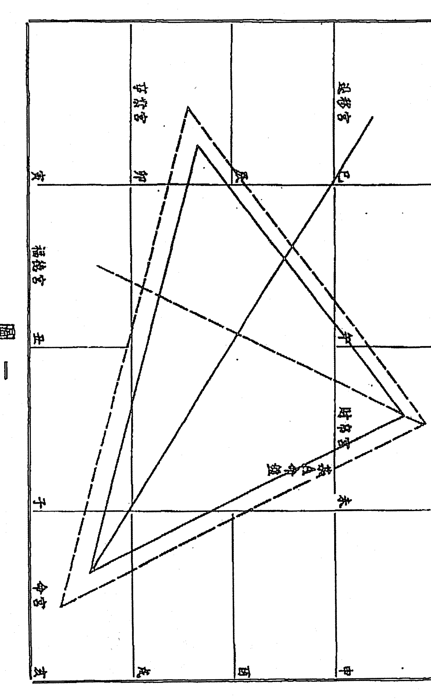
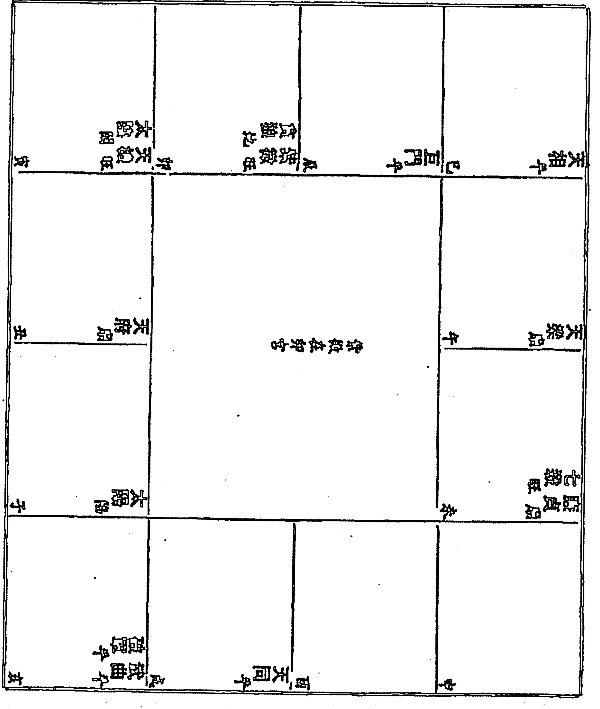

# 紫微斗数看钱财

# 我的聲明

自從筆者在各報章雜誌撰寫斗數專欄以來，聽到不少傳聞。諸多傳聞，不外乎懸心齋主在某處掛牌，懸心齋主的師父、師兄、師弟、師姊妹及徒弟在某處為人算命等等。

其實，筆者自業餘研習斗數以來，既沒有設館授徒，也沒有掛牌收費，更沒有任何師兄、師弟、師姊妹及徒弟。

與筆者相識的人也都知道，懸心齋主無論在報章雜誌上或是私下為人算命，都是從不接受報酬的。

也有人問及筆者，是否用過其他筆名撰寫專欄或出書，事實上，除了一九八〇年曾在《星海日報》以慧廬為筆名撰寫紫微斗數，再也沒有使用慧心齋主以外的筆名編寫任何書籍或專欄。

迄至一九八六年七月底止，筆者拙著除由時報出版公司及自立晚報出版發行外，並無其他出版公司出版筆者的任何書籍。

此外，恩師精研紫微斗數已數十年，純係業餘興趣，若是偶爾為人推命，亦從未接收潤酬；他年事已高，曾一再強調，筆者是他此生唯一弟子。

為避免讀者誤會，筆者已向經濟部中央標準局申請到服務標章註冊證，註冊號數為一二六八○號，並特此聲明

慧心齋主
丙寅年捌月

# 自序

「他很有錢！」
這是我們常用來形容富有的一句話。不可否認的，錢愈多的人，愈有獲得自己想要東西的能力。在探討「財帛宮」之前，我們首先要剖析什麼是「錢」。
無論台幣、美金、法郎或英鎊都是錢，也都是「貨幣」。想要置產、旅遊、創業或是滿足衣、食、住、行四大需要的現代人，大部分時候都需要「貨幣」。
「貨幣」，是交易行為的「中間人」，在貨幣沒有發明之前，人類以物易物，來換取自己想要的東西。
有羊、有牛、有米的人，可用自己所有的羊、牛、米來與其他人換取自己想要的東西，擁有愈多「不同」的東西，且數量皆多者，會有下列兩種情形：

(一) 有足夠的交換能力，很容易得到自己想要的東西（用現代眼光來看，這種人有很多「錢」）。

(二) 因為已擁有各種各樣物品，能夠自給自足，但是也可以與人交換（用現代的眼光來看，這種人有很多「積蓄」）。

如果換個角度來形容一個人的富有，所用的形容詞不是「他很有錢」或是「他很有貨幣」，而是他在錢財方面，有很大的「交換力」，也就是「流通力」，使他能夠自給自足，也使他能夠有積蓄。

目前世界上大部分國家皆有貨幣，但是自人類發明貨幣迄今，每個國家的貨幣幣值、種類，都有過許多變化，由財帛宮中所要探討的，不是一個人使用何種貨幣、有多少錢，而是要把握一個人在錢財上的「交換能力」、「流通能力」，進而探討是否有積蓄、物質享受如何、對錢財是否知足而快樂等等。有了上述認知，本書中以紫微斗數研究錢財的原則及方法，不分古今中外，放諸四海皆準。

本書專論「錢財」，但是錢財與事業是不可分割的，有許多擅於理財的人，也對經商頗有興趣，筆者目前正在工商時報撰寫的《紫微斗數與經商人》及尚未出版的《紫微斗數看事業》二書與本書分別由三個不同的角度，共同探研人生最重要的事業和錢財問題，將會於日後陸續出版。

慧心齋主
丙寅年八月

# 第一章 錢財總論

以紫微斗數探討一個人的終生錢財狀況的方法，是將下列各部份配合起來研究：

- 一、以財帛宮內諸星性質及顯象為主，並配合財帛宮的三方宮位，也就是命宮、事業宮、福德宮中諸星的性質及顯象一起研究。本書所說明的諸甲級星在財帛宮的現象，已包含財帛宮三方星曜的性質、顯象。
- 二、自出生之後，每個大限、流年、流月等各階段的現象。
- 三、甲、乙、丙、丁、戊級每一顆星曜的性質及意義。

前述第一項由財帛宮內及財帛宮三方的諸星性質，可以瞭解一個人錢財收入多寡，進財的過程是辛苦費力，還是事半功倍；對錢財的態度如何，是否擅於理財，是否可成富者，是否可有積蓄等等。但還只是終生的錢財概況，好比平面的剖析。如果配合前述第二項，自出生之後，每個大限、流年、流月等各階段的財帛宮及其三方星曜性質及意義，即可瞭解一個人是否有繼承上一代財產的命運、及在何時辛苦費力進財、何時可事半功倍，一生之中對錢財的態度是否會轉變、何時有積蓄、何時易損失等等；好比縱面的剖析，將平面與縱面配合研究、也就是把本命有的錢財狀況、與時間所造成的運氣變化，溶為一體。

至於前述第三項甲、乙、丙、丁、戊級諸星的基本性質及意義，是在研究十二宮位中任一宮位之前，都宜先認識清楚的，主要是可將諸星的基本性質、意義，視十二宮位各宮的不同，以及大限、流年的變化、做不同的引申。關於諸星的基本性質、意義、本章不再贅述。

## 第一節 認識財帛宮

財帛宮是在命盤中，無論命宮在十二宮中任何宮位，皆以命宮為主，逆時針方向相隔的第五個宮位。也是在研究命宮時，所需要同時瞭解的「三方」中之一方。

如圖(一)所示，假定某A的命宮，是在命盤中的亥宮，則在研究某A一生整體命運時，除了要看命宮（亥宮）的星曜外，還要同時配合財帛宮，遷移宮及事業宮。綜合命宮、財帛宮、遷移宮、事業宮內星曜特點之後，還要再參看福德宮，才能完整的瞭解一個人終生財運概況。

# 第一章 錢財總論

注：實線部分為命宮之三方
虛線部分為財帛宮之三方

### 財帛宮與命宮

由於古人發明紫微斗數時，設計週詳，無論研究命盤中任何一個宮位，都要同時配合該宮位的「三方」，也就是(一)以該宮位為主，逆時針方向相隔的第五個宮位，(二)以及以該宮位為主，無論逆時針方向，或是順時針方向，皆是相隔七個宮位的宮位，以及(三)順時針方向相隔的第五個宮位，這是研究各宮位時的最基本原則。

古人所以把命宮三方定為財帛宮、遷移宮及事業宮，是因為財帛宮所顯現的錢財現象，遷移宮內星曜與命宮星曜的相輔相成，以及事業宮所顯現的事業現象，與人的生活息息相關。至於福德宮，則可由其宮內星曜充分瞭解一個人為人處事的態度，以及物質生活、精神生活的狀況。

現以某A命盤為例，以虛線表示出與其A財帛宮有關的三方，讀者也許會發現，其財帛宮的三方，與命宮及命宮三方有些相同之處，若以財帛宮為命宮，則其財帛宮為原命宮之事業宮，遷移宮為原命宮之福德宮，事業宮為原命宮，這也表示，財帛宮中星曜與上述各宮位星曜會有互相配合、流通、牽制的情形，下面，讓我們分別探討財帛宮與命宮、遷移宮、事業宮的關係。

# 財帛宮與命宮的關係，可分為三方面來討論。

一、互相配合：財帛宮與命宮，是在研究財帛宮時，必須同時研究的兩個宮位。一個人如何處理錢財，錢是否能存得下，其財產的多寡，要看財帛宮，但是有沒有賺很多錢，是否擅於處理錢財，就是要看命宮。

二、互相流通。例如命宮有祿存星時，若財帛宮有化祿星，則祿存與化祿星可以互相交流，使一個人進財機會多，進財也十分順利。

三、互相牽制。如果財帛宮中星曜好，（例如有祿存及化祿星同宮），表示錢財很多，但是如果命宮中有地劫或地空或化忌星時，命宮的這些煞星，會牽制財帛宮。使錢財易有各種損失。

如果命宮星曜穩定，如天府星坐命宮，本主可以有積蓄，但是財帛宮有地劫、地空或化忌星，雖命中有一「財庫」，仍不免會損失錢財，在大限、流年不好時，甚至沒有剩餘的錢。

### 財帛宮與福德宮

財帛宮與福德宮在命盤中互為對宮，其星曜相互的配合、流通及牽制，比會照時還要明顯。

現實生活中，一個人的收入多少，與其物質生活有直接關係，表現精神生活、物質生活及處世態度的福德宮，也直接反映了一個人對錢財的看法及處理方式。

- 一、互相配合：財帛宮星曜好，福德宮中星曜也好，則表示一個人不但有高收入，而且也有穩定的生活，並且不是以努力來賺錢。
- 二、互相流通：財帛宮中有祿存星，而福德星有化祿時，成為「雙祿交流」，表示所賺來的錢財較多，也能有好的物質享受。
- 三、互相牽制：如果財帛宮星曜好，但是福德宮有化忌星，或是六煞星之一同宮時，則雖有好的收入卻無法有好的物質生活享受。如果財帛宮中有六煞星之一或化忌星同宮，福德宮星曜雖好，甚至命宮也有好星，但所想要的物質生活享受，就不能夠完全如願。

如果財帛宮中星曜有祿存星，而福德宮中又有天同星、太陰星及化祿星時，則不但收入好，物質生活好，精神生活也愉快。

判斷物質生活好壞，可由福德宮中有「化祿」來肯定，且無論是任何星曜化祿皆可。判斷精神生活好或壞，則有另一組方法，以後筆者會在以福德宮為主的專書中討論。

### 財帛宮與事業宮

財帛宮與事業宮的關係，可分為三方面來討論。

一、互相配合：要瞭解一個人有多少錢，需看財帛宮，要知道以什麼行業賺錢，就必須看事業宮。

二、互相流通：財帛宮若有地劫、地空或化忌星時，表示容易損財，或是收入不高，若是事業宮中沒有六煞星、化忌星同宮，而有六吉星相助時，表示事業好，但是錢財無法積存，或收入中等。

如果事業宮中有化祿，又有六吉星相助時，經商者則是大企業家，雖然錢財不免有損失的時候，但是大企業收入甚高，高收入及大額損失相抵結果，比一般收入者的剩餘還是多出許多，這即是其「互相流通」的結果。

又如財帛宮中有祿存、化祿星同宮，而事業宮中沒有甲級主星，事業宮的對宮有六煞星之一或化忌星同宮，則可能從事比較單純的買賣，稱不上大企業。但其收入甚豐，而出入有轎車，住華屋大廈，儼然大企業家，也是事業宮與財帛宮流通的一種現象。

關於事業宮部份，將在以事業宮為主的專書中再與讀者共同研究。

三、互相牽制：有些時候，發展事業需要有龐大的財力為後盾（例如開設工廠），如果財帛宮星曜不吉，沒有祿存或化祿時，事業宮也缺乏祿存星及化祿星時，則往往互相牽制，或因缺乏資金，而無法創業。或是雖有事業，資金不足，無法再投資使事業再進步。

### 財帛宮與大限

無論財帛宮在命盤中任何一個宮位，人生皆有一個大限，將與財帛宮互相會照，或是該大限即為財帛宮。

由於大限有逆行及順行兩種，所以因陽男、陰女（大限順行）及陽女、陰男（大限逆行）而可產生下列兩種現象。

一、陽男、陰女。在出生之後第一個大限、第三個大限及第五個大限，都有機會與財帛宮會照。因此財帛宮星曜好或壞，會間接影響行運的好或壞。以行第五個大限時，最為明顯（如圖二），如果事業好，間接可以影響財運。

# 第一章 錢財總論

| 申 | 酉 | 戌 | 亥 |
|---|---|---|---|
| 12-21 | 2-11 | 42-51 | 32-41 |
| 22-31 | 52-61 | 62-71 | 72-81 |
| 82-91 | | | |
| 丑 | 寅 | 卯 | 辰 | 巳 | 午 | 未 | 申 |
| 12-21 | 2-11 | 42-51 | 32-41 |
| 22-31 | 52-61 | 62-71 | 72-81 |
| 82-91 | | | |
| 丑 | 寅 | 卯 | 辰 | 巳 | 午 | 未 | 申 |
| 12-21 | 2-11 | 42-51 | 32-41 |
| 22-31 | 52-61 | 62-71 | 72-81 |
| 82-91 | | | |
| 丑 | 寅 | 卯 | 辰 | 巳 | 午 | 未 | 申 |
| 12-21 | 2-11 | 42-51 | 32-41 |
| 22-31 | 52-61 | 62-71 | 72-81 |
| 82-91 | | | |
| 丑 | 寅 | 卯 | 辰 | 巳 | 午 | 未 | 申 |
| 12-21 | 2-11 | 42-51 | 32-41 |
| 22-31 | 52-61 | 62-71 | 72-81 |
| 82-91 | | | |
| 丑 | 寅 | 卯 | 辰 | 巳 | 午 | 未 | 申 |
| 12-21 | 2-11 | 42-51 | 32-41 |
| 22-31 | 52-61 | 62-71 | 72-81 |
| 82-91 | | | |
| 丑 | 寅 | 卯 | 辰 | 巳 | 午 | 未 | 申 |
| 12-21 | 2-11 | 42-51 | 32-41 |
| 22-31 | 52-61 | 62-71 | 72-81 |
| 82-91 | | | |
| 丑 | 寅 | 卯 | 辰 | 巳 | 午 | 未 | 申 |
| 12-21 | 2-11 | 42-51 | 32-41 |
| 22-31 | 52-61 | 62-71 | 72-81 |
| 82-91 | | | |
| 丑 | 寅 | 卯 | 辰 | 巳 | 午 | 未 | 申 |
| 12-21 | 2-11 | 42-51 | 32-41 |
| 22-31 | 52-61 | 62-71 | 72-81 |
| 82-91 | | | |
| 丑 | 寅 | 卯 | 辰 | 巳 | 午 | 未 | 申 |
| 12-21 | 2-11 | 42-51 | 32-41 |
| 22-31 | 52-61 | 62-71 | 72-81 |
| 82-91 | | | |
| 丑 | 寅 | 卯 | 辰 | 巳 | 午 | 未 | 申 |
| 12-21 | 2-11 | 42-51 | 32-41 |
| 22-31 | 52-61 | 62-71 | 72-81 |
| 82-91 | | | |
| 丑 | 寅 | 卯 | 辰 | 巳 | 午 | 未 | 申 |
| 12-21 | 2-11 | 42-51 | 32-41 |
| 22-31 | 52-61 | 62-71 | 72-81 |
| 82-91 | | | |
| 丑 | 寅 | 卯 | 辰 | 巳 | 午 | 未 | 申 |
| 12-21 | 2-11 | 42-51 | 32-41 |
| 22-31 | 52-61 | 62-71 | 72-81 |
| 82-91 | | | |
| 丑 | 寅 | 卯 | 辰 | 巳 | 午 | 未 | 申 |
| 12-21 | 2-11 | 42-51 | 32-41 |
| 22-31 | 52-61 | 62-71 | 72-81 |
| 82-91 | | | |
| 丑 | 寅 | 卯 | 辰 | 巳 | 午 | 未 | 申 |
| 12-21 | 2-11 | 42-51 | 32-41 |
| 22-31 | 52-61 | 62-71 | 72-81 |
| 82-91 | | | |
| 丑 | 寅 | 卯 | 辰 | 巳 | 午 | 未 | 申 |
| 12-21 | 2-11 | 42-51 | 32-41 |
| 22-31 | 52-61 | 62-71 | 72-81 |
| 82-91 | | | |
| 丑 | 寅 | 卯 | 辰 | 巳 | 午 | 未 | 申 |
| 12-21 | 2-11 | 42-51 | 32-41 |
| 22-31 | 52-61 | 62-71 | 72-81 |
| 82-91 | | | |
| 丑 | 寅 | 卯 | 辰 | 巳 | 午 | 未 | 申 |
| 12-21 | 2-11 | 42-51 | 32-41 |
| 22-31 | 52-61 | 62-71 | 72-81 |
| 82-91 | | | |
| 丑 | 寅 | 卯 | 辰 | 巳 | 午 | 未 | 申 |
| 12-21 | 2-11 | 42-51 | 32-41 |
| 22-31 | 52-61 | 62-71 | 72-81 |
| 82-91 | | | |
| 丑 | 寅 | 卯 | 辰 | 巳 | 午 | 未 | 申 |
| 12-21 | 2-11 | 42-51 | 32-41 |
| 22-31 | 52-61 | 62-71 | 72-81 |
| 82-91 | | | |
| 丑 | 寅 | 卯 | 辰 | 巳 | 午 | 未 | 申 |
| 12-21 | 2-11 | 42-51 | 32-41 |
| 22-31 | 52-61 | 62-71 | 72-81 |
| 82-91 | | | |
| 丑 | 寅 | 卯 | 辰 | 巳 | 午 | 未 | 申 |
| 12-21 | 2-11 | 42-51 | 32-41 |
| 22-31 | 52-61 | 62-71 | 72-81 |
| 82-91 | | | |
| 丑 | 寅 | 卯 | 辰 | 巳 | 午 | 未 | 申 |
| 12-21 | 2-11 | 42-51 | 32-41 |
| 22-31 | 52-61 | 62-71 | 72-81 |
| 82-91 | | | |
| 丑 | 寅 | 卯 | 辰 | 巳 | 午 | 未 | 申 |
| 12-21 | 2-11 | 42-51 | 32-41 |
| 22-31 | 52-61 | 62-71 | 72-81 |
| 82-91 | | | |
| 丑 | 寅 | 卯 | 辰 | 巳 | 午 | 未 | 申 |
| 12-21 | 2-11 | 42-51 | 32-41 |
| 22-31 | 52-61 | 62-71 | 72-81 |
| 82-91 | | | |
| 丑 | 寅 | 卯 | 辰 | 巳 | 午 | 未 | 申 |
| 12-21 | 2-11 | 42-51 | 32-41 |
| 22-31 | 52-61 | 62-71 | 72-81 |
| 82-91 | | | |
| 丑 | 寅 | 卯 | 辰 | 巳 | 午 | 未 | 申 |
| 12-21 | 2-11 | 42-51 | 32-41 |
| 22-31 | 52-61 | 62-71 | 72-81 |
| 82-91 | | | |
| 丑 | 寅 | 卯 | 辰 | 巳 | 午 | 未 | 申 |
| 12-21 | 2-11 | 42-51 | 32-41 |
| 22-31 | 52-61 | 62-71 | 72-81 |
| 82-91 | | | |
| 丑 | 寅 | 卯 | 辰 | 巳 | 午 | 未 | 申 |
| 12-21 | 2-11 | 42-51 | 32-41 |
| 22-31 | 52-61 | 62-71 | 72-81 |
| 82-91 | | | |
| 丑 | 寅 | 卯 | 辰 | 巳 | 午 | 未 | 申 |
| 12-21 | 2-11 | 42-51 | 32-41 |
| 22-31 | 52-61 | 62-71 | 72-81 |
| 82-91 | | | |
| 丑 | 寅 | 卯 | 辰 | 巳 | 午 | 未 | 申 |
| 12-21 | 2-11 | 42-51 | 32-41 |
| 22-31 | 52-61 | 62-71 | 72-81 |
| 82-91 | | | |
| 丑 | 寅 | 卯 | 辰 | 巳 | 午 | 未 | 申 |
| 12-21 | 2-11 | 42-51 | 32-41 |
| 22-31 | 52-61 | 62-71 | 72-81 |
| 82-91 | | | |
| 丑 | 寅 | 卯 | 辰 | 巳 | 午 | 未 | 申 |
| 12-21 | 2-11 | 42-51 | 32-41 |
| 22-31 | 52-61 | 62-71 | 72-81 |
| 82-91 | | | |
| 丑 | 寅 | 卯 | 辰 | 巳 | 午 | 未 | 申 |
| 12-21 | 2-11 | 42-51 | 32-41 |
| 22-31 | 52-61 | 62-71 | 72-81 |
| 82-91 | | | |
| 丑 | 寅 | 卯 | 辰 | 巳 | 午 | 未 | 申 |
| 12-21 | 2-11 | 42-51 | 32-41 |
| 22-31 | 52-61 | 62-71 | 72-81 |
| 82-91 | | | |
| 丑 | 寅 | 卯 | 辰 | 巳 | 午 | 未 | 申 |
| 12-21 | 2-11 | 42-51 | 32-41 |
| 22-31 | 52-61 | 62-71 | 72-81 |
| 82-91 | | | |
| 丑 | 寅 | 卯 | 辰 | 巳 | 午 | 未 | 申 |
| 12-21 | 2-11 | 42-51 | 32-41 |
| 22-31 | 52-61 | 62-71 | 72-81 |
| 82-91 | | | |
| 丑 | 寅 | 卯 | 辰 | 巳 | 午 | 未 | 申 |
| 12-21 | 2-11 | 42-51 | 32-41 |
| 22-31 | 52-61 | 62-71 | 72-81 |
| 82-91 | | | |
| 丑 | 寅 | 卯 | 辰 | 巳 | 午 | 未 | 申 |
| 12-21 | 2-11 | 42-51 | 32-41 |
| 22-31 | 52-61 | 62-71 | 72-81 |
| 82-91 | | | |
| 丑 | 寅 | 卯 | 辰 | 巳 | 午 | 未 | 申 |
| 12-21 | 2-11 | 42-51 | 32-41 |
| 22-31 | 52-61 | 62-71 | 72-81 |
| 82-91 | | | |
| 丑 | 寅 | 卯 | 辰 | 巳 | 午 | 未 | 申 |
| 12-21 | 2-11 | 42-51 | 32-41 |
| 22-31 | 52-61 | 62-71 | 72-81 |
| 82-91 | | | |
| 丑 | 寅 | 卯 | 辰 | 巳 | 午 | 未 | 申 |
| 12-21 | 2-11 | 42-51 | 32-41 |
| 22-31 | 52-61 | 62-71 | 72-81 |
| 82-91 | | | |
| 丑 | 寅 | 卯 | 辰 | 巳 | 午 | 未 | 申 |
| 12-21 | 2-11 | 42-51 | 32-41 |
| 22-31 | 52-61 | 62-71 | 72-81 |
| 82-91 | | | |
| 丑 | 寅 | 卯 | 辰 | 巳 | 午 | 未 | 申 |
| 12-21 | 2-11 | 42-51 | 32-41 |
| 22-31 | 52-61 | 62-71 | 72-81 |
| 82-91 | | | |
| 丑 | 寅 | 卯 | 辰 | 巳 | 午 | 未 | 申 |
| 12-21 | 2-11 | 42-51 | 32-41 |
| 22-31 | 52-61 | 62-71 | 72-81 |
| 82-91 | | | |
| 丑 | 寅 | 卯 | 辰 | 巳 | 午 | 未 | 申 |
| 12-21 | 2-11 | 42-51 | 32-41 |
| 22-31 | 52-61 | 62-71 | 72-81 |
| 82-91 | | | |
| 丑 | 寅 | 卯 | 辰 | 巳 | 午 | 未 | 申 |
| 12-21 | 2-11 | 42-51 | 32-41 |
| 22-31 | 52-61 | 62-71 | 72-81 |
| 82-91 | | | |
| 丑 | 寅 | 卯 | 辰 | 巳 | 午 | 未 | 申 |
| 12-21 | 2-11 | 42-51 | 32-41 |
| 22-31 | 52-61 | 62-71 | 72-81 |
| 82-91 | | | |
| 丑 | 寅 | 卯 | 辰 | 巳 | 午 | 未 | 申 |
| 12-21 | 2-11 | 42-51 | 32-41 |
| 22-31 | 52-61 | 62-71 | 72-81 |
| 82-91 | | | |
| 丑 | 寅 | 卯 | 辰 | 巳 | 午 | 未 | 申 |
| 12-21 | 2-11 | 42-51 | 32-41 |
| 22-31 | 52-61 | 62-71 | 72-81 |
| 82-91 | | | |
| 丑 | 寅 | 卯 | 辰 | 巳 | 午 | 未 | 申 |
| 12-21 | 2-11 | 42-51 | 32-41 |
| 22-31 | 52-61 | 62-71 | 72-81 |
| 82-91 | | | |
| 丑 | 寅 | 卯 | 辰 | 巳 | 午 | 未 | 申 |
| 12-21 | 2-11 | 42-51 | 32-41 |
| 22-31 | 52-61 | 62-71 | 72-81 |
| 82-91 | | | |
| 丑 | 寅 | 卯 | 辰 | 巳 | 午 | 未 | 申 |
| 12-21 | 2-11 | 42-51 | 32-41 |
| 22-31 | 52-61 | 62-71 | 72-81 |
| 82-91 | | | |
| 丑 | 寅 | 卯 | 辰 | 巳 | 午 | 未 | 申 |
| 12-21 | 2-11 | 42-51 | 32-41 |
| 22-31 | 52-61 | 62-71 | 72-81 |
| 82-91 | | | |
| 丑 | 寅 | 卯 | 辰 | 巳 | 午 | 未 | 申 |
| 12-21 | 2-11 | 42-51 | 32-41 |
| 22-31 | 52-61 | 62-71 | 72-81 |
| 82-91 | | | |
| 丑 | 寅 | 卯 | 辰 | 巳 | 午 | 未 | 申 |
| 12-21 | 2-11 | 42-51 | 32-41 |
| 22-31 | 52-61 | 62-71 | 72-81 |
| 82-91 | | | |
| 丑 | 寅 | 卯 | 辰 | 巳 | 午 | 未 | 申 |
| 12-21 | 2-11 | 42-51 | 32-41 |
| 22-31 | 52-61 | 62-71 | 72-81 |
| 82-91 | | | |
| 丑 | 寅 | 卯 | 辰 | 巳 | 午 | 未 | 申 |
| 12-21 | 2-11 | 42-51 | 32-41 |
| 22-31 | 52-61 | 62-71 | 72-81 |
| 82-91 | | | |
| 丑 | 寅 | 卯 | 辰 | 巳 | 午 | 未 | 申 |
| 12-21 | 2-11 | 42-51 | 32-41 |
| 22-31 | 52-61 | 62-71 | 72-81 |
| 82-91 | | | |
| 丑 | 寅 | 卯 | 辰 | 巳 | 午 | 未 | 申 |
| 12-21 | 2-11 | 42-51 | 32-41 |
| 22-31 | 52-61 | 62-71 | 72-81 |
| 82-91 | | | |
| 丑 | 寅 | 卯 | 辰 | 巳 | 午 | 未 | 申 |
| 12-21 | 2-11 | 42-51 | 32-41 |
| 22-31 | 52-61 | 62-71 | 72-81 |
| 82-91 | | | |
| 丑 | 寅 | 卯 | 辰 | 巳 | 午 | 未 | 申 |
| 12-21 | 2-11 | 42-51 | 32-41 |
| 22-31 | 52-61 | 62-71 | 72-81 |
| 82-91 | | | |
| 丑 | 寅 | 卯 | 辰 | 巳 | 午 | 未 | 申 |
| 12-21 | 2-11 | 42-51 | 32-41 |
| 22-31 | 52-61 | 62-71 | 72-81 |
| 82-91 | | | |
| 丑 | 寅 | 卯 | 辰 | 巳 | 午 | 未 | 申 |
| 12-21 | 2-11 | 42-51 | 32-41 |
| 22-31 | 52-61 | 62-71 | 72-81 |
| 82-91 | | | |
| 丑 | 寅 | 卯 | 辰 | 巳 | 午 | 未 | 申 |
| 12-21 | 2-11 | 42-51 | 32-41 |
| 22-31 | 52-61 | 62-71 | 72-81 |
| 82-91 | | | |
| 丑 | 寅 | 卯 | 辰 | 巳 | 午 | 未 | 申 |
| 12-21 | 2-11 | 42-51 | 32-41 |
| 22-31 | 52-61 | 62-71 | 72-81 |
| 82-91 | | | |
| 丑 | 寅 | 卯 | 辰 | 巳 | 午 | 未 | 申 |
| 12-21 | 2-11 | 42-51 | 32-41 |
| 22-31 | 52-61 | 62-71 | 72-81 |
| 82-91 | | | |
| 丑 | 寅 | 卯 | 辰 | 巳 | 午 | 未 | 申 |
| 12-21 | 2-11 | 42-51 | 32-41 |
| 22-31 | 52-61 | 62-71 | 72-81 |
| 82-91 | | | |
| 丑 | 寅 | 卯 | 辰 | 巳 | 午 | 未 | 申 |
| 12-21 | 2-11 | 42-51 | 32-41 |
| 22-31 | 52-61 | 62-71 | 72-81 |
| 82-91 | | | |
| 丑 | 寅 | 卯 | 辰 | 巳 | 午 | 未 | 申 |
| 12-21 | 2-11 | 42-51 | 32-41 |
| 22-31 | 52-61 | 62-71 | 72-81 |
| 82-91 | | | |
| 丑 | 寅 | 卯 | 辰 | 巳 | 午 | 未 | 申 |
| 12-21 | 2-11 | 42-51 | 32-41 |
| 22-31 | 52-61 | 62-71 | 72-81 |
| 82-91 | | | |
| 丑 | 寅 | 卯 | 辰 | 巳 | 午 | 未 | 申 |
| 12-21 | 2-11 | 42-51 | 32-41 |
| 22-31 | 52-61 | 62-71 | 72-81 |
| 82-91 | | | |
| 丑 | 寅 | 卯 | 辰 | 巳 | 午 | 未 | 申 |
| 12-21 | 2-11 | 42-51 | 32-41 |
| 22-31 | 52-61 | 62-71 | 72-81 |
| 82-91 | | | |
| 丑 | 寅 | 卯 | 辰 | 巳 | 午 | 未 | 申 |
| 12-21 | 2-11 | 42-51 | 32-41 |
| 22-31 | 52-61 | 62-71 | 72-81 |
| 82-91 | | | |
| 丑 | 寅 | 卯 | 辰 | 巳 | 午 | 未 | 申 |
| 12-21 | 2-11 | 42-51 | 32-41 |
| 22-31 | 52-61 | 62-71 | 72-81 |
| 82-91 | | | |
| 丑 | 寅 | 卯 | 辰 | 巳 | 午 | 未 | 申 |
| 12-21 | 2-11 | 42-51 | 32-41 |
| 22-31 | 52-61 | 62-71 | 72-81 |
| 82-91 | | | |
| 丑 | 寅 | 卯 | 辰 | 巳 | 午 | 未 | 申 |
| 12-21 | 2-11 | 42-51 | 32-41 |
| 22-31 | 52-61 | 62-71 | 72-81 |
| 82-91 | | | |
| 丑 | 寅 | 卯 | 辰 | 巳 | 午 | 未 | 申 |
| 12-21 | 2-11 | 42-51 | 32-41 |
| 22-31 | 52-61 | 62-71 | 72-81 |
| 82-91 | | | |
| 丑 | 寅 | 卯 | 辰 | 巳 | 午 | 未 | 申 |
| 12-21 | 2-11 | 42-51 | 32-41 |
| 22-31 | 52-61 | 62-71 | 72-81 |
| 82-91 | | | |
| 丑 | 寅 | 卯 | 辰 | 巳 | 午 | 未 | 申 |
| 12-21 | 2-11 | 42-51 | 32-41 |
| 22-31 | 52-61 | 62-71 | 72-81 |
| 82-91 | | | |
| 丑 | 寅 | 卯 | 辰 | 巳 | 午 | 未 | 申 |
| 12-21 | 2-11 | 42-51 | 32-41 |
| 22-31 | 52-61 | 62-71 | 72-81 |
| 82-91 | | | |
| 丑 | 寅 | 卯 | 辰 | 巳 | 午 | 未 | 申 |
| 12-21 | 2-11 | 42-51 | 32-41 |
| 22-31 | 52-61 | 62-71 | 72-81 |
| 82-91 | | | |
| 丑 | 寅 | 卯 | 辰 | 巳 | 午 | 未 | 申 |
| 12-21 | 2-11 | 42-51 | 32-41 |
| 22-31 | 52-61 | 62-71 | 72-81 |
| 82-91 | | | |
| 丑 | 寅 | 卯 | 辰 | 巳 | 午 | 未 | 申 |
| 12-21 | 2-11 | 42-51 | 32-41 |
| 22-31 | 52-61 | 62-71 | 72-81 |
| 82-91 | | | |
| 丑 | 寅 | 卯 | 辰 | 巳 | 午 | 未 | 申 |
| 12-21 | 2-11 | 42-51 | 32-41 |
| 22-31 | 52-61 | 62-71 | 72-81 |
| 82-91 | | | |
| 丑 | 寅 | 卯 | 辰 | 巳 | 午 | 未 | 申 |
| 12-21 | 2-11 | 42-51 | 32-41 |
| 22-31 | 52-61 | 62-71 | 72-81 |
| 82-91 | | | |
| 丑 | 寅 | 卯 | 辰 | 巳 | 午 | 未 | 申 |
| 12-21 | 2-11 | 42-51 | 32-41 |
| 22-31 | 52-61 | 62-71 | 72-81 |
| 82-91 | | | |
| 丑 | 寅 | 卯 | 辰 | 巳 | 午 | 未 | 申 |
| 12-21 | 2-11 | 42-51 | 32-41 |
| 22-31 | 52-61 | 62-71 | 72-81 |
| 82-91 | | | |
| 丑 | 寅 | 卯 | 辰 | 巳 | 午 | 未 | 申 |
| 12-21 | 2-11 | 42-51 | 32-41 |
| 22-31 | 52-61 | 62-71 | 72-81 |
| 82-91 | | | |
| 丑 | 寅 | 卯 | 辰 | 巳 | 午 | 未 | 申 |
| 12-21 | 2-11 | 42-51 | 32-41 |
| 22-31 | 52-61 | 62-71 | 72-81 |
| 82-91 | | | |
| 丑 | 寅 | 卯 | 辰 | 巳 | 午 | 未 | 申 |
| 12-21 | 2-11 | 42-51 | 32-41 |
| 22-31 | 52-61 | 62-71 | 72-81 |
| 82-91 | | | |
| 丑 | 寅 | 卯 | 辰 | 巳 | 午 | 未 | 申 |
| 12-21 | 2-11 | 42-51 | 32-41 |
| 22-31 | 52-61 | 62-71 | 72-81 |
| 82-91 | | | |
| 丑 | 寅 | 卯 | 辰 | 巳 | 午 | 未 | 申 |
| 12-21 | 2-11 | 42-51 | 32-41 |
| 22-31 | 52-61 | 62-71 | 72-81 |
| 82-91 | | | |
| 丑 | 寅 | 卯 | 辰 | 巳 | 午 | 未 | 申 |
| 12-21 | 2-11 | 42-51 | 32-41 |
| 22-31 | 52-61 | 62-71 | 72-81 |
| 82-91 | | | |
| 丑 | 寅 | 卯 | 辰 | 巳 | 午 | 未 | 申 |
| 12-21 | 2-11 | 42-51 | 32-41 |
| 22-31 | 52-61 | 62-71 | 72-81 |
| 82-91 | | | |
| 丑 | 寅 | 卯 | 辰 | 巳 | 午 | 未 | 申 |
| 12-21 | 2-11 | 42-51 | 32-41 |
| 22-31 | 52-61 | 62-71 | 72-81 |
| 82-91 | | | |
| 丑 | 寅 | 卯 | 辰 | 巳 | 午 | 未 | 申 |
| 12-21 | 2-11 | 42-51 | 32-41 |
| 22-31 | 52-61 | 62-71 | 72-81 |
| 82-91 | | | |
| 丑 | 寅 | 卯 | 辰 | 巳 | 午 | 未 | 申 |
| 12-21 | 2-11 | 42-51 | 32-41 |
| 22-31 | 52-61 | 62-71 | 72-81 |
| 82-91 | | | |
| 丑 | 寅 | 卯 | 辰 | 巳 | 午 | 未 | 申 |
| 12-21 | 2-11 | 42-51 | 32-41 |
| 22-31 | 52-61 | 62-71 | 72-81 |
| 82-91 | | | |
| 丑 | 寅 | 卯 | 辰 | 巳 | 午 | 未 | 申 |
| 12-21 | 2-11 | 42-51 | 32-41 |
| 22-31 | 52-61 | 62-71 | 72-81 |
| 82-91 | | | |
| 丑 | 寅 | 卯 | 辰 | 巳 | 午 | 未 | 申 |
| 12-21 | 2-11 | 42-51 | 32-41 |
| 22-31 | 52-61 | 62-71 | 72-81 |
| 82-91 | | | |
| 丑 | 寅 | 卯 | 辰 | 巳 | 午 | 未 | 申 |
| 12-21 | 2-11 | 42-51 | 32-41 |
| 22-31 | 52-61 | 62-71 | 72-81 |
| 82-91 | | | |
| 丑 | 寅 | 卯 | 辰 | 巳 | 午 | 未 | 申 |
| 12-21 | 2-11 | 42-51 | 32-41 |
| 22-31 | 52-61 | 62-71 | 72-81 |
| 82-91 | | | |
| 丑 | 寅 | 卯 | 辰 | 巳 | 午 | 未 | 申 |
| 12-21 | 2-11 | 42-51 | 32-41 |
| 22-31 | 52-61 | 62-71 | 72-81 |
| 82-91 | | | |
| 丑 | 寅 | 卯 | 辰 | 巳 | 午 | 未 | 申 |
| 12-21 | 2-11 | 42-51 | 32-41 |
| 22-31 | 52-61 | 62-71 | 72-81 |
| 82-91 | | | |
| 丑 | 寅 | 卯 | 辰 | 巳 | 午 | 未 | 申 |
| 12-21 | 2-11 | 42-51 | 32-41 |
| 22-31 | 52-61 | 62-71 | 72-81 |
| 82-91 | | | |
| 丑 | 寅 | 卯 | 辰 | 巳 | 午 | 未 | 申 |
| 12-21 | 2-11 | 42-51 | 32-41 |
| 22-31 | 52-61 | 62-71 | 72-81 |
| 82-91 | | | |
| 丑 | 寅 | 卯 | 辰 | 巳 | 午 | 未 | 申 |
| 12-21 | 2-11 | 42-51 | 32-41 |
| 22-31 | 52-61 | 62-71 | 72-81 |
| 82-91 | | | |
| 丑 | 寅 | 卯 | 辰 | 巳 | 午 | 未 | 申 |
| 12-21 | 2-11 | 42-51 | 32-41 |
| 22-31 | 52-61 | 62-71 | 72-81 |
| 82-91 | | | |
| 丑 | 寅 | 卯 | 辰 | 巳 | 午 | 未 | 申 |
| 12-21 | 2-11 | 42-51 | 32-41 |
| 22-31 | 52-61 | 62-71 | 72-81 |
| 82-91 | | | |
| 丑 | 寅 | 卯 | 辰 | 巳 | 午 | 未 | 申 |
| 12-21 | 2-11 | 42-51 | 32-41 |
| 22-31 | 52-61 | 62-71 | 72-81 |
| 82-91 | | | |
| 丑 | 寅 | 卯 | 辰 | 巳 | 午 | 未 | 申 |
| 12-21 | 2-11 | 42-51 | 32-41 |
| 22-31 | 52-61 | 62-71 | 72-81 |
| 82-91 | | | |
| 丑 | 寅 | 卯 | 辰 | 巳 | 午 | 未 | 申 |
| 12-21 | 2-11 | 42-51 | 32-41 |
| 22-31 | 52-61 | 62-71 | 72-81 |
| 82-91 | | | |
| 丑 | 寅 | 卯 | 辰 | 巳 | 午 | 未 | 申 |
| 12-21 | 2-11 | 42-51 | 32-41 |
| 22-31 | 52-61 | 62-71 | 72-81 |
| 82-91 | | | |
| 丑 | 寅 | 卯 | 辰 | 巳 | 午 | 未 | 申 |
| 12-21 | 2-11 | 42-51 | 32-41 |
| 22-31 | 52-61 | 62-71 | 72-81 |
| 82-91 | | | |
| 丑 | 寅 | 卯 | 辰 | 巳 | 午 | 未 | 申 |
| 12-21 | 2-11 | 42-51 | 32-41 |
| 22-31 | 52-61 | 62-71 | 72-81 |
| 82-91 | | | |
| 丑 | 寅 | 卯 | 辰 | 巳 | 午 | 未 | 申 |
| 12-21 | 2-11 | 42-51 | 32-41 |
| 22-31 | 52-61 | 62-71 | 72-81 |
| 82-91 | | | |
| 丑 | 寅 | 卯 | 辰 | 巳 | 午 | 未 | 申 |
| 12-21 | 2-11 | 42-51 | 32-41 |
| 22-31 | 52-61 | 62-71 | 72-81 |
| 82-91 | | | |
| 丑 | 寅 | 卯 | 辰 | 巳 | 午 | 未 | 申 |
| 12-21 | 2-11 | 42-51 | 32-41 |
| 22-31 | 52-61 | 62-71 | 72-81 |
| 82-91 | | | |
| 丑 | 寅 | 卯 | 辰 | 巳 | 午 | 未 | 申 |
| 12-21 | 2-11 | 42-51 | 32-41 |
| 22-31 | 52-61 | 62-71 | 72-81 |
| 82-91 | | | |
| 丑 | 寅 | 卯 | 辰 | 巳 | 午 | 未 | 申 |
| 12-21 | 2-11 | 42-51 | 32-41 |
| 22-31 | 52-61 | 62-71 | 72-81 |
| 82-91 | | | |
| 丑 | 寅 | 卯 | 辰 | 巳 | 午 | 未 | 申 |
| 12-21 | 2-11 | 42-51 | 32-41 |
| 22-31 | 52-61 | 62-71 | 72-81 |
| 82-91 | | | |
| 丑 | 寅 | 卯 | 辰 | 巳 | 午 | 未 | 申 |
| 12-21 | 2-11 | 42-51 | 32-41 |
| 22-31 | 52-61 | 62-71 | 72-81 |
| 82-91 | | | |
| 丑 | 寅 | 卯 | 辰 | 巳 | 午 | 未 | 申 |
| 12-21 | 2-11 | 42-51 | 32-41 |
| 22-31 | 52-61 | 62-71 | 72-81 |
| 82-91 | | | |
| 丑 | 寅 | 卯 | 辰 | 巳 | 午 | 未 | 申 |
| 12-21 | 2-11 | 42-51 | 32-41 |
| 22-31 | 52-61 | 62-71 | 72-81 |
| 82-91 | | | |
| 丑 | 寅 | 卯 | 辰 | 巳 | 午 | 未 | 申 |
| 12-21 | 2-11 | 42-51 | 32-41 |
| 22-31 | 52-61 | 62-71 | 72-81 |
| 82-91 | | | |
| 丑 | 寅 | 卯 | 辰 | 巳 | 午 | 未 | 申 |
| 12-21 | 2-11 | 42-51 | 32-41 |
| 22-31 | 52-61 | 62-71 | 72-81 |
| 82-91 | | | |
| 丑 | 寅 | 卯 | 辰 | 巳 | 午 | 未 | 申 |
| 12-21 | 2-11 | 42-51 | 32-41 |
| 22-31 | 52-61 | 62-71 | 72-81 |
| 82-91 | | | |
| 丑 | 寅 | 卯 | 辰 | 巳 | 午 | 未 | 申 |
| 12-21 | 2-11 | 42-51 | 32-41 |
| 22-31 | 52-61 | 62-71 | 72-81 |
| 82-91 | | | |
| 丑 | 寅 | 卯 | 辰 | 巳 | 午 | 未 | 申 |
| 12-21 | 2-11 | 42-51 | 32-41 |
| 22-31 | 52-61 | 62-71 | 72-81 |
| 82-91 | | | |
| 丑 | 寅 | 卯 | 辰 | 巳 | 午 | 未 | 申 |
| 12-21 | 2-11 | 42-51 | 32-41 |
| 22-31 | 52-61 | 62-71 | 72-81 |
| 82-91 | | | |
| 丑 | 寅 | 卯 | 辰 | 巳 | 午 | 未 | 申 |
| 12-21 | 2-11 | 42-51 | 32-41 |
| 22-31 | 52-61 | 62-71 | 72-81 |
| 82-91 | | | |
| 丑 | 寅 | 卯 | 辰 | 巳 | 午 | 未 | 申 |
| 12-21 | 2-11 | 42-51 | 32-41 |
| 22-31 | 52-61 | 62-71 | 72-81 |
| 82-91 | | | |
| 丑 | 寅 | 卯 | 辰 | 巳 | 午 | 未 | 申 |
| 12-21 | 2-11 | 42-51 | 32-41 |
| 22-31 | 52-61 | 62-71 | 72-81 |
| 82-91 | | | |
| 丑 | 寅 | 卯 | 辰 | 巳 | 午 | 未 | 申 |
| 12-21 | 2-11 | 42-51 | 32-41 |
| 22-31 | 52-61 | 62-71 | 72-81 |
| 82-91 | | | |
| 丑 | 寅 | 卯 | 辰 | 巳 | 午 | 未 | 申 |
| 12-21 | 2-11 | 42-51 | 32-41 |
| 22-31 | 52-61 | 62-71 | 72-81 |
| 82-91 | | | |
| 丑 | 寅 | 卯 | 辰 | 巳 | 午 | 未 | 申 |
| 12-21 | 2-11 | 42-51 | 32-41 |
| 22-31 | 52-61 | 62-71 | 72-81 |
| 82-91 | | | |
| 丑 | 寅 | 卯 | 辰 | 巳 | 午 | 未 | 申 |
| 12-21 | 2-11 | 42-51 | 32-41 |
| 22-31 | 52-61 | 62-71 | 72-81 |
| 82-91 | | | |
| 丑 | 寅 | 卯 | 辰 | 巳 | 午 | 未 | 申 |
| 12-21 | 2-11 | 42-51 | 32-41 |
| 22-31 | 52-61 | 62-71 | 72-81 |
| 82-91 | | | |
| 丑 | 寅 | 卯 | 辰 | 巳 | 午 | 未 | 申 |
| 12-21 | 2-11 | 42-51 | 32-41 |
| 22-31 | 52-61 | 62-71 | 72-81 |
| 82-91 | | | |
| 丑 | 寅 | 卯 | 辰 | 巳 | 午 | 未 | 申 |
| 12-21 | 2-11 | 42-51 | 32-41 |
| 22-31 | 52-61 | 62-71 | 72-81 |
| 82-91 | | | |
| 丑 | 寅 | 卯 | 辰 | 巳 | 午 | 未 | 申 |
| 12-21 | 2-11 | 42-51 | 32-41 |
| 22-31 | 52-61 | 62-71 | 72-81 |
| 82-91 | | | |
| 丑 | 寅 | 卯 | 辰 | 巳 | 午 | 未 | 申 |
| 12-21 | 2-11 | 42-51 | 32-41 |
| 22-31 | 52-61 | 62-71 | 72-81 |
| 82-91 | | | |
| 丑 | 寅 | 卯 | 辰 | 巳 | 午 | 未 | 申 |
| 12-21 | 2-11 | 42-51 | 32-41 |
| 22-31 | 52-61 | 62-71 | 72-81 |
| 82-91 | | | |
| 丑 | 寅 | 卯 | 辰 | 巳 | 午 | 未 | 申 |
| 12-21 | 2-11 | 42-51 | 32-41 |
| 22-31 | 52-61 | 62-71 | 72-81 |
| 82-91 | | | |
| 丑 | 寅 | 卯 | 辰 | 巳 | 午 | 未 | 申 |
| 12-21 | 2-11 | 42-51 | 32-41 |
| 22-31 | 52-61 | 62-71 | 72-81 |
| 82-91 | | | |
| 丑 | 寅 | 卯 | 辰 | 巳 | 午 | 未 | 申 |
| 12-21 | 2-11 | 42-51 | 32-41 |
| 22-31 | 52-61 | 62-71 | 72-81 |
| 82-91 | | | |
| 丑 | 寅 | 卯 | 辰 | 巳 | 午 | 未 | 申 |
| 12-21 | 2-11 | 42-51 | 32-41 |
| 22-31 | 52-61 | 62-71 | 72-81 |
| 82-91 | | | |
| 丑 | 寅 | 卯 | 辰 | 巳 | 午 | 未 | 申 |
| 12-21 | 2-11 | 42-51 | 32-41 |
| 22-31 | 52-61 | 62-71 | 72-81 |
| 82-91 | | | |
| 丑 | 寅 | 卯 | 辰 | 巳 | 午 | 未 | 申 |
| 12-21 | 2-11 | 42-51 | 32-41 |
| 22-31 | 52-61 | 62-71 | 72-81 |
| 82-91 | | | |
| 丑 | 寅 | 卯 | 辰 | 巳 | 午 | 未 | 申 |
| 12-21 | 2-11 | 42-51 | 32-41 |
| 22-31 | 52-61 | 62-71 | 72-81 |
| 82-91 | | | |
| 丑 | 寅 | 卯 | 辰 | 巳 | 午 | 未 | 申 |
| 12-21 | 2-11 | 42-51 | 32-41 |
| 22-31 | 52-61 | 62-71 | 72-81 |
| 82-91 | | | |
| 丑 | 寅 | 卯 | 辰 | 巳 | 午 | 未 | 申 |
| 12-21 | 2-11 | 42-51 | 32-41 |
| 22-31 | 52-61 | 62-71 | 72-81 |
| 82-91 | | | |
| 丑 | 寅 | 卯 | 辰 | 巳 | 午 | 未 | 申 |
| 12-21 | 2-11 | 42-51 | 32-41 |
| 22-31 | 52-61 | 62-71 | 72-81 |
| 82-91 | | | |
| 丑 | 寅 | 卯 | 辰 | 巳 | 午 | 未 | 申 |
| 12-21 | 2-11 | 42-51 | 32-41 |
| 22-31 | 52-61 | 62-71 | 72-81 |
| 82-91 | | | |
| 丑 | 寅 | 卯 | 辰 | 巳 | 午 | 未 | 申 |
| 12-21 | 2-11 | 42-51 | 32-41 |
| 22-31 | 52-61 | 62-71 | 72-81 |
| 82-91 | | | |
| 丑 | 寅 | 卯 | 辰 | 巳 | 午 | 未 | 申 |
| 12-21 | 2-11 | 42-51 | 32-41 |
| 22-31 | 52-61 | 62-71 | 72-81 |
| 82-91 | | | |
| 丑 | 寅 | 卯 | 辰 | 巳 | 午 | 未 | 申 |
| 12-21 | 2-11 | 42-51 | 32-41 |
| 22-31 | 52-61 | 62-71 | 72-81 |
| 82-91 | | | |
| 丑 | 寅 | 卯 | 辰 | 巳 | 午 | 未 | 申 |
| 12-21 | 2-11 | 42-51 | 32-41 |
| 22-31 | 52-61 | 62-71 | 72-81 |
| 82-91 | | | |
| 丑 | 寅 | 卯 | 辰 | 巳 | 午 | 未 | 申 |
| 12-21 | 2-11 | 42-51 | 32-41 |
| 22-31 | 52-61 | 62-71 | 72-81 |
| 82-91 | | | |
| 丑 | 寅 | 卯 | 辰 | 巳 | 午 | 未 | 申 |
| 12-21 | 2-11 | 42-51 | 32-41 |
| 22-31 | 52-61 | 62-71 | 72-81 |
| 82-91 | | | |
| 丑 | 寅 | 卯 | 辰 | 巳 | 午 | 未 | 申 |
| 12-21 | 2-11 | 42-51 | 32-41 |
| 22-31 | 52-61 | 62-71 | 72-81 |
| 82-91 | | | |
| 丑 | 寅 | 卯 | 辰 | 巳 | 午 | 未 | 申 |
| 12-21 | 2-11 | 42-51 | 32-41 |
| 22-31 | 52-61 | 62-71 | 72-81 |
| 82-91 | | | |
| 丑 | 寅 | 卯 | 辰 | 巳 | 午 | 未 | 申 |
| 12-21 | 2-11 | 42-51 | 32-41 |
| 22-31 | 52-61 | 62-71 | 72-81 |
| 82-91 | | | |
| 丑 | 寅 | 卯 | 辰 | 巳 | 午 | 未 | 申 |
| 12-21 | 2-11 | 42-51 | 32-41 |
| 22-31 | 52-61 | 62-71 | 72-81 |
| 82-91 | | | |
| 丑 | 寅 | 卯 | 辰 | 巳 | 午 | 未 | 申 |
| 12-21 | 2-11 | 42-51 | 32-41 |
| 22-31 | 52-61 | 62-71 | 72-81 |
| 82-91 | | | |
| 丑 | 寅 | 卯 | 辰 | 巳 | 午 | 未 | 申 |
| 12-21 | 2-11 | 42-51 | 32-41 |
| 22-31 | 52-61 | 62-71 | 72-81 |
| 82-91 | | | |
| 丑 | 寅 | 卯 | 辰 | 巳 | 午 | 未 | 申 |
| 12-21 | 2-11 | 42-51 | 32-41 |
| 22-31 | 52-61 | 62-71 | 72-81 |
| 82-91 | | | |
| 丑 | 寅 | 卯 | 辰 | 巳 | 午 | 未 | 申 |
| 12-21 | 2-11 | 42-51 | 32-41 |
| 22-31 | 52-61 | 62-71 | 72-81 |
| 82-91 | | | |
| 丑 | 寅 | 卯 | 辰 | 巳 | 午 | 未 | 申 |
| 12-21 | 2-11 | 42-51 | 32-41 |
| 22-31 | 52-61 | 62-71 | 72-81 |
| 82-91 | | | |
| 丑 | 寅 | 卯 | 辰 | 巳 | 午 | 未 | 申 |
| 12-21 | 2-11 | 42-51 | 32-41 |
| 22-31 | 52-61 | 62-71 | 72-81 |
| 82-91 | | | |
| 丑 | 寅 | 卯 | 辰 | 巳 | 午 | 未 | 申 |
| 12-21 | 2-11 | 42-51 | 32-41 |
| 22-31 | 52-61 | 62-71 | 72-81 |
| 82-91 | | | |
| 丑 | 寅 | 卯 | 辰 | 巳 | 午 | 未 | 申 |
| 12-21 | 2-11 | 42-51 | 32-41 |
| 22-31 | 52-61 | 62-71 | 72-81 |
| 82-91 | | | |
| 丑 | 寅 | 卯 | 辰 | 巳 | 午 | 未 | 申 |
| 12-21 | 2-11 | 42-51 | 32-41 |
| 22-31 | 52-61 | 62-71 | 72-81 |
| 82-91 | | | |
| 丑 | 寅 | 卯 | 辰 | 巳 | 午 | 未 | 申 |
| 12-21 | 2-11 | 42-51 | 32-41 |
| 22-31 | 52-61 | 62-71 | 72-81 |
| 82-91 | | | |
| 丑 | 寅 | 卯 | 辰 | 巳 | 午 | 未 | 申 |
| 12-21 | 2-11 | 42-51 | 32-41 |
| 22-31 | 52-61 | 62-71 | 72-81 |
| 82-91 | | | |
| 丑 | 寅 | 卯 | 辰 | 巳 | 午 | 未 | 申 |
| 12-21 | 2-11 | 42-51 | 32-41 |
| 22-31 | 52-61 | 62-71 | 72-81 |
| 82-91 | | | |
| 丑 | 寅 | 卯 | 辰 | 巳 | 午 | 未 | 申 |
| 12-21 | 2-11 | 42-51 | 32-41 |
| 22-31 | 52-61 | 62-71 | 72-81 |
| 82-91 | | | |
| 丑 | 寅 | 卯 | 辰 | 巳 | 午 | 未 | 申 |
| 12-21 | 2-11 | 42-51 | 32-41 |
| 22-31 | 52-61 | 62-71 | 72-81 |
| 82-91 | | | |
| 丑 | 寅 | 卯 | 辰 | 巳 | 午 | 未 | 申 |
| 12-21 | 2-11 | 42-51 | 32-41 |
| 22-31 | 52-61 | 62-71 | 72-81 |
| 82-91 | | | |
| 丑 | 寅 | 卯 | 辰 | 巳 | 午 | 未 | 申 |
| 12-21 | 2-11 | 42-51 | 32-41 |
| 22-31 | 52-61 | 62-71 | 72-81 |
| 82-91 | | | |
| 丑 | 寅 | 卯 | 辰 | 巳 | 午 | 未 | 申 |
| 12-21 | 2-11 | 42-51 | 32-41 |
| 22-31 | 52-61 | 62-71 | 72-81 |
| 82-91 | | | |
| 丑 | 寅 | 卯 | 辰 | 巳 | 午 | 未 | 申 |
| 12-21 | 2-11 | 42-51 | 32-41 |
| 22-31 | 52-61 | 62-71 | 72-81 |
| 82-91 | | | |
| 丑 | 寅 | 卯 | 辰 | 巳 | 午 | 未 | 申 |
| 12-21 | 2-11 | 42-51 | 32-41 |
| 22-31 | 52-61 | 62-71 | 72-81 |
| 82-91 | | | |
| 丑 | 寅 | 卯 | 辰 | 巳 | 午 | 未 | 申 |
| 12-21 | 2-11 | 42-51 | 32-41 |
| 22-31 | 52-61 | 62-71 | 72-81 |
| 82-91 | | | |
| 丑 | 寅 | 卯 | 辰 | 巳 | 午 | 未 | 申 |
| 12-21 | 2-11 | 42-51 | 32-41 |
| 22-31 | 52-61 | 62-71 | 72-81 |
| 82-91 | | | |
| 丑 | 寅 | 卯 | 辰 | 巳 | 午 | 未 | 申 |
| 12-21 | 2-11 | 42-51 | 32-41 |
| 22-31 | 52-61 | 62-71 | 72-81 |
| 82-91 | | | |
| 丑 | 寅 | 卯 | 辰 | 巳 | 午 | 未 | 申 |
| 12-21 | 2-11 | 42-51 | 32-41 |
| 22-31 | 52-61 | 62-71 | 72-81 |
| 82-91 | | | |
| 丑 | 寅 | 卯 | 辰 | 巳 | 午 | 未 | 申 |
| 12-21 | 2-11 | 42-51 | 32-41 |
| 22-31 | 52-61 | 62-71 | 72-81 |
| 82-91 | | | |
| 丑 | 寅 | 卯 | 辰 | 巳 | 午 | 未 | 申 |
| 12-21 | 2-11 | 42-51 | 32-41 |
| 22-31 | 52-61 | 62-71 | 72-81 |
| 82-91 | | | |
| 丑 | 寅 | 卯 | 辰 | 巳 | 午 | 未 | 申 |
| 12-21 | 2-11 | 42-51 | 32-41 |
| 22-31 | 52-61 | 62-71 | 72-81 |
| 82-91 | | | |
| 丑 | 寅 | 卯 | 辰 | 巳 | 午 | 未 | 申 |
| 12-21 | 2-11 | 42-51 | 32-41 |
| 22-31 | 52-61 | 62-71 | 72-81 |
| 82-91 | | | |
| 丑 | 寅 | 卯 | 辰 | 巳 | 午 | 未 | 申 |
| 12-21 | 2-11 | 42-51 | 32-41 |
| 22-31 | 52-61 | 62-71 | 72-81 |
| 82-91 | | | |
| 丑 | 寅 | 卯 | 辰 | 巳 | 午 | 未 | 申 |
| 12-21 | 2-11 | 42-51 | 32-41 |
| 22-31 | 52-61 | 62-71 | 72-81 |
| 82-91 | | | |
| 丑 | 寅 | 卯 | 辰 | 巳 | 午 | 未 | 申 |
| 12-21 | 2-11 | 42-51 | 32-41 |
| 22-31 | 52-61 | 62-71 | 72-81 |
| 82-91 | | | |
| 丑 | 寅 | 卯 | 辰 | 巳 | 午 | 未 | 申 |
| 12-21 | 2-11 | 42-51 | 32-41 |
| 22-31 | 52-61 | 62-71 | 72-81 |
| 82-91 | | | |
| 丑 | 寅 | 卯 | 辰 | 巳 | 午 | 未 | 申 |
| 12-21 | 2-11 | 42-51 | 32-41 |
| 22-31 | 52-61 | 62-71 | 72-81 |
| 82-91 | | | |
| 丑 | 寅 | 卯 | 辰 | 巳 | 午 | 未 | 申 |
| 12-21 | 2-11 | 42-51 | 32-41 |
| 22-31 | 52-61 | 62-71 | 72-81 |
| 82-91 | | | |
| 丑 | 寅 | 卯 | 辰 | 巳 | 午 | 未 | 申 |
| 12-21 | 2-11 | 42-51 | 32-41 |
| 22-31 | 52-61 | 62-71 | 72-81 |
| 82-91 | | | |
| 丑 | 寅 | 卯 | 辰 | 巳 | 午 | 未 | 申 |
| 12-21 | 2-11 | 42-51 | 32-41 |
| 22-31 | 52-61 | 62-71 | 72-81 |
| 82-91 | | | |
| 丑 | 寅 | 卯 | 辰 | 巳 | 午 | 未 | 申 |
| 12-21 | 2-11 | 42-51 | 32-41 |
| 22-31 | 52-61 | 62-71 | 72-81 |
| 82-91 | | | |
| 丑 | 寅 | 卯 | 辰 | 巳 | 午 | 未 | 申 |
| 12-21 | 2-11 | 42-51 | 32-41 |
| 22-31 | 52-61 | 62-71 | 72-81 |
| 82-91 | | | |
| 丑 | 寅 | 卯 | 辰 | 巳 | 午 | 未 | 申 |
| 12-21 | 2-11 | 42-51 | 32-41 |
| 22-31 | 52-61 | 62-71 | 72-81 |
| 82-91 | | | |
| 丑 | 寅 | 卯 | 辰 | 巳 | 午 | 未 | 申 |
| 12-21 | 2-11 | 42-51 | 32-41 |
| 22-31 | 52-61 | 62-71 | 72-81 |
| 82-91 | | | |
| 丑 | 寅 | 卯 | 辰 | 巳 | 午 | 未 | 申 |
| 12-21 | 2-11 | 42-51 | 32-41 |
| 22-31 | 52-61 | 62-71 | 72-81 |
| 82-91 | | | |
| 丑 | 寅 | 卯 | 辰 | 巳 | 午 | 未 | 申 |
| 12-21 | 2-11 | 42-51 | 32-41 |
| 22-31 | 52-61 | 62-71 | 72-81 |
| 82-91 | | | |
| 丑 | 寅 | 卯 | 辰 | 巳 | 午 | 未 | 申 |
| 12-21 | 2-11 | 42-51 | 32-41 |
| 22-31 | 52-61 | 62-71 | 72-81 |
| 82-91 | | | |
| 丑 | 寅 | 卯 | 辰 | 巳 | 午 | 未 | 申 |
| 12-21 | 2-11 | 42-51 | 32-41 |
| 22-31 | 52-61 | 62-71 | 72-81 |
| 82-91 | | | |
| 丑 | 寅 | 卯 | 辰 | 巳 | 午 | 未 | 申 |
| 12-21 | 2-11 | 42-51 | 32-41 |
| 22-31 | 52-61 | 62-71 | 72-81 |
| 82-91 | | | |
| 丑 | 寅 | 卯 | 辰 | 巳 | 午 | 未 | 申 |
| 12-21 | 2-11 | 42-51 | 32-41 |
| 22-31 | 52-61 | 62-71 | 72-81 |
| 82-91 | | | |
| 丑 | 寅 | 卯 | 辰 | 巳 | 午 | 未 | 申 |
| 12-21 | 2-11 | 42-51 | 32-41 |
| 22-31 | 52-61 | 62-71 | 72-81 |
| 82-91 | | | |
| 丑 | 寅 | 卯 | 辰 | 巳 | 午 | 未 | 申 |
| 12-21 | 2-11 | 42-51 | 32-41 |
| 22-31 | 52-61 | 62-71 | 72-81 |
| 82-91 | | | |
| 丑 | 寅 | 卯 | 辰 | 巳 | 午 | 未 | 申 |
| 12-21 | 2-11 | 42-51 | 32-41 |
| 22-31 | 52-61 | 62-71 | 72-81 |
| 82-91 | | | |
| 丑 | 寅 | 卯 | 辰 | 巳 | 午 | 未 | 申 |
| 12-21 | 2-11 | 42-51 | 32-41 |
| 22-31 | 52-61 | 62-71 | 72-81 |
| 82-91 | | | |
| 丑 | 寅 | 卯 | 辰 | 巳 | 午 | 未 | 申 |
| 12-21 | 2-11 | 42-51 | 32-41 |
| 22-31 | 52-61 | 62-71 | 72-81 |
| 82-91 | | | |
| 丑 | 寅 | 卯 | 辰 | 巳 | 午 | 未 | 申 |
| 12-21 | 2-11 | 42-51 | 32-41 |
| 22-31 | 52-61 | 62-71 | 72-81 |
| 82-91 | | | |
| 丑 | 寅 | 卯 | 辰 | 巳 | 午 | 未 | 申 |
| 12-21 | 2-11 | 42-51 | 32-41 |
| 22-31 | 52-61 | 62-71 | 72-81 |
| 82-91 | | | |
| 丑 | 寅 | 卯 | 辰 | 巳 | 午 | 未 | 申 |
| 12-21 | 2-11 | 42-51 | 32-41 |
| 22-31 | 52-61 | 62-71 | 72-81 |
| 82-91 | | | |
| 丑 | 寅 | 卯 | 辰 | 巳 | 午 | 未 | 申 |
| 12-21 | 2-11 | 42-51 | 32-41 |
| 22-31 | 52-61 | 62-71 | 72-81 |
| 82-91 | | | |
| 丑 | 寅 | 卯 | 辰 | 巳 | 午 | 未 | 申 |
| 12-21 | 2-11 | 42-51 | 32-41 |
| 22-31 | 52-61 | 62-71 | 72-81 |
| 82-91 | | | |
| 丑 | 寅 | 卯 | 辰 | 巳 | 午 | 未 | 申 |
| 12-21 | 2-11 | 42-51 | 32-41 |
| 22-31 | 52-61 | 62-71 | 72-81 |
| 82-91 | | | |
| 丑 | 寅 | 卯 | 辰 | 巳 | 午 | 未 | 申 |
| 12-21 | 2-11 | 42-51 | 32-41 |
| 22-31 | 52-61 | 62-71 | 72-81 |
| 82-91 | | | |
| 丑 | 寅 | 卯 | 辰 | 巳 | 午 | 未 | 申 |
| 12-21 | 2-11 | 42-51 | 32-41 |
| 22-31 | 52-61 | 62-71 | 72-81 |
| 82-91 | | | |
| 丑 | 寅 | 卯 | 辰 | 巳 | 午 | 未 | 申 |
| 12-21 | 2-11 | 42-51 | 32-41 |
| 22-31 | 52-61 | 62-71 | 72-81 |
| 82-91 | | | |
| 丑 | 寅 | 卯 | 辰 | 巳 | 午 | 未 | 申 |
| 12-21 | 2-11 | 42-51 | 32-41 |
| 22-31 | 52-61 | 62-71 | 72-81 |
| 82-91 | | | |
| 丑 | 寅 | 卯 | 辰 | 巳 | 午 | 未 | 申 |
| 12-21 | 2-11 | 42-51 | 32-41 |
| 22-31 | 52-61 | 62-71 | 72-81 |
| 82-91 | | | |
| 丑 | 寅 | 卯 | 辰 | 巳 | 午 | 未 | 申 |
| 12-21 | 2-11 | 42-51 | 32-41 |
| 22-31 | 52-61 | 62-71 | 72-81 |
| 82-91 | | | |
| 丑 | 寅 | 卯 | 辰 | 巳 | 午 | 未 | 申 |
| 12-21 | 2-11 | 42-51 | 32-41 |
| 22-31 | 52-61 | 62-71 | 72-81 |
| 82-91 | | | |
| 丑 | 寅 | 卯 | 辰 | 巳 | 午 | 未 | 申 |
| 12-21 | 2-11 | 42-51 | 32-41 |
| 22-31 | 52-61 | 62-71 | 72-81 |
| 82-91 | | | |
| 丑 | 寅 | 卯 | 辰 | 巳 | 午 | 未 | 申 |
| 12-21 | 2-11 | 42-51 | 32-41 |
| 22-31 | 52-61 | 62-71 | 72-81 |
| 82-91 | | | |
| 丑 | 寅 | 卯 | 辰 | 巳 | 午 | 未 | 申 |
| 12-21 | 2-11 | 42-51 | 32-41 |
| 22-31 | 52-61 | 62-71 | 72-81 |
| 82-91 | | | |
| 丑 | 寅 | 卯 | 辰 | 巳 | 午 | 未 | 申 |
| 12-21 | 2-11 | 42-51 | 32-41 |
| 22-31 | 52-61 | 62-71 | 72-81 |
| 82-91 | | | |
| 丑 | 寅 | 卯 | 辰 | 巳 | 午 | 未 | 申 |
| 12-21 | 2-11 | 42-51 | 32-41 |
| 22-31 | 52-61 | 62-71 | 72-81 |
| 82-91 | | | |
| 丑 | 寅 | 卯 | 辰 | 巳 | 午 | 未 | 申 |
| 12-21 | 2-11 | 42-51 | 32-41 |
| 22-31 | 52-61 | 62-71 | 72-81 |
| 82-91 | | | |
| 丑 | 寅 | 卯 | 辰 | 巳 | 午 | 未 | 申 |
| 12-21 | 2-11 | 42-51 | 32-41 |
| 22-31 | 52-61 | 62-71 | 72-81 |
| 82-91 | | | |
| 丑 | 寅 | 卯 | 辰 | 巳 | 午 | 未 | 申 |
| 12-21 | 2-11 | 42-51 | 32-41 |
| 22-31 | 52-61 | 62-71 | 72-81 |
| 82-91 | | | |
| 丑 | 寅 | 卯 | 辰 | 巳 | 午 | 未 | 申 |
| 12-21 | 2-11 | 42-51 | 32-41 |
| 22-31 | 52-61 | 62-71 | 72-81 |
| 82-91 | | | |
| 丑 | 寅 | 卯 | 辰 | 巳 | 午 | 未 | 申 |
| 12-21 | 2-11 | 42-51 | 32-41 |
| 22-31 | 52-61 | 62-71 | 72-81 |
| 82-91 | | | |
| 丑 | 寅 | 卯 | 辰 | 巳 | 午 | 未 | 申 |
| 12-21 | 2-11 | 42-51 | 32-41 |
| 22-31 | 52-61 | 62-71 | 72-81 |
| 82-91 | | | |
| 丑 | 寅 | 卯 | 辰 | 巳 | 午 | 未 | 申 |
| 12-21 | 2-11 | 42-51 | 32-41 |
| 22-31 | 52-61 | 62-71 | 72-81 |
| 82-91 | | | |
| 丑 | 寅 | 卯 | 辰 | 巳 | 午 | 未 | 申 |
| 12-21 | 2-11 | 42-51 | 32-41 |
| 22-31 | 52-61 | 62-71 | 72-81 |
| 82-91 | | | |
| 丑 | 寅 | 卯 | 辰 | 巳 | 午 | 未 | 申 |
| 12-21 | 2-11 | 42-51 | 32-41 |
| 22-31 | 52-61 | 62-71 | 72-81 |
| 82-91 | | | |
| 丑 | 寅 | 卯 | 辰 | 巳 | 午 | 未 | 申 |
| 12-21 | 2-11 | 42-51 | 32-41 |
| 22-31 | 52-61 | 62-71 | 72-81 |
| 82-91 | | | |
| 丑 | 寅 | 卯 | 辰 | 巳 | 午 | 未 | 申 |
| 12-21 | 2-11 | 42-51 | 32-41 |
| 22-31 | 52-61 | 62-71 | 72-81 |
| 82-91 | | | |
| 丑 | 寅 | 卯 | 辰 | 巳 | 午 | 未 | 申 |
| 12-21 | 2-11 | 42-51 | 32-41 |
| 22-31 | 52-61 | 62-71 | 72-81 |
| 82-91 | | | |
| 丑 | 寅 | 卯 | 辰 | 巳 | 午 | 未 | 申 |
| 12-21 | 2-11 | 42-51 | 32-41 |
| 22-31 | 52-61 | 62-71 | 72-81 |
| 82-91 | | | |
| 丑 | 寅 | 卯 | 辰 | 巳 | 午 | 未 | 申 |
| 12-21 | 2-11 | 42-51 | 32-41 |
| 22-31 | 52-61 | 62-71 | 72-81 |
| 82-91 | | | |
| 丑 | 寅 | 卯 | 辰 | 巳 | 午 | 未 | 申 |
| 12-21 | 2-11 | 42-51 | 32-41 |
| 22-31 | 52-61 | 62-71 | 72-81 |
| 82-91 | | | |
| 丑 | 寅 | 卯 | 辰 | 巳 | 午 | 未 | 申 |
| 12-21 | 2-11 | 42-51 | 32-41 |
| 22-31 | 52-61 | 62-71 | 72-81 |
| 82-91 | | | |
| 丑 | 寅 | 卯 | 辰 | 巳 | 午 | 未 | 申 |
| 12-21 | 2-11 | 42-51 | 32-41 |
| 22-31 | 52-61 | 62-71 | 72-81 |
| 82-91 | | | |
| 丑 | 寅 | 卯 | 辰 | 巳 | 午 | 未 | 申 |
| 12-21 | 2-11 | 42-51 | 32-41 |
| 22-31 | 52-61 | 62-71 | 72-81 |
| 82-91 | | | |
| 丑 | 寅 | 卯 | 辰 | 巳 | 午 | 未 | 申 |
| 12-21 | 2-11 | 42-51 | 32-41 |
| 22-31 | 52-61 | 62-71 | 72-81 |
| 82-91 | | | |
| 丑 | 寅 | 卯 | 辰 | 巳 | 午 | 未 | 申 |
| 12-21 | 2-11 | 42-51 | 32-41 |
| 22-31 | 52-61 | 62-71 | 72-81 |
| 82-91 | | | |
| 丑 | 寅 | 卯 | 辰 | 巳 | 午 | 未 | 申 |
| 12-21 | 2-11 | 42-51 | 32-41 |
| 22-31 | 52-61 | 62-71 | 72-81 |
| 82-91 | | | |
| 丑 | 寅 | 卯 | 辰 | 巳 | 午 | 未 | 申 |
| 12-21 | 2-11 | 42-51 | 32-41 |
| 22-31 | 52-61 | 62-71 | 72-81 |
| 82-91 | | | |
| 丑 | 寅 | 卯 | 辰 | 巳 | 午 | 未 | 申 |
| 12-21 | 2-11 | 42-51 | 32-41 |
| 22-31 | 52-61 | 62-71 | 72-81 |
| 82-91 | | | |
| 丑 | 寅 | 卯 | 辰 | 巳 | 午 | 未 | 申 |
| 12-21 | 2-11 | 42-51 | 32-41 |
| 22-31 | 52-61 | 62-71 | 72-81 |
| 82-91 | | | |
| 丑 | 寅 | 卯 | 辰 | 巳 | 午 | 未 | 申 |
| 12-21 | 2-11 | 42-51 | 32-41 |
| 22-31 | 52-61 | 62-71 | 72-81 |
| 82-91 | | | |
| 丑 | 寅 | 卯 | 辰 | 巳 | 午 | 未 | 申 |
| 12-21 | 2-11 | 42-51 | 32-41 |
| 22-31 | 52-61 | 62-71 | 72-81 |
| 82-91 | | | |
| 丑 | 寅 | 卯 | 辰 | 巳 | 午 | 未 | 申 |
| 12-21 | 2-11 | 42-51 | 32-41 |
| 22-31 | 52-61 | 62-71 | 72-81 |
| 82-91 | | | |
| 丑 | 寅 | 卯 | 辰 | 巳 | 午 | 未 | 申 |
| 12-21 | 2-11 | 42-51 | 32-41 |
| 22-31 | 52-61 | 62-71 | 72-81 |
| 82-91 | | | |
| 丑 | 寅 | 卯 | 辰 | 巳 | 午 | 未 | 申 |
| 12-21 | 2-11 | 42-51 | 32-41 |
| 22-31 | 52-61 | 62-71 | 72-81 |
| 82-91 | | | |
| 丑 | 寅 | 卯 | 辰 | 巳 | 午 | 未 | 申 |
| 12-21 | 2-11 | 42-51 | 32-41 |
| 22-31 | 52-61 | 62-71 | 72-81 |
| 82-91 | | | |
| 丑 | 寅 | 卯 | 辰 | 巳 | 午 | 未 | 申 |
| 12-21 | 2-11 | 42-51 | 32-41 |
| 22-31 | 52-61 | 62-71 | 72-81 |
| 82-91 | | | |
| 丑 | 寅 | 卯 | 辰 | 巳 | 午 | 未 | 申 |
| 12-21 | 2-11 | 42-51 | 32-41 |
| 22-31 | 52-61 | 62-71 | 72-81 |
| 82-91 | | | |
| 丑 | 寅 | 卯 | 辰 | 巳 | 午 | 未 | 申 |
| 12-21 | 2-11 | 42-51 | 32-41 |
| 22-31 | 52-61 | 62-71 | 72-81 |
| 82-91 | | | |
| 丑 | 寅 | 卯 | 辰 | 巳 | 午 | 未 | 申 |
| 12-21 | 2-11 | 42-51 | 32-41 |
| 22-31 | 52-61 | 62-71 | 72-81 |
| 82-91 | | | |
| 丑 | 寅 | 卯 | 辰 | 巳 | 午 | 未 | 申 |
| 12-21 | 2-11 | 42-51 | 32-41 |
| 22-31 | 52-61 | 62-71 | 72-81 |
| 82-91 | | | |
| 丑 | 寅 | 卯 | 辰 | 巳 | 午 | 未 | 申 |
| 12-21 | 2-11 | 42-51 | 32-41 |
| 22-31 | 52-61 | 62-71 | 72-81 |
| 82-91 | | | |
| 丑 | 寅 | 卯 | 辰 | 巳 | 午 | 未 | 申 |
| 12-21 | 2-11 | 42-51 | 32-41 |
| 22-31 | 52-61 | 62-71 | 72-81 |
| 82-91 | | | |
| 丑 | 寅 | 卯 | 辰 | 巳 | 午 | 未 | 申 |
| 12-21 | 2-11 | 42-51 | 32-41 |
| 22-31 | 52-61 | 62-71 | 72-81 |
| 82-91 | | | |
| 丑 | 寅 | 卯 | 辰 | 巳 | 午 | 未 | 申 |
| 12-21 | 2-11 | 42-51 | 32-41 |
| 22-31 | 52-61 | 62-71 | 72-81 |
| 82-91 | | | |
| 丑 | 寅 | 卯 | 辰 | 巳 | 午 | 未 | 申 |
| 12-21 | 2-11 | 42-51 | 32-41 |
| 22-31 | 52-61 | 62-71 | 72-81 |
| 82-91 | | | |
| 丑 | 寅 | 卯 | 辰 | 巳 | 午 | 未 | 申 |
| 12-21 | 2-11 | 42-51 | 32-41 |
| 22-31 | 52-61 | 62-71 | 72-81 |
| 82-91 | | | |
| 丑 | 寅 | 卯 | 辰 | 巳 | 午 | 未 | 申 |
| 12-21 | 2-11 | 42-51 | 32-41 |
| 22-31 | 52-61 | 62-71 | 72-81 |
| 82-91 | | | |
| 丑 | 寅 | 卯 | 辰 | 巳 | 午 | 未 | 申 |
| 12-21 | 2-11 | 42-51 | 32-41 |
| 22-31 | 52-61 | 62-71 | 72-81 |
| 82-91 | | | |
| 丑 | 寅 | 卯 | 辰 | 巳 | 午 | 未 | 申 |
| 12-21 | 2-11 | 42-51 | 32-41 |
| 22-31 | 52-61 | 62-71 | 72-81 |
| 82-91 | | | |
| 丑 | 寅 | 卯 | 辰 | 巳 | 午 | 未 | 申 |
| 12-21 | 2-11 | 42-51 | 32-41 |
| 22-31 | 52-61 | 62-71 | 72-81 |
| 82-91 | | | |
| 丑 | 寅 | 卯 | 辰 | 巳 | 午 | 未 | 申 |
| 12-21 | 2-11 | 42-51 | 32-41 |
| 22-31 | 52-61 | 62-71 | 72-81 |
| 82-91 | | | |
| 丑 | 寅 | 卯 | 辰 | 巳 | 午 | 未 | 申 |
| 12-21 | 2-11 | 42-51 | 32-41 |
| 22-31 | 52-61 | 62-71 | 72-81 |
| 82-91 | | | |
| 丑 | 寅 | 卯 | 辰 | 巳 | 午 | 未 | 申 |
| 12-21 | 2-11 | 42-51 | 32-41 |
| 22-31 | 52-61 | 62-71 | 72-81 |
| 82-91 | | | |
| 丑 | 寅 | 卯 | 辰 | 巳 | 午 | 未 | 申 |
| 12-21 | 2-11 | 42-51 | 32-41 |
| 22-31 | 52-61 | 62-71 | 72-81 |
| 82-91 | | | |
| 丑 | 寅 | 卯 | 辰 | 巳 | 午 | 未 | 申 |
| 12-21 | 2-11 | 42-51 | 32-41 |
| 22-31 | 52-61 | 62-71 | 72-81 |
| 82-91 | | | |
| 丑 | 寅 | 卯 | 辰 | 巳 | 午 | 未 | 申 |
| 12-21 | 2-11 | 42-51 | 32-41 |
| 22-31 | 52-61 | 62-71 | 72-81 |
| 82-91 | | | |
| 丑 | 寅 | 卯 | 辰 | 巳 | 午 | 未 | 申 |
| 12-21 | 2-11 | 42-51 | 32-41 |
| 22-31 | 52-61 | 62-71 | 72-81 |
| 82-91 | | | |
| 丑 | 寅 | 卯 | 辰 | 巳 | 午 | 未 | 申 |
| 12-21 | 2-11 | 42-51 | 32-41 |
| 22-31 | 52-61 | 62-71 | 72-81 |
| 82-91 | | | |
| 丑 | 寅 | 卯 | 辰 | 巳 | 午 | 未 | 申 |
| 12-21 | 2-11 | 42-51 | 32-41 |
| 22-31 | 52-61 | 62-71 | 72-81 |
| 82-91 | | | |
| 丑 | 寅 | 卯 | 辰 | 巳 | 午 | 未 | 申 |
| 12-21 | 2-11 | 42-51 | 32-41 |
| 22-31 | 52-61 | 62-71 | 72-81 |
| 82-91 | | | |
| 丑 | 寅 | 卯 | 辰 | 巳 | 午 | 未 | 申 |
| 12-21 | 2-11 | 42-51 | 32-41 |
| 22-31 | 52-61 | 62-71 | 72-81 |
| 82-91 | | | |
| 丑 | 寅 | 卯 | 辰 | 巳 | 午 | 未 | 申 |
| 12-21 | 2-11 | 42-51 | 32-41 |
| 22-31 | 52-61 | 62-71 | 72-81 |
| 82-91 | | | |
| 丑 | 寅 | 卯 | 辰 | 巳 | 午 | 未 | 申 |
| 12-21 | 2-11 | 42-51 | 32-41 |
| 22-31 | 52-61 | 62-71 | 72-81 |
| 82-91 | | | |
| 丑 | 寅 | 卯 | 辰 | 巳 | 午 | 未 | 申 |
| 12-21 | 2-11 | 42-51 | 32-41 |
| 22-31 | 52-61 | 62-71 | 72-81 |
| 82-91 | | | |
| 丑 | 寅 | 卯 | 辰 | 巳 | 午 | 未 | 申 |
| 12-21 | 2-11 | 42-51 | 32-41 |
| 22-31 | 52-61 | 62-71 | 72-81 |
| 82-91 | | | |
| 丑 | 寅 | 卯 | 辰 | 巳 | 午 | 未 | 申 |
| 12-21 | 2-11 | 42-51 | 32-41 |
| 22-31 | 52-61 | 62-71 | 72-81 |
| 82-91 | | | |
| 丑 | 寅 | 卯 | 辰 | 巳 | 午 | 未 | 申 |
| 12-21 | 2-11 | 42-51 | 32-41 |
| 22-31 | 52-61 | 62-71 | 72-81 |
| 82-91 | | | |
| 丑 | 寅 | 卯 | 辰 | 巳 | 午 | 未 | 申 |
| 12-21 | 2-11 | 42-51 | 32-41 |
| 22-31 | 52-61 | 62-71 | 72-81 |
| 82-91 | | | |
| 丑 | 寅 | 卯 | 辰 | 巳 | 午 | 未 | 申 |
| 12-21 | 2-11 | 42-51 | 32-41 |
| 22-31 | 52-61 | 62-71 | 72-81 |
| 82-91 | | | |
| 丑 | 寅 | 卯 | 辰 | 巳 | 午 | 未 | 申 |
| 12-21 | 2-11 | 42-51 | 32-41 |
| 22-31 | 52-61 | 62-71 | 72-81 |
| 82-91 | | | |
| 丑 | 寅 | 卯 | 辰 | 巳 | 午 | 未 | 申 |
| 12-21 | 2-11 | 42-51 | 32-41 |
| 22-31 | 52-61 | 62-71 | 72-81 |
| 82-91 | | | |
| 丑 | 寅 | 卯 | 辰 | 巳 | 午 | 未 | 申 |
| 12-21 | 2-11 | 42-51 | 32-41 |
| 22-31 | 52-61 | 62-71 | 72-81 |
| 82-91 | | | |
| 丑 | 寅 | 卯 | 辰 | 巳 | 午 | 未 | 申 |
| 12-21 | 2-11 | 42-51 | 32-41 |
| 22-31 | 52-61 | 62-71 | 72-81 |
| 82-91 | | | |
| 丑 | 寅 | 卯 | 辰 | 巳 | 午 | 未 | 申 |
| 12-21 | 2-11 | 42-51 | 32-41 |
| 22-31 | 52-61 | 62-71 | 72-81 |
| 82-91 | | | |
| 丑 | 寅 | 卯 | 辰 | 巳 | 午 | 未 | 申 |
| 12-21 | 2-11 | 42-51 | 32-41 |
| 22-31 | 52-61 | 62-71 | 72-81 |
| 82-91 | | | |
| 丑 | 寅 | 卯 | 辰 | 巳 | 午 | 未 | 申 |
| 12-21 | 2-11 | 42-51 | 32-41 |
| 22-31 | 52-61 | 62-71 | 72-81 |
| 82-91 | | | |
| 丑 | 寅 | 卯 | 辰 | 巳 | 午 | 未 | 申 |
| 12-21 | 2-11 | 42-51 | 32-41 |
| 22-31 | 52-61 | 62-71 | 72-81 |
| 82-91 | | | |
| 丑 | 寅 | 卯 | 辰 | 巳 | 午 | 未 | 申 |
| 12-21 | 2-11 | 42-51 | 32-41 |
| 22-31 | 52-61 | 62-71 | 72-81 |
| 82-91 | | | |
| 丑 | 寅 | 卯 | 辰 | 巳 | 午 | 未 | 申 |
| 12-21 | 2-11 | 42-51 | 32-41 |
| 22-31 | 52-61 | 62-71 | 72-81 |
| 82-91 | | | |
| 丑 | 寅 | 卯 | 辰 | 巳 | 午 | 未 | 申 |
| 12-21 | 2-11 | 42-51 | 32-41 |
| 22-31 | 52-61 | 62-71 | 72-81 |
| 82-91 | | | |
| 丑 | 寅 | 卯 | 辰 | 巳 | 午 | 未 | 申 |
| 12-21 | 2-11 | 42-51 | 32-41 |
| 22-31 | 52-61 | 62-71 | 72-81 |
| 82-91 | | | |
| 丑 | 寅 | 卯 | 辰 | 巳 | 午 | 未 | 申 |
| 12-21 | 2-11 | 42-51 | 32-41 |
| 22-31 | 52-61 | 62-71 | 72-81 |
| 82-91 | | | |
| 丑 | 寅 | 卯 | 辰 | 巳 | 午 | 未 | 申 |
| 12-21 | 2-11 | 42-51 | 32-41 |
| 22-31 | 52-61 | 62-71 | 72-81 |
| 82-91 | | | |
| 丑 | 寅 | 卯 | 辰 | 巳 | 午 | 未 | 申 |
| 12-21 | 2-11 | 42-51 | 32-41 |
| 22-31 | 52-61 | 62-71 | 72-81 |
| 82-91 | | | |
| 丑 | 寅 | 卯 | 辰 | 巳 | 午 | 未 | 申 |
| 12-21 | 2-11 | 42-51 | 32-41 |
| 22-31 | 52-61 | 62-71 | 72-81 |
| 82-91 | | | |
| 丑 | 寅 | 卯 | 辰 | 巳 | 午 | 未 | 申 |
| 12-21 | 2-11 | 42-51 | 32-41 |
| 22-31 | 52-61 | 62-71 | 72-81 |
| 82-91 | | | |
| 丑 | 寅 | 卯 | 辰 | 巳 | 午 | 未 | 申 |
| 12-21 | 2-11 | 42-51 | 32-41 |
| 22-31 | 52-61 | 62-71 | 72-81 |
| 82-91 | | | |
| 丑 | 寅 | 卯 | 辰 | 巳 | 午 | 未 | 申 |
| 12-21 | 2-11 | 42-51 | 32-41 |
| 22-31 | 52-61 | 62-71 | 72-81 |
| 82-91 | | | |
| 丑 | 寅 | 卯 | 辰 | 巳 | 午 | 未 | 申 |
| 12-21 | 2-11 | 42-51 | 32-41 |
| 22-31 | 52-61 | 62-71 | 72-81 |
| 82-91 | | | |
| 丑 | 寅 | 卯 | 辰 | 巳 | 午 | 未 | 申 |
| 12-21 | 2-11 | 42-51 | 32-41 |
| 22-31 | 52-61 | 62-71 | 72-81 |
| 82-91 | | | |
| 丑 | 寅 | 卯 | 辰 | 巳 | 午 | 未 | 申 |
| 12-21 | 2-11 | 42-51 | 32-41 |
| 22-31 | 52-61 | 62-71 | 72-81 |
| 82-91 | | | |
| 丑 | 寅 | 卯 | 辰 | 巳 | 午 | 未 | 申 |
| 12-21 | 2-11 | 42-51 | 32-41 |
| 22-31 | 52-61 | 62-71 | 72-81 |
| 82-91 | | | |
| 丑 | 寅 | 卯 | 辰 | 巳 | 午 | 未 | 申 |
| 12-21 | 2-11 | 42-51 | 32-41 |
| 22-31 | 52-61 | 62-71 | 72-81 |
| 82-91 | | | |
| 丑 | 寅 | 卯 | 辰 | 巳 | 午 | 未 | 申 |
| 12-21 | 2-11 | 42-51 | 32-41 |
| 22-31 | 52-61 | 62-71 | 72-81 |
| 82-91 | | | |
| 丑 | 寅 | 卯 | 辰 | 巳 | 午 | 未 | 申 |
| 12-21 | 2-11 | 42-51 | 32-41 |
| 22-31 | 52-61 | 62-71 | 72-81 |
| 82-91 | | | |
| 丑 | 寅 | 卯 | 辰 | 巳 | 午 | 未 | 申 |
| 12-21 | 2-11 | 42-51 | 32-41 |
| 22-31 | 52-61 | 62-71 | 72-81 |
| 82-91 | | | |
| 丑 | 寅 | 卯 | 辰 | 巳 | 午 | 未 | 申 |
| 12-21 | 2-11 | 42-51 | 32-41 |
| 22-31 | 52-61 | 62-71 | 72-81 |
| 82-91 | | | |
| 丑 | 寅 | 卯 | 辰 | 巳 | 午 | 未 | 申 |
| 12-21 | 2-11 | 42-51 | 32-41 |
| 22-31 | 52-61 | 62-71 | 72-81 |
| 82-91 | | | |
| 丑 | 寅 | 卯 | 辰 | 巳 | 午 | 未 | 申 |
| 12-21 | 2-11 | 42-51 | 32-41 |
| 22-31 | 52-61 | 62-71 | 72-81 |
| 82-91 | | | |
| 丑 | 寅 | 卯 | 辰 | 巳 | 午 | 未 | 申 |
| 12-21 | 2-11 | 42-51 | 32-41 |
| 22-31 | 52-61 | 62-71 | 72-81 |
| 82-91 | | | |
| 丑 | 寅 | 卯 | 辰 | 巳 | 午 | 未 | 申 |
| 12-21 | 2-11 | 42-51 | 32-41 |
| 22-31 | 52-61 | 62-71 | 72-81 |
| 82-91 | | | |
| 丑 | 寅 | 卯 | 辰 | 巳 | 午 | 未 | 申 |
| 12-21 | 2-11 | 42-51 | 32-41 |
| 22-31 | 52-61 | 62-71 | 72-81 |
| 82-91 | | | |
| 丑 | 寅 | 卯 | 辰 | 巳 | 午 | 未 | 申 |
| 12-21 | 2-11 | 42-51 | 32-41 |
| 22-31 | 52-61 | 62-71 | 72-81 |
| 82-91 | | | |
| 丑 | 寅 | 卯 | 辰 | 巳 | 午 | 未 | 申 |
| 12-21 | 2-11 | 42-51 | 32-41 |
| 22-31 | 52-61 | 62-71 | 72-81 |
| 82-91 | | | |
| 丑 | 寅 | 卯 | 辰 | 巳 | 午 | 未 | 申 |
| 12-21 | 2-11 | 42-51 | 32-41 |
| 22-31 | 52-61 | 62-71 | 72-81 |
| 82-91 | | | |
| 丑 | 寅 | 卯 | 辰 | 巳 | 午 | 未 | 申 |
| 12-21 | 2-11 | 42-51 | 32-41 |
| 22-31 | 52-61 | 62-71 | 72-81 |
| 82-91 | | | |
| 丑 | 寅 | 卯 | 辰 | 巳 | 午 | 未 | 申 |
| 12-21 | 2-11 | 42-51 | 32-41 |
| 22-31 | 52-61 | 62-71 | 72-81 |
| 82-91 | | | |
| 丑 | 寅 | 卯 | 辰 | 巳 | 午 | 未 | 申 |
| 12-21 | 2-11 | 42-51 | 32-41 |
| 22-31 | 52-61 | 62-71 | 72-81 |
| 82-91 | | | |
| 丑 | 寅 | 卯 | 辰 | 巳 | 午 | 未 | 申 |
| 12-21 | 2-11 | 42-51 | 32-41 |
| 22-31 | 52-61 | 62-71 | 72-81 |
| 82-91 | | | |
| 丑 | 寅 | 卯 | 辰 | 巳 | 午 | 未 | 申 |
| 12-21 | 2-11 | 42-51 | 32-41 |
| 22-31 | 52-61 | 62-71 | 72-81 |
| 82-91 | | | |
| 丑 | 寅 | 卯 | 辰 | 巳 | 午 | 未 | 申 |
| 12-21 | 2-11 | 42-51 | 32-41 |
| 22-31 | 52-61 | 62-71 | 72-81 |
| 82-91 | | | |
| 丑 | 寅 | 卯 | 辰 | 巳 | 午 | 未 | 申 |
| 12-21 | 2-11 | 42-51 | 32-41 |
| 22-31 | 52-61 | 62-71 | 72-81 |
| 82-91 | | | |
| 丑 | 寅 | 卯 | 辰 | 巳 | 午 | 未 | 申 |
| 12-21 | 2

## 第一章 紫微斗数

二、陽女、陰男：在出生之後，第一個大限會照財帛宮，第五個大限的所在宮位即是財帛宮。財帛宮的星曜對該大限有直接影響，財帛宮中星曜吉利者，比較容易有好的財運，而懂得掌握命運者，可以配合命運，趨吉避凶。（如圖三）

| 43-52 财帛宫 巳 | 33-42 午 | 23-32 未 | 13-22 申 |
|---|---|---|---|
| 53-62 辰 | 本三局 | 落女（命宫相同） | 3-12 命宫 酉 |
| 63-72 卯 | | | 戌 |
| 73-82 寅 | 83-92 丑 | 子 | 亥 |

图 三

## 第二節 錢財與大限

「大限」是紫微斗數中的一個專用名詞，以十年為一個單位，用來區別人生各階段。每個人因命盤中的局數不同，起大限的年齡及區分大限的數字各異，但是也只有五種區分，分別是水二局，以「二」為各大限開始的數字，木三局，以「三」為各大限開始的數字，金四局，以「四」為各大限開始的數字。土五局，以「五」為各大限開始的數字，火六局，以「六」為各大限開始的數字。（以上請參看本書第七章如何排命盤）

任何人一生中都有數個大限，大部份的人，每個大限的錢財運氣，不可能完全相同，因此也造成了錢財運氣的起伏變化，要瞭解大限與錢財的關係，宜探討下列四個部份：

- 一、大限的種類。
- 二、大限的變化。
- 三、大限的鑑別。
- 四、大限與流年、流月、流日、流時的配合。

### 一、大限的種類

1. 平穩型。以物價指數來論，一生中每個大限收入及開支固定，既沒有發大財，也沒有重大損失；或因流年運氣的好壞不同，故而有收入多少之分，但收入多時，因必需開支較多的錢，而使得每個大限的積蓄皆差不多。

此外，自有工作能力以來，每個大限皆有高收入者，或每個大限皆是低收入者，也屬平穩型。

2. 波折變化型。十年好，十年壞，有時收入高，有時收入低，有時有收入，有時無收入。

3. 承襲型。有些人可以承襲他人的產業，或繼承祖業。其第一個大限或第三、第五個大限可能比較與眾不同。

4. 突然變化型。有某個大限特別好，使得貧者驟成鉅富；或是某個大限特別壞，使得原有的積蓄，有意想不到的減損，甚至從此負債。

5. 一蹶不振型。少年得志，有高收入，但只有短短十年或不到十年的好運。後半生所有大限皆不吉。

### 二、大限的變化

基本上每個人的錢財運氣都會因大限的不同，而呈相異的型態，即使大限為「平穩」者亦不例外。所以鉅富者，也有錢財不佳的時候，貧困者一生中也會有好運氣，帶來較多財。

命宮中會照祿存、化祿、六吉星的人，雖然命運中先天的條件較好，當行運呈無法會到祿存、化祿、六吉星的大限時，其錢財狀況也會變壞。反之，如果命宮中僅有地劫、空，化忌星者，雖然先天命宮中沒有成鉅富的機會，但是運行至會照化祿、化權、化科、祿存及六吉星的大限或流年時，也會有高收入或發財的機會（但不宜經商）。

一個懂得掌握命運的人，可以因自己的努力，而獲致較高的收入，在收入好時，謹慎用，以備大限不好、財源不暢時使用。一個經濟狀況不好的人，如能在平時多加努力，節開支，只求安定渡日，不妄想賺大錢，不容易為錢傷神或困擾。

### 三、大限的鑑別

除了祖上留有產業的人，一生下來就有錢之外，一般人必須在命盤中大限出現下列象，才能夠有較好的經濟狀況，或成為富者。

1. 財帛宮及命宮三方有祿存、化祿、六吉星同宮或會照者，而沒有六煞星、化忌星同或會照時，在出生之後，行至第五個大限時，只要沒有該大限的化忌星同宮或會照，往往一生錢財最富足的時候（請參看某D命例）。
2. 大限沒有地劫、地空或化忌星同宮或會照，而只要有祿存或化祿其中一星在大限的宮或三方，即表示經濟情況良好。（請參看某E命例）。
3. 大限沒有地劫、地空或化忌星同宮或會照，即使沒有祿存或化祿其中一星及六吉星同宮或會照，亦可有好的收入，而且不易有意外損失及花費。（請參看某F命例）。
4. 如果大限中有本命的祿存、化祿或六吉星其中一星或數星，也有六煞星、化忌星等中一星或數星同時會照，本主財來財去。但若可會照該大限的化祿星，（化權及化科星次之。）而無該大限的化忌星干擾，亦可有較多收入，但積存不易。反之，若無法會照該大限的化祿、化權或化科星，無論是否會照到該大限的化忌星，都頗易有財務困難（請參看某G，某H命例）。
5. 如果大限命宮沒有化祿或祿存星同宮或會照，而有地劫、地空、化忌及六吉星其中之一或數星同宮或會照，其財務狀況是可由當事人的掌握而趨吉避凶的。不經商、不投資、不買賣股票者，則可得六吉星之助，在收入上有增加的機會，雖也可能增加開支或其他損失，但還不致於傾家蕩產。（請參看某H命例。）

若是投資經商及買賣股票者，不論合夥或獨資，皆不免有重大損失，或導致負債，若本命宮及其三方吉利者，或可得大限六吉星之助，免於重大損失、牢獄之災或負債。

6. 大限中是否遇到化祿、祿存、六吉星、六煞星、化忌星固然重要，但諸甲級主星的性質也能影響其經濟狀況，其要點如下：

    1. 大限逢天機、太陰、天同、天梁、太陽、巨門諸星，如果有祿存或化祿星同宮時，其所得錢財多無法積存，但頗多兼差，或是額外來財機會。
    2. 大限逢天機、太陰、天同、天梁、太陽、巨門諸星，如果有化祿、祿存及地劫、地空、化忌星同宮或會照，經商者仍不免損失。
    3. 大限逢七殺、破軍、貪狼、武曲、廉貞諸星，若有祿存、化祿、六吉星同宮或會照，而無六煞星或化忌星同宮或會照時，往往有突破性的好轉，而且若該大限財帛宮有化祿時，錢財收入甚豐，比太陰、太陽、巨門等星在大限化祿的收入要實際、可靠得多。
    4. 大限逢七殺、破軍、貪狼、武曲、廉貞諸星，若有地劫、地空及化忌星同宮或會照，而無祿存、化祿、六吉星同宮則經商及買賣股票者損失甚鉅。其金額遠超過地劫、地空、化忌與天機、太陰、天同、天梁、太陽、巨門諸星同宮或會照時可能產生的損失還多。

### 大限與流年、流月、流日、流時的配合

流年、流月、流日、流時的錢財運氣判斷方法，與前述大限的鑑別方法相同，必需格外研究的是流年、流月、流日、流時與大限的配合原則。

- (一)大限的好壞，足以決定一個人在十年間的錢財狀況，至於在十年間的那一年，那個月份，或是那一天開始轉好或變壞，則要將流年、流月、流日配合起來研究。
- (二)如果大限好，在流年的命宮與大限命宮相同時，該流年亦好。若流月行至與大限、流年的命宮相同宮位時，流月亦吉。若是大限壞時，其理亦同。
- (三)如果大限好，在流年逢化祿、化權、化科以及六吉星時亦好。
- (四)如果大限壞，在流年逢化祿、化權、化科及六吉星時，也會有好的錢財收入，但很可能只維持幾年，無法持久。
- (五)流日與流年、流月的配合方法亦可參考流年、流月與大限的配合方法。
- (六)偶然的中獎，收受他人餽贈貴重物品，較難由大限中預知，而可事先在流年、流月中找到端倪。
- (七) 流時只是一天之中的某個時辰。該時辰有收入或有損失，對於買賣股票，或是遺失錢財、購物等等，較有直接關係。宜與流日及丁、戊星配合研究。

研究流年、流月、流日錢財運氣的方法，與研究大限的方法相同。

## 第一章 论财总论

| 宫位 | 天干 | 主星 | 辅星 | 大限 | 备注 |
| :--- | :--- | :--- | :--- | :--- | :--- |
| 命宫 | 甲 | 太阳 | 天魁、天钺、文昌、文曲 | 3-12 | |
| 兄弟 | 乙 | 天机 | 天梁、天同 | 13-22 | |
| 夫妻 | 丙 | 紫微 | 天府、天相、天同 | 23-32 | |
| 子女 | 丁 | 天同 | 天梁、天机 | 33-42 | |
| 财帛 | 戊 | 太阳 | 天魁、天钺、文昌、文曲 | 43-52 | |
| 疾厄 | 己 | 天机 | 天梁、天同 | 53-62 | |
| 迁移 | 庚 | 紫微 | 天府、天相、天同 | 63-72 | |
| 交友 | 辛 | 天同 | 天梁、天机 | 73-82 | |
| 官禄 | 壬 | 太阳 | 天魁、天钺、文昌、文曲 | 83-92 | |
| 田宅 | 癸 | 天机 | 天梁、天同 | 93-102 | |
| 福德 | 甲 | 紫微 | 天府、天相、天同 | 103-112 | |
| 父母 | 乙 | 天同 | 天梁、天机 | 113-122 | |

## 某D命例

某D財帛宮三方會照化祿星，財帛宮又有六吉星中之右弼、文昌星，會照六吉星中之左輔，文曲星，大限行至出生後第五個大限壬午大限時，沒有會照壬午大限的化忌星。壬午大限財帛宮有化祿星，對宮為祿存、天馬星，是一生中錢財最富足的時候。

## 紫微斗数 第一章

| 宫位 | 星曜 | 备注 |
|---|---|---|
| 命宫 | 天府、天相 | 平 |
| 兄弟 | 天梁、天同 | 平 |
| 夫妻 | 天机、太阴 | 平 |
| 子女 | 七杀、破军 | 旺 |
| 财帛 | 贪狼、廉贞 | 平 |
| 疾厄 | 天府、天相 | 平 |
| 迁移 | 天机、太阴 | 平 |
| 交友 | 七杀、破军 | 旺 |
| 官禄 | 贪狼、廉贞 | 平 |
| 田宅 | 天府、天相 | 平 |
| 福德 | 天机、太阴 | 平 |
| 父母 | 七杀、破军 | 旺 |

## 某E命例

某E的命宮，財帛宮本不吉利，尤其財帛獨坐地劫星，頗難有積蓄，且易有寅吃卯糧之象。

但某E丙戌大限。沒有會照地劫、地空、化忌星，且會照本命的太陽星化祿。亦會照丙戌大限的天同星化祿，不但經濟狀況良好，且名利雙收。

因某E天府星坐命，甚能惜財，且未經商，工作努力，在丙戌大限之後的丁亥大限又能謹慎保守，故某E截至民國七十五年止，頗有積蓄，是擅於掌握命運，趨吉避凶的佳例。

## 第一章 紫微斗数

| 宫位 | 星曜 | 备注 |
|---|---|---|
| 命宫 | 天府、天相 | 2-11岁 |
| 兄弟 | 天机、太阴 | 112-121岁 |
| 夫妻 | 天同、天梁 | 102-111岁 |
| 子女 | 天机、太阴 | 92-101岁 |
| 财帛 | 天同、天梁 | 82-91岁 |
| 疾厄 | 天机、太阴 | 72-81岁 |
| 迁移 | 天同、天梁 | 62-71岁 |
| 交友 | 天机、太阴 | 52-61岁 |
| 官禄 | 天同、天梁 | 42-51岁 |
| 田宅 | 天机、太阴 | 32-41岁 |
| 福德 | 天同、天梁 | 22-31岁 |
| 父母 | 天机、太阴 | 12-21岁 |

## 某F命例

某F限行至乙酉大限，大限财帛宫有天相、右弼、铃星、天马星，没有会照禄存、化禄星，但有六吉星相助，有高收入，也无意外损失，十分富足。

某F本命显示，并非有甚多积蓄之人，但乙酉大限，在钱财方面，却是辛苦努力的收获期。惜因自认有相当积蓄，在甲申大限贸然经商，全部损失。

## 第一章 命盘的排法

| 宫位 | 天干 | 地支 | 主星 | 辅星 | 大限 | 小限 | 流年 | 备注 |
|---|---|---|---|---|---|---|---|---|
| 命宫 | 壬 | 寅 | 天府 | 天魁、天钺、天福、天官 | 3-12 | 3-12 | 3-12 | |
| 兄弟 | 癸 | 丑 | 天相 | 天刑、天姚、天喜、天巫 | 13-22 | 13-22 | 13-22 | |
| 夫妻 | 甲 | 子 | 天梁 | 天哭、天虚、天月、三台 | 23-32 | 23-32 | 23-32 | |
| 子女 | 乙 | 亥 | 七杀 | 天官、天福、天巫、天喜 | 33-42 | 33-42 | 33-42 | |
| 财帛 | 丙 | 戌 | 天同 | 天魁、天钺、天福、天官 | 43-52 | 43-52 | 43-52 | |
| 疾厄 | 丁 | 酉 | 天机 | 天刑、天姚、天喜、天巫 | 53-62 | 53-62 | 53-62 | |
| 迁移 | 戊 | 申 | 太阳 | 天哭、天虚、天月、三台 | 63-72 | 63-72 | 63-72 | |
| 交友 | 己 | 未 | 武曲 | 天官、天福、天巫、天喜 | 73-82 | 73-82 | 73-82 | |
| 官禄 | 庚 | 午 | 天同 | 天魁、天钺、天福、天官 | 83-92 | 83-92 | 83-92 | |
| 田宅 | 辛 | 巳 | 天机 | 天刑、天姚、天喜、天巫 | 93-102 | 93-102 | 93-102 | |
| 福德 | 壬 | 辰 | 太阳 | 天哭、天虚、天月、三台 | 103-112 | 103-112 | 103-112 | |
| 父母 | 癸 | 卯 | 武曲 | 天官、天福、天巫、天喜 | 113-122 | 113-122 | 113-122 | |

## 某G命例

某G行至庚戌大限，财帛宫中有天梁星、禄存星、会照太阴星化禄，天机星化科，天同星化权，也会照了六煞星中的地空、地劫、火星，及庚戌大限的太阴星化忌；本主财来财去，因会照了庚戌大限的太阳星化禄，所以收入甚丰，但无法积存。

## 某H命例

某H行丙申大限時，財帛宮為廉貞星化忌、有天府星同宮，會照六煞星中之陀羅、地空、擎羊等星，而沒有會照到本命及丙申大限的祿存、化祿、化權或化科星，亦無六吉星相助，有財務困難。不經商者，尚有工作，其困難也可在丙申大限中流年好時，得以抒解部份。

## 第三節 諸星坐在財帛宮的性質及顯象

### 甲級諸星

#### 紫微星

紫微星坐在財帛宮時，有下列特性。

- 一、所擁有的財富範圍很廣，除了世界各國的通用貨幣之外，可能還有金銀珠寶、股票、土地、房屋等。
- 二、容易有具抽象性質的財產，或是因抽象的事物而進財。例如經商者已有名聲，因此以其姓名為號召而經商得利，或是本身具有商譽，因其信用好而進財。
- 三、無論是貧或富，都不計較錢財，也不擅於計劃、計算錢財，先天對金錢處理，缺乏專業概念。
- 四、可以享受到他人留下的錢財（不是繼承），例如出生在富貴之家，從小就能享受到父母的錢財，或是可享用到兄弟、朋友提供的錢財，或是大限、流年財帛宮有紫微星時，也可以正當方式得到他人支助錢財。
- 五、有時不免在錢財方面有不足為外人道也的現象。例如經商失敗，但仍住豪屋，有汽車代步，穿著體面，看來生活優裕，但並非自力賺取的生活費，（靠兄弟親友幫忙，或靠變賣家中原存的金飾生活，而外人皆不知實情），或是雖有不動產、股票，但皆因故無法變賣，使人誤以為富有等等。

##### 紫微星在子或午宮

紫微星坐財帛宮，在子或午宮，是為獨坐，對宮為貪狼星。只要沒有其他任何星曜同宮，最能表現紫微星的特性。尤其是在午宮時最明顯，當事人亦可能有好的職業，或是很高的地位，對錢財較懂得珍惜，能夠量入為出。

如果有祿存星同宮，會照六吉星，或是有祿存與天魁、天鉞、左輔、右弼、文昌化科、文曲化科其中之一顆或數顆星曜同宮，則可有高收入，並有積蓄。

若是有地劫、地空或化忌星同宮，錢財不免波動損失，亦難積存。若與火星、鈴星、擎羊等煞星其中一顆或數顆同宮，或是會照六煞星，進財辛苦費力。

##### 紫微星在丑或未宫

紫微星坐財帛宮，在丑或未宮，必有破軍星同宮。

破軍星不是財星，主開創、變化，因此與紫微星同宮時，最適合活用錢財，而不是以積善成富。一般紫微、破軍坐財帛宮者，對錢財並不計較，而較重於事業或個人表現及人際關係，既不擅於處理錢財，也每多財來財去的現象。

如果有化祿星及天魁、天鉞二星其中一星同宮，有左輔、右弼二星，或文昌、文曲二星相夾，或是有化祿星及天魁、天鉞二星其中一星同宮，有左輔、右弼，文昌、文曲諸星同宮，或是（或是左、右、昌、曲四星同時相夾），則有高收入，亦可成富。

若是有地空或地劫其中任何一星或化忌星同宮；又有火星、鈴星二星相夾，則錢財波動甚大，不免損失。如有六煞星其中之一星同宮，主進財費力，較難積存。

##### 紫微星在寅或申宫

紫微坐財帛宮，在寅或申宮，必有天府星同宮。

天府星是天上的財庫，坐財帛宮時，天生即有積存錢財、愛惜錢財的觀念，與可以積存各種類型財富（包括土地、股票）的紫微星同宮，已具備了成為富者，或是必有積蓄的基本條件。

如果有祿存、天馬星同宮，並會照六吉星，或是有祿存、天魁、天鉞、左輔、右弼、文昌化科、文曲化科其中之一顆或數顆星曜同宮，則可有高收入、及許多進財機會，並可成為鉅富。

若是有地空、地劫星、化忌星同宮，錢財不免波動損失，或導致負債，若與火星、鈴星、陀羅等星其中一顆或數顆同宮，或是會照六煞星，進財辛苦費力，不易積存。

##### 紫微星在卯或酉宮

紫微星坐財帛宮，在卯或酉時，必有貪狼星同宮。

貪狼星本有爭較之性質，也與酒色財氣分不開，所以與紫微星同宮的特性是花費交際費較高，且往往需以競爭及計算的心態來處理金錢。

貪狼星化祿，或是有祿存星同宮時，則進財的範圍更廣，機會也增加，若是紫微星與貪狼星化祿及火星同宮，沒有其他甲級星曜同宮，則表示平時豐衣足食，但是錢財的變化起伏很大，大限好時，會有甚高收入，而且往往事先預想不到，但也很難積存。

若是有地空、地劫或化忌星同宮，錢財不免波動損失，亦難積存。若與擎羊同宮，或是會照六煞星，進財辛苦費力。

##### 紫微星在辰或戌宮

紫微星坐財帛宮在辰或戌宮時，必有天相星同宮。

天相星頗有服務精神，對錢財不在意，天相坐財帛宮者，也往往出手大方，或是環境造成，必須幫助他人，與紫微星同在辰或戌宮時，又因受天羅、地網的影響，所以只是一般收入，較難成富。

若是本命宮有祿存星、或化祿星，或是事業宮有化祿星、祿存星時，則可有高收入，一生衣食不缺，也可成富，但是並不擅於處理錢財。

有天魁、天鉞二星夾紫微、天相二星時，可增加收入，常有許多意外收穫。

六煞星之一與紫微、天相二星同宮時，對其損害較小。但是地空、地劫二星，對紫微、天相二星，則會造成錢財波動及損失。

##### 紫微星在巳或亥宮

紫微星在巳或亥宮，必有七殺星同宮。
七殺星並非財星，而且有變化性，坐財帛宮，本不主富，與紫微星同坐，卻常有意外之財，其錢財收入的起伏變化甚大。大限或流年好時，收入甚高，反之亦可能失業而無收入，或有重大損失。

如果有祿存星、天馬星同宮，並會照六吉星，或是有祿存與天魁、天鉞、左輔、右弼、文昌化科、文曲化科其中一顆或數顆星曜同宮，則可有高收入，經商者則往往有資金大量流動，資本甚高的事業，但要謹防變化，及無法永久持續其高收入。

若是有地空、地劫星、化忌星同宮，錢財不免波動損失，或導致負債，若與火星、鈴星、陀羅等星其中一顆或數顆同宮，或是會照六煞星，進財辛苦費力，不易積存。

#### 天機星

天機星坐在財帛宮時，有下列特點。

## 第一章 紫微斗數

一、一生錢財呈不穩定狀態。逢祿存、化祿、六吉星時，有高收入，但也易有波動，或是損失。若是與六煞星、化忌星同宮，不免財來財去，甚至負債，或因財惹上官司。
二、一生中難以一種固定職業進財，或頻頻換工作，或是兼差。
三、喜歡以具有投機性、冒險性、變化的行業進財。
四、因其本性長於策劃，所以多擅於運用「技巧」賺錢。
五、一生中有機會賺取各種「居間代理」性質的錢財。例如代人買賣貨物的佣金及抽成等等。
六、大限、流年逢天機星，在進財的方式上有變化。逢六吉星、化祿、祿存星時有增加收入機會。逢六煞星或化忌星時，財源終止或減少收入。
七、天機星對四化星格外敏感。化祿必主進財或增加進財機會。化忌必在錢財上有虧、變化。如與六煞星之一或是化忌星同宮，即使另有化祿或祿存星同宮，亦不宜經商。

##### 天機星在子或午宮

天機星在子或午宮，對宮為巨門星。因子、午二宮天機星為入廟獨坐，是天機星在命盤最好的宮位，以午宮最佳，子宮次之。

天機星雖本性流動，但坐財帛宮在午宮時，命宮為太陰星，可使人心情愉快而富足，對錢財亦不太在意。雖錢財不免呈不穩定狀態，但是可有高收入。天機星在子宮時，因命宮的太陰星落陷，所以雖然可有較好收入，但是心情及人生的變化，不及太陰星在戌宮時穩定。

如果有祿存或化祿星同宮，並會照六吉星，或是有祿存或化祿與天魁、天鉞、左輔、右弼，文昌化科、文曲化科其中之一顆或數顆星曜同宮，則可有高收入，並有積蓄。

若是有地劫、地空或化忌星同宮，錢財不免波動損失，亦難積存。若與火星、鈴星、擎羊等煞星其中一顆或數顆同宮，或是會照六煞星，進財辛苦費力。

##### 天機星在丑或未宮

天機星在丑或未宮，是為落陷獨坐，對宮為天梁星。

若是天機星化祿與文昌化科或文曲化科星同宮，會照天魁、天鉞星，有左輔、右弼二星相夾，則主有高收入，且有知名度，只要化祿，即使只有六吉星其中兩顆會照或夾助，亦主收入好。

天機星若是不化祿，也沒有六吉星相助，則白手起家，進財的過程費心努力，也有波折。若是化忌，或是有六煞星之一同宮，而沒有化祿，則在錢財上不免會有損失及波折。

##### 天機星在寅或申宮

天機星坐在寅宮時，必有太陰星同宮。太陰星坐財帛宮時，使人對錢財不苛求，也很容易滿足，與天機星同宮，雖然可能承繼上代的財產，或有得到家人幫助的機會，但是在沒有祿存星、化祿星及六吉星的幫助時，並不會真正富有，只是衣食不缺，難以真正富足。

如果有祿存或化祿星及天馬星同宮，並會照六吉星，或是有祿存或化祿與天魁、天鉞、左輔、右弼、文昌化科、文曲化科其中之一顆或數顆星曜同宮，則可有高收入；或許多進財機會。

若是有地劫、地空星、化忌星同宮，錢財不免波動損失，或導致負債，若與火星、鈴星、陀羅等星其中一顆或數顆同宮，或是會照六煞星，進財辛苦費力，不易積存。

##### 天機星在卯或酉宮

天機星在卯或酉宮，必有巨門星同宮。巨門星坐財帛宮，在進財時費口舌，或是有許多競爭、是非，十分辛勞。與天機星同宮，則除進財辛苦之外，也難積存。但從事代理、服務性質工作者較吉。

如果天機星化祿，或是巨門星化祿，又有祿存星同宮，則在辛苦中進財，幾經波折，終能成富。例如辛年生人，命宮在丑宮、財帛宮在酉宮，有巨門星化祿，有祿存星同宮，沒有其他任何煞星、化忌星同宮。

若是有地劫、地空或化忌星同宮，錢財不免波動損失，亦難積存。若與火星、鈴星、擎羊等煞星其中一顆或數顆同宮，或是會照六煞星，不但進財辛苦費力，競爭者眾，也容易有官非訟訟、意外損失。

##### 天機星在辰或戌宮

天機星在辰或戌宮，必有天梁星同宮。

天梁星有繼承祖產或承受他人錢財，或是事半功倍的特性。所以，在天梁或天機星化祿，或會照祿存星、六吉星，主富有，而且多方面來財，（例如兼差，或是從事多種事業），但是一生的錢財變化，並不穩定，因天梁是清高之星，與天機同宮時錢財愈多，困擾愈多。若有火星、鈴星、擎羊、陀羅等星其中之一同宮，錢財的波動會增加，也容易有虛驚及危機。最怕天機星化忌，又有地劫或地空星同宮，錢財時有時無，大限好時，則有好的物質生活。

##### 天機星在巳或亥宮

天機星在巳或亥宮，是為獨坐。
如果有祿存或化祿星、天馬星、及六吉星相助，豐衣足食，但不一定有積蓄，錢財亦呈不穩定狀態。在巳宮雖較吉，但在進財過程中，費心費力。
若是有火星、鈴星、擎羊、陀羅四煞星其中之一同宮，則錢財收入不優裕，若有地劫或地空星，化忌星同宮，容易有損失及負債，最不宜經商。

#### 太陽星

太陽星坐在財帛宮，有下列特點：
一、入廟或在旺宮獨坐時，無論是否有高收入，皆主出手大方，化祿時注重物質生活享受。
二、除有天梁星同宮者外，多是靠自己的努力而致富。
三、入廟或旺宮，只要沒有六煞星之一或化忌星同宮，有高收入。落陷或是平宮，則無論有無六煞星之一或化忌星同宮，進財辛勤費力。
四、總有各種機會，將錢借或贈給親戚朋友花用。
五、入廟或旺宮時易得顯貴之財，例如因著述，競爭、比賽而進財，或是得有地位的人贈予、頒發錢財。或是因本身具有顯貴的條件或知名度而進財，例如因有博士或專家頭銜，時常因演講，上電視而進財。

##### 太陽星在子或午宮

太陽星在子或午宮是獨坐，對宮為天梁星。

太陽星在子宮為落陷，進財時辛苦費力，但以大量耗用腦力及努力者，最能在錢財上達到趨吉避凶的效果。

如果有祿存或化祿星同宮，或是會照祿存、化祿、化權、化科及六吉星，則其一生的成就往往與「錢財」無關。雖也有中、高收入，但對當事人而言，高收入的錢財只是「附帶」的在個人成就表現之外的。當事人對錢財收入的多寡也並不在意。

如果有祿存或化祿星同宮，並會照六吉星，或是有祿存或化祿與天魁、天鉞、左輔、右弼、文昌化科、文曲化科其中之一顆或數顆星曜同宮，則可有甚高收入，並有積蓄。

若是有地劫、地空或化忌星同宮，錢財不免波動損失，難以積存。若與火星、鈴星、擎羊等煞星其中一顆或數顆同宮，或是會照六煞星，進財辛苦費力。

太陽星在午宮是為入廟，是十二宮中亮度最強，也最烈的宮位，因此只要獨坐，即使沒有祿存或化祿星同宮，甚或有火星、鈴星、擎羊、陀羅其中之一星同宮，只要本命宮沒有地劫或地空星同宮也可有中等以上收入。

如果有祿存或化祿星同宮，並會照六吉星，或是有祿存或化祿與天魁、天鉞、左輔、右弼、文昌化科、文曲化科其中之一顆或數顆星曜同宮，則有甚高收入，成為鉅富，甚至錢財、權勢、地位皆有，可稱既富且貴。

若是有地劫、地空或化忌星同宮，錢財不免波動損失，難以積存。若與火星、鈴星、擎羊等煞星其中一顆或數顆同宮，或是會照六煞星，進財辛苦費力。但也有突發之財，亦有積蓄。

##### 太陽星在丑宮或未宮

太陽星在丑宮或未宮，必有太陰星同宮。

同宮的太陰星使人在精神上及錢財上皆有富足的感覺，所以如果太陰星化祿，又有六吉星同宮或會照，主有高收入，甚或繼承上代的錢財，或是因繼承上代的事業、聲望而得到錢財。錢財運氣先壞後好，由少而多。

如果有六煞星之一或是化忌星同宮，進財時辛苦費力。財來財去，難以積存，容易有損失。

如太陽星化祿，以在未宮較吉，若太陰星化祿，以在丑宮較吉。

##### 太陽星在寅宮或申宮

太陽星在寅宮或申宮，必有巨門星同宮。

二星同在財帛宮，無論有無化祿、祿存星，或是六吉星同宮或會照，皆主進財辛苦費力，需要運用口才，亦可能需要競爭。

如果有祿存或化祿星及天馬星同宮，並會照六吉星，或是有祿存或化祿與天魁、天鉞、左輔、右弼、文昌化科、文曲化科其中之一顆或數顆星曜同宮，則可名利雙收。以寅宮較吉。

若是有地劫、地空星、化忌星同宮，錢財不免波動損失，易有官非訴訟，或導致負債；

##### 太陽星在卯或酉宮

太陽星在卯或酉宮，必有天梁星同宮。

天梁星主可有「繼承」的財產，或是事業（例如上代經營「名牌」產品所屬之公司），或因眾人週知的大企業進財，但也不免有錢財波折而困擾。

太陽星與天梁星無論在卯或酉宮，一生不免遭遇一次以上的困境，為錢財煩惱。或有錢財波折，雖有甚好的物質生活享受，但也有不少的負債。

如果有祿存或化祿同宮，並會照六吉星，或是有祿存與天魁、天鉞、左輔、右弼、文昌化科、文曲化科其中之一顆或數顆星曜同宮，則可有高收入，在卯宮成為鉅富，在酉宮亦可有積蓄。

若是有地劫、地空或化忌星同宮，錢財不免波動損失，亦難積存。若與火星、鈴星、擎羊等煞星其中一顆或數顆同宮，或是會照六煞星，進財辛苦費力，但終有積蓄。

若與火星、鈴星、陀羅等星其中一顆或數顆同宮，或是會照六煞星，進財辛苦費力，不易積存。以寅宮受煞星影響較輕。

##### 太陽星在辰或戌宮

太陽星在辰或戌宮，是為獨坐，對宮為太陰星。
在辰宮為旺宮，進財較不辛勞，但是仍不免奔波。
如果有化祿星或是左輔、右弼其中一星同宮，並有天魁、天鉞相夾，會照化權、化科，
可名利雙收。

若是有六煞星其中之一及化忌星同宮，又會照六煞星中之其他煞星，則進財辛苦費力，
又不免波動及損失，甚至導致負債。

太陽星在戌宮為落陷，對宮是落陷的太陰星，是為「日月反背」，雖然進財辛苦費力，
但配合命宮星曜，慎選進財方式，也可以出奇制勝、名利雙收——例如：多利用夜間工作，
讀書，或是從事文藝工作。

如果有化祿星或是左輔、右弼其中一星同宮，並有天魁、天鉞相夾，則主有高收入，亦
可成富。

若是有六煞星其中之一及化忌星同宮，又會照六煞星中之其他煞星，則進財辛苦費力，
又不免波動及損失，甚至導致負債。

##### 太陽星在巳或亥宮

太陽星在巳或亥宮是獨坐，對宮有巨門星。

在巳宮為旺宮，只要會照六吉星、化祿、化權、化科，無論有無六煞星之一或煞星同宮，當事人都能夠滿足、快樂的工作，而且有中等以上的收入。往往可以名利雙收。

即使有六煞星之一同宮，亦可有穩定而且中等以上的收入，但經商者卻容易有損失、波動。

若是有六煞星其中之一及化忌星同宮，又會照六煞星中之其他煞星，則進財辛苦費力又不免波動及損失，甚至導致負債。

太陽星在亥宮是為落陷，進財辛苦費力，而且不免奔波，但若沒有六煞星之一及化忌星同坐，對錢財謹慎保守，辛勤積存者，中、晚年後，也能有積蓄，若是福德宮沒有左輔、右弼、天魁、天鉞及化祿星者，多是節儉渡日，物質生活享受不佳。

如果有祿存或化祿星及天馬星同宮，並會照六吉星，或是有祿存或化祿與天魁、天鉞、左輔、右弼、文昌化科、文曲化科其中之一顆或數顆星曜同宮，則可有高收入，而有積蓄。

若是有地劫、地空星、化忌星同宮，錢財不免波動損失，或導致負債，若與火星、鈴星同宮，則更為不利。

星、陀羅等星其中一顆或數顆同宮，或是會照六煞星，進財辛苦費力，不易積存。經商者時有波動，損失更多。

#### 武曲星

武曲星坐在財帛宮有下列特性：

一、武曲星是紫微斗數諸星中財星之一，可比做金礦，無論有沒有挖掘出來、有沒有做成金飾，有沒有兌換為貨幣，天生即具有財性，坐在財帛宮，多使人擅於理財。
二、武曲星雖具財性，好比金礦，但是必須要挖掘、冶鍊、鑄造之後，才能發揮其「流通性」。所以武曲星坐財帛宮，無論會照任何星曜，是否成富，必須先有事業，後有錢財。也就是說，往往要事業發達之後，始見財源滾滾而來。
三、武曲星具有成為「鉅富」的基本條件，若與祿存、化祿、天府星同宮，又有六吉星同宮或會照，則是鉅富。即使沒有祿存、化祿星，只要沒有地劫、地空、化忌星同宮，亦主有中等以上收入，可因努力工作及擅於處理錢財而有相當積蓄。
四、武曲星坐財帛宮，與「金屬」及與金屬有關的事務易有關連，或因開設銀樓而進財，或因經營五金，開設機車修理等等而進財，有中等以上收入。
五、武曲星與火星、鈴星、擎羊、陀羅四顆煞星其中之一同宮，或會照上述煞星時，其「金礦」的本性，又多增加了一份「技術」性，往往是與金屬有關的技術專才，例如外科、牙科醫師或機械、五金製造者，且財源收入不差。
六、武曲星與地劫、地空星同宮，雖也進財，但也會耗費錢財，往往在工作進行中，即先開支或耗損大量金錢，其對地劫、地空的抵抗能力，遠不及祿存星及天府星。
七、武曲星坐財帛宮最怕化忌，不免損失錢財，或中斷收入，或增加開支，而武曲星是因先有事業，後有錢財，所以化忌的不良現象，往往是因為事業工作有了變化才發生的。

##### 武曲星在子或午宮

武曲星坐財帛宮在子或午宮，必有天府星同宮。

天府星是財庫，武曲星是金礦，肯努力去工作、開創事業的人，必有高收入，不但擅於理財，並且具有成為鉅富的先天條件。一旦有祿存、化祿、化權、化科及六吉星同宮或會照，則是富貴雙全，很可能舉世聞名的富翁。

如果有化祿、祿存同宮或會照，只要沒有地劫、地空、化忌星同宮或會照，也會是頗有財富的人。

##### 武曲星在丑宮或未宮

武曲星坐財帛宮，在丑宮或未宮，必有貪狼星同宮。貪狼星多才多藝，與酒、色、財易有關連，與武曲星同宮時，使得進財的方向、方法更複雜、更廣泛，例如：飯店、餐廳、演藝、娛樂、銀樓、服飾等事業，在外國常見與賭有關的行業，而且進財時往往需要交際應酬。

武曲、貪狼二星同宮，可有中等以上收入，十分懂得如何運用自己的條件去爭取、獲取錢財，但是卻不易積存，即使會照祿存、化祿星，雖有高收入，也不免有大量支出，而使得積蓄不多。

若是有地劫或地空其中任何一星或化忌星同宮，又有火星、鈴星二星相夾，則錢財波動甚大，不免損失。如有六煞星其中之一星同宮，也主進財費力，較難積存。

##### 武曲星在寅或申宮

武曲星在寅或申宮，必有天相星同宮。

天相星有為人服務的精神，對錢財的態度亦是如此，往往對自己節省，對朋友大方，所進之財，多能遂心如願，與武曲星同宮時，可有中等以上收入，雖擅理財，但對錢財大方，若有左輔、右弼、天魁、天鉞其中一星同宮，又會照文昌、文曲，往往出手大方，喜歡仗義施財。

武曲、天相二星坐在財帛宮，有祿存、天馬同宮，會照六吉星、化祿、化權、化科，雖有高收入，或成鉅富，但其在「富有」之外，也往往有好的名譽，是地方鄉里聞名的「樂善好施」者。

如果有地劫、地空、化忌星同宮，錢財不免波動損失，或導致負債，若與火星、鈴星、陀羅等星其中一顆或數顆同宮，或會照六煞星，進財辛苦勞力，不易積存。如果會照六吉星，又會照六煞星，往往事業有規模，但財務狀況窘困，而難以向外人道，也不為外人所知。

##### 武曲星在卯或酉宮

武曲星在卯或酉宮，必有七殺星同宮。七殺星並非財星，而且坐財帛宮時，在錢財上不免有波動，與武曲星同宮時，即使有高收入，也不免有波動。

武曲、七殺二星坐財帛宮者，擅理財，而且目標、眼光皆遠大，在處理錢財時，或環境造成、或個性使然，皆以鉅額資本投下，並有大量資金流通。

如果有祿存或化祿星同宮，並會照六吉星，或是有祿存或化祿與天魁、天鉞、左輔、右弼、文昌化科、文曲化科其中之一顆或數顆星曜同宮，則可有高收入，並可積富。

若是有六吉星同宮、會照，又會照六煞星，則往往有了相當的錢財或積蓄。又會因為各種原因造成損失，錢財狀況大起大落。

如果有地劫、地空或化忌星同宮，沒有祿存、化祿同宮，錢財不免波動損失，必須謹慎預防破產，及破產之後的窮困。若與火星、鈴星、擎羊、陀羅等煞星其中一顆或數顆同宮，或是會照六煞星，不但進財辛苦費力，也不易積存。

##### 武曲星在辰或戌宮

武曲星在辰或戌宮，是為獨坐。

獨坐的武曲星，最能發揮其財性，但因在天羅、地網宮中，所以，必須加倍努力工作，謹慎積存，可在三十歲以後，能夠漸漸在錢財收入上有所進展。

武曲星坐財帛宮在辰或戌宮如有化祿固吉，但在戌宮則必須命宮在寅宮有天馬星，才能成富，若在辰宮，則是命宮坐申宮也須有天馬星才可成富，倘若是庚年生人，更是富貴之人。若武曲星獨坐財帛宮，無化祿只是一般中高收入者，雖為財星，先天具有「發財」的條件，卻受天羅地網影響，比較武曲星在其他宮位時，致富的機會要少得多。如果有化祿星或是左輔、右弼其中一星同宮，並有天魁、天鉞相夾，則主有高收入，亦可成富。

若是有六煞星其中之一及化忌星同宮，又會照六煞星中之一，則進財辛苦費力，又不免波動及損失，若會照一個以上的煞星就可能導致貧餓。

##### 武曲星在巳或亥宮

武曲星在巳或亥宮，必有破軍星同宮。

破軍星非財星，它在財帛宮時，易使錢財有變化，及「破壞之後建設」的現象。（請參看破軍星）

武曲星與破軍星同坐財帛宮，多有先貧後富，或是一度在錢財上受挫折，而後轉好的現象，而且時常改變進財的方式。往往預料中會進財的工作或事業，而結果無法有收穫，但原本不抱希望的，反而有錢財收入。

如果有祿存星或化祿星、天馬星同宮，並有六吉星相助，則一生必有某個階段十分富有，而且也至少可以維持有中等以上收入。但是在大限不吉時，也不免有錢財上的波動。

若是有火星、鈴星、擎羊、陀羅四煞星其中一星同宮，並會照上述四星之一，則錢財收入即使很高，也必須辛苦費力，才能獲得；如果與地劫、地空同宮，或是有化忌星同宮，有祿存、化祿、天馬星同宮者，雖遭遇波折，仍有重新再發展的機會。若無祿存、化祿同宮，則必須在錢財上謹慎小心，否則遭遇波折之後，必將導致負債，很難在短期之內重新開創，或因無積蓄，或入不敷出，而陷於困境。

#### 天同星

天同星坐在財帛宮時，有下列特性：

一、天同星是福星，並不利於坐在財帛宮，反而財源不旺，要以自己的能力進財。由無而有，以少積多。如有化祿或與祿存星同宮時亦要自力進財，但可富貴。
二、天同星坐財帛宮，皆在成年之後至晚年之前，需要為錢財而辛苦工作。幼年及晚年財運順遂。
三、如果天同星化祿，又有祿存星同宮，較多得意外之財的機會，例如：中獎或摸彩得到獎品等等。如無六煞星之一或化忌星同宮，錢財尚可積存。否則亦財來財去。

##### 天同星在子或午宮

天同星坐財帛宮在子或午宮，必有太陰星同宮。太陰星為財星，又主心情愉悅，所以與福星天同在同一宮位，對錢財未必在意，自有足夠的收入，只要福德宮沒有六煞星之一或化忌星同宮，物質生活不虞匱乏，精神生活也十分愉快。

如果天同星化祿，或太陰星化祿，（有祿存星同宮時更佳），則往往有意外收入，例如中獎，年終分得甚多紅利等等，平時進財，則多事半功倍，收入亦豐。

若是有地劫、地空或化忌星同宮，錢財不免波動損失，亦難積存。若與火星、鈴星、擎羊等煞星其中一顆或數顆同宮，或是會照六煞星，進財辛苦費力。

##### 天同星在丑宮或未宮

天同星坐財帛宮在丑或未宮，必有巨門星同宮。

巨門星於財帛宮，不免在辛苦、費力，必須競爭及運用口才、腦力的情形下進財，因此天同星與巨門星同坐財帛宮，更是不免要辛苦計算錢財、因錢財而生口舌是非或競爭，亦不易積存錢財。但從事財務工作者則較吉。

如果有化祿星及天魁、天鉞二星其中一星，及左輔、右弼、文昌、文曲諸星同宮；或是有化祿星及天魁、天鉞二星其中一星同宮，有左輔、右弼二星，或文昌、文曲二星相夾，（或是左、右、昌、曲四星同時相夾），則有高收入，亦可成富。但其進財，皆由十分辛勞費力中得來。

若是有地劫或地空其中任何一星或化忌星同宮；又有火星，鈴星二星相夾，則錢財波動甚大，不免損失。謹防官非、訴訟，甚至牢獄之災，最忌經商。

##### 天同星在寅或申宮

天同星坐財帛宮在寅或申宮，必有天梁星同宮。

天梁星為清高之星，錢財愈多，愈易有困擾，但「蔭」星天梁與「福」星天同同宮時，往往有下列現象：

## 第一章 財帛宮

一、悠往閒適的生活，對錢財並不是很感興趣，這是沒有六煞星之一同宮時的現象，有則另當別論。

二、若天梁星化祿，或賺錢辛苦費力，或是迫不得已。雖有較好的收入，但是當事人易有精神痛苦，或是因獲得某些錢財，而無所適從，不知如何處理。

三、天梁星化祿，易有無法推拒的錢財，或有人致贈大量財物，如會煞星或有受賄之嫌。

四、若天同星化祿，則往往費盡許多準備或口舌，在較少努力付出的情況下，進較多錢。亦有中獎、分紅等機會。

五、天同與天梁星同宮，並不具備鉅富的條件，但與天馬、祿存、化祿同宮，也會有很多的財富。

若是有地劫、地空星同宮，不免為錢財煩惱，或有波動損失。與火星、鈴星陀羅等星其中一星或數星同宮，在不希求錢財，而悠往閒適生活的心情之下，辛勤進財。

##### 天同星在卯或酉宮

天同星坐財帛宮在卯或酉宮，是為獨坐，對宮為太陰星。

天同星獨坐，其屬於天同星的特性完全顯現出來。

如果有祿存或化祿星同宮，並會照六吉星，或是有祿存或化祿以及天魁、天鉞、左輔、右弼、文昌化科、文曲化科其中之一顆或數顆星曜同宮，則可有高收入，並有積蓄。

若是有地劫、地空或化忌星同宮，錢財不免波動損失，亦難積存。若與火星、鈴星、擎羊等煞星其中一顆或數顆同宮，或是會照六煞星，進財辛勞費力。

##### 天同星在辰或戌宮

天同星坐財帛宮在辰或戌宮，是為獨坐，對宮為巨門星。

天同星坐財帛宮在辰或戌宮，與在卯、或酉宮，皆為獨坐，但因其所會照的星曜不同，使天同星坐財帛宮者，對錢財看法也有差別。

比較起來，在辰或戌宮時，雖重視錢財，但須頗費周章，才能獲得較多錢財，而且不易積存。所以即使有祿存星同宮或化祿，會照六吉星，也不適合經商，最宜具有廣泛的服務性的工作。

如果有化祿星或左輔、右弼其中一星同宮，並有天魁、天鉞相夾，可有高收入。

若是有地劫、地空星其中之一及化忌星同宮，又會照六煞星之其中煞星，則進財辛苦費力。

##### 天同星在巳或亥宮

天同星坐財帛宮在巳或亥宮，是為獨坐，對宮為天梁星。

天同星無論在巳或亥宮，皆為入廟，但是在巳宮時，辛年出生之人，在亥宮時乙年出生人在進財時較不辛勞之外，無論是否有六吉星、化祿、化權、化科會照，皆有名高於利，或是地位高於錢財的現象。

如果有祿存及化祿星、天馬星同宮，並會照六吉星，或是有祿存或化祿與天魁、天鉞、左輔、右弼、文昌化科、文曲化科其中之一顆星或數顆星曜同宮，則可有高收入，及許多進財機會，並成為鉅富。

若是有地劫、地空星、化忌星同宮，錢財不免波動損失，或導致負債，若與火星、鈴星、陀羅等星其中一星或數星同宮，或是會照六煞星，進財辛苦勞力，不易積存。

#### 廉貞星

##### 廉貞星坐在財帛宮時有下列特性：

一、廉貞星是紫微斗數中的「次財星」，原因有二：(一)此星如果配合得好，會產生許多足以致富的格局。但必須廉貞星化祿，（祿存同宮時次之），才具有成富的基本條件。(二)廉貞星具有發偏財或橫財的基本條件，但皆難積存。

二、廉貞星坐財帛宮者，十分喜歡錢財，尤喜以錢財來滿足生活享受。因此，無論是否「財力雄厚」，或是日常生活中確實需要，多見廉貞星坐財帛宮者，願把錢財化費在裝璜、衣飾、汽車、旅遊、娛樂及飲食方面。有時力求高收入，也是為了滿足上述享受。

三、廉貞星坐財帛宮者，雖不如貪狼、武曲及七殺星坐財帛宮者擅於理財，但十分懂得在什麼時候須要花錢，那一類的錢財值得去獲取。其對錢財的看法及才能傾向，與天機星近似；但天機星喜歡「投機」之財，廉貞星卻保守得多。天機星未見能同時處理錢財、人際關係。廉貞星卻擅於運用錢財以增加人際關係。因此財帛宮廉貞化祿時，花用於交際應酬的錢財固多，得到的回報也不少，廉貞星化忌時，則花用得多，且不一定有實際效果。

##### 廉貞星在子或午宮

廉貞星坐財帛宮在子或午宮時，必有天相同宮。

天相星有為人服務的精神，對錢財的態度亦是如此，往往對自己節省，對朋友大方，所進之財，多遂心如願。與廉貞星同宮時，可有中等收入。交際應酬甚多。

如果有祿存或化祿星同宮，並會照六吉星，或是有祿存或化祿與天魁、天鉞、左輔、右弼、文昌化科、文曲化科其中之一顆或數顆星曜同宮，則可出手大方，有高收入，雖有積蓄，日常開支也較多。

若是有地劫、地空或化忌星同宮，錢財不免波動損失，亦難積存，若與火星、鈴星、擎羊等煞星其中一顆或數顆同宮，或是會照六煞星，進財辛苦費力，亦較難積存。

##### 廉貞星在丑或未宮

廉貞星坐財帛宮在丑或未宮，必有七殺星同宮。

七殺星並非財星，而且坐財帛宮時，即使有高收入，也不免在錢財上有波動。

廉貞、七殺二星同在未宮時，若廉貞星化祿，則財源暢旺，亦可成富，若有左輔、右弼相夾，會照天魁、天鉞、文昌、文曲、富貴皆有。

只要廉貞、七殺二星同宮，無論丑或未宮，無化祿及任何其他各級星曜同宮，也可因積蓄及其他各種原因，而十分富有。對錢財的態度是保守的、節儉的，但所有廉貞、七殺同坐財帛宮者，甚至會照的三方都無煞星，亦不宜對錢財採太保守的態度，因有波動損耗，不如自動捐贈慈善機構、貧苦大眾，或是幫助需要錢財者，如果田宅宮吉利者，也可購置房屋土地，將來可使子女繼承。

廉貞、七殺二星坐財帛宮，若是有地劫或地空其中任何一星或化忌星同宮；又有火星、鈴星二星相夾，則錢財波動甚大，不免損耗。如有六煞星其中之一星同宮，也主進財費力，較難積存。

##### 廉貞星在寅或申宮

廉貞星坐財帛宮在寅或申宮，是為獨坐，對宮為貪狼星。

廉貞星在寅或申宮，具有處理、運用錢財的能力，而且往往在必須以處理錢財為重心的環境中生存或工作。

但是，當有祿存、化祿並會照六吉星，或是有祿存、化祿、天馬星同宮，與天魁、天鉞、左輔、右弼、文昌化科、文曲化科其中之一顆或數顆星曜同宮或會照，則可有高收入，亦可成富。

若有地劫、地空星、化忌星同宮，錢財不免波動損失，或導致負債，若與火星、鈴星、陀羅等星其中一顆或數顆星曜同宮或會照，進財辛苦費力，不易積存。

##### 廉貞星在卯或酉宮

廉貞星坐財帛宮在卯或酉宮，必有破軍星同宮。

破軍星非財星，坐在財帛宮時，易使錢財有變化，及「破壞之後才有建設」的現象。

廉貞星與破軍星同坐財帛宮時，只有一般收入，或是在人生某個階段，有較高收入。而無法成為「永久的富者」，收入愈高者，在錢財上的波動也愈大。廉貞或破軍星化祿者，錢財波動之後，還可以繼續維持，或重建佳績。廉貞化忌，或有地劫、地空同宮者，無法東山再起。即使會照六吉星，也無法完全恢復至以往的高收入。因此廉貞、破軍星坐財帛宮者，尤其是經商者，對錢財要格外謹慎。

廉貞、破軍二星在財帛宮，如果有祿存或化祿星同宮，並會照六吉星，或是有祿存或化祿與天魁、天鉞、左輔、右弼、文昌化科、文曲化科其中一顆或數顆星曜同宮，則可有高收入，並有積蓄。

若是有地劫、地空或化忌星同宮，錢財不免波動損失，亦難積存。若與煞星同宮，或是會照六煞星，進財辛苦費力。

##### 廉貞星在辰或戌宮

廉貞星坐財帛宮在辰或戌宮，必有天府星同宮。天府星是「財庫」，對錢財「積存」的能力甚強，與廉貞星同宮，且坐在天羅地網宮時，除了懂得珍惜錢財之外，也會發揮廉貞星的特性，懂得如何運用錢財，因此多見對自己節省，對朋友大方者。尤其以會照六吉星者，最能懂得如何運用錢財，換取良好的人際關係，多見從事秘密工作或公共關係工作者有此現象。

如果有化祿星或是左輔、右弼其中一星同宮，並有天魁、天鉞相夾，則主有高收入，亦可成富。

若是有六煞星其中之一或化忌星同宮，又會照六煞星中之其他煞星，則進財辛苦費力，又不免波動及損失，甚至導致負債。

##### 廉貞星在巳或亥宮

廉貞星坐財帛宮在巳或亥宮，必有貪狼星同宮。貪狼星多才多藝，與酒、色、財易有關連，因此，與擅於處理運用錢財的廉貞星同宮，坐財帛宮時，則在必須交際應酬的環境中工作，如有咸池、天姚、沐浴、紅鸞、天喜等星同宮時，易在複雜而帶有娛樂，演藝等性質的環境中進財。

若無咸池、天姚、沐浴星，而只有紅鸞、天喜二星同宮或會照，往往可把理想與現實生活合為一體，成為裝璜、衣飾、旅遊、娛樂、飲食方面的事業經營者，當然也不免花用或投資許多金錢在上述事業或享受上。但是在廉貞星與貪狼星同宮沒有化祿，也沒有祿存星同宮時，只見錢財大量收入與支出，而實際無法有所積蓄，所謂華而不實，難以成富。

如果有祿存及化祿星、天馬星同宮。並會照六吉星，或是有祿存或化祿與天魁、天鉞、左輔、右弼、文昌化科、文曲化科其中一顆或數顆星曜同宮，則可有高收入，及許多進財機會，並亦有積蓄。

如果貪狼星化祿，（廉貞星化祿次之），與火星或鈴星同宮，則有偏財，會照六吉星者，錢財收入甚多，但是無論數量多少，皆不易積存。

若是有地劫、地空星、化忌星同宮，錢財不免波動損失，或導致負債，如果會照六煞星、進財辛苦費力，不易積存。

#### 天府星

天府星坐財帛宮，有下列特性：

一、是財星之一。為天上財「庫」。無論與任何星曜同宮，終其一生，必有積蓄。

二、對錢財的態度十分保守謹慎，也十分愛惜錢財。

三、若與祿存星同宮，會照六吉星，而無六煞星或化忌星之一同宮，終能富貴皆有，或名利雙收。

##### 天府星在子或午宮

天府星在子或午宮，必有武曲星同宮，請參看武曲星。

##### 天府星在丑或未宮

天府星坐財帛宮在丑或未宮，是為獨坐，對宮為廉貞、七殺二星。

天府星在丑或未宮，能發揮天府星的特性，而又有太陽、太陰二星相夾，只要沒有六煞星之一或化忌星同宮，已自然成「日月夾財」的格局。如果會照化祿、化權、化科，又有天魁、天鉞星同宮，或左輔、右弼、文昌、文曲分夾財帛及事業宮，富貴皆有。

只要天府星沒有煞星同宮，終可積蓄成富，火星、鈴星、擎羊、陀羅其中一星同宮，則有突發之財，但無法積存，有地劫或地空星同宮，錢財不免波動，只要不經商，終會有積蓄。

##### 天府星在寅或申宮

天府星坐財帛宮在寅或申宮，必有紫微星同宮，請參看紫微星。

##### 天府星在卯或酉宮

天府星坐財帛宮在卯或酉宮，是為獨坐，對宮為武曲、七殺二星。

天府星在卯或酉宮，經商者頗多繼續經營上代老行業的機會（但不一定是繼承），或是設立原有的家中老行業的分支機構。非經商者，往往也有機會管理家中的產業。

如果有祿存星及天魁、天鉞二星其中一星，及左輔、右弼、文昌、文曲諸星同宮；或是有祿存星及天魁、天鉞二星其中一星同宮，有左輔、右弼二星、或文昌、文曲二星相夾，（或是左、右、昌、曲四星同時相夾），則有高收入，亦可成富。

若是有地劫、地空其中任何一星或化忌星同宮；又有火星、鈴星二星相夾，則錢財波動，不免損失，但終有積蓄。如有六煞星其中之一星同宮，則主進財費力，亦終有積蓄。

##### 天府星在辰或戌宮

天府星坐財帛宮在辰或戌宮，必有廉貞星同宮，請參看廉貞星。

##### 天府星在巳或亥宮

天府星坐財帛宮在巳或亥宮是為獨坐，對宮為紫微、七殺二星。

天府星在巳或亥宮，錢財比較不及其他宮位平穩，往往是因工作變化而有波動，例如：原於某處工作，收入甚佳，但該公司結束營業不免失業。而重新找到工作之後，收入比以往更多或更少。或是在某個階段突然增加許多收入，但不能持續甚久。

如果有祿存星、天馬星同宮，並會照六吉星，或是有祿存與天魁、天鉞、左輔、右弼、文昌化科、文曲化科其中一顆或數顆星曜同宮，則可有高收入，及許多進財機會，並成為鉅富。

若是有地劫、地空、化忌星同宮，錢財不免波動損失，或導致負債，若與火星、鈴星、陀羅等星其中一顆或數顆同宮，或是會照六煞星，進財辛苦費力，不易積存。

#### 太陰星

太陰星坐在財帛宮，有下列特性：

一、太陰星是財星之一，主富。但此「富」包括了物質上的富有及精神上的滿足。是與其他財星不同之處。

二、並不在意錢財，但是懂得如何運用錢財，能夠自得其樂。所以雖未成鉅富，卻有富人的滿足與快樂。

三、其致富的原因甚多，或高收入、或經商、或中獎，但較少以競爭、計較方式得來。

四、入廟時錢財收入豐富，落陷時進財勞心費力。

五、與擎羊、地劫或地空星同宮時，或是與擎羊星同宮，會照地空、地劫星，除損失錢財之外，男命不利與女性合作經商，或有錢財往來。

太陰星在子或午宮，必有天同星同宮。請參看天同星。

太陰星在丑或未宮，必有太陽星同宮，請參看太陽星。

太陰星在寅或申宮，必有天機星同宮，請參看天機星。

太陰星在卯或酉宮，是為獨坐，對宮為天同星。

如果有祿存或化祿星同宮，並會照六吉星，或是有祿存或化祿與天魁、天鉞、左輔、右弼、文昌化科、文曲化科其中一顆或數顆星曜同宮，則可有高收入，並有積蓄。

若是有地空、地劫或化忌星同宮，錢財不免波動損失，亦難積存。若與火星、鈴星、陀羅、擎羊等煞星其中一顆或數顆同宮，或是會照六煞星，進財辛苦費力。

因太陰星在酉宮為旺宮，卯宮落陷，所以即使會照完全相同的吉星，以酉宮收入較高，若是會照相同的煞星，亦以酉宮在進財時較不辛苦費力。

##### 太陰星在辰或戌宮

太陰星在辰或戌宮，是為獨坐，對宮為太陽星。

太陰星在戌宮是為旺宮，對宮的太陽星亦是旺宮，可在平順輕鬆的情形下進財。尤其是命宮有祿存或化祿星時，亦有「繼承」上代或承受親友錢財的機會，經商者也有居間代理名牌商品的可能，或是在眾人皆知的大企業團體工作。

太陰星在辰宮時為落陷，對宮的太陽星亦為落陷，是謂「日月反背」，雖然太陰星落陷，且居對宮的太陽星亦落陷，表示進財辛苦與費力，但是命宮的星曜是好星時亦可出奇制勝，獲得高收入。

太陰星在辰宮，亦有「繼承」上代或承受親友錢財的機會，經商者也有居間代理名牌商品的可能，或是在眾人皆知的大企業團體中工作，但是凡「繼承」者，也有競爭者及口舌是非，凡是「代理」業務，或是在眾人皆知的大企業團體中工作者，必須配合體力、精神，或往來奔波，比太陰星在戌宮時辛勞。

在戌宮時如果有化祿星或是左輔、右弼其中一星同宮，並有天魁、天鉞相夾，則主有高收入，亦可成富。在辰宮進財較辛勞。但亦可成富。

若是有六煞星其中一星及化忌星同宮，又會照六煞星中之其他煞星，則進財辛勞費力，又不免波動及損失，甚至導致負債。

##### 太陰星在巳或亥宮

太陰星在巳或亥宮，是為獨坐，對宮為天機星。

在亥宮為入廟，會照有祿存或化祿星同宮，以及六吉星，可成「月朗天門」一格，有高收入，卻未必以「生財」為人生目標，其所進的錢財，皆因大企業，或是高地位，高知名度而產生。

若是有地空、地劫星、化忌星同宮，錢財不免波動損失，或導致負債，若與火星、鈴星、擎羊、陀羅等星其中一顆或數顆同宮，或是會照六煞星，進財辛苦費力，不易積存。

太陰星在巳宮，是為落陷，其進財狀況，與在亥宮時相去甚遠，不但辛苦費力，而且亦可能漂泊異地，或十分奔波。或是終生支領固定薪水，不免四處調遷，工作不穩定。

如果有祿存及化祿星、天馬星同宮，並會照六吉星，或是有祿存或化祿與天魁、天鉞、左輔、右弼、文昌化科、文曲化科其中一顆或數顆星曜同宮，則可有高收入，及許多進財機會。

若是有地空、地劫星、化忌星同宮，錢財不免波動損失，或導致負債，若與火星、鈴星、陀羅星其中一顆或數顆同宮，或是會照六煞星，進財辛苦費力，不易積存。

#### 貪狼星

貪狼星坐財帛宮，有下列特性：

一、使人擅於運用錢財，因此造成錢財用途十分廣泛的現象。

二、因各種環境所需使人擅長計算、並處理、掌握錢財。

三、經常不免要因交際應酬而花用錢財。

四、進財或使用錢財帶有投機性、競爭性、變化性。

五、會照紅鸞、天喜、咸池、沐浴、天姚及六煞星、化忌星者，易因感情花費錢財。

六、與擎羊、陀羅、地空、地劫諸星同宮，或會照，最忌做投機性生意、買賣股票，或是賭博，必有重大損失。

七、與紫微斗數其他諸星相較，較不怕化忌星。在錢財上的損失較小。

八、貪狼星化祿與火星或鈴星同宮，易有意外的錢財收入。

##### 貪狼星在子或午宮

貪狼星在子或午宮是為獨坐，對宮為紫微星。

大部份的人，都會有變換進財來源的現象，也可因變換工作而增多財源，或是固定在某公司工作，但卻時常調變職務，而增加收入。

如果有祿存或化祿星同宮，並會照六吉星，或是有祿存或化祿與天魁、天鉞、左輔、右弼、文昌化科、文曲化科其中一顆或數顆星曜同宮，則可有高收入，並有積蓄。

若是有地空、地劫或化忌星同宮，錢財不免波動損失，亦難積存。若與煞星同宮，或是會照六煞星，進財辛苦費力。

##### 貪狼星在丑或未宮

貪狼星在丑或未宮，必有武曲星同宮，請參看武曲星。

##### 貪狼星在寅或申宮

貪狼星在寅或申宮是為獨坐，對宮為廉貞星。

寅申二宮是貪狼星比較無法把所有貪狼星特性皆完全發揮的宮位，但仍使人有對錢財保守，擅於計劃、處理的現象。

如果有祿存或化祿星、天馬星同宮，並會照六吉星，或是有祿存或化祿與天魁、天鉞、左輔、右弼、文昌化科、文曲化科其中一顆或數顆星曜同宮，則可有高收入，及進財機會。

若是有地空、地劫、化忌星同宮，錢財不免波動。進財辛苦費力。與陀羅星同宮時亦會影響收入的平穩性。

##### 貪狼星在卯或酉宮

貪狼星在卯宮或酉宮必有紫微星同宮，請參看紫微星。

##### 貪狼星在辰或戌宮

貪狼星在辰宮或戌宮是為獨坐，對宮為武曲星。

貪狼星在辰宮或戌宮多見一般收入者，只要命宮沒有六煞星同宮，而貪狼星又有化祿星或是左輔、右弼其中一星同宮，並有天魁、天鉞相夾，則主有高收入，亦可成富。

若有地空、地劫、擎羊、陀羅、化忌等星其中一星同宮，則進財辛苦，也不易積存。

##### 貪狼星在巳或亥宮

貪狼星在巳或亥宮，必有廉貞星同宮，請參看廉貞星。

#### 巨門星

巨門星坐在財帛宮，有下列特性：

一、在辛苦、費力、必須競爭及運用口才、腦力的情形下進財，無論與任何星曜同宮皆然。

二、巨門星化忌，或與擎羊或陀羅星同宮，一生中因錢財而招致口舌是非、官非、訴訟的機會頗多。

三、即使與祿存同宮，或是巨門星化祿，亦較難積存錢財，往往有各種開支或是損失的機會。以「口」謀生者，例如：教職、司法業者、律師、推銷者，或與音樂、演藝、大眾傳播有關者，損失機會較少。

四、巨門星坐財帛宮，會照化祿、化權、化科、六吉星而成富者，若是鋒芒外露、且驕傲自滿，宜防惹事生非，遭人排擠；子女宮不吉者，其辛苦所得錢財，易為子或女花費耗散。

##### 巨門星在子或午宮

巨門星在子或午宮，是為獨坐，對宮為天機星。

在子或午宮的巨門星，如果有祿存同宮，會照化祿、化權、化科及六吉星，可使財帛宮成為「石中隱玉」格，中年以後，或是大限好時，辛勞必有代價，脫穎而出，成為富者，往往先有名、後有利。

若是有地劫，地空或化忌星同宮，錢財不免波動損失，亦難積存。若與火星、鈴星、擎羊等煞星其中一顆或數顆同宮，或是會照六煞星，進財辛苦費力。

##### 巨門星在丑或未宮

巨門星在丑或未宮，必有天同星同宮，請參考天同星。

##### 巨門星在寅或申宮

巨門星在寅或申宮，必有太陽星同宮，請參看太陽星。

##### 巨門星在卯或酉宮

巨門星在卯或酉宮，必有天機星同宮，請參看天機星。

##### 巨門星在辰或戌宮

巨門星在辰或戌宮是為獨坐，對宮為天同星。

在辰或戌宮，進財的過程除辛苦費力之外，也不免奔波於兩地之間，或是從事必須奔波的行業。

如果有化祿星或是左輔、右弼其中一星同宮，並有天魁、天鉞相夾，則主有高收入，亦可成富。

若是有六煞星其中之一及化忌星同宮，又會照六煞星中之其他煞星，則進財辛苦費力，又不免波動及損失，甚至導致負債。

##### 巨門星在巳或亥宮

巨門星在巳或亥宮，是為獨坐，對宮為太陽星，以巨門星在亥宮較為吉利。

#### 天相星

如果有祿存及化祿星、天馬星同宮，並會照六吉星，或是有祿存或化祿與天魁、天鉞、左輔、右弼、文昌化科、文曲化科其中之一顆或數顆星曜同宮，則可有高收入，及許多進財機會，名利雙收。

若是有地劫、地空星、化忌星同宮，錢財不免波動損失，或因此有訴訟，或甚至負債，若與火星、鈴星、陀羅等星其中一顆或數顆同宮，或是會照六煞星，進財辛苦費力，不易積存。

坐在財帛宮時，有下列特性：

- 一、天相星入廟有高收入，並可積蓄。只要沒有六煞星之一或化忌星同宮，雖落陷亦然。
- 二、沒有六煞星之一同宮時，處理錢財的態度十分謹慎、保守，但對錢財並不計較，平時不借款給他人，不參加互助會，但是朋友需要用錢時，會慨然相贈。
- 三、進財來源都是正當途徑（例如容易找到收入高的工作，而獲相當的待遇。也多合乎自己的理想。
- 四、入廟獨坐，又有火星或鈴星同宮，而沒有地劫、地空及其他星曜同宮，在大限運好時，有甚高收入，而得富足。但無法持久，亦難積存。

##### 天相星在子或午宮

天相星在子或午宮，必有廉貞星同宮，請參看廉貞星。

##### 天相星在丑或未宮

天相星在丑或未宮是為獨坐，對宮為紫微、破軍星。

天相在丑或未宮，一生進財運平穩，如果有化祿星及天魁、天鉞二星其中之一星，及左輔、右弼、文昌、文曲諸星同宮；或是有化祿星及天魁、天鉞二星其中之一星同宮，有左輔、右弼二星，或文昌、文曲二星相夾，或是左、右、昌、曲四星同時相夾，則有高收入，並可成富。也有社會地位。

若是有地劫或地空其中任何一星或化忌星同宮，又有火星、鈴星二星相夾，則錢財波動甚大，不免損失。如有六煞星其中之一星同宮，則主進財費力。

##### 天相星在寅或申宮

天相星在寅或申宮，必有武曲星同宮，請參看武曲星。

##### 天相星在卯或酉宮

天相星在卯或酉宮，是為獨坐。對宮為廉貞、破軍二星。

因在卯、酉二宮皆為落陷，所以其入廟時謹慎、保守及原有的穩定特性，都會減低，而產生下列現象：

- 一、容易變換職業。
- 二、理想不符實際，因而覺得實際得到的不如理想。
- 三、企圖以非正常的途徑取財。

如果有祿存星同宮，並會照六吉星，或是有祿存與天魁、天鉞、左輔、右弼、文昌化科、文曲化科中之一顆或數顆星曜同宮，則可有高收入，並有積蓄。

如果有六煞星之一同宮，或會照六煞星者，易有錢財糾紛，嚴重者傾家蕩產，必須看大限好壞，才能判斷是否能東山再起（以與地劫同宮，會照地空的經商者最可能發生上述現象）。

##### 天相星在巳或亥宮

天相星在巳或亥宮，是為獨坐，對宮為武曲、破軍二星。

天相在巳或亥宮，頗能夠表現天相星的特性。

如果有祿存及化祿星、天馬星同宮，並會照六吉星，或是有祿存或化祿與天魁、天鉞、左輔、右弼、文昌化科、文曲化科其中之一顆或數顆星曜同宮，則可有高收入，及許多進財機會。

若是有地劫、地空星、化忌星同宮，錢財不免波動損失，或導致負債，若與火星、鈴星、陀羅等星其中一顆或數顆同宮，或是會照六煞星，進財辛苦費力，不易積存；雖然如此，當事人仍對錢財毫不在意，或出手大方。

#### 天梁星

天梁星坐在財帛宮有下列特性：

- 一、一生中可「繼承」祖上餘蔭或父母所遺留的金錢、財物。或是因繼承祖遺的事業、名聲、土地而得到錢財。
- 二、無論個人進財方式如何，進財是否費力，天梁星入廟者一生中多有得到他人饋贈大額金錢、財物、禮品及其他少勞多獲，進財的機會。
- 三、天梁星化祿者一生中必有錢財困擾、糾紛或煩惱。以從事為人解決「錢財問題」職業者（例如會計師、律師）錢財困擾較少。
- 四、易有接受他人不合理錢財的機會。
- 五、天梁星化祿，或與祿存星同宮者，常常會有收進「不足為外人道也」的錢財之機會。
- 六、天梁星是本性清高，與錢財無緣，愈是想要成富者，錢財困擾、波折愈多。
- 七、天梁星化祿，易有錢財困擾。
- 八、經商者必有錢財波折。若與六煞星之一或化忌星同宮，則甚難化解其波折。

##### 天梁星在子或午宮

天梁星在子或午宮，是為獨坐，對宮為太陽星。

無論在子或午宮，都能發揮天梁星的特性。尤以在子宮，一生中有各種自然的進財機會，如有祿存或化祿星同宮，並會照六吉星，或是有祿存或化祿與天魁、天鉞、左輔、右弼、文昌化科、文曲化科其中之一顆或數顆星曜同宮，則可有高收入，並有積蓄。

若是有地劫、地空或化忌星同宮，錢財不免波動損失，亦難積存。若與火星、鈴星、擎羊等煞星其中一顆或數顆同宮，或是會照六煞星，進財辛苦費力。

##### 天梁星在丑或未宮

天梁星在丑或未宮是為獨坐，對宮為天機星。

天梁星在丑、未二宮，亦能發揮其特性。

如果有化祿星及天魁、天鉞二星其中一星，及左輔、右弼、文昌、文曲諸星同宮，或是有化祿星及天魁、天鉞二星其中一星同宮，有左輔、右弼二星，或文昌、文曲二星相夾，（或是左、右、昌、曲四星同時相夾），則有高收入，亦可成富。

若是有地劫或地空其中任何一星或化忌星同宮；又有火星、鈴星二星相夾，則錢財波動甚大，不免損失。如有六煞星其中之一星同宮，也主進財費力，較難積存。

##### 天梁星在寅或申宮

天梁星在寅或申宮，必有天同星同宮，請參看天同星。

天梁星在卯或酉宮，必有太陽星同宮，請參看太陽星。

天梁星在辰或戌宮，必有天機星同宮，請參看天機星。

天梁星在巳或亥宮，是為獨坐，對宮為天同星。

天梁星在巳或亥宮，進財不免辛苦費力，一波三折，或頗多變化。命宮無左輔、右弼、天魁、天鉞星者，即使有祖上的財產，也不一定能夠享用得到。

如果有祿存及化祿星、天馬等星同宮，並會照六吉星，或是有祿存或化祿與天魁、天鉞、左輔、右弼、文昌化科、文曲化科其中之一顆或數顆星曜同宮，則可有高收入，及許多進財機會。

若是有地劫、地空星、化忌星同宮，錢財不免波動損失，或導致負債，若與火星、鈴星、陀羅等星其中一顆或數顆同宮，或是會照六煞星，進財辛苦勞力，不易積存。

#### 七殺星

七殺星坐在財帛宮，有下列特性：

- 一、擅於理財，與祿存同宮或會照化祿時，易時有理財機會。例如：從事財經工作，或是替家中事業管理財務。
- 二、與祿存、天馬星同宮，會照化祿、化權、化科及六吉星時，能成鉅富，或為財經界要人，但進財勞神費力，錢財進出，數量甚大。
- 三、即使與祿存星同宮，或是會照化祿、化權、化科、左輔、右弼、天魁、天鉞等星，一生之中不免在錢財上有一二次上的大變化。若大限或流年不吉，會有重大損失。
- 四、有六煞星之一或化忌星同宮，或是會照六煞星之一、化忌星者，皆要謹慎小心，以免在大變化中，傾家蕩產，故而不宜經商。

##### 七殺星在子或午宮

七殺星在子或午宮，是為獨坐，對宮為武曲、天府星。

如有祿存星同宮，並會照六吉星，或是有祿存、天魁、天鉞、左輔、右弼、文昌化科、文曲化科其中之一顆或數顆星曜同宮，則可有高收入，並有積蓄。

若是有地劫、地空或化忌星同宮，錢財不免波動損失，亦難積存。若與火星、鈴星、擎羊等煞星其中一顆或數顆同宮，或是會照六煞星，進財辛苦勞力。

##### 七殺星在丑或未宮

七殺星在丑或未宮，必有廉貞星同宮，請參看廉貞星。

##### 七殺星在寅或申宮

七殺星在寅或申宮，是為獨坐，對宮為紫微、天府二星。

如果有祿存星、天馬星同宮，並會照六吉星，或是有祿存星與天魁、天鉞、左輔、右弼、文昌化科、文曲化科其中之一顆或數顆星曜同宮，則可有高收入、及許多進財機會，並成為鉅富。

若是有地劫、地空星、化忌星同宮，錢財不免波動損失，或導致負債，若與火星、鈴星、陀羅等星其中一顆或數顆同宮，或是會照六煞星，進財辛苦費力，不易積存。

##### 七殺星在卯或酉宮

七殺星在卯或酉宮，必有武曲星同宮，請參看武曲星。

##### 七殺星在辰或戌宮

七殺星在辰或戌宮是為獨坐，對宮為廉貞、天府。

七殺在辰或戌宮者，對錢財並不計較，也多見不擅理財者，事業發展往往勝過錢財，或是名高於利。

但是會照祿存或化祿、化權、化科及六吉星者，反能成富。因錢財大盤進出，以錢生錢之故。

若是有六煞星其中之一及化忌星同宮，又會照六煞星中之其他煞星，則進財辛苦費力，又不免波動及損失，甚至導致負債。

##### 七殺星在巳或亥宮

七殺星在巳或亥宮，必有紫微星同宮，請參看紫微星。

#### 破軍星

破軍星坐在財帛宮，有下列特性：

- 一、一生錢財必有變化，或以多種類的職業進財，或時常變換進財方式。
- 二、在錢財方面，往往會先經過挫折、損失之後，再重新開始。但是以破軍星化祿，及有祿存星同宮時，在挫敗之後，還能維持原有的或更好的財務狀況，若無祿存、化祿同宮，而有左輔、右弼、天魁、天鉞諸星相助，在挫敗之後，可以更好的「聲勢」重新開始。若是沒有化祿、祿存及六吉星同宮或會照，在錢財上損失之後，較難恢復原有收入或積存的數量。
- 三、以較具冒險性、開創性、變化性的方式進財（例如：採礦、採砂石、打獵、捕魚、刑警、軍職、飛機駕駛等）。
- 四、對錢財並不在意，也不擅於計算、管理。
- 五、進財方式往往與眾不同（例如以「發明」進財，或是創造某種新產品）。
- 六、沒有祿存或化祿星同宮時，錢財容易中斷或變化，較不穩定。有祿存或化祿時，則可維持平穩，在發生變化時，也不會中斷收入。
- 七、與地劫或地空星同宮時，錢財波動甚大，經商者易傾家蕩產，一般收入者則頗多損財機會。

##### 破軍星在子或午宮

破軍星在子或午宮，對宮為廉貞、天相二星。

如果有祿存或化祿星同宮，並會照六吉星，或是有祿存或化祿與天魁、天鉞、左輔、右弼、文昌化科、文曲化科其中之一顆或數顆星曜同宮，則可有高收入，並有積蓄。

若是有地劫、地空或化忌星同宮，錢財不免波動損失，亦難積存。若與火星、鈴星、擎羊等煞星其中一顆或數顆同宮，或是會照六煞星，進財辛苦費力。

##### 破軍星在丑或未宮

破軍星在丑或未宮，必有紫微星同宮，請參看紫微星。

##### 破軍星在寅或申宮

破軍星在寅或申宮，是為獨坐，對宮為武曲、天相二星。

如果有祿存及化祿星、天馬星同宮，並會照六吉星，或是有祿存或化祿與天魁、天鉞、左輔、右弼、文昌化科、文曲化科其中之一顆或數顆星曜同宮，則可有高收入。

若是有地劫、地空其中之一星或化忌星同宮，錢財不免波動損失，或導致負債，若與火星、鈴星、陀羅等星其中一顆或數顆同宮，或是會照六煞星，進財辛苦費力，不易積存。

##### 破軍星在卯或酉宮

破軍星在卯或酉宮，必有廉貞星同宮，請參看廉貞星。

##### 破軍星在辰或戌宮

破軍星在辰或戌宮是為獨坐，對宮為紫微、天相二星。

如果有化祿星或是左輔、右弼其中一星同宮，並有天魁、天鉞相夾，進財過程先難後易，可有高收入，亦可成富。

若是有六煞星其中之一或化忌星同宮，又會照六煞星中之其他煞星，則進財辛苦費力，又不免波動及損失，甚至導致負債。

##### 破軍星在巳或亥宮

破軍星在巳或亥宮，必有武曲星同宮，請參看武曲星。

#### 祿存星

祿存星為財星，坐在財帛宮時有下列特性：

- 一、能夠生財，使財源不斷。因此祿存星坐財帛宮者，往往在即將缺錢用時，自然有各種機會進財，因而在錢財方面，永不匱乏。即使有六煞星之一同宮，亦不改其「本性」，仍主財源不斷，但所進之財，無法積存，甚至還會透支。
- 二、具有成為鉅富的基本條件。如與化祿、天馬同宮，會照六吉星、化權、化科，而沒有六煞星、化忌星同坐財帛宮或命宮，可成鉅富。
- 三、為財帛宮所需要的星曜，坐財帛宮時，直接代表錢財，間接代表流通。任何星曜同坐財帛宮，皆可受到祿存星的影響，即使原本只有低收入，也會因與祿存星同宮，轉為中等以上收入。
- 四、獨坐時使人格外惜財，與其他星曜同宮時，使人具有理財的能力。並且直接或間接與錢財有關的事務接近。例如從事財經性質的工作。
- 五、與化祿星同宮是為「雙祿重逢」，財源旺盛，收入豐足，與化祿星會照亦有上述現象，只是在收入及財源上稍差。若有財星同宮，沒有六煞星之一化忌星同宮，可成鉅富。
- 六、與天馬星同宮時，是為「祿馬交馳」，有許多機會來財，財源暢通。如果配合其他財星，而沒有煞星同宮，亦可成為鉅富。
- 七、如有煞星之一或化忌星同宮或會照，在收入增高時，易受到他人的嫉妒或傾擠，也會有各方關係的人（例如親戚），分享其錢財。
- 八、祿存星與化忌星同宮時，化忌會影響祿存星的本性。而易有下列現象：(一)實際收入比原本預期的收入少。(二)在收入錢財之後，立即有各種需要的開支。(三)生病甚至動手術，或因意外事故而破財。

#### 天馬星

天馬星坐在財帛宮，有下列特性：

- 一、天馬非財星，卻是成鉅富者不可缺少的一顆星曜。與祿存、化祿二星同坐一宮，必使財源不斷，錢財大量流通。
- 二、與祿存或化祿星同宮時，除帶動錢財流通之外，若有六吉星同宮或會照，更能名利雙收。
- 三、與祿存、化祿、及武曲、天府等財星同在財帛宮，只要沒有六煞星之一同坐命宮或財帛宮，可成鉅富。
- 四、必須與祿存、化祿二星同宮，才能發揮其帶動錢財的最大能力。如果只是與財星或是其他星曜同宮，不但不主進財，有時反而會有「加速傷財」的現象。一旦與陀羅，或是火星等同坐財帛宮，反成破財的格局，而會使錢財有明顯破耗。

#### 六吉星

六吉星是左輔、右弼、天魁、天鉞、文昌、文曲六星，對財帛宮的幫助，有下列三種：

- 一、直接幫助。六吉星其中之一星或數星，坐在財帛宮中。
- 二、間接幫助。六吉星其中二星或四星夾財帛宮。
- 三、全面幫助。六吉星中不但有其中一星或數星坐在財帛宮，或是有二星或四星夾財帛宮，同時也有六吉星中之其他星曜，坐財帛宮的三方，或夾財帛宮，若以命宮為主，則是六吉星會照命宮及或是夾命宮的三方宮位。

分析上述三種不同的幫助，其現象如下：

##### 一、直接幫助

左輔或右弼星坐財帛宮時，有下列現象。

- (一)付出辛勞之後，可得到相當代價的金錢收入。
- (二)對錢財比較不在意。出手大方。
- (三)在需要錢財時，可得到援助。
- (四)與六煞星或化忌星同宮時，可減少波折、損失。

天魁或天鉞星坐財帛宮時，有下列現象：

- (一)進財較順利。
- (二)因他人賞識、提攜，而得到進財機會。
- (三)主動要求解決錢財上的問題時，可得到幫助。
- (四)與六煞星或化忌星同宮時，可減少波折損失。

文昌或文曲星化科坐財帛宮，或是文昌、文曲二星皆化科，同坐財帛宮時，文昌、文曲二星，皆是文星，而非財星，如果坐在財帛宮，以化科時對錢財才能有幫助，有下列現象：

- (一)若財帛宮本身吉利，沒有六煞星或化忌星同宮，可名利雙收。
- (二)參加有實質獎勵的競賽，可有收穫。
- (三)可獲得與文藝有關的錢財（例如版稅、稿費、開盤展、演唱會等）。

無論是左輔、右弼、天魁、天鉞、文昌、文曲其中任何一顆星曜坐在財帛宮，皆主有貴人協助增加進財機會，而不是因貴人協助而「發財」。其共同現象如下：

- (一)提高當事人的社會地位或增加其處理與錢財有關事務的涵養及風度。
- (二)有貴人相助，增加進財「機會」，(而不一定是使收入增加。)或是由「沒有收入」而轉為「有收入」。
- (三)左輔、右弼、天魁、天鉞其中任何一星獨坐時，有貴人協助處理錢財上的各種難題，若主動找貴人幫忙，可有暫時或永久解決之法。

##### 二、間接幫助

左輔、右弼二星，天魁、天鉞二星，文昌、文曲二星，皆有夾財帛宮的機會，(也有左輔、右弼與文昌、文曲二星同時夾財帛宮的可能)。

只要有兩顆六吉星夾財帛宮，會有下列現象：

- (一)無論錢財有無波折變化，皆是中等以上收入。
- (二)大限或流年逢財帛宮時，(財帛宮為大限或流年命宮時)，只要不逢該大限或流年的化忌星，往往事業或學業進步，收入增加。

##### 三、全面幫助

當六吉星會照命宮三方，且有其中一星或數星坐在財帛宮，或有其中二星夾財帛宮時，有下列現象：

- (一)有高收入，亦有好的職業。
- (二)對錢財的處理方式，有涵養且有風度。
- (三)可有中等以上的物質享受。

#### 六煞星

六煞星是地劫、地空、火星、鈴星、擎羊、陀羅等六顆星。

除了火星、鈴星，與貪狼星化祿同宮，主有錢財，及擎羊星主偏財之外，地劫、地空、陀羅及火星、鈴星、擎羊與紫微斗數中任何其他星曜同宮時，對財帛宮皆有不良影響的。有下列三種類別：

- 一、直接影響：六煞星其中之一星或數星坐在財帛宮中。
- 二、間接影響：六煞星其中二星或四星或全部夾財帛宮。
- 三、全面影響：六煞星中不但有其中一星或數星坐在財帛宮，或是有二星或數星夾財帛宮，同時也有六煞星中之其他星曜，坐或夾財帛宮的三方。（命宮、事業宮、福德宮）若以命宮為主，則是六煞星會照命宮，或夾命宮及命宮三方宮位。

比較上述三種不同的影響，其差別如下：

##### 一、直接影響

地劫或地空星坐財帛宮，或二星同坐財帛宮時，有下列現象：

- 1. 損失或遺失錢財。
- 2. 中斷錢財收入。
- 3. 明顯的增加開支。
- 4. 破產。經商者倒閉或結束營業。
- 5. 被人倒帳、倒會。

火星或鈴星坐財帛宮時，有下列現象：

- 1. 火星或鈴星與貪狼星化祿，或貪狼、祿存同宮，一生中必有突發之財。或在大限逢財帛宮或財帛宮的三方宮位時，有甚高的收入。但這些錢財多難以積存，亦難留給後代。以火星與貪狼星化祿同宮，而沒有其他任何星曜同宮時最佳。
- 2. 鈴星與入廟的天機星化祿，或是天機、祿存星同宮，有許多進財機會。如經商者突增訂單、客戶，為人作嫁者突增兼差機會等，往往事先無法預料。
- 3. 火星或鈴星其中一星與地劫星同宮時，必在錢財上有重大損失。
- 4. 火星與地空二星，同坐午或未宮，流年若有化祿會照，有突發之財，但難以積存。
- 5. 火星或鈴星，對錢財具有阻礙作用，會增加進財的困難及辛勞，如果與火星、鈴星同宮的星曜不是財星，亦無祿存、化祿來協助，則雖也有增加錢財的機會，但也同時有損失的可能，無法積存。
- 6. 火星或鈴星與任何星曜同宮時，皆會增加進財的困難，並減少其積存的能力，即使有祿存或化祿星同宮時亦然，以技術或努力為業者較吉。

擎羊星坐在財帛宮，有下列現象：

- (一)有意外增加錢財的現象，（但是十分辛苦才能獲得。而且不可能長期維持。
- (二)錢財無法積存。
- (三)與地劫、火星、鈴星、化忌星同宮時，不免損失，且多是意外損失。
- (四)有專門技術者，及必須持金屬器具工作者，以及以努力維生者，可在辛苦中積存錢財。

陀羅星坐在財帛宮，有下列現象。

- (一)錢財收入比預期的時間晚，也比預期的金額少。
- (二)與財星及祿存、化祿星同宮時，也不免增加開支，或是有損失。
- (三)進財的過程，先無後有，先難後易，先少後多，但也波折變化。
- (四)以手藝為生者（例如編織等）或是必須使用金屬工具者，較能積存錢財。

##### 二、間接影響

地劫、地空二星，火星、鈴星二星，擎羊、陀羅二星，皆有夾財帛宮的機會。或是地劫、地空、擎羊、陀羅同時夾財帛宮的機會，也有六星皆夾財帛宮的可能。

只要是地劫、地空二星，或是火星、鈴星二星夾財帛宮，易有下列現象：

- 一、使被夾的星曜受制。即使夾祿存、化祿或是六吉星之一，也會在錢財收入上減少。
- 二、即使夾有祿存星、化祿星、天馬星，也表示雖有錢財，能成富者，但時間不會長久，只是一個大限或是數年時間，依每個人出生資料不同而定。
- 三、如果夾化忌星，或是六煞星之一則進財困難，有高收入的時間較短，且要謹防錢財波折，官非訟訟（例如夾天機、巨門、武曲、廉貞、太陽諸星化忌時）。
- 四、如果所夾財帛宮中有財星及祿存、化祿等星，而事業宮、命宮有六吉星夾助，且福德宮吉利者，是為奇格，另當別論。

擎羊、陀羅二星夾財帛宮時，必夾有祿存星，有下列現象：

- (一)無論與祿存星同宮者為任何星曜，只要沒有地劫、地空星或化忌星，皆主有可維持一般日常生活的收入，而少為錢財煩惱。

##### 三、全面影響

當六煞星會照命宮三方，且其中有一星或數星坐在財帛宮，或是其中二星或數星夾財帛宮時，有下列現象：

- 一、一生進財辛苦費力，較難積存成富。
- 二、個人一生波折較多，無論事業、錢財或其他方面。
- 三、以專門技術、或必須使用金屬工具工作者，或是從事研究、文藝工作者，較不受六煞星影響。

#### 六吉星、六煞星與四化星的配合

每一個人的財帛宮中都可能坐有六吉星、六煞星、四化星其中之一顆或數顆星曜，或是會照上述星曜。如何分辨吉星、煞星、四化星之間的相互關係，確實瞭解真正錢財狀況，是每個讀者最關心的問題。

以下原則，提供讀者參考：

- 一、化祿星，絕對是對錢財有利的，或增加收入，或增加財源。（請參看化祿星）
- 二、六吉星對錢財只有好的幫助。
- 三、六煞星使錢財多阻滯，而且較難積存。其中以地劫、地空二星對錢財的影響最具體，或減少收入，或中斷收入，或增加開支。

由以上三個原則，可產生以下變化：

凡化祿星與六吉星同宮時，使進財更順利。若同時又有六煞星之一或數顆化忌星同宮，則雖有錢財收入，但無法積存，也無法長期維持。

二、六吉星之一與六煞星之一同坐財帛宮，而無化祿星時，不宜經商。經商至多只宜以技術為主，附帶買賣。

三、六吉星中之二星與六煞星中之二星同時夾財帛宮，財帛宮中有祿存、化祿、天馬星時，進財先難後易，雖不免有波折，也不免被剝削，但有中等以上收入，可有積蓄。

四、六吉星中之二星及六煞星中之二星同時夾財帛宮，財帛宮中有六煞星之一、化忌星時，一生為錢財困擾，偶爾也會有較多收入。平時若無收入也能維持生活，在錢財上遭遇困難時，可逢凶化吉。（經商者較難逢凶化吉，須視大限及流年星曜性質才能確定）

### 乙級星

紫微斗數中乙級星曜，計有台輔、封誥、天刑、天姚、解神、天巫、天月、陰煞、三台、八座、恩光、天貴、天官、天福、天空、天哭、天虛、龍池、鳳閣、紅鸞、天喜、孤辰、寡宿、破碎、華蓋、咸池、天德、月德、天才、天壽、天廚等三十二顆星曜，其中有的是按時辰排入命宮，有的按年支排入命宮，有吉星，也有煞星，本身雖有不同的意義，但必須配合甲級主星，才能發揮力量。

在將乙級星與甲級星配合時，應把握下列原則。

- 一、乙級星屬吉星者與甲級主星（吉星）同宮，有錦上添花之效。
- 二、乙級星屬煞星者與甲級主星（吉星）同宮，且沒有六煞星、化忌星同宮，對甲級主星不會造成不良影響。
- 三、乙級煞星獨坐，也沒有其他任何星曜同宮時，會有不良影響，但其威力不及六煞星、化忌星獨坐時的五分之一。且究竟有什麼樣的不良影響，也必須配合對宮的星曜才能瞭解。
- 四、乙級吉星獨坐，也沒有其他任何星曜同宮時，其威力也不如甲級財星獨坐時的五分之一。若是對宮為六煞星或化忌星，亦只能化解其五分之一的威力。但天德、月德星除外，因此二星另有特點。

以下是乙級諸星坐在財帛宮的情形：

台輔星：非財星，與左輔星同宮，增加左輔的輔助力量。可使得錢財收入在「踏實」之外，也增加其流通力。

封誥星：非財星，與左輔或右弼星同宮，（左輔亦可），會從事有意義、有榮譽的工作而進財。

天刑星：非財星，與六煞星、化忌星同宮時，對錢財更加不利，或因財生災，或是把錢財使用在治療疾病上，或是因錢財而與人發生糾紛，訴訟。

天姚星：入廟與六吉星同宮，因男女之間的交往而進財。落陷與六煞星、化忌星同宮，則可能為異性損失錢財，甚至被異性設計圈套，騙去錢財。如不近酒、賭、色可避免。

解神星：可排解與錢財有關的糾紛或煩惱等問題。

天巫星：非財星，只利於事業，但對錢財無害。

天月星：與吉星同宮，使人願意在醫治病痛、檢查身體時，選擇較好的醫院，花費較多金錢，無論感冒、或是偶爾頭痛，都願意看醫生，但是可能遇到良醫，多花費也值得。若是有六煞星、化忌星同宮，而沒有其他甲級吉星同宮，則要因為健康而耗費許多金錢，例如：一再轉換醫院，或須服用昂貴藥品等。

陰煞星：對錢財不利，但非直接損失，而是間接的，例如：因他人有心製造問題，受到牽連，而損失錢財或是影響錢財收入。

三台星與八座星：非財星，但三台、八座二星同坐財帛宮時，增加置產的機會。

恩光星：與天魁星祿存或化祿同宮，易得貴人青睞，致贈錢財。

天貴星：天貴、天鉞二星若與天魁、恩光二星共夾財帛宮，如果財帛宮沒有六煞星、化忌星，可使人名利雙收。即使有六煞星、化忌星，也使人一生在錢財上得貴人幫助。

天官星：非財星，對錢財沒有好處，也無壞的影響，只有與天梁星化科同坐財帛宮時，可先有名，後有利，或是在具有知名度的處所工作，或是因某名牌產品，因某名人關係而進財。

天福星：與天同、天壽星同坐福德宮時，不但有物質享受，也主精神愉快，可以間接幫助財帛宮，坐財帛宮時無利也無害。

天空星：天空為「空」，與財無緣，易使對於錢財的計劃成空，而只是「幻想」而已。

天哭星與天虛星：對錢財不利，易損失錢財。同坐時才會真正發生影響。

龍池星與鳳閣星：龍池、左輔二星，及鳳閣、右弼二星，夾財帛宮，或與文曲、文昌二星，同夾財帛宮，都對錢財有幫助，皆是增加名氣，或是先有名，後有利，也利於以「考試」謀職（並不一定是政府機關的考試，也利於經過考試進入民營機構就業）。

紅鸞星與天喜星：紅鸞、天喜二星在命盤中永遠互相會照，若其中一星在財帛宮，另一星必在福德宮。

若有吉星同宮，無論男、女，未婚者因結交異性對象而花錢，或是為訂婚、結婚而進財，或花錢，心情都比較愉快。已婚者或是因家中中有喜事，例如：生育子女，或有喬遷之喜而進財或花錢，也主心情愉快。

如果有六煞星之一同宮，則是花錢的機會比進財多。

如有六煞星、化忌星、天姚、咸池、沐浴、大耗、天刑等星同宮，則因異性而損財。如與落陷的貪狼化忌、廉貞化忌、擎羊、大耗、文曲化忌同宮，則因異性損財，且名聲亦受影響。

孤辰星與寡宿星：對錢財並無損害，但以孤辰坐財帛宮時，亦增加置產的機會。

擎羊星：對錢財不會有直接的減損，但是會因錢財而產生口舌是非。與巨門星化忌、陀羅星同宮，則會因錢財而有官訟是非。

陀羅或擎羊同宮時，易有官非、訴訟之事，且會在進行的過程中，突然有意想不到的枝節變化。

破碎星：破碎星最影響好財者的願望，使之破碎。也會減低落陷的天府，天相等星對錢財的保護力，而顯現的特性。

天才星：使人更擅於處理錢財，與入廟的天機星同宮，往往能有與眾不同的進財妙法。

天壽星：與六吉星、化祿、祿存同宮時，可以使進財的時間增長。

天廚星：利於以餐飲業或公職為進財來源。

華蓋星、咸池星、天德星、月德星原為丁、戊級星曜，本在流年、流月、流日才發生力量，但根據筆者經驗，這些星曜有乙級星的力量，具有獨立特性，若與甲級主星配合，更能有所發揮，故將此四星列入乙級星，特別向讀者介紹。

華蓋星：對錢財不感興趣，或是把錢財花用在宗教、哲理有關的事務上的機會較多。

咸池星：與六吉星、化祿、祿存星、紅鸞、天喜、天姚、沐浴同坐財帛宮，而無六煞星之一，或化忌星同宮時，因異性而進財。

與六煞星、化忌星、紅鸞、天喜、天姚、沐浴星同宮時，因異性而損財。若又與貪狼化忌、廉貞化忌、文曲化忌、大耗、天刑等星同宮，則不但損財，也易有糾紛。

### 丙級星

丙級星在命盤中的力量較甲級主星及乙級星更次之，與有力主星及六吉星配合時，能發揮優點，失去缺點。若與無力主星及六煞星、化忌星同宮，就會顯現缺點。基本上丙級星也會因主星力量強而失去其力量。若是與性質近似之星曜同宮，有錦上添花之效，以下是丙級星坐財帛宮時的現象。

長生：增加進財的穩定及永久性。與天機星同宮時，增加進財的機會。

沐浴：與六吉星、化祿、祿存星同宮，因異性而進財。

與六煞星、化忌星同宮，因異性而損財。若又與咸池、天姚、紅鸞、天喜、大耗、天刑、貪狼化忌、廉貞化忌、文曲化忌同宮，因異性而有錢財糾紛。

冠帶：於錢財沒有益處，也無害處。

臨官：與六吉星、化祿、祿存諸星同宮，有增加收入的機會，尤其是政府機關工作者，機會最大。

帝旺：進財時的氣勢很旺，但必須與化祿、祿存星同宮時才主進財。

衰：容易對錢財有不想謀求的心理。

病：因錢財而生病。或是把錢花在醫治疾病上。但與吉星、甚或與六煞星同宮時，只在流日會產生力量。而且並無大礙，例如某日偶爾頭痛，吃點藥即痊癒。

死：對賺錢不感興趣，灰心喪志。

墓：缺乏賺錢意念。

絕：無財。只在流日的財帛宮，才會發生力量。

胎：有進財的希望。

養：有進財的計劃。

博士：與六吉星同宮時，可增加進財的心情及風光，例如：領到一筆年終獎金，又接受上司的表揚。

力士：與化權同宮，在爭取錢財時，更有力量。

青龍：由喜事進財（例如：結婚、喬遷之喜），也有加薪的機會。

小耗：容易遺失財物。（僅在流日發生效力）請參看第三章。

將軍：進財時格外風光。

奏書：因文字或書寫而進財，例如稿費、版稅等。

飛廉：因錢財而遭妒，或有人造謠。

喜神：因吉慶事進財，其性質與天喜星近似，力量不如天喜星。

病符：與六煞星、化忌星同宮時，易因災病而損財；否則只有流日才會顯現力量。

大耗：難承祖業，或容易遺失錢財。若與六煞星、化忌星同宮，容易損財，若與紅鸞、天喜、天姚、咸池、沐浴等星及貪狼星化忌、廉貞星化忌、文曲星化忌同宮，則因異性而損失錢財或是與異性有錢財糾紛。

伏兵：對進財有拖延的現象，性質與陀羅星近似，力量不及陀羅星。

官府：與六煞星、巨門化忌或武曲化忌、七殺、擎羊同宮，容易因錢財而有訟事、官非。

截路：使錢財有受阻的現象，例如：本可進財，但是又無故停頓。

空亡：為錢財的剋星，尤不喜與祿存星同宮，對錢財有削減力量。流日逢之，則沒有進財機會。

旬中：與截路性質近似，但力量不及截路。

空亡：與前述空亡性質近似，但力量較小。

天傷星與天使星：對錢財無益亦無害。

### 丁、戊級星

丁、戊級星共有二十四顆，係依每年的流年年支，排入命盤。力量微弱。有下列特點：

- 一、只有在流年、流月、流日或流時才會發生力量，尤其是流日最明顯。
- 二、不吉的丁、戊級星，與六吉星、化祿、化權、化科及甲級主星同宮時，只要沒有六煞星或化忌星同宮，不會發生力量。無論流年、流月、流日、流時皆然。
- 三、吉利的丁、戊級星，與六吉星、化祿、化權、化科同宮時，可錦上添花。無論於流年、流月、流日、流時皆然。
- 四、吉利的丁、戊級星與六煞星、化忌星同宮時，並無力量扭轉劣勢，但在流日或流時卻有阻止惡化及安定劣勢的能力；如果流日逢化祿、化權、化科及六吉星，可減少煞星的損害。
- 五、不吉的丁、戊級星與六煞星、化忌星同宮時，只會增加煞星的力量。但於一生無影響。只在流年、流月，尤其流日，容易有影響；而且是在流日又逢流日化忌星時，才會真正發揮力量。

以下是丁、戊級星坐財帛宮的現象：

將星：對於競爭錢財可增加助力。

攀鞍：進財的來源或進財時有名亦有利。

歲驛：與祿存或化祿同宮時，可進財。

息神：沒有進財機會。

華蓋：列於乙級星一節內，請參閱。

劫煞：容易損失錢財，而且往往無法為外人道也。（請參看第三章）

災煞：在流日因災傷而花錢，但若未與六煞星、化忌星同宮，並不嚴重，例如：割傷手指，花錢買一塊膠布貼治。

天煞：易為長輩花錢。

指背：因錢財而遭人議論。

咸池：列於乙級星一節內，請參閱。

月煞：與六煞星、化忌星同宮時，增加開支。

亡神：花用較多錢財。

歲建：於錢財無益亦無害。

晦氣：因錢財而心情不好。

喪門：於錢財無益亦無害。

貫索：錢財受牽制，無法順利進財，也無法隨自己的計劃使用。

官符：因錢財而上法院，例如：繳罰款等。

小耗：與丙級星中小耗相同，但力量更弱，於流月、流日有力量。

大耗：與丙級星中之大耗相同，但力量較弱，於流月、流日有用。

龍德：對錢財問題，可以化解。

白虎：於錢財無益亦無害。

天德：列於乙級星一節內，請參閱。

吊客：於錢財無益亦無害。

病符：因小病災而花用錢財。

### 四化星

四化星是化祿、化權、化科、化忌。與財帛宮的關係如下：

#### 化祿星

化祿，可引申為流通力，顯彰為錢財，是為順遂的加強，並使財富具體化。化祿，不但是四化星中，對錢財最有幫助的一顆星曜，也是紫微斗數諸星中的主要財星之一，坐在財帛宮時，有下列特性：

- 一、增加收入，或是增加進財的機會。
- 二、促進錢財的流通。
- 三、可使錢財問題較易解決。例如。乙丑年遇有錢財問題，無法解決，但到了丙寅年時，流年財帛宮或是流年命宮有化祿星，可使得一些與錢財有關的問題得以解決。（但不一定是完全解決）
- 四、與祿存星同宮，是為「雙祿交流」格，有大量的或不斷的財源。
- 五、與祿存、天馬星同宮，是為「祿馬交馳」格，有大量的錢財流通。

#### 化權星

化權星引申為堅定，顯彰為官貴，加強權勢，並使星曜的本性具體化。

化權星坐在財帛宮時，有下列特性：

- 一、使人積極的去掌握、爭取錢財。
- 二、增加得到錢財的可能性。
- 三、增加控制、掌管、安排、計劃錢財的能力。
- 四、在因錢財有關的事與他人競爭時，若對方財帛宮沒有化權，勝算較大。

#### 化科星

化科星引申為心情愉快，顯彰為知名度，加強學習能力及智慧，是為考試、競技等榮譽的具體化。

化科星坐在財帛宮時，有下列特性：

- 一、往往先有名，後有利。以名帶動「利」，而成為名利雙收的人，（必須財帛宮沒有化忌星或地劫、地空星，且命宮亦好）。
- 二、進財的地點以及來源為眾人所知。
- 三、錢財的來源比較清高。

#### 化忌星

化忌星引申為波折不順，顯彰為外表的變化，加強精神上的苦悶，大部份時候，使化忌諸星的缺點具體化。

化忌星是紫微斗數中較不利錢財的星曜之一，坐在財帛宮有下列特性：

- 一、使錢財的收入、支出過程，皆易有波折變化。坐本命財帛宮時，一生錢財波折起伏，坐在大限財帛宮時，十年內錢財波折起伏。坐流年財帛宮時，一年內錢財波折起伏。

如果與祿存、化祿或財星同坐本命財帛宮，則有錢之後又損失。損失之後又有錢，終其一生，究竟是富是貧，要看其本命宮及命宮三方其他星曜才能斷定。

若是沒有祿存或化祿星、財星同宮，則一生中必有錢財損失。或只是一般收入者。以專業技術為事業者較吉。

如果大限或流年、流月財帛宮有化忌星與祿存、化祿、財星同宮，則實際收入比預計收入少，而且錢財無法積存。

若是大限、流年財帛宮有化忌星，沒有祿存、化祿、財星同宮，則或收入減少，或開支增加，或有入不敷出的現象。

- 二、無論坐本命或大限、流年財帛宮，不免有意外損失錢財的現象，亦要謹防受人朦騙、盜竊，及遺失的情事。

至於諸星化祿、化權、化科、化忌與財帛宮的關係。請參看拙著，「如何推算命運」。

## 第一章 錢財的種類

依錢財收入的性質，可分為正財、偏財、橫財及不義之財四類，分別解釋如下：

一、正財：因自己的工作（職業）（包括兼職、獎金、各種福利金）而獲得的錢財。

紫微斗數中任何一顆有利財富之星，無論甲、乙、丙、丁、戊級諸星，坐在財帛宮時，都可變得正財，如能會照六吉星並有祿存、化祿同宮時，只要沒有六煞星、化忌星同宮，皆可以正財致富。

二、偏財：在本身正式的工作收入以外的，事先無法預料的，所進的錢財不足以致富，也不易積存下來的錢財。

例如：本不是固定的年終獎金，而以偶然出乎意外的原因又獲得若干特別獎金，是偏財，或是本以為只有一萬元的年終獎金，但上司又加發三萬元，這種意外多得的三萬元，是偏財。

又如玩吃角子老虎，或是打牌所贏得的錢（事先沒有想到會贏，也不知會贏多少），是偏財。

或是參加摸彩，得到了獎品，也是偏財。

廉貞星、貪狼星、天機星獨坐而有化祿同宮，以及火星、鈴星入廟與貪狼星同宮，都具備了得「偏財」的基本條件。

偏財雖是倖得之財，但也是以正當途徑得到的錢財。

三、橫財：在本身工作收入以外，事先無法預料的，但足以致富，且可能積存下來，也可能在發財同時，有災禍發生的錢財是橫財。

例如：中了特獎，買馬票等（若數額小，不足以致富，則視為偏財），或是偶遇某個機會，做成一筆生意，賺取大額的金錢或在特殊情形下拾得一筆鉅款，無法尋到失主等等。

七殺星或破軍星入廟獨坐財帛宮，而命宮有祿存、化祿，且財帛宮、命宮皆無六煞星、化忌星同宮，有發橫財的機會，但是七殺星獨坐財帛宮者，也會有旋踵而至的重大損失。破軍星獨坐財帛宮者，損失較小，但亦難永久積存。

火星、鈴星入廟獨坐財帛宮，命宮星曜吉利，且無六煞星之一同宮，雖會有橫財可發，但亦難積存。

四、不義之財：不該得的錢財，或是以不正當的手法得到的錢財，例如貪污、賭博等。因為不義之財為不正當手法所得之財，本書不加討論。

### 正財、偏財與橫財的差別

一般人多得正財，且多是以正財致富。而得偏財的人也不在少數，在社會經濟繁榮的時代幾乎大部份的人，一生都有一或二次得偏財的機會，所以說，正財與偏財，與日常生活關係較密切。

至於「橫財」，不是人人皆有機會可發，具有橫財命者甚少，一般人發橫財的機會甚少。

橫財素有「橫發橫破」，或是發了橫財，會有災禍隨之而來的說法，實與具有發橫財的七殺、破軍、火星、鈴星等諸星特性有關。例如火星、鈴星本主刑剋災厄不免，雖可發橫財，但其本性也會同時發揮，所以不免在發橫財的同時，有其他不遂心願的事，甚至有災禍。

## 第三章 益財之星與損財之星

益財之星，是對錢財有幫助的，能夠帶動錢財或使收入豐足的星曜，損財之星，是使錢財容易有所損耗的星曜。

### 一、益財之星

紫微斗數中，凡財星，皆是益財之星，除財星之外，也有其他益財之星，如下所列：

1. 財星部份：武曲、太陰、祿存、化祿、天府等五顆星曜是財星。
2. 次財星部份：下列星曜，雖非財星，但不化忌時，對錢財有利無害，故為次財星。廉貞、天相、左輔、右弼、天魁、天鉞、文昌化科、文曲化科、化權、化科、孤辰星。

### 二、損財之星

損財之星，有下列數星：地劫星、地空星、天空星、大耗星、破碎星、劫煞星等星。

當益財之星坐在財帛宮時，最好的趨吉避凶方法，是加倍努力，會有令自己滿意或是滿意的錢財收穫。

當損財之星坐在財帛宮時，最好的趨吉避凶方法如下：

1. 有多餘的錢財時，只宜存放在可靠的銀行。
2. 不宜買賣股票，或為利息而借款給他人，也不宜貿然經商或投資。
3. 只要自己的收入足夠花用，不妨定期捐助真正需要幫助的人。

## 第四章 你會成為富翁嗎？

在探討一個人的錢財多寡，是否能成為富翁時，首先要將錢財分為(一)收入(二)支出(三)積蓄或負債(四)收入、支出、積蓄或負債的配合四個部份來探討。

### 第一節、收入

基於每個人的命運不同，而使人的錢財收入有下列類別：

- 一、鉅富。
- 二、高收入。
- 三、中等以上收入。

## 第四章 你會成為富翁嗎？

- 四、一般收入。
- 五、收入甚低者。
- 六、長期自己沒有收入（由他人供給生活）
- 七、承襲他人錢財者。

### 第二節、支出

錢財支出，因支出方向多寡及時間，而有下列各種類別。

- 一、一般日常開支。
- 二、額外開支
- 三、交際費。
- 四、各種損失。

### 第三節、積蓄或負債

收入減去支出之後，可能是剩餘而有積蓄或不足而負債，只有收支相減後才能代表一個人一生真正的錢財狀況。有下列類別：

一、鉅富。

二、高收入，有好的物質享受，有積蓄。

三、高收入，有好的物質享受，但負債。

四、高收入，平日省吃儉用，有積蓄。

五、高收入，平日省吃儉用，但負債。

六、一般收入，有好的物質生活享受，也有積蓄。

七、一般收入，有好的物質生活享受，但負債。

八、一般收入，平日省吃儉用，有積蓄。

九、一般收入，平日省吃儉用，但負債。

十、收入甚低，有好的物質生活享受，但負債。

十一、收入甚低，平日省吃儉用，僅有少許積蓄。

十二、收入甚低，平日省吃儉用，負債。

十三、個人無收入，有好的物質生活享受，有積蓄。

十四、個人無收入，平日省吃儉用，無積蓄。

### 第四節、星曜與收入、支出、積蓄或負債的配合

無論任何人，都具有以自己的能力換取收入的命運潛能。有些人沒有收入，是運氣不好，或是自願放棄機會。

姑不論是由自己直接或間接獲得收入，每個人都因日常生活需要，在金錢上有所支出，所以任何人都會因收入減去支出，而得到積蓄或負債的結果。

以甲級諸星為例，因每顆星已具備了一般收入及一般支出的「本能」，故不多做討論，但是化祿、祿存、六吉星、天馬等星，會使一般收入成為高收入。而減去一般支出之後，必然會有許多餘錢可以積蓄，或有成鉅富的機會。如果比較注重生活享受，則雖在物質享受上所增加的支出，但亦不足以影響其成為鉅富，故有本章第三節第一種現象產生。

又如可具有一般收入的甲級諸星，若會照了六煞星、化忌星，則或有時無法維持一般收入，但卻必須維持的一般日常生活開支，而且原已有很好的物質生活享受，就會有本章第三節第七種現象產生了。

### 第五節、錢財狀況對照表

下表可提供造成本章第三節所述的各種錢財等級及有無積蓄、負債等現象的參考。

### 附註：

- 一、也有特例，與下表所列不盡相同，讀者如有錢財方面的問題，請寫信寄給者執筆撰寫專欄的各報章、雜誌。
- 二、表中各欄有一項以上說明者，其中每項皆為單獨存在，例如鉅富一欄內，物質生活享受佳，有積蓄者的財帛宮星曜為：(一)有足以致富的格局。(二)有祿存、化祿、天馬星、會照化權、化科、六吉星。只要有第一或第二項其中任何一項，皆有成為鉅富的機會。

## 第四章 你会成为富翁吗？

## 钱财状况对照表

| 财富状况 | 财帛宫星曜 | 命宫星曜 | 福德宫星曜 |
| :--- | :--- | :--- | :--- |
| **物质享受状况** | **有积有** | **有积有** | **有积有** |
| **平时省吃俭用** | **有积有** | **有积有** | **有积有** |
| **高收入及中** | **有积有** | **有积有** | **有积有** |
| **物质享受状况** | **有积有** | **有积有** | **有积有** |
| **负债** | **有积有** | **有积有** | **有积有** |
| **有积有** | **有积有** | **有积有** | **有积有** |
| **有积有** | **有积有** | **有积有** | **有积有** |
| **有积有** | **有积有** | **有积有** | **有积有** |
| **有积有** | **有积有** | **有积有** | **有积有** |
| **有积有** | **有积有** | **有积有** | **有积有** |
| **有积有** | **有积有** | **有积有** | **有积有** |
| **有积有** | **有积有** | **有积有** | **有积有** |
| **有积有** | **有积有** | **有积有** | **有积有** |
| **有积有** | **有积有** | **有积有** | **有积有** |
| **有积有** | **有积有** | **有积有** | **有积有** |
| **有积有** | **有积有** | **有积有** | **有积有** |
| **有积有** | **有积有** | **有积有** | **有积有** |
| **有积有** | **有积有** | **有积有** | **有积有** |
| **有积有** | **有积有** | **有积有** | **有积有** |
| **有积有** | **有积有** | **有积有** | **有积有** |
| **有积有** | **有积有** | **有积有** | **有积有** |
| **有积有** | **有积有** | **有积有** | **有积有** |
| **有积有** | **有积有** | **有积有** | **有积有** |
| **有积有** | **有积有** | **有积有** | **有积有** |
| **有积有** | **有积有** | **有积有** | **有积有** |
| **有积有** | **有积有** | **有积有** | **有积有** |
| **有积有** | **有积有** | **有积有** | **有积有** |
| **有积有** | **有积有** | **有积有** | **有积有** |
| **有积有** | **有积有** | **有积有** | **有积有** |
| **有积有** | **有积有** | **有积有** | **有积有** |
| **有积有** | **有积有** | **有积有** | **有积有** |
| **有积有** | **有积有** | **有积有** | **有积有** |
| **有积有** | **有积有** | **有积有** | **有积有** |
| **有积有** | **有积有** | **有积有** | **有积有** |
| **有积有** | **有积有** | **有积有** | **有积有** |
| **有积有** | **有积有** | **有积有** | **有积有** |
| **有积有** | **有积有** | **有积有** | **有积有** |
| **有积有** | **有积有** | **有积有** | **有积有** |
| **有积有** | **有积有** | **有积有** | **有积有** |
| **有积有** | **有积有** | **有积有** | **有积有** |
| **有积有** | **有积有** | **有积有** | **有积有** |
| **有积有** | **有积有** | **有积有** | **有积有** |
| **有积有** | **有积有** | **有积有** | **有积有** |
| **有积有** | **有积有** | **有积有** | **有积有** |
| **有积有** | **有积有** | **有积有** | **有积有** |
| **有积有** | **有积有** | **有积有** | **有积有** |
| **有积有** | **有积有** | **有积有** | **有积有** |
| **有积有** | **有积有** | **有积有** | **有积有** |
| **有积有** | **有积有** | **有积有** | **有积有** |
| **有积有** | **有积有** | **有积有** | **有积有** |
| **有积有** | **有积有** | **有积有** | **有积有** |
| **有积有** | **有积有** | **有积有** | **有积有** |
| **有积有** | **有积有** | **有积有** | **有积有** |
| **有积有** | **有积有** | **有积有** | **有积有** |
| **有积有** | **有积有** | **有积有** | **有积有** |
| **有积有** | **有积有** | **有积有** | **有积有** |
| **有积有** | **有积有** | **有积有** | **有积有** |
| **有积有** | **有积有** | **有积有** | **有积有** |
| **有积有** | **有积有** | **有积有** | **有积有** |
| **有积有** | **有积有** | **有积有** | **有积有** |
| **有积有** | **有积有** | **有积有** | **有积有** |
| **有积有** | **有积有** | **有积有** | **有积有** |
| **有积有** | **有积有** | **有积有** | **有积有** |
| **有积有** | **有积有** | **有积有** | **有积有** |
| **有积有** | **有积有** | **有积有** | **有积有** |
| **有积有** | **有积有** | **有积有** | **有积有** |
| **有积有** | **有积有** | **有积有** | **有积有** |
| **有积有** | **有积有** | **有积有** | **有积有** |
| **有积有** | **有积有** | **有积有** | **有积有** |
| **有积有** | **有积有** | **有积有** | **有积有** |
| **有积有** | **有积有** | **有积有** | **有积有** |
| **有积有** | **有积有** | **有积有** | **有积有** |
| **有积有** | **有积有** | **有积有** | **有积有** |
| **有积有** | **有积有** | **有积有** | **有积有** |
| **有积有** | **有积有** | **有积有** | **有积有** |
| **有积有** | **有积有** | **有积有** | **有积有** |
| **有积有** | **有积有** | **有积有** | **有积有** |
| **有积有** | **有积有** | **有积有** | **有积有** |
| **有积有** | **有积有** | **有积有** | **有积有** |
| **有积有** | **有积有** | **有积有** | **有积有** |
| **有积有** | **有积有** | **有积有** | **有积有** |
| **有积有** | **有积有** | **有积有** | **有积有** |
| **有积有** | **有积有** | **有积有** | **有积有** |
| **有积有** | **有积有** | **有积有** | **有积有** |
| **有积有** | **有积有** | **有积有** | **有积有** |
| **有积有** | **有积有** | **有积有** | **有积有** |
| **有积有** | **有积有** | **有积有** | **有积有** |
| **有积有** | **有积有** | **有积有** | **有积有** |
| **有积有** | **有积有** | **有积有** | **有积有** |
| **有积有** | **有积有** | **有积有** | **有积有** |
| **有积有** | **有积有** | **有积有** | **有积有** |
| **有积有** | **有积有** | **有积有** | **有积有** |
| **有积有** | **有积有** | **有积有** | **有积有** |
| **有积有** | **有积有** | **有积有** | **有积有** |
| **有积有** | **有积有** | **有积有** | **有积有** |
| **有积有** | **有积有** | **有积有** | **有积有** |
| **有积有** | **有积有** | **有积有** | **有积有** |
| **有积有** | **有积有** | **有积有** | **有积有** |
| **有积有** | **有积有** | **有积有** | **有积有** |
| **有积有** | **有积有** | **有积有** | **有积有** |
| **有积有** | **有积有** | **有积有** | **有积有** |
| **有积有** | **有积有** | **有积有** | **有积有** |
| **有积有** | **有积有** | **有积有** | **有积有** |
| **有积有** | **有积有** | **有积有** | **有积有** |
| **有积有** | **有积有** | **有积有** | **有积有** |
| **有积有** | **有积有** | **有积有** | **有积有** |
| **有积有** | **有积有** | **有积有** | **有积有** |
| **有积有** | **有积有** | **有积有** | **有积有** |
| **有积有** | **有积有** | **有积有** | **有积有** |
| **有积有** | **有积有** | **有积有** | **有积有** |
| **有积有** | **有积有** | **有积有** | **有积有** |
| **有积有** | **有积有** | **有积有** | **有积有** |
| **有积有** | **有积有** | **有积有** | **有积有** |
| **有积有** | **有积有** | **有积有** | **有积有** |
| **有积有** | **有积有** | **有积有** | **有积有** |
| **有积有** | **有积有** | **有积有** | **有积有** |
| **有积有** | **有积有** | **有积有** | **有积有** |
| **有积有** | **有积有** | **有积有** | **有积有** |
| **有积有** | **有积有** | **有积有** | **有积有** |
| **有积有** | **有积有** | **有积有** | **有积有** |
| **有积有** | **有积有** | **有积有** | **有积有** |
| **有积有** | **有积有** | **有积有** | **有积有** |
| **有积有** | **有积有** | **有积有** | **有积有** |
| **有积有** | **有积有** | **有积有** | **有积有** |
| **有积有** | **有积有** | **有积有** | **有积有** |
| **有积有** | **有积有** | **有积有** | **有积有** |
| **有积有** | **有积有** | **有积有** | **有积有** |
| **有积有** | **有积有** | **有积有** | **有积有** |
| **有积有** | **有积有** | **有积有** | **有积有** |
| **有积有** | **有积有** | **有积有** | **有积有** |
| **有积有** | **有积有** | **有积有** | **有积有** |
| **有积有** | **有积有** | **有积有** | **有积有** |
| **有积有** | **有积有** | **有积有** | **有积有** |
| **有积有** | **有积有** | **有积有** | **有积有** |
| **有积有** | **有积有** | **有积有** | **有积有** |
| **有积有** | **有积有** | **有积有** | **有积有** |
| **有积有** | **有积有** | **有积有** | **有积有** |
| **有积有** | **有积有** | **有积有** | **有积有** |
| **有积有** | **有积有** | **有积有** | **有积有** |
| **有积有** | **有积有** | **有积有** | **有积有** |
| **有积有** | **有积有** | **有积有** | **有积有** |
| **有积有** | **有积有** | **有积有** | **有积有** |
| **有积有** | **有积有** | **有积有** | **有积有** |
| **有积有** | **有积有** | **有积有** | **有积有** |
| **有积有** | **有积有** | **有积有** | **有积有** |
| **有积有** | **有积有** | **有积有** | **有积有** |
| **有积有** | **有积有** | **有积有** | **有积有** |
| **有积有** | **有积有** | **有积有** | **有积有** |
| **有积有** | **有积有** | **有积有** | **有积有** |
| **有积有** | **有积有** | **有积有** | **有积有** |
| **有积有** | **有积有** | **有积有** | **有积有** |
| **有积有** | **有积有** | **有积有** | **有积有** |
| **有积有** | **有积有** | **有积有** | **有积有** |
| **有积有** | **有积有** | **有积有** | **有积有** |
| **有积有** | **有积有** | **有积有** | **有积有** |
| **有积有** | **有积有** | **有积有** | **有积有** |
| **有积有** | **有积有** | **有积有** | **有积有** |
| **有积有** | **有积有** | **有积有** | **有积有** |
| **有积有** | **有积有** | **有积有** | **有积有** |
| **有积有** | **有积有** | **有积有** | **有积有** |
| **有积有** | **有积有** | **有积有** | **有积有** |
| **有积有** | **有积有** | **有积有** | **有积有** |
| **有积有** | **有积有** | **有积有** | **有积有** |
| **有积有** | **有积有** | **有积有** | **有积有** |
| **有积有** | **有积有** | **有积有** | **有积有** |
| **有积有** | **有积有** | **有积有** | **有积有** |
| **有积有** | **有积有** | **有积有** | **有积有** |
| **有积有** | **有积有** | **有积有** | **有积有** |
| **有积有** | **有积有** | **有积有** | **有积有** |
| **有积有** | **有积有** | **有积有** | **有积有** |
| **有积有** | **有积有** | **有积有** | **有积有** |
| **有积有** | **有积有** | **有积有** | **有积有** |
| **有积有** | **有积有** | **有积有** | **有积有** |
| **有积有** | **有积有** | **有积有** | **有积有** |
| **有积有** | **有积有** | **有积有** | **有积有** |
| **有积有** | **有积有** | **有积有** | **有积有** |
| **有积有** | **有积有** | **有积有** | **有积有** |
| **有积有** | **有积有** | **有积有** | **有积有** |
| **有积有** | **有积有** | **有积有** | **有积有** |
| **有积有** | **有积有** | **有积有** | **有积有** |
| **有积有** | **有积有** | **有积有** | **有积有** |
| **有积有** | **有积有** | **有积有** | **有积有** |
| **有积有** | **有积有** | **有积有** | **有积有** |
| **有积有** | **有积有** | **有积有** | **有积有** |
| **有积有** | **有积有** | **有积有** | **有积有** |
| **有积有** | **有积有** | **有积有** | **有积有** |
| **有积有** | **有积有** | **有积有** | **有积有** |
| **有积有** | **有积有** | **有积有** | **有积有** |
| **有积有** | **有积有** | **有积有** | **有积有** |
| **有积有** | **有积有** | **有积有** | **有积有** |
| **有积有** | **有积有** | **有积有** | **有积有** |
| **有积有** | **有积有** | **有积有** | **有积有** |
| **有积有** | **有积有** | **有积有** | **有积有** |
| **有积有** | **有积有** | **有积有** | **有积有** |
| **有积有** | **有积有** | **有积有** | **有积有** |
| **有积有** | **有积有** | **有积有** | **有积有** |
| **有积有** | **有积有** | **有积有** | **有积有** |
| **有积有** | **有积有** | **有积有** | **有积有** |
| **有积有** | **有积有** | **有积有** | **有积有** |
| **有积有** | **有积有** | **有积有** | **有积有** |
| **有积有** | **有积有** | **有积有** | **有积有** |
| **有积有** | **有积有** | **有积有** | **有积有** |
| **有积有** | **有积有** | **有积有** | **有积有** |
| **有积有** | **有积有** | **有积有** | **有积有** |
| **有积有** | **有积有** | **有积有** | **有积有** |
| **有积有** | **有积有** | **有积有** | **有积有** |
| **有积有** | **有积有** | **有积有** | **有积有** |
| **有积有** | **有积有** | **有积有** | **有积有** |
| **有积有** | **有积有** | **有积有** | **有积有** |
| **有积有** | **有积有** | **有积有** | **有积有** |
| **有积有** | **有积有** | **有积有** | **有积有** |
| **有积有** | **有积有** | **有积有** | **有积有** |
| **有积有** | **有积有** | **有积有** | **有积有** |
| **有积有** | **有积有** | **有积有** | **有积有** |
| **有积有** | **有积有** | **有积有** | **有积有** |
| **有积有** | **有积有** | **有积有** | **有积有** |
| **有积有** | **有积有** | **有积有** | **有积有** |
| **有积有** | **有积有** | **有积有** | **有积有** |
| **有积有** | **有积有** | **有积有** | **有积有** |
| **有积有** | **有积有** | **有积有** | **有积有** |
| **有积有** | **有积有** | **有积有** | **有积有** |
| **有积有** | **有积有** | **有积有** | **有积有** |
| **有积有** | **有积有** | **有积有** | **有积有** |
| **有积有** | **有积有** | **有积有** | **有积有** |
| **有积有** | **有积有** | **有积有** | **有积有** |
| **有积有** | **有积有** | **有积有** | **有积有** |
| **有积有** | **有积有** | **有积有** | **有积有** |
| **有积有** | **有积有** | **有积有** | **有积有** |
| **有积有** | **有积有** | **有积有** | **有积有** |
| **有积有** | **有积有** | **有积有** | **有积有** |
| **有积有** | **有积有** | **有积有** | **有积有** |
| **有积有** | **有积有** | **有积有** | **有积有** |
| **有积有** | **有积有** | **有积有** | **有积有** |
| **有积有** | **有积有** | **有积有** | **有积有** |
| **有积有** | **有积有** | **有积有** | **有积有** |
| **有积有** | **有积有** | **有积有** | **有积有** |
| **有积有** | **有积有** | **有积有** | **有积有** |
| **有积有** | **有积有** | **有积有** | **有积有** |
| **有积有** | **有积有** | **有积有** | **有积有** |
| **有积有** | **有积有** | **有积有** | **有积有** |
| **有积有** | **有积有** | **有积有** | **有积有** |
| **有积有** | **有积有** | **有积有** | **有积有** |
| **有积有** | **有积有** | **有积有** | **有积有** |
| **有积有** | **有积有** | **有积有** | **有积有** |
| **有积有** | **有积有** | **有积有** | **有积有** |
| **有积有** | **有积有** | **有积有** | **有积有** |
| **有积有** | **有积有** | **有积有** | **有积有** |
| **有积有** | **有积有** | **有积有** | **有积有** |
| **有积有** | **有积有** | **有积有** | **有积有** |
| **有积有** | **有积有** | **有积有** | **有积有** |
| **有积有** | **有积有** | **有积有** | **有积有** |
| **有积有** | **有积有** | **有积有** | **有积有** |
| **有积有** | **有积有** | **有积有** | **有积有** |
| **有积有** | **有积有** | **有积有** | **有积有** |
| **有积有** | **有积有** | **有积有** | **有积有** |
| **有积有** | **有积有** | **有积有** | **有积有** |
| **有积有** | **有积有** | **有积有** | **有积有** |
| **有积有** | **有积有** | **有积有** | **有积有** |
| **有积有** | **有积有** | **有积有** | **有积有** |
| **有积有** | **有积有** | **有积有** | **有积有** |
| **有积有** | **有积有** | **有积有** | **有积有** |
| **有积有** | **有积有** | **有积有** | **有积有** |
| **有积有** | **有积有** | **有积有** | **有积有** |
| **有积有** | **有积有** | **有积有** | **有积有** |
| **有积有** | **有积有** | **有积有** | **有积有** |
| **有积有** | **有积有** | **有积有** | **有积有** |
| **有积有** | **有积有** | **有积有** | **有积有** |
| **有积有** | **有积有** | **有积有** | **有积有** |
| **有积有** | **有积有** | **有积有** | **有积有** |
| **有积有** | **有积有** | **有积有** | **有积有** |
| **有积有** | **有积有** | **有积有** | **有积有** |
| **有积有** | **有积有** | **有积有** | **有积有** |
| **有积有** | **有积有** | **有积有** | **有积有** |
| **有积有** | **有积有** | **有积有** | **有积有** |
| **有积有** | **有积有** | **有积有** | **有积有** |
| **有积有** | **有积有** | **有积有** | **有积有** |
| **有积有** | **有积有** | **有积有** | **有积有** |
| **有积有** | **有积有** | **有积有** | **有积有** |
| **有积有** | **有积有** | **有积有** | **有积有** |
| **有积有** | **有积有** | **有积有** | **有积有** |
| **有积有** | **有积有** | **有积有** | **有积有** |
| **有积有** | **有积有** | **有积有** | **有积有** |
| **有积有** | **有积有** | **有积有** | **有积有** |
| **有积有** | **有积有** | **有积有** | **有积有** |
| **有积有** | **有积有** | **有积有** | **有积有** |
| **有积有** | **有积有** | **有积有** | **有积有** |
| **有积有** | **有积有** | **有积有** | **有积有** |
| **有积有** | **有积有** | **有积有** | **有积有** |
| **有积有** | **有积有** | **有积有** | **有积有** |
| **有积有** | **有积有** | **有积有** | **有积有** |
| **有积有** | **有积有** | **有积有** | **有积有** |
| **有积有** | **有积有** | **有积有** | **有积有** |
| **有积有** | **有积有** | **有积有** | **有积有** |
| **有积有** | **有积有** | **有积有** | **有积有** |
| **有积有** | **有积有** | **有积有** | **有积有** |
| **有积有** | **有积有** | **有积有** | **有积有** |
| **有积有** | **有积有** | **有积有** | **有积有** |
| **有积有** | **有积有** | **有积有** | **有积有** |
| **有积有** | **有积有** | **有积有** | **有积有** |
| **有积有** | **有积有** | **有积有** | **有积有** |
| **有积有** | **有积有** | **有积有** | **有积有** |
| **有积有** | **有积有** | **有积有** | **有积有** |
| **有积有** | **有积有** | **有积有** | **有积有** |
| **有积有** | **有积有** | **有积有** | **有积有** |
| **有积有** | **有积有** | **有积有** | **有积有** |
| **有积有** | **有积有** | **有积有** | **有积有** |
| **有积有** | **有积有** | **有积有** | **有积有** |
| **有积有** | **有积有** | **有积有** | **有积有** |
| **有积有** | **有积有** | **有积有** | **有积有** |
| **有积有** | **有积有** | **有积有** | **有积有** |
| **有积有** | **有积有** | **有积有** | **有积有** |
| **有积有** | **有积有** | **有积有** | **有积有** |
| **有积有** | **有积有** | **有积有** | **有积有** |
| **有积有** | **有积有** | **有积有** | **有积有** |
| **有积有** | **有积有** | **有积有** | **有积有** |
| **有积有** | **有积有** | **有积有** | **有积有** |
| **有积有** | **有积有** | **有积有** | **有积有** |
| **有积有** | **有积有** | **有积有** | **有积有** |
| **有积有** | **有积有** | **有积有** | **有积有** |
| **有积有** | **有积有** | **有积有** | **有积有** |
| **有积有** | **有积有** | **有积有** | **有积有** |
| **有积有** | **有积有** | **有积有** | **有积有** |
| **有积有** | **有积有** | **有积有** | **有积有** |
| **有积有** | **有积有** | **有积有** | **有积有** |
| **有积有** | **有积有** | **有积有** | **有积有** |
| **有积有** | **有积有** | **有积有** | **有积有** |
| **有积有** | **有积有** | **有积有** | **有积有** |
| **有积有** | **有积有** | **有积有** | **有积有** |
| **有积有** | **有积有** | **有积有** | **有积有** |
| **有积有** | **有积有** | **有积有** | **有积有** |
| **有积有** | **有积有** | **有积有** | **有积有** |
| **有积有** | **有积有** | **有积有** | **有积有** |
| **有积有** | **有积有** | **有积有** | **有积有** |
| **有积有** | **有积有** | **有积有** | **有积有** |
| **有积有** | **有积有** | **有积有** | **有积有** |
| **有积有** | **有积有** | **有积有** | **有积有** |
| **有积有** | **有积有** | **有积有** | **有积有** |
| **有积有** | **有积有** | **有积有** | **有积有** |
| **有积有** | **有积有** | **有积有** | **有积有** |
| **有积有** | **有积有** | **有积有** | **有积有** |
| **有积有** | **有积有** | **有积有** | **有积有** |
| **有积有** | **有积有** | **有积有** | **有积有** |
| **有积有** | **有积有** | **有积有** | **有积有** |
| **有积有** | **有积有** | **有积有** | **有积有** |
| **有积有** | **有积有** | **有积有** | **有积有** |
| **有积有** | **有积有** | **有积有** | **有积有** |
| **有积有** | **有积有** | **有积有** | **有积有** |
| **有积有** | **有积有** | **有积有** | **有积有** |
| **有积有** | **有积有** | **有积有** | **有积有** |
| **有积有** | **有积有** | **有积有** | **有积有** |
| **有积有** | **有积有** | **有积有** | **有积有** |
| **有积有** | **有积有** | **有积有** | **有积有** |
| **有积有** | **有积有** | **有积有** | **有积有** |
| **有积有** | **有积有** | **有积有** | **有积有** |
| **有积有** | **有积有** | **有积有** | **有积有** |
| **有积有** | **有积有** | **有积有** | **有积有** |
| **有积有** | **有积有** | **有积有** | **有积有** |
| **有积有** | **有积有** | **有积有** | **有积有** |
| **有积有** | **有积有** | **有积有** | **有积有** |
| **有积有** | **有积有** | **有积有** | **有积有** |
| **有积有** | **有积有** | **有积有** | **有积有** |
| **有积有** | **有积有** | **有积有** | **有积有** |
| **有积有** | **有积有** | **有积有** | **有积有** |
| **有积有** | **有积有** | **有积有** | **有积有** |
| **有积有** | **有积有** | **有积有** | **有积有** |
| **有积有** | **有积有** | **有积有** | **有积有** |
| **有积有** | **有积有** | **有积有** | **有积有** |
| **有积有** | **有积有** | **有积有** | **有积有** |
| **有积有** | **有积有** | **有积有** | **有积有** |
| **有积有** | **有积有** | **有积有** | **有积有** |
| **有积有** | **有积有** | **有积有** | **有积有** |
| **有积有** | **有积有** | **有积有** | **有积有** |
| **有积有** | **有积有** | **有积有** | **有积有** |
| **有积有** | **有积有** | **有积有** | **有积有** |
| **有积有** | **有积有** | **有积有** | **有积有** |
| **有积有** | **有积有** | **有积有** | **有积有** |
| **有积有** | **有积有** | **有积有** | **有积有** |
| **有积有** | **有积有** | **有积有** | **有积有** |
| **有积有** | **有积有** | **有积有** | **有积有** |
| **有积有** | **有积有** | **有积有** | **有积有** |
| **有积有** | **有积有** | **有积有** | **有积有** |
| **有积有** | **有积有** | **有积有** | **有积有** |
| **有积有** | **有积有** | **有积有** | **有积有** |
| **有积有** | **有积有** | **有积有** | **有积有** |
| **有积有** | **有积有** | **有积有** | **有积有** |
| **有积有** | **有积有** | **有积有** | **有积有** |
| **有积有** | **有积有** | **有积有** | **有积有** |
| **有积有** | **有积有** | **有积有** | **有积有** |
| **有积有** | **有积有** | **有积有** | **有积有** |
| **有积有** | **有积有** | **有积有** | **有积有** |
| **有积有** | **有积有** | **有积有** | **有积有** |
| **有积有** | **有积有** | **有积有** | **有积有** |
| **有积有** | **有积有** | **有积有** | **有积有** |
| **有积有** | **有积有** | **有积有** | **有积有** |
| **有积有** | **有积有** | **有积有** | **有积有** |
| **有积有** | **有积有** | **有积有** | **有积有** |
| **有积有** | **有积有** | **有积有** | **有积有** |
| **有积有** | **有积有** | **有积有** | **有积有** |
| **有积有** | **有积有** | **有积有** | **有积有** |
| **有积有** | **有积有** | **有积有** | **有积有** |
| **有积有** | **有积有** | **有积有** | **有积有** |
| **有积有** | **有积有** | **有积有** | **有积有** |
| **有积有** | **有积有** | **有积有** | **有积有** |
| **有积有** | **有积有** | **有积有** | **有积有** |
| **有积有** | **有积有** | **有积有** | **有积有** |
| **有积有** | **有积有** | **有积有** | **有积有** |
| **有积有** | **有积有** | **有积有** | **有积有** |
| **有积有** | **有积有** | **有积有** | **有积有** |
| **有积有** | **有积有** | **有积有** | **有积有** |
| **有积有** | **有积有** | **有积有** | **有积有** |
| **有积有** | **有积有** | **有积有** | **有积有** |
| **有积有** | **有积有** | **有积有** | **有积有** |
| **有积有** | **有积有** | **有积有** | **有积有** |
| **有积有** | **有积有** | **有积有** | **有积有** |
| **有积有** | **有积有** | **有积有** | **有积有** |
| **有积有** | **有积有** | **有积有** | **有积有** |
| **有积有** | **有积有** | **有积有** | **有积有** |
| **有积有** | **有积有** | **有积有** | **有积有** |
| **有积有** | **有积有** | **有积有** | **有积有** |
| **有积有** | **有积有** | **有积有** | **有积有** |
| **有积有** | **有积有** | **有积有** | **有积有** |
| **有积有** | **有积有** | **有积有** | **有积有** |
| **有积有** | **有积有** | **有积有** | **有积有** |
| **有积有** | **有积有** | **有积有** | **有积有** |
| **有积有** | **有积有** | **有积有** | **有积有** |
| **有积有** | **有积有** | **有积有** | **有积有** |
| **有积有** | **有积有** | **有积有** | **有积有** |
| **有积有** | **有积有** | **有积有** | **有积有** |
| **有积有** | **有积有** | **有积有** | **有积有** |
| **有积有** | **有积有** | **有积有** | **有积有** |
| **有积有** | **有积有** | **有积有** | **有积有** |
| **有积有** | **有积有** | **有积有** | **有积有** |
| **有积有** | **有积有** | **有积有** | **有积有** |
| **有积有** | **有积有** | **有积有** | **有积有** |
| **有积有** | **有积有** | **有积有** | **有积有** |
| **有积有** | **有积有** | **有积有** | **有积有** |
| **有积有** | **有积有** | **有积有** | **有积有** |
| **有积有** | **有积有** | **有积有** | **有积有** |
| **有积有** | **有积有** | **有积有** | **有积有** |
| **有积有** | **有积有** | **有积有** | **有积有** |
| **有积有** | **有积有** | **有积有** | **有积有** |
| **有积有** | **有积有** | **有积有** | **有积有** |
| **有积有** | **有积有** | **有积有** | **有积有** |
| **有积有** | **有积有** | **有积有** | **有积有** |
| **有积有** | **有积有** | **有积有** | **有积有** |
| **有积有** | **有积有** | **有积有** | **有积有** |
| **有积有** | **有积有** | **有积有** | **有积有** |
| **有积有** | **有积有** | **有积有** | **有积有** |
| **有积有** | **有积有** | **有积有** | **有积有** |
| **有积有** | **有积有** | **有积有** | **有积有** |
| **有积有** | **有积有** | **有积有** | **有积有** |
| **有积有** | **有积有** | **有积有** | **有积有** |
| **有积有** | **有积有** | **有积有** | **有积有** |
| **有积有** | **有积有** | **有积有** | **有积有** |
| **有积有** | **有积有** | **有积有** | **有积有** |
| **有积有** | **有积有** | **有积有** | **有积有** |
| **有积有** | **有积有** | **有积有** | **有积有** |
| **有积有** | **有积有** | **有积有** | **有积有** |
| **有积有** | **有积有** | **有积有** | **有积有** |
| **有积有** | **有积有** | **有积有** | **有积有** |
| **有积有** | **有积有** | **有积有** | **有积有** |
| **有积有** | **有积有** | **有积有** | **有积有** |
| **有积有** | **有积有** | **有积有** | **有积有** |
| **有积有** | **有积有** | **有积有** | **有积有** |
| **有积有** | **有积有** | **有积有** | **有积有** |
| **有积有** | **有积有** | **有积有** | **有积有** |
| **有积有** | **有积有** | **有积有** | **有积有** |
| **有积有** | **有积有** | **有积有** | **有积有** |
| **有积有** | **有积有** | **有积有** | **有积有** |
| **有积有** | **有积有** | **有积有** | **有积有** |
| **有积有** | **有积有** | **有积有** | **有积有** |
| **有积有** | **有积有** | **有积有** | **有积有** |
| **有积有** | **有积有** | **有积有** | **有积有** |
| **有积有** | **有积有** | **有积有** | **有积有** |
| **有积有** | **有积有** | **有积有** | **有积有** |
| **有积有** | **有积有** | **有积有** | **有积有** |
| **有积有** | **有积有** | **有积有** | **有积有** |
| **有积有** | **有积有** | **有积有** | **有积有** |
| **有积有** | **有积有** | **有积有** | **有积有** |
| **有积有** | **有积有** | **有积有** | **有积有** |
| **有积有** | **有积有** | **有积有** | **有积有** |
| **有积有** | **有积有** | **有积有** | **有积有** |
| **有积有** | **有积有** | **有积有** | **有积有** |
| **有积有** | **有积有** | **有积有** | **有积有** |
| **有积有** | **有积有** | **有积有** | **有积有** |
| **有积有** | **有积有** | **有积有** | **有积有** |
| **有积有** | **有积有** | **有积有** | **有积有** |
| **有积有** | **有积有** | **有积有** | **有积有** |
| **有积有** | **有积有** | **有积有** | **有积有** |
| **有积有** | **有积有** | **有积有** | **有积有** |
| **有积有** | **有积有** | **有积有** | **有积有** |
| **有积有** | **有积有** | **有积有** | **有积有** |
| **有积有** | **有积有** | **有积有** | **有积有** |
| **有积有** | **有积有** | **有积有** | **有积有** |
| **有积有** | **有积有** | **有积有** | **有积有** |
| **有积有** | **有积有** | **有积有** | **有积有** |
| **有积有** | **有积有** | **有积有** | **有积有** |
| **有积有** | **有积有** | **有积有** | **有积有** |
| **有积有** | **有积有** | **有积有** | **有积有** |
| **有积有** | **有积有** | **有积有** | **有积有** |
| **有积有** | **有积有** | **有积有** | **有积有** |
| **有积有** | **有积有** | **有积有** | **有积有** |
| **有积有** | **有积有** | **有积有** | **有积有** |
| **有积有** | **有积有** | **有积有** | **有积有** |
| **有积有** | **有积有** | **有积有** | **有积有** |
| **有积有** | **有积有** | **有积有** | **有积有** |
| **有积有** | **有积有** | **有积有** | **有积有** |
| **有积有** | **有积有** | **有积有** | **有积有** |
| **有积有** | **有积有** | **有积有** | **有积有** |
| **有积有** | **有积有** | **有积有** | **有积有** |
| **有积有** | **有积有** | **有积有** | **有积有** |
| **有积有** | **有积有** | **有积有** | **有积有** |
| **有积有** | **有积有** | **有积有** | **有积有** |
| **有积有** | **有积有** | **有积有** | **有积有** |
| **有积有** | **有积有** | **有积有** | **有积有** |
| **有积有** | **有积有** | **有积有** | **有积有** |
| **有积有** | **有积有** | **有积有** | **有积有** |
| **有积有** | **有积有** | **有积有** | **有积有** |
| **有积有** | **有积有** | **有积有** | **有积有** |
| **有积有** | **有积有** | **有积有** | **有积有** |
| **有积有** | **有积有** | **有积有** | **有积有** |
| **有积有** | **有积有** | **有积有** | **有积有** |
| **有积有** | **有积有** | **有积有** | **有积有** |
| **有积有** | **有积有** | **有积有** | **有积有** |
| **有积有** | **有积有** | **有积有** | **有积有** |
| **有积有** | **有积有** | **有积有** | **有积有** |
| **有积有** | **有积有** | **有积有** | **有积有** |
| **有积有** | **有积有** | **有积有** | **有积有** |
| **有积有** | **有积有** | **有积有** | **有积有** |
| **有积有** | **有积有** | **有积有** | **有积有** |
| **有积有** | **有积有** | **有积有** | **有积有** |
| **有积有** | **有积有** | **有积有** | **有积有** |
| **有积有** | **有积有** | **有积有** | **有积有** |
| **有积有** | **有积有** | **有积有** | **有积有** |
| **有积有** | **有积有** | **有积有** | **有积有** |
| **有积有** | **有积有** | **有积有** | **有积有** |
| **有积有** | **有积有** | **有积有** | **有积有** |
| **有积有** | **有积有** | **有积有** | **有积有** |
| **有积有** | **有积有** | **有积有** | **有积有** |
| **有积有** | **有积有** | **有积有** | **有积有** |
| **有积有** | **有积有** | **有积有** | **有积有** |
| **有积有** | **有积有** | **有积有** | **有积有** |
| **有积有** | **有积有** | **有积有** | **有积有** |
| **有积有** | **有积有** | **有积有** | **有积有** |
| **有积有** | **有积有** | **有积有** | **有积有** |
| **有积有** | **有积有** | **有积有** | **有积有** |
| **有积有** | **有积有** | **有积有** | **有积有** |
| **有积有** | **有积有** | **有积有** | **有积有** |
| **有积有** | **有积有** | **有积有** | **有积有** |
| **有积有** | **有积有** | **有积有** | **有积有** |
| **有积有** | **有积有** | **有积有** | **有积有** |
| **有积有** | **有积有** | **有积有** | **有积有** |
| **有积有** | **有积有** | **有积有** | **有积有** |
| **有积有** | **有积有** | **有积有** | **有积有** |
| **有积有** | **有积有** | **有积有** | **有积有** |
| **有积有** | **有积有** | **有积有** | **有积有** |
| **有积有** | **有积有** | **有积有** | **有积有** |
| **有积有** | **有积有** | **有积有** | **有积有** |
| **有积有** | **有积有** | **有积有** | **有积有** |
| **有积有** | **有积有** | **有积有** | **有积有** |
| **有积有** | **有积有** | **有积有** | **有积有** |
| **有积有** | **有积有** | **有积有** | **有积有** |
| **有积有** | **有积有** | **有积有** | **有积有** |
| **有积有** | **有积有** | **有积有** | **有积有** |
| **有积有** | **有积有** | **有积有** | **有积有** |
| **有积有** | **有积有** | **有积有** | **有积有** |
| **有积有** | **有积有** | **有积有** | **有积有** |
| **有积有** | **有积有** | **有积有** | **有积有** |
| **有积有** | **有积有** | **有积有** | **有积有** |
| **有积有** | **有积有** | **有积有** | **有积有** |
| **有积有** | **有积有** | **有积有** | **有积有** |
| **有积有** | **有积有** | **有积有** | **有积有** |
| **有积有** | **有积有** | **有积有** | **有积有** |
| **有积有** | **有积有** | **有积有** | **有积有** |
| **有积有** | **有积有** | **有积有** | **有积有** |
| **有积有** | **有积有** | **有积有** | **有积有** |
| **有积有** | **有积有** | **有积有** | **有积有** |
| **有积有** | **有积有** | **有积有** | **有积有** |
| **有积有** | **有积有** | **有积有** | **有积有** |
| **有积有** | **有积有** | **有积有** | **有积有** |
| **有积有** | **有积有** | **有积有** | **有积有** |
| **有积有** | **有积有** | **有积有** | **有积有** |
| **有积有** | **有积有** | **有积有** | **有积有** |
| **有积有** | **有积有** | **有积有** | **有积有** |
| **有积有** | **有积有** | **有积有** | **有积有** |
| **有积有** | **有积有** | **有积有** | **有积有** |
| **有积有** | **有积有** | **有积有** | **有积有** |
| **有积有** | **有积有** | **有积有** | **有积有** |
| **有积有** | **有积有** | **有积有** | **有积有** |
| **有积有** | **有积有** | **有积有** | **有积有** |
| **有积有** | **有积有** | **有积有** | **有积有** |
| **有积有** | **有积有** | **有积有** | **有积有** |
| **有积有** | **有积有** | **有积有** | **有积有** |
| **有积有** | **有积有** | **有积有** | **有积有** |
| **有积有** | **有积有** | **有积有** | **有积有** |
| **有积有** | **有积有** | **有积有** | **有积有** |
| **有积有** | **有积有** | **有积有** | **有积有** |
| **有积有** | **有积有** | **有积有** | **有积有** |
| **有积有** | **有积有** | **有积有** | **有积有** |
| **有积有** | **有积有** | **有积有** | **有积有** |
| **有积有** | **有积有** | **有积有** | **有积有** |
| **有积有** | **有积有** | **有积有** | **有积有** |
| **有积有** | **有积有** | **有积有** | **有积有** |
| **有积有** | **有积有** | **有积有** | **有积有** |
| **有积有** | **有积有** | **有积有** | **有积有** |
| **有积有** | **有积有** | **有积有** | **有积有** |
| **有积有** | **有积有** | **有积有** | **有积有** |
| **有积有** | **有积有** | **有积有** | **有积有** |
| **有积有** | **有积有** | **有积有** | **有积有** |
| **有积有** | **有积有** | **有积有** | **有积有** |
| **有积有** | **有积有** | **有积有** | **有积有** |
| **有积有** | **有积有** | **有积有** | **有积有** |
| **有积有** | **有积有** | **有积有** | **有积有** |
| **有积有** | **有积有** | **有积有** | **有积有** |
| **有积有** | **有积有** | **有积有** | **有积有** |
| **有积有** | **有积有** | **有积有** | **有积有** |
| **有积有** | **有积有** | **有积有** | **有积有** |
| **有积有** | **有积有** | **有积有** | **有积有** |
| **有积有** | **有积有** | **有积有** | **有积有** |
| **有积有** | **有积有** | **有积有** | **有积有** |
| **有积有** | **有积有** | **有积有** | **有积有** |
| **有积有** | **有积有** | **有积有** | **有积有** |
| **有积有** | **有积有** | **有积有** | **有积有** |
| **有积有** | **有积有** | **有积有** | **有积有** |
| **有积有** | **有积有** | **有积有** | **有积有** |
| **有积有** | **有积有** | **有积有** | **有积有** |
| **有积有** | **有积有** | **有积有** | **有积有** |
| **有积有** | **有积有** | **有积有** | **有积有** |
| **有积有** | **有积有** | **有积有** | **有积有** |
| **有积有** | **有积有** | **有积有** | **有积有** |
| **有积有** | **有积有** | **有积有** | **有积有** |
| **有积有** | **有积有** | **有积有** | **有积有** |
| **有积有** | **有积有** | **有积有** | **有积有** |
| **有积有** | **有积有** | **有积有** | **有积有** |
| **有积有** | **有积有** | **有积有** | **有积有** |
| **有积有** | **有积有** | **有积有** | **有积有** |
| **有积有** | **有积有** | **有积有** | **有积有** |
| **有积有** | **有积有** | **有积有** | **有积有** |
| **有积有** | **有积有** | **有积有** | **有积有** |
| **有积有** | **有积有** | **有积有** | **有积有** |
| **有积有** | **有积有** | **有积有** | **有积有** |
| **有积有** | **有积有** | **有积有** | **有积有** |
| **有积有** | **有积有** | **有积有** | **有积有** |
| **有积有** | **有积有** | **有积有** | **有积有** |
| **有积有** | **有积有** | **有积有** | **有积有** |
| **有积有** | **有积有** | **有积有** | **有积有** |
| **有积有** | **有积有** | **有积有** | **有积有** |
| **有积有** | **有积有** | **有积有** | **有积有** |
| **有积有** | **有积有** | **有积有** | **有积有** |
| **有积有** | **有积有** | **有积有** | **有积有** |
| **有积有** | **有积有** | **有积有** | **有积有** |
| **有积有** | **有积有** | **有积有** | **有积有** |
| **有积有** | **有积有** | **有积有** | **有积有** |
| **有积有** | **有积有** | **有积有** | **有积有** |
| **有积有** | **有积有** | **有积有** | **有积有** |
| **有积有** | **有积有** | **有积有** | **有积有** |
| **有积有** | **有积有** | **有积有** | **有积有** |
| **有积有** | **有积有** | **有积有** | **有积有** |
| **有积有** | **有积有** | **有积有** | **有积有** |
| **有积有** | **有积有** | **有积有** | **有积有** |
| **有积有** | **有积有** | **有积有** | **有积有** |
| **有积有** | **有积有** | **有积有** | **有积有** |
| **有积有** | **有积有** | **有积有** | **有积有** |
| **有积有** | **有积有** | **有积有** | **有积有** |
| **有积有** | **有积有** | **有积有** | **有积有** |
| **有积有** | **有积有** | **有积有** | **有积有** |
| **有积有** | **有积有** | **有积有** | **有积有** |
| **有积有** | **有积有** | **有积有** | **有积有** |
| **有积有** | **有积有** | **有积有** | **有积有** |
| **有积有** | **有积有** | **有积有** | **有积有** |
| **有积有** | **有积有** | **有积有** | **有积有** |
| **有积有** | **有积有** | **有积有** | **有积有** |
| **有积有** | **有积有** | **有积有** | **有积有** |
| **有积有** | **有积有** | **有积有** | **有积有** |
| **有积有** | **有积有** | **有积有** | **有积有** |
| **有积有** | **有积有** | **有积有** | **有积有** |
| **有积有** | **有积有** | **有积有** | **有积有** |
| **有积有** | **有积有** | **有积有** | **有积有** |
| **有积有** | **有积有** | **有积有** | **有积有** |
| **有积有** | **有积有** | **有积有** | **有积有** |
| **有积有** | **有积有** | **有积有** | **有积有** |
| **有积有** | **有积有** | **有积有** | **有积有** |
| **有积有** | **有积有** | **有积有** | **有积有** |
| **有积有** | **有积有** | **有积有** | **有积有** |
| **有积有** | **有积有** | **有积有** | **有积有** |
| **有积有** | **有积有** | **有积有** | **有积有** |
| **有积有** | **有积有** | **有积有** | **有积有** |
| **有积有** | **有积有** | **有积有** | **有积有** |
| **有积有** | **有积有** | **有积有** | **有积有** |
| **有积有** | **有积有** | **有积有** | **有积有** |
| **有积有** | **有积有** | **有积有** | **有积有** |
| **有积有** | **有积有** | **有积有** | **有积有** |
| **有积有** | **有积有** | **有积有** | **有积有** |
| **有积有** | **有积有** | **有积有** | **有积有** |
| **有积有** | **有积有** | **有积有** | **有积有** |
| **有积有** | **有积有** | **有积有** | **有积有** |
| **有积有** | **有积有** | **有积有** | **有积有** |
| **有积有** | **有积有** | **有积有** | **有积有** |
| **有积有** | **有积有** | **有积有** | **有积有** |
| **有积有** | **有积有** | **有积有** | **有积有** |
| **有积有** | **有积有** | **有积有** | **有积有** |
| **有积有** | **有积有** | **有积有** | **有积有** |
| **有积有** | **有积有** | **有积有** | **有积有** |
| **有积有** | **有积有** | **有积有** | **有积有** |
| **有积有** | **有积有** | **有积有** | **有积有** |
| **有积有** | **有积有** | **有积有** | **有积有** |
| **有积有** | **有积有** | **有积有** | **有积有** |
| **有积有** | **有积有** | **有积有** | **有积有** |
| **有积有** | **有积有** | **有积有** | **有积有** |
| **有积有** | **有积有** | **有积有** | **有积有** |
| **有积有** | **有积有** | **有积有** | **有积有** |
| **有积有** | **有积有** | **有积有** | **有积有** |
| **有积有** | **有积有** | **有积有** | **有积有** |
| **有积有** | **有积有** | **有积有** | **有积有** |
| **有积有** | **有积有** | **有积有** | **有积有** |
| **有积有** | **有积有** | **有积有** | **有积有** |
| **有积有** | **有积有** | **有积有** | **有积有** |
| **有积有** | **有积有** | **有积有** | **有积有** |
| **有积有** | **有积有** | **有积有** | **有积有** |
| **有积有** | **有积有** | **有积有** | **有积有** |
| **有积有** | **有积有** | **有积有** | **有积有** |
| **有积有** | **有积有** | **有积有** | **有积有** |
| **有积有** | **有积有** | **有积有** | **有积有** |
| **有积有** | **有积有** | **有积有** | **有积有** |
| **有积有** | **有积有** | **有积有** | **有积有** |
| **有积有** | **有积有** | **有积有** | **有积有** |
| **有积有** | **有积有** | **有积有** | **有积有** |
| **有积有** | **有积有** | **有积有** | **有积有** |
| **有积有** | **有积有** | **有积有** | **有积有** |
| **有积有** | **有积有** | **有积有** | **有积有** |
| **有积有** | **有积有** | **有积有** | **有积有** |
| **有积有** | **有积有** | **有积有** | **有积有** |
| **有积有** | **有积有** | **有积有** | **有积有** |
| **有积有** | **有积有** | **有积有** | **有积有** |
| **有积有** | **有积有** | **有积有** | **有积有** |
| **有积有** | **有积有** | **有积有** | **有积有** |
| **有积有** | **有积有** | **有积有** | **有积有** |
| **有积有** | **有积有** | **有积有** | **有积有** |
| **有积有** | **有积有** | **有积有** | **有积有** |
| **有积有** | **有积有** | **有积有** | **有积有** |
| **有积有** | **有积有** | **有积有** | **有积有** |
| **有积有** | **有积有** | **有积有** | **有积有** |
| **有积有** | **有积有** | **有积有** | **有积有** |
| **有积有** | **有积有** | **有积有** | **有积有** |
| **有积有** | **有积有** | **有积有** | **有积有** |
| **有积有** | **有积有** | **有积有** | **有积有** |
| **有积有** | **有积有** | **有积有** | **有积有** |
| **有积有** | **有积有** | **有积有** | **有积有** |
| **有积有** | **有积有** | **有积有** | **有积有** |
| **有积有** | **有积有** | **有积有** | **有积有** |
| **有积有** | **有积有** | **有积有** | **有积有** |
| **有积有** | **有积有** | **有积有** | **有积有** |
| **有积有** | **有积有** | **有积有** | **有积有** |
| **有积有** | **有积有** | **有积有** | **有积有** |
| **有积有** | **有积有** | **有积有** | **有积有** |
| **有积有** | **有积有** | **有积有** | **有积有** |
| **有积有** | **有积有** | **有积有** | **有积有** |
| **有积有** | **有积有** | **有积有** | **有积有** |
| **有积有** | **有积有** | **有积有** | **有积有** |
| **有积有** | **有积有** | **有积有** | **有积有** |
| **有积有** | **有积有** | **有积有** | **有积有** |
| **有积有** | **有积有** | **有积有** | **有积有** |
| **有积有** | **有积有** | **有积有** | **有积有** |
| **有积有** | **有积有** | **有积有** | **有积有** |
| **有积有** | **有积有** | **有积有** | **有积有** |
| **有积有** | **有积有** | **有积有** | **有积有** |
| **有积有** | **有积有** | **有积有** | **有积有** |
| **有积有** | **有积有** | **有积有** | **有积有** |
| **有积有** | **有积有** | **有积有** | **有积有** |
| **有积有** | **有积有** | **有积有** | **有积有** |
| **有积有** | **有积有** | **有积有** | **有积有** |
| **有积有** | **有积有** | **有积有** | **有积有** |
| **有积有** | **有积有** | **有积有** | **有积有** |
| **有积有** | **有积有** | **有积有** | **有积有** |
| **有积有** | **有积有** | **有积有** | **有积有** |
| **有积有** | **有积有** | **有积有** | **有积有** |
| **有积有** | **有积有** | **有积有** | **有积有** |
| **有积有** | **有积有** | **有积有** | **有积有** |
| **有积有** | **有积有** | **有积有** | **有积有** |
| **有积有** | **有积有** | **有积有** | **有积有** |
| **有积有** | **有积有** | **有积有** | **有积有** |
| **有积有** | **有积有** | **有积有** | **有积有** |
| **有积有** | **有积有** | **有积有** | **有积有** |
| **有积有** | **有积有** | **有积有** | **有积有** |
| **有积有** | **有积有** | **有积有** | **有积有** |
| **有积有** | **有积有** | **有积有** | **有积有** |
| **有积有** | **有积有** | **有积有** | **有积有** |
| **有积有** | **有积有** | **有积有** | **有积有** |
| **有积有** | **有积有** | **有积有** | **有积有** |
| **有积有** | **有积有** | **有积有** | **有积有** |
| **有积有** | **有积有** | **有积有** | **有积有** |
| **有积有** | **有积有** | **有积有** | **有积有** |
| **有积有** | **有积有** | **有积有** | **有积有** |
| **有积有** | **有积有** | **有积有** | **有积有** |
| **有积有** | **有积有** | **有积有** | **有积有** |
| **有积有** | **有积有** | **有积有** | **有积有** |
| **有积有** | **有积有** | **有积有** | **有积有** |
| **有积有** | **有积有** | **有积有** | **有积有** |
| **有积有** | **有积有** | **有积有** | **有积有** |
| **有积有** | **有积有** | **有积有** | **有积有** |
| **有积有** | **有积有** | **有积有** | **有积有** |
| **有积有** | **有积有** | **有积有** | **有积有** |
| **有积有** | **有积有** | **有积有** | **有积有** |
| **有积有** | **有积有** | **有积有** | **有积有** |
| **有积有** | **有积有** | **有积有** | **有积有** |
| **有积有** | **有积有** | **有积有** | **有积有** |
| **有积有** | **有积有** | **有积有** | **有积有** |
| **有积有** | **有积有** | **有积有** | **有积有** |
| **有积有** | **有积有** | **有积有** | **有积有** |
| **有积有** | **有积有** | **有积有** | **有积有** |
| **有积有** | **有积有** | **有积有** | **有积有** |
| **有积有** | **有积有** | **有积有** | **有积有** |
| **有积有** | **有积有** | **有积有** | **有积有** |
| **有积有** | **有积有** | **有积有** | **有积有** |
| **有积有** | **有积有** | **有积有** | **有积有** |
| **有积有** | **有积有** | **有积有** | **有积有** |
| **有积有** | **有积有** | **有积有** | **有积有** |
| **有积有** | **有积有** | **有积有** | **有积有** |
| **有积有** | **有积有** | **有积有** | **有积有** |
| **有积有** | **有积有** | **有积有** | **有积有** |
| **有积有** | **有积有** | **有积有** | **有积有** |
| **有积有** | **有积有** | **有积有** | **有积有** |
| **有积有** | **有积有** | **有积有** | **有积有** |
| **有积有** | **有积有** | **有积有** | **有积有** |
| **有积有** | **有积有** | **有积有** | **有积有** |
| **有积有** | **有积有** | **有积有** | **有积有** |
| **有积有** | **有积有** | **有积有** | **有积有** |
| **有积有** | **有积有** | **有积有** | **有积有** |
| **有积有** | **有积有** | **有积有** | **有积有** |
| **有积有** | **有积有** | **有积有** | **有积有** |
| **有积有** | **有积有** | **有积有** | **有积有** |
| **有积有** | **有积有** | **有积有** | **有积有** |
| **有积有** | **有积有** | **有积有** | **有积有** |
| **有积有** | **有积有** | **有积有** | **有积有** |
| **有积有** | **有积有** | **有积有** | **有积有** |
| **有积有** | **有积有** | **有积有** | **有积有** |
| **有积有** | **有积有** | **有积有** | **有积有** |
| **有积有** | **有积有** | **有积有** | **有积有** |
| **有积有** | **有积有** | **有积有** | **有积有** |
| **有积有** | **有积有** | **有积有** | **有积有** |
| **有积有** | **有积有** | **有积有** | **有积有** |
| **有积有** | **有积有** | **有积有** | **有积有** |
| **有积有** | **有积有** | **有积有** | **有积有** |
| **有积有** | **有积有** | **有积有** | **有积有** |
| **有积有** | **有积有** | **有积有** | **有积有** |
| **有积有** | **有积有** | **有积有** | **有积有** |
| **有积有** | **有积有** | **有积有** | **有积有** |
| **有积有** | **有积有** | **有积有** | **有积有** |
| **有积有** | **有积有** | **有积有** | **有积有** |
| **有积有** | **有积有** | **有积有** | **有积有** |
| **有积有** | **有积有** | **有积有** | **有积有** |
| **有积有** | **有积有** | **有积有** | **有积有** |
| **有积有** | **有积有** | **有积有** | **有积有** |
| **有积有** | **有积有** | **有积有** | **有积有** |
| **有积有** | **有积有** | **有积有** | **有积有** |
| **有积有** | **有积有** | **有积有** | **有积有** |
| **有积有** | **有积有** | **有积有** | **有积有** |
| **有积有** | **有积有** | **有积有** | **有积有** |
| **有积有** | **有积有** | **有积有** | **有积有** |
| **有积有** | **有积有** | **有积有** | **有积有** |
| **有积有** | **有积有** | **有积有** | **有积有** |
| **有积有** | **有积有** | **有积有** | **有积有** |
| **有积有** | **有积有** | **有积有** | **有积有** |
| **有积有** | **有积有** | **有积有** | **有积有** |
| **有积有** | **有积有** | **有积有** | **有积有** |
| **有积有** | **有积有** | **有积有** | **有积有** |
| **有积有** | **有积有** | **有积有** | **有积有** |
| **有积有** | **有积有** | **有积有** | **有积有** |
| **有积有** | **有积有** | **有积有** | **有积有** |
| **有积有** | **有积有** | **有积有** | **有积有** |
| **有积有** | **有积有** | **有积有** | **有积有** |
| **有积有** | **有积有** | **有积有** | **有积有** |
| **有积有** | **有积有** | **有积有** | **有积有** |
| **有积有** | **有积有** | **有积有** | **有积有** |
| **有积有** | **有积有** | **有积有** | **有积有** |
| **有积有** | **有积有** | **有积有** | **有积有** |
| **有积有** | **有积有** | **有积有** | **有积有** |
| **有积有** | **有积有** | **有积有** | **有积有** |
| **有积有** | **有积有** | **有积有** | **有积有** |
| **有积有** | **有积有** | **有积有** | **有积有** |
| **有积有** | **有积有** | **有积有** | **有积有** |
| **有积有** | **有积有** | **有积有** | **有积有** |
| **有积有** | **有积有** | **有积有** | **有积有** |
| **有积有** | **有积有** | **有积有** | **有积有** |
| **有积有** | **有积有** | **有积有** | **有积有** |
| **有积有** | **有积有** | **有积有** | **有积有** |
| **有积有** | **有积有** | **有积有** | **有积有** |
| **有积有** | **有积有** | **有积有** | **有积有** |
| **有积有** | **有积有** | **有积有** | **有积有** |
| **有积有** | **有积有** | **有积有** | **有积有** |
| **有积有** | **有积有** | **有积有** | **有积有** |
| **有积有** | **有积有** | **有积有** | **有积有** |
| **有积有** | **有积有** | **有积有** | **有积有** |
| **有积有** | **有积有** | **有积有** | **有积有** |
| **有积有** | **有积有** | **有积有** | **有积有** |
| **有积有** | **有积有** | **有积有** | **有积有** |
| **有积有** | **有积有** | **有积有** | **有积有** |
| **有积有** | **有积有** | **有积有** | **有积有** |
| **有积有** | **有积有** | **有积有** | **有积有** |
| **有积有** | **有积有** | **有积有** | **有积有** |
| **有积有** | **有积有** | **有积有** | **有积有** |
| **有积有** | **有积有** | **有积有** | **有积有** |
| **有积有** | **有积有** | **有积有** | **有积有** |
| **有积有** | **有积有** | **有积有** | **有积有** |
| **有积有** | **有积有** | **有积有** | **有积有** |
| **有积有** | **有积有** | **有积有** | **有积有** |
| **有积有** | **有积有** | **有积有** | **有积有** |
| **有积有** | **有积有** | **有积有** | **有积有** |
| **有积有** | **有积有** | **有积有** | **有积有** |
| **有积有** | **有积有** | **有积有** | **有积有** |
| **有积有** | **有积有** | **有积有** | **有积有** |
| **有积有** | **有积有** | **有积有** | **有积有** |
| **有积有** | **有积有** | **有积有** | **有积有** |
| **有积有** | **有积有** | **有积有** | **有积有** |
| **有积有** | **有积有** | **有积有** | **有积有** |
| **有积有** | **有积有** | **有积有** | **有积有** |
| **有积有** | **有积有** | **有积有** | **有积有** |
| **有积有** | **有积有** | **有积有** | **有积有** |
| **有积有** | **有积有** | **有积有** | **有积有** |
| **有积有** | **有积有** | **有积有** | **有积有** |
| **有积有** | **有积有** | **有积有** | **有积有** |
| **有积有** | **有积有** | **有积有** | **有积有** |
| **有积有** | **有积有** | **有积有** | **有积有** |
| **有积有** | **有积有** | **有积有** | **有积有** |
| **有积有** | **有积有** | **有积有** | **有积有** |
| **有积有** | **有积有** | **有积有** | **有积有** |
| **有积有** | **有积有** | **有积有** | **有积有** |
| **有积有** | **有积有** | **有积有** | **有积有** |
| **有积有** | **有积有** | **有积有** | **有积有** |
| **有积有** | **有积有** | **有积有** | **有积有** |
| **有积有** | **有积有** | **有积有** | **有积有** |
| **有积有** | **有积有** | **有积有** | **有积有** |
| **有积有** | **有积有** | **有积有** | **有积有** |
| **有积有** | **有积有** | **有积有** | **有积有** |
| **有积有** | **有积有** | **有积有** | **有积有** |
| **有积有** | **有积有** | **有积有** | **有积有** |
| **有积有** | **有积有** | **有积有** | **有积有** |
| **有积有** | **有积有** | **有积有** | **有积有** |
| **有积有** | **有积有** | **有积有** | **有积有** |
| **有积有** | **有积有** | **有积有** | **有积有** |
| **有积有** | **有积有** | **有积有** | **有积有** |
| **有积有** | **有积有** | **有积有** | **有积有** |
| **有积有** | **有积有** | **有积有** | **有积有** |
| **有积有** | **有积有** | **有积有** | **有积有** |
| **有积有** | **有积有** | **有积有** | **有积有** |
| **有积有** | **有积有** | **有积有** | **有积有** |
| **有积有** | **有积有** | **有积有** | **有积有** |
| **有积有** | **有积有** | **有积有** | **有积有** |
| **有积有** | **有积有** | **有积有** | **有积有** |
| **有积有** | **有积有** | **有积有** | **有积有** |
| **有积有** | **有积有** | **有积有** | **有积有** |
| **有积有** | **有积有** | **有积有** | **有积有** |
| **有积有** | **有积有** | **有积有** | **有积有** |
| **有积有** | **有积有** | **有积有** | **有积有** |
| **有积有** | **有积有** | **有积有** | **有积有** |
| **有积有** | **有积有** | **有积有** | **有积有** |
| **有积有** | **有积有** | **有积有** | **有积有** |
| **有积有** | **有积有** | **有积有** | **有积有** |
| **有积有** | **有积有** | **有积有** | **有积有** |
| **有积有** | **有积有** | **有积有** | **有积有** |
| **有积有** | **有积有** | **有积有** | **有积有** |
| **有积有** | **有积有** | **有积有** | **有积有** |
| **有积有** | **有积有** | **有积有** | **有积有** |
| **有积有** | **有积有** | **有积有** | **有积有** |
| **有积有** | **有积有** | **有积有** | **有积有** |
| **有积有** | **有积有** | **有积有** | **有积有** |
| **有积有** | **有积有** | **有积有** | **有积有** |
| **有积有** | **有积有** | **有积有** | **有积有** |
| **有积有** | **有积有** | **有积有** | **有积有** |
| **有积有** | **有积有** | **有积有** | **有积有** |
| **有积有** | **有积有** | **有积有** | **有积有** |
| **有积有** | **有积有** | **有积有** | **有积有** |
| **有积有** | **有积有** | **有积有** | **有积有** |
| **有积有** | **有积有** | **有积有** | **有积有** |
| **有积有** | **有积有** | **有积有** | **有积有** |
| **有积有** | **有积有** | **有积有** | **有积有** |
| **有积有** | **有积有** | **有积有** | **有积有** |
| **有积有** | **有积有** | **有积有** | **有积有** |
| **有积有** | **有积有** | **有积有** | **有积有** |
| **有积有** | **有积有** | **有积有** | **有积有** |
| **有积有** | **有积有** | **有积有** | **有积有** |
| **有积有** | **有积有** | **有积有** | **有积有** |
| **有积有** | **有积有** | **有积有** | **有积有** |
| **有积有** | **有积有** | **有积有** | **有积有** |
| **有积有** | **有积有** | **有积有** | **有积有** |
| **有积有** | **有积有** | **有积有** | **有积有** |
| **有积有** | **有积有** | **有积有** | **有积有** |
| **有积有** | **有积有** | **有积有** | **有积有** |
| **有积有** | **有积有** | **有积有** | **有积有** |
| **有积有** | **有积有** | **有积有** | **有积有** |
| **有积有** | **有积有** | **有积有** | **有积有** |
| **有积有** | **有积有** | **有积有** | **有积有** |
| **有积有** | **有积有** | **有积有** | **有积有** |
| **有积有** | **有积有** | **有积有** | **有积有** |
| **有积有** | **有积有** | **有积有** | **有积有** |
| **有积有** | **有积有** | **有积有** | **有积有** |
| **有积有** | **有积有** | **有积有** | **有积有** |
| **有积有** | **有积有** | **有积有** | **有积有** |
| **有积有** | **有积有** | **有积有** | **有积有** |
| **有积有** | **有积有** | **有积有** | **有积有** |
| **有积有** | **有积有** | **有积有** | **有积有** |
| **有积有** | **有积有** | **有积有** | **有积有** |
| **有积有** | **有积有** | **有积有** | **有积有** |
| **有积有** | **有积有** | **有积有** | **有积有** |
| **有积有** | **有积有** | **有积有** | **有积有** |
| **有积有** | **有积有** | **有积有** | **有积有** |
| **有积有** | **有积有** | **有积有** | **有积有** |
| **有积有** | **有积有** | **有积有** | **有积有** |
| **有积有** | **有积有** | **有积有** | **有积有** |
| **有积有** | **有积有** | **有积有** | **有积有** |
| **有积有** | **有积有** | **有积有** | **有积有** |
| **有积有** | **有积有** | **有积有** | **有积有** |
| **有积有** | **有积有** | **有积有** | **有积有** |
| **有积有** | **有积有** | **有积有** | **有积有** |
| **有积有** | **有积有** | **有积有** | **有积有** |
| **有积有** | **有积有** | **有积有** | **有积有** |
| **有积有** | **有积有** | **有积有** | **有积有** |
| **有积有** | **有积有** | **有积有** | **有积有** |
| **有积有** | **有积有** | **有积有** | **有积有** |
| **有积有** | **有积有** | **有积有** | **有积有** |
| **有积有** | **有积有** | **有积有** | **有积有** |
| **有积有** | **有积有** | **有积有** | **有积有** |
| **有积有** | **有积有** | **有积有** | **有积有** |
| **有积有** | **有积有** | **有积有** | **有积有** |
| **有积有** | **有积有** | **有积有** | **有积有** |
| **有积有** | **有积有** | **有积有** | **有积有** |
| **有积有** | **有积有** | **有积有** | **有积有** |
| **有积有** | **有积有** | **有积有** | **有积有** |
| **有积有** | **有积有** | **有积有** | **有积有** |
| **有积有** | **有积有** | **有积有** | **有积有** |
| **有积有** | **有积有** | **有积有** | **有积有** |
| **有积有** | **有积有** | **有积有** | **有积有** |
| **有积有** | **有积有** | **有积有** | **有积有** |
| **有积有** | **有积有** | **有积有** | **有积有** |
| **有积有** | **有积有** | **有积有** | **有积有** |
| **有积有** | **有积有** | **有积有** | **有积有** |
| **有积有** | **有积有** | **有积有** | **有积有** |
| **有积有** | **有积有** | **有积有** | **有积有** |
| **有积有** | **有积有** | **有积有** | **有积有** |
| **有积有** | **有积有** | **有积有** | **有积有** |
| **有积有** | **有积有** | **有积有** | **有积有** |
| **有积有** | **有积有** | **有积有** | **有积有** |
| **有积有** | **有积有** | **有积有** | **有积有** |
| **有积有** | **有积有** | **有积有** | **有积有** |
| **有积有** | **有积有** | **有积有** | **有积有** |
| **有积有** | **有积有** | **有积有** | **有积有** |
| **有积有** | **有积有** | **有积有** | **有积有** |
| **有积有** | **有积有** | **有积有** | **有积有** |
| **有积有** | **有积有** | **有积有** | **有积有** |
| **有积有** | **有积有** | **有积有** | **有积有** |
| **有积有** | **有积有** | **有积有** | **有积有** |
| **有积有** | **有积有** | **有积有** | **有积有** |
| **有积有** | **有积有** | **有积有** | **有积有** |
| **有积有** | **有积有** | **有积有** | **有积有** |
| **有积有** | **有积有** | **有积有** | **有积有** |
| **有积有** | **有积有** | **有积有** | **有积有** |
| **有积有** | **有积有** | **有积有** | **有积有** |
| **有积有** | **有积有** | **有积有** | **有积有** |
| **有积有** | **有积有** | **有积有** | **有积有** |
| **有积有** | **有积有** | **有积有** | **有积有** |
| **有积有** | **有积有** | **有积有** | **有积有** |
| **有积有** | **有积有** | **有积有** | **有积有** |
| **有积有** | **有积有** | **有积有** | **有积有** |
| **有积有** | **有积有** | **有积有** | **有积有** |
| **有积有** | **有积有** | **有积有** | **有积有** |
| **有积有** | **有积有** | **有积有** | **有积有** |
| **有积有** | **有积有** | **有积有** | **有积有** |
| **有积有** | **有积有** | **有积有** | **有积有** |
| **有积有** | **有积有** | **有积有** | **有积有** |
| **有积有** | **有积有** | **有积有** | **有积有** |
| **有积有** | **有积有** | **有积有** | **有积有** |
| **有积有** | **有积有** | **有积有** | **有积有** |
| **有积有** | **有积有** | **有积有** | **有积有** |
| **有积有** | **有积有** | **有积有** | **有积有** |
| **有积有** | **有积有** | **有积有** | **有积有** |
| **有积有** | **有积有** | **有积有** | **有积有** |
| **有积有** | **有积有** | **有积有** | **有积有** |
| **有积有** | **有积有** | **有积有** | **有积有** |
| **有积有** | **有积有** | **有积有** | **有积有** |
| **有积有** | **有积有** | **有积有** | **有积有** |
| **有积有** | **有积有** | **有积有** | **有积有** |
| **有积有** | **有积有** | **有积有** | **有积有** |
| **有积有** | **有积有** | **有积有** | **有积有** |
| **有积有** | **有积有** | **有积有** | **有积有** |
| **有积有** | **有积有** | **有积有** | **有积有** |
| **有积有** | **有积有** | **有积有** | **有积有** |
| **有积有** | **有积有** | **有积有** | **有积有** |
| **有积有** | **有积有** | **有积有** | **有积有** |
| **有积有** | **有积有** | **有积有** | **有积有** |
| **有积有** | **有积有** | **有积有** | **有积有** |
| **有积有** | **有积有** | **有积有** | **有积有** |
| **有积有** | **有积有** | **有积有** | **有积有** |
| **有积有** | **有积有** | **有积有** | **有积有** |
| **有积有** | **有积有** | **有积有** | **有积有** |
| **有积有** | **有积有** | **有积有** | **有积有** |
| **有积有** | **有积有** | **有积有** | **有积有** |
| **有积有** | **有积有** | **有积有** | **有积有** |
| **有积有** | **有积有** | **有积有** | **有积有** |
| **有积有** | **有积有** | **有积有** | **有积有** |
| **有积有** | **有积有** | **有积有** | **有积有** |
| **有积有** | **有积有** | **有积有** | **有积有** |
| **有积有** | **有积有** | **有积有** | **有积有** |
| **有积有** | **有积有** | **有积有** | **有积有** |
| **有积有** | **有积有** | **有积有** | **有积有** |
| **有积有** | **有积有** | **有积有** | **有积有** |
| **有积有** | **有积有** | **有积有** | **有积有** |
| **有积有** | **有积有** | **有积有** | **有积有** |
| **有积有** | **有积有** | **有积有** | **有积有** |
| **有积有** | **有积有** | **有积有** | **有积有** |
| **有积有** | **有积有** | **有积有** | **有积有** |
| **有积有** | **有积有** | **有积有** | **有积有** |
| **有积有** | **有积有** | **有积有** | **有积有** |
| **有积有** | **有积有** | **有积有** | **有积有** |
| **有积有** | **有积有** | **有积有** | **有积有** |
| **有积有** | **有积有** | **有积有** | **有积有** |
| **有积有** | **有积有** | **有积有** | **有积有** |
| **有积有** | **有积有** | **有积有** | **有积有** |
| **有积有** | **有积有** | **有积有** | **有积有** |
| **有积有** | **有积有** | **有积有** | **有积有** |
| **有积有** | **有积有** | **有积有** | **有积有** |
| **有积有** | **有积有** | **有积有** | **有积有** |
| **有积有** | **有积有** | **有积有** | **有积有** |
| **有积有** | **有积有** | **有积有** | **有积有** |
| **有积有** | **有积有** | **有积有** | **有积有** |
| **有积有** | **有积有** | **有积有** | **有积有** |
| **有积有** | **有积有** | **有积有** | **有积有** |
| **有积有** | **有积有** | **有积有** | **有积有** |
| **有积有** | **有积有** | **有积有** | **有积有** |
| **有积有** | **有积有** | **有积有** | **有积有** |
| **有积有** | **有积有** | **有积有** | **有积有** |
| **有积有** | **有积有** | **有积有** | **有积有** |
| **有积有** | **有积有** | **有积有** | **有积有** |
| **有积有** | **有积有** | **有积有** | **有积有** |
| **有积有** | **有积有** | **有积有** | **有积有** |
| **有积有** | **有积有** | **有积有** | **有积有** |
| **有积有** | **有积有** | **有积有** | **有积有** |
| **有积有** | **有积有** | **有积有** | **有积有** |
| **有积有** | **有积有** | **有积有** | **有积有** |
| **有积有** | **有积有** | **有积有** | **有积有** |
| **有积有** | **有积有** | **有积有** | **有积有** |
| **有积有** | **有积有** | **有积有** | **有积有** |
| **有积有** | **有积有** | **有积有** | **有积有** |
| **有积有** | **有积有** | **有积有** | **有积有** |
| **有积有** | **有积有** | **有积有** | **有积有** |
| **有积有** | **有积有** | **有积有** | **有积有** |
| **有积有** | **有积有** | **有积有** | **有积有** |
| **有积有** | **有积有** | **有积有** | **有积有** |
| **有积有** | **有积有** | **有积有** | **有积有** |
| **有积有** | **有积有** | **有积有** | **有积有** |
| **有积有** | **有积有** | **有积有** | **有积有** |
| **有积有** | **有积有** | **有积有** | **有积有** |
| **有积有** | **有积有** | **有积有** | **有积有** |
| **有积有** | **有积有** | **有积有** | **有积有** |
| **有积有** | **有积有** | **有积有** | **有积有** |
| **有积有** | **有积有** | **有积有** | **有积有** |
| **有积有** | **有积有** | **有积有** | **有积有** |
| **有积有** | **有积有** | **有积有** | **有积有** |
| **有积有** | **有积有** | **有积有** | **有积有** |
| **有积有** | **有积有** | **有积有** | **有积有** |
| **有积有** | **有积有** | **有积有** | **有积有** |
| **有积有** | **有积有** | **有积有** | **有积有** |
| **有积有** | **有积有** | **有积有** | **有积有** |
| **有积有** | **有积有** | **有积有** | **有积有** |
| **有积有** | **有积有** | **有积有** | **有积有** |
| **有积有** | **有积有** | **有积有** | **有积有** |
| **有积有** | **有积有** | **有积有** | **有积有** |
| **有积有** | **有积有** | **有积有** | **有积有** |
| **有积有** | **有积有** | **有积有** | **有积有** |
| **有积有** | **有积有** | **有积有** | **有积有** |
| **有积有** | **有积有** | **有积有** | **有积有** |
| **有积有** | **有积有** | **有积有** | **有积有** |
| **有积有** | **有积有** | **有积有** | **有积有** |
| **有积有** | **有积有** | **有积有** | **有积有** |
| **有积有** | **有积有** | **有积有** | **有积有** |
| **有积有** | **有积有** | **有积有** | **有积有** |
| **有积有** | **有积有** | **有积有** | **有积有** |
| **有积有** | **有积有** | **有积有** | **有积有** |
| **有积有** | **有积有** | **有积有** | **有积有** |
| **有积有** | **有积有** | **有积有** | **有积有** |
| **有积有** | **有积有** | **有积有** | **有积有** |
| **有积有** | **有积有** | **有积有** | **有积有** |
| **有积有** | **有积有** | **有积有** | **有积有** |
| **有积有** | **有积有** | **有积有** | **有积有** |
| **有积有** | **有积有** | **有积有** | **有积有** |
| **有积有** | **有积有** | **有积有** | **有积有** |
| **有积有** | **有积有** | **有积有** | **有积有** |
| **有积有** | **有积有** | **有积有** | **有积有** |
| **有积有** | **有积有** | **有积有** | **有积有** |
| **有积有** | **有积有** | **有积有** | **有积有** |
| **有积有** | **有积有** | **有积有** | **有积有** |
| **有积有** | **有积有** | **有积有** | **有积有** |
| **有积有** | **有积有** | **有积有** | **有积有** |
| **有积有** | **有积有** | **有积有** | **有积有** |
| **有积有** | **有积有** | **有积有** | **有积有** |
| **有积有** | **有积有** | **有积有** | **有积有** |
| **有积有** | **有积有** | **有积有** | **有积有** |
| **有积有** | **有积有** | **有积有** | **有积有** |
| **有积有** | **有积有** | **有积有** | **有积有** |
| **有积有** | **有积有** | **有积有** | **有积有** |
| **有积有** | **有积有** | **有积有** | **有积有** |
| **有积有** | **有积有** | **有积有** | **有积有** |
| **有积有** | **有积有** | **有积有** | **有积有** |
| **有积有** | **有积有** | **有积有** | **有积有** |
| **有积有** | **有积有** | **有积有** | **有积有** |
| **有积有** | **有积有** | **有积有** | **有积有** |
| **有积有** | **有积有** | **有积有** | **有积有** |
| **有积有** | **有积有** | **有积有** | **有积有** |
| **有积有** | **有积有** | **有积有** | **有积有** |
| **有积有** | **有积有** | **有积有** | **有积有** |
| **有积有** | **有积有** | **有积有** | **有积有** |
| **有积有** | **有积有** | **有积有** | **有积有** |
| **有积有** | **有积有** | **有积有** | **有积有** |
| **有积有** | **有积有** | **有积有** | **有积有** |
| **有积有** | **有积有** | **有积有** | **有积有** |
| **有积有** | **有积有** | **有积有** | **有积有** |
| **有积有** | **有积有** | **有积有** | **有积有** |
| **有积有** | **有积有** | **有积有** | **有积有** |
| **有积有** | **有积有** | **有积有** | **有积有** |
| **有积有** | **有积有** | **有积有** | **有积有** |
| **有积有** | **有积有** | **有积有** | **有积有** |
| **有积有** | **有积有** | **有积有** | **有积有** |
| **有积有** | **有积有** | **有积有** | **有积有** |
| **有积有** | **有积有** | **有积有** | **有积有** |
| **有积有** | **有积有** | **有积有** | **有积有** |
| **有积有** | **有积有** | **有积有** | **有积有** |
| **有积有** | **有积有** | **有积有** | **有积有** |
| **有积有** | **有积有** | **有积有** | **有积有** |
| **有积有** | **有积有** | **有积有** | **有积有** |
| **有积有** | **有积有** | **有积有** | **有积有** |
| **有积有** | **有积有** | **有积有** | **有积有** |
| **有积有** | **有积有** | **有积有** | **有积有** |
| **有积有** | **有积有** | **有积有** | **有积有** |
| **有积有** | **有积有** | **有积有** | **有积有** |
| **有积有** | **有积有** | **有积有** | **有积有** |
| **有积有** | **有积有** | **有积有** | **有积有** |
| **有积有** | **有积有** | **有积有** | **有积有** |
| **有积有** | **有积有** | **有积有** | **有积有** |
| **有积有** | **有积有** | **有积有** | **有积有** |
| **有积有** | **有积有** | **有积有** | **有积有** |
| **有积有** | **有积有** | **有积有** | **有积有** |
| **有积有** | **有积有** | **有积有** | **有积有** |
| **有积有** | **有积有** | **有积有** | **有积有** |
| **有积有** | **有积有** | **有积有** | **有积有** |
| **有积有** | **有积有** | **有积有** | **有积有** |
| **有积有** | **有积有** | **有积有** | **有积有** |
| **有积有** | **有积有** | **有积有** | **有积有** |
| **有积有** | **有积有** | **有积有** | **有积有** |
| **有积有** | **有积有** | **有积有** | **有积有** |
| **有积有** | **有积有** | **有积有** | **有积有** |
| **有积有** | **有积有** | **有积有** | **有积有** |
| **有积有** | **有积有** | **有积有** | **有积有** |
| **有积有** | **有积有** | **有积有** | **有积有** |
| **有积有** | **有积有** | **有积有** | **有积有** |
| **有积有** | **有积有** | **有积有** | **有积有** |
| **有积有** | **有积有** | **有积有** | **有积有** |
| **有积有** | **有积有** | **有积有** | **有积有** |
| **有积有** | **有积有** | **有积有** | **有积有** |
| **有积有** | **有积有** | **有积有** | **有积有** |
| **有积有** | **有积有** | **有积有** | **有积有** |
| **有积有** | **有积有** | **有积有** | **有积有** |
| **有积有** | **有积有** | **有积有** | **有积有** |
| **有积有** | **有积有** | **有积有** | **有积有** |
| **有积有** | **有积有** | **有积有** | **有积有** |
| **有积有** | **有积有** | **有积有** | **有积有** |
| **有积有** | **有积有** | **有积有** | **有积有** |
| **有积有** | **有积有** | **有积有** | **有积有** |
| **有积有** | **有积有** | **有积有** | **有积有** |
| **有积有** | **有积有** | **有积有** | **有积有** |
| **有积有** | **有积有** | **有积有** | **有积有** |
| **有积有** | **有积有** | **有积有** | **有积有** |
| **有积有** | **有积有** | **有积有** | **有积有** |
| **有积有** | **有积有** | **有积有** | **有积有** |
| **有积有** | **有积有** | **有积有** | **有积有** |
| **有积有** | **有积有** | **有积有** | **有积有** |
| **有积有** | **有积有** | **有积有** | **有积有** |
| **有积有** | **有积有** | **有积有** | **有积有** |
| **有积有** | **有积有** | **有积有** | **有积有** |
| **有积有** | **有积有** | **有积有** | **有积有** |
| **有积有** | **有积有** | **有积有** | **有积有** |
| **有积有** | **有积有** | **有积有** | **有积有** |
| **有积有** | **有积有** | **有积有** | **有积有** |
| **有积有** | **有积有** | **有积有** | **有积有** |
| **有积有** | **有积有** | **有积有** | **有积有** |
| **有积有** | **有积有** | **有积有** | **有积有** |
| **有积有** | **有积有** | **有积有** | **有积有** |
| **有积有** | **有积有** | **有积有** | **有积有** |
| **有积有** | **有积有** | **有积有** | **有积有** |
| **有积有** | **有积有** | **有积有** | **有积有** |
| **有积有** | **有积有** | **有积有** | **有积有** |
| **有积有** | **有积有** | **有积有** | **有积有** |
| **有积有** | **有积有** | **有积有** | **有积有** |
| **有积有** | **有积有** | **有积有** | **有积有** |
| **有积有** | **有积有** | **有积有** | **有积有** |
| **有积有** | **有积有** | **有积有** | **有积有** |
| **有积有** | **有积有** | **有积有** | **有积有** |
| **有积有** | **有积有** | **有积有** | **有积有** |
| **有积有** | **有积有** | **有积有** | **有积有** |
| **有积有** | **有积有** | **有积有** | **有积有** |
| **有积有** | **有积有** | **有积有** | **有积有** |
| **有积有** | **有积有** | **有积有** | **有积有** |
| **有积有** | **有积有** | **有积有** | **有积有** |
| **有积有** | **有积有** | **有积有** | **有积有** |
| **有积有** | **有积有** | **有积有** | **有积有** |
| **有积有** | **有积有** | **有积有** | **有积有** |
| **有积有** | **有积有** | **有积有** | **有积有** |
| **有积有** | **有积有** | **有积有** | **有积有** |
| **有积有** | **有积有** | **有积有** | **有积有** |
| **有积有** | **有积有** | **有积有** | **有积有** |
| **有积有** | **有积有** | **有积有** | **有积有** |
| **有积有** | **有积有** | **有积有** | **有积有** |
| **有积有** | **有积有** | **有积有** | **有积有** |
| **有积有** | **有积有** | **有积有** | **有积有** |
| **有积有** | **有积有** | **有积有** | **有积有** |
| **有积有** | **有积有** | **有积有** | **有积有** |
| **有积有** | **有积有** | **有积有** | **有积有** |
| **有积有** | **有积有** | **有积有** | **有积有** |
| **有积有** | **有积有** | **有积有** | **有积有** |
| **有积有** | **有积有** | **有积有** | **有积有** |
| **有积有** | **有积有** | **有积有** | **有积有** |
| **有积有** | **有积有** | **有积有** | **有积有** |
| **有积有** | **有积有** | **有积有** | **有积有** |
| **有积有** | **有积有** | **有积有** | **有积有** |
| **有积有** | **有积有** | **有积有** | **有积有** |
| **有积有** | **有积有** | **有积有** | **有积有** |
| **有积有** | **有积有** | **有积有** | **有积有** |
| **有积有** | **有积有** | **有积有** | **有积有** |
| **有积有** | **有积有** | **有积有** | **有积有** |
| **有积有** | **有积有** | **有积有** | **有积有** |
| **有积有** | **有积有** | **有积有** | **有积有** |
| **有积有** | **有积有** | **有积有** | **有积有** |
| **有积有** | **有积有** | **有积有** | **有积有** |
| **有积有** | **有积有** | **有积有** | **有积有** |
| **有积有** | **有积有** | **有积有** | **有积有** |
| **有积有** | **有积有** | **有积有** | **有积有** |
| **有积有** | **有积有** | **有积有** | **有积有** |
| **有积有** | **有积有** | **有积有** | **有积有** |
| **有积有** | **有积有** | **有积有** | **有积有** |
| **有积有** | **有积有** | **有积有** | **有积有** |
| **有积有** | **有积有** | **有积有** | **有积有** |
| **有积有** | **有积有** | **有积有** | **有积有** |
| **有积有** | **有积有** | **有积有** | **有积有** |
| **有积有** | **有积有** | **有积有** | **有积有** |
| **有积有** | **有积有** | **有积有** | **有积有** |
| **有积有** | **有积有** | **有积有** | **有积有** |
| **有积有** | **有积有** | **有积有** | **有积有** |
| **有积有** | **有积有** | **有积有** | **有积有** |
| **有积有** | **有积有** | **有积有** | **有积有** |
| **有积有** | **有积有** | **有积有** | **有积有** |
| **有积有** | **有积有** | **有积有** | **有积有** |
| **有积有** | **有积有** | **有积有** | **有积有** |
| **有积有** | **有积有** | **有积有** | **有积有** |
| **有积有** | **有积有** | **有积有** | **有积有** |
| **有积有** | **有积有** | **有积有** | **有积有** |
| **有积有** | **有积有** | **有积有** | **有积有** |
| **有积有** | **有积有** | **有积有** | **有积有** |
| **有积有** | **有积有** | **有积有** | **有积有** |
| **有积有** | **有积有** | **有积有** | **有积有** |
| **有积有** | **有积有** | **有积有** | **有积有** |
| **有积有** | **有积有** | **有积有** | **有积有** |
| **有积有** | **有积有** | **有积有** | **有积有** |
| **有积有** | **有积有** | **有积有** | **有积有** |
| **有积有** | **有积有** | **有积有** | **有积有** |
| **有积有** | **有积有** | **

## 第四章 你会成为富翁吗？

| 一般收入 | 等以上收入 |
| :--- | :--- |
| 物质生活享受 | 平时省吃俭用 |
| 有积无负 | 有积无负 |
| 一、有财星、化禄星、或化权星，有地劫、地空、或再逢化忌星，大限、六吉星、任何财星、六煞星、会照。 | 一、有财星、化禄星、或化权星，有地劫、地空、或再逢化忌星，大限、六吉星、任何财星、六煞星、会照。 |
| 二、有禄存星或化禄星，六吉星、或化禄星，也同。 | 二、有禄存星或化禄星，六吉星、或化禄星，也同。 |
| 同上 | 同上 |
| 同右 | 有：一、一般甲级主星，无六煞星、化忌星，六吉星、或化禄星，但也有六煞星、化忌星，同宫。二、六煞星之一或化忌星。三、天同或太阴星、或二星同宫。四、入庙的甲级星。 |

| 依 命 入 收 | | | | | |
| :--- | :--- | :--- | :--- | :--- | :--- |
| 用 俭 之 省 时 平 | | 位 交 享 活 生 货 物 | | 用 俭 之 省 时 平 | |
| 价 负 | 者 福 有 | 价 负 | 者 福 有 | 价 负 | 者 福 有 |
| 坐 地 劫，地 空 星 或 六 煞 星 弱 | 之 入 局 或 落 陷 均 显，六 煞 显 之 一，化 忌 显。 | 之 有 地 劫，地 空 星 或 六 煞 显 | 之 入 局 或 落 陷 均 显，六 煞 显 之 一，化 忌 显。 | 与 一 般 收 入，物 质 享 受 位，负 价 各 同。 | 与 一 般 收 入 物 质 享 受 位，有 福 者 同。 |
| 同 上 | 同 上 | 同 上 | 同 上 | 同 上 | 同 上 |
| 同 右 | 有：一、六 煞 显，化 忌 显 翻 坐 时 带 害。二、太 阳 落 陷 与 六 煞 显 之 一 同 宫。 | 同 右 | 有：化 忌 显，六 煞 显 或 是 翻 坐 的 甲 级 均 显，有 六 煞 显，化 忌 显 同 宫。 | 同 右 | 有：入 局 或 落 陷 的 甲 级 均 显 及 六 煞 显 之 一 或 化 忌 显。 |

## 第五章 如何推算钱财运气

(一)、研究命盘的先后顺序

如果你手中有一张以正确的出生资料所排出的紫微斗数命盘，不妨依照下列步骤，推研钱财的运气。

### 一、先看财帛宫

财帛宫中的星曜，直接代表了一个人一生的钱财总运气、总成绩。

在看财帛宫的星曜时，先参考本书第一章内「诸星坐在财帛宫的性质及显象」，了解钱财的性质。

### 二、再看命宫

命宫中的星曜，与财帛宫息息相关。（请参看本书第一章「认识财帛宫」，如果对命宫星曜的性质不够了解，可同时参考「紫微斗数新诠」中诸星的性质及意义）

### 三、配合财帛宫及命宫的星曜

在配合两宫的星曜意义时，请对照本书第四章第五节的表格，即可了解自己的收入类别，有无积蓄等。

### 四、分别研究每一个大限

一研究财帛宫时，本应配合财帛宫三方星曜的意义及性质一起研究，但是本书中第一章诸星在财帛宫的性质及显象中对诸星所作的解释，已溶合了三方星曜的意义）

「大限」可以决定一个人在何时有钱，何时具损失的危机，配合大限的四化星，把每一个大限的命宫，当作本命的命宫，对照本书第四章第五节的表格加以研究，即可知道一个人一生钱财的起伏变化。

### 五、详查流年

把每一个流年，配合四化星，加以研究，尤其注意大限与流年重逢的那个流年，往往是决定性的一年。

### (二)、研究命盘的重点

无论看本命或大限、流年、流月的财帛宫，都要依照下列顺序：

- 一、先看甲级星曜的性质及意义，次看乙级星曜的性质及意义。
- 二、了解六吉星、六煞星、四化星是坐在财帛宫或是命宫。并了解财帛宫有无会照六吉星、六煞星、四化星。
- 三、确定财帛宫及命宫有无足以致富的格局，或是有无不利于财帛宫的格局。

若是能把握上述重点，同时对照本书，相信可以对自己的钱财稍作了解。

## 第六章 命盘实例

本章共举二十二个命盘实例。读者即使出生资料与实例中个案完全相同，也会因出生地点、性别、祖荫的差异，而在命运中有所差别。故读者在研究实例时，只宜比照参考。

此外，下列每个实例特点不同，但却有两个共同性：

- 一、命中不宜经商者，自资经商或合伙经商会使钱财有重大损失。反之，命中不宜经商者，只要谨慎保守，可将命中所有的损失，减至最低。
- 二、绝大多数的人是无法以赌博发财，而只可能以赌博倾家的，买卖股票，具有「赌」的性质，一般人也不宜轻易为之。命中财运不好的人，尤其不宜赌博，不宜买卖股票。

至于命盘实例者的姓氏，已经改换，以百家姓的顺序为序，如有雷同，系属巧合。

| 宫位 | 星曜 | 备注 |
|---|---|---|
| 命宫 | 天同、天梁 | 己巳宫，3-12岁 |
| 兄弟宫 | 天机、太阴 | 丁卯宫，13-22岁 |
| 夫妻宫 | 天府、天相 | 丙寅宫，23-32岁 |
| 子女宫 | 太阳、太阴 | 丁丑宫，33-42岁 |
| 财帛宫 | 武曲、天相 | 丙子宫，43-52岁 |
| 疾厄宫 | 天同、天梁 | 乙亥宫，53-62岁 |
| 迁移宫 | 天机、太阴 | 甲戌宫，63-72岁 |
| 交友宫 | 天府、天相 | 癸酉宫，73-82岁 |
| 官禄宫 | 太阳、太阴 | 壬申宫，83-92岁 |
| 田宅宫 | 武曲、天相 | 辛未宫，93-102岁 |
| 福德宫 | 天同、天梁 | 庚午宫，103-112岁 |
| 父母宫 | 天机、太阴 | 己巳宫，113-122岁 |

### 例一

石崇，己巳年蜀后汉主延熙十二年七月初九日辰时生。

钱财状况：极富。（晋书三十五卷石苞传记载，苞子崇，财产丰积，室宅宏丽，后房百数，皆衣纨绣。珥金翠，丝竹尽当时之选，庖膳穷水陆之珍）。

物质享受：奢华生活。

以斗数论命，其致富原因：一、财帛宫有财星武曲、天府及六吉星其中的天魁星，更以身宫与财帛宫同一宫位，本已主富，又加武曲星化禄，会照禄存星，成为双禄交流，钱财更多，乃成钜富。

二、财星双禄交流，配合天府「财库」星同宫，不但来财，也能积富。

命盘特点：一、财帛宫财星双禄交流，无六煞星、化忌星同宫，是足以成钜富的格局。

二、福德宫七杀、禄存星、文昌星，其中禄存与财帛宫的化禄成双禄交流，得有奢靡的物质生活，也有足够的钱财供应其生活享受。

三、因财帛宫双禄交流，成为钜富，可惜会照的事业宫有文曲化忌，是为吉里藏凶，终因财多遭人嫉妒，更以生活过于奢侈，不知养廉积德，以致在大运流年不佳时，为人陷害，不但破产且不得善终。

### 例二

| 13-22 父母 | 23-32 田宅 | 33-42 官禄 | 43-52 迁移 | 53-62 交友 | 63-72 疾厄 | 73-82 财帛 | 83-92 子女 | 93-102 夫妻 | 103-112 兄弟 | 113-122 命宫 | 3-12 父母 |
|---|---|---|---|---|---|---|---|---|---|---|---|
| 辛丑 | 庚子 | 己亥 | 戊戌 | 丁酉 | 丙申 | 乙未 | 甲午 | 癸巳 | 壬辰 | 辛卯 | 庚寅 |
| 太阴 | 天同 | 天机 | 天梁 | 天府 | 天相 | 天府 | 天相 | 天同 | 天机 | 天梁 | 太阴 |
| 化禄 | 化权 | 化科 | 化忌 | | | | | | | | |

范先生，丙辰年（民国五年）八月廿四日戌时生。丙寅年七十一岁。

钱财状况：大富。有土地、房屋、金银珠宝、银行存款。

物质享受。平时省吃俭用，衣着朴素。不注重物质享受。

以斗数论命，其致富原因：一、命宫及命宫三方星曜平稳，无六煞星或化忌星同宫。

二、财帛宫独坐财库星天府，且身宫与财帛宫同一宫位，太阳、太阴相夹，为「日月夹财」的格局。

三、父母宫为天梁星，会照化禄、化权、化科，自幼即继承祖上产业，而且擅于处理与运用。

命盘特点：一、财帛宫有格局。二、命宫有天魁、左辅星、会照右弼星，也有收入甚高的工作。

二、福德宫有六煞星之一，化忌星同宫，虽是富人，却是节俭积富，并无好的物质生活享受。

| 己亥 (民国13年) 7月23日未时 | |
|---|---|
| 水二局 | |
| 命宫 | 2-11 |
| 兄弟 | 12-21 |
| 夫妻 | 22-31 |
| 子女 | 32-41 |
| 财帛 | 42-51 |
| 疾厄 | 52-61 |
| 迁移 | 62-71 |
| 交友 | 72-81 |
| 官禄 | 82-91 |
| 田宅 | 92-101 |
| 福德 | 102-111 |
| 父母 | 112-121 |

### 例三

彭先生，己亥年（民前十三年）七月廿三日未时出生。丙寅年八十八岁。

钱财状况：高收入，曾负债。现有房产及少许积蓄。

物质享受：不注重物质享受，甚重视精神生活。

以斗数论命，其钱财状况成因：一、不重视钱财，以修身修德及读书为人生目标。

二、一度以金钱义助朋友，而造成自己负债。

命盘特点：一、天梁星在财帛宫，本不利于求财，因化科而使彭先生只重精神生活，对于钱财不感兴趣，也不擅于处理、安排。

二、为医学博士，虽开业行医，收取合理诊疗、药品费用，却又常济助贫病，故而素不知积蓄。曾任某个单位主管，因不贪图己利、钱财，反受排挤。连带工作也受影响。——以上是天梁星在财帛宫所产生的困扰、麻烦。与一般天梁星坐财帛宫，而一心求财者相比，其困扰、麻烦，可谓最少。

### 例四

| 2-11 身宫 命宫 | 12-21 兄弟 | 22-31 夫妻 | 32-41 子女 | 42-51 财帛 | 52-61 疾厄 | 62-71 迁移 | 72-81 交友 | 82-91 官禄 | 92-101 田宅 | 102-111 福德 | 112-121 父母 |
|---|---|---|---|---|---|---|---|---|---|---|---|
| 天福 | 天马 天姚 天刑 | 天台恩 阴德光 | 天钺 紫微 | 右弼 左辅 | 陀罗 破军 | 火星 擎羊 | 文昌 天府 | 天官 | 天伤 | 天喜 | 天哭 |
| 空亡 将军 亡官卒 | 天机 天三 始宿禄台 | 文曲 七杀 | 天相 天武 | 巨门 天同 | 天府 | 贪狼 | 天梁 天同 | 天机 天同 | 天机 天同 | 天机 天同 | 天机 天同 |
| 化科 | 化权 | 化禄 | 化忌 | 化科 | 化权 | 化禄 | 化忌 | 化科 | 化权 | 化禄 | 化忌 |
| 癸巳 | 壬辰 | 辛卯 | 庚寅 | 己丑 | 戊子 | 丁亥 | 丙戌 | 乙酉 | 甲申 | 癸未 | 壬午 |
| 2-11 | 12-21 | 22-31 | 32-41 | 42-51 | 52-61 | 62-71 | 72-81 | 82-91 | 92-101 | 102-111 | 112-121 |
| 辛未 (民国20年) 4月10日子时 | | | | | | | | | | | |

郎先生，辛未（民国二十年）四月十日子时出生，丙寅年五十六岁。

钱财状况：虽有高收入，但积蓄不多。

物质享受。甚佳。

以斗数论命，其钱财状况成因：一、收入虽高，但喜交际也注重享受，买卖股票时赚时赔，所余有限。

命盘特点：一、财帛宫巨门星化禄与天同星同宫，没有任何一颗六煞星或化忌星同宫，故有高收入。但命宫会照地劫、地空星，本命又为天机星，买卖股票，不免损失。

二、事业、财帛宫双禄交流，从事金融工作。

三、财帛宫的对宫福德宫坐左辅、右弼二星，喜广交朋友、有高水准的生活享受，对财富积蓄无大帮助。更以命宫坐天机主财浮动，对宫坐地空、地劫，常有截财，故而流运好时，钱财虽颇「流通」，但不易积蓄，终难成富。

| 宫位 | 天干 | 地支 | 主星 | 辅星 | 大限 | 备注 |
| :--- | :--- | :--- | :--- | :--- | :--- | :--- |
| 命宫 | 乙 | 卯 | 天机 | 天梁 | 6-15 | |
| 兄弟 | 丙 | 辰 | 太阳 | 天同 | 16-25 | |
| 夫妻 | 丁 | 巳 | 武曲 | 天府 | 26-35 | |
| 子女 | 戊 | 午 | 廉贞 | 天相 | 36-45 | |
| 财帛 | 己 | 未 | 天府 | 天相 | 46-55 | |
| 疾厄 | 庚 | 申 | 天同 | 天梁 | 56-65 | |
| 迁移 | 辛 | 酉 | 七杀 | | 66-75 | |
| 交友 | 壬 | 戌 | 天机 | 天梁 | 76-85 | |
| 官禄 | 癸 | 亥 | 太阳 | 天同 | 86-95 | |
| 田宅 | 甲 | 子 | 武曲 | 天府 | 96-105 | |
| 福德 | 乙 | 丑 | 廉贞 | 天相 | 106-115 | |
| 父母 | 丙 | 寅 | 天府 | 天相 | 116-125 | |

### 例五

鲁先生，戊午年（民国七年）九月二日卯时生，丙寅年六十九岁。

钱财状况：高收入，一度曾为富商。六十岁以后财运波动。

物质享受：随钱财收入多少而变化。但可维持中等以上的生活。

以斗数论命，其钱财状况成因：一、因经商而致富。但因财帛宫有清高的天梁星，不利求财，经商易有钱财困扰，所以大运或流年不佳时即有重大损失。

命盘特点：一、因财帛宫有入庙的天梁星，从事名产品的代理业务，当可顺畅生财。因迁移宫吉，宜于代理外国名牌产品。

二、因财帛宫有太阳、天梁星、命宫有文昌、文曲、天钺，对宫有天魁且为左、右二星相夹可谓会照六吉星，经商虽有重大损失，却有贵人相助，且信誉良好。

三、因财帛宫、命宫及命宫三方星曜配合得很好，没有六煞星之一或化忌星同宫，所以在未经商之前，也可担任高级职等的公职亦有高薪。

### 例六

| 命宫 | 兄弟 | 夫妻 | 子女 | 财帛 | 疾厄 | 迁移 | 交友 | 田宅 | 官禄 | 福德 | 父母 |
|---|---|---|---|---|---|---|---|---|---|---|---|
| 壬寅 | 癸卯 | 甲辰 | 乙巳 | 丙午 | 丁未 | 戊申 | 己酉 | 庚戌 | 辛亥 | 壬子 | 癸丑 |
| 天同 天梁 | 紫微 七杀 | 天机 太阴 | 武曲 贪狼 | 太阳 天梁 | 武曲 天府 | 廉贞 天相 | 天同 天梁 | 紫微 七杀 | 天机 太阴 | 武曲 贪狼 | 太阳 天梁 |
| 3-12 | 13-22 | 23-32 | 33-42 | 43-52 | 53-62 | 63-72 | 73-82 | 83-92 | 93-102 | 103-112 | 113-122 |

章先生，丁卯年（民国十六年）六月十六日未时出生，丙寅年六十岁。

钱财状况：高收入。负债。且因负债而入狱。目前无积蓄。

物质享受：甚为注重物质生活。

以斗数论命，其钱财状况成因：一、从事每日可收入现金的行业，又因产品独特，所以生意兴隆，远近驰名，造成高收入。

二、章先生嗜赌成性，几度濒临破产，亦一再以其事业为赌债之抵押品，又因积欠赌债而入狱。

命盘特点：一、财帛宫太阴星财星化禄，主富，天机星化科，有声名，天机星本性浮动，较难聚财，从事每日收现金、支现金的生意，反符合其特性，而有高收入，田宅宫又吉，具有足以成富的条件。

二、命宫坐天梁星，本不宜作生意，又会照地劫、地空星，财帛宫亦会照地空星，钱财波折甚大。地劫、地空的特性为。投资愈大、损失愈大。章先生因嗜豪赌，终造成负债。

三、事业宫坐有地空、火星，对宫又坐巨门化忌，所做生意虽会赚过不少钱财，但终不能持久，结果因财遭灾。

| 巳 | 午 | 未 | 申 |
|---|---|---|---|
| 天机巨门 天刑 天姚 天巫 天月 地空 地劫 83-92 田宅 | 太阳天梁 文昌 天魁 天喜 天哭 天虚 83-92 田宅 | 天同天梁 天魁 天喜 天哭 天虚 83-92 田宅 | 天府 天魁 天喜 天哭 天虚 83-92 田宅 |
| 辰 | | | 酉 |
| 紫微天府 左辅 右弼 天魁 天钺 天福 天官 天寿 83-92 田宅 | | | 天机巨门 天刑 天姚 天巫 天月 地空 地劫 83-92 田宅 |
| 卯 | | | 戌 |
| 太阴天同 天魁 天喜 天哭 天虚 83-92 田宅 | | | 天府 天魁 天喜 天哭 天虚 83-92 田宅 |
| 寅 | 丑 | 子 | 亥 |
| 天梁 天魁 天喜 天哭 天虚 83-92 田宅 | 紫微天府 左辅 右弼 天魁 天钺 天福 天官 天寿 83-92 田宅 | 太阴天同 天魁 天喜 天哭 天虚 83-92 田宅 | 天机巨门 天刑 天姚 天巫 天月 地空 地劫 83-92 田宅 |

图 七

### 例七

昌先生，丁卯（民国十六年）四月一日巳时出生，丙寅年六十岁。

钱财状况：高收入，财富丰足。

物质享受：甚佳。

以斗数论命，其钱财状况成因。戊申大限，甲寅流年，因独家经营某种生意，于一年之内，由一般收入之经商者，而成为富商。

命盘特点：一、本命武曲、天府二星，财帛宫廉贞星，本主中等以上收入。

二、戊申大限迁移宫贪狼星化禄，有火星同宫，是为「火贪」同宫，主有突发的钱财。

三、甲寅流年，迁移宫廉贞星化禄，与流年贪狼星化禄成为双禄交流、事业宫有地空星在午宫，有突发机会，又有禄存星同宫，流年命宫及命宫三方呈七杀、破军、贪狼的配合，有明显的变化，财源畅旺，有甚高的收入。

### 例八

| 丁亥 | 丙戌 | 乙酉 | 甲申 | 癸未 | 壬午 | 辛巳 | 庚辰 | 己卯 | 戊寅 | 丁丑 | 丙子 |
|---|---|---|---|---|---|---|---|---|---|---|---|
| 天同 天梁 | 天府 天相 | 七杀 | 太阳 太阴 | 天机 天梁 | 武曲 贪狼 | 天府 天相 | 七杀 | 太阳 太阴 | 天机 天梁 | 武曲 贪狼 | 天府 天相 |
| 116-125 | 106-115 | 96-105 | 86-95 | 76-85 | 66-75 | 56-65 | 46-55 | 36-45 | 26-35 | 16-25 | 6-15 |
| 兄弟 | 夫妻 | 子女 | 财帛 | 疾厄 | 迁移 | 交友 | 田宅 | 官禄 | 福德 | 父母 | 命宫 |

马先生，庚戌（民前二年）二月廿日卯时出生，丙寅年七十七岁。

钱财状况：中等以上收入，曾遇波折而有损失，但终有积蓄。

物质享受：不注重物质生活享受，中年以后茹素。

以斗数论命，其钱财状况成因：一、曾因参加互助会而损失，且造成负债，从此对钱财谨慎保守，将多余钱财存银行或置产，不求利多，但求稳定。

命盘特点：一、财帛宫中有禄存星，且有天马同宫，主财源不断，又有地空星、化忌星，钱财不免波折、损失，故而被人倒会而负债。

二、因对钱财采取保守、谨慎态度，亦未经商，则财帛宫的地空星、化忌星，未造成长久的损害。

三、地空星坐财帛宫，于午、未、申、酉四宫，钱财波折较小，也易避免。

紫微斗数命盘时

己卯（民国28年9月24日巳时） 木三局

| 宫位 | 大限 |
|---|---|
| 命宫 | 3-12 |
| 兄弟 | 13-22 |
| 夫妻 | 23-32 |
| 子女 | 33-42 |
| 财帛 | 43-52 |
| 疾厄 | 53-62 |
| 迁移 | 63-72 |
| 交友 | 73-82 |
| 官禄 | 83-92 |
| 田宅 | 93-102 |
| 福德 | 103-112 |
| 父母 | 113-122 |

苗先生，己卯（民国二十八年）九月二十四日巳时出生，丙寅年四十八岁。

钱财状况：中等以上收入，庚申年四十三岁时，稍有积蓄。

物质享受：普通生活。

以斗数论命，其钱财状况成因：庚申流年将所有积蓄借给朋友，当年即被倒债二分之一。壬戌年确定其余二分之一亦无法收回，所有积蓄皆损失。

命盘特点：一、武曲化禄坐命宫，只因会照事业宫文曲化忌，禄被忌冲，是「吉里藏凶」。财帛宫廉贞七杀又不聚财。命宫又有破军陀罗均落陷，必伤财，故而如赚取份外之财必破。

二、庚申流年，苗先生四十二岁尚行丙寅大限，财帛宫在辰宫，有天同星化禄，故而放出款项而有利息收入。可惜庚申流年的命宫所坐太阴星化忌，将流年财帛宫冲破，该宫位又有地劫星、天同化禄，因此利息收入不久即被倒债，同年即损失放款金额的一半。

三、至壬戌流年已换行丁丑大限，流年命宫巨门化忌，又会照对宫地劫财帛有地空，故而借出的钱，全数损失。

### 例十

| 宫位 | 命宫 | 兄弟 | 夫妻 | 子女 | 财帛 | 疾厄 | 迁移 | 交友 | 事业 | 田宅 | 福德 | 父母 |
|---|---|---|---|---|---|---|---|---|---|---|---|---|
| 天干地支 | 庚申 | 己未 | 戊午 | 丁巳 | 丙辰 | 乙卯 | 甲寅 | 癸丑 | 壬子 | 辛亥 | 庚戌 | 己酉 |
| 主星 | 七杀 | 天梁 | 天同 | 天府 | 天相 | 天机 | 太阳 | 太阴 | 贪狼 | 巨门 | 天相 | 天梁 |
| 辅星 | 文曲 | 天官 | 天福 | 天刑 | 天姚 | 天喜 | 天空 | 天哭 | 天虚 | 天月 | 天巫 | 天空 |
| 杂曜 | 台辅 | 封诰 | 三台 | 八座 | 恩光 | 天贵 | 天才 | 天寿 | 红鸾 | 天喜 | 天哭 | 天虚 |
| 大限 | 3-12 | 13-22 | 23-32 | 33-42 | 43-52 | 53-62 | 63-72 | 73-82 | 83-92 | 93-102 | 103-112 | 113-122 |
| 流年 | 癸亥 | 甲子 | 乙丑 | 丙寅 | 丁卯 | 戊辰 | 己巳 | 庚午 | 辛未 | 壬申 | 癸酉 | 甲戌 |

癸酉（民国22年）8月3日丑时

阳男

水二局

凤先生

凤先生，癸酉（民国二十二年）八月三日丑时出生，丙寅年五十四岁。

钱财状况：一般收入，有积蓄。物质享受：平时省吃俭用。

以斗数论命，其钱财状况成因：一、财帛宫、命宫三方有禄存星、化禄星，也有火星、地劫、化忌星。吉星与煞星皆有。

命盘特点：一、财帛宫有火星、贪狼同宫，虽未化禄，亦主横发横破。但因贪狼星化忌，所以反使收入稳定，在钱财方面谨慎保守。亦愿意花钱学习文艺方面的知识，购买各种乐器研究弹奏。

二、命宫七杀星独坐，对宫紫微、天府二星同坐，是为「七杀朝斗」，又因会照地劫、火星，所以有特殊技术，业余研究音乐，是生活稳定的公职人员，服务于有制度的民营机构。

三、财帛宫虽无财星，但会照事业宫有双禄交会，平日节省，亦可成富。

### 例十一

| 宫位 | 天干 | 主星 | 辅星 | 大限 | 备注 |
|---|---|---|---|---|---|
| 福德 | 丁亥 | 武曲 平 | 天魁 | 102-111 | |
| 父母 | 丙戌 | 破军 平 | 天钺 | 112-121 | |
| 命宫 | 乙酉 | 天同 平 | 天刑 | 2-11 | |
| 兄弟 | 甲申 | 文曲 | 天官 | 12-21 | |
| 夫妻 | 癸未 | 天梁 旺 | 天福 | 22-31 | |
| 子女 | 壬午 | 七杀 旺 | 天才 | 32-41 | |
| 财帛 | 辛巳 | 天府 | 天寿 | 42-51 | |
| 疾厄 | 庚辰 | 太阴 旺 | 天哭 | 52-61 | |
| 迁移 | 己卯 | 天机 | 天虚 | 62-71 | |
| 交友 | 戊寅 | 太阳 | 天喜 | 72-81 | |
| 官禄 | 丁丑 | 天同 | 天空 | 82-91 | |
| 田宅 | 丙子 | 天梁 | 天姚 | 92-101 | |

花先生，乙亥（民国二十四年）二月二十九日午时出生，丙寅年五十二岁。

钱财状况：一般收入。有积蓄。

物质享受：一般状况。

以斗数论命，其钱财状况成因：一、财帛宫有天相星，迁移宫有禄存星、事业宫天府星，本主有高收入；但也会照地劫、地空、火星，吉星、煞星各半，成为一般收入者。

命盘特点：一、财帛宫有地劫、地空星，经商必失败，但尚可以技术为主经营服务性的事业。又财帛宫有天马星，所以花先生经营发廊，收入不差。因高薪雇用许多师傅，开支颇大，所以个人只有一般收入。

二、辛巳大限一度另行经商，结果血本无归。因辛巳大限正是命盘中的财帛宫，若不经商，可减少钱财损失。

紫微斗数看财运

### 例十二

| 宫位 | 星曜 | 备注 |
|---|---|---|
| 命宫 (3-12) | 天机、太阴、天同、天梁 | 旺 |
| 兄弟 (13-22) | 天府、天相、天魁、天钺 | |
| 夫妻 (23-32) | 廉贞、七杀、擎羊、陀罗 | |
| 子女 (33-42) | 贪狼、天喜、红鸾 | |
| 财帛 (43-52) | 太阳、巨门、天刑、天姚 | |
| 疾厄 (53-62) | 天相、天梁、天巫、天哭 | |
| 迁移 (63-72) | 七杀、破军、贪狼 | |
| 交友 (73-82) | 天同、天梁、天魁、天钺 | |
| 官禄 (83-92) | 天府、天相、天魁、天钺 | |
| 田宅 (93-102) | 廉贞、七杀、擎羊、陀罗 | |
| 福德 (103-112) | 贪狼、天喜、红鸾 | |
| 父母 (113-122) | 太阳、巨门、天刑、天姚 | |

## 第六章 命理实例

方先生，丙子（民国二十五年）三月九日寅时生。丙寅年五十一岁。

钱财状况：一般收入，保持祖业而有积蓄。

物质享受：省吃俭用。

以斗数论命，其钱财状况成因：一、财帛宫及命宫都没有任何一颗煞星，或化忌星同宫。也没有禄存星、化禄星同宫或会照。故而方先生只是普通的收入，但可继承祖业，且俭朴度日，其积蓄是节省而来的。

命盘特点：一、财帛宫独坐破军星，命宫三方为七杀、破军、贪狼会照。

二、破军星并非财星，亦不主富，又命宫、财帛宫会照吉星，也会照煞星，所以是一般收入者。

三、田宅宫与对宫的子女宫双禄交流，个人继承祖上土地，亦从事与房地产有关的行业获利。

四、福德宫坐紫微、天相、陀罗、火星，主不讲求生活享受，财源虽不旺，但按机生活，有余钱可储蓄。

紫微斗数命盘

| 巳 | 午 | 未 | 申 |
|---|---|---|---|
| 天官 天刑 天巫 天伤 贪狼 禄存 廉贞 化忌 | 空亡 将星 安亡士 子女 火星 天喜 天才 神耗 阳 | 破军 官禄 86-95 财帛 | 天使 伏兵 76-85 疾厄 |
| 辰 | | | 酉 |
| 天月 天喜 天德 天机 地劫 天喜 破军 旺 庙 | | | 文曲 巨门 旺 |
| 卯 | | | 戌 |
| 天月 天喜 天德 天机 地劫 天喜 破军 旺 庙 | | | 红鸾 天喜 天官 天宿 天贵 |

### 例十三

## 第六章 命盘实例

俞先生，丙申年（民前十六年）九月十五日寅时出生。甲子年殁，享年九十岁。

钱财状况：一般收入，曾负债，无房产，有少许积蓄。晚年（六十六岁以后）转有高收入。

物质享受：不注重物质享受，重视精神生活。在恶劣的物质环境下，且能有「颜回」之胸襟。

以斗数论命，其钱财状况成因：一、不重视钱财，居高位，而以他人的福利为自己的福利。

二、高风亮节，从不觊觎非份之财。

命盘特点：一、太阴星在财帛宫，精神上的快乐与满足，往往可以取代真实的财富，又有陀罗、火星同宫，进财辛苦费神，也一度居无定所。但本命宫天同化禄、文昌化科，配合财帛宫星曜，反显现「颜回」之风。

二、晚年财运转好。因财帛宫坐太阴星落陷，及命宫坐天同星皆主晚年运好，且命宫又有文昌星亦主先劳后逸的缘故。

### 例十四

| 巳 (丙) | 午 (丁) | 未 (戊) | 申 (己) |
|---|---|---|---|
| 天同 (旺) 天梁 (庙) 文昌 (庙) 化科 | 天府 (旺) 武曲 (庙) 七杀 (庙) 地劫 | 天相 (庙) 紫微 (庙) 天魁 | 天机 (庙) 太阴 (庙) 天钺 |
| 命宫 | 兄弟 | 夫妻 | 子女 |
| 2-11 | 12-21 | 22-31 | 32-41 |
| 辰 (庚) | | | 酉 (辛) |
| 天梁 (庙) 天同 (旺) 文曲 (旺) | | | 太阳 (旺) 天府 (旺) 左辅 |

任先生，庚申（民国九年）十月一日寅时出生，丙寅年六十七岁。

钱财状况：一般收入，债台高筑。

物质享受：甚佳。

以斗数论命，其钱财状况成因：因经商而负债。

命盘特点：一、财帛宫、命宫三方没有禄存或化禄星，本不宜经商又会照擎羊、地空、地劫等星，经商必然失败。

二、命宫中武曲、七杀、擎羊三星同坐，经云：「因财持刀」，表示不免要为钱财起纷争，甚至有牢狱之灾。加地空星同宫，不但要因钱财而起纷争，而且必然破产。

三、事业宫甚吉，原有稳定工作，亦有积蓄，因命宫武曲星化权，不喜听命于人，亦因武曲财星，易使人对经商有兴趣，故辞去为人服务的工作，改业经商。

四、如不经商，为人服务且在钱财上平稳保守，可免「因财持刀」。

紫微斗数命盘

| 己亥 | 戊戌 | 丁酉 | 丙申 | 乙未 | 甲午 | 癸巳 | 壬辰 | 辛卯 | 庚寅 | 己丑 | 戊子 |
|---|---|---|---|---|---|---|---|---|---|---|---|
| 天府 | 天相 | 巨门 | 太阳 | 天机 | 天梁 | 紫微 | 武曲 | 七杀 | 太阴 | 天同 | 天府 |
| 天魁 | 天钺 | 文昌 | 文曲 | 左辅 | 右弼 | 天魁 | 天钺 | 文昌 | 文曲 | 左辅 | 右弼 |
| 禄存 | 擎羊 | 陀罗 | 火星 | 铃星 | 地空 | 地劫 | 天刑 | 天姚 | 天喜 | 天空 | 天哭 |
| 天官 | 天福 | 天厨 | 天寿 | 天哭 | 天虚 | 天伤 | 天使 | 天空 | 天哭 | 天虚 | 天伤 |
| 天官 | 天福 | 天厨 | 天寿 | 天哭 | 天虚 | 天伤 | 天使 | 天空 | 天哭 | 天虚 | 天伤 |
| 天官 | 天福 | 天厨 | 天寿 | 天哭 | 天虚 | 天伤 | 天使 | 天空 | 天哭 | 天虚 | 天伤 |
| 天官 | 天福 | 天厨 | 天寿 | 天哭 | 天虚 | 天伤 | 天使 | 天空 | 天哭 | 天虚 | 天伤 |
| 天官 | 天福 | 天厨 | 天寿 | 天哭 | 天虚 | 天伤 | 天使 | 天空 | 天哭 | 天虚 | 天伤 |
| 天官 | 天福 | 天厨 | 天寿 | 天哭 | 天虚 | 天伤 | 天使 | 天空 | 天哭 | 天虚 | 天伤 |
| 天官 | 天福 | 天厨 | 天寿 | 天哭 | 天虚 | 天伤 | 天使 | 天空 | 天哭 | 天虚 | 天伤 |
| 天官 | 天福 | 天厨 | 天寿 | 天哭 | 天虚 | 天伤 | 天使 | 天空 | 天哭 | 天虚 | 天伤 |
| 天官 | 天福 | 天厨 | 天寿 | 天哭 | 天虚 | 天伤 | 天使 | 天空 | 天哭 | 天虚 | 天伤 |
| 天官 | 天福 | 天厨 | 天寿 | 天哭 | 天虚 | 天伤 | 天使 | 天空 | 天哭 | 天虚 | 天伤 |

图十五

袁先生，丙子年（民国二十五年）四月二十二日酉时出生，丙寅年五十一岁。

钱财状况：一般收入，负债甚多。

物质享受：甚佳。

以斗数论命，其钱财状况成因：一、命宫独坐地劫星，地空星又坐迁移宫，财帛宫为太阳、陀罗星，财源不畅，且空劫不利经商，从事任何职业，均无高收入。

二、袁先生于民国七十年曾开始经商，至七十三年即倒闭。

命盘特点：一、命宫地劫星独坐，不利经商。偏又于庚子大限，大限财帛宫独坐地劫星时经商，故也在该大限中负债倒闭。

二、甲子年（民国七十三年），事业宫太阳星大限化禄，流年化忌，财帛宫地劫、劫财星互相牵联，终因负债太多，周转失灵，而结束营业。

三、袁先生行庚子大限第一年开始经商，此大限的财帛宫有地劫，迁移宫有擎羊，事业宫有陀罗，福德宫有地空，四煞星牵联，经商必失财。故而由四十六岁经商至四十九岁，三年之间连年亏损，终至停业。

四、此命于四十六至五十五岁之庚子大限，其财帛宫，正是其命宫独坐地劫，财既不旺更被劫，必有伤财负债之困扰，须至五十六岁行辛丑大限，始能逐渐转好。

### 例十六

| 宫位 | 主星 | 辅星 | 大限 | 备注 |
|---|---|---|---|---|
| 命宫 | 天同 | 天魁、天钺、左辅、右弼、文昌、文曲 | 6-15 | 丙申 |
| 兄弟 | 天机 | 天梁 | 16-25 | 丁酉 |
| 夫妻 | 太阳 | 天刑、天姚 | 26-35 | 戊戌 |
| 子女 | 武曲 | 天府、天相 | 36-45 | 己亥 |
| 财帛 | 廉贞 | 天府、天相 | 46-55 | 庚子 |
| 疾厄 | 天同 | 天魁、天钺 | 56-65 | 辛丑 |
| 迁移 | 天机 | 天梁 | 66-75 | 壬寅 |
| 交友 | 太阳 | 天刑、天姚 | 76-85 | 癸卯 |
| 官禄 | 武曲 | 天府、天相 | 86-95 | 甲辰 |
| 田宅 | 廉贞 | 天府、天相 | 96-105 | 乙巳 |
| 福德 | 天同 | 天魁、天钺 | 106-115 | 丙午 |
| 父母 | 天机 | 天梁 | 116-125 | 丁未 |

柳先生，辛巳（民国三十年）五月二十三日戌时出生，丙寅年四十六岁。

钱财状况：一般收入，癸巳大限开始负债累累，迄今尚未偿还。

物质享受：普通生活。

以斗数论命，其钱财状况成因：一、癸巳大限财帛宫有地空星，事业宫地劫星。地空、地劫二星会照。因事业宫有禄存星，故有经商的意愿，进而付诸实行，结果损失惨重。

命盘特点：一、命宫及命宫三方没有禄存、化禄星、本不利经商，虽事业宫有武曲、天府二颗财星，但又有文昌星化忌同宫，只利于财经工作，而不利于自己投资经商。

二、命宫有陀罗星及铃星，一生波动较大，行癸巳大限经商，钱财波折甚多。

三、丙辰流年开始经商，钱财即不稳定，没有盈余。丁巳流年与大限重逢，故而开始负债。

紫微斗数命盘

| 巳 | 午 | 未 | 申 |
|---|---|---|---|
| 天刑 天刑 孤辰 破军 | | | |

## 第六章 命盘实例

邓先生，甲寅年（民国三年）九月八日丑时出生，丙寅年七十三岁。

钱财状况：五十三岁以前勉可维持生活，五十四岁以后十年，钱财收入甚多，六十四岁以后大富。

物质享受：癸酉大限生活普通，由甲戌大限至丁丑大限四十年间，都是俭朴度日。丙寅大限开始，才有一般物质生活享受。

以斗数论命，其钱财状况成因：一、丙寅大限，五十四至六十三岁，大限命宫与对宫禄马交驰，又与流年的财帛宫天同化禄会照，钱财收入在奔忙中增加。

二、六十四至七十三岁十年，钱财收入稳定，亦有相当的信誉，财源更旺，终于成富。

命盘特点：一、命宫文昌星独坐，先劳后逸（参考紫微斗数新证）除幼年行癸酉大限较吉外，由甲戌大运始，至丁丑大运，此四十年大运，皆不理想，故只能勉强维持生活。

二、因有「先劳后逸」之命运特点，所以丙寅大限逢禄存、化禄，虽有火星、地空星，但因以自己的努力，及正常方式进财，所以开始有高收入，并逐渐增加。

三、丁卯大限财帛宫三方会照化禄、化权、化科，收入更多。虽破军在财帛宫，钱财不免有波动（其子女因经商而损失不少），仍属富足。

四、丁卯大限，子女宫太阳落陷化忌，又有地劫星同宫，故因子女而损财。

### 例十八

| 宫位 | 天干 | 主星 | 辅星 | 大限 | 备注 |
|---|---|---|---|---|---|
| 命宫 | 庚申 | 太阳 | 天魁、天钺、地劫、天刑、天姚、天喜、天巫、天月、阴煞 | 3-12 | 旺 |
| 兄弟 | 己未 | 天府 | 文昌、天福、天官、天哭、天虚 | 13-22 | 旺 |
| 夫妻 | 戊午 | 太阳 | 火星、天魁、天钺、天刑、天姚、天喜、天巫、天月、阴煞 | 23-32 | 旺 |
| 子女 | 丁巳 | 天同 | 天魁、天钺、天刑、天姚、天喜、天巫、天月、阴煞 | 33-42 | 旺 |
| 财帛 | 丙辰 | 天机 | 天魁、天钺、天刑、天姚、天喜、天巫、天月、阴煞 | 43-52 | 旺 |
| 疾厄 | 乙卯 | 天梁 | 天魁、天钺、天刑、天姚、天喜、天巫、天月、阴煞 | 53-62 | 旺 |
| 迁移 | 甲寅 | 紫微 | 天魁、天钺、天刑、天姚、天喜、天巫、天月、阴煞 | 63-72 | 旺 |
| 交友 | 癸丑 | 天机 | 天魁、天钺、天刑、天姚、天喜、天巫、天月、阴煞 | 73-82 | 旺 |
| 官禄 | 壬子 | 天同 | 天魁、天钺、天刑、天姚、天喜、天巫、天月、阴煞 | 83-92 | 旺 |
| 田宅 | 辛亥 | 天梁 | 天魁、天钺、天刑、天姚、天喜、天巫、天月、阴煞 | 93-102 | 旺 |
| 福德 | 庚戌 | 紫微 | 天魁、天钺、天刑、天姚、天喜、天巫、天月、阴煞 | 103-112 | 旺 |
| 父母 | 己酉 | 天机 | 天魁、天钺、天刑、天姚、天喜、天巫、天月、阴煞 | 113-122 | 旺 |

癸丑（民国2年）10月16日卯时

水三局

阴男

鲍先生，癸丑（民国二年）十月十六日卯时出生，丙寅至七十四岁。

钱财状况：一生波折起伏，例如：丁巳大限，收入有限，勉强渡日。丙辰大限财运转好，事业渐顺，稍有名气。乙卯大限收入比丙辰大限更好，力能购置房屋。甲寅大限因买卖股票而损失。将乙卯大限所购置的房屋抛售三分之二。但仍是有财产之人。

物质享受：随钱财收入多寡而变化，穷困时无物质生活可言。乙卯大限则享受甚佳。

以斗数论命，其钱财状况成因：一、财帛宫会照禄存星、化科星，所以流运好时，能够名利双收。但是也会照地空星，所以波折损失不免。

命盘特点：一、天同星在财帛宫，在幼年、青、少年时期及晚年的财运较好。但是鲍先生因命宫有地空星，运行庚申大限时，对宫有地劫星，运行甲寅大限时，对宫为其命宫又有天机、太阴星、地空星，所以钱财属「波折变化」型，而且每个大限，皆有亏损。

二、好在天同星没有地劫、地空星同宫，因此在丙辰大限之后，渐有积蓄。运行甲寅大限时虽有波动损失，也不致倾家荡产，仍可保留部份财产。

三、命宫、财帛宫三方有化忌、地劫、地空星者，买卖股票或房地产，易有损失。

紫微斗数命盘

| 己未 (民国8年) 11月24日 卯时 | | | |
|---|---|---|---|
| 命宫 | 兄弟 | 夫妻 | 子女 |
| 财帛 | 疾厄 | 迁移 | 交友 |
| 官禄 | 田宅 | 福德 | 父母 |

图十九

史先生，己未（民国八年）十一月廿四日卯时出生，丙寅年六十八岁。

钱财状况：波动不稳，有时有高收入，有时无收入，难有积蓄。

物质享受：喜享受，但钱财不足供应。

以斗数论命，其钱财状况成因：一、辛未大限有高收入，亦曾经商，但无积蓄。庚午大限虽一度有偏财，但因赌博而输掉，因此毫无剩余。己巳大限几度失业，收入勉可糊口，戊辰大限，一般收入。丁卯大限再度经商，失败负债。

命盘特点：一、天府坐命，本可保守谨慎。且对宫有武曲星化禄，应有高收入。因财帛宫仅有陀罗、天马二星，是为“折足马”，所以不但难有积蓄，而且每当收入高时，就起投机发财之恶念，结果必“折足”，而有损失。

二、史先生甚注重生活享受，且对钱财毫无珍惜之心，福德宫与财帛宫会照结果，不但好赌，亦不离酒色，更无法积存钱财。

三、戒除赌博、酒色，亦不经商者，虽也不免发生波折，但损失较少，可有积蓄，所谓“修身可积福”。

### 例二十

| 宫位 | 主星 | 辅星 | 大限 | 备注 |
|---|---|---|---|---|
| 命宫 | 紫微天府 | 文曲天魁 | 5-14 | 丙辰 |
| 兄弟 | 天机 | 天梁 | 115-124 | 乙卯 |
| 夫妻 | 太阳 | 天同 | 25-34 | 戊午 |
| 子女 | 武曲 | 贪狼 | 95-104 | 乙丑 |
| 财帛 | 天相 | 左辅 | 35-44 | 己未 |
| 疾厄 | 天梁 | 天同 | 75-84 | 癸亥 |
| 迁移 | 七杀 | 破军 | 65-74 | 壬戌 |
| 交友 | 天府 | 紫微 | 55-64 | 辛酉 |
| 官禄 | 太阴 | 巨门 | 45-54 | 庚申 |
| 田宅 | 天机 | 天梁 | 105-114 | 甲寅 |
| 福德 | 紫微天府 | 文曲天魁 | 85-94 | 甲子 |
| 父母 | 太阳 | 天同 | 15-24 | 丁巳 |

费先生，戊子年（民国三十七年）四月廿六日丑时生，丙寅年三十九岁。

钱财状况。戊午大限一般收入，有积蓄，己未大限高收入，负债。

物质生活享受。从小即省吃俭用，己未大限开始，物质享受甚佳。

以斗数论命，其钱财状况成因：一、有专门技术，戊午大限本为人工作，有高收入，也有积蓄。己未大限变卖部份祖产为资金自营工厂，每年皆有高收入，亦有盈余。

二、壬戌年被人拖欠货款，生产货物品质不佳被退回，又遭人倒帐，损失惨重。又变卖部份祖产还债，迄今尚未还清。

命盘特点：一、陀罗独坐命宫，对宫有天梁星，天梁星虽有祖产可承袭，但陀罗独坐命宫，难承祖业，加之以财帛宫独坐地劫，迁移宫又有地空、化忌星，祖产将全部耗尽。

二、财帛宫、本命宫没有财星，本不利经商。但己未大限却甚利经商，若己未大限之星曜即为本命宫星曜，经商暴发暴落，终有积蓄。可惜只是十年大限，而且本命宫、财帛宫星曜对钱财甚为不利，所以终于负债。

三、己未大限田宅宫在戌宫，会照本命宫，终将祖产全部以低价变卖。

四、有专门技术，宜以技术进财，永不经商，在钱财上谨慎，可免负债。命中田宅宫甚佳，子女宫亦吉，故宜守祖产，可自己购置房屋，用出租，赚取租金，仍可有高收入。

紫微斗数命盘解析

| 宫位 | 主星 | 辅星 | 大限 | 备注 |
|---|---|---|---|---|
| 命宫 | 天府 | 天魁、天钺 | 3-12 | |
| 兄弟 | 天同 | 天刑、天姚 | 113-122 | |
| 夫妻 | 天机 | 天空、地劫 | 103-112 | |
| 子女 | 太阳 | 天喜、红鸾 | 93-102 | |
| 财帛 | 天梁 | 天哭、天虚 | 83-92 | |
| 疾厄 | 七杀 | 天马、天福 | 73-82 | |
| 迁移 | 贪狼 | 天官、天福 | 63-72 | |
| 交友 | 天相 | 天才、天寿 | 53-62 | |
| 官禄 | 廉贞 | 天伤、天使 | 43-52 | |
| 田宅 | 紫微 | 天哭、天虚 | 33-42 | |
| 福德 | 天机 | 天刑、天姚 | 23-32 | |
| 父母 | 太阴 | 天喜、红鸾 | 13-22 | |

例二十一

唐小姐，丁酉（民国四十六年）三月八日卯时出生，丙寅年三十岁。

钱财状况：中等以上收入，由甲子年起负债，迄今尚未还清。

物质生活享受：一般。

钱财状况成因。癸亥年开始经商，至甲子年正式倒闭，负债新台币参百余万元。

命盘特点：一、本命的财帛宫，命宫皆显示可有高收入，但因没有化禄、禄存星同宫，所以不利于经商。

二、癸卯大限，也有高收入。但是仍不利经商，因为破军坐在财帛宫，在钱财上易有波动。

三、癸亥流年向亲友借资经商，有利润。但甲子流年财帛宫有地空，福德宫地劫，事业宫、流年命宫皆化忌，因而损失。

四、子宫、辰宫、申宫的星曜配置不佳，很容易有损失，因此一生之中，无论大限、流年、流月、流日逢此三个宫位，都要在钱财方面格外谨慎。唐小姐的命盘，是研究流年者所需特别参考的，尤其是经商者，在遇到类似状况的流年时，要格外谨慎。

### 例二十一

| 宫位 | 星曜 | 备注 |
|---|---|---|
| 命宫 (3-12) | 天同、天梁、天魁、天钺、左辅、右弼、天官、天福、天巫、天厨、天刑、天姚、天哭、天虚、破碎、天喜、红鸾、天寿、天伤、天使 | 庚申 |
| 兄弟 (13-22) | 太阳、太阴、天魁、天钺、左辅、右弼、天官、天福、天巫、天厨、天刑、天姚、天哭、天虚、破碎、天喜、红鸾、天寿、天伤、天使 | 己未 |
| 夫妻 (23-32) | 武曲、天府、地劫、地空、天魁、天钺、左辅、右弼、天官、天福、天巫、天厨、天刑、天姚、天哭、天虚、破碎、天喜、红鸾、天寿、天伤、天使 | 戊午 |
| 子女 (33-42) | 廉贞、贪狼、火星、铃星、地劫、地空、天魁、天钺、左辅、右弼、天官、天福、天巫、天厨、天刑、天姚、天哭、天虚、破碎、天喜、红鸾、天寿、天伤、天使 | 丁巳 |
| 财帛 (43-52) | 天机、巨门、文昌、文曲、天魁、天钺、左辅、右弼、天官、天福、天巫、天厨、天刑、天姚、天哭、天虚、破碎、天喜、红鸾、天寿、天伤、天使 | 丙辰 |
| 疾厄 (53-62) | 天相、天梁、天魁、天钺、左辅、右弼、天官、天福、天巫、天厨、天刑、天姚、天哭、天虚、破碎、天喜、红鸾、天寿、天伤、天使 | 乙卯 |
| 迁移 (63-72) | 七杀、破军、天魁、天钺、左辅、右弼、天官、天福、天巫、天厨、天刑、天姚、天哭、天虚、破碎、天喜、红鸾、天寿、天伤、天使 | 甲寅 |
| 交友 (73-82) | 天机、巨门、文昌、文曲、天魁、天钺、左辅、右弼、天官、天福、天巫、天厨、天刑、天姚、天哭、天虚、破碎、天喜、红鸾、天寿、天伤、天使 | 乙丑 |
| 官禄 (83-92) | 天同、天梁、天魁、天钺、左辅、右弼、天官、天福、天巫、天厨、天刑、天姚、天哭、天虚、破碎、天喜、红鸾、天寿、天伤、天使 | 甲子 |
| 田宅 (93-102) | 紫微、天府、天魁、天钺、左辅、右弼、天官、天福、天巫、天厨、天刑、天姚、天哭、天虚、破碎、天喜、红鸾、天寿、天伤、天使 | 癸亥 |
| 福德 (103-112) | 太阳、太阴、天魁、天钺、左辅、右弼、天官、天福、天巫、天厨、天刑、天姚、天哭、天虚、破碎、天喜、红鸾、天寿、天伤、天使 | 壬戌 |
| 父母 (113-122) | 天机、巨门、文昌、文曲、天魁、天钺、左辅、右弼、天官、天福、天巫、天厨、天刑、天姚、天哭、天虚、破碎、天喜、红鸾、天寿、天伤、天使 | 辛酉 |

癸亥 (民国12年) 2月19日未时

## 第六章 命理实例

廉先生，癸亥年（民国十二年）二月十九日未时出生。

钱财状况：一般收入，有房产，会负债，无积蓄，经营事业曾赚过钱，但有波动。

物质享受：不注重物质享受，重视精神生活，平时研究佛学，颇有心得。

以斗数论命，其钱财状况成因：一、虽经营事业，但不知理财之道，故而时有缺乏资金之虞。

二、出身理工学系，经营事业以设计及承办工程为主，为人正直，全凭真才实学以及劳心劳力辛勤赚钱。

命盘特点：一、财帛宫为破军化禄，事业宫为七杀星，又坐禄存，双禄会照命宫，应是财运好转之象，惜乎命宫坐贪狼化忌，才学之士，而财势不足，缘以化忌星将会照之双禄冲破，经云：“禄遇忌星，吉里藏凶”，故而经营事业，虽可有利，但多波动，财运难以畅达无阻。

二、财帛宫除有破军化禄，又坐地空、火星二煞星，自不能聚财。也不能积存成富。

三、基于上述情形，每逢行运大限或流年宫位所坐星曜不佳时，亏损立见，且转现不能支持而停业。

廉先生在五十三岁时，大限行至乙卯，流年也是乙卯，大限流年重逢，太阴化忌在此年的事业宫，事业上即遭遇波折，牵连财务发生纠纷，以致无力支持，将经营的公司，全部让给别人，所幸是年本宫有天魁星，对宫有天机星化禄，个人虽多损失，但声誉尚能保持，同年有友协助集资，重新另组公司，努力经营，业务逐渐进展，十年辛苦所得，又有基础，至六十二岁时，流年甲子，本宫坐七杀、禄存，福德宫坐廉贞化禄，事业宫坐破军化权，对宫坐武曲化科，事业兴旺又是一番新气象，公司购置新厦，更开创国外事业，惜乎其流年财帛宫正是其本命宫贪狼化忌，故而其个人仍无积蓄。

## 第七章 如何排命盘

### 一、必须先有的认识

(一) 排命盘以前，应先了解什么是十天干与十二地支。
所谓十天干，指的是：甲、乙、丙、丁、戊、己、庚、辛、壬、癸。
天干分有阴阳，其中甲、丙、戊、庚、壬属阳。乙、丁、己、辛、癸属阴。
甲、丙、戊、庚、壬年生人，属阳，男命为阳男，女命为阳女。
乙、丁、己、辛、癸年生人，属阴，男命为阴男，女命为阴女。

阳男、阴男、阳女、阴女的区分，最大的功用是在于各大限的顺行与逆行。阳男与阴女，在命盘中行大限时，皆是由命宫为主，顺时钟方向行运。阴男与阳女正好相反，都是由命宫起，逆时钟方向行运。列表如下：
（关于顺行与逆行，在排盘时只限于大限行运的区分，其余皆顺行。）

| 阴阳别 | 生 | 年 | 干 | 备注 |
| :--- | :--- | :--- | :--- | :--- |
| 阳 | 男 | 甲 | 丙 | 戊 | 庚 | 壬 | 阳男顺行 |
| | 女 | 乙 | 丁 | 己 | 辛 | 癸 | 阳女逆行 |
| 阴 | 男 | 乙 | 丁 | 己 | 辛 | 癸 | 阴男逆行 |
| | 女 | 甲 | 丙 | 戊 | 庚 | 壬 | 阴女顺行 |

所谓十二地支是：子、丑、寅、卯、辰、巳、午、未、申、酉、戌、亥。
地支也分阴阳，其中子、寅、辰、午、申、戌属阳。丑、卯、巳、未、酉、亥属阴。

地支亦代表生肖，分别是子属鼠、丑属牛、寅属虎、卯属兔、辰属龙、巳属蛇、午属马，未属羊，申属猴，酉属鸡，戌属狗，亥属猪，列表如下：

| 居所 | 十二地支 | 生肖 |
| :--- | :--- | :--- |
| 阳 | 子 | 鼠 |
| 阳 | 丑 | 牛 |
| 阳 | 寅 | 虎 |
| 阳 | 卯 | 兔 |
| 阳 | 辰 | 龙 |
| 阳 | 巳 | 蛇 |
| 阳 | 午 | 马 |
| 阳 | 未 | 羊 |
| 阳 | 申 | 猴 |
| 阳 | 酉 | 鸡 |
| 阳 | 戌 | 狗 |
| 阳 | 亥 | 猪 |

### 二、排命盘必备的资料与工具

(一) 资料：

1. 性别
2. 农历的出生年、月、日、时。（如不记得农历日期可由国历换算）

(二) 必备的工具

- 1. 空白命盘。
- 2. 万年历。
- 3. 日光节约时间历年起迄日期（附表一）
- 4. 时辰换算表（附表二）

我国应用“日光节约时间”历年起迄日期（附表一）

| 年 | 代 | 名称 | 起迄日期 |
| :--- | :--- | :--- | :--- |
| 民国三十四年至四十年 | | 夏令时间 | 五月一日至九月三十日 |
| 民国四十一年 | | 日光节约时间 | 三月一日至十月卅一日 |
| 民国四十二年至四十三年 | | 日光节约时间 | 四月一日至十月卅一日 |
| 民国四十四年至四十五年 | | 日光节约时间 | 四月一日至九月三十日 |
| 民国四十六年至四十八年 | | 夏令时间 | 四月一日至九月三十日 |
| 民国四十九年至五十年 | | 夏令时间 | 六月一日至九月三十日 |
| 民国五十一年至六十二年 | | 停止夏令时间 | |
| 民国六十三年至六十四年 | | 日光节约时间 | 四月一日至九月三十日 |
| 民国六十五年至六十七年 | | 停止夏令时间 | |
| 民国六十八年 | | 日光节约时间 | 七月一日至九月三十日 |
| 民国六十九年 | | 停止夏令时间 | |
| 民国七十年 | | 停止夏令时间 | |
| 民国七十一年 | | 停止夏令时间 | |

### 三、排盘的方法

资料的整理。
首先必须将生年、月、日、时，改变为紫微斗数排盘时所需的形式。
如某甲为民国十年国历五月二十日下午三时三十分生，性别男。
排命盘时，须将年、月、日，换算成农历，查万年历得知应为：

时辰换算表（附表一）
| 时间范围 | 时辰 |
| :--- | :--- |
| 11:00—12:00 | 前日子时 |
| 12:00— 1:00 | 当日子时 |
| 1:00— 3:00 | 丑 |
| 3:00— 5:00 | 寅 |
| 5:00— 7:00 | 卯 |
| 7:00— 9:00 | 辰 |
| 9:00—11:00 | 巳 |
| 11:00—13:00 | 午 |
| 13:00—15:00 | 未 |
| 15:00—17:00 | 申 |
| 17:00—19:00 | 酉 |
| 19:00—21:00 | 戌 |
| 21:00—23:00 | 亥 |
| 23:00—24:00 | 当日子时 |
| 24:00— 1:00 | 次日子时 |

辛酉年四月十三日。

查时辰换算表，下午三时三十分为申时。

再依“辛酉”一年查年干表，得知某甲为阴男，则完整的排盘资料为：

- 1. 性别：阴男。
- 2. 农历生年、月、日、时：辛酉年四月十三日申时。

此外，无论世界上任何地点出生的人，排命盘时，只要注意是否为当地的夏令时间，不需调整时差，而应以当地出生时间为准。

(二) 工具的认识：

1. 空白命盘。以下是一张空白命盘，读者可自由变换大小，在命盘十二空格右下角分别填有十二地支，每人相同，不可变动。每宫的名称也固定为子宫、丑宫、寅宫……亥宫。

紫微斗数看财运

| 巳 | 午 | 未 | 申 |
|---|---|---|---|
| | | | |
| 辰 | | | 酉 |
| | | | |
| 卯 | | | 戌 |
| | | | |
| 寅 | 丑 | 子 | 亥 |

2. 万年历：作为查换国历与农历之用。

3. 日光节约时间换算表：自民国三十四年起，即实施夏令时间，读者若是在国历三月至十月出生者，都应注意是否为夏令时间，请对照万年历后，再行调整为正确时间。

调整方法是将依夏令时间所订的时间，提前一小时，如上午十点十分，应为九时十分。

晚上十一时二十分，应为十时二十分。

4. 时辰换算表：作为换算时辰用。

#### 一、起命身宫

以某甲为例，在起命身宫表中，查出“四月”申时出生者，命宫在酉宫，身宫在丑宫。

##### 起命身宫表

| 生时 | 命身 | 正 | 二 | 三 | 四 | 五 | 六 | 七 | 八 | 九 | 十 | 十一 | 十二 |
|---|---|---|---|---|---|---|---|---|---|---|---|---|---|
| 子 | 命 | 寅 | 卯 | 辰 | 巳 | 午 | 未 | 申 | 酉 | 戌 | 亥 | 子 | 丑 |
| 子 | 身 | 丑 | 寅 | 卯 | 辰 | 巳 | 午 | 未 | 申 | 酉 | 戌 | 亥 | 子 |
| 丑 | 命 | 丑 | 寅 | 卯 | 辰 | 巳 | 午 | 未 | 申 | 酉 | 戌 | 亥 | 子 |
| 丑 | 身 | 子 | 丑 | 寅 | 卯 | 辰 | 巳 | 午 | 未 | 申 | 酉 | 戌 | 亥 |
| 寅 | 命 | 子 | 丑 | 寅 | 卯 | 辰 | 巳 | 午 | 未 | 申 | 酉 | 戌 | 亥 |
| 寅 | 身 | 亥 | 子 | 丑 | 寅 | 卯 | 辰 | 巳 | 午 | 未 | 申 | 酉 | 戌 |
| 卯 | 命 | 亥 | 子 | 丑 | 寅 | 卯 | 辰 | 巳 | 午 | 未 | 申 | 酉 | 戌 |
| 卯 | 身 | 戌 | 亥 | 子 | 丑 | 寅 | 卯 | 辰 | 巳 | 午 | 未 | 申 | 酉 |
| 辰 | 命 | 戌 | 亥 | 子 | 丑 | 寅 | 卯 | 辰 | 巳 | 午 | 未 | 申 | 酉 |
| 辰 | 身 | 酉 | 戌 | 亥 | 子 | 丑 | 寅 | 卯 | 辰 | 巳 | 午 | 未 | 申 |
| 巳 | 命 | 酉 | 戌 | 亥 | 子 | 丑 | 寅 | 卯 | 辰 | 巳 | 午 | 未 | 申 |
| 巳 | 身 | 申 | 酉 | 戌 | 亥 | 子 | 丑 | 寅 | 卯 | 辰 | 巳 | 午 | 未 |
| 午 | 命 | 申 | 酉 | 戌 | 亥 | 子 | 丑 | 寅 | 卯 | 辰 | 巳 | 午 | 未 |
| 午 | 身 | 未 | 申 | 酉 | 戌 | 亥 | 子 | 丑 | 寅 | 卯 | 辰 | 巳 | 午 |
| 未 | 命 | 未 | 申 | 酉 | 戌 | 亥 | 子 | 丑 | 寅 | 卯 | 辰 | 巳 | 午 |
| 未 | 身 | 午 | 未 | 申 | 酉 | 戌 | 亥 | 子 | 丑 | 寅 | 卯 | 辰 | 巳 |
| 申 | 命 | 午 | 未 | 申 | 酉 | 戌 | 亥 | 子 | 丑 | 寅 | 卯 | 辰 | 巳 |
| 申 | 身 | 巳 | 午 | 未 | 申 | 酉 | 戌 | 亥 | 子 | 丑 | 寅 | 卯 | 辰 |
| 酉 | 命 | 巳 | 午 | 未 | 申 | 酉 | 戌 | 亥 | 子 | 丑 | 寅 | 卯 | 辰 |
| 酉 | 身 | 辰 | 巳 | 午 | 未 | 申 | 酉 | 戌 | 亥 | 子 | 丑 | 寅 | 卯 |
| 戌 | 命 | 辰 | 巳 | 午 | 未 | 申 | 酉 | 戌 | 亥 | 子 | 丑 | 寅 | 卯 |
| 戌 | 身 | 卯 | 辰 | 巳 | 午 | 未 | 申 | 酉 | 戌 | 亥 | 子 | 丑 | 寅 |
| 亥 | 命 | 卯 | 辰 | 巳 | 午 | 未 | 申 | 酉 | 戌 | 亥 | 子 | 丑 | 寅 |
| 亥 | 身 | 寅 | 卯 | 辰 | 巳 | 午 | 未 | 申 | 酉 | 戌 | 亥 | 子 | 丑 |

#### 二、排列十二宮位

找出命、身宮後，就可依下列順序，把十二宮分別寫出，無論男女，皆向逆時鐘方向填寫。

- (一)命宮。
- (二)兄弟姊妹宮。
- (三)夫妻宮。
- (四)子女宮。
- (五)財帛宮。
- (六)疾厄宮。
- (七)遷移宮。
- (八)交友宮。
- (九)事業宮。
- (十)田宅宮。
- (一一)福德宮。
- (一二)父母宮。

#### 三、起大限

以命宮開始起大限，查起大限表，將各大限年齡起迄時間填入命盤各宮位。

##### 起大限表

| 大限宮位 | 五行局 | 阴阳男女 | 命宫 | 兄弟宫 | 夫妻宫 | 子女宫 | 财帛宫 | 疾厄宫 | 迁移宫 | 交友宫 | 官禄宫 | 田宅宫 | 福德宫 | 父母宫 |
|---|---|---|---|---|---|---|---|---|---|---|---|---|---|---|
| | 水二局 | 阴阳男女 | 2-11 | 12-21 | 22-31 | 32-41 | 42-51 | 52-61 | 62-71 | 72-81 | 82-91 | 92-101 | 102-111 | 112-121 |
| | | 阴阳男女 | 112-121 | 102-111 | 92-101 | 82-91 | 72-81 | 62-71 | 52-61 | 42-51 | 32-41 | 22-31 | 12-21 | 2-11 |
| | 木三局 | 阴阳男女 | 3-12 | 13-22 | 23-32 | 33-42 | 43-52 | 53-62 | 63-72 | 73-82 | 83-92 | 93-102 | 103-112 | 113-122 |
| | | 阴阳男女 | 113-122 | 103-112 | 93-102 | 83-92 | 73-82 | 63-72 | 53-62 | 43-52 | 33-42 | 23-32 | 13-22 | 3-12 |
| | 金四局 | 阴阳男女 | 4-13 | 14-23 | 24-33 | 34-43 | 44-53 | 54-63 | 64-73 | 74-83 | 84-93 | 94-103 | 104-113 | 114-123 |
| | | 阴阳男女 | 114-123 | 104-113 | 94-103 | 84-93 | 74-83 | 64-73 | 54-63 | 44-53 | 34-43 | 24-33 | 14-23 | 4-13 |
| | 土五局 | 阴阳男女 | 5-14 | 15-24 | 25-34 | 35-44 | 45-54 | 55-64 | 65-74 | 75-84 | 85-94 | 95-104 | 105-114 | 115-124 |
| | | 阴阳男女 | 115-124 | 105-114 | 95-104 | 85-94 | 75-84 | 65-74 | 55-64 | 45-54 | 35-44 | 25-34 | 15-24 | 5-14 |
| | 火六局 | 阴阳男女 | 6-15 | 16-25 | 26-35 | 36-45 | 46-55 | 56-65 | 66-75 | 76-85 | 86-95 | 96-105 | 106-115 | 116-125 |
| | | 阴阳男女 | 116-125 | 106-115 | 96-105 | 86-95 | 76-85 | 66-75 | 56-65 | 46-55 | 36-45 | 26-35 | 16-25 | 6-15 |

#### 四、定五行局

再由下列五個五行局表中查出某甲的五行局，某甲為辛酉年生人，則查五行局表(一)，某甲為命宮在「酉」，則五行局為火六局。

##### 五行局表(一)

| 甲年生人 | 五行局 | 命宮 |
| :--- | :--- | :--- |
| | 水二局 | 子宮 |
| | 火六局 | 丑宮 |
| | 木三局 | 寅宮 |
| | 土五局 | 卯宮 |
| | 金四局 | 辰宮 |
| | 水二局 | 巳宮 |
| | 火六局 | 午宮 |
| | 木三局 | 未宮 |
| | 土五局 | 申宮 |
| | 金四局 | 酉宮 |
| | 水二局 | 戌宮 |
| | 火六局 | 亥宮 |

##### 五行局表(二)

| 乙年生人 | 五行局 | 命宮 |
| :--- | :--- | :--- |
| | 火六局 | 子宮 |
| | 土五局 | 丑宮 |
| | 金四局 | 寅宮 |
| | 水二局 | 卯宮 |
| | 木三局 | 辰宮 |
| | 火六局 | 巳宮 |
| | 土五局 | 午宮 |
| | 金四局 | 未宮 |
| | 水二局 | 申宮 |
| | 木三局 | 酉宮 |
| | 火六局 | 戌宮 |
| | 土五局 | 亥宮 |

##### 五行局表(三)

| 丙年或辛年生人 | 五行局 | 命宮 |
| :--- | :--- | :--- |
| | 土五局 | 子宮 |
| | 木三局 | 丑宮 |
| | 水二局 | 寅宮 |
| | 金四局 | 卯宮 |
| | 火六局 | 辰宮 |
| | 木三局 | 巳宮 |
| | 水二局 | 午宮 |
| | 金四局 | 未宮 |
| | 火六局 | 申宮 |
| | 木三局 | 酉宮 |
| | 水二局 | 戌宮 |
| | 金四局 | 亥宮 |

##### 五行局表(四)

| 丁年或壬年生人 | 五行局 | 命宮 |
| :--- | :--- | :--- |
| | 木三局 | 子宮 |
| | 金四局 | 丑宮 |
| | 火六局 | 寅宮 |
| | 水二局 | 卯宮 |
| | 土五局 | 辰宮 |
| | 金四局 | 巳宮 |
| | 火六局 | 午宮 |
| | 水二局 | 未宮 |
| | 土五局 | 申宮 |
| | 金四局 | 酉宮 |
| | 火六局 | 戌宮 |
| | 木三局 | 亥宮 |

##### 五行局表(五)

| 戊年或癸年生人 | 五行局 | 命宮 |
| :--- | :--- | :--- |
| | 金四局 | 子宮 |
| | 水二局 | 丑宮 |
| | 土五局 | 寅宮 |
| | 火六局 | 卯宮 |
| | 木三局 | 辰宮 |
| | 水二局 | 巳宮 |
| | 金四局 | 午宮 |
| | 土五局 | 未宮 |
| | 火六局 | 申宮 |
| | 木三局 | 酉宮 |
| | 水二局 | 戌宮 |
| | 金四局 | 亥宮 |

## 第七章 如何排命盤

#### 五、找出紫微星

然後查「起紫微表」，以某甲所屬火六局，對照出生日期「十三」日，得紫微在亥宮。

| 局別 | 生日 |
|---|---|
| 水二局 | 1, 11, 21 |
| 木三局 | 2, 12, 22 |
| 金四局 | 3, 13, 23 |
| 土五局 | 4, 14, 24 |
| 火六局 | 5, 15, 25 |
| 水二局 | 6, 16, 26 |
| 木三局 | 7, 17, 27 |
| 金四局 | 8, 18, 28 |
| 土五局 | 9, 19, 29 |
| 火六局 | 10, 20, 30 |

#### 六、排入甲級十四顆主星

再由紫微在十二宮位之十二表中找出紫微在亥的格式，將表內十四顆星抄入命盤。為易於辨別，請參考各星等級，將甲級星寫在各宮內右上角，乙級星左上角，丙、丁戊級星左下角。

紫微斗数命盘时

· 206 ·

| | | | |
|---|---|---|---|
| 贪狼 旺 | 太阴 陷 | | |
| 午 | 巳 | | |
| | | | |
| | | | |
| | | | |
| | | | |
| | | | |
| | | | |
| | | | |
| | | | |
| | | | |
| | | | |
| | | | |
| | | | |
| | | | |
| | | | |
| | | | |
| | | | |
| | | | |
| | | | |
| | | | |
| | | | |
| | | | |
| | | | |
| | | | |
| | | | |
| | | | |
| | | | |
| | | | |
| | | | |
| | | | |
| | | | |
| | | | |
| | | | |
| | | | |
| | | | |
| | | | |
| | | | |
| | | | |
| | | | |
| | | | |
| | | | |
| | | | |
| | | | |
| | | | |
| | | | |
| | | | |
| | | | |
| | | | |
| | | | |
| | | | |
| | | | |
| | | | |
| | | | |
| | | | |
| | | | |
| | | | |
| | | | |
| | | | |
| | | | |
| | | | |
| | | | |
| | | | |
| | | | |
| | | | |
| | | | |
| | | | |
| | | | |
| | | | |
| | | | |
| | | | |
| | | | |
| | | | |
| | | | |
| | | | |
| | | | |
| | | | |
| | | | |
| | | | |
| | | | |
| | | | |
| | | | |
| | | | |
| | | | |
| | | | |
| | | | |
| | | | |
| | | | |
| | | | |
| | | | |
| | | | |
| | | | |
| | | | |
| | | | |
| | | | |
| | | | |
| | | | |
| | | | |
| | | | |
| | | | |
| | | | |
| | | | |
| | | | |
| | | | |
| | | | |
| | | | |
| | | | |
| | | | |
| | | | |
| | | | |
| | | | |
| | | | |
| | | | |
| | | | |
| | | | |
| | | | |
| | | | |
| | | | |
| | | | |
| | | | |
| | | | |
| | | | |
| | | | |
| | | | |
| | | | |
| | | | |
| | | | |
| | | | |
| | | | |
| | | | |
| | | | |
| | | | |
| | | | |
| | | | |
| | | | |
| | | | |
| | | | |
| | | | |
| | | | |
| | | | |
| | | | |
| | | | |
| | | | |
| | | | |
| | | | |
| | | | |
| | | | |
| | | | |
| | | | |
| | | | |
| | | | |
| | | | |
| | | | |
| | | | |
| | | | |
| | | | |
| | | | |
| | | | |
| | | | |
| | | | |
| | | | |
| | | | |
| | | | |
| | | | |
| | | | |
| | | | |
| | | | |
| | | | |
| | | | |
| | | | |
| | | | |
| | | | |
| | | | |
| | | | |
| | | | |
| | | | |
| | | | |
| | | | |
| | | | |
| | | | |
| | | | |
| | | | |
| | | | |
| | | | |
| | | | |
| | | | |
| | | | |
| | | | |
| | | | |
| | | | |
| | | | |
| | | | |
| | | | |
| | | | |
| | | | |
| | | | |
| | | | |
| | | | |
| | | | |
| | | | |
| | | | |
| | | | |
| | | | |
| | | | |
| | | | |
| | | | |
| | | | |
| | | | |
| | | | |
| | | | |
| | | | |
| | | | |
| | | | |
| | | | |
| | | | |
| | | | |
| | | | |
| | | | |
| | | | |
| | | | |
| | | | |
| | | | |
| | | | |
| | | | |
| | | | |
| | | | |
| | | | |
| | | | |
| | | | |
| | | | |
| | | | |
| | | | |
| | | | |
| | | | |
| | | | |
| | | | |
| | | | |
| | | | |
| | | | |
| | | | |
| | | | |
| | | | |
| | | | |
| | | | |
| | | | |
| | | | |
| | | | |
| | | | |
| | | | |
| | | | |
| | | | |
| | | | |
| | | | |
| | | | |
| | | | |
| | | | |
| | | | |
| | | | |
| | | | |
| | | | |
| | | | |
| | | | |
| | | | |
| | | | |
| | | | |
| | | | |
| | | | |
| | | | |
| | | | |
| | | | |
| | | | |
| | | | |
| | | | |
| | | | |
| | | | |
| | | | |
| | | | |
| | | | |
| | | | |
| | | | |
| | | | |
| | | | |
| | | | |
| | | | |
| | | | |
| | | | |
| | | | |
| | | | |
| | | | |
| | | | |
| | | | |
| | | | |
| | | | |
| | | | |
| | | | |
| | | | |
| | | | |
| | | | |
| | | | |
| | | | |
| | | | |
| | | | |
| | | | |
| | | | |
| | | | |
| | | | |
| | | | |
| | | | |
| | | | |
| | | | |
| | | | |
| | | | |
| | | | |
| | | | |
| | | | |
| | | | |
| | | | |
| | | | |
| | | | |
| | | | |
| | | | |
| | | | |
| | | | |
| | | | |
| | | | |
| | | | |
| | | | |
| | | | |
| | | | |
| | | | |
| | | | |
| | | | |
| | | | |
| | | | |
| | | | |
| | | | |
| | | | |
| | | | |
| | | | |
| | | | |
| | | | |
| | | | |
| | | | |
| | | | |
| | | | |
| | | | |
| | | | |
| | | | |
| | | | |
| | | | |
| | | | |
| | | | |
| | | | |
| | | | |
| | | | |
| | | | |
| | | | |
| | | | |
| | | | |
| | | | |
| | | | |
| | | | |
| | | | |
| | | | |
| | | | |
| | | | |
| | | | |
| | | | |
| | | | |
| | | | |
| | | | |
| | | | |
| | | | |
| | | | |
| | | | |
| | | | |
| | | | |
| | | | |
| | | | |
| | | | |
| | | | |
| | | | |
| | | | |
| | | | |
| | | | |
| | | | |
| | | | |
| | | | |
| | | | |
| | | | |
| | | | |
| | | | |
| | | | |
| | | | |
| | | | |
| | | | |
| | | | |
| | | | |
| | | | |
| | | | |
| | | | |
| | | | |
| | | | |
| | | | |
| | | | |
| | | | |
| | | | |
| | | | |
| | | | |
| | | | |
| | | | |
| | | | |
| | | | |
| | | | |
| | | | |
| | | | |
| | | | |
| | | | |
| | | | |
| | | | |
| | | | |
| | | | |
| | | | |
| | | | |
| | | | |
| | | | |
| | | | |
| | | | |
| | | | |
| | | | |
| | | | |
| | | | |
| | | | |
| | | | |
| | | | |
| | | | |
| | | | |
| | | | |
| | | | |
| | | | |
| | | | |
| | | | |
| | | | |
| | | | |
| | | | |
| | | | |
| | | | |
| | | | |
| | | | |
| | | | |
| | | | |
| | | | |
| | | | |
| | | | |
| | | | |
| | | | |
| | | | |
| | | | |
| | | | |
| | | | |
| | | | |
| | | | |
| | | | |
| | | | |
| | | | |
| | | | |
| | | | |
| | | | |
| | | | |
| | | | |
| | | | |
| | | | |
| | | | |
| | | | |
| | | | |
| | | | |
| | | | |
| | | | |
| | | | |
| | | | |
| | | | |
| | | | |
| | | | |
| | | | |
| | | | |
| | | | |
| | | | |
| | | | |
| | | | |
| | | | |
| | | | |
| | | | |
| | | | |
| | | | |
| | | | |
| | | | |
| | | | |
| | | | |
| | | | |
| | | | |
| | | | |
| | | | |
| | | | |
| | | | |
| | | | |
| | | | |
| | | | |
| | | | |
| | | | |
| | | | |
| | | | |
| | | | |
| | | | |
| | | | |
| | | | |
| | | | |
| | | | |
| | | | |
| | | | |
| | | | |
| | | | |
| | | | |
| | | | |
| | | | |
| | | | |
| | | | |
| | | | |
| | | | |
| | | | |
| | | | |
| | | | |
| | | | |
| | | | |
| | | | |
| | | | |
| | | | |
| | | | |
| | | | |
| | | | |
| | | | |
| | | | |
| | | | |
| | | | |
| | | | |
| | | | |
| | | | |
| | | | |
| | | | |
| | | | |
| | | | |
| | | | |
| | | | |
| | | | |
| | | | |
| | | | |
| | | | |
| | | | |
| | | | |
| | | | |
| | | | |
| | | | |
| | | | |
| | | | |
| | | | |
| | | | |
| | | | |
| | | | |
| | | | |
| | | | |
| | | | |
| | | | |
| | | | |
| | | | |
| | | | |
| | | | |
| | | | |
| | | | |
| | | | |
| | | | |
| | | | |
| | | | |
| | | | |
| | | | |
| | | | |
| | | | |
| | | | |
| | | | |
| | | | |
| | | | |
| | | | |
| | | | |
| | | | |
| | | | |
| | | | |
| | | | |
| | | | |
| | | | |
| | | | |
| | | | |
| | | | |
| | | | |
| | | | |
| | | | |
| | | | |
| | | | |
| | | | |
| | | | |
| | | | |
| | | | |
| | | | |
| | | | |
| | | | |
| | | | |
| | | | |
| | | | |
| | | | |
| | | | |
| | | | |
| | | | |
| | | | |
| | | | |
| | | | |
| | | | |
| | | | |
| | | | |
| | | | |
| | | | |
| | | | |
| | | | |
| | | | |
| | | | |
| | | | |
| | | | |
| | | | |
| | | | |
| | | | |
| | | | |
| | | | |
| | | | |
| | | | |
| | | | |
| | | | |
| | | | |
| | | | |
| | | | |
| | | | |
| | | | |
| | | | |
| | | | |
| | | | |
| | | | |
| | | | |
| | | | |
| | | | |
| | | | |
| | | | |
| | | | |
| | | | |
| | | | |
| | | | |
| | | | |
| | | | |
| | | | |
| | | | |
| | | | |
| | | | |
| | | | |
| | | | |
| | | | |
| | | | |
| | | | |
| | | | |
| | | | |
| | | | |
| | | | |
| | | | |
| | | | |
| | | | |
| | | | |
| | | | |
| | | | |
| | | | |
| | | | |
| | | | |
| | | | |
| | | | |
| | | | |
| | | | |
| | | | |
| | | | |
| | | | |
| | | | |
| | | | |
| | | | |
| | | | |
| | | | |
| | | | |
| | | | |
| | | | |
| | | | |
| | | | |
| | | | |
| | | | |
| | | | |
| | | | |
| | | | |
| | | | |
| | | | |
| | | | |
| | | | |
| | | | |
| | | | |
| | | | |
| | | | |
| | | | |
| | | | |
| | | | |
| | | | |
| | | | |
| | | | |
| | | | |
| | | | |
| | | | |
| | | | |
| | | | |
| | | | |
| | | | |
| | | | |
| | | | |
| | | | |
| | | | |
| | | | |
| | | | |
| | | | |
| | | | |
| | | | |
| | | | |
| | | | |
| | | | |
| | | | |
| | | | |
| | | | |
| | | | |
| | | | |
| | | | |
| | | | |
| | | | |
| | | | |
| | | | |
| | | | |
| | | | |
| | | | |
| | | | |
| | | | |
| | | | |
| | | | |
| | | | |
| | | | |
| | | | |
| | | | |
| | | | |
| | | | |
| | | | |
| | | | |
| | | | |
| | | | |
| | | | |
| | | | |
| | | | |
| | | | |
| | | | |
| | | | |
| | | | |
| | | | |
| | | | |
| | | | |
| | | | |
| | | | |
| | | | |
| | | | |
| | | | |
| | | | |
| | | | |
| | | | |
| | | | |
| | | | |
| | | | |
| | | | |
| | | | |
| | | | |
| | | | |
| | | | |
| | | | |
| | | | |
| | | | |
| | | | |
| | | | |
| | | | |
| | | | |
| | | | |
| | | | |
| | | | |
| | | | |
| | | | |
| | | | |
| | | | |
| | | | |
| | | | |
| | | | |
| | | | |
| | | | |
| | | | |
| | | | |
| | | | |
| | | | |
| | | | |
| | | | |
| | | | |
| | | | |
| | | | |
| | | | |
| | | | |
| | | | |
| | | | |
| | | | |
| | | | |
| | | | |
| | | | |
| | | | |
| | | | |
| | | | |
| | | | |
| | | | |
| | | | |
| | | | |
| | | | |
| | | | |
| | | | |
| | | | |
| | | | |
| | | | |
| | | | |
| | | | |
| | | | |
| | | | |
| | | | |
| | | | |
| | | | |
| | | | |
| | | | |
| | | | |
| | | | |
| | | | |
| | | | |
| | | | |
| | | | |
| | | | |
| | | | |
| | | | |
| | | | |
| | | | |
| | | | |
| | | | |
| | | | |
| | | | |
| | | | |
| | | | |
| | | | |
| | | | |
| | | | |
| | | | |
| | | | |
| | | | |
| | | | |
| | | | |
| | | | |
| | | | |
| | | | |
| | | | |
| | | | |
| | | | |
| | | | |
| | | | |
| | | | |
| | | | |
| | | | |
| | | | |
| | | | |
| | | | |
| | | | |
| | | | |
| | | | |
| | | | |
| | | | |
| | | | |
| | | | |
| | | | |
| | | | |
| | | | |
| | | | |
| | | | |
| | | | |
| | | | |
| | | | |
| | | | |
| | | | |
| | | | |
| | | | |
| | | | |
| | | | |
| | | | |
| | | | |
| | | | |
| | | | |
| | | | |
| | | | |
| | | | |
| | | | |
| | | | |
| | | | |
| | | | |
| | | | |
| | | | |
| | | | |
| | | | |
| | | | |
| | | | |
| | | | |
| | | | |
| | | | |
| | | | |
| | | | |
| | | | |
| | | | |
| | | | |
| | | | |
| | | | |
| | | | |
| | | | |
| | | | |
| | | | |
| | | | |
| | | | |
| | | | |
| | | | |
| | | | |
| | | | |
| | | | |
| | | | |
| | | | |
| | | | |
| | | | |
| | | | |
| | | | |
| | | | |
| | | | |
| | | | |
| | | | |
| | | | |
| | | | |
| | | | |
| | | | |
| | | | |
| | | | |
| | | | |
| | | | |
| | | | |
| | | | |
| | | | |
| | | | |
| | | | |
| | | | |
| | | | |
| | | | |
| | | | |
| | | | |
| | | | |
| | | | |
| | | | |
| | | | |
| | | | |
| | | | |
| | | | |
| | | | |
| | | | |
| | | | |
| | | | |
| | | | |
| | | | |
| | | | |
| | | | |
| | | | |
| | | | |
| | | | |
| | | | |
| | | | |
| | | | |
| | | | |
| | | | |
| | | | |
| | | | |
| | | | |
| | | | |
| | | | |
| | | | |
| | | | |
| | | | |
| | | | |
| | | | |
| | | | |
| | | | |
| | | | |
| | | | |
| | | | |
| | | | |
| | | | |
| | | | |
| | | | |
| | | | |
| | | | |
| | | | |
| | | | |
| | | | |
| | | | |
| | | | |
| | | | |
| | | | |
| | | | |
| | | | |
| | | | |
| | | | |
| | | | |
| | | | |
| | | | |
| | | | |
| | | | |
| | | | |
| | | | |
| | | | |
| | | | |
| | | | |
| | | | |
| | | | |
| | | | |
| | | | |
| | | | |
| | | | |
| | | | |
| | | | |
| | | | |
| | | | |
| | | | |
| | | | |
| | | | |
| | | | |
| | | | |
| | | | |
| | | | |
| | | | |
| | | | |
| | | | |
| | | | |
| | | | |
| | | | |
| | | | |
| | | | |
| | | | |
| | | | |
| | | | |
| | | | |
| | | | |
| | | | |
| | | | |
| | | | |
| | | | |
| | | | |
| | | | |
| | | | |
| | | | |
| | | | |
| | | | |
| | | | |
| | | | |
| | | | |
| | | | |
| | | | |
| | | | |
| | | | |
| | | | |
| | | | |
| | | | |
| | | | |
| | | | |
| | | | |
| | | | |
| | | | |
| | | | |
| | | | |
| | | | |
| | | | |
| | | | |
| | | | |
| | | | |
| | | | |
| | | | |
| | | | |
| | | | |
| | | | |
| | | | |
| | | | |
| | | | |
| | | | |
| | | | |
| | | | |
| | | | |
| | | | |
| | | | |
| | | | |
| | | | |
| | | | |
| | | | |
| | | | |
| | | | |
| | | | |
| | | | |
| | | | |
| | | | |
| | | | |
| | | | |
| | | | |
| | | | |
| | | | |
| | | | |
| | | | |
| | | | |
| | | | |
| | | | |
| | | | |
| | | | |
| | | | |
| | | | |
| | | | |
| | | | |
| | | | |
| | | | |
| | | | |
| | | | |
| | | | |
| | | | |
| | | | |
| | | | |
| | | | |
| | | | |
| | | | |
| | | | |
| | | | |
| | | | |
| | | | |
| | | | |
| | | | |
| | | | |
| | | | |
| | | | |
| | | | |
| | | | |
| | | | |
| | | | |
| | | | |
| | | | |
| | | | |
| | | | |
| | | | |
| | | | |
| | | | |
| | | | |
| | | | |
| | | | |
| | | | |
| | | | |
| | | | |
| | | | |
| | | | |
| | | | |
| | | | |
| | | | |
| | | | |
| | | | |
| | | | |
| | | | |
| | | | |
| | | | |
| | | | |
| | | | |
| | | | |
| | | | |
| | | | |
| | | | |
| | | | |
| | | | |
| | | | |
| | | | |
| | | | |
| | | | |
| | | | |
| | | | |
| | | | |
| | | | |
| | | | |
| | | | |
| | | | |
| | | | |
| | | | |
| | | | |
| | | | |
| | | | |
| | | | |
| | | | |
| | | | |
| | | | |
| | | | |
| | | | |
| | | | |
| | | | |
| | | | |
| | | | |
| | | | |
| | | | |
| | | | |
| | | | |
| | | | |
| | | | |
| | | | |
| | | | |
| | | | |
| | | | |
| | | | |
| | | | |
| | | | |
| | | | |
| | | | |
| | | | |
| | | | |
| | | | |
| | | | |
| | | | |
| | | | |
| | | | |
| | | | |
| | | | |
| | | | |
| | | | |
| | | | |
| | | | |
| | | | |
| | | | |
| | | | |
| | | | |
| | | | |
| | | | |
| | | | |
| | | | |
| | | | |
| | | | |
| | | | |
| | | | |
| | | | |
| | | | |
| | | | |
| | | | |
| | | | |
| | | | |
| | | | |
| | | | |
| | | | |
| | | | |
| | | | |
| | | | |
| | | | |
| | | | |
| | | | |
| | | | |
| | | | |
| | | | |
| | | | |
| | | | |
| | | | |
| | | | |
| | | | |
| | | | |
| | | | |
| | | | |
| | | | |
| | | | |
| | | | |
| | | | |
| | | | |
| | | | |
| | | | |
| | | | |
| | | | |
| | | | |
| | | | |
| | | | |
| | | | |
| | | | |
| | | | |
| | | | |
| | | | |
| | | | |
| | | | |
| | | | |
| | | | |
| | | | |
| | | | |
| | | | |
| | | | |
| | | | |
| | | | |
| | | | |
| | | | |
| | | | |
| | | | |
| | | | |
| | | | |
| | | | |
| | | | |
| | | | |
| | | | |
| | | | |
| | | | |
| | | | |
| | | | |
| | | | |
| | | | |
| | | | |
| | | | |
| | | | |
| | | | |
| | | | |
| | | | |
| | | | |
| | | | |
| | | | |
| | | | |
| | | | |
| | | | |
| | | | |
| | | | |
| | | | |
| | | | |
| | | | |
| | | | |
| | | | |
| | | | |
| | | | |
| | | | |
| | | | |
| | | | |
| | | | |
| | | | |
| | | | |
| | | | |
| | | | |
| | | | |
| | | | |
| | | | |
| | | | |
| | | | |
| | | | |
| | | | |
| | | | |
| | | | |
| | | | |
| | | | |
| | | | |
| | | | |
| | | | |
| | | | |
| | | | |
| | | | |
| | | | |
| | | | |
| | | | |
| | | | |
| | | | |
| | | | |
| | | | |
| | | | |
| | | | |
| | | | |
| | | | |
| | | | |
| | | | |
| | | | |
| | | | |
| | | | |
| | | | |
| | | | |
| | | | |
| | | | |
| | | | |
| | | | |
| | | | |
| | | | |
| | | | |
| | | | |
| | | | |
| | | | |
| | | | |
| | | | |
| | | | |
| | | | |
| | | | |
| | | | |
| | | | |
| | | | |
| | | | |
| | | | |
| | | | |
| | | | |
| | | | |
| | | | |
| | | | |
| | | | |
| | | | |
| | | | |
| | | | |
| | | | |
| | | | |
| | | | |
| | | | |
| | | | |
| | | | |
| | | | |
| | | | |
| | | | |
| | | | |
| | | | |
| | | | |
| | | | |
| | | | |
| | | | |
| | | | |
| | | | |
| | | | |
| | | | |
| | | | |
| | | | |
| | | | |
| | | | |
| | | | |
| | | | |
| | | | |
| | | | |
| | | | |
| | | | |
| | | | |
| | | | |
| | | | |
| | | | |
| | | | |
| | | | |
| | | | |
| | | | |
| | | | |
| | | | |
| | | | |
| | | | |
| | | | |
| | | | |
| | | | |
| | | | |
| | | | |
| | | | |
| | | | |
| | | | |
| | | | |
| | | | |
| | | | |
| | | | |
| | | | |
| | | | |
| | | | |
| | | | |
| | | | |
| | | | |
| | | | |
| | | | |
| | | | |
| | | | |
| | | | |
| | | | |
| | | | |
| | | | |
| | | | |
| | | | |
| | | | |
| | | | |
| | | | |
| | | | |
| | | | |
| | | | |
| | | | |
| | | | |
| | | | |
| | | | |
| | | | |
| | | | |
| | | | |
| | | | |
| | | | |
| | | | |
| | | | |
| | | | |
| | | | |
| | | | |
| | | | |
| | | | |
| | | | |
| | | | |
| | | | |
| | | | |
| | | | |
| | | | |
| | | | |
| | | | |
| | | | |
| | | | |
| | | | |
| | | | |
| | | | |
| | | | |
| | | | |
| | | | |
| | | | |
| | | | |
| | | | |
| | | | |
| | | | |
| | | | |
| | | | |
| | | | |
| | | | |
| | | | |
| | | | |
| | | | |
| | | | |
| | | | |
| | | | |
| | | | |
| | | | |
| | | | |
| | | | |
| | | | |
| | | | |
| | | | |
| | | | |
| | | | |
| | | | |
| | | | |
| | | | |
| | | | |
| | | | |
| | | | |
| | | | |
| | | | |
| | | | |
| | | | |
| | | | |
| | | | |
| | | | |
| | | | |
| | | | |
| | | | |
| | | | |
| | | | |
| | | | |
| | | | |
| | | | |
| | | | |
| | | | |
| | | | |
| | | | |
| | | | |
| | | | |
| | | | |
| | | | |
| | | | |
| | | | |
| | | | |
| | | | |
| | | | |
| | | | |
| | | | |
| | | | |
| | | | |
| | | | |
| | | | |
| | | | |
| | | | |
| | | | |
| | | | |
| | | | |
| | | | |
| | | | |
| | | | |
| | | | |
| | | | |
| | | | |
| | | | |
| | | | |
| | | | |
| | | | |
| | | | |
| | | | |
| | | | |
| | | | |
| | | | |
| | | | |
| | | | |
| | | | |
| | | | |
| | | | |
| | | | |
| | | | |
| | | | |
| | | | |
| | | | |
| | | | |
| | | | |
| | | | |
| | | | |
| | | | |
| | | | |
| | | | |
| | | | |
| | | | |
| | | | |
| | | | |
| | | | |
| | | | |
| | | | |
| | | | |
| | | | |
| | | | |
| | | | |
| | | | |
| | | | |
| | | | |
| | | | |
| | | | |
| | | | |
| | | | |
| | | | |
| | | | |
| | | | |
| | | | |
| | | | |
| | | | |
| | | | |
| | | | |
| | | | |
| | | | |
| | | | |
| | | | |
| | | | |
| | | | |
| | | | |
| | | | |
| | | | |
| | | | |
| | | | |
| | | | |
| | | | |
| | | | |
| | | | |
| | | | |
| | | | |
| | | | |
| | | | |
| | | | |
| | | | |
| | | | |
| | | | |
| | | | |
| | | | |
| | | | |
| | | | |
| | | | |
| | | | |
| | | | |
| | | | |
| | | | |
| | | | |
| | | | |
| | | | |
| | | | |
| | | | |
| | | | |
| | | | |
| | | | |
| | | | |
| | | | |
| | | | |
| | | | |
| | | | |
| | | | |
| | | | |
| | | | |
| | | | |
| | | | |
| | | | |
| | | | |
| | | | |
| | | | |
| | | | |
| | | | |
| | | | |
| | | | |
| | | | |
| | | | |
| | | | |
| | | | |
| | | | |
| | | | |
| | | | |
| | | | |
| | | | |
| | | | |
| | | | |
| | | | |
| | | | |
| | | | |
| | | | |
| | | | |
| | | | |
| | | | |
| | | | |
| | | | |
| | | | |
| | | | |
| | | | |
| | | | |
| | | | |
| | | | |
| | | | |
| | | | |
| | | | |
| | | | |
| | | | |
| | | | |
| | | | |
| | | | |
| | | | |
| | | | |
| | | | |
| | | | |
| | | | |
| | | | |
| | | | |
| | | | |
| | | | |
| | | | |
| | | | |
| | | | |
| | | | |
| | | | |
| | | | |
| | | | |
| | | | |
| | | | |
| | | | |
| | | | |
| | | | |
| | | | |
| | | | |
| | | | |
| | | | |
| | | | |
| | | | |
| | | | |
| | | | |
| | | | |
| | | | |
| | | | |
| | | | |
| | | | |
| | | | |
| | | | |
| | | | |
| | | | |
| | | | |
| | | | |
| | | | |
| | | | |
| | | | |
| | | | |
| | | | |
| | | | |
| | | | |
| | | | |
| | | | |
| | | | |
| | | | |
| | | | |
| | | | |
| | | | |
| | | | |
| | | | |
| | | | |
| | | | |
| | | | |
| | | | |
| | | | |
| | | | |
| | | | |
| | | | |
| | | | |
| | | | |
| | | | |
| | | | |
| | | | |
| | | | |
| | | | |
| | | | |
| | | | |
| | | | |
| | | | |
| | | | |
| | | | |
| | | | |
| | | | |
| | | | |
| | | | |
| | | | |
| | | | |
| | | | |
| | | | |
| | | | |
| | | | |
| | | | |
| | | | |
| | | | |
| | | | |
| | | | |
| | | | |
| | | | |
| | | | |
| | | | |
| | | | |
| | | | |
| | | | |
| | | | |
| | | | |
| | | | |
| | | | |
| | | | |
| | | | |
| | | | |
| | | | |
| | | | |
| | | | |
| | | | |
| | | | |
| | | | |
| | | | |
| | | | |
| | | | |
| | | | |
| | | | |
| | | | |
| | | | |
| | | | |
| | | | |
| | | | |
| | | | |
| | | | |
| | | | |
| | | | |
| | | | |
| | | | |
| | | | |
| | | | |
| | | | |
| | | | |
| | | | |
| | | | |
| | | | |
| | | | |
| | | | |
| | | | |
| | | | |
| | | | |
| | | | |
| | | | |
| | | | |
| | | | |
| | | | |
| | | | |
| | | | |
| | | | |
| | | | |
| | | | |
| | | | |
| | | | |
| | | | |
| | | | |
| | | | |
| | | | |
| | | | |
| | | | |
| | | | |
| | | | |
| | | | |
| | | | |
| | | | |
| | | | |
| | | | |
| | | | |
| | | | |
| | | | |
| | | | |
| | | | |
| | | | |
| | | | |
| | | | |
| | | | |
| | | | |
| | | | |
| | | | |
| | | | |
| | | | |
| | | | |
| | | | |
| | | | |
| | | | |
| | | | |
| | | | |
| | | | |
| | | | |
| | | | |
| | | | |
| | | | |
| | | | |
| | | | |
| | | | |
| | | | |
| | | | |
| | | | |
| | | | |
| | | | |
| | | | |
| | | | |
| | | | |
| | | | |
| | | | |
| | | | |
| | | | |
| | | | |
| | | | |
| | | | |
| | | | |
| | | | |
| | | | |
| | | | |
| | | | |
| | | | |
| | | | |
| | | | |
| | | | |
| | | | |
| | | | |
| | | | |
| | | | |
| | | | |
| | | | |
| | | | |
| | | | |
| | | | |
| | | | |
| | | | |
| | | | |
| | | | |
| | | | |
| | | | |
| | | | |
| | | | |
| | | | |
| | | | |
| | | | |
| | | | |
| | | | |
| | | | |
| | | | |
| | | | |
| | | | |
| | | | |
| | | | |
| | | | |
| | | | |
| | | | |
| | | | |
| | | | |
| | | | |
| | | | |
| | | | |
| | | | |
| | | | |
| | | | |
| | | | |
| | | | |
| | | | |
| | | | |
| | | | |
| | | | |
| | | | |
| | | | |
| | | | |
| | | | |
| | | | |
| | | | |
| | | | |
| | | | |
| | | | |
| | | | |
| | | | |
| | | | |
| | | | |
| | | | |
| | | | |
| | | | |
| | | | |
| | | | |
| | | | |
| | | | |
| | | | |
| | | | |
| | | | |
| | | | |
| | | | |
| | | | |
| | | | |
| | | | |
| | | | |
| | | | |
| | | | |
| | | | |
| | | | |
| | | | |
| | | | |
| | | | |
| | | | |
| | | | |
| | | | |
| | | | |
| | | | |
| | | | |
| | | | |
| | | | |
| | | | |
| | | | |
| | | | |
| | | | |
| | | | |
| | | | |
| | | | |
| | | | |
| | | | |
| | | | |
| | | | |
| | | | |
| | | | |
| | | | |
| | | | |
| | | | |
| | | | |
| | | | |
| | | | |
| | | | |
| | | | |
| | | | |
| | | | |
| | | | |
| | | | |
| | | | |
| | | | |
| | | | |
| | | | |
| | | | |
| | | | |
| | | | |
| | | | |
| | | | |
| | | | |
| | | | |
| | | | |
| | | | |
| | | | |
| | | | |
| | | | |
| | | | |
| | | | |
| | | | |
| | | | |
| | | | |
| | | | |
| | | | |
| | | | |
| | | | |
| | | | |
| | | | |
| | | | |
| | | | |
| | | | |
| | | | |
| | | | |
| | | | |
| | | | |
| | | | |
| | | | |
| | | | |
| | | | |
| | | | |
| | | | |
| | | | |
| | | | |
| | | | |
| | | | |
| | | | |
| | | | |
| | | | |
| | | | |
| | | | |
| | | | |
| | | | |
| | | | |
| | | | |
| | | | |
| | | | |
| | | | |
| | | | |
| | | | |
| | | | |
| | | | |
| | | | |
| | | | |
| | | | |
| | | | |
| | | | |
| | | | |
| | | | |
| | | | |
| | | | |
| | | | |
| | | | |
| | | | |
| | | | |
| | | | |
| | | | |
| | | | |
| | | | |
| | | | |
| | | | |
| | | | |
| | | | |
| | | | |
| | | | |
| | | | |
| | | | |
| | | | |
| | | | |
| | | | |
| | | | |
| | | | |
| | | | |
| | | | |
| | | | |
| | | | |
| | | | |
| | | | |
| | | | |
| | | | |
| | | | |
| | | | |
| | | | |
| | | | |
| | | | |
| | | | |
| | | | |
| | | | |
| | | | |
| | | | |
| | | | |
| | | | |
| | | | |
| | | | |
| | | | |
| | | | |
| | | | |
| | | | |
| | | | |
| | | | |
| | | | |
| | | | |
| | | | |
| | | | |
| | | | |
| | | | |
| | | | |
| | | | |
| | | | |
| | | | |
| | | | |
| | | | |
| | | | |
| | | | |
| | | | |
| | | | |
| | | | |
| | | | |
| | | | |
| | | | |
| | | | |
| | | | |
| | | | |
| | | | |
| | | | |
| | | | |
| | | | |
| | | | |
| | | | |
| | | | |
| | | | |
| | | | |
| | | | |
| | | | |
| | | | |
| | | | |
| | | | |
| | | | |
| | | | |
| | | | |
| | | | |
| | | | |
| | | | |
| | | | |
| | | | |
| | | | |
| | | | |
| | | | |
| | | | |
| | | | |
| | | | |
| | | | |
| | | | |
| | | | |
| | | | |
| | | | |
| | | | |
| | | | |
| | | | |
| | | | |
| | | | |
| | | | |
| | | | |
| | | | |
| | | | |
| | | | |
| | | | |
| | | | |
| | | | |
| | | | |
| | | | |
| | | | |
| | | | |
| | | | |
| | | | |
| | | | |
| | | | |
| | | | |
| | | | |
| | | | |
| | | | |
| | | | |
| | | | |
| | | | |
| | | | |
| | | | |
| | | | |
| | | | |
| | | | |
| | | | |
| | | | |
| | | | |
| | | | |
| | | | |
| | | | |
| | | | |
| | | | |
| | | | |
| | | | |
| | | | |
| | | | |
| | | | |
| | | | |
| | | | |
| | | | |
| | | | |
| | | | |
| | | | |
| | | | |
| | | | |
| | | | |
| | | | |
| | | | |
| | | | |
| | | | |
| | | | |
| | | | |
| | | | |
| | | | |
| | | | |
| | | | |
| | | | |
| | | | |
| | | | |
| | | | |
| | | | |
| | | | |
| | | | |
| | | | |
| | | | |
| | | | |
| | | | |
| | | | |
| | | | |
| | | | |
| | | | |
| | | | |
| | | | |
| | | | |
| | | | |
| | | | |
| | | | |
| | | | |
| | | | |
| | | | |
| | | | |
| | | | |
| | | | |
| | | | |
| | | | |
| | | | |
| | | | |
| | | | |
| | | | |
| | | | |
| | | | |
| | | | |
| | | | |
| | | | |
| | | | |
| | | | |
| | | | |
| | | | |
| | | | |
| | | | |
| | | | |
| | | | |
| | | | |
| | | | |
| | | | |
| | | | |
| | | | |
| | | | |
| | | | |
| | | | |
| | | | |
| | | | |
| | | | |
| | | | |
| | | | |
| | | | |
| | | | |
| | | | |
| | | | |
| | | | |
| | | | |
| | | | |
| | | | |
| | | | |
| | | | |
| | | | |
| | | | |
| | | | |
| | | | |
| | | | |
| | | | |
| | | | |
| | | | |
| | | | |
| | | | |
| | | | |
| | | | |
| | | | |
| | | | |
| | | | |
| | | | |
| | | | |
| | | | |
| | | | |
| | | | |
| | | | |
| | | | |
| | | | |
| | | | |
| | | | |
| | | | |
| | | | |
| | | | |
| | | | |
| | | | |
| | | | |
| | | | |
| | | | |
| | | | |
| | | | |
| | | | |
| | | | |
| | | | |
| | | | |
| | | | |
| | | | |
| | | | |
| | | | |
| | | | |
| | | | |
| | | | |
| | | | |
| | | | |
| | | | |
| | | | |
| | | | |
| | | | |
| | | | |
| | | | |
| | | | |
| | | | |
| | | | |
| | | | |
| | | | |
| | | | |
| | | | |
| | | | |
| | | | |
| | | | |
| | | | |
| | | | |
| | | | |
| | | | |
| | | | |
| | | | |
| | | | |
| | | | |
| | | | |
| | | | |
| | | | |
| | | | |
| | | | |
| | | | |
| | | | |
| | | | |
| | | | |
| | | | |
| | | | |
| | | | |
| | | | |
| | | | |
| | | | |
| | | | |
| | | | |
| | | | |
| | | | |
| | | | |
| | | | |
| | | | |
| | | | |
| | | | |
| | | | |
| | | | |
| | | | |
| | | | |
| | | | |
| | | | |
| | | | |
| | | | |
| | | | |
| | | | |
| | | | |
| | | | |
| | | | |
| | | | |
| | | | |
| | | | |
| | | | |
| | | | |
| | | | |
| | | | |
| | | | |
| | | | |
| | | | |
| | | | |
| | | | |
| | | | |
| | | | |
| | | | |
| | | | |
| | | | |
| | | | |
| | | | |
| | | | |
| | | | |
| | | | |
| | | | |
| | | | |
| | | | |
| | | | |
| | | | |
| | | | |
| | | | |
| | | | |
| | | | |
| | | | |
| | | | |
| | | | |
| | | | |
| | | | |
| | | | |
| | | | |
| | | | |
| | | | |
| | | | |
| | | | |
| | | | |
| | | | |
| | | | |
| | | | |
| | | | |
| | | | |
| | | | |
| | | | |
| | | | |
| | | | |
| | | | |
| | | | |
| | | | |
| | | | |
| | | | |
| | | | |
| | | | |
| | | | |
| | | | |
| | | | |
| | | | |
| | | | |
| | | | |
| | | | |
| | | | |
| | | | |
| | | | |
| | | | |
| | | | |
| | | | |
| | | | |
| | | | |
| | | | |
| | | | |
| | | | |
| | | | |
| | | | |
| | | | |
| | | | |
| | | | |
| | | | |
| | | | |
| | | | |
| | | | |
| | | | |
| | | | |
| | | | |
| | | | |
| | | | |
| | | | |
| | | | |
| | | | |
| | | | |
| | | | |
| | | | |
| | | | |
| | | | |
| | | | |
| | | | |
| | | | |
| | | | |
| | | | |
| | | | |
| | | | |
| | | | |
| | | | |
| | | | |
| | | | |
| | | | |
| | | | |
| | | | |
| | | | |
| | | | |
| | | | |
| | | | |
| | | | |
| | | | |
| | | | |
| | | | |
| | | | |
| | | | |
| | | | |
| | | | |
| | | | |
| | | | |
| | | | |
| | | | |
| | | | |
| | | | |
| | | | |
| | | | |
| | | | |
| | | | |
| | | | |
| | | | |
| | | | |
| | | | |
| | | | |
| | | | |
| | | | |
| | | | |
| | | | |
| | | | |
| | | | |
| | | | |
| | | | |
| | | | |
| | | | |
| | | | |
| | | | |
| | | | |
| | | | |
| | | | |
| | | | |
| | | | |
| | | | |
| | | | |
| | | | |
| | | | |
| | | | |
| | | | |
| | | | |
| | | | |
| | | | |
| | | | |
| | | | |
| | | | |
| | | | |
| | | | |
| | | | |
| | | | |
| | | | |
| | | | |
| | | | |
| | | | |
| | | | |
| | | | |
| | | | |
| | | | |
| | | | |
| | | | |
| | | | |
| | | | |
| | | | |
| | | | |
| | | | |
| | | | |
| | | | |
| | | | |
| | | | |
| | | | |
| | | | |
| | | | |
| | | | |
| | | | |
| | | | |
| | | | |
| | | | |
| | | | |
| | | | |
| | | | |
| | | | |
| | | | |
| | | | |
| | | | |
| | | | |
| | | | |
| | | | |
| | | | |
| | | | |
| | | | |
| | | | |
| | | | |
| | | | |
| | | | |
| | | | |
| | | | |
| | | | |
| | | | |
| | | | |
| | | | |
| | | | |
| | | | |
| | | | |
| | | | |
| | | | |
| | | | |
| | | | |
| | | | |
| | | | |
| | | | |
| | | | |
| | | | |
| | | | |
| | | | |
| | | | |
| | | | |
| | | | |
| | | | |
| | | | |
| | | | |
| | | | |
| | | | |
| | | | |
| | | | |
| | | | |
| | | | |
| | | | |
| | | | |
| | | | |
| | | | |
| | | | |
| | | | |
| | | | |
| | | | |
| | | | |
| | | | |
| | | | |
| | | | |
| | | | |
| | | | |
| | | | |
| | | | |
| | | | |
| | | | |
| | | | |
| | | | |
| | | | |
| | | | |
| | | | |
| | | | |
| | | | |
| | | | |
| | | | |
| | | | |
| | | | |
| | | | |
| | | | |
| | | | |
| | | | |
| | | | |
| | | | |
| | | | |
| | | | |
| | | | |
| | | | |
| | | | |
| | | | |
| | | | |
| | | | |
| | | | |
| | | | |
| | | | |
| | | | |
| | | | |
| | | | |
| | | | |
| | | | |
| | | | |
| | | | |
| | | | |
| | | | |
| | | | |
| | | | |
| | | | |
| | | | |
| | | | |
| | | | |
| | | | |
| | | | |
| | | | |
| | | | |
| | | | |
| | | | |
| | | | |
| | | | |
| | | | |
| | | | |
| | | | |
| | | | |
| | | | |
| | | | |
| | | | |
| | | | |
| | | | |
| | | | |
| | | | |
| | | | |
| | | | |
| | | | |
| | | | |
| | | | |
| | | | |
| | | | |
| | | | |
| | | | |
| | | | |
| | | | |
| | | | |
| | | | |
| | | | |
| | | | |
| | | | |
| | | | |
| | | | |
| | | | |
| | | | |
| | | | |
| | | | |
| | | | |
| | | | |
| | | | |
| | | | |
| | | | |
| | | | |
| | | | |
| | | | |
| | | | |
| | | | |
| | | | |
| | | | |
| | | | |
| | | | |
| | | | |
| | | | |
| | | | |
| | | | |
| | | | |
| | | | |
| | | | |
| | | | |
| | | | |
| | | | |
| | | | |
| | | | |
| | | | |
| | | | |
| | | | |
| | | | |
| | | | |
| | | | |
| | | | |
| | | | |
| | | | |
| | | | |
| | | | |
| | | | |
| | | | |
| | | | |
| | | | |
| | | | |
| | | | |
| | | | |
| | | | |
| | | | |
| | | | |
| | | | |
| | | | |
| | | | |
| | | | |
| | | | |
| | | | |
| | | | |
| | | | |
| | | | |
| | | | |
| | | | |
| | | | |
| | | | |
| | | | |
| | | | |
| | | | |
| | | | |
| | | | |
| | | | |
| | | | |
| | | | |
| | | | |
| | | | |
| | | | |
| | | | |
| | | | |
| | | | |
| | | | |
| | | | |
| | | | |
| | | | |
| | | | |
| | | | |
| | | | |
| | | | |
| | | | |
| | | | |
| | | | |
| | | | |
| | | | |
| | | | |
| | | | |
| | | | |
| | | | |
| | | | |
| | | | |
| | | | |
| | | | |
| | | | |
| | | | |
| | | | |
| | | | |
| | | | |
| | | | |
| | | | |
| | | | |
| | | | |
| | | | |
| | | | |
| | | | |
| | | | |
| | | | |
| | | | |
| | | | |
| | | | |
| | | | |
| | | | |
| | | | |
| | | | |
| | | | |
| | | | |
| | | | |
| | | | |
| | | | |
| | | | |
| | | | |
| | | | |
| | | | |
| | | | |
| | | | |
| | | | |
| | | | |
| | | | |
| | | | |
| | | | |
| | | | |
| | | | |
| | | | |
| | | | |
| | | | |
| | | | |
| | | | |
| | | | |
| | | | |
| | | | |
| | | | |
| | | | |
| | | | |
| | | | |
| | | | |
| | | | |
| | | | |
| | | | |
| | | | |
| | | | |
| | | | |
| | | | |
| | | | |
| | | | |
| | | | |
| | | | |
| | | | |
| | | | |
| | | | |
| | | | |
| | | | |
| | | | |
| | | | |
| | | | |
| | | | |
| | | | |
| | | | |
| | | | |
| | | | |
| | | | |
| | | | |
| | | | |
| | | | |
| | | | |
| | | | |
| | | | |
| | | | |
| | | | |
| | | | |
| | | | |
| | | | |
| | | | |
| | | | |
| | | | |
| | | | |
| | | | |
| | | | |
| | | | |
| | | | |
| | | | |
| | | | |
| | | | |
| | | | |
| | | | |
| | | | |
| | | | |
| | | | |
| | | | |
| | | | |
| | | | |
| | | | |
| | | | |
| | | | |
| | | | |
| | | | |
| | | | |
| | | | |
| | | | |
| | | | |
| | | | |
| | | | |
| | | | |
| | | | |
| | | | |
| | | | |
| | | | |
| | | | |
| | | | |
| | | | |
| | | | |
| | | | |
| | | | |
| | | | |
| | | | |
| | | | |
| | | | |
| | | | |
| | | | |
| | | | |
| | | | |
| | | | |
| | | | |
| | | | |
| | | | |
| | | | |
| | | | |
| | | | |
| | | | |
| | | | |
| | | | |
| | | | |
| | | | |
| | | | |
| | | | |
| | | | |
| | | | |
| | | | |
| | | | |
| | | | |
| | | | |
| | | | |
| | | | |
| | | | |
| | | | |
| | | | |
| | | | |
| | | | |
| | | | |
| | | | |
| | | | |
| | | | |
| | | | |
| | | | |
| | | | |
| | | | |
| | | | |
| | | | |
| | | | |
| | | | |
| | | | |
| | | | |
| | | | |
| | | | |
| | | | |
| | | | |
| | | | |
| | | | |
| | | | |
| | | | |
| | | | |
| | | | |
| | | | |
| | | | |
| | | | |
| | | | |
| | | | |
| | | | |
| | | | |
| | | | |
| | | | |
| | | | |
| | | | |
| | | | |
| | | | |
| | | | |
| | | | |
| | | | |
| | | | |
| | | | |
| | | | |
| | | | |
| | | | |
| | | | |
| | | | |
| | | | |
| | | | |
| | | | |
| | | | |
| | | | |
| | | | |
| | | | |
| | | | |
| | | | |
| | | | |
| | | | |
| | | | |
| | | | |
| | | | |
| | | | |
| | | | |
| | | | |
| | | | |
| | | | |
| | | | |
| | | | |
| | | | |
| | | | |
| | | | |
| | | | |
| | | | |
| | | | |
| | | | |
| | | | |
| | | | |
| | | | |
| | | | |
| | | | |
| | | | |
| | | | |
| | | | |
| | | | |
| | | | |
| | | | |
| | | | |
| | | | |
| | | | |
| | | | |
| | | | |
| | | | |
| | | | |
| | | | |
| | | | |
| | | | |
| | | | |
| | | | |
| | | | |
| | | | |
| | | | |
| | | | |
| | | | |
| | | | |
| | | | |
| | | | |
| | | | |
| | | | |
| | | | |
| | | | |
| | | | |
| | | | |
| | | | |
| | | | |
| | | | |
| | | | |
| | | | |
| | | | |
| | | | |
| | | | |
| | | | |
| | | | |
| | | | |
| | | | |
| | | | |
| | | | |
| | | | |
| | | | |
| | | | |
| | | | |
| | | | |
| | | | |
| | | | |
| | | | |
| | | | |
| | | | |
| | | | |
| | | | |
| | | | |
| | | | |
| | | | |
| | | | |
| | | | |
| | | | |
| | | | |
| | | | |
| | | | |
| | | | |
| | | | |
| | | | |
| | | | |
| | | | |
| | | | |
| | | | |
| | | | |
| | | | |
| | | | |
| | | | |
| | | | |
| | | | |
| | | | |
| | | | |
| | | | |
| | | | |
| | | | |
| | | | |
| | | | |
| | | | |
| | | | |
| | | | |
| | | | |
| | | | |
| | | | |
| | | | |
| | | | |
| | | | |
| | | | |
| | | | |
| | | | |
| | | | |
| | | | |
| | | | |
| | | | |
| | | | |
| | | | |
| | | | |
| | | | |
| | | | |
| | | | |
| | | | |
| | | | |
| | | | |
| | | | |
| | | | |
| | | | |
| | | | |
| | | | |
| | | | |
| | | | |
| | | | |
| | | | |
| | | | |
| | | | |
| | | | |
| | | | |
| | | | |
| | | | |
| | | | |
| | | | |
| | | | |
| | | | |
| | | | |
| | | | |
| | | | |
| | | | |
| | | | |
| | | | |
| | | | |
| | | | |
| | | | |
| | | | |
| | | | |
| | | | |
| | | | |
| | | | |
| | | | |
| | | | |
| | | | |
| | | | |
| | | | |
| | | | |
| | | | |
| | | | |
| | | | |
| | | | |
| | | | |
| | | | |
| | | | |
| | | | |
| | | | |
| | | | |
| | | | |
| | | | |
| | | | |
| | | | |
| | | | |
| | | | |
| | | | |
| | | | |
| | | | |
| | | | |
| | | | |
| | | | |
| | | | |
| | | | |
| | | | |
| | | | |
| | | | |
| | | | |
| | | | |
| | | | |
| | | | |
| | | | |
| | | | |
| | | | |
| | | | |
| | | | |
| | | | |
| | | | |
| | | | |
| | | | |
| | | | |
| | | | |
| | | | |
| | | | |
| | | | |
| | | | |
| | | | |
| | | | |
| | | | |
| | | | |
| | | | |
| | | | |
| | | | |
| | | | |
| | | | |
| | | | |
| | | | |
| | | | |
| | | | |
| | | | |
| | | | |
| | | | |
| | | | |
| | | | |
| | | | |
| | | | |
| | | | |
| | | | |
| | | | |
| | | | |
| | | | |
| | | | |
| | | | |
| | | | |
| | | | |
| | | | |
| | | | |
| | | | |
| | | | |
| | | | |
| | | | |
| | | | |
| | | | |
| | | | |
| | | | |
| | | | |
| | | | |
| | | | |
| | | | |
| | | | |
| | | | |
| | | | |
| | | | |
| | | | |
| | | | |
| | | | |
| | | | |
| | | | |
| | | | |
| | | | |
| | | | |
| | | | |
| | | | |
| | | | |
| | | | |
| | | | |
| | | | |
| | | | |
| | | | |
| | | | |
| | | | |
| | | | |
| | | | |
| | | | |
| | | | |
| | | | |
| | | | |
| | | | |
| | | | |
| | | | |
| | | | |
| | | | |
| | | | |
| | | | |
| | | | |
| | | | |
| | | | |
| | | | |
| | | | |
| | | | |
| | | | |
| | | | |
| | | | |
| | | | |
| | | | |
| | | | |
| | | | |
| | | | |
| | | | |
| | | | |
| | | | |
| | | | |
| | | | |
| | | | |
| | | | |
| | | | |
| | | | |
| | | | |
| | | | |
| | | | |
| | | | |
| | | | |
| | | | |
| | | | |
| | | | |
| | | | |
| | | | |
| | | | |
| | | | |
| | | | |
| | | | |
| | | | |
| | | | |
| | | | |
| | | | |
| | | | |
| | | | |
| | | | |
| | | | |
| | | | |
| | | | |
| | | | |
| | | | |
| | | | |
| | | | |
| | | | |
| | | | |
| | | | |
| | | | |
| | | | |
| | | | |
| | | | |
| | | | |
| | | | |
| | | | |
| | | | |
| | | | |
| | | | |
| | | | |
| | | | |
| | | | |
| | | | |
| | | | |
| | | | |
| | | | |
| | | | |
| | | | |
| | | | |
| | | | |
| | | | |
| | | | |
| | | | |
| | | | |
| | | | |
| | | | |
| | | | |
| | | | |
| | | | |
| | | | |
| | | | |
| | | | |
| | | | |
| | | | |
| | | | |
| | | | |
| | | | |
| | | | |
| | | | |
| | | | |
| | | | |
| | | | |
| | | | |
| | | | |
| | | | |
| | | | |
| | | | |
| | | | |
| | | | |
| | | | |
| | | | |
| | | | |
| | | | |
| | | | |
| | | | |
| | | | |
| | | | |
| | | | |
| | | | |
| | | | |
| | | | |
| | | | |
| | | | |
| | | | |
| | | | |
| | | | |
| | | | |
| | | | |
| | | | |
| | | | |
| | | | |
| | | | |
| | | | |
| | | | |
| | | | |
| | | | |
| | | | |
| | | | |
| | | | |
| | | | |
| | | | |
| | | | |
| | | | |
| | | | |
| | | | |
| | | | |
| | | | |
| | | | |
| | | | |
| | | | |
| | | | |
| | | | |
| | | | |
| | | | |
| | | | |
| | | | |
| | | | |
| | | | |
| | | | |
| | | | |
| | | | |
| | | | |
| | | | |
| | | | |
| | | | |
| | | | |
| | | | |
| | | | |
| | | | |
| | | | |
| | | | |
| | | | |
| | | | |
| | | | |
| | | | |
| | | | |
| | | | |
| | | | |
| | | | |
| | | | |
| | | | |
| | | | |
| | | | |
| | | | |
| | | | |
| | | | |
| | | | |
| | | | |
| | | | |
| | | | |
| | | | |
| | | | |
| | | | |
| | | | |
| | | | |
| | | | |
| | | | |
| | | | |
| | | | |
| | | | |
| | | | |
| | | | |
| | | | |
| | | | |
| | | | |
| | | | |
| | | | |
| | | | |
| | | | |
| | | | |
| | | | |
| | | | |
| | | | |
| | | | |
| | | | |
| | | | |
| | | | |
| | | | |
| | | | |
| | | | |
| | | | |
| | | | |
| | | | |
| | | | |
| | | | |
| | | | |
| | | | |
| | | | |
| | | | |
| | | | |
| | | | |
| | | | |
| | | | |
| | | | |
| | | | |
| | | | |
| | | | |
| | | | |
| | | | |
| | | | |
| | | | |
| | | | |
| | | | |
| | | | |
| | | | |
| | | | |
| | | | |
| | | | |
| | | | |
| | | | |
| | | | |
| | | | |
| | | | |
| | | | |
| | | | |
| | | | |
| | | | |
| | | | |
| | | | |
| | | | |
| | | | |
| | | | |
| | | | |
| | | | |
| | | | |
| | | | |
| | | | |
| | | | |
| | | | |
| | | | |
| | | | |
| | | | |
| | | | |
| | | | |
| | | | |
| | | | |
| | | | |
| | | | |
| | | | |
| | | | |
| | | | |
| | | | |
| | | | |
| | | | |
| | | | |
| | | | |
| | | | |
| | | | |
| | | | |
| | | | |
| | | | |
| | | | |
| | | | |
| | | | |
| | | | |
| | | | |
| | | | |
| | | | |
| | | | |
| | | | |
| | | | |
| | | | |
| | | | |
| | | | |
| | | | |
| | | | |
| | | | |
| | | | |
| | | | |
| | | | |
| | | | |
| | | | |
| | | | |
| | | | |
| | | | |
| | | | |
| | | | |
| | | | |
| | | | |
| | | | |
| | | | |
| | | | |
| | | | |
| | | | |
| | | | |
| | | | |
| | | | |
| | | | |
| | | | |
| | | | |
| | | | |
| | | | |
| | | | |
| | | | |
| | | | |
| | | | |
| | | | |
| | | | |
| | | | |
| | | | |
| | | | |
| | | | |
| | | | |
| | | | |
| | | | |
| | | | |
| | | | |
| | | | |
| | | | |
| | | | |
| | | | |
| | | | |
| | | | |
| | | | |
| | | | |
| | | | |
| | | | |
| | | | |
| | | | |
| | | | |
| | | | |
| | | | |
| | | | |
| | | | |
| | | | |
| | | | |
| | | | |
| | | | |
| | | | |
| | | | |
| | | | |
| | | | |
| | | | |
| | | | |
| | | | |
| | | | |
| | | | |
| | | | |
| | | | |
| | | | |
| | | | |
| | | | |
| | | | |
| | | | |
| | | | |
| | | | |
| | | | |
| | | | |
| | | | |
| | | | |
| | | | |
| | | | |
| | | | |
| | | | |
| | | | |
| | | | |
| | | | |
| | | | |
| | | | |
| | | | |
| | | | |
| | | | |
| | | | |
| | | | |
| | | | |
| | | | |
| | | | |
| | | | |
| | | | |
| | | | |
| | | | |
| | | | |
| | | | |
| | | | |
| | | | |
| | | | |
| | | | |
| | | | |
| | | | |
| | | | |
| | | | |
| | | | |
| | | | |
| | | | |
| | | | |
| | | | |
| | | | |
| | | | |
| | | | |
| | | | |
| | | | |
| | | | |
| | | | |
| | | | |
| | | | |
| | | | |
| | | | |
| | | | |
| | | | |
| | | | |
| | | | |
| | | | |
| | | | |
| | | | |
| | | | |
| | | | |
| | | | |
| | | | |
| | | | |
| | | | |
| | | | |
| | | | |
| | | | |
| | | | |
| | | | |
| | | | |
| | | | |
| | | | |
| | | | |
| | | | |
| | | | |
| | | | |
| | | | |
| | | | |
| | | | |
| | | | |
| | | | |
| | | | |
| | | | |
| | | | |
| | | | |
| | | | |
| | | | |
| | | | |
| | | | |
| | | | |
| | | | |
| | | | |
| | | | |
| | | | |
| | | | |
| | | | |
| | | | |
| | | | |
| | | | |
| | | | |
| | | | |
| | | | |
| | | | |
| | | | |
| | | | |
| | | | |
| | | | |
| | | | |
| | | | |
| | | | |
| | | | |
| | | | |
| | | | |
| | | | |
| | | | |
| | | | |
| | | | |
| | | | |
| | | | |
| | | | |
| | | | |
| | | | |
| | | | |
| | | | |
| | | | |
| | | | |
| | | | |
| | | | |
| | | | |
| | | | |
| | | | |
| | | | |
| | | | |
| | | | |
| | | | |
| | | | |
| | | | |
| | | | |
| | | | |
| | | | |
| | | | |
| | | | |
| | | | |
| | | | |
| | | | |
| | | | |
| | | | |
| | | | |
| | | | |
| | | | |
| | | | |
| | | | |
| | | | |
| | | | |
| | | | |
| | | | |
| | | | |
| | | | |
| | | | |
| | | | |
| | | | |
| | | | |
| | | | |
| | | | |
| | | | |
| | | | |
| | | | |
| | | | |
| | | | |
| | | | |
| | | | |
| | | | |
| | | | |
| | | | |
| | | | |
| | | | |
| | | | |
| | | | |
| | | | |
| | | | |
| | | | |
| | | | |
| | | | |
| | | | |
| | | | |
| | | | |
| | | | |
| | | | |
| | | | |
| | | | |
| | | | |
| | | | |
| | | | |
| | | | |
| | | | |
| | | | |
| | | | |
| | | | |
| | | | |
| | | | |
| | | | |
| | | | |
| | | | |
| | | | |
| | | | |
| | | | |
| | | | |
| | | | |
| | | | |
| | | | |
| | | | |
| | | | |
| | | | |
| | | | |
| | | | |
| | | | |
| | | | |
| | | | |
| | | | |
| | | | |
| | | | |
| | | | |
| | | | |
| | | | |
| | | | |
| | | | |
| | | | |
| | | | |
| | | | |
| | | | |
| | | | |
| | | | |
| | | | |
| | | | |
| | | | |
| | | | |
| | | | |
| | | | |
| | | | |
| | | | |
| | | | |
| | | | |
| | | | |
| | | | |
| | | | |
| | | | |
| | | | |
| | | | |
| | | | |
| | | | |
| | | | |
| | | | |
| | | | |
| | | | |
| | | | |
| | | | |
| | | | |
| | | | |
| | | | |
| | | | |
| | | | |
| | | | |
| | | | |
| | | | |
| | | | |
| | | | |
| | | | |
| | | | |
| | | | |
| | | | |
| | | | |
| | | | |
| | | | |
| | | | |
| | | | |
| | | | |
| | | | |
| | | | |
| | | | |
| | | | |
| | | | |
| | | | |
| | | | |
| | | | |
| | | | |
| | | | |
| | | | |
| | | | |
| | | | |
| | | | |
| | | | |
| | | | |
| | | | |
| | | | |
| | | | |
| | | | |
| | | | |
| | | | |
| | | | |
| | | | |
| | | | |
| | | | |
| | | | |
| | | | |
| | | | |
| | | | |
| | | | |
| | | | |
| | | | |
| | | | |
| | | | |
| | | | |
| | | | |
| | | | |
| | | | |
| | | | |
| | | | |
| | | | |
| | | | |
| | | | |
| | | | |
| | | | |
| | | | |
| | | | |
| | | | |
| | | | |
| | | | |
| | | | |
| | | | |
| | | | |
| | | | |
| | | | |
| | | | |
| | | | |
| | | | |
| | | | |
| | | | |
| | | | |
| | | | |
| | | | |
| | | | |
| | | | |
| | | | |
| | | | |
| | | | |
| | | | |
| | | | |
| | | | |
| | | | |
| | | | |
| | | | |
| | | | |
| | | | |
| | | | |
| | | | |
| | | | |
| | | | |
| | | | |
| | | | |
| | | | |
| | | | |
| | | | |
| | | | |
| | | | |
| | | | |
| | | | |
| | | | |
| | | | |
| | | | |
| | | | |
| | | | |
| | | | |
| | | | |
| | | | |
| | | | |
| | | | |
| | | | |
| | | | |
| | | | |
| | | | |
| | | | |
| | | | |
| | | | |
| | | | |
| | | | |
| | | | |
| | | | |
| | | | |
| | | | |
| | | | |
| | | | |
| | | | |
| | | | |
| | | | |
| | | | |
| | | | |
| | | | |
| | | | |
| | | | |
| | | | |
| | | | |
| | | | |
| | | | |
| | | | |
| | | | |
| | | | |
| | | | |
| | | | |
| | | | |
| | | | |
| | | | |
| | | | |
| | | | |
| | | | |
| | | | |
| | | | |
| | | | |
| | | | |
| | | | |
| | | | |
| | | | |
| | | | |
| | | | |
| | | | |
| | | | |
| | | | |
| | | | |
| | | | |
| | | | |
| | | | |
| | | | |
| | | | |
| | | | |
| | | | |
| | | | |
| | | | |
| | | | |
| | | | |
| | | | |
| | | | |
| | | | |
| | | | |
| | | | |
| | | | |
| | | | |
| | | | |
| | | | |
| | | | |
| | | | |
| | | | |
| | | | |
| | | | |
| | | | |
| | | | |
| | | | |
| | | | |
| | | | |
| | | | |
| | | | |
| | | | |
| | | | |
| | | | |
| | | | |
| | | | |
| | | | |
| | | | |
| | | | |
| | | | |
| | | | |
| | | | |
| | | | |
| | | | |
| | | | |
| | | | |
| | | | |
| | | | |
| | | | |
| | | | |
| | | | |
| | | | |
| | | | |
| | | | |
| | | | |
| | | | |
| | | | |
| | | | |
| | | | |
| | | | |
| | | | |
| | | | |
| | | | |
| | | | |
| | | | |
| | | | |
| | | | |
| | | | |
| | | | |
| | | | |
| | | | |
| | | | |
| | | | |
| | | | |
| | | | |
| | | | |
| | | | |
| | | | |
| | | | |
| | | | |
| | | | |
| | | | |
| | | | |
| | | | |
| | | | |
| | | | |
| | | | |
| | | | |
| | | | |
| | | | |
| | | | |
| | | | |
| | | | |
| | | | |
| | | | |
| | | | |
| | | | |
| | | | |
| | | | |
| | | | |
| | | | |
| | | | |
| | | | |
| | | | |
| | | | |
| | | | |
| | | | |
| | | | |
| | | | |
| | | | |
| | | | |
| | | | |
| | | | |
| | | | |
| | | | |
| | | | |
| | | | |
| | | | |
| | | | |
| | | | |
| | | | |
| | | | |
| | | | |
| | | | |
| | | | |
| | | | |
| | | | |
| | | | |
| | | | |
| | | | |
| | | | |
| | | | |
| | | | |
| | | | |
| | | | |
| | | | |
| | | | |
| | | | |
| | | | |
| | | | |
| | | | |
| | | | |
| | | | |
| | | | |
| | | | |
| | | | |
| | | | |
| | | | |
| | | | |
| | | | |
| | | | |
| | | | |
| | | | |
| | | | |
| | | | |
| | | | |
| | | | |
| | | | |
| | | | |
| | | | |
| | | | |
| | | | |
| | | | |
| | | | |
| | | | |
| | | | |
| | | | |
| | | | |
| | | | |
| | | | |
| | | | |
| | | | |
| | | | |
| | | | |
| | | | |
| | | | |
| | | | |
| | | | |
| | | | |
| | | | |
| | | | |
| | | | |
| | | | |
| | | | |
| | | | |
| | | | |
| | | | |
| | | | |
| | | | |
| | | | |
| | | | |
| | | | |
| | | | |
| | | | |
| | | | |
| | | | |
| | | | |
| | | | |
| | | | |
| | | | |
| | | | |
| | | | |
| | | | |
| | | | |
| | | | |
| | | | |
| | | | |
| | | | |
| | | | |
| | | | |
| | | | |
| | | | |
| | | | |
| | | | |
| | | | |
| | | | |
| | | | |
| | | | |
| | | | |
| | | | |
| | | | |
| | | | |
| | | | |
| | | | |
| | | | |
| | | | |
| | | | |
| | | | |
| | | | |
| | | | |
| | | | |
| | | | |
| | | | |
| | | | |
| | | | |
| | | | |
| | | | |
| | | | |
| | | | |
| | | | |
| | | | |
| | | | |
| | | | |
| | | | |
| | | | |
| | | | |
| | | | |
| | | | |
| | | | |
| | | | |
| | | | |
| | | | |
| | | | |
| | | | |
| | | | |
| | | | |
| | | | |
| | | | |
| | | | |
| | | | |
| | | | |
| | | | |
| | | | |
| | | | |
| | | | |
| | | | |
| | | | |
| | | | |
| | | | |
| | | | |
| | | | |
| | | | |
| | | | |
| | | | |
| | | | |
| | | | |
| | | | |
| | | | |
| | | | |
| | | | |
| | | | |
| | | | |
| | | | |
| | | | |
| | | | |
| | | | |
| | | | |
| | | | |
| | | | |
| | | | |
| | | | |
| | | | |
| | | | |
| | | | |
| | | | |
| | | | |
| | | | |
| | | | |
| | | | |
| | | | |
| | | | |
| | | | |
| | | | |
| | | | |
| | | | |
| | | | |
| | | | |
| | | | |
| | | | |
| | | | |
| | | | |
| | | | |
| | | | |
| | | | |
| | | | |
| | | | |
| | | | |
| | | | |
| | | | |
| | | | |
| | | | |
| | | | |
| | | | |
| | | | |
| | | | |
| | | | |
| | | | |
| | | | |
| | | | |
| | | | |
| | | | |
| | | | |
| | | | |
| | | | |
| | | | |
| | | | |
| | | | |
| | | | |
| | | | |
| | | | |
| | | | |
| | | | |
| | | | |
| | | | |
| | | | |
| | | | |
| | | | |
| | | | |
| | | | |
| | | | |
| | | | |
| | | | |
| | | | |
| | | | |
| | | | |
| | | | |
| | | | |
| | | | |
| | | | |
| | | | |
| | | | |
| | | | |
| | | | |
| | | | |
| | | | |
| | | | |
| | | | |
| | | | |
| | | | |
| | | | |
| | | | |
| | | | |
| | | | |
| | | | |
| | | | |
| | | | |
| | | | |
| | | | |
| | | | |
| | | | |
| | | | |
| | | | |
| | | | |
| | | | |
| | | | |
| | | | |
| | | | |
| | | | |
| | | | |
| | | | |
| | | | |
| | | | |
| | | | |
| | | | |
| | | | |
| | | | |
| | | | |
| | | | |
| | | | |
| | | | |
| | | | |
| | | | |
| | | | |
| | | | |
| | | | |
| | | | |
| | | | |
| | | | |
| | | | |
| | | | |
| | | | |
| | | | |
| | | | |
| | | | |
| | | | |
| | | | |
| | | | |
| | | | |
| | | | |
| | | | |
| | | | |
| | | | |
| | | | |
| | | | |
| | | | |
| | | | |
| | | | |
| | | | |
| | | | |
| | | | |
| | | | |
| | | | |
| | | | |
| | | | |
| | | | |
| | | | |
| | | | |
| | | | |
| | | | |
| | | | |
| | | | |
| | | | |
| | | | |
| | | | |
| | | | |
| | | | |
| | | | |
| | | | |
| | | | |
| | | | |
| | | | |
| | | | |
| | | | |
| | | | |
| | | | |
| | | | |
| | | | |
| | | | |
| | | | |
| | | | |
| | | | |
| | | | |
| | | | |
| | | | |
| | | | |
| | | | |
| | | | |
| | | | |
| | | | |
| | | | |
| | | | |
| | | | |
| | | | |
| | | | |
| | | | |
| | | | |
| | | | |
| | | | |
| | | | |
| | | | |
| | | | |
| | | | |
| | | | |
| | | | |
| | | | |
| | | | |
| | | | |
| | | | |
| | | | |
| | | | |
| | | | |
| | | | |
| | | | |
| | | | |
| | | | |
| | | | |
| | | | |
| | | | |
| | | | |
| | | | |
| | | | |
| | | | |
| | | | |
| | | | |
| | | | |
| | | | |
| | | | |
| | | | |
| | | | |
| | | | |
| | | | |
| | | | |
| | | | |
| | | | |
| | | | |
| | | | |
| | | | |
| | | | |
| | | | |
| | | | |
| | | | |
| | | | |
| | | | |
| | | | |
| | | | |
| | | | |
| | | | |
| | | | |
| | | | |
| | | | |
| | | | |
| | | | |
| | | | |
| | | | |
| | | | |
| | | | |
| | | | |
| | | | |
| | | | |
| | | | |
| | | | |
| | | | |
| | | | |
| | | | |
| | | | |
| | | | |
| | | | |
| | | | |
| | | | |
| | | | |
| | | | |
| | | | |
| | | | |
| | | | |
| | | | |
| | | | |
| | | | |
| | | | |
| | | | |
| | | | |
| | | | |
| | | | |
| | | | |
| | | | |
| | | | |
| | | | |
| | | | |
| | | | |
| | | | |
| | | | |
| | | | |
| | | | |
| | | | |
| | | | |
| | | | |
| | | | |
| | | | |
| | | | |
| | | | |
| | | | |
| | | | |
| | | | |
| | | | |
| | | | |
| | | | |
| | | | |
| | | | |
| | | | |
| | | | |
| | | | |
| | | | |
| | | | |
| | | | |
| | | | |
| | | | |
| | | | |
| | | | |
| | | | |
| | | | |
| | | | |
| | | | |
| | | | |
| | | | |
| | | | |
| | | | |
| | | | |
| | | | |
| | | | |
| | | | |
| | | | |
| | | | |
| | | | |
| | | | |
| | | | |
| | | | |
| | | | |
| | | | |
| | | | |
| | | | |
| | | | |
| | | | |
| | | | |
| | | | |
| | | | |
| | | | |
| | | | |
| | | | |
| | | | |
| | | | |
| | | | |
| | | | |
| | | | |
| | | | |
| | | | |
| | | | |
| | | | |
| | | | |
| | | | |
| | | | |
| | | | |
| | | | |
| | | | |
| | | | |
| | | | |
| | | | |
| | | | |
| | | | |
| | | | |
| | | | |
| | | | |
| | | | |
| | | | |
| | | | |
| | | | |
| | | | |
| | | | |
| | | | |
| | | | |
| | | | |
| | | | |
| | | | |
| | | | |
| | | | |
| | | | |
| | | | |
| | | | |
| | | | |
| | | | |
| | | | |
| | | | |
| | | | |
| | | | |
| | | | |
| | | | |
| | | | |
| | | | |
| | | | |
| | | | |
| | | | |
| | | | |
| | | | |
| | | | |
| | | | |
| | | | |
| | | | |
| | | | |
| | | | |
| | | | |
| | | | |
| | | | |
| | | | |
| | | | |
| | | | |
| | | | |
| | | | |
| | | | |
| | | | |
| | | | |
| | | | |
| | | | |
| | | | |
| | | | |
| | | | |
| | | | |
| | | | |
| | | | |
| | | | |
| | | | |
| | | | |
| | | | |
| | | | |
| | | | |
| | | | |
| | | | |
| | | | |
| | | | |
| | | | |
| | | | |
| | | | |
| | | | |
| | | | |
| | | | |
| | | | |
| | | | |
| | | | |
| | | | |
| | | | |
| | | | |
| | | | |
| | | | |
| | | | |
| | | | |
| | | | |
| | | | |
| | | | |
| | | | |
| | | | |
| | | | |
| | | | |
| | | | |
| | | | |
| | | | |
| | | | |
| | | | |
| | | | |
| | | | |
| | | | |
| | | | |
| | | | |
| | | | |
| | | | |
| | | | |
| | | | |
| | | | |
| | | | |
| | | | |
| | | | |
| | | | |
| | | | |
| | | | |
| | | | |
| | | | |
| | | | |
| | | | |
| | | | |
| | | | |
| | | | |
| | | | |
| | | | |
| | | | |
| | | | |
| | | | |
| | | | |
| | | | |
| | | | |
| | | | |
| | | | |
| | | | |
| | | | |
| | | | |
| | | | |
| | | | |
| | | | |
| | | | |
| | | | |
| | | | |
| | | | |
| | | | |
| | | | |
| | | | |
| | | | |
| | | | |
| | | | |
| | | | |
| | | | |
| | | | |
| | | | |
| | | | |
| | | | |
| | | | |
| | | | |
| | | | |
| | | | |
| | | | |
| | | | |
| | | | |
| | | | |
| | | | |
| | | | |
| | | | |
| | | | |
| | | | |
| | | | |
| | | | |
| | | | |
| | | | |
| | | | |
| | | | |
| | | | |
| | | | |
| | | | |
| | | | |
| | | | |
| | | | |
| | | | |
| | | | |
| | | | |
| | | | |
| | | | |
| | | | |
| | | | |
| | | | |
| | | | |
| | | | |
| | | | |
| | | | |
| | | | |
| | | | |
| | | | |
| | | | |
| | | | |
| | | | |
| | | | |
| | | | |
| | | | |
| | | | |
| | | | |
| | | | |
| | | | |
| | | | |
| | | | |
| | | | |
| | | | |
| | | | |
| | | | |
| | | | |
| | | | |
| | | | |
| | | | |
| | | | |
| | | | |
| | | | |
| | | | |
| | | | |
| | | | |
| | | | |
| | | | |
| | | | |
| | | | |
| | | | |
| | | | |
| | | | |
| | | | |
| | | | |
| | | | |
| | | | |
| | | | |
| | | | |
| | | | |
| | | | |
| | | | |
| | | | |
| | | | |
| | | | |
| | | | |
| | | | |
| | | | |
| | | | |
| | | | |
| | | | |
| | | | |
| | | | |
| | | | |
| | | | |
| | | | |
| | | | |
| | | | |
| | | | |
| | | | |
| | | | |
| | | | |
| | | | |
| | | | |
| | | | |
| | | | |
| | | | |
| | | | |
| | | | |
| | | | |
| | | | |
| | | | |
| | | | |
| | | | |
| | | | |
| | | | |
| | | | |
| | | | |
| | | | |
| | | | |
| | | | |
| | | | |
| | | | |
| | | | |
| | | | |
| | | | |
| | | | |
| | | | |
| | | | |
| | | | |
| | | | |
| | | | |
| | | | |
| | | | |
| | | | |
| | | | |
| | | | |
| | | | |
| | | | |
| | | | |
| | | | |
| | | | |
| | | | |
| | | | |
| | | | |
| | | | |
| | | | |
| | | | |
| | | | |
| | | | |
| | | | |
| | | | |
| | | | |
| | | | |
| | | | |
| | | | |
| | | | |
| | | | |
| | | | |
| | | | |
| | | | |
| | | | |
| | | | |
| | | | |
| | | | |
| | | | |
| | | | |
| | | | |
| | | | |
| | | | |
| | | | |
| | | | |
| | | | |
| | | | |
| | | | |
| | | | |
| | | | |
| | | | |
| | | | |
| | | | |
| | | | |
| | | | |
| | | | |
| | | | |
| | | | |
| | | | |
| | | | |
| | | | |
| | | | |
| | | | |
| | | | |
| | | | |
| | | | |
| | | | |
| | | | |
| | | | |
| | | | |
| | | | |
| | | | |
| | | | |
| | | | |
| | | | |
| | | | |
| | | | |
| | | | |
| | | | |
| | | | |
| | | | |
| | | | |
| | | | |
| | | | |
| | | | |
| | | | |
| | | | |
| | | | |
| | | | |
| | | | |
| | | | |
| | | | |
| | | | |
| | | | |
| | | | |
| | | | |
| | | | |
| | | | |
| | | | |
| | | | |
| | | | |
| | | | |
| | | | |
| | | | |
| | | | |
| | | | |
| | | | |
| | | | |
| | | | |
| | | | |
| | | | |
| | | | |
| | | | |
| | | | |
| | | | |
| | | | |
| | | | |
| | | | |
| | | | |
| | | | |
| | | | |
| | | | |
| | | | |
| | | | |
| | | | |
| | | | |
| | | | |
| | | | |
| | | | |
| | | | |
| | | | |
| | | | |
| | | | |
| | | | |
| | | | |
| | | | |
| | | | |
| | | | |
| | | | |
| | | | |
| | | | |
| | | | |
| | | | |
| | | | |
| | | | |
| | | | |
| | | | |
| | | | |
| | | | |
| | | | |
| | | | |
| | | | |
| | | | |
| | | | |
| | | | |
| | | | |
| | | | |
| | | | |
| | | | |
| | | | |
| | | | |
| | | | |
| | | | |
| | | | |
| | | | |
| | | | |
| | | | |
| | | | |
| | | | |
| | | | |
| | | | |
| | | | |
| | | | |
| | | | |
| | | | |
| | | | |
| | | | |
| | | | |
| | | | |
| | | | |
| | | | |
| | | | |
| | | | |
| | | | |
| | | | |
| | | | |
| | | | |
| | | | |
| | | | |
| | | | |
| | | | |
| | | | |
| | | | |
| | | | |
| | | | |
| | | | |
| | | | |
| | | | |
| | | | |
| | | | |
| | | | |
| | | | |
| | | | |
| | | | |
| | | | |
| | | | |
| | | | |
| | | | |
| | | | |
| | | | |
| | | | |
| | | | |
| | | | |
| | | | |
| | | | |
| | | | |
| | | | |
| | | | |
| | | | |
| | | | |
| | | | |
| | | | |
| | | | |
| | | | |
| | | | |
| | | | |
| | | | |
| | | | |
| | | | |
| | | | |
| | | | |
| | | | |
| | | | |
| | | | |
| | | | |
| | | | |
| | | | |
| | | | |
| | | | |
| | | | |
| | | | |
| | | | |
| | | | |
| | | | |
| | | | |
| | | | |
| | | | |
| | | | |
| | | | |
| | | | |
| | | | |
| | | | |
| | | | |
| | | | |
| | | | |
| | | | |
| | | | |
| | | | |
| | | | |
| | | | |
| | | | |
| | | | |
| | | | |
| | | | |
| | | | |
| | | | |
| | | | |
| | | | |
| | | | |
| | | | |
| | | | |
| | | | |
| | | | |
| | | | |
| | | | |
| | | | |
| | | | |
| | | | |
| | | | |
| | | | |
| | | | |
| | | | |
| | | | |
| | | | |
| | | | |
| | | | |
| | | | |
| | | | |
| | | | |
| | | | |
| | | | |
| | | | |
| | | | |
| | | | |
| | | | |
| | | | |
| | | | |
| | | | |
| | | | |
| | | | |
| | | | |
| | | | |
| | | | |
| | | | |
| | | | |
| | | | |
| | | | |
| | | | |
| | | | |
| | | | |
| | | | |
| | | | |
| | | | |
| | | | |
| | | | |
| | | | |
| | | | |
| | | | |
| | | | |
| | | | |
| | | | |
| | | | |
| | | | |
| | | | |
| | | | |
| | | | |
| | | | |
| | | | |
| | | | |
| | | | |
| | | | |
| | | | |
| | | | |
| | | | |
| | | | |
| | | | |
| | | | |
| | | | |
| | | | |
| | | | |
| | | | |
| | | | |
| | | | |
| | | | |
| | | | |
| | | | |
| | | | |
| | | | |
| | | | |
| | | | |
| | | | |
| | | | |
| | | | |
| | | | |
| | | | |
| | | | |
| | | | |
| | | | |
| | | | |
| | | | |
| | | | |
| | | | |
| | | | |
| | | | |
| | | | |
| | | | |
| | | | |
| | | | |
| | | | |
| | | | |
| | | | |
| | | | |
| | | | |
| | | | |
| | | | |
| | | | |
| | | | |
| | | | |
| | | | |
| | | | |
| | | | |
| | | | |
| | | | |
| | | | |
| | | | |
| | | | |
| | | | |
| | | | |
| | | | |
| | | | |
| | | | |
| | | | |
| | | | |
| | | | |
| | | | |
| | | | |
| | | | |
| | | | |
| | | | |
| | | | |
| | | | |
| | | | |
| | | | |
| | | | |
| | | | |
| | | | |
| | | | |
| | | | |
| | | | |
| | | | |
| | | | |
| | | | |
| | | | |
| | | | |
| | | | |
| | | | |
| | | | |
| | | | |
| | | | |
| | | | |
| | | | |
| | | | |
| | | | |
| | | | |
| | | | |
| | | | |
| | | | |
| | | | |
| | | | |
| | | | |
| | | | |
| | | | |
| | | | |
| | | | |
| | | | |
| | | | |
| | | | |
| | | | |
| | | | |
| | | | |
| | | | |
| | | | |
| | | | |
| | | | |
| | | | |
| | | | |
| | | | |
| | | | |
| | | | |
| | | | |
| | | | |
| | | | |
| | | | |
| | | | |
| | | | |
| | | | |
| | | | |
| | | | |
| | | | |
| | | | |
| | | | |
| | | | |
| | | | |
| | | | |
| | | | |
| | | | |
| | | | |
| | | | |
| | | | |
| | | | |
| | | | |
| | | | |
| | | | |
| | | | |
| | | | |
| | | | |
| | | | |
| | | | |
| | | | |
| | | | |
| | | | |
| | | | |
| | | | |
| | | | |
| | | | |
| | | | |
| | | | |
| | | | |
| | | | |
| | | | |
| | | | |
| | | | |
| | | | |
| | | | |
| | | | |
| | | | |
| | | | |
| | | | |
| | | | |
| | | | |
| | | | |
| | | | |
| | | | |
| | | | |
| | | | |
| | | | |
| | | | |
| | | | |
| | | | |
| | | | |
| | | | |
| | | | |
| | | | |
| | | | |
| | | | |
| | | | |
| | | | |
| | | | |
| | | | |
| | | | |
| | | | |
| | | | |
| | | | |
| | | | |
| | | | |
| | | | |
| | | | |
| | | | |
| | | | |
| | | | |
| | | | |
| | | | |
| | | | |
| | | | |
| | | | |
| | | | |
| | | | |
| | | | |
| | | | |
| | | | |
| | | | |
| | | | |
| | | | |
| | | | |
| | | | |
| | | | |
| | | | |
| | | | |
| | | | |
| | | | |
| | | | |
| | | | |
| | | | |
| | | | |
| | | | |
| | | | |
| | | | |
| | | | |
| | | | |
| | | | |
| | | | |
| | | | |
| | | | |
| | | | |
| | | | |
| | | | |
| | | | |
| | | | |
| | | | |
| | | | |
| | | | |
| | | | |
| | | | |
| | | | |
| | | | |
| | | | |
| | | | |
| | | | |
| | | | |
| | | | |
| | | | |
| | | | |
| | | | |
| | | | |
| | | | |
| | | | |
| | | | |
| | | | |
| | | | |
| | | | |
| | | | |
| | | | |
| | | | |
| | | | |
| | | | |
| | | | |
| | | | |
| | | | |
| | | | |
| | | | |
| | | | |
| | | | |
| | | | |
| | | | |
| | | | |
| | | | |
| | | | |
| | | | |
| | | | |
| | | | |
| | | | |
| | | | |
| | | | |
| | | | |
| | | | |
| | | | |
| | | | |
| | | | |
| | | | |
| | | | |
| | | | |
| | | | |
| | | | |
| | | | |
| | | | |
| | | | |
| | | | |
| | | | |
| | | | |
| | | | |
| | | | |
| | | | |
| | | | |
| | | | |
| | | | |
| | | | |
| | | | |
| | | | |
| | | | |
| | | | |
| | | | |
| | | | |
| | | | |
| | | | |
| | | | |
| | | | |
| | | | |
| | | | |
| | | | |
| | | | |
| | | | |
| | | | |
| | | | |
| | | | |
| | | | |
| | | | |
| | | | |
| | | | |
| | | | |
| | | | |
| | | | |
| | | | |
| | | | |
| | | | |
| | | | |
| | | | |
| | | | |
| | | | |
| | | | |
| | | | |
| | | | |
| | | | |
| | | | |
| | | | |
| | | | |
| | | | |
| | | | |
| | | | |
| | | | |
| | | | |
| | | | |
| | | | |
| | | | |
| | | | |
| | | | |
| | | | |
| | | | |
| | | | |
| | | | |
| | | | |
| | | | |
| | | | |
| | | | |
| | | | |
| | | | |
| | | | |
| | | | |
| | | | |
| | | | |
| | | | |
| | | | |
| | | | |
| | | | |
| | | | |
| | | | |
| | | | |
| | | | |
| | | | |
| | | | |
| | | | |
| | | | |
| | | | |
| | | | |
| | | | |
| | | | |
| | | | |
| | | | |
| | | | |
| | | | |
| | | | |
| | | | |
| | | | |
| | | | |
| | | | |
| | | | |
| | | | |
| | | | |
| | | | |
| | | | |
| | | | |
| | | | |
| | | | |
| | | | |
| | | | |
| | | | |
| | | | |
| | | | |
| | | | |
| | | | |
| | | | |
| | | | |
| | | | |
| | | | |
| | | | |
| | | | |
| | | | |
| | | | |
| | | | |
| | | | |
| | | | |
| | | | |
| | | | |
| | | | |
| | | | |
| | | | |
| | | | |
| | | | |
| | | | |
| | | | |
| | | | |
| | | | |
| | | | |
| | | | |
| | | | |
| | | | |
| | | | |
| | | | |
| | | | |
| | | | |
| | | | |
| | | | |
| | | | |
| | | | |
| | | | |
| | | | |
| | | | |
| | | | |
| | | | |
| | | | |
| | | | |
| | | | |
| | | | |
| | | | |
| | | | |
| | | | |
| | | | |
| | | | |
| | | | |
| | | | |
| | | | |
| | | | |
| | | | |
| | | | |
| | | | |
| | | | |
| | | | |
| | | | |
| | | | |
| | | | |
| | | | |
| | | | |
| | | | |
| | | | |
| | | | |
| | | | |
| | | | |
| | | | |
| | | | |
| | | | |
| | | | |
| | | | |
| | | | |
| | | | |
| | | | |
| | | | |
| | | | |
| | | | |
| | | | |
| | | | |
| | | | |
| | | | |
| | | | |
| | | | |
| | | | |
| | | | |
| | | | |
| | | | |
| | | | |
| | | | |
| | | | |
| | | | |
| | | | |
| | | | |
| | | | |
| | | | |
| | | | |
| | | | |
| | | | |
| | | | |
| | | | |
| | | | |
| | | | |
| | | | |
| | | | |
| | | | |
| | | | |
| | | | |
| | | | |
| | | | |
| | | | |
| | | | |
| | | | |
| | | | |
| | | | |
| | | | |
| | | | |
| | | | |
| | | | |
| | | | |
| | | | |
| | | | |
| | | | |
| | | | |
| | | | |
| | | | |
| | | | |
| | | | |
| | | | |
| | | | |
| | | | |
| | | | |
| | | | |
| | | | |
| | | | |
| | | | |
| | | | |
| | | | |
| | | | |
| | | | |
| | | | |
| | | | |
| | | | |
| | | | |
| | | | |
| | | | |
| | | | |
| | | | |
| | | | |
| | | | |
| | | | |
| | | | |
| | | | |
| | | | |
| | | | |
| | | | |
| | | | |
| | | | |
| | | | |
| | | | |
| | | | |
| | | | |
| | | | |
| | | | |
| | | | |
| | | | |
| | | | |
| | | | |
| | | | |
| | | | |
| | | | |
| | | | |
| | | | |
| | | | |
| | | | |
| | | | |
| | | | |
| | | | |
| | | | |
| | | | |
| | | | |
| | | | |
| | | | |
| | | | |
| | | | |
| | | | |
| | | | |
| | | | |
| | | | |
| | | | |
| | | | |
| | | | |
| | | | |
| | | | |
| | | | |
| | | | |
| | | | |
| | | | |
| | | | |
| | | | |
| | | | |
| | | | |
| | | | |
| | | | |
| | | | |
| | | | |
| | | | |
| | | | |
| | | | |
| | | | |
| | | | |
| | | | |
| | | | |
| | | | |
| | | | |
| | | | |
| | | | |
| | | | |
| | | | |
| | | | |
| | | | |
| | | | |
| | | | |
| | | | |
| | | | |
| | | | |
| | | | |
| | | | |
| | | | |
| | | | |
| | | | |
| | | | |
| | | | |
| | | | |
| | | | |
| | | | |
| | | | |
| | | | |
| | | | |
| | | | |
| | | | |
| | | | |
| | | | |
| | | | |
| | | | |
| | | | |
| | | | |
| | | | |
| | | | |
| | | | |
| | | | |
| | | | |
| | | | |
| | | | |
| | | | |
| | | | |
| | | | |
| | | | |
| | | | |
| | | | |
| | | | |
| | | | |
| | | | |
| | | | |
| | | | |
| | | | |
| | | | |
| | | | |
| | | | |
| | | | |
| | | | |
| | | | |
| | | | |
| | | | |
| | | | |
| | | | |
| | | | |
| | | | |
| | | | |
| | | | |
| | | | |
| | | | |
| | | | |
| | | | |
| | | | |
| | | | |
| | | | |
| | | | |
| | | | |
| | | | |
| | | | |
| | | | |
| | | | |
| | | | |
| | | | |
| | | | |
| | | | |
| | | | |
| | | | |
| | | | |
| | | | |
| | | | |
| | | | |
| | | | |
| | | | |
| | | | |
| | | | |
| | | | |
| | | | |
| | | | |
| | | | |
| | | | |
| | | | |
| | | | |
| | | | |
| | | | |
| | | | |
| | | | |
| | | | |
| | | | |
| | | | |
| | | | |
| | | | |
| | | | |
| | | | |
| | | | |
| | | | |
| | | | |
| | | | |
| | | | |
| | | | |
| | | | |
| | | | |
| | | | |
| | | | |
| | | | |
| | | | |
| | | | |
| | | | |
| | | | |
| | | | |
| | | | |
| | | | |
| | | | |
| | | | |
| | | | |
| | | | |
| | | | |
| | | | |
| | | | |
| | | | |
| | | | |
| | | | |
| | | | |
| | | | |
| | | | |
| | | | |
| | | | |
| | | | |
| | | | |
| | | | |
| | | | |
| | | | |
| | | | |
| | | | |
| | | | |
| | | | |
| | | | |
| | | | |
| | | | |
| | | | |
| | | | |
| | | | |
| | | | |
| | | | |
| | | | |
| | | | |
| | | | |
| | | | |
| | | | |
| | | | |
| | | | |
| | | | |
| | | | |
| | | | |
| | | | |
| | | | |
| | | | |
| | | | |
| | | | |
| | | | |
| | | | |
| | | | |
| | | | |
| | | | |
| | | | |
| | | | |
| | | | |
| | | | |
| | | | |
| | | | |
| | | | |
| | | | |
| | | | |
| | | | |
| | | | |
| | | | |
| | | | |
| | | | |
| | | | |
| | | | |
| | | | |
| | | | |
| | | | |
| | | | |
| | | | |
| | | | |
| | | | |
| | | | |
| | | | |
| | | | |
| | | | |
| | | | |
| | | | |
| | | | |
| | | | |
| | | | |
| | | | |
| | | | |
| | | | |
| | | | |
| | | | |
| | | | |
| | | | |
| | | | |
| | | | |
| | | | |
| | | | |
| | | | |
| | | | |
| | | | |
| | | | |
| | | | |
| | | | |
| | | | |
| | | | |
| | | | |
| | | | |
| | | | |
| | | | |
| | | | |
| | | | |
| | | | |
| | | | |
| | | | |
| | | | |
| | | | |
| | | | |
| | | | |
| | | | |
| | | | |
| | | | |
| | | | |
| | | | |
| | | | |
| | | | |
| | | | |
| | | | |
| | | | |
| | | | |
| | | | |
| | | | |
| | | | |
| | | | |
| | | | |
| | | | |
| | | | |
| | | | |
| | | | |
| | | | |
| | | | |
| | | | |
| | | | |
| | | | |
| | | | |
| | | | |
| | | | |
| | | | |
| | | | |
| | | | |
| | | | |
| | | | |
| | | | |
| | | | |
| | | | |
| | | | |
| | | | |
| | | | |
| | | | |
| | | | |
| | | | |
| | | | |
| | | | |
| | | | |
| | | | |
| | | | |
| | | | |
| | | | |
| | | | |
| | | | |
| | | | |
| | | | |
| | | | |
| | | | |
| | | | |
| | | | |
| | | | |
| | | | |
| | | | |
| | | | |
| | | | |
| | | | |
| | | | |
| | | | |
| | | | |
| | | | |
| | | | |
| | | | |
| | | | |
| | | | |
| | | | |
| | | | |
| | | | |
| | | | |
| | | | |
| | | | |
| | | | |
| | | | |
| | | | |
| | | | |
| | | | |
| | | | |
| | | | |
| | |

## 第七章 如何排命盘

| 巳 | 午 | 未 | 申 |
|---|---|---|---|
| 天機 府 | 太陰 陷 | | 天同 陷 |
| | | | 天梁 陷 |
| | | | 天府 旺 |
| 辰 | | 酉 | |
| | | | 天機 旺 |
| | | | 天梁 旺 |
| | | | 天府 旺 |
| 卯 | | 戌 | |
| | | | 天機 旺 |
| | | | 天梁 旺 |
| | | | 天府 旺 |
| 寅 | 丑 | 子 | 亥 |
| 天機 旺 | 天機 旺 | 天機 旺 | 天機 旺 |
| 天梁 旺 | 天梁 旺 | 天梁 旺 | 天梁 旺 |
| 天府 旺 | 天府 旺 | 天府 旺 | 天府 旺 |

紫微在丑宫

图 二

## 紫微斗数命盘

| 巳 | 午 | 未 | 申 |
|---|---|---|---|
| 天府 庙 | | 天梁 庙 | 七杀 庙 |
| 武曲 庙 | | 紫微 庙 | |
| | | | |
| 辰 | | | 酉 |
| 天同 庙 | | | |
| | | | |
| | | | |
| 卯 | | | 戌 |
| 天机 庙 | | | |
| | | | |
| | | | |
| 寅 | 丑 | 子 | 亥 |
| 太阳 庙 | 太阴 庙 | 天同 庙 | 天机 庙 |
| | | | |

紫微斗数命盘

册 三

## 第七章 如何排命盘

## 紫微斗数命盘

| 巳 | 午 | 未 | 申 |
|---|---|---|---|
| 天機 旺 | | 七殺 旺 | 天府 廟 |
| 天梁 旺 | | | |
| 辰 | | | 酉 |
| | | | |
| 卯 | | | 戌 |
| | | | |
| 寅 | 丑 | 子 | 亥 |
| 天同 平 | 太陰 旺 | 武曲 旺 | 天同 旺 |
| | 太陽 旺 | 天府 廟 | |

紫微在辰宫

## 第五章

## 第七章 如何排命盘

| 巳 | 午 | 未 | 申 |
|---|---|---|---|
| 天机 天梁 庙 | 天同 天梁 旺 | 七杀 旺 | 天府 旺 |
| 辰 | | | 酉 |
| 天相 陷 | | | 天府 旺 |
| 卯 | | | 戌 |
| 太阴 旺 | | | 天府 旺 |
| 寅 | | | 亥 |
| 太阳 旺 | | | 天府 旺 |
| 丑 | | | 子 |
| 武曲 庙 | | | 天同 旺 |
| | | | 天梁 旺 |

紫微在巳宫

图六

紫微斗数看财运

| 巳 | 午 | 未 | 申 |
|---|---|---|---|
| 天機 七殺 | 紫微 破軍 | | 廉貪狼 |
| 辰 | | | 酉 |
| 太陽 天梁 | | | 天府 |
| 卯 | | | 戌 |
| 武曲 天相 | | | 天同 天梁 |
| 寅 | 丑 | 子 | 亥 |
| 天機 巨門 | | 貪狼 | 天機 太陰 |

紫微在午宫

第 十

## 第七章 如何排命盘

| 巽 | 离 | 坤 |
|---|---|---|
| 辰 巽宫 天辅星 | 巳 离宫 天英星 | 午 坤宫 天芮星 |
| 卯 中宫 天禽星 | 中宫 天禽星 | 未 中宫 天禽星 |
| 寅 艮宫 天任星 | 丑 艮宫 天任星 | 子 坎宫 天蓬星 |
| 丑 艮宫 天任星 | 子 坎宫 天蓬星 | 亥 乾宫 天心星 |
| 艮 | 坎 | 乾 |

图八

紫微斗数看财运 · 214 ·

| 巳 | 午 | 未 | 申 |
|---|---|---|---|
| 太阴 旺 | 破军 旺 | 天府 平 | 紫微 旺 |
| | | | 天府 平 |
| | | | 紫微 旺 |
| | | | 天府 平 |
| | | | 紫微 旺 |
| | | | 天府 平 |
| | | | 紫微 旺 |
| | | | 天府 平 |
| | | | 紫微 旺 |
| | | | 天府 平 |
| | | | 紫微 旺 |
| | | | 天府 平 |
| | | | 紫微 旺 |
| | | | 天府 平 |
| | | | 紫微 旺 |
| | | | 天府 平 |
| | | | 紫微 旺 |
| | | | 天府 平 |
| | | | 紫微 旺 |
| | | | 天府 平 |
| | | | 紫微 旺 |
| | | | 天府 平 |
| | | | 紫微 旺 |
| | | | 天府 平 |
| | | | 紫微 旺 |
| | | | 天府 平 |
| | | | 紫微 旺 |
| | | | 天府 平 |
| | | | 紫微 旺 |
| | | | 天府 平 |
| | | | 紫微 旺 |
| | | | 天府 平 |
| | | | 紫微 旺 |
| | | | 天府 平 |
| | | | 紫微 旺 |
| | | | 天府 平 |
| | | | 紫微 旺 |
| | | | 天府 平 |
| | | | 紫微 旺 |
| | | | 天府 平 |
| | | | 紫微 旺 |
| | | | 天府 平 |
| | | | 紫微 旺 |
| | | | 天府 平 |
| | | | 紫微 旺 |
| | | | 天府 平 |
| | | | 紫微 旺 |
| | | | 天府 平 |
| | | | 紫微 旺 |
| | | | 天府 平 |
| | | | 紫微 旺 |
| | | | 天府 平 |
| | | | 紫微 旺 |
| | | | 天府 平 |
| | | | 紫微 旺 |
| | | | 天府 平 |
| | | | 紫微 旺 |
| | | | 天府 平 |
| | | | 紫微 旺 |
| | | | 天府 平 |
| | | | 紫微 旺 |
| | | | 天府 平 |
| | | | 紫微 旺 |
| | | | 天府 平 |
| | | | 紫微 旺 |
| | | | 天府 平 |
| | | | 紫微 旺 |
| | | | 天府 平 |
| | | | 紫微 旺 |
| | | | 天府 平 |
| | | | 紫微 旺 |
| | | | 天府 平 |
| | | | 紫微 旺 |
| | | | 天府 平 |
| | | | 紫微 旺 |
| | | | 天府 平 |
| | | | 紫微 旺 |
| | | | 天府 平 |
| | | | 紫微 旺 |
| | | | 天府 平 |
| | | | 紫微 旺 |
| | | | 天府 平 |
| | | | 紫微 旺 |
| | | | 天府 平 |
| | | | 紫微 旺 |
| | | | 天府 平 |
| | | | 紫微 旺 |
| | | | 天府 平 |
| | | | 紫微 旺 |
| | | | 天府 平 |
| | | | 紫微 旺 |
| | | | 天府 平 |
| | | | 紫微 旺 |
| | | | 天府 平 |
| | | | 紫微 旺 |
| | | | 天府 平 |
| | | | 紫微 旺 |
| | | | 天府 平 |
| | | | 紫微 旺 |
| | | | 天府 平 |
| | | | 紫微 旺 |
| | | | 天府 平 |
| | | | 紫微 旺 |
| | | | 天府 平 |
| | | | 紫微 旺 |
| | | | 天府 平 |
| | | | 紫微 旺 |
| | | | 天府 平 |
| | | | 紫微 旺 |
| | | | 天府 平 |
| | | | 紫微 旺 |
| | | | 天府 平 |
| | | | 紫微 旺 |
| | | | 天府 平 |
| | | | 紫微 旺 |
| | | | 天府 平 |
| | | | 紫微 旺 |
| | | | 天府 平 |
| | | | 紫微 旺 |
| | | | 天府 平 |
| | | | 紫微 旺 |
| | | | 天府 平 |
| | | | 紫微 旺 |
| | | | 天府 平 |
| | | | 紫微 旺 |
| | | | 天府 平 |
| | | | 紫微 旺 |
| | | | 天府 平 |
| | | | 紫微 旺 |
| | | | 天府 平 |
| | | | 紫微 旺 |
| | | | 天府 平 |
| | | | 紫微 旺 |
| | | | 天府 平 |
| | | | 紫微 旺 |
| | | | 天府 平 |
| | | | 紫微 旺 |
| | | | 天府 平 |
| | | | 紫微 旺 |
| | | | 天府 平 |
| | | | 紫微 旺 |
| | | | 天府 平 |
| | | | 紫微 旺 |
| | | | 天府 平 |
| | | | 紫微 旺 |
| | | | 天府 平 |
| | | | 紫微 旺 |
| | | | 天府 平 |
| | | | 紫微 旺 |
| | | | 天府 平 |
| | | | 紫微 旺 |
| | | | 天府 平 |
| | | | 紫微 旺 |
| | | | 天府 平 |
| | | | 紫微 旺 |
| | | | 天府 平 |
| | | | 紫微 旺 |
| | | | 天府 平 |
| | | | 紫微 旺 |
| | | | 天府 平 |
| | | | 紫微 旺 |
| | | | 天府 平 |
| | | | 紫微 旺 |
| | | | 天府 平 |
| | | | 紫微 旺 |
| | | | 天府 平 |
| | | | 紫微 旺 |
| | | | 天府 平 |
| | | | 紫微 旺 |
| | | | 天府 平 |
| | | | 紫微 旺 |
| | | | 天府 平 |
| | | | 紫微 旺 |
| | | | 天府 平 |
| | | | 紫微 旺 |
| | | | 天府 平 |
| | | | 紫微 旺 |
| | | | 天府 平 |
| | | | 紫微 旺 |
| | | | 天府 平 |
| | | | 紫微 旺 |
| | | | 天府 平 |
| | | | 紫微 旺 |
| | | | 天府 平 |
| | | | 紫微 旺 |
| | | | 天府 平 |
| | | | 紫微 旺 |
| | | | 天府 平 |
| | | | 紫微 旺 |
| | | | 天府 平 |
| | | | 紫微 旺 |
| | | | 天府 平 |
| | | | 紫微 旺 |
| | | | 天府 平 |
| | | | 紫微 旺 |
| | | | 天府 平 |
| | | | 紫微 旺 |
| | | | 天府 平 |
| | | | 紫微 旺 |
| | | | 天府 平 |
| | | | 紫微 旺 |
| | | | 天府 平 |
| | | | 紫微 旺 |
| | | | 天府 平 |
| | | | 紫微 旺 |
| | | | 天府 平 |
| | | | 紫微 旺 |
| | | | 天府 平 |
| | | | 紫微 旺 |
| | | | 天府 平 |
| | | | 紫微 旺 |
| | | | 天府 平 |
| | | | 紫微 旺 |
| | | | 天府 平 |
| | | | 紫微 旺 |
| | | | 天府 平 |
| | | | 紫微 旺 |
| | | | 天府 平 |
| | | | 紫微 旺 |
| | | | 天府 平 |
| | | | 紫微 旺 |
| | | | 天府 平 |
| | | | 紫微 旺 |
| | | | 天府 平 |
| | | | 紫微 旺 |
| | | | 天府 平 |
| | | | 紫微 旺 |
| | | | 天府 平 |
| | | | 紫微 旺 |
| | | | 天府 平 |
| | | | 紫微 旺 |
| | | | 天府 平 |
| | | | 紫微 旺 |
| | | | 天府 平 |
| | | | 紫微 旺 |
| | | | 天府 平 |
| | | | 紫微 旺 |
| | | | 天府 平 |
| | | | 紫微 旺 |
| | | | 天府 平 |
| | | | 紫微 旺 |
| | | | 天府 平 |
| | | | 紫微 旺 |
| | | | 天府 平 |
| | | | 紫微 旺 |
| | | | 天府 平 |
| | | | 紫微 旺 |
| | | | 天府 平 |
| | | | 紫微 旺 |
| | | | 天府 平 |
| | | | 紫微 旺 |
| | | | 天府 平 |
| | | | 紫微 旺 |
| | | | 天府 平 |
| | | | 紫微 旺 |
| | | | 天府 平 |
| | | | 紫微 旺 |
| | | | 天府 平 |
| | | | 紫微 旺 |
| | | | 天府 平 |
| | | | 紫微 旺 |
| | | | 天府 平 |
| | | | 紫微 旺 |
| | | | 天府 平 |
| | | | 紫微 旺 |
| | | | 天府 平 |
| | | | 紫微 旺 |
| | | | 天府 平 |
| | | | 紫微 旺 |
| | | | 天府 平 |
| | | | 紫微 旺 |
| | | | 天府 平 |
| | | | 紫微 旺 |
| | | | 天府 平 |
| | | | 紫微 旺 |
| | | | 天府 平 |
| | | | 紫微 旺 |
| | | | 天府 平 |
| | | | 紫微 旺 |
| | | | 天府 平 |
| | | | 紫微 旺 |
| | | | 天府 平 |
| | | | 紫微 旺 |
| | | | 天府 平 |
| | | | 紫微 旺 |
| | | | 天府 平 |
| | | | 紫微 旺 |
| | | | 天府 平 |
| | | | 紫微 旺 |
| | | | 天府 平 |
| | | | 紫微 旺 |
| | | | 天府 平 |
| | | | 紫微 旺 |
| | | | 天府 平 |
| | | | 紫微 旺 |
| | | | 天府 平 |
| | | | 紫微 旺 |
| | | | 天府 平 |
| | | | 紫微 旺 |
| | | | 天府 平 |
| | | | 紫微 旺 |
| | | | 天府 平 |
| | | | 紫微 旺 |
| | | | 天府 平 |
| | | | 紫微 旺 |
| | | | 天府 平 |
| | | | 紫微 旺 |
| | | | 天府 平 |
| | | | 紫微 旺 |
| | | | 天府 平 |
| | | | 紫微 旺 |
| | | | 天府 平 |
| | | | 紫微 旺 |
| | | | 天府 平 |
| | | | 紫微 旺 |
| | | | 天府 平 |
| | | | 紫微 旺 |
| | | | 天府 平 |
| | | | 紫微 旺 |
| | | | 天府 平 |
| | | | 紫微 旺 |
| | | | 天府 平 |
| | | | 紫微 旺 |
| | | | 天府 平 |
| | | | 紫微 旺 |
| | | | 天府 平 |
| | | | 紫微 旺 |
| | | | 天府 平 |
| | | | 紫微 旺 |
| | | | 天府 平 |
| | | | 紫微 旺 |
| | | | 天府 平 |
| | | | 紫微 旺 |
| | | | 天府 平 |
| | | | 紫微 旺 |
| | | | 天府 平 |
| | | | 紫微 旺 |
| | | | 天府 平 |
| | | | 紫微 旺 |
| | | | 天府 平 |
| | | | 紫微 旺 |
| | | | 天府 平 |
| | | | 紫微 旺 |
| | | | 天府 平 |
| | | | 紫微 旺 |
| | | | 天府 平 |
| | | | 紫微 旺 |
| | | | 天府 平 |
| | | | 紫微 旺 |
| | | | 天府 平 |
| | | | 紫微 旺 |
| | | | 天府 平 |
| | | | 紫微 旺 |
| | | | 天府 平 |
| | | | 紫微 旺 |
| | | | 天府 平 |
| | | | 紫微 旺 |
| | | | 天府 平 |
| | | | 紫微 旺 |
| | | | 天府 平 |
| | | | 紫微 旺 |
| | | | 天府 平 |
| | | | 紫微 旺 |
| | | | 天府 平 |
| | | | 紫微 旺 |
| | | | 天府 平 |
| | | | 紫微 旺 |
| | | | 天府 平 |
| | | | 紫微 旺 |
| | | | 天府 平 |
| | | | 紫微 旺 |
| | | | 天府 平 |
| | | | 紫微 旺 |
| | | | 天府 平 |
| | | | 紫微 旺 |
| | | | 天府 平 |
| | | | 紫微 旺 |
| | | | 天府 平 |
| | | | 紫微 旺 |
| | | | 天府 平 |
| | | | 紫微 旺 |
| | | | 天府 平 |
| | | | 紫微 旺 |
| | | | 天府 平 |
| | | | 紫微 旺 |
| | | | 天府 平 |
| | | | 紫微 旺 |
| | | | 天府 平 |
| | | | 紫微 旺 |
| | | | 天府 平 |
| | | | 紫微 旺 |
| | | | 天府 平 |
| | | | 紫微 旺 |
| | | | 天府 平 |
| | | | 紫微 旺 |
| | | | 天府 平 |
| | | | 紫微 旺 |
| | | | 天府 平 |
| | | | 紫微 旺 |
| | | | 天府 平 |
| | | | 紫微 旺 |
| | | | 天府 平 |
| | | | 紫微 旺 |
| | | | 天府 平 |
| | | | 紫微 旺 |
| | | | 天府 平 |
| | | | 紫微 旺 |
| | | | 天府 平 |
| | | | 紫微 旺 |
| | | | 天府 平 |
| | | | 紫微 旺 |
| | | | 天府 平 |
| | | | 紫微 旺 |
| | | | 天府 平 |
| | | | 紫微 旺 |
| | | | 天府 平 |
| | | | 紫微 旺 |
| | | | 天府 平 |
| | | | 紫微 旺 |
| | | | 天府 平 |
| | | | 紫微 旺 |
| | | | 天府 平 |
| | | | 紫微 旺 |
| | | | 天府 平 |
| | | | 紫微 旺 |
| | | | 天府 平 |
| | | | 紫微 旺 |
| | | | 天府 平 |
| | | | 紫微 旺 |
| | | | 天府 平 |
| | | | 紫微 旺 |
| | | | 天府 平 |
| | | | 紫微 旺 |
| | | | 天府 平 |
| | | | 紫微 旺 |
| | | | 天府 平 |
| | | | 紫微 旺 |
| | | | 天府 平 |
| | | | 紫微 旺 |
| | | | 天府 平 |
| | | | 紫微 旺 |
| | | | 天府 平 |
| | | | 紫微 旺 |
| | | | 天府 平 |
| | | | 紫微 旺 |
| | | | 天府 平 |
| | | | 紫微 旺 |
| | | | 天府 平 |
| | | | 紫微 旺 |
| | | | 天府 平 |
| | | | 紫微 旺 |
| | | | 天府 平 |
| | | | 紫微 旺 |
| | | | 天府 平 |
| | | | 紫微 旺 |
| | | | 天府 平 |
| | | | 紫微 旺 |
| | | | 天府 平 |
| | | | 紫微 旺 |
| | | | 天府 平 |
| | | | 紫微 旺 |
| | | | 天府 平 |
| | | | 紫微 旺 |
| | | | 天府 平 |
| | | | 紫微 旺 |
| | | | 天府 平 |
| | | | 紫微 旺 |
| | | | 天府 平 |
| | | | 紫微 旺 |
| | | | 天府 平 |
| | | | 紫微 旺 |
| | | | 天府 平 |
| | | | 紫微 旺 |
| | | | 天府 平 |
| | | | 紫微 旺 |
| | | | 天府 平 |
| | | | 紫微 旺 |
| | | | 天府 平 |
| | | | 紫微 旺 |
| | | | 天府 平 |
| | | | 紫微 旺 |
| | | | 天府 平 |
| | | | 紫微 旺 |
| | | | 天府 平 |
| | | | 紫微 旺 |
| | | | 天府 平 |
| | | | 紫微 旺 |
| | | | 天府 平 |
| | | | 紫微 旺 |
| | | | 天府 平 |
| | | | 紫微 旺 |
| | | | 天府 平 |
| | | | 紫微 旺 |
| | | | 天府 平 |
| | | | 紫微 旺 |
| | | | 天府 平 |
| | | | 紫微 旺 |
| | | | 天府 平 |
| | | | 紫微 旺 |
| | | | 天府 平 |
| | | | 紫微 旺 |
| | | | 天府 平 |
| | | | 紫微 旺 |
| | | | 天府 平 |
| | | | 紫微 旺 |
| | | | 天府 平 |
| | | | 紫微 旺 |
| | | | 天府 平 |
| | | | 紫微 旺 |
| | | | 天府 平 |
| | | | 紫微 旺 |
| | | | 天府 平 |
| | | | 紫微 旺 |
| | | | 天府 平 |
| | | | 紫微 旺 |
| | | | 天府 平 |
| | | | 紫微 旺 |
| | | | 天府 平 |
| | | | 紫微 旺 |
| | | | 天府 平 |
| | | | 紫微 旺 |
| | | | 天府 平 |
| | | | 紫微 旺 |
| | | | 天府 平 |
| | | | 紫微 旺 |
| | | | 天府 平 |
| | | | 紫微 旺 |
| | | | 天府 平 |
| | | | 紫微 旺 |
| | | | 天府 平 |
| | | | 紫微 旺 |
| | | | 天府 平 |
| | | | 紫微 旺 |
| | | | 天府 平 |
| | | | 紫微 旺 |
| | | | 天府 平 |
| | | | 紫微 旺 |
| | | | 天府 平 |
| | | | 紫微 旺 |
| | | | 天府 平 |
| | | | 紫微 旺 |
| | | | 天府 平 |
| | | | 紫微 旺 |
| | | | 天府 平 |
| | | | 紫微 旺 |
| | | | 天府 平 |
| | | | 紫微 旺 |
| | | | 天府 平 |
| | | | 紫微 旺 |
| | | | 天府 平 |
| | | | 紫微 旺 |
| | | | 天府 平 |
| | | | 紫微 旺 |
| | | | 天府 平 |
| | | | 紫微 旺 |
| | | | 天府 平 |
| | | | 紫微 旺 |
| | | | 天府 平 |
| | | | 紫微 旺 |
| | | | 天府 平 |
| | | | 紫微 旺 |
| | | | 天府 平 |
| | | | 紫微 旺 |
| | | | 天府 平 |
| | | | 紫微 旺 |
| | | | 天府 平 |
| | | | 紫微 旺 |
| | | | 天府 平 |
| | | | 紫微 旺 |
| | | | 天府 平 |
| | | | 紫微 旺 |
| | | | 天府 平 |
| | | | 紫微 旺 |
| | | | 天府 平 |
| | | | 紫微 旺 |
| | | | 天府 平 |
| | | | 紫微 旺 |
| | | | 天府 平 |
| | | | 紫微 旺 |
| | | | 天府 平 |
| | | | 紫微 旺 |
| | | | 天府 平 |
| | | | 紫微 旺 |
| | | | 天府 平 |
| | | | 紫微 旺 |
| | | | 天府 平 |
| | | | 紫微 旺 |
| | | | 天府 平 |
| | | | 紫微 旺 |
| | | | 天府 平 |
| | | | 紫微 旺 |
| | | | 天府 平 |
| | | | 紫微 旺 |
| | | | 天府 平 |
| | | | 紫微 旺 |
| | | | 天府 平 |
| | | | 紫微 旺 |
| | | | 天府 平 |
| | | | 紫微 旺 |
| | | | 天府 平 |
| | | | 紫微 旺 |
| | | | 天府 平 |
| | | | 紫微 旺 |
| | | | 天府 平 |
| | | | 紫微 旺 |
| | | | 天府 平 |
| | | | 紫微 旺 |
| | | | 天府 平 |
| | | | 紫微 旺 |
| | | | 天府 平 |
| | | | 紫微 旺 |
| | | | 天府 平 |
| | | | 紫微 旺 |
| | | | 天府 平 |
| | | | 紫微 旺 |
| | | | 天府 平 |
| | | | 紫微 旺 |
| | | | 天府 平 |
| | | | 紫微 旺 |
| | | | 天府 平 |
| | | | 紫微 旺 |
| | | | 天府 平 |
| | | | 紫微 旺 |
| | | | 天府 平 |
| | | | 紫微 旺 |
| | | | 天府 平 |
| | | | 紫微 旺 |
| | | | 天府 平 |
| | | | 紫微 旺 |
| | | | 天府 平 |
| | | | 紫微 旺 |
| | | | 天府 平 |
| | | | 紫微 旺 |
| | | | 天府 平 |
| | | | 紫微 旺 |
| | | | 天府 平 |
| | | | 紫微 旺 |
| | | | 天府 平 |
| | | | 紫微 旺 |
| | | | 天府 平 |
| | | | 紫微 旺 |
| | | | 天府 平 |
| | | | 紫微 旺 |
| | | | 天府 平 |
| | | | 紫微 旺 |
| | | | 天府 平 |
| | | | 紫微 旺 |
| | | | 天府 平 |
| | | | 紫微 旺 |
| | | | 天府 平 |
| | | | 紫微 旺 |
| | | | 天府 平 |
| | | | 紫微 旺 |
| | | | 天府 平 |
| | | | 紫微 旺 |
| | | | 天府 平 |
| | | | 紫微 旺 |
| | | | 天府 平 |
| | | | 紫微 旺 |
| | | | 天府 平 |
| | | | 紫微 旺 |
| | | | 天府 平 |
| | | | 紫微 旺 |
| | | | 天府 平 |
| | | | 紫微 旺 |
| | | | 天府 平 |
| | | | 紫微 旺 |
| | | | 天府 平 |
| | | | 紫微 旺 |
| | | | 天府 平 |
| | | | 紫微 旺 |
| | | | 天府 平 |
| | | | 紫微 旺 |
| | | | 天府 平 |
| | | | 紫微 旺 |
| | | | 天府 平 |
| | | | 紫微 旺 |
| | | | 天府 平 |
| | | | 紫微 旺 |
| | | | 天府 平 |
| | | | 紫微 旺 |
| | | | 天府 平 |
| | | | 紫微 旺 |
| | | | 天府 平 |
| | | | 紫微 旺 |
| | | | 天府 平 |
| | | | 紫微 旺 |
| | | | 天府 平 |
| | | | 紫微 旺 |
| | | | 天府 平 |
| | | | 紫微 旺 |
| | | | 天府 平 |
| | | | 紫微 旺 |
| | | | 天府 平 |
| | | | 紫微 旺 |
| | | | 天府 平 |
| | | | 紫微 旺 |
| | | | 天府 平 |
| | | | 紫微 旺 |
| | | | 天府 平 |
| | | | 紫微 旺 |
| | | | 天府 平 |
| | | | 紫微 旺 |
| | | | 天府 平 |
| | | | 紫微 旺 |
| | | | 天府 平 |
| | | | 紫微 旺 |
| | | | 天府 平 |
| | | | 紫微 旺 |
| | | | 天府 平 |
| | | | 紫微 旺 |
| | | | 天府 平 |
| | | | 紫微 旺 |
| | | | 天府 平 |
| | | | 紫微 旺 |
| | | | 天府 平 |
| | | | 紫微 旺 |
| | | | 天府 平 |
| | | | 紫微 旺 |
| | | | 天府 平 |
| | | | 紫微 旺 |
| | | | 天府 平 |
| | | | 紫微 旺 |
| | | | 天府 平 |
| | | | 紫微 旺 |
| | | | 天府 平 |
| | | | 紫微 旺 |
| | | | 天府 平 |
| | | | 紫微 旺 |
| | | | 天府 平 |
| | | | 紫微 旺 |
| | | | 天府 平 |
| | | | 紫微 旺 |
| | | | 天府 平 |
| | | | 紫微 旺 |
| | | | 天府 平 |
| | | | 紫微 旺 |
| | | | 天府 平 |
| | | | 紫微 旺 |
| | | | 天府 平 |
| | | | 紫微 旺 |
| | | | 天府 平 |
| | | | 紫微 旺 |
| | | | 天府 平 |
| | | | 紫微 旺 |
| | | | 天府 平 |
| | | | 紫微 旺 |
| | | | 天府 平 |
| | | | 紫微 旺 |
| | | | 天府 平 |
| | | | 紫微 旺 |
| | | | 天府 平 |
| | | | 紫微 旺 |
| | | | 天府 平 |
| | | | 紫微 旺 |
| | | | 天府 平 |
| | | | 紫微 旺 |
| | | | 天府 平 |
| | | | 紫微 旺 |
| | | | 天府 平 |
| | | | 紫微 旺 |
| | | | 天府 平 |
| | | | 紫微 旺 |
| | | | 天府 平 |
| | | | 紫微 旺 |
| | | | 天府 平 |
| | | | 紫微 旺 |
| | | | 天府 平 |
| | | | 紫微 旺 |
| | | | 天府 平 |
| | | | 紫微 旺 |
| | | | 天府 平 |
| | | | 紫微 旺 |
| | | | 天府 平 |
| | | | 紫微 旺 |
| | | | 天府 平 |
| | | | 紫微 旺 |
| | | | 天府 平 |
| | | | 紫微 旺 |
| | | | 天府 平 |
| | | | 紫微 旺 |
| | | | 天府 平 |
| | | | 紫微 旺 |
| | | | 天府 平 |
| | | | 紫微 旺 |
| | | | 天府 平 |
| | | | 紫微 旺 |
| | | | 天府 平 |
| | | | 紫微 旺 |
| | | | 天府 平 |
| | | | 紫微 旺 |
| | | | 天府 平 |
| | | | 紫微 旺 |
| | | | 天府 平 |
| | | | 紫微 旺 |
| | | | 天府 平 |
| | | | 紫微 旺 |
| | | | 天府 平 |
| | | | 紫微 旺 |
| | | | 天府 平 |
| | | | 紫微 旺 |
| | | | 天府 平 |
| | | | 紫微 旺 |
| | | | 天府 平 |
| | | | 紫微 旺 |
| | | | 天府 平 |
| | | | 紫微 旺 |
| | | | 天府 平 |
| | | | 紫微 旺 |
| | | | 天府 平 |
| | | | 紫微 旺 |
| | | | 天府 平 |
| | | | 紫微 旺 |
| | | | 天府 平 |
| | | | 紫微 旺 |
| | | | 天府 平 |
| | | | 紫微 旺 |
| | | | 天府 平 |
| | | | 紫微 旺 |
| | | | 天府 平 |
| | | | 紫微 旺 |
| | | | 天府 平 |
| | | | 紫微 旺 |
| | | | 天府 平 |
| | | | 紫微 旺 |
| | | | 天府 平 |
| | | | 紫微 旺 |
| | | | 天府 平 |
| | | | 紫微 旺 |
| | | | 天府 平 |
| | | | 紫微 旺 |
| | | | 天府 平 |
| | | | 紫微 旺 |
| | | | 天府 平 |
| | | | 紫微 旺 |
| | | | 天府 平 |
| | | | 紫微 旺 |
| | | | 天府 平 |
| | | | 紫微 旺 |
| | | | 天府 平 |
| | | | 紫微 旺 |
| | | | 天府 平 |
| | | | 紫微 旺 |
| | | | 天府 平 |
| | | | 紫微 旺 |
| | | | 天府 平 |
| | | | 紫微 旺 |
| | | | 天府 平 |
| | | | 紫微 旺 |
| | | | 天府 平 |
| | | | 紫微 旺 |
| | | | 天府 平 |
| | | | 紫微 旺 |
| | | | 天府 平 |
| | | | 紫微 旺 |
| | | | 天府 平 |
| | | | 紫微 旺 |
| | | | 天府 平 |
| | | | 紫微 旺 |
| | | | 天府 平 |
| | | | 紫微 旺 |
| | | | 天府 平 |
| | | | 紫微 旺 |
| | | | 天府 平 |
| | | | 紫微 旺 |
| | | | 天府 平 |
| | | | 紫微 旺 |
| | | | 天府 平 |
| | | | 紫微 旺 |
| | | | 天府 平 |
| | | | 紫微 旺 |
| | | | 天府 平 |
| | | | 紫微 旺 |
| | | | 天府 平 |
| | | | 紫微 旺 |
| | | | 天府 平 |
| | | | 紫微 旺 |
| | | | 天府 平 |
| | | | 紫微 旺 |
| | | | 天府 平 |
| | | | 紫微 旺 |
| | | | 天府 平 |
| | | | 紫微 旺 |
| | | | 天府 平 |
| | | | 紫微 旺 |
| | | | 天府 平 |
| | | | 紫微 旺 |
| | | | 天府 平 |
| | | | 紫微 旺 |
| | | | 天府 平 |
| | | | 紫微 旺 |
| | | | 天府 平 |
| | | | 紫微 旺 |
| | | | 天府 平 |
| | | | 紫微 旺 |
| | | | 天府 平 |
| | | | 紫微 旺 |
| | | | 天府 平 |
| | | | 紫微 旺 |
| | | | 天府 平 |
| | | | 紫微 旺 |
| | | | 天府 平 |
| | | | 紫微 旺 |
| | | | 天府 平 |
| | | | 紫微 旺 |
| | | | 天府 平 |
| | | | 紫微 旺 |
| | | | 天府 平 |
| | | | 紫微 旺 |
| | | | 天府 平 |
| | | | 紫微 旺 |
| | | | 天府 平 |
| | | | 紫微 旺 |
| | | | 天府 平 |
| | | | 紫微 旺 |
| | | | 天府 平 |
| | | | 紫微 旺 |
| | | | 天府 平 |
| | | | 紫微 旺 |
| | | | 天府 平 |
| | | | 紫微 旺 |
| | | | 天府 平 |
| | | | 紫微 旺 |
| | | | 天府 平 |
| | | | 紫微 旺 |
| | | | 天府 平 |
| | | | 紫微 旺 |
| | | | 天府 平 |
| | | | 紫微 旺 |
| | | | 天府 平 |
| | | | 紫微 旺 |
| | | | 天府 平 |
| | | | 紫微 旺 |
| | | | 天府 平 |
| | | | 紫微 旺 |
| | | | 天府 平 |
| | | | 紫微 旺 |
| | | | 天府 平 |
| | | | 紫微 旺 |
| | | | 天府 平 |
| | | | 紫微 旺 |
| | | | 天府 平 |
| | | | 紫微 旺 |
| | | | 天府 平 |
| | | | 紫微 旺 |
| | | | 天府 平 |
| | | | 紫微 旺 |
| | | | 天府 平 |
| | | | 紫微 旺 |
| | | | 天府 平 |
| | | | 紫微 旺 |
| | | | 天府 平 |
| | | | 紫微 旺 |
| | | | 天府 平 |
| | | | 紫微 旺 |
| | | | 天府 平 |
| | | | 紫微 旺 |
| | | | 天府 平 |
| | | | 紫微 旺 |
| | | | 天府 平 |
| | | | 紫微 旺 |
| | | | 天府 平 |
| | | | 紫微 旺 |
| | | | 天府 平 |
| | | | 紫微 旺 |
| | | | 天府 平 |
| | | | 紫微 旺 |
| | | | 天府 平 |
| | | | 紫微 旺 |
| | | | 天府 平 |
| | | | 紫微 旺 |
| | | | 天府 平 |
| | | | 紫微 旺 |
| | | | 天府 平 |
| | | | 紫微 旺 |
| | | | 天府 平 |
| | | | 紫微 旺 |
| | | | 天府 平 |
| | | | 紫微 旺 |
| | | | 天府 平 |
| | | | 紫微 旺 |
| | | | 天府 平 |
| | | | 紫微 旺 |
| | | | 天府 平 |
| | | | 紫微 旺 |
| | | | 天府 平 |
| | | | 紫微 旺 |
| | | | 天府 平 |
| | | | 紫微 旺 |
| | | | 天府 平 |
| | | | 紫微 旺 |
| | | | 天府 平 |
| | | | 紫微 旺 |
| | | | 天府 平 |
| | | | 紫微 旺 |
| | | | 天府 平 |
| | | | 紫微 旺 |
| | | | 天府 平 |
| | | | 紫微 旺 |
| | | | 天府 平 |
| | | | 紫微 旺 |
| | | | 天府 平 |
| | | | 紫微 旺 |
| | | | 天府 平 |
| | | | 紫微 旺 |
| | | | 天府 平 |
| | | | 紫微 旺 |
| | | | 天府 平 |
| | | | 紫微 旺 |
| | | | 天府 平 |
| | | | 紫微 旺 |
| | | | 天府 平 |
| | | | 紫微 旺 |
| | | | 天府 平 |
| | | | 紫微 旺 |
| | | | 天府 平 |
| | | | 紫微 旺 |
| | | | 天府 平 |
| | | | 紫微 旺 |
| | | | 天府 平 |
| | | | 紫微 旺 |
| | | | 天府 平 |
| | | | 紫微 旺 |
| | | | 天府 平 |
| | | | 紫微 旺 |
| | | | 天府 平 |
| | | | 紫微 旺 |
| | | | 天府 平 |
| | | | 紫微 旺 |
| | | | 天府 平 |
| | | | 紫微 旺 |
| | | | 天府 平 |
| | | | 紫微 旺 |
| | | | 天府 平 |
| | | | 紫微 旺 |
| | | | 天府 平 |
| | | | 紫微 旺 |
| | | | 天府 平 |
| | | | 紫微 旺 |
| | | | 天府 平 |
| | | | 紫微 旺 |
| | | | 天府 平 |
| | | | 紫微 旺 |
| | | | 天府 平 |
| | | | 紫微 旺 |
| | | | 天府 平 |
| | | | 紫微 旺 |
| | | | 天府 平 |
| | | | 紫微 旺 |
| | | | 天府 平 |
| | | | 紫微 旺 |
| | | | 天府 平 |
| | | | 紫微 旺 |
| | | | 天府 平 |
| | | | 紫微 旺 |
| | | | 天府 平 |
| | | | 紫微 旺 |
| | | | 天府 平 |
| | | | 紫微 旺 |
| | | | 天府 平 |
| | | | 紫微 旺 |
| | | | 天府 平 |
| | | | 紫微 旺 |
| | | | 天府 平 |
| | | | 紫微 旺 |
| | | | 天府 平 |
| | | | 紫微 旺 |
| | | | 天府 平 |
| | | | 紫微 旺 |
| | | | 天府 平 |
| | | | 紫微 旺 |
| | | | 天府 平 |
| | | | 紫微 旺 |
| | | | 天府 平 |
| | | | 紫微 旺 |
| | | | 天府 平 |
| | | | 紫微 旺 |
| | | | 天府 平 |
| | | | 紫微 旺 |
| | | | 天府 平 |
| | | | 紫微 旺 |
| | | | 天府 平 |
| | | | 紫微 旺 |
| | | | 天府 平 |
| | | | 紫微 旺 |
| | | | 天府 平 |
| | | | 紫微 旺 |
| | | | 天府 平 |
| | | | 紫微 旺 |
| | | | 天府 平 |
| | | | 紫微 旺 |
| | | | 天府 平 |
| | | | 紫微 旺 |
| | | | 天府 平 |
| | | | 紫微 旺 |
| | | | 天府 平 |
| | | | 紫微 旺 |
| | | | 天府 平 |
| | | | 紫微 旺 |
| | | | 天府 平 |
| | | | 紫微 旺 |
| | | | 天府 平 |
| | | | 紫微 旺 |
| | | | 天府 平 |
| | | | 紫微 旺 |
| | | | 天府 平 |
| | | | 紫微 旺 |
| | | | 天府 平 |
| | | | 紫微 旺 |
| | | | 天府 平 |
| | | | 紫微 旺 |
| | | | 天府 平 |
| | | | 紫微 旺 |
| | | | 天府 平 |
| | | | 紫微 旺 |
| | | | 天府 平 |
| | | | 紫微 旺 |
| | | | 天府 平 |
| | | | 紫微 旺 |
| | | | 天府 平 |
| | | | 紫微 旺 |
| | | | 天府 平 |
| | | | 紫微 旺 |
| | | | 天府 平 |
| | | | 紫微 旺 |
| | | | 天府 平 |
| | | | 紫微 旺 |
| | | | 天府 平 |
| | | | 紫微 旺 |
| | | | 天府 平 |
| | | | 紫微 旺 |
| | | | 天府 平 |
| | | | 紫微 旺 |
| | | | 天府 平 |
| | | | 紫微 旺 |
| | | | 天府 平 |
| | | | 紫微 旺 |
| | | | 天府 平 |
| | | | 紫微 旺 |
| | | | 天府 平 |
| | | | 紫微 旺 |
| | | | 天府 平 |
| | | | 紫微 旺 |
| | | | 天府 平 |
| | | | 紫微 旺 |
| | | | 天府 平 |
| | | | 紫微 旺 |
| | | | 天府 平 |
| | | | 紫微 旺 |
| | | | 天府 平 |
| | | | 紫微 旺 |
| | | | 天府 平 |
| | | | 紫微 旺 |
| | | | 天府 平 |
| | | | 紫微 旺 |
| | | | 天府 平 |
| | | | 紫微 旺 |
| | | | 天府 平 |
| | | | 紫微 旺 |
| | | | 天府 平 |
| | | | 紫微 旺 |
| | | | 天府 平 |
| | | | 紫微 旺 |
| | | | 天府 平 |
| | | | 紫微 旺 |
| | | | 天府 平 |
| | | | 紫微 旺 |
| | | | 天府 平 |
| | | | 紫微 旺 |
| | | | 天府 平 |
| | | | 紫微 旺 |
| | | | 天府 平 |
| | | | 紫微 旺 |
| | | | 天府 平 |
| | | | 紫微 旺 |
| | | | 天府 平 |
| | | | 紫微 旺 |
| | | | 天府 平 |
| | | | 紫微 旺 |
| | | | 天府 平 |
| | | | 紫微 旺 |
| | | | 天府 平 |
| | | | 紫微 旺 |
| | | | 天府 平 |
| | | | 紫微 旺 |
| | | | 天府 平 |
| | | | 紫微 旺 |
| | | | 天府 平 |
| | | | 紫微 旺 |
| | | | 天府 平 |
| | | | 紫微 旺 |
| | | | 天府 平 |
| | | | 紫微 旺 |
| | | | 天府 平 |
| | | | 紫微 旺 |
| | | | 天府 平 |
| | | | 紫微 旺 |
| | | | 天府 平 |
| | | | 紫微 旺 |
| | | | 天府 平 |
| | | | 紫微 旺 |
| | | | 天府 平 |
| | | | 紫微 旺 |
| | | | 天府 平 |
| | | | 紫微 旺 |
| | | | 天府 平 |
| | | | 紫微 旺 |
| | | | 天府 平 |
| | | | 紫微 旺 |
| | | | 天府 平 |
| | | | 紫微 旺 |
| | | | 天府 平 |
| | | | 紫微 旺 |
| | | | 天府 平 |
| | | | 紫微 旺 |
| | | | 天府 平 |
| | | | 紫微 旺 |
| | | | 天府 平 |
| | | | 紫微 旺 |
| | | | 天府 平 |
| | | | 紫微 旺 |
| | | | 天府 平 |
| | | | 紫微 旺 |
| | | | 天府 平 |
| | | | 紫微 旺 |
| | | | 天府 平 |
| | | | 紫微 旺 |
| | | | 天府 平 |
| | | | 紫微 旺 |
| | | | 天府 平 |
| | | | 紫微 旺 |
| | | | 天府 平 |
| | | | 紫微 旺 |
| | | | 天府 平 |
| | | | 紫微 旺 |
| | | | 天府 平 |
| | | | 紫微 旺 |
| | | | 天府 平 |
| | | | 紫微 旺 |
| | | | 天府 平 |
| | | | 紫微 旺 |
| | | | 天府 平 |
| | | | 紫微 旺 |
| | | | 天府 平 |
| | | | 紫微 旺 |
| | | | 天府 平 |
| | | | 紫微 旺 |
| | | | 天府 平 |
| | | | 紫微 旺 |
| | | | 天府 平 |
| | | | 紫微 旺 |
| | | | 天府 平 |
| | | | 紫微 旺 |
| | | | 天府 平 |
| | | | 紫微 旺 |
| | | | 天府 平 |
| | | | 紫微 旺 |
| | | | 天府 平 |
| | | | 紫微 旺 |
| | | | 天府 平 |
| | | | 紫微 旺 |
| | | | 天府 平 |
| | | | 紫微 旺 |
| | | | 天府 平 |
| | | | 紫微 旺 |
| | | | 天府 平 |
| | | | 紫微 旺 |
| | | | 天府 平 |
| | | | 紫微 旺 |
| | | | 天府 平 |
| | | | 紫微 旺 |
| | | | 天府 平 |
| | | | 紫微 旺 |
| | | | 天府 平 |
| | | | 紫微 旺 |
| | | | 天府 平 |
| | | | 紫微 旺 |
| | | | 天府 平 |
| | | | 紫微 旺 |
| | | | 天府 平 |
| | | | 紫微 旺 |
| | | | 天府 平 |
| | | | 紫微 旺 |
| | | | 天府 平 |
| | | | 紫微 旺 |
| | | | 天府 平 |
| | | | 紫微 旺 |
| | | | 天府 平 |
| | | | 紫微 旺 |
| | | | 天府 平 |
| | | | 紫微 旺 |
| | | | 天府 平 |
| | | | 紫微 旺 |
| | | | 天府 平 |
| | | | 紫微 旺 |
| | | | 天府 平 |
| | | | 紫微 旺 |
| | | | 天府 平 |
| | | | 紫微 旺 |
| | | | 天府 平 |
| | | | 紫微 旺 |
| | | | 天府 平 |
| | | | 紫微 旺 |
| | | | 天府 平 |
| | | | 紫微 旺 |
| | | | 天府 平 |
| | | | 紫微 旺 |
| | | | 天府 平 |
| | | | 紫微 旺 |
| | | | 天府 平 |
| | | | 紫微 旺 |
| | | | 天府 平 |
| | | | 紫微 旺 |
| | | | 天府 平 |
| | | | 紫微 旺 |
| | | | 天府 平 |
| | | | 紫微 旺 |
| | | | 天府 平 |
| | | | 紫微 旺 |
| | | | 天府 平 |
| | | | 紫微 旺 |
| | | | 天府 平 |
| | | | 紫微 旺 |
| | | | 天府 平 |
| | | | 紫微 旺 |
| | | | 天府 平 |
| | | | 紫微 旺 |
| | | | 天府 平 |
| | | | 紫微 旺 |
| | | | 天府 平 |
| | | | 紫微 旺 |
| | | | 天府 平 |
| | | | 紫微 旺 |
| | | | 天府 平 |
| | | | 紫微 旺 |
| | | | 天府 平 |
| | | | 紫微 旺 |
| | | | 天府 平 |
| | | | 紫微 旺 |
| | | | 天府 平 |
| | | | 紫微 旺 |
| | | | 天府 平 |
| | | | 紫微 旺 |
| | | | 天府 平 |
| | | | 紫微 旺 |
| | | | 天府 平 |
| | | | 紫微 旺 |
| | | | 天府 平 |
| | | | 紫微 旺 |
| | | | 天府 平 |
| | | | 紫微 旺 |
| | | | 天府 平 |
| | | | 紫微 旺 |
| | | | 天府 平 |
| | | | 紫微 旺 |
| | | | 天府 平 |
| | | | 紫微 旺 |
| | | | 天府 平 |
| | | | 紫微 旺 |
| | | | 天府 平 |
| | | | 紫微 旺 |
| | | | 天府 平 |
| | | | 紫微 旺 |
| | | | 天府 平 |
| | | | 紫微 旺 |
| | | | 天府 平 |
| | | | 紫微 旺 |
| | | | 天府 平 |
| | | | 紫微 旺 |
| | | | 天府 平 |
| | | | 紫微 旺 |
| | | | 天府 平 |
| | | | 紫微 旺 |
| | | | 天府 平 |
| | | | 紫微 旺 |
| | | | 天府 平 |
| | | | 紫微 旺 |
| | | | 天府 平 |
| | | | 紫微 旺 |
| | | | 天府 平 |
| | | | 紫微 旺 |
| | | | 天府 平 |
| | | | 紫微 旺 |
| | | | 天府 平 |
| | | | 紫微 旺 |
| | | | 天府 平 |
| | | | 紫微 旺 |
| | | | 天府 平 |
| | | | 紫微 旺 |
| | | | 天府 平 |
| | | | 紫微 旺 |
| | | | 天府 平 |
| | | | 紫微 旺 |
| | | | 天府 平 |
| | | | 紫微 旺 |
| | | | 天府 平 |
| | | | 紫微 旺 |
| | | | 天府 平 |
| | | | 紫微 旺 |
| | | | 天府 平 |
| | | | 紫微 旺 |
| | | | 天府 平 |
| | | | 紫微 旺 |
| | | | 天府 平 |
| | | | 紫微 旺 |
| | | | 天府 平 |
| | | | 紫微 旺 |
| | | | 天府 平 |
| | | | 紫微 旺 |
| | | | 天府 平 |
| | | | 紫微 旺 |
| | | | 天府 平 |
| | | | 紫微 旺 |
| | | | 天府 平 |
| | | | 紫微 旺 |
| | | | 天府 平 |
| | | | 紫微 旺 |
| | | | 天府 平 |
| | | | 紫微 旺 |
| | | | 天府 平 |
| | | | 紫微 旺 |
| | | | 天府 平 |
| | | | 紫微 旺 |
| | | | 天府 平 |
| | | | 紫微 旺 |
| | | | 天府 平 |
| | | | 紫微 旺 |
| | | | 天府 平 |
| | | | 紫微 旺 |
| | | | 天府 平 |
| | | | 紫微 旺 |
| | | | 天府 平 |
| | | | 紫微 旺 |
| | | | 天府 平 |
| | | | 紫微 旺 |
| | | | 天府 平 |
| | | | 紫微 旺 |
| | | | 天府 平 |
| | | | 紫微 旺 |
| | | | 天府 平 |
| | | | 紫微 旺 |
| | | | 天府 平 |
| | | | 紫微 旺 |
| | | | 天府 平 |
| | | | 紫微 旺 |
| | | | 天府 平 |
| | | | 紫微 旺 |
| | | | 天府 平 |
| | | | 紫微 旺 |
| | | | 天府 平 |
| | | | 紫微 旺 |
| | | | 天府 平 |
| | | | 紫微 旺 |
| | | | 天府 平 |
| | | | 紫微 旺 |
| | | | 天府 平 |
| | | | 紫微 旺 |
| | | | 天府 平 |
| | | | 紫微 旺 |
| | | | 天府 平 |
| | | | 紫微 旺 |
| | | | 天府 平 |
| | | | 紫微 旺 |
| | | | 天府 平 |
| | | | 紫微 旺 |
| | | | 天府 平 |
| | | | 紫微 旺 |
| | | | 天府 平 |
| | | | 紫微 旺 |
| | | | 天府 平 |
| | | | 紫微 旺 |
| | | | 天府 平 |
| | | | 紫微 旺 |
| | | | 天府 平 |
| | | | 紫微 旺 |
| | | | 天府 平 |
| | | | 紫微 旺 |
| | | | 天府 平 |
| | | | 紫微 旺 |
| | | | 天府 平 |
| | | | 紫微 旺 |
| | | | 天府 平 |
| | | | 紫微 旺 |
| | | | 天府 平 |
| | | | 紫微 旺 |
| | | | 天府 平 |
| | | | 紫微 旺 |
| | | | 天府 平 |
| | | | 紫微 旺 |
| | | | 天府 平 |
| | | | 紫微 旺 |
| | | | 天府 平 |
| | | | 紫微 旺 |
| | | | 天府 平 |
| | | | 紫微 旺 |
| | | | 天府 平 |
| | | | 紫微 旺 |
| | | | 天府 平 |
| | | | 紫微 旺 |
| | | | 天府 平 |
| | | | 紫微 旺 |
| | | | 天府 平 |
| | | | 紫微 旺 |
| | | | 天府 平 |
| | | | 紫微 旺 |
| | | | 天府 平 |
| | | | 紫微 旺 |
| | | | 天府 平 |
| | | | 紫微 旺 |
| | | | 天府 平 |
| | | | 紫微 旺 |
| | | | 天府 平 |
| | | | 紫微 旺 |
| | | | 天府 平 |
| | | | 紫微 旺 |
| | | | 天府 平 |
| | | | 紫微 旺 |
| | | | 天府 平 |
| | | | 紫微 旺 |
| | | | 天府 平 |
| | | | 紫微 旺 |
| | | | 天府 平 |
| | | | 紫微 旺 |
| | | | 天府 平 |
| | | | 紫微 旺 |
| | | | 天府 平 |
| | | | 紫微 旺 |
| | | | 天府 平 |
| | | | 紫微 旺 |
| | | | 天府 平 |
| | | | 紫微 旺 |
| | | | 天府 平 |
| | | | 紫微 旺 |
| | | | 天府 平 |
| | | | 紫微 旺 |
| | | | 天府 平 |
| | | | 紫微 旺 |
| | | | 天府 平 |
| | | | 紫微 旺 |
| | | | 天府 平 |
| | | | 紫微 旺 |
| | | | 天府 平 |
| | | | 紫微 旺 |
| | | | 天府 平 |
| | | | 紫微 旺 |
| | | | 天府 平 |
| | | | 紫微 旺 |
| | | | 天府 平 |
| | | | 紫微 旺 |
| | | | 天府 平 |
| | | | 紫微 旺 |
| | | | 天府 平 |
| | | | 紫微 旺 |
| | | | 天府 平 |
| | | | 紫微 旺 |
| | | | 天府 平 |
| | | | 紫微 旺 |
| | | | 天府 平 |
| | | | 紫微 旺 |
| | | | 天府 平 |
| | | | 紫微 旺 |
| | | | 天府 平 |
| | | | 紫微 旺 |
| | | | 天府 平 |
| | | | 紫微 旺 |
| | | | 天府 平 |
| | | | 紫微 旺 |
| | | | 天府 平 |
| | | | 紫微 旺 |
| | | | 天府 平 |
| | | | 紫微 旺 |
| | | | 天府 平 |
| | | | 紫微 旺 |
| | | | 天府 平 |
| | | | 紫微 旺 |
| | | | 天府 平 |
| | | | 紫微 旺 |
| | | | 天府 平 |
| | | | 紫微 旺 |
| | | | 天府 平 |
| | | | 紫微 旺 |
| | | | 天府 平 |
| | | | 紫微 旺 |
| | | | 天府 平 |
| | | | 紫微 旺 |
| | | | 天府 平 |
| | | | 紫微 旺 |
| | | | 天府 平 |
| | | | 紫微 旺 |
| | | | 天府 平 |
| | | | 紫微 旺 |
| | | | 天府 平 |
| | | | 紫微 旺 |
| | | | 天府 平 |
| | | | 紫微 旺 |
| | | | 天府 平 |
| | | | 紫微 旺 |
| | | | 天府 平 |
| | | | 紫微 旺 |
| | | | 天府 平 |
| | | | 紫微 旺 |
| | | | 天府 平 |
| | | | 紫微 旺 |
| | | | 天府 平 |
| | | | 紫微 旺 |
| | | | 天府 平 |
| | | | 紫微 旺 |
| | | | 天府 平 |
| | | | 紫微 旺 |
| | | | 天府 平 |
| | | | 紫微 旺 |
| | | | 天府 平 |
| | | | 紫微 旺 |
| | | | 天府 平 |
| | | | 紫微 旺 |
| | | | 天府 平 |
| | | | 紫微 旺 |
| | | | 天府 平 |
| | | | 紫微 旺 |
| | | | 天府 平 |
| | | | 紫微 旺 |
| | | | 天府 平 |
| | | | 紫微 旺 |
| | | | 天府 平 |
| | | | 紫微 旺 |
| | | | 天府 平 |
| | | | 紫微 旺 |
| | | | 天府 平 |
| | | | 紫微 旺 |
| | | | 天府 平 |
| | | | 紫微 旺 |
| | | | 天府 平 |
| | | | 紫微 旺 |
| | | | 天府 平 |
| | | | 紫微 旺 |
| | | | 天府 平 |
| | | | 紫微 旺 |
| | | | 天府 平 |
| | | | 紫微 旺 |
| | | | 天府 平 |
| | | | 紫微 旺 |
| | | | 天府 平 |
| | | | 紫微 旺 |
| | | | 天府 平 |
| | | | 紫微 旺 |
| | | | 天府 平 |
| | | | 紫微 旺 |
| | | | 天府 平 |
| | | | 紫微 旺 |
| | | | 天府 平 |
| | | | 紫微 旺 |
| | | | 天府 平 |
| | | | 紫微 旺 |
| | | | 天府 平 |
| | | | 紫微 旺 |
| | | | 天府 平 |
| | | | 紫微 旺 |
| | | | 天府 平 |
| | | | 紫微 旺 |
| | | | 天府 平 |
| | | | 紫微 旺 |
| | | | 天府 平 |
| | | | 紫微 旺 |
| | | | 天府 平 |
| | | | 紫微 旺 |
| | | | 天府 平 |
| | | | 紫微 旺 |
| | | | 天府 平 |
| | | | 紫微 旺 |
| | | | 天府 平 |
| | | | 紫微 旺 |
| | | | 天府 平 |
| | | | 紫微 旺 |
| | | | 天府 平 |
| | | | 紫微 旺 |
| | | | 天府 平 |
| | | | 紫微 旺 |
| | | | 天府 平 |
| | | | 紫微 旺 |
| | | | 天府 平 |
| | | | 紫微 旺 |
| | | | 天府 平 |
| | | | 紫微 旺 |
| | | | 天府 平 |
| | | | 紫微 旺 |
| | | | 天府 平 |
| | | | 紫微 旺 |
| | | | 天府 平 |
| | | | 紫微 旺 |
| | | | 天府 平 |
| | | | 紫微 旺 |
| | | | 天府 平 |
| | | | 紫微 旺 |
| | | | 天府 平 |
| | | | 紫微 旺 |
| | | | 天府 平 |
| | | | 紫微 旺 |
| | | | 天府 平 |
| | | | 紫微 旺 |
| | | | 天府 平 |
| | | | 紫微 旺 |
| | | | 天府 平 |
| | | | 紫微 旺 |
| | | | 天府 平 |
| | | | 紫微 旺 |
| | | | 天府 平 |
| | | | 紫微 旺 |
| | | | 天府 平 |
| | | | 紫微 旺 |
| | | | 天府 平 |
| | | | 紫微 旺 |
| | | | 天府 平 |
| | | | 紫微 旺 |
| | | | 天府 平 |
| | | | 紫微 旺 |
| | | | 天府 平 |
| | | | 紫微 旺 |
| | | | 天府 平 |
| | | | 紫微 旺 |
| | | | 天府 平 |
| | | | 紫微 旺 |
| | | | 天府 平 |
| | | | 紫微 旺 |
| | | | 天府 平 |
| | | | 紫微 旺 |
| | | | 天府 平 |
| | | | 紫微 旺 |
| | | | 天府 平 |
| | | | 紫微 旺 |
| | | | 天府 平 |
| | | | 紫微 旺 |
| | | | 天府 平 |
| | | | 紫微 旺 |
| | | | 天府 平 |
| | | | 紫微 旺 |
| | | | 天府 平 |
| | | | 紫微 旺 |
| | | | 天府 平 |
| | | | 紫微 旺 |
| | | | 天府 平 |
| | | | 紫微 旺 |
| | | | 天府 平 |
| | | | 紫微 旺 |
| | | | 天府 平 |
| | | | 紫微 旺 |
| | | | 天府 平 |
| | | | 紫微 旺 |
| | | | 天府 平 |
| | | | 紫微 旺 |
| | | | 天府 平 |
| | | | 紫微 旺 |
| | | | 天府 平 |
| | | | 紫微 旺 |
| | | | 天府 平 |
| | | | 紫微 旺 |
| | | | 天府 平 |
| | | | 紫微 旺 |
| | | | 天府 平 |
| | | | 紫微 旺 |
| | | | 天府 平 |
| | | | 紫微 旺 |
| | | | 天府 平 |
| | | | 紫微 旺 |
| | | | 天府 平 |
| | | | 紫微 旺 |
| | | | 天府 平 |
| | | | 紫微 旺 |
| | | | 天府 平 |
| | | | 紫微 旺 |
| | | | 天府 平 |
| | | | 紫微 旺 |
| | | | 天府 平 |
| | | | 紫微 旺 |
| | | | 天府 平 |
| | | | 紫微 旺 |
| | | | 天府 平 |
| | | | 紫微 旺 |
| | | | 天府 平 |
| | | | 紫微 旺 |
| | | | 天府 平 |
| | | | 紫微 旺 |
| | | | 天府 平 |
| | | | 紫微 旺 |
| | | | 天府 平 |
| | | | 紫微 旺 |
| | | | 天府 平 |
| | | | 紫微 旺 |
| | | | 天府 平 |
| | | | 紫微 旺 |
| | | | 天府 平 |
| | | | 紫微 旺 |
| | | | 天府 平 |
| | | | 紫微 旺 |
| | | | 天府 平 |
| | | | 紫微 旺 |
| | | | 天府 平 |
| | | | 紫微 旺 |
| | | | 天府 平 |
| | | | 紫微 旺 |
| | | | 天府 平 |
| | | | 紫微 旺 |
| | | | 天府 平 |
| | | | 紫微 旺 |
| | | | 天府 平 |
| | | | 紫微 旺 |
| | | | 天府 平 |
| | | | 紫微 旺 |
| | | | 天府 平 |
| | | | 紫微 旺 |
| | | | 天府 平 |
| | | | 紫微 旺 |
| | | | 天府 平 |
| | | | 紫微 旺 |
| | | | 天府 平 |
| | | | 紫微 旺 |
| | | | 天府 平 |
| | | | 紫微 旺 |
| | | | 天府 平 |
| | | | 紫微 旺 |
| | | | 天府 平 |
| | | | 紫微 旺 |
| | | | 天府 平 |
| | | | 紫微 旺 |
| | | | 天府 平 |
| | | | 紫微 旺 |
| | | | 天府 平 |
| | | | 紫微 旺 |
| | | | 天府 平 |
| | | | 紫微 旺 |
| | | | 天府 平 |
| | | | 紫微 旺 |
| | | | 天府 平 |
| | | | 紫微 旺 |
| | | | 天府 平 |
| | | | 紫微 旺 |
| | | | 天府 平 |
| | | | 紫微 旺 |
| | | | 天府 平 |
| | | | 紫微 旺 |
| | | | 天府 平 |
| | | | 紫微 旺 |
| | | | 天府 平 |
| | | | 紫微 旺 |
| | | | 天府 平 |
| | | | 紫微 旺 |
| | | | 天府 平 |
| | | | 紫微 旺 |
| | | | 天府 平 |
| | | | 紫微 旺 |
| | | | 天府 平 |
| | | | 紫微 旺 |
| | | | 天府 平 |
| | | | 紫微 旺 |
| | | | 天府 平 |
| | | | 紫微 旺 |
| | | | 天府 平 |
| | | | 紫微 旺 |
| | | | 天府 平 |
| | | | 紫微 旺 |
| | | | 天府 平 |
| | | | 紫微 旺 |
| | | | 天府 平 |
| | | | 紫微 旺 |
| | | | 天府 平 |
| | | | 紫微 旺 |
| | | | 天府 平 |
| | | | 紫微 旺 |
| | | | 天府 平 |
| | | | 紫微 旺 |
| | | | 天府 平 |
| | | | 紫微 旺 |
| | | | 天府 平 |
| | | | 紫微 旺 |
| | | | 天府 平 |
| | | | 紫微 旺 |
| | | | 天府 平 |
| | | | 紫微 旺 |
| | | | 天府 平 |
| | | | 紫微 旺 |
| | | | 天府 平 |
| | | | 紫微 旺 |
| | | | 天府 平 |
| | | | 紫微 旺 |
| | | | 天府 平 |
| | | | 紫微 旺 |
| | | | 天府 平 |
| | | | 紫微 旺 |
| | | | 天府 平 |
| | | | 紫微 旺 |
| | | | 天府 平 |
| | | | 紫微 旺 |
| | | | 天府 平 |
| | | | 紫微 旺 |
| | | | 天府 平 |
| | | | 紫微 旺 |
| | | | 天府 平 |
| | | | 紫微 旺 |
| | | | 天府 平 |
| | | | 紫微 旺 |
| | | | 天府 平 |
| | | | 紫微 旺 |
| | | | 天府 平 |
| | | | 紫微 旺 |
| | | | 天府 平 |
| | | | 紫微 旺 |
| | | | 天府 平 |
| | | | 紫微 旺 |
| | | | 天府 平 |
| | | | 紫微 旺 |
| | | | 天府 平 |
| | | | 紫微 旺 |
| | | | 天府 平 |
| | | | 紫微 旺 |
| | | | 天府 平 |
| | | | 紫微 旺 |
| | | | 天府 平 |
| | | | 紫微 旺 |
| | | | 天府 平 |
| | | | 紫微 旺 |
| | | | 天府 平 |
| | | | 紫微 旺 |
| | | | 天府 平 |
| | | | 紫微 旺 |
| | | | 天府 平 |
| | | | 紫微 旺 |
| | | | 天府 平 |
| | | | 紫微 旺 |
| | | | 天府 平 |
| | | | 紫微 旺 |
| | | | 天府 平 |
| | | | 紫微 旺 |
| | | | 天府 平 |
| | | | 紫微 旺 |
| | | | 天府 平 |
| | | | 紫微 旺 |
| | | | 天府 平 |
| | | | 紫微 旺 |
| | | | 天府 平 |
| | | | 紫微 旺 |
| | | | 天府 平 |
| | | | 紫微 旺 |
| | | | 天府 平 |
| | | | 紫微 旺 |
| | | | 天府 平 |
| | | | 紫微 旺 |
| | | | 天府 平 |
| | | | 紫微 旺 |
| | | | 天府 平 |
| | | | 紫微 旺 |
| | | | 天府 平 |
| | | | 紫微 旺 |
| | | | 天府 平 |
| | | | 紫微 旺 |
| | | | 天府 平 |
| | | | 紫微 旺 |
| | | | 天府 平 |
| | | | 紫微 旺 |
| | | | 天府 平 |
| | | | 紫微 旺 |
| | | | 天府 平 |
| | | | 紫微 旺 |
| | | | 天府 平 |
| | | | 紫微 旺 |
| | | | 天府 平 |
| | | | 紫微 旺 |
| | | | 天府 平 |
| | | | 紫微 旺 |
| | | | 天府 平 |
| | | | 紫微 旺 |
| | | | 天府 平 |
| | | | 紫微 旺 |
| | | | 天府 平 |
| | | | 紫微 旺 |
| | | | 天府 平 |
| | | | 紫微 旺 |
| | | | 天府 平 |
| | | | 紫微 旺 |
| | | | 天府 平 |
| | | | 紫微 旺 |
| | | | 天府 平 |
| | | | 紫微 旺 |
| | | | 天府 平 |
| | | | 紫微 旺 |
| | | | 天府 平 |
| | | | 紫微 旺 |
| | | | 天府 平 |
| | | | 紫微 旺 |
| | | | 天府 平 |
| | | | 紫微 旺 |
| | | | 天府 平 |
| | | | 紫微 旺 |
| | | | 天府 平 |
| | | | 紫微 旺 |
| | | | 天府 平 |
| | | | 紫微 旺 |
| | | | 天府 平 |
| | | | 紫微 旺 |
| | | | 天府 平 |
| | | | 紫微 旺 |
| | | | 天府 平 |
| | | | 紫微 旺 |
| | | | 天府 平 |
| | | | 紫微 旺 |
| | | | 天府 平 |
| | | | 紫微 旺 |
| | | | 天府 平 |
| | | | 紫微 旺 |
| | | | 天府 平 |
| | | | 紫微 旺 |
| | | | 天府 平 |
| | | | 紫微 旺 |
| | | | 天府 平 |
| | | | 紫微 旺 |
| | | | 天府 平 |
| | | | 紫微 旺 |
| | | | 天府 平 |
| | | | 紫微 旺 |
| | | | 天府 平 |
| | | | 紫微 旺 |
| | | | 天府 平 |
| | | | 紫微 旺 |
| | | | 天府 平 |
| | | | 紫微 旺 |
| | | | 天府 平 |
| | | | 紫微 旺 |
| | | | 天府 平 |
| | | | 紫微 旺 |
| | | | 天府 平 |
| | | | 紫微 旺 |
| | | | 天府 平 |
| | | | 紫微 旺 |
| | | | 天府 平 |
| | | | 紫微 旺 |
| | | | 天府 平 |
| | | | 紫微 旺 |
| | | | 天府 平 |
| | | | 紫微 旺 |
| | | | 天府 平 |
| | | | 紫微 旺 |
| | | | 天府 平 |
| | | | 紫微 旺 |
| | | | 天府 平 |
| | | | 紫微 旺 |
| | | | 天府 平 |
| | | | 紫微 旺 |
| | | | 天府 平 |
| | | | 紫微 旺 |
| | | | 天府 平 |
| | | | 紫微 旺 |
| | | | 天府 平 |
| | | | 紫微 旺 |
| | | | 天府 平 |
| | | | 紫微 旺 |
| | | | 天府 平 |
| | | | 紫微 旺 |
| | | | 天府 平 |
| | | | 紫微 旺 |
| | | | 天府 平 |
| | | | 紫微 旺 |
| | | | 天府 平 |
| | | | 紫微 旺 |
| | | | 天府 平 |
| | | | 紫微 旺 |
| | | | 天府 平 |
| | | | 紫微 旺 |
| | | | 天府 平 |
| | | | 紫微 旺 |
| | | | 天府 平 |
| | | | 紫微 旺 |
| | | | 天府 平 |
| | | | 紫微 旺 |
| | | | 天府 平 |
| | | | 紫微 旺 |
| | | | 天府 平 |
| | | | 紫微 旺 |
| | | | 天府 平 |
| | | | 紫微 旺 |
| | | | 天府 平 |
| | | | 紫微 旺 |
| | | | 天府 平 |
| | | | 紫微 旺 |
| | | | 天府 平 |
| | | | 紫微 旺 |
| | | | 天府 平 |
| | | | 紫微 旺 |
| | | | 天府 平 |
| | | | 紫微 旺 |
| | | | 天府 平 |
| | | | 紫微 旺 |
| | | | 天府 平 |
| | | | 紫微 旺 |
| | | | 天府 平 |
| | | | 紫微 旺 |
| | | | 天府 平 |
| | | | 紫微 旺 |
| | | | 天府 平 |
| | | | 紫微 旺 |
| | | | 天府 平 |
| | | | 紫微 旺 |
| | | | 天府 平 |
| | | | 紫微 旺 |
| | | | 天府 平 |
| | | | 紫微 旺 |
| | | | 天府 平 |
| | | | 紫微 旺 |
| | | | 天府 平 |
| | | | 紫微 旺 |
| | | | 天府 平 |
| | | | 紫微 旺 |
| | | | 天府 平 |
| | | | 紫微 旺 |
| | | | 天府 平 |
| | | | 紫微 旺 |
| | | | 天府 平 |
| | | | 紫微 旺 |
| | | | 天府 平 |
| | | | 紫微 旺 |
| | | | 天府 平 |
| | | | 紫微 旺 |
| | | | 天府 平 |
| | | | 紫微 旺 |
| | | | 天府 平 |
| | | | 紫微 旺 |
| | | | 天府 平 |
| | | | 紫微 旺 |
| | | | 天府 平 |
| | | | 紫微 旺 |
| | | | 天府 平 |
| | | | 紫微 旺 |
| | | | 天府 平 |
| | | | 紫微 旺 |
| | | | 天府 平 |
| | | | 紫微 旺 |
| | | | 天府 平 |
| | | | 紫微 旺 |
| | | | 天府 平 |
| | | | 紫微 旺 |
| | | | 天府 平 |
| | | | 紫微 旺 |
| | | | 天府 平 |
| | | | 紫微 旺 |
| | | | 天府 平 |
| | | | 紫微 旺 |
| | | | 天府 平 |
| | | | 紫微 旺 |
| | | | 天府 平 |
| | | | 紫微 旺 |
| | | | 天府 平 |
| | | | 紫微 旺 |
| | | | 天府 平 |
| | | | 紫微 旺 |
| | | | 天府 平 |
| | | | 紫微 旺 |
| | | | 天府 平 |
| | | | 紫微 旺 |
| | | | 天府 平 |
| | | | 紫微 旺 |
| | | | 天府 平 |
| | | | 紫微 旺 |
| | | | 天府 平 |
| | | | 紫微 旺 |
| | | | 天府 平 |
| | | | 紫微 旺 |
| | | | 天府 平 |
| | | | 紫微 旺 |
| | | | 天府 平 |
| | | | 紫微 旺 |
| | | | 天府 平 |
| | | | 紫微 旺 |
| | | | 天府 平 |
| | | | 紫微 旺 |
| | | | 天府 平 |
| | | | 紫微 旺 |
| | | | 天府 平 |
| | | | 紫微 旺 |
| | | | 天府 平 |
| | | | 紫微 旺 |
| | | | 天府 平 |
| | | | 紫微 旺 |
| | | | 天府 平 |
| | | | 紫微 旺 |
| | | | 天府 平 |
| | | | 紫微 旺 |
| | | | 天府 平 |
| | | | 紫微 旺 |
| | | | 天府 平 |
| | | | 紫微 旺 |
| | | | 天府 平 |
| | | | 紫微 旺 |
| | | | 天府 平 |
| | | | 紫微 旺 |
| | | | 天府 平 |
| | | | 紫微 旺 |
| | | | 天府 平 |
| | | | 紫微 旺 |
| | | | 天府 平 |
| | | | 紫微 旺 |
| | | | 天府 平 |
| | | | 紫微 旺 |
| | | | 天府 平 |
| | | | 紫微 旺 |
| | | | 天府 平 |
| | | | 紫微 旺 |
| | | | 天府 平 |
| | | | 紫微 旺 |
| | | | 天府 平 |
| | | | 紫微 旺 |
| | | | 天府 平 |
| | | | 紫微 旺 |
| | | | 天府 平 |
| | | | 紫微 旺 |
| | | | 天府 平 |
| | | | 紫微 旺 |
| | | | 天府 平 |
| | | | 紫微 旺 |
| | | | 天府 平 |
| | | | 紫微 旺 |
| | | | 天府 平 |
| | | | 紫微 旺 |
| | | | 天府 平 |
| | | | 紫微 旺 |
| | | | 天府 平 |
| | | | 紫微 旺 |
| | | | 天府 平 |
| | | | 紫微 旺 |
| | | | 天府 平 |
| | | | 紫微 旺 |
| | | | 天府 平 |
| | | | 紫微 旺 |
| | | | 天府 平 |
| | | | 紫微 旺 |
| | | | 天府 平 |
| | | | 紫微 旺 |
| | | | 天府 平 |
| | | | 紫微 旺 |
| | | | 天府 平 |
| | | | 紫微 旺 |
| | | | 天府 平 |
| | | | 紫微 旺 |
| | | | 天府 平 |
| | | | 紫微 旺 |
| | | | 天府 平 |
| | | | 紫微 旺 |
| | | | 天府 平 |
| | | | 紫微 旺 |
| | | | 天府 平 |
| | | | 紫微 旺 |
| | | | 天府 平 |
| | | | 紫微 旺 |
| | | | 天府 平 |
| | | | 紫微 旺 |
| | | | 天府 平 |
| | | | 紫微 旺 |
| | | | 天府 平 |
| | | | 紫微 旺 |
| | | | 天府 平 |
| | | | 紫微 旺 |
| | | | 天府 平 |
| | | | 紫微 旺 |
| | | | 天府 平 |
| | | | 紫微 旺 |
| | | | 天府 平 |
| | | | 紫微 旺 |
| | | | 天府 平 |
| | | | 紫微 旺 |
| | | | 天府 平 |
| | | | 紫微 旺 |
| | | | 天府 平 |
| | | | 紫微 旺 |
| | | | 天府 平 |
| | | | 紫微 旺 |
| | | | 天府 平 |
| | | | 紫微 旺 |
| | | | 天府 平 |
| | | | 紫微 旺 |
| | | | 天府 平 |
| | | | 紫微 旺 |
| | | | 天府 平 |
| | | | 紫微 旺 |
| | | | 天府 平 |
| | | | 紫微 旺 |
| | | | 天府 平 |
| | | | 紫微 旺 |
| | | | 天府 平 |
| | | | 紫微 旺 |
| | | | 天府 平 |
| | | | 紫微 旺 |
| | | | 天府 平 |
| | | | 紫微 旺 |
| | | | 天府 平 |
| | | | 紫微 旺 |
| | | | 天府 平 |
| | | | 紫微 旺 |
| | | | 天府 平 |
| | | | 紫微 旺 |
| | | | 天府 平 |
| | | | 紫微 旺 |
| | | | 天府 平 |
| | | | 紫微 旺 |
| | | | 天府 平 |
| | | | 紫微 旺 |
| | | | 天府 平 |
| | | | 紫微 旺 |
| | | | 天府 平 |
| | | | 紫微 旺 |
| | | | 天府 平 |
| | | | 紫微 旺 |
| | | | 天府 平 |
| | | | 紫微 旺 |
| | | | 天府 平 |
| | | | 紫微 旺 |
| | | | 天府 平 |
| | | | 紫微 旺 |
| | | | 天府 平 |
| | | | 紫微 旺 |
| | | | 天府 平 |
| | | | 紫微 旺 |
| | | | 天府 平 |
| | | | 紫微 旺 |
| | | | 天府 平 |
| | | | 紫微 旺 |
| | | | 天府 平 |
| | | | 紫微 旺 |
| | | | 天府 平 |
| | | | 紫微 旺 |
| | | | 天府 平 |
| | | | 紫微 旺 |
| | | | 天府 平 |
| | | | 紫微 旺 |
| | | | 天府 平 |
| | | | 紫微 旺 |
| | | | 天府 平 |
| | | | 紫微 旺 |
| | | | 天府 平 |
| | | | 紫微 旺 |
| | | | 天府 平 |
| | | | 紫微 旺 |
| | | | 天府 平 |
| | | | 紫微 旺 |
| | | | 天府 平 |
| | | | 紫微 旺 |
| | | | 天府 平 |
| | | | 紫微 旺 |
| | | | 天府 平 |
| | | | 紫微 旺 |
| | | | 天府 平 |
| | | | 紫微 旺 |
| | | | 天府 平 |
| | | | 紫微 旺 |
| | | | 天府 平 |
| | | | 紫微 旺 |
| | | | 天府 平 |
| | | | 紫微 旺 |
| | | | 天府 平 |
| | | | 紫微 旺 |
| | | | 天府 平 |
| | | | 紫微 旺 |
| | | | 天府 平 |
| | | | 紫微 旺 |
| | | | 天府 平 |
| | | | 紫微 旺 |
| | | | 天府 平 |
| | | | 紫微 旺 |
| | | | 天府 平 |
| | | | 紫微 旺 |
| | | | 天府 平 |
| | | | 紫微 旺 |
| | | | 天府 平 |
| | | | 紫微 旺 |
| | | | 天府 平 |
| | | | 紫微 旺 |
| | | | 天府 平 |
| | | | 紫微 旺 |
| | | | 天府 平 |
| | | | 紫微 旺 |
| | | | 天府 平 |
| | | | 紫微 旺 |
| | | | 天府 平 |
| | | | 紫微 旺 |
| | | | 天府 平 |
| | | | 紫微 旺 |
| | | | 天府 平 |
| | | | 紫微 旺 |
| | | | 天府 平 |
| | | | 紫微 旺 |
| | | | 天府 平 |
| | | | 紫微 旺 |
| | | | 天府 平 |
| | | | 紫微 旺 |
| | | | 天府 平 |
| | | | 紫微 旺 |
| | | | 天府 平 |
| | | | 紫微 旺 |
| | | | 天府 平 |
| | | | 紫微 旺 |
| | | | 天府 平 |
| | | | 紫微 旺 |
| | | | 天府 平 |
| | | | 紫微 旺 |
| | | | 天府 平 |
| | | | 紫微 旺 |
| | | | 天府 平 |
| | | | 紫微 旺 |
| | | | 天府 平 |
| | | | 紫微 旺 |
| | | | 天府 平 |
| | | | 紫微 旺 |
| | | | 天府 平 |
| | | | 紫微 旺 |
| | | | 天府 平 |
| | | | 紫微 旺 |
| | | | 天府 平 |
| | | | 紫微 旺 |
| | | | 天府 平 |
| | | | 紫微 旺 |
| | | | 天府 平 |
| | | | 紫微 旺 |
| | | | 天府 平 |
| | | | 紫微 旺 |
| | | | 天府 平 |
| | | | 紫微 旺 |
| | | | 天府 平 |
| | | | 紫微 旺 |
| | | | 天府 平 |
| | | | 紫微 旺 |
| | | | 天府 平 |
| | | | 紫微 旺 |
| | | | 天府 平 |
| | | | 紫微 旺 |
| | | | 天府 平 |
| | | | 紫微 旺 |
| | | | 天府 平 |
| | | | 紫微 旺 |
| | | | 天府 平 |
| | | | 紫微 旺 |
| | | | 天府 平 |
| | | | 紫微 旺 |
| | | | 天府 平 |
| | | | 紫微 旺 |
| | | | 天府 平 |
| | | | 紫微 旺 |
| | | | 天府 平 |
| | | | 紫微 旺 |
| | | | 天府 平 |
| | | | 紫微 旺 |
| | | | 天府 平 |
| | | | 紫微 旺 |
| | | | 天府 平 |
| | | | 紫微 旺 |
| | | | 天府 平 |
| | | | 紫微 旺 |
| | | | 天府 平 |
| | | | 紫微 旺 |
| | | | 天府 平 |
| | | | 紫微 旺 |
| | | | 天府 平 |
| | | | 紫微 旺 |
| | | | 天府 平 |
| | | | 紫微 旺 |
| | | | 天府 平 |
| | | | 紫微 旺 |
| | | | 天府 平 |
| | | | 紫微 旺 |
| | | | 天府 平 |
| | | | 紫微 旺 |
| | | | 天府 平 |
| | | | 紫微 旺 |
| | | | 天府 平 |
| | | | 紫微 旺 |
| | | | 天府 平 |
| | | | 紫微 旺 |
| | | | 天府 平 |
| | | | 紫微 旺 |
| | | | 天府 平 |
| | | | 紫微 旺 |
| | | | 天府 平 |
| | | | 紫微 旺 |
| | | | 天府 平 |
| | | | 紫微 旺 |
| | | | 天府 平 |
| | | | 紫微 旺 |
| | | | 天府 平 |
| | | | 紫微 旺 |
| | | | 天府 平 |
| | | | 紫微 旺 |
| | | | 天府 平 |
| | | | 紫微 旺 |
| | | | 天府 平 |
| | | | 紫微 旺 |
| | | | 天府 平 |
| | | | 紫微 旺 |
| | | | 天府 平 |
| | | | 紫微 旺 |
| | | | 天府 平 |
| | | | 紫微 旺 |
| | | | 天府 平 |
| | | | 紫微 旺 |
| | | | 天府 平 |
| | | | 紫微 旺 |
| | | | 天府 平 |
| | | | 紫微 旺 |
| | | | 天府 平 |
| | | | 紫微 旺 |
| | | | 天府 平 |
| | | | 紫微 旺 |
| | | | 天府 平 |
| | | | 紫微 旺 |
| | | | 天府 平 |
| | | | 紫微 旺 |
| | | | 天府 平 |
| | | | 紫微 旺 |
| | | | 天府 平 |
| | | | 紫微 旺 |
| | | | 天府 平 |
| | | | 紫微 旺 |
| | | | 天府 平 |
| | | | 紫微 旺 |
| | | | 天府 平 |
| | | | 紫微 旺 |
| | | | 天府 平 |
| | | | 紫微 旺 |
| | | | 天府 平 |
| | | | 紫微 旺 |
| | | | 天府 平 |
| | | | 紫微 旺 |
| | | | 天府 平 |
| | | | 紫微 旺 |
| | | | 天府 平 |
| | | | 紫微 旺 |
| | | | 天府 平 |
| | | | 紫微 旺 |
| | | | 天府 平 |
| | | | 紫微 旺 |
| | | | 天府 平 |
| | | | 紫微 旺 |
| | | | 天府 平 |
| | | | 紫微 旺 |
| | | | 天府 平 |
| | | | 紫微 旺 |
| | | | 天府 平 |
| | | | 紫微 旺 |
| | | | 天府 平 |
| | | | 紫微 旺 |
| | | | 天府 平 |
| | | | 紫微 旺 |
| | | | 天府 平 |
| | | | 紫微 旺 |
| | | | 天府 平 |
| | | | 紫微 旺 |
| | | | 天府 平 |
| | | | 紫微 旺 |
| | | | 天府 平 |
| | | | 紫微 旺 |
| | | | 天府 平 |
| | | | 紫微 旺 |
| | | | 天府 平 |
| | | | 紫微 旺 |
| | | | 天府 平 |
| | | | 紫微 旺 |
| | | | 天府 平 |
| | | | 紫微 旺 |
| | | | 天府 平 |
| | | | 紫微 旺 |
| | | | 天府 平 |
| | | | 紫微 旺 |
| | | | 天府 平 |
| | | | 紫微 旺 |
| | | | 天府 平 |
| | | | 紫微 旺 |
| | | | 天府 平 |
| | | | 紫微 旺 |
| | | | 天府 平 |
| | | | 紫微 旺 |
| | | | 天府 平 |
| | | | 紫微 旺 |
| | | | 天府 平 |
| | | | 紫微 旺 |
| | | | 天府 平 |
| | | | 紫微 旺 |
| | | | 天府 平 |
| | | | 紫微 旺 |
| | | | 天府 平 |
| | | | 紫微 旺 |
| | | | 天府 平 |
| | | | 紫微 旺 |
| | | | 天府 平 |
| | | | 紫微 旺 |
| | | | 天府 平 |
| | | | 紫微 旺 |
| | | | 天府 平 |
| | | | 紫微 旺 |
| | | | 天府 平 |
| | | | 紫微 旺 |
| | | | 天府 平 |
| | | | 紫微 旺 |
| | | | 天府 平 |
| | | | 紫微 旺 |
| | | | 天府 平 |
| | | | 紫微 旺 |
| | | | 天府 平 |
| | | | 紫微 旺 |
| | | | 天府 平 |
| | | | 紫微 旺 |
| | | | 天府 平 |
| | | | 紫微 旺 |
| | | | 天府 平 |
| | | | 紫微 旺 |
| | | | 天府 平 |
| | | | 紫微 旺 |
| | | | 天府 平 |
| | | | 紫微 旺 |
| | | | 天府 平 |
| | | | 紫微 旺 |
| | | | 天府 平 |
| | | | 紫微 旺 |
| | | | 天府 平 |
| | | | 紫微 旺 |
| | | | 天府 平 |
| | | | 紫微 旺 |
| | | | 天府 平 |
| | | | 紫微 旺 |
| | | | 天府 平 |
| | | | 紫微 旺 |
| | | | 天府 平 |
| | | | 紫微 旺 |
| | | | 天府 平 |
| | | | 紫微 旺 |
| | | | 天府 平 |
| | | | 紫微 旺 |
| | | | 天府 平 |
| | | | 紫微 旺 |
| | | | 天府 平 |
| | | | 紫微 旺 |
| | | | 天府 平 |
| | | | 紫微 旺 |
| | | | 天府 平 |
| | | | 紫微 旺 |
| | | | 天府 平 |
| | | | 紫微 旺 |
| | | | 天府 平 |
| | | | 紫微 旺 |
| | | | 天府 平 |
| | | | 紫微 旺 |
| | | | 天府 平 |
| | | | 紫微 旺 |
| | | | 天府 平 |
| | | | 紫微 旺 |
| | | | 天府 平 |
| | | | 紫微 旺 |
| | | | 天府 平 |
| | | | 紫微 旺 |
| | | | 天府 平 |
| | | | 紫微 旺 |
| | | | 天府 平 |
| | | | 紫微 旺 |
| | | | 天府 平 |
| | | | 紫微 旺 |
| | | | 天府 平 |
| | | | 紫微 旺 |
| | | | 天府 平 |
| | | | 紫微 旺 |
| | | | 天府 平 |
| | | | 紫微 旺 |
| | | | 天府 平 |
| | | | 紫微 旺 |
| | | | 天府 平 |
| | | | 紫微 旺 |
| | | | 天府 平 |
| | | | 紫微 旺 |
| | | | 天府 平 |
| | | | 紫微 旺 |
| | | | 天府 平 |
| | | | 紫微 旺 |
| | | | 天府 平 |
| | | | 紫微 旺 |
| | | | 天府 平 |
| | | | 紫微 旺 |
| | | | 天府 平 |
| | | | 紫微 旺 |
| | | | 天府 平 |
| | | | 紫微 旺 |
| | | | 天府 平 |
| | | | 紫微 旺 |
| | | | 天府 平 |
| | | | 紫微 旺 |
| | | | 天府 平 |
| | | | 紫微 旺 |
| | | | 天府 平 |
| | | | 紫微 旺 |
| | | | 天府 平 |
| | | | 紫微 旺 |
| | | | 天府 平 |
| | | | 紫微 旺 |
| | | | 天府 平 |
| | | | 紫微 旺 |
| | | | 天府 平 |
| | | | 紫微 旺 |
| | | | 天府 平 |
| | | | 紫微 旺 |
| | | | 天府 平 |
| | | | 紫微 旺 |
| | | | 天府 平 |
| | | | 紫微 旺 |
| | | | 天府 平 |
| | | | 紫微 旺 |
| | | | 天府 平 |
| | | | 紫微 旺 |
| | | | 天府 平 |
| | | | 紫微 旺 |
| | | | 天府 平 |
| | | | 紫微 旺 |
| | | | 天府 平 |
| | | | 紫微 旺 |
| | | | 天府 平 |
| | | | 紫微 旺 |
| | | | 天府 平 |
| | | | 紫微 旺 |
| | | | 天府 平 |
| | | | 紫微 旺 |
| | | | 天府 平 |
| | | | 紫微 旺 |
| | | | 天府 平 |
| | | | 紫微 旺 |
| | | | 天府 平 |
| | | | 紫微 旺 |
| | | | 天府 平 |
| | | | 紫微 旺 |
| | | | 天府 平 |
| | | | 紫微 旺 |
| | | | 天府 平 |
| | | | 紫微 旺 |
| | | | 天府 平 |
| | | | 紫微 旺 |
| | | | 天府 平 |
| | | | 紫微 旺 |
| | | | 天府 平 |
| | | | 紫微 旺 |
| | | | 天府 平 |
| | | | 紫微 旺 |
| | | | 天府 平 |
| | | | 紫微 旺 |
| | | | 天府 平 |
| | | | 紫微 旺 |
| | | | 天府 平 |
| | | | 紫微 旺 |
| | | | 天府 平 |
| | | | 紫微 旺 |
| | | | 天府 平 |
| | | | 紫微 旺 |
| | | | 天府 平 |
| | | | 紫微 旺 |
| | | | 天府 平 |
| | | | 紫微 旺 |
| | | | 天府 平 |
| | | | 紫微 旺 |
| | | | 天府 平 |
| | | | 紫微 旺 |
| | | | 天府 平 |
| | | | 紫微 旺 |
| | | | 天府 平 |
| | | | 紫微 旺 |
| | | | 天府 平 |
| | | | 紫微 旺 |
| | | | 天府 平 |
| | | | 紫微 旺 |
| | | | 天府 平 |
| | | | 紫微 旺 |
| | | | 天府 平 |
| | | | 紫微 旺 |
| | | | 天府 平 |
| | | | 紫微 旺 |
| | | | 天府 平 |
| | | | 紫微 旺 |
| | | | 天府 平 |
| | | | 紫微 旺 |
| | | | 天府 平 |
| | | | 紫微 旺 |
| | | | 天府 平 |
| | | | 紫微 旺 |
| | | | 天府 平 |
| | | | 紫微 旺 |
| | | | 天府 平 |
| | | | 紫微 旺 |
| | | | 天府 平 |
| | | | 紫微 旺 |
| | | | 天府 平 |
| | | | 紫微 旺 |
| | | | 天府 平 |
| | | | 紫微 旺 |
| | | | 天府 平 |
| | | | 紫微 旺 |
| | | | 天府 平 |
| | | | 紫微 旺 |
| | | | 天府 平 |
| | | | 紫微 旺 |
| | | | 天府 平 |
| | | | 紫微 旺 |
| | | | 天府 平 |
| | | | 紫微 旺 |
| | | | 天府 平 |
| | | | 紫微 旺 |
| | | | 天府 平 |
| | | | 紫微 旺 |
| | | | 天府 平 |
| | | | 紫微 旺 |
| | | | 天府 平 |
| | | | 紫微 旺 |
| | | | 天府 平 |
| | | | 紫微 旺 |
| | | | 天府 平 |
| | | | 紫微 旺 |
| | | | 天府 平 |
| | | | 紫微 旺 |
| | | | 天府 平 |
| | | | 紫微 旺 |
| | | | 天府 平 |
| | | | 紫微 旺 |
| | | | 天府 平 |
| | | | 紫微 旺 |
| | | | 天府 平 |
| | | | 紫微 旺 |
| | | | 天府 平 |
| | | | 紫微 旺 |
| | | | 天府 平 |
| | | | 紫微 旺 |
| | | | 天府 平 |
| | | | 紫微 旺 |
| | | | 天府 平 |
| | | | 紫微 旺 |
| | | | 天府 平 |
| | | | 紫微 旺 |
| | | | 天府 平 |
| | | | 紫微 旺 |
| | | | 天府 平 |
| | | | 紫微 旺 |
| | | | 天府 平 |
| | | | 紫微 旺 |
| | | | 天府 平 |
| | | | 紫微 旺 |
| | | | 天府 平 |
| | | | 紫微 旺 |
| | | | 天府 平 |
| | | | 紫微 旺 |
| | | | 天府 平 |
| | | | 紫微 旺 |
| | | | 天府 平 |
| | | | 紫微 旺 |
| | | | 天府 平 |
| | | | 紫微 旺 |
| | | | 天府 平 |
| | | | 紫微 旺 |
| | | | 天府 平 |
| | | | 紫微 旺 |
| | | | 天府 平 |
| | | | 紫微 旺 |
| | | | 天府 平 |
| | | | 紫微 旺 |
| | | | 天府 平 |
| | | | 紫微 旺 |
| | | | 天府 平 |
| | | | 紫微 旺 |
| | | | 天府 平 |
| | | | 紫微 旺 |
| | | | 天府 平 |
| | | | 紫微 旺 |
| | | | 天府 平 |
| | | | 紫微 旺 |
| | | | 天府 平 |
| | | | 紫微 旺 |
| | | | 天府 平 |
| | | | 紫微 旺 |
| | | | 天府 平 |
| | | | 紫微 旺 |
| | | | 天府 平 |
| | | | 紫微 旺 |
| | | | 天府 平 |
| | | | 紫微 旺 |
| | | | 天府 平 |
| | | | 紫微 旺 |
| | | | 天府 平 |
| | | | 紫微 旺 |
| | | | 天府 平 |
| | | | 紫微 旺 |
| | | | 天府 平 |
| | | | 紫微 旺 |
| | | | 天府 平 |
| | | | 紫微 旺 |
| | | | 天府 平 |
| | | | 紫微 旺 |
| | | | 天府 平 |
| | | | 紫微 旺 |
| | | | 天府 平 |
| | | | 紫微 旺 |
| | | | 天府 平 |
| | | | 紫微 旺 |
| | | | 天府 平 |
| | | | 紫微 旺 |
| | | | 天府 平 |
| | | | 紫微 旺 |
| | | | 天府 平 |
| | | | 紫微 旺 |
| | | | 天府 平 |
| | | | 紫微 旺 |
| | | | 天府 平 |
| | | | 紫微 旺 |
| | | | 天府 平 |
| | | | 紫微 旺 |
| | | | 天府 平 |
| | | | 紫微 旺 |
| | | | 天府 平 |
| | | | 紫微 旺 |
| | | | 天府 平 |
| | | | 紫微 旺 |
| | | | 天府 平 |
| | | | 紫微 旺 |
| | | | 天府 平 |
| | | | 紫微 旺 |
| | | | 天府 平 |
| | | | 紫微 旺 |
| | | | 天府 平 |
| | | | 紫微 旺 |
| | | | 天府 平 |
| | | | 紫微 旺 |
| | | | 天府 平 |
| | | | 紫微 旺 |
| | | | 天府 平 |
| | | | 紫微 旺 |
| | | | 天府 平 |
| | | | 紫微 旺 |
| | | | 天府 平 |
| | | | 紫微 旺 |
| | | | 天府 平 |
| | | | 紫微 旺 |
| | | | 天府 平 |
| | | | 紫微 旺 |
| | | | 天府 平 |
| | | | 紫微 旺 |
| | | | 天府 平 |
| | | | 紫微 旺 |
| | | | 天府 平 |
| | | | 紫微 旺 |
| | | | 天府 平 |
| | | | 紫微 旺 |
| | | | 天府 平 |
| | | | 紫微 旺 |
| | | | 天府 平 |
| | | | 紫微 旺 |
| | | | 天府 平 |
| | | | 紫微 旺 |
| | | | 天府 平 |
| | | | 紫微 旺 |
| | | | 天府 平 |
| | | | 紫微 旺 |
| | | | 天府 平 |
| | | | 紫微 旺 |
| | | | 天府 平 |
| | | | 紫微 旺 |
| | | | 天府 平 |
| | | | 紫微 旺 |
| | | | 天府 平 |
| | | | 紫微 旺 |
| | | | 天府 平 |
| | | | 紫微 旺 |
| | | | 天府 平 |
| | | | 紫微 旺 |
| | | | 天府 平 |
| | | | 紫微 旺 |
| | | | 天府 平 |
| | | | 紫微 旺 |
| | | | 天府 平 |
| | | | 紫微 旺 |
| | | | 天府 平 |
| | | | 紫微 旺 |
| | | | 天府 平 |
| | | | 紫微 旺 |
| | | | 天府 平 |
| | | | 紫微 旺 |
| | | | 天府 平 |
| | | | 紫微 旺 |
| | | | 天府 平 |
| | | | 紫微 旺 |
| | | | 天府 平 |
| | | | 紫微 旺 |
| | | | 天府 平 |
| | | | 紫微 旺 |
| | | | 天府 平 |
| | | | 紫微 旺 |
| | | | 天府 平 |
| | | | 紫微 旺 |
| | | | 天府 平 |
| | | | 紫微 旺 |
| | | | 天府 平 |
| | | | 紫微 旺 |
| | | | 天府 平 |
| | | | 紫微 旺 |
| | | | 天府 平 |
| | | | 紫微 旺 |
| | | | 天府 平 |
| | | | 紫微 旺 |
| | | | 天府 平 |
| | | | 紫微 旺 |
| | | | 天府 平 |
| | | | 紫微 旺 |
| | | | 天府 平 |
| | | | 紫微 旺 |
| | | | 天府 平 |
| | | | 紫微 旺 |
| | | | 天府 平 |
| | | | 紫微 旺 |
| | | | 天府 平 |
| | | | 紫微 旺 |
| | | | 天府 平 |
| | | | 紫微 旺 |
| | | | 天府 平 |
| | | | 紫微 旺 |
| | | | 天府 平 |
| | | | 紫微 旺 |
| | | | 天府 平 |
| | | | 紫微 旺 |
| | | | 天府 平 |
| | | | 紫微 旺 |
| | | | 天府 平 |
| | | | 紫微 旺 |
| | | | 天府 平 |
| | | | 紫微 旺 |
| | | | 天府 平 |
| | | | 紫微 旺 |
| | | | 天府 平 |
| | | | 紫微 旺 |
| | | | 天府 平 |
| | | | 紫微 旺 |
| | | | 天府 平 |
| | | | 紫微 旺 |
| | | | 天府 平 |
| | | | 紫微 旺 |
| | | | 天府 平 |
| | | | 紫微 旺 |
| | | | 天府 平 |
| | | | 紫微 旺 |
| | | | 天府 平 |
| | | | 紫微 旺 |
| | | | 天府 平 |
| | | | 紫微 旺 |
| | | | 天府 平 |
| | | | 紫微 旺 |
| | | | 天府 平 |
| | | | 紫微 旺 |
| | | | 天府 平 |
| | | | 紫微 旺 |
| | | | 天府 平 |
| | | | 紫微 旺 |
| | | | 天府 平 |
| | | | 紫微 旺 |
| | | | 天府 平 |
| | | | 紫微 旺 |
| | | | 天府 平 |
| | | | 紫微 旺 |
| | | | 天府 平 |
| | | | 紫微 旺 |
| | | | 天府 平 |
| | | | 紫微 旺 |
| | | | 天府 平 |
| | | | 紫微 旺 |
| | | | 天府 平 |
| | | | 紫微 旺 |
| | | | 天府 平 |
| | | | 紫微 旺 |
| | | | 天府 平 |
| | | | 紫微 旺 |
| | | | 天府 平 |
| | | | 紫微 旺 |
| | | | 天府 平 |
| | | | 紫微 旺 |
| | | | 天府 平 |
| | | | 紫微 旺 |
| | | | 天府 平 |
| | | | 紫微 旺 |
| | | | 天府 平 |
| | | | 紫微 旺 |
| | | | 天府 平 |
| | | | 紫微 旺 |
| | | | 天府 平 |
| | | | 紫微 旺 |
| | | | 天府 平 |
| | | | 紫微 旺 |
| | | | 天府 平 |
| | | | 紫微 旺 |
| | | | 天府 平 |
| | | | 紫微 旺 |
| | | | 天府 平 |
| | | | 紫微 旺 |
| | | | 天府 平 |
| | | | 紫微 旺 |
| | | | 天府 平 |
| | | | 紫微 旺 |
| | | | 天府 平 |
| | | | 紫微 旺 |
| | | | 天府 平 |
| | | | 紫微 旺 |
| | | | 天府 平 |
| | | | 紫微 旺 |
| | | | 天府 平 |
| | | | 紫微 旺 |
| | | | 天府 平 |
| | | | 紫微 旺 |
| | | | 天府 平 |
| | | | 紫微 旺 |
| | | | 天府 平 |
| | | | 紫微 旺 |
| | | | 天府 平 |
| | | | 紫微 旺 |
| | | | 天府 平 |
| | | | 紫微 旺 |
| | | | 天府 平 |
| | | | 紫微 旺 |
| | | | 天府 平 |
| | | | 紫微 旺 |
| | | | 天府 平 |
| | | | 紫微 旺 |
| | | | 天府 平 |
| | | | 紫微 旺 |
| | | | 天府 平 |
| | | | 紫微 旺 |
| | | | 天府 平 |
| | | | 紫微 旺 |
| | | | 天府 平 |
| | | | 紫微 旺 |
| | | | 天府 平 |
| | | | 紫微 旺 |
| | | | 天府 平 |
| | | | 紫微 旺 |
| | | | 天府 平 |
| | | | 紫微 旺 |
| | | | 天府 平 |
| | | | 紫微 旺 |
| | | | 天府 平 |
| | | | 紫微 旺 |
| | | | 天府 平 |
| | | | 紫微 旺 |
| | | | 天府 平 |
| | | | 紫微 旺 |
| | | | 天府 平 |
| | | | 紫微 旺 |
| | | | 天府 平 |
| | | | 紫微 旺 |
| | | | 天府 平 |
| | | | 紫微 旺 |
| | | | 天府 平 |
| | | | 紫微 旺 |
| | | | 天府 平 |
| | | | 紫微 旺 |
| | | | 天府 平 |
| | | | 紫微 旺 |
| | | | 天府 平 |
| | | | 紫微 旺 |
| | | | 天府 平 |
| | | | 紫微 旺 |
| | | | 天府 平 |
| | | | 紫微 旺 |
| | | | 天府 平 |
| | | | 紫微 旺 |
| | | | 天府 平 |
| | | | 紫微 旺 |
| | | | 天府 平 |
| | | | 紫微 旺 |
| | | | 天府 平 |
| | | | 紫微 旺 |
| | | | 天府 平 |
| | | | 紫微 旺 |
| | | | 天府 平 |
| | | | 紫微 旺 |
| | | | 天府 平 |
| | | | 紫微 旺 |
| | | | 天府 平 |
| | | | 紫微 旺 |
| | | | 天府 平 |
| | | | 紫微 旺 |
| | | | 天府 平 |
| | | | 紫微 旺 |
| | | | 天府 平 |
| | | | 紫微 旺 |
| | | | 天府 平 |
| | | | 紫微 旺 |
| | | | 天府 平 |
| | | | 紫微 旺 |
| | | | 天府 平 |
| | | | 紫微 旺 |
| | | | 天府 平 |
| | | | 紫微 旺 |
| | | | 天府 平 |
| | | | 紫微 旺 |
| | | | 天府 平 |
| | | | 紫微 旺 |
| | | | 天府 平 |
| | | | 紫微 旺 |
| | | | 天府 平 |
| | | | 紫微 旺 |
| | | | 天府 平 |
| | | | 紫微 旺 |
| | | | 天府 平 |
| | | | 紫微 旺 |
| | | | 天府 平 |
| | | | 紫微 旺 |
| | | | 天府 平 |
| | | | 紫微 旺 |
| | | | 天府 平 |
| | | | 紫微 旺 |
| | | | 天府 平 |
| | | | 紫微 旺 |
| | | | 天府 平 |
| | | | 紫微 旺 |
| | | | 天府 平 |
| | | | 紫微 旺 |
| | | | 天府 平 |
| | | | 紫微 旺 |
| | | | 天府 平 |
| | | | 紫微 旺 |
| | | | 天府 平 |
| | | | 紫微 旺 |
| | | | 天府 平 |
|

## 第七章 如何排命盘

| | | | | |
|---|---|---|---|---|
| | | | 巳 天同 平 | 午 太阳 庙 |
| | | | 辰 | 未 天府 庙 |
| | | | 卯 | 申 太阴 平 天梁 平 |
| | | | 寅 | 酉 贪狼 旺 |
| | | | 丑 七杀 庙 廉贞 利 | 戌 天相 平 |
| | | | 子 天梁 庙 | 亥 天相 平 |

命盘在酉宫

图十

## 紫微斗数全书

· 216 ·

| | | | |
|---|---|---|---|
| 天同 平 | 武曲 旺 天府 旺 | 太阳 平 太阴 平 | 贪狼 平 |
| 巨门 旺 天机 旺 | | | 七杀 庙 |
| 天相 旺 天梁 旺 | | | 紫微 在辰 |
| 天府 庙 | 天机 庙 | 天同 平 | 天梁 旺 |

册十一

## 第二十一

| | | | |
|---|---|---|---|
| 亥 | 戌 | 酉 | 申 |
| 七杀 | 正印 | 偏印 | 劫财 |
| 七杀 | 正印 | 偏印 | 劫财 |
| | | | |
| 子 | 丑 | 寅 | 卯 |
| 正官 | 偏财 | 正财 | 伤官 |
| 正官 | 偏财 | 正财 | 伤官 |
| | | | |
| 辰 | 巳 | 午 | 未 |
| 偏官 | 正财 | 伤官 | 食神 |
| 偏官 | 正财 | 伤官 | 食神 |
| | | | |
| 申 | 酉 | 戌 | 亥 |
| 劫财 | 偏印 | 正印 | 七杀 |
| 劫财 | 偏印 | 正印 | 七杀 |

#### 七、安干系诸星

以出生年「干」为准，排入命盘，例如某甲是辛酉年生，年干是「辛」，查表中「辛」栏内，禄存星在酉宫，擎羊星在戌宫，陀罗星在申宫……等。

##### 安干系诸星表

| 出生年干 | 禄存 | 擎羊 | 陀罗 | 天魁 | 天钺 | 天官 | 天福 | 天厨 | 天寿 | 空亡 |
| :--- | :--- | :--- | :--- | :--- | :--- | :--- | :--- | :--- | :--- | :--- |
| 甲 | 寅 | 卯 | 丑 | 丑 | 未 | 未 | 亥 | 未 | 丑 | 酉 |
| 乙 | 卯 | 辰 | 寅 | 子 | 申 | 申 | 子 | 午 | 子 | 申 |
| 丙 | 巳 | 午 | 辰 | 亥 | 酉 | 酉 | 亥 | 巳 | 酉 | 午 |
| 丁 | 午 | 未 | 巳 | 亥 | 酉 | 酉 | 亥 | 巳 | 酉 | 午 |
| 戊 | 巳 | 午 | 辰 | 丑 | 未 | 未 | 亥 | 未 | 丑 | 酉 |
| 己 | 午 | 未 | 巳 | 子 | 申 | 申 | 子 | 午 | 子 | 申 |
| 庚 | 申 | 酉 | 未 | 丑 | 未 | 未 | 亥 | 未 | 丑 | 酉 |
| 辛 | 酉 | 戌 | 申 | 寅 | 午 | 午 | 寅 | 巳 | 寅 | 午 |
| 壬 | 亥 | 子 | 戌 | 卯 | 巳 | 巳 | 卯 | 寅 | 卯 | 巳 |
| 癸 | 子 | 丑 | 亥 | 巳 | 寅 | 寅 | 卯 | 寅 | 卯 | 巳 |

#### 八、安月系诸星

例如某甲是四月出生，则左辅星在未宫，右弼星在未宫，天刑星在子宫……依此类推。

##### 安月系诸星表（以出生月排入）

| 出生月份 | 左辅 | 右弼 | 天刑 | 天姚 | 天喜 | 天巫 | 天月 | 阴煞 |
| :--- | :--- | :--- | :--- | :--- | :--- | :--- | :--- | :--- |
| 正月 | 辰 | 戌 | 酉 | 丑 | 申 | 巳 | 戌 | 寅 |
| 二月 | 巳 | 酉 | 戌 | 寅 | 酉 | 申 | 酉 | 子 |
| 三月 | 午 | 申 | 亥 | 卯 | 戌 | 亥 | 申 | 戌 |
| 四月 | 未 | 未 | 子 | 辰 | 亥 | 戌 | 未 | 申 |
| 五月 | 申 | 午 | 丑 | 巳 | 子 | 巳 | 午 | 午 |
| 六月 | 酉 | 巳 | 寅 | 午 | 丑 | 寅 | 巳 | 辰 |
| 七月 | 戌 | 辰 | 卯 | 未 | 寅 | 亥 | 辰 | 寅 |
| 八月 | 亥 | 卯 | 辰 | 申 | 卯 | 申 | 卯 | 子 |
| 九月 | 子 | 寅 | 巳 | 酉 | 辰 | 巳 | 寅 | 戌 |
| 十月 | 丑 | 丑 | 午 | 戌 | 巳 | 寅 | 丑 | 申 |
| 十一月 | 寅 | 子 | 未 | 亥 | 午 | 亥 | 子 | 午 |
| 十二月 | 卯 | 亥 | 申 | 子 | 未 | 申 | 亥 | 辰 |

#### 九、安时系诸星

依出生时间排入命盘，例如某甲为申时出生，则文昌星在寅宫，文曲星在子宫。
安火星及铃星时，应配合出生年支，如某甲为辛「酉」年出生，年支为酉，则查「本生年支」，在巳酉丑栏内，查某甲生时申时，火星在亥宫，铃星在午宫。

##### 安时系诸星表

| 本生时 | 星曜 | 甲 寅午戌 | 甲 申子辰 | 甲 巳酉丑 | 甲 亥卯未 | 乙 |
|---|---|---|---|---|---|---|
| 子 | 文 | 戌 | 辰 | 辰 | 戌 | |
| 丑 | 文 | 酉 | 巳 | 巳 | 酉 | |
| 寅 | 文 | 申 | 午 | 午 | 申 | |
| 卯 | 文 | 未 | 未 | 未 | 未 | |
| 辰 | 文 | 午 | 申 | 申 | 午 | |
| 巳 | 文 | 巳 | 酉 | 酉 | 巳 | |
| 午 | 文 | 辰 | 戌 | 戌 | 辰 | |
| 未 | 文 | 卯 | 亥 | 亥 | 卯 | |
| 申 | 文 | 寅 | 子 | 子 | 寅 | |
| 酉 | 文 | 丑 | 丑 | 丑 | 丑 | |
| 戌 | 文 | 子 | 寅 | 寅 | 子 | |
| 亥 | 文 | 亥 | 卯 | 卯 | 亥 | |
| 子 | 火 | 卯 | 酉 | 丑 | 未 | |
| 丑 | 火 | 辰 | 戌 | 寅 | 申 | |
| 寅 | 火 | 巳 | 亥 | 卯 | 酉 | |
| 卯 | 火 | 午 | 子 | 辰 | 戌 | |
| 辰 | 火 | 未 | 丑 | 巳 | 亥 | |
| 巳 | 火 | 申 | 寅 | 午 | 子 | |
| 午 | 火 | 酉 | 卯 | 未 | 丑 | |
| 未 | 火 | 戌 | 辰 | 申 | 寅 | |
| 申 | 火 | 亥 | 巳 | 酉 | 卯 | |
| 酉 | 火 | 子 | 午 | 戌 | 辰 | |
| 戌 | 火 | 丑 | 未 | 亥 | 巳 | |
| 亥 | 火 | 寅 | 申 | 子 | 午 | |
| 子 | 铃 | 丑 | 未 | 亥 | 巳 | |
| 丑 | 铃 | 寅 | 申 | 子 | 午 | |
| 寅 | 铃 | 卯 | 酉 | 丑 | 未 | |
| 卯 | 铃 | 辰 | 戌 | 寅 | 申 | |
| 辰 | 铃 | 巳 | 亥 | 卯 | 酉 | |
| 巳 | 铃 | 午 | 子 | 辰 | 戌 | |
| 午 | 铃 | 未 | 丑 | 巳 | 亥 | |
| 未 | 铃 | 申 | 寅 | 午 | 子 | |
| 申 | 铃 | 酉 | 卯 | 未 | 丑 | |
| 酉 | 铃 | 戌 | 辰 | 申 | 寅 | |
| 戌 | 铃 | 亥 | 巳 | 酉 | 卯 | |
| 亥 | 铃 | 子 | 午 | 戌 | 辰 | |
| 子 | 地 | 亥 | 亥 | 亥 | 亥 | |
| 丑 | 地 | 子 | 子 | 子 | 子 | |
| 寅 | 地 | 丑 | 丑 | 丑 | 丑 | |
| 卯 | 地 | 寅 | 寅 | 寅 | 寅 | |
| 辰 | 地 | 卯 | 卯 | 卯 | 卯 | |
| 巳 | 地 | 辰 | 辰 | 辰 | 辰 | |
| 午 | 地 | 巳 | 巳 | 巳 | 巳 | |
| 未 | 地 | 午 | 午 | 午 | 午 | |
| 申 | 地 | 未 | 未 | 未 | 未 | |
| 酉 | 地 | 申 | 申 | 申 | 申 | |
| 戌 | 地 | 酉 | 酉 | 酉 | 酉 | |
| 亥 | 地 | 戌 | 戌 | 戌 | 戌 | |
| 子 | 台 | 午 | 午 | 午 | 午 | |
| 丑 | 台 | 未 | 未 | 未 | 未 | |
| 寅 | 台 | 申 | 申 | 申 | 申 | |
| 卯 | 台 | 酉 | 酉 | 酉 | 酉 | |
| 辰 | 台 | 戌 | 戌 | 戌 | 戌 | |
| 巳 | 台 | 亥 | 亥 | 亥 | 亥 | |
| 午 | 台 | 子 | 子 | 子 | 子 | |
| 未 | 台 | 丑 | 丑 | 丑 | 丑 | |
| 申 | 台 | 寅 | 寅 | 寅 | 寅 | |
| 酉 | 台 | 卯 | 卯 | 卯 | 卯 | |
| 戌 | 台 | 辰 | 辰 | 辰 | 辰 | |
| 亥 | 台 | 巳 | 巳 | 巳 | 巳 | |
| 子 | 封 | 寅 | 寅 | 寅 | 寅 | |
| 丑 | 封 | 卯 | 卯 | 卯 | 卯 | |
| 寅 | 封 | 辰 | 辰 | 辰 | 辰 | |
| 卯 | 封 | 巳 | 巳 | 巳 | 巳 | |
| 辰 | 封 | 午 | 午 | 午 | 午 | |
| 巳 | 封 | 未 | 未 | 未 | 未 | |
| 午 | 封 | 申 | 申 | 申 | 申 | |
| 未 | 封 | 酉 | 酉 | 酉 | 酉 | |
| 申 | 封 | 戌 | 戌 | 戌 | 戌 | |
| 酉 | 封 | 亥 | 亥 | 亥 | 亥 | |
| 戌 | 封 | 子 | 子 | 子 | 子 | |
| 亥 | 封 | 丑 | 丑 | 丑 | 丑 | |

#### 十、安支系诸星

如某甲为辛酉年出生，则查本生年支内「酉」栏，天马星在亥宫，天空星在戌宫，天哭星在酉宫……依此类推。

##### 安支系诸星表

| 星 \ 年支 | 子 | 丑 | 寅 | 卯 | 辰 | 巳 | 午 | 未 | 申 | 酉 | 戌 | 亥 |
| :--- | :--- | :--- | :--- | :--- | :--- | :--- | :--- | :--- | :--- | :--- | :--- | :--- |
| 天马 | 寅 | 亥 | 申 | 巳 | 寅 | 亥 | 申 | 巳 | 寅 | 亥 | 申 | 巳 |
| 天空 | 丑 | 寅 | 卯 | 辰 | 巳 | 午 | 未 | 申 | 酉 | 戌 | 亥 | 子 |
| 天哭 | 午 | 巳 | 辰 | 卯 | 寅 | 丑 | 子 | 亥 | 戌 | 酉 | 申 | 未 |
| 天虚 | 午 | 未 | 申 | 酉 | 戌 | 亥 | 子 | 丑 | 寅 | 卯 | 辰 | 巳 |
| 龙池 | 辰 | 巳 | 午 | 未 | 申 | 酉 | 戌 | 亥 | 子 | 丑 | 寅 | 卯 |
| 凤阁 | 戌 | 酉 | 申 | 未 | 午 | 巳 | 辰 | 卯 | 寅 | 丑 | 子 | 亥 |
| 红鸾 | 卯 | 寅 | 丑 | 子 | 亥 | 戌 | 酉 | 申 | 未 | 午 | 巳 | 辰 |
| 天喜 | 酉 | 申 | 未 | 午 | 巳 | 辰 | 卯 | 寅 | 丑 | 子 | 亥 | 戌 |
| 孤辰 | 寅 | 寅 | 巳 | 巳 | 巳 | 申 | 申 | 申 | 亥 | 亥 | 亥 | 寅 |
| 寡宿 | 戌 | 戌 | 丑 | 丑 | 丑 | 辰 | 辰 | 辰 | 未 | 未 | 未 | 戌 |

由身宫起子，顺行，数至本生年支，即安天寿星。

| 星 | 天寿 | 天才 | 月德 | 天德 | 咸池 | 蜚廉 | 破碎 | 红鸾 | 寡宿 |
|---|---|---|---|---|---|---|---|---|---|
| 命宫 | 巳 | 巳 | 酉 | 酉 | 辰 | 巳 | 申 | 戌 | 戌 |
| 父母 | 午 | 戌 | 午 | 丑 | 丑 | 酉 | 戌 | 戌 | 戌 |
| 福德 | 未 | 亥 | 卯 | 戌 | 酉 | 戌 | 丑 | 丑 | 丑 |
| 田宅 | 申 | 子 | 子 | 未 | 巳 | 巳 | 丑 | 丑 | 丑 |
| 官禄 | 酉 | 丑 | 酉 | 辰 | 丑 | 午 | 丑 | 丑 | 丑 |
| 交友 | 戌 | 寅 | 午 | 丑 | 酉 | 未 | 辰 | 辰 | 辰 |
| 迁移 | 亥 | 卯 | 卯 | 戌 | 巳 | 寅 | 辰 | 辰 | 辰 |
| 疾厄 | 子 | 辰 | 子 | 未 | 丑 | 卯 | 辰 | 辰 | 辰 |
| 财帛 | 丑 | 巳 | 酉 | 辰 | 酉 | 辰 | 未 | 未 | 未 |
| 子女 | 寅 | 午 | 午 | 丑 | 巳 | 亥 | 未 | 未 | 未 |
| 夫妻 | 卯 | 未 | 卯 | 戌 | 丑 | 子 | 未 | 未 | 未 |
| 兄弟 | 辰 | 申 | 子 | 未 | 酉 | 丑 | 戌 | 戌 | 戌 |

#### 十一、安日系诸星

例如某甲是十三日出生，则三台在未宫，八座在未宫。恩光在丑宫，天贵在亥宫。

##### 安日系诸星表

| 星级 | 诸星 | 安星方法 |
| :--- | :--- | :--- |
| 乙 | 三台 | 由左辅所坐的宫位起初一，顺行，数到本生日。 |
| 乙 | 八座 | 由右弼所坐的宫位起初一，逆行，数到本生日。 |
| 乙 | 恩光 | 由文曲所坐的宫位起初一，顺行，数到本生日再退后一步。 |
| 乙 | 天贵 | 由文昌所坐的宫位起初一，顺行，数到本生日再退后一步。 |

#### 十二、安长生十二神

长生等十二颗星曜是以局为准，阳男、阴女顺行，阳女、阴男逆行。

某甲为火六局，长生由寅宫起，逆行排沐浴、冠带，临官等星。

##### 安长生十二神表

| 星级 | 阳男阴女 | 阴男阳女 | 五行局 | 长生 | 沐浴 | 冠带 | 临官 | 帝旺 | 衰 | 病 | 死 | 墓 | 绝 | 胎 | 养 |
|---|---|---|---|---|---|---|---|---|---|---|---|---|---|---|---|
| 丙 | 阳男阴女 | 阴男阳女 | 水二局 | 申 | 酉 | 戌 | 亥 | 子 | 丑 | 寅 | 卯 | 辰 | 巳 | 午 | 未 |
| 丙 | 阳男阴女 | 阴男阳女 | 木三局 | 亥 | 子 | 丑 | 寅 | 卯 | 辰 | 巳 | 午 | 未 | 申 | 酉 | 戌 |
| 丙 | 阳男阴女 | 阴男阳女 | 金四局 | 巳 | 午 | 未 | 申 | 酉 | 戌 | 亥 | 子 | 丑 | 寅 | 卯 | 辰 |
| 丙 | 阳男阴女 | 阴男阳女 | 土五局 | 申 | 酉 | 戌 | 亥 | 子 | 丑 | 寅 | 卯 | 辰 | 巳 | 午 | 未 |
| 丙 | 阳男阴女 | 阴男阳女 | 火六局 | 寅 | 卯 | 辰 | 巳 | 午 | 未 | 申 | 酉 | 戌 | 亥 | 子 | 丑 |

#### 十三、安生年博士十二星

再安生年博士十二星，方法是先找到禄存星，从禄存星的宫位起，阳男阴女顺行，阴男阳女逆行，十二星的顺序如下：

- 一、博士。二、力士。三、青龙。四、小耗。五、将军。六、奏书。七、飞廉。八、喜神。九、病符。十、大耗。十一、伏兵。十二、官府等十二星，皆为丙级星。

某甲禄存星在酉宫，则由酉宫安博士星，逆行安力士、青龙、小耗等星。

#### 十四、安天伤、天使星

天伤、天使星每人位置相同，天伤必在交友宫，天使必在疾厄宫，皆为丙级星。某甲天伤在寅宫，天使在辰宫。

#### 十五、安流年岁前诸星

以流年年支为标准，排入命盘，例如今年为丙寅年，则查「寅」栏。任何人流年岁前诸星的位置皆相同。

##### 流年岁前诸星表

| 岁支 | 星名 | 丁 | 戊 | 丁 | 戊 | 丁 | 戊 | 丁 | 戊 | 丁 | 戊 | 丁 | 戊 |
|---|---|---|---|---|---|---|---|---|---|---|---|---|---|
| 子 | 岁建 | 子 | 丑 | 寅 | 卯 | 辰 | 巳 | 午 | 未 | 申 | 酉 | 戌 | 亥 |
| 丑 | 岁建 | 丑 | 寅 | 卯 | 辰 | 巳 | 午 | 未 | 申 | 酉 | 戌 | 亥 | 子 |
| 寅 | 岁建 | 寅 | 卯 | 辰 | 巳 | 午 | 未 | 申 | 酉 | 戌 | 亥 | 子 | 丑 |
| 卯 | 岁建 | 卯 | 辰 | 巳 | 午 | 未 | 申 | 酉 | 戌 | 亥 | 子 | 丑 | 寅 |
| 辰 | 岁建 | 辰 | 巳 | 午 | 未 | 申 | 酉 | 戌 | 亥 | 子 | 丑 | 寅 | 卯 |
| 巳 | 岁建 | 巳 | 午 | 未 | 申 | 酉 | 戌 | 亥 | 子 | 丑 | 寅 | 卯 | 辰 |
| 午 | 岁建 | 午 | 未 | 申 | 酉 | 戌 | 亥 | 子 | 丑 | 寅 | 卯 | 辰 | 巳 |
| 未 | 岁建 | 未 | 申 | 酉 | 戌 | 亥 | 子 | 丑 | 寅 | 卯 | 辰 | 巳 | 午 |
| 申 | 岁建 | 申 | 酉 | 戌 | 亥 | 子 | 丑 | 寅 | 卯 | 辰 | 巳 | 午 | 未 |
| 酉 | 岁建 | 酉 | 戌 | 亥 | 子 | 丑 | 寅 | 卯 | 辰 | 巳 | 午 | 未 | 申 |
| 戌 | 岁建 | 戌 | 亥 | 子 | 丑 | 寅 | 卯 | 辰 | 巳 | 午 | 未 | 申 | 酉 |
| 亥 | 岁建 | 亥 | 子 | 丑 | 寅 | 卯 | 辰 | 巳 | 午 | 未 | 申 | 酉 | 戌 |

#### 十六、安流年将前诸星

以流年年支排入命盘，例如今年为丙「寅」年，则查「寅」栏，明年为丁「卯」年，则查「卯」栏。任何人的流年将前诸星位置皆相同。

##### 安流年将前诸星表

| 流年年支 | 将前诸星 | 将星 | 华盖 | 咸池 | 神 | 岁驿 | 驿马 | 息神 | 华盖 | 盖 |
| :--- | :--- | :--- | :--- | :--- | :--- | :--- | :--- | :--- | :--- | :--- |
| 寅午戌 | 午 | 子 | 辰 | 丑 | 未 | 戌 | 卯 | 酉 | 巳 | 亥 |
| 申子辰 | 子 | 辰 | 丑 | 未 | 戌 | 卯 | 酉 | 巳 | 亥 | 午 |
| 巳酉丑 | 酉 | 丑 | 未 | 戌 | 卯 | 酉 | 巳 | 亥 | 午 | 子 |
| 亥卯未 | 卯 | 未 | 戌 | 卯 | 酉 | 巳 | 亥 | 午 | 子 | 辰 |

#### 十七、安旬中、空亡

以出生年干配合出生年支排入命盘，例如某甲辛酉年生，则对照年干辛与年支酉，旬中在子宫，空亡在丑宫。

##### 安旬空表

| 年干 | 子 | 丑 | 寅 | 卯 | 辰 | 巳 |
| :--- | :--- | :--- | :--- | :--- | :--- | :--- |
| 甲 | 戌 | 亥 | 子 | 丑 | 寅 | 卯 |
| 乙 | 申 | 酉 | 戌 | 亥 | 子 | 丑 |
| 丙 | 午 | 未 | 申 | 酉 | 戌 | 亥 |
| 丁 | 辰 | 巳 | 午 | 未 | 申 | 酉 |
| 戊 | 寅 | 卯 | 辰 | 巳 | 午 | 未 |
| 己 | 子 | 丑 | 寅 | 卯 | 辰 | 巳 |
| 庚 | 戌 | 亥 | 子 | 丑 | 寅 | 卯 |
| 辛 | 申 | 酉 | 戌 | 亥 | 子 | 丑 |
| 壬 | 午 | 未 | 申 | 酉 | 戌 | 亥 |
| 癸 | 辰 | 巳 | 午 | 未 | 申 | 酉 |
| 旬中 | 戌 | 申 | 午 | 辰 | 寅 | 子 |
| 空亡 | 亥 | 酉 | 未 | 巳 | 卯 | 丑 |

#### 十八、安四化星

以出生年「干」来安四化星，某甲为辛年生人，则巨门化禄，太阳化权，文曲化科，文昌化忌。分别写在诸星右下角。

| 年干 | 化禄 | 化权 | 化科 | 化忌 |
| :--- | :--- | :--- | :--- | :--- |
| 甲 | 廉贞 | 破军 | 武曲 | 太阳 |
| 乙 | 天机 | 天梁 | 紫微 | 太阴 |
| 丙 | 天同 | 天机 | 文昌 | 廉贞 |
| 丁 | 太阴 | 天同 | 天机 | 巨门 |
| 戊 | 贪狼 | 太阴 | 右弼 | 天机 |
| 己 | 武曲 | 贪狼 | 天梁 | 文曲 |
| 庚 | 太阳 | 武曲 | 太阴 | 太阳 |
| 辛 | 巨门 | 太阳 | 文曲 | 文昌 |
| 壬 | 天梁 | 紫微 | 左辅 | 武曲 |
| 癸 | 破军 | 巨门 | 太阴 | 贪狼 |

本图所附排盘方法，系经简略，详细排盘方法请参考紫微斗数新诠。

## 第七章 如何排命盘

| 己亥 | 戊戌 | 丁酉 | 丙申 | 乙未 | 甲午 | 癸巳 | 壬辰 | 辛卯 | 庚寅 | 己丑 | 戊子 |
|---|---|---|---|---|---|---|---|---|---|---|---|
| 官兵地煞 福德 | 临伏天刑 106-115 | 帝官白虎 116-125 | 将他鸟 6-15 | 力大成 16-25 | 贪小争 26-35 | 有小争 36-45 | 46-55 | 56-65 | 66-75 | 76-85 | 86-95 |
| 天火七杀 黑星杀微 平旺 | 天孤哭天 巫辰照黄 | 帝官白虎 旺府虎蓝 | 将他鸟 令宫 | 力大成 凡弟 | 贪小争 夫妻 | 有小争 子女 | 财帛 | 疾厄 | 迁移 | 兄弟 | 身宫 |
| 陀巨太 阳门阳 阴化化 禄相 | 天天 相符 陷 | 丁酉 | 丙申 | 乙未 | 甲午 | 癸巳 | 壬辰 | 辛卯 | 庚寅 | 己丑 | 戊子 |
| 天府 天相 陷 | 天同 天梁 陷 | 天机 天梁 陷 | 紫微 天府 陷 | 太阳 太阴 陷 | 贪狼 廉贞 陷 | 天同 天梁 陷 | 天府 天相 陷 | 天机 天梁 陷 | 紫微 天府 陷 | 太阳 太阴 陷 | 贪狼 廉贞 陷 |
| 天刑 天姚 | 天官 天哭 | 天福 天哭 | 天刑 天姚 | 天官 天哭 | 天福 天哭 | 天刑 天姚 | 天官 天哭 | 天福 天哭 | 天刑 天姚 | 天官 天哭 | 天福 天哭 |

## 后记

自幼迄今，紫微斗数是我花费最多心力、时间去学习的一种知识。我之所以称紫微斗数为知识，是因为它丰富了我的生命，也使我学习如何坦然面对现实生活中种种可知及未知的事物，年岁渐增，我益发觉得，不论痛苦或快乐，横逆或顺遂，只是形容词而已。

学无止境，在我学习紫微斗数的历程中，几乎每年岁末，回顾以往，都有崭新的收获，近几年来，“如何做一个心安理得的人”是我在研究诸星意义、大限流年、十二宫位的同时，所探讨的新目标，在众多命例当中，我发现无论是追求富贵，或是淡泊名利者，只要自问能够“心安理得”，就是最坦然、最快乐的人。

有人以为“算命”是迷信，会害人，我却坚信“算命”也是信仰的一种。真正相信命运的人，多能了解待人处世之道，而有适应顺逆的意志。若配合算命的结果，心安理得的去迎接命运，不但不会为算命所害，反有平衡社会的功能。

今生，我愿竭己所能，探讨如何藉“紫微斗数”的指点，来安排这一生，更愿把我的心得，提供与大家分享。

慧心斋主

