## 紫微斗数秘仪

## （上）

恭老人 手抄

1. 田宅宫化忌入子女冲田宅，与车祸有关。

| 父母 | 福德 | 田宅 | 官禄 | 命宫 | 田宅 | 官禄 | 奴仆 | 迁移 | 夫妻 |
|---|---|---|---|---|---|---|---|---|---|
| 母 | 德 | 宅 | 禄 | 迁 | 宅 | 禄 | 仆 | 移 | 偶 |
| 命 | | 奴 | 田 | | 福 | | 疾 | | 官 |
| 宫 | | 仆 | 子 | | 德 | | 厄 | | 父 |
| 兄 | | 迁 | 四 | | 父 | | 财 | | 疾 |
| 弟 | | 移 | 正 | | 母 | | 帛 | | 四 |
| 夫 | 子 | 财 | 疾 | 的 | 命 | 兄 | 夫 | 子 | 正 |
| 妻 | 女 | 帛 | 厄 | 我 | 宫 | 弟 | 妻 | 女 | 位 |

如命宫干化忌入疾厄为夫妻之子女，为配偶之关系

- 1. 男命看妻对我好不好，要看财帛宫（财帛为夫妻之夫妻，为对待宫位）
  若夫妻宫化忌入财帛主夫妻不睦（财帛为男）---- 男女对待问题
  夫妻化忌入命宫为晚婚现象，不然就是婚姻不美满（命宫化忌入夫妻同）
  财帛为婚后对待问题，感情问题（或财帛化忌入夫妻同）财帛化忌入夫妻主男（丈夫）凶，夫妻化忌入财帛主（女）妻凶。
- 2. 生年干化忌入夫妻主爱情，疼惜
  宫干化忌入夫妻宫主为管束
  生年干化忌入官禄宫主因爱惜事业，故不爱变动，喜固定
  入财帛主为爱惜钱财，故看钱很重，自己享受花用
  宫干化忌入财帛，主钱流去，守不住。
- 3. 女命看丈夫对我好不好，要看夫妻之官禄，即福德宫
  官禄化忌（自化忌）冲夫妻，可能有生离死别情形。
- 4. 流年或斗君，文昌化忌主车祸
- 5. 男命若财帛宫化忌入官禄冲夫妻主男凶
  夫妻宫化忌入福德冲财帛主妻凶
- 6. 女命若官禄宫化忌入迁移冲命宫，主丈夫待我不好（大限同用）
  入财帛冲福德，主丈夫不大赚钱给我用
  入官禄冲夫妻，主夫妇不相肋，各自照顾自己
  入夫妻冲官禄，主丈夫自私，自赚自花。

### 看婚姻：

- 1. 本命子女宫化禄入夫妻宫，而化忌入命宫，主晚婚（不易结婚），且婚前已有两人同居之现象。
- 2. 子女宫化禄入命宫，而化忌入田宅冲子女，主同居，且多不愿生孩子。
- 3. 子女宫化禄入迁移冲命，而化忌入官禄冲夫妻，主因在外有桃花而离婚。
- 4. “ ” 入夫妻而化忌入疾厄冲父母，不受结婚，同居较好。
- 5. “ ” 自化禄，而化忌入福德冲财帛，吹嘘性形多。
- 6. 子女宫化禄入田宅，而化忌入夫妻，同居婚姻，且对方为有配偶之人。
- 7. “ ” 自化禄而化忌入夫妻者，主离异之命。
- 8. “ ” 化禄入夫妻，而化忌入疾厄冲父母主为风尘女或偏房命，男主风花雪月，风流乱来。
- 9. “ ” 化禄入疾厄冲父母，而化忌入命宫，男主二妻，女主二婚。
- 10. “ ” 入父母而化忌入田宅，主为偏房。
- 11. “ ” 入财帛而化忌入兄弟，主为怨言夫妻。
- 12. “ ” 入兄弟化忌入官禄冲夫妻，主男娶离婚妇，女为细姨命。
- 13. “ ” 自化忌而化禄入官禄冲夫妻，吹嘘夫妻，但不会离婚。
- 14. “ ” 自化禄，而化忌入兄弟冲奴仆，主因桃花而夫妇吹嘘。
以上之方法为本命断法，若看大限或流年以其宫式套入即可。
- 15. 子女宫化禄入夫妻，而化忌入奴仆，主夫妻吹嘘。
- 16. “ ” 入官禄冲夫妻，而化忌入迁移冲命，主夫妇不合。
- 17. “ ” 自化禄主性欲强盛，喜好性行为。
- 18. “ ” 化禄到奴仆，而化忌入田宅，主因桃花而吹嘘。
- 19. 子女宫化忌入命为劫数，若无反常现象，必主二婚，或入赘。

### 推论：

- 1. 巨门化忌主车祸事故
- 2. 天姚入田宅宫主乔迁
- 3. 太阴主清池
- 4. 廉贞主盗贼
- 5. 文昌文曲天府天铖主学校
- 6. 文昌文曲化忌主车祸事故
- 7. 巨门在田宅主住大路边或铁道边
- 8. 天梁在田宅主住家附近有庙
- 9. 破军主菜市场
- 10. 紫微天府主金融机构

### 看夫妻宫：

- 1. 夫妻宫化忌入田宅或入命宫，主晚婚可白首偕老，早婚会离婚。
- 2. 化禄入田宅，而化忌入夫妻之田宅（即父母宫），主不会离婚，但女人有外遇，男有姘头。
- 3. 夫妻宫化禄入命宫，而化忌入田宅，主夫妻不合，吵架。
- 4. 夫妻可否偕老，最主要看夫妻宫之化忌是否入命宫。
- 5. 夫妻宫化忌入命主晚婚，早婚不利。
- 6. 入迁移冲命宫，主不易结婚（虽有桃花也不易有结婚之可能），且婚前有外遇或作人偏房。
- 7. 夫妻宫化忌入福德冲财帛，而化禄入财帛冲福德，或夫妻宫之化禄、化忌同入福德冲财帛，或同入财帛冲福德，主克死（禄忌战克），为女命硬，冲死我之福德。
- 8. 夫妻宫化禄入迁移冲我之命宫主早婚。
- 9. 夫妻宫化忌入官禄自冲夫妻主配偶之命不好。
- 10. 夫妻宫化忌入财帛而财帛又自化忌，较无问题。
- 11. 入命而化禄入迁移冲命，主她婚后配偶之运不好。
- 12. 禄、忌入命看早婚、晚婚。
禄、忌入财帛宫看夫妻对待问题。
禄、忌入其他宫位，以夫妻关系而言，较无严重性。
- 13. 同类主运，化忌不可冲同类。

| 如大限命宫不可化忌冲本命宫 | 流年命宫不可化忌冲大限命宫 |
|---|---|
| 田宅 → 本命田宅 | 田宅 → 田宅 |
| 官禄 → 官禄 | 官禄 → 官禄 |
| 财帛 → 财帛 | 财帛 → 财帛 |
| 夫妻 → 夫妻 | 夫妻 → 夫妻 |
| 福德 → 福德 | 福德 → 福德 |
| 子女 → 子女 | 子女 → 子女 |
| 迁移 → 迁移 | 迁移 → 迁移 |
| 疾厄 → 疾厄 | 疾厄 → 疾厄 |
| 父母 → 父母 | 父母 → 父母 |
| 兄弟 → 兄弟 | 兄弟 → 兄弟 |
| 奴仆 → 奴仆 | 奴仆 → 奴仆 |

- 14. 如大限命宫化禄入财帛，主多赚钱，但大限田宅化忌入子女冲本命田宅，主难赚钱，但因聚库故不存钱。
- 15. 冲破库而后发，必须是田宅宫坐四墓之位而又自化忌，冲对宫墓库。
- 16. 本命田宅化忌冲大限田宅，主被冲之当年不好，大限田宅化忌冲流年田宅主被冲之当月不好。
大限、本命、主10内聚库(到冲当年)流年、大限、主1年聚库(到冲当月)
- 17. 田宅主家务事。
- 18. 夫妻之四正：父母、疾厄、夫妻、官禄，看夫妻(配偶)之事。
论事之角度要分清楚，不可混谈。
- 19. 本命主田宅化忌入迁移冲命主无祖业。
入命，要再看田宅化禄到何宫才可断有无祖产。
- 20. 文昌宫(父母、兄弟)主读书时期。
- 21. 生年干化忌入疾厄冲父母，主在公家机构做事，而父母宫化忌入财帛主赚不到什么钱，又父母宫化禄入兄弟宫，主因在公家机构收入大，而后来到民营机构就业。

### △ 子女宫四化入各宫之象意

子女宫之干（本命盘）之化禄与化忌所落宫位断夫妻关系（大限、流年通用）

| 化禄 | | 化忌 | | 看 | 婚姻 |
| :--- | :--- | :--- | :--- | :--- | :--- |
| 入 | 冲 | 入 | 冲 | | |
| 夫妻 | 官禄 | 命宫 | 迁移 | 晚婚，不结婚，婚前已有与他人同居之现象 | |
| 命宫 | 迁移 | 田宅 | 子女 | 主同居关系多，且不愿生小孩 | |
| 迁移 | 命宫 | 官禄 | 夫妻 | 主因在外有桃花而离婚 | |
| 夫妻 | 官禄 | 疾厄 | 父母 | 主不要名份的同居关系较好 | |
| 自化子女 | 田宅 | 福德 | 财帛 | 夫妻多吵架 | |
| 田宅 | 子女 | 夫妻 | 官禄 | 主同居关系多，且同居之对方为有配偶之人 | |
| 自化子女 | 田宅 | 夫妻 | 官禄 | 离异命 | |
| 夫妻 | 官禄 | 疾厄 | 父母 | 女为风尘人，或偏房，男主风流滥行 | |
| 命宫 | 迁移 | 福德 | 财帛 | 主夫妻多吵架 | |
| 疾厄 | 父母 | 命宫 | 迁移 | 男主二妻，女主二婚 | |
| 父母 | 疾厄 | 田宅 | 子女 | 女主偏房，男主对象为已有过婚姻之女人 | |
| 财帛 | 福德 | 兄弟 | 奴仆 | 夫妻之间多怨言 | |
| 兄弟 | 奴仆 | 官禄 | 夫妻 | 女主偏房，男主娶已有过婚姻之女 | |
| 官禄 | 夫妻 | 自化子女 | 田宅 | 夫妻多吵架（但不会离异） | |
| 自化子女 | 田宅 | 兄弟 | 奴仆 | 主因桃花问题而夫妻吵架 | |
| 夫妻 | 官禄 | 奴仆 | 兄弟 | 主夫妻多吵架 | |
| 官禄 | 夫妻 | 迁移 | 命宫 | 主夫妻不合 | |
| 奴仆 | 兄弟 | 田宅 | 子女 | 主因桃花问题而夫妻多吵架 | |

自化子女 田宅 主性格强盛
命宫 迁移 多动数

### 夫妻宫四化入各宫之象意

夫妻宫之干(本命盘)之化禄与化忌所落宫位断夫妻之关系(大限流年通用)

| 化禄 | | 化忌 | | 夫妻之关系 |
| :--- | :--- | :--- | :--- | :--- |
| 入 | 冲 | 入 | 冲 | |
| 田宅 | 子女 | 田宅 | 子女 | 主晚婚可白头偕老，否则(早婚)无法白头偕老 |
| | | 命宫 | 迁移 | " |
| 命宫 | 迁移 | 父母 | 疾厄 | 一生不会离婚，但配偶有外遇 (父母宫为夫妻宫之田宅宫) |
| 田宅 | 子女 | 父母 | 疾厄 | " |
| 命宫 | 迁移 | 田宅 | 子女 | 主夫妻吵架 |
| | | 迁移 | 命宫 | 主不易结婚，且主本人婚前有外遇，女或曾为偏房 |
| 福德 | 财帛 | 财帛 | 福德 | 或禄忌同宫，主克重(死) (女命硬冲我之福德) |
| 迁移 | 命宫 | | | 主早婚 |
| | | 官禄 | 夫妻 | 主配偶之命运不好 |
| 财帛 | 福德 | 财帛 | 福德 | 主不佳(非常不好) }同禄忌同宫克重 |
| 财帛 | 福德 | 福德 | 财帛 | 主不佳( " ) |
| 迁移 | 命宫 | 命宫 | 迁移 | 主婚后配偶之运不好 |

- 1. 夫妻宫之四正宫看夫妻之事
- 2. 论事之角度要分清，不可混谈
- 3. 夫妻可否白头偕老，看夫妻宫干，最重要看有否化忌入命
- 4. 若自化忌又入忌则较没有关系

7/26 对待关系：男命：妻看夫妻，夫看财帛。女命：夫看福德（夫妻宫之官禄）

- ① 是否会吃醋：即看子女宫（桃花）
- ② 疾厄宫为配偶（妻）之子女宫，若疾厄宫干化忌入命宫，主妻爱吃醋，管束我之桃花
- ③ 奴仆宫为财帛宫（夫）之子女宫，而奴仆宫干化忌入夫妻宫，主夫（本命盘本人）爱吃醋及管束妻之桃花。
※若男本命盘之子女宫化忌入夫妻宫，而对待无关，而与生产或子女有关，又忌入夫妻冲官禄，官禄为子女之疾厄，故可能无子女，有也难养或不留。
- ④ 夫妻宫化忌入财帛宫主管束钱财，可是若疾厄宫化忌入财帛宫则以对待宫位论之，主管束夫之钱财及感情（桃花）
※疾厄宫带有桃花味道，与妒有关。

- ⑤ 管束问题，以对待宫位看管束问题（化忌），若夫妻宫干化忌入财帛冲福德主管束钱财及生活问题，而较少管束感情问题。

- ⑥ 看桃花：男命以子女看桃花，女命妒醋看疾厄（本命之疾厄为夫妻之子女）若疾厄化忌入命宫时主配偶妒妇（以该桃花论命而不谈条件状况，若要谈条件，当以条件之健康状况论之）

- ① 女命以福德为夫宫（对待角度）
※女以夫贵，故女命看夫妻宫之官禄（即）本命之福德。
- ② 在奴仆与兄弟化禄时都与桃花有关。
- ③ 若男命夫妻宫干化禄入奴仆为财帛（男）之子女宫，即主有桃花现象。
女命宫干化禄入兄弟即为福德（男）之子女宫，即主有桃花问题。（妻之桃花）
※对待处理当以夫妻宫与财帛宫（男）论之
财帛宫之子女为奴仆宫，若奴仆宫化忌入夫妻宫，主男管束女之桃花。
子女宫之化忌与对待宫位无关，但与子女有关。
※本命宫干之四化星为缘份问题，与对待无关

天同入疾厄主阳

女命事业成败也看官禄

※女命妒醋问题看福德宫干化忌不可入命宫，主男管女。命宫化忌入财帛冲福德主女管男。

※ 女命命宫化忌入财帛宫冲福德宫主妻催夫，主女票(强)，福德宫化忌入迁移冲命主另管女
主男票(强)

※ 女命福德宫化忌入夫妻宫冲官禄主夫之事业不振

※ 看配偶之长相身材：不论男女命以夫妻宫之疾厄(即奴仆宫)为主。
看本人之长相身材：以本命盘疾厄宫为主断。

巨门、破军、廉贞、七杀、天梁、天同：身高约在165~170cm或高，尤以天梁、天同更高。
太阳、太阴、武曲在160cm左右。贪狼为中等身材。

肥瘦看疾厄宫干自化忌冲父母，或父母冲回疾厄，或入田宅、子女时主瘦，若无化禄即主肥。
化禄在父母或疾厄，化忌在子女或田宅时为不胖不瘦。

※ 宫干自化忌要过冲宫之流年才有结婚限。

※ 大限子女宫化禄入财帛宫(男)主定有男人。

※ 化忌入大限夫妻宫，无结婚限(大限子女宫化忌)

※ 命宫宫干化忌入子女宫冲田宅宫为幼年劫数
其他各大限宫干化忌入大限子女宫冲大限田宅宫也为劫数

※ 本生年干化禄化科坐命或同在父母宫冲疾厄者，幼年体弱，但长寿(不是生疾) } 幼年难养育
化科坐命，化禄在迁移冲命也为长寿格。

若命宫宫干化忌入迁移时，大限行限到迁移宫时，可能为其寿限。

※ 大限行至某宫干之化忌入疾厄冲父母，定有劫数，且为大劫，特别注意，而行至之限数超缘。

命宫本有生年干化忌坐守而大限宫干又化忌入命时主该大限为劫数，且为大劫(生死劫)

※ 迁移宫干化忌入 田宅宫冲 子女 宫为车祸。(天机在机车)

※ 若流年斗君正月坐宫假借为命宫，其对宫当为假借迁移，其假借迁移宫干化忌若入流年疾
厄宫冲流年父母宫时为变动(本身生命问题)

意外之灾以迁移为主宫而以其四化断，若不以斗君为主，则以流年迁移断也可。

※ 要断事业状况时以斗君之疾厄宫为主。

※ 斗君为假借命盘之命宫属虚，但其四化星若落入流年田宅宫或夫妻宫时则四化为实
化星。

### 不生作事

※ 子女宫自化禄有子缘，若向何宫化忌冲子女则为该宫化宫之象，为妨害得子之原。

若夫妻宫化忌入子女宫则为夫之门头（或妻）

女命看福德（男）之子女宫则知夫之性能力，而看福德之疾厄而知夫之病原。

### ※ 斗君

- 1) 斗君为斗数之枢纽，不可只以月令观之。
- 2) 看斗数当以之为虚而假设为命宫（假借而配流年命宫）
- 3) 若斗君宫干之化忌入流年命宫，则原为虚之假忌在命则成真忌。
- 4) 以斗君宫干之冲宫为假设迁移宫，看其化忌如何而知意外灾变。
- 5) 斗君假借而化禄忌是否入命，或入命盘何宫，而以其流月宫为其发生之月令。
忌落位之冲宫也同
- 6) 斗君之化忌入命为正忌。
- 7) 若化忌冲流年田宅，而流月化忌又冲流月田宅则主有生命危险。
- 8) 斗君之迁移化忌入田宅→死。
- 9) 月令斗君之迁移化忌入财帛宫为财劫主损财（非生死劫）
- 10) 若化忌入夫妻（流年）为大限福德宫时，本年发生之事与生死有关。
- 11) 天梁化禄入疾厄冲父母主家有喜事，与父母有关之喜事。

976

13 10. 7/26-4-3

10

| 右弼天魁星梁 | 天文七姚曲禾 | 天陀钺星 | 天禄文曲马存日月 | 本命盘主人简说： |
|---|---|---|---|---|
| | | | | ①无子息 (现年33岁) |
| | | | | ②嫁老夫. |
| 4-13 | | | | ③因无子女,故常发生夫妻口角 |
| 辛(命宫) | 壬(父母) | 癸(福德) | 甲(田宅) | 批断解说： |
| 天梁紫微相府 | 阿 | 阳 | 地羊左空凤海 | 1. 命宫辛巨门化禄入夫妻宫,主本女有 |
| 糖 | 女 | | | 异性缘. |
| 14-23 | | | | 2. 子女宫干戊天机化忌入夫妻宫,与命宫 |
| 庚(兄弟) | | | 乙(官禄) | 之化禄相战剋,主无法自首偕老(生度 |
| 火巨天 | 金 | | 破 | 与桃花问题) |
| 星门机 | 四 | | 军 | ※同级不同宫干之禄忌化入同宫时主战 |
| 大限 | 局 | | | 剋. |
| 24-33 | | | | 3. 福德宫干癸破军化禄入奴仆宫(男之子 |
| 己(夫妻) | | | 丙(奴仆) | 女)贪狼化忌入子女宫,主夫妻纠纷与子 |
| 天贪 | 天心太太 | 天武 | 天 | 女有关. |
| 刑狼 | 梁机阴阳 | 府曲 | 同 | 4. 子女宫干戊天机化忌入夫妻宫冲官禄 |
| 34-43 | | | | : 主无子息. |
| 戊(子女) | 己(财帛) | 戊(疾厄) | 丁(迁移) | 5. 子女宫干戊贪狼自化禄,主要收养子女(目前已收养一女) |
| | | | | 6. 福德宫干化忌入子女宫冲田宅宫主闹家庭纠纷. |
| | | | | 7. 疾厄宫戊贪狼化禄入子女宫,看贪狼之意为桃花,主面貌好看,脾气刚,身体不大好,不忌输,子宫 |
| | | | | 天刑月(刚而孤独)又疾厄宫天机化忌入疾厄之田宅,身体不好. |
| | | | | 8. 流年33岁有劫数. |
| | | | | 9. 夫妻宫有梁,机,阴,杀,破,狼者,大多夫妻年岁悬殊,其中尤以天梁,天机者其年岁之差距在10 |
| | | | | 岁以上.※以夫妻宫在配偶看星意断配偶之年岁差异. |
| | | | | 10. 紫微生命在辰戌宫者,对宫有破军,流年入辰戌宫恐有家庭纠纷. |
| | | | | ※破军不在子午位者,其夫妻,子女,奴仆在一生中定有某一不好现象(多看流年). 若在子 |
| | | | | 午位者,子女较有成就. |
| | | | | 11. 女命看夫之事业时看官禄宫(为夫妻之迁移宫)而以官禄宫干之四化断. |
| | | | | 官禄为夫之命宫,其宫干为乙机,梁紫,阴, 天机化禄在迁自冲,为公务人员 |
| | | | | 化忌在官禄(为夫妻宫之夫妻冲官禄)不可作生意,又官禄化忌为公务人员 |
| | | | | 员,若要作生意,定要作现金生意.

- 12. 命宫干化禄入夫妻宫而子女宫干戊又化忌入夫妻宫，主有子女有冲越，且为夫、父事。若二宫禄忌入财帛宫越，则为钱财之事。（若同宫化禄忌到另一同宫则无钱财之变）
- 13. 子女宫干戊贪狼化禄主有子息，但因福德宫干(男)癸贪狼化忌入子女宫越越，故无子息之原因为夫有关，又子女宫为福德宫之疾厄，主夫有疾（贪狼属木，水为肝肾，化忌主有病）
- 14. 辛巨门化禄入夫妻宫，迁移丁巨门化忌入夫妻宫，女出外文男友较不利，居家较佳，若为外相破，若在事业，则主损耗
- 15. 因生年干化禄坐疾厄宫，而疾厄为夫妻之子女宫，故主桃花（对方），疾厄宫主我之身体，化禄主侵占，故主我之身体被对方侵占，即为夫在婚前已有性关系。

※疾厄主身体，又主配偶之桃花，而疾厄化忌主被摸摸身体，化禄主对方自动讨好，热性过甚，化科主君子风度，自然接触。

◎看忌落宫而知所问之运

※ 命宫(流年)干化忌落何宫，而该宫为斗君过度落入忌宫为官禄时之流月命宫为止次宫越才可断事业之好坏。

如本造，命盘：问事业：流年命宫丙戊廉贞化忌入甲申，而甲申为庚辰之官禄，本年斗君起癸未，过度至庚辰为流月10月，故此运必须过本年10月以后才可论事业之好坏。即用流年命宫干化忌所落之宫位在流月之官禄宫，而斗君须度过此流月命宫之月份才可断此段事业运之好坏。

※同理问财时：如流年财帛宫壬午武曲化忌落戊子，而戊子为流月10月命宫庚辰之财帛宫，故必须过10月进入11月后才可论财之好坏。

※若问流月胎月份好坏，则以子女宫干癸贪狼化忌落戊寅，而流月11月辛巳为戊寅之子女宫，故过10月而在年底12月怀胎必有子女。

◎以上方法看流年月令

问：何以事业不以官禄宫化忌，而以命宫化忌看？
答：因需先有运而后才有事业，故以命宫为主行运之宫，运行而后见事业之故

### 断命

| 己 财帛 | 庚 子女 | 辛 夫妻 | 壬 兄弟 |
|---|---|---|---|
| 红天 鸾府 | 铃太天 星阴同 | 天文文食武 刀曲昌狼曲 | 巨太 门阳 |
| 44 | 45 | 46 | 47 |
| 戊 疾厄 | | | 癸 命垣 |
| 火 星 | | | 天相 |
| 55 | | | 4-13 48 |
| 斗 半破军 | | | 天天 梁机 |
| 54-73 | | | 14-23 49 |
| 丁 迁移 | | | 甲 父母 |
| 天左地禄 天马辅存府 | 天陀 空罗 | 右弼 | 孤辰 天七杀 姚杀指 |
| 54-63 53 | 44-53 52 | 34-43 51 | 24-33 50 |
| 丙 奴仆 | 丁 官禄 | 丙 田宅 | 乙 福德 |

1. 大限在流年田宅宫 (本命官禄宫) 宫干丁太阴化禄在本命子女宫，巨门化忌在本命兄弟宫，主在此大限有桃花现象。 (见奴仆)

2. 大限宫干丁太阴化禄落入大限奴仆宫，主在此大限有桃花，大限奴仆庚午为本大限内之流年45岁，故45岁时可能有桃花出现。

3. 本年流年无桃花 (流年子女宫辛文昌自化忌)

4. 流年45岁时田宅宫为癸酉，破军化禄自冲，贪狼化忌在流年父母宫，则化禄自冲，又父母化忌主无名份，只是投缘而已

5. 45岁流年宫干庚太阳化禄在兄弟奴仆线主为外面桃花，庚天同自化忌冲本命田宅，主不会带回家，又本流年为本命子女宫自化忌，主在外不会生子女。

6. 大限34~43宫干丙天同化禄入本命子女冲大限，在此大限可能有桃花，而大限田宅丁卯太阴化禄又入本命子女冲大限。

- 田宅宫自化忌，易有外遇现象

- 本命子女宫 (大限流年同) 干所化之禄忌入本命兄弟，奴仆，财帛，福德为我之事
  疾厄宫 (" " " ) " " " " " " " " 为配偶之事

- 子女宫干庚太阳化禄落兄弟宫，由子女宫顺数 (也可逆计) 1. 子女，2. 夫妻，3. 兄弟止，断子女为三人 (以数断时 1-6，2-7，3-8，4-9，5-0) 注：实际为9人

7. 疾厄宫干戊贪狼化禄入夫妻宫，主要无桃花， ※ 疾厄为父母 (此与李老师所教有别)

- 夫妻宫计 元配：夫妻宫，大细姨：子女宫，2细姨：财帛宫 ... 需再查笔记。

老二之子女宫干丁 (老二命位在... ) 太阴化禄入子女宫，由老二本命，也主无外遇

老三之子女宫干丙 (老三 ... ) 天同化禄入父母位，为本命子女，较有桃花现象

- 化禄入本命子女，田宅较有桃花现象

8. 48岁流年癸酉破军化禄冲流年本命，贪狼化忌冲大限命宫 (44-53) 主有损财情形。

- 流年宫干之化忌不可冲大限命宫。

9. 47岁流年壬申，武曲化忌冲大限，当年也不佳。主本年财运走下坡 (营运状况) 到48岁损财。 47岁流年命宫为大限之疾厄宫化忌冲本命官禄宫，故主营运状况不佳，而48岁流年命宫为大限财帛宫，故主损财。

必有官运，要看官禄宫之迁移（即夫妻宫），但不谈太复杂，仍以官禄宫为主宫。

10. 夫妻宫（官禄之迁移）辛巨门化禄，太阳化权，冲官禄之父母宫，禄、权照文书宫（父母、兄弟）者官位高。

必若生年干之禄权冲本命文书宫者，或落文书宫者天生贵格，名官必大。

很多总统，部发生年干即有此贵格。

而生文书者尚带有世袭之象，但其是否有成就，仍要配合大限流年而断。

又生迁移冲命者为自力成功之象。

- 官禄主迁移主官运。

11. 本流年之官禄宫为丙寅，其迁移为壬申，壬天梁化禄，紫微化权，会升迁，但因生武曲化忌入流年田宅，故今年不升（且看明年）。

明年50岁流年乙亥流年官禄丁卯化禄落流年疾厄，冲父母化忌（巨门）落子女冲田宅尚差。

12. 在本大限内财星尚不顺，本命财帛宫干己文曲化忌冲大限命宫。

13. 50岁流年乙亥天机化禄入49岁流年甲戌宫，主50岁比49岁要好。

又大限财帛宫癸酉破军化禄入大限福德宫而为明年流年之官禄宫。

- 明年流年运化禄入今年流年宫若今年流年不好，明年亦好（本项属气机判断）。

14. 流年甲戌太阳化忌落本年流月6月而冲流年之官禄，故忌运到6月止，而9月乙亥接明年天机化禄之气，以后会周转好转。

15. 54-63大限丙寅，廉贞化忌入大限文书宫（夫妻宫）有退休作生意之意。

- 父母宫化忌不可为官。

16. 本大限44-53丁丑太阴化禄冲我大限之兄弟宫，而太阴坐宫庚天同自化忌冲我大限兄弟宫，主要因它而仍为上班人员，不可作生意。

又大限54-63，天同化忌所冲之位为夫妻宫（官迁），仍然要固定上班，不可作生意。

- 田宅宫看结婚，若田宅化禄自冲或在四正之位，即有结婚之象。
  自化禄以大限为主。
  如果化禄不在四正之位而在福德宫时，则为在大限入福德宫时结婚。

- 子女宫自化禄主极想要小孩，故主早婚，如自化忌冲田宅则主晚婚。
  又看结婚限，夫妻宫干化禄入命也主有结婚现象。

17. 夫妻宫干辛巨门化禄入兄弟宫，兄弟宫为流年25岁甲戌之夫妻宫，其天干为壬，而壬天梁化禄入25岁流年命宫，故结婚为流年25岁。

- 田宅宫主家业，故主成家。
- 若看祖产或不动产皆以田宅宫为主，以其四化断，而不谈结婚或桃花事。

14.10. 8/2-4-4

19

| 文太 曲阳 | 贪狼 | 巨天 门同 | 阳天武 罗相曲 |
|---|---|---|---|
| 45-54 (禄) | 15-64 | (禄) | |
| 癸 亥 | 甲 戌 | 乙 酉 | 丙 申 20 |
| 左火天廉 辅星府贞 | 女 命 | 天文诸天太 阳昌存梁阳 (忌) (禄) | |
| 35-44 | | 土 五 府 | 丁 未 21 |
| 壬 戌 28 | 民 21 年 壬 戌 | | 右羊七 火力杀 |
| 25-34 | | | 戊 午 22 |
| 辛 身禄 27 | 22 岁 | | 紫斗 天 微忌 星机 |
| 32岁 破 | 天 姚 | | |
| 26 | | | |
| 15-24 大 | 5-14 | | |
| 庚 父母限 辛 巳 15 庚 辰 24 己 卯 23 | | | |

1. 田宅宫干壬天梁化禄在丁酉冲辛卯(大限25~34)
主会在大限25~34内结婚
壬武曲化忌入父母宫较无多大关系 (疾冲父)
大限25~34辛卯之田宅宫甲午廉贞化禄入本命田宅
宫，流年28岁，太阳化忌在财帛冲本命福德流年27
岁主28岁结婚

2. 25起大限，25辛丑，本大限田宅宫之禄忌为先忌
后禄
必若先禄后忌则主晚婚
必应度过本命田宅与大限田宅忌冲之年才能
结婚 (本命田宅冲26岁，大限田宅冲27岁)
但本命田宅壬天梁化禄入丁酉照本大限与大限
田宅之太阳化忌冲无关

3. 本命田宅壬化禄冲照大限为结婚限，但壬武曲化忌在疾厄丙申流年20岁，忌在前，主20岁前所交
往之异性留不住，故主过了20岁以后所交往之异性才是结婚对象
若在禄坐之年丁酉21岁结婚，则到忌冲之年庚寅26岁 (即21~26岁) 之间，夫妻较合不来 (先忌
后禄较无关，若先禄后忌则不好)

4. 25~34大限内结婚以流年27，28岁较好
115 25岁起本大限，26岁冲过忌，又子女宫戊天机化忌，顺行则要26岁以斗君辛卯起正月
己亥9月天机化忌过了以后方可结婚

5. 疾厄宫干丙天同化禄，而廉贞化忌在田宅，属于后天胖，若为先天胖看身体必不好 (化忌
入田宅宫者主瘦) 廉贞主了子高，天同属水入未宫土位，且天同星主漂亮好看

什论：贪狼，天相，巨门 为学过命相之人
年支为虚神论法，以共宫干五虎遁
例：红鸾在庚寅宫，庚起戊寅(五虎遁)由庚寅宫起甲顺行至甲午宫为戊，即凡遇戊年(流
年太岁天干)则有红鸾之作用发生，而以前命戊行之宫甲午为流年18岁，有红鸾之
作用发生
以上红鸾，咸池，白虎，丧门...等之看法同理
“步天歌” 书名为述佈星之书
同年支排出之命友星如红鸾.... 等应为虚神，为浮星，如甲午年生，午都为

午但干有甲丙戊庚壬，排命遇寅午戌咸池同位，分野大，断命每4年1次，每4个月1次
会遇到，故难准确，断时亦如入宅断命地支藏干之意，取支是生宫干之虎通法
如甲年生人起丙寅，流年到己时犯桃花煞。（咸池）
丙生人起戊寅，流年犯丁时桃花煞。
看红鸾坐宫循行之宫，随时以流年所落宫干通之。
如红鸾坐庚，庚起戊寅，凡流年太岁干支见戊即有桃花
咸池主桃花煞，白虎主是非及官非

- 若夫妻宫主之配，而别婚再娶，或妻死再娶，乃以夫妻宫主再娶之妻。
- 破军主子息，若在子年庙位主子女孝顺，且有成就，否则长大后子女就不在身边，或有
等于无
- 天梁为父母星，而太阳为父，太阴为母，天梁主荫
如天同福星化忌冲天梁主未得父荫，同梁为父星
- 子女宫化忌冲命主有子等于无，长大后远行
子女宫化忌入命有子息但不多
- 疾厄宫化权（生年干），疾厄为夫妻宫之子女宫主配偶婚前已有性行为
若化忌，生疾厄主爱插行为，若化禄则主热情表现
化权主侵位（侵位身体）化科斯文主君子行为
- 流年夫妻甲廉贞化禄冲子女宫，主很想生子女
流年夫妻宫化禄入夫妻宫主配偶有桃花

8/9.

- 天梁在父母宫，为荫星，而太阳太阴为分男女之星。
  如天同福星化忌冲天梁荫星，主无父母之荫或得不到父母之荫，且与父亲较疏，而与母亲较亲。
  人命生天梁即有父母之荫。

- 破军不坐子午位，子女较无成就，若有成就定远身边，有等于无。

验证：

| 15-24 | 5-14 | 25-34 | 35-44 | 45-54 |
|---|---|---|---|---|
| 乙 弟 | 庚 命 | 辛 父 | 壬 福 | 丙 财 |
| 天梁 | 天同 | 太阴 | 太阳 | 武曲 |
| 破军 | 廉贞 | 天府 | 天相 | 七杀 |
| 巨门 | 天机 | 贪狼 | 天梁 | 紫微 |

看财：

1. 流年财帛宫庚天同化忌落乙亥，而乙亥为流月10月之财帛宫，故应渡过10月财才可见好。
  且现在为6月流月乙亥正入命坐之宫，财本月正不好。
  庚太阳化禄入丁丑为流月11月戊辰之子女冲田宅，财才会好。

看事业(官禄)：

1. 流年命宫甲戌太阳化忌入丁丑，丁丑为癸酉之官禄，斗君自庚午过度癸酉为4月，须5月以后事业才能渐见顺利。(4月以前定不好)
  (按：据命盘...云：4月以前难不好，目前也财不好，但比较有子某之高谈阔论，似渐见好转)
  若4月前行运不好，不必再看四月前之事业。

问过：流年迁移之官禄宫(为流年夫妻宫)戊辰之官禄宫在申武曲化忌入丙子本命迁移，冲正月斗君庚午，主正月有事(按：正月2日出车祸)。

嗣后以流年夫妻化忌(若化禄入迁冲命为桃花)入本命之迁移冲命宫，主妻(或夫)出外会出问题。

而壬武曲化忌入丙子，丙子为大限丁卯之子女冲田宅，故于4月定出事。

流年子女辛巨门化禄入本命盘之子女宫，主有子女，而又今年有桃花，但因本命子女丁巨门自化忌，故虽有桃花，但自己不热。

看子女之性别：本命子女宫为头胎男位，丁巨门自化忌主无男，而丁太阴化禄入疾厄冲父母，而知头胎为女。(若太阳化禄仍主男)

二、限看财帛两天同化禄，庚贞化忌自冲，而化禄主星天同属南斗主男

化忌廉贞冲财帛=脱女住，故=脱之男。

三胎眉疾厄太阴化禄(自化)巨门化忌入子女宫，故脱安。

大限丁卯巨门自化忌，按忌宫为流年官禄，过候才会渐佳之谈，但本大限内之

流年皆不逢此位，故本大限都不好。

45-54大限丙寅廉贞化忌自冲，在过忌之前尚在早沈(要到戊辰宫之流年才见官禄宫)

必比命宫禄过忌，故前段好一点。

25-34大限戊辰天机化忌在丁卯也逢不到流年官禄之年

故以改断命不必注意之强宫。

- 问事业：流年官干化忌所落之宫位为流月之官禄宫，断该流月以前不佳，过此月再论顺逆。
- 问财帛：流年财帛宫化忌所落之宫位为流月之财帛宫，断该流月以前财不顺，过此月再论好坏。
- 问子女：子女宫化忌所落之宫位为流月之子女宫，次月见好。
- 问迁移：流年迁移化忌所落之宫位为流月之迁移之官禄，主当月出外不利。
- 问夫妻：天盘本命夫妻宫化忌入流年夫妻宫，主该年配偶有事。
  流年夫妻化忌入本命迁移主配偶出外会发生问题，断冲之斗君断月份
  (忌落迁移为意外之灾)
- 忌落迁移主意外之灾
- 流年子女化禄入子女宫主已有子女，又主有桃花但因子女宫自化忌而牵制。
- 夫妻宫干化权入命有先上车后补票之举
- 疾厄宫自化禄主想吃想玩自甘情愿，死心塌地。
- 劫数：劫为低头，数为时间。
- 疾厄、夫妻二宫主男女之事，而子女主桃花。
- 田宅宫之忌看田宅之官禄(疾厄)若自化忌宫夺之。
- 凡“任何”事以“任何”宫之官禄宫为看宫。

### 15.10. 8/9-4-2

| 神煞 | 天机 | 右弼破军 | 左辅 | 1. 生年干化忌入官禄冲夫妻主对夫好 |
| :--- | :--- | :--- | :--- | :--- |
| 24-33 | 14-23 | 4-13 | | 永生年干之忌为解欠之意(前生欠债)故生年干之 |
| 癸 食 | 甲 父 | 乙 官 | 丙 父 | 忌为好忌 |
| 文昌 | 太阴 | 女命 | 天府 | 如生年干化忌入命为解欠自己,故应自力更生 |
| 34-43 | | | | 迁移, 在外, 在外无贵人 |
| 壬 子 | | 丁 福 | | 父母, 父母, 孝顺 |
| 七杀 | 武曲 | 金 | 文曲 | 疾厄, 身体, 身体不住 |
| 44-53 | | 命 | | 子女, 子女, 疼惜 |
| 辛 财 | | 戊 昆 | | 田宅, 田宅, 会自置且 |
| 天同 | 天相 | 巨门 | 贪狼 | 赚钱就用到田宅上面 |
| | | | | 生年干化忌入夫妻或冲夫妻主晚婚,但会 |
| 庚 爱 | 辛 疾 | 庚 仆 | 己 家 | 很爱惜配偶,故易造成对配偶之多疑 |
| | | | | 及猜忌吃醋(生年干化忌入夫妻宫 配偶多有猜忌吃醋之举) |

故本命造：

- 1. 生年干化忌入官禄宫冲夫妻主晚婚, 而主婚后对夫好。
- 2. 又若生年干化忌入田宅冲子女主晚结子, 但有子女后对子女好。
- 3. 生年干化忌入官禄为解欠官禄, 故不可创立事业作生意, 而应上班固定工作, 或技术生计。
- 4. 田宅宫化忌冲田宅宫, 有屋等于没有屋一样。
- 5. 生年干田宅宫化忌入大限或流年田宅宫, 表示有钱时都用到房屋方面。
- 6. 生年干之忌为好忌, 但宫干所化出之忌为不好忌。
- 7. 生年干化禄主喜(可喜, 或可喜之喜)。
- 8. 男命生年干化忌入夫妻主惜妻爱妻, 而对事业不热中。
- 9. 生年干化科入夫妻宫主白首偕老, 但本身偶而会有打野食之现象。
- 10. 夫妻宫化科入命宫主白首偕老, 但配偶...。
- 11. 夫妻宫化权入命宫主先上车后补票(权主侵位)。
- 12. 文昌化科入奴仆宫, 主在学时所交之友多为读书人, 而将来所交之友也多为斯文人(书香气急)且都与我无利害关系之人。
- 13. 化权在兄弟主兄弟比我强, 冲奴仆, 所交之友皆比我强(与侵位无关)。
- 14. 所谓侵位, 只有以夫妻, 疾厄二个角度看(夫妻, 男女之事)。
- 15. 子女宫与性生活有关, 子女化禄入夫妻主我有外偶。

必流年田宅宫之官禄（疾厄）自化忌，主田宅有灾（家屋事）
必看身体事。

2) 以流年疾厄癸巳之官禄丁酉巨门化忌入庚子流年之福德，当然也身体有凶，也心
疾有关（巨门水化忌之肾之水克心火）

注：老师断胃肠不好主今年事，若问病应以发病之年断。

3. 生年本命疾厄庚寅之官禄甲午太阳化忌入14-33岁大限，太阳火主心脏，生忌较
专（生疾厄之福德）冲疾厄之财帛，化钱就会没事（与专之无关）

必财帛之官禄看财之使用情形及方向。

4. 财帛辛卯之官禄乙未太阴化忌入戊戌田宅，主尚未赚钱（14-23大限）而还在花钱
又将来会有房屋

必夫妻之官禄主夫（配偶）之事业。

5. 夫妻癸巳之官禄丁酉巨门化忌入庚子奴仆宫，主交男朋友不住（忌入奴仆桃花不住）

必奴仆之官禄为我之子女宫。

6. 子女壬辰武曲化忌入辛卯财帛宫，主所交之友大都会损我之财。

### 15.10. 8/9 - 4-3

| 13~22 己巳 父母 | 23~32 庚午 福德 | 33~42 辛未 田宅 | 壬申 官禄 | 斗 | 断命： |
| :--- | :--- | :--- | :--- | :--- | :--- |
| 天梁 天刑 | | 女命 | 文曲 破军 | | 1. 流年甲太阳化忌入流年官禄冲斗君，主今年遇不好，而太阳化忌又坐流月3月之官禄宫(而坐四月之田宅)四月以后才论好坏。 |
| 3~12 戊辰 命 | | | 癸酉 | | 2. 流年财帛庚天同化忌入本命财帛，流月9月戊辰，忌坐之宫刚好是戊辰9月之财帛，要9月以后才论财之好坏，目前财运不好。 |
| 右弼 天相 | | 不三局 | | | 3. 婚姻看流年夫妻宫壬天梁化禄入流年迁移冲流年命垣，主今年会有异性朋友(化禄入本命) |
| 丁 弟 29 | | | 甲 迁 24 | | 4. 夫妻宫壬之官禄宫丙子天同自化禄，夫妻宫壬天梁化禄，壬武曲化忌入流年田宅，夫妻之化忌入我之田宅(夫妻即对方被我牵制)主今年会结婚 |
| 巨门 太阳 | 贪狼 武曲 | 太阴 天同 | 左辅 天府 | | 5. 本命夫妻宫丙之官禄庚午天同化忌于丙子宫自冲，要过流年26岁(丙子宫)结婚较好。(注意：丙有二格，即丙子、丙寅)夫妻宫干丙廉贞化忌于癸酉冲流年29岁丁卯，故夫妻关系在29岁前可能不大好。 |
| 丙 妻 28 | 丁 妾 27 | 丙 弟 26 | 乙 父 25 | | 6. 流年夫妻宫壬申之官禄丙子天同自化禄，主今年急着结婚 |
| | | | | | 7. 此女紫微落父母宫，为人势利，眼高于顶。必入奴仆主劳碌而喜奉迎人。紫微入大限官为闲宫无力量，紫微为官禄星，入官禄最好。 |
| | | | | | 8. 命宫戊辰天梁入命，而戊天机自化忌，主无父母缘，气高和寡。 |
| | | | | | 9. 本命田宅之官禄乙亥天机化禄入命，主父母有产业，但乙太阴化忌冲本命福德，主无福可得祖业，但终究会自置产业。 |
| | | | | | 10. 田宅安之官禄乙天机化禄入命，主尚与父母住在一起。 |
| | | | | | 自按：应以其大限3-12岁尚与父母同居，或其冲本年流年24岁，即目前尚与父母同居。乙太阴化忌冲福德。(流年福德冲本命福德主祖父母有人已过去) |
| | | | | | 按：福德为本大限23-32限。 |
| | | | | | 必看事业之变动，应以流年事业(官禄)之迁移(流年夫妻)之官禄(即流年福德)丙子廉贞化忌入癸酉冲丁卯流月8月，又化忌入癸酉为冲田宅(四正位)。必(变动位之田宅)主会变动，而以月令言，8月会变动，5月丙子也有变动可能(主化空)，且廉贞化忌冲者为官禄之父母，主其变动结果不好(注意转变之角度) |

此化忌冲四正位即主会变动，但入命主固定，不可变动，冲官禄也主不喜变动。

（此忌为流年官禄之迁移之官禄宫化忌）

即忌冲主化宫（即官禄之迁移之官禄）之四正位，即主变动。

如本女命若主化宫丙子之化忌入流年命宫甲戌或流年官禄丙寅即主固定不会变动。

必流年官禄之迁移若出外问题。

11. 如本女命流年官禄丙寅之迁移壬申天梁化禄入流年之迁移戊辰即主有变动现象，而壬武曲化忌入流年之田宅即已有非变不可之意。

必若问幸福（出外问题），以流年迁移之官禄化忌所落或冲之宫令要特别小心注意。

12. 壬（流年夫妻）武曲化忌为寡宿，不利夫妻。

13. 戊天机化忌为太阳（父）之福德，故父落空，而为母落。

付论：

1. 天机化忌曰善，忌即指行运，若流年逢天机即为善星，若流年未逢天机，则天机之气数不逢，此时天机未必为善星。

2. 天相、红鸾同宫为肉欲桃花，冲较淡。

天相、天姚“为毒品，若落奴仆，则主奴（朋友）有吸毒或吸毒者；落父母冲疾厄，身体要抗拒毒品，或主父母嗜好烟瘾；若落福德，则有服毒自杀之象（福德又为自杀宫）。

3. 武曲为将星，主寡，不利夫妻，尤不利夫妻宫。

武曲入夫妻宫主配偶生离。

4. 七杀为将星，在数主肃杀，数指行运，流年遇七杀主血，防灾厄。

在命为权，主掌权。

5. 善云：OO星在天为OOO，在命为OOO，此天即指空间，即宫内逢OOO时之象。

6. 紫微斗数古本有三：

- 1. 奇门遁甲紫微斗数
- 2. 三合紫微斗数
- 3. 河洛理数紫微斗数

7. 大限天梁会暗文昌（即禄前2位之文昌）主流年变数大，对冲天机化禄，心善不害人。

8. 天相坐命瘦者好色（冲较轻），肥者喜华衣华屋。

9. 禄存前二位为暗文昌位(固定位置)，若暗文昌入奴仆宫者，不会交坏朋友。若暗文昌在官禄冲夫妻，所交之异性朋友皆气质风度好。

10. 天机天梁皆为善星，坐命不会作坏事(二星同宫)

11. 破军、武曲在四正位而非子午位，主驿马，子女长大出外谋生，不在身边。

入夫妻之配偶之驿马，相处时间少。

入命主我之驿马，奔波，忙碌出外谋财。

12. 天府、太阴为禄库之星，而天府与紫微同，入大限宫主孤，入奴仆主奉迎人，入父母主势利眼。落夫妻为本人之桃花，又主妻美丽(逢煞另论)。天府入夫妻而夫妻宫为辰戌丑未四墓库时主配偶有库(钱)

13. 巨门为隔角煞，主多猜忌，疑惑(隔一角不以引起猜疑)且巨门最好不要落入宫(申巳亥空)

14. 天相又为多管闲事之星，喜欢作和事佬

15. 廉贞在命为次桃花，但要参看福德宫，若福德桃花星多时则为因欲桃花。与贪狼同，但若入官禄宫，即为官禄主入正位。

16. 廉贞要天相制其恶，巨门要禄存制其非，二星同宫，冲则无制力。

17. 廉相同宫主华衣美屋充面子。

18. 贪狼主祸福，为桃花，财，且与寿元有关。破军主祸福，为夫妻，子女，奴仆之主宰。若破军在子午位，不必看四化也知很好，即主妻荫，子女孝顺有成就。若破军不在子午位，子女即有不顺现象(配合子女宫看)

19. 天同主耳聋，巨门主口吃，若化忌则口舌不雅，紫微属头部，脸部。

20. 禄存星为钱粮，以田宅宫化禄所落宫位回数至田宅宫或由其对宫回数(须印证)

21. 看变动：流年官禄之迁移为主出外问题。如流年官禄之迁移生年四化禄入本命或大限迁移即主有变动。又流年“ ” “ ” “ ” 武曲化忌入流年田宅或子女(四正宫...流宫之四正)即主有变动。即化忌冲之宫(流年官禄之迁移)之四正位即主变动。但若化忌入流年命宫或流年官禄宫即主固定不变动。

22. 流年迁移之官禄化忌所落或冲之月会要注意车祸。

23. 禄存前二位为文昌正位(暗位)故此文昌若在奴仆时不会交坏朋友，若在官禄冲夫妻时所交异性朋友皆气质风度佳。

24. 化禄与化忌之别（子女宫）若逢时反阳主头胎为男，次三胎照例看。
若逢阳=男化禄忌时以照妻为强。

25. 夫妻宫化禄入疾厄（疾厄为夫妻之子女宫主配偶之性生活—身体）主一生有异性朋友，而
化忌（夫妻宫）入田宅主会带回家同居，但不很协调

26. 命造：夫妻宫之官禄乙太阴化忌入田宅主配偶重视家庭，而田宅丙（本命）即化
忌入官禄廉贞化忌入夫妻之福德，主配偶婚后身体不好（后在接当）
而乙天机化禄照父母，主对父母好。

萬物的災數起自兄弟、奴僕宮，而萬物的災數以疾厄宮為主。

註：兄弟為疾厄之官祿宮，疾厄之沖宮為父母，奴僕為父母之官祿宮

而官祿宮為「氣數」位。

疾厄宮主何病 …… 1本

疾厄之官祿主生病情形 …… 用 …… 看氣運 …… 看劫數 …… 必要條件

故凡主生病都在兄弟、奴僕兩宮（凡身體不好者其化忌多在兄弟、奴僕宮）

若流年疾厄宮干化忌入兄弟宮，而兄弟宮為本命疾厄之官祿（氣數位），則主身體不好。

註：命宮之遷移為命之氣數位

最要緊：不可化忌入父母沖疾厄（任何化忌不可入遷移沖命宮訣）

註：疾厄為立宮，相當命宮，父母為疾厄之遷移，故引用化忌入遷移沖命訣。

命盤之災數不論何宮，皆以疾厄為主，故命盤內不論何宮干，絕不可化忌入父母沖疾厄，否則有災數。

忌入父母沖疾厄者，多死亡。

忌入疾厄沖父母者，多災、病拖延不定。

- 1. 若兄弟宮化忌入父母沖疾厄，主兄弟中必有人早夭。
- 2. 夫妻宮 " " " " ，主配偶身體不佳，或有開刀現象。
- 3. 子女宮 " " " " ，主有流產、生育不順、早夭現象。
- 4. 財帛宮 " " " " ，主出門人錢務，被朋友拿走。
- 5. 疾厄宮 " " " " ，自沖，主父母早離人間，（自化忌，必須忌出，故不致死亡）。
- 6. 遷移宮 " " " " ，沖疾厄，較無多大關係，但仍暗示出外不順。

- 7. 奴僕之財帛（奴僕）自化忌，沖疾厄，或化忌入奴僕之父母（遷移）沖奴僕之疾厄（命宮），主朋友會倒債。
- 8. 若官祿宮化忌入父母沖疾厄，主生意失敗，一敗塗地。
- 9. 田宅宮 " " " " ，主破財（庫倒）或破產。
- 10. 疾厄宮自化忌沖父母，主本身身體不好，但不致於死亡（自化忌，必須忌出）。
- 11. 福德宮化忌入父母沖疾厄，主身體不好，有時不一定指本身而主父母、祖父母。
- 12. 命宮或大限或流年、流月宮干化忌入父母沖疾厄，主有劫數。

流年之疾厄宮化忌入氣數位（本命疾厄之官祿 → 兄弟宮），主當年有病。

在12宮中以遷移化忌入父母沖疾厄較無多大關係。

疾厄宫自化忌主本身身体不好。

疾厄宫化忌入父母宫自冲，主父母早散人亡。

父母宫自化忌主父母身体不好（自化忌要忌出，故不会死亡）

疾厄之气数位（兄弟宫）化忌入本命气数位（迁移宫）冲命为大劫数

註：12宫位有12个气数位

田宅宫之气数在疾厄，故看桃花以田宅宫化忌入疾厄，若为女人，主白白被消耗

子女宫之“父母”，意义同上。

其余宫位类推。

疾厄之气数永远在兄弟宫（大限、流年同）

化杀为权之解说：

如命宫破军入命（武星），地劫同宫，三方无吉星，而且全部煞星时即“化杀为权”

若吉凶星参半则不是化杀为权。

化杀为权，要全吉，要全凶，为必要条件。

若命格为“化杀为权”时，

不管作什么生意，别人亏本你赚钱，上班族有升迁，公务员官运亨通

谈“气数”可断流年

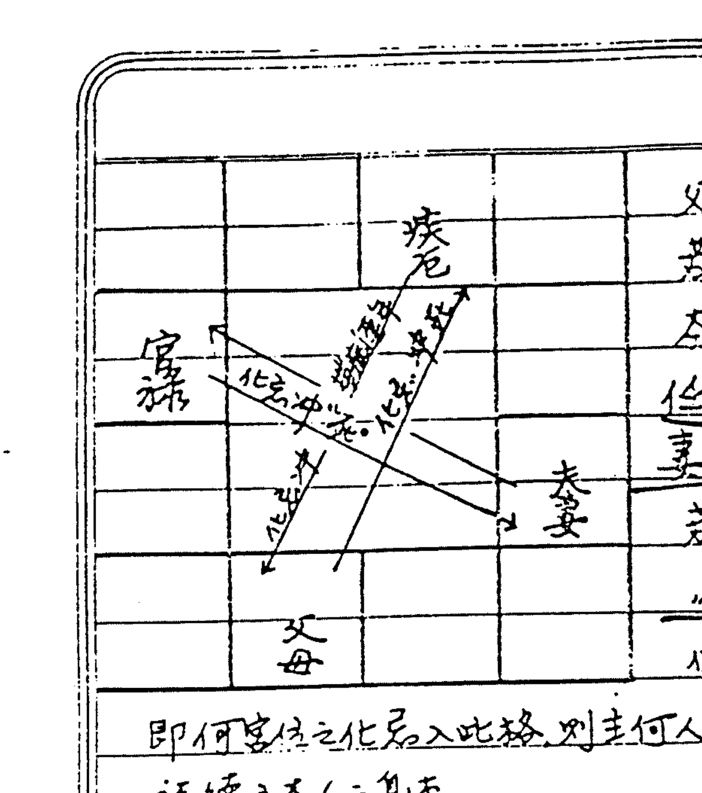

父母与疾厄，夫妻与官禄为四正位。
若以疾厄为命宫，则父母为迁移，夫妻为田宅，官禄为子女。
本断诀以疾厄为主，为体。
任何宫干之化忌不可入父母冲疾厄，或入官禄冲夫妻，冲者身体一定不好，且有劫数。
若化忌入父母冲疾厄，或化忌入官禄冲夫妻，多死。
“ ”入疾厄冲父母，“ ”夫妻冲官禄，主带病延年，但不会死。

即何宫位之化忌入此格，则主何人之意。
福德主本人之身体。
若子女宫化忌入此格局，在女命主生产不顺，生子不全，或剖腹用刀。男女命又主少性生活有用，有隐疾。
流年疾厄化忌入本命官禄冲夫妻，主亡。
又如父母宫之星不可能化忌时，应看官禄与夫妻宫。
如财帛宫化忌入官禄冲夫妻主生意倒闭，如为妻冲官，则为硬撑拖拉。
“ ”“ ”入父母冲疾厄主倒债，如为疾厄冲父母，则为拖债。
凡事以疾厄为主。
若父母宫自化忌时，必须忌出，故不一定主父母。

断生死诀：若某人现在病重，问生死。（因先天化忌落疾厄，故须找禄再找忌，否则无须如此麻烦）
以命宫为主，由命宫干化禄，再以禄所坐之宫干化忌（禄找忌），若化忌落父母冲迁移，或入官禄冲夫妻，大概会死亡（流年、大限同断法）……禄忌要断生死，无病免断。
流年随大限走，并对大限负责。

看疾厄，仍应守流年对大限负责之诀：
如化忌落父母冲疾厄，或落官禄冲夫妻时情况变坏。
而若流年疾厄（或各宫）化忌入大限父母冲疾厄，官禄冲夫妻时病状严重（大冲大）。
但“ ”“ ”（“ ”）“ ”流年“ ”“ ”“ ”“ ”“ ”“ ”“ ”“ ”“ ”“ ”“ ”“ ”“ ”“ ”“ ”“ ”“ ”“ ”“ ”“ ”“ ”“ ”“ ”“ ”“ ”“ ”“ ”“ ”“ ”“ ”“ ”“ ”“ ”“ ”“ ”“ ”“ ”“ ”“ ”“ ”“ ”“ ”“ ”“ ”“ ”“ ”“ ”“ ”“ ”“ ”“ ”“ ”“ ”“ ”“ ”“ ”“ ”“ ”“ ”“ ”“ ”“ ”“ ”“ ”“ ”“ ”“ ”“ ”“ ”“ ”“ ”“ ”“ ”“ ”“ ”“ ”“ ”“ ”“ ”“ ”“ ”“ ”“ ”“ ”“ ”“ ”“ ”“ ”“ ”“ ”“ ”“ ”“ ”“ ”“ ”“ ”“ ”“ ”“ ”“ ”“ ”“ ”“ ”“ ”“ ”“ ”“ ”“ ”“ ”“ ”“ ”“ ”“ ”“ ”“ ”“ ”“ ”“ ”“ ”“ ”“ ”“ ”“ ”“ ”“ ”“ ”“ ”“ ”“ ”“ ”“ ”“ ”“ ”“ ”“ ”“ ”“ ”“ ”“ ”“ ”“ ”“ ”“ ”“ ”“ ”“ ”“ ”“ ”“ ”“ ”“ ”“ ”“ ”“ ”“ ”“ ”“ ”“ ”“ ”“ ”“ ”“ ”“ ”“ ”“ ”“ ”“ ”“ ”“ ”“ ”“ ”“ ”“ ”“ ”“ ”“ ”“ ”“ ”“ ”“ ”“ ”“ ”“ ”“ ”“ ”“ ”“ ”“ ”“ ”“ ”“ ”“ ”“ ”“ ”“ ”“ ”“ ”“ ”“ ”“ ”“ ”“ ”“ ”“ ”“ ”“ ”“ ”“ ”“ ”“ ”“ ”“ ”“ ”“ ”“ ”“ ”“ ”“ ”“ ”“ ”“ ”“ ”“ ”“ ”“ ”“ ”“ ”“ ”“ ”“ ”“ ”“ ”“ ”“ ”“ ”“ ”“ ”“ ”“ ”“ ”“ ”“ ”“ ”“ ”“ ”“ ”“ ”“ ”“ ”“ ”“ ”“ ”“ ”“ ”“ ”“ ”“ ”“ ”“ ”“ ”“ ”“ ”“ ”“ ”“ ”“ ”“ ”“ ”“ ”“ ”“ ”“ ”“ ”“ ”“ ”“ ”“ ”“ ”“ ”“ ”“ ”“ ”“ ”“ ”“ ”“ ”“ ”“ ”“ ”“ ”“ ”“ ”“ ”“ ”“ ”“ ”“ ”“ ”“ ”“ ”“ ”“ ”“ ”“ ”“ ”“ ”“ ”“ ”“ ”“ ”“ ”“ ”“ ”“ ”“ ”“ ”“ ”“ ”“ ”“ ”“ ”“ ”“ ”“ ”“ ”“ ”“ ”“ ”“ ”“ ”“ ”“ ”“ ”“ ”“ ”“ ”“ ”“ ”“ ”“ ”“ ”“ ”“ ”“ ”“ ”“ ”“ ”“ ”“ ”“ ”“ ”“ ”“ ”“ ”“ ”“ ”“ ”“ ”“ ”“ ”“ ”“ ”“ ”“ ”“ ”“ ”“ ”“ ”“ ”“ ”“ ”“ ”“ ”“ ”“ ”“ ”“ ”“ ”“ ”“ ”“ ”“ ”“ ”“ ”“ ”“ ”“ ”“ ”“ ”“ ”“ ”“ ”“ ”“ ”“ ”“ ”“ ”“ ”“ ”“ ”“ ”“ ”“ ”“ ”“ ”“ ”“ ”“ ”“ ”“ ”“ ”“ ”“ ”“ ”“ ”“ ”“ ”“ ”“ ”“ ”“ ”“ ”“ ”“ ”“ ”“ ”“ ”“ ”“ ”“ ”“ ”“ ”“ ”“ ”“ ”“ ”“ ”“ ”“ ”“ ”“ ”“ ”“ ”“ ”“ ”“ ”“ ”“ ”“ ”“ ”“ ”“ ”“ ”“ ”“ ”“ ”“ ”“ ”“ ”“ ”“ ”“ ”“ ”“ ”“ ”“ ”“ ”“ ”“ ”“ ”“ ”“ ”“ ”“ ”“ ”“ ”“ ”“ ”“ ”“ ”“ ”“ ”“ ”“ ”“ ”“ ”“ ”“ ”“ ”“ ”“ ”“ ”“ ”“ ”“ ”“ ”“ ”“ ”“ ”“ ”“ ”“ ”“ ”“ ”“ ”“ ”“ ”“ ”“ ”“ ”“ ”“ ”“ ”“ ”“ ”“ ”“ ”“ ”“ ”“ ”“ ”“ ”“ ”“ ”“ ”“ ”“ ”“ ”“ ”“ ”“ ”“ ”“ ”“ ”“ ”“ ”“ ”“ ”“ ”“ ”“ ”“ ”“ ”“ ”“ ”“ ”“ ”“ ”“ ”“ ”“ ”“ ”“ ”“ ”“ ”“ ”“ ”“ ”“ ”“ ”“ ”“ ”“ ”“ ”“ ”“ ”“ ”“ ”“ ”“ ”“ ”“ ”“ ”“ ”“ ”“ ”“ ”“ ”“ ”“ ”“ ”“ ”“ ”“ ”“ ”“ ”“ ”“ ”“ ”“ ”“ ”“ ”“ ”“ ”“ ”“ ”“ ”“ ”“ ”“ ”“ ”“ ”“ ”“ ”“ ”“ ”“ ”“ ”“ ”“ ”“ ”“ ”“ ”“ ”“ ”“ ”“ ”“ ”“ ”“ ”“ ”“ ”“ ”“ ”“ ”“ ”“ ”“ ”“ ”“ ”“ ”“ ”“ ”“ ”“ ”“ ”“ ”“ ”“ ”“ ”“ ”“ ”“ ”“ ”“ ”“ ”“ ”“ ”“ ”“ ”“ ”“ ”“ ”“ ”“ ”“ ”“ ”“ ”“ ”“ ”“ ”“ ”“ ”“ ”“ ”“ ”“ ”“ ”“ ”“ ”“ ”“ ”“ ”“ ”“ ”“ ”“ ”“ ”“ ”“ ”“ ”“ ”“ ”“ ”“ ”“ ”“ ”“ ”“ ”“ ”“ ”“ ”“ ”“ ”“ ”“ ”“ ”“ ”“ ”“ ”“ ”“ ”“ ”“ ”“ ”“ ”“ ”“ ”“ ”“ ”“ ”“ ”“ ”“ ”“ ”“ ”“ ”“ ”“ ”“ ”“ ”“ ”“ ”“ ”“ ”“ ”“ ”“ ”“ ”“ ”“ ”“ ”“ ”“ ”“ ”“ ”“ ”“ ”“ ”“ ”“ ”“ ”“ ”“ ”“ ”“ ”“ ”“ ”“ ”“ ”“ ”“ ”“ ”“ ”“ ”“ ”“ ”“ ”“ ”“ ”“ ”“ ”“ ”“ ”“ ”“ ”“ ”“ ”“ ”“ ”“ ”“ ”“ ”“ ”“ ”“ ”“ ”“ ”“ ”“ ”“ ”“ ”“ ”“ ”“ ”“ ”“ ”“ ”“ ”“ ”“ ”“ ”“ ”“ ”“ ”“ ”“ ”“ ”“ ”“ ”“ ”“ ”“ ”“ ”“ ”“ ”“ ”“ ”“ ”“ ”“ ”“ ”“ ”“ ”“ ”“ ”“ ”“ ”“ ”“ ”“ ”“ ”“ ”“ ”“ ”“ ”“ ”“ ”“ ”“ ”“ ”“ ”“ ”“ ”“ ”“ ”“ ”“ ”“ ”“ ”“ ”“ ”“ ”“ ”“ ”“ ”“ ”“ ”“ ”“ ”“ ”“ ”“ ”“ ”“ ”“ ”“ ”“ ”“ ”“ ”“ ”“ ”“ ”“ ”“ ”“ ”“ ”“ ”“ ”“ ”“ ”“ ”“ ”“ ”“ ”“ ”“ ”“ ”“ ”“ ”“ ”“ ”“ ”“ ”“ ”“ ”“ ”“ ”“ ”“ ”“ ”“ ”“ ”“ ”“ ”“ ”“ ”“ ”“ ”“ ”“ ”“ ”“ ”“ ”“ ”“ ”“ ”“ ”“ ”“ ”“ ”“ ”“ ”“ ”“ ”“ ”“ ”“ ”“ ”“ ”“ ”“ ”“ ”“ ”“ ”“ ”“ ”“ ”“ ”“ ”“ ”“ ”“ ”“ ”“ ”“ ”“ ”“ ”“ ”“ ”“ ”“ ”“ ”“ ”“ ”“ ”“ ”“ ”“ ”“ ”“ ”“ ”“ ”“ ”“ ”“ ”“ ”“ ”“ ”“ ”“ ”“ ”“ ”“ ”“ ”“ ”“ ”“ ”“ ”“ ”“ ”“ ”“ ”“ ”“ ”“ ”“ ”“ ”“ ”“ ”“ ”“ ”“ ”“ ”“ ”“ ”“ ”“ ”“ ”“ ”“ ”“ ”“ ”“ ”“ ”“ ”“ ”“ ”“ ”“ ”“ ”“ ”“ ”“ ”“ ”“ ”“ ”“ ”“ ”“ ”“ ”“ ”“ ”“ ”“ ”“ ”“ ”“ ”“ ”“ ”“ ”“ ”“ ”“ ”“ ”“ ”“ ”“ ”“ ”“ ”“ ”“ ”“ ”“ ”“ ”“ ”“ ”“ ”“ ”“ ”“ ”“ ”“ ”“ ”“ ”“ ”“ ”“ ”“ ”“ ”“ ”“ ”“ ”“ ”“ ”“ ”“ ”“ ”“ ”“ ”“ ”“ ”“ ”“ ”“ ”“ ”“ ”“ ”“ ”“ ”“ ”“ ”“ ”“ ”“ ”“ ”“ ”“ ”“ ”“ ”“ ”“ ”“ ”“ ”“ ”“ ”“ ”“ ”“ ”“ ”“ ”“ ”“ ”“ ”“ ”“ ”“ ”“ ”“ ”“ ”“ ”“ ”“ ”“ ”“ ”“ ”“ ”“ ”“ ”“ ”“ ”“ ”“ ”“ ”“ ”“ ”“ ”“ ”“ ”“ ”“ ”“ ”“ ”“ ”“ ”“ ”“ ”“ ”“ ”“ ”“ ”“ ”“ ”“ ”“ ”“ ”“ ”“ ”“ ”“ ”“ ”“ ”“ ”“ ”“ ”“ ”“ ”“ ”“ ”“ ”“ ”“ ”“ ”“ ”“ ”“ ”“ ”“ ”“ ”“ ”“ ”“ ”“ ”“ ”“ ”“ ”“ ”“ ”“ ”“ ”“ ”“ ”“ ”“ ”“ ”“ ”“ ”“ ”“ ”“ ”“ ”“ ”“ ”“ ”“ ”“ ”“ ”“ ”“ ”“ ”“ ”“ ”“ ”“ ”“ ”“ ”“ ”“ ”“ ”“ ”“ ”“ ”“ ”“ ”“ ”“ ”“ ”“ ”“ ”“ ”“ ”“ ”“ ”“ ”“ ”“ ”“ ”“ ”“ ”“ ”“ ”“ ”“ ”“ ”“ ”“ ”“ ”“ ”“ ”“ ”“ ”“ ”“ ”“ ”“ ”“ ”“ ”“ ”“ ”“ ”“ ”“ ”“ ”“ ”“ ”“ ”“ ”“ ”“ ”“ ”“ ”“ ”“ ”“ ”“ ”“ ”“ ”“ ”“ ”“ ”“ ”“ ”“ ”“ ”“ ”“ ”“ ”“ ”“ ”“ ”“ ”“ ”“ ”“ ”“ ”“ ”“ ”“ ”“ ”“ ”“ ”“ ”“ ”“ ”“ ”“ ”“ ”“ ”“ ”“ ”“ ”“ ”“ ”“ ”“ ”“ ”“ ”“ ”“ ”“ ”“ ”“ ”“ ”“ ”“ ”“ ”“ ”“ ”“ ”“ ”“ ”“ ”“ ”“ ”“ ”“ ”“ ”“ ”“ ”“ ”“ ”“ ”“ ”“ ”“ ”“ ”“ ”“ ”“ ”“ ”“ ”“ ”“ ”“ ”“ ”“ ”“ ”“ ”“ ”“ ”“ ”“ ”“ ”“ ”“ ”“ ”“ ”“ ”“ ”“ ”“ ”“ ”“ ”“ ”“ ”“ ”“ ”“ ”“ ”“ ”“ ”“ ”“ ”“ ”“ ”“ ”“ ”“ ”“ ”“ ”“ ”“ ”“ ”“ ”“ ”“ ”“ ”“ ”“ ”“ ”“ ”“ ”“ ”“ ”“ ”“ ”“ ”“ ”“ ”“ ”“ ”“ ”“ ”“ ”“ ”“ ”“ ”“ ”“ ”“ ”“ ”“ ”“ ”“ ”“ ”“ ”“ ”“ ”“ ”“ ”“ ”“ ”“ ”“ ”“ ”“ ”“ ”“ ”“ ”“ ”“ ”“ ”“ ”“ ”“ ”“ ”“ ”“ ”“ ”“ ”“ ”“ ”“ ”“ ”“ ”“ ”“ ”“ ”“ ”“ ”“ ”“ ”“ ”“ ”“ ”“ ”“ ”“ ”“ ”“ ”“ ”“ ”“ ”“ ”“ ”“ ”“ ”“ ”“ ”“ ”“ ”“ ”“ ”“ ”“ ”“ ”“ ”“ ”“ ”“ ”“ ”“ ”“ ”“ ”“ ”“ ”“ ”“ ”“ ”“ ”“ ”“ ”“ ”“ ”“ ”“ ”“ ”“ ”“ ”“ ”“ ”“ ”“ ”“ ”“ ”“ ”“ ”“ ”“ ”“ ”“ ”“ ”“ ”“ ”“ ”“ ”“ ”“ ”“ ”“ ”“ ”“ ”“ ”“ ”“ ”“ ”“ ”“ ”“ ”“ ”“ ”“ ”“ ”“ ”“ ”“ ”“ ”“ ”“ ”“ ”“ ”“ ”“ ”“ ”“ ”“ ”“ ”“ ”“ ”“ ”“ ”“ ”“ ”“ ”“ ”“ ”“ ”“ ”“ ”“ ”“ ”“ ”“ ”“ ”“ ”“ ”“ ”“ ”“ ”“ ”“ ”“ ”“ ”“ ”“ ”“ ”“ ”“ ”“ ”“ ”“ ”“ ”“ ”“ ”“ ”“ ”“ ”“ ”“ ”“ ”“ ”“ ”“ ”“ ”“ ”“ ”“ ”“ ”“ ”“ ”“ ”“ ”“ ”“ ”“ ”“ ”“ ”“ ”“ ”“ ”“ ”“ ”“ ”“ ”“ ”“ ”“ ”“ ”“ ”“ ”“ ”“ ”“ ”“ ”“ ”“ ”“ ”“ ”“ ”“ ”“ ”“ ”“ ”“ ”“ ”“ ”“ ”“ ”“ ”“ ”“ ”“ ”“ ”“ ”“ ”“ ”“ ”“ ”“ ”“ ”“ ”“ ”“ ”“ ”“ ”“ ”“ ”“ ”“ ”“ ”“ ”“ ”“ ”“ ”“ ”“ ”“ ”“ ”“ ”“ ”“ ”“ ”“ ”“ ”“ ”“ ”“ ”“ ”“ ”“ ”“ ”“ ”“ ”“ ”“ ”“ ”“ ”“ ”“ ”“ ”“ ”“ ”“ ”“ ”“ ”“ ”“ ”“ ”“ ”“ ”“ ”“ ”“ ”“ ”“ ”“ ”“ ”“ ”“ ”“ ”“ ”“ ”“ ”“ ”“ ”“ ”“ ”“ ”“ ”“ ”“ ”“ ”“ ”“ ”“ ”“ ”“ ”“ ”“ ”“ ”“ ”“ ”“ ”“ ”“ ”“ ”“ ”“ ”“ ”“ ”“ ”“ ”“ ”“ ”“ ”“ ”“ ”“ ”“ ”“ ”“ ”“ ”“ ”“ ”“ ”“ ”“ ”“ ”“ ”“ ”“ ”“ ”“ ”“ ”“ ”“ ”“ ”“ ”“ ”“ ”“ ”“ ”“ ”“ ”“ ”“ ”“ ”“ ”“ ”“ ”“ ”“ ”“ ”“ ”“ ”“ ”“ ”“ ”“ ”“ ”“ ”“ ”“ ”“ ”“ ”“ ”“ ”“ ”“ ”“ ”“ ”“ ”“ ”“ ”“ ”“ ”“ ”“ ”“ ”“ ”“ ”“ ”“ ”“ ”“ ”“ ”“ ”“ ”“ ”“ ”“ ”“ ”“ ”“ ”“ ”“ ”“ ”“ ”“ ”“ ”“ ”“ ”“ ”“ ”“ ”“ ”“ ”“ ”“ ”“ ”“ ”“ ”“ ”“ ”“ ”“ ”“ ”“ ”“ ”“ ”“ ”“ ”“ ”“ ”“ ”“ ”“ ”“ ”“ ”“ ”“ ”“ ”“ ”“ ”“ ”“ ”“ ”“ ”“ ”“ ”“ ”“ ”“ ”“ ”“ ”“ ”“ ”“ ”“ ”“ ”“ ”“ ”“ ”“ ”“ ”“ ”“ ”“ ”“ ”“ ”“ ”“ ”“ ”“ ”“ ”“ ”“ ”“ ”“ ”“ ”“ ”“ ”“ ”“ ”“ ”“ ”“ ”“ ”“ ”“ ”“ ”“ ”“ ”“ ”“ ”“ ”“ ”“ ”“ ”“ ”“ ”“ ”“ ”“ ”“ ”“ ”“ ”“ ”“ ”“ ”“ ”“ ”“ ”“ ”“ ”“ ”“ ”“ ”“ ”“ ”“ ”“ ”“ ”“ ”“ ”“ ”“ ”“ ”“ ”“ ”“ ”“ ”“ ”“ ”“ ”“ ”“ ”“ ”“ ”“ ”“ ”“ ”“ ”“ ”“ ”“ ”“ ”“ ”“ ”“ ”“ ”“ ”“ ”“ ”“ ”“ ”“ ”“ ”“ ”“ ”“ ”“ ”“ ”“ ”“ ”“ ”“ ”“ ”“ ”“ ”“ ”“ ”“ ”“ ”“ ”“ ”“ ”“ ”“ ”“ ”“ ”“ ”“ ”“ ”“ ”“ ”“ ”“ ”“ ”“ ”“ ”“ ”“ ”“ ”“ ”“ ”“ ”“ ”“ ”“ ”“ ”“ ”“ ”“ ”“ ”“ ”“ ”“ ”“ ”“ ”“ ”“ ”“ ”“ ”“ ”“ ”“ ”“ ”“ ”“ ”“ ”“ ”“ ”“ ”“ ”“ ”“ ”“ ”“ ”“ ”“ ”“ ”“ ”“ ”“ ”“ ”“ ”“ ”“ ”“ ”“ ”“ ”“ ”“ ”“ ”“ ”“ ”“ ”“ ”“ ”“ ”“ ”“ ”“ ”“ ”“ ”“ ”“ ”“ ”“ ”“ ”“ ”“ ”“ ”“ ”“ ”“ ”“ ”“ ”“ ”“ ”“ ”“ ”“ ”“ ”“ ”“ ”“ ”“ ”“ ”“ ”“ ”“ ”“ ”“ ”“ ”“ ”“ ”“ ”“ ”“ ”“ ”“ ”“ ”“ ”“ ”“ ”“ ”“ ”“ ”“ ”“ ”“ ”“ ”“ ”“ ”“ ”“ ”“ ”“ ”“ ”“ ”“ ”“ ”“ ”“ ”“ ”“ ”“ ”“ ”“ ”“ ”“ ”“ ”“ ”“ ”“ ”“ ”“ ”“ ”“ ”“ ”“ ”“ ”“ ”“ ”“ ”“ ”“ ”“ ”“ ”“ ”“ ”“ ”“ ”“ ”“ ”“ ”“ ”“ ”“ ”“ ”“ ”“ ”“ ”“ ”“ ”“ ”“ ”“ ”“ ”“ ”“ ”“ ”“ ”“ ”“ ”“ ”“ ”“ ”“ ”“ ”“ ”“ ”“ ”“ ”“ ”“ ”“ ”“ ”“ ”“ ”“ ”“ ”“ ”“ ”“ ”“ ”“ ”“ ”“ ”“ ”“ ”“ ”“ ”“ ”“ ”“ ”“ ”“ ”“ ”“ ”“ ”“ ”“ ”“ ”“ ”“ ”“ ”“ ”“ ”“ ”“ ”“ ”“ ”“ ”“ ”“ ”“ ”“ ”“ ”“ ”“ ”“ ”“ ”“ ”“ ”“ ”“ ”“ ”“ ”“ ”“ ”“ ”“ ”“ ”“ ”“ ”“ ”“ ”“ ”“ ”“ ”“ ”“ ”“ ”“ ”“ ”“ ”“ ”“ ”“ ”“ ”“ ”“ ”“ ”“ ”“ ”“ ”“ ”“ ”“ ”“ ”“ ”“ ”“ ”“ ”“ ”“ ”“ ”“ ”“ ”“ ”“ ”“ ”“ ”“ ”“ ”“ ”“ ”“ ”“ ”“ ”“ ”“ ”“ ”“ ”“ ”“ ”“ ”“ ”“ ”“ ”“ ”“ ”“ ”“ ”“ ”“ ”“ ”“ ”“ ”“ ”“ ”“ ”“ ”“ ”“ ”“ ”“ ”“ ”“ ”“ ”“ ”“ ”“ ”“ ”“ ”“ ”“ ”“ ”“ ”“ ”“ ”“ ”“ ”“ ”“ ”“ ”“ ”“ ”“ ”“ ”“ ”“ ”“ ”“ ”“ ”“ ”“ ”“ ”“ ”“ ”“ ”“ ”“ ”“ ”“ ”“ ”“ ”“ ”“ ”“ ”“ ”“ ”“ ”“ ”“ ”“ ”“ ”“ ”“ ”“ ”“ ”“ ”“ ”“ ”“ ”“ ”“ ”“ ”“ ”“ ”“ ”“ ”“ ”“ ”“ ”“ ”“ ”“ ”“ ”“ ”“ ”“ ”“ ”“ ”“ ”“ ”“ ”“ ”“ ”“ ”“ ”“ ”“ ”“ ”“ ”“ ”“ ”“ ”“ ”“ ”“ ”“ ”“ ”“ ”“ ”“ ”“ ”“ ”“ ”“ ”“ ”“ ”“ ”“ ”“ ”“ ”“ ”“ ”“ ”“ ”“ ”“ ”“ ”“ ”“ ”“ ”“ ”“ ”“ ”“ ”“ ”“ ”“ ”“ ”“ ”“ ”“ ”“ ”“ ”“ ”“ ”“ ”“ ”“ ”“ ”“ ”“ ”“ ”“ ”“ ”“ ”“ ”“ ”“ ”“ ”“ ”“ ”“ ”“ ”“ ”“ ”“ ”“ ”“ ”“ ”“ ”“ ”“ ”“ ”“ ”“ ”“ ”“ ”“ ”“ ”“ ”“ ”“ ”“ ”“ ”“ ”“ ”“ ”“ ”“ ”“ ”“ ”“ ”“ ”“ ”“ ”“ ”“ ”“ ”“ ”“ ”“ ”“ ”“ ”“ ”“ ”“ ”“ ”“ ”“ ”“ ”“ ”“ ”“ ”“ ”“ ”“ ”“ ”“ ”“ ”“ ”“ ”“ ”“ ”“ ”“ ”“ ”“ ”“ ”“ ”“ ”“ ”“ ”“ ”“ ”“ ”“ ”“ ”“ ”“ ”“ ”“ ”“ ”“ ”“ ”“ ”“ ”“ ”“ ”“ ”“ ”“ ”“ ”“ ”“ ”“ ”“ ”“ ”“ ”“ ”“ ”“ ”“ ”“ ”“ ”“ ”“ ”“ ”“ ”“ ”“ ”“ ”“ ”“ ”“ ”“ ”“ ”“ ”“ ”“ ”“ ”“ ”“ ”“ ”“ ”“ ”“ ”“ ”“ ”“ ”“ ”“ ”“ ”“ ”“ ”“ ”“ ”“ ”“ ”“ ”“ ”“ ”“ ”“ ”“ ”“ ”“ ”“ ”“ ”“ ”“ ”“ ”“ ”“ ”“ ”“ ”“ ”“ ”“ ”“ ”“ ”“ ”“ ”“ ”“ ”“ ”“ ”“ ”“ ”“ ”“ ”“ ”“ ”“ ”“ ”“ ”“ ”“ ”“ ”“ ”“ ”“ ”“ ”“ ”“ ”“ ”“ ”“ ”“ ”“ ”“ ”“ ”“ ”“ ”“ ”“ ”“ ”“ ”“ ”“ ”“ ”“ ”“ ”“ ”“ ”“ ”“ ”“ ”“ ”“ ”“ ”“ ”“ ”“ ”“ ”“ ”“ ”“ ”“ ”“ ”“ ”“ ”“ ”“ ”“ ”“ ”“ ”“ ”“ ”“ ”“ ”“ ”“ ”“ ”“ ”“ ”“ ”“ ”“ ”“ ”“ ”“ ”“ ”“ ”“ ”“ ”“ ”“ ”“ ”“ ”“ ”“ ”“ ”“ ”“ ”“ ”“ ”“ ”“ ”“ ”“ ”“ ”“ ”“ ”“ ”“ ”“ ”“ ”“ ”“ ”“ ”“ ”“ ”“ ”“ ”“ ”“ ”“ ”“ ”“ ”“ ”“ ”“ ”“ ”“ ”“ ”“ ”“ ”“ ”“ ”“ ”“ ”“ ”“ ”“ ”“ ”“ ”“ ”“ ”“ ”“ ”“ ”“ ”“ ”“ ”“ ”“ ”“ ”“ ”“ ”“ ”“ ”“ ”“ ”“ ”“ ”“ ”“ ”“ ”“ ”“ ”“ ”“ ”“ ”“ ”“ ”“ ”“ ”“ ”“ ”“ ”“ ”“ ”“ ”“ ”“ ”“ ”“ ”“ ”“ ”“ ”“ ”“ ”“ ”“ ”“ ”“ ”“ ”“ ”“ ”“ ”“ ”“ ”“ ”“ ”“ ”“ ”“ ”“ ”“ ”“ ”“ ”“ ”“ ”“ ”“ ”“ ”“ ”“ ”“ ”“ ”“ ”“ ”“ ”“ ”“ ”“ ”“ ”“ ”“ ”“ ”“ ”“ ”“ ”“ ”“ ”“ ”“ ”“ ”“ ”“ ”“ ”“ ”“ ”“ ”“ ”“ ”“ ”“ ”“ ”“ ”“ ”“ ”“ ”“ ”“ ”“ ”“ ”“ ”“ ”“ ”“ ”“ ”“ ”“ ”“ ”“ ”“ ”“ ”“ ”“ ”“ ”“ ”“ ”“ ”“ ”“ ”“ ”“ ”“ ”“ ”“ ”“ ”“ ”“ ”“ ”“ ”“ ”“ ”“ ”“ ”“ ”“ ”“ ”“ ”“ ”“ ”“ ”“ ”“ ”“ ”“ ”“ ”“ ”“ ”“ ”“ ”“ ”“ ”“ ”“ ”“ ”“ ”“ ”“ ”“ ”“ ”“ ”“ ”“ ”“ ”“ ”“ ”“ ”“ ”“ ”“ ”“ ”“ ”“ ”“ ”“ ”“ ”“ ”“ ”“ ”“ ”“ ”“ ”“ ”“ ”“ ”“ ”“ ”“ ”“ ”“ ”“ ”“ ”“ ”“ ”“ ”“ ”“ ”“ ”“ ”“ ”“ ”“ ”“ ”“ ”“ ”“ ”“ ”“ ”“ ”“ ”“ ”“ ”“ ”“ ”“ ”“ ”“ ”“ ”“ ”“ ”“ ”“ ”“ ”“ ”“ ”“ ”“ ”“ ”“ ”“ ”“ ”“ ”“ ”“ ”“ ”“ ”“ ”“ ”“ ”“ ”“ ”“ ”“ ”“ ”“ ”“ ”“ ”“ ”“ ”“ ”“ ”“ ”“ ”“ ”“ ”“ ”“ ”“ ”“ ”“ ”“ ”“ ”“ ”“ ”“ ”“ ”“ ”“ ”“ ”“ ”“ ”“ ”“ ”“ ”“ ”“ ”“ ”“ ”“ ”“ ”“ ”“ ”“ ”“ ”“ ”“ ”“ ”“ ”“ ”“ ”“ ”“ ”“ ”“ ”“ ”“ ”“ ”“ ”“ ”“ ”“ ”“ ”“ ”“ ”“ ”“ ”“ ”“ ”“ ”“ ”“ ”“ ”“ ”“ ”“ ”“ ”“ ”“ ”“ ”“ ”“ ”“ ”“ ”“ ”“ ”“ ”“ ”“ ”“ ”“ ”“ ”“ ”“ ”“ ”“ ”“ ”“ ”“ ”“ ”“ ”“ ”“ ”“ ”“ ”“ ”“ ”“ ”“ ”“ ”“ ”“ ”“ ”“ ”“ ”“ ”“ ”“ ”“ ”“ ”“ ”“ ”“ ”“ ”“ ”“ ”“ ”“ ”“ ”“ ”“ ”“ ”“ ”“ ”“ ”“ ”“ ”“ ”“ ”“ ”“ ”“ ”“ ”“ ”“ ”“ ”“ ”“ ”“ ”“ ”“ ”“ ”“ ”“ ”“ ”“ ”“ ”“ ”“ ”“ ”“ ”“ ”“ ”“ ”“ ”“ ”“ ”“ ”“ ”“ ”“ ”“ ”“ ”“ ”“ ”“ ”“ ”“ ”“ ”“ ”“ ”“ ”“ ”“ ”“ ”“ ”“ ”“ ”“ ”“ ”“ ”“ ”“ ”“ ”“ ”“ ”“ ”“ ”“ ”“ ”“ ”“ ”“ ”“ ”“ ”“ ”“ ”“ ”“ ”“ ”“ ”“ ”“ ”“ ”“ ”“ ”“ ”“ ”“ ”“ ”“ ”“ ”“ ”“ ”“ ”“ ”“ ”“ ”“ ”“ ”“ ”“ ”“ ”“ ”“ ”“ ”“ ”“ ”“ ”“ ”“ ”“ ”“ ”“ ”“ ”“ ”“ ”“ ”“ ”“ ”“ ”“ ”“ ”“ ”“ ”“ ”“ ”“ ”“ ”“ ”“ ”“ ”“ ”“ ”“ ”“ ”“ ”“ ”“ ”“ ”“ ”“ ”“ ”“ ”“ ”“ ”“ ”“ ”“ ”“ ”“ ”“ ”“ ”“ ”“ ”“ ”“ ”“ ”“ ”“ ”“ ”“ ”“ ”“ ”“ ”“ ”“ ”“ ”“ ”“ ”“ ”“ ”“ ”“ ”“ ”“ ”“ ”“ ”“ ”“ ”“ ”“ ”“ ”“ ”“ ”“ ”“ ”“ ”“ ”“ ”“ ”“ ”“ ”“ ”“ ”“ ”“ ”“ ”“ ”“ ”“ ”“ ”“ ”“ ”“ ”“ ”“ ”“ ”“ ”“ ”“ ”“ ”“ ”“ ”“ ”“ ”“ ”“ ”“ ”“ ”“ ”“ ”“ ”“ ”“ ”“ ”“ ”“ ”“ ”“ ”“ ”“ ”“ ”“ ”“ ”“ ”“ ”“ ”“ ”“ ”“ ”“ ”“ ”“ ”“ ”“ ”“ ”“ ”“ ”“ ”“ ”“ ”“ ”“ ”“ ”“ ”“ ”“ ”“ ”“ ”“ ”“ ”“ ”“ ”“ ”“ ”“ ”“ ”“ ”“ ”“ ”“ ”“ ”“ ”“ ”“ ”“ ”“ ”“ ”“ ”“ ”“ ”“ ”“ ”“ ”“ ”“ ”“ ”“ ”“ ”“ ”“ ”“ ”“ ”“ ”“ ”“ ”“ ”“ ”“ ”“ ”“ ”“ ”“ ”“ ”“ ”“ ”“ ”“ ”“ ”“ ”“ ”“ ”“ ”“ ”“ ”“ ”“ ”“ ”“ ”“ ”“ ”“ ”“ ”“ ”“ ”“ ”“ ”“ ”“ ”“ ”“ ”“ ”“ ”“ ”“ ”“ ”“ ”“ ”“ ”“ ”“ ”“ ”“ ”“ ”“ ”“ ”“ ”“ ”“ ”“ ”“ ”“ ”“ ”“ ”“ ”“ ”“ ”“ ”“ ”“ ”“ ”“ ”“ ”“ ”“ ”“ ”“ ”“ ”“ ”“ ”“ ”“ ”“ ”“ ”“ ”“ ”“ ”“ ”“ ”“ ”“ ”“ ”“ ”“ ”“ ”“ ”“ ”“ ”“ ”“ ”“ ”“ ”“ ”“ ”“ ”“ ”“ ”“ ”“ ”“ ”“ ”“ ”“ ”“ ”“ ”“ ”“ ”“ ”“ ”“ ”“ ”“ ”“ ”“ ”“ ”“ ”“ ”“ ”“ ”“ ”“ ”“ ”“ ”“ ”“ ”“ ”“ ”“ ”“ ”“ ”“ ”“ ”“ ”“ ”“ ”“ ”“ ”“ ”“ ”“ ”“ ”“ ”“ ”“ ”“ ”“ ”“ ”“ ”“ ”“ ”“ ”“ ”“ ”“ ”“ ”“ ”“ ”“ ”“ ”“ ”“ ”“ ”“ ”“ ”“ ”“ ”“ ”“ ”“ ”“ ”“ ”“ ”“ ”“ ”“ ”“ ”“ ”“ ”“ ”“ ”“ ”“ ”“ ”“ ”“ ”“ ”“ ”“ ”“ ”“ ”“ ”“ ”“ ”“ ”“ ”“ ”“ ”“ ”“ ”“ ”“ ”“ ”“ ”“ ”“ ”“ ”“ ”“ ”“ ”“ ”“ ”“ ”“ ”“ ”“ ”“ ”“ ”“ ”“ ”“ ”“ ”“ ”“ ”“ ”“ ”“ ”“ ”“ ”“ ”“ ”“ ”“ ”“ ”“ ”“ ”“ ”“ ”“ ”“ ”“ ”“ ”“ ”“ ”“ ”“ ”“ ”“ ”“ ”“ ”“ ”“ ”“ ”“ ”“ ”“ ”“ ”“ ”“ ”“ ”“ ”“ ”“ ”“ ”“ ”“ ”“ ”“ ”“ ”“ ”“ ”“ ”“ ”“ ”“ ”“ ”“ ”“ ”“ ”“ ”“ ”“ ”“ ”“ ”“ ”“ ”“ ”“ ”“ ”“ ”“ ”“ ”“ ”“ ”“ ”“ ”“ ”“ ”“ ”“ ”“ ”“ ”“ ”“ ”“ ”“ ”“ ”“ ”“ ”“ ”“ ”“ ”“ ”“ ”“ ”“ ”“ ”“ ”“ ”“ ”“ ”“ ”“ ”“ ”“ ”“ ”“ ”“ ”“ ”“ ”“ ”“ ”“ ”“ ”“ ”“ ”“ ”“ ”“ ”“ ”“ ”“ ”“ ”“ ”“ ”“ ”“ ”“ ”“ ”“ ”“ ”“ ”“ ”“ ”“ ”“ ”“ ”“ ”“ ”“ ”“ ”“ ”“ ”“ ”“ ”“ ”“ ”“ ”“ ”“ ”“ ”“ ”“ ”“ ”“ ”“ ”“ ”“ ”“ ”“ ”“ ”“ ”“ ”“ ”“ ”“ ”“ ”“ ”“ ”“ ”“ ”“ ”“ ”“ ”“ ”“ ”“ ”“ ”“ ”“ ”“ ”“ ”“ ”“ ”“ ”“ ”“ ”“ ”“ ”“ ”“ ”“ ”“ ”“ ”“ ”“ ”“ ”“ ”“ ”“ ”“ ”“ ”“ ”“ ”“ ”“ ”“ ”“ ”“ ”“ ”“ ”“ ”“ ”“ ”“ ”“ ”“ ”“ ”“ ”“ ”“ ”“ ”“ ”“ ”“ ”“ ”“ ”“ ”“ ”“ ”“ ”“ ”“ ”“ ”“ ”“ ”“ ”“ ”“ ”“ ”“ ”“ ”“ ”“ ”“ ”“ ”“ ”“ ”“ ”“ ”“ ”“ ”“ ”“ ”“ ”“ ”“ ”“ ”“ ”“ ”“ ”“ ”“ ”“ ”“ ”“ ”“ ”“ ”“ ”“ ”“ ”“ ”“ ”“ ”“ ”“ ”“ ”“ ”“ ”“ ”“ ”“ ”“ ”“ ”“ ”“ ”“ ”“ ”“ ”“ ”“ ”“ ”“ ”“ ”“ ”“ ”“ ”“ ”“ ”“ ”“ ”“ ”“ ”“ ”“ ”“ ”“ ”“ ”“ ”“ ”“ ”“ ”“ ”“ ”“ ”“ ”“ ”“ ”“ ”“ ”“ ”“ ”“ ”“ ”“ ”“ ”“ ”“ ”“ ”“ ”“ ”“ ”“ ”“ ”“ ”“ ”“ ”“ ”“ ”“ ”“ ”“ ”“ ”“ ”“ ”“ ”“ ”“ ”“ ”“ ”“ ”“ ”“ ”“ ”“ ”“ ”“ ”“ ”“ ”“ ”“ ”“ ”“ ”“ ”“ ”“ ”“ ”“ ”“ ”“ ”“ ”“ ”“ ”“ ”“ ”“ ”“ ”“ ”“ ”“ ”“ ”“ ”“ ”“ ”“ ”“ ”“ ”“ ”“ ”“ ”“ ”“ ”“ ”“ ”“ ”“ ”“ ”“ ”“ ”“ ”“ ”“ ”“ ”“ ”“ ”“ ”“ ”“ ”“ ”“ ”“ ”“ ”“ ”“ ”“ ”“ ”“ ”“ ”“ ”“ ”“ ”“ ”“ ”“ ”“ ”“ ”“ ”“ ”“ ”“ ”“ ”“ ”“ ”“ ”“ ”“ ”“ ”“ ”“ ”“ ”“ ”“ ”“ ”“ ”“ ”“ ”“ ”“ ”“ ”“ ”“ ”“ ”“ ”“ ”“ ”“ ”“ ”“ ”“ ”“ ”“ ”“ ”“ ”“ ”“ ”“ ”“ ”“ ”“ ”“ ”“ ”“ ”“ ”“ ”“ ”“ ”“ ”“ ”“ ”“ ”“ ”“ ”“ ”“ ”“ ”“ ”“ ”“ ”“ ”“ ”“ ”“ ”“ ”“ ”“ ”“ ”“ ”“ ”“ ”“ ”“ ”“ ”“ ”“ ”“ ”“ ”“ ”“ ”“ ”“ ”“ ”“ ”“ ”“ ”“ ”“ ”“ ”“ ”“ ”“ ”“ ”“ ”“ ”“ ”“ ”“ ”“ ”“ ”“ ”“ ”“ ”“ ”“ ”“ ”“ ”“ ”“ ”“ ”“ ”“ ”“ ”“ ”“ ”“ ”“ ”“ ”“ ”“ ”“ ”“ ”“ ”“ ”“ ”“ ”“ ”“ ”“ ”“ ”“ ”“ ”“ ”“ ”“ ”“ ”“ ”“ ”“ ”“ ”“ ”“ ”“ ”“ ”“ ”“ ”“ ”“ ”“ ”“ ”“ ”“ ”“ ”“ ”“ ”“ ”“ ”“ ”“ ”“ ”“ ”“ ”“ ”“ ”“ ”“ ”“ ”“ ”“ ”“ ”“ ”“ ”“ ”“ ”“ ”“ ”“ ”“ ”“ ”“ ”“ ”“ ”“ ”“ ”“ ”“ ”“ ”“ ”“ ”“ ”“ ”“ ”“ ”“ ”“ ”“ ”“ ”“ ”“ ”“ ”“ ”“ ”“ ”“ ”“ ”“ ”“ ”“ ”“ ”“ ”“ ”“ ”“ ”“ ”“ ”“ ”“ ”“ ”“ ”“ ”“ ”“ ”“ ”“ ”“ ”“ ”“ ”“ ”“ ”“ ”“ ”“ ”“ ”“ ”“ ”“ ”“ ”“ ”“ ”“ ”“ ”“ ”“ ”“ ”“ ”“ ”“ ”“ ”“ ”“ ”“ ”“ ”“ ”“ ”“ ”“ ”“ ”“ ”“ ”“ ”“ ”“ ”“ ”“ ”“ ”“ ”“ ”“ ”“ ”“ ”“ ”“ ”“ ”“ ”“ ”“ ”“ ”“ ”“ ”“ ”“ ”“ ”“ ”“ ”“ ”“ ”“ ”“ ”“ ”“ ”“ ”“ ”“ ”“ ”“ ”“ ”“ ”“ ”“ ”“ ”“ ”“ ”“ ”“ ”“ ”“ ”“ ”“ ”“ ”“ ”“ ”“ ”“ ”“ ”“ ”“ ”“ ”“ ”“ ”“ ”“ ”“ ”“ ”“ ”“ ”“ ”“ ”“ ”“ ”“ ”“ ”“ ”“ ”“ ”“ ”“ ”“ ”“ ”“ ”“ ”“ ”“ ”“ ”“ ”“ ”“ ”“ ”“ ”“ ”“ ”“ ”“ ”“ ”“ ”“ ”“ ”“ ”“ ”“ ”“ ”“ ”“ ”“ ”“ ”“ ”“ ”“ ”“ ”“ ”“ ”“ ”“ ”“ ”“ ”“ ”“ ”“ ”“ ”“ ”“ ”“ ”“ ”“ ”“ ”“ ”“ ”“ ”“ ”“ ”“ ”“ ”“ ”“ ”“ ”“ ”“ ”“ ”“ ”“ ”“ ”“ ”“ ”“ ”“ ”“ ”“ ”“ ”“ ”“ ”“ ”“ ”“ ”“ ”“ ”“ ”“ ”“ ”“ ”“ ”“ ”“ ”“ ”“ ”“ ”“ ”“ ”“ ”“ ”“ ”“ ”“ ”“ ”“ ”“ ”“ ”“ ”“ ”“ ”“ ”“ ”“ ”“ ”“ ”“ ”“ ”“ ”“ ”“ ”“ ”“ ”“ ”“ ”“ ”“ ”“ ”“ ”“ ”“ ”“ ”“ ”“ ”“ ”“ ”“ ”“ ”“ ”“ ”“ ”“ ”“ ”“ ”“ ”“ ”“ ”“ ”“ ”“ ”“ ”“ ”“ ”“ ”“ ”“ ”“ ”“ ”“ ”“ ”“ ”“ ”“ ”“ ”“ ”“ ”“ ”“ ”“ ”“ ”“ ”“ ”“ ”“ ”“ ”“ ”“ ”“ ”“ ”“ ”“ ”“ ”“ ”“ ”“ ”“ ”“ ”“ ”“ ”“ ”“ ”“ ”“ ”“ ”“ ”“ ”“ ”“ ”“ ”“ ”“ ”“ ”“ ”“ ”“ ”“ ”“ ”“ ”“ ”“ ”“ ”“ ”“ ”“ ”“ ”“ ”“ ”“ ”“ ”“ ”“ ”“ ”“ ”“ ”“ ”“ ”“ ”“ ”“ ”“ ”“ ”“ ”“ ”“ ”“ ”“ ”“ ”“ ”“ ”“ ”“ ”“ ”“ ”“ ”“ ”“ ”“ ”“ ”“ ”“ ”“ ”“ ”“ ”“ ”“ ”“ ”“ ”“ ”“ ”“ ”“ ”“ ”“ ”“ ”“ ”“ ”“ ”“ ”“ ”“ ”“ ”“ ”“ ”“ ”“ ”“ ”“ ”“ ”“ ”“ ”“ ”“ ”“ ”“ ”“ ”“ ”“ ”“ ”“ ”“ ”“ ”“ ”“ ”“ ”“ ”“ ”“ ”“ ”“ ”“ ”“ ”“ ”“ ”“ ”“ ”“ ”“ ”“ ”“ ”“ ”“ ”“ ”“ ”“ ”“ ”“ ”“ ”“ ”“ ”“ ”“ ”“ ”“ ”“ ”“ ”“ ”“ ”“ ”“ ”“ ”“ ”“ ”“ ”“ ”“ ”“ ”“ ”“ ”“ ”“ ”“ ”“ ”“ ”“ ”“ ”“ ”“ ”“ ”“ ”“ ”“ ”“ ”“ ”“ ”“ ”“ ”“ ”“ ”“ ”“ ”“ ”“ ”“ ”“ ”“ ”“ ”“ ”“ ”“ ”“ ”“ ”“ ”“ ”“ ”“ ”“ ”“ ”“ ”“ ”“ ”“ ”“ ”“ ”“ ”“ ”“ ”“ ”“ ”“ ”“ ”“ ”“ ”“ ”“ ”“ ”“ ”“ ”“ ”“ ”“ ”“ ”“ ”“ ”“ ”“ ”“ ”“ ”“ ”“ ”“ ”“ ”“ ”“ ”“ ”“ ”“ ”“ ”“ ”“ ”“ ”“ ”“ ”“ ”“ ”“ ”“ ”“ ”“ ”“ ”“ ”“ ”“ ”“ ”“ ”“ ”“ ”“ ”“ ”“ ”“ ”“ ”“ ”“ ”“ ”“ ”“ ”“ ”“ ”“ ”“ ”“ ”“ ”“ ”“ ”“ ”“ ”“ ”“ ”“ ”“ ”“ ”“ ”“ ”“ ”“ ”“ ”“ ”“ ”“ ”“ ”“ ”“ ”“ ”“ ”“ ”“ ”“ ”“ ”“ ”“ ”“ ”“ ”“ ”“ ”“ ”“ ”“ ”“ ”“ ”“ ”“ ”“ ”“ ”“ ”“ ”“ ”“ ”“ ”“ ”“ ”“ ”“ ”“ ”“ ”“ ”“ ”“ ”“ ”“ ”“ ”“ ”“ ”“ ”“ ”“ ”“ ”“ ”“ ”“ ”“ ”“ ”“ ”“ ”“ ”“ ”“ ”“ ”“ ”“ ”“ ”“ ”“ ”“ ”“ ”“ ”“ ”“ ”“ ”“ ”“ ”“ ”“ ”“ ”“ ”“ ”“ ”“ ”“ ”“ ”“ ”“ ”“ ”“ ”“ ”“ ”“ ”“ ”“ ”“ ”“ ”“ ”“ ”“ ”“ ”“ ”“ ”“ ”“ ”“ ”“ ”“ ”“ ”“ ”“ ”“ ”“ ”“ ”“ ”“ ”“ ”“ ”“ ”“ ”“ ”“ ”“ ”“ ”“ ”“ ”“ ”“ ”“ ”“ ”“ ”“ ”“ ”“ ”“ ”“ ”“ ”“ ”“ ”“ ”“ ”“ ”“ ”“ ”“ ”“ ”“ ”“ ”“ ”“ ”“ ”“ ”“ ”“ ”“ ”“ ”“ ”“ ”“ ”“ ”“ ”“ ”“ ”“ ”“ ”“ ”“ ”“ ”“ ”“ ”“ ”“ ”“ ”“ ”“ ”“ ”“ ”“ ”“ ”“ ”“ ”“ ”“ ”“ ”“ ”“ ”“ ”“ ”“ ”“ ”“ ”“ ”“ ”“ ”“ ”“ ”“ ”“ ”“ ”“ ”“ ”“ ”“ ”“ ”“ ”“ ”“ ”“ ”“ ”“ ”“ ”“ ”“ ”“ ”“ ”“ ”“ ”“ ”“ ”“ ”“ ”“ ”“ ”“ ”“ ”“ ”“ ”“ ”“ ”“ ”“ ”“ ”“ ”“ ”“ ”“ ”“ ”“ ”“ ”“ ”“ ”“ ”“ ”“ ”“ ”“ ”“ ”“ ”“ ”“ ”“ ”“ ”“ ”“ ”“ ”“ ”“ ”“ ”“ ”“ ”“ ”“ ”“ ”“ ”“ ”“ ”“ ”“ ”“ ”“ ”“ ”“ ”“ ”“ ”“ ”“ ”“ ”“ ”“ ”“ ”“ ”“ ”“ ”“ ”“ ”“ ”“ ”“ ”“ ”“ ”“ ”“ ”“ ”“ ”“ ”“ ”“ ”“ ”“ ”“ ”“ ”“ ”“ ”“ ”“ ”“ ”“ ”“ ”“ ”“ ”“ ”“ ”“ ”“ ”“ ”“ ”“ ”“ ”“ ”“ ”“ ”“ ”“ ”“ ”“ ”“ ”“ ”“ ”“ ”“ ”“ ”“ ”“ ”“ ”“ ”“ ”“ ”“ ”“ ”“ ”“ ”“ ”“ ”“ ”“ ”“ ”“ ”“ ”“ ”“ ”“ ”“ ”“ ”“ ”“ ”“ ”“ ”“ ”“ ”“ ”“ ”“ ”“ ”“ ”“ ”“ ”“ ”“ ”“ ”“ ”“ ”“ ”“ ”“ ”“ ”“ ”“ ”“ ”“ ”“ ”“ ”“ ”“ ”“ ”“ ”“ ”“ ”“ ”“ ”“ ”“ ”“ ”“ ”“ ”“ ”“ ”“ ”“ ”“ ”“ ”“ ”“ ”“ ”“ ”“ ”“ ”“ ”“ ”“ ”“ ”“ ”“ ”“ ”“ ”“ ”“ ”“ ”“ ”“ ”“ ”“ ”“ ”“ ”“ ”“ ”“ ”“ ”“ ”“ ”“ ”“ ”“ ”“ ”“ ”“ ”“ ”“ ”“ ”“ ”“ ”“ ”“ ”“ ”“ ”“ ”“ ”“ ”“ ”“ ”“ ”“ ”“ ”“ ”“ ”“ ”“ ”“ ”“ ”“ ”“ ”“ ”“ ”“ ”“ ”“ ”“ ”“ ”“ ”“ ”“ ”“ ”“ ”“ ”“ ”“ ”“ ”“ ”“ ”“ ”“ ”“ ”“ ”“ ”“ ”“ ”“ ”“ ”“ ”“ ”“ ”“ ”“ ”“ ”“ ”“ ”“ ”“ ”“ ”“ ”“ ”“ ”“ ”“ ”“ ”“ ”“ ”“ ”“ ”“ ”“ ”“ ”“ ”“ ”“ ”“ ”“ ”“ ”“ ”“ ”“ ”“ ”“ ”“ ”“ ”“ ”“ ”“ ”“ ”“ ”“ ”“ ”“ ”“ ”“ ”“ ”“ ”“ ”“ ”“ ”“ ”“ ”“ ”“ ”“ ”“ ”“ ”“ ”“ ”“ ”“ ”“ ”“ ”“ ”“ ”“ ”“ ”“ ”“ ”“ ”“ ”“ ”“ ”“ ”“ ”“ ”“ ”“ ”“ ”“ ”“ ”“ ”“ ”“ ”“ ”“ ”“ ”“ ”“ ”“ ”“ ”“ ”“ ”“ ”“ ”“ ”“ ”“ ”“ ”“ ”“ ”“ ”“ ”“ ”“ ”“ ”“ ”“ ”“ ”“ ”“ ”“ ”“ ”“ ”“ ”“ ”“ ”“ ”“ ”“ ”“ ”“ ”“ ”“ ”“ ”“ ”“ ”“ ”“ ”“ ”“ ”“ ”“ ”“ ”“ ”“ ”“ ”“ ”“ ”“ ”“ ”“ ”“ ”“ ”“ ”“ ”“ ”“ ”“ ”“ ”“ ”“ ”“ ”“ ”“ ”“ ”“ ”“ ”“ ”“ ”“ ”“ ”“ ”“ ”“ ”“ ”“ ”“ ”“ ”“ ”“ ”“ ”“ ”“ ”“ ”“ ”“ ”“ ”“ ”“ ”“ ”“ ”“ ”“ ”“ ”“ ”“ ”“ ”“ ”“ ”“ ”“ ”“ ”“ ”“ ”“ ”“ ”“ ”“ ”“ ”“ ”“ ”“ ”“ ”“ ”“ ”“ ”“ ”“ ”“ ”“ ”“ ”“ ”“ ”“ ”“ ”“ ”“ ”“ ”“ ”“ ”“ ”“ ”“ ”“ ”“ ”“ ”“ ”“ ”“ ”“ ”“ ”“ ”“ ”“ ”“ ”“ ”“ ”“ ”“ ”“ ”“ ”“ ”“ ”“ ”“ ”“ ”“ ”“ ”“ ”“ ”“ ”“ ”“ ”“ ”“ ”“ ”“ ”“ ”“ ”“ ”“ ”“ ”“ ”“ ”“ ”“ ”“ ”“ ”“ ”“ ”“ ”“ ”“ ”“ ”“ ”“ ”“ ”“ ”“ ”“ ”“ ”“ ”“ ”“ ”“ ”“ ”“ ”“ ”“ ”“ ”“ ”“ ”“ ”“ ”“ ”“ ”“ ”“ ”“ ”“ ”“ ”“ ”“ ”“ ”“ ”“ ”“ ”“ ”“ ”“ ”“ ”“ ”“ ”“ ”“ ”“ ”“ ”“ ”“ ”“ ”“ ”“ ”“ ”“ ”“ ”“ ”“ ”“ ”“ ”“ ”“ ”“ ”“ ”“ ”“ ”“ ”“ ”“ ”“ ”“ ”“ ”“ ”“ ”“ ”“ ”“ ”“ ”“ ”“ ”“ ”“ ”“ ”“ ”“ ”“ ”“ ”“ ”“ ”“ ”“ ”“ ”“ ”“ ”“ ”“ ”“ ”“ ”“ ”“ ”“ ”“ ”“ ”“ ”“ ”“ ”“ ”“ ”“ ”“ ”“ ”“ ”“ ”“ ”“ ”“ ”“ ”“ ”“ ”“ ”“ ”“ ”“ ”“ ”“ ”“ ”“ ”“ ”“ ”“ ”“ ”“ ”“ ”“ ”“ ”“ ”“ ”“ ”“ ”“ ”“ ”“ ”“ ”“ ”“ ”“ ”“ ”“ ”“ ”“ ”“ ”“ ”“ ”“ ”“ ”“ ”“ ”“ ”“ ”“ ”“ ”“ ”“ ”“ ”“ ”“ ”“ ”“ ”“ ”“ ”“ ”“ ”“ ”“ ”“ ”“ ”“ ”“ ”“ ”“ ”“ ”“ ”“ ”“ ”“ ”“ ”“ ”“ ”“ ”“ ”“ ”“ ”“ ”“ ”“ ”“ ”“ ”“ ”“ ”“ ”“ ”“ ”“ ”“ ”“ ”“ ”“ ”“ ”“ ”“ ”“ ”“ ”“ ”“ ”“ ”“ ”“ ”“ ”“ ”“ ”“ ”“ ”“ ”“ ”“ ”“ ”“ ”“ ”“ ”“ ”“ ”“ ”“ ”“ ”“ ”“ ”“ ”“ ”“ ”“ ”“ ”“ ”“ ”“ ”“ ”“ ”“ ”“ ”“ ”“ ”“ ”“ ”“ ”“ ”“ ”“ ”“ ”“ ”“ ”“ ”“ ”“ ”“ ”“ ”“ ”“ ”“ ”“ ”“ ”“ ”“ ”“ ”“ ”“ ”“ ”“ ”“ ”“ ”“ ”“ ”“ ”“ ”“ ”“ ”“ ”“ ”“ ”“ ”“ ”“ ”“ ”“ ”“ ”“ ”“ ”“ ”“ ”“ ”“ ”“ ”“ ”“ ”“ ”“ ”“ ”“ ”“ ”“ ”“ ”“ ”“ ”“ ”“ ”“ ”“ ”“ ”“ ”“ ”“ ”“ ”“ ”“ ”“ ”“ ”“ ”“ ”“ ”“ ”“ ”“ ”“ ”“ ”“ ”“ ”“ ”“ ”“ ”“ ”“ ”“ ”“ ”“ ”“ ”“ ”“ ”“ ”“ ”“ ”“ ”“ ”“ ”“ ”“ ”“ ”“ ”“ ”“ ”“ ”“ ”“ ”“ ”“ ”“ ”“ ”“ ”“ ”“ ”“ ”“ ”“ ”“ ”“ ”“ ”“ ”“ ”“ ”“ ”“ ”“ ”“ ”“ ”“ ”“ ”“ ”“ ”“ ”“ ”“ ”“ ”“ ”“ ”“ ”“ ”“ ”“ ”“ ”“ ”“ ”“ ”“ ”“ ”“ ”“ ”“ ”“ ”“ ”“ ”“ ”“ ”“ ”“ ”“ ”“ ”“ ”“ ”“ ”“ ”“ ”“ ”“ ”“ ”“ ”“ ”“ ”“ ”“ ”“ ”“ ”“ ”“ ”“ ”“ ”“ ”“ ”“ ”“ ”“ ”“ ”“ ”“ ”“ ”“ ”“ ”“ ”“ ”“ ”“ ”“ ”“ ”“ ”“ ”“ ”“ ”“ ”“ ”“ ”“ ”“ ”“ ”“ ”“ ”“ ”“ ”“ ”“ ”“ ”“ ”“ ”“ ”“ ”“ ”“ ”“ ”“ ”“ ”“ ”“ ”“ ”“ ”“ ”“ ”“ ”“ ”“ ”“ ”“ ”“ ”“ ”“ ”“ ”“ ”“ ”“ ”“ ”“ ”“ ”“ ”“ ”“ ”“ ”“ ”“ ”“ ”“ ”“ ”“ ”“ ”“ ”“ ”“ ”“ ”“ ”“ ”“ ”“ ”“ ”“ ”“ ”“ ”“ ”“ ”“ ”“ ”“ ”“ ”“ ”“ ”“ ”“ ”“ ”“ ”“ ”“ ”“ ”“ ”“ ”“ ”“ ”“ ”“ ”“ ”“ ”“ ”“ ”“ ”“ ”“ ”“ ”“ ”“ ”“ ”“ ”“ ”“ ”“ ”“ ”“ ”“ ”“ ”“ ”“ ”“ ”“ ”“ ”“ ”“ ”“ ”“ ”“ ”“ ”“ ”“ ”“ ”“ ”“ ”“ ”“ ”“ ”“ ”“ ”“ ”“ ”“ ”“ ”“ ”“ ”“ ”“ ”“ ”“ ”“ ”“ ”“ ”“ ”“ ”“ ”“ ”“ ”“ ”“ ”“ ”“ ”“ ”“ ”“ ”“ ”“ ”“ ”“ ”“ ”“ ”“ ”“ ”“ ”“ ”“ ”“ ”“ ”“ ”“ ”“ ”“ ”“ ”“ ”“ ”“ ”“ ”“ ”“ ”“ ”“ ”“ ”“ ”“ ”“ ”“ ”“ ”“ ”“ ”“ ”“ ”“ ”“ ”“ ”“ ”“ ”“ ”“ ”“ ”“ ”“ ”“ ”“ ”“ ”“ ”“ ”“ ”“ ”“ ”“ ”“ ”“ ”“ ”“ ”“ ”“ ”“ ”“ ”“ ”“ ”“ ”“ ”“ ”“ ”“ ”“ ”“ ”“ ”“ ”“ ”“ ”“ ”“ ”“ ”“ ”“ ”“ ”“ ”“ ”“ ”“ ”“ ”“ ”“ ”“ ”“ ”“ ”“ ”“ ”“ ”“ ”“ ”“ ”“ ”“ ”“ ”“ ”“ ”“ ”“ ”“ ”“ ”“ ”“ ”“ ”“ ”“ ”“ ”“ ”“ ”“ ”“ ”“ ”“ ”“ ”“ ”“ ”“ ”“ ”“ ”“ ”“ ”“ ”“ ”“ ”“ ”“ ”“ ”“ ”“ ”“ ”“ ”“ ”“ ”“ ”“ ”“ ”“ ”“ ”“ ”“ ”“ ”“ ”“ ”“ ”“ ”“ ”“ ”“ ”“ ”“ ”“ ”“ ”“ ”“ ”“ ”“ ”“ ”“ ”“ ”“ ”“ ”“ ”“ ”“ ”“ ”“ ”“ ”“ ”“ ”“ ”“ ”“ ”“ ”“ ”“ ”“ ”“ ”“ ”“ ”“ ”“ ”“ ”“ ”“ ”“ ”“ ”“ ”“ ”“ ”“ ”“ ”“ ”“ ”“ ”“ ”“ ”“ ”“ ”“ ”“ ”“ ”“ ”“ ”“ ”“ ”“ ”“ ”“ ”“ ”“ ”“ ”“ ”“ ”“ ”“ ”“ ”“ ”“ ”“ ”“ ”“ ”“ ”“ ”“ ”“ ”“ ”“ ”“ ”“ ”“ ”“ ”“ ”“ ”“ ”“ ”“ ”“ ”“ ”“ ”“ ”“ ”“ ”“ ”“ ”“ ”“ ”“ ”“ ”“ ”“ ”“ ”“ ”“ ”“ ”“ ”“ ”“ ”“ ”“ ”“ ”“ ”“ ”“ ”“ ”“ ”“ ”“ ”“ ”“ ”“ ”“ ”“ ”“ ”“ ”“ ”“ ”“ ”“ ”“ ”“ ”“ ”“ ”“ ”“ ”“ ”“ ”“ ”“ ”“ ”“ ”“ ”“ ”“ ”“ ”“ ”“ ”“ ”“ ”“ ”“ ”“ ”“ ”“ ”“ ”“ ”“ ”“ ”“ ”“ ”“ ”“ ”“ ”“ ”“ ”“ ”“ ”“ ”“ ”“ ”“ ”“ ”“ ”“ ”“ ”“ ”“ ”“ ”“ ”“ ”“ ”“ ”“ ”“ ”“ ”“ ”“ ”“ ”“ ”“ ”“ ”“ ”“ ”“ ”“ ”“ ”“ ”“ ”“ ”“ ”“ ”“ ”“ ”“ ”“ ”“ ”“ ”“ ”“ ”“ ”“ ”“ ”“ ”“ ”“ ”“ ”“ ”“ ”“ ”“ ”“ ”“ ”“ ”“ ”“ ”“ ”“ ”“ ”“ ”“ ”“ ”“ ”“ ”“ ”“ ”“ ”“ ”“ ”“ ”“ ”“ ”“ ”“ ”“ ”“ ”“ ”“ ”“ ”“ ”“ ”“ ”“ ”“ ”“ ”“ ”“ ”“ ”“ ”“ ”“ ”“ ”“ ”“ ”“ ”“ ”“ ”“ ”“ ”“ ”“ ”“ ”“ ”“ ”“ ”“ ”“ ”“ ”“ ”“ ”“ ”“ ”“ ”“ ”“ ”“ ”“ ”“ ”“ ”“ ”“ ”“ ”“ ”“ ”“ ”“ ”“ ”“ ”“ ”“ ”“ ”“ ”“ ”“ ”“ ”“ ”“ ”“ ”“ ”“ ”“ ”“ ”“ ”“ ”“ ”“ ”“ ”“ ”“ ”“ ”“ ”“ ”“ ”“ ”“ ”“ ”“ ”“ ”“ ”“ ”“ ”“ ”“ ”“ ”“ ”“ ”“ ”“ ”“ ”“ ”“ ”“ ”“ ”“ ”“ ”“ ”“ ”“ ”“ ”“ ”“ ”“ ”“ ”“ ”“ ”“ ”“ ”“ ”“ ”“ ”“ ”“ ”“ ”“ ”“ ”“ ”“ ”“ ”“ ”“ ”“ ”“ ”“ ”“ ”“ ”“ ”“ ”“ ”“ ”“ ”“ ”“ ”“ ”“ ”“ ”“ ”“ ”“ ”“ ”“ ”“ ”“ ”“ ”“ ”“ ”“ ”“ ”“ ”“ ”“ ”“ ”“ ”“ ”“ ”“ ”“ ”“ ”“ ”“ ”“ ”“ ”“ ”“ ”“ ”“ ”“ ”“ ”“ ”“ ”“ ”“ ”“ ”“ ”“ ”“ ”“ ”“ ”“ ”“ ”“ ”“ ”“ ”“ ”“ ”“ ”“ ”“ ”“ ”“ ”“ ”“ ”“ ”“ ”“ ”“ ”“ ”“ ”“ ”“ ”“ ”“ ”“ ”“ ”“ ”“ ”“ ”“ ”“ ”“ ”“ ”“ ”“ ”“ ”“ ”“ ”“ ”“ ”“ ”“ ”“ ”“ ”“ ”“ ”“ ”“ ”“ ”“ ”“ ”“ ”“ ”“ ”“ ”“ ”“ ”“ ”“ ”“ ”“ ”“ ”“ ”“ ”“ ”“ ”“ ”“ ”“ ”“ ”“ ”“ ”“ ”“ ”“ ”“ ”“ ”“ ”“ ”“ ”“ ”“ ”“ ”“ ”“ ”“ ”“ ”“ ”“ ”“ ”“ ”“ ”“ ”“ ”“ ”“ ”“ ”“ ”“ ”“ ”“ ”“ ”“ ”“ ”“ ”“ ”“ ”“ ”“ ”“ ”“ ”“ ”“ ”“ ”“ ”“ ”“ ”“ ”“ ”“ ”“ ”“ ”“ ”“ ”“ ”“ ”“ ”“ ”“ ”“ ”“ ”“ ”“ ”“ ”“ ”“ ”“ ”“ ”“ ”“ ”“ ”“ ”“ ”“ ”“ ”“ ”“ ”“ ”“ ”“ ”“ ”“ ”“ ”“ ”“ ”“ ”“ ”“ ”“ ”“ ”“ ”“ ”“ ”“ ”“ ”“ ”“ ”“ ”“ ”“ ”“ ”“ ”“ ”“ ”“ ”“ ”“ ”“ ”“ ”“ ”“ ”“ ”“ ”“ ”“ ”“ ”“ ”“ ”“ ”“ ”“ ”“ ”“ ”“ ”“ ”“ ”“ ”“ ”“ ”“ ”“ ”“ ”“ ”“ ”“ ”“ ”“ ”“ ”“ ”“ ”“ ”“ ”“ ”“ ”“ ”“ ”“ ”“ ”“ ”“ ”“ ”“ ”“ ”“ ”“ ”“ ”“ ”“ ”“ ”“ ”“ ”“ ”“ ”“ ”“ ”“ ”“ ”“ ”“ ”“ ”“ ”“ ”“ ”“ ”“ ”“ ”“ ”“ ”“ ”“ ”“ ”“ ”“ ”“ ”“ ”“ ”“ ”“ ”“ ”“ ”“ ”“ ”“ ”“ ”“ ”“ ”“ ”“ ”“ ”“ ”“ ”“ ”“ ”“ ”“ ”“ ”“ ”“ ”“ ”“ ”“ ”“ ”“ ”“ ”“ ”“ ”“ ”“ ”“ ”“ ”“ ”“ ”“ ”“ ”“ ”“ ”“ ”“ ”“ ”“ ”“ ”“ ”“ ”“ ”“ ”“ ”“ ”“ ”“ ”“ ”“ ”“ ”“ ”“ ”“ ”“ ”“ ”“ ”“ ”“ ”“ ”“ ”“ ”“ ”“ ”“ ”“ ”“ ”“ ”“ ”“ ”“ ”“ ”“ ”“ ”“ ”“ ”“ ”“ ”“ ”“ ”“ ”“ ”“ ”“ ”“ ”“ ”“ ”“ ”“ ”“ ”“ ”“ ”“ ”“ ”“ ”“ ”“ ”“ ”“ ”“ ”“ ”“ ”“ ”“ ”“ ”“ ”“ ”“ ”“ ”“ ”“ ”“ ”“ ”“ ”“ ”“ ”“ ”“ ”“ ”“ ”“ ”“ ”“ ”“ ”“ ”“ ”“ ”“ ”“ ”“ ”“ ”“ ”“ ”“ ”“ ”“ ”“ ”“ ”“ ”“ ”“ ”“ ”“ ”“ ”“ ”“ ”“ ”“ ”“ ”“ ”“ ”“ ”“ ”“ ”“ ”“ ”“ ”“ ”“ ”“ ”“ ”“ ”“ ”“ ”“ ”“ ”“ ”“ ”“ ”“ ”“ ”“ ”“ ”“ ”“ ”“ ”“ ”“ ”“ ”“ ”“ ”“ ”“ ”“ ”“ ”“ ”“ ”“ ”“ ”“ ”“ ”“ ”“ ”“ ”“ ”“ ”“ ”“ ”“ ”“ ”“ ”“ ”“ ”“ ”“ ”“ ”“ ”“ ”“ ”“ ”“ ”“ ”“ ”“ ”“ ”“ ”“ ”“ ”“ ”“ ”“ ”“ ”“ ”“ ”“ ”“ ”“ ”“ ”“ ”“ ”“ ”“ ”“ ”“ ”“ ”“ ”“ ”“ ”“ ”“ ”“ ”“ ”“ ”“ ”“ ”“ ”“ ”“ ”“ ”“ ”“ ”“ ”“ ”“ ”“ ”“ ”“ ”“ ”“ ”“ ”“ ”“ ”“ ”“ ”“ ”“ ”“ ”“ ”“ ”“ ”“ ”“ ”“ ”“ ”“ ”“ ”“ ”“ ”“ ”“ ”“ ”“ ”“ ”“ ”“ ”“ ”“ ”“ ”“ ”“ ”“ ”“ ”“ ”“ ”“ ”“ ”“ ”“ ”“ ”“ ”“ ”“ ”“ ”“ ”“ ”“ ”“ ”“ ”“ ”“ ”“ ”“ ”“ ”“ ”“ ”“ ”“ ”“ ”“ ”“ ”“ ”“ ”“ ”“ ”“ ”“ ”“ ”“ ”“ ”“ ”“ ”“ ”“ ”“ ”“ ”“ ”“ ”“ ”“ ”“ ”“ ”“ ”“ ”“ ”“ ”“ ”“ ”“ ”“ ”“ ”“ ”“ ”“ ”“ ”“ ”“ ”“ ”“ ”“ ”“ ”“ ”“ ”“ ”“ ”“ ”“ ”“ ”“ ”“ ”“ ”“ ”“ ”“ ”“ ”“ ”“ ”“ ”“ ”“ ”“ ”“ ”“ ”“ ”“ ”“ ”“ ”“ ”“ ”“ ”“ ”“ ”“ ”“ ”“ ”“ ”“ ”“ ”“ ”“ ”“ ”“ ”“ ”“ ”“ ”“ ”“ ”“ ”“ ”“ ”“ ”“ ”“ ”“ ”“ ”“ ”“ ”“ ”“ ”“ ”“ ”“ ”“ ”“ ”“ ”“ ”“ ”“ ”“ ”“ ”“ ”“ ”“ ”“ ”“ ”“ ”“ ”“ ”“ ”“ ”“ ”“ ”“ ”“ ”“ ”“ ”“ ”“ ”“ ”“ ”“ ”“ ”“ ”“ ”“ ”“ ”“ ”“ ”“ ”“ ”“ ”“ ”“ ”“ ”“ ”“ ”“ ”“ ”“ ”“ ”“ ”“ ”“ ”“ ”“ ”“ ”“ ”“ ”“ ”“ ”“ ”“ ”“ ”“ ”“ ”“ ”“ ”“ ”“ ”“ ”“ ”“ ”“ ”“ ”“ ”“ ”“ ”“ ”“ ”“ ”“ ”“ ”“ ”“ ”“ ”“ ”“ ”“ ”“ ”“ ”“ ”“ ”“ ”“ ”“ ”“ ”“ ”“ ”“ ”“ ”“ ”“ ”“ ”“ ”“ ”“ ”“ ”“ ”“ ”“ ”“ ”“ ”“ ”“ ”“ ”“ ”“ ”“ ”“ ”“ ”“ ”“ ”“ ”“ ”“ ”“ ”“ ”“ ”“ ”“ ”“ ”“ ”“ ”“ ”“ ”“ ”“ ”“ ”“ ”“ ”“ ”“ ”“ ”“ ”“ ”“ ”“ ”“ ”“ ”“ ”“ ”“ ”“ ”“ ”“ ”“ ”“ ”“ ”“ ”“ ”“ ”“ ”“ ”“ ”“ ”“ ”“ ”“ ”“ ”“ ”“ ”“ ”“ ”“ ”“ ”“ ”“ ”“ ”“ ”“ ”“ ”“ ”“ ”“ ”“ ”“ ”“ ”“ ”“ ”“ ”“ ”“ ”“ ”“ ”“ ”“ ”“ ”“ ”“ ”“ ”“ ”“ ”“ ”“ ”“ ”“ ”“ ”“ ”“ ”“ ”“ ”“ ”“ ”“ ”“ ”“ ”“ ”“ ”“ ”“ ”“ ”“ ”“ ”“ ”“ ”“ ”“ ”“ ”“ ”“ ”“ ”“ ”“ ”“ ”“ ”“ ”“ ”“ ”“ ”“ ”“ ”“ ”“ ”“ ”“ ”“ ”“ ”“ ”“ ”“ ”“ ”“ ”“ ”“ ”“ ”“ ”“ ”“ ”“ ”“ ”“ ”“ ”“ ”“ ”“ ”“ ”“ ”“ ”“ ”“ ”“ ”“ ”“ ”“ ”“ ”“ ”“ ”“ ”“ ”“ ”“ ”“ ”“ ”“ ”“ ”“ ”“ ”“ ”“ ”“ ”“ ”“ ”“ ”“ ”“ ”“ ”“ ”“ ”“ ”“ ”“ ”“ ”“ ”“ ”“ ”“ ”“ ”“ ”“ ”“ ”“ ”“ ”“ ”“ ”“ ”“ ”“ ”“ ”“ ”“ ”“ ”“ ”“ ”“ ”“ ”“ ”“ ”“ ”“ ”“ ”“ ”“ ”“ ”“ ”“ ”“ ”“ ”“ ”“ ”“ ”“ ”“ ”“ ”“ ”“ ”“ ”“ ”“ ”“ ”“ ”“ ”“ ”“ ”“ ”“ ”“ ”“ ”“ ”“ ”“ ”“ ”“ ”“ ”“ ”“ ”“ ”“ ”“ ”“ ”“ ”“ ”“ ”“ ”“ ”“ ”“ ”“ ”“ ”“ ”“ ”“ ”“ ”“ ”“ ”“ ”“ ”“ ”“ ”“ ”“ ”“ ”“ ”“ ”“ ”“ ”“ ”“ ”“ ”“ ”“ ”“ ”“ ”“ ”“ ”“ ”“ ”“ ”“ ”“ ”“ ”“ ”“ ”“ ”“ ”“ ”“ ”“ ”“ ”“ ”“ ”“ ”“ ”“ ”“ ”“ ”“ ”“ ”“ ”“ ”“ ”“ ”“ ”“ ”“ ”“ ”“ ”“ ”“ ”“ ”“ ”“ ”“ ”“ ”“ ”“ ”“ ”“ ”“ ”“ ”“ ”“ ”“ ”“ ”“ ”“ ”“ ”“ ”“ ”“ ”“ ”“ ”“ ”“ ”“ ”“ ”“ ”“ ”“ ”“ ”“ ”“ ”“ ”“ ”“ ”“ ”“ ”“ ”“ ”“ ”“ ”“ ”“ ”“ ”“ ”“ ”“ ”“ ”“ ”“ ”“ ”“ ”“ ”“ ”“ ”“ ”“ ”“ ”“ ”“ ”“ ”“ ”“ ”“ ”“ ”“ ”“ ”“ ”“ ”“ ”“ ”“ ”“ ”“ ”“ ”“ ”“ ”“ ”“ ”“ ”“ ”“ ”“ ”“ ”“ ”“ ”“ ”“ ”“ ”“ ”“ ”“ ”“ ”“ ”“ ”“ ”“ ”“ ”“ ”“ ”“ ”“ ”“ ”“ ”“ ”“ ”“ ”“ ”“ ”“ ”“ ”“ ”“ ”“ ”“ ”“ ”“ ”“ ”“ ”“ ”“ ”“ ”“ ”“ ”“ ”“ ”“ ”“ ”“ ”“ ”“ ”“ ”“ ”“ ”“ ”“ ”“ ”“ ”“ ”“ ”“ ”“ ”“ ”“ ”“ ”“ ”“ ”“ ”“ ”“ ”“ ”“ ”“ ”“ ”“ ”“ ”“ ”“ ”“ ”“ ”“ ”“ ”“ ”“ ”“ ”“ ”“ ”“ ”“ ”“ ”“ ”“ ”“ ”“ ”“ ”“ ”“ ”“ ”“ ”“ ”“ ”“ ”“ ”“ ”“ ”“ ”“ ”“ ”“ ”“ ”“ ”“ ”“ ”“ ”“ ”“ ”“ ”“ ”“ ”“ ”“ ”“ ”“ ”“ ”“ ”“ ”“ ”“ ”“ ”“ ”“ ”“ ”“ ”“ ”“ ”“ ”“ ”“ ”“ ”“ ”“ ”“ ”“ ”“ ”“ ”“ ”“ ”“ ”“ ”“ ”“ ”“ ”“ ”“ ”“ ”“ ”“ ”“ ”“ ”“ ”“ ”“ ”“ ”“ ”“ ”“ ”“ ”“ ”“ ”“ ”“ ”“ ”“ ”“ ”“ ”“ ”“ ”“ ”“ ”“ ”“ ”“ ”“ ”“ ”“ ”“ ”“ ”“ ”“ ”“ ”“ ”“ ”“ ”“ ”“ ”“ ”“ ”“ ”“ ”“ ”“ ”“ ”“ ”“ ”“ ”“ ”“ ”“ ”“ ”“ ”“ ”“ ”“ ”“ ”“ ”“ ”“ ”“ ”“ ”“ ”“ ”“ ”“ ”“ ”“ ”“ ”“ ”“ ”“ ”“ ”“ ”“ ”“ ”“ ”“ ”“ ”“ ”“ ”“ ”“ ”“ ”“ ”“ ”“ ”“ ”“ ”“ ”“ ”“ ”“ ”“ ”“ ”“ ”“ ”“ ”“ ”“ ”“ ”“ ”“ ”“ ”“ ”“ ”“ ”“ ”“ ”“ ”“ ”“ ”“ ”“ ”“ ”“ ”“ ”“ ”“ ”“ ”“ ”“ ”“ ”“ ”“ ”“ ”“ ”“ ”“ ”“ ”“ ”“ ”“ ”“ ”“ ”“ ”“ ”“ ”“ ”“ ”“ ”“ ”“ ”“ ”“ ”“ ”“ ”“ ”“ ”“ ”“ ”“ ”“ ”“ ”“ ”“ ”“ ”“ ”“ ”“ ”“ ”“ ”“ ”“ ”“ ”“ ”“ ”“ ”“ ”“ ”“ ”“ ”“ ”“ ”“ ”“ ”“ ”“ ”“ ”“ ”“ ”“ ”“ ”“ ”“ ”“ ”“ ”“ ”“ ”“ ”“ ”“ ”“ ”“ ”“ ”“ ”“ ”“ ”“ ”“ ”“ ”“ ”“ ”“ ”“ ”“ ”“ ”“ ”“ ”“ ”“ ”“ ”“ ”“ ”“ ”“ ”“ ”“ ”“ ”“ ”“ ”“ ”“ ”“ ”“ ”“ ”“ ”“ ”“ ”“ ”“ ”“ ”“ ”“ ”“ ”“ ”“ ”“ ”“ ”“ ”“ ”“ ”“ ”“ ”“ ”“ ”“ ”“ ”“ ”“ ”“ ”“ ”“ ”“ ”“ ”“ ”“ ”“ ”“ ”“ ”“ ”“ ”“ ”“ ”“ ”“ ”“ ”“ ”“ ”“ ”“ ”“ ”“ ”“ ”“ ”“ ”“ ”“ ”“ ”“ ”“ ”“ ”“ ”“ ”“ ”“ ”“ ”“ ”“ ”“ ”“ ”“ ”“ ”“ ”“ ”“ ”“ ”“ ”“ ”“ ”“ ”“ ”“ ”“ ”“ ”“ ”“ ”“ ”“ ”“ ”“ ”“ ”“ ”“ ”“ ”“ ”“ ”“ ”“ ”“ ”“ ”“ ”“ ”“ ”“ ”“ ”“ ”“ ”“ ”“ ”“ ”“ ”“ ”“ ”“ ”“ ”“ ”“ ”“ ”“ ”“ ”“ ”“ ”“ ”“ ”“ ”“ ”“ ”“ ”“ ”“ ”“ ”“ ”“ ”“ ”“ ”“ ”“ ”“ ”“ ”“ ”“ ”“ ”“ ”“ ”“ ”“ ”“ ”“ ”“ ”“ ”“ ”“ ”“ ”“ ”“ ”“ ”“ ”“ ”“ ”“ ”“ ”“ ”“ ”“ ”“ ”“ ”“ ”“ ”“ ”“ ”“ ”“ ”“ ”“ ”“ ”“ ”“ ”“ ”“ ”“ ”“ ”“ ”“ ”“ ”“ ”“ ”“ ”“ ”“ ”“ ”“ ”“ ”“ ”“ ”“ ”“ ”“ ”“ ”“ ”“ ”“ ”“ ”“ ”“ ”“ ”“ ”“ ”“ ”“ ”“ ”“ ”“ ”“ ”“ ”“ ”“ ”“ ”“ ”“ ”“ ”“ ”“ ”“ ”“ ”“ ”“ ”“ ”“ ”“ ”“ ”“ ”“ ”“ ”“ ”“ ”“ ”“ ”“ ”“ ”“ ”“ ”“ ”“ ”“ ”“ ”“ ”“ ”“ ”“ ”“ ”“ ”“ ”“ ”“ ”“ ”“ ”“ ”“ ”“ ”“ ”“ ”“ ”“ ”“ ”“ ”“ ”“ ”“ ”“ ”“ ”“ ”“ ”“ ”“ ”“ ”“ ”“ ”“ ”“ ”“ ”“ ”“ ”“ ”“ ”“ ”“ ”“ ”“ ”“ ”“ ”“ ”“ ”“ ”“ ”“ ”“ ”“ ”“ ”“ ”“ ”“ ”“ ”“ ”“ ”“ ”“ ”“ ”“ ”“ ”“ ”“ ”“ ”“ ”“ ”“ ”“ ”“ ”“ ”“ ”“ ”“ ”“ ”“ ”“ ”“ ”“ ”“ ”“ ”“ ”“ ”“ ”“ ”“ ”“ ”“ ”“ ”“ ”“ ”“ ”“ ”“ ”“ ”“ ”“ ”“ ”“ ”“ ”“ ”“ ”“ ”“ ”“ ”“ ”“ ”“ ”“ ”“ ”“ ”“ ”“ ”“ ”“ ”“ ”“ ”“ ”“ ”“ ”“ ”“ ”“ ”“ ”“ ”“ ”“ ”“ ”“ ”“ ”“ ”“ ”“ ”“ ”“ ”“ ”“ ”“ ”“ ”“ ”“ ”“ ”“ ”“ ”“ ”“ ”“ ”“ ”“ ”“ ”“ ”“ ”“ ”“ ”“ ”“ ”“ ”“ ”“ ”“ ”“ ”“ ”“ ”“ ”“ ”“ ”“ ”“ ”“ ”“ ”“ ”“ ”“ ”“ ”“ ”“ ”“ ”“ ”“ ”“ ”“ ”“ ”“ ”“ ”“ ”“ ”“ ”“ ”“ ”“ ”“ ”“ ”“ ”“ ”“ ”“ ”“ ”“ ”“ ”“ ”“ ”“ ”“ ”“ ”“ ”“ ”“ ”“ ”“ ”“ ”“ ”“ ”“ ”“ ”“ ”“ ”“ ”“ ”“ ”“ ”“ ”“ ”“ ”“ ”“ ”“ ”“ ”“ ”“ ”“ ”“ ”“ ”“ ”“ ”“ ”“ ”“ ”“ ”“ ”“ ”“ ”“ ”“ ”“ ”“ ”“ ”“ ”“ ”“ ”“ ”“ ”“ ”“ ”“ ”“ ”“ ”“ ”“ ”“ ”“ ”“ ”“ ”“ ”“ ”“ ”“ ”“ ”“ ”“ ”“ ”“ ”“ ”“ ”“ ”“ ”“ ”“ ”“ ”“ ”“ ”“ ”“ ”“ ”“ ”“ ”“ ”“ ”“ ”“ ”“ ”“ ”“ ”“ ”“ ”“ ”“ ”“ ”“ ”“ ”“ ”“ ”“ ”“ ”“ ”“ ”“ ”“ ”“ ”“ ”“ ”“ ”“ ”“ ”“ ”“ ”“ ”“ ”“ ”“ ”“ ”“ ”“ ”“ ”“ ”“ ”“ ”“ ”“ ”“ ”“ ”“ ”“ ”“ ”“ ”“ ”“ ”“ ”“ ”“ ”“ ”“ ”“ ”“ ”“ ”“ ”“ ”“ ”“ ”“ ”“ ”“ ”“ ”“ ”“ ”“ ”“ ”“ ”“ ”“ ”“ ”“ ”“ ”“ ”“ ”“ ”“ ”“ ”“ ”“ ”“ ”“ ”“ ”“ ”“ ”“ ”“ ”“ ”“ ”“ ”“ ”“ ”“ ”“ ”“ ”“ ”“ ”“ ”“ ”“ ”“ ”“ ”“ ”“ ”“ ”“ ”“ ”“ ”“ ”“ ”“ ”“ ”“ ”“ ”“ ”“ ”“ ”“ ”“ ”“ ”“ ”“ ”“ ”“ ”“ ”“ ”“ ”“ ”“ ”“ ”“ ”“ ”“ ”“ ”“ ”“ ”“ ”“ ”“ ”“ ”“ ”“ ”“ ”“ ”“ ”“ ”“ ”“ ”“ ”“ ”“ ”“ ”“ ”“ ”“ ”“ ”“ ”“ ”“ ”“ ”“ ”“ ”“ ”“ ”“ ”“ ”“ ”“ ”“ ”“ ”“ ”“ ”“ ”“ ”“ ”“ ”“ ”“ ”“ ”“ ”“ ”“ ”“ ”“ ”“ ”“ ”“ ”“ ”“ ”“ ”“ ”“ ”“ ”“ ”“ ”“ ”“ ”“ ”“ ”“ ”“ ”“ ”“ ”“ ”“ ”“ ”“ ”“ ”“ ”“ ”“ ”“ ”“ ”“ ”“ ”“ ”“ ”“ ”“ ”“ ”“ ”“ ”“ ”“ ”“ ”“ ”“ ”“ ”“ ”“ ”“ ”“ ”“ ”“ ”“ ”“ ”“ ”“ ”“ ”“ ”“ ”“ ”“ ”“ ”“ ”“ ”“ ”“ ”“ ”“ ”“ ”“ ”“ ”“ ”“ ”“ ”“ ”“ ”“ ”“ ”“ ”“ ”“ ”“ ”“ ”“ ”“ ”“ ”“ ”“ ”“ ”“ ”“ ”“ ”“ ”“ ”“ ”“ ”“ ”“ ”“ ”“ ”“ ”“ ”“ ”“ ”“ ”“ ”“ ”“ ”“ ”“ ”“ ”“ ”“ ”“ ”“ ”“ ”“ ”“ ”“ ”“ ”“ ”“ ”“ ”“ ”“ ”“ ”“ ”“ ”“ ”“ ”“ ”“ ”“ ”“ ”“ ”“ ”“ ”“ ”“ ”“ ”“ ”“ ”“ ”“ ”“ ”“ ”“ ”“ ”“ ”“ ”“ ”“ ”“ ”“ ”“ ”“ ”“ ”“ ”“ ”“ ”“ ”“ ”“ ”“ ”“ ”“ ”“ ”“ ”“ ”“ ”“ ”“ ”“ ”“ ”“ ”“ ”“ ”“ ”“ ”“ ”“ ”“ ”“ ”“ ”“ ”“ ”“ ”“ ”“ ”“ ”“ ”“ ”“ ”“ ”“ ”“ ”“ ”“ ”“ ”“ ”“ ”“ ”“ ”“ ”“ ”“ ”“ ”“ ”“ ”“ ”“ ”“ ”“ ”“ ”“ ”“ ”“ ”“ ”“ ”“ ”“ ”“ ”“ ”“ ”“ ”“ ”“ ”“ ”“ ”“ ”“ ”“ ”“ ”“ ”“ ”“ ”“ ”“ ”“ ”“ ”“ ”“ ”“ ”“ ”“ ”“ ”“ ”“ ”“ ”“ ”“ ”“ ”“ ”“ ”“ ”“ ”“ ”“ ”“ ”“ ”“ ”“ ”“ ”“ ”“ ”“ ”“ ”“ ”“ ”“ ”“ ”“ ”“ ”“ ”“ ”“ ”“ ”“ ”“ ”“ ”“ ”“ ”“ ”“ ”“ ”“ ”“ ”“ ”“ ”“ ”“ ”“ ”“ ”“ ”“ ”“ ”“ ”“ ”“ ”“ ”“ ”“ ”“ ”“ ”“ ”“ ”“ ”“ ”“ ”“ ”“ ”“ ”“ ”“ ”“ ”“ ”“ ”“ ”“ ”“ ”“ ”“ ”“ ”“ ”“ ”“ ”“ ”“ ”“ ”“ ”“ ”“ ”“ ”“ ”“ ”“ ”“ ”“ ”“ ”“ ”“ ”“ ”“ ”“ ”“ ”“ ”“ ”“ ”“ ”“ ”“ ”“ ”“ ”“ ”“ ”“ ”“ ”“ ”“ ”“ ”“ ”“ ”“ ”“ ”“ ”“ ”“ ”“ ”“ ”“ ”“ ”“ ”“ ”“ ”“ ”“ ”“ ”“ ”“ ”“ ”“ ”“ ”“ ”“ ”“ ”“ ”“ ”“ ”“ ”“ ”“ ”“ ”“ ”“ ”“ ”“ ”“ ”“ ”“ ”“ ”“ ”“ ”“ ”“ ”“ ”“ ”“ ”“ ”“ ”“ ”“ ”“ ”“ ”“ ”“ ”“ ”“ ”“ ”“ ”“ ”“ ”“ ”“ ”“ ”“ ”“ ”“ ”“ ”“ ”“ ”“ ”“ ”“ ”“ ”“ ”“ ”“ ”“ ”“ ”“ ”“ ”“ ”“ ”“ ”“ ”“ ”“ ”“ ”“ ”“ ”“ ”“ ”“ ”“ ”“ ”“ ”“ ”“ ”“ ”“ ”“ ”“ ”“ ”“ ”“ ”“ ”“ ”“ ”“ ”“ ”“ ”“ ”“ ”“ ”“ ”“ ”“ ”“ ”“ ”“ ”“ ”“ ”“ ”“ ”“ ”“ ”“ ”“ ”“ ”“ ”“ ”“ ”“ ”“ ”“ ”“ ”“ ”“ ”“ ”“ ”“ ”“ ”“ ”“ ”“ ”“ ”“ ”“ ”“ ”“ ”“ ”“ ”“ ”“ ”“ ”“ ”“ ”“ ”“ ”“ ”“ ”“ ”“ ”“ ”“ ”“ ”“ ”“ ”“ ”“ ”“ ”“ ”“ ”“ ”“ ”“ ”“ ”“ ”“ ”“ ”“ ”“ ”“ ”“ ”“ ”“ ”“ ”“ ”“ ”“ ”“ ”“ ”“ ”“ ”“ ”“ ”“ ”“ ”“ ”“ ”“ ”“ ”“ ”“ ”“ ”“ ”“ ”“ ”“ ”“ ”“ ”“ ”“ ”“ ”“ ”“ ”“ ”“ ”“ ”“ ”“ ”“ ”“ ”“ ”“ ”“ ”“ ”“ ”“ ”“ ”“ ”“ ”“ ”“ ”“ ”“ ”“ ”“ ”“ ”“ ”“ ”“ ”“ ”“ ”“ ”“ ”“ ”“ ”“ ”“ ”“ ”“ ”“ ”“ ”“ ”“ ”“ ”“ ”“ ”“ ”“ ”“ ”“ ”“ ”“ ”“ ”“ ”“ ”“ ”“ ”“ ”“ ”“ ”“ ”“ ”“ ”“ ”“ ”“ ”“ ”“ ”“ ”“ ”“ ”“ ”“ ”“ ”“ ”“ ”“ ”“ ”“ ”“ ”“ ”“ ”“ ”“ ”“ ”“ ”“ ”“ ”“ ”“ ”“ ”“ ”“ ”“ ”“ ”“ ”“ ”“ ”“ ”“ ”“ ”“ ”“ ”“ ”“ ”“ ”“ ”“ ”“ ”“ ”“ ”“ ”“ ”“ ”“ ”“ ”“ ”“ ”“ ”“ ”“ ”“ ”“ ”“ ”“ ”“ ”“ ”“ ”“ ”“ ”“ ”“ ”“ ”“ ”“ ”“ ”“ ”“ ”“ ”“ ”“ ”“ ”“ ”“ ”“ ”“ ”“ ”“ ”“ ”“ ”“ ”“ ”“ ”“ ”“ ”“ ”“ ”“ ”“ ”“ ”“ ”“ ”“ ”“ ”“ ”“ ”“ ”“ ”“ ”“ ”“ ”“ ”“ ”“ ”“ ”“ ”“ ”“ ”“ ”“ ”“ ”“ ”“ ”“ ”“ ”“ ”“ ”“ ”“ ”“ ”“ ”“ ”“ ”“ ”“ ”“ ”“ ”“ ”“ ”“ ”“ ”“ ”“ ”“ ”“ ”“ ”“ ”“ ”“ ”“ ”“ ”“ ”“ ”“ ”“ ”“ ”“ ”“ ”“ ”“ ”“ ”“ ”“ ”“ ”“ ”“ ”“ ”“ ”“ ”“ ”“ ”“ ”“ ”“ ”“ ”“ ”“ ”“ ”“ ”“ ”“ ”“ ”“ ”“ ”“ ”“ ”“ ”“ ”“ ”“ ”“ ”“ ”“ ”“ ”“ ”“ ”“ ”“ ”“ ”“ ”“ ”“ ”“ ”“ ”“ ”“ ”“ ”“ ”“ ”“ ”“ ”“ ”“ ”“ ”“ ”“ ”“ ”“ ”“ ”“ ”“ ”“ ”“ ”“ ”“ ”“ ”“ ”“ ”“ ”“ ”“ ”“ ”“ ”“ ”“ ”“ ”“ ”“ ”“ ”“ ”“ ”“ ”“ ”“ ”“ ”“ ”“ ”“ ”“ ”“ ”“ ”“ ”“ ”“ ”“ ”“ ”“ ”“ ”“ ”“ ”“ ”“ ”“ ”“ ”“ ”“ ”“ ”“ ”“ ”“ ”“ ”“ ”“ ”“ ”“ ”“ ”“ ”“ ”“ ”“ ”“ ”“ ”“ ”“ ”“ ”“ ”“ ”“ ”“ ”“ ”“ ”“ ”“ ”“ ”“ ”“ ”“ ”“ ”“ ”“ ”“ ”“ ”“ ”“ ”“ ”“ ”“ ”“ ”“ ”“ ”“ ”“ ”“ ”“ ”“ ”“ ”“ ”“ ”“ ”“ ”“ ”“ ”“ ”“ ”“ ”“ ”“ ”“ ”“ ”“ ”“ ”“ ”“ ”“ ”“ ”“ ”“ ”“ ”“ ”“ ”“ ”“ ”“ ”“ ”“ ”“ ”“ ”“ ”“ ”“ ”“ ”“ ”“ ”“ ”“ ”“ ”“ ”“ ”“ ”“ ”“ ”“ ”“ ”“ ”“ ”“ ”“ ”“ ”“ ”“ ”“ ”“ ”“ ”“ ”“ ”“ ”“ ”“ ”“ ”“ ”“ ”“ ”“ ”“ ”“ ”“ ”“ ”“ ”“ ”“ ”“ ”“ ”“ ”“ ”“ ”“ ”“ ”“ ”“ ”“ ”“ ”“ ”“ ”“ ”“ ”“ ”“ ”“ ”“ ”“ ”“ ”“ ”“ ”“ ”“ ”“ ”“ ”“ ”“ ”“ ”“ ”“ ”“ ”“ ”“ ”“ ”“ ”“ ”“ ”“ ”“ ”“ ”“ ”“ ”“ ”“ ”“ ”“ ”“ ”“ ”“ ”“ ”“ ”“ ”“ ”“ ”“ ”“ ”“ ”“ ”“ ”“ ”“ ”“ ”“ ”“ ”“ ”“ ”“ ”“ ”“ ”“ ”“ ”“ ”“ ”“ ”“ ”“ ”“ ”“ ”“ ”“ ”“ ”“ ”“ ”“ ”“ ”“ ”“ ”“ ”“ ”“ ”“ ”“ ”“ ”“ ”“ ”“ ”“ ”“ ”“ ”“ ”“ ”“ ”“ ”“ ”“ ”“ ”“ ”“ ”“ ”“ ”“ ”“ ”“ ”“ ”“ ”“ ”“ ”“ ”“ ”“ ”“ ”“ ”“ ”“ ”“ ”“ ”“ ”“ ”“ ”“ ”“ ”“ ”“ ”“ ”“ ”“ ”“ ”“ ”“ ”“ ”“ ”“ ”“ ”“ ”“ ”“ ”“ ”“ ”“ ”“ ”“ ”“ ”“ ”“ ”“ ”“ ”“ ”“ ”“ ”“ ”“ ”“ ”“ ”“ ”“ ”“ ”“ ”“ ”“ ”“ ”“ ”“ ”“ ”“ ”“ ”“ ”“ ”“ ”“ ”“ ”“ ”“ ”“ ”“ ”“ ”“ ”“ ”“ ”“ ”“ ”“ ”“ ”“ ”“ ”“ ”“ ”“ ”“ ”“ ”“ ”“ ”“ ”“ ”“ ”“ ”“ ”“ ”“ ”“ ”“ ”“ ”“ ”“ ”“ ”“ ”“ ”“ ”“ ”“ ”“ ”“ ”“ ”“ ”“ ”“ ”“ ”“ ”“ ”“ ”“ ”“ ”“ ”“ ”“ ”“ ”“ ”“ ”“ ”“ ”“ ”“ ”“ ”“ ”“ ”“ ”“ ”“ ”“ ”“ ”“ ”“ ”“ ”“ ”“ ”“ ”“ ”“ ”“ ”“ ”“ ”“ ”“ ”“ ”“ ”“ ”“ ”“ ”“ ”“ ”“ ”“ ”“ ”“ ”“ ”“ ”“ ”“ ”“ ”“ ”“ ”“ ”“ ”“ ”“ ”“ ”“ ”“ ”“ ”“ ”“ ”“ ”“ ”“ ”“ ”“ ”“ ”“ ”“ ”“ ”“ ”“ ”“ ”“ ”“ ”“ ”“ ”“ ”“ ”“ ”“ ”“ ”“ ”“ ”“ ”“ ”“ ”“ ”“ ”“ ”“ ”“ ”“ ”“ ”“ ”“ ”“ ”“ ”“ ”“ ”“ ”“ ”“ ”“ ”“ ”“ ”“ ”“ ”“ ”“ ”“ ”“ ”“ ”“ ”“ ”“ ”“ ”“ ”“ ”“ ”“ ”“ ”“ ”“ ”“ ”“ ”“ ”“ ”“ ”“ ”“ ”“ ”“ ”“ ”“ ”“ ”“ ”“ ”“ ”“ ”“ ”“ ”“ ”“ ”“ ”“ ”“ ”“ ”“ ”“ ”“ ”“ ”“ ”“ ”“ ”“ ”“ ”“ ”“ ”“ ”“ ”“ ”“ ”“ ”“ ”“ ”“ ”“ ”“ ”“ ”“ ”“ ”“ ”“ ”“ ”“ ”“ ”“ ”“ ”“ ”“ ”“ ”“ ”“ ”“ ”“ ”“ ”“ ”“ ”“ ”“ ”“ ”“ ”“ ”“ ”“ ”“ ”“ ”“ ”“ ”“ ”“ ”“ ”“ ”“ ”“ ”“ ”“ ”“ ”“ ”“ ”“ ”“ ”“ ”“ ”“ ”“ ”“ ”“ ”“ ”“ ”“ ”“ ”“ ”“ ”“ ”“ ”“ ”“ ”“ ”“ ”“ ”“ ”“ ”“ ”“ ”“ ”“ ”“ ”“ ”“ ”“ ”“ ”“ ”“ ”“ ”“ ”“ ”“ ”“ ”“ ”“ ”“ ”“ ”“ ”“ ”“ ”“ ”“ ”“ ”“ ”“ ”“ ”“ ”“ ”“ ”“ ”“ ”“ ”“ ”“ ”“ ”“ ”“ ”“ ”“ ”“ ”“ ”“ ”“ ”“ ”“ ”“ ”“ ”“ ”“ ”“ ”“ ”“ ”“ ”“ ”“ ”“ ”“ ”“ ”“ ”“ ”“ ”“ ”“ ”“ ”“ ”“ ”“ ”“ ”“ ”“ ”“ ”“ ”“ ”“ ”“ ”“ ”“ ”“ ”“ ”“ ”“ ”“ ”“ ”“ ”“ ”“ ”“ ”“ ”“ ”“ ”“ ”“ ”“ ”“ ”“ ”“ ”“ ”“ ”“ ”“ ”“ ”“ ”“ ”“ ”“ ”“ ”“ ”“ ”“ ”“ ”“ ”“ ”“ ”“ ”“ ”“ ”“ ”“ ”“ ”“ ”“ ”“ ”“ ”“ ”“ ”“ ”“ ”“ ”“ ”“ ”“ ”“ ”“ ”“ ”“ ”“ ”“ ”“ ”“ ”“ ”“ ”“ ”“ ”“ ”“ ”“ ”“ ”“ ”“ ”“ ”“ ”“ ”“ ”“ ”“ ”“ ”“ ”“ ”“ ”“ ”“ ”“ ”“ ”“ ”“ ”“ ”“ ”“ ”“ ”“ ”“ ”“ ”“ ”“ ”“ ”“ ”“ ”“ ”“ ”“ ”“ ”“ ”“ ”“ ”“ ”“ ”“ ”“ ”“ ”“ ”“ ”“ ”“ ”“ ”“ ”“ ”“ ”“ ”“ ”“ ”“ ”“ ”“ ”“ ”“ ”“ ”“ ”“ ”“ ”“ ”“ ”“ ”“ ”“ ”“ ”“ ”“ ”“ ”“ ”“ ”“ ”“ ”“ ”“ ”“ ”“ ”“ ”“ ”“ ”“ ”“ ”“ ”“ ”“ ”“ ”“ ”“ ”“ ”“ ”“ ”“ ”“ ”“ ”“ ”“ ”“ ”“ ”“ ”“ ”“ ”“ ”“ ”“ ”“ ”“ ”“ ”“ ”“ ”“ ”“ ”“ ”“ ”“ ”“ ”“ ”“ ”“ ”“ ”“ ”“ ”“ ”“ ”“ ”“ ”“ ”“ ”“ ”“ ”“ ”“ ”“ ”“ ”“ ”“ ”“ ”“ ”“ ”“ ”“ ”“ ”“ ”“ ”“ ”“ ”“ ”“ ”“ ”“ ”“ ”“ ”“ ”“ ”“ ”“ ”“ ”“ ”“ ”“ ”“ ”“ ”“ ”“ ”“ ”“ ”“ ”“ ”“ ”“ ”“ ”“ ”“ ”“ ”“ ”“ ”“ ”“ ”“ ”“ ”“ ”“ ”“ ”“ ”“ ”“ ”“ ”“ ”“ ”“ ”“ ”“ ”“ ”“ ”“ ”“ ”“ ”“ ”“ ”“ ”“ ”“ ”“ ”“ ”“ ”“ ”“ ”“ ”“ ”“ ”“ ”“ ”“ ”“ ”“ ”“ ”“ ”“ ”“ ”“ ”“ ”“ ”“ ”“ ”“ ”“ ”“ ”“ ”“ ”“ ”“ ”“ ”“ ”“ ”“ ”“ ”“ ”“ ”“ ”“ ”“ ”“ ”“ ”“ ”“ ”“ ”“ ”“ ”“ ”“ ”“ ”“ ”“ ”“ ”“ ”“ ”“ ”“ ”“ ”“ ”“ ”“ ”“ ”“ ”“ ”“ ”“ ”“ ”“ ”“ ”“ ”“ ”“ ”“ ”“ ”“ ”“ ”“ ”“ ”“ ”“ ”“ ”“ ”“ ”“ ”“ ”“ ”“ ”“ ”“ ”“ ”“ ”“ ”“ ”“ ”“ ”“ ”“ ”“ ”“ ”“ ”“ ”“ ”“ ”“ ”“ ”“ ”“ ”“ ”“ ”“ ”“ ”“ ”“ ”“ ”“ ”“ ”“ ”“ ”“ ”“ ”“ ”“ ”“ ”“ ”“ ”“ ”“ ”“ ”“ ”“ ”“ ”“ ”“ ”“ ”“ ”“ ”“ ”“ ”“ ”“ ”“ ”“ ”“ ”“ ”“ ”“ ”“ ”“ ”“ ”“ ”“ ”“ ”“ ”“ ”“ ”“ ”“ ”“ ”“ ”“ ”“ ”“ ”“ ”“ ”“ ”“ ”“ ”“ ”“ ”“ ”“ ”“ ”“ ”“ ”“ ”“ ”“ ”“ ”“ ”“ ”“ ”“ ”“ ”“ ”“ ”“ ”“ ”“ ”“ ”“ ”“ ”“ ”“ ”“ ”“ ”“ ”“ ”“ ”“ ”“ ”“ ”“ ”“ ”“ ”“ ”“ ”“ ”“ ”“ ”“ ”“ ”“ ”“ ”“ ”“ ”“ ”“ ”“ ”“ ”“ ”“ ”“ ”“ ”“ ”“ ”“ ”“ ”“ ”“ ”“ ”“ ”“ ”“ ”“ ”“ ”“ ”“ ”“ ”“ ”“ ”“ ”“ ”“ ”“ ”“ ”“ ”“ ”“ ”“ ”“ ”“ ”“ ”“ ”“ ”“ ”“ ”“ ”“ ”“ ”“ ”“ ”“ ”“ ”“ ”“ ”“ ”“ ”“ ”“ ”“ ”“ ”“ ”“ ”“ ”“ ”“ ”“ ”“ ”“ ”“ ”“ ”“ ”“ ”“ ”“ ”“ ”“ ”“ ”“ ”“ ”“ ”“ ”“ ”“ ”“ ”“ ”“ ”“ ”“ ”“ ”“ ”“ ”“ ”“ ”“ ”“ ”“ ”“ ”“ ”“ ”“ ”“ ”“ ”“ ”“ ”“ ”“ ”“ ”“ ”“ ”“ ”“ ”“ ”“ ”“ ”“ ”“ ”“ ”“ ”“ ”“ ”“ ”“ ”“ ”“ ”“ ”“ ”“ ”“ ”“ ”“ ”“ ”“ ”“ ”“ ”“ ”“ ”“ ”“ ”“ ”“ ”“ ”“ ”“ ”“ ”“ ”“ ”“ ”“ ”“ ”“ ”“ ”“ ”“ ”“ ”“ ”“ ”“ ”“ ”“ ”“ ”“ ”“ ”“ ”“ ”“ ”“ ”“ ”“ ”“ ”“ ”“ ”“ ”“ ”“ ”“ ”“ ”“ ”“ ”“ ”“ ”“ ”“ ”“ ”“ ”“ ”“ ”“ ”“ ”“ ”“ ”“ ”“ ”“ ”“ ”“ ”“ ”“ ”“ ”“ ”“ ”“ ”“ ”“ ”“ ”“ ”“ ”“ ”“ ”“ ”“ ”“ ”“ ”“ ”“ ”“ ”“ ”“ ”“ ”“ ”“ ”“ ”“ ”“ ”“ ”“ ”“ ”“ ”“ ”“ ”“ ”“ ”“ ”“ ”“ ”“ ”“ ”“ ”“ ”“ ”“ ”“ ”“ ”“ ”“ ”“ ”“ ”“ ”“ ”“ ”“ ”“ ”“ ”“ ”“ ”“ ”“ ”“ ”“ ”“ ”“ ”“ ”“ ”“ ”“ ”“ ”“ ”“ ”“ ”“ ”“ ”“ ”“ ”“ ”“ ”“ ”“ ”“ ”“ ”“ ”“ ”“ ”“ ”“ ”“ ”“ ”“ ”“ ”“ ”“ ”“ ”“ ”“ ”“ ”“ ”“ ”“ ”“ ”“ ”“ ”“ ”“ ”“ ”“ ”“ ”“ ”“ ”“ ”“ ”“ ”“ ”“ ”“ ”“ ”“ ”“ ”“ ”“ ”“ ”“ ”“ ”“ ”“ ”“ ”“ ”“ ”“ ”“ ”“ ”“ ”“ ”“ ”“ ”“ ”“ ”“ ”“ ”“ ”“ ”“ ”“ ”“ ”“ ”“ ”“ ”“ ”“ ”“ ”“ ”“ ”“ ”“ ”“ ”“ ”“ ”“ ”“ ”“ ”“ ”“ ”“ ”“ ”“ ”“ ”“ ”“ ”“ ”“ ”“ ”“ ”“ ”“ ”“ ”“ ”“ ”“ ”“ ”“ ”“ ”“ ”“ ”“ ”“ ”“ ”“ ”“ ”“ ”“ ”“ ”“ ”“ ”“ ”“ ”“ ”“ ”“ ”“ ”“ ”“ ”“ ”“ ”“ ”“ ”“ ”“ ”“ ”“ ”“ ”“ ”“ ”“ ”“ ”“ ”“ ”“ ”“ ”“ ”“ ”“ ”“ ”“ ”“ ”“ ”“ ”“ ”“ ”“ ”“ ”“ ”“ ”“ ”“ ”“ ”“ ”“ ”“ ”“ ”“ ”“ ”“ ”“ ”“ ”“ ”“ ”“ ”“ ”“ ”“ ”“ ”“ ”“ ”“ ”“ ”“ ”“ ”“ ”“ ”“ ”“ ”“ ”“ ”“ ”“ ”“ ”“ ”“ ”“ ”“ ”“ ”“ ”“ ”“ ”“ ”“ ”“ ”“ ”“ ”“ ”“ ”“ ”“ ”“ ”“ ”“ ”“ ”“ ”“ ”“ ”“ ”“ ”“ ”“ ”“ ”“ ”“ ”“ ”“ ”“ ”“ ”“ ”“ ”“ ”“ ”“ ”“ ”“ ”“ ”“ ”“ ”“ ”“ ”“ ”“ ”“ ”“ ”“ ”“ ”“ ”“ ”“ ”“ ”“ ”“ ”“ ”“ ”“ ”“ ”“ ”“ ”“ ”“ ”“ ”“ ”“ ”“ ”“ ”“ ”“ ”“ ”“ ”“ ”“ ”“ ”“ ”“ ”“ ”“ ”“ ”“ ”“ ”“ ”“ ”“ ”“ ”“ ”“ ”“ ”“ ”“ ”“ ”“ ”“ ”“ ”“ ”“ ”“ ”“ ”“ ”“ ”“ ”“ ”“ ”“ ”“ ”“ ”“ ”“ ”“ ”“ ”“ ”“ ”“ ”“ ”“ ”“ ”“ ”“ ”“ ”“ ”“ ”“ ”“ ”“ ”“ ”“ ”“ ”“ ”“ ”“ ”“ ”“ ”“ ”“ ”“ ”“ ”“ ”“ ”“ ”“ ”“ ”“ ”“ ”“ ”“ ”“ ”“ ”“ ”“ ”“ ”“ ”“ ”“ ”“ ”“ ”“ ”“ ”“ ”“ ”“ ”“ ”“ ”“ ”“ ”“ ”“ ”“ ”“ ”“ ”“ ”“ ”“ ”“ ”“ ”“ ”“ ”“ ”“ ”“ ”“ ”“ ”“ ”“ ”“ ”“ ”“ ”“ ”“ ”“ ”“ ”“ ”“ ”“ ”“ ”“ ”“ ”“ ”“ ”“ ”“ ”“ ”“ ”“ ”“ ”“ ”“ ”“ ”“ ”“ ”“ ”“ ”“ ”“ ”“ ”“ ”“ ”“ ”“ ”“ ”“ ”“ ”“ ”“ ”“ ”“ ”“ ”“ ”“ ”“ ”“ ”“ ”“ ”“ ”“ ”“ ”“ ”“ ”“ ”“ ”“ ”“ ”“ ”“ ”“ ”“ ”“ ”“ ”“ ”“ ”“ ”“ ”“ ”“ ”“ ”“ ”“ ”“ ”“ ”“ ”“ ”“ ”“ ”“ ”“ ”“ ”“ ”“ ”“ ”“ ”“ ”“ ”“ ”“ ”“ ”“ ”“ ”“ ”“ ”“ ”“ ”“ ”“ ”“ ”“ ”“ ”“ ”“ ”“ ”“ ”“ ”“ ”“ ”“ ”“ ”“ ”“ ”“ ”“ ”“ ”“ ”“ ”“ ”“ ”“ ”“ ”“ ”“ ”“ ”“ ”“ ”“ ”“ ”“ ”“ ”“ ”“ ”“ ”“ ”“ ”“ ”“ ”“ ”“ ”“ ”“ ”“ ”“ ”“ ”“ ”“ ”“ ”“ ”“ ”“ ”“ ”“ ”“ ”“ ”“ ”“ ”“ ”“ ”“ ”“ ”“ ”“ ”“ ”“ ”“ ”“ ”“ ”“ ”“ ”“ ”“ ”“ ”“ ”“ ”“ ”“ ”“ ”“ ”“ ”“ ”“ ”“ ”“ ”“ ”“ ”“ ”“ ”“ ”“ ”“ ”“ ”“ ”“ ”“ ”“ ”“ ”“ ”“ ”“ ”“ ”“ ”“ ”“ ”“ ”“ ”“ ”“ ”“ ”“ ”“ ”“ ”“ ”“ ”“ ”“ ”“ ”“ ”“ ”“ ”“ ”“ ”“ ”“ ”“ ”“ ”“ ”“ ”“ ”“ ”“ ”“ ”“ ”“ ”“ ”“ ”“ ”“ ”“ ”“ ”“ ”“ ”“ ”“ ”“ ”“ ”“ ”“ ”“ ”“ ”“ ”“ ”“ ”“ ”“ ”“ ”“ ”“ ”“ ”“ ”“ ”“ ”“ ”“ ”“ ”“ ”“ ”“ ”“ ”“ ”“ ”“ ”“ ”“ ”“ ”“ ”“ ”“ ”“ ”“ ”“ ”“ ”“ ”“ ”“ ”“ ”“ ”“ ”“ ”“ ”“ ”“ ”“ ”“ ”“ ”“ ”“ ”“ ”“ ”“ ”“ ”“ ”“ ”“ ”“ ”“ ”“ ”“ ”“ ”“ ”“ ”“ ”“ ”“ ”“ ”“ ”“ ”“ ”“ ”“ ”“ ”“ ”“ ”“ ”“ ”“ ”“ ”“ ”“ ”“ ”“ ”“ ”“ ”“ ”“ ”“ ”“ ”“ ”“ ”“ ”“ ”“ ”“ ”“ ”“ ”“ ”“ ”“ ”“ ”“ ”“ ”“ ”“ ”“ ”“ ”“ ”“ ”“ ”“ ”“ ”“ ”“ ”“ ”“ ”“ ”“ ”“ ”“ ”“ ”“ ”“ ”“ ”“ ”“ ”“ ”“ ”“ ”“ ”“ ”“ ”“ ”“ ”“ ”“ ”“ ”“ ”“ ”“ ”“ ”“ ”“ ”“ ”“ ”“ ”“ ”“ ”“ ”“ ”“ ”“ ”“ ”“ ”“ ”“ ”“ ”“ ”“ ”“ ”“ ”“ ”“ ”“ ”“ ”“ ”“ ”“ ”“ ”“ ”“ ”“ ”“ ”“ ”“ ”“ ”“ ”“ ”“ ”“ ”“ ”“ ”“ ”“ ”“ ”“ ”“ ”“ ”“ ”“ ”“ ”“ ”“ ”“ ”“ ”“ ”“ ”“ ”“ ”“ ”“ ”“ ”“ ”“ ”“ ”“ ”“ ”“ ”“ ”“ ”“ ”“ ”“ ”“ ”“ ”“ ”“ ”“ ”“ ”“ ”“ ”“ ”“ ”“ ”“ ”“ ”“ ”“ ”“ ”“ ”“ ”“ ”“ ”“ ”“ ”“ ”“ ”“ ”“ ”“ ”“ ”“ ”“ ”“ ”“ ”“ ”“ ”“ ”“ ”“ ”“ ”“ ”“ ”“ ”“ ”“ ”“ ”“ ”“ ”“ ”“ ”“ ”“ ”“ ”“ ”“ ”“ ”“ ”“ ”“ ”“ ”“ ”“ ”“ ”“ ”“ ”“ ”“ ”“ ”“ ”“ ”“ ”“ ”“ ”“ ”“ ”“ ”“ ”“ ”“ ”“ ”“ ”“ ”“ ”“ ”“ ”“ ”“ ”“ ”“ ”“ ”“ ”“ ”“ ”“ ”“ ”“ ”“ ”“ ”“ ”“ ”“ ”“ ”“ ”“ ”“ ”“ ”“ ”“ ”“ ”“ ”“ ”“ ”“ ”“ ”“ ”“ ”“ ”“ ”“ ”“ ”“ ”“ ”“ ”“ ”“ ”“ ”“ ”“ ”“ ”“ ”“ ”“ ”“ ”“ ”“ ”“ ”“ ”“ ”“ ”“ ”“ ”“ ”“ ”“ ”“ ”“ ”“ ”“ ”“ ”“ ”“ ”“ ”“ ”“ ”“ ”“ ”“ ”“ ”“ ”“ ”“ ”“ ”“ ”“ ”“ ”“ ”“ ”“ ”“ ”“ ”“ ”“ ”“ ”“ ”“ ”“ ”“ ”“ ”“ ”“ ”“ ”“ ”“ ”“ ”“ ”“ ”“ ”“ ”“ ”“ ”“ ”“ ”“ ”“ ”“ ”“ ”“ ”“ ”“ ”“ ”“ ”“ ”“ ”“ ”“ ”“ ”“ ”“ ”“ ”“ ”“ ”“ ”“ ”“ ”“ ”“ ”“ ”“ ”“ ”“ ”“ ”“ ”“ ”“ ”“ ”“ ”“ ”“ ”“ ”“ ”“ ”“ ”“ ”“ ”“ ”“ ”“ ”“ ”“ ”“ ”“ ”“ ”“ ”“ ”“ ”“ ”“ ”“ ”“ ”“ ”“ ”“ ”“ ”“ ”“ ”“ ”“ ”“ ”“ ”“ ”“ ”“ ”“ ”“ ”“ ”“ ”“ ”“ ”“ ”“ ”“ ”“ ”“ ”“ ”“ ”“ ”“ ”“ ”“ ”“ ”“ ”“ ”“ ”“ ”“ ”“ ”“ ”“ ”“ ”“ ”“ ”“ ”“ ”“ ”“ ”“ ”“ ”“ ”“ ”“ ”“ ”“ ”“ ”“ ”“ ”“ ”“ ”“ ”“ ”“ ”“ ”“ ”“ ”“ ”“ ”“ ”“ ”“ ”“ ”“ ”“ ”“ ”“ ”“ ”“ ”“ ”“ ”“ ”“ ”“ ”“ ”“ ”“ ”“ ”“ ”“ ”“ ”“ ”“ ”“ ”“ ”“ ”“ ”“ ”“ ”“ ”“ ”“ ”“ ”“ ”“ ”“ ”“ ”“ ”“ ”“ ”“ ”“ ”“ ”“ ”“ ”“ ”“ ”“ ”“ ”“ ”“ ”“ ”“ ”“ ”“ ”“ ”“ ”“ ”“ ”“ ”“ ”“ ”“ ”“ ”“ ”“ ”“ ”“ ”“ ”“ ”“ ”“ ”“ ”“ ”“ ”“ ”“ ”“ ”“ ”“ ”“ ”“ ”“ ”“ ”“ ”“ ”“ ”“ ”“ ”“ ”“ ”“ ”“ ”“ ”“ ”“ ”“ ”“ ”“ ”“ ”“ ”“ ”“ ”“ ”“ ”“ ”“ ”“ ”“ ”“ ”“ ”“ ”“ ”“ ”“ ”“ ”“ ”“ ”“ ”“ ”“ ”“ ”“ ”“ ”“ ”“ ”“ ”“ ”“ ”“ ”“ ”“ ”“ ”“ ”“ ”“ ”“ ”“ ”“ ”“ ”“ ”“ ”“ ”“ ”“ ”“ ”“ ”“ ”“ ”“ ”“ ”“ ”“ ”“ ”“ ”“ ”“ ”“ ”“ ”“ ”“ ”“ ”“ ”“ ”“ ”“ ”“ ”“ ”“ ”“ ”“ ”“ ”“ ”“ ”“ ”“ ”“ ”“ ”“ ”“ ”“ ”“ ”“ ”“ ”“ ”“ ”“ ”“ ”“ ”“ ”“ ”“ ”“ ”“ ”“ ”“ ”“ ”“ ”“ ”“ ”“ ”“ ”“ ”“ ”“ ”“ ”“ ”“ ”“ ”“ ”“ ”“ ”“ ”“ ”“ ”“ ”“ ”“ ”“ ”“ ”“ ”“ ”“ ”“ ”“ ”“ ”“ ”“ ”“ ”“ ”“ ”“ ”“ ”“ ”“ ”“ ”“ ”“ ”“ ”“ ”“ ”“ ”“ ”“ ”“ ”“ ”“ ”“ ”“ ”“ ”“ ”“ ”“ ”“ ”“ ”“ ”“ ”“ ”“ ”“ ”“ ”“ ”“ ”“ ”“ ”“ ”“ ”“ ”“ ”“ ”“ ”“ ”“ ”“ ”“ ”“ ”“ ”“ ”“ ”“ ”“ ”“ ”“ ”“ ”“ ”“ ”“ ”“ ”“ ”“ ”“ ”“ ”“ ”“ ”“ ”“ ”“ ”“ ”“ ”“ ”“ ”“ ”“ ”“ ”“ ”“ ”“ ”“ ”“ ”“ ”“ ”“ ”“ ”“ ”“ ”“ ”“ ”“ ”“ ”“ ”“ ”“ ”“ ”“ ”“ ”“ ”“ ”“ ”“ ”“ ”“ ”“ ”“ ”“ ”“ ”“ ”“ ”“ ”“ ”“ ”“ ”“ ”“ ”“ ”“ ”“ ”“ ”“ ”“ ”“ ”“ ”“ ”“ ”“ ”“ ”“ ”“ ”“ ”“ ”“ ”“ ”“ ”“ ”“ ”“ ”“ ”“ ”“ ”“ ”“ ”“ ”“ ”“ ”“ ”“ ”“ ”“ ”“ ”“ ”“ ”“ ”“ ”“ ”“ ”“ ”“ ”“ ”“ ”“ ”“ ”“ ”“ ”“ ”“ ”“ ”“ ”“ ”“ ”“ ”“ ”“ ”“ ”“ ”“ ”“ ”“ ”“ ”“ ”“ ”“ ”“ ”“ ”“ ”“ ”“ ”“ ”“ ”“ ”“ ”“ ”“ ”“ ”“ ”“ ”“ ”“ ”“ ”“ ”“ ”“ ”“ ”“ ”“ ”“ ”“ ”“ ”“ ”“ ”“ ”“ ”“ ”“ ”“ ”“ ”“ ”“ ”“ ”“ ”“ ”“ ”“ ”“ ”“ ”“ ”“ ”“ ”“ ”“ ”“ ”“ ”“ ”“ ”“ ”“ ”“ ”“ ”“ ”“ ”“ ”“ ”“ ”“ ”“ ”“ ”“ ”“ ”“ ”“ ”“ ”“ ”“ ”“ ”“ ”“ ”“ ”“ ”“ ”“ ”“ ”“ ”“ ”“ ”“ ”“ ”“ ”“ ”“ ”“ ”“ ”“ ”“ ”“ ”“ ”“ ”“ ”“ ”“ ”“ ”“ ”“ ”“ ”“ ”“ ”“ ”“ ”“ ”“ ”“ ”“ ”“ ”“ ”“ ”“ ”“ ”“ ”“ ”“ ”“ ”“ ”“ ”“ ”“ ”“ ”“ ”“ ”“ ”“ ”“ ”“ ”“ ”“ ”“ ”“ ”“ ”“ ”“ ”“ ”“ ”“ ”“ ”“ ”“ ”“ ”“ ”“ ”“ ”“ ”“ ”“ ”“ ”“ ”“ ”“ ”“ ”“ ”“ ”“ ”“ ”“ ”“ ”“ ”“ ”“ ”“ ”“ ”“ ”“ ”“ ”“ ”“ ”“ ”“ ”“ ”“ ”“ ”“ ”“ ”“ ”“ ”“ ”“ ”“ ”“ ”“ ”“ ”“ ”“ ”“ ”“ ”“ ”“ ”“ ”“ ”“ ”“ ”“ ”“ ”“ ”“ ”“ ”“ ”“ ”“ ”“ ”“ ”“ ”“ ”“ ”“ ”“ ”“ ”“ ”“ ”“ ”“ ”“ ”“ ”“ ”“ ”“ ”“ ”“ ”“ ”“ ”“ ”“ ”“ ”“ ”“ ”“ ”“ ”“ ”“ ”“ ”“ ”“ ”“ ”“ ”“ ”“ ”“ ”“ ”“ ”“ ”“ ”“ ”“ ”“ ”“ ”“ ”“ ”“ ”“ ”“ ”“ ”“ ”“ ”“ ”“ ”“ ”“ ”“ ”“ ”“ ”“ ”“ ”“ ”“ ”“ ”“ ”“ ”“ ”“ ”“ ”“ ”“ ”“ ”“ ”“ ”“ ”“ ”“ ”“ ”“ ”“ ”“ ”“ ”“ ”“ ”“ ”“ ”“ ”“ ”“ ”“ ”“ ”“ ”“ ”“ ”“ ”“ ”“ ”“ ”“ ”“ ”“ ”“ ”“ ”“ ”“ ”“ ”“ ”“ ”“ ”“ ”“ ”“ ”“ ”“ ”“ ”“ ”“ ”“ ”“ ”“ ”“ ”“ ”“ ”“ ”“ ”“ ”“ ”“ ”“ ”“ ”“ ”“ ”“ ”“ ”“ ”“ ”“ ”“ ”“ ”“ ”“ ”“ ”“ ”“ ”“ ”“ ”“ ”“ ”“ ”“ ”“ ”“ ”“ ”“ ”“ ”“ ”“ ”“ ”“ ”“ ”“ ”“ ”“ ”“ ”“ ”“ ”“ ”“ ”“ ”“ ”“ ”“ ”“ ”“ ”“ ”“ ”“ ”“ ”“ ”“ ”“ ”“ ”“ ”“ ”“ ”“ ”“ ”“ ”“ ”“ ”“ ”“ ”“ ”“ ”“ ”“ ”“ ”“ ”“ ”“ ”“ ”“ ”“ ”“ ”“ ”“ ”“ ”“ ”“ ”“ ”“ ”“ ”“ ”“ ”“ ”“ ”“ ”“ ”“ ”“ ”“ ”“ ”“ ”“ ”“ ”“ ”“ ”“ ”“ ”“ ”“ ”“ ”“ ”“ ”“ ”“ ”“ ”“ ”“ ”“ ”“ ”“ ”“ ”“ ”“ ”“ ”“ ”“ ”“ ”“ ”“ ”“ ”“ ”“ ”“ ”“ ”“ ”“ ”“ ”“ ”“ ”“ ”“ ”“ ”“ ”“ ”“ ”“ ”“ ”“ ”“ ”“ ”“ ”“ ”“ ”“ ”“ ”“ ”“ ”“ ”“ ”“ ”“ ”“ ”“ ”“ ”“ ”“ ”“ ”“ ”“ ”“ ”“ ”“ ”“ ”“ ”“ ”“ ”“ ”“ ”“ ”“ ”“ ”“ ”“ ”“ ”“ ”“ ”“ ”“ ”“ ”“ ”“ ”“ ”“ ”“ ”“ ”“ ”“ ”“ ”“ ”“ ”“ ”“ ”“ ”“ ”“ ”“ ”“ ”“ ”“ ”“ ”“ ”“ ”“ ”“ ”“ ”“ ”“ ”“ ”“ ”“ ”“ ”“ ”“ ”“ ”“ ”“ ”“ ”“ ”“ ”“ ”“ ”“ ”“ ”“ ”“ ”“ ”“ ”“ ”“ ”“ ”“ ”“ ”“ ”“ ”“ ”“ ”“ ”“ ”“ ”“ ”“ ”“ ”“ ”“ ”“ ”“ ”“ ”“ ”“ ”“ ”“ ”“ ”“ ”“ ”“ ”“ ”“ ”“ ”“ ”“ ”“ ”“ ”“ ”“ ”“ ”“ ”“ ”“ ”“ ”“ ”“ ”“ ”“ ”“ ”“ ”“ ”“ ”“ ”“ ”“ ”“ ”“ ”“ ”“ ”“ ”“ ”“ ”“ ”“ ”“ ”“ ”“ ”“ ”“ ”“ ”“ ”“ ”“ ”“ ”“ ”“ ”“ ”“ ”“ ”“ ”“ ”“ ”“ ”“ ”“ ”“ ”“ ”“ ”“ ”“ ”“ ”“ ”“ ”“ ”“ ”“ ”“ ”“ ”“ ”“ ”“ ”“ ”“ ”“ ”“ ”“ ”“ ”“ ”“ ”“ ”“ ”“ ”“ ”“ ”“ ”“ ”“ ”“ ”“ ”“ ”“ ”“ ”“ ”“ ”“ ”“ ”“ ”“ ”“ ”“ ”“ ”“ ”“ ”“ ”“ ”“ ”“ ”“ ”“ ”“ ”“ ”“ ”“ ”“ ”“ ”“ ”“ ”“ ”“ ”“ ”“ ”“ ”“ ”“ ”“ ”“ ”“ ”“ ”“ ”“ ”“ ”“ ”“ ”“ ”“ ”“ ”“ ”“ ”“ ”“ ”“ ”“ ”“ ”“ ”“ ”“ ”“ ”“ ”“ ”“ ”“ ”“ ”“ ”“ ”“ ”“ ”“ ”“ ”“ ”“ ”“ ”“ ”“ ”“ ”“ ”“ ”“ ”“ ”“ ”“ ”“ ”“ ”“ ”“ ”“ ”“ ”“ ”“ ”“ ”“ ”“ ”“ ”“ ”“ ”“ ”“ ”“ ”“ ”“ ”“ ”“ ”“ ”“ ”“ ”“ ”“ ”“ ”“ ”“ ”“ ”“ ”“ ”“ ”“ ”“ ”“ ”“ ”“ ”“ ”“ ”“ ”“ ”“ ”“ ”“ ”“ ”“ ”“ ”“ ”“ ”“ ”“ ”“ ”“ ”“ ”“ ”“ ”“ ”“ ”“ ”“ ”“ ”“ ”“ ”“ ”“ ”“ ”“ ”“ ”“ ”“ ”“ ”“ ”“ ”“ ”“ ”“ ”“ ”“ ”“ ”“ ”“ ”“ ”“ ”“ ”“ ”“ ”“ ”“ ”“ ”“ ”“ ”“ ”“ ”“ ”“ ”“ ”“ ”“ ”“ ”“ ”“ ”“ ”“ ”“ ”“ ”“ ”“ ”“ ”“ ”“ ”“ ”“ ”“ ”“ ”“ ”“ ”“ ”“ ”“ ”“ ”“ ”“ ”“ ”“ ”“ ”“ ”“ ”“ ”“ ”“ ”“ ”“ ”“ ”“ ”“ ”“ ”“ ”“ ”“ ”“ ”“ ”“ ”“ ”“ ”“ ”“ ”“ ”“ ”“ ”“ ”“ ”“ ”“ ”“ ”“ ”“ ”“ ”“ ”“ ”“ ”“ ”“ ”“ ”“ ”“ ”“ ”“ ”“ ”“ ”“ ”“ ”“ ”“ ”“ ”“ ”“ ”“ ”“ ”“ ”“ ”“ ”“ ”“ ”“ ”“ ”“ ”“ ”“ ”“ ”“ ”“ ”“ ”“ ”“ ”“ ”“ ”“ ”“ ”“ ”“ ”“ ”“ ”“ ”“ ”“ ”“ ”“ ”“ ”“ ”“ ”“ ”“ ”“ ”“ ”“ ”“ ”“ ”“ ”“ ”“ ”“ ”“ ”“ ”“ ”“ ”“ ”“ ”“ ”“ ”“ ”“ ”“ ”“ ”“ ”“ ”“ ”“ ”“ ”“ ”“ ”“ ”“ ”“ ”“ ”“ ”“ ”“ ”“ ”“ ”“ ”“ ”“ ”“ ”“ ”“ ”“ ”“ ”“ ”“ ”“ ”“ ”“ ”“ ”“ ”“ ”“ ”“ ”“ ”“ ”“ ”“ ”“ ”“ ”“ ”“ ”“ ”“ ”“ ”“ ”“ ”“ ”“ ”“ ”“ ”“ ”“ ”“ ”“ ”“ ”“ ”“ ”“ ”“ ”“ ”“ ”“ ”“ ”“ ”“ ”“ ”“ ”“ ”“ ”“ ”“ ”“ ”“ ”“ ”“ ”“ ”“ ”“ ”“ ”“ ”“ ”“ ”“ ”“ ”“ ”“ ”“ ”“ ”“ ”“ ”“ ”“ ”“ ”“ ”“ ”“ ”“ ”“ ”“ ”“ ”“ ”“ ”“ ”“ ”“ ”“ ”“ ”“ ”“ ”“ ”“ ”“ ”“ ”“ ”“ ”“ ”“ ”“ ”“ ”“ ”“ ”“ ”“ ”“ ”“ ”“ ”“ ”“ ”“ ”“ ”“ ”“ ”“ ”“ ”“ ”“ ”“ ”“ ”“ ”“ ”“ ”“ ”“ ”“ ”“ ”“ ”“ ”“ ”“ ”“ ”“ ”“ ”“ ”“ ”“ ”“ ”“ ”“ ”“ ”“ ”“ ”“ ”“ ”“ ”“ ”“ ”“ ”“ ”“ ”“ ”“ ”“ ”“ ”“ ”“ ”“ ”“ ”“ ”“ ”“ ”“ ”“ ”“ ”“ ”“ ”“ ”“ ”“ ”“ ”“ ”“ ”“ ”“ ”“ ”“ ”“ ”“ ”“ ”“ ”“ ”“ ”“ ”“ ”“ ”“ ”“ ”“ ”“ ”“ ”“ ”“ ”“ ”“ ”“ ”“ ”“ ”“ ”“ ”“ ”“ ”“ ”“ ”“ ”“ ”“ ”“ ”“ ”“ ”“ ”“ ”“ ”“ ”“ ”“ ”“ ”“ ”“ ”“ ”“ ”“ ”“ ”“ ”“ ”“ ”“ ”“ ”“ ”“ ”“ ”“ ”“ ”“ ”“ ”“ ”“ ”“ ”“ ”“ ”“ ”“ ”“ ”“ ”“ ”“ ”“ ”“ ”“ ”“ ”“ ”“ ”“ ”“ ”“ ”“ ”“ ”“ ”“ ”“ ”“ ”“ ”“ ”“ ”“ ”“ ”“ ”“ ”“ ”“ ”“ ”“ ”“ ”“ ”“ ”“ ”“ ”“ ”“ ”“ ”“ ”“ ”“ ”“ ”“ ”“ ”“ ”“ ”“ ”“ ”“ ”“ ”“ ”“ ”“ ”“ ”“ ”“ ”“ ”“ ”“ ”“ ”“ ”“ ”“ ”“ ”“ ”“ ”“ ”“ ”“ ”“ ”“ ”“ ”“ ”“ ”“ ”“ ”“ ”“ ”“ ”“ ”“ ”“ ”“ ”“ ”“ ”“ ”“ ”“ ”“ ”“ ”“ ”“ ”“ ”“ ”“ ”“ ”“ ”“ ”“ ”“ ”“ ”“ ”“ ”“ ”“ ”“ ”“ ”“ ”“ ”“ ”“ ”“ ”“ ”“ ”“ ”“ ”“ ”“ ”“ ”“ ”“ ”“ ”“ ”“ ”“ ”“ ”“ ”“ ”“ ”“ ”“ ”“ ”“ ”“ ”“ ”“ ”“ ”“ ”“ ”“ ”“ ”“ ”“ ”“ ”“ ”“ ”“ ”“ ”“ ”“ ”“ ”“ ”“ ”“ ”“ ”“ ”“ ”“ ”“ ”“ ”“ ”“ ”“ ”“ ”“ ”“ ”“ ”“ ”“ ”“ ”“ ”“ ”“ ”“ ”“ ”“ ”“ ”“ ”“ ”“ ”“ ”“ ”“ ”“ ”“ ”“ ”“ ”“ ”“ ”“ ”“ ”“ ”“ ”“ ”“ ”“ ”“ ”“ ”“ ”“ ”“ ”“ ”“ ”“ ”“ ”“ ”“ ”“ ”“ ”“ ”“ ”“ ”“ ”“ ”“ ”“ ”“ ”“ ”“ ”“ ”“ ”“ ”“ ”“ ”“ ”“ ”“ ”“ ”“ ”“ ”“ ”“ ”“ ”“ ”“ ”“ ”“ ”“ ”“ ”“ ”“ ”“ ”“ ”“ ”“ ”“ ”“ ”“ ”“ ”“ ”“ ”“ ”“ ”“ ”“ ”“ ”“ ”“ ”“ ”“ ”“ ”“ ”“ ”“ ”“ ”“ ”“ ”“ ”“ ”“ ”“ ”“ ”“ ”“ ”“ ”“ ”“ ”“ ”“ ”“ ”“ ”“ ”“ ”“ ”“ ”“ ”“ ”“ ”“ ”“ ”“ ”“ ”“ ”“ ”“ ”“ ”“ ”“ ”“ ”“ ”“ ”“ ”“ ”“ ”“ ”“ ”“ ”“ ”“ ”“ ”“ ”“ ”“ ”“ ”“ ”“ ”“ ”“ ”“ ”“ ”“ ”“ ”“ ”“ ”“ ”“ ”“ ”“ ”“ ”“ ”“ ”“ ”“ ”“ ”“ ”“ ”“ ”“ ”“ ”“ ”“ ”“ ”“ ”“ ”“ ”“ ”“ ”“ ”“ ”“ ”“ ”“ ”“ ”“ ”“ ”“ ”“ ”“ ”“ ”“ ”“ ”“ ”“ ”“ ”“ ”“ ”“ ”“ ”“ ”“ ”“ ”“ ”“ ”“ ”“ ”“ ”“ ”“ ”“ ”“ ”“ ”“ ”“ ”“ ”“ ”“ ”“ ”“ ”“ ”“ ”“ ”“ ”“ ”“ ”“ ”“ ”“ ”“ ”“ ”“ ”“ ”“ ”“ ”“ ”“ ”“ ”“ ”“ ”“ ”“ ”“ ”“ ”“ ”“ ”“ ”“ ”“ ”“ ”“ ”“ ”“ ”“ ”“ ”“ ”“ ”“ ”“ ”“ ”“ ”“ ”“ ”“ ”“ ”“ ”“ ”“ ”“ ”“ ”“ ”“ ”“ ”“ ”“ ”“ ”“ ”“ ”“ ”“ ”“ ”“ ”“ ”“ ”“ ”“ ”“ ”“ ”“ ”“ ”“ ”“ ”“ ”“ ”“ ”“ ”“ ”“ ”“ ”“ ”“ ”“ ”“ ”“ ”“ ”“ ”“ ”“ ”“ ”“ ”“ ”“ ”“ ”“ ”“ ”“ ”“ ”“ ”“ ”“ ”“ ”“ ”“ ”“ ”“ ”“ ”“ ”“ ”“ ”“ ”“ ”“ ”“ ”“ ”“ ”“ ”“ ”“ ”“ ”“ ”“ ”“ ”“ ”“ ”“ ”“ ”“ ”“ ”“ ”“ ”“ ”“ ”“ ”“ ”“ ”“ ”“ ”“ ”“ ”“ ”“ ”“ ”“ ”“ ”“ ”“ ”“ ”“ ”“ ”“ ”“ ”“ ”“ ”“ ”“ ”“ ”“ ”“ ”“ ”“ ”“ ”“ ”“ ”“ ”“ ”“ ”“ ”“ ”“ ”“ ”“ ”“ ”“ ”“ ”“ ”“ ”“ ”“ ”“ ”“ ”“ ”“ ”“ ”“ ”“ ”“ ”“ ”“ ”“ ”“ ”“ ”“ ”“ ”“ ”“ ”“ ”“ ”“ ”“ ”“ ”“ ”“ ”“ ”“ ”“ ”“ ”“ ”“ ”“

### 各星对疾病之意义（此为时症状）

- 1. 廉贞：属木，属阴火，主口腔，嘴巴周围，嘴烂，又逢化忌者多癌症，多疑难杂症。（另说：癌症，花柳病，心气不足，痰喘咳血，肝旺失眠）
- 2. 破军：属水，而主心脏。（文曲化忌与破军同宫主心脏麻痹）（另说：阴亏，阳痿，经水不调，虚疾，腿疾，水厄，遗精，赤白带，小腹都胀痛）
- 3. 武曲：阳金，主呼吸器官（气管以上不包括肺部）鼻，易感冒（另说：肺经咳嗽，咯血，劳伤之症，鼻塞，肝旺，大肠寒结）文曲化忌会武曲同宫主鼻蓄脓，呼吸困难
- 4. 贪狼：属水，与肾脏有关，而连累心脏。又贪狼属甲木，主肝。贪狼又为疑症，医师有时都找不出病原。
- 5. 天同：水，主耳，主脾
- 6. 太阴：水，主肾，主血液，女为赤白带，子宫（庙旺时）（太阴是要理血，补血）太阴星落陷与眼睛有关
- 7. 太阳：火，在庙旺之地主脸，眼（光明），高血压，脑溢血。落陷主眼，但化忌不一定为近视，而应看庙旺利陷断
- 8. 巨门：脾土，胃，胃出血
- 9. 天相：皮肤，皮肤过敏
- 10. 天机：木，主肝火，四肢易受伤（手较多）文曲化忌带天机，主四肢肌肉僵硬或萎缩
- 11. 天梁：主脑，用脑过度，脑瘤。文昌或文曲化忌会带天梁主用脑过度或脑瘤。
- 12. 紫微：天府，禄存：主脾，胃，而紫微较主脾
- 13. 七杀主阴金，主肺部
- 14. 文昌，文曲：主神经系统，而任何星带昌曲即有副作用发生，发炎，溃疡，硬化。
- 15. 陀罗：主骨科，牙痛。昌或曲化忌带陀罗主骨刺。
- 16. 羊刃：主血光，外伤，流血，开刀。
- 17. 天姚：在女为赤白带
- 18. 居阴性之是，较易发炎，“阳”则不发炎
- 20. 疾厄宫坐化权，易有意外伤害。
- 21. 紫微化权坐疾厄宫，吃东西要注意（脾胃出疾伤官）

※ 我的子女宫化禄入官禄冲夫妻，乃是我对太太好，而子女宫化禄冲我命宫是太太对我好

※ 夫妻宫化禄入迁移冲命，主配偶非常爱我，主动要求Sex。

意外伤害之角度在“子女宫、田宅宫、迁移宫、命宫”之四正位。

※ 本命盘之疾厄化忌入福德或冲福德，入命宫或冲命宫，苦厄乃潜伏性，无法断根

※ 若流年命宫自化忌时要注意，斗君过度到流年迁移之月份，防车祸。（但不会很严重）

同理迁移自化忌……命宫……

迁移化忌入田宅冲子女，主有变动，但也要注意可能会有车祸。（不一定有，偶尔）

“子女”、“田宅”则真正要注意车祸

田宅……“迁移”、“命宫”……

以上以斗君过度到各生之宫或冲宫之月份要注意。

以上之车祸为我伤国人或相撞

但若疾厄化忌入迁冲命，则主被撞，要注意外来之伤害。

田宅化忌入父冲疾厄，或入疾厄冲父母，主外来伤害而有破相（凸起痕）

此外劫数（意外灾祸）较无。

※ 以迁移为命宫看其官禄，而其化忌落何宫，当月注意即可。

※ 迁移之气数位（夫妻即迁之官禄）化忌入兄弟冲奴仆，之月份有灾劫，被撞

若化忌入命则主撞人，入兄、奴、疾、父母则可能被撞，若忌入子女、田宅也主撞人

※ 看意外灾厄之气数，一定看迁移之官禄宫（夫妻宫），其化忌若入奴仆之位，定有意外之灾厄，奴仆之位为兄弟、奴仆、命宫，其杀则较无奴仆之气数之位

※ 若迁移之官禄化忌入福、财之位，较无多大关系（劫数）

※ 看迁移之官禄化忌落何宫，即为吾灾劫之月令。

若化忌落父冲疾厄，官禄冲夫妻，其灾劫严重。

四化有26万种变化，如看子女宫，主子女，桃花，股东，叛数。

（目前若习者生矣，以后拉成条再布成面）

本10年（70~79年）由武曲当值星

而60~69年“破军”

在60~69年时，夫妻不和，离婚者多。

武曲主战争，本流年太岁生成武曲化忌，主经济不好。73年太岁甲子武曲化科得商

才合禄宫下来。

民62年破军化禄，或化权之年都很好。

※ 大限值星官僚以命主星按序排列。斗君起流年命宫

国运盘以紫府在申，起丙寅。而年干星随之变动。

今年武曲化忌在流年迁移冲流年命宫

“天梁化禄在流年田宅，主教师。孤命者好，走文路者佳，武路者差。

| 太阳 | 破军 | 天机 | 天梁 |
|---|---|---|---|
| 巳 | 庚 | 辛 | 庚 |
| 武曲 | 民七十年壬戌 | 天干按太岁干用 | 太阴 |
| 戌 | | | 癸 |
| 天同 | | | 斗君陀罗贪狼 |
| 子 | | 壬 | |
| 七杀 | 文昌天梁 | 羊刃天机右弼相贞 | 禄存巨门 |
| 酉 | 乙 | 甲 | 癸 |

乙（本壬戌年田宅）天机化禄自冲，今年佳，明年大路不见好。

今年迁移戊天机化忌在子女冲田宅，主意外之灾多

每年斗君起流年命宫

今年戊年寅午戌前三合位为三煞位）主煞位在亥子丑北方

今年六月丁未月，丁巨门化忌入亥（三煞位）巨门属水，有水灾。且三煞落北方坎位，主台风，水煞

若非三煞位，虽巨门化忌，则仍无水灾。

又亥为本月卯之财帛宫，主有很多人因灾损财。

今年财帛庚午天同化忌入丁卯奴仆宫，主百姓无钱。

明年流年癸亥贪狼化忌入兄弟宫冲奴仆，主不可与人股东或合夥。

癸亥破军化禄入疾厄冲父母，不入妻宫。

巨门化权主有很多口舌，巨门主口，要作吃的生意，又国家外交活动频繁。

流年财帛宫辛未巨门化禄，主国家外交合有成就，作吃的生意有收获。

※ 文昌化忌，常作执事（）

文昌、文曲化忌入田宅，常被用交通违规罚单（巨门、天机同）

文昌、文曲主轿车，如昌或曲落田宅而又忌入即会买车（冲田宅也可买）

※ 断劫数之2个角度：①看疾厄之宫禄（即兄弟宫）其化忌落何宫，若落命注意（以本命盘来断劫数）②看迁移之宫禄（即夫妻宫）劫数。

受伤部位看两表各宫所主部位，兄弟宫主右半侧，父母宫主左半侧

※ 水厄要看天姚会化忌在疾厄可能有
破军化忌入疾厄也可能有水难。
文曲化忌会破军，或文曲化忌入疾厄，可能有水难。
天刑化忌同宫可能有火难。

※ 问交通有无灾难，要看迁移之宫禄，若化忌入宫禄冲夫妻或入父母冲疾厄主死亡

※ 注意方位养生法

※ 疾厄宫化忌入未宫，主病在腹部（宫位部位）
亥宫属心脏，卯宫属胃（配12经络）

※ 疾厄宫化忌不可入身宫、命宫及福德宫
若入身宫主晚运身体不好，若命身同宫则一生应特别注意身体

※ 斗数 希夷数可予知兄弟之盈缺数量，子女之存亡及数量。

※ 若武曲化忌入夫妻宫，主夫妻不合，因武曲主寡宿，又化忌，故不好。

※ 本年壬戌太岁武曲化忌入本命夫妻冲官禄之宫，官禄有凶，主事业不顺，但因宫干武曲自化科，故主夫妻相处，讲话时间少。

若武曲化忌入命主孤单，寡合，不被欣赏，不被重视。

“”入父母主与父母较少讲话（无话可说）

※ 天机化忌为善，化忌即流年逢（即时间巧遇）

七杀在数为杀气，在数即云宫位，即七杀入流年田宅宫即为杀气，在命即穿碓。

七杀在命为禄，也应三方会杀星（煞）才能化煞为权。

紫微会七杀，紫微被七杀所用（天府同），而化为权。

七杀化忌入田宅宫（大限流年同）

机梁同宫不可无机化忌，若大限入该宫，即主亲（父母）身体不好。

机梁在兄弟宫，而为流年父母宫无机化忌，主双亲之一死亡。

天机逢此亦即为忌星

七杀入身宫有如入命宫，主40岁后要掌权。

七杀生财帛，身宫同宫，表示有钱即要投入事业，财不聚静。

七杀坐大限之宫禄主多变动。

杀廉在大限之宫主掌权。

在数为杀，若入田宅，其禄不要紧。

※ 廉贞、七杀路上埋尸 → 要自化忌才畏（害于丙）？

※ 破军入疾厄主子息，若化忌时子息不多，且虑无成就？

破军若不落正位（子、午）则必有失，即夫妻、子女、奴仆必有不全。

## 命造：

- 1. 破军坐生子，子女聪明但顽强。
- 2. 命宫丁未天梁化禄，主有父母之蔭，伸手父母必会给钱。
- 3. 子女宫甲辰坐贪狼，子女好，但本命坐杀（铃星）故子息不多。
- 4. 命宫地空（若单坐）为人乐天，不吝计较是非。
- 5. 武曲寡宿之星落本命田宅宫，主子女。
- 6. 田宅宫庚天同化忌入本命福德宫，有钱自己花，但不乱花钱。庚太阳化禄在官禄，自力更钱。
- 7. 财帛宫癸卯破军化禄，会与朋友合夥，但奴仆宫主武曲化忌入田宅，主朋友会损我之财。
- 8. 命坐禄，科在近照，① 乐天 ② 长寿。
- 9. 生年禄化忌坐田宅，主会购置不动产，但冲子女主晚婚，即先购屋再结婚。
- 10. 丁太阴化禄主从事行业与技术有关，命坐天梁化禄有关。
- 11. 财帛宫破军化禄主从事多方面求财（破军又主驿马）。
- 12. 以先天化忌找禄、忌。先天化忌庚成太阳化禄在官禄，读书佳（成绩好），庚天同化忌入己酉，大限22-31，主31岁前不聚财。
- 13. 本命疾厄生年干化权主配偶之身体，婚前已有性行为。

# 16 No. 823-5-5 37

| 庚府 | 太天阴同 | 贪武狼曲 | 太巨阳门 |
|---|---|---|---|
| 癸壬 | 甲癸 | 乙第 | 丙身6-15 |
| 才君 | 男命 | 丙辰年 | 天相 |
| 生财 | | 丁母6 | 天天梁机 |
| 破军 | | | |
| 辛疾 | | 戊禄7 | 七紫杀微 |
| 庚迁 | 辛奴 | 庚官9 | 己田8 |

- ① 9岁时要注意
流年9岁命宫入本命官禄宫，其宫干庚，天同化忌自冲，而流年9岁庚子本宫无星，故为双忌。

- ② 疾厄宫干辛文昌化忌冲

- ③ 6岁流年疾厄宫干武曲化忌入本命兄弟冲奴仆，主有好生病（即主）

注：兄弟、奴仆为生病位

- ④ 6岁流年疾厄宫干武曲化忌入兄弟冲奴仆，而化忌所入之兄弟宫为本命疾厄之官禄（气数位），故主6岁起病用始加重。

- ⑤ 本命疾厄之官禄（兄弟宫）干乙太阴化忌冲9岁流年，故主9岁之年病况加重。

- ⑥ 7岁流年疾厄癸贪狼化忌又入兄弟宫冲奴仆（本命兄弟、奴仆）生病位，主生病（即流年疾厄化忌入气数位主生病之诀）

- ⑦ 文曲宫天相不可能化忌，则看官禄亦无变。官禄宫庚天同化忌入夫妻自冲，则主带病连年

- ⑧ 6岁命宫丁太阴化禄入甲午，甲太阳化忌入兄弟（流年兄弟），不死，但生病。

- ⑨ 7岁戊贪狼化禄入乙未，乙太阴化忌入流年财帛，主因病须花钱。

- ⑩ 9岁庚太阳化禄入丙申，丙天同化忌入迁移冲命，而为大限之夫妻冲官禄，带病不死。

- ⑪ 疾厄宫无天化忌，主对疾厄之威胁大，本命盘无变，辛卯巨门化禄入命，文昌化忌入（因无天化忌在疾厄宫，故由化忌找禄忌以断生死）

- ⑫ 第一限命宫，丙申廉贞化忌坐疾厄宫，主先天带病，且疾厄之四正甲（疾厄之田宅）廉贞化禄，此命宫之廉贞化忌，禄忌相战射于疾厄，故一生无法完全。

- ⑬ 流年迁移之官禄丙廉贞化忌入流年奴仆冲兄弟，为6月流月宫，主今年6月有劫数。

- ⑭ 流年命宫戊天机自化忌，要注意劫数，虽不一定有劫，但因迁移之气数宫丙廉贞化忌冲流年兄弟宫，故可能有（无最好）。

- ⑮ 迁移之官禄甲太阳化忌入命，意外伤害部位大都在头、脸部，此子不可外出远行。

- ⑯ 9岁时流年已去其迁移甲午为本命盘迁移庚寅之官禄（气数位）而甲太阳化忌冲本命迁移，故绝不可外出以防被撞。

- ⑰ 6-15岁大限要特别注意。

## 求学运

欲断求学运，官禄宫即为求学宫位。

父母、兄弟 = 官禄文书宫（看大限之顺逆转而定）

官禄宫主升学、考试会不会成功、读书成绩如何

看读书之重点在父母、兄弟宫（为人生第二大限，属读书限）

若文昌坐父母宫主聪明，但若文昌在文书宫自化忌，则主虽聪明，但本身不喜读书，因此其读书不会超过此限。

※ 读读书非常注重文昌、文曲星（很重要）

若文书宫自化忌，则主本人不想读很高

若文书宫自化忌而知其读书限，则应再详看大限之官禄，因有时有非读不可或有半工半读之情形。

看读书之二个角度：父母宫及兄弟宫（以大限之顺、逆定文书宫）

顺行运以父母宫之迁移（即疾厄宫）宫干化科所落或冲之宫位为其读书止之年

逆……兄弟宫……（即奴仆宫）……

以上以斗君过度到各生之宫或冲宫之月份要注意。

以上之车祸为我伤国人或相撞

但若疾厄化忌入迁冲命，则主被撞，要注意外来之伤害。

田宅化忌入父冲疾厄，或入疾厄冲父母，主外来伤害而有破相（凸起痕）

此外劫数（意外灾祸）较无。

※ 以迁移为命宫看其官禄，而其化忌落何宫，当月注意即可。

※ 迁移之气数位（夫妻即迁之官禄）化忌入兄弟冲奴仆，之月份有灾劫，被撞

若化忌入命则主撞人，入兄、奴、疾、父母则可能被撞，若忌入子女、田宅也主撞人

※ 看意外灾厄之气数，一定看迁移之官禄宫（夫妻宫），其化忌若入奴仆之位，定有意外之灾厄，奴仆之位为兄弟、奴仆、命宫，其杀则较无奴仆之气数之位

※ 若迁移之官禄化忌入福、财之位，较无多大关系（劫数）

※ 看迁移之官禄化忌落何宫，即为吾灾劫之月令。

若化忌落父冲疾厄，官禄冲夫妻，其灾劫严重。

## 田宅宫之四化星与家教之关系

禄：家中人要相知和睡融洽

权：主家长忙禄，无暇教管，子女顽皮

科：主家教好，书香之家，公教人员之家庭

忌：主根本无家教可言。

※田宅宫化科照命或自化科主家教好（酌予参考）
家教好也许是环境之影响，故也应注意其求学情形。

读书限：以本命盘疾厄（文书宫之延续）化科所落之宫位流年为其读书之年限。但若化忌在前时，以化忌之宫为限。

考试之是否上榜应以官禄为主（流年）
官禄宫之禄、权、科有否冲命或冲田宅，有则可上榜
若官禄宫之化忌冲命或冲田宅，则考不取
官禄宫之禄权科三吉化入疾厄冲父母也可能会考取（冲兄弟不具）

太阳化忌主头痛。（参照病原表，参照方位）
疾厄在卯宫为阴宫，若化忌入丑宫又为阴宫，则阴宫化到阴宫之忌不好医
虽然阳宫化入阳宫，即同性相斥之理，也不好医，但比阴化阴好。
但若由阴化到阳宫则很好医，且病状较轻
若由阳化到阴宫也好医，因病由阳化入，故病状较明，也好医。
即阴对阴之病状较厉害，（同性）
阴对阳，，，轻（异性）
（万物阴阳之理出自河洛理数）
若阴宫化入阴宫而为阴星化忌时，此症麻烦，可能毫无希望。

## 谈命宫（含大限、流年、流月、流日、流时之命宫）

所谓命宫，即是人之命，也即是运（行运），若无命那来行运，故主要代表运。

如流年命宫干化禄入子女，则与子女有某种关系发生。

如化忌入迁移，则迁移定不好。

必禄权科忌四化星化至流年之何宫，即表示该宫产生好坏现象，若配上大限宫位，则该大限各宫也有好坏影响。

命即运，运在行走，故看人生之旅程如何发展，一定要配看大限。

若化忌（命干）入财帛冲福德，主今年之财不好，身体也不好，为运行之势（若要判明为财帛或是身体，则应再看流年财帛与疾厄）。以命宫为定其分出口头详查吉在何处，凶在何如。

故命宫主运气。

譬如一个人原来好好的，今年为何突然生病，也许今年行运疾厄宫化忌之宫位。

若化禄入流年子女宫，而该宫又为大限之兄弟宫，则主与子女、兄弟、朋友、生意有成。

凡人皆以命宫为主，若无命宫主行运之趋势，如何谈官禄、财帛、疾厄等12宫之变化。

如流年或大限命宫在天梁化禄即有升迁之象，那么会不会升迁则应以流年或大限之官禄四化看其状况，也许此人为上班之人，官禄好就有升迁之兆。

生年干之四化好，也应注意命宫之四化星。

不管本命盘或大限、流年，皆应先以命宫之四化星看其好坏之吉凶现象，再谈行运，而后再以其吉凶相关之宫位四化星详断其吉凶内容。

## 接谈求学篇

若化科与化忌对冲照，可考取，但成绩不会好。

若化忌冲田宅也主成绩不好。

化忌入夫妻自冲官禄时，不管其宫位有无吉星吉化，也主考不取。

田宅宫化忌入子女自冲，或命宫化忌入迁移自冲皆主考不取。

流年官禄化忌冲父母或田宅，成绩不好，不认真读书，但不一定考不取。

考试一定以官禄为主。

忌自冲官，自冲命一定考不取。

报名时可在规定时间内选吉日报名：以流日干支之禄权科照我命宫、官禄或田宅（以流年宫位）为报名日……斗数择日法。

这本也以官禄为主，因官禄主可否上榜。又官禄主落业状态之好坏，也就是管业成绩。

若父母自化忌主自己不喜读书。

能不能读书以父母宫为主。（本命盘之父母或兄弟，专以大限顺逆看）

父母宫不好，也可能有半工半读之情形。

命宫相当人之面目，故父母宫为相貌宫之说并不重要，虽化忌入父母主面带伤痕，但父母宫仍应以文书宫为主较重要。

田宅宫化忌入父母宫会破相，是因冲疾厄而非因父母为相貌之故。

何以从田宅宫化出，概因田宅宫主意外事故，故由田宅宫化出。

疾厄代表身体。

学断命最终应懂得“入世诀”与“出世诀”。

所谓入、出世诀系指，当知劫数欲来时要如何解厄（即医命）。

所谓入世诀较简单，即如巨门化忌在劫数时，我化禄予以解救，但其力量及效果并不很大。

而出世诀则必要详知星性。

问入世诀因兄弟有劫而我禄来，是否会造成禄忌相冲战？答：有解法，以后另教之。

以后依奇门、三合、紫微斗数慢慢讲授之。河洛。

解机断命法：即有人前来断命，何以他这时会可来找我算命，而所要问者为何。即以当时之月、日、时起其时禄，若其四化予以断之，色准。

学业限之研究：父母（文书宫）之迁移（疾厄宫）为主宫。本命疾厄化科之宫位为流年学业限，但若疾厄化忌在化科之先。则，学业到忌宫流年止，若忌在科后，则学业限只到科位，但还会断续修读或自修到忌宫之位。

## 命造解说：

1. 命宫庚申生贪狼化禄，大限顺行。

2. 文昌宫(父母)辛酉文昌化忌入田宅(家内)主不是不会读书而是懒读书。辛酉文昌宫巨门自化禄，主若认真读书，成绩会好，但因文昌化忌故不爱读书，可是很会读书。辛酉太阳化权入兄弟宫，而文曲化科入疾厄，冲照文昌宫(父母)，则为禄、科互照文昌宫。主聪明，很会读书，但懒读。断读书以文昌宫(父母或兄弟)为主。

3. 文昌宫辛巨门自化禄应禄出，主求成绩过得去就好，又辛文曲化科照文昌宫，主不会强求高分。如：家长要求学到第五名以内，则争到第五名即足，不会想要继续拼至第一名，主读书以科为主，但因文昌化忌，故主不认真读书。

4. 问：明年联考是否可以考取？明年在大限12~22辛酉宫，文曲化科。本命疾厄宫乙卯紫微化科入大限父母宫壬戌，冲大限疾厄宫丙辰，流年21岁丙辰，故才艺为读书限，属专科程度(年不过13~22之大限)。

5. 先断大限再断流限。

6. 大限23~32壬戌，本命文昌(父母)宫辛酉文昌化忌坐癸亥为大限壬戌之父母宫，故在此大限比较无读书现象，故在本大限有休学情形，了不起读到文昌化忌之冲宫丁巳，22岁，若以后再另行自修又另当别论。

7. 明72年流年命宫坐癸亥，流年官禄乙卯天机化禄入本命父母宫辛酉，天梁化权入流年命宫，紫微化科入流年兄弟宫壬戌，太阴化忌入己未为流年官禄乙卯之官禄。故主明年考试成绩不可能很好，但会考取(因禄、权皆入大限及流年命宫，故一定会考取)。

8. 问若读五专应选何科系？因流年官禄乙卯太阴化忌，太阴主文科，化忌，故不可能读文科，而天机化禄入大限命宫，天梁化权入流年命宫，主学技术，选工科。

9. 72年流年癸亥太阴化科，冲流年之福德，故一定会考取。

10. 命宫坐生年干之贪狼化禄，人长得帅，但桃花难免，又命宫庚辛太阳化禄入兄弟宫奴仆，主好广交朋友，朋友会太多太多(先天化禄而后天化禄)。若后天化禄入官禄宫主要读书，做事业。若后天化禄入财帛宫，主赚钱靠自力。

11. 本命宫贪狼化禄，更主长寿（贪狼为寿星，而又化禄主寿上加寿）。

12. 田宅为财库，癸酉贪狼化忌入命为忌入（相当自化忌，因系由田宅化来）主守财。由田宅化入命之忌星为忌入，因田宅与命宫属同类（以四正宫言）迁移与子女为异类（阴阳属理）同类化入之忌为忌入主守居吉，异类化入之忌主灾，居凶。（忌之出入问题）

癸酉破军化禄入72年流年之奴仆宫，主朋友多。

13. 夫妻宫同时又是身宫，戊午贪狼化禄入命，主妻对他好，身宫之化禄入命主寿，而本生年干贪狼化禄坐命也主长寿。

戊天机化忌入父母宫（为夫妻之田宅属同类）主将来结婚妻与他之父母相处融洽，且会住在一起，若分开居住，也会很亲近融洽（忌入时不再忌出）故又主夫妇相处圆满。

夫妻宫化禄入命，主配偶付予我之条件。

若夫妻宫化忌入疾厄冲父母（为夫妻之子女冲田宅，属忌入异类主灾）则主配偶对我之父母不好，且忌在夫妻之田宅之迁移，则主相处不合，会搬出另住。

14. 财帛宫丙辰天同化禄入子女冲田宅，主赚钱靠自己作生意，又化禄入子女宫，须待有子女时「禄」才会到，故婚后有子女后再作生意较会顺利，不适于受雇上班。

若财帛宫化禄入疾厄冲父母（文书宫）则属公务人员。

本命因禄在子女（属店面、公司、厂）故不合作公务人员。

丙廉贞化忌入迁移冲命，主会赚钱也会花钱，故不可理财（不要自己理财）。

丙天机化权入父母，赚钱由父母管理，又父母为夫妻之田宅，婚后由妻子理财。

丙文昌化科入田宅宫，与子女宫之化禄相冲照，作生意保证赚钱，且有贵人助。

忌与禄之出入，以不入「主化宫」之四正位为忌出，如丙廉贞化忌入迁移冲命即为忌出，但冲命若为四正位即为忌入，不再冲出对宫。

断命应完全兼顾到四化之四颗星。

丙廉贞化忌入迁移，因迁移为福德之官禄，故主自己花掉（且直接冲命）。

若化忌入奴仆，则主被朋友花掉，因奴仆为财帛之子女，属四正之异类，主灾，主不利。

若财帛宫化忌入兄弟宫为财帛之田宅，属同类，故名入，主兄弟助我守财。

若财帛宫化忌入福德（财之迁移）有冲则主福薄，赚钱不足糊口，（入福德主无钱可享受）。

15. 化忌入田宅主吉，田宅化忌入命也主吉，（同类化忌互入主吉）。

异类化忌入主凶，主灾，不利，不顺。

田宅财库位化忌入命主为人节俭。

若子女宫化忌入命主浪费（子女为田宅之迁移故）。

“子女宫”入迁移冲命主子女与我无缘而不得去手，但子女大。

“ ” “ ” 入夫妻冲官禄（或田宅宫化忌，同）则可能去子息。（诀）

实例：由 提供：某一妇女在第一次婚姻中生有二子，因离婚由夫带去，第二次婚姻没有生育（即等于去子）。

若子女化忌入父母宫而父母宫又化忌入子女宫，若无“子种”（没有孩子）。

“ ” 自化忌主子女要生出事时有不顺之现象（生产不顺）。

（子女之宫禄为父母宫，故子女、父母互化忌主无子虫）。

禄、忌相冲主虽有生子但内中有养不大者。

16. 财帛宫化忌入官禄，而官禄宫又化忌入福德冲财帛主作生意不赚钱。

17. 丁巳子女宫化忌入父母，辛父母宫化忌入田宅冲子女，主会生育，但子女中有早亡者，（因父母宫辛巨门自化禄，故有“子种”）。

18. 若田宅宫化忌入迁移冲命主减财（库漏）。又田宅宫化忌“ ” “ ” 又主性能力衰弱。

19. 命宫化忌入迁移自冲主出外不顺利，但不主车祸及意外灾害。

主车祸者乃迁移自化忌（流年迁移）或流年命宫自化忌才主有意外之灾。

若化忌入迁移，要出外可以，但无贵人，此点越远越好。

迁移自化忌绝不可出外。

（命宫化忌入迁移自冲主“迁移”不好，故出外不顺利。

迁移自化忌已明确表明“迁移”不好，如再出外，则会有意外之灾。

化忌入迁移主驱马，若迁移再自化忌则主驱马化忌，若再往外行则有灾祸。

20. 今年太岁在戌武曲自化忌，而官禄化忌入迁移主今年上班有变动。(迁移为变动位) 而变动结果并不好 (因迁移自化忌故)。

迁移自化忌出外在国内不利, 出国远行可 (为名出)。

注: 出国远行以迁移为命宫断。

若迁移自化忌则须名出, 以迁移宫干找禄, 以化禄落入之宫位为名出之方位, 即吉利方向。

虽迁移不自化忌, 但若官禄化忌入迁移也主变动 (迁移为变动位)。

故立当以迁移宫干化禄求其吉利方位。

问: 自化忌而成禄, 是否全禄禄相冲。答: 有解法, 以德易教授之。

本命迁移自化忌主意外之灾 (车祸), 但若官禄宫化禄入迁移, 即由官禄与迁移发生摩擦而产生官禄与迁移之关系, 故已与意外之灾 (车祸) 无关, 而此禄忌同宫或对宫任事之变动。

但若迁移自化忌而命宫化禄入迁移时即迁移直接与命宫发生关系, 且与我之运有关, 故要注意意外之灾 (禄忌战克)。

21. 天姚坐夫妻宫, 十数善云: 犯重婚, 其实并不然。

A. 天姚坐夫妻宫, 配偶长相好? -> 配偶有人缘。

B. " " 1. 主不可能结婚第一个小姐就结婚, 而我之配偶也在认识我之前已有很多男(女)朋友 (即婚前作风流, 我也风流)。即二人都不可能初恋即结婚。

C. 若夫妻宫化忌入兄弟, 奴仆位, 则主桃花不断, 故有重婚之现象。

22. 本命造夫妻宫干成贪狼化禄入命宫, 不会犯重婚 (虽夫妻宫有天姚)。

注意: 若以天姚坐夫妻宫而断犯重婚时要注意夫妻宫干。

23. 夫妻之子女乙天机化禄自冲, 主桃花多 (若为化忌主桃花结束)。若夫妻之子女化禄冲疾厄, 主配偶热情, 配偶对我疾厄。若为化禄入疾厄, 则主老上车。

24. 夫妻若化禄入父母宫主配偶有钱孝敬我之父母, 若忌入则去钱。

25. 忌之出入为四正位, 也即是阴阳问题。

26. 夫妻戊贪狼化禄入命, 而命宫为夫妻之福禄, 主配偶能享福。

27. 夫妻之疾厄 (即奴仆) 乙天机化禄, 太阴化忌, 天机化禄有165 cm以上, 而太阴化忌自冲夫妻之疾厄, 主配偶高而瘦。

28. 子女宫于丁太阴化禄入己未坤位，故主第一胎生女，而次胎财帛宫丙天同化禄入子女宫（即子女之正位）故主第二胎生男？

## 触机法：（定断命之角度）即“斗数之爻卦”

即心想：何以某人在这个时刻（今年本月今日这时）前来找我占卦相命，也即是触此时机，而予以断之必准。

例 1.

| 廉贞文曲 | 巨门 | 天左右天相 | 天天同梁 | 斗 |
|---|---|---|---|---|
| 己 | 父庚 | 福辛 | 田壬 | 官 |
| 太天阴姚 | 阳女 | 武七文曲昌 | 科 | |
| 2=11 | 戌 | 命 | 癸 | 奴 |
| 天火星府星友 | 水二局 | 太天陽空 | 39 | |
| 12~21 | 丁 | 兄 | 戌 | 甲 | 迁 |
| 禄存 | 7月 | 紫微破军天机 | 天地火天机刑 | 檀天喜亥 | 时 |
| 22~31 | 丙 | 夫丁 | 子丙 | 财乙 | 疾 |

问命时间：民国71年壬戌7月12日乙酉，亥时。

1. 本流年斗君在申宫，七月在丙寅，12日也在丙寅，时在乙亥。

2. 乙酉日天机化禄而太阴化忌在7月丙寅之福德，冲流年命宫，为亥时之奴仆冲兄弟为灾数（重灾为月令之福德）而又冲流年命宫。

3. 乙酉日天机化禄入丙子，由禄成忌，丙廉贞化忌入己巳冲乙亥（为亥时之宫位），而乙亥为7月之田宅，又为本命盘之父母冲疾厄，断此人已死亡，否则一宫死亡。

说明：7月斗君入丙寅，亥时坐乙亥宫，乙亥为月、日（同宫）之子女宫，以乙亥为命宫，配日，而乙太7月化忌冲流年命宫，又太阴化忌入时之奴仆冲兄弟为“劫数”（灾厄位）。

亥时宫乙亥为暂定之假设命宫，而太阴化忌冲流年命宫，亥宫为7月月令之子女，而为流年父母，且太阴化忌入月令之福德，冲流年之命宫。

注：本女为子宫癌（症）死亡。

例 2. 问命时间同上，“乙日亥时”

| 府破武 | 紫微 | 府 | 阴机 |
|---|---|---|---|
| 子 | 癸 | 天甲 | 兄乙 | 命身丙 |
| 左普陀同 | 阳男 | 贪紫 | |
| 斗 | 财壬 | 太天 | 父丁 |
| | | 成火 | 右曲巨 |
| | | 7月 | 七12 |
| | | 月日 | |
| 疾辛 | | 福戊 | 权 |
| | | 来 | |
| | | 禄 | |
| 迁庚 | 叔辛 | 官庚 | 田己 |

1. 时亥入流年父母宫。

2. 日乙，机梁紫阴，机阴禄忌入流年夫妻宫战克，而流年夫妻为时亥之子女冲田宅主灾数。

说明：禄忌入时宫之四正位，而又为流年夫妻冲官禄，以7岁孩童而言主疾病。

3. 本命之疾厄宫辛文昌化忌而生年干丙廉贞化忌也入辛宫（不同地支），而疾厄宫辛卯之气数位乙未太阴化忌入本命。

4. 本流年之疾厄癸巳贪狼化忌入流年兄弟冲奴仆为灾数位。

5. 疾厄辛文昌化忌冲流年命宫（或冲流年疾厄）有灾厄。

6. 流年戊戌天机化忌入本命宫。

7. 本命疾厄辛文昌化忌入疾厄之父母冲疾厄之疾厄，又为本命之福德。

8. 古书流年癸酉贪狼化忌入本命父母冲疾厄。古书之疾厄戊辰天机化忌入流年(25)疾厄癸贪狼化忌入本命父母冲疾厄。

9. 流年65之疾厄壬武曲化忌冲流年福德，主身体不好。(25比65不好)。化忌入父母宫冲疾厄，若在本命盘父母宫时，疾灾严重，大限父母宫时次重，流年父母宫时重(较轻)，以此大、中、小而知轻重。

10. 65流年丁酉，太阴化禄，天机化科，禄科入本命，而且巨门化忌入父母冲疾厄，有救。

11. 25流年戊戌贪狼化禄入本命父母冲疾厄，太阴化权入本命宫，右弼化科入流年命宫，天机化忌入本命宫，不会死。

例3. ( )命造：问命时间：壬戌年7月12日乙酉，戌时。

1. 乙日天机化禄入父母(文曲宫)，天梁化权，紫微化科，太阴化忌。月、日在壬戌，问考试在官禄甲寅看三合方，化科照官禄。即本日欲问之事为学业考试之事。

例4. ( )命造：问命时间：同上亥时。

1. 乙日太阴化忌入癸亥兄弟宫，也即是流年之命宫壬戌。

2. 乙天机化禄入流年财帛宫戊午，而流年命宫壬戌为财帛之官禄，主今年学业尚不好。乙天梁化权入流年之官禄，主目前之生意有前途，但因今年之化忌入兄弟，故合伙生意今年不赚钱，42岁太岁甲子年(民国73年)入甲子宫才会赚钱。

3. 又乙太阴化忌冲斗君之兄弟，合伙生意不赚钱。(不主失死)。

例5. 某人，现年62岁：问命时间同上。

1. 乙日机、梁、紫、阴。太阴化忌入流年疾厄(禄忌交驰)。身体不好——即专问寿之事。以时为准，化忌冲日，日为流年疾厄宫，故断为“身体问题”。

## 专题：十八飞星紫微斗数

十八飞星断命盘，主要在於看人之命运之根源，其行运断法不同，行运以四化断。

主要之十八颗星：天机、太阳、武曲、天同、廉贞、天府、太阴、贪狼、巨门、天相、天梁、七杀、破军、左辅、右弼、文昌、文曲、禄存。

占中宫一颗星：紫微。

※ 紫微：为一无主见之星，视其会何星而断其随同之变化，主耳软，只有会左右才会显贵。紫微为官禄主，为帝王之星，有解厄之功。化禄：主能力强，能干。化科：主随合，马虎。

※ 天机：为平辈、近亲、兄弟、朋友（占亲友宫），唯一智慧之星。化禄：聪明、智慧。化权：能干。化科：智慧。化忌：凶兆。

※ 太阳：为官禄主，於女命主夺夫权，不利父、夫、子。不利女命。化禄：为官禄主。化权：主刚强。化忌：主凶兆，不利父、夫、子。

※ 武曲：为正财星，又为寡宿，忌入夫妻宫。化禄：为财星（看有无钱财）。化权：主创业（财星带权），又主为灾，若入疾厄宫，有意外之灾（为刀剑）。化忌：为寡宿，主孤克，忌入大亲宫，若入命可能会遁入空门或吃斋。

※ 天同：福星、寿星。化禄：解厄、福气（与化科同意）看有无福气。化忌：损福、损寿。

※ 廉贞：桃花、官禄主，廉贞为阴星故不化权，又廉贞之官禄为状态，故不化禄。化禄：主桃花、官禄。化忌：主行政是非（罚单、罚款、官非）。

※ 天府：为禄库之星。化禄：主禄库。化权：主能干、掌权、霸道。

※ 太阴：为田宅主，不利母，妻，女。化禄：主禄库。化权：主增加（田宅是否会增加）。化科：主盈余（私房钱）。化忌：主无财禄，不利母，妻，女。

※ 贪狼：为桃花，寿星，财星。化禄：主桃花，寿星，财星。化权：主能干，有所作为。化忌：主桃花纠纷。

※ 巨门：主口舌，是非，麻烦。化权：主麻烦（看在什么地方惹麻烦）。化忌：主一定有是非表，为人事上的是非（官非属廉贞）。又主多管闲事。

※ 天相：为荫星（印星荫同解）。？化禄：主荫。？化忌：主伪造，伪造文书，证件，印鉴，膺品。

※ 天梁：为父母星，与父母有关，长辈，上司。化禄：主财，为父母长辈之荫。化科：主父母健康，相处和睦。？化忌：损大亲（主长辈，不主平辈）。

※ 七杀：将星，肃杀。化权：主掌权（将星）。化忌：主肃杀（杀星），肃杀又主意外，又为死亡星。？

※ 破军：主夫妻，子女，奴仆。化禄：主在夫妻，子女，奴仆方面有所得。化权：主“ ” “ ” “ ” 有灾厄，多灾。化忌：主“ ” “ ” “ ” 有所损 ？

※ 左辅，右弼 化科：为解厄。※ 文昌，文曲 化科：为解厄。化忌：增加麻烦，文书，车辆。

## 十八飞星命格实例：1

1. 紫微坐丙寅宫（福德）。丙：天机化禄入父母宫，主官禄，利业，作名家之生意，公务人员，赚公家的钱。文昌化科入命宫，为人随合不计较。

2. 天机坐丁丑宫（父母）。丁：太阴化禄入田宅为智慧之星入田宅，为我之家中，与我有关，主家里人智慧都很高，而其智慧也都用在家中，又入田宅照子女，主子女聪明，智商高。天同化权入子女，主子女能干。天梁化科在父母宫，主父母长辈头脑好。巨门化忌入奴仆冲兄弟，主兄弟间不合（注：兄弟和睦，朋友间较无所得）。

3. 太阳坐乙亥宫（兄弟）。乙：天机化禄入父母，与名家机关有关，作名家生意，公务人员。天梁化权入疾厄冲父母，此权入疾厄病位，权之力消失，无作用。太阴化忌入田宅冲子女，对子不利（实则入田宅家中，不利女亲）。

4. 武曲坐甲戌宫（夫妻）。甲：廉贞化禄入迁移照命，主自力赚钱。（入本命宫三合方主自力）。破军化权入命宫，自力创业。（入本命宫三合方主自力）。太阳化忌入兄弟冲奴仆，不利同性朋友。

5. 天同坐癸酉（子女）。癸：破军化禄入命，有福气，寿星，有解厄之功。贪狼化忌入官禄，在事业上忙碌损福。

6. 廉贞坐庚午（迁移）。庚：太阳化禄入兄弟冲奴仆，不入本命三合方，不带桃花，逢场作戏，外面桃花。廉贞官禄主，入兄弟宫，与兄弟事业有关。天同化忌入子女冲田宅，主子女中有读法律者，或惹行政是非。

7. 天府坐丙寅（福德）。丙：天同化禄入子女宫，主禄库在子女手上。天机化权入父母，能干，霸道掌握，上司之权。文昌化科入命宫，主为人处世和睦。

8. 太阴坐丁卯（田宅）。丁：太阴自化禄于田宅，主自己有田宅。

## 命造：

1. 紫微坐己巳（财帛）
紫微坐财帛不主很有钱，而需以其坐宫干己贪狼化权入官禄，三合会命宫，而有其作用，即主好作事业（富事业心），紫微为随合之星，化权入官禄合贪狼而产生作用，故主有财即想创业投资，本命主在事业上有一套，官禄又为身宫，故入身宫主不要人管。
※若紫微化权入天机宫，主兄弟能干。
己：贪狼化权入官禄如上述，又主事业上掌权作老板，不易被人雇用（难受雇）。
天梁化科入疾厄，紫微为帝王之座，主解厄，主身体上不会有大灾难。
※若星化入本命宫三合方即与我有关，若不入命宫三合方而入父母，则与我无关而与父母有关。
本命紫微化权入官禄，主财要自己理，事业要自己作主。
※紫微不管在何宫，只要入命，则有解厄之功。
※若星主要以化入我之三合方，然后以星情解之。
※若紫微化科入官禄，主为人作事业随合。
若入奴仆，主与朋友随合。

2. 天机坐戊辰（疾厄）
戊：贪狼化禄入官禄，为垣，主智商高，而其智慧专用在事业上。
太阴化权入田宅，其能干之能力与田宅有关。
右弼化科入夫妻冲官禄（为我之三合方）主智慧。
本命主智慧用于官禄与田宅。
天机自化忌于疾厄宫，疾厄为病位，自化忌表示天机（兄弟主）生病，故主要天同化禄入子女冲田宅，主子女会增加不动产。
紫微化科入福德冲财帛，老来身边有钱可享福。
巨门化忌入奴仆冲兄弟，查太阳为主母、妻、女之星，不入父母、夫妻、子女宫，即不发生其作用，惟冲兄弟，可能姊妹不好，或不合。

3. 太阳坐丙寅（奴仆）
丙：天同化禄入田宅，太阳为官禄主入田宅，主从事之事业与田宅有关。
天机化权入疾厄冲父母，主所要作之事业可能与政府机关有关（不动产）。
※父母为政府机关，化权主不利现象，故可能有纠纷。
又冲父母主不利父亲（主四些丧父）。
※因系疾厄冲父母，太阳主父，故占本身之体去凶。
廉贞化忌入命垣，主不利父，夫，子，主六亲去缘。

4. 武曲坐丁丑（官禄）
丁：太阴化禄入田宅，主一定有财库，又主赚田宅之财。
天同化权入田宅，主创业也与田宅有关。
巨门化忌入奴仆冲兄弟，主兄弟去缘。

5. 天同坐丙子（田宅）
丙：天同自化禄在田宅，主有田宅福气，靠田宅享福。
廉贞化忌入命，自化忌时主有福不会享，主会损田宅。
※天同化忌与寿元有关，入命冲迁移，其寿元可能在迁移大限。
！（此为大体知道而不能以为绝对）
有影响寿之时若不死亡，也有损福气。

6. 廉贞坐癸酉（命宫）
癸：破军化禄入命宫，主自力创业（廉贞官禄主），身带桃花（在命为次桃花）。
在命造桃花与事业有关，事业旺则桃花多，事业差则桃花少。
贪狼化忌入官禄，主事业上有是非口舌（在命非桃花问题而是事业问题）。
又化忌冲夫妻，主对太太不大好。

7. 天府坐乙亥（福德）
乙：天机化禄入疾厄，疾厄为病位，主有财去库（不解释为身体）。
※若天府在福德自化禄，主因享受花掉。
天梁化权入疾厄，权去力（权破了）不霸气。
※若天机化权入福德，主霸道，花钱享受作头子。
紫微化科入财帛，主钱财亨通和马虎，看钱不重。

8. 太阴坐丙子（田宅）
丙：天同化禄于田宅宫，主禄在不动产。
天机化权入疾厄，要增加不动产有困难。
文昌化科入奴仆。
廉贞化忌入命宫，不利母、妻、女，主对妻不好。
※太阴怕化忌入夫妻或田宅，尤怕入夫妻，可能终身无妻。
※太阴若化禄入夫妻，冲官禄，主事业辉煌禄库。

9. 贪狼坐丁丑（官禄、财帛）
丁：太阴化禄入田宅，因不入命，故贪狼不具喜星，而具财星，入田宅主有桃花，即桃花与财同在也。
天同化权入田宅，在田宅上有作为。
巨门化忌入奴仆，主在朋友之间闹桃花纠纷。

10. 巨门坐丙寅（奴仆）
丙：天机化权，冲父母，与政府机关之间有麻烦。
廉贞化忌入命宫，一定有人事上之是非（在一生中难免）。

11. 天相坐丁卯（迁移）
丁：天机化科入疾厄，荫星入病位，去荫，但身体好。
※化科入何宫即何宫有荫。
巨门化忌入奴仆，主朋友会在文书上给我带来麻烦。
※若天相化忌入命，主自己不好。
（化科主他人荫我，化忌主他人害我）

12. 天梁坐戊辰（疾厄）
戊：天梁自化忌在疾厄冲父母，主损六亲。
贪狼化禄入官禄，三合本命宫，主自力生财，冲夫妻，主母亲（长辈）疾我。
右弼化科入夫妻，天梁化科为父母、长辈之健康，而夫妻宫为平辈，入夫妻，男命可为母，主母亲健康。
※若入财官则不发生作用。

13. 七杀坐己巳（财帛）
己：贪狼化权入官禄，主在事业上掌权。
文曲化忌入田宅，主萧杀在田宅，主田宅内有破耗之象。
※萧杀入田宅，有时主死亡，或行此限，家中有人死亡。
※萧杀逢，任何事皆不利，若化忌入田宅，又主家庭中不宁静。

14. 破军坐癸酉（命宫）
癸：巨门化权入奴仆，主朋友会给我带来麻烦或灾厄。
贪狼化忌入官禄冲夫妻，配偶有损。
※若破军生年自化禄，主对夫妻、子女、朋友都很好。

15. 左辅坐辛未（夫妻）

16. 右弼（辛未）
辛：文曲化科入田宅，有解厄之功，田宅不会花完。
※左右化科入任何宫位皆有解厄之功。

17. 文昌坐丙寅（奴仆宫）

18. 文曲，丙子（田宅宫）
丙：文昌化科入奴仆（自化科），主朋友之间尚有贵人助我。
廉贞化忌入命宫，主本身有文书上之麻烦。

19. 禄存坐丙寅（奴仆）
丙：天同化禄入田宅，主赚钱还是在田宅方面。
廉贞化忌入命宫，主本身会损财。
※桃花之星：贪狼化禄主桃花，而廉贞主应酬。

## 9/3 谈官禄. 在事业主管等状况之好坏

诀：大限官禄宫干不可化忌入父母冲疾厄，主事业倒闲。
若大限官禄宫干化禄入父母冲疾厄，则主事业兴隆。
化权则主虽有损但还是益多。
反之大限官禄宫干化忌入疾厄冲父母，则主事业虽存，但尚不到山穷水尽。
又此同理：大限财帛宫干化忌入父母冲疾厄，主钱财散尽。
入疾厄冲父母之，虽大散，但尚有余资。
化禄权入父母冲疾厄主大赚钱。
以上所列之“诀”以大限之命宫、官禄、财帛化忌入本命盘父母冲疾厄而言“注意”本命盘。
※以上之诀为必然现象而不知其所以然。
但因疾厄为病位，忌入总不佳。（父母乃奴仆之财帛）
诀：又父母冲疾厄必死亡，同理官禄冲夫妻也必死亡，在此二条死线上，若命、财、官、禄之四化入冲，则其结果同上列解释。
※若问考试：若流年官禄化禄、化科入父母冲疾厄，一定会考取（本命文疾）。
化权入本命父母冲疾厄（大限也可入者须努力）。
化忌，则无论如何努力也不会考取。
若大限大限宫之四化入我父母、疾厄、官禄、夫妻（本命）其解释意我同，只是主体不同而已。

## 谈 官禄 (事业)

口诀：
1. 大限官禄宫化忌入本命盘父母冲疾厄，主事业亏损倒闭。主10年。
2. 大限官禄宫化禄入本命盘父母冲疾厄，主事业兴隆。
3. 大限官禄宫化权入本命盘父母冲疾厄，主虽有损但还是益多。
4. 大限官禄宫化忌入本命盘疾厄冲父母，主事业虽存，但尚不到山穷水尽。
5. 大限财帛宫化忌入本命盘父母冲疾厄，主钱财散尽。
6. 大限财帛宫化忌入本命盘疾厄冲父母，虽大散，但尚有余资。
7. 大限财帛宫化禄权入本命盘父母冲疾厄，主大赚钱。

## 大限官禄宫贪狼化忌

本命财帛两天同化禄入疾厄冲父母。

必若化禄亦化忌同时入父母冲疾厄或反冲，或官，妻冲时主有损耗有损。

若互冲（即禄与忌各据对宫）时也多有损耗，但损耗多少或损耗多时之判断以禄忌生父母，官禄为强，损耗多，疾厄，夫妻为弱，损耗少。

必官禄宫看事业之大小与营运之好坏。

若大限财帛宫化禄入父母冲疾厄，而同时大限之官禄宫也化忌入父母冲疾厄时，事业营运极差，营运亦常不佳，但钱财有，可能为偏财，而不是因事业赚入。

必断父，疾，官，妻时应注意大限财，官为本命何宫，而注意其连带之关系。（若大限财帛宫为本命之奴仆宫时，则其吉凶损耗与朋友有关，故要注意与朋友之间的往来，则虽命中有损耗，但可将损耗减至最轻而奴仆冲兄弟，应同时注意兄弟，近亲）

此女若行大限34~43辛亥宫，则大限财帛宫丁太阴化禄，天同化权在本命父母疾厄互冲，定会大赚钱，但因丁巨门化忌入乙巳田宅冲大限本命，又为明（72年）之流年命宫，故主明年钱财有损，且与家中或田宅有关（库）

诀：若流年之财帛，官禄之四化入大限父疾，官夫四宫，主入宫或冲宫之年（在该大限之内）损耗。

若流年之财帛，官禄之四化入流年之父，疾，官夫四宫，主入宫或冲宫之月有损耗。

诀：若问考试：流年官禄入化禄化科入本命或大限或流年之疾厄冲父母宫会考取。（或父母冲疾厄，官禄冲夫妻，夫妻冲官禄）化权时需待努力，化忌主考不取

该书者：流年官禄之化禄，化权入流年父母宫，当年必定名列前茅。

天梁：医，技术，工等

太阴：文科

武曲：商科

昌曲：一般科系

杀破狼：军，警，政

化科：主顺利而不烦恼，烦恼少

禄，权星入子女，田宅之生意，可作生产，制造等。（如太阳，武曲...）

化忌星入“ ” ” ” ” ” 置产等，加工等。（如太阴，廉贞...）

命宫干化忌入本命父母冲疾厄，官禄冲夫妻主命运不顺。

若为大限命宫所化，主10年运不顺。

若由本命 " " "一生 " "

大限命宫干化忌入大限父母冲疾厄，官禄冲夫妻主1年不顺

流年 " " " " " " " "

" " " " " " " " " " " " " " " " " " " " " " " " " " " " " " " " " " " " " " " " " " " " " " " " " " " " " " " " " " " " " " " " " " " " " " " " " " " " " " " " " " " " " " " " " " " " " " " " " " " " " " " " " " " " " " " " " " " " " " " " " " " " " " " " " " " " " " " " " " " " " " " " " " " " " " " " " " " " " " " " " " " " " " " " " " " " " " " " " " " " " " " " " " " " " " " " " " " " " " " " " " " " " " " " " " " " " " " " " " " " " " " " " " " " " " " " " " " " " " " " " " " " " " " " " " " " " " " " " " " " " " " " " " " " " " " " " " " " " " " " " " " " " " " " " " " " " " " " " " " " " " " " " " " " " " " " " " " " " " " " " " " " " " " " " " " " " " " " " " " " " " " " " " " " " " " " " " " " " " " " " " " " " " " " " " " " " " " " " " " " " " " " " " " " " " " " " " " " " " " " " " " " " " " " " " " " " " " " " " " " " " " " " " " " " " " " " " " " " " " " " " " " " " " " " " " " " " " " " " " " " " " " " " " " " " " " " " " " " " " " " " " " " " " " " " " " " " " " " " " " " " " " " " " " " " " " " " " " " " " " " " " " " " " " " " " " " " " " " " " " " " " " " " " " " " " " " " " " " " " " " " " " " " " " " " " " " " " " " " " " " " " " " " " " " " " " " " " " " " " " " " " " " " " " " " " " " " " " " " " " " " " " " " " " " " " " " " " " " " " " " " " " " " " " " " " " " " " " " " " " " " " " " " " " " " " " " " " " " " " " " " " " " " " " " " " " " " " " " " " " " " " " " " " " " " " " " " " " " " " " " " " " " " " " " " " " " " " " " " " " " " " " " " " " " " " " " " " " " " " " " " " " " " " " " " " " " " " " " " " " " " " " " " " " " " " " " " " " " " " " " " " " " " " " " " " " " " " " " " " " " " " " " " " " " " " " " " " " " " " " " " " " " " " " " " " " " " " " " " " " " " " " " " " " " " " " " " " " " " " " " " " " " " " " " " " " " " " " " " " " " " " " " " " " " " " " " " " " " " " " " " " " " " " " " " " " " " " " " " " " " " " " " " " " " " " " " " " " " " " " " " " " " " " " " " " " " " " " " " " " " " " " " " " " " " " " " " " " " " " " " " " " " " " " " " " " " " " " " " " " " " " " " " " " " " " " " " " " " " " " " " " " " " " " " " " " " " " " " " " " " " " " " " " " " " " " " " " " " " " " " " " " " " " " " " " " " " " " " " " " " " " " " " " " " " " " " " " " " " " " " " " " " " " " " " " " " " " " " " " " " " " " " " " " " " " " " " " " " " " " " " " " " " " " " " " " " " " " " " " " " " " " " " " " " " " " " " " " " " " " " " " " " " " " " " " " " " " " " " " " " " " " " " " " " " " " " " " " " " " " " " " " " " " " " " " " " " " " " " " " " " " " " " " " " " " " " " " " " " " " " " " " " " " " " " " " " " " " " " " " " " " " " " " " " " " " " " " " " " " " " " " " " " " " " " " " " " " " " " " " " " " " " " " " " " " " " " " " " " " " " " " " " " " " " " " " " " " " " " " " " " " " " " " " " " " " " " " " " " " " " " " " " " " " " " " " " " " " " " " " " " " " " " " " " " " " " " " " " " " " " " " " " " " " " " " " " " " " " " " " " " " " " " " " " " " " " " " " " " " " " " " " " " " " " " " " " " " " " " " " " " " " " " " " " " " " " " " " " " " " " " " " " " " " " " " " " " " " " " " " " " " " " " " " " " " " " " " " " " " " " " " " " " " " " " " " " " " " " " " " " " " " " " " " " " " " " " " " " " " " " " " " " " " " " " " " " " " " " " " " " " " " " " " " " " " " " " " " " " " " " " " " " " " " " " " " " " " " " " " " " " " " " " " " " " " " " " " " " " " " " " " " " " " " " " " " " " " " " " " " " " " " " " " " " " " " " " " " " " " " " " " " " " " " " " " " " " " " " " " " " " " " " " " " " " " " " " " " " " " " " " " " " " " " " " " " " " " " " " " " " " " " " " " " " " " " " " " " " " " " " " " " " " " " " " " " " " " " " " " " " " " " " " " " " " " " " " " " " " " " " " " " " " " " " " " " " " " " " " " " " " " " " " " " " " " " " " " " " " " " " " " " " " " " " " " " " " " " " " " " " " " " " " " " " " " " " " " " " " " " " " " " " " " " " " " " " " " " " " " " " " " " " " " " " " " " " " " " " " " " " " " " " " " " " " " " " " " " " " " " " " " " " " " " " " " " " " " " " " " " " " " " " " " " " " " " " " " " " " " " " " " " " " " " " " " " " " " " " " " " " " " " " " " " " " " " " " " " " " " " " " " " " " " " " " " " " " " " " " " " " " " " " " " " " " " " " " " " " " " " " " " " " " " " " " " " " " " " " " " " " " " " " " " " " " " " " " " " " " " " " " " " " " " " " " " " " " " " " " " " " " " " " " " " " " " " " " " " " " " " " " " " " " " " " " " " " " " " " " " " " " " " " " " " " " " " " " " " " " " " " " " " " " " " " " " " " " " " " " " " " " " " " " " " " " " " " " " " " " " " " " " " " " " " " " " " " " " " " " " " " " " " " " " " " " " " " " " " " " " " " " " " " " " " " " " " " " " " " " " " " " " " " " " " " " " " " " " " " " " " " " " " " " " " " " " " " " " " " " " " " " " " " " " " " " " " " " " " " " " " " " " " " " " " " " " " " " " " " " " " " " " " " " " " " " " " " " " " " " " " " " " " " " " " " " " " " " " " " " " " " " " " " " " " " " " " " " " " " " " " " " " " " " " " " " " " " " " " " " " " " " " " " " " " " " " " " " " " " " " " " " " " " " " " " " " " " " " " " " " " " " " " " " " " " " " " " " " " " " " " " " " " " " " " " " " " " " " " " " " " " " " " " " " " " " " " " " " " " " " " " " " " " " " " " " " " " " " " " " " " " " " " " " " " " " " " " " " " " " " " " " " " " " " " " " " " " " " " " " " " " " " " " " " " " " " " " " " " " " " " " " " " " " " " " " " " " " " " " " " " " " " " " " " " " " " " " " " " " " " " " " " " " " " " " " " " " " " " " " " " " " " " " " " " " " " " " " " " " " " " " " " " " " " " " " " " " " " " " " " " " " " " " " " " " " " " " " " " " " " " " " " " " " " " " " " " " " " " " " " " " " " " " " " " " " " " " " " " " " " " " " " " " " " " " " " " " " " " " " " " " " " " " " " " " " " " " " " " " " " " " " " " " " " " " " " " " " " " " " " " " " " " " " " " " " " " " " " " " " " " " " " " " " " " " " " " " " " " " " " " " " " " " " " " " " " " " " " " " " " " " " " " " " " " " " " " " " " " " " " " " " " " " " " " " " " " " " " " " " " " " " " " " " " " " " " " " " " " " " " " " " " " " " " " " " " " " " " " " " " " " " " " " " " " " " " " " " " " " " " " " " " " " " " " " " " " " " " " " " " " " " " " " " " " " " " " " " " " " " " " " " " " " " " " " " " " " " " " " " " " " " " " " " " " " " " " " " " " " " " " " " " " " " " " " " " " " " " " " " " " " " " " " " " " " " " " " " " " " " " " " " " " " " " " " " " " " " " " " " " " " " " " " " " " " " " " " " " " " " " " " " " " " " " " " " " " " " " " " " " " " " " " " " " " " " " " " " " " " " " " " " " " " " " " " " " " " " " " " " " " " " " " " " " " " " " " " " " " " " " " " " " " " " " " " " " " " " " " " " " " " " " " " " " " " " " " " " " " " " " " " " " " " " " " " " " " " " " " " " " " " " " " " " " " " " " " " " " " " " " " " " " " " " " " " " " " " " " " " " " " " " " " " " " " " " " " " " " " " " " " " " " " " " " " " " " " " " " " " " " " " " " " " " " " " " " " " " " " " " " " " " " " " " " " " " " " " " " " " " " " " " " " " " " " " " " " " " " " " " " " " " " " " " " " " " " " " " " " " " " " " " " " " " " " " " " " " " " " " " " " " " " " " " " " " " " " " " " " " " " " " " " " " " " " " " " " " " " " " " " " " " " " " " " " " " " " " " " " " " " " " " " " " " " " " " " " " " " " " " " " " " " " " " " " " " " " " " " " " " " " " " " " " " " " " " " " " " " " " " " " " " " " " " " " " " " " " " " " " " " " " " " " " " " " " " " " " " " " " " " " " " " " " " " " " " " " " " " " " " " " " " " " " " " " " " " " " " " " " " " " " " " " " " " " " " " " " " " " " " " " " " " " " " " " " " " " " " " " " " " " " " " " " " " " " " " " " " " " " " " " " " " " " " " " " " " " " " " " " " " " " " " " " " " " " " " " " " " " " " " " " " " " " " " " " " " " " " " " " " " " " " " " " " " " " " " " " " " " " " " " " " " " " " " " " " " " " " " " " " " " " " " " " " " " " " " " " " " " " " " " " " " " " " " " " " " " " " " " " " " " " " " " " " " " " " " " " " " " " " " " " " " " " " " " " " " " " " " " " " " " " " " " " " " " " " " " " " " " " " " " " " " " " " " " " " " " " " " " " " " " " " " " " " " " " " " " " " " " " " " " " " " " " " " " " " " " " " " " " " " " " " " " " " " " " " " " " " " " " " " " " " " " " " " " " " " " " " " " " " " " " " " " " " " " " " " " " " " " " " " " " " " " " " " " " " " " " " " " " " " " " " " " " " " " " " " " " " " " " " " " " " " " " " " " " " " " " " " " " " " " " " " " " " " " " " " " " " " " " " " " " " " " " " " " " " " " " " " " " " " " " " " " " " " " " " " " " " " " " " " " " " " " " " " " " " " " " " " " " " " " " " " " " " " " " " " " " " " " " " " " " " " " " " " " " " " " " " " " " " " " " " " " " " " " " " " " " " " " " " " " " " " " " " " " " " " " " " " " " " " " " " " " " " " " " " " " " " " " " " " " " " " " " " " " " " " " " " " " " " " " " " " " " " " " " " " " " " " " " " " " " " " " " " " " " " " " " " " " " " " " " " " " " " " " " " " " " " " " " " " " " " " " " " " " " " " " " " " " " " " " " " " " " " " " " " " " " " " " " " " " " " " " " " " " " " " " " " " " " " " " " " " " " " " " " " " " " " " " " " " " " " " " " " " " " " " " " " " " " " " " " " " " " " " " " " " " " " " " " " " " " " " " " " " " " " " " " " " " " " " " " " " " " " " " " " " " " " " " " " " " " " " " " " " " " " " " " " " " " " " " " " " " " " " " " " " " " " " " " " " " " " " " " " " " " " " " " " " " " " " " " " " " " " " " " " " " " " " " " " " " " " " " " " " " " " " " " " " " " " " " " " " " " " " " " " " " " " " " " " " " " " " " " " " " " " " " " " " " " " " " " " " " " " " " " " " " " " " " " " " " " " " " " " " " " " " " " " " " " " " " " " " " " " " " " " " " " " " " " " " " " " " " " " " " " " " " " " " " " " " " " " " " " " " " " " " " " " " " " " " " " " " " " " " " " " " " " " " " " " " " " " " " " " " " " " " " " " " " " " " " " " " " " " " " " " " " " " " " " " " " " " " " " " " " " " " " " " " " " " " " " " " " " " " " " " " " " " " " " " " " " " " " " " " " " " " " " " " " " " " " " " " " " " " " " " " " " " " " " " " " " " " " " " " " " " " " " " " " " " " " " " " " " " " " " " " " " " " " " " " " " " " " " " " " " " " " " " " " " " " " " " " " " " " " " " " " " " " " " " " " " " " " " " " " " " " " " " " " " " " " " " " " " " " " " " " " " " " " " " " " " " " " " " " " " " " " " " " " " " " " " " " " " " " " " " " " " " " " " " " " " " " " " " " " " " " " " " " " " " " " " " " " " " " " " " " " " " " " " " " " " " " " " " " " " " " " " " " " " " " " " " " " " " " " " " " " " " " " " " " " " " " " " " " " " " " " " " " " " " " " " " " " " " " " " " " " " " " " " " " " " " " " " " " " " " " " " " " " " " " " " " " " " " " " " " " " " " " " " " " " " " " " " " " " " " " " " " " " " " " " " " " " " " " " " " " " " " " " " " " " " " " " " " " " " " " " " " " " " " " " " " " " " " " " " " " " " " " " " " " " " " " " " " " " " " " " " " " " " " " " " " " " " " " " " " " " " " " " " " " " " " " " " " " " " " " " " " " " " " " " " " " " " " " " " " " " " " " " " " " " " " " " " " " " " " " " " " " " " " " " " " " " " " " " " " " " " " " " " " " " " " " " " " " " " " " " " " " " " " " " " " " " " " " " " " " " " " " " " " " " " " " " " " " " " " " " " " " " " " " " " " " " " " " " " " " " " " " " " " " " " " " " " " " " " " " " " " " " " " " " " " " " " " " " " " " " " " " " " " " " " " " " " " " " " " " " " " " " " " " " " " " " " " " " " " " " " " " " " " " " " " " " " " " " " " " " " " " " " " " " " " " " " " " " " " " " " " " " " " " " " " " " " " " " " " " " " " " " " " " " " " " " " " " " " " " " " " " " " " " " " " " " " " " " " " " " " " " " " " " " " " " " " " " " " " " " " " " " " " " " " " " " " " " " " " " " " " " " " " " " " " " " " " " " " " " " " " " " " " " " " " " " " " " " " " " " " " " " " " " " " " " " " " " " " " " " " " " " " " " " " " " " " " " " " " " " " " " " " " " " " " " " " " " " " " " " " " " " " " " " " " " " " " " " " " " " " " " " " " " " " " " " " " " " " " " " " " " " " " " " " " " " " " " " " " " " " " " " " " " " " " " " " " " " " " " " " " " " " " " " " " " " " " " " " " " " " " " " " " " " " " " " " " " " " " " " " " " " " " " " " " " " " " " " " " " " " " " " " " " " " " " " " " " " " " " " " " " " " " " " " " " " " " " " " " " " " " " " " " " " " " " " " " " " " " " " " " " " " " " " " " " " " " " " " " " " " " " " " " " " " " " " " " " " " " " " " " " " " " " " " " " " " " " " " " " " " " " " " " " " " " " " " " " " " " " " " " " " " " " " " " " " " " " " " " " " " " " " " " " " " " " " " " " " " " " " " " " " " " " " " " " " " " " " " " " " " " " " " " " " " " " " " " " " " " " " " " " " " " " " " " " " " " " " " " " " " " " " " " " " " " " " " " " " " " " " " " " " " " " " " " " " " " " " " " " " " " " " " " " " " " " " " " " " " " " " " " " " " " " " " " " " " " " " " " " " " " " " " " " " " " " " " " " " " " " " " " " " " " " " " " " " " " " " " " " " " " " " " " " " " " " " " " " " " " " " " " " " " " " " " " " " " " " " " " " " " " " " " " " " " " " " " " " " " " " " " " " " " " " " " " " " " " " " " " " " " " " " " " " " " " " " " " " " " " " " " " " " " " " " " " " " " " " " " " " " " " " " " " " " " " " " " " " " " " " " " " " " " " " " " " " " " " " " " " " " " " " " " " " " " " " " " " " " " " " " " " " " " " " " " " " " " " " " " " " " " " " " " " " " " " " " " " " " " " " " " " " " " " " " " " " " " " " " " " " " " " " " " " " " " " " " " " " " " " " " " " " " " " " " " " " " " " " " " " " " " " " " " " " " " " " " " " " " " " " " " " " " " " " " " " " " " " " " " " " " " " " " " " " " " " " " " " " " " " " " " " " " " " " " " " " " " " " " " " " " " " " " " " " " " " " " " " " " " " " " " " " " " " " " " " " " " " " " " " " " " " " " " " " " " " " " " " " " " " " " " " " " " " " " " " " " " " " " " " " " " " " " " " " " " " " " " " " " " " " " " " " " " " " " " " " " " " " " " " " " " " " " " " " " " " " " " " " " " " " " " " " " " " " " " " " " " " " " " " " " " " " " " " " " " " " " " " " " " " " " " " " " " " " " " " " " " " " " " " " " " " " " " " " " " " " " " " " " " " " " " " " " " " " " " " " " " " " " " " " " " " " " " " " " " " " " " " " " " " " " " " " " " " " " " " " " " " " " " " " " " " " " " " " " " " " " " " " " " " " " " " " " " " " " " " " " " " " " " " " " " " " " " " " " " " " " " " " " " " " " " " " " " " " " " " " " " " " " " " " " " " " " " " " " " " " " " " " " " " " " " " " " " " " " " " " " " " " " " " " " " " " " " " " " " " " " " " " " " " " " " " " " " " " " " " " " " " " " " " " " " " " " " " " " " " " " " " " " " " " " " " " " " " " " " " " " " " " " " " " " " " " " " " " " " " " " " " " " " " " " " " " " " " " " " " " " " " " " " " " " " " " " " " " " " " " " " " " " " " " " " " " " " " " " " " " " " " " " " " " " " " " " " " " " " " " " " " " " " " " " " " " " " " " " " " " " " " " " " " " " " " " " " " " " " " " " " " " " " " " " " " " " " " " " " " " " " " " " " " " " " " " " " " " " " " " " " " " " " " " " " " " " " " " " " " " " " " " " " " " " " " " " " " " " " " " " " " " " " " " " " " " " " " " " " " " " " " " " " " " " " " " " " " " " " " " " " " " " " " " " " " " " " " " " " " " " " " " " " " " " " " " " " " " " " " " " " " " " " " " " " " " " " " " " " " " " " " " " " " " " " " " " " " " " " " " " " " " " " " " " " " " " " " " " " " " " " " " " " " " " " " " " " " " " " " " " " " " " " " " " " " " " " " " " " " " " " " " " " " " " " " " " " " " " " " " " " " " " " " " " " " " " " " " " " " " " " " " " " " " " " " " " " " " " " " " " " " " " " " " " " " " " " " " " " " " " " " " " " " " " " " " " " " " " " " " " " " " " " " " " " " " " " " " " " " " " " " " " " " " " " " " " " " " " " " " " " " " " " " " " " " " " " " " " " " " " " " " " " " " " " " " " " " " " " " " " " " " " " " " " " " " " " " " " " " " " " " " " " " " " " " " " " " " " " " " " " " " " " " " " " " " " " " " " " " " " " " " " " " " " " " " " " " " " " " " " " " " " " " " " " " " " " " " " " " " " " " " " " " " " " " " " " " " " " " " " " " " " " " " " " " " " " " " " " " " " " " " " " " " " " " " " " " " " " " " " " " " " " " " " " " " " " " " " " " " " " " " " " " " " " " " " " " " " " " " " " " " " " " " " " " " " " " " " " " " " " " " " " " " " " " " " " " " " " " " " " " " " " " " " " " " " " " " " " " " " " " " " " " " " " " " " " " " " " " " " " " " " " " " " " " " " " " " " " " " " " " " " " " " " " " " " " " " " " " " " " " " " " " " " " " " " " " " " " " " " " " " " " " " " " " " " " " " " " " " " " " " " " " " " " " " " " " " " " " " " " " " " " " " " " " " " " " " " " " " " " " " " " " " " " " " " " " " " " " " " " " " " " " " " " " " " " " " " " " " " " " " " " " " " " " " " " " " " " " " " " " " " " " " " " " " " " " " " " " " " " " " " " " " " " " " " " " " " " " " " " " " " " " " " " " " " " " " " " " " " " " " " " " " " " " " " " " " " " " " " " " " " " " " " " " " " " " " " " " " " " " " " " " " " " " " " " " " " " " " " " " " " " " " " " " " " " " " " " " " " " " " " " " " " " " " " " " " " " " " " " " " " " " " " " " " " " " " " " " " " " " " " " " " " " " " " " " " " " " " " " " " " " " " " " " " " " " " " " " " " " " " " " " " " " " " " " " " " " " " " " " " " " " " " " " " " " " " " " " " " " " " " " " " " " " " " " " " " " " " " " " " " " " " " " " " " " " " " " " " " " " " " " " " " " " " " " " " " " " " " " " " " " " " " " " " " " " " " " " " " " " " " " " " " " " " " " " " " " " " " " " " " " " " " " " " " " " " " " " " " " " " " " " " " " " " " " " " " " " " " " " " " " " " " " " " " " " " " " " " " " " " " " " " " " " " " " " " " " " " " " " " " " " " " " " " " " " " " " " " " " " " " " " " " " " " " " " " " " " " " " " " " " " " " " " " " " " " " " " " " " " " " " " " " " " " " " " " " " " " " " " " " " " " " " " " " " " " " " " " " " " " " " " " " " " " " " " " " " " " " " " " " " " " " " " " " " " " " " " " " " " " " " " " " " " " " " " " " " " " " " " " " " " " " " " " " " " " " " " " " " " " " " " " " " " " " " " " " " " " " " " " " " " " " " " " " " " " " " " " " " " " " " " " " " " " " " " " " " " " " " " " " " " " " " " " " " " " " " " " " " " " " " " " " " " " " " " " " " " " " " " " " " " " " " " " " " " " " " " " " " " " " " " " " " " " " " " " " " " " " " " " " " " " " " " " " " " " " " " " " " " " " " " " " " " " " " " " " " " " " " " " " " " " " " " " " " " " " " " " " " " " " " " " " " " " " " " " " " " " " " " " " " " " " " " " " " " " " " " " " " " " " " " " " " " " " " " " " " " " " " " " " " " " " " " " " " " " " " " " " " " " " " " " " " " " " " " " " " " " " " " " " " " " " " " " " " " " " " " " " " " " " " " " " " " " " " " " " " " " " " " " " " " " " " " " " " " " " " " " " " " " " " " " " " " " " " " " " " " " " " " " " " " " " " " " " " " " " " " " " " " " " " " " " " " " " " " " " " " " " " " " " " " " " " " " " " " " " " " " " " " " " " " " " " " " " " " " " " " " " " " " " " " " " " " " " " " " " " " " " " " " " " " " " " " " " " " " " " " " " " " " " " " " " " " " " " " " " " " " " " " " " " " " " " " " " " " " " " " " " " " " " " " " " " " " " " " " " " " " " " " " " " " " " " " " " " " " " " " " " " " " " " " " " " " " " " " " " " " " " " " " " " " " " " " " " " " " " " " " " " " " " " " " " " " " " " " " " " " " " " " " " " " " " " " " " " " " " " " " " " " " " " " " " " " " " " " " " " " " " " " " " " " " " " " " " " " " " " " " " " " " " " " " " " " " " " " " " " " " " " " " " " " " " " " " " " " " " " " " " " " " " " " " " " " " " " " " " " " " " " " " " " " " " " " " " " " " " " " " " " " " " " " " " " " " " " " " " " " " " " " " " " " " " " " " " " " " " " " " " " " " " " " " " " " " " " " " " " " " " " " " " " " " " " " " " " " " " " " " " " " " " " " " " " " " " " " " " " " " " " " " " " " " " " " " " " " " " " " " " " " " " " " " " " " " " " " " " " " " " " " " " " " " " " " " " " " " " " " " " " " " " " " " " " " " " " " " " " " " " " " " " " " " " " " " " " " " " " " " " " " " " " " " " " " " " " " " " " " " " " " " " " " " " " " " " " " " " " " " " " " " " " " " " " " " " " " " " " " " " " " " " " " " " " " " " " " " " " " " " " " " " " " " " " " " " " " " " " " " " " " " " " " " " " " " " " " " " " " " " " " " " " " " " " " " " " " " " " " " " " " " " " " " " " " " " " " " " " " " " " " " " " " " " " " " " " " " " " " " " " " " " " " " " " " " " " " " " " " " " " " " " " " " " " " " " " " " " " " " " " " " " " " " " " " " " " " " " " " " " " " " " " " " " " " " " " " " " " " " " " " " " " " " " " " " " " " " " " " " " " " " " " " " " " " " " " " " " " " " " " " " " " " " " " " " " " " " " " " " " " " " " " " " " " " " " " " " " " " " " " " " " " " " " " " " " " " " " " " " " " " " " " " " " " " " " " " " " " " " " " " " " " " " " " " " " " " " " " " " " " " " " " " " " " " " " " " " " " " " " " " " " " " " " " " " " " " " " " " " " " " " " " " " " " " " " " " " " " " " " " " " " " " " " " " " " " " " " " " " " " " " " " " " " " " " " " " " " " " " " " " " " " " " " " " " " " " " " " " " " " " " " " " " " " " " " " " " " " " " " " " " " " " " " " " " " " " " " " " " " " " " " " " " " " " " " " " " " " " " " " " " " " " " " " " " " " " " " " " " " " " " " " " " " " " " " " " " " " " " " " " " " " " " " " " " " " " " " " " " " " " " " " " " " " " " " " " " " " " " " " " " " " " " " " " " " " " " " " " " " " " " " " " " " " " " " " " " " " " " " " " " " " " " " " " " " " " " " " " " " " " " " " " " " " " " " " " " " " " " " " " " " " " " " " " " " " " " " " " " " " " " " " " " " " " " " " " " " " " " " " " " " " " " " " " " " " " " " " " " " " " " " " " " " " " " " " " " " " " " " " " " " " " " " " " " " " " " " " " " " " " " " " " " " " " " " " " " " " " " " " " " " " " " " " " " " " " " " " " " " " " " " " " " " " " " " " " " " " " " " " " " " " " " " " " " " " " " " " " " " " " " " " " " " " " " " " " " " " " " " " " " " " " " " " " " " " " " " " " " " " " " " " " " " " " " " " " " " " " " " " " " " " " " " " " " " " " " " " " " " " " " " " " " " " " " " " " " " " " " " " " " " " " " " " " " " " " " " " " " " " " " " " " " " " " " " " " " " " " " " " " " " " " " " " " " " " " " " " " " " " " " " " " " " " " " " " " " " " " " " " " " " " " " " " " " " " " " " " " " " " " " " " " " " " " " " " " " " " " " " " " " " " " " " " " " " " " " " " " " " " " " " " " " " " " " " " " " " " " " " " " " " " " " " " " " " " " " " " " " " " " " " " " " " " " " " " " " " " " " " " " " " " " " " " " " " " " " " " " " " " " " " " " " " " " " " " " " " " " " " " " " " " " " " " " " " " " " " " " " " " " " " " " " " " " " " " " " " " " " " " " " " " " " " " " " " " " " " " " " " " " " " " " " " " " " " " " " " " " " " " " " " " " " " " " " " " " " " " " " " " " " " " " " " " " " " " " " " " " " " " " " " " " " " " " " " " " " " " " " " " " " " " " " " " " " " " " " " " " " " " " " " " " " " " " " " " " " " " " " " " " " " " " " " " " " " " " " " " " " " " " " " " " " " " " " " " " " " " " " " " " " " " " " " " " " " " " " " " " " " " " " " " " " " " " " " " " " " " " " " " " " " " " " " " " " " " " " " " " " " " " " " " " " " " " " " " " " " " " " " " " " " " " " " " " " " " " " " " " " " " " " " " " " " " " " " " " " " " " " " " " " " " " " " " " " " " " " " " " " " " " " " " " " " " " " " " " " " " " " " " " " " " " " " " " " " " " " " " " " " " " " " " " " " " " " " " " " " " " " " " " " " " " " " " " " " " " " " " " " " " " " " " " " " " " " " " " " " " " " " " " " " " " " " " " " " " " " " " " " " " " " " " " " " " " " " " " " " " " " " " " " " " " " " " " " " " " " " " " " " " " " " " " " " " " " " " " " " " " " " " " " " " " " " " " " " " " " " " " " " " " " " " " " " " " " " " " " " " " " " " " " " " " " " " " " " " " " " " " " " " " " " " " " " " " " " " " " " " " " " " " " " " " " " " " " " " " " " " " " " " " " " " " " " " " " " " " " " " " " " " " " " " " " " " " " " " " " " " " " " " " " " " " " " " " " " " " " " " " " " " " " " " " " " " " " " " " " " " " " " " " " " " " " " " " " " " " " " " " " " " " " " " " " " " " " " " " " " " " " " " " " " " " " " " " " " " " " " " " " " " " " " " " " " " " " " " " " " " " " " " " " " " " " " " " " " " " " " " " " " " " " " " " " " " " " " " " " " " " " " " " " " " " " " " " " " " " " " " " " " " " " " " " " " " " " " " " " " " " " " " " " " " " " " " " " " " " " " " " " " " " " " " " " " " " " " " " " " " " " " " " " " " " " " " " " " " " " " " " " " " " " " " " " " " " " " " " " " " " " " " " " " " " " " " " " " " " " " " " " " " " " " " " " " " " " " " " " " " " " " " " " " " " " " " " " " " " " " " " " " " " " " " " " " " " " " " " " " " " " " " " " " " " " " " " " " " " " " " " " " " " " " " " " " " " " " " " " " " " " " " " " " " " " " " " " " " " " " " " " " " " " " " " " " " " " " " " " " " " " " " " " " " " " " " " " " " " " " " " " " " " " " " " " " " " " " " " " " " " " " " " " " " " " " " " " " " " " " " " " " " " " " " " " " " " " " " " " " " " " " " " " " " " " " " " " " " " " " " " " " " " " " " " " " " " " " " " " " " " " " " " " " " " " " " " " " " " " " " " " " " " " " " " " " " " " " " " " " " " " " " " " " " " " " " " " " " " " " " " " " " " " " " " " " " " " " " " " " " " " " " " " " " " " " " " " " " " " " " " " " " " " " " " " " " " " " " " " " " " " " " " " " " " " " " " " " " " " " " " " " " " " " " " " " " " " " " " " " " " " " " " " " " " " " " " " " " " " " " " " " " " " " " " " " " " " " " " " " " " " " " " " " " " " " " " " " " " " " " " " " " " " " " " " " " " " " " " " " " " " " " " " " " " " " " " " " " " " " " " " " " " " " " " " " " " " " " " " " " " " " " " " " " " " " " " " " " " " " " " " " " " " " " " " " " " " " " " " " " " " " " " " " " " " " " " " " " " " " " " " " " " " " " " " " " " " " " " " " " " " " " " " " " " " " " " " " " " " " " " " " " " " " " " " " " " " " " " " " " " " " " " " " " " " " " " " " " " " " " " " " " " " " " " " " " " " " " " " " " " " " " " " " " " " " " " " " " " " " " " " " " " " " " " " " " " " " " " " " " " " " " " " " " " " " " " " " " " " " " " " " " " " " " " " " " " " " " " " " " " " " " " " " " " " " " " " " " " " " " " " " " " " " " " " " " " " " " " " " " " " " " " " " " " " " " " " " " " " " " " " " " " " " " " " " " " " " " " " " " " " " " " " " " " " " " " " " " " " " " " " " " " " " " " " " " " " " " " " " " " " " " " " " " " " " " " " " " " " " " " " " " " " " " " " " " " " " " " " " " " " " " " " " " " " " " " " " " " " " " " " " " " " " " " " " " " " " " " " " " " " " " " " " " " " " " " " " " " " " " " " " " " " " " " " " " " " " " " " " " " " " " " " " " " " " " " " " " " " " " " " " " " " " " " " " " " " " " " " " " " " " " " " " " " " " " " " " " " " " " " " " " " " " " " " " " " " " " " " " " " " " " " " " " " " " " " " " " " " " " " " " " " " " " " " " " " " " " " " " " " " " " " " " " " " " " " " " " " " " " " " " " " " " " " " " " " " " " " " " " " " " " " " " " " " " " " " " " " " " " " " " " " " " " " " " " " " " " " " " " " " " " " " " " " " " " " " " " " " " " " " " " " " " " " " " " " " " " " " " " " " " " " " " " " " " " " " " " " " " " " " " " " " " " " " " " " " " " " " " " " " " " " " " " " " " " " " " " " " " " " " " " " " " " " " " " " " " " " " " " " " " " " " " " " " " " " " " " " " " " " " " " " " " " " " " " " " " " " " " " " " " " " " " " " " " " " " " " " " " " " " " " " " " " " " " " " " " " " " " " " " " " " " " " " " " " " " " " " " " " " " " " " " " " " " " " " " " " " " " " " " " " " " " " " " " " " " " " " " " " " " " " " " " " " " " " " " " " " " " " " " " " " " " " " " " " " " " " " " " " " " " " " " " " " " " " " " " " " " " " " " " " " " " " " " " " " " " " " " " " " " " " " " " " " " " " " " " " " " " " " " " " " " " " " " " " " " " " " " " " " " " " " " " " " " " " " " " " " " " " " " " " " " " " " " " " " " " " " " " " " " " " " " " " " " " " " " " " " " " " " " " " " " " " " " " " " " " " " " " " " " " " " " " " " " " " " " " " " " " " " " " " " " " " " " " " " " " " " " " " " " " " " " " " " " " " " " " " " " " " " " " " " " " " " " " " " " " " " " " " " " " " " " " " " " " " " " " " " " " " " " " " " " " " " " " " " " " " " " " " " " " " " " " " " " " " " " " " " " " " " " " " " " " " " " " " " " " " " " " " " " " " " " " " " " " " " " " " " " " " " " " " " " " " " " " " " " " " " " " " " " " " " " " " " " " " " " " " " " " " " " " " " " " " " " " " " " " " " " " " " " " " " " " " " " " " " " " " " " " " " " " " " " " " " " " " " " " " " " " " " " " " " " " " " " " " " " " " " " " " " " " " " " " " " " " " " " " " " " " " " " " " " " " " " " " " " " " " " " " " " " " " " " " " " " " " " " " " " " " " " " " " " " " " " " " " " " " " " " " " " " " " " " " " " " " " " " " " " " " " " " " " " " " " " " " " " " " " " " " " " " " " " " " " " " " " " " " " " " " " " " " " " " " " " " " " " " " " " " " " " " " " " " " " " " " " " " " " " " " " " " " " " " " " " " " " " " " " " " " " " " " " " " " " " " " " " " " " " " " " " " " " " " " " " " " " " " " " " " " " " " " " " " " " " " " " " " " " " " " " " " " " " " " " " " " " " " " " " " " " " " " " " " " " " " " " " " " " " " " " " " " " " " " " " " " " " " " " " " " " " " " " " " " " " " " " " " " " " " " " " " " " " " " " " " " " " " " " " " " " " " " " " " " " " " " " " " " " " " " " " " " " " " " " " " " " " " " " " " " " " " " " " " " " " " " " " " " " " " " " " " " " " " " " " " " " " " " " " " " " " " " " " " " " " " " " " " " " " " " " " " " " " " " " " " " " " " " " " " " " " " " " " " " " " " " " " " " " " " " " " " " " " " " " " " " " " " " " " " " " " " " " " " " " " " " " " " " " " " " " " " " " " " " " " " " " " " " " " " " " " " " " " " " " " " " " " " " " " " " " " " " " " " " " " " " " " " " " " " " " " " " " " " " " " " " " " " " " " " " " " " " " " " " " " " " " " " " " " " " " " " " " " " " " " " " " " " " " " " " " " " " " " " " " " " " " " " " " " " " " " " " " " " " " " " " " " " " " " " " " " " " " " " " " " " " " " " " " " " " " " " " " " " " " " " " " " " " " " " " " " " " " " " " " " " " " " " " " " " " " " " " " " " " " " " " " " " " " " " " " " " " " " " " " " " " " " " " " " " " " " " " " " " " " " " " " " " " " " " " " " " " " " " " " " " " " " " " " " " " " " " " " " " " " " " " " " " " " " " " " " " " " " " " " " " " " " " " " " " " " " " " " " " " " " " " " " " " " " " " " " " " " " " " " " " " " " " " " " " " " " " " " " " " " " " " " " " " " " " " " " " " " " " " " " " " " " " " " " " " " " " " " " " " " " " " " " " " " " " " " " " " " " " " " " " " " " " " " " " " " " " " " " " " " " " " " " " " " " " " " " " " " " " " " " " " " " " " " " " " " " " " " " " " " " " " " " " " " " " " " " " " " " " " " " " " " " " " " " " " " " " " " " " " " " " " " " " " " " " " " " " " " " " " " " " " " " " " " " " " " " " " " " " " " " " " " " " " " " " " " " " " " " " " " " " " " " " " " " " " " " " " " " " " " " " " " " " " " " " " " " " " " " " " " " " " " " " " " " " " " " " " " " " " " " " " " " " " " " " " " " " " " " " " " " " " " " " " " " " " " " " " " " " " " " " " " " " " " " " " " " " " " " " " " " " " " " " " " " " " " " " " " " " " " " " " " " " " " " " " " " " " " " " " " " " " " " " " " " " " " " " " " " " " " " " " " " " " " " " " " " " " " " " " " " " " " " " " " " " " " " " " " " " " " " " " " " " " " " " " " " " " " " " " " " " " " " " " " " " " " " " " " " " " " " " " " " " " " " " " " " " " " " " " " " " " " " " " " " " " " " " " " " " " " " " " " " " " " " " " " " " " " " " " " " " " " " " " " " " " " " " " " " " " " " " " " " " " " " " " " " " " " " " " " " " " " " " " " " " " " " " " " " " " " " " " " " " " " " " " " " " " " " " " " " " " " " " " " " " " " " " " " " " " " " " " " " " " " " " " " " " " " " " " " " " " " " " " " " " " " " " " " " " " " " " " " " " " " " " " " " " " " " " " " " " " " " " " " " " " " " " " " " " " " " " " " " " " " " " " " " " " " " " " " " " " " " " " " " " " " " " " " " " " " " " " " " " " " " " " " " " " " " " " " " " " " " " " " " " " " " " " " " " " " " " " " " " " " " " " " " " " " " " " " " " " " " " " " " " " " " " " " " " " " " " " " " " " " " " " " " " " " " " " " " " " " " " " " " " " " " " " " " " " " " " " " " " " " " " " " " " " " " " " " " " " " " " " " " " " " " " " " " " " " " " " " " " " " " " " " " " " " " " " " " " " " " " " " " " " " " " " " " " " " " " " " " " " " " " " " " " " " " " " " " " " " " " " " " " " " " " " " " " " " " " " " " " " " " " " " " " " " " " " " " " " " " " " " " " " " " " " " " " " " " " " " " " " " " " " " " " " " " " " " " " " " " " " " " " " " " " " " " " " " " " " " " " " " " " " " " " " " " " " " " " " " " " " " " " " " " " " " " " " " " " " " " " " " " " " " " " " " " " " " " " " " " " " " " " " " " " " " " " " " " " " " " " " " " " " " " " " " " " " " " " " " " " " " " " " " " " " " " " " " " " " " " " " " " " " " " " " " " " " " " " " " " " " " " " " " " " " " " " " " " " " " " " " " " " " " " " " " " " " " " " " " " " " " " " " " " " " " " " " " " " " " " " " " " " " " " " " " " " " " " " " " " " " " " " " " " " " " " " " " " " " " " " " " " " " " " " " " " " " " " " " " " " " " " " " " " " " " " " " " " " " " " " " " " " " " " " " " " " " " " " " " " " " " " " " " " " " " " " " " " " " " " " " " " " " " " " " " " " " " " " " " " " " " " " " " " " " " " " " " " " " " " " " " " " " " " " " " " " " " " " " " " " " " " " " " " " " " " " " " " " " " " " " " " " " " " " " " " " " " " " " " " " " " " " " " " " " " " " " " " " " " " " " " " " " " " " " " " " " " " " " " " " " " " " " " " " " " " " " " " " " " " " " " " " " " " " " " " " " " " " " " " " " " " " " " " " " " " " " " " " " " " " " " " " " " " " " " " " " " " " " " " " " " " " " " " " " " " " " " " " " " " " " " " " " " " " " " " " " " " " " " " " " " " " " " " " " " " " " " " " " " " " " " " " " " " " " " " " " " " " " " " " " " " " " " " " " " " " " " " " " " " " " " " " " " " " " " " " " " " " " " " " " " " " " " " " " " " " " " " " " " " " " " " " " " " " " " " " " " " " " " " " " " " " " " " " " " " " " " " " " " " " " " " " " " " " " " " " " " " " " " " " " " " " " " " " " " " " " " " " " " " " " " " " " " " " " " " " " " " " " " " " " " " " " " " " " " " " " " " " " " " " " " " " " " " " " " " " " " " " " " " " " " " " " " " " " " " " " " " " " " " " " " " " " " " " " " " " " " " " " " " " " " " " " " " " " " " " " " " " " " " " " " " " " " " " " " " " " " " " " " " " " " " " " " " " " " " " " " " " " " " " " " " " " " " " " " " " " " " " " " " " " " " " " " " " " " " " " " " " " " " " " " " " " " " " " " " " " " " " " " " " " " " " " " " " " " " " " " " " " " " " " " " " " " " " " " " " " " " " " " " " " " " " " " " " " " " " " " " " " " " " " " " " " " " " " " " " " " " " " " " " " " " " " " " " " " " " " " " " " " " " " " " " " " " " " " " " " " " " " " " " " " " " " " " " " " " " " " " " " " " " " " " " " " " " " " " " " " " " " " " " " " " " " " " " " " " " " " " " " " " " " " " " " " " " " " " " " " " " " " " " " " " " " " " " " " " " " " " " " " " " " " " " " " " " " " " " " " " " " " " " " " " " " " " " " " " " " " " " " " " " " " " " " " " " " " " " " " " " " " " " " " " " " " " " " " " " " " " " " " " " " " " " " " " " " " " " " " " " " " " " " " " " " " " " " " " " " " " " " " " " " " " " " " " " " " " " " " " " " " " " " " " " " " " " " " " " " " " " " " " " " " " " " " " " " " " " " " " " " " " " " " " " " " " " " " " " " " " " " " " " " " " " " " " " " " " " " " " " " " " " " " " " " " " " " " " " " " " " " " " " " " " " " " " " " " " " " " " " " " " " " " " " " " " " " " " " " " " " " " " " " " " " " " " " " " " " " " " " " " " " " " " " " " " " " " " " " " " " " " " " " " " " " " " " " " " " " " " " " " " " " " " " " " " " " " " " " " " " " " " " " " " " " " " " " " " " " " " " " " " " " " " " " " " " " " " " " " " " " " " " " " " " " " " " " " " " " " " " " " " " " " " " " " " " " " " " " " " " " " " " " " " " " " " " " " " " " " " " " " " " " " " " " " " " " " " " " " " " " " " " " " " " " " " " " " " " " " " " " " " " " " " " " " " " " " " " " " " " " " " " " " " " " " " " " " " " " " " " " " " " " " " " " " " " " " " " " " " " " " " " " " " " " " " " " " " " " " " " " " " " " " " " " " " " " " " " " " " " " " " " " " " " " " " " " " " " " " " " " " " " " " " " " " " " " " " " " " " " " " " " " " " " " " " " " " " " " " " " " " " " " " " " " " " " " " " " " " " " " " " " " " " " " " " " " " " " " " " " " " " " " " " " " " " " " " " " " " " " " " " " " " " " " " " " " " " " " " " " " " " " " " " " " " " " " " " " " " " " " " " " " " " " " " " " " " " " " " " " " " " " " " " " " " " " " " " " " " " " " " " " " " " " " " " " " " " " " " " " " " " " " " " " " " " " " " " " " " " " " " " " " " " " " " " " " " " " " " " " " " " " " " " " " " " " " " " " " " " " " " " " " " " " " " " " " " " " " " " " " " " " " " " " " " " " " " " " " " " " " " " " " " " " " " " " " " " " " " " " " " " " " " " " " " " " " " " " " " " " " " " " " " " " " " " " " " " " " " " " " " " " " " " " " " " " " " " " " " " " " " " " " " " " " " " " " " " " " " " " " " " " " " " " " " " " " " " " " " " " " " " " " " " " " " " " " " " " " " " " " " " " " " " " " " " " " " " " " " " " " " " " " " " " " " " " " " " " " " " " " " " " " " " " " " " " " " " " " " " " " " " " " " " " " " " " " " " " " " " " " " " " " " " " " " " " " " " " " " " " " " " " " " " " " " " " " " " " " " " " " " " " " " " " " " " " " " " " " " " " " " " " " " " " " " " " " " " " " " " " " " " " " " " " " " " " " " " " " " " " " " " " " " " " " " " " " " " " " " " " " " " " " " " " " " " " " " " " " " " " " " " " " " " " " " " " " " " " " " " " " " " " " " " " " " " " " " " " " " " " " " " " " " " " " " " " " " " " " " " " " " " " " " " " " " " " " " " " " " " " " " " " " " " " " " " " " " " " " " " " " " " " " " " " " " " " " " " " " " " " " " " " " " " " " " " " " " " " " " " " " " " " " " " " " " " " " " " " " " " " " " " " " " " " " " " " " " " " " " " " " " " " " " " " " " " " " " " " " " " " " " " " " " " " " " " " " " " " " " " " " " " " " " " " " " " " " " " " " " " " " " " " " " " " " " " " " " " " " " " " " " " " " " " " " " " " " " " " " " " " " " " " " " " " " " " " " " " " " " " " " " " " " " " " " " " " " " " " " " " " " " " " " " " " " " " " " " " " " " " " " " " " " " " " " " " " " " " " " " " " " " " " " " " " " " " " " " " " " " " " " " " " " " " " " " " " " " " " " " " " " " " " " " " " " " " " " " " " " " " " " " " " " " " " " " " " " " " " " " " " " " " " " " " " " " " " " " " " " " " " " " " " " " " " " " " " " " " " " " " " " " " " " " " " " " " " " " " " " " " " " " " " " " " " " " " " " " " " " " " " " " " " " " " " " " " " " " " " " " " " " " " " " " " " " " " " " " " " " " " " " " " " " " " " " " " " " " " " " " " " " " " " " " " " " " " " " " " " " " " " " " " " " " " " " " " " " " " " " " " " " " " " " " " " " " " " " " " " " " " " " " " " " " " " " " " " " " " " " " " " " " " " " " " " " " " " " " " " " " " " " " " " " " " " " " " " " " " " " " " " " " " " " " " " " " " " " " " " " " " " " " " " " " " " " " " " " " " " " " " " " " " " " " " " " " " " " " " " " " " " " " " " " " " " " " " " " " " " " " " " " " " " " " " " " " " " " " " " " " " " " " " " " " " " " " " " " " " " " " " " " " " " " " " " " " " " " " " " " " " " " " " " " " " " " " " " " " " " " " " " " " " " " " " " " " " " " " " " " " " " " " " " " " " " " " " " " " " " " " " " " " " " " " " " " " " " " " " " " " " " " " " " " " " " " " " " " " " " " " " " " " " " " " " " " " " " " " " " " " " " " " " " " " " " " " " " " " " " " " " " " " " " " " " " " " " " " " " " " " " " " " " " " " " " " " " " " " " " " " " " " " " " " " " " " " " " " " " " " " " " " " " " " " " " " " " " " " " " " " " " " " " " " " " " " " " " " " " " " " " " " " " " " " " " " " " " " " " " " " " " " " " " " " " " " " " " " " " " " " " " " " " " " " " " " " " " " " " " " " " " " " " " " " " " " " " " " " " " " " " " " " " " " " " " " " " " " " " " " " " " " " " " " " " " " " " " " " " " " " " " " " " " " " " " " " " " " " " " " " " " " " " " " " " " " " " " " " " " " " " " " " " " " " " " " " " " " " " " " " " " " " " " " " " " " " " " " " " " " " " " " " " " " " " " " " " " " " " " " " " " " " " " " " " " " " " " " " " " " " " " " " " " " " " " " " " " " " " " " " " " " " " " " " " " " " " " " " " " " " " " " " " " " " " " " " " " " " " " " " " " " " " " " " " " " " " " " " " " " " " " " " " " " " " " " " " " " " " " " " " " " " " " " " " " " " " " " " " " " " " " " " " " " " " " " " " " " " " " " " " " " " " " " " " " " " " " " " " " " " " " " " " " " " " " " " " " " " " " " " " " " " " " " " " " " " " " " " " " " " " " " " " " " " " " " " " " " " " " " " " " " " " " " " " " " " " " " " " " " " " " " " " " " " " " " " " " " " " " " " " " " " " " " " " " " " " " " " " " " " " " " " " " " " " " " " " " " " " " " " " " " " " " " " " " " " " " " " " " " " " " " " " " " " " " " " " " " " " " " " " " " " " " " " " " " " " " " " " " " " " " " " " " " " " " " " " " " " " " " " " " " " " " " " " " " " " " " " " " " " " " " " " " " " " " " " " " " " " " " " " " " " " " " " " " " " " " " " " " " " " " " " " " " " " " " " " " " " " " " " " " " " " " " " " " " " " " " " " " " " " " " " " " " " " " " " " " " " " " " " " " " " " " " " " " " " " " " " " " " " " " " " " " " " " " " " " " " " " " " " " " " " " " " " " " " " " " " " " " " " " " " " " " " " " " " " " " " " " " " " " " " " " " " " " " " " " " " " " " " " " " " " " " " " " " " " " " " " " " " " " " " " " " " " " " " " " " " " " " " " " " " " " " " " " " " " " " " " " " " " " " " " " " " " " " " " " " " " " " " " " " " " " " " " " " " " " " " " " " " " " " " " " " " " " " " " " " " " " " " " " " " " " " " " " " " " " " " " " " " " " " " " " " " " " " " " " " " " " " " " " " " " " " " " " " " " " " " " " " " " " " " " " " " " " " " " " " " " " " " " " " " " " " " " " " " " " " " " " " " " " " " " " " " " " " " " " " " " " " " " " " " " " " " " " " " " " " " " " " " " " " " " " " " " " " " " " " " " " " " " " " " " " " " " " " " " " " " " " " " " " " " " " " " " " " " " " " " " " " " " " " " " " " " " " " " " " " " " " " " " " " " " " " " " " " " " " " " " " " " " " " " " " " " " " " " " " " " " " " " " " " " " " " " " " " " " " " " " " " " " " " " " " " " " " " " " " " " " " " " " " " " " " " " " " " " " " " " " " " " " " " " " " " " " " " " " " " " " " " " " " " " " " " " " " " " " " " " " " " " " " " " " " " " " " " " " " " " " " " " " " " " " " " " " " " " " " " " " " " " " " " " " " " " " " " " " " " " " " " " " " " " " " " " " " " " " " " " " " " " " " " " " " " " " " " " " " " " " " " " " " " " " " " " " " " " " " " " " " " " " " " " " " " " " " " " " " " " " " " " " " " " " " " " " " " " " " " " " " " " " " " " " " " " " " " " " " " " " " " " " " " " " " " " " " " " " " " " " " " " " " " " " " " " " " " " " " " " " " " " " " " " " " " " " " " " " " " " " " " " " " " " " " " " " " " " " " " " " " " " " " " " " " " " " " " " " " " " " " " " " " " " " " " " " " " " " " " " " " " " " " " " " " " " " " " " " " " " " " " " " " " " " " " " " " " " " " " " " " " " " " " " " " " " " " " " " " " " " " " " " " " " " " " " " " " " " " " " " " " " " " " " " " " " " " " " " " " " " " " " " " " " " " " " " " " " " " " " " " " " " " " " " " " " " " " " " " " " " " " " " " " " " " " " " " " " " " " " " " " " " " " " " " " " " " " " " " " " " " " " " " " " " " " " " " " " " " " " " " " " " " " " " " " " " " " " " " " " " " " " " " " " " " " " " " " " " " " " " " " " " " " " " " " " " " " " " " " " " " " " " " " " " " " " " " " " " " " " " " " " " " " " " " " " " " " " " " " " " " " " " " " " " " " " " " " " " " " " " " " " " " " " " " " " " " " " " " " " " " " " " " " " " " " " " " " " " " " " " " " " " " " " " " " " " " " " " " " " " " " " " " " " " " " " " " " " " " " " " " " " " " " " " " " " " " " " " " " " " " " " " " " " " " " " " " " " " " " " " " " " " " " " " " " " " " " " " " " " " " " " " " " " " " " " " " " " " " " " " " " " " " " " " " " " " " " " " " " " " " " " " " " " " " " " " " " " " " " " " " " " " " " " " " " " " " " " " " " " " " " " " " " " " " " " " " " " " " " " " " " " " " " " " " " " " " " " " " " " " " " " " " " " " " " " " " " " " " " " " " " " " " " " " " " " " " " " " " " " " " " " " " " " " " " " " " " " " " " " " " " " " " " " " " " " " " " " " " " " " " " " " " " " " " " " " " " " " " " " " " " " " " " " " " " " " " " " " " " " " " " " " " " " " " " " " " " " " " " " " " " " " " " " " " " " " " " " " " " " " " " " " " " " " " " " " " " " " " " " " " " " " " " " " " " " " " " " " " " " " " " " " " " " " " " " " " " " " " " " " " " " " " " " " " " " " " " " " " " " " " " " " " " " " " " " " " " " " " " " " " " " " " " " " " " " " " " " " " " " " " " " " " " " " " " " " " " " " " " " " " " " " " " " " " " " " " " " " " " " " " " " " " " " " " " " " " " " " " " " " " " " " " " " " " " " " " " " " " " " " " " " " " " " " " " " " " " " " " " " " " " " " " " " " " " " " " " " " " " " " " " " " " " " " " " " " " " " " " " " " " " " " " " " " " " " " " " " " " " " " " " " " " " " " " " " " " " " " " " " " " " " " " " " " " " " " " " " " " " " " " " " " " " " " " " " " " " " " " " " " " " " " " " " " " " " " " " " " " " " " " " " " " " " " " " " " " " " " " " " " " " " " " " " " " " " " " " " " " " " " " " " " " " " " " " " " " " " " " " " " " " " " " " " " " " " " " " " " " " " " " " " " " " " " " " " " " " " " " " " " " " " " " " " " " " " " " " " " " " " " " " " " " " " " " " " " " " " " " " " " " " " " " " " " " " " " " " " " " " " " " " " " " " " " " " " " " " " " " " " " " " " " " " " " " " " " " " " " " " " " " " " " " " " " " " " " " " " " " " " " " " " " " " " " " " " " " " " " " " " " " " " " " " " " " " " " " " " " " " " " " " " " " " " " " " " " " " " " " " " " " " " " " " " " " " " " " " " " " " " " " " " " " " " " " " " " " " " " " " " " " " " " " " " " " " " " " " " " " " " " " " " " " " " " " " " " " " " " " " " " " " " " " " " " " " " " " " " " " " " " " " " " " " " " " " " " " " " " " " " " " " " " " " " " " " " " " " " " " " " " " " " " " " " " " " " " " " " " " " " " " " " " " " " " " " " " " " " " " " " " " " " " " " " " " " " " " " " " " " " " " " " " " " " " " " " " " " " " " " " " " " " " " " " " " " " " " " " " " " " " " " " " " " " " " " " " " " " " " " " " " " " " " " " " " " " " " " " " " " " " " " " " " " " " " " " " " " " " " " " " " " " " " " " " " " " " " " " " " " " " " " " " " " " " " " " " " " " " " " " " " " " " " " " " " " " " " " " " " " " " " " " " " " " " " " " " " " " " " " " " " " " " " " " " " " " " " " " " " " " " " " " " " " " " " " " " " " " " " " " " " " " " " " " " " " " " " " " " " " " " " " " " " " " " " " " " " " " " " " " " " " " " " " " " " " " " " " " " " " " " " " " " " " " " " " " " " " " " " " " " " " " " " " " " " " " " " " " " " " " " " " " " " " " " " " " " " " " " " " " " " " " " " " " " " " " " " " " " " " " " " " " " " " " " " " " " " " " " " " " " " " " " " " " " " " " " " " " " " " " " " " " " " " " " " " " " " " " " " " " " " " " " " " " " " " " " " " " " " " " " " " " " " " " " " " " " " " " " " " " " " " " " " " " " " " " " " " " " " " " " " " " " " " " " " " " " " " " " " " " " " " " " " " " " " " " " " " " " " " " " " " " " " " " " " " " " " " " " " " " " " " " " " " " " " " " " " " " " " " " " " " " " " " " " " " " " " " " " " " " " " " " " " " " " " " " " " " " " " " " " " " " " " " " " " " " " " " " " " " " " " " " " " " " " " " " " " " " " " " " " " " " " " " " " " " " " " " " " " " " " " " " " " " " " " " " " " " " " " " " " " " " " " " " " " " " " " " " " " " " " " " " " " " " " " " " " " " " " " " " " " " " " " " " " " " " " " " " " " " " " " " " " " " " " " " " " " " " " " " " " " " " " " " " " " " " " " " " " " " " " " " " " " " " " " " " " " " " " " " " " " " " " " " " " " " " " " " " " " " " " " " " " " " " " " " " " " " " " " " " " " " " " " " " " " " " " " " " " " " " " " " " " " " " " " " " " " " " " " " " " " " " " " " " " " " " " " " " " " " " " " " " " " " " " " " " " " " " " " " " " " " " " " " " " " " " " " " " " " " " " " " " " " " " " " " " " " " " " " " " " " " " " " " " " " " " " " " " " " " " " " " " " " " " " " " " " " " " " " " " " " " " " " " " " " " " " " " " " " " " " " " " " " " " " " " " " " " " " " " " " " " " " " " " " " " " " " " " " " " " " " " " " " " " " " " " " " " " " " " " " " " " " " " " " " " " " " " " " " " " " " " " " " " " " " " " " " " " " " " " " " " " " " " " " " " " " " " " " " " " " " " " " " " " " " " " " " " " " " " " " " " " " " " " " " " " " " " " " " " " " " " " " " " " " " " " " " " " " " " " " " " " " " " " " " " " " " " " " " " " " " " " " " " " " " " " " " " " " " " " " " " " " " " " " " " " " " " " " " " " " " " " " " " " " " " " " " " " " " " " " " " " " " " " " " " " " " " " " " " " " " " " " " " " " " " " " " " " " " " " " " " " " " " " " " " " " " " " " " " " " " " " " " " " " " " " " " " " " " " " " " " " " " " " " " " " " " " " " " " " " " " " " " " " " " " " " " " " " " " " " " " " " " " " " " " " " " " " " " " " " " " " " " " " " " " " " " " " " " " " " " " " " " " " " " " " " " " " " " " " " " " " " " " " " " " " " " " " " " " " " " " " " " " " " " " " " " " " " " " " " " " " " " " " " " " " " " " " " " " " " " " " " " " " " " " " " " " " " " " " " " " " " " " " " " " " " " " " " " " " " " " " " " " " " " " " " " " " " " " " " " " " " " " " " " " " " " " " " " " " " " " " " " " " " " " " " " " " " " " " " " " " " " " " " " " " " " " " " " " " " " " " " " " " " " " " " " " " " " " " " " " " " " " " " " " " " " " " " " " " " " " " " " " " " " " " " " " " " " " " " " " " " " " " " " " " " " " " " " " " " " " " " " " " " " " " " " " " " " " " " " " " " " " " " " " " " " " " " " " " " " " " " " " " " " " " " " " " " " " " " " " " " " " " " " " " " " " " " " " " " " " " " " " " " " " " " " " " " " " " " " " " " " " " " " " " " " " " " " " " " " " " " " " " " " " " " " " " " " " " " " " " " " " " " " " " " " " " " " " " " " " " " " " " " " " " " " " " " " " " " " " " " " " " " " " " " " " " " " " " " " " " " " " " " " " " " " " " " " " " " " " " " " " " " " " " " " " " " " " " " " " " " " " " " " " " " " " " " " " " " " " " " " " " " " " " " " " " " " " " " " " " " " " " " " " " " " " " " " " " " " " " " " " " " " " " " " " " " " " " " " " " " " " " " " " " " " " " " " " " " " " " " " " " " " " " " " " " " " " " " " " " " " " " " " " " " " " " " " " " " " " " " " " " " " " " " " " " " " " " " " " " " " " " " " " " " " " " " " " " " " " " " " " " " " " " " " " " " " " " " " " " " " " " " " " " " " " " " " " " " " " " " " " " " " " " " " " " " " " " " " " " " " " " " " " " " " " " " " " " " " " " " " " " " " " " " " " " " " " " " " " " " " " " " " " " " " " " " " " " " " " " " " " " " " " " " " " " " " " " " " " " " " " " " " " " " " " " " " " " " " " " " " " " " " " " " " " " " " " " " " " " " " " " " " " " " " " " " " " " " " " " " " " " " " " " " " " " " " " " " " " " " " " " " " " " " " " " " " " " " " " " " " " " " " " " " " " " " " " " " " " " " " " " " " " " " " " " " " " " " " " " " " " " " " " " " " " " " " " " " " " " " " " " " " " " " " " " " " " " " " " " " " " " " " " " " " " " " " " " " " " " " " " " " " " " " " " " " " " " " " " " " " " " " " " " " " " " " " " " " " " " " " " " " " " " " " " " " " " " " " " " " " " " " " " " " " " " " " " " " " " " " " " " " " " " " " " " " " " " " " " " " " " " " " " " " " " " " " " " " " " " " " " " " " " " " " " " " " " " " " " " " " " " " " " " " " " " " " " " " " " " " " " " " " " " " " " " " " " " " " " " " " " " " " " " " " " " " " " " " " " " " " " " " " " " " " " " " " " " " " " " " " " " " " " " " " " " " " " " " " " " " " " " " " " " " " " " " " " " " " " " " " " " " " " " " " " " " " " " " " " " " " " " " " " " " " " " " " " " " " " " " " " " " " " " " " " " " " " " " " " " " " " " " " " " " " " " " " " " " " " " " " " " " " " " " " " " " " " " " " " " " " " " " " " " " " " " " " " " " " " " " " " " " " " " " " " " " " " " " " " " " " " " " " " " " " " " " " " " " " " " " " " " " " " " " " " " " " " " " " " " " " " " " " " " " " " " " " " " " " " " " " " " " " " " " " " " " " " " " " " " " " " " " " " " " " " " " " " " " " " " " " " " " " " " " " " " " " " " " " " " " " " " " " " " " " " " " " " " " " " " " " " " " " " " " " " " " " " " " " " " " " " " " " " " " " " " " " " " " " " " " " " " " " " " " " " " " " " " " " " " " " " " " " " " " " " " " " " " " " " " " " " " " " " " " " " " " " " " " " " " " " " " " " " " " " " " " " " " " " " " " " " " " " " " " " " " " " " " " " " " " " " " " " " " " " " " " " " " " " " " " " " " " " " " " " " " " " " " " " " " " " " " " " " " " " " " " " " " " " " " " " " " " " " " " " " " " " " " " " " " " " " " " " " " " " " " " " " " " " " " " " " " " " " " " " " " " " " " " " " " " " " " " " " " " " " " " " " " " " " " " " " " " " " " " " " " " " " " " " " " " " " " " " " " " " " " " " " " " " " " " " " " " " " " " " " " " " " " " " " " " " " " " " " " " " " " " " " " " " " " " " " " " " " " " " " " " " " " " " " " " " " " " " " " " " " " " " " " " " " " " " " " " " " " " " " " " " " " " " " " " " " " " " " " " " " " " " " " " " " " " " " " " " " " " " " " " " " " " " " " " " " " " " " " " " " " " " " " " " " " " " " " " " " " " " " " " " " " " " " " " " " " " " " " " " " " " " " " " " " " " " " " " " " " " " " " " " " " " " " " " " " " " " " " " " " " " " " " " " " " " " " " " " " " " " " " " " " " " " " " " " " " " " " " " " " " " " " " " " " " " " " " " " " " " " " " " " " " " " " " " " " " " " " " " " " " " " " " " " " " " " " " " " " " " " " " " " " " " " " " " " " " " " " " " " " " " " " " " " " " " " " " " " " " " " " " " " " " " " " " " " " " " " " " " " " " " " " " " " " " " " " " " " " " " " " " " " " " " " " " " " " " " " " " " " " " " " " " " " " " " " " " " " " " " " " " " " " " " " " " " " " " " " " " " " " " " " " " " " " " " " " " " " " " " " " " " " " " " " " " " " " " " " " " " " " " " " " " " " " " " " " " " " " " " " " " " " " " " " " " " " " " " " " " " " " " " " " " " " " " " " " " " " " " " " " " " " " " " " " " " " " " " " " " " " " " " " " " " " " " " " " " " " " " " " " " " " " " " " " " " " " " " " " " " " " " " " " " " " " " " " " " " " " " " " " " " " " " " " " " " " " " " " " " " " " " " " " " " " " " " " " " " " " " " " " " " " " " " " " " " " " " " " " " " " " " " " " " " " " " " " " " " " " " " " " " " " " " " " " " " " " " " " " " " " " " " " " " " " " " " " " " " " " " " " " " " " " " " " " " " " " " " " " " " " " " " " " " " " " " " " " " " " " " " " " " " " " " " " " " " " " " " " " " " " " " " " " " " " " " " " " " " " " " " " " " " " " " " " " " " " " " " " " " " " " " " " " " " " " " " " " " " " " " " " " " " " " " " " " " " " " " " " " " " " " " " " " " " " " " " " " " " " " " " " " " " " " " " " " " " " " " " " " " " " " " " " " " " " " " " " " " " " " " " " " " " " " " " " " " " " " " " " " " " " " " " " " " " " " " " " " " " " " " " " " " " " " " " " " " " " " " " " " " " " " " " " " " " " " " " " " " " " " " " " " " " " " " " " " " " " " " " " " " " " " " " " " " " " " " " " " " " " " " " " " " " " " " " " " " " " " " " " " " " " " " " " " " " " " " " " " " " " " " " " " " " " " " " " " " " " " " " " " " " " " " " " " " " " " " " " " " " " " " " " " " " " " " " " " " " " " " " " " " " " " " " " " " " " " " " " " " " " " " " " " " " " " " " " " " " " " " " " " " " " " " " " " " " " " " " " " " " " " " " " " " " " " " " " " " " " " " " " " " " " " " " " " " " " " " " " " " " " " " " " " " " " " " " " " " " " " " " " " " " " " " " " " " " " " " " " " " " " " " " " " " " " " " " " " " " " " " " " " " " " " " " " " " " " " " " " " " " " " " " " " " " " " " " " " " " " " " " " " " " " " " " " " " " " " " " " " " " " " " " " " " " " " " " " " " " " " " " " " " " " " " " " " " " " " " " " " " " " " " " " " " " " " " " " " " " " " " " " " " " " " " " " " " " " " " " " " " " " " " " " " " " " " " " " " " " " " " " " " " " " " " " " " " " " " " " " " " " " " " " " " " " " " " " " " " " " " " " " " " " " " " " " " " " " " " " " " " " " " " " " " " " " " " " " " " " " " " " " " " " " " " " " " " " " " " " " " " " " " " " " " " " " " " " " " " " " " " " " " " " " " " " " " " " " " " " " " " " " " " " " " " " " " " " " " " " " " " " " " " " " " " " " " " " " " " " " " " " " " " " " " " " " " " " " " " " " " " " " " " " " " " " " " " " " " " " " " " " " " " " " " " " " " " " " " " " " " " " " " " " " " " " " " " " " " " " " " " " " " " " " " " " " " " " " " " " " " " " " " " " " " " " " " " " " " " " " " " " " " " " " " " " " " " " " " " " " " " " " " " " " " " " " " " " " " " " " " " " " " " " " " " " " " " " " " " " " " " " " " " " " " " " " " " " " " " " " " " " " " " " " " " " " " " " " " " " " " " " " " " " " " " " " " " " " " " " " " " " " " " " " " " " " " " " " " " " " " " " " " " " " " " " " " " " " " " " " " " " " " " " " " " " " " " " " " " " " " " " " " " " " " " " " " " " " " " " " " " " " " " " " " " " " " " " " " " " " " " " " " " " " " " " " " " " " " " " " " " " " " " " " " " " " " " " " " " " " " " " " " " " " " " " " " " " " " " " " " " " " " " " " " " " " " " " " " " " " " " " " " " " " " " " " " " " " " " " " " " " " " " " " " " " " " " " " " " " " " " " " " " " " " " " " " " " " " " " " " " " " " " " " " " " " " " " " " " " " " " " " " " " " " " " " " " " " " " " " " " " " " " " " " " " " " " " " " " " " " " " " " " " " " " " " " " " " " " " " " " " " " " " " " " " " " " " " " " " " " " " " " " " " " " " " " " " " " " " " " " " " " " " " " " " " " " " " " " " " " " " " " " " " " " " " " " " " " " " " " " " " " " " " " " " " " " " " " " " " " " " " " " " " " " " " " " " " " " " " " " " " " " " " " " " " " " " " " " " " " " " " " " " " " " " " " " " " " " " " " " " " " " " " " " " " " " " " " " " " " " " " " " " " " " " " " " " " " " " " " " " " " " " " " " " " " " " " " " " " " " " " " " " " " " " " " " " " " " " " " " " " " " " " " " " " " " " " " " " " " " " " " " " " " " " " " " " " " " " " " " " " " " " " " " " " " " " " " " " " " " " " " " " " " " " " " " " " " " " " " " " " " " " " " " " " " " " " " " " " " " " " " " " " " " " " " " " " " " " " " " " " " " " " " " " " " " " " " " " " " " " " " " " " " " " " " " " " " " " " " " " " " " " " " " " " " " " " " " " " " " " " " " " " " " " " " " " " " " " " " " " " " " " " " " " " " " " " " " " " " " " " " " " " " " " " " " " " " " " " " " " " " " " " " " " " " " " " " " " " " " " " " " " " " " " " " " " " " " " " " " " " " " " " " " " " " " " " " " " " " " " " " " " " " " " " " " " " " " " " " " " " " " " " " " " " " " " " " " " " " " " " " " " " " " " " " " " " " " " " " " " " " " " " " " " " " " " " " " " " " " " " " " " " " " " " " " " " " " " " " " " " " " " " " " " " " " " " " " " " " " " " " " " " " " " " " " " " " " " " " " " " " " " " " " " " " " " " " " " " " " " " " " " " " " " " " " " " " " " " " " " " " " " " " " " " " " " " " " " " " " " " " " " " " " " " " " " " " " " " " " " " " " " " " " " " " " " " " " " " " " " " " " " " " " " " " " " " " " " " " " " " " " " " " " " " " " " " " " " " " " " " " " " " " " " " " " " " " " " " " " " " " " " " " " " " " " " " " " " " " " " " " " " " " " " " " " " " " " " " " " " " " " " " " " " " " " " " " " " " " " " " " " " " " " " " " " " " " " " " " " " " " " " " " " " " " " " " " " " " " " " " " " " " " " " " " " " " " " " " " " " " " " " " " " " " " " " " " " " " " " " " " " " " " " " " " " " " " " " " " " " " " " " " " " " " " " " " " " " " " " " " " " " " " " " " " " " " " " " " " " " " " " " " " " " " " " " " " " " " " " " " " " " " " " " " " " " " " " " " " " " " " " " " " " " " " " " " " " " " " " " " " " " " " " " " " " " " " " " " " " " " " " " " " " " " " " " " " " " " " " " " " " " " " " " " " " " " " " " " " " " " " " " " " " " " " " " " " " " " " " " " " " " " " " " " " " " " " " " " " " " " " " " " " " " " " " " " " " " " " " " " " " " " " " " " " " " " " " " " " " " " " " " " " " " " " " " " " " " " " " " " " " " " " " " " " " " " " " " " " " " " " " " " " " " " " " " " " " " " " " " " " " " " " " " " " " " " " " " " " " " " " " " " " " " " " " " " " " " " " " " " " " " " " " " " " " " " " " " " " " " " " " " " " " " " " " " " " " " " " " " " " " " " " " " " " " " " " " " " " " " " " " " " " " " " " " " " " " " " " " " " " " " " " " " " " " " " " " " " " " " " " " " " " " " " " " " " " " " " " " " " " " " " " " " " " " " " " " " " " " " " " " " " " " " " " " " " " " " " " " " " " " " " " " " " " " " " " " " " " " " " " " " " " " " " " " " " " " " " " " " " " " " " " " " " " " " " " " " " " " " " " " " " " " " " " " " " " " " " " " " " " " " " " " " " " " " " " " " " " " " " " " " " " " " " " " " " " " " " " " " " " " " " " " " " " " " " " " " " " " " " " " " " " " " " " " " " " " " " " " " " " " " " " " " " " " " " " " " " " " " " " " " " " " " " " " " " " " " " " " " " " " " " " " " " " " " " " " " " " " " " " " " " " " " " " " " " " " " " " " " " " " " " " " " " " " " " " " " " " " " " " " " " " " " " " " " " " " " " " " " " " " " " " " " " " " " " " " " " " " " " " " " " " " " " " " " " " " " " " " " " " " " " " " " " " " " " " " " " " " " " " " " " " " " " " " " " " " " " " " " " " " " " " " " " " " " " " " " " " " " " " " " " " " " " " " " " " " " " " " " " " " " " " " " " " " " " " " " " " " " " " " " " " " " " " " " " " " " " " " " " " " " " " " " " " " " " " " " " " " " " " " " " " " " " " " " " " " " " " " " " " " " " " " " " " " " " " " " " " " " " " " " " " " " " " " " " " " " " " " " " " " " " " " " " " " " " " " " " " " " " " " " " " " " " " " " " " " " " " " " " " " " " " " " " " " " " " " " " " " " " " " " " " " " " " " " " " " " " " " " " " " " " " " " " " " " " " " " " " " " " " " " " " " " " " " " " " " " " " " " " " " " " " " " " " " " " " " " " " " " " " " " " " " " " " " " " " " " " " " " " " " " " " " " " " " " " " " " " " " " " " " " " " " " " " " " " " " " " " " " " " " " " " " " " " " " " " " " " " " " " " " " " " " " " " " " " " " " " " " " " " " " " " " " " " " " " " " " " " " " " " " " " " " " " " " " " " " " " " " " " " " " " " " " " " " " " " " " " " " " " " " " " " " " " " " " " " " " " " " " " " " " " " " " " " " " " " " " " " " " " " " " " " " " " " " " " " " " " " " " " " " " " " " " " " " " " " " " " " " " " " " " " " " " " " " " " " " " " " " " " " " " " " " " " " " " " " " " " " " " " " " " " " " " " " " " " " " " " " " " " " " " " " " " " " " " " " " " " " " " " " " " " " " " " " " " " " " " " " " " " " " " " " " " " " " " " " " " " " " " " " " " " " " " " " " " " " " " " " " " " " " " " " " " " " " " " " " " " " " " " " " " " " " " " " " " " " " " " " " " " " " " " " " " " " " " " " " " " " " " " " " " " " " " " " " " " " " " " " " " " " " " " " " " " " " " " " " " " " " " " " " " " " " " " " " " " " " " " " " " " " " " " " " " " " " " " " " " " " " " " " " " " " " " " " " " " " " " " " " " " " " " " " " " " " " " " " " " " " " " " " " " " " " " " " " " " " " " " " " " " " " " " " " " " " " " " " " " " " " " " " " " " " " " " " " " " " " " " " " " " " " " " " " " " " " " " " " " " " " " " " " " " " " " " " " " " " " " " " " " " " " " " " " " " " " " " " " " " " " " " " " " " " " " " " " " " " " " " " " " " " " " " " " " " " " " " " " " " " " " " " " " " " " " " " " " " " " " " " " " " " " " " " " " " " " " " " " " " " " " " " " " " " " " " " " " " " " " " " " " " " " " " " " " " " " " " " " " " " " " " " " " " " " " " " " " " " " " " " " " " " " " " " " " " " " " " " " " " " " " " " " " " " " " " " " " " " " " " " " " " " " " " " " " " " " " " " " " " " " " " " " " " " " " " " " " " " " " " " " " " " " " " " " " " " " " " " " " " " " " " " " " " " " " " " " " " " " " " " " " " " " " " " " " " " " " " " " " " " " " " " " " " " " " " " " " " " " " " " " " " " " " " " " " " " " " " " " " " " " " " " " " " " " " " " " " " " " " " " " " " " " " " " " " " " " " " " " " " " " " " " " " " " " " " " " " " " " " " " " " " " " " " " " " " " " " " " " " " " " " " " " " " " " " " " " " " " " " " " " " " " " " " " " " " " " " " " " " " " " " " " " " " " " " " " " " " " " " " " " " " " " " " " " " " " " " " " " " " " " " " " " " " " " " " " " " " " " " " " " " " " " " " " " " " " " " " " " " " " " " " " " " " " " " " " " " " " " " " " " " " " " " " " " " " " " " " " " " " " " " " " " " " " " " " " " " " " " " " " " " " " " " " " " " " " " " " " " " " " " " " " " " " " " " " " " " " " " " " " " " " " " " " " " " " " " " " " " " " " " " " " " " " " " " " " " " " " " " " " " " " " " " " " " " " " " " " " " " " " " " " " " " " " " " " " " " " " " " " " " " " " " " " " " " " " " " " " " " " " " " " " " " " " " " " " " " " " " " " " " " " " " " " " " " " " " " " " " " " " " " " " " " " " " " " " " " " " " " " " " " " " " " " " " " " " " " " " " " " " " " " " " " " " " " " " " " " " " " " " " " " " " " " " " " " " " " " " " " " " " " " " " " " " " " " " " " " " " " " " " " " " " " " " " " " " " " " " " " " " " " " " " " " " " " " " " " " " " " " " " " " " " " " " " " " " " " " " " " " " " " " " " " " " " " " " " " " " " " " " " " " " " " " " " " " " " " " " " " " " " " " " " " " " " " " " " " " " " " " " " " " " " " " " " " " " " " " " " " " " " " " " " " " " " " " " " " " " " " " " " " " " " " " " " " " " " " " " " " " " " " " " " " " " " " " " " " " " " " " " " " " " " " " " " " " " " " " " " " " " " " " " " " " " " " " " " " " " " " " " " " " " " " " " " " " " " " " " " " " " " " " " " " " " " " " " " " " " " " " " " " " " " " " " " " " " " " " " " " " " " " " " " " " " " " " " " " " " " " " " " " " " " " " " " " " " " " " " " " " " " " " " " " " " " " " " " " " " " " " " " " " " " " " " " " " " " " " " " " " " " " " " " " " " " " " " " " " " " " " " " " " " " " " " " " " " " " " " " " " " " " " " " " " " " " " " " " " " " " " " " " " " " " " " " " " " " " " " " " " " " " " " " " " " " " " " " " " " " " " " " " " " " " " " " " " " " " " " " " " " " " " " " " " " " " " " " " " " " " " " " " " " " " " " " " " " " " " " " " " " " " " " " " " " " " " " " " " " " " " " " " " " " " " " " " " " " " " " " " " " " " " " " " " " " " " " " " " " " " " " " " " " " " " " " " " " " " " " " " " " " " " " " " " " " " " " " " " " " " " " " " " " " " " " " " " " " " " " " " " " " " " " " " " " " " " " " " " " " " " " " " " " " " " " " " " " " " " " " " " " " " " " " " " " " " " " " " " " " " " " " " " " " " " " " " " " " " " " " " " " " " " " " " " " " " " " " " " " " " " " " " " " " " " " " " " " " " " " " " " " " " " " " " " " " " " " " " " " " " " " " " " " " " " " " " " " " " " " " " " " " " " " " " " " " " " " " " " " " " " " " " " " " " " " " " " " " " " " " " " " " " " " " " " " " " " " " " " " " " " " " " " " " " " " " " " " " " " " " " " " " " " " " " " " " " " " " " " " " " " " " " " " " " " " " " " " " " " " " " " " " " " " " " " " " " " " " " " " " " " " " " " " " " " " " " " " " " " " " " " " " " " " " " " " " " " " " " " " " " " " " " " " " " " " " " " " " " " " " " " " " " " " " " " " " " " " " " " " " " " " " " " " " " " " " " " " " " " " " " " " " " " " " " " " " " " " " " " " " " " " " " " " " " " " " " " " " " " " " " " " " " " " " " " " " " " " " " " " " " " " " " " " " " " " " " " " " " " " " " " " " " " " " " " " " " " " " " " " " " " " " " " " " " " " " " " " " " " " " " " " " " " " " " " " " " " " " " " " " " " " " " " " " " " " " " " " " " " " " " " " " " " " " " " " " " " " " " " " " " " " " " " " " " " " " " " " " " " " " " " " " " " " " " " " " " " " " " " " " " " " " " " " " " " " " " " " " " " " " " " " " " " " " " " " " " " " " " " " " " " " " " " " " " " " " " " " " " " " " " " " " " " " " " " " " " " " " " " " " " " " " " " " " " " " " " " " " " " " " " " " " " " " " " " " " " " " " " " " " " " " " " " " " " " " " " " " " " " " " " " " " " " " " " " " " " " " " " " " " " " " " " " " " " " " " " " " " " " " " " " " " " " " " " " " " " " " " " " " " " " " " " " " " " " " " " " " " " " " " " " " " " " " " " " " " " " " " " " " " " " " " " " " " " " " " " " " " " " " " " " " " " " " " " " " " " " " " " " " " " " " " " " " " " " " " " " " " " " " " " " " " " " " " " " " " " " " " " " " " " " " " " " " " " " " " " " " " " " " " " " " " " " " " " " " " " " " " " " " " " " " " " " " " " " " " " " " " " " " " " " " " " " " " " " " " " " " " " " " " " " " " " " " " " " " " " " " " " " " " " " " " " " " " " " " " " " " " " " " " " " " " " " " " " " " " " " " " " " " " " " " " " " " " " " " " " " " " " " " " " " " " " " " " " " " " " " " " " " " " " " " " " " " " " " " " " " " " " " " " " " " " " " " " " " " " " " " " " " " " " " " " " " " " " " " " " " " " " " " " " " " " " " " " " " " " " " " " " " " " " " " " " " " " " " " " " " " " " " " " " " " " " " " " " " " " " " " " " " " " " " " " " " " " " " " " " " " " " " " " " " " " " " " " " " " " " " " " " " " " " " " " " " " " " " " " " " " " " " " " " " " " " " " " " " " " " " " " " " " " " " " " " " " " " " " " " " " " " " " " " " " " " " " " " " " " " " " " " " " " " " " " " " " " " " " " " " " " " " " " " " " " " " " " " " " " " " " " " " " " " " " " " " " " " " " " " " " " " " " " " " " " " " " " " " " " " " " " " " " " " " " " " " " " " " " " " " " " " " " " " " " " " " " " " " " " " " " " " " " " " " " " " " " " " " " " " " " " " " " " " " " " " " " " " " " " " " " " " " " " " " " " " " "

※化忌入命没有凶险，并不主凶，只是较为辛苦。

※武贪化禄入官禄宫，所作事业会庞大，但可大至何程度，则要看官禄宫干之化禄化权所入宫位及所化之星。

※若大限官禄宫干化禄入父母宫，而父母宫自化忌，则主本大限会赚钱，有赚钱通，但因父母宫自化忌，故主虽有机会，但没有把握住，或主赚钱容易满足，没有大欲望。

※大限财帛与官禄之化禄皆入本命父母冲疾厄，主事业、财禄皆应吉，但因大限财帛自化忌，而大限官禄入子女冲田宅（大限本命宫），故事业、财禄两受牵制（父母宫自化忌（原命田宅）主官、财受牵制，生意人不好，皮厚上班人员尚有可为）。

※作股票生意看父母宫（文书宫），若自化忌不可为。本命父母宫为流年子女宫，而本命父母自化忌，若不在股票上失利，也会因子太冲田宅而会在家中有损失。

※作股票要注意事项：
- 1. 忌冲要卖，禄冲要买。
- 2. 看星性五行而知其涨落。（若今年7月干支戊申，贪狼化禄，太阴化权，属木之行业可买……经同学印证认为尚有道理）按此法也可断其变化。
- 3. 电子业属金，而电气业则属火。

※赚钱要看星性（与前无关系）。

※大限出生五行欠行，若生年干化忌所落宫位之八卦方位定所欠五行。

※财帛宫看行业，应配合命宫来看，即二宫干化禄之星性合参行业。官禄宫看营业状况，也应配合命宫来看，才可断事业之顺否。

财帛宫化禄所入之宫位之方位及其冲宫为财利位
- “化权” “ ” “ ” “ ” 劳碌位
- “化科” “ ” “ ” “ ” 安稳位
- “化忌” “ ” “ ” “ ” 损耗位

※店面最重要者为招牌，故招牌应置于每月化禄之位，故招牌不可钉死，而利移动。三角形有各方牵制之作用。

命宫、财帛、官禄居于三合方，有互相影响及牵制之作用。大限财帛化禄冲本命主财还好，化忌冲本命财不好。（注：为本命财帛宫）即同类相照好（吉），冲不好。

官禄宫化禄入父母宫主所经营之业与文书有关，也政府机构有关。

必断有无老板（头家）命：
- 1. 男：①看本命太阳所坐之宫干化禄入命宫，迁移，官禄，财帛，定有头家命，绝不会寄人篱下。
- ②若太阳坐于化禄入田宅，子女主合伙生意，但不一定当头家（负责人）也许只是股东而已。（因入田宅，子女宫较无威严）
- ③若太阳化权入命宫，迁移，官禄，财帛，主劳碌奔波，头家命，佣人命。（化权主奔波）
- ④太阳化禄入夫妻宫，主事业由太太掌理。
- 2. 女：看太阴，看法与上面同。
- ①太阴化禄入夫妻宫，主夫荫。
- ② " " 入田宅宫，主有财库。
- ③ " " 入官禄宫冲夫妻，无头家命。

男命太阴化禄入夫妻宫之命（夫妻），迁移（官禄），官禄（福德），财帛（迁移）主太太能干，主持事业（头家命）。

日月本分男女，故男看太阳，女看太阴。
- 男：太阳化禄入兄弟，奴仆，主合伙生意，必与人合伙。 } 双股来缘
- " " 入子女，田宅，主可自行作生意，或与人合伙
- " " 入父母，主作文书事业或公务人员。
- " " 入夫妻冲官禄，有妻而后才可当老板
- " " 入子女冲田宅，有子 " "
- " " 入疾厄，主无能力创业，只能受雇上班工作

生年干化禄转禄属本命所易之行业性，但因运行而有所变动，故以大限财帛及大限命宫=化禄之属性定有利之行业。（以生年制化定行业）
- • 大限命宫化忌入大限官禄主工作固定，受雇上班，10年固定。
- • 生年干化忌入本命官禄宫，主终身受雇到退休。
- • 大限官禄宫化忌入命宫主事业变动（极忌冲之年变动），男主作偏，冷门生意，女主婚后退入家庭当主妇。
- • 流年田宅宫化忌入流年父母（大限命宫）而流年父母宫干又化忌入流年迁移冲命宫主因与父母不合而搬离。

> 田宅化忌冲命（流年）为搬家现象

○ 命運之解厄，應以知因果
如夫妻宮化忌，沖命宮主夫妻不合，而應知其根源才可解厄。
因果之追尋，先祿後忌，後先忌後祿。
如：命宮化祿入財帛，主有財運，而財帛宮化忌入奴僕，主為朋友損財。
如祿、忌同時入命時，有想變動而結果不變動之現象。

○ 若流年田宅化忌入流年父母（大限命宮），而父母宮化忌不入流年命宮，則無搬家現象，但主田宅之變動，或工作場所、環境之變動。

○ 命宮和遷移宮為命，命宮為本命，遷移為奔波在外之命
夫妻、官祿，「妻，夫妻為家妻，官祿為外妻。
財帛、福德，「財，財帛為本財，福德為在外享受花費之財。

# 雜論
- 1. 問每月薪資多少：以流年財帛宮之田宅（即兄弟宮），看其化祿所落宮干之數而得知。
- 2. 化忌沖財帛之田宅主生意上有損財。
- 3. 官祿之田宅為疾厄宮，故疾厄宮之好壞而可知事業狀況。
- 4. 財帛宮之化祿入父母沖疾厄主賺錢多，但財帛宮之化忌入福德自沖，故而為有賺有損，而結果是賺多損少。
若財帛宮之化祿入福德自沖，而化忌入父母沖疾厄，為少賺大損，結果賺少而損多。

# 9/20 十八飞星正解
1. 紫微：阴土 中宫之星，土生万物 为紫色（尊贵）
官禄主 有解厄之功
紫微居中宫不偏倚，但会随所化所依之星，而改变其意
化禄：主解厄
紫微坐宫于化禄入命宫，近禄，对意外灾害有解厄之功，主出外遇难有贵人解救，可逢凶化吉，化险为夷
紫微坐宫于化禄入福德，田宅，疾厄，主身体上之解厄，遇病恢复快，有贵人救，身体健康。
化权：入命宫，官禄，财帛为吉，尤以入命宫，官禄更佳，主有人提拔，升迁快，官越作越大（因紫微官禄主喜化权）
化权不可入疾厄及福德，主身体上多灾厄，又因官禄主入疾厄病位，故主创业劳力。
※土生万物要有水，万物以坎为先

2. 天机：阴木（乙木）为蓝色（清澈象征智慧）为智慧之星，为兄弟主，
在物品主为镜子（阴）透视，在建筑物为鹰架，楼梯，在车辆为机车
天机在斗数中之唯一智慧之星，不主财，
天机主六亲之手足，且为男性（天机永远坐落太阳之福德宫）
天机又为宗教之星，又为家务事
化忌：易损六亲中之男性，或手足之男性，故入六亲宫都不好。
不主破财，主六亲问题及灾厄问题。
入命宫主为人不聪明，不开朗，钻牛角尖。
天机为兄弟主，最忌入兄弟宫，主兄弟有损，最不好。
天机化忌所损之六亲主男不主女切记：一生只可性
天机坐宫为太阳之福德，故虽属阴木，但排命以阳性看，故主“男”
天机化忌入田宅之灾厄为变动，不主山灾
天机在田宅宫自化忌，主家务事多，又天机主六亲，故入田宅主家中多事
天机为宗教之星，故坐命易接近宗教，且易入迷（信教过度）
天机化忌入命，或坐命之宫自化忌，不居间，要给神作螟蛉子

天機化忌入子女宮，或子女宮自化忌時，子女不好看顧，要給神作子（或過去之親人）

天機化忌入父母宮，主損父

任何化忌入財帛宮皆主損財，天機化忌入財帛宮也主有損，惟可靠智慧以補不足，如相命等可有收益。

※萬物之解厄者以陰物為之，如鏡子、符咒

女命天機化忌怕從樓梯跌倒

天機化忌入田宅除主家中多事外又主變動。

男命天機化忌入夫妻宮，主妻之父親中男有缺

※書云：天機化氣為善，其化氣之意乃是大限或流年行運到天機坐宮才會化氣而發出作用。

天機並非善星，且主損，化氣為善不為善（善星為天同、天梁）

化祿：為智慧、宗教、陰陽學、哲學。

# 3. 太陽：屬陽火，如火焰之橘紅色
為官祿主，為父，本身，子，在女命為父、夫、子，主動名、教育、學校

男命：盤排出，斷命格先看太陽星。

化祿：入命宮、官祿、財帛主有實權，為老闆格（不必看四化即可直斷）
入子女、田宅、奴僕、兄弟可當老闆，但無實權，為合夥之股東。
入父母，作老闆也無實權，為從事文書之生意而由別人掌權。
入疾厄，唯一絕無老闆命之宮。
入福德，夫妻有老闆命（因反射財帛與官祿）但無實權。
若受雇上班工作者，太陽化祿入命宮、遷移、官祿、財帛時，有當主管掌實權之命

化權：主創業
入子女、田宅主有創業作生意之舉

化忌：為凶兆，若入官祿宮，主事業衰敗不振
太陽主男人，入六親宮主男性大親有損
化忌又主災厄，與身體有關。

太阳化忌冲命宫，有灾厄显现。
化忌之灾厄，有长辈（男）在主长辈，长辈不在主自己（女命主夫）

※ 太阳星：幼年期主父，中年期主自己（男）或丈夫（女命），老年期主子

※ 若太阳化禄入官禄宫，而化忌也同时入官禄宫时，因化禄入官禄主有老板命，故无耐心长期受雇上班工作，而化忌再入官禄宫，主事业上多波折不顺。

化权：男性之创业
女性不可入命宫，男性不可入夫妻宫，主女命硬，能干，劳碌，掌权，但婚姻不美满。
又太阳化权也不可入父母宫，因父母宫为夫妻之田宅，故主妻能干，必很
女命太阳化权不可入田宅宫，主在家中独揽掌权

※ 斗数配河洛理数，主要在看气数。

4. 武曲：属阳金，乳白色（黄白），在物品主罐头
为财星，为将星，为寡宿之星（化忌）

化禄：入田宅，财帛，一生不怕又缺钱财，因会赚钱
入命垣主为人性刚强，而也很会赚钱

化权：入命垣主为人性刚强，※ 化权为将星。
男命不可入夫妻宫 } 主性刚强。
女 · · · 命宫，若入夫妻宫，主夫妻相处掌权。

化科：主财（正财之星）

化忌：不论男女不可入官禄冲夫妻，或入夫妻冲官禄，主要想结婚有困难，或结婚后又离婚，因化忌为寡宿之星，主孤寡。
武曲坐宫干化忌入田宅，主要成家很困难（不是无嫁，有时异性朋友很多，桃花很多）。
化忌不可入命，入命要给神作子，或过继给死去的亲人，或给他人作养子女，或为庶出

武曲化忌入命宫逢天姚，除须为度出或过继给他人外尚主自动吃素斋。化忌入迁移冲命也同意义。

化权：不可入疾厄宫，主身体上多灾厄，尤其女命大多会流产（特别是不可入疾厄宫，否则为灾厄）

化禄：若武曲坐乙宫天机化禄入生财帛宫时，因天机为智慧之星，武曲化禄为正财星，故主靠智慧脑筋赚钱。
武曲化禄入财帛宫一定只赚钱，但看所化之星之属性是情是意而断依何收益。
※如天机为智慧之星，故武曲乙干天机化禄入财帛主靠智慧赚钱。若同时天机在财帛宫戊干自化忌时，其自化忌属行运问题如奇门若空之应用，与本十八飞星所言属性无关。
故武曲乙天机化忌入戊财帛宫，因武曲主财，故化禄入财帛，田宅主有钱。而天机在财帛宫自化忌，因天机为兄弟主，主六亲中之男性而在财帛自化忌主六亲无缘，六亲之男或在钱财方面不能对你有所帮助（注：女性六亲也许有助）

※又如武曲坐戊宫贪狼化禄入财帛宫，因贪狼为桃花之星，又为财星，故可能要靠，餐饮，服务事业赚钱。

5. 天同：属阳水，乳白色，主福与寿之星。
化禄：入福德宫最好，主有享受。
为福寿之星，喜入福德、疾厄，主有难可解，故又主寿。
化禄不可入官禄、财帛及命宫，主此人无作为。
化忌：入福德、疾厄，因福星化忌而失解厄之力，故主身体不好。
入官禄主事业上无贵人助，又本等辛劳无福。

天同化忌入财帛，主赚钱比别人少，收入不足糊口。
" " 入命宫，无享福之命而劳碌，虽努力工作也赚钱不足糊口。
" " " " 又主人懒惰成性，不喜欢工作，纵然赚了钱，也有福不会享，且有机会也抓不住。
若天同化忌入大亲宫，主该大亲宫者无福，不会享受，身体不好。
" " " " 入奴仆，主无良友。

# 6. 廉贞：属阴火，赤红（大红）色。
为官禄主。为桃花。属赌博（非股票类之正赌而为不定性之投机）
廉贞之官禄主属阴，内部，故主经营状态，赚钱状态
化禄：入命宫，官禄，财帛主作事顺利。
入田宅主家中平安
入命宫，田宅主有财而又带桃花。
入大亲宫主大亲有异性缘，属暗桃花
化忌：主身体上之杂症，疑难症，暗症。（癌之类，或女性阴症）
入疾厄，福德主灾厄，属意外灾祸，车祸，跌伤（迁移冲命同）
廉贞化忌又为是非之星，入子女，田宅主家中多是非，或行政官非。
入夫妻，田宅主事业上之是非，行政官非
入财帛宫主钱财上之是非麻烦。
入父母有行政是非。
又以所化之星性合其理断之

讨论：1. 星性也分春夏秋冬。
2. 武贪不发少年人，适于壮年。
3. 天梁主老年
4. 福星主晚年 } 看阳星。
   财星主壮年
5. 武曲青年发不久
6. 天机为春木，若化禄，则适于春天结婚。
   太阳为丙火，旺于4.5月。

7. 天府：属阳土（与紫微互为阴阳） 为草绿色（阴土藏于内，阳土显于外而见绿）
   为禄库之星，主财，主在外（钱财为生不带来死不带去）
   化禄：与紫微同有解厄之功。
   入福德、疾厄主身体上有解厄之功，主健康。
   入田宅主有财库。 禄库之星最喜入命宫、田宅。
   入命宫、官禄、财帛，因禄库星，故无直接对上之作用，仅主解厄之力
   入命宫主遇难有解厄，逢贵人。
   入官禄、财帛主事业上有贵人，但作用不大
   化忌：入田宅主无财库，入子女主将财库给予子女，入奴仆主财库因朋友而用去。

8. 太阴：属阴水 为纯白色，又主洁净，为财星，库财之星。
   化禄：入财帛、田宅主财
   入女命看有无老阳格（其看法与男命看太阳所化入之宫位同）
   男命看配偶以太阴化禄入夫妻宫之三方四正断

如男命，太陰化祿入官祿，為夫妻之遷移，主妻有老闆格，而太陽又化祿入官祿，主本身也有老闆格，即夫妻各自有格，故可能各有事業。太陰化祿主要看財，而太陰並無解厄之功。

化祿：女命入命主勞碌、奔波、創業。
不論男女命，若太陰化祿之創意人，入兄弟宮主姊妹，入父母宮主母，入奴僕宮主女性朋友。

化權：太陰為陰、暗，而主私房錢（為祿庫之星）
不論男女命，入遷移沖命宮，喜存私房錢，又主晚輩身邊有錢可花。
入官祿沖夫妻主配偶有私房錢。
入子女沖田宅也同有喜存私房錢。
入子女有暗中給子女錢財之行為。
入田宅有暗中借用他人名字買房屋之情形。

化忌：不利於女性，主災厄（不看太陽不利男性之宮位）

9. 貪狼：屬水，豬肝色（赭赤色）
財星、壽星、桃花星

化祿：入命主財、壽與桃花。
入田宅主桃花，主財，但不主壽。
入福德、疾厄主解厄，主壽，並主性慾強盛。
入官祿、財帛主財，花錢大方。
貪狼之財主偏財，易帶有投機性（武曲為正財，靠正當生意進財）
貪狼屬水故化祿入命宮、遷移、子女、田宅主聰明。
入奴僕主慷慨好客（財給朋友）

化權：主妻掌財權。
入命為人頑固、固執，喜掌權。
入官祿、財帛主創業，多強力競爭。

贪狼必妻星，此格不可入疾厄（福德）易有外伤
必化禄之是主在意外伤灾
入子女冲田宅主在家中霸凌，与子女不合

化忌：老星化忌入福德，疾厄主身体多灾，性生活强力易败肾（不是性病）
入命主思想近佛门（庙宇），研究五行守合精，但身体不合有病无力
解厄，居冷，偏，反门生意较有利。
入官禄主事业不顺，且带桃花纠纷。
入财帛主钱财不顺
入命宫直接有桃花纠纷
入财帛主钱财上会带桃花纠纷（连妻妾，化人挑）
入官禄主事业上有带桃花纠纷（作媒人交谊或婚姻介绍生意适合）
入福德，疾厄主肾病，萎寿
入奴仆，兄弟为奴仆，兄弟之事与我无关。
入田宅主一生多桃花纠纷，因为田宅为奴仆之夫妻，主异性朋友，故主桃花。
入疾厄父母主身体上有难医之症（与阴宅有关）

10.巨门：阴水，灰白色，主口舌，口福
人事上是非之星
化忌：主人事是非。
入田宅有是非，可能有牢狱之灾
入疾厄父母主妻多管闲事是非，女命出三姑大婆长舌妇。
入命主一生惹是非
入主钱财上有是非
入官禄主事业上有是非

入疾厄，父母主身体上有难医之症，或阴症（如阴宅有用）
化禄：入命主口才好，口福好，学东西不费精且善盗。

※女命不喜巨门星，若巨门、文昌或巨门、文曲坐命不管其四化如何，必主水性杨花。

※巨门化忌主死亡时，此主女性而不主男性，因巨门永在太阳之福德。

※巨门不喜见星，若化禄主靠嘴巴赚钱，如外交官，经纪人，介绍人...等

※若巨门坐命宫，而奴仆宫于辛巨门化禄入命，主一生在朋友是口舌强辩闲嘴，且磨交朋友。

※巨门坐福德，辛巨门在福德化禄，因福德为享受之位，故主一生有口福。

※巨门坐官禄，辛巨门在官禄化禄，主常有工作上之口福。

※之命造：
1. 太阳坐酉，天同化禄入福德冲财帛，主有老板之命
2. 作官看官禄之迁移（夫妻宫）
夫妻主天梁化禄入迁移冲命宫，紫微化权及左辅化科入疾厄冲父母（政府机关）有官运，可作官。
又化禄坐命主内定，由甄选，内定而后渐升（因天梁星主老大，故如内定）
3. 迁移宫干戊贪狼化禄入田宅，出国机会不大（入四库之地较不喜出外，若入寅申巳亥四马之地，则有出国可能）
※看出国以本命之迁移宫干化禄看，而后以大限，流年逐次看。
※太阳巨门本属外交工作，本命主作行政，法职之外交工作。

11. 天相：阳水，米黄色（黄白）
化科：入任何宫位，皆有解厄之功

化忌：主文書印鑑契約等之是非，第一次有是非紛爭較不順利。
入田宅宮主買賣不動產有是非。
入命宮主易有文件上之錯誤是非問題。
入奴僕主朋友常惹文書、印鑑上之問題。
入財帛主支票，有價證件問題。

# 12. 天梁：陽土
主父母、上司、長輩之星。
化祿：不主財，主蔭，主解厄，主福壽。
入命宮、田宅、福德、疾厄主有解厄，身體健康長壽。
入父母，蔭星入父母宮主有父母之蔭。
入田宅，主一生常有屋蔭，有屋住。
化忌：主損大親之長輩（蔭星化忌）。
化忌若在卯宮損大親長輩，雖主男女長輩，但天梁屬陽星，故較主男多。
入遷移沖命主無大親之蔭。
入官祿沖夫妻主配偶無大親蔭，或父母有早亡之現象。
※（）命：天梁坐疾厄辛宮，辛文昌化忌入命主無文蔭。
※若天梁坐于化祿主蔭星外，入命又主喜研究陰陽、命理、醫藥之星。

# 13. 七殺：陰金，為將星，為黑色，在數為肅殺。
化權：主掌權、霸道、創業。
入命宮、遷移、官祿、財帛主有作為。

入福德 疾厄 主多灾（将星不可入福德 疾厄宫）
入父母冲疾厄为闲宫，主不务正业 游手好闲。
入田宅主在辰露通 无库
？化忌：入父母冲疾厄主不务正业 浪荡子 流氓。
书杀之星化忌入疾厄 福德 主对身体有损
入六亲宫主不利六亲
入父母宫主父母对我教养无方
？必化权又主驿马，主多变迁，变动。

14. 破军：主夫妻、子女、奴仆 属阴水 为黑色 为耗损之星。
化禄：入官禄照夫妻
入田宅照子女
入兄弟照奴仆
} 主福德良好，故主夫妻、子女、奴仆最好。

化权：主驿马 放入寅申巳亥四马之地较能显现驿马之作用。
入迁移冲命主奔波

？化忌：为耗损之星
入夫妻、子女、奴仆 主不利夫妻、子女、朋友，有耗损，不合
入官禄冲夫妻主夫妻不合 配偶有损 不利。
入疾厄冲父母，因破军不主文书，故与文书无关，而为文书宫之问题。
入奴仆主无得力助手。

15. 文昌，文曲： 吕曲化忌与搬家有关。
16. 化忌：如田宅宫己文曲化忌入子女自冲田宅
" " 辛文昌 " " " }皆主有搬家之现象
" " 己文曲
" " 辛文昌 " " 入迁移 冲命宫
必床位搬动可家数搬家
如文昌或文曲坐丁，巨门化忌入子女冲田宅主家中有因口角纠纷而搬家
迁居有多种情况，需要再深入研究。

17. 禄存：主财
由 化禄：主钱财由何处来
宫 化忌：主，用向何处去
化再看宫位。

# 四化飞星棋谱之一 忌星
紫微斗数之“断命心法”（出自斗君神数）“断命神数”
四化飞星棋谱……鲜为人知，极，科，忌（本书已失传500多年，为一手抄本）

# 一、论棋谱中之忌星
- 忌星分别为：1. 逆水忌 2. 顺水忌 3. 折马忌 4. 进马忌 5. 退马忌
- 6. 循环忌 7. 是非忌 8. 纠缠忌 9. 反弓忌 10. 泄出忌
- 11. 入库忌 12. 绝命忌

# A. 逆水忌：逢考会发达

1. 如命宫化忌入对宫迁移，或财帛化忌入福德，或官禄化忌入夫妻宫，此忌名叫“射出忌”，而此射出之忌在迁移、福德、夫妻遭逢生年干之化忌星坐守时，此生年干之忌星有若水坝，予射出之忌挡挡回去，被挡回去之忌叫“逆水忌”。
命造上有逆水忌者，可获工厂从事生产事业，此财乃细水长流之财（指阴骘应得之命造是）亦注意，由命之三合（命、财、官）皆射，财帛必须生年干之忌星，否则不是。

2. 此乃生年干之忌星有若一道挡水坝，将对宫射来之忌挡挤回去使其不至从迁移位泄出去，故命造逆水忌者会发达，但若此时对宫又自化忌时，损失反而更惨重。

3. 如命宫、财帛、官禄射出对宫之射出忌，在对宫不逢生年干之忌星者（对宫无生年干忌星）为水命忌，不可开工厂，不可作生产事业，应该作买卖业。
- 水命忌：命宫之三合宫 { 命宫化忌入迁移 / 财帛化忌入福德 / 官禄化忌入夫妻 } 迁移、福德、夫妻无生年忌星坐守者皆为水命忌，不可作生产事业，开工厂，而应作买卖业。

4. 水命忌遇对宫又自化忌时，作多大损失大，一无所有，白忙一场。

5. 由上而知并非所有之忌星皆凶，如逆水忌即属吉的，好的，佳的，利的。

6. 逆水忌之条件必须发射宫为命之三合宫，即命、财、官三宫，射往对宫才是，其余宫位射出者皆不真。

7. 如兄弟宫射出忌入对宫奴仆，而奴仆有生年忌星坐守时，乃大损财之兆。

## 逆水忌之看法与对宫自化

① 射出忌若挡不住，一定会出去，而逢对宫又自化时，其泄出也快速。
② 若对宫自化禄时，同样要泄出损失，但乃心甘情愿快意花钱，无疼惜得失之感。
③ 若对宫自化忌时，同样要泄出，但乃损得不甘心，且可能还会惹来是非。

④ 即使对宫有生年干双化忌坐守之情况：
例如：财帛化忌入福德时：
1. 福德有生年干之化忌与化科坐守，其生年忌同样予以挡回去而为进水忌，但生年科在福德只好名声，喜欢他人称赞，拍马屁，戴高帽，科乃名也，讨厌他人批评。
2. 福德有生年干之化忌与化权坐守时，爱放高利贷，把钱翻来覆去。
3. 福德有生年干之化忌与化禄坐守时，乃为泄出，此时之生年干化忌挡不住射来之忌而泄出，即赚多少就损多少，水命忌者逢对宫有生年干禄坐时会泄得一塌糊涂，挡不回去，只能作买卖业，比较不会损失，但赚了钱也会自己花掉且对别人吝啬。
4. 如对宫只有生年干化权坐守时，乃主会赚钱，但要很努力奋斗，属于较向劳力之技术性工作。（只论生年不论自化）
5. 如对宫只有生年干化禄坐守时，仍然要损失，若从事出本钱之工作必损，不出本钱较好。
6. 如对宫只有生年干化科坐守时，水命忌人损失轻微，较属文化类之行业，如出版商，印刷业等……或劳心之技术性工作，用脑及智慧，才华。
7. 最好逢生年干化忌而为进水忌，大吉。
8. 如对宫坐生年干权禄或禄科，逢忌时，只要带有一颗化权星，一定与技术有关，逢科作较用脑之技术，属文类不劳力，逢禄，多为出本钱而后损财，此时最好不出本钱而予以倒提回来。
此为对宫如为命宫则主有一技之长，如为财帛则主技术得财，如为官禄，则主技术事业。
以上为水命忌者之含义，命、财、官格局相同者，以同此含义解释。

9. 身宫忌逢对宫自化时其凶性更急厉。

10. 禄忌（生年干）入命宫，啧啧，疾厄，挑剔（九怪）

11. 水命忌之人作错行为会全盘

## 顺水忌

顺水忌：不忌化去对宫者，顺水流出，叫顺水忌。

1. 主有能力花多少即花多少，如朋友说今天就请你在五、六、七、八、九、十吧，你就顺其意在500、500，此顺其自然而花叫顺水忌。

2. 如疾厄化忌入奴仆，而奴仆宫有生年忌，生年忌无阻挡作用。

疾厄 → 奴仆 → 出流 → 出

3. 不管奴仆有无生年忌，或有无自化忌，皆顺水忌出。

## 纠缠忌

奴仆化忌 → 财帛

1. 如奴仆化忌入财帛，而命宫化忌入福德，在财帛、福德，忌对宫互冲之谓纠缠忌。

命宫化忌 → 命宫

2. 纠缠忌入夫妻宫禄时，乃为怨偶忌，因奴仆乃夫妻之疾厄，为对待之宫，主配偶老吵到老。

3. 即双不同宫位所化之忌，成对宫状态。

4. 奴仆、财帛、及朋友纠缠忌才有关。

5. 是非多，纠缠不休。

## 是非忌

禄变忌去或忌变禄去，在对待宫位禄忌互化者叫是非忌，（对宫不算）主噜苏有是非。

## 反弓忌

1. 大限命宫入本命三合，而化忌入本命迁移冲本命宫，或入夫妻、福德冲本命宫禄财帛者（即冲本命三合）谓之反弓忌。

2. 反弓忌又谓之双忌，其力属空，若为化禄时即为反弓禄主双倍，即双禄，或双权，双科，其力强劲。

3. 如大限互非本命之三合者，即为单忌，而非反弓忌。

## 循环忌

命宫 ⇄ 天忌

1. 乃对待宫位间互相忌来忌去，即主互相折磨对待，即有此来就有彼去。

命宫 ⇄ 奴仆

2. 如命宫与夫妻互化忌则主夫妇互有猜忌。

3. 如命宫与奴仆互化忌，主要对待部属好，部属才会卖力，否则成为互不关心之局势。

※ 上班工作者，其工作以官禄为主，而官禄之父母（奴仆）即为上司，我之体在官禄，其用在官禄之父母，如奴仆（官之父）化忌对我之命宫三合产生威胁（忌冲命、财、官）时即为凶象，若不冲三合而冲其他宫位时，故我无凶。

但如冲疾厄，则主上司不爱惜我，与我无缘，冲我之三合乃上司不欣赏我，不提拔我，忌入我之三合时虽不主凶，但也主刑，即工作有伤，如虽拿不到，而工作又不能没有我，（奴仆忌入命乃上司依赖我）（大限）

冲疾厄乃上司对我挑剔（无缘）——冲疾厄主缘分。

※ 官禄之兄弟乃同行之对待。

※ 官禄之子女乃部属之对待。

## 拆马忌

若寅、申、巳、亥有生年干忌星坐守，或自化忌时谓之拆马忌。

若拆马忌位为六亲宫时多主分离、分开，如在父母宫，则不可与父母同住，否则有是非。

## 入库忌

1. 生年干忌星坐辰戌丑未时谓之入库忌，入库忌绝不可再自化，自化则无财，必减出。

2. 如夫妻坐入库忌（即夫妻辰戌丑未）时，结婚之时，配偶会带财来，但不可自化，自化则无。

3. 如入库忌坐六亲宫时，其人必努力，打拼赚钱，但若自化则有财无库会减出。

※ 如夫妻坐寅申巳亥的拆马忌时聚少离多。

※ 如田宅坐拆马忌时，主田宅变动，搬迁或买卖。

※ 如田宅坐入库忌时，主田宅守得住，不动产多。

※ 如田宅自化忌时，主田宅守不住，不动产少。

※ 如田宅化忌入命，主我常为田宅操心。

※ 如田宅化忌入官禄，主我为事业操心。

※ 如田宅化忌入财帛，主我为钱财操心。

※ 如田宅化忌入福德，主我为享受操心。

※ 如田宅化忌入夫妻，主我为配偶操心。

※ 如田宅化忌入子女，主我为子女操心。

※ 如田宅化忌入父母，主我为父母操心。

※ 如田宅化忌入兄弟，主我为兄弟操心。

※ 如田宅化忌入奴仆，主我为朋友操心。

※ 如田宅化忌入疾厄，主我为健康操心。

※ 如田宅化忌入迁移，主我为出外操心。

※ 如田宅化忌入田宅，主我为田宅操心。

※ 如田宅化忌入官禄，主我为事业操心。

※ 如田宅化忌入财帛，主我为钱财操心。

※ 如田宅化忌入福德，主我为享受操心。

※ 如田宅化忌入夫妻，主我为配偶操心。

※ 如田宅化忌入子女，主我为子女操心。

※ 如田宅化忌入父母，主我为父母操心。

※ 如田宅化忌入兄弟，主我为兄弟操心。

※ 如田宅化忌入奴仆，主我为朋友操心。

※ 如田宅化忌入疾厄，主我为健康操心。

※ 如田宅化忌入迁移，主我为出外操心。

※ 如田宅化忌入田宅，主我为田宅操心。

※ 如田宅化忌入官禄，主我为事业操心。

※ 如田宅化忌入财帛，主我为钱财操心。

※ 如田宅化忌入福德，主我为享受操心。

※ 如田宅化忌入夫妻，主我为配偶操心。

※ 如田宅化忌入子女，主我为子女操心。

※ 如田宅化忌入父母，主我为父母操心。

※ 如田宅化忌入兄弟，主我为兄弟操心。

※ 如田宅化忌入奴仆，主我为朋友操心。

※ 如田宅化忌入疾厄，主我为健康操心。

※ 如田宅化忌入迁移，主我为出外操心。

※ 如田宅化忌入田宅，主我为田宅操心。

※ 如田宅化忌入官禄，主我为事业操心。

※ 如田宅化忌入财帛，主我为钱财操心。

※ 如田宅化忌入福德，主我为享受操心。

※ 如田宅化忌入夫妻，主我为配偶操心。

※ 如田宅化忌入子女，主我为子女操心。

※ 如田宅化忌入父母，主我为父母操心。

※ 如田宅化忌入兄弟，主我为兄弟操心。

※ 如田宅化忌入奴仆，主我为朋友操心。

※ 如田宅化忌入疾厄，主我为健康操心。

※ 如田宅化忌入迁移，主我为出外操心。

※ 如田宅化忌入田宅，主我为田宅操心。

※ 如田宅化忌入官禄，主我为事业操心。

※ 如田宅化忌入财帛，主我为钱财操心。

※ 如田宅化忌入福德，主我为享受操心。

※ 如田宅化忌入夫妻，主我为配偶操心。

※ 如田宅化忌入子女，主我为子女操心。

※ 如田宅化忌入父母，主我为父母操心。

※ 如田宅化忌入兄弟，主我为兄弟操心。

※ 如田宅化忌入奴仆，主我为朋友操心。

※ 如田宅化忌入疾厄，主我为健康操心。

※ 如田宅化忌入迁移，主我为出外操心。

※ 如田宅化忌入田宅，主我为田宅操心。

※ 如田宅化忌入官禄，主我为事业操心。

※ 如田宅化忌入财帛，主我为钱财操心。

※ 如田宅化忌入福德，主我为享受操心。

※ 如田宅化忌入夫妻，主我为配偶操心。

※ 如田宅化忌入子女，主我为子女操心。

※ 如田宅化忌入父母，主我为父母操心。

※ 如田宅化忌入兄弟，主我为兄弟操心。

※ 如田宅化忌入奴仆，主我为朋友操心。

※ 如田宅化忌入疾厄，主我为健康操心。

※ 如田宅化忌入迁移，主我为出外操心。

※ 如田宅化忌入田宅，主我为田宅操心。

※ 如田宅化忌入官禄，主我为事业操心。

※ 如田宅化忌入财帛，主我为钱财操心。

※ 如田宅化忌入福德，主我为享受操心。

※ 如田宅化忌入夫妻，主我为配偶操心。

※ 如田宅化忌入子女，主我为子女操心。

※ 如田宅化忌入父母，主我为父母操心。

※ 如田宅化忌入兄弟，主我为兄弟操心。

※ 如田宅化忌入奴仆，主我为朋友操心。

※ 如田宅化忌入疾厄，主我为健康操心。

※ 如田宅化忌入迁移，主我为出外操心。

※ 如田宅化忌入田宅，主我为田宅操心。

※ 如田宅化忌入官禄，主我为事业操心。

※ 如田宅化忌入财帛，主我为钱财操心。

※ 如田宅化忌入福德，主我为享受操心。

※ 如田宅化忌入夫妻，主我为配偶操心。

※ 如田宅化忌入子女，主我为子女操心。

※ 如田宅化忌入父母，主我为父母操心。

※ 如田宅化忌入兄弟，主我为兄弟操心。

※ 如田宅化忌入奴仆，主我为朋友操心。

※ 如田宅化忌入疾厄，主我为健康操心。

※ 如田宅化忌入迁移，主我为出外操心。

※ 如田宅化忌入田宅，主我为田宅操心。

※ 如田宅化忌入官禄，主我为事业操心。

※ 如田宅化忌入财帛，主我为钱财操心。

※ 如田宅化忌入福德，主我为享受操心。

※ 如田宅化忌入夫妻，主我为配偶操心。

※ 如田宅化忌入子女，主我为子女操心。

※ 如田宅化忌入父母，主我为父母操心。

※ 如田宅化忌入兄弟，主我为兄弟操心。

※ 如田宅化忌入奴仆，主我为朋友操心。

※ 如田宅化忌入疾厄，主我为健康操心。

※ 如田宅化忌入迁移，主我为出外操心。

※ 如田宅化忌入田宅，主我为田宅操心。

※ 如田宅化忌入官禄，主我为事业操心。

※ 如田宅化忌入财帛，主我为钱财操心。

※ 如田宅化忌入福德，主我为享受操心。

※ 如田宅化忌入夫妻，主我为配偶操心。

※ 如田宅化忌入子女，主我为子女操心。

※ 如田宅化忌入父母，主我为父母操心。

※ 如田宅化忌入兄弟，主我为兄弟操心。

※ 如田宅化忌入奴仆，主我为朋友操心。

※ 如田宅化忌入疾厄，主我为健康操心。

※ 如田宅化忌入迁移，主我为出外操心。

※ 如田宅化忌入田宅，主我为田宅操心。

※ 如田宅化忌入官禄，主我为事业操心。

※ 如田宅化忌入财帛，主我为钱财操心。

※ 如田宅化忌入福德，主我为享受操心。

※ 如田宅化忌入夫妻，主我为配偶操心。

※ 如田宅化忌入子女，主我为子女操心。

※ 如田宅化忌入父母，主我为父母操心。

※ 如田宅化忌入兄弟，主我为兄弟操心。

※ 如田宅化忌入奴仆，主我为朋友操心。

※ 如田宅化忌入疾厄，主我为健康操心。

※ 如田宅化忌入迁移，主我为出外操心。

※ 如田宅化忌入田宅，主我为田宅操心。

※ 如田宅化忌入官禄，主我为事业操心。

※ 如田宅化忌入财帛，主我为钱财操心。

※ 如田宅化忌入福德，主我为享受操心。

※ 如田宅化忌入夫妻，主我为配偶操心。

※ 如田宅化忌入子女，主我为子女操心。

※ 如田宅化忌入父母，主我为父母操心。

※ 如田宅化忌入兄弟，主我为兄弟操心。

※ 如田宅化忌入奴仆，主我为朋友操心。

※ 如田宅化忌入疾厄，主我为健康操心。

※ 如田宅化忌入迁移，主我为出外操心。

※ 如田宅化忌入田宅，主我为田宅操心。

※ 如田宅化忌入官禄，主我为事业操心。

※ 如田宅化忌入财帛，主我为钱财操心。

※ 如田宅化忌入福德，主我为享受操心。

※ 如田宅化忌入夫妻，主我为配偶操心。

※ 如田宅化忌入子女，主我为子女操心。

※ 如田宅化忌入父母，主我为父母操心。

※ 如田宅化忌入兄弟，主我为兄弟操心。

※ 如田宅化忌入奴仆，主我为朋友操心。

※ 如田宅化忌入疾厄，主我为健康操心。

※ 如田宅化忌入迁移，主我为出外操心。

※ 如田宅化忌入田宅，主我为田宅操心。

※ 如田宅化忌入官禄，主我为事业操心。

※ 如田宅化忌入财帛，主我为钱财操心。

※ 如田宅化忌入福德，主我为享受操心。

※ 如田宅化忌入夫妻，主我为配偶操心。

※ 如田宅化忌入子女，主我为子女操心。

※ 如田宅化忌入父母，主我为父母操心。

※ 如田宅化忌入兄弟，主我为兄弟操心。

※ 如田宅化忌入奴仆，主我为朋友操心。

※ 如田宅化忌入疾厄，主我为健康操心。

※ 如田宅化忌入迁移，主我为出外操心。

※ 如田宅化忌入田宅，主我为田宅操心。

※ 如田宅化忌入官禄，主我为事业操心。

※ 如田宅化忌入财帛，主我为钱财操心。

※ 如田宅化忌入福德，主我为享受操心。

※ 如田宅化忌入夫妻，主我为配偶操心。

※ 如田宅化忌入子女，主我为子女操心。

※ 如田宅化忌入父母，主我为父母操心。

※ 如田宅化忌入兄弟，主我为兄弟操心。

※ 如田宅化忌入奴仆，主我为朋友操心。

※ 如田宅化忌入疾厄，主我为健康操心。

※ 如田宅化忌入迁移，主我为出外操心。

※ 如田宅化忌入田宅，主我为田宅操心。

※ 如田宅化忌入官禄，主我为事业操心。

※ 如田宅化忌入财帛，主我为钱财操心。

※ 如田宅化忌入福德，主我为享受操心。

※ 如田宅化忌入夫妻，主我为配偶操心。

※ 如田宅化忌入子女，主我为子女操心。

※ 如田宅化忌入父母，主我为父母操心。

※ 如田宅化忌入兄弟，主我为兄弟操心。

※ 如田宅化忌入奴仆，主我为朋友操心。

※ 如田宅化忌入疾厄，主我为健康操心。

※ 如田宅化忌入迁移，主我为出外操心。

※ 如田宅化忌入田宅，主我为田宅操心。

※ 如田宅化忌入官禄，主我为事业操心。

※ 如田宅化忌入财帛，主我为钱财操心。

※ 如田宅化忌入福德，主我为享受操心。

※ 如田宅化忌入夫妻，主我为配偶操心。

※ 如田宅化忌入子女，主我为子女操心。

※ 如田宅化忌入父母，主我为父母操心。

※ 如田宅化忌入兄弟，主我为兄弟操心。

※ 如田宅化忌入奴仆，主我为朋友操心。

※ 如田宅化忌入疾厄，主我为健康操心。

※ 如田宅化忌入迁移，主我为出外操心。

※ 如田宅化忌入田宅，主我为田宅操心。

※ 如田宅化忌入官禄，主我为事业操心。

※ 如田宅化忌入财帛，主我为钱财操心。

※ 如田宅化忌入福德，主我为享受操心。

※ 如田宅化忌入夫妻，主我为配偶操心。

※ 如田宅化忌入子女，主我为子女操心。

※ 如田宅化忌入父母，主我为父母操心。

※ 如田宅化忌入兄弟，主我为兄弟操心。

※ 如田宅化忌入奴仆，主我为朋友操心。

※ 如田宅化忌入疾厄，主我为健康操心。

※ 如田宅化忌入迁移，主我为出外操心。

※ 如田宅化忌入田宅，主我为田宅操心。

※ 如田宅化忌入官禄，主我为事业操心。

※ 如田宅化忌入财帛，主我为钱财操心。

※ 如田宅化忌入福德，主我为享受操心。

※ 如田宅化忌入夫妻，主我为配偶操心。

※ 如田宅化忌入子女，主我为子女操心。

※ 如田宅化忌入父母，主我为父母操心。

※ 如田宅化忌入兄弟，主我为兄弟操心。

※ 如田宅化忌入奴仆，主我为朋友操心。

※ 如田宅化忌入疾厄，主我为健康操心。

※ 如田宅化忌入迁移，主我为出外操心。

※ 如田宅化忌入田宅，主我为田宅操心。

※ 如田宅化忌入官禄，主我为事业操心。

※ 如田宅化忌入财帛，主我为钱财操心。

※ 如田宅化忌入福德，主我为享受操心。

※ 如田宅化忌入夫妻，主我为配偶操心。

※ 如田宅化忌入子女，主我为子女操心。

※ 如田宅化忌入父母，主我为父母操心。

※ 如田宅化忌入兄弟，主我为兄弟操心。

※ 如田宅化忌入奴仆，主我为朋友操心。

※ 如田宅化忌入疾厄，主我为健康操心。

※ 如田宅化忌入迁移，主我为出外操心。

※ 如田宅化忌入田宅，主我为田宅操心。

※ 如田宅化忌入官禄，主我为事业操心。

※ 如田宅化忌入财帛，主我为钱财操心。

※ 如田宅化忌入福德，主我为享受操心。

※ 如田宅化忌入夫妻，主我为配偶操心。

※ 如田宅化忌入子女，主我为子女操心。

※ 如田宅化忌入父母，主我为父母操心。

※ 如田宅化忌入兄弟，主我为兄弟操心。

※ 如田宅化忌入奴仆，主我为朋友操心。

※ 如田宅化忌入疾厄，主我为健康操心。

※ 如田宅化忌入迁移，主我为出外操心。

※ 如田宅化忌入田宅，主我为田宅操心。

※ 如田宅化忌入官禄，主我为事业操心。

※ 如田宅化忌入财帛，主我为钱财操心。

※ 如田宅化忌入福德，主我为享受操心。

※ 如田宅化忌入夫妻，主我为配偶操心。

※ 如田宅化忌入子女，主我为子女操心。

※ 如田宅化忌入父母，主我为父母操心。

※ 如田宅化忌入兄弟，主我为兄弟操心。

※ 如田宅化忌入奴仆，主我为朋友操心。

※ 如田宅化忌入疾厄，主我为健康操心。

※ 如田宅化忌入迁移，主我为出外操心。

※ 如田宅化忌入田宅，主我为田宅操心。

※ 如田宅化忌入官禄，主我为事业操心。

※ 如田宅化忌入财帛，主我为钱财操心。

※ 如田宅化忌入福德，主我为享受操心。

※ 如田宅化忌入夫妻，主我为配偶操心。

※ 如田宅化忌入子女，主我为子女操心。

※ 如田宅化忌入父母，主我为父母操心。

※ 如田宅化忌入兄弟，主我为兄弟操心。

※ 如田宅化忌入奴仆，主我为朋友操心。

※ 如田宅化忌入疾厄，主我为健康操心。

※ 如田宅化忌入迁移，主我为出外操心。

※ 如田宅化忌入田宅，主我为田宅操心。

※ 如田宅化忌入官禄，主我为事业操心。

※ 如田宅化忌入财帛，主我为钱财操心。

※ 如田宅化忌入福德，主我为享受操心。

※ 如田宅化忌入夫妻，主我为配偶操心。

※ 如田宅化忌入子女，主我为子女操心。

※ 如田宅化忌入父母，主我为父母操心。

※ 如田宅化忌入兄弟，主我为兄弟操心。

※ 如田宅化忌入奴仆，主我为朋友操心。

※ 如田宅化忌入疾厄，主我为健康操心。

※ 如田宅化忌入迁移，主我为出外操心。

※ 如田宅化忌入田宅，主我为田宅操心。

※ 如田宅化忌入官禄，主我为事业操心。

※ 如田宅化忌入财帛，主我为钱财操心。

※ 如田宅化忌入福德，主我为享受操心。

※ 如田宅化忌入夫妻，主我为配偶操心。

※ 如田宅化忌入子女，主我为子女操心。

※ 如田宅化忌入父母，主我为父母操心。

※ 如田宅化忌入兄弟，主我为兄弟操心。

※ 如田宅化忌入奴仆，主我为朋友操心。

※ 如田宅化忌入疾厄，主我为健康操心。

※ 如田宅化忌入迁移，主我为出外操心。

※ 如田宅化忌入田宅，主我为田宅操心。

※ 如田宅化忌入官禄，主我为事业操心。

※ 如田宅化忌入财帛，主我为钱财操心。

※ 如田宅化忌入福德，主我为享受操心。

※ 如田宅化忌入夫妻，主我为配偶操心。

※ 如田宅化忌入子女，主我为子女操心。

※ 如田宅化忌入父母，主我为父母操心。

※ 如田宅化忌入兄弟，主我为兄弟操心。

※ 如田宅化忌入奴仆，主我为朋友操心。

※ 如田宅化忌入疾厄，主我为健康操心。

※ 如田宅化忌入迁移，主我为出外操心。

※ 如田宅化忌入田宅，主我为田宅操心。

※ 如田宅化忌入官禄，主我为事业操心。

※ 如田宅化忌入财帛，主我为钱财操心。

※ 如田宅化忌入福德，主我为享受操心。

※ 如田宅化忌入夫妻，主我为配偶操心。

※ 如田宅化忌入子女，主我为子女操心。

※ 如田宅化忌入父母，主我为父母操心。

※ 如田宅化忌入兄弟，主我为兄弟操心。

※ 如田宅化忌入奴仆，主我为朋友操心。

※ 如田宅化忌入疾厄，主我为健康操心。

※ 如田宅化忌入迁移，主我为出外操心。

※ 如田宅化忌入田宅，主我为田宅操心。

※ 如田宅化忌入官禄，主我为事业操心。

※ 如田宅化忌入财帛，主我为钱财操心。

※ 如田宅化忌入福德，主我为享受操心。

※ 如田宅化忌入夫妻，主我为配偶操心。

※ 如田宅化忌入子女，主我为子女操心。

※ 如田宅化忌入父母，主我为父母操心。

※ 如田宅化忌入兄弟，主我为兄弟操心。

※ 如田宅化忌入奴仆，主我为朋友操心。

※ 如田宅化忌入疾厄，主我为健康操心。

※ 如田宅化忌入迁移，主我为出外操心。

※ 如田宅化忌入田宅，主我为田宅操心。

※ 如田宅化忌入官禄，主我为事业操心。

※ 如田宅化忌入财帛，主我为钱财操心。

※ 如田宅化忌入福德，主我为享受操心。

※ 如田宅化忌入夫妻，主我为配偶操心。

※ 如田宅化忌入子女，主我为子女操心。

※ 如田宅化忌入父母，主我为父母操心。

※ 如田宅化忌入兄弟，主我为兄弟操心。

※ 如田宅化忌入奴仆，主我为朋友操心。

※ 如田宅化忌入疾厄，主我为健康操心。

※ 如田宅化忌入迁移，主我为出外操心。

※ 如田宅化忌入田宅，主我为田宅操心。

※ 如田宅化忌入官禄，主我为事业操心。

※ 如田宅化忌入财帛，主我为钱财操心。

※ 如田宅化忌入福德，主我为享受操心。

※ 如田宅化忌入夫妻，主我为配偶操心。

※ 如田宅化忌入子女，主我为子女操心。

※ 如田宅化忌入父母，主我为父母操心。

※ 如田宅化忌入兄弟，主我为兄弟操心。

※ 如田宅化忌入奴仆，主我为朋友操心。

※ 如田宅化忌入疾厄，主我为健康操心。

※ 如田宅化忌入迁移，主我为出外操心。

※ 如田宅化忌入田宅，主我为田宅操心。

※ 如田宅化忌入官禄，主我为事业操心。

※ 如田宅化忌入财帛，主我为钱财操心。

※ 如田宅化忌入福德，主我为享受操心。

※ 如田宅化忌入夫妻，主我为配偶操心。

※ 如田宅化忌入子女，主我为子女操心。

※ 如田宅化忌入父母，主我为父母操心。

※ 如田宅化忌入兄弟，主我为兄弟操心。

※ 如田宅化忌入奴仆，主我为朋友操心。

※ 如田宅化忌入疾厄，主我为健康操心。

※ 如田宅化忌入迁移，主我为出外操心。

※ 如田宅化忌入田宅，主我为田宅操心。

※ 如田宅化忌入官禄，主我为事业操心。

※ 如田宅化忌入财帛，主我为钱财操心。

※ 如田宅化忌入福德，主我为享受操心。

※ 如田宅化忌入夫妻，主我为配偶操心。

※ 如田宅化忌入子女，主我为子女操心。

※ 如田宅化忌入父母，主我为父母操心。

※ 如田宅化忌入兄弟，主我为兄弟操心。

※ 如田宅化忌入奴仆，主我为朋友操心。

※ 如田宅化忌入疾厄，主我为健康操心。

※ 如田宅化忌入迁移，主我为出外操心。

※ 如田宅化忌入田宅，主我为田宅操心。

※ 如田宅化忌入官禄，主我为事业操心。

※ 如田宅化忌入财帛，主我为钱财操心。

※ 如田宅化忌入福德，主我为享受操心。

※ 如田宅化忌入夫妻，主我为配偶操心。

※ 如田宅化忌入子女，主我为子女操心。

※ 如田宅化忌入父母，主我为父母操心。

※ 如田宅化忌入兄弟，主我为兄弟操心。

※ 如田宅化忌入奴仆，主我为朋友操心。

※ 如田宅化忌入疾厄，主我为健康操心。

※ 如田宅化忌入迁移，主我为出外操心。

※ 如田宅化忌入田宅，主我为田宅操心。

※ 如田宅化忌入官禄，主我为事业操心。

※ 如田宅化忌入财帛，主我为钱财操心。

※ 如田宅化忌入福德，主我为享受操心。

※ 如田宅化忌入夫妻，主我为配偶操心。

※ 如田宅化忌入子女，主我为子女操心。

※ 如田宅化忌入父母，主我为父母操心。

※ 如田宅化忌入兄弟，主我为兄弟操心。

※ 如田宅化忌入奴仆，主我为朋友操心。

※ 如田宅化忌入疾厄，主我为健康操心。

※ 如田宅化忌入迁移，主我为出外操心。

※ 如田宅化忌入田宅，主我为田宅操心。

※ 如田宅化忌入官禄，主我为事业操心。

※ 如田宅化忌入财帛，主我为钱财操心。

※ 如田宅化忌入福德，主我为享受操心。

※ 如田宅化忌入夫妻，主我为配偶操心。

※ 如田宅化忌入子女，主我为子女操心。

※ 如田宅化忌入父母，主我为父母操心。

※ 如田宅化忌入兄弟，主我为兄弟操心。

※ 如田宅化忌入奴仆，主我为朋友操心。

※ 如田宅化忌入疾厄，主我为健康操心。

※ 如田宅化忌入迁移，主我为出外操心。

※ 如田宅化忌入田宅，主我为田宅操心。

※ 如田宅化忌入官禄，主我为事业操心。

※ 如田宅化忌入财帛，主我为钱财操心。

※ 如田宅化忌入福德，主我为享受操心。

※ 如田宅化忌入夫妻，主我为配偶操心。

※ 如田宅化忌入子女，主我为子女操心。

※ 如田宅化忌入父母，主我为父母操心。

※ 如田宅化忌入兄弟，主我为兄弟操心。

※ 如田宅化忌入奴仆，主我为朋友操心。

※ 如田宅化忌入疾厄，主我为健康操心。

※ 如田宅化忌入迁移，主我为出外操心。

※ 如田宅化忌入田宅，主我为田宅操心。

※ 如田宅化忌入官禄，主我为事业操心。

※ 如田宅化忌入财帛，主我为钱财操心。

※ 如田宅化忌入福德，主我为享受操心。

※ 如田宅化忌入夫妻，主我为配偶操心。

※ 如田宅化忌入子女，主我为子女操心。

※ 如田宅化忌入父母，主我为父母操心。

※ 如田宅化忌入兄弟，主我为兄弟操心。

※ 如田宅化忌入奴仆，主我为朋友操心。

※ 如田宅化忌入疾厄，主我为健康操心。

※ 如田宅化忌入迁移，主我为出外操心。

※ 如田宅化忌入田宅，主我为田宅操心。

※ 如田宅化忌入官禄，主我为事业操心。

※ 如田宅化忌入财帛，主我为钱财操心。

※ 如田宅化忌入福德，主我为享受操心。

※ 如田宅化忌入夫妻，主我为配偶操心。

※ 如田宅化忌入子女，主我为子女操心。

※ 如田宅化忌入父母，主我为父母操心。

※ 如田宅化忌入兄弟，主我为兄弟操心。

※ 如田宅化忌入奴仆，主我为朋友操心。

※ 如田宅化忌入疾厄，主我为健康操心。

※ 如田宅化忌入迁移，主我为出外操心。

※ 如田宅化忌入田宅，主我为田宅操心。

※ 如田宅化忌入官禄，主我为事业操心。

※ 如田宅化忌入财帛，主我为钱财操心。

※ 如田宅化忌入福德，主我为享受操心。

※ 如田宅化忌入夫妻，主我为配偶操心。

※ 如田宅化忌入子女，主我为子女操心。

※ 如田宅化忌入父母，主我为父母操心。

※ 如田宅化忌入兄弟，主我为兄弟操心。

※ 如田宅化忌入奴仆，主我为朋友操心。

※ 如田宅化忌入疾厄，主我为健康操心。

※ 如田宅化忌入迁移，主我为出外操心。

※ 如田宅化忌入田宅，主我为田宅操心。

※ 如田宅化忌入官禄，主我为事业操心。

※ 如田宅化忌入财帛，主我为钱财操心。

※ 如田宅化忌入福德，主我为享受操心。

※ 如田宅化忌入夫妻，主我为配偶操心。

※ 如田宅化忌入子女，主我为子女操心。

※ 如田宅化忌入父母，主我为父母操心。

※ 如田宅化忌入兄弟，主我为兄弟操心。

※ 如田宅化忌入奴仆，主我为朋友操心。

※ 如田宅化忌入疾厄，主我为健康操心。

※ 如田宅化忌入迁移，主我为出外操心。

※ 如田宅化忌入田宅，主我为田宅操心。

※ 如田宅化忌入官禄，主我为事业操心。

※ 如田宅化忌入财帛，主我为钱财操心。

※ 如田宅化忌入福德，主我为享受操心。

※ 如田宅化忌入夫妻，主我为配偶操心。

※ 如田宅化忌入子女，主我为子女操心。

※ 如田宅化忌入父母，主我为父母操心。

※ 如田宅化忌入兄弟，主我为兄弟操心。

※ 如田宅化忌入奴仆，主我为朋友操心。

※ 如田宅化忌入疾厄，主我为健康操心。

※ 如田宅化忌入迁移，主我为出外操心。

※ 如田宅化忌入田宅，主我为田宅操心。

※ 如田宅化忌入官禄，主我为事业操心。

※ 如田宅化忌入财帛，主我为钱财操心。

※ 如田宅化忌入福德，主我为享受操心。

※ 如田宅化忌入夫妻，主我为配偶操心。

※ 如田宅化忌入子女，主我为子女操心。

※ 如田宅化忌入父母，主我为父母操心。

※ 如田宅化忌入兄弟，主我为兄弟操心。

※ 如田宅化忌入奴仆，主我为朋友操心。

※ 如田宅化忌入疾厄，主我为健康操心。

※ 如田宅化忌入迁移，主我为出外操心。

※ 如田宅化忌入田宅，主我为田宅操心。

※ 如田宅化忌入官禄，主我为事业操心。

※ 如田宅化忌入财帛，主我为钱财操心。

※ 如田宅化忌入福德，主我为享受操心。

※ 如田宅化忌入夫妻，主我为配偶操心。

※ 如田宅化忌入子女，主我为子女操心。

※ 如田宅化忌入父母，主我为父母操心。

※ 如田宅化忌入兄弟，主我为兄弟操心。

※ 如田宅化忌入奴仆，主我为朋友操心。

※ 如田宅化忌入疾厄，主我为健康操心。

※ 如田宅化忌入迁移，主我为出外操心。

※ 如田宅化忌入田宅，主我为田宅操心。

※ 如田宅化忌入官禄，主我为事业操心。

※ 如田宅化忌入财帛，主我为钱财操心。

※ 如田宅化忌入福德，主我为享受操心。

※ 如田宅化忌入夫妻，主我为配偶操心。

※ 如田宅化忌入子女，主我为子女操心。

※ 如田宅化忌入父母，主我为父母操心。

※ 如田宅化忌入兄弟，主我为兄弟操心。

※ 如田宅化忌入奴仆，主我为朋友操心。

※ 如田宅化忌入疾厄，主我为健康操心。

※ 如田宅化忌入迁移，主我为出外操心。

※ 如田宅化忌入田宅，主我为田宅操心。

※ 如田宅化忌入官禄，主我为事业操心。

※ 如田宅化忌入财帛，主我为钱财操心。

※ 如田宅化忌入福德，主我为享受操心。

※ 如田宅化忌入夫妻，主我为配偶操心。

※ 如田宅化忌入子女，主我为子女操心。

※ 如田宅化忌入父母，主我为父母操心。

※ 如田宅化忌入兄弟，主我为兄弟操心。

※ 如田宅化忌入奴仆，主我为朋友操心。

※ 如田宅化忌入疾厄，主我为健康操心。

※ 如田宅化忌入迁移，主我为出外操心。

※ 如田宅化忌入田宅，主我为田宅操心。

※ 如田宅化忌入官禄，主我为事业操心。

※ 如田宅化忌入财帛，主我为钱财操心。

※ 如田宅化忌入福德，主我为享受操心。

※ 如田宅化忌入夫妻，主我为配偶操心。

※ 如田宅化忌入子女，主我为子女操心。

※ 如田宅化忌入父母，主我为父母操心。

※ 如田宅化忌入兄弟，主我为兄弟操心。

※ 如田宅化忌入奴仆，主我为朋友操心。

※ 如田宅化忌入疾厄，主我为健康操心。

※ 如田宅化忌入迁移，主我为出外操心。

※ 如田宅化忌入田宅，主我为田宅操心。

※ 如田宅化忌入官禄，主我为事业操心。

※ 如田宅化忌入财帛，主我为钱财操心。

※ 如田宅化忌入福德，主我为享受操心。

※ 如田宅化忌入夫妻，主我为配偶操心。

※ 如田宅化忌入子女，主我为子女操心。

※ 如田宅化忌入父母，主我为父母操心。

※ 如田宅化忌入兄弟，主我为兄弟操心。

※ 如田宅化忌入奴仆，主我为朋友操心。

※ 如田宅化忌入疾厄，主我为健康操心。

※ 如田宅化忌入迁移，主我为出外操心。

※ 如田宅化忌入田宅，主我为田宅操心。

※ 如田宅化忌入官禄，主我为事业操心。

※ 如田宅化忌入财帛，主我为钱财操心。

※ 如田宅化忌入福德，主我为享受操心。

※ 如田宅化忌入夫妻，主我为配偶操心。

※ 如田宅化忌入子女，主我为子女操心。

※ 如田宅化忌入父母，主我为父母操心。

※ 如田宅化忌入兄弟，主我为兄弟操心。

※ 如田宅化忌入奴仆，主我为朋友操心。

※ 如田宅化忌入疾厄，主我为健康操心。

※ 如田宅化忌入迁移，主我为出外操心。

※ 如田宅化忌入田宅，主我为田宅操心。

※ 如田宅化忌入官禄，主我为事业操心。

※ 如田宅化忌入财帛，主我为钱财操心。

※ 如田宅化忌入福德，主我为享受操心。

※ 如田宅化忌入夫妻，主我为配偶操心。

※ 如田宅化忌入子女，主我为子女操心。

※ 如田宅化忌入父母，主我为父母操心。

※ 如田宅化忌入兄弟，主我为兄弟操心。

※ 如田宅化忌入奴仆，主我为朋友操心。

※ 如田宅化忌入疾厄，主我为健康操心。

※ 如田宅化忌入迁移，主我为出外操心。

※ 如田宅化忌入田宅，主我为田宅操心。

※ 如田宅化忌入官禄，主我为事业操心。

※ 如田宅化忌入财帛，主我为钱财操心。

※ 如田宅化忌入福德，主我为享受操心。

※ 如田宅化忌入夫妻，主我为配偶操心。

※ 如田宅化忌入子女，主我为子女操心。

※ 如田宅化忌入父母，主我为父母操心。

※ 如田宅化忌入兄弟，主我为兄弟操心。

※ 如田宅化忌入奴仆，主我为朋友操心。

※ 如田宅化忌入疾厄，主我为健康操心。

※ 如田宅化忌入迁移，主我为出外操心。

※ 如田宅化忌入田宅，主我为田宅操心。

※ 如田宅化忌入官禄，主我为事业操心。

※ 如田宅化忌入财帛，主我为钱财操心。

※ 如田宅化忌入福德，主我为享受操心。

※ 如田宅化忌入夫妻，主我为配偶操心。

※ 如田宅化忌入子女，主我为子女操心。

※ 如田宅化忌入父母，主我为父母操心。

※ 如田宅化忌入兄弟，主我为兄弟操心。

※ 如田宅化忌入奴仆，主我为朋友操心。

※ 如田宅化忌入疾厄，主我为健康操心。

※ 如田宅化忌入迁移，主我为出外操心。

※ 如田宅化忌入田宅，主我为田宅操心。

※ 如田宅化忌入官禄，主我为事业操心。

※ 如田宅化忌入财帛，主我为钱财操心。

※ 如田宅化忌入福德，主我为享受操心。

※ 如田宅化忌入夫妻，主我为配偶操心。

※ 如田宅化忌入子女，主我为子女操心。

※ 如田宅化忌入父母，主我为父母操心。

※ 如田宅化忌入兄弟，主我为兄弟操心。

※ 如田宅化忌入奴仆，主我为朋友操心。

※ 如田宅化忌入疾厄，主我为健康操心。

※ 如田宅化忌入迁移，主我为出外操心。

※ 如田宅化忌入田宅，主我为田宅操心。

※ 如田宅化忌入官禄，主我为事业操心。

※ 如田宅化忌入财帛，主我为钱财操心。

※ 如田宅化忌入福德，主我为享受操心。

※ 如田宅化忌入夫妻，主我为配偶操心。

※ 如田宅化忌入子女，主我为子女操心。

※ 如田宅化忌入父母，主我为父母操心。

※ 如田宅化忌入兄弟，主我为兄弟操心。

※ 如田宅化忌入奴仆，主我为朋友操心。

※ 如田宅化忌入疾厄，主我为健康操心。

※ 如田宅化忌入迁移，主我为出外操心。

※ 如田宅化忌入田宅，主我为田宅操心。

※ 如田宅化忌入官禄，主我为事业操心。

※ 如田宅化忌入财帛，主我为钱财操心。

※ 如田宅化忌入福德，主我为享受操心。

※ 如田宅化忌入夫妻，主我为配偶操心。

※ 如田宅化忌入子女，主我为子女操心。

※ 如田宅化忌入父母，主我为父母操心。

※ 如田宅化忌入兄弟，主我为兄弟操心。

※ 如田宅化忌入奴仆，主我为朋友操心。

※ 如田宅化忌入疾厄，主我为健康操心。

※ 如田宅化忌入迁移，主我为出外操心。

※ 如田宅化忌入田宅，主我为田宅操心。

※ 如田宅化忌入官禄，主我为事业操心。

※ 如田宅化忌入财帛，主我为钱财操心。

※ 如田宅化忌入福德，主我为享受操心。

※ 如田宅化忌入夫妻，主我为配偶操心。

※ 如田宅化忌入子女，主我为子女操心。

※ 如田宅化忌入父母，主我为父母操心。

※ 如田宅化忌入兄弟，主我为兄弟操心。

※ 如田宅化忌入奴仆，主我为朋友操心。

※ 如田宅化忌入疾厄，主我为健康操心。

※ 如田宅化忌入迁移，主我为出外操心。

※ 如田宅化忌入田宅，主我为田宅操心。

※ 如田宅化忌入官禄，主我为事业操心。

※ 如田宅化忌入财帛，主我为钱财操心。

※ 如田宅化忌入福德，主我为享受操心。

※ 如田宅化忌入夫妻，主我为配偶操心。

※ 如田宅化忌入子女，主我为子女操心。

※ 如田宅化忌入父母，主我为父母操心。

※ 如田宅化忌入兄弟，主我为兄弟操心。

※ 如田宅化忌入奴仆，主我为朋友操心。

※ 如田宅化忌入疾厄，主我为健康操心。

※ 如田宅化忌入迁移，主我为出外操心。

※ 如田宅化忌入田宅，主我为田宅操心。

※ 如田宅化忌入官禄，主我为事业操心。

※ 如田宅化忌入财帛，主我为钱财操心。

※ 如田宅化忌入福德，主我为享受操心。

※ 如田宅化忌入夫妻，主我为配偶操心。

※ 如田宅化忌入子女，主我为子女操心。

※ 如田宅化忌入父母，主我为父母操心。

※ 如田宅化忌入兄弟，主我为兄弟操心。

※ 如田宅化忌入奴仆，主我为朋友操心。

※ 如田宅化忌入疾厄，主我为健康操心。

※ 如田宅化忌入迁移，主我为出外操心。

※ 如田宅化忌入田宅，主我为田宅操心。

※ 如田宅化忌入官禄，主我为事业操心。

※ 如田宅化忌入财帛，主我为钱财操心。

※ 如田宅化忌入福德，主我为享受操心。

※ 如田宅化忌入夫妻，主我为配偶操心。

※ 如田宅化忌入子女，主我为子女操心。

※ 如田宅化忌入父母，主我为父母操心。

※ 如田宅化忌入兄弟，主我为兄弟操心。

※ 如田宅化忌入奴仆，主我为朋友操心。

※ 如田宅化忌入疾厄，主我为健康操心。

※ 如田宅化忌入迁移，主我为出外操心。

※ 如田宅化忌入田宅，主我为田宅操心。

※ 如田宅化忌入官禄，主我为事业操心。

※ 如田宅化忌入财帛，主我为钱财操心。

※ 如田宅化忌入福德，主我为享受操心。

※ 如田宅化忌入夫妻，主我为配偶操心。

※ 如田宅化忌入子女，主我为子女操心。

※ 如田宅化忌入父母，主我为父母操心。

※ 如田宅化忌入兄弟，主我为兄弟操心。

※ 如田宅化忌入奴仆，主我为朋友操心。

※ 如田宅化忌入疾厄，主我为健康操心。

※ 如田宅化忌入迁移，主我为出外操心。

※ 如田宅化忌入田宅，主我为田宅操心。

※ 如田宅化忌入官禄，主我为事业操心。

※ 如田宅化忌入财帛，主我为钱财操心。

※ 如田宅化忌入福德，主我为享受操心。

※ 如田宅化忌入夫妻，主我为配偶操心。

※ 如田宅化忌入子女，主我为子女操心。

※ 如田宅化忌入父母，主我为父母操心。

※ 如田宅化忌入兄弟，主我为兄弟操心。

※ 如田宅化忌入奴仆，主我为朋友操心。

※ 如田宅化忌入疾厄，主我为健康操心。

※ 如田宅化忌入迁移，主我为出外操心。

※ 如田宅化忌入田宅，主我为田宅操心。

※ 如田宅化忌入官禄，主我为事业操心。

※ 如田宅化忌入财帛，主我为钱财操心。

※ 如田宅化忌入福德，主我为享受操心。

※ 如田宅化忌入夫妻，主我为配偶操心。

※ 如田宅化忌入子女，主我为子女操心。

※ 如田宅化忌入父母，主我为父母操心。

※ 如田宅化忌入兄弟，主我为兄弟操心。

※ 如田宅化忌入奴仆，主我为朋友操心。

※ 如田宅化忌入疾厄，主我为健康操心。

※ 如田宅化忌入迁移，主我为出外操心。

※ 如田宅化忌入田宅，主我为田宅操心。

※ 如田宅化忌入官禄，主我为事业操心。

※ 如田宅化忌入财帛，主我为钱财操心。

※ 如田宅化忌入福德，主我为享受操心。

※ 如田宅化忌入夫妻，主我为配偶操心。

※ 如田宅化忌入子女，主我为子女操心。

※ 如田宅化忌入父母，主我为父母操心。

※ 如田宅化忌入兄弟，主我为兄弟操心。

※ 如田宅化忌入奴仆，主我为朋友操心。

※ 如田宅化忌入疾厄，主我为健康操心。

※ 如田宅化忌入迁移，主我为出外操心。

※ 如田宅化忌入田宅，主我为田宅操心。

※ 如田宅化忌入官禄，主我为事业操心。

※ 如田宅化忌入财帛，主我为钱财操心。

※ 如田宅化忌入福德，主我为享受操心。

※ 如田宅化忌入夫妻，主我为配偶操心。

※ 如田宅化忌入子女，主我为子女操心。

※ 如田宅化忌入父母，主我为父母操心。

※ 如田宅化忌入兄弟，主我为兄弟操心。

※ 如田宅化忌入奴仆，主我为朋友操心。

※ 如田宅化忌入疾厄，主我为健康操心。

※ 如田宅化忌入迁移，主我为出外操心。

※ 如田宅化忌入田宅，主我为田宅操心。

※ 如田宅化忌入官禄，主我为事业操心。

※ 如田宅化忌入财帛，主我为钱财操心。

※ 如田宅化忌入福德，主我为享受操心。

※ 如田宅化忌入夫妻，主我为配偶操心。

※ 如田宅化忌入子女，主我为子女操心。

※ 如田宅化忌入父母，主我为父母操心。

※ 如田宅化忌入兄弟，主我为兄弟操心。

※ 如田宅化忌入奴仆，主我为朋友操心。

※ 如田宅化忌入疾厄，主我为健康操心。

※ 如田宅化忌入迁移，主我为出外操心。

※ 如田宅化忌入田宅，主我为田宅操心。

※ 如田宅化忌入官禄，主我为事业操心。

※ 如田宅化忌入财帛，主我为钱财操心。

※ 如田宅化忌入福德，主我为享受操心。

※ 如田宅化忌入夫妻，主我为配偶操心。

※ 如田宅化忌入子女，主我为子女操心。

※ 如田宅化忌入父母，主我为父母操心。

※ 如田宅化忌入兄弟，主我为兄弟操心。

※ 如田宅化忌入奴仆，主我为朋友操心。

※ 如田宅化忌入疾厄，主我为健康操心。

※ 如田宅化忌入迁移，主我为出外操心。

※ 如田宅化忌入田宅，主我为田宅操心。

※ 如田宅化忌入官禄，主我为事业操心。

※ 如田宅化忌入财帛，主我为钱财操心。

※ 如田宅化忌入福德，主我为享受操心。

※ 如田宅化忌入夫妻，主我为配偶操心。

※ 如田宅化忌入子女，主我为子女操心。

※ 如田宅化忌入父母，主我为父母操心。

※ 如田宅化忌入兄弟，主我为兄弟操心。

※ 如田宅化忌入奴仆，主我为朋友操心。

※ 如田宅化忌入疾厄，主我为健康操心。

※ 如田宅化忌入迁移，主我为出外操心。

※ 如田宅化忌入田宅，主我为田宅操心。

※ 如田宅化忌入官禄，主我为事业操心。

※ 如田宅化忌入财帛，主我为钱财操心。

※ 如田宅化忌入福德，主我为享受操心。

※ 如田宅化忌入夫妻，主我为配偶操心。

※ 如田宅化忌入子女，主我为子女操心。

※ 如田宅化忌入父母，主我为父母操心。

※ 如田宅化忌入兄弟，主我为兄弟操心。

※ 如田宅化忌入奴仆，主我为朋友操心。

※ 如田宅化忌入疾厄，主我为健康操心。

※ 如田宅化忌入迁移，主我为出外操心。

※ 如田宅化忌入田宅，主我为田宅操心。

※ 如田宅化忌入官禄，主我为事业操心。

※ 如田宅化忌入财帛，主我为钱财操心。

※ 如田宅化忌入福德，主我为享受操心。

※ 如田宅化忌入夫妻，主我为配偶操心。

※ 如田宅化忌入子女，主我为子女操心。

※ 如田宅化忌入父母，主我为父母操心。

※ 如田宅化忌入兄弟，主我为兄弟操心。

※ 如田宅化忌入奴仆，主我为朋友操心。

※ 如田宅化忌入疾厄，主我为健康操心。

※ 如田宅化忌入迁移，主我为出外操心。

※ 如田宅化忌入田宅，主我为田宅操心。

※ 如田宅化忌入官禄，主我为事业操心。

※ 如田宅化忌入财帛，主我为钱财操心。

※ 如田宅化忌入福德，主我为享受操心。

※ 如田宅化忌入夫妻，主我为配偶操心。

※ 如田宅化忌入子女，主我为子女操心。

※ 如田宅化忌入父母，主我为父母操心。

※ 如田宅化忌入兄弟，主我为兄弟操心。

※ 如田宅化忌入奴仆，主我为朋友操心。

※ 如田宅化忌入疾厄，主我为健康操心。

※ 如田宅化忌入迁移，主我为出外操心。

※ 如田宅化忌入田宅，主我为田宅操心。

※ 如田宅化忌入官禄，主我为事业操心。

※ 如田宅化忌入财帛，主我为钱财操心。

※ 如田宅化忌入福德，主我为享受操心。

※ 如田宅化忌入夫妻，主我为配偶操心。

※ 如田宅化忌入子女，主我为子女操心。

※ 如田宅化忌入父母，主我为父母操心。

※ 如田宅化忌入兄弟，主我为兄弟操心。

※ 如田宅化忌入奴仆，主我为朋友操心。

※ 如田宅化忌入疾厄，主我为健康操心。

※ 如田宅化忌入迁移，主我为出外操心。

※ 如田宅化忌入田宅，主我为田宅操心。

※ 如田宅化忌入官禄，主我为事业操心。

※ 如田宅化忌入财帛，主我为钱财操心。

※ 如田宅化忌入福德，主我为享受操心。

※ 如田宅化忌入夫妻，主我为配偶操心。

※ 如田宅化忌入子女，主我为子女操心。

※ 如田宅化忌入父母，主我为父母操心。

※ 如田宅化忌入兄弟，主我为兄弟操心。

※ 如田宅化忌入奴仆，主我为朋友操心。

※ 如田宅化忌入疾厄，主我为健康操心。

※ 如田宅化忌入迁移，主我为出外操心。

※ 如田宅化忌入田宅，主我为田宅操心。

※ 如田宅化忌入官禄，主我为事业操心。

※ 如田宅化忌入财帛，主我为钱财操心。

※ 如田宅化忌入福德，主我为享受操心。

※ 如田宅化忌入夫妻，主我为配偶操心。

※ 如田宅化忌入子女，主我为子女操心。

※ 如田宅化忌入父母，主我为父母操心。

※ 如田宅化忌入兄弟，主我为兄弟操心。

※ 如田宅化忌入奴仆，主我为朋友操心。

※ 如田宅化忌入疾厄，主我为健康操心。

※ 如田宅化忌入迁移，主我为出外操心。

※ 如田宅化忌入田宅，主我为田宅操心。

※ 如田宅化忌入官禄，主我为事业操心。

※ 如田宅化忌入财帛，主我为钱财操心。

※ 如田宅化忌入福德，主我为享受操心。

※ 如田宅化忌入夫妻，主我为配偶操心。

※ 如田宅化忌入子女，主我为子女操心。

※ 如田宅化忌入父母，主我为父母操心。

※ 如田宅化忌入兄弟，主我为兄弟操心。

※ 如田宅化忌入奴仆，主我为朋友操心。

※ 如田宅化忌入疾厄，主我为健康操心。

※ 如田宅化忌入迁移，主我为出外操心。

※ 如田宅化忌入田宅，主我为田宅操心。

※ 如田宅化忌入官禄，主我为事业操心。

※ 如田宅化忌入财帛，主我为钱财操心。

※ 如田宅化忌入福德，主我为享受操心。

※ 如田宅化忌入夫妻，主我为配偶操心。

※ 如田宅化忌入子女，主我为子女操心。

※ 如田宅化忌入父母，主我为父母操心。

※ 如田宅化忌入兄弟，主我为兄弟操心。

※ 如田宅化忌入奴仆，主我为朋友操心。

※ 如田宅化忌入疾厄，主我为健康操心。

※ 如田宅化忌入迁移，主我为出外操心。

※ 如田宅化忌入田宅，主我为田宅操心。

※ 如田宅化忌入官禄，主我为事业操心。

※ 如田宅化忌入财帛，主我为钱财操心。

※ 如田宅化忌入福德，主我为享受操心。

※ 如田宅化忌入夫妻，主我为配偶操心。

※ 如田宅化忌入子女，主我为子女操心。

※ 如田宅化忌入父母，主我为父母操心。

※ 如田宅化忌入兄弟，主我为兄弟操心。

※ 如田宅化忌入奴仆，主我为朋友操心。

※ 如田宅化忌入疾厄，主我为健康操心。

※ 如田宅化忌入迁移，主我为出外操心。

※ 如田宅化忌入田宅，主我为田宅操心。

※ 如田宅化忌入官禄，主我为事业操心。

※ 如田宅化忌入财帛，主我为钱财操心。

※ 如田宅化忌入福德，主我为享受操心。

※ 如田宅化忌入夫妻，主我为配偶操心。

※ 如田宅化忌入子女，主我为子女操心。

※ 如田宅化忌入父母，主我为父母操心。

※ 如田宅化忌入兄弟，主我为兄弟操心。

※ 如田宅化忌入奴仆，主我为朋友操心。

※ 如田宅化忌入疾厄，主我为健康操心。

※ 如田宅化忌入迁移，主我为出外操心。

※ 如田宅化忌入田宅，主我为田宅操心。

※ 如田宅化忌入官禄，主我为事业操心。

※ 如田宅化忌入财帛，主我为钱财操心。

※ 如田宅化忌入福德，主我为享受操心。

※ 如田宅化忌入夫妻，主我为配偶操心。

※ 如田宅化忌入子女，主我为子女操心。

※ 如田宅化忌入父母，主我为父母操心。

※ 如田宅化忌入兄弟，主我为兄弟操心。

※ 如田宅化忌入奴仆，主我为朋友操心。

※ 如田宅化忌入疾厄，主我为健康操心。

※ 如田宅化忌入迁移，主我为出外操心。

※ 如田宅化忌入田宅，主我为田宅操心。

※ 如田宅化忌入官禄，主我为事业操心。

※ 如田宅化忌入财帛，主我为钱财操心。

※ 如田宅化忌入福德，主我为享受操心。

※ 如田宅化忌入夫妻，主我为配偶操心。

※ 如田宅化忌入子女，主我为子女操心。

※ 如田宅化忌入父母，主我为父母操心。

※ 如田宅化忌入兄弟，主我为兄弟操心。

※ 如田宅化忌入奴仆，主我为朋友操心。

※ 如田宅化忌入疾厄，主我为健康操心。

※ 如田宅化忌入迁移，主我为出外操心。

※ 如田宅化忌入田宅，主我为田宅操心。

※ 如田宅化忌入官禄，主我为事业操心。

※ 如田宅化忌入财帛，主我为钱财操心。

※ 如田宅化忌入福德，主我为享受操心。

※ 如田宅化忌入夫妻，主我为配偶操心。

※ 如田宅化忌入子女，主我为子女操心。

※ 如田宅化忌入父母，主我为父母操心。

※ 如田宅化忌入兄弟，主我为兄弟操心。

※ 如田宅化忌入奴仆，主我为朋友操心。

※ 如田宅化忌入疾厄，主我为健康操心。

※ 如田宅化忌入迁移，主我为出外操心。

※ 如田宅化忌入田宅，主我为田宅操心。

※ 如田宅化忌入官禄，主我为事业操心。

※ 如田宅化忌入财帛，主我为钱财操心。

※ 如田宅化忌入福德，主我为享受操心。

※ 如田宅化忌入夫妻，主我为配偶操心。

※ 如田宅化忌入子女，主我为子女操心。

※ 如田宅化忌入父母，主我为父母操心。

※ 如田宅化忌入兄弟，主我为兄弟操心。

※ 如田宅化忌入奴仆，主我为朋友操心。

※ 如田宅化忌入疾厄，主我为健康操心。

※ 如田宅化忌入迁移，主我为出外操心。

※ 如田宅化忌入田宅，主我为田宅操心。

※ 如田宅化忌入官禄，主我为事业操心。

※ 如田宅化忌入财帛，主我为钱财操心。

※ 如田宅化忌入福德，主我为享受操心。

※ 如田宅化忌入夫妻，主我为配偶操心。

※ 如田宅化忌入子女，主我为子女操心。

※ 如田宅化忌入父母，主我为父母操心。

※ 如田宅化忌入兄弟，主我为兄弟操心。

※ 如田宅化忌入奴仆，主我为朋友操心。

※ 如田宅化忌入疾厄，主我为健康操心。

※ 如田宅化忌入迁移，主我为出外操心。

※ 如田宅化忌入田宅，主我为田宅操心。

※ 如田宅化忌入官禄，主我为事业操心。

※ 如田宅化忌入财帛，主我为钱财操心。

※ 如田宅化忌入福德，主我为享受操心。

※ 如田宅化忌入夫妻，主我为配偶操心。

※ 如田宅化忌入子女，主我为子女操心。

※ 如田宅化忌入父母，主我为父母操心。

※ 如田宅化忌入兄弟，主我为兄弟操心。

※ 如田宅化忌入奴仆，主我为朋友操心。

※ 如田宅化忌入疾厄，主我为健康操心。

※ 如田宅化忌入迁移，主我为出外操心。

※ 如田宅化忌入田宅，主我为田宅操心。

※ 如田宅化忌入官禄，主我为事业操心。

※ 如田宅化忌入财帛，主我为钱财操心。

※ 如田宅化忌入福德，主我为享受操心。

※ 如田宅化忌入夫妻，主我为配偶操心。

※ 如田宅化忌入子女，主我为子女操心。

※ 如田宅化忌入父母，主我为父母操心。

※ 如田宅化忌入兄弟，主我为兄弟操心。

※ 如田宅化忌入奴仆，主我为朋友操心。

※ 如田宅化忌入疾厄，主我为健康操心。

※ 如田宅化忌入迁移，主我为出外操心。

※ 如田宅化忌入田宅，主我为田宅操心。

※ 如田宅化忌入官禄，主我为事业操心。

※ 如田宅化忌入财帛，主我为钱财操心。

※ 如田宅化忌入福德，主我为享受操心。

※ 如田宅化忌入夫妻，主我为配偶操心。

※ 如田宅化忌入子女，主我为子女操心。

※ 如田宅化忌入父母，主我为父母操心。

※ 如田宅化忌入兄弟，主我为兄弟操心。

※ 如田宅化忌入奴仆，主我为朋友操心。

※ 如田宅化忌入疾厄，主我为健康操心。

※ 如田宅化忌入迁移，主我为出外操心。

※ 如田宅化忌入田宅，主我为田宅操心。

※ 如田宅化忌入官禄，主我为事业操心。

※ 如田宅化忌入财帛，主我为钱财操心。

※ 如田宅化忌入福德，主我为享受操心。

※ 如田宅化忌入夫妻，主我为配偶操心。

※ 如田宅化忌入子女，主我为子女操心。

※ 如田宅化忌入父母，主我为父母操心。

※ 如田宅化忌入兄弟，主我为兄弟操心。

※ 如田宅化忌入奴仆，主我为朋友操心。

※ 如田宅化忌入疾厄，主我为健康操心。

※ 如田宅化忌入迁移，主我为出外操心。

※ 如田宅化忌入田宅，主我为田宅操心。

※ 如田宅化忌入官禄，主我为事业操心。

※ 如田宅化忌入财帛，主我为钱财操心。

※ 如田宅化忌入福德，主我为享受操心。

※ 如田宅化忌入夫妻，主我为配偶操心。

※ 如田宅化忌入子女，主我为子女操心。

※ 如田宅化忌入父母，主我为父母操心。

※ 如田宅化忌入兄弟，主我为兄弟操心。

※ 如田宅化忌入奴仆，主我为朋友操心。

※ 如田宅化忌入疾厄，主我为健康操心。

※ 如田宅化忌入迁移，主我为出外操心。

※ 如田宅化忌入田宅，主我为田宅操心。

※ 如田宅化忌入官禄，主我为事业操心。

※ 如田宅化忌入财帛，主我为钱财操心。

※ 如田宅化忌入福德，主我为享受操心。

※ 如田宅化忌入夫妻，主我为配偶操心。

※ 如田宅化忌入子女，主我为子女操心。

※ 如田宅化忌入父母，主我为父母操心。

※ 如田宅化忌入兄弟，主我为兄弟操心。

※ 如田宅化忌入奴仆，主我为朋友操心。

※ 如田宅化忌入疾厄，主我为健康操心。

※ 如田宅化忌入迁移，主我为出外操心。

※ 如田宅化忌入田宅，主我为田宅操心。

※ 如田宅化忌入官禄，主我为事业操心。

※ 如田宅化忌入财帛，主我为钱财操心。

※ 如田宅化忌入福德，主我为享受操心。

※ 如田宅化忌入夫妻，主我为配偶操心。

※ 如田宅化忌入子女，主我为子女操心。

※ 如田宅化忌入父母，主我为父母操心。

※ 如田宅化忌入兄弟，主我为兄弟操心。

※ 如田宅化忌入奴仆，主我为朋友操心。

※ 如田宅化忌入疾厄，主我为健康操心。

※ 如田宅化忌入迁移，主我为出外操心。

※ 如田宅化忌入田宅，主我为田宅操心。

※ 如田宅化忌入官禄，主我为事业操心。

※ 如田宅化忌入财帛，主我为钱财操心。

※ 如田宅化忌入福德，主我为享受操心。

※ 如田宅化忌入夫妻，主我为配偶操心。

※ 如田宅化忌入子女，主我为子女操心。

※ 如田宅化忌入父母，主我为父母操心。

※ 如田宅化忌入兄弟，主我为兄弟操心。

※ 如田宅化忌入奴仆，主我为朋友操心。

※ 如田宅化忌入疾厄，主我为健康操心。

※ 如田宅化忌入迁移，主我为出外操心。

※ 如田宅化忌入田宅，主我为田宅操心。

※ 如田宅化忌入官禄，主我为事业操心。

※ 如田宅化忌入财帛，主我为钱财操心。

※ 如田宅化忌入福德，主我为享受操心。

※ 如田宅化忌入夫妻，主我为配偶操心。

※ 如田宅化忌入子女，主我为子女操心。

※ 如田宅化忌入父母，主我为父母操心。

※ 如田宅化忌入兄弟，主我为兄弟操心。

※ 如田宅化忌入奴仆，主我为朋友操心。

※ 如田宅化忌入疾厄，主我为健康操心。

※ 如田宅化忌入迁移，主我为出外操心。

※ 如田宅化忌入田宅，主我为田宅操心。

※ 如田宅化忌入官禄，主我为事业操心。

※ 如田宅化忌入财帛，主我为钱财操心。

※ 如田宅化忌入福德，主我为享受操心。

※ 如田宅化忌入夫妻，主我为配偶操心。

※ 如田宅化忌入子女，主我为子女操心。

※ 如田宅化忌入父母，主我为父母操心。

※ 如田宅化忌入兄弟，主我为兄弟操心。

※ 如田宅化忌入奴仆，主我为朋友操心。

※ 如田宅化忌入疾厄，主我为健康操心。

※ 如田宅化忌入迁移，主我为出外操心。

※ 如田宅化忌入田宅，主我为田宅操心。

※ 如田宅化忌入官禄，主我为事业操心。

※ 如田宅化忌入财帛，主我为钱财操心。

※ 如田宅化忌入福德，主我为享受操心。

※ 如田宅化忌入夫妻，主我为配偶操心。

※ 如田宅化忌入子女，主我为子女操心。

※ 如田宅化忌入父母，主我为父母操心。

※ 如田宅化忌入兄弟，主我为兄弟操心。

※ 如田宅化忌入奴仆，主我为朋友操心。

※ 如田宅化忌入疾厄，主我为健康操心。

※ 如田宅化忌入迁移，主我为出外操心。

※ 如田宅化忌入田宅，主我为田宅操心。

※ 如田宅化忌入官禄，主我为事业操心。

※ 如田宅化忌入财帛，主我为钱财操心。

※ 如田宅化忌入福德，主我为享受操心。

※ 如田宅化忌入夫妻，主我为配偶操心。

※ 如田宅化忌入子女，主我为子女操心。

※ 如田宅化忌入父母，主我为父母操心。

※ 如田宅化忌入兄弟，主我为兄弟操心。

※ 如田宅化忌入奴仆，主我为朋友操心。

※ 如田宅化忌入疾厄，主我为健康操心。

※ 如田宅化忌入迁移，主我为出外操心。

※ 如田宅化忌入田宅，主我为田宅操心。

※ 如田宅化忌入官禄，主我为事业操心。

※ 如田宅化忌入财帛，主我为钱财操心。

※ 如田宅化忌入福德，主我为享受操心。

※ 如田宅化忌入夫妻，主我为配偶操心。

※ 如田宅化忌入子女，主我为子女操心。

※ 如田宅化忌入父母，主我为父母操心。

※ 如田宅化忌入兄弟，主我为兄弟操心。

※ 如田宅化忌入奴仆，主我为朋友操心。

※ 如田宅化忌入疾厄，主我为健康操心。

※ 如田宅化忌入迁移，主我为出外操心。

※ 如田宅化忌入田宅，主我为田宅操心。

※ 如田宅化忌入官禄，主我为事业操心。

※ 如田宅化忌入财帛，主我为钱财操心。

※ 如田宅化忌入福德，主我为享受操心。

※ 如田宅化忌入夫妻，主我为配偶操心。

※ 如田宅化忌入子女，主我为子女操心。

※ 如田宅化忌入父母，主我为父母操心。

※ 如田宅化忌入兄弟，主我为兄弟操心。

※ 如田宅化忌入奴仆，主我为朋友操心。

※ 如田宅化忌入疾厄，主我为健康操心。

※ 如田宅化忌入迁移，主我为出外操心。

※ 如田宅化忌入田宅，主我为田宅操心。

※ 如田宅化忌入官禄，主我为事业操心。

※ 如田宅化忌入财帛，主我为钱财操心。

※ 如田宅化忌入福德，主我为享受操心。

※ 如田宅化忌入夫妻，主我为配偶操心。

※ 如田宅化忌入子女，主我为子女操心。

※ 如田宅化忌入父母，主我为父母操心。

※ 如田宅化忌入兄弟，主我为兄弟操心。

※ 如田宅化忌入奴仆，主我为朋友操心。

※ 如田宅化忌入疾厄，主我为健康操心。

※ 如田宅化忌入迁移，主我为出外操心。

※ 如田宅化忌入田宅，主我为田宅操心。

※ 如田宅化忌入官禄，主我为事业操心。

※ 如田宅化忌入财帛，主我为钱财操心。

※ 如田宅化忌入福德，主我为享受操心。

※ 如田宅化忌入夫妻，主我为配偶操心。

※ 如田宅化忌入子女，主我为子女操心。

※ 如田宅化忌入父母，主我为父母操心。

※ 如田宅化忌入兄弟，主我为兄弟操心。

※ 如田宅化忌入奴仆，主我为朋友操心。

※ 如田宅化忌入疾厄，主我为健康操心。

※ 如田宅化忌入迁移，主我为出外操心。

※ 如田宅化忌入田宅，主我为田宅操心。

※ 如田宅化忌入官禄，主我为事业操心。

※ 如田宅化忌入财帛，主我为钱财操心。

※ 如田宅化忌入福德，主我为享受操心。

※ 如田宅化忌入夫妻，主我为配偶操心。

※ 如田宅化忌入子女，主我为子女操心。

※ 如田宅化忌入父母，主我为父母操心。

※ 如田宅化忌入兄弟，主我为兄弟操心。

※ 如田宅化忌入奴仆，主我为朋友操心。

※ 如田宅化忌入疾厄，主我为健康操心。

※ 如田宅化忌入迁移，主我为出外操心。

※ 如田宅化忌入田宅，主我为田宅操心。

※ 如田宅化忌入官禄，主我为事业操心。

※ 如田宅化忌入财帛，主我为钱财操心。

※ 如田宅化忌入福德，主我为享受操心。

※ 如田宅化忌入夫妻，主我为配偶操心。

※ 如田宅化忌入子女，主我为子女操心。

※ 如田宅化忌入父母，主我为父母操心。

※ 如田宅化忌入兄弟，主我为兄弟操心。

※ 如田宅化忌入奴仆，主我为朋友操心。

※ 如田宅化忌入疾厄，主我为健康操心。

※ 如田宅化忌入迁移，主我为出外操心。

※ 如田宅化忌入田宅，主我为田宅操心。

※ 如田宅化忌入官禄，主我为事业操心。

※ 如田宅化忌入财帛，主我为钱财操心。

※ 如田宅化忌入福德，主我为享受操心。

※ 如田宅化忌入夫妻，主我为配偶操心。

※ 如田宅化忌入子女，主我为子女操心。

※ 如田宅化忌入父母，主我为父母操心。

※ 如田宅化忌入兄弟，主我为兄弟操心。

※ 如田宅化忌入奴仆，主我为朋友操心。

※ 如田宅化忌入疾厄，主我为健康操心。

※ 如田宅化忌入迁移，主我为出外操心。

※ 如田宅化忌入田宅，主我为田宅操心。

※ 如田宅化忌入官禄，主我为事业操心。

※ 如田宅化忌入财帛，主我为钱财操心。

※ 如田宅化忌入福德，主我为享受操心。

※ 如田宅化忌入夫妻，主我为配偶操心。

※ 如田宅化忌入子女，主我为子女操心。

※ 如田宅化忌入父母，主我为父母操心。

※ 如田宅化忌入兄弟，主我为兄弟操心。

※ 如田宅化忌入奴仆，主我为朋友操心。

※ 如田宅化忌入疾厄，主我为健康操心。

※ 如田宅化忌入迁移，主我为出外操心。

※ 如田宅化忌入田宅，主我为田宅操心。

※ 如田宅化忌入官禄，主我为事业操心。

※ 如田宅化忌入财帛，主我为钱财操心。

※ 如田宅化忌入福德，主我为享受操心。

※ 如田宅化忌入夫妻，主我为配偶操心。

※ 如田宅化忌入子女，主我为子女操心。

※ 如田宅化忌入父母，主我为父母操心。

※ 如田宅化忌入兄弟，主我为兄弟操心。

※ 如田宅化忌入奴仆，主我为朋友操心。

※ 如田宅化忌入疾厄，主我为健康操心。

※ 如田宅化忌入迁移，主我为出外操心。

※ 如田宅化忌入田宅，主我为田宅操心。

※ 如田宅化忌入官禄，主我为事业操心。

※ 如田宅化忌入财帛，主我为钱财操心。

※ 如田宅化忌入福德，主我为享受操心。

※ 如田宅化忌入夫妻，主我为配偶操心。

※ 如田宅化忌入子女，主我为子女操心。

※ 如田宅化忌入父母，主我为父母操心。

※ 如田宅化忌入兄弟，主我为兄弟操心。

※ 如田宅化忌入奴仆，主我为朋友操心。

※ 如田宅化忌入疾厄，主我为健康操心。

※ 如田宅化忌入迁移，主我为出外操心。

※ 如田宅化忌入田宅，主我为田宅操心。

※ 如田宅化忌入官禄，主我为事业操心。

※ 如田宅化忌入财帛，主我为钱财操心。

※ 如田宅化忌入福德，主我为享受操心。

※ 如田宅化忌入夫妻，主我为配偶操心。

※ 如田宅化忌入子女，主我为子女操心。

※ 如田宅化忌入父母，主我为父母操心。

※ 如田宅化忌入兄弟，主我为兄弟操心。

※ 如田宅化忌入奴仆，主我为朋友操心。

※ 如田宅化忌入疾厄，主我为健康操心。

※ 如田宅化忌入迁移，主我为出外操心。

※ 如田宅化忌入田宅，主我为田宅操心。

※ 如田宅化忌入官禄，主我为事业操心。

※ 如田宅化忌入财帛，主我为钱财操心。

※ 如田宅化忌入福德，主我为享受操心。

※ 如田宅化忌入夫妻，主我为配偶操心。

※ 如田宅化忌入子女，主我为子女操心。

※ 如田宅化忌入父母，主我为父母操心。

※ 如田宅化忌入兄弟，主我为兄弟操心。

※ 如田宅化忌入奴仆，主我为朋友操心。

※ 如田宅化忌入疾厄，主我为健康操心。

※ 如田宅化忌入迁移，主我为出外操心。

※ 如田宅化忌入田宅，主我为田宅操心。

※ 如田宅化忌入官禄，主我为事业操心。

※ 如田宅化忌入财帛，主我为钱财操心。

※ 如田宅化忌入福德，主我为享受操心。

※ 如田宅化忌入夫妻，主我为配偶操心。

※ 如田宅化忌入子女，主我为子女操心。

※ 如田宅化忌入父母，主我为父母操心。

※ 如田宅化忌入兄弟，主我为兄弟操心。

※ 如田宅化忌入奴仆，主我为朋友操心。

※ 如田宅化忌入疾厄，主我为健康操心。

※ 如田宅化忌入迁移，主我为出外操心。

※ 如田宅化忌入田宅，主我为田宅操心。

※ 如田宅化忌入官禄，主我为事业操心。

※ 如田宅化忌入财帛，主我为钱财操心。

※ 如田宅化忌入福德，主我为享受操心。

※ 如田宅化忌入夫妻，主我为配偶操心。

※ 如田宅化忌入子女，主我为子女操心。

※ 如田宅化忌入父母，主我为父母操心。

※ 如田宅化忌入兄弟，主我为兄弟操心。

※ 如田宅化忌入奴仆，主我为朋友操心。

※ 如田宅化忌入疾厄，主我为健康操心。

※ 如田宅化忌入迁移，主我为出外操心。

※ 如田宅化忌入田宅，主我为田宅操心。

※ 如田宅化忌入官禄，主我为事业操心。

※ 如田宅化忌入财帛，主我为钱财操心。

※ 如田宅化忌入福德，主我为享受操心。

※ 如田宅化忌入夫妻，主我为配偶操心。

※ 如田宅化忌入子女，主我为子女操心。

※ 如田宅化忌入父母，主我为父母操心。

※ 如田宅化忌入兄弟，主我为兄弟操心。

※ 如田宅化忌入奴仆，主我为朋友操心。

※ 如田宅化忌入疾厄，主我为健康操心。

※ 如田宅化忌入迁移，主我为出外操心。

※ 如田宅化忌入田宅，主我为田宅操心。

※ 如田宅化忌入官禄，主我为事业操心。

※ 如田宅化忌入财帛，主我为钱财操心。

※ 如田宅化忌入福德，主我为享受操心。

※ 如田宅化忌入夫妻，主我为配偶操心。

※ 如田宅化忌入子女，主我为子女操心。

※ 如田宅化忌入父母，主我为父母操心。

※ 如田宅化忌入兄弟，主我为兄弟操心。

※ 如田宅化忌入奴仆，主我为朋友操心。

※ 如田宅化忌入疾厄，主我为健康操心。

※ 如田宅化忌入迁移，主我为出外操心。

※ 如田宅化忌入田宅，主我为田宅操心。

※ 如田宅化忌入官禄，主我为事业操心。

※ 如田宅化忌入财帛，主我为钱财操心。

※ 如田宅化忌入福德，主我为享受操心。

※ 如田宅化忌入夫妻，主我为配偶操心。

※ 如田宅化忌入子女，主我为子女操心。

※ 如田宅化忌入父母，主我为父母操心。

※ 如田宅化忌入兄弟，主我为兄弟操心。

※ 如田宅化忌入奴仆，主我为朋友操心。

※ 如田宅化忌入疾厄，主我为健康操心。

※ 如田宅化忌入迁移，主我为出外操心。

※ 如田宅化忌入田宅，主我为田宅操心。

※ 如田宅化忌入官禄，主我为事业操心。

※ 如田宅化忌入财帛，主我为钱财操心。

※ 如田宅化忌入福德，主我为享受操心。

※ 如田宅化忌入夫妻，主我为配偶操心。

※ 如田宅化忌入子女，主我为子女操心。

※ 如田宅化忌入父母，主我为父母操心。

※ 如田宅化忌入兄弟，主我为兄弟操心。

※ 如田宅化忌入奴仆，主我为朋友操心。

※ 如田宅化忌入疾厄，主我为健康操心。

※ 如田宅化忌入迁移，主我为出外操心。

※ 如田宅化忌入田宅，主我为田宅操心。

※ 如田宅化忌入官禄，主我为事业操心。

※ 如田宅化忌入财帛，主我为钱财操心。

※ 如田宅化忌入福德，主我为享受操心。

※ 如田宅化忌入夫妻，主我为配偶操心。

※ 如田宅化忌入子女，主我为子女操心。

※ 如田宅化忌入父母，主我为父母操心。

※ 如田宅化忌入兄弟，主我为兄弟操心。

※ 如田宅化忌入奴仆，主我为朋友操心。

※ 如田宅化忌入疾厄，主我为健康操心。

※ 如田宅化忌入迁移，主我为出外操心。

※ 如田宅化忌入田宅，主我为田宅操心。

※ 如田宅化忌入官禄，主我为事业操心。

※ 如田宅化忌入财帛，主我为钱财操心。

※ 如田宅化忌入福德，主我为享受操心。

※ 如田宅化忌入夫妻，主我为配偶操心。

※ 如田宅化忌入子女，主我为子女操心。

※ 如田宅化忌入父母，主我为父母操心。

※ 如田宅化忌入兄弟，主我为兄弟操心。

※ 如田宅化忌入奴仆，主我为朋友操心。

※ 如田宅化忌入疾厄，主我为健康操心。

※ 如田宅化忌入迁移，主我为出外操心。

※ 如田宅化忌入田宅，主我为田宅操心。

※ 如田宅化忌入官禄，主我为事业操心。

※ 如田宅化忌入财帛，主我为钱财操心。

※ 如田宅化忌入福德，主我为享受操心。

※ 如田宅化忌入夫妻，主我为配偶操心。

※ 如田宅化忌入子女，主我为子女操心。

※ 如田宅化忌入父母，主我为父母操心。

※ 如田宅化忌入兄弟，主我为兄弟操心。

※ 如田宅化忌入奴仆，主我为朋友操心。

※ 如田宅化忌入疾厄，主我为健康操心。

※ 如田宅化忌入迁移，主我为出外操心。

※ 如田宅化忌入田宅，主我为田宅操心。

※ 如田宅化忌入官禄，主我为事业操心。

※ 如田宅化忌入财帛，主我为钱财操心。

※ 如田宅化忌入福德，主我为享受操心。

※ 如田宅化忌入夫妻，主我为配偶操心。

※ 如田宅化忌入子女，主我为子女操心。

※ 如田宅化忌入父母，主我为父母操心。

※ 如田宅化忌入兄弟，主我为兄弟操心。

※ 如田宅化忌入奴仆，主我为朋友操心。

※ 如田宅化忌入疾厄，主我为健康操心。

※ 如田宅化忌入迁移，主我为出外操心。

※ 如田宅化忌入田宅，主我为田宅操心。

※ 如田宅化忌入官禄，主我为事业操心。

※ 如田宅化忌入财帛，主我为钱财操心。

※ 如田宅化忌入福德，主我为享受操心。

※ 如田宅化忌入夫妻，主我为配偶操心。

※ 如田宅化忌入子女，主我为子女操心。

※ 如田宅化忌入父母，主我为父母操心。

※ 如田宅化忌入兄弟，主我为兄弟操心。

※ 如田宅化忌入奴仆，主我为朋友操心。

※ 如田宅化忌入疾厄，主我为健康操心。

※ 如田宅化忌入迁移，主我为出外操心。

※ 如田宅化忌入田宅，主我为田宅操心。

※ 如田宅化忌入官禄，主我为事业操心。

※ 如田宅化忌入财帛，主我为钱财操心。

※ 如田宅化忌入福德，主我为享受操心。

※ 如田宅化忌入夫妻，主我为配偶操心。

※ 如田宅化忌入子女，主我为子女操心。

※ 如田宅化忌入父母，主我为父母操心。

※ 如田宅化忌入兄弟，主我为兄弟操心。

※ 如田宅化忌入奴仆，主我为朋友操心。

※ 如田宅化忌入疾厄，主我为健康操心。

※ 如田宅化忌入迁移，主我为出外操心。

※ 如田宅化忌入田宅，主我为田宅操心。

※ 如田宅化忌入官禄，主我为事业操心。

※ 如田宅化忌入财帛，主我为钱财操心。

※ 如田宅化忌入福德，主我为享受操心。

※ 如田宅化忌入夫妻，主我为配偶操心。

※ 如田宅化忌入子女，主我为子女操心。

※ 如田宅化忌入父母，主我为父母操心。

※ 如田宅化忌入兄弟，主我为兄弟操心。

※ 如田宅化忌入奴仆，主我为朋友操心。

※ 如田宅化忌入疾厄，主我为健康操心。

※ 如田宅化忌入迁移，主我为出外操心。

※ 如田宅化忌入田宅，主我为田宅操心。

※ 如田宅化忌入官禄，主我为事业操心。

※ 如田宅化忌入财帛，主我为钱财操心。

※ 如田宅化忌入福德，主我为享受操心。

※ 如田宅化忌入夫妻，主我为配偶操心。

※ 如田宅化忌入子女，主我为子女操心。

※ 如田宅化忌入父母，主我为父母操心。

※ 如田宅化忌入兄弟，主我为兄弟操心。

※ 如田宅化忌入奴仆，主我为朋友操心。

※ 如田宅化忌入疾厄，主我为健康操心。

※ 如田宅化忌入迁移，主我为出外操心。

※ 如田宅化忌入田宅，主我为田宅操心。

※ 如田宅化忌入官禄，主我为事业操心。

※ 如田宅化忌入财帛，主我为钱财操心。

※ 如田宅化忌入福德，主我为享受操心。

※ 如田宅化忌入夫妻，主我为配偶操心。

※ 如田宅化忌入子女，主我为子女操心。

※ 如田宅化忌入父母，主我为父母操心。

※ 如田宅化忌入兄弟，主我为兄弟操心。

※ 如田宅化忌入奴仆，主我为朋友操心。

※ 如田宅化忌入疾厄，主我为健康操心。

※ 如田宅化忌入迁移，主我为出外操心。

※ 如田宅化忌入田宅，主我为田宅操心。

※ 如田宅化忌入官禄，主我为事业操心。

※ 如田宅化忌入财帛，主我为钱财操心。

※ 如田宅化忌入福德，主我为享受操心。

※ 如田宅化忌入夫妻，主我为配偶操心。

※ 如田宅化忌入子女，主我为子女操心。

※ 如田宅化忌入父母，主我为父母操心。

※ 如田宅化忌入兄弟，主我为兄弟操心。

※ 如田宅化忌入奴仆，主我为朋友操心。

※ 如田宅化忌入疾厄，主我为健康操心。

※ 如田宅化忌入迁移，主我为出外操心。

※ 如田宅化忌入田宅，主我为田宅操心。

※ 如田宅化忌入官禄，主我为事业操心。

※ 如田宅化忌入财帛，主我为钱财操心。

※ 如田宅化忌入福德，主我为享受操心。

※ 如田宅化忌入夫妻，主我为配偶操心。

※ 如田宅化忌入子女，主我为子女操心。

※ 如田宅化忌入父母，主我为父母操心。

※ 如田宅化忌入兄弟，主我为兄弟操心。

※ 如田宅化忌入奴仆，主我为朋友操心。

※ 如田宅化忌入疾厄，主我为健康操心。

※ 如田宅化忌入迁移，主我为出外操心。

※ 如田宅化忌入田宅，主我为田宅操心。

※ 如田宅化忌入官禄，主我为事业操心。

※ 如田宅化忌入财帛，主我为钱财操心。

※ 如田宅化忌入福德，主我为享受操心。

※ 如田宅化忌入夫妻，主我为配偶操心。

※ 如田宅化忌入子女，主我为子女操心。

※ 如田宅化忌入父母，主我为父母操心。

※ 如田宅化忌入兄弟，主我为兄弟操心。

※ 如田宅化忌入奴仆，主我为朋友操心。

※ 如田宅化忌入疾厄，主我为健康操心。

※ 如田宅化忌入迁移，主我为出外操心。

※ 如田宅化忌入田宅，主我为田宅操心。

※ 如田宅化忌入官禄，主我为事业操心。

※ 如田宅化忌入财帛，主我为钱财操心。

※ 如田宅化忌入福德，主我为享受操心。

※ 如田宅化忌入夫妻，主我为配偶操心。

※ 如田宅化忌入子女，主我为子女操心。

※ 如田宅化忌入父母，主我为父母操心。

※ 如田宅化忌入兄弟，主我为兄弟操心。

※ 如田宅化忌入奴仆，主我为朋友操心。

※ 如田宅化忌入疾厄，主我为健康操心。

※ 如田宅化忌入迁移，主我为出外操心。

※ 如田宅化忌入田宅，主我为田宅操心。

※ 如田宅化忌入官禄，主我为事业操心。

※ 如田宅化忌入财帛，主我为钱财操心。

※ 如田宅化忌入福德，主我为享受操心。

※ 如田宅化忌入夫妻，主我为配偶操心。

※ 如田宅化忌入子女，主我为子女操心。

※ 如田宅化忌入父母，主我为父母操心。

※ 如田宅化忌入兄弟，主我为兄弟操心。

※ 如田宅化忌入奴仆，主我为朋友操心。

※ 如田宅化忌入疾厄，主我为健康操心。

※ 如田宅化忌入迁移，主我为出外操心。

※ 如田宅化忌入田宅，主我为田宅操心。

※ 如田宅化忌入官禄，主我为事业操心。

※ 如田宅化忌入财帛，主我为钱财操心。

※ 如田宅化忌入福德，主我为享受操心。

※ 如田宅化忌入夫妻，主我为配偶操心。

※ 如田宅化忌入子女，主我为子女操心。

※ 如田宅化忌入父母，主我为父母操心。

※ 如田宅化忌入兄弟，主我为兄弟操心。

※ 如田宅化忌入奴仆，主我为朋友操心。

※ 如田宅化忌入疾厄，主我为健康操心。

※ 如田宅化忌入迁移，主我为出外操心。

※ 如田宅化忌入田宅，主我为田宅操心。

※ 如田宅化忌入官禄，主我为事业操心。

※ 如田宅化忌入财帛，主我为钱财操心。

※ 如田宅化忌入福德，主我为享受操心。

※ 如田宅化忌入夫妻，主我为配偶操心。

※ 如田宅化忌入子女，主我为子女操心。

※ 如田宅化忌入父母，主我为父母操心。

※ 如田宅化忌入兄弟，主我为兄弟操心。

※ 如田宅化忌入奴仆，主我为朋友操心。

※ 如田宅化忌入疾厄，主我为健康操心。

※ 如田宅化忌入迁移，主我为出外操心。

※ 如田宅化忌入田宅，主我为田宅操心。

※ 如田宅化忌入官禄，主我为事业操心。

※ 如田宅化忌入财帛，主我为钱财操心。

※ 如田宅化忌入福德，主我为享受操心。

※ 如田宅化忌入夫妻，主我为配偶操心。

※ 如田宅化忌入子女，主我为子女操心。

※ 如田宅化忌入父母，主我为父母操心。

※ 如田宅化忌入兄弟，主我为兄弟操心。

※ 如田宅化忌入奴仆，主我为朋友操心。

※ 如田宅化忌入疾厄，主我为健康操心。

※ 如田宅化忌入迁移，主我为出外操心。

※ 如田宅化忌入田宅，主我为田宅操心。

※ 如田宅化忌入官禄，主我为事业操心。

※ 如田宅化忌入财帛，主我为钱财操心。

※ 如田宅化忌入福德，主我为享受操心。

※ 如田宅化忌入夫妻，主我为配偶操心。

※ 如田宅化忌入子女，主我为子女操心。

※ 如田宅化忌入父母，主我为父母操心。

※ 如田宅化忌入兄弟，主我为兄弟操心。

※ 如田宅化忌入奴仆，主我为朋友操心。

※ 如田宅化忌入疾厄，主我为健康操心。

※ 如田宅化忌入迁移，主我为出外操心。

※ 如田宅化忌入田宅，主我为田宅操心。

※ 如田宅化忌入官禄，主我为事业操心。

※ 如田宅化忌入财帛，主我为钱财操心。

※ 如田宅化忌入福德，主我为享受操心。

※ 如田宅化忌入夫妻，主我为配偶操心。

※ 如田宅化忌入子女，主我为子女操心。

※ 如田宅化忌入父母，主我为父母操心。

※ 如田宅化忌入兄弟，主我为兄弟操心。

※ 如田宅化忌入奴仆，主我为朋友操心。

※ 如田宅化忌入疾厄，主我为健康操心。

※ 如田宅化忌入迁移，主我为出外操心。

※ 如田宅化忌入田宅，主我为田宅操心。

※ 如田宅化忌入官禄，主我为事业操心。

※ 如田宅化忌入财帛，主我为钱财操心。

※ 如田宅化忌入福德，主我为享受操心。

※ 如田宅化忌入夫妻，主我为配偶操心。

※ 如田宅化忌入子女，主我为子女操心。

※ 如田宅化忌入父母，主我为父母操心。

※ 如田宅化忌入兄弟，主我为兄弟操心。

※ 如田宅化忌入奴仆，主我为朋友操心。

※ 如田宅化忌入疾厄，主我为健康操心。

※ 如田宅化忌入迁移，主我为出外操心。

※ 如田宅化忌入田宅，主我为田宅操心。

※ 如田宅化忌入官禄，主我为事业操心。

※ 如田宅化忌入财帛，主我为钱财操心。

※ 如田宅化忌入福德，主我为享受操心。

※ 如田宅化忌入夫妻，主我为配偶操心。

※ 如田宅化忌入子女，主我为子女操心。

※ 如田宅化忌入父母，主我为父母操心。

※ 如田宅化忌入兄弟，主我为兄弟操心。

※ 如田宅化忌入奴仆，主我为朋友操心。

※ 如田宅化忌入疾厄，主我为健康操心。

※ 如田宅化忌入迁移，主我为出外操心。

※ 如田宅化忌入田宅，主我为田宅操心。

※ 如田宅化忌入官禄，主我为事业操心。

※ 如田宅化忌入财帛，主我为钱财操心。

※ 如田宅化忌入福德，主我为享受操心。

※ 如田宅化忌入夫妻，主我为配偶操心。

※ 如田宅化忌入子女，主我为子女操心。

※ 如田宅化忌入父母，主我为父母操心。

※ 如田宅化忌入兄弟，主我为兄弟操心。

※ 如田宅化忌入奴仆，主我为朋友操心。

※ 如田宅化忌入疾厄，主我为健康操心。

※ 如田宅化忌入迁移，主我为出外操心。

※ 如田宅化忌入田宅，主我为田宅操心。

※ 如田宅化忌入官禄，主我为事业操心。

※ 如田宅化忌入财帛，主我为钱财操心。

※ 如田宅化忌入福德，主我为享受操心。

※ 如田宅化忌入夫妻，主我为配偶操心。

※ 如田宅化忌入子女，主我为子女操心。

※ 如田宅化忌入父母，主我为父母操心。

※ 如田宅化忌入兄弟，主我为兄弟操心。

※ 如田宅化忌入奴仆，主我为朋友操心。

※ 如田宅化忌入疾厄，主我为健康操心。

※ 如田宅化忌入迁移，主我为出外操心。

※ 如田宅化忌入田宅，主我为田宅操心。

※ 如田宅化忌入官禄，主我为事业操心。

※ 如田宅化忌入财帛，主我为钱财操心。

※ 如田宅化忌入福德，主我为享受操心。

※ 如田宅化忌入夫妻，主我为配偶操心。

※ 如田宅化忌入子女，主我为子女操心。

※ 如田宅化忌入父母，主我为父母操心。

※ 如田宅化忌入兄弟，主我为兄弟操心。

※ 如田宅化忌入奴仆，主我为朋友操心。

※ 如田宅化忌入疾厄，主我为健康操心。

※ 如田宅化忌入迁移，主我为出外操心。

※ 如田宅化忌入田宅，主我为田宅操心。

※ 如田宅化忌入官禄，主我为事业操心。

※ 如田宅化忌入财帛，主我为钱财操心。

※ 如田宅化忌入福德，主我为享受操心。

※ 如田宅化忌入夫妻，主我为配偶操心。

※ 如田宅化忌入子女，主我为子女操心。

※ 如田宅化忌入父母，主我为父母操心。

※ 如田宅化忌入兄弟，主我为兄弟操心。

※ 如田宅化忌入奴仆，主我为朋友操心。

※ 如田宅化忌入疾厄，主我为健康操心。

※ 如田宅化忌入迁移，主我为出外操心。

※ 如田宅化忌入田宅，主我为田宅操心。

※ 如田宅化忌入官禄，主我为事业操心。

※ 如田宅化忌入财帛，主我为钱财操心。

※ 如田宅化忌入福德，主我为享受操心。

※ 如田宅化忌入夫妻，主我为配偶操心。

※ 如田宅化忌入子女，主我为子女操心。

※ 如田宅化忌入父母，主我为父母操心。

※ 如田宅化忌入兄弟，主我为兄弟操心。

※ 如田宅化忌入奴仆，主我为朋友操心。

※ 如田宅化忌入疾厄，主我为健康操心。

※ 如田宅化忌入迁移，主我为出外操心。

※ 如田宅化忌入田宅，主我为田宅操心。

※ 如田宅化忌入官禄，主我为事业操心。

※ 如田宅化忌入财帛，主我为钱财操心。

※ 如田宅化忌入福德，主我为享受操心。

※ 如田宅化忌入夫妻，主我为配偶操心。

※ 如田宅化忌入子女，主我为子女操心。

※ 如田宅化忌入父母，主我为父母操心。

※ 如田宅化忌入兄弟，主我为兄弟操心。

※ 如田宅化忌入奴仆，主我为朋友操心。

※ 如田宅化忌入疾厄，主我为健康操心。

※ 如田宅化忌入迁移，主我为出外操心。

※ 如田宅化忌入田宅，主我为田宅操心。

※ 如田宅化忌入官禄，主我为事业操心。

※ 如田宅化忌入财帛，主我为钱财操心。

※ 如田宅化忌入福德，主我为享受操心。

※ 如田宅化忌入夫妻，主我为配偶操心。

※ 如田宅化忌入子女，主我为子女操心。

※ 如田宅化忌入父母，主我为父母操心。

※ 如田宅化忌入兄弟，主我为兄弟操心。

※ 如田宅化忌入奴仆，主我为朋友操心。

※ 如田宅化忌入疾厄，主我为健康操心。

※ 如田宅化忌入迁移，主我为出外操心。

※ 如田宅化忌入田宅，主我为田宅操心。

※ 如田宅化忌入官禄，主我为事业操心。

※ 如田宅化忌入财帛，主我为钱财操心。

※ 如田宅化忌入福德，主我为享受操心。

※ 如田宅化忌入夫妻，主我为配偶操心。

※ 如田宅化忌入子女，主我为子女操心。

※ 如田宅化忌入父母，主我为父母操心。

※ 如田宅化忌入兄弟，主我为兄弟操心。

※ 如田宅化忌入奴仆，主我为朋友操心。

※ 如田宅化忌入疾厄，主我为健康操心。

※ 如田宅化忌入迁移，主我为出外操心。

※ 如田宅化忌入田宅，主我为田宅操心。

※ 如田宅化忌入官禄，主我为事业操心。

※ 如田宅化忌入财帛，主我为钱财操心。

※ 如田宅化忌入福德，主我为享受操心。

※ 如田宅化忌入夫妻，主我为配偶操心。

※ 如田宅化忌入子女，主我为子女操心。

※ 如田宅化忌入父母，主我为父母操心。

※ 如田宅化忌入兄弟，主我为兄弟操心。

※ 如田宅化忌入奴仆，主我为朋友操心。

※ 如田宅化忌入疾厄，主我为健康操心。

※ 如田宅化忌入迁移，主我为出外操心。

※ 如田宅化忌入田宅，主我为田宅操心。

※ 如田宅化忌入官禄，主我为事业操心。

※ 如田宅化忌入财帛，主我为钱财操心。

※ 如田宅化忌入福德，主我为享受操心。

※ 如田宅化忌入夫妻，主我为配偶操心。

※ 如田宅化忌入子女，主我为子女操心。

※ 如田宅化忌入父母，主我为父母操心。

※ 如田宅化忌入兄弟，主我为兄弟操心。

※ 如田宅化忌入奴仆，主我为朋友操心。

※ 如田宅化忌入疾厄，主我为健康操心。

※ 如田宅化忌入迁移，主我为出外操心。

※ 如田宅化忌入田宅，主我为田宅操心。

※ 如田宅化忌入官禄，主我为事业操心。

※ 如田宅化忌入财帛，主我为钱财操心。

※ 如田宅化忌入福德，主我为享受操心。

※ 如田宅化忌入夫妻，主我为配偶操心。

※ 如田宅化忌入子女，主我为子女操心。

※ 如田宅化忌入父母，主我为父母操心。

※ 如田宅化忌入兄弟，主我为兄弟操心。

※ 如田宅化忌入奴仆，主我为朋友操心。

※ 如田宅化忌入疾厄，主我为健康操心。

※ 如田宅化忌入迁移，主我为出外操心。

※ 如田宅化忌入田宅，主我为田宅操心。

※ 如田宅化忌入官禄，主我为事业操心。

※ 如田宅化忌入财帛，主我为钱财操心。

※ 如田宅化忌入福德，主我为享受操心。

※ 如田宅化忌入夫妻，主我为配偶操心。

※ 如田宅化忌入子女，主我为子女操心。

※ 如田宅化忌入父母，主我为父母操心。

※ 如田宅化忌入兄弟，主我为兄弟操心。

※ 如田宅化忌入奴仆，主我为朋友操心。

※ 如田宅化忌入疾厄，主我为健康操心。

※ 如田宅化忌入迁移，主我为出外操心。

※ 如田宅化忌入田宅，主我为田宅操心。

※ 如田宅化忌入官禄，主我为事业操心。

※ 如田宅化忌入财帛，主我为钱财操心。

※ 如田宅化忌入福德，主我为享受操心。

※ 如田宅化忌入夫妻，主我为配偶操心。

※ 如田宅化忌入子女，主我为子女操心。

※ 如田宅化忌入父母，主我为父母操心。

※ 如田宅化忌入兄弟，主我为兄弟操心。

※ 如田宅化忌入奴仆，主我为朋友操心。

※ 如田宅化忌入疾厄，主我为健康操心。

※ 如田宅化忌入迁移，主我为出外操心。

※ 如田宅化忌入田宅，主我为田宅操心。

※ 如田宅化忌入官禄，主我为事业操心。

※ 如田宅化忌入财帛，主我为钱财操心。

※ 如田宅化忌入福德，主我为享受操心。

※ 如田宅化忌入夫妻，主我为配偶操心。

※ 如田宅化忌入子女，主我为子女操心。

※ 如田宅化忌入父母，主我为父母操心。

※ 如田宅化忌入兄弟，主我为兄弟操心。

※ 如田宅化忌入奴仆，主我为朋友操心。

※ 如田宅化忌入疾厄，主我为健康操心。

※ 如田宅化忌入迁移，主我为出外操心。

※ 如田宅化忌入田宅，主我为田宅操心。

※ 如田宅化忌入官禄，主我为事业操心。

※ 如田宅化忌入财帛，主我为钱财操心。

※ 如田宅化忌入福德，主我为享受操心。

※ 如田宅化忌入夫妻，主我为配偶操心。

※ 如田宅化忌入子女，主我为子女操心。

※ 如田宅化忌入父母，主我为父母操心。

※ 如田宅化忌入兄弟，主我为兄弟操心。

※ 如田宅化忌入奴仆，主我为朋友操心。

※ 如田宅化忌入疾厄，主我为健康操心。

※ 如田宅化忌入迁移，主我为出外操心。

※ 如田宅化忌入田宅，主我为田宅操心。

※ 如田宅化忌入官禄，主我为事业操心。

※ 如田宅化忌入财帛，主我为钱财操心。

※ 如田宅化忌入福德，主我为享受操心。

※ 如田宅化忌入夫妻，主我为配偶操心。

※ 如田宅化忌入子女，主我为子女操心。

※ 如田宅化忌入父母，主我为父母操心。

※ 如田宅化忌入兄弟，主我为兄弟操心。

※ 如田宅化忌入奴仆，主我为朋友操心。

※ 如田宅化忌入疾厄，主我为健康操心。

※ 如田宅化忌入迁移，主我为出外操心。

※ 如田宅化忌入田宅，主我为田宅操心。

※ 如田宅化忌入官禄，主我为事业操心。

※ 如田宅化忌入财帛，主我为钱财操心。

※ 如田宅化忌入福德，主我为享受操心。

※ 如田宅化忌入夫妻，主我为配偶操心。

※ 如田宅化忌入子女，主我为子女操心。

※ 如田宅化忌入父母，主我为父母操心。

※ 如田宅化忌入兄弟，主我为兄弟操心。

※ 如田宅化忌入奴仆，主我为朋友操心。

※ 如田宅化忌入疾厄，主我为健康操心。

※ 如田宅化忌入迁移，主我为出外操心。

※ 如田宅化忌入田宅，主我为田宅操心。

※ 如田宅化忌入官禄，主我为事业操心。

※ 如田宅化忌入财帛，主我为钱财操心。

※ 如田宅化忌入福德，主我为享受操心。

※ 如田宅化忌入夫妻，主我为配偶操心。

※ 如田宅化忌入子女，主我为子女操心。

※ 如田宅化忌入父母，主我为父母操心。

※ 如田宅化忌入兄弟，主我为兄弟操心。

※ 如田宅化忌入奴仆，主我为朋友操心。

※ 如田宅化忌入疾厄，主我为健康操心。

※ 如田宅化忌入迁移，主我为出外操心。

※ 如田宅化忌入田宅，主我为田宅操心。

※ 如田宅化忌入官禄，主我为事业操心。

※ 如田宅化忌入财帛，主我为钱财操心。

※ 如田宅化忌入福德，主我为享受操心。

※ 如田宅化忌入夫妻，主我为配偶操心。

※ 如田宅化忌入子女，主我为子女操心。

※ 如田宅化忌入父母，主我为父母操心。

※ 如田宅化忌入兄弟，主我为兄弟操心。

※ 如田宅化忌入奴仆，主我为朋友操心。

※ 如田宅化忌入疾厄，主我为健康操心。

※ 如田宅化忌入迁移，主我为出外操心。

※ 如田宅化忌入田宅，主我为田宅操心。

※ 如田宅化忌入官禄，主我为事业操心。

※ 如田宅化忌入财帛，主我为钱财操心。

※ 如田宅化忌入福德，主我为享受操心。

※ 如田宅化忌入夫妻，主我为配偶操心。

※ 如田宅化忌入子女，主我为子女操心。

※ 如田宅化忌入父母，主我为父母操心。

※ 如田宅化忌入兄弟，主我为兄弟操心。

※ 如田宅化忌入奴仆，主我为朋友操心。

※ 如田宅化忌入疾厄，主我为健康操心。

※ 如田宅化忌入迁移，主我为出外操心。

※ 如田宅化忌入田宅，主我为田宅操心。

※ 如田宅化忌入官禄，主我为事业操心。

※ 如田宅化忌入财帛，主我为钱财操心。

※ 如田宅化忌入福德，主我为享受操心。

※ 如田宅化忌入夫妻，主我为配偶操心。

※ 如田宅化忌入子女，主我为子女操心。

※ 如田宅化忌入父母，主我为父母操心。

※ 如田宅化忌入兄弟，主我为兄弟操心。

※ 如田宅化忌入奴仆，主我为朋友操心。

※ 如田宅化忌入疾厄，主我为健康操心。

※ 如田宅化忌入迁移，主我为出外操心。

※ 如田宅化忌入田宅，主我为田宅操心。

※ 如田宅化忌入官禄，主我为事业操心。

※ 如田宅化忌入财帛，主我为钱财操心。

※ 如田宅化忌入福德，主我为享受操心。

※ 如田宅化忌入夫妻，主我为配偶操心。

※ 如田宅化忌入子女，主我为子女操心。

※ 如田宅化忌入父母，主我为父母操心。

※ 如田宅化忌入兄弟，主我为兄弟操心。

※ 如田宅化忌入奴仆，主我为朋友操心。

※ 如田宅化忌入疾厄，主我为健康操心。

※ 如田宅化忌入迁移，主我为出外操心。

※ 如田宅化忌入田宅，主我为田宅操心。

※ 如田宅化忌入官禄，主我为事业操心。

※ 如田宅化忌入财帛，主我为钱财操心。

※ 如田宅化忌入福德，主我为享受操心。

※ 如田宅化忌入夫妻，主我为配偶操心。

※ 如田宅化忌入子女，主我为子女操心。

※ 如田宅化忌入父母，主我为父母操心。

※ 如田宅化忌入兄弟，主我为兄弟操心。

※ 如田宅化忌入奴仆，主我为朋友操心。

※ 如田宅化忌入疾厄，主我为健康操心。

※ 如田宅化忌入迁移，主我为出外操心。

※ 如田宅化忌入田宅，主我为田宅操心。

※ 如田宅化忌入官禄，主我为事业操心。

※ 如田宅化忌入财帛，主我为钱财操心。

※ 如田宅化忌入福德，主我为享受操心。

※ 如田宅化忌入夫妻，主我为配偶操心。

※ 如田宅化忌入子女，主我为子女操心。

※ 如田宅化忌入父母，主我为父母操心。

※ 如田宅化忌入兄弟，主我为兄弟操心。

※ 如田宅化忌入奴仆，主我为朋友操心。

※ 如田宅化忌入疾厄，主我为健康操心。

※ 如田宅化忌入迁移，主我为出外操心。

※ 如田宅化忌入田宅，主我为田宅操心。

※ 如田宅化忌入官禄，主我为事业操心。

※ 如田宅化忌入财帛，主我为钱财操心。

※ 如田宅化忌入福德，主我为享受操心。

※ 如田宅化忌入夫妻，主我为配偶操心。

※ 如田宅化忌入子女，主我为子女操心。

※ 如田宅化忌入父母，主我为父母操心。

※ 如田宅化忌入兄弟，主我为兄弟操心。

※ 如田宅化忌入奴仆，主我为朋友操心。

※ 如田宅化忌入疾厄，主我为健康操心。

※ 如田宅化忌入迁移，主我为出外操心。

※ 如田宅化忌入田宅，主我为田宅操心。

※ 如田宅化忌入官禄，主我为事业操心。

※ 如田宅化忌入财帛，主我为钱财操心。

※ 如田宅化忌入福德，主我为享受操心。

※ 如田宅化忌入夫妻，主我为配偶操心。

※ 如田宅化忌入子女，主我为子女操心。

※ 如田宅化忌入父母，主我为父母操心。

※ 如田宅化忌入兄弟，主我为兄弟操心。

※ 如田宅化忌入奴仆，主我为朋友操心。

※ 如田宅化忌入疾厄，主我为健康操心。

※ 如田宅化忌入迁移，主我为出外操心。

※ 如田宅化忌入田宅，主我为田宅操心。

※ 如田宅化忌入官禄，主我为事业操心。

※ 如田宅化忌入财帛，主我为钱财操心。

※ 如田宅化忌入福德，主我为享受操心。

※ 如田宅化忌入夫妻，主我为配偶操心。

※ 如田宅化忌入子女，主我为子女操心。

※ 如田宅化忌入父母，主我为父母操心。

※ 如田宅化忌入兄弟，主我为兄弟操心。

※ 如田宅化忌入奴仆，主我为朋友操心。

※ 如田宅化忌入疾厄，主我为健康操心。

※ 如田宅化忌入迁移，主我为出外操心。

※ 如田宅化忌入田宅，主我为田宅操心。

※ 如田宅化忌入官禄，主我为事业操心。

※ 如田宅化忌入财帛，主我为钱财操心。

※ 如田宅化忌入福德，主我为享受操心。

※ 如田宅化忌入夫妻，主我为配偶操心。

※ 如田宅化忌入子女，主我为子女操心。

※ 如田宅化忌入父母，主我为父母操心。

※ 如田宅化忌入兄弟，主我为兄弟操心。

※ 如田宅化忌入奴仆，主我为朋友操心。

※ 如田宅化忌入疾厄，主我为健康操心。

※ 如田宅化忌入迁移，主我为出外操心。

※ 如田宅化忌入田宅，主我为田宅操心。

※ 如田宅化忌入官禄，主我为事业操心。

※ 如田宅化忌入财帛，主我为钱财操心。

※ 如田宅化忌入福德，主我为享受操心。

※ 如田宅化忌入夫妻，主我为配偶操心。

※ 如田宅化忌入子女，主我为子女操心。

※ 如田宅化忌入父母，主我为父母操心。

※ 如田宅化忌入兄弟，主我为兄弟操心。

※ 如田宅化忌入奴仆，主我为朋友操心。

※ 如田宅化忌入疾厄，主我为健康操心。

※ 如田宅化忌入迁移，主我为出外操心。

※ 如田宅化忌入田宅，主我为田宅操心。

※ 如田宅化忌入官禄，主我为事业操心。

※ 如田宅化忌入财帛，主我为钱财操心。

※ 如田宅化忌入福德，主我为享受操心。

※ 如田宅化忌入夫妻，主我为配偶操心。

※ 如田宅化忌入子女，主我为子女操心。

※ 如田宅化忌入父母，主我为父母操心。

※ 如田宅化忌入兄弟，主我为兄弟操心。

※ 如田宅化忌入奴仆，主我为朋友操心。

※ 如田宅化忌入疾厄，主我为健康操心。

※ 如田宅化忌入迁移，主我为出外操心。

※ 如田宅化忌入田宅，主我为田宅操心。

※ 如田宅化忌入官禄，主我为事业操心。

※ 如田宅化忌入财帛，主我为钱财操心。

※ 如田宅化忌入福德，主我为享受操心。

※ 如田宅化忌入夫妻，主我为配偶操心。

※ 如田宅化忌入子女，主我为子女操心。

※ 如田宅化忌入父母，主我为父母操心。

※ 如田宅化忌入兄弟，主我为兄弟操心。

※ 如田宅化忌入奴仆，主我为朋友操心。

※ 如田宅化忌入疾厄，主我为健康操心。

※ 如田宅化忌入迁移，主我为出外操心。

※ 如田宅化忌入田宅，主我为田宅操心。

※ 如田宅化忌入官禄，主我为事业操心。

※ 如田宅化忌入财帛，主我为钱财操心。

※ 如田宅化忌入福德，主我为享受操心。

※ 如田宅化忌入夫妻，主我为配偶操心。

※ 如田宅化忌入子女，主我为子女操心。

※ 如田宅化忌入父母，主我为父母操心。

※ 如田宅化忌入兄弟，主我为兄弟操心。

※ 如田宅化忌入奴仆，主我为朋友操心。

※ 如田宅化忌入疾厄，主我为健康操心。

※ 如田宅化忌入迁移，主我为出外操心。

※ 如田宅化忌入田宅，主我为田宅操心。

※ 如田宅化忌入官禄，主我为事业操心。

※ 如田宅化忌入财帛，主我为钱财操心。

※ 如田宅化忌入福德，主我为享受操心。

※ 如田宅化忌入夫妻，主我为配偶操心。

※ 如田宅化忌入子女，主我为子女操心。

※ 如田宅化忌入父母，主我为父母操心。

※ 如田宅化忌入兄弟，主我为兄弟操心。

※ 如田宅化忌入奴仆，主我为朋友操心。

※ 如田宅化忌入疾厄，主我为健康操心。

※ 如田宅化忌入迁移，主我为出外操心。

※ 如田宅化忌入田宅，主我为田宅操心。

※ 如田宅化忌入官禄，主我为事业操心。

※ 如田宅化忌入财帛，主我为钱财操心。

※ 如田宅化忌入福德，主我为享受操心。

※ 如田宅化忌入夫妻，主我为配偶操心。

※ 如田宅化忌入子女，主我为子女操心。

※ 如田宅化忌入父母，主我为父母操心。

※ 如田宅化忌入兄弟，主我为兄弟操心。

※ 如田宅化忌入奴仆，主我为朋友操心。

※ 如田宅化忌入疾厄，主我为健康操心。

※ 如田宅化忌入迁移，主我为出外操心。

※ 如田宅化忌入田宅，主我为田宅操心。

※ 如田宅化忌入官禄，主我为事业操心。

※ 如田宅化忌入财帛，主我为钱财操心。

※ 如田宅化忌入福德，主我为享受操心。

※ 如田宅化忌入夫妻，主我为配偶操心。

※ 如田宅化忌入子女，主我为子女操心。

※ 如田宅化忌入父母，主我为父母操心。

※ 如田宅化忌入兄弟，主我为兄弟操心。

※ 如田宅化忌入奴仆，主我为朋友操心。

※ 如田宅化忌入疾厄，主我为健康操心。

※ 如田宅化忌入迁移，主我为出外操心。

※ 如田宅化忌入田宅，主我为田宅操心。

※ 如田宅化忌入官禄，主我为事业操心。

※ 如田宅化忌入财帛，主我为钱财操心。

※ 如田宅化忌入福德，主我为享受操心。

※ 如田宅化忌入夫妻，主我为配偶操心。

※ 如田宅化忌入子女，主我为子女操心。

※ 如田宅化忌入父母，主我为父母操心。

※ 如田宅化忌入兄弟，主我为兄弟操心。

※ 如田宅化忌入奴仆，主我为朋友操心。

※ 如田宅化忌入疾厄，主我为健康操心。

※ 如田宅化忌入迁移，主我为出外操心。

※ 如田宅化忌入田宅，主我为田宅操心。

※ 如田宅化忌入官禄，主我为事业操心。

※ 如田宅化忌入财帛，主我为钱财操心。

※ 如田宅化忌入福德，主我为享受操心。

※ 如田宅化忌入夫妻，主我为配偶操心。

※ 如田宅化忌入子女，主我为子女操心。

※ 如田宅化忌入父母，主我为父母操心。

※ 如田宅化忌入兄弟，主我为兄弟操心。

※ 如田宅化忌入奴仆，主我为朋友操心。

※ 如田宅化忌入疾厄，主我为健康操心。

※ 如田宅化忌入迁移，主我为出外操心。

※ 如田宅化忌入田宅，主我为田宅操心。

※ 如田宅化忌入官禄，主我为事业操心。

※ 如田宅化忌入财帛，主我为钱财操心。

※ 如田宅化忌入福德，主我为享受操心。

※ 如田宅化忌入夫妻，主我为配偶操心。

※ 如田宅化忌入子女，主我为子女操心。

※ 如田宅化忌入父母，主我为父母操心。

※ 如田宅化忌入兄弟，主我为兄弟操心。

※ 如田宅化忌入奴仆，主我为朋友操心。

※ 如田宅化忌入疾厄，主我为健康操心。

※ 如田宅化忌入迁移，主我为出外操心。

※ 如田宅化忌入田宅，主我为田宅操心。

※ 如田宅化忌入官禄，主我为事业操心。

※ 如田宅化忌入财帛，主我为钱财操心。

※ 如田宅化忌入福德，主我为享受操心。

※ 如田宅化忌入夫妻，主我为配偶操心。

※ 如田宅化忌入子女，主我为子女操心。

※ 如田宅化忌入父母，主我为父母操心。

※ 如田宅化忌入兄弟，主我为兄弟操心。

※ 如田宅化忌入奴仆，主我为朋友操心。

※ 如田宅化忌入疾厄，主我为健康操心。

※ 如田宅化忌入迁移，主我为出外操心。

※ 如田宅化忌入田宅，主我为田宅操心。

※ 如田宅化忌入官禄，主我为事业操心。

※ 如田宅化忌入财帛，主我为钱财操心。

※ 如田宅化忌入福德，主我为享受操心。

※ 如田宅化忌入夫妻，主我为配偶操心。

※ 如田宅化忌入子女，主我为子女操心。

※ 如田宅化忌入父母，主我为父母操心。

※ 如田宅化忌入兄弟，主我为兄弟操心。

※ 如田宅化忌入奴仆，主我为朋友操心。

※ 如田宅化忌入疾厄，主我为健康操心。

※ 如田宅化忌入迁移，主我为出外操心。

※ 如田宅化忌入田宅，主我为田宅操心。

※ 如田宅化忌入官禄，主我为事业操心。

※ 如田宅化忌入财帛，主我为钱财操心。

※ 如田宅化忌入福德，主我为享受操心。

※ 如田宅化忌入夫妻，主我为配偶操心。

※ 如田宅化忌入子女，主我为子女操心。

※ 如田宅化忌入父母，主我为父母操心。

※ 如田宅化忌入兄弟，主我为兄弟操心。

※ 如田宅化忌入奴仆，主我为朋友操心。

※ 如田宅化忌入疾厄，主我为健康操心。

※ 如田宅化忌入迁移，主我为出外操心。

※ 如田宅化忌入田宅，主我为田宅操心。

※ 如田宅化忌入官禄，主我为事业操心。

※ 如田宅化忌入财帛，主我为钱财操心。

※ 如田宅化忌入福德，主我为享受操心。

※ 如田宅化忌入夫妻，主我为配偶操心。

※ 如田宅化忌入子女，主我为子女操心。

※ 如田宅化忌入父母，主我为父母操心。

※ 如田宅化忌入兄弟，主我为兄弟操心。

※ 如田宅化忌入奴仆，主我为朋友操心。

※ 如田宅化忌入疾厄，主我为健康操心。

※ 如田宅化忌入迁移，主我为出外操心。

※ 如田宅化忌入田宅，主我为田宅操心。

※ 如田宅化忌入官禄，主我为事业操心。

※ 如田宅化忌入财帛，主我为钱财操心。

※ 如田宅化忌入福德，主我为享受操心。

※ 如田宅化忌入夫妻，主我为配偶操心。

※ 如田宅化忌入子女，主我为子女操心。

※ 如田宅化忌入父母，主我为父母操心。

※ 如田宅化忌入兄弟，主我为兄弟操心。

※ 如田宅化忌入奴仆，主我为朋友操心。

※ 如田宅化忌入疾厄，主我为健康操心。

※ 如田宅化忌入迁移，主我为出外操心。

※ 如田宅化忌入田宅，主我为田宅操心。

※ 如田宅化忌入官禄，主我为事业操心。

※ 如田宅化忌入财帛，主我为钱财操心。

※ 如田宅化忌入福德，主我为享受操心。

※ 如田宅化忌入夫妻，主我为配偶操心。

※ 如田宅化忌入子女，主我为子女操心。

※ 如田宅化忌入父母，主我为父母操心。

※ 如田宅化忌入兄弟，主我为兄弟操心。

※ 如田宅化忌入奴仆，主我为朋友操心。

※ 如田宅化忌入疾厄，主我为健康操心。

※ 如田宅化忌入迁移，主我为出外操心。

※ 如田宅化忌入田宅，主我为田宅操心。

※ 如田宅化忌入官禄，主我为事业操心。

※ 如田宅化忌入财帛，主我为钱财操心。

※ 如田宅化忌入福德，主我为享受操心。

※ 如田宅化忌入夫妻，主我为配偶操心。

※ 如田宅化忌入子女，主我为子女操心。

※ 如田宅化忌入父母，主我为父母操心。

※ 如田宅化忌入兄弟，主我为兄弟操心。

※ 如田宅化忌入奴仆，主我为朋友操心。

※ 如田宅化忌入疾厄，主我为健康操心。

※ 如田宅化忌入迁移，主我为出外操心。

※ 如田宅化忌入田宅，主我为田宅操心。

※ 如田宅化忌入官禄，主我为事业操心。

※ 如田宅化忌入财帛，主我为钱财操心。

※ 如田宅化忌入福德，主我为享受操心。

※ 如田宅化忌入夫妻，主我为配偶操心。

※ 如田宅化忌入子女，主我为子女操心。

※ 如田宅化忌入父母，主我为父母操心。

※ 如田宅化忌入兄弟，主我为兄弟操心。

※ 如田宅化忌入奴仆，主我为朋友操心。

※ 如田宅化忌入疾厄，主我为健康操心。

※ 如田宅化忌入迁移，主我为出外操心。

※ 如田宅化忌入田宅，主我为田宅操心。

※ 如田宅化忌入官禄，主我为事业操心。

※ 如田宅化忌入财帛，主我为钱财操心。

※ 如田宅化忌入福德，主我为享受操心。

※ 如田宅化忌入夫妻，主我为配偶操心。

※ 如田宅化忌入子女，主我为子女操心。

※ 如田宅化忌入父母，主我为父母操心。

※ 如田宅化忌入兄弟，主我为兄弟操心。

※ 如田宅化忌入奴仆，主我为朋友操心。

※ 如田宅化忌入疾厄，主我为健康操心。

※ 如田宅化忌入迁移，主我为出外操心。

※ 如田宅化忌入田宅，主我为田宅操心。

※ 如田宅化忌入官禄，主我为事业操心。

※ 如田宅化忌入财帛，主我为钱财操心。

※ 如田宅化忌入福德，主我为享受操心。

※ 如田宅化忌入夫妻，主我为配偶操心。

※ 如田宅化忌入子女，主我为子女操心。

※ 如田宅化忌入父母，主我为父母操心。

※ 如田宅化忌入兄弟，主我为兄弟操心。

※ 如田宅化忌入奴仆，主我为朋友操心。

※ 如田宅化忌入疾厄，主我为健康操心。

※ 如田宅化忌入迁移，主我为出外操心。

※ 如田宅化忌入田宅，主我为田宅操心。

※ 如田宅化忌入官禄，主我为事业操心。

※ 如田宅化忌入财帛，主我为钱财操心。

※ 如田宅化忌入福德，主我为享受操心。

※ 如田宅化忌入夫妻，主我为配偶操心。

※ 如田宅化忌入子女，主我为子女操心。

※ 如田宅化忌入父母，主我为父母操心。

※ 如田宅化忌入兄弟，主我为兄弟操心。

※ 如田宅化忌入奴仆，主我为朋友操心。

※ 如田宅化忌入疾厄，主我为健康操心。

※ 如田宅化忌入迁移，主我为出外操心。

※ 如田宅化忌入田宅，主我为田宅操心。

※ 如田宅化忌入官禄，主我为事业操心。

※ 如田宅化忌入财帛，主我为钱财操心。

※ 如田宅化忌入福德，主我为享受操心。

※ 如田宅化忌入夫妻，主我为配偶操心。

※ 如田宅化忌入子女，主我为子女操心。

※ 如田宅化忌入父母，主我为父母操心。

※ 如田宅化忌入兄弟，主我为兄弟操心。

※ 如田宅化忌入奴仆，主我为朋友操心。

※ 如田宅化忌入疾厄，主我为健康操心。

※ 如田宅化忌入迁移，主我为出外操心。

※ 如田宅化忌入田宅，主我为田

## 九星佈十二宮固定盤

1. 九星佈12宮固定盤：宮位失星法，九星佈十二宮固定盤，可斷陰陽宅。

| 八白 | 七赤 | 六白 | 五黃 |
| :--- | :--- | :--- | :--- |
| 主10年 | 主20年 | 主20年 | 主20年 |
| 八白 | 依星 | 六白 | 大紫 |
| 主10年 | 位 | 主10年 | |
| 四綠 | 不 | 九紫 | |
| 主20年 | 位 | 主10年 | |
| 三碧 | 二黑 | 一白 | 二黑 |
| 主20年 | 主20年 | 主20年 | 主10年 |

上元：一白、二黑、三碧 每星當令20年
中元：四綠、五黃、六白 "
下元：七赤、八白、九紫 "
三元合計180年

一白：貪狼 二黑：巨門 三碧：祿存 四綠：文曲
五黃：廉貞 六白：武曲 七赤：破軍
八白：左輔(太陽) 九紫：右弼(太陰)

※五黃落中宮，看其寄宮而知其是否得令。(看男或女而分寄宮)

2. 起出生之定矣：以出生之月、日、時為主，以本命盤之命宮為起點，逆數月，順數日，逆數時為定矣。

如 7月20日午時生，命宮在寅起正月逆數丑二月，子三月，……申7月，由申起初一，酉初二，……二十在卯，由卯起子時，寅丑時，……酉為午時，即酉宮為定矣。

3. 由定矣之四化，看是否入本命宮之三合方，入三合力量強，入四正力量輕。

4. 每星當令20年，今年癸亥年(民國72年)10月27日亥時轉入下元由七赤星當令

5. 當令之星坐宮比照宮強

6. 二、七同道，七赤當令為正，二黑同道為偏，主有一線吉凶，當依靠他人來取吉凶。

7. 定矣之化忌入或沖當令星坐宮時，該二十年運破。

8. 如定矣之化祿入7赤之位乃祿入當令之正位

9. 如化科入命而化祿照父母，六白坐疾厄時，在六白當令之年限中主父母賺錢。

10. 定矣乃人出生時星官之輻射，此乃七星訣

11. 本命盤其數加，後一數為妻

12. 甲：廉貞化祿 乃艮卦 (連山易) 為始
丁：太陰、"坤" (歸藏易) "
庚：太陽、"乾" (周易) "
戊己歸中，己之氣在未(坤位)

雜論：1. 化權要生化祿，故主暴發。

2. 子女化忌入夫妻乃娶了一個細姨，財帛又化忌入夫妻，再娶第二個細姨，疾厄又再化忌入夫妻，乃娶了三個細姨，若忌變為祿則留不住。

(但以某見實例斷祿入乃由住要進來)

3. 破軍、七殺之化忌：破軍寄體於文曲，七殺寄體於文昌，七殺帶有恐佈之凶性。

※ 顺水忌乃不是由对宫化来，而係由对宫以外之他宫化来并顺水流去。

## 进马忌：乃大四之用

① 如乙卯坐太阴，乙丑坐天机，则乙丑太阴化忌入乙卯，而乙卯自化忌退回乙丑，为相差两格为进马忌。
② 在其他宫位逢此情形也同。

## 退马忌：

① 如乙卯太阴化忌入乙丑，而乙丑太阴自化忌退两格入癸亥是为退马忌。
② 在其他宫位逢此情形也同。

## 入库忌：乃是生年干忌星坐辰戌丑未宫，有欠债忌之意。

- ① 如入库忌之位为田宅时，则其人必为家庭及子女而加重负担。
- ② 如 " " 为迁移，则必须出外赚钱，乃欠自己的债，须奔波忙碌。
- ③ 如 " " 为夫妻，则配偶欠我之债，配偶必须出去赚钱回来。

忌冲破库 ④ 入库之位又逢逆水忌之格，则主横发，（冲破库），但若为射出忌则无功
而没发

⑤ 如辰库之宫，虽有生年禄科坐守，但若逢成宫化来之射出忌时，挡不住，忌照禄泄出，禄、科皆无挡之力。又库不可泄出，泄出则损（凶）
但若辰宫坐生年忌星时即有力挡回来忌而为逆水忌，
除外尚有挡回之力者，乃化权星。

譬如：本宫化忌入对宫，而对宫坐生年禄星时，泄出忌带禄泄出，但若有生
年权星，忌星时，可予挡回为逆水之忌。

## 折马忌：

① 若生年忌星入寅申巳亥四马之地，乃谓之折马忌，不管宫干有无自化星，皆
主分离，相处有是非。

② 若折马忌坐夫妻或夫妻又自化时乃将来夫妻聚少离多，常々分开，相处时
多反面合吵，甚或离异

例：又若某女命福德化忌入财帛，而财帛坐生年科忌时，科属名，告人家抬马地，越高
耀，而科无挡回来忌之力，乃主喜彩顾脸，不珍惜物品

③ 在四马之地 之忌星（生年忌）都不好。

## 反弓忌：

① 如大限坐本命官禄而化忌冲财帛乃曰：反弓忌，主凶，但此时若财帛坐有
生年忌时即吉利，如财帛无生年忌星时，反弓忌即成双忌，凶甚
生年忌在财帛有水坝之作用，可阻止来忌泄出，？

可如水产生阻力者为化权及化忌，但权主心摇劳，忌主身摇劳，即有化权时要增加努力，加倍奋斗。

※ 反弓忌之条件：① 必须大限落命、财、官三合位，否则不是
② 大限化忌冲命、财、官才真，否则不是。

绝命忌：断生死。注：必命宫坐忌（年忌是）

- ① 迁移化忌冲官禄或冲命（大限迁移也同）之谓
- ② 绝命之忌，乃大限或流年化忌不可冲命宫或官禄？
- ③ 田宅也不可化忌冲命或官禄。
- ④ 即生年忌坐命，而田宅，或官禄之化忌不可入命，入则有生命之险，即谓之绝命忌。

⑤ 若命宫无生年忌时，迁移不可化忌冲命及官禄，田宅不可化忌冲命，附带田宅之迁移，子女也有关系，但官禄之迁移，夫妻力较弱。

⑥ 生年干化忌坐命时，最怕忌入，如夫妻化忌入命，则主夫妻吵嘴分开，而夫妻之中有一人身体或其他事故情形。

⑦ 迁移化忌冲官禄，同时田宅也化忌冲命时，同时存在情况，生命非常危险。迁移化忌冲官禄，与迁移化忌冲命，其意义相同。

- a) 迁移化忌冲官禄时，命宫无忌，若流年忌冲之灾时必严重（流年、大限同用）
- b) 田宅化忌不可冲命，生命有险（命宫若生年忌坐守时）
- c) 流年迁移化忌不可冲本命，险
- d) 官禄坐守生年忌星时，迁移或田宅之化忌不可再入，入则险。

※ 绝命忌及是劫数之位。

- a) 生年忌星坐守官禄时，同理迁移与田宅之忌星不可再化入官禄，因官禄与命宫乃1.9同宫，忌入则有险
- b) 本命田宅化忌入迁移主搬家之兆，但若论命时则应考虑配参天地人盘。

本命盘（图） 大限盘（图） 流年盘（图）

天人合一，大限只是媒介体而已。
若本命坐未宫，流年迁移在巳，流年迁移化忌冲本命时，照理断为灾厄。
天人要合为一，当流年何以很少参看大限，而直接套入本命盘，只是如流年化忌冲本命即为灾厄，而未大限冲为大限财帛，也许此灾厄只是损

財而已，反之，若為若被沖之本命為大限之子女田宅時，其災厄必重，惟流年遷移化忌沖本命即應災厄。

又一表：流年遷移化忌沖本命官祿照祿為災厄（官祿與命為1、9同宮）

此乃絕命忌之用，也即是說絕命忌也即是災厄忌，有生命之危險

⑨ 災厄之輕重程度則要參配大限宮位，如為大限子女田宅或夫妻官祿宮時災厄必重，乃是有大災難

大限乃地盤，主空劫，乃看其空劫是否已到，而定其死，如在大限財帛，則乃損財之災，故常談流年套入大合二即此意。

⑩ 流年遷移化忌沖大限命宮時災厄輕
「「「「本命」「「「重

⑪ 流年配本命盤，流月配大限盤，流日配流年盤，流時配流月盤

⑫ 若看流年而配本命盤如有災厄之兆，則再參照流月找出災厄之月，在12個月裡必有一個月會應。

⑬ 若每次斷命，先看本命四化如何，再看大限四化如何，再看流年四化如何，再配斗君流月四化如何等等，則非常複雜，反而雜亂，而若取天人合一之法，直接以流年套入本命盤，則更簡單明顯。

大限為地盤，屬暗如（陰於地底），將地底之物作媒介體套入災厄之位，即顯現其災厄之事物。

如田宅化忌入遷移主搬家，則應看是何宮位，若本命即為田宅宮，則當然是搬家之事而非意外之災。（如大限田宅化忌入大限遷移，流年田宅化忌入流年遷移，而不是大限或流年田宅化忌入本命遷移之謂）

⑭ 每事即起一盤，複雜而亂，起盤之意，乃在求新舊之問題。

如甲寅為奴僕宮，而依民國71年太歲生成起生宮，則甲干四化主舊有，生干四化主新有，若生戊年奴僕化祿，有桃花之象，則以甲干所化有跡象時係舊支，若甲干不顯而以生干四化明顯時即屬新支。

如今年損財，以甲干有兆，即為舊客戶，以甲干無兆，而生干有兆即為新客戶。

此乃流年套法之用，即以三了四套成一個盤用，此之謂天人合一，三盤不可撇開，依

物理原则，三元不可能构成一个物体。

天地之定位，为三格（乾卦）

- 1. 乾卦三阳爻分为天地人，每爻再分为天地人三爻共为九星，合为一
- 2. 地盘本为坤卦，坤为始谓之数，乃定数
- 3. 天盘以艮为始，地盘以坤为始，人盘以乾为始
- 4. 艮占尽天数带下，人乃天生，故俗云：人算不如天算

因定数早已配好，而在暗处不显（地盘）当时间之度数印在一刹那，故依正统断命之看法应先看大限，再详流年，但再深一层入时，根本不必看大限，大限隐于暗处，套入一看即知。

5. 但若逢有人问，何大限较吉，遇此问，当仍以大限配本命看何宫位较吉，此乃涵盖大体之断法而已。

流年之断法不同，乃直接套入本命盘即显出其结果。

是故命盘之命宫与官禄宫同一论，不可忌入或忌冲。

又如生年化忌，是生年命宫或官禄宫时，不可再有忌入，入则凶。

又如忌入命或官禄逢于生年或生年，或生年有化忌，遇忌忌之情况，仍应按大四之用法进退而解之。

若断流月时，因以大限命宫为基本提位以配宫位参看，套入即可，而不必套流年，若欲知详，即参四化之宫位使流年何宫即可显现其情况。

故以上之断法即快而明确，此跳级套法乃根据天人合一之法。

天人合一：

⑩ 癸由破军开始，破军乃破耗之星也。

⑪ 古出伟人大都为甲、丁、庚、癸年生者，而其中癸生之伟人乃破耗者。

⑫ 甲为天人合一，乃主伟人死后接着再一个伟人出来，此乃天人之变也。

⑬ 十天之微妙，尽在其中。

⑭ 甲太阳化忌，天地之变；乙天机化禄，丙天同化禄，隔一格戊天机化忌，又隔一格庚天同化忌。

而丁太阴化禄，由庚隔一格为壬武曲化忌，此乃太阴属财，而武曲为财星之大者。阴武乃一库一财，故武曲化忌时，其财之损失也大矣。

知其理，故自然在其中矣。

⑮ 戊贪狼化禄，带动己辛之忌星文曲、文昌，文曲又为破军，文昌又为七杀，乃杀破狼也。是故昌、曲带有破耗星之意。

* 最后则教授十干失天断命诀，即行限入何宫干，即知行何运。

如命宫干为己之人，主横发横破，己归土，故赚多少就要破多少，武贪不发少年人，早发早破，晚发可多享受，但已文曲化忌，文曲视同破军，易奴、妻、子，故最后若非被朋友破掉，则为妻、子用掉，或最后留予子女而成子女之物。

此法即知星性之奥妙，断命到最后变成越简单，即以十天干即可断命。

⑯ 黄帝云：执干戈以卫社稷，此干戈非指武器，而系指十天干，即是说通晓天文地理即可统治天下之意。

⑰ 天人合一，禄忌可断命

禄 权 科 忌

天 地 贵人不在向 人

⑱ 禄权科忌又为天地人，故以星应人事很准，而天人又合一，故断命首重禄、忌。

⑲ 而科为贵人，主贵，因逢难来助，故不在於天地之间。

⑳ 天人乃禄忌，故禄忌现即可断命，而忌应用于人事，故权忌有指向射出忌之原理，而禄科则无力。

㉑ 如庚年生人天同化忌，有钱即想享受，且又比较劳碌，天同化忌乃福星化忌本就要努力工作，因而享受时间短暂，工作时间长久，故当有享受时会珍惜地享受，也即是说真努力，认真享受，乃是要付出较多之劳力。

㉒ 庚太阳化禄，权威之始，想作王，要领导人家，故其要付出的努力更多。

㉓ 忌星以太阳、太阴、廉贞三星所化者最厉害，应以上天、地、人之说。

㉔ 文昌文曲所化者，乃在神经质之事。

㉕ 太阴化忌其力强劲，而太阳与廉贞化忌乃天人又合一，故此二颗化忌时很厉害。

## 断贷款成否：

以官禄之父母即奴仆，化忌冲父母即贷不出，借钱，要债皆要。

## 索讨欠债：

- ① 以父母（即奴仆之财帛）化忌冲命宫，则一定讨不到。
- ② “ ”（“ ” ），入命，则可讨回，但不是一次讨回，而是分期，尚不顺利。
- ③ “ ”（“ ” ）化禄，，讨债顺利。
- ④ “ ”（“ ” ）化科，，好言相商量，即可要回。
- ⑤ “ ”（“ ” ）化权，，要恶脸索讨，但有时有，而不一定有。

## 打官司：

- ① 看天刑之官禄化忌入疾厄冲父母或入迁移冲命必输。
- ② 忌入父母也输去较多，且大都不会拖，而先予判决。
- ③ 若忌会同权入父母或冲命冲父母主会上诉（据主强）。
- ④ 若化忌入父母冲父母，冲命入命则会赢。

## 其命宫定：

| 陀罗巨 | 羊相廉 | 梁 | 杀 |
|---|---|---|---|
| 亥 | | | |
| 亥 | | | |
| 亥 | | | |
| 亥 | | | |
| 亥 | | | |
| 亥 | | | |

- ① 本命坐生年忌星，而大限丙申廉贞化忌又入本命，主在本大限内定有麻烦。
- ② 本命坐廉贞（囚），天相（印），羊刃（刑），照紫斗全书云为“囚刑夹印”格乃天生犯罪型。
- ③ 天刑生成天干为戊，天机化忌入疾厄冲父母，为大限之奴仆冲兄弟，乃因朋友诱去赌博输钱而去抢劫，并在去年被捉去。（犯法之事，如忌冲父母者定会被捉到而速判）。
- ④ 本命甲太阳化忌入奴仆己亥，己文曲化忌又入疾厄冲父母，乃因朋友之陷害。
- ⑤ 戊成为父母之用宅化忌入父母之迁移乃因故父母皆除在金山住下去而搬家他迁。
- ⑥ 本命甲太阳化忌，而若忌转忌，时总有化忌者，乃被诈骗，必输无疑，自化忌乃被诈。
- ⑦ 流年戊贪狼化禄入大限之财帛，天机化忌入大限之奴仆，大限禄忌对待之宫奴，乃因财受朋友之累。
- ⑧ 戊贪狼化忌入本命夫妻，而天机化忌入夫妻之子女冲田宅，依禄忌对待之关系判断，夫妻已不能相处，而夫妻宫，又见武曲化忌自冲。
- ⑨ 以天刑坐宫为命宫时主其刑煞。

而其犯法之事皆与天刑之官禄宫位有关，即看天刑之官禄为本命何宫而知其犯法之倾向。

如果天刑之官禄为本命之财帛时，若犯罪必与财有关。

“ ” “ ” “ ” 子女 “ ” “ ” 桃花有关。

① 天刑之官禄庚天同化忌入大限父母，忌入父母必牢狱不掉。

② 设若在乙未大限犯罪，天刑之官禄庚天同化忌入大限福德冲财帛，也许罚款或自行和解花钱了事，而不会坐牢，因其犯罪刚在丙申天同忌冲父母才会去坐牢，此乃天刑官禄化忌与大限宫位关系之比较。

③ 如在下一个大限丁酉发生，则为天同化忌入大限命宫，其犯罪乃单独之行为而无共犯，但如果天刑之官禄化忌在兄弟奴仆之线则有共犯。

※此命造较为特殊，乃无生年而大限化忌又入命，为最凶之现象，而大限对宫为命宫之三合，虽非正入三合，但忌已经生年，故不可再有忌星化入命宫。

忌入命乃无命之象，即运势已停滞，构成之角度又为本身命宫之三合，皆因自己之行为而发生，只是尚无生命之故而已，但其意义皆同。

④ 大限子女癸贪狼化忌冲本命官禄，气数，官数皆在其中主有事会发生，而子女主合伙，故其犯行有合伙之人。

⑤ 已被提到而看判刑之轻重，被提之年戊戌天机化忌在疾厄冲父母，其刑期要过忌冲之年（合伙抢劫最低本刑10年以上），由戊宫顺数未宫为10年（已判12年），若运气好，戊贪狼化禄入辰宫，为7年。

※本命造之各宫忌星多入父母疾厄线，便知。

⑥ 看是否会上诉。

若其在戊戌太阴化权入流年之疾厄冲父母，可能会上诉（化权之星才有上诉之力，化禄无效）

而上诉结果看化权转忌，辛文昌化忌又入本命疾厄冲父母，上诉无效。

⑦ 虽辛曲昌科忌入疾冲父母，但无效，只是多花钱而已。

⑧ 巨门暗星坐兄弟，若何宫，其宫位即有暗之现象，而有不良之兆，此简单以星性而知，且因又带陀罗，陀罗为暗弱之星，即暗而又暗弱，故必有事会发生，又为被陷害之星。

⑨ 命宫坐甲有靠天吃饭之味道，家中种田

※因不知其生日，否则可以七星诀参断。

※生年忌星落四马之地必有凶

## 谈化禄星：禄星有吉有凶

1. 由命宫、财帛、官禄直接化禄入对宫时，乃是命中带有带天命，但对宫不可再生年干禄星，若逢对宫生年禄星坐守，乃谓之回禄禄，乃主轻松赚钱，痛快花掉，此乃是因有禄化来故主赚钱，但所赚的钱都流出去，故回禄禄并非吉祥之禄。

2. 问：若生年干禄星坐守田宅，而田宅又化禄入子女或化忌入子女则如何？
答：由田宅化去子女之禄，本就是射出禄，而其射出同时也带动生年干禄星，其意即是说：从田宅（家中）把东西钱财带出到子女（家之外）花掉，此即是顺水禄，射出禄，泄出禄。

3. 生年禄星入命，而命宫又化禄到迁移，乃是本有禄守，但化禄迁移，即是将禄拿到外面去花掉之意，也即是说在家本有享受，但却将钱财拿到外面去花掉。

4. 若田宅化禄到子女，而子女坐生年干禄时，此禄并无挡返之作用，乃是出外赚钱，不论多大都快乐地花掉，而若生年禄在田宅，田宅再化禄到子女，乃在家本有享受，却将钱财拿到外面花掉之意。

5. 若生年禄在田宅，生年忌在子女，而田宅化忌到子女，为逆水忌化禄，可利上加利好几倍，此乃本来在家已够享受，但又逢逆水忌，花掉的钱又赚好几倍回来。

6. 若生年禄在田宅，而田宅又化禄到子女，乃是拿家里的钱到外面花掉，此由田宅化出之禄叫作顺水禄，若田宅再化忌入子女时叫泄出忌，也是由家中拿财出去损失之意。

7. 子女化禄入田宅，而田宅坐生年干禄时，此禄并无吉利之效，乃主要去玩花钱时由家中拿钱去。

反之田宅本坐生年干禄而又化禄入子女时，乃由家中搬财库出去花掉，即是败家子。

8. 而子女化禄到田宅，田宅坐生年禄时乃是我在外需用多少时即由家里拿多少出去用之意，而无败家子之味道。

9. 最差之象乃子女坐生年忌，田宅坐生年禄，而田宅化忌入子女为逆水忌。

10. 化禄与化忌之理若参透时，大概什么宫都可了解。
化禄比较难理解。

11. 命坐生年干禄星，迁移有生年忌是挡住乃吉，但若命宫化禄到迁移时即不吉利。
又生年干禄坐命时，迁移绝不可自化忌，若自化忌时乃命宫之禄星有破，即是说化禄入命本主本身有福，但因迁移自化忌，乃是自己享受而将此禄花掉之意，此种生年禄星即非吉星，也即是说生年干化禄坐命又命宫化忌到迁移，而迁移不但无生年忌又自化忌之意，或虽迁移有生年忌，但又自化忌，其意相同。
也即是说，生年干化禄之对宫绝不可自化。

但若生年干禄星之对宫自化权时则吉，因权之力大，禄要用权押住，此为名之同理，用权可将禄挡回去，所以如果生年干禄星之对宫生年干权星或自化权时就比较有钱。

禄要用权挡，十二宫位其理皆同，在此情况不谈本宫之四化关系。

12. 如果田宅宫有生年禄星时，子女宫不可有自化出去，自化中只可自化权，禄星才守得住，其他自化科自化禄，自化忌皆守不住，故最吉为禄权在对宫互照。

13. 如田宅坐生年禄星，而子女无权星，也要自化权，而田宅又化禄或化忌入子女时，若为化忌，则多损失，若为化禄则等天花掉，此因非进水，而是顺水而流去。

14. 逢对宫自化科也非吉象，化禄只有权可挡住其泄，或化忌挡住来忌。

研究忌星之射出，只有对宫生年忌或生年权可挡住。

“禄” “ ” “ ” 生年权或自化权，其钱皆无力。

若对宫生年科星，只是多增加噜苏而已，如本宫生年禄星，而对宫有生年科星时，此科无阻挡禄泄之力，仍然要损失，但只是损得不干脆而已，事情拖拖拉拉而不解决，此乃因化科要面子之故。

化禄再逢化忌，其损失很大。

15. 生年化禄转忌入对宫，有生年忌星挡住也吉，只是对宫不可再自化，自化则泄，凶。

16. “ ” “ ” “ ” 而对宫无生年忌星挡住时，其损失也不甘心。

“禄” “ ” “ ” 生年权星 “ ” 其，花得也痛快。

“ ” “ ” “ ” “ ” “ ” 再自化忌时，其损失更厉害。

17. 禄星转禄到对宫乃是带动原来之禄星由对宫搬出去，其意即为在外快繁花钱。

18. “ ” 之对宫自化权时，乃吉利之兆，但若自化禄科忌时则凶，都会损失到负债。

故生年化禄之对宫绝不可自化，如自化忌或科，则会拖负债的尾巴，切不可认为科会解忌，此念虽不错，但禄忌在对宫，已是大损之象，有科只是在拖而已。

19. 生年化禄坐宫不忌四化（即不转忌）而对宫若自化禄时，乃痛快花掉，自化科时一样要损失，若自化科又自化忌时，负债还要拖拉，但若自化权而无会忌星时，此本宫之生年禄星即可守住。（以上论对宫互照）

※ 居生之谈：以上皆在言宫之状况，对宫若化禄忌言，此宫，其往三个化凶（泄出）

20. 生年化禄坐田宅，而子女化禄入田宅时，即子女之禄入田宅主在外赚钱回家用掉，仍由家里用出，赚100元回来用100元出去，此田宅之生年禄星并无挡住子女化来禄之力，又因生年禄在田，故或许由外赚回之钱会其罗层，结果手头同样无现金，如田宅生

## 禄星之规则与应用

生年禄、权，则花用后尚有不支积蓄，若田宅生年禄科则花用后尚余些许积蓄。
21. 逢生禄合生年禄也主要花掉之意，会禄忌则花得更凶而一毫不剩，若想留后余资尚有不足之象。

※ 研究禄星之规则最重要者乃看其宫位
尚有一点注意：化禄坐宫不可再自化，自化乃“已无”之意，也即是表示本有之物已失去，自化禄、自化忌皆同此理。
化禄本是吉星，但其坐宫绝不可自化，
生年化禄或大限命宫化禄之坐宫其对宫自化皆主损失，此本宫之禄即变成凶禄。

※ 化禄宫干化禄到那宫，看那宫有无化禄星接住，
※ 命宫化出之禄星其意义同生年干化禄。

22. 如生年禄坐迁移，或命宫化禄入迁移，简单解释乃是主在外（出外）有贵人之意而已
但如对宫（即命宫）有化禄可挡住禄星时，为吉，但若无化禄而有自化科时乃虽
财有损也要求名（面子），而若命宫有禄科时，乃以禄挡禄而科求名，既要财也要
名，但若命宫有禄科而又化忌入迁移时，此时即以化禄为主，禄已被忌冲破
乃主有人要提拔你，而你不要，贵人（禄）被忌赶走了，留下禄科，自己去力拼，要名
自己去求，也就是自己满足于努力之成就。

化忌到对宫冲破迁移之生年禄星，则禄星被破掉了，乃主虽然开始有人提拔，但到后
来贵人就不再很热心了，最后就靠个人的表现。

禄居迁移之贵人，而命宫化忌冲破禄主贵人先热后冷，而全靠自己的努力，此乃“自立格”

23. 问：以上之贵人状况是因本身之问题，或是对方之问题？
答：这与人的问题无关，乃命运之气数行至此宫时自然会产生之状况，此乃命
运之问题而非某人之问题。

+   ○ 若迁移禄权同宫而又自化禄时，即禄去而留下禄星力拼努力而已。
○ 若禄权同宫而又自化权时乃大吉，权可阻禄星之流出，故吉。
○ 权坐宫再自化权没有关系。

③ 迁移廉贞化禄乃由生年干化入，而生年干甲坐夫妻宫，故此禄乃指事业之禄
而此禄即被命宫干丙廉贞化忌冲破，则事业已无利可图，但因命宫尚生年
化权及自化科，乃主最终要靠自己的才华、技能、专长去赚钱。

24. 若财帛有生年禄星而转忌入迁移冲命，乃是禄星自破，自己将福气财气拿到外
面去浪费掉，此禄即有失，但如果财帛宫自化禄时，虽花浪费，但尚有余资在家。

25. 若禄星转禄权而禄权又互照时，其状况不同，乃大吉大利之格。

生年禄、权，则花用后尚有不太积蓄，若田宅生年禄科则花用后尚能些许积蓄。

21. 减出禄合生年禄也主要花掉之意，合禄后则花得更凶而一点不剩，若想买屋储蓄

费而有不足之象。

※ 研究禄星之规则最重要者乃看其宫位

尚有一点注意：化禄坐宫不可再自化，自化乃“已无”之意，也即是表示本有之物已

失去，自化禄、自化忌皆同此理。

化禄本是吉星，但其坐宫绝不可自化。

生年化禄或大限命宫化禄之坐宫若对宫自化皆是损失，此本宫之禄即变成出禄。

※ 化禄宫干化禄到对宫，看对宫有无化禄星落位。

※ 命宫化出之禄星其意义同生年干化禄。

22. 如生年禄坐迁移，或命宫化禄入迁移，简单解释乃是在外（出外）有贵人之意而已。

但如对宫（即命宫）有化权可挡住禄星时，为吉，但若无化权而有自化科时乃虽

财有损也要求名（面子），而若命宫有禄科时，乃以禄挡禄而科求名，既要财也要

名，但若命宫有禄科而又化忌入迁移时，此时即以化禄为主，禄已被忌冲破。

乃主有人要提拔你，而你不要，贵人（禄）被忌赶走了，留下禄科，自己去力拼，要名

自己去求，也就是自己满足于努力之成就。

化忌到对宫冲破迁移之生年禄星，则禄星被破掉了，乃主难望开始有人提拔，但到后

来贵人就不再很热心了，最后就靠个人的表现。

禄居迁移之贵人，而命宫化忌冲破禄主贵人先热后冷，而全靠自己的努力，此乃“自立格”。

23. 问：以上之贵人状况是因本身之问题，或是对方之问题？

答：这与人的问题无关，乃命运之气数行至此宫时自然会产生之状况，此乃命

运之问题而非某人之问题。

+   ① 若迁移禄权同宫而又自化禄时，即禄出而留下禄星力拼努力而已。

+   ② 若禄权同宫而又自化权时乃大吉，权可阻禄星之流出，故吉。

+   ③ 迁移廉贞化禄乃由生年干化入，而生年干甲坐夫妻宫，故此禄乃指事业之禄。

而此禄即被命宫干丙廉贞化忌冲破，则事业已无利可图，但因命宫尚坐生年

化权及自化科，乃主最终要靠自己的才华、技能、专长去赚钱。

24. 若财帛有生年禄星，而转忌入迁移冲命，乃是禄星自破，自己将福气财气拿到外

面去浪费掉，此禄即有失，但如果财帛宫自化权时，虽花浪费，但尚有余资在家。

25. 若禄星转禄权而禄权又互照时，其状况不同，乃大吉大利之格。

26. 以上说明而知化禄喜权星伴照
又禄星最重要之点乃不可泄出，不可被忌星冲破或自破

27. 迁移有生年禄星，而命宫自化忌也不吉，而若再自化科时论诸星照命乃格高为吉
即忌星不可出现

28. 孤禄坐宫无吉利之作用，一定会被某一宫所破，也就是说，由那一宫化忌来
击禄坐之宫，即该宫专破此禄星
此乃，原本禄星之福气，但因他宫化忌来冲破，故主我在辛劳而他人在享受，故
此主忌乃讨债忌，此禄乃欠债禄
如忌由兄弟化来破禄，则我拼命赚的钱都被兄弟分去
如忌由夫妻 " " 则 " " " 都给配偶拿去享受

29. 故禄星要有权星保护，才能发挥吉利吉祥之兆，否则即不吉利
所以有禄星坐宫时，应找看何宫可化权入禄之宫或照禄之宫，而此宫即为保护
该禄之宫
但若孤禄而又无权伴照，或自化权，则该宫只是消耗而已
必杀、破、狼之命格者，大都无权星可挡诸波，故发财以后还是全分散出
去甚至借都不剩，有钱买房子也不可买自己名下
贪狼化禄者大都泄出
此乃天地之万物平衡之必然现象

30. 比照命运禄忌破之理，若生年禄星坐田宅，而子女化忌入田宅冲破禄星时，即
库破，乃田宅房屋皆守不住，但禄在迁移冲破只是无贵人而已，其象以在田宅
冲破者严重（后果）
若生年禄入父母，疾厄化忌入父母冲破禄，乃主犯小人，或一生常受文书之麻烦
父母、疾厄禄者多犯小人

31. 禄星千万要注意有权星保护或挡阻，若无，则一定守不住
杀、破、狼格者大都会横发，此乃自然有其基连之格，但发横之财大都
留不住
机、月同梁格及公教人员，像一卖一滴涓之存蓄而也廉，而发此横财者乃
忽然之间一举而发

32. 命坐生年禄星而又化权到迁移，乃禄星与权星互照而不泄出，乃吉象也，主作人有魄力
威重，其貌有威，叫人不敢亲近

33. 权星也怕自化忌，若权星又自化忌（命宫或迁移）主为人鲁莽又反复无常

34. 據星查科會

※由以上而知一星有一破

35. 若命宮生年化祿而文星權到遷移宮，遷移不可再自化忌，自化忌則凶，主作事霸道又不乾脆，不講理。祿忌會照在命主作事不明理，而又固執痛過，曾添紛擾。

若命宮生年化祿而命又化祿到遷移，乃祿星雙生，祿星疊在，尚有享受。

36. 命宮化忌入遷移乃減出忌，而遷移又自化祿乃損失很多，但尚不固執，但若遷移自化權時，乃不講理，不明理，固執霸性而又難纏。

權祿時，為人明理，有風度，權力大，故說話也帶有威，以理而辯並求必佔優勢，即強辯取勝，科星嗜毒，但不亂來。

37. 命宮、遷移祿有權忌時此人不可用玩笑，會翻臉成仇

+   - 財帛、福德：錢財上不可用玩笑
- 官祿、夫妻：交易不乾脆，反覆無常
- 子女、田宅：桃花紛擾不清，且可能有強烈心態之兆。若論事業，與人合夥，易反悔反卦，不乾脆。

權忌者，乃想要之物，必欲得之而後休，故會有不擇手段之行為，權本身即有一種報復心理，有仇必報。

※故如果此人其命運逢祿忌生年忌者，多予請好話趕緊送走，否則紛擾、抬槓、嗜毒，專惹反語。

38. 據忌嗜毒霸道

祿星逢對宮有祿星乃本欲花掉的錢，因收而未花，守存起來。

39. 得遇祿忌者，勝過化祿、化權（但此命者不多）

40. 祿破在忌星，祿也破在忌星，但祿要權照，因祿無權地乃地天泰之象。

41. 遷移有生年祿星，命宮有生年祿星，但命宮化忌到遷移沖破生年祿星，乃祿破有損失。但因命宮化祿有制，故尚能留下部分，而不致全部損光，而若遷移又化祿祿入命時，

※化祿之祿是遷祿宮，而不論三合 ※則命化到遷之祿無力，此祿必

必損大發，賺回損失掉之好幾倍回來

42. 人生命運，各宮有自化者多，此乃造物人命平衡之理。

43. 次大限己巳，武曲化祿入夫妻，而夫妻自化科，且又是生年科，貪狼化權入官祿，而官祿又自化祿，但因無忌來纏，故乃只賺輕鬆錢，痛快花，且老來有享受。但己文曲化忌沖財帛，乃財淺，即痛快花掉。

梁同梁化忌入命，乃財歸命，即有花錢而有儲蓄。

47... 4/3-8-7

50

100

| 刑 | 巨 | 日 | 相 | 素 | 大 | 梁 | 马 | 时 | 采 | | 巨 | 月 | 相 | 素 | 姚 | 梁 | | 禾 |
|---|---|---|---|---|---|---|---|---|---|---|---|---|---|---|---|---|---|---|
| 己 | 52-61 | 收 | 庚 | 迁 | 辛 | 疾 | 金 | 财 | | 己 | 52-61 | 收 | 庚 | 迁 | 辛 | 疾 | 金 | 财 |
| 月 | 右 | 会 | | | | 姚 | 同 | | | | 会 | | | | | | 火 | 同 |
| 戊 | 42-51 | 官 | | | | 癸 | 子 | | | 戊 | 42-51 | 官 | | | | 癸 | 子 | |
| | 羊 | 阴 | | | | 左 | 武 | | | | 刑 | 羊 | 阴 | | | | 武 | |
| | | | | | | 科 | | | | | | | | | | 科 | |
| 丁 | 32-41 | 田 | | | | 甲 | 妻 | | | 丁 | 32-41 | 田 | | | | 甲 | 妻 | |
| 右 | 曲 | 府 | 紫 | 铃 | 股 | 机 | 吕 | 左 | 破 | 火 | 阳 | 吕 | 府 | 紫 | 陀 | 机 | 曲 | 破 | 铃 | 阳 |
| | | | | | | | | | | | | | | | | | | | |
| 丙 | 22-31 | 福 | 丁 | 12-21 | 父 | 丙 | 2-11 | 命 | 乙 | 兄 | 丙 | 22-31 | 福 | 丁 | 12-21 | 父 | 丙 | 2-11 | 命 | 乙 | 兄 |

1. 贪狼自化禄在官禄乃轻松赚钱轻松花钱（大限命宫）

若又有化忌入大限子女冲田宅，乃花多花大，或我即有而家里多花一些，此非凶兆，乃本身

为家人花掉，故不会觉得可惜。

2. 同学问：命宫有禄忌（生年干化，或某一宫同时化来），而迁移又化禄权科忌入命时何如？

答：1. 忌入不凶，为迁移之逆水忌，虽命宫之禄被冲破，但主出外奔波，赚钱花掉而

己，此象主出外吉利，赚钱也是自己花掉。

2. 权入也吉利，主奋斗。

3. 禄入凶，会妄自乱花钱，无储蓄，因双禄皆泄出。

4. 如逢命坐寅宫而有进马退马现象时，依大四之用法，理应退=格而解积。

5. 西惠文昌化科入命，命宫丙子文昌自化科退=格科入夫妻，命宫只禄化权，故妻较

吉利。命宫只禄化权在拼闯，下大限最好计划到不太执行。

3. 夫妻官禄禄在四库之地，己巳大限禄权互照，虽有赚钱，但也会享受快乐花掉，而要忌照

故没关系，如果有忌入四库之地，就是欠债忌，要为图利他人而累死，又武曲自化科，则己

巳大限武曲化禄及自化科照大限兄弟为财帛金库之位，乃吉利之兆。

4. 如果官禄坐生年化权而夫妻化忌射入官禄时，因为有禄星挡住，故不泄出，故主配偶较佳

而若夫妻又自化时，乃意指将来配偶会快乐花钱，而不是本人花钱，本人只有拼命赚钱的运。

5. 如官禄与夫妻虽有禄权互照，但两边又各有自化时，花来花去都是自己花掉，无人来

损，故没关系。

6. 论七星宫克宫位（日）在迁移时，驿马多，多出国之机会。

7. 七杀宫克在财帛宫，乃在此一生为财在闲不海。

8. 若以宫克五黄男等体于二星克宫，乙干天梁化禄入六白之位，为本九星值星武曲位。

主在此20年，因只有禄入，故要很努力工作，但财星尚不显。

9. 此去看下个大限已巳。

a. 命宫化忌入迁移，而迁移又自化禄时，乃禄忌皆出，此现象叫水命忌，可作买卖业，但赚了钱也都花掉，守不住财。

但若迁移自化权时，多少可存蓄一些，但为人个性较霸道，不过，个性归个性，生意还是可作。

10. 目前论七星以上半段当令，下半段为副令。

因现在六白当令在未宫，一白副令在子宫，72.10.27.亥时主令由七赤当令，在午宫，二黑副令在丑、亥宫，20年后八白当令在巳辰宫，三碧当令在寅宫，故上半段为目前当令之位也。

11. 若将来轮同二黑当令，除宫桌在五黄应分男亥女丑外，应看个人宫桌在亥或丑，以其为入令，若不在亥或丑宫，则宫桌之四化以入男亥，女丑为入令。

12. 七赤当令，依据=七同道之理，=黑为副令，当不问男女，凡宫桌四化入丑或亥皆以入副令断之。即忌说不沦丑或亥，男或女凡在七赤当令时，禄入丑，亥，皆有吉利之副作用。

13. 若=黑当令时，男以亥为主，丑为副，女则以丑为主，亥为副。

14. 化忌入当令之宫立守，不可攻。

禄入令宫有利。

15. 八白为巳辰=宫，九紫为酉戌=宫，每宫当分上下各10年主令。

16. 当令七星之断诀以宫桌四化入生为主，不谈冲照。

故在不同元(三元九星)之相同四柱者，其成败各有不同。

或同一命盘之多人因生日之互异而有不同之宫桌，引致不同之际遇。

17. 生月 为天 乃主人世之章矣

生月之宫桌在事业乃主人事业心重，宫桌在财帛，主重视钱财。

生日 为地 乃媒介体 (天人合一之媒介体)

生时 为人 乃主人世日常生活所发生，或适合之学。

如生月在官禄，生时之宫桌在财帛，则主此人一生以财官为重，而生日之宫桌在迁移乃媒介体，主事业心重，为财官在外忙碌奔波。

由此而知若生日之差异而媒介体之不同，其表意即有异同。

18. 何谓媒介体：如生日之宫桌在疾厄，乃身体之体，主要靠自己之劳心劳力作工作事，凡事靠自己解决。

19. 凡人之事必要靠自己之劳力，故人之时 为宫桌 (主管人事)

20. 如天(生月之空亡)，地(生日之空亡)，人(生时之空亡)在命宫之三合方时，凡事也要靠自己之力解决。

又如媒介体(生日之空亡)在夫妻，凡事配偶会代为解决。

21. 由此而观，天人之空在官禄，财帛者，不管赚不赚钱其一生乃为事业与钱财而活。

必学“七政四余”之星命学，必须先知问命人出生及死亡之地点纬度，否则不准，此为此学不易之处。

# 天 地 人 盤

天人合一

| 午 | | | | | 未 | | 巳 | | 申 |
|---|---|---|---|---|---|---|---|---|---|
| | | 酉 | | 辰 | | | | | |
| 卯 | | 天 | | | 地 | 戌 | | 人 | |
| | | 子 | | | 丑 | | 寅 | | 亥 |

| 人 | 天 | 地 | 人 |
|---|---|---|---|
| 地 | | | 天 |
| 天 | | | 地 |
| 月 | 人 | 天 | 人 |

+   1. 人為何懷胎10個月，由寅宮人之位起正月，到亥宮剛好10個月也為人之終位。
2. 以命主言，丑宮有巨門居二黑之位，或亥宮有巨門二黑之位，亥宮為男位，丑宮為女位，因亥為人之位以陽為主，丑為地之位屬陰。
3. 巨門在辰戌丑未之位，庫之地時，巨門與財有關係，巨門主是非之星，故主賺錢時多少有是非。

4. 問：人何以合作+偷，概巨門乃是非之星，若命宮之三合方在辰戌丑未逢巨門化忌時，此人較會偷拿東西。

5. 寅申巳亥四馬之地之巨門居人之位主奔波，驛馬。

如巨門在寅申巳亥化祿或化忌，此祿與忌皆不佳，忌星在寅申巳亥人之位乃為折馬忌，最好要分開。如在父母宮，則或不與父母同居在一起，如為夫妻宮，則夫妻聚少離多或分離。人之位不論逢祿、權、科或忌，都主要奔波勞碌，故要分開較有利。此乃人之位，即生為人，在人位之四馬之地，逢忌主奔波，乃驛馬之地，分開較好。

6. 辰戌丑未為地之位，屬四庫之地，主財。

如武曲貪狼同居未宮庫位，不管化祿或化忌或自化祿，自化忌，因係落庫之位，故主此人必須得賺錢，乃欠債之意，因而必須去賺錢而勞碌。若化祿則主非賺錢不可，要去求財謀生，不管有錢無錢，都必須去勞碌賺錢。

7. 在子午卯酉天之位，主為人有樂天之命，不知憂愁煩惱，如疾厄化祿在子午卯酉時乃為人樂天，如疾厄為辰戌丑未而有化祿時，此祿乃勞祿之祿，故須知因宮位之不同而自然產生之四化含意也不同。即在子午卯酉為樂天之命，若故桃花較多，主要應看化祿落何宮位而斷。

8. 化禄落子午卯酉天之位，为人愁天不知愁烦
“辰戌丑未地”，若为禄科同入主会禄不缺，寿元长，可是少年必多灾多难
但不致于有生命之危险

9. 此生命之险有关者，主要在子午卯酉天之位，如疾厄在子午卯酉宫而有化禄或自化忌
时，对健康或生命较会有险象。

10. 因天与人本即天人合一，故在天地人三之中而论：人之命系乎于天，天系乎于气
故断命必要以天人合一而断，即人三与天三合起来看。
天系乎于气，天论气，故斗数全书云，盖星以气为要，为要，概因气之中有气数，是
谓之天之于命，系乎于气数”，因而天生我命乃在于气数。
气轻而升于天，数重而降于地，是故人不能逃出气数之范围与五行，也就是人在气
数之洪范，在于命，即为定数。

11. 因此何以断命须要流年套合本命三断象，而在此四象所主之气数在于大限（参见宫位）

12. 气居于天，天主空间，乃主形态之形而已。
地居地支，主时间，乃主资料之质。
天干合地支为纳音，司人事，故人莫逃不出气之洪范。

是故因四化星系用天干而化气，所以主论空间，四化星所落之空间乃有其重象而已
仍必大限或流年过度到化星所落之宫而应验在其地支之时间上。
譬如某宫有化忌冲主悔吝，但因流年未到，故其气数尚未表现，流年一到各冲之
宫，其气数即时应验。

13. 是故斗数之用神在于四化。
四化乃由天干而来，天干论空间，乃重象而已，即重为重象，则四化当无吉凶，若不应验
在地支之时间上则吉凶即不出现，故必合而论断。
如流年命宫化忌冲本命三命宫（或某宫）时，即知会有事故发生，但以流年而言
此象每12年必有相同之象，如何可知其气数在何年，其差异分别当在地三（大
限）之数之中。

14. 故 假设本命三为天，则流年为人，大限为地，地中有数，天人合一，流年要
对本命三
若以大限为太极（天）时，流月即人三，流年即地三，流月要对大限
若以流年““（“），流日““，流月““，流日“流年
以此推断时相当准确，如流日之迁移化忌冲流年之宫位，乃主当天发生之事
此流日之宫干若以日历之干支言为新干支，主新发生之事（后天），如以原本命三

干支而言如舊干支，主原有之宅（先天），此宅會因新宅干而變，如今年癸亥，以癸通甲寅看流年各宅之宅通天干為宅宅干，新宅干乃主今年或某月發生之事故，譬如以奴僕之四化而知今年有異性朋友，或結婚之象，若以原宅干化忌而有此象時即其對象必是舊交，若原宅干無此象而以太歲通出之新宅干化忌有此象時乃新朋友，命所用之命血仍然歸入原一命血使用。

15. 天人要合一，直接用命血交換，大限主宅在何處，在大限10年內會至行限流年到此宅，如大限命宅化忌，沖命，而流年行不到命宅，在此大限內即行不到命宅之位時，此化忌沖即無作用，其原因乃因已換過大限，但如忌沖之宅在大限命宮之處，沖到之流年必在該傷。

16. 忌沖之宅本應凶，但若生逢忌時，其沖宮之禍即輕，此乃談凶應在早晚之間，也即應驗在時間上之不同。

17. 四化之是主象而已，因而知化忌入寅申巳亥四馬之地，必主奔波，同樣之組合必以此天地人三宅位而符合，如紫微在卯與貪狼同宮，則在酉也必同宮，又如天機太陽在寅同宮，在申也必同宮，其全部之組合必在天地人宅之中，而天地人宅並不是別獨立而是歸為一個宅，也即三月圍成一個大圍而成一條線之理。

18. 故在地之中，天以艮始，地以坤始，人以乾始，故論孫坤時要知故在此地中。

19. 艮卦以廉貞為始，有順逆排之原理，廉貞為甲為艮之始，故廉貞化忌對於人之影響很大，廉貞化忌所發生之事往往比較嚴重。

20. 論天之位子午卯酉時，如化祿或化忌入天之位時主消耗，因有錢可花，而今在天酒地，此化祿入命為天之位而言，個性比較樂天，以財帛而言，比較虛花，故應看落何宅位，如化祿入田宅為天之位，則為花家中之錢，屬敗家子之流。

21. 但若化祿入辰戌丑未地之位時，雖然同樣有花錢之意，但也含有必須賺錢之意，因地之位乃四庫之地，必須要先賺錢而後花用，但在天之位乃本來即已有錢而予以花掉。

22. 在四庫地之位之祿星，含有賺的味道，前節課曾談過辰戌丑未之生年忌謂之入庫忌，乃欠債之意，必須要賺錢，而祿轉祿入他宅時，即連同原來之祿予以帶往他宅之意，即賺了錢後帶出花掉，而天之位因天地之不同而含意也不同，即在天之位者本有祖產而予以花掉，在地之位者乃須自己賺錢而後才花掉，而祿星在寅申巳亥人之位者須奔波勞碌才能賺到錢。

23. 祿星逢同類即化祿到他宅時，原來之宅已無祿星而祿已被轉祿帶出他宅，其帶動乃有把祿星帶出去花掉之意。

## 三奇逢禄权科忌 逢自化时之断法：不管二颗或三颗同宫，若宫干自化时：

### （一）生年化禄星坐宫：

1. 禄星宫干自化禄时，乃同类自化相抵消，如命宫或田宅坐生年禄星时本主有福气，但宫干自化禄时乃主有福不会享，不知珍惜此福。如财帛坐生年禄星，而又自化禄时，其另一含义为赚钱容易而不珍惜钱财，浪费花掉。※自化之意乃已经没有了，为何没有，乃有此解释。同类自化乃为不加以珍惜之意。

2. 禄星宫干自化权时，乃有福而要更加求福，如生年禄星坐财帛而自化权时，本就很容易赚钱，但要更加认真地去赚更多的钱，结果自化权要外对宫去，故对宫为福德，乃享福时很舍得花钱，此格乃比无钱可赚或赚不到钱之格好，只是自化权时要多一份劳心劳力之付出，但尚称吉利之象。

3. 生年禄星逢宫干自化科时也吉，禄生财赚钱本容易轻松，而又自化科乃更为轻松赚钱之意，而科自化到福德乃主用钱有计划有节制，不浪费。

4. 生年禄星逢宫干自化忌时，本来可以容易赚到钱，自化忌之影响而变成要付出更大更多的心力劳碌，而结果还赚不到钱，禄逢自化忌主损失。

5. 主要看主体宫中乃何化星坐镇，若禄逢自化禄时原来之禄即无用处，故而懂命理者，以人为予以反过来珍惜此禄时，即可享受到禄之吉利好处。

6. 如财帛坐生年禄而又自化禄时，乃轻松容易赚钱，而不珍惜地予以浪费花掉之意，若知此理而予以人为之珍惜，不予浪费，则钱财即会存在，或许会在某一方面用掉，但此乃一体两面之事。

7. 如夫妻坐生年禄而又自化禄时乃不知珍惜此禄，即我对配偶好，但配偶不知我对他（她）好，此乃感情之对待问题，而夫妻之对宫为官禄，即不被配偶珍惜此情感，则干脆尽心力于事业之发展。

### （二）生年化权星坐宫：

1. 化权主才华，干劲，能干，而坐宫自化禄时，乃主其能力更为加强，自化时乃带动原星到对宫，若在命宫时，则自化禄带动禄星到迁移，则主必须出外奋斗，其才华，能力才能有所发挥发展，因化权坐宫故以化权之力为重，也即是说即然有禄星乃主能力强，而又自化禄乃主出外有人助，禄为财，或许是经济之支援，但若不出外，则禄被自化禄带出去了，乃无力发展之象。

2. 化权宫干又自化权即不吉，乃不知珍惜本身之才华，能力，且因过于自信，自视过高而误了自己，乃是恃才傲物，看别人不上眼，此乃同类自化不吉之兆。

3. 化权逢自化科以权之力量大，有科到乃主有贵人来，但因本身能干，故此科之贵人乃看在能力强的份上才要提拔我，故自化科会增加化权之好处，即是说本有才华而因有人提拔而能力才能发挥，本来就有禄星，而又自化科，贵人自然会接近来。

4. 如财帛宫坐生年化权，本即有能力很会赚钱，而又自化科，别人更指点或帮助你赚更多的钱。

5. 化权逢宫干自化忌即不吉，因为化权与化忌是对立的，有如开战场，有禄星本属吉利，但受自化忌，忌星之相克而变成凶象，作人变成无理取闹，蛮横霸道，占上风占人便宜，不可理喻。

6. 如化禄入命而命又自化忌时乃为双忌坐命，论做性，时好时坏，反复无常。

7. 化权入命，而命又自化忌，为人嫉妒心强，专横霸道。

8. 命宫、迁移、父母、疾厄，若化权入命，化忌入父母时带有报复之心理，权在迁移，忌在疾厄或父母其意义相同。

9. 化权入命，化忌入迁移互冲时，为人心理反常而多疑，专横无理而又霸道。

10. 化权入命，化忌入疾厄者，个性古怪，心胸狭小，无度量，观念偏私，报复心理重。

11. 注意命宫、迁移，如不入命宫则较无关系。

### （三）生年化科星坐宫：

1. 化科逢自化禄时同样会失去到对宫，此乃大家已知，而科主贵，又加上禄星，禄科到宫，主有贵人荫，但观念上好像是人家应该给的，乃理所当然的，而无感激之心，此科星自化禄乃一定有人荫之含意。

2. 化科逢自化权时，因权星主荣显，科主贵，故较易荣显，贵显，化权主能力，才华，而不主财物。

3. 化科又逢自化科时乃同类抵消，主贵人不明，即本来很容易成功之事，反而变成困难重重。

4. 化科逢自化忌时，科星可解忌，科压制忌之凶象，使之减轻凶兆。

### （四）生年化忌星坐宫：

1. 化忌逢自化禄时，禄星失去其作用，即贵人荫不上，有忌坐宫，禄来无力，以忌论。

2. 化忌逢自化权时，权星必须要费很大之功把忌星压制下去，故主多加辛劳，而付出很大之力以解忌，如忌坐财帛，财帛又自化权时，乃要非常之努力，付出很大之劳力而后才可赚到钱。

3. 化忌逢自化科时，科星之力弱，无力解忌，因忌星坐宫，其力较强，而又自化科主贵人不多，即有人要来相助时也不想接受。

4. 化忌又逢自化忌时主反复不定，作事一反一覆，为人个性与作为皆在反复不定之中，此为被忌咬住而更增加忌星之威力，如忌星入命，无权无科，或有自化忌，或单忌或在迁移者，乃主不领人情，个人好坏吉凶自己承担。

以上乃一般禄权科忌逢有自化星时之应用方法。

### （五）双化星坐宫时：

1. 禄忌同宫又逢自化忌时，忌星与忌星相抵消，而禄逢忌，禄忌本即双忌，今抵消一忌，仍然留有一忌，而乃以忌为主，若不自化忌而自化禄时，同样也为破格。

2. 如权忌又自化权时，权与权同类抵消当忌尚在，若自化忌时忌与忌抵消，留下权星，即把同类抵消掉。

3. 权忌本主霸道，虽再自化忌，其霸道仍然不变，且加上凡事要占先之性。

4. 如禄权又自化科时，因无同奏，故乃主因本人之才华及能力被欣赏而有贵人爱才而相助，乃最吉之兆。

5. 若禄权逢自化忌时，禄忌抵消，剩下权星，主须操劳。

6. 禄权逢自化权时，权星同奏抵消，剩下禄星乃无力发挥，能力无从发挥，须从禄之一面求取钱财。如为官禄宫有此情形，即作官得不到实权，但薪水不低。若官禄坐禄权而又自化禄时，实权大。

### （六）问答：

（一）问：生年四化与宫干四化之自化关系？
师云：其意相同，如科星要解忌之厄，必由同一宫干飞出之科星，此科才可解忌。若同一宫干飞出之科星落相互之对宫冲照时，要看化主星何星大，何星小，须化科之主星比化忌之主星大才可解忌。譬如太阴化忌，对宫天同化科，乃太阴星大，故天同化科无力解太阴之忌。

（二）问：如奴仆化忌入财帛乃朋友损财，而父母也化科入财帛时，是否主长辈来解厄？
师云：奴仆化忌定住财帛，此忌之力大，父母化来之科力小，有可能解厄。如朋友要来借钱，因知其必损我财，故可推给长辈父母，又父母为奴仆之财帛，乃主朋友借不到钱也不会怪我。又如夫妻化科入财帛时，可推给配偶，若不，自己作主借钱给朋友必定有去无回。

（三）问：生年干之四化为强，而偏于自化，则其他宫位化来者为助或损之象？
师云：从十二宫化来者，如以奴仆为主，其化忌同样会入，若生年化禄在财帛，而奴仆化忌入财帛时，主朋友想来损我之财可不那么容易，因禄星先予以挡住忌星入财。但若生年禄居财帛忌，奴仆之忌必入财帛即有损失之象出现。（按：禄星带有感情成份，易同情或被说动）
3. 生年化忌居财，而奴仆化忌也入财帛，此也会被生年之忌星挡住，情形也许会不欢而散，或少损失一点。（按：忌入财帛本就无钱，故有予以抵削之意）

（四）问：如宫内主无生年四化，但宫干有自化时要作何解？
师云：1. 先补充一点，如奴仆化忌入财帛而财帛又自化忌时，乃同类踢掉，即不予理会朋友之意，也即等于说有朋友来借钱时根本不予理会之意。（忌与忌乃相斥）
2. 奴仆化忌入财帛，而财帛自化禄时，乃我虽无钱，但还是会去想办法借钱（透支）来借给朋友。
3. 奴仆化忌入财帛，而财帛自化权时，乃硬加，对朋友之借钱硬予挡住表示不欢迎之意，乃我有钱与权皆与你不相关，不借就是不借之意。
4. 如仆役化忌入财帛，而财帛自化科时，乃主朋友即然来借钱了，多了实在没有，少一点拿去吧！之意，即是说稍微少一点损失，不予计较之意。

（五）问：生年化忌坐宫之对宫自化忌时作何解？
师云：1. 如财帛坐生年化忌，而福德宫自化忌时，乃自化到对宫，即财帛有双忌再回冲福德，主劳心劳力赚钱而不重享受，即有钱可赚就好，乃重钱财而损福气。
2. 又如财帛坐生年忌星，而福德化忌入财帛，乃福德之逆水忌，主有享受且偏重享受。
3. 如生年忌星坐官禄，而夫妻宫自化忌，以本人而言乃偏重事业而以夫妻而言乃因偏重事业而冷落了配偶之感情。
4. 如生年忌星居官禄，而夫妻又化忌入官禄时乃夫妻之逆水忌，即配偶关心我之事业，而且配偶比我更会赚钱之意。此乃夫妻之逆水忌，故之配偶之格比我高，而会关心我之事业，如作事业可以配偶之名出之。
5. 但如夫妻之自化，乃以事业为重而忽略了夫妻间之情感。

（六）问：逆水忌入天地人三之意义，以何位为佳？
师云：逆水忌乃以财为主，故当以在辰戌丑未为最佳，其发也长久一点，但四库乃欠债之位，故须较劳碌。逆水忌在人之位，同样获利，只是须要忙碌奔波，如在寅申巳亥而为命宫时，人之位跳了格为夫妻宫落天之位，享受，1合3，即一边吉，定有一边不吉。

（七）问：逆水忌之另一变形，即迁移坐生年化权，而命宫化忌入迁移，此生年权是否有加霸之作用而为逆水忌？
师云：同理也，惟忌之逆水与权之逆水有所分别，同样可行制造事用之厂，惟忌之逆水忌所用之厂乃属不含特殊技术之一般性之厂，而权之逆水忌则比较属于技术性，技术化，即含有专门特殊技术化之厂，否则不易发挥。而若逆水忌又自化时如何？乃同样会赚钱，只是守不住而已，惟自化科时稍好，多少可守住一些。

## 论十二宫之自化：

### （一）命宫之自化：命宫自化者，作事有头无尾。

1. 命宫生年禄星或科或自化禄者，主作人作事圆滑，有科时乃不但圆滑且有风度。
2. 有权星或自化权时较霸性，要占权。
3. 命宫自化忌时，心情不稳定，有猜嫉之心。
4. 一大共宗，同理可推，以命宫为主之情况入疾厄时其意义相同。即化禄主为人作事圆滑，有度量。化权主霸道，专权。化科主风度。化忌在疾厄另外又主心胸狭小，自私而损人利己。

### （二）兄弟奴仆之自化：2+8=10

1. 自化禄乃主无事多故待人好，有朋友缘，主金钱之消耗，钱借给朋友也许会收回来，假如收不回来也心甘情愿，乃有钱与他人共用或分给他人用之意。
2. 权星坐乃与朋友交要掌权，但自化权乃朋友不服，多争执。
3. 自化科乃朋友多贵人，亦利官关系。
4. 自化忌时乃主欠债，欠朋友之债，即欠人钱要还，人欠我收不回来，且易断掉友情。

### （三）夫妻之自化：

1. 自化禄或生年禄时，主夫妇有缘份，又照官禄，主出外赚钱顺利，官禄之数为9，夫妻之数为3，两数相加乃有多出之味道，此含义乃主禄在夫妻时，会有第三者来对事业帮助，或婚后由配偶协助事业，婚后禄星之力才会显出，权星，科星入夫妻其吉兆也在婚后才会显现。
2. 自化权或生年权星坐宫时，主夫妇多争执，化权星主争权。
3. 以生年四化而论化禄入夫妻主有缘份，化权入夫妻主多争执，而化权入夫妻对宫官禄主易升迁，化科入夫妻主夫妇好合，科主贵，主配偶之家世清白，化忌入夫妻主夫妇多吵架。
4. 禄星坐夫妻而夫妻再自化时：
    ① 禄再自化禄时，乃我对配偶好，配偶认为是应该的。
    ② 禄再自化权时，乃我对配偶好，而配偶也干，且可协助我。
    ③ 禄再自化科时，而配偶也如我之贵人协助我。
    ④ 禄再自化忌时，禄忌为双忌，乃我对配偶好，配偶不见得对我好，而演变成配偶爱吃醋，不准我在外交女友，管束住我，故为我不可能再与异性同居。
5. 权星坐夫妻而夫妻再自化时：
    ① 权星入夫妻主夫妇多争执，而权星坐官禄主易升迁，而有权星而又自化禄时自我能干而配偶也对我有助，虽夫妇争执，但很快即会和好。
    ② 权再自化权时，乃我要管配偶，而配偶可不让我管，我能干，他（她）也能干，我个性强，他（她）个性也强，互不相上下。
    ③ 权再自化科时，我发脾气时，配偶不理我，科乃主配偶有修养。
    ④ 权再自化忌时，乃我要管配偶时，反而引起争吵，乃互为冤家，一生吵吵闹闹度日。
6. 科星坐夫妻而夫妻再自化时：
    ① 科再自化禄时，主夫妇白首偕老，恩恩爱爱度一生。
    ② 科再自化权时，主我对配偶好，他（她）反而得寸进尺，爬到我的头上要管束我。
    ③ 科再自化科时，主配偶不知珍惜我对他好，而不予重视。
    ④ 科再自化忌时，主配偶比我凶，我对配偶好，配偶还无理吵闹。
7. 忌星坐夫妻而夫妻再自化时：
    ① 忌再自化禄时，我对配偶不好，配偶且对我好，禄忌本为双忌，结果因配偶之以软克硬，以柔克刚，我还是不可能娶细姨（以女人言，不会有外遇）。
    ② 忌再自化权时，主夫妇会打架。
    ③ 忌再自化科时，因自化科之力量不大，忌力强，夫妇间终有不合之现象，乃配偶要协助我而我并不信任配偶。
    ④ 忌再自化忌时，此种夫妇不易白首偕老，我对配偶凶，配偶不理我。

※ 四化及其自化在夫妻宫时按上述方法看断。

### （四）子女之自化：对子女而言，自化主多余的。

1. 自化禄时，乃不想再生了，有孕时予以堕胎取掉。
2. 自化权时，也同样不想再生了，但要拿掉时有麻烦。
3. 自化科时，比较好，拿掉也不会影响健康。
4. 自化忌时，主流产或破腹生产之迹象。
5. 生年禄权科忌入子女宫时主对待子女之好坏，而在另一方面又主只要有一颗化星入子女宫时，必带动桃花，而又自化时主虽有桃花但留不住。

### （五）财帛自化禄主很会赚钱也很会花钱。

### （六）财帛宫禄之自化断法与命宫同。

### （七）命宫与迁移属个性，父母疾厄为内部心胸与脾气。

### （八）田宅与子女除带动桃花外，又主钱财之用法。

### （九）福德乃主用钱的享受。

### （十）最重要者，要注意四化入命宫、迁移、父母、疾厄、夫妻，并详参其解释，因此部分比较深奥。

④ 以上乃十二宫位之大通意，若自化时即将同类予以踢掉。

※ 若有夫妻不易相处或不住在一起时，注意忌星又自化忌之宫位，如在寅申巳亥四马之地为拆马忌，夫妻无法白首偕老，而在辰戌丑未四库之地为欠债忌，乃相欠债之意，虽相处不融洽，但并不一定会分开，故不可胡乱论断在夫妻即会离婚。又夫妻子午卯酉天之位坐忌又自化忌时，乃是你会赚钱我也会赚钱，你会花钱我也会花钱，要玩大家玩，乃是一种夫妻对待，即如你对我好，我也对你好，你对我不好时才看照。

问：夫妻宫在四马之地，有生年忌又自化忌时主夫妻会离婚，而有生年禄又逢自化禄时也主会分开，此禄之分开与忌之分开有否不同之涵意。
师云：忌星逢自化忌，乃本来即不可相处在一起，分开反而比相处相处好。而禄星逢自化禄时乃即然不能相处，不如分开，比较无忌之严重。又忌星本身即主不可相处在一起，譬如父母宫自化忌即不可与父母住在一起，住在一起反而不利，分开居住反而吉利。
问：是否忌星所主之分开，乃因感情破裂而分开？
师又云：如奴仆化禄又自化禄，乃损得心甘情愿，但化忌时则主损得不甘心，即忌与忌之关系乃带有冤枉，不应该发生之意思。

## 谈命宫与父母所主相貌之分别：

1. 父母乃疾厄之迁移，而命宫乃迁移之迁移，命宫看脸相，而父母又是相貌宫，应如何分别之？
2. 命宫乃看脸型，而父母宫主七情六欲之面貌表情，命宫主面貌之形态。
3. 如父母之三合有化忌冲，或三合会忌星，或三合自化禄、自化权、自化忌时，尚要参看主星，看是属于杀破狼或属于巨门暗星等，形貌脸色会变化，又逢性不明之星如天机等在父母时，此种人之面貌表情，在生气或反脸之一时，皆会形之于脸色。
4. 命宫坐何星，则主面貌之形状。
5. 疾厄主心胸脾气，其对宫父母乃看其表情，即由内心而发射出来者。
6. 自化权入命者，钻牛角尖，较霸性。

## 四凤三旗两仪标：（十干天干诀）

| 四凤 = 机巨同梁主四正 |
| 三旗 = 杀破狼主三合 |
| 两仪 = 日月主对宫 |

1. 机巨同梁这四颗星说好是好，说不好时很讨厌，如自化禄或自化权在命时一定很噜苏。
2. 杀破狼属三旗，如旗令，如古人问：你会举令旗否？即是说杀破狼格者，要作事，而拿到旗令时要带兵马冲锋陷阵，故杀破狼格者较富杀气，譬如作将军要带兵马出征，三旗者乃古时军队出兵必举之旗，故杀破狼带冲。
3. 两仪标乃日月，日月乃中天之星，主阴阳，最后套入命宫乃要看对宫，故以其主星而言最重要者，乃有三入命宫之三合。
4. 杀破狼乃三支分横，入命宫之三合即以入命论之。故命财官三合有入时，进一步即要看对宫。
5. 日月虽为太阳太阴，其实要论时乃一阳一阴（如在家为败家子，在外及花钱大爷如客户）以此解释乃阴阳要颠倒。

※ 要明天地机，须把阴阳配。

① 如官禄宫坐紫微天府，脸型看起来乃紫府之型，但其个性好坏就看对宫迁移。迁移坐七杀，即表示其人个性刚强，而七杀构成三合杀破狼，以七杀带动三合，七杀即视同化权，故看个性要看命宫之对宫迁移。
② 脾气看疾厄，其实其对宫父母才是脾气位。
③ 如七杀坐命，脸型凶狠杀气重，但对宫天府心地真，其寝内在此。
④ 又如七杀坐财帛，杀破狼看主作生意好，而对宫天府紫微主金融财经界，其所要赚的钱乃要赚有钱人的钱，而不要赚下层人的钱。
⑤ 照一般书上所云：机月同梁为吏人，而杀破狼者为生意人较多，但此种生意人乃带有技术之生意人。
⑥ 又如命宫坐未，父母在申有武曲天相，而生年干壬武曲化忌入父母，对宫疾厄与身体有关，疾厄有破军，属杀破狼系，武曲财星，此种人皆为技术者，杀破狼与武曲为技术者，而生年忌是冲疾厄，与身体有关。武曲属金，为重工业，而对宫破军，乃属于工人阶级，黑手工人，其所作生意之格较低，与一般工人之接触较多。
⑦ 又如官禄之对宫为天机太阴，居于上沙者，机阴属税务或所接触者乃与女人有关之娱乐事业。

※ 即看本宫最后还是会用到对宫去，此乃因事情在对宫。
※ 要看本宫有何星，而本宫即为破军，乃杀破狼系，为生意人，而对宫武曲，与财经界之人有关。若对宫武贪，则属较富有者，在金融界为主管级，属中上阶级。武相，乃属于中下之社会，即中下阶级。紫府，在金融界居于首领级人物，比武贪更高一层，有钱又有地位，乃高上阶级。
※ 要看对宫之意，乃因与相对之摇成而才能论断配合。
※ 此乃斗数上用星情之法，单看本宫尚不明细，还是要看对宫，斗数才会精密。

## 三、谈调七星、祭七星 简论：详细之法另叙之

- 1. 此先调地星，而后调天星，既然会取七星，则也必须要会祭七星，否则功力不全。
- 2. 欲祭七星，乃先知有灾厄，譬如某人夫妻不洽，则要如何使之融洽，乃应尽我们之功而为，而非我们给予解厄，而是我们告诉苦主一个方式，作不作是苦主之事。
- 3. 如不知祭七星法，则断凶而不知解法等于白说。
- 4. 凡祭七星，必三次，否则欠一次即无效果。
- 5. 祭七星无须点灯，以呼请神即可，地点也各有不同，不限于庙中。
- 6. 若苦主不用言要求时，不可擅予说明，此乃命师滥用职权，乱来之行为，必对命师本身不利。若苦主有求，此乃有缘，才可予度之。
- 7. 神中有煞，神如官，官有正邪，正神不邪，邪神不正，而有整法。

## 密宗星法

### A 付谈：以本日日历天干四化断同事之机因

| 杀破 | 阴刑 | 布 | 参考命盘： |
|---|---|---|---|
| 辛 田 | 壬 官 | 癸 奴 | 甲 迁 |
| 空梁机 | | | 羊陀廉 |
| 庚 德 | 土 | 乙 疾 | 本日癸亥年3月18日(戊子日) |
| 相 | 2 局 | 斗 | 1. 流日日历天干戊天机化忌入福德冲财帛，贪狼化禄入兄弟，这过来即为兄弟与福德，乃财之问题， |
| 己 父 | | 大限 | 丙 财 | 2. 禄事忌，忌转禄以断所问何事，忌为位庚太阴化禄入命，又在流年田宅，而禄位己文曲化忌也入命，乃本人损财之象（转禄忌在命宫主损财） |
| 曲巨阳 | 铃贪武 | 起昌阴同 | 姚火府 |
| 禄 | 友 | 料忌 | 3. 如果转化之禄忌入本命之三方时，即为本人损财 |
| 丁:5-14命 | 己:15-24 | 戊:25-34 | 丁:5-14子 |

4. 假禄曲忌在大限为福德，也是主本身损财之事。设若入大限地盘为夫妻宫时，即为配偶损财。（求机因用流日日历之天干即可）以上即为大交卦，乃六爻神数，以此书毋须再卜卦，此法视同卜卦内占事。

### B. 付谈：某小男命其田宅天同化忌入生日之疾厄，断为不喜吃饭，再于转禄而入奴仆，乃喜食他家之饭，天同与肝胆有关，故主该有腹涨风之象，因而不喜吃饭，又天同主会挑食，此格要吃他家之水来。

以上另教一招“七星洛阳望北斗”此乃解厄之法。本应在平阳而非洛阳，概因洛阳乃中国佛教之圣地，以后洛阳观经取名。此法在斗数之中另一角度。

## 密宗星法

此为道家之物。

古时道家宫位之排法：

- 1. 命：外象总纲（看个性等）
- 2. 助：兄弟平辈
- 3. 偶：婚姻家室
- 4. 副：子女异性（故与桃花有关）
- 5. 财：经营收益
- 6. 疾：疾厄灾厄
- 7. 行：迁移行外（乃出外之事）
- 8. 辅：交友部属
- 9. 官：奉职对上（对上司）
- 10. 宅：财库积蓄
- 11. 德：福泽寿元
- 12. 采：父母遗传

现斗数用数

密宗数

1. 斗数以财为中心，在密宗星法则以2为中心，2在斗数之中为兄弟宫，故财在兄弟宫之有损。
2. 采12-2=10，即父母与兄弟同为2。
3. 子女为斗数之4，田宅为密宗之4，同主桃花。
4. 兄弟平辈损我财在5与2。
5. 疾厄与奴仆6,8颠倒。

1. 2数为斗数之兄弟宫，父母也为2，故兄弟与父母皆为主财之事。
2. 7为迁移，在密宗为偶，乃夫妻也。故流年迁移化忌入夫妻冲官禄复位凶。
3. 一气生死诀：身体有难，其总象在兄弟奴仆之线。故奴仆之四化星，可断生死寿元（奴仆为父母之官禄，乃父母之气数位，为生我之气）而故其疾病症状在疾厄宫看不出时，可在奴仆看出，且多为疑难杂症。
4. 气乃父母所给予我之遗传，其气数之宫为奴仆宫，如发生身体不好之现象时，必与奴仆有关。如果身体不好，其总象在兄弟奴仆之间冲时即知有难，主要在兄弟交友线。
5. 诀窍：奴仆之禄权科忌可断生死寿元。奴仆乃父母之官禄，气数之位，有时病症在疾厄看不出时，可在奴仆看出，疑难杂症皆可在奴仆看出，此法乃速。
6. 迁移为7，在密宗行为7，9为斗数之官禄，故迁移怕忌来冲。
7. 万物之枢纽：2 6 8 12 此四宫位属害。万物之枢纽为2兄弟宫，故如化忌入兄弟时，必有财物之损失。
8. 其余宫位大同小异，如田宅子女乃桃花之应用等。
9. 最重要在兄弟奴仆二宫位。

如命宫化忌入奴仆时，视同疾厄，如在疾厄则视同与奴仆有关。

又疾厄宫也可与子女有关，因其宫位在子女与奴仆之间，故不一定疾厄即主桃花或身体之问题，也可能就是财帛之损失……要看其角度。

奴仆 化忌 疾厄

奴仆 8. 子女 4.

4+8=12 数之极为10，12数已超出极数。

奴仆 ← 忌化 ○ 化忌 → 子女

命宫为我之命乃秉父母之一气而生，而父母之官禄乃我之奴仆，故奴仆宫干之四化(不管禄权科忌)若其禄星之坐宫，行限到此，往往有灾厄发生。

又奴仆之化忌不可冲破我之生年化禄，又之化禄也不可踏上我之生年化忌。

例如：某人：本命官禄坐生年干禄星，而其奴仆宫化忌来冲破此生年禄星，故在官禄大限却较难逃。

※ 生年化禄不可被奴仆化忌冲破，在命宫或官禄乃皆为气数之位。

生年化忌 ” ” 化禄踏上

若行限(大限)逢此冲破之宫，必有大凶。

※ 大限奴仆化忌入本命奴仆时定有灾厄，而若本命奴仆又自化忌时，此人必已亡故 (在忌入又自化之年，或其对冲之年)……如有人取死人命盘来试时，可以此诀断之。

※ 大限奴仆化忌入本命奴仆，而本命奴仆虽不自化忌也主定有大灾难。

◎此乃“一气生死诀”之应用，若以发生过者之命盘验证，确象必在此变化之中。

10. 为何由身体(疾厄)发射之化星在兄弟、奴仆线时常有大灾难，此理也在此，据此乃遗传之阴德。

再进一步言，此乃桃花与钱财构成其三合方，故奴仆宫不可忽略，在兄弟宫大多为损财，在奴仆则身体之灾难较多。

◎ 奴仆、兄弟、疾厄、父母之三合线宫位乃斗数之枢纽，最不显眼之宫位其实乃最重要之宫位。

11. 如以此星落宫阴阳而论：(以生年四化或命宫四化)

1. 3. 5. 7. 9 : 禄权科在阳之数主贵，但不一定富，乃命格高，故贵。
2. 4. 6. 8. 10 : ” ” ” 阴 ” 主富，但无贵。

如化忌入阴之故：如落2.兄弟或12父母，乃主损财。

如化禄，化权入阴之故：如落2兄弟宫时，会赚钱。

以生意人而言，乃以得禄权为最强。

以上观者或为公务员而言，以得科权为佳，禄较不必。

看做官会不会作大（升迁）乃以权科为主。生意人化科较非必要，化科之进财无禄权之又多又大。

是故：若命宫之三合方会见禄，权，科，如对一位将军或公务员而言乃主贵，故为吉利，但如要作领袖人物时，其禄权科应落坐父母宫才有强烈之象。

13. 欲领兵当豪，其禄权应落交母或疾厄，若只在命宫之三合方则仅主贵而已，贵气若不一定表示有钱。贵者是禄星，其位高权重则自然会有钱。但若以生意人而言，科星并不甚重要，只要奋斗努力自然会赚钱。

14. 如论流年：若今年命宫之禄权科入本命盘之兄弟，奴仆，父母，疾厄，当然主今年会赚较多的钱，但如落本命宫之三合方时乃格高主贵而已（派头足）。反之若流年命宫化忌入本命兄弟，奴仆时乃暗中有损财之象，落流年兄弟，奴仆时也有损财之象，但轻微而已。若流年命宫之禄权化入本命兄弟，奴仆时，今年也很好赚钱。

15. 生意人之禄权要考虚阴之故，若要求贵，则以禄权入阳之故为利，但不一定有财益。

16. 福德乃为二宫位，分别在阳与阴。

17. 生意人若流年命宫化禄权入阴之故，该当流年必有赚钱收益，但若入阳之故，乃主贵而已，不见得会有钱财之收益，此法为窍门，也为实际应用变化之象。

18. 如禄，权，科入命之三合，乃以商人而言，生意作得多采多姿，外象壮观而已，有否赚到钱乃是另外一回事。

19. 出路员（官员，教育，公营事业）者之重点乃以官禄与父母为主，即禄权在父母吉则民营事业受顾或商人之重点当以官禄与兄弟为主。

- ① 如为带领百姓抗暴或呼风唤雨称王者，仍以禄权在官禄，兄弟为吉利。（最吉）因禄权入兄弟时主朋友会支持，乃站得起来的人，以此作反派人物才会有成就，但
- ② 若禄权入父母时，乃此种人无救，反不起来。
- ③ 由是之故，出路员或E咖者，看其官禄之禄权科有否入兄弟宫，或命宫之权科有否入官禄或父母，有则此字吉利。

④ 若禄权科入命之三合方，乃主格高命贵，有钱无钱皆好过日。可是若禄权科入阴之故，当然无贵气可言但会颇富。

⑤ 所以若纯为求财者，乃要命宫之禄权落入阴故之宫，则赚钱必顺。即流年命宫落入本命四其时最强，但仍应多看大限四。

⑥ 以流年命宫化禄权落本命四阴故之宫，主好赚钱，收益较多。而若落阳故之宫主贵，人缘好，到最彼也许并未赚到什么钱，那磨赚不到钱日子可否过了呢？同样地带贵气者，日子照过，当不至于饿死，只是赚钱不多，收益少而已。

※ 以命造一验证，绝对跑不了。

20. 问：可数，以流年命宫化出之禄忌所落宫位之数相加减而结果为 1. 科 2. 权 3. 禄 4. 忌，此点本法有无关联？答：此加减法乃论命格，仅供参考而已，只是天星合十论理之用，断命不可以此而用，今天所论及实际断命之用法，即化禄入兄弟必会赚钱。

21. 若大限命宫禄权或科撞入本命阴故之宫也可照断该大限有收益。※ 阴故位：父母乃奴仆之财帛，疾厄乃兄弟之财帛也乃我财之兄弟，故父母，疾厄，兄弟，奴仆乃只赚他人之钱财。

22. 若禄权落宫为一阴一阳时，若为官禄与父母，乃主今年生意特别多，但赚不赚钱尚须看转禄结果而断。落官禄与父母主今年忙碌，生意特别多，但赚不赚钱尚须看转禄结果而断。

23. 生意人禄权落阴之故乃表示吉利之现象。禄科时若有赚钱也无禄权之多，乃收益比重之不同。

24. 过去赚钱之年份看禄权有否入阴宫，有则当然收成好，但若同时有忌星在兄弟或官禄，乃赚的钱都花掉之意。

25. 以前所论禄忌宫数相加数乃为作命理研究用，断命时不可用，此法不实际，今年所教者，乃实际应用之法，将理论接上而作实际之应用，至在今天将此应用之理解较透澈。

26. 问：是否配合多看大限断其财利之来源？ 是的！ 又问：自化是否要考虑。师答：当然要考虑，自化乃主有减少之意，在现象乃主有此现象，而自化者乃是赚了钱之后又用出去。

27. 机梁化禄权在父母疾厄，而为大限之子女田宅，师云：此乃会赚钱之象，但要注意一个问题，乃是星性，注意，化禄权者为何星，如上此者属机梁没有问题，收入安定。

但若不是上等工作者，机梁化禄权适合其命理演化之术赚钱。

28. 看星性：如生意人武贪化禄权必赚钱，但不是说每一个禄权入者皆大赚钱，那也得看化禄权之星是文的或武的。

如文昌星化科在生财上实无大助力，当然其化忌也损不到那儿。

如武贪逢星化禄权而文曲化忌入奴仆，乃大赚大花，无甚损伤，有何可哀哉，但如太阴大星化忌时，纵然赚入再多也不够损失，此乃以星性之大小看盈损之多寡。

29. 问：如同一宫干化出之禄忌又落入同一宫中时是否也构成禄忌冲破局论？师答：当然同理而解释，即然禄忌同宫即已主冲破，其原理皆同而不变，现在所教者乃宫位阴阳之别，而过去所用之禄忌冲，自化等用法皆相同使用，不可拘泥。

30. 在兄弟奴仆缘为财之问题，问：在父母、疾厄缘主何事？师答：父母、疾厄也是主生意上合不合收益或损失之问题，父母、疾厄之问题包括民间会款，保证，支票等要特别小心，而在兄弟、奴仆忌冲入，乃被客户倒债者多。

31. 父母与疾厄，当以父母为大，乃奴仆之财帛冲福德，但若落疾厄冲父母时，其损益也较无那么大，而以父母冲疾厄之损益大，疾厄冲父母较小，以损益数字而言也分多少，而后再见星性，如去年戊戌武曲化忌，财星化忌时谋生者较艰困，此乃财星化忌，财星为谋生之星而非库星，如太阴库星化忌主大家开销大，财星化忌谋生困难。

32. 问：若库星太阴属大星化忌有大损之象时，那么后年乙丑年必太阴化忌，则大家会大损财？师答：不是如此解释，太阴库星化忌乃大家开销大的意思，解释方法不一样。

○按：库星化忌之意，乃库门开泄故云开销大。

33. 谋生之星，乃杀破狼，而以武曲带头。

34. 库星乃天府，太阴，喜到处买这个买那个，此乃大家生活优裕才有能力买东西，但若财星化忌，当然主赚钱不易。

35. 禄权入阴奴之宫，而又有化忌，仍然主会赚钱，只是赚了钱不储蓄而又全部花掉。

36. 但如禄权之一入父母或疾厄，又一入兄弟，则主必赚，而禄再转忌若入田宅或命宫，乃是赚了钱又自己花掉，此即以赚钱之重点转化求其财之去处，即转入田宅或命宫，则以自己花掉解释。

37. 若禄权入兄弟、疾厄，乃今年容易赚钱，但若再由禄转忌入兄弟，此第二次转忌入阴之奴者乃损失掉之意。

38. 如流年命宫化出之禄而权入阴奴之宫时，乃主今年有收成，而再转化忌又入阴宫时，乃我收成而收分给他人之意，除非转化之星入我之田宅或三合为自已花用外，其余转入阴宫，奴仆，乃赚了钱再分给他人，朋友之意解释。

39. 此禄禄：禄象入阴奴之宫主今年赚钱容易，如果再转化入阳奴之宫时乃自己花用，入田宅为买屋，但若入阴宫兄弟，奴仆乃赚了钱再分给他人花用。

40. 禄转忌，禄转科。

41. 若以忌之宫转禄，乃由凶转吉，亦吉乃要依赖他人以得禄。但以禄…“忌时，必须注意转入之宫，而以守防患，如转忌入奴仆，则要防备朋友来借钱。

必研究命运之学到此矣，仅能避过一次损财之厄运，即已值回这所花费之金钱与时间。

42. 问：若禄禄入子女阴奴之宫，是否也主赚钱？师答：同样照赚不误，但落子女所不同者，乃因子女在密宫故为5故乃斗数之财帛，故依理而推，禄禄落子女者，乃拿出去的多，赚进来的少，即有吐出之现象。也即是说若想要作生意赚钱，则须先拿本钱出去之味道，即出田宅，乃带动田宅出去之象。如朋友招股作生意，养鸡也须一把米，要拿出资本来，故落子女禄宫了除而言并非真吉，乃虚吉也。子女在密宫之数为5，乃财，田宅为4，故化禄入田宅乃主财吉利，为4之反面。

43. 禄禄所落之宫位仍然以兄弟、奴仆、父母、疾厄为最佳，此皆为赚他人财之位。

44. 子女、田宅乃先投资再赚钱，赚不赚还不可知，故乃虚吉之象，但若再转化而入田宅时才可认定为实利实吉。

必过去所上之课，皆已用过以上之方法，只是不知其理之由来而已。

45. 子女化禄乃拿钱出去投资，入财帛才是实之花在的，即入4田宅。

必万物之用极，以4为极，超过5即落中。

46. 切不要以为化禄入子女冲田宅很好，好是好，因为会赚钱，可是也会花掉，且子女又主异性，乃主会去花天酒地虚花，若入田宅乃主带回家中，因为田宅视同命宫，入父母、疾厄、兄弟、奴仆乃赚入多，花出少，比较实在。

47. 禄禄以落入之宫力量较强，冲宫力弱，主要乃看星性。如官禄化权科入夫妻四宫官禄，照理而言，权科若照官禄，则权科之力强，话虽不错，但若由三合（命、财、官）之对宫照来者，乃主须要有人提拔，在官禄而言无实权（权在对宫）若权科落入官禄，则主有实权，不要他人提拔而自己可站起来，吉利相同，意义不同。

48. 冲照乃是别人欠我债，要还我，但在我本身无实权。

## 心易卦

正课前介绍中国占星术之源流

参考命造：

1. 丙戌年12月22日午时生，壬戌37岁死亡，（金四局）
2. 丁未年3月15日子时生，11岁死亡（火六局）男孩
3. 己丑年正月1日辰时生，癸亥年3月16日车祸，17日死亡，35岁
4. 辛酉年3月23日巳时生，壬戌年5月死亡，62岁
5. 己卯年10月22日子时生，癸亥年2月破产
6. 某女：戊子年9月5日寅时生

※ 日支加时支：由子起1，寅日为3，而由寅起子日。以其相加数之和用14数减，若相加数之和超过14时，要以(14+12)-相加数之和=命宫。
而后以共命宫套入紫微斗数之宫数位，则看该宫位，若该宫不利，则一生之灾厄即在此。
但此法不论生死，而论命运之起伏。

其他：太岁为五行之禄，太岁乃断财官，而十限可断一些大事也。
本命奴仆化忌冲破生年化禄之太限内死亡，但冲破之宫应为流年之兄弟或奴仆。

## 心易卦：解机断诀

某女命：

| 破武 | 晋阳 | 府 | 阴机 |
| :--- | :--- | :--- | :--- |
| 己 疾 | 财 | 子 | 夫 |
| 同 | | 阴 | 贪 |
| 戊 迁 | | 癸 兄 |
| 斗 | 35 | 大 | 巨右左 |
| 丁 奴 | | 局 | 甲 命 |
| | 禄 | 梁 | 相 |
| 丙 官 | 田 | 福 | 文 |

本日内命，流日干支乙未。
乙：天机化禄 转 忌 } 其官禄之变化为时间。
太阴化忌 转 禄 }

研究灾厄：

1. 本日断命乙天机化禄，太阴化忌，禄忌在夫妻，夫妻转禄忌，生天梁化禄，武曲化忌。
2. 禄星入大限命宫已经与本人有关系，而忌入大限奴仆。
3. 以忌星之官禄，癸贪狼自化忌冲斗君，死亡之象。
武曲化忌在己巳为流月3月，贪狼在癸酉自化忌为流日17日。

4. 心易又名梅花易
5. 本造贪狼化忌冲斗君，斗君为流年之官禄宫。
6. 以正常之断法断：本命奴仆丁巨门化忌入本命冲大限官禄戊辰。

7. 太阴化禄入夫妻宫官禄，注意此时奴仆之化禄不可入夫妻宫禄线。
8. 大限或流年行疾厄宫时，命宫为奴仆位。
9. 大限行丙子，疾厄己巳为大限奴仆，己武曲自化禄，虽己天梁化科入大限命宫也无解厄之力，奴仆不可自化。

11. 大限奴仆化忌应于月令，且忌星大都出现在流年之命宫或官禄。
12. 但在运限行空时，忌要入大限或流年之兄弟奴仆线才可断，如忌入辰宫，但流年行辰宫时还不会死亡，要等流年入巳宫时辰宫为流年兄弟时才会死亡。

如（某人）死亡，其运造即如此，乃于忌入兄弟奴仆线时死亡。

13. ○曰：老年人自然疾病死亡之看法好像不同。

14. ○问：为何以忌星之官禄求而不以禄星之官禄求？

师曰：禄本无事，故若以禄星之官禄看，则禄为财帛，主赚钱，而何时会赚钱则以禄星之官禄化禄入冲之月令，而忌之官禄化忌入或冲之月令比较没有收入。

此乃将空间变为时间，即禄忌之官禄之时间。

15. 此形体仅是空间性之意义而已，如同命何事，以忌之变化而知乃疾厄，健康之问题而知其死亡。

○曰：冲财帛，多花钱之象。

师曰：是，而后再看大限奴仆化忌冲本命奴仆。

○曰：本造有很重之灾厄迹象混聚在一起，如当年之忌执位及斗君皆被波及。

师曰：对。

16. 奴仆属先天位，疾厄为后天位，先天不可冲先天，而先天冲后天时仅主身体保养不良，但后天不可化忌冲先天位。

疾厄乃人出生后之身体问题，但奴仆乃父母之气数位，而为先天，应于流年。

17. ○曰：是则先天冲后天仅主疾病，但若较严重，易罹重症。

18. 尚有一点，乃疾厄（身体）之自化皆不吉，此女造如疾厄不自化禄，而有化科入大限命宫，则虽灾厄不免，但不致于死亡。

19. ○曰：再求一机。师曰：可。

某女：

1. 斗君落甲戌，故去年斗君在癸酉。
2. 本日流日于己未，乙天机化禄入父母，太阳化忌入子女。
3. 以禄找忌，戊天机自化忌，以忌找禄，丙天同自化禄，二者皆自化，禄出忌出。

4. 子女为桃花位，父母为身体位，故此桃花乃身体桃花之问题，此父母、子女两宫所主之桃花而与身体健康无关。
5. 斗君入疾厄，流月3月在子女，而忌星冲疾厄乃身体没有了，即桃花出去了，乃出外不在家。
6. 时间之应用：此人与桃花有关，而不在家，出外去了，但身体桃花何以出去了呢？

戌（父母宫）之官禄生，武曲化忌冲官禄，天梁化禄冲父母，此应验于何时……???

师问：此人到底怎么啦???

○曰：去年戊年6月4日离家出走卖身去了。

○曰：桃花问题是对了，桃花出外去了，即因桃花离家出走对了。

师问：但离家出走发生在去年，一直没有回来过吗???

○曰：现在已无心易之钱，对发生何事，当然不作何问。

师曰：是，已身体桃花出去了。

7. 因为忌冲疾厄，故以忌之官禄生天梁化禄入父母，武曲化忌入夫妻，左辅化科在田宅，科照之月令去卖身，但左辅化科照丙子月三月，六月应在丙寅??? 这种离家出走之命造未断过，故需要验证验证。

○曰：机星是对了。

8. ○曰：○说前师曾授，宫干自化时，以自化之迁移（对宫）之官禄转化，是则天同自化禄者，以其对宫之官禄甲干化忌，甲干化忌入丙寅正月六月宫。

○曰：非也，乃天机自化忌。

○曰：天机之迁移之官禄为丙，廉贞化忌入斗君位冲丁卯7月而不是6月，若用禄即6月则对。

师曰：问题是桃花事要用禄或用科，因为此人尚在而非死亡，故不用忌。

○曰：是则用禄转忌即对了。

师曰：桃花之禄忌不是身体健康不好怕忌冲，而是人还在，只是因桃花出去卖身，故而验证用禄还是用科。

○曰：桃花并不一定主凶。

师曰：是不一定。

○曰：此女乃爱漂亮，爱风骚，爱钱。

○曰：故而出外化禄去了。

师曰：问题是用禄或是用科。

○曰：用禄是对，用科如何？

师曰：左辅化科：官禄甲武曲化科为5月令。

(含按：官祿化乃求動之象，故不論何化是之轉化應以忌為主)

師結論：此家不知用祿好還是用科好，...??? 以後多驗証。

○曰：現在你們是用心易我祝；

師曰：心易我祝，乃因桃花出外去了

○曰：這就對了。

師曰：去年出去到現在未回，真不知要怎麼辦...??? 不約，此提意是跑不掉的。

## 9. 洽機：

- ① 桃之祿忌落子女，兄弟乃桃花問題，落此二陰宮時大都有桃花糾紛，而此夫妻感情不洽有關。
- ② 桃之祿忌落子女，文丹也為桃花問題，而妻合桃花上之健康不良，與身體桃花有關，如賣身等。
- ③ 桃之祿忌落子女，疾厄時之桃花乃與身體健康有關，而有因財桃花之象。陰之故與桃花健康有關，而此可發生財務糾紛。
- ④ 最嚴重，乃桃之祿忌入疾厄，奴僕，如發生在此二宮時很重要，大都與健康及生命有關。
- ⑤ 桃之祿忌落奴僕，田宅，時而落子女，兄弟同意，此桃花與感性糾性糾紛。
- ⑥ 問題與健康關連最大之宮位乃疾厄，奴僕。
- ⑦ 以桃化入奴僕，疾厄而又轉化入命宮或官祿時，就要特別小心，桃花不必論，乃生命問題重要。
- ⑧ 桃之祿忌在兄弟，奴僕緣大多為夫妻感情不睦。

10. 子女，田宅，不管何者自化，只要入此二宮，必主性慾強烈，惟性慾強烈並不一定主桃花多。

11. 子女，田宅之四化入遷移或命宮時，也許為桃花問題，乃屬性緣強烈，但並不一定性慾強烈，也不會亂來。

12. 子女，田宅與性慾有關，故與身體有關，故子女，田宅之祿忌入父母，疾厄宮時一定與身體有關，與性生活有關，與身體桃花有關，如賣淫者。

問題：看賣身桃花到底用祿或用科，要多印証，才可得正確方法

13. 此女性慾強烈，現生年干甲，甲落疾厄，疾厄甲太陽化忌入兄弟，乃身體欠朋友債

14. ○曰：忌落四馬之地，桃花無結局。

師曰：無結局，但此女疾厄甲廉破化祿權在遷移乃人緣好，人見人愛，而遷移癸破軍又自化祿，祿出去了。

16. 問：問君何以30歲才發生高家出走？
○曰：早就想出走，只是拖到30歲才走而已，丈夫乃上等人，家庭生活也過得去。

17. 子女自化者，性生活需求強烈。
○問：不管自化何星？
師曰：凡自化，祿權科忌皆同。
○問：疾厄自化會不會？
師曰：不一定，但子星乃性交生育之位，故較有其象。

18. ○問：皮膚黑怎麼看？
○曰：看疾厄。
○曰：太陽化忌。

19. 此女個子不矮，疾厄甲廉貞化祿帶破軍個子高
○問：不胖？太陽化忌故
師曰：廉貞又自化祿，故不胖。
○曰：此女很好看，只是皮膚黑而已。

20. 改以七星訣試驗之
本命七星落在戊辰父母宮，戊天機自化忌，乃父母自化忌對宮疾厄，戊貪狼化祿入夫妻，可知在夫妻之大限很差。

21. 左弼入四馬之地，驛馬強烈，但左輔則無驛馬之象，很多高家出走者，都與左弼有關。

22. 此女大限入夫妻宮，而大限疾厄（本命奴僕）坐左弼，故多驛馬。
是故命坐驛馬者，在家呆不住，要常在外跑。

23. 左輔右弼，貴中帶風流。

24. 左輔屬文，作事較為圓巧，右弼多心機，剛心性。

26. 此女奴僕坐生，武曲化忌入夫妻，要離婚也離不成，因夫妻宮有生年科，很粘，又愛家，又不愛離，離不成。

27. 祿、權、科、忌之坐占些許：
斷命格時，以祿權科坐為吉，坐可享其權。
斷行運時，祿權科以坐為吉，坐無力，故無不一皆佳。
若行運坐祿，無甚吉效，坐忌，忌也無力，而行運祿忌或忌沖皆強而有力，
忌，財帛化忌入疾厄，乃財與身體有關，財帛化祿入父母，父母又自化忌，則對宮疾厄。

身体位，乃财与身体有关，有想以身体赚钱之象。

29. 女命重福德，此女福德已文曲自化忌，福德出，夫再怎么好，也无感受，乃不合享其福。

30. 此女贪狼入夫妻，很会喝酒。

因为夫妻宫之属性，70%属本身，30%属配偶，而财帛宫之属性70%属配偶，概云：妻财，妻财者也。

故夫妻坐贪狼者，本身酒力强而非配偶。

31. 化忌入夫妻，或入财帛者。

化忌入财帛，夫妻聚少离多，此忌在夫妻对待上主凶，乃忌坐财帛者，夫妻对待一定不好。

32. 贪狼落财帛者，夫妻二人酒力都强。

命坐贪狼，夫妻又落亥子丑北方之乡，酒力更强。

33. 忌坐夫妻，不一定主凶，乃相欠债而已。

但忌入财帛则夫妻聚少离多，对待不好。

如仆役化忌入福德冲财帛者大凶，多离婚，概云奴仆乃夫妻之疾厄，故化忌冲财帛属害。

34. 官禄化忌入父母与官禄化忌入奴仆之情形不同。

官禄乃主奋斗上，人生机遇，社会背景。

故官禄化忌入父母或疾厄乃一生机遇不佳，无贵人提拔。

而官禄化忌入奴仆冲兄弟乃一生之财路被朋友或雇用人断掉，辛苦创立基础，给雇用人或朋友由背后拖走。

若官禄化禄入父母或疾厄，则一生机遇佳，有贵人提拔。

若官禄化禄入奴仆，则一生朋友或雇用人助我财路。

官禄乃为人生之社会缘。

35. 问：若官禄化忌入父母而父母又坐忌呢？

师曰：父母坐忌而又忌入，则为忌出，乃一生之机遇要看自己。

问：若父母自化时又如何？

师曰：自化则忌到疾厄，须靠自己之身体劳力谋财，比较不自化一生无机遇要好一些。

曰：自化时虽靠自力，但努力之结果仍难逢机遇。

曰：本人即官禄丁化忌入奴仆之象。

36. ○问：奴仆化忌入官禄呢？
师曰：乃生意人多逢竞争，上班者有人在背后诽谤，打小报告。
○曰：但奴仆化忌入官禄乃雇用人会呆得住，少流动。
师曰：对，但终非理想人选。
上班者，乃官禄之父母（奴仆）化忌入官禄，升迁难，多明争暗斗。

37. 官禄化忌入奴仆，上班者要上司缘。

38. ○问：奴仆化忌入官禄，做官作大不？
师曰：难升迁，有同事抽后腿。

39. 奴仆乃一般人最忌之宫位，但也是最重要之宫位。

40. 论迁移夫妻：
迁移不好，必影响夫妻也不好。
夫妻不好，出外也必不好，且一生多意外之灾，且事业不顺。
此乃疾厄宫内之暗示。疾厄宫迁移在9，即紫斗之官禄，夫妻在7，是迁移。

41. 某人命造迁移坐武曲天府，化科，而四化之吉，乃其配偶读书功深好，而又从事税务类工作（会计事务所记帐员），高成就。

42. 迁移自化忌，夫妻必多吵架。迁移凶也同。
夫妻宫凶，出外多灾。

43. 流年迁移化忌入夫妻冲官禄乃冲气数之位，主有意外之灾难。

44. ○问：忌忌入本命夫妻冲官禄？
师曰：入本命夫妻冲官禄才严重，入流年夫妻冲官禄才事性。

45. 论兄弟夫妻：
兄弟宫疾厄宫为3，3乃夫妻冲官禄，故兄弟影响事业。
表曰：兄弟在疾厄宫5之位为财，斗数为财帛之田宅乃财库之位，忌入则乃无本钱，当然影响事业。

46. 兄弟疾厄宫为3，1合3乃夫妻与我之关系，影响大。

47. 命宫化忌入兄弟乃我欠兄弟朋友债（我欠人）
兄弟化忌入命乃兄弟朋友欠我债（人欠我）
夫妻化忌入兄弟乃兄弟朋友欠我债，会助我赚钱（人欠我）
兄弟化忌入夫妻乃我的钱财被朋友倒掉，因为夫妻之对宫为官禄故

48. 夫妻化忌入命，配偶欠我债

命宫化忌入夫妻，乃我欠配偶债。

49. 命化出之忌乃我欠人债。

他人化忌入我命，乃他人欠我债。

50. 问：以另一角度而言，命宫化忌入夫妻乃我管配偶，夫妻化忌入命乃配偶爱管我？

师曰：对，概爱管对方乃基于欠债之行为，须关心对方，凡事为对方多操心，多安排。

51. 问：夫妻化忌冲命则不同？

师曰：冲命乃无缘，非欠债之象。

52. 问：奴仆化忌入命可否？

师曰：可，乃朋友欠我，命宫化忌入奴仆乃我欠朋友。

问：命宫化禄入奴仆也是我欠朋友？

师曰：是，化禄也同。命宫化禄入朋友乃有如作生意，自己获利给顾客，等于把好处给他人之意。

53. 至于命宫化权冲奴仆。

问曰：多计较。

师曰：非也。

问曰：爱占人便宜。

师曰：也不见得。

由命宫化出者多为我方损，化权也同。乃我对他人点磨说也无用，则化权又有何用。

问：由我之三合化到他人之位也同为损？

师曰：同为损，我化出者终究是我损，他人化入者，才是他人欠我。

54. 命宫化忌入奴仆而奴仆化忌入命乃是我给朋友实利，而朋友给我的是义气，此即禄与忌不同之含义，忌为义气，不谈钱财。

55. 问：命与奴仆互化忌入可否？

师曰：此乃互相之度很洽，但切忌金钱交易之行为，如纯交友则互有情有义，则互无损害。

56. 官禄化忌入奴仆则损失惨重，都被朋友提走了。

57. 官禄化禄入父母是疾厄，机遇好，但官禄化忌入奴仆，结果创立的天下都变成别人的。

57. 57-6-5

140

## 學業論：以官祿之四化斷：

### 1. 選系分科
a. 太陽：屬國文，易理，哲學，文學
b. 天機，太陰：屬商藝
c. 紫貪，破軍：屬技術，理工。註：破軍偏向技術
※屬技術之星偏向理工科

贪狼若逢机阴，则应居商界

8. 太阳化禄，对宫有巨门，乃阳巨不同宫而互照时，主聪明，土木有关，或外交，才艺等，口才之行业

太阳巨门同宫时，与法律有关

9. 太阳化禄，文学，语言必佳

10. 昌曲，左右皆属文，艺术，演艺，美工等系列之类

11. 故断考试选科，应以大限官禄四化看其变性而知何者佳，何者不佳

12. 本命官禄自化忌者，不喜读书

本命官禄自化禄者，贪玩，读书不专心，多学不精

本命官禄自化科者，喜读书，涉猎广泛

13. 天府单星时与土地有关

天府带武曲时属财经界

天府廉贞属电脑业，或电脑技术人员

14. 杀星与军警有关

廉贞也与警察有关

杀，破，狼都与军警有关，而破军者多为刑事警察

15. 杀破狼必三合见，故杀破狼者之行业广泛，无专一性

16. 找工作，应以流年官禄之田宅看，官禄之田宅乃疾厄宫也，故失业与身体健康有关，而疾厄为父母之迁移，疾厄之四化断之，若三吉化是照官禄时，该流月内可找到工作

而若疾厄四化不入官禄，则以父母之四化看其三吉照官禄之月令也可找到工作

若疾厄或父母之三吉化忌冲官禄，而忌冲官禄时，该得到之工作作不久

疾厄化忌冲官禄之月令，可能失去工作

17. 兄弟为2，疾厄为3，如兄弟化忌入子女冲田宅而为流年官禄冲夫妻时，乃今年所赚的钱都要花费到家用上而无所剩馀

子女乃消耗位，不论禄，权，科，忌皆主消耗

即子女不是赚钱之位，而是消耗之位

18. 只赚钱要看兄弟，兄弟乃万物之枢纽，实赚多少，如实赚之忌入子女照田宅时，只赚了的都要消耗出去

是故，禄入子女也无高当。

19. 科星坐子女最好，虽仍为消耗，但消耗不大，有钱够用而不欠缺，甚至还有余。

禄星……虽不透支，但也无盈余，禄星坐子如同禄星。

忌星……钱不够消耗，会透支负债。

以上乃兄弟之四化入子女之消耗差异，即流年兄弟入本命或大限子女之通意。

20. 兄弟自化忌，乃赚多少钱用多少钱，守不住财，与透支不透支无关。

21. ○问：流年兄弟化忌入本命奴仆时如何？

师曰：此乃该当流年赚不到钱生活，此乃赚钱之问题，而不是消耗之问题。

○问：有损失否？

师曰：本已赚不到钱，何须顾虑损失，纵然赚了钱也花得光光。

流年兄弟化忌入本命奴仆冲兄弟，已非是财的问题，此欠兄弟债或朋友债无关。

22. 如流年兄弟化忌入本命田宅，乃赚钱拿回家花用而无储蓄。

※ 流年兄弟化忌：忌冲当负债，忌入当花掉。

23. 流年兄弟化忌入本命福德冲财帛，乃赚不到钱，但无化忌入本命兄弟奴仆严重。

○问：流年兄弟化忌入本命兄弟如何？

师曰：较无关系。

24. ○曰：流年兄弟甲戌廉贞化禄入本命迁移，破军化权入本命，而迁移为大限福德，本命为大限财帛，似有吉化有入要矣。

师曰：今年会较好，要看月令之忌星是否已过否。

○曰：甲太阳化忌冲5月令。

师曰：要入6月，即下半年以后渐佳。

○曰：甲破军化权入命，很努力，命宫为文昌自化科，乃不工作过度。

甲廉贞化禄入迁移，迁移庚天同化忌入本命子女。

○曰：赚了钱在外面花掉。

师曰：忌在何处，用忌星之官禄化禄故科中如何时较好，忌而知如何时较差。

但如流年兄弟化忌冲命，则一年财运不利。

○曰：甲太阳化忌之官禄丁外巨门化忌入5月令冲11月令。

○曰：那岂不是剩下一个月好而已。

师曰：5月已坐过忌，也坐过太阳化忌之冲宫，如此即可，人生不可能一年12个月都好，否则当年要以何为生。

25. ○曰：亥年斗君丁巨门化忌冲流年命宫，运不佳。

○曰：正月斗君乃流年福德，其化忌冲命乃占享受无缘，较无享受而已。（对侍另论）

師曰：斗君化忌冲命，过此月令即可。

26. ○：命造武曲化禄在本命官禄，文曲化忌在兄弟、奴仆，乃被卖之象（30年）带去200多万跑到美国而破产。

# 谈学艺：

- 2. 入门择师时拜 梅花先师、少林五祖达摩祖师
梅花先师乃女性，係方去玉之祖母，为梅花易数之祖。

- 3. ○師曾训诲：
  - 凡学术必须要名师指点才会进步。
  - 心中须有信仰，智慧才易开，也才对学术有益。

- 4. 择师需宣誓。

- 5. 少林寺内之闭关乃为门徒中之败类承担罪过，而闭门思过。

- 6. 师之功德不好，徒不可发誓，否则无形之惩罚要由徒儿承担。

- 7. 专断疾厄者，本人身体必不好
专断迁移者，

- 8. 人之运旺盛时桃花不会靠近
人之运衰败时

- 9. 断阴宅者须积阴德。

- 10. 修行人之信条：
莫叹前程无知己
自有此心证诸天

# 星数

5/4

104

# 河图

1. 以中五加四元之生数 1. 2. 3. 4 而成为四元之成数 6. 7. 8. 9 ※生数只用到4

1. 2. 3. 4 为隐数 6. 7. 8. 9 为显数

1+5=6 2+5=7 3+5=8 4+5=9

2. 以中五与十各减四方之生成数而得四方之生成数为隐数 以构成河图

5-1=4 5-2=3 5-3=2 5-4=1

10-6=4 10-7=3 10-8=2 10-9=1

故成为

四方之和为

①南方 7+2+3+3=15

②西方 4+9+1+1=15

③北方 1+6+4+4=15

④东方 3+8+2+2=15

各方隐显数之和均为15，即所谓参伍而齐一者也。

亦即五位相得 演变

3. 历家星法（心法）系依据河图而演之

火南太阳（禄）2

以太阳太阴为万物之中心

即以禄、忌为轴

科 东少阴 木

西太阳金（禄）3

因此如用于四化即以化禄、化忌为中心

水北太阴（忌）4

二老（太阳太阴）位于西北，其相交相连即相对也，故西北在亥谓之地户

二少（少阳少阴）位于东南，其相交相连即相对也，故东南在巳谓之天门

（注：奇偶之数，各台相连，则谓相交）

如图：

A. 表图

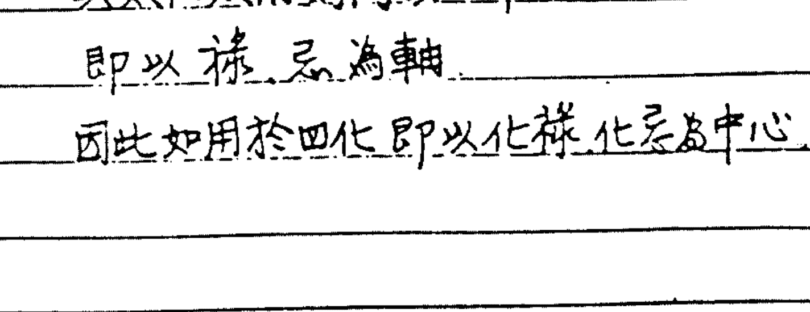

B. 註解：8+2+4+6 = 20
1+3+7+9 = 20
5. 10 居中

4. 用和之數 20 除以五行而得 4，則萬物之數以 4 為中心。
4 在五行代表金 → 化祿位
4 在數字代表水 → 化忌位
因而斗數推命以祿、忌為主 → 金水在北，奇體於西
※ 甲子、乙丑 為海中金 → 金四局 → 即用此理定五行之始

5. 八字最怕用土，斗數用先天，土不用，用 4，事實上已居中
4 為萬物四象之徵，四象用祿、權、科、忌來代表。
但四象之上歸兩儀，即太陽、太陰，歸納祿、忌為用神。
而四化即象四化圖之有略 { 四 → 四象
化 → 化數（河圖）

6. 河圖之數，不過一陽一陰（一奇一偶）相錯而已。
故：太陽之位即太陰之數
太陰之位即太陽之數
陰陽交錯，所以為生為成
少陰之位即少陽之數
故易生生不息謂之易
少陽之位即少陰之數
因而天五、地十居中者，地十亦不過是天五之成數（倍也）
蓋 隨數 1, 2, 3, 4 已含 6, 7, 8, 9 顯數，以 5 乘之故也（乘即加也）
洛書圖之用 1, 2, 3, 4 以對
+ 9 8 7 6 → 藏在內最妙
10, 10, 10, 10 蓋數不過 10 也
故河洛之用：河圖 4 之用，即洛書 10 之用也

7. 總論：數之位皆三同而二異
三同：1, 3, 5
二異：河圖之 2 在洛書為 9
" 4 " " 7
由是 1, 3, 5 為陽
2, 4 為陰
陽不可以易（不能變）
而陰可以易（可變）
陽全
陰半
陰從於陽
然 7, 9 持成數之陽，可成 2, 4 生數之陽，則推易而實未易也
以斗數而言：

艮 ← 天 1
坤 ← 地 3
乾 ← 人 5

— 天人合一. 1+5=6 横成 9.6 之用, 而为万物之中

天地人相加数 9 为洛书之用 故万物用 9

用于斗数及 天人合一, 其数为 6 故命盘用 6 宫位 (天一生水, 地六成之)

而 6+4=10 故 6 宮用 4 宮, 子女迁移不用, 如图

| 财 | 子 | |
|---|---|---|
| 迁 | | |
| | | 命 |
| 官 | 田 | |

天 1
+ 人 5
6 (宫位)

6-5=1 万物归 1.

本命盘为河图, 归 1. 为定数
流年盘为洛书, 用 9 为变数
(大限) (有定数当应于何时)
定数 → 空间
变数 → 时间

故 天 本命 ┐ * 看流年时.
地 大限 ── 大限为媒介体, 为枢纽.
人 流年 ┘ 用大限来分别
三易合一, 应于流年

天 大限 ┐ * 看流月时
地 流年 ── 流年为媒介体, 为枢纽
人 流月 ┘ 用流年来分别
三易合一, 应于流月

天 流年 ┐ * 看流日时
地 流月 ── 流月为媒介体, 为枢纽
人 流日 ┘ 用流月来分别
三易合一, 应于流日.

◎应用说明:

1. 如某人命盘, 今年流年乙亥宫, 在 12 年前也是乙亥宫, 12 年后也是乙亥宫, 乃每隔 12 年
皆是乙亥宫, 而乙之四化机梁紫阴乃永远不变. 如此即每隔 12 年其命运即有相
同之结果, 如何区别呢? 其区别即在大限盘.

2. 如何来区别, 当断流年财运时, 切不可先看流年财帛, 而应先看大限财帛四化如
何而断之.

3. 如某人流年乙亥宫, 大限戊辰宫, 大限财帛丙子, 看大限财帛化忌在何处, 没忌

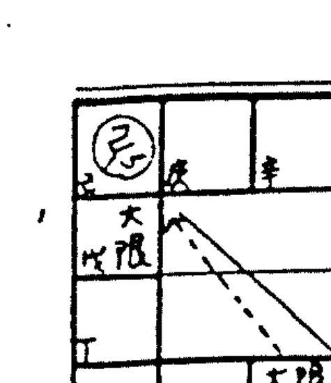

星入己巳宫冲流年命宫乙亥，即知本年财运不吉。

但若不以大限财帛用，而以流年财帛四化断，时只应在流月而已。

4. 若大限戊辰为25-34岁而亥宫为29岁宫，即是要说要过了29岁以后财才不会有损失，如果29岁以前纵然有佳运，也只是财来财去而已，也即是要说，以大限宫位四化来应于流年才不会每12年就有相同情形之断法。

也即是要说，应用此法才能断每12年之不同区别。

5. 何以要用本命四宫干乙为流年干，而不用今年太岁天干癸，此即在用大限之区别。

6. 前言：天人合一，乃流年立命于本命，但是大限切不可忽略，如忽略大限时，断出之结果会有误差，也即是要说如流年立命之宫位为本命何宫，为大限何宫，而同样会造成因素，而才能有所区别。

※故看流年时要以大限为根基，看流月时以流年为根基，如此才有区别。

不可一下子即看今年流年坐乙亥，而应先判断其所问之角度为何，如来者欲问今年之财运，冒然即以流年财帛断今年财运吉利时，其实，今年财运不见得真会吉利，还是要以大限财帛来诊断。

7. 如大限财帛化忌冲甲戌（去年流年宫干支），因为冲的是去年，今年当无关系，但甲戌为今年乙亥之兄弟宫，故今年应防小人损财（大限财帛化忌冲流年财帛之库）。

以上也即是要把流年宫位活用套入，即大限忌冲者为流年何宫位，而当流年走入丙寅时，忌是正落流年田宅，此忌即不可怕。

若以流年财帛化忌时，只断当年几月以前财运不好而已，此乃月令之区别罢了。

※活用之妙，乃是要以大限之宫位化出之忌，套入流年之宫位而用。

因此，宫数已明言，故要断流年，应先把大限有关宫位划出来用。

8. 天人合一，暗中藏地，故不要以为流年财帛好，今年即会赚钱，其实不见得。

以大限而言，凡地盘之应用，地盘应用于流年上承天盘，而天人合一，地与天自然之构成，人在天地之中，人与天合，须由地中找数，地谓之地，地藏万数，定数在于坤位之中，在地之盘。

9. 地可以应验于小命，而天一不能用，故天又与人合，故地为枢纽，在此情况下，生年三之四化虽可运用，而流年己，流年化忌，生年化科时可以解忌，但于流月时生年四化之力远不能用（超出流月天地人之外），即一岁、一岁、一岁序予套入。

此乃天地人三盘合一之法，以上论先天。

10. 如以一般斗数而言，都只论后天洛书，乃本命管大限，大限管流年，此种用法断

流年即要用癸干(太岁干)，而癸之四化，只可套入大限盘，而不能套入本命盘，如癸贪狼化忌逢生年化科时因隔一级，即无解忌之功，只能用大限之科才能解忌，此法即要再以大限癸出四化，多一道手续，此法即一般三合派所用之后天洛书之用，此不论先天空数，故此套用法乃无所谓之定数，而只有应数，故只论发生之应数，而不明其定数在何处，子平也同只用后天，后天三合派也同。

11. 定数应归于河图，应数要归于洛书。

故太岁宫干癸虽可取用，但不能归入本命盘，而只能归入大限，换言之，癸贪狼化忌若逢大限化科时可解忌，但若逢生年化科或本命盘化科时不能生解忌之作用，同理而推，若用此法时，即流年管流月，此即一般洛书之用，洛书之用论应数，即断过去发生之事，颇准，但不知定数在何处。

12. 我们所用者乃“三易合一”，全部都在此法之中，包括定数应数皆有，此套学术理论与洛书派有别，洛书之用，不归入河图，而我们所用之“三易合一”法，皆要归入河图与洛书，而用法又简单明瞭。

我们不用太岁干支之原因乃因用了之后，还得要多一道手续，用大限宫干再化忌一次，即多一层麻烦。

13. 定数当比应数重要，如定数不好，应数好有何用，如应数好纵然赚了一亿元，但定数不好时，还不是照样会破掉。

14. 要区别此中变化，切记要使用大限。

先以大限宫位而应于流年宫位，再配入本命盘宫位，即可定数应数一清二楚。

15. 问：本命化星应于大限，大限化星应于流年，流年化星应于流月，是不？
师云：对。

16. 问：是否需要有同类之关系？即大限财帛化忌应坐或冲流年财帛才算？
师云：用大限命宫，如化忌应看入流年何宫，而论其财帛有何关系，而断。

此即古云：星布十二垣，数分三十六位（三易合一，天地人各12宫）

17. 问：大限命宫化忌之冲宫为某流年命宫时，即应在当年，而大限财帛化忌所冲之宫是否应该为某流年财帛？

师云：若此大限命、财、官所化之忌星，入冲与流年命宫有关之宫位即应。

大限应于流年看那一年好，那一年不好，本命财帛化出忌应于大限，如本命坐卯宫，财帛亥宫，官禄未宫，如本命财帛化忌入丑冲未（本命官禄）时，注意行运，及大限之顺逆行，如大限顺行到未宫，在未之大限内，财运必差，如化禄入戌冲辰，辰宫在顺行

第二限，主青少年期还好，度日舒服，如大限逆行入丑宫忌坐之位时在丑之大限必不佳，又忌在丑冲本命官禄，本命宫主第一限，即幼少年期坎坷。

如即知某大限财运不佳，再看大限财帛化忌坐冲何流年，即主该流年以前必财来财去（忌星坐或冲之年以前，必财来财去）。

17. 要看流年必以大限看，要看大限必以本命看，才会清楚。

若来人问，今年或某年如何时，即以今年或某年所主大限宫位化入流年何宫，即知应于流年何事，如以流年宫位要化时，只应于流月而已。

18. 用辐辏法时，禄转忌，忌转禄用之很有效果，已知化忌入兄弟冲奴仆，则忌入之宫要注意看其星性，而后再参详对宫星性，此忌性之应于对宫之星性，应于对宫，乃对宫之星性较强之故，此乃阴阳颠倒法，如禄转忌，忌转禄冲财帛而知有损财之兆，此时应参忌或禄之对宫何星，因对宫之星性较强，而后再看为本命何宫位，而可知谁来损我之财。

此阴阳颠倒法及四化三合两仪摆之两仪法相同，都重在对宫，也大都取用对宫之星性。

譬如今年贪狼化忌在辰，此乃为明的表示，主祸，主何事呢？看对宫之星性，对宫戌坐武曲，则贪狼化忌冲武曲主财不利之象，乃以对宫之星为主为重要，而不是本宫化忌之贪狼星为重要，贪狼在明的，主阳，对宫武曲为暗的，主阴，阴阳对调，以阴为主，阴才会呈现于数，故坤才为万物之始。

19. 流年迁移化忌冲本命官禄，田宅时其灾反重，冲大限官禄，田宅时次重，冲流年官禄，田宅时小灾而已。

20. 大限应用于流年，用12宫位要，如流年命宫为大限忌星之何位也即等说，大限宫位化忌入或冲为流年之何宫位，注意命、财、官，即如大限财帛或官禄化出之忌星冲流年命宫即凶，乃命宫之三合化忌冲命也，大限用何宫位应验于本命何宫位，如大限迁移冲流年命宫及我身体之事应于流年三法乃以此断，即所取宫位是由何宫位而来。

又若大限命财官化忌冲流年命宫时凶象一定要拖三年，一个正冲，一个偏冲，应验三年，以冲之年为最凶，如酉宫受冲则必拖到亥年。

如非三合化出，或非冲命（虽三合化出）时只应一年，如迁移或疾厄等化出之忌，三应为冲之年，或虽由官禄化出但不冲命者，只应一年，尤以疾厄乃一六共宗。

21. 若大限三合化忌，冲流年三合时，10年霉运。

22. 大限疾厄化忌，冲流年疾厄时，行限流年要这时间身体不好，若流年疾厄化忌冲何宫即何位以前不好，以后即好，根据疾厄与命宫一六共宗。

反之大限命宫化忌，冲流年疾厄也只一年。

23. 所谓拖三年者，其必要条件乃以大限命、财、官三合化忌，冲流年命宫才真，冲流年财帛，或流年官禄时也应一年。

24. 如大限三合化忌冲大限命宫时，必忌过才会好转，此忌星所拖时间较久。

本命主10年悔吝，忌过较好。

25. 有一奇怪之情形要特别注意，即往往大限三合化忌所冲之流年为本命四化，而为大限忌星之流年时，往往要损失到一无所有而后再重新奋起而成功，此忌冲即为转机。

26. 若忌（大限三合所化）冲本命四化非三合宫位者主一年。

27. 问：可否说：大限命宫化忌冲本命疾厄时，行限流年入疾厄宫时，即当年身体不好？

答：如大限疾厄化忌冲本命时，若入流年命宫而忌在流年疾厄之年，即如忌冲画在本命之宫，而为流年疾厄，当行限流年入寅宫或酉宫时先到为重，后到为轻，此乃流年寅宫时酉为流年疾厄故而。

又大限命宫化忌冲本命疾厄时，主10年身体不妥，尤以忌冲之年为重，而流年命宫与本命宫重叠之年，本命疾厄也即是流年疾厄，也应最为严重（小冲大严重）。

问：大限命宫化忌冲本命疾厄与大限疾厄冲本命之宫二者断意虽同，但我认为应以大限疾厄化忌冲本命之宫为最重，概乃身体与命无缘，因而较有死亡之可能。

答：所论正确。

# 星数宫数

5/14

一、单星数：

| 星名 | 数 | 星名 | 数 | 星名 | 数 |
|---|---|---|---|---|---|
| 紫微 | 6 | 天府 | 5 | 禄存 | 3 |
| 天机 | 2 | 太阴 | 2 | 左辅 | 1 |
| 太阳 | 2 | 贪狼 | 3 | 右弼 | 1 |
| 武曲 | 6 or 3 | 巨门 | 2 | 文昌 | 2 |
| 天同 | 5 or 2 | 天相 | 2 | 文曲 | 2 |
| 廉贞 | 5 | 天梁 | 5 or 2 | | |
| | | 七杀 | 3 | | |
| | | 破军 | 6 or 3 | | |

※ 有天△星表多为2，杀破狼之星多为3。

二、双星组合数：

| 组合 | 数 | 组合 | 数 | 组合 | 数 | 组合 | 数 |
|---|---|---|---|---|---|---|---|
| 紫府 | 1 or 6 | 机阴 | 3 | 武破 | 3 | 廉相 | |
| 紫阴 | | 机巨 | 2 | 武府 | 5 | 廉杀 | 3 |
| 紫贪 | 3 or 6 | 机梁 | 3 | 武贪 | 4~7 | 廉破 | 3 |
| 紫巨 | | 阳梁 | 2 | 同巨 | | | |
| 紫相 | | 日月 | 4 | 同梁 | | | |
| 紫梁 | | 巨阳 | 2 | 阴同 | 3 | | |
| 紫杀 | 3 | 武相 | | 廉府 | 5 | | |
| 紫破 | | 武杀 | 3 | 廉贪 | 6 | | |

三、化星数：

化禄 3　　化权 2　　化科 1　　化忌 4

四、宫位数：

| 6 | 9 | 8 | 7 |
|---|---|---|---|
| 5 | | | 6 |
| 4 | | | 5 |
| 3 | 2 | 1 | 4 |

子 1　　卯 4　　午 9　　酉 6
丑 2　　辰 5　　未 8　　戌 5
寅 3　　巳 6　　申 7　　亥 4

## 数之用法：

1. 如太阳巨门双星坐本命子女宫时主有子二人，不管其四化如何皆主二人，但本宫自化时要扣1人，如子女宫有自化乃定要损失1人，而数之中主有二人，若实生三人，必有一人损失，此乃指男孩二人。
太阳在巳亥与巨门对照时，如子女庚太阳化禄入命，而命坐巳或亥主男孩1人，即太阳坐落巳亥主1。

2.

| 6 己 | 9 庚 | 8 辛 | 7 壬 |
|---|---|---|---|
| 5 戊 | | | 6 癸 |
| 4 丁 | | 5 | |
| 3 丙 | 2 乙 | 1 甲 | 4 |

对宫之数之和等于10，即：
甲1+庚9=10 乙2+辛8=10 丙3+壬7=10 丁4+癸6=10
戊5+戊5=10 己6+亥4=10
天干论合，地支论冲（子平法）

在斗数中须先瞭解几种东西，照一般所用之宫位数乃亥4逆成5酉6申7未8午9，有此人再以巳起4逆辰5卯6寅7丑8子9，其实後半段巳4逆辰5之安数方式有错误。
正确方法乃由子起1顺丑2寅3丁4辰5巳6，此乃先天空数，其所构成之角度，必须对宫数之合为10才正确。
因冲宫数之合必为10，故亥4+巳6才等于10，看各宫落宫之位即已有数在其中。
照理而论东方3、8为木，3在寅位，人生於寅由3开始，故任何事情皆由三起始也
即是3为天地人和。

甲 乙 丙 丁 戊
己 庚 辛 壬 癸
4亥 5戌 6酉 7申 8未 9午
6巳 5辰 4卯 3寅 2丑 1子
10 10 10 10 10 10

甲乙丙天艮 ——> 甲由廉贞化禄开始
丁戊己地坤 ——> 丁由太阴化禄开始
庚辛壬人乾 ——> 庚由太阳化禄开始
癸

甲乙丙论天，丁戊己论地为坤，庚辛壬论人为乾，天由甲廉贞化禄开始，地由丁太阴化禄开始，人由庚太阳化禄开始，为何呢？
3之对宫为7，3+7=10，寅宫数7为夫妻，斗数3为夫妻，而斗数以7为迁移，是故迁移之吉凶与夫妻有关，夫妻之吉凶与出外有关。

3. 天 1
地 3 -> 3乃万物之枢纽
人 5
其用为9

故归藏易第一招 三三归一法
三三归一要如何归法，3+3=6，6要扣5才会归一，一为天
即归於天，5即人
1+3=4，四为万物四象之始，但1不能用，要如何才能成
4，即4为2之倍数，乃2+2=4，2为兄弟宫，故断命所用时
兄弟宫极其重要，兄弟宫之吉凶会影响到财源之变化，故兄弟宫乃斗数之枢纽，即2数之位，又2为生数，故如财源不吉，可由2数之位去避其凶。

4. 万物之数，皆论倍数，如10为5之倍数，倍者乃相加也，即1+1=2，2+2=4，1+1即两仪，两仪相加为4，故万物之事与4有关，2为枢纽。

5. 如子女宫坐申宫，申为7数，再看其坐星如何，在此要知7+□=10，□为3也，故为3与7之间题而已，非7即3，论坐宫之星太阳巨门双星组合其数为2，则知男孩有2人而以7+( )=10，( )为3也，即所得数为2~3而已。

换句话说：即数小于5者，乃加( )令和为5，数大于5者，乃加( )令和为10也就是说：数小于5者，以5来减，数大于5者以10来减

6. 问：设子女宫在申为7，已知7+(3)=10，即是说子女数有3人，而星坐太阳巨门，其数为2，主男孩，是否可因此而断为男2女1。

答：差不多按此方法计算即可，即先以宫位数看人数，而后再以星数看男孩多少，又如太阳巨门，以太阳为主，再看化星化禄，如子女宫甲太阳自化忌，则有一子损失，自化禄自化权皆主有1之损失，又宫星如为天同即主2男（天为头之星大都为2数），再断是否有损失当以四化来断，又看星数多少则知。

7. 如宫位数为4，则为卯宫，而亥宫也为4，而5-4=1，即数不到5以5减之，即5倍之成数。

8. 现在论到此，大家尚不可骤或用不要慌，当用命盘验证之。

9. 但是必须要认出其星数，是不能逃出其数。

10. 如数刚好为5时当以夹倍数10减之，而5中再取之，如化忌时应减少几，并看其星度，子女宫乃以男孩为主，而男孩之位在子女宫，女孩之位在夫妻宫，譬如子女宫化禄入夫妻位，其所生之子也以女孩为多，大都为女孩。

11. 问：生年化禄入子女位时何如？
师云：设子女在5数之位，再化禄也不过7人而已。
问：过去曾经讲过，化禄加3数，化权加2数是不用？
师云：此法现已不用，以1、2、3、4之数来加减之法，乃非用在人数，而为用于财数，用于人数时不準，人数之数有变数在其中。

12. 四化之数：化禄为3，化权为2，化科为1，而化忌为4减半即2，与化权同为2数。

13. 用数要注意，不一定百分之百，有时如四化禄入某宫，而忌又入某宫时用禄忌星情者叫希夷数。

※所谓希夷数，乃以星度配四化而得，此数难学

## 验证命造：某女命：金四局，38岁，阳女

| 破军9 | 阳8 | 府1 | 阴机 |
|---|---|---|---|
| 癸24-33 | 甲14-23 | 乙4-13 | 丙 |
| 昌同 | | | 父 |
| 甲申 | | | |
| 壬34-43 | | 丁 | 福 |
| | | 曲巨 | |
| 辛 | 财 | 金四局 | 戊27田 |
| | | 权廉 | 梁 | 相 |
| | | 忌 | |
| 庚 | 疾辛 | 迁庚 | 奴己 | 官 |
| 3 | 2 | 1 | 38才 |

1. 学数之用法可知兄弟几人，子女几人
2. 本造子女照理坐天同二人（天字头多为2）而子女壬天梁化禄入子宫，子宫数为1，以5-1=4有子女数不过4，而男为2人（天同数2）
*按○同学云：原有子女4人男2女2（相符）惟男已损一人现为男1女2：
3. 男损1，名入巳宫6数，5、6归中，6-5=1，入土。
4. 为何要看四化星，因这也许宫内有二颗星，则必有数，但实际无子，故须再参四化。
5. 禄入子宫，宫数为1，天梁之星度为2，即男不过2，有主星时不算文昌等小星，除非无主星才要参看小星。

6. 看兄弟，甲廉贞化禄照命，甲太阳自化忌，太阳之数为2，宫位午宫为9，10-9=1，太阳2数，自化忌主有一损失。
7. 看宫中坐何星，其数即暗藏其中
用法乃先看星度数，再看化禄入何宫位之宫数，而以5数相加减，则定其星度数不了多少。
8. 按以上看法很难出现子女多数者，若实已生7、8个子女时应如何断之。
依5或10减宫数若所得为2人，则若非2人时即为7人，何也，乃2+5=7也
且星度也有2至5，3至6，4至7者，可参照用之
9. 禄存之数为3乃用于财官，若用于六亲宫，因禄存为人专之专星，故应加1人
故禄存用于人数时主2人
武曲落田宅宫，其数为6，落命财官，其数为3，同数，破、狼。
天同在田宅为5（○○内），○○议：天同福星，应入福德其数才可为5，师云，尚待验证，因目前不能确定。
10. ○○问：子女庚太阳自化禄 5-1=4，子女数不过4，太阳为2人，自化忌流走一人
○○：子女酉宫6数，10-6=4人 天同2数，男2女2人。○对2男2女，○也对2男1女
即子女最多不超过四人，其中男孩有二人。
11. 数之千、万、十万、百万，也即数字后面之0数乃以宫数加星数所得之数为后面之0个数，禄权相加数为0之前面数，大致如此，惟尚待详予验证。
12. 数之合要达于10，三合方为同数之位，数者非常重要。

## 新谈：

1. 欠兄弟债看兄弟宫，如大限命宫化忌入兄弟冲奴仆，或化忌入父母冲疾厄凶兆，如要解只有在阳宅中下功夫。
如生年忌在兄弟宫或大限忌入兄弟时即由阳宅改造避凶。
如忌入福德，田宅，则应由阴宅避凶。

2. 前所论之数，乃由河图、洛书而来，为固定之数，而所谓之希夷数乃配其四化，看其生出克之数加减之数，又里数亦为希夷数之一种。

3. 父母、兄弟、奴仆、疾厄与阳宅有关，若有破，应找阳宅名师指点更改室内各处之位置摆设。
而福德、田宅之破即与阴宅有关。

以上皆心法也。
兄弟、奴仆主人事属阳，故应更改阳宅以避凶。
阳宅之居住者之吉凶，与所有者无关，因居人位故主阳，有改时可减轻凶的定数。

4. 命盘批出，即先断兄弟、子女人数，或次断流年，即可获得其中要领，俗云：心中有数，即熟能生巧。

5. 问：子女坐空劫是否主无子。
师云：有无子女不要考虑空劫，应以四化断之。

6. 某人子女宫两天同化禄入疾厄，贪狼化忌入官禄，宫内坐紫微、天府，紫府之数为1或6，但在大限主孤，故数为1。

7. 兄弟宫为起运宫，乃看运之起伏波动之吉凶，故兄弟宫好的时候很好，差的时候很差。

父母为福荫宫，看福德或福荫之问题，如保证、会款，与上述问题之是非、官非。
即如大限化忌入父母，该大限内最好不要给人保证、担保等。

8. 看大限兄弟宫如化忌即知起伏如何，如兄弟宫凶，在此大限内起伏必大。

9. 本命兄弟宫凶，一生之起伏很大，如事业不顺，多变动等，看兄弟宫之四化如何，禄忌各落何宫，如化忌所冲之宫其处起伏必大。

如兄弟宫干甲太阳自化忌，廉贞化禄入迁移，主与兄弟之间，钱财之问题起伏很大，而在大限行兄弟宫时之运就不好，起伏还很大。

如兄弟化禄入田宅，化忌入父母，乃财之问题，主财运之起伏很大。

即忌在何处，就破在何处，如其所破之大限年岁尚小，则不可断为财运，当以健康为主。

10. 自化时为损失，化忌又自化禄时也主损失，如论财，化忌本即主赚不足温饱，当不在乎再损失，而若化禄有赚再逢自化忌时才会怕损失。

11. 兄弟宫乙太阴化忌入田宅，冲子女为大限己巳之官禄，故大限己巳时事业不顺，而大限命宫己文曲化忌入命也主不顺

12. 命宫主看格局而已，不必太重视

13. 某宫逢凶，有解厄时其凶可减轻，而无法完全消除。概，既然有空劫，则必有其象，有解厄时只能减轻其凶兆，而不能消除其凶兆，如果其凶兆完全消除于无形，则必会在另外某一方面产生凶象。
如有破财之凶兆，而未破财时必会损妻（或夫），此乃妻财，妻财也。

例：丙戌12月女命：壬戌年因肝癌死亡，时年38岁。

1. 本命奴仆庚天同化忌入子女冲破本生年禄星，子女为大限34-43岁之大限命宫，而子午壬反天同化忌冲对宫戌宫，时年38岁，壬戌死亡。

2. 参考说明

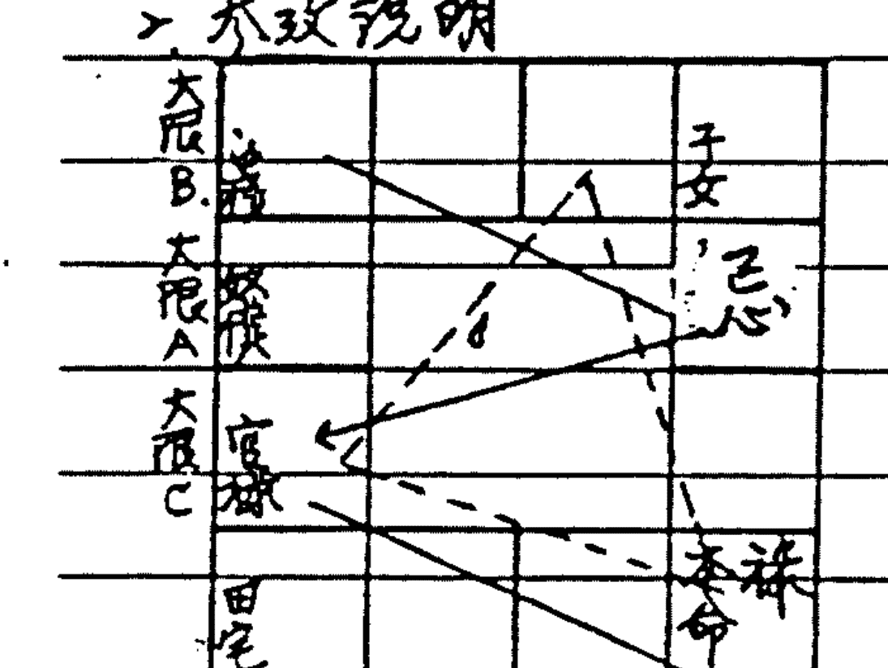

① 如果本命奴仆化忌入酉宫，化禄入本命，
大限顺行到辰宫时，在此大限没有关系，但当大限过度巳宫时，忌星酉宫为大限之官禄，这个大限就非常要紧。
依理奴仆化忌入本命夫妻冲官禄，化禄入本命命宫，逢凶，但实际在这个卯宫之大限没有关系，主要之点乃本命奴仆化忌要入大限三合之官禄宫。
如果奴仆化忌入子女、田宅时，辰、巳二个大限都要注意，尤应注意奴仆化禄不可入福禄，因福禄乃疾厄之疾厄，又此时化禄也不可入命宫。

② 再举例奴仆化禄入命，忌入子女、田宅时，定带不出辰宫大限。

③ 又如三合宫化忌入命、财、官时，行大限忌位为大限官禄时危险。

④ 上图大限入迁移，本命奴仆化忌正入大限官禄，在此大限要注意。

逆行过大限到疾厄，命宫为大限之奴仆，在此大限逃不出，又忌冲官禄，大运不顺。

⑤ 奴在辰，命在亥，奴仆化禄入命，化忌入酉，大限入奴仆时有危险。

即本命奴仆化禄入命，化忌冲官禄，大限顺行，忌星正入大限官禄时乃忌坐大限官禄冲本命官禄，则这个大限必凶，很难逃出死亡。（乃大限入迁移宫也）
而逆行大限，大限入疾厄宫时，乃禄入大限奴仆（即本命奴仆化禄入大限奴仆），忌入大限田宅冲子女，在此大限也难逃。
即本命奴仆化禄入大限奴仆，化忌入子女、田宅时要非常非常地注意。

在此种情况之下，阴德的造化就有其影响，或可得其保重避凶，但先天空劫一会合在此出现。

寿元之事与造化有关连，造化即福德宫也，故阴德又名造化宫，譬如福德生太阴，凡与庙有关，也即是说，福德称其造化格。

◎特别注意：本命奴仆化忌入大限子女，田宅缠时，在此大限内极凶。（寿元有关）

某女命造：62岁，阴女，木3局

此女于壬戌年5月23日或24日上午9:00因浇花摔下而死亡。

| 命宫 | 左破 | 禄 | 右府紫 |
|---|---|---|---|
| 癸 | 迁 | 疾 | 财 |
| 武 | 武曲自化忌 | | 曲阴太 |
| 45-62 | 奴 | | 丁 夫 |
| 同 | 禄大限天梁化忌 | 普 | 食 |
| 辛 43-52 | 官 | | 戊 62 田 |
| 杀 | (半) 果 | 横 | 巨 |
| 庚 33-42 | 田 | 辛 23-32 福 | 庚 13-22 父 | 乙 3-12 命 |

1. 本命奴仆主武曲自化忌，为大限52-62岁之命宫，主天梁化禄入本命福德为大限之子女照田宅，此禄不在三合之内。
2. 进一步看大限奴仆丁巨门化忌入命，太阴自化禄，本命宫为大限疾厄，禄忌在子女田宅。
3. 若相反地，本命奴仆化忌入官禄并外冲丁酉时要大限63-72入癸巳之宫才会有危险，因忌未入大限夫妻冲官禄，而化禄（天梁）入丑乃与癸巳大限构成三合。
4. 若禄入三合而忌入子女田宅同样有危险，反之禄在子女田宅而忌入三合也同样有危险，不管禄或忌，凡有一颗入三合即算有入。

5. 如前述若忌入夫妻冲官禄而禄入大限三合没有危险，除非忌未入大限官禄之故，若奴仆化忌冲或入之宫构成大限官禄时即真其为寿元之大限。
6. 本命奴仆化忌不可落入大限官禄。
7. 大限行迁移宫33-42岁时，忌星冲大限财帛，无关寿元，乃损财之象。
8. 以本命断而参照大限宫位，大限奴仆自化禄则不吉，自化忌也凶，忌若不入命，则与寿元尚无关，但入命则必凶。本命奴仆化禄入大限子女，田宅故脱不过忌位及冲宫，五月流月在癸巳，忌冲为流月之奴仆。
9. 花与太阴星有关，如不浇花，则无事，但空劫即在，很难逃出，上午9:00多乃巳时，巳时之官禄丁酉太阴自化禄，忌入命冲流月命宫。
10. 师之友人：同阴在子宫，很会喝酒（太阴化忌），喝酒次日死亡。
11. 天同福星会太阴酒星在亥子之水乡者必喜喝酒，但自化者，虽酒力强，但不喜喝酒。

12. 某人之父：本命疾厄化忌冲大限命宫，病已拖7、8年而未死，疾厄不主寿之

13. ○○提供之某人命盘

| 梁 | | | |
|---|---|---|---|
| 乙 | 壬 | 丁 | 命戊 | 文 |
| 甲 | 子 | 己 | 福 |
| 癸 | 财 | 庚 | 田 |
| 壬 | 疾 | 癸 | 迁 | 壬 | 奴 | 辛 | 官 |

1. 本命奴仆在天梁化禄入命，忌入田宅（武曲化忌）乃行限入田宅时死亡。
2. ○○：本命奴仆化禄入命，化忌入田宅，在此大限亡故。
3. 如禄入田宅，忌入命主损财或家运不安而已，与寿元无关。但寿元会应在大限行过福德宫时乃禄在父母冲疾厄，忌在夫妻冲官禄，或应验在行限迁移宫。
4. 注意：必要忌入大限官禄。
5. 禄入田宅乃吉兆，寿元尚多。

∴ 即禄入田宅忌入命宫时，注意忌冲之大限。

○○之命盘：○○ 35岁 癸亥年3月16日车祸，17日死亡。

| 陀罗武曲 | 文曲天机 | 羊刃天府 | 文曲太阴 |
|---|---|---|---|
| 己 | 疾 | 庚 | 财 | 辛 | 子 | 壬 | 夫 |
| 左天同 | | 阴 | 会擎羊 |
| 戊 | 迁 | 女 | 癸 | 兄 |
| | 火 | | 破军 |
| | 6 | | 6-15 |
| 丁 | 奴 | | 甲 | 命 |
| 七杀 | 天梁 | 天相 |
| 丙 | 官 | 丁 | 田 | 丙 | 福 | 乙 | 父 |

1. 本命奴仆丁巨门化忌入命，丁太阴化禄入大限官禄。
2. 大限奴仆己武曲化禄，己文曲化忌，破先天奴仆公事之禄。

○○之命盘：○○ 11岁 乙巳年...（字迹模糊）

| 陀罗紫微 | 左辅巨门 | 羊刃相 | 右弼同 |
|---|---|---|---|
| 乙 | 父 | 丙 | 福 | 丁 | 田 | 戊 | 官 |
| 由阳 | | | 权武 |
| 6-15 | | | |
| 甲 | 命 | | 己 | 奴 |
| 紫微 | 火 | | 巨阳 |
| | 大 | | |
| | 局 | | |
| 天 | | | |
| 壬 | 天 | 子 | 财 | 辛 | 疾 |

1. 本命奴仆己武曲自化禄，文曲化忌入命。
2. 11岁流年乙巳，大限奴仆己文曲化忌入流年兄弟冲奴仆，也为本命奴仆化忌入流年兄弟冲奴仆。
3. 奴仆己武曲自化禄，会为肺管主感冒。

注意：断命要小心，否则有人拿亡者之命造来试时会减气。

| 甲 天 | 廉贞化禄 |
| 乙 地 | |
| 丙 人 → 女助 | 天阴化禄 |
| 丁 天 | |
| 戊 地 | |
| 己 人 → 荫他人 | 太阳化禄 |
| 庚 天 | |
| 辛 地 | |
| 壬 人 → 靠天（自立） | |
| 癸 暴君 | 破耗之星故破军化禄，天地人齐全时定要有一破。 |

1. 以上之表乃以本命宫宫干为基准
2. 丙为天之人，己为地之人，壬为人之人
3. 天不可用，而用坤，故丙降于地，己顺推而降于人，壬逆上而升于天
   故地有命宫干丙者多女助（坤），但无法得十全
   人有己命干者，多荫他人，天有命干壬者靠天，自立，较有独立之性格
4. 己宫干为地之人降于人故多荫他人，乃赚钱必有破
   壬 为独立格乃靠天自立者：
   戊己宫干因戊己居中故主荫他人，即荫他人多，受他人荫少
   癸主破耗，乃须要变动，即天地人三不靠之位
   命宫干坐丙者，大多有妻助。（○命干坐丙，祖母多疼）
   “ “ “ 壬 “ “ 自负甚高，乃靠天之气也
   “ “ “ 甲 “ “ 有独立之格，不荫他人也不受他人之荫
   “ “ “ 壬 “ 因靠天，故多占人便宜，少被占便宜
   “ “ “ 癸 “ 多自由业（乃海外散仙无人管束），但起伏大
5. 天者多独立 地者多荫人 人者多靠天靠己
6. 出伟人多在甲、丁、庚宫干，癸宫干也出伟人，但多破耗，如毛沉东也为癸宫干
7. 乙乃多女助，戊乃多友助，辛乃多自助（各降一格）
8. 命宫干生天干化禄者多霸道
9. 门云：三合必有天地人，故必自助、友助、助人，合全此乃命之自然平衡也

10. 如命坐丙子乃有女助，财帛坐生，赚钱靠天靠自立，官禄戊，事业靠他人。

11. 按：戊为地之地，为人应较深沉，乙为天之天，独立独行快意乐之。

12. 易云：简易，即简化易，即学到最后不看四化，而只看宫干即差不多可断命，看格局也差不多，而要以四化断格局必很准。

## 紫微斗数秘仪

## (下)

恭老人 手抄

## 忌入 忌出

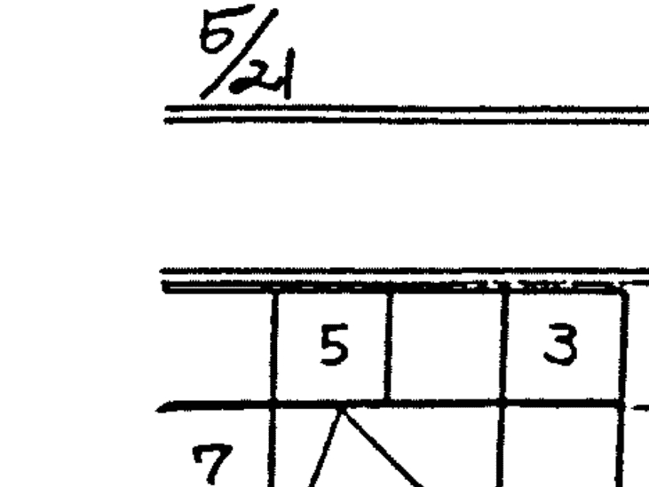

1. 星之数为阳之星不宜落六亲宫
2. 如杀、破、狼为3数之星，不宜化忌冲夫妻，冲则感情不好，多口角。（如贪狼化忌冲夫妻）即星起属阳之星不宜在阳数之宫化忌冲阳数之宫（即宫数1、3、5、7、9、11）
3. 如杀破狼、武曲等星属较强硬之星不宜守女命，乃该等星为孤剋之星故也。

大家在使用四化时，知不知何者为忌入，何者为忌出。

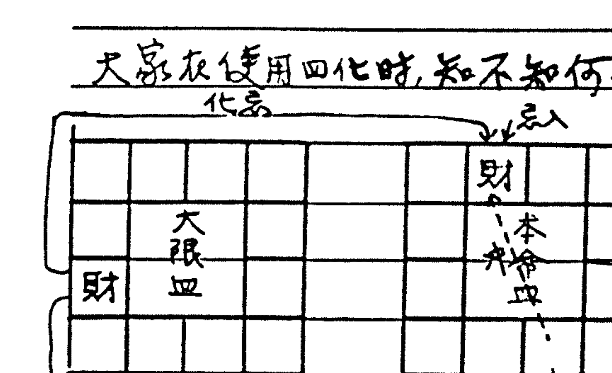

1. 请问：如大限财帛化忌冲某一宫位，即流年入该宫位时主当年财运不佳。但如流年财帛化忌冲大限财帛时是否也主该流年财运不佳？
师云：若大限财帛化忌入本命财帛与冲本命财帛，各作何解释？

概说大限财帛化忌入本命财帛乃属同类，命对命，故为忌入不主凶，换句话说，即大限三合化忌入本命三合时为忌入，主没有损伤，但若冲本命三合时则为忌出，主有损失。由此方式即可断在那一个大限命、财、官之好坏差异。如要断流年吉凶，千万不要看流年财帛之四化，而应以大限财帛化忌看冲流年何宫位而断当年吉凶情形。

2. 大限四断流年 → 应于流年 万勿看本命四
流年四断流月 → 应于流月 万勿看大限四
此乃切切实实之“天人合一断命法”

3. 如大限财帛化忌入巳宫，流年酉年忌入流年财帛巳位，即断辛酉年起已开始财运走下坡，而忌冲亥宫，必须过忌冲之年始不再受忌星之影响。

4. 而若以流年财帛化忌入巳宫时，斗君过度流月入酉宫时，忌坐流月财帛，该流月起渐见凶象。

5. 此乃云：忌在巳宫，流年酉年忌星正忌入流年财帛，而忌冲亥宫，流年命宫须度过亥年才不再受忌星之影响。万勿看本命四，首忌入忌冲为本命何宫，若为本命疾厄冲父母，则为损财之象，而损财之因乃是因保证或支票上出问题。如此判断才会构成“天人合一”之意。

## 6. 因此断流月吉凶时应以流年宫位化忌而定

7. 又如大限财帛化忌入本命财帛为忌入，则流年入忌冲之位号不紧，据此忌乃系忌入财帛，故流年入本命福德时，此忌星之影响力微弱，只是受冲之流月钱财较紧而已。（受冲之流月起二、三个月内）

8. 化忌入财帛乃忌入而非冲财帛，故没有关系。

9. 如大限财帛化忌入本命财帛为忌入。

10. 如大限化忌入本命福德冲财帛，而流年行入福德忌坐之宫时，主当年忌出，忌出则要损财。又如流年行入财帛忌冲之宫，应注意是何月斗君入，即主该月较不吉而已。

11. 忌星要看过财帛为忌入或忌出，若为忌出，则不论坐宫或冲宫，皆主损失倒账。
如化忌入本命福德冲财帛乃忌出，如流年行入忌坐之宫，切勿以为坐忌不凶，损其财照损不误，因忌之本身乃由大限财帛化出故忌出。

12. 但若为忌入而冲流年命宫时，当流月前后手头较紧而已，稍做注意即可，而忌入所冲之年则照赚不误。

※ 故断命时要严予注意忌入忌出之关系。

◎ 大限财帛化忌冲本命宫比冲本命财帛，其凶兆更为强烈。

“ ” “ ” “ ” “ ” 入 “ ” “ ” 乃为忌入，主为人节俭，作事不干脆，欠魄力。

“ ” “ ” “ ” “ ” 入本命官禄乃拿钱去作生意之意。

如今年癸亥流年财帛坐未化忌入本命官禄，主拿钱去作生意，其含义与大限化出之意相同，只是看用者如何套入而已。第一要紧要辨认大限之忌星是忌入或忌出。

又大限财帛化禄之断法也相同，如化禄不入本命三合而入本命奴仆，而大限财帛又自化禄为本命奴仆宫，则此禄乃主虚而不实。

※ 即四化必须入本命之三合才可谓之入，若不入本命三合而入他宫时皆主虚而不实。

详加一关而言，即大限三合化出之禄权科忌须要入本命之三合才可谓之入，若大限三合所化出之三吉化星入大限之三合而非本命之三合时同样虚而不实，主虚花，即主有赚钱也花钱，遂有损失。

※ 大限三合化忌入流年三合而流年三合又与本命三合重叠时，其四化吉凶之力以加倍断之。（因本命三合与流年三合重叠，如流年命宫正入本命官禄等...）

即如大限官禄化禄入流年命宫而也是本命命宫时，其大限官禄之禄星主双倍之吉兆，而若为忌冲时即主加倍之凶兆。

如流年三合与本命三合不重叠时，其意义又是不同，乃单吉兆，单凶兆。

又如流年三合与大限三合重叠，而其四化飞入本命三合时，也以加倍断其吉凶。
总而言之：大限乃枢纽，以大限应流年，而再以流年飞入本命盘。

+   (天)本 命 ← 流年应本命盘
(人)流 年 ←
(地)大 限 ← 大限应流年 (12宫飞法)

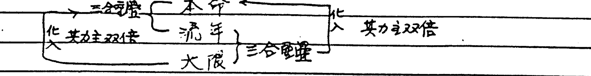

13. 大限在人、天之间，其禄或忌，权或科须要分辨是入或出，入则吉，出则凶。
年飞入：冲宫即不吉或凶，天地之间的区别也应先分辨，然后当流年走入该宫时即应其吉凶。

专数应先判别其公式
如大限财帛化忌入本命财帛时为忌入，流年行入忌冲之位不凶。
又如大限财帛化忌入本命命宫也为忌入，流年走入忌位也不主损财，而主收藏。

14. 详细研化即知忌之不同差之千里。

15. 可是如果大限财帛化忌入本命迁移冲命，则为忌出，则为凶。
忌入命主收藏，但作事欠魄力，无吉星凶，或许因不敢冲而少赚钱，但也会慢慢积财。
忌并不影响其财源，而流年财源吉则之年也照赚钱，只是多少之差而已。

16. 故应特别注意忌入与忌冲。

17. 如有大限财帛化忌入本命财帛者乃为忌入，流年虽入忌冲之宫，即已经忌入，故流年已无可避。
又如大限财帛化禄入本命子女，而流年入子女时当年也会赚钱，但随即花掉，故此禄乃虚吉。

18. 故不要以为大限财帛化禄入流年命宫为吉而喜，其实所入者乃本命子女也，故即随印花之虚吉，自子女宫走入流年却连伤三年（三合位吉凶延续三年），此禄禄入本命子女为禄出之象，乃花在外面也（当知多与桃花有关）。
又若大限财帛为本命奴仆，而化禄入本命子女，此与我何干，只不过是多应酬而花钱，或朋友送礼等，给我一点好处之象而已。

19. 当有人问命时，必先确定大限、角度，而后观其忌入或忌出（禄入或禄出）。
然后再看其影响之流年。
若化忌为忌入者，此忌即已忌入，当流年走入忌之冲宫时，忌之力已弱而无力，当不必也

20. 故见忌不必怕也

21. 大限财帛化忌入本命疾厄冲父母，乃保证，文书，合约上之损失或收款不顺...
财帛宫化忌好而吉利，也须要运也吉利来配合，故必须经过官禄忌星之位才可见到，惟官禄之忌星必拖三年之凶运，在忌未过之见，只是看起来不错，其实未得实利。

22. 问：若财帛化忌入卯冲酉，则依照三合之忌必拖三年之凶运，而戌，亥年三年财运不吉，可是若同时财帛化禄入戌宫时，又作何解？
师云：此禄仍然是虚禄，因忌之凶尚未过完，必须要流年入子年时此禄已过忌又是在流年夫妻冲官禄，才可谓之实禄。
何谓之虚：虚者乃形势见好，但尚未有实利，故有渐佳之象也。
又若禄入戌宫时，主第2年尚要衔刺，而有变化之象。

23. 十二宫四化不是以流年分别，而是以大限分别，如大限出现好忌（如逢水忌等）时，纵使流年逢忌，已无可怕，则钱财已见稳赚之势。

24. 迁移坐生年禄星，而命宫化忌到迁移时不是逢水忌论，而只是推挡住忌之流出而已，形势上也为忌出，三号它故要损失一百万，则其损失到一百万时即止，而无倒赚回来之可能。

25. 所谓之逢水忌，其必备条件乃是迁移有生年忌星，而命宫化忌入迁移之谓也，此逢水忌乃有倒赚钱财之长久吉运。

26. 即四化以大限区别之，而忌为何忌，如逢水忌或...忌等，皆以大限区分，区分而后知何流年有盈亏，忌入或出，以此法判别而后流年才会准确。

27. 若本命三合有逢水忌时也要等到行运到宫时才会应验。

28. 若生年忌星坐官禄而夫妻化忌又入官禄，乃为夫妻之逢水忌，逢行大限者，大限入夫妻时即为该大限之逢水忌，而体所赖者为本命夫妻，故凡事以夫妻（配偶）之名义为之必利。

29. 但若生年忌星坐财帛而福德化忌入财帛，乃福德之逢水忌，为自己享受之象。

30. 某人问罢命盘

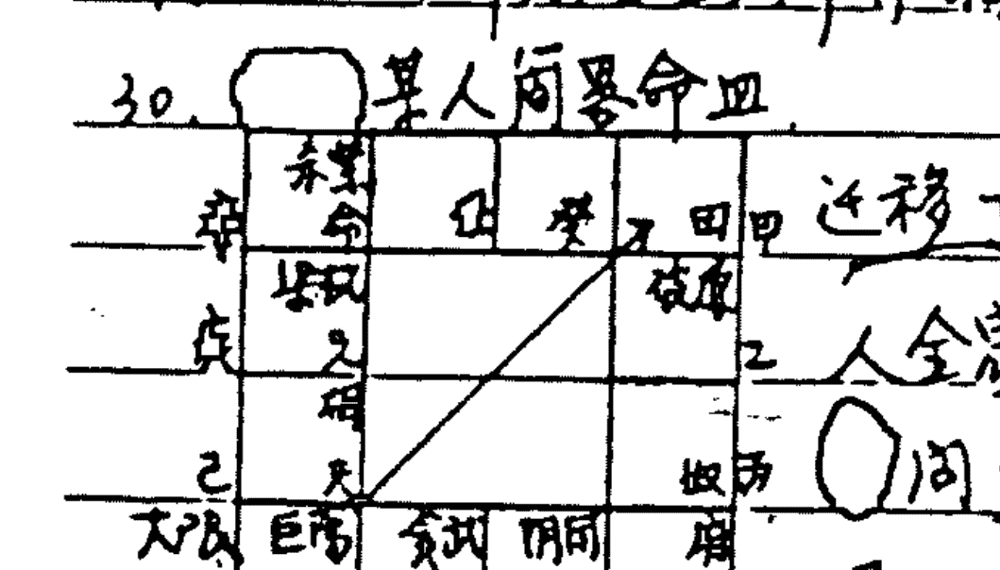

迁移丁巨门化忌冲田宅，过去请拨过迁移化忌冲田宅，有到国外之象，此人全家迁居美国。
问：迁移化忌入子女田宅线有意外之灾象否？
师云：有，即在上个大限发生车祸。
问：何以应验在上个大限？
师云：乃上丁大限之官禄化忌入兄弟冲奴仆也。
此人赌博将必输，打梭哈必输赢，因丁太阴化禄，子宫同阴，又太阴主摸克牌之星。
奴仆宫干丙，此人作生意与女客户接触有利，概丙宫干发女荫。
如果女命田宅或三合见丙宫干时，此人多靠自己，劳碌，因丙宫干应于女命自立格。
又此人若要赚钱时，赌博时押女人之股，买股票附女人，以依赖女人之福气必有利。
又去年流年子女癸贪狼化忌在田宅自冲，断定去年有桃花，结果正如所料，已分别十九年之旧情人又出现了。
丁太阴化禄入大限夫妻，而巨门化忌入大限命宫之故，丁乃大限子女也。

30. 论流年可以大限宫位区分，先以大限格局看，则判断之速度会快，切莫以流年宫位看，流年宫位只应于流月而已。

31. 问：大限化禄入本命三合，流年行入子女，田宅时何解？
师云：禄入本命三合，要先了解是大限什么宫位化出，如果是由大限财帛化出时，禄入流年财帛或流年命宫时都会应验，此为禄入，主要乃看由大限何宫位化出，若由大限命宫化出，则禄入流年命宫或流年官禄时皆会应验，若在流年子女，田宅时，应验于财利。

32. 又如大限财帛化禄入本命官禄为流年田宅时即为禄入，虽为禄入，但可能还会出去，乃投资于事业，想要作生意，但为田宅时可能不是想作生意而是想买房子。

33. 禄入不出，禄冲时还会禄出。

34. 大限财帛化禄入本命兄弟奴仆也主赚钱，而且可能较有赚，而兄弟奴仆与流年官禄重叠时，乃主去年事业须要兄弟朋友之助。

35. 大限财帛化禄入父母疾厄同样有赚钱之象。

36. 问：大限财帛化禄入流年兄弟乃入流年财库，也应该断为入？
师云：是也，但现在论入则即为入，应以大限看化禄所入者为何宫，又在流年何宫而断。

37. 问：现在论化禄，则化忌又如何，如化忌又冲命是否也不吉利？
师云：此乃在禄之位赚钱，而到忌之位再损失掉，乃同样有损失之象，纵使在该大限内赚了钱，也会损失掉。

38. 问：忌冲命乃主精神上之事，因第一次化星主象而已？
师云：对此主象，但财帛化忌冲命，纵归是无财，纵然有这辉煌之过去，在此大限也必损光。
总是若不在迁移冲命，而入本命财帛或田宅时主吉利。

39. 大限财帛化忌所冲之流年财帛不吉，若反之以流年财帛化忌冲大限财帛时是否也可断今年财运不利？
师云：不可以此方式套入大限，运乃以大限为地分上下，应以大限套本命，再以大限套流年，若以流年套大限乃以大限为天，应于流月，概大限套本命乃应于流年此天人合一，以地为枢纽之义也。

40. 有人问出国签证何时可得，此事应看禄存化忌所冲之年即可取得，流年命宫生忌也可，注应先以大限断其有无出国之象，再以禄存应取得签证之年，若生四马之地者多有到国外久居之象。

41. ○问：去问各地有换时区，不同地区之出生者，断命是否以其在出生地所出生之时间列盘即可？
师云：当然以此时间而断即可。

42. ○问：在七个大限本人乃禄存之忌是入田宅冲子女而出国。
○云：此乃股束子出国（按忌在巳冲亥乃四马之地）
师云：合伙或事业上之驿马，以上乃为禄存之用。

43. ○云：若以禄存化忌断出国签证，则每一个人皆有此象。
师云：但有人有自化忌。

44. ○福在命，○丙廉贞化忌冲命，乃出国机会多而签证顺利，惟在此有两自化科之象，依退马忌之论，自化科退=格入夫妻，乃出国时要配偶同行，自化科自有自化科之作用，无法免谈，有化即有象，○化科退入福乃出国获钱，○化科退入夫妻乃带动配偶之象，否则不成行，此科之作用有牵连之意思。

45. 若禄存入迁移冲命，而迁移又自化忌时乃禄忌自化带动入对宫，即命宫时乃去不用之意，纵然出国，其心也系尚在国内，乃顾念家事之象。
同理文昌自化科也入迁移，则主出外平安无事，有贵人。

46. 禄存化忌入命乃心在家中走不用，纵使出国，也想家，若在迁移者出外较不会想家。

47. ○问：禄存化忌在命宫冲迁移，若辰戌丑未宫，或子午卯酉宫，或寅申巳亥宫，应各作何解释？
师云：在子午卯酉为桃花之位，寅申巳亥为驿马之位，故较有出国之机会。

48. 禄存化忌入流年兄弟线，乃与兄弟朋友出国。

注：四化星之“入”与“出”要认清，若入于此时为“入”，入与出时可为“入”，三合也为“入”。

其餘皆不“入”。

50. 問：若非由三合或田宅所化出，而入三合與田宅時，是否為不入，如奴僕化忌入命等。
師云：此現象也應為“入”，概乃奴僕化給我也，故凡由十二宮化入三合及田宅者皆為“入”，依天人合一之法，流年或本命所化者，其意義皆同，由他宮化來者謂之交易，另有三易，除自化者外，皆可謂入，但若四化飛入之宮再自化者，即出而非“入”，而四化互化者，謂之交易。

51. 大限奴僕化祿入本命財帛時乃發生交易而為“入”，而財帛自化忌時乃主難些朋友幫我賺錢，或給我好處，但我並不領情，而不予接受，或因故得不到好處。而若財帛自化祿時乃影響福德，即為朋友送我禮物，或請我客而已，並不能助我賺錢。

52. 奴僕化祿入財帛，化忌入命，乃朋友可久交也，而朋友常有吉利之助，乃吉象，而命、財之三合為官祿，乃雇用伙計可長久，且伙計認真誠實努力工作助我賺錢，但要切記不可與伙計（朋友）股東，則乃可雇用到好伙計，賺錢給我又不背叛我。

53. 若奴僕化忌入田宅乃與入命同義，惟尚有一義，即給我好處而不要酬金之意，此現象也應切記不可與之股東，概忌入田宅沖子女（股東位）豈可股東合伙哉。

54. 一般看股東以祿、科論之，而論，乃祿科主有幹勁，以子女化祿科入何宮而斷。

55. 若奴僕化祿入財帛而化忌沖命時則不吉，乃助我賺錢而後全部挖走，故沖則凶，（按：忌沖命即奴僕與我無緣，故有早離之象，而祿隨忌走，好處被奴僕帶去也）

56. 問：忌可祿後又如何？
師云：不管前後，祿忌同時出現即有不利或利之現象顯現出來。

57. 若奴僕化祿不入三合，而化忌入命，且命宮又化忌回奴僕，乃朋友可交往長久也，但切勿有金錢之來往。

58. 化祿之忌不為解釋，如果化忌沖命，而化祿入三合，此祿大都會被忌帶出，忌沖田宅其意相同，故此祿几虛而無用也。

59. 如奴僕化祿入官祿乃入三合，而化忌沖命，財帛，田宅時都主要損失，若忌沖命則事業之財會被損失，（按：命宮為官祿之財帛）

60. 即三合與田宅不，忌來沖
乃是化宮化過來，忌或四化入命，官祿等為“入”，沒有關係，“入”則對我有利，言此也，但若由三合而祿又入三合，此祿卻會被帶走，乃損失之象。

61. 如奴僕化祿忌皆入三合時吉凶也，主奴僕要良忠誠，為平穩之象，如祿入財帛，忌入命而三合有官祿，乃不可與之股東則吉
又奴僕化祿入官祿，化忌入命，三合有財帛，乃吉兆也，但要注意，不可有金錢之來往

则奴仆即无要行可言，此乃三合平位之理。

62. 若奴仆化禄入财帛，官禄（禄忌），三合有齐宫，人我时奴仆好就无事，奴仆也就不会有恶行。

63. 如奴仆化禄入三合而化忌冲三合则禄随忌走，乃朋友损我之财。
或以上乃以奴仆为例而论，其禄若由他宫化来而有上述现象时乃以同样意象解释。

64. 如奴仆化禄入财帛，乃朋友助我赚钱，此禄是有其作用，而被忌冲命，乃其后再来损我之财。（按：此象乃朋友利用我替他赚钱也）

65. 如果奴仆化禄入财帛，而化忌不入三合时，是否要注意忌冲大限命宫之该流年？
师曰：是也，但要注意，除当年注意外，尚要注意连带之二年，乃忌冲之宫为流年兄弟时尤须特别注意，此乃 10 = 8 + 2 也。8为奴仆，2为兄弟合起来才成10。若三年时忌冲之宫为夫妻冲官禄，只要注意不要与人合夥股东即可避免不利之兆。
或即忌冲之年为流年命宫及流年兄弟时连续二年要注意。忌坐之年也同样要注意，且无冲之忌而矣。
若冲本命三合时主三年要注意。
一般人只注意忌冲之年，其实忌冲兄弟其损失更为大。

66. 四化者，乃要入三合，如由他宫化禄入三合，化忌冲三合时要注意，此乃禄随忌走之意，乃他表面对我好，而背后挖我一个大洞，故不必看到化禄就高兴。

67. ○问：奴仆自化禄，化忌入命，作何解释？
师云：与朋友不要有金钱上之来往，其他则不要紧，因为朋友自己自化禄。
○云：自化禄则对宫兄弟，乃我之财帛之库。
师云：禄入兄弟与我无关，奴仆自化更与我无关。
虽然忌入命，但禄未入三合，故与财无影响。
兄弟虽为财帛之库，此现象只是主我清客而已，不构成借贷关系，故不致于损财。

68. ○问：若奴仆化禄入命，化忌冲田宅又作何解？
师云：此没不利，概忌冲田宅，禄入命，乃朋友以好话求你帮助他钱财。

69. ○问：大限奴仆化忌入本命田宅，化禄入本命奴仆又如何？
师云：此现象乃主奴仆自私，禄化回自己本宫，乃只为自己好，只顾自己，而忌入命乃要想法诱拐你。

70. 目前外面有很多人对天人合一法不了解，想不通何以跳过大限不看，其实大限是可不看，若不看大限，每12年流年同一宫位，何以辨别在何年，故若不参看大限予以分别又何能断命。

71. 外面或云 忌若入父母冲疾厄不要紧，其实因此而损财尚不知，犹在断身体注意。
○云：当然要注意由何宫化出，如由身体化出者，当为身体问题，若由财帛化出者就是损财之问题。
师云：对，但现在外面大家都不懂此原理，故与他们谈也谈不清。

72. 将来要教 化禄12种，化权12种，化科12种，化忌12种（已教）
四化乃四象也，而每一象暗藏三易，易者变也，4×3=12，故每一化皆有12种。
而如上所举之例乃禄之一种也。

73. 论四马之地，如夫妻在亥，亥坐生年忌，对此乃拆马忌也，主会分离，但如果财帛化禄入夫妻，则夫妻四马有禄忌纠缠，则此禄乃谓之“绝命禄”。
条件：夫妻必须落寅申巳亥四马之地，而此忌为生年干化忌才可论。

74. 但若“绝命禄”逢夫妻自化时就不要紧。
夫妻有忌，逢自化禄乃无力娶细姨。
若生年禄在夫妻，而夫妻自化忌时乃不会娶偏房。

75. 若为绝命禄即主此死亡灾厄。
○问：是本人死或配偶死？
师云：本人死亡。

76. ○问：如夫妻坐落四马之地而有生年禄是，此时财帛又化忌入夫妻时是否为绝命忌？
师云：此不可谓之“绝命忌”，而是主夫妻不洽，惟本人定有灾厄，但不一定会死。
此乃忌来而不是忌坐，故不叫绝命忌。
绝命禄乃禄来忌坐宫在四马才算。

77. 如真正要断生死，其实很简单，以奴仆宫看化忌之即出。

78. ○问：奴仆化忌入福德冲财帛是否有死亡之兆？
师云：有此可能，但以忌入财帛冲福德为严重，惟须看大限行何宫位。
法当以本命看行何大限，再以大限看行何流年。
○云：大限为父母冲疾厄。
师云：此即死兆。
此乃“一气生死诀”法，一定要以奴仆化忌。

79. 若由他宫化禄入三合者不可以言吉，必须再看忌入何宫，忌冲则禄随之出去也。

50. ○云：奴仆四化在其本身之四正位转来转去，此乃奴仆之事。

51. ○问：禄入三合宫还须转忌？
师云：禄转忌乃进一步推测为何事。
○云：以前所教禄转忌乃钱财花在何处之谓。
师云：其意义相同，禄转忌乃看禄行往何方。
如忌冲命，禄入财帛，乃禄随忌出，而后再以禄转忌如冲官禄则知为事业上之损失。
此乃第一次四化，忌冲命，禄入财帛已明示要财出之现象，惟财出到何处尚未明言，再转化则知财往何往。

52. 再后等大家对禄、忌有了充分了解以后，再教大家忌转禄三转忌之三借暖功力，以再进一层探讨，8月份以后之课程变化会更加一层深奥。

53. ○问：三次转化之意义为何？
师云：初化为垂象，再化为吉凶，三化为结果。
如忌在奴仆，知不可与朋友合伙，而转禄入财帛时乃不可与朋友发生金钱借贷关系，而后朋友会助我赚钱（以大对而言，乃赚钱给我），但欲知此钱何去，则乃三化结果也。

54. 一忌转禄三化忌之用法，乃多用在他宫，三合之化星再转化见吉凶即为结果。
如命宫化忌入奴仆，乃主欠朋友之债之象，但忌转禄入官禄，或田宅或财帛，乃朋友助我赚钱之兆，遇此情形时，不可借钱给朋友而要反过来依赖朋友，则朋友就会帮助我赚钱，然后再三化忌可知朋友有否分红或抽利。
以上情况乃原本忌入奴仆为我不与朋友交往，而转禄入官禄，即然朋友还来助我之事业，其行为目的以三化忌可断其结果。

55. 如果三合互化乃经初化，再化即吉凶，结果显示，故无须三化。

56. ○云：如断大限时，第一次垂象即足，无须转化。
师云：大限乃与我之直接关系，为我之直系。
○云：转化及三化乃用于奴仆及财、官。
师云：善。

57. ○问：大限奴仆化禄入三合（假设为本命财帛），而转忌入本命奴仆，三化禄入田宅时何如？
师云：此禄虽然最后还会回来，但若在三化忌时本命奴仆自化权，则三化之禄已虚而无用，因三化之中间，必经朋友之手，故凡有自化，必在其手上有消耗，而禄与忌乃在钱财上与朋友有是非，此情况乃钱先到朋友之手上再分给我。

## 題聯及詩：

聯云：斗柄撥輪來紫府，數易乾坤五十五。

詩云：十八星斗飛

- 干支納音水
- 步法希夷微
- 天人合坤歸
- 歌向崑崙同
- 卍 卍 卍
- 欽此紫微斗
- 天命冒河洛
- 四六天心合
- 化數歸藏首
- 棋佈十二宮
- 譜圓德而共

說明：第一句十干發天機。
十天干去戊己落中而以八干法天向
最後一字僅念吾水微歸回乃逆水忌也
干支合而有納音，納音以水開始，因一六共宗於北方
步法希夷微：希夷微出自道德經，乃修道之要。
天人合坤歸：天人合一，坤乃太極在用，歸為歸藏。
歌向崑崙同：修道修到最後還是回到崑崙去。
吾水微歸回：水乃循回之物，為逆水忌。
欽此紫微斗：萬物向北，斗故分南北二派，本派屬北派，是
崑崙也分南北二派，北派主修道之人，即老子一派為北，論修
道，扎根，學術扎根，南派為玄學，主外場，北派乃陰學，故
曰隱士。

天命冒河洛：天命，順天之道曰命，孔子曰天命，命終極歸於河洛理數之中。

四六天心合：四六二數合為十，數之變乃四大之變，變化暗藏於四大之中，而六入中宮，只有四在用。

因為數有4，一、二、三、四，即太陽、太陰、少陽、少陰到四而已。

譜圓德而共：若要斷命圓滿，要有道德相伴。

斗洛合首宮共：星斗之用乃洛書之用，合首乃天人合一，而天人宮位相共用。

微河心藏二五：微論道，心中要有河圖藏在其中，二五者，二乃坤也，即太極在用。

紫圖天歸十德：紫微乃尊貴之星，要合天歸於十德。

北命大數佈圖：北派斷命以六宮佈局，因十二宮其實乃六宮在用也。

> 四化論欽天，即曰天，則天命歸於一。

天人合一要坤歸於太極而已別之

斗柄撥輪來紫府：斗數論紫府，以紫府為中心，紫府坐命而十二宮佈星。

數易乾坤五十五：數永在變。

以上所論，其中合上一個八陣圖。（）

冒乃假借之意，以象為代表。

萬物棋譜第一招論水，乃最重要，要先學會再論其他。水若來流去最後還是歸於北方。

## 某男命造：

| 65才 | 己年生金生己乃靠自己 |
|---|---|
| 3-12 | 己 命宫 文昌 禄存 田 |
| 13-22 | 戊 兄弟 曲阴府 本三局 |
| 23-32 | 丁 夫妻 府空 破军 |
| 33-42 | 丙 子女 |
| 43-52 | 丁 财帛 |
| 53-62 | 丙 疾厄 |
| 63-72 | 乙 迁移 |

1. 己年生金生己乃靠自己。
2. 生年禄权落兄弟奴，而又各有自化，乃谓之破体。
3. 由仆甲太阳化忌冲命，一生被朋友破尽，而太阳为官禄主，事业破在朋友手上，此乃异性之解释。
4. 福德辛天梁化科，乃文人而非生意人，因禄权皆已自化，且忌在夫妻冲官禄。
5. 此人曾任横发一时，应如何断之？
用禄转忌，忌转禄之法。
禄生由仆甲转忌，太阳化忌冲命宫被朋友损信、损财，当行丙寅时，忌乃在大限之子女冲田宅，尚不利。

当大限行丁丑时，卯也丁，不管生年忌星，忌转禄，丁太阴自化禄，冲官禄，退=格入丁丑大限命宫，而自化冲本命官禄又为大限财帛，故断丁丑大限横发，因丁太阴自化禄退入大限命宫，乃得名得利之限，但最后还是破得一乾二净。

6. 或问：大限63-72之间尚有运否？
大限63-72在乙亥，万物以水为宗，乙机梁入命，属上班或易理之术之人，而本命官禄有天同，以命为1时，大限疾厄庚午为6，庚天同化忌冲大限官禄，乃断之曰：心有余而力不足，何以断哉？概因其格局有欲思争起之心，但体力已不容许力拼，且其年已65岁，当然可断心余力拙，若此限正值青壮之年时，当断以靠劳力赚钱，此乃一、六共宗，水之奥妙一例。

7. 又如子女宫看起来有桃花之象，但看疾厄乃病体之躯，桃花由何来哉，故断命时应参考其年岁而断。

8. 且65岁的人了，尚要何运，即然大限疾厄化忌冲大限官禄，此大限可否顺利而过，尚未可知。

9. 大限疾厄(身体)化忌入本命官禄冲大限官禄，若当年青，当为靠劳力赚钱？

10. 此乃断命之“德与失”，即同样一件事(象意)，须因时、地、人而有不同之批断法。

11. 此命大限虽一之格局佳，但6之格局差，故无果之象。

12. 年40岁以上之人，要断桃花时，应先看身体状况而断，不可冒失。

13. 以上乃一、六共宗，万物由此而开始。

14. 紫微何以以北斗为主，紫微帝星居北斗，故万物仍以北为宗，何以云一、六共宗，根实乃万物之代表，归于北，如祖宗，如一代宗师等之，而其数如2、7同道，何以不

用“共宗”，指任何事物皆归于北，故曰共宗。

15. 以上以一大共宗之断，乃一时灵感之突变而断。

○云：命有千百种，断命当因不同之命造而有变化。

师云：道乃无名之物，易在于悟，师祖曾云：命要学，性要悟。

学问要形而上，而非形而下，故修道之事乃越学越深，个中自有微妙在。

16. ○问：此命寿元将到。

师云：差不多。

○云：甲廉贞化禄在大限疾厄，太阳化忌入大限命宫。

师云：明年即知，太阳化忌乃明年之兄弟冲奴仆而造本命迁移冲命。

○云：今年坐忌，师曰：坐忌也。

17. 数易乾坤五十五：

乾坤乃天地之定位，很多意外事故常在子午年发生，乾坤之变，水火不相射，水火既济，乾坤之位在南北，万物之生死盛衰皆与此有关，此乃机也，道之用也，乾坤之变，变得过则活，变不过则险。

18. 庚午大限疾厄坐廉相，明年流年命与福德皆丙，廉贞化忌冲命，乃大限疾厄冲父母，也是本命父母冲疾厄（死亡禄），此命当须修道养性。

人之一生，寿之到迁移即应自足，概已过一甲子六十年，当有何不知足哉。

19. 大限奴仆戊贪狼又自化禄，而天机化忌入本命财帛冲福位，险哉。

正深兄次页。

## 入 与 出 之 别

1. 本日授了“入与出”之别。

2. 不知此理则无法辨别“入与出”，即何者为“入”，何者为“出”

| 本 宫 | 他 宫 |
| :--- | :--- |
| 命 | 奴 兄 |
| | 子 父 |
| 财 官 田 | 夫 迁 |
| 疾 福 | 一体两面 |

此乃应用于大限，因为我们以大限为根本，可断流年，故先考虑到命，财，官，田，此四宫乃我们所用，而合另二宫，福德，与疾厄，而为本宫。他宫乃奴仆，兄弟，夫妻，子女，父母及迁移，而迁移乃一体两面。（一体两面接下详解）

◎ 以本宫论，所谓本宫乃指与我有关者，而禄忌由本宫发射：

1. 禄入本宫，忌入本宫：
曰好，乃无他人之媒介，都是本人之事，如财帛化禄命，化忌入官禄，财之吉凶也是本人之好坏，无关他人，此象并不一定主吉，而是说凡此形态之象，其吉凶皆为本身之事，并无他人媒介在里面，而只是个人本身之问题。

2. 禄入他宫，忌入本宫：如财帛化禄入他宫，
曰禄出，乃将禄给予他人之意，而为自己之损失，系禄随忌走之象，如禄入奴仆，忌入财帛，乃我之损失，即是说，将好的给予他人，坏的送到了自己。

3. 忌入他宫，禄入本宫：
忌入他宫时，不可有借贷，如发生借贷则有损失，不可有金钱之往来，否则必损，此象也为禄随忌走。

4. 禄忌由同宫化出而同入本宫：
虽不凶，但也不吉，乃不大好。
冲本宫：凶。
入他宫，更凶，此象不只以借贷之论而已，乃将全部出卖给予他人了。
此云冲与入之宫位，如化禄入兄弟，化忌入疾厄，也主自己之损失，乃依第2项禄入他宫，忌入本宫为禄出之原则，而为本身之损失。
入田宅，为破财之象。
入疾厄，乃我之辛劳努力而无所获。
入福德，乃享受，吃喝玩乐用掉。
破耗同属破，但其区别也有程度之异。
如财帛化禄入奴仆，化忌入疾厄，乃我以身体赚钱，但好处都被朋友拿走了，一无福气，即禄入他宫，而忌入我之疾厄，虽也为损失，乃是身体上之损失。

乃号赚了钱而没有享受到

5. 此乃大限格局之象

如大限财帛化禄入本宫，化忌也入本宫乃属於好。

6. 以大限分辨吉凶，而知流年之吉凶。

如大限吉，流年凶，也只不过是一年之不利而已。

如大限凶，流年吉，没有什么用处与帮助。

以上即运气好坏与流年吉凶之区别，此乃斗数之基本原理。

② 以他宫论：即他宫之应用，乃由他宫而化来者。

1. 禄入本宫，忌入本宫：

主吉，如奴仆化忌入官禄，化禄入财帛即为吉，乃财并未外泄，未被朋友拿去，而是由朋友给予我好处。

2. 禄入本宫，忌冲本宫：

主凶，乃禄随忌走之模式，必损失，如奴仆化禄入财帛，化忌冲田宅，乃损失也，此象之禄即为虚禄。

3. 禄冲本宫，忌入本宫：

如禄入迁冲命，忌入官禄即象，此象为吉，这个吉有解疑，如奴仆化禄冲命，化忌入财帛，要知吉之用在忌，乃要把忌星当禄之象用，乃是朋友化忌入财帛，他都欠我，而就会以财力来帮助我，可是若他已都欠你，而你又拿钱给他则此冲命之禄即失去其吉利之效果，乃是朋友化忌来已是都欠我之象，我何必再去帮助他，他比我富有，当然会帮助我。

此种形态，必须要会应用忌星，不可再忌出，而要从禄收回来才能搞成吉象。

4. 禄忌同入本宫：

主凶，有损失。

禄忌同宫冲本宫：

更凶，有大损失。

5. 禄入他宫，忌入本宫：

如奴仆化禄入子女，化忌入命，谓之禄出，此点特殊，要特别注意，奴仆化禄入子女虽田宅看起来吉象，但化忌入命时，此禄星就会泄出，乃禄出之象。

问：我之禄出或是朋友之禄出？

师云：我之禄出，此象乃奴仆之忌入我之命，而禄出我之财库，即朋友赖着我之目的，乃是要我的钱财。

朋友对我特别好，乃有目的，须付出代价与报酬。

6. 诱入他宫，忌入本宫：
此象禄不入本宫，而忌入本宫，因此会禄出。

诱入他宫，忌冲本宫：
此象更凶，概他宫化禄入他宫时已构成对我无利之条件，而既然其忌是来冲我本宫，若忌入本宫，其损失较微，冲本宫其损失必大。

问：冲本宫有一个问题，乃禄成，财帛禄，两宫皆为本宫？
师云：是，只是在此缘较不合此象，但若夫妻冲官禄，迁移冲命，子女冲田宅，父母冲疾厄皆是，如果忌入福德冲财帛皆为忌入，乃互相请客之意，但忌入财比入福德好，入福德冲财帛较不利。

禄去他宫而忌入我之处，乃好处给他人，而坏处才来我之意。
故不要以为奴仆化禄入田宅对我有利，但忌冲命会挖我一大把去，即禄已给了他人，我只有付出而无收获。

以上方法可以大限而看。

7. 大限体赖上为用，乃以这一套套入而用，乃大限带着本命宫位在用，故断大限之法与断本命之法相同，而依法即可看出格局。

8. 又如欲断本命夫妻，则以看大限夫妻之方法断即可。

如大限命走入本命夫妻时归入本命田，而以本命田为宗，故大限吉凶也就是夫妻之吉凶，假设归入我三合则即为归，有归即有对待，而知夫妻对待之好坏。

未婚者，看格如何

如果尚未结婚，要看夫妻如何时乃以夫妻为命宫，而以其三合论断，即知其格局，也就是说命格如何断，夫妻之格即如何断，此乃以死法定出而得其格。
而若以夫妻之四化飞入我命宫之三合时乃演为夫妻与我之对待，也就是说死法断格，活法断对待，其道理皆同。

9. 不管以何宫位为主之159乃论河图，而洛书之用乃体赖上为用，乃大限之用，大限走子女宫，或走财帛皆同，乃以洛书归入河图而论运行及对待。

10. 若欲论子女，以子女为1，则财帛为2，夫妻为12，父母为9乃官禄，而断知子女之格，若以子女之四化飞入本命田时，如子女化忌冲疾厄，即子女之健康不佳，此乃占我虚。

生直接之对待问题，若欲知子女本身之吉凶，即以子女为1而看断即可得出子女之格，此乃死法不灵，以死法只能断格而已，要以活法才可断对待原理。

故云禄出，乃禄与忌之出入，不可只看忌或只看禄，要禄忌同看才有比较，也不一定忌冲即凶，而要参看禄在何处，此乃禄与忌之应用。

11. 大限财帛化忌入本命财帛为忌入，但忌冲流年命宫，此忌主吉，但会影响到斗君过度流月已亥二宫之月令较不佳，虽忌冲流年命宫，但因入本命财帛，故为忌入。

若大限财帛化忌入本命奴仆而冲流年命宫时，则整年要防朋友之灾，尤以入已亥月时，其凶更厉。

大限财帛入本命财帛乃手头较紧而已，财帛化忌入财帛之格乃节俭，而在已亥流月手头较紧，但无多大关系，但若忌落本命奴仆，则当有损友之虑。

再依宫位化共之理，若流年入子宫时，忌则在流年奴仆冲兄弟，要注意朋友损我，朋友借钱要注意。

如此流年财官化出，则主流月吉凶。

> 问：若化忌入官禄时？
师曰：也为忌入，但在已亥二流月时事业有较不顺，但大限财帛化忌入官禄乃为投资，但在已亥二个流月时，较为不顺利，此象乃不是财之吉凶，而是投资状况之顺与否，也就是事业之吉凶。

迁移之为一休两面：

1. 如本宫化忌入迁移，乃自己之事，即若本宫化忌入迁移者，以禄吉忌凶论。
2. 所谓一休两面，乃迁移为我在用，但他宫也用得到。若以他宫化禄入迁移，而化忌入命时为吉，但若忌冲命乃破我也。
3. 如官禄及本宫，官禄化忌入迁移冲命及本宫，属自己之事故曰一休两面，即说吉，并不全吉，说凶，又不全凶，故其为一休两面，乃有时为入，有时为出，他宫可入，本宫也可入，本宫为入，他宫为出，如禄入本宫，忌入他宫，即为凶。
4. 如奴仆化禄入迁移，到底是入或出，吾不敢断，但因忌入命，故可断对我有利，而进入若忌入他宫时，此禄即对我有损，故迁移为难论断，概因其属一休两面之故。

> 问：迁移化禄入本宫，化忌入他宫？
师云：此皆要损，因已靠向他宫之一边，忌有如粘着，他宫化到他宫之忌乃粘在他宫。

本命血天相落何宫，而其对宫为何宫，是以此断而已。

如天相坐命对宫迁移，乃在外多认识异性，或天相坐迁移冲命也同，乃在外因某种场合因接触而认识，而不一定可称为桃花或有金钱买卖。

如天相坐夫妻对宫官禄，则所交之异性大多为上班工作之人，或是同事。

“子女”“田宅”，则“……”“……”“……”娱乐场所之人，而专旅社、套房、因子女乃在外面之象，无磨。

曰：迁移也在外面，无磨。

6. 大限若行天相冲位，则桃花会多，其格如何，而又行何大限，即是何种桃花。

7. 问：天相天姚同宫是否桃花更强烈？

师曰：当然，天相天姚同宫主喜色，而淫性较多。

8. 天相入疾厄主性生活强烈。

曰：大限或流年总会逢到。

9. 天相坐命者，在外桃花较多（按：异性缘厚）。

10. 问：以天相断桃花可有一字？

曰：不一定，如在迁移，则在于自己之一念间。

11. 问：男命天相冲财帛，可谓之花钱桃花，而女命则为风尘人。师曰：垂象而已。

12. 问：还须不须要再化？自化又如何？

师曰：照理须要再化，如天相冲疾厄，性欲强盛，但若自化时即为无性之兴趣，故自化比较好，但现在乃只以天相之感情论与桃花之关系而已。

◎ 右弼星：

1. 命宫在寅申巳亥，右弼坐守为驿马，流年入命多出外之机会，入流年田宅多忙碌。
2. “辰戌丑未”，为固执、顽强，流年行右弼作事固执、刚杰，不纳人言。
3. “子午卯酉”，为桃花，流年逢命，多有桃花现象，入流年夫妻同。

◎ 先天残障畸形：

1. 疾厄之禄忌入本命之宫福德最重要，即一入福成又一入命，乃小时不好养育，身体孱弱。
2. 问：先天畸形如何断之？
师云：田宅化忌入疾厄，或疾厄化忌入田宅，此二宫位较有先天残障畸形之现象。
3. 某人命坐午宫，田宅酉宫，疾厄丑宫，辛酉年生，生年忌星入疾厄，流年命宫正好入田宅，而化忌入本命疾厄，出生即畸形，此情形较有畸形之可能。

如同一畸形而庚申年者，则无先天畸形之情形，但可能在二岁时要注意，若发烧不退就很难说。

而禄入本宫乃有如来诱扬我，此即对我不利。

○曰：忌到他宫，乃欠他方，而禄来乃由我擎之情，投缘而已，无实质之益。

6. 奴仆化忌入兄弟，化禄入财帛，乃朋友为他自己的朋友兄弟而欲来扬我之财。（忌大禄小）

7. 以大限来断流年极准，大限上乘天，下乘地，人为流年，天人合一，套入即可。

8. ○问：如化禄入本宫，化忌入他宫，但他宫为大限本宫时如何？

师曰：无效用，必须归于本命盘，此乃大限与本命之关系，若只入大限本宫者乃为虚。

我们所谈之本宫他宫乃用洛书而论河图，若入大限本宫时只应在流年而已。

○曰：则要禄入本宫而忌也入本宫才吉，忌不入本宫即不吉？

师曰：否。

9. ○问：忌入本宫，禄入他宫又如何？

师曰：可以情交友，不可有金钱之来往借贷。

○曰：持忌予以反利用。

师曰：忌来即忌去，要借钱没有，如要作朋友可以，交情深也好，浅也不在乎！

10. 奴仆化禄入子女冲田宅，化忌入财帛，尚可，但若忌入命而禄入他宫则不利。

11. ○问：因子女宫而断之损财是否与桃花有关？

师曰：奴仆化入子女大都与桃花有关。

### ③ 天相星：天相之星与桃花有关。

1. 如天相坐宫所冲之位与桃花有关，如天相生禄或冲财帛，则其桃花大多是花钱而来，不是到处滥交。

2. 天相不须要以宫干化忌？

师曰：免化忌，仅看对宫何宫。

○曰：冲命。

师曰：冲命之桃花乃看你本人要不要而已。

3. 故以天相断桃花也很好用，天相之对宫必有破军，桃花在禄或冲财帛，生忌可知其程度高低之味道。

○曰：天相之对宫，必是破军。

师曰：非也，看对宫为何宫位，如对宫为奴仆时，所交之桃花乃朋友或家庭主妇。

○曰：若为父母。

师曰：若天相对宫为父母时，也许以身体卖钱，即……

4. 天相星暗藏很多玄机。

4. 问：师说，生年干与田宅或疾厄宫干相同，而化忌入田宅或疾厄较有先天残障之可能？

师曰：是较可能，而不是命盘排出后用定化忌入疾厄就有畸型之象，须流年命宫同时入田宅或疾厄才是。

5. 小儿麻痹有关之星如，太阴、天机、天梁，此三星化忌要注意，较有畸型残障之情形。

6. 天同、巨门大都由脾胃之发生，不喜饮食，而有内脏之不顺。

7. 天机化忌带动天梁乃与脑神经有关，注意发烧过久不退，天机主四肢，如发烧不退四肢抽筋而为小儿麻痹。

8. 残障畸型之式虽如上述，但要流年行此宫位才会应验，如出生当年即入田宅、疾厄为流年宫位时较有先天畸型之可能，否则有些星象者很多，但非流年宫位。

9. 问：有人三、四岁才罹小儿麻痹，是否乃流入此公式之中？

师曰：如亥年生人，忌入田宅要注意，又出生三年内之小孩要注意。

### 局数：水二，木三，金四，土五，火六。

1. 问：如水二局……火六局等，火六局大限由6起为6~15岁，而若5岁时其大限看何宫？

师曰：火六局要注意一些，乃水火交界，水二局要注意大忌及三忌，大忌三忌之成因，因水火交界过甚为后天。

又人之出生即归入本命盘，虽年岁未入第一大限，也归入第一大限（即本命盘），而局数之起些乃指起些开始行运，在此之前之小孩只有命而未行运，故局数越小，行运越早，而越聪明活泼，概早行运也。水二局属北，主智，活泼，故先有动向。

2. 局数乃指上边之宫数，在行运之前属静盘。

3. 土五局者木讷文静，土属中之故。

水二局者聪明，奸诈，乖巧，依赖，撒娇。

火六局者性刚烈。

金四局者顽皮，固执，打不怕。

木三局者主仁，善忘。

论小孩之性，应再参命造以断。

即以五行所主仁义礼智信配入局数断其时状况。

4. 属水二局及火六局之婴儿哭声较大，概水火既济，水火不相射故焉。

5. 小儿说话哭声之音色，音量，音质，长短与五行之宫商角徵羽有关。

6. 小儿之命三岁之内不可断运，而注意起数及看其格即可。

论忌合用而论，分辨论忌之再变化予以吸收而用。

### 数

授数理之学，乃由河洛之理，渐次引进，而收进入数之应用。

1. 道德经第42章内论到“冲和篇”，篇中讲到：道生一，一生二，二生三，三生万物，此乃道德经由所载，而孔子以此引用为天人合一，故天人合一之理论乃由冲和篇而来，最后即为中和。

2. 一不能用，当有一时，即先生于二，二乃阴占阳之二个单位，有阴有阳之结合而为三，而到了三时即复归于一，此曰：三三归一。

3. 何以还要归于一，乃曰：数抱阳而负阴，单阳不能用，要阴来合，故三而一，是数为二，诗云：数始于二点，何谓二点，乃二之后才有四，而后有八，乃由命而有兄弟而后有阴阳之配合而有夫妻，而后得子女。

4. 一生二，二生三，三生万物，到三为止还是要返归于一。此曰：三三归一。万物河洛理数，归藏易数，皆三三归一，但书亦不回归一，而曰三生万物，多了一句，但经内论到一个问题，数抱阳而负阴，因万物有阳时要有阴来合，才能生，万物才会生，故到三为止乃人要立，即三才立，即如命理中，三合一定是天地人，三论命格。

5. 抱阳而负阴，何谓之负，乃承天禀命荷气而生谓之负，人之命要荷气而生。

6. 论到此，阴阳二气一定要会合，真气内养谓之抱，故数乃抱阳而负阴，数由此开始，人即由此而生，故云，三三归一，乃夫妻如同我命，万物也由此而生。

7. 论二之数，二乃阴阳，与抱负相合，相合时，合则有变，不合则不变，即如不结婚则不变，概孤阳不生，孤阴不长，合则有变，有生有化。

8. 变谓之冲，不变则不冲，冲者为和，不冲者不和，故抱阳而负阴乃冲气以为和，“和”用之于孔子之学说乃“天命以中庸之道，取之于道而归于万物”，乃到用冲和篇，在数中曰：“盈宇宙皆数也，大之无外，小之无内，可以顺性命之理也，宇宙万物皆于数也，通幽明之故，尽事物之情，文成纲纪变化者，皆数也”，数因此而开始有生，故数乃抱阳而负阴，一生二，二生三，三生万物，由此而推，龙马负图，先天之阴阳始备（完成了），故论阴阳，即讲到河图，冲龙出洛，后天之理数才明，河洛理数乃论理数之用，河洛而为理数，河洛合而为数。

9. 重关在何处，师祖之言有云：七步天干歌，星法望北斗，八阵四象同，卦分阴阳通，图洛青藏河。

星法皆北冲，乃凡以星断命，皆以北斗为主，八卦八阵也皆以四象用，最后即论阴阳。

问洛书藏何，乃洛书藏于河图之内。

10. 河图之数10，洛书之数9，卦数为8，最后乃君2数。

天干10，地支12，如何予以归来归去，最后乃相君之数（二行共）

11. 如命宫之中，命为1，夫妻为3，兄弟为2，一合三，三要退同一，而三视同三，三五合为一，其他皆不可为一，因五落中，故五之后之数，要法归一，故夫妻可归为三五归一，财帛视同夫妻，而夫妻之吉凶70%属命，财帛之吉凶70%属夫妻。

12. 一五本为我之三合，“四大天星合”凡事，万物要合为10，三要加七才成为10，即然要以三为主，则要加七才能成为十，夫妻为3，迁移为7。

13. 乃即要出外，则必受到夫妻之干涉，而影响到迁移之对宫，命，而1.9合用时9之对宫3，夫妻牵涉到命宫，故与命最密切者乃夫妻，若论阴阳交泰第一招即为夫妻，也就是结婚此与我关系最密切者乃夫妻也。

14. 5财 夫3 密切关联 + 9官 迁7 → 命 10 静

夫妻会牵涉到迁移，而迁移之吉凶与夫妻有影响，如不出外，则夫妻影响官禄，此皆有连带关系，故官禄乃收气之位，气即在官禄，故官禄为气数之位。

15. 以命为1，属静时，官禄为9乃动态，一静一动，一阳一阴谓之道，乃由此而产生故人之气数在官禄，故凡任何事情皆要看其官禄之理乃在此。

16. 不谈5以上之数，论1与3之间，一生三，三才出万物，数不到3，万物不生，此乃很密切之观念；命为命就是命为格，官禄为运，命运，命运有命还需要有运，有运而吉利，复归于3，乃3.5合1，古云：夫妇合而家道兴，乃是夫妻合好，事业必顺，事业顺利，则财源必利，财即有利又归夫妻，此有连带之关系，由此理解熟。

17. 故迁移之吉凶影响夫妻，夫妻之吉凶影响迁移，如迁移吉，想出外发展，但夫妻作忌冲迁移而不能出外，则虽迁移吉，但乃无法有所作为。

18. 命运而后有财，乃财为1时，命为9，作事业之目的乃为赚钱，人无运，财会由何而来，如财3.5合一及机纽，一生二，二生三，人生于三，由此而开始。

19. 数之用有“三五之机”，三五之机即此有关，何也，1为阳，定要2来生，如无2何以生3，乃须经过交友而后成为夫妻，又何以要用5，2+5=7为迁移，故三五之机归于迁移，7乃2+5之成数，乃迁移也，故迁移之吉凶会影响到夫妻。

20. 3为甲木，7为丙火，木生火，故夫妻吉则生迁移，如夫妻吉于法，则迁移出外。

必有所作法

21. 三 忌. 财 —||— 命 官9

夫妻坐忌与财帛坐忌时，二者以财帛坐忌属害，因财帛忌是冲福德，乃夫妻之官禄，逢9为气数之位，以夫妻为1时福位即为9，故妻财子禄之中，以妻财为构成。

◎ 以上乃以‘数’套入‘斗数’之中以阐明‘斗数’之理

22. 夫妻之吉凶与迁移有关，迁移之吉凶与夫妻有关，看密宗之‘数’即知，故由此角度而可悟出一关天机。

23. 以上论生数，以‘数’论成数时即有变，乃因之意，另有归往他处，‘数’之相差为三，乃一体之两面之构成。

24. 故‘数’之第一步乃学三、七之两宫位，此乃‘数’理入门之第一步，乃占我一生最关切之事。

○曰：3、7乃我之命运，2、8乃外在之因素，为财与官之事。

师曰：3、7与我有密切之关系，有人婚前发达，有人婚后反而不好。

25. 父母与我之相处在前半生，子女长大后自有其天地，故占我关系最密切者乃夫妻，而兄弟如像乃将来入社会时之社交运，即3、7属内，2、8属外，‘数’即由此而演变。

故如见夫妻不吉利之命造，应劝其晚婚。

古云：娶恶妻一生苦，种劣田望明年，即娶错妻终身苦。

26. 有二即生四，善‘数’也在5之内。

○云：有3而‘数’又化禄入4时，乃是已有好配偶了，还想再要一个。

27. 以上论‘数’之基本，而后一步一步演进。时代虽变，而理不变，只是形体在变而已。

28. 孔子曰：心物合一论，始于‘诚’

诚 < 天道 → 自然法则 → 物 → 宇宙进化论
   < 人道 → 社会法则 → 心 → 人类进化论 → (人治社会之产物)
   > 心物合一

29. 昆仑分南北两派，黄河以北属此派，黄河以南为南派，北派属水，属智，为隐士论修身扎根。南派论玄学，曰扬，市名求利，论相持之强弱。

北派向下论地之根，南派向上论地之上，故北隐南扬

30. 老子之老字乃对得道者之尊称，有无老子某人不去管他，但毕竟有道德经是实。老子是否即为太上老君，也不明，盖太上老君乃出自封神演义之中。

老子是否创符咒，答案是否定的，真正有符咒乃始于宋元之间张角兄弟者以法律之借题而创符咒，而后属张天师，此乃南派之产物，而老子属北派论修身养性不可能创符咒。

31. 目前斗数之排盘为何人所创已不可考，古时断命以数，以造成理论基础，从数之始而进入境界，而设心中即有数，则如何断即如何对。

32. 数有根据：

1 — 2 — 3    合为十，乃万字形，可避邪
4 — 5 — 6
7    8 — 9

### 命盘验证

| 天刑 | 贪狼 | 巨门 | 天相 | 天同 | 天梁 |
|---|---|---|---|---|---|
| 丁 22-33 福 | 戊 34-43 田 | 己 42-53 官 | 庚 | 辛 | 壬 |
| 太阴 | 阳男 | 天姚 | 武曲 | 太阳 | 文曲 |
| 丙 12-23 义 | 文昌 | 天府 | 辛 | 迁 | 太阳 |
| 乙 2-13 命 | 右弼 | 破军 | 左辅 | 疾 | 文曲 |
| 甲 | 兄 | 妻 | 子 | 财 | 46 |

复习上节：

看兄弟成人 { 男：无 } 独生子

{ 女：无 }

看子女成人 { 男 }

{ 女 }

1. 兄弟甲廉贞化禄照财帛，太阳化忌入疾厄冲父母。

命宫乙太阴化忌入父母

无兄弟姊妹，乃独生子也

2. 注意兄弟为甲，子女也甲，但子女之四化虽与兄弟同，但表示之意象不同。

因父母乃我之命与兄弟共同父母位，故命与兄弟不可化忌冲父母，冲者无缘，是故兄弟甲太阳化忌冲父母，乃兄弟与父母无缘，故无兄弟也。

3. 子女之父母乃我与夫妻，故子女太阳化忌入疾厄，乃忌入我之身体（为我），故主必有子。

但子女甲太阳化忌冲父母，乃冲子女之官禄，甲破军化禄入夫妻乃女见之位，在数及命1，妻2，财3，官5，故入夫妻断定女见为25人。

4. 子女化忌入疾厄，为生男，（但月前已亡故）

在65年大学毕业后去兵役在金门演习时，枪枝走火死亡。

5. 子女甲太阳化忌入疾厄，疾厄生武曲化忌冲命。

6. 此人现年46岁，4+6=10，此为取数法，10即田宅，乃问家运也。

7. 田宅戊天机化忌，刻对宫逢生年忌乃逆水忌也，必有不动产，且在渐次增加。

8. 以子女为本宫为1时，子女之奴仆丁巨门化忌冲子女，太阴化禄入父母逢子女甲太阳化忌冲破，而父母乃大限子女也。

9. 任何宫位之奴仆，可看其逢忌，逢忌必有凶事。

同理：大限各宫之奴仆，可看其在流年逢忌之凶。

10. 以此人太限命生己，太限奴仆生甲，太阳化忌在太限田宅冲子女，而为本命之疾厄冲父母，而知此人在此大限之重点乃家运之事。

11. 以子女为本宫，看太限子女之奴仆辛文昌化忌入太限财帛冲福德，而为子女之兄弟冲奴仆乃自冲一气死之位，辛巨门化禄为太限子女之福德照财帛乃本命田宅冲子女。

12. 按：依一气生一气死之天星定矣诀，子女之父母乙天机化禄冲破子女之生年忌星，而子女之奴仆丁巨门化忌冲子女宫，其人何能有子，纵有，岂当得住哉。

13. 大限奴仆甲廉贞化禄照财帛，本大限有钱。太阳化忌入疾厄冲父母，为大限田宅冲子女，为子也。

家花了钱（损财）且甲破军化权坐官禄，为大限命宫，武曲化科照本命，为大限之财帛，故在本大限内财业俱旺当可断言，而忌入大限田宅也非凶象。（註：業理髮厅）

文以各宫奴仆之四化，而可求得各宫之重点，以大限各宫奴仆之四化而可看出在此大限内各宫之吉凶言也。

※ 是故，凡命造到手，都可先以各宫之奴仆断其吉凶。

14. 本造七杀宫在财帛宫

本命七杀财帛宫癸破军化禄坐官禄，巨门化权入田宅，太阴化科入父母坐疾厄，贪狼化忌入福德冲财帛，而在财帛冲破生年禄星，财有破耗。

大限七杀大限财帛乙天机化禄入子女冲破生年忌星，天梁化权入大限父母，紫微化科入大限迁移，太阴化忌入大限子女冲田宅，家运不顺之象。

二、本命子女之七杀宫庚天同自化忌忌出，太阳化禄在子女甲太阳化忌相战剋而冲大限之子女，而庚天同自化忌出之宫乃流年69年也。

大限子女之七杀宫庚甲太阳化忌冲大限子女，乃冲体也。

三、兄弟与子女同在天干甲，太阳化忌入疾厄乃无男女兄弟，惟冲父母也，而子女而言头胎为男，其不同之分别在于兄弟乃我同父母生也，即忌冲父母，则兄弟与父母无缘，又母位为兄弟，父母早离之象，而子女乃我所生者也。

四、大限田宅之奴仆癸破军化禄照官禄，而本命官禄乃大限命宫，故到今年为止有房三间，而田宅之奴仆也在流年宫坐财帛。

注：请注意本大限田宅之数，非4+6=10也。

问：所谓房子三间是否因破军化禄入大妻，而大妻宫故有之故？

师曰：先决条件乃禄坐官禄（三合）而知一定有屋，而禄入大妻，故知数为三。

问：田宅之奴仆乃财帛化忌自冲，为何会有钱？

答曰：田宅之奴仆癸贪狼化忌自冲，乃舍不得花钱，乃忌入福德也。

师曰：田宅之奴仆癸贪狼化忌自冲，是不好，乃忌冲，钱花掉了，贪忌坐丁巨门化忌冲子女为子而花钱，禄忌在本命福德坐财帛必有损耗。

答曰：破军化禄入大妻，及女兄位，女兄可得不动产。

### 刑姚论

天刑乃太阳之精属火，天姚乃太阴之精属水。

1. 天姚之官禄化禄看桃花，天刑化忌看官非。

2. 天姚之财帛化忌看哭厄，水哭，丧门。天刑火灾。

即天刑之财帛化忌入田宅一生中必有过火灾，天姚水哭。

> 3. 问：刑姚之三合位为破体，以此人命盘而言乃夫妻破体，应如何解救？

师曰：以刑姚之三合宫干四化看破生年四化之何星，而知其破在何处。

此人破体位夫妻乙，天机化禄冲破生年忌于子女，已知其子死亡。太阴化忌冲生年权于父母，其父于其年幼时死亡，母再嫁。

必用天刑、天姚之三合位断破体时，必须用其宫干之四化断之。

4. 若破体之四化未逢冲破生年四化，但其四化落宫又自化时仍主凶。

注：某子生於：戊戌年2月3日子时，如在则应是此生，殁於69年11月4日巳时，供验证。

5. 流年43岁庚申之迁移甲太阳化忌冲大限子女，乃子女在外亡故之兆也。

### 命盘验证（二）：向子复

| 巳 | 午 | 未 | 申 |
|---|---|---|---|
| 破军 | 武曲 | 左辅 | 太阳 |
| 16-25 | 26-35 | 36-45 | 46-55 |
| 父 | 福 | 田 | 官 |
| 甲 | 乙 | 丙 | 丁 |
| 天同 | 天机 | 太阴 | 贪狼 |
| 6-15 | 16-25 | 26-35 | 36-45 |
| 命 | 兄 | 夫 | 子 |
| 癸 | 壬 | 辛 | 庚 |
| 七杀 | 天梁 | 天相 | 天府 |
| 56-65 | 66-75 | 76-85 | 86-95 |
| 疾 | 财 | 迁 | 仆 |

子女癸破军化禄入父母宫疾厄，破军乃阴，故女必生有。癸贪狼化忌入奴仆冲兄弟，有女无男。因贪狼阳星化忌之故也。若贪狼化禄入疾厄，则必有男孩也。

2. 上列命造乃子女化忌入疾厄，本命造乃子女化禄入疾厄，都与疾厄有关，故知1.6本即共宗，禄忌或权科在父母疾厄缘子女大都主1人（大家验证之）按：此女造到目前为止仅有女儿一人。

3. 问何时生男？

注意：若要断生男时间，应先问其结婚之年。此女66年结婚，流年乙巳之子女宫武曲化忌入流年命宫冲辛亥民国72年流年命宫，由巳亥部同一缘，要想得男，也须过了72年才有希望。壬天梁化禄入流年73年命宫，故明年可能合怀男。

若为男人命造时须天梁化禄在夫妻时，即75年妻才会怀男，其看法不同。

4. 假设结婚当年流年子女宫干为丁太阴化禄，则太阴属女星，纵怀孕也不可能得男

5. 又若假设结婚当年流年子女主武曲化忌冲本命时，则流年行至忌生或冲之年即有已不想再生子女之意

6. 七杀宫实在夫妻，故子女之七杀宫实在疾厄辛巨门化禄，文昌化忌入迁移，禄忌战而冲命，无男孩之兆也。

7. 此女今年27岁，2+7=9为官禄，今年有想变动事业，但不成反而损了财。

流年官禄癸贪狼化忌冲流年命宫，不可变动，变则不利。

8. 流年官禄癸卯也，为66年结婚当年之流年夫妻癸贪狼化忌入流年官禄自冲，而即流年官禄乃本命奴仆己贪狼自化权，即本化忌自冲夫妻其年不可结婚，婚则不利，但因忌又自化权，乃明知不可却硬要结婚。

问：大限夫妻甲太阳化忌入大限命宫？

师曰：在本大限内夫妻必常吵架，而大限命宫丙廉贞化忌入子女，为大限疾厄，而大限夫妻甲廉贞化禄也入子女，乃夫妻之禄忌在本命子女宫交战，乃为子息而吵架闹，有损身体之象。

1. 天刑、于她之三合为田宅，破体之位，乃最运之事。

田宅丁干也，生年干同丁

本命造是在生年忌生年忌，天同化忌入命，又回冲生年忌也忌去。

11. 大限奴仆辛巨门化禄与文昌化忌都入大限官禄。

注：大限奴仆之四化一定要配大限宫位看断。

禄忌在大限官禄冲大限夫妻，夫妻吵架不休，要过此大限情况才会好转。

（合四化论断（三）：(1) 现境血缘，(2) 先生当年欠二。

| 命 | 府武 | 阴阳 | 令 |
|---|---|---|---|
| 二 | 疾丙 | 财丁 | 子女 | 天 |
| 破 | | | 昌巨机 |
| | | | (忌) |
| 王 | 近 | 7 | 己(4-23)只 |
| 斗 | | | 好 相聚 |
| | | | |
| 若 | | | 庚(4-13)合 |
| | | | |
| | | | |
| | | | |
| | | | |
| | | | |
| | | | |
| | | | |
| | | | |
| | | | |
| | | | |
| | | | |
| | | | |
| | | | |
| | | | |
| | | | |
| | | | |
| | | | |
| | | | |
| | | | |
| | | | |
| | | | |
| | | | |
| | | | |
| | | | |
| | | | |
| | | | |
| | | | |
| | | | |
| | | | |
| | | | |
| | | | |
| | | | |
| | | | |
| | | | |
| | | | |
| | | | |
| | | | |
| | | | |
| | | | |
| | | | |
| | | | |
| | | | |
| | | | |
| | | | |
| | | | |
| | | | |
| | | | |
| | | | |
| | | | |
| | | | |
| | | | |
| | | | |
| | | | |
| | | | |
| | | | |
| | | | |
| | | | |
| | | | |
| | | | |
| | | | |
| | | | |
| | | | |
| | | | |
| | | | |
| | | | |
| | | | |
| | | | |
| | | | |
| | | | |
| | | | |
| | | | |
| | | | |
| | | | |
| | | | |
| | | | |
| | | | |
| | | | |
| | | | |
| | | | |
| | | | |
| | | | |
| | | | |
| | | | |
| | | | |
| | | | |
| | | | |
| | | | |
| | | | |
| | | | |
| | | | |
| | | | |
| | | | |
| | | | |
| | | | |
| | | | |
| | | | |
| | | | |
| | | | |
| | | | |
| | | | |
| | | | |
| | | | |
| | | | |
| | | | |
| | | | |
| | | | |
| | | | |
| | | | |
| | | | |
| | | | |
| | | | |
| | | | |
| | | | |
| | | | |
| | | | |
| | | | |
| | | | |
| | | | |
| | | | |
| | | | |
| | | | |
| | | | |
| | | | |
| | | | |
| | | | |
| | | | |
| | | | |
| | | | |
| | | | |
| | | | |
| | | | |
| | | | |
| | | | |
| | | | |
| | | | |
| | | | |
| | | | |
| | | | |
| | | | |
| | | | |
| | | | |
| | | | |
| | | | |
| | | | |
| | | | |
| | | | |
| | | | |
| | | | |
| | | | |
| | | | |
| | | | |
| | | | |
| | | | |
| | | | |
| | | | |
| | | | |
| | | | |
| | | | |
| | | | |
| | | | |
| | | | |
| | | | |
| | | | |
| | | | |
| | | | |
| | | | |
| | | | |
| | | | |
| | | | |
| | | | |
| | | | |
| | | | |
| | | | |
| | | | |
| | | | |
| | | | |
| | | | |
| | | | |
| | | | |
| | | | |
| | | | |
| | | | |
| | | | |
| | | | |
| | | | |
| | | | |
| | | | |
| | | | |
| | | | |
| | | | |
| | | | |
| | | | |
| | | | |
| | | | |
| | | | |
| | | | |
| | | | |
| | | | |
| | | | |
| | | | |
| | | | |
| | | | |
| | | | |
| | | | |
| | | | |
| | | | |
| | | | |
| | | | |
| | | | |
| | | | |
| | | | |
| | | | |
| | | | |
| | | | |
| | | | |
| | | | |
| | | | |
| | | | |
| | | | |
| | | | |
| | | | |
| | | | |
| | | | |
| | | | |
| | | | |
| | | | |
| | | | |
| | | | |
| | | | |
| | | | |
| | | | |
| | | | |
| | | | |
| | | | |
| | | | |
| | | | |
| | | | |
| | | | |
| | | | |
| | | | |
| | | | |
| | | | |
| | | | |
| | | | |
| | | | |
| | | | |
| | | | |
| | | | |
| | | | |
| | | | |
| | | | |
| | | | |
| | | | |
| | | | |
| | | | |
| | | | |
| | | | |
| | | | |
| | | | |
| | | | |
| | | | |
| | | | |
| | | | |
| | | | |
| | | | |
| | | | |
| | | | |
| | | | |
| | | | |
| | | | |
| | | | |
| | | | |
| | | | |
| | | | |
| | | | |
| | | | |
| | | | |
| | | | |
| | | | |
| | | | |
| | | | |
| | | | |
| | | | |
| | | | |
| | | | |
| | | | |
| | | | |
| | | | |
| | | | |
| | | | |
| | | | |
| | | | |
| | | | |
| | | | |
| | | | |
| | | | |
| | | | |
| | | | |
| | | | |
| | | | |
| | | | |
| | | | |
| | | | |
| | | | |
| | | | |
| | | | |
| | | | |
| | | | |
| | | | |
| | | | |
| | | | |
| | | | |
| | | | |
| | | | |
| | | | |
| | | | |
| | | | |
| | | | |
| | | | |
| | | | |
| | | | |
| | | | |
| | | | |
| | | | |
| | | | |
| | | | |
| | | | |
| | | | |
| | | | |
| | | | |
| | | | |
| | | | |
| | | | |
| | | | |
| | | | |
| | | | |
| | | | |
| | | | |
| | | | |
| | | | |
| | | | |
| | | | |
| | | | |
| | | | |
| | | | |
| | | | |
| | | | |
| | | | |
| | | | |
| | | | |
| | | | |
| | | | |
| | | | |
| | | | |
| | | | |
| | | | |
| | | | |
| | | | |
| | | | |
| | | | |
| | | | |
| | | | |
| | | | |
| | | | |
| | | | |
| | | | |
| | | | |
| | | | |
| | | | |
| | | | |
| | | | |
| | | | |
| | | | |
| | | | |
| | | | |
| | | | |
| | | | |
| | | | |
| | | | |
| | | | |
| | | | |
| | | | |
| | | | |
| | | | |
| | | | |
| | | | |
| | | | |
| | | | |
| | | | |
| | | | |
| | | | |
| | | | |
| | | | |
| | | | |
| | | | |
| | | | |
| | | | |
| | | | |
| | | | |
| | | | |
| | | | |
| | | | |
| | | | |
| | | | |
| | | | |
| | | | |
| | | | |
| | | | |
| | | | |
| | | | |
| | | | |
| | | | |
| | | | |
| | | | |
| | | | |
| | | | |
| | | | |
| | | | |
| | | | |
| | | | |
| | | | |
| | | | |
| | | | |
| | | | |
| | | | |
| | | | |
| | | | |
| | | | |
| | | | |
| | | | |
| | | | |
| | | | |
| | | | |
| | | | |
| | | | |
| | | | |
| | | | |
| | | | |
| | | | |
| | | | |
| | | | |
| | | | |
| | | | |
| | | | |
| | | | |
| | | | |
| | | | |
| | | | |
| | | | |
| | | | |
| | | | |
| | | | |
| | | | |
| | | | |
| | | | |
| | | | |
| | | | |
| | | | |
| | | | |
| | | | |
| | | | |
| | | | |
| | | | |
| | | | |
| | | | |
| | | | |
| | | | |
| | | | |
| | | | |
| | | | |
| | | | |
| | | | |
| | | | |
| | | | |
| | | | |
| | | | |
| | | | |
| | | | |
| | | | |
| | | | |
| | | | |
| | | | |
| | | | |
| | | | |
| | | | |
| | | | |
| | | | |
| | | | |
| | | | |
| | | | |
| | | | |
| | | | |
| | | | |
| | | | |
| | | | |
| | | | |
| | | | |
| | | | |
| | | | |
| | | | |
| | | | |
| | | | |
| | | | |
| | | | |
| | | | |
| | | | |
| | | | |
| | | | |
| | | | |
| | | | |
| | | | |
| | | | |
| | | | |
| | | | |
| | | | |
| | | | |
| | | | |
| | | | |
| | | | |
| | | | |
| | | | |
| | | | |
| | | | |
| | | | |
| | | | |
| | | | |
| | | | |
| | | | |
| | | | |
| | | | |
| | | | |
| | | | |
| | | | |
| | | | |
| | | | |
| | | | |
| | | | |
| | | | |
| | | | |
| | | | |
| | | | |
| | | | |
| | | | |
| | | | |
| | | | |
| | | | |
| | | | |
| | | | |
| | | | |
| | | | |
| | | | |
| | | | |
| | | | |
| | | | |
| | | | |
| | | | |
| | | | |
| | | | |
| | | | |
| | | | |
| | | | |
| | | | |
| | | | |
| | | | |
| | | | |
| | | | |
| | | | |
| | | | |
| | | | |
| | | | |
| | | | |
| | | | |
| | | | |
| | | | |
| | | | |
| | | | |
| | | | |
| | | | |
| | | | |
| | | | |
| | | | |
| | | | |
| | | | |
| | | | |
| | | | |
| | | | |
| | | | |
| | | | |
| | | | |
| | | | |
| | | | |
| | | | |
| | | | |
| | | | |
| | | | |
| | | | |
| | | | |
| | | | |
| | | | |
| | | | |
| | | | |
| | | | |
| | | | |
| | | | |
| | | | |
| | | | |
| | | | |
| | | | |
| | | | |
| | | | |
| | | | |
| | | | |
| | | | |
| | | | |
| | | | |
| | | | |
| | | | |
| | | | |
| | | | |
| | | | |
| | | | |
| | | | |
| | | | |
| | | | |
| | | | |
| | | | |
| | | | |
| | | | |
| | | | |
| | | | |
| | | | |
| | | | |
| | | | |
| | | | |
| | | | |
| | | | |
| | | | |
| | | | |
| | | | |
| | | | |
| | | | |
| | | | |
| | | | |
| | | | |
| | | | |
| | | | |
| | | | |
| | | | |
| | | | |
| | | | |
| | | | |
| | | | |
| | | | |
| | | | |
| | | | |
| | | | |
| | | | |
| | | | |
| | | | |
| | | | |
| | | | |
| | | | |
| | | | |
| | | | |
| | | | |
| | | | |
| | | | |
| | | | |
| | | | |
| | | | |
| | | | |
| | | | |
| | | | |
| | | | |
| | | | |
| | | | |
| | | | |
| | | | |
| | | | |
| | | | |
| | | | |
| | | | |
| | | | |
| | | | |
| | | | |
| | | | |
| | | | |
| | | | |
| | | | |
| | | | |
| | | | |
| | | | |
| | | | |
| | | | |
| | | | |
| | | | |
| | | | |
| | | | |
| | | | |
| | | | |
| | | | |
| | | | |
| | | | |
| | | | |
| | | | |
| | | | |
| | | | |
| | | | |
| | | | |
| | | | |
| | | | |
| | | | |
| | | | |
| | | | |
| | | | |
| | | | |
| | | | |
| | | | |
| | | | |
| | | | |
| | | | |
| | | | |
| | | | |
| | | | |
| | | | |
| | | | |
| | | | |
| | | | |
| | | | |
| | | | |
| | | | |
| | | | |
| | | | |
| | | | |
| | | | |
| | | | |
| | | | |
| | | | |
| | | | |
| | | | |
| | | | |
| | | | |
| | | | |
| | | | |
| | | | |
| | | | |
| | | | |
| | | | |
| | | | |
| | | | |
| | | | |
| | | | |
| | | | |
| | | | |
| | | | |
| | | | |
| | | | |
| | | | |
| | | | |
| | | | |
| | | | |
| | | | |
| | | | |
| | | | |
| | | | |
| | | | |
| | | | |
| | | | |
| | | | |
| | | | |
| | | | |
| | | | |
| | | | |
| | | | |
| | | | |
| | | | |
| | | | |
| | | | |
| | | | |
| | | | |
| | | | |
| | | | |
| | | | |
| | | | |
| | | | |
| | | | |
| | | | |
| | | | |
| | | | |
| | | | |
| | | | |
| | | | |
| | | | |
| | | | |
| | | | |
| | | | |
| | | | |
| | | | |
| | | | |
| | | | |
| | | | |
| | | | |
| | | | |
| | | | |
| | | | |
| | | | |
| | | | |
| | | | |
| | | | |
| | | | |
| | | | |
| | | | |
| | | | |
| | | | |
| | | | |
| | | | |
| | | | |
| | | | |
| | | | |
| | | | |
| | | | |
| | | | |
| | | | |
| | | | |
| | | | |
| | | | |
| | | | |
| | | | |
| | | | |
| | | | |
| | | | |
| | | | |
| | | | |
| | | | |
| | | | |
| | | | |
| | | | |
| | | | |
| | | | |
| | | | |
| | | | |
| | | | |
| | | | |
| | | | |
| | | | |
| | | | |
| | | | |
| | | | |
| | | | |
| | | | |
| | | | |
| | | | |
| | | | |
| | | | |
| | | | |
| | | | |
| | | | |
| | | | |
| | | | |
| | | | |
| | | | |
| | | | |
| | | | |
| | | | |
| | | | |
| | | | |
| | | | |
| | | | |
| | | | |
| | | | |
| | | | |
| | | | |
| | | | |
| | | | |
| | | | |
| | | | |
| | | | |
| | | | |
| | | | |
| | | | |
| | | | |
| | | | |
| | | | |
| | | | |
| | | | |
| | | | |
| | | | |
| | | | |
| | | | |
| | | | |
| | | | |
| | | | |
| | | | |
| | | | |
| | | | |
| | | | |
| | | | |
| | | | |
| | | | |
| | | | |
| | | | |
| | | | |
| | | | |
| | | | |
| | | | |
| | | | |
| | | | |
| | | | |
| | | | |
| | | | |
| | | | |
| | | | |
| | | | |
| | | | |
| | | | |
| | | | |
| | | | |
| | | | |
| | | | |
| | | | |
| | | | |
| | | | |
| | | | |
| | | | |
| | | | |
| | | | |
| | | | |
| | | | |
| | | | |
| | | | |
| | | | |
| | | | |
| | | | |
| | | | |
| | | | |
| | | | |
| | | | |
| | | | |
| | | | |
| | | | |
| | | | |
| | | | |
| | | | |
| | | | |
| | | | |
| | | | |
| | | | |
| | | | |
| | | | |
| | | | |
| | | | |
| | | | |
| | | | |
| | | | |
| | | | |
| | | | |
| | | | |
| | | | |
| | | | |
| | | | |
| | | | |
| | | | |
| | | | |
| | | | |
| | | | |
| | | | |
| | | | |
| | | | |
| | | | |
| | | | |
| | | | |
| | | | |
| | | | |
| | | | |
| | | | |
| | | | |
| | | | |
| | | | |
| | | | |
| | | | |
| | | | |
| | | | |
| | | | |
| | | | |
| | | | |
| | | | |
| | | | |
| | | | |
| | | | |
| | | | |
| | | | |
| | | | |
| | | | |
| | | | |
| | | | |
| | | | |
| | | | |
| | | | |
| | | | |
| | | | |
| | | | |
| | | | |
| | | | |
| | | | |
| | | | |
| | | | |
| | | | |
| | | | |
| | | | |
| | | | |
| | | | |
| | | | |
| | | | |
| | | | |
| | | | |
| | | | |
| | | | |
| | | | |
| | | | |
| | | | |
| | | | |
| | | | |
| | | | |
| | | | |
| | | | |
| | | | |
| | | | |
| | | | |
| | | | |
| | | | |
| | | | |
| | | | |
| | | | |
| | | | |
| | | | |
| | | | |
| | | | |
| | | | |
| | | | |
| | | | |
| | | | |
| | | | |
| | | | |
| | | | |
| | | | |
| | | | |
| | | | |
| | | | |
| | | | |
| | | | |
| | | | |
| | | | |
| | | | |
| | | | |
| | | | |
| | | | |
| | | | |
| | | | |
| | | | |
| | | | |
| | | | |
| | | | |
| | | | |
| | | | |
| | | | |
| | | | |
| | | | |
| | | | |
| | | | |
| | | | |
| | | | |
| | | | |
| | | | |
| | | | |
| | | | |
| | | | |
| | | | |
| | | | |
| | | | |
| | | | |
| | | | |
| | | | |
| | | | |
| | | | |
| | | | |
| | | | |
| | | | |
| | | | |
| | | | |
| | | | |
| | | | |
| | | | |
| | | | |
| | | | |
| | | | |
| | | | |
| | | | |
| | | | |
| | | | |
| | | | |
| | | | |
| | | | |
| | | | |
| | | | |
| | | | |
| | | | |
| | | | |
| | | | |
| | | | |
| | | | |
| | | | |
| | | | |
| | | | |
| | | | |
| | | | |
| | | | |
| | | | |
| | | | |
| | | | |
| | | | |
| | | | |
| | | | |
| | | | |
| | | | |
| | | | |
| | | | |
| | | | |
| | | | |
| | | | |
| | | | |
| | | | |
| | | | |
| | | | |
| | | | |
| | | | |
| | | | |
| | | | |
| | | | |
| | | | |
| | | | |
| | | | |
| | | | |
| | | | |
| | | | |
| | | | |
| | | | |
| | | | |
| | | | |
| | | | |
| | | | |
| | | | |
| | | | |
| | | | |
| | | | |
| | | | |
| | | | |
| | | | |
| | | | |
| | | | |
| | | | |
| | | | |
| | | | |
| | | | |
| | | | |
| | | | |
| | | | |
| | | | |
| | | | |
| | | | |
| | | | |
| | | | |
| | | | |
| | | | |
| | | | |
| | | | |
| | | | |
| | | | |
| | | | |
| | | | |
| | | | |
| | | | |
| | | | |
| | | | |
| | | | |
| | | | |
| | | | |
| | | | |
| | | | |
| | | | |
| | | | |
| | | | |
| | | | |
| | | | |
| | | | |
| | | | |
| | | | |
| | | | |
| | | | |
| | | | |
| | | | |
| | | | |
| | | | |
| | | | |
| | | | |
| | | | |
| | | | |
| | | | |
| | | | |
| | | | |
| | | | |
| | | | |
| | | | |
| | | | |
| | | | |
| | | | |
| | | | |
| | | | |
| | | | |
| | | | |
| | | | |
| | | | |
| | | | |
| | | | |
| | | | |
| | | | |
| | | | |
| | | | |
| | | | |
| | | | |
| | | | |
| | | | |
| | | | |
| | | | |
| | | | |
| | | | |
| | | | |
| | | | |
| | | | |
| | | | |
| | | | |
| | | | |
| | | | |
| | | | |
| | | | |
| | | | |
| | | | |
| | | | |
| | | | |
| | | | |
| | | | |
| | | | |
| | | | |
| | | | |
| | | | |
| | | | |
| | | | |
| | | | |
| | | | |
| | | | |
| | | | |
| | | | |
| | | | |
| | | | |
| | | | |
| | | | |
| | | | |
| | | | |
| | | | |
| | | | |
| | | | |
| | | | |
| | | | |
| | | | |
| | | | |
| | | | |
| | | | |
| | | | |
| | | | |
| | | | |
| | | | |
| | | | |
| | | | |
| | | | |
| | | | |
| | | | |
| | | | |
| | | | |
| | | | |
| | | | |
| | | | |
| | | | |
| | | | |
| | | | |
| | | | |
| | | | |
| | | | |
| | | | |
| | | | |
| | | | |
| | | | |
| | | | |
| | | | |
| | | | |
| | | | |
| | | | |
| | | | |
| | | | |
| | | | |
| | | | |
| | | | |
| | | | |
| | | | |
| | | | |
| | | | |
| | | | |
| | | | |
| | | | |
| | | | |
| | | | |
| | | | |
| | | | |
| | | | |
| | | | |
| | | | |
| | | | |
| | | | |
| | | | |
| | | | |
| | | | |
| | | | |
| | | | |
| | | | |
| | | | |
| | | | |
| | | | |
| | | | |
| | | | |
| | | | |
| | | | |
| | | | |
| | | | |
| | | | |
| | | | |
| | | | |
| | | | |
| | | | |
| | | | |
| | | | |
| | | | |
| | | | |
| | | | |
| | | | |
| | | | |
| | | | |
| | | | |
| | | | |
| | | | |
| | | | |
| | | | |
| | | | |
| | | | |
| | | | |
| | | | |
| | | | |
| | | | |
| | | | |
| | | | |
| | | | |
| | | | |
| | | | |
| | | | |
| | | | |
| | | | |
| | | | |
| | | | |
| | | | |
| | | | |
| | | | |
| | | | |
| | | | |
| | | | |
| | | | |
| | | | |
| | | | |
| | | | |
| | | | |
| | | | |
| | | | |
| | | | |
| | | | |
| | | | |
| | | | |
| | | | |
| | | | |
| | | | |
| | | | |
| | | | |
| | | | |
| | | | |
| | | | |
| | | | |
| | | | |
| | | | |
| | | | |
| | | | |
| | | | |
| | | | |
| | | | |
| | | | |
| | | | |
| | | | |
| | | | |
| | | | |
| | | | |
| | | | |
| | | | |
| | | | |
| | | | |
| | | | |
| | | | |
| | | | |
| | | | |
| | | | |
| | | | |
| | | | |
| | | | |
| | | | |
| | | | |
| | | | |
| | | | |
| | | | |
| | | | |
| | | | |
| | | | |
| | | | |
| | | | |
| | | | |
| | | | |
| | | | |
| | | | |
| | | | |
| | | | |
| | | | |
| | | | |
| | | | |
| | | | |
| | | | |
| | | | |
| | | | |
| | | | |
| | | | |
| | | | |
| | | | |
| | | | |
| | | | |
| | | | |
| | | | |
| | | | |
| | | | |
| | | | |
| | | | |
| | | | |
| | | | |
| | | | |
| | | | |
| | | | |
| | | | |
| | | | |
| | | | |
| | | | |
| | | | |
| | | | |
| | | | |
| | | | |
| | | | |
| | | | |
| | | | |
| | | | |
| | | | |
| | | | |
| | | | |
| | | | |
| | | | |
| | | | |
| | | | |
| | | | |
| | | | |
| | | | |
| | | | |
| | | | |
| | | | |
| | | | |
| | | | |
| | | | |
| | | | |
| | | | |
| | | | |
| | | | |
| | | | |
| | | | |
| | | | |
| | | | |
| | | | |
| | | | |
| | | | |
| | | | |
| | | | |
| | | | |
| | | | |
| | | | |
| | | | |
| | | | |
| | | | |
| | | | |
| | | | |
| | | | |
| | | | |
| | | | |
| | | | |
| | | | |
| | | | |
| | | | |
| | | | |
| | | | |
| | | | |
| | | | |
| | | | |
| | | | |
| | | | |
| | | | |
| | | | |
| | | | |
| | | | |
| | | | |
| | | | |
| | | | |
| | | | |
| | | | |
| | | | |
| | | | |
| | | | |
| | | | |
| | | | |
| | | | |
| | | | |
| | | | |
| | | | |
| | | | |
| | | | |
| | | | |
| | | | |
| | | | |
| | | | |
| | | | |
| | | | |
| | | | |
| | | | |
| | | | |
| | | | |
| | | | |
| | | | |
| | | | |
| | | | |
| | | | |
| | | | |
| | | | |
| | | | |
| | | | |
| | | | |
| | | | |
| | | | |
| | | | |
| | | | |
| | | | |
| | | | |
| | | | |
| | | | |
| | | | |
| | | | |
| | | | |
| | | | |
| | | | |
| | | | |
| | | | |
| | | | |
| | | | |
| | | | |
| | | | |
| | | | |
| | | | |
| | | | |
| | | | |
| | | | |
| | | | |
| | | | |
| | | | |
| | | | |
| | | | |
| | | | |
| | | | |
| | | | |
| | | | |
| | | | |
| | | | |
| | | | |
| | | | |
| | | | |
| | | | |
| | | | |
| | | | |
| | | | |
| | | | |
| | | | |
| | | | |
| | | | |
| | | | |
| | | | |
| | | | |
| | | | |
| | | | |
| | | | |
| | | | |
| | | | |
| | | | |
| | | | |
| | | | |
| | | | |
| | | | |
| | | | |
| | | | |
| | | | |
| | | | |
| | | | |
| | | | |
| | | | |
| | | | |
| | | | |
| | | | |
| | | | |
| | | | |
| | | | |
| | | | |
| | | | |
| | | | |
| | | | |
| | | | |
| | | | |
| | | | |
| | | | |
| | | | |
| | | | |
| | | | |
| | | | |
| | | | |
| | | | |
| | | | |
| | | | |
| | | | |
| | | | |
| | | | |
| | | | |
| | | | |
| | | | |
| | | | |
| | | | |
| | | | |
| | | | |
| | | | |
| | | | |
| | | | |
| | | | |
| | | | |
| | | | |
| | | | |
| | | | |
| | | | |
| | | | |
| | | | |
| | | | |
| | | | |
| | | | |
| | | | |
| | | | |
| | | | |
| | | | |
| | | | |
| | | | |
| | | | |
| | | | |
| | | | |
| | | | |
| | | | |
| | | | |
| | | | |
| | | | |
| | | | |
| | | | |
| | | | |
| | | | |
| | | | |
| | | | |
| | | | |
| | | | |
| | | | |
| | | | |
| | | | |
| | | | |
| | | | |
| | | | |
| | | | |
| | | | |
| | | | |
| | | | |
| | | | |
| | | | |
| | | | |
| | | | |
| | | | |
| | | | |
| | | | |
| | | | |
| | | | |
| | | | |
| | | | |
| | | | |
| | | | |
| | | | |
| | | | |
| | | | |
| | | | |
| | | | |
| | | | |
| | | | |
| | | | |
| | | | |
| | | | |
| | | | |
| | | | |
| | | | |
| | | | |
| | | | |
| | | | |
| | | | |
| | | | |
| | | | |
| | | | |
| | | | |
| | | | |
| | | | |
| | | | |
| | | | |
| | | | |
| | | | |
| | | | |
| | | | |
| | | | |
| | | | |
| | | | |
| | | | |
| | | | |
| | | | |
| | | | |
| | | | |
| | | | |
| | | | |
| | | | |
| | | | |
| | | | |
| | | | |
| | | | |
| | | | |
| | | | |
| | | | |
| | | | |
| | | | |
| | | | |
| | | | |
| | | | |
| | | | |
| | | | |
| | | | |
| | | | |
| | | | |
| | | | |
| | | | |
| | | | |
| | | | |
| | | | |
| | | | |
| | | | |
| | | | |
| | | | |
| | | | |
| | | | |
| | | | |
| | | | |
| | | | |
| | | | |
| | | | |
| | | | |
| | | | |
| | | | |
| | | | |
| | | | |
| | | | |
| | | | |
| | | | |
| | | | |
| | | | |
| | | | |
| | | | |
| | | | |
| | | | |
| | | | |
| | | | |
| | | | |
| | | | |
| | | | |
| | | | |
| | | | |
| | | | |
| | | | |
| | | | |
| | | | |
| | | | |
| | | | |
| | | | |
| | | | |
| | | | |
| | | | |
| | | | |
| | | | |
| | | | |
| | | | |
| | | | |
| | | | |
| | | | |
| | | | |
| | | | |
| | | | |
| | | | |
| | | | |
| | | | |
| | | | |
| | | | |
| | | | |
| | | | |
| | | | |
| | | | |
| | | | |
| | | | |
| | | | |
| | | | |
| | | | |
| | | | |
| | | | |
| | | | |
| | | | |
| | | | |
| | | | |
| | | | |
| | | | |
| | | | |
| | | | |
| | | | |
| | | | |
| | | | |
| | | | |
| | | | |
| | | | |
| | | | |
| | | | |
| | | | |
| | | | |
| | | | |
| | | | |
| | | | |
| | | | |
| | | | |
| | | | |
| | | | |
| | | | |
| | | | |
| | | | |
| | | | |
| | | | |
| | | | |
| | | | |
| | | | |
| | | | |
| | | | |
| | | | |
| | | | |
| | | | |
| | | | |
| | | | |
| | | | |
| | | | |
| | | | |
| | | | |
| | | | |
| | | | |
| | | | |
| | | | |
| | | | |
| | | | |
| | | | |
| | | | |
| | | | |
| | | | |
| | | | |
| | | | |
| | | | |
| | | | |
| | | | |
| | | | |
| | | | |
| | | | |
| | | | |
| | | | |
| | | | |
| | | | |
| | | | |
| | | | |
| | | | |
| | | | |
| | | | |
| | | | |
| | | | |
| | | | |
| | | | |
| | | | |
| | | | |
| | | | |
| | | | |
| | | | |
| | | | |
| | | | |
| | | | |
| | | | |
| | | | |
| | | | |
| | | | |
| | | | |
| | | | |
| | | | |
| | | | |
| | | | |
| | | | |
| | | | |
| | | | |
| | | | |
| | | | |
| | | | |
| | | | |
| | | | |
| | | | |
| | | | |
| | | | |
| | | | |
| | | | |
| | | | |
| | | | |
| | | | |
| | | | |
| | | | |
| | | | |
| | | | |
| | | | |
| | | | |
| | | | |
| | | | |
| | | | |
| | | | |
| | | | |
| | | | |
| | | | |
| | | | |
| | | | |
| | | | |
| | | | |
| | | | |
| | | | |
| | | | |
| | | | |
| | | | |
| | | | |
| | | | |
| | | | |
| | | | |
| | | | |
| | | | |
| | | | |
| | | | |
| | | | |
| | | | |
| | | | |
| | | | |
| | | | |
| | | | |
| | | | |
| | | | |
| | | | |
| | | | |
| | | | |
| | | | |
| | | | |
| | | | |
| | | | |
| | | | |
| | | | |
| | | | |
| | | | |
| | | | |
| | | | |
| | | | |
| | | | |
| | | | |
| | | | |
| | | | |
| | | | |
| | | | |
| | | | |
| | | | |
| | | | |
| | | | |
| | | | |
| | | | |
| | | | |
| | | | |
| | | | |
| | | | |
| | | | |
| | | | |
| | | | |
| | | | |
| | | | |
| | | | |
| | | | |
| | | | |
| | | | |
| | | | |
| | | | |
| | | | |
| | | | |
| | | | |
| | | | |
| | | | |
| | | | |
| | | | |
| | | | |
| | | | |
| | | | |
| | | | |
| | | | |
| | | | |
| | | | |
| | | | |
| | | | |
| | | | |
| | | | |
| | | | |
| | | | |
| | | | |
| | | | |
| | | | |
| | | | |
| | | | |
| | | | |
| | | | |
| | | | |
| | | | |
| | | | |
| | | | |
| | | | |
| | | | |
| | | | |
| | | | |
| | | | |
| | | | |
| | | | |
| | | | |
| | | | |
| | | | |
| | | | |
| | | | |
| | | | |
| | | | |
| | | | |
| | | | |
| | | | |
| | | | |
| | | | |
| | | | |
| | | | |
| | | | |
| | | | |
| | | | |
| | | | |
| | | | |
| | | | |
| | | | |
| | | | |
| | | | |
| | | | |
| | | | |
| | | | |
| | | | |
| | | | |
| | | | |
| | | | |
| | | | |
| | | | |
| | | | |
| | | | |
| | | | |
| | | | |
| | | | |
| | | | |
| | | | |
| | | | |
| | | | |
| | | | |
| | | | |
| | | | |
| | | | |
| | | | |
| | | | |
| | | | |
| | | | |
| | | | |
| | | | |
| | | | |
| | | | |
| | | | |
| | | | |
| | | | |
| | | | |
| | | | |
| | | | |
| | | | |
| | | | |
| | | | |
| | | | |
| | | | |
| | | | |
| | | | |
| | | | |
| | | | |
| | | | |
| | | | |
| | | | |
| | | | |
| | | | |
| | | | |
| | | | |
| | | | |
| | | | |
| | | | |
| | | | |
| | | | |
| | | | |
| | | | |
| | | | |
| | | | |
| | | | |
| | | | |
| | | | |
| | | | |
| | | | |
| | | | |
| | | | |
| | | | |
| | | | |
| | | | |
| | | | |
| | | | |
| | | | |
| | | | |
| | | | |
| | | | |
| | | | |
| | | | |
| | | | |
| | | | |
| | | | |
| | | | |
| | | | |
| | | | |
| | | | |
| | | | |
| | | | |
| | | | |
| | | | |
| | | | |
| | | | |
| | | | |
| | | | |
| | | | |
| | | | |
| | | | |
| | | | |
| | | | |
| | | | |
| | | | |
| | | | |
| | | | |
| | | | |
| | | | |
| | | | |
| | | | |
| | | | |
| | | | |
| | | | |
| | | | |
| | | | |
| | | | |
| | | | |
| | | | |
| | | | |
| | | | |
| | | | |
| | | | |
| | | | |
| | | | |
| | | | |
| | | | |
| | | | |
| | | | |
| | | | |
| | | | |
| | | | |
| | | | |
| | | | |
| | | | |
| | | | |
| | | | |
| | | | |
| | | | |
| | | | |
| | | | |
| | | | |
| | | | |
| | | | |
| | | | |
| | | | |
| | | | |
| | | | |
| | | | |
| | | | |
| | | | |
| | | | |
| | | | |
| | | | |
| | | | |
| | | | |
| | | | |
| | | | |
| | | | |
| | | | |
| | | | |
| | | | |
| | | | |
| | | | |
| | | | |
| | | | |
| | | | |
| | | | |
| | | | |
| | | | |
| | | | |
| | | | |
| | | | |
| | | | |
| | | | |
| | | | |
| | | | |
| | | | |
| | | | |
| | | | |
| | | | |
| | | | |
| | | | |
| | | | |
| | | | |
| | | | |
| | | | |
| | | | |
| | | | |
| | | | |
| | | | |
| | | | |
| | | | |
| | | | |
| | | | |
| | | | |
| | | | |
| | | | |
| | | | |
| | | | |
| | | | |
| | | | |
| | | | |
| | | | |
| | | | |
| | | | |
| | | | |
| | | | |
| | | | |
| | | | |
| | | | |
| | | | |
| | | | |
| | | | |
| | | | |
| | | | |
| | | | |
| | | | |
| | | | |
| | | | |
| | | | |
| | | | |
| | | | |
| | | | |
| | | | |
| | | | |
| | | | |
| | | | |
| | | | |
| | | | |
| | | | |
| | | | |
| | | | |
| | | | |
| | | | |
| | | | |
| | | | |
| | | | |
| | | | |
| | | | |
| | | | |
| | | | |
| | | | |
| | | | |
| | | | |
| | | | |
| | | | |
| | | | |
| | | | |
| | | | |
| | | | |
| | | | |
| | | | |
| | | | |
| | | | |
| | | | |
| | | | |
| | | | |
| | | | |
| | | | |
| | | | |
| | | | |
| | | | |
| | | | |
| | | | |
| | | | |
| | | | |
| | | | |
| | | | |
| | | | |
| | | | |
| | | | |
| | | | |
| | | | |
| | | | |
| | | | |
| | | | |
| | | | |
| | | | |
| | | | |
| | | | |
| | | | |
| | | | |
| | | | |
| | | | |
| | | | |
| | | | |
| | | | |
| | | | |
| | | | |
| | | | |
| | | | |
| | | | |
| | | | |
| | | | |
| | | | |
| | | | |
| | | | |
| | | | |
| | | | |
| | | | |
| | | | |
| | | | |
| | | | |
| | | | |
| | | | |
| | | | |
| | | | |
| | | | |
| | | | |
| | | | |
| | | | |
| | | | |
| | | | |
| | | | |
| | | | |
| | | | |
| | | | |
| | | | |
| | | | |
| | | | |
| | | | |
| | | | |
| | | | |
| | | | |
| | | | |
| | | | |
| | | | |
| | | | |
| | | | |
| | | | |
| | | | |
| | | | |
| | | | |
| | | | |
| | | | |
| | | | |
| | | | |
| | | | |
| | | | |
| | | | |
| | | | |
| | | | |
| | | | |
| | | | |
| | | | |
| | | | |
| | | | |
| | | | |
| | | | |
| | | | |
| | | | |
| | | | |
| | | | |
| | | | |
| | | | |
| | | | |
| | | | |
| | | | |
| | | | |
| | | | |
| | | | |
| | | | |
| | | | |
| | | | |
| | | | |
| | | | |
| | | | |
| | | | |
| | | | |
| | | | |
| | | | |
| | | | |
| | | | |
| | | | |
| | | | |
| | | | |
| | | | |
| | | | |
| | | | |
| | | | |
| | | | |
| | | | |
| | | | |
| | | | |
| | | | |
| | | | |
| | | | |
| | | | |
| | | | |
| | | | |
| | | | |
| | | | |
| | | | |
| | | | |
| | | | |
| | | | |
| | | | |
| | | | |
| | | | |
| | | | |
| | | | |
| | | | |
| | | | |
| | | | |
| | | | |
| | | | |
| | | | |
| | | | |
| | | | |
| | | | |
| | | | |
| | | | |
| | | | |
| | | | |
| | | | |
| | | | |
| | | | |
| | | | |
| | | | |
| | | | |
| | | | |
| | | | |
| | | | |
| | | | |
| | | | |
| | | | |
| | | | |
| | | | |
| | | | |
| | | | |
| | | | |
| | | | |
| | | | |
| | | | |
| | | | |
| | | | |
| | | | |
| | | | |
| | | | |
| | | | |
| | | | |
| | | | |
| | | | |
| | | | |
| | | | |
| | | | |
| | | | |
| | | | |
| | | | |
| | | | |
| | | | |
| | | | |
| | | | |
| | | | |
| | | | |
| | | | |
| | | | |
| | | | |
| | | | |
| | | | |
| | | | |
| | | | |
| | | | |
| | | | |
| | | | |
| | | | |
| | | | |
| | | | |
| | | | |
| | | | |
| | | | |
| | | | |
| | | | |
| | | | |
| | | | |
| | | | |
| | | | |
| | | | |
| | | | |
| | | | |
| | | | |
| | | | |
| | | | |
| | | | |
| | | | |
| | | | |
| | | | |
| | | | |
| | | | |
| | | | |
| | | | |
| | | | |
| | | | |
| | | | |
| | | | |
| | | | |
| | | | |
| | | | |
| | | | |
| | | | |
| | | | |
| | | | |
| | | | |
| | | | |
| | | | |
| | | | |
| | | | |
| | | | |
| | | | |
| | | | |
| | | | |
| | | | |
| | | | |
| | | | |
| | | | |
| | | | |
| | | | |
| | | | |
| | | | |
| | | | |
| | | | |
| | | | |
| | | | |
| | | | |
| | | | |
| | | | |
| | | | |
| | | | |
| | | | |
| | | | |
| | | | |
| | | | |
| | | | |
| | | | |
| | | | |
| | | | |
| | | | |
| | | | |
| | | | |
| | | | |
| | | | |
| | | | |
| | | | |
| | | | |
| | | | |
| | | | |
| | | | |
| | | | |
| | | | |
| | | | |
| | | | |
| | | | |
| | | | |
| | | | |
| | | | |
| | | | |
| | | | |
| | | | |
| | | | |
| | | | |
| | | | |
| | | | |
| | | | |
| | | | |
| | | | |
| | | | |
| | | | |
| | | | |
| | | | |
| | | | |
| | | | |
| | | | |
| | | | |
| | | | |
| | | | |
| | | | |
| | | | |
| | | | |
| | | | |
| | | | |
| | | | |
| | | | |
| | | | |
| | | | |
| | | | |
| | | | |
| | | | |
| | | | |
| | | | |
| | | | |
| | | | |
| | | | |
| | | | |
| | | | |
| | | | |
| | | | |
| | | | |
| | | | |
| | | | |
| | | | |
| | | | |
| | | | |
| | | | |
| | | | |
| | | | |
| | | | |
| | | | |
| | | | |
| | | | |
| | | | |
| | | | |
| | | | |
| | | | |
| | | | |
| | | | |
| | | | |
| | | | |
| | | | |
| | | | |
| | | | |
| | | | |
| | | | |
| | | | |
| | | | |
| | | | |
| | | | |
| | | | |
| | | | |
| | | | |
| | | | |
| | | | |
| | | | |
| | | | |
| | | | |
| | | | |
| | | | |
| | | | |
| | | | |
| | | | |
| | | | |
| | | | |
| | | | |
| | | | |
| | | | |
| | | | |
| | | | |
| | | | |
| | | | |
| | | | |
| | | | |
| | | | |
| | | | |
| | | | |
| | | | |
| | | | |
| | | | |
| | | | |
| | | | |
| | | | |
| | | | |
| | | | |
| | | | |
| | | | |
| | | | |
| | | | |
| | | | |
| | | | |
| | | | |
| | | | |
| | | | |
| | | | |
| | | | |
| | | | |
| | | | |
| | | | |
| | | | |
| | | | |
| | | | |
| | | | |
| | | | |
| | | | |
| | | | |
| | | | |
| | | | |
| | | | |
| | | | |
| | | | |
| | | | |
| | | | |
| | | | |
| | | | |
| | | | |
| | | | |
| | | | |
| | | | |
| | | | |
| | | | |
| | | | |
| | | | |
| | | | |
| | | | |
| | | | |
| | | | |
| | | | |
| | | | |
| | | | |
| | | | |
| | | | |
| | | | |
| | | | |
| | | | |
| | | | |
| | | | |
| | | | |
| | | | |
| | | | |
| | | | |
| | | | |
| | | | |
| | | | |
| | | | |
| | | | |
| | | | |
| | | | |
| | | | |
| | | | |
| | | | |
| | | | |
| | | | |
| | | | |
| | | | |
| | | | |
| | | | |
| | | | |
| | | | |
| | | | |
| | | | |
| | | | |
| | | | |
| | | | |
| | | | |
| | | | |
| | | | |
| | | | |
| | | | |
| | | | |
| | | | |
| | | | |
| | | | |
| | | | |
| | | | |
| | | | |
| | | | |
| | | | |
| | | | |
| | | | |
| | | | |
| | | | |
| | | | |
| | | | |
| | | | |
| | | | |
| | | | |
| | | | |
| | | | |
| | | | |
| | | | |
| | | | |
| | | | |
| | | | |
| | | | |
| | | | |
| | | | |
| | | | |
| | | | |
| | | | |
| | | | |
| | | | |
| | | | |
| | | | |
| | | | |
| | | | |
| | | | |
| | | | |
| | | | |
| | | | |
| | | | |
| | | | |
| | | | |
| | | | |
| | | | |
| | | | |
| | | | |
| | | | |
| | | | |
| | | | |
| | | | |
| | | | |
| | | | |
| | | | |
| | | | |
| | | | |
| | | | |
| | | | |
| | | | |
| | | | |
| | | | |
| | | | |
| | | | |
| | | | |
| | | | |
| | | | |
| | | | |
| | | | |
| | | | |
| | | | |
| | | | |
| | | | |
| | | | |
| | | | |
| | | | |
| | | | |
| | | | |
| | | | |
| | | | |
| | | | |
| | | | |
| | | | |
| | | | |
| | | | |
| | | | |
| | | | |
| | | | |
| | | | |
| | | | |
| | | | |
| | | | |
| | | | |
| | | | |
| | | | |
| | | | |
| | | | |
| | | | |
| | | | |
| | | | |
| | | | |
| | | | |
| | | | |
| | | | |
| | | | |
| | | | |
| | | | |
| | | | |
| | | | |
| | | | |
| | | | |
| | | | |
| | | | |
| | | | |
| | | | |
| | | | |
| | | | |
| | | | |
| | | | |
| | | | |
| | | | |
| | | | |
| | | | |
| | | | |
| | | | |
| | | | |
| | | | |
| | | | |
| | | | |
| | | | |
| | | | |
| | | | |
| | | | |
| | | | |
| | | | |
| | | | |
| | | | |
| | | | |
| | | | |
| | | | |
| | | | |
| | | | |
| | | | |
| | | | |
| | | | |
| | | | |
| | | | |
| | | | |
| | | | |
| | | | |
| | | | |
| | | | |
| | | | |
| | | | |
| | | | |
| | | | |
| | | | |
| | | | |
| | | | |
| | | | |
| | | | |
| | | | |
| | | | |
| | | | |
| | | | |
| | | | |
| | | | |
| | | | |
| | | | |
| | | | |
| | | | |
| | | | |
| | | | |
| | | | |
| | | | |
| | | | |
| | | | |
| | | | |
| | | | |
| | | | |
| | | | |
| | | | |
| | | | |
| | | | |
| | | | |
| | | | |
| | | | |
| | | | |
| | | | |
| | | | |
| | | | |
| | | | |
| | | | |
| | | | |
| | | | |
| | | | |
| | | | |
| | | | |
| | | | |
| | | | |
| | | | |
| | | | |
| | | | |
| | | | |
| | | | |
| | | | |
| | | | |
| | | | |
| | | | |
| | | | |
| | | | |
| | | | |
| | | | |
| | | | |
| | | | |
| | | | |
| | | | |
| | | | |
| | | | |
| | | | |
| | | | |
| | | | |
| | | | |
| | | | |
| | | | |
| | | | |
| | | | |
| | | | |
| | | | |
| | | | |
| | | | |
| | | | |
| | | | |
| | | | |
| | | | |
| | | | |
| | | | |
| | | | |
| | | | |
| | | | |
| | | | |
| | | | |
| | | | |
| | | | |
| | | | |
| | | | |
| | | | |
| | | | |
| | | | |
| | | | |
| | | | |
| | | | |
| | | | |
| | | | |
| | | | |
| | | | |
| | | | |
| | | | |
| | | | |
| | | | |
| | | | |
| | | | |
| | | | |
| | | | |
| | | | |
| | | | |
| | | | |
| | | | |
| | | | |
| | | | |
| | | | |
| | | | |
| | | | |
| | | | |
| | | | |
| | | | |
| | | | |
| | | | |
| | | | |
| | | | |
| | | | |
| | | | |
| | | | |
| | | | |
| | | | |
| | | | |
| | | | |
| | | | |
| | | | |
| | | | |
| | | | |
| | | | |
| | | | |
| | | | |
| | | | |
| | | | |
| | | | |
| | | | |
| | | | |
| | | | |
| | | | |
| | | | |
| | | | |
| | | | |
| | | | |
| | | | |
| | | | |
| | | | |
| | | | |
| | | | |
| | | | |
| | | | |
| | | | |
| | | | |
| | | | |
| | | | |
| | | | |
| | | | |
| | | | |
| | | | |
| | | | |
| | | | |
| | | | |
| | | | |
| | | | |
| | | | |
| | | | |
| | | | |
| | | | |
| | | | |
| | | | |
| | | | |
| | | | |
| | | | |
| | | | |
| | | | |
| | | | |
| | | | |
| | | | |
| | | | |
| | | | |
| | | | |
| | | | |
| | | | |
| | | | |
| | | | |
| | | | |
| | | | |
| | | | |
| | | | |
| | | | |
| | | | |
| | | | |
| | | | |
| | | | |
| | | | |
| | | | |
| | | | |
| | | | |
| | | | |
| | | | |
| | | | |
| | | | |
| | | | |
| | | | |
| | | | |
| | | | |
| | | | |
| | | | |
| | | | |
| | | | |
| | | | |
| | | | |
| | | | |
| | | | |
| | | | |
| | | | |
| | | | |
| | | | |
| | | | |
| | | | |
| | | | |
| | | | |
| | | | |
| | | | |
| | | | |
| | | | |
| | | | |
| | | | |
| | | | |
| | | | |
| | | | |
| | | | |
| | | | |
| | | | |
| | | | |
| | | | |
| | | | |
| | | | |
| | | | |
| | | | |
| | | | |
| | | | |
| | | | |
| | | | |
| | | | |
| | | | |
| | | | |
| | | | |
| | | | |
| | | | |
| | | | |
| | | | |
| | | | |
| | | | |
| | | | |
| | | | |
| | | | |
| | | | |
| | | | |
| | | | |
| | | | |
| | | | |
| | | | |
| | | | |
| | | | |
| | | | |
| | | | |
| | | | |
| | | | |
| | | | |
| | | | |
| | | | |
| | | | |
| | | | |
| | | | |
| | | | |
| | | | |
| | | | |
| | | | |
| | | | |
| | | | |
| | | | |
| | | | |
| | | | |
| | | | |
| | | | |
| | | | |
| | | | |
| | | | |
| | | | |
| | | | |
| | | | |
| | | | |
| | | | |
| | | | |
| | | | |
| | | | |
| | | | |
| | | | |
| | | | |
| | | | |
| | | | |
| | | | |
| | | | |
| | | | |
| | | | |
| | | | |
| | | | |
| | | | |
| | | | |
| | | | |
| | | | |
| | | | |
| | | | |
| | | | |
| | | | |
| | | | |
| | | | |
| | | | |
| | | | |
| | | | |
| | | | |
| | | | |
| | | | |
| | | | |
| | | | |
| | | | |
| | | | |
| | | | |
| | | | |
| | | | |
| | | | |
| | | | |
| | | | |
| | | | |
| | | | |
| | | | |
| | | | |
| | | | |
| | | | |
| | | | |
| | | | |
| | | | |
| | | | |
| | | | |
| | | | |
| | | | |
| | | | |
| | | | |
| | | | |
| | | | |
| | | | |
| | | | |
| | | | |
| | | | |
| | | | |
| | | | |
| | | | |
| | | | |
| | | | |
| | | | |
| | | | |
| | | | |
| | | | |
| | | | |
| | | | |
| | | | |
| | | | |
| | | | |
| | | | |
| | | | |
| | | | |
| | | | |
| | | | |
| | | | |
| | | | |
| | | | |
| | | | |
| | | | |
| | | | |
| | | | |
| | | | |
| | | | |
| | | | |
| | | | |
| | | | |
| | | | |
| | | | |
| | | | |
| | | | |
| | | | |
| | | | |
| | | | |
| | | | |
| | | | |
| | | | |
| | | | |
| | | | |
| | | | |
| | | | |
| | | | |
| | | | |
| | | | |
| | | | |
| | | | |
| | | | |
| | | | |
| | | | |
| | | | |
| | | | |
| | | | |
| | | | |
| | | | |
| | | | |
| | | | |
| | | | |
| | | | |
| | | | |
| | | | |
| | | | |
| | | | |
| | | | |
| | | | |
| | | | |
| | | | |
| | | | |
| | | | |
| | | | |
| | | | |
| | | | |
| | | | |
| | | | |
| | | | |
| | | | |
| | | | |
| | | | |
| | | | |
| | | | |
| | | | |
| | | | |
| | | | |
| | | | |
| | | | |
| | | | |
| | | | |
| | | | |
| | | | |
| | | | |
| | | | |
| | | | |
| | | | |
| | | | |
| | | | |
| | | | |
| | | | |
| | | | |
| | | | |
| | | | |
| | | | |
| | | | |
| | | | |
| | | | |
| | | | |
| | | | |
| | | | |
| | | | |
| | | | |
| | | | |
| | | | |
| | | | |
| | | | |
| | | | |
| | | | |
| | | | |
| | | | |
| | | | |
| | | | |
| | | | |
| | | | |
| | | | |
| | | | |
| | | | |
| | | | |
| | | | |
| | | | |
| | | | |
| | | | |
| | | | |
| | | | |
| | | | |
| | | | |
| | | | |
| | | | |
| | | | |
| | | | |
| | | | |
| | | | |
| | | | |
| | | | |
| | | | |
| | | | |
| | | | |
| | | | |
| | | | |
| | | | |
| | | | |
| | | | |
| | | | |
| | | | |
| | | | |
| | | | |
| | | | |
| | | | |
| | | | |
| | | | |
| | | | |
| | | | |
| | | | |
| | | | |
| | | | |
| | | | |
| | | | |
| | | | |
| | | | |
| | | | |
| | | | |
| | | | |
| | | | |
| | | | |
| | | | |
| | | | |
| | | | |
| | | | |
| | | | |
| | | | |
| | | | |
| | | | |
| | | | |
| | | | |
| | | | |
| | | | |
| | | | |
| | | | |
| | | | |
| | | | |
| | | | |
| | | | |
| | | | |
| | | | |
| | | | |
| | | | |
| | | | |
| | | | |
| | | | |
| | | | |
| | | | |
| | | | |
| | | | |
| | | | |
| | | | |
| | | | |
| | | | |
| | | | |
| | | | |
| | | | |
| | | | |
| | | | |
| | | | |
| | | | |
| | | | |
| | | | |
| | | | |
| | | | |
| | | | |
| | | | |
| | | | |
| | | | |
| | | | |
| | | | |
| | | | |
| | | | |
| | | | |
| | | | |
| | | | |
| | | | |
| | | | |
| | | | |
| | | | |
| | | | |
| | | | |
| | | | |
| | | | |
| | | | |
| | | | |
| | | | |
| | | | |
| | | | |
| | | | |
| | | | |
| | | | |
| | | | |
| | | | |
| | | | |
| | | | |
| | | | |
| | | | |
| | | | |
| | | | |
| | | | |
| | | | |
| | | | |
| | | | |
| | | | |
| | | | |
| | | | |
| | | | |
| | | | |
| | | | |
| | | | |
| | | | |
| | | | |
| | | | |
| | | | |
| | | | |
| | | | |
| | | | |
| | | | |
| | | | |
| | | | |
| | | | |
| | | | |
| | | | |
| | | | |
| | | | |
| | | | |
| | | | |
| | | | |
| | | | |
| | | | |
| | | | |
| | | | |
| | | | |
| | | | |
| | | | |
| | | | |
| | | | |
| | | | |
| | | | |
| | | | |
| | | | |
| | | | |
| | | | |
| | | | |
| | | | |
| | | | |
| | | | |
| | | | |
| | | | |
| | | | |
| | | | |
| | | | |
| | | | |
| | | | |
| | | | |
| | | | |
| | | | |
| | | | |
| | | | |
| | | | |
| | | | |
| | | | |
| | | | |
| | | | |
| | | | |
| | | | |
| | | | |
| | | | |
| | | | |
| | | | |
| | | | |
| | | | |
| | | | |
| | | | |
| | | | |
| | | | |
| | | | |
| | | | |
| | | | |
| | | | |
| | | | |
| | | | |
| | | | |
| | | | |
| | | | |
| | | | |
| | | | |
| | | | |
| | | | |
| | | | |
| | | | |
| | | | |
| | | | |
| | | | |
| | | | |
| | | | |
| | | | |
| | | | |
| | | | |
| | | | |
| | | | |
| | | | |
| | | | |
| | | | |
| | | | |
| | | | |
| | | | |
| | | | |
| | | | |
| | | | |
| | | | |
| | | | |
| | | | |
| | | | |
| | | | |
| | | | |
| | | | |
| | | | |
| | | | |
| | | | |
| | | | |
| | | | |
| | | | |
| | | | |
| | | | |
| | | | |
| | | | |
| | | | |
| | | | |
| | | | |
| | | | |
| | | | |
| | | | |
| | | | |
| | | | |
| | | | |
| | | | |
| | | | |
| | | | |
| | | | |
| | | | |
| | | | |
| | | | |
| | | | |
| | | | |
| | | | |
| | | | |
| | | | |
| | | | |
| | | | |
| | | | |
| | | | |
| | | | |
| | | | |
| | | | |
| | | | |
| | | | |
| | | | |
| | | | |
| | | | |
| | | | |
| | | | |
| | | | |
| | | | |
| | | | |
| | | | |
| | | | |
| | | | |
| | | | |
| | | | |
| | | | |
| | | | |
| | | | |
| | | | |
| | | | |
| | | | |
| | | | |
| | | | |
| | | | |
| | | | |
| | | | |
| | | | |
| | | | |
| | | | |
| | | | |
| | | | |
| | | | |
| | | | |
| | | | |
| | | | |
| | | | |
| | | | |
| | | | |
| | | | |
| | | | |
| | | | |
| | | | |
| | | | |
| | | | |
| | | | |
| | | | |
| | | | |
| | | | |
| | | | |
| | | | |
| | | | |
| | | | |
| | | | |
| | | | |
| | | | |
| | | | |
| | | | |
| | | | |
| | | | |
| | | | |
| | | | |
| | | | |
| | | | |
| | | | |
| | | | |
| | | | |
| | | | |
| | | | |
| | | | |
| | | | |
| | | | |
| | | | |
| | | | |
| | | | |
| | | | |
| | | | |
| | | | |
| | | | |
| | | | |
| | | | |
| | | | |
| | | | |
| | | | |
| | | | |
| | | | |
| | | | |
| | | | |
| | | | |
| | | | |
| | | | |
| | | | |
| | | | |
| | | | |
| | | | |
| | | | |
| | | | |
| | | | |
| | | | |
| | | | |
| | | | |
| | | | |
| | | | |
| | | | |
| | | | |
| | | | |
| | | | |
| | | | |
| | | | |
| | | | |
| | | | |
| | | | |
| | | | |
| | | | |
| | | | |
| | | | |
| | | | |
| | | | |
| | | | |
| | | | |
| | | | |
| | | | |
| | | | |
| | | | |
| | | | |
| | | | |
| | | | |
| | | | |
| | | | |
| | | | |
| | | | |
| | | | |
| | | | |
| | | | |
| | | | |
| | | | |
| | | | |
| | | | |
| | | | |
| | | | |
| | | | |
| | | | |
| | | | |
| | | | |
| | | | |
| | | | |
| | | | |
| | | | |
| | | | |
| | | | |
| | | | |
| | | | |
| | | | |
| | | | |
| | | | |
| | | | |
| | | | |
| | | | |
| | | | |
| | | | |
| | | | |
| | | | |
| | | | |
| | | | |
| | | | |
| | | | |
| | | | |
| | | | |
| | | | |
| | | | |
| | | | |
| | | | |
| | | | |
| | | | |
| | | | |
| | | | |
| | | | |
| | | | |
| | | | |
| | | | |
| | | | |
| | | | |
| | | | |
| | | | |
| | | | |
| | | | |
| | | | |
| | | | |
| | | | |
| | | | |
| | | | |
| | | | |
| | | | |
| | | | |
| | | | |
| | | | |
| | | | |
| | | | |
| | | | |
| | | | |
| | | | |
| | | | |
| | | | |
| | | | |
| | | | |
| | | | |
| | | | |
| | | | |
| | | | |
| | | | |
| | | | |
| | | | |
| | | | |
| | | | |
| | | | |
| | | | |
| | | | |
| | | | |
| | | | |
| | | | |
| | | | |
| | | | |
| | | | |
| | | | |
| | | | |
| | | | |
| | | | |
| | | | |
| | | | |
| | | | |
| | | | |
| | | | |
| | | | |
| | | | |
| | | | |
| | | | |
| | | | |
| | | | |
| | | | |
| | | | |
| | | | |
| | | | |
| | | | |
| | | | |
| | | | |
| | | | |
| | | | |
| | | | |
| | | | |
| | | | |
| | | | |
| | | | |
| | | | |
| | | | |
| | | | |
| | | | |
| | | | |
| | | | |
| | | | |
| | | | |
| | | | |
| | | | |
| | | | |
| | | | |
| | | | |
| | | | |
| | | | |
| | | | |
| | | | |
| | | | |
| | | | |
| | | | |
| | | | |
| | | | |
| | | | |
| | | | |
| | | | |
| | | | |
| | | | |
| | | | |
| | | | |
| | | | |
| | | | |
| | | | |
| | | | |
| | | | |
| | | | |
| | | | |
| | | | |
| | | | |
| | | | |
| | | | |
| | | | |
| | | | |
| | | | |
| | | | |
| | | | |
| | | | |
| | | | |
| | | | |
| | | | |
| | | | |
| | | | |
| | | | |
| | | | |
| | | | |
| | | | |
| | | | |
| | | | |
| | | | |
| | | | |
| | | | |
| | | | |
| | | | |
| | | | |
| | | | |
| | | | |
| | | | |
| | | | |
| | | | |
| | | | |
| | | | |
| | | | |
| | | | |
| | | | |
| | | | |
| | | | |
| | | | |
| | | | |
| | | | |
| | | | |
| | | | |
| | | | |
| | | | |
| | | | |
| | | | |
| | | | |
| | | | |
| | | | |
| | | | |
| | | | |
| | | | |
| | | | |
| | | | |
| | | | |
| | | | |
| | | | |
| | | | |
| | | | |
| | | | |
| | | | |
| | | | |
| | | | |
| | | | |
| | | | |
| | | | |
| | | | |
| | | | |
| | | | |
| | | | |
| | | | |
| | | | |
| | | | |
| | | | |
| | | | |
| | | | |
| | | | |
| | | | |
| | | | |
| | | | |
| | | | |
| | | | |
| | | | |
| | | | |
| | | | |
| | | | |
| | | | |
| | | | |
| | | | |
| | | | |
| | | | |
| | | | |
| | | | |
| | | | |
| | | | |
| | | | |
| | | | |
| | | | |
| | | | |
| | | | |
| | | | |
| | | | |
| | | | |
| | | | |
| | | | |
| | | | |
| | | | |
| | | | |
| | | | |
| | | | |
| | | | |
| | | | |
| | | | |
| | | | |
| | | | |
| | | | |
| | | | |
| | | | |
| | | | |
| | | | |
| | | | |
| | | | |
| | | | |
| | | | |
| | | | |
| | | | |
| | | | |
| | | | |
| | | | |
| | | | |
| | | | |
| | | | |
| | | | |
| | | | |
| | | | |
| | | | |
| | | | |
| | | | |
| | | | |
| | | | |
| | | | |
| | | | |
| | | | |
| | | | |
| | | | |
| | | | |
| | | | |
| | | | |
| | | | |
| | | | |
| | | | |
| | | | |
| | | | |
| | | | |
| | | | |
| | | | |
| | | | |
| | | | |
| | | | |
| | | | |
| | | | |
| | | | |
| | | | |
| | | | |
| | | | |
| | | | |
| | | | |
| | | | |
| | | | |
| | | | |
| | | | |
| | | | |
| | | | |
| | | | |
| | | | |
| | | | |
| | | | |
| | | | |
| | | | |
| | | | |
| | | | |
| | | | |
| | | | |
| | | | |
| | | | |
| | | | |
| | | | |
| | | | |
| | | | |
| | | | |
| | | | |
| | | | |
| | | | |
| | | | |
| | | | |
| | | | |
| | | | |
| | | | |
| | | | |
| | | | |
| | | | |
| | | | |
| | | | |
| | | | |
| | | | |
| | | | |
| | | | |
| | | | |
| | | | |
| | | | |
| | | | |
| | | | |
| | | | |
| | | | |
| | | | |
| | | | |
| | | | |
| | | | |
| | | | |
| | | | |
| | | | |
| | | | |
| | | | |
| | | | |
| | | | |
| | | | |
| | | | |
| | | | |
| | | | |
| | | | |
| | | | |
| | | | |
| | | | |
| | | | |
| | | | |
| | | | |
| | | | |
| | | | |
| | | | |
| | | | |
| | | | |
| | | | |
| | | | |
| | | | |
| | | | |
| | | | |
| | | | |
| | | | |
| | | | |
| | | | |
| | | | |
| | | | |
| | | | |
| | | | |
| | | | |
| | | | |
| | | | |
| | | | |
| | | | |
| | | | |
| | | | |
| | | | |
| | | | |
| | | | |
| | | | |
| | | | |
| | | | |
| | | | |
| | | | |
| | | | |
| | | | |
| | | | |
| | | | |
| | | | |
| | | | |
| | | | |
| | | | |
| | | | |
| | | | |
| | | | |
| | | | |
| | | | |
| | | | |
| | | | |
| | | | |
| | | | |
| | | | |
| | | | |
| | | | |
| | | | |
| | | | |
| | | | |
| | | | |
| | | | |
| | | | |
| | | | |
| | | | |
| | | | |
| | | | |
| | | | |
| | | | |
| | | | |
| | | | |
| | | | |
| | | | |
| | | | |
| | | | |
| | | | |
| | | | |
| | | | |
| | | | |
| | | | |
| | | | |
| | | | |
| | | | |
| | | | |
| | | | |
| | | | |
| | | | |
| | | | |
| | | | |
| | | | |
| | | | |
| | | | |
| | | | |
| | | | |
| | | | |
| | | | |
| | | | |
| | | | |
| | | | |
| | | | |
| | | | |
| | | | |
| | | | |
| | | | |
| | | | |
| | | | |
| | | | |
| | | | |
| | | | |
| | | | |
| | | | |
| | | | |
| | | | |
| | | | |
| | | | |
| | | | |
| | | | |
| | | | |
| | | | |
| | | | |
| | | | |
| | | | |
| | | | |
| | | | |
| | | | |
| | | | |
| | | | |
| | | | |
| | | | |
| | | | |
| | | | |
| | | | |
| | | | |
| | | | |
| | | | |
| | | | |
| | | | |
| | | | |
| | | | |
| | | | |
| | | | |
| | | | |
| | | | |
| | | | |
| | | | |
| | | | |
| | | | |
| | | | |
| | | | |
| | | | |
| | | | |
| | | | |
| | | | |
| | | | |
| | | | |
| | | | |
| | | | |
| | | | |
| | | | |
| | | | |
| | | | |
| | | | |
| | | | |
| | | | |
| | | | |
| | | | |
| | | | |
| | | | |
| | | | |
| | | | |
| | | | |
| | | | |
| | | | |
| | | | |
| | | | |
| | | | |
| | | | |
| | | | |
| | | | |
| | | | |
| | | | |
| | | | |
| | | | |
| | | | |
| | | | |
| | | | |
| | | | |
| | | | |
| | | | |
| | | | |
| | | | |
| | | | |
| | | | |
| | | | |
| | | | |
| | | | |
| | | | |
| | | | |
| | | | |
| | | | |
| | | | |
| | | | |
| | | | |
| | | | |
| | | | |
| | | | |
| | | | |
| | | | |
| | | | |
| | | | |
| | | | |
| | | | |
| | | | |
| | | | |
| | | | |
| | | | |
| | | | |
| | | | |
| | | | |
| | | | |
| | | | |
| | | | |
| | | | |
| | | | |
| | | | |
| | | | |
| | | | |
| | | | |
| | | | |
| | | | |
| | | | |
| | | | |
| | | | |
| | | | |
| | | | |
| | | | |
| | | | |
| | | | |
| | | | |
| | | | |
| | | | |
| | | | |
| | | | |
| | | | |
| | | | |
| | | | |
| | | | |
| | | | |
| | | | |
| | | | |
| | | | |
| | | | |
| | | | |
| | | | |
| | | | |
| | | | |
| | | | |
| | | | |
| | | | |
| | | | |
| | | | |
| | | | |
| | | | |
| | | | |
| | | | |
| | | | |
| | | | |
| | | | |
| | | | |
| | | | |
| | | | |
| | | | |
| | | | |
| | | | |
| | | | |
| | | | |
| | | | |
| | | | |
| | | | |
| | | | |
| | | | |
| | | | |
| | | | |
| | | | |
| | | | |
| | | | |
| | | | |
| | | | |
| | | | |
| | | | |
| | | | |
| | | | |
| | | | |
| | | | |
| | | | |
| | | | |
| | | | |
| | | | |
| | | | |
| | | | |
| | | | |
| | | | |
| | | | |
| | | | |
| | | | |
| | | | |
| | | | |
| | | | |
| | | | |
| | | | |
| | | | |
| | | | |
| | | | |
| | | | |
| | | | |
| | | | |
| | | | |
| | | | |
| | | | |
| | | | |
| | | | |
| | | | |
| | | | |
| | | | |
| | | | |
| | | | |
| | | | |
| | | | |
| | | | |
| | | | |
| | | | |
| | | | |
| | | | |
| | | | |
| | | | |
| | | | |
| | | | |
| | | | |
| | | | |
| | | | |
| | | | |
| | | | |
| | | | |
| | | | |
| | | | |
| | | | |
| | | | |
| | | | |
| | | | |
| | | | |
| | | | |
| | | | |
| | | | |
| | | | |
| | | | |
| | | | |
| | | | |
| | | | |
| | | | |
| | | | |
| | | | |
| | | | |
| | | | |
| | | | |
| | | | |
| | | | |
| | | | |
| | | | |
| | | | |
| | | | |
| | | | |
| | | | |
| | | | |
| | | | |
| | | | |
| | | | |
| | | | |
| | | | |
| | | | |
| | | | |
| | | | |
| | | | |
| | | | |
| | | | |
| | | | |
| | | | |
| | | | |
| | | | |
| | | | |
| | | | |
| | | | |
| | | | |
| | | | |
| | | | |
| | | | |
| | | | |
| | | | |
| | | | |
| | | | |
| | | | |
| | | | |
| | | | |
| | | | |
| | | | |
| | | | |
| | | | |
| | | | |
| | | | |
| | | | |
| | | | |
| | | | |
| | | | |
| | | | |
| | | | |
| | | | |
| | | | |
| | | | |
| | | | |
| | | | |
| | | | |
| | | | |
| | | | |
| | | | |
| | | | |
| | | | |
| | | | |
| | | | |
| | | | |
| | | | |
| | | | |
| | | | |
| | | | |
| | | | |
| | | | |
| | | | |
| | | | |
| | | | |
| | | | |
| | | | |
| | | | |
| | | | |
| | | | |
| | | | |
| | | | |
| | | | |
| | | | |
| | | | |
| | | | |
| | | | |
| | | | |
| | | | |
| | | | |
| | | | |
| | | | |
| | | | |
| | | | |
| | | | |
| | | | |
| | | | |
| | | | |
| | | | |
| | | | |
| | | | |
| | | | |
| | | | |
| | | | |
| | | | |
| | | | |
| | | | |
| | | | |
| | | | |
| | | | |
| | | | |
| | | | |
| | | | |
| | | | |
| | | | |
| | | | |
| | | | |
| | | | |
| | | | |
| | | | |
| | | | |
| | | | |
| | | | |
| | | | |
| | | | |
| | | | |
| | | | |
| | | | |
| | | | |
| | | | |
| | | | |
| | | | |
| | | | |
| | | | |
| | | | |
| | | | |
| | | | |
| | | | |
| | | | |
| | | | |
| | | | |
| | | | |
| | | | |
| | | | |
| | | | |
| | | | |
| | | | |
| | | | |
| | | | |
| | | | |
| | | | |
| | | | |
| | | | |
| | | | |
| | | | |
| | | | |
| | | | |
| | | | |
| | | | |
| | | | |
| | | | |
| | | | |
| | | | |
| | | | |
| | | | |
| | | | |
| | | | |
| | | | |
| | | | |
| | | | |
| | | | |
| | | | |
| | | | |
| | | | |
| | | | |
| | | | |
| | | | |
| | | | |
| | | | |
| | | | |
| | | | |
| | | | |
| | | | |
| | | | |
| | | | |
| | | | |
| | | | |
| | | | |
| | | | |
| | | | |
| | | | |
| | | | |
| | | | |
| | | | |
| | | | |
| | | | |
| | | | |
| | | | |
| | | | |
| | | | |
| | | | |
| | | | |
| | | | |
| | | | |
| | | | |
| | | | |
| | | | |
| | | | |
| | | | |
| | | | |
| | | | |
| | | | |
| | | | |
| | | | |
| | | | |
| | | | |
| | | | |
| | | | |
| | | | |
| | | | |
| | | | |
| | | | |
| | | | |
| | | | |
| | | | |
| | | | |
| | | | |
| | | | |
| | | | |
| | | | |
| | | | |
| | | | |
| | | | |
| | | | |
| | | | |
| | | | |
| | | | |
| | | | |
| | | | |
| | | | |
| | | | |
| | | | |
| | | | |
| | | | |
| | | | |
| | | | |
| | | | |
| | | | |
| | | | |
| | | | |
| | | | |
| | | | |
| | | | |
| | | | |
| | | | |
| | | | |
| | | | |
| | | | |
| | | | |
| | | | |
| | | | |
| | | | |
| | | | |
| | | | |
| | | | |
| | | | |
| | | | |
| | | | |
| | | | |
| | | | |
| | | | |
| | | | |
| | | | |
| | | | |
| | | | |
| | | | |
| | | | |
| | | | |
| | | | |
| | | | |
| | | | |
| | | | |
| | | | |
| | | | |
| | | | |
| | | | |
| | | | |
| | | | |
| | | | |
| | | | |
| | | | |
| | | | |
| | | | |
| | | | |
| | | | |
| | | | |
| | | | |
| | | | |
| | | | |
| | | | |
| | | | |
| | | | |
| | | | |
| | | | |
| | | | |
| | | | |
| | | | |
| | | | |
| | | | |
| | | | |
| | | | |
| | | | |
| | | | |
| | | | |
| | | | |
| | | | |
| | | | |
| | | | |
| | | | |
| | | | |
| | | | |
| | | | |
| | | | |
| | | | |
| | | | |
| | | | |
| | | | |
| | | | |
| | | | |
| | | | |
| | | | |
| | | | |
| | | | |
| | | | |
| | | | |
| | | | |
| | | | |
| | | | |
| | | | |
| | | | |
| | | | |
| | | | |
| | | | |
| | | | |
| | | | |
| | | | |
| | | | |
| | | | |
| | | | |
| | | | |
| | | | |
| | | | |
| | | | |
| | | | |
| | | | |
| | | | |
| | | | |
| | | | |
| | | | |
| | | | |
| | | | |
| | | | |
| | | | |
| | | | |
| | | | |
| | | | |
| | | | |
| | | | |
| | | | |
| | | | |
| | | | |
| | | | |
| | | | |
| | | | |
| | | | |
| | | | |
| | | | |
| | | | |
| | | | |
| | | | |
| | | | |
| | | | |
| | | | |
| | | | |
| | | | |
| | | | |
| | | | |
| | | | |
| | | | |
| | | | |
| | | | |
| | | | |
| | | | |
| | | | |
| | | | |
| | | | |
| | | | |
| | | | |
| | | | |
| | | | |
| | | | |
| | | | |
| | | | |
| | | | |
| | | | |
| | | | |
| | | | |
| | | | |
| | | | |
| | | | |
| | | | |
| | | | |
| | | | |
| | | | |
| | | | |
| | | | |
| | | | |
| | | | |
| | | | |
| | | | |
| | | | |
| | | | |
| | | | |
| | | | |
| | | | |
| | | | |
| | | | |
| | | | |
| | | | |
| | | | |
| | | | |
| | | | |
| | | | |
| | | | |
| | | | |
| | | | |
| | | | |
| | | | |
| | | | |
| | | | |
| | | | |
| | | | |
| | | | |
| | | | |
| | | | |
| | | | |
| | | | |
| | | | |
| | | | |
| | | | |
| | | | |
| | | | |
| | | | |
| | | | |
| | | | |
| | | | |
| | | | |
| | | | |
| | | | |
| | | | |
| | | | |
| | | | |
| | | | |
| | | | |
| | | | |
| | | | |
| | | | |
| | | | |
| | | | |
| | | | |
| | | | |
| | | | |
| | | | |
| | | | |
| | | | |
| | | | |
| | | | |
| | | | |
| | | | |
| | | | |
| | | | |
| | | | |
| | | | |
| | | | |
| | | | |
| | | | |
| | | | |
| | | | |
| | | | |
| | | | |
| | | | |
| | | | |
| | | | |
| | | | |
| | | | |
| | | | |
| | | | |
| | | | |
| | | | |
| | | | |
| | | | |
| | | | |
| | | | |
| | | | |
| | | | |
| | | | |
| | | | |
| | | | |
| | | | |
| | | | |
| | | | |
| | | | |
| | | | |
| | | | |
| | | | |
| | | | |
| | | | |
| | | | |
| | | | |
| | | | |
| | | | |
| | | | |
| | | | |
| | | | |
| | | | |
| | | | |
| | | | |
| | | | |
| | | | |
| | | | |
| | | | |
| | | | |
| | | | |
| | | | |
| | | | |
| | | | |
| | | | |
| | | | |
| | | | |
| | | | |
| | | | |
| | | | |
| | | | |
| | | | |
| | | | |
| | | | |
| | | | |
| | | | |
| | | | |
| | | | |
| | | | |
| | | | |
| | | | |
| | | | |
| | | | |
| | | | |
| | | | |
| | | | |
| | | | |
| | | | |
| | | | |
| | | | |
| | | | |
| | | | |
| | | | |
| | | | |
| | | | |
| | | | |
| | | | |
| | | | |
| | | | |
| | | | |
| | | | |
| | | | |
| | | | |
| | | | |
| | | | |
| | | | |
| | | | |
| | | | |
| | | | |
| | | | |
| | | | |
| | | | |
| | | | |
| | | | |
| | | | |
| | | | |
| | | | |
| | | | |
| | | | |
| | | | |
| | | | |
| | | | |
| | | | |
| | | | |
| | | | |
| | | | |
| | | | |
| | | | |
| | | | |
| | | | |
| | | | |
| | | | |
| | | | |
| | | | |
| | | | |
| | | | |
| | | | |
| | | | |
| | | | |
| | | | |
| | | | |
| | | | |
| | | | |
| | | | |
| | | | |
| | | | |
| | | | |
| | | | |
| | | | |
| | | | |
| | | | |
| | | | |
| | | | |
| | | | |
| | | | |
| | | | |
| | | | |
| | | | |
| | | | |
| | | | |
| | | | |
| | | | |
| | | | |
| | | | |
| | | | |
| | | | |
| | | | |
| | | | |
| | | | |
| | | | |
| | | | |
| | | | |
| | | | |
| | | | |
| | | | |
| | | | |
| | | | |
| | | | |
| | | | |
| | | | |
| | | | |
| | | | |
| | | | |
| | | | |
| | | | |
| | | | |
| | | | |
| | | | |
| | | | |
| | | | |
| | | | |
| | | | |
| | | | |
| | | | |
| | | | |
| | | | |
| | | | |
| | | | |
| | | | |
| | | | |
| | | | |
| | | | |
| | | | |
| | | | |
| | | | |
| | | | |
| | | | |
| | | | |
| | | | |
| | | | |
| | | | |
| | | | |
| | | | |
| | | | |
| | | | |
| | | | |
| | | | |
| | | | |
| | | | |
| | | | |
| | | | |
| | | | |
| | | | |
| | | | |
| | | | |
| | | | |
| | | | |
| | | | |
| | | | |
| | | | |
| | | | |
| | | | |
| | | | |
| | | | |
| | | | |
| | | | |
| | | | |
| | | | |
| | | | |
| | | | |
| | | | |
| | | | |
| | | | |
| | | | |
| | | | |
| | | | |
| | | | |
| | | | |
| | | | |
| | | | |
| | | | |
| | | | |
| | | | |
| | | | |
| | | | |
| | | | |
| | | | |
| | | | |
| | | | |
| | | | |
| | | | |
| | | | |
| | | | |
| | | | |
| | | | |
| | | | |
| | | | |
| | | | |
| | | | |
| | | | |
| | | | |
| | | | |
| | | | |
| | | | |
| | | | |
| | | | |
| | | | |
| | | | |
| | | | |
| | | | |
| | | | |
| | | | |
| | | | |
| | | | |
| | | | |
| | | | |
| | | | |
| | | | |
| | | | |
| | | | |
| | | | |
| | | | |
| | | | |
| | | | |
| | | | |
| | | | |
| | | | |
| | | | |
| | | | |
| | | | |
| | | | |
| | | | |
| | | | |
| | | | |
| | | | |
| | | | |
| | | | |
| | | | |
| | | | |
| | | | |
| | | | |
| | | | |
| | | | |
| | | | |
| | | | |
| | | | |
| | | | |
| | | | |
| | | | |
| | | | |
| | | | |
| | | | |
| | | | |
| | | | |
| | | | |
| | | | |
| | | | |
| | | | |
| | | | |
| | | | |
| | | | |
| | | | |
| | | | |
| | | | |
| | | | |
| | | | |
| | | | |
| | | | |
| | | | |
| | | | |
| | | | |
| | | | |
| | | | |
| | | | |
| | | | |
| | | | |
| | | | |
| | | | |
| | | | |
| | | | |
| | | | |
| | | | |
| | | | |
| | | | |
| | | | |
| | | | |
| | | | |
| | | | |
| | | | |
| | | | |
| | | | |
| | | | |
| | | | |
| | | | |
| | | | |
| | | | |
| | | | |
| | | | |
| | | | |
| | | | |
| | | | |
| | | | |
| | | | |
| | | | |
| | | | |
| | | | |
| | | | |
| | | | |
| | | | |
| | | | |
| | | | |
| | | | |
| | | | |
| | | | |
| | | | |
| | | | |
| | | | |
| | | | |
| | | | |
| | | | |
| | | | |
| | | | |
| | | | |
| | | | |
| | | | |
| | | | |
| | | | |
| | | | |
| | | | |
| | | | |
| | | | |
| | | | |
| | | | |
| | | | |
| | | | |
| | | | |
| | | | |
| | | | |
| | | | |
| | | | |
| | | | |
| | | | |
| | | | |
| | | | |
| | | | |
| | | | |
| | | | |
| | | | |
| | | | |
| | | | |
| | | | |
| | | | |
| | | | |
| | | | |
| | | | |
| | | | |
| | | | |
| | | | |
| | | | |
| | | | |
| | | | |
| | | | |
| | | | |
| | | | |
| | | | |
| | | | |
| | | | |
| | | | |
| | | | |
| | | | |
| | | | |
| | | | |
| | | | |
| | | | |
| | | | |
| | | | |
| | | | |
| | | | |
| | | | |
| | | | |
| | | | |
| | | | |
| | | | |
| | | | |
| | | | |
| | | | |
| | | | |
| | | | |
| | | | |
| | | | |
| | | | |
| | | | |
| | | | |
| | | | |
| | | | |
| | | | |
| | | | |
| | | | |
| | | | |
| | | | |
| | | | |
| | | | |
| | | | |
| | | | |
| | | | |
| | | | |
| | | | |
| | | | |
| | | | |
| | | | |
| | | | |
| | | | |
| | | | |
| | | | |
| | | | |
| | | | |
| | | | |
| | | | |
| | | | |
| | | | |
| | | | |
| | | | |
| | | | |
| | | | |
| | | | |
| | | | |
| | | | |
| | | | |
| | | | |
| | | | |
| | | | |
| | | | |
| | | | |
| | | | |
| | | |

## 四、命盘验证（四）

4. ○曰：本命迁移甲太阳化忌也冲破生年禄也
师曰：此即哭厄之象也

5. 父母之奴仆甲太阳化忌冲田宅，搬冲子女，冲田宅皆同，及主父已不在了，而甲廉贞化禄入官禄，乃此事与本人有关

6. 已知现在病况严重，欲知生死，以命宫之禄忌互转求之。
流年命宫辛巨门化禄入兄弟，兄弟己文曲化忌冲流年命宫。
“辛文昌化忌入兄弟”“武曲化禄冲”父母。
忌冲忌，9月会也。

7. ○问：若禄转忌不冲命，今年可否脱厄？
师曰：对，忌不冲时，今年尚可不死。

8. 以天星诀求之
父母宫于辛巨门化禄，奴仆癸贪狼化忌，冲官禄及健康问题。

9. 看兄弟数
兄弟己武曲化禄入财帛，乃入三合，定有兄弟，财帛之数三，故兄弟三人。（实际二人）
己文曲化忌冲父母女位也，忌入疾厄1.6当害，求得姐妹1人（实际相符）

10. 田宅癸为阴干，属阴宅风水，迁移甲，当为家中另坟，但不敢断言父之风水也。

11. 命宫庚太阳化禄入田宅，天同化忌冲父母，此不敢断言为此子乃害父债也。

12. ○问：要如何祭七星？
师曰：奴仆癸破军化禄，贪狼化忌，本即带有阴性。
在阴阳宅学理，破军主暗疾，在20年为主癌症。

※ 九星在阴阳宅之属性：
1. 贪狼：生气：主名利，喜忌（喜喜）
2. 巨门：天医：主灾病
3. 禄存：延年：主小人
4. 文昌：六煞：主婚姻问题或支尊问题
5. 廉贞：五鬼：主火灾盗贼
6. 武曲：绝命：主破财官非
7. 破军：祸害：主20年
8. 左辅：天医：主灾病
9. 右弼：天医：主灾病
※ 以上九星，若入流年或之阴阳宅，皆会应验之。

13. 巨门主身体，故巨门化忌往往有吃药之现象，如巨门落疾厄或福德化忌即是。

14. 破军坐甲太阳化忌入子女冲田宅，灾难明显，但紫微星解厄在二十岁以前不易有效。

| 宫位 | 星曜 | 备注 |
|---|---|---|
| 乙 22-31 夫 | 右天廉刑府贞 | |
| 丙 12-21 兄 | 阳女 | |
| 丁 2-11 命 | | |
| 戊 29 父 | 文天太昌梁阳 | 禄 |
| 己 30 福 | 左七辅杀 | 科 |
| 庚 31 田 | 紫微破军 | 天机 |
| 辛 32 官 | | |
| 壬 | | |
| 癸 财 | 破军 | |
| 甲 32-41 子 | 天刑 | |
| 32 止 | | |
| 33 二局 | | |

简介：67年搬家后一直生病迄今
68年公司倒闭
新住家大门向西，阳台向南
69年扁桃腺发炎开刀
71年再次住院。

1. 奴仆宫疾厄宫干同为壬，武曲化忌冲疾厄，武曲属金主咽喉，故扁桃腺疾，化忌在申为流年69年宫位。
2. 大限命宫乙太阴自化忌。
3. 大限田宅戊贪狼化忌入兄弟，为67年流年宫位，忌在午宫南方，故向南住家不利。
4. 大限奴仆庚太阳化禄入福德，天同化忌入命宫。
5. 已知住屋出问题，则以田宅之奴仆四化来看之：

大限田宅之奴仆癸贪狼化忌入大限父母冲疾厄，破军化禄入大限子女坐田宅。67年搬家若坐西南向东北有利，却偏偏坐北向南忌位，而忌冲者又是本命奴仆，因而搬家后身体一直不好。

此现象，似乎冥冥之中命中注定该住此房屋哉！

由此而知在此大限内因田宅而发生严重之问题。

6. 68年公司倒闭：本命官禄之奴仆甲太阳化忌入福德冲财帛，为大限之官禄，大限官禄己文曲化忌冲本命官禄（严重）且又是流年68年之官禄，故官、财皆冲焉能不倒闭。

7. 田宅之疾厄乃厨房也。

大限田宅之疾厄癸贪狼化忌冲大限疾厄，乃此房屋之厨厕有问题。

据云：浴厕厨之门，皆冲餐厅。

※一般情况以大限命宫之四化飞入1、5、9看其好坏而产生流年之吉凶。

每一个大限进行要看大限奴仆之四化如入本命1、5、9、10而忌星不冲，则在此大限内表运程佳，反之则不佳。

若大限之四化要先飞入大限宫位本宫，不可飞入本命之位。

如大限奴仆化忌入本命夫妻冲破本命禄而又冲过官禄时，纵然三吉化星入三合，若在此大限曾逢凶，终究也空，此即奴仆所主之无形先天定数。

8. 即如前述奴仆化忌冲本命官禄，而官禄又为大限财帛，则断为在此大限事业财运皆不利。

此乃用一气生死诀断先天宫数之吉凶。

9. 若以大限奴仆四化得知此人寿命已届，则再下去之大限纵然再好，又何须断哉。

10. 问：奴仆化忌冲官禄即凶？

师曰：不是，当然仍以15910为体，而仍应参看为大限何宫位，如大限奴仆化禄入本命田宅，则可断言，在此大限内田宅必吉，家运吉利，而忌冲何宫，在此大限该宫所主者必损。

以奴仆断其死，而知已无命，则还断交在何日。

11. 前授：看某人之大限之好坏，而其好坏才构成流年吉凶，此法仅可看到表面之吉凶情况，而无法透视隐藏之先天吉凶。

故有人以大限四化而高想来财帛吉利，官禄吉利，而断大限财运吉利，殊不知大限奴仆化忌冲时其损失必矣！

12. 如前述7生男命，也许其次大限四化入三合，运极佳，但先天生死宫数已知在本大限已寿之夭折，命无，则其后之运好又何用哉！

13. 有三合派者，以命后一宫即兄弟宫为大限，此乃以只取运之法，即以我等所用之8位，改之，8移位而用也。

14. 大限的子女甲太阳化忌入大限奴仆，则在此大限定有灾厄。

大限奴仆己武曲化禄入父母破生年忌，文曲化忌冲官禄，乃72年流年宫位也，故子年流年吉不利。

15. 禄忌在父母疾厄，官禄，夫妻缘，此人要想转运，必须搬离此宅，否则必须过了明年才转运。

16. 天刑在官禄丁巨门化忌冲大限财帛，68年倒因现在财务尚未清偿，今年更无力解决。

18. 若有人其大限奴仆冲本命父母而三吉化忌入三合时，如为公务员，必会封官。

19. 问：若奴仆之三吉化忌入159而忌也冲其中之1时如何？

师曰：忌冲要过此大限。

问：忌冲奴仆本身时又如何？

师曰：身体要小心。

问：冲兄弟又如何？

师曰：看此仆为大限何宫，若为财帛则损财，若为疾厄则身体不安。

○曰：重述，乃问：大限奴仆三吉化星入照本命三合，而忌冲本命奴仆也？

师曰：看大限奴仆为本命何宫，原则上来说，此大限不错，但大限奴仆占本命宫位者要予注意。

阳宫主损财，事业不顺，阴宫主身体不安，意外灾厄。

大限奴仆若为本命禄位时，阴主身体外，也主财，故化忌冲本命疾厄时，乃身体不好又损财。

即好坏之点要看大限奴仆占本命何宫，譬如此女造之大限奴仆乃本命田宅宫也。

○按：大限奴仆三吉化星入本命三合吉兆必矣！而本命奴仆虽非三合之位，但乃大限奴仆之体，故大限奴仆不可化忌冲本命奴仆，冲者必灾也。

20. 公务人员如大限奴仆占本命父母同宫，而其宫干化禄入命，三吉化星皆入或照三合，而无忌冲破，在此大限内必升迁。

21. 此女现年32岁，3+2=5，5化财帛，本命财帛癸贪狼化忌冲奴仆入兄弟，乃田宅与财帛事情。

| 大限 | 限机 |
|---|---|
| 空 | 甲 财 2 | 丙壬壬 |
| 花化 | 某 人 丁 |
| 三 | 巨 官化 戊 命 |
| 三 | 亥 官 午 田 庚 福 己 父 |
| | | (主) |

22. 此命造者，在大限内升到部长级。

① 大限奴仆辛巨门化禄入命，科照大限命宫。

② 大限官禄庚天同化忌冲命，命戊天机化忌冲官，看似凶象多，但如以大限奴仆化禄则可支应其升官之兆。

此乃无形之中看不出之象。

③ 也许多家认为以前所授者忌冲命冲官凶之谈已不符，若详见此命造，多处自化而有化解凶象之兆。

五、大限奴仆辛占本命父母同宫，巨门化禄入命，如其计官必矣！（注：此造官干有不顺）

23. ○问：大限田宅之奴仆与本命田宅之奴仆之化忌星，应以何者为重，何者为主？

师曰：以本命田宅之奴仆之忌星为主。

24. 奴仆要断任何事情之吉凶生死，应如何分法：

本命奴仆 化禄……不可冲破生年……

化忌 不可冲破生年……

大限……化禄……不可冲破生年……冲破之宫必出问题，小限在该年，灾难立见，有生命之险。

25. 问：现在所论者为禄忌同宫之冲破，若禄忌在对宫互照又如何？
师曰：互冲较不严重，须禄忌同宫冲破才属害，若禄忌同宫之宫位为1,5,9,10时可能严重到有生命之险，而若禄忌同宫非1,9,5,10之位时，也许为损财之兆。

26. 问：论阳宅，忌星方位不可向，而若忌星方位自化，则自化到对宫，对宫又自化时要以何者为利？
师曰：即皆自化，则此=相对方位不住最好。

27. 问：谈到双边皆自化，则这边自化到对宫，对宫又自化回这边，未去要休止，是否以主化宫一次为限
师曰：是。

| 巳 | 午 | 未 | 申 |
|---|---|---|---|
| 辰 | | | 酉 |
| 卯 | | | 戌 |
| 寅 | 丑 | 子 | 亥 |

忌在上半较主屋后，如田宅太阴化忌，可能屋后有水沟、水池
忌在下半断主屋前。

29. 又如可路女造：命主星为武曲属阳宅，身主星为文昌属阴宅。
① 命主武曲之阳宅坐戌天机化忌冲大限命宫，亥冲巳，南北向住家不宜，但戊贪狼化禄在午宫，偏偏喜欢买南北向住家，即禄主禄份，乃占南向有缘，但忌冲大限命宫故不利因知凶兆，而此为阳宅之事与武曲有关，乃肺部、气管，故有扁桃腺开刀之举。
② 身主文昌之阴宅坐巳文曲化忌入大限命宫，亦在命夫妻冲官禄，阴宅坐此向南不利配偶之事宜。

30. 问：此乃阴阳宅之忌星对冲之象。
师曰：已武曲化禄入父母冲疾厄，乃身体健康有关也。
又文曲为大煞，如何配鸾入阴阳宅尚不会。
* 按：此阴宅又与配偶之事宜有关，又与本人之身体有关，到底以何者为重，尚待深研。

| 丁 | 迁戊 | 疾己 | 财庚 | 子 |
|---|---|---|---|---|
| 太阴 | 阴女 | | 七武 曲曲 | |
| 丙 | 奴 | | 辛 | 夫 |
| 左天 破辅 | 水二局 | | 太阴 | |
| 乙 | 官 | | 壬 | 兄 |
| | 破军 华盖 | 天姚 | | |
| 甲 32-41 田 | 乙 22-31 福 | 甲 12-21 父 | 癸 2-11 命 | |

此命带癸贪狼化忌入迁移逢生年忌为过水忌。生年禄在福德，而命宫受破军化禄也入福德时，此禄乃禄出，何也，因命宫受贪狼化忌入对宫，曾不论过水忌，此乃禄入隔三格（跳一格）之位，过去曾论命宫自化忌而禄入福德之位乃为禄出。此命即为人节俭，对自己刻薄而把福德带给别人。此意不是说此人无钱，此人乃有钱，禄在福德本为很会享受，但此命不作如是解释，因命化禄入跳三格之位，而忌在对宫，乃福德之三合位。此意即以前曾提，若癸在亥自化禄或自化忌时，若为大限宫乃主分散之意，如为夫妻，即夫妻散掉之意也。

2. 此禄入福德，命又化禄入福德乃自己个人之事，乃有钱却荫他人（此刚好跳三格）

3. 如财帛化禄入父母，而由父母逆行8格有禄星时，乃钱赚得到，但用不到，因财帛化禄入父母乃父母为他宫，其意思即赚得到钱，但用不到钱。

4. 什么样之情形赚得到钱而又用得到呢？

前曾提，禄逢禄不一定主损，乃有赚钱，如上例乃财帛化禄入父母为他宫，故虽有赚钱，但用不到。

若财帛化禄入1.5.9.10时，即赚得到钱，也用得到钱。

赚得到钱，乃禄之义，用不用得到钱，乃看禄星有否入1.5.9.10之问题，如生年禄居官禄而财帛也化禄入官禄，乃禄逢禄，主有赚到钱，而又将钱再投入加倍作生意之意。

5. 依十二宫禄星之解释，禄入三合逢生年禄乃吉象，主会赚钱，但此禄要透澈地分析其有入1.5.9.10或未入1.5.9.10之问题，若有入则本身无损失，乃自己有赚也有花，乃自己赚到钱也用到钱，如果未入，则纵使赚到钱也无福享用，像有很多人赚到了很多钱，但不会享福，其入出之差别即在此。

6. 财帛化禄入官禄，官禄乃三合之位，乃是说，赚得到钱而且还将钱再投入事业内。

7. 财帛化禄入田宅，田宅乃1.5.9.10有入，在田宅逢生年禄，乃禄逢禄主赚钱，自己花，乃有赚有花也。

8. 禄逢合禄涵盖了禄出之意思，不是说没赚到钱，而是把钱花掉了。

9. 财帛化禄入父母，父母乃阴宫之位，有赚钱，禄入父母照疾厄，乃靠身体去赚钱，父母宫有生年禄，禄对禄有赚钱，但因未入1.5.9.10，故用不到钱。

其差别在此，有人拼命赚钱，但无福享受。

10. 此女命乃命格为劳碌命（忌冲命），赚了钱无福享受。

11. 31岁时大限行福德之丑宫，命宫癸亥在大限夫妻，为逆水忌之位，事业有收益，但夫妻对待不好。

府君在这移忌位，乃从事贸易工作。

12. 父母甲午因宅甲同天干，甲太阳化忌入兄弟，及大限子女冲田宅，也因本命田宅化忌冲大限田宅，忌位戊寅乃去年被朋友损了财。

田宅为财库，田宅与父母皆甲，损财与父母有关，乃田宅与父母皆化忌入兄弟奴仆缘。

13. 67年戊午宫乃父母之对角线，即大限兄弟奴仆缘，有损财，乃父母以其支票借给朋友，支票被倒掉而损了财。田宅化忌入兄弟冲奴仆必定损财，此乃本命格，田宅与父母带动损财，本命在贸易工作上所赚的钱，因支票被倒掉而赔上了损失。

此乃田宅与父母同甲化忌入兄弟之故也。

14. 大限32~41行甲寅宫，癸亥之逆水忌乃子女之逆水忌，子女主股东，故合伙生意投资由其他股东为代表人，本人入股即可，必会赚钱。

因本命宫在大限子女，此逆水忌仅由田宅坐忌冲子女，而不管由子女冲田宅，故为子女之逆水忌，若由子女冲田宅则为田宅之逆水忌，可从事不动产买卖。

此子女之逆水忌也可从事娱乐界之生意必获利（现有人招募其入股夜酒廊）。

15. 本大限22~31之夫妻为逆水忌位，夫妻宫：逆水忌主多妻，女则多夫，乃夫妻感情对待影响并不好，本命夫妻辛文昌化忌入子女乃必有桃花，子女庚天同自化忌，忌出，此象意乃夫妻二人皆思逸念，概夫妻乃二人共同之位，其忌忌入子女故也，而子女自化忌乃自化之意为了人修养之问题，要不要桃花在于个人之取舍，若要桃花，即有桃花，若不要桃花，即无桃花也，庚太阳化科入奴仆，太阳化科乃桃花风情，而入奴仆岂非有男人哉。

此命乃夫妻皆带桃花也。

16. 夫之对待位，财帛己天梁化科入子女，夫之桃花明显，性乃风骚好玩乐，而子女庚天同自化忌，忌出，桃花当不佳。

17. 此种命造，若夫妻想要离婚时即可离婚，不要离婚时即不会离婚。

必此命造有更深入之问题可待研究。

## 论重复之象：

1. 此造夫妻化忌入子女，财帛也化忌入子女，此乃有重复之现象，所谓重复乃是指有二次以上之现象。

2. 此种现象有一原则须要明白地详细提示：

举例来说：暂不论桃花，如财帛有生年禄，忌生年，则财帛之二颗化星即有二颗。

星：合象，财帛之权忌，乃主敢赚敢花。

如财帛又自化忌，而化禄或权，或科入邻宫疾厄或父母，在生年权忌而言，以单纯不谈自化时乃为人敢赚敢花，但多一个自化忌，而化科入邻宫时，乃其赚钱之来源有二个，即有二条财路，乃主兼之外尚有副业也。

3. 某人命造如左图，乃白天上班，晚上兼夜间大学讲师，也即是有二条生财之路。

4. 禄、权、科入邻宫即产生连贯关系，而若财帛在权科时，乃副业也有二项，一颗星一项，二颗星即二项，而必备条件乃财帛宫必须有自化。

5. 假定财帛无生年权忌坐守，但财帛自化忌，且化科入邻宫疾厄时，照样也有重复之现象，乃有二条财路之来源。

6. 财帛自化忌，化科入邻宫，乃副业之收入比主业之收入好。若财帛自化禄或自化权或自化科，而化忌入邻宫时，乃主业之收入比副业多。若财帛自化权而化禄入邻宫时，乃主副业之收入差不多，都不错。此乃以四化解其大小多少。

7. 某○○之命造：官禄坐丙，本宫无星，而天机化权入夫妻，廉贞化忌入邻宫田宅，此即出现重复现象（本宫无自化，但化入对宫，其意同），即主事业有二，而主业收入较副业好。

设田宅坐生年禄守，而官禄丙廉贞化忌入田宅，则构成田宅之禄忌交侵，若此禄忌乃主兼副业并不好。

又如官禄自化权，而化禄入邻宫奴仆时，乃主较容易赚到钱。

8. 凡官禄自化，而又有另一化星到对宫时也视同重复现象。若本宫无自化，虽有忌化到邻宫也不得以重复现象论断。

9. 夫妻化忌入子女乃桃花之象，但并不表示一定有姘夫，此乃对待之原理，但若夫妻再自化时，在外定有桃花姘头。

10. 财帛己武曲化科入子女，而若财帛坐武曲，贪狼时，己武贪自化禄权，故其主兼外之收入也有二条来源，以二条财源之间，若财帛化禄入子女时其事业较偏向于娱乐界，若财帛化禄入疾厄时，则偏向以本身之智慧、能力兼差生财。

11. 设官禄与迁移同宫干，而官禄化禄入迁移，且官禄又自化时，即构成主兼外之重复现象，惟此乃三合照命，官禄与迁移较特殊之例外，迁移乃主在外之兼业，主要乃看官禄之四化有否入1.5.9.10而后论之。又如官禄自化禄，而化权入奴仆乃主有兼业，奴仆乃交友之位，故所兼之业

12. 疾厄化忌入迁移而疾厄也自化时，为身体与迁移之关系，如果身体不好，可能发生意外事故有关，此乃站在疾厄与迁移二宫之象意而言

13. ○问：此命福德化禄入父母，乙天机化禄，而福德紫微自化科是否表示有兼业现象

师曰：此不表示兼业，福德乃享受之位，也为财库之位，乃其钱财与父母发生关系

注：以上所化所云者，乃为差二格，也即与邻宫之关系

若差三格（即跳一格）时，其象意又当另作别论。

14. 财帛坐生，天梁化禄入疾厄，紫微化权入对宫福德，乃依靠智能兼形生财。

○曰：官禄戊贪狼自化禄，而戊太阴化权入田宅，但田宅太阴又自化禄。

师曰：若田宅又再自化时，必有兼业之现象

○曰：明年似有兼业之象

罗曰：现在已有

15. 田宅自化权，而化禄入官禄，乃房子有二家以上，且以兼业而言，从事不动产买卖吉，官禄化权入田宅也为不动产生意，而田宅又自化时，乃不太管，盖都由股东负责即可。

16. 如化禄入命，命宫又自化科，此种命中有禄科之格乃为人随和不计较，而命宫又化禄入兄弟，乃性喜与朋友相处，而为人不与朋友计较，纵然被朋友坑了，占了便宜也不计较，命宫之化星乃看其个性问题。

○问：若化禄入命而命宫又自化忌，乃禄忌也，为人必多计较？

师曰：化忌者多计较。

之象，其解释乃因事业赚钱而想好之享受，但因应酬太多，在外奔波，乃在家时间反而较少，忌冲命劳碌心身也。

又官禄化忌入迁移，此忌乃亏欠也，乃为事业而多在外，以上官财命刚好构成三合之角度。

19. 若官禄与福德同宫而化忌入子女冲田宅时，此命乃根本上即亏欠子女与家庭，故无享受之可能，一生为事业而付出努力之结果乃亏了家庭与子女，概忌星落子女非三合之位，故虽也赚到了钱，但仍无福享受。

※ 三合乃以官禄、福德为出发矣，化出之忌所落宫位是否构成三合之位，入或不入忌落之位乃亏欠之害也。

20. 问：父母自化而化禄及化忌入命时是否有两个父亲？
师曰：不可如此断论，只能说有拜乾父母之象。
父母自化而另一化忌入福德财帛或化禄入夫妻时较有双父之可能。

21. 问：兄弟化禄入夫妻，而兄弟又自化时又如何？
师曰：此种情形多为兄弟之婚姻问题。
问：此与重复现象是否无关？
师曰：较无关系，因我之格乃合于1、5、9、10之中，对我较有影响，而兄弟乃他宫之事，与我无甚关系。

22. 问：此女之命造，乃命宫之逆水忌，但奴仆丙廉贞化忌入迁移合双忌冲命是否会被朋友倒债？
师曰：必定会，多少会被朋友损财（去年戊年被一此女伴倒了钱）。

23. 问：若奴仆自化禄，而奴仆化忌入迁移时，乃朋友损我还是我损朋友？
师曰：当然是朋友损我，因为奴仆自化禄乃是其个人之事，在我而言，我并未得其好处。

问：迁移有命宫之逆水忌在？
师曰：逆水忌只是我之格局，朋友来损我乃是一种现象，不错，有逆水忌是会赚到钱，但亦有必定多少会来损我。

问：以上之情形是否不能与生年忌混为一谈？
师曰：不可混合而论，奴仆自化与化忌入迁移者乃奴仆与迁移之对待问题，而逆水忌乃先天生成之格局，故应分为二部分论断，绝不可混而为一论，也即赚钱是一回事，朋友来损我之财又是另一回事。

若他宫化入我逆水忌之宫位，而欲混为一谈之观念不对，若可混为一谈则满盘皆是各宫所化之忌星，故他宫化入迁移乃他宫与迁移之事，与逆水忌之格

## 陰陽顛倒論終身職業格

24. 巨門、文曲大都為文書問題，如保證、契約、證件、支票（化忌坐或沖之年應）。

25. 遷移坐生年忌，流年走入遷移宮之年消耗較多。

26. 財帛己武曲化祿，貪狼化權，天梁化科，文曲化忌。

武曲化祿入夫妻辛酉，以對宮乙卯天機化祿入父母甲子。

貪狼化權入遷移丁巳，癸亥巨門化權入疾厄戊午。

天梁化科入子女庚申，甲寅武曲化科入夫妻辛酉。

文曲化忌入疾厄戊午，甲子太陽化忌入兄弟壬戌。

※ 鑒終身職業格，斷最適合之行業。

祿權乃賺錢之星，而入父母疾厄乃桃花地（又見子午卯酉四敗桃花之地）因此其

終身職業格比較接近桃花有關之行業。

假若此命造若在男命，則陰相命必利外，祿巨在父母疾厄者乃傾向於技術性之職業。

27. 財帛化科照官祿者，作生意大都不會虧本（但夫妻宮祿忌再自化）。

28. 即以本命財帛之祿權之對宮宮干轉化同類祿權，看其所落宮位及何星主化而

斷其終身最適合之行業，八九不離十，其君也微，一等也。

此即以本命財帛四化之對宮宮干轉化同類之化星，分別其所落宮位而斷其終身職

業格，此謂：「陰陽顛倒論」。

29. 此命財帛陰陽顛倒化忌入兄弟，乃欠朋友兄弟之債，故作生意注意支票之往來，帳款之情形。

30. 命中或許大限行吉地，但若作錯行業，亦會虧本。

※ 配合陰陽顛倒而求得之職業格，若作對行業，必會賺錢。

31. 祿巨化祿權入桃花地，祿巨屬於吃的行業（巨門也）故配合桃花位乃屬飲食

娛樂業。

32. 問：以四化求行業與此何異？

師曰：以四化所求者，乃限運行何位可賺錢，即求吉利之大限也，而至吉論及

行業，論行業，從前曾授予以命宮四化斷法。

曰：以四化乃斷財官之起伏。

師曰：過去曾授以命宮四化配財帛化忌之宮位而斷所屬行業，但以此所求

得之行業，若因限運進行而有變化。

而陰陽顛倒法所求者乃終身職業之根，不因行限而有變化。

而四化乃以其星性而斷其偏向何種行業，但四化之要點，凡三吉

化星入行限之三合位时，必主赚钱。

33. 所谓之终身格，乃换汤不换药之意含在其中。

如其格为饮食娱乐业，起先乃作路边饮食摊，但将来开食室，扩而大为餐厅、酒家、夜总会，一路同脉而上。

如其格为文路进财者，起先乃作记者，渐而为编辑，终极为作序等一脉文路而进。

也即是说其终身成格不变，但因行限之中受其影响而职业形态有变化。

34. 问：娱乐界所言之宫位很多，演艺事业是否也为娱乐界？

师曰：机巨不属演艺事业，属演艺事业者如天梁、太阴、贪狼或天同……等带桃花之星较为接近。

而机巨乃靠嘴巴之行业，有时如相命等也许适合。

问：若其对宫再转化也属巨机时怎样？

师曰：此乃商人格，若属技术性之生意人，机天机属技术性，天梁也属技术性。

若四化转化入官禄、夫星者，多主行政、军事等工作为上班格。

※看阴阳颠倒转化落何宫再配其命格而论断，如本命格为上班格，则阴阳颠倒转化配上观格而断其职业种类，或倾向。

35. 财帛主干天梁化禄入疾厄 → 对宫丁丑太阴化禄入田宅

紫微化权入福德 → 对宫壬申紫微化权入福德

左辅化科入夫星 → 戊辰右弼自化科

武曲化忌入夫星 → 戊辰天机化忌入父母

太阴化禄入田宅已包含了田宅买卖有利可图，不谈娱乐界，化忌入疾厄而为天机，乃属技术性之工作，化科入官禄，乃主工作形态安定，属于上班较吉利。

36. 化科在官禄，在命宫，皆主巧艺而由天机带动为技术。

此乃格也，而因行限运走，形态会改变，也离不开定格之外，即是说，不管如何变换职业，也在格定之中之行业形态内。

37. 化禄入田宅，视同与田宅有关。

38. 科忌落官禄父母，上班者多，若落财帛，则较属生意人。

39. 机梁较属以智慧生财，此乃命中职业之根，而作何种形态之变化乃又是另一回事。

40. 问：即是说，财帛宫干所化者，主只赚什么钱？

師曰：要賺錢偏，必走上定格之路。

○問：那現官祿宮所化者如何？

師曰：官祿宮所化者主社會背景之吉凶，機遇之好壞，職業之高低，事業之興衰。

41. 若我落格為工程師，則工程師也有多種，如土木工程師，機械工程師，化學工程師，電機工程師等，而其看法應以行限中所遇之化忌之星斷之，而其為工程師之格不變。

42. 若科在官祿，忌在父母，也可能是教書者。

※ 一般時師斷命可不這樣仔細辛苦。

43. ○問：祿、科落財帛？

師曰：乃巧藝生財。

○問：權忌又落父母？

師曰：上班者即不怕忌。

○問：權落奴僕？

師曰：要依靠朋友。

44. 巨門太陽為法律，土木之學。

45. ○問：空地買賣與房屋買賣是否以星性論定？

師曰：以星性分別，巨門為土木建築工程，工程師屬之，廉貞為多土地主，巨門太陽為包工，太陽主動乃包攬工程也，太陰者可認為炒地皮。

46. ○問：近來友人專作買賣墓地之行業，如何斷之？

師曰：廉貞化忌屬荒山野地，但廉貞為空地，化祿時，此地合生財，化忌時即無用也（墓地業屬偏門生意，化忌應可也，吾按：）。

47. 廉貞貪狼屬礦產，帶破軍星主要開採，破軍主開採事業。

48. 太陽，或陽巨會合都主商業計劃之內。

49. 破軍主石油。

※ 女夫命造：

## ◎ 論兼業現象：

1. 設某命造命坐午宮，田宅酉宮廉破，官祿丙戌，丙廉貞化忌入田宅（卯宮），丙天機化權入夫妻（亥宮），乃主有副業之象，對宮化祿賺錢較多，故主業，卯宮化忌為副業，大限順行田宅（酉）或大限逆行夫妻（辰）時即應驗副業現象。

或權或忌入大限財帛時也合應驗。

2. 官祿化忌入田宅之副業，固可作不動產買賣，但以田宅有天府或太陰時較吉，若田宅

被陰煞可，但若田宅為廉貞而化忌時乃荒山野地，不利不動產買賣，故最好不要作不動產

生意，而若田宅為太陰、天府時對不動產生意定吉利。

3. 忌入大限命宮時即應副業之象，若忌未入大限時則不應。

4. 若大限行辰宮時忌入大限奴僕，若有兼業當是加入朋友之股份。

必比較其化星，若主事業之化星，化忌時收入較差，化科時手頭尚可，祿、權則收入

好，此乃以化星為收入好壞之比較，而後注意其化星所落之宮位加以詳斷。

5. 是廉貞破軍同宮化忌之時，最好避免作不動產生意，其他星辰則可以作。

以上乃表示有副業之象。

6. 問：官祿化忌入命宮，或入財帛時，是否也主有副業之現象？

師曰：官祿化權入夫妻，而化忌入財帛乃為事業再擴大投資，此乃本身之事業之本性，不

是副業之象，乃重複在同一事業擴大投資之意。

7. 若官祿化祿或化權入兄弟、奴僕或父母、疾厄時，以此種判斷化星，若化科時為教

書之人，或工作為老師，如貪狼、天機或天梁者是。

8. 如太陽坐命宮，甲干陽自化忌，而武曲化科入財帛為疾厄沖父母者，乃教書人也。

（按：此老即教書幫學，觀武曲所化之屬性）

若為天機所化時，則從事技術，若無技術者從事陰濕之術也可也。

9. 必多為其化星之星之屬性，若為貪狼，其命者有之，藝術者有之。

10. 官祿所化者，主事業有二種，財帛所化者，主收入之財源有二條。

11. 問：化入兄弟奴僕如何？

師曰：同也，此種乃主收入少，祿多收入較多，內吸乃要看其星性，兄弟奴僕之宮

位不屬之行業，而為投資之意。

若化入父母、疾厄時乃為師資輩，教師者有之，地理先生也屬之，而兄弟

奴僕乃帶有投資之意。

12. 談到主事業之收入：化祿與化權收入較佳，化科屬文財，化忌則收入少也。

談到主事業之參與管理：化忌比較不參與經營，化科者，管也好，不管也好，偶而去看看，化權

者，即參與又要干涉，化祿者全參與經營。

13. 所謂自化到對宮，或自化忌同宮時踢掉之法以前者已講授完畢，今天所講授之法

即本宮自化而忌化他星到對宮時，主重複之象，也為自化之另一種態，若本宮自化而忌化

他星入第3宮時，另有其他含義，下節再論之。

14. (问)：本宫自化，而另一化星化到邻宫之对宫时，邻宫是否也有无靠之象？

师曰：化到邻宫之对宫时，其势像不强。

15. 无靠之论乃属意即1.6天宫之原理，邻宫乃兄弟情份与父母疾厄缘，父母缘乃1.6共宫，兄弟缘乃二、八同道，故入邻宫之力大。

16. (问)：本宫化星入邻宫，另外化星不自化而化到对宫时是否也有无靠之象？

师曰：也有无靠之象，但要看邻宫有否自化，如化科入邻宫而邻宫又自化时，即有无靠。等于没有无靠，靠了也靠不到什么钱。

17. 某男命：

中央日报记者兼大华晚报记者。

官禄化权到夫妻，化科入田宅，乃无靠之象也，于酉年开始无靠。

若官禄不化权到对宫夫妻而在本宫自化时也应无靠之象。

若邻宫田宅又自化时则无靠纵有也等于无也。

18. (问)：若本宫与邻宫皆自化时如何？

师曰：此即四化6.4之用法，必因……而……

庚：阳、武、阴、同。

① 庚寅太阳化禄入庚子，庚子太阳自化禄退=落入疾厄戊戌

② 庚子太阴化科入庚寅，庚寅太阴自化科退=落入庚子子女

③ 庚寅庚子化权武曲入财帛己亥

④ 庚寅庚子天同化忌入疾厄戊戌

戊戌为疾厄，庚寅为兄弟

兄弟化忌入疾厄，疾厄乃禄忌交战之地，故流年入戊戌宫必会损财，乃因兄弟朋友合伙而损财。

财帛己亥，武曲化权（兄弟疾厄）对本人有利，乃主因与兄弟股东而赚钱，但即然兄弟化忌入疾厄，则损财难免。

流年入庚子宫虽有科星但无禄，损失可免，但流年入庚寅则损失明显，乃被朋友耗钱也。

流年戊戌，庚寅乃本命兄弟而为流年戊戌之官禄，乃事业与兄弟之事，而又是父母疾厄缘，故有借钱不还之事。

此限辛丑年与庚申年要注意，乃田宅与父母之位要塞。

财帛已武曲自化禄，化忌入父母冲疾厄，有二条财源，忌入父母疾厄线作偏门或：○主

意较好，如教音，五术算命等，（化禄为主业，化忌为副业）。

## 駁馬天星

凡四正之位（命子迁田）

本命对大限

大限、流年

流年、流月

流月、流日

之化禄或化忌入父母冲疾厄或疾厄冲父母时谓之駁马天星

（以忌为强）主出外。

駁马天星之重点尤以迁移及子女二宫角度为主。

- 1. 大限、流年、流月、流日之迁移或子女化忌入本命父母或疾厄时，往往有外出之现象。

注意：应入本命父母疾厄为主，而不以大限、流年、流月、流日之父母疾厄。

- 2. 本命父母疾厄乃定时点，即动身之时间。

- 3. 如流月之迁移或子女化忌入父母或疾厄时，当流日行入父母或疾厄时即有动身之现象。

注意：此时若父母或疾厄（即忌落之宫位）有自化时，其駁马之含义即不同。

- 4. ○问：若父母、疾厄在四马之地，或四正在四马之地，是否駁马现象更强烈？

师曰：四正之位乃看本身是否带駁马，而駁马之动态乃以四正之禄忌入本命父母疾厄之时间为其动身之时间，故动态之现象所表现之駁马更为强烈。

- 5. 若本命父母疾厄无化忌之忌时，其駁马之象当于四正化忌入本命四正位而予显现。

- 6. 如大限迁移或子女天机化忌入本命父母时，流年入父母宫即有外出之现象。

- 7. 如流年四正与本命四正（不论同类）重叠而迁移又自化时，駁马之现象显现更强烈。

- 8. 如四正坐子午卯酉而化忌入寅申巳亥四马之地时，其駁马有来得突然之象，而寅申巳亥为本命父母疾厄所落之地。

- 9. ○问：是流年四正落四马之地或父母疾厄落四马之地？

师曰：流年迁移或子女入子午卯酉而化忌入寅申巳亥时即已构成四马之地，而有駁马现象，若四马之地又为本命父母疾厄，或非本命父母疾厄，即迁移化忌入四马之地时駁马现象已有，而此种駁马来得突然，乃临时决定，若四马之地又是本命父母疾厄时，其駁马之象更加强烈，此种突然情况往往未经事先计划安排，而是临时决定。

- 10. 所谓駁马来得突然，其角度必须是大限、流年，或流月之迁移或子女落子午卯酉而化忌入四马之地时，才会有突然之现象。

如明年甲子太岁，大家流年命宫皆在子宫，而迁移午宫，子女酉宫，其宫干若化忌入四马之地时，即是駁马来得突然，乃未经事先计划安排。（按：若四马之地又是父母疾厄者，其駁马更强烈）

若明年迁移化忌入四库之地而为父母疾厄时，此种駁马不是突然而来，乃是计划性之駁马。

10. 子午卯酉化忌入寅申巳亥谓之隔角煞，然并非指凶煞之意，而乃主突然之意，隔角者乃隔一宫位也。

11. 隔角煞所主之突变现象，并不单指驿马之象而言。

如流年官禄落子午卯酉，而化忌入寅申巳亥时也主突然来临之意，但并不是指驿马之突变，而是指事业之变动来得突然之意，此也为隔角煞也。

其他宫位以此类推，可以宫位断突然现象，不限定在驿马之现象。

12. 如流年财帛落申宫而化忌入酉宫时不可谓之隔角煞，此不合隔角煞之角度。

即财帛在四马之地化忌入子女冲田宅时不为隔角煞。

而须由子午卯酉化忌入寅申巳亥才可谓之隔角煞，突然而来之财也须落入此隔角煞之角度才会产生，譬如发横财等。

13. 如图：大限财帛落寅宫化忌入申宫本命田宅时，不合隔角煞之角度，因为此种情形乃由四马之地化入四马之地。

14. 如图：流年财帛落午宫化忌入申宫本命田宅，为子午卯酉化入四马之地，另有突然而来之偏财，此乃构成隔角煞之角度。

15. 问：化忌入四马谓之隔角煞，若化禄、化权或化科如何？

师曰：同为隔角煞。

问：禄与忌既然入此角度同样为隔角煞，但应该有好坏之差别？

师曰：忌主变动，而为突来之驿马，主财帛是财来得突变，而有是非，又忌主来得辛苦，禄主财来得容易轻松。

16. 前曾提：巨门落四马之地，谓之隔角煞，常有突然而来之是非。

有人云：巨门为暗星，巨门落四马之地本主驿马奔波，而其外出都是突然间决定，非事先有所计划，如不谈其出国问题，则在其一生中常有想象不到的突然发生之事，此乃以四马之地为隔角，以巨暗为煞，然者在此非作煞星解释，而应解释为突然而来之变动。

17. 问：天机本即主驿马，而天机落四马之地是否有更明显之作用？

师曰：寅申机阴本同宫，巳亥机阴相对照，故机阴本在四马今，乃跋涉他乡，故本即带驿马，与隔角煞无关。

18. 验证：于定农历7月20日到成功领证子，戊子日(7月20日)戊天机化忌入父母冲疾厄，疾厄为7月流月，又是流日20日之官禄。

19. 流时之官禄主出外时在车上之时刻，因旅途中无官禄也。

20. 如子午卯酉为8月某迁移动化忌入父母冲疾厄时乃之8月想外出，而忌冲之流日活动等之日。

21. ○问：父母疾厄不一定在寅申巳亥？

师曰：不一定。

22. ○问：若流日化忌入本命四正之位如何？

师曰：同理，但忌见若入迁移或子女才主出外，子女乃固定之外也。

23. ○问：当日○出去，○未何没有出去。

师曰：也许家中忙。

24. 出外以父母、疾厄、迁移为主。

25. ○问：○回来之时刻？

○曰：大约下午1:30左右。

○曰：未时，疾厄宫忌冲之位也。

师曰：忌冲在车上之时刻也。

26. ○曰：大限迁移动化忌入大限父母冲疾厄较有理，依本人二次取马皆有此现象而不是入本命父母冲疾厄。

大家讨论：大限对大限，流年对流年比较强烈之现象。

师曰：已知父母疾厄必取马又星综，大家验证看。

○曰：本人今年迁移动已文曲化忌也是落流年父母冲疾厄。

27. 如大限或流年皆对本命，若本命父母疾厄坐紫微天府，则永无化忌，永无外出之兆。

故依实际仍以大限对大限，流年对流年较合理。

命盘验证：某女

本三局：问27岁时（戊午年）发生何事

| 相 | 别 | 禄 | 权 | 忌 | 科 | 财 |
|---|---|---|---|---|---|---|
| 乙 | 巨 | 门 | 迁 | 疾 | 戊 | 财 |
| 甲 | 官 | 曲 | 贪 | 狼 | 己 | 子 |
| 癸 | 田 | 门 | 阴 | 右 | 左 | 庚 | 夫 |
| 壬 | 福 | 父 | 3-12 | 命 | 13-22 | 辛 | 兄 |

1. 天姚会天同化忌同宫

文昌或文曲会天同化忌同宫

谓之雪消雾散，乃走得快，去得无影无踪。

（67年结婚，婚后5个月丈夫车祸死亡，本人受伤）

2. 27岁之大限庚戌之迁移动甲辰太阳化忌入本命冲迁移，即大限迁移动化忌冲本命迁移乃大灾厄之兆。

3. 本命天喜庚天同自化忌，若去结婚时主本人之灾厄。

4. 天姚会天同同宫天同化忌乃雪消雾散，昙花一现。

而文昌或文曲忌要一颗会天同化忌同宫即为雪消雾散。

而若文昌或文曲化忌今天同同宫时，如果生病会拖很久很久，结果病情仍然不会痊愈。

5. 大限夫妻戊天机化忌自冲

○曰：大限夫妻戊天机化忌自冲在对待上而主也不佳

师曰：对，但重点乃大限夫妻戊天机化忌入27岁流年夫妻之夫妻冲官禄

天机化忌，夫妻会乘机车出车祸

6. 大限迁移甲太阳化忌冲本命迁移何以那度严重

概本命迁移本坐生年禄，忌来不利，而本命迁移又无自化，若有自化则灾轻。

7. 再以流年来看

流年命宫丙午(27岁)，廉贞化忌入疾厄冲父母，依正规断法流年迁移化忌入父母

疾厄乃驿马天马，主驿马，但疾厄宫干为阴干，故应再予转化，疾厄丁巨门化忌入流年

夫妻冲本命夫妻(流年官禄)

两天同化禄入本命夫妻，宫干属阳以对宫甲廉贞化忌入疾厄，为流年夫妻之子女，四宅

禄

两天同化忌入本命夫妻，本命夫妻戊天机化忌，忌出

一般断法，流年四化入阳宫时以其对宫转化，甲廉贞化禄入疾厄，禄忌在疾厄

交战

8. ○问：禄忌交战为凶之事已知，但问题如何分别其灾厄为本人或夫妻？

师曰：此问题乃是，若击婚时乃本人遭殃，因为忌冲者乃大限命宫也。

而重点在太阳化忌主夫君，若为太阴化忌时即为本人也。

9. 女命命坐太阳时，1.5.9不可有甲宫干，有则不利夫君，击婚时不利本人。

同理，男命太阴坐命时1.5.9不可有乙宫干，有则不利妻子，击婚时不利本人。

10. 67年乙流年迁移生子，武曲化忌入亥宫，乃迁移化忌入四马之地，驿马来得突然

此乃由迁移入子午卯酉化忌入四马之地，而又不是父母疾厄线，故驿马来得突然。

11. 27岁之流年子女癸贪狼化忌到对宫

○曰：对宫己文曲化忌又回流年子女宫

○曰：此驿马更强烈

师曰：此种命造若不结婚，本人之灾厄大矣！

断工作年限：若某人欲于甲子年正月六日卯时用事（或去工作上班）则以正月六日卯时

求七星定点，以定点之四化配入本命盘即知此事业或工作之年限。

## 即星诀

以用事之月、日、时、辰取七星定矣，取本命四看落何宫断之。

若为合婚取之生辰，当以子女（即配偶）之七星定矣，若化忌冲忌或则其时主散散野，若忌冲命时，之个人退败，若冲官禄，则其时主事业不顺，难有起色。

若七星定矣化忌入财帛入官禄时生灾柱作，若等则不过了之后有禄权科来此时才会较好。

由以上之原则可以查出人性何宫位断其事情。

1. 问：所谓用之定义为何？
师曰：所谓用之定义，乃如建案，以打地基时为用之时间。
○曰：以择定之吉日良时祭告天地，启动机械时为启用之时间。

2. 此女夫妻之七星定矣丁巨门化忌入本命官禄冲夫妻，也为67年流年夫妻冲大限命宫。此乃属其夫妻，而以夫妻之七星定矣。

3. 此女27岁，以2+7=9为官禄，取67年之流年官禄庚断夫妻事。必七星定矣年生断事必以年生定矣，七星定矣必！亦进行之年生相加从之宫位，以其宫干四化断事。

4. 如此女命宫之七星定矣为子女宫，年生相加数2+7=9，以流年子女逆数9宫为丁而以丁之四化断事。如此女今年32岁，流年七星定矣在财帛，逆数(3+2=5)5宫以甲之四化断事。

5. 问：此女本命官禄甲，夫妻庚，命生太阳，禄忌在命宫交战，夫缘本不显？
师曰：对，且刚好在禄忌冲宫之年结婚才显凶。

6. 此女若以今年32岁而言即3+2=5，看流年财帛断事也可以，但若更进一步精细则以年生相加数配合七星落宫断事更佳。

7. 即断流年运以法当流年之七星定矣，年生相加从之宫位，以其四化断之可知。由以上经验而知，如以年生相加数之宫位断事，则生辰年生者32岁3+2=5，流年命宫落在亥，则生辰年生者之重点皆在丁未，同一四化，同一行动，则非合理之象，故乃配以七星定矣断事更为合理而有区别，推命宫位置各有不同，而七星定矣也各有不同。

8. ○曰：27岁流年夫妻化忌冲命，原本不可结婚，而硬要结婚是有夫妻之灾厄。

9. 结婚之年需要有一个统一角度之断法，但理尚不明，目前有很多种方法：
① 以本命夫妻化忌所落之宫位（不管有否自化），大都在此大限内结婚，如忌在父母冲疾厄或兄弟冲奴仆都没关系。
② 以大限夫妻化禄，权或科入159（不看忌），如有入而忌入田宅之年结婚。
这等望大家多验证可得更准确明确之角度。

大限夫妻化禄，或生年禄入田宅之年也有可能。
※ 结婚之流年，在流年必有其字数在其中，须要多予验证。

10. 结婚之年逢巨门化忌时，其婚姻必有问题，如未依家为大准，或未正式入籍等。

11. 夫妻化忌冲命之年最好不要结婚，但硬要结婚时，必有不如意事发生。

12. ○曰：此斗君之夫妻化禄入本命夫妻之三合，或大限命宫或本命命宫之三合，而化忌入疾厄或田宅时，皆可视为结婚之限。

13. 如未断命者问已婚否？当以流年斗君之夫妻四化，若入本命宫或本命夫妻时即为已婚。

14. 此女27岁斗君在丁未，夫妻乙巳天机化忌入本命福德，冲财帛在对宫上而言乃未婚也，且忌所冲之位又为大限之夫妻宫。27岁斗君戊申，夫妻丙午，廉贞化忌入大限疾厄冲田宅。○曰：夫妻化忌入子及已有桃花之象，廉贞化忌所入者乃大限子女与本命疾厄重叠之位，身体与桃花混在一起，乃发生性关系。

15. 设此女本日来问命，本日甲干，廉贞化禄入疾厄丁未，巨门化忌入官禄冲夫妻，甲太阳化忌入命，廉贞化禄入迁移，乃禄忌合，忌冲夫妻，可断夫妻问题。甲太阳化忌入命，廉贞化禄入迁移，乃禄忌合，忌冲夫妻，可断夫妻问题。(按：若以再婚夫之位为官禄，官禄甲太阳化忌入命，明年大概会再婚，又大限夫妻戊天机化忌入32岁流年之田宅，现在已在同居) 浑情不明。大限夫妻戊贪狼化禄入本命田宅，桃花明显。

16. 命宫化忌入官禄逢生年忌，是否即为反弓忌？据问。师曰：是。○问：福德化忌入官禄逢生年忌是否也为反弓忌？师曰：不是，要15.9互化入才是。○曰：大限行走时会逢到，如福德为大限三合时化忌入本命三合逢生年忌。师曰：大限15.9互化忌入本命15.9逢生年忌才是。○问：大限官禄化忌入本命官禄逢生年忌是否也反弓忌？师曰：不是，那是本命官禄之忌入，没关系，但若大限命宫或财帛化忌入本命官禄逢生年忌才是反弓忌。

17. 大限官禄化忌入本命官禄逢生年忌谓之忌入，没关系，但当流年走入本命夫妻(即官禄之冲宫)时有是非，应查其星性。

18. ○问：反弓忌在官禄冲夫妻时，夫妻好不好？师曰：如夫妻自化，官禄也自化时夫妻无事，但不可单边自化。

17. ○问：反弓忌入官禄，太岁化忌入官禄时好不好？○曰：反弓忌兼进水忌。师曰：流年命宫入夫妻时才好。○曰：外面养太多，不回家。○曰：妻多。师曰：寄居在外。

20. 反弓忌作买卖时很好。

## 七杀诀，局数与年岁之关系

1. 用七杀诀时遇局数与年岁相加数之关系如下时当年较不好。

2. 每造命四皆有局数，局数与命运不是无关。○如27岁木三局时2+7=9乃木三局之倍数，27岁之年较不好。即年岁相加数为局数之倍数时当年不利，此乃每人皆同。

3. 水二局逢年岁相加数为2、4、6、8之年不顺。木三局逢年岁相加数为3、6、9之年不顺。金四局逢年岁相加数为4、8之年不顺。土五局逢年岁相加数为5、10之年不顺，但数用到9，故10不用。火六局逢年岁相加数为4、5之年不顺。火六局逢年岁相加数为3、6时不利，因12已超过故用3。局数为阳（木三局、土五局）者，数用到9。局数为阴（水二局、金四局、火六局）者，数用到8。

4. 如此女木三局，明年33岁3+3=6即木三局之倍数，明年较不好。

5. ○曰：水二局最糟，2、4、6、8太多。○曰：逢10也不好。师曰：逢10时改为4。○问：何也？师曰：10乃数之外，不用，而改用生数之数为4，故逢10之年亦，故水二局者皆不利。

6. 局数乃根据之些，但局数之前言命运，即以此论之。

7. 以上局数与年岁之关系只供参考而不可作为断命之依据，此乃一概论，有同一性形，及概论而已。

● 天同巨门坐疾厄，化忌令廉贞，乃口腔癌。天同主口福，巨门主嘴巴，廉贞不明之症也。

## 双忌星到宫之涵义

1. 凡阳干逢二格：如命宫化忌入官禄，而夫妻又化忌入官禄时，即凡逢二格其四化成对宫直线状态。※此种双忌化法在四化专论12节中亦不列入其名称。此解释乃有如文法上所用“因……而……”之意。如夫妻化忌入福德，财帛又化忌入福德，乃福德与财帛成对宫一直线，即合此格，其解释为“因配偶（夫妻）而得财”。此时之忌星视同协助之意，虽不主大吉，但仍属主吉之一面。

2. 夫妻化忌入田宅，财帛也化忌入田宅，而双忌冲子女，此时之忌星即主凶，意即因妻而破财。即反射双宫跳格相差二位时，即意为“因……而……”，即因右边宫位之如何而左边宫位之如何。此即由右边宫位去触动之意。

3. 夫妻化忌入福德，而财帛也化忌入福德时，忌星表示对我有助，即娶了妻（或嫁了夫）而使赚钱，但若财帛化忌入田宅时，即因配偶而损财，此乃双忌所入之宫位并非原发射宫夫妻与财帛之迁移，故主凶也。

4. 命宫化忌入官禄，夫妻化忌入命，不可视同凶而论，此乃夫妻常吵闹，但不致于会离异。

5. 夫妻化禄入福德，财帛也化禄入福德时，夫妻二人皆会赚钱，也会花钱。若未结婚之前，财帛宫化禄入福德时乃主有钱享受，而化忌主用钱不当，浪费。而在结婚后，此忌即变为助力，而禄乃赚到了钱大家花之意。※以上之宫位乃为寅与子才能同干，卯与丑才会同干，其余即无此可能。

6. 而要看由何宫化到何宫，而又是何宫与何宫构成相对宫之一直线。设A与C为发射宫，A之对宫为G，C之对宫为I，若A、C皆化忌到G宫时，乃因C而A之意，若A、C皆化忌到I，则为因A而C之意。所谓“因”乃以不构成直线之一方为“因”，而构成直线之一方为果，如果双发射宫皆不构成直线时，其双忌入或冲之宫，即有“失”之现象。此化法乃应改度6.4之用。以上乃谓比较好的化法，若A化到C，C又化到E则又不同，其差别则大矣！

7. 故如：福德化禄入迁移，而命宫化禄入迁移时，则为“因福德而得财，或人缘”此乃言。

8. 如：财帛官禄化忌入财帛，福德化忌入财帛，则为“因事业有收益而幸福”禄、权、科、忌在此角度下，并无坏的一面。此乃表示有牵制之意，就是说：想要享受就要努力工作。即以左图而言A为牵制，乃不构成对宫直接之一方牵制将成直接之一方。

9. 如：

| 说明双忌 | |
|---|---|
| 寅 | 子亥 |

寅宫与子宫化忌不入午宫或申宫而入亥宫时（即入他宫），禄也好，忌也好，禄入在亥为双禄，忌入在亥为双忌。

9. 禄逢双禄，乃是禄出，也要花掉，即有赚也有花而不存。

10. 因此双化宫之四化必须构成对宫一直线之角度时才会产生牵制之作用。若构成牵制作用角度时，化禄乃主共有、共享，该钱时去赚就有，有赚大家用。而以忌而言，乃是把凶的一面牵制，使转变为吉，使其无凶之作用。

11. 如财帛化忌入福德乃泄出忌，忌出主不利，但若夫妻又化忌入福德时乃产生牵制之作用而转变为吉利。如果是化禄之情形，则为有赚钱大家花也。禄权、禄科都主赚钱。以上牵制之角度以“合”构成时最好，不管禄、权、科或忌皆主吉。

12. 问：如11，若福德坐生年忌时又当如何？师曰：此则财帛宫更为吉利，乃财帛之逆水忌。按其式即：A、C两宫化忌入G，而G有生年忌时，乃A宫之逆水忌，主A宫吉利，同理A、C两宫同干化忌入I宫时乃C宫之逆水忌，主C宫吉利。

13. 问：夫妻化忌入命，迁移化忌也入命又当何解？师曰：此非相等=格A、C之角度，故不得以此牵制反吉解积。“因……而……”之角度乃须=宫同干才可。

14. 问：若此命宫双忌入又作何解？师曰：不管如何，忌入总是不好，有损，禄入为收益。问：如此迁移逆水忌夫妻又忌入要作何解？师曰：迁移之逆水忌主多驮马，此乃主迁移之格。问：而夫妻化忌入命呢？师曰：夫妻化忌入命与迁移之逆水忌乃两回事。夫妻化忌入命时夫妻不可自化禄，夫妻化禄入命时，夫妻不可自化忌，否则

## 婚姻的定变卦

14. "其宫化禄入1, 5, 9, 10时, 该宫不可自化忌" ... "化忌" ... "自化禄" ... 该宫必有祸。

15. 如寅宫化忌入丑, 而子宫也化忌入丑时乃谓之双忌, 禄入时谓之双禄。双忌与双禄皆非好现象。如果寅宫为大限命宫, 子宫为大限夫妻, 寅子皆化忌入丑兄弟宫乃有破之象, 双禄入兄弟亦为破象, 禄入乃夫妻两人皆桃花盛开, 故也主凶。

16. 问: 如丁, 己不同天干之二宫相差一格, 其化忌为双忌同宫时何解?师曰: 此情形双忌化忌同宫时不合此 "同一而..." 之牵制角度, 而乃各有各忌化忌之含义。逢大四之位时, 以大四之用为准。

17. 如果奴仆占田宅双宫化忌入父母时乃冲疾厄, 为 "因友而损财"。

18. 问: 壬子与壬寅武曲化忌入未, 癸丑与癸卯贪狼化忌也入未时何?师曰: 壬武曲化忌与命宫或夫妻皆不成直接破, 而冲者乃兄弟, 故兄弟宫不好, 且命与夫妻皆欠朋友债 (忌入奴仆)。而癸贪狼化忌乃与兄弟成对宫直接破, 故父母有牵制作用。此解释乃为 "我欠朋友债, 若朋友要索债时可推给父母, 则可因父母之牵制而免损财"。注意: 最简单之原理, 即忌入9之位乃为收藏, 以父母为1, 晚辈为9, 故由父母牵制忌星使反凶为吉, 否则不管朋友向我或我之配偶借钱在我而言同样是损失。

19. 问: 命宫化忌入官禄, 财帛又化忌入官禄时有没有关系?师曰: 不同。问: 何解?师曰: 命宫化忌入官禄主事业问题, 乃以上班为佳, 财帛化忌入官禄乃投资做生意。问: 双忌冲夫妻又如何?师曰: 若论财官时, 此忌星即不凶, 但若论六亲时, 此忌星即稍有威力, 如果滥夫妻感情对待严重时, 此忌星即变凶, 因在对待宫位财帛与命宫之忌星皆冲夫妻故也。

20. 丑或卯发出之忌, 若入未或酉时, 没关系, 但若入他宫时, 则双忌所冲之宫位一定不好, 乃因 "...而损..." 乃由前宫, 即卯宫为某介体。

21. 问: 双忌入他宫, 忌入之宫又如何?师曰：若双忌入者如田宅，则乃因卯而损财。若双忌入财，则损财必矣，此名主损失。此乃对待之原理。○曰：命化忌入田宅何损之有？师曰：此乃以田宅假设为他宫而论解。双忌入田宅，若由命宫与夫妻化忌入，则乃夫妻二人皆欠田宅之债，主花用到田宅上。此乃依一般之解释，若双忌入者非田宅，则主损失。即是说不入1、5、9、10时即主损失。○曰：以田宅而父母化忌入奴仆时，则亦不入1、5、9、10之例。

22. ○曰：田宅丁巨门化忌入奴仆，父母丁巨门化忌入奴仆，而冲兄弟，兄弟乃父母之夫妻，而田宅又化忌冲兄弟，乃兄弟也，或家运之问题。田宅为库，丁巨门化忌入奴仆，父母也化忌入奴仆，乃奴仆双忌入，此乃损财之象也。其财损在兄弟、亲戚者多，损在朋友者少，乃是兄弟亲戚债之格。双忌在奴仆，对我有损失，兄弟依赖我者多，助我者少，此种命造虽兄弟不可绝，而兄弟靠我者多也。○曰：田宅自化禄，父母自化科，但兄弟、奴仆没有自化。师曰：前面曾说过，田宅化忌入奴仆，而田宅又自化禄，对田宅而言为损，乃凶也。即忌入而逃=格，原宫自化禄时，禄之宫要损。父母自化科，是=格（6.4之用）入兄弟乃母亲之位，即母亲也要花用。以上若不损财时会损父母。

23. ○曰：奴仆虽有双忌，但奴仆之禄权入照我之三合。师曰：此乃主朋友对我有助，但双忌在奴仆时乃我必须要付出，如作生意要应酬而后可赚钱等等，乃是财有入有出之格。但如果此时奴仆又自化忌时，则为有出无入之凶象。

24. 今年流年命宫在亥，流年夫妻在酉，如果流年夫妻化忌入流年命宫，而流年夫妻又自化禄时，乃是禄出主损，上面田宅与奴仆之例正是如此。

25. 流年官禄化忌入流年迁移，而流年官禄又自化禄时，乃是今年虽为事业在外奔波，但赚不到什么钱。※宫位相差=格如A、C，A化忌入C，而A自化禄，或C化忌入A，而C自化禄，或A化禄入C而A自化忌，或C化禄入A，而C自化忌时皆主损失，而损失之宫乃自化之位也。由此而可知，是禄不一定吉利，是忌不一定主凶。

## 流年化忌之凶险

26. 财帛自化禄出，而化忌入夫妻时钱财一定透支，生意人尤其不利。

27. 流年命宫化忌入流年福德，而流年命宫又自化禄时要先注意有无大凶之用，若不合大凶之用时，乃主梁天机道，今年作事一事无成，也即是今年只有花出去而没有赚进来。> ○曰：流年命宫化忌入福德，冲流年财帛，今年当然无收成。师曰：而命宫又自化禄，故也。禄入忌出或忌入禄出皆同样主一事无成。> ○问：那应若本命盘有此现象时，是否主此人一生一事无成？师曰：非也，人之运在行，不可能终身如此，否则何以能生哉。

28. ○问：父母有化禄，又化忌入兄弟？师曰：此乃兄弟很友在一起，且要注意败家不合。

29. 本命田宅化忌入大限命宫，而本命田宅又自化禄时乃主驿马之兆。如果本命财帛化忌入命，而财帛又自化禄时，乃主财出，但以田宅而言多主驿马。

30. ○问：田宅化禄入命，子也化忌入命时是否也主驿马？师曰：此情形不可谓之驿马，想走走都不可能，此乃主出外不利。

31. 如果夫妻化忌入命，而官禄又化忌入命时，乃无夫（妻）缘，主无配偶之命。必相对之宫成一直线，其两头宫位化忌会入另一宫位而双忌同宫时必主损。如禄入或忌入，到最后同样空空一无所有。必相对两宫各有自化时主无事。如夫妻自化忌，忌出，官禄自化禄，禄出，乃夫妻相安无事。诸如此类皆由阴阳感应之理而来。命宫与对宫即为阴阳，如命与迁移等。

## 论阴阳与星性

1. 万物之始，始于甲木与乙木。甲木谓之贪狼，乙木谓之天机。木生科，故贪狼与天机乃主智慧之星。
2. 贪狼本属木，但性属水，水来生木，故贪狼有反背为正之现象，且又主智慧。贪狼为阳木，天机为阴木，阳中有水，故贪狼乃有反背为正之象。
3. 天机为智慧之星，但天机属阴木，乙木纯阴，阴气过重则不生。故天机在同宫或对宫之组合不可再逢阴星，而应配天梁，天梁属阳，机梁虽谈各可为参议，概乃阴阳有合也，故巨不可同宫或对宫，概巨机皆纯阴故。
4. 如太阳在子，对宫天梁居午，若太阳化忌冲天梁○之投，乃纯阳之故也，若天梁再自化禄，则有时有生命之危？
5. 星性本有阴阳，天相何以可解廉贞之恶，因廉贞阴火，天相为阳水，水火既济，自然可解其恶。
6. 四化若星本忌冲者凶。
7. 但阳冲阳主智，阴冲阳主有情，有情则逢失反可减轻，此乃纯以阴阳而解释之。
8. 研究斗数之星性，注意阴阳即可暗解。故知万物之中唯有阴阳而已。故不可以为天梁化禄皆利，若对宫阳星化忌来冲则必凶。
9. 若A, C化忌入X宫冲X'，则忌星之凶力在X宫力最大，而流年须过度A宫位才有转机。
10. 天机、巨门坐命或迁移或疾厄者，为人阴沉。
11. 故破军乃纯阳之性，由贪狼带动，为人豪放，无心机。
12. 巨门暗星也，带有疑惑之性，故天同、巨门者，较会无理取闹，狡辩，不讲理，番。
13. 不必考虑星落何宫位，而应考虑星之阴阳，阴阳合则有情，不合则无情。
14. 天机、天梁阴阳合故主聪明、灵巧。
15. 纯阳之星要有科星来化解。如天同、天梁纯阳主孤，若再化禄则更不好，因禄属金也，故纯阳之星要科星来化解才吉利，若化权则过刚矣，科为木为仁，故化科吉利，化忌乃固执不化也。
16. 若二颗阳星一化忌一化禄时如何？（○问）师曰：阳星化忌主固执，定要阴星来合，不忌二颗科忌同宫，而不要禄忌同宫，若禄忌同宫时则固执而霸乃过刚之象也不利。

## 论宫位之变化

1. 六十星体于二八位，即疾厄或田宅等体于兄弟、奴仆也。六十等体于二八位时要注意灾厄，健康问题。等体若化忌，即疾厄或田宅化忌入兄弟或奴仆之表。
2. 五十等体于二八位，如财帛化忌入兄弟或奴仆时主损财，反之若财帛化禄或化权入兄弟，奴仆时主因友而得财。
3. 财帛化禄忌同入二八位主因友而身债。
4. 四或十，不管化禄或化忌，如田宅化禄或化忌入子女，或子女化禄或化忌入田宅，或子女或田宅自化禄时或自化忌时，而对宫造禄，权，科，忌时乃身带桃花。
5. 四化忌入大或化禄入大乃桃花随身体，主性欲强烈。
6. 四化禄，或权，科，忌，入二八位乃主爱虚华，玩乐，心神不定，乐天之命，风骚之性。概四市十如娱乐宫，桃花位，故化入阴宫兄弟，奴仆时乃在朋友玩乐花钱。
7. 四化禄或权，科，忌入疾厄乃性占身体之玩乐，故主性欲强烈。
8. 子女带桃花，故子女不可再化禄或化忌入夫妻，若子女化禄，权，科入夫妻乃主娶再娶细姨，化忌入夫妻，在外有奸头（无名份）。
9. 子女化禄或权科入官禄冲夫妻，主其桃花乃在外面之玩乐，不带回家。※子女乃断桃花位，但若无桃花格者，纵使有桃花也得不到。
10. 子女化忌入夫妻乃本人之不桃花。
11. 财帛化禄或权，科，忌入子女乃配偶之桃花。
12. 子女化禄入财帛，乃本人之人缘好，作娱乐生意可赚钱（禄，权，科，忌皆同，此乃子女之四化直接落财帛也）。
13. 命宫化禄入夫妻，男必英俊女漂亮（脸部之谓），而禄入夫妻乃人缘好也。
14. 财帛化忌入疾厄，赚钱必劳心劳力，财帛化禄，科也主劳心，化权主劳心劳力。但财帛化禄入疾厄，不要作辛苦的工作，不善劳力，爱赚轻松财。
15. 疾厄化禄，权，科入财帛乃男性要赠女性财，如作娱乐，化妆品，女性消耗品之生意。若为女性，则乃艺术生涯，如歌星，演员，或美容师等。
16. 疾厄化忌入财帛，女性乃娱乐界谋生。
17. 疾厄化忌入财帛或官禄，而化禄入奴仆或夫妻时，女命乃风尘女。注意：若虽疾厄化忌入财帛或官禄，化禄不作入夫妻或奴仆时，女命不一定落风尘。又疾厄化忌入财帛或官禄，而化禄入子女时，不一定是风尘女，乃工厂中人，或商店做生意，或从事娱乐事业。※落风尘之必备条件乃是疾厄化忌入财帛或官禄，而化禄入奴仆或夫妻之情形。

## 宫位之变化及斗数之奥妙

18. 宫位之变化及斗数之奥妙，要细玩之。

19. 官禄化忌入疾厄，乃事业之责任心重。

20. 巨门化忌入父母冲疾厄，乃事业入病位，主机遇不好，当注意身体。

21. 财帛化忌入疾厄者，多为辛苦赚钱，故主劳心劳力，即靠身体赚钱也，乃是名星入身体，此视同财帛化忌入命解。

22. 十二宫之变化要细细体会。阳宫时直接看化忌即产生对待关系而吉凶即现；阴宫时必须禄忌同参才不会误断。

23. 疾厄化忌入财帛或官禄，而化禄入父母冲疾厄，也名凤凰女。

※ 以上概念要认清才不会误断。十二宫位视同大宫。

24. 福德 如C与C'，C化禄入A，而C'化忌入A时，A宫必多发生问题。如C为财帛，C'为福德，A为田宅，则财必出，否则冲子女，子女不吉。再看C，C'相对主化宫为何宫位，若C为财帛，C'为福德，则财必损失！

25. 问：那么依此类推AA'化禄到同宫必吉利了？
师曰：化禄、权、科入同宫皆主吉利。
问：双忌同宫则不利否？
师曰：必不利。
问：AA'双忌入田宅冲子女，子女有否影响？
师曰：当然有。
问：如AA'化忌入X宫冲X'时流年走入何宫时不利？
师曰：X为坐忌祸较轻，X'为冲忌祸较重。
问：流年到A宫时凶否？
师曰：A宫之化忌乃表意而已。
师曰：对此乃表意，时空之重点在冲之位严重。
问：若X宫，而坐生年忌时，是否为三忌同宫？
师曰：AA'化忌入田宅而田宅本坐生年忌时不叫作三忌，此生年忌之作用在于牵制。当AA'双忌入田宅时，此生年忌即产生牵制作用，减少或缓和凶力，但切记不可双忌会生年禄，会逆者加其凶力。
问：若田宅非生年忌而是自化忌时又如何？
师曰：田宅无生年忌而有自化忌时，也不可谓之三忌，此自化忌虽也有牵制作用，但无生年忌之力量强，故双忌之凶象仍较强烈。

○问：自化禄时又如何？
师曰：双忌逢自化禄当然不好，一禄难抵双忌，自化禄乃主损，但以生年禄之损失比自化禄厉害。
○曰：生年禄之大于自化禄，自化禄虽比生年禄小损，但也够厉害，也会全部损掉。
师曰：自化本即有抵制而减缓凶象之作用。

○问：AA'双忌入田宅，而生年忌化子女时又如何？
师曰：AA'双忌入田宅，而子女有生年忌对冲时，子女与田宅两宫必生是非，而于流年到子女或田宅时，必有是非、嘈吵、纷纭之事到。

○问：若三忌同宫时应如何解断？
师曰：非由相对宫AA'之关系化到之忌当以他宫关系论断，而不可混为一谈，否则满盘皆忌时要如何解断，乃应依顺序分开论断。

26. 任何一宫其化忌入命冲迁移，或化忌入田宅冲子女而此X宫又自化时主该X宫损掉，消失，在六亲宫时也可能主人的损掉或消失。

○问：若命宫化忌入田宅冲子女而命宫又自化时是否意味本人死亡？
师曰：非也，乃如X为财帛，则钱财损掉消失没有了。
（○按：配大限流年可断此人或六亲已否亡故）
故，一定要X宫自化，而X又化忌入命冲迁移，或化忌入田宅冲子女时才主损掉没有了，消失掉了。

○问：若X宫无自化时又如何？
师曰：若X宫不自化而化忌入命或田宅乃为忌入，没有关系，但须看X为何宫位，若X为兄弟化忌入命，则最好不要有金钱上之来往。

○问：自化禄、权、科、忌皆同否？
师曰：皆同，乃X宫化忌入命入田而又自化时即主凶，乃消失损掉。

○问：若命宫直接自化忌冲迁移时又如何？
师曰：此乃驿马之象也，命、子、迁、田互化入冲谓之驿马。

○问：是则命宫化忌入田宅也为驿马，而命宫虽自化也就无多大关系了？
师曰：是。

○问：若奴仆化忌入田宅冲子女而奴仆又自化时是否有生命之险？
师曰：是也，但须了解组合之情形，配运看，如遇有禄冲忌，而其宫位是否阴宫重叠，如如疾厄与夫妻等，概问运也在行，岂可妄断出即不二，只应注意运限与本命重叠之问题。

切记：必须本宫自化而又化忌入命或田宅才符合此断诀，否则不是。

○问：任何一宫不管是否1、5、9、10或任何宫位？
师曰：不管。

○问：若X宫为福德时？
师曰：X为福德时主无福享受。

○问：大限入福德如何？
师曰：此乃主六亲之损。

○问：不可能本人吧？
师曰：不一定，概命乃福德之夫妻，故为祖母，若祖辈不在，则可能即为本人。大限命与福德重叠时乃个人德行之问题。

○问：若X为大限命宫与本命父母时？
师曰：同理，父母化忌入命冲迁移而父母又自化禄时，父母之健康亦应严重注意。

27. ○问：若X化忌入命冲迁移，而命宫又自化时怎样？
师曰：此命宫自化之忌有缓和凶象之现象，如X为夫妻时，纵然夫妻已有离婚之意，也因自化之牵制缓和而离不成，但若X自化禄时则不同矣！

## 再论星性

1. 命宫与迁移之吉凶主本人之个性。
2. 疾厄乃看一个人之心性，如疾厄坐权忌则主为人顽固霸道，但不一定会害人，四化之禄权忌同宫必顽固霸道。

3. ○问：那遇禄忌同宫入命，迁移或疾厄时是否心术不好？
师曰：非也，注意父母疾厄与命宫迁移二线。
生年化权落父母或疾厄而又自化忌，或命宫化忌入父母疾厄时乃顽固霸道而又有报复之心理，度量小无容忍之心，有设计陷害他人之心。
生年化权落命宫或迁移，而1、7又自化忌，或生年化忌落1、7而1、7又自化权者，个性顽固霸道，凡事不论对与不对皆非争胜不可，但未必有害人之意。
在以上1、7、6、12四宫位中权忌交替出现时较有顽固之现象，而后再详其落者为父母或疾厄，命宫或迁移，再详其顽固或报复之心理，再详星之阴阳及星性，若如巨门、天机阴星聚合，则阴沉毒狠，若如阳星为刚利争权而已。

4. 天梁之星，入命之为人霸道，入女命同意，有男风，女命入疾厄主行为泼辣。

5. 天同之星主娇，在女命主爱娇纤缠（撒娇）。
○问：紫斗全书内有天同落福德谓之玉袖添香，何解？
师曰：乃福安文曜谓之玉袖添香，不是天同，而是文昌文曲落水乡亥子宫而为福德，暗谓之玉袖添香。

6. 天梁入子午位及人缘桃花，主人缘好，落奴仆及子午位时乃与朋友嘻嘻哈哈。

7. ○问：紫斗全书内载巨门入午宫为石中隐玉格，作何解？
师曰：巨门在子午乃机巨对照，书虽曰石中隐玉，但详察有此命造者，多疑辩，思想偏激，不易合群，自以为了不起，喜人捧。所谓石中隐玉，乃要经过磨练才会光亮，即命中暗示要多接受批评才会更有成就。
若天机巨门落父母疾厄缘时，乃其偏激思想隐藏于心中，从外表看不出来。
巨门若逢科忌同宫时，其人纤缠不清，故若逢巨门天机生命宫迁移，父母疾厄者内命应多说好听的话，少予批评，新问题才能圆满打发，否则纤缠不清。

8. 天相坐卯酉为命宫者，喜人拍马屁戴高帽，不喜人批评，天相本为印星，即马屁星也，喜戴高帽，听奉承话，相处虽话多批评没关系，但翻脸在背后就骂死人。
○问：天相坐卯酉，对宫必廉贞破军，若廉贞破军生命看又如何？
师曰：廉破生命，对宫天相，为人多愁善感，往往因一件小事即烦恼不休，抛不开。

9. 紫微七杀同宫已亥命宫者，为人专制，自我主观太过强烈。

10. 命盘排定，先看疾厄，父母生何星，次看命宫，迁移生何星，则可大略了解此人之内外心性，概父母疾厄，命宫迁移乃人之一体两面。（一个人之喜怒哀乐乃发自体内故由疾厄主之。）
○问：命宫与疾厄若有一宫无星时如何？
师曰：命迁移同缘，命宫无星，迁移必有星，疾厄父母同缘，疾厄无星，父母必有星。若命盘排出某宫命无正曜，乃该宫有某种先天之缺陷存在。

12. ○问：贪狼落寅申巳亥又如何？
师曰：寅申巳亥必为桃花，……，桃花与驿马，主奔波风流。
○问：紫微贪狼在卯酉若逢火铃乃火贪格，何损之有？（按：火贵格）
师曰：火贪格乃贪狼火星必须在辰戌库地同宫才是，否则不是。此特殊格乃必须贪狼在辰戌不化忌而会火铃才贵。

13. 双星组合以天府星系之星为强。如紫贪同宫，紫微化权，贪狼化忌时以贪狼化忌之力量比紫微化权之力量大。紫贪落酉宫不吉，落卯宫较好。

14. ○问：子午宫坐命紫贪对宫相照如何？
师曰：以紫微入子宫较吉，子午乃天地定位，子为11月，紫微11月入中宫正位，其他月令乃外巡察12宫。
○曰：紫微落午宫无化？
师曰：无化即无夹，但紫微午宫坐命乃耳软心活，故须会左右扶或夹才会贵。
○曰：昌曲会夹可否？
师曰：可。

15. 太阳官禄主，善会左右为权贵，夹也可。太阳会昌曲不另显贵，易犯桃花。
○曰：太阳会昌曲乃以文而贵，作家扬名也。
师曰：若廉贞也必桃花，言性之文武力说。

16. 提问：太阴之性质是否也同太阳？
师曰：同。

1. 紫微斗数破军化禄，而破军化禄时，大都会提早三、五个月来临。如行运财帛破军化禄来坐，也许都会提早来临。破军化禄会提早发生，也许不应提早发生者，偏偏破军化禄时会提早来临。

2. 问：破军化禄没有什么效用？
师曰：破军化禄提早来临者，大都只是形象而非实质。
问：实质之时间也应按照入冲宫位而定？
师曰：对。

3. 大限命宫如日月在本命官禄，而又有化权坐守。前云，如官禄自化而又化另一星至财宫时，乃命中注定有三、五个工作。如大限命宫入本命官禄，或本命财帛也可，如大限官禄化权科（不要禄忌冲破）禄，忌化入本命官禄时，主在此大限内有三、五个工作（大限财帛化入本命官禄同论）。
即如：本命坐卯，本命官禄必是未宫，当大限走入未宫时，大限官禄定在亥宫，而大限官禄化出与生年化权相合而无禄忌冲破，乃流年入亥时即想三、五个工作。此乃一个代表一个工作，三个主三个工作，此中暗藏有数，如化科则为1，如化权则可能就是2，而禄时可能3个以上。而大限官禄化入本命官禄时，可能会多一样好事出来，乃本命已有，而其他必须要由三合化进来，如大限财帛化入时，可能事业上有二种收入财源。本来已满形成，但由以上性质而论又加入数，乃多一颗星即多一样出来。

4. 大限迁移为本命夫妻，若为三、五个工作之象，此三、五个工作乃配偶的，而非本人的。

5. 问：若不是夫妻宫时如何？
师曰：若为疾厄，仍本人之身体，若要作必须靠本人之身体去作。

6. 一般是以三合而论，乃三合与本身较有关系。

7. 问：若禄权科忌都飞到时如何？
师曰：当此可能，而若禄科已入而又化入忌时，乃有禄忌之冲，此要再作其他工作并非吉利，乃虽多加一个工作也不见得有利。
注意：本宫必须要有一颗生年四化星坐守才算会增加，没有生年化星坐时不算。

8. 问：如由命宫化入时如何？
师曰：相同，但是要大限三合与本命三合重叠时才会增加。
问：一定要大限命宫生年化禄吗？
师曰：不一定，若大限命宫生年化科而三合化禄进来也同，但切记不可冲破。
问：若生年化科而化忌进来时？
师曰：多会有是非而不太好，但不会损财，但须流年走入三合又重叠时才会贴现应验，流年未到时无此象。

9. 问：如大限命宫自化时如何？
师曰：如大限命宫生年化忌，又由三合方飞化忌进来，而本宫又自化时，乃要不要为自己的问题，由自己本身抉择，自化忌可作，只问自己有无努力，要不要。

10. 问：若一颗化入大限命宫，一颗化入大限财帛时又如何？
师曰：此乃要分清入财帛好或入官禄好，因宫位不同，但情况同样会产生，一由官禄一为财源，如一禄一忌，如一忌一权时禄忌者为双忌不佳，而权忌者，权当可赚钱。

11. 问：大限不一定要入本命三合位？
师曰：不一定，只要有生年四化坐守而又逢则有增加之象。如为忌并喜，则多出之生意可能为由地皮入股分，此乃加减数。

12. 问：生年干禄权科未入生大限，而财帛化入时？
师曰：此乃在此大限事业多赚钱之意，或生意兴隆，增加收益。即：大限四化（生年）坐守而又逢三合四化进来时即有增加其数之象。否则如无生年四化则按一般断法论断。

13. 如命宫在卯，大限在未坐日月化权，而流年亥宫为大限官禄，若本命坐乙卯，大限官禄为癸亥，癸太阴化科入大限命宫（本命官禄），乃主多一样工作出来，但以射向夫妻，乃本命及本命夫妻宫乙太阴化忌有牵制作用，其断法乃目前若本人上班，而今年欲作生意，可以妻为主而作较有利，若为兄弟则兄弟为主，若为朋友则本身由之。
※以上乃四化在变局之中追加之变化。

14. 自化为夫妻皆多桃花，若夫妻、兄弟或父母乃双妻之命，子女、夫妻而未婚者不致发生，此乃两仪之应用双宫对待，而单以子女化禄入夫星乃主夫妻二人皆带桃花。

凡是六亲宫若自化忌禄也好忌也好，以夫妻为例：若夫妻自化禄或忌，而另化忌或禄入命冲迁移，或入田宅冲子女时，此人夫妻必不偕老，百分之百。
公式：A（六亲宫）自化，另一化星入命或田宅冲出时为早夭象，冲命冲田宅不实，只论禄忌，权科不实。若入迁移或子女冲命或田宅时，乃多啾喋，整家缘。
故要注意每一个宫位若有自化时，注意另一化星不可入生我1.5、9.10之位，此单纯论禄忌，权科则无关。

若财帛自化忌，而化禄入1.5.9.10外冲时绝对破财损财。即财帛自化忌而化禄入命冲迁移乃财出。即任何一宫若A自化禄或忌，而另一忌或禄化入命四之1.5.9.10生数位时该宫位A必破败无疑。如A为子女，则子女多损，如A为财帛则财破损，如A为迁移则出外不利。
注意：不可再论破生年禄忌，若冲破时此更失数。
此乃论入1.5.9.10，冲时另作他论，即入1.5.9.10时破败。*即是数归生数时自生自灭（乃清泉所云）。
原则：本宫必先有自化才作此论，否则不以此论断。

16. 问：如命在卯，夫妻在丑乃大四之用其自化是否也以大四之用论？
师曰：要以大四之用论，若合乎大四之用位时，当以大四之用为主。以上之举例乃假设非大四之用时之变化说明。
注意：任何宫位自化时，不可再化到1.5.9.10，乃自生自灭。

17. 问：若宫禄为A宫时也相同？
师曰：相同论断。

18. 问：如以财之方面而论是否一团糟？
师曰：若财帛自化禄或忌，而化忌或禄入1.5.9.10时乃损失甚大。
问：若化忌或禄入夫妻冲官禄时？
师曰：冲则另作他论，乃对待问题。

19. 问：所谓之生数1.5.9.10乃指本命四之1.5.9.10，而所云行运乃指大限行运？
师曰：对，所谓数乃本命1.5.9.10谓之生数，大限行运谓之用，而为体用，而用化成之数归回到生数之位时乃自生自灭，故入本命1.5.9.10之宫乃洛书之变。

20. 前节云：三极入限我则钱，此阴数乃指本命乎？
师曰：对。

21. 问：前云夫妻在寅申巳亥时威重？
师曰：寅申巳亥乃解魁四化之同如形象，前云之法乃格局断法之用，作行运论断用，行运论法仍以观所教之法用之。如夫妻在寅申巳亥有生年忌，乃拆马忌，夫妻在一起较好，此乃格局也。

22. 问：夫妻自化禄又化忌入命，不能白首偕老，其意除时间外，是否为禄或忌冲之位？
师曰：对！即是说夫妻自化而又化入命冲迁移不能白首偕老，但行运时不知何时会结婚，故要配结婚之时间来看，此乃仅指分离之格已产生出来，但大四之用不在内。

23. 大限夫妻化科入本命夫妻而本命夫妻生年化权晓，主在此大限有桃花，此乃简明之详悉。
看要用什么角度论断，化忌进来即有现象。理要活用，千变万化。

24. 现论谓自化若又化入邻宫外，若化入生数冲对宫则如为拆马之对待，必言不好，此宫必有破败。如夫妻自化忌，而化禄入田宅冲子女，同样不能白首偕老，此乃入生数自生自灭。

25. 以上所论全是套入本命乎。若论大限只是在流年之类月份较差而已，并不威重，此不是自生自灭，乃行运而已。

26. 问：若本命夫妻有不能白首偕老之格，但在大限而言应有否可否之分别？
师曰：有，若入命冲迁移，乃大限要过四正之位，才不会犯冲，而不能断人一生不结婚，此即当数来临时有先有后也，如命主生车祸之格，但绝不能言其一生不得坐车，而须分先后。
问：即不能白首偕老，此乃其人终身之格，何时结婚都难白首才对。
师曰：但本命四化通过了“我”之时间以后，其凶象会变化。
问：总而言之，乃为有限度之晚婚格。
师曰：对。
若用财官之角度，当以同法论断。

○问：若夫妻无主星时如何？
师曰：没有就没有，不能说每个人必星有不能偕老之象。
○曰：没有更好，可白首偕老。
○问：可否以官禄宫论断？
师曰：不可。
○曰：看大限若有此现象，及在此大限一段时间内有不合之事，但无本命之严重。又无前无后之事，若夫妻自化忌，化禄入命，则要看禄前禄后。

27. ○问：若生年忌在夫妻宫有生年化忌时怎办？
师曰：若为生年禄忌，则同样有冲破之关系，若无科则没有关系。
○问：虽没有关系，夫妻也会吵架？
师曰：多大也会，但不甚要紧。即夫妻自化忌，而化禄入命，命有生年科或权时没关系，若有生年忌即为冲破。而若为生年禄时乃为禄出，此即涵盖有桃花之意，即如因离婚而婚内有桃花之故，否则说不它不会离婚，盖生年化忌有抵挡之作用。

28. 四化之中有挡之作用，如忌来有生年化禄挡住时即不会构成其凶象。

## 论钱财数

| 百万 | 十万 | 万 | 千 | 百 | 十 | 个 |
|---|---|---|---|---|---|---|
| 7 | 6 | 5 | 4 | 4 | | |
| 8 | | | 3 | 百 | | |
| 9 | | | 2 | 十 | | |
| 10 | | | 1 | 个 | | |

1. 数之用到10，此阿拉伯数不是算人员多少，而是算钱的。此数已表明单位成了零了，此中已表明0之数。其人我不用此数。然1、3同用，大都以百位为主，目前币值小，故无大在千之数，因而2、8大都为千万之数，故兄弟奴仆之数大。要如何算，则须要取希夷数。

## 如何取希夷数

| 己未 | 本命 | 本命 |
|---|---|---|
| | 兄 | 命 |
| | | |
| 大本 | | |
| 财疾 | | |
| | 本 | |
| | 奴 | |

设本命疾厄为大限之财帛，假定损财，大限财帛化忌入兄弟冲奴仆为损财，则疾厄宫射忌入本命兄弟为己未宫，己未之局数为金四局，而疾厄在十万之位，则其所损之财为四十万。如命主大都居数之前，尾之零数以宫位化出之位数而定其数。假定在四损财，忌入兄弟冲奴仆，兄弟宫为金四局，发出之位为疾厄宫，故为40万元左右。

3. 又损、见禄如何看，以禄权科忌看何星有入无入，何星对我影响较大，而以其单位置并不一定要看化忌。若忌冲命，则忌较重大，当以迁移宫之局数，迁移为百官之数。

29. 福德与父母看对宫之位数而以倍数论之。冲者以未冲破之宫干支局数。
以上为一形态，详细各位自行验证。

30. 问：刚才师取己未者？
师曰：己未乃忌落之地，以其干支纳音排向前，而后看以何宫发出断其何数。
用师来数先看四化有无入才知何是影响重大，冲也无入。1之单位不能用，故1用3。冲命者为迁移，当在百官以上。

31. 问：现在台湾百万千万商称很大，若在美国其数不得了？
师曰：数乃中国之哲学，当以中国之理变之，其他国之币制酌断之。
问曰：大陆之货币为台湾之20倍，可谓很大可套入否？
师曰：在各时地当有各时地之消费形态，各自属时地变化其数。

32. 若为流年之宫位化出，也应套入本命宫之可挂倍数论。
问：如化忌入迁移为损财，是否量之大小也得考虑？
师曰：斗数之象乃属吉凶，是乃属物与物之性与性，当然取象断较佳。
问：此量是否要以量数套入？
师曰：以量为倍数论即可，差不了多少。但若疾厄化忌入兄弟，体已标明十万之数。

33. 用宅丙，大限命宫入田宅，丙廉贞化忌，禄忌冲破，结果乃本人今年要向银行借贷款项。田宅又受大限命宫化忌入本命财帛，若财帛化忌入命乃赚田宅之财，而田宅化忌入财帛乃家中欠钱之意，本末忌入财帛中所欠也许不多，但因冲破生年禄，故有加倍之象，而主须要借钱，而本命财帛辛未为土五局，而田宅化出，本为十倍之位，即五十万元，但衡诸实际，借贷50亿实不可能，而予以断为借贷5千万。
大限在行走到大限命宫化入大限奴仆，奴仆8数，为千万，而大命又为10月令土田宅。行运大限命宫为1，奴仆为8，而即为本命田宅数字必大。

若入田宅为10亿之位，但大限时运本不好何来10亿可损。故会钱数配大限或流年宫位为1数之较合性合理。

杨问：逆行大限入子女是否相同？
师曰：即入子女田宅体共数皆同，若然论大以田宅大于子女论。论意万物行要顺，行运也不例外，大逆行对为逆，顺行官，当以行官者数利（斗数宣微）。

4. 命造之排列以逆为数，而运顺行为阴阳合体。而我造又行逆运乃偏也，即边一方也。

5. 凡是有之宫位化出不冲破生年禄时都为倍数之增加。而同类而互入同类，即官禄化入官禄，财帛化入财帛，而要逢生年化忌才有增加数。

6. 增加减数字乃生年化忌与行运同类宫位化来之关系为一种。如田宅生年禄，流财辛文昌化忌入田宅，也许今年会再买房子，禄忌乃买了房子后手头现金紧，但忌入有增加之意象。若由某一宫位飞来而有重象，若逢生年时有倍数增加之数。

7. 若以局数而论只有水=～火而已，去1.7.8.9如何算？则取1.6吉差，2.7同道，3.8，4.9，5.10配合应用，以生数配成数而用，不是6即号。而大数以星之大小予以判断。

8. 问：若断上班人一个月薪水多大，请问是看流月或流年或大限？
师曰：以某第一天上班之流月官禄论断。
问：若为久年工作，是否以本流年看断？
师曰：另验记看何角度适合，但以流年官禄四化入三合，冲何处，即其该化忌。化忌也一样，只是忌钱数少而已，也是有。在用时有一困扰，乃不知到底看那一颗星。切记：化出时一定要考虑有入无入，那一颗影响到我，不管他禄权科忌，那一颗即要。
问：若同时二颗影响到我时如何？
师曰：同据用此宫干，同时二颗都有影响时其数会减少。
问：要看何颗星影响力强弱？冲财强或冲命强，该时顺序应以冲命为第一？
师曰：对，以冲命为最强，次冲官，三冲财，若论财以冲命，冲财，冲田为强。冲官较弱。
问：若以事象论则以官禄论命，冲官禄为第一选。
师曰：对，而以入之宫为其数。

某人壬辰年生，生落迁移自化忌，化禄入疾厄冲父母，断曰18岁离乡背井。乃四马之地化入父母疾厄谓之驮马天星。为何断其18岁离家，乃主要看其生年干落何处，官禄迁移皆生，乃出外之事业。四马之地化入父母疾厄谓之驮马。又迁移自化忌，又化禄入父母时，此种驮马跑不远，只是在同一地区内不同地方与父母分居而已。（由南部外出到北部）

此乃壬年生，其生年干落迁移与官禄，其重点就在因事业而离乡出外。疾厄生年化禄，化禄坐官禄，有人，忌自化在迁移也有人。以禄科而言，主聪明技巧，也三合入而主忌占禄坐入，乃禄忌居于二人之命而带有禄星，故应是带有巧艺之工人（在电子工厂当工人）。主要乃忌自化，而禄坐官禄，可以不以禄科断之，概禄科已无以断，而其生年生，官禄也生，故以禄之力较重。四化飞入要断其命格。禄忌，必是二人，即禄忌入15900必是二人，作不大。禄禄入必为生意人。禄科入为艺术人或工匠，作家，巧艺。禄科也属巧艺带有技术性。

10. 问：禄权科三方再会过来时如何？
师曰：命财官合禄权科时要注意，生年干与何星化忌同宫，若生年干生落兄弟则禄权科乃由兄弟化生，则效果不彰，此乃如一棵树，要长大，必须靠他人之灌溉树才能阴庇才会成长。而如生年干入三合之位而禄权科三星三合会时，乃主带巧艺而各有生意之味道，即从事带有巧艺之生意，因为禄禄见故必合作生意。

11. 有一个形态需要说明。断格局时在十二宫中命宫乃本人之格，兄弟乃兄弟之格，夫妻乃夫妻之格，奴仆乃交友之格，奴仆此出者乃我的交友如何如何！父母此出者，乃我的父母如何如何！即其格局如何。而其六亲宫位所化出来之四化星落入本命四看落何宫。

如夫妻宫四化入我之1.5.9，而不要以夫妻之1.5.9看，乃入我之1.5.9时，其格局较高。如兄弟宫，断兄弟之格局也一定要套入我之1.5.9则兄弟之格较高。即断六亲之格一定要套入本命盘之格，此乃看每一个人的。如父母化禄权入我之命，且才帛，则父母是生意人而且作得不错，入官禄同，乃父母之格高。公式相同，即看某一A之格局即套入本命盘断其格。而行运在专的时候，所谓行运乃指何时好坏，而格永远用本命盘论断，该格不谈。运套本命盘。看妻之格套入本命盘，看妻之财也套入本命盘，即格局都套本命盘，而断行运再随行运走。如夫妻之官禄乃福德宫，而以福德为1化出之四化入本命盘看其运之好坏。如福德化忌入本命盘之官禄，入配偶之格为土财人，否则就是家庭主妇，反正要断。六亲之格一定要套本命盘。如疾厄宫，何六亲化忌冲疾厄即那一个六亲身体不好，此乃一个人单纯论格式之用。而不以六亲宫之官禄，官禄用，乃可以用其套入本命盘。如夫妻之财帛为迁移，化忌入廉于本命盘及其财帛之格而已。

12. 行运也套入本命盘，行运套本命盘要注意宫位重叠，如行运不好看宫位重叠与何宫产生关系，即套入本命盘以看他的宫位与我的宫位重叠情形，看与谁产生摩擦。

13. 格局看本命盘，行运看宫位重叠，格局不要看宫位重叠直接套入本命盘论断。

14. 官禄生贪狼自化，而又化入田宅太阴，此自化要作生意有二种乃本命之格，此乃有贪狼之自化才有化入田宅之关系，若无自化而只化入田宅则其象当又不同，而以二项工作论。乃官禄之自化带动之故，所以贪狼为工作之一种，太阴也为工作之一种，即二颗星产生连带关系，而不以行运大限入官禄论，其本身命中即与田宅有关，而不能单以太阴论，极贪狼之自化很重要，有其自化才会带动太阴，而太阴也自有他的作用。而太阴要与命之连产生关系时必须入财帛，田宅位，太阴入财，宅本即正位，而以入正位为从事其命副业之格，而若又会昌曲时必会扬名。此乃形骸，此贪狼与太阴同处而用，而若意之轻重以贪狼较重，如极太阴化禄可作不动产生意，但宁愿不作不动产而要吉给人其命也可，贪主60% 太阴40%。

15. 某宫A自化，而又另化入1.5.9.10（若1.5.9.10有自化也没关系）即入生权自生自灭时，要看对宫有否自化，若对宫也有自化时，A宫即产生不了作用，即A与A'要同时并看。自生自灭的消度乃与对宫不产生自化时才能成立，若A A'皆自化乃阴阳会自化，就不算自生自灭之作用，此A A'乃阴阳感应之理。

16. 若A宫自化而又化入1,5,9,10，而1,5,9,10又有自化时，减其威力，但同样合星是，是数不威重。
○问：禄科要不要？
师曰：A宫及其化入生数之化星乃禄系之对待，但A'之自化则不限制何化星，严重要是禄系而已。

18. 跳6或8格为禄出：

| 6 | 5 | 4 | 3 命 |
|---|---|---|---|
| 2 |   | 2 | 父 |
| 8 禄 | ← 化禄 | 1 | 大限 |
|   |   | 32 |   |

流年32岁未婚，大限庚太阳化禄入疾厄冲父母，故在本大限内一直未婚，乃大限庚太阳化禄逢生年禄多禄出，由大限出1疾厄乃大限奴仆为8，禄逢禄化为无。禄逢禄出跳6格或8格化为无。此命不是没有人介绍，只是支不住，化为无，而太阳化禄乃流年24才宫位，即24岁时即已开始交女友。即禄逢禄跳8格化为无，无结局。

19. 逆数1~6，1~8化为无，以同类四化算，如化禄到6或8格位逢生年禄，禄逢生年禄，科逢生年科，忌逢生年忌就是，不同类时不算，但禄忌时乃相当于损失，有也变无。1化到6格逆算1化到8同类即化无，不可顺数，不同类不算，此及过去所教自化同类踢掉之意思相同。

20. 官禄禄(禄)化科○某宫官禄化7禄借化忌田宅。再一关官禄生化禄，他宫又化科来，再多一样工作出来，财也多一样出来，而禄占科乃有实货，也实在在有。若要借贷如官禄有禄而化出忌乃禄忌重叠，纵然借到钱，同样会花出去而变为无，乃没有实货在其中，即禄忌无实货，借到钱也要全部花出去。即无实货，其实借到钱也借不到钱都一样，以官禄而言，禄忌无实货作与不作都一样。

21. 要看数时，先要了解是实的还是虚的，有无实货。如田宅化去官禄或三项工作，其实多一格也是空的。

22. ○问：借到钱结果还会用掉，用掉过本身有无利弊要如何看？
师曰：若借到钱，看再化出去有无利，乃以官禄化忌所落之宫干再转四化论断，此法乃以前教过的“流星诀”，若再化忌冲命，借与不借一样，乃损空了，也许借出去的钱不够还债，当然更不能够不能收回来，乃借到终究也是掉。

1. 79/12/3-6-6

239

| 己 | 戊 | 丁 | 丙 | 乙 | 甲 | 癸 | 壬 | 辛 | 庚 | 己 | 戊 | 丁 | 丙 | 乙 | 甲 |
|---|---|---|---|---|---|---|---|---|---|---|---|---|---|---|---|
| 相 | 梁 | 索 | | | | | | | | | | | | | |
| | | | | | | | | | | | | | | | |
| 巨 | | | | | | | | | | | | | | | |
| 祥 | | | | | | | | | | | | | | | |
| 贪 | | | | | | | | | | | | | | | |
| | | | | | | | | | | | | | | | |
| | | | | | | | | | | | | | | | |
| | | | | | | | | | | | | | | | |
| | | | | | | | | | | | | | | | |
| | | | | | | | | | | | | | | | |
| | | | | | | | | | | | | | | | |
| | | | | | | | | | | | | | | | |
| | | | | | | | | | | | | | | | |
| | | | | | | | | | | | | | | | |
| | | | | | | | | | | | | | | | |
| | | | | | | | | | | | | | | | |
| | | | | | | | | | | | | | | | |
| | | | | | | | | | | | | | | | |
| | | | | | | | | | | | | | | | |
| | | | | | | | | | | | | | | | |
| | | | | | | | | | | | | | | | |
| | | | | | | | | | | | | | | | |
| | | | | | | | | | | | | | | | |
| | | | | | | | | | | | | | | | |
| | | | | | | | | | | | | | | | |
| | | | | | | | | | | | | | | | |
| | | | | | | | | | | | | | | | |
| | | | | | | | | | | | | | | | |
| | | | | | | | | | | | | | | | |
| | | | | | | | | | | | | | | | |
| | | | | | | | | | | | | | | | |
| | | | | | | | | | | | | | | | |
| | | | | | | | | | | | | | | | |
| | | | | | | | | | | | | | | | |
| | | | | | | | | | | | | | | | |
| | | | | | | | | | | | | | | | |
| | | | | | | | | | | | | | | | |
| | | | | | | | | | | | | | | | |
| | | | | | | | | | | | | | | | |
| | | | | | | | | | | | | | | | |
| | | | | | | | | | | | | | | | |
| | | | | | | | | | | | | | | | |
| | | | | | | | | | | | | | | | |
| | | | | | | | | | | | | | | | |
| | | | | | | | | | | | | | | | |
| | | | | | | | | | | | | | | | |
| | | | | | | | | | | | | | | | |
| | | | | | | | | | | | | | | | |
| | | | | | | | | | | | | | | | |
| | | | | | | | | | | | | | | | |
| | | | | | | | | | | | | | | | |
| | | | | | | | | | | | | | | | |
| | | | | | | | | | | | | | | | |
| | | | | | | | | | | | | | | | |
| | | | | | | | | | | | | | | | |
| | | | | | | | | | | | | | | | |
| | | | | | | | | | | | | | | | |
| | | | | | | | | | | | | | | | |
| | | | | | | | | | | | | | | | |
| | | | | | | | | | | | | | | | |
| | | | | | | | | | | | | | | | |
| | | | | | | | | | | | | | | | |
| | | | | | | | | | | | | | | | |
| | | | | | | | | | | | | | | | |
| | | | | | | | | | | | | | | | |
| | | | | | | | | | | | | | | | |
| | | | | | | | | | | | | | | | |
| | | | | | | | | | | | | | | | |
| | | | | | | | | | | | | | | | |
| | | | | | | | | | | | | | | | |
| | | | | | | | | | | | | | | | |
| | | | | | | | | | | | | | | | |
| | | | | | | | | | | | | | | | |
| | | | | | | | | | | | | | | | |
| | | | | | | | | | | | | | | | |
| | | | | | | | | | | | | | | | |
| | | | | | | | | | | | | | | | |
| | | | | | | | | | | | | | | | |
| | | | | | | | | | | | | | | | |
| | | | | | | | | | | | | | | | |
| | | | | | | | | | | | | | | | |
| | | | | | | | | | | | | | | | |
| | | | | | | | | | | | | | | | |
| | | | | | | | | | | | | | | | |
| | | | | | | | | | | | | | | | |
| | | | | | | | | | | | | | | | |
| | | | | | | | | | | | | | | | |
| | | | | | | | | | | | | | | | |
| | | | | | | | | | | | | | | | |
| | | | | | | | | | | | | | | | |
| | | | | | | | | | | | | | | | |
| | | | | | | | | | | | | | | | |
| | | | | | | | | | | | | | | | |
| | | | | | | | | | | | | | | | |
| | | | | | | | | | | | | | | | |
| | | | | | | | | | | | | | | | |
| | | | | | | | | | | | | | | | |
| | | | | | | | | | | | | | | | |
| | | | | | | | | | | | | | | | |
| | | | | | | | | | | | | | | | |
| | | | | | | | | | | | | | | | |
| | | | | | | | | | | | | | | | |
| | | | | | | | | | | | | | | | |
| | | | | | | | | | | | | | | | |
| | | | | | | | | | | | | | | | |
| | | | | | | | | | | | | | | | |
| | | | | | | | | | | | | | | | |
| | | | | | | | | | | | | | | | |
| | | | | | | | | | | | | | | | |
| | | | | | | | | | | | | | | | |
| | | | | | | | | | | | | | | | |
| | | | | | | | | | | | | | | | |
| | | | | | | | | | | | | | | | |
| | | | | | | | | | | | | | | | |
| | | | | | | | | | | | | | | | |
| | | | | | | | | | | | | | | | |
| | | | | | | | | | | | | | | | |
| | | | | | | | | | | | | | | | |
| | | | | | | | | | | | | | | | |
| | | | | | | | | | | | | | | | |
| | | | | | | | | | | | | | | | |
| | | | | | | | | | | | | | | | |
| | | | | | | | | | | | | | | | |
| | | | | | | | | | | | | | | | |
| | | | | | | | | | | | | | | | |
| | | | | | | | | | | | | | | | |
| | | | | | | | | | | | | | | | |
| | | | | | | | | | | | | | | | |
| | | | | | | | | | | | | | | | |
| | | | | | | | | | | | | | | | |
| | | | | | | | | | | | | | | | |
| | | | | | | | | | | | | | | | |
| | | | | | | | | | | | | | | | |
| | | | | | | | | | | | | | | | |
| | | | | | | | | | | | | | | | |
| | | | | | | | | | | | | | | | |
| | | | | | | | | | | | | | | | |
| | | | | | | | | | | | | | | | |
| | | | | | | | | | | | | | | | |
| | | | | | | | | | | | | | | | |
| | | | | | | | | | | | | | | | |
| | | | | | | | | | | | | | | | |
| | | | | | | | | | | | | | | | |
| | | | | | | | | | | | | | | | |
| | | | | | | | | | | | | | | | |
| | | | | | | | | | | | | | | | |
| | | | | | | | | | | | | | | | |
| | | | | | | | | | | | | | | | |
| | | | | | | | | | | | | | | | |
| | | | | | | | | | | | | | | | |
| | | | | | | | | | | | | | | | |
| | | | | | | | | | | | | | | | |
| | | | | | | | | | | | | | | | |
| | | | | | | | | | | | | | | | |
| | | | | | | | | | | | | | | | |
| | | | | | | | | | | | | | | | |
| | | | | | | | | | | | | | | | |
| | | | | | | | | | | | | | | | |
| | | | | | | | | | | | | | | | |
| | | | | | | | | | | | | | | | |
| | | | | | | | | | | | | | | | |
| | | | | | | | | | | | | | | | |
| | | | | | | | | | | | | | | | |
| | | | | | | | | | | | | | | | |
| | | | | | | | | | | | | | | | |
| | | | | | | | | | | | | | | | |
| | | | | | | | | | | | | | | | |
| | | | | | | | | | | | | | | | |
| | | | | | | | | | | | | | | | |
| | | | | | | | | | | | | | | | |
| | | | | | | | | | | | | | | | |
| | | | | | | | | | | | | | | | |
| | | | | | | | | | | | | | | | |
| | | | | | | | | | | | | | | | |
| | | | | | | | | | | | | | | | |
| | | | | | | | | | | | | | | | |
| | | | | | | | | | | | | | | | |
| | | | | | | | | | | | | | | | |
| | | | | | | | | | | | | | | | |
| | | | | | | | | | | | | | | | |
| | | | | | | | | | | | | | | | |
| | | | | | | | | | | | | | | | |
| | | | | | | | | | | | | | | | |
| | | | | | | | | | | | | | | | |
| | | | | | | | | | | | | | | | |
| | | | | | | | | | | | | | | | |
| | | | | | | | | | | | | | | | |
| | | | | | | | | | | | | | | | |
| | | | | | | | | | | | | | | | |
| | | | | | | | | | | | | | | | |
| | | | | | | | | | | | | | | | |
| | | | | | | | | | | | | | | | |
| | | | | | | | | | | | | | | | |
| | | | | | | | | | | | | | | | |
| | | | | | | | | | | | | | | | |
| | | | | | | | | | | | | | | | |
| | | | | | | | | | | | | | | | |
| | | | | | | | | | | | | | | | |
| | | | | | | | | | | | | | | | |
| | | | | | | | | | | | | | | | |
| | | | | | | | | | | | | | | | |
| | | | | | | | | | | | | | | | |
| | | | | | | | | | | | | | | | |
| | | | | | | | | | | | | | | | |
| | | | | | | | | | | | | | | | |
| | | | | | | | | | | | | | | | |
| | | | | | | | | | | | | | | | |
| | | | | | | | | | | | | | | | |
| | | | | | | | | | | | | | | | |
| | | | | | | | | | | | | | | | |
| | | | | | | | | | | | | | | | |
| | | | | | | | | | | | | | | | |
| | | | | | | | | | | | | | | | |
| | | | | | | | | | | | | | | | |
| | | | | | | | | | | | | | | | |
| | | | | | | | | | | | | | | | |
| | | | | | | | | | | | | | | | |
| | | | | | | | | | | | | | | | |
| | | | | | | | | | | | | | | | |
| | | | | | | | | | | | | | | | |
| | | | | | | | | | | | | | | | |
| | | | | | | | | | | | | | | | |
| | | | | | | | | | | | | | | | |
| | | | | | | | | | | | | | | | |
| | | | | | | | | | | | | | | | |
| | | | | | | | | | | | | | | | |
| | | | | | | | | | | | | | | | |
| | | | | | | | | | | | | | | | |
| | | | | | | | | | | | | | | | |
| | | | | | | | | | | | | | | | |
| | | | | | | | | | | | | | | | |
| | | | | | | | | | | | | | | | |
| | | | | | | | | | | | | | | | |
| | | | | | | | | | | | | | | | |
| | | | | | | | | | | | | | | | |
| | | | | | | | | | | | | | | | |
| | | | | | | | | | | | | | | | |
| | | | | | | | | | | | | | | | |
| | | | | | | | | | | | | | | | |
| | | | | | | | | | | | | | | | |
| | | | | | | | | | | | | | | | |
| | | | | | | | | | | | | | | | |
| | | | | | | | | | | | | | | | |
| | | | | | | | | | | | | | | | |
| | | | | | | | | | | | | | | | |
| | | | | | | | | | | | | | | | |
| | | | | | | | | | | | | | | | |
| | | | | | | | | | | | | | | | |
| | | | | | | | | | | | | | | | |
| | | | | | | | | | | | | | | | |
| | | | | | | | | | | | | | | | |
| | | | | | | | | | | | | | | | |
| | | | | | | | | | | | | | | | |
| | | | | | | | | | | | | | | | |
| | | | | | | | | | | | | | | | |
| | | | | | | | | | | | | | | | |
| | | | | | | | | | | | | | | | |
| | | | | | | | | | | | | | | | |
| | | | | | | | | | | | | | | | |
| | | | | | | | | | | | | | | | |
| | | | | | | | | | | | | | | | |
| | | | | | | | | | | | | | | | |
| | | | | | | | | | | | | | | | |
| | | | | | | | | | | | | | | | |
| | | | | | | | | | | | | | | | |
| | | | | | | | | | | | | | | | |
| | | | | | | | | | | | | | | | |
| | | | | | | | | | | | | | | | |
| | | | | | | | | | | | | | | | |
| | | | | | | | | | | | | | | | |
| | | | | | | | | | | | | | | | |
| | | | | | | | | | | | | | | | |
| | | | | | | | | | | | | | | | |
| | | | | | | | | | | | | | | | |
| | | | | | | | | | | | | | | | |
| | | | | | | | | | | | | | | | |
| | | | | | | | | | | | | | | | |
| | | | | | | | | | | | | | | | |
| | | | | | | | | | | | | | | | |
| | | | | | | | | | | | | | | | |
| | | | | | | | | | | | | | | | |
| | | | | | | | | | | | | | | | |
| | | | | | | | | | | | | | | | |
| | | | | | | | | | | | | | | | |
| | | | | | | | | | | | | | | | |
| | | | | | | | | | | | | | | | |
| | | | | | | | | | | | | | | | |
| | | | | | | | | | | | | | | | |
| | | | | | | | | | | | | | | | |
| | | | | | | | | | | | | | | | |
| | | | | | | | | | | | | | | | |
| | | | | | | | | | | | | | | | |
| | | | | | | | | | | | | | | | |
| | | | | | | | | | | | | | | | |
| | | | | | | | | | | | | | | | |
| | | | | | | | | | | | | | | | |
| | | | | | | | | | | | | | | | |
| | | | | | | | | | | | | | | | |
| | | | | | | | | | | | | | | | |
| | | | | | | | | | | | | | | | |
| | | | | | | | | | | | | | | | |
| | | | | | | | | | | | | | | | |
| | | | | | | | | | | | | | | | |
| | | | | | | | | | | | | | | | |
| | | | | | | | | | | | | | | | |
| | | | | | | | | | | | | | | | |
| | | | | | | | | | | | | | | | |
| | | | | | | | | | | | | | | | |
| | | | | | | | | | | | | | | | |
| | | | | | | | | | | | | | | | |
| | | | | | | | | | | | | | | | |
| | | | | | | | | | | | | | | | |
| | | | | | | | | | | | | | | | |
| | | | | | | | | | | | | | | | |
| | | | | | | | | | | | | | | | |
| | | | | | | | | | | | | | | | |
| | | | | | | | | | | | | | | | |
| | | | | | | | | | | | | | | | |
| | | | | | | | | | | | | | | | |
| | | | | | | | | | | | | | | | |
| | | | | | | | | | | | | | | | |
| | | | | | | | | | | | | | | | |
| | | | | | | | | | | | | | | | |
| | | | | | | | | | | | | | | | |
| | | | | | | | | | | | | | | | |
| | | | | | | | | | | | | | | | |
| | | | | | | | | | | | | | | | |
| | | | | | | | | | | | | | | | |
| | | | | | | | | | | | | | | | |
| | | | | | | | | | | | | | | | |
| | | | | | | | | | | | | | | | |
| | | | | | | | | | | | | | | | |
| | | | | | | | | | | | | | | | |
| | | | | | | | | | | | | | | | |
| | | | | | | | | | | | | | | | |
| | | | | | | | | | | | | | | | |
| | | | | | | | | | | | | | | | |
| | | | | | | | | | | | | | | | |
| | | | | | | | | | | | | | | | |
| | | | | | | | | | | | | | | | |
| | | | | | | | | | | | | | | | |
| | | | | | | | | | | | | | | | |
| | | | | | | | | | | | | | | | |
| | | | | | | | | | | | | | | | |
| | | | | | | | | | | | | | | | |
| | | | | | | | | | | | | | | | |
| | | | | | | | | | | | | | | | |
| | | | | | | | | | | | | | | | |
| | | | | | | | | | | | | | | | |
| | | | | | | | | | | | | | | | |
| | | | | | | | | | | | | | | | |
| | | | | | | | | | | | | | | | |
| | | | | | | | | | | | | | | | |
| | | | | | | | | | | | | | | | |
| | | | | | | | | | | | | | | | |
| | | | | | | | | | | | | | | | |
| | | | | | | | | | | | | | | | |
| | | | | | | | | | | | | | | | |
| | | | | | | | | | | | | | | | |
| | | | | | | | | | | | | | | | |
| | | | | | | | | | | | | | | | |
| | | | | | | | | | | | | | | | |
| | | | | | | | | | | | | | | | |
| | | | | | | | | | | | | | | | |
| | | | | | | | | | | | | | | | |
| | | | | | | | | | | | | | | | |
| | | | | | | | | | | | | | | | |
| | | | | | | | | | | | | | | | |
| | | | | | | | | | | | | | | | |
| | | | | | | | | | | | | | | | |
| | | | | | | | | | | | | | | | |
| | | | | | | | | | | | | | | | |
| | | | | | | | | | | | | | | | |
| | | | | | | | | | | | | | | | |
| | | | | | | | | | | | | | | | |
| | | | | | | | | | | | | | | | |
| | | | | | | | | | | | | | | | |
| | | | | | | | | | | | | | | | |
| | | | | | | | | | | | | | | | |
| | | | | | | | | | | | | | | | |
| | | | | | | | | | | | | | | | |
| | | | | | | | | | | | | | | | |
| | | | | | | | | | | | | | | | |
| | | | | | | | | | | | | | | | |
| | | | | | | | | | | | | | | | |
| | | | | | | | | | | | | | | | |
| | | | | | | | | | | | | | | | |
| | | | | | | | | | | | | | | | |
| | | | | | | | | | | | | | | | |
| | | | | | | | | | | | | | | | |
| | | | | | | | | | | | | | | | |
| | | | | | | | | | | | | | | | |
| | | | | | | | | | | | | | | | |
| | | | | | | | | | | | | | | | |
| | | | | | | | | | | | | | | | |
| | | | | | | | | | | | | | | | |
| | | | | | | | | | | | | | | | |
| | | | | | | | | | | | | | | | |
| | | | | | | | | | | | | | | | |
| | | | | | | | | | | | | | | | |
| | | | | | | | | | | | | | | | |
| | | | | | | | | | | | | | | | |
| | | | | | | | | | | | | | | | |
| | | | | | | | | | | | | | | | |
| | | | | | | | | | | | | | | | |
| | | | | | | | | | | | | | | | |
| | | | | | | | | | | | | | | | |
| | | | | | | | | | | | | | | | |
| | | | | | | | | | | | | | | | |
| | | | | | | | | | | | | | | | |
| | | | | | | | | | | | | | | | |
| | | | | | | | | | | | | | | | |
| | | | | | | | | | | | | | | | |
| | | | | | | | | | | | | | | | |
| | | | | | | | | | | | | | | | |
| | | | | | | | | | | | | | | | |
| | | | | | | | | | | | | | | | |
| | | | | | | | | | | | | | | | |
| | | | | | | | | | | | | | | | |
| | | | | | | | | | | | | | | | |
| | | | | | | | | | | | | | | | |
| | | | | | | | | | | | | | | | |
| | | | | | | | | | | | | | | | |
| | | | | | | | | | | | | | | | |
| | | | | | | | | | | | | | | | |
| | | | | | | | | | | | | | | | |
| | | | | | | | | | | | | | | | |
| | | | | | | | | | | | | | | | |
| | | | | | | | | | | | | | | | |
| | | | | | | | | | | | | | | | |
| | | | | | | | | | | | | | | | |
| | | | | | | | | | | | | | | | |
| | | | | | | | | | | | | | | | |
| | | | | | | | | | | | | | | | |
| | | | | | | | | | | | | | | | |
| | | | | | | | | | | | | | | | |
| | | | | | | | | | | | | | | | |
| | | | | | | | | | | | | | | | |
| | | | | | | | | | | | | | | | |
| | | | | | | | | | | | | | | | |
| | | | | | | | | | | | | | | | |
| | | | | | | | | | | | | | | | |
| | | | | | | | | | | | | | | | |
| | | | | | | | | | | | | | | | |
| | | | | | | | | | | | | | | | |
| | | | | | | | | | | | | | | | |
| | | | | | | | | | | | | | | | |
| | | | | | | | | | | | | | | | |
| | | | | | | | | | | | | | | | |
| | | | | | | | | | | | | | | | |
| | | | | | | | | | | | | | | | |
| | | | | | | | | | | | | | | | |
| | | | | | | | | | | | | | | | |
| | | | | | | | | | | | | | | | |
| | | | | | | | | | | | | | | | |
| | | | | | | | | | | | | | | | |
| | | | | | | | | | | | | | | | |
| | | | | | | | | | | | | | | | |
| | | | | | | | | | | | | | | | |
| | | | | | | | | | | | | | | | |
| | | | | | | | | | | | | | | | |
| | | | | | | | | | | | | | | | |
| | | | | | | | | | | | | | | | |
| | | | | | | | | | | | | | | | |
| | | | | | | | | | | | | | | | |
| | | | | | | | | | | | | | | | |
| | | | | | | | | | | | | | | | |
| | | | | | | | | | | | | | | | |
| | | | | | | | | | | | | | | | |
| | | | | | | | | | | | | | | | |
| | | | | | | | | | | | | | | | |
| | | | | | | | | | | | | | | | |
| | | | | | | | | | | | | | | | |
| | | | | | | | | | | | | | | | |
| | | | | | | | | | | | | | | | |
| | | | | | | | | | | | | | | | |
| | | | | | | | | | | | | | | | |
| | | | | | | | | | | | | | | | |
| | | | | | | | | | | | | | | | |
| | | | | | | | | | | | | | | | |
| | | | | | | | | | | | | | | | |
| | | | | | | | | | | | | | | | |
| | | | | | | | | | | | | | | | |
| | | | | | | | | | | | | | | | |
| | | | | | | | | | | | | | | | |
| | | | | | | | | | | | | | | | |
| | | | | | | | | | | | | | | | |
| | | | | | | | | | | | | | | | |
| | | | | | | | | | | | | | | | |
| | | | | | | | | | | | | | | | |
| | | | | | | | | | | | | | | | |
| | | | | | | | | | | | | | | | |
| | | | | | | | | | | | | | | | |
| | | | | | | | | | | | | | | | |
| | | | | | | | | | | | | | | | |
| | | | | | | | | | | | | | | | |
| | | | | | | | | | | | | | | | |
| | | | | | | | | | | | | | | | |
| | | | | | | | | | | | | | | | |
| | | | | | | | | | | | | | | | |
| | | | | | | | | | | | | | | | |
| | | | | | | | | | | | | | | | |
| | | | | | | | | | | | | | | | |
| | | | | | | | | | | | | | | | |
| | | | | | | | | | | | | | | | |
| | | | | | | | | | | | | | | | |
| | | | | | | | | | | | | | | | |
| | | | | | | | | | | | | | | | |
| | | | | | | | | | | | | | | | |
| | | | | | | | | | | | | | | | |
| | | | | | | | | | | | | | | | |
| | | | | | | | | | | | | | | | |
| | | | | | | | | | | | | | | | |
| | | | | | | | | | | | | | | | |
| | | | | | | | | | | | | | | | |
| | | | | | | | | | | | | | | | |
| | | | | | | | | | | | | | | | |
| | | | | | | | | | | | | | | | |
| | | | | | | | | | | | | | | | |
| | | | | | | | | | | | | | | | |
| | | | | | | | | | | | | | | | |
| | | | | | | | | | | | | | | | |
| | | | | | | | | | | | | | | | |
| | | | | | | | | | | | | | | | |
| | | | | | | | | | | | | | | | |
| | | | | | | | | | | | | | | | |
| | | | | | | | | | | | | | | | |
| | | | | | | | | | | | | | | | |
| | | | | | | | | | | | | | | | |
| | | | | | | | | | | | | | | | |
| | | | | | | | | | | | | | | | |
| | | | | | | | | | | | | | | | |
| | | | | | | | | | | | | | | | |
| | | | | | | | | | | | | | | | |
| | | | | | | | | | | | | | | | |
| | | | | | | | | | | | | | | | |
| | | | | | | | | | | | | | | | |
| | | | | | | | | | | | | | | | |
| | | | | | | | | | | | | | | | |
| | | | | | | | | | | | | | | | |
| | | | | | | | | | | | | | | | |
| | | | | | | | | | | | | | | | |
| | | | | | | | | | | | | | | | |
| | | | | | | | | | | | | | | | |
| | | | | | | | | | | | | | | | |
| | | | | | | | | | | | | | | | |
| | | | | | | | | | | | | | | | |
| | | | | | | | | | | | | | | | |
| | | | | | | | | | | | | | | | |
| | | | | | | | | | | | | | | | |
| | | | | | | | | | | | | | | | |
| | | | | | | | | | | | | | | | |
| | | | | | | | | | | | | | | | |
| | | | | | | | | | | | | | | | |
| | | | | | | | | | | | | | | | |
| | | | | | | | | | | | | | | | |
| | | | | | | | | | | | | | | | |
| | | | | | | | | | | | | | | | |
| | | | | | | | | | | | | | | | |
| | | | | | | | | | | | | | | | |
| | | | | | | | | | | | | | | | |
| | | | | | | | | | | | | | | | |
| | | | | | | | | | | | | | | | |
| | | | | | | | | | | | | | | | |
| | | | | | | | | | | | | | | | |
| | | | | | | | | | | | | | | | |
| | | | | | | | | | | | | | | | |
| | | | | | | | | | | | | | | | |
| | | | | | | | | | | | | | | | |
| | | | | | | | | | | | | | | | |
| | | | | | | | | | | | | | | | |
| | | | | | | | | | | | | | | | |
| | | | | | | | | | | | | | | | |
| | | | | | | | | | | | | | | | |
| | | | | | | | | | | | | | | | |
| | | | | | | | | | | | | | | | |
| | | | | | | | | | | | | | | | |
| | | | | | | | | | | | | | | | |
| | | | | | | | | | | | | | | | |
| | | | | | | | | | | | | | | | |
| | | | | | | | | | | | | | | | |
| | | | | | | | | | | | | | | | |
| | | | | | | | | | | | | | | | |
| | | | | | | | | | | | | | | | |
| | | | | | | | | | | | | | | | |
| | | | | | | | | | | | | | | | |
| | | | | | | | | | | | | | | | |
| | | | | | | | | | | | | | | | |
| | | | | | | | | | | | | | | | |
| | | | | | | | | | | | | | | | |
| | | | | | | | | | | | | | | | |
| | | | | | | | | | | | | | | | |
| | | | | | | | | | | | | | | | |
| | | | | | | | | | | | | | | | |
| | | | | | | | | | | | | | | | |
| | | | | | | | | | | | | | | | |
| | | | | | | | | | | | | | | | |
| | | | | | | | | | | | | | | | |
| | | | | | | | | | | | | | | | |
| | | | | | | | | | | | | | | | |
| | | | | | | | | | | | | | | | |
| | | | | | | | | | | | | | | | |
| | | | | | | | | | | | | | | | |
| | | | | | | | | | | | | | | | |
| | | | | | | | | | | | | | | | |
| | | | | | | | | | | | | | | | |
| | | | | | | | | | | | | | | | |
| | | | | | | | | | | | | | | | |
| | | | | | | | | | | | | | | | |
| | | | | | | | | | | | | | | | |
| | | | | | | | | | | | | | | | |
| | | | | | | | | | | | | | | | |
| | | | | | | | | | | | | | | | |
| | | | | | | | | | | | | | | | |
| | | | | | | | | | | | | | | | |
| | | | | | | | | | | | | | | | |
| | | | | | | | | | | | | | | | |
| | | | | | | | | | | | | | | | |
| | | | | | | | | | | | | | | | |
| | | | | | | | | | | | | | | | |
| | | | | | | | | | | | | | | | |
| | | | | | | | | | | | | | | | |
| | | | | | | | | | | | | | | | |
| | | | | | | | | | | | | | | | |
| | | | | | | | | | | | | | | | |
| | | | | | | | | | | | | | | | |
| | | | | | | | | | | | | | | | |
| | | | | | | | | | | | | | | | |
| | | | | | | | | | | | | | | | |
| | | | | | | | | | | | | | | | |
| | | | | | | | | | | | | | | | |
| | | | | | | | | | | | | | | | |
| | | | | | | | | | | | | | | | |
| | | | | | | | | | | | | | | | |
| | | | | | | | | | | | | | | | |
| | | | | | | | | | | | | | | | |
| | | | | | | | | | | | | | | | |
| | | | | | | | | | | | | | | | |
| | | | | | | | | | | | | | | | |
| | | | | | | | | | | | | | | | |
| | | | | | | | | | | | | | | | |
| | | | | | | | | | | | | | | | |
| | | | | | | | | | | | | | | | |
| | | | | | | | | | | | | | | | |
| | | | | | | | | | | | | | | | |
| | | | | | | | | | | | | | | | |
| | | | | | | | | | | | | | | | |
| | | | | | | | | | | | | | | | |
| | | | | | | | | | | | | | | | |
| | | | | | | | | | | | | | | | |
| | | | | | | | | | | | | | | | |
| | | | | | | | | | | | | | | | |
| | | | | | | | | | | | | | | | |
| | | | | | | | | | | | | | | | |
| | | | | | | | | | | | | | | | |
| | | | | | | | | | | | | | | | |
| | | | | | | | | | | | | | | | |
| | | | | | | | | | | | | | | | |
| | | | | | | | | | | | | | | | |
| | | | | | | | | | | | | | | | |
| | | | | | | | | | | | | | | | |
| | | | | | | | | | | | | | | | |
| | | | | | | | | | | | | | | | |
| | | | | | | | | | | | | | | | |
| | | | | | | | | | | | | | | | |
| | | | | | | | | | | | | | | | |
| | | | | | | | | | | | | | | | |
| | | | | | | | | | | | | | | | |
| | | | | | | | | | | | | | | | |
| | | | | | | | | | | | | | | | |
| | | | | | | | | | | | | | | | |
| | | | | | | | | | | | | | | | |
| | | | | | | | | | | | | | | | |
| | | | | | | | | | | | | | | | |
| | | | | | | | | | | | | | | | |
| | | | | | | | | | | | | | | | |
| | | | | | | | | | | | | | | | |
| | | | | | | | | | | | | | | | |
| | | | | | | | | | | | | | | | |
| | | | | | | | | | | | | | | | |
| | | | | | | | | | | | | | | | |
| | | | | | | | | | | | | | | | |
| | | | | | | | | | | | | | | | |
| | | | | | | | | | | | | | | | |
| | | | | | | | | | | | | | | | |
| | | | | | | | | | | | | | | | |
| | | | | | | | | | | | | | | | |
| | | | | | | | | | | | | | | | |
| | | | | | | | | | | | | | | | |
| | | | | | | | | | | | | | | | |
| | | | | | | | | | | | | | | | |
| | | | | | | | | | | | | | | | |
| | | | | | | | | | | | | | | | |
| | | | | | | | | | | | | | | | |
| | | | | | | | | | | | | | | | |
| | | | | | | | | | | | | | | | |
| | | | | | | | | | | | | | | | |
| | | | | | | | | | | | | | | | |
| | | | | | | | | | | | | | | | |
| | | | | | | | | | | | | | | | |
| | | | | | | | | | | | | | | | |
| | | | | | | | | | | | | | | | |
| | | | | | | | | | | | | | | | |
| | | | | | | | | | | | | | | | |
| | | | | | | | | | | | | | | | |
| | | | | | | | | | | | | | | | |
| | | | | | | | | | | | | | | | |
| | | | | | | | | | | | | | | | |
| | | | | | | | | | | | | | | | |
| | | | | | | | | | | | | | | | |
| | | | | | | | | | | | | | | | |
| | | | | | | | | | | | | | | | |
| | | | | | | | | | | | | | | | |
| | | | | | | | | | | | | | | | |
| | | | | | | | | | | | | | | | |
| | | | | | | | | | | | | | | | |
| | | | | | | | | | | | | | | | |
| | | | | | | | | | | | | | | | |
| | | | | | | | | | | | | | | | |
| | | | | | | | | | | | | | | | |
| | | | | | | | | | | | | | | | |
| | | | | | | | | | | | | | | | |
| | | | | | | | | | | | | | | | |
| | | | | | | | | | | | | | | | |
| | | | | | | | | | | | | | | | |
| | | | | | | | | | | | | | | | |
| | | | | | | | | | | | | | | | |
| | | | | | | | | | | | | | | | |
| | | | | | | | | | | | | | | | |
| | | | | | | | | | | | | | | | |
| | | | | | | | | | | | | | | | |
| | | | | | | | | | | | | | | | |
| | | | | | | | | | | | | | | | |
| | | | | | | | | | | | | | | | |
| | | | | | | | | | | | | | | | |
| | | | | | | | | | | | | | | | |
| | | | | | | | | | | | | | | | |
| | | | | | | | | | | | | | | | |
| | | | | | | | | | | | | | | | |
| | | | | | | | | | | | | | | | |
| | | | | | | | | | | | | | | | |
| | | | | | | | | | | | | | | | |
| | | | | | | | | | | | | | | | |
| | | | | | | | | | | | | | | | |
| | | | | | | | | | | | | | | | |
| | | | | | | | | | | | | | | | |
| | | | | | | | | | | | | | | | |
| | | | | | | | | | | | | | | | |
| | | | | | | | | | | | | | | | |
| | | | | | | | | | | | | | | | |
| | | | | | | | | | | | | | | | |
| | | | | | | | | | | | | | | | |
| | | | | | | | | | | | | | | | |
| | | | | | | | | | | | | | | | |
| | | | | | | | | | | | | | | | |
| | | | | | | | | | | | | | | | |
| | | | | | | | | | | | | | | | |
| | | | | | | | | | | | | | | | |
| | | | | | | | | | | | | | | | |
| | | | | | | | | | | | | | | | |
| | | | | | | | | | | | | | | | |
| | | | | | | | | | | | | | | | |
| | | | | | | | | | | | | | | | |
| | | | | | | | | | | | | | | | |
| | | | | | | | | | | | | | | | |
| | | | | | | | | | | | | | | | |
| | | | | | | | | | | | | | | | |
| | | | | | | | | | | | | | | | |
| | | | | | | | | | | | | | | | |
| | | | | | | | | | | | | | | | |
| | | | | | | | | | | | | | | | |
| | | | | | | | | | | | | | | | |
| | | | | | | | | | | | | | | | |
| | | | | | | | | | | | | | | | |
| | | | | | | | | | | | | | | | |
| | | | | | | | | | | | | | | | |
| | | | | | | | | | | | | | | | |
| | | | | | | | | | | | | | | | |
| | | | | | | | | | | | | | | | |
| | | | | | | | | | | | | | | | |
| | | | | | | | | | | | | | | | |
| | | | | | | | | | | | | | | | |
| | | | | | | | | | | | | | | | |
| | | | | | | | | | | | | | | | |
| | | | | | | | | | | | | | | | |
| | | | | | | | | | | | | | | | |
| | | | | | | | | | | | | | | | |
| | | | | | | | | | | | | | | | |
| | | | | | | | | | | | | | | | |
| | | | | | | | | | | | | | | | |
| | | | | | | | | | | | | | | | |
| | | | | | | | | | | | | | | | |
| | | | | | | | | | | | | | | | |
| | | | | | | | | | | | | | | | |
| | | | | | | | | | | | | | | | |
| | | | | | | | | | | | | | | | |
| | | | | | | | | | | | | | | | |
| | | | | | | | | | | | | | | | |
| | | | | | | | | | | | | | | | |
| | | | | | | | | | | | | | | | |
| | | | | | | | | | | | | | | | |
| | | | | | | | | | | | | | | | |
| | | | | | | | | | | | | | | | |
| | | | | | | | | | | | | | | | |
| | | | | | | | | | | | | | | | |
| | | | | | | | | | | | | | | | |
| | | | | | | | | | | | | | | | |
| | | | | | | | | | | | | | | | |
| | | | | | | | | | | | | | | | |
| | | | | | | | | | | | | | | | |
| | | | | | | | | | | | | | | | |
| | | | | | | | | | | | | | | | |
| | | | | | | | | | | | | | | | |
| | | | | | | | | | | | | | | | |
| | | | | | | | | | | | | | | | |
| | | | | | | | | | | | | | | | |
| | | | | | | | | | | | | | | | |
| | | | | | | | | | | | | | | | |
| | | | | | | | | | | | | | | | |
| | | | | | | | | | | | | | | | |
| | | | | | | | | | | | | | | | |
| | | | | | | | | | | | | | | | |
| | | | | | | | | | | | | | | | |
| | | | | | | | | | | | | | | | |
| | | | | | | | | | | | | | | | |
| | | | | | | | | | | | | | | | |
| | | | | | | | | | | | | | | | |
| | | | | | | | | | | | | | | | |
| | | | | | | | | | | | | | | | |
| | | | | | | | | | | | | | | | |
| | | | | | | | | | | | | | | | |
| | | | | | | | | | | | | | | | |
| | | | | | | | | | | | | | | | |
| | | | | | | | | | | | | | | | |
| | | | | | | | | | | | | | | | |
| | | | | | | | | | | | | | | | |
| | | | | | | | | | | | | | | | |
| | | | | | | | | | | | | | | | |
| | | | | | | | | | | | | | | | |
| | | | | | | | | | | | | | | | |
| | | | | | | | | | | | | | | | |
| | | | | | | | | | | | | | | | |
| | | | | | | | | | | | | | | | |
| | | | | | | | | | | | | | | | |
| | | | | | | | | | | | | | | | |
| | | | | | | | | | | | | | | | |
| | | | | | | | | | | | | | | | |
| | | | | | | | | | | | | | | | |
| | | | | | | | | | | | | | | | |
| | | | | | | | | | | | | | | | |
| | | | | | | | | | | | | | | | |
| | | | | | | | | | | | | | | | |
| | | | | | | | | | | | | | | | |
| | | | | | | | | | | | | | | | |
| | | | | | | | | | | | | | | | |
| | | | | | | | | | | | | | | | |
| | | | | | | | | | | | | | | | |
| | | | | | | | | | | | | | | | |
| | | | | | | | | | | | | | | | |
| | | | | | | | | | | | | | | | |
| | | | | | | | | | | | | | | | |
| | | | | | | | | | | | | | | | |
| | | | | | | | | | | | | | | | |
| | | | | | | | | | | | | | | | |
| | | | | | | | | | | | | | | | |
| | | | | | | | | | | | | | | | |
| | | | | | | | | | | | | | | | |
| | | | | | | | | | | | | | | | |
| | | | | | | | | | | | | | | | |
| | | | | | | | | | | | | | | | |
| | | | | | | | | | | | | | | | |
| | | | | | | | | | | | | | | | |
| | | | | | | | | | | | | | | | |
| | | | | | | | | | | | | | | | |
| | | | | | | | | | | | | | | | |
| | | | | | | | | | | | | | | | |
| | | | | | | | | | | | | | | | |
| | | | | | | | | | | | | | | | |
| | | | | | | | | | | | | | | | |
| | | | | | | | | | | | | | | | |
| | | | | | | | | | | | | | | | |
| | | | | | | | | | | | | | | | |
| | | | | | | | | | | | | | | | |
| | | | | | | | | | | | | | | | |
| | | | | | | | | | | | | | | | |
| | | | | | | | | | | | | | | | |
| | | | | | | | | | | | | | | | |
| | | | | | | | | | | | | | | | |
| | | | | | | | | | | | | | | | |
| | | | | | | | | | | | | | | | |
| | | | | | | | | | | | | | | | |
| | | | | | | | | | | | | | | | |
| | | | | | | | | | | | | | | | |
| | | | | | | | | | | | | | | | |
| | | | | | | | | | | | | | | | |
| | | | | | | | | | | | | | | | |
| | | | | | | | | | | | | | | | |
| | | | | | | | | | | | | | | | |
| | | | | | | | | | | | | | | | |
| | | | | | | | | | | | | | | | |
| | | | | | | | | | | | | | | | |
| | | | | | | | | | | | | | | | |
| | | | | | | | | | | | | | | | |
| | | | | | | | | | | | | | | | |
| | | | | | | | | | | | | | | | |
| | | | | | | | | | | | | | | | |
| | | | | | | | | | | | | | | | |
| | | | | | | | | | | | | | | | |
| | | | | | | | | | | | | | | | |
| | | | | | | | | | | | | | | | |
| | | | | | | | | | | | | | | | |
| | | | | | | | | | | | | | | | |
| | | | | | | | | | | | | | | | |
| | | | | | | | | | | | | | | | |
| | | | | | | | | | | | | | | | |
| | | | | | | | | | | | | | | | |
| | | | | | | | | | | | | | | | |
| | | | | | | | | | | | | | | | |
| | | | | | | | | | | | | | | | |
| | | | | | | | | | | | | | | | |
| | | | | | | | | | | | | | | | |
| | | | | | | | | | | | | | | | |
| | | | | | | | | | | | | | | | |
| | | | | | | | | | | | | | | | |
| | | | | | | | | | | | | | | | |
| | | | | | | | | | | | | | | | |
| | | | | | | | | | | | | | | | |
| | | | | | | | | | | | | | | | |
| | | | | | | | | | | | | | | | |
| | | | | | | | | | | | | | | | |
| | | | | | | | | | | | | | | | |
| | | | | | | | | | | | | | | | |
| | | | | | | | | | | | | | | | |
| | | | | | | | | | | | | | | | |
| | | | | | | | | | | | | | | | |
| | | | | | | | | | | | | | | | |
| | | | | | | | | | | | | | | | |
| | | | | | | | | | | | | | | | |
| | | | | | | | | | | | | | | | |
| | | | | | | | | | | | | | | | |
| | | | | | | | | | | | | | | | |
| | | | | | | | | | | | | | | | |
| | | | | | | | | | | | | | | | |
| | | | | | | | | | | | | | | | |
| | | | | | | | | | | | | | | | |
| | | | | | | | | | | | | | | | |
| | | | | | | | | | | | | | | | |
| | | | | | | | | | | | | | | | |
| | | | | | | | | | | | | | | | |
| | | | | | | | | | | | | | | | |
| | | | | | | | | | | | | | | | |
| | | | | | | | | | | | | | | | |
| | | | | | | | | | | | | | | | |
| | | | | | | | | | | | | | | | |
| | | | | | | | | | | | | | | | |
| | | | | | | | | | | | | | | | |
| | | | | | | | | | | | | | | | |
| | | | | | | | | | | | | | | | |
| | | | | | | | | | | | | | | | |
| | | | | | | | | | | | | | | | |
| | | | | | | | | | | | | | | | |
| | | | | | | | | | | | | | | | |
| | | | | | | | | | | | | | | | |
| | | | | | | | | | | | | | | | |
| | | | | | | | | | | | | | | | |
| | | | | | | | | | | | | | | | |
| | | | | | | | | | | | | | | | |
| | | | | | | | | | | | | | | | |
| | | | | | | | | | | | | | | | |
| | | | | | | | | | | | | | | | |
| | | | | | | | | | | | | | | | |
| | | | | | | | | | | | | | | | |
| | | | | | | | | | | | | | | | |
| | | | | | | | | | | | | | | | |
| | | | | | | | | | | | | | | | |
| | | | | | | | | | | | | | | | |
| | | | | | | | | | | | | | | | |
| | | | | | | | | | | | | | | | |
| | | | | | | | | | | | | | | | |
| | | | | | | | | | | | | | | | |
| | | | | | | | | | | | | | | | |
| | | | | | | | | | | | | | | | |
| | | | | | | | | | | | | | | | |
| | | | | | | | | | | | | | | | |
| | | | | | | | | | | | | | | | |
| | | | | | | | | | | | | | | | |
| | | | | | | | | | | | | | | | |
| | | | | | | | | | | | | | | | |
| | | | | | | | | | | | | | | | |
| | | | | | | | | | | | | | | | |
| | | | | | | | | | | | | | | | |
| | | | | | | | | | | | | | | | |
| | | | | | | | | | | | | | | | |
| | | | | | | | | | | | | | | | |
| | | | | | | | | | | | | | | | |
| | | | | | | | | | | | | | | | |
| | | | | | | | | | | | | | | | |
| | | | | | | | | | | | | | | | |
| | | | | | | | | | | | | | | | |
| | | | | | | | | | | | | | | | |
| | | | | | | | | | | | | | | | |
| | | | | | | | | | | | | | | | |
| | | | | | | | | | | | | | | | |
| | | | | | | | | | | | | | | | |
| | | | | | | | | | | | | | | | |
| | | | | | | | | | | | | | | | |
| | | | | | | | | | | | | | | | |
| | | | | | | | | | | | | | | | |
| | | | | | | | | | | | | | | | |
| | | | | | | | | | | | | | | | |
| | | | | | | | | | | | | | | | |
| | | | | | | | | | | | | | | | |
| | | | | | | | | | | | | | | | |
| | | | | | | | | | | | | | | | |
| | | | | | | | | | | | | | | | |
| | | | | | | | | | | | | | | | |
| | | | | | | | | | | | | | | | |
| | | | | | | | | | | | | | | | |
| | | | | | | | | | | | | | | | |
| | | | | | | | | | | | | | | | |
| | | | | | | | | | | | | | | | |
| | | | | | | | | | | | | | | | |
| | | | | | | | | | | | | | | | |
| | | | | | | | | | | | | | | | |
| | | | | | | | | | | | | | | | |
| | | | | | | | | | | | | | | | |
| | | | | | | | | | | | | | | | |
| | | | | | | | | | | | | | | | |
| | | | | | | | | | | | | | | | |
| | | | | | | | | | | | | | | | |
| | | | | | | | | | | | | | | | |
| | | | | | | | | | | | | | | | |
| | | | | | | | | | | | | | | | |
| | | | | | | | | | | | | | | | |
| | | | | | | | | | | | | | | | |
| | | | | | | | | | | | | | | | |
| | | | | | | | | | | | | | | | |
| | | | | | | | | | | | | | | | |
| | | | | | | | | | | | | | | | |
| | | | | | | | | | | | | | | | |
| | | | | | | | | | | | | | | | |
| | | | | | | | | | | | | | | | |
| | | | | | | | | | | | | | | | |
| | | | | | | | | | | | | | | | |
| | | | | | | | | | | | | | | | |
| | | | | | | | | | | | | | | | |
| | | | | | | | | | | | | | | | |
| | | | | | | | | | | | | | | | |
| | | | | | | | | | | | | | | | |
| | | | | | | | | | | | | | | | |
| | | | | | | | | | | | | | | | |
| | | | | | | | | | | | | | | | |
| | | | | | | | | | | | | | | | |
| | | | | | | | | | | | | | | | |
| | | | | | | | | | | | | | | | |
| | | | | | | | | | | | | | | | |
| | | | | | | | | | | | | | | | |
| | | | | | | | | | | | | | | | |
| | | | | | | | | | | | | | | | |
| | | | | | | | | | | | | | | | |
| | | | | | | | | | | | | | | | |
| | | | | | | | | | | | | | | | |
| | | | | | | | | | | | | | | | |
| | | | | | | | | | | | | | | | |
| | | | | | | | | | | | | | | | |
| | | | | | | | | | | | | | | | |
| | | | | | | | | | | | | | | | |
| | | | | | | | | | | | | | | | |
| | | | | | | | | | | | | | | | |
| | | | | | | | | | | | | | | | |
| | | | | | | | | | | | | | | | |
| | | | | | | | | | | | | | | | |
| | | | | | | | | | | | | | | | |
| | | | | | | | | | | | | | | | |
| | | | | | | | | | | | | | | | |
| | | | | | | | | | | | | | | | |
| | | | | | | | | | | | | | | | |
| | | | | | | | | | | | | | | | |
| | | | | | | | | | | | | | | | |
| | | | | | | | | | | | | | | | |
| | | | | | | | | | | | | | | | |
| | | | | | | | | | | | | | | | |
| | | | | | | | | | | | | | | | |
| | | | | | | | | | | | | | | | |
| | | | | | | | | | | | | | | | |
| | | | | | | | | | | | | | | | |
| | | | | | | | | | | | | | | | |
| | | | | | | | | | | | | | | | |
| | | | | | | | | | | | | | | | |
| | | | | | | | | | | | | | | | |
| | | | | | | | | | | | | | | | |
| | | | | | | | | | | | | | | | |
| | | | | | | | | | | | | | | | |
| | | | | | | | | | | | | | | | |
| | | | | | | | | | | | | | | | |
| | | | | | | | | | | | | | | | |
| | | | | | | | | | | | | | | | |
| | | | | | | | | | | | | | | | |
| | | | | | | | | | | | | | | | |
| | | | | | | | | | | | | | | | |
| | | | | | | | | | | | | | | | |
| | | | | | | | | | | | | | | | |
| | | | | | | | | | | | | | | | |
| | | | | | | | | | | | | | | | |
| | | | | | | | | | | | | | | | |
| | | | | | | | | | | | | | | | |
| | | | | | | | | | | | | | | | |
| | | | | | | | | | | | | | | | |
| | | | | | | | | | | | | | | | |
| | | | | | | | | | | | | | | | |
| | | | | | | | | | | | | | | | |
| | | | | | | | | | | | | | | | |
| | | | | | | | | | | | | | | | |
| | | | | | | | | | | | | | | | |
| | | | | | | | | | | | | | | | |
| | | | | | | | | | | | | | | | |
| | | | | | | | | | | | | | | | |
| | | | | | | | | | | | | | | | |
| | | | | | | | | | | | | | | | |
| | | | | | | | | | | | | | | | |
| | | | | | | | | | | | | | | | |
| | | | | | | | | | | | | | | | |
| | | | | | | | | | | | | | | | |
| | | | | | | | | | | | | | | | |
| | | | | | | | | | | | | | | | |
| | | | | | | | | | | | | | | | |
| | | | | | | | | | | | | | | | |
| | | | | | | | | | | | | | | | |
| | | | | | | | | | | | | | | | |
| | | | | | | | | | | | | | | | |
| | | | | | | | | | | | | | | | |
| | | | | | | | | | | | | | | | |
| | | | | | | | | | | | | | | | |
| | | | | | | | | | | | | | | | |
| | | | | | | | | | | | | | | | |
| | | | | | | | | | | | | | | | |
| | | | | | | | | | | | | | | | |
| | | | | | | | | | | | | | | | |
| | | | | | | | | | | | | | | | |
| | | | | | | | | | | | | | | | |
| | | | | | | | | | | | | | | | |
| | | | | | | | | | | | | | | | |
| | | | | | | | | | | | | | | | |
| | | | | | | | | | | | | | | | |
| | | | | | | | | | | | | | | | |
| | | | | | | | | | | | | | | | |
| | | | | | | | | | | | | | | | |
| | | | | | | | | | | | | | | | |
| | | | | | | | | | | | | | | | |
| | | | | | | | | | | | | | | | |
| | | | | | | | | | | | | | | | |
| | | | | | | | | | | | | | | | |
| | | | | | | | | | | | | | | | |
| | | | | | | | | | | | | | | | |
| | | | | | | | | | | | | | | | |
| | | | | | | | | | | | | | | | |
| | | | | | | | | | | | | | | | |
| | | | | | | | | | | | | | | | |
| | | | | | | | | | | | | | | | |
| | | | | | | | | | | | | | | | |
| | | | | | | | | | | | | | | | |
| | | | | | | | | | | | | | | | |
| | | | | | | | | | | | | | | | |
| | | | | | | | | | | | | | | | |
| | | | | | | | | | | | | | | | |
| | | | | | | | | | | | | | | | |
| | | | | | | | | | | | | | | | |
| | | | | | | | | | | | | | | | |
| | | | | | | | | | | | | | | | |
| | | | | | | | | | | | | | | | |
| | | | | | | | | | | | | | | | |
| | | | | | | | | | | | | | | | |
| | | | | | | | | | | | | | | | |
| | | | | | | | | | | | | | | | |
| | | | | | | | | | | | | | | | |
| | | | | | | | | | | | | | | | |
| | | | | | | | | | | | | | | | |
| | | | | | | | | | | | | | | | |
| | | | | | | | | | | | | | | | |
| | | | | | | | | | | | | | | | |
| | | | | | | | | | | | | | | | |
| | | | | | | | | | | | | | | | |
| | | | | | | | | | | | | | | | |
| | | | | | | | | | | | | | | | |
| | | | | | | | | | | | | | | | |
| | | | | | | | | | | | | | | | |
| | | | | | | | | | | | | | | | |
| | | | | | | | | | | | | | | | |
| | | | | | | | | | | | | | | | |
| | | | | | | | | | | | | | | | |
| | | | | | | | | | | | | | | | |
| | | | | | | | | | | | | | | | |
| | | | | | | | | | | | | | | | |
| | | | | | | | | | | | | | | | |
| | | | | | | | | | | | | | | | |
| | | | | | | | | | | | | | | | |
| | | | | | | | | | | | | | | | |
| | | | | | | | | | | | | | | | |
| | | | | | | | | | | | | | | | |
| | | | | | | | | | | | | | | | |
| | | | | | | | | | | | | | | | |
| | | | | | | | | | | | | | | | |
| | | | | | | | | | | | | | | | |
| | | | | | | | | | | | | | | | |
| | | | | | | | | | | | | | | | |
| | | | | | | | | | | | | | | | |
| | | | | | | | | | | | | | | | |
| | | | | | | | | | | | | | | | |
| | | | | | | | | | | | | | | | |
| | | | | | | | | | | | | | | | |
| | | | | | | | | | | | | | | | |
| | | | | | | | | | | | | | | | |
| | | | | | | | | | | | | | | | |
| | | | | | | | | | | | | | | | |
| | | | | | | | | | | | | | | | |
| | | | | | | | | | | | | | | | |
| | | | | | | | | | | | | | | | |
| | | | | | | | | | | | | | | | |
| | | | | | | | | | | | | | | | |
| | | | | | | | | | | | | | | | |
| | | | | | | | | | | | | | | | |
| | | | | | | | | | | | | | | | |
| | | | | | | | | | | | | | | | |
| | | | | | | | | | | | | | | | |
| | | | | | | | | | | | | | | | |
| | | | | | | | | | | | | | | | |
| | | | | | | | | | | | | | | | |
| | | | | | | | | | | | | | | | |
| | | | | | | | | | | | | | | | |
| | | | | | | | | | | | | | | | |
| | | | | | | | | | | | | | | | |
| | | | | | | | | | | | | | | | |
| | | | | | | | | | | | | | | | |
| | | | | | | | | | | | | | | | |
| | | | | | | | | | | | | | | | |
| | | | | | | | | | | | | | | | |
| | | | | | | | | | | | | | | | |
| | | | | | | | | | | | | | | | |
| | | | | | | | | | | | | | | | |
| | | | | | | | | | | | | | | | |
| | | | | | | | | | | | | | | | |
| | | | | | | | | | | | | | | | |
| | | | | | | | | | | | | | | | |
| | | | | | | | | | | | | | | | |
| | | | | | | | | | | | | | | | |
| | | | | | | | | | | | | | | | |
| | | | | | | | | | | | | | | | |
| | | | | | | | | | | | | | | | |
| | | | | | | | | | | | | | | | |
| | | | | | | | | | | | | | | | |
| | | | | | | | | | | | | | | | |
| | | | | | | | | | | | | | | | |
| | | | | | | | | | | | | | | | |
| | | | | | | | | | | | | | | | |
| | | | | | | | | | | | | | | | |
| | | | | | | | | | | | | | | | |
| | | | | | | | | | | | | | | | |
| | | | | | | | | | | | | | | | |
| | | | | | | | | | | | | | | | |
| | | | | | | | | | | | | | | | |
| | | | | | | | | | | | | | | | |
| | | | | | | | | | | | | | | | |
| | | | | | | | | | | | | | | | |
| | | | | | | | | | | | | | | | |
| | | | | | | | | | | | | | | | |
| | | | | | | | | | | | | | | | |
| | | | | | | | | | | | | | | | |
| | | | | | | | | | | | | | | | |
| | | | | | | | | | | | | | | | |
| | | | | | | | | | | | | | | | |
| | | | | | | | | | | | | | | | |
| | | | | | | | | | | | | | | | |
| | | | | | | | | | | | | | | | |
| | | | | | | | | | | | | | | | |
| | | | | | | | | | | | | | | | |
| | | | | | | | | | | | | | | | |
| | | | | | | | | | | | | | | | |
| | | | | | | | | | | | | | | | |
| | | | | | | | | | | | | | | | |
| | | | | | | | | | | | | | | | |
| | | | | | | | | | | | | | | | |
| | | | | | | | | | | | | | | | |
| | | | | | | | | | | | | | | | |
| | | | | | | | | | | | | | | | |
| | | | | | | | | | | | | | | | |
| | | | | | | | | | | | | | | | |
| | | | | | | | | | | | | | | | |
| | | | | | | | | | | | | | | | |
| | | | | | | | | | | | | | | | |
| | | | | | | | | | | | | | | | |
| | | | | | | | | | | | | | | | |
| | | | | | | | | | | | | | | | |
| | | | | | | | | | | | | | | | |
| | | | | | | | | | | | | | | | |
| | | | | | | | | | | | | | | | |
| | | | | | | | | | | | | | | | |
| | | | | | | | | | | | | | | | |
| | | | | | | | | | | | | | | | |
| | | | | | | | | | | | | | | | |
| | | | | | | | | | | | | | | | |
| | | | | | | | | | | | | | | | |
| | | | | | | | | | | | | | | | |
| | | | | | | | | | | | | | | | |
| | | | | | | | | | | | | | | | |
| | | | | | | | | | | | | | | | |
| | | | | | | | | | | | | | | | |
| | | | | | | | | | | | | | | | |
| | | | | | | | | | | | | | | | |
| | | | | | | | | | | | | | | | |
| | | | | | | | | | | | | | | | |
| | | | | | | | | | | | | | | | |
| | | | | | | | | | | | | | | | |
| | | | | | | | | | | | | | | | |
| | | | | | | | | | | | | | | | |
| | | | | | | | | | | | | | | | |
| | | | | | | | | | | | | | | | |
| | | | | | | | | | | | | | | | |
| | | | | | | | | | | | | | | | |
| | | | | | | | | | | | | | | | |
| | | | | | | | | | | | | | | | |
| | | | | | | | | | | | | | | | |
| | | | | | | | | | | | | | | | |
| | | | | | | | | | | | | | | | |
| | | | | | | | | | | | | | | | |
| | | | | | | | | | | | | | | | |
| | | | | | | | | | | | | | | | |
| | | | | | | | | | | | | | | | |
| | | | | | | | | | | | | | | | |
| | | | | | | | | | | | | | | | |
| | | | | | | | | | | | | | | | |
| | | | | | | | | | | | | | | | |
| | | | | | | | | | | | | | | | |
| | | | | | | | | | | | | | | | |
| | | | | | | | | | | | | | | | |
| | | | | | | | | | | | | | | | |
| | | | | | | | | | | | | | | | |
| | | | | | | | | | | | | | | | |
| | | | | | | | | | | | | | | | |
| | | | | | | | | | | | | | | | |
| | | | | | | | | | | | | | | | |
| | | | | | | | | | | | | | | | |
| | | | | | | | | | | | | | | | |
| | | | | | | | | | | | | | | | |
| | | | | | | | | | | | | | | | |
| | | | | | | | | | | | | | | | |
| | | | | | | | | | | | | | | | |
| | | | | | | | | | | | | | | | |
| | | | | | | | | | | | | | | | |
| | | | | | | | | | | | | | | | |
| | | | | | | | | | | | | | | | |
| | | | | | | | | | | | | | | | |
| | | | | | | | | | | | | | | | |
| | | | | | | | | | | | | | | | |
| | | | | | | | | | | | | | | | |
| | | | | | | | | | | | | | | | |
| | | | | | | | | | | | | | | | |
| | | | | | | | | | | | | | | | |
| | | | | | | | | | | | | | | | |
| | | | | | | | | | | | | | | | |
| | | | | | | | | | | | | | | | |
| | | | | | | | | | | | | | | | |
| | | | | | | | | | | | | | | | |
| | | | | | | | | | | | | | | | |
| | | | | | | | | | | | | | | | |
| | | | | | | | | | | | | | | | |
| | | | | | | | | | | | | | | | |
| | | | | | | | | | | | | | | | |
| | | | | | | | | | | | | | | | |
| | | | | | | | | | | | | | | | |
| | | | | | | | | | | | | | | | |
| | | | | | | | | | | | | | | | |
| | | | | | | | | | | | | | | | |
| | | | | | | | | | | | | | | | |
| | | | | | | | | | | | | | | | |
| | | | | | | | | | | | | | | | |
| | | | | | | | | | | | | | | | |
| | | | | | | | | | | | | | | | |
| | | | | | | | | | | | | | | | |
| | | | | | | | | | | | | | | | |
| | | | | | | | | | | | | | | | |
| | | | | | | | | | | | | | | | |
| | | | | | | | | | | | | | | | |
| | | | | | | | | | | | | | | | |
| | | | | | | | | | | | | | | | |
| | | | | | | | | | | | | | | | |
| | | | | | | | | | | | | | | | |
| | | | | | | | | | | | | | | | |
| | | | | | | | | | | | | | | | |
| | | | | | | | | | | | | | | | |
| | | | | | | | | | | | | | | | |
| | | | | | | | | | | | | | | | |
| | | | | | | | | | | | | | | | |
| | | | | | | | | | | | | | | | |
| | | | | | | | | | | | | | | | |
| | | | | | | | | | | | | | | | |
| | | | | | | | | | | | | | | | |
| | | | | | | | | | | | | | | | |
| | | | | | | | | | | | | | | | |
| | | | | | | | | | | | | | | | |
| | | | | | | | | | | | | | | | |
| | | | | | | | | | | | | | | | |
| | | | | | | | | | | | | | | | |
| | | | | | | | | | | | | | | | |
| | | | | | | | | | | | | | | | |
| | | | | | | | | | | | | | | | |
| | | | | | | | | | | | | | | | |
| | | | | | | | | | | | | | | | |
| | | | | | | | | | | | | | | | |
| | | | | | | | | | | | | | | | |
| | | | | | | | | | | | | | | | |
| | | | | | | | | | | | | | | | |
| | | | | | | | | | | | | | | | |
| | | | | | | | | | | | | | | | |
| | | | | | | | | | | | | | | | |
| | | | | | | | | | | | | | | | |
| | | | | | | | | | | | | | | | |
| | | | | | | | | | | | | | | | |
| | | | | | | | | | | | | | | | |
| | | | | | | | | | | | | | | | |
| | | | | | | | | | | | | | | | |
| | | | | | | | | | | | | | | | |
| | | | | | | | | | | | | | | | |
| | | | | | | | | | | | | | | | |
| | | | | | | | | | | | | | | | |
| | | | | | | | | | | | | | | | |
| | | | | | | | | | | | | | | | |
| | | | | | | | | | | | | | | | |
| | | | | | | | | | | | | | | | |
| | | | | | | | | | | | | | | | |
| | | | | | | | | | | | | | | | |
| | | | | | | | | | | | | | | | |
| | | | | | | | | | | | | | | | |
| | | | | | | | | | | | | | | | |
| | | | | | | | | | | | | | | | |
| | | | | | | | | | | | | | | | |
| | | | | | | | | | | | | | | | |
| | | | | | | | | | | | | | | | |
| | | | | | | | | | | | | | | | |
| | | | | | | | | | | | | | | | |
| | | | | | | | | | | | | | | | |
| | | | | | | | | | | | | | | | |
| | | | | | | | | | | | | | | | |
| | | | | | | | | | | | | | | | |
| | | | | | | | | | | | | | | | |
| | | | | | | | | | | | | | | | |
| | | | | | | | | | | | | | | | |
| | | | | | | | | | | | | | | | |
| | | | | | | | | | | | | | | | |
| | | | | | | | | | | | | | | | |
| | | | | | | | | | | | | | | | |
| | | | | | | | | | | | | | | | |
| | | | | | | | | | | | | | | | |
| | | | | | | | | | | | | | | | |
| | | | | | | | | | | | | | | | |
| | | | | | | | | | | | | | | | |
| | | | | | | | | | | | | | | | |
| | | | | | | | | | | | | | | | |
| | | | | | | | | | | | | | | | |
| | | | | | | | | | | | | | | | |
| | | | | | | | | | | | | | | | |
| | | | | | | | | | | | | | | | |
| | | | | | | | | | | | | | | | |
| | | | | | | | | | | | | | | | |
| | | | | | | | | | | | | | | | |
| | | | | | | | | | | | | | | | |
| | | | | | | | | | | | | | | | |
| | | | | | | | | | | | | | | | |
| | | | | | | | | | | | | | | | |
| | | | | | | | | | | | | | | | |
| | | | | | | | | | | | | | | | |
| | | | | | | | | | | | | | | | |
| | | | | | | | | | | | | | | | |
| | | | | | | | | | | | | | | | |
| | | | | | | | | | | | | | | | |
| | | | | | | | | | | | | | | | |
| | | | | | | | | | | | | | | | |
| | | | | | | | | | | | | | | | |
| | | | | | | | | | | | | | | | |
| | | | | | | | | | | | | | | | |
| | | | | | | | | | | | | | | | |
| | | | | | | | | | | | | | | | |
| | | | | | | | | | | | | | | | |
| | | | | | | | | | | | | | | | |
| | | | | | | | | | | | | | | | |
| | | | | | | | | | | | | | | | |
| | | | | | | | | | | | | | | | |
| | | | | | | | | | | | | | | | |
| | | | | | | | | | | | | | | | |
| | | | | | | | | | | | | | | | |
| | | | | | | | | | | | | | | | |
| | | | | | | | | | | | | | | | |
| | | | | | | | | | | | | | | | |
| | | | | | | | | | | | | | | | |
| | | | | | | | | | | | | | | | |
| | | | | | | | | | | | | | | | |
| | | | | | | | | | | | | | | | |
| | | | | | | | | | | | | | | | |
| | | | | | | | | | | | | | | | |
| | | | | | | | | | | | | | | | |
| | | | | | | | | | | | | | | | |
| | | | | | | | | | | | | | | | |
| | | | | | | | | | | | | | | | |
| | | | | | | | | | | | | | | | |
| | | | | | | | | | | | | | | | |
| | | | | | | | | | | | | | | | |
| | | | | | | | | | | | | | | | |
| | | | | | | | | | | | | | | | |
| | | | | | | | | | | | | | | | |
| | | | | | | | | | | | | | | | |
| | | | | | | | | | | | | | | | |
| | | | | | | | | | | | | | | | |
| | | | | | | | | | | | | | | | |
| | | | | | | | | | | | | | | | |
| | | | | | | | | | | | | | | | |
| | | | | | | | | | | | | | | | |
| | | | | | | | | | | | | | | | |
| | | | | | | | | | | | | | | | |
| | | | | | | | | | | | | | | | |
| | | | | | | | | | | | | | | | |
| | | | | | | | | | | | | | | | |
| | | | | | | | | | | | | | | | |
| | | | | | | | | | | | | | | | |
| | | | | | | | | | | | | | | | |
| | | | | | | | | | | | | | | | |
| | | | | | | | | | | | | | | | |
| | | | | | | | | | | | | | | | |
| | | | | | | | | | | | | | | | |
| | | | | | | | | | | | | | | | |
| | | | | | | | | | | | | | | | |
| | | | | | | | | | | | | | | | |
| | | | | | | | | | | | | | | | |
| | | | | | | | | | | | | | | | |
| | | | | | | | | | | | | | | | |
| | | | | | | | | | | | | | | | |
| | | | | | | | | | | | | | | | |
| | | | | | | | | | | | | | | | |
| | | | | | | | | | | | | | | | |
| | | | | | | | | | | | | | | | |
| | | | | | | | | | | | | | | | |
| | | | | | | | | | | | | | | | |
| | | | | | | | | | | | | | | | |
| | | | | | | | | | | | | | | | |
| | | | | | | | | | | | | | | | |
| | | | | | | | | | | | | | | | |
| | | | | | | | | | | | | | | | |
| | | | | | | | | | | | | | | | |
| | | | | | | | | | | | | | | | |
| | | | | | | | | | | | | | | | |
| | | | | | | | | | | | | | | | |
| | | | | | | | | | | | | | | | |
| | | | | | | | | | | | | | | | |
| | | | | | | | | | | | | | | | |
| | | | | | | | | | | | | | | | |
| | | | | | | | | | | | | | | | |
| | | | | | | | | | | | | | | | |
| | | | | | | | | | | | | | | | |
| | | | | | | | | | | | | | | | |
| | | | | | | | | | | | | | | | |
| | | | | | | | | | | | | | | | |
| | | | | | | | | | | | | | | | |
| | | | | | | | | | | | | | | | |
| | | | | | | | | | | | | | | | |
| | | | | | | | | | | | | | | | |
| | | | | | | | | | | | | | | | |
| | | | | | | | | | | | | | | | |
| | | | | | | | | | | | | | | | |
| | | | | | | | | | | | | | | | |
| | | | | | | | | | | | | | | | |
| | | | | | | | | | | | | | | | |
| | | | | | | | | | | | | | | | |
| | | | | | | | | | | | | | | | |
| | | | | | | | | | | | | | | | |
| | | | | | | | | | | | | | | | |
| | | | | | | | | | | | | | | | |
| | | | | | | | | | | | | | | | |
| | | | | | | | | | | | | | | | |
| | | | | | | | | | | | | | | | |
| | | | | | | | | | | | | | | | |
| | | | | | | | | | | | | | | | |
| | | | | | | | | | | | | | | | |
| | | | | | | | | | | | | | | | |
| | | | | | | | | | | | | | | | |
| | | | | | | | | | | | | | | | |
| | | | | | | | | | | | | | | | |
| | | | | | | | | | | | | | | | |
| | | | | | | | | | | | | | | | |
| | | | | | | | | | | | | | | | |
| | | | | | | | | | | | | | | | |
| | | | | | | | | | | | | | | | |
| | | | | | | | | | | | | | | | |
| | | | | | | | | | | | | | | | |
| | | | | | | | | | | | | | | | |
| | | | | | | | | | | | | | | | |
| | | | | | | | | | | | | | | | |
| | | | | | | | | | | | | | | | |
| | | | | | | | | | | | | | | | |
| | | | | | | | | | | | | | | | |
| | | | | | | | | | | | | | | | |
| | | | | | | | | | | | | | | | |
| | | | | | | | | | | | | | | | |
| | | | | | | | | | | | | | | | |
| | | | | | | | | | | | | | | | |
| | | | | | | | | | | | | | | | |
| | | | | | | | | | | | | | | | |
| | | | | | | | | | | | | | | | |
| | | | | | | | | | | | | | | | |
| | | | | | | | | | | | | | | | |
| | | | | | | | | | | | | | | | |
| | | | | | | | | | | | | | | | |
| | | | | | | | | | | | | | | | |
| | | | | | | | | | | | | | | | |
| | | | | | | | | | | | | | | | |
| | | | | | | | | | | | | | | | |
| | | | | | | | | | | | | | | | |
| | | | | | | | | | | | | | | | |
| | | | | | | | | | | | | | | | |
| | | | | | | | | | | | | | | | |
| | | | | | | | | | | | | | | | |
| | | | | | | | | | | | | | | | |
| | | | | | | | | | | | | | | | |
| | | | | | | | | | | | | | | | |
| | | | | | | | | | | | | | | | |
| | | | | | | | | | | | | | | | |
| | | | | | | | | | | | | | | | |
| | | | | | | | | | | | | | | | |
| | | | | | | | | | | | | | | | |
| | | | | | | | | | | | | | | | |
| | | | | | | | | | | | | | | | |
| | | | | | | | | | | | | | | | |
| | | | | | | | | | | | | | | | |
| | | | | | | | | | | | | | | | |
| | | | | | | | | | | | | | | | |
| | | | | | | | | | | | | | | | |
| | | | | | | | | | | | | | | | |
| | | | | | | | | | | | | | | | |
| | | | | | | | | | | | | | | | |
| | | | | | | | | | | | | | | | |
| | | | | | | | | | | | | | | | |
| | | | | | | | | | | | | | | | |
| | | | | | | | | | | | | | | | |
| | | | | | | | | | | | | | | | |
| | | | | | | | | | | | | | | | |
| | | | | | | | | | | | | | | | |
| | | | | | | | | | | | | | | | |
| | | | | | | | | | | | | | | | |
| | | | | | | | | | | | | | | | |
| | | | | | | | | | | | | | | | |
| | | | | | | | | | | | | | | | |
| | | | | | | | | | | | | | | | |
| | | | | | | | | | | | | | | | |
| | | | | | | | | | | | | | | | |
| | | | | | | | | | | | | | | | |
| | | | | | | | | | | | | | | | |
| | | | | | | | | | | | | | | | |
| | | | | | | | | | | | | | | | |
| | | | | | | | | | | | | | | | |
| | | | | | | | | | | | | | | | |
| | | | | | | | | | | | | | | | |
| | | | | | | | | | | | | | | | |
| | | | | | | | | | | | | | | | |
| | | | | | | | | | | | | | | | |
| | | | | | | | | | | | | | | | |
| | | | | | | | | | | | | | | | |
| | | | | | | | | | | | | | | | |
| | | | | | | | | | | | | | | | |
| | | | | | | | | | | | | | | | |
| | | | | | | | | | | | | | | | |
| | | | | | | | | | | | | | | | |
| | | | | | | | | | | | | | | | |
| | | | | | | | | | | | | | | | |
| | | | | | | | | | | | | | | | |
| | | | | | | | | | | | | | | | |
| | | | | | | | | | | | | | | | |
| | | | | | | | | | | | | | | | |
| | | | | | | | | | | | | | | | |
| | | | | | | | | | | | | | | | |
| | | | | | | | | | | | | | | | |
| | | | | | | | | | | | | | | | |
| | | | | | | | | | | | | | | | |
| | | | | | | | | | | | | | | | |
| | | | | | | | | | | | | | | | |
| | | | | | | | | | | | | | | | |
| | | | | | | | | | | | | | | | |
| | | | | | | | | | | | | | | | |
| | | | | | | | | | | | | | | | |
| | | | | | | | | | | | | | | | |
| | | | | | | | | | | | | | | | |
| | | | | | | | | | | | | | | | |
| | | | | | | | | | | | | | | | |
| | | | | | | | | | | | | | | | |
| | | | | | | | | | | | | | | | |
| | | | | | | | | | | | | | | | |
| | | | | | | | | | | | | | | | |
| | | | | | | | | | | | | | | | |
| | | | | | | | | | | | | | | | |
| | | | | | | | | | | | | | | | |
| | | | | | | | | | | | | | | | |
| | | | | | | | | | | | | | | | |
| | | | | | | | | | | | | | | | |
| | | | | | | | | | | | | | | | |
| | | | | | | | | | | | | | | | |
| | | | | | | | | | | | | | | | |
| | | | | | | | | | | | | | | | |
| | | | | | | | | | | | | | | | |
| | | | | | | | | | | | | | | | |
| | | | | | | | | | | | | | | | |
| | | | | | | | | | | | | | | | |
| | | | | | | | | | | | | | | | |
| | | | | | | | | | | | | | | | |
| | | | | | | | | | | | | | | | |
| | | | | | | | | | | | | | | | |
| | | | | | | | | | | | | | | | |
| | | | | | | | | | | | | | | | |
| | | | | | | | | | | | | | | | |
| | | | | | | | | | | | | | | | |
| | | | | | | | | | | | | | | | |
| | | | | | | | | | | | | | | | |
| | | | | | | | | | | | | | | | |
| | | | | | | | | | | | | | | | |
| | | | | | | | | | | | | | | | |
| | | | | | | | | | | | | | | | |
| | | | | | | | | | | | | | | | |
| | | | | | | | | | | | | | | | |
| | | | | | | | | | | | | | | | |
| | | | | | | | | | | | | | | | |
| | | | | | | | | | | | | | | | |
| | | | | | | | | | | | | | | | |
| | | | | | | | | | | | | | | | |
| | | | | | | | | | | | | | | | |
| | | | | | | | | | | | | | | | |
| | | | | | | | | | | | | | | | |
| | | | | | | | | | | | | | | | |
| | | | | | | | | | | | | | | | |
| | | | | | | | | | | | | | | | |
| | | | | | | | | | | | | | | | |
| | | | | | | | | | | | | | | | |
| | | | | | | | | | | | | | | | |
| | | | | | | | | | | | | | | | |
| | | | | | | | | | | | | | | | |
| | | | | | | | | | | | | | | | |
| | | | | | | | | | | | | | | | |
| | | | | | | | | | | | | | | | |
| | | | | | | | | | | | | | | | |
| | | | | | | | | | | | | | | | |
| | | | | | | | | | | | | | | | |
| | | | | | | | | | | | | | | | |
| | | | | | | | | | | | | | | | |
| | | | | | | | | | | | | | | | |
| | | | | | | | | | | | | | | | |
| | | | | | | | | | | | | | | | |
| | | | | | | | | | | | | | | | |
| | | | | | | | | | | | | | | | |
| | | | | | | | | | | | | | | | |
| | | | | | | | | | | | | | | | |
| | | | | | | | | | | | | | | | |
| | | | | | | | | | | | | | | | |
| | | | | | | | | | | | | | | | |
| | | | | | | | | | | | | | | | |
| | | | | | | | | | | | | | | | |
| | | | | | | | | | | | | | | | |
| | | | | | | | | | | | | | | | |
| | | | | | | | | | | | | | | | |
| | | | | | | | | | | | | | | | |
| | | | | | | | | | | | | | | | |
| | | | | | | | | | | | | | | | |
| | | | | | | | | | | | | | | | |
| | | | | | | | | | | | | | | | |
| | | | | | | | | | | | | | | | |
| | | | | | | | | | | | | | | | |
| | | | | | | | | | | | | | | | |
| | | | | | | | | | | | | | | | |
| | | | | | | | | | | | | | | | |
| | | | | | | | | | | | | | | | |
| | | | | | | | | | | | | | | | |
| | | | | | | | | | | | | | | | |
| | | | | | | | | | | | | | | | |
| | | | | | | | | | | | | | | | |
| | | | | | | | | | | | | | | | |
| | | | | | | | | | | | | | | | |
| | | | | | | | | | | | | | | | |
| | | | | | | | | | | | | | | | |
| | | | | | | | | | | | | | | | |
| | | | | | | | | | | | | | | | |
| | | | | | | | | | | | | | | | |
| | | | | | | | | | | | | | | | |
| | | | | | | | | | | | | | | | |
| | | | | | | | | | | | | | | | |
| | | | | | | | | | | | | | | | |
| | | | | | | | | | | | | | | | |
| | | | | | | | | | | | | | | | |
| | | | | | | | | | | | | | | | |
| | | | | | | | | | | | | | | | |
| | | | | | | | | | | | | | | | |
| | | | | | | | | | | | | | | | |
| | | | | | | | | | | | | | | | |
| | | | | | | | | | | | | | | | |
| | | | | | | | | | | | | | | | |
| | | | | | | | | | | | | | | | |
| | | | | | | | | | | | | | | | |
| | | | | | | | | | | | | | | | |
| | | | | | | | | | | | | | | | |
| | | | | | | | | | | | | | | | |
| | | | | | | | | | | | | | | | |
| | | | | | | | | | | | | | | | |
| | | | | | | | | | | | | | | | |
| | | | | | | | | | | | | | | | |
| | | | | | | | | | | | | | | | |
| | | | | | | | | | | | | | | | |
| | | | | | | | | | | | | | | | |
| | | | | | | | | | | | | | | | |
| | | | | | | | | | | | | | | | |
| | | | | | | | | | | | | | | | |
| | | | | | | | | | | | | | | | |
| | | | | | | | | | | | | | | | |
| | | | | | | | | | | | | | | | |
| | | | | | | | | | | | | | | | |
| | | | | | | | | | | | | | | | |
| | | | | | | | | | | | | | | | |
| | | | | | | | | | | | | | | | |
| | | | | | | | | | | | | | | | |
| | | | | | | | | | | | | | | | |
| | | | | | | | | | | | | | | | |
| | | | | | | | | | | | | | | | |
| | | | | | | | | | | | | | | | |
| | | | | | | | | | | | | | | | |
| | | | | | | | | | | | | | | | |
| | | | | | | | | | | | | | | | |
| | | | | | | | | | | | | | | | |
| | | | | | | | | | | | | | | | |
| | | | | | | | | | | | | | | | |
| | | | | | | | | | | | | | | | |
| | | | | | | | | | | | | | | | |
| | | | | | | | | | | | | | | | |
| | | | | | | | | | | | | | | | |
| | | | | | | | | | | | | | | | |
| | | | | | | | | | | | | | | | |
| | | | | | | | | | | | | | | | |
| | | | | | | | | | | | | | | | |
| | | | | | | | | | | | | | | | |
| | | | | | | | | | | | | | | | |
| | | | | | | | | | | | | | | | |
| | | | | | | | | | | | | | | | |
| | | | | | | | | | | | | | | | |
| | | | | | | | | | | | | | | | |
| | | | | | | | | | | | | | | | |
| | | | | | | | | | | | | | | | |
| | | | | | | | | | | | | | | | |
| | | | | | | | | | | | | | | | |
| | | | | | | | | | | | | | | | |
| | | | | | | | | | | | | | | | |
| | | | | | | | | | | | | | | | |
| | | | | | | | | | | | | | | | |
| | | | | | | | | | | | | | | | |
| | | | | | | | | | | | | | | | |
| | | | | | | | | | | | | | | | |
| | | | | | | | | | | | | | | | |
| | | | | | | | | | | | | | | | |
| | | | | | | | | | | | | | | | |
| | | | | | | | | | | | | | | | |
| | | | | | | | | | | | | | | | |
| | | | | | | | | | | | | | | | |
| | | | | | | | | | | | | | | | |
| | | | | | | | | | | | | | | | |
| | | | | | | | | | | | | | | | |
| | | | | | | | | | | | | | | | |
| | | | | | | | | | | | | | | | |
| | | | | | | | | | | | | | | | |
| | | | | | | | | | | | | | | | |
| | | | | | | | | | | | | | | | |
| | | | | | | | | | | | | | | | |
| | | | | | | | | | | | | | | | |
| | | | | | | | | | | | | | | | |
| | | | | | | | | | | | | | | | |
| | | | | | | | | | | | | | | | |
| | | | | | | | | | | | | | | | |
| | | | | | | | | | | | | | | | |
| | | | | | | | | | | | | | | | |
| | | | | | | | | | | | | | | | |
| | | | | | | | | | | | | | | | |
| | | | | | | | | | | | | | | | |
| | | | | | | | | | | | | | | | |
| | | | | | | | | | | | | | | | |
| | | | | | | | | | | | | | | | |
| | | | | | | | | | | | | | | | |
| | | | | | | | | | | | | | | | |
| | | | |

乃论气之流行，每年流年即气之流行，气应验于洛书，最后归于先天之数中，曰先天之易数。

每年气之流转在于斗君，斗君乃专司于气之流行。

如寅为夫妻，乃斗君每年必在流年夫星，而流年斗君落入何宫，当年必与该宫有气之流行之关系，如斗君入某宫，当年必与该宫之气周流不息。

故谓之斗，所谓斗者，乃紫微斗数者乃行运之意，推演斗君，乃星辰行运于命宫曰行运，故斗君所落之位必与本命盘重叠。

如今年斗君落官禄，乃今年做事多奔波。

2. 主要在论气之流行，气在斗君位乃最为明显。

3. 万物终始归于数之中，先天之数即是数，而数乃论生与成，有生才有成，此乃造化之理，最后乃要还原归于河图之数。

4. 命宫为太极，以星辰而言为北辰即是太极，万物皆有太极。

5. 诸星之比，乃纯阳，若禄或忌合在科乃一阴一阳，其意当又不同，乃孤阳不生，独阴不长，故禄忌冲破乃为双忌，所谓禄科为技术者，乃禄科生阴，阴可成万物，此乃组合原理。

6. 应于人事禄忌吉凶好坏以禄忌对单看。

7. 即为四象，乃阳中有阴，阴中有阳，但阳中更有阳，乃阴阳之理。

故论对待，但在易的角度乃阳中有阴，阴中有阳，当阳中更有阳时乃绝而不生，此即禄忌相对。

此乃理数之概念，阴阳有合，乃生其变化，变化还是归于数，而数乃1、2、3、4、5，斗数盘而言就是1、5、9、10为生数，乃自生自成之位。

## 四鳳三旗兩儀標

四鳳 三旗 兩儀 標
生數： 4 3 2 1（命宮）

標者乃問事之要，即斷事之本宮也，乃占卜之單位，搖者矣也。

### （一）兩儀：命宮之內祿忌之對待法。

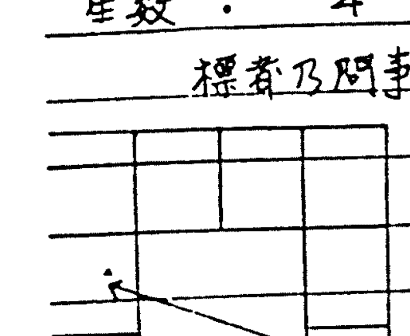

- 1. 萬物與金水有關，而後才有木火土，而金者祿，水者忌也，而第一次要用者乃祿與忌循環之對待原理。
- 2. 如現由命宮化祿出去到了兄弟宮時乃為1. 2=格謂之兩儀標
- 3. 兩儀標乃命宮不當化祿，故祿忌到兄弟時，現論兩儀：

- 4. 既然所謂兩儀，乃必有陽有陰，而化忌入兄弟，乃欠兄弟、朋友之債，（可以此解釋）而既然我化忌入兄弟，則此忌也表示兄弟、朋友相處不會長久，乃情不久。

- 5. 四化乃一種象之數，象包含萬物在其中，但忌本身已構成不好之象，包括金錢之來往，性之來往，無所不包，因兄弟、奴僕本來即是萬物之象生相，故也可以說命宮化忌入兄弟時相互之意見不合。

- 6. 但在易的立場而言，陽不純單陽，陰不純單陰，乃陽中有陰，陰中有陽，此乃陰陽原理，即命宮化忌到兄弟，若我不與朋友有金錢之往來，不與朋友吵嘴時，反而可把不好之象變成好之時也可以變成朋友化祿來給我。

- 7. 此乃陰中有陽，陽中有陰，乃此意即謂，雖然我化忌到朋友、兄弟，但若我不與朋友有金錢之往來或口角時，也許朋友與我之間就不會有是非口角，我與他相處之間，忌反而變成好之現象，此乃朋友要與我爭時，我就不與他爭，則乃我不理他時，忌就不會妨害到我。

- 8. 此乃陰中負有陽，陽中負有陰在其中，不要把忌當成壞的，即命宮化忌入兄弟，乃主與兄弟意見不合，不能長久，此乃包括所有萬物在其中。

- 9. 如果此忌由我之五九發射時也不能欠債有差，而如果兄弟宮之忌忌係由子女發射過來時，其意思當又不同，命宮化忌到兄弟乃宮位之二格，我既化忌給他，同樣之意思，他也會化忌給我。

- 10. 命宮如果化權到兄弟，到底我比較大還是朋友比較大？既然我化權入兄弟如債，乃我比給兄弟朋友，我不要權，故他的權比我大，我所交往之兄弟朋友，都比我有權，故我要與他們作生意，就要用他的名字，而不用我。

的名字，因为我化权给他。

- 11. 权到底是我管他还是他管我呢？很难讲，若要以管的角度而言，则为争执，因为他不受你管，你也管不了他，而若以地位而言，既然你化权给他，则他必比你有權，因为是你化权给他，而他得权，故你再怎么争也争不到权。

- 12. 故若命宫化权到奴仆兄弟者，其朋友大都比你有地位，比你有權，乃你化权给他而不是去管他，纵使你想管他也管不了他，你化权给他即表示他占到权星而不倒。同理，你化忌给他，表示你与他的意见不合，则会造成乾脆大家不要有金钱之来往，人生在世除了财与意见以外，朋友之间尚有何物何事。

- 13. 如你化科给他，则你的朋友也大都比较有风度，或者是智慧份子，而以相处对待而言乃互相之相处较有风度。

- 14. 你化给他如时候，属也好，阴也好，阳宫中有阴，阴宫中有阳，你也可假借他的东西，如你化权给朋友，你也可假借朋友的权势占有他的威风，即占其锋风。

- 15. 又如你化忌给朋友，则你所交的朋友不合时，连你自己也与他不合，此乃阴阳含有对待在其中，既然你化忌给朋友，则你的朋友也不见得如何有成就，此乃物以类聚。

- 16. 又如你化科给朋友，朋友谦和，你也谦和，他有学问，你也有学问，此乃两仪之合，即你化忌给他，他也化忌给你，你化禄给他，他也化禄给你，此乃互相之对待。

- 17. 而两者乃互相之对待，不可能说我对你好，而你却对我不好。

- 18. 兄弟朋友之相处乃对待原理，人不可能如此绝情，我对他好，他不能一点都不给我，即你化什么给他，他就化什么给你，如你化权给他，若要争执时，你也无法争胜，而若你不与他争，且对他好时，你就可得其锋风而成，乃朋友化权，我也随他化权，此即阴阳之理。

- 19. 故若命宫化忌入兄弟奴仆，朋友之间皆不合，此人不合则朋友由何处来，只是物以类聚，同等级之人相交，其级数不高，你的级数也不高，此即对待之理。

- 20. 再比较，既然我化忌到兄弟，乃金钱给朋友亏损或兄弟亏损，多如等，乃要看我之禄星化到何处。

章言：禄忌！禄忌！盖所有禄忌，忌即为欠债，若化禄在财帛，则他亏损我者大都皆钱财之事，如化禄入官禄，乃今天我在作生意，就有朋友会来看我，皆亏损我之方向，以此而推，如禄入福德而忌入奴仆时，乃朋友与我吃喝玩乐看我，若禄忌双入兄弟奴仆缘，乃朋友与我嘻哈玩乐，乃属酒肉朋友。

此星象乃代表了人之事。

- 21. 至于命宫自化禄，而化忌入兄弟，乃个人自己之格对朋友之格，乃命中带有欠朋友之格。

乃个人之命，不能怨他人。

- 22. 若化禄入父母，化忌入兄弟，父母乃生我之位时，乃兄弟不合，也代表遇父母夫妻之事，此

乃自己家中事，也许是长辈事，也许是同事之事。

- 23. 以宫位而言，二格乃对待。

我化禄给朋友，今天若我有事，就要托朋友给我作，因为我化禄给他，他已占禄，他

即占禄，就要有事。

而至于我化禄给他是否好，则要看他之宫位是否有自化，若有自化则最后还是一场糊

涂，一团糟，无成就。

而若其宫干之三吉化照我一五九十时，一定有成就，对我也有利，乃我化给他，他又反

射回来，乃我有收成。

- 24. 故禄转忌，忌转禄乃看可不可以交付任务（看转出去何宫，转出来又是何宫），即看其

落在什么方向，转忌有无冲我之生年。

- 25. 禄转忌有如因果循环之原理

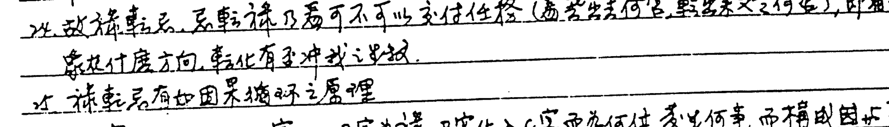

- 26. 再论官禄：官禄化忌入田宅，谓之忌入，乃可作不动产生意，也可作店面生意，可按

意愿自由发挥，但官禄化忌入田宅，要看化禄何在，如化禄入兄弟，则其生意就要

依附朋友、兄弟而为，乃禄在何处，其生基即在何处。

因禄乃二格，而以官禄为禄1，则禄入之兄弟为6，乃1、6共宗，兄弟视同事辈之体。

故事业即与田宅有关，化忌入田宅乃与田宅产生关系。

若禄好还，若禄以化忌去之禄无甚吉凶，若问与朋友合作旺吗，则以兄弟之化禄为忌，

若所转之忌冲命，则不可与朋友合伙。

- 27. 简单之解释，两仪点所谓“禄”是以何单位为主，问其在何处。

- 28. 在此格局，若官禄自化又化入田宅乃有三种现象，以前曾授，此乃两种对待之原理。

此乃禄为1，田为2。

### （三）三禄：

1. 所谓三禄，乃禄矣，若一不可自化，而禄化忌入第三格，即如命宫自化禄时，命宫不可再

化忌入夫星。

此乃以禄为生化出之禄与忌隔三格时一定带有吉凶，任何事皆无结局。

一、一定要以看事由立場為標準，而化出之祿忌不可隔路三格。

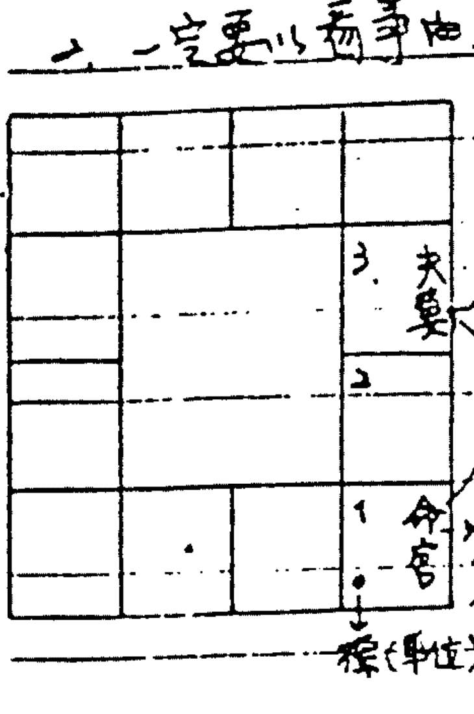

3. 如命宮化祿忌入三合之位時，乃個人之事，乃入五殺之位，即入中，乃個人運之好壞之問題。

4. 如果命宮化祿忌入三合之位，發射者乃命宮，其解釋乃命格之高低好壞而已。

如果官祿化祿忌入三合之位，乃是表示本身運之好壞而已。

「財帛」...「財帛」...「財帛」...「財帛」...「財帛」...「財帛」...「財帛」...「財帛」...「財帛」...「財帛」...「財帛」...「財帛」...「財帛」...「財帛」...「財帛」...「財帛」...「財帛」...「財帛」...「財帛」...「財帛」...「財帛」...「財帛」...「財帛」...「財帛」...「財帛」...「財帛」...「財帛」...「財帛」...「財帛」...「財帛」...「財帛」...「財帛」...「財帛」...「財帛」...「財帛」...「財帛」...「財帛」...「財帛」...「財帛」...「財帛」...「財帛」...「財帛」...「財帛」...「財帛」...「財帛」...「財帛」...「財帛」...「財帛」...「財帛」...「財帛」...「財帛」...「財帛」...「財帛」...「財帛」...「財帛」...「財帛」...「財帛」...「財帛」...「財帛」...「財帛」...「財帛」...「財帛」...「財帛」...「財帛」...「財帛」...「財帛」...「財帛」...「財帛」...「財帛」...「財帛」...「財帛」...「財帛」...「財帛」...「財帛」...「財帛」...「財帛」...「財帛」...「財帛」...「財帛」...「財帛」...「財帛」...「財帛」...「財帛」...「財帛」...「財帛」...「財帛」...「財帛」...「財帛」...「財帛」...「財帛」...「財帛」...「財帛」...「財帛」...「財帛」...「財帛」...「財帛」...「財帛」...「財帛」...「財帛」...「財帛」...「財帛」...「財帛」...「財帛」...「財帛」...「財帛」...「財帛」...「財帛」...「財帛」...「財帛」...「財帛」...「財帛」...「財帛」...「財帛」...「財帛」...「財帛」...「財帛」...「財帛」...「財帛」...「財帛」...「財帛」...「財帛」...「財帛」...「財帛」...「財帛」...「財帛」...「財帛」...「財帛」...「財帛」...「財帛」...「財帛」...「財帛」...「財帛」...「財帛」...「財帛」...「財帛」...「財帛」...「財帛」...「財帛」...「財帛」...「財帛」...「財帛」...「財帛」...「財帛」...「財帛」...「財帛」...「財帛」...「財帛」...「財帛」...「財帛」...「財帛」...「財帛」...「財帛」...「財帛」...「財帛」...「財帛」...「財帛」...「財帛」...「財帛」...「財帛」...「財帛」...「財帛」...「財帛」...「財帛」...「財帛」...「財帛」...「財帛」...「財帛」...「財帛」...「財帛」...「財帛」...「財帛」...「財帛」...「財帛」...「財帛」...「財帛」...「財帛」...「財帛」...「財帛」...「財帛」...「財帛」...「財帛」...「財帛」...「財帛」...「財帛」...「財帛」...「財帛」...「財帛」...「財帛」...「財帛」...「財帛」...「財帛」...「財帛」...「財帛」...「財帛」...「財帛」...「財帛」...「財帛」...「財帛」...「財帛」...「財帛」...「財帛」...「財帛」...「財帛」...「財帛」...「財帛」...「財帛」...「財帛」...「財帛」...「財帛」...「財帛」...「財帛」...「財帛」...「財帛」...「財帛」...「財帛」...「財帛」...「財帛」...「財帛」...「財帛」...「財帛」...「財帛」...「財帛」...「財帛」...「財帛」...「財帛」...「財帛」...「財帛」...「財帛」...「財帛」...「財帛」...「財帛」...「財帛」...「財帛」...「財帛」...「財帛」...「財帛」...「財帛」...「財帛」...「財帛」...「財帛」...「財帛」...「財帛」...「財帛」...「財帛」...「財帛」...「財帛」...「財帛」...「財帛」...「財帛」...「財帛」...「財帛」...「財帛」...「財帛」...「財帛」...「財帛」...「財帛」...「財帛」...「財帛」...「財帛」...「財帛」...「財帛」...「財帛」...「財帛」...「財帛」...「財帛」...「財帛」...「財帛」...「財帛」...「財帛」...「財帛」...「財帛」...「財帛」...「財帛」...「財帛」...「財帛」...「財帛」...「財帛」...「財帛」...「財帛」...「財帛」...「財帛」...「財帛」...「財帛」...「財帛」...「財帛」...「財帛」...「財帛」...「財帛」...「財帛」...「財帛」...「財帛」...「財帛」...「財帛」...「財帛」...「財帛」...「財帛」...「財帛」...「財帛」...「財帛」...「財帛」...「財帛」...「財帛」...「財帛」...「財帛」...「財帛」...「財帛」...「財帛」...「財帛」...「財帛」...「財帛」...「財帛」...「財帛」...「財帛」...「財帛」...「財帛」...「財帛」...「財帛」...「財帛」...「財帛」...「財帛」...「財帛」...「財帛」...「財帛」...「財帛」...「財帛」...「財帛」...「財帛」...「財帛」...「財帛」...「財帛」...「財帛」...「財帛」...「財帛」...「財帛」...「財帛」...「財帛」...「財帛」...「財帛」...「財帛」...「財帛」...「財帛」...「財帛」...「財帛」...「財帛」...「財帛」...「財帛」...「財帛」...「財帛」...「財帛」...「財帛」...「財帛」...「財帛」...「財帛」...「財帛」...「財帛」...「財帛」...「財帛」...「財帛」...「財帛」...「財帛」...「財帛」...「財帛」...「財帛」...「財帛」...「財帛」...「財帛」...「財帛」...「財帛」...「財帛」...「財帛」...「財帛」...「財帛」...「財帛」...「財帛」...「財帛」...「財帛」...「財帛」...「財帛」...「財帛」...「財帛」...「財帛」...「財帛」...「財帛」...「財帛」...「財帛」...「財帛」...「財帛」...「財帛」...「財帛」...「財帛」...「財帛」...「財帛」...「財帛」...「財帛」...「財帛」...「財帛」...「財帛」...「財帛」...「財帛」...「財帛」...「財帛」...「財帛」...「財帛」...「財帛」...「財帛」...「財帛」...「財帛」...「財帛」...「財帛」...「財帛」...「財帛」...「財帛」...「財帛」...「財帛」...「財帛」...「財帛」...「財帛」...「財帛」...「財帛」...「財帛」...「財帛」...「財帛」...「財帛」...「財帛」...「財帛」...「財帛」...「財帛」...「財帛」...「財帛」...「財帛」...「財帛」...「財帛」...「財帛」...「財帛」...「財帛」...「財帛」...「財帛」...「財帛」...「財帛」...「財帛」...「財帛」...「財帛」...「財帛」...「財帛」...「財帛」...「財帛」...「財帛」...「財帛」...「財帛」...「財帛」...「財帛」...「財帛」...「財帛」...「財帛」...「財帛」...「財帛」...「財帛」...「財帛」...「財帛」...「財帛」...「財帛」...「財帛」...「財帛」...「財帛」...「財帛」...「財帛」...「財帛」...「財帛」...「財帛」...「財帛」...「財帛」...「財帛」...「財帛」...「財帛」...「財帛」...「財帛」...「財帛」...「財帛」...「財帛」...「財帛」...「財帛」...「財帛」...「財帛」...「財帛」...「財帛」...「財帛」...「財帛」...「財帛」...「財帛」...「財帛」...「財帛」...「財帛」...「財帛」...「財帛」...「財帛」...「財帛」...「財帛」...「財帛」...「財帛」...「財帛」...「財帛」...「財帛」...「財帛」...「財帛」...「財帛」...「財帛」...「財帛」...「財帛」...「財帛」...「財帛」...「財帛」...「財帛」...「財帛」...「財帛」...「財帛」...「財帛」...「財帛」...「財帛」...「財帛」...「財帛」...「財帛」...「財帛」...「財帛」...「財帛」...「財帛」...「財帛」...「財帛」...「財帛」...「財帛」...「財帛」...「財帛」...「財帛」...「財帛」...「財帛」...「財帛」...「財帛」...「財帛」...「財帛」...「財帛」...「財帛」...「財帛」...「財帛」...「財帛」...「財帛」...「財帛」...「財帛」...「財帛」...「財帛」...「財帛」...「財帛」...「財帛」...「財帛」...「財帛」...「財帛」...「財帛」...「財帛」...「財帛」...「財帛」...「財帛」...「財帛」...「財帛」...「財帛」...「財帛」...「財帛」...「財帛」...「財帛」...「財帛」...「財帛」...「財帛」...「財帛」...「財帛」...「財帛」...「財帛」...「財帛」...「財帛」...「財帛」...「財帛」...「財帛」...「財帛」...「財帛」...「財帛」...「財帛」...「財帛」...「財帛」...「財帛」...「財帛」...「財帛」...「財帛」...「財帛」...「財帛」...「財帛」...「財帛」...「財帛」...「財帛」...「財帛」...「財帛」...「財帛」...「財帛」...「財帛」...「財帛」...「財帛」...「財帛」...「財帛」...「財帛」...「財帛」...「財帛」...「財帛」...「財帛」...「財帛」...「財帛」...「財帛」...「財帛」...「財帛」...「財帛」...「財帛」...「財帛」...「財帛」...「財帛」...「財帛」...「財帛」...「財帛」...「財帛」...「財帛」...「財帛」...「財帛」...「財帛」...「財帛」...「財帛」...「財帛」...「財帛」...「財帛」...「財帛」...「財帛」...「財帛」...「財帛」...「財帛」...「財帛」...「財帛」...「財帛」...「財帛」...「財帛」...「財帛」...「財帛」...「財帛」...「財帛」...「財帛」...「財帛」...「財帛」...「財帛」...「財帛」...「財帛」...「財帛」...「財帛」...「財帛」...「財帛」...「財帛」...「財帛」...「財帛」...「財帛」...「財帛」...「財帛」...「財帛」...「財帛」...「財帛」...「財帛」...「財帛」...「財帛」...「財帛」...「財帛」...「財帛」...「財帛」...「財帛」...「財帛」...「財帛」...「財帛」...「財帛」...「財帛」...「財帛」...「財帛」...「財帛」...「財帛」...「財帛」...「財帛」...「財帛」...「財帛」...「財帛」...「財帛」...「財帛」...「財帛」...「財帛」...「財帛」...「財帛」...「財帛」...「財帛」...「財帛」...「財帛」...「財帛」...「財帛」...「財帛」...「財帛」...「財帛」...「財帛」...「財帛」...「財帛」...「財帛」...「財帛」...「財帛」...「財帛」...「財帛」...「財帛」...「財帛」...「財帛」...「財帛」...「財帛」...「財帛」...「財帛」...「財帛」...「財帛」...「財帛」...「財帛」...「財帛」...「財帛」...「財帛」...「財帛」...「財帛」...「財帛」...「財帛」...「財帛」...「財帛」...「財帛」...「財帛」...「財帛」...「財帛」...「財帛」...「財帛」...「財帛」...「財帛」...「財帛」...「財帛」...「財帛」...「財帛」...「財帛」...「財帛」...「財帛」...「財帛」...「財帛」...「財帛」...「財帛」...「財帛」...「財帛」...「財帛」...「財帛」...「財帛」...「財帛」...「財帛」...「財帛」...「財帛」...「財帛」...「財帛」...「財帛」...「財帛」...「財帛」...「財帛」...「財帛」...「財帛」...「財帛」...「財帛」...「財帛」...「財帛」...「財帛」...「財帛」...「財帛」...「財帛」...「財帛」...「財帛」...「財帛」...「財帛」...「財帛」...「財帛」...「財帛」...「財帛」...「財帛」...「財帛」...「財帛」...「財帛」...「財帛」...「財帛」...「財帛」...「財帛」...「財帛」...「財帛」...「財帛」...「財帛」...「財帛」...「財帛」...「財帛」...「財帛」...「財帛」...「財帛」...「財帛」...「財帛」...「財帛」...「財帛」...「財帛」...「財帛」...「財帛」...「財帛」...「財帛」...「財帛」...「財帛」...「財帛」...「財帛」...「財帛」...「財帛」...「財帛」...「財帛」...「財帛」...「財帛」...「財帛」...「財帛」...「財帛」...「財帛」...「財帛」...「財帛」...「財帛」...「財帛」...「財帛」...「財帛」...「財帛」...「財帛」...「財帛」...「財帛」...「財帛」...「財帛」...「財帛」...「財帛」...「財帛」...「財帛」...「財帛」...「財帛」...「財帛」...「財帛」...「財帛」...「財帛」...「財帛」...「財帛」...「財帛」...「財帛」...「財帛」...「財帛」...「財帛」...「財帛」...「財帛」...「財帛」...「財帛」...「財帛」...「財帛」...「財帛」...「財帛」...「財帛」...「財帛」...「財帛」...「財帛」...「財帛」...「財帛」...「財帛」...「財帛」...「財帛」...「財帛」...「財帛」...「財帛」...「財帛」...「財帛」...「財帛」...「財帛」...「財帛」...「財帛」...「財帛」...「財帛」...「財帛」...「財帛」...「財帛」...「財帛」...「財帛」...「財帛」...「財帛」...「財帛」...「財帛」...「財帛」...「財帛」...「財帛」...「財帛」...「財帛」...「財帛」...「財帛」...「財帛」...「財帛」...「財帛」...「財帛」...「財帛」...「財帛」...「財帛」...「財帛」...「財帛」...「財帛」...「財帛」...「財帛」...「財帛」...「財帛」...「財帛」...「財帛」...「財帛」...「財帛」...「財帛」...「財帛」...「財帛」...「財帛」...「財帛」...「財帛」...「財帛」...「財帛」...「財帛」...「財帛」...「財帛」...「財帛」...「財帛」...「財帛」...「財帛」...「財帛」...「財帛」...「財帛」...「財帛」...「財帛」...「財帛」...「財帛」...「財帛」...「財帛」...「財帛」...「財帛」...「財帛」...「財帛」...「財帛」...「財帛」...「財帛」...「財帛」...「財帛」...「財帛」...「財帛」...「財帛」...「財帛」...「財帛」...「財帛」...「財帛」...「財帛」...「財帛」...「財帛」...「財帛」...「財帛」...「財帛」...「財帛」...「財帛」...「財帛」...「財帛」...「財帛」...「財帛」...「財帛」...「財帛」...「財帛」...「財帛」...「財帛」...「財帛」...「財帛」...「財帛」...「財帛」...「財帛」...「財帛」...「財帛」...「財帛」...「財帛」...「財帛」...「財帛」...「財帛」...「財帛」...「財帛」...「財帛」...「財帛」...「財帛」...「財帛」...「財帛」...「財帛」...「財帛」...「財帛」...「財帛」...「財帛」...「財帛」...「財帛」...「財帛」...「財帛」...「財帛」...「財帛」...「財帛」...「財帛」...「財帛」...「財帛」...「財帛」...「財帛」...「財帛」...「財帛」...「財帛」...「財帛」...「財帛」...「財帛」...「財帛」...「財帛」...「財帛」...「財帛」...「財帛」...「財帛」...「財帛」...「財帛」...「財帛」...「財帛」...「財帛」...「財帛」...「財帛」...「財帛」...「財帛」...「財帛」...「財帛」...「財帛」...「財帛」...「財帛」...「財帛」...「財帛」...「財帛」...「財帛」...「財帛」...「財帛」...「財帛」...「財帛」...「財帛」...「財帛」...「財帛」...「財帛」...「財帛」...「財帛」...「財帛」...「財帛」...「財帛」...「財帛」...「財帛」...「財帛」...「財帛」...「財帛」...「財帛」...「財帛」...「財帛」...「財帛」...「財帛」...「財帛」...「財帛」...「財帛」...「財帛」...「財帛」...「財帛」...「財帛」...「財帛」...「財帛」...「財帛」...「財帛」...「財帛」...「財帛」...「財帛」...「財帛」...「財帛」...「財帛」...「財帛」...「財帛」...「財帛」...「財帛」...「財帛」...「財帛」...「財帛」...「財帛」...「財帛」...「財帛」...「財帛」...「財帛」...「財帛」...「財帛」...「財帛」...「財帛」...「財帛」...「財帛」...「財帛」...「財帛」...「財帛」...「財帛」...「財帛」...「財帛」...「財帛」...「財帛」...「財帛」...「財帛」...「財帛」...「財帛」...「財帛」...「財帛」...「財帛」...「財帛」...「財帛」...「財帛」...「財帛」...「財帛」...「財帛」...「財帛」...「財帛」...「財帛」...「財帛」...「財帛」...「財帛」...「財帛」...「財帛」...「財帛」...「財帛」...「財帛」...「財帛」...「財帛」...「財帛」...「財帛」...「財帛」...「財帛」...「財帛」...「財帛」...「財帛」...「財帛」...「財帛」...「財帛」...「財帛」...「財帛」...「財帛」...「財帛」...「財帛」...「財帛」...「財帛」...「財帛」...「財帛」...「財帛」...「財帛」...「財帛」...「財帛」...「財帛」...「財帛」...「財帛」...「財帛」...「財帛」...「財帛」...「財帛」...「財帛」...「財帛」...「財帛」...「財帛」...「財帛」...「財帛」...「財帛」...「財帛」...「財帛」...「財帛」...「財帛」...「財帛」...「財帛」...「財帛」...「財帛」...「財帛」...「財帛」...「財帛」...「財帛」...「財帛」...「財帛」...「財帛」...「財帛」...「財帛」...「財帛」...「財帛」...「財帛」...「財帛」...「財帛」...「財帛」...「財帛」...「財帛」...「財帛」...「財帛」...「財帛」...「財帛」...「財帛」...「財帛」...「財帛」...「財帛」...「財帛」...「財帛」...「財帛」...「財帛」...「財帛」...「財帛」...「財帛」...「財帛」...「財帛」...「財帛」...「財帛」...「財帛」...「財帛」...「財帛」...「財帛」...「財帛」...「財帛」...「財帛」...「財帛」...「財帛」...「財帛」...「財帛」...「財帛」...「財帛」...「財帛」...「財帛」...「財帛」...「財帛」...「財帛」...「財帛」...「財帛」...「財帛」...「財帛」...「財帛」...「財帛」...「財帛」...「財帛」...「財帛」...「財帛」...「財帛」...「財帛」...「財帛」...「財帛」...「財帛」...「財帛」...「財帛」...「財帛」...「財帛」...「財帛」...「財帛」...「財帛」...「財帛」...「財帛」...「財帛」...「財帛」...「財帛」...「財帛」...「財帛」...「財帛」...「財帛」...「財帛」...「財帛」...「財帛」...「財帛」...「財帛」...「財帛」...「財帛」...「財帛」...「財帛」...「財帛」...「財帛」...「財帛」...「財帛」...「財帛」...「財帛」...「財帛」...「財帛」...「財帛」...「財帛」...「財帛」...「財帛」...「財帛」...「財帛」...「財帛」...「財帛」...「財帛」...「財帛」...「財帛」...「財帛」...「財帛」...「財帛」...「財帛」...「財帛」...「財帛」...「財帛」...「財帛」...「財帛」...「財帛」...「財帛」...「財帛」...「財帛」...「財帛」...「財帛」...「財帛」...「財帛」...「財帛」...「財帛」...「財帛」...「財帛」...「財帛」...「財帛」...「財帛」...「財帛」...「財帛」...「財帛」...「財帛」...「財帛」...「財帛」...「財帛」...「財帛」...「財帛」...「財帛」...「財帛」...「財帛」...「財帛」...「財帛」...「財帛」...「財帛」...「財帛」...「財帛」...「財帛」...「財帛」...「財帛」...「財帛」...「財帛」...「財帛」...「財帛」...「財帛」...「財帛」...「財帛」...「財帛」...「財帛」...「財帛」...「財帛」...「財帛」...「財帛」...「財帛」...「財帛」...「財帛」...「財帛」...「財帛」...「財帛」...「財帛」...「財帛」...「財帛」...「財帛」...「財帛」...「財帛」...「財帛」...「財帛」...「財帛」...「財帛」...「財帛」...「財帛」...「財帛」...「財帛」...「財帛」...「財帛」...「財帛」...「財帛」...「財帛」...「財帛」...「財帛」...「財帛」...「財帛」...「財帛」...「財帛」...「財帛」...「財帛」...「財帛」...「財帛」...「財帛」...「財帛」...「財帛」...「財帛」...「財帛」...「財帛」...「財帛」...「財帛」...「財帛」...「財帛」...「財帛」...「財帛」...「財帛」...「財帛」...「財帛」...「財帛」...「財帛」...「財帛」...「財帛」...「財帛」...「財帛」...「財帛」...「財帛」...「財帛」...「財帛」...「財帛」...「財帛」...「財帛」...「財帛」...「財帛」...「財帛」...「財帛」...「財帛」...「財帛」...「財帛」...「財帛」...「財帛」...「財帛」...「財帛」...「財帛」...「財帛」...「財帛」...「財帛」...「財帛」...「財帛」...「財帛」...「財帛」...「財帛」...「財帛」...「財帛」...「財帛」...「財帛」...「財帛」...「財帛」...「財帛」...「財帛」...「財帛」...「財帛」...「財帛」...「財帛」...「財帛」...「財帛」...「財帛」...「財帛」...「財帛」...「財帛」...「財帛」...「財帛」...「財帛」...「財帛」...「財帛」...「財帛」...「財帛」...「財帛」...「財帛」...「財帛」...「財帛」...「財帛」...「財帛」...「財帛」...「財帛」...「財帛」...「財帛」...「財帛」...「財帛」...「財帛」...「財帛」...「財帛」...「財帛」...「財帛」...「財帛」...「財帛」...「財帛」...「財帛」...「財帛」...「財帛」...「財帛」...「財帛」...「財帛」...「財帛」...「財帛」...「財帛」...「財帛」...「財帛」...「財帛」...「財帛」...「財帛」...「財帛」...「財帛」...「財帛」...「財帛」...「財帛」...「財帛」...「財帛」...「財帛」...「財帛」...「財帛」...「財帛」...「財帛」...「財帛」...「財帛」...「財帛」...「財帛」...「財帛」...「財帛」...「財帛」...「財帛」...「財帛」...「財帛」...「財帛」...「財帛」...「財帛」...「財帛」...「財帛」...「財帛」...「財帛」...「財帛」...「財帛」...「財帛」...「財帛」...「財帛」...「財帛」...「財帛」...「財帛」...「財帛」...「財帛」...「財帛」...「財帛」...「財帛」...「財帛」...「財帛」...「財帛」...「財帛」...「財帛」...「財帛」...「財帛」...「財帛」...「財帛」...「財帛」...「財帛」...「財帛」...「財帛」...「財帛」...「財帛」...「財帛」...「財帛」...「財帛」...「財帛」...「財帛」...「財帛」...「財帛」...「財帛」...「財帛」...「財帛」...「財帛」...「財帛」...「財帛」...「財帛」...「財帛」...「財帛」...「財帛」...「財帛」...「財帛」...「財帛」...「財帛」...「財帛」...「財帛」...「財帛」...「財帛」...「財帛」...「財帛」...「財帛」...「財帛」...「財帛」...「財帛」...「財帛」...「財帛」...「財帛」...「財帛」...「財帛」...「財帛」...「財帛」...「財帛」...「財帛」...「財帛」...「財帛」...「財帛」...「財帛」...「財帛」...「財帛」...「財帛」...「財帛」...「財帛」...「財帛」...「財帛」...「財帛」...「財帛」...「財帛」...「財帛」...「財帛」...「財帛」...「財帛」...「財帛」...「財帛」...「財帛」...「財帛」...「財帛」...「財帛」...「財帛」...「財帛」...「財帛」...「財帛」...「財帛」...「財帛」...「財帛」...「財帛」...「財帛」...「財帛」...「財帛」...「財帛」...「財帛」...「財帛」...「財帛」...「財帛」...「財帛」...「財帛」...「財帛」...「財帛」...「財帛」...「財帛」...「財帛」...「財帛」...「財帛」...「財帛」...「財帛」...「財帛」...「財帛」...「財帛」...「財帛」...「財帛」...「財帛」...「財帛」...「財帛」...「財帛」...「財帛」...「財帛」...「財帛」...「財帛」...「財帛」...「財帛」...「財帛」...「財帛」...「財帛」...「財帛」...「財帛」...「財帛」...「財帛」...「財帛」...「財帛」...「財帛」...「財帛」...「財帛」...「財帛」...「財帛」...「財帛」...「財帛」...「財帛」...「財帛」...「財帛」...「財帛」...「財帛」...「財帛」...「財帛」...「財帛」...「財帛」...「財帛」...「財帛」...「財帛」...「財帛」...「財帛」...「財帛」...「財帛」...「財帛」...「財帛」...「財帛」...「財帛」...「財帛」...「財帛」...「財帛」...「財帛」...「財帛」...「財帛」...「財帛」...「財帛」...「財帛」...「財帛」...「財帛」...「財帛」...「財帛」...「財帛」...「財帛」...「財帛」...「財帛」...「財帛」...「財帛」...「財帛」...「財帛」...「財帛」...「財帛」...「財帛」...「財帛」...「財帛」...「財帛」...「財帛」...「財帛」...「財帛」...「財帛」...「財帛」...「財帛」...「財帛」...「財帛」...「財帛」...「財帛」...「財帛」...「財帛」...「財帛」...「財帛」...「財帛」...「財帛」...「財帛」...「財帛」...「財帛」...「財帛」...「財帛」...「財帛」...「財帛」...「財帛」...「財帛」...「財帛」...「財帛」...「財帛」...「財帛」...「財帛」...「財帛」...「財帛」...「財帛」...「財帛」...「財帛」...「財帛」...「財帛」...「財帛」...「財帛」...「財帛」...「財帛」...「財帛」...「財帛」...「財帛」...「財帛」...「財帛」...「財帛」...「財帛」...「財帛」...「財帛」...「財帛」...「財帛」...「財帛」...「財帛」...「財帛」...「財帛」...「財帛」...「財帛」...「財帛」...「財帛」...「財帛」...「財帛」...「財帛」...「財帛」...「財帛」...「財帛」...「財帛」...「財帛」...「財帛」...「財帛」...「財帛」...「財帛」...「財帛」...「財帛」...「財帛」...「財帛」...「財帛」...「財帛」...「財帛」...「財帛」...「財帛」...「財帛」...「財帛」...「財帛」...「財帛」...「財帛」...「財帛」...「財帛」...「財帛」...「財帛」...「財帛」...「財帛」...「財帛」...「財帛」...「財帛」...「財帛」...「財帛」...「財帛」...「財帛」...「財帛」...「財帛」...「財帛」...「財帛」...「財帛」...「財帛」...「財帛」...「財帛」...「財帛」...「財帛」...「財帛」...「財帛」...「財帛」...「財帛」...「財帛」...「財帛」...「財帛」...「財帛」...「財帛」...「財帛」...「財帛」...「財帛」...「財帛」...「財帛」...「財帛」...「財帛」...「財帛」...「財帛」...「財帛」...「財帛」...「財帛」...「財帛」...「財帛」...「財帛」...「財帛」...「財帛」...「財帛」...「財帛」...「財帛」...「財帛」...「財帛」...「財帛」...「財帛」...「財帛」...「財帛」...「財帛」...「財帛」...「財帛」...「財帛」...「財帛」...「財帛」...「財帛」...「財帛」...「財帛」...「財帛」...「財帛」...「財帛」...「財帛」...「財帛」...「財帛」...「財帛」...「財帛」...「財帛」...「財帛」...「財帛」...「財帛」...「財帛」...「財帛」...「財帛」...「財帛」...「財帛」...「財帛」...「財帛」...「財帛」...「財帛」...「財帛」...「財帛」...「財帛」...「財帛」...「財帛」...「財帛」...「財帛」...「財帛」...「財帛」...「財帛」...「財帛」...「財帛」...「財帛」...「財帛」...「財帛」...「財帛」...「財帛」...「財帛」...「財帛」...「財帛」...「財帛」...「財帛」...「財帛」...「財帛」...「財帛」...「財帛」...「財帛」...「財帛」...「財帛」...「財帛」...「財帛」...「財帛」...「財帛」...「財帛」...「財帛」...「財帛」...「財帛」...「財帛」...「財帛」...「財帛」...「財帛」...「財帛」...「財帛」...「財帛」...「財帛」...「財帛」...「財帛」...「財帛」...「財帛」...「財帛」...「財帛」...「財帛」...「財帛」...「財帛」...「財帛」...「財帛」...「財帛」...「財帛」...「財帛」...「財帛」...「財帛」...「財帛」...「財帛」...「財帛」...「財帛」...「財帛」...「財帛」...「財帛」...「財帛」...「財帛」...「財帛」...「財帛」...「財帛」...「財帛」...「財帛」...「財帛」...「財帛」...「財帛」...「財帛」...「財帛」...「財帛」...「財帛」...「財帛」...「財帛」...「財帛」...「財帛」...「財帛」...「財帛」...「財帛」...「財帛」...「財帛」...「財帛」...「財帛」...「財帛」...「財帛」...「財帛」...「財帛」...「財帛」...「財帛」...「財帛」...「財帛」...「財帛」...「財帛」...「財帛」...「財帛」...「財帛」...「財帛」...「財帛」...「財帛」...「財帛」...「財帛」...「財帛」...「財帛」...「財帛」...「財帛」...「財帛」...「財帛」...「財帛」...「財帛」...「財帛」...「財帛」...「財帛」...「財帛」...「財帛」...「財帛」...「財帛」...「財帛」...「財帛」...「財帛」...「財帛」...「財帛」...「財帛」...「財帛」...「財帛」...「財帛」...「財帛」...「財帛」...「財帛」...「財帛」...「財帛」...「財帛」...「財帛」...「財帛」...「財帛」...「財帛」...「財帛」...「財帛」...「財帛」...「財帛」...「財帛」...「財帛」...「財帛」...「財帛」...「財帛」...「財帛」...「財帛」...「財帛」...「財帛」...「財帛」...「財帛」...「財帛」...「財帛」...「財帛」...「財帛」...「財帛」...「財帛」...「財帛」...「財帛」...「財帛」...「財帛」...「財帛」...「財帛」...「財帛」...「財帛」...「財帛」...「財帛」...「財帛」...「財帛」...「財帛」...「財帛」...「財帛」...「財帛」...「財帛」...「財帛」...「財帛」...「財帛」...「財帛」...「財帛」...「財帛」...「財帛」...「財帛」...「財帛」...「財帛」...「財帛」...「財帛」...「財帛」...「財帛」...「財帛」...「財帛」...「財帛」...「財帛」...「財帛」...「財帛」...「財帛」...「財帛」...「財帛」...「財帛」...「財帛」...「財帛」...「財帛」...「財帛」...「財帛」...「財帛」...「財帛」...「財帛」...「財帛」...「財帛」...「財帛」...「財帛」...「財帛」...「財帛」...「財帛」...「財帛」...「財帛」...「財帛」...「財帛」...「財帛」...「財帛」...「財帛」...「財帛」...「財帛」...「財帛」...「財帛」...「財帛」...「財帛」...「財帛」...「財帛」...「財帛」...「財帛」...「財帛」...「財帛」...「財帛」...「財帛」...「財帛」...「財帛」...「財帛」...「財帛」...「財帛」...「財帛」...「財帛」...「財帛」...「財帛」...「財帛」...「財帛」...「財帛」...「財帛」...「財帛」...「財帛」...「財帛」...「財帛」...「財帛」...「財帛」...「財帛」...「財帛」...「財帛」...「財帛」...「財帛」...「財帛」...「財帛」...「財帛」...「財帛」...「財帛」...「財帛」...「財帛」...「財帛」...「財帛」...「財帛」...「財帛」...「財帛」...「財帛」...「財帛」...「財帛」...「財帛」...「財帛」...「財帛」...「財帛」...「財帛」...「財帛」...「財帛」...「財帛」...「財帛」...「財帛」...「財帛」...「財帛」...「財帛」...「財帛」...「財帛」...「財帛」...「財帛」...「財帛」...「財帛」...「財帛」...「財帛」...「財帛」...「財帛」...「財帛」...「財帛」...「財帛」...「財帛」...「財帛」...「財帛」...「財帛」...「財帛」...「財帛」...「財帛」...「財帛」...「財帛」...「財帛」...「財帛」...「財帛」...「財帛」...「財帛」...「財帛」...「財帛」...「財帛」...「財帛」...「財帛」...「財帛」...「財帛」...「財帛」...「財帛」...「財帛」...「財帛」...「財帛」...「財帛」...「財帛」...「財帛」...「財帛」...「財帛」...「財帛」...「財帛」...「財帛」...「財帛」...「財帛」...「財帛」...「財帛」...「財帛」...「財帛」...「財帛」...「財帛」...「財帛」...「財帛」...「財帛」...「財帛」...「財帛」...「財帛」...「財帛」...「財帛」...「財帛」...「財帛」...「財帛」...「財帛」...「財帛」...「財帛」...「財帛」...「財帛」...「財帛」...「財帛」...「財帛」...「財帛」...「財帛」...「財帛」...「財帛」...「財帛」...「財帛」...「財帛」...「財帛」...「財帛」...「財帛」...「財帛」...「財帛」...「財帛」...「財帛」...「財帛」...「財帛」...「財帛」...「財帛」...「財帛」...「財帛」...「財帛」...「財帛」...「財帛」...「財帛」...「財帛」...「財帛」...「財帛」...「財帛」...「財帛」...「財帛」...「財帛」...「財帛」...「財帛」...「財帛」...「財帛」...「財帛」...「財帛」...「財帛」...「財帛」...「財帛」...「財帛」...「財帛」...「財帛」...「財帛」...「財帛」...「財帛」...「財帛」...「財帛」...「財帛」...「財帛」...「財帛」...「財帛」...「財帛」...「財帛」...「財帛」...「財帛」...「財帛」...「財帛」...「財帛」...「財帛」...「財帛」...「財帛」...「財帛」...「財帛」...「財帛」...「財帛」...「財帛」...「財帛」...「財帛」...「財帛」...「財帛」...「財帛」...「財帛」...「財帛」...「財帛」...「財帛」...「財帛」...「財帛」...「財帛」...「財帛」...「財帛」...「財帛」...「財帛」...「財帛」...「財帛」...「財帛」...「財帛」...「財帛」...「財帛」...「財帛」...「財帛」...「財帛」...「財帛」...「財帛」...「財帛」...「財帛」...「財帛」...「財帛」...「財帛」...「財帛」...「財帛」...「財帛」...「財帛」...「財帛」...「財帛」...「財帛」...「財帛」...「財帛」...「財帛」...「財帛」...「財帛」...「財帛」...「財帛」...「財帛」...「財帛」...「財帛」...「財帛」...「財帛」...「財帛」...「財帛」...「財帛」...「財帛」...「財帛」...「財帛」...「財帛」...「財帛」...「財帛」...「財帛」...「財帛」...「財帛」...「財帛」...「財帛」...「財帛」...「財帛」...「財帛」...「財帛」...「財帛」...「財帛」...「財帛」...「財帛」...「財帛」...「財帛」...「財帛」...「財帛」...「財帛」...「財帛」...「財帛」...「財帛」...「財帛」...「財帛」...「財帛」...「財帛」...「財帛」...「財帛」...「財帛」...「財帛」...「財帛」...「財帛」...「財帛」...「財帛」...「財帛」...「財帛」...「財帛」...「財帛」...「財帛」...「財帛」...「財帛」...「財帛」...「財帛」...「財帛」...「財帛」...「財帛」...「財帛」...「財帛」...「財帛」...「財帛」...「財帛」...「財帛」...「財帛」...「財帛」...「財帛」...「財帛」...「財帛」...「財帛」...「財帛」...「財帛」...「財帛」...「財帛」...「財帛」...「財帛」...「財帛」...「財帛」...「財帛」...「財帛」...「財帛」...「財帛」...「財帛」...「財帛」...「財帛」...「財帛」...「財帛」...「財帛」...「財帛」...「財帛」...「財帛」...「財帛」...「財帛」...「財帛」...「財帛」...「財帛」...「財帛」...「財帛」...「財帛」...「財帛」...「財帛」...「財帛」...「財帛」...「財帛」...「財帛」...「財帛」...「財帛」...「財帛」...「財帛」...「財帛」...「財帛」...「財帛」...「財帛」...「財帛」...「財帛」...「財帛」...「財帛」...「財帛」...「財帛」...「財帛」...「財帛」...「財帛」...「財帛」...「財帛」...「財帛」...「財帛」...「財帛」...「財帛」...「財帛」...「財帛」...「財帛」...「財帛」...「財帛」...「財帛」...「財帛」...「財帛」...「財帛」...「財帛」...「財帛」...「財帛」...「財帛」...「財帛」...「財帛」...「財帛」...「財帛」...「財帛」...「財帛」...「財帛」...「財帛」...「財帛」...「財帛」...「財帛」...「財帛」...「財帛」...「財帛」...「財帛」...「財帛」...「財帛」...「財帛」...「財帛」...「財帛」...「財帛」...「財帛」...「財帛」...「財帛」...「財帛」...「財帛」...「財帛」...「財帛」...「財帛」...「財帛」...「財帛」...「財帛」...「財帛」...「財帛」...「財帛」...「財帛」...「財帛」...「財帛」...「財帛」...「財帛」...「財帛」...「財帛」...「財帛」...「財帛」...「財帛」...「財帛」...「財帛」...「財帛」...「財帛」...「財帛」...「財帛」...「財帛」...「財帛」...「財帛」...「財帛」...「財帛」...「財帛」...「財帛」...「財帛」...「財帛」...「財帛」...「財帛」...「財帛」...「財帛」...「財帛」...「財帛」...「財帛」...「財帛」...「財帛」...「財帛」...「財帛」...「財帛」...「財帛」...「財帛」...「財帛」...「財帛」...「財帛」...「財帛」...「財帛」...「財帛」...「財帛」...「財帛」...「財帛」...「財帛」...「財帛」...「財帛」...「財帛」...「財帛」...「財帛」...「財帛」...「財帛」...「財帛」...「財帛」...「財帛」...「財帛」...「財帛」...「財帛」...「財帛」...「財帛」...「財帛」...「財帛」...「財帛」...「財帛」...「財帛」...「財帛」...「財帛」...「財帛」...「財帛」...「財帛」...「財帛」...「財帛」...「財帛」...「財帛」...「財帛」...「財帛」...「財帛」...「財帛」...「財帛」...「財帛」...「財帛」...「財帛」...「財帛」...「財帛」...「財帛」...「財帛」...「財帛」...「財帛」...「財帛」...「財帛」...「財帛」...「財帛」...「財帛」...「財帛」...「財帛」...「財帛」...「財帛」...「財帛」...「財帛」...「財帛」...「財帛」...「財帛」...「財帛」...「財帛」...「財帛」...「財帛」...「財帛」...「財帛」...「財帛」...「財帛」...「財帛」...「財帛」...「財帛」...「財帛」...「財帛」...「財帛」...「財帛」...「財帛」...「財帛」...「財帛」...「財帛」...「財帛」...「財帛」...「財帛」...「財帛」...「財帛」...「財帛」...「財帛」...「財帛」...「財帛」...「財帛」...「財帛」...「財帛」...「財帛」...「財帛」...「財帛」...「財帛」...「財帛」...「財帛」...「財帛」...「財帛」...「財帛」...「財帛」...「財帛」...「財帛」...「財帛」...「財帛」...「財帛」...「財帛」...「財帛」...「財帛」...「財帛」...「財帛」...「財帛」...「財帛」...「財帛」...「財帛」...「財帛」...「財帛」...「財帛」...「財帛」...「財帛」...「財帛」...「財帛」...「財帛」...「財帛」...「財帛」...「財帛」...「財帛」...「財帛」...「財帛」...「財帛」...「財帛」...「財帛」...「財帛」...「財帛」...「財帛」...「財帛」...「財帛」...「財帛」...「財帛」...「財帛」...「財帛」...「財帛」...「財帛」...「財帛」...「財帛」...「財帛」...「財帛」...「財帛」...「財帛」...「財帛」...「財帛」...「財帛」...「財帛」...「財帛」...「財帛」...「財帛」...「財帛」...「財帛」...「財帛」...「財帛」...「財帛」...「財帛」...「財帛」...「財帛」...「財帛」...「財帛」...「財帛」...「財帛」...「財帛」...「財帛」...「財帛」...「財帛」...「財帛」...「財帛」...「財帛」...「財帛」...「財帛」...「財帛」...「財帛」...「財帛」...「財帛」...「財帛」...「財帛」...「財帛」...「財帛」...「財帛」...「財帛」...「財帛」...「財帛」...「財帛」...「財帛」...「財帛」...「財帛」...「財帛」...「財帛」...「財帛」...「財帛」...「財帛」...「財帛」...「財帛」...「財帛」...「財帛」...「財帛」...「財帛」...「財帛」...「財帛」...「財帛」...「財帛」...「財帛」...「財帛」...「財帛」...「財帛」...「財帛」...「財帛」...「財帛」...「財帛」...「財帛」...「財帛」...「財帛」...「財帛」...「財帛」...「財帛」...「財帛」...「財帛」...「財帛」...「財帛」...「財帛」...「財帛」...「財帛」...「財帛」...「財帛」...「財帛」...「財帛」...「財帛」...「財帛」...「財帛」...「財帛」...「財帛」...「財帛」...「財帛」...「財帛」...「財帛」...「財帛」...「財帛」...「財帛」...「財帛」...「財帛」...「財帛」...「財帛」...「財帛」...「財帛」...「財帛」...「財帛」...「財帛」...「財帛」...「財帛」...「財帛」...「財帛」...「財帛」...「財帛」...「財帛」...「財帛」...「財帛」...「財帛」...「財帛」...「財帛」...「財帛」...「財帛」...「財帛」...「財帛」...「財帛」...「財帛」...「財帛」...「財帛」...「財帛」...「財帛」...「財帛」...「財帛」...「財帛」...「財帛」...「財帛」...「財帛」...「財帛」...「財帛」...「財帛」...「財帛」...「財帛」...「財帛」...「財帛」...「財帛」...「財帛」...「財帛」...「財帛」...「財帛」...「財帛」...「財帛」...「財帛」...「財帛」...「財帛」...「財帛」...「財帛」...「財帛」...「財帛」...「財帛」...「財帛」...「財帛」...「財帛」...「財帛」...「財帛」...「財帛」...「財帛」...「財帛」...「財帛」...「財帛」...「財帛」...「財帛」...「財帛」...「財帛」...「財帛」...「財帛」...「財帛」...「財帛」...「財帛」...「財帛」...「財帛」...「財帛」...「財帛」...「財帛」...「財帛」...「財帛」...「財帛」...「財帛」...「財帛」...「財帛」...「財帛」...「財帛」...「財帛」...「財帛」...「財帛」...「財帛」...「財帛」...「財帛」...「財帛」...「財帛」...「財帛」...「財帛」...「財帛」...「財帛」...「財帛」...「財帛」...「財帛」...「財帛」...「財帛」...「財帛」...「財帛」...「財帛」...「財帛」...「財帛」...「財帛」...「財帛」...「財帛」...「財帛」...「財帛」...「財帛」...「財帛」...「財帛」...「財帛」...「財帛」...「財帛」...「財帛」...「財帛」...「財帛」...「財帛」...「財帛」...「財帛」...「財帛」...「財帛」...「財帛」...「財帛」...「財帛」...「財帛」...「財帛」...「財帛」...「財帛」...「財帛」...「財帛」...「財帛」...「財帛」...「財帛」...「財帛」...「財帛」...「財帛」...「財帛」...「財帛」...「財帛」...「財帛」...「財帛」...「財帛」...「財帛」...「財帛」...「財帛」...「財帛」...「財帛」...「財帛」...「財帛」...「財帛」...「財帛」...「財帛」...「財帛」...「財帛」...「財帛」...「財帛」...「財帛」...「財帛」...「財帛」...「財帛」...「財帛」...「財帛」...「財帛」...「財帛」...「財帛」...「財帛」...「財帛」...「財帛」...「財帛」...「財帛」...「財帛」...「財帛」...「財帛」...「財帛」...「財帛」...「財帛」...「財帛」...「財帛」...「財帛」...「財帛」...「財帛」...「財帛」...「財帛」...「財帛」...「財帛」...「財帛」...「財帛」...「財帛」...「財帛」...「財帛」...「財帛」...「財帛」...「財帛」...「財帛」...「財帛」...「財帛」...「財帛」...「財帛」...「財帛」...「財帛」...「財帛」...「財帛」...「財帛」...「財帛」...「財帛」...「財帛」...「財帛」...「財帛」...「財帛」...「財帛」...「財帛」...「財帛」...「財帛」...「財帛」...「財帛」...「財帛」...「財帛」...「財帛」...「財帛」...「財帛」...「財帛」...「財帛」...「財帛」...「財帛」...「財帛」...「財帛」...「財帛」...「財帛」...「財帛」...「財帛」...「財帛」...「財帛」...「財帛」...「財帛」...「財帛」...「財帛」...「財帛」...「財帛」...「財帛」...「財帛」...「財帛」...「財帛」...「財帛」...「財帛」...「財帛」...「財帛」...「財帛」...「財帛」...「財帛」...「財帛」...「財帛」...「財帛」...「財帛」...「財帛」...「財帛」...「財帛」...「財帛」...「財帛」...「財帛」...「財帛」...「財帛」...「財帛」...「財帛」...「財帛」...「財帛」...「財帛」...「財帛」...「財帛」...「財帛」...「財帛」...「財帛」...「財帛」...「財帛」...「財帛」...「財帛」...「財帛」...「財帛」...「財帛」...「財帛」...「財帛」...「財帛」...「財帛」...「財帛」...「財帛」...「財帛」...「財帛」...「財帛」...「財帛」...「財帛」...「財帛」...「財帛」...「財帛」...「財帛」...「財帛」...「財帛」...「財帛」...「財帛」...「財帛」...「財帛」...「財帛」...「財帛」...「財帛」...「財帛」...「財帛」...「財帛」...「財帛」...「財帛」...「財帛」...「財帛」...「財帛」...「財帛」...「財帛」...「財帛」...「財帛」...「財帛」...「財帛」...「財帛」...「財帛」...「財帛」...「財帛」...「財帛」...「財帛」...「財帛」...「財帛」...「財帛」...「財帛」...「財帛」...「財帛」...「財帛」...「財帛」...「財帛」...「財帛」...「財帛」...「財帛」...「財帛」...「財帛」...「財帛」...「財帛」...「財帛」...「財帛」...「財帛」...「財帛」...「財帛」...「財帛」...「財帛」...「財帛」...「財帛」...「財帛」...「財帛」...「財帛」...「財帛」...「財帛」...「財帛」...「財帛」...「財帛」...「財帛」...「財帛」...「財帛」...「財帛」...「財帛」...「財帛」...「財帛」...「財帛」...「財帛」...「財帛」...「財帛」...「財帛」...「財帛」...「財帛」...「財帛」...「財帛」...「財帛」...「財帛」...「財帛」...「財帛」...「財帛」...「財帛」...「財帛」...「財帛」...「財帛」...「財帛」...「財帛」...「財帛」...「財帛」...「財帛」...「財帛」...「財帛」...「財帛」...「財帛」...「財帛」...「財帛」...「財帛」...「財帛」...「財帛」...「財帛」...「財帛」...「財帛」...「財帛」...「財帛」...「財帛」...「財帛」...「財帛」...「財帛」...「財帛」...「財帛」...「財帛」...「財帛」...「財帛」...「財帛」...「財帛」...「財帛」...「財帛」...「財帛」...「財帛」...「財帛」...「財帛」...「財帛」...「財帛」...「財帛」...「財帛」...「財帛」...「財帛」...「財帛」...「財帛」...「財帛」...「財帛」...「財帛」...「財帛」...「財帛」...「財帛」...「財帛」...「財帛」...「財帛」...「財帛」...「財帛」...「財帛」...「財帛」...「財帛」...「財帛」...「財帛」...「財帛」...「財帛」...「財帛」...「財帛」...「財帛」...「財帛」...「財帛」...「財帛」...「財帛」...「財帛」...「財帛」...「財帛」...「財帛」...「財帛」...「財帛」...「財帛」...「財帛」...「財帛」...「財帛」...「財帛」...「財帛」...「財帛」...「財帛」...「財帛」...「財帛」...「財帛」...「財帛」...「財帛」...「財帛」...「財帛」...「財帛」...「財帛」...「財帛」...「財帛」...「財帛」...「財帛」...「財帛」...「財帛」...「財帛」...「財帛」...「財帛」...「財帛」...「財帛」...「財帛」...「財帛」...「財帛」...「財帛」...「財帛」...「財帛」...「財帛」...「財帛」...「財帛」...「財帛」...「財帛」...「財帛」...「財帛」...「財帛」...「財帛」...「財帛」...「財帛」...「財帛」...「財帛」...「財帛」...「財帛」...「財帛」...「財帛」...「財帛」...「財帛」...「財帛」...「財帛」...「財帛」...「財帛」...「財帛」...「財帛」...「財帛」...「財帛」...「財帛」...「財帛」...「財帛」...「財帛」...「財帛」...「財帛」...「財帛」...「財帛」...「財帛」...「財帛」...「財帛」...「財帛」...「財帛」...「財帛」...「財帛」...「財帛」...「財帛」...「財帛」...「財帛」...「財帛」...「財帛」...「財帛」...「財帛」...「財帛」...「財帛」...「財帛」...「財帛」...「財帛」...「財帛」...「財帛」...「財帛」...「財帛」...「財帛」...「財帛」...「財帛」...「財帛」...「財帛」...「財帛」...「財帛」...「財帛」...「財帛」...「財帛」...「財帛」...「財帛」...「財帛」...「財帛」...「財帛」...「財帛」...「財帛」...「財帛」...「財帛」...「財帛」...「財帛」...「財帛」...「財帛」...「財帛」...「財帛」...「財帛」...「財帛」...「財帛」...「財帛」...「財帛」...「財帛」...「財帛」...「財帛」...「財帛」...「財帛」...「財帛」...「財帛」...「財帛」...「財帛」...「財帛」...「財帛」...「財帛」...「財帛」...「財帛」...「財帛」...「財帛」...「財帛」...「財帛」...「財帛」...「財帛」...「財帛」...「財帛」...「財帛」...「財帛」...「財帛」...「財帛」...「財帛」...「財帛」...「財帛」...「財帛」...「財帛」...「財帛」...「財帛」...「財帛」...「財帛」...「財帛」...「財帛」...「財帛」...「財帛」...「財帛」...「財帛」...「財帛」...「財帛」...「財帛」...「財帛」...「財帛」...「財帛」...「財帛」...「財帛」...「財帛」...「財帛」...「財帛」...「財帛」...「財帛」...「財帛」...「財帛」...「財帛」...「財帛」...「財帛」...「財帛」...「財帛」...「財帛」...「財帛」...「財帛」...「財帛」...「財帛」...「財帛」...「財帛」...「財帛」...「財帛」...「財帛」...「財帛」...「財帛」...「財帛」...「財帛」...「財帛」...「財帛」...「財帛」...「財帛」...「財帛」...「財帛」...「財帛」...「財帛」...「財帛」...「財帛」...「財帛」...「財帛」...「財帛」...「財帛」...「財帛」...「財帛」...「財帛」...「財帛」...「財帛」...「財帛」...「財帛」...「財帛」...「財帛」...「財帛」...「財帛」...「財帛」...「財帛」...「財帛」...「財帛」...「財帛」...「財帛」...「財帛」...「財帛」...「財帛」...「財帛」...「財帛」...「財帛」...「財帛」...「財帛」...「財帛」...「財帛」...「財帛」...「財帛」...「財帛」...「財帛」...「財帛」...「財帛」...「財帛」...「財帛」...「財帛」...「財帛」...「財帛」...「財帛」...「財帛」...「財帛」...「財帛」...「財帛」...「財帛」...「財帛」...「財帛」...「財帛」...「財帛」...「財帛」...「財帛」...「財帛」...「財帛」...「財帛」...「財帛」...「財帛」...「財帛」...「財帛」...「財帛」...「財帛」...「財帛」...「財帛」...「財帛」...「財帛」...「財帛」...「財帛」...「財帛」...「財帛」...「財帛」...「財帛」...「財帛」...「財帛」...「財帛」...「財帛」...「財帛」...「財帛」...「財帛」...「財帛」...「財帛」...「財帛」...「財帛」...「財帛」...「財帛」...「財帛」...「財帛」...「財帛」...「財帛」...「財帛」...「財帛」...「財帛」...「財帛」...「財帛」...「財帛」...「財帛」...「財帛」...「財帛」...「財帛」...「財帛」...「財帛」...「財帛」...「財帛」...「財帛」...「財帛」...「財帛」...「財帛」...「財帛」...「財帛」...「財帛」...「財帛」...「財帛」...「財帛」...「財帛」...「財帛」...「財帛」...「財帛」...「財帛」...「財帛」...「財帛」...「財帛」...「財帛」...「財帛」...「財帛」...「財帛」...「財帛」...「財帛」...「財帛」...「財帛」...「財帛」...「財帛」...「財帛」...「財帛」...「財帛」...「財帛」...「財帛」...「財帛」...「財帛」...「財帛」...「財帛」...「財帛」...「財帛」...「財帛」...「財帛」...「財帛」...「財帛」...「財帛」...「財帛」...「財帛」...「財帛」...「財帛」...「財帛」...「財帛」...「財帛」...「財帛」...「財帛」...「財帛」...「財帛」...「財帛」...「財帛」...「財帛」...「財帛」...「財帛」...「財帛」...「財帛」...「財帛」...「財帛」...「財帛」...「財帛」...「財帛」...「財帛」...「財帛」...「財帛」...「財帛」...「財帛」...「財帛」...「財帛」...「財帛」...「財帛」...「財帛」...「財帛」...「財帛」...「財帛」...「財帛」...「財帛」...「財帛」...「財帛」...「財帛」...「財帛」...「財帛」...「財帛」...「財帛」...「財帛」...「財帛」...「財帛」...「財帛」...「財帛」...「財帛」...「財帛」...「財帛」...「財帛」...「財帛」...「財帛」...「財帛」...「財帛」...「財帛」...「財帛」...「財帛」...「財帛」...「財帛」...「財帛」...「財帛」...「財帛」...「財帛」...「財帛」...「財帛」...「財帛」...「財帛」...「財帛」...「財帛」...「財帛」...「財帛」...「財帛」...「財帛」...「財帛」...「財帛」...「財帛」...「財帛」...「財帛」...「財帛」...「財帛」...「財帛」...「財帛」...「財帛」...「財帛」...「財帛」...「財帛」...「財帛」...「財帛」...「財帛」...「財帛」...「財帛」...「財帛」...「財帛」...「財帛」...「財帛」...「財帛」...「財帛」...「財帛」...「財帛」...「財帛」...「財帛」...「財帛」...「財帛」...「財帛」...「財帛」...「財帛」...「財帛」...「財帛」...「財帛」...「財帛」...「財帛」...「財帛」...「財帛」...「財帛」...「財帛」...「財帛」...「財帛」...「財帛」...「財帛」...「財帛」...「財帛」...「財帛」...「財帛」...「財帛」...「財帛」...「財帛」...「財帛」...「財帛」...「財帛」...「財帛」...「財帛」...「財帛」...「財帛」...「財帛」...「財帛」...「財帛」...「財帛」...「財帛」...「財帛」...「財帛」...「財帛」...「財帛」...「財帛」...「財帛」...「財帛」...「財帛」...「財帛」...「財帛」...「財帛」...「財帛」...「財帛」...「財帛」...「財帛」...「財帛」...「財帛」...「財帛」...「財帛」...「財帛」...「財帛」...「財帛」...「財帛」...「財帛」...「財帛」...「財帛」...「財帛」...「財帛」...「財帛」...「財帛」...「財帛」...「財帛」...「財帛」...「財帛」...「財帛」...「財帛」...「財帛」...「財帛」...「財帛」...「財帛」...「財帛」...「財帛」...「財帛」...「財帛」...「財帛」...「財帛」...「財帛」...「財帛」...「財帛」...「財帛」...「財帛」...「財帛」...「財帛」...「財帛」...「財帛」...「財帛」...「財帛」...「財帛」...「財帛」...「財帛」...「財帛」...「財帛」...「財帛」...「財帛」...「財帛」...「財帛」...「財帛」...「財帛」...「財帛」...「財帛」...「財帛」...「財帛」...「財帛」...「財帛」...「財帛」...「財帛」...「財帛」...「財帛」...「財帛」...「財帛」...「財帛」...「財帛」...「財帛」...「財帛」...「財帛」...「財帛」...「財帛」...「財帛」...「財帛」...「財帛」...「財帛」...「財帛」...「財帛」...「財帛」...「財帛」...「財帛」...「財帛」...「財帛」...「財帛」...「財帛」...「財帛」...「財帛」...「財帛」...「財帛」...「財帛」...「財帛」...「財帛」...「財帛」...「財帛」...「財帛」...「財帛」...「財帛」...「財帛」...「財帛」...「財帛」...「財帛」...「財帛」...「財帛」...「財帛」...「財帛」...「財帛」...「財帛」...「財帛」...「財帛」...「財帛」...「財帛」...「財帛」...「財帛」...「財帛」...「財帛」...「財帛」...「財帛」...「財帛」...「財帛」...「財帛」...「財帛」...「財帛」...「財帛」...「財帛」...「財帛」...「財帛」...「財帛」...「財帛」...「財帛」...「財帛」...「財帛」...「財帛」...「財帛」...「財帛」...「財帛」...「財帛」...「財帛」...「財帛」...「財帛」...「財帛」...「財帛」...「財帛」...「財帛」...「財帛」...「財帛」...「財帛」...「財帛」...「財帛」...「財帛」...「財帛」...「財帛」...「財帛」...「財帛」...「財帛」...「財帛」...「財帛」...「財帛」...「財帛」...「財帛」...「財帛」...「財帛」...「財帛」...「財帛」...「財帛」...「財帛」...「財帛」...「財帛」...「財帛」...「財帛」...「財帛」...「財帛」...「財帛」...「財帛」...「財帛」...「財帛」...「財帛」...「財帛」...「財帛」...「財帛」...「財帛」...「財帛」...「財帛」...「財帛」...「財帛」...「財帛」...「財帛」...「財帛」...「財帛」...「財帛」...「財帛」...「財帛」...「財帛」...「財帛」...「財帛」...「財帛」...「財帛」...「財帛」...「財帛」...「財帛」...「財帛」...「財帛」...「財帛」...「財帛」...「財帛」...「財帛」...「財帛」...「財帛」...「財帛」...「財帛」...「財帛」...「財帛」...「財帛」...「財帛」...「財帛」...「財帛」...「財帛」...「財帛」...「財帛」...「財帛」...「財帛」...「財帛」...「財帛」...「財帛」...「財帛」...「財帛」...「財帛」...「財帛」...「財帛」...「財帛」...「財帛」...「財帛」...「財帛」...「財帛」...「財帛」...「財帛」...「財帛」...「財帛」...「財帛」...「財帛」...「財帛」...「財帛」...「財帛」...「財帛」...「財帛」...「財帛」...「財帛」...「財帛」...「財帛」...「財帛」...「財帛」...「財帛」...「財帛」...「財帛」...「財帛」...「財帛」...「財帛」...「財帛」...「財帛」...「財帛」...「財帛」...「財帛」...「財帛」...「財帛」...「財帛」...「財帛」...「財帛」...「財帛」...「財帛」...「財帛」...「財帛」...「財帛」...「財帛」...「財帛」...「財帛」...「財帛」...「財帛」...「財帛」...「財帛」...「財帛」...「財帛」...「財帛」...「財帛」...「財帛」...「財帛」...「財帛」...「財帛」...「財帛」...「財帛」...「財帛」...「財帛」...「財帛」...「財帛」...「財帛」...「財帛」...「財帛」...「財帛」...「財帛」...「財帛」...「財帛」...「財帛」...「財帛」...「財帛」...「財帛」...「財帛」...「財帛」...「財帛」...「財帛」...「財帛」...「財帛」...「財帛」...「財帛」...「財帛」...「財帛」...「財帛」...「財帛」...「財帛」...「財帛」...「財帛」...「財帛」...「財帛」...「財帛」...「財帛」...「財帛」...「財帛」...「財帛」...「財帛」...「財帛」...「財帛」...「財帛」...「財帛」...「財帛」...「財帛」...「財帛」...「財帛」...「財帛」...「財帛」...「財帛」...「財帛」...「財帛」...「財帛」...「財帛」...「財帛」...「財帛」...「財帛」...「財帛」...「財帛」...「財帛」...「財帛」...「財帛」...「財帛」...「財帛」...「財帛」...「財帛」...「財帛」...「財帛」...「財帛」...「財帛」...「財帛」...「財帛」...「財帛」...「財帛」...「財帛」...「財帛」...「財帛」...「財帛」...「財帛」...「財帛」...「財帛」...「財帛」...「財帛」...「財帛」...「財帛」...「財帛」...「財帛」...「財帛」...「財帛」...「財帛」...「財帛」...「財帛」...「財帛」...「財帛」...「財帛」...「財帛」...「財帛」...「財帛」...「財帛」...「財帛」...「財帛」...「財帛」...「財帛」...「財帛」...「財帛」...「財帛」...「財帛」...「財帛」...「財帛」...「財帛」...「財帛」...「財帛」...「財帛」...「財帛」...「財帛」...「財帛」...「財帛」...「財帛」...「財帛」...「財帛」...「財帛」...「財帛」...「財帛」...「財帛」...「財帛」...「財帛」...「財帛」...「財帛」...「財帛」...「財帛」...「財帛」...「財帛」...「財帛」...「財帛」...「財帛」...「財帛」...「財帛」...「財帛」...「財帛」...「財帛」...「財帛」...「財帛」...「財帛」...「財帛」...「財帛」...「財帛」...「財帛」...「財帛」...「財帛」...「財帛」...「財帛」...「財帛」...「財帛」...「財帛」...「財帛」...「財帛」...「財帛」...「財帛」...「財帛」...「財帛」...「財帛」...「財帛」...「財帛」...「財帛」...「財帛」...「財帛」...「財帛」...「財帛」...「財帛」...「財帛」...「財帛」...「財帛」...「財帛」...「財帛」...「財帛」...「財帛」...「財帛」...「財帛」...「財帛」...「財帛」...「財帛」...「財帛」...「財帛」...「財帛」...「財帛」...「財帛」...「財帛」...「財帛」...「財帛」...「財帛」...「財帛」...「財帛」...「財帛」...「財帛」...「財帛」...「財帛」...「財帛」...「財帛」...「財帛」...「財帛」...「財帛」...「財帛」...「財帛」...「財帛」...「財帛」...「財帛」...「財帛」...「財帛」...「財帛」...「財帛」...「財帛」...「財帛」...「財帛」...「財帛」...「財帛」...「財帛」...「財帛」...「財帛」...「財帛」...「財帛」...「財帛」...「財帛」...「財帛」...「財帛」...「財帛」...「財帛」...「財帛」...「財帛」...「財帛」...「財帛」...「財帛」...「財帛」...「財帛」...「財帛」...「財帛」...「財帛」...「財帛」...「財帛」...「財帛」...「財帛」...「財帛」...「財帛」...「財帛」...「財帛」...「財帛」...「財帛」...「財帛」...「財帛」...「財帛」...「財帛」...「財帛」...「財帛」...「財帛」...「財帛」...「財帛」...「財帛」...「財帛」...「財帛」...「財帛」...「財帛」...「財帛」...「財帛」...「財帛」...「財帛」...「財帛」...「財帛」...「財帛」...「財帛」...「財帛」...「財帛」...「財帛」...「財帛」...「財帛」...「財帛」...「財帛」...「財帛」...「財帛」...「財帛」...「財帛」...「財帛」...「財帛」...「財帛」...「財帛」...「財帛」...「財帛」...「財帛」...「財帛」...「財帛」...「財帛」...「財帛」...「財帛」...「財帛」...「財帛」...「財帛」...「財帛」...「財帛」...「財帛」...「財帛」...「財帛」...「財帛」...「財帛」...「財帛」...「財帛」...「財帛」...「財帛」...「財帛」...「財帛」...「財帛」...「財帛」...「財帛」...「財帛」...「財帛」...「財帛」...「財帛」...「財帛」...「財帛」...「財帛」...「財帛」...「財帛」...「財帛」...「財帛」...「財帛」...「財帛」...「財帛」...「財帛」...「財帛」...「財帛」...「財帛」...「財帛」...「財帛」...「財帛」...「財帛」...「財帛」...「財帛」...「財帛」...「財帛」...「財帛」...「財帛」...「財帛」...「財帛」...「財帛」...「財帛」...「財帛」...「財帛」...「財帛」...「財帛」...「財帛」...「財帛」...「財帛」...「財帛」...「財帛」...「財帛」...「財帛」...「財帛」...「財帛」...「財帛」...「財帛」...「財帛」...「財帛」...「財帛」...「財帛」...「財帛」...「財帛」...「財帛」...「財帛」...「財帛」...「財帛」...「財帛」...「財帛」...「財帛」...「財帛」...「財帛」...「財帛」...「財帛」...「財帛」...「財帛」...「財帛」...「財帛」...「財帛」...「財帛」...「財帛」...「財帛」...「財帛」...「財帛」...「財帛」...「財帛」...「財帛」...「財帛」...「財帛」...「財帛」...「財帛」...「財帛」...「財帛」...「財帛」...「財帛」...「財帛」...「財帛」...「財帛」...「財帛」...「財帛」...「財帛」...「財帛」...「財帛」...「財帛」...「財帛」...「財帛」...「財帛」...「財帛」...「財帛」...「財帛」...「財帛」...「財帛」...「財帛」...「財帛」...「財帛」...「財帛」...「財帛」...「財帛」...「財帛」...「財帛」...「財帛」...「財帛」...「財帛」...「財帛」...「財帛」...「財帛」...「財帛」...「財帛」...「財帛」...「財帛」...「財帛」...「財帛」...「財帛」...「財帛」...「財帛」...「財帛」...「財帛」...「財帛」...「財帛」...「財帛」...「財帛」...「財帛」...「財帛」...「財帛」...「財帛」...「財帛」...「財帛」...「財帛」...「財帛」...「財帛」...「財帛」...「財帛」...「財帛」...「財帛」...「財帛」...「財帛」...「財帛」...「財帛」...「財帛」...「財帛」...「財帛」...「財帛」...「財帛」...「財帛」...「財帛」...「財帛」...「財帛」...「財帛」...「財帛」...「財帛」...「財帛」...「財帛」...「財帛」...「財帛」...「財帛」...「財帛」...「財帛」...「財帛」...「財帛」...「財帛」...「財帛」...「財帛」...「財帛」...「財帛」...「財帛」...「財帛」...「財帛」...「財帛」...「財帛」...「財帛」...「財帛」...「財帛」...「財帛」...「財帛」...「財帛」...「財帛」...「財帛」...「財帛」...「財帛」...「財帛」...「財帛」...「財帛」...「財帛」...「財帛」...「財帛」...「財帛」...「財帛」...「財帛」...「財帛」...「財帛」...「財帛」...「財帛」...「財帛」...「財帛」...「財帛」...「財帛」...「財帛」...「財帛」...「財帛」...「財帛」...「財帛」...「財帛」...「財帛」...「財帛」...「財帛」...「財帛」...「財帛」...「財帛」...「財帛」...「財帛」...「財帛」...「財帛」...「財帛」...「財帛」...「財帛」...「財帛」...「財帛」...「財帛」...「財帛」...「財帛」...「財帛」...「財帛」...「財帛」...「財帛」...「財帛」...「財帛」...「財帛」...「財帛」...「財帛」...「財帛」...「財帛」...「財帛」...「財帛」...「財帛」...「財帛」...「財帛」...「財帛」...「財帛」...「財帛」...「財帛」...「財帛」...「財帛」...「財帛」...「財帛」...「財帛」...「財帛」...「財帛」...「財帛」...「財帛」...「財帛」...「財帛」...「財帛」...「財帛」...「財帛」...「財帛」...「財帛」...「財帛」...「財帛」...「財帛」...「財帛」...「財帛」...「財帛」...「財帛」...「財帛」...「財帛」...「財帛」...「財帛」...「財帛」...「財帛」...「財帛」...「財帛」...「財帛」...「財帛」...「財帛」...「財帛」...「財帛」...「財帛」...「財帛」...「財帛」...「財帛」...「財帛」...「財帛」...「財帛」...「財帛」...「財帛」...「財帛」...「財帛」...「財帛」...「財帛」...「財帛」...「財帛」...「財帛」...「財帛」...「財帛」...「財帛」...「財帛」...「財帛」...「財帛」...「財帛」...「財帛」...「財帛」...「財帛」...「財帛」...「財帛」...「財帛」...「財帛」...「財帛」...「財帛」...「財帛」...「財帛」...「財帛」...「財帛」...「財帛」...「財帛」...「財帛」...「財帛」...「財帛」...「財帛」...「財帛」...「財帛」...「財帛」...「財帛」...「財帛」...「財帛」...「財帛」...「財帛」...「財帛」...「財帛」...「財帛」...「財帛」...「財帛」...「財帛」...「財帛」...「財帛」...「財帛」...「財帛」...「財帛」...「財帛」...「財帛」...「財帛」...「財帛」...「財帛」...「財帛」...「財帛」...「財帛」...「財帛」...「財帛」...「財帛」...「財帛」...「財帛」...「財帛」...「財帛」...「財帛」...「財帛」...「財帛」...「財帛」...「財帛」...「財帛」...「財帛」...「財帛」...「財帛」...「財帛」...「財帛」...「財帛」...「財帛」...「財帛」...「財帛」...「財帛」...「財帛」...「財帛」...「財帛」...「財帛」...「財帛」...「財帛」...「財帛」...「財帛」...「財帛」...「財帛」...「財帛」...「財帛」...「財帛」...「財帛」...「財帛」...「財帛」...「財帛」...「財帛」...「財帛」...「財帛」...「財帛」...「財帛」...「財帛」...「財帛」...「財帛」...「財帛」...「財帛」...「財帛」...「財帛」...「財帛」...「財帛」...「財帛」...「財帛」...「財帛」...「財帛」...「財帛」...「財帛」...「財帛」...「財帛」...「財帛」...「財帛」...「財帛」...「財帛」...「財帛」...「財帛」...「財帛」...「財帛」...「財帛」...「財帛」...「財帛」...「財帛」...「財帛」...「財帛」...「財帛」...「財帛」...「財帛」...「財帛」...「財帛」...「財帛」...「財帛」...「財帛」...「財帛」...「財帛」...「財帛」...「財帛」...「財帛」...「財帛」...「財帛」...「財帛」...「財帛」...「財帛」...「財帛」...「財帛」...「財帛」...「財帛」...「財帛」...「財帛」...「財帛」...「財帛」...「財帛」...「財帛」...「財帛」...「財帛」...「財帛」...「財帛」...「財帛」...「財帛」...「財帛」...「財帛」...「財帛」...「財帛」...「財帛」...「財帛」...「財帛」...「財帛」...「財帛」...「財帛」...「財帛」...「財帛」...「財帛」...「財帛」...「財帛」...「財帛」...「財帛」...「財帛」...「財帛」...「財帛」...「財帛」...「財帛」...「財帛」...「財帛」...「財帛」...「財帛」...「財帛」...「財帛」...「財帛」...「財帛」...「財帛」...「財帛」...「財帛」...「財帛」...「財帛」...「財帛」...「財帛」...「財帛」...「財帛」...「財帛」...「財帛」...「財帛」...「財帛」...「財帛」...「財帛」...「財帛」...「財帛」...「財帛」...「財帛」...「財帛」...「財帛」...「財帛」...「財帛」...「財帛」...「財帛」...「財帛」...「財帛」...「財帛」...「財帛」...「財帛」...「財帛」...「財帛」...「財帛」...「財帛」...「財帛」...「財帛」...「財帛」...「財帛」...「財帛」...「財帛」...「財帛」...「財帛」...「財帛」...「財帛」...「財帛」...「財帛」...「財帛」...「財帛」...「財帛」...「財帛」...「財帛」...「財帛」...「財帛」...「財帛」...「財帛」...「財帛」...「財帛」...「財帛」...「財帛」...「財帛」...「財帛」...「財帛」...「財帛」...「財帛」...「財帛」...「財帛」...「財帛」...「財帛」...「財帛」...「財帛」...「財帛」...「財帛」...「財帛」...「財帛」...「財帛」...「財帛」...「財帛」...「財帛」...「財帛」...「財帛」...「財帛」...「財帛」...「財帛」...「財帛」...「財帛」...「財帛」...「財帛」...「財帛」...「財帛」...「財帛」...「財帛」...「財帛」...「財帛」...「財帛」...「財帛」...「財帛」...「財帛」...「財帛」...「財帛」...「財帛」...「財帛」...「財帛」...「財帛」...「財帛」...「財帛」...「財帛」...「財帛」...「財帛」...「財帛」...「財帛」...「財帛」...「財帛」...「財帛」...「財帛」...「財帛」...「財帛」...「財帛」...「財帛」...「財帛」...「財帛」...「財帛」...「財帛」...「財帛」...「財帛」...「財帛」...「財帛」...「財帛」...「財帛」...「財帛」...「財帛」...「財帛」...「財帛」...「財帛」...「財帛」...「財帛」...「財帛」...「財帛」...「財帛」...「財帛」...「財帛」...「財帛」...「財帛」...「財帛」...「財帛」...「財帛」...「財帛」...「財帛」...「財帛」...「財帛」...「財帛」...「財帛」...「財帛」...「財帛」...「財帛」...「財帛」...「財帛」...「財帛」...「財帛」...「財帛」...「財帛」...「財帛」...「財帛」...「財帛」...「財帛」...「財帛」...「財帛」...「財帛」...「財帛」...「財帛」...「財帛」...「財帛」...「財帛」...「財帛」...「財帛」...「財帛」...「財帛」...「財帛」...「財帛」...「財帛」...「財帛」...「財帛」...「財帛」...「財帛」...「財帛」...「財帛」...「財帛」...「財帛」...「財帛」...「財帛」...「財帛」...「財帛」...「財帛」...「財帛」...「財帛」...「財帛」...「財帛」...「財帛」...「財帛」...「財帛」...「財帛」...「財帛」...「財帛」...「財帛」...「財帛」...「財帛」...「財帛」...「財帛」...「財帛」...「財帛」...「財帛」...「財帛」...「財帛」...「財帛」...「財帛」...「財帛」...「財帛」...「財帛」...「財帛」...「財帛」...「財帛」...「財帛」...「財帛」...「財帛」...「財帛」...「財帛」...「財帛」...「財帛」...「財帛」...「財帛」...「財帛」...「財帛」...「財帛」...「財帛」...「財帛」...「財帛」...「財帛」...「財帛」...「財帛」...「財帛」...「財帛」...「財帛」...「財帛」...「財帛」...「財帛」...「財帛」...「財帛」...「財帛」...「財帛」...「財帛」...「財帛」...「財帛」...「財帛」...「財帛」...「財帛」...「財帛」...「財帛」...「財帛」...「財帛」...「財帛」...「財帛」...「財帛」...「財帛」...「財帛」...「財帛」...「財帛」...「財帛」...「財帛」...「財帛」...「財帛」...「財帛」...「財帛」...「財帛」...「財帛」...「財帛」...「財帛」...「財帛」...「財帛」...「財帛」...「財帛」...「財帛」...「財帛」...「財帛」...「財帛」...「財帛」...「財帛」...「財帛」...「財帛」...「財帛」...「財帛」...「財帛」...「財帛」...「財帛」...「財帛」...「財帛」...「財帛」...「財帛」...「財帛」...「財帛」...「財帛」...「財帛」...「財帛」...「財帛」...「財帛」...「財帛」...「財帛」...「財帛」...「財帛」...「財帛」...「財帛」...「財帛」...「財帛」...「財帛」...「財帛」...「財帛」...「財帛」...「財帛」...「財帛」...「財帛」...「財帛」...「財帛」...「財帛」...「財帛」...「財帛」...「財帛」...「財帛」...「財帛」...「財帛」...「財帛」...「財帛」...「財帛」...「財帛」...「財帛」...「財帛」...「財帛」...「財帛」...「財帛」...「財帛」...「財帛」...「財帛」...「財帛」...「財帛」...「財帛」...「財帛」...「財帛」...「財帛」...「財帛」...「財帛」...「財帛」...「財帛」...「財帛」...「財帛」...「財帛」...「財帛」...「財帛」...「財帛」...「財帛」...「財帛」...「財帛」...「財帛」...「財帛」...「財帛」...「財帛」...「財帛」...「財帛」...「財帛」...「財帛」...「財帛」...「財帛」...「財帛」...「財帛」...「財帛」...「財帛」...「財帛」...「財帛」...「財帛」...「財帛」...「財帛」...「財帛」...「財帛」...「財帛」...「財帛」...「財帛」...「財帛」...「財帛」...「財帛」...「財帛」...「財帛」...「財帛」...「財帛」...「財帛」...「財帛」...「財帛」...「財帛」...「財帛」...「財帛」...「財帛」...「財帛」...「財帛」...「財帛」...「財帛」...「財帛」...「財帛」...「財帛」...「財帛」...「財帛」...「財帛」...「財帛」...「財帛」...「財帛」...「財帛」...「財帛」...「財帛」...「財帛」...「財帛」...「財帛」...「財帛」...「財帛」...「財帛」...「財帛」...「財帛」...「財帛」...「財帛」...「財帛」...「財帛」...「財帛」...「財帛」...「財帛」...「財帛」...「財帛」...「財帛」...「財帛」...「財帛」...「財帛」...「財帛」...「財帛」...「財帛」...「財帛」...「財帛」...「財帛」...「財帛」...「財帛」...「財帛」...「財帛」...「財帛」...「財帛」...「財帛」...「財帛」...「財帛」...「財帛」...「財帛」...「財帛」...「財帛」...「財帛」...「財帛」...「財帛」...「財帛」...「財帛」...「財帛」...「財帛」...「財帛」...「財帛」...「財帛」...「財帛」...「財帛」...「財帛」...「財帛」...「財帛」...「財帛」...「財帛」...「財帛」...「財帛」...「財帛」...「財帛」...「財帛」...「財帛」...「財帛」...「財帛」...「財帛」...「財帛」...「財帛」...「財帛」...「財帛」...「財帛」...「財帛」...「財帛」...「財帛」...「財帛」...「財帛」...「財帛」...「財帛」...「財帛」...「財帛」...「財帛」...「財帛」...「財帛」...「財帛」...「財帛」...「財帛」...「財帛」...「財帛」...「財帛」...「財帛」...「財帛」...「財帛」...「財帛」...「財帛」...「財帛」...「財帛」...「財帛」...「財帛」...「財帛」...「財帛」...「財帛」...「財帛」...「財帛」...「財帛」...「財帛」...「財帛」...「財帛」...「財帛」...「財帛」...「財帛」...「財帛」...「財帛」...「財帛」...「財帛」...「財帛」...「財帛」...「財帛」...「財帛」...「財帛」...「財帛」...「財帛」...「財帛」...「財帛」...「財帛」...「財帛」...「財帛」...「財帛」...「財帛」...「財帛」...「財帛」...「財帛」...「財帛」...「財帛」...「財帛」...「財帛」...「財帛」...「財帛」...「財帛」...「財帛」...「財帛」...「財帛」...「財帛」...「財帛」...「財帛」...「財帛」...「財帛」...「財帛」...「財帛」...「財帛」...「財帛」...「財帛」...「財帛」...「財帛」...「財帛」...「財帛」...「財帛」...「財帛」...「財帛」...「財帛」...「財帛」...「財帛」...「財帛」...「財帛」...「財帛」...「財帛」...「財帛」...「財帛」...「財帛」...「財帛」...「財帛」...「財帛」...「財帛」...「財帛」...「財帛」...「財帛」...「財帛」...「財帛」...「財帛」...「財帛」...「財帛」...「財帛」...「財帛」...「財帛」...「財帛」...「財帛」...「財帛」...「財帛」...「財帛」...「財帛」...「財帛」...「財帛」...「財帛」...「財帛」...「財帛」...「財帛」...「財帛」...「財帛」...「財帛」...「財帛」...「財帛」...「財帛」...「財帛」...「財帛」...「財帛」...「財帛」...「財帛」...「財帛」...「財帛」...「財帛」...「財帛」...「財帛」...「財帛」...「財帛」...「財帛」...「財帛」...「財帛」...「財帛」...「財帛」...「財帛」...「財帛」...「財帛」...「財帛」...「財帛」...「財帛」...「財帛」...「財帛」...「財帛」...「財帛」...「財帛」...「財帛」...「財帛」...「財帛」...「財帛」...「財帛」...「財帛」...「財帛」...「財帛」...「財帛」...「財帛」...「財帛」...「財帛」...「財帛」...「財帛」...「財帛」...「財帛」...「財帛」...「財帛」...「財帛」...「財帛」...「財帛」...「財帛」...「財帛」...「財帛」...「財帛」...「財帛」...「財帛」...「財帛」...「財帛」...「財帛」...「財帛」...「財帛」...「財帛」...「財帛」...「財帛」...「財帛」...「財帛」...「財帛」...「財帛」...「財帛」...「財帛」...「財帛」...「財帛」...「財帛」...「財帛」...「財帛」...「財帛」...「財帛」...「財帛」...「財帛」...「財帛」...「財帛」...「財帛」...「財帛」...「財帛」...「財帛」...「財帛」...「財帛」...「財帛」...「財帛」...「財帛」...「財帛」...「財帛」...「財帛」...「財帛」...「財帛」...「財帛」...「財帛」...「財帛」...「財帛」...「財帛」...「財帛」...「財帛」...「財帛」...「財帛」...「財帛」...「財帛」...「財帛」...「財帛」...「財帛」...「財帛」...「財帛」...「財帛」...「財帛」...「財帛」...「財帛」...「財帛」...「財帛」...「財帛」...「財帛」...「財帛」...「財帛」...「財帛」...「財帛」...「財帛」...「財帛」...「財帛」...「財帛」...「財帛」...「財帛」...「財帛」...「財帛」...「財帛」...「財帛」...「財帛」...「財帛」...「財帛」...「財帛」...「財帛」...「財帛」...「財帛」...「財帛」...「財帛」...「財帛」...「財帛」...「財帛」...「財帛」...「財帛」...「財帛」...「財帛」...「財帛」...「財帛」...「財帛」...「財帛」...「財帛」...「財帛」...「財帛」...「財帛」...「財帛」...「財帛」...「財帛」...「財帛」...「財帛」...「財帛」...「財帛」...「財帛」...「財帛」...「財帛」...「財帛」...「財帛」...「財帛」...「財帛」...「財帛」...「財帛」...「財帛」...「財帛」...「財帛」...「財帛」...「財帛」...「財帛」...「財帛」...「財帛」...「財帛」...「財帛」...「財帛」...「財帛」...「財帛」...「財帛」...「財帛」...「財帛」...「財帛」...「財帛」...「財帛」...「財帛」...「財帛」...「財帛」...「財帛」...「財帛」...「財帛」...「財帛」...「財帛」...「財帛」...「財帛」...「財帛」...「財帛」...「財帛」...「財帛」...「財帛」...「財帛」...「財帛」...「財帛」...「財帛」...「財帛」...「財帛」...「財帛」...「財帛」...「財帛」...「財帛」...「財帛」...「財帛」...「財帛」...「財帛」...「財帛」...「財帛」...「財帛」...「財帛」...「財帛」...「財帛」...「財帛」...「財帛」...「財帛」...「財帛」...「財帛」...「財帛」...「財帛」...「財帛」...「財帛」...「財帛」...「財帛」...「財帛」...「財帛」...「財帛」...「財帛」...「財帛」...「財帛」...「財帛」...「財帛」...「財帛」...「財帛」...「財帛」...「財帛」...「財帛」...「財帛」...「財帛」...「財帛」...「財帛」...「財帛」...「財帛」...「財帛」...「財帛」...「財帛」...「財帛」...「財帛」...「財帛」...「財帛」...「財帛」...「財帛」...「財帛」...「財帛」...「財帛」...「財帛」...「財帛」...「財帛」...「財帛」...「財帛」...「財帛」...「財帛」...「財帛」...「財帛」...「財帛」...「財帛」...「財帛」...「財帛」...「財帛」...「財帛」...「財帛」...「財帛」...「財帛」...「財帛」...「財帛」...「財帛」...「財帛」...「財帛」...「財帛」...「財帛」...「財帛」...「財帛」...「財帛」...「財帛」...「財帛」...「財帛」...「財帛」...「財帛」...「財帛」...「財帛」...「財帛」...「財帛」...「財帛」...「財帛」...「財帛」...「財帛」...「財帛」...「財帛」...「財帛」...「財帛」...「財帛」...「財帛」...「財帛」...「財帛」...「財帛」...「財帛」...「財帛」...「財帛」...「財帛」...「財帛」...「財帛」...「財帛」...「財帛」...「財帛」...「財帛」...「財帛」...「財帛」...「財帛」...「財帛」...「財帛」...「財帛」...「財帛」...「財帛」...「財帛」...「財帛」...「財帛」...「財帛」...「財帛」...「財帛」...「財帛」...「財帛」...「財帛」...「財帛」...「財帛」...「財帛」...「財帛」...「財帛」...「財帛」...「財帛」...「財帛」...「財帛」...「財帛」...「財帛」...「財帛」...「財帛」...「財帛」...「財帛」...「財帛」...「財帛」...「財帛」...「財帛」...「財帛」...「財帛」...「財帛」...「財帛」...「財帛」...「財帛」...「財帛」...「財帛」...「財帛」...「財帛」...「財帛」...「財帛」...「財帛」...「財帛」...「財帛」...「財帛」...「財帛」...「財帛」...「財帛」...「財帛」...「財帛」...「財帛」...「財帛」...「財帛」...「財帛」...「財帛」...「財帛」...「財帛」...「財帛」...「財帛」...「財帛」...「財帛」...「財帛」...「財帛」...「財帛」...「財帛」...「財帛」...「財帛」...「財帛」...「財帛」...「財帛」...「財帛」...「財帛」...「財帛」...「財帛」...「財帛」...「財帛」...「財帛」...「財帛」...「財帛」...「財帛」...「財帛」...「財帛」...「財帛」...「財帛」...「財帛」...「財帛」...「財帛」...「財帛」...「財帛」...「財帛」...「財帛」...「財帛」...「財帛」...「財帛」...「財帛」...「財帛」...「財帛」...「財帛」...「財帛」...「財帛」...「財帛」...「財帛」...「財帛」...「財帛」...「財帛」...「財帛」...「財帛」...「財帛」...「財帛」...「財帛」...「財帛」...「財帛」...「財帛」...「財帛」...「財帛」...「財帛」...「財帛」...「財帛」...「財帛」...「財帛」...「財帛」...「財帛」...「財帛」...「財帛」...「財帛」...「財帛」...「財帛」...「財帛」...「財帛」...「財帛」...「財帛」...「財帛」...「財帛」...「財帛」...「財帛」...「財帛」...「財帛」...「財帛」...「財帛」...「財帛」...「財帛」...「財帛」...「財帛」...「財帛」...「財帛」...「財帛」...「財帛」...「財帛」...「財帛」...「財帛」...「財帛」...「財帛」...「財帛」...「財帛」...「財帛」...「財帛」...「財帛」...「財帛」...「財帛」...「財帛」...「財帛」...「財帛」...「財帛」...「財帛」...「財帛」...「財帛」...「財帛」...「財帛」...「財帛」...「財帛」...「財帛」...「財帛」...「財帛」...「財帛」...「財帛」...「財帛」...「財帛」...「財帛」...「財帛」...「財帛」...「財帛」...「財帛」...「財帛」...「財帛」...「財帛」...「財帛」...「財帛」...「財帛」...「財帛」...「財帛」...「財帛」...「財帛」...「財帛」...「財帛」...「財帛」...「財帛」...「財帛」...「財帛」...「財帛」...「財帛」...「財帛」...「財帛」...「財帛」...「財帛」...「財帛」...「財帛」...「財帛」...「財帛」...「財帛」...「財帛」...「財帛」...「財帛」...「財帛」...「財帛」...「財帛」...「財帛」...「財帛」...「財帛」...「財帛」...「財帛」...「財帛」...「財帛」...「財帛」...「財帛」...「財帛」...「財帛」...「財帛」...「財帛」...「財帛」...「財帛」...「財帛」...「財帛」...「財帛」...「財帛」...「財帛」...「財帛」...「財帛」...「財帛」...「財帛」...「財帛」...「財帛」...「財帛」...「財帛」...「財帛」...「財帛」...「財帛」...「財帛」...「財帛」...「財帛」...「財帛」...「財帛」...「財帛」...「財帛」...「財帛」...「財帛」...「財帛」...「財帛」...「財帛」...「財帛」...「財帛」...「財帛」...「財帛」...「財帛」...「財帛」...「財帛」...「財帛」...「財帛」...「財帛」...「財帛」...「財帛」...「財帛」...「財帛」...「財帛」...「財帛」...「財帛」...「財帛」...「財帛」...「財帛」...「財帛」...「財帛」...「財帛」...「財帛」...「財帛」...「財帛」...「財帛」...「財帛」...「財帛」...「財帛」...「財帛」...「財帛」...「財帛」...「財帛」...「財帛」...「財帛」...「財帛」...「財帛」...「財帛」...「財帛」...「財帛」...「財帛」...「財帛」...「財帛」...「財帛」...「財帛」...「財帛」...「財帛」...「財帛」...「財帛」...「財帛」...「財帛」...「財帛」...「財帛」...「財帛」...「財帛」...「財帛」...「財帛」...「財帛」...「財帛」...「財帛」...「財帛」...「財帛」...「財帛」...「財帛」...「財帛」...「財帛」...「財帛」...「財帛」...「財帛」...「財帛」...「財帛」...「財帛」...「財帛」...「財帛」...「財帛」...「財帛」...「財帛」...「財帛」...「財帛」...「財帛」...「財帛」...「財帛」...「財帛」...「財帛」...「財帛」...「財帛」...「財帛」...「財帛」...「財帛」...「財帛」...「財帛」...「財帛」...「財帛」...「財帛」...「財帛」...「財帛」...「財帛」...「財帛」...「財帛」...「財帛」...「財帛」...「財帛」...「財帛」...「財帛」...「財帛」...「財帛」...「財帛」...「財帛」...「財帛」...「財帛」...「財帛」...「財帛」...「財帛」...「財帛」...「財帛」...「財帛」...「財帛」...「財帛」...「財帛」...「財帛」...「財帛」...「財帛」...「財帛」...「財帛」...「財帛」...「財帛」...「財帛」...「財帛」...「財帛」...「財帛」...「財帛」...「財帛」...「財帛」...「財帛」...「財帛」...「財帛」...「財帛」...「財帛」...「財帛」...「財帛」...「財帛」...「財帛」...「財帛」...「財帛」...「財帛」...「財帛」...「財帛」...「財帛」...「財帛」...「財帛」...「財帛」...「財帛」...「財帛」...「財帛」...「財帛」...「財帛」...「財帛」...「財帛」...「財帛」...「財帛」...「財帛」...「財帛」...「財帛」...「財帛」...「財帛」...「財帛」...「財帛」...「財帛」...「財帛」...「財帛」...「財帛」...「財帛」...「財帛」...「財帛」...「財帛」...「財帛」...「財帛」...「財帛」...「財帛」...「財帛」...「財帛」...「財帛」...「財帛」...「財帛」...「財帛」...「財帛」...「財帛」...「財帛」...「財帛」...「財帛」...「財帛」...「財帛」...「財帛」...「財帛」...「財帛」...「財帛」...「財帛」...「財帛」...「財帛」...「財帛」...「財帛」...「財帛」...「財帛」...「財帛」...「財帛」...「財帛」...「財帛」...「財帛」...「財帛」...「財帛」...「財帛」...「財帛」...「財帛」...「財帛」...「財帛」...「財帛」...「財帛」...「財帛」...「財帛」...「財帛」...「財帛」...「財帛」...「財帛」...「財帛」...「財帛」...「財帛」...「財帛」...「財帛」...「財帛」...「財帛」...「財帛」...「財帛」...「財帛」...「財帛」...「財帛」...「財帛」...「財帛」...「財帛」...「財帛」...「財帛」...「財帛」...「財帛」...「財帛」...「財帛」...「財帛」...「財帛」...「財帛」...「財帛」...「財帛」...「財帛」...「財帛」...「財帛」...「財帛」...「財帛」...「財帛」...「財帛」...「財帛」...「財帛」...「財帛」...「財帛」...「財帛」...「財帛」...「財帛」...「財帛」...「財帛」...「財帛」...「財帛」...「財帛」...「財帛」...「財帛」...「財帛」...「財帛」...「財帛」...「財帛」...「財帛」...「財帛」...「財帛」...「財帛」...「財帛」...「財帛」...「財帛」...「財帛」...「財帛」...「財帛」...「財帛」...「財帛」...「財帛」...「財帛」...「財帛」...「財帛」...「財帛」...「財帛」...「財帛」...「財帛」...「財帛」...「財帛」...「財帛」...「財帛」...「財帛」...「財帛」...「財帛」...「財帛」...「財帛」...「財帛」...「財帛」...「財帛」...「財帛」...「財帛」...「財帛」...「財帛」...「財帛」...「財帛」...「財帛」...「財帛」...「財帛」...「財帛」...「財帛」...「財帛

## 对我而言，也是跳四格，朋友对我如何，因他化忌冲我田宅，化禄给我，此禄乃是假的，忌冲我田宅，朋友诱我作事，必害对我有不利，忌大，冲我不利。

要如何看入，如他化忌入子女，乃入奴仆之官禄，化禄入命，乃奴仆之疾厄，朋友对我好，只是他的身体，但忌却来冲我之田宅，如果我要与朋友合伙做生意，绝不可以。

由他宫化来之禄忌，若以他宫为禄时，禄在入禄之何位，与我之何宫交叠，他对我之对待，看我本身之格局如何。

他宫论交友，如今天A先生要与我发生对待时，以他之立场，他在何方，此为一点，而他的立场与我的立场是否产生了吉凶对待，此即要二层通看。

他的格局高否，如化禄入疾厄，化忌入官禄，此朋友何格之有。

再以我之立场而言，如他化禄入命，乃朋友之身体化禄给我，要粘我一样，对我好得很，但却化忌冲我之田宅，则岂可与之共事也。

反之不再论奴仆。

以命化忌入田宅冲子女，此乃我自己不好，而田宅化忌入命冲迁移，乃举家他迁，此乃我自取之马位，乃我自己好恶之定位。

命中若带有田宅化忌冲迁移者，乃将来出外被波浪他乡去了，有宅居在国外之家，此不单论外交友，只有自己之个体。

若田宅化忌入迁移冲命，此可能有搬家之现象，乃田宅来冲我，不出即主出外不好之现象。

而田宅化忌冲迁移，乃已经不住在此，整家搬出去了。

其现象不同。

若大限命宫化忌入本命冲迁移，乃运行至此大限即要波浪他乡。

若大限命宫入本命田宅，而大限迁移为本命子女时，大限迁移化忌入本命冲本命迁移时要注意，有意外之灾，乃体冲体也。

为子女化忌入迁冲命，也为大限迁移化忌，冲本命迁移，体冲体乃事凶也。

乃若对宫以我为基准，飞化出去第四格之位。

而若禄忌相差四格时，要看禄为何宫，若禄为奴仆时，要看所事之主题是断交友之格，或者是交友与我之对待，要明白分辨清楚，若论对待，则要看奴仆与我，不可只看化忌之位而断好坏。

以我而言，阴与阳，生我，如他化禄入命，化忌入福德冲财，忌入奴仆之第四格，则产生吉凶对待。

又如他化忌入田宅，化禄入命入禄忌皆入，此友化禄给我，也化忌入我田宅，此乃朋友正入，在此要解释乃禄忌皆入没关係，而在定数之中，阳数定数，但吉凶，阴数定数中之不定数，曰悔吝，奴仆既然入为四格之位，将来也许不会产生很大之吉凶，但定有悔吝是非多端，合夥亦常因意见不合而吵闹不休，但不见得定有吉凶，即作生意赔钱及你要与他合夥，若不合夥，则无事，此乃悔吝，即虽没赚了钱分红是应该，起损则委罪于他人。

但若姚三格则一定会有吉凶，不可免。

变迁，如要搬家，此搬入后不知好坏，此定有悔吝。

以上乃1、2、3、4局数所姚者之成格。

悔吝之象不见得会有很大之吉凶。

阳定数化时定有吉凶，千变万化生，即阳化入阳，阳化入阴，阳化入三合定有吉凶之定数在其中。

如不与朋友合夥，则不至有不愉快之事发生，如仆化入田定为三格必有吉凶发生。

有其格也要逢其局才会发生，局者乃运行而造成之局面，即行限入三合时会发生，乃有格有局。

如命中此将军格，若要战争，将军之格如何显现其高低，要看正财对待者何人，其单位要退谁，接着看要操我或是操大妻，如操大妻，大妻自化，而化忌入命，乃大妻对我之问题而非我对大妻之问题，而若大妻化忌入兄弟乃此兄弟为我之兄弟，则大妻与我之兄弟不合，多是非，而以大妻而言主言，兄弟乃大妻之父母，即大妻多此敌其本家，乃欠其本家之债，以单位而言其伙夫乃大妻之父母宫，若以整体而言，乃陷其格。

高用付疾两度，一先一后之问题。

又如大妻化禄入子女，化忌入兄弟乃大妻为1，化入上下各2格，如阳化入阴之位，定有桃花在，花外越荡，而若出之禄忌皆入阴宫时，最后之结局即是悔吝，而不见得有吉凶。

又如大妻化禄入子女，化忌入兄弟不论桃花，则为大妻与家中之兄弟不合，是非多端而为悔吝，虽不一定有吉凶，此乃禄忌皆入阴宫，而此象若能避开桃花，避免与兄弟之间如纠纷，则不会有悔吝之事，此乃不在于阳定之位，故不一定有吉凶，而非定数中之定数。

很重要之一个原则：要以先后天配用：在要以何单位论事：

如同年同月同时生者，其命运为何其不同，此种机会在复合上很难去论述，而此科学论也难有结果。

此理乃向生有鸡或先有蛋之理论来论。

如用命相等，应可推测出此生命运吗？很不可能。

论此命者以禄为贵，未其命者绝不可能拿二个完全同年同月同日同时生者命运走矣，若有也只有双生子而已，此时也会有先后之分，此为双生子。

若介于如何分别同年同月同日同时生者之异同，乃依其时间在先后自失也。

要看其者内作何，则我以物而论物，即问作应答作应，未问者免答。

即按其化出之禄为入命四格之位：如奴仆化禄入命，化忌入福德冲财帛，及朋友未损我之财，此禄忌入福德以奴仆而言乃四格之位，自然有其变通之象，以我命而言，福德乃第三格之位，较有吉凶，故以我而言，损失较大，以奴仆而言，而他化忌冲我之财，故他之损微，乃我为三格有吉凶，他为四格有悔咎。

以此而论，忌入我之福德乃奴仆化忌入他之子女冲田宅，家运也不好。（李曰）

师曰：此乃他的问题，以他而言冲他之田宅，乃家中没有钱才会想来骗我，此乃我之损失大有吉凶，而他只是悔咎，此乃得失相照。

他乃冲田，家中无钱才会想看我，若他有钱何必于如此。

故对待同事乃我想到我自己时，也要想到别人，此即为一种之道理，不可说总总冲不好，他来损我多少多少，但他化禄入我之命，此也也有利于我之一面，乃他也有代价给我，只是要补最后乃我之损失比得到的多而非得比损多。

此种论法本即如人生哲学，乃他有对我好的一面（化禄入命），而忌冲我财，乃另有损我之一面，只是结果损多，可是请同事他也有化禄给我，若他不化禄给我，我难道情愿损失其财，你想骗我也骗不去。

此人生哲学之论，乃我贪其禄，才会损其忌，若不要此禄，则何来其忌也。

### 禄忌之心得：

看流月、流日或流时也好，禄忌有一简单之心得，即是说：逢遇禄科曰吉，逢忌曰凶。然依看十二宫位，不管月令或什么，只过去所教之方法去入皆准。

但是若要立于时刻，最好忌之位置，以流日而言，不要变成流时之官禄或冲官禄或冲命，说快一点即是命宫，官禄。

如今年正月月令等干化忌入A宫，而时间行去时A宫为流时之迁移冲命，或A宫为流时之官禄时即是，以冲者属害，生较轻，而忌冲之方位为不利方位，不要在此时辰内往此方向去。

而若为禄、权、科三吉星时，乃为流时之天喜照官禄或命，即吉位为流时之命，无要此之位不可为流时之官禄立命，而生者为弱，冲者为主。

该故科入夫昌找流时之官禄时，此时间我作事比较顺利。

章英乃以夫占官之重，高入而以知何时辰有利弊。

如流日化忌入申宫，而为辰时之官禄，乃辰时作事较为不顺，但入官禄其害不大。

如流日化禄入官宫，……之夫妻冲找流时之官禄，乃辰时作事较顺利。

心法者，乃吉星入我夫妻、迁移、官禄、命宫，入此皆佳。

如可禄入丑宫我之未时命宫，而到酉时乃为找之夫妻，自未时至酉时之三个时辰皆吉时。

简单解释：忌不可冲流时之命及官禄。

禄为流时之夫妻，迁移皆佳。

一天二十四小时，十二个时辰，有时生，有时冲照。

此心法在财帛之力量不大，乃主一天之中运动循环之关系，此乃简单之原理。

张问：用命宫之宫干或历书流日之干支。

师曰：设内命者为一外务员，每天要外出招揽生意。

A. 流时之夫妻到大限为止，故找出大限各宫位及大限1.5.9.10之位。

B. 宫干是正月之位，看其过度补向事之月。

C. 再以流月定出流日之宫位。

但外务员不可用流日之宫干，因其变动每日在变，故以历书之日干支，如本日为丙日，以丙之四化看入宫即可。

如要收款，禄放入我流时之财帛时，其时后收款较易收到，其原理同。

B. 一天最不利之时辰乃忌入官禄，冲官禄，冲命，此原则而已。

D. 即要用之格局皆要套入大限命宫就对了。

Q问：流时之四化不是套到流年而已吗？

师曰：断月套入大限，流时乃套入流月即可，流日套入流年。

乃身外之物，替日有辞工在外奔走者，以历书流日干支四化看，一般情形断。

但去凶仍以命宫宫干断。

Q曰：以我意乃以历书干支为佳。

师曰：此乃针对日发生之事，每天发生之东西，要以历书干支较显应验，而若以流日宫干套入流年宫时，当日之吉凶，不论如何动，若凶即凶。

即以历书干支看而知本日行动是否有作为。

以流月定为流时之基四。

注意重点，禄若为流时之命、官禄、生年，忌冲不利，要忌为夫、官、禄，极官禄。

## 主运，当劫星之定位

○问：当名出偏冲？

师曰：当名出偏冲，较不顺，生禄顺。

此七方法可发故过，易于了解即可明白。

## (2) 四化三格两仪楼乃四化之路线图：

第一点：四化三格两仪楼乃一种通用。

第二点：乃分先后天之应用，即路线图，也即程序图，程序解释。

第三点：入如出之间题一代要分一、二、九、十。

第四点：

最主要一个问题：即是所冲者为命①，兄弟②，夫妻③，子女④时，记住都会有事，最严重。

凡遇此一件化忌冲命，夫妻者，用于大限宫位，冲命，夫妻（即1、3位）时要特别注意，冲兄弟，子女（即2、4位）时也不可，即冲①②③④大限之生时要注意。

如化忌入田宅冲子女位，则此大限已没有了（死亡）。

杨问：是财帛化忌？

师曰：非也，乃大限宫化忌入其生故，冲其生故。

因为1、5、9、10乃我之生故，入妻因有相生相克，故尚不至较严重，但冲出若冲1、2、3、4则严重，此乃大限之生故位，大限严重，断大限看命，及大运之生故位。

※斗数四化路线图乃以标由1开始，乃要化出之标点，即问其何在，向格也，向对待也，或向其他，以此分辨命局之吉凶。

至于问有否问题，当以生故位注意之，而知文禄之存亡。

其他即注意入两生，大限配本命，流年配大限等之诀。

※以上乃四化若先之程序。

## 再论“十八飞星紫微斗数”

河图之数一定为十，乃所谓天。

洛书““““九““地。

卦数“““““八““人。

天人要合一，乃10+8为18，以干支应用。

所谓之先天易乃：易由两仪生四象，四象生八卦，以下就没有了，卦数至于八，乃先天易。

不论佛、道家，甚最终调地也由天人合一。

八卦理论中十之数在变，乃天人合一。

地数居九，推其数而定天下之象，故孔子谈周易，其内有九宫，九宫中只有八卦在用，其合之数一定合于18，故吾辈乃九宫在用。

乾也乃一阳中合三卦，一卦管三山，三卦管九山，故以天地之数用于九星，可是占人命，人也，此卦可通人命，故卜卦可断人事，乃八卦在变。

断事定要之卦卦，它要有乾坤才合水火既济，乃要之卦卦才合变爻，才合变象出来，再化出来乃18变是也。

四化吾辈18变在用。

吾辈九宫者，每年都在吾辈以用。

三卦卦已经合盖了所有之数在内，此乃先天之数。

至于断人事，占卜人事大都由卦演变出来，故吾辈18变是。

而紫微者乃立“天星”，中国以天星为历法。

所谓天星，乃太微、少微、紫微各垣。

太微大都为官道。

而九星：贪巨禄文廉武破左右乃地星九星，故可观天察地，为地理星。

故紫微斗数用紫微天星来合位，故不立贪狼为取，不立贪狼为说乃北斗第一颗星，但我们取紫微用，此乃天星为历法，中国在用，此乃十、九、八在用，要知乃洛书在用之故，其落阳宅上有一颗落中者不吾，吾九星者即知，只有八星在吾。

而今者乃合河图之十，它于吾十不吾。

所谓九天，天与地同，故九也，禹抑皆九，故命中用宫就定九也，而以次天八卦者乾也，在南位，而周易八卦以乾为始。

十八变是乃以上之指在应用加减。

| 数 | 1 | 2 | 3 | 推其数也九，相加 | 1+4+7=12 | 乃十二宫 |
|---|---|---|---|---|---|---|
| | 4 | 5 | 6 | | 2+5+8=15 | 地数用十五 |
| | 7 | 8 | 9 | | 3+6+9=18 | 十八变是 |
| | 12 | 15 | 18 | 故用15，十二宫去，是十八也 | | |

地数要用15，合为45，乃大衍之数45，皆可通，交错对待。

故吾辈“十八变是”乃出自这个原理。

故吾辈斗数者必须知此理，数自在其中，而斗数是象，是象。

不论佛、道家，其最终归宿也由天人合一。

八卦理亦十之数在兹，乃天人合一。

地数居九，推其数而定天下之象，故孔子读周易，其内有九宫，九宫内只有八卦在用，其合之数一定合于18，故吾辈乃九宫在用。

乾也乃一阳之中含三划，一划管三山，三划管九山，故以天地之数用于九星，可是占卜人命，人也，此卦可通人命，故上卦可断人事，乃八卦在变。

断事定要之卦卦，它要有乾坤才会水火既济，乃要之卦卦才会变爻，才会变象出来，再化出来乃18碧星也。

四化碧星18碧在用。

吾等九宫者，每年都在碧星以用。

三划卦已经合盖了所有之数在内，此乃先天之数。

至于断人事，占卜人事大都由卦演易出来，故定名18碧星。

而紫微者乃立天星，中国以天星加历法。

所谓天星，乃太微、少微、紫微各垣。

太微大都为官道。

而九星：贪巨禄文廉武破左辅右弼乃地之九星，故可观天察地，为地理星。

故紫微斗数用紫微天星来合住，故不专贪狼独取，不专贪狼独说，乃北斗第一颗星，但我们取紫微用，此乃天星为历法，中国在用，此乃十、九、八在用。

要知乃洛书在用之故，其实阳宅也有一颗落中者不落，为九星者即知，另有八星在飞。

而合者乃合河图之十，宫干数十不落。

所谓九天，天与地同，故九也，禹极数九，故命中用宫禄宫九也。

而以先天八卦老乾也，在南位，而周易八卦以乾为始。

十八碧星乃以上之数在应用加减。

| 数 | 1 | 2 | 3 | 推其数也九，相加 | 1+4+7=12 | 乃十二宫 |
|---|---|---|---|---|---|---|
| | 4 | 5 | 6 | | 2+5+8=15 | 地数用十五 |
| | 7 | 8 | 9 | | 3+6+9=18 | 十八碧星 |
| | 12 | 15 | 18 | 故用15，十二宫支，是十八也 | | |

地数要用15，合为45，乃大衍之数45，皆可通，交错对待。

故定名“十八碧星”乃出自这个原理。

故要学斗数者必须知此理，数自在其中，而斗数星象，星象。

所以斗数之学者，唯在有数在其中，而斗数显其象而已，各星皆有其象，如天府，或贪狼或...星，其象如何...，如是而已，但其中乃藏有“数”也。

大衍之数45，十=宫位，十八颗星，难不了此数。

斗数，变乃难料变，故有合天之数为十，而每大十四，大十四乃以天之变而为大十四卦，乃满其卦象之意。

紫微斗数之十八星何来，在佛道之中常取18之数，如18罗汉，18铜人...等，乃天星之数，其数不难学，另作客观消减性在，难数。

* 简单说明一事，由各人体会。

万物逃不了“三”字：

一件东西，以物而言，必有阴与阳，以河图而言，有阳有阴。

一般所画河图：

左图乃一般所画之河图，为阳，不可用，乃此一个可以归同去之体而已。

若则要用时如何。

乃要如左图，金火易位。金火易位乃为河图之变，若不如此变，则河图乃死且不变，故可云此图乃河图之用，用者为阴，故在坤，乃太极也。万物必坤，而演变成左图金火易位后即成为洛书之体，故以洛书而言为阳，故此卦图乃先天化后天，先天通后天。

二、八易位才能生生不息。

洛书九宫格（左图）：
4 9 2
3 5 7
8 1 6

二八易位后（右图）：
4 9 8
3 5 7
2 1 6

洛书之阳不能变，要变则须二八易位，而又变位为另一太极，此变化又同时又是另一太极，故何以常云洛书要用二八易位，此乃气之流行。

故：河图之阳图金火易位而出之图为河图之阴，同时也为洛书之阳图，而又经二八易位而为河图之阴，故易云阳中有阴，阴中有阳即如上图之变而非对待原理。

阴阳乃河图之阳变阴而为洛书，洛书经二八易位而为气之流行，乃三与四在变化。

洛书之阴为后天，如流年，而先天为先天，最后要归，先天乃最后归同先天，故师常云斗数三盘在用，本命、大限、流年，看来看去到最后还是归入本命盘，即河图如本命盘，大限如洛书之阳盘，流年如洛书之阴盘，如此而已，看来看去还是归回本命。

此较较深奥，听懂不懂没关系，只是尽力理解即可。

故万物皆有阴阳，河图也有阴阳，以洛书之角度而言也有其阴阳。

现在只教理，将来会教用，数字，万物之变化皆在“用”。

四化在斗数有口诀，另教。

## 日月龙中鸟

在斗数之中何以太阴为田宅主，形女人当家有如筑巢，而男者乃龙中之鸟，如鸟儿，若出漫生，日落归巢，故太阴又当宅主。

男性之浪漫皆有其根据。

日月论乾坤，万物也论乾坤，万物之生发皆在甲木与乙木，人乃秉阴阳之气而生。

甲者，犹如一生居于杀破狼，杀破狼以星性而言乃人生三奇，故三合派论命乃云限入杀破狼者变动足，有变动有出之局面出现。

因为是以甲木贪狼为主，而其排列组合为杀破狼三合见。

故其性之用神乃杀破狼用神，此论星性而非论四化，四化乃另一神数。

甲木属贪狼，性属水可生木，故其为本体之用神。

乙木为天机，天机带动者乃机巨同梁，而作机月同梁，因为日月已分用为阴，其在斗数而言乃中天星，不属南北斗。

甲木贪狼三合方见行限有变动，而乙木天机在较保守，以前三合派即如此教，要学三合派之星性逃不出此意义，日月另用。

日月论宅主，田宅主外，日月也涵盖儿女私情，如日月落陷宫者为人情性重感情，日月同居夫妻时，乃交异性朋友时都会同时出现二个以上。

同理左右同宫视同日月，因为在九星之中左右也为其中之二颗星，九星在运行会时而它常更日月，此乃左右视同日月之理。

日月同宫定要卯时或酉时生者，如日月同居官禄，乃一脚踏双舟，不稳当。

日月宫位与生私情有关，落陷宫更明显。

贪狼属木性属水，除色情之外，此星主祸福，乃由心始，吉凶祸福由此定。

贪狼主祸主福。

同样可主祸福者为廉贞星。

廉贞与贪狼容易到化，到化者乃指强到之变化，争斗，故在此有福有祸者可喜可畏，故廉贞为可喜可畏之说，近生者喜，近死者星乃廉贞者多。

故乃 庶贞可喜可恶，贫狼可福可祸。

| 武 | 破 | 武 | 贪 |
|---|---|---|---|
| 庶 | | | 曲 |
| 曲 | | | 禄 |
| 禄 | 巨 | 贪 | 巨 |

破军为耗，乃耗星也。

天地定位在子午，故已有武曲，未也有武曲，午为破军。

在人生短暂之生命旅程而言，子午可此人生之中年，故早年赚钱去，财不易守，到中年时大都有破耗。

而到未武曲时乃财入库，故过了中年财才可守住，因为过了破耗之关以后才可守。

而已宫之武曲乃风光好看而已，守不住。

而庶贞在辰为贪狼之三合位，乃不可喜，以庶贞而言十岁=十之青年易学好学坏。

而申宫之庶贞年岁已大，故在宫中已亥之庶贞，易带动马。

人之于宫为禄存主财，生而为人无财不能生存，故人人需要财，禄存主财旺。

巨门在丑之地，故巨门主暗星外又主万物，所有之物皆以巨门为代表，故巨门在天为品序，因为地乃天所定，而巨门在丑品万物。

故当主，巨门在辰戌丑未时有遭窃，遗失，莫知其妙之损失乃在此，一主入座位。

而在宫中已亥之巨门乃是非，嫉妒，欺马之说，阴狠之心，惹是非，犯小人，因为巨门在亥会太阳，太阳如明，乃之正光如之说，而巨门属暗星，明与暗何能相处，故是非即来。

以上乃贪巨禄曲庶武破七星之入宫表象。

故武曲在宫中已亥早年得志守不住，故人之成功在三四十岁时破军在卯酉。

以上九星各有所属。

下次教“十二纳气”：

如庚宫干 太阳化科会南斗，天同化忌 等有测源。

如癸宫干也有太阳化科，而意不同。

十天之纳气，看气在何处。

## 四象观气五行（紫微大法中之上乘心法） No.73/5-6-1

即“气象观”

禄 权 科 忌

财. 官. 田 →
六亲 →

所谓观气，乃是在禄权科忌四化之中观察“气”。

1. 如大限入某一宫位，而大限官禄自化禄或自化权，或自化科，或自化忌时，不论其吉凶，而论若自化权时，主此人有干劲，又较会作生意，如雇用官禄自化权者，他会替我赚钱，若不谈赚钱，则官禄自化权者所就职之公司业务必定不错，不管他自化跑到何处。
2. 大限官禄自化科时，其所就职之公司较稳定，说好不是很好，说坏亦不太坏。
3. 大限官禄自化忌时，其所作之生意可能亏本，若若是上班人，则其公司可能会倒闭。
4. 大限官禄自化禄时其所就职之公司或从事之生意比较兴旺。
5. 如大限官禄自化忌，则如想作生意，也许会亏本，或许会倒闭也说不定，若是上班人，其所就职之公司就会有倒闭之现象。
6. 此谓之“气”乃气之话，纳气之说。
7. 不管其他四化飞到何处，此曰：观气法。
8. 若雇用官禄官自化禄，自化科，自化禄之人，生意就不会亏本。若，自化忌者，其口中必有损（公司有损）财。
9. 财也好，官也好，若大限财帛自化忌时，在此大限内钱财必损，会被他人倒债，而财帛自化禄，或成科时，乃主有钱去享受。
10. 本命宫若生年忌生财帛，则钱财一定会被倒掉，若生年忌生官禄，则若上班时，该之公司经营上不太好，因为气之所结，而该家公司也不会有发展，此乃有损以素观之味。
11. 官禄为通，财帛为财，而命宫生格，如命宫自化忌之人有自卑之味道，做人惜情，不占便宜，此非通之专，乃为人宁愿吃亏，也不愿占人便宜。
12. 化忌入迁移，或迁移自化忌也好，乃命宫，迁移禄有忌星走，此时健康不佳，中气不足，容易生病，若命宫迁移有禄权科者，作事主观强烈。
13. 命居六亲之解释而非财官，命与大限官乃同类论断。
14. 论六亲，如生年忌落奴仆，乃曰欠朋友债，但若观其气，则所交之朋友，其多份与我差不多，自化忌也同，如今年我高中毕业，则所交之朋友也大都高中毕业，此乃气之结，不可能有身份高的朋友。
15. 若奴仆自化科或生年科，不论学识，所交朋友能够感化，故以素观，在观气上而言，科乃感化之是，不代表学识，科本身即是教化之是，即你不好，但与我交友时会被我威化，物以情分，子女也同文就位皆同。
16. 若奴仆有权星时，乃我之朋友善任权力，也就是说，我所交之朋友身份都比我高贵。
17. 若有禄星时，乃富有，身份也高。
18. 若有科忌或禄忌时，乃我所交的朋友身份参差不齐，高的很高，低的很低。
19. 此法可用于本命之四化，而大限据较易据在用论断。
20. 大限在用若冲破生年化忌时同样以冲动论断。如官禄自化忌，但本宫本有生年禄，乃为双忌，所服务的公司有周转不灵之象，当年即产生对冲作用。又如夫妻自化科，不谈官禄，乃所就职之公司平顺大波折，而以夫妻而言，乃有威化之现象，你怎样，他就怎样，男之虎之夫唱妇随或妇唱夫随，此乃科之气之舒散。
21. 大限变化，其气即不同，若论流年也可作此论断。如流年化忌入奴仆，乃所交的朋友都彼此彼此，层级相同。
22. 记住：禄忌在财、官，乃生老钱，主创业，故入财、官、田宅即创业。故如雇用财帛或官禄有禄忌者，必有银色赚钱，有行动。
23. 财帛自化忌之员工，不会赚钱给我，反而我倒贴。此层级乃气到何处，即有何象。物以类聚，表即为气，故论气很重要。
24. 疾厄与父母宫也很重要。如疾厄自化忌或命宫化忌入疾厄者，占而言，常云，忌星在疾厄者大都是直肠子，忌在命宫自单成，忌在疾厄乃直性子人不弯曲，心直无心机，但若疾厄有禄忌会忌，则此人多心机，科忌者作事缺少果断力，不爽快，在此情形下，予以判断。
25. 疾厄化忌入命，不论身体，只论气，疾厄化忌入命也是直爽之人，子文化忌入本命父母乃子女绝对会孝顺父母，此乃不会出逆子，忌乃直之意，即直性子。
26. 命与疾厄化忌，即命宫化忌入疾厄，或疾厄化忌入命或命宫自化忌，此种人一生之中都自己辛劳，照顾别人，多自己吃亏不占人便宜，有德性，不作坏事。
27. 在大限之表现以禄忌最好，不论走到那里都能因物附物，与人随和，入境即随俗，不会与人发生摩擦，易适应环境。如奴仆有禄星，或自化禄，与部属，相处和洽，而部属间也和洽，层级皆同。
28. 要法观其三宫之气，看其四化也知其人现况如何。
30. 田宅若有生年忌，田宅与命宫忌马，若非忌马，则家中有不顺之象，自化忌也同非忌马即有家多事。
31. 观气，忌之宫必会发生问题。
32. 如禄忌在田宅，所有之禄忌，只要逢忌时必须带忌转，但早晚也会出问题，乃双忌之故。
33. 即忌结在何处，何处即有破象。观气时忌星即未必是凶，其垂象乃变化不良之问题，忌大多不吉。
34. 如子女坐生年忌，子女必有问题，如流产，或其他事故。
35. 气所结之位，气无入必出之问题。
36. ○问：观气之忌，影不影响对宫？即冲宫。师曰：原则乃是告诉大家气之意思，而用法与一般用法使用，而是没有入必出之理。
37. ○问：若迁移自化忌，乃迁移本身不好，出外有问题，而冲命又作何解？师曰：此人出外不是去处而是在外真性子，有自卑感，易吃亏，照写易漏，又名入迁移乃中气不足，身体弱，辛劳。
38. 命与疾厄之忌是主其人为善忘人，易吃亏，心软，身体也弱，也时有弄剑。必观在论气，不论吉凶祸福。
39. ○问：福德又如何？师曰：福德之忌是主辛劳，多禄。若自化，和欲，此自化不会害人之意，乃物欲钱财比较自私，但不会去害人利己，粘聚强，心不狠，自我观念强。因为福德与命宫同为太极，1.1对待。即福德有忌星乃收过来，命宫有忌星乃付出去。如福德化禄乃有钱就自己享受，对别人则吝啬，但不是人坏。
40. 金水忌，福德之忌是不会去害人。兄弟、夫妻之忌是乃物以类聚，所交之友，身份也不高。福德之禄是，为人自负，作事以自我为主。福德之化全部无伤害之意，乃自行之理。
41. 疾厄对父母，命对迁移，福德对财帛，事无出意，而福德因对宫财帛，故兼有物欲方面之私，而命与迁移乃个人之事。
42. 子女化忌入父母，子女善良，概忌入父母疾厄之故。
43. 兄弟如债乃所立之朋友身份，人际关系。
44. 官禄，财帛乃主赚或损乃财官之问题。
45. ○问：若在夫妻也禄存以妻聚同我？师曰：夫妻与事业也有关係，若以夫妻感情而言是一回事，若以事业而言也是对待问题，如忌入夫妻，相处也许不很圆满，但不一定有吉凶。虽不论吉凶。如夫妻自化科，事业怎麽做，对咱也只是化科（平稳）而已，化科而不是化权。
46. ○问：此乃生年四化与自化，若由命宫化到又如何？师曰：如命化科到夫妻，乃我感化配偶，也许夫妻自化忌，配偶为恶也谈不完，但命化科则有给予感化之意。若官禄自化权者，做生意只顾拼命往前冲。而科再怎麽努力也已是科而已。而自化禄，自化权，自化科之生意人大都不会倒闭。自化科者做生意对象较不会倒闭。而若官禄自化忌者，其生意对象较会有倒闭之情形。
47. ○问：科入福德如何解释？师曰：科入福德，是不欠钱，万一欠钱时，会有人来助，而可过关，乃船到桥头自然直。……如科在财帛，再怎麽苦也已是化科而已。
48. 本宫无化忌时看大限之忌。
49. ○问：如禄又自化禄，科又自化科何解？若财帛生年科又自化科。师曰：科在财帛宫又自化科，本来叫作科出，但以气而言，他想调度钱财同样有办法可调，此不论自化忌化出之意，或不论入，出，吉凶。官禄为科又自化科时事业再怎麽拼也只是平稳局面而已。禄又自化禄同样主有，虽不论吉凶损耗多力。○曰：气论表面否？师曰：官禄或财帛禄又自化禄乃主想用钱就有钱用，论气，财之禄，本不言在财，而又自化禄乃是很有钱就很敢花，而不必担心欠钱用，纵然在某一时期有欠钱之情形，也已是大限行运之遭遇罢了。○曰：则气乃相吉于格也。师曰：格也，如官禄化科又自化科乃主上班安稳，如更加拼命努力而敢往前冲也还不过是安稳而已，科罢了。禄又自化禄者，只知术而不管烟不赚钱，赚多少，只求不折有工作之挑战。
50. 问：禄又自化禄？师曰：禄又自化禄者较会守，要术也会求提。
51. 官禄宫禄又自化禄者，辛苦顺利，不管赚多赚少，一定顺利，故解释斗数，自化之角度不同出之有。
52. 田宅居财，禄又自化禄，努力之结果也不过是禄来禄去而已，禄又自化忌乃是以田宅在「周转，将田宅利用来又利用去。禄又自化禄，则不会以田宅去周转。禄又自化科较能守住。
53. 田宅有权忌，看自化何星，禄来禄去，也是田宅之事，乃气在此也！
54. 问：是则每一宫位就有本命之气，大限之气与流年之气在？师曰：是，气乃随流年在转动，以本命看乃其格也。如忌星落田宅如果一生不是在搞田宅之事，就是见女此家运之事。如忌在夫妻，乃一生夫妻多磨擦。如忌在命疾福，乃什麽事都靠自己作，无人来协助照顾，此乃气结在此。
55. 以上所论之气本名曰：「象气观」。
56. 奴仆化来之禄，忌等四化，乃他给我之气，对我必有影响。如化禄入流年夫妻宫官禄，乃今年之朋友皆会助我赚钱，而忌入命乃本身在此福运，纵使生意作到了，也不一定赚得到。若奴仆化忌冲我流年官禄，乃今年朋友不会帮助我生意。请问：若交友化忌入父母何解。师曰：交友化忌入父母，乃朋友常来找我闲谈，烦扰我之心性。此虽不一定来找我麻烦，也无害我之心，但也无利于我。在我而言也无任何所得。如交友化禄或化科来，乃我与朋友相处，朋友都对我有利。如父母疾厄而言，五不代表朋友会助我何事。以论气而言，父母疾厄，兄弟奴仆，有时为开宫，乃阴宫也。如化禄来也许只是在聊天说闲话而已，而不是助生意。
57. 奴仆化忌入田宅，乃朋友常来家中闲坐，无利于我，故勿来也佳。但若化禄、权、科入田宅，则没有关系，忌入田宅也非吉兆，读此无用之事。
58. 奴仆化禄入财帛，化忌入田宅，朋友找我闲谈，都在谈钱财之事。若入官禄，有时就会损我赚钱，乃在三合之禄，有时就是指我赚钱。若禄入田宅，禄到他宫，则对我无利可言。人不能脱离朋友，而禄入田宅乃非我象。若禄又入三合则对我有好处。若如禄之禄入奴仆而忌入田宅，我我乃不关我之事，麻烦多，不是指我赚钱，只是为其他之利益我我，我付出甚多。若入父母，疾厄也同。乃系指由也。
59. 气很重要。知气而后用造气造救，最后印化杀为权，而不是指去避凶。如忌今年不利，但总不能坐屋不赚钱，此时即要配合奇门遁，西方位，避免不利方位之客户，亦收入尚可生存，而避免有所损失。如流年官禄忌在午，则南部之客户生意不要作以避免出问题，即生生意少作，但总比白作或被倒债好。
60. 故气很重要。听说日本人很注意“气”，学东西要取其“气”。
61. 如本命姻缘化忌入父司疾厄你，以至与我我闲谈无聊之子，可不必与之相处，此乃时运了。
62. “气”泄则“财”要竭，如命宫自化忌者，曰自单，假乃自化忌出忌出，即气泄出，此乃极为明显。
63. ○问：论气同样要套入本命四？师曰：同样，此方式问大限，流年用法，但至不是因断吉凶而要套入本命四，即是要说格，如忌在流年田宅，而为流月之父母，即气泄之地，而非断吉凶也。
64. ○问：交友化忌入命？师曰：交友化忌入命，即是要依靠我，同样忌入命乃我要付出而不是交友给我。○问：交友化禄入命则吉利也？如禄入官禄。师曰：如禄又入命则更不利，如禄入官禄则忌入命乃可能因有某事要靠我，即然入我三合，则对我可能有亏。若入父母疾厄而忌入命，则根本就是无耻。
65. 故由人观气而知会发生何事，而专进。
66. 115 四化之原则而矣，各注可取命造验证每日发生之事，予以体会之。
67. 程序第一层第一层，流年～流月～流日，天地人套入，则如朋友找我谈事，要谈何事即知其象，及加强嗜好更深一层。如流日交友化忌入疾厄父母，乃朋友找我闲聊，而套入为流年财帛，其目的乃向我借钱也，程序套入即知。
68. 交友化禄或化权入福德或入财帛且福德者，多为应酬之事。
69. 气之观念与以前各种四化之观念相同。
70. 如本命坐甲子，流年癸亥，流年官禄乙卯太阴化忌入戊午冲命，午为南方，乙卯为东象，卯不可不注意过去我们都只注意天干而勿忘了地支，地支乃居於八方之位，卯属天，当不命田宅，应乎於此乃表为人事问题。
71. 今年流年之官禄大家卯在卯宫，但忌冲命者，乃南部之生意大作，但客户大都为东部，乃东部之客户来接洽生意。
72. 注意何处发时，如卯则名东来之生意要注意，如今天作本地之生意，则此名冲不外我对我何伤之有。如忌星在午，则南部客户梯图以下皆不可作，而只作基隆宜兰之客户吗？其实并非如此，在此化忌之中有象存在里面，即号说，东部之客户，而产品在南部制造者，即应避免或东部之客户而货之出入皆由南部来者也应避免，其分别在此，否则生意皆克作也，如东部之客户而与西部或北部货通之关系者，根本就没有影响。乙卯之主为财位，而忌入之方位乃其应於人事之地。
73. 还有一点要配大限（地），任何事皆以大限为主，故最好配大限（地）。
74. 流年冲时要注意在於月令，即知那一个月要注意，其辞状即明。
75. 用奇门就要注意其方位而得以此数为推。
76. 如冲疾厄乃多劳碌而结果白作，不赚钱，即流年官禄入父母冲疾厄。
77. 本命三合禄权科忌何者入都为入没有关系。但要注意，大限与本命三合重叠。如且官为本命官禄或财帛化忌入本命田宅暗，都会破库，破得乾乾净之。注意：卯三合重叠时名是不可入本命田宅，田宅冲子女乃冲出库重，会破库，忌在子女冲田宅只是损财难克。又三合重叠之位，不可入命冲迁移，乃即是命冲迁移，田宅冲子女此二条要特别注意。○问：入命是否更严重？师曰：入命也许是白作，但入田宅则更为严重，入命由辛劳而不赚钱且又会损财。但如入田宅，则一定要破库。此乃必须在三合重叠之时才见其象，如不重叠时虽损但不至於破库。
28. ○问：流年与本命三合重叠？师曰：损在当年，当年要注意。同理流月与大限三合重叠时，当月要损。
29. 若单独以本命或大限命宫化忌入田宅乃是解忌之格，可能有损财之象，但若它进又带化忌入田宅乃劫财，甚不利，影响大矣。但当三合重叠而为大限命宫，又为本命官禄化忌入田宅，则动静皆皆见不利，其理又有何疑。
30. ○问：如果禄权科就在三合？师曰：有赚钱，而行运到另位时要注意，多劳也多劳而多得，先赚钱后损财，也有先损财后赚钱。○问：若禄权科入忌不入三合则吉？师曰：对，而些此入好，入则冲出，将来也会花出去。○曰：若则冲入有利，可守住。
31. ○问：若子女有生年禄星坐守时，纵化忌入田宅冲子女，是否有阻挡之作用？师曰：生年化禄或化忌坐子女时，假如大限财帛或官禄化忌入田宅冲子女，乃有挡住之作用，而可去掉减轻损耗之力，但生年化禄或化科时则无此力量。注意：要生年化禄或化忌才有力。
32. 大限田宅化忌入命，或入财帛或入官禄等反过来看又如何？而同样大限与本命三合重叠。（○问）师曰：田宅化忌入大限官禄，而大限官禄与本命财帛重叠，乃是由家里拿钱出去作生意，而又有将房屋拿去抵押借钱之意，而不代表损财。○问：若此即大限入本命官禄，而本命田宅乃大限兄弟，当与兄弟有关？师曰：为大限兄弟，乃抵押对象与兄弟有关，以先天而言大限命宫如1时即以兄弟解救，即此贷款与兄弟有关，又或许本人没有房地产而借用兄弟之房地产去抵押也有可能，田宅化忌入福德冲财帛也可作如是解救。
33. ○问：大限田宅化忌入田宅是否可作置产解救？师曰：是，如田宅化忌入父母冲疾厄时乃置产缺大钱，而买分期付款或国民住宅，又或房地产被政府征收，或造学校，公共所用，或捐献寺庙。
34. ○问：忌入之年或冲之年应验？师曰：要看流年何者先到，而有一点忌冲之宫有生年禄，减轻损耗，此情形属佳者同，而居则不发。即如忌入田宅而田宅有生年化禄时祸轻。但要注意，若田宅有生年忌而又化忌到田宅时乃谓之双忌，祸象加倍，反而居富。田宅有生年科而忌来时，也会有损耗，但不会于全部损耗。
85. ○曰：子女化忌入命为冲命，入命为害子，冲命者反而有。
86. 若大限三合与本命三合没有重叠时，祸象轻，没有灾厄。
87. 化忌入命为入田宅，当以忌入田宅为害。大限田宅化入同。盖三合乃三之归一，而田宅乃五、十之宫，故逢损失必成威重。

## 看官运、考试、功名

1. 若财帛看不出官运时应看官禄，夫妻缘及父母，疾厄缘，此三缘乃看官运，功名，考试之重要位置。功名，考试尤逃不出父母宫位。
2. 父母化禄，权，科入迁移宫命读书功课必好。
3. 父母化忌入福或冲财帛者，多半工半读，或学业有间断，工作再读书。
4. 父母化禄，权入命，而化忌冲官禄者，乃很会读书，但不爱读书，即聪明而不好学。
5. 以化忌之星之属性阴阳判断读日间部或夜间部，如太阳化忌则可能读夜间部，白天工作。
6. 星情之五行，如属火者大都读私立学校，如廉贞火，太阳火者大都读私立学校。

## 候选人若父母化忌冲财帛，一定要花很多钱。

问：此乃六亲家抗债，若为私人时又如何？
答：私人抗债，当看冲兄弟。
师曰：私人抗债，以兄弟为主，而与父母为上司之关系，即兄弟，如债为私人之抗债，父母为上司之关系。

问：上司是否指老板？
师曰：是，若非老板，也必是长辈，直接上司。

如父母照官禄，官禄之禄权入兄弟，如债时在私人抗债吃香，父母照官禄乃有人提拔而进入私人抗债。

问：官禄之父母，即奴仆，当作何解？
师曰：官禄之父母，即奴仆，以彼天而论乃在上司之私人关系，较非直接性。

当兵者（在征者）无所谓之官运，而有团体运，看在军人好坏，当看官禄之田宅，即疾厄也。而疾厄化禄，权照父母或官禄或三合，此人当兵必顺意，讨官父母乃长官，照田宅也同。

如疾厄化忌入兄弟奴仆，则当注意在军中交坏朋友。

问：上班之公司，会不会倒闭怎么断？
师曰：公司会不会倒闭，官禄若自化禄、权、科，该公司不错，但若化忌入奴仆冲兄弟，上班之公司早晚会倒闭。
官禄之父母为老板，而父母为其财帛，子女为其官禄乃公司之体。
若以本命官禄化忌入奴仆，则所上班之公司不可能很好。

答：此乃本人退契而入不好之公司。

忌星入财帛或三合乃我倒他人，忌星入父母疾厄乃被他人倒债。
忌入阴宫，兄弟、奴仆、父母、疾厄乃号被他人倒掉。
忌入阳宫三合乃我去倒他人。

父母为奴仆之财帛，化忌入父母乃忌入其财帛。

问：若父母化忌入财帛时，乃我倒他人？
师曰：对，入我三合时我倒他人，化进来是我倒他人，化出去乃他人倒我。
1.5.9.10. 包括田宅在内。

问：父母化忌入福德冲财帛？
师曰：冲财，冲则主损，而父母化忌入福德冲财帛乃借贷无信或金钱而被吃损失。而父母化忌冲财帛乃朋友之财化忌冲我之财，同样为我之损失，被吃。

## 冲者损失

○曰：奴仆也多大陪我损失
师曰：是，冲者必损

○问：学生之老师是否看父母？
○曰：官禄之田宅乃学校，而其父母（即官禄田宅之父母）乃校长也（即福德）
师曰：父母为老师，奴仆为同学，父母也看学校之格局，而奴仆又为父母之官禄。

某命造：本命子女化禄照财帛，忌入父母冲疾厄，乃断此女可能在卖身，而身体也不大好，（乃性过度损身），身体不好而欲卖身。
○曰：概化禄在福德故也（1.6共宗）

田宅化禄入本命疾厄乃1.6共宗，住在一楼。

命盘验证：损财一百多万元（在此大限内）

1. 迁移为大限财帛，与本命三合财帛同论。
2. 大限财帛度，太阳化禄，又逢生年禄，禄逢禄乃有中生无，为6.8位，正星损财。
3. 大限财帛化忌入本命田宅，正变损财，而忌冲流年亥年34岁之财帛，今年损财
4. 又问：钱损到何处去？本来化禄坐大限命宫有赚钱，但大限财帛为本命迁移，乃在外也，而禄是入奴仆，禄逢禄乃在外财在周转，滚金钱。
5. 流年命宫丁太阴化禄，丁巨门化忌冲流年财帛，乃乾坤倒转
6. 大限财帛化忌入奴仆，为大限之疾厄，以大限命宫为一，疾厄即六，乃十万（大数）以上，而奴仆逢生年己卯为土五局，乃五十万，又禄逢禄乃有重叠之现象而为100万。
7. 大限夫妻壬天梁化禄入奴仆，武曲化忌在官禄，乃夫妻之外面为大限之迁移，而本命夫妻甲廉贞化禄入命，虽有夫，但仍离家在外与人同居
8. 田宅己文曲化忌冲福德，房屋已拿去抵押还债
9. 破军化禄忌在夫妻，配偶年龄少悬殊，相差20岁些，丈夫是退伍军人，禄在属土，主年少大
10. 大限田宅丁太阴化禄（自化），巨门化忌在田宅，生意还是照作，但已无专心在作，而专法在外调度钱财，而自化禄在父母冲疾厄，为大限田宅冲子女乃在外风骚
11. 田宅若化忌冲父母乃与父母分居，冲兄弟，也不与兄弟同居，而若忌入父母时乃与父母

问：把势如何看？
师曰：不会看，尚来学

出年干庚落迁移，大限命宫甲破军自化权，乃出外人（勤快人）

问：换财何以看禄而不看忌？
师曰：庚天同化忌入田宅冲出已有现象出来，而逢又逢生年禄出=格位，而为大限之6位，依6、8化忌，而禄逢禄必财出。
而天同化忌又逢生年忌乃双忌。

问：冥块失之财为何不以忌位冥？
师曰：忌位已丑火大局，双倍为1,200,000元计，以此看对。（忌位看）

家仍在如佳，为明颗，乃流年三官禄，生忌之损财。

## 道教之用法：

1. 邵康节演数，其数用：虚六用九，也有人云：用六或九
2. 九、六乃为禄忌共用，而带九、六之用。
3. 既然用“虚六用九”，则主要以忌为主，用九即禄随忌走，故禄忌同时产生对待时，不管三旗两仪皆一样。以前曾说：夫妻自化禄，化忌入命（或自化忌化禄入命）有禄忌时三旗也好，四凤也好，它之所以以名不吉，必有一谋似本，所以常云：禄忌对待相满，必有一权，权者乃7之用。
4. 归藏，连山与周易，周易之用数乃九六之用，而邵康节乃用六用九，虚六用九，但是归藏与连山之易乃用七，八而占，所以现在所用之四化要注意“化权”
5. “权”即是禄忌交战时之用神，因此，夫妻自化禄而化忌入命，化权入父母时，乃与夫妻之离异可能与长辈有关，此就是用七而占。
6. 因为一、二、三、四象四方位，数乃六、七、八、九在用，所以较深之角度乃在“权”星。故若有禄忌交战之象而不合时乃要找“权”星。
7. 一般情形忌为大属水，忌入忌出，而权乃属火，此二星要对用，水火不相射，水火相生，要反过来用，要得到火候，忌要反过来用，此乃用六，而用六以忌为用时，自然禄为九，而乃为九六之用，不可以只看忌，要同时看禄。如果禄成为吉凶缘时，则要看权，此权乃成为另一个局面。
8. 以前专论权，其实禄、忌、权三星本构成一个局，而科星之用法，另有其法。
9. 科乃主贵人之外，尚有寿元，必东方木，另有一用法，故常云：断生死要用八，八者交友宫。此就是另一种看法。
10. 一般度于人事之事，乃禄、权、忌三星已包括在其中，而最难学者六，此也即邵康节所独特之一招，“虚六用九”，故万物归到结尾也即是用神。
11. 因此斗数之用命宫与疾厄乃实在是一体，何谓之一体，乃疾厄者之于我之心，是故疾厄化忌乃主劳心劳力等等，如化权时则主劳力，而命宫者乃躯壳而已，以疾厄为心。
12. 在斗数之用，用体乃一般之三合，此为本人格局，即命、财、官之关系，而若欲以阴阳之用，如迁移与命宫为对待宫，乃阴阳之对待宫位，其应用之原理乃同理相对待。
13. 命、迁、子、田谓之四正位，为盖取马之位。命宫与田宅乃一动一静，只是“体”而不用，本是一体，若要阴阳对用，则以对待宫而用，故此忌入田宅冲出，或入命冲出，有时即主此人已不在世，其原理即在此，一阳一阴乃体也，入体冲出，宫位要认清，而阴阳之对待乃本宫与对待宫就是，故此宫即为十二宫之阴阳对待。

14. 平时，禄、权、科、忌之禄永远随着忌走，故禄在用神而言，禄就不见得是好，因为禄必须要禄出，因为变成用神，乃水火大权才是真正五行之中用到之神，水火才是真阴阳五行。平时要论五行者，金木水火土，土不论，其余四象即是水火之用，若不知水火之真适时，不可滥谈五行。即，水火最重要，而忌会带动权，自然而然就影响禄忌之变化。而斗数之中以水火，好坏皆以水火产生，如水火既济，如权忌，忌也忌。
15. 禄不代表真正吉利，大都有禄出。如命宫化忌入兄弟或父母时乃相欠债，反过来论化禄，即命宫化禄入兄弟或父母，则自然也主荫他人，化忌之意与化禄之意相同，皆为荫他人。只是化禄者本身较富有，而化忌者，本身较穷困，故有时也要荫他人而甚至本身负债务。禄与忌之意思同，禄出，忌也出乃相同也。如命宫化禄入兄弟，乃我较富有，所以我付出去给兄弟，故属于禄出。禄出，忌也出，相同也。
16. 在兄弟奴仆线，父母疾厄线不管是禄或忌皆要荫出去，只是说，化禄者，本身即有钱，故化禄给他人对本身而言并不觉得很吃力，而化忌者，本身已欠钱，而又还要去荫他人，故更觉吃力，其区别即在此，原理相同，只是一个比较有，一个比较没有而已。
17. 兄弟、奴仆、父母、疾厄在棋谱而言，乃仕途之位，乃左辅、右弼所围绕的地方，难于走入之意即在此。
18. 看斗数以忌为主，如命宫化出以忌为主可以，但有时候须要以禄参看，而若产生吉凶好坏的现象时，即要以化权为媒介体而看，不是说权都不用，而是在此种现象时在用。
19. 知权之用，而谈论科。科为贵人，即是说贵人在何方，此应该即可看得出来，我们可以以此向贵人去就它。贵星如入三合，一五九十时，乃主凡事自己解决，贵人可以相助，科星如入他宫时，当他人来相助，入自己之宫位一、五、九、十乃自己解决，若不能解决，则科星有时无力，所以科星有时候就没有什么用处，乃好看而无用。
20. 禄、权----物质  禄权为物质的，科忌为精神的。科、忌----精神  如命宫有忌星而科在父母线时，此人乃以精神为主，因为讨宫为疾厄宫，故居于精神方面。

21. 现在要解释者乃特殊方法，属于观气之行之中。命与迁移线有忌星时，除论马外，此人乃偏向于荫他人，因为自己之命宫在化忌，所以乃将不好的自己收回来承担，把好的给予他人，而易为布施之事。父母与疾厄线也相同，有忌星时，乃无心机，心地较好，由命宫，疾厄或福德飞来之忌都算，福德本为阴德之宫，故由福德化忌入父母，疾厄时也皆同论。但若福德有自化时，如福德自化权而化忌入父母，疾厄时，乃主此人当自己之福泽而有较自私之情形。
22. 以命宫，疾厄化忌入父母，疾厄线者，为人心直，若由福德化忌入或忌冲时又如何解释呢？批注：如福德自化权（若自化科，或自化禄时就没有关系）而化忌入父母疾厄时，此人比较现实，心术不正，若化忌入命时，乃自我之主观较强，何以也？乃发射点为福德，当自己之福德，自己好就好，管他人如何，而变成为自扫门前雪之人，乃为自己着想之人。（注意：此解释乃无六四之用时才是，若在六、四之用宫位时，另当别论）乃自我之观念强烈。
23. 福德化忌入命与冲命即有不同，而又是很多，乃较属于心术问题，而忌入父母，疾厄乃自扫门前雪，而并不是说此人是坏人，也不一定不好，而仅是较自私而已。以上包括生年忌入父母疾厄或命宫化忌入父母疾厄者，其他宫位化来父母疾厄者不作此论。
24. 忌星：（含生年忌）
① 忌在福德或飞去之人，此人较老实，努力赚钱劳碌，结果自己不会享受，而给他人享受，也为布施者之一种，自己努力而不享受乃劳心劳力。
② 忌入田宅，命宫，财帛时，财帛与田宅，一主赚钱一主库，生年忌是在田宅，财帛时若无自化（有自化时会把情形改变）时，此人看钱财颇重。
③ 忌在财帛，田宅之人，作生意时会先把钱的事讲好后再论其他，即作生意必须条件先谈妥，否则宁可不作，眼光比较限于财务方面，但并不表示此人有贪心之意，而是说，此种人凡作事之前要先谈钱，此种人作生意以金钱排理即可解决事情。
④ 忌入官禄：官禄在心理学上乃主形象，乃表现于外，故忌星在官禄者，其作为不大，又忌在官禄者较无官运，若偏向从事于官运之事业时，官也作不大，而以事业而言，事业上多少有一点是非，不管其社会背景或生意上也都同理。
⑤ 忌在官禄者，其形象乃为较不拘束之形态，为人不拘小节。
⑥ 忌在奴仆时，对宫为兄弟，奴仆有忌星时第一真观念，乃健康要注意，如奴仆有生年忌时，譬如小时候身体如何要看奴仆，最重要者，乃命宫不可再化禄或化权到奴仆，化科则没有关系，如果命宫再化权到奴仆，则此人小时身体一定有问题。第二，忌星在奴仆者，易犯小人之灾，忌入兄弟，奴仆乃众生相之位，朋友大都不守信用，即吾说，他所交往之朋友大都不守信用，此不是指其本人不守信用而是其交往之朋友均信用，乃是他的兄弟，朋友较不信任他，此乃以大亲友係而言，而谈到财务方面之事，既然奴仆有忌星，则朋友借钱就不会还给我，朋友不守信用，乃是本人的朋友讲求信用而朋友却不与本人讲信用。
⑦ 子女宫田宅有忌星，乃偏向于桃花，子女之忌星也要考虑子女之好坏情形，如流产等，禄，权，科，忌入子女时，逃不出桃花因素，尤其最怕科星，科星本来不错，但此星若不走桃花则不谈，若走桃花则桃花连绵不断，而如逢桃花，又禄权科忌皆见时，此桃花来得不会长久。子女宫之气乃人走之气的地方，其支多即桃花之现象。
⑧ 忌在夫妻时，就要考虑运气，社会背景不可能很好，对政治背景也有影响，也可能影响其事业，（但并不是说很坏之意思），若论现象，既然忌在夫妻，则也主配偶之感觉可能不大好，所谓不大好乃指有缺陷之意，所谓缺陷，乃如父母早亡，或已不在，或自仆等家境不好等都包括在内，而不表示配偶本身之问题。※以上乃十二宫位之忌星所主之涵义。
⑨ 还有一点，若忌星在阴宫时，乃有晦暗之现象，在田宅，乃主家中有晦暗麻烦不清楚之事。忌在父母乃主父母之管教晦暗不清。忌在兄弟，奴仆乃众生相之位，我对他人诚实，他可不与我诚实。
⑩ ○问：自化有否改变？师曰：当然有，自化可减轻忌星之度数，当然不能不参看自化，其原理皆同。
⑪ 忌入财帛与田宅，不论何事，都很现实，乃为人以利为先，与你谈事，其目的乃是要想赚你的钱。
⑫ 前云：夫妻有忌星，乃主在某方面之有缺陷，同理，大亲友也一样，父母有忌，或福德有忌，乃主其出生时已见不到祖父母，同样，忌在何单位，该单位即有某方面之缺论，而不单指在夫妻而言缺陷，大限宫有忌星时都一样有缺陷，即忌在那一宫不完美之气即藏在此。科星在福德时，出生时就看得到祖父母。禄星在福德时年早，只能看到一人。禄主单，禄科在福德同宫时，大都多看得到祖父母。禄主单不成双。此乃举例而言。
⑬ 忌入父母都较会骂人（亲人），因为对宫疾厄，属于口德，口德者父母宫主之。
⑭ 田宅有生年忌星，主宅运多变迁，多变迁者如搬家，或卖故之车，因有过卖过，故对钱财之物看得较重，乃家境不宽裕故尔，此即为生年忌入田宅也。

> ○问：太阳化忌在田宅看，是否父就早亡？
师曰：合，但要看田宅之太阳化忌是自化或忌之观宫化来。
○曰：乃生年忌。
师曰：是生年忌，但太阳化忌者必甲干，看甲落何宫，若甲落田宅则自化忌乃主家庭变迁，家运不好，如果甲干落大限宫而太阳化忌来田宅体之位（命与田宅也体之位乃一阳一阴同样为命）乃大限化忌入体冲出时，乃此大限就没有了，乃忌入我生奴冲出者，绝对会没有了，故两面要很数接绝不可忌入我之生奴冲出。

⑮ 如仆、兄弟、父母、疾厄，包括命宫，如命宫化忌入奴仆或奴仆化忌入疾厄冲父母时，乃主幼小时要过继他人，给于他人作养子较好。

> ⑯ ○问：若田宅化忌入子女自冲时同我解释？
师曰：不同，但若父母甲太阳化忌入田宅才是。
○曰：太阳生子女，田宅宫干甲，不谓化忌自冲如何？
师曰：此即过水忌，此乃家中人口旺，不会怎么样，也与父母之生死无关。
○问：此入生奴冲出者，之说无关系？
师曰：无关系，若子女宫无太阳，而父母化禄或化忌到子女而逢生年忌时乃倒持回者主有财（存疑）。

⑰ 以上，若故大限最怕化忌入命与田宅冲出，乃体破也，不吉。

## 论遁劫（其中之一种）

1. 即然要用遁劫时，乃逃不出天干之气。
2. 假定命在丁卯，要看此命须要参看大限，假定大限入夫妻宫。

| 乙 | 福 | 田 | 官 | 奴 |
|---|---|---|---|---|
| 戊 | 父 | | | 迁 |
| 丁 | 命 | | | 疾 |
| 丙 | 兄 | 夫 | 子 | 财 |

3. 现在要传授之法，比较难学，乃出自奇门遁甲，演进如斗数，与一般之斗数不太一样，比以前所传授之角度要深奥。
4. 比如今年癸亥，癸入何宫，而四化各迁移。第一点：与迁移有关。因此迁移与财帛重叠时乃主此人今年在外多财务问题，此人今年逃不出财外之问题。第二点：乃大限之财帛。再看其吉凶，看癸之四化若生而断为何事？癸在财帛，暂以未接通数之前，各人先自己去看各人命盘之癸落何宫，大限在何宫。则知今年之何事，乃今年重要之事就在此。
5. 问：癸落本命子女，为大限奴仆？师曰：乃兄弟、朋友、股东之事会常生，而难免，但要看大限如何。如果是20多岁之人，则可能是桃花问题。看大限之意乃是要看其年癸也。要通数以前，要先借干而用，乃借干以通数，即借天干以通数，故今年所行之气不同而即有不同，否则每过十二年即有一同，乃一定有差异在此大限。大限每次跳三格。有一句话云：阴阳三五两刻全，三三体用无伏先天。
6. 再看差别出来，财帛与迁移乃为外财务之问题。而今年流年在财帛，而大限在本命夫妻。乃主今年财务之处理好坏大部分是自己之问题。因为此乃自己之三合方为自已之事。若假定今年太岁天干也为癸，则癸乃落子女为阴宫，与本命财帛重叠，乃是财与股东之问题，这情形就不是完全为本身之问题，而是演变之外来之因素，当然包括子女之花费浪费问题。
7. 财帛与迁移既然重叠同宫，此财属虚，消耗多，乃迁移之在外，钱财在外，没有入命，概为迁移故也。
8. 假定流年太岁天干癸入命，而大限在夫妻，命与大限福德重叠，则此钱财乃自己花掉较多而不是他人来损我。
9. 另外有个同理：在命盘中一看，即此人是否已婚当可一目了然。※此乃通数之方法。※切记：一定要参看大限，否则十二宫无法转行。

命盘验证：二个人之结果不同

| 救苦 | 右 | 左 |
|---|---|---|
| 己 迁 | 庚 疾 | 辛 财 |
| 梁机 | 男 | 破军 |
| 戊 奴 | 火 天 30 | 癸 妻 |
| 西相 | 局 才 | |
| 丁 宫 | | 甲 兄 |
| 巨门 | 贪狼 | 阴同 |
| 丙 田 | 丁 福 | 戊 父 |
| | | 乙 命 |

1. 今年癸亥，癸落本命夫妻，为大限之财帛，太岁流年地支亥落本命宫，乃今年为本人之问题。
2. 以大限而言乃以财帛主，以本命夫妻而言也是以事业为主
3. 大限财帛癸破军自化禄，自化忌过宫官禄乃本人之财帛之事，概乃其气凝结在此。
4. 癸破军自化禄，禄出过宫官禄，乃与事业有关，巨门化权入田宅，太阴化科入父母，贪狼化忌入福德，乃忌入大限命宫冲本命财帛，因此，此人在这个大限要损财，而权入田宅会生年忌一定不会太好，权忌相位乃大限之父母。
5. 科入父母没有灵保。
6. 重关乃忌入大限命宫冲本命财帛，为大限之迁移，乃在外面之事。结果此人今年与人作生意损失好几百万，此为此人之损财格
7. 因为主要也要归回本命，今年亥支入本命宫，乃本人之事，福德冲财帛怎么会好

暂且搁置此造，再看另一命盘。

| 救苦 | 刑 |
|---|---|
| 己 官 | 庚 双 |
| 梁机 | 女 |
| 戊 四 | 破军 |
| 曲相 | 癸 财 |
| 丁 福 | 甲 子 |
| 左巨门 | 右贪狼 |
| 丙 文 | 丁 命 |
| | 戊 兄 |
| | 乙 夫 |

1. 癸亥年，癸也在酉，与上盘相同，但上盘癸乃为本命夫妻，而本盘为女命入本命财帛，而大限行兄弟宫，癸乃入大限子女，一看即知为桃花婚姻。
2. 癸贪狼化忌冲迁移，太阴化科入大限命宫，科星落大限命宫为本命之兄弟，乃与朋友之间有桃花之意，而不乾不脆，概大限命宫两天同自化禄故也。
3. 此命格即桃花格也。
4. 而贪狼化忌入命为大限之父母宫，乃该年16岁时即发生桃花事件入身，与人发生关系。
5. 巨门化权入父母为大限之福德而有生年忌，禄忌在大限之福德，福德为夫妻对待之位，而为大限福德冲财帛，此人当然尚未婚。
6. 而上盘之巨门化权入本命田宅，当然已婚。
7. 本盘乃权入本命父母
8. 权入田宅者几乎都已婚，而若禄忌入父母，兄弟缘时就不见得会结婚，但若单纯禄忌入田宅者几乎都会结婚，而权入父母，兄弟则不见得已婚，而只是未到朋友而已，要入田宅会婚。

## 九、而此女禄命入父母，疾厄禄，今年不可结婚，不能出嫁。

## 十、比较的，今年此女用数，用这数一看即知那一点出问题。不然用七星诀专入看，一定是桃花而上面一定是财的问题。

## 十一、上面七星定实在夫妻，大限夫妻乙太阴化忌冲去年生成之财帛。女命七星定实在夫妻，此两命造很相似。流年癸亥为其格。

## 十二、男命癸亥财帛己武贪化禄权忌本命财帛，文曲化忌入命冲出去，故今年定要损财。而癸亥入大限官禄，故事业损财。女命桃花婚姻问题，癸亥夫妻辛文昌化忌入夫妻冲官禄。故二人问事之角度皆不同。此女内命如为桃花，其单位在迁移乃癸亥夫妻辛文昌化忌入流命冲迁移，癸亥子女庚天同化忌入大限命宫冲迁移，为流年父母冲疾厄。

## 十三、回到男命，如何以通其数，己文曲化忌入命宫，武贪化禄权忌财帛，财帛未宫南方，为其利之方向，故作生意若为贸易商，则易东南方，而西北则为不利方向，故不要往西北方谋财。至于事业，以癸亥年而言（甲子年即不同矣）流年官禄丁，阴同入父母，一定合赚钱，但丁巨门化忌入大限父母冲疾厄，乃禄在北方非东，故禄科在此，利南北方。此乃财利方向与事业方向另外个别论，此乃基本之概念。

## 十四、再进一步解释，明年甲子年如何，甲子入大限兄弟，此人已婚故论事业，明年太岁天干甲乃大限子女，甲廉破入本命夫妻冲官禄，大限财帛，武曲化科入大限命宫，太阳化忌入本命田宅，甲子年入大限兄弟，此人十二月十二日又与人股来同公司，乃流年癸亥十二月甲戌宫己与人股来，以前自己作资本，最近才与人合伙。

## 十五、现在所论之气乃限于流年及个人流年之气，乃其流年之趋势。

## 十六、全盘之气已倒回。

## 十七、此乃流年之气所落之位置，而一定要配大限用。

## 十八、後年丙寅年，丙有二个宫位（丙子，丙寅）依天地人三才要用人之位，乃寅位。

## 十九、此法较深，不易懂，而此乃气数也。

## 二十、属气之以太岁天干断事，以天，若以原始宫干化出则断在验于那一年。如流年看其交友，而知那一年走桃花，若看不出，则以太岁天干断事而知为桃花之友。此乃先后之程序。

## 二十一、如今年癸亥，斗君在丙寅宫，看斗君之位为何宫，以其宫位而进退，即斗君过宫。如正月斗君在丙寅，则八月癸酉，以癸酉看事自然明白，故知在八月与朋友拆伙，公司解散。

## 二十二、用法乃以其实用而用，不要以一般斗数之方法应用，此法乃斗数之一种特殊形架，不可混淆，乃以其基本概念在应用，此法属较深奥。

## 二十三、至于说西北方...等，乃在其中，此情形尚未教到进阶，其中有进阶在内，欠债乃讨债之方佳有其程序，其用法在进阶之中，有八个门，其方位曰东西南北，其实乃八种中之八个门在用，其基本概念先说明，此方法在用时与斗数混合有时会迷糊，若此用，到底要玄宫为命宫或者要癸干为命宫，当然不必考虑及此，癸乃今年之气，个人运气好走，观其要认法，以气看其象，不然要简单时以七星诀断事快速而一目了然。气乃另外一种比较特殊之看法。

## 二十四、同样观气之法，男命夫妻有禄权，有二颗化星，而又自化一颗，其婚姻必有问题，尚在外风骚，乃一定合，用气而言，有几颗化星，即有几个气在其中，自然会有，因此一颗星有一颗星之气，二颗星就有二个气在其中。

## 二十五、若禄科入命，老娘有禄，也有科在，没有科，也有禄在，乃二颗星有二颗星之作用，观气之行即如此。

## 二十六、以男命而言大限入丁丑坐生年科，本来即入科位，应该属吉利的，但行此大限时大限财帛化忌过来，自然会科忌而产生好坏之事，当一般看法即如此，本来有科而再化一忌过来不是被损到了吗！两颗有两颗之作用，一颗有一颗之作用。

## 二十七、如官禄自化科，本有禄在，乃本有工作，而自化之象乃属多变，观气属多变，乃作其他什么事，乃专精研究此货，而不是以自化之象其作之工作，此乃一种鲜起，自化就自化其气出去，乃要学其事性，而所学者不一定会以此为谋生。

## 二十八、故观气之行用于一般斗数之应用很好用，但较深奥。

## 二十九、如男命癸巨门化权入田宅逢生年忌，乃权忌在流年之田宅，乃主钱财在调度运转，本命象禄没线，而权忌乃要拼命赚（由大限财化出），而权忌在交战乃主运转。

## 三十、再以权忌为中心，而既然此男大限入丁丑，而对宫癸酉，癸破军化禄，贪狼化忌入大限命宫，禄忌构成三合，而大限官禄为己巳乃本命迁移，即迁移与官禄同宫在外，三合禄忌会合不好，而用神最好介体为权在本命田宅，其象乃事虽不好，呼田宅必都出问题，而田宅有生年忌，乃家中也没有什么钱而运转周转，而禄。

## 三十一、太阴化科落本命父母，太阴属女，入父母，乃需要女性之长辈帮助，否则没由法，但如早没有即又如何，看太阴之星性，为不动者，本身有不动者在遇之。

## 三十二、其重点在权之位，因为禄即在三合而有其出象，乃当其必有一婚介体。

## 三十三、太阴化科乃女性贵人之位，以大限而言乃兄弟，太阴田宅主，以不动者解决。

问：此乃家而已，其吉凶是否再以田宅宫看之？

师曰：假定有不动者，好坏当然要看田宅宫于西，而廉贞化忌入大限财帛冲本命官禄，乃田宅全部处理掉也还不够用。原本财帛化忌入田宅乃买屋，而现在田宅化忌入财帛乃抵押房子，而又自化掉，自化乃不够用之意，忌又自化禄。

问：既然不够就不必处分，让它没有下去就好了，何必处分田宅。

师曰：八月开始拆夥，不够用，故十二月又招人股来，自己卖掉房子不够用，又没有倒闭就要招这股来。

问：刚才说有股来在明年甲子，是否再以甲子看明年好坏？

师曰：对。其形态乃抵押不动者还不足还债，故招收股来为其结清。

问：照此看明年甲寅破化禄权入大限财帛应当不错。

师曰：当目前我所知乃此人主持负责公司，而另外一个比较年纪大如负责财务，乃股东化禄给他之财帛。

问：太阴化忌入田宅，其不其互忌？

师曰：没有，不互，太阴化忌入田宅会生年忌，乃此忌有排斥之作用，在1.5.9.10.乃在阴宫，否则也为双忌，此太阴化忌乃由田宅之财帛化来，乃大限子女由股来，乃流年之兄弟，好在乃一、二、九、十化来比较不严重，如果忌星在迁移，而又由甲化忌到迁移则非常不利，而此相乃田宅有忌，乃股来落此人。

问：若无生年忌也没关系吧？

师曰：对，没关系，乃变为兄弟或朋友，股来落给我，故甲太阴化忌入田宅，廉破化禄权照我之官禄，现在乃出一个人，别人拿钱给他作。

问：是否会有是非？

师曰：会，一定会，因为廉贞化忌入田宅，将来难免多少会有是非，跑不掉。

## 三十四、人皆思其故在去。

## 三十五、问：明年就很好了？

师曰：明年乃人家给他的，他个人好。

## 三十六、若流年太岁天干入子女、田宅、兄弟、奴仆、父母、疾厄者与桃花方面有关连，也就是说未婚者会想结婚。（所谓入阴宫位乃指流年六阴位）注意，这不是说四化入阴宫，乃是流年如甲子，甲落阴宫位，此乃道数在看，此点非常明显，已结婚者，或有姻缘波折多波折，盖乃在阴宫位也。

## 三十七、此气数之法，各立验证看之，现师所知乃深奥而难教，数不传。

## 三十八、问：此种用太岁合宫干之法与以前用占卜法？

师曰：乃为形上之法，难于教传，命造排出，看气配大限跑也跑不掉。

## 三十九、斗数界最不能接受者，为什么不用流年太岁天干为流年而飞四化，而为何要用本年宫位之属蛇宫干。

## 四十、又有一点，兄弟、奴仆须特别注意，外界斗数也不能溶解，而认为是同宫，其实名入不如，该桃花多者，多者，不参加飞星乃太岁天干，一化出去即宫死在此冲何月，即该月不好而已。

## 四十一、问：依师所言，太岁天干之用乃用在气而不是用于流年之实体？

师曰：对，但一般人将太岁天干用于流年飞。

## 四十二、以命宫干看流年之份量重，而太岁天干之位乃观其气。如男命流年宫干乙太阴化忌入父母冲疾厄，欠父母债，也大限之兄弟，乃命中注定今年要破财。

## 四十三、此法若熟练时斗数必精。

## 四十四、道数有八门，知如何进而知去也。

## 四十五、如忌在田宅，乃以利为先，而忌在田乃田宅事不顺，而以某宫干四化来论推该位，避忌是主位。忌在田宅者，田宅多变动，而钱财较紧，忌在财帛同者，不管有无赚钱，乃常叫无钱。

## 四十六、论气，官禄乃形象，主个人形象。官禄有忌星乃个人之形象，如果官禄化忌入父母冲疾厄乃个人之形象冲自己之身心，主此人易为虚伪，说话不实在，官禄化忌入父母为人虚伪，不是好计较，而是为人不实在。

问：不管官禄有否生年忌？

师曰：不管，只要官禄化忌入父母即主为人虚伪。

## 四十七、系星在官禄者乃个人形象，并不表示为人虚伪，而只是不拘小节。

## 四十八、官禄化忌入兄弟冲奴仆者，多怕被朋友带坏，不满足损财而论形象，确实如此，已验证过很多命盘。

○问：如官禄化忌入奴仆冲兄弟？

师曰：也同禄，怕被人带坏，非自己本意，乃外来因素。

## 四十九、官禄化忌入疾厄者不虚伪，冲疾厄才论虚伪，入疾厄者，若一旦答应了你的事，一定做到底，负责任。

## 五十、○问：官禄化忌入夫妻？

师曰：此乃你所作之事业，配偶常喜欢管束，干涉等，以气而言，乃配偶多唠叨。

## 五十一、看到官禄化忌入父母者，不可与之谈实在话。

## 五十二、○问：父母化忌入官禄如何？

师曰：父母化忌入官禄，此种人不虚伪，但心软。√ 官禄化忌入父母，疾厄禄者心软，纵然虚伪也心软不会害人。父母化忌入官禄者老实人，直肠子，不会弯弯曲曲，但是人缘不错，心软。禄忌则不同，如官禄化禄入父母或父母化禄入官禄乃辩论者，好争辩。命化禄入父母，父母化禄入命者同论。

## 五十三、修学可以所遇之形态而验证后当可再得很多之心得出来，而不局限在所教之法。

## 五十四、财帛或田宅化忌入命，乃自己不喜乱用钱，节俭，不吃他人之亏，若生年忌入命者，专吃亏，但田宅或财帛化忌入命时吃不得亏，要占便宜。命宫化忌入田宅者，也有上述倾向，乃财进来就不再出去了，进来容易出去难。以此观之看人之性格绝不错。

## 五十五、○问：生年忌入命，禄入父母乃转神面，若又有禄忌入命时要如何解释？

师曰：乃有转神面，但也是要谋财，但逃不了转神面，有禄或禄忌即为谋生赚钱，如上述如命禄忌在命，父母为转神面，但禄忌在财帛，乃必须谋生赚钱，乃转神要，对也罢，故演变成其所学者乃为谋生，否则无长进。

## 五十六、田宅化忌入命，即不用了。

## 五十七、涵养、修养，乃该颗星之性而已，故要涵养修养很难，但星之性无吉凶，星性绝无。

去也。向早请，機陰言之跋後他鄉，命宅或由宅機陰生者，乃此人本身全跋後他鄉，若機陰入子如乃將其子如全跋後他鄉，若官祿機陰，乃其事某大都作遠方之意，向早以是性喜入。

如天醫入兄弟，天醫乃父母星，醫生星，乃所主之朋友多醫生，而父母星之意，乃官大之意，不一定主父母，乃所主之朋友官位高，乃所主之朋友多此種向之人，此謂之是性快。

若天機生兄弟者，有人就是技術者（工人）此人是性，如此而已，無須斷名吉凶，命用三合，火鉛年陀四煞。

如學三合辰者取方住不逢之煞星者即謂之吉方住可生。

是性之本意乃某宮有何星曜，自然會構成何星意，在解釋如此而已。

福祿有桃花星，如貪狼，廉貞等乃主此人偏重享受，此也是是性，而不是吉凶。

無煞即無吉凶，故三合不能論吉凶，可斷那一年較順，但順在什麼地方不知道。

如有人東西賣不出去，為什麼，要知「隻」乃佳口，要好嘴就可賣出去。

## 论阳宅：

| 西四命 | 东四命 | 四四命 |
| --- | --- | --- |
| 坤 艮 | 坎 巽 震 离 | 兑 乾 |
| 2 8 | 1 4 3 9 | 7 6 |
| 另5字 女5字 | | |
| 体2 体8 | | |

1. 求西四命定法：男命：8 - (出生年次(民国) ÷ 9 ... 之余数) = △

如民国35年次男命：8 - (35 ÷ 9 之余数即8) = 0, 0即9乃东四命人

2. 以命之卦为上卦，以住宅(阳宅)之卦为下卦：以上例35年男命为例，9为离

- ① 三 三 上下卦相同（同为离）者为伏位 (离为火)
- ② 三 三 上卦上爻与下卦上爻不同者为 生气 (火雷噬嗑)
- ③ 三 三 上卦中下爻与下卦中下爻不同为天医 (火山旅)
- ④ 三 三 上卦与下卦上中下爻皆不同为延年 (火水未济)

## 观性五行

| 奴 | 疾 | 财 |
|---|---|---|
| 官 | | 子 |
| 田 | | 夫 |
| | 命 | 兄 |

1. “性”乃人原本之性，即如同人之个性。
2. 如生年四化有四颗性。如忌星入命者，其性较属于木讷，不喜讲话，话少。善讲话者，必是禄与科，命宫有禄与科者好健谈。权星入命者好与人争论，乃易争论，出风头（展风神）。
3. 忌入六亲宫如为兄弟宫者，乃兄弟较木讷，不爱讲话而变为有人与其打招呼才与人讲话，而平时不大爱讲话，其性如此。忌解释为木讷，不爱讲话，不善健谈者。
4. 科忌入命者，也静，有科有忌之意是有理才会与人谈，否则不爱谈。
5. 权忌…，其个性好与人争论，而不能争输，一定要争赢。
6. 禄也好，科也好入命者皆属健谈者。单以禄而言乃无所不谈，以科而言较属于文的，如学术者，谈多谈去皆为功名事业，而禄忌入命者，谈的都是赚钱之事，而禄科双星入命者，无所不谈，文武皆来，而喜好谈话，此乃禄科之组合。
7. 禄禄入命也好讲话，禄禄之好讲话乃带有好看头，虽有虚荣，禄权二星乃赚钱之星，有钱时喜风神，而带有虚荣。
8. 忌星入命本就不爱讲话，而若命宫再自化忌时，此人即变成固执之性。必以上所论者，乃人之性，故在六亲宫时都一样，相同解释。
9. 以上各性，若以形态而言，禄权科忌之接触阶级而言：以忌为最低，所接触者较低级。禄、权、科时所接触之人际关系较高级。而禄忌接触者多文人。以上与古书所言之层级相同。
10. 如命宫无忌或无四化星飞入时，此人一定比较性沉，譬如生年四化皆未入命宫者即性沉，性沉者，好坏记在心中，不喜多谈。
11. 如六亲宫，落兄弟…等其性即出来，但若落官禄，财帛时，乃变为其表现，作为之一面，其性情，性在财官之中不表现，性乃表现于六亲，财帛乃赚钱之位，故与性情之表现无关，故财帛用观气五行，赚钱之事如何如何，而论性居人，故属六亲。
12. 是故忌入何六亲宫，乃主该六亲不喜多言。
13. 问：禄忌入命或六亲宫又如何？

师曰：禄名入命者，其性起伏不定，时好时坏，一下好一下坏。禄名入命者，易反脸，故以前常言禄名入命或大观者，乃有理讲不清，专横不直。禄名者，事过之后即不记恨，子性不好，但过後即没事。

14. 生年四化所落之宫逢自化也以双化星同论。如名入兄弟而兄弟又自化禄，乃主兄弟平时不喜多言，但其性时好时坏，起伏不定。乃有自化同样道理。

15. 逢科星坐命者，必须与之论道理，专横过付打不通。

16. 名又化名，请也请不通，此种人固执，与禄名之意不同，禄名乃专横之性，名又化名乃固执，你请你的，根本不理会。名又自化名同。

17. 禄科入命者，好争论，但有理时也会服人，虽性古怪，但有理也会顺人。即逢有科之人，须好好与之谈，此种人怕软不怕硬。逢禄者稍有霸气之气。

18. 财官用观气之行，不用观性之行。观气之行应用于人之运在行专时，其气在转，乃随运在变。

19. 如本命无化禄，而运之行，大限转至某宫，为大限之命宫，不管其宫无星或无四化乃主此人在此大限内干劲不大，好坏自忍。而如大限有禄名时，乃在此大限内心性起伏不定，与大限大观者同理断然。

20. 故看此即知此人可否开玩笑，如命主逢禄生年四化禄而又自化名者，此人最好不要与之开玩笑。本来禄名禄入命者爱开玩笑，但有名时，开好加玩笑尚可，取笑他之玩笑即不高告，可褒不可不可贬。禄科同宫要自化时随便开玩笑皆可。即（禄名者（禄命时同）要尽量说他好，不可说缺点，要听好话。禄禄斯文，风度好，要讲理，会分辨是非，禄名。禄名有名者，易有反面现象，即产生反动作，即谈得好好的会有忽然有反常之表现出来，此乃名之性。

21. 命无星，对宫有星，命宫无四化者，乃其性沉，沉到何种程度，乃借对宫之星度看其星偏重何性，之行如何。如对宫武曲，属金，故之行中偏重义气，此乃取星之性予以言之。

如时宫在天梁，天梁居该宫星，予之论文，天梁居土，此须配五行而用。此乃无忌时之断法。

又如月月同宫而无四化时同样，日月也一阳一阴的东西，如日月，左右，昌曲同宫者占之谈话取中庸较好，不要太偏激，若太偏激时必遭反感，此种人乃取中庸之道。

22. 命造观性一目了然。

兄弟生忌，兄弟寡克，夫妻生忌，配偶寡言有此现象，但若他人打招呼也会应，只是不主动开口而已。即忌星入大限宫时，不是他不与人讲话，而是他本性就不喜开口。

23. 忌星入父母并不一定指父母，有时乃指个人之情绪，此乃情绪之事，不是性之事，乃忌星疾厄心之宫，故为情绪之表现，忌疾厄为人情绪之问题。如禄星入父母即疾厄即为高兴时好，反脸也快，乃情绪起伏不定，易好易坏。

24. 有忌星者绝对无良性子，乃偏向恶性子，即忌星在命宫或疾厄，若有他星来合时要看情况，如为禄忌时一字为大恶性子，科忌则较不会，而权忌乃主干劲，有勇无谋，乃蛮干劲，而真正忌星者乃禄忌，或单忌。

25. 情性（慢吞吞，不紧张，不急躁）者乃禄科会，易拖泥带水。

26. 权星也属恶性，但权者有干劲，偏向于事业，功名，财官等物质方面，如见权星会之有此干劲，乃作事之冲劲，较不属精神面。

## 遁门五行

○尚在求取资料阶段，无法详述，仅现在资料等以说明之。

若要市贾出(生)方，捕捉须往(死)位强，欲要远行(开)户去，(休)门最好谒君王(乃访客拜贵人也)，索债(伤)门两胜意，杜门有事可潜藏(乃避亡，躲避也)，捉贼(惊)门必得，求谋酒食出(景)乡，见贵参官须出(开)，求财货利(生)门来，治病求安(生)上去，(伤)门索债好追财，满人酒食先须(景)没网罗网(死)位排，捕盗擒奸(惊)上去，(杜)门逃遁不须回。

以上全部为“白猿遁门术” 乃以斗数配固定之命盘以定方位，现用法者不知此的学到时再教各位。

年吉不如月吉，月吉不如日吉，日吉不如时吉。甲日不用庚时，乙奇忌坤，丙丁奇忌乾，奇门遁之用法。

## 五不遇时：

甲日庚时 乙日辛时 丙日壬时 丁日癸时 戊日甲时

己日乙时 庚日丙时 辛日丁时 壬日戊时 癸日己时

斗数奇门遁皆在其中。

1. 杜门乃避七难避使人不表观之用，作客欲要取景门。
2. 斗数四之中十二宫位带乾坤，现在师尚不知各门如何分配，已知西为死门位。
3. 若各门之位知，则斗数之奇门遁即明白矣。
4. 遁数之事有一个原则：一是遁自己，一是遁他人，乃遁目标也。此乃一定之原则，看要遁自己或遁目标，若目标无法遁时，此遁法对该目标即无效果。
5. 遁数无法遁，其原因乃脱离后去界景气潮流之影响，而台湾不过一小国，而无目标可遁。
6. 所谓目标乃自己可操作之对方，若遁。

9. Q曰：如重考之学生，其目标为台大，依造化之方位，若要到台南，或高雄考，而事先半年前即移居该地取其气，收效较煌。

| 出令 | (相) | 生 | 南 |
|------|------|----|----|
| 始计 | (理) | 产 | ↓ |
| 人 | 公 | 经 | 子 |
| 事 | 司 | 理 | 午 |
| 部 | | 室 | 位 |
| 划 | 业 | 客 | 个 |
| 线 | 务 | 户 | 北 |
| 部 | 部 | 外 | 人 |

公司也可以用九星道之。中宫乃公司也，其馀部分如附表，故生意要有成就，就应以此道之，（详细用法目前尚不会。）

## 论星性之部份：九星叁阐微：（目前在整理）

1. 九星包括，斗数，风水地理之九星，其根源皆在此书中。

2. 星之根源，如斗数何以紫府落寅宫，乃人生于寅也，紫微为己土，天府为戊土，戊己乃阴阳化合，然以对宫单位为七杀，乃寅宫生，隔七位其名曰七杀，过七而为数，寅生而申死。

古云：寅戌己而定甲庚。申为七杀，七杀乃南杀星，何谓之南杀星，乃天地不照为南杀，天地不容，不饶恕你的时候曰南杀，故七杀本身乃死星也。

3. 而七杀之三合位宫为破军，由申至子空三格。人之生多在癸亥时。

4. 若以寅为正月，顺数十月而生时正好在亥，天干为癸，此位谓之地户。而巳宫为天门，人生十月见破军，故人生发生时而破军为癸水，癸水者大海水也，乃人之生而破犯，即赚钱容易也，故子午为破军之正位，而破军必与紫微会合，有如紫微破军辛亥相遇。

5. 破军何以“英星入庙”在子午位，盖子午乃破军之正位也，因此在一个命造内若破军入子午时，其子强毅出色，乃代表相信之子强必出色，不管子午是否子女宫，其子强必较出色，故一般天星合十入巳亥及驿马位。所以七杀本身为南杀星，有时不能犯者七杀星，而辰宫贪狼属天，破军子宫属人，故破军司奴仆，夫妻，子女，而七杀属地。

6. 故在紫微斗数内两星乃“紫微天府…空一…空二廉贞…空三破军，此乃星曜列。

## 四时即有天地人在其中，故定之为人。

7. 紫微乃为体，而不用。天机乃带动之动而有天机，天机为动，乃带动万物，而才有天地。

8. 天机乃天星，而贪巨禄曲廉武破乃地星。（紫府亦为天星）
故天星为体，地星为用，有体有用，有天星有地星才可司人事。

9. 地星乃由贪巨禄曲廉武破，由贪狼开始，故贪狼之星虽不比紫微星，紫微只是体而已，而贪狼乃带动之用，故贪狼之正位在辰。

10. 紫府在寅之命造才是各星入正位，因此十二宫位，宫宫皆有星，紫微由寅逆行，天府由寅顺行，乃一阴一阳由此始。

11. 万物变化合而生，而配四时之行，中间有土，而配四化
出于木火生之方，克于水为克入位。
本末土在中间，因为克于水边（水土相克）因为有克入，人有克入为旺。

12. 何谓之克入为旺：
斗数取月与时取命宫，以日对局故取紫微
数日对月，时谓之克入。乃其原理之理，日克月，时，克入在合生出，而生出为木
为主，故生之方为克入位，由此开始而排列地星。

13.

| 武 | 破 | 武 | 廉 |
|---|---|---|---|
| 廉 | | | 曲 |
| 曲 | | | 禄 |
| 禄 | 巨 | 贪 | 巨 |

紫微为天星乃为体，而用者贪巨禄曲廉武破，此曰顺，有顺则有逆，逆则由廉贞开始。
艮者，艮卦统人，由廉贞开始，乃定=格=虚点，故廉贞为逆，逆者生，顺者亡。故甲由廉贞开始（廉贞化禄）
故廉贞为艮之始，故常云：廉贞与空地，山石，....有关，因为艮土为山坡地（不能建筑之地），石头等有关，....

14. 贪狼主祸福，而廉贞主可喜可恶。故贪狼为主桃花时，廉贞即为次桃花。
紫微九星之中曰：罗星为门，斗为数（辰属天，曰天罗，此门乃贪狼主为吉星）
廉贞宝殿，穴中结（命主而主辰也为廉贞位）
贪文武破，处处寻（文君文曲，乃将来可结而地理有关）
不知紫中，理不明

故紫府在寅位为人之主，
廉贞宝殿乃辰之位也
贪狼廉贞乃地星之枢纽，乃此二星在变。

15. 禄存之禄
禄行千里水中寻（禄者禄存也）
犬鸣百声万事休
水佳乃在天，水中寻乃人之财也皆天所赐给，天为子位
禄存在戌乃命主也，
以上乃天地之根源来处。

16. 甲己化合土乃甲必与己交
乙必与庚交
丙必与辛交
丁必与壬交
戊必与癸交
此交者乃五运之自然也。
（因人有五运大气）
是两仪阴阳之异名也。

17. 五阳
甲子一气为五行始（五行之用始乃由甲子用始也）
丙子九气为五行本（乃丙到甲其数九也）
戊子七气为五行标（乃戊到甲其数七也）
庚子五气为五行体（乃庚到甲其数五也）
壬子三气为五行终（乃壬到甲其数三也）
此乃五行之事。
所以化气化象由乎庚。
故甲戊为天罡，斗柄主运通甲
（以上将来教授之奇门遁）

化气化象由乎庚，故两仪戊己主甲庚，庚为申位，七数也。
甲与戊为天干，斗柄主运通甲，将来要用到通甲。
此乃天人之五气，故上述为五阳，故五气之行之始，越走越明
乃五气之运用通甲
经曰：此完全即河图也，是两仪成阳之异名也，如甲为阳，己为阴，甲为1，己为6，
乃一六共宗，二七同道，此是全河图也。五位相得各有合，此为五子运，
即五运也，此交乃五运之自然也，甲己为一大在北，乃一阳一阴之异名，其实同
甲为生位，庚为申乃死位，故曰主甲庚，河图全在此。

18. 窃戊己乃土位，人由土而生，故窃府同在寅宫，甲己乃一阳一阴之交，而五子乃五阳，一
阳一阴之交。
○曰：此天之运主三十年，而五子运主十二年合而为六十年乃一甲子也。

19. 所有之学将逃不了河图，此乃所有之根源，也是斗数之根源

20. ○问：纳甲二字之意何？

師曰：納甲乃為天地之事而設立，非為人事，如納甲中云：一陽始動為扶桑（東方），故納音之由來。

子氣之行乃司人事，而納甲乃通天地之運

如星辰，有其性，故也有天地人三才。如善星在天為南北斗，此乃在天之司位，只是體而不用，乃司其位，而地道乃言物，物有五行，故星屬地也有五行，而在人時可言人事，要分陰陽，故星也分陰陽。

故斷人事時分陰陽而為男也，斷物即要用五行，

故一般而言星無吉凶，四象，象才有吉凶

所以斗數云，星屬南斗或北斗（天），五行屬什麼（地），陰或陽（人）合蓋天地人

故斗數斷命不要考慮南北斗，因南北斗乃司其位而已，論命當以陰陽五行斷之。