# 紫微斗数精析

### 天机星

#### 地空星古解

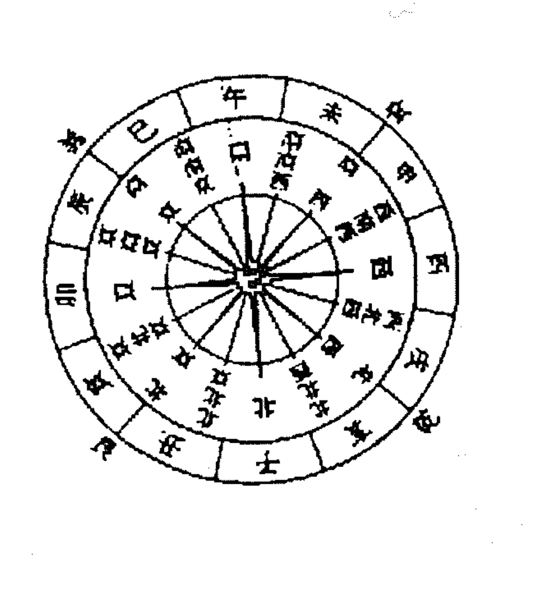

- 地空星古解

### 附 十二宫诸星得地常宝论

- 文王卦入门
- 十二长生表
- 先天人卦
- 后天八卦
- 入卦象诀
- 入宫变卦
- 安世应歌诀
- 通玄赋
- 诸爻持世歌诀
- 碎金赋
- 何知歌诀
- 六兽五行断歌诀
- 六神象意
- 六亲发动歌诀

坤 艮 坎 巽 震 离 兑 乾

- 六亲变化歌诀
- 六兽断歌诀
- 黄金策十八论
- 黄金策总断年金赋直解
- 天时
- 年时
- 国朝
- 征战
- 身命
- 婚姻

一〇八
一〇八
一一〇
一一〇
一二〇
一四〇
一四六
一五一
一五四
一五八
一六九

### 代序

市面上的斗数书籍，多如过江之鲫，但是，是否有一番完整的诠释呢？
樱馨居士所著的「斗数精析」，这套书，将是最完整的诠释。本书为「斗数精析」的第一册书，名为掌诀星曜篇。诠释掌中排盘诀与星情的运用，做了一个很深入浅出的解说，是为不可多得的好书。

掌中排盘诀，五术界传为「无上心法」。说穿了，只是在掌中运算排盘而已。
本书作者深入浅出的解说，配合图解，让初学者很快的能体会运用，可见作者的一番苦心，为五术界的付出。

斗数并非如传言中的易学难精，只要有本好书教导，诀窍肯放，任何人皆可一窥斗数的堂奥。本书中就如同一座宝藏般，藏埋了许多论命的秘诀，供各位挖掘，至于所得多寡，全看个人用心程度如何了。

好书难求，肯传真诀的更是难得，读本书是学习者的「福气」。能否精通，端看个人修为了。俗语不是说：「师父领进门，修行在个人吗？」

癸酉年 代序于心象星相专业命理评析顾问
诸葛绫

### 颜序

樱馨居士师承多人，且精通斗数三合，飞星二派之诀窍，与我相识，是因为贤隶诸葛绫之介绍。

今逢樱馨居士出书之际，邀我作序，盛情难却之余，只好举笔作序。我文才不好，提笔是为苦差事一件。

五术界门派之见很深，樱馨居士能融合飞星、三合二派的理论，重新做出一番整理，实为难能可贵，其表中对星情独到的见解，更是至宝。

我论命的岁月里，不乏遇到各式各样的案件，在与樱馨居士讨论之际，又能有一番突破。能交上这种亦师、亦友的朋友，真是人生一大乐事。近月来，樱馨居士忙着著作「斗数精析」这套书，能见面的时间也少了。在此，恭祝他出书顺利，读者满天下。

### 颜传益先生简介

本身精通飞星斗数，断命其准无比，他的断诀与市面上的斗数理论全然不同，深得其三味。

为天衍命相学问之荣誉顾问。

斗数界奉称为南部「斗数高手」。

授徒二十余人，个个皆出类拔萃，有在台南社教馆、当斗数讲师的、有开馆的、名师诸葛绫先生，也是出于其教授。

### 序

此书为我个人著作的第一册书，构思三年，如今再动笔一一完成，此为「斗数精析」的第一集，名为「掌诀星曜篇」，诠释掌诀的运用及星情为主，第二集为星曜运用。

对于文笔不好的我来说，要把自己的学理架构全用文字来表达，是件很难的事，历经一年，终于把这本书完成了。过程中几度想放弃，全凭好友诸葛绫的鼓励，方能与读者见面，诸葛绫先生为此书的大功臣。

市面上良好的斗数参考书很少，大部份是文抄公的著作，可读性有限。当然其中仍有好作品，如紫云大师、杨云翔老师的作品，可读性高。

本书的理论，大部份为笔者实际的论命过程所应证的，或由中发现诀窍，在此书完全公开，让有兴趣的读者，不用花费很多的「束脩费」，仍能精通此门学问，让老祖宗的学问能发扬光大，不至于埋没。

至于斗数更精深的理论，将由下册书中一一解说。

读完本书，你将会发觉，学斗数也没什么难的，有本好书，就能进阶大师级的功力。

读者如对本书有何疑问可来信至
南市民生路二段二四一号　张樱馨收
永久通讯处：台南市民生路二段241号
TEL：(06)2273779
(06)2608536

癸酉年序于心象星相
张樱馨

### 宫位掌诀

亥子五行属水。
寅卯五行属木。
巳午五行属火。
申酉五行属金。
辰戌丑未五行属土。

#### 子午卯酉宫为桃花地

立命于此四宫位的人，较有人缘，桃花较重。

| | | | |
|---|---|---|---|
| | 午 | | |
| | | 四桃花地（四败） | 西 |
| | | | |
| 卯 | | | |
| | 子 | | |

#### 辰戌丑未宫为四墓库

较不得志、保守、稳重。

| | | 未 | |
|---|---|---|---|
| 辰 | | 四墓库 | 酉 |
| | | | 戌 |
| | 丑 | | |

#### 寅申巳亥为四马地

立命于四马地的人较劳碌奔波，一生中的波动性较强

| 巳 | | | 申 |
|---|---|---|---|
| | | 四马地 | |
| 卯 | | | |
| 寅 | | | 亥 |

#### 日光节约时间

34. 年从 5. 月 1. 日至 9. 月 30. 日。
36. 年从 5. 月 1. 日至 9. 月 30. 日。
38. 年从 5. 月 1. 日至 9. 月 30. 日。
40. 年从 5. 月 1. 日至 9. 月 31. 日。
42. 年从 4. 月 1. 日至 10. 月 31. 日。
44. 年从 4. 月 1. 日至 9. 月 30. 日。
46. 年从 4. 月 1. 日至 9. 月 30. 日。
48. 年从 4. 月 1. 日至 9. 月 30. 日。
50. 年从 6. 月 1. 日至 9. 月 30. 日。
52. 年从 4. 月 1. 日至 9. 月 30. 日。

51. 年至 62. 年、65. 年至 67. 年、69. 年后不再施行日光节约时间。

35. 年从 5. 月 1. 日至 9. 月 30. 日。
37. 年从 5. 月 1. 日至 9. 月 30. 日。
39. 年从 5. 月 1. 日至 9. 月 30. 日。
41. 年从 3. 月 1. 日至 10. 月 31. 日。
43. 年从 4. 月 1. 日至 10. 月 31. 日。
45. 年从 4. 月 1. 日至 9. 月 30. 日。
47. 年从 4. 月 1. 日至 9. 月 30. 日。
49. 年从 6. 月 1. 日至 9. 月 30. 日。
51. 年从 4. 月 1. 日至 9. 月 30. 日。
53. 年从 7. 月 1. 日至 9. 月 30. 日。

#### 生年干支的求法

天干配数掌诀

甲为 1.
乙为 2.
丙为 3.
丁为 4.
戊为 5.
己为 6.
庚为 7.
辛为 8.
壬为 9.
癸为 10.

#### 地支配数掌诀

子为 1. 丑为 2. 寅为 3. 卯为 4. 辰为 5. 巳为 6. 午为 7. 未为 8. 申为 9. 酉为 10. 戌为 11. 亥为 12.

生年天干的取法：以年数之尾数减去 2 余数查天干配数表，即可得知生年天干为何。

生年地支的求法：以年数除以 12，余数查地支配数表，即可得知生年地支为何。

例 57 年的干支为何？

以 7 数减 2，余数为 5。查天干配数表得知 5 为戊，故知天干为戊。

以 57 数除以 12，得 4 余 9，查地支配数表，得知 9 为申，故知为申年。57 年为「戊申」年。

### 十二宫

不论男女皆逆排十二宫位，依序为命宫→兄弟宫→夫妻宫→子女宫→财帛宫→疾厄宫→迁移宫→仆役宫→官禄宫→田宅宫→福德宫→父母宫

表 宫 二 十

#### 命宫求法

以命造生口、生时合取。

以寅宫为定位，因为天生一、地生二、人生于三之故，万物皆由寅宫而生。顺数至本生月、再由该宫，逆数回本生时，即为命宫。

至于身宫的求法，以寅宫为定点，顺数至生月、再由该宫逆数至本生时，即为「身宫」。

例：58. 年 1. 月 6. 日申时。求其命、身宫为何。

由寅宫为定点，生月为 1 故还在寅宫，再由寅宫逆数至本生时，故得知命宫为午宫。

由寅宫为定点，生月为 1 故还在寅宫，再由寅宫顺数至本生时，故得知身宫为戌宫。

#### 例图（命宫）

58. 年 1. 月 6. 日申时

#### 例图（身宫）

58年1月6日申时

17

#### 宫干求法

#### 宫干诀

甲己之年丙为头，
乙庚之年戊为头，
丙辛之岁寻庚上，
丁壬之寅顺水流，
戊癸还从甲寅起。

比如甲年、己年生人，就由寅宫起丙、丁、戊、……。

例前例：己酉年、寅宫起丙。（参考例图）

#### 宫干求法图

例：58年1月6日申时

#### 五行局求法

#### 五行局求法掌诀图

求五行局数，以命宫天干地支为主。
由命宫天干寻求掌诀中的天干所在，由此天干所在，顺数十二个时辰，以子丑为一组、寅卯一组、辰巳一组、午未一组、申酉一组、戌亥一组。由天干数至第三位时，再退回第一位，继续数至命宫地支之组。
前例阳男命宫为「庚辛」，由无名指庚辛起数至命宫地支。庚辛为子丑、壬癸为寅卯、甲乙为辰巳、数至第三位再由庚辛属午未，午未即「土五局」。

#### 甲乙宫干掌诀

22

#### 丙丁宫干掌诀

#### 戊己宫干掌诀

#### 庚辛宫干掌诀

#### 壬癸掌诀

### 紫微星取诀

以生日除以局数。如图

\frac{生日 + X}{局数} = 整除
X = 生日加上 X 要被局数整除。

#### 求紫微星法举例

假设阳男己酉年一月六日申时，五行局数为土五局，命宫天干地支为「庚午」

求其紫微星为何？

答：

#### 紫微星求法

#### 口诀

紫微右旋天机星，
隔一太阳武曲行，
再进天同随财右，
相隔三位是破军。

以紫微星所入宫位，逆排紫微星系的天机星、太阳星、武曲星、天同星、廉贞等星。

#### 紫微星 例图

### 天府星求法

天府星是依紫微星所以宫位而定，如图。

| 甲 | 星名 | 天府 |
|---|---|---|
| 天府 | 子 | 辰 |
| | 丑 | 卯 |
| | 寅 | 寅 |
| | 卯 | 丑 |
| | 辰 | 子 |
| | 巳 | 亥 |
| | 午 | 戌 |
| | 未 | 酉 |
| | 申 | 申 |
| | 酉 | 未 |
| | 戌 | 午 |
| | 亥 | 巳 |

#### 天府星牙求法

天府左旋有太阴、
贪狼巨门随待行、
天相天梁七杀继、
相隔三位是破军。

天府星系安法，以天府星为主，依顺时针方向而排列。依天府、太阴、贪狼、巨门、天相、天梁、七杀、破军等星。

### 表 一

### 紫微入十二宫表

| | | | |
|---|---|---|---|
| 太阴 陷 巳 | 贪狼 旺 午 | 巨门 陷 天同 陷 未 | 武曲 平 天相 庙 申 |
| 天府 库 廉贞 旺 辰 | 紫微在子宫 | 太阳 闲 天梁 地 酉 | 七杀 庙 戌 |
| 破军 陷 寅 | | 紫微 平 子 | 天机 平 亥 |

### 表 二

| 巳 | 午 | 未 | 申 |
| :--- | :--- | :--- | :--- |
| 贪狼
廉贞

陷
陷 | 巨门

旺 | 天相

闲 | 天同
天梁

旺
陷 |
| 太阴

陷 | 紫微在丑宫 | | 七杀
武曲

旺
闲 |
| 天府

平 | | | 太阳

陷 |
| 寅 | 丑 | 子 | 亥 |
| | 紫微
破军

庙
旺 | 天机

庙 | |

### 表 三

| | | | |
|---|---|---|---|
| 巨门 平 巳 | 天相 旺 午 | 天梁 旺 未 | 七杀 庙 申 |
| 贪狼 庙 辰 | 紫微在寅宫 | | 天同 平 酉 |
| 太阴 陷 卯 | | | 武曲 庙 戌 |
| 紫微 天府 庙 寅 | 天机 陷 丑 | 破军 庙 子 | 太阳 陷 亥 |

### 表 四

| 巳 | 午 | 未 | 申 |
|---|---|---|---|
| 天相
平 | 天梁
庙 | 七杀
旺
廉贞
庙 |  |
| 辰 | 紫微在卯宫 | | 酉
天相
平 |
| 卯 | | | 戌
武曲
平
破军
平 |
| 寅
天机
旺
太阴
闲 | 丑
天府
庙 | 子
太阳
陷 | 亥 |

### 表 五

| 巳 | 午 | 未 | 申 |
| :--- | :--- | :--- | :--- |
| 天梁 陷 | 七杀 旺 | | 廉贞 庙 |
| 辰 | | | 酉 |
| 紫微 天相 陷 旺 | 紫微在辰宫 | | 破军 旺 |
| 卯 | | | 戌 |
| 巨门 天机 庙 旺 | | | 天同 庙 |
| 寅 | 丑 | 子 | 亥 |
| 贪狼 不 | 太阴 太阳 庙 陷 | 武曲 天府 旺 庙 | |

### 表 六

| 巳 | 午 | 未 | 申 |
| :--- | :--- | :--- | :--- |
| 紫微 七杀
陷 | | | 廉贞 破军
平 陷 |
| 天机 天梁
庙 旺 | 紫微在巳宫 | | 酉 |
| 辰 | | | |
| 天相
陷 | | | 戌 |
| 卯 | | | |
| 太阳 巨门
旺 庙 | 武曲 贪狼
庙 庙 | 天同 太阴
旺 庙 | 天府
旺 |
| 寅 | 丑 | 子 | 亥 |

### 表 七

| 巳 | 午 | 未 | 申 |
| :--- | :--- | :--- | :--- |
| 天机
平 | 紫微
庙 | | 破军
陷 |
| 辰 | | | 酉 |
| 七杀
旺 | 紫微在午宫 | | 廉贞
庙 |
| 卯 | | | 亥 |
| 太阳
庙
大梁
庙 | | | 天府
旺
廉贞
庙 |
| 寅 | 丑 | 子 | 亥 |
| 武曲
闲
天相
庙 | 天同
陷
巨门
旺 | 贪狼
旺 | 太阴
庙 |

### 表 八

| 巳 | 午 | 未 | 申 |
| :--- | :--- | :--- | :--- |
| 太阳
旺 | 天机
庙 | 紫微
破军
庙
庙 | 天府
陷 |
| 辰 | 紫微在未宫 | | 酉 |
| 武曲
七杀
陷
陷 | | | 太阴
旺 |
| 卯 | | | 戌 |
| 天同
天梁
闲
庙 | 天相
庙 | 巨门
旺 | 廉贞
贪狼
陷
陷 |
| 寅 | 丑 | 子 | 亥 |

### 表 九

| | | | |
|---|---|---|---|
| 太阳 旺 巳 | 破军 庙 午 | 天机 陷 未 | 紫微 天府 旺 平 申 |
| 武曲 庙 辰 | 紫微在申宫 | | 太阴 旺 酉 |
| 天同 庙 卯 | | | 贪狼 庙 戌 |
| 七杀 庙 寅 | 天梁 旺 丑 | 廉贞 天相 平 庙 子 | 巨门 旺 亥 |

### 表 十

| | | | |
|---|---|---|---|
| 武曲 破军 平 闲 巳 | 太阳 庙 午 | 天府 庙 未 | 天机 太阴 平 平 申 |
| 天同 平 辰 | 紫微在酉宫 | | 紫微 贪狼 平 平 酉 |
| | | | 巨门 旺 戌 |
| | 廉贞 七杀 利 庙 丑 | 天梁 庙 子 | 天相 平 亥 |
| 寅 | | | |

### 表 十 一

| 巳 | 午 | 未 | 申 |
| :--- | :--- | :--- | :--- |
| 天同
庙 | 武曲
天府
不旺 | 太阴
太阳
平平 | 贪狼
平 |
| 辰 | | | 酉 |
| 破军
旺 | 紫微在戌宫 | | 巨门
天机
庙旺 |
| 卯 | | | 戌 |
| | | | 天相
紫微
闲闲 |
| 寅 | 丑 | 子 | 亥 |
| 廉贞
庙 | | 七杀
旺 | 天梁
陷 |

### 表 十 二

| 巳 | 午 | 未 | 申 |
|---|---|---|---|
| 天府
平 | 天同
太阴
陷
陷 | 武曲
贪狼
庙
庙 | 太阳
巨门
闲
庙 |
| 辰 | 紫微在亥宫 | | 酉
天相
陷 |
| 卯
廉贞
破军
平
旺 | | | 戌
天机
天梁
庙
旺 |
| 寅 | 丑 | 子 | 亥
紫微
七杀
旺
平 |

### 安左辅、右弼星诀

外辅星自辰宫起
顺到生月是左乡

内弼星自戌宫起
逆到生月是右乡

### 安天魁、天鉞星訣

天魁、天鉞雙星為年系星，依生年干支來安星。

#### 口訣

甲戊庚牛羊、乙己鼠猴鄉，
丙丁豬雞位、六辛逢馬虎，
壬癸兔蛇藏、此是貴人方。

例如甲年、戊年、庚年，天魁星在丑宮（牛）、天鉞星在未宮（羊）。

#### 掌訣

甲、戊、庚年天魁、天鉞星安法掌訣。

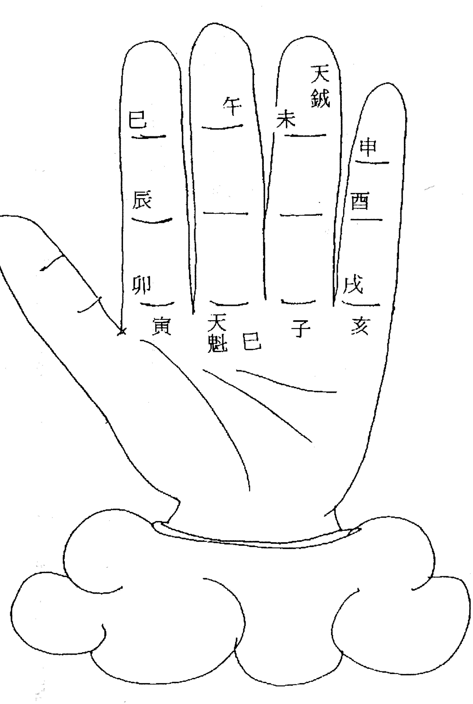

甲戊庚牛羊

#### 乙年、己年天魁、天鉞星掌訣

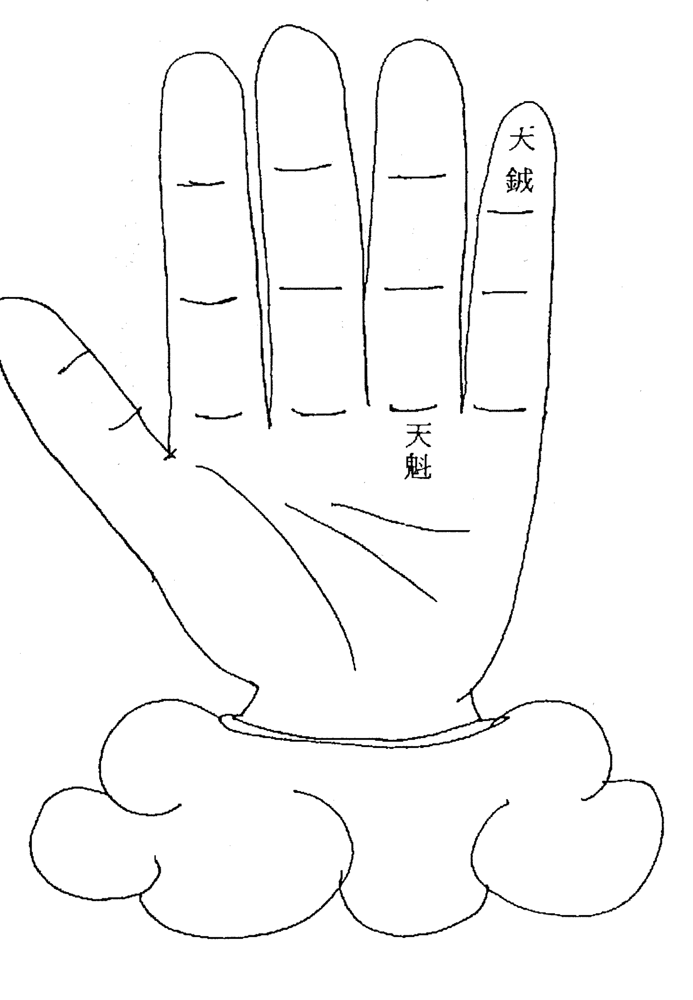

乙己鼠猴鄉

#### 丙年、丁年天魁、天鉞安法掌訣

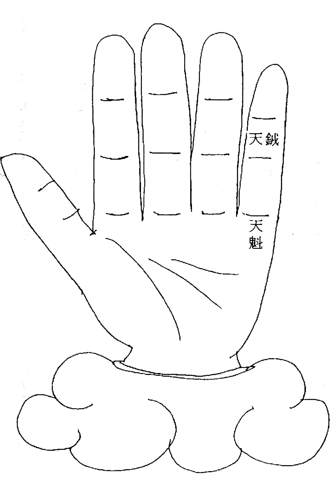

丙丁豬雞位

#### 辛年天魁、天鉞安法掌訣

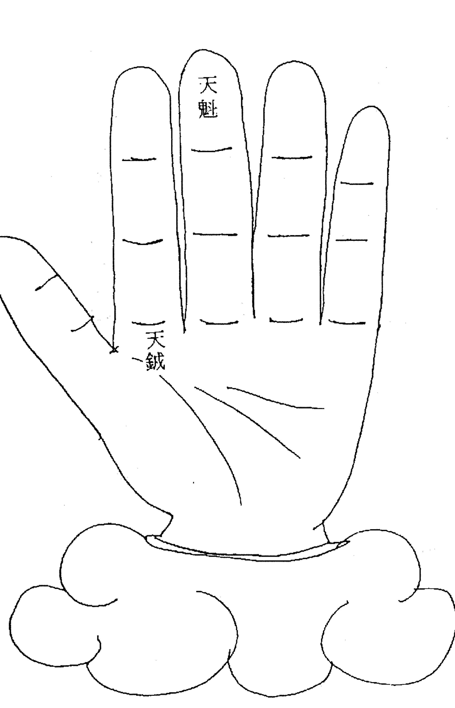

六辛逢馬虎

#### 壬年、癸年天魁、天鉞安法掌訣

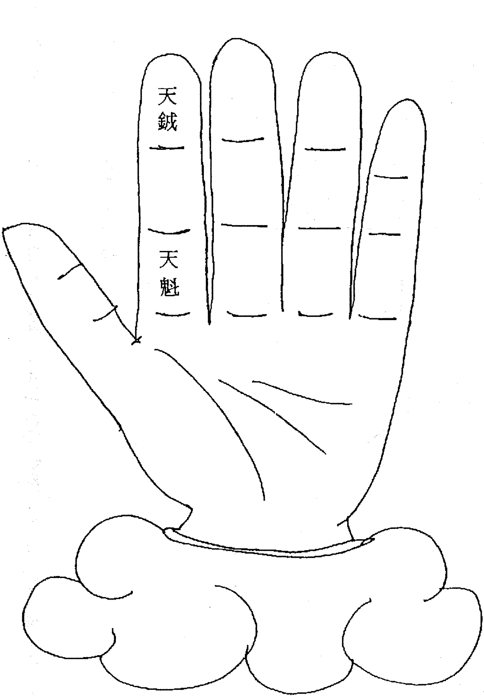

壬癸兔蛇藏

### 安祿存、擎羊、陀羅星訣

祿存星為年系星、安法以年支為主。

擎羊星安在祿存的前一位，陀羅星安在祿存星的後一位。

#### 口訣

祿存原是爵祿主、甲虎乙兔丙戊蛇，
丁巳都向馬宮藏、庚祿是猴辛是雞，
壬年居猴癸佔鼠、四墓之地勿錯尋，
若問羊陀身何處、祿前為羊祿後陀。

例甲年祿存安於虎（寅）宮，卯宮安擎羊，丑宮安陀羅星。

#### 掌訣

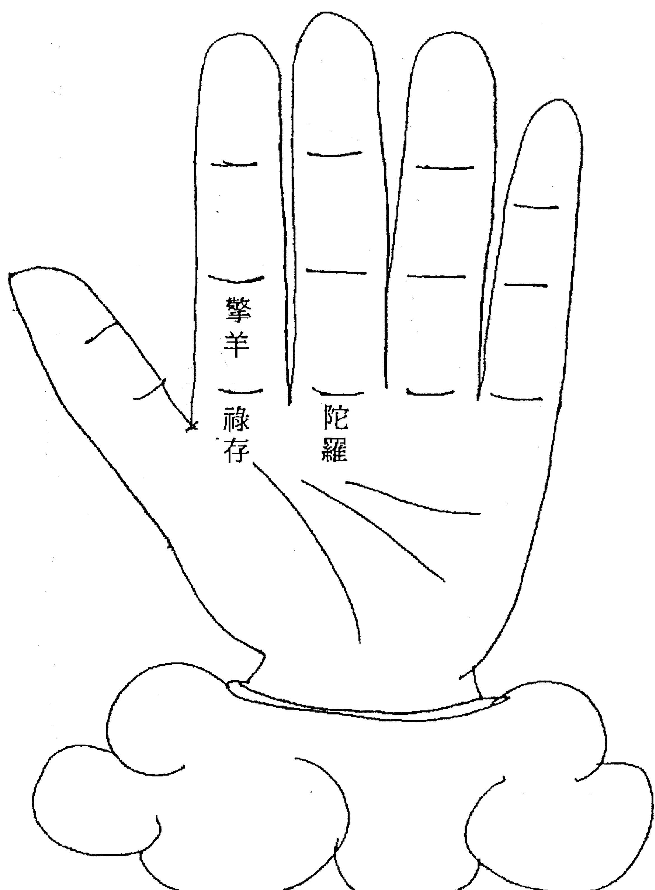

甲年爲例

### 安火星、鈴星訣

火鈴二星安法，也以年支為主。

#### 口訣

寅午戌年丑卯始，
申子辰年寅戌是，
巳酉丑年卯戌傷，
亥卯未年酉戌生，
支位起子順時數，
前者火星後鈴星。

#### 火星、鈴星掌訣

例寅午戌年為例。

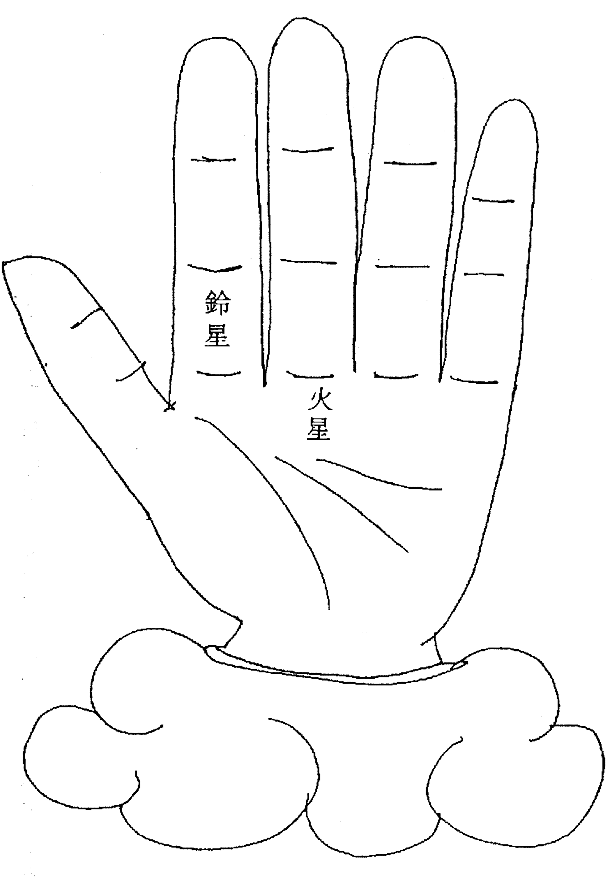

### 安地劫，地空星訣

時系星，安法依生時為主，申亥宮安起，順數是地劫，逆數是地空。

#### 口訣

亥上起子順安劫，逆去便是天空鄉。

### 安天馬星訣

天馬星的安法，依生年為主。

#### 口訣

寅午戌年起對申、申子辰年復回寅，
巳酉丑年居對亥、亥卯未年再返巳。

### 地劫、地空星掌訣

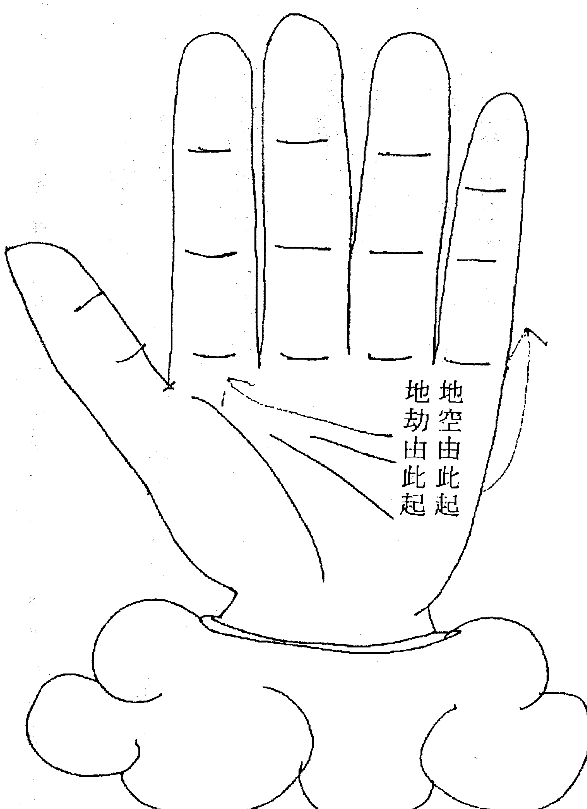

地空由此起
地劫由此起

### 安天馬星掌訣

以寅午戌年爲例

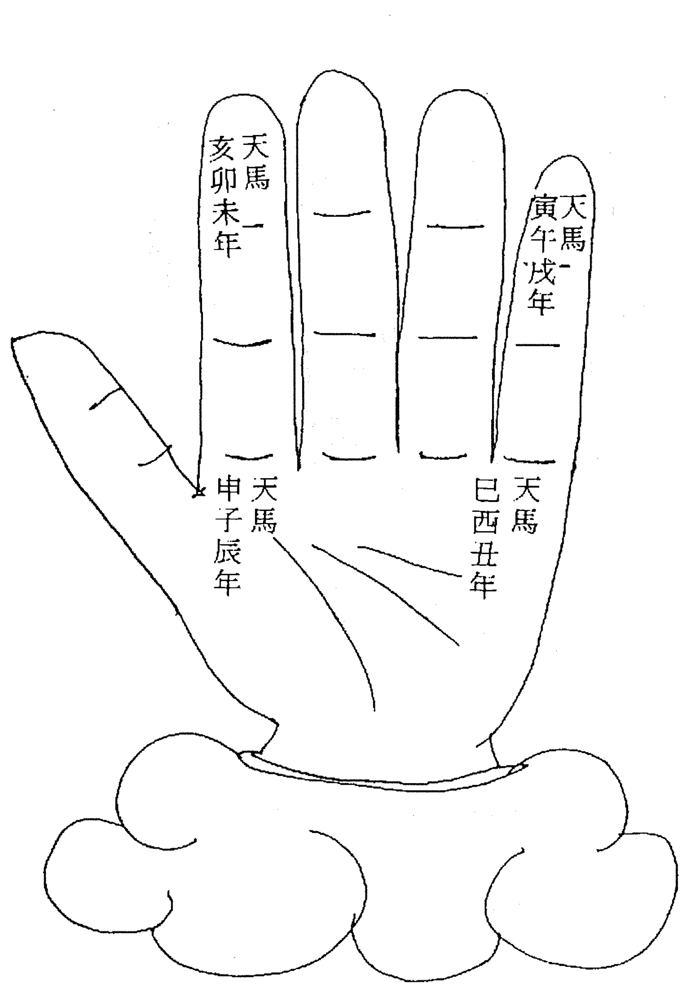

### 安文昌、文曲星訣

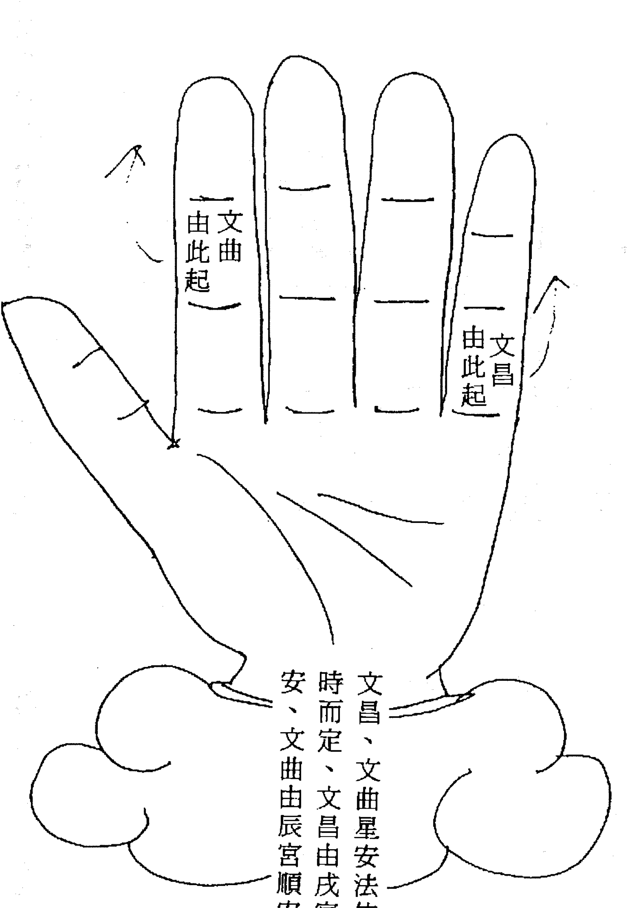

文昌、文曲星安法依生時而定、文昌由戌宮逆安、文曲由辰宮順安。

### 安天刑、天姚星訣

刑、姚為月系星，依生月而安。

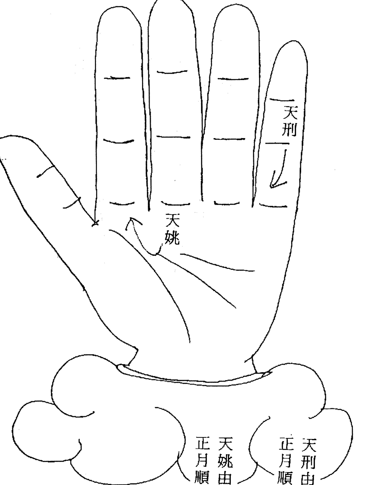

天刑由酉宮起正月順數。

天姚由丑宮起正月順數。

### 安紅鸞、天喜星訣

鸞喜雙星也是年系星，依生年地支所落入宮位而安，逆數到本生年安之。

#### 口訣

卯上起子逆數之、數到當生太歲支，
坐守此宮紅鸞位、對宮天喜不差移，
年上婚姻喜事奇、老人必之喪其妻，
三十年前為吉曜、五十年後不相宜。

天喜星永遠安在紅鸞星對宮。

#### 紅鸞、天喜掌訣

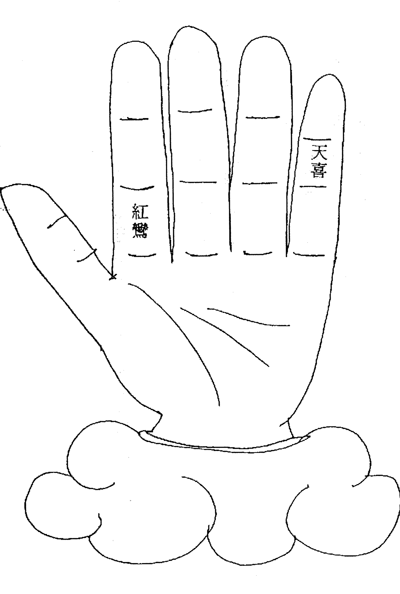

紅鸞由卯宮起子、逆數。

### 安斗星訣

於流年太歲宮位起正月，逆至本生月，又從本生月起子順數至本生時安斗君。

#### 口訣

中便起正，逆尋生月即停留，又從生月宮輪子，順到生時鎮斗君。

### 安旬中空之訣

甲子旬中空戌亥、甲戌旬中空申酉，甲申旬中空午未、甲午旬中空辰巳，甲辰旬中空寅卯、甲寅旬中空子丑。

### 安大限訣

陽男陰女從命宮起，順數排下來，陰男陽女從命宮起，逆數排下來。大限依局數起歲數。例如火六局以六歲起大限。

### 安命主訣

貪狼子宮、巨門亥丑宮、祿存寅戌宮、文曲卯酉宮、破軍午宮、廉貞申辰宮、武曲未巳宮。

依命宮所入宮位安命之。

### 安身主訣

子午人火鈴星、丑未人天相星、庚申人天梁星、辰戌人文昌星、巳亥人天機星、卯酉人天同星。

### 安童限訣

一命二財三疾厄、四妻五福六官祿、餘年一派順流行、十五命宮看端詳。

寅午戌人起辰宮、申子辰人起戌宮，巳酉丑人起未宮、亥卯未人起丑宮。例寅年、午年、戌年生人以辰宮為1歲，巳宮為2歲，依此而推。

### 安大限表

| 五行局 | 大限 | 宮限 | 命宫 | 兄弟 | 夫妻 | 子女 | 財帛 | 疾厄 | 遷移 | 僕役 | 官祿 | 田宅 | 福德 |
|---|---|---|---|---|---|---|---|---|---|---|---|---|---|
| 水二局 | 陽男陰女 | 2~11 | 2 | 112 | 102 | 92 | 82 | 72 | 62 | 52 | 42 | 32 | 22 |
| 水二局 | 陰男陽女 | 2~11 | 12 | 22 | 32 | 42 | 52 | 62 | 72 | 82 | 92 | 102 | 112 |
| 木三局 | 陽男陰女 | 3~12 | 3 | 113 | 103 | 93 | 83 | 73 | 63 | 53 | 43 | 33 | 23 |
| 木三局 | 陰男陽女 | 3~12 | 13 | 23 | 33 | 43 | 53 | 63 | 73 | 83 | 93 | 103 | 113 |
| 金四局 | 陽男陰女 | 4~13 | 4 | 114 | 104 | 94 | 84 | 74 | 64 | 54 | 44 | 34 | 24 |
| 金四局 | 陰男陽女 | 4~13 | 14 | 24 | 34 | 44 | 54 | 64 | 74 | 84 | 94 | 104 | 114 |
| 土五局 | 陽男陰女 | 5~14 | 5 | 115 | 105 | 95 | 85 | 75 | 65 | 55 | 45 | 35 | 25 |
| 土五局 | 陰男陽女 | 5~14 | 15 | 25 | 35 | 45 | 55 | 65 | 75 | 85 | 95 | 105 | 115 |
| 火六局 | 陽男陰女 | 6~15 | 6 | 116 | 106 | 96 | 86 | 76 | 66 | 56 | 46 | 36 | 26 |
| 火六局 | 陰男陽女 | 6~15 | 16 | 26 | 36 | 46 | 56 | 66 | 76 | 86 | 96 | 106 | 116 |

### 安小限表

| 小限之歲 | 一 | 二 | 三 | 四 | 五 | 六 | 七 | 八 | 九 | 十 | 十一 | 十二 |
| :--- | :--- | :--- | :--- | :--- | :--- | :--- | :--- | :--- | :--- | :--- | :--- | :--- |
| 小限值宮 | 三 | 四 | 五 | 六 | 七 | 八 | 九 | 十 | 十一 | 十二 | 一 | 二 |
| | 一五 | 一六 | 一七 | 一八 | 一九 | 二〇 | 二一 | 二二 | 二三 | 二四 | 二五 | 二六 |
| | 二七 | 二八 | 二九 | 三〇 | 三一 | 三二 | 三三 | 三四 | 三五 | 三六 | 三七 | 三八 |
| | 三九 | 四〇 | 四一 | 四二 | 四三 | 四四 | 四五 | 四六 | 四七 | 四八 | 四九 | 五〇 |
| | 五一 | 五二 | 五三 | 五四 | 五五 | 五六 | 五七 | 五八 | 五九 | 六〇 | 六一 | 六二 |
| | 六三 | 六四 | 六五 | 六六 | 六七 | 六八 | 六九 | 七〇 | 七一 | 七二 | 七三 | 七四 |
| | 七五 | 七六 | 七七 | 七八 | 七九 | 八〇 | 八一 | 八二 | 八三 | 八四 | 八五 | 八六 |
| | 八七 | 八八 | 八九 | 九〇 | 九一 | 九二 | 九三 | 九四 | 九五 | 九六 | 九七 | 九八 |
| | 九九 | 一〇〇 | 一〇一 | 一〇二 | 一〇三 | 一〇四 | 一〇五 | 一〇六 | 一〇七 | 一〇八 | 一〇九 | 一一〇 |
| | 一一一 | 一一二 | 一一三 | 一一四 | 一一五 | 一一六 | 一一七 | 一一八 | 一一九 | 一二〇 | 一二一 | 一二二 |
| 本生年支 | 辰 | 巳 | 午 | 未 | 申 | 酉 | 戌 | 亥 | 子 | 丑 | 寅 | 卯 |
| 寅午戌 | 男 | 辰 | 巳 | 午 | 未 | 申 | 酉 | 戌 | 亥 | 子 | 丑 | 寅 | 卯 |
| | 女 | 辰 | 卯 | 寅 | 丑 | 子 | 亥 | 戌 | 酉 | 申 | 未 | 午 | 巳 |
| 申子辰 | 男 | 戌 | 亥 | 子 | 丑 | 寅 | 卯 | 辰 | 巳 | 午 | 未 | 申 | 酉 |
| | 女 | 戌 | 酉 | 申 | 未 | 午 | 巳 | 辰 | 卯 | 寅 | 丑 | 子 | 亥 |
| 巳酉丑 | 男 | 未 | 申 | 酉 | 戌 | 亥 | 子 | 丑 | 寅 | 卯 | 辰 | 巳 | 午 |
| | 女 | 未 | 午 | 巳 | 辰 | 卯 | 寅 | 丑 | 子 | 亥 | 戌 | 酉 | 申 |
| 亥卯未 | 男 | 丑 | 寅 | 卯 | 辰 | 巳 | 午 | 未 | 申 | 酉 | 戌 | 亥 | 子 |
| | 女 | 丑 | 子 | 亥 | 戌 | 酉 | 申 | 未 | 午 | 巳 | 辰 | 卯 | 寅 |

### 安命主掌訣

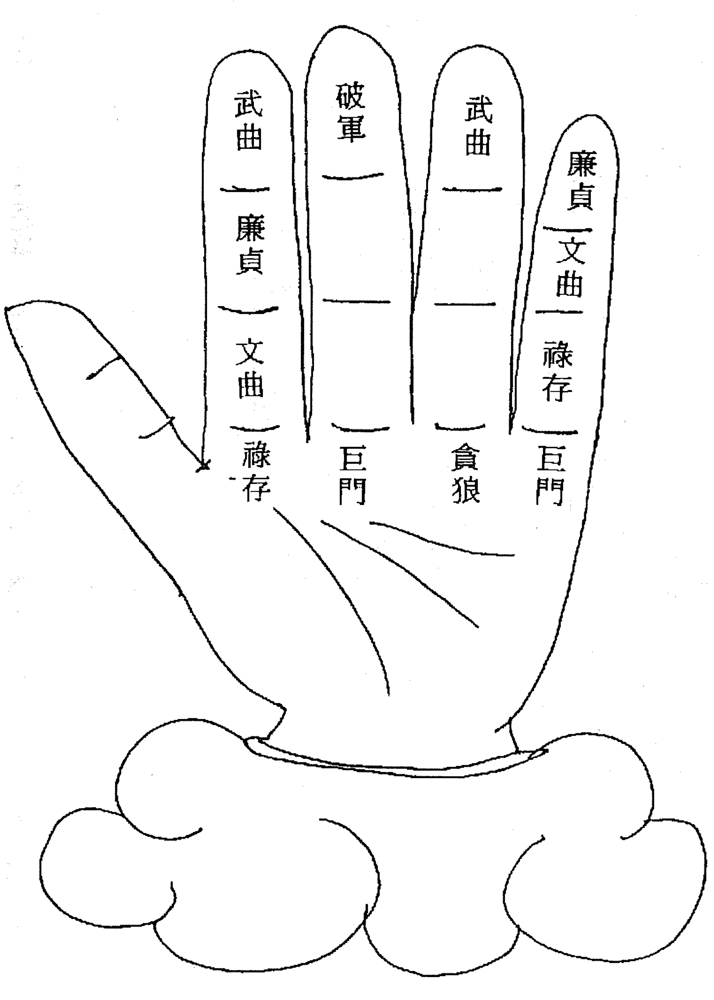

### 安大限掌訣

例己酉年1月6日申時
（例）

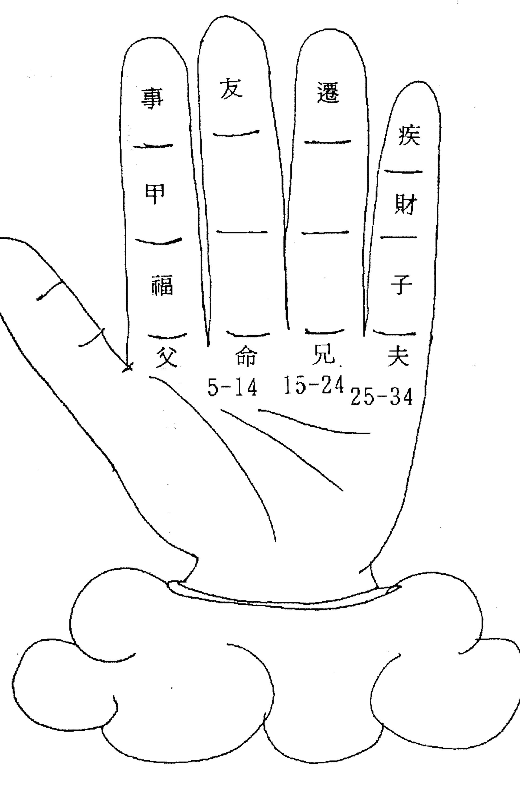

### 安陰煞星掌訣

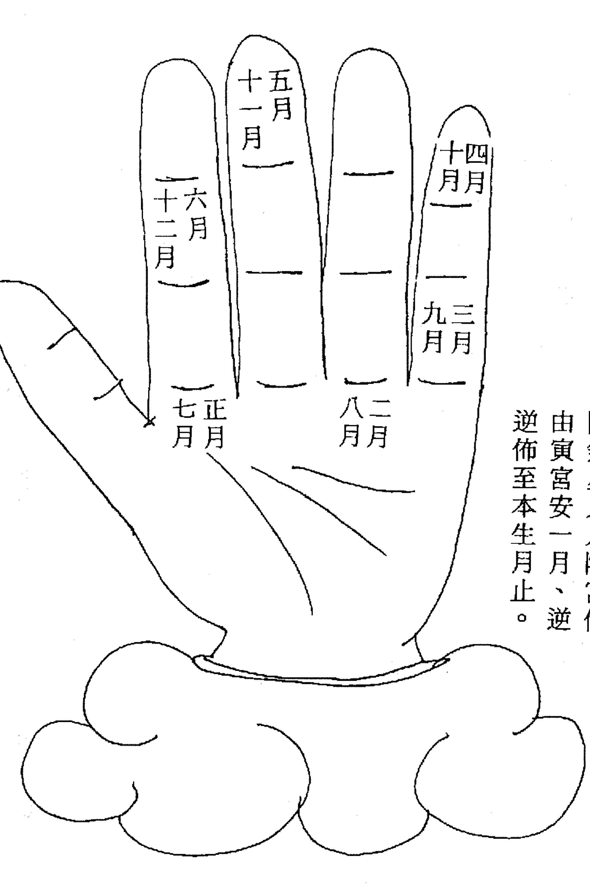

陰煞星只入陽宮位
由寅宮安一月、逆
逆佈至本生月止。

### 宮位解說

#### 命宮

一、由命宮可得知一個人的個性行為、處事心態、一生中的起伏如何、本身抵抗命運的能力。

二、此宮也可看出一個人的思考模式、處理事情的傾向態度。命宮主宰著其它十一個宮位的運行吉凶。古曰：「江山易改，本性難移。」

斗數中有借宮的方法，命宮可用來看母親的身體狀況、配偶的思考行為、享受嗜好為何、財運是否充足、是否容易聚財。子女的不動產運如何。

#### 兄弟宮

一、可用來看兄弟姊妹的處事個性、行為，一生的成就如何。彼此間是否有助力、親情的厚薄。

二、現金位。此宮可用來看本身身邊金錢的有無，是否能充分利用，是否有損財之兆。

三、感情線。兄弟宮為夫妻間溝通的橋樑，夫妻間的對待如何，是否容易溝通。除了上述看法，此宮又代表母親的宮位。由此宮可看出自己與母親間的親情厚薄，是否易於溝通，對自己是否有所助力。也可看配偶的身體狀況，是否有官非糾紛。父親事業的發展如何，有何吉凶之象。

#### 夫妻宮

一、可看配偶的個性、長相、處事行為。彼此間是否有緣、是否易溝通。是否有婚姻的糾紛。

二、廚房位。此宮也可看出該人家中廚房的擺設情形。

三、此宮位也可看出個人的內部管理是否良好。

除上述之外，也可用來看子女是否好養、是否易受傷。父親的不動產運如何、小時候的居住環境是否易變動。祖父的財務狀況也可由此宮得知。

#### 子女宮

一、可用來看子女的個性傾向、彼此間的親情緣份。是否會反哺、或帶貴氣。

二、桃花位。可用來看本身的桃花狀況、是否桃花帶重、是否有婚外情。

三、性能力宮位。

四、合夥宮位。本身是否會與人合夥、合夥的狀況如何、是否會賠錢。股東是否融洽。

#### 財帛宮

一、看本身的財務狀況如何。進財方式，以什麼樣的方式較吉。是否有什麼破財之災等。

二、老闆的位置及辦公桌位。可由此宮找出適合的方位及顏色、辦公桌上的擺設等。

三、夫妻間的對待宮位。配偶對自己的心態、行為，是否對待融洽。

四、金庫位。代表現金進出的吉凶，是否有大筆錢賺、是否有賠錢的事件，那方面容易讓錢流失出去等。

#### 疾厄宮

一、可看一個人一生中較容易出毛病的器官、容易發生疾病災難、是否容易受傷等。

二、工廠位。可用來看個人開設的店面營運狀況、工廠內部的運作情形、是否會創業或倒閉、或是店面會重新裝潢、或者搬遷之事等。

三、家中的客廳位。

#### 遷移宮

一、一個人在外的活動力宮位。在外的人際關係好壞、是否有貴人相助。

二、老運宮位。老了後是否能安心享福。或是奔波勞碌、是否有什麼災難會臨身。

三、意外災難宮位。是否會發生事故、是被撞或是撞人、是否有傷亡之事等。

#### 交友宮

一、看朋友間的對待情形、是否為損友或益友、是否得力、或者因朋友帶來災難。

二、上司的對待關係。是否易與相處、是否得到賞識、是否得到提拔。

三、部屬的宮位。看自己與部屬的對待情形、是否得其助力、或受其拖累。部屬是否忠心等。

四、神明宮位。家中是否供奉神明、是否受到護佑、或與神明間是否有緣、是否有感應。

#### 事業宮

一、適合的行業。由此宮可看出本身適合的行業為何。

二、也可用來看本身事業的與衰得失、工作狀況是否良好、是否易受到提拔、是否有貴人賞識等。

三、書房、書桌位。由此宮可知書房的擺設為何、喜好的顏色為何、是否忌諱什麼顏色。

四、一個人的先天氣數位、人的氣旺不旺可由此宮看出、是否易受到病、災等。

#### 田宅宮

一、不動產宮位。可得知是否會自己添購不動產、是否得到祖上的庇蔭、或者能否得到遺產等。

二、聚財能力的表現。本身是否會聚財、或是破財、財能不能留得住。又名「財庫位」。

三、家族運。此宮可看出本身家族的狀況，有何吉凶之事、家族中是否有所災難等。

四、可供購買房子時參考。地理環境為何、是高地或是馬路邊、或是巷子中、對面有何特色。

#### 福德宮

一、一個人的享受嗜好宮位、本身是否重視生活享受、花錢是否大方、是否怨天尤人。

二、宗教信仰位。本身是否有虔誠的宗教信仰、個人的人生觀為何。

三、祖蔭風水位。可由此宮得知居住環境的風水是吉是凶、是否得到長輩的庇蔭。

四、代表家中餐廳的宮位、擺設、顏色，皆可由此宮作為參考。

#### 父母宮

一、可用來看與父母間親情緣份的厚薄、是否得到父母的助力、彼此的對待關係好壞。

二、相貌宮位。與命宮同參、可得知此人的長相特徵、是像父親或是像母親。

三、考試宮位。本身考試運是否良好、是否易於上榜、與大運、流年同考，可得知今年的考運吉凶。

四、名聲宮位。本身是否出名、受到此宮位的影響。是否有官訟問題。在外的名聲好壞。

### 四化飛星表

| 星級 | 諸星 | 年干 | 祿存 | 擎羊 | 陀羅 | 天魁 | 天鉞 | 化祿 | 化權 | 化科 | 化忌 |
|---|---|---|---|---|---|---|---|---|---|---|---|
| 甲 | 甲 | 甲 | 寅 | 卯 | 丑 | 丑 | 未 | 廉貞 | 破軍 | 武曲 | 太陽 |
| 乙 | 乙 | 乙 | 卯 | 辰 | 寅 | 子 | 申 | 天機 | 天梁 | 紫微 | 太陰 |
| 丙 | 丙 | 丙 | 巳 | 午 | 辰 | 亥 | 酉 | 天同 | 天機 | 文昌 | 廉貞 |
| 丁 | 丁 | 丁 | 午 | 未 | 巳 | 亥 | 酉 | 太陰 | 天同 | 天機 | 巨門 |
| 戊 | 戊 | 戊 | 巳 | 午 | 辰 | 丑 | 未 | 貪狼 | 太陰 | 右弼 | 天機 |
| 己 | 己 | 己 | 午 | 未 | 巳 | 子 | 申 | 武曲 | 貪狼 | 天梁 | 文曲 |
| 庚 | 庚 | 庚 | 申 | 酉 | 未 | 丑 | 未 | 太陽 | 武曲 | 太陰 | 天同 |
| 辛 | 辛 | 辛 | 酉 | 戌 | 申 | 午 | 寅 | 巨門 | 太陽 | 文曲 | 文昌 |
| 壬 | 壬 | 壬 | 亥 | 子 | 戌 | 卯 | 巳 | 天梁 | 紫微 | 左輔 | 武曲 |
| 癸 | 癸 | 癸 | 子 | 丑 | 亥 | 卯 | 巳 | 破軍 | 巨門 | 太陰 | 貪狼 |

#### 忌星天下

四化飛星中，以化忌一星最為易學也最為難懂，忌星的碰撞情形大約可分為十二種。即

- 逆水忌——順水忌——拆馬忌、
- 進馬忌——退馬忌——循環忌、
- 是非忌——糾纏忌——反弓忌、
- 洩出忌——入庫忌——絕命忌、

其年忌星並非一定主「凶事」，祿也並非主「好事」，要看四化如何配合引動，方能產生吉凶禍福。

當然忌星不止上面所列的十二種名稱，筆者只是就簡略分別出十二種常用的忌星而已。

#### 逆水忌

命宮化忌入遷移或財帛化忌入福德、或官祿化忌入夫妻者，此忌稱為「射出忌」。

對宮逢出年忌星坐守，被擋回來的就稱回「逆水忌」。

主發達致富可期。如從事生產行業、開工廠、……等事業更能財源滾滾不絕。

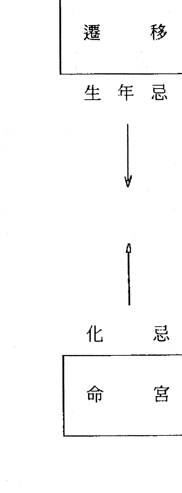

#### 順水忌

係指出他宮化來之忌，本宮坐有生年忌星，此忌即流散出去，即稱為「順水忌」。

以實例來說。疾厄宮位化忌星入交友官，交友官有生年忌星坐守，此表為「順水忌」。

上例可知金錢方面不知節制，因交友宮為財有關。另外身體也易有疾厄，交友宮為本命盤的氣位宮。

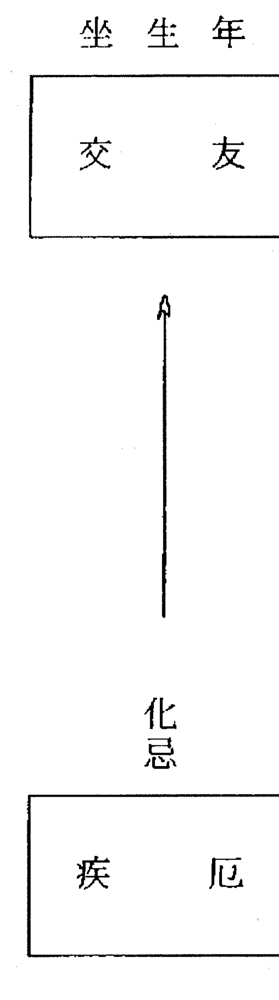

#### 折馬忌

寅、申、巳、亥為四馬宮位，前已有說，坐命於此的人皆主勞碌奔波。如此四宮坐有生年忌星，或此四宮有自化忌的情形產生，皆稱為「折馬忌」。

折馬忌主勞碌奔波。入六親宮位時表六親間較易有分開、聚少離多的現象，行運逢此宮位更要特別的注意。且要甚防意外事故。

如夫妻坐於上述情形的宮位時，主容易聚少離多、或常易小事爭吵、甚至離異。

#### 進馬忌

夫妻化忌入命宮、逢命宮宮干自化忌出，即為「進馬忌」。

#### 退馬忌

交友宮化忌入於田宅，而田宅宮又自化忌出時，此宮又化忌入父母時，即稱為「退馬忌」。

#### 循環忌

任擇二宮，彼此間各化忌入對宮稱為「循環忌」。為彼此情義對待。

#### 是非忌

如命宮化祿入夫妻宮、夫妻化忌入我命宮、或是我化忌入夫妻宮、夫妻化祿入我命宮，此即為「是非忌」。

此種情形可解釋為配偶對我好，但我不理他。表不一方付出較多，另一方較不領情。

#### 糾纏忌

命宮化忌入福德，而交友化忌入財帛，此種糾纏不清的情形就稱為「糾纏忌」。屬你我糾纏不清的糾紛。

#### 反弓忌

即所謂的「雙忌」。但構成反弓忌的要素是，一定要在本命的三合宮位，方算。

如官祿化忌入遷移宮來沖我命宮。

雙忌的力量極大，宜小心。

#### 洩出忌

如福德宮坐本命生年忌及祿星，在福德形成交戰的情形，再逢財帛化忌入福德，此時生年忌已分身乏術，無力擋回財忌，故稱為「洩出忌」。洩出忌有留不住之意。

#### 入庫忌

辰、戌、丑、未四宮為墓庫之地。金墓於丑、水墓於辰、火墓於戌、木墓於未。

生年忌入於四墓之位，稱為「入庫忌」。

入庫忌表財會歸庫，運一走到必橫發無疑。

如夫妻入於辰、戌、丑、未四墓地，又逢生年忌星坐守，表示配偶欠我債，要供我使用。

#### 絕命忌

命宮坐生年忌星，又逢田宅，官祿化忌入命宮，稱為「絕命忌」。

絕命忌故名思義，為絕命之位。

### 先天飛星棋譜

| 兵友 | 炮遷 | 兵疾 | 佈財 |
| :---: | :---: | :---: | :---: |
| 佈事 | | | 偶十 |
| 偶田 | | | 相夫 |
| 相福 | 仕父 | 帥命 | 仕兄 |

### 後天飛星棋譜

| 象財 | 士疾 | 將遷 | 士友 |
| :---: | :---: | :---: | :---: |
| 馬子 | | | 象事 |
| 車夫 | | | 馬田 |
| 卒兄 | 包命 | 卒父 | 車福 |

### 星情新解

#### 紫微星

五行屬己土。帝王星。官祿之主，有逢凶化吉，制厄解化的效用。沒有原則之星，紫微星易因同宮主星而改變其特性。掌管爵、祿。又為壽星。斗數中的五顆與壽命有關的星為紫微星、天相星、天梁星、天同星、貪狼星。

為人較慵懶、善變，且無主見，耳根較輕，常可聽到他人之間事。校長兼打鐘的，比較忙碌，所謂能者多勞即此意。有心事、悲苦之事，不會向他人訴說，所以可稱得上知心的朋友較少，一生中要靠自己奮鬥得來。

此星入命宮主長壽而已，反不如入官祿宮星地位、威權。在物像屬於不實用的高價物品、如滿天星手錶。居住環境屬較高的地勢。

紫微星如逢化權、可兼當財星來自。

紫微星與昌曲同宮的話、桃花性變重，且易有感性的是糾紛。

紫微星與貪狼星同宮，會迷信（宗教信仰心太強）。

紫微星與破軍星同宮、居住環境容易變動。

紫微星與七殺星同宮、主觀強，為人易以自己為重心、太過相信自己的能力。

古書曰

帝座天中第一星、命身相遇福財星、
若逢相佐宮中會、富貴相全濟令名、
紫微守命最為良、二煞逢之壽不長、
羊陀火鈴來相會、只好空門禮梵王、
紫微辰戌遇破軍、富而不貴有虛名、
若逢狼狼在卯酉、為臣失義不相應、
紫微女命守夫宮、三方吉扶便為榮、
若逢殺破來沖吉、溫飽應能主治容。

又曰：

紫微垣內吉星臨、二限相逢福祿興、
常人得遇多財富、官貴逢三職位陞、
紫微入限本為祥、只恐三方殺破狼、
常庶逢之多不利、富貴落陷有驚傷、
紫微女命守夫宮、二限逢之不怕沖、
若是運中又逢吉、管教富貴爭三分。

紫微星屬於室內的官祿主、且又為帝王星之故，一生中較不憂悉吃穿之事。

#### 天機星

五行屬乙木。為兄弟主智慧之星。
為人頭腦聰明、反應快、善於應對。交際能力也是一流的，可惜心太浮動、多學少成。

驛馬之星，代表波動、變動。

化忌入六親宮位皆位皆主損耗、特別是男性的六親、入流年的父母宮的話、家中易逢喪事。

此星又代表「手巧」，會文昌、文曲會學彈琴、跳舞。適合從事企劃、美工、設計等有關工作。

天機為乙水、代表矮小的樹木。
在物品方面天機代表建築用的鷹架，或是鏡子，車的方面表「機車」。

古書曰

男女命限值天機、祿主科權大有為、
出入經營多遇貴、發財發福少人知、
機月天梁會天同、常人富足置田產、
官員得遇科權照、取位高陞面帝王、
天機照限不安寧、門戶逢之必改更、
變動謀為終有應、不然定是少和平、
天機化忌落閒宮、縱有財官亦不經、
退盡家財並壽天、飄蓬僧道住山中。

又曰：

天機女命吉星扶、作事操持遇丈夫、
權祿宮中逢守照、榮膺誥命貴何如、
天機若與太陰同、女命逢之必巧容、
衣祿豐饒終不變、為娼為妾主經風、
天機巨火來相會、羊刃逢之經不貴、
女人淫蕩夜奔馳、只好偏房為使婢。

此星不喜逢化忌，必主神經系統的毛病，為人較歇斯底里、易疑神疑鬼、及鑽牛角尖。

#### 太陽星

五行屬丙火。為中天星主，為官祿主，化氣曰貴。

坐命為人博愛，善交際、領導統禦能力佳、可惜較沒原則、易答應人家後，而失約，心有餘而力不足。

喜歡政治、法律等活動。

太陽也屬於驛馬之星，會太陰星波動性更強。

女命不喜此星入命宮，一生中易產生感情困擾，且易為丈夫或男朋友勞累。

太陽屬於轎車，太陰為進口系列，太陽為國產車。

在物象方面屬於發電廠、馬達。

在疾病方面是與頭部有關的毛病、如高血壓、頭昏腦脹、腦溢血，另外眼睛疾病也屬於太陽。

古書曰

命裡限逢福壽濃、更兼權祿兩相逢、
文昌左右未相助、富貴雙全比石崇、
日月丑未命中逢、三方無化福難豐、
便有吉星終不美、若逢煞湊一生勞、
失陷太陽居反背、化忌逢之多蹇促、
又招橫事破家財、命強化忌順無常、
三限偏宜見太陽、添財進產出非常、
婚姻和合添嗣續、仕老高遷坐朝堂。

又曰：

太陽正命與其身、姿貌殊常勝命真、
更得吉星來拱照、珠冠霞帔作夫人、
太陽女命有其能、陷地順防惡煞凌、
作事沈吟多進退、辛勤度日吳家傾、
太陽返照主心忙、衣祿平常壽不長、
剋過良人還剋子、只宜癈大做偏房。

此星逢化忌入夫妻沖官祿，主事業一蹶不振，而產生倒閉的現象。
化忌主災厄，此星逢化忌，主身體上易有災難，如有長輩，先應長輩（男性）
，如無則應於自己身上。

#### 武曲星

五行屬辛金，為將星、財星、化氣曰寡宿。

為人個性固執，不易接受他人的意見。正義感重，喜歡幫助他人。唯一缺點帶「孤性」、六親、父母、兄弟間沒有什麼助力，且較易有代溝問題。

武曲也屬於心靈的空虛，坐命者，大部份皆為離鄉背井之人，一生中起伏較大，或成敗。

此星生命的人，理財能力皆很好，適合從事金融行業，如會計師、銀行等。

主觀強、性急、做事善戰速決、不喜拖泥帶水。也不喜受人拘束。也不認輸。

在物象屬於金飾、金子。在環境為高崗。

古書曰

武曲等命化為權、吉曜來臨福壽全、
志氣崢嶸多出眾、超凡入聖向人前、
武曲之星守命官、吉星守前始昌隆、
若加耗劫並四煞、任是財多畢竟空、
女人武曲命中逢、天府加之志氣雄、
左右再來相會處、雙全富貴美無窮。

又曰：

大小限逢武曲星、若還入廟主財旺、
更加文昌臨左右、福祿雙全得稱心、
武曲臨限化權星、最宜行事有相成、
更遇吉星魁鉞廟、文人名顯庶人興、
限逢曲宿元官災、公更逢之刑杖來、
常庶逢之還債負、官員招訟若驚懷。

武曲星不喜逢化忌、為寡宿，孤剋之性強、為人孤獨、自閉。化忌時理財能力也差。

武曲星會貪狼星為橫發的組合，可是不發少年郎，三十歲前發過，馬上即敗，而待三十歲以後方會穩定。

武曲星會破軍星，古書曰：喜弄險，為冒險犯難的能力強，智力也高，為禍為福、全憑一念之間。

#### 天同星

五行屬壬水。為福星，又稱為壽星。
坐命宮，為人眉目清秀，個性也較溫和，喜好文藝，文書精通，腦筋好，智力高，唯一缺憾，沒有什麼大志、平平凡凡的過日子，即會感到滿足，為個也比較懶散，因天同星為福星故，注重享受。
喜歡過無意舒適的生活。感情方面，較沒有原則，人人好，故一生中感情糾紛也較多，不懂得擇善固執，對每個對象皆很好，故也讓人感覺較花心。
天同所屬的行業為服務業、小吃業、非高級的小吃。
在物象為流動可食之水，如家中的自來水。觀賞，或裝飾的用品。

古書曰

天同生命性溫良、福祿悠悠壽更長、
若是福人居廟旺、定教食祿聲名揚、
天同若與吉星逢、性格聰明百事通、
男子定然食天祿、女人安樂繡闈中、
天同守命落閒宮、火陀煞合更為凶、
天機梁月來相湊、只好空門度歲中、
天同守命婦人貧，性格聰明伶俐人、
昌曲更來朝會處、悠悠財福自天中、
天同若與太陰同、女命逢之經巧容、
衣祿雖豐終不美、偏房待女與人通。

又曰：

人生二限值天同、喜氣盈門萬事豐、
財祿增添真創造、從今家道得從容、
限至天同事不寧、必當創業結婚姻、
發非變動求謀星、守舊須防禍及身、
流年二限值天同、陷地須防惡煞沖、
作事美中還未美、雖防官破及家傾。

#### 廉貞星

五行屬丁火、化氣曰囚、為次桃花星。官祿主。

此星入命宮，面型較圓瘦或長型、眉寬口闊而顴高。容易偏向酒色財氣，且易因酒色賭博，而招來官訟是非，口舌之爭。

缺點是心腸較硬、浮蕩暴躁，容易與人產生紛爭、不拘禮節。

廉貞名稱為「血光之星」，入父母、疾厄、因帶來流血之災。廉貞又為怪病症

此星坐命，堪防不可坐違法之事，否則容易吃上牢獄飯。廉貞化為囚星，故與坐牢之事有關。

在物象方面為電腦，電器用品、電子業。

古書曰

廉貞守命亦非常、賦性巍然志氣剛、革故鼎新宜大貴、為官清顯性名揚、廉貞坐命落閑宮，貪破擎羊火更沖、從有財官不為美、一生蹇促少從容、廉貞落陷在閒宮、吉曜相逢亦不中、腰足有災難脫免、更宜出限命招空、貪廉巳亥宮、遇吉福盈豐、應過三旬後、須防不喜終。

又曰：

女人身命值廉貞、內政清廉格局新、諸吉拱朝無煞破、定教封贈在青春、廉貞貪破曲不遇、陀火交加多不貴、定主刑夫剋六親，只好偏房爲便利。

廉貞星逢化忌、主血光之災，入夫妻、官祿、爲官訟是非，入子女、田宅爲牢獄之災。

此星如化祿的話、主桃花行爲。爲屬於暗的桃花。

#### 天府星

五行屬戊土、為南斗帝星、祿庫之星。為田宅主。

此星入命宮，有逢凶化吉、制厄解化的功用。

坐命宮，為人較有才藝，且善於心機。聰明反應極快，因為王帝王星故，所以

一生中也不愁吃穿。缺點是不依賴人家，較重視名利。

為人孤高，不喜歡吐露心聲，可惜有孤傲，孤芳自賞的傾向。花錢大方，極懂

得享受。

此星入福德宮的話，很注重高級的享受，一生中較有食祿，注重請客也喜歡被

請。

在物象方面屬於竹符。

天府星有花多少錢要回收同等收穫的特性。

古書曰

天府之星守命宮、加之權福喜相逢、
魁昌左右來相會、附鳳攀龍上九重、
女人天府命身宮、性格聰明花樣容、
更得紫微三合照、金冠霞帔受皇封、
限臨天府兼有祿、士庶逢之多發福、
添財進退又無災、且喜閒身並閒屋。

#### 太陰星

五行屬癸水，為中天斗星，為水之精、為田宅主，又稱為祿庫之主，為母宿、妻星。

坐命宮，為人眉清目秀，長相極得人緣。多學多能。極喜愛乾淨（有潔癖），性子較急，個性溫和合諧、聰明大方、極得人緣。

男性命坐此星、長相較偏像女性，一生中極得女助、常因女性幫助而逢凶化吉。桃花性強，所以一生中感情困擾難免。缺點時，只要一有成就後，就會顯得「忘了我是誰」，且較沒有什麼主見。

遇到事情時，容易捉摸不定，不知該如何才好，即所謂的優柔寡斷。一生中也多豔遇。

古書曰

太陰原是水之精、身命逢之福自生、
酉戌亥垣為得地、光輝名顯姓名享、
太陰入廟化極星、清秀聰明不等倫、
厚性溫良恭儉讓、為官清顯列朝綱、
寅上機昌曲月逢、縱然吉拱不豐隆、
男為僕從女為奴、加煞沖之到者勞、
太陰陷地忌星沖、陀火相逢定困勞、
此命只是宜與道、空門出入得從容。

又曰：

太陰星在限中逢、財祿豐盈百事通、
嫁娶迎親添嗣續、常人得此托門風、
二限偏宜見太陰、添財進產福非輕、
火鈴若也來相湊、未免官非疾病生、
限至太陰居安危、不喜羊陀三煞會、
火鈴二限取為禍、若不官災多破悔。

太陰星在物象方面為鏡子、化學材料、美的消耗產品。太陰也為靜水、如池塘
逢此星化忌沖命，小心意外事故臨身，出門行車皆要小心為上，太陰為進口轎
車。

此星也為驛馬之星。

#### 貪狼星

五行屬甲木、化氣曰桃花、主掌禍福。

此星坐命，為人好動外向，很懂得攏絡人心，善於交際應對。比較閒不住、不耐靜。貪狼生也是智慧星、比天機星的智慧更高，小點子又多。

此星又為兩面星，一面主禍、一面主福。因為甲木之故、需待中年性情方能穩定，也才有一番成就，古書曰：「武貪不發少年郎」，即為此意。

喜歡研究神仙之學或五術，如逢有四化之祿，喜學命理又快又精。此星又稱為「教化之星」。適合從事教職行業。

此星入命對「美」的事物感受力很好。也適合從事美工、廣告設計、服裝……等行業。

為人較不拘小節，很得人緣，一生中桃花事件會較多、較雜，自己要多加修身養性。

此星坐命的人，容易有得意形的傾向，要多加注意。多才多藝，可惜博學少精是其缺憾。

貪狼星在物象方面屬於木材。

女命不宜此星坐等，一生中感情皆不清爽，多波折變動，又因此星主欲望，故欲望也特別強烈，容易一失足成千古恨。不耐寂寞、好動、外向。

貪狼生的桃花屬於肉慾桃花。

此星又稱為五財星之一，為一顆偏財之星，但此星之財帶破，除非多行善事，否則錢財也守不住。

古書曰

四墓辰申福真濃、提兵容易立邊功、
火星貴格誠為貴、名震諸夷定有封、
貪狼守命在閑宮、陀煞交加必困勞、
武破廉貞加煞湊、助身百藝且從容、
四墓貪狼吉地中、加臨左右富財豐、
十年不化科權祿、性格剛強喜氣濃、
貪狼陷地女非常、衣食雖豐也不良、
剋害良人弁男女、又教孤衿守孤房。

又曰：

北斗貪狼入限來、若逢入廟必和諧、
科權仕路多成就、必主常年發橫財、
貪狼主限運來臨、更喜人逢四墓生、
若見火星宜橫發、自然高貴濟人心、
限至貪狼事不常、只宜更改息災傷、
婦人六甲加德處、吉曜三元免受殃、
女限貪狼爭不良、宜懷六甲免災殃、
若無古曜來相會、一命須教更早亡。

#### 巨門星

五行屬癸水，司口舌、化氣曰暗、為是非麻煩之星，又稱為「隔角煞」。

此星坐命，為人猜疑心重，故事有打破砂鍋問到底的精神適合從事科學研究。

口才好，辯才無礙。也因此一生中較容易招惹是非，常會因為一句話，而無形中得罪他人，因此遭殃。六親、朋友間，也沒有什麼助力，為白手成家的格局。

巨門星入十二宮皆主禍事，入六親宮位表象為「遺棄」，即與六親無緣，孤若無依之命。

此星又稱為「品萬物之星，很有口福」、喜歡吃、入疾厄的話，喜歡吃補藥。

此星會巨門星，容易被偷竊，如再逢化忌的話，容易手腳不乾淨，為三支手（小偷）。

在物象方面，巨門屬於大型的排水溝，上面加了蓋子。又屬於乩童、符咒、陰廟一類的事物。

巨門入田宅宮，附近如非有排水溝，即為「鐵軌」或是「陰廟」。

古書曰

巨門子午二宮逢、得遇其中富貴翁、
三合化科權祿照、不中隱玉主盈豐、
此星化暗不宜逢、更會凶星愈肆凶、
唇齒有傷兼性猛、若然入廟自亨通、
巨門守命遇擎羊、鈴火逢之事不祥、
為人性忌多顛倒、百事茫茫亂主張、
巨門旺地多主吉、左右加臨壽更長、
女人得此誠為貴、捲簾珍珠坐繡旁、
巨門主限化權星、最喜求謀百事成、
雖有官災並口舌、凶為吉兆得安寧、
巨門入限動人愁、又遇喪門事不周、
士庶逢之多惹訟、居官失職又丁憂。

#### 天相星

五行屬陽水、化氣曰印、司衣食。

此星具有逢凶化吉、制厄解災的功用、能制廉貞之惡，而轉化為好的方面發展。

此星坐命、為人慈祥、和藹可親、樂於助力、愛管閒事，又稱為「雜事佬」，很會替人排解紛爭，有時應太多事、連自己也賠錢、也甘心如貽。

個性幽默聰明，極富機智。本性善良、正義感又重，加以注重本身的形象，所以極得人緣。

天相星坐命，一生中不愁吃穿。

女性逢此星坐命，一生中會有一段「傷心史」，感情方面較多波折、不順，所以宜晚婚為吉。

古書曰

天相星辰不等倫、照入身命善無垠、為官必主居元宰、三合相逢福不輕、天相之星最主財、教臨二限悉無災、動作謀為皆遂意、優遊享福自然來、天相之星有幾般、三方不喜惡星纏、羊陀空劫來相會、口舌官災禍亦連、限臨天相遇擎羊、作禍興殃不可當、更有火鈴諸煞湊、須教一命入泉鄉。

#### 天梁星

五行屬戊土，化氣曰蔭，為司延壽之星。

此星坐命，能制厄解化，逢凶化吉，但是此星也會製造災難給人，再逢凶化吉。

為人孤高，老大之星，所以講話會帶點命令式的口氣。和護可親、心性也較直大方、作事較沈穩，很懂自我約束。適合從事照顧他人的行業。

命坐天梁的人，也會較長壽，為壽星之一。

此星坐命感情的起伏會較大。

在物象方面為中醫院、中藥、古老的廟宇。

古書曰

天梁之曜數中強、穩重形神性格良、
左右昌曲來相會、管教富貴列朝綱、
天梁遇火來相會、陀煞加之多不貴、
孤加帶疾少六親、只有辛勤為估計、
辰戌機梁非小補、破軍卯酉不為良、
女人得此焉孤獨、剋子刑夫守冷房。

又曰：

天梁化蔭吉星和、二限逢之福必多、
若是吉逢於廟地、貴居極品輔山河、
天梁守照壽延長、作長求謀更吉昌、
若遇火鈴來沖合、須防一危與家亡。

#### 七殺星

五行屬庚金、為上將之神、司生死。

此星坐命，為人正義感重，有才華能力，領導管理能力也強、好勝心強、不喜歡受到他人的約束，所以與六親間的溝通也較不良。一生中也較勞祿奔波，但本身能吃苦耐勞，開創能力特別的強。

喜怒容易表現在臉上，所以容易得罪他人。一生中全處在戰鬥狀態，故腦神經會較衰弱，一生中有一段時間會長時間的失眠。

少年運不佳，多坎坷不順，也多辛勞奔波。

此星又帶一血光之性，入命官，身上會留下疤痕。入疾厄，一生中易有一次以上的刀厄流血事件。

七殺星在物象方面為爬蟲類。重工業、鐵軌、七殺也為恐怖之事物。

此星坐命，面帶威嚴、喜與文星同宮，以化解其煞氣。適合從事軍警行業。

七殺星不帶桃花的性質，為人眼大，心急。早婚不吉、宜越晚婚越好。

古書曰

七殺寅申子午宮、四夷拱手服英雄、

#### 破軍星

五行屬癸水、司天、子、奴、在數為殺氣、又稱為「耗星」。

此星坐命，為人性急、個性又強、不認輸，凡事喜歡跟你爭得你死我活。且有報復之心。

此星神秘感重、不喜歡講話（並非不會說、是懶得講。），也常常因說話之故而得罪他人，做事較講求效率。一生中的變動也較大。

私心、私慾皆強、入十二宮皆主破耗。此星為先破壞後建設之星。

語言、外交能力特別強，可從事波動性強的行業。

破軍星代表海水。

此星坐命，先苦後甘，終有所成就。

入財帛宮，為過路之財，時間一到，錢財還是留不住，宜購置不動產。

> 古書曰
破軍七殺與貪狼、入廟英雄不可當、
關羽命逢為上將、庶人富足置田庄、
破軍一曜最難當、此為權祿喜非常、
若還陷地乃加煞、破祖離宗出遠鄉、
破軍入命要推詳、廟地方知福祿昌、
更遇文昌魁鉞湊、管教運至坐彝堂、
破軍子午為入廟、女命逢之大吉昌、
性格有能偏出眾、旺夫益子姓名香、
破軍女命不宜逢、加陷擎羊便是凶、
剋害良人非一次、須防悲哭度朝中。

又曰：

破軍入限要推詳、廟地無凶少損傷、
煞湊陷宮防破耗、更防妻子自身亡、
破軍主限的膿血、失脫乖張不可侵、
但值女人為孝服、血光產難又來侵。

#### 文昌星古解

文昌主科甲、辰巳是旺地、
利午非卯酉、火生人不利、
文昌坐命旺官臨、志大才高抵萬金、
文藝精華心肚大、須教牛步上青天、
文昌守命亦非常、限不天殤福壽長、
只怕限沖遇大忌、須教天折帶動傷、
女人身命值文昌、秀麗清奇福更長、
紫府對沖三合照、管教富貴羞霞裳、
文昌女命遇廉貞、陷地擎羊火忌星、
若不為娼終壽天、偏房猶得主人輕、

又曰：

文昌之宿最為清、斗數之中等一星、
僧道限逢多遇貴、十人值此占科名、
限遇文昌不得地、更有羊陀火鈴忌、
官非口舌破家財、未免刑傷多悔滯。

#### 文曲星古解

文曲壽命最為良、相貌堂堂志氣昂、
士庶逢之應福厚、文人得此受金章、
文曲守垣逢火忌、不喜三方惡煞聚、
此人雖巧未為良、雖有空門多遇貴、
女人命裡逢文曲、相貌清奇有勞碌、
聰明伶俐不尋常、有煞偏房才發福。

又曰

二限若逢昌與曲、士庶斯年須發福、
更添左右會六同、財祿滾滾為上局、
文曲限遇廉陀羊、陷地并災惹禍殃、
更兼命裡星辰弱、須教自己入泉鄉、
文曲廉貞限內逢、羊陀火宿來相沖、
若無吉宿來相助、須慮南柯一夢中。

#### 左輔星古解

左輔壽星能隆禍、風流敦厚通古今、
紫府祿權貪武全、文官武職多清政、
左輔限逢福氣興、常人富足累千金、
官員更得權祿照、職位高遷佐聖明、
左輔之星入限來、不宜煞湊主悲哀、
火鈴空劫來相助、財破人之事事衰。

#### 右弼星古解

右弼天樞上宰星、命逢重厚最聰明、
若無大忌羊陀會、加吉財官冠世英、
右弼入限取為榮、人財興旺必多能、
官員遷權僧道吉、士子青雲定顯明、
右弼主限遇凶星、掃盡家資百不成、
士遭傷敗奴欺主、頻教家破主官訟。

#### 天魁、天鉞星古解

天之貴人眾所欽、命逢金帶福彌深、
飛騰名譽人爭勝、轉職皆通古與今、
魁鉞二星限中臨、人人遇此廣錢糧、
官吏逢之發財福、當年必定面君王、
三合對拱貴為奇、必是當年換紫衣、
少比黑頭居相府、高拔月桂上頭枝。

#### 祿存星古解

祿存對面守連多、三合逢之利祿貴、
得逢遐邇人欲敬、白守成家盛祖基、
夾祿拱貴弁千祿、命裡重逢金滿屋、
不唯方丈比諸侯、一食萬鐘猶未足、

又曰

祿存主限最為良、作事求謀畫吉昌、
仕宦逢之應轉職、庶人得此度錢糧、
祿存主限有多般、不喜三方惡煞躔、
作事美中還未美、須防家破與家寒。

#### 天馬星古解

天馬臨限最為良、祿有紫府遇非常、
官員逢之甚如意、士人此歲中科場、
天馬守限不得住、又怕空劫來相遇、
更兼太歲坐宮中、限到其人尋死路。

#### 地劫星古解

地劫從來生病疾、命中相遇多啾唧、
若逢羊火在其中、辛苦持家防內室、
劫星二限若逢之、未免其年有禍厄、
太歲侵犯多疾厄、官符星遇有官非、

#### 地空星古解

命坐空亡好出家、文昌天相實堪誇、
若逢四煞臨身命、受蔭承恩福可作、
空亡入限破田庄、妻子須當有損傷、
財帛不惟多敗損、更憂壽命入泉鄉。

#### 擎羊星

祿前一位為擎羊、上將逢之福祿加、
更得貴人相守照、兵權石里壯皇家、
擎羊守命要推詳、四墓生人免禍殃、
若逢紫府來相會、富貴榮華福壽長、
擎羊刀煞最為凶、一限休教落陷逢、
剋子刑妻猶未了、徒流遠去配從戎、
擎羊一曜不宜臨、口舌官災禍患侵、
財散人離多困乏、所遇所作不如心。

#### 陀羅星

陀羅命內坐中庭、更喜人逢四墓生、更得紫微星府合、財豐厚祿播芳名、限遇陀羅事亦多、必然忍耐而謙和、若無吉宿同相會、推從將生夢南柯。

#### 入命限古解

二曜休教命限逢、不行善事定多凶、
縱然化吉無成敗、若遇凶星下賤劣、
來身夾命有陀羊、火鈴空劫不來傷、
天祿不逢吉旺地、刑妻剋子不為良、
天羅地網遇羊陀、二限逢之禍必多、
若是命中星主弱、須教魂魄見閻羅、
羊陀迭併命難逃、七殺重逢禍必遭、
二限俱逢於陷地、十生九死不堅牢、
羊陀二曜限中逢、四墓生人福氣隆、
更得紫微昌府會、方為財祿是盈豐。

#### 火星古解

火星得地限中逢、喜氣盈門百事通、
仕官逢之皆發福、常人值此旺門風、
火星一宿最乖張、無事官災惱一場、
剋害六親應不免、破財限若免禍殃。

#### 鈴星

限至鈴星事若何、貪狼相會福還多、
更加入廟逢諸吉、富貴星名處處歌、
鈴星一宿不可當、守臨二限必顛枉、
若無吉曜來照臨、未免招災惹禍殃。

#### 天刑星

天刑未必是凶星、入廟名為天喜星、
昌曲吉星來湊合、定然獻策到五庭、
刑居寅上併酉戌、更臨卯地自光榮、
若遇文星成大業、掌握邊疆百萬兵、
三不了兮號天刑、為僧為道是孤星、
刃哭二星皆會局、總是難逃有疾人、
天刑之曜此星化、畢竟無能主出家、
若遇吉星無廟旺、也須流落在天涯、
二限夫刑不可逢、如同日宿可享通、
若還劫刃來相湊、殺氣騰騰一命終。

### 四化飛星解

四化為「斗數」的權鈕，如同八字中的「用神」。星運引動全靠四化，生年四化為已生俱來的格局，講得是一個人的「命格」，後天四化才能引動吉凶禍福。

我們先看古書對化祿有的歌訣，再來談四化。

#### 化祿星

十干化祿最為榮、男命運之福自生、
武職楊威邊塞上、文官名譽滿朝名、
祿主天同遇太陽、庶人大富置田庄、
資財六畜皆興旺、更主求謀大吉昌、
祿合鴛鴦局更高、斷人文武稱英豪、
堆金積玉真榮盛、爵位高近衣錦袍、

又曰：

限中若遇祿來臨、爵祿高遷佐聖明、
常庶相逢當大富、自然積蓄宜金錢。

#### 化權星

權殺之星不可當、三邊鎮守好軒良、
命身二限皆為吉、不落空亡壽更長、
權星最喜吉星扶、志氣軒昂膽氣粗、
更值巨門併武曲、自然專政掌兵符、
化權吉曜文人逢、更喜加臨祿位高、
富貴雙全人敬服、奪夫權柄福興隆。

又曰：

此星主限最非常、官位高陞佐帝王、
財帛增添宜創業、從今家道保安康、
權星若遇武貪臨、作事求謀畫得成、
君子增名添祿位、庶人家積寶金銀。

#### 化科星

科星之宿最為良、錦繡包藏腹內藏、
一躍龍門有變化、管教聲譽達朝堂、
科星入命豈尋常、官祿才華展廟廊、
更遇曲星魁鉞宿、龍門一躍姓名揚、
化科女命是良星、四德兼全性格清、
更遇吉星權祿湊、夫榮子貴作夫人、
科星主限遇文昌、士人一定姓名揚、
僧道逢之多富貴、庶人富足置田庄、

#### 化忌星

諸星化忌不宜逢、更會凶星愈肆凶、
若得吉星來助救、縱然富貴不豐隆、
女人化忌本非奇、更遇凶星是禍基、
衣食艱若貧且賤、吉星湊合減災危、
貪狼破軍居陷地、遇吉化忌終陷地、
男為奸盜女為娼、因煞照命無眼地。

又曰：

忌星入廟又為良、縱有官災亦不傷、
一進一退名不遂、更兼遇吉保安康、
二限宮中見忌星、致災非福必家傾、
為官退職遭贓濫、胥吏須防禁錮身。

### 四化圖解

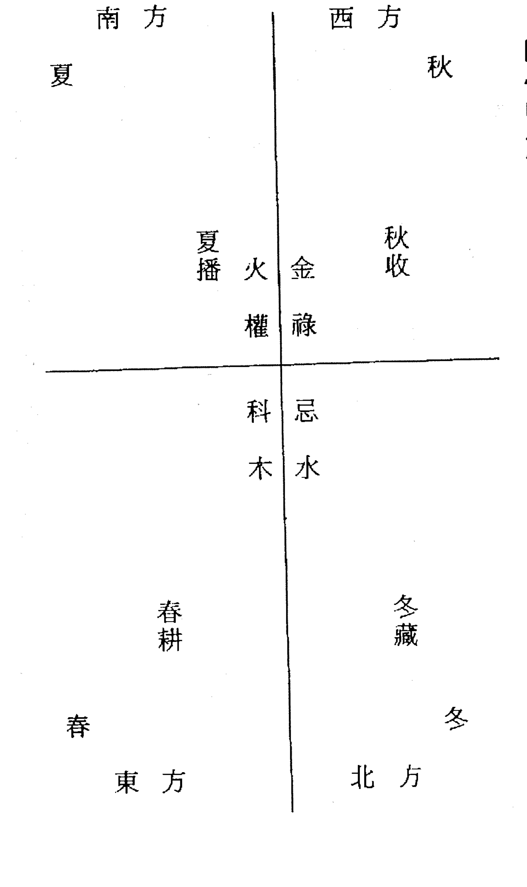

#### 化祿星

五行屬金，為秋天，代表收成之意。
化祿為吉星，引申為財富的聚集，在人個性方面代表人緣，人人好、隨和、懶散。

#### 化權星

五行屬火，為夏天，代表播種之意。
化權生代表著為人較主觀、霸道、不講理、行為為強勢的擁有、勞碌奔波、一分耕耘、一分收穫。

#### 化科星

五行屬木，為春耕，代表貴人之意。
化科星代表為人好相處、風度好、人緣好、很得他人的賞識與助力，能洩忌星的凶性。

#### 化忌星

五行屬水，為冬天，代表收藏之意。
化忌星為凶象，不順之意，代表坎坷、破財、倒霉事。為人個性較固執、保守，做事較放不開，入十二宮，主禍事較多。此星專破害祿星的吉性。

祿忌同宮：比雙忌更凶。

權忌同宮：勢均力敵、以強碰硬，為兩敗俱傷。

科忌同宮：能解忌之凶性。

忌忌同宮：代表雙忌、凶力強倍。

### 生年四化解說

生年祿入命宮：感情豐富、懶散、人緣好。

兄弟：與兄弟感情好、兄弟人數也比較多。

夫妻：照顧終愛配偶。

子女：子女女人數較多。桃花較重、性欲也較多。

財帛：賺錢容易、比較不缺錢用。

疾厄：容易發胖、懶惰。

遷移：在家待不住、喜歡四處亂跑、在外人緣好。

交友：交友廣闊，朋友來借錢肯借。

事業：做事涼涼的做，沒有什麼壓力。

田宅：與家中人口有緣。容易溝通。

福德：比較注重自己的嗜好與享受。

父母：比較孝順，與父母關係良好。

#### 生年權入十二宮

命宮：為人較主觀，不易接受他人意見。

#### 生年科入十二宮

命宮：本身風度好、有人緣。

兄弟：兄弟間相處良好，為自己的貴人。

夫妻：與配偶濃情密意，婚姻架構穩固。

子女：桃花重，易惹上桃花風波。

財帛：財運好，較易有大筆錢財運用。

疾厄：身體多災多難、容易受傷。

遷移：喜歡四處亂逛，在家待不住。

交友：在朋友間容易出頭，講話大聲，有老大之風。

事業：老師，主管格。

田宅：一定會有不動產。

福德：注重本身的嗜好享受。

父母：死要面子、與父親較不易溝通。

#### 生年忌星入十二宮

命宮：固執、保守，易鑽牛角尖，容易想不開。

兄弟：與兄弟姐妹較不好溝通、但有事時，會出大力幫忙。

夫妻：與配偶易溝通不良。但很關心、卻不會表達。

子女：一定有兒子，彼此間較易有代溝。

財帛：看錢重，運有引動一定會發財。

疾厄：能逢凶化吉、能制厄解化。

遷移：在外風度好，有人緣，在外多貴人助。

交友：朋友的素質好，風度好。

事業：事業做得輕鬆、事業上多貴人助。

田宅：家運好，家庭中也比較興旺。

福德：注重生活情趣。

父母：與父母深緣，一生中也較容易出名。

### 命宮干四化解

#### 命宮化祿入十二宮

命宮：頑固、不通情理、不易接受別人的意見。

兄弟：與兄弟有緣。彼此間較合得來。

夫妻：疼老婆。

疾厄：身體較容易有小毛病、不好醫治。

遷移：小心意外事故。心在外面，時常想出去逛逛。

交友：對朋友很好，死忠，可惜朋友素質不高。

事業：喜歡做事業。有工作狂。

田宅：家運不好，且多事，家中比較零亂。

福德：精嗜不穩，容易胡思亂想。

父母：與父母不好溝通，易犯官非。

生年四化只有重象，沒有吉凶禍福，要靠後天四化來引動，方能產生吉凶效應。

#### 命宮化權入十二宮

命宮：為人霸道，較不講道理，喜歡強出頭。

兄弟：聽兄弟的話。可是講話較衝。

夫妻：易惹上桃花，聽老婆的話。

子女：性慾強，會打小孩。

財帛：強勢的去擁有錢財，也較敢賺大筆錢。

疾厄：自我本位、懶惰、喜歡享樂。

遷移：在家待不住、喜歡出去遊玩。

交友：心在朋友，喜歡與朋友在一起。

事業：懶散，做事業較輕鬆，不用心思。

田宅：易惹上有夫之婦，或有婦之夫。

福德：喜歡嗜唆，也很奢得花錢供自己享受。

父母：對父母孝順。

#### 命宮化科入十二宮

命宮：風度好，受人歡迎。極有交際手婉。

兄弟：與兄弟姐妹緣深，易溝通，彼此間也較有助力。

夫妻：對配偶好，照顧配偶，較懂生活情趣。

子女：對子女好，彼此間也相處良好。

財帛：對錢財不重視。

疾厄：有貴人或神明相助。

遷移：在外風度好、受人稱通，在外也貴人多。

交友：在朋友之間講話較有份量，喜當老大。

事業：很喜歡做事業，有事業狂。

田宅：會有不動產、家庭壓力也會比較大。

福德：很敢花錢享受高價位的物品。

父母：愛面子，跟父母講話會大聲。

#### 命宮化忌入十二宮

命宮：自我設限、孤僻、不喜講話、也不易與人溝通。

兄弟：對兄弟好、可惜不好溝通。

夫妻：對老婆好、較易當跟屁蟲。

子女：性需求大，對子女寵愛。

財帛：喜歡錢、吝嗇。

疾厄：身體多災厄、較瘦、易惹上疫病。

遷移：喜歡出外，易遇意外事故。

交友：對朋友死忠，對朋友也重義信（傻忠）。

事業：自己喜歡做工作、會做死。

田宅：家緣好。為家中的貴人。

福德：有無享受皆可，有高尚的嗜好。

父母：跟父母相處融洽。

### 格局

斗數論命也很注重格局，好的命格，對凶運有抵抗能力，差得格局，逢凶運，就倍加辛苦。如同有品牌的產品與較沒有品牌的產品一般。

#### 十二宮諸星失陷貧賤論

丑未巨機為大格、寅申機月福須輕、卯酉不喜逢羊刀、辰戌紫破最為嗔、巳亥同梁貞陷、午宮陰巨不堪稱、申宮貪武為下局、酉逢機巨足無情、卯辰巳午逢陰宿、戊亥逢陽亦不榮、貪殺巳亥居陷地、破軍卯酉不為清、如煞遇劫為奸盜、此係刑邪不必論、貪狼化祿居四墓、雖然遇吉亦中平、命曜弱地休逢忌、空劫擎羊加火鈴、若非天折亡下賤、天吉之命不可憑、旺地發福終遠大、陷地崢嶸到底傾、二論不過五百字、富貴貧賤別得明。

#### 定富格

財蔭來命格

相守命，武梁來夾是也，田宅宮亦然。

此種組合好像不可能，可能是一在命，一在身吧！

##### 馬夾財祿格

馬守命，武祿來夾是也，逢生旺、尤妙。

##### 日月照壁格

日月臨田宅宮是也、喜居墓庫。

##### 日月夾財格

武守命，日月來夾是也，財帛宮亦然。

##### 蔭印拱身

身臨田宅宮，梁相供沖是也，怕坐空。

##### 金燦光輝格

太陽單守，命在午宮是也。

#### 定賢局

##### 日月夾命格

不坐空亡，更遇本宮有吉是也。

##### 日出扶桑格

日在卯守命是也，守官祿宮亦然。

##### 月落亥宮格

月在亥守命是也，又名「月朗天門」。

##### 月生滄海格

月在子守田宅宮是也。

##### 輔弼拱主格

紫微守命，二星來拱是也、夾之亦然。

##### 君臣慶會格

紫微左右同在命是也，更會府陰武。

##### 財印夾祿

祿守命，梁相來夾，入財福二宮亦有然。

此種組合也有問題、天相、天梁不可能空一格相夾，故只供參考了解。

##### 鴛鴦祿會格

天祿化祿臨身命是也。天也。天祿為「祿存」一星。

##### 祿馬交馳

二星臨身命，更得吉化同垣是也。

##### 祿馬佩印格

馬前有祿印同宮是也。

##### 坐貴向貴格

謂魁鉞在命宮是也。

##### 馬頭帶劍格

謂馬前有刃是也、不是刃居午。

此局有誤，僅供參考，馬頭帶劍，應是羊刃居午宮，或天同在午會擎羊，方成局。

##### 七殺朝斗格

寅申子午安身命，值七殺。

##### 日月並明格

陰陽日月同宮是也，或命丑、日巳、月酉來朝。

##### 明珠出海格

命在未、日在卯、月在卯來朝。

##### 到囚夾印格

天刑廉貞同臨身命，主武職。

##### 貪火相逢格

謂二星守命同居廟旺是也。

##### 武曲守垣格

武守命卯宮是也，餘不足。

##### 紫府朝垣格

寅安命、午戌紫府來朝。

##### 文星暗拱

命宮有吉、遷移、官祿、財帛三方有科星。

##### 權祿生逢格

二星守命廟旺是也，陷不足。

##### 擎羊入廟格

辰戌丑未守命遇吉星是也。

##### 巨機居卯格

辛乙生人卯宮二星守命、更遇昌曲左右。

##### 明祿暗祿格

甲生人安命在亥宮、科星守命居寅。

##### 金匱扶御駕格

紫微守命，前後日月來夾是也。

#### 定貧賤局

生不逢時

命坐空亡逢廉貞是也。

祿逢兩煞

祿坐空亡，又逢空劫煞星是也。

馬落空亡

馬既空，雖祿沖無用，主一世奔馳。

日月藏輝

日月反背又逢巨暗是也。

財與囚仇

武廉同守身命是也。

一生孤貧

謂破守命居陷地。

破軍爲耗星，入十二宮星主破壞。

君子在野

謂四煞貪刑交會而吉臨陷地是地。

兩重華蓋

謂祿存，化祿坐命遇空劫是也。

#### 定雜局

吉凶星伴

命有吉凶、限吉則發，限衰不發是也。

枯木逢春

謂命衰限好是也。

步數無依

前限接後限、連線不分是也。

##### 水上架屋

一年好二年不好是也。

##### 祿衰馬困

限逢七殺祿馬空亡是也。

##### 衣錦還鄉

少年不遂，四十後行墓運是也。

##### 風雲際會

身命雖弱，二限祿馬相會是也。

#### 定富貴貧賤十四等訣

##### 公卿

輔弼二星臨帝座、若居身命定為官、不坐空亡無破敗、官高二品八朝端。

##### 文官

文昌文曲是朱衣、身命官宮喜見之、更遇紫微同府相、官居台省顯光輝。

##### 武官

定入武職細推詳、帝座臨權在祿鄉、左右二星皆拱照、即是金吾上將即。

##### 科甲

命宮三合及游行、不陷科名始吉享、身命祿隨科甲第、斷然金榜台魁名。

##### 吏曹

陰陽化貴在強宮、更見光輝始不凶、若逢紫府並煞曜、一生爲吏逞英雄。

##### 富翁

太陰入廟有光輝、若入財鄉分外奇、破耗凶星皆不陷、閑金爛穀富家兒。

##### 商賈

七交文機不見凶、生來自好作輕營、爲人狡猾多機見、商賈江湖遠別宗。

##### 盜賊

命逢破耗與貪貞、七殺三方合照身、武曲更臨遷移位、定知臂上刺根新。

##### 貧賤

命中吉曜不來臨、火忌羊陀四正侵、貪狼廉貞俱會合、一生暴怒失人心。

##### 浪子

身命兩宮俱有煞、貪花戀酒禍猶深、平生二限來相會、得意之中卻又沉。

##### 破相

相貌之中逢煞曜、更加三命又逢刑、疾厄擎羊來沖耗、折傷肢體不知情。

##### 匠人

天機天相臨身命、帝合財星入墓中、天府只居遷移位、為人營造過平生。

##### 巧藝

貪狼閒宮多巧藝、巳亥安命正相宜、破軍卯酉廉貞併、細巧之人定藝奇。

##### 駁雜

吉曜相扶凶曜臨、百般巧藝不通享、身命若還逢惡曜、只做展牛宰馬人。

#### 定富貴貧賤十等訣

#### 福壽論

如南人天同，天梁坐命、廟旺、主福壽雙全。如此人帝坐紫微、武曲、破軍或貪狼坐命、旺宮、主壽。

#### 聰明論

如文昌、文曲、六相、天府、武曲、破軍、三台八座、左輔右弼、三合守照拱沖、主聰明。

#### 威勇論

如武曲、文昌、羊刃、七殺坐命、廟宮、得權祿、紫微、天府、左右拱照主威。

#### 文職論

如文昌、文曲、左輔、右弼、天魁、天鉞坐命，居旺宮，又得三方四正科權祿拱、主文官。

#### 武職論

如武曲、七殺坐命、廟宮、又得三台八座、權祿、天魁天鉞並拱、主武職。

#### 刑名論

如羊刃、陀羅、火鈴、武曲、破軍帶煞、加吉湊合、三方四正無凶、不陷、主刑名。

#### 富貴論

如紫微、天府、天相、祿權科、太陰、太陽、文昌文曲、左輔右弼、天魁天鉞守照拱照，主大富貴。

#### 貧賤論

如羊刃、陀羅、廉貞、七殺、武曲、破軍、地空地劫忌星、三方四正守照、拱沖諸凶、並犯陷地、主貧賤。

#### 疾天論

如貪狼、廉貞、羊刃、陀羅、地空、地劫、火鈴忌星、三方守照、主疾天、或臨疾厄、相貌宮亦然。

#### 僧道論

天機、天梁、七殺、破軍、地空、空亡犯紫微星者、為僧道。

### 十一宮諸星得地合格局

子安命
子宮貪狼殺陰星、機梁相併福與隆、
庚辛乙癸生人美、一生富貴定豐盈。

丑安命
丑宮立命日月朝、丙戊辛人福祿饒、
正坐連常中局論、對照富貴禍皆消。

寅安命
寅宮白日足豐隆、七殺天梁萬事通、
甲乙庚人皆為吉、男子為官女受封。

卯安命
卯宮機白武曲逢、辛乙生人福氣隆、
男子為官靡凛祿、女人享福受褒封。

辰宮安命
辰位機梁坐命宮、天府戌地是盈豐、
腰金衣紫真榮顯、富貴榮華直到終。

#### 巳安命

巳位天機天相臨、紫府朝垣福更深、戊辛壬丙皆為貴、一生順遂少災侵。

#### 午安命

午宮紫府太陽同、機梁破殺喜相逢、甲丁己癸生人福、一世風光祿豐。

#### 未安命

未宮紫武廉貞同、日月巨門喜相逢、女人值此全福壽、逢之男子位三公。

#### 申安命

申宮帝紫貞梁同、武曲巨門喜相逢、甲庚癸人如得遇、一生富貴逞英雄。

#### 酉安命

酉宮正喜太陰逢、巨日又逢當面沖、
辛乙生人為貴格、一生福祿永亨通。

#### 戌安命

戌宮紫破對辰沖、富而不貴有虛名、更加吉曜多權祿、只利開張業店主。

#### 亥安命

亥宮巨喜太陰逢、若人值此福興隆、男女逢之皆稱意、富貴榮華直到終。

### 十二宮諸星破格訣

子丑命
子火天機丑巨鈴、此星落陷為貞、
縱然化吉非為美、任他富貴不清寧。

寅安命
寅上機昌曲月逢、雖然吉拱不豐隆、
男為伴僕女娼婢、若非天折即貧窮。

卯辰命
卯上太陰羊刃逢、辰宮巨宿紫微同、
縱然化吉非全美、若加煞忌到頭凶。

巳安命
巳宮武月天梁巨、貪宿廉貞供到佢、
三方吉曜皆不貴、下賤貧窮度歲華。

午安命
午宮貪巨月昌從、羊刃三合最嫌沖、
雖然化吉居仕路、橫破橫成到老窮。

#### 未安命

未宮巨宿太陽藏、縱少災厄有剋傷、榮祿奔波官事至、隨緣不賤度時光。

#### 申酉命

申宮機月貪同貞、男人浪蕩女人貪、酉上巨陽兼武破、男女逢之總不榮。

#### 戌安命

戌位紫微文昌逢、天同太陽皆主凶、男女孤寒更天折、隨緣勤苦免貧窮。

#### 亥安命

亥宮貪火天梁同、飄蓬浪蕩走西東、若還富貴也年促、不然僕親與我貪。

### 十二宮諸星得地富貴論

子宮得地太陰星、殺破昌貪文曲明、丑未紫破朝日月、未貞梁丑福非輕、寅宮最喜逢陽巨、七殺天同狼又清、
卯上百機爲貴格、武曲守卯福豐盈、
辰戌相梁非小補、戌宮天府累千金、
巳亥天機天相貴、午破紫府梁俱榮、
申宮貞巨陰殺美、酉戌亥上太陰傳、
卯辰巳午陽正照、紫府破富巳亥興、
亥宮天府天梁吉、子宮機宿亦中平、
七殺子午逢左右、文曲加之格最清、
廉坐申宮逢輔弼、更兼化吉福尤興、
武昌巳亥逢、六甲帥過庭、
貪狼居卯酉、遇火做公卿、
天機坐卯酉、寅月六丁榮、
上卯逢左右、六乙立邊庭、
巨坐寅申位、福喜甲庚坐、
二宮逢七殺、左右會昌曲、
辰戌遇二宿、必定位公卿。

此書為斗數精析這套書的第一冊，名為「掌訣星曜篇」，書中介紹用掌訣來排盤，使學者不用再透過書本來查書排盤。至於星曜部份，為星情的解說運用。這套書我打算由淺至深，把紫微斗數這門學問，仔細的做一個詮釋。如同筆者所著「符咒真傳」一書，把符咒做個系統的整理一般。斗數界格局分為幾派：三合派、飛星派、占驗派、中州派……等、百家爭鳴。筆者只就三合、飛星二派做一個系統的教授。命相一道，並非迷信，全是言而有據的學理，近賢紫雲大師致力宏揚三合派法訣，至於了無居士的著作就遜色很多。飛星派以蔡明宏寫得較為出色。研究命學切勿以迷信為理。要多多印證學理架構。時師優劣參差不齊，有事請教者，宜爭眼明察，勿因劣師的恐赫煽動，而施用邪術改運，運不是不能改，但是透過妥當合理的方法。符咒卻實有其玄妙的力量能趨吉避凶、但是預支未來的氣運，終究是要還的。學斗數的口訣為「勤學」、「苦練」、及「多多印證實盤」，從中找出自己的訣竅，方能成就正道。不要一味相信人說的「秘芨」、秘芨不一定是正確的。充其量不過是個人自由心論的結果罷了。收集命盤是要下一番苦功的。從親明好友的命例中、尋出學理、印證架構，就能有所突破。

各位學友讀通了本集後，相信已對斗數有一番的了解了，星情必需要背熟。斗數的二大支柱為星情與四化，缺一不可，定要能靈活運用，初學者最易犯的毛病是，學會了星情，卻把四化忘了。學會了四化，就把星情遺忘了。所以宜多下苦功夫學習。

讀者如對筆者所著之書有所疑問，或互相交流的話可來信至，台南市民生路二段二四一號。

心星星相專業命理評析顧問
諸葛綾
張櫻馨收即可

### 文王卦入門

#### 基礎入門

十天干所屬五行
甲乙屬木、丙丁屬火、戊己屬土、庚辛屬金、壬癸屬水。

十二地支與所屬五行
亥子屬水、寅卯屬木、巳午屬火、申酉屬金、辰戌丑未屬土。

天干相合
甲與己合、乙與庚合、丙與辛合、丁與壬合、戊與癸合。

地支相合
子與丑合、寅與亥合、卯與戌合、辰與酉合、巳與申合、午與未合。

地支相沖
子午相沖、丑未相沖、寅申相沖、卯酉相沖、辰戌相沖、巳亥相沖。

##### 五行生剋

金生水、水生木、木生火、火生土、土生金。
金剋木、木剋土、土剋水、水剋火、火剋金。

##### 十天干配上方方位

甲乙東方木、丙丁南方火、戊己中央土、庚辛西方金、北方壬癸水。

##### 地支三合

申子辰三合成水局、巳酉丑三合成金局、寅午戌三合成火局、亥卯未三合成木局。

##### 地支三會

亥子丑北方會、寅卯辰東方會、巳午未南方會、申酉戌西方會。

##### 地支三刑

申刑寅、寅刑巳、巳刑申——恃勢之刑。
戌刑未、未刑丑、丑刑戌——無恩之刑。
辰刑辰、午刑午、酉刑酉、亥刑亥——自刑。
子刑卯、卯刑子——無禮之刑。

##### 地支相害

子未相害、丑午相害、寅巳相害、卯辰相害、申亥相害、酉戌相害。

##### 十二長生訣

十二長生為、長生、沐浴、冠帶、臨官、帝旺、衰、病、死、墓、絕、胎、養。

金長生於巳、木長生於亥、火長生於戌、水土長生於辰。

| 行五 | 木 | 火 | 土 | 金 | 水 |
|---|---|---|---|---|---|
| 長生 | 亥 | 寅 | 寅 | 巳 | 申 |
| 沐浴 | 子 | 卯 | 卯 | 午 | 酉 |
| 冠帶 | 丑 | 辰 | 辰 | 未 | 戌 |
| 臨官 | 寅 | 巳 | 巳 | 申 | 亥 |
| 帝旺 | 卯 | 午 | 午 | 酉 | 子 |
| 衰 | 辰 | 未 | 未 | 戌 | 丑 |
| 病 | 巳 | 申 | 申 | 亥 | 寅 |
| 死 | 午 | 酉 | 酉 | 子 | 卯 |
| 墓 | 未 | 戌 | 戌 | 丑 | 辰 |
| 絕 | 申 | 亥 | 亥 | 寅 | 巳 |
| 胎 | 酉 | 子 | 子 | 卯 | 午 |
| 養 | 戌 | 丑 | 丑 | 辰 | 未 |

##### 十二長生表

##### 五行生旺墓絕表

| 五行 | 金 | 木 | 火 | 水土 |
|---|---|---|---|---|
| 長生 | 巳 | 亥 | 寅 | 申 |
| 旺 | 酉 | 卯 | 午 | 子 |
| 墓 | 丑 | 未 | 戌 | 辰 |
| 絕 | 寅 | 申 | 亥 | 巳 |

##### 貴人歌訣

甲戊庚牛羊、乙己鼠猴鄉、丙丁豬雞位、壬癸兔蛇藏、六辛逢馬虎、此是貴人方。

甲日丑為陽貴、未為陰貴、出此類推。

##### 先天八卦

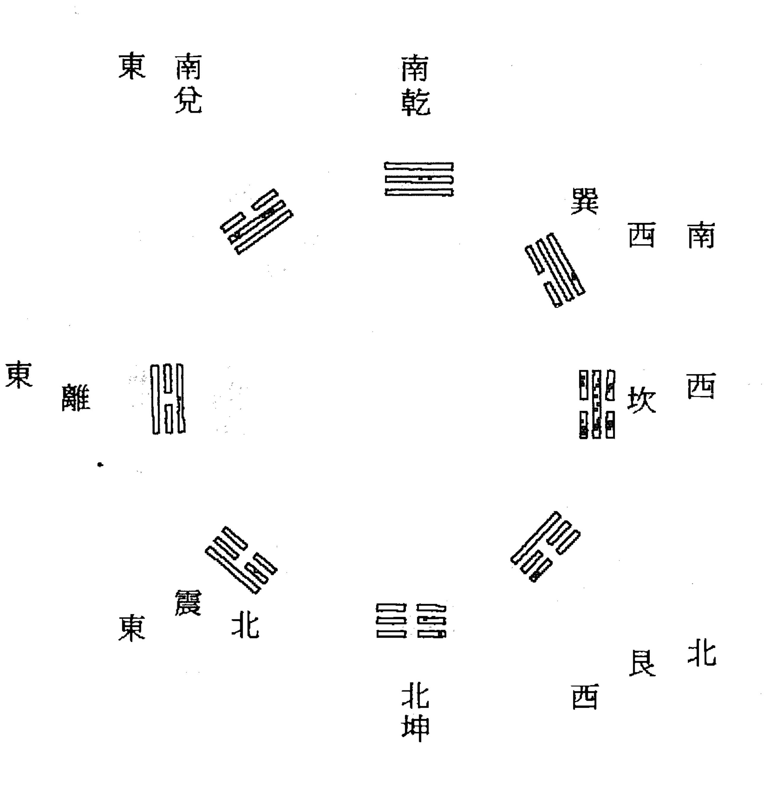

##### 後天八卦

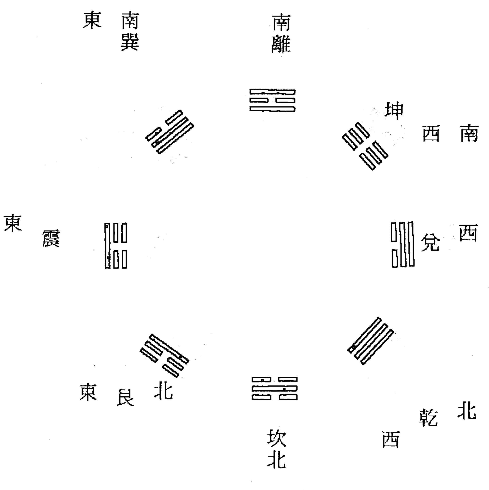

##### 八卦象訣

乾三連「」、坤六斷「」、震仰盂「」、
艮覆碗「」、離中虛「」、坎中滿「」、
兌上缺「」、巽下斷「」。

##### 八卦所屬五行及象意

乾金為天屬馬、身體代表為首。
坤土為地屬牛、身體代表為腹。
坎水為水屬豕、身體代表為耳。
離火為火屬雉、身體代表為目。
艮土為山屬狗、身體代表為手。
震木為雷屬龍、身體代表為足。
巽木為風屬雞、身體代表為股。
兌金為澤屬羊、身體代表為口。

#### 卜法簡論

人臥之法相當容易，以銅錢三個，擲六次為一卦，再照附表填入五行、世應、五星即可論斷。至於卜卦之時是否要配合唸咒，全因各人而異，筆者在此提供一咒供參考

> 承差土地，急忽千里，通天徹地，出入幽冥，
為吾開召，不得留停，上天下地，十洲三島，
飛符走象，召請無停，有功之日，名書上清，
聞吾開召，不得留停。
神兵火急如律令。

##### 記爻的符號

如三面全朝上即記「○」、是動變之象，又稱變爻。
如三面全朝下即記「×」、是動變之象，又稱變爻。
如二正一反記為「—」，是為陽爻。
如二反一正記為「||」，是為陰爻。

變動之爻，要尋納甲裝卦歌訣變爻。

##### 納甲裝卦歌訣

乾金甲子外壬午、即子寅辰、午申戌。
坎水戊寅外戊申、即寅辰午、申戌子。
艮土丙辰外丙戌、即辰午中、戌子寅。
震木庚子外庚午、即子寅辰、午申戌。
巽木辛丑外辛未、即丑亥酉、未乙卯。
离火己卯外乙酉、即卯丑亥、酉未巳。
坤土乙未外癸丑、即未巳卯、丑亥酉。
兑金丁巳外丁亥、即巳卯丑、亥酉未。

##### 八宮變卦（64卦）

###### 乾宮

乾為天。

一爻變天風姤。

二爻變天山遯。

三爻變天地否。

四爻變風地觀。

五爻變山地剝。

回第四爻變火地晉。

下卦全變火天大有。

###### 兌宮

兌為澤。

一爻變澤水困。

二爻變澤地萃。

三爻變澤山咸。

四爻變水山蹇。

五爻變地山謙。

回第四爻變雷山小過。

下卦全變雷澤歸妹。

###### 離宮

離爲火。

一爻變火山旅。

二爻變火風鼎。

三爻變水火未濟。

四爻變山水蒙。

五爻變風水渙。

回第四爻變天水訟。

下卦全變天火同人。

###### 震宮

震爲雷。

一爻變雷地豫。

二爻變雷水解。

三爻變雷風恆。

四爻變地風升。

五爻變水風井。

回第四爻變澤風大過。

下卦全變澤雷隨。

###### 巽宮

巽為風。

一爻變風天小畜。

二爻變風火家人。

三爻變風雷益。

四爻變天雷无妄。

五爻變火雷噬嗑。

回第四爻變山雷頤。

下卦全變山風蠱。

###### 坎宮

坎為水。

一爻變水澤節。

二爻變水雷屯。

三爻變水火既濟。

四爻變澤火革。

五爻變雷火豐。

回第四爻變地火明夷。

下卦全變地水師。

###### 艮宮

艮為山。

一爻變山火賁。

二爻變山天大畜。

三爻變山澤損。

四爻變火澤睽。

五爻變天澤履。

回第四爻變風澤中孚。

下卦全變風山漸。

###### 坤宮

坤爲地。

一爻變地雷復。

二爻變地澤臨。

三爻變地天泰。

四爻變雷天大壯。

五爻變澤天夬。

回第四爻變水天需。

下卦全變水地比。

##### 安世應歌訣

八卦之首世六當，以下初爻輪上當，遊魂八宮四爻立世、歸魂八卦之爻詳。

##### 六親歌訣

生我者為父母，我生者為子孫，剋我者官鬼爻，我剋者為妻財，比和者為兄弟。

##### 定間爻歌訣

世應當中兩間爻，忌神發動莫相交，元辰與用當中動，生世扶身事事高。

##### 天沖卦

天沖卦有十個：乾為天、坤為地、震為雷、艮為山、兌為澤、離為火、坎為水、巽為風、天雷无妄、雷天大壯。

##### 六合卦

天地否、水澤節、澤水困、地天泰、地雷復、火山旅、山火賁、雷地豫。

##### 遊魂卦

火地晉、地火明夷、風澤中孚、澤風大過、天水訟、山雷頤、雷山小過、水天需。

##### 歸魂卦

火天大有、天火同人、澤雷隨、水地比、地水師、雷澤歸妹、山風蠱、風山漸。

##### 六甲旬空

甲子旬中戌亥空、甲寅旬中子丑空、甲辰旬中寅卯空、
甲午旬中辰巳空、甲申旬中午未空、甲戌旬中申酉空。

##### 六獸歌

甲乙起青龍、丙丁起朱雀、戊日起勾陳、己日起螣蛇、庚辛起白虎、壬癸起玄武。

排序：由下裝起

例：甲日：玄武、白虎、螣蛇、勾陳、朱雀、青龍。
六爻、五爻、四爻、三爻、二爻、一爻。

##### 安卦身訣

陰世則從午月起，陽世還從子月生，欲得識其卦中意
從初數至世方眞。

##### 年上起月法

甲己之年丙爲首，乙庚之年戊爲頭，丙辛之位從庚上
丁壬之位順行流，戊癸之年何方法，甲寅之上好追求。

##### 日上起時法

甲己還加甲，乙庚丙作初，丙辛從戊起，丁壬庚子居。
戊癸何方法，壬子是順行。

##### 定寅時法

正九五更二兌徹、二八五更四點歌、三七平光是寅時。
四六日出寅無別、五月日高三丈地、十月十二勿更二。
仲冬纔到四夏初、便是寅時君須記。

##### 月破

立春正月節建寅破申、驚蟄二月節建卯破酉、
清明三月節建辰破戌、立夏四月節建巳破亥、
芒種五月節建午破子、小暑六月節建未破丑、
立秋七月節建申破寅、白露八月節建酉破卯、
寒露九月節建戌破辰、立冬十月節建亥破巳、
大雪十一月節建子破午、小寒十二月節建丑破未。

##### 通玄賦

易爻不妄成，神爻豈亂發，體象或既成，無者形憂還，始須論用神，次必看原神，三合會用吉，祿馬最為良，爻動始為定，次者論空亡，六沖主沖併，刑剋俱主傷，世應俱發動，必然有改張。龍動家有善，虎動主有喪，勾陳朱雀動，田土與文章，財動憂尊長，父動損兒郎，子動男人滯，兄動女人殃。出行宜世動，歸魂不出疆，田動俱三合，行人立回莊。占宅財龍旺，豪富冠一鄉，父母爻興旺，為官至侯王，福神若持世，官訟定無妨，勾陳剋玄武，捕賊不須忙。父病嫌財殺，財興必不長，無鬼病難療，鬼旺主發狂，請看考鬼歷，禱謝得安康。占婚兼剋用，占產看陰陽，若要問風水，三四世吉昌，長生墓絕訣，略舉其大綱，分別各有類，無物不包藏。

##### 諸爻持世歌訣

世爻旺相最為強，作事亨通大吉昌，謀望諸般皆遂意，用神生合妙難量，旬空月破逢非吉，剋害刑沖遇不良。父母持世主身勞，求嗣妾眾也難招，官動財旺宜赴試，財搖謀利莫心焦，占身財動無賢婦，又恐區區壽不高。
子身持世事無憂，求名切忌坐當頭，避亂許安夫可得，官訟從今便了休，有生無剋諸般吉，有剋無生反見愁。
鬼爻持世事難安，占身不病也遭官，財物時時憂失脫，功名最喜世當權，入墓愁疑無救日，逢沖轉禍變成歡。
財爻持世益財榮，只若爻重不可逢，更過子孫明暗動，刮身剋父喪文風，求官問訟宜財托，動變只官萬事凶。
兄弟持世莫求財，官興須慮禍將來，朱雀并臨防口舌，如搖必定損妻財，父母相生身有壽，化官化鬼有奇災。

##### 碎金賦

子動生財不宜父擺，兄動剋財子動能解，財動生鬼切忌兄搖，子動剋鬼財動能消，父動生兄忌財相剋，鬼動剋兄父動能泄，鬼動剋子兄父動無妨，子興剋鬼父動無妨，兄動生子忌鬼搖揚，父動剋子兄動無妨，若然兄動鬼必遭傷，財興剋父兄動無憂，若然子動父命難留，父動剋子財功無事，若是鬼興其子必死，鬼興剋兄子動可救，財若爻重兄弟不久，兄興剋財鬼沖無礙，若是父興財遭剋害。本支皆言生剋制化之剋，以明凶中藏吉，吉內藏凶耳，如金動本生水，也得火動則利金而金不能生水矣。如火動可剋金，也得水動則制火而不能傷金矣，如金逢火動則受剋也，得土動則火貪生於土忌剋於金，名為貪生忌剋，金反吉也。如火動剋金而土爻安靜更逢木動木助火剋金必凶也。學者宜按五行生剋制化推之吉凶了然矣。

##### 何知歌訣（讀者細心體會）

何知人家父母疾，白虎臨爻兼刑剋。
何知人家有子孫，青龍德福爻中輪。
何知人家子孫災，白虎當臨福德來。
何知人家兄弟亡，用落空亡白虎傷。
何知人家妻有孕，青龍財臨天喜神。
何知人家損妻房，財爻帶鬼落空亡。
何知人家訟事多，雀虎持世鬼來扶。
何知人家進人口，青龍得位臨財守。
何知人家田地增，勾陳入土子孫臨。

何知人家父母殃，財爻發動煞神命。
何知人家無子孫，六爻不見福神臨。
何知人家小兒死，子孫空亡如白虎。
何知人家妻有災，虎臨兄弟動傷財。
何知人家有妻妾，內外兩財旺相決。
何知人家訟事休，空亡官鬼又休囚。
何知人家旺六丁，六親有氣吉神臨。
何知人家大豪富，財爻旺相又居庫。
何知人家進產業，青龍臨財旺相說。

何知人家進外財，外卦青龍財福來。
何知人家富貴昌，強財旺福青龍上。
何知人家無依倚，卦中福德落空死。
何知人家屋宇新，父入青龍旺相真。
何知人家墓有風，白虎空亡巽已攻。
何知人家無香火，卦中六爻不見火。
何知人家兩鬢戶，卦中必主兩重火。
何知二姓共屋居，兩鬼旺相卦中推。
何知人家雞亂啼，騰蛇入酉不須疑。
何知人家見口舌，朱雀持世鬼來擾。
何知人家多爭競，朱雀兄弟持世應。
何知人家遭賊徒，玄武臨財鬼旺扶。
何知人家痘疹病，騰蛇爻破火燒定。
何知人家多夢寐，騰蛇帶鬼來持世。
何知人家投水，玄武入水煞臨鬼。

何知人家喜事臨，青龍福德在門庭。
何知人家多貧賤，財爻帶耗休囚見。
何知人家竈破漏，玄武入水鬼來就。
何知人家居宇敗，父入白虎休囚壞。
何知人家墓有水，白虎空亡臨亥子。
何知人家無風水，卦中六爻不見水。
何知人家不供佛，金鬼爻落空亡決。
何知一家有兩姓，兩重父母卦中臨。
何知人家犬亂吠，騰蛇入戌又逢鬼。
何知人家口舌到，卦中朱雀帶木笑。
何知人家小人生，玄武官鬼動臨身。
何知人家災禍至，鬼臨應爻來剋世。
何知人家病要死，用神無救又入墓。
何知人家出鬼怪，騰蛇白虎臨門在。
何知人家有吊頸，騰蛇木鬼世爻臨。

何知人家孝服來，交重白虎臨鬼排。
何知人家失衣裳，勾陳玄武入財鄉。
何知人家失了牛，五爻丑鬼落空愁。
何知人家無牛豬，丑亥空亡兩位虛。
何知人家不來，世應俱落空亡排。
仙人道出何知章，留與後人作飯囊。

何知人家見失脫，玄武帶鬼應爻發。
何知人家損六畜，白虎帶鬼臨所屬。
何知人家失了雞，初爻帶鬼玄武欺。
何知人家無雞犬，酉戌二爻空亡掩。
何知人家宅不寧，六爻俱動亂紛紛。
禍福吉凶真有驗，時師句句細推詳。

##### 六獸五行斷歌訣（理解運用）

##### 青龍吉凶歌訣

青龍入水身應合，必定求官事事宜。
入木值旺來生世，不值空亡儘可為。
龍入火地火燒身，占宅無憂人不安。
青龍入土家有喜，木旺近身喜事生。
青龍入金身有劫，逢金獨發忌悲聲。

##### 朱雀吉凶歌訣

朱雀入火官事來，又驚女婦有傷胎。
朱雀入金須有財，惟恐帶劫防口舌。
入土公事有信催，升官離職辨爻支。
入木不防身體健，問運求貴待來日。
朱雀入水運不通，水爻臨著不為靈。

##### 勾陳吉凶斷訣

勾陳入土公文起，田地勾連有橫禍。
若臨財爻妻有孕，交易田地不須疑。
求婚須得財須有，占問行人定主歸。
忌動臨身須遭否，水爻近身驚小口。
逢金發者忌悲聲，更破空亡須有滯。
占宅家運須有滯，不論人口受遭刑。

世應內外六親推，官鬼六爻斷詳真。
鬼父當門事有礙，世應內干定風波。
官鬼伏官事有難，日辰相扶解難關。
百事安置宜清舊，官鬼發動防有災。
元辰生扶看來日，旺相須防口是非。

刑害沖殺破人丁，大殺旺相主傷亡。
入木角山井第宅，家事是非有牽連。
入火須防婦女傷，第宅小孩緊防殃。
勾陳入水生口舌，癰瘡病耗未綏身。

##### 騰蛇吉凶歌訣

騰蛇入土夢邪精，內干外事謹防身。
入火須憂損小口，宅舍人運不安寧。
入金女人嫌孝服，男士運氣不平行。
入木遷移定不吉，又恐婦女身不貞。
入水孕婦多遲滯，不然宅舍有悲聲。

##### 白虎吉凶斷訣

白虎入金股重占，人財兩耗病不輕。
入木須憂事見公，宜妨小事化大殃。
入土有災田宅起，家業人馬定風波。
白虎入火宅有災，主人謹慎事不殆。
白虎入水事不重，謹防身體不遭傷。

問運不通家運擾，內動家事恐有殃。
運帶災劫宜緊慎，須防內外禍纏身。
與人爭鬥皆不利，問運求貴待來日。
應未剋世外事扶，運氣第宅鬼異侵。
老幼心寧不安定，火神不干損其財。
病耗拖延恐日久，殺陰內動防家喪。
外干運氣心未定，百事宜守不遭傷。
小口災厄婦女當，男子事業謹防非。
旺相遭劫主喪事，如不損人定有災。
暗事沈乙有疾病，內動家運是不佳。
大殺風臨宅舍內，非病不輕憂傷亡。
慎防運衰禍上來，不損人馬損其財。
卦運世應詳得理，推來吉凶辨年情。

##### 玄武斷吉凶歌訣

玄武入水憂賦寇，又嫌陰私走私情。
入火終是失資材，營商得力不順時。
入土家中有病疫，運氣勾陳多牽纏。
玄武入木產婦悲，宅中女人又不宜。
入金有財須外得，不然人送盜賊來。

失財宅人有疑問，男女之間藏異情。
為力智謀皆無益，費盡心機空費力。
鬼吏內侵宅人擾，鬼賊作弄異事侵。
少女官嫌交男友，男子運氣是帶憂。
癡心財物憂是非，得財須防計謀侵。

##### 六神象意

青龍
主喜事，持世爻重者，為財喜、姻親、孕育、作事無往不利。

朱雀
主官非，持世爻重者，為文書、口舌、競爭、禍亂、吉凶參半。

勾陳
主田工事，持世若爻重，為暗昧遲留田土事，事未通。

螣蛇
主怪夢疑惑，為恐懼、夢寐、憂疑、驚慌，無不應。

白虎
主孝服，為死喪、病患、破財、無不凶。

玄武
主盜賊欺、陰私扶、侵欺、盜賊。

##### 安卦身訣

陰世則從午月起，陽世還從子月生，欲得識其卦中意，從初數至世方真。

卦身為一卦之主，宜生合卦身。

##### 定間爻歌訣

世應當中兩間爻，忌神發動莫相交，元辰勿用當中動，生世扶身事事高。

##### 卦身喜忌歌訣

身臨福德不見官，所憂必定變成歡，身臨原用與青龍，定期喜事入門中。

身爻切忌入空亡，作事難成且守常。

目前凶事終需吉，緊急還來漸漸寬。

若逢驛馬身爻動，出路求謀事事通。

刑傷破絕皆為忌，勸君安分守家邦。

##### 飛伏生剋吉凶歌訣

伏剋飛神為出暴，飛來剋伏反傷身，
爻逢伏剋飛無事，用見飛傷伏不寧，
伏去生飛名洩氣，飛來生伏得長生，
飛伏不和生來助，伏藏出現審來因。

##### 六爻安靜訣歌

卦過六爻安靜當看日辰與用、日辰剋用及相刑，作事宜當謹慎，更在世應推究，
忌神切莫加臨用及原神，作事斷然昌盛。

##### 六爻亂動訣訣

六爻亂動事難明，須向宮中看用神，
用若休囚遭剋害，須知此事費精神。

##### 忌神歌訣

看臥先須看忌神，忌神宜靜不宜興，
忌神急要逢傷剋，若遇生福用受刑。

##### 原神歌訣

原神發動志揚揚，用伏藏兮也不妨，
須要生扶兼旺生，最嫌化剋及遭傷。

##### 用神不上卦訣

正臥如無變又無，就將首臥六親攻，
動爻生用終須吉，若遇爻重剋用凶。

##### 用神發動歌訣

用爻發動在宮中，縱植休囚亦不凶。

##### 用神空亡歌訣

發動逢沖不謂空，靜空遇剋劫為空，
忌神最喜逢空吉，用與原神不可空，
春土夏金秋樹木，三冬逢火是真空，
旬空又值真空象，再遇爻傷到底空。

##### 月辰歌訣

問卦先須看日辰，日辰剋用不堪親，
日辰與用相生合，作事何愁不順心。

##### 日月建傳符

日建加青龍，財祿喜重重，朱雀宜施用，
勾陳事未通，騰蛇多怪異，白虎破財凶，
玄武陰私扶，應在日時中，月建宰臨止，
斷法亦相同。

##### 六親發動歌訣

父親當頭剋子孫，病人無藥主昏沈，姻親子息應難得，買賣勞心利不存，
觀望行人書信動，論官下論理先分，士人科舉登金榜，失物逃亡要訴論。
子孫發動傷官鬼，占病求醫身便痊，何人買賣身康泰，婚姻喜美是前緣。
產婦當生子易養，詞訟私和不到官，謁貴求名休進用，勸君來命聽乎天。

官鬼從來剋兄弟，婚姻未就生疑滯，病困門庭禍祟來，耕種蠶桑皆不利。

出外逃亡定見災，詞訟官非有凶禁，買賣輕財賭博輸，失脫難尋多暗昧。

財爻發動剋文書，應舉求名總定虛，將本經營為大吉，親姻如意藥無虞。

行人在外身將動，產婦求財身脫除，失物靜安家未出，病人傷胃夏傷脾。

兄弟交重剋了財，甚人離愈未離災，應舉奪標為忌客，官非陰賊耗錢財。

若帶吉神為有助，出路行人便未來，貨物經商須折本，買婢求妻事不諧。

##### 六親變化歌訣

父母化父母，進神文書許，化子不傷丁，化鬼官遷舉，化財宅長憂，
兄弟為泄氣。
子孫化退神，人財不稱情，化父田蠶敗，化財加倍榮，化鬼憂生產，
兄弟謂相生。
官化進神祿，求官應疾連，化財占病凶，化父父書遂，化子必傷官，
化兄家不睦。
妻財化進神，錢財入宅來，化官憂戚戚，化子笑哈哈，化父宜家長，
化兄當破財。
兄弟化退神，凡占無所忌，化父妾雙驚，化財財未遂，化官弟有災，
化子卻如意。

##### 六獸斷歌訣

發動青龍附用通，進財進祿福無窮，
臨仇過忌都無益，酒色成災在此中。
朱雀交重文印旺，煞神相併漫勞功，
是非口舌皆因此，動出生身卻利公。
勾陳發動憂田土，累歲迍邅遭為忌逢，
生用有情方是吉，若然安靜不迷蒙。
騰蛇鬼剋憂榮粹，怪夢陰魔暗裏攻，
持木落空休道吉，逢沖之日莫逃凶。

白虎交重喪惡事，官司病患必成凶，
持金動剋妨人口，遇火生身便不同。

玄武動搖多暗昧，老臨官鬼賊交攻，
有情生世邪無犯，仇恩臨之姦盜凶。

##### 進神退神歌訣

甲午甲子為陽進神，巳卯己酉為陰進神，又亥化子，丑化辰，寅化卯，巳化午，未化戌，甲化酉，俱是。

遇進神，則吉盛凶多也。壬辰壬戌日陽退神，丁丑丁未日陰退神。又子變亥、辰變丑、卯變寅、午變巳、戌變未、酉變申、俱是。

遇退神，則凶衰吉減也。

##### 天中煞歌訣（六甲空亡）

甲子中旬空戌亥，甲戌旬中空申酉，
甲申旬中空戌巳，甲午旬中空辰巳，
甲辰旬中空寅卯，甲寅旬中空子丑。

#### 黃金策十八論

##### 一、用神分類定例第一

凡占祖父母、父母、師長、家主、伯叔、姑姨、與我父母同輩，或是與父母年若之親友，及城牆、宅舍、舟車、衣服、雨具、求雨、綢布、氈貨、章奏、文章、館室，俱以父母爻為用神。

凡占功名、官符、雷電、鬼神、丈夫、夫之兄弟同輩、及夫之相與朋友、亂臣、盜賊、邪祟、憂疑、病症、尸有、逆風，俱以官鬼爻為用神。

凡占兄弟姊妹、姊妹丈、妻之兄弟、世兄弟、結盟同員、及知交朋友，俱以兄弟爻為用神。

凡占嫂、與弟婦、妻妾、及友人之妻妾嫂僕、物價、錢財、珠寶、金銀、倉庫、錢糧、什物、器皿、及問天時、晴明，俱以妻財爻為用神。

凡占兒女、孫、姪、女婿、門生、忠臣、良將、藥材、僧道、六畜、禽鳥、順風、解憂、避禍、及問天時、日月星斗，俱以子孫爻為用神。

##### 二、世應論用神第二

凡卦中之世應二爻，世為自己，應作他人，世應相生相合是云賓主相投。世應相剋相沖可見兩情不睦。凡占自己疾病，或問壽數，或問出行吉凶，諸凡損益自身者，以世爻為用也。凡占無尊卑之稱呼、未曾深交之朋友、九流術士、仇人、敵國者，或指實某處地頭、或指此山此水、此寺此壇等類，俱以應爻為用神也。如占自己有利我家否，以應作穴場，也是我家也。

##### 三、用神問答第三

或曰樸占主人，以父母爻為用神，主人占僕，不以子孫爻為用神何也？
答曰：一切撫養庇護我身者，以父母爻為用神，即如城垣、宅舍、舟車、衣服等類是也。金銀物件、婢僕等一切驅使之類，以財爻為用神是也。
又曰占兄弟之妻、妻之姊妹，以財爻為用。占夫之兄弟，以官爻為用，何也？
答曰：兄弟之妻、妻之姊妹、與妻同輩之人也，既夫占妻以財爻為用，皆是財爻為用矣。
又問古書俱載兄弟為風雲，今以官鬼之爻為逆風，子孫之爻為順風，何也？
答曰：貴人以官為官星，庶人以鬼為禍祟；貴人以子孫之爻為惡煞，庶人以子孫之爻為福神，官乃拘束之星，鬼乃憂疑阻滯之陷，如連日風雨，或遇逆風，疾病纏染，官司擾害，盜賊憂虞，人心豈暢？福神能制官鬼，善解憂愁故為之用也。

##### 四、原忌仇神論四

凡占卦要知原神，先看用神何爻，生用神之爻即是原神也，如用神旬空月破衰弱或伏藏不現，得原神動來生之，或日辰月建作原神生之，必持用爻出旬出破得令值日所求必遂矣。如用神旺相，原神休囚不動，或動而變墓、變剋、變破、變退，或破日辰月建所制，皆不能生用，是用神根蒂被傷矣！是不惟無益而反有損也。

凡占卦要知忌神，亦先看用神，剋用神之爻即是忌神也。如忌神動未剋用，而用爻出現不空則受剋也，倘卦中又動出一爻原神生用，則忌神反生原神，是名貪生忌剋。則用神根蒂深固矣，其吉便倍矣。如忌神獨發，而用空旬空，謂之避空，如伏藏之現謂之避凶，如月建日辰生扶謂之得救，如是仍等為吉兆，夫亦何嫌何疑哉？如忌神變回頭之剋，或日辰月建生扶剋沖之，或動爻制忌之，謂之賊欲害我是賊先侵害也，我又何傷？如日辰月建生扶忌神，或忌神疊疊剋用，即使用神避空伏藏者，至出空出透時便受其毒難免其究也。

凡占卦要知仇神，先看制剋原神生扶忌神者即是仇神也，如卦中仇神發動，則原神被傷，用神無根，忌神倍力其禍可勝道耶！

##### 五、飛神正論第五

飛神有六：凡卦既有伏神，伏神之上者飛神一也。六獸五類飛神二也。他宮五類贊入本宮取財官父兄子飛神三也。一卦中上下兩爻一類，內靜外興內飛外五也。內外皆興飛去六也。

##### 六、伏神正傳第六

夫伏神者，謂卦之有缺用神，才有用神伏於何爻之下，既有用神現，即使旬空月破動靜生剋合沖者，皆出機關之所發，是有病處必以藥醫之，故空要值月，破要填合，伏待出露，沖待合，合待沖，此乃物窮必變，器滿則傾。若以破空為無用，以乾為坤之伏大有五類俱全，又址否卦為伏，又爻爻有伏之說，豈非病失醫藥其傳謬矣，至於學者無門可入，今陳一定不易之理，以便學者易於陞堂，且乾坤艮兌離震巽坎乃八宮之首卦，名曰八純，其爻全金木水火土，其象備官父子財兌，本宮大七卦如缺一者即以首卦為伏。假令姤、遁無財須向乾宮借寅木，遁、否、晉、觀缺水，移乾子水伏初爻，觀、剝少金，乾卦申金為伏。今以乾卦為法，他宮他卦皆是以本宮首卦爲下七卦之伏神也。

##### 七、六獸評論第七

青龍最喜悅而多仁，附忌神凡謀不利。白虎最凶勇而好殺，生用神諸爲則吉。朱雀剋身口舌是非常有，如來生用文書信當回。勾陳屬土，空則田園欠熟，剛強剋世，公差牽扯拘遲。騰蛇怪異虛驚，玄武和情盜賊，白虎血神生產，遍宜發動，午宮朱雀化水，何忌大災。騰蛇木鬼欺身，恐自縊難逃枷鎖。玄武官生靜世，交小人莫慮干連世剋靜，青龍巡捕戲場酒肆上，鬼動勾陳，論祈禱速酬太歲，問病原腫脹黃浮，略舉六神取用，集將六獸推尊遇吉神般般云吉，持凶宿件件稱凶。

##### 八、四生逐位論第八

火生于寅也，金生于巳也，水土生于申也，木生于亥也，火庫于戌，絕于亥。金庫于丑，絕于寅。水土庫于辰，絕于巳。木庫于未，絕于申。此表生墓絕定例，卦卦必用者長生，爻爻須講究者墓絕。除三者之餘卦中俱弗重也。假令火之沐浴于卯爲相生，火之冠帶于辰，衰子未，養于丑爲泄氣。巳火臨官于巳爲伏吟，午火臨官于巳爲用神，巳火帝旺于午爲進神，午火帝旺于午爲伏吟，午火衰于未者爲相合，午火病于申巳，午火死于酉者爲仇神，巳火病于申者爲相同，胎于子者爲相剋，午火胞胎子午爲沖爲反吟，由此觀之餘神靈足重哉！

##### 九、月破論第九

凡卦中月破之爻乃關因之所現也，動者亦能生剋他爻，變者亦能生剋本爻，月下雖破出月不破矣，今日雖破值日不破矣！月破最喜逢合填實，遠應年月近應日時，如破而安靜自值旬空衰弱衰弱，遇動爻月建日辰剋害，此等月破謂之眞破，到底破矣？

##### 十、空論第十

凡卦中爻遇旬空，乃神機發現于此也，如旺相旬空，或修囚發動，日辰生伏，動爻生扶，動爻變空伏而旺相，此等旬空到底有用，不過待其出旬值日，有合空、沖起、沖實、填補之法，後卷占驗證明。如休囚安靜，或日辰剋，動爻剋，伏而被剋，靜逢月破，值此等旬空者，謂之眞空到底空矣。

##### 十一、反吟卦定例第十一

反吟卦有二：有卦之反吟，有爻之反吟，卦變相沖也。爻之反吟，爻變相沖也。乾卦坐于西北，乾右有戌乾左有亥。巽卦坐于東南，巽右有辰，巽左有巳，兩卦相對，有辰戌巳亥相沖，故乾爲天卦變巽爲風卦，巽卦變乾，天風姤卦變風天小畜，小畜變姤，此乾巽二卦相沖反吟卦也。坎卦坐于正北，坎下坐子，離卦坐子正南，離下坐午、兩卦相對有子午相沖，故坎為水卦變離，離為火卦變坎，水火既濟變未清，水火未濟變既濟，此坎離二卦相沖反吟卦也。艮卦坐于東北，艮右有丑艮左有寅，坤卦坐于西南，坤右有未坤左有申，二卦相對有丑未寅申相沖，故艮為山卦變坤，坤為地卦變艮，山地剝卦變謙，地山謙卦變剝，此艮坤二卦相沖反吟卦也。震卦坐于正東，震下坐卯，兌卦坐于正西，兩卦相對有卯酉相沖，故震卦變兌，兌卦變震，雷澤歸妹變隨，澤雷隨卦變歸妹，此震兌二卦相沖反吟卦也。子變午、午變子、丑變未、未變丑、寅變申、申變寅、卯變酉、酉變卯、辰變戌、戌變辰、巳變亥、亥變巳，亦以此變出相沖，乃爻之反吟也。

##### 十二、伏吟卦定例第十二

伏吟卦有三：乾變震、震變乾、無妄變大壯、大壯變無妄，此子寅辰，午由戌復化午由戌，內外卦之伏吟一也。

姤卦變恆，恆變姤；遁變小過，小過變遁；否變豫，豫變否，豐變同人，同人變豐；履變歸妹，歸妹變履；解變訟，訟變解，此午申戌外卦伏吟二也。

大有卦變噬嗑，噬嗑變大有，屯卦變需，需卦變屯；大畜變頤，頤變大畜；隨變夬，夬變隨，小畜變益，益變小畜，泰變復，復變泰，此子寅辰復變子寅辰內外卦之伏吟也。

##### 十三、旺相休囚論第十三

春令木旺火相，夏令火旺土相，秋令金旺水相，冬令水旺木相，四季之月土旺金相，此八者旺相也。春土金兮，夏金水兮，秋木火兮，冬火土兮，此八者休囚也。凡卦中旺相之爻，倘被日辰及動爻剋制，日下貪榮得令過時仍受其毒，此旺相者暫時之用也。凡卦中休囚之爻，如得日辰及動爻生扶，日下雖不能逞，志遇時仍然得意，此休囚待時之用也。

##### 十四、合中帶剋論第十四

凡卦中子爻變丑，戌爻變卯，此子與丑合，卯與戌合，合中帶剋，合三剋七三生也，倘寅月日占之是三刑會聚，申被寅沖則不可以吉論矣。

##### 十五、合處逢沖沖中逢合論第十五

合處逢沖有三：凡得六合變六沖一也。日月六合變六沖二也。動爻變沖三也。

沖中逢合亦有三：凡得六沖變六合一也。日月合爻二也。動爻變合三也。合處逢沖謀雖成而終散，沖中逢合事已散而復成。

##### 十六、絕處逢生剋處逢生論第十六

金絕於寅，木絕于申，水土絕于巳，火絕于亥。譬如寅日占卦，金爻絕于寅，如卦中有上爻動而生之，是絕處逢生也。申日占卦，木爻則絕於申，如卦中有水爻動而生之，是絕處逢生也。巳日占卦，水爻則絕于巳，如卦中有金爻動而生之，是絕處逢生也。應日占卦，火爻則絕于亥，如卦中有木爻動而生之，是絕日逢生也。惟巳日占卦，土爻絕于巳，如月建生幫忙，土爻不謂絕也，謂之日生，如土化出已有日月幫比不云化絕，乃云回頭生也，如日月制土則是絕于日也，則是化絕於爻也。如酉日占卦，寅爻被剋，卦中有水爻動而生之，是剋處逢生矣，餘例如此。大凡逢生寒谷逢春，剋處逢生凶後見吉也。

##### 十七、變出進退神論第十七

凡卦中亥變子，丑變辰，寅變卯，辰變未，申變酉，戌變丑，乃進神也，進神者，吉凶倍增其勢也。

凡卦中子變亥，戌變未，酉變申，未變辰，午變巳，辰變丑，卯變寅，丑變戌，乃退神也，退神者，吉凶減減其威也。

##### 十八、卦有驗不驗論第十八

凡人問卦，惟致誠可以感格神明，故齋莊戒謹指占一事神前祝告而後卜之，則是用、是原、是忌、是仇、動靜生剋合神變化、旬空、月破、月建日辰研究其理無不驗也。如卜者不審其本來之心，而妄斷之，則理有不通不驗也。兼問幾事，則是有不建不驗也。如奸盜邪怪之事，則天有不答不驗也。或乘便偶占毫無誠敬不驗也。又如與人代占，必先說明是何名份，方可就其親疏上下分別用神以為占驗，庶無差誤。假如奴僕代主來占，則以父母爻為用神，今乃有人自願體面不說實情，假託親戚以致用神誤差雖吉無益不驗也。更或來卜之人雖誠敬或阻于他事令人代卜，而代卜之人心或不誠不驗也。又或一事而今日占之，明日又占之，或一人連占四五卦，是再三瀆瀆則不吉不驗也。

> 諸葛綾註：此十八論極為重要。是學卦者必看修之課程，宜仔細玩味其中之三昧。

#### 黃金策總斷千金賦直解

動靜陰陽反覆遷變○動就是爻重之爻靜就是單拆一爻爻拆之爻屬陰重單之爻屬陽若爻是單拆這謂之安靜安靜的爻沒有變化的理若爻是爻重這謂之發動發動的爻然後有變故此爻爻爻原是神卦屬陰因他動了就變作單單單是乾神卦屬陽了大凡物動就有個變頭爲甚麼爻就變了單重變了拆該把那個動字當做一個極字的意思解說古云物極則變器滿則傾假如天氣熱極天就作起風雲來倘風雨太極就可晴息了故古註譬以穀舂之成米以米炊之成飯若不以穀舂不以米炊是不去動他了到底穀原是穀米原是米豈不是不動則不變了則變陽這個意思就是動靜陰反覆遷變了

雖萬象之紛紜須一理而融貫○此一節只講得一個理字那象字當作般字解理就是中庸之理神卦中刑沖伏合動靜生剋制化之間有一個一定不易之理在裏頭拿這個神卦理評到中庸之極至處雖萬般，紛紜論頭一理可以融貫矣

夫人有賢不肖之殊神卦有過不及之異太過者損之斯成不及者益之則利○賢不肖之殊人生之不齊也過不及之異神卦爻之不齊也人以中庸之德爲至神卦惟中和之象爲美德

至中庸則無往而不善象至中和則無求而不遂故神卦中動靜生剋合沖空破旺衰墓絕現伏等處就有太過不及的理在焉大凡神卦理只論得中和之道假如亂動要搜獨靜之爻安靜要看逢沖之一日月破要出破壞合旬空要出旬值日動待合靜待沖剋處逢生絕處逢生沖中逢合合處逢沖這些法則就是太過者損之斯成不及者益之則利舊註以用神只一位不值旺令為無氣謂不及其意淺矣不知卦中無不有太過不及者益之就是動靜生剋合沖旬空月破旺墓絕伏藏出現個個字可以當他太過亦可以當他不及此活潑之中自有妙玄學者宜加意參之

生扶拱合時雨滋苗○生我用爻者謂之生扶我用爻者謂之拱合我用爻者謂之合生者即金生水類五行相生也扶者即亥扶子丑扶辰寅扶卯辰扶未巳扶午未扶戌申扶酉拱者即子供亥卯拱寅辰拱丑午拱巳未拱辰酉拱申戌拱未合有二合三合六合二合者即子與丑合類三合者即亥卯未合成本局類六合者即卦得六合卦也此節亦承上文而言不及者宜益之耳倘若用神衰弱沖破得了生扶拱合就如旱苗得雨則苗勃然興之矣倘若神卦中忌神衰弱沖破得了生扶拱合謂之助桀為虐其禍愈甚矣學者宜別之下三條倣此

剋害刑沖秋霜殺草○剋者相剋即金剋木類是也害者六害即子害未丑害午寅害巳卯害

##### 長生帝旺爭如金谷之園

長生即火長生于寅類也。帝旺即火帝旺于午類也。用神遇之，雖衰弱者亦作有氣論，故以金谷譬焉。此節論用神長生帝旺在日辰上頭，不言長生帝旺于變爻裏邊。若以變爻遇帝旺而言，誤矣。假如午火又化出午火來，這是伏吟卦了，有甚麼好處？安得以金谷喻之？大凡用神帝旺于日辰上主速，長生于日辰上主遲。蓋長生猶人初生長養以漸，帝旺猶人壯時其力方銳，所以長生遲而帝旺速也。

##### 死墓絕空乃是泥犁之地

死墓絕皆從長生數起，空是旬空。死者亡也，猶人病而死也；墓者蔽也，猶死而葬于墓也；絕者厭絕也，猶人死而根本斷絕也；空者虛也，猶深淵薄冰之處人不能踐履也。泥犁地獄名，言其凶也。這四者與剋害刑沖意思相倣，又引有過不及之意。倘用神無生扶拱合，反遇死墓絕空，故以泥犁喻之。大凡神卦中爻象，只講得長生墓絕三件向日辰是問，就是變出來的也要看。惟沐浴冠帶臨官帝旺病死胎養，不可向變出之爻是問。若化出來的，當以生剋沖合進神退神反吟伏吟論也。

##### 日辰為六爻之主宰，喜其滅項以安劉

日辰乃卜筮之主，不看日辰則不知卦中吉凶輕重了。蓋日辰能沖起、沖實、沖散那動空靜旺的爻象，能合能填月破之爻，衰弱的能扶助幫比，強旺的能抑挫制伏，發動的能去制得，伏藏的能去提拔，可以成得事，可以壞得事，故為六爻之主宰也。如忌神妄動，用神休囚，倘得日辰去剋制那忌神，生扶了用神，凡事轉凶為吉，故曰滅項興劉。

##### 月建乃萬神卦之提綱，豈可助築而為虐

月建乃卜筮之綱領，月建亦能救事壞事，故言萬卦之提綱。若是卦中有忌神發動剋傷用神，倘遇月建生扶那忌神，這是助築為虐了；倘忌神剋用神，如遇月建剋制忌神，生扶那用神，就是救事了。凡看月建，只論得生剋，與日辰相同。大凡月建的禍福，不過司權于月內，不能始終其事；而日辰不論久遠，到底有權的。就是長生沐浴冠帶這十二神，與日辰固有干係，與月建上不過只論得月破休囚旺相生剋。今有人說衰病死墓于月建上不好，長生帝旺于月建上不過只論得月破休囚旺相生剋，今有人說衰。

##### 最惡者歲君宜靜而不宜動

即本年太歲之爻曰歲君，係天子之象。既能最惡，豈不能最善？既宜安靜，豈不宜于發動乎？若是太歲那一爻臨忌神發動來剋沖世身用象，主災厄不利，一歲之中屢多駁雜，故曰最惡，故宜安靜。此言歲君若臨忌辰，則宜靜而不宜動也。若是太歲那一爻動來生合世身主象，主際遇頻加，一歲之中連增喜慶，當言最善，亦宜發動。若用神臨之，其事必午朝廷。若日辰動爻沖之，謂之犯上，毋論公私，皆宜謹慎可也。

##### 最要者身位喜扶而不喜傷

身即月神卦身也。陽世還從子月起，陰世還從午月生，其法見啟蒙節要篇內。大抵成卦之後，看卦身現與不現，與月建日辰動爻有無干涉，則吉凶便知。占事為事體，占人為人身。惟喜生扶拱合，不宜剋害刑沖。凡占卦以卦身為占事之主，故曰最要也。

##### 世為己應為人大宜契合，動為始變為終最怕爻爭

爻重為動，動則陽變為陰，陰變為陽。卦中遇此，當以動爻為事之始，變爻為事之終。發動之爻變剋變沖，謂之爻爭。凡世應宜生合用神，怕變剋沖也。

##### 應位遺傷不利他人之事，世爻受制豈宜自己之謀

應位者，該當一個用神解說。如占他人，亦各有用神分別。或占交疏之人及無尊卑之人，是應為他人也。倘占父友家主師長輩，這是父母爻為用神是了；子孫之友，這是子孫爻為用神了；妻妾奴婢，這是妻財爻為用神了。那父友自友及子孫之友，雖是他人，當分別老幼稱呼名分取用，不可一概以應位誤斷。如卜損益自己之事，以世爻為自己也。世若受制，豈宜于自己之謀乎？

##### 世應俱空人無准實

此節亦引上文而言世應也。但凡眾事，勢必托人。世空則自己不實，應空則他人不實。若世應皆空，彼此皆無准實，謀事無成。或世應空合，謂之虛約而無誠信。如托尊長輩謀事，而得父母爻生合世爻，托之自然有益。倘或應至總得診輩之力，而那一邊不實，亦難成事也。

##### 內外競發事必翻騰

競者沖剋也，發者發動也。凡占的卦，內外紛紛亂動亂沖亂擊，是人情不常，必主事體反覆翻騰也。

##### 世或爻重兩目顧瞻於馬首，應如發動一心似托於猿攀

馬首是瞻，或東或西；猿攀木，自心靡定。世以已言，應以人言。書曰：應動恐他人有變，世動自己遲疑。皆言其變遷更改，不能一其思慮耳。此引上文世應爲彼我之意，又引競發有翻騰而言。其事之吉凶，縱不外乎生扶拱合剋害刑沖空破聞耳。

##### 用神有氣無他故所作皆成，主象徒存更被傷凡謀不遂

用神者，如古文書是輩以父母爻爲用神之類是也。主象者，亦即用神也。故字該在病字解。何謂之病？凡用神遇刑沖剋害，就是病了。如卦中用神旺相，遇了病可待去病日期，亦能成事。如旺相而又無刑沖剋害等病，凡謀必從心所欲，無不可成矣。倘用神衰弱無氣，而又遇月建日辰刑沖剋害，猶如一個天元不足、瘦弱不堪的人，豈可再加以病乎？故爻弱而又受刑沖剋害者，凡事枉費心力，終無可成之理。蓋用爻雖然出現，別無生助，而卦中又無原神，縱有而值空破壞者，謂之主象徒存。徒存者，徒然出現也，謀事焉能遂意哉？

##### 有傷須救

傷，傷剋用神之神也；救，救護用神之神也。如申金是用神，而被午火發動來剋，則申爻有傷矣。若得日辰是子，或動爻是子，子去沖剋午火；或亥日亥爻制伏午火，則午火有制，而申金豈非有救乎？倘月建沖剋用神，得日辰去生合用神；又或日辰去剋用神，卦中動出一爻生他，這便是有傷得救了。凡遇有傷得救，每事先難後易，先凶後吉。用神得救，仍爲有用耳。

##### 無故勿空

故者，謂受傷的意思。勿字該當他不字解說。大凡旬空之爻，安靜又遇月建日辰剋制，這是有過之空了。即使出旬值日，亦不能爲吉爲凶，這樣旬空到底無用之空矣。若旬空之爻發動，或得月建日辰生扶拱合他，話日辰沖起他，或動爻生合他，這是無故之空。待其出旬值日得令之時，仍復能事，故曰無故之空爻，勿以為空也。雖值旬空而沒有受月建日辰剋傷的，不可當他真空論。又如用神化回頭剋，又見會局來剋，來剋太過，豈不是有救了？若是日月不傷他，用神一空則不受其剋，亦稱無故矣。占有避凶之說，亦近乎無故之理。舊註誤以無傷剋之爻不可空，日月建剋他，他又宜空，大失先天之妙旨，又失是篇之文理矣。

##### 空逢沖而有用

凡遇卦爻旬空，今人不拘吉凶，概以無用斷之。殊不知見日辰沖，亦有可用之處。蓋沖則必動，動則不空，所以空逢沖而有用也。

##### 合遭破以無功

此節獨言合處逢沖。蓋卦爻逢合，如同心協力，事必克濟。凡謀望欲成事者得之，則無不遂矣。倘合處遇沖刑破剋，惟恐奸詐小人兩邊破說，必生疑惑猜忌之心。如寅與亥合，本相和合，若見申日或遇申爻動來沖剋寅木，則害了亥水矣。故曰合遭破以無功。合者，成也，和好之意；破者，散也，冲开之意。凡欲成事而得合處逢冲之卦者，事必臨成見散；凡欲散之事而得合處逢冲之卦者，必遂意也。冲中逢合者反是。

##### 自空化空必成凶咎

自空者，用爻值旬空也；化空者，亦言用爻值旬空也。凶咎，言不能成事。此節亦引上文謀望之事而言。凡謀望無不欲成事，倘用爻空或用爻動化空，則動有更變，空有疑惑，事必無成，故曰兇咎也。

##### 刑合剋合終見乖淫

合者，和合也。凡占見之，無不利。然人不知合中有刑有剋。合而有剋，終見不和；合而有刑，終見乖戾。且如用未爻為財爻，午字為福爻，午與未合，然午帶自刑，名為刑合。又如子字為財爻，子與丑合，丑土能剋子水，謂之剋合。如占妻妾，始和終背，諸事終乖戾也。

##### 動值合而絆住

太凡動爻不遇合，然後為動。若有合，則絆住而不能動矣。既不能動，則不能生物剋物矣。如日辰合之，須待冲其本爻日至，可應事之吉凶；如旁爻動來合之，須待冲那旁爻之日至，可應事之吉凶矣。假如用丑土財，而子日合之，待未日應事；子爻合之，待午日應事。又如子孫爻動而被日辰合住，則不能生財，冲動子孫期至方有財也。餘倣此。

##### 靜得衝而暗興

大凡不發動爻的，不可便言安靜。若被日辰冲之，則雖靜亦動，謂之暗動。猶如人臥而被呼喚，即不能安然而睡。既是卦中發動的爻，也能冲得安靜的爻。且爻遇暗動者，猶人白私下作事也。按動之爻生扶我，定明私下一入幫襯；倘或剋害我，定被一人在私下謀捐。其理深微，應事在於合日。

##### 入墓難剋帶旺匪空

入墓難剋者，言動爻入墓不能去剋他爻也；又言他爻入墓不受動爻所剋也。假如寅木發動，本去剋土，倘遇未日占卦，那木入墓于未日，或化出是未，是入墓于變爻爻也，則不能去剋土矣。又如寅動剋土，而土爻遇辰日，則入墓于日辰，或化辰爻入墓于變爻，皆不受寅木之剋，故曰入墓難剋。旺相者，即如春令木旺火相，夏令火旺土相，秋令金旺水相，冬令水旺木相，四季之月土旺金相。古謂當生者旺，所生者相是也。此爻空亡不作空論。又云旺相之爻過一句，過句仍有用，故曰匪空。

##### 有助有扶衰弱休囚亦吉

此節獨指用神而言也。且如春天占卦，用爻屬土，是衰弱休囚，本為不美。倘得日辰動爻生扶拱合，雖則無氣，不作弱論。譬如貧賤之人而得貴人之提拔也。忌神倘無氣，則不宜扶助也。

##### 貪生貪合刑剋害皆忘

此節亦指用神而言也。倘用神遇刑剋害，皆非美兆。若得旁有生爻合爻，則彼貪生貪合，自不為患矣，故曰忘沖忘剋。假如用神是巳，卦中動出寅字來，寅本刑巳，但寅木能生巳火，故巳火貪其生而忘其刑也。又如卦中動出亥字來，沖剋巳火，又得動出卯字來，則亥水貪生于卯而忘剋于巳也。如寅字動，則亥水貪合于寅而忘沖于巳也。此乃貪合貪生忘剋忘沖忘刑之例，餘薛做此推解可也。

##### 別衰旺以明剋合，辨東靜以定刑沖

此節分別衰旺動靜生剋制化陰陽之理。若獨別衰旺不辨動靜，則謬于所用矣。如旺爻本能剋得衰爻，若安靜，縱旺而不能去剋衰爻了；衰爻本不能去剋旺爻，若發動了，就剋得旺爻了。蓋動猶人之起，靜猶人之伏。雖則旺相，不過一時日下旺；雖則衰弱爻，亦不過目下……一時衰。俟旺者退氣，衰者得扶，而衰爻可剋旺矣。如旺爻動剋衰爻而無日辰救護者，立時受其剋也。惟是日誠能沖剋得動靜之爻，即如動爻生剋不得那日辰。若是月建載在卦中，那動爻也能剋得他了。如此則衰旺動靜之理明矣。

##### 併不併沖不沖因多字眼

併者，謂卦中之爻日辰臨之也；沖者，謂卦中之爻日辰沖之也。不字言所併之爻不能併，所沖之爻不能沖也。何謂不能併？假如子日占卦，卦中見有子爻作用神，日辰併之。倘子爻衰弱，已有日辰併之，便作旺論。然亦不可子爻化墓化絕化剋，此謂日辰變壞，不能謂善于爻而凶反見于本日也，故曰併不能併也。何謂不能沖？又如子日占卦，卦中見有午字作用神，日辰沖之。如子爻在卦中動來沖剋午爻，若得子爻化墓化絕化剋，此謂日辰化壞，不能為害于午，而其吉反見于本日也，故曰沖不能沖也。此二者皆因子日占卦，卦中多這個子爻變壞了，所以如此。餘如此例。

##### 刑非刑合非合為少支神

刑三刑也，合合局也。如寅巳申為三刑，丑戌未為三刑，子卯為二刑，辰午酉亥為自刑。假如卦中有寅巳二字而無申，有寅申二字而無巳，有巳申二字而無寅，為少一字而不成刑也。如亥卯未為三合，申子辰為三合，巳酉丑為三合，寅午戌為三合。假如有亥卯而無未，有未卯而無亥，有亥未而無卯，為少一字而不成合也。○三刑三合之法，必須見全。有兩爻動，則刑合得一爻起；如一卦爻動，則刑合不得兩爻起了。如卦中刑合縱見全，倘但安靜，便不成刑合了。如此占驗，就明白曉暢矣。

##### 制中弱主難以維持

制者，言月建日辰制剋也；弱主者，指衰弱之爻也。如用神衰弱，而又被日月二建制剋，縱得動爻生之，亦不濟事。蓋衰弱之爻再遇日月剋者，如枯枝朽樹，縱有如膏之雨，難以望如伏神如是，縱遇併引亦無用矣。

##### 日傷爻真羅其禍，爻傷日徒受其名

日辰為六爻主宰，總其事者也；六爻為日辰臣屬，分治其事者也。是以日辰能刑沖剋害得卦爻，卦爻不能刑沖剋害于日辰也。月建與卦爻亦然。

##### 墓中人不沖不發

大抵用爻入墓，則多阻滯，諸事費力難成。須待日辰動爻沖之，或沖剋其墓爻，方有用也。古書云：沖空則起，破墓則開。

##### 身上鬼不去不安

身借用而言世也。但凡官鬼持世爻上，如自己若非職役之人，以官鬼為憂疑阻滯之神，須得日辰動爻沖剋去之，方安然無慮矣。或忌神臨于世上亦然，但不可剋之太過，恐我亦傷。先聖曰：人而不仁，疾之已甚，亂也。惟實得其中和耳。

##### 德入卦而無謀不遂，忌臨身而多阻無成

德合他和，合中自有恩情德義。故凡謀為用神動來合世，或用神化得生合，或日辰臨用合用爻，皆德入卦中而無謀不遂矣。但合處見沖，恐有更變。倘忌神如是，則多阻而無成矣。

##### 卦遇凶星避之則吉

凶星即是忌神。凡用爻被月建日辰傷剋，不論空伏，始終受制，無處可避。如無月日傷剋，獨遇卦爻中忌神發動來傷，若用爻值旬空伏藏，不受其剋，謂之避。待沖剋忌神之日，其凶可自散矣。如用爻出現不空，便受其毒，難免其傷也。故曰避之則吉。

##### 爻逢忌殺敵之無傷

爻者，用爻也。如求財以財爻爲用之類是也。敵，救護之意。譬如求財，卦中財爻屬木，倘有金爻動來剋財，凶也；或得火爻發動剋金，則金爻自治不暇，焉能剋木？木爻無患矣。故曰敵之無傷。

##### 主象休囚怕見刑沖剋害，用爻變動忌遭死墓絕空

主象亦言用神也。如值休囚，已不能爲事矣，豈可再見刑剋？如用神發動，猶入勇往直前，豈可自化墓絕？

##### 用化用有用無用，空化空雖空不空

用神化用神，有有用之用神，有無用之用神。有用者，用神化進神；無用者，用神化退神，併伏吟卦也。故以有用無用分別之。空爻安靜，則不能化；空爻發動，則能化。既發動，動不爲空也。化出之空，亦因動而化。凡動爻值空，或動爻變空，皆不作真空論，出旬有用矣。

##### 養主狐疑墓多暗昧，化病兮傷損化胎兮勾連

長生沐浴冠帶臨官帝旺衰病死墓絕胎養，此十二神，卦中惟是長生墓絕三件，卦卦須看，爻爻要查。其餘沐浴冠帶臨官帝旺衰病死胎養各神，俱另有生剋沖合進神退神伏吟反吟論，不可執疑于養主狐疑、病主傷損、胎主勾連。十八論內已明論之，學者宜自詳辨。

##### 凶化長生熾而未散

用爻化入長生者吉；如凶神化入長生者，澤其禍根始萌，日漸增長也。必待墓絕日始勸其勢。

##### 吉連沐浴敗而不成

沐浴其名敗神，又稱沐浴煞，乃無廉無恥之神，其性淫敗。然而有輕重分別，即如金敗于午，敗中兼剋寅；木敗于子，敗中兼生卯；木敗于子，敗中兼刑；水敗于酉，敗中兼生；土敗于酉，敗中兼洩氣；火敗于卯，敗中兼生。惟吉婚姻最宜忌之。倘夫擇妻姻得財爻而化沐浴兼生者，必敗門風；兼剋者，因姦殺身喪身；有救者，險裏逃生。故曰吉神不可化沐浴也。

##### 戒回頭之剋我，勿反德以扶人

回頭剋乃用神自化忌神，如火爻化水之類是也。諸占世爻身爻用爻遇之不吉也。凡用神動出生合世爻，是有情于我，謀爲易成也；或用神發動德扶人，凡占之所求不易，是損己利人之象也。

##### 惡曜孤寒怕日辰之併起

惡曜指忌神言也。孤，孤獨無生扶拱合也；含衰弱無氣也。凡占遇忌神孤寒，則永無損害我矣。惟怕日辰併起，而孤寒得勢，終不免其損害。如值月建，真可畏也。

##### 用爻重疊喜墓庫之收藏

如卦中用爻疊太過，最喜用神之墓持臨身世，謂之歸我收藏也。

##### 事阻隔兮間發，心退悔兮世空

間爻者，世應當中爻是也。蓋此二爻居世應之中，隔彼此之路，動則有人阻隔。要知何等人阻，以五類推之。如父母動，即尊長之輩是也。凡世爻旬空，其人心意懶，不能勇往精進以成其事，故曰心退悔兮世空。

##### 卦爻發動須看爻重，動變比和當明進退

凡卦發動之爻，須看爻重。爻主未來，重爻已往。如占逃亡，見父母并朱雀發動，若爻是爻，當有人來報信；如值重爻，即信已先知。他做此動變比和者，指言進退二神也。如寅木化卯是進神，卯變寅是退神。十八論內詳明，進主上前，退主後。

##### 動逢衝而事散

蓋衝之一爻，不可一例推之。如旬空安靜之爻，逢衝日起；旬空發動之爻，逢衝日實；安靜不空之爻，逢衝日暗動；發動不空之爻，逢衝曰散，又曰沖脫。凡動而逢沖散脫者，吉不成吉，凶不能凶也。

##### 絕逢生而事成

大凡用神臨于絕地，不可執定絕于日辰論之。用神化絕，皆是也。倘遇生扶，乃凶中有救，大吉之兆，名曰絕處逢生。

##### 如逢合住須沖破以成功

卦中用神忌神遇日辰合，或自化合，或有動爻來合，不拘吉凶，皆不見效。須待沖破日期，可應事之吉凶。假如用爻動來生事，凡事易成，若遇合住，則又阻滯，須待沖之日，事始有成。此下皆斷日期之法也。

##### 若遇休囚必生旺而成事

斷日期之法，不可執一，當以活法推之，庶無差誤。如用爻合住，因以沖之日期斷矣；或用爻休囚，必生旺之期能成其事，故無氣當以旺相月日斷之。如用爻旺相不動，則以沖動月日斷之；如用爻有氣發動，則以合日斷之；或有氣動合日辰，或日辰臨之動，或日辰臨之動來生合世身，即以本日斷之。若用爻受制，則以制煞日月斷之；若用爻得時旺動而又遇生扶者，此為太旺，當以墓庫月日斷之；若用爻旬空安靜，即以出旬逢沖之日斷之；若月斷之；若用爻入墓，當以沖墓沖用月日斷之；若用爻旬空發動，即以出旬值日斷之；若用爻發動旬空被合，即以出旬沖日斷之；若用爻旬空安靜被沖，即以出旬合日斷之；若用爻旬空發動逢沖，謂之沖實，即以本日斷之。以上斷法撮其大矣，其中至妙之理，學者自當融通活變，分其輕重，別其用忌，斷無差矣。

##### 速則動而剋世，緩則靜而生身

此亦斷日辰之法也。如占來人，定其遲速。若用神動而剋世，來期甚速；如動而生世，則遲；如靜而生世，則又遲矣。更宜以衰旺動靜推驗，則萬無一錯。如衰神發動剋世，比旺動來剋者又緩矣。餘倣此。

##### 父亡而事無頭緒，福隱而事不稱情

此一節指言公事當看文書，文書者即父母爻也；凡私事須看福德，福德者即子孫爻也。凡占功名公門公事，以父母爻為頭緒，當首賴文書，次尊官鬼。如文書爻空亡，恐事未的確，故曰父亡而事無頭緒。凡占私事，以子孫爻為解憂喜悅之神，又為財之本源，豈可伏而不現？故曰福隱而事不稱情也。

##### 鬼雖禍災伏猶無氣

官鬼一爻，雖言其禍災之神，然六爻之內亦不可無。宜出現安靜，不宜藏伏。藏伏了，謂之卦中無氣。況那官爻諸占皆有可賴之處，故此要他。即如占名以官爻為用，占文書以官爻為原神，占訟以官爻為官，占病以官爻為病，占盜賊以官爻為盜賊，占怪異以官爻為怪異，占財以無官爻恐兄弟當權不無損耗。

##### 子雖福德多反無功

多多現反受剋。惟占名子孫為惡煞，除此皆以子孫爻為福德神也。占藥以子孫爻為用神，若卦中多現，必用藥雜亂，服之無功。如占求財，遇子孫爻受傷，不惟無利，恐反致虧本。

##### 究父母推為體統，論官鬼斷作禍殃，財乃祿神，子為福德，兄弟爻重必至謀為多阻滯

此雖概言五類之大略，然亦有分別用之。假如終身以父母爻論其出身，如臨貴人有煞，是官家之後；如臨刑害無氣，乃貧賤之兒。如占禍殃，當推官鬼附臨何獸，或值玄武，即盜賊之殃。財乃人之食祿，故曰祿神；子孫可解憂剋鬼，故曰福德；兄弟為同輩劫財，動則剋神爭奪，故曰凡謀多阻滯也。

##### 卦身重疊須知事體兩爻關

卦身即月卦身也。其法陽世還從子月起，陰世還從午月，啟蒙節要論明矣。凡卦身之爻，為所占事之體也。若六爻中有兩爻出現，必是鴛鴦求事，或事于兩處。若帶兄弟，必與人同謀；兄弟剋世或臨官鬼發動，必有爭謀其事也。卦中不出現，事未有定向；出現生世持世，其事已定。宜出現不宜動，動則須防有變。如變壞，則事變壞矣。若持世，知此事自可掌握；若臨應，知此事權柄在他。或動他爻變出者，即知此人亦屬其事。如子孫為僧道子姪輩，或伏于何爻之下，亦依此類推詳。如六爻飛變伏皆無卦身，其事根由未的，空亡墓絕諸事難成。大抵卦身當作事體看，不可誤作人身看。若占人相貌美惡，以卦身看可知矣。凡遇身剋世，則事尋我吉凶；世剋身，則凶。若得身爻生合世爻，便吉。

##### 虎興而遇吉神不害其為吉，龍動而逢凶曜難掩其為凶

玄武主盜賊之事，亦必官爻；朱雀本口舌之神，然須兄弟。疾病大宜天喜，若臨凶煞必生悲；出行最怕往亡，如係吉神終獲利。是故吉凶神煞之多端，何如生剋制化之一理？○大抵卜易當執定五行六親，不可雜以神煞亂斷。蓋占書神煞，至京房先生作易亂留吉凶星曜，以迷惑後學。如天喜性亡、大煞大白虎大玄武之類皆是。今人宗之，無不敬信。然神煞太多，豈能辨用？合以六獸而言，其法莫不以青龍爲吉，以白虎爲凶；見朱雀以爲口舌，見玄武以爲盜賊。不分臨持用神原神忌神仇神，概以六獸之性斷之，大失先天之妙旨。何則？白虎動固凶也，若臨所喜之爻生扶拱合于世身，則何損于吾？故曰凶不害其爲吉。青龍動固吉也，若臨所忌之爻刑沖剋害乎用神，則何益于事？故雖吉而難掩其爲凶。朱雀雖主口舌，然非兄弟併臨，則不能成口舌也；玄武雖主盜賊，若非官爻併臨，則不能稱盜賊也。蓋六獸之權，依于五行六親生剋故也。又如天喜吉星也，占病遇之，雖大象凶惡，竟不以死斷，因天喜故也；若臨忌神，我必以為悲而不以為喜。性亡凶煞也，出行遇之，雖大象吉利，竟斷其凶，因死之故也；若臨所喜之爻動來生扶合世身用爻者，萬必以為利而不以為害。蓋神煞之權輕，而五行之權重故也。由是觀之，遇吉則吉，遇凶則凶，係于此而不係于彼，有驗于理而不驗于煞，何必徒取幻妄之說哉？不然，吾見其紛紛繁劇，適足以害其理而亂人心，豈能一一中節耶？蓋神慎無憑，徒爲斷易之多岐，而不若生剋制化之一理爲妄。能明某理，則圓神活變，自有條理而不惑矣。六親本也，六獸末也。至于天喜性亡、天醫喪車等吉神煞凶，未中之至未也。欲用之者，惟六獸可也，必當急於本而緩其末。然六獸但可推其性情形狀，至於吉凶得失，當專以六親生剋爲主。學能如此，則本末兼該，斯不失其妙理而一以貫之矣。

##### 嗚呼卜易者知前則易

世人卜易皆泥古法，能變通鮮矣。故有龍虎推其悲喜，水火斷其雨晴，空亡便以凶看，月破皆言無用，身位定爲人身，應爻概可代卜。凡此之類，難以枚舉。劉伯溫先生作是書，取理之長，舍義之短，開古之幽，正今之失。凡世之執迷于前法者，亦莫不爲之條解。有志是術者，苟能究明前說，自知通變之道矣。其于易也何有？

##### 求占者鑒後則靈

推占者固當通變，而求占者亦不可不知求卜之道也。後誠心是也。

##### 筮必誠心

聖人作易，幽贊神明，以其道合乾坤故也。故凡卜易，必須真誠敬謹，專心求之，則吉凶禍福自無不驗。今人求卜，多有科頭跣足、短衫露體，甚至有不焚香不洗手者；更有富貴自驕，差家人代卜，或煩親友代卜。孰不知自雖發心，而代者未必心虔。忽略如此，而欲求神明之感格者，未之有也。可不慎歟？

##### 何妨子曰

陰陽歷書中有子不問卜之說，故今人多忌此日。劉國師謂吉凶之應，皆感于神明。神明無往不在，無時不格。能格其神，自無不驗矣。故凡卜易，惟在人之誠不誠，不在日之子不子也。

##### 天時

天道杳冥，豈可度思？夫旱潦易爻微渺，自能驗彼之陰晴。當究父財，勿憑水火。天玄賦、易林補遺皆以水火為晴雨之主，而不究六親制化，蓋執一不通之論也。且如以水爻為雨，其言旺動驟雨，休囚微雨。然水居冬旺則雨，豈獨驟於秋冬而輕微於春夏？即知乎此，不攻自破矣。凡卜天時，當看父財，勿論水火也。

妻財發動，八方咸仰晴光；父母興隆，四海盡沾雨澤。以父母爻為雨，財動則剋制雨神，所以主晴。

應乃太虛，逢空則雨晴難擬。占天時應空，則雨晴難擬，須憑父財及日辰斷之。

世為大塊，受剋則天變非常。應為天，萬物之體也；世為地，萬物之主也。若世受動爻刑剋，必有非常之變。

日辰主一日之陰晴。如父母爻動被日辰剋制者，不雨；倘父母爻動，日辰生扶，主大雨。財爻動，日辰生扶，主烈日。日辰為主也。

子孫管九天之日月。陽象子孫為日，陰象為月。旺則皎潔，衰則晴淡。空伏蒙蔽，墓絕暗晦。墓宜逢沖，絕宜逢生。

若論風雲，全憑兄弟。風雲當看兄弟爻，以旺動衰靜論風雲大小濃淡。若問順風逆風，莫看兄弟，以子孫為順風，官鬼為逆風。

要知雷電，但看官爻。官鬼在震宮動，有雷；旺相霹靂，化進神亦然。或卦無父母，雖雷不雨；父母值日，方有雨也。

更隨四季推詳。此節引上文而言，冬可以雷斷矣。

須配五行參決。五行各有時旺，春冬多霜雪水雹，夏秋多雷電朝露。

晴或逢官，為煙為霧。卦得晴兆，官鬼若動，有濃煙重霧、惡風陰晦。冬或大寒，夏或大熱。

雨而遇福，為電為虹。卦得雨兆，子孫若動，有閃電彩虹。蓋子孫主彩色，虹與電亦有其象，故以類而推之。

應值子孫，碧落無瑕疵之半點。凡應臨子孫動者，日必皎潔；或財臨應動化福亦然。

世臨土鬼，黃沙多散漫於千村。或父母爻空伏，而世臨土鬼發動，是落沙天也。待父爻出空出透日，方有雨也。

三合成財，問雨那堪入卦。卦有三合成財局，有彩霞無雨；三合父局，有雨。

五鄉連父，求晴怪煞臨空。五鄉者，金木水火土五行也。惟父爻為雨，以財爻為忌煞。若求晴，最怪財爻旬空也。

財化鬼，陰晴未定。財主晴明，鬼主陰晦。如遇財鬼互化，或鬼財皆動，必主陰晴。

父化兄，風雨靡常。父主雨，兄主風。雨爻互化或俱發動，皆主風雨。凡論先後，當以動為先，靜為後；俱動則以旺為先，衰為後。

母化子孫，雨後長虹垂螮蝀；弟連福德，雲中日月出蟾蜍。日月虹霓皆屬子孫，若遇父爻化出，必然雨後見虹；兄爻化出，則是雲中見日。

父持月建，必然陰雨連旬。如求晴，豈宜父持月建？若無子孫同財爻齊發，是必連旬陰雨也。

兄坐長生，擬定狂風累日。長生之神，凡事從發萌之始。如父爻逢之，雨必連朝；兄爻逢之，風必累日；官逢之，陰雲不散；財逢之，雨未可望。須至墓絕，自然後雨可止，風可息，雲可開，陰可晴也。

父財無助，旱潦有常。官鬼父母無氣，而財爻旺動者，必旱；子孫妻財無氣，而父母旺動者，必潦。遇此最怕日月動來生扶，則潦必至淹沒，旱必至枯槁。如父財二爻雖旺動，卻有制伏，又無扶助，縱旱有日，縱潦有時。

福德帶刑，日月必蝕。子孫帶刑化官鬼，或官鬼動來刑害，或父帶螣蛇來剋，皆主日月有蝕。

##### 陽爻日陰爻月

雨嫌妻位之逢沖。占雨若財爻暗動，則父母受其暗傷，雨未可望。

晴利父爻之入墓。發動父爻入墓，而無日辰動爻沖開墓庫，則雨止。

子伏財，非簷下曝夫猶抑鬱。財爻主晴，不主日。得子孫出現發動旺相，然後有日。倘無子孫，則財爻無根，官鬼必專權，非久晴之兆也。

父衰官旺，門前行客尚趲趲。雨以父為主，得官爻旺動有雨。如父爻居空地，仍為無雨，必密雲凝滯不散之象。待父爻出旬逢沖，當有雨也。

福合應爻，木動而游絲漫野。子孫乃曠達之神，若臨木動與應爻合，或在應上生合世身，必是風和日暖、游絲蕩颺之天也。

鬼衝身位，金星會而陰霾迷空。鬼臨金爻動來沖剋世身，或沖剋應，或臨應上發動，皆主有濃煙重霧蔽塞郊野之象。

卦值暗沖，雖空有望。如占雨父空，占晴財空，若日辰沖之，則沖空不空。欲定日期，過旬有望。

爻逢合住，縱動無功。父動雨，財動晴，情理固然也。若被日辰合住，雖動猶靜。待日辰沖父之日可雨，沖財之日可晴也。

合父鬼沖開，有雷則雨；合財兄剋破，無風不晴。如動爻合住父爻，得官爻去沖動爻，先雷後雨；財被動爻合住，得兄弟剋破動爻，無風則不晴。

坎巽互交，此日雪花飛六出。坎巽者，指言父兄兩動，在冬令占者，有風雪飄揚之象。

陰陽各半，今朝霖雨慰三農。陰陽者，言官父二神也。如求雨見官父皆旺動，而無沖合傷損，當日有雨也。

兄弟木興，係巽風而馮夷何其肆虐。遇兄弟屬木，在巽宮旺動刑剋世爻，當有颶風之患。如父亦旺動，主風雨交作也。

妻財發動，屬乾陽而旱魃胡爾行凶。財爻發動，或變入乾卦，而又遇月建日辰動爻生合扶助者，必主大旱。

六龍御天，祇為蛇興震卦。震為龍象，若見青龍或辰爻在此宮旺動者，必有龍現。從父化辰，先雨後龍；如辰化父，先龍後雨。父爻安靜或空伏，龍雖現而無雨；化財亦然。

五雷驅電，蓋緣鬼發離宮。有聲曰雷，無聲曰電。若鬼在離宮動，當以五雷驅電斷之。蓋離為彩色之象故也，火鬼亦然。

土星依父，雲行雨施之天；木德扶身，日暖風和之景。土主雲，父主雨，故土臨父動，有雲行雨施之象；木主風，財主晴，故木臨財動，有日暖風和之景。

半晴半雨，卦中財父同興。妻財父母俱動，必然半晴半雨。父衰財旺，晴多雨少；父旺財衰，雨多晴少。

多霧多煙，爻上財官皆動。財動主晴，鬼動主陰。官旺財衰，大霧重如細雨；鬼衰財旺，煙迷少頃開晴。

身值同人，雖晴而日輪含曜；世馳福德，總雨而雷鼓藏聲。凡兄弟持世動，則剋財，財若旺相，亦非皎潔天氣；子孫持世動，則剋官，官若發動，雖雨必無雷聲。

父空財伏，須究輔爻；剋日取期，當明占法。輔爻者，即原神也。占雨以父母爻為用神，以官鬼爻為原神；占晴以財爻為用神，以子孫爻為原神。如用神空伏衰絕，靜出現墓絕合沖月破，當以病藥之法決斷日期。今以用神為法，原神之例如之。即如用神伏藏，俟用神出透之日應事；如用神安靜，俟沖靜之日應事；如用神旬空安靜，俟出旬逢沖之日應事；如用神發動而沖，謂之沖起，俟出旬逢合之日應事；如用神旬空發動逢沖，謂之沖實，本日應事；如用神發動逢合，動無他故者，俟逢沖之日應事；如用神旬空發動逢沖，謂之沖實，本日應事；如用神發動逢合，動空逢合及靜而逢合者，皆俟沖日應事；如用神入墓於旬空者，俟沖用神之日應事；如用神自化入墓者，俟沖開墓庫之日應事；如用神被傍爻動來合住，或自化出作合，俟沖合開合我之爻之日應事；如用神月破，俟出月值日或逢合之日應事；如用神絕於日辰，或化絕於爻者，已長生日應事；如原神會局來剋，而用神伏藏，俟出透之日應事；如旬空，俟出旬之日應事；如忌神會局來剋，而用神伏藏者，俟出透之日應事；如何旬空，俟出旬衰待旺等法。遠斷月日，近斷日時。故曰剋日起期，當明占法也。雨宜察父爻之空不空，晴宜察財爻之伏不伏。既知用神，還宜兼察原神。故曰父空財伏，須究輔爻。須字當作兼字解。而古註疑以占雨而父空，不必宗父爻，當以輔爻斷，以辭害義。故予瑣陳。

要知其詳，別陰陽可推晴雨；欲知其細，明衰旺以決重輕。此節言其大略而已。陰陽動變之意，重大也；輕小也。以旺衰可決雨之大小也。

##### 年時

能窮易道之精微，自與天機吻合。

陰晴寒暑，天道之常；水旱兵災，年時之變。欲決禍福於一年，須審吉凶於八卦。年時，一年中四時事也。國家官府、天道人物，皆在六爻內也。

初觀萬物，莫居死絕之鄉；次察群黎，喜在旺生之地。萬物屬初爻，臨財福吉，臨官鬼凶。二爻為人民之位，遇子孫日時安樂，逢官鬼一歲多災。

三言府縣官僚，兄動則徵科必迫；四論九卿宰相，沖身則巡警無私。三爻以有司官斷，生合世爻有仁民愛物之心。若臨子孫清廉正直，臨官鬼殘酷不仁，臨兄弟發動剋世，徵科急迫。若九卿上司，皆看四爻。臨子孫生合世身，必然治國憂民，正直無私。

五為君上之爻，六為昊天之位。五爻為天子之位，最不宜動來刑剋世爻，其年必受朝廷剋剝。若臨財福生合世爻，必有君恩；化出父母，當有赦宥；空動有名無實。六爻為天，若空其年必多怪異事。蓋天無空脫之理，所以主有變異也。

應亦為天，剋世則天心不順；世還為地，逢空則人物多災。應爻又作外郡，世爻又作本境看。

太歲逢凶乘旺，有溫州之大颶。太歲乃一年主星，惟遇子孫妻財為吉，其他皆非所利。如臨兄動，其年多風；剋世必有風災。

流年直鬼帶刑，成漢寢之岳雷。太歲臨官鬼動，多雷多災。六爻無官，年月不帶或衰絕，皆吉。

發動妻財，旱若成湯之日；爻重父母，潦如堯帝之時。若止古年時水旱，財臨太歲發動，而父爻衰弱者，主亢旱；若父持太歲發動，子孫衰弱者，主大水。

猛烈火官，回祿興災於照應。火鬼發動，主有火災。若與世無干，而與應爻關礙者，鄰人被災也。以內外論遠近耳。

汪洋水鬼，玄冥作禍於江淮。水鬼發動，主有水災。在外卦動，他處滈沒；在內卦動，近處河決。若不剋世，雖溢無事。

尤怕屬金，四海干戈如鼎沸。金鬼發動，恐刀兵。沖剋應爻，生合五爻，是朝廷征討。如在外卦，又屬他宮剋五爻或剋太歲，是外番侵犯中華。或兩鬼俱動，必非一處作亂。或化回頭剋，月建日辰動爻剋制，雖反叛不妨。如休囚動，乃是盜賊。

更嫌值土，干門疫厲若符同。土鬼發動，或臨白虎，皆主瘟疫。若剋世，人多病死；有制不妨。

逢朱雀而化福爻，財動則旱蝗相繼。鬼帶朱雀動，刑剋身世，主有蝗蟲之災。蓋朱雀能飛故也。

遇勾陳而加世位，兄興則饑饉相仍。勾陳職專田土，官鬼逢之，必非大有之年。持世剋世，定是歉收之歲。財化兄，或與鬼俱動，則當饑饉相仍。

葬興盜起，由玄武之當官。鬼加玄武動剋世爻，其年必多盜賊。若臨金沖剋歲君或五爻者，謀動干戈，擾亂四海，以犯上也。

災沴異多，因螣蛇之御世。螣蛇乃怪異之神，在第六爻上動，雖非官鬼，主有變異；鬼在六爻上動，雖非螣蛇，亦主變異也。

若在乾宮，天鼓兩鳴於元末。螣蛇官鬼動，若在乾宮，主有天鼓鳴之異。以五類分別，如金爻子孫或獲入兌卦者，有星月之異，餘倣此。

如當震卦，雷霆獨異於國初。螣蛇鬼動在震宮，有雷霆之異。如夏秋間無雲而雷霆震也。震卦為龍，若臨辰或化辰，主有龍現之象。

艮主山崩，臨應則宋都有五石之隕。螣蛇鬼在艮宮動者，主有山崩之異。如元統間山崩陷，為地之類。

坤為地震，帶刑則懷仁有二所之崩。螣蛇鬼在坤宮動者，主有地震。逢金則有聲，帶刑則崩裂。艮卦為牛，鬼臨丑動，必有牛異。乾坤二卦是人有異事，非物也。如婦生鬚，男孕子，元末有此異。

坎化父爻，雨血雨毛兼雨土。坎卦螣蛇鬼動化父爻，皆以雨斷。雨血、雨毛、雨土，皆元末之異事也。

巽連兄弟，風紅風黑及風施。螣蛇鬼動巽宮化兄，主有異風。元順帝時有黑風。若不化兄，勿作風斷，是草木禽獸之異。春秋時六鴿退飛，唐庫中金錢化蛺類。

日生黑子，宋恭驚離象之反常。螣蛇鬼動離宮，主有日異。如宋恭帝時日中有黑子。若臨午爻，有火異也。如大德間火從空降，延燒禾稼。

沼起白龍，唐玄遭兌金之變異。兌為澤，主井池沼。若螣蛇鬼在兌宮動者，如唐玄宗時沼中白龍乘空而起。元順帝太子寢殿後新鑿一井，中有龍出，光餂爍火，變幻不測，宮人見之莫不震懾。

發動空亡，乃驗天書之詐。已上螣蛇發動，不臨空化空，其怪異或者有之。如遇沖遇空，是詐說非真。如宋真宗時天書下降之類。

居臨內卦，定成黑眚之妖。螣蛇鬼在本宮內卦，妖怪見於家庭。宋徽宗時有黑眚掖庭之類。

欲知天變於何方，須究地支而分野。凡遇變異之象，須看見於何方，以所傷之方定之。如子為齊域，丑為吳域，寅為燕域之類。

身持福德，其年必獲休詳。子孫為福德，生財剋鬼神也。若得旺動，年必豐熟，國正民安，官清太平，萬物咸亨之象。

世受刑傷，此歲多遭驚怪。世乃年時主爻，三農百姓、五穀六畜皆係於此。臨財福旺相，必然稱意；如歲月日及動爻剋多，必驚險。

年豐歲穩，財福生旺而無傷。子孫得地，財爻有氣不空，兄鬼衰靜，必是豐年熟歲。

冬暖夏涼，水火休囚而莫助。以財父爻看水旱，水災爻看寒暑。若水居空地，冬必暖；火居死絕，夏必涼。若旺動剋世，暑必酷，寒必嚴也。

他宮傷剋，外番侵凌。他宮為外番，無他宮則看外卦。若來傷剋本宮，其年外番必來侵犯；外生內卦，必多進貢。

本卦休囚，國家衰替。本宮為國家，無本宮則看內卦。旺相國家強盛，無氣則國家衰替。

陰陽相合，定然雨順風調。凡遇世應相生，六爻相合，其年必主雨順風調。更得安靜財福不空，必是豐登之歲。

兄鬼皆亡，必主民安國泰。兄弟乃剋剝破敗之神，官鬼係禍患災殃之主。二者空亡或不上卦，必主國泰民安。

推明天道，能知萬象之森羅；懿透玄機，奚啻一年之休咎。

君恕則臣忠，共濟明良之會；國泰則民樂，當推禍福之原。雖天地尚知其始終，況國家豈能無興廢？本宮旺相，周文王創八百年之基；大象休囚，秦始皇遭二世主之禍。如臣下以本宮為國爻，以太歲為君爻，歲合為合爻，月建為臣爻，日建為東宮，子孫為黎庶，父爻為國。卜得本宮旺相，如周文王子孫享國八百年之久；若本宮休囚，大象又凶，則如秦始皇二世亡國。

九五逢陽，當遇仁明之王；四爻值福，必多忠義之臣。五爻為君位，逢陽象遇青龍財福，是仁明之君；四爻為臣位，臨旺福乃敢諫直臣，臨兄鬼乃阿諛佞臣也。

歲剋衰宮，玉樹後庭花欲謝。本宮衰弱，遇太歲剋，國有亂亡之兆。陳後主選宮女，曲有玉樹後庭花，君臣酣歌旦夕為常，後為隋所滅。

年傷弱世，鼎湖龍去不多時。已下指言國君自卜。如太歲刑沖剋害世爻，主疾病或內難將作。

世臨沐浴合妻財，夫差懸西施而亡國。皆指言帝自卜也。如世臨沐浴合財爻應爻，或沐浴動剋合世，必是好色。如夫差戀西施之美，為越所滅。

應帶咸池臨九五，武后革唐命而為周。君自卜以應為皇后，若帶咸池，其后必淫；更居九五尊位剋世，如唐武后廢中宗為廬陵王，革唐命為周。

游魂遇空，虞舜南巡不返。卦遇游魂，不宜遷都巡狩。若加凶煞剋世，或世爻動化墓絕，如虞舜南巡崩於蒼梧之野。

歸魂帶煞，始皇返國亡身。若歸魂卦遇動爻剋世身，如始皇求仙海上，返國崩於沙丘。

子發逢空，張子房起歸山之計。他宮子孫為臣，若逢空動被世剋害，必是君欲害臣。如漢張良棄職，從赤松子遊也。

將星被害，岳武穆抱顧天之冤。將星如寅午戌日，午爻為將星，其餘類推。若將星臨財子，必得忠良智勇；值官鬼白虎，必強悍之將。若將星持鬼剋害世爻，恐有造謀之變；若將星被動爻剋害，如岳武穆遇秦檜之害也。

應旺生合世爻，聖主得椒房之助。應為皇后，若旺相合世爻，更臨財福，主后智略仁慈，導君以善。如漢馬后、宋宣仁，為女中堯舜是也。

日辰拱扶子位，東宮攝天子之權。若本宮子孫生旺，更得日辰扶助，欲傳位太子，當國攝天子事也。

世剋福爻，唐玄宗有殺兒之事。若世剋本宮之墓絕子孫，太子遇讒被害。如唐玄宗信李林甫譖，將太子瑛、鄂王瑤、光王琚皆廢，復賜死。

子傷君位，隋楊廣有弒父之心。本宮子孫旺動剋害世爻，乃太子有篡位之兆。如隋楊廣弒父自立為帝。

一卦無孫，宋仁宗有絕嗣之歎。卦中無子孫，或子孫休囚動入墓絕，必是國無太子。如宋仁宗無子而歎。

四爻剋子，秦扶蘇中趙相之謀。四爻乃臣位，若旺動傷剋本宮子孫，則如秦太子扶蘇被趙高矯詔賜死。

身值動官，唐太宗楚庭蹀血。世持官帶殺旺動，必至殺剋兄弟。如唐太宗伏兵玄武門，射死建成、元吉，血流禁庭，馬蹂踐也。

世安空第，周泰伯讓國逃荊。世持空第，與應爻生合，有吉神動剋，是兄弟推讓天位之象。如周泰伯託為採藥，逃之荊蠻，護位季歷也。

凶神生合世爻，玄宗信林甫之佞。若鬼煞動來生合世爻，必是佞臣阿諛人君，信任如唐玄宗信任李林甫一十九年，養成天下大亂。

君位剋傷四位，商紂害比干之忠。四爻為臣，持財子而被四爻剋傷，如比干之盡忠而被紂王之誅也。

離宮變入坎宮，帶凶煞而徵欽亡身於漠北。卦象凶，世爻遭剋或動入墓絕，乃死亡之兆。離南坎北，離化坎，山南入北。如宋徽欽被金所攜，死於漠北。

乾象化為巽象，有吉曜而孫劉鼎足於東南。乾變巽宮，大象皆凶，若有吉曜，如劉先主與吳魏三國鼎足而立也。

##### 國之治亂興衰卦理推詳剖決

##### 征戰

醫不執方，兵不執法，堪推大將之才能；謀事在人，成事在天，當究先師之妙論。觀世應之旺衰，以決兩家之勝負；將福官之強弱，以分彼我之軍師。世為我，應為彼。世旺剋應則勝，應旺剋世則負。子為我之將，鬼為彼之師。

父母隆興，立望旌旗之蔽野；金爻空動，側聽金鼓之喧天。父母為旌旗，金動則聞金鼓聲，金空則響故也。

財為糧草之本根，兄乃伏兵之形勢。財為糧草，旺多衰少，空為無糧；兄為伏兵，又為奪糧之神，不宜旺動。

水興扶世，濟用宜駕乎輕舟；火旺生身，立寨必安於勝地。水若動來生扶世身，或水爻子孫動，宜乘舟決戰以取勝；火若旺動生扶世身，結寨必得形勝之地也。

父母與持，主帥無寬人之德；子孫得地，將軍有決勝之才。父母持世動，乃主帥不恤士卒，上下離心。若帶兄弟官鬼，須防自變。若子孫持世旺動，將軍必決勝千里。

水爻剋子，子孫強，韓信背水陣而陳餘被斬。世持水動，或水爻剋子孫，若子孫亦動，得日月生扶，可效韓信背水戰而反勝也。

陰象持兄弟剋應，李愬雪夜走而元濟遭擒。兄為伏兵，在內象動剋應，乃我之伏兵；剋世是他之伏兵。若在陽象，宜日間伏；在陰象，宜夜間伏。如唐憲宗朝李愬雪夜銜枚，直搗蔡城，以擒吳元濟也。

世持子而被傷，可效周亞夫堅壁不戰。世持子孫，將必才能，可以剋敵。若被動剋，宜固守，不宜速戰。如漢景帝時七國反，帝使周亞夫屯細柳以攻之，中夜軍驚擾亂至帳下，亞夫堅臥不起，深溝高壘，數日乃定，遂破七國之兵。

應臨官而遭剋，當如司馬懿固壘休兵。應持官旺，彼將才能，我雖與敵，雖有子孫動，不能大勝。如三國時司馬懿自料不能如孔明，受巾幗堅壁不戰也。

世持衰福得生扶，王翦以六十萬眾而勝楚。身世雖持子孫衰弱，亦難勝。若得月建日辰生扶，可效始皇時王翦以六十萬眾而成勝楚之功。

卦有眾官臨旺子，謝玄以八千之兵而破秦。官父雖多而安靜，子孫雖少而旺動，必寡可勝眾也。如晉謝玄、劉牢以八千兵破秦王苻堅九十萬眾也。

兩子合世扶身，李郭同心而興唐室。卦有兩子旺動生世，主有二將合謀勝敵。如唐李弼、郭子儀二人同心，以忠義自厲，終能靖亂復興唐室。

二福刑衝化絕，鍾鄧互隙而喪身家。兩重子孫旺動，皆化入死墓絕空，雖勝敵，將必爭權爭寵，兩相殘害。如晉鍾會、鄧艾領兵平蜀，平而嫌隙互生，乃至自相屠戮，身家俱喪。

子化死爻，曹操喪師於赤壁。子孫為我軍卒，若動入死墓絕敗，應臨鬼爻動傷身世，必致損兵折將。如曹操為周瑜、黃蓋火攻所敗。

世逢絕地，項羽自刎於烏江。世為國主、三軍之帥，宜旺動剋應。若衰世而被應爻刑沖剋害，動入死墓空絕者，如項羽自刎於烏江也。

水鬼剋身，秦苻堅有淝水之敗。水鬼旺動傷剋世身，敵兵必得舟楫渡江之利。如秦苻堅敗於謝玄八千渡江之兵也。

火官持世，漢高祖遇平城之圍。火官帶鬼，賊寨必近。火爻持世，須防困圍。子孫旺動，被圍得勝；若子衰官旺，如漢高被圍平城七日乃解。

應官剋世，卦無財，張睢陽食盡而斃。應爻持鬼剋世，卦中無財，乃食盡死亡之象。如張巡被圍睢陽城也。

世鬼興隆生合應，呂文煥無援而降。旺鬼持世，乃困圍之象。卦爻無財，子孫又弱，世又生合應爻，乃兵少食盡降敵之兆。宋呂文煥守襄陽，元兵圍久，賈似道隱蔽不援，城中食盡，遂降。

外宮子動化絕爻，李陵所以降虜。子在外宮動，世被應剋，終必有敗，又化絕爻，不免降虜。如漢武帝時李陵之事也。

內卦福興生合應，樂毅所以背燕。子孫發動，反去生合應爻，傷剋身世，是我將卒有背主降敵之兆。如燕將樂毅背燕投趙是也。

鬼雖衰而遇生扶，勿追窮寇。官爻雖衰，若遇動爻日辰生扶拱合，是敵兵雖少，必有救援。

子雖旺而遭剋制，毋急興師。子孫旺，若被日辰動爻剋害，彼必有計，不可急攻。攻之必被摧折，雖不大敗，亦損軍威，宜緩圖之。

鬼爻暗動傷身，吳王被專諸之刺。旺官暗動剋害世身，如吳王被專諸之刺。世剋暗動之鬼，或子動來救，如荊軻刺秦王不中，自反被誅也。

子化官爻剋世，張飛遭范張之誅。子孫化官鬼，生合應爻，反來剋害身世者，是我兵卒殺主降敵。如後漢張翼德被部卒范疆、張達之刺帳下，因之而投孫權也。

要識用兵之利器，五行卦象併推詳。土為砲石，金為刀箭，水木為舟，火為營寨。又乾兌為刀，震巽為弓馬，火為鑰，坤為野戰類。若有剋應之神，宜用此器敵之；如應爻剋世，須防敵人用此器也。

##### 仁智勇嚴之將，豈越於此；攻守克敵用兵，當審於時。

##### 身命

乾坤定位，人物鑿生；感陰陽而化育，分智愚於濁清。既富且壽，世爻旺相更無傷；非天即貧，身位休囚兼受制。人生一世，貧賤高低，欲知何等人物，但看世爻為主。旺相又得日辰動爻生合，必主其人富貴福壽；若休囚無氣，而被日辰動爻剋制，其人非貧即夭。

世居空地，終身作事無成；身入墓爻，到老求謀多戾。凡占身命，大忌世身空亡，主一生作事無成。如世身入墓，其人如醉如痴，不伶俐，諸謀少就。

卦宮衰弱根基淺，爻象豐隆命運高。蓋人之根源係於卦，命之吉凶係於爻。故卦宮無氣根基薄，爻象得時命運高。

若問成家，嫌六沖之為卦；要知創業，喜六合之成爻。遇六沖卦，必主作事有始無終；得六合卦，為人交遊謙善，基業開拓。沖中逢合後成，合處逢沖後敗。

動身自旺，獨力撐持；衰遇扶，因人創立。世爻不遇生扶而自強旺發動者，必白手成家，無人幫助；若無氣而遇日月動爻生扶，必遇人提拔成家。

日時合助，一生偏得小人心；歲月剋沖，半世未沾君子德。世爻遇年月日生合，得貴人親愛，小人忠敬；如見沖剋，不免欺凌。如父來合，定得父蔭；兄來剋，受兄弟累。

遇龍子而無氣，縱清高亦是寒儒。清隆子孫持世，必然立志高遠，不慕功名富貴，如邵康節、陶淵明輩。子孫無氣，是絕俗超群之寒士也。

逢虎妻而旺強，雖鄙俗偏為富客。白虎臨旺財持世，其人雖不知禮義，然必家道殷實，如李澄、蕭寵之徒。旺財有制伏，亦粗知文墨也。

父母持身，辛勤勞碌；鬼爻持世，疾病纏綿。遇兄則財莫能聚，見子則身不犯刑。父母持世，主辛苦勞碌，動則剋傷子孫。官鬼為禍殃，遇之則主帶疾或招官訟。若貴人併臨，則貴。兄乃破敗之神，剋妻破耗多端。一刑不犯，安閒自在，衣祿豐盈。

大怕休囚祿薄而遇煞沖，奔走於東西道路。以財為祿，若臨死絕無氣，則祿薄；而世爻又被惡神沖動，無吉神救助，是至下之命。

福輕而逢凶制，寄食於南北人家。子爻若遇死墓絕空，謂之福輕；而世爻又被剋制，是受制於人，必主倚靠寄食於他人也。

子死妻空，絕俗離塵之輩。以福為子，財為妻，二爻若臨死墓絕空之地，乃是刑喪妻子之兆，必絕俗離塵輩也。

##### 婚姻

男女合婚契於前定，朱陳締結分在夙成。然非月老，焉知夫婦於當時？不有宓羲，豈識吉凶於今日？欲諧伉儷，須定陰陽。陽奇陰耦，配合成婚。如男家卜，宜世屬陽，應屬陰，用神陰陽得位；女家卜，宜世陰應陽，陰陽相得，乃成夫婦之道。

陰陽交錯，難期琴瑟之和鳴。如男卜女，遇世陰應陽，世陰財陽者，是陰陽交錯，後主夫妻欺凌，終朝反目。

內外互搖，定見家庭之撓括。占婚姻卦宜安靜，安靜則家庭雍睦無爭。若財動則不和公姑，鬼動則不和妯娌，父動則不和子姪，兄動則不和妻妾。動加月建日辰，不惟不和，更有刑剋。

六合則易而且吉，六沖則難而又凶。六合卦一陰一陽，配合成象，世應相生，六爻希合，占者得之，必主易成而又吉。六沖卦非純陰則純陽也，其象尤二女同居，兩男並處，志必不合，占者得之，必主難成，縱成亦不利。

陰而陽，陽而陰，偏利牽絲之舉。世與宜用陽反陰，應與財宜陰反陽，占娶妻多不利，惟入贅最吉。

世合應，應合世，終成種玉之緣。男家卜，世為男家，應為女家，若得相合，是兩願之象，必主易成，後亦吉利。

欲求庚帖，豈宜應動應空？若論聘儀，安可世蛇世第？欲求庚帖，須得應爻安靜生合世爻者，必然允諾。若應爻發動或空或沖，皆主不允。世臨蛇第，主男家慳吝，禮必不多；應爻臨之，主女家妝奩淡泊，如旺動主剋妻也。

應生世，悅服成親；世剋應，應用強劫娶。應爻生合世爻，主女家貪求其男，則易成。若世爻生合應爻，主男家貪求其女。如旺世剋衰應，乃恃富倩貧，用強劫娶也。

如日合而世應比和，因人成事。世應比和，得日辰合世應者，或問爻動來合世應者，是賴媒人之力也。

若父動而子孫墓絕，為嗣求婚。若因無子而娶，遇父旺動或子孫墓絕，主無子息。父恃身世者亦然。

財官動合，先私而後公。夫占以財為婦，世與動合，是必先通後娶。財與世爻動合亦然。財爻動與旁爻合，與他人有情。財遇合多亦然。

世應化空，始成而終悔。世動生合應爻，男家願成；應動生合世爻，女家願嫁，皆易成之象。但怕變入空亡，必有退悔之意也。

六合而動否，刑傷必多破阻；世沖而日辰扶助，當有吹噓。世應逢生主吉，若遇動爻日辰沖剋，兩邊必有阻隔難成。世應沖剋本凶，若遇動爻日辰生合，兩班必有吹噓可成。要知吹噓破阻之人，依五類推之，如父母為伯叔尊長類，外宮他卦以外人而言。

鬼剋世爻，果信緣窗之難嫁；用合身位，方知綺席之易婚。如鬼煞剋世，不獨不願為婚，更防禍殃。如用神生合世位，不但易成，後必恩愛。

財鬼如無刑害，夫妻定主和諧。財鬼刑沖剋害，夫妻必然不睦。如無此象，到老和諧。

文書若動當權，子嗣必然蕭索。父母旺動，子孫旬空反可得子，至子孫出空之年，亦難免剋。若不空，現受其傷，主無子息。

若在一宮，當有通家之好；若加三合，曾明會面之親。世應生合比和，財鬼又同一宮，是親上親也。不帶三合，雖親未認；若帶三合，必曾會過矣。

如逢財鬼空亡，乃婚姻之大忌；苟遇陰陽得位，實天命之所關。夫卜女以財爻，女卜夫以鬼爻，為卜婚姻之用神也。若值空亡，必不吉利。然不可執法推，財空妻失，鬼空夫亡。蓋男占女以財為主，鬼空不妨；女占男以鬼為主，財空不妨。如父母伯叔卜子姪女婚姻，必要看子孫爻何如；若兄占弟婚，必看兄弟爻。遇吉則吉，逢凶則凶，當從用神斷，不可一概而言之也。

應財世鬼，種須婦唱夫隨；應鬼世財，不免夫權妻奪。世持鬼，應持財，如男自占，是陰陽得位之象，必然夫重男權，妻操婦道，能夫唱于前，婦隨于後。若應持鬼，世持財，是陰陽失位也，必然夫權妻奪，惟贅婿反吉。

姪娌不和，只為官爻反動；翁姑不睦，定因妻位爻重。夫占婚以兄為姪娌，父為翁姑。卦有官動則剋兄弟，主姪娌不和；有財動則剋父母，主公姑不睦。若旺而無制，父爻衰弱不能敵，與親有刑剋也矣。

父合財爻，異日有新台之行；世臨妻位，他時無就養之心。占婚遇財父二爻帶玄武動合者，有翁淫子媳之事。若財臨世身，玄武不動合者，其婦必不善事公姑。

空鬼伏財，必是望門之寡婦；動財值虎，定然帶服之婺娘。卦中財爻伏于空鬼之下，其女先曾受聘，未婚夫死，俗謂之望門寡。若加白虎發動，則是已嫁而夫死帶孝。若鬼伏財下不空者，必是有夫婦女，如被日辰動爻提起刑剋世爻者，後防爭訟。

世應俱空，難遂百年之連理。世空自不欲成，應空彼不欲成，勉強欲成，終不遂意。

財官疊見，重為一度之新人。男占女卦有兩財，女占男卦有兩鬼，必是再娶再嫁，重為一度新人。兩鬼發動，必有兩家爭娶。鬼伏財下，男必有妻在家；財伏鬼下，女必有夫在身。鬼不空而動爻日辰沖剋妻財，必是生離改嫁矣。

夫若才能官位，占長生之地；妻如醜拙，財爻落墓庫之鄉。要知男女情性容貌，財鬼二爻取之。旺者身肥，衰者弱瘦。如虎蛇勾陳玄武屬土火貌醜，加青龍屬木金貌美。衰而有扶，醜有才；旺而入墓，美偏愚拙。

命旺則榮華可擬，時衰則發達難期。命者即求卜人之本命爻是也。旺衰二字，古註以四季論之，謬矣。倘木命人擇於春季占，必發達乎？豈富貴貧賤由人自取耶？予之屢驗者，為本命爻臨財福青龍貴人等吉宿，或遇日辰動爻生扶拱合者，固榮華有日。如命臨兄鬼白虎等凶神，或遇日辰動爻刑沖剋害者，固發達無期。如命臨父母，主好技藝；若加青龍，主好詩書。臨兄弟則愛賭好費；臨財福必善作家；臨官鬼帶凶神，主疾病官刑；不加凶神，乃公門人役；帶貴人則貴。學者宜以類推。

財合財，一舉兩得；鬼化鬼，四覆三番。占婚遇財化進神，有婢僕同來，謂之贈嫁，遇沖終必走失。財化子，有兒女帶來，謂之他有名，逢空雖來不壽。如化退神逢沖，日後背夫改嫁，或退母家。大抵鬼化鬼，不論進退神，凡事反覆不定。

兄動而爻預玄武，須防劫騙之謀。兄弟臨玄武螣蛇來刑沖世身者，須防其中奸詐設計騙財。若世應生合，陰陽得位，亦必大費而可成。

應空而卦伏文書，未有執盟之主。父母為主婚人，若不上卦或落空亡，必無主婚。如卦身臨財，乃其婦自作主張。

兩父齊興，必有爭盟之象；雙官俱動，斯為競娶之端。卦中動變見有兩重父母，主有兩人主婚，不然主兩家庚帖。若兩鬼俱動，則有兩家爭婚多變。若卦中則有父化官，官化父，或父官皆動，恐有爭訟之患。兄臨朱雀動，必有口舌。

日逢父合，已期合疊於三星。日辰與父爻作合，或日辰自帶文書，主成婚日期已選定矣。

世獲財生，終得妝奩於百兩。凡占妝奩，常看財爻。若財爻生合世爻，又得日辰動爻扶助，必有妝奩。如臨勾陳，必有奮田。

欲通媒妁，須論間爻。占庚帖以間爻爲媒人，如獨指媒人占，又非間爻論，必以應爻爲媒妁，是也。

應或相生，乃女家之瓜葛；世如希合，必男室之葭莩。間爻與世生合，言我家親；與應生合，言彼家親；與世應俱生合，兩家皆有親也。旺相新親，休囚舊眷；本宮至親，他宮外親。

先觀卦象之陰陽，則男女可決。陽男媒，陰女媒，以衰動旺靜取之，是者。

次看卦爻之動靜，則老幼堪推。爻重二爻或衰弱者是老年人，單折二爻或旺相者是少年人。

論貧富貴，究身命，決美惡，可驗性情。男問婦看財爻，女問夫看鬼爻，女問男家，男問女家，皆看應爻。若應旺財衰，女家雖富，女貌不揚，餘類推。

雀值兄臨，慣在其中得利。間爻如值螣蛇朱雀及兄弟者，其人慣賴媒妁獲利。

世應沖合，洩他出以為媒。間爻安靜，被世應沖合起，及日辰沖併起者，其人無心作伐，必央他說合也。間爻自動者，勿如此斷。

兩間同發，定多月老以爭盟；二間俱空，必無通好以為禮。兩間俱動，必有兩媒，或動出兩鬼，主有爭競。為媒須看衰旺及有制無制，可知那個執權。

世應不和，仗冰言而通好。世應相沖相剋，若得間爻生合動世動應，須賴媒人兩邊說合方成。

間爻受剋，總綺語亦無從。欲求親，必得應爻生合間爻，必然聽信媒言。如問爻反被應爻沖剋，剋雖甜言亦不從。

財官沖剋，反招就裏怨尤。間爻若被日辰動爻或財官沖剋，其媒必然取怨于兩家。世爻剋沖，男家有怨；應爻剋沖，女家有怨。

世應生扶，必得其中厚惠。間爻遇世應日辰帶財福生合，其媒必有兩家酬貺。旺相多，休囚少。世旺男家多，應旺女家多。

一卦吉凶，須察精微委曲；百年夫婦，方知到底團圞。

此章惟論男卜女婚，女卜男姻之意。今術家不辨其詳，凡擇婿嫁妹娶嫂，竟不以用神斷，概以官為夫，財為婦，大誤於人。況章內有云：妯娌不和，只為官爻發動；翁姑不睦，定因妻位爻重。此二句可證矣。學者當憑用神吉推斷，不可概論財官，是也。

### 心象星相專業命理評析顧問服務項目

| 服務項目 | 價格 |
| :--- | :--- |
| 陽宅開運設計 | 一萬 |
| 紫微斗數命理分析 | 一千陸佰元 |
| 紫微斗數批論流年 | 三千 |
| 紫微斗數精批流年 | 二萬 |
| 大批終生另議 | |
| 陽宅堪斷（台南市內，外縣市另議） | 一萬六千元 |
| 個人開運設計 | 五千元 |
| 擇日嫁娶婚課 | 三千陸佰元 |
| 公司行號個人命名 | 三千陸佰元 |
| 長期公司行號顧問 | 另議 |
| 心象星相傳受價目 | |
| 紫微斗數傳授 | |
| 初、中級班 | 三萬 |