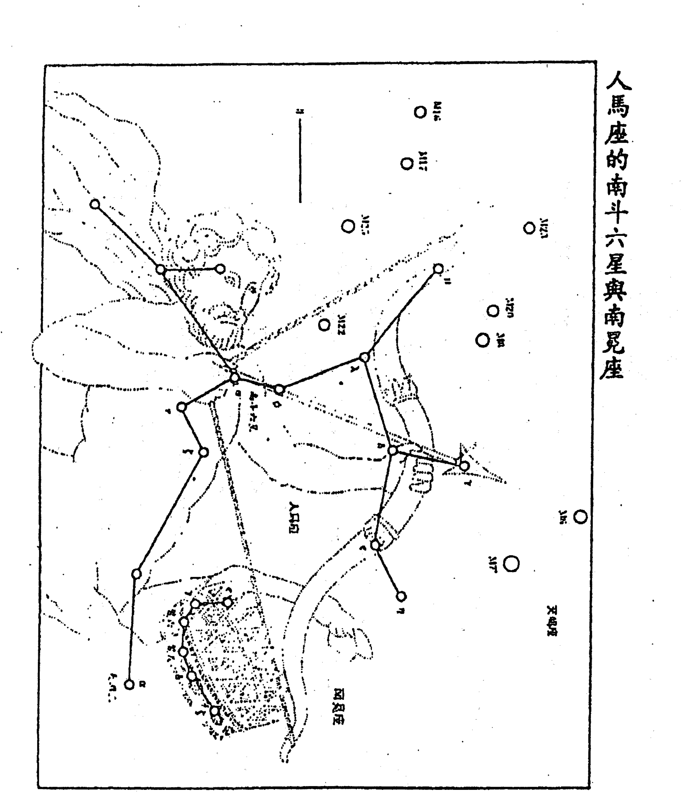
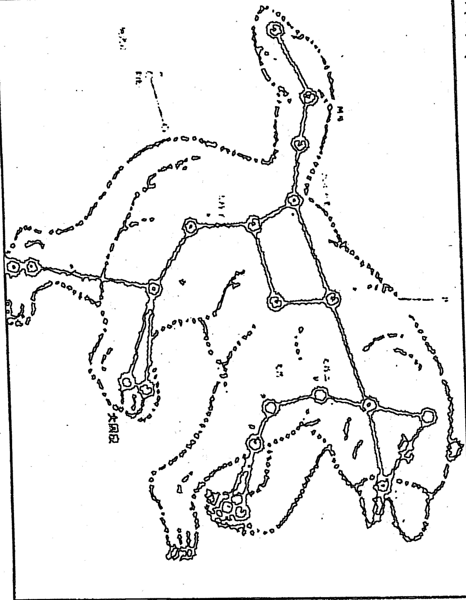

# SUNNY BOOKS

# 紫微隨筆

(亨集)

# 斗数拆招

星盤分富貴窮通
運限判吉凶休咎

鍾義明/著

# 紫微隨筆《亭集》

著 者 鍾義明
發 行 人 林輝慶
出 版 者 武陵出版有限公司
社 址 臺北市新生南路三段 19 巷 19 號
電 話 3638329 · 3630730
傳真號碼 3621283
郵撥帳號 0105063 - 5
法律顧問 王味爽律師
地 址 臺北市羅斯福路二段 1 號 11 樓
印 刷 者 西園彩色印刷有限公司
裝 訂 者 忠信裝訂廠
登 記 證 局版臺業字第 1128 號
初 版 1994 年 10 月

# 目錄

## 卷一／星情新解篇

- 〈星垣論〉新解／10
- 〈形性賦〉新解／19
- 〈星垣問答論〉新解／32
  1. 紫微篇／32
  2. 天機篇／38
  3. 太陽篇／41
  4. 武曲篇／46
  5. 天同篇／50
  6. 廉貞篇／51
  7. 天府篇／55
  8. 太陰篇／57
  9. 貪狼篇／64
  10. 巨門篇／70
  11. 天相篇／74
  12. 天梁篇／76
  13. 七殺篇／79
  14. 破軍篇／82
  15. 文昌·文曲篇／89
  16. 左輔·右弼篇／93
  17. 天魁·天鉞篇／98
  18. 祿存篇／99
  19. 天馬篇／104
  20. 四化篇／106
  21. 擎羊·陀羅篇／108
  22. 火星·鈴星篇／112
  23. 天空·地劫篇／115
  24. 天傷·天使篇／117
  25. 天刑篇／118
  26. 天姚篇／119
  27. 天哭·天虛篇／121

## 卷二／賦文新解篇

- 《斗數指南》新解／124
- 《斗數準繩論》新解／129
- 《斗數發微率》新解／136
- 《發微論》新解／154
- 《太微賦總括》新解／164
- 太微賦註解／188
- 《增補太微賦》新解／219
- 《斗數骨髓賦註解》新解／233
- 《女命骨髓賦註解》新解／313

## 卷三／格局與訣語篇

- 補遺《骨髓賦》註解／326
- 定富貴貧賤十等論／330
- 十二宮諸星得地合格訣／332
- 十二宮諸星失陷破格訣／333
- 十二宮諸星得地富貴論／334
- 十二宮諸星失陷貧賤論／335

### 定富局／337

1. 財蔭夾印
2. 日月夾財
3. 財祿夾馬
4. 陰印拱身
5. 日月照壁
6. 金燦光輝

### 定貴局／341

1. 日月夾命
2. 日出扶桑
3. 月落亥宮
4. 月生滄海
5. 輔弼拱主
6. 君臣慶會
7. 財印夾祿
8. 祿馬佩印
9. 坐貴向貴
10. 馬頭帶劍
11. 七殺朝斗
12. 日月並明
13. 明珠出海
14. 日月同臨
15. 刑囚夾印
16. 科祿權拱
17. 貪火相逢
18. 武曲守垣
19. 府相朝垣
20. 紫府朝垣
21. 文星暗拱
22. 祿權生逢
23. 擎羊入廟
24. 巨機居卯
25. 明祿暗祿
26. 科明祿暗
27. 金輿扶駕

### 定貧賤局／354

1. 生不逢時
2. 祿逢兩殺
3. 馬落空亡
4. 日月藏輝
5. 財與囚仇
6. 一生孤貧
7. 君子在野

### 定雜局／350

1. 風雲際會
2. 錦上添花
3. 祿衰馬困
4. 衣錦還鄉
5. 步數無依
6. 水上架屋
7. 吉凶相伴

- 古訣格局彙註／363
  紫微 天府 天相 天梁 天同
  天機 太陽 太陰 太陽太陰拱照
  文昌 文曲 文昌文曲 武曲
  貪狼 廉貞 巨門 七殺 破軍
  擎羊 陀羅 火星 鈴星 魁鉞
  輔弼 祿存 天馬 科權祿 劫空

## 卷四／諸星入命限十二宮斷訣篇

- 傷使 命宮 身宮 納音 財帛
- 財宅 財福

引言／396

一 命宮與二限／398

1. 紫微星
2. 天機星
3. 太陽星
4. 武曲星
5. 天同星
6. 廉貞星
7. 天府星
8. 太陰星
9. 貪狼星
10. 巨門星
11. 天相篇
12. 天梁篇
13. 七殺篇
14. 破軍篇
15. 文昌星
16. 文曲星
17. 左輔星
18. 右弼星
19. 祿存星
20. 魁鉞星
21. 擎羊星
22. 陀羅星
23. 火星
24. 鈴星
25. 地劫星
26. 天空星
27. 傷·使
28. 天馬星
29. 四化星·化祿星·化權星·化科星·化忌星
30. 太歲星

二 兄弟宮／447

三 夫妻宮／449
四 子女宮／452
五 財帛宮／455
六 疾厄宮／458
七 遷移宮／460
八 奴僕宮／463
九 官祿宮／465
十 田宅宮／469
十一 福德宮／471
十二 父母宮／474
弁言／477

# 卷一 星情新解篇

亨者，嘉之會也。
亨、享同字，百嘉會聚而通也；夏火；禮也。
遂萬物為亨，嘉會足以合禮。

# 《星垣論》新解

紫微帝座以輔弼為佐貳，作數中之主星，乃有用之源流。是以南、北二斗集而成數，為萬物之盈。蓋以水火淘溶，則陰陽既濟；水盛陽傷；火盛陰滅；二者不可偏廢。故知其中者，斯為美矣！

新解·南、北斗即子、午。先天八卦：乾陽居午（後天離卦火），坤陰居子（後天坎卦水），乾性剛，坤性柔，變出後天，則離外剛內柔，坎外柔內剛。

陳岳錡（鐵板道人）著《正統飛星紫微斗數》云：「人有性之剛、柔及愚、賢，而南、北二斗之星亦有所屬，不論其善、惡，先談其剛、柔。大體南斗性柔，北斗性剛，柔雖靈敏，嫌欠魄力，剛雖勇為，略欠思慮。但，北斗紫微之陰土，反主靈敏，而主意不堅，外剛內柔，而南斗之天府，則外柔內剛。至於論人之性格強弱，以命垣之正星為主，如為柔星，則喜三方合曜及身宮有剛，如得剛星，則寄三合得柔，若柔而合柔星，則優柔寡斷，剛而無柔和，失之偏激凶暴。」

坎納戊，為紫微，統北斗。離納己，為天府，統南斗。北斗位處坎宮，名同月曜，降神於人，名之曰魄，主司陰府，宰御水源，將潤生聚，功莫大焉。南斗位居離宮，名同日曜，降神於人，名之曰魂，主司陽宮。率御火帝，將資功用，德莫大焉。溯自混沌初分，以迄於今，二司兩極，陶鑄萬類，生成萬物，注擬天人之爵秩，增減士庶之祿俸，延齡促長，去災留福，莫不由其定奪。其所以然者，乃知陽日陰月、南北二司、魁斗杓罡，受性水火，稟質陰陽，實天地而化育萬物，體道德而垂萬古。物得而變也，非此而孰能乎？生生之道，惟賴水火，水火比於道之真體，不可須臾離也。若夫可離而猶存者，非此而孰能乎？人得而生也，非此而物非人也。總之：南北、日月、剛柔、水火，一陰陽也，陰陽調和，得其中者為美。

寅乃木之垣，乃三陽交泰之時，草木萌芽之所。至於卯位，其木愈旺矣！貪狼、天機是廟樂，故得天相水到寅為之旺相，巨門水得卯為之疏通。木乃土栽培，加以水之澆灌，三方更得文曲水、破軍水相會，尤妙；又加祿存土，極美矣！

新解：寅宮之十二辟卦為：☷☷☷☷☷☷☷☷☷☷☷☷☷☷☷☷☷☷☷☷☷☷☷☷☷☷☷☷☷☷☷☷☷☷☷☷☷☷☷☷☷☷☷☷☷☷☷☷☷☷☷☷☷☷☷☷☷☷☷☷☷☷☷☷☷☷☷☷☷☷☷☷☷☷☷☷☷☷☷☷☷☷☷☷☷☷☷☷☷☷☷☷☷☷☷☷☷☷☷☷☷☷☷☷☷☷☷☷☷☷☷☷☷☷☷☷☷☷☷☷☷☷☷☷☷☷☷☷☷☷☷☷☷☷☷☷☷☷☷☷☷☷☷☷☷☷☷☷☷☷☷☷☷☷☷☷☷☷☷☷☷☷☷☷☷☷☷☷☷☷☷☷☷☷☷☷☷☷☷☷☷☷☷☷☷☷☷☷☷☷☷☷☷☷☷☷☷☷☷☷☷☷☷☷☷☷☷☷☷☷☷☷☷☷☷☷☷☷☷☷☷☷☷☷☷☷☷☷☷☷☷☷☷☷☷☷☷☷☷☷☷☷☷☷☷☷☷☷☷☷☷☷☷☷☷☷☷☷☷☷☷☷☷☷☷☷☷☷☷☷☷☷☷☷☷☷☷☷☷☷☷☷☷☷☷☷☷☷☷☷☷☷☷☷☷☷☷☷☷☷☷☷☷☷☷☷☷☷☷☷☷☷☷☷☷☷☷☷☷☷☷☷☷☷☷☷☷☷☷☷☷☷☷☷☷☷☷☷☷☷☷☷☷☷☷☷☷☷☷☷☷☷☷☷☷☷☷☷☷☷☷☷☷☷☷☷☷☷☷☷☷☷☷☷☷☷☷☷☷☷☷☷☷☷☷☷☷☷☷☷☷☷☷☷☷☷☷☷☷☷☷☷☷☷☷☷☷☷☷☷☷☷☷☷☷☷☷☷☷☷☷☷☷☷☷☷☷☷☷☷☷☷☷☷☷☷☷☷☷☷☷☷☷☷☷☷☷☷☷☷☷☷☷☷☷☷☷☷☷☷☷☷☷☷☷☷☷☷☷☷☷☷☷☷☷☷☷☷☷☷☷☷☷☷☷☷☷☷☷☷☷☷☷☷☷☷☷☷☷☷☷☷☷☷☷☷☷☷☷☷☷☷☷☷☷☷☷☷☷☷☷☷☷☷☷☷☷☷☷☷☷☷☷☷☷☷☷☷☷☷☷☷☷☷☷☷☷☷☷☷☷☷☷☷☷☷☷☷☷☷☷☷☷☷☷☷☷☷☷☷☷☷☷☷☷☷☷☷☷☷☷☷☷☷☷☷☷☷☷☷☷☷☷☷☷☷☷☷☷☷☷☷☷☷☷☷☷☷☷☷☷☷☷☷☷☷☷☷☷☷☷☷☷☷☷☷☷☷☷☷☷☷☷☷☷☷☷☷☷☷☷☷☷☷☷☷☷☷☷☷☷☷☷☷☷☷☷☷☷☷☷☷☷☷☷☷☷☷☷☷☷☷☷☷☷☷☷☷☷☷☷☷☷☷☷☷☷☷☷☷☷☷☷☷☷☷☷☷☷☷☷☷☷☷☷☷☷☷☷☷☷☷☷☷☷☷☷☷☷☷☷☷☷☷☷☷☷☷☷☷☷☷☷☷☷☷☷☷☷☷☷☷☷☷☷☷☷☷☷☷☷☷☷☷☷☷☷☷☷☷☷☷☷☷☷☷☷☷☷☷☷☷☷☷☷☷☷☷☷☷☷☷☷☷☷☷☷☷☷☷☷☷☷☷☷☷☷☷☷☷☷☷☷☷☷☷☷☷☷☷☷☷☷☷☷☷☷☷☷☷☷☷☷☷☷☷☷☷☷☷☷☷☷☷☷☷☷☷☷☷☷☷☷☷☷☷☷☷☷☷☷☷☷☷☷☷☷☷☷☷☷☷☷☷☷☷☷☷☷☷☷☷☷☷☷☷☷☷☷☷☷☷☷☷☷☷☷☷☷☷☷☷☷☷☷☷☷☷☷☷☷☷☷☷☷☷☷☷☷☷☷☷☷☷☷☷☷☷☷☷☷☷☷☷☷☷☷☷☷☷☷☷☷☷☷☷☷☷☷☷☷☷☷☷☷☷☷☷☷☷☷☷☷☷☷☷☷☷☷☷☷☷☷☷☷☷☷☷☷☷☷☷☷☷☷☷☷☷☷☷☷☷☷☷☷☷☷☷☷☷☷☷☷☷☷☷☷☷☷☷☷☷☷☷☷☷☷☷☷☷☷☷☷☷☷☷☷☷☷☷☷☷☷☷☷☷☷☷☷☷☷☷☷☷☷☷☷☷☷☷☷☷☷☷☷☷☷☷☷☷☷☷☷☷☷☷☷☷☷☷☷☷☷☷☷☷☷☷☷☷☷☷☷☷☷☷☷☷☷☷☷☷☷☷☷☷☷☷☷☷☷☷☷☷☷☷☷☷☷☷☷☷☷☷☷☷☷☷☷☷☷☷☷☷☷☷☷☷☷☷☷☷☷☷☷☷☷☷☷☷☷☷☷☷☷☷☷☷☷☷☷☷☷☷☷☷☷☷☷☷☷☷☷☷☷☷☷☷☷☷☷☷☷☷☷☷☷☷☷☷☷☷☷☷☷☷☷☷☷☷☷☷☷☷☷☷☷☷☷☷☷☷☷☷☷☷☷☷☷☷☷☷☷☷☷☷☷☷☷☷☷☷☷☷☷☷☷☷☷☷☷☷☷☷☷☷☷☷☷☷☷☷☷☷☷☷☷☷☷☷☷☷☷☷☷☷☷☷☷☷☷☷☷☷☷☷☷☷☷☷☷☷☷☷☷☷☷☷☷☷☷☷☷☷☷☷☷☷☷☷☷☷☷☷☷☷☷☷☷☷☷☷☷☷☷☷☷☷☷☷☷☷☷☷☷☷☷☷☷☷☷☷☷☷☷☷☷☷☷☷☷☷☷☷☷☷☷☷☷☷☷☷☷☷☷☷☷☷☷☷☷☷☷☷☷☷☷☷☷☷☷☷☷☷☷☷☷☷☷☷☷☷☷☷☷☷☷☷☷☷☷☷☷☷☷☷☷☷☷☷☷☷☷☷☷☷☷☷☷☷☷☷☷☷☷☷☷☷☷☷☷☷☷☷☷☷☷☷☷☷☷☷☷☷☷☷☷☷☷☷☷☷☷☷☷☷☷☷☷☷☷☷☷☷☷☷☷☷☷☷☷☷☷☷☷☷☷☷☷☷☷☷☷☷☷☷☷☷☷☷☷☷☷☷☷☷☷☷☷☷☷☷☷☷☷☷☷☷☷☷☷☷☷☷☷☷☷☷☷☷☷☷☷☷☷☷☷☷☷☷☷☷☷☷☷☷☷☷☷☷☷☷☷☷☷☷☷☷☷☷☷☷☷☷☷☷☷☷☷☷☷☷☷☷☷☷☷☷☷☷☷☷☷☷☷☷☷☷☷☷☷☷☷☷☷☷☷☷☷☷☷☷☷☷☷☷☷☷☷☷☷☷☷☷☷☷☷☷☷☷☷☷☷☷☷☷☷☷☷☷☷☷☷☷☷☷☷☷☷☷☷☷☷☷☷☷☷☷☷☷☷☷☷☷☷☷☷☷☷☷☷☷☷☷☷☷☷☷☷☷☷☷☷☷☷☷☷☷☷☷☷☷☷☷☷☷☷☷☷☷☷☷☷☷☷☷☷☷☷☷☷☷☷☷☷☷☷☷☷☷☷☷☷☷☷☷☷☷☷☷☷☷☷☷☷☷☷☷☷☷☷☷☷☷☷☷☷☷☷☷☷☷☷☷☷☷☷☷☷☷☷☷☷☷☷☷☷☷☷☷☷☷☷☷☷☷☷☷☷☷☷☷☷☷☷☷☷☷☷☷☷☷☷☷☷☷☷☷☷☷☷☷☷☷☷☷☷☷☷☷☷☷☷☷☷☷☷☷☷☷☷☷☷☷☷☷☷☷☷☷☷☷☷☷☷☷☷☷☷☷☷☷☷☷☷☷☷☷☷☷☷☷☷☷☷☷☷☷☷☷☷☷☷☷☷☷☷☷☷☷☷☷☷☷☷☷☷☷☷☷☷☷☷☷☷☷☷☷☷☷☷☷☷☷☷☷☷☷☷☷☷☷☷☷☷☷☷☷☷☷☷☷☷☷☷☷☷☷☷☷☷☷☷☷☷☷☷☷☷☷☷☷☷☷☷☷☷☷☷☷☷☷☷☷☷☷☷☷☷☷☷☷☷☷☷☷☷☷☷☷☷☷☷☷☷☷☷☷☷☷☷☷☷☷☷☷☷☷☷☷☷☷☷☷☷☷☷☷☷☷☷☷☷☷☷☷☷☷☷☷☷☷☷☷☷☷☷☷☷☷☷☷☷☷☷☷☷☷☷☷☷☷☷☷☷☷☷☷☷☷☷☷☷☷☷☷☷☷☷☷☷☷☷☷☷☷☷☷☷☷☷☷☷☷☷☷☷☷☷☷☷☷☷☷☷☷☷☷☷☷☷☷☷☷☷☷☷☷☷☷☷☷☷☷☷☷☷☷☷☷☷☷☷☷☷☷☷☷☷☷☷☷☷☷☷☷☷☷☷☷☷☷☷☷☷☷☷☷☷☷☷☷☷☷☷☷☷☷☷☷☷☷☷☷☷☷☷☷☷☷☷☷☷☷☷☷☷☷☷☷☷☷☷☷☷☷☷☷☷☷☷☷☷☷☷☷☷☷☷☷☷☷☷☷☷☷☷☷☷☷☷☷☷☷☷☷☷☷☷☷☷☷☷☷☷☷☷☷☷☷☷☷☷☷☷☷☷☷☷☷☷☷☷☷☷☷☷☷☷☷☷☷☷☷☷☷☷☷☷☷☷☷☷☷☷☷☷☷☷☷☷☷☷☷☷☷☷☷☷☷☷☷☷☷☷☷☷☷☷☷☷☷☷☷☷☷☷☷☷☷☷☷☷☷☷☷☷☷☷☷☷☷☷☷☷☷☷☷☷☷☷☷☷☷☷☷☷☷☷☷☷☷☷☷☷☷☷☷☷☷☷☷☷☷☷☷☷☷☷☷☷☷☷☷☷☷☷☷☷☷☷☷☷☷☷☷☷☷☷☷☷☷☷☷☷☷☷☷☷☷☷☷☷☷☷☷☷☷☷☷☷☷☷☷☷☷☷☷☷☷☷☷☷☷☷☷☷☷☷☷☷☷☷☷☷☷☷☷☷☷☷☷☷☷☷☷☷☷☷☷☷☷☷☷☷☷☷☷☷☷☷☷☷☷☷☷☷☷☷☷☷☷☷☷☷☷☷☷☷☷☷☷☷☷☷☷☷☷☷☷☷☷☷☷☷☷☷☷☷☷☷☷☷☷☷☷☷☷☷☷☷☷☷☷☷☷☷☷☷☷☷☷☷☷☷☷☷☷☷☷☷☷☷☷☷☷☷☷☷☷☷☷☷☷☷☷☷☷☷☷☷☷☷☷☷☷☷☷☷☷☷☷☷☷☷☷☷☷☷☷☷☷☷☷☷☷☷☷☷☷☷☷☷☷☷☷☷☷☷☷☷☷☷☷☷☷☷☷☷☷☷☷☷☷☷☷☷☷☷☷☷☷☷☷☷☷☷☷☷☷☷☷☷☷☷☷☷☷☷☷☷☷☷☷☷☷☷☷☷☷☷☷☷☷☷☷☷☷☷☷☷☷☷☷☷☷☷☷☷☷☷☷☷☷☷☷☷☷☷☷☷☷☷☷☷☷☷☷☷☷☷☷☷☷☷☷☷☷☷☷☷☷☷☷☷☷☷☷☷☷☷☷☷☷☷☷☷☷☷☷☷☷☷☷☷☷☷☷☷☷☷☷☷☷☷☷☷☷☷☷☷☷☷☷☷☷☷☷☷☷☷☷☷☷☷☷☷☷☷☷☷☷☷☷☷☷☷☷☷☷☷☷☷☷☷☷☷☷☷☷☷☷☷☷☷☷☷☷☷☷☷☷☷☷☷☷☷☷☷☷☷☷☷☷☷☷☷☷☷☷☷☷☷☷☷☷☷☷☷☷☷☷☷☷☷☷☷☷☷☷☷☷☷☷☷☷☷☷☷☷☷☷☷☷☷☷☷☷☷☷☷☷☷☷☷☷☷☷☷☷☷☷☷☷☷☷☷☷☷☷☷☷☷☷☷☷☷☷☷☷☷☷☷☷☷☷☷☷☷☷☷☷☷☷☷☷☷☷☷☷☷☷☷☷☷☷☷☷☷☷☷☷☷☷☷☷☷☷☷☷☷☷☷☷☷☷☷☷☷☷☷☷☷☷☷☷☷☷☷☷☷☷☷☷☷☷☷☷☷☷☷☷☷☷☷☷☷☷☷☷☷☷☷☷☷☷☷☷☷☷☷☷☷☷☷☷☷☷☷☷☷☷☷☷☷☷☷☷☷☷☷☷☷☷☷☷☷☷☷☷☷☷☷☷☷☷☷☷☷☷☷☷☷☷☷☷☷☷☷☷☷☷☷☷☷☷☷☷☷☷☷☷☷☷☷☷☷☷☷☷☷☷☷☷☷☷☷☷☷☷☷☷☷☷☷☷☷☷☷☷☷☷☷☷☷☷☷☷☷☷☷☷☷☷☷☷☷☷☷☷☷☷☷☷☷☷☷☷☷☷☷☷☷☷☷☷☷☷☷☷☷☷☷☷☷☷☷☷☷☷☷☷☷☷☷☷☷☷☷☷☷☷☷☷☷☷☷☷☷☷☷☷☷☷☷☷☷☷☷☷☷☷☷☷☷☷☷☷☷☷☷☷☷☷☷☷☷☷☷☷☷☷☷☷☷☷☷☷☷☷☷☷☷☷☷☷☷☷☷☷☷☷☷☷☷☷☷☷☷☷☷☷☷☷☷☷☷☷☷☷☷☷☷☷☷☷☷☷☷☷☷☷☷☷☷☷☷☷☷☷☷☷☷☷☷☷☷☷☷☷☷☷☷☷☷☷☷☷☷☷☷☷☷☷☷☷☷☷☷☷☷☷☷☷☷☷☷☷☷☷☷☷☷☷☷☷☷☷☷☷☷☷☷☷☷☷☷☷☷☷☷☷☷☷☷☷☷☷☷☷☷☷☷☷☷☷☷☷☷☷☷☷☷☷☷☷☷☷☷☷☷☷☷☷☷☷☷☷☷☷☷☷☷☷☷☷☷☷☷☷☷☷☷☷☷☷☷☷☷☷☷☷☷☷☷☷☷☷☷☷☷☷☷☷☷☷☷☷☷☷☷☷☷☷☷☷☷☷☷☷☷☷☷☷☷☷☷☷☷☷☷☷☷☷☷☷☷☷☷☷☷☷☷☷☷☷☷☷☷☷☷☷☷☷☷☷☷☷☷☷☷☷☷☷☷☷☷☷☷☷☷☷☷☷☷☷☷☷☷☷☷☷☷☷☷☷☷☷☷☷☷☷☷☷☷☷☷☷☷☷☷☷☷☷☷☷☷☷☷☷☷☷☷☷☷☷☷☷☷☷☷☷☷☷☷☷☷☷☷☷☷☷☷☷☷☷☷☷☷☷☷☷☷☷☷☷☷☷☷☷☷☷☷☷☷☷☷☷☷☷☷☷☷☷☷☷☷☷☷☷☷☷☷☷☷☷☷☷☷☷☷☷☷☷☷☷☷☷☷☷☷☷☷☷☷☷☷☷☷☷☷☷☷☷☷☷☷☷☷☷☷☷☷☷☷☷☷☷☷☷☷☷☷☷☷☷☷☷☷☷☷☷☷☷☷☷☷☷☷☷☷☷☷☷☷☷☷☷☷☷☷☷☷☷☷☷☷☷☷☷☷☷☷☷☷☷☷☷☷☷☷☷☷☷☷☷☷☷☷☷☷☷☷☷☷☷☷☷☷☷☷☷☷☷☷☷☷☷☷☷☷☷☷☷☷☷☷☷☷☷☷☷☷☷☷☷☷☷☷☷☷☷☷☷☷☷☷☷☷☷☷☷☷☷☷☷☷☷☷☷☷☷☷☷☷☷☷☷☷☷☷☷☷☷☷☷☷☷☷☷☷☷☷☷☷☷☷☷☷☷☷☷☷☷☷☷☷☷☷☷☷☷☷☷☷☷☷☷☷☷☷☷☷☷☷☷☷☷☷☷☷☷☷☷☷☷☷☷☷☷☷☷☷☷☷☷☷☷☷☷☷☷☷☷☷☷☷☷☷☷☷☷☷☷☷☷☷☷☷☷☷☷☷☷☷☷☷☷☷☷☷☷☷☷☷☷☷☷☷☷☷☷☷☷☷☷☷☷☷☷☷☷☷☷☷☷☷☷☷☷☷☷☷☷☷☷☷☷☷☷☷☷☷☷☷☷☷☷☷☷☷☷☷☷☷☷☷☷☷☷☷☷☷☷☷☷☷☷☷☷☷☷☷☷☷☷☷☷☷☷☷☷☷☷☷☷☷☷☷☷☷☷☷☷☷☷☷☷☷☷☷☷☷☷☷☷☷☷☷☷☷☷☷☷☷☷☷☷☷☷☷☷☷☷☷☷☷☷☷☷☷☷☷☷☷☷☷☷☷☷☷☷☷☷☷☷☷☷☷☷☷☷☷☷☷☷☷☷☷☷☷☷☷☷☷☷☷☷☷☷☷☷☷☷☷☷☷☷☷☷☷☷☷☷☷☷☷☷☷☷☷☷☷☷☷☷☷☷☷☷☷☷☷☷☷☷☷☷☷☷☷☷☷☷☷☷☷☷☷☷☷☷☷☷☷☷☷☷☷☷☷☷☷☷☷☷☷☷☷☷☷☷☷☷☷☷☷☷☷☷☷☷☷☷☷☷☷☷☷☷☷☷☷☷☷☷☷☷☷☷☷☷☷☷☷☷☷☷☷☷☷☷☷☷☷☷☷☷☷☷☷☷☷☷☷☷☷☷☷☷☷☷☷☷☷☷☷☷☷☷☷☷☷☷☷☷☷☷☷☷☷☷☷☷☷☷☷☷☷☷☷☷☷☷☷☷☷☷☷☷☷☷☷☷☷☷☷☷☷☷☷☷☷☷☷☷☷☷☷☷☷☷☷☷☷☷☷☷☷☷☷☷☷☷☷☷☷☷☷☷☷☷☷☷☷☷☷☷☷☷☷☷☷☷☷☷☷☷☷☷☷☷☷☷☷☷☷☷☷☷☷☷☷☷☷☷☷☷☷☷☷☷☷☷☷☷☷☷☷☷☷☷☷☷☷☷☷☷☷☷☷☷☷☷☷☷☷☷☷☷☷☷☷☷☷☷☷☷☷☷☷☷☷☷☷☷☷☷☷☷☷☷☷☷☷☷☷☷☷☷☷☷☷☷☷☷☷☷☷☷☷☷☷☷☷☷☷☷☷☷☷☷☷☷☷☷☷☷☷☷☷☷☷☷☷☷☷☷☷☷☷☷☷☷☷☷☷☷☷☷☷☷☷☷☷☷☷☷☷☷☷☷☷☷☷☷☷☷☷☷☷☷☷☷☷☷☷☷☷☷☷☷☷☷☷☷☷☷☷☷☷☷☷☷☷☷☷☷☷☷☷☷☷☷☷☷☷☷☷☷☷☷☷☷☷☷☷☷☷☷☷☷☷☷☷☷☷☷☷☷☷☷☷☷☷☷☷☷☷☷☷☷☷☷☷☷☷☷☷☷☷☷☷☷☷☷☷☷☷☷☷☷☷☷☷☷☷☷☷☷☷☷☷☷☷☷☷☷☷☷☷☷☷☷☷☷☷☷☷☷☷☷☷☷☷☷☷☷☷☷☷☷☷☷☷☷☷☷☷☷☷☷☷☷☷☷☷☷☷☷☷☷☷☷☷☷☷☷☷☷☷☷☷☷☷☷☷☷☷☷☷☷☷☷☷☷☷☷☷☷☷☷☷☷☷☷☷☷☷☷☷☷☷☷☷☷☷☷☷☷☷☷☷☷☷☷☷☷☷☷☷☷☷☷☷☷☷☷☷☷☷☷☷☷☷☷☷☷☷☷☷☷☷☷☷☷☷☷☷☷☷☷☷☷☷☷☷☷☷☷☷☷☷☷☷☷☷☷☷☷☷☷☷☷☷☷☷☷☷☷☷☷☷☷☷☷☷☷☷☷☷☷☷☷☷☷☷☷☷☷☷☷☷☷☷☷☷☷☷☷☷☷☷☷☷☷☷☷☷☷☷☷☷☷☷☷☷☷☷☷☷☷☷☷☷☷☷☷☷☷☷☷☷☷☷☷☷☷☷☷☷☷☷☷☷☷☷☷☷☷☷☷☷☷☷☷☷☷☷☷☷☷☷☷☷☷☷☷☷☷☷☷☷☷☷☷☷☷☷☷☷☷☷☷☷☷☷☷☷☷☷☷☷☷☷☷☷☷☷☷☷☷☷☷☷☷☷☷☷☷☷☷☷☷☷☷☷☷☷☷☷☷☷☷☷☷☷☷☷☷☷☷☷☷☷☷☷☷☷☷☷☷☷☷☷☷☷☷☷☷☷☷☷☷☷☷☷☷☷☷☷☷☷☷☷☷☷☷☷☷☷☷☷☷☷☷☷☷☷☷☷☷☷☷☷☷☷☷☷☷☷☷☷☷☷☷☷☷☷☷☷☷☷☷☷☷☷☷☷☷☷☷☷☷☷☷☷☷☷☷☷☷☷☷☷☷☷☷☷☷☷☷☷☷☷☷☷☷☷☷☷☷☷☷☷☷☷☷☷☷☷☷☷☷☷☷☷☷☷☷☷☷☷☷☷☷☷☷☷☷☷☷☷☷☷☷☷☷☷☷☷☷☷☷☷☷☷☷☷☷☷☷☷☷☷☷☷☷☷☷☷☷☷☷☷☷☷☷☷☷☷☷☷☷☷☷☷☷☷☷☷☷☷☷☷☷☷☷☷☷☷☷☷☷☷☷☷☷☷☷☷☷☷☷☷☷☷☷☷☷☷☷☷☷☷☷☷☷☷☷☷☷☷☷☷☷☷☷☷☷☷☷☷☷☷☷☷☷☷☷☷☷☷☷☷☷☷☷☷☷☷☷☷☷☷☷☷☷☷☷☷☷☷☷☷☷☷☷☷☷☷☷☷☷☷☷☷☷☷☷☷☷☷☷☷☷☷☷☷☷☷☷☷☷☷☷☷☷☷☷☷☷☷☷☷☷☷☷☷☷☷☷☷☷☷☷☷☷☷☷☷☷☷☷☷☷☷☷☷☷☷☷☷☷☷☷☷☷☷☷☷☷☷☷☷☷☷☷☷☷☷☷☷☷☷☷☷☷☷☷☷☷☷☷☷☷☷☷☷☷☷☷☷☷☷☷☷☷☷☷☷☷☷☷☷☷☷☷☷☷☷☷☷☷☷☷☷☷☷☷☷☷☷☷☷☷☷☷☷☷☷☷☷☷☷☷☷☷☷☷☷☷☷☷☷☷☷☷☷☷☷☷☷☷☷☷☷☷☷☷☷☷☷☷☷☷☷☷☷☷☷☷☷☷☷☷☷☷☷☷☷☷☷☷☷☷☷☷☷☷☷☷☷☷☷☷☷☷☷☷☷☷☷☷☷☷☷☷☷☷☷☷☷☷☷☷☷☷☷☷☷☷☷☷☷☷☷☷☷☷☷☷☷☷☷☷☷☷☷☷☷☷☷☷☷☷☷☷☷☷☷☷☷☷☷☷☷☷☷☷☷☷☷☷☷☷☷☷☷☷☷☷☷☷☷☷☷☷☷☷☷☷☷☷☷☷☷☷☷☷☷☷☷☷☷☷☷☷☷☷☷☷☷☷☷☷☷☷☷☷☷☷☷☷☷☷☷☷☷☷☷☷☷☷☷☷☷☷☷☷☷☷☷☷☷☷☷☷☷☷☷☷☷☷☷☷☷☷☷☷☷☷☷☷☷☷☷☷☷☷☷☷☷☷☷☷☷☷☷☷☷☷☷☷☷☷☷☷☷☷☷☷☷☷☷☷☷☷☷☷☷☷☷☷☷☷☷☷☷☷☷☷☷☷☷☷☷☷☷☷☷☷☷☷☷☷☷☷☷☷☷☷☷☷☷☷☷☷☷☷☷☷☷☷☷☷☷☷☷☷☷☷☷☷☷☷☷☷☷☷☷☷☷☷☷☷☷☷☷☷☷☷☷☷☷☷☷☷☷☷☷☷☷☷☷☷☷☷☷☷☷☷☷☷☷☷☷☷☷☷☷☷☷☷☷☷☷☷☷☷☷☷☷☷☷☷☷☷☷☷☷☷☷☷☷☷☷☷☷☷☷☷☷☷☷☷☷☷☷☷☷☷☷☷☷☷☷☷☷☷☷☷☷☷☷☷☷☷☷☷☷☷☷☷☷☷☷☷☷☷☷☷☷☷☷☷☷☷☷☷☷☷☷☷☷☷☷☷☷☷☷☷☷☷☷☷☷☷☷☷☷☷☷☷☷☷☷☷☷☷☷☷☷☷☷☷☷☷☷☷☷☷☷☷☷☷☷☷☷☷☷☷☷☷☷☷☷☷☷☷☷☷☷☷☷☷☷☷☷☷☷☷☷☷☷☷☷☷☷☷☷☷☷☷☷☷☷☷☷☷☷☷☷☷☷☷☷☷☷☷☷☷☷☷☷☷☷☷☷☷☷☷☷☷☷☷☷☷☷☷☷☷☷☷☷☷☷☷☷☷☷☷☷☷☷☷☷☷☷☷☷☷☷☷☷☷☷☷☷☷☷☷☷☷☷☷☷☷☷☷☷☷☷☷☷☷☷☷☷☷☷☷☷☷☷☷☷☷☷☷☷☷☷☷☷☷☷☷☷☷☷☷☷☷☷☷☷☷☷☷☷☷☷☷☷☷☷☷☷☷☷☷☷☷☷☷☷☷☷☷☷☷☷☷☷☷☷☷☷☷☷☷☷☷☷☷☷☷☷☷☷☷☷☷☷☷☷☷☷☷☷☷☷☷☷☷☷☷☷☷☷☷☷☷☷☷☷☷☷☷☷☷☷☷☷☷☷☷☷☷☷☷☷☷☷☷☷☷☷☷☷☷☷☷☷☷☷☷☷☷☷☷☷☷☷☷☷☷☷☷☷☷☷☷☷☷☷☷☷☷☷☷☷☷☷☷☷☷☷☷☷☷☷☷☷☷☷☷☷☷☷☷☷☷☷☷☷☷☷☷☷☷☷☷☷☷☷☷☷☷☷☷☷☷☷☷☷☷☷☷☷☷☷☷☷☷☷☷☷☷☷☷☷☷☷☷☷☷☷☷☷☷☷☷☷☷☷☷☷☷☷☷☷☷☷☷☷☷☷☷☷☷☷☷☷☷☷☷☷☷☷☷☷☷☷☷☷☷☷☷☷☷☷☷☷☷☷☷☷☷☷☷☷☷☷☷☷☷☷☷☷☷☷☷☷☷☷☷☷☷☷☷☷☷☷☷☷☷☷☷☷☷☷☷☷☷☷☷☷☷☷☷☷☷☷☷☷☷☷☷☷☷☷☷☷☷☷☷☷☷☷☷☷☷☷☷☷☷☷☷☷☷☷☷☷☷☷☷☷☷☷☷☷☷☷☷☷☷☷☷☷☷☷☷☷☷☷☷☷☷☷☷☷☷☷☷☷☷☷☷☷☷☷☷☷☷☷☷☷☷☷☷☷☷☷☷☷☷☷☷☷☷☷☷☷☷☷☷☷☷☷☷☷☷☷☷☷☷☷☷☷☷☷☷☷☷☷☷☷☷☷☷☷☷☷☷☷☷☷☷☷☷☷☷☷☷☷☷☷☷☷☷☷☷☷☷☷☷☷☷☷☷☷☷☷☷☷☷☷☷☷☷☷☷☷☷☷☷☷☷☷☷☷☷☷☷☷☷☷☷☷☷☷☷☷☷☷☷☷☷☷☷☷☷☷☷☷☷☷☷☷☷☷☷☷☷☷☷☷☷☷☷☷☷☷☷☷☷☷☷☷☷☷☷☷☷☷☷☷☷☷☷☷☷☷☷☷☷☷☷☷☷☷☷☷☷☷☷☷☷☷☷☷☷☷☷☷☷☷☷☷☷☷☷☷☷☷☷☷☷☷☷☷☷☷☷☷☷☷☷☷☷☷☷☷☷☷☷☷☷☷☷☷☷☷☷☷☷☷☷☷☷☷☷☷☷☷☷☷☷☷☷☷☷☷☷☷☷☷☷☷☷☷☷☷☷☷☷☷☷☷☷☷☷☷☷☷☷☷☷☷☷☷☷☷☷☷☷☷☷☷☷☷☷☷☷☷☷☷☷☷☷☷☷☷☷☷☷☷☷☷☷☷☷☷☷☷☷☷☷☷☷☷☷☷☷☷☷☷☷☷☷☷☷☷☷☷☷☷☷☷☷☷☷☷☷☷☷☷☷☷☷☷☷☷☷☷☷☷☷☷☷☷☷☷☷☷☷☷☷☷☷☷☷☷☷☷☷☷☷☷☷☷☷☷☷☷☷☷☷☷☷☷☷☷☷☷☷☷☷☷☷☷☷☷☷☷☷☷☷☷☷☷☷☷☷☷☷☷☷☷☷☷☷☷☷☷☷☷☷☷☷☷☷☷☷☷☷☷☷☷☷☷☷☷☷☷☷☷☷☷☷☷☷☷☷☷☷☷☷☷☷☷☷☷☷☷☷☷☷☷☷☷☷☷☷☷☷☷☷☷☷☷☷☷☷☷☷☷☷☷☷☷☷☷☷☷☷☷☷☷☷☷☷☷☷☷☷☷☷☷☷☷☷☷☷☷☷☷☷☷☷☷☷☷☷☷☷☷☷☷☷☷☷☷☷☷☷☷☷☷☷☷☷☷☷☷☷☷☷☷☷☷☷☷☷☷☷☷☷☷☷☷☷☷☷☷☷☷☷☷☷☷☷☷☷☷☷☷☷☷☷☷☷☷☷☷☷☷☷☷☷☷☷☷☷☷☷☷☷☷☷☷☷☷☷☷☷☷☷☷☷☷☷☷☷☷☷☷☷☷☷☷☷☷☷☷☷☷☷☷☷☷☷☷☷☷☷☷☷☷☷☷☷☷☷☷☷☷☷☷☷☷☷☷☷☷☷☷☷☷☷☷☷☷☷☷☷☷☷☷☷☷☷☷☷☷☷☷☷☷☷☷☷☷☷☷☷☷☷☷☷☷☷☷☷☷☷☷☷☷☷☷☷☷☷☷☷☷☷☷☷☷☷☷☷☷☷☷☷☷☷☷☷☷☷☷☷☷☷☷☷☷☷☷☷☷☷☷☷☷☷☷☷☷☷☷☷☷☷☷☷☷☷☷☷☷☷☷☷☷☷☷☷☷☷☷☷☷☷☷☷☷☷☷☷☷☷☷☷☷☷☷☷☷☷☷☷☷☷☷☷☷☷☷☷☷☷☷☷☷☷☷☷☷☷☷☷☷☷☷☷☷☷☷☷☷☷☷☷☷☷☷☷☷☷☷☷☷☷☷☷☷☷☷☷☷☷☷☷☷☷☷☷☷☷☷☷☷☷☷☷☷☷☷☷☷☷☷☷☷☷☷☷☷☷☷☷☷☷☷☷☷☷☷☷☷☷☷☷☷☷☷☷☷☷☷☷☷☷☷☷☷☷☷☷☷☷☷☷☷☷☷☷☷☷☷☷☷☷☷☷☷☷☷☷☷☷☷☷☷☷☷☷☷☷☷☷☷☷☷☷☷☷☷☷☷☷☷☷☷☷☷☷☷☷☷☷☷☷☷☷☷☷☷☷☷☷☷☷☷☷☷☷☷☷☷☷☷☷☷☷☷☷☷☷☷☷☷☷☷☷☷☷☷☷☷☷☷☷☷☷☷☷☷☷☷☷☷☷☷☷☷☷☷☷☷☷☷☷☷☷☷☷☷☷☷☷☷☷☷☷☷☷☷☷☷☷☷☷☷☷☷☷☷☷☷☷☷☷☷☷☷☷☷☷☷☷☷☷☷☷☷☷☷☷☷☷☷☷☷☷☷☷☷☷☷☷☷☷☷☷☷☷☷☷☷☷☷☷☷☷☷☷☷☷☷☷☷☷☷☷☷☷☷☷☷☷☷☷☷☷☷☷☷☷☷☷☷☷☷☷☷☷☷☷☷☷☷☷☷☷☷☷☷☷☷☷☷☷☷☷☷☷☷☷☷☷☷☷☷☷☷☷☷☷☷☷☷☷☷☷☷☷☷☷☷☷☷☷☷☷☷☷☷☷☷☷☷☷☷☷☷☷☷☷☷☷☷☷☷☷☷☷☷☷☷☷☷☷☷☷☷☷☷☷☷☷☷☷☷☷☷☷☷☷☷☷☷☷☷☷☷☷☷☷☷☷☷☷☷☷☷☷☷☷☷☷☷☷☷☷☷☷☷☷☷☷☷☷☷☷☷☷☷☷☷☷☷☷☷☷☷☷☷☷☷☷☷☷☷☷☷☷☷☷☷☷☷☷☷☷☷☷☷☷☷☷☷☷☷☷☷☷☷☷☷☷☷☷☷☷☷☷☷☷☷☷☷☷☷☷☷☷☷☷☷☷☷☷☷☷☷☷☷☷☷☷☷☷☷☷☷☷☷☷☷☷☷☷☷☷☷☷☷☷☷☷☷☷☷☷☷☷☷☷☷☷☷☷☷☷☷☷☷☷☷☷☷☷☷☷☷☷☷☷☷☷☷☷☷☷☷☷☷☷☷☷☷☷☷☷☷☷☷☷☷☷☷☷☷☷☷☷☷☷☷☷☷☷☷☷☷☷☷☷☷☷☷☷☷☷☷☷☷☷☷☷☷☷☷☷☷☷☷☷☷☷☷☷☷☷☷☷☷☷☷☷☷☷☷☷☷☷☷☷☷☷☷☷☷☷☷☷☷☷☷☷☷☷☷☷☷☷☷☷☷☷☷☷☷☷☷☷☷☷☷☷☷☷☷☷☷☷☷☷☷☷☷☷☷☷☷☷☷☷☷☷☷☷☷☷☷☷☷☷☷☷☷☷☷☷☷☷☷☷☷☷☷☷☷☷☷☷☷☷☷☷☷☷☷☷☷☷☷☷☷☷☷☷☷☷☷☷☷☷☷☷☷☷☷☷☷☷☷☷☷☷☷☷☷☷☷☷☷☷☷☷☷☷☷☷☷☷☷☷☷☷☷☷☷☷☷☷☷☷☷☷☷☷☷☷☷☷☷☷☷☷☷☷☷☷☷☷☷☷☷☷☷☷☷☷☷☷☷☷☷☷☷☷☷☷☷☷☷☷☷☷☷☷☷☷☷☷☷☷☷☷☷☷☷☷☷☷☷☷☷☷☷☷☷☷☷☷☷☷☷☷☷☷☷☷☷☷☷☷☷☷☷☷☷☷☷☷☷☷☷☷☷☷☷☷☷☷☷☷☷☷☷☷☷☷☷☷☷☷☷☷☷☷☷☷☷☷☷☷☷☷☷☷☷☷☷☷☷☷☷☷☷☷☷☷☷☷☷☷☷☷☷☷☷☷☷☷☷☷☷☷☷☷☷☷☷☷☷☷☷☷☷☷☷☷☷☷☷☷☷☷☷☷☷☷☷☷☷☷☷☷☷☷☷☷☷☷☷☷☷☷☷☷☷☷☷☷☷☷☷☷☷☷☷☷☷☷☷☷☷☷☷☷☷☷☷☷☷☷☷☷☷☷☷☷☷☷☷☷☷☷☷☷☷☷☷☷☷☷☷☷☷☷☷☷☷☷☷☷☷☷☷☷☷☷☷☷☷☷☷☷☷☷☷☷☷☷☷☷☷☷☷☷☷☷☷☷☷☷☷☷☷☷☷☷☷☷☷☷☷☷☷☷☷☷☷☷☷☷☷☷☷☷☷☷☷☷☷☷☷☷☷☷☷☷☷☷☷☷☷☷☷☷☷☷☷☷☷☷☷☷☷☷☷☷☷☷☷☷☷☷☷☷☷☷☷☷☷☷☷☷☷☷☷☷☷☷☷☷☷☷☷☷☷☷☷☷☷☷☷☷☷☷☷☷☷☷☷☷☷☷☷☷☷☷☷☷☷☷☷☷☷☷☷☷☷☷☷☷☷☷☷☷☷☷☷☷☷☷☷☷☷☷☷☷☷☷☷☷☷☷☷☷☷☷☷☷☷☷☷☷☷☷☷☷☷☷☷☷☷☷☷☷☷☷☷☷☷☷☷☷☷☷☷☷☷☷☷☷☷☷☷☷☷☷☷☷☷☷☷☷☷☷☷☷☷☷☷☷☷☷☷☷☷☷☷☷☷☷☷☷☷☷☷☷☷☷☷☷☷☷☷☷☷☷☷☷☷☷☷☷☷☷☷☷☷☷☷☷☷☷☷☷☷☷☷☷☷☷☷☷☷☷☷☷☷☷☷☷☷☷☷☷☷☷☷☷☷☷☷☷☷☷☷☷☷☷☷☷☷☷☷☷☷☷☷☷☷☷☷☷☷☷☷☷☷☷☷☷☷☷☷☷☷☷☷☷☷☷☷☷☷☷☷☷☷☷☷☷☷☷☷☷☷☷☷☷☷☷☷☷☷☷☷☷☷☷☷☷☷☷☷☷☷☷☷☷☷☷☷☷☷☷☷☷☷☷☷☷☷☷☷☷☷☷☷☷☷☷☷☷☷☷☷☷☷☷☷☷☷☷☷☷☷☷☷☷☷☷☷☷☷☷☷☷☷☷☷☷☷☷☷☷☷☷☷☷☷☷☷☷☷☷☷☷☷☷☷☷☷☷☷☷☷☷☷☷☷☷☷☷☷☷☷☷☷☷☷☷☷☷☷☷☷☷☷☷☷☷☷☷☷☷☷☷☷☷☷☷☷☷☷☷☷☷☷☷☷☷☷☷☷☷☷☷☷☷☷☷☷☷☷☷☷☷☷☷☷☷☷☷☷☷☷☷☷☷☷☷☷☷☷☷☷☷☷☷☷☷☷☷☷☷☷☷☷☷☷☷☷☷☷☷☷☷☷☷☷☷☷☷☷☷☷☷☷☷☷☷☷☷☷☷☷☷☷☷☷☷☷☷☷☷☷☷☷☷☷☷☷☷☷☷☷☷☷☷☷☷☷☷☷☷☷☷☷☷☷☷☷☷☷☷☷☷☷☷☷☷☷☷☷☷☷☷☷☷☷☷☷☷☷☷☷☷☷☷☷☷☷☷☷☷☷☷☷☷☷☷☷☷☷☷☷☷☷☷☷☷☷☷☷☷☷☷☷☷☷☷☷☷☷☷☷☷☷☷☷☷☷☷☷☷☷☷☷☷☷☷☷☷☷☷☷☷☷☷☷☷☷☷☷☷☷☷☷☷☷☷☷☷☷☷☷☷☷☷☷☷☷☷☷☷☷☷☷☷☷☷☷☷☷☷☷☷☷☷☷☷☷☷☷☷☷☷☷☷☷☷☷☷☷☷☷☷☷☷☷☷☷☷☷☷☷☷☷☷☷☷☷☷☷☷☷☷☷☷☷☷☷☷☷☷☷☷☷☷☷☷☷☷☷☷☷☷☷☷☷☷☷☷☷☷☷☷☷☷☷☷☷☷☷☷☷☷☷☷☷☷☷☷☷☷☷☷☷☷☷☷☷☷☷☷☷☷☷☷☷☷☷☷☷☷☷☷☷☷☷☷☷☷☷☷☷☷☷☷☷☷☷☷☷☷☷☷☷☷☷☷☷☷☷☷☷☷☷☷☷☷☷☷☷☷☷☷☷☷☷☷☷☷☷☷☷☷☷☷☷☷☷☷☷☷☷☷☷☷☷☷☷☷☷☷☷☷☷☷☷☷☷☷☷☷☷☷☷☷☷☷☷☷☷☷☷☷☷☷☷☷☷☷☷☷☷☷☷☷☷☷☷☷☷☷☷☷☷☷☷☷☷☷☷☷☷☷☷☷☷☷☷☷☷☷☷☷☷☷☷☷☷☷☷☷☷☷☷☷☷☷☷☷☷☷☷☷☷☷☷☷☷☷☷☷☷☷☷☷☷☷☷☷☷☷☷☷☷☷☷☷☷☷☷☷☷☷☷☷☷☷☷☷☷☷☷☷☷☷☷☷☷☷☷☷☷☷☷☷☷☷☷☷☷☷☷☷☷☷☷☷☷☷☷☷☷☷☷☷☷☷☷☷☷☷☷☷☷☷☷☷☷☷☷☷☷☷☷☷☷☷☷☷☷☷☷☷☷☷☷☷☷☷☷☷☷☷☷☷☷☷☷☷☷☷☷☷☷☷☷☷☷☷☷☷☷☷☷☷☷☷☷☷☷☷☷☷☷☷☷☷☷☷☷☷☷☷☷☷☷☷☷☷☷☷☷☷☷☷☷☷☷☷☷☷☷☷☷☷☷☷☷☷☷☷☷☷☷☷☷☷☷☷☷☷☷☷☷☷☷☷☷☷☷☷☷☷☷☷☷☷☷☷☷☷☷☷☷☷☷☷☷☷☷☷☷☷☷☷☷☷☷☷☷☷☷☷☷☷☷☷☷☷☷☷☷☷☷☷☷☷☷☷☷☷☷☷☷☷☷☷☷☷☷☷☷☷☷☷☷☷☷☷☷☷☷☷☷☷☷☷☷☷☷☷☷☷☷☷☷☷☷☷☷☷☷☷☷☷☷☷☷☷☷☷☷☷☷☷☷☷☷☷☷☷☷☷☷☷☷☷☷☷☷☷☷☷☷☷☷☷☷☷☷☷☷☷☷☷☷☷☷☷☷☷☷☷☷☷☷☷☷☷☷☷☷☷☷☷☷☷☷☷☷☷☷☷☷☷☷☷☷☷☷☷☷☷☷☷☷☷☷☷☷☷☷☷☷☷☷☷☷☷☷☷☷☷☷☷☷☷☷☷☷☷☷☷☷☷☷☷☷☷☷☷☷☷☷☷☷☷☷☷☷☷☷☷☷☷☷☷☷☷☷☷☷☷☷☷☷☷☷☷☷☷☷☷☷☷☷☷☷☷☷☷☷☷☷☷☷☷☷☷☷☷☷☷☷☷☷☷☷☷☷☷☷☷☷☷☷☷☷☷☷☷☷☷☷☷☷☷☷☷☷☷☷☷☷☷☷☷☷☷☷☷☷☷☷☷☷☷☷☷☷☷☷☷☷☷☷☷☷☷☷☷☷☷☷☷☷☷☷☷☷☷☷☷☷☷☷☷☷☷☷☷☷☷☷☷☷☷☷☷☷☷☷☷☷☷☷☷☷☷☷☷☷☷☷☷☷☷☷☷☷☷☷☷☷☷☷☷☷☷☷☷☷☷☷☷☷☷☷☷☷☷☷☷☷☷☷☷☷☷☷☷☷☷☷☷☷☷☷☷☷☷☷☷☷☷☷☷☷☷☷☷☷☷☷☷☷☷☷☷☷☷☷☷☷☷☷☷☷☷☷☷☷☷☷☷☷☷☷☷☷☷☷☷☷☷☷☷☷☷☷☷☷☷☷☷☷☷☷☷☷☷☷☷☷☷☷☷☷☷☷☷☷☷☷☷☷☷☷☷☷☷☷☷☷☷☷☷☷☷☷☷☷☷☷☷☷☷☷☷☷☷☷☷☷☷☷☷☷☷☷☷☷☷☷☷☷☷☷☷☷☷☷☷☷☷☷☷☷☷☷☷☷☷☷☷☷☷☷☷☷☷☷☷☷☷☷☷☷☷☷☷☷☷☷☷☷☷☷☷☷☷☷☷☷☷☷☷☷☷☷☷☷☷☷☷☷☷☷☷☷☷☷☷☷☷☷☷☷☷☷☷☷☷☷☷☷☷☷☷☷☷☷☷☷☷☷☷☷☷☷☷☷☷☷☷☷☷☷☷☷☷☷☷☷☷☷☷☷☷☷☷☷☷☷☷☷☷☷☷☷☷☷☷☷☷☷☷☷☷☷☷☷☷☷☷☷☷☷☷☷☷☷☷☷☷☷☷☷☷☷☷☷☷☷☷☷☷☷☷☷☷☷☷☷☷☷☷☷☷☷☷☷☷☷☷☷☷☷☷☷☷☷☷☷☷☷☷☷☷☷☷☷☷☷☷☷☷☷☷☷☷☷☷☷☷☷☷☷☷☷☷☷☷☷☷☷☷☷☷☷☷☷☷☷☷☷☷☷☷☷☷☷☷☷☷☷☷☷☷☷☷☷☷☷☷☷☷☷☷☷☷☷☷☷☷☷☷☷☷☷☷☷☷☷☷☷☷☷☷☷☷☷☷☷☷☷☷☷☷☷☷☷☷☷☷☷☷☷☷☷☷☷☷☷☷☷☷☷☷☷☷☷☷☷☷☷☷☷☷☷☷☷☷☷☷☷☷☷☷☷☷☷☷☷☷☷☷☷☷☷☷☷☷☷☷☷☷☷☷☷☷☷☷☷☷☷☷☷☷☷☷☷☷☷☷☷☷☷☷☷☷☷☷☷☷☷☷☷☷☷☷☷☷☷☷☷☷☷☷☷☷☷☷☷☷☷☷☷☷☷☷☷☷☷☷☷☷☷☷☷☷☷☷☷☷☷☷☷☷☷☷☷☷☷☷☷☷☷☷☷☷☷☷☷☷☷☷☷☷☷☷☷☷☷☷☷☷☷☷☷☷☷☷☷☷☷☷☷☷☷☷☷☷☷☷☷☷☷☷☷☷☷☷☷☷☷☷☷☷☷☷☷☷☷☷☷☷☷☷☷☷☷☷☷☷☷☷☷☷☷☷☷☷☷☷☷☷☷☷☷☷☷☷☷☷☷☷☷☷☷☷☷☷☷☷☷☷☷☷☷☷☷☷☷☷☷☷☷☷☷☷☷☷☷☷☷☷☷☷☷☷☷☷☷☷☷☷☷☷☷☷☷☷☷☷☷☷☷☷☷☷☷☷☷☷☷☷☷☷☷☷☷☷☷☷☷☷☷☷☷☷☷☷☷☷☷☷☷☷☷☷☷☷☷☷☷☷☷☷☷☷☷☷☷☷☷☷☷☷☷☷☷☷☷☷☷☷☷☷☷☷☷☷☷☷☷☷☷☷☷☷☷☷☷☷☷☷☷☷☷☷☷☷☷☷☷☷☷☷☷☷☷☷☷☷☷☷☷☷☷☷☷☷☷☷☷☷☷☷☷☷☷☷☷☷☷☷☷☷☷☷☷☷☷☷☷☷☷☷☷☷☷☷☷☷☷☷☷☷☷☷☷☷☷☷☷☷☷☷☷☷☷☷☷☷☷☷☷☷☷☷☷☷☷☷☷☷☷☷☷☷☷☷☷☷☷☷☷☷☷☷☷☷☷☷☷☷☷☷☷☷☷☷☷☷☷☷☷☷☷☷☷☷☷☷☷☷☷☷☷☷☷☷☷☷☷☷☷☷☷☷☷☷☷☷☷☷☷☷☷☷☷☷☷☷☷☷☷☷☷☷☷☷☷☷☷☷☷☷☷☷☷☷☷☷☷☷☷☷☷☷☷☷☷☷☷☷☷☷☷☷☷☷☷☷☷☷☷☷☷☷☷☷☷☷☷☷☷☷☷☷☷☷☷☷☷☷☷☷☷☷☷☷☷☷☷☷☷☷☷☷☷☷☷☷☷☷☷☷☷☷☷☷☷☷☷☷☷☷☷☷☷☷☷☷☷☷☷☷☷☷☷☷☷☷☷☷☷☷☷☷☷☷☷☷☷☷☷☷☷☷☷☷☷☷☷☷☷☷☷☷☷☷☷☷☷☷☷☷☷☷☷☷☷☷☷☷☷☷☷☷☷☷☷☷☷☷☷☷☷☷☷☷☷☷☷☷☷☷☷☷☷☷☷☷☷☷☷☷☷☷☷☷☷☷☷☷☷☷☷☷☷☷☷☷☷☷☷☷☷☷☷☷☷☷☷☷☷☷☷☷☷☷☷☷☷☷☷☷☷☷☷☷☷☷☷☷☷☷☷☷☷☷☷☷☷☷☷☷☷☷☷☷☷☷☷☷☷☷☷☷☷☷☷☷☷☷☷☷☷☷☷☷☷☷☷☷☷☷☷☷☷☷☷☷☷☷☷☷☷☷☷☷☷☷☷☷☷☷☷☷☷☷☷☷☷☷☷☷☷☷☷☷☷☷☷☷☷☷☷☷☷☷☷☷☷☷☷☷☷☷☷☷☷☷☷☷☷☷☷☷☷☷☷☷☷☷☷☷☷☷☷☷☷☷☷☷☷☷☷☷☷☷☷☷☷☷☷☷☷☷☷☷☷☷☷☷☷☷☷☷☷☷☷☷☷☷☷☷☷☷☷☷☷☷☷☷☷☷☷☷☷☷☷☷☷☷☷☷☷☷☷☷☷☷☷☷☷☷☷☷☷☷☷☷☷☷☷☷☷☷☷☷☷☷☷☷☷☷☷☷☷☷☷☷☷☷☷☷☷☷☷☷☷☷☷☷☷☷☷☷☷☷☷☷☷☷☷☷☷☷☷☷☷☷☷☷☷☷☷☷☷☷☷☷☷☷☷☷☷☷☷☷☷☷☷☷☷☷☷☷☷☷☷☷☷☷☷☷☷☷☷☷☷☷☷☷☷☷☷☷☷☷☷☷☷☷☷☷☷☷☷☷☷☷☷☷☷☷☷☷☷☷☷☷☷☷☷☷☷☷☷☷☷☷☷☷☷☷☷☷☷☷☷☷☷☷☷☷☷☷☷☷☷☷☷☷☷☷☷☷☷☷☷☷☷☷☷☷☷☷☷☷☷☷☷☷☷☷☷☷☷☷☷☷☷☷☷☷☷☷☷☷☷☷☷☷☷☷☷☷☷☷☷☷☷☷☷☷☷☷☷☷☷☷☷☷☷☷☷☷☷☷☷☷☷☷☷☷☷☷☷☷☷☷☷☷☷☷☷☷☷☷☷☷☷☷☷☷☷☷☷☷☷☷☷☷☷☷☷☷☷☷☷☷☷☷☷☷☷☷☷☷☷☷☷☷☷☷☷☷☷☷☷☷☷☷☷☷☷☷☷☷☷☷☷☷☷☷☷☷☷☷☷☷☷☷☷☷☷☷☷☷☷☷☷☷☷☷☷☷☷☷☷☷☷☷☷☷☷☷☷☷☷☷☷☷☷☷☷☷☷☷☷☷☷☷☷☷☷☷☷☷☷☷☷☷☷☷☷☷☷☷☷☷☷☷☷☷☷☷☷☷☷☷☷☷☷☷☷☷☷☷☷☷☷☷☷☷☷☷☷☷☷☷☷☷☷☷☷☷☷☷☷☷☷☷☷☷☷☷☷☷☷☷☷☷☷☷☷☷☷☷☷☷☷☷☷☷☷☷☷☷☷☷☷☷☷☷☷☷☷☷☷☷☷☷☷☷☷☷☷☷☷☷☷☷☷☷☷☷☷☷☷☷☷☷☷☷☷☷☷☷☷☷☷☷☷☷☷☷☷☷☷☷☷☷☷☷☷☷☷☷☷☷☷☷☷☷☷☷☷☷☷☷☷☷☷☷☷☷☷☷☷☷☷☷☷☷☷☷☷☷☷☷☷☷☷☷☷☷☷☷☷☷☷☷☷☷☷☷☷☷☷☷☷☷☷☷☷☷☷☷☷☷☷☷☷☷☷☷☷☷☷☷☷☷☷☷☷☷☷☷☷☷☷☷☷☷☷☷☷☷☷☷☷☷☷☷☷☷☷☷☷☷☷☷☷☷☷☷☷☷☷☷☷☷☷☷☷☷☷☷☷☷☷☷☷☷☷☷☷☷☷☷☷☷☷☷☷☷☷☷☷☷☷☷☷☷☷☷☷☷☷☷☷☷☷☷☷☷☷☷☷☷☷☷☷☷☷☷☷☷☷☷☷☷☷☷☷☷☷☷☷☷☷☷☷☷☷☷☷☷☷☷☷☷☷☷☷☷☷☷☷☷☷☷☷☷☷☷☷☷☷☷☷☷☷☷☷☷☷☷☷☷☷☷☷☷☷☷☷☷☷☷☷☷☷☷☷☷☷☷☷☷☷☷☷☷☷☷☷☷☷☷☷☷☷☷☷☷☷☷☷☷☷☷☷☷☷☷☷☷☷☷☷☷☷☷☷☷☷☷☷☷☷☷☷☷☷☷☷☷☷☷☷☷☷☷☷☷☷☷☷☷☷☷☷☷☷☷☷☷☷☷☷☷☷☷☷☷☷☷☷☷☷☷☷☷☷☷☷☷☷☷☷☷☷☷☷☷☷☷☷☷☷☷☷☷☷☷☷☷☷☷☷☷☷☷☷☷☷☷☷☷☷☷☷☷☷☷☷☷☷☷☷☷☷☷☷☷☷☷☷☷☷☷☷☷☷☷☷☷☷☷☷☷☷☷☷☷☷☷☷☷☷☷☷☷☷☷☷☷☷☷☷☷☷☷☷☷☷☷☷☷☷☷☷☷☷☷☷☷☷☷☷☷☷☷☷☷☷☷☷☷☷☷☷☷☷☷☷☷☷☷☷☷☷☷☷☷☷☷☷☷☷☷☷☷☷☷☷☷☷☷☷☷☷☷☷☷☷☷☷☷☷☷☷☷☷☷☷☷☷☷☷☷☷☷☷☷☷☷☷☷☷☷☷☷☷☷☷☷☷☷☷☷☷☷☷☷☷☷☷☷☷☷☷☷☷☷☷☷☷☷☷☷☷☷☷☷☷☷☷☷☷☷☷☷☷☷☷☷☷☷☷☷☷☷☷☷☷☷☷☷☷☷☷☷☷☷☷☷☷☷☷☷☷☷☷☷☷☷☷☷☷☷☷☷☷☷☷☷☷☷☷☷☷☷☷☷☷☷☷☷☷☷☷☷☷☷☷☷☷☷☷☷☷☷☷☷☷☷☷☷☷☷☷☷☷☷☷☷☷☷☷☷☷☷☷☷☷☷☷☷☷☷☷☷☷☷☷☷☷☷☷☷☷☷☷☷☷☷☷☷☷☷☷☷☷☷☷☷☷☷☷☷☷☷☷☷☷☷☷☷☷☷☷☷☷☷☷☷☷☷☷☷☷☷☷☷☷☷☷☷☷☷☷☷☷☷☷☷☷☷☷☷☷☷☷☷☷☷☷☷☷☷☷☷☷☷☷☷☷☷☷☷☷☷☷☷☷☷☷☷☷☷☷☷☷☷☷☷☷☷☷☷☷☷☷☷☷☷☷☷☷☷☷☷☷☷☷☷☷☷☷☷☷☷☷☷☷☷☷☷☷☷☷☷☷☷☷☷☷☷☷☷☷☷☷☷☷☷☷☷☷☷☷☷☷☷☷☷☷☷☷☷☷☷☷☷☷☷☷☷☷☷☷☷☷☷☷☷☷☷☷☷☷☷☷☷☷☷☷☷☷☷☷☷☷☷☷☷☷☷☷☷☷☷☷☷☷☷☷☷☷☷☷☷☷☷☷☷☷☷☷☷☷☷☷☷☷☷☷☷☷☷☷☷☷☷☷☷☷☷☷☷☷☷☷☷☷☷☷☷☷☷☷☷☷☷☷☷☷☷☷☷☷☷☷☷☷☷☷☷☷☷☷☷☷☷☷☷☷☷☷☷☷☷☷☷☷☷☷☷☷☷☷☷☷☷☷☷☷☷☷☷☷☷☷☷☷☷☷☷☷☷☷☷☷☷☷☷☷☷☷☷☷☷☷☷☷☷☷☷☷☷☷☷☷☷☷☷☷☷☷☷☷☷☷☷☷☷☷☷☷☷☷☷☷☷☷☷☷☷☷☷☷☷☷☷☷☷☷☷☷☷☷☷☷☷☷☷☷☷☷☷☷☷☷☷☷☷☷☷☷☷☷☷☷☷☷☷☷☷☷☷☷☷☷☷☷☷☷☷☷☷☷☷☷☷☷☷☷☷☷☷☷☷☷☷☷☷☷☷☷☷☷☷☷☷☷☷☷☷☷☷☷☷☷☷☷☷☷☷☷☷☷☷☷☷☷☷☷☷☷☷☷☷☷☷☷☷☷☷☷☷☷☷☷☷☷☷☷☷☷☷☷☷☷☷☷☷☷☷☷☷☷☷☷☷☷☷☷☷☷☷☷☷☷☷☷☷☷☷☷☷☷☷☷☷☷☷☷☷☷☷☷☷☷☷☷☷☷☷☷☷☷☷☷☷☷☷☷☷☷☷☷☷☷☷☷☷☷☷☷☷☷☷☷☷☷☷☷☷☷☷☷☷☷☷☷☷☷☷☷☷☷☷☷☷☷☷☷☷☷☷☷☷☷☷☷☷☷☷☷☷☷☷☷☷☷☷☷☷☷☷☷☷☷☷☷☷☷☷☷☷☷☷☷☷☷☷☷☷☷☷☷☷☷☷☷☷☷☷☷☷☷☷☷☷☷☷☷☷☷☷☷☷☷☷☷☷☷☷☷☷☷☷☷☷☷☷☷☷☷☷☷☷☷☷☷☷☷☷☷☷☷☷☷☷☷☷☷☷☷☷☷☷☷☷☷☷☷☷☷☷☷☷☷☷☷☷☷☷☷☷☷☷☷☷☷☷☷☷☷☷☷☷☷☷☷☷☷☷☷☷☷☷☷☷☷☷☷☷☷☷☷☷☷☷☷☷☷☷☷☷☷☷☷☷☷☷☷☷☷☷☷☷☷☷☷☷☷☷☷☷☷☷☷☷☷☷☷☷☷☷☷☷☷☷☷☷☷☷☷☷☷☷☷☷☷☷☷☷☷☷☷☷☷☷☷☷☷☷☷☷☷☷☷☷☷☷☷☷☷☷☷☷☷☷☷☷☷☷☷☷☷☷☷☷☷☷☷☷☷☷☷☷☷☷☷☷☷☷☷☷☷☷☷☷☷☷☷☷☷☷☷☷☷☷☷☷☷☷☷☷☷☷☷☷☷☷☷☷☷☷☷☷☷☷☷☷☷☷☷☷☷☷☷☷☷☷☷☷☷☷☷☷☷☷☷☷☷☷☷☷☷☷☷☷☷☷☷☷☷☷☷☷☷☷☷☷☷☷☷☷☷☷☷☷☷☷☷☷☷☷☷☷☷☷☷☷☷☷☷☷☷☷☷☷☷☷☷☷☷☷☷☷☷☷☷☷☷☷☷☷☷☷☷☷☷☷☷☷☷☷☷☷☷☷☷☷☷☷☷☷☷☷☷☷☷☷☷☷☷☷☷☷☷☷☷☷☷☷☷☷☷☷☷☷☷☷☷☷☷☷☷☷☷☷☷☷☷☷☷☷☷☷☷☷☷☷☷☷☷☷☷☷☷☷☷☷☷☷☷☷☷☷☷☷☷☷☷☷☷☷☷☷☷☷☷☷☷☷☷☷☷☷☷☷☷☷☷☷☷☷☷☷☷☷☷☷☷☷☷☷☷☷☷☷☷☷☷☷☷☷☷☷☷☷☷☷☷☷☷☷☷☷☷☷☷☷☷☷☷☷☷☷☷☷☷☷☷☷☷☷☷☷☷☷☷☷☷☷☷☷☷☷☷☷☷☷☷☷☷☷☷☷☷☷☷☷☷☷☷☷☷☷☷☷☷☷☷☷☷☷☷☷☷☷☷☷☷☷☷☷☷☷☷☷☷☷☷☷☷☷☷☷☷☷☷☷☷☷☷☷☷☷☷☷☷☷☷☷☷☷☷☷☷☷☷☷☷☷☷☷☷☷☷☷☷☷☷☷☷☷☷☷☷☷☷☷☷☷☷☷☷☷☷☷☷☷☷☷☷☷☷☷☷☷☷☷☷☷☷☷☷☷☷☷☷☷☷☷☷☷☷☷☷☷☷☷☷☷☷☷☷☷☷☷☷☷☷☷☷☷☷☷☷☷☷☷☷☷☷☷☷☷☷☷☷☷☷☷☷☷☷☷☷☷☷☷☷☷☷☷☷☷☷☷☷☷☷☷☷☷☷☷☷☷☷☷☷☷☷☷☷☷☷☷☷☷☷☷☷☷☷☷☷☷☷☷☷☷☷☷☷☷☷☷☷☷☷☷☷☷☷☷☷☷☷☷☷☷☷☷☷☷☷☷☷☷☷☷☷☷☷☷☷☷☷☷☷☷☷☷☷☷☷☷☷☷☷☷☷☷☷☷☷☷☷☷☷☷☷☷☷☷☷☷☷☷☷☷☷☷☷☷☷☷☷☷☷☷☷☷☷☷☷☷☷☷☷☷☷☷☷☷☷☷☷☷☷☷☷☷☷☷☷☷☷☷☷☷☷☷☷☷☷☷☷☷☷☷☷☷☷☷☷☷☷☷☷☷☷☷☷☷☷☷☷☷☷☷☷☷☷☷☷☷☷☷☷☷☷☷☷☷☷☷☷☷☷☷☷☷☷☷☷☷☷☷☷☷☷☷☷☷☷☷☷☷☷☷☷☷☷☷☷☷☷☷☷☷☷☷☷☷☷☷☷☷☷☷☷☷☷☷☷☷☷☷☷☷☷☷☷☷☷☷☷☷☷☷☷☷☷☷☷☷☷☷☷☷☷☷☷☷☷☷☷☷☷☷☷☷☷☷☷☷☷☷☷☷☷☷☷☷☷☷☷☷☷☷☷☷☷☷☷☷☷☷☷☷☷☷☷☷☷☷☷☷☷☷☷☷☷☷☷☷☷☷☷☷☷☷☷☷☷☷☷☷☷☷☷☷☷☷☷☷☷☷☷☷☷☷☷☷☷☷☷☷☷☷☷☷☷☷☷☷☷☷☷☷☷☷☷☷☷☷☷☷☷☷☷☷☷☷☷☷☷☷☷☷☷☷☷☷☷☷☷☷☷☷☷☷☷☷☷☷☷☷☷☷☷☷☷☷☷☷☷☷☷☷☷☷☷☷☷☷☷☷☷☷☷☷☷☷☷☷☷☷☷☷☷☷☷☷☷☷☷☷☷☷☷☷☷☷☷☷☷☷☷☷☷☷☷☷☷☷☷☷☷☷☷☷☷☷☷☷☷☷☷☷☷☷☷☷☷☷☷☷☷☷☷☷☷☷☷☷☷☷☷☷☷☷☷☷☷☷☷☷☷☷☷☷☷☷☷☷☷☷☷☷☷☷☷☷☷☷☷☷☷☷☷☷☷☷☷☷☷☷☷☷☷☷☷☷☷☷☷☷☷☷☷☷☷☷☷☷☷☷☷☷☷☷☷☷☷☷☷☷☷☷☷☷☷☷☷☷☷☷☷☷☷☷☷☷☷☷☷☷☷☷☷☷☷☷☷☷☷☷☷☷☷☷☷☷☷☷☷☷☷☷☷☷☷☷☷☷☷☷☷☷☷☷☷☷☷☷☷☷☷☷☷☷☷☷☷☷☷☷☷☷☷☷☷☷☷☷☷☷☷☷☷☷☷☷☷☷☷☷☷☷☷☷☷☷☷☷☷☷☷☷☷☷☷☷☷☷☷☷☷☷☷☷☷☷☷☷☷☷☷☷☷☷☷☷☷☷☷☷☷☷☷☷☷☷☷☷☷☷☷☷☷☷☷☷☷☷☷☷☷☷☷☷☷☷☷☷☷☷☷☷☷☷☷☷☷☷☷☷☷☷☷☷☷☷☷☷☷☷☷☷☷☷☷☷☷☷☷☷☷☷☷☷☷☷☷☷☷☷☷☷☷☷☷☷☷☷☷☷☷☷☷☷☷☷☷☷☷☷☷☷☷☷☷☷☷☷☷☷☷☷☷☷☷☷☷☷☷☷☷☷☷☷☷☷☷☷☷☷☷☷☷☷☷☷☷☷☷☷☷☷☷☷☷☷☷☷☷☷☷☷☷☷☷☷☷☷☷☷☷☷☷☷☷☷☷☷☷☷☷☷☷☷☷☷☷☷☷☷☷☷☷☷☷☷☷☷☷☷☷☷☷☷☷☷☷☷☷☷☷☷☷☷☷☷☷☷☷☷☷☷☷☷☷☷☷☷☷☷☷☷☷☷☷☷☷☷☷☷☷☷☷☷☷☷☷☷☷☷☷☷☷☷☷☷☷☷☷☷☷☷☷☷☷☷☷☷☷☷☷☷☷☷☷☷☷☷☷☷☷☷☷☷☷☷☷☷☷☷☷☷☷☷☷☷☷☷☷☷☷☷☷☷☷☷☷☷☷☷☷☷☷☷☷☷☷☷☷☷☷☷☷☷☷☷☷☷☷☷☷☷☷☷☷☷☷☷☷☷☷☷☷☷☷☷☷☷☷☷☷☷☷☷☷☷☷☷☷☷☷☷☷☷☷☷☷☷☷☷☷☷☷☷☷☷☷☷☷☷☷☷☷☷☷☷☷☷☷☷☷☷☷☷☷☷☷☷☷☷☷☷☷☷☷☷☷☷☷☷☷☷☷☷☷☷☷☷☷☷☷☷☷☷☷☷☷☷☷☷☷☷☷☷☷☷☷☷☷☷☷☷☷☷☷☷☷☷☷☷☷☷☷☷☷☷☷☷☷☷☷☷☷☷☷☷☷☷☷☷☷☷☷☷☷☷☷☷☷☷☷☷☷☷☷☷☷☷☷☷☷☷☷☷☷☷☷☷☷☷☷☷☷☷☷☷☷☷☷☷☷☷☷☷☷☷☷☷☷☷☷☷☷☷☷☷☷☷☷☷☷☷☷☷☷☷☷☷☷☷☷☷☷☷☷☷☷☷☷☷☷☷☷☷☷☷☷☷☷☷☷☷☷☷☷☷☷☷☷☷☷☷☷☷☷☷☷☷☷☷☷☷☷☷☷☷☷☷☷☷☷☷☷☷☷☷☷☷☷☷☷☷☷☷☷☷☷☷☷☷☷☷☷☷☷☷☷☷☷☷☷☷☷☷☷☷☷☷☷☷☷☷☷☷☷☷☷☷☷☷☷☷☷☷☷☷☷☷☷☷☷☷☷☷☷☷☷☷☷☷☷☷☷☷☷☷☷☷☷☷☷☷☷☷☷☷☷☷☷☷☷☷☷☷☷☷☷☷☷☷☷☷☷☷☷☷☷☷☷☷☷☷☷☷☷☷☷☷☷☷☷☷☷☷☷☷☷☷☷☷☷☷☷☷☷☷☷☷☷☷☷☷☷☷☷☷☷☷☷☷☷☷☷☷☷☷☷☷☷☷☷☷☷☷☷☷☷☷☷☷☷☷☷☷☷☷☷☷☷☷☷☷☷☷☷☷☷☷☷☷☷☷☷☷☷☷☷☷☷☷☷☷☷☷☷☷☷☷☷☷☷☷☷☷☷☷☷☷☷☷☷☷☷☷☷☷☷☷☷☷☷☷☷☷☷☷☷☷☷☷☷☷☷☷☷☷☷☷☷☷☷☷☷☷☷☷☷☷☷☷☷☷☷☷☷☷☷☷☷☷☷☷☷☷☷☷☷☷☷☷☷☷☷☷☷☷☷☷☷☷☷☷☷☷☷☷☷☷☷☷☷☷☷☷☷☷☷☷☷☷☷☷☷☷☷☷☷☷☷☷☷☷☷☷☷☷☷☷☷☷☷☷☷☷☷☷☷☷☷☷☷☷☷☷☷☷☷☷☷☷☷☷☷☷☷☷☷☷☷☷☷☷☷☷☷☷☷☷☷☷☷☷☷☷☷☷☷☷☷☷☷☷☷☷☷☷☷☷☷☷☷☷☷☷☷☷☷☷☷☷☷☷☷☷☷☷☷☷☷☷☷☷☷☷☷☷☷☷☷☷☷☷☷☷☷☷☷☷☷☷☷☷☷☷☷☷☷☷☷☷☷☷☷☷☷☷☷☷☷☷☷☷☷☷☷☷☷☷☷☷☷☷☷☷☷☷☷☷☷☷☷☷☷☷☷☷☷☷☷☷☷☷☷☷☷☷☷☷☷☷☷☷☷☷☷☷☷☷☷☷☷☷☷☷☷☷☷☷☷☷☷☷☷☷☷☷☷☷☷☷☷☷☷☷☷☷☷☷☷☷☷☷☷☷☷☷☷☷☷☷☷☷☷☷☷☷☷☷☷☷☷☷☷☷☷☷☷☷☷☷☷☷☷☷☷☷☷☷☷☷☷☷☷☷☷☷☷☷☷☷☷☷☷☷☷☷☷☷☷☷☷☷☷☷☷☷☷☷☷☷☷☷☷☷☷☷☷☷☷☷☷☷☷☷☷☷☷☷☷☷☷☷☷☷☷☷☷☷☷☷☷☷☷☷☷☷☷☷☷☷☷☷☷☷☷☷☷☷☷☷☷☷☷☷☷☷☷☷☷☷☷☷☷☷☷☷☷☷☷☷☷☷☷☷☷☷☷☷☷☷☷☷☷☷☷☷☷☷☷☷☷☷☷☷☷☷☷☷☷☷☷☷☷☷☷☷☷☷☷☷☷☷☷☷☷☷☷☷☷☷☷☷☷☷☷☷☷☷☷☷☷☷☷☷☷☷☷☷☷☷☷☷☷☷☷☷☷☷☷☷☷☷☷☷☷☷☷☷☷☷☷☷☷☷☷☷☷☷☷☷☷☷☷☷☷☷☷☷☷☷☷☷☷☷☷☷☷☷☷☷☷☷☷☷☷☷☷☷☷☷☷☷☷☷☷☷☷☷☷☷☷☷☷☷☷☷☷☷☷☷☷☷☷☷☷☷☷☷☷☷☷☷☷☷☷☷☷☷☷☷☷☷☷☷☷☷☷☷☷☷☷☷☷☷☷☷☷☷☷☷☷☷☷☷☷☷☷☷☷☷☷☷☷☷☷☷☷☷☷☷☷☷☷☷☷☷☷☷☷☷☷☷☷☷☷☷☷☷☷☷☷☷☷☷☷☷☷☷☷☷☷☷☷☷☷☷☷☷☷☷☷☷☷☷☷☷☷☷☷☷☷☷☷☷☷☷☷☷☷☷☷☷☷☷☷☷☷☷☷☷☷☷☷☷☷☷☷☷☷☷☷☷☷☷☷☷☷☷☷☷☷☷☷☷☷☷☷☷☷☷☷☷☷☷☷☷☷☷☷☷☷☷☷☷☷☷☷☷☷☷☷☷☷☷☷☷☷☷☷☷☷☷☷☷☷☷☷☷☷☷☷☷☷☷☷☷☷☷☷☷☷☷☷☷☷☷☷☷☷☷☷☷☷☷☷☷☷☷☷☷☷☷☷☷☷☷☷☷☷☷☷☷☷☷☷☷☷☷☷☷☷☷☷☷☷☷☷☷☷☷☷☷☷☷☷☷☷☷☷☷☷☷☷☷☷☷☷☷☷☷☷☷☷☷☷☷☷☷☷☷☷☷☷☷☷☷☷☷☷☷☷☷☷☷☷☷☷☷☷☷☷☷☷☷☷☷☷☷☷☷☷☷☷☷☷☷☷☷☷☷☷☷☷☷☷☷☷☷☷☷☷☷☷☷☷☷☷☷☷☷☷☷☷☷☷☷☷☷☷☷☷☷☷☷☷☷☷☷☷☷☷☷☷☷☷☷☷☷☷☷☷☷☷☷☷☷☷☷☷☷☷☷☷☷☷☷☷☷☷☷☷☷☷☷☷☷☷☷☷☷☷☷☷☷☷☷☷☷☷☷☷☷☷☷☷☷☷☷☷☷☷☷☷☷☷☷☷☷☷☷☷☷☷☷☷☷☷☷☷☷☷☷☷☷☷☷☷☷☷☷☷☷☷☷☷☷☷☷☷☷☷☷☷☷☷☷☷☷☷☷☷☷☷☷☷☷☷☷☷☷☷☷☷☷☷☷☷☷☷☷☷☷☷☷☷☷☷☷☷☷☷☷☷☷☷☷☷☷☷☷☷☷☷☷☷☷☷☷☷☷☷☷☷☷☷☷☷☷☷☷☷☷☷☷☷☷☷☷☷☷☷☷☷☷☷☷☷☷☷☷☷☷☷☷☷☷☷☷☷☷☷☷☷☷☷☷☷☷☷☷☷☷☷☷☷☷☷☷☷☷☷☷☷☷☷☷☷☷☷☷☷☷☷☷☷☷☷☷☷☷☷☷☷☷☷☷☷☷☷☷☷☷☷☷☷☷☷☷☷☷☷☷☷☷☷☷☷☷☷☷☷☷☷☷☷☷☷☷☷☷☷☷☷☷☷☷☷☷☷☷☷☷☷☷☷☷☷☷☷☷☷☷☷☷☷☷☷☷☷☷☷☷☷☷☷☷☷☷☷☷☷☷☷☷☷☷☷☷☷☷☷☷☷☷☷☷☷☷☷☷☷☷☷☷☷☷☷☷☷☷☷☷☷☷☷☷☷☷☷☷☷☷☷☷☷☷☷☷☷☷☷☷☷☷☷☷☷☷☷☷☷☷☷☷☷☷☷☷☷☷☷☷☷☷☷☷☷☷☷☷☷☷☷☷☷☷☷☷☷☷☷☷☷☷☷☷☷☷☷☷☷☷☷☷☷☷☷☷☷☷☷☷☷☷☷☷☷☷☷☷☷☷☷☷☷☷☷☷☷☷☷☷☷☷☷☷☷☷☷☷☷☷☷☷☷☷☷☷☷☷☷☷☷☷☷☷☷☷☷☷☷☷☷☷☷☷☷☷☷☷☷☷☷☷☷☷☷☷☷☷☷☷☷☷☷☷☷☷☷☷☷☷☷☷☷☷☷☷☷☷☷☷☷☷☷☷☷☷☷☷☷☷☷☷☷☷☷☷☷☷☷☷☷☷☷☷☷☷☷☷☷☷☷☷☷☷☷☷☷☷☷☷☷☷☷☷☷☷☷☷☷☷☷☷☷☷☷☷☷☷☷☷☷☷☷☷☷☷☷☷☷☷☷☷☷☷☷☷☷☷☷☷☷☷☷☷☷☷☷☷☷☷☷☷☷☷☷☷☷☷☷☷☷☷☷☷☷☷☷☷☷☷☷☷☷☷☷☷☷☷☷☷☷☷☷☷☷☷☷☷☷☷☷☷☷☷☷☷☷☷☷☷☷☷☷☷☷☷☷☷☷☷☷☷☷☷☷☷☷☷☷☷☷☷☷☷☷☷☷☷☷☷☷☷☷☷☷☷☷☷☷☷☷☷☷☷☷☷☷☷☷☷☷☷☷☷☷☷☷☷☷☷☷☷☷☷☷☷☷☷☷☷☷☷☷☷☷☷☷☷☷☷☷☷☷☷☷☷☷☷☷☷☷☷☷☷☷☷☷☷☷☷☷☷☷☷☷☷☷☷☷☷☷☷☷☷☷☷☷☷☷☷☷☷☷☷☷☷☷☷☷☷☷☷☷☷☷☷☷☷☷☷☷☷☷☷☷☷☷☷☷☷☷☷☷☷☷☷☷☷☷☷☷☷☷☷☷☷☷☷☷☷☷☷☷☷☷☷☷☷☷☷☷☷☷☷☷☷☷☷☷☷☷☷☷☷☷☷☷☷☷☷☷☷☷☷☷☷☷☷☷☷☷☷☷☷☷☷☷☷☷☷☷☷☷☷☷☷☷☷☷☷☷☷☷☷☷☷☷☷☷☷☷☷☷☷☷☷☷☷☷☷☷☷☷☷☷☷☷☷☷☷☷☷☷☷☷☷☷☷☷☷☷☷☷☷☷☷☷☷☷☷☷☷☷☷☷☷☷☷☷☷☷☷☷☷☷☷☷☷☷☷☷☷☷☷☷☷☷☷☷☷☷☷☷☷☷☷☷☷☷☷☷☷☷☷☷☷☷☷☷☷☷☷☷☷☷☷☷☷☷☷☷☷☷☷☷☷☷☷☷☷☷☷☷☷☷☷☷☷☷☷☷☷☷☷☷☷☷☷☷☷☷☷☷☷☷☷☷☷☷☷☷☷☷☷☷☷☷☷☷☷☷☷☷☷☷☷☷☷☷☷☷☷☷☷☷☷☷☷☷☷☷☷☷☷☷☷☷☷☷☷☷☷☷☷☷☷☷☷☷☷☷☷☷☷☷☷☷☷☷☷☷☷☷☷☷☷☷☷☷☷☷☷☷☷☷☷☷☷☷☷☷☷☷☷☷☷☷☷☷☷☷☷☷☷☷☷☷☷☷☷☷☷☷☷☷☷☷☷☷☷☷☷☷☷☷☷☷☷☷☷☷☷☷☷☷☷☷☷☷☷☷☷☷☷☷☷☷☷☷☷☷☷☷☷☷☷☷☷☷☷☷☷☷☷☷☷☷☷☷☷☷☷☷☷☷☷☷☷☷☷☷☷☷☷☷☷☷☷☷☷☷☷☷☷☷☷☷☷☷☷☷☷☷☷☷☷☷☷☷☷☷☷☷☷☷☷☷☷☷☷☷☷☷☷☷☷☷☷☷☷☷☷☷☷☷☷☷☷☷☷☷☷☷☷☷☷☷☷☷☷☷☷☷☷☷☷☷☷☷☷☷☷☷☷☷☷☷☷☷☷☷☷☷☷☷☷☷☷☷☷☷☷☷☷☷☷☷☷☷☷☷☷☷☷☷☷☷☷☷☷☷☷☷☷☷☷☷☷☷☷☷☷☷☷☷☷☷☷☷☷☷☷☷☷☷☷☷☷☷☷☷☷☷☷☷☷☷☷☷☷☷☷☷☷☷☷☷☷☷☷☷☷☷☷☷☷☷☷☷☷☷☷☷☷☷☷☷☷☷☷☷☷☷☷☷☷☷☷☷☷☷☷☷☷☷☷☷☷☷☷☷☷☷☷☷☷☷☷☷☷☷☷☷☷☷☷☷☷☷☷☷☷☷☷☷☷☷☷☷☷☷☷☷☷☷☷☷☷☷☷☷☷☷☷☷☷☷☷☷☷☷☷☷☷☷☷☷☷☷☷☷☷☷☷☷☷☷☷☷☷☷☷☷☷☷☷☷☷☷☷☷☷☷☷☷☷☷☷☷☷☷☷☷☷☷☷☷☷☷☷☷☷☷☷☷☷☷☷☷☷☷☷☷☷☷☷☷☷☷☷☷☷☷☷☷☷☷☷☷☷☷☷☷☷☷☷☷☷☷☷☷☷☷☷☷☷☷☷☷☷☷☷☷☷☷☷☷☷☷☷☷☷☷☷☷☷☷☷☷☷☷☷☷☷☷☷☷☷☷☷☷☷☷☷☷☷☷☷☷☷☷☷☷☷☷☷☷☷☷☷☷☷☷☷☷☷☷☷☷☷☷☷☷☷☷☷☷☷☷☷☷☷☷☷☷☷☷☷☷☷☷☷☷☷☷☷☷☷☷☷☷☷☷☷☷☷☷☷☷☷☷☷☷☷☷☷☷☷☷☷☷☷☷☷☷☷☷☷☷☷☷☷☷☷☷☷☷☷☷☷☷☷☷☷☷☷☷☷☷☷☷☷☷☷☷☷☷☷☷☷☷☷☷☷☷☷☷☷☷☷☷☷☷☷☷☷☷☷☷☷☷☷☷☷☷☷☷☷☷☷☷☷☷☷☷☷☷☷☷☷☷☷☷☷☷☷☷☷☷☷☷☷☷☷☷☷☷☷☷☷☷☷☷☷☷☷☷☷☷☷☷☷☷☷☷☷☷☷☷☷☷☷☷☷☷☷☷☷☷☷☷☷☷☷☷☷☷☷☷☷☷☷☷☷☷☷☷☷☷☷☷☷☷☷☷☷☷☷☷☷☷☷☷☷☷☷☷☷☷☷☷☷☷☷☷☷☷☷☷☷☷☷☷☷☷☷☷☷☷☷☷☷☷☷☷☷☷☷☷☷☷☷☷☷☷☷☷☷☷☷☷☷☷☷☷☷☷☷☷☷☷☷☷☷☷☷☷☷☷☷☷☷☷☷☷☷☷☷☷☷☷☷☷☷☷☷☷☷☷☷☷☷☷☷☷☷☷☷☷☷☷☷☷☷☷☷☷☷☷☷☷☷☷☷☷☷☷☷☷☷☷☷☷☷☷☷☷☷☷☷☷☷☷☷☷☷☷☷☷☷☷☷☷☷☷☷☷☷☷☷☷☷☷☷☷☷☷☷☷☷☷☷☷☷☷☷☷☷☷☷☷☷☷☷☷☷☷☷☷☷☷☷☷☷☷☷☷☷☷☷☷☷☷☷☷☷☷☷☷☷☷☷☷☷☷☷☷☷☷☷☷☷☷☷☷☷☷☷☷☷☷☷☷☷☷☷☷☷☷☷☷☷☷☷☷☷☷☷☷☷☷☷☷☷☷☷☷☷☷☷☷☷☷☷☷☷☷☷☷☷☷☷☷☷☷☷☷☷☷☷☷☷☷☷☷☷☷☷☷☷☷☷☷☷☷☷☷☷☷☷☷☷☷☷☷☷☷☷☷☷☷☷☷☷☷☷☷☷☷☷☷☷☷☷☷☷☷☷☷☷☷☷☷☷☷☷☷☷☷☷☷☷☷☷☷☷☷☷☷☷☷☷☷☷☷☷☷☷☷☷☷☷☷☷☷☷☷☷☷☷☷☷☷☷☷☷☷☷☷☷☷☷☷☷☷☷☷☷☷☷☷☷☷☷☷☷☷☷☷☷☷☷☷☷☷☷☷☷☷☷☷☷☷☷☷☷☷☷☷☷☷☷☷☷☷☷☷☷☷☷☷☷☷☷☷☷☷☷☷☷☷☷☷☷☷☷☷☷☷☷☷☷☷☷☷☷☷☷☷☷☷☷☷☷☷☷☷☷☷☷☷☷☷☷☷☷☷☷☷☷☷☷☷☷☷☷☷☷☷☷☷☷☷☷☷☷☷☷☷☷☷☷☷☷☷☷☷☷☷☷☷☷☷☷☷☷☷☷☷☷☷☷☷☷☷☷☷☷☷☷☷☷☷☷☷☷☷☷☷☷☷☷☷☷☷☷☷☷☷☷☷☷☷☷☷☷☷☷☷☷☷☷☷☷☷☷☷☷☷☷☷☷☷☷☷☷☷☷☷☷☷☷☷☷☷☷☷☷☷☷☷☷☷☷☷☷☷☷☷☷☷☷☷☷☷☷☷☷☷☷☷☷☷☷☷☷☷☷☷☷☷☷☷☷☷☷☷☷☷☷☷☷☷☷☷☷☷☷☷☷☷☷☷☷☷☷☷☷☷☷☷☷☷☷☷☷☷☷☷☷☷☷☷☷☷☷☷☷☷☷☷☷☷☷☷☷☷☷☷☷☷☷☷☷☷☷☷☷☷☷☷☷☷☷☷☷☷☷☷☷☷☷☷☷☷☷☷☷☷☷☷☷☷☷☷☷☷☷☷☷☷☷☷☷☷☷☷☷☷☷☷☷☷☷☷☷☷☷☷☷☷☷☷☷☷☷☷☷☷☷☷☷☷☷☷☷☷☷☷☷☷☷☷☷☷☷☷☷☷☷☷☷☷☷☷☷☷☷☷☷☷☷☷☷☷☷☷☷☷☷☷☷☷☷☷☷☷☷☷☷☷☷☷☷☷☷☷☷☷☷☷☷☷☷☷☷☷☷☷☷☷☷☷☷☷☷☷☷☷☷☷☷☷☷☷☷☷☷☷☷☷☷☷☷☷☷☷☷☷☷☷☷☷☷☷☷☷☷☷☷☷☷☷☷☷☷☷☷☷☷☷☷☷☷☷☷☷☷☷☷☷☷☷☷☷☷☷☷☷☷☷☷☷☷☷☷☷☷☷☷☷☷☷☷☷☷☷☷☷☷☷☷☷☷☷☷☷☷☷☷☷☷☷☷☷☷☷☷☷☷☷☷☷☷☷☷☷☷☷☷☷☷☷☷☷☷☷☷☷☷☷☷☷☷☷☷☷☷☷☷☷☷☷☷☷☷☷☷☷☷☷☷☷☷☷☷☷☷☷☷☷☷☷☷☷☷☷☷☷☷☷☷☷☷☷☷☷☷☷☷☷☷☷☷☷☷☷☷☷☷☷☷☷☷☷☷☷☷☷☷☷☷☷☷☷☷☷☷☷☷☷☷☷☷☷☷☷☷☷☷☷☷☷☷☷☷☷☷☷☷☷☷☷☷☷☷☷☷☷☷☷☷☷☷☷☷☷☷☷☷☷☷☷☷☷☷☷☷☷☷☷☷☷☷☷☷☷☷☷☷☷☷☷☷☷☷☷☷☷☷☷☷☷☷☷☷☷☷☷☷☷☷☷☷☷☷☷☷☷☷☷☷☷☷☷☷☷☷☷☷☷☷☷☷☷☷☷☷☷☷☷☷☷☷☷☷☷☷☷☷☷☷☷☷☷☷☷☷☷☷☷☷☷☷☷☷☷☷☷☷☷☷☷☷☷☷☷☷☷☷☷☷☷☷☷☷☷☷☷☷☷☷☷☷☷☷☷☷☷☷☷☷☷☷☷☷☷☷☷☷☷☷☷☷☷☷☷☷☷☷☷☷☷☷☷☷☷☷☷☷☷☷☷☷☷☷☷☷☷☷☷☷☷☷☷☷☷☷☷☷☷☷☷☷☷☷☷☷☷☷☷☷☷☷☷☷☷☷☷☷☷☷☷☷☷☷☷☷☷☷☷☷☷☷☷☷☷☷☷☷☷☷☷☷☷☷☷☷☷☷☷☷☷☷☷☷☷☷☷☷☷☷☷☷☷☷☷☷☷☷☷☷☷☷☷☷☷☷☷☷☷☷☷☷☷☷☷☷☷☷☷☷☷☷☷☷☷☷☷☷☷☷☷☷☷☷☷☷☷☷☷☷☷☷☷☷☷☷☷☷☷☷☷☷☷☷☷☷☷☷☷☷☷☷☷☷☷☷☷☷☷☷☷☷☷☷☷☷☷☷☷☷☷☷☷☷☷☷☷☷☷☷☷☷☷☷☷☷☷☷☷☷☷☷☷☷☷☷☷☷☷☷☷☷☷☷☷☷☷☷☷☷☷☷☷☷☷☷☷☷☷☷☷☷☷☷☷☷☷☷☷☷☷☷☷☷☷☷☷☷☷☷☷☷☷☷☷☷☷☷☷☷☷☷☷☷☷☷☷☷☷☷☷☷☷☷☷☷☷☷☷☷☷☷☷☷☷☷☷☷☷☷☷☷☷☷☷☷☷☷☷☷☷☷☷☷☷☷☷☷☷☷☷☷☷☷☷☷☷☷☷☷☷☷☷☷☷☷☷☷☷☷☷☷☷☷☷☷☷☷☷☷☷☷☷☷☷☷☷☷☷☷☷☷☷☷☷☷☷☷☷☷☷☷☷☷☷☷☷☷☷☷☷☷☷☷☷☷☷☷☷☷☷☷☷☷☷☷☷☷☷☷☷☷☷☷☷☷☷☷☷☷☷☷☷☷☷☷☷☷☷☷☷☷☷☷☷☷☷☷☷☷☷☷☷☷☷☷☷☷☷☷☷☷☷☷☷☷☷☷☷☷☷☷☷☷☷☷☷☷☷☷☷☷☷☷☷☷☷☷☷☷☷☷☷☷☷☷☷☷☷☷☷☷☷☷☷☷☷☷☷☷☷☷☷☷☷☷☷☷☷☷☷☷☷☷☷☷☷☷☷☷☷☷☷☷☷☷☷☷☷☷☷☷☷☷☷☷☷☷☷☷☷☷☷☷☷☷☷☷☷☷☷☷☷☷☷☷☷☷☷☷☷☷☷☷☷☷☷☷☷☷☷☷☷☷☷☷☷☷☷☷☷☷☷☷☷☷☷☷☷☷☷☷☷☷☷☷☷☷☷☷☷☷☷☷☷☷☷☷☷☷☷☷☷☷☷☷☷☷☷☷☷☷☷☷☷☷☷☷☷☷☷☷☷☷☷☷☷☷☷☷☷☷☷☷☷☷☷☷☷☷☷☷☷☷☷☷☷☷☷☷☷☷☷☷☷☷☷☷☷☷☷☷☷☷☷☷☷☷☷☷☷☷☷☷☷☷☷☷☷☷☷☷☷☷☷☷☷☷☷☷☷☷☷☷☷☷☷☷☷☷☷☷☷☷☷☷☷☷☷☷☷☷☷☷☷☷☷☷☷☷☷☷☷☷☷☷☷☷☷☷☷☷☷☷☷☷☷☷☷☷☷☷☷☷☷☷☷☷☷☷☷☷☷☷☷☷☷☷☷☷☷☷☷☷☷☷☷☷☷☷☷☷☷☷☷☷☷☷☷☷☷☷☷☷☷☷☷☷☷☷☷☷☷☷☷☷☷☷☷☷☷☷☷☷☷☷☷☷☷☷☷☷☷☷☷☷☷☷☷☷☷☷☷☷☷☷☷☷☷☷☷☷☷☷☷☷☷☷☷☷☷☷☷☷☷☷☷☷☷☷☷☷☷☷☷☷☷☷☷☷☷☷☷☷☷☷☷☷☷☷☷☷☷☷☷☷☷☷☷☷☷☷☷☷☷☷☷☷☷☷☷☷☷☷☷☷☷☷☷☷☷☷☷☷☷☷☷☷☷☷☷☷☷☷☷☷☷☷☷☷☷☷☷☷☷☷☷☷☷☷☷☷☷☷☷☷☷☷☷☷☷☷☷☷☷☷☷☷☷☷☷☷☷☷☷☷☷☷☷☷☷☷☷☷☷☷☷☷☷☷☷☷☷☷☷☷☷☷☷☷☷☷☷☷☷☷☷☷☷☷☷☷☷☷☷☷☷☷☷☷☷☷☷☷☷☷☷☷☷☷☷☷☷☷☷☷☷☷☷☷☷☷☷☷☷☷☷☷☷☷☷☷☷☷☷☷☷☷☷☷☷☷☷☷☷☷☷☷☷☷☷☷☷☷☷☷☷☷☷☷☷☷☷☷☷☷☷☷☷☷☷☷☷☷☷☷☷☷☷☷☷☷☷☷☷☷☷☷☷☷☷☷☷☷☷☷☷☷☷☷☷☷☷☷☷☷☷☷☷☷☷☷☷☷☷☷☷☷☷☷☷☷☷☷☷☷☷☷☷☷☷☷☷☷☷☷☷☷☷☷☷☷☷☷☷☷☷☷☷☷☷☷☷☷☷☷☷☷☷☷☷☷☷☷☷☷☷☷☷☷☷☷☷☷☷☷☷☷☷☷☷☷☷☷☷☷☷☷☷☷☷☷☷☷☷☷☷☷☷☷☷☷☷☷☷☷☷☷☷☷☷☷☷☷☷☷☷☷☷☷☷☷☷☷☷☷☷☷☷☷☷☷☷☷☷☷☷☷☷☷☷☷☷☷☷☷☷☷☷☷☷☷☷☷☷☷☷☷☷☷☷☷☷☷☷☷☷☷☷☷☷☷☷☷☷☷☷☷☷☷☷☷☷☷☷☷☷☷☷☷☷☷☷☷☷☷☷☷☷☷☷☷☷☷☷☷☷☷☷☷☷☷☷☷☷☷☷☷☷☷☷☷☷☷☷☷☷☷☷☷☷☷☷☷☷☷☷☷☷☷☷☷☷☷☷☷☷☷☷☷☷☷☷☷☷☷☷☷☷☷☷☷☷☷☷☷☷☷☷☷☷☷☷☷☷☷☷☷☷☷☷☷☷☷☷☷☷☷☷☷☷☷☷☷☷☷☷☷☷☷☷☷☷☷☷☷☷☷☷☷☷☷☷☷☷☷☷☷☷☷☷☷☷☷☷☷☷☷☷☷☷☷☷☷☷☷☷☷☷☷☷☷☷☷☷☷☷☷☷☷☷☷☷☷☷☷☷☷☷☷☷☷☷☷☷☷☷☷☷☷☷☷☷☷☷☷☷☷☷☷☷☷☷☷☷☷☷☷☷☷☷☷☷☷☷☷☷☷☷☷☷☷☷☷☷☷☷☷☷☷☷☷☷☷☷☷☷☷☷☷☷☷☷☷☷☷☷☷☷☷☷☷☷☷☷☷☷☷☷☷☷☷☷☷☷☷☷☷☷☷☷☷☷☷☷☷☷☷☷☷☷☷☷☷☷☷☷☷☷☷☷☷☷☷☷☷☷☷☷☷☷☷☷☷☷☷☷☷☷☷☷☷☷☷☷☷☷☷☷☷☷☷☷☷☷☷☷☷☷☷☷☷☷☷☷☷☷☷☷☷☷☷☷☷☷☷☷☷☷☷☷☷☷☷☷☷☷☷☷☷☷☷☷☷☷☷☷☷☷☷☷☷☷☷☷☷☷☷☷☷☷☷☷☷☷☷☷☷☷☷☷☷☷☷☷☷☷☷☷☷☷☷☷☷☷☷☷☷☷☷☷☷☷☷☷☷☷☷☷☷☷☷☷☷☷☷☷☷☷☷☷☷☷☷☷☷☷☷☷☷☷☷☷☷☷☷☷☷☷☷☷☷☷☷☷☷☷☷☷☷☷☷☷☷☷☷☷☷☷☷☷☷☷☷☷☷☷☷☷☷☷☷☷☷☷☷☷☷☷☷☷☷☷☷☷☷☷☷☷☷☷☷☷☷☷☷☷☷☷☷☷☷☷☷☷☷☷☷☷☷☷☷☷☷☷☷☷☷☷☷☷☷☷☷☷☷☷☷☷☷☷☷☷☷☷☷☷☷☷☷☷☷☷☷☷☷☷☷☷☷☷☷☷☷☷☷☷☷☷☷☷☷☷☷☷☷☷☷☷☷☷☷☷☷☷☷☷☷☷☷☷☷☷☷☷☷☷☷☷☷☷☷☷☷☷☷☷☷☷☷☷☷☷☷☷☷☷☷☷☷☷☷☷☷☷☷☷☷☷☷☷☷☷☷☷☷☷☷☷☷☷☷☷☷☷☷☷☷☷☷☷☷☷☷☷☷☷☷☷☷☷☷☷☷☷☷☷☷☷☷☷☷☷☷☷☷☷☷☷☷☷☷☷☷☷☷☷☷☷☷☷☷☷☷☷☷☷☷☷☷☷☷☷☷☷☷☷☷☷☷☷☷☷☷☷☷☷☷☷☷☷☷☷☷☷☷☷☷☷☷☷☷☷☷☷☷☷☷☷☷☷☷☷☷☷☷☷☷☷☷☷☷☷☷☷☷☷☷☷☷☷☷☷☷☷☷☷☷☷☷☷☷☷☷☷☷☷☷☷☷☷☷☷☷☷☷☷☷☷☷☷☷☷☷☷☷☷☷☷☷☷☷☷☷☷☷☷☷☷☷☷☷☷☷☷☷☷☷☷☷☷☷☷☷☷☷☷☷☷☷☷☷☷☷☷☷☷☷☷☷☷☷☷☷☷☷☷☷☷☷☷☷☷☷☷☷☷☷☷☷☷☷☷☷☷☷☷☷☷☷☷☷☷☷☷☷☷☷☷☷☷☷☷☷☷☷☷☷☷☷☷☷☷☷☷☷☷☷☷☷☷☷☷☷☷☷☷☷☷☷☷☷☷☷☷☷☷☷☷☷☷☷☷☷☷☷☷☷☷☷☷☷☷☷☷☷☷☷☷☷☷☷☷☷☷☷☷☷☷☷☷☷☷☷☷☷☷☷☷☷☷☷☷☷☷☷☷☷☷☷☷☷☷☷☷☷☷☷☷☷☷☷☷☷☷☷☷☷☷☷☷☷☷☷☷☷☷☷☷☷☷☷☷☷☷☷☷☷☷☷☷☷☷☷☷☷☷☷☷☷☷☷☷☷☷☷☷☷☷☷☷☷☷☷☷☷☷☷☷☷☷☷☷☷☷☷☷☷☷☷☷☷☷☷☷☷☷☷☷☷☷☷☷☷☷☷☷☷☷☷☷☷☷☷☷☷☷☷☷☷☷☷☷☷☷☷☷☷☷☷☷☷☷☷☷☷☷☷☷☷☷☷☷☷☷☷☷☷☷☷☷☷☷☷☷☷☷☷☷☷☷☷☷☷☷☷☷☷☷☷☷☷☷☷☷☷☷☷☷☷☷☷☷☷☷☷☷☷☷☷☷☷☷☷☷☷☷☷☷☷☷☷☷☷☷☷☷☷☷☷☷☷☷☷☷☷☷☷☷☷☷☷☷☷☷☷☷☷☷☷☷☷☷☷☷☷☷☷☷☷☷☷☷☷☷☷☷☷☷☷☷☷☷☷☷☷☷☷☷☷☷☷☷☷☷☷☷☷☷☷☷☷☷☷☷☷☷☷☷☷☷☷☷☷☷☷☷☷☷☷☷☷☷☷☷☷☷☷☷☷☷☷☷☷☷☷☷☷☷☷☷☷☷☷☷☷☷☷☷☷☷☷☷☷☷☷☷☷☷☷☷☷☷☷☷☷☷☷☷☷☷☷☷☷☷☷☷☷☷☷☷☷☷☷☷☷☷☷☷☷☷☷☷☷☷☷☷☷☷☷☷☷☷☷☷☷☷☷☷☷☷☷☷☷☷☷☷☷☷☷☷☷☷☷☷☷☷☷☷☷☷☷☷☷☷☷☷☷☷☷☷☷☷☷☷☷☷☷☷☷☷☷☷☷☷☷☷☷☷☷☷☷☷☷☷☷☷☷☷☷☷☷☷☷☷☷☷☷☷☷☷☷☷☷☷☷☷☷☷☷☷☷☷☷☷☷☷☷☷☷☷☷☷☷☷☷☷☷☷☷☷☷☷☷☷☷☷☷☷☷☷☷☷☷☷☷☷☷☷☷☷☷☷☷☷☷☷☷☷☷☷☷☷☷☷☷☷☷☷☷☷☷☷☷☷☷☷☷☷☷☷☷☷☷☷☷☷☷☷☷☷☷☷☷☷☷☷☷☷☷☷☷☷☷☷☷☷☷☷☷☷☷☷☷☷☷☷☷☷☷☷☷☷☷☷☷☷☷☷☷☷☷☷☷☷☷☷☷☷☷☷☷☷☷☷☷☷☷☷☷☷☷☷☷☷☷☷☷☷☷☷☷☷☷☷☷☷☷☷☷☷☷☷☷☷☷☷☷☷☷☷☷☷☷☷☷☷☷☷☷☷☷☷☷☷☷☷☷☷☷☷☷☷☷☷☷☷☷☷☷☷☷☷☷☷☷☷☷☷☷☷☷☷☷☷☷☷☷☷☷☷☷☷☷☷☷☷☷☷☷☷☷☷☷☷☷☷☷☷☷☷☷☷☷☷☷☷☷☷☷☷☷☷☷☷☷☷☷☷☷☷☷☷☷☷☷☷☷☷☷☷☷☷☷☷☷☷☷☷☷☷☷☷☷☷☷☷☷☷☷☷☷☷☷☷☷☷☷☷☷☷☷☷☷☷☷☷☷☷☷☷☷☷☷☷☷☷☷☷☷☷☷☷☷☷☷☷☷☷☷☷☷☷☷☷☷☷☷☷☷☷☷☷☷☷☷☷☷☷☷☷☷☷☷☷☷☷☷☷☷☷☷☷☷☷☷☷☷☷☷☷☷☷☷☷☷☷☷☷☷☷☷☷☷☷☷☷☷☷☷☷☷☷☷☷☷☷☷☷☷☷☷☷☷☷☷☷☷☷☷☷☷☷☷☷☷☷☷☷☷☷☷☷☷☷☷☷☷☷☷☷☷☷☷☷☷☷☷☷☷☷☷☷☷☷☷☷☷☷☷☷☷☷☷☷☷☷☷☷☷☷☷☷☷☷☷☷☷☷☷☷☷☷☷☷☷☷☷☷☷☷☷☷☷☷☷☷☷☷☷☷☷☷☷☷☷☷☷☷☷☷☷☷☷☷☷☷☷☷☷☷☷☷☷☷☷☷☷☷☷☷☷☷☷☷☷☷☷☷☷☷☷☷☷☷☷☷☷☷☷☷☷☷☷☷☷☷☷☷☷☷☷☷☷☷☷☷☷☷☷☷☷☷☷☷☷☷☷☷☷☷☷☷☷☷☷☷☷☷☷☷☷☷☷☷☷☷☷☷☷☷☷☷☷☷☷☷☷☷☷☷☷☷☷☷☷☷☷☷☷☷☷☷☷☷☷☷☷☷☷☷☷☷☷☷☷☷☷☷☷☷☷☷☷☷☷☷☷☷☷☷☷☷☷☷☷☷☷☷☷☷☷☷☷☷☷☷☷☷☷☷☷☷☷☷☷☷☷☷☷☷☷☷☷☷☷☷☷☷☷☷☷☷☷☷☷☷☷☷☷☷☷☷☷☷☷☷☷☷☷☷☷☷☷☷☷☷☷☷☷☷☷☷☷☷☷☷☷☷☷☷☷☷☷☷☷☷☷☷☷☷☷☷☷☷☷☷☷☷☷☷☷☷☷☷☷☷☷☷☷☷☷☷☷☷☷☷☷☷☷☷☷☷☷☷☷☷☷☷☷☷☷☷☷☷☷☷☷☷☷☷☷☷☷☷☷☷☷☷☷☷☷☷☷☷☷☷☷☷☷☷☷☷☷☷☷☷☷☷☷☷☷☷☷☷☷☷☷☷☷☷☷☷☷☷☷☷☷☷☷☷☷☷☷☷☷☷☷☷☷☷☷☷☷☷☷☷☷☷☷☷☷☷☷☷☷☷☷☷☷☷☷☷☷☷☷☷☷☷☷☷☷☷☷☷☷☷☷☷☷☷☷☷☷☷☷☷☷☷☷☷☷☷☷☷☷☷☷☷☷☷☷☷☷☷☷☷☷☷☷☷☷☷☷☷☷☷☷☷☷☷☷☷☷☷☷☷☷☷☷☷☷☷☷☷☷☷☷☷☷☷☷☷☷☷☷☷☷☷☷☷☷☷☷☷☷☷☷☷☷☷☷☷☷☷☷☷☷☷☷☷☷☷☷☷☷☷☷☷☷☷☷☷☷☷☷☷☷☷☷☷☷☷☷☷☷☷☷☷☷☷☷☷☷☷☷☷☷☷☷☷☷☷☷☷☷☷☷☷☷☷☷☷☷☷☷☷☷☷☷☷☷☷☷☷☷☷☷☷☷☷☷☷☷☷☷☷☷☷☷☷☷☷☷☷☷☷☷☷☷☷☷☷☷☷☷☷☷☷☷☷☷☷☷☷☷☷☷☷☷☷☷☷☷☷☷☷☷☷☷☷☷☷☷☷☷☷☷☷☷☷☷☷☷☷☷☷☷☷☷☷☷☷☷☷☷☷☷☷☷☷☷☷☷☷☷☷☷☷☷☷☷☷☷☷☷☷☷☷☷☷☷☷☷☷☷☷☷☷☷☷☷☷☷☷☷☷☷☷☷☷☷☷☷☷☷☷☷☷☷☷☷☷☷☷☷☷☷☷☷☷☷☷☷☷☷☷☷☷☷☷☷☷☷☷☷☷☷☷☷☷☷☷☷☷☷☷☷☷☷☷☷☷☷☷☷☷☷☷☷☷☷☷☷☷☷☷☷☷☷☷☷☷☷☷☷☷☷☷☷☷☷☷☷☷☷☷☷☷☷☷☷☷☷☷☷☷☷☷☷☷☷☷☷☷☷☷☷☷☷☷☷☷☷☷☷☷☷☷☷☷☷☷☷☷☷☷☷☷☷☷☷☷☷☷☷☷☷☷☷☷☷☷☷☷☷☷☷☷☷☷☷☷☷☷☷☷☷☷☷☷☷☷☷☷☷☷☷☷☷☷☷☷☷☷☷☷☷☷☷☷☷☷☷☷☷☷☷☷☷☷☷☷☷☷☷☷☷☷☷☷☷☷☷☷☷☷☷☷☷☷☷☷☷☷☷☷☷☷☷☷☷☷☷☷☷☷☷☷☷☷☷☷☷☷☷☷☷☷☷☷☷☷☷☷☷☷☷☷☷☷☷☷☷☷☷☷☷☷☷☷☷☷☷☷☷☷☷☷☷☷☷☷☷☷☷☷☷☷☷☷☷☷☷☷☷☷☷☷☷☷☷☷☷☷☷☷☷☷☷☷☷☷☷☷☷☷☷☷☷☷☷☷☷☷☷☷☷☷☷☷☷☷☷☷☷☷☷☷☷☷☷☷☷☷☷☷☷☷☷☷☷☷☷☷☷☷☷☷☷☷☷☷☷☷☷☷☷☷☷☷☷☷☷☷☷☷☷☷☷☷☷☷☷☷☷☷☷☷☷☷☷☷☷☷☷☷☷☷☷☷☷☷☷☷☷☷☷☷☷☷☷☷☷☷☷☷☷☷☷☷☷☷☷☷☷☷☷☷☷☷☷☷☷☷☷☷☷☷☷☷☷☷☷☷☷☷☷☷☷☷☷☷☷☷☷☷☷☷☷☷☷☷☷☷☷☷☷☷☷☷☷☷☷☷☷☷☷☷☷☷☷☷☷☷☷☷☷☷☷☷☷☷☷☷☷☷☷☷☷☷☷☷☷☷☷☷☷☷☷☷☷☷☷☷☷☷☷☷☷☷☷☷☷☷☷☷☷☷☷☷☷☷☷☷☷☷☷☷☷☷☷☷☷☷☷☷☷☷☷☷☷☷☷☷☷☷☷☷☷☷☷☷☷☷☷☷☷☷☷☷☷☷☷☷☷☷☷☷☷☷☷☷☷☷☷☷☷☷☷☷☷☷☷☷☷☷☷☷☷☷☷☷☷☷☷☷☷☷☷☷☷☷☷☷☷☷☷☷☷☷☷☷☷☷☷☷☷☷☷☷☷☷☷☷☷☷☷☷☷☷☷☷☷☷☷☷☷☷☷☷☷☷☷☷☷☷☷☷☷☷☷☷☷☷☷☷☷☷☷☷☷☷☷☷☷☷☷☷☷☷☷☷☷☷☷☷☷☷☷☷☷☷☷☷☷☷☷☷☷☷☷☷☷☷☷☷☷☷☷☷☷☷☷☷☷☷☷☷☷☷☷☷☷☷☷☷☷☷☷☷☷☷☷☷☷☷☷☷☷☷☷☷☷☷☷☷☷☷☷☷☷☷☷☷☷☷☷☷☷☷☷☷☷☷☷☷☷☷☷☷☷☷☷☷☷☷☷☷☷☷☷☷☷☷☷☷☷☷☷☷☷☷☷☷☷☷☷☷☷☷☷☷☷☷☷☷☷☷☷☷☷☷☷☷☷☷☷☷☷☷☷☷☷☷☷☷☷☷☷☷☷☷☷☷☷☷☷☷☷☷☷☷☷☷☷☷☷☷☷☷☷☷☷☷☷☷☷☷☷☷☷☷☷☷☷☷☷☷☷☷☷☷☷☷☷☷☷☷☷☷☷☷☷☷☷☷☷☷☷☷☷☷☷☷☷☷☷☷☷☷☷☷☷☷☷☷☷☷☷☷☷☷☷☷☷☷☷☷☷☷☷☷☷☷☷☷☷☷☷☷☷☷☷☷☷☷☷☷☷☷☷☷☷☷☷☷☷☷☷☷☷☷☷☷☷☷☷☷☷☷☷☷☷☷☷☷☷☷☷☷☷☷☷☷☷☷☷☷☷☷☷☷☷☷☷☷☷☷☷☷☷☷☷☷☷☷☷☷☷☷☷☷☷☷☷☷☷☷☷☷☷☷☷☷☷☷☷☷☷☷☷☷☷☷☷☷☷☷☷☷☷☷☷☷☷☷☷☷☷☷☷☷☷☷☷☷☷☷☷☷☷☷☷☷☷☷☷☷☷☷☷☷☷☷☷☷☷☷☷☷☷☷☷☷☷☷☷☷☷☷☷☷☷☷☷☷☷☷☷☷☷☷☷☷☷☷☷☷☷☷☷☷☷☷☷☷☷☷☷☷☷☷☷☷☷☷☷☷☷☷☷☷☷☷☷☷☷☷☷☷☷☷☷☷☷☷☷☷☷☷☷☷☷☷☷☷☷☷☷☷☷☷☷☷☷☷☷☷☷☷☷☷☷☷☷☷☷☷☷☷☷☷☷☷☷☷☷☷☷☷☷☷☷☷☷☷☷☷☷☷☷☷☷☷☷☷☷☷☷☷☷☷☷☷☷☷☷☷☷☷☷☷☷☷☷☷☷☷☷☷☷☷☷☷☷☷☷☷☷☷☷☷☷☷☷☷☷☷☷☷☷☷☷☷☷☷☷☷☷☷☷☷☷☷☷☷☷☷☷☷☷☷☷☷☷☷☷☷☷☷☷☷☷☷☷☷☷☷☷☷☷☷☷☷☷☷☷☷☷☷☷☷☷☷☷☷☷☷☷☷☷☷☷☷☷☷☷☷☷☷☷☷☷☷☷☷☷☷☷☷☷☷☷☷☷☷☷☷☷☷☷☷☷☷☷☷☷☷☷☷☷☷☷☷☷☷☷☷☷☷☷☷☷☷☷☷☷☷☷☷☷☷☷☷☷☷☷☷☷☷☷☷☷☷☷☷☷☷☷☷☷☷☷☷☷☷☷☷☷☷☷☷☷☷☷☷☷☷☷☷☷☷☷☷☷☷☷☷☷☷☷☷☷☷☷☷☷☷☷☷☷☷☷☷☷☷☷☷☷☷☷☷☷☷☷☷☷☷☷☷☷☷☷☷☷☷☷☷☷☷☷☷☷☷☷☷☷☷☷☷☷☷☷☷☷☷☷☷☷☷☷☷☷☷☷☷☷☷☷☷☷☷☷☷☷☷☷☷☷☷☷☷☷☷☷☷☷☷☷☷☷☷☷☷☷☷☷☷☷☷☷☷☷☷☷☷☷☷☷☷☷☷☷☷☷☷☷☷☷☷☷☷☷☷☷☷☷☷☷☷☷☷☷☷☷☷☷☷☷☷☷☷☷☷☷☷☷☷☷☷☷☷☷☷☷☷☷☷☷☷☷☷☷☷☷☷☷☷☷☷☷☷☷☷☷☷☷☷☷☷☷☷☷☷☷☷☷☷☷☷☷☷☷☷☷☷☷☷☷☷☷☷☷☷☷☷☷☷☷☷☷☷☷☷☷☷☷☷☷☷☷☷☷☷☷☷☷☷☷☷☷☷☷☷☷☷☷☷☷☷☷☷☷☷☷☷☷☷☷☷☷☷☷☷☷☷☷☷☷☷☷☷☷☷☷☷☷☷☷☷☷☷☷☷☷☷☷☷☷☷☷☷☷☷☷☷☷☷☷☷☷☷☷☷☷☷☷☷☷☷☷☷☷☷☷☷☷☷☷☷☷☷☷☷☷☷☷☷☷☷☷☷☷☷☷☷☷☷☷☷☷☷☷☷☷☷☷☷☷☷☷☷☷☷☷☷☷☷☷☷☷☷☷☷☷☷☷☷☷☷☷☷☷☷☷☷☷☷☷☷☷☷☷☷☷☷☷☷☷☷☷☷☷☷☷☷☷☷☷☷☷☷☷☷☷☷☷☷☷☷☷☷☷☷☷☷☷☷☷☷☷☷☷☷☷☷☷☷☷☷☷☷☷☷☷☷☷☷☷☷☷☷☷☷☷☷☷☷☷☷☷☷☷☷☷☷☷☷☷☷☷☷☷☷☷☷☷☷☷☷☷☷☷☷☷☷☷☷☷☷☷☷☷☷☷☷☷☷☷☷☷☷☷☷☷☷☷☷☷☷☷☷☷☷☷☷☷☷☷☷☷☷☷☷☷☷☷☷☷☷☷☷☷☷☷☷☷☷☷☷☷☷☷☷☷☷☷☷☷☷☷☷☷☷☷☷☷☷☷☷☷☷☷☷☷☷☷☷☷☷☷☷☷☷☷☷☷☷☷☷☷☷☷☷☷☷☷☷☷☷☷☷☷☷☷☷☷☷☷☷☷☷☷☷☷☷☷☷☷☷☷☷☷☷☷☷☷☷☷☷☷☷☷☷☷☷☷☷☷☷☷☷☷☷☷☷☷☷☷☷☷☷☷☷☷☷☷☷☷☷☷☷☷☷☷☷☷☷☷☷☷☷☷☷☷☷☷☷☷☷☷☷☷☷☷☷☷☷☷☷☷☷☷☷☷☷☷☷☷☷☷☷☷☷☷☷☷☷☷☷☷☷☷☷☷☷☷☷☷☷☷☷☷☷☷☷☷☷☷☷☷☷☷☷☷☷☷☷☷☷☷☷☷☷☷☷☷☷☷☷☷☷☷☷☷☷☷☷☷☷☷☷☷☷☷☷☷☷☷☷☷☷☷☷☷☷☷☷☷☷☷☷☷☷☷☷☷☷☷☷☷☷☷☷☷☷☷☷☷☷☷☷☷☷☷☷☷☷☷☷☷☷☷☷☷☷☷☷☷☷☷☷☷☷☷☷☷☷☷☷☷☷☷☷☷☷☷☷☷☷☷☷☷☷☷☷☷☷☷☷☷☷☷☷☷☷☷☷☷☷☷☷☷☷☷☷☷☷☷☷☷☷☷☷☷☷☷☷☷☷☷☷☷☷☷☷☷☷☷☷☷☷☷☷☷☷☷☷☷☷☷☷☷☷☷☷☷☷☷☷☷☷☷☷☷☷☷☷☷☷☷☷☷☷☷☷☷☷☷☷☷☷☷☷☷☷☷☷☷☷☷☷☷☷☷☷☷☷☷☷☷☷☷☷☷☷☷☷☷☷☷☷☷☷☷☷☷☷☷☷☷☷☷☷☷☷☷☷☷☷☷☷☷☷☷☷☷☷☷☷☷☷☷☷☷☷☷☷☷☷☷☷☷☷☷☷☷☷☷☷☷☷☷☷☷☷☷☷☷☷☷☷☷☷☷☷☷☷☷☷☷☷☷☷☷☷☷☷☷☷☷☷☷☷☷☷☷☷☷☷☷☷☷☷☷☷☷☷☷☷☷☷☷☷☷☷☷☷☷☷☷☷☷☷☷☷☷☷☷☷☷☷☷☷☷☷☷☷☷☷☷☷☷☷☷☷☷☷☷☷☷☷☷☷☷☷☷☷☷☷☷☷☷☷☷☷☷☷☷☷☷☷☷☷☷☷☷☷☷☷☷☷☷☷☷☷☷☷☷☷☷☷☷☷☷☷☷☷☷☷☷☷☷☷☷☷☷☷☷☷☷☷☷☷☷☷☷☷☷☷☷☷☷☷☷☷☷☷☷☷☷☷☷☷☷☷☷☷☷☷☷☷☷☷☷☷☷☷☷☷☷☷☷☷☷☷☷☷☷☷☷☷☷☷☷☷☷☷☷☷☷☷☷☷☷☷☷☷☷☷☷☷☷☷☷☷☷☷☷☷☷☷☷☷☷☷☷☷☷☷☷☷☷☷☷☷☷☷☷☷☷☷☷☷☷☷☷☷☷☷☷☷☷☷☷☷☷☷☷☷☷☷☷☷☷☷☷☷☷☷☷☷☷☷☷☷☷☷☷☷☷☷☷☷☷☷☷☷☷☷☷☷☷☷☷☷☷☷☷☷☷☷☷☷☷☷☷☷☷☷☷☷☷☷☷☷☷☷☷☷☷☷☷☷☷☷☷☷☷☷☷☷☷☷☷☷☷☷☷☷☷☷☷☷☷☷☷☷☷☷☷☷☷☷☷☷☷☷☷☷☷☷☷☷☷☷☷☷☷☷☷☷☷☷☷☷☷☷☷☷☷☷☷☷☷☷☷☷☷☷☷☷☷☷☷☷☷☷☷☷☷☷☷☷☷☷☷☷☷☷☷☷☷☷☷☷☷☷☷☷☷☷☷☷☷☷☷☷☷☷☷☷☷☷☷☷☷☷☷☷☷☷☷☷☷☷☷☷☷☷☷☷☷☷☷☷☷☷☷☷☷☷☷☷☷☷☷☷☷☷☷☷☷☷☷☷☷☷☷☷☷☷☷☷☷☷☷☷☷☷☷☷☷☷☷☷☷☷☷☷☷☷☷☷☷☷☷☷☷☷☷☷☷☷☷☷☷☷☷☷☷☷☷☷☷☷☷☷☷☷☷☷☷☷☷☷☷☷☷☷☷☷☷☷☷☷☷☷☷☷☷☷☷☷☷☷☷☷☷☷☷☷☷☷☷☷☷☷☷☷☷☷☷☷☷☷☷☷☷☷☷☷☷☷☷☷☷☷☷☷☷☷☷☷☷☷☷☷☷☷☷☷☷☷☷☷☷☷☷☷☷☷☷☷☷☷☷☷☷☷☷☷☷☷☷☷☷☷☷☷☷☷☷☷☷☷☷☷☷☷☷☷☷☷☷☷☷☷☷☷☷☷☷☷☷☷☷☷☷☷☷☷☷☷☷☷☷☷☷☷☷☷☷☷☷☷☷☷☷☷☷☷☷☷☷☷☷☷☷☷☷☷☷☷☷☷☷☷☷☷☷☷☷☷☷☷☷☷☷☷☷☷☷☷☷☷☷☷☷☷☷☷☷☷☷☷☷☷☷☷☷☷☷☷☷☷☷☷☷☷☷☷☷☷☷☷☷☷☷☷☷☷☷☷☷☷☷☷☷☷☷☷☷☷☷☷☷☷☷☷☷☷☷☷☷☷☷☷☷☷☷☷☷☷☷☷☷☷☷☷☷☷☷☷☷☷☷☷☷☷☷☷☷☷☷☷☷☷☷☷☷☷☷☷☷☷☷☷☷☷☷☷☷☷☷☷☷☷☷☷☷☷☷☷☷☷☷☷☷☷☷☷☷☷☷☷☷☷☷☷☷☷☷☷☷☷☷☷☷☷☷☷☷☷☷☷☷☷☷☷☷☷☷☷☷☷☷☷☷☷☷☷☷☷☷☷☷☷☷☷☷☷☷☷☷☷☷☷☷☷☷☷☷☷☷☷☷☷☷☷☷☷☷☷☷☷☷☷☷☷☷☷☷☷☷☷☷☷☷☷☷☷☷☷☷☷☷☷☷☷☷☷☷☷☷☷☷☷☷☷☷☷☷☷☷☷☷☷☷☷☷☷☷☷☷☷☷☷☷☷☷☷☷☷☷☷☷☷☷☷☷☷☷☷☷☷☷☷☷☷☷☷☷☷☷☷☷☷☷☷☷☷☷☷☷☷☷☷☷☷☷☷☷☷☷☷☷☷☷☷☷☷☷☷☷☷☷☷☷☷☷☷☷☷☷☷☷☷☷☷☷☷☷☷☷☷☷☷☷☷☷☷☷☷☷☷☷☷☷☷☷☷☷☷☷☷☷☷☷☷☷☷☷☷☷☷☷☷☷☷☷☷☷☷☷☷☷☷☷☷☷☷☷☷☷☷☷☷☷☷☷☷☷☷☷☷☷☷☷☷☷☷☷☷☷☷☷☷☷☷☷☷☷☷☷☷☷☷☷☷☷☷☷☷☷☷☷☷☷☷☷☷☷☷☷☷☷☷☷☷☷☷☷☷☷☷☷☷☷☷☷☷☷☷☷☷☷☷☷☷☷☷☷☷☷☷☷☷☷☷☷☷☷☷☷☷☷☷☷☷☷☷☷☷☷☷☷☷☷☷☷☷☷☷☷☷☷☷☷☷☷☷☷☷☷☷☷☷☷☷☷☷☷☷☷☷☷☷☷☷☷☷☷☷☷☷☷☷☷☷☷☷☷☷☷☷☷☷☷☷☷☷☷☷☷☷☷☷☷☷☷☷☷☷☷☷☷☷☷☷☷☷☷☷☷☷☷☷☷☷☷☷☷☷☷☷☷☷☷☷☷☷☷☷☷☷☷☷☷☷☷☷☷☷☷☷☷☷☷☷☷☷☷☷☷☷☷☷☷☷☷☷☷☷☷☷☷☷☷☷☷☷☷☷☷☷☷☷☷☷☷☷☷☷☷☷☷☷☷☷☷☷☷☷☷☷☷☷☷☷☷☷☷☷☷☷☷☷☷☷☷☷☷☷☷☷☷☷☷☷☷☷☷☷☷☷☷☷☷☷☷☷☷☷☷☷☷☷☷☷☷☷☷☷☷☷☷☷☷☷☷☷☷☷☷☷☷☷☷☷☷☷☷☷☷☷☷☷☷☷☷☷☷☷☷☷☷☷☷☷☷☷☷☷☷☷☷☷☷☷☷☷☷☷☷☷☷☷☷☷☷☷☷☷☷☷☷☷☷☷☷☷☷☷☷☷☷☷☷☷☷☷☷☷☷☷☷☷☷☷☷☷☷☷☷☷☷☷☷☷☷☷☷☷☷☷☷☷☷☷☷☷☷☷☷☷☷☷☷☷☷☷☷☷☷☷☷☷☷☷☷☷☷☷☷☷☷☷☷☷☷☷☷☷☷☷☷☷☷☷☷☷☷☷☷☷☷☷☷☷☷☷☷☷☷☷☷☷☷☷☷☷☷☷☷☷☷☷☷☷☷☷☷☷☷☷☷☷☷☷☷☷☷☷☷☷☷☷☷☷☷☷☷☷☷☷☷☷☷☷☷☷☷☷☷☷☷☷☷☷☷☷☷☷☷☷☷☷☷☷☷☷☷☷☷☷☷☷☷☷☷☷☷☷☷☷☷☷☷☷☷☷☷☷☷☷☷☷☷☷☷☷☷☷☷☷☷☷☷☷☷☷☷☷☷☷☷☷☷☷☷☷☷☷☷☷☷☷☷☷☷☷☷☷☷☷☷☷☷☷☷☷☷☷☷☷☷☷☷☷☷☷☷☷☷☷☷☷☷☷☷☷☷☷☷☷☷☷☷☷☷☷☷☷☷☷☷☷☷☷☷☷☷☷☷☷☷☷☷☷☷☷☷☷☷☷☷☷☷☷☷☷☷☷☷☷☷☷☷☷☷☷☷☷☷☷☷☷☷☷☷☷☷☷☷☷☷☷☷☷☷☷☷☷☷☷☷☷☷☷☷☷☷☷☷☷☷☷☷☷☷☷☷☷☷☷☷☷☷☷☷☷☷☷☷☷☷☷☷☷☷☷☷☷☷☷☷☷☷☷☷☷☷☷☷☷☷☷☷☷☷☷☷☷☷☷☷☷☷☷☷☷☷☷☷☷☷☷☷☷☷☷☷☷☷☷☷☷☷☷☷☷☷☷☷☷☷☷☷☷☷☷☷☷☷☷☷☷☷☷☷☷☷☷☷☷☷☷☷☷☷☷☷☷☷☷☷☷☷☷☷☷☷☷☷☷☷☷☷☷☷☷☷☷☷☷☷☷☷☷☷☷☷☷☷☷☷☷☷☷☷☷☷☷☷☷☷☷☷☷☷☷☷☷☷☷☷☷☷☷☷☷☷☷☷☷☷☷☷☷☷☷☷☷☷☷☷☷☷☷☷☷☷☷☷☷☷☷☷☷☷☷☷☷☷☷☷☷☷☷☷☷☷☷☷☷☷☷☷☷☷☷☷☷☷☷☷☷☷☷☷☷☷☷☷☷☷☷☷☷☷☷☷☷☷☷☷☷☷☷☷☷☷☷☷☷☷☷☷☷☷☷☷☷☷☷☷☷☷☷☷☷☷☷☷☷☷☷☷☷☷☷☷☷☷☷☷☷☷☷☷☷☷☷☷☷☷☷☷☷☷☷☷☷☷☷☷☷☷☷☷☷☷☷☷☷☷☷☷☷☷☷☷☷☷☷☷☷☷☷☷☷☷☷☷☷☷☷☷☷☷☷☷☷☷☷☷☷☷☷☷☷☷☷☷☷☷☷☷☷☷☷☷☷☷☷☷☷☷☷☷☷☷☷☷☷☷☷☷☷☷☷☷☷☷☷☷☷☷☷☷☷☷☷☷☷☷☷☷☷☷☷☷☷☷☷☷☷☷☷☷☷☷☷☷☷☷☷☷☷☷☷☷☷☷☷☷☷☷☷☷☷☷☷☷☷☷☷☷☷☷☷☷☷☷☷☷☷☷☷☷☷☷☷☷☷☷☷☷☷☷☷☷☷☷☷☷☷☷☷☷☷☷☷☷☷☷☷☷☷☷☷☷☷☷☷☷☷☷☷☷☷☷☷☷☷☷☷☷☷☷☷☷☷☷☷☷☷☷☷☷☷☷☷☷☷☷☷☷☷☷☷☷☷☷☷☷☷☷☷☷☷☷☷☷☷☷☷☷☷☷☷☷☷☷☷☷☷☷☷☷☷☷☷☷☷☷☷☷☷☷☷☷☷☷☷☷☷☷☷☷☷☷☷☷☷☷☷☷☷☷☷☷☷☷☷☷☷☷☷☷☷☷☷☷☷☷☷☷☷☷☷☷☷☷☷☷☷☷☷☷☷☷☷☷☷☷☷☷☷☷☷☷☷☷☷☷☷☷☷☷☷☷☷☷☷☷☷☷☷☷☷☷☷☷☷☷☷☷☷☷☷☷☷☷☷☷☷☷☷☷☷☷☷☷☷☷☷☷☷☷☷☷☷☷☷☷☷☷☷☷☷☷☷☷☷☷☷☷☷☷☷☷☷☷☷☷☷☷☷☷☷☷☷☷☷☷☷☷☷☷☷☷☷☷☷☷☷☷☷☷☷☷☷☷☷☷☷☷☷☷☷☷☷☷☷☷☷☷☷☷☷☷☷☷☷☷☷☷☷☷☷☷☷☷☷☷☷☷☷☷☷☷☷☷☷☷☷☷☷☷☷☷☷☷☷☷☷☷☷☷☷☷☷☷☷☷☷☷☷☷☷☷☷☷☷☷☷☷☷☷☷☷☷☷☷☷☷☷☷☷☷☷☷☷☷☷☷☷☷☷☷☷☷☷☷☷☷☷☷☷☷☷☷☷☷☷☷☷☷☷☷☷☷☷☷☷☷☷☷☷☷☷☷☷☷☷☷☷☷☷☷☷☷☷☷☷☷☷☷☷☷☷☷☷☷☷☷☷☷☷☷☷☷☷☷☷☷☷☷☷☷☷☷☷☷☷☷☷☷☷☷☷☷☷☷☷☷☷☷☷☷☷☷☷☷☷☷☷☷☷☷☷☷☷☷☷☷☷☷☷☷☷☷☷☷☷☷☷☷☷☷☷☷☷☷☷☷☷☷☷☷☷☷☷☷☷☷☷☷☷☷☷☷☷☷☷☷☷☷☷☷☷☷☷☷☷☷☷☷☷☷☷☷☷☷☷☷☷☷☷☷☷☷☷☷☷☷☷☷☷☷☷☷☷☷☷☷☷☷☷☷☷☷☷☷☷☷☷☷☷☷☷☷☷☷☷☷☷☷☷☷☷☷☷☷☷☷☷☷☷☷☷☷☷☷☷☷☷☷☷☷☷☷☷☷☷☷☷☷☷☷☷☷☷☷☷☷☷☷☷☷☷☷☷☷☷☷☷☷☷☷☷☷☷☷☷☷☷☷☷☷☷☷☷☷☷☷☷☷☷☷☷☷☷☷☷☷☷☷☷☷☷☷☷☷☷☷☷☷☷☷☷☷☷☷☷☷☷☷☷☷☷☷☷☷☷☷☷☷☷☷☷☷☷☷☷☷☷☷☷☷☷☷☷☷☷☷☷☷☷☷☷☷☷☷☷☷☷☷☷☷☷☷☷☷☷☷☷☷☷☷☷☷☷☷☷☷☷☷☷☷☷☷☷☷☷☷☷☷☷☷☷☷☷☷☷☷☷☷☷☷☷☷☷☷☷☷☷☷☷☷☷☷☷☷☷☷☷☷☷☷☷☷☷☷☷☷☷☷☷☷☷☷☷☷☷☷☷☷☷☷☷☷☷☷☷☷☷☷☷☷☷☷☷☷☷☷☷☷☷☷☷☷☷☷☷☷☷☷☷☷☷☷☷☷☷☷☷☷☷☷☷☷☷☷☷☷☷☷☷☷☷☷☷☷☷☷☷☷☷☷☷☷☷☷☷☷☷☷☷☷☷☷☷☷☷☷☷☷☷☷☷☷☷☷☷☷☷☷☷☷☷☷☷☷☷☷☷☷☷☷☷☷☷☷☷☷☷☷☷☷☷☷☷☷☷☷☷☷☷☷☷☷☷☷☷☷☷☷☷☷☷☷☷☷☷☷☷☷☷☷☷☷☷☷☷☷☷☷☷☷☷☷☷☷☷☷☷☷☷☷☷☷☷☷☷☷☷☷☷☷☷☷☷☷☷☷☷☷☷☷☷☷☷☷☷☷☷☷☷☷☷☷☷☷☷☷☷☷☷☷☷☷☷☷☷☷☷☷☷☷☷☷☷☷☷☷☷☷☷☷☷☷☷☷☷☷☷☷☷☷☷☷☷☷☷☷☷☷☷☷☷☷☷☷☷☷☷☷☷☷☷☷☷☷☷☷☷☷☷☷☷☷☷☷☷☷☷☷☷☷☷☷☷☷☷☷☷☷☷☷☷☷☷☷☷☷☷☷☷☷☷☷☷☷☷☷☷☷☷☷☷☷☷☷☷☷☷☷☷☷☷☷☷☷☷☷☷☷☷☷☷☷☷☷☷☷☷☷☷☷☷☷☷☷☷☷☷☷☷☷☷☷☷☷☷☷☷☷☷☷☷☷☷☷☷☷☷☷☷☷☷☷☷☷☷☷☷☷☷☷☷☷☷☷☷☷☷☷☷☷☷☷☷☷☷☷☷☷☷☷☷☷☷☷☷☷☷☷☷☷☷☷☷☷☷☷☷☷☷☷☷☷☷☷☷☷☷☷☷☷☷☷☷☷☷☷☷☷☷☷☷☷☷☷☷☷☷☷☷☷☷☷☷☷☷☷☷☷☷☷☷☷☷☷☷☷☷☷☷☷☷☷☷☷☷☷☷☷☷☷☷☷☷☷☷☷☷☷☷☷☷☷☷☷☷☷☷☷☷☷☷☷☷☷☷☷☷☷☷☷☷☷☷☷☷☷☷☷☷☷☷☷☷☷☷☷☷☷☷☷☷☷☷☷☷☷☷☷☷☷☷☷☷☷☷☷☷☷☷☷☷☷☷☷☷☷☷☷☷☷☷☷☷☷☷☷☷☷☷☷☷☷☷☷☷☷☷☷☷☷☷☷☷☷☷☷☷☷☷☷☷☷☷☷☷☷☷☷☷☷☷☷☷☷☷☷☷☷☷☷☷☷☷☷☷☷☷☷☷☷☷☷☷☷☷☷☷☷☷☷☷☷☷☷☷☷☷☷☷☷☷☷☷☷☷☷☷☷☷☷☷☷☷☷☷☷☷☷☷☷☷☷☷☷☷☷☷☷☷☷☷☷☷☷☷☷☷☷☷☷☷☷☷☷☷☷☷☷☷☷☷☷☷☷☷☷☷☷☷☷☷☷☷☷☷☷☷☷☷☷☷☷☷☷☷☷☷☷☷☷☷☷☷☷☷☷☷☷☷☷☷☷☷☷☷☷☷☷☷☷☷☷☷☷☷☷☷☷☷☷☷☷☷☷☷☷☷☷☷☷☷☷☷☷☷☷☷☷☷☷☷☷☷☷☷☷☷☷☷☷☷☷☷☷☷☷☷☷☷☷☷☷☷☷☷☷☷☷☷☷☷☷☷☷☷☷☷☷☷☷☷☷☷☷☷☷☷☷☷☷☷☷☷☷☷☷☷☷☷☷☷☷☷☷☷☷☷☷☷☷☷☷☷☷☷☷☷☷☷☷☷☷☷☷☷☷☷☷☷☷☷☷☷☷☷☷☷☷☷☷☷☷☷☷☷☷☷☷☷☷☷☷☷☷☷☷☷☷☷☷☷☷☷☷☷☷☷☷☷☷☷☷☷☷☷☷☷☷☷☷☷☷☷☷☷☷☷☷☷☷☷☷☷☷☷☷☷☷☷☷☷☷☷☷☷☷☷☷☷☷☷☷☷☷☷☷☷☷☷☷☷☷☷☷☷☷☷☷☷☷☷☷☷☷☷☷☷☷☷☷☷☷☷☷☷☷☷☷☷☷☷☷☷☷☷☷☷☷☷☷☷☷☷☷☷☷☷☷☷☷☷☷☷☷☷☷☷☷☷☷☷☷☷☷☷☷☷☷☷☷☷☷☷☷☷☷☷☷☷☷☷☷☷☷☷☷☷☷☷☷☷☷☷☷☷☷☷☷☷☷☷☷☷☷☷☷☷☷☷☷☷☷☷☷☷☷☷☷☷☷☷☷☷☷☷☷☷☷☷☷☷☷☷☷☷☷☷☷☷☷☷☷☷☷☷☷☷☷☷☷☷☷☷☷☷☷☷☷☷☷☷☷☷☷☷☷☷☷☷☷☷☷☷☷☷☷☷☷☷☷☷☷☷☷☷☷☷☷☷☷☷☷☷☷☷☷☷☷☷☷☷☷☷☷☷☷☷☷☷☷☷☷☷☷☷☷☷☷☷☷☷☷☷☷☷☷☷☷☷☷☷☷☷☷☷☷☷☷☷☷☷☷☷☷☷☷☷☷☷☷☷☷☷☷☷☷☷☷☷☷☷☷☷☷☷☷☷☷☷☷☷☷☷☷☷☷☷☷☷☷☷☷☷☷☷☷☷☷☷☷☷☷☷☷☷☷☷☷☷☷☷☷☷☷☷☷☷☷☷☷☷☷☷☷☷☷☷☷☷☷☷☷☷☷☷☷☷☷☷☷☷☷☷☷☷☷☷☷☷☷☷☷☷☷☷☷☷☷☷☷☷☷☷☷☷☷☷☷☷☷☷☷☷☷☷☷☷☷☷☷☷☷☷☷☷☷☷☷☷☷☷☷☷☷☷☷☷☷☷☷☷☷☷☷☷☷☷☷☷☷☷☷☷☷☷☷☷☷☷☷☷☷☷☷☷☷☷☷☷☷☷☷☷☷☷☷☷☷☷☷☷☷☷☷☷☷☷☷☷☷☷☷☷☷☷☷☷☷☷☷☷☷☷☷☷☷☷☷☷☷☷☷☷☷☷☷☷☷☷☷☷☷☷☷☷☷☷☷☷☷☷☷☷☷☷☷☷☷☷☷☷☷☷☷☷☷☷☷☷☷☷☷☷☷☷☷☷☷☷☷☷☷☷☷☷☷☷☷☷☷☷☷☷☷☷☷☷☷☷☷☷☷☷☷☷☷☷☷☷☷☷☷☷☷☷☷☷☷☷☷☷☷☷☷☷☷☷☷☷☷☷☷☷☷☷☷☷☷☷☷☷☷☷☷☷☷☷☷☷☷☷☷☷☷☷☷☷☷☷☷☷☷☷☷☷☷☷☷☷☷☷☷☷☷☷☷☷☷☷☷☷☷☷☷☷☷☷☷☷☷☷☷☷☷☷☷☷☷☷☷☷☷☷☷☷☷☷☷☷☷☷☷☷☷☷☷☷☷☷☷☷☷☷☷☷☷☷☷☷☷☷☷☷☷☷☷☷☷☷☷☷☷☷☷☷☷☷☷☷☷☷☷☷☷☷☷☷☷☷☷☷☷☷☷☷☷☷☷☷☷☷☷☷☷☷☷☷☷☷☷☷☷☷☷☷☷☷☷☷☷☷☷☷☷☷☷☷☷☷☷☷☷☷☷☷☷☷☷☷☷☷☷☷☷☷☷☷☷☷☷☷☷☷☷☷☷☷☷☷☷☷☷☷☷☷☷☷☷☷☷☷☷☷☷☷☷☷☷☷☷☷☷☷☷☷☷☷☷☷☷☷☷☷☷☷☷☷☷☷☷☷☷☷☷☷☷☷☷☷☷☷☷☷☷☷☷☷☷☷☷☷☷☷☷☷☷☷☷☷☷☷☷☷☷☷☷☷☷☷☷☷☷☷☷☷☷☷☷☷☷☷☷☷☷☷☷☷☷☷☷☷☷☷☷☷☷☷☷☷☷☷☷☷☷☷☷☷☷☷☷☷☷☷☷☷☷☷☷☷☷☷☷☷☷☷☷☷☷☷☷☷☷☷☷☷☷☷☷☷☷☷☷☷☷☷☷☷☷☷☷☷☷☷☷☷☷☷☷☷☷☷☷☷☷☷☷☷☷☷☷☷☷☷☷☷☷☷☷☷☷☷☷☷☷☷☷☷☷☷☷☷☷☷☷☷☷☷☷☷☷☷☷☷☷☷☷☷☷☷☷☷☷☷☷☷☷☷☷☷☷☷☷☷☷☷☷☷☷☷☷☷☷☷☷☷☷☷☷☷☷☷☷☷☷☷☷☷☷☷☷☷☷☷☷☷☷☷☷☷☷☷☷☷☷☷☷☷☷☷☷☷☷☷☷☷☷☷☷☷☷☷☷☷☷☷☷☷☷☷☷☷☷☷☷☷☷☷☷☷☷☷☷☷☷☷☷☷☷☷☷☷☷☷☷☷☷☷☷☷☷☷☷☷☷☷☷☷☷☷☷☷☷☷☷☷☷☷☷☷☷☷☷☷☷☷☷☷☷☷☷☷☷☷☷☷☷☷☷☷☷☷☷☷☷☷☷☷☷☷☷☷☷☷☷☷☷☷☷☷☷☷☷☷☷☷☷☷☷☷☷☷☷☷☷☷☷☷☷☷☷☷☷☷☷☷☷☷☷☷☷☷☷☷☷☷☷☷☷☷☷☷☷☷☷☷☷☷☷☷☷☷☷☷☷☷☷☷☷☷☷☷☷☷☷☷☷☷☷☷☷☷☷☷☷☷☷☷☷☷☷☷☷☷☷☷☷☷☷☷☷☷☷☷☷☷☷☷☷☷☷☷☷☷☷☷☷☷☷☷☷☷☷☷☷☷☷☷☷☷☷☷☷☷☷☷☷☷☷☷☷☷☷☷☷☷☷☷☷☷☷☷☷☷☷☷☷☷☷☷☷☷☷☷☷☷☷☷☷☷☷☷☷☷☷☷☷☷☷☷☷☷☷☷☷☷☷☷☷☷☷☷☷☷☷☷☷☷☷☷☷☷☷☷☷☷☷☷☷☷☷☷☷☷☷☷☷☷☷☷☷☷☷☷☷☷☷☷☷☷☷☷☷☷☷☷☷☷☷☷☷☷☷☷☷☷☷☷☷☷☷☷☷☷☷☷☷☷☷☷☷☷☷☷☷☷☷☷☷☷☷☷☷☷☷☷☷☷☷☷☷☷☷☷☷☷☷☷☷☷☷☷☷☷☷☷☷☷☷☷☷☷☷☷☷☷☷☷☷☷☷☷☷☷☷☷☷☷☷☷☷☷☷☷☷☷☷☷☷☷☷☷☷☷☷☷☷☷☷☷☷☷☷☷☷☷☷☷☷☷☷☷☷☷☷☷☷☷☷☷☷☷☷☷☷☷☷☷☷☷☷☷☷☷☷☷☷☷☷☷☷☷☷☷☷☷☷☷☷☷☷☷☷☷☷☷☷☷☷☷☷☷☷☷☷☷☷☷☷☷☷☷☷☷☷☷☷☷☷☷☷☷☷☷☷☷☷☷☷☷☷☷☷☷☷☷☷☷☷☷☷☷☷☷☷☷☷☷☷☷☷☷☷☷☷☷☷☷☷☷☷☷☷☷☷☷☷☷☷☷☷☷☷☷☷☷☷☷☷☷☷☷☷☷☷☷☷☷☷☷☷☷☷☷☷☷☷☷☷☷☷☷☷☷☷☷☷☷☷☷☷☷☷☷☷☷☷☷☷☷☷☷☷☷☷☷☷☷☷☷☷☷☷☷☷☷☷☷☷☷☷☷☷☷☷☷☷☷☷☷☷☷☷☷☷☷☷☷☷☷☷☷☷☷☷☷☷☷☷☷☷☷☷☷☷☷☷☷☷☷☷☷☷☷☷☷☷☷☷☷☷☷☷☷☷☷☷☷☷☷☷☷☷☷☷☷☷☷☷☷☷☷☷☷☷☷☷☷☷☷☷☷☷☷☷☷☷☷☷☷☷☷☷☷☷☷☷☷☷☷☷☷☷☷☷☷☷☷☷☷☷☷☷☷☷☷☷☷☷☷☷☷☷☷☷☷☷☷☷☷☷☷☷☷☷☷☷☷☷☷☷☷☷☷☷☷☷☷☷☷☷☷☷☷☷☷☷☷☷☷☷☷☷☷☷☷☷☷☷☷☷☷☷☷☷☷☷☷☷☷☷☷☷☷☷☷☷☷☷☷☷☷☷☷☷☷☷☷☷☷☷☷☷☷☷☷☷☷☷☷☷☷☷☷☷☷☷☷☷☷☷☷☷☷☷☷☷☷☷☷☷☷☷☷☷☷☷☷☷☷☷☷☷☷☷☷☷☷☷☷☷☷☷☷☷☷☷☷☷☷☷☷☷☷☷☷☷☷☷☷☷☷☷☷☷☷☷☷☷☷☷☷☷☷☷☷☷☷☷☷☷☷☷☷☷☷☷☷☷☷☷☷☷☷☷☷☷☷☷☷☷☷☷☷☷☷☷☷☷☷☷☷☷☷☷☷☷☷☷☷☷☷☷☷☷☷☷☷☷☷☷☷☷☷☷☷☷☷☷☷☷☷☷☷☷☷☷☷☷☷☷☷☷☷☷☷☷☷☷☷☷☷☷☷☷☷☷☷☷☷☷☷☷☷☷☷☷☷☷☷☷☷☷☷☷☷☷☷☷☷☷☷☷☷☷☷☷☷☷☷☷☷☷☷☷☷☷☷☷☷☷☷☷☷☷☷☷☷☷☷☷☷☷☷☷☷☷☷☷☷☷☷☷☷☷☷☷☷☷☷☷☷☷☷☷☷☷☷☷☷☷☷☷☷☷☷☷☷☷☷☷☷☷☷☷☷☷☷☷☷☷☷☷☷☷☷☷☷☷☷☷☷☷☷☷☷☷☷☷☷☷☷☷☷☷☷☷☷☷☷☷☷☷☷☷☷☷☷☷☷☷☷☷☷☷☷☷☷☷☷☷☷☷☷☷☷☷☷☷☷☷☷☷☷☷☷☷☷☷☷☷☷☷☷☷☷☷☷☷☷☷☷☷☷☷☷☷☷☷☷☷☷☷☷☷☷☷☷☷☷☷☷☷☷☷☷☷☷☷☷☷☷☷☷☷☷☷☷☷☷☷☷☷☷☷☷☷☷☷☷☷☷☷☷☷☷☷☷☷☷☷☷☷☷☷☷☷☷☷☷☷☷☷☷☷☷☷☷☷☷☷☷☷☷☷☷☷☷☷☷☷☷☷☷☷☷☷☷☷☷☷☷☷☷☷☷☷☷☷☷☷☷☷☷☷☷☷☷☷☷☷☷☷☷☷☷☷☷☷☷☷☷☷☷☷☷☷☷☷☷☷☷☷☷☷☷☷☷☷☷☷☷☷☷☷☷☷☷☷☷☷☷☷☷☷☷☷☷☷☷☷☷☷☷☷☷☷☷☷☷☷☷☷☷☷☷☷☷☷☷☷☷☷☷☷☷☷☷☷☷☷☷☷☷☷☷☷☷☷☷☷☷☷☷☷☷☷☷☷☷☷☷☷☷☷☷☷☷☷☷☷☷☷☷☷☷☷☷☷☷☷☷☷☷☷☷☷☷☷☷☷☷☷☷☷☷☷☷☷☷☷☷☷☷☷☷☷☷☷☷☷☷☷☷☷☷☷☷☷☷☷☷☷☷☷☷☷☷☷☷☷☷☷☷☷☷☷☷☷☷☷☷☷☷☷☷☷☷☷☷☷☷☷☷☷☷☷☷☷☷☷☷☷☷☷☷☷☷☷☷☷☷☷☷☷☷☷☷☷☷☷☷☷☷☷☷☷☷☷☷☷☷☷☷☷☷☷☷☷☷☷☷☷☷☷☷☷☷☷☷☷☷☷☷☷☷☷☷☷☷☷☷☷☷☷☷☷☷☷☷☷☷☷☷☷☷☷☷☷☷☷☷☷☷☷☷☷☷☷☷☷☷☷☷☷☷☷☷☷☷☷☷☷☷☷☷☷☷☷☷☷☷☷☷☷☷☷☷☷☷☷☷☷☷☷☷☷☷☷☷☷☷☷☷☷☷☷☷☷☷☷☷☷☷☷☷☷☷☷☷☷☷☷☷☷☷☷☷☷☷☷☷☷☷☷☷☷☷☷☷☷☷☷☷☷☷☷☷☷☷☷☷☷☷☷☷☷☷☷☷☷☷☷☷☷☷☷☷☷☷☷☷☷☷☷☷☷☷☷☷☷☷☷☷☷☷☷☷☷☷☷☷☷☷☷☷☷☷☷☷☷☷☷☷☷☷☷☷☷☷☷☷☷☷☷☷☷☷☷☷☷☷☷☷☷☷☷☷☷☷☷☷☷☷☷☷☷☷☷☷☷☷☷☷☷☷☷☷☷☷☷☷☷☷☷☷☷☷☷☷☷☷☷☷☷☷☷☷☷☷☷☷☷☷☷☷☷☷☷☷☷☷☷☷☷☷☷☷☷☷☷☷☷☷☷☷☷☷☷☷☷☷☷☷☷☷☷☷☷☷☷☷☷☷☷☷☷☷☷☷☷☷☷☷☷☷☷☷☷☷☷☷☷☷☷☷☷☷☷☷☷☷☷☷☷☷☷☷☷☷☷☷☷☷☷☷☷☷☷☷☷☷☷☷☷☷☷☷☷☷☷☷☷☷☷☷☷☷☷☷☷☷☷☷☷☷☷☷☷☷☷☷☷☷☷☷☷☷☷☷☷☷☷☷☷☷☷☷☷☷☷☷☷☷☷☷☷☷☷☷☷☷☷☷☷☷☷☷☷☷☷☷☷☷☷☷☷☷☷☷☷☷☷☷☷☷☷☷☷☷☷☷☷☷☷☷☷☷☷☷☷☷☷☷☷☷☷☷☷☷☷☷☷☷☷☷☷☷☷☷☷☷☷☷☷☷☷☷☷☷☷☷☷☷☷☷☷☷☷☷☷☷☷☷☷☷☷☷☷☷☷☷☷☷☷☷☷☷☷☷☷☷☷☷☷☷☷☷☷☷☷☷☷☷☷☷☷☷☷☷☷☷☷☷☷☷☷☷☷☷☷☷☷

此節的「廟樂」是指星的五行在強力的宮位而言，星逢強宮，其性質較能作「正面」性的發揮。

貪狼居甲木，甲的特性是直率，也象徵植物種子的殼破開，幼苗開始冒出來，因此寅宮（雨水後）的貪狼會表現赤子之天真個性。

天相水在寅宮，壬水會受甲木引導、戊土剋制，壬水會反射丙火（陽光），就如春雨普降，能表現睿智，利物濟人。

卯宮十二辟卦為三三雷天大壯，帝出乎震，春雷動蟄，萬物榮華，見天地之心，兌澤旁施，普天之下，浸漬沾濡，物受其利之時也。巨機同宮於卯，巨門本二黑土，化氣癸水，天機本四綠木，化氣乙木，先天之巽在後天之坤，坤納乙癸，如中醫所云「肝腎同源」，巨機同宮乃絕佳之配偶。巨門癸水長生於卯，天機乙木臨官於卯，正如春風春雨，萬物均沾其恩。

五行配合節氣之喜忌，以《窮通寶鑑》（即《欄江網》）、《造化元鑰》）所載最佳，讀者可自行參閱。至於卦理，可參閱《易經》、《皇極經世》、《河洛理數》等書籍。

巨門水到丑，天梁土到未，陀羅金到於四墓之所，苟或得擎羊金相會，以土為金墓，則金通不凝，加以天府土、天同水以生之，是為「金趁土肥」，順其德以生成。

新解：四墓即辰戌丑未，又名四庫。

丑為金庫，乃北方水之餘氣，土壤被水沖刷，礦物質沈澱於土中。十二辟卦為三三地澤臨，乃大寒氣進二陽之卦，內悅外順，太陽自南而北，北半球日漸長夜漸短，小寒七日內癸水用事，第八日起至大寒前辛金用事，大寒後己土用事。為寒濕之土，含水，如泥，為堤岸。辰為水庫，乃東方木之餘氣，地陷東南，水自西向東流，形成沼澤。十二辟卦為三三澤天夬，坤息至五，以陽決陰，健而悅，決而和，揚越（高舉在上，推播在前）也；君子道長，人心大快；水氣上天，陽決之，降成雨；居安思危。清明七日內乙木用事，第四日癸水用事，穀雨前三日戊土用事。為溫濕之土，生長力最旺盛，為龍蛇雜處之所。未為木庫，乃南方火之餘氣，木被火焚化成為灰炭。十二辟卦為三三山山遯，二陰既長，溫風盛熱，瘴癘時起，人伏不出；乾為天（遠），巽為入（藏），艮為山（為少男、小人），遯山入藏，山侵天，天遯山，君子遠避小人。小暑七日內丁火用事，第八日起乙木用事，大暑己土用事，三伏（夏至後第五個庚日）生寒，金水進氣。為燥熱之土，有生長力，為花圃。戊為火庫，乃西方金之餘氣，劍出爐而冒青煙，亦如太陽西沒（日薄奄嵫）後，天空之彩霞。十二辟卦為三三山地剝，五陰逐一陽，鴻雁來而玄鳥（燕子）去，果熟透而落地，萬物凋零，霜降之卦也；天地盈虛，乾消至五，九五至尊被陰剝奪，高附於卑，貴附於賤，君子道消，小人道長，君不能降君而厚賜其臣，賢者下問於愚。寒露七日內辛金用事，第八日起丁火用事，霜降後戊土用事。為涼燥之硬土，無生長力，為火燒田。

四墓之土最難理解，在季節上說，土為春木、夏火、秋金、冬土的轉接時空，在人而言，土為仁、禮、義、智（春崇寬仁、夏以長養、秋敦收斂、冬勤蓋藏）的媒介物，辰戌為東西之界，丑未為中天之分；辰未為文，戌丑為武（或謂辰戌為文，丑未為武），丑為道，未為釋，辰為罡（地網），戌為魁（天羅），水附土而行，木托土而生，金得土而出，火依土而歸，土為水木金火之所寄，所以成始成終，吞吐萬物者也。

筆者僅依卦理、五行、干支惰性，約言如上，但願讀者善加體會，於斗數之研究必有助益。

巨門癸水到丑，化為淵泥，為陷宮。水主智，為潤，落陷則無智（或暗明反被聰明誤），不能任養萬物、不能順下而達（本性受阻）。宮金生水。

「金趁土肥」，謂土得水潤（如子平法之己土混壬，壬水將己土變成淵泥）而肥，淵土能生金，金復生水，而水不凝，得以流通。

原文「金通不凝」，當是「水通不凝」之誤。

未巳午乃火之位。巳為水、土所絕之地，更午垣之火餘氣流於巳，水則倒流，火氣逆焰，必歸於巳。午屬火德，能生於巳絕之土，所以厭貞火居焉。至於午火，旺照□明，□□□□，而文曲水入廟，若會紫、府，則「魁星拱斗」，加以天機木、貪狼木，同之「□□」，愈加奇特。

新解：五行的生旺死絕在子平法是很重視的，星宗及祿命法也用到，但今世研究斗數者卻很少人會用，可能是古書「留一手」吧？（見23頁表）

## 13 星情新解篇

| 12宫 | 地支 | 子 | 丑 | 寅 | 卯 | 辰 | 巳 |
| :--- | :--- | :--- | :--- | :--- | :--- | :--- | :--- |
| 八卦 | 後天 | ☵ 坎 | ☶ 艮 | ☳ 震 | ☴ 巽 | ☷ 坤 | ☱ 兑 |
| | 先天 | ☷ 坤 | ☶ 艮 | ☲ 离 | ☳ 震 | ☵ 坎 | ☱ 兑 |
| 支藏人元天干 | 初氣 | 壬水 | 癸水 | 戊土 | 甲木 | 乙木 | 戊土 |
| | 中氣 | 癸水 | 辛金 | 丙火 | 乙木 | 癸水 | 庚金 |
| | 正氣 | 癸水 | 己土 | 甲木 | 乙木 | 戊土 | 丙火 |
| 十二辟卦 (消息卦) | | ☷☷☷ 地雷復 | ☷☷☱ 地澤臨 | ☷☷☰ 地天泰 | ☳☳☰ 雷天大壯 | ☱☱☰ 澤天夬 | ☰☰☰ 乾為天 |
| 常用宮名 | | 帝座 | 北斗 | 鬼門 | 雷門 | 地網 | 風門 |
| | | 神后 | 大吉 | 功曹 | 太沖 | 天罡 | 太乙 |
| 後天八卦之大意 | | 智（冬官）、淵、陷、變、勞、思。 | 止、背、靜、完成、阻礙、果。 | 仁（春官）、勳、躁、進、深茂 | | | 入、散、進退不果、延伸、不安。 |

## 十二宮表

## 五行十二運表

| 五行 | 水 | 木 | 金 | 火 |
| :--- | :--- | :--- | :--- | :--- |
| 12運 | | | | |
| 長生 | 申 | 亥 | 巳 | 寅 |
| 沐浴 | 酉 | 子 | 午 | 卯 |
| 冠帶 | 戌 | 丑 | 未 | 辰 |
| 臨官 | 亥 | 寅 | 申 | 巳 |
| 帝旺 | 子 | 卯 | 酉 | 午 |
| 衰 | 丑 | 辰 | 戌 | 未 |
| 病 | 寅 | 巳 | 亥 | 申 |
| 死 | 卯 | 午 | 子 | 酉 |
| 墓 | 辰 | 未 | 丑 | 戌 |
| 絕 | 巳 | 申 | 寅 | 亥 |
| 胎 | 午 | 酉 | 卯 | 子 |
| 養 | 未 | 戌 | 辰 | 丑 |

| 午 | 未 | 申 | 酉 | 戌 | 亥 |
|---|---|---|---|---|---|
| ☲ 離 | ☷ 坤 | ☴ 巽 | ☱ 兑 | ☶ 艮 | ☰ 乾 |
| ☰ 乾 | ☵ 坎 | ☶ 艮 | ☲ 離 | ☷ 坤 | ☴ 巽 |
| 己土 | 丁火 | 戊土 | 庚金 | 辛金 | 甲木 |
| 丁火 | 乙木 | 壬水 | 辛金 | 丁火 | 壬水 |
| 丁火 | 己土 | 庚金 | 辛金 | 戊土 | 壬水 |
| ☰☰ 天風姤 | ☰☶ 天山遯 | ☰☷ 天地否 | ☴☷ 風地觀 | ☶☷ 山地剝 | ☷☷ 坤為地 |
| 螣門 | 月殿 | 人門 | 滄海 | 天罡 | 天門 |
| 騰光 | 小吉 | 傳送 | 從魁 | 河魁 | 登明 |
| ☲（夏官）、旺、風、顯現。 | 柔順、蔆、文、眾多、吝嗇。 | 徽（秋官）、長、毀折、殺、口舌。 | 門健、加、高遠、尊貴、善。 |

廉貞性惡，至午平和，蓋午為離卦，為夏官，主禮也。在巳宮，與貪狼同度落陷，但貪狼未能生廉貞火，若生於春月木旺火相，得祿存或化祿，主富貴。
文曲星在午宮是落陷，何以說是「入廟」？午藏丁火生巳土剋文曲水，以子平法解之：
①若生於冬季水旺，寒凍不流，得丁火解寒，巳土制水，是財官得用的富貴格。
②若生於五月，水涸無源，可作「棄命從財」，是大富貴格。這兩種個形，均喜木來生火為喜神，所謂「加以天機木、貪狼木，謂之變景」，當指此而言。
申、酉屬金。乃西方太白之氣，武曲居申而好生，擎羊在酉而用殺，加以巨門、祿存、陀羅而助之，愈忌，須得逆行，迭善化惡，是為妙用。

## 17 星情新解篇

新解：武曲金在申，金之祿（臨官），坤卦柔順，為人門，坤六斷，為多生，申中壬水，洩金之肅殺，故曰「好生」。另外，武曲本為財、壽之星，有好生之德也。

擎羊金，化氣為刑，在酉，金乘帶旺之氣，相當於羊刃重逢，臨殺之氣愈重；酉為秋，卦配兌，為毀折、秋決，為羊—外柔內狠、好鬥。再行以巨門（二黑土）、祿存土、陀羅金之運程助其殺氣，無異助紂為虐矣！宜行未午巳南方火運，火煉秋金，使其成器，復趨以天機、天同、天梁、天府、紫微等善良之星，化其剛戾之氣，則可為有用之才。

「妙用」，暗藏行限順逆之秘訣，習斗數者當明此玄機！

亥水屬文曲、破軍之要地，乃文明淵高之士，萬里派派源之深，如大川之澤，不為魚枯，居於亥位，將入天河，是故為妙。

破軍水，於子旺之鄉，如巨海之浪，澎湃洶湧，可遠觀而不可近恃，破軍是以居焉。

若四墓之剋，充其濁漫，必得武曲之金，使其源流不絕，方為妙矣！

新解：亥、子是水的臨官、帝旺，水星臨此，非浩瀚即沖奔。

亥是紫微垣，象徵尊貴，古時二十八宿的壁宿在亥宮（今在飛馬座 Pegasus），一星與西垣對，主文章，為天下圖書之秘府。文曲星是「文華星」，入亥宮為旺，必為文明淵高之士。

破軍乃武將，名「英星」，至亥宮，水歸祿，必為萬里派派源之深，性情趨於平和。

水在辰戌丑未是被土圍限的水—水庫，不能流動，雖有超人之才智亦難見用於世。戊未乾燥之土且能吸蒸水份，若又生於夏天，水弱之時，必須行武曲金星之運，以金生水，使其源源不絕。

其餘諸星，以身命推之，無施不可，至玄至妙者矣！

新解：本篇以寅卯辰東方、巳午未南方、申酉戌西方、亥子丑北方，及辰戌丑未四庫，舉木、火、金、水、土諸星為例，解說五行生剋之真機，洩露斗數命理之秘奧，學者務須用心研究。以此為模式，其餘諸星均可按例推衍。

## 《形性賦》新解

原註：形者，形狀也。性者，心性也。謂星之有喜、有忌、有凶、有吉，皆在形、性見，人品之善惡皆自此也。

新解：此為《斗數全集》的眉批。所謂形性，簡單的說，就是外在的形貌和內在的性格，包括一個人的行為和心理，也就是說，包括具象和抽象的兩面，其涵蓋的層面很廣，現代的人格心理學、行為心理學、精神分析說、人相學等，都可容納在內。古書的解說很簡略，我們可以從陰陽、五行、八卦及古天文學所述的星性、星情來加以聯想、引申。

原夫紫微帝座，生為厚重之容。

天府尊星，當主純和之體。

金烏：圓滿。（金烏，即太陽。）

玉兔：清奇。（玉兔，即太陰。）

天機：為不長不短之資，情懷好善。

武曲：乃至剛至毅之操，心性果決。

天同：肥滿，目秀清奇。

### 新解

仲由，春秋魯國卞縣（今山東泗水）人，字子路，一字季路，孔子弟子。性好勇，喜聞過，事親孝，嘗為親百里負米；有政事才，初仕魯，後仕衛，為孔悝邑宰。孔悝母伯姬與豎良夫謀立太子蒯聵，迫孔悝盟而劫出公，出公奔，子路將入，子羔（孔子弟子高柴，春秋齊國人）止之，子路曰：「食焉不避其難。」遂入。蒯聵使人攻子路，以戈擊之，斷纓。子路曰：「君子死，冠不免。」結纓而死。暴虎馮（ㄆㄧㄥˊ）河，謂空手打虎，不用舟船渡河，喻人有勇無謀。

### 新解

豫讓，戰國，晉人。初事范中行氏，無所知名，去而事智伯，甚見尊寵，智伯為趙襄子所滅，豫讓遁逃山中，曰：「嗟乎！士為知己者死。」因變姓名為刑人，挾匕首欲刺襄子，不果。又漆身為癩，吞炭為啞，伏於橋下，為襄子所獲。襄子面數讓曰：「子不嘗事范中行氏乎？

廉貞：眉寬，口闊面橫，為人性暴，好惹是非。

貪狼：為善惡之星，入廟必應長壽，出垣必定頑愚。

巨門：乃是非之曜，在廟敦厚溫良。

天相：精神，相貌持重。

天梁：穩重，心事玉潔冰清。

七殺：如子路，暴虎馮河。

火、鈴：似豫讓，吞炭裝啞。

## 21 星情新解篇

智伯滅范中行氏，而子不為報仇，反委身事智伯，智伯已死，子獨何為報仇之深也？」讓曰：「臣事范中行氏，范中行氏以眾人遇臣，臣故以眾人報之。智伯以國士遇臣，臣故以國士報之。且今日之事，臣故當誅，然願請君之衣擊之，雖死不恨。」襄子義之，乃使使者持衣與讓，讓拔劍三躍，呼天擊之，曰：「可以報智伯矣！」遂伏劍而死。由上記。可知「吞炭裝啞」是為報仇而做出的極端手段，其人亦深明大義，是有恩必報、有仇必復的勇士。

暴虎馮河兮，必太凶狠；吞炭裝啞兮，暗狠聲沈。

俊雅文昌，眉清目秀。磊落文曲，口舌便佞。在廟定生異痣，矢陷必有斑痕。

新解：便，辯也。《論語·季氏篇》：「友便佞。」朱熹注：「便佞，謂習於口語而無見聞之實。」口舌便佞即說話不經查證，隨便說說。今日的脫口秀、相聲、講古、童話、笑話、『腦筋急轉彎』等等，類似之，其人能言善道，是『盜仙』。命格高的，是名嘴，命格低的，是『虎卵』、『死鴨子硬嘴巴』、『堅靜王』、騙子。

左輔、有弼：溫良規模，端莊高士。

天魁、天鉞：具足威儀，重合三臺，則十全模範。

新解：三臺，指文昌、文典。文昌六府星下有「上臺」、「中臺」、「下臺」，在今大熊座之足部。

十全模範是說相貌、操行可給人模仿、景仰的典型。如今時校園的模範生，社會中的模範父親、模範母親、創業楷模、優良教師、十大傑出青年、十大傑出女青年、世界小姐、中國小姐、華埠小姐、偶像明星、模特兒、模範勞工、敬老楷模：……等等，皆可引申。

擎羊、陀羅：形醜貌窳，有矯揉體態。

破軍：不仁，背重眉寬，行坐腰斜，奸詐，好行驚險。

新解：破軍要看所在宮位及會合、四化的情形。筆者經驗，破軍在辰守命、化祿者，一點也不像這段文字所描述的，反而是眉清目秀，穩重端莊的帥哥、美女呢。看相貌，要兼看父母宮（遺傳）。看性情、氣質，要兼看福德宮（修養、嗜好）。不可只看命、身宮。

性貌如春和藹：乃是祿存之情德。

情懷似火鋒衝：此剋破耗之威權。

星論廟旺，最怕空亡。殺落空亡，竟無威力。

權、祿：乃九殞之奇。耗、殺：散平生之福。

祿逢梁蔭：抱私財益與他人。

耗遇貪狼：溥（原文『漁』→婆，不通；亦可作『湧』）淫情於井底。

貪星入於馬垣：易善易惡。

新解：馬垣，即寅、申、巳、亥宮。貪狼在寅、申為獨坐半宮（閒宮），在巳、亥與廉貞同宮落陷。星的力量弱，容易動搖，寅、申、巳、亥在西洋占星術是「二骰宮」，乃黃道之斜升、斜降，我國將此四宮納入艮、坤、巽、乾四卦，為鬼門、人門、地戶（風門）、天門，即地、水、火、風四輪，四輪轉，而卯、胎、濕、化四生出，艮為背、坤為藏、巽為入（散）、乾為戰，貪狼入此四宮，如入六道輪迴，故云「易善易惡」。

寅為三陽成，申為三陰成，卦配 ☷☷☷ 地天泰、☰☰☰ 天地否，陰陽各半，其性多善。（聖人多出生於氣候平和的春天和秋天。）巳為純陽，風馬動，亥為純陰，閉藏不通，卦配 ☰☰☰ 乾為天、☷☷☷ 坤為地，全陽全陰，其性多惡（偏激），凡生於立夏後夏至前及立冬後冬至前者尤驗。（英雄、怪傑多生於氣候大熱、大冷的夏天和冬天。）

惡曜扶同善曜：稟性不常。

新解：從《骨髓賦註解》，可知星的善、惡。

善曜／紫微、天府、天相、天同、天梁、文昌、文曲、祿存、天機、太陽、太陰、左輔、右弼、化祿、化權、化科、武曲。

惡曜／巨門、擎羊、陀羅、火星、鈴星、地劫、天空、七殺、破軍、廉貞、貪狼、天刑、天傷、化忌、太歲、官符（五鬼）、吊客、喪門。

斗數所謂的善，大都指富、貴、福、壽、溫和、慈祥、六親俱全，惡大都指貧、賤、勞碌、夭、剛強、狠毒、疾病、傷殘、六親不全、不常（無定性）、貪心、好色、官司等不如意的、負面性的情事。

## 紫微随笔 24

新解：
财居空亡：巳三见四。文曲旺宫：闻一知十。
财指紫微、天府、武曲，见《太微赋注解》：“财居财位，遇者富著。”之注，此等财星忌在年柱“旬中空亡”之宫，亦忌与天空同宫。财帛宫同。文曲在巳酉丑、亥卯未宫为庙旺，主聪明。文曲五行属水，在巳酉丑金宫如得子平命学之印星，博学强记，在亥卯未木宫为食伤星，泄出，感性好、原创力强，表达力佳。

暗合廉贞：为贪淫之首吏；身命司狱，实奸盗之技儿、猪屠之流。

新解：
《紫微斗数全集》卷三《论诸星同位垣各司所宜分别富贵贫贱天爵》廉贞篇有《廉贞暗巨曹吏贪饕》之句，由此可推知“暗合”是“暗巨”之误。因巨门和廉贞，不可能有同宫、对照、三合的情形。再查该书卷一《定人一身驳杂》诗曰：“吉曜相扶凶曜临，百般巧艺不通亨。若逢身命遇恶曜，只做屠牛宰马人。”《斗数骨髓赋注解》：“贪狼廉贞破军恶，七杀擎羊陀罗凶。一综合上可知此节是说巨门或廉贞在身命，落陷，又逢贪狼、七杀、擎羊、陀罗，而有贪官污吏、奸盗、技进、屠夫等“下局”的情形。

“破”，指命盘的盘面，由于星曜（在宫与会合）、庙旺失陷、生克而产生的格局（高低等），分富、贵、贫、贱、寿、夭、文、武、聪明、技进、威勇、刑名、僧道），而以身宫、命宫、身主、命主为重。

善、禄：定是奇高之辈，细巧伶俐之人。

## 25 星情新解篇

新解：《斗数骨髓赋注解》：「昌曲荫机清秀巧」，天机、禄存同宫於命、身，为才艺之人。古代的「艺」是指礼、乐、射、御、书、数，现代可包括各种技艺。《诸星问答论》天机篇：「或守於身，更逢天梁，必有高艺随身。」即身宫在辰、戌，机梁同宫，亦为才艺高超之人。

新解：「生」、「旺」、「死」、「绝」、「败」，俗法是以命宫的干支纳音（即五行局），分阳男阴女顺排、阴男阳女逆排而定，自古以来，所有的阴阳五行学说和命理学说，是没有这种「怪异」的理论的。笔者是采用星宗法，以生年纳音为主，不分男女，一律顺排的学理。

「得地」，是指命、身宫的星在庙旺之位。

女命为什么要看福德宫？因命、身宫死、绝是表示幼年多灾、多病或出身寒微，而福德宫，即《星学大成》云：「福德者，人生一世之主。」一是财帛（养命之源）的对宫（贱财的去处——消赏），有福之人，必能嫁得好夫婿（福德宫是女命夫宫的官禄宫），儿女能孝养（福德宫是女命子女宫的奴仆宫），最重要的是福德宫表示一个人的修养——修养好的，能自爱、上进。修养不好的，不自爱、堕落。

「败」，即五行的「沐浴」之地，为桃花，《星平会海》卷六云：「沐浴，五行裸形极弱之地，犹人初生浴於水中，无力撑持，极险，一象徵无知、无力（不能独立生活）、不定性，有的命学家把它引申为酒色亡身」。

「空亡」，指年柱的旬中空亡。

## 纳音五行表

| 水 | 木 | 金 | 土 | 火 |
|---|---|---|---|---|
| 甲寅 | | 甲子 | | 甲辰 |
| 甲申 | | 甲午 | | 甲戌 |
| 乙卯 | | 乙丑 | | 乙巳 |
| 乙酉 | | 乙未 | | 乙亥 |
| 丙子 | | | 丙辰 | 丙寅 |
| 丙午 | | | 丙戌 | 丙申 |
| 丁丑 | | | 丁巳 | 丁卯 |
| 丁未 | | | 丁亥 | 丁酉 |
| 戊辰 | 戊戌 | | 戊寅 | 戊午 |
| 戊戌 | 戊辰 | | 戊申 | 戊子 |
| 己巳 | 己亥 | | 己卯 | 己未 |
| 己亥 | 己巳 | | 己酉 | 己丑 |
| 庚寅 | 庚申 | 庚辰 | 庚戌 | 庚午 |
| 庚申 | 庚寅 | 庚戌 | 庚辰 | 庚子 |
| 辛卯 | 辛酉 | 辛丑 | 辛未 | 辛亥 |
| 辛酉 | 辛卯 | 辛未 | 辛丑 | 辛巳 |
| 壬辰 | 壬戌 | 壬午 | 壬子 | 壬申 |
| 壬戌 | 壬辰 | 壬子 | 壬午 | 壬寅 |
| 癸巳 | 癸亥 | 癸丑 | 癸未 | 癸酉 |
| 癸亥 | 癸巳 | 癸未 | 癸丑 | 癸卯 |

## 27 星情斷禽篇

【納音五行十二運表】

| 五行\運 | 長生 | 沐浴 | 冠帶 | 臨官 | 帝旺 | 衰 | 病 | 死 | 墓 | 絕 | 胎 | 養 |
| :---: | :---: | :---: | :---: | :---: | :---: | :---: | :---: | :---: | :---: | :---: | :---: | :---: |
| 水土 | 申 | 酉 | 戌 | 亥 | 子 | 丑 | 寅 | 卯 | 辰 | 巳 | 午 | 未 |
| 木 | 亥 | 子 | 丑 | 寅 | 卯 | 辰 | 巳 | 午 | 未 | 申 | 酉 | 戌 |
| 金 | 巳 | 午 | 未 | 申 | 酉 | 戌 | 亥 | 子 | 丑 | 寅 | 卯 | 辰 |
| 火 | 寅 | 卯 | 辰 | 巳 | 午 | 未 | 申 | 酉 | 戌 | 亥 | 子 | 丑 |

例如丁卯年四月十五日寅時生，命宮癸卯金四局。巨門、天機守命，丁卯火沐浴於卯，不吉。但巨門水生天機木，又生卯木，木又生丁卯火，化吉。此為自立之命，白屋公卿。

【旬中空亡表】

| 陽 | 陰 | 陽 | 陰 | 陽 | 陰 | 陽 | 陰 | 陽 | 陰 | 陽 | 陰 |
| :---: | :---: | :---: | :---: | :---: | :---: | :---: | :---: | :---: | :---: | :---: | :---: |
| 甲子 | 乙丑 | 丙寅 | 丁卯 | 戊辰 | 己巳 | 庚午 | 辛未 | 壬申 | 癸酉 | 甲戌 | 乙亥 |
| 丙子 | 丁丑 | 戊寅 | 己卯 | 庚辰 | 辛巳 | 壬午 | 癸未 | 甲申 | 乙酉 | 丙戌 | 丁亥 |
| 戊子 | 己丑 | 庚寅 | 辛卯 | 壬辰 | 癸巳 | 甲午 | 乙未 | 丙申 | 丁酉 | 戊戌 | 己亥 |
| 庚子 | 辛丑 | 壬寅 | 癸卯 | 甲辰 | 乙巳 | 丙午 | 丁未 | 戊申 | 己酉 | 庚戌 | 辛亥 |
| 壬子 | 癸丑 | 甲寅 | 乙卯 | 丙辰 | 丁巳 | 戊午 | 己未 | 庚申 | 辛酉 | 壬戌 | 癸亥 |

紫微隨筆 28

例如上例：丁卯年生，空亡在亥（辛亥），為財帛宮落空亡，丁卯年是甲子旬前五位，空陽宮，因此亥宮不是「真空亡」，且丁卯火剋辛亥金，名「空亡有制」、「煞中包煞」，反吉。此人並不窮。

新解：天機、擎羊（刑）、天梁（蔭）、七殺、貪狼、廉貞、破軍（耗）、陀羅（忌）等星入子女宮，多主子女少、無子送終、天折、墮胎、流產或不成材、不肖等情形。

機、刑、殺、蔭孤星論，剛強之宮，加惡星、忌、耗，不為奇特。

陀、耗、囚之星守父母之曜，決然破祖，刑、傷兼之。童格宜相，根基要察。

新解：父母宮即遷移宮，可看一個人的容貌及身裁、幼年的家境、父母的健康、父母的存殁、父母的相處情況等等，若陀羅、破軍、廉貞在父母宮，以上的情況大抵不美好。

「童格」、「根基」是指未上運前看父母宮、小限、流年、命宮、身宮、小兒關煞、博士十二星。

紫微：肥滿。天相：精神。祿存：祿主，也應厚重。

日、月、曲、相、同、梁、機、昌：皆為美俊之姿，乃是清奇之格；上長下短，目秀眉清。

新解：「清奇」是說人長得不俗氣，不一定是帥哥、美女。「情人眼中出西施」，審美的角度，因人而異，並無絕對的標準，當以氣質論之為妥。

## 29 星情新解篇

「上長下短」是說上半身比下半身長，以肚臍為準。這種比例的長裁，看起來比較穩重，在人相學而言，多為富貴者。

貪狼同武曲，形小、聲高而量大。天同加陀忌，肥滿而目眇。

新解：肥滿是指身高和體重不相稱，是為肥胖症，台語「垃圾肥」。

驗重的算法：

```
1. (身高－100) × 0.9 = A
A + (A × 0.1) = a
A - (A × 0.1) = b
A + (A × 0.2) = c
A - (A × 0.2) = d
在 a、b 之間，是標準體重。
超過 c 是肥胖，少於 d 是消瘦。
```

2. ①年齡在實歲 55 歲以上的人

```
男性 (身高－164) × 0.6 = A1
(A1 + b2) ÷ [ (A1 + b2) × 0.1 ] = a1
(A1 + b2) - [ (A1 + b2) × 0.1 ] = b1
```

在 a1、b1 之间，是标准体重，超过 a 是肥胖，少於 b 是消瘦。

女性（身高－152）×0.5＝A2
（A2＋52）＋〔（A2＋52）×0.1〕＝a2
（A2＋52）－〔（A2＋52）×0.1〕＝b2

在 a2、b2 之间，是标准体重，超过 a 是肥胖，少於 b 是消瘦。

②年龄在实岁 55 岁以下的人

男性（身高－80）×0.7＝B1
B1＋（B1×0.1）＝a1
B1－（B1×0.1）＝b1

在 a1、b1 之间，是标准体重，超过 a1 是肥胖，少於 b1 是消瘦。

女性（身高－70）×0.6＝B2
B2＋（B2×0.1）＝a2
B2－（B2×0.1）＝b2

在 a2、b2 之间，是标准体重，超过 a2 是肥胖，少於 b2 是消瘦。

目眇，眼睛一隻大、一隻小。

擎羊：身体边伤。若过火、铃、巨暗：必生异痣。又值耗、杀：定主形貌丑陋。

注：痣的看法，在《紫微随笔》利集《斗数折招》中，再予讨论。

## 31 星情新解篇

新解：光看五行的死、絕，不能斷定幼兒養不活，老人翹辮子。現代的醫學科技與古代不同，很多病是可以救活的。而且，壽命這個東西與祖墳、住宅風水、積德都有關係，不是區區的五行死絕所能掌握。

若居死絕之限，童子乳哺，徒勞其力；老者亦然壽終。

此數中之綱領，乃為星緯之機關，玩味專精，以參玄妙。限有高低，星尋喜怒；假如遇限駁雜，終有浮沈。如逢殺地，更要推詳。倘遇空亡，必須細察。精研於此，不忠不神。

## 《星垣问答论》新解

## 1. 紫微篇

問：紫微所主若何？

答：紫微屬土，乃中天之尊星，為帝座，主掌造化樞機、人生主宰，仗五行，育萬物，以人命為之立定數、安星曜，各根所司處。在數內，常掌爵祿，諸宮降福，能消百惡。須看三台①，蓋，紫微守命是中台，前一位是上台，後一位是下台，俱看在廟旺之鄉否？有何吉凶之星守照？如廟旺、化吉，甚妙，陷又化凶，甚凶，吉限不為美，凶限則凶也②。

喜輔、弼為之相佐，天相、昌、曲為之部從，魁、鉞為之傳令，日、月為之分司，祿存為主爵之司，天府為帑藏之主，其威能降七殺，制火、鈴。

入之身命：若值祿存同宮，日、月三合相照③，貴不可言。無輔、弼同行，則為孤君，雖美亦不足。更與諸殺同宮，或諸吉合照，則君子在野，小人在位，主人奸詐假善，平生惡積。

與囚同居，無左右相佐，定為胥吏④。

如落疾厄、兄弟、奴僕、相貌四陷宮，主人勞碌，作事無成，雖得助，亦不為福。

## 33 星情新解篇

更宜詳細宮度，應究星曜論之。若居官祿、身、命三宮，最要左、右守衛，天相、祿、馬交馳，不落空亡，更坐生鄉⑤，可為貴論；如魁、鉞、三台星會吉星，則三台八座矣；帝會文昌拱照，又得美限扶，必文選之職；帝降七殺為權，有吉同位，則帝相有氣，諸吉咸集，作武官之職；財帛、田宅，有左、右守衛，又與太陰、武曲同度，不見惡星，必為財賦之官，更與武曲、祿存同宮身、命中，尤為奇特；男女宮，得祥佐吉星，主生貴子，若獨守，無相佐，則子息孤單；妻宮，會吉，男女得貴美，夫婦偕老，亦要無破、殺、遷移，雖是強宮，更要相佐，有吉星照命，則因人之貴；福德，男為陷地，女為廟樂，逢吉則吉，逢凶則凶。

希夷先生曰：紫微為帝座，在諸宮能降福消災，解諸星之惡虐，能制火、鈴為善，能降七殺為權。若得府、相、左、右、昌、曲吉集，無有不貴；不然，亦主巨富。縱有四殺沖破，亦作中局；若遇破軍在辰、戌、丑、未，主為臣不忠，為子不孝之論。女命逢之，作貴婦斷，加殺沖破，亦作平常，不為下賤。

歌曰：紫微原屬土，官祿宮主星。有相為有用，無相為孤君。諸宮皆降福，逢凶福自申。文昌發科甲，文曲受皇恩。僧道有師號，快樂度春秋。眾星皆拱照，為吏協公平。女人會帝座，遇吉事貴人。若與桃花會，飄蕩落風塵。擎羊火鈴聚，鼠竊狗偷群。三方有吉拱，方作貴人評。

若還無輔弼，諸惡共欺凌。帝為無道主，考究要知因。

二限若遇帝，喜氣自然新。

玉蟾先生曰：紫微乃中天星主，為眾星之樞紐，為造化之樞機⑥也。大抵為人命之主宰，掌五行，育萬物，使各有所司。以左輔、右弼為相，以天相、昌、曲為從，以魁、鉞為傳令，以日、月為分司，以祿、馬為掌爵之司，以天府為帑藏之主。身、命逢之，不勝其吉。如遇四殺（羊、陀、火、鈴）、劫、空、機、梁沖破，定是僧道。此星在命，為人厚重，面紫色，尊作吉斷。

> 註①：「三台」，亦稱「三能」、「天柱」、「天階」、「泰階」、「三階」、「三衡」、「三奇」、「台階」。《晉書·天文志》：「三台六星兩兩而居，起文昌，列抵太微；一日天柱，三公之位也，在人曰三公，在天曰三台，主開德宣符也。西近文昌二星曰上台，為司命，主壽；次二星曰中台，為司中，主宗室；東二星曰下台，為司祿，主兵，所以昭德塞違也。」又曰：「三台為天階，太乙躡以上下。一日泰階，上階上星為天子，下星為女主；中階上星為卿大夫；下階上星為士，下星為庶人。所以和陰陽，而理萬物也。」

本處所指三台是指紫微所在宮，及前、後二宮。

> 註②：化吉、化凶是指星曜的化氣。

化吉之星：紫微化尊、天機化善、太陽化貴、武曲化財、天同化福、天府化賢能、太陰化富、天相化印、天梁化蔭、文昌、文曲化科甲、左輔、右弼化助、天魁、天鉞化貴、祿存化爵祿

## 35 星情新解篇

化祿為財祿、化權為權勢、化科為聲名。

化凶之星：廉貞化囚、貪狼化桃花、巨門化暗、七殺化將星、破軍化耗、擎羊化刑、陀羅化忌、火星、鈴星化殺、化忌為多計、地劫主劫殺、天空主空亡、天傷主虛耗、天使主災禍、天刑主孤剋、天姚主色情、天虛主空亡。

註③：太陽、太陰不可能與紫微成三合，此當指命、身宮不同宮，紫微入命而日、月與命宮三合，或紫微入身而日、月與身宮三合。

註④：紫微與廉貞不同宮，

> 《周禮·地官》：「胥師二十四，則一人皆二吏。」註：「胥及肆，長市中給繇役者。」《周禮·天官》：「七日胥，掌官敘以治敘。」按：古有胥師為市官之一，每二十肆一人，領群胥以給繇役；又有胥徒，胥為有才智之什長，徒給使役，胥十二人，一胥十徒，十二胥則有一百二十徒。胥吏則為官署中辦理文書之人。

註⑤：生鄉指生年納音之宮，亦可引申為坐巳、午、辰、戌、丑、未火、土之宮。

註⑥：「之樞機」原文沒有，係筆者加入。

新解：紫微星象徵人間的帝王，治理一國之機。最忌獨守，成為孤君，所謂「天下之至廣，非一人所能治」也。必須有賢良的文武百僚在兩旁、對宮、三合宮、本宮，襄理國事，才能成為賢明的國君。

《淮南子·天文训》云：“紫宫执北斗而左旋”，紫宫即紫宸，紫微垣，紫微的意义是北方隐微的星座。北极五星皆称北辰，《史记·天官书》云：“中宫天极星，其一明者，太一常居也。旁二星三公，或曰子属。后句四星，末大星正妃。余三星，后宫之属也。”

丹元子《步天歌》云：“中垣北极紫微宫，北极五星在其中。大帝之座第二珠，第三之宫庶子居。第一号为太子，四为后宫五天枢。”

一名天枢，一名北辰。其纽星，天之枢也。天运无穷，三光迭曜，而极星不移，故曰“居其所，而众星拱之”。第一星主月，太子也；第二星主日，帝王也，亦为太一之座，谓最赤明者也；第三星主五星，庶子也；第四星为后宫；第五星为天枢。

《隋书·天文志》云：“北极五星，勾陈六星皆在紫微宫中；北极，北辰也。其纽星，天之枢也。张衡、贾逵、蔡邕、王蕃、陆绩皆以北极星为枢，是动动处也。祖暅以准候不动处，在纽星之末，犹有一度有余。北极大星，太一之座也；第一星主月，太子也；第二星主日，帝王也；第三星主五星，庶子也；所谓第二星者，最赤明者也，北极五星最为尊也。”

综诸说，可知北极五星中的第二星即今所称的天帝。紫微垣在天顶，为宇宙天体的中心，位于银河北端，天帝是其中心星，乃天之极星，所以又名太极、太一。古以太一不动，其质太一亦自动，由动而生光能。

太一天帝与第四星后妃正反相错，而生阴、阳二动力。前星太子又调合阴阳二力，以斡北斗。北斗旋轉，於是帶動天體群星向同一方向旋行，循環不息。（見曹昇之博士《中國宇宙論》）

孔子贊《易經》乾卦：「大哉乾元，萬物資始！」

《十八飛星策天紫微斗數全集》卷六。「府相朝垣格」云：「乾為君象府為臣。」即以紫微星為乾卦，天府星為坤卦，象君臣也。

乾元，就是太一的陽能，是宇宙萬象的主宰和本源。

天帝在現代星座屬小熊座，位於赤經14h 50m 44s，赤緯+74° 13' 23"（一九八三年春分點算起）。

帝星乃周天之主，居高理下，理其吉照，則祥風佈、化日舒、嘉禾生、醴泉出，品物咸亨，天下和樂。帝駕所臨，百神呵護，威之所及，諸煞潛消。受其感召，工商躍進、建設突飛、門高駟馬，秀起人龍，子孫發福、瓜瓞綿綿，入人命，禀中正之德，居顯達之尊，威名服眾，恩愛及人，貴有爵命，富有壽命。

帝王有出震向離之象，《說卦傳》第五章云：「帝出乎震，齊乎巽，相見乎離，致役乎坤，說言乎兌，戰乎乾，勞乎坎，成言乎艮。」太陽是三坤卦得三乾卦中爻而成，與此同觀。

卯震：出，現也；登基上殿；動萬物（鼓舞民心、交通、新聞、傳播、林業、工程）。

辰巳巽：齊，整也；無偏頗、平等；撓萬物（教化、立法）；散（旅遊、郵政、電信）。

午離：相見；光明、顯著；燥萬物（經濟、財政、監察、考試、外交、貿易）。

未申坤：致役；交付工作；養育萬物（民生、農業、行政、物資、糧食、土地）。

酉兌：說；喜悅；悅萬物（恩澤，社會福利、德政、司法、語文、飲食、漁業）。

戌亥乾：戰；征伐、陰陽相薄（激）；君（集權、中樞）；國防、軍事。

子坎：勞；勤政；潤萬物（水利、航運、勞工、運輸、石油、鹽業）。

丑寅艮：成言；終結、完成；終萬物、始萬物（工業、製造、營建、宗教、礦業）。

## 2. 天機篇

問：天機所主若何？

答：天機屬木，南斗第三益算之善星也，後化氣曰善。得地，合之行事，解諸星之順逆定數①。

於人命，逢諸吉咸集，則萬事皆善。

勤於禮佛，敬乎六親，利於林泉，宜於僧道。無惡虐不仁之心，有鑑機應變之志，淵魚查見，作事有方。女命遇之，為福德，逢吉則吉，遇凶為凶。或守於身，更逢天梁，必有高藝②隨身。習者宜詳玩之。

希夷先生曰：天機益壽之星，若守身命，主人異常。與天梁、左、右、昌、曲交會，文為清顯，武為忠良。若居陷地，四殺沖破，是為下局。若見七殺、天梁，當為僧道之清閒。凡入二限，逢之興家，創業更改。女人，吉星拱照，主旺夫益子：有權、祿③則為貴婦。落局，羊、陀、火、忌衝破，主下賤、殘疾、刑剋。

歌曰：天機兄弟主，南斗正曜星。作事有操略，稟性最高明。所為最好尚，亦可作群英。會吉主享福，入格居翰林。巨門同一位，武職壓邊庭。亦要權逢殺，方可立功名。天梁星同位，定作道與僧。女人若逢此，性巧必淫奔。天同與昌曲，吉聚主華榮。辰戌子午地，入廟有功名。若在寅卯辰，七殺併破軍。血光災不測，羊陀及火鈴。若與諸殺會，災患有虛驚。武暗廉破會，兩目少光明。二限臨此宿，事必有變更。

玉蟾先生曰：天機，南斗善星，故化氣曰善，佐帝令以行事，解諸凶之逆，節定數於人命之中。若逢吉聚，則為富貴，若逢殺沖，亦必好善。孝義六親，勤於禮佛，無不仁不義之為，有靈通變達之志。女命逢之，多主福壽。其在廟旺有力，在陷地無力。

註①：這是說行善可以改變命定的順逆（好壞）。

註②：古代的藝是指禮、樂、射、御、書、數。在現代，「高藝」可包括音樂、美術、工藝、書法、詩詞、寫作、五術、心算、插花、茶道、下棋……等方面的傑出表現。

註③：權指丙年天機化權，祿指乙年天機化祿及祿存，其次是指同宮、對宮、三合宮交會的太陰、巨門、天梁，化權與化祿。

新解：南斗六星屬二十八宿中的斗宿，位於今之人馬座（Sagittarius），赤經17h 15m至20h 20m，緯一8°至45°，也就是我國古代所說的「南箕北斗」中的北斗——因位於箕星之北，故名。《晉書·天文志》：「要北南斗之星，天廟也，是丞相、太宰之位，主褒賢進士，稟授爵祿，主兵，一曰天機，南二星魁——天梁也；中央二星，天相也；北二星，天府庭也，亦為壽命之期也。將有天子之事，占于斗。」

天機星，西名13γ Sgr，為人馬座中之μ星，古稱「上生監督大理天機星」，司帝座監督、監督之職。在斗數，天機為智商很高、善良、清巧的星。在八卦，相當於三巽卦，乾為性，巽為命，所以也掌符命之故，巽卦為四綠星，乃文昌之神，故亦主文才。

《說卦傳》的巽卦意象如下：

木／柔性，可製成各種形狀的器具。為乙木。

風／無孔不入，風加於草上，草為之偃，象徵變化。

長女／貴夫人、后、美女；為色（容貌）。

繩直／木匠用的繩墨，引申為巧藝精密度。

工／巧匠。引繩制木為工；做事情細心，有計姦；引申為美術設計。

白／先天卦 ☱ 兌金，白色；象徵純潔，人格高尚。

長／東南方，夏天三、四月，萬物成長。又，風行最長。擴大。

高／太陽升到東南，日上三竿為高。又，木升最高。往上爬。

進退不果／陰性多疑。風行無常，或東或西。

臭／植物的氣味；引申為花香、香水、香精。

寡髮／禿髮，掉髮。

廣顙／額頭很寬，象徵有智慧。

多白眼／眼白比瞳仁多。

利市三倍／善於經營，獲取利潤。

躁／急性子，忙碌。

## 3. 太陽篇

問：太陽所主若何？

答：太陽星屬火，日之精也，乃造化之表儀。在數，主人有貴氣，能為文為武。諸吉集則降福禎祥，處黑星①則勞心費力。若隨身，命之中，居於剛樂之地，為數中之至曜。乃官祿之樞機。後化貴、化祿，最宜在官祿宮。

男作父星，女為夫主。命逢諸吉守照，更得太陰同照，富貴全美。若身居之，逢吉聚，則可在貴人門下為客，否則公卿走卒。

夫妻宮：亦為弱宮，男為諸吉聚，可因妻得貴；陷地加殺，傷妻不吉。

男女宮：得八座②，加吉星在廟旺地，主生貴子，權柄不小。

若財帛宮：於旺地會吉相助，不泊空門，官祿相逢，旺相，無空、劫，一生主富。

居田宅：得祖、父蔭澤。若左、右昌曲會，至，大、小二限俱到，必有厭興之害。若限不扶，不可以三合論議，恐應小差。

女命逢之，限旺，亦可共享。

與鈴、刑、忌集限，目下有憂，或主剋父母。刑、殺聚限，有傷官之憂，常人有官非之擾。

與羊、陀聚，則有疾病。與火、鈴合，其苦楚不少。推而至此，禍福瞭然。

然，遷移宮其福與身、命不同，難招祖業，移根換葉，出祖為家。限步逢之，決要勸移。女命逢之不吉，若福德宮有相佐，招賢明之夫。

父母宮：男子單作父星，有輝則吉，無輝剋父。

希夷先生曰：太陽星，周天曆度，喻轉無窮。喜輔、弼而佐君象，以祿存而助福。所忌者，巨暗遭逢③，所樂者，太陰相旺。諸宮會吉則吉，黑道④遇之則勞。守人身、命，

## 43 星情新解篇

命，主人忠硬，不较是非，若居庙旺，化禄化权，尤为贵论。若得左、右、昌、曲、魁、钺三合拱照财、官二宫，富贵极品，加四杀，亦主饱暖，僧道有师号。女人庙旺，主旺夫益子，加权、禄，封赠，加杀，平常。

歌曰：太阳原属火，正主官禄星。若居身命位，秉性最聪明。慈爱量宽大，福寿享遐龄。若与太阴会，骤发贵无伦。有辉照身命，平步入金门。巨门不相犯，升殿承君恩。偏垣逢暗度，贫贱不可言。男人必剋父，女命夫不全。火铃逢苦楚，羊陀眼目昏。二限若值此，必定卖田园。

玉蟾先生曰：太阳司权贵，为文，遇天刑为武⑤。在寅、卯，为初升；在辰、巳，为升殿；在午，为日丽中天，主大富贵；在未、申，为偏垣，作事先勤后惰；在酉，为西没，贵而不显，秀而不实；在戌、亥、子，为失辉，更逢巨暗、破军，一生劳碌贫忙，更主眼目有伤，与人寡合招非。女命逢之，夫星不美；遇耗，则非礼成婚。若与禄存同宫，虽主财帛，亦辛苦不闲。若与帝星、左右同宫，则为贵论。又嫌火、铃、刑、忌，未免先剋其父。此星，男得之为父星，女得之为夫星。

注①：无星，太阳无光之宫位，即戌、亥、子三宫。

注②：八座，汉、晋以六曹尚书并令、仆二人为八座；魏、宋、齐以五曹、一令、二仆射为八座；隋、唐以左右仆射及令、六尚书为八座；宋以五尚书、二仆射、一令为八座。见《通典·职官典》。又，时称乘舆用八人者为“八座”，八人抬的大轿子。

注③：太阳与巨门同宫于寅申，太阳已、巨门亥，是“食禄驰名”之格，不忌。若太阳亥落陷，巨门已坐旺，则忌。

注④：黑道，指太阳在戊、亥、子陷宫。

注⑤：太阳在寅至午宫，有光辉，才有文明之象。若在戊、亥（乾卦），乃阴阳相薄，为“战”，虽无天刑，亦为武。

新解：北极第二星主日，为帝王，太阳星就是紫微星的化气，从八卦来说，三乾卦（紫微）之中爻交三三坤卦（天府）之中爻而成为三离卦，即为太阳。离卦的先天卦是乾卦，后天卦是震卦，因此具有一“帝出震向离”的意象，是火之精，也是地球万物的能源，是中天之至尊。

卦，因此具有一“帝出震向离”的意象，是火之精，也是地球万物的能源，是中天之至尊。

欲了解太阳星的性质，可参考紫微篇“帝出乎震，齐乎巽，相见乎离，致役乎坤，说言乎兑，战乎乾，劳乎坎，成言乎艮”的解说，其次再看《说卦传》离卦的意象：

火／光明、热情、化（化学），引申为眼睛（视觉）、体温、情愁、显著、火灾。

日／能源、勋（太阳不停运转，有规律），商业（日中为市），都会、街道。

电／闪光，引申为迅速、昙花一现、抽搐、麻痹、眩光一闪、短暂、意外。

## 45 星情新解篇

中女／有成熟风韵的女人；引申为寡妇、流莺、交际花、女强人。

甲胄／三卦，外阳内阴，外坚内软；引申为防弹衣、假面具（虚伪）、抗体。

戈兵／火上炎则上锐；引申为刀枪利器、战争。

大腹／孕妇；引申为包容、肚量（度量）。

干燥／蒸发、烘烤、脱水。

鳖、蟹、龟、蚌、蛇／外刚内柔、外硬内软。

科上槁／木之中空者；枯木、老化。

其他意象：号泣、不孕、苦（药品）、焚、恶、朱色（尊贵）、垣墉（防卫）、界藩、阻隔、巷。

九紫火气，是卦的阴卦。离，是指火及日之事，而带有离合聚散的意味。又，日（太阳）照耀万物，使一切变得明晰之故，所以也含有智慧的意味。（光无不照，有明察秋毫之意）

于命运上，就如火焰熊熊燃烧的情状般，外表看起来虽气势汹汹，但却见过来、见过去，表示不安定的形状。又代表知识、文书。如为人的话，则表象为积极而引人注意的中年女性。

## 4. 武曲篇

问：武曲星所主若何？
答：武曲北斗第六星属金，乃财帛宫主财。与天府同宫，有寿。其施权于十二宫分，其临地有庙旺陷宫。

主于人，性刚果决，有喜有怒，可福可灾。

若陷四会于丑宫①，必为破主淹留之辈。与禄马交驰，发财于远郡。若与贪狼同度，悭吝之人。破军同财乡，财到手而成空。诸凶聚而作祸，诸吉集以呈祥。

希夷先生曰：武曲属金，在天司寿，在数司财。怕受制、入陷，喜禄存而同政，与太阴以互权。天府、天梁为佐贰之星，财帛、田宅为专司之所。恶杀耗囚会于震宫②，必见木压雷震；破军、贪狼会于坎宫③，必主投河溺水。会禄马，则发财远郡；贪狼会，则少年不利！所谓“贪武守命福非轻”，“贪狼不发少年人”是也；庙乐同月，利已损人④；七杀、火星同宫，因财被劫⑤；遇羊、陀，则孤剋；遇破军，难显贵。单居，二限可也，若与破军同位，更临二限之中，定主是非之挠。盖，武曲守命，主人刚强果断，甲、己生人，福厚，出将入相，更得贪、火冲破，定为贵格，喜西北生人，东南生人平常，不守祖业。四杀冲破，孤贫

## 47 星情新解篇

不一，破相延年。女人，吉多，为贵妇，加杀冲破，孤剋。

注①：武曲星在卯宫与七杀相会，破军（耗）与紫微在未，廉贞（囚）与贪狼在亥，是“杀破狼”格局。

注②：同①，卯的后天卦是震三，震为雷，卯的五行属木。故曰“木压雷震”。也可引申为：电击、蛇咬、蜂螫。

注③：破军在子时，武曲在戌，贪狼在子时，武曲与天相在寅，所以武曲和破军、贪狼在子宫，绝对没有会合的机会。此当指一个在命宫、一个在身宫的情形。六月巳时，武曲守命在寅，贪狼守身在子（夫妻宫）；四月未时，武曲守命在戌，破军守身在子。

注④：同月，指天同、太阴在子午宫。当太阴、天同在子时，武曲、贪狼在丑；太阴、天同在午时，武曲、贪狼在未。贪武守命于丑未，有“为人谄佞奸贪，自私自利”、“先贫后富，悭吝之人”的说法。损人利己，通常是指商人。悭吝，台语“冻酸”，喜欢占小便宜，铁公鸡一毛不拔也。见贪狼篇⑦原文。

注⑤：武曲、七杀在卯宫，遇火星，主“因财被劫”——如被抢劫、绑票、勒索，若遇擎羊，主“因财务引起纠纷、命案”。

新解：武曲属金星，在九星属六白星，八卦的乾卦为金玉、为天性、为善果，正符合武曲星“在

天司爵”一、『在数司财』之说。

六白金气，为卦乾象，乾是代表天，在一家中为父，在一国中为君主，且因乾象又是天德

显示健壮活动的动向，故亦做为刚、母、施之基础。

在命运方面即表活动、刚健、顽固、尊严等，显示其有极端独立的倾向。

六白・乾卦的意象

天象／晴天、从晚秋到初冬、晴空、寒气、晴天中含变化、冰、太阳。

地理／西北方（戊亥方位）、繁华地、地方乐枢之地、高台、铁山、名胜古迹、中心地、

都市、首都、大河、海、高原地带。

地点／神社、教会、官府、参议院、众议院、内阁、国会会议厅、警察局、大建筑、公共

场所、剧院、博览会、竞技场、自行车竞赛场、运动场、棒球场、广场、武馆、博

物馆、城墙、塔、有高楼大厦的街、高级住宅地、大马路、根据地、本店、本社、

宫殿、皇陵、风景区、金库、仓库。

人物／君子、首相、元老、资政、顾问、总长、社长、会长、主持人、部长、高官、高贵

的人、贤者、牧师、校长、官僚、长者、官吏、主人、老人、父亲、丈夫、独裁者

、有名望者、资本家、财产家、卜者、高僧或有名之神父、运动家、政治家、银行

家、鞋匠、贾等人。

## 星情新解篇

身体／头、颈、脸、心脏、肺脏、肋膜、肋骨、指爪、骨。

疾病／头痛、脑溢血、心脏病、肺部疾病、肋膜炎、发肿之病、疲劳、神经病、脖子扭伤、皮肤病、骨折、肺病。

食物／水果（苹果、香瓜、香蕉、梨、瓜果类）、果实、砂糖糖果、蛋糕、年糕、带馅年糕、红豆年糕、麦芽糖、冰淇淋、包有纸的糖果、豆腐、寿司、紫菜寿司、鸡蛋、高级食物、珍奇食物、洋火腿、香肠、肉干、马肉、贝类、鱼干、米、麦、木鱼、豆类、花生、辣味类。

物品／金币、王冠、珍珠、贵重金属、货币、金库、镜子、玻璃、手表、眼镜、火车、电车、轿车、自行车、摩托车、三轮车、飞机、水车、齿轮、缝纫机、大炮、机关枪、手枪、子弹、军队、锁物、铁链、短和服、外套、手套、袜子、头巾、帽子、衣类、面罩、包袱巾、包袱、外套、伞、邮票、证券、债券、票据、圆且硬之物、种子、珊瑚、药品、刀剑、灯泡、盖子、佛坛、神桌、佛像、念珠、神器、佛具、斗笠、蓑衣、钟、鼎。

动物／马、狮子、象、虎、蟒、猛兽、龙、熊、狗、鹤、虚构的动物、鲸。

植物／秋天开的花、菊、会结果的树、大树、橘子、神木、药草。

住宅／西北向的房子、大房子、大厦、门第好的家、有名望的家、旧式的家、城、皇陵。

## 5. 天同篇

问：天同星所主若何？

答：天同星属水，乃南斗第四星也。为福德宫主星，主享福，后云化禄。

最喜遇吉曜，助福添祥。为人廉洁，心地善良，不记仇恨，不记仇怨，不记仇怨，不记仇怨，不记仇怨，不记仇怨，不记仇怨，不记仇怨，不记仇怨，不记仇怨，不记仇怨，不记仇怨，不记仇怨，不记仇怨，不记仇怨，不记仇怨，不记仇怨，不记仇怨，不记仇怨，不记仇怨，不记仇怨，不记仇怨，不记仇怨，不记仇怨，不记仇怨，不记仇怨，不记仇怨，不记仇怨，不记仇怨，不记仇怨，不记仇怨，不记仇怨，不记仇怨，不记仇怨，不记仇怨，不记仇怨，不记仇怨，不记仇怨，不记仇怨，不记仇怨，不记仇怨，不记仇怨，不记仇怨，不记仇怨，不记仇怨，不记仇怨，不记仇怨，不记仇怨，不记仇怨，不记仇怨，不记仇怨，不记仇怨，不记仇怨，不记仇怨，不记仇怨，不记仇怨，不记仇怨，不记仇怨，不记仇怨，不记仇怨，不记仇怨，不记仇怨，不记仇怨，不记仇怨，不记仇怨，不记仇怨，不记仇怨，不记仇怨，不记仇怨，不记仇怨，不记仇怨，不记仇怨，不记仇怨，不记仇怨，不记仇怨，不记仇怨，不记仇怨，不记仇怨，不记仇怨，不记仇怨，不记仇怨，不记仇怨，不记仇怨，不记仇怨，不记仇怨，不记仇怨，不记仇怨，不记仇怨，不记仇怨，不记仇怨，不记仇怨，不记仇怨，不记仇怨，不记仇怨，不记仇怨，不记仇怨，不记仇怨，不记仇怨，不记仇怨，不记仇怨，不记仇怨，不记仇怨，不记仇怨，不记仇怨，不记仇怨，不记仇怨，不记仇怨，不记仇怨，不记仇怨，不记仇怨，不记仇怨，不记仇怨，不记仇怨，不记仇怨，不记仇怨，不记仇怨，不记仇怨，不记仇怨，不记仇怨，不记仇怨，不记仇怨，不记仇怨，不记仇怨，不记仇怨，不记仇怨，不记仇怨，不记仇怨，不记仇怨，不记仇怨，不记仇怨，不记仇怨，不记仇怨，不记仇怨，不记仇怨，不记仇怨，不记仇怨，不记仇怨，不记仇怨，不记仇怨，不记仇怨，不记仇怨，不记仇怨，不记仇怨，不记仇怨，不记仇怨，不记仇怨，不记仇怨，不记仇怨，不记仇怨，不记仇怨，不记仇怨，不记仇怨，不记仇怨，不记仇怨，不记仇怨，不记仇怨，不记仇怨，不记仇怨，不记仇怨，不记仇怨，不记仇怨，不记仇怨，不记仇怨，不记仇怨，不记仇怨，不记仇怨，不记仇怨，不记仇怨，不记仇怨，不记仇怨，不记仇怨，不记仇怨，不记仇怨，不记仇怨，不记仇怨，不记仇怨，不记仇怨，不记仇怨，不记仇怨，不记仇怨，不记仇怨，不记仇怨，不记仇怨，不记仇怨，不记仇怨，不记仇怨，不记仇怨，不记仇怨，不记仇怨，不记仇怨，不记仇怨，不记仇怨，不记仇怨，不记仇怨，不记仇怨，不记仇怨，不记仇怨，不记仇怨，不记仇怨，不记仇怨，不记仇怨，不记仇怨，不记仇怨，不记仇怨，不记仇怨，不记仇怨，不记仇怨，不记仇怨，不记仇怨，不记仇怨，不记仇怨，不记仇怨，不记仇怨，不记仇怨，不记仇怨，不记仇怨，不记仇怨，不记仇怨，不记仇怨，不记仇怨，不记仇怨，不记仇怨，不记仇怨，不记仇怨，不记仇怨，不记仇怨，不记仇怨，不记仇怨，不记仇怨，不记仇怨，不记仇怨，不记仇怨，不记仇怨，不记仇怨，不记仇怨，不记仇怨，不记仇怨，不记仇怨，不记仇怨，不记仇怨，不记仇怨，不记仇怨，不记仇怨，不记仇怨，不记仇怨，不记仇怨，不记仇怨，不记仇怨，不记仇怨，不记仇怨，不记仇怨，不记仇怨，不记仇怨，不记仇怨，不记仇怨，不记仇怨，不记仇怨，不记仇怨，不记仇怨，不记仇怨，不记仇怨，不记仇怨，不记仇怨，不记仇怨，不记仇怨，不记仇怨，不记仇怨，不记仇怨，不记仇怨，不记仇怨，不记仇怨，不记仇怨，不记仇怨，不记仇怨，不记仇怨，不记仇怨，不记仇怨，不记仇怨，不记仇怨，不记仇怨，不记仇怨，不记仇怨，不记仇怨，不记仇怨，不记仇怨，不记仇怨，不记仇怨，不记仇怨，不记仇怨，不记仇怨，不记仇怨，不记仇怨，不记仇怨，不记仇怨，不记仇怨，不记仇怨，不记仇怨，不记仇怨，不记仇怨，不记仇怨，不记仇怨，不记仇怨，不记仇怨，不记仇怨，不记仇怨，不记仇怨，不记仇怨，不记仇怨，不记仇怨，不记仇怨，不记仇怨，不记仇怨，不记仇怨，不记仇怨，不记仇怨，不记仇怨，不记仇怨，不记仇怨，不记仇怨，不记仇怨，不记仇怨，不记仇怨，不记仇怨，不记仇怨，不记仇怨，不记仇怨，不记仇怨，不记仇怨，不记仇怨，不记仇怨，不记仇怨，不记仇怨，不记仇怨，不记仇怨，不记仇怨，不记仇怨，不记仇怨，不记仇怨，不记仇怨，不记仇怨，不记仇怨，不记仇怨，不记仇怨，不记仇怨，不记仇怨，不记仇怨，不记仇怨，不记仇怨，不记仇怨，不记仇怨，不记仇怨，不记仇怨，不记仇怨，不记仇怨，不记仇怨，不记仇怨，不记仇怨，不记仇怨，不记仇怨，不记仇怨，不记仇怨，不记仇怨，不记仇怨，不记仇怨，不记仇怨，不记仇怨，不记仇怨，不记仇怨，不记仇怨，不记仇怨，不记仇怨，不记仇怨，不记仇怨，不记仇怨，不记仇怨，不记仇怨，不记仇怨，不记仇怨，不记仇怨，不记仇怨，不记仇怨，不记仇怨，不记仇怨，不记仇怨，不记仇怨，不记仇怨，不记仇怨，不记仇怨，不记仇怨，不记仇怨，不记仇怨，不记仇怨，不记仇怨，不记仇怨，不记仇怨，不记仇怨，不记仇怨，不记仇怨，不记仇怨，不记仇怨，不记仇怨，不记仇怨，不记仇怨，不记仇怨，不记仇怨，不记仇怨，不记仇怨，不记仇怨，不记仇怨，不记仇怨，不记仇怨，不记仇怨，不记仇怨，不记仇怨，不记仇怨，不记仇怨，不记仇怨，不记仇怨，不记仇怨，不记仇怨，不记仇怨，不记仇怨，不记仇怨，不记仇怨，不记仇怨，不记仇怨，不记仇怨，不记仇怨，不记仇怨，不记仇怨，不记仇怨，不记仇怨，不记仇怨，不记仇怨，不记仇怨，不记仇怨，不记仇怨，不记仇怨，不记仇怨，不记仇怨，不记仇怨，不记仇怨，不记仇怨，不记仇怨，不记仇怨，不记仇怨，不记仇怨，不记仇怨，不记仇怨，不记仇怨，不记仇怨，不记仇怨，不记仇怨，不记仇怨，不记仇怨，不记仇怨，不记仇怨，不记仇怨，不记仇怨，不记仇怨，不记仇怨，不记仇怨，不记仇怨，不记仇怨，不记仇怨，不记仇怨，不记仇怨，不记仇怨，不记仇怨，不记仇怨，不记仇怨，不记仇怨，不记仇怨，不记仇怨，不记仇怨，不记仇怨，不记仇怨，不记仇怨，不记仇怨，不记仇怨，不记仇怨，不记仇怨，不记仇怨，不记仇怨，不记仇怨，不记仇怨，不记仇怨，不记仇怨，不记仇怨，不记仇怨，不记仇怨，不记仇怨，不记仇怨，不记仇怨，不记仇怨，不记仇怨，不记仇怨，不记仇怨，不记仇怨，不记仇怨，不记仇怨，不记仇怨，不记仇怨，不记仇怨，不记仇怨，不记仇怨，不记仇怨，不记仇怨，不记仇怨，不记仇怨，不记仇怨，不记仇怨，不记仇怨，不记仇怨，不记仇怨，不记仇怨，不记仇怨，不记仇怨，不记仇怨，不记仇怨，不记仇怨，不记仇怨，不记仇怨，不记仇怨，不记仇怨，不记仇怨，不记仇怨，不记仇怨，不记仇怨，不记仇怨，不记仇怨，不记仇怨，不记仇怨，不记仇怨，不记仇怨，不记仇怨，不记仇怨，不记仇怨，不记仇怨，不记仇怨，不记仇怨，不记仇怨，不记仇怨，不记仇怨，不记仇怨，不记仇怨，不记仇怨，不记仇怨，不记仇怨，不记仇怨，不记仇怨，不记仇怨，不记仇怨，不记仇怨，不记仇怨，不记仇怨，不记仇怨，不记仇怨，不记仇怨，不记仇怨，不记仇怨，不记仇怨，不记仇怨，不记仇怨，不记仇怨，不记仇怨，不记仇怨，不记仇怨，不记仇怨，不记仇怨，不记仇怨，不记仇怨，不记仇怨，不记仇怨，不记仇怨，不记仇怨，不记仇怨，不记仇怨，不记仇怨，不记仇怨，不记仇怨，不记仇怨，不记仇怨，不记仇怨，不记仇怨，不记仇怨，不记仇怨，不记仇怨，不记仇怨，不记仇怨，不记仇怨，不记仇怨，不记仇怨，不记仇怨，不记仇怨，不记仇怨，不记仇怨，不记仇怨，不记仇怨，不记仇怨，不记仇怨，不记仇怨，不记仇怨，不记仇怨，不记仇怨，不记仇怨，不记仇怨，不记仇怨，不记仇怨，不记仇怨，不记仇怨，不记仇怨，不记仇怨，不记仇怨，不记仇怨，不记仇怨，不记仇怨，不记仇怨，不记仇怨，不记仇怨，不记仇怨，不记仇怨，不记仇怨，不记仇怨，不记仇怨，不记仇怨，不记仇怨，不记仇怨，不记仇怨，不记仇怨，不记仇怨，不记仇怨，不记仇怨，不记仇怨，不记仇怨，不记仇怨，不记仇怨，不记仇怨，不记仇怨，不记仇怨，不记仇怨，不记仇怨，不记仇怨，不记仇怨，不记仇怨，不记仇怨，不记仇怨，不记仇怨，不记仇怨，不记仇怨，不记仇怨，不记仇怨，不记仇怨，不记仇怨，不记仇怨，不记仇怨，不记仇怨，不记仇怨，不记仇怨，不记仇怨，不记仇怨，不记仇怨，不记仇怨，不记仇怨，不记仇怨，不记仇怨，不记仇怨，不记仇怨，不记仇怨，不记仇怨，不记仇怨，不记仇怨，不记仇怨，不记仇怨，不记仇怨，不记仇怨，不记仇怨，不记仇怨，不记仇怨，不记仇怨，不记仇怨，不记仇怨，不记仇怨，不记仇怨，不记仇怨，不记仇怨，不记仇怨，不记仇怨，不记仇怨，不记仇怨，不记仇怨，不记仇怨，不记仇怨，不记仇怨，不记仇怨，不记仇怨，不记仇怨，不记仇怨，不记仇怨，不记仇怨，不记仇怨，不记仇怨，不记仇怨，不记仇怨，不记仇怨，不记仇怨，不记仇怨，不记仇怨，不记仇怨，不记仇怨，不记仇怨，不记仇怨，不记仇怨，不记仇怨，不记仇怨，不记仇怨，不记仇怨，不记仇怨，不记仇怨，不记仇怨，不记仇怨，不记仇怨，不记仇怨，不记仇怨，不记仇怨，不记仇怨，不记仇怨，不记仇怨，不记仇怨，不记仇怨，不记仇怨，不记仇怨，不记仇怨，不记仇怨，不记仇怨，不记仇怨，不记仇怨，不记仇怨，不记仇怨，不记仇怨，不记仇怨，不记仇怨，不记仇怨，不记仇怨，不记仇怨，不记仇怨，不记仇怨，不记仇怨，不记仇怨，不记仇怨，不记仇怨，不记仇怨，不记仇怨，不记仇怨，不记仇怨，不记仇怨，不记仇怨，不记仇怨，不记仇怨，不记仇怨，不记仇怨，不记仇怨，不记仇怨，不记仇怨，不记仇怨，不记仇怨，不记仇怨，不记仇怨，不记仇怨，不记仇怨，不记仇怨，不记仇怨，不记仇怨，不记仇怨，不记仇怨，不记仇怨，不记仇怨，不记仇怨，不记仇怨，不记仇怨，不记仇怨，不记仇怨，不记仇怨，不记仇怨，不记仇怨，不记仇怨，不记仇怨，不记仇怨，不记仇怨，不记仇怨，不记仇怨，不记仇怨，不记仇怨，不记仇怨，不记仇怨，不记仇怨，不记仇怨，不记仇怨，不记仇怨，不记仇怨，不记仇怨，不记仇怨，不记仇怨，不记仇怨，不记仇怨，不记仇怨，不记仇怨，不记仇怨，不记仇怨，不记仇怨，不记仇怨，不记仇怨，不记仇怨，不记仇怨，不记仇怨，不记仇怨，不记仇怨，不记仇怨，不记仇怨，不记仇怨，不记仇怨，不记仇怨，不记仇怨，不记仇怨，不记仇怨，不记仇怨，不记仇怨，不记仇怨，不记仇怨，不记仇怨，不记仇怨，不记仇怨，不记仇怨，不记仇怨，不记仇怨，不记仇怨，不记仇怨，不记仇怨，不记仇怨，不记仇怨，不记仇怨，不记仇怨，不记仇怨，不记仇怨，不记仇怨，不记仇怨，不记仇怨，不记仇怨，不记仇怨，不记仇怨，不记仇怨，不记仇怨，不记仇怨，不记仇怨，不记仇怨，不记仇怨，不记仇怨，不记仇怨，不记仇怨，不记仇怨，不记仇怨，不记仇怨，不记仇怨，不记仇怨，不记仇怨，不记仇怨，不记仇怨，不记仇怨，不记仇怨，不记仇怨，不记仇怨，不记仇怨，不记仇怨，不记仇怨，不记仇怨，不记仇怨，不记仇怨，不记仇怨，不记仇怨，不记仇怨，不记仇怨，不记仇怨，不记仇怨，不记仇怨，不记仇怨，不记仇怨，不记仇怨，不记仇怨，不记仇怨，不记仇怨，不记仇怨，不记仇怨，不记仇怨，不记仇怨，不记仇怨，不记仇怨，不记仇怨，不记仇怨，不记仇怨，不记仇怨，不记仇怨，不记仇怨，不记仇怨，不记仇怨，不记仇怨，不记仇怨，不记仇怨，不记仇怨，不记仇怨，不记仇怨，不记仇怨，不记仇怨，不记仇怨，不记仇怨，不记仇怨，不记仇怨，不记仇怨，不记仇怨，不记仇怨，不记仇怨，不记仇怨，不记仇怨，不记仇怨，不记仇怨，不记仇怨，不记仇怨，不记仇怨，不记仇怨，不记仇怨，不记仇怨，不记仇怨，不记仇怨，不记仇怨，不记仇怨，不记仇怨，不记仇怨，不记仇怨，不记仇怨，不记仇怨，不记仇怨，不记仇怨，不记仇怨，不记仇怨，不记仇怨，不记仇怨，不记仇怨，不记仇怨，不记仇怨，不记仇怨，不记仇怨，不记仇怨，不记仇怨，不记仇怨，不记仇怨，不记仇怨，不记仇怨，不记仇怨，不记仇怨，不记仇怨，不记仇怨，不记仇怨，不记仇怨，不记仇怨，不记仇怨，不记仇怨，不记仇怨，不记仇怨，不记仇怨，不记仇怨，不记仇怨，不记仇怨，不记仇怨，不记仇怨，不记仇怨，不记仇怨，不记仇怨，不记仇怨，不记仇怨，不记仇怨，不记仇怨，不记仇怨，不记仇怨，不记仇怨，不记仇怨，不记仇怨，不记仇怨，不记仇怨，不记仇怨，不记仇怨，不记仇怨，不记仇怨，不记仇怨，不记仇怨，不记仇怨，不记仇怨，不记仇怨，不记仇怨，不记仇怨，不记仇怨，不记仇怨，不记仇怨，不记仇怨，不记仇怨，不记仇怨，不记仇怨，不记仇怨，不记仇怨，不记仇怨，不记仇怨，不记仇怨，不记仇怨，不记仇怨，不记仇怨，不记仇怨，不记仇怨，不记仇怨，不记仇怨，不记仇怨，不记仇怨，不记仇怨，不记仇怨，不记仇怨，不记仇怨，不记仇怨，不记仇怨，不记仇怨，不记仇怨，不记仇怨，不记仇怨，不记仇怨，不记仇怨，不记仇怨，不记仇怨，不记仇怨，不记仇怨，不记仇怨，不记仇怨，不记仇怨，不记仇怨，不记仇怨，不记仇怨，不记仇怨，不记仇怨，不记仇怨，不记仇怨，不记仇怨，不记仇怨，不记仇怨，不记仇怨，不记仇怨，不记仇怨，不记仇怨，不记仇怨，不记仇怨，不记仇怨，不记仇怨，不记仇怨，不记仇怨，不记仇怨，不记仇怨，不记仇怨，不记仇怨，不记仇怨，不记仇怨，不记仇怨，不记仇怨，不记仇怨，不记仇怨，不记仇怨，不记仇怨，不记仇怨，不记仇怨，不记仇怨，不记仇怨，不记仇怨，不记仇怨，不记仇怨，不记仇怨，不记仇怨，不记仇怨，不记仇怨，不记仇怨，不记仇怨，不记仇怨，不记仇怨，不记仇怨，不记仇怨，不记仇怨，不记仇怨，不记仇怨，不记仇怨，不记仇怨，不记仇怨，不记仇怨，不记仇怨，不记仇怨，不记仇怨，不记仇怨，不记仇怨，不记仇怨，不记仇怨，不记仇怨，不记仇怨，不记仇怨，不记仇怨，不记仇怨，不记仇怨，不记仇怨，不记仇怨，不记仇怨，不记仇怨，不记仇怨，不记仇怨，不记仇怨，不记仇怨，不记仇怨，不记仇怨，不记仇怨，不记仇怨，不记仇怨，不记仇怨，不记仇怨，不记仇怨，不记仇怨，不记仇怨，不记仇怨，不记仇怨，不记仇怨，不记仇怨，不记仇怨，不记仇怨，不记仇怨，不记仇怨，不记仇怨，不记仇怨，不记仇怨，不记仇怨，不记仇怨，不记仇怨，不记仇怨，不记仇怨，不记仇怨，不记仇怨，不记仇怨，不记仇怨，不记仇怨，不记仇怨，不记仇怨，不记仇怨，不记仇怨，不记仇怨，不记仇怨，不记仇怨，不记仇怨，不记仇怨，不记仇怨，不记仇怨，不记仇怨，不记仇怨，不记仇怨，不记仇怨，不记仇怨，不记仇怨，不记仇怨，不记仇怨，不记仇怨，不记仇怨，不记仇怨，不记仇怨，不记仇怨，不记仇怨，不记仇怨，不记仇怨，不记仇怨，不记仇怨，不记仇怨，不记仇怨，不记仇怨，不记仇怨，不记仇怨，不记仇怨，不记仇怨，不记仇怨，不记仇怨，不记仇怨，不记仇怨，不记仇怨，不记仇怨，不记仇怨，不记仇怨，不记仇怨，不记仇怨，不记仇怨，不记仇怨，不记仇怨，不记仇怨，不记仇怨，不记仇怨，不记仇怨，不记仇怨，不记仇怨，不记仇怨，不记仇怨，不记仇怨，不记仇怨，不记仇怨，不记仇怨，不记仇怨，不记仇怨，不记仇怨，不记仇怨，不记仇怨，不记仇怨，不记仇怨，不记仇怨，不记仇怨，不记仇怨，不记仇怨，不记仇怨，不记仇怨，不记仇怨，不记仇怨，不记仇怨，不记仇怨，不记仇怨，不记仇怨，不记仇怨，不记仇怨，不记仇怨，不记仇怨，不记仇怨，不记仇怨，不记仇怨，不记仇怨，不记仇怨，不记仇怨，不记仇怨，不记仇怨，不记仇怨，不记仇怨，不记仇怨，不记仇怨，不记仇怨，不记仇怨，不记仇怨，不记仇怨，不记仇怨，不记仇怨，不记仇怨，不记仇怨，不记仇怨，不记仇怨，不记仇怨，不记仇怨，不记仇怨，不记仇怨，不记仇怨，不记仇怨，不记仇怨，不记仇怨，不记仇怨，不记仇怨，不记仇怨，不记仇怨，不记仇怨，不记仇怨，不记仇怨，不记仇怨，不记仇怨，不记仇怨，不记仇怨，不记仇怨，不记仇怨，不记仇怨，不记仇怨，不记仇怨，不记仇怨，不记仇怨，不记仇怨，不记仇怨，不记仇怨，不记仇怨，不记仇怨，不记仇怨，不记仇怨，不记仇怨，不记仇怨，不记仇怨，不记仇怨，不记仇怨，不记仇怨，不记仇怨，不记仇怨，不记仇怨，不记仇怨，不记仇怨，不记仇怨，不记仇怨，不记仇怨，不记仇怨，不记仇怨，不记仇怨，不记仇怨，不记仇怨，不记仇怨，不记仇怨，不记仇怨，不记仇怨，不记仇怨，不记仇怨，不记仇怨，不记仇怨，不记仇怨，不记仇怨，不记仇怨，不记仇怨，不记仇怨，不记仇怨，不记仇怨，不记仇怨，不记仇怨，不记仇怨，不记仇怨，不记仇怨，不记仇怨，不记仇怨，不记仇怨，不记仇怨，不记仇怨，不记仇怨，不记仇怨，不记仇怨，不记仇怨，不记仇怨，不记仇怨，不记仇怨，不记仇怨，不记仇怨，不记仇怨，不记仇怨，不记仇怨，不记仇怨，不记仇怨，不记仇怨，不记仇怨，不记仇怨，不记仇怨，不记仇怨，不记仇怨，不记仇怨，不记仇怨，不记仇怨，不记仇怨，不记仇怨，不记仇怨，不记仇怨，不记仇怨，不记仇怨，不记仇怨，不记仇怨，不记仇怨，不记仇怨，不记仇怨，不记仇怨，不记仇怨，不记仇怨，不记仇怨，不记仇怨，不记仇怨，不记仇怨，不记仇怨，不记仇怨，不记仇怨，不记仇怨，不记仇怨，不记仇怨，不记仇怨，不记仇怨，不记仇怨，不记仇怨，不记仇怨，不记仇怨，不记仇怨，不记仇怨，不记仇怨，不记仇怨，不记仇怨，不记仇怨，不记仇怨，不记仇怨，不记仇怨，不记仇怨，不记仇怨，不记仇怨，不记仇怨，不记仇怨，不记仇怨，不记仇怨，不记仇怨，不记仇怨，不记仇怨，不记仇怨，不记仇怨，不记仇怨，不记仇怨，不记仇怨，不记仇怨，不记仇怨，不记仇怨，不记仇怨，不记仇怨，不记仇怨，不记仇怨，不记仇怨，不记仇怨，不记仇怨，不记仇怨，不记仇怨，不记仇怨，不记仇怨，不记仇怨，不记仇怨，不记仇怨，不记仇怨，不记仇怨，不记仇怨，不记仇怨，不记仇怨，不记仇怨，不记仇怨，不记仇怨，不记仇怨，不记仇怨，不记仇怨，不记仇怨，不记仇怨，不记仇怨，不记仇怨，不记仇怨，不记仇怨，不记仇怨，不记仇怨，不记仇怨，不记仇怨，不记仇怨，不记仇怨，不记仇怨，不记仇怨，不记仇怨，不记仇怨，不记仇怨，不记仇怨，不记仇怨，不记仇怨，不记仇怨，不记仇怨，不记仇怨，不记仇怨，不记仇怨，不记仇怨，不记仇怨，不记仇怨，不记仇怨，不记仇怨，不记仇怨，不记仇怨，不记仇怨，不记仇怨，不记仇怨，不记仇怨，不记仇怨，不记仇怨，不记仇怨，不记仇怨，不记仇怨，不记仇怨，不记仇怨，不记仇怨，不记仇怨，不记仇怨，不记仇怨，不记仇怨，不记仇怨，不记仇怨，不记仇怨，不记仇怨，不记仇怨，不记仇怨，不记仇怨，不记仇怨，不记仇怨，不记仇怨，不记仇怨，不记仇怨，不记仇怨，不记仇怨，不记仇怨，不记仇怨，不记仇怨，不记仇怨，不记仇怨，不记仇怨，不记仇怨，不记仇怨，不记仇怨，不记仇怨，不记仇怨，不记仇怨，不记仇怨，不记仇怨，不记仇怨，不记仇怨，不记仇怨，不记仇怨，不记仇怨，不记仇怨，不记仇怨，不记仇怨，不记仇怨，不记仇怨，不记仇怨，不记仇怨，不记仇怨，不记仇怨，不记仇怨，不记仇怨，不记仇怨，不记仇怨，不记仇怨，不记仇怨，不记仇怨，不记仇怨，不记仇怨，不记仇怨，不记仇怨，不记仇怨，不记仇怨，不记仇怨，不记仇怨，不记仇怨，不记仇怨，不记仇怨，不记仇怨，不记仇怨，不记仇怨，不记仇怨，不记仇怨，不记仇怨，不记仇怨，不记仇怨，不记仇怨，不记仇怨，不记仇怨，不记仇怨，不记仇怨，不记仇怨，不记仇怨，不记仇怨，不记仇怨，不记仇怨，不记仇怨，不记仇怨，不记仇怨，不记仇怨，不记仇怨，不记仇怨，不记仇怨，不记仇怨，不记仇怨，不记仇怨，不记仇怨，不记仇怨，不记仇怨，不记仇怨，不记仇怨，不记仇怨，不记仇怨，不记仇怨，不记仇怨，不记仇怨，不记仇怨，不记仇怨，不记仇怨，不记仇怨，不记仇怨，不记仇怨，不记仇怨，不记仇怨，不记仇怨，不记仇怨，不记仇怨，不记仇怨，不记仇怨，不记仇怨，不记仇怨，不记仇怨，不记仇怨，不记仇怨，不记仇怨，不记仇怨，不记仇怨，不记仇怨，不记仇怨，不记仇怨，不记仇怨，不记仇怨，不记仇怨，不记仇怨，不记仇怨，不记仇怨，不记仇怨，不记仇怨，不记仇怨，不记仇怨，不记仇怨，不记仇怨，不记仇怨，不记仇怨，不记仇怨，不记仇怨，不记仇怨，不记仇怨，不记仇怨，不记仇怨，不记仇怨，不记仇怨，不记仇怨，不记仇怨，不记仇怨，不记仇怨，不记仇怨，不记仇怨，不记仇怨，不记仇怨，不记仇怨，不记仇怨，不记仇怨，不记仇怨，不记仇怨，不记仇怨，不记仇怨，不记仇怨，不记仇怨，不记仇怨，不记仇怨，不记仇怨，不记仇怨，不记仇怨，不记仇怨，不记仇怨，不记仇怨，不记仇怨，不记仇怨，不记仇怨，不记仇怨，不记仇怨，不记仇怨，不记仇怨，不记仇怨，不记仇怨，不记仇怨，不记仇怨，不记仇怨，不记仇怨，不记仇怨，不记仇怨，不记仇怨，不记仇怨，不记仇怨，不记仇怨，不记仇怨，不记仇怨，不记仇怨，不记仇怨，不记仇怨，不记仇怨，不记仇怨，不记仇怨，不记仇怨，不记仇怨，不记仇怨，不记仇怨，不记仇怨，不记仇怨，不记仇怨，不记仇怨，不记仇怨，不记仇怨，不记仇怨，不记仇怨，不记仇怨，不记仇怨，不记仇怨，不记仇怨，不记仇怨，不记仇怨，不记仇怨，不记仇怨，不记仇怨，不记仇怨，不记仇怨，不记仇怨，不记仇怨，不记仇怨，不记仇怨，不记仇怨，不记仇怨，不记仇怨，不记仇怨，不记仇怨，不记仇怨，不记仇怨，不记仇怨，不记仇怨，不记仇怨，不记仇怨，不记仇怨，不记仇怨，不记仇怨，不记仇怨，不记仇怨，不记仇怨，不记仇怨，不记仇怨，不记仇怨，不记仇怨，不记仇怨，不记仇怨，不记仇怨，不记仇怨，不记仇怨，不记仇怨，不记仇怨，不记仇怨，不记仇怨，不记仇怨，不记仇怨，不记仇怨，不记仇怨，不记仇怨，不记仇怨，不记仇怨，不记仇怨，不记仇怨，不记仇怨，不记仇怨，不记仇怨，不记仇怨，不记仇怨，不记仇怨，不记仇怨，不记仇怨，不记仇怨，不记仇怨，不记仇怨，不记仇怨，不记仇怨，不记仇怨，不记仇怨，不记仇怨，不记仇怨，不记仇怨，不记仇怨，不记仇怨，不记仇怨，不记仇怨，不记仇怨，不记仇怨，不记仇怨，不记仇怨，不记仇怨，不记仇怨，不记仇怨，不记仇怨，不记仇怨，不记仇怨，不记仇怨，不记仇怨，不记仇怨，不记仇怨，不记仇怨，不记仇怨，不记仇怨，不记仇怨，不记仇怨，不记仇怨，不记仇怨，不记仇怨，不记仇怨，不记仇怨，不记仇怨，不记仇怨，不记仇怨，不记仇怨，不记仇怨，不记仇怨，不记仇怨，不记仇怨，不记仇怨，不记仇怨，不记仇怨，不记仇怨，不记仇怨，不记仇怨，不记仇怨，不记仇怨，不记仇怨，不记仇怨，不记仇怨，不记仇怨，不记仇怨，不记仇怨，不记仇怨，不记仇怨，不记仇怨，不记仇怨，不记仇怨，不记仇怨，不记仇怨，不记仇怨，不记仇怨，不记仇怨，不记仇怨，不记仇怨，不记仇怨，不记仇怨，不记仇怨，不记仇怨，不记仇怨，不记仇怨，不记仇怨，不记仇怨，不记仇怨，不记仇怨，不记仇怨，不记仇怨，不记仇怨，不记仇怨，不记仇怨，不记仇怨，不记仇怨，不记仇怨，不记仇怨，不记仇怨，不记仇怨，不记仇怨，不记仇怨，不记仇怨，不记仇怨，不记仇怨，不记仇怨，不记仇怨，不记仇怨，不记仇怨，不记仇怨，不记仇怨，不记仇怨，不记仇怨，不记仇怨，不记仇怨，不记仇怨，不记仇怨，不记仇怨，不记仇怨，不记仇怨，不记仇怨，不记仇怨，不记仇怨，不记仇怨，不记仇怨，不记仇怨，不记仇怨，不记仇怨，不记仇怨，不记仇怨，不记仇怨，不记仇怨，不记仇怨，不记仇怨，不记仇怨，不记仇怨，不记仇怨，不记仇怨，不记仇怨，不记仇怨，不记仇怨，不记仇怨，不记仇怨，不记仇怨，不记仇怨，不记仇怨，不记仇怨，不记仇怨，不记仇怨，不记仇怨，不记仇怨，不记仇怨，不记仇怨，不记仇怨，不记仇怨，不记仇怨，不记仇怨，不记仇怨，不记仇怨，不记仇怨，不记仇怨，不记仇怨，不记仇怨，不记仇怨，不记仇怨，不记仇怨，不记仇怨，不记仇怨，不记仇怨，不记仇怨，不记仇怨，不记仇怨，不记仇怨，不记仇怨，不记仇怨，不记仇怨，不记仇怨，不记仇怨，不记仇怨，不记仇怨，不记仇怨，不记仇怨，不记仇怨，不记仇怨，不记仇怨，不记仇怨，不记仇怨，不记仇怨，不记仇怨，不记仇怨，不记仇怨，不记仇怨，不记仇怨，不记仇怨，不记仇怨，不记仇怨，不记仇怨，不记仇怨，不记仇怨，不记仇怨，不记仇怨，不记仇怨，不记仇怨，不记仇怨，不记仇怨，不记仇怨，不记仇怨，不记仇怨，不记仇怨，不记仇怨，不记仇怨，不记仇怨，不记仇怨，不记仇怨，不记仇怨，不记仇怨，不记仇怨，不记仇怨，不记仇怨，不记仇怨，不记仇怨，不记仇怨，不记仇怨，不记仇怨，不记仇怨，不记仇怨，不记仇怨，不记仇怨，不记仇怨，不记仇怨，不记仇怨，不记仇怨，不记仇怨，不记仇怨，不记仇怨，不记仇怨，不记仇怨，不记仇怨，不记仇怨，不记仇怨，不记仇怨，不记仇怨，不记仇怨，不记仇怨，不记仇怨，不记仇怨，不记仇怨，不记仇怨，不记仇怨，不记仇怨，不记仇怨，不记仇怨，不记仇怨，不记仇怨，不记仇怨，不记仇怨，不记仇怨，不记仇怨，不记仇怨，不记仇怨，不记仇怨，不记仇怨，不记仇怨，不记仇怨，不记仇怨，不记仇怨，不记仇怨，不记仇怨，不记仇怨，不记仇怨，不记仇怨，不记仇怨，不记仇怨，不记仇怨，不记仇怨，不记仇怨，不记仇怨，不记仇怨，不记仇怨，不记仇怨，不记仇怨，不记仇怨，不记仇怨，不记仇怨，不记仇怨，不记仇怨，不记仇怨，不记仇怨，不记仇怨，不记仇怨，不记仇怨，不记仇怨，不记仇怨，不记仇怨，不记仇怨，不记仇怨，不记仇怨，不记仇怨，不记仇怨，不记仇怨，不记仇怨，不记仇怨，不记仇怨，不记仇怨，不记仇怨，不记仇怨，不记仇怨，不记仇怨，不记仇怨，不记仇怨，不记仇怨，不记仇怨，不记仇怨，不记仇怨，不记仇怨，不记仇怨，不记仇怨，不记仇怨，不记仇怨，不记仇怨，不记仇怨，不记仇怨，不记仇怨，不记仇怨，不记仇怨，不记仇怨，不记仇怨，不记仇怨，不记仇怨，不记仇怨，不记仇怨，不记仇怨，不记仇怨，不记仇怨，不记仇怨，不记仇怨，不记仇怨，不记仇怨，不记仇怨，不记仇怨，不记仇怨，不记仇怨，不记仇怨，不记仇怨，不记仇怨，不记仇怨，不记仇怨，不记仇怨，不记仇怨，不记仇怨，不记仇怨，不记仇怨，不记仇怨，不记仇怨，不记仇怨，不记仇怨，不记仇怨，不记仇怨，不记仇怨，不记仇怨，不记仇怨，不记仇怨，不记仇怨，不记仇怨，不记仇怨，不记仇怨，不记仇怨，不记仇怨，不记仇怨，不记仇怨，不记仇怨，不记仇怨，不记仇怨，不记仇怨，不记仇怨，不记仇怨，不记仇怨，不记仇怨，不记仇怨，不记仇怨，不记仇怨，不记仇怨，不记仇怨，不记仇怨，不记仇怨，不记仇怨，不记仇怨，不记仇怨，不记仇怨，不记仇怨，不记仇怨，不记仇怨，不记仇怨，不记仇怨，不记仇怨，不记仇怨，不记仇怨，不记仇怨，不记仇怨，不记仇怨，不记仇怨，不记仇怨，不记仇怨，不记仇怨，不记仇怨，不记仇怨，不记仇怨，不记仇怨，不记仇怨，不记仇怨，不记仇怨，不记仇怨，不记仇怨，不记仇怨，不记仇怨，不记仇怨，不记仇怨，不记仇怨，不记仇怨，不记仇怨，不记仇怨，不记仇怨，不记仇怨，不记仇怨，不记仇怨，不记仇怨，不记仇怨，不记仇怨，不记仇怨，不记仇怨，不记仇怨，不记仇怨，不记仇怨，不记仇怨，不记仇怨，不记仇怨，不记仇怨，不记仇怨，不记仇怨，不记仇怨，不记仇怨，不记仇怨，不记仇怨，不记仇怨，不记仇怨，不记仇怨，不记仇怨，不记仇怨，不记仇怨，不记仇怨，不记仇怨，不记仇怨，不记仇怨，不记仇怨，不记仇怨，不记仇怨，不记仇怨，不记仇怨，不记仇怨，不记仇怨，不记仇怨，不记仇怨，不记仇怨，不记仇怨，不记仇怨，不记仇怨，不记仇怨，不记仇怨，不记仇怨，不记仇怨，不记仇怨，不记仇怨，不记仇怨，不记仇怨，不记仇怨，不记仇怨，不记仇怨，不记仇怨，不记仇怨，不记仇怨，不记仇怨，不记仇怨，不记仇怨，不记仇怨，不记仇怨，不记仇怨，不记仇怨，不记仇怨，不记仇怨，不记仇怨，不记仇怨，不记仇怨，不记仇怨，不记仇怨，不记仇怨，不记仇怨，不记仇怨，不记仇怨，不记仇怨，不记仇怨，不记仇怨，不记仇怨，不记仇怨，不记仇怨，不记仇怨，不记仇怨，不记仇怨，不记仇怨，不记仇怨，不记仇怨，不记仇怨，不记仇怨，不记仇怨，不记仇怨，不记仇怨，不记仇怨，不记仇怨，不记仇怨，不记仇怨，不记仇怨，不记仇怨，不记仇怨，不记仇怨，不记仇怨，不记仇怨，不记仇怨，不记仇怨，不记仇怨，不记仇怨，不记仇怨，不记仇怨，不记仇怨，不记仇怨，不记仇怨，不记仇怨，不记仇怨，不记仇怨，不记仇怨，不记仇怨，不记仇怨，不记仇怨，不记仇怨，不记仇怨，不记仇怨，不记仇怨，不记仇怨，不记仇怨，不记仇怨，不记仇怨，不记仇怨，不记仇怨，不记仇怨，不记仇怨，不记仇怨，不记仇怨，不记仇怨，不记仇怨，不记仇怨，不记仇怨，不记仇怨，不记仇怨，不记仇怨，不记仇怨，不记仇怨，不记仇怨，不记仇怨，不记仇怨，不记仇怨，不记仇怨，不记仇怨，不记仇怨，不记仇怨，不记仇怨，不记仇怨，不记仇怨，不记仇怨，不记仇怨，不记仇怨，不记仇怨，不记仇怨，不记仇怨，不记仇怨，不记仇怨，不记仇怨，不记仇怨，不记仇怨，不记仇怨，不记仇怨，不记仇怨，不记仇怨，不记仇怨，不记仇怨，不记仇怨，不记仇怨，不记仇怨，不记仇怨，不记仇怨，不记仇怨，不记仇怨，不记仇怨，不记仇怨，不记仇怨，不记仇怨，不记仇怨，不记仇怨，不记仇怨，不记仇怨，不记仇怨，不记仇怨，不记仇怨，不记仇怨，不记仇怨，不记仇怨，不记仇怨，不记仇怨，不记仇怨，不记仇怨，不记仇怨，不记仇怨，不记仇怨，不记仇怨，不记仇怨，不记仇怨，不记仇怨，不记仇怨，不记仇怨，不记仇怨，不记仇怨，不记仇怨，不记仇怨，不记仇怨，不记仇怨，不记仇怨，不记仇怨，不记仇怨，不记仇怨，不记仇怨，不记仇怨，不记仇怨，不记仇怨，不记仇怨，不记仇怨，不记仇怨，不记仇怨，不记仇怨，不记仇怨，不记仇怨，不记仇怨，不记仇怨，不记仇怨，不记仇怨，不记仇怨，不记仇怨，不记仇怨，不记仇怨，不记仇怨，不记仇怨，不记仇怨，不记仇怨，不记仇怨，不记仇怨，不记仇怨，不记仇怨，不记仇怨，不记仇怨，不记仇怨，不记仇怨，不记仇怨，不记仇怨，不记仇怨，不记仇怨，不记仇怨，不记仇怨，不记仇怨，不记仇怨，不记仇怨，不记仇怨，不记仇怨，不记仇怨，不记仇怨，不记仇怨，不记仇怨，不记仇怨，不记仇怨，不记仇怨，不记仇怨，不记仇怨，不记仇怨，不记仇怨，不记仇怨，不记仇怨，不记仇怨，不记仇怨，不记仇怨，不记仇怨，不记仇怨，不记仇怨，不记仇怨，不记仇怨，不记仇怨，不记仇怨，不记仇怨，不记仇怨，不记仇怨，不记仇怨，不记仇怨，不记仇怨，不记仇怨，不记仇怨，不记仇怨，不记仇怨，不记仇怨，不记仇怨，不记仇怨，不记仇怨，不记仇怨，不记仇怨，不记仇怨，不记仇怨，不记仇怨，不记仇怨，不记仇怨，不记仇怨，不记仇怨，不记仇怨，不记仇怨，不记仇怨，不记仇怨，不记仇怨，不记仇怨，不记仇怨，不记仇怨，不记仇怨，不记仇怨，不记仇怨，不记仇怨，不记仇怨，不记仇怨，不记仇怨，不记仇怨，不记仇怨，不记仇怨，不记仇怨，不记仇怨，不记仇怨，不记仇怨，不记仇怨，不记仇怨，不记仇怨，不记仇怨，不记仇怨，不记仇怨，不记仇怨，不记仇怨，不记仇怨，不记仇怨，不记仇怨，不记仇怨，不记仇怨，不记仇怨，不记仇怨，不记仇怨，不记仇怨，不记仇怨，不记仇怨，不记仇怨，不记仇怨，不记仇怨，不记仇怨，不记仇怨，不记仇怨，不记仇怨，不记仇怨，不记仇怨，不记仇怨，不记仇怨，不记仇怨，不记仇怨，不记仇怨，不记仇怨，不记仇怨，不记仇怨，不记仇怨，不记仇怨，不记仇怨，不记仇怨，不记仇怨，不记仇怨，不记仇怨，不记仇怨，不记仇怨，不记仇怨，不记仇怨，不记仇怨，不记仇怨，不记仇怨，不记仇怨，不记仇怨，不记仇怨，不记仇怨，不记仇怨，不记仇怨，不记仇怨，不记仇怨，不记仇怨，不记仇怨，不记仇怨，不记仇怨，不记仇怨，不记仇怨，不记仇怨，不记仇怨，不记仇怨，不记仇怨，不记仇怨，不记仇怨，不记仇怨，不记仇怨，不记仇怨，不记仇怨，不记仇怨，不记仇怨，不记仇怨，不记仇怨，不记仇怨，不记仇怨，不记仇怨，不记仇怨，不记仇怨，不记仇怨，不记仇怨，不记仇怨，不记仇怨，不记仇怨，不记仇怨，不记仇怨，不记仇怨，不记仇怨，不记仇怨，不记仇怨，不记仇怨，不记仇怨，不记仇怨，不记仇怨，不记仇怨，不记仇怨，不记仇怨，不记仇怨，不记仇怨，不记仇怨，不记仇怨，不记仇怨，不记仇怨，不记仇怨，不记仇怨，不记仇怨，不记仇怨，不记仇怨，不记仇怨，不记仇怨，不记仇怨，不记仇怨，不记仇怨，不记仇怨，不记仇怨，不记仇怨，不记仇怨，不记仇怨，不记仇怨，不记仇怨，不记仇怨，不记仇怨，不记仇怨，不记仇怨，不记仇怨，不记仇怨，不记仇怨，不记仇怨，不记仇怨，不记仇怨，不记仇怨，不记仇怨，不记仇怨，不记仇怨，不记仇怨，不记仇怨，不记仇怨，不记仇怨，不记仇怨，不记仇怨，不记仇怨，不记仇怨，不记仇怨，不记仇怨，不记仇怨，不记仇怨，不记仇怨，不记仇怨，不记仇怨，不记仇怨，不记仇怨，不记仇怨，不记仇怨，不记仇怨，不记仇怨，不记仇怨，不记仇怨，不记仇怨，不记仇怨，不记仇怨，不记仇怨，不记仇怨，不记仇怨，不记仇怨，不记仇怨，不记仇怨，不记仇怨，不记仇怨，不记仇怨，不记仇怨，不记仇怨，不记仇怨，不记仇怨，不记仇怨，不记仇怨，不记仇怨，不记仇怨，不记仇怨，不记仇怨，不记仇怨，不记仇怨，不记仇怨，不记仇怨，不记仇怨，不记仇怨，不记仇怨，不记仇怨，不记仇怨，不记仇怨，不记仇怨，不记仇怨，不记仇怨，不记仇怨，不记仇怨，不记仇怨，不记仇怨，不记仇怨，不记仇怨，不记仇怨，不记仇怨，不记仇怨，不记仇怨，不记仇怨，不记仇怨，不记仇怨，不记仇怨，不记仇怨，不记仇怨，不记仇怨，不记仇怨，不记仇怨，不记仇怨，不记仇怨，不记仇怨，不记仇怨，不记仇怨，不记仇怨，不记仇怨，不记仇怨，不记仇怨，不记仇怨，不记仇怨，不记仇怨，不记仇怨，不记仇怨，不记仇怨，不记仇怨，不记仇怨，不记仇怨，不记仇怨，不记仇怨，不记仇怨，不记仇怨，不记仇怨，不记仇怨，不记仇怨，不记仇怨，不记仇怨，不记仇怨，不记仇怨，不记仇怨，不记仇怨，不记仇怨，不记仇怨，不记仇怨，不记仇怨，不记仇怨，不记仇怨，不记仇怨，不记仇怨，不记仇怨，不记仇怨，不记仇怨，不记仇怨，不记仇怨，不记仇怨，不记仇怨，不记仇怨，不记仇怨，不记仇怨，不记仇怨，不记仇怨，不记仇怨，不记仇怨，不记仇怨，不记仇怨，不记仇怨，不记仇怨，不记仇怨，不记仇怨，不记仇怨，不记仇怨，不记仇怨，不记仇怨，不记仇怨，不记仇怨，不记仇怨，不记仇怨，不记仇怨，不记仇怨，不记仇怨，不记仇怨，不记仇怨，不记仇怨，不记仇怨，不记仇怨，不记仇怨，不记仇怨，不记仇怨，不记仇怨，不记仇怨，不记仇怨，不记仇怨，不记仇怨，不记仇怨，不记仇怨，不记仇怨，不记仇怨，不记仇怨，不记仇怨，不记仇怨，不记仇怨，不记仇怨，不记仇怨，不记仇怨，不记仇怨，不记仇怨，不记仇怨，不记仇怨，不记仇怨，不记仇怨，不记仇怨，不记仇怨，不记仇怨，不记仇怨，不记仇怨，不记仇怨，不记仇怨，不记仇怨，不记仇怨，不记仇怨，不记仇怨，不记仇怨，不记仇怨，不记仇怨，不记仇怨，不记仇怨，不记仇怨，不记仇怨，不记仇怨，不记仇怨，不记仇怨，不记仇怨，不记仇怨，不记仇怨，不记仇怨，不记仇怨，不记仇怨，不记仇怨，不记仇怨，不记仇怨，不记仇怨，不记仇怨，不记仇怨，不记仇怨，不记仇怨，不记仇怨，不记仇怨，不记仇怨，不记仇怨，不记仇怨，不记仇怨，不记仇怨，不记仇怨，不记仇怨，不记仇怨，不记仇怨，不记仇怨，不记仇怨，不记仇怨，不记仇怨，不记仇怨，不记仇怨，不记仇怨，不记仇怨，不记仇怨，不记仇怨，不记仇怨，不记仇怨，不记仇怨，不记仇怨，不记仇怨，不记仇怨，不记仇怨，不记仇怨，不记仇怨，不记仇怨，不记仇怨，不记仇怨，不记仇怨，不记仇怨，不记仇怨，不记仇怨，不记仇怨，不记仇怨，不记仇怨，不记仇怨，不记仇怨，不记仇怨，不记仇怨，不记仇怨，不记仇怨，不记仇怨，不记仇怨，不记仇怨，不记仇怨，不记仇怨，不记仇怨，不记仇怨，不记仇怨，不记仇怨，不记仇怨，不记仇怨，不记仇怨，不记仇怨，不记仇怨，不记仇怨，不记仇怨，不记仇怨，不记仇怨，不记仇怨，不记仇怨，不记仇怨，不记仇怨，不记仇怨，不记仇怨，不记仇怨，不记仇怨，不记仇怨，不记仇怨，不记仇怨，不记仇怨，不记仇怨，不记仇怨，不记仇怨，不记仇怨，不记仇怨，不记仇怨，不记仇怨，不记仇怨，不记仇怨，不记仇怨，不记仇怨，不记仇怨，不记仇怨，不记仇怨，不记仇怨，不记仇怨，不记仇怨，不记仇怨，不记仇怨，不记仇怨，不记仇怨，不记仇怨，不记仇怨，不记仇怨，不记仇怨，不记仇怨，不记仇怨，不记仇怨，不记仇怨，不记仇怨，不记仇怨，不记仇怨，不记仇怨，不记仇怨，不记仇怨，不记仇怨，不记仇怨，不记仇怨，不记仇怨，不记仇怨，不记仇怨，不记仇怨，不记仇怨，不记仇怨，不记仇怨，不记仇怨，不记仇怨，不记仇怨，不记仇怨，不记仇怨，不记仇怨，不记仇怨，不记仇怨，不记仇怨，不记仇怨，不记仇怨，不记仇怨，不记仇怨，不记仇怨，不记仇怨，不记仇怨，不记仇怨，不记仇怨，不记仇怨，不记仇怨，不记仇怨，不记仇怨，不记仇怨，不记仇怨，不记仇怨，不记仇怨，不记仇怨，不记仇怨，不记仇怨，不记仇怨，不记仇怨，不记仇怨，不记仇怨，不记仇怨，不记仇怨，不记仇怨，不记仇怨，不记仇怨，不记仇怨，不记仇怨，不记仇怨，不记仇怨，不记仇怨，不记仇怨，不记仇怨，不记仇怨，不记仇怨，不记仇怨，不记仇怨，不记仇怨，不记仇怨，不记仇怨，不记仇怨，不记仇怨，不记仇怨，不记仇怨，不记仇怨，不记仇怨，不记仇怨，不记仇怨，不记仇怨，不记仇怨，不记仇怨，不记仇怨，不记仇怨，不记仇怨，不记仇怨，不记仇怨，不记仇怨，不记仇怨，不记仇怨，不记仇怨，不记仇怨，不记仇怨，不记仇怨，不记仇怨，不记仇怨，不记仇怨，不记仇怨，不记仇怨，不记仇怨，不记仇怨，不记仇怨，不记仇怨，不记仇怨，不记仇怨，不记仇怨，不记仇怨，不记仇怨，不记仇怨，不记仇怨，不记仇怨，不记仇怨，不记仇怨，不记仇怨，不记仇怨，不记仇怨，不记仇怨，不记仇怨，不记仇怨，不记仇怨，不记仇怨，不记仇怨，不记仇怨，不记仇怨，不记仇怨，不记仇怨，不记仇怨，不记仇怨，不记仇怨，不记仇怨，不记仇怨，不记仇怨，不记仇怨，不记仇怨，不记仇怨，不记仇怨，不记仇怨，不记仇怨，不记仇怨，不记仇怨，不记仇怨，不记仇怨，不记仇怨，不记仇怨，不记仇怨，不记仇怨，不记仇怨，不记仇怨，不记仇怨，不记仇怨，不记仇怨，不记仇怨，不记仇怨，不记仇怨，不记仇怨，不记仇怨，不记仇怨，不记仇怨，不记仇怨，不记仇怨，不记仇怨，不记仇怨，不记仇怨，不记仇怨，不记仇怨，不记仇怨，不记仇怨，不记仇怨，不记仇怨，不记仇怨，不记仇怨，不记仇怨，不记仇怨，不记仇怨，不记仇怨，不记仇怨，不记仇怨，不记仇怨，不记仇怨，不记仇怨，不记仇怨，不记仇怨，不记仇怨，不记仇怨，不记仇怨，不记仇怨，不记仇怨，不记仇怨，不记仇怨，不记仇怨，不记仇怨，不记仇怨，不记仇怨，不记仇怨，不记仇怨，不记仇怨，不记仇怨，不记仇怨，不记仇怨，不记仇怨，不记仇怨，不记仇怨，不记仇怨，不记仇怨，不记仇怨，不记仇怨，不记仇怨，不记仇怨，不记仇怨，不记仇怨，不记仇怨，不记仇怨，不记仇怨，不记仇怨，不记仇怨，不记仇怨，不记仇怨，不记仇怨，不记仇怨，不记仇怨，不记仇怨，不记仇怨，不记仇怨，不记仇怨，不记仇怨，不记仇怨，不记仇怨，不记仇怨，不记仇怨，不记仇怨，不记仇怨，不记仇怨，不记仇怨，不记仇怨，不记仇怨，不记仇怨，不记仇怨，不记仇怨，不记仇怨，不记仇怨，不记仇怨，不记仇怨，不记仇怨，不记仇怨，不记仇怨，不记仇怨，不记仇怨，不记仇怨，不记仇怨，不记仇怨，不记仇怨，不记仇怨，不记仇怨，不记仇怨，不记仇怨，不记仇怨，不记仇怨，不记仇怨，不记仇怨，不记仇怨，不记仇怨，不记仇怨，不记仇怨，不记仇怨，不记仇怨，不记仇怨，不记仇怨，不记仇怨，不记仇怨，不记仇怨，不记仇怨，不记仇怨，不记仇怨，不记仇怨，不记仇怨，不记仇怨，不记仇怨，不记仇怨，不记仇怨，不记仇怨，不记仇怨，不记仇怨，不记仇怨，不记仇怨，不记仇怨，不记仇怨，不记仇怨，不记仇怨，不记仇怨，不记仇怨，不记仇怨，不记仇怨，不记仇怨，不记仇怨，不记仇怨，不记仇怨，不记仇怨，不记仇怨，不记仇怨，不记仇怨，不记仇怨，不记仇怨，不记仇怨，不记仇怨，不记仇怨，不记仇怨，不记仇怨，不记仇怨，不记仇怨，不记仇怨，不记仇怨，不记仇怨，不记仇怨，不记仇怨，不记仇怨，不记仇怨，不记仇怨，不记仇怨，不记仇怨，不记仇怨，不记仇怨，不记仇怨，不记仇怨，不记仇怨，不记仇怨，不记仇怨，不记仇怨，不记仇怨，不记仇怨，不记仇怨，不记仇怨，不记仇怨，不记仇怨，不记仇怨，不记仇怨，不记仇怨，不记仇怨，不记仇怨，不记仇怨，不记仇怨，不记仇怨，不记仇怨，不记仇怨，不记仇怨，不记仇怨，不记仇怨，不记仇怨，不记仇怨，不记仇怨，不记仇怨，不记仇怨，不记仇怨，不记仇怨，不记仇怨，不记仇怨，不记仇怨，不记仇怨，不记仇怨，不记仇怨，不记仇怨，不记仇怨，不记仇怨，不记仇怨，不记仇怨，不记仇怨，不记仇怨，不记仇怨，不记仇怨，不记仇怨，不记仇怨，不记仇怨，不记仇怨，不记仇怨，不记仇怨，不记仇怨，不记仇怨，不记仇怨，不记仇怨，不记仇怨，不记仇怨，不记仇怨，不记仇怨，不记仇怨，不记仇怨，不记仇怨，不记仇怨，不记仇怨，不记仇怨，不记仇怨，不记仇怨，不记仇怨，不记仇怨，不记仇怨，不记仇怨，不记仇怨，不记仇怨，不记仇怨，不记仇怨，不记仇怨，不记仇怨，不记仇怨，不记仇怨，不记仇怨，不记仇怨，不记仇怨，不记仇怨，不记仇怨，不记仇怨，不记仇怨，不记仇怨，不记仇怨，不记仇怨，不记仇怨，不记仇怨，不记仇怨，不记仇怨，不记仇怨，不记仇怨，不记仇怨，不记仇怨，不记仇怨，不记仇怨，不记仇怨，不记仇怨，不记仇怨，不记仇怨，不记仇怨，不记仇怨，不记仇怨，不记仇怨，不记仇怨，不记仇怨，不记仇怨，不记仇怨，不记仇怨，不记仇怨，不记仇怨，不记仇怨，不记仇怨，不记仇怨，不记仇怨，不记仇怨，不记仇怨，不记仇怨，不记仇怨，不记仇怨，不记仇怨，不记仇怨，不记仇怨，不记仇怨，不记仇怨，不记仇怨，不记仇怨，不记仇怨，不记仇怨，不记仇怨，不记仇怨，不记仇怨，不记仇怨，不记仇怨，不记仇怨，不记仇怨，不记仇怨，不记仇怨，不记仇怨，不记仇怨，不记仇怨，不记仇怨，不记仇怨，不记仇怨，不记仇怨，不记仇怨，不记仇怨，不记仇怨，不记仇怨，不记仇怨，不记仇怨，不记仇怨，不记仇怨，不记仇怨，不记仇怨，不记仇怨，不记仇怨，不记仇怨，不记仇怨，不记仇怨，不记仇怨，不记仇怨，不记仇怨，不记仇怨，不记仇怨，不记仇怨，不记仇怨，不记仇怨，不记仇怨，不记仇怨，不记仇怨，不记仇怨，不记仇怨，不记仇怨，不记仇怨，不记仇怨，不记仇怨，不记仇怨，不记仇怨，不记仇怨，不记仇怨，不记仇怨，不记仇怨，不记仇怨，不记仇怨，不记仇怨，不记仇怨，不记仇怨，不记仇怨，不记仇怨，不记仇怨，不记仇怨，不记仇怨，不记仇怨，不记仇怨，不记仇怨，不记仇怨，不记仇怨，不记仇怨，不记仇怨，不记仇怨，不记仇怨，不记仇怨，不记仇怨，不记仇怨，不记仇怨，不记仇怨，不记仇怨，不记仇怨，不记仇怨，不记仇怨，不记仇怨，不记仇怨，不记仇怨，不记仇怨，不记仇怨，不记仇怨，不记仇怨，不记仇怨，不记仇怨，不记仇怨，不记仇怨，不记仇怨，不记仇怨，不记仇怨，不记仇怨，不记仇怨，不记仇怨，不记仇怨，不记仇怨，不记仇怨，不记仇怨，不记仇怨，不记仇怨，不记仇怨，不记仇怨，不记仇怨，不记仇怨，不记仇怨，不记仇怨，不记仇怨，不记仇怨，不记仇怨，不记仇怨，不记仇怨，不记仇怨，不记仇怨，不记仇怨，不记仇怨，不记仇怨，不记仇怨，不记仇怨，不记仇怨，不记仇怨，不记仇怨，不记仇怨，不记仇怨，不记仇怨，不记仇怨，不记仇怨，不记仇怨，不记仇怨，不记仇怨，不记仇怨，不记仇怨，不记仇怨，不记仇怨，不记仇怨，不记仇怨，不记仇怨，不记仇怨，不记仇怨，不记仇怨，不记仇怨，不记仇怨，不记仇怨，不记仇怨，不记仇怨，不记仇怨，不记仇怨，不记仇怨，不记仇怨，不记仇怨，不记仇怨，不记仇怨，不记仇怨，不记仇怨，不记仇怨，不记仇怨，不记仇怨，不记仇怨，不记仇怨，不记仇怨，不记仇怨，不记仇怨，不记仇怨，不记仇怨，不记仇怨，不记仇怨，不记仇怨，不记仇怨，不记仇怨，不记仇怨，不记仇怨，不记仇怨，不记仇怨，不记仇怨，不记仇怨，不记仇怨，不记仇怨，不记仇怨，不记仇怨，不记仇怨，不记仇怨，不记仇怨，不记仇怨，不记仇怨，不记仇怨，不记仇怨，不记仇怨，不记仇怨，不记仇怨，不记仇怨，不记仇怨，不记仇怨，不记仇怨，不记仇怨，不记仇怨，不记仇怨，不记仇怨，不记仇怨，不记仇怨，不记仇怨，不记仇怨，不记仇怨，不记仇怨，不记仇怨，不记仇怨，不记仇怨，不记仇怨，不记仇怨，不记仇怨，不记仇怨，不记仇怨，不记仇怨，不记仇怨，不记仇怨，不记仇怨，不记仇怨，不记仇怨，不记仇怨，不记仇怨，不记仇怨，不记仇怨，不记仇怨，不记仇怨，不记仇怨，不记仇怨，不记仇怨，不记仇怨，不记仇怨，不记仇怨，不记仇怨，不记仇怨，不记仇怨，不记仇怨，不记仇怨，不记仇怨，不记仇怨，不记仇怨，不记仇怨，不记仇怨，不记仇怨，不记仇怨，不记仇怨，不记仇怨，不记仇怨，不记仇怨，不记仇怨，不记仇怨，不记仇怨，不记仇怨，不记仇怨，不记仇怨，不记仇怨，不记仇怨，不记仇怨，不记仇怨，不记仇怨，不记仇怨，不记仇怨，不记仇怨，不记仇怨，不记仇怨，不记仇怨，不记仇怨，不记仇怨，不记仇怨，不记仇怨，不记仇怨，不记仇怨，不记仇怨，不记仇怨，不记仇怨，不记仇怨，不记仇怨，不记仇怨，不记仇怨，不记仇怨，不记仇怨，不记仇怨，不记仇怨，不记仇怨，不记仇怨，不记仇怨，不记仇怨，不记仇怨，不记仇怨，不记仇怨，不记仇怨，不记仇怨，不记仇怨，不记仇怨，不记仇怨，不记仇怨，不记仇怨，不记仇怨，不记仇怨，不记仇怨，不记仇怨，不记仇怨，不记仇怨，不记仇怨，不记仇怨，不记仇怨，不记仇怨，不记仇怨，不记仇怨，不记仇怨，不记仇怨，不记仇怨，不记仇怨，不记仇怨，不记仇怨，不记仇怨，不记仇怨，不记仇怨，不记仇怨，不记仇怨，不记仇怨，不记仇怨，不记仇怨，不记仇怨，不记仇怨，不记仇怨，不记仇怨，不记仇怨，不记仇怨，不记仇怨，不记仇怨，不记仇怨，不记仇怨，不记仇怨，不记仇怨，不记仇怨，不记仇怨，不记仇怨，不记仇怨，不记仇怨，不记仇怨，不记仇怨，不记仇怨，不记仇怨，不记仇怨，不记仇怨，不记仇怨，不记仇怨，不记仇怨，不记仇怨，不记仇怨，不记仇怨，不记仇怨，不记仇怨，不记仇怨，不记仇怨，不记仇怨，不记仇怨，不记仇怨，不记仇怨，不记仇怨，不记仇怨，不记仇怨，不记仇怨，不记仇怨，不记仇怨，不记仇怨，不记仇怨，不记仇怨，不记仇怨，不记仇怨，不记仇怨，不记仇怨，不记仇怨，不记仇怨，不记仇怨，不记仇怨，不记仇怨，不记仇怨，不记仇怨，不记仇怨，不记仇怨，不记仇怨，不记仇怨，不记仇怨，不记仇怨，不记仇怨，不记仇怨，不记仇怨，不记仇怨，不记仇怨，不记仇怨，不记仇怨，不记仇怨，不记仇怨，不记仇怨，不记仇怨，不记仇怨，不记仇怨，不记仇怨，不记仇怨，不记仇怨，不记仇怨，不记仇怨，不记仇怨，不记仇怨，不记仇怨，不记仇怨，不记仇怨，不记仇怨，不记仇怨，不记仇怨，不记仇怨，不记仇怨，不记仇怨，不记仇怨，不记仇怨，不记仇怨，不记仇怨，不记仇怨，不记仇怨，不记仇怨，不记仇怨，不记仇怨，不记仇怨，不记仇怨，不记仇怨，不记仇怨，不记仇怨，不记仇怨，不记仇怨，不记仇怨，不记仇怨，不记仇怨，不记仇怨，不记仇怨，不记仇怨，不记仇怨，不记仇怨，不记仇怨，不记仇怨，不记仇怨，不记仇怨，不记仇怨，不记仇怨，不记仇怨，不记仇怨，不记仇怨，不记仇怨，不记仇怨，不记仇怨，不记仇怨，不记仇怨，不记仇怨，不记仇怨，不记仇怨，不记仇怨，不记仇怨，不记仇怨，不记仇怨，不记仇怨，不记仇怨，不记仇怨，不记仇怨，不记仇怨，不记仇怨，不记仇怨，不记仇怨，不记仇怨，不记仇怨，不记仇怨，不记仇怨，不记仇怨，不记仇怨，不记仇怨，不记仇怨，不记仇怨，不记仇怨，不记仇怨，不记仇怨，不记仇怨，不记仇怨，不记仇怨，不记仇怨，不记仇怨，不记仇怨，不记仇怨，不记仇怨，不记仇怨，不记仇怨，不记仇怨，不记仇怨，不记仇怨，不记仇怨，不记仇怨，不记仇怨，不记仇怨，不记仇怨，不记仇怨，不记仇怨，不记仇怨，不记仇怨，不记仇怨，不记仇怨，不记仇怨，不记仇怨，不记仇怨，不记仇怨，不记仇怨，不记仇怨，不记仇怨，不记仇怨，不记仇怨，不记仇怨，不记仇怨，不记仇怨，不记仇怨，不记仇怨，不记仇怨，不记仇怨，不记仇怨，不记仇怨，不记仇怨，不记仇怨，不记仇怨，不记仇怨，不记仇怨，不记仇怨，不记仇怨，不记仇怨，不记仇怨，不记仇怨，不记仇怨，不记仇怨，不记仇怨，不记仇怨，不记仇怨，不记仇怨，不记仇怨，不记仇怨，不记仇怨，不记仇怨，不记仇怨，不记仇怨，不记仇怨，不记仇怨，不记仇怨，不记仇怨，不记仇怨，不记仇怨，不记仇怨，不记仇怨，不记仇怨，不记仇怨，不记仇怨，不记仇怨，不记仇怨，不记仇怨，不记仇怨，不记仇怨，不记仇怨，不记仇怨，不记仇怨，不记仇怨，不记仇怨，不记仇怨，不记仇怨，不记仇怨，不记仇怨，不记仇怨，不记仇怨，不记仇怨，不记仇怨，不记仇怨，不记仇怨，不记仇怨，不记仇怨，不记仇怨，不记仇怨，不记仇怨，不记仇怨，不记仇怨，不记仇怨，不记仇怨，不记仇怨，不记仇怨，不记仇怨，不记仇怨，不记仇怨，不记仇怨，不记仇怨，不记仇怨，不记仇怨，不记仇怨，不记仇怨，不记仇怨，不记仇怨，不记仇怨，不记仇怨，不记仇怨，不记仇怨，不记仇怨，不记仇怨，不记仇怨，不记仇怨，不记仇怨，不记仇怨，不记仇怨，不记仇怨，不记仇怨，不记仇怨，不记仇怨，不记仇怨，不记仇怨，不记仇怨，不记仇怨，不记仇怨，不记仇怨，不记仇怨，不记仇怨，不记仇怨，不记仇怨，不记仇怨，不记仇怨，不记仇怨，不记仇怨，不记仇怨，不记仇怨，不记仇怨，不记仇怨，不记仇怨，不记仇怨，不记仇怨，不记仇怨，不记仇怨，不记仇怨，不记仇怨，不记仇怨，不记仇怨，不记仇怨，不记仇怨，不记仇怨，不记仇怨，不记仇怨，不记仇怨，不记仇怨，不记仇怨，不记仇怨，不记仇怨，不记仇怨，不记仇怨，不记仇怨，不记仇怨，不记仇怨，不记仇怨，不记仇怨，不记仇怨，不记仇怨，不记仇怨，不记仇怨，不记仇怨，不记仇怨，不记仇怨，不记仇怨，不记仇怨，不记仇怨，不记仇怨，不记仇怨，不记仇怨，不记仇怨，不记仇怨，不记仇怨，不记仇怨，不记仇怨，不记仇怨，不记仇怨，不记仇怨，不记仇怨，不记仇怨，不记仇怨，不记仇怨，不记仇怨，不记仇怨，不记仇怨，不记仇怨，不记仇怨，不记仇怨，不记仇怨，不记仇怨，不记仇怨，不记仇怨，不记仇怨，不记仇怨，不记仇怨，不记仇怨，不记仇怨，不记仇怨，不记仇怨，不记仇怨，不记仇怨，不记仇怨，不记仇怨，不记仇怨，不记仇怨，不记仇怨，不记仇怨，不记仇怨，不记仇怨，不记仇怨，不记仇怨，不记仇怨，不记仇怨，不记仇怨，不记仇怨，不记仇怨，不记仇怨，不记仇怨，不记仇怨，不记仇怨，不记仇怨，不记仇怨，不记仇怨，不记仇怨，不记仇怨，不记仇怨，不记仇怨，不记仇怨，不记仇怨，不记仇怨，不记仇怨，不记仇怨，不记仇怨，不记仇怨，不记仇怨，不记仇怨，不记仇怨，不记仇怨，不记仇怨，不记仇怨，不记仇怨，不记仇怨，不记仇怨，不记仇怨，不记仇怨，不记仇怨，不记仇怨，不记仇怨，不记仇怨，不记仇怨，不记仇怨，不记仇怨，不记仇怨，不记仇怨，不记仇怨，不记仇怨，不记仇怨，不记仇怨，不记仇怨，不记仇怨，不记仇怨，不记仇怨，不记仇怨，不记仇怨，不记仇怨，不记仇怨，不记仇怨，不记仇怨，不记仇怨，不记仇怨，不记仇怨，不记仇怨，不记仇怨，不记仇怨，不记仇怨，不记仇怨，不记仇怨，不记仇怨，不记仇怨，不记仇怨，不记仇怨，不记仇怨，不记仇怨，不记仇怨，不记仇怨，不记仇怨，不记仇怨，不记仇怨，不记仇怨，不记仇怨，不记仇怨，不记仇怨，不记仇怨，不记仇怨，不记仇怨，不记仇怨，不记仇怨，不记仇怨，不记仇怨，不记仇怨，不记仇怨，不记仇怨，不记仇怨，不记仇怨，不记仇怨，不记仇怨，不记仇怨，不记仇怨，不记仇怨，不记仇怨，不记仇怨，不记仇怨，不记仇怨，不记仇怨，不记仇怨，不记仇怨，不记仇怨，不记仇怨，不记仇怨，不记仇怨，不记仇怨，不记仇怨，不记仇怨，不记仇怨，不记仇怨，不记仇怨，不记仇怨，不记仇怨，不记仇怨，不记仇怨，不记仇怨，不记仇怨，不记仇怨，不记仇怨，不记仇怨，不记仇怨，不记仇怨，不记仇怨，不记仇怨，不记仇怨，不记仇怨，不记仇怨，不记仇怨，不记仇怨，不记仇怨，不记仇怨，不记仇怨，不记仇怨，不记仇怨，不记仇怨，不记仇怨，不记仇怨，不记仇怨，不记仇怨，不记仇怨，不记仇怨，不记仇怨，不记仇怨，不记仇怨，不记仇怨，不记仇怨，不记仇怨，不记仇怨，不记仇怨，不记仇怨，不记仇怨，不记仇怨，不记仇怨，不记仇怨，不记仇怨，不记仇怨，不记仇怨，不记仇怨，不记仇怨，不记仇怨，不记仇怨，不记仇怨，不记仇怨，不记仇怨，不记仇怨，不记仇怨，不记仇怨，不记仇怨，不记仇怨，不记仇怨，不记仇怨，不记仇怨，不记仇怨，不记仇怨，不记仇怨，不记仇怨，不记仇怨，不记仇怨，不记仇怨，不记仇怨，不记仇怨，不记仇怨，不记仇怨，不记仇怨，不记仇怨，不记仇怨，不记仇怨，不记仇怨，不记仇怨，不记仇怨，不记仇怨，不记仇怨，不记仇怨，不记仇怨，不记仇怨，不记仇怨，不记仇怨，不记仇怨，不记仇怨，不记仇怨，不记仇怨，不记仇怨，不记仇怨，不记仇怨，不记仇怨，不记仇怨，不记仇怨，不记仇怨，不记仇怨，不记仇怨，不记仇怨，不记仇怨，不记仇怨，不记仇怨，不记仇怨，不记仇怨，不记仇怨，不记仇怨，不记仇怨，不记仇怨，不记仇怨，不记仇怨，不记仇怨，不记仇怨，不记仇怨，不记仇怨，不记仇怨，不记仇怨，不记仇怨，不记仇怨，不记仇怨，不记仇怨，不记仇怨，不记仇怨，不记仇怨，不记仇怨，不记仇怨，不记仇怨，不记仇怨，不记仇怨，不记仇怨，不记仇怨，不记仇怨，不记仇怨，不记仇怨，不记仇怨，不记仇怨，不记仇怨，不记仇怨，不记仇怨，不记仇怨，不记仇怨，不记仇怨，不记仇怨，不记仇怨，不记仇怨，不记仇怨，不记仇怨，不记仇怨，不记仇怨，不记仇怨，不记仇怨，不记仇怨，不记仇怨，不记仇怨，不记仇怨，不记仇怨，不记仇怨，不记仇怨，不记仇怨，不记仇怨，不记仇怨，不记仇怨，不记仇怨，不记仇怨，不记仇怨，不记仇怨，不记仇怨，不记仇怨，不记仇怨，不记仇怨，不记仇怨，不记仇怨，不记仇怨，不记仇怨，不记仇怨，不记仇怨，不记仇怨，不记仇怨，不记仇怨，不记仇怨，不记仇怨，不记仇怨，不记仇怨，不记仇怨，不记仇怨，不记仇怨，不记仇怨，不记仇怨，不记仇怨，不记仇怨，不记仇怨，不记仇怨，不记仇怨，不记仇怨，不记仇怨，不记仇怨，不记仇怨，不记仇怨，不记仇怨，不记仇怨，不记仇怨，不记仇怨，不记仇怨，不记仇怨，不记仇怨，不记仇怨，不记仇怨，不记仇怨，不记仇怨，不记仇怨，不记仇怨，不记仇怨，不记仇怨，不记仇怨，不记仇怨，不记仇怨，不记仇怨，不记仇怨，不记仇怨，不记仇怨，不记仇怨，不记仇怨，不记仇怨，不记仇怨，不记仇怨，不记仇怨，不记仇怨，不记仇怨，不记仇怨，不记仇怨，不记仇怨，不记仇怨，不记仇怨，不记仇怨，不记仇怨，不记仇怨，不记仇怨，不记仇怨，不记仇怨，不记仇怨，不记仇怨，不记仇怨，不记仇怨，不记仇怨，不记仇怨，不记仇怨，不记仇怨，不记仇怨，不记仇怨，不记仇怨，不记仇怨，不记仇怨，不记仇怨，不记仇怨，不记仇怨，不记仇怨，不记仇怨，不记仇怨，不记仇怨，不记仇怨，不记仇怨，不记仇怨，不记仇怨，不记仇怨，不记仇怨，不记仇怨，不记仇怨，不记仇怨，不记仇怨，不记仇怨，不记仇怨，不记仇怨，不记仇怨，不记仇怨，不记仇怨，不记仇怨，不记仇怨，不记仇怨，不记仇怨，不记仇怨，不记仇怨，不记仇怨，不记仇怨，不记仇怨，不记仇怨，不记仇怨，不记仇怨，不记仇怨，不记仇怨，不记仇怨，不记仇怨，不记仇怨，不记仇怨，不记仇怨，不记仇怨，不记仇怨，不记仇怨，不记仇怨，不记仇怨，不记仇怨，不记仇怨，不记仇怨，不记仇怨，不记仇怨，不记仇怨，不记仇怨，不记仇怨，不记仇怨，不记仇怨，不记仇怨，不记仇怨，不记仇怨，不记仇怨，不记仇怨，不记仇怨，不记仇怨，不记仇怨，不记仇怨，不记仇怨，不记仇怨，不记仇怨，不记仇怨，不记仇怨，不记仇怨，不记仇怨，不记仇怨，不记仇怨，不记仇怨，不记仇怨，不记仇怨，不记仇怨，不记仇怨，不记仇怨，不记仇怨，不记仇怨，不记仇怨，不记仇怨，不记仇怨，不记仇怨，不记仇怨，不记仇怨，不记仇怨，不记仇怨，不记仇怨，不记仇怨，不记仇怨，不记仇怨，不记仇怨，不记仇怨，不记仇怨，不记仇怨，不记仇怨，不记仇怨，不记仇怨，不记仇怨，不记仇怨，不记仇怨，不记仇怨，不记仇怨，不记仇怨，不记仇怨，不记仇怨，不记仇怨，不记仇怨，不记仇怨，不记仇怨，不记仇怨，不记仇怨，不记仇怨，不记仇怨，不记仇怨，不记仇怨，不记仇怨，不记仇怨，不记仇怨，不记仇怨，不记仇怨，不记仇怨，不记仇怨，不记仇怨，不记仇怨，不记仇怨，不记仇怨，不记仇怨，不记仇怨，不记仇怨，不记仇怨，不记仇怨，不记仇怨，不记仇怨，不记仇怨，不记仇怨，不记仇怨，不记仇怨，不记仇怨，不记仇怨，不记仇怨，不记仇怨，不记仇怨，不记仇怨，不记仇怨，不记仇怨，不记仇怨，不记仇怨，不记仇怨，不记仇怨，不记仇怨，不记仇怨，不记仇怨，不记仇怨，不记仇怨，不记仇怨，不记仇怨，不记仇怨，不记仇怨，不记仇怨，不记仇怨，不记仇怨，不记仇怨，不记仇怨，不记仇怨，不记仇怨，不记仇怨，不记仇怨，不记仇怨，不记仇怨，不记仇怨，不记仇怨，不记仇怨，不记仇怨，不记仇怨，不记仇怨，不记仇怨，不记仇怨，不记仇怨，不记仇怨，不记仇怨，不记仇怨，不记仇怨，不记仇怨，不记仇怨，不记仇怨，不记仇怨，不记仇怨，不记仇怨，不记仇怨，不记仇怨，不记仇怨，不记仇怨，不记仇怨，不记仇怨，不记仇怨，不记仇怨，不记仇怨，不记仇怨，不记仇怨，不记仇怨，不记仇怨，不记仇怨，不记仇怨，不记仇怨，不记仇怨，不记仇怨，不记仇怨，不记仇怨，不记仇怨，不记仇怨，不记仇怨，不记仇怨，不记仇怨，不记仇怨，不记仇怨，不记仇怨，不记仇怨，不记仇怨，不记仇怨，不记仇怨，不记仇怨，不记仇怨，不记仇怨，不记仇怨，不记仇怨，不记仇怨，不记仇怨，不记仇怨，不记仇怨，不记仇怨，不记仇怨，不记仇怨，不记仇怨，不记仇怨，不记仇怨，不记仇怨，不记仇怨，不记仇怨，不记仇怨，不记仇怨，不记仇怨，不记仇怨，不记仇怨，不记仇怨，不记仇怨，不记仇怨，不记仇怨，不记仇怨，不记仇怨，不记仇怨，不记仇怨，不记仇怨，不记仇怨，不记仇怨，不记仇怨，不记仇怨，不记仇怨，不记仇怨，不记仇怨，不记仇怨，不记仇怨，不记仇怨，不记仇怨，不记仇怨，不记仇怨，不记仇怨，不记仇怨，不记仇怨，不记仇怨，不记仇怨，不记仇怨，不记仇怨，不记仇怨，不记仇怨，不记仇怨，不记仇怨，不记仇怨，不记仇怨，不记仇怨，不记仇怨，不记仇怨，不记仇怨，不记仇怨，不记仇怨，不记仇怨，不记仇怨，不记仇怨，不记仇怨，不记仇怨，不记仇怨，不记仇怨，不记仇怨，不记仇怨，不记仇怨，不记仇怨，不记仇怨，不记仇怨，不记仇怨，不记仇怨，不记仇怨，不记仇怨，不记仇怨，不记仇怨，不记仇怨，不记仇怨，不记仇怨，不记仇怨，不记仇怨，不记仇怨，不记仇怨，不记仇怨，不记仇怨，不记仇怨，不记仇怨，不记仇怨，不记仇怨，不记仇怨，不记仇怨，不记仇怨，不记仇怨，不记仇怨，不记仇怨，不记仇怨，不记仇怨，不记仇怨，不记仇怨，不记仇怨，不记仇怨，不记仇怨，不记仇怨，不记仇怨，不记仇怨，不记仇怨，不记仇怨，不记仇怨，不记仇怨，不记仇怨，不记仇怨，不记仇怨，不记仇怨，不记仇怨，不记仇怨，不记仇怨，不记仇怨，不记仇怨，不记仇怨，不记仇怨，不记仇怨，不记仇怨，不记仇怨，不记仇怨，不记仇怨，不记仇怨，不记仇怨，不记仇怨，不记仇怨，不记仇怨，不记仇怨，不记仇怨，不记仇怨，不记仇怨，不记仇怨，不记仇怨，不记仇怨，不记仇怨，不记仇怨，不记仇怨，不记仇怨，不记仇怨，不记仇怨，不记仇怨，不记仇怨，不记仇怨，不记仇怨，不记仇怨，不记仇怨，不记仇怨，不记仇怨，不记仇怨，不记仇怨，不记仇怨，不记仇怨，不记仇怨，不记仇怨，不记仇怨，不记仇怨，不记仇怨，不记仇怨，不记仇怨，不记仇怨，不记仇怨，不记仇怨，不记仇怨，不记仇怨，不记仇怨，不记仇怨，不记仇怨，不记仇怨，不记仇怨，不记仇怨，不记仇怨，不记仇怨，不记仇怨，不记仇怨，不记仇怨，不记仇怨，不记仇怨，不记仇怨，不记仇怨，不记仇怨，不记仇怨，不记仇怨，不记仇怨，不记仇怨，不记仇怨，不记仇怨，不记仇怨，不记仇怨，不记仇怨，不记仇怨，不记仇怨，不记仇怨，不记仇怨，不记仇怨，不记仇怨，不记仇怨，不记仇怨，不记仇怨，不记仇怨，不记仇怨，不记仇怨，不记仇怨，不记仇怨，不记仇怨，不记仇怨，不记仇怨，不记仇怨，不记仇怨，不记仇怨，不记仇怨，不记仇怨，不记仇怨，不记仇怨，不记仇怨，不记仇怨，不记仇怨，不记仇怨，不记仇怨，不记仇怨，不记仇怨，不记仇怨，不记仇怨，不记仇怨，不记仇怨，不记仇怨，不记仇怨，不记仇怨，不记仇怨，不记仇怨，不记仇怨，不记仇怨，不记仇怨，不记仇怨，不记仇怨，不记仇怨，不记仇怨，不记仇怨，不记仇怨，不记仇怨，不记仇怨，不记仇怨，不记仇怨，不记仇怨，不记仇怨，不记仇怨，不记仇怨，不记仇怨，不记仇怨，不记仇怨，不记仇怨，不记仇怨，不记仇怨，不记仇怨，不记仇怨，不记仇怨，不记仇怨，不记仇怨，不记仇怨，不记仇怨，不记仇怨，不记仇怨，不记仇怨，不记仇怨，不记仇怨，不记仇怨，不记仇怨，不记仇怨，不记仇怨，不记仇怨，不记仇怨，不记仇怨，不记仇怨，不记仇怨，不记仇怨，不记仇怨，不记仇怨，不记仇怨，不记仇怨，不记仇怨，不记仇怨，不记仇怨，不记仇怨，不记仇怨，不记仇怨，不记仇怨，不记仇怨，不记仇怨，不记仇怨，不记仇怨，不记仇怨，不记仇怨，不记仇怨，不记仇怨，不记仇怨，不记仇怨，不记仇怨，不记仇怨，不记仇怨，不记仇怨，不记仇怨，不记仇怨，不记仇怨，不记仇怨，不记仇怨，不记仇怨，不记仇怨，不记仇怨，不记仇怨，不记仇怨，不记仇怨，不记仇怨，不记仇怨，不记仇怨，不记仇怨，不记仇怨，不记仇怨，不记仇怨，不记仇怨，不记仇怨，不记仇怨，不记仇怨，不记仇怨，不记仇怨，不记仇怨，不记仇怨，不记仇怨，不记仇怨，不记仇怨，不记仇怨，不记仇怨，不记仇怨，不记仇怨，不记仇怨，不记仇怨，不记仇怨，不记仇怨，不记仇怨，不记仇怨，不记仇怨，不记仇怨，不记仇怨，不记仇怨，不记仇怨，不记仇怨，不记仇怨，不记仇怨，不记仇怨，不记仇怨，不记仇怨，不记仇怨，不记仇怨，不记仇怨，不记仇怨，不记仇怨，不记仇怨，不记仇怨，不记仇怨，不记仇怨，不记仇怨，不记仇怨，不记仇怨，不记仇怨，不记仇怨，不记仇怨，不记仇怨，不记仇怨，不记仇怨，不记仇怨，不记仇怨，不记仇怨，不记仇怨，不记仇怨，不记仇怨，不记仇怨，不记仇怨，不记仇怨，不记仇怨，不记仇怨，不记仇怨，不记仇怨，不记仇怨，不记仇怨，不记仇怨，不记仇怨，不记仇怨，不记仇怨，不记仇怨，不记仇怨，不记仇怨，不记仇怨，不记仇怨，不记仇怨，不记仇怨，不记仇怨，不记仇怨，不记仇怨，不记仇怨，不记仇怨，不记仇怨，不记仇怨，不记仇怨，不记仇怨，不记仇怨，不记仇怨，不记仇怨，不记仇怨，不记仇怨，不记仇怨，不记仇怨，不记仇怨，不记仇怨，不记仇怨，不记仇怨，不记仇怨，不记仇怨，不记仇怨，不记仇怨，不记仇怨，不记仇怨，不记仇怨，不记仇怨，不记仇怨，不记仇怨，不记仇怨，不记仇怨，不记仇怨，不记仇怨，不记仇怨，不记仇怨，不记仇怨，不记仇怨，不记仇怨，不记仇怨，不记仇怨，不记仇怨，不记仇怨，不记仇怨，不记仇怨，不记仇怨，不记仇怨，不记仇怨，不记仇怨，不记仇怨，不记仇怨，不记仇怨，不记仇怨，不记仇怨，不记仇怨，不记仇怨，不记仇怨，不记仇怨，不记仇怨，不记仇怨，不记仇怨，不记仇怨，不记仇怨，不记仇怨，不记仇怨，不记仇怨，不记仇怨，不记仇怨，不记仇怨，不记仇怨，不记仇怨，不记仇怨，不记仇怨，不记仇怨，不记仇怨，不记仇怨，不记仇怨，不记仇怨，不记仇怨，不记仇怨，不记仇怨，不记仇怨，不记仇怨，不记仇怨，不记仇怨，不记仇怨，不记仇怨，不记仇怨，不记仇怨，不记仇怨，不记仇怨，不记仇怨，不记仇怨，不记仇怨，不记仇怨，不记仇怨，不记仇怨，不记仇怨，不记仇怨，不记仇怨，不记仇怨，不记仇怨，不记仇怨，不记仇怨，不记仇怨，不记仇怨，不记仇怨，不记仇怨，不记仇怨，不记仇怨，不记仇怨，不记仇怨，不记仇怨，不记仇怨，不记仇怨，不记仇怨，不记仇怨，不记仇怨，不记仇怨，不记仇怨，不记仇怨，不记仇怨，不记仇怨，不记仇怨，不记仇怨，不记仇怨，不记仇怨，不记仇怨，不记仇怨，不记仇怨，不记仇怨，不记仇怨，不记仇怨，不记仇怨，不记仇怨，不记仇怨，不记仇怨，不记仇怨，不记仇怨，不记仇怨，不记仇怨，不记仇怨，不记仇怨，不记仇怨，不记仇怨，不记仇怨，不记仇怨，不记仇怨，不记仇怨，不记仇怨，不记仇怨，不记仇怨，不记仇怨，不记仇怨，不记仇怨，不记仇怨，不记仇怨，不记仇怨，不记仇怨，不记仇怨，不记仇怨，不记仇怨，不记仇怨，不记仇怨，不记仇怨，不记仇怨，不记仇怨，不记仇怨，不记仇怨，不记仇怨，不记仇怨，不记仇怨，不记仇怨，不记仇怨，不记仇怨，不记仇怨，不记仇怨，不记仇怨，不记仇怨，不记仇怨，不记仇怨，不记仇怨，不记仇怨，不记仇怨，不记仇怨，不记仇怨，不记仇怨，不记仇怨，不记仇怨，不记仇怨，不记仇怨，不记仇怨，不记仇怨，不记仇怨，不记仇怨，不记仇怨，不记仇怨，不记仇怨，不记仇怨，不记仇怨，不记仇怨，不记仇怨，不记仇怨，不记仇怨，不记仇怨，不记仇怨，不记仇怨，不记仇怨，不记仇怨，不记仇怨，不记仇怨，不记仇怨，不记仇怨，不记仇怨，不记仇怨，不记仇怨，不记仇怨，不记仇怨，不记仇怨，不记仇怨，不记仇怨，不记仇怨，不记仇怨，不记仇怨，不记仇怨，不记仇怨，不记仇怨，不记仇怨，不记仇怨，不记仇怨，不记仇怨，不记仇怨，不记仇怨，不记仇怨，不记仇怨，不记仇怨，不记仇怨，不记仇怨，不记仇怨，不记仇怨，不记仇怨，不记仇怨，不记仇怨，不记仇怨，不记仇怨，不记仇怨，不记仇怨，不记仇怨，不记仇怨，不记仇怨，不记仇怨，不记仇怨，不记仇怨，不记仇怨，不记仇怨，不记仇怨，不记仇怨，不记仇怨，不记仇怨，不记仇怨，不记仇怨，不记仇怨，不记仇怨，不记仇怨，不记仇怨，不记仇怨，不记仇怨，不记仇怨，不记仇怨，不记仇怨，不记仇怨，不记仇怨，不记仇怨，不记仇怨，不记仇怨，不记仇怨，不记仇怨，不记仇怨，不记仇怨，不记仇怨，不记仇怨，不记仇怨，不记仇怨，不记仇怨，不记仇怨，不记仇怨，不记仇怨，不记仇怨，不记仇怨，不记仇怨，不记仇怨，不记仇怨，不记仇怨，不记仇怨，不记仇怨，不记仇怨，不记仇怨，不记仇怨，不记仇怨，不记仇怨，不记仇怨，不记仇怨，不记仇怨，不记仇怨，不记仇怨，不记仇怨，不记仇怨，不记仇怨，不记仇怨，不记仇怨，不记仇怨，不记仇怨，不记仇怨，不记仇怨，不记仇怨，不记仇怨，不记仇怨，不记仇怨，不记仇怨，不记仇怨，不记仇怨，不记仇怨，不记仇怨，不记仇怨，不记仇怨，不记仇怨，不记仇怨，不记仇怨，不记仇怨，不记仇怨，不记仇怨，不记仇怨，不记仇怨，不记仇怨，不记仇怨，不记仇怨，不记仇怨，不记仇怨，不记仇怨，不记仇怨，不记仇怨，不记仇怨，不记仇怨，不记仇怨，不记仇怨，不记仇怨，不记仇怨，不记仇怨，不记仇怨，不记仇怨，不记仇怨，不记仇怨，不记仇怨，不记仇怨，不记仇怨，不记仇怨，不记仇怨，不记仇怨，不记仇怨，不记仇怨，不记仇怨，不记仇怨，不记仇怨，不记仇怨，不记仇怨，不记仇怨，不记仇怨，不记仇怨，不记仇怨，不记仇怨，不记仇怨，不记仇怨，不记仇怨，不记仇怨，不记仇怨，不记仇怨，不记仇怨，不记仇怨，不记仇怨，不记仇怨，不记仇怨，不记仇怨，不记仇怨，不记仇怨，不记仇怨，不记仇怨，不记仇怨，不记仇怨，不记仇怨，不记仇怨，不记仇怨，不记仇怨，不记仇怨，不记仇怨，不记仇怨，不记仇怨，不记仇怨，不记仇怨，不记仇怨，不记仇怨，不记仇怨，不记仇怨，不记仇怨，不记仇怨，不记仇怨，不记仇怨，不记仇怨，不记仇怨，不记仇怨，不记仇怨，不记仇怨，不记仇怨，不记仇怨，不记仇怨，不记仇怨，不记仇怨，不记仇怨，不记仇怨，不记仇怨，不记仇怨，不记仇怨，不记仇怨，不记仇怨，不记仇怨，不记仇怨，不记仇怨，不记仇怨，不记仇怨，不记仇怨，不记仇怨，不记仇怨，不记仇怨，不记仇怨，不记仇怨，不记仇怨，不记仇怨，不记仇怨，不记仇怨，不记仇怨，不记仇怨，不记仇怨，不记仇怨，不记仇怨，不记仇怨，不记仇怨，不记仇怨，不记仇怨，不记仇怨，不记仇怨，不记仇怨，不记仇怨，不记仇怨，不记仇怨，不记仇怨，不记仇怨，不记仇怨，不记仇怨，不记仇怨，不记仇怨，不记仇怨，不记仇怨，不记仇怨，不记仇怨，不记仇怨，不记仇怨，不记仇怨，不记仇怨，不记仇怨，不记仇怨，不记仇怨，不记仇怨，不记仇怨，不记仇怨，不记仇怨，不记仇怨，不记仇怨，不记仇怨，不记仇怨，不记仇怨，不记仇怨，不记仇怨，不记仇怨，不记仇怨，不记仇怨，不记仇怨，不记仇怨，不记仇怨，不记仇怨，不记仇怨，不记仇怨，不记仇怨，不记仇怨，不记仇怨，不记仇怨，不记仇怨，不记仇怨，不记仇怨，不记仇怨，不记仇怨，不记仇怨，不记仇怨，不记仇怨，不记仇怨，不记仇怨，不记仇怨，不记仇怨，不记仇怨，不记仇怨，不记仇怨，不记仇怨，不记仇怨，不记仇怨，不记仇怨，不记仇怨，不记仇怨，不记仇怨，不记仇怨，不记仇怨，不记仇怨，不记仇怨，不记仇怨，不记仇怨，不记仇怨，不记仇怨，不记仇怨，不记仇怨，不记仇怨，不记仇怨，不记仇怨，不记仇怨，不记仇怨，不记仇怨，不记仇怨，不记仇怨，不记仇怨，不记仇怨，不记仇怨，不记仇怨，不记仇怨，不记仇怨，不记仇怨，不记仇怨，不记仇怨，不记仇怨，不记仇怨，不记仇怨，不记仇怨，不记仇怨，不记仇怨，不记仇怨，不记仇怨，不记仇怨，不记仇怨，不记仇怨，不记仇怨，不记仇怨，不记仇怨，不记仇怨，不记仇怨，不记仇怨，不记仇怨，不记仇怨，不记仇怨，不记仇怨，不记仇怨，不记仇怨，不记仇怨，不记仇怨，不记仇怨，不记仇怨，不记仇怨，不记仇怨，不记仇怨，不记仇怨，不记仇怨，不记仇怨，不记仇怨，不记仇怨，不记仇怨，不记仇怨，不记仇怨，不记仇怨，不记仇怨，不记仇怨，不记仇怨，不记仇怨，不记仇怨，不记仇怨，不记仇怨，不记仇怨，不记仇怨，不记仇怨，不记仇怨，不记仇怨，不记仇怨，不记仇怨，不记仇怨，不记仇怨，不记仇怨，不记仇怨，不记仇怨，不记仇怨，不记仇怨，不记仇怨，不记仇怨，不记仇怨，不记仇怨，不记仇怨，不记仇怨，不记仇怨，不记仇怨，不记仇怨，不记仇怨，不记仇怨，不记仇怨，不记仇怨，不记仇怨，不记仇怨，不记仇怨，不记仇怨，不记仇怨，不记仇怨，不记仇怨，不记仇怨，不记仇怨，不记仇怨，不记仇怨，不记仇怨，不记仇怨，不记仇怨，不记仇怨，不记仇怨，不记仇怨，不记仇怨，不记仇怨，不记仇怨，不记仇怨，不记仇怨，不记仇怨，不记仇怨，不记仇怨，不记仇怨，不记仇怨，不记仇怨，不记仇怨，不记仇怨，不记仇怨，不记仇怨，不记仇怨，不记仇怨，不记仇怨，不记仇怨，不记仇怨，不记仇怨，不记仇怨，不记仇怨，不记仇怨，不记仇怨，不记仇怨，不记仇怨，不记仇怨，不记仇怨，不记仇怨，不记仇怨，不记仇怨，不记仇怨，不记仇怨，不记仇怨，不记仇怨，不记仇怨，不记仇怨，不记仇怨，不记仇怨，不记仇怨，不记仇怨，不记仇怨，不记仇怨，不记仇怨，不记仇怨，不记仇怨，不记仇怨，不记仇怨，不记仇怨，不记仇怨，不记仇怨，不记仇怨，不记仇怨，不记仇怨，不记仇怨，不记仇怨，不记仇怨，不记仇怨，不记仇怨，不记仇怨，不记仇怨，不记仇怨，不记仇怨，不记仇怨，不记仇怨，不记仇怨，不记仇怨，不记仇怨，不记仇怨，不记仇怨，不记仇怨，不记仇怨，不记仇怨，不记仇怨，不记仇怨，不记仇怨，不记仇怨，不记仇怨，不记仇怨，不记仇怨，不记仇怨，不记仇怨，不记仇怨，不记仇怨，不记仇怨，不记仇怨，不记仇怨，不记仇怨，不记仇怨，不记仇怨，不记仇怨，不记仇怨，不记仇怨，不记仇怨，不记仇怨，不记仇怨，不记仇怨，不记仇怨，不记仇怨，不记仇怨，不记仇怨，不记仇怨，不记仇怨，不记仇怨，不记仇怨，不记仇怨，不记仇怨，不记仇怨，不记仇怨，不记仇怨，不记仇怨，不记仇怨，不记仇怨，不记仇怨，不记仇怨，不记仇怨，不记仇怨，不记仇怨，不记仇怨，不记仇怨，不记仇怨，不记仇怨，不记仇怨，不记仇怨，不记仇怨，不记仇怨，不记仇怨，不记仇怨，不记仇怨，不记仇怨，不记仇怨，不记仇怨，不记仇怨，不记仇怨，不记仇怨，不记仇怨，不记仇怨，不记仇怨，不记仇怨，不记仇怨，不记仇怨，不记仇怨，不记仇怨，不记仇怨，不记仇怨，不记仇怨，不记仇怨，不记仇怨，不记仇怨，不记仇怨，不记仇怨，不记仇怨，不记仇怨，不记仇怨，不记仇怨，不记仇怨，不记仇怨，不记仇怨，不记仇怨，不记仇怨，不记仇怨，不记仇怨，不记仇怨，不记仇怨，不记仇怨，不记仇怨，不记仇怨，不记仇怨，不记仇怨，不记仇怨，不记仇怨，不记仇怨，不记仇怨，不记仇怨，不记仇怨，不记仇怨，不记仇怨，不记仇怨，不记仇怨，不记仇怨，不记仇怨，不记仇怨，不记仇怨，不记仇怨，不记仇怨，不记仇怨，不记仇怨，不记仇怨，不记仇怨，不记仇怨，不记仇怨，不记仇怨，不记仇怨，不记仇怨，不记仇怨，不记仇怨，不记仇怨，不记仇怨，不记仇怨，不记仇怨，不记仇怨，不记仇怨，不记仇怨，不记仇怨，不记仇怨，不记仇怨，不记仇怨，不记仇怨，不记仇怨，不记仇怨，不记仇怨，不记仇怨，不记仇怨，不记仇怨，不记仇怨，不记仇怨，不记仇怨，不记仇怨，不记仇怨，不记仇怨，不记仇怨，不记仇怨，不记仇怨，不记仇怨，不记仇怨，不记仇怨，不记仇怨，不记仇怨，不记仇怨，不记仇怨，不记仇怨，不记仇怨，不记仇怨，不记仇怨，不记仇怨，不记仇怨，不记仇怨，不记仇怨，不记仇怨，不记仇怨，不记仇怨，不记仇怨，不记仇怨，不记仇怨，不记仇怨，不记仇怨，不记仇怨，不记仇怨，不记仇怨，不记仇怨，不记仇怨，不记仇怨，不记仇怨，不记仇怨，不记仇怨，不记仇怨，不记仇怨，不记仇怨，不记仇怨，不记仇怨，不记仇怨，不记仇怨，不记仇怨，不记仇怨，不记仇怨，不记仇怨，不记仇怨，不记仇怨，不记仇怨，不记仇怨，不记仇怨，不记仇怨，不记仇怨，不记仇怨，不记仇怨，不记仇怨，不记仇怨，不记仇怨，不记仇怨，不记仇怨，不记仇怨，不记仇怨，不记仇怨，不记仇怨，不记仇怨，不记仇怨，不记仇怨，不记仇怨，不记仇怨，不记仇怨，不记仇怨，不记仇怨，不记仇怨，不记仇怨，不记仇怨，不记仇怨，不记仇怨，不记仇怨，不记仇怨，不记仇怨，不记仇怨，不记仇怨，不记仇怨，不记仇怨，不记仇怨，不记仇怨，不记仇怨，不记仇怨，不记仇怨，不记仇怨，不记仇怨，不记仇怨，不记仇怨，不记仇怨，不记仇怨，不记仇怨，不记仇怨，不记仇怨，不记仇怨，不记仇怨，不记仇怨，不记仇怨，不记仇怨，不记仇怨，不记仇怨，不记仇怨，不记仇怨，不记仇怨，不记仇怨，不记仇怨，不记仇怨，不记仇怨，不记仇怨，不记仇怨，不记仇怨，不记仇怨，不记仇怨，不记仇怨，不记仇怨，不记仇怨，不记仇怨，不记仇怨，不记仇怨，不记仇怨，不记仇怨，不记仇怨，不记仇怨，不记仇怨，不记仇怨，不记仇怨，不记仇怨，不记仇怨，不记仇怨，不记仇怨，不记仇怨，不记仇怨，不记仇怨，不记仇怨，不记仇怨，不记仇怨，不记仇怨，不记仇怨，不记仇怨，不记仇怨，不记仇怨，不记仇怨，不记仇怨，不记仇怨，不记仇怨，不记仇怨，不记仇怨，不记仇怨，不记仇怨，不记仇怨，不记仇怨，不记仇怨，不记仇怨，不记仇怨，不记仇怨，不记仇怨，不记仇怨，不记仇怨，不记仇怨，不记仇怨，不记仇怨，不记仇怨，不记仇怨，不记仇怨，不记仇怨，不记仇怨，不记仇怨，不记仇怨，不记仇怨，不记仇怨，不记仇怨，不记仇怨，不记仇怨，不记仇怨，不记仇怨，不记仇怨，不记仇怨，不记仇怨，不记仇怨，不记仇怨，不记仇怨，不记仇怨，不记仇怨，不记仇怨，不记仇怨，不记仇怨，不记仇怨，不记仇怨，不记仇怨，不记仇怨，不记仇怨，不记仇怨，不记仇怨，不记仇怨，不记仇怨，不记仇怨，不记仇怨，不记仇怨，不记仇怨，不记仇怨，不记仇怨，不记仇怨，不记仇怨，不记仇怨，不记仇怨，不记仇怨，不记仇怨，不记仇怨，不记仇怨，不记仇怨，不记仇怨，不记仇怨，不记仇怨，不记仇怨，不记仇怨，不记仇怨，不记仇怨，不记仇怨，不记仇怨，不记仇怨，不记仇怨，不记仇怨，不记仇怨，不记仇怨，不记仇怨，不记仇怨，不记仇怨，不记仇怨，不记仇怨，不记仇怨，不记仇怨，不记仇怨，不记仇怨，不记仇怨，不记仇怨，不记仇怨，不记仇怨，不记仇怨，不记仇怨，不记仇怨，不记仇怨，不记仇怨，不记仇怨，不记仇怨，不记仇怨，不记仇怨，不记仇怨，不记仇怨，不记仇怨，不记仇怨，不记仇怨，不记仇怨，不记仇怨，不记仇怨，不记仇怨，不记仇怨，不记仇怨，不记仇怨，不记仇怨，不记仇怨，不记仇怨，不记仇怨，不记仇怨，不记仇怨，不记仇怨，不记仇怨，不记仇怨，不记仇怨，不记仇怨，不记仇怨，不记仇怨，不记仇怨，不记仇怨，不记仇怨，不记仇怨，不记仇怨，不记仇怨，不记仇怨，不记仇怨，不记仇怨，不记仇怨，不记仇怨，不记仇怨，不记仇怨，不记仇怨，不记仇怨，不记仇怨，不记仇怨，不记仇怨，不记仇怨，不记仇怨，不记仇怨，不记仇怨，不记仇怨，不记仇怨，不记仇怨，不记仇怨，不记仇怨，不记仇怨，不记仇怨，不记仇怨，不记仇怨，不记仇怨，不记仇怨，不记仇怨，不记仇怨，不记仇怨，不记仇怨，不记仇怨，不记仇怨，不记仇怨，不记仇怨，不记仇怨，不记仇怨，不记仇怨，不记仇怨，不记仇怨，不记仇怨，不记仇怨，不记仇怨，不记仇怨，不记仇怨，不记仇怨，不记仇怨，不记仇怨，不记仇怨，不记仇怨，不记仇怨，不记仇怨，不记仇怨，不记仇怨，不记仇怨，不记仇怨，不记仇怨，不记仇怨，不记仇怨，不记仇怨，不记仇怨，不记仇怨，不记仇怨，不记仇怨，不记仇怨，不记仇怨，不记仇怨，不记仇怨，不记仇怨，不记仇怨，不记仇怨，不记仇怨，不记仇怨，不记仇怨，不记仇怨，不记仇怨，不记仇怨，不记仇怨，不记仇怨，不记仇怨，不记仇怨，不记仇怨，不记仇怨，不记仇怨，不记仇怨，不记仇怨，不记仇怨，不记仇怨，不记仇怨，不记仇怨，不记仇怨，不记仇怨，不记仇怨，不记仇怨，不记仇怨，不记仇怨，不记仇怨，不记仇怨，不记仇怨，不记仇怨，不记仇怨，不记仇怨，不记仇怨，不记仇怨，不记仇怨，不记仇怨，不记仇怨，不记仇怨，不记仇怨，不记仇怨，不记仇怨，不记仇怨，不记仇怨，不记仇怨，不记仇怨，不记仇怨，不记仇怨，不记仇怨，不记仇怨，不记仇怨，不记仇怨，不记仇怨，不记仇怨，不记仇怨，不记仇怨，不记仇怨，不记仇怨，不记仇怨，不记仇怨，不记仇怨，不记仇怨，不记仇怨，不记仇怨，不记仇怨，不记仇怨，不记仇怨，不记仇怨，不记仇怨，不记仇怨，不记仇怨，不记仇怨，不记仇怨，不记仇怨，不记仇怨，不记仇怨，不记仇怨，不记仇怨，不记仇怨，不记仇怨，不记仇怨，不记仇怨，不记仇怨，不记仇怨，不记仇怨，不记仇怨，不记仇怨，不记仇怨，不记仇怨，不记仇怨，不记仇怨，不记仇怨，不记仇怨，不记仇怨，不记仇怨，不记仇怨，不记仇怨，不记仇怨，不记仇怨，不记仇怨，不记仇怨，不记仇怨，不记仇怨，

## 6. 廉貞篇

問：廉貞所主若何？

新解：天同星的意象，請參閱拙著《紫微隨筆》元集《斗數明燈》。

天同的「福」，是佛經所說的「福田」、「福慧」，是一切善行所得的報應，是好的因果福報。也指能克服人生上的各種缺點而言。

天同的生命力強韌，經得起人生不如意的打擊，不畏社會的濡染，富貴不能淫，貧賤不能移，威武不能屈。善於保養身體，維護生命。會成人之美，施恩於人。

五行屬水，後天卦坎☵，先天卦坤☷。水主智，坎卦陽剛於中，內心明暢；坤卦柔順、含藏。詳細意象，可參考貪狼篇一白。坎卦的意象與巨門篇二黑。坤卦的意象。天同在十二宮皆以福論，就如《易經》六十四卦中的地山謙☷☶卦，六爻皆吉。

溫和，心慈，耿直，文墨精通，有奇志，無凶激。不忌七殺相侵，不畏諸凶同度，十二宮中皆為福論。

遇左、右、昌、梁貴顯，喜壬、乙生人，巳亥得地，不宜六庚生人，居酉地，終身不守；會四殺，居巳亥為陷，殘疾孤剋。

女人逢殺沖破，刑夫剋子；梁月沖破，合作偏房。僧道宜之，主享福。

答：廉貞屬火，北斗第五星也。在斗司品職，在數司權令。不臨廟旺，更犯官符，故曰化囚，為殺。觸之不可解其禍，逢之不可測其詳。主人心狠性狂，不習禮義。

逢帝座，執威權①；遇祿存，主富貴；遇昌曲，好禮樂；遇殺曜，顯武職②。在官祿，有威權，在身命為「次桃花」。

若居旺宮，則賭博迷花而致訟；與巨門交會③於陷地，則是非起於官司；逢財星耗合④，祖業必破；遇刑忌，則膿血不免；遇白虎，則刑杖難逃；會武曲⑤，遇刑制之鄉，恐木壓蛇傷；同火曜於陷空之地，主投河自縊；破軍與日月以偕行⑥，目疾而不免，限逢至此災不可蔽。

只宜官祿、身、命之位，遇吉福映，逢凶則不慈，若處他宮，禍福宜詳。

歌曰：廉貞巳亥宮，遇吉福盈豐，應過三旬後，須防不善終⑦。

四限宮即是紫微大限。

註①：廉貞與紫微成三合，此皆指廉貞守命，紫微守身。若廉貞守命，大限逆行，42至55歲，第

註②：廉貞、七殺在丑未宮，丑為金庫，主武，甲生人廉貞化祿，又坐貴向貴。

註③：廉貞與巨門不交也不會，所以當指廉貞守命，行巨門之限而言。

註④：廉破在卯酉守命，官祿宮丑未是貪武，大限順行，不靠祖業，中年發達。

註⑤：指廉貞在亥，武殺在卯。即武曲為所說的「惡殺耗囚會於辰宮，必見木壓石壓」。

## 53 星情新解篇

註⑥：廉破同宮於卯，太陽在申，太陰在午；日傷垣，月落陷，甲、乙年日、月化忌，迎限逢之，目疾、官非。「災不可避」，有「死期」的意味，改運大師也束手無策。

註⑦：廉貞、貪狼在巳亥是陷宮，甲、丙、戊、己人，為福不耐久。三旬外，是第四大限寅申宮，天梁、天同守照，不可能遭到「不善終」的悲慘結局。廉貪在巳守命，大限走戊，日月反背，甲、乙年化忌，凶。

新解：北斗第五星名玉衡，古稱「執慶剛星丹元廉貞綱星」，西名Mizar，屬五黃星，居中央為土，飛出為「獨火」、「瘟疫」。

五黃的意象

天象／颶風、天候變壞、海嘯、水災、凍災、地震、漲潮、立秋前十八天、大暑、乾旱、熱風、病蟲害。

地理／墓地、沙漠、不毛之地、不耕地、荒地、未開發地、填築地、中心地、低窪地、

地站／中央、原野、古戰場、墳墓、火災後的廢墟、垃圾場、廢物處理場、廁所、事故現場、無日光之地、火葬場、泥土、無人住的寺廟。

人物／部長、經理、老人、壞人、盜賊、暴力集團、強盜集團、小偷、惡霸、瞎子、瘸子、殺人犯、死於非命者、死刑犯、流浪者、須餓飯的人、古玩商、放高利貸者、邊緣人、郎中。

身體／脾臟、腹部、腸、內臟、心臟（五臟六腑）。

疾病／脾臟疾病、五臟六腑的病、腦溢血、發高燒、腫瘍、潰瘍、霍亂、傷寒瘟疫、癌、便秘、惡性傳染病。

食物／腐敗的食物、粗糙的食品、味變淡、殘餚香味俱無的食物、變剩的食品、臭氣沖鼻的食物、沒有營養的食品、有毒的食物、發霉的食品、豆腐乾、豆醬、醬油、酒精、便宜的食物、麵粉。

物品／毀壞的物品、瑕疵物、粗糙的物品、廢價品、生鏽的物品、腐朽的物品、不用的物品、垃圾、粗俗品、舊工具、舊衣服、廢物、再製品、傳家之寶。

動物／毒蟲、毒蛇、毒性的動物類、猛獸類、猛禽類、臭蟲、跳蚤、蚊子、蟑螂、毛蟲、虱子。

植物／所有的毒草類。

住宅／廢屋、廢寺、黑暗的家、肮髒的家。

時間／立春、立夏、立秋、立冬的前十八天。

雜象／天變、地變、中毒、毒殺、破壞、損害、被害、戰爭、恐怖、不景氣、廢物、不用物、垃圾、腐敗、故障、不完全、凶暴、絕望、閉塞、脅迫、強盜、毒氣、暴行、強奪、粗暴、殺害、妖怪、殘骸、殘忍、自滿、頑固、惡性、無禮、狡猾、迷信。

## 7. 天府篇

問：天府所主若何？
答：天府屬土，南斗主令第一星也。為財帛之主宰，在斗司福權之宿，會吉皆為富貴之基，定作文昌之論。

希夷先生曰：天府乃南斗延壽解厄之星，又曰司命上相鎮國之星。在斗司權，在數則職掌財帛、田宅、衣祿之神，為帝之佐貳。能制羊陀為從，能化火、鈴為福。主人相貌清奇，稟性溫良端雅。與太陽、昌、曲會①，必登首選；逢祿存、武曲②，必有巨萬之富。秘云：「天府為祿庫，命逢終是富。」是也。不喜四殺沖破，雖無官貴，亦主財田富足。以田宅、財帛為廟樂，以奴僕、相貌為陷弱，以兄弟為平常。命逢之得相佐，主夫妻子女不缺，若值空亡，是為孤立，不可一例而推斷。大

反抗、堅忍不拔、豪爽、根深柢固的、努力、管理權、強慾、疾病、化膿、衰弱、貧弱、高熱、舊病復發、死葬禮、失業、破產、倒閉、失去信用、事情的破綻、景氣好與壞的境界、舊物、古物、塵埃、灰塵、舊工具、異變、熱、中央、家庭糾紛、反抗、鬥爭、到處碰壁、極權。

又曰：此星不論諸宮皆吉。女命得之，清正機巧、旺夫益子，雖見沖破亦以善論。僧道宜之，有師號。

歌曰：天府為祿庫，入命終是富。萬頃置田庄，家資無論數。女命坐香閨，男人食天祿。此是福吉星，四外無不足。

註①：天府在丑、未，太陽、太陰夾之。若卯、酉時生，文昌、文曲同宮於丑未。

註②：天府、武曲同宮於子午，丁、己、癸生人，加祿存，財官雙美。己生人，武曲化祿，合祿祿，一世榮，富貴。

新解：天府是人馬座南斗第一星，據《宋書·天文志》記載：南斗北尾二星名「杓」，為天府，主壽命。清·黃鼎《天文大成管窺》云：「斗宿本位居艮丑之次，吳越揚州之分，凡二十五度，夏秋見於南方，故謂之『南斗」……考斗宿居北，出見於南，但北屬陰，南屬陽，北居子，南居午，而陽生於陰、午生於子，猶針雖指南，其實戀於北，故斗宿雖見於南，其實屬北，是陰中有陽、陽中有陰。天地之道，不外乎陰陽而已，孤陰不生，孤陽不成，星宿亦然。」以《易理》言之，天府象徵太極之陽儀，陽中有陰也。太極判，兩儀生，天地定位，其氣，紫微為乾三卦，天府為坤三卦，一陽、一陰為創生之始。《易·彖辭》曰：「至哉坤元，萬物資生，乃順承天，坤厚載物，德合无疆。含弘光大，品物咸亨。」此天

## 8. 太陰篇

問：太陰星所主若何？

答：太陰乃水之精，為田宅主，化富，與日為配，為天儀表。有上弦、下弦之用①，黃道、黑道②之分。勢尚盈虧，數定廟樂。其為人也，聰明俊秀，其稟性也，端雅純祥。上弦為要之機，下弦減威之論，所值不以所見無妨③。

若相生坐於太陽，日在卯，月在酉，俱為旺地，為富貴之基。命坐銀輝之宮，諸吉咸集，為享福之論。

若居陷地，則落弱之位，若上弦、下弦仍可，不逢巨門為佳。身若居之，則有隨娘繼拜或離祖過房。身命若見惡殺交沖，必作傷殘之論。除非僧道，反獲禎祥。決禍福最為要緊，不可參差。又或與文曲同居身命，定是九流術士。

男為妻宿，又作母星。

府有容乃大之德也，共五行屬土，含吐萬物，將生者出之，將死者歸之，能始其所始，終其所終，為萬物之家。

三陽成於寅，三陰成於申，配艮、坤二卦，為生死門，《易·說卦傳》云：致役乎坤，成言乎艮，故紫府會於寅申。

希夷先生曰：太陰化祿，與日為配，以卯、辰、巳、午、未為陷地，以酉、戌、亥、子、丑為得垣；酉為西山之門，為東潛之所，嫌巨曜以來照①，怕羊、陀以同度，囚相犯，七殺相沖⑤，恐非得意之垣，定作傷殘之論。此星屬水，為田宅宮主，有輝為福，失陷必凶。男女得之，皆為母星，又作妻宿。若在身命，劇樂吉集，主富貴；在疾厄遇陀暗，為目疾，遇火、鈴，為災；值貪殺，損目⑥。在父母，如陷地失輝，遇流年白虎、太歲，主母有災。此雖純和之星，但失輝受制，則不吉。若逢白虎、喪門、吊客，妻亦慎之。

> 註①：《星平會海》卷二《二十四要法・辨陰陽》釋云：「凡初一、二、三、四、五日，戊、亥、子、丑生人，日月俱晦，如為宮、度、身三主，有二失（鑑按：指不利妻、子），次者兼刑煞。犯則主孤獨，刑妻剋子，父母災晦論之，皆不足取也。」一按：月有晦朔弦望之相：晦者，月大三十日，月小二十九日；朔者，初一日也；上弦，初七、八；下弦，二十二、三；望者，十五、六。上弦，月漸明，為進氣；下弦，月漸減明，為退氣。上弦之月，喜生於申、酉、戌、亥之時；下弦之月，喜生於亥、子、丑、寅之時。

> 註②：日行黃道，月行九道：以黃道為經緯之主，名中道；青道二，出黃道東；赤道二，出黃道南；白道二，出黃道西；黑道二，出黃道北。隨四時變遷：春，黃道始於東；夏，黃道始於南；秋，黃道始於西；冬，黃道始於北。

## 59 星情新解篇

於南；秋，黃道始於西；冬，黃道始於北，故日有行「南陸」、「北陸」之說。而月之九行為：

春
月曜角、斗、奎、井木度，名月行黃道。
月曜尾、室、觜、翼、房、虛、昴、星火度，名月行赤道。
月曜箕、壁、參、軫、心、危、畢、張水度，名月行黑道。
月曜亢、牛、婁、鬼金度，名月行白道。
月曜氐、女、胃、柳土度，名月行青道。

夏
月曜尾、室、觜、翼、房、虛、昴、星火度，名月行黃道。
月曜氐、女、胃、柳土度，名月行青道。
月曜角、斗、奎、井木度，名月行白道。
月曜箕、壁、參、軫、心、危、畢、張水度，名月行赤道。
月曜亢、牛、婁、鬼金度，名月行黑道。

秋
月曜亢、牛、婁、鬼金度，名月行黃道。
月曜箕、壁、參、軫、心、危、畢、張水度，名月行赤道。
月曜角、斗、奎、井木度，名月行黑道。
月曜氐、女、胃、柳土度，名月行白道。
月曜尾、室、觜、翼、房、虛、昴、星火度，名月行青道。

月躔其、壁、參、軫、心、危、畢、張木度，名月行青道；

月躔氐、女、胃、柳土度，名月行白道。

月躔尾、室、觜、翼、房、虛、昴、星火度，名月行赤道，

月躔角、斗、奎、井木度，名月行黑道。

冬

月躔箕、壁、參、軫、心、危、畢、張水度，名月行黃道。

月躔角、斗、奎、井木度，名月行青道。

月躔亢、牛、婁、鬼金度，名月行白道。

月躔氐、女、胃、柳土度，名月行赤道。

月躔尾、室、觜、翼、房、虛、昴、星火度，名月行黑道。

黃道：為人聰明，清和粹美，春風和氣，灑落通變。

青道：為人清潔，有風流塵操，進退以禮。

白道：為人清高，多孤剋。

赤道：為人多權略，任勞敢為。乃太陽光輝之所。

黑道：為人惡而好自用，賤而好自尊，心高無實，志大無成。

以上月行九道，前者若不會推算，可寫明出生年月日時（註明幾點幾分），出生地點，來

## 61 星情新解篇

信詢問，筆者當代為推算。
擇日家有「興鳳吉時」，即時局中之黃道。其起例：「子午日加申時，丑未日加戌時，寅申日加子時，卯酉日加寅時，辰戌日加辰時，巳亥日加午時。」以「道遠幾時通達？路遙何日還鄉？」十二字分配十二時局，其中有跑馬偏旁之字為黃道，無跑馬偏旁者為黑道，如表：

| 時 | 月 | 寅 | 卯 | 辰 | 巳 | 午 | 未 | 申 | 酉 | 戌 | 亥 | 子 | 丑 |
|---|---|---|---|---|---|---|---|---|---|---|---|---|---|
| 道 | ○ | 青龍 | 明堂 | 天刑 | 朱雀 | 金匱 | 天德 | 白虎 | 玉堂 | 天牢 | 元武 | 司命 | 勾陳 |
| 遠 | ○ | 子 | 丑 | 寅 | 卯 | 辰 | 巳 | 午 | 未 | 申 | 酉 | 戌 | 亥 |
| 幾 | ○ | 丑 | 寅 | 卯 | 辰 | 巳 | 午 | 未 | 申 | 酉 | 戌 | 亥 | 子 |
| 時 | ○ | 寅 | 卯 | 辰 | 巳 | 午 | 未 | 申 | 酉 | 戌 | 亥 | 子 | 丑 |
| 通 | ○ | 卯 | 辰 | 巳 | 午 | 未 | 申 | 酉 | 戌 | 亥 | 子 | 丑 | 寅 |
| 達 | ○ | 辰 | 巳 | 午 | 未 | 申 | 酉 | 戌 | 亥 | 子 | 丑 | 寅 | 卯 |
| 路 | ○ | 巳 | 午 | 未 | 申 | 酉 | 戌 | 亥 | 子 | 丑 | 寅 | 卯 | 辰 |
| 遙 | ○ | 午 | 未 | 申 | 酉 | 戌 | 亥 | 子 | 丑 | 寅 | 卯 | 辰 | 巳 |
| 何 | ○ | 未 | 申 | 酉 | 戌 | 亥 | 子 | 丑 | 寅 | 卯 | 辰 | 巳 | 午 |
| 日 | ○ | 申 | 酉 | 戌 | 亥 | 子 | 丑 | 寅 | 卯 | 辰 | 巳 | 午 | 未 |
| 還 | ○ | 酉 | 戌 | 亥 | 子 | 丑 | 寅 | 卯 | 辰 | 巳 | 午 | 未 | 申 |
| 鄉 | ○ | 戌 | 亥 | 子 | 丑 | 寅 | 卯 | 辰 | 巳 | 午 | 未 | 申 | 酉 |

註：表中的月份要論節氣。

註③：月蝕為凶，若出生地區不見月蝕，則無妨。

註④：巨門與太陰是隔一宮的鄰居，不可能同宮。這裡所說的「來曜」，可能是指一在命宮，一在身宮。

註⑤：太陰與廉貞、七殺，沒有同宮、對沖、三合的機會，所以所謂的「犯」、「沖」，可能也是指一在命宮，一在身宮的情形。斗數的「沖」，不光指對宮，我們可以古書中體會到，「沖」的層面是很多的。

註⑥：太陰在疾厄宮與羊、陀、火、鈴同宮，均主目疾。這段文字中的「值貪殺」，應該是「值刑殺」之誤。

新解：太陰是乾三卦的中爻進入坤卦中爻而成的坎卦，斗數的太陰，最初並不是指太陽系行星的月亮。（太陽也是一樣，我們可以從日、月的運行證明，斗數的太陽、太陰其定位法，根本就不是曆數太陽、太陰的運行法。）筆者遍閱古天文學，覺得斗數的太陰星可能是指北極五星中的第一星，宋·鄭樵曰：「第一星主月，太子也。」（一）曹昇之博士曰：「太一極星（主日）與第四星后妃，正反之次子，而非在位帝王之嫡子。」（二）所謂太子，是上天之相錯而生陰陽二動力，前星太子（主月）又調和陰陽二力以輸北斗，北斗旋轉，於是帶動天體群星，向同一方向旋行，循環不息。而各星間之成熟者，又各有核心放射能量，以帶動行星之旋行，此即宇宙秩序形成之原理。」（一）（《中國宇宙論》）

## 坎卦意象：

水/☵，一陽在內，裏面晶瑩明亮，透明的；引申為清潔、溝瀆/陽陷於陰內則汙；引申為流通、管道、運輸、排泄。

隱伏/水由地中行；引申為秘密行動、間諜、陰謀、潛意識、伏兵。

矯揉/水流有直有曲；引申為變通、矯正、歪曲。

弓輪/水激射如弓，運轉如輪；引申為「中勁」、轉動、循環、動力。

加憂/坎為陷，陷而成險；引申為憂患意識、憂慮重重。

心病/中滿而不虛靈；引申為自滿、頑固、心肌梗塞、痴呆、健忘。

耳痛/坎為耳，一畫實於中為耳痛；引申為不聰、失聰。

血/河川如人身的血脈，即循環系統；引申為組織、系統、聯絡。

赤/坎卦得乾卦之中爻，乾為大赤，故坎卦為赤色；引申為血色、流血、尿血。

美脊/陽爻剛在中，分兩陰於旁，像背脊突出；引申為脊椎骨、山脈脊棱。

亟心/陽爻剛在內而躁，即迫切的心情；引申為激動、企圖、著急。

下首/陰爻柔在上，象微首垂不昂；引申為垂頭喪氣、謙恭、陽萎。

薄蹄/陰爻柔在下，象微蹄薄不厚；引申為不耐久、「軟腳蝦」。

曳/陽陷而失健，足行無力；引申為「曳尾龜」、逃避、失敗。

## 9. 貪狼篇

問：貪狼星所主若何？

答：貪狼北斗解厄之神，第一星也。屬水，化氣為桃花，為標準①，乃主禍福之神。受善惡，定奸詐，瞞人授學神仙之術②，又好高吟。淫蕩疏狂，作巧成拙。入廟樂之宮，可為祥、可為禍。

會破軍③，迷花戀酒而喪命；同祿存，可吉；遇耗囚以虛花，遇廉貞也不潔；見七殺⑤，或配逐以遭刑；遇羊陀，主痔疾；逢刑忌，有斑痕；二限，為禍非輕。與七殺同守身命，男有穿窬之體，女有偷香之態。

諸吉曜，不能為福。眾凶聚，愈藏其奸。以事藏機，虛花無實。與人交，厚者薄，而薄者反厚。故云：「七殺守身終是夭，貪狼入命必為娼。」若身、命與破軍同居⑥，更居三合之鄉

多眚／上下皆缺口，行險而勞；引申為上吐下瀉、多災難、口舌是非、過失、眼翳。

通／上下皆虛，流而不滯；引申為流暢、瞭解、智慧、悟。

月／水之精為月，象徵柔和、吸引力、潮汐（情緒起伏）、女性、夜生活。

堅／陽剛在中，為心堅實；引申為內涵、自信。

盜／陽剛伏於陰中，能陷入；引申為潛入、侵入。

## 65 星情新解篇

生旺之地，男好飲而好賭博遊蕩，女無媒而自嫁、淫奔私竊，輕則隨客奔馳，重則遊於歌妓。喜見空亡，反主端正。

若與武曲同度，為人諂佞奸貪，每存肥己之心，並無濟人之意⑦；與貞同宮，公庭必遭刑；七殺同宮，定為屠宰；羊、陀交併，必作風流之鬼；昌、曲同度，必多虛而少實；與七殺、日、月同驅⑧，男女淫邪虛花；巨門交戰，口舌是非常有；若犯帝座，無制⑨便為無益之人；得輔、弼、昌、曲夾制，則無此論。

陷地逢生⑩，又主祥瑞，雖家顛沛，也發一時之財。惟會火、鈴，能富貴全美。在財帛，與武曲、太陰同⑪，終非所喜，發則為淫佚。在兄弟、子息，俱為陷地。在田宅，則破蕩祖業，先富後貧。奴僕居於廟旺，必因奴僕所破。夫妻宮，男女俱不得美。疾厄，與羊、陀暗殺交併，酒色之病。遷移，若坐火鄉，破軍暗殺併流年、歲殺疊併，則主遭兵火賊盜相侵。

總而言之，男女非得地之星，不見尤妙。

希夷先生曰：貪狼為北斗解厄之神，陟明之星，其氣屬木，體屬水，故化氣為桃花，乃主禍福之神。

在數，則樂為放蕩之事。遇吉，則主富貴；遇凶，則主虛浮。主人矮小，性剛猛威，機深謀遠，隨波逐浪，愛憎難定。

居廟旺，遇火星，武職權貴，戊己生人合局⑫。遇軍、相，延壽。會廉、武，巧藝。得祿存，僧道宜之。破、殺相沖，飄蓬度日。女人：主刑剋、不潔。遇太陰，則主淫佚。

註①：北斗前四星名「魁」，後三星名「杓」；「魁」為璇璣，「杓」為玉衡。貪狼星名天樞，是大熊座（Ursa Major）主星，西名Dubhe，為斗之樞紐。「標準」可能是「樞紐」之誤。

註②：可能是指「採戰之術」。

註③：迷戀酒色的人很多，不一定要貪狼與破軍三合。此句當指貪狼與廉貞同宮於巳、亥守命，紫微與破軍同宮於丑、未財帛宮。

註④：同③，指貪狼、廉貞同宮於巳、亥守命，加四殺，七殺、武曲同宮於卯、酉官祿宮。

註⑤：貪狼、七殺，一在命、一在身。（亦可運用於行限、流年。）穿窬，穿壁踰牆以行竊。《論語·陽貨篇》：「其猶穿窬之盜也歟？」朱熹註：「穿，穿壁；窬，踰牆。」

偷香的典故出於《晉書·賈充傳》：韓壽，晉·堵陽（河南方城）人，字德真。美姿容，輕勁捷。初為司空賈充之掾（助理），充每讌賓僚，其女賈午窺見韓壽而悅之，潛修音好，呼壽夕入，壽踰垣而至，家中莫知。時西越貢奇香，一著人則經月不歇，帝惟賜賈充，充女密盜以貽韓壽。充覺，考問其女左右得實，遂以午妻壽。官至散騎常侍、河南尹，元

## 67 星情新解篇

康（西元二九一至二九九年）初卒。

註⑥：貪狼、破軍，一在命宮，一在身宮。

註⑦：貪狼、武曲同宮於丑、未，見武曲篇註④。

註⑧：亦指一在命宮，一在身宮。

註⑨：貪狼、紫微在卯、酉宮，無左、右、昌、曲交之或同宮，謂無制，終身不能有為。

註⑩：貪狼、廉貞在巳、亥宮為陷地，遇祿存為逢生。

註⑪：貪狼、武曲同宮於丑未時，太陰、太陽在午申、子寅，乃「日月夾財格」，大富；忌羊、陀、劫、空，主迷花戀酒以亡身。

註⑫：貪狼、武曲在丑、未，得火星，為「貪火格」，武貴、武富；忌羊、陀、空、劫。在辰、戌宮單守，同論。

新解：貪狼在《洛書》九星屬一白水星，一六共宗，六白乾，亥宮紫微垣也，亥中藏壬水、甲木，故曰「其氣屬木，其體屬水」。化氣為「桃花」，「桃花」之原義，筆者遍查星命古籍，沒有發現滿意的解說，恕我才疏，暫作保留，待日後考據有得，再予補充解說。

一白、坎卦的意象

天象／月、雨、雪、霜、露、寒風、涼風、滿潮、退潮、水災、暗夜、霞、雹、水氣、深夜、水滴、月光、水壓、海水、淫雨、波紋。

地理／北方、河川、湖、溪谷、山、有濕氣的低地、排水、池、海中、急流、凹地。

場所／地下室、水族館、溫泉地、消防署、自來水廠、水源地、醫院、澡堂、後門、寢室、井邊、洗臉台、床下、黑暗的家、殯儀館、值夜的地方、地窖、深地、洞穴、海、水浴場、水田、漁場、大河溝、瀑布落下的地方、濕地、下水道、便門、廁所、空屋、無人的房子、陷阱、埋有東西之處、山崖、溝渠、深的地方、物品的內面、隱蔽的地方、玄關、陰森森的場所、間隙、浴槽、柱子、屋緣、床、封埋的井、陰暗之處、無人走過的清寂之地、東西的最下面、風化區、酒店、飲茶店。

人物／船員、船伕、部下、外交官、事務員、惡人、參謀、幕後人、流浪者、病人、盲人、孕婦、色惰狂、淫婦、裸婦、溺死者、屍體、死人、服喪者、書法家、僧侶、哲學家、文學家、小說家、畫家、乞丐、潛水人、逃亡者、間諜、私奔者、看守者、介紹人、印刷者、油漆匠、雕刻家、裱糊者、印染師、澡堂老闆、洗衣者、養乳牛者、賣魚者。

身體／耳、鼻孔、血液、髓液、眼淚、腎臟、脊髓、血管、鼻溝、背、肛門、陰部、子宮、卵巢、膀胱、尿道、精液、精力、關節、眼睛閉起來。

疾病／耳痛、腎臟病、僵冷症、水腫、痔、痣、黑斑、月經不順、花柳病、性病、婦女病、酒精中毒、血行不順、疲勞、腳部疾病、神經衰弱、神經病、受齒症、糖尿病、膀胱的疾病、尿道的疾病、脊髓壞疽、下痢、喀瀉、腎虛。

食物／酒類、清涼飲料、糖漿、汽水、果汁、其他類之飲料、牛乳、紫菜、海帶、生魚片、生魚、豬肉、鹽、醬油、用鹽漬之食物、鹹且辣之食物、味精、脂肪、胡蘿蔔、蓮藕、蔥、茸類、花生、多汁的食物、溶於水中的食物、有骨頭的食物、蕪菁。

物品／帶子、細繩、褲、抹布、手巾、裙子、羽毛帶、船舶、油、印刷機、汽油、石油、墨水、墨汁、塗料、漆、焦油、含水氣之物、蒸汽、彎曲的東西、毒藥、冰箱、冷氣、人影、石碑、佛像、守護神、打字機、鋼筆、釣魚用具、洋娃娃、筆、衛生棉、弓箭、紙張、鐵物、扇子、支柱、竹、木、珊瑚、車、錨、原子筆。

動物／生活於水中之動物、蝌蚪、魚類、烏賊、章魚、水母、魚的卵、蚯蚓、四足動物、狐狸、豬、老鼠、白熊、鳥類、貓頭鷹、蛞蝓、蟲類的卵。

植物／水中的植物、濕池的植物、藻類、水草類、浮草類、蓮花、水仙、福壽草、生長於寒地的植物、枸杞、山茶、冬梅、藤花、苗木類、樹木的根。

家宅／北向之房屋、水邊之家屋、濕池之家屋、陽光不足之家屋、嚴寒之家屋、飲食店、飲茶店、當鋪、醫院、澡堂。

時序／冬、十二月（陰曆十一月）、子年、子月、子日、子時。

現象／交際、交往、關係、結合、誘惑、秘密、沈溺、妊娠、色情、煩惱、考慮、思想。

## 10. 巨門篇

問：巨門所主若何？

答：巨門屬水金，北斗第二星也。為陰精之星，化氣為暗。

在身命，一生招口舌之非；在兄弟，則骨肉參商；在夫妻，主於隔角，生離死別，縱夫妻有對，不免污名失節；在子息，損後方招，雖有而無；在財帛，有爭競之意；在疾厄，遇刑忌，眼目之災。殺臨，主殘疾；在遷移，則招是非；在奴僕，則多怨逆；在官祿，主招刑杖；在田宅，則破蕩祖業；在福德，其禍稍輕；在父母，則遭棄擲。

希夷先生曰：巨門在天司品萬物，在數則掌執是非。主於暗昧，疑是多非。欺瞞天地，進退兩難。其性，則面是背非，六親寡合，交人初善終惡。

其他意象，參考太陰篇。

- 懷疑、憂慮、煩愁、悲哀、哭泣、濡濕、生病、結婚、秘密、停滯、不景氣、不為人知的事、毒災難、行方不明、躊躇、放浪、冷淡、牌位、祿與、失敗、困難、人情、抱怨、夜奔、滑倒、苦痛、缺陷、自殺、流去、絕望、失望、策略、落進、滑入、思索、法律、密策、謀議、妨害、流轉、薄命、閑散、悲傷、立志、完結、偷盜、幽靈。

十二宮中，若無廟樂照臨，到處為災，奔波勞碌。至亥、子、丑、寅、巳、申，雖富貴，亦不耐久。會太陽，則吉凶相半。逢七殺，則主殺傷①。貪、耗同行，因奸從配。遇帝座，則制其強。逢祿存，則解其厄。值羊陀，男盜女娼。對宮遇火鈴、白虎，無帝座、祿存，決配千里。三合殺湊，必遭大厄②。此乃孤獨之數、刻剝之神，除為僧道、九流，方免勞神偃蹇，限逢凶曜，災難不輕。

> 註①：巨門與七殺的宮位呈四正（如巨在丑、殺在辰），不會同宮，因此當指一在大限、一在小限的情形。以下的「貪耗（破軍）同行」、「遇帝座（紫微）」，看法相同。

> 註②：巨門在辰、戌、丑、未落陷，三合有羊、陀、火、鈴、劫、空，大凶。

新解：巨門在《洛書》九星屬二黑土星，先天之坤在後天之坎，坤納乙癸，坎納戊癸，故其盤為土，其次為水。

斗數「先賢」，對巨門星的認識不深入，所以只談到巨門星屑淺的、壞的一面，而忽略了它好的一面—讀者只要深入研究《易經》的含義，就會知道巨門星有多「偉大」了。

巨機同宮於卯酉，符合先天坤卦納乙癸的法則（江永《河洛精蘊》有乙癸同源之說，中醫有肝腎同源之說），是「絕配」，如八字命理「用偏印化殺生身」（在酉宮），若合時代（玄空運），地區，必出奇才偉人。

北斗七星第二星的巨門，古名天璇，為法星，主月、法地，亦主陰刑，女主之位。黃鼎《天文大成管窺輯要》卷十八云：「法者，刑也；言國家刑憲之所自出，女主之象也。為地，陰氣重濁，下凝為地；地，坤也，色黃而磅礴，土地所生，風氣所宜，萬物資以長養成遂，謂之地利。主月，月乃太陰之精，女主、人臣之象。」

二黑。坤卦的意象

大象／陰天、霧、溫冷、晴和的日子、晚夏、初秋。

地理／西南方（未申方）、田野、平地、農村、故鄉、郊外、半山腰、邊緣盆地。

場所／原野、田野、公園、森林、人造陸地、空地、城址、倉庫、基地、古宅、農家、正堂、寢室、暗處、庫房、米倉、雜穀倉、未舖地板之房屋、儀葬場、壁樹、房屋角落、家具倉庫、小路、小屋、牆壁、石灰黑、社區。

人物／母親、妻子、主婦、老太太、姪兒、副手、副社長、助理、財務法人、烏合之眾、工友、無知的人、迷童、貧困者、職員、木炭商、米商、古玩商、土木工程師、劣等生、乾貨商、工人、部下、佣人、木屐商、茴香商、同業、親戚、舊知、師兄弟、故鄉人、大腹便便者。

身體／腹部、肋骨、脾臟、胃、血、肉、肚臍、右手、消化系統、死人。

疾病／消化系統之病（腹痛）、胃潰瘍、胃癌、食欲不振、貧血、下體流血、過度疲勞、不眠症、嘔心、下痢、不消化、便秘、黃疸、胃酸過多、胃下垂、胃弛緩、脾臟的病、皮膚病、肩部僵硬、虛脫、餓死、傷寒、健忘症、皮膚褐斑、虛弱症、發高燒。

食物／糙米、小麥、粉類、麵粉、蕎麵、甘藷、魚羹、火鍋、魚肉、山芋、丸子、大豆、長於土中的食物、馬鈴薯、青芋、山芋、餅類、雜者、煮豆、筍、蔬菜、什錦麵、甘藷、魚羹、火鍋、魚肉、山芋、丸子、天婦羅、果、餅乾、煎餅、蛋糕、麵包、砂糖、飯、粥燒、魚類、羊肉、牛肉、豬肉、內臟類食物、有甜味的食物、豆腐。

物品／帶有四角的物品、柔軟的物品、綿布、綿紗、袋子、座墊、用土作成的物品、褲子、抹布、棋盤、圍棋盤、榻榻米、有角的桌子、空簍子、空箱子、腌漬五穀的盛器。

動物／牛、母馬、羊、山羊、螞蟻、蜘蛛、烏鴉、地中的蟲、長於暗處之生物。

植物／苔、茸、蕨、芹菜、柿子、黑檀。

家宅／朝向西南的房屋、村舍、農舍、家人已離去的房子、倉庫、陰森的房屋、採光不佳的房屋。

時序／陽曆七月與八月，從晚夏到初秋、未申之年月日時。

雜象／大地、柔順、遵從、服從、勤儉、忍耐、依賴心、迷惘、不斷、怠惰、懈怠、怠慢。

## 11. 天相篇

問：天相星所主若何？

答：天相屬水，南斗第五星也。為司爵之宿，為福善，化氣曰印，是為官祿文星，佐帝之位。

若人命逢之，言語誠實，事不虛為。見人難，有惻隱之心，見人惡，抱不平之氣。官祿得之則顯榮，帝座合之則爭權。惟佐日、月之光，兼化廉貞之惡。身命得之而榮顯，子息得之而嗣續昌，十二宮中皆為祥福。不隨惡而變志，不因殺而改移。限步逢之，富不可量。此星若臨生旺之鄉，雖不逢帝座，若得左右，則職掌威權。或居閒弱之地，也作吉利。二限逢之，主富貴。

謙卑、擅自、固執、因應、慾望、生存慾、外柔內剛、複雜、空虛、利欲、卑怯、疑惑、憂慮、擔心、老問題、老朋友、謹慎、虛無、謙虛、慈悲、正直、叮嚀、貞節、努力、開拓、飼育、養生、商量中、安排中、勞心、安靜、溫厚、柔和、儉約、勤勉、服務精神、好照顧他人、用心周到、實行、紊亂、失去、不足、損失、趕不上流行、技藝、無能、無學識、無財產、不在、焦急、接受、索取、可就職、勤勞、拖延、營業、勞動、消極、穩健、踏實、努力、謹慎、共同、大勞、目前、出生、作成、採集、古舊、吝嗇、愚鈍、依賴、徒眾、鬼魂、文采。

希夷先生曰：天相，南斗司爵之星，化气为印。主人衣食丰足，昌、曲、左、右相合，位至公卿；陷地贪、廉、武、破、羊、陀杀凑，巧艺安身；火、铃冲破，残疾。女人：主聪明端庄，志过丈夫，三方吉拱，封赠；若昌、曲冲破，侍妾。在僧道，主清高。

歌曰：天相原属水，化印主官禄。身命二宫逢，定主多财福。形体又肥满，言语不轻泄。出仕主飞腾，居家主财毂。二限若逢之，百事皆充足。

新解：天相为南斗第五星，古称「司禄镇国上相天相星」，据中国古天文学的记载，天相是南斗六星的中间二星，主佐禄；与南二星天梁、北二星天府，司禄、司命，故均主寿。此六星为天庙，为丞相太宰之位，酌量政事之宜，主衰贫进贤，禀授爵禄。

天相星象征诚信，同情心，正义感，贫贱不能移，威武不能屈。在十二宫皆为福，和天同星相似，有《易经》乾卦「六爻皆吉」的意味。

「化气曰印」的「印」，如星宗化曜的「天印」，象征权力威信。五行属水，象征智慧、思考力，其德良厚。

## 12. 天梁篇

問：天梁星所主若何？

答：天梁屬土，南斗第二星也。司壽，化氣為蔭，為福壽，乃父母之主宰，化殺為權。於人命，則性情磊落，於相貌，則厚重溫謙、循直無私、臨事果決、蔭於身，福及子孫；遇昌曲於財宮①，逢太陽於福德②，三合乃萬全③，聲名顯於王室，職位臨於風憲。若逢耗曜，更逢天機及殺④，宜僧道，亦受王家制誥，逢貪狼同度，而亂禮亂家⑤。居奴僕、疾厄、相貌，作豐餘之論。

見廉貞、刑忌，必無災厄克激之虞；過火鈴、刑暗，亦無征戰之擾。太歲沖而為福，白虎臨而無殃。論而至此數，決窮通之論也。命或對宮有天梁，主有壽，乃極吉之星。

希夷先生曰：天梁南斗司爵之星，化氣之蔭、為壽，佐上帝威權，為父母宮主。主人清秀溫和、形神穩重、性情磊落、善識兵法。

得昌、曲、左、右加會，位至台省。在父母宮，則厚重威嚴。會太陽於福德，極品之貴，戊己生人合局。

若四殺沖破，則苗而不秀。逢天機、耗曜，僧道清閒。與貪、巨同度，則敗倫亂俗。在奴僕、疾厄，亦非豐餘之論。

廉貞、刑忌見之，必無克敵之虞；火鈴、刑暗遇之，亦無征戰之擾。太歲衝而為福，白虎會而無災。妻書會，則有意外之樂；青龍助，則有文書之喜。小耗、大耗交遇，所幹無成；病符、官符相侵，不為災論。

女人：吉星入廟，旺夫益子。昌曲、左右扶持，榮華。羊陀、火忌沖破，刑克、招非、不潔。僧道宜之。

歌曰：天梁原屬土，南斗最吉星。化蔭名延壽，入母宮主星。田宅兄弟內，得之福自生。形神自持重，心性更和平。生來無災患，文章有聲名。六親更和睦，仕官居王庭。巨門若相會，勞碌歷艱辛。若逢天機照，僧道享山林。二星在辰戌，福祿不須論。

註①：天梁會昌、曲於財帛宮，要大限逆行，42至55歲逢之。書云：「天梁文昌居廟旺，位至臺網。」又云：「天梁廟旺，左右昌曲嘉會，出將入相。」算是大器晚成型。

註②：天梁、太陽交會於卯酉，居福德，要在卯宮，才合「日照雷門」、「日出扶桑」的貴格。此格命坐丑宮，天同、巨門不得地，主出身寒微，宜甲、乙、丙、庚、辛、壬、癸生人，大限順行，22至35歲富貴榮華，為少年早發，青雲得路型。

註③：此指安命未宮，天梁、太陽在卯財帛宮，太陰在亥官祿宮，三合拱照，日月入廟，為「明珠出海格」，財官雙美。若生於卯時，昌曲會於未宮，書云：「昌曲臨於丑未，時逢卯酉近天顏。」主出世榮華。

註④：天梁與天機會合於辰戌，與破軍決不會合沖照，因此這裡所說的「耗曜」，決非指破軍，而是指「虛耗之神」的天殤。綜合「更逢天機及殺」的「殺」，可引申為：機梁在辰戌逢羊、陀、空亡（天空、旬空）、天殤，大限遇之，有看破紅塵之念。

註⑤：天梁與貪狼的宮位呈四正（右旋90度），不可能同宮，因此「同度」是指大、小限的相逢。天梁在巳、亥，貪狼在申、寅，遇羊、陀，主傷風敗俗。

新解：天梁古稱「延壽保命貴相天梁星」，在天市垣中，為斗宿之南二星，即今人馬座中之ζ星，西名Kaus Borealis，古書云：「南斗六星曰天廟。一曰天立、一曰天闊、一曰天機、一曰天府、一曰天庫、一曰天同。玄魁之道，丞相太宰之位，木星也。立天子壽命之期，主酌量政事，稟授爵祿，日月五星貫之為中道。其南首二星曰魁，為天庫，又為天梁，主兵。中二星為天相，主傳祿；北尾二星曰杓，為天府，主壽命。」

有人以為天梁星是壽星——南極老人星，其實不足。南極老人星在船底座，位於赤經6h 22m，赤緯南52°40'，與天狼星相距約36度。

天梁化蔭，這個「蔭」有「前人種樹，後人乘涼」，施恩予人、保護、庇佑他人的意思。行善積德，自己或後代可因此得到福報，所以是有因果關係的。天梁星所得到的福報是逢

## 13. 七殺星

問：七殺星所主若何？

答：七殺南斗第六星也，屬火金，乃斗中之上將，實成敗之孤辰。在斗司斗柄，主於風憲①，其威作金之靈，其性若清涼之狀。

主於數，則宜僧道，住於身，定歷艱辛，在命宮，若限不扶，天折。

在官祿得地，化禍為祥。在子息，而子息孤單。居夫婦，而鴛衾半冷。會刑剋於田宅、父母，刑傷父母，產業難留。逢刑、忌、殺於遷移、疾厄，終身殘疾，縱非一身孤獨，也應壽年不長。與囚於身命，折股傷股，又主癆傷。會囚耗於遷移，死于道路。若臨陷弱②之宮，為殘較減。若值正陰之宮③，作禍更深。

流年殺曜莫教逢，身殺星辰休迭併。身殺逢惡曜於要地，命逢殺曜於三方，流殺又迭併，二限之中又逢，主陣亡掠死④。

凶化吉，延長壽命。

在五行而言，天梁星屬戊土，位於中宮，納卦於坎☵，其德在於包育、貞靜、信實、容智。關於戊土和坎卦的意象，本書及元集《斗數明燈》中已談得很多了，請讀者自去查閱會，茲不贅言。

③合太陽、巨門，會帝旺之鄉，則吉處空亡，犯刑殺，遭禍不輕，大、小二限合身命殺，雖帝制也無功，三合對沖，雖祿亦無力：蓋世英雄為殺制，此時一夢到南柯，此乃一倒限一之地所主⑤，務要仔細推詳。乃數中之惡曜，實非善星也。

希夷先生曰：七殺，斗中上將。遇紫微，則化權降福；遇火、鈴，則為殺長其威，遇凶曜於生鄉，定為屠宰，會昌、曲於要地，情性頑嚚。

秘經云：一七殺居陷地，沈吟禍不生。二是也。二主逢之，定歷艱辛；二限逢之，遭殃破敗。遇帝祿而可解，遭流殺而愈凶。守身命，作事進退，喜怒不常。左、右、昌、曲入廟拱照，掌生殺之權，富貴出眾。

若四殺、忌星沖破，巧藝平常之人。陷地，殘疾。女命：旺地，財祿服眾，志過丈夫。四殺沖破，刑剋不深。僧道宜之，若殺湊，飄蕩、流移、還俗。

歌曰：七殺寅申子午宮，四夷拱手服英雄，魁鉞左右文昌會，祿名高食萬鍾。殺居陷地不堪言，凶禍猶如抱虎眠，若是殺強無制伏，少年惡死到黃泉。

註①：宣導法令。古稱提刑按察（掌通省刑名按劾之事，為執法官）為憲臺、廉憲，如今之監察委員。

註② 七殺無陷官，只有在巳亥平和、辰亥開，算是弱官 其陷。隨同官的星而定 微於丑未為旺。同武曲於卯酉是利益、同廉貞於丑未亦為利益，都不能算陷 故要看四殺

同擎羊於子午卯酉，為陷。同陀羅於寅申巳亥，為陷。同火鈴於申子辰，為陷。

註③：子午卯酉為四正，子午陽，卯酉陰，故「正陰之宮」，是指卯酉宮。七殺在卯酉宮與武曲同宮，若加擎羊在遷移宮、疾厄宮，災禍重。

註④：這一節原文說得「詭詭長」，其實只是在說明「七殺迭併」（七殺重逢）罷了：命、限三合七殺，流年羊刃照命。就是「七殺迭併」。

昔云：「七殺守照，歲限擎羊。午生人，命安卯酉宮。主凶亡。」

註⑤：「倒限」就是死限，是推命的極限，推命者與被推命者都很禁忌的，恕不解說。

新解：七殺星古名「司命肅樞國七殺星」，掌帝座肅殺之權，為護國上將，如今日的三軍總司令。西名ASCLEPIA。

風雷的風是巽三卦，應為法令，是兌三卦。先天之兌，居於後天之巽。《易象辭》曰：「重巽以申命，剛巽乎中正而志行。」朱駿聲註云：「申命者，臣。施命者，后。臣道，故小也。二得中，五得正，體兩巽，故《象傳》曰：「剛巽乎中正」。皆據陰，故志行也。

一按，巽卦辭：「巽，小亨，利有攸往，利見大人。」巽為命（命令），兩個巽卦重疊表示三令五申。發布命令的是「九五」陽剛之爻，在上卦的中央正位，表示其理念（志）能施行於天下。巽卦的陰柔之爻「初六」、「六四」都伏在陽剛之爻下方，是柔順從陽的形象，由於過分柔順，祇能小有亨通，前進雖然有利，但要選擇，遇到明主才有利。
巽為風，風是上天的號令，「君子之德，風」，故象曰：「隨風巽，君子以申命行事。」
法教百端，令行為上，貴其必從，故曰行事。風是無孔不入的，象徵命令普遍施行，君子要效法風的精神——不斷的吹，像命令一般，不斷反復，使它貫徹於人民的行為中。如《論語》所說的：君子的德行像風，人民的德行像草，風吹到草上，草必定伏倒。
風有和風，也有狂風；和風化育萬物，狂風無堅不摧。施政也是這樣，有寬、有嚴；有德政、有苛政；有恩澤以悅民，也有折獄以儆民。七殺的性質是巽卦和兌卦的兩面。
巽卦、四綠的意象請參閱天機篇的解說，至於兌卦、七赤的意象，請閱後面的破軍篇。

## 14. 破軍篇

問：破軍星所主若何？
答：破軍屬水，北斗第七星也。司夫妻、子息、奴僕之神。居子、午入廟。在天為殺氣，在政為耗星，故化氣曰耗。

主人暴凶狡詐，其性奸猾，與人寡合，動輒損人，不成人之善，喜助人之惡禍，視六親如寇讎。

## 83 星情新解篇

仇，處骨肉無仁義①。惟六癸、六甲生人合格，主富貴②。

陷地，加殺沖破③，巧藝殘疾，不守祖業，僧道宜之。女人沖破，淫蕩無恥。

此星居紫微，則失威柄；逢天府，則作奸偽；會天機，則鼠竊狗盜；與廉貞、火、鈴同度，則決起官非；與巨門同度，則口舌爭鬥；與刑忌同度，則終身殘疾；與武曲入財，則東傾西敗；與文星守命，一生貧士；遇諸凶結煞，破敗；遇陷地，其禍不輕。惟天梁可制其惡，天祿可解其狂；若逢流殺交併，家業蕩空，與文曲入于水域，殘疾離鄉。遇文昌於四宮，遇吉可貴；若女命逢之，無媒自嫁，喪節飄流④。

凡坐人身、命，居子、午，貪狼、七殺相拱，則威震華夷⑤，或與武曲同居巳宮，貪狼拱，亦居台閣⑥。但看惡星何如。庚、癸生人入格，到老亦不全美也。

在身、命陷地，棄祖離宗；在兄弟，骨肉參商；在夫妻，不正，主婚姻進退；在子息，先損後成；在財帛，如湯澆雪；在疾厄，致尪羸之疾；在遷移，奔走無方；在奴僕，謗怨逃走；在官祿，主清貧；在田宅陷度，祖基破蕩；在福德，多災；在父母，破相刑剋。

> 註①：這段描述，把破軍星說得一無是處。綜觀全篇，原著者對破軍星的憎惡感的純粹度，佔九成左右。（答的內容四○八字，只有五十五字是好的敘述。）要知道每一顆星所具的只是性格而已，沒有絕對性的吉凶、善惡。原著者只執反面的一端立論，缺乏客觀的治學精神。

註②：癸年破軍化祿，甲年破軍化權，不一定吉，還要看在那個宮位。

註③：羊、陀、火、鈴、劫、空是六殺星，入某宮或位於某宮的對面，都稱為「沖破」。

註④：以上破軍與諸星的會合指(1)同宮，(2)一在命宮，一在身宮。(3)一在大限，一在小限（或流年），(4)命身與限重疊。

註⑤：破軍居子午，名「英星入廟格」，甲、癸生人，官資清顯，位至三公。

註⑥：破武同宮於巳命宮，則廉殺同宮於丑財帛，紫貪同宮於酉官祿。破武同宮於亥命宮，則廉殺同宮於未財帛，紫貪同宮於卯官祿。

甲年生人，廉化祿、破化權、武化科，是為「三奇嘉會格」，書云：「科權祿合，富貴雙全。」又云：「科祿命合最合吉，成權壓眾相王朝。」又云：「科明祿暗，位列三台。」

新解：破軍是位於大熊座北斗七星中的瑤（搖）光星，古名「凝華好化天衝破軍開星」，西名Alkaid，又名Benetnasch。為部星、應星。古書云：「部者，分也；是分部斗罡，應，當也；上下感應之位。」主統帥軍事，兵戈殺戮。《洛書》九星屬七赤，後天兌三卦金，先天坎三卦水。

七赤金氣，是卦的兌宮，兌在水澤方面，即表示湖或池等充滿水的場所。

如將此比喻為人的話，即指少女、妻或妓女等，而亦有少女被人感到可愛致喜歡的情形。

在命運方面，除可理解為喜悅之外，有時亦可視做欠缺、不足，且又可解釋與口、齒、說

## 85 星情新解篇

明、說服、通貨等有關。《洪範》有「七稽疑」之說，故七赤亦主命卜巫術。

舉一個此象意的活用之例來說，如您被邀參加某宴會之日正逢兌三卦回座，且也是與七赤金的氣同會的話，該宴會您將被年輕女性的笑容包圍（屬人物、雜象項），並充分享受到奢華的美味，但要注意會有散財及失物（雜象）等情形發生。

七赤。兌卦的意象

天象／新月（上弦月）、雨天、由晴轉雨、易變之天氣、不清爽的天氣、陰天、秋風、黃昏、日沒、涼爽、露、星。

地理／西方（西方）、澤地、小河、水滴、池、谷、盆地、離開的路、小巷、所居地

場所／窪地、低地、溝旁、河邊、水塘、洞穴、溝、井、游泳場、花街柳巷、可眺舞之匯吧、酒吧、飲食街、餐館、飲茶店、甜酒店、講堂、講習所、會客處、慶典之場所

人物／少女、年輕之女性、妾、藝妓、歌手、空中小姐、繼室、離婚而回娘家之女、行為不正的少女、不良於行之人、遊人、藝人、譯者、說明者、演講者、律師、邀請者、涉足花柳之人、廚師、飲食業者、風雅之人、販賣食品業者、賣雞肉者、金屬加工業者、賣金屬器具者、幫忙者、基層官員、牙醫、弱小之人、孕婦、命卜家、巫媒、小丑。

身體／舌、口、肺臟、胸部、呼吸器官、喉、牙齒。

疾病／口腔疾病、牙痛、口舌病、口臭、咽喉疾病、氣喘、胸部疾病、肺病、結核性之病、受傷、打傷、創傷、神經衰弱。

食物／牛肉、雞肉、烤雞肉、雞湯、雞肉與雞蛋燴飯、蒙古烤肉、甜酒、酒、啤酒、西打、湯、飲用水、年糕小豆湯、紅茶、咖啡、牛乳、可可亞、冰水類、奶油、辣的食物、糖果類、調味品、食品原料、蛋。

物品／通貨、財寶、金銀器、缺少之物、鍋、桶、罐、碗、刀、叉、湯匙、金屬品、鈴、吊鏈、五金、工具、修理品、破損物、樂器類、玩具類、紀念品、裝飾品、撲克牌、骨牌、紙牌、賭具、杯子、手提袋、旅行箱、盆子、火爐、無尖端之物。

動物／羊、貓、雀、水鳥類、雞。

植物／秋天開花之草本植物、麥、含羞草、女蘿、桔梗、胡枝子、狗尾草、蓬、芥菜、長於沼澤地區之草木類。

家宅／西向之屋、水濱之屋、垣或壁破損之屋、紙門、窗戶破損之屋、有口舌紛爭之家、門邊損毀之屋、無間隙之屋、陰森森之屋、隱密之屋、不平不滿不絕之家、如遊戲人間之家、有賊風吹入之屋。

時序／九月、秋、酉年月日時。

## 87 星情新解篇



## 大熊座的北斗七星



## 15. 文昌、文曲篇

### A 文昌篇

問：文昌星所主若何？

答：文昌主科甲、守身命，主人悠閒儒雅，清秀魁梧，博聞廣記，機變異常，一舉成名，披緋衣紫，福壽雙全，縱四殺沖破，不為下賤。女人加得地，衣祿充足，四殺沖破偏房下賤。僧道宜之，加權、祿，重厚有師號。

歌曰：文昌主科甲，辰已是旺地。利午嫌卯酉，火生人不利。眉目定分明，相貌極俊麗。喜於金生人，富貴雙全美。

雜象：報話、口舌（爭訟）、戲齡、講習、飲食、酒食、吃飯中、酒會、舞會、盛饌、唱歌、遊興、宴會、跳舞、庭典、娛樂、愉悅、歡喜、風趣、豪華、戀愛、親愛、結婚、厚情、親密、色情、甜言蜜語、遊戲、接吻、被婦女歡耍、誘惑、偽善、卑劣、巧言令色、為女人浪費、殺身之禍、不注意、過失、受傷、缺陷、嘲笑之言語、輕舉妄動、中途挫折、借錢、音樂、說話、柔和、外柔內剛、機敏、雄辯、廉介不苟、滑溜、笑、女性、少女、綠燈街、經濟、散財、欠缺、不足、毀壞、嘆息、金錢、被盜、不便、一家團圓、夫妻圓滿、修繕工作、修建工作、喜新厭舊、忘卻。

### B 文曲篇

先難而後易，中晚有聲名。太陽蔭福集，傳臚第一名。②

問：文曲所主若何？

答：文曲屬水，北斗第四星也。主科甲、文章之宿。其象屬水，與文昌同協吉數，最為祥。臨身、命中，作科第之客，桃花浪暖③，入仕無疑。於官祿，面君顏而執政。單居身、命，更逢凶曜，亦作無名舌辯④之徒。與廉貞共處，必作公吏。官、身與太陰同行，定係九流術士。怕逢破軍，恐臨水以生災。嫌遇貪狼，茲政事而顛倒。逢七殺、刑、忌、囚及諸惡曜，詐偽莫逃。逢巨門共其度，和而喪志。女命不宜於逢，水性楊花。忌入土宮，限臨蹭蹬。若祿存化祿來拱，不可以為凶論。

希夷先生曰：文曲守身命，居巳、酉、丑，官居侯伯⑤。武、貪三合同垣，將相之格。文昌遇合，亦然。若陷宮午、戌之地，巨門、羊、陀沖破，喪命夭折，水火驚險。若亥、卯、未旺地，與天梁、天相會，主聰明博學，殺沖破，只宜僧道。若女命值之，清秀聰明，主貴。若陷地、沖破，淫而且賤。

問：流年昌曲若何？

## 91 星情新解篇

答曰：命逢流年昌、曲為科名、科甲，大小二限逢之，三合拱照，太陽又照流年祿。小限太歲逢魁、鉞、左、右、台、座、日、月、科、權、祿馬，三方拱照，決然高中無疑。然非此數星俱全方為大吉，但以流年科甲為主。如命限值之，其餘吉曜若得二、三拱照，亦必高中。但二星在巳酉得地，不富即貴，只是不能耐久。

歌曰：南北昌曲星，數中推第一。身命最為佳，諸宮恐非吉。得居人命上，桃花浪三汲。入仕更無虛，從官要輔弼。只恐惡殺臨，火鈴羊陀激。若還逢陷地，苗而不秀實。樂居亥子宮，空亡官無益。

> 註①：金生人，指巳酉丑命宮，為文昌廟地。

> 註②：此即賦文所云「天梁太陽昌太陽昌祿會，祿傳第一名。」「太陽會文昌於官祿，皇殿首班之貴。」太陽、天梁命文昌於卯官祿宮，乙生人加祿存、天梁化權，為財官格。金殿唱名曰「傳臚」，古時殿試，皇帝臨軒，宰相進卷，讀於御案前，用牙竿點讀畢，宰相拆視姓名，則曰某人，閣門則承之以傳於階下，衛士傳其名而呼之。

> 註③：《三秦紀》：「河津一名龍門，桃花浪起，魚躍而上之，躍過者為龍，否則點額而退。」故桃花浪暖三汲跳，謂鯉躍龍門，魚化龍，喻應殿試通過。

註④：舌辯，謂能言善道之人，如今所謂的談判高手、名嘴、選舉助講人

註⑤：古稱知府為「郡侯」、「邦伯」。秦滅諸侯，以其地為郡，郡置一守 地廣大 等於方伯
諸侯：唐改郡為州，改太守為刺史，開元年間復舊制；又稱「黃堂」、「五馬大夫」，故
侯伯是一方之霸主，如今之州長、省長也；地方首長也。

新解：文昌星古稱「度厄鍊魂文昌星」，古謂「文昌六星距西北，去極三十四度半，入柳二度半，在北斗魁前，天之六府，主集計天下事。」今屬大熊座，在赤經09h 48m，緯北62° 05'。六府，有如下三說：①水、火、木、金、土、穀，為財川之所出。②司土、司木、司水、司草、司器、司貨，主藏六物之稅。③掌天下文章圖書之府，為六經之府：易經、詩經、書經、春秋、禮記、四書，集計天下古今事。古說文昌六星是：第一星為「上將」，主大將軍，建威武；第二星為「次將」，主尚書，正左右；第三星為「貴相」，主太常卿，理文緒；第四星為「司祿」、「司中」、「司隸」，主賞功進爵；第五星為「司命」、「司怪」，「太史」（即欽天監），主滅咎；第六星為「司寇」、「大理」，主佐理賞功。《春秋元命包》所載文昌六星為上將、次將、貴相、司命、司中、司祿。《孝經·援神契》云：「文者，精所聚也；昌者，揚天紀也。」古代對文昌的看法，包羅較廣，後來大都認為文昌是掌管文化、學術方面的星。文曲是北斗第四星天權，古名「總承符元天心玄冥文曲紐星」，西名Mizar，古以文昌為

## 16. 左辅、右弼篇

问：左辅所主若何？
答：左辅，帝极主宰之星，守身命、诸宫降福。主人形貌敦厚、慷慨风流。紫、府、禄、权若得三合拱照，主文武大贵。大忌冲破，虽富贵不久，僧道、清闲。女人，温重贤晓，旺地，封赠。大忌冲破，以中局断之。

问：右弼所主若何？

伐星，主天理，伐无道。张衡曰：「若发号令不明天道，不务稼穑峻法，则第四星不明或变色。」世人通常以文曲星为文官的代表。例如宋朝的包拯就被认为是文曲星下凡。马融对北斗七星的看法是：「一主日，二主月，三主命火，四主煞土，五主伐水，六主危木，七主伐金，故名七政。」共以文曲为土，与斗数以文曲为水之说异。而《洛书》九星以文曲配四绿木，属巽卦。按，先天之巽居于后天之坤，坤属土，主养育万物。后天之巽，先天兑居之，而先天之坎又居后天之兑，兑为泽，主濡润万物。如此观之，则文曲属土、属水皆通，不过是在人认定角度之不同而已。文昌、文曲皆主文化、学术，在《洛书》九星，笔者是将之归于四绿。

答：右弼，帝極主宰之星。守身命，文星精通。紫、府、吉星同垣，財官雙美，文武雙全。羊、陀大忌，沖破下局斷之。女人：賢良有志；縱四殺沖破，不為下賤。僧道：清閒。

歌曰：左輔原屬土，右弼水為根。失君為無用，三合宜見君。若在紫微位，爵祿不須論。若在夫妻位，主人定二婚。若與廉貞併，惡賤遭鉗髡。輔弼為上相，輔佐紫微星。喜居日月側，文人遇禹門。倘居閒位上，無爵更無名。妻宮遇此宿，決定兩妾成。若與刑囚處，遭傷作盜賊。

新解：左輔、右弼二星，通常被認為是北斗第六星—開陽（武曲）旁邊的雙星A-Cor。《玄門寶海經》云：「北斗亦有九星，七見、二隱；其八曰洞明，其九曰隱光，是帝皇太尊精神也。」一洞明古名「陽謙孚慶天芮左輔大道星」，又名「玄戈」；隱光古名「陰驥大衍天英右弼大道星」，又名「搖光」。左輔佐司善令，為陽貴顯達之官，《洛書》九星配八白，屬艮卦；右弼佐司制令，為陰貴忠良之官，《洛書》九星配九紫，屬離卦。

考紫微垣有四輔四星，抱北極。有東藩八星：左樞、上宰、少宰、上弼、少弼、上衛、少衛、少丞。亦皆可視為輔、弼之星也。

## 95 星情新解篇

張衡曰：「輔一星，輔乎開陽，所以佐斗成功。丞相之象。」又曰：「主危正，矯不平。」《天文大成管窺輯要》卷十八曰：「四輔，四星。抱佐北極以出政者也。」又曰：「四輔，四弱臣。帝之樞衡，佐帝。」又曰：「輔一星，附北斗柄第六星。近密大臣，丞相之位。」又曰：「四輔，四黑星。各去四度，抱極樞，所以輔相北極出度受政，而佐萬機。四輔，亦曰四鄰；鄰者，親也，近也。前曰凝，後曰丞，左曰輔，右曰弼。天子有問無以對，責之凝；有志而不志，責之丞；可正而不正，責之輔；可揚而不揚，責之弼。」又曰：「上弼，右弼也；即古之中書令。」又曰：「左侍中為左輔，即上輔。」綜上所述，可知左輔、右弼原是指四輔四星中的左、右二星。在《洛書》九星，可以八白代表。

### 八白。艮卦的意象

八白土氣性是卦的艮宮，艮即指山，有停止不動之意味。但於變化宮中，亦顯示有從半夜到破曉之變化作用，故有其二面性。

- 天象／陰天、天氣或氣候要變化的時期。
- 地理／東北方（丑寅方）、山、丘陵、墳墓、古墳、高地。
- 場所／墓地、寺廟、倉庫、存物的小屋、土堤、堤防、境界、圍門、物與物之間、交叉點、十字路口、路的盡頭、樓梯、出入口、玄關、門、房屋、旅館、登山小屋、公寓、大廈、船上之客房、民間之客房、停宿處、停車處、留置處、休息處、石牆、石台階、山林、山路、橋、官台、假山。
- 人物／年少者、小孩、山僧、僧侶、山中之人、囚人、欲望強之人、頑固之人、無知之人、肥胖者、身材高者、蓄財家、繼承人、後繼者、後任者、掮客、外交人員、管理人、守衛、看守平交道之人、夜間警衛、車站站員、傳達員、旅館業者、出租公寓經營者、旅館關係業者、糖果業者、倉庫管理員、批發商、倉庫出租業者、不動產業者、建築材料業者、警官、傢俱商、養子、看家者。
- 身體／背、腰、鼻、手、指、關節、骨、手腕、腳腕、脊髓、頭、足、筋肉。
- 疾病／腰痛、關節的病、由脊髓來的病、鼻病、風濕病、所有因疲勞而生的病、筋肉酸痛、背骨痛、肩部肌肉僵硬、半身不遂、手腕、腳腕處之病、神經痛、血行不順、消化不良、虛弱、小兒麻痺、痛、腫瘡、瘤、結石。
- 食物／牛肉、用牛肉做的料理、獸肉、根類食物（例：芋頭）、於山中採得的食物（例：薇菜、蕗頭菜、蕨菜）、湯圓、炸甘薯、魚丸類食品、高級糖果、魚子類食品（鹹鰻魚子、曬乾後的青魚子、鹹鮭魚子、鯖魚子、魚白）、無皮、骨的肉類、需貯藏後再吃的食物、茸類。
- 物品／土石類、堆積物、結合物、連結物、積木、重的、箔子、階梯、屋瓦、屏風、桌子、長椅子、座椅、凳子、拖鞋箱、儲藏室、箱子、皮箱、含棉質的衣物（例：棉袍、背心、燈籠、石碑、岩石、鐵物、砥石、踏腳石、儲金箱、硯台盒、家俱類、骨董。
- 動物／長腳的鳥、有硬喙的鳥、長頸鹿、豬、鹿、鼠、蝠、鴛、有集體生活習性的動物類
- 植物／瓜類、將長成木的果實、黃色的植物、竹、菱、芋頭菜、筍、甘藷、馬鈴薯、木耳、百合、藤、葡萄、冬瓜、絲瓜。
- 家宅／東北向之房屋、東北方突出的房屋、山間小屋、道路盡頭之房屋、二層樓房、石造之房屋、有石台階的房屋、出租的房屋。
- 時序／陽曆一月與二月、從冬天要變到春天的日子、丑寅之年月日時。
- 雜象／悠閒之人、靜止、無法決定進退、迷惑、正構思中、方針未定、倒店、中止、歇業、完結、封閉、停止、結束、斷念、斷絕、完了、滿期、甦醒、復活、再起、重新開始、變化、始終、轉捩點、轉換、更正、交卸、轉達、交換、接續、接縫、境界開始、新規模、再生、改造、改革、整理、出發、儲蓄、集積、宿泊、故障、性情古怪的人、遲緩、遵守、等待、黃色之物、老問題、老朋友、祖先、親戚、看家的人、師兄弟、同業、匯兌、買賣、菲餅、頑固、篤實、叮嚀、繼承的後子、遲滯。

## 17. 天魁、天鉞篇

問：天魁、天鉞星所主若何？

答：魁、鉞，斗中司科之星。入命，坐貴向貴①，或得左、右吉聚，無不富貴。

況二星又為上界和合之神，若魁臨命，鉞守身，更迭相守，更遇紫微、府、日、月、昌、曲、左、右、權、祿相湊，少年必娶美妻。若遇大難，必得貴人成就扶助；小人欺侵，亦不為凶。限步巡逢，必主女子添喜：生男則俊雅，入學功名有成；生女則容貌端莊，出眾超群。若四十以後，逢墓庫，不依此斷。有凶不以為災，居官者賢而威武，聲名遠播。僧道：享福。與人和睦，不為下賤。女人：吉多，宰輔之妻，命婦之論；若加惡殺，亦為富貴，但不免私情淫佚。

> 歌曰：天乙貴人眾所欽，命逢全帶福彌深，飛騰名譽人爭慕，博雅皆通古與今。
魁鉞二星限中強，人人遇此廣錢糧，官吏逢之發財福，當年必定見君王。

《琴堂指金歌》：「坐貴向貴煞守命，刀筆操權柄。」

註①：坐貴，貴人在命宮；向貴，貴人在遷移宮。

新解：天魁、天鉞，即天乙、玉堂，為陽貴人、陰貴人。古曰：「天乙一星在右樞之南，天帝之

## 18. 祿存篇

問：祿存星所主若何？

答：祿存，北斗第三星，真人之宿。主人貴爵，掌人壽基。帝相扶之施權，日、月得之增輝，天府、武曲為厥職，天梁、天同共其祥。十二宮中惟身、命、田宅、財帛為緊，主富，居遷移

神也，主戰鬥，知人吉凶。」張衡曰：「天乙，過閭闔門外，其占，明而有光，則陰陽和，萬物成，人生吉；暗，則反是。」《天文大成管窺輯要》載：「天乙一星，去極二十度半，入亢一度半，在紫宮門右。天帝之神，主承天運化，治十二將，司戰鬥，知人吉凶。承天運化，言奉承天道，運用化機，知寒來暑往之期，明秋收冬藏之候；十二將者：一貴人、二騰蛇、三朱雀、四六合、五勾陳、六青龍、七天空、八白虎、九太常、十玄武、十一太陰、十二太后。又按《星經》云：「天乙一星，主王者之即位。」漱清考：天乙在天，為天帝神，在朝為最尊諸侯，即今總督十二圖替者，管十二大將軍，司戰鬥。今之戎政，似與此合。」

這裡所說的天乙是在今天龍座「左樞」、「右樞」下方，和「女床」、「太乙」等星很接近的「天乙」，而斗數的天魁，天鉞是指南斗六星的天機、天梁兩星之間上方的雙星。

關於魁、鉞二星，拙著《紫微隨筆》元集《斗數明燈》已有詳說，請讀者查閱。

## 紫微隨筆 100

，則佳。與帝星守官祿，宜子孫爵秩。若獨守命，而無吉化，乃看財奴耳。逢吉逞其權，遇惡敗其跡。最嫌落於陷空①，不能為福。更湊火、鈴、空、劫，巧藝安身。

蓋，祿爵當得勢而享之。守身、命，主人慈厚信直，通文濟楚。女人清淑機巧，能幹能為，有君子之志。紫、府、廉、同會合，作祿存上局。大抵此星諸宮降福消災。然，祿存不居四墓之地者，蓋以辰、戌為魁罡，丑、未為貴人之門，故祿存避之，良有以也。

歌曰：斗北祿存星，數中為上局，守值身命內，不貴多金玉。

此為迪吉星，亦可登仕路，文人有聲名，武人有厚祿。

常庶發橫財，僧道亦主福，官吏若逢之，斷然食天祿。

又曰：夾祿拱貴并化祿，命裡重逢金滿屋，不惟方丈比諸侯，一食萬鍾猶未足。

祿存對向守遷移，三合逢之利祿宜，得逢遐邇人欽敬，的然白手起家基。

> 註①：祿存無陷宮，其陷宮當隨同宮之星而定。空，指旬空、天空。

> 註②：此謂祿存在命、遷、財、官四宮。

新解：斗數對祿存的看法，大抵是認定它是實質的地位、財富而已，其運用法則遠遜星宗命法和祿命法。斗數的用法只有「財祿夾馬」、「財印夾祿」、「祿馬佩印」、「祿馬交馳」、「明祿暗祿」、「科明祿暗」、「祿逢兩殺」、「祿衰馬困」、「化祿」等法，見格局篇

## 101 星情新解篇

祿存在《洛書》九星屬三碧木，配震卦。先天之離居後天之震，離納己、壬，故祿存屬己土。

三碧木氣性因為是卦的震宮，所以具有雷的表徵，亦即意味著震動之事，又表示角的尖銳形狀。如做為震的特徵，亦可說是「有聲無形」之象。

三碧。震卦的意象

天象／雷雨、大冰雹、海嘯、地震、噴火、爆發、閃電、東風、晴朗。

地理／東方（卯方）、大道、喧嘩的街道、震源地、三角地帶、森林、如春的庭園、如春的原野、森林、河口。

場所／會堂、演奏會場、音樂學院、廣播電台、樂器店、電器店、電影院、商店街、馬戲團戲棚入出口、發電廠、電信局、塔、火藥庫、射箭場、電動玩具店、對號快車、平交道、果菜市場、正修繕中的房屋、大拍賣的店。

人物／長男、年長者、著名者、醫師、學生、吵鬧者、狩獵者、狂暴者、歌手、說書者、流浪歌手、音樂家、電氣技師、接線生、播音員、解說者、司儀、駕駛、鍼灸師、歇斯底里的女性、音樂屋、樂器商、騙子、養子、繼承者、性急者、美容院、電器商、木匠。

身體／肝臟、左手、左腳、毛髮、聲帶、咽喉、大拇指、手、舌、肋膜。

疾病／神經痛、足部的病、瘀傷、腳氣、發狂、歇斯底里症、恐懼症、精神失常、神經症、癲癇症、心悸亢進、關節炎、肝臟病、氣喘、百日咳、喉嚨的病、手足麻痺、毛髮的病、小兒癲癇、黃疸。

食物／酸的食物、醋、壽司、酸的水果（蜜柑、檸檬、橘子、櫻桃、鳳梨等）、梅乾、海藻類、嫩芽、蔬菜類、肉。

物品／樂器、收音機、音響、鐘、鈴、聽診器、鋸子、刷子類、焰火、手槍、大砲、火藥類、水雷、短槍、雕刻物、汽車類、飛機、錐子、麥克風、攪拌器、電氣器具、電動玩具、通訊機、椰子、電話、包裹、花竹、浮雲、栽花類、快信、電話、大哥大、錄音機、箭、針、橡皮墊類、有彈簧的東西。

動物／鴿、蛇、駁馬、鹿、鷹、雁、燕、鶯、雀、白眼鳥、所有鳴聲均好聽的鳥、蜈蚣、蜘蛛、蛙、蚤、蜂、螢火蟲、多足類、蜱、茅蜩、所有會鳴叫的蟲類（蟋蟀、金鐘兒、金琵琶、其他）。

植物／盆栽、樹木、草、竹、茸、海草、蔬菜、茶、草的新芽、茅草。

家宅／向東之屋、有樹之屋、正修理之屋、吵雜的房屋、音響室、人進出頻繁的房屋、旅館。

時序／春、陽曆三月、卯年、卯月、卯日、卯時。

雜象／有聲無形之象，音、言語、謊話、信物、詐欺、說教、演講、應合、傳令、爭論、喧嘩、性急、進言、宣傳、脅迫、訊問、發表、呼出、通知、增進、動、成長、向上、突飛猛進、向上心、獨立、震動、噴嚏、缺乏內容、移動、移轉、激動、發奮、憤怒、尖銳、疏忽、爆音、吵鬧、從新、伸長、發明、發現、新產品、被現出內容、盛大、旺盛、新品、發芽、雙葉、年輕的、發育、大聲、熱鬧、吵嚷、喧鬧、明朗、音波、漏電、電報、開業、像針般的、高的、旅行、唱歌。

※祿存古名「天璣」、「通玄須變天柱真人祿存真星」，在大熊座，為北斗七星之第三星，西名Phecda。據古籍記載，祿存為令星，主禍害。馬融以為主命，張衡曰：「若不愛百姓，驟與徭役，則第三星不明或變色。」令者，禁令也；《左傳》：「僖公九年，齊桓公葵丘之盟，申之以五禁；初命曰：誅不孝，無易樹子，無以妾為妻。再命曰：尊賢育才，以彰有德。三命曰：敬老慈幼，無忘賓旅。四命曰：士無世官，官事無攝，取士必得，無專殺大夫。五命曰：無曲防，無遏糴，無有封，不吉。」主禍害，主火也，火乃南方熒惑。

※考紫微垣諸星中，可為「祿存」者尚有：
①文昌六星中的第四星「司祿」，《史記》作第六星，《漢書》作第五星。
②陰德：在天龍座左樞星上方，主施德惠，周急賑撫。《隋志》分陰德二星為陰德。

## 19. 天馬篇

問：天馬星所主若何？

答：諸宮各有制化，如身、命臨之謂之「驛馬」，喜祿存、紫、府、昌、曲守照為吉。如大、小二限臨之，更遇祿存、紫、府、流昌①，必利。

如與祿存同宮，謂之「祿馬交馳」②，又曰「折鞭馬」。紫府同宮，謂之「扶輿馬」。刑殺同宮，謂之「負尸馬」。火星同宮，謂之「戰馬」。日月同宮，謂之「雌雄馬」。逢空亡，謂之「死馬」、「亡馬」③。居絕死，謂之「死馬」。遇陀羅，謂之「折足馬」。以上犯此數者，俱主災病，流年值之依此斷。

註①：流昌，指流年文昌之宮。亦可逕用祿命法：甲年巳、乙年午、丙年申、丁年酉、戊年申、己年酉、庚年亥、辛年戌、壬年寅、癸年卯。

註②：星宗法以祿、馬二星夾命為「祿馬交馳」。《玉衡經》云：「祿馬交馳於命，而祿厚官高。」不富即貴也。

③天廚：在紫微東垣北，為天子、百官之廚，主盛饌，如人間的光祿寺。

④內廚：在紫微垣外西南，主六宮飲宴事，一曰：「主后、夫人、太子飲宴。」

陽德。

## 105 星情新解篇

> 註③：《玉衡經》云：「祿馬如陷空亡，巫醫術士。」命、身、官祿及祿、馬之宮落空亡（天空、旬空），為九流術士。

新解：斗數的「天馬」是從生月取出；星宗法從年支取，名「歲歲驛」；祿命法從年、日支取，名「驛馬」，子平法則以財為馬。依經驗，馬星當從年支取為準驗。馬星是五行之氣的發動，所以一定要論節氣。斗數的「不依五星要過節」，有人把它認為一律不論節氣，那是不對的。其實斗數要運用到出神入化的境界，不論節氣是絕對不行的。氣的運用，不但要依節氣，而且還要知道「五行用事」、「節氣變動」、「消息卦」、「候卦」、「納甲」等法則。

這篇問答和上一篇祿存問答，內容顯得貧乏，沒有很「銳利」的斷命字眼。筆者從星宗命書中摘錄幾則祿馬斷訣於後，裨供讀者參考：

- ①坐祿向馬，乃利名顯達之人。
- ②對祿坐貴，亦文章騰達之士。
- ③馬臨官祿，出祖成家；祿入妻宮，因妻致富。
- ④身命坐馬劫煞衝，孤獨更貧窮；奴僕餘奴（四煞）馬上見，淫奔為下賤。
- ⑤主脫若會咸池馬，花柳叢中雅；咸池星守驛馬宮，女淫生產凶。
- ⑥祿馬夾身還夾命，馬首朱衣引。

## 20 四化篇

### A 化祿

問：化祿星所主若何？

答：祿，為福德之神。守身、命、官祿之位，科、權相逢，必作大臣之職。小限逢之，主進財、入仕之喜。大限十年，吉慶無疑。惡曜來臨，井羊、陀、火、忌沖照，亦不為害，女人：吉湊，作命婦，二限逢之，內外威嚴。殺湊，平常。

### B 化權

問：化權星所主若何？

答：權星，掌判生殺之神。守身命，科、祿相逢，出將入相。科、權相逢，必定文章冠世，人皆欽仰。小限相逢，無有不吉。大限十年，必然遂志。如逢羊、陀、耗、使、劫、空，聽讒貽累，官災貶謫。女人得之，內外稱志，可作命婦。僧道：掌山林，有師號。

- ⑦ 馬入遷移更祖姓，身命人無定。
- ⑧ 官福祿馬最喜夾，太歲衝必發。
- ⑨ 病玉偷香身坐馬。
- ⑩ 命安馬地最超群，主到官宮當富貴。

## 107 星情新解篇

### C 化科

問：化科星所主若何？
答：科星，上界應試主掌文墨之星。守身命，權祿相逢，宰臣之貴。如逢惡曜，亦為文章秀士，可作群英師範。女命，吉拱，主貴封贈。雖四殺沖破，亦為富貴，與科星拱、照、沖，同齡。

### D 化忌

問：化忌星所主若何？
答：忌，為多管之神。守身命一生不順。小限逢之，一年不足。大限，十年悔吝。二限、太歲交臨，斷然蹭蹬。文人不耐久，武人縱有官災、口舌，不妨。雖商賈、技藝人，皆不宜利。如會紫、府、昌、曲、左、右、科、權、祿，與忌同宮，又兼四殺共處，即發財亦不佳，功名亦不成就。如單逢四殺、耗、使、劫、空，主奔波帶疾。僧道，流移還俗。女人：一生貧夭。

新解：四化星在斗數古書中，被敘述的份量很少，可見在古代斗數家的心目中，四化星並沒有受到重視。但在現代某些斗數家的心目中，四化星的地位是凌越一切的，甚至被喪心病狂得運用到「已達濫境」，捨四化無以言斗數的末路。關於四化，拙著《紫微隨筆》元集《斗數明燈》已聞說殆盡，請讀者參考，但要記住：切勿走火入魔！

## 21. 擎羊、陀羅篇

### A 擎羊
問：擎羊星所主若何？
答：擎羊，北斗之助星。守身、命，性粗行暴，孤單，則視親為疎，翻恩為怨，入廟，性剛果決，機謀好勇，主權貴。北方生人為福，四墓生人①不忌。居卯、酉作禍興殃，刑剋極甚。六甲、六戊生人，必有凶禍，縱富貴不久，亦不善終。若九流工藝人，辛勤，加火、忌、劫，空沖破，殘疾離祖，刑剋六親。女人，入廟，加吉，上局，殺耗沖破，多主刑剋下局。

### B 陀羅
問：陀羅星所主若何？
答：陀羅，北斗之助星。守身、命，心行不正，暗淚長流，性剛威猛，作事進退，橫成橫破，飄蕩不定。與貪狼同度，因酒色以成癆；與火、鈴同處，定疥癩之死；居疾厄，暗疾纏綿；辰、戌、丑、未生人②為福。在廟，財官論，文人不耐久，武人橫發高遲。若陷地、加殺，刑剋招凶，二姓延生，女人，刑剋、下賤。

### C 羊陀二星總論
玉蟾先生曰：擎羊、陀羅二星屬火金，乃北斗浮星。在斗司奏，在數主凶厄。羊化氣曰刑，陀化氣曰忌。怕臨兄弟、田宅、父母三宮，忌三合臨身、命。合昌、曲、左、右，有暗疾、眼疾；見日月，女剋夫，而夫剋婦，為諸宮之凶神。忌同日、月，則傷親、損目；刑併桃花，則風流惹禍③；忌與貪狼合，因花酒以亡身；刑與暗同行，招暗疾而壞目；忌與殺暗同度，招凌辱而生暗疾；與火、鈴為凶併，只宜僧道。權刑合殺，疾病官厄不免；貪、耗流年，面上刺痕④；二限更遇此，災害不時而生也。

歌曰：刑與暗同行，暗疾刑六親。火鈴遇凶併，只宜道與僧。
權刑囚合殺，疾病災厄侵。貪耗流年聚，面上刺痕新。
限運若逢此，橫禍血刃生。
羊陀天壽殺，人遇為掃星，君子防恐懼，小人遭凌刑。
遇耗決乞求，只宜林中人，二限倘來犯，不時災禍侵。

註①：謂命、身宮在辰、戌、丑、未。上句「北方生人」指出生地在長江以北的人。

註②：亦指命、身宮。

註③：此處的「桃花」是指貪狼、廉貞。

註④：古代五刑（墨、劓、剕、宮、大辟）中的墨刑：a 用墨塗面，或用黑布蒙頭。b 在額頭刺字，再染墨，如今之「刺青」。又稱「黥刑」。

新解：擎羊、陀羅之名，肇者遍查天文、星命典籍無著。擎，舉也；羊內狠而好鬥。故擎羊可能是比喻力量可以舉起一隻凶猛大羊的力士。又：六祖《金剛經》謂金性堅剛，喻佛性；羊，羚羊角，喻煩惱。金性至堅，而羚羊角能碎之，佛性至堅，而煩惱能破之。陀，險阻也；羅，鳥罟也；陀羅，喻險阻危機。考梵語：陀羅，山名，漢譯為「雙持山」。又：梵語，有「陀羅那」（Dharana），為夜叉名。

羊、陀二星出自祿存。沈芝命書取「建」、「向」、「近」、「合」為貴；祿為「建」，祿之後為「向」，祿之前為「近」，祿之六合為「合」。「建」不如「向」，「近」不如「合」。如左表。

| 星 | 年 | 建（祿存） | 向（陀羅） | 近（擎羊） | 合（暗祿） |
|---|---|---|---|---|---|
| 甲 | 寅 | 丑 | 卯 | 亥 |
| 乙 | 卯 | 寅 | 辰 | 戌 |
| 丙 | 巳 | 辰 | 午 | 申 |
| 丁 | 午 | 巳 | 未 | 未 |
| 戊 | 巳 | 辰 | 午 | 申 |
| 己 | 午 | 巳 | 未 | 未 |
| 庚 | 申 | 未 | 酉 | 巳 |
| 辛 | 酉 | 申 | 戌 | 辰 |
| 壬 | 亥 | 戌 | 子 | 寅 |
| 癸 | 子 | 亥 | 丑 | 丑 |

## 111 星情新解篇

祿，大抵表示安穩的生活，最實質的象徵是財物、地位、工作、成就。另外還象徵抽象的愉悅滿足的心情、經驗法則（為人處世、工作的歷練）等。

擎羊，祿命法稱為「羊刃」，象徵太強盛的氣、踰越、宰割、殺傷力、剛烈、物極必反的破壞力。又稱為「背祿」——與安穩相反的現象，即傾危。

陀羅，祿命法稱為「向沈」，象徵野心、企圖心、以退為進、希望、自暴自棄、墮落、寂寞、消沈。

暗祿，古書說是「祿之橫」，象徵意料不到的幸運，有「山窮水盡疑無路，柳暗花明又一村」、「有心栽花花不發，無心插柳柳成蔭」的意味，也可以當作「倍財」、「橫財」、「異路功名」看。

羊、陀二星夾在祿的兩旁，是保護生命、財產、地位的力量，如保鏢、侍衛、武器、自衛本能、抵抗力、抗體……，這些對個人私利而言，是人類維護生命和既得利益的有利條件。

研究斗數命理者，一定要先弄清星曜的本質，不可盲目的認為某星是好的、某星是壞的。

## 22 火星 · 鈴星篇

### A 火星

問：火星所主若何？

答：火星乃南斗浮星①也。

> 希夷先生歌曰：火星大殺將，南斗號殺神。若主身命位，諸宮不可停。性氣亦沈毒，剛強出殺人。毛髮多異類，唇齒有傷痕。更與羊陀會，攝祿必災迍。過房出外養，二姓可延生。此星東南利，不利西北生。若得貪狼會，旺地貴無倫。封侯居上將，勳業著遊庭。三方無殺破，中年後始興。僧道多飄蕩，不守規戒心。女人旺地潔，陷地主邪淫。刑夫又剋子，下賤勞碌人。

### B 鈴星

問：鈴星所主若何？

答：鈴星乃南斗助星也。

> 希夷先生歌曰：大殺鈴星將，南斗為從神。值人身命者，性格亦沈吟。

## 113 星情新解篇

□羊陀火鈴四星總論。

玉蟾先生歌曰：火鈴陀羅金，擎羊刑忌訣。一名為掃星，又名短壽殺。②

君子失其權，小人犯刑法。孤獨剋六親，災禍常不歇。

腰足唇齒傷，勞碌多癡剝。破相又勞心，乞丐填溝壑。

武曲併貪狼，一世招凶惡。疾厄若逢之，四時不離著。

只宜山寺僧，金穀常安樂。③

形貌多異類，威勢有聲名。若與貪狼會，指日立邊庭。

廟地財官貴，陷地主孤貧。羊陀若湊合，其刑大不清。

孤單並棄祖，殘傷帶疾人。僧道多飄蕩，還俗定無論。

女人無吉曜，刑剋少六親。終身不貞潔，壽夭仍困貧。

此星大殺將，其惡不可禁。一生有凶禍，聚實為虛情。

七殺主陣亡，破軍財屋傾。廉宿羊刑會，卻宜主刀兵。

或遇貪狼宿，官祿亦不寧。若逢居旺地，富貴不可倫。

> 註①：南斗浮星，謂在南斗外圍飄搖游移，浮沈不定的星。

> 註②：掃星，為彗星、流星。

> 註③：《釋名》：「殺，粟也。其文足足而駁駁，視之為粟也。」金穀亦可解為金砂，金黃色的

## 架煞

新解：羊、陀、火、鈴四星，白玉蟾說「一名為掃星」，掃星即流星，光輝一現即逝，故又名「短壽殺」。浮星、助星，在現代天文學而言，可以視為銀河外星系、星團、星雲、變光星。

考古天文學，擎羊、陀羅的性質與紫微垣中的天棓、玄戈最接近。

天槍三星在北斗搖光之旁，天之武備，以守備紫微宮，金官也；其星忽明、忽不明，明大，則斧鉞用，伏兵行。小而不明，則兵敗移徙，則君失御。芒角動搖，則兵大起。

玄戈一星在北斗端，招搖之下，主北夷。其星微而小明，則天下安。明大，則夷狄恣橫。

明動，則狄入中國。暗，則狄兵退。芒角，則狄兵大起。色赤，天下有兵。

火星、鈴星，似為南斗斗宿星座中的天雞星和狗星。

天雞，二星。在天市垣狗國四星之北，主候時。動移失常，則水旱不時。五星犯，則寒暑不時，為災。慈李守，風雨失時，天下疫病，國不安。

狗，二星。在斗魁東南，主吠，以守禦奸邪。如常，則天下無奸淫邪盜。移動不常，則臣庶為亂，奸邪並起，盜賊叢生。

## 23. 天空、地劫篇

問：天空、地劫所主若何？

答：二星守身命，遇吉則吉，遇凶則凶。如四殺沖照，輕者下賤，重者六畜不興，僧道不正，女子婢妾，刑剋孤獨。大抵二星俱不宜見，定主破財，二限逢之必凶。

歌曰：劫空為害最愁人，才智英雄誤一身；口好為僧併學術，堆金積玉也須貧。

新解：天空、地劫是從亥宮起子時，一逆、一順，數至生時，所以天空是天球亥宮的動態，地劫是其相對於地球的坐標，故以天、地名之。「空」是「自內而失之」，「劫」是「外而奪之」。

有人把天空改為「地空」，認為順理成章與「地劫」相配，而且可避免與太歲十二星中的天空重複。「太歲第二星是太陽，天空，晦氣，斗數家為了不使太陽、天空重複，都以晦氣為代表。」這是不明中國《易經》的相對法則之故，也誤解古書「地空」的名稱。「地空」是地劫、天空二星的合稱，而不是一個星的名稱。

亥宮的消息卦是 ☷ 坤為地，純陰之象，古云：「陰氣劫殺萬物」。陰爻象徵黑暗、卑小低微、貧、嗔、癡等人性的劣根。斗數的天空、地劫，無疑的是採取亥宮象徵的負面意義來詮釋星情星性，完全摒棄了亥宮象徵的正面意義。筆者不才，在此與希夷先生唱反調，

把亥宮象徵的正面意義——也就是天空、地劫好的一面，揭橥於次：

- ① 亥為紫微垣。是最尊貴的區域。象徵高尚。
- ② 亥為天門。亥配乾卦，乾為天，象徵高遠的理想、超脫世俗的思想和行為；天圓，象徵完美；天空，象徵無中生有的創造力；天行健——運轉不停，象徵自強不息；天無言，而四時行、萬物生，象徵自然法則，默默行善。
- ③ 亥為大海。海納百川，有容乃大。
- ④ 亥為銀河。天河倒懸，星象昭然，象徵文明。亥時星光，象徵幽德潛輝，胸襟磊落。
- ⑤ 亥為「陽藏不起」。象徵安靜、養蓄。
- ⑥ 亥為「二首六身」。象徵智力倍人，神通廣大。

其他的意義，可參考《說卦傳》乾卦的意象：為君（領導人才、傑出人才）；為父（一家之主）；為金玉（財富）；為寒（冷靜、理智）；為冰（守節操）；為大赤（熱情）；為良馬（活力充沛）；為老馬（老馬識途，經驗豐富）；為木果（善的結果，善有善報）；為健（積極）；為剛（堅強）；為閉戶（啟發）……。

由上面所列舉的各種意象，讀者可自己再加以引申。當然，讀者也可以作反面的推衍，例如：乾為天的反面是好高騖遠、不切實際、虛誕、高高在上；金玉的反面是奢侈；刀的反面是自負；寒的反面是冷漠無情、沒有生機……等等。

## 24. 天傷。天使篇

問：天傷、天使所主若何？

答：天傷乃上天虛耗之神，天使乃上天傳使之神。

太歲、二限逢之，不問得地否？只要吉多為福、其禍稍輕；如無吉，值巨門、羊、陀、火、忌、天機，其年必主官災、喪亡、破敗。

歌曰：限至天耗號天傷，夫子在陳也絕糧。天使限臨人共忌，石崇巨富破家亡。

新解：「傷」亦作「殤」。「殤」嗣十九歲以下天折。傷的意思義較廣，除了天折之外，還有悲痛、憂愁、創傷、損毀、殘害等意義。《管子．樞言篇》：「天以時使。」《淮南子．天文訓》：「四時者，天之吏也，日月者，天之使也。」故天使為代天行令及工作者。倘使在斗數中，就像民間傳說的黑白無常、勾魂攝魂使者。

天傷、天使的定位在僕役宮與疾厄宮，由此可知：①天傷和體力的消耗有關，因為僕役宮是勞動宮。天使和病災有關，因為疾厄宮主宰一個人的疾病和事故。②僕役宮、疾厄宮，以及其所夾的遷移宮，是第六、七、八大限宮，也就是五十二歲至八十五歲的大限宮——人類死亡率最高的年齡階段。所以大限行天傷、天使及遷移宮，常被當作批命的死限。

## 25. 天刑篇

問：天刑星所主若何？

答：天刑守命、身，不為僧道，定主孤刑。不天則貧，父母、兄弟不得全。二限逢之，主出家、官事、牢獄、失財。入廟，則吉。

歌曰：天刑未必是凶星，入廟名為天喜神，昌曲吉星來湊合，定然獻策到王庭。

刑居寅上井酉戌，更臨卯位自光明，必遇文星成大業，掌握邊疆百萬兵。

三不了兮號天刑，為僧為道是孤身，天哭二星皆同到，終是難逃有疾人。

新解：天刑的定位是酉宮，從酉宮起正月，順行，一月一宮。酉是金氣的帝旺，也是秋天八月的宮位。古時刑部為「秋官」，以其刑罰嚴厲，象秋之肅殺，故名。古命學家以五行中惟金能殺物，故以巳酉丑金局總名「暗金的殺」（又名太白凶星、紅殺、紅紗），其中又分為「吟呻」、「破碎」、「白衣」三殺。

巳：金生之地，巳中臨官之火，金氣臨剋，主杖楚刑獄，呻吟之災，故名「吟呻殺」。

酉：金旺之時，殺物當時（如秋決），又有辛金相助，萬物當之，無不破碎，主支離流血之災，故名「破碎殺」。

丑：乃金之墓庫，居四季而臨鬼門（丑屬艮卦，為鬼門），主妨害、喪服、哭泣之事，故

## 26. 天姚篇

問：天姚星所主若何？

名「白衣殺」。

斗數把「暗金的殺」運用於月支動盤：

1. 巳「吟呻」，即「天巫」的來源。
2. 酉「破碎」，即「天刑」的來源。
3. 丑「白衣」，即「天姚」的來源。

考古之神煞，其起例與「天刑」完全相同者，有「獨火」。其性毒而烈，主瘟疫、火災。

讀者可參考。

「天刑」是剛堅、肅殺之金氣，無論如何也不能稱為「天喜神」的，最好是以執法清廉嚴正的法官來比喻，而可引申為裁判、影評人、藝評家、方塊、社論、公平交易委員會、新聞評議委員會、公務員懲戒委員會等人物與單位。

另外，「天刑」有殺傷、血光的意義，可引申為：死刑、外科手術、車禍、剖腹生產、月經、痔漏。

> ※歌中的「三不了」謂財（妻）、子、壽缺然也。

答：天姚守身、命，心性陰毒，多疑恐，善顏色，風流多婢。主淫。

入廟旺，主富貴多奴；居亥，有學識；會惡星，破家敗產，因色犯刑；六合重逢，少年天折；若臨限，不用媒妁，招手成婚，或紫微吉星，加剛柔相濟，主風騷，加紅鸞，愈淫；加刑、刃，主夭。

歌曰：天姚居戌卯酉遊，更入雙魚一併求，福厚生成耽酒色，無災無禍度春秋。

天姚星與敗星同，號曰人間掃帚凶，辛苦平生過一世，不曾安逸在客中。

人身偶爾值天姚，戀色貪花性氣驕，此曜若居生旺地，位登極品亦風騷。

> 註：歌訣第二首和第三首的第二句原作「號曰人間掃帚凶」、「戀色貪花性氣驕」，只要是會作詩詞、懂得聲韻的人，一眼便可看出錯誤。應改正——將兩句的第六、七字互換，如此才協韻。

新解：天姚星的來源，在前面的天刑篇已點出：是從丑而出的月支動盤。

從地支意象、神煞法則、消息卦、候卦、艮卦象……各方面探究，「天姚」並無「主淫」的桃花性質在內。

從字面上來說，「姚」是指「美好的樣子」。《荀子·非相》：「莫不美麗姚治，奇衣婦飾。」註：「姚，美好貌；治，妖也。」妖是豔媚的意思。所以姚治是說模樣美好，豔麗嫵媚。以現代語言來說，是很有魅力的帥哥、美女；帥呆了。「姚」，亦通「窕」，幽閒也；《詩經·周南》：「窈窕淑女。」窈窕，是氣質高尚的意思。相貌體態美麗嫵媚，氣質高尚，與「淫」是不能混為一談的。月支系的神煞中，起例與「天姚」相同的，有「勾陳」和「天牢」。見曹九錫輯《易隱》卷一·神煞篇。讀者可參考。

「勾陳」：是卜卦將神之一，其五行屬戊土，其情性：厚重、有規矩。行事遲鈍，不動則無轉變。「天牢」：為訟獄星，主囚禁。

## 27. 天哭、天虛篇

問：天哭、天虛二星所主若何？

答：希夷先生歌曰：哭虛為惡曜，臨命最非常。如臨父母內，破蕩貧田莊。若教身命陷，窮獨帶刑傷。六親多不足，煩惱度時光。東謀西不就，心事總茫茫。丑卯申宮吉，遇祿名顯揚。二限若逢之，哀哀哭斷腸。

新解：「哭」「虛」二星在二十八宿的虛宿南方，主號哭死喪。其東有「泣」二星，主墳墓倚廬泣哀喪。按，虛宿二星在今寶瓶座（Aquarius），古名「玄枵」（虛中之謂），「北陸」、「臨官」、「鄉中」、「中宮」，主死喪哭泣之事，又主廟堂祭祀之事，又主風雨。天之道，南為陽明、北為幽陰；人之事，嘉禮屬陽，凶喪屬陰。故坐必南向，寢必東首，葬則於北方、北首。皆天道也。故「虛」皆主死喪。

星宗命法，只有「天哭」，無天虛。《易隱》謂：主損小口。「天虛」與「月空」起例相同，「月空」有化凶為吉的作用。

綜上所述，可知「天哭」是主哭泣死喪的星，忌入父母、夫妻、兄弟、子女宮，「天虛」相同；但「天虛」與凶星同宮，可以消除凶星的力量。此二星可以引申為送葬儀仗中的「孝女」、「五子哭墓」、「牽亡陣」行業。

俗本以天哭、天虛二星在丑、卯、申宮守命為吉，遇祿，名聲顯揚。按，丑、卯、申是擇婚神煞中的「埋兒殺」，以年支取時：

| 年支 | 子 | 丑 | 寅 | 卯 | 辰 | 巳 | 午 | 未 | 申 | 酉 | 戌 | 亥 |
|---|---|---|---|---|---|---|---|---|---|---|---|---|
| 埋兒煞 | 丑 | 卯 | 申 | 丑 | 卯 | 申 | 丑 | 卯 | 申 | 丑 | 卯 | 申 |

「埋兒煞」的時辰，結婚時不可進房，顧名思義，可知不利生兒育女。斗數忌入命宮和子女宮。俗本載天哭、天虛二星在命身宮陷地，主窮獨刑傷，六親不美滿，東謀西不就，煩惱度日；入夫妻宮，刑傷；入子女宮，飄蕩剋害；入財帛宮，破耗進退；入疾厄宮，不寧；入遷移宮，出外離祖，口舌是非；入官祿宮，虛名；入福德宮，祿薄福薄；入父母宮，破蕩、貧祖產。

## 卷一 貳 武文新解篇

## 《斗數指南》新解

夫，人之生也，稟三才之氣。命有斗格，數有限期。推而知貴、賤、窮、通，論而至玄、微、奧、妙。

新解：三才，天地人之道也。謂以陽之一，合陰之二，次第重之，其數三也。人之生即稟陰陽升降、往來、消長之氣而存在。

命有斗格，謂人所稟受於先天者，有南、北斗星格的高低（分九格十等）。數，即五行生剋，也是宇宙秩序、自然界的法則。數有限期，謂人所稟受於後天的「運」，有大限、小限、流年、斗君的吉凶。

命學家要精熟星格、五行生剋，才能推算人的貴、賤、窮、通，達到玄、微、奧、妙的境界。

貴者，高也、尊也。賤者，卑也，下也。貴與賤的分別，古今不同，也沒有一個絕對客觀的權衡標準。但，我們大抵可從人品、名聲、從業身份等方面來評量。窮者，事無理屈也，引申為「踏到鐵板」，困頓阻塞，行不得也，失意也。

通者，達也、徹也、暢也。引申為順利、得意、願望能實現。

## 125 賦文新解篇

玄，理之微妙者也，即深邃的道理。

微，幽也、隱也、細也、藏也。引申為不明顯的事物。

奧，房屋的西南角，是人休息的地方。引申為隱密的事物、地方。後漢桓帝（西元一四六——一六七年）時設有秘書監，掌管秘奧。

妙者，神也，陰陽不測、變化之極也。即引導出許多的道理。

明生剋制化之理，觀同垣失度之機。壽、夭、賢、愚、貪、淫、正、直，皆有所司，不可概論。

新解：生者，養也；土養金、金養水、水養木、木養火、火養土。

剋者，勝也；土勝水、水勝火、火勝金、金勝木、木勝土。

制者，禁也；春則土受制，夏則金受制，秋則木受制，冬則火受制，四季月則水受制。在斗數而言，制是指星與宮的關係——土星入木宮、木星入金宮、金星入火宮、火星入水宮、水星入土宮，皆謂之受制，無力。

化者，變通也；土星入木宮而得火星、木星入金宮而得水星、金星入火宮而得土星、火星入水宮而得木星、水星入土宮而得金星，皆名「化」。土逢木剋，得火；木逢金剋，得水；金逢火剋，得土；火逢水剋，得木；水逢土剋，得金；亦名「化」。因此，「化」的意義即子平法的「通關」。

同垣，同宮內的星有比和、生、剋的關係。失度，星所遷的宮有廟、旺、失、陷的強弱。

同垣失度，是泛指星與星、宮與星的比和、生、剋、制、化、廟、旺、得地、利益、平和、不得地、落陷、宜、不宜……等整體關係。

壽，古以一百二十歲為上壽、一百歲為中壽、八十歲為下壽。《董子．繁露》：「壽者，酬也；壽有短長，由養有得失。」壽命的脩短是與醫學科技、衛生、遺傳基因、自然環境、因果報應……等因素相關的，須綜合探討。

夭，生而不盡天年之謂：一般是指未屆六十歲，因疾病或意外死亡而言。現代因藥物、食品、農藥、環境污染而引起的中毒、癌症、心臟血管疾病，以及火災、交通事故等死亡原因，是值得探討的課題。

賢／多才多藝，有傑出成就，對社會人群有貢獻之謂。

愚／蒙昧蠢鈍，不明是非，一事無成之謂。

貪／慾求不足，損人利己；一般是指「愛財」而言。

淫／邪也；一般是指「好色」而言。

正／守一而止，執著一個崇高的信念，品行端方不曲。

直／有正確的識見，行為準當。

## 127 賦文新解篇

一個人的壽命、體質、才智、性情，雖然決定於遺傳基因的宿命定數（包括民族性、父母祖先的遺傳，說得玄一點，還包括祖墳、祖宅風水的影響及整個時代、國家氣運的影響），但也受到科技進展、社會結構轉型、後天教育、環境濡染等變數的加減，所以並非絕對，不可概論。

紫微，北斗之主宰者。天府，南斗之令星。土星尊居其垣，不可移動；金星專司財祿，最怕空亡。土星若動，則眾星奔馳；金星若空，則財皆失耗。若不見其虛實、觀其變遷，則非明斗數之造化者也。

新解：紫微星配己土，天府星配戊土。五行之德：木為發生之性、水為貞靜之體、土為包育之母。朱熹曰：「水之包五行也，以其流通貫徹而無不在也；木之包五行，以其歸根反本而藏於此也。」若夫土，則水、火之所寄，金、木之所資，居中而奠四方，一體而載萬類者也。

張載曰：「土者，物之所以成始而成終也，地之質也，化之終也。」玄空學以五黃戊己土位鎮中宮（天心），臨制八方，名曰皇極。紫微乃北斗之至尊，化帝座，為官祿主；天府乃南斗之至尊，化令星，為財帛主、田宅主；一注死、一注生，主宰人之身家性命，性至尊、至靜，不輕動，故忌居於寅、申、巳、亥四馬之宮（為動宮），亦忌四殺沖動。帝星動，則文武百官皆隨之而奔馳，而國不成國矣！

金星指武曲星，化財，為財帛主。財為養命之源，若落空亡（消失、虛無），則命失所養。

動靜／寅申巳亥為二體宮、為四馬宮，為動宮。子午卯酉為不動宮、為四正宮，為靜宮。辰戌丑未為四墓宮、為四基宮，為變化宮。

另外：受四殺沖合之宮為動宮，餘宮為靜宮，以陰陽分：卯辰巳午未申為動宮，酉戌亥子丑寅為靜宮（隨日出、日落而定）；以奇偶分：子寅辰午申戌為動宮，丑卯巳未酉亥為靜宮。

筆者是取四馬宮及日出宮為動宮，餘為靜宮。視四殺沖合而定。

虛實／空亡之宮及無星之宮為虛，有星之宮及年月日時支之宮為實。又：本宮為實，對宮、三合宮及夾宮為虛。

本篇只有一百三十五字，內容玄虛，但原作者卻指星習者從「命有斗格」、「數有限期」，去推知貴賤窮通，論而至玄微奧妙；從「明生剋制化之理」、「觀同垣失度之機」去分別壽夭賢愚，貪淫正直，從「覽其虛實」、「觀其變遷」去明「斗數之造化」（徹底了解斗數命理學型）。

我想，再天才的學生，只靠這一百三十五字真言，是絕對甭想學會紫微斗數的一門都沒有呢。

這一百三十五字可能祇是某一本斗數書，或某一卷斗數專論的卷頭語吧？

## 《斗數準繩論》新解

命居生旺定富貴，各有所宜；身坐空亡論榮枯，專求其要。

新解：命宮、身宮在星宗、斗數的理論中，被認為是吾人靈魂、氣魄所寄託的地方。命宮要在生年的納音的生旺位，星曜要在廟旺位。身宮忌落在旬空的宮位及天空進入身宮。這是斗數論富貴等級和榮枯情況的最基本看法。經云：「身好命不好，有福無壽。命好身不好，有壽無福。」

「各有所宜，」指星的性質有聰明、富貴、文、武、巧藝等類，是基於「天生我材必有用」，適材適用的觀念。

「專求其要」，是要看空亡有沒有制化；如「火空則發」、「金空則鳴」及生年納音剋空亡宮的納音，為有制，反吉。如「水空則泛」、「木空則折」、「土空則陷」及空亡宮納音剋生年納音，為無制，作凶論。

新解：紫微帝座在南極，不能施功；天府令星在南地，卑能為福。

陽男陰女喜南斗星，陰男陽女喜北斗星，這是斗數論命、限很重要的法則，務要記住。此句是以北斗主星紫微、南斗主星天府為綱領，來提挈斗數命理的「玄機」。由此，我們可以引申出：北斗星群宜西北方生人、南斗星群宜東南方生人，是為得天時、地利。

天機七殺，同宮也善三分；太陰火鈴，同位反成十惡。

新解：天機與七殺決不同宮，所以這裡所說的「七殺」，當是羊、陀、火、鈴、劫、空、化忌等七個凶星。《諸星問答論》天機篇云：「若逢殺沖，亦必好善。孝義六親，勤於禮佛。無七個凶星。」也善三分，用現代話來講，就是：「壞也不會壞到那裡去。」天機是木星，宜生於春令，宜晝生，宜在寅午戌、申子辰宮。（凡日、木、土、水諸星屬「陽性」，皆如此。）

太陰化氣為富，為水之精，其性至陰（看不見的一面）。火、鈴屬火，其性烈而毒。故太陰與火鈴同宮，有「為富不仁」的意味。十惡，用現代話來講，就是：「非常可惡」、「非常惡質」。但是太陰與火、鈴同宮，不可一概認為是十惡。星宗法有「火月同宮」、「火金逢月」、「火金侍月」（火金為用神，臨垣廟，夜生）等好格局，此種法則可引用於斗數。（凡月、金、火星屬「陰性」，宜夜生，宜在巳酉丑、亥卯未宮。）

## 131 賦文新解篇

貪狼為善宿，入廟不凶；巨門為惡曜，得垣為美。

新解：這裡把貪狼規畫為善類，是基於「貪狼為北斗解厄之神」的說法，而巨門被規畫為非善類，是基於「掌執是非，主於暗昧，疑是多非，欺瞞天地」的說法。其實善惡的標準是見人見智的，星曜的性格也沒有絕對性的善惡，必須配合時代的社會價值觀、星曜的旺弱（廟旺失陷及星宮生剋）、星曜的會合拱照與生剋、節氣的喜忌等條件，才能作客觀的評量。

本篇是以貪狼在辰戌丑未子午宮，巨門在子午卯酉寅申巳亥宮為吉。

諸凶在緊要之鄉，最宜制剋。若在身命之位，卻受孤單。若見殺星，倒限最凶，福、蔭臨之，庶幾可解。大抵在人之機變，更加作意之推詳。辨生剋制化以定窮通，看好惡正偏，以言禍福。

新解：基於「君子問凶不問吉」，「人生不如意之事，十常八、九」的心理，算命多側重於看凶的專項。凶有輕、有重，有可解、有不可解。推命者要明白凶星、吉星的分類、所在宮位及生剋制化等種種條件，針對這些條件進行周詳的分析，才能靈活而準確的判斷命運的窮通禍福。

從《諸星入命限十二宮斷訣》30太歲星篇內，我們可以先界定星的吉、凶。

吉星／紫微、天府、文昌、文曲、左輔、右弼、天魁、天鉞。

凶星／擎羊、陀羅、火星、鈴星、地劫、天空、天傷、天使。

諸凶星在「緊要之鄉」，是說在陷宮及不得地之宮，而且在命、身、遷移、財帛、官祿宮及大小限、流年的本宮、對宮、三合宮。

「倒限」／即死亡的大、小限和流年。

生／如木星入亥子、寅卯宮。如巨門水與天機木同宮。如文昌金長生於巳宮。如巳宮為納音金命之長生。如天機木生於春令。

剋／如金星入火宮、木星入金宮。如廉貞火剋七殺金、巨門水剋太陽火。

制／如天梁土剋天相水，在寅宮，寅木能制土護水。

化／如天機木在酉宮，酉金剋木。巨門水同宮，水能化金生木。

好／①府、相、同、梁為好星。②對命局有好作用的星，即命局所喜的星。如上述天機木在酉宮，巨門是好星，若又生於夏、秋，巨門水更是命局的真正喜用神。

惡／①貪、廉、破是惡星。②對命局有破壞性的星，即命局所忌的星。如武曲金星在午宮，午火剋金，火、鈴同宮，則火旺剋金，金為之銷鎔，火、鈴即是惡星，若生於秋冬，火鈴不但不忌，且為所喜。若生於春夏，則火、鈴為真忌神矣！

正／主星、力量強的星、在強宮的星、在本宮及本限的星、當令的星，為正。

偏／副星、助星、力量弱的星、在弱宮的星、在本宮及本限以外的星、不當令的星，為偏。

## 133 賦文新解篇

官星居於福地，近貴榮財；福星居於官宮，終成無用。

新解：官星、福星，可以從三方面來看。

1. 紫微、太陽、廉貞、天相這些「為官祿主」的星是官星，天同為福德主，是福星。
2. 十四化中，化祿是福星；化權、化科是官星。
3. 看官祿宮和福德宮的「宮主星」：子宮貪狼，丑、亥宮巨門，寅、戌宮祿存，卯、酉宮文曲，辰、申宮廉貞，巳、未宮武曲，午宮破軍。另外可參考身主的「宮主星」：子、午宮火星，丑、未宮天相，寅、申宮天梁，卯、酉宮天同，辰、戌宮文昌，巳、亥宮天機。

主宰官祿的星進入福德宮，其人較熱衷於名利，容易抓住權力、財富。主宰福德的星進入官祿宮，其人喜清閒，對名利沒有興趣。這種星、宮法則是源於星宗命理。

身命得星為要，限度遇吉為榮。

新解：身命宮是一個人才智的根本，也是一生命運的總樞紐，要星曜入廟旺、會合的星生剋制化得宜。大限、小限是生命發展的過程，也要星曜入廟旺、會合的星生剋制化得宜。此十二字說來簡單，真要透徹可不簡單——必須把拙著《紫微隨筆》元、亨、利、貞四集全部研究貫通，才能有得。

新解：斗數中的星宿，各有其專司。破軍司夫妻、子女、奴僕，守命，大抵少子嗣。在子女宮，先破後成。在夫妻宮，婚姻不單純。太陽，男命可看父、子，女命可看夫。太陰，男命可看母、妻，女命可看女兒。太陽單守命宮，男多剋父、子，女多近男性；太陰單守命宮，男多剋母、妻，女多剋女兒。又須視其廟、旺、陷、失而定。

看子息，依《諸星問答論》所載，有如下數端：

- 紫微在子女宮，無吉星相佐，主子息孤單。
- 巨門在子女宮，損後方招，在夫妻宮，不吉。
- 七殺在子女宮，子息孤單；在夫妻宮，鴛衾半冷。

生兒育女是男女雙方合作的結果，所以要看夫妻宮、官祿宮、遷移宮、福德宮。

此只以擎羊、廉貞、破軍、七殺為子女、夫妻的「害仔」，範圍比較狹隘，絕對不能僅據此四星用以推算複雜的夫妻和子女問題。

推算子女、夫妻，還有一些「小星星」要注意：

- 白虎、華蓋、吊客（天狗）、旬空（生年及流年），忌入子女宮。

新解：父母宮是遺傳的宮位，所以是相貌宮。這裡說的「破相」，是指先天性的身體畸形或殘障相貌逢凶，必帶破相；疾厄逢忌，定有厄癟。

## 135 賦文新解篇

新解：命的現象為「玄」——微妙而深遠，是很難明白的。我們要透過「定數」——五行生剋消長的須言定數以求玄，更在同年之相合。總為綱領，用作準繩。

《增補太微賦註解》。

疾厄逢忌的「忌」，是指巨門和陀羅在疾厄宮。「應驗」，謂當發不好，「黑乾瘦」。見西醫學的生理學、診斷學、心理學、藥劑學方面的知識，如此，才有資格為人談「病理」。所以命學家一定要兼習祿命法、子平法、星宗、精密的「西洋占星術」，並要充實中醫這種架構膚淺、不完整的命理學，要正確掌握疾病的種種問題，那是「直如小兒之語耳」。

疾厄宮是看後天罹患疾病的宮位，吾人後天的疾病與飲食起居、七情六慾、環境衛生等因素有關，疾病的原因和症狀更是千變萬化。所以疾厄是命理學較難推斷的範疇之一，以斗數凶」是指擎羊在子午卯酉宮。

凶，指該宮的星落陷或有羊、陀、火、鈴、空、劫等凶星。但以賦文「對仗」來看，此「凶」等因而致的缺陷。

手腳變形或不全、無肛門、無睪丸、心室缺損（open）……等等，可能是由於病毒、藥物，如眇目（眼睛一大一小、鬥雞眼）、失明、兔唇、胎記（臉一半紅、一半白）、六指、

## 《斗數芻率》新解

鍾按：芻，音ㄔㄨˊ。芻率，音ㄌㄩˋ。芻率，是彎弓的限度。《孟子．盡心篇》：「羿不為拙射，變其芻率。」焦循《正義》：「芻、率是兩事：芻謂張弩，率謂省括於度，所張之芻，合乎法則來推求。

運的現象為「逆」——未知數，是很難預料的。我們要以大、小限、流年重疊的法則來掌握，或用已往的運限的種種徵象「印證」未來。

網是網中的大綱，領是頭部（脖子）。綱領比喻大原則、運用要點。

《前漢律歷志》：「綱直生準。準者，所以揆平取正也。」準綱喻精確度。

言一篇《準綱論》的大旨，在提示斗數命理的大原則和重點，作為學習者論命能達到精確的基礎。

## 137 赋文新解篇

所拟之率，则释之乃必中也。

斗数数率，就是用于推命，能算得准的紫微斗数法则。

诸星吉多，逢凶也吉；诸星恶多，逢吉也凶。

新解：吉星是指紫微、天府、天梁、天同、天相、天机、武曲、太阳、太阴、左辅、右弼、文昌、文曲、天魁、天钺、化禄、化权、化科、台辅、封诰、天官、天福、解神、三台、八座、恩光、天贵、禄存、龙德、天德、天寿、龙池、凤阁。

恶星是指贪狼、破军、七杀、廉贞、巨门、擎羊、陀罗、火星、铃星、地劫、天空、化忌、天伤、天使、天哭、天虚、天月、阴煞、孤辰、寡宿、旬空、劫煞、亡神（天官符）、灾煞、天煞、月煞、晦气、丧门、五鬼（地官符）、大耗（岁破）、吊客（天狗）、病符。

斗数所谓的吉凶，多指人生实质面的好坏。发财、升官、结婚、生子、置产、事业进展、做事情顺利……为吉；破财、生病、火灾、伤亡、官司刑狱、谪降、口舌是非、离异……为凶。

星有度数，数分定局。重在看星得垣、受制，方可论人祸福穷通。大概以身命为祸福之柄，以根源为穷通之机。

新解：星有显度：谓南、北斗诸星有不同的宫位。星宗的七政、四余有宫（house）有度，可察其气之深浅，斗数诸星只有宫而无度，不能察其气之深浅。深浅法前贤未曾言及，笔者特予揭露。其法，以生时定之：时初生者，入气浅；时尾生者，入气深；四分钟一度，逆行宫、顺行度。在初六度内，兼前宫之气；在末六度内，兼后宫之气。命宫依此，身宫反此，详拙著《紫微随笔·元集·斗数明灯》。

数有定局：谓南、北斗诸星形成的格局，以及庙旺失陷、宫星五行生克。

得垣、受制：谓星与宫之生、克，宜配合星宗的昼、夜、节气，弱者宜生扶，强者宜克泄，斯乃真喜忌，而为造化之真机也。

笔者考订星宗「恩用仇难」诸家喜忌之说，编为斗数适用之表格如下：

| 月份 | 节气 | 日 | 月 | 木 | 火 | 土 | 金 | 水 |
|---|---|---|---|---|---|---|---|---|
| 春 | 正 | 喜：木火寅卯辰巳午<br>忌：水土亥子丑未戌 | 喜：夜日木寅<br>忌：水亥子 | 喜：日火巳午<br>忌：水亥子 | 喜：木火·夜喜月<br>忌：水土亥子丑未戌 | 喜：水亥子<br>忌：日火巳午 | 喜：水亥子<br>忌：日火巳午 | 喜：木火寅卯巳午<br>忌：夜生见金、申酉 |
| 二 | 水雨<br>惊蛰 | | | | | | | |
| 三 | 分春<br>明清<br>雨谷 | | | | | | | |
| 夏 | 四 | 喜：水亥子<br>忌：木火寅卯辰巳午未 | 喜：木火水金酉亥子丑<br>忌：土辰戌丑未 | 喜：金申酉<br>忌：水亥子 | 喜：水亥子<br>忌：金申酉 | 喜：火巳午<br>忌：水亥子 | 喜：火巳午<br>忌：土辰戌丑未 | 喜：土辰戌丑未<br>忌：火巳午 |
| 五 | 满小<br>种芒<br>至夏 | | | | | | | |
| 六 | 暑小<br>暑大 | | | | | | | |
| 秋 | 七 | 喜：金水申酉亥子<br>忌：火巳午未 | 喜：金水木申酉戌亥子<br>忌：土辰戌丑未 | 喜：水亥子<br>忌：木寅卯 | 喜：水亥子<br>忌：木寅卯 | 喜：火日巳午<br>忌：水亥子 | 喜：土辰戌丑未<br>忌：水亥子火巳午 | 喜：金申酉<br>忌：土丑辰戌未 |
| 八 | 暑处<br>露白<br>分秋 | | | | | | | |
| 九 | 风寒<br>降霜 | | | | | | | |
| 冬 | 十 | 喜：木火金寅卯巳午<br>忌：水亥子 | 喜：昼日·夜火<br>忌：水亥子 | 喜：水土木金<br>忌：昼·火日 | 喜：夜·土水亥子丑<br>忌：木·夜喜日 | 喜：日·夜喜木火<br>忌：水土亥子丑 | 喜：火巳午·昼生喜土<br>忌：日火土巳午辰戌丑未 | 喜：日火土巳午辰戌丑未<br>忌：土辰戌丑未 |
| 十一 | 雪小<br>雪大<br>至冬 | | | | | | | |
| 十二 | 寒小<br>寒大 | | | | | | | |

大抵太阳喜昼生，曜于寅卯辰巳午宫及夜生。太阳乃火之精，忌木以蔽其辉，土以掩其光。春阳和煦，夏阳炎酷，秋阳不烈，冬日可爱。太阴乃水之精，喜金、木、夜生；忌火争其辉（冬月、夜生不忌），土掩其光，及昼生。

木喜水生。夏木尤喜。冬水则困木，反忌。

火喜木生。秋冬尤喜。夏木则炽火，化为灰烬，反忌之。

土喜火生。秋冬之土，火多则福厚。夏火焦土，燥而不生，反忌之。

金喜土生。春金喜土，夏金喜湿土晦火。余则土厚埋金，反忌之。

水喜金生。夏水得金，名为不绝；秋水得金，号曰清白，均喜。若春水得金而泛滥，冬水得金而寒凝，反忌之。

木克土。辰戌丑未月之土喜木疏厚土。余月之土忌木克。

土克水。冬月水旺，喜土止其冲奔决堤。余月之水忌土克。

水克火。夏月火炎，喜水以成既济。余月之火忌水克（丙火不畏壬水）。

火克金。秋金刚锐，喜丁火锻炼。初春及冬金寒冷，喜丙火照暖。余月之金忌火克。

金克木。春木杂芜，喜金修剪；秋深（戌月）木老，喜金断轮。余月之木及初春之木忌金克。

春木旺。雨水前，木尚寒，喜火照暖，火反生木，名秀气，雨水后阳壮木旺，喜水滋木。
夏火旺。喜金。火长夏天金叠叠，他年富比陶朱翁。
秋金旺。喜水。强金得水方挫其锋，表里晶莹。
冬水旺。喜火。冻水不流，得火又得金，名金温水暖。
季月土旺。喜金泄土，名吐秀，为玉蕴山辉。辰月为水库，木之馀气，喜甲、癸、丙、未月，大暑前火犹有馀气，喜金水，大暑后金水进气，喜火；戌月，戊土亢燥，喜木。丑月，寒湿之泥，喜火，大寒后二阳进气尤喜得火。

以上，兼子平阴阳五行喜忌之说。

身命为祸福之柄：命宫为大脑，主宰一个人的灵魂、思想。身宫为体质，主宰一个人的气质、行为。思想、行为决定一个人的容貌、气质、性格，也就是决定一个人的思考和行为方式，显示一个人的贤愚、忠奸、善恶、正邪等等类型，故云「为祸福之柄」。还可由命身的宫星看：①庙旺失陷。②生克。③宫主（即命主、身主星）所在宫位。④节气及卦气的喜忌。

根源为穷通之机：根源，即依据出生年月日时排出来的先天命盘，是决定一生穷通的秘密。

- ①命逢吉曜，松柏清秀以难凋；命逢凶曜，柳绿桃红而易谢。
- ②命实运坚，如旱苗而得雨；命衰运弱，如嫩草而遭霜。
- ③身命俱佳，富贵双全；身吉命凶，亦为美论；命强身弱，财源不聚；命强身弱，早岁亨通；命弱身强，晚年遂志。
- ④命好、身好、限好，到老荣昌；命衰、身衰、限衰，终身贫贱。

命运是既定的，包括三才—天、地、人。《星平会海》卷首《三才妙旨》眉批：

> 「善识天文者，观星宿之动静，则知风云雷雨之降。
善识地理者，察山水，则知来龙之根源。
善推人命者，列七政四余，则知富贵贫贱之端的。
其理一也。」

文曰：

> 「天地回用，不失常道，故能长久。人之生也，十五以后，物欲交炽，不知安命，乃失常道，贪酒色、争财气，损毁元神，以致不能问其所赋之故，而多夭折，若能守其常，则可周一一会之数（曾按：一会一〇八〇〇年），加以清静，发以穷神，则浩浩无穷，与天地齐其长久。（曾按：天地之数，三万六千年为一劫，三万六千劫—即十二亿九千六百万年为一浩劫。）信之我命在我，不在浩劫矣！」

人的祸福穷通，固然是定数，但真正操其吉凶之柄的，还是在人的心念。斗数先贤云：「阴骘延年增百福，至于陷地不遭伤。心好命数亦主寿，心毒命固却夭亡。」

要创造命运，首先要明心见性，读者可研究《心经》、《金刚经》、《六祖坛经》。其次者，可利用天星择日、玄空地理来改造命运。

紫微在命，同弱同源，其贵必矣！财印夹命，日月夹财，其富何疑？

新解：这是斗数富贵格局的典型。

紫微与辅弼同宫，仅见于丑、未二宫，丑宫是甲己年十月初一、廿四、廿五日，水二局。丁壬年十月初二、廿八，木三局。戊癸年十月初三、初九，金四局。丙辛年十月初四、十二、十三，水二局。乙庚年十月初五、十五、廿五，火六局。未宫是丁壬年四月十二、十三，水二局。乙庚年四月初十、十八、二十，木三局。丙辛年四月十四、廿四、廿七，金四局。甲己年四月初六、十八、三十，土五局。戊癸年四月初八、廿二，火六局。此名「君臣庆会格」，依学理而言，是大贵格，但笔者遍查清朝以来的名人生辰，没有一个是符合的！包括顺治至光绪十个皇帝在内。所以此格的成立条件要降低一点，改为「紫辅同垣」或「紫府同垣」。

财、印即武曲、天相，武相夹命仅成立于寅申命宫：立命寅，武、贪在丑，相在卯，夹巨、阳，是「巨日同宫」，食禄驰名，甲丁己辛癸生人合格。立命申，武、贪在未，相在酉，夹巨、阳，同上。此格福德宫辰戌，机梁会合善谈兵（该是通晓商场战略），丁己生人天梁化科尤吉。

太阳太阴夹宫必为往来，即立命在巳亥，以丑未为财帛宫。巳命紫、杀坐守，对宫天府，阳、巨寅子女，同、阴子仆役，夹武、贪丑财帛，亥命紫、杀坐守，对宫天府，阳、巨申子女，同阴午仆役，夹武、贪未财帛。乙丙丁戊己壬生人合格。此乃「紫微七杀化权，反作顽祥」、「武曲贪狼财宅位，横发资财」的命，少年不利，先贫后富，中年发达。

荫福临，不怕凶冲；日月会，不如合照。

新解：荫星天梁，福星天同。天梁是延寿之星，天同是益算保寿之星，都是性善，又注重健康卫生，善于保护身子的星，在寅申宫结合，其生命力是非常强韧的。「冲」是指羊、陀、火、铃、劫、空，大抵是指疾病、意外事故、是非横逆、官讼是非……等坏事情。「冲」，指同宫与对宫（一般所说的「冲」是指对宫而言，但斗数的「冲」包括同宫）。天梁在申宫落陷，遇羊、火，主下贱、孤寡、夭折。天同在寅宫利，申宫旺，遇擎羊，身体遭伤，遇陀罗，肥满目眇。综合二星的力量，则所谓的「不怕凶冲」，是指「不至于死亡」罢了，没有保证其他的凶事不会发生。

「会」谓同宫。日月同宫仅在丑未，书云：「日月命身居丑未，三方无吉反为凶。」因太阳在未为偏垣，太阴在未不得地，主先勤后惰。太阴在丑入庙，而太阳在丑落陷，半吉半凶。日月是父母、夫妻、男女、眼目之主星，同宫于丑未，必不能全美。

合照，谓命宫之三合方。日月在命宫三合方拱照的最佳格局是「明珠出海格」，日卯、月亥、命未，又生于卯时，为「昌曲同宫，出世荣华」，太阳、天梁在财帛宫卯入庙，太阴在官禄亥宫入庙，又为「日照雷门」、「月朗天门」，乃大富大贵之命。此格惟忌羊刀冲破命宫。

贪狼居子，乃为泛水桃花；天刑遇贪，必主风流刑（彩）杖。

新解：贪狼星的五行是水、木，即壬、甲。壬在子为帝旺。红鸾桃花，甲在子为沐浴桃花。这两颗桃花不只限于「性」事，还包括失败、离婚、剖腹生产、堕胎、流产、病痛等人生不如意的事。请参阅拙著《现代命理实用集》，内有详说。

「天刑」不是指正月从酉宫顺行的月系星之「天刑」，而是指「化气曰刑」的擎羊，或「化气曰忌」的陀罗。《太微赋注解》以贪狼、陀罗同宫于寅，名「风流彩杖」，居身、命，主为人聪明，更主风流，寅为开宫，其人才学平平。

一般人看到「风流彩杖」这四个字，通常都会认为是，因为乱搞男女关系，被拖进衙门，屁股挨打几十大板。错了，要知道古代所谓的「风流」，不是现代所称好色的「风流」，而是指举止潇洒、品格清高的「风流」，通常是诗人、画家等令人羡慕的格调。彩，缕绘也。杖是老人扶行的用具，《曲礼》：「大夫七十而致仕（告老还乡），赐之几杖。」又《王制》：「五十杖于家，六十杖于乡，七十杖于国，八十杖于朝。」所以「风流彩杖」的真正意思是：其人才华平平（最多是通诗文、书画，谈不上是才子），到了六、七十岁才得到政府赠送手杖的「光荣」；如现代的重阳节，地方首长为敬重老年人而赠与手杖、礼品。

贪狼本是多才多艺，又是长寿的星，在寅、申、巳、亥平陷，才气不够，加羊、陀，才气被阻，或多学而不专，到老一事无成。

这才是「刑遇贪狼，号曰风流彩杖」的真正意义。如果要把它「脑筋急转弯」，最多也只能歪解为：因好色，纵欲过度而「行路软脚」罢了。

注解古文，要深入探讨，才不至于闹笑话！

紫微生命库，则曰「金辇拂柳帘」；临官安文曜，号为「衣锦惹天香」。

新解：「库」，谓辰水（土）库、戌火库、丑金库、未木库，命库即生年纳音之基库。「金辇」为帝车。「帘」，人步挽车。紫微在命库，如帝王乘车出巡，场面浩大风光，喻其尊贵也。请参考《增补太微赋》内之解说。

「临官」，年命纳音之禄也，水土临官于亥，木临官于寅，火临官于巳，金临官于申，为四生、四马之地，主聪明。文曜，通指文昌、文曲，然细考古书，太阳、太阴、天机、天同、天梁、左辅、右弼、天魁、天钺、化科等星，亦皆为文星也。

《诸星问答论》云：「文曲属水，北斗第四星也，主科甲文章之宿，其象属水。与文昌同协吉数，最为祥。临身、命中，作科第之客，桃花浪暖（钟按：喻春天殿试），入仕无疑。于官禄，面君颜而执政。」「衣锦」，形容穿着华丽珍贵。「天香」，皇宫之蒸香。「衣锦惹天香」，喻才华受帝王赏识，召入皇宫讲筵侍读。总结上意，「临官安文曜」係指官禄宫文昌、文曲会合。（卯、酉时生，昌曲会于丑、未，书云：「昌曲临于丑未，时逢卯酉近天颜」也。）

俗以文昌、文曲在福德宫为「玉袖天香」，是据《太微赋》所云「福安文曜，谓之玉袖天香」之语，恐非正解。因为福德宫是一个人的修养、嗜好宫位，昌曲居之，表示其人爱好文墨，并不一定有「衣锦惹天香」——进宫面君的实质地位。

太阴合文曲于妻宫，翰林清异；太阳会文昌于禄，金殿传胪。

新解：太阴在酉、戌、亥谓「桂墀」，文曲为「文华」，庙于酉，旺于亥。太阳在卯、辰、巳谓「丹墀」，文昌为「文桂」，卯利、辰地、巳庙。太阴、文曲在酉、亥。太阳、文昌在卯、巳，翰林又名大内翰、太学士、太史、词臣、国史、中秘、翰撰，是供职于文书部门的文官，故称「清异」。（格调高，没有油水可捞。）上传语告下曰胪，「金殿传胪」谓通过进士考试，唱名录取。

《明史·选举制》：「士大夫通以乡试第一为解元，会试第一为会元，二、三甲第一为传胪。」旧制，殿试后传名，唱第一甲、第一名某，第二名某，第三名某，均依次传引出班胪。又唱第二甲第一名某等若干名，第三甲第一名某等若干名，不引出班。传胪者，以其名入胪唱也，是二甲、三甲首名，皆当并有此称，但世多称二甲第一名曰传胪。

此格亦作「天梁太阳昌禄会，传胪第一名」。

妻宫与官禄宫相对—相当于二十二岁至三十五岁的大限，在现代当指考取大专院校、研究所、留学考试、博士班的「金榜题名」，或通过普考、高考、特考、升等考……等考试。

太阴、文曲的性质较偏于文书、技术、艺术类，太阳、文昌的性质较偏于行政、政治类。

合禄守田财，为灿谷堆金；财禄居迁移，为高商豪客。

新解：合禄①当指禄库主星的天府与禄存同宫，②亦指禄存与紫微、天府、廉贞、天同三合或同宫。在田宅宫、财帛宫，主富；《幼学琼林》所谓「贯朽粟陈，称钱财多」也。「谷」当作「穀」。

财、荫，武曲、天梁。二星之一在迁移宫，加吉星，主工商企业致富，且为名人。

※以上所述皆为富贵之格局，以下宫者大抵为贫贱天凶之格局。

耗居禄位，沿途乞索；贪会旺宫，终身鼠窃。

新解：「耗」，即破军。「居禄位」，《太微赋注解》谓「假如耗星守官禄宫，又逢刑（羊）、忌（陀）」，及寅午戌生人命坐午宫，巳酉丑生人命坐酉宫，亥卯未生人命坐卯宫，申子辰生人命坐子宫，其以三合五行所取之午酉卯子是火金木水之「旺」位，而非「禄」（临官）位，不符。笔者以为当指破军居卯酉陷宫，逢羊陀，又在官禄宫、命宫方是。

「乞求」，不仅指乞食者，可包括不事生产，游手好闲之人，及向路边摊贩索取保护费、规费的地痞流氓、警察。

杀居绝地，生成三十二之颜回；日在旺宫，可学八百年之彭祖。

新解：「杀居绝地」句，与《太微赋注解》：「杀居绝地，天年绝似颜回」相同。原注：「假如命坐寅申巳亥，逢七杀，加刑、忌，又值某星所绝，纵有吉曜合照，限临则凶矣！」

按，《骨髓赋注解》有「七杀守身，终是天贫」，注：「七杀守身命，陷地加凶，依此断。」

故「杀居绝地」当指七杀在身宫，会羊、陀，且身宫在巳亥平宫（七杀无陷宫）。①纳音水、土命绝于巳；纳音火命绝于亥。②申子辰年水命人绝于巳，寅午戌年火命人绝于亥。

同理，「日在旺宫」当指太阳在寅卯辰巳午身宫，昼生（日出后、日落前出生）。若纳音木命在卯、纳音火命在午为旺，亥卯未年生人身宫卯、寅午戌人身宫午，均合格。请参阅《增补太微赋注解》内之解说。

颜回，春秋鲁人，父无繇（少孔子六岁），俱为孔子弟子。回字子渊，天资明睿，贫而好学，列孔门「德行科」，于弟子中最贤，孔子称其「不迁怒、不贰过」。年二十九岁，发尽白，三十二卒，孔子哭之恸。后世称为复圣。

彭祖，上古神仙，姓籛名铿，陆终氏第三子，帝颛顼之孙，自尧时举用，历夏、至殷末，八百余岁，常服桂芝，善导引行气。封于彭城，故称彭祖。

三十二与八百，喻寿命之长短耳，不可拘泥。

巨门同垣于身命、疾厄，顽癞并照；凶星交会于相貌，退移，钝刑其面。

新解：「顽癞」是身体消瘦的病，「钝刑其面」是脸部都有缺陷（如眇目、兔唇、斑痕、疤痕等），有先天性的、后天性的。身命宫和相貌宫（即父母宫）属先天性的遗传，疾厄宫和迁移宫属后天性的人为因素。

巨门化暗星，属癸水，先天属坤卦，主消化系统的脾胃疾及新陈代谢系统的病症（如糖尿病）。

凶星，指七杀、擎羊、陀罗（属金，人生于寅属木），金克木，容易因受伤而致伤残疤痕。另外，火星、铃星、地劫、天空，也是容易导致先天畸形、后天伤害的凶星。

大耗会廉贞于官禄，架纽囚徒；官符会刑杀于迁移，离乡远配。

新解：大耗，即与生年支相冲的「岁破」。但此处所称的「大耗会廉贞于官禄」，当为「文耗会廉贞于官禄」之误——即文曲、破军、廉贞在卯酉，入官禄宫。主犯法遭刑，如贪渎（贿赂、收取回扣、官商勾结、盗用公款）、业务过失、泄漏业务机密、叛国……等。

官符有「天官符」即「亡神」：寅午戌人在巳、申子辰人在亥、巳酉丑人在申、亥卯未人在寅；有「地官符」，即「五鬼」，在生年支前第五位：子年在辰、丑年在巳、寅年在午、卯年在未、辰年在申、巳年在酉、午年在戌、未年在亥、申年在子、酉年在丑、戌年在寅、亥年在卯。但此处所称的「官符会刑杀于迁移」，是指七杀会流年羊刃、官符入迁移宫。「徙配」是古代官员被贬谪，流放到偏远地区去服刑。在现代可引申为：降调、行政调动（如教师因行为不检，被调到偏远地区的学校）、移送管训、被通缉而逃亡。

七杀临于陷地，流年必见死亡；耗杀忌逢破军；火铃嫌逢太岁。

新解：七杀在十二宫并无陷，此处所谓的「陷」是指七杀与廉贞在丑未同宫，廉贞火克七杀金，又加入羊、陀、火、铃、劫、空等凶星，方有路上埋尸之虞。

「耗杀」是指「上天虚耗之神」的天殇，必在奴仆宫，子、卯、辰、午、未宫祸紧。

宮是星宗的疾厄宮，是看「不明原因的疾病」和「死亡」的重要宮位，而今之斗數名家把僕役宮改為「交友宮」，對它不重視！所以他們永遠也不會斷生死。十多年前，高雄有一位姓陳的檢察官，拿來他和兒子的命盤給我看。我瞄了他兒子的命盤一下，說：「你的兒子已經死了，為什麼還拿來給人算？這是犯了江湖之大忌的。」他大驚失色說：「鍾老師您是怎麼看的？我怎麼看都看不出來他會死的。」後來我告訴他看法，並且告訴他死於何病。（完全正確，純用斗數，不雜其他命學方法。）他大為嘆服。

火、鈴居火，其性烈而快速，在寅午戌宮入廟為吉，若在申子辰陷地，非孤即貧夭。《十二支生人行限所忌》：「申年生人，忌火星、鈴星。」流年忌逢之。

奏書博士並官府，以長平吉祥，力士將軍與青龍，以顯其威福。

新解：此是從生年祿起博士，陽男陰女順行，陰男陽女逆行的「十二宮太歲煞祿神」：「博士」聰明「力士」權，「青龍」喜氣「小耗」錢，「將軍」威武「奏書」福，「蜚廉」主孤「喜神」延，「病符」帶疾「耗」退祖，「伏兵」「官府」口舌纏。此處是以「奏書」、「博士」、「官府」（原文作「官祿」）、「力士」、「將軍」、「青龍」等六星為吉神。亦可用於流年，「奏書」、「將軍」、「直符」為「飛天三殺」。訣云：「奏書口舌禍來侵，將軍飛入悔心驚，直符官災終不免，此是流年三殺星。」

## 153 赋文新解篇

從《太微賦總括》看，這些星是和擎羊、鈴星合論的。

童子限弱，水上浮漚；老人限衰，風中燃燭。遇殺必驚。

新解：此承上句。男童八歲前，女童七歲前為童限。依八卦原理，男屬陽，其數起於三艮八，八六十四而陽衰陰盛，女屬陰，其數起於三兌七，七七四十九天癸盡而陰衰陽盛，也就是說男人64歲後、女人49歲後，體質、體力開始異狀，陰陽相反。男童8歲前、女童7歲前（或云男子16歲精氣生、女子14歲天癸至），陰陽尚稚，皆是衰弱的體質。流年逢「飛天三殺」，大都有病痛、虛驚之事。

人生發達，限元最怕浮沉；一世迍邅，命限逢乎駁雜。

諭而至此，允矣玄微。示爾學徒，勤於參看！

新解：「人生發達」，謂命身宮好—吉星入宮、廟旺不陷、合格局（如富貴格、財官格）。

「浮沈」，不安定也。通常是指羊、陀、火、鈴、劫、空、化忌及落陷、不得地的情況。

命身好，如一輛高級的車，大小限不好（浮沈），就是好車走歹路，性能再怎麼樣好，也是英雄無用武之地—爛田準路，龍困淺灘，終是懷才不遇之人。

迍邅駁雜，是說命身宮及大小限的星是惡星或吉凶夾雜、落陷、不得地、相剋，或陽男陰女喜南斗星而逢北斗星、陰男陽女喜北斗星而逢南斗星。如此之人則一生不如意者居多，如多病多災、鳏寡孤獨、作事不順、地位低、貧窮、夭壽……。

看斗數，要能夠掌握命盤十二宮和運限的星曜、五行得失，才算是高手。

## 《發微論》新解

白玉蟾先生曰：「觀夫斗數與五星不同，按此星辰與諸術大異。

新解：這一篇在《全書》題名《斗數發微論》，在《全集》題名《玉蟾發微論》。

據《歷代神仙史》的記載：

海瓊真人，姓白名玉蟾，字如晦，即葛長庚也。世為閩人，以其祖任瓊州之日生於海南，故又自號「海瓊子」。年十二，應童子科。年十六，專思學仙，毅然求道，雲遊四方，備嘗辛苦。

淳熙初（一一七四），年四十三（故知真人人生於南宋高宗紹興二年，壬子，即西元一一三二年），遊甬東（浙江定海縣）海濱，遇翠虛陳師，事之九年，盡得其道。修鍊於武夷山，九年功成。

蓬頭跣足，衣一敝衲。喜飲酒，未見其醉。博洽群書，究竟禪理。矢口成章，又善隸篆。

## 155 赋文新解篇

妙寫梅竹。嘗自贊曰：
「千古蓬頭跣足，一生服氣餐霞；
笑指武夷山下，白雲深處吾家。」
又自稱「武夷散人」。所用雷印，時佩肘間，祈禱輒應。亦稱「神霄散吏」。

後又隨陳師至霍童（在福建寧德縣北七十里，《列仙傳》作霍桐山），丹法益超，年八十三尚是童顏。隨處遊行，濟人度世，嘗在京都（臨安），遊西湖，暮墜水，舟人驚尋不見，達旦則真人已在水面。一日，有持刀相迫者，真人叱之，遂墜刀而去，真人招之來，仍以刀還之。

嘉定中，徵赴闕，對上稱旨，館「太乙宮」。一日不知所往。封「紫清真人」。後還至武夷尸解，沖空而去。為南宗第五祖。所著有《上清》、《武夷》二集行世。後惟弟子彭耜得其傳；號「鶴林」，三山人。（《道藏源流考》謂耜號「鶴林隱士」。三山，是福建省城，以其北有越王山、東有九仙山、西有閩山而稱名。）

玉蟾之師即泥丸真人：姓陳名楠，字南木，號翠虛，博羅（廣東惠州府）白水（增城縣東二十里，山頂有瀑布如練，故名，舊稱泉山）人，以盤攬箍桶為生。遇黎姥山（海南島五指山）神人授《景霄大雷琅書》，能以符水捻土為丸療病，人呼為「陳泥丸」。又遇昆陵禪師薛紫賢，授以「太乙刀圭還丹復命」之旨。修煉既成，神異莫測，披髮日行四、五百里，朝衣百結，墮垢滿身，善飲酒，時常酣醉，以混世俗。當之蒼梧（廣西梧州），過邵中，禱旱不應，與人乃執鐵鞭，躍入江內驅龍。須臾，雷雨交作，應時霑足。又過三山，入義渡，洪流洶湧，舟不敢行，與人乃取所載立，浮水上，立而濟之，觀者皆驚。中夜坐，口含水銀，至曉成白金，人爭事之，弗與。自言「閱世四十五」，然人相傳「有四世皆見之一者。

後以丹法授瓊山白玉蟾為嗣脈弟子，九霞子鞠九思亦得其傳。後遊江陰（江蘇常州），又收度農家子沙蠶虛，以其累世為善故，且謂：「天下混元一氣，子方可出而行道。吾將入漳水（發源於福建平和縣大峰山之漳江）而解。」一期以後會於羅浮，遂南歸。尸解時，寧宗嘉定間（西元一二〇八—一二二四年）也。與人解後，至潭州寧鄉（湖南長沙府寧鄉縣），有葛縣尉見之，因寄書廣南達尉父，計之，即水解之日。為南宋第四祖，有《翠虛妙悟集》行世。

斗數與五星法的不同，陳希夷在《玄微論》中已有比喻說明，請讀者參閱。中國的命理術數有祿命、星宗（七政四餘、五星）、子平、演禽、大衍數、河洛理數、鐵板數、皇極數、前定數、太乙、六壬、奇門、五行易、寸金易鑑、成數大定、內秘影、紫微斗數等法；大致可歸納為干支五行、易理、占星三系，各系各法皆有獨特的理論架構。豈只紫微斗數「與諸術大異」？我們也可反過來說：「諸術與紫微斗數大異！」

## 157 賦文新解篇

每一門「學術」都有其珍貴的特質，千萬不可存有「萬術皆下品，惟有某術高」的自我抬高意識，追求真理的心智才不會受蒙蔽。要批評某一種術數時，一定要對該術的沿革發展、內容架構有深入的認識和了解，才有資格批評，才能提出客觀的見地。據筆者對五星法研究二十多年的經驗，紫微斗數是無法與博大精深的五星命學相抗衡的——因為斗數流傳下來可供研習的經典資料太少，而且不完整，反之，五星法的經典豐富而且完整。

四正吉星定為貴，三方煞拱少為奇。對照兮，詳凶詳吉；合照兮，覘賤覘榮。吉星入垣則為吉，凶星失地則為凶。

新解：四正、三方是為求賦文對仗工整而設之辭，一般包括本宮、對宮、三合宮、鄰宮：

本宮，曰守、坐、填。力量佔一○○%。

對宮，曰朝、沖。力量佔七○%。

三合宮，在本宮之左、右，曰夾、輔。力量佔三○%。

星在廟、旺、得地，又與宮相生者為吉，生本命納音者，尤吉，星在陷、閒、不得地，又與宮相剋者為凶，剋本命納音者，尤凶。

「榮」，指祿存、化祿、天魁、天鉞、化權、化科等吉星，命身之三合、四正喜見之；「賤」，指擎羊、陀羅、火星、鈴星等凶星。

## 紫微隨筆 158

命逢紫微，非特壽而且榮；身遇殺星，不但貧而且賤。

新解：紫微是造化樞機，人生主宰，乃中天之尊星，說他活得久、日子過得風光，那是照古書「理所當然」的說法。但查《紫微入男命吉凶訣》有「紫微守命最為良，二殺逢之壽不長」；「火鈴羊陀來相會，七殺同宮多不貴」，可見身為皇帝者，也是有所怕怕的。「二殺」，斗數古書並無提及或註解，筆者認為是與紫微可以同宮的七殺、破軍這兩顆「殺星」。

紫破在丑未、紫殺在巳亥，寸命身，又加羊、陀、火、鈴，就不能保證好吃好睡了。

若是自恃先天命格好，發財處優，不知上進，縱情於聲色犬馬，這樣，連道教南派七真之一的白玉蟾仙人也不敢拉這種人保壽險。

身宮逢七殺，主出身寒微，其人生多經歷艱難辛苦，不能以此認定該人一生貧賤。

左右會於紫府，極品之尊；科權陷於凶鄉，功名蹭蹬。

新解：左輔、右弼、不是正曜，只是助星，有忠厚、寬柔的性格，若與紫微、天府同宮、三合、對照，或左右夾紫府，是良馬遇伯樂，良禽得良木而棲，可達到很高的成就。

化科、化權是掌管功名、權勢的星，怕入凶鄉—化科與旬空、天空、地劫、擎羊、陀羅同宮，或太陽、太陰陷地化科；化權與擎羊、陀羅、天傷、天使、天空、地劫同宮，或入奴僕宮。均主宦海失意、不順。

## 159 賦文新解篇

行限遊乎弱地，未必為災，立命會在強宮，必能降福。

新解：大小限行於星曜落陷、不得地的宮位，基本上是有凶災悔吝之事，但是對宮、三方有六吉星，或本宮之星化祿、權科，則未必為災。人生的吉、凶不是指全部，而是指某部分。命宮坐於生年納音之生、旺、臨官，星曜又坐廟旺，謂命坐強宮，雖本宮、對宮、三方有六殺星，亦不礙其為福。「必能降福」，《全集》作「必能降頑」，頑，大概是指廉貞、貪狼、七殺、破軍、巨門、祿羊、陀羅、火星、鈴星、地劫、天空等凶惡星。

羊、陀、七殺，限遇其遊，遊之定有刑傷。（劫、空、傷、使，在內合斷。）天哭、喪門，流年其遇，遇之皆防破害。

新解：這是斗數斷死運的招式之一，除了主本人死亡之外，也包括配偶、子女、父母、祖父母、兄弟姊妹的死亡。羊、陀入廟不忌，反主鬧中有成就，落陷才主刑傷。七殺無陷宮，惟與落陷的羊、陀、火、鈴同宮，及劫、空、傷、使同宮，方以凶論。至於天哭、喪門是年支系神煞，若與落陷的主星、四殺同宮，才會呈現凶象，主星廟旺，不會四殺，可以勿論。

南斗主限必生男，北斗加臨先得女。

新解：斗數是以南斗為陽、北斗為陰，陽為男、陰為女。

### 新解

科星居於陷地，燈火辛勤；昌曲在於衰鄉，林泉冷淡。

科星是指化科，居陷地是指：甲年武曲申宮落陷、乙年紫微辰戌亥宮落陷、丙年文昌寅午戌宮落陷、丁年天機丑未宮落陷、巳宮落陷、己年天梁巳申亥宮落陷、酉宮落陷、庚年太陰卯辰巳年未落陷、辛年文曲寅午戌宮落陷、癸年太陰卯辰巳年未宮落陷。

昌曲在衰鄉，指文昌、文曲在寅午戌陷宮。

燈火辛勤、林泉冷淡，喻考試不第。林泉冷淡的遭遇比燈火辛勤糟糕，燈火辛勤是書讀得比較用功、比較苦；林泉冷淡卻是懷才不遇，只好自我放逐於山水之間，以林木流泉之美景幽緻來寄託心情，過著閒雲野鶴的生活，做個落魄文人，情況更糟的是看破紅塵，寄身空門。

考運要參看本命、大限、流年的官祿宮，該宮及對宮、三合宮逢劫、空、化忌及羊、陀、火、鈴落陷，考運才會很「背」。

南斗星即天府、天機、天相、天梁、天同、文昌、火星、鈴星、天魁、天鉞。

北斗星即紫微、貪狼、巨門、破軍、文曲、祿存、左輔、右弼、武曲、廉貞、擎羊、陀羅。

大限、小限行子女宮、田宅宮、父母宮、僕役宮，或流年子女宮是斗君過度，均有生育之可能。生男、生女可以南、北斗星推測。但，我們可發現用南、北斗星分男女是不公平的，因為北斗星比南斗星多。不如用太陽、太陰來分。

生兒育女的條件是必須夫妻的生殖系統沒有障礙，否則一切免談。

## 161 賦文新解篇

新解：紫微與破軍在丑未同宮，在辰戌對照，古書謂「君臣不義」、「為臣不忠，為子不孝」、「無左右、無吉曜，凶惡胥吏之徒」。理由何在？只有扶乩請出陳希夷老祖來解答，才能明白。一個人會不會奸詐？不會常常設計坑人，不是紫微、破軍會照所能解答——至少也要「遇羊、陀，只宜經商」，成為「奸商」之後，才會「奸謀頻設」吧？紅鸞星是掌管婚姻（也管血症）的星，其起例：從卯宮起子，順數至生年支止：子年在卯、丑年在寅、寅年在丑、卯年在子、辰年在亥、巳年在戌、午年在酉、未年在申、申年在未、酉年在午、戌年在巳、亥年在辰。

依理論：貪狼木在巳亥宮會廉貞落陷。貪狼化氣為「正桃花」、廉貞化氣為「次桃花」；巳宮名「太乙」（又名「風戶」，風性飄蕩）、亥宮名「登明」（入夜之時，星光燦爛）。
《壺中子》云：「登明足艷，太乙多淫。」又加驛馬、天馬。種種皆有性情不穩定的象徵，在人慾橫流的現代，女性是很容易「精神出軌」而「淫奔大行」的。

### 新解

命身相剋，則心亂而不開；玄媧三宮，則邪淫而耽酒。

命身相剋是說命宮、身宮一個好、一個壞，好是指坐吉星，廟旺。壞是指坐凶星，不得地、落陷。這好比一個人身心不平衡，心裡想的和說的、做的不一致。

玄媧即天姚星。天玄地黃，故玄即天。媧是母的別稱，坤為地、為母，故媧為地神之名——地母也。由上說，可知玄媧是天地之母，即《道德經》所說的：「無名天地之始，有名萬物之母。」原指「創生萬物的原動力」——生育能力而言，是何等偉大。誰知言個偉大的力量被引用的斗數命理，卻成了「天姚星與敗星同」，與「敗星」地位相等；「敗星」即十二長生訣中的「沐浴」，命理家叫她「咸池」、「桃花」。不知是那位斗數先賢的傑作？

三宮是夫妻宮，桃花入夫妻宮，即使「花」，也只是「花」自己的老婆、「花」自己的老公，與「邪淫而耽酒」何涉？三宮也可解為卯酉、酉宮、亥宮的命身宮，查《諸星問答論》可知。邪淫大概是指喜歡看A片、異色書刊畫片、偷窺、收集異性物品、性騷擾、通姦、外遇……等這類「道德規範限制級」的心態和行為。耽酒是指喜愛杯中物、醉翁之意不在酒，沈迷於酒色，放著正事不幹等等生活型態。

殺臨三位，定然妻子不和；巨到二宮，必是兄弟無義；刑殺守子宮，子難奉老；諸凶照財帛，聚散無常；羊陀守疾厄，眼目昏盲；火鈴到遷移，長途寂寞；尊星列賤位，主人多勞；惡星應命宮，奴僕有助；官祿遇紫府，富而且貴；田宅遇破軍，先破後成；福德遇空劫，奔走無力；相貌加刑殺，刑剋難免。

## 163 賦文新解篇

新解：此舉諸星曜入人生十二宮，所顯示的人生現象。

七殺入夫妻宮：感情不和睦。（不知是思想難溝通或生理需求難諧？）

巨門入兄弟宮：兄不友、弟不恭。（可能是計較金錢、祖產吧？）

擎羊（刑殺）入子女宮：子女無靠。（白髮人送黑髮人？沒有子女？子女或媳婦不孝？）

各凶星（羊陀火鈴劫空）入財帛宮：右手入財左手空，有時富、有時窮。

羊陀入疾厄宮：眼睛視力有病。（眼目屬肝經木，羊陀屬金，金剋木。）

火鈴入遷移宮：在外鄉打拼，沒有貴人相助。只靠自己，很吃力。或無成就。

紫微（或其他的官祿主星）入僕役宮（賤位）：校長兼敲鐘、老闆兼工友。

惡星入命宮（指羊陀火鈴貪廉破等星入廟旺守命）：有威嚴，下屬向心。

紫微、天府入官祿宮：有錢有勢。

破軍入田宅宮：不動產是自己購置的。（先破是說祖產沒份，後成是說自己打拼。）

地劫、天空入福德宮：名利場中走一回，到頭來總是一場夢。

擎羊（刑殺）入父母宮（相貌宮）：與父母的緣份薄，生離死別。

以上的現象應視廟旺失陷、四化，配合對宮、三合宮來作判斷。

## 《太微賦總括》新解

後學者，執此推詳，萬無一失。

新解：白玉蟾先生結論曰：「以後學習斗數的人，只要照著本《發微論》中所說的秘訣，仔細為人推命，準確度極高。」筆者補充曰：「人生運是千變萬化的，拿著理論架構不完整的紫微斗數來為人推算複雜的命運，當然不能要求做到又精又準的境界。即使是仙人，也要有「神仙碰到噴射機」—不怕一萬，只怕萬一的心理準備。隨時等著眼鏡跌破、招牌被拆這一天的來臨。」

筆按：這一篇《太微賦》載於潘希尹補輯的《紫微斗數全書》卷一，而明朝版本的《十八飛星策天紫微斗數全集》卷四篇名「太微賦總括」、「太微妙論」，三篇所載的文字有些出入。

例如「理旨難明」，在前書為「理旨易明」，在後書為「理趣易明」、「玄理難明」，揣摩上下句的文義，可見兩書皆誤，這或許是古書由於傳抄或梓刻之誤所致。因此筆者在錄駐這一篇時，同時比對兩書，參考現代坊本所載，折衷之，並作「合理的」訂正。太微乃天星三垣之一，在北斗之南，以五帝座為中樞，成屏藩狀，為天子之庭；其義為「大而無名，隱而不顯」。

## 165 赋文新解篇

斗数至玄至微，理自难明，虽设问于百篇之中，犹有言而未尽。至如星之分野、福祸浅深、寿夭贤愚、贪淫正直，各有所司，不可一概论议。

新解：这段相当于开场白，老王卖瓜，自说自夸——卖瓜的人，总是说自己的瓜是甜的。中国古代思潮以「汉学」为正统，具有儒家的现实精神，在此「政治阴影」笼罩下，紫微斗数极其他的命理学一样，是脱不出妻财子禄的范围的，不可能有太深的哲理，也不可能突破传统宿命论的理则局限。

其星分布一十二垣，数定乎三十六位。入庙为奇，失度为虚。大抵以身命为福德之本，加以根源为穷通之资。星有同躔，数有分定；须明其生克之要，必详乎得垣失度之分。

新解：十二垣，即黄道十二宫（House）：子（宝瓶座）、丑（磨羯座）、寅（人马座）、卯（天蝎座）、辰（天秤座）、巳（室女座）、午（狮子座）、未（巨蟹座）、申（双子座）、酉（金牛座）、戌（白羊座）、亥（双鱼座）。

三十六位，三六一十八也，即南、北斗系的十四颗主星和四化星等十八颗星：紫微、天机、太阳、武曲、天同、廉贞、天府、太阴、贪狼、巨门、天相、天梁、七杀、破军、化禄、化权、化科、化忌。

星的得垣、失度，如左表。

## 紫微隨筆 166

| 宮二十 | 子 | 丑 | 寅 | 卯 | 辰 | 巳 | 午 | 未 | 申 | 酉 | 戌 | 亥 |
|---|---|---|---|---|---|---|---|---|---|---|---|---|
| 得 | 廟 | | | | | | | | | | | |
| | 機府陰相梁破祿 | 紫武府陰相殺昌羊陀曲 | 府巨相梁殺祿火鈴 | 陽巨梁祿 | 武府貪梁殺羊陀 | 同昌曲祿 | 紫機相梁破祿火鈴 | 紫武府貪殺羊陀 | 祿巨相殺祿 | 巨昌曲祿 | 武府貪梁殺羊陀火鈴 | 司陰祿 |
| 垣 | 旺 | | | | | | | | | | | |
| | 武同貪巨發 | 梁破 | 紫陽陰 | 紫機殺曲 | 陽破 | 紫陽巨 | 貪武巨殺府 | 梁破曲 | 紫同 | 陰紫貪府殺 | 陰破 | 紫巨曲 |
| 得 | 地 | | | | | | | | | | | |
| | 昌曲 | 火鈴 | 機武破 | 府 | 紫相昌曲 | 府相火鈴 | 陽曲 | 破昌曲 | 梁火鈴 | 紫相 | 府相 | |
| 平 | 益 | | | | | | | | | | | |
| | 利 | | | | | | | | | | | |
| | 紫 | | | | | | | | | | | |
| | 廉 | | | | | | | | | | | |
| 平 | 和 | | | | | | | | | | | |
| | 紫 | | | | | | | | | | | |
| | 廉 | | | | | | | | | | | |
| 失 | 不得地 | | | | | | | | | | | |
| | 陽同巨 | | | | | | | | | | | |
| 度 | 陷 | | | | | | | | | | | |
| | 陽羊火鈴 | 機 | 昌陀 | 陰相破羊 | 陰巨火鈴 | 廉陰貪梁陀 | 同昌曲羊 | 機 | 梁陀火鈴 | 相破羊 | 巨昌曲 | 陽廉貪梁陀 |

## 167 赋文新解篇

化禄：庙寅、申，得地巳、亥，不得地辰（为福，怕杀冲）、戌、丑、未、陷子、午、卯、酉。怕劫、空。

化权：庙丑，得地卯、戌，利益寅、未，平和辰、巳、午、亥，不得地子、申、酉。庙福厚，不怕杀，得地为福，怕杀，利益福慢，怕杀。（入庙不怕杀）

化科：庙丑，旺午、申，得地卯、辰、戌，利益寅、巳、未，平和亥、子，不得地酉，与空亡、天空、地劫、擎羊、陀罗、日月反背同宫为陷。

化忌：庙子、丑，得地卯，利益辰、未，不得地申、酉，陷寅、巳、午、戌、亥，文曲化忌不忌。

《斗数全集》眉注：“生克，以星言。失度，以宫言。”

命宫、身宫是从北斗和南斗的移动（所指的天球坐标）定出，北斗注死，南斗注生，一掌魂、一掌魄；命宫大抵主宰一个人的精神、思维，是魂之所寄。身宫大抵主宰一个人的躯体、气力，是魄之所寄。此二宫支配一个人与生俱来的品赋、气质、性格。

“福德”，是佛家语，以名一切善行，又以名善行所得之福利。《无量寿经》云：“福德自然。”我们也可称之为福慧（善报与智慧）、福泽（善行与功德）、福田（善行的收获）。

佛典有“二福田”、“三福田”、“四福田”、“八福田”等说：《无量寿经·净影疏》：“生世福善，如田生物，故名福田。”其中以《优婆塞戒经》的“三福田”，即报恩福田（父母师长）、功德福田（佛法僧）、贫穷福田（贫穷困苦之人）最普遍。身命宫是先天福德的因，也是后天福德的果，包括前世、今世、来世的业报。

“根源”，诸书并无解说，但笔者反复推敲，当指命、身宫星曜的强弱、生克，是用以判断一个人生命历程中如意或不如意？幸福或不幸福？的依据。深入研究，根源还包括生年纳音、命身宫纳音、父母宫、福德宫，这些因素犹如水之源、木之根。

生克，陈岳锜《正统飞星紫微斗数》、《论命要则》有说明：“欲论命，必先详星曜之五行阴阳，及其所主之事与性质，并再熟悉地盘（即子、丑、寅……亥十二宫）之五行旺弱，方可判其吉凶。例如：天相癸壬水吉星，在亥固吉，若在巳火之宫则不利，但如有文昌同宫，以文昌之金长生在巳宫，金来生天相之水，乃绝处逢生之局，反得大富贵也。又例：贪狼阳木在未宫，当有武曲之阴金同度，未为土，又是木之库，阳木有根，且土能生金，得武曲之斧斤来克制，可成栋梁之材，作先贫而后大富论之。”星有同曜，须明生克也。

读者若兼习子平命学，更能有深入的认识。

“数有分定”，指星在某宫的庙、旺、地、利、平、失、陷。陈岳锜云：“按，斗数原著中，以人命、身若逢紫微、天府、武曲、天相、左辅、右弼、双禄等吉星为富贵，且须在庙旺之地。若得巨门、七杀，更有火、铃、羊、陀等煞星同宫，或冲破，即作凶贱论。详考人命，极多得恶星，或主星落陷，而其行运逢众吉星来合，多有独创、勃兴之成就。反之，如身、命得吉星庙、旺，固出身富贵，而行运逢恶煞来冲、合，忽然失败、灾厄，不一而足者，亦比比皆是。此皆因只论命，而不谈运之故失也。尤其目前世事纷乱，甚多日月旺地之人，晦滞不利，而日月反背（即太阳在戌亥，太阴居卯辰）之人，虽有辛劳，而成就卓然。此则因乱世与治世不同，而论命亦有变异也。一是以数（星）之得垣、失度，当视行限及时代、社会、地区之不同而通变之。”

观乎紫微，司一天仪之象，率列宿而成垣。土星苟居其垣，岂可移动？金星专司财库，最怕空亡。帝星动，则列宿奔驰；贪守（？）空，而财源不聚。各司其职，不可参差，苟或不察其机，更忘其变，则数之造化远矣！

新解：紫微斗数的思想架构，是以天上的星系，比喻为人间的国家，充满政治思想（七政四余星学及其他中国古代天文著作也是一样）。紫微土星是国家的元首、统帅，要坐镇于星垣（国度）中，正其位，主理万机，才能国泰民安。若失垣、移动（无权、不务正业、到处游荡），则荒废政事，导致上行下效，君不君、臣不臣，举国不安，最后一定走上灭国亡家之末路穷途。武曲星如经济、财政部门的首长，掌理全国的税收、建设、进出口等等收支预算，不可落空亡（头脑不清，决策错误），好比一个人没有理财、投资观念），否则必致经济出现赤字，国库空虚，弄得民不聊生，因以亡国。

原文“贪守”必是讹误之字，因赋文文体是讲究对仗之工整的，“贪守”绝对不能和上句的“帝星”（紫微）相对，应订正为“金星”（武曲）。每一颗星，都有其份内所主管的事务。研究紫微斗数者，务要明瞭各星“适才适用”的要点，以及各星的动静宜忌、配合宜忌——原文所谓的“机”、“变”，论命才能切中，不至于把“猪母牵去牛墟”，牛头配以马嘴。斗数所用的大小星曜、神煞，大约有 110 个，兹将重要、常用者，列表解说于次：

| 星名 | 五行 | 化气 | 星曜所主宰的事项 |
|---|---|---|---|
| 紫微 | 土 | 尊 | 为官禄守护神。主宰消灾、解厄、制化凶星 |
| 天机 | 木 | 普 | 为兄弟守护神。主宰兄弟、朋友、同事的缘分 |
| 太阳 | 火 | 贵 | 为官禄守护神。主宰父亲、女命的丈夫、男儿、外在才能 |
| 武曲 | 金 | 财 | 为财帛守护神。主宰理财能力、消灾能力 |
| 天同 | 水 | 福 | 为福德守护神。主宰修养、安命、灾厄之制化 |
| 廉贞 | 火木 | 囚 | 为官禄、性欲守护神。主宰贪念、野心 |
| 天府 | 土 | 令 | 为财帛、田宅守护神。主宰理财、行政管理能力 |
| 太阴 | 水 | 富 | 为财帛、田宅守护神。主宰房地产等不动产 |
| 贪狼 | 木水 | 桃花 | 为才德守护神。主宰祸福、道术、才艺、人际关系 |
| 天钺 | 火 | 阴贵 | 主宰才艺、名誉、气质、公共关系、显著的助力。 |
| 天魁 | 火 | 阳贵 | 主宰才艺、名誉、气质、公共关系、显著的助力。 |
| 右弼 | 水 | 助 | 主宰忠心、行政、辅弼、感化、宪法、助理工作。 |
| 左辅 | 土 | 助 | 主宰忠心、行政、辅弼、感化、宪法、助理工作。 |
| 文曲 | 水 | 科甲 | 主宰读书、考试、口才、批评辨正能力。 |
| 文昌 | 金 | 科甲 | 主宰读书、考试、作文能力、才艺。 |
| 破军 | 水 | 耗 | 为夫妻、子女、仆役守护神。主宰夫妻缘份、儿女缘份、用人能力、消费能力、投机性。 |
| 七杀 | 金 | 将星 | 虽无说明为何宫之主，但往往研究心得，此星所在之宫，多显示出一个人的从业方向、最高成就，可算是官禄（事业）守护神。主宰特殊才能、领导统御能力、人生的走向、威严、冲劲、魄力。 |
| 天梁 | 土 | 荫 | 为父母守护神。主宰功德、寿命、因果、解厄制化。 |
| 天相 | 水 | 印 | 为官禄守护神。主宰官禄，能制廉贞星之恶。 |
| 巨门 | 水 | 暗 | 为福德守护神。主宰隐私、口业、是非争端。 |
| 禄存 | 土 | 得禄 | 主宰地位（贵爵）、民生衣食住行所需（器基）。 |
| 擎羊 | 金火 | 刑 | 主宰防卫力、抵抗力、杀伤力、破坏力、险越、危难。 |
| 陀罗 | 金 | 忌 | 主宰自卫本能、野心、堕落、苦闷、寂寞、消沉。 |
| 火星 | 火 | 杀 | 主宰猛烈、毁坏、突显、变化、上进、战斗。 |
| 铃星 | 火 | 杀 | 主宰警戒、号令、独立、魄力、紧急、防卫。 |
| 地劫 | 火 | 劫杀 | 主宰不定性、剥夺、物质之支付、偏门、自由。 |
| 天空 | 火 | 空亡 | 主宰不定性、原创力、精神之支付、特殊能力。 |
| 化科 | 水 | 声名 | 主宰考试、文章、荣誉、名声、模范、智慧。 |
| 化权 | 木 | 势力 | 主宰生杀之权、威望、裁判、势力、强制、扩展。 |
| 化禄 | 土 | 财禄 | 主宰财产、地位、福德、增加、成就、满足、怡悦。 |
| 化忌 | 水 | 多吝 | 主宰是非、阻碍、不定性、嫉妒、悔恨、欠缺。 |
| 天马 | 火 | 动 | 主宰变动、交通、讯息、旅游、活力、运输。 |
| 天刑 | 火 | 杀 | 主宰刚强、肃杀、伤残、血光、瘟疫、火灾。 |
| 天姚 | 水 | 美 | 主宰美貌、风韵、审美能力、风雅、牢狱。 |
| 天殇 | 水 | 虚耗 | 主宰损失、夭折、灾祸、人事上的困扰、死亡。 |
| 天使 | 水 | 传使 | 主宰病灾、福音与恶耗、死亡。 |

※以下的解说，请参考《太微赋注解》、《斗数般率》中的解说。

例曰：禄逢冲破，吉处藏凶；马遇空亡，终身奔走。

新解：禄存与羊、陀、火、铃、劫、空、化忌同宫或对照，主安定中隐伏危机、发而不久，好景不常。行限逢禄存，三方见杀星，或流年逢杀星，亦主先吉后凶。天马、驿马遇旬空（包括生年、流年）、天空，一辈子劳劳碌碌，没有成（指功名方面），若从事外务员、导游或宗教的弘法、布道工作则吉。

生逢败地，发也虚花；绝处逢生，花而不败。

新解：不管那一宫，位于生年纳音的“沐浴”（败）位，有开花而不结果的现象。不管那一宫，位于生年纳音的“绝”位，而宫内又有生年纳音的星，是“绝处逢生”，即使是生长在贫瘠土地的植物，最后也会开出美丽的花朵，结出丰硕的果实。某星在受制的宫逢生，也是“绝处逢生”。如金星在巳宫，巳火克金，但金生于巳，是“绝处逢生”。如金绝于寅，但有土星同宫，是“绝处逢生”。宜春天、夏天。如水绝于巳，但有金星同宫，是“绝处逢生”。宜春天、夏天。如木绝于申，但有水星同宫，是“绝处逢生”。宜夏天、秋天。如火绝于亥，但有木星同宫，是“绝处逢生”。宜秋天、冬天。如土绝于巳，但有火星同宫，是“绝处逢生”。宜春天、秋天。

“绝处逢生”是说先败后成，在困境中得到转机。

星临庙旺，再观生克之机；命坐强宫，细察制化之理。

新解：在庙旺之位的星，不可就此论吉，而要再考虑季节和同宫星的生克情形。例如贪狼在午是旺宫，但是生在夏天的贪狼木星是泄出的死令，反为弱，这时要有文曲水星来生贪狼木星；若生在冬、春，木逢生旺，居午宫为“木火通明”，最佳。（不需水星了）同理，命宫在生年的生、旺位，或命宫的星在庙旺之位，也要如前面所说的，仔细察看生克的情形，才能判断真正的吉凶。如巨门水星在午守命，是旺宫，又是“石中隐玉格”，但若生在夏天，水星休囚，反为不佳。

紫微天府，全依輔弼之功，七殺破軍，專依羊鈴之虐。

新解：紫微、天府是帝星，要有左右丞相在同宮或鄰宮協助，才不至於成為孤君，才能治理天下，成為有道明君。

七殺、破軍是武將，性格銳利剛激，若再加上擎羊的凶暴、鈴星的狠毒，會成為酷虐的武夫、暴徒。

諸星吉，逢凶也吉；諸星凶，逢吉也凶。

新解：一般說，在廟、旺的星是「吉星」，不得地、落陷的星是「凶星」。

「吉星」即使會照羊、陀、火、鈴、劫、空、化忌等凶星，其性質仍是吉的。「凶星」即使會照昌、曲、左、右、魁、鉞等吉星，其性質仍是凶的。

※紫、府、機、陽、武、同、陰、相、梁、昌、曲、祿存、化祿、化科、化權等星，居廟旺，又入命、身、財、官，為真吉星。

※廉、貪、殺、破、巨、羊、陀、火、鈴、化忌等星，不得地、落陷，又入命、身、財、官，為真凶星。

※其他吉星：台輔、封誥、三台、八座、恩光、天貴、天官、天福、天才、天壽、龍德、天德、龍池、鳳閣、解神、天巫、天喜、天馬。

※其他凶星：地劫、天空、天傷、天使、天刑、天姚、天月、陰煞、天哭、天虛、孤辰、寡宿、蜚廉、破碎、旬空、劫煞、亡神、歲破（大耗）、災煞、天煞、指背、咸池（桃花）、月煞、晦氣、喪門、官符（五鬼）、白虎、吊客（天狗）、病符。

輔弼夾帝為上品，桃花犯主為至淫。

新解：紫微在丑宫，左在寅、右在子。紫微在未宫，左在申、右在午。為「輔弼夾帝」是富貴之上格。

紫微與貪狼在卯酉相對，是「桃花犯主」格。亥卯未年生人安命在卯、巳酉丑年生人安命在酉，又加羊、陀、火、鈴，這種人不學好。

君臣慶會，才擅經邦；魁鉞同行，位居台輔。

新解：紫微與輔弼同宮於丑未，居命、身、官祿，此人有經世治用之才，可以擔當治國、平天下的大任。

魁鉞一在命、一在身，為折桂之才，文章蓋世，可任要職。甲戊庚年生人，安命丑未，是「坐貴向貴」，丙丁生人安命戌宫，壬癸生人安命辰宫，是「魁鉞夾命」。均可達到很好的機會，謀得不錯的地位。

祿文拱命，貴而且賢，日月夾財，不勞則富。

新解：祿存在財帛宮、昌曲在官祿宮，三合拱照命宮，是富貴之人，名利雙收。例如巨機在酉宮守命，丙年生，祿存在巳財帛宮，酉時生，昌曲在丑官祿宮，丙年巳宮天同化祿，酉宮天機化權，丑宮文昌化科，三奇嘉會、祿文拱命，乃富貴賢明之人。

財帛宮在子未，得太陽、太陰夾照，那麼必是武、破在巳亥宮守命，戊年生人祿存在巳，壬年生人祿存在亥，戊年生人魁、鉞入丑未田財，壬年生人魁鉞在卯巳。此格大多為工商界名人。

馬頭帶劍，鎮術邊疆；刑囚夾印，刑杖惟司。

新解：羊、火同宮於午（生肖屬馬），是「馬頭帶劍」格，主功名顯達，威震一方。羊刃與廉貞夾天相於命、身、官祿宮，是執法殿格的人。

善蔭朝綱，仁慈之長。

新解：天機善星與天梁在辰戌宮守命，丁、己、庚、壬年生人，精通大藝，有長者之風，德高望重，福壽雙全。

貴入貴鄉，逢者富貴；財居財位，遇者富奢。

新解：主貴的星（紫、陽、武、相、昌、曲、魁、鉞、科、權、祿）進入官祿宮，無羊、陀、火、鈴、劫、空、旬空沖破，是名利中人，有好地位，或有傑出的表現。

主財的星（紫、府、武、陰、祿）進入財帛宮，無羊、陀、火、鈴、劫、空、旬空沖破，是富裕之人。

太陽居午，謂之「日麗中天」，有專權之貴，敵國之富；太陰居子，號曰「水澄桂萼」，得清要之職，忠諫之材。

新解：太陽在午宮，是白天頂的位置，光輝萬丈，普照天下，丁己庚辛年，晝生人，命、財、官遇之，主大富大貴。

太陰居子，是夜間天頂的位置，當上弦與望之時，明月普照萬邦，丙丁年、夜生人，命、身、官祿宮遇之，是忠良耿潔、睿智正直的賢才。

紫微輔弼同宮，一呼百諾居上品；文耗居寅卯，謂之眾水朝東。

新解：紫微與左輔、右弼守命於丑未，文曲與破軍守命於寅卯宮，均是有容乃大的領導人才，若無羊、陀、火、鈴、空、劫沖破，可得眾人的擁戴，開鴻猷、建丕基。按：此條賦文並不對仗，疑有脫漏或傳鈔之誤。

日月守，不如照合；蔭福聚，不怕凶危。

新解：太陽、太陰在丑未同宮，吉不全吉、美不全美，必有一得一失。不如①日卯、月亥、命未之一「明珠出海」。②日巳、月酉、命丑之「日月並明」。

天同、天梁守命、身於寅申，是福星和壽星會合，其人志行高潔，有純和中正之志，乃富貴不能淫、貧賤不能移、威武不能屈的大丈夫。邵康節《安樂窩中自貽》詩云：「物如善得終為美，事到巧圖安有公？不作風波於世上，自無冰炭到胸中。災殃秋葉霜前墜，富貴春華雨後紅；造化分明人莫會，花榮消得幾何功？」又云：「生於太平世，長於太平世，老於太平世，死於太平世。」此也。

貪居亥子，名為「泛水桃花」；刑遇貪狼，號曰「風流綵杖」。

新解：貪狼的五行是帶水之木，居亥子水旺之地，為水多木漂，貪狼化氣為「桃花」，故名「泛水桃花」。桃花是春天最繁華美麗的花朵，花瓣落在水面，隨波逐流，象徵年華老去，身世飄零，名士白首，美人遲暮，嗟嘆不免。（廉貞火—象徵花瓣，為次桃花—感情豐富，居亥子，是火之死位，亦有「輕薄桃花逐流水」的意象。）

貪狼是多才多藝的星，加上擎羊，則多學少精、懷才不遇，只沾上一點名不副實、附庸風雅的社會評語（古代的「風流」是指詩人墨客的風花雪月、琴棋書畫）。到老無成（沒有混到一個功名地位），只得到「紂杖」（地方官為了敬老，贈給六十歲以上的老人一枝結著紅綾綢的手杖）——也可解為：縱慾過度，腳軟了，得了「風流刑杖」——必須拄著拐杖走路。

七殺廉貞同位，路上埋屍；破軍暗曜同鄉，水中作塚。

新解：七殺和廉貞在丑未宮，加火、鈴，外出忌走陸路。（古代交通不方便，環境衛生、治安差，有染上瘴癘、遇上匪徒殺人越貨，死於道路的危機。）在現代，若睡眠不足、喝酒過量，最好不要開車，以免出車禍，天人永隔。

破軍與火星同宮於辰宮（火在辰宮落陷，為「暗曜」），辰是水庫，破軍水星入墓庫，外出忌走水路，有覆舟之虞。在凶限，最好不要去游泳、泛舟、釣魚、衝浪。

祿居奴僕，縱有官也奔馳；帝遇凶徒，雖獲吉而無道。

新解：象徵安逸和尊貴身份的官祿星（紫微、太陽、廉貞、天相、天馬、祿存、化祿等星），如果落在象徵卑微、勞碌的僕役宮裏面，這個人不論他的地位有多高，也是凡事親躬，忙碌得很。

紫微星是耳根軟的「大耳狗」，容易受周圍的人影響，若在子宫遇擎羊、在亥宫遇陀羅，是帝居閑宮逢惡徒，喜歡親近小人，愛說大話、聽好話，成了倒行逆施的無道昏君。

帝坐金車，則曰「金輿捧轎」；福安文曜，謂之「玉袖天香」。

新解：紫微在丑宫，得左、右夾於寅、子，三方四正又有昌、曲、魁、鉞等吉星拱照，如皇帝坐金鑾出巡，前呼後擁，百官列隊隨行，風光得很。此種命格，表示擔任重要職務，位尊權大。

文昌、文曲、化科等文星居廟旺，入福德宮（或入命宮），又在年納音之位，或昌曲同宮於丑，入官祿宮），其人學有專學，可受到國家的禮遇。

太陽會文昌於官祿，皇殿朝班，富貴全美；太陰會文曲於妻宮，蟾宮折桂，文章令盛。

新解：太陽在卯辰巳為「丹墀」，與文昌「文桂星」同宮於官宮於官祿宮，晝生人，太陰在酉戌亥為「桂墀」，與文曲「文華星」同宮於夫妻宮，夜生人。當大限、小限走到這兩宮時，有科第之喜—考取研究所、高考及格、通過國家特考或博士學位、出國留學取得學位。

祿存守於田財，堆金積玉；財蔭坐於遷移，巨商高賈。

新解：祿存星在田宅宮或財帛宮的人，由於繼承祖產或自己善於理財是富翁。

武曲星或天梁星在遷移宮的人，善於經營，出外運好，可成為大商人。

耗居祿位，沿途乞食；貪會旺宮，終身鼠竊。

殺居絕地，天年夭似顏回；貪坐生鄉，壽考永如彭祖。

新解：以生年納音五行排出「長生十二運」：
①破軍星在官祿宮又逢「臨官」，這種人的工作運不好。
②貪狼星在命宮又逢「帝旺」，這種人好逸惡勞，不學好。
③七殺星在身宮又逢「絕」，這種人懷才不遇，甚至英年早凋。
④貪狼星（或太陽星）在身宮又逢「長生」（太陽星在卯、午逢「帝旺」），這種人先天體質好，後天又養生有術，是長壽的人瑞。

巨暗同居身命疾厄，沈困厄羸；凶星會於父母遷移，刑傷產室。

新解：巨門與陀羅同宮於身、命、疾厄宮，運氣和健康不好。

七殺、擎羊、陀羅這類凶星若進入父母宮或遷移宮，身體有先天性的缺陷或母親生產時有危險。

刑殺同廉貞於官祿，枷鈕難逃；官符加刑殺於遷移，離鄉遭配。

新解：擎羊和廉貞同會於官祿宮，會犯法受到「三木」（枷、鈕、鎖）之刑。

官符星和羊、陀、火、鈴、劫、空等星同會於遷移宮，會因犯法而「走路」。

新解：天機或天梁落空亡（與天空或旬空同宮於命、身），此人有出世之思想（茹素、清修，或出家）。

命宮沒有正星，只有左輔或右弼，此人可能離宗（隨母改嫁或過房、抱養給他人）庶出（小老婆生的或私生子）。

七殺臨於身命，加惡殺，必定死亡；鈴羊合於命宮，遇白虎，須當刑戮。

新解：《紫微斗數全集》原文為「七殺臨於身位，逢陽刀，戰陣而亡」。《骨髓賦》云：「七殺守身，終是天貧。」合而觀之，當解說為：七殺星在身、命宮落陷，加羊、陀、火、鈴，主天折貧困。陽刀是陽年的擎羊，為「明鏘」。戰陣而亡不僅戰死，凡打鬥、刀傷、槍擊而死皆是。

擎羊和鈴星同居命宮，又遇生年或流年白虎星，主犯法被判重罪，無期徒刑或死刑。

官符發於吉曜，流煞怕逢破軍。

新解：流年的吉凶神煞，要配合主副星的吉凶來判斷。例如官符（五鬼）碰到昌、曲、左、右、魁、鉞、紫、府、梁、同、相等吉星，不但沒有凶的影響，甚至還能打官司勝訴而獲利。

至於劫煞、災煞、天煞（三煞）若碰到破軍惡曜，而且破軍又落陷，那就有破財、病痛、刑獄、孝服等災殃了。

羊、鈴憑太歲以引行：病符、官府皆作禍；奏書、博士與流祿，盡長吉祥；力士、將軍同青龍，顯共權勢。

新解：擎羊和鈴星除了以廟旺失陷分吉凶之外，又與從生年祿存起博士的「十二宮太歲煞祿神」（見左附表格）合論。請參閱《斗數散率》解說。

| 星\年 | 博士 | 力士 | 青龍 | 小耗 | 將軍 | 奏書 | 飛廉 | 喜神 | 病符 | 大耗 | 伏兵 | 官府 |
|---|---|---|---|---|---|---|---|---|---|---|---|---|
| 甲 | 寅 | 卯 | 辰 | 巳 | 午 | 未 | 申 | 酉 | 戌 | 亥 | 子 | 丑 |
| 乙 | 卯 | 辰 | 巳 | 午 | 未 | 申 | 酉 | 戌 | 亥 | 子 | 丑 | 寅 |
| 丙 | 巳 | 午 | 未 | 申 | 酉 | 戌 | 亥 | 子 | 丑 | 寅 | 卯 | 辰 |
| 丁 | 午 | 未 | 申 | 酉 | 戌 | 亥 | 子 | 丑 | 寅 | 卯 | 辰 | 巳 |
| 戊 | 巳 | 午 | 未 | 申 | 酉 | 戌 | 亥 | 子 | 丑 | 寅 | 卯 | 辰 |
| 己 | 午 | 未 | 申 | 酉 | 戌 | 亥 | 子 | 丑 | 寅 | 卯 | 辰 | 巳 |
| 庚 | 申 | 酉 | 戌 | 亥 | 子 | 丑 | 寅 | 卯 | 辰 | 巳 | 午 | 未 |
| 辛 | 酉 | 戌 | 亥 | 子 | 丑 | 寅 | 卯 | 辰 | 巳 | 午 | 未 | 申 |
| 壬 | 亥 | 子 | 丑 | 寅 | 卯 | 辰 | 巳 | 午 | 未 | 申 | 酉 | 戌 |
| 癸 | 子 | 丑 | 寅 | 卯 | 辰 | 巳 | 午 | 未 | 申 | 酉 | 戌 | 亥 |

| 星\年 | 博士 | 力士 | 青龍 | 小耗 | 將軍 | 奏書 | 飛廉 | 喜神 | 病符 | 大耗 | 伏兵 | 官府 |
|---|---|---|---|---|---|---|---|---|---|---|---|---|
| 甲 | 寅 | 丑 | 子 | 亥 | 戌 | 酉 | 申 | 未 | 午 | 巳 | 辰 | 卯 |
| 乙 | 卯 | 寅 | 丑 | 子 | 亥 | 戌 | 酉 | 申 | 未 | 午 | 巳 | 辰 |
| 丙 | 巳 | 辰 | 卯 | 寅 | 丑 | 子 | 亥 | 戌 | 酉 | 申 | 未 | 午 |
| 丁 | 午 | 巳 | 辰 | 卯 | 寅 | 丑 | 子 | 亥 | 戌 | 酉 | 申 | 未 |
| 戊 | 巳 | 辰 | 卯 | 寅 | 丑 | 子 | 亥 | 戌 | 酉 | 申 | 未 | 午 |
| 己 | 午 | 巳 | 辰 | 卯 | 寅 | 丑 | 子 | 亥 | 戌 | 酉 | 申 | 未 |
| 庚 | 申 | 未 | 午 | 巳 | 辰 | 卯 | 寅 | 丑 | 子 | 亥 | 戌 | 酉 |
| 辛 | 酉 | 申 | 未 | 午 | 巳 | 辰 | 卯 | 寅 | 丑 | 子 | 亥 | 戌 |
| 壬 | 亥 | 戌 | 酉 | 申 | 未 | 午 | 巳 | 辰 | 卯 | 寅 | 丑 | 子 |
| 癸 | 子 | 亥 | 戌 | 酉 | 申 | 未 | 午 | 巳 | 辰 | 卯 | 寅 | 丑 |

童子限如水上浮漚，老人限似風中燃燭，遇殺無制，乃流年最忌。人生榮辱，限元必有休咎；處世孤貧，數中並無駁雜。學者至此，識玄微矣！

新解：「處世孤貧，數中並無駁雜。」《斗數全集》作「處世孤貧，命限逢乎駁雜。」

命是先天的定數，運是後天的變數—隨一個人的心念、行為和他所生存的環境、時代而變動。

十五歲以下的孩童，心智、生理未成熟，其氣蒙稚，人生旅途如在水面上漂流的泡沫，隨時會散失。七十歲以上的老年人，身體機能已日漸退化，其氣衰微，人生旅途如在風中點著的燭光，隨時會熄滅。這兩種人運限流年都怕碰到凶殺，而且凶殺又無制化，遭遇不幸的機率很大。

人生有如意，有不如意，那是由於行運有好、有壞的關係；有的人雖然先天的命局沒有駁雜（南、北斗星合宜，也沒有凶殺星），照理說，應該是好命的人，但是他的後天運程走的卻是駁雜的大限，也難免有孤貧的結局。學習斗數命理者，要能明白這個道理，才能稱為已經進入高深的境界。

## 太微賦註解

祿逢沖破，吉處藏凶。

原註：假如身、命宮逢祿存，或三合有祿，卻被忌來沖破，反為凶兆。如限步到於祿存，凶星同聚，亦以為凶也。

新解：年干之臨官，星宗稱「官祿」、「祿勳」；《三命通會》曰：「祿，爵祿也，當得勢而享，乃謂之祿。」在古代是指官職薪俸，在現代泛指工作所得的成就與報酬。身、命宮或三合宮有祿存，而祿存之宮或對宮有凶星，謂「祿逢沖破」；原註所說的忌，是指火、鈴、空、劫等凶星。化祿被化忌沖破，亦為「祿逢沖破」。

馬遇空亡，終身奔走。

原註：假如甲生人，正截路空亡在申，傍空在酉，宜為僧道。餘倣此。截路空亡：甲己生人逢申酉，乙庚逢午未，丙辛逢辰巳，丁壬逢寅卯，戊癸逢子丑。人命遇之，終身奔走。（下略）

新解：年支之馬，古稱「歲驛」，乃五行有為代用之氣之代名詞，如今之郵遞、運輸，傳達訊息，迎來送往，氣藏如驛，氣動如馬，泛稱「驛馬」。在現代可引申為一個人的活動力及交通、通訊工具—如車輛、船、飛機、摩托車、信件、電話、傳真機。

原註以「截路空亡」解說，大誤：「截路空亡」的正確用法，是以日干對照時支，絕無用年干之例法。

「馬落空亡」，是指驛馬與年柱空亡或天空同宮而言。古祿命法謂「不達」—不能出頭天。原文所謂「終身奔走」是說一輩子只能為江湖走食之輩，科舉時代以「萬般皆下品，惟有讀書高」，所以「奔走」是指不能當官的三教九流人物。在現代，我們可不能作如是觀。因為驛馬落空亡，也可以當作「天馬行空」—坐飛機，裏面是有很多大人物的。最多只能解說為：「一生為業務忙碌，難得享清福」罷了，與一個人的成就無關。

生逢敗地，發也虛花。

原註：假如土、水人，安命在巳，為絕地，卻得金生在巳，生水不絕，為母來救子之理。凡寅申巳亥為四絕，又為四生。（鐘按：此註當用於下句。）

新解：《斗數全集》之原註云：「年納音水、土，長生在申，申乃金星，為本宮之生。若安命在酉，酉為水、土所敗之地，又加刑（擎羊）、耗（破軍）、忌（陀羅）凶星，雖發亦主虛花。」按，祿命法以五行沐浴為敗，故「生逢敗地」當指命宮在生年納音的沐浴宮。

納音水土—生申、敗（沐）酉、冠戌、祿（臨）亥、旺子、衰丑、病寅、死卯、庫（墓）辰、絕巳、胎午、養未。

納音木—生亥、敗子、冠丑、祿寅、旺卯、衰辰、病巳、死午、庫未、絕申、胎酉、養戌。

納音金—生巳、敗午、冠未、祿申、旺酉、衰戌、病亥、死子、庫丑、絕寅、胎卯、養辰。

納音火—生寅、敗卯、冠辰、祿巳、旺午、衰未、病申、死酉、庫戌、絕亥、胎子、養丑。

「發也虛花」，謂華而不實—發達不久，或當官而無權（錢）、發財而無子（也有公司開得很大，但不賺錢的）、有名而無官（或兩袖清風）；俗謂「空殼好看」者也。又因沐浴為「咸池」（桃花），亦主酒色失敗。

絕處逢生，花而不敗。

原註：假如土、水生人，安命在巳，巳為水、土之地，卻得金星生於巳，金又得生水不絕，為母來救子之理。巳中丙火乘旺，火又生土。（鑑按：下當接土又生巳中之庚金，金又生水。）

（凡寅申巳亥為四絕，又為四生，故曰：「五行絕處即是胎元，生日逢之，名為受氣。」

新解：《斗數全書》脫此句，其「生逢敗地，發而虛花」之原注，當用於此句。絕處逢生的原理，祿命法及子平法的解說比斗數深入，讀者應同時研究。《果老星宗》也有絕處逢生之格。

「花而不敗」，言先敗後成，亦可引申為逢凶化吉、浪子回頭、白屋出公卿。總之，最後是有成功的結果。

星臨廟旺，再見生剋之機；命坐強宮，細察制化之理。

原註：假如水、土生人，墓庫在辰，若與財帛同度，為「財庫」；與官祿同，為「官庫」；與祿存同，為「天庫」；耗、殺同為「空庫」；遷移同，為「劫（破）庫」。凡辰戌丑未為四墓庫，此亦屬納音而論。

新解：墓庫是五行能量儲存、會聚的宮位，內藏財、官、印，可說是財富、權勢、名譽的寶藏。

《三命通會》載有「官殺會墓」、「時煞歸庫」、「財臨庫墓」、「雜氣」、「紅鸞天印」等格，可以互參。

按，以上的句子，應當排作「祿逢沖破，吉處藏凶；馬遇空亡，終身奔走。」「生逢敗地，發也虛花；絕處逢生，花而不敗」。對仗駢儷。原註是為了解說的方便，予以拆開，破壞了賦文的工巧之美。讀者在瀏覽之時，當留意於此。以下的句子與此同觀。

原註與原文風馬牛不相及，疑原文有脫句，或係抄寫傳刻之遺誤。此言星與宮的廟、旺、失、陷及星與星的生、剋、制、化當合看，以判斷吉凶。例如：天機木星在酉命宮，是旺宮，但被酉金剋伐，吉中有凶。但得巨門水星同宮，化金生木，反凶為吉。又如：火命人命坐午宮，帝旺強宮，若巨門水星守照，巨門雖居旺地，但水剋午火，終屬美玉有瑕。

日月最嫌反背，祿馬最喜交馳。

原註：假如日在酉戌亥子丑，月在卯辰巳午未，皆為反背。仍看上弦、下弦。月在上弦、望日，吉，下弦、晦日，凶。若日月同垣，便看人生時，日喜太陽，夜喜太陰，方可論禍福；假如甲祿在寅，而申子辰馬亦在寅，遇此得地，謂之「祿馬交馳」。

新解：日月反背時，要出生的晝夜也相反，或離開故鄉到外地去求發展，才能破解。所謂晝夜，是以出生地的日出、日沒時間而定。《斗數全集》原註：「日月反背，主人父母不得力，無情也。」但筆者閱過很多日月得地的命造，也發現有父母不雙全（一存一歿，或分居、離異）的情形，所以拿日月來斷父母，並不能當作金科玉律，必須兼看父母宮的情況而定。

日月反背，即是太陽無光，月光無光，其人必較不開朗，懷才不遇，容易被陷害、朦蔽。

李白詩：「總為浮雲能蔽日，長安不見使人愁。」若太陽、太陰化忌，成為日蝕、月蝕。

## 193 赋文新解篇

即有浮云蔽日、乌云掩月之忧。

日月反背，疾病方面容易出现的是：眼翳、失明、近视、心肌梗塞、中风、尿酸过多、肺炎、肺出血、高血压、低血压、忧郁症、不孕症、月经不调、精神异常（酒精中毒、性变态、智障、痴呆、狼人、杀人狂、疯狂驾驶）、贫血、血癌……等症状。

“禄马交驰”，在子平法是时支为日干之禄，日支为时干之禄，或时支为日干之马，日支为时干之马，干支互换得之；如庚寅日甲申时。斗数与子平法的架构不同，我们不可以用子平法的理论来要求斗数也要符合“互换”的原则，即只要禄马同宫，在斗数便可称为“交驰”了。

星宗的看法是以禄、马二星夹命为交驰。《玉衡经》云：“禄马交驰于命，而禄厚官高。”

> 原注：“禄马二星夹命，不富即贵。”此见解亦适用于斗数。

禄是财与地位，马也是财，所以禄马同宫最喜在财帛宫和官禄宫，并不是在每一宫都好。

禄表示“得势而享之”，马表示活动，寅申巳亥宫为四长生，表示聪明、健康、创新；这些是“名利双收”的人，所须具备的要件。因此，“禄马交驰”于财帛、官禄宫，命身格局又高的人，必是社会名流。

空亡定要得用，天空最为紧要。

紫微随笔 194

原注：假如身命宫，惟“金空则鸣”、“火空则发”，二限逢之，反为福论。若“水空则泛”、“木空则折”、“土空则陷”，为祸矣！

新解：斗数的“空亡”，包括旬中空亡、天空、截路空亡，另外还有一个流年神煞的“天空”。（在太岁前一位，与太阳、晦气同位。由于太阳、天空在斗数中重复，所以多取“晦气”来代表。）

截路空亡的正确用法是以日干对时支（天干适得壬癸的时支），而斗数用年干，其基本原则错误，应该淘汰。

句中空亡源于星宗和禄命法，其原则适用于所有的命学系统，不可轻言舍弃。

“得用”是指：①句空、天空所在的宫，其适得的干支纳音为火、金。②句空、天空所在的宫的纳音，被生年纳音所克，此名空亡有制，反吉。如空亡在甲戌宫，纳音山头火，乃“火空则发”，若生年又为丙午、丁未天河水，则水克火，空亡有制。多主出名、意外之福。

研究学问要兼容并蓄，吸收适用的学理来补充贫瘠的斗数园地，斗数的幼苗才能茁壮。（说实在话，笔者在基本心态上是轻视斗数的，因为它的本身学理架构并不完美，可供研习的资料太少，与星宗、子平、禄命比起来，它显得太渺小了。）

## 195 赋文新解篇

若逢败地，专看扶持之曜，大有奇功。

原注：假如命在败、绝地，又禄存、化禄扶持，反美。

新解：败地是指生年纳音，或年支三合五行的“沐浴”之位，以及死、绝之位。
水、土败于酉，死于卯，绝于巳。
木败于子，死于午，绝于申。
金败于午，死于子，绝于寅。
火败于卯，死于酉，绝于子。

“扶持”，谓生：生年纳音五行之星曜也。原注谓禄存、化禄，错啦！
如金命在午，火克金败，宜得紫微、天府、天梁、禄存、化禄等土星以生金。

紫微天府，全依辅弼之功；七杀破军，专依羊铃之虐。

原注：假如命遇紫府，又得辅弼守照，终身富贵。假如身命遇七杀、破军，又会火铃守照，有制方可。

新解：紫、府是太极的两仪，一戊土、一己土，若独守，必不能完成“始其所始，终其所终”，发育万物的使命。必须阳抱阴、阴抱阳，才有功能。辅、弼土正是紫、府所需的土，土加土才能成其厚、成其高。以星的象征言，紫微是北斗帝王，天府是南斗帝王，帝王无侍从

紫微随笔 196

助手（保镖），则落单，成了孤君，凡事都要亲躬—校长兼撞钟—未免太累了吧？而国不成国矣！所以要左辅、右弼来襄助。

七杀金，是肃杀之气；破军水，是冲激之气；擎羊金，是暴戾之气；铃星火，是狠毒之气。

《骨髓赋注解》云：“贪狼廉贞破军恶，七杀擎羊陀罗凶，火星铃星专作祸，劫空伤使祸重重。”一凶恶之星相遇，如虎添翼，其虐益甚。宜入庙，其性才能归于正道。

诸星吉，逢凶也吉；诸星凶，逢吉也凶。

原注：假如三方、身命，但吉多凶少，则吉；凶多吉少，则凶。仍看吉凶星得垣、失陷，与夫生克制化，以定祸福。

新解：吉凶星最重要的界定标准是以得失、生克而分。

入庙旺、得地、平和、利益的星是吉的。能生助的星，也是吉的；如武曲金在巳宫，被火克，则能生武曲金的土星，便是吉星。

不得地、陷的星是凶的。会克害的星，也是凶的；如天机在丑未落陷，又遇文昌金来克天机木，则文昌是凶星。

辅弼夹帝为上品，桃花犯主为至淫。

## 197 赋文新解篇

原注：假如身命紫微与贪狼同垣，男女邪淫，奸诈巧谋。□□□□得辅弼夹帝，贪狼受制，则不拘此论。

新解：左辅、右弼夹紫微，仅见于丑未宫，三、五、九、十一月生人。桃花犯主，谓紫微、贪狼同宫于卯酉，原注有误。

紫微在丑未未必与破军同宫，三方形成“杀破狼”的格局，要甲、乙、丙、丁、戊、己、庚、壬生人，才能一呼百诺，掌握大权。

紫微、贪狼在卯酉，遇有“极居卯酉，劫空、四杀，多为脱俗之僧”；“遇羊陀，只宜经商”；“昌曲同，多虚少实”……等变局。所以“桃花犯主为至淫”，也要随加会之星而变通的，不可轻言，以免招来一记大耳光。以笔者的经验，紫狼守命于卯酉者，并无公开之淫行，好赌者倒是不少，其中有私立大学毕业者，父为政坛名人、兄为医师及镇长，本身当过县议员者，配偶美貌端正者，聪明绝顶但不走正途者……。

所谓“淫”，不应该只指性欲上的“好色”，应解说为：

浸渍—沈迷、渐入，引申为不知不觉染上恶习、堕落、自暴自弃。

放—荒废；如“淫德不倦，荒怠傲慢。”引申为不务正业。

贪—嗜好，如“声淫及商”。

过—溢也、甚也；玩乐玩得过了头、放荡，如“骄著淫佚”，超过常度也。

大—如“淫威”；仗势欺人、压迫、强制；引申为老大、头头。

紫微随笔 198

僧—谄言、中伤、谄媚、小人、口蜜腹剑。

久—拖延、淹滞；如“底者滞淫”，引申为迷途不知返。

邪—眼神流移，引申为不走正路，捞偏门、旁门左道、贼头贼脑。

男女不以礼交—苟合、通奸、同居、先上车后补票、私奔，违反道德伦理规范。

星记失次—星星在不该在的位置，引申为“不是那种材料，却担任那个职位”、不按牌理出牌、失常的行为、犯法违纪。

由上述，可导引出“桃花犯主为至淫”的含义，实包括了“色鬼”（咸湿佬）、“怪人”、“败家子”、“纨挎子弟”、“不成材”、“害仔”等层面的解说。而“性”、“色”方面，不单指实质的“男女关系”，还包括：看色情书刊、影片、歌舞、活春宫，偷窥异性换衣服、洗澡、上厕所，窃取异性物品（如内衣裤、体毛），自慰……等“意识上的性行为”，甚至包括杂奸、同性恋、SM（性虐待）、奸杀等“精神异常的性行为”。

君臣庆会，才善（擅）经邦。

原注：假如紫微守命，得天相、昌、曲，天府得天同、天梁相助，紫微得夹，为“君臣庆会”，逢之无不富贵。但有金星与刑、忌四煞同度，谓之“奴欺主”、“臣蔽君”，反为祸乱，如安禄山之命是也。

## 199 赋文新解篇

### 新解

《张果星宗。通玄赋》云：“文武两班，君臣庆会，是皆栋梁之材，庙堂之器。”郑希诚注：“日居午垣，月居未垣，是日君臣庆会。”星宗以日、月为君臣，午为日殿、未为月殿，日月归垣、各居其所，午未合为阴阳，故曰君臣庆会。同理，紫、府为斗数之至尊，其庆会当指紫府同宫于寅，坐庙旺而言。

原注不如铁板道人陈岳锜之注：“紫微以左、右为相，天相、昌、曲为从，以魁、钺为传令，天府为帑藏，禄、马为掌爵之司；此数星会合身、命垣，无煞冲破，乃「君臣庆会」之格，主有极品之贵。”

《紫微斗数全书》载有安禄山命盘：己未年七月九日戌时生。丁酉年三十九岁正月十九故。火六局。命宫戊（紫微、天相、左辅、铃星），身宫午（天府、武曲、禄存）。批云：“紫府加会，双禄朝垣，左右拱照，无不富贵。只嫌紫破居于辰、戌，铃星同位，寅方化忌（文曲在官禄宫化忌，同廉贞），主为臣不忠。流年酉，行未地流羊，巨门又化忌，小限天伤、天刑（卯。奴仆宫），主凶亡。”

按：安禄山的生辰，照《全书》命盘是唐开元七年七月九日（西元七一九年阳历七月三十日）戌时生，但该年闰七月，也有可能是阳历八月二十八日生。查《张果星宗。评人生禀赋分金论》（李憕问答）载：“安禄山命坐劫杀（巳宫安命），水为禄主，朝阳于巽宫，金为天、地二元，禄主引前，又坐斗杓、禄勋，此所以得操权柄。但，身、命坐劫、刃（

紫微随笔·200

劫杀坐命，羊刃安身，又夹土计，决不善终。限到参水渡者，禄主故也。五十二岁酉限
昂日，字、罗两夹，字、罗是天雄杀星，又属剑锋、岐锋，必不在世。愚按：金、水、日
生命，当为文士，禄山武夫，亦用何疑？（文人才士为喜木炁金水，忒将功臣但用火罗计
字。）一至德二年（西元七五七年）正月，燕帝安禄山范阳（北平）起兵时（七五五年）
，目已有疾，今年竟全盲，性益躁，常捶挝左右，又欲立幼子安庆恩为太子，长子晋王安
庆绪常惧死，遂与内侍李猪儿操刃帐中杀之。安庆绪嗣位。据《张果星宗》，安禄山当生
于唐中宗神龙二年丙午（七○六年），处暑后。秋分前（丙申月，太阳在巳），卯时（命
宫在巳）。与《紫微斗数全书》全异。《全书》卷四所载的古人命盘，经笔者考据，大都
生辰不实，故原注引安禄山之命注解，亦不足采信。

魁钺同行，位居台辅；禄文拱命，贵而且富。

原注：假如魁钺守身命，兼得权、禄、昌、曲吉曜来拱，无不富贵。但有刑、忌相冲，则平常，
只宜僧道。

新解：魁、钺不会同宫，所以只能分别落在身命宫，或在对宫。此二星是贵人星，主考试、文才
、交际（人缘），光靠这些条件，能“位居台辅”，那是很令人怀疑的。禄主财，文昌、
文曲主聪明才艺，要名利双收，可能性较高。

## 201 赋文新解篇

原注所谓“只宜僧道”（斗数古文也经常提到），要活看，并不是每个有刑忌（羊陀）冲破的人都要出家，而是要把名利得失看淡一点，好好的修心养性—这也是斗数与人为善，改造命运的方法之一，斗数命理含有很多人生哲学，是斗数命理最可贵之处。

日月夹财，不权则富；马头带剑，镇与边疆。

原注：假如日月夹财帛，命宫又得吉曜相扶，则富贵全美。加羊陀刑忌冲，僧道宜之，常人则不为美也。云云。（上句《全书》脱漏，此引《全集》之注。）

假如年宫安命，遇有天同、擎羊，丙、戊人逢之，化吉。虽以羊刃在命，以为美论，富贵皆可许也，只不耐久。

新解：1.“日月夹财”或作“日月夹命”。陈岳锜注：“太阳乃官禄之主，主贵；而太阴乃财帛之主，主富。二星夹命于旺地，主财禄皆隆。如人立命未宫，天府坐守，太阳居午，太阴在申，前后相夹；及立命丑宫，武曲、贪狼守命，太阳、巨门在寅，太阴、天同居子，前后来夹。无煞冲破命垣，均是富贵双全。至若太阳、巨门在申，太阴、天同居午之陷地，夹未宫武、贪之命垣，若本命无吉，均是虚名虚利，或富而不贵；及天府在丑、太阳在子、太阴在午来夹，亦作此论。”

若日月夹财帛，则立命在巳、亥，武曲、破军无力，仅天府守财帛，富尚可言，权则沾

不到边。故以“日月夹命”的格局为佳。

2. 天同、擎羊居午位，陈岳锜注：“福星居午，当有太阴同宫，本是陷地，主飘泊，故曰边疆。而丙年生人，化禄入命，事业机、梁庙地，化权再合；及戊年生人，擎羊入命，有化权，且有双禄来夹，擎羊反为我用，主武职荣显。此格名「马头带剑」，若无吉多来扶，多不善终。尤以丙午及戊午年生人，为最吉。”

查古文有“羊火同宫，权威出众，同行贪武，镇慑边疆。”推其星性，较接近“武”的性质，“马头带剑”当以此为是。天同、太阴是“文”性的星，如何带剑（擎羊）。弱边疆地区（清朝以前，中国的边疆地区多少数民族，性强悍，常反乱）扬名立万，战功彪炳呢？

马，指午宫，肖马，内藏丁火、己土，金星在午是杀印相生。（丁火克金，为官杀；己土生金，为印绶。）子平命书云：“杀印相生，功名显达。”

刑囚夹印，刑杖惟司；善荫朝纲，仁慈之长。

原注：假如身命有天相，却被羊、贞夹之，主人遭官非，受刑杖。终身不能发达，只宜僧道。

假如机梁二星守身命在辰、戌宫，兼化吉相助，以为富贵。加刑忌耗杀，僧道宜之。

新解：1. 刑，擎羊；囚，廉贞；印，天相。

## 203 赋文新解篇

因为天相与廉贞无缘当邻居，换言之“天相不会有被贞、羊「夹」的情形。有的斗数家谓“刑囚夹印”，是指相、羊、贞同宫，查阅《诸星问答论》天相篇云：“虽佐日月之光，兼化廉贞之恶，身命得之而荣显，子息得之而贤昌，十二宫中，皆为祥祸，不忌恶而变志，不因杀而改移。”像这样的星，绝对不至于如现代斗数家所说的会犯案、吃官司、坐牢，或被捉上公堂打屁股的。“刑杖惟司”应该是指：当刑名官，执法之官。（天相有正义感，廉贞硬心肠，擎羊有杀气。）而不是当犯人。

2.《诸星问答论》天梁篇云：“若逢天机照，僧道享山林，二星在辰戌，福禄不须论。”天机木，性仁；天梁土，性慈。在辰戌，有空谷幽隐之象，乃处士高人。

司，主也。长，位高也。刑囚夹印，主执法，严也。菩萨朝纲，主善德，宽也。印，印，中之大纲，喻命宫；印，信物，喻身宫、官禄宫。故“刑囚夹印”当解为“擎羊、廉贞夹身宫或官禄宫”，是执法清白、严格之人；“菩萨朝纲”当解为“天机、天梁守命于辰戌宫”，是与世无争，道德学问受人景仰之人。

原注：假如身命遇有贵人，又兼吉曜、权、禄来助，逢之无不富贵。限遇之，亦主发福。

贵入贵乡，逢者获禄；财居财位，遇者富奢。

假如紫微、天府、武曲居于财帛之宫，又兼化权、禄及禄存，必主富奢。二限若逢之，主

紫微随笔 204

### 发财。

### 新解：

1. 古代所谓的贵，是指通过科举考试，取得国家授予的地位（职官），所以其所谓的“贵乡”是指官禄宫，“贵星”是指紫微、太阳、天相、文昌、文曲、台辅、封诰、三台、八座、恩光、天贵、天魁、天钺、天官、天福、化禄、化权、化科等象征地位、考试的星。

在现代，贵不一定指当官，只要是在学问、才艺方面有杰出的成就，皆可言贵。所以其一颗星都有成为“贵”的特性，最重要的是在命、身、官禄宫的星要入庙旺，化禄、权、科。

2. 同理，在现代每一颗星都具有“富”的特性，最重要的是在命、身、财帛宫的星要入庙旺，化禄、权。不一定局限于紫微、天府、武曲、太阴、禄存、化禄这些象征财产的星。

太阳居午，谓之“日丽中天”，有专权之位，敌国之富；太阴居子，号曰“水澄桂萼”，得清要之职，忠谏之材。

原注：假如身命坐于午宫，遇有太阳，庚、辛生人，日生者，富贵全美。女人逢之，旺夫益子，封赠夫人。

## 205 赋文新解篇

假如身命坐于子宫，遇有太阴，丙、丁生人，夜生时者，富贵全美，心无私曲，有忠谏之材。

新解：1. 日在午、月在子，是先天卦的乾、坤回到本位，〈易〉谓之“乾坤定位”，是日月光辉最盛的位置。（午是白天的天顶，子是夜间的天顶。）光辉普照万邦，为贵的象征。

日在午，居命宫，对宫天梁，戊官禄宫巨门，庚年太阳化禄，辛年巨门化禄、太阳化权。月在子，与天同交会，辰官禄宫天机、天梁，丙年天同化禄，丁年太阴化禄、天机化科、禄到对宫。皆是“化吉”的情况，但其强势主要是在于日月本身居于庙旺的位置。

2. 太阳居午。癸生人，对宫天梁、禄存来朝，戊官禄宫巨门化权。己生人，禄存同宫，对宫天梁化科。均为富贵上格。辛生人，太阳化权，擎羊戊官禄宫入庙又并巨门化禄，武职兼富。丁生人，禄存居命，寅财帛宫无主星，借用申福德宫之太阴天机化禄科，大富。

3. 太阴居子。丙生人：权禄嘉会，但羊陀在午辰拱照，多主武职荣显，惟忌加煞多，恐遭横死。丁生人：科禄权三奇嘉会，禄存朝照，乃忠良厚道，富贵双全之人。癸生人：禄存同宫，太阴化科，主富而好礼。

4. 光辉，即出名、显著，锋芒太露，易遭嫉妒，所谓“名之所至，谤亦随之”也。

紫微随笔 206

紫微辅弼同宫，一呼百诺；文耗居于寅卯，众水朝东。

原注：假如紫微守于身命，有左右同宫来扶持，富贵，以为终身全美之论。

假如身命居寅卯，遇昌、曲、破军，却有刑杀冲破，一生惊骇，限步到此，须逢吉，则平，遇凶，更不吉，终身辛苦，费心努力。

新解：1. 辅弼同宫于丑未，有紫微、破军同宫。紫微同宫有“为臣不忠、为子不孝”之论，具叛逆性，得辅弼“秉性克宽克厚”，可化其戾气。若甲生人，坐贵向贵，破军化权，自有威权。

2. 文曲与破军同宫于寅卯，《问查妙选》云：“万派流东，拱雷门而声振天地。”中国地理，西北高东南低，水自西发源，向东流入海。文曲、破军水，寅、卯木，智慧愿用于仁道，由小而大，水木清华，才学如三峡之水，文章名世，为人景仰。

日月守，不如照合；荫福聚，不怕凶危。

原注：假如日月守身、命，虽会吉曜，不为全美，如逢犬星，定有凶灾。如是三合于命，兼化吉，以为美也。

荫福，即天梁天同，如在身、命，逢吉，不怕凶灾，便有刑、忌，不论也。

新解：1. 日月同宫丑未，必有一失。（丑月庙、日陷，未日月偏垣，日强月弱。）而日月照合有

## 207 赋文新解篇

①“明珠出海格”：太阳卯入庙，太阴亥入庙。财官双美。（即“日照雷门”、“月朗天门”格。）②“日月并明格”：太阳巳升殿，太阴酉居旺，命安丑天梁坐旺。乙、丙、丁、辛人，大富贵。

2. 天同、天梁同宫于寅申，天同水、天梁土、申金，土制水复生金，水土长生于申，主祸。寅木克天梁土，且为水土病地，不如申宫。

食居亥子，名为“泛水桃花”；刑遇贪狼，号曰“风流彩杖”。

原注：假如身命坐于亥、子，遇贪狼，逢吉曜，以吉论。如遇刑、忌，男浪荡、女淫娼。

假如贪狼、羊刃同垣，身、命于寅宫，为人聪明，更主风流。若遇闲宫，则平矣。余详《斗数全书》内之解说。

新解：贪狼星为带水之木，居于亥、子，为水旺木漂，若又生于冬令则为寒木，更无生发之机。诗云“轻薄桃花逐流水”，多主聪明反被聪明误，多学而不专。与羊刃、陀罗金，生于春，居于寅、卯、辰，木旺得金，去其芜杂，断轮成器，反为才华得用之人，若生于夏、秋，落于巳、午、申、酉，被金克，则伐之太过，主怀才不遇，到老无成。请参阅《斗数全书》内之解说。

漂浮在亥子水上面，才有“轻薄桃花逐流水”的意象。

七杀廉贞同位，路上埋尸；破军暗曜同乡，水中作冢。

原注：假如身命值此二星守之，加化忌、耗杀，此亦依上断，或在迁移宫亦然。暗曜，指巨门，亦同上断。

新解：本书的原注者，学识并不高，所以解说得不好，缺乏缜密的思考。

陈岳琦注：“二星（廉杀）同位于命，仅丑未二宫，未旺、丑弱。吉多，有富贵。但若无吉，有煞多来冲，火金不能相制，反主外出而遭凶灾，死于道傍之命。亦有一说：「七杀廉贞会迁移，死于外道。」仍须命逢煞多来冲，方论。”

暗曜通常是指巨门而言，但破军和巨门是不同宫的，因此“暗曜”当另有所指。星曜以庙旺为光、失陷为暗。《骨髓赋注解》有“限至天罗地网，屈原溺水而亡。”《全书》卷三有“巨火擎羊陀，逢恶曜，防缢死、投河。”水中作冢，即投河浊水而亡，查上述星曜，在辰戌宫落陷者，只有巨门、火星，剔除巨门，只剩下火星，即破军与火星同宫于辰，有死于水的可能性。

再详阅《诸星问答论》陀罗篇有“暗泪长流”、“暗疾缠绵”之句，因此陀罗也可视为“暗曜”的一种，破军与之相会于巳亥陷地，亦有溺死的可能性。中州派紫微斗数是以破军

## 209 赋文新解篇

与文曲化忌（暗曜）在亥子丑三宫（水乡）解说：有如入了坟墓，主困滞，并不指意外。

禄居奴仆，纵有官也奔驰；帝遇凶徒，虽获吉而无道。

原注：假如身、命宫星平，奴仆宫又得禄存及化禄吉曜，以为美谕，只是劳碌。

假如紫微守身、命，遇有禄、禄、刑、忌同位，虽吉无凶，只是为人心术不正。

新解：1. 禄入奴宫，身命弱，是主弱宾强，好比老板去做下人的工作，《望斗仙经》所谓“朝昏劳役，命随奴”也。此种人凡事亲躬，是个性多疑不信任下人，或是有工作狂的人。仆役宫可看不明原因的疾病，禄入奴宫者常罹十二指肠溃疡或其他原因不明的胃肠病。

2. 所谓的“凶徒”是指巨门、破军、擎羊、火星、铃星、陀罗、廉星、七杀、地劫、天空。其中可和紫微同宫的星是贪狼、七杀、破军、陀罗、擎羊、火星、铃星、地劫、天空。《诸星问答论》紫微篇云：“紫微为帝座，在诸宫能降祸消灾，解诸星之恶，能制火铃为善，能降七杀为权。”诸星指南北斗主星，因此可以剔除贪狼、七杀、破军、火星、铃星。

如此，能使紫微变为“无道昏君”的，只剩下羊、陀、劫、空了。紫微闭宫在子、辰、戌、亥，羊陀陷宫在子、午、卯、酉和寅、申、巳、亥，劫空陷宫在申子辰、亥卯未。

所以“帝遇凶徒”而无道，当指：紫微、擎羊在子宫。紫微、天空在子、辰、亥宫。

## 紫微隨筆 210

紫微、陀羅在亥宮。紫微、地劫在子、辰、亥宮。

《飛星紫微斗數》卷四《論命要訣》謂：「紫微、權、祿遇羊、陀，雖發吉而無道，主為人心術不正。」按：紫微不化祿，只有壬年化祿，子宮為壬之擎羊。而與紫微同宮的府、貪、相、殺、破，能化祿權，又能與羊陀同宮的組合，只有「紫微。破軍。丑宮。癸、甲年」，主為臣不忠，為子不孝。

帝坐命庫（金車），則曰「金輿扶御輦」；臨官同文曜，號為「衣錦惹天香」。

原註：假如紫微守命宮，前後有吉曜者，來呼號是也，必當大權之職。臨官同昌、曲，主為總宮，亦然。

新解：

1. 請參閱《斗數數率》內之解說。
2. 《紫微斗數全集》作「帝坐金車，則曰金輿捧轎，福安文曜，謂之玉袖天香。」古天文學謂北斗七星為「帝車」，北斗在丑宮，丑為金庫，故「金車」為丑宮。
3. 祿命法有「金輿引從」之格：

| 年 | 甲 | 乙 | 丙 | 丁 | 戊 | 己 | 庚 | 辛 | 壬 | 癸 |
|---|---|---|---|---|---|---|---|---|---|---|
| 引 | 巳 | 午 | 申 | 酉 | 申 | 酉 | 亥 | 子 | 寅 | 卯 |
| 金輿 | 辰 | 巳 | 未 | 申 | 未 | 申 | 戌 | 亥 | 丑 | 寅 |
| 從 | 卯 | 辰 | 午 | 未 | 午 | 未 | 酉 | 戌 | 子 | 丑 |

合於金輿及命庫的條件是：
甲寅。甲申水命辰金輿坐水庫。
戊辰。戊戌木命未金輿坐木庫。
壬寅。壬申金命丑金輿坐金庫。

又有「貴人黃樞」之格：戊己人帶辰戌丑未全，土居四季為旺也。

紫微居己土，丑未入廟、辰戌得地，可以參考而觀。

4.「臨官」，年納音臨官之位：水、土命亥宮。木命寅宮。金命申宮。火命巳宮。

「文曜」，狹義上是指文昌、文曲。昌、曲在巳宮入廟、申宮得地，當利於亥、曲旺於亥，木火有文明之象（木有紋、火有光）。故以納音火命、昌曲在巳宮為最佳。另外，「臨官」也指官祿宮，卯、酉時生，昌曲會合於丑入廟、居官祿、命安酉，主「近天顏」（玉袖天香），在現代來說，是由於學有專長，被延攬為國策顧問、中央學術研究院院士、總統秘書（或「軍師」）之流的人物。

太陽會文昌於官祿，皇殿首班之貴；太陰同文曲於妻宮，蟾宮折桂之榮。

原註：假如太陽會文昌於官祿，逢吉曜，富貴，必作宰相。

假如太陰、文曲同於妻宮，又逢至此，男女蟾宮折桂，女子招貴受封。

新解：1. 太陽會合文昌於官祿宮的機會甚多，但要在寅卯辰巳午宮、監生人，其中又以巳宮文昌坐旺、太陽昇殿最佳，乃「日巳、月酉、命安丑，佐九重於堯殿」，「日月并明」之格，辛、乙、丙生人合格。此格大都是文武雙全之人。原註「必作宰相」，太誇大其詞，當解為：「命格佳者，可當到中央級的公務人員」。皇殿首班，通常是指殿試第一甲第一、二、三名—即狀元、榜眼、探花。

2. 太陰同文曲星於妻宮的機會也很多，但要太陰、文曲二星皆在廟旺之宮、夜生人。即妻宮在酉、亥、子、丑（命在亥、丑、寅、卯）。夫妻宮太陰，命宮必是巨門為主，巨門入命的格局之佳者：

① 子宮。石中隱玉格。但戌宮文曲落陷，不合。
② 卯宮。巨機同臨格。丑宮太陰、文曲怕入廟，乙辛己丙人，位至公卿。
③ 寅宮。巨日宮格。于宮太陰入廟、文曲得地，甲丁己庚辛癸人，食祿馳名。
②③ 合「蟾宮折桂」之說。

「蟾宮折桂」謂古代秋試登第，在現代可泛指，大學聯招、留學考試、研究所考試、國家考試（如高考、特考、中醫師考試……等）金榜題名。

祿存守於田財，則堆金積玉；財蔭坐於遷移，必巨商高賈。

原註：假如祿存守於田、財二宮，主大富。財，即武曲；蔭，即天梁。此二星，或一，化權祿與吉星坐遷移宮，必作巨商高賈。若加刑忌殺湊，平常。

新解：1.《諸星問答論》祿存篇云：「十二宮中，惟身、命、田宅、財帛為緊，主富。一宮不限於祿存在財、田二宮，當以命身為要件。因祿存的性質是現實的—得勢而享之—不做沒有把握的事；重視經驗法則、踏實、節儉、守信、能幹能為、能趨避風險（降福消災）：這才是致富的條件。財帛、田宅二宮，只能潛助產（金錢）、不動產的收支情形（來路、消費）與數量，並不能作為判斷貧富的依據，其最後結局還是操之在人（命身宮）的價值觀和投資、理財的能力。

而投資、理財與政策、社會型態是息息相關的，換句話說：與經濟型態是不可分的，必須配合大小限、流年來判斷。

大約一九九五年後，台灣的政治、社會即將度過轉型期，邁向21世紀的經濟制度社會之新紀元，像這種時代的變動是研習斗數命理者，所不可不知的觀念，決不可以先天命盤的田、財二宮就遽論人之貧富，務要以身命、運限配合時代變動而觀之。

祿存最怕的是地劫、天空、旬空，運限亦同。

2. 斗數的星曜，每一顆都可當作財星（只是財的性質、得財的方式不同而已），決不是只限於武曲、天梁才算財星——若只限於此，那麼命身、田、財、歲運不遇到武曲、天梁的人，豈不是要「哈死」？而每個大企業家、大商人的遷移宮難道都有這兩顆星嗎？

我說每一顆星都可當財星，也許有的讀者不信。那麼，我可舉個例子：如巨門星，是大眾公認的壞星，斗數古書稱它為「暗曜」；巨門屬「口」，請問：自古以來，有多少人不是憑著上下兩張「口」在討生活、混飯吃的呢？

遷移宮是看一個人對外的活動力和在外的際遇，古代的商人要水路、陸路奔跑南北，所以要看遷移宮。天梁是蔭星（逢凶化吉），又是壽星（餓不死？病不死？打不死？）武曲是財簿之基（謀生的本能）。古人把這兩顆星安排在遷移宮，而且順理成章的定義出「巨商高賈」，實在是「想當然耳」的創設。

現代的巨商高賈做生意的方式不一定要水路、陸路南北奔跑，而可透過郵購、電話、傳真、電腦連線就可經營，所以不一定要看遷移宮，而要看命宮、身宮、官祿宮、兄弟宮，從一個人的思考方式、動靜狀態、行業種類、連絡工具等方面來觀察。

發財宮和經商是現實的，重視的結局是得失、成敗、盈虧，因此論命重點應放在星曜的廟旺、失陷，以及化吉、化忌。在為商人論命時，絕對不可含糊，而要犀利明確。（為政治界人士論命時，也要如此。

殺居絕地，天年絕似顏回；耗居祿位，沿途乞食；食會旺宮，終身鼠竊。

原註：
1. 假如命坐寅申巳亥，逢七殺，加刑忌，又值某星所絕，縱有吉曜合照，限臨則凶矣！
2. 假如耗星守官祿宮，又逢刑忌，及寅午戌生人命坐午宮、巳酉丑生人命坐酉宮、亥卯未生人命坐卯宮，申子辰生人命坐子宮是也。
3. 假如耗星會貪狼，守身、命、官祿之位，主為人貧窮，終身為竊盜之人。

新解：
1. 「殺居絕地，天年絕似顏回」下缺「食坐生鄉，壽考永如彭祖」，見《太微賦總括》。此句在《太微妙論》作「命坐長生，壽考永如彭祖；煞居絕地，天年天似顏回。」在《斗數數率》作「殺居絕地，生成三十二之顏回；日在旺宮，可學八百年之彭祖。」查《諸星問答論》貪狼有「瞎人授學神仙之術」，太陽有「慈愛量寬大，福壽享遐齡」的敘述，故均以為壽徵。

2. 殺居絕地／七殺在身宮（巳、亥），納音水、土命絕於巳，納音火命絕於亥。

食坐生鄉／貪狼在身宮（寅、申、巳、亥），納音水、土命生於申，木命生於亥、金命生於巳，火命生於寅。

日在旺宮／太陽在身宮（寅、卯、辰、巳、午），晝生，納音木命旺於卯，火命旺於午。

耗居祿位／破軍在官祿宮（寅、申、巳、亥），納音水、土命祿（臨官）於亥，木命祿於寅，火命祿於巳，金命祿於申。

貪會旺宮／貪狼在命宮（子、午、卯、酉），納音水、土命旺於子，木命旺於子，金命旺於酉，火命旺於午。

3. 原註是以寅午戌生人為火命，申子辰生人為水命，亥卯未生人為木命，巳酉丑生人為金命，對十二宮：

| 年支 | 申子辰 | 亥卯未 | 巳酉丑 | 寅午戌 |
| :--- | :--- | :--- | :--- | :--- |
| 12運 | | | | |
| 長生 | 申 | 亥 | 巳 | 寅 |
| 沐浴 | 酉 | 子 | 午 | 卯 |
| 冠帶 | 戌 | 丑 | 未 | 辰 |
| 臨官 | 亥 | 寅 | 申 | 巳 |
| 帝旺 | 子 | 卯 | 酉 | 午 |
| 衰 | 丑 | 辰 | 戌 | 未 |
| 病 | 寅 | 巳 | 亥 | 申 |
| 死 | 卯 | 午 | 子 | 酉 |
| 墓 | 辰 | 未 | 丑 | 戌 |
| 絕 | 巳 | 申 | 寅 | 亥 |
| 胎 | 午 | 酉 | 卯 | 子 |
| 養 | 未 | 戌 | 辰 | 丑 |

原註：假如身命宮、疾厄，因弱厄羸。巨暗同居命宮、疾厄又逢巨門、擎羊、陀羅，為人貧困，軟弱殘疾，祖業漂蕩，奔波勞碌之人也。

新解：此句下脫「凶星會於父母、遷移，刑傷產室」句。

身命宮或疾厄宮有巨門、陀羅同宮，在命宮主困弱，在疾厄宮主尪羸（尪者，疾病之人，面向天暴之，翼天之哀其病而雨也，羸，瘦也。故尪羸為消瘦之病，台語所說的「黑乾瘦」一也。

刑殺會廉貞於官祿，枷鈕同流；官符夾刑殺於遷移，離鄉遠配。

原註：假如刑殺、廉貞守官祿之宮，流年二限到此，不為禍患，定遭刑。

假如流年官符與當生官符夾刑殺於遷移之宮，太歲、小限到此，必遭刑貶配，離祖之論。

新解：

1. 刑殺，指擎羊。亦可廣義的包括四殺—羊、陀、火、鈴。
2. 官符，原書作官府。命理上的官符有「天官符」（亡神）、「地官符」（五鬼）、「天官符」：巳酉丑年在申、亥卯未年在寅、寅午戌年在巳、申子辰年在亥。「地官符」：在太歲前第五位，如子年在辰，與吊客（天狗）相對。

斗數所用的官符是「地官符」和祿存前後一位的「官府」，如下表。

### 1. 官府

| 年支 | 天官符 | 地官符 |
|---|---|---|
| 子 | 亥 | 辰 |
| 丑 | 申 | 巳 |
| 寅 | 巳 | 午 |
| 卯 | 寅 | 未 |
| 辰 | 亥 | 申 |
| 巳 | 申 | 酉 |
| 午 | 巳 | 戌 |
| 未 | 寅 | 亥 |
| 申 | 亥 | 子 |
| 酉 | 申 | 丑 |
| 戌 | 巳 | 寅 |
| 亥 | 寅 | 卯 |

### 2. 官府（即擎羊、陀羅）

| 年干 | 陽男陰女 | 陰男陽女 |
|---|---|---|
| 甲 | 丑 | 卯 |
| 乙 | 寅 | 辰 |
| 丙 | 辰 | 午 |
| 丁 | 巳 | 未 |
| 戊 | 辰 | 午 |
| 己 | 巳 | 未 |
| 庚 | 未 | 酉 |
| 辛 | 申 | 戌 |
| 壬 | 戌 | 子 |
| 癸 | 亥 | 丑 |

枷鈕（原文杻），《幼學故事瓊林》云：「三木是罪人之刑。」釋：「三木，枷、鈕、鎖也。」三木，見《太史公報任安書》：「魏其，大將也，衣赭衣，關三木。」遭配，謂犯罪被流放。《幼學故事瓊林》云：「徒配曰城旦，造成是問軍。」《正義》：「一如今攤站之罪曰城旦，且起治城也。」釋：「成，守邊卒也。」故離鄉遭配，在古代是指被貶降流放為守城門的差役、守邊疆的小卒。在現代可引申為被下放勞改、降調、被通緝逃亡。

## 《增補太微賦》新解

前後兩凶神，為兩鄰加侮，尚可撐持；同室與謀，最難提防。

鈕按：道一曾在明朝版的《十八飛星策天紫微斗數全集》卷五篇名《玄微論》，其原文：「希夷先生曰：斗數之列眾星，猶大易之分八卦；八卦非《象》、《繫》不明，五星非《講》、《明》何措？是以觀斗數者，再三審動靜之機，第一辨賓主之分；動靜循環不已，主賓更迭無拘；主若無情，何賓之有？賓不能對，何足取哉？嘆（原文「愧」）彼羊、陀，惟視祿存之好惡。笑吾日、月，也思空劫之興亡。殺有殺而無刑，雖殺有救；刑有刑而亦單，終身不剋。火星歸宮為富論，羊陀得令豈凶神？兩鄰加侮，尚可撐持；同室與謀，最難提防。」

新解：兩鄰，指命宮的前一宮和後一宮。此宮凶星夾命，如與壞人為鄰，雖凶猶可，若是凶星入命，則如引狼入室，閉門揖盜，凶不可測，禍來無日矣！

片火焚天馬，疊羊逐祿存。劫、空親戚無常，權、祿行藏靡定。君子哉魁、鉞，小人也羊、鈴。凶不皆凶，吉無純吉。主強賓弱，可保無虞；主弱賓強，凶危立見。

新解：

「一片火焚天馬」，謂馬落空亡，天馬本吉星也，落空則凶。

「重羊逐祿存」，擎羊在祿存前一位，本凶星也，若在辰戌丑未宮入廟，則成為「護祿羊刃」，反吉。重羊，指本生年之擎羊與流年之擎羊。

天魁、天鉞即天乙（陽貴）、玉堂（陰貴），基本上是吉星（主福、祿、人事上的助力），但是若與羊、鈴、空、劫同宮，亦主助紂為虐、痼疾，又、若落空亡，亦主虛花不實。

羊、陀、火、鈴，基本上是凶星（主殘疾刑傷、畸形），但是若居廟、旺之宮，則主揚名、掌權、發財（鬧中發財，比較辛勞）。

劫、空亦凶星，忌臨財、福之鄉。權、祿固吉星，要入命、拱命、夾命，方為真吉。

凡是吉星、凶星，都要從其有用、無用的角度來考量，分辨它是純吉、吉中藏凶、吉反凶？或是純凶、凶中藏吉、凶反吉？這一節中所說的「親戚無常」、「行藏靡定」、「凶不皆凶」、「吉不純吉」，即在提示判斷星的吉凶，不可拘泥。子平命理的《繼善篇》說：

> 「小人命內，亦有正印、官星；君子格中，也犯七煞、羊刃。」

主強（坐廟旺、逢生）賓弱（落陷、逢死絕），則賓客服我，為我所差使，化殺為權（如人有保鏢、武器），何懼之有？若賓強主弱，則我反受賓客挾制，奴反欺主，危矣！故為君子、為小人、為吉、為凶，其關鍵在於賓主強弱之分。

主賓得失兩相宜，迎限命身當互見。身命最嫌羊、陀、七殺，遇之未免為凶；二限甚忌貪、破、巨、廉，逢之定然作禍。命遇魁、昌常得貴，限逢紫、府定財多。

新解：命、身好比子平法的四柱，是根基。大限、小限好比子平法的大運、流年，兩方面要「互見」——合起來看。命身宮裡的星有強、有弱，強主要走食神、傷官、正財、偏財、正官、偏官的運，弱主要走正印、偏印、比肩、劫財的運；強主忌走正印、偏印、比肩、劫財的運，弱主忌走食神、傷官、正財、偏財、正官、偏官的運。

如立命辰宮，巨門獨守，巨門水落陷，是弱主。命主星廉貞火在未宮（火的餘氣，力量中等），入田宅，兩星皆不旺，喜行太陰、文曲、天相、天同、破軍水及七殺、武曲、文昌、擎羊、陀羅金之限。忌行火、土星限，木星能生廉貞火命主，亦喜。宮喜申酉、亥、子、寅卯，忌巳午、辰戌丑未。

吉凶的認定還要看四化星的情況，不可一見羊、陀、七殺就一口咬定是凶，一見貪、破、巨、廉就一口咬定是禍；同理，魁、昌未必是貴，紫、府未必是財。這種觀念務要記住，推命時才不會「踢到鐵板」。

凡觀女人之命，先觀夫、子二宮，若值殺星，定三嫁而心不足，或逢羊孛，雖啼哭而淚不乾

新解：

自從孔老夫子說過「唯女子與小人為難養也」這句狠話後，我們的女性同胞就被劃入「第三類的新新人類」，受了二千年的「特別待遇」，在三從四德的狹隘天地裏討生活，連命理學談到她們的命，都要另闢一個專題，以示男女有別。

古時女人拜拜，「在家從父，出嫁從夫，夫死從子」，大半輩子要看相公和少爺的臉色生活，所以女命特重夫妻宮和子女宮這兩個飯碗宮。現代女性，女強人、單身貴族多的是，根本不必依賴夫、子，甚至有的男人還要看她們的臉色，靠她們吃飯呢！換句話說：現代女性的社會地位、活動範圍和男人已相差無幾，才能也一樣。（男人、女人都是人，女人有女人的才能，男人有男人的才能，有的女人甚至勝過男人。）所以推現代女命，要與男命一視同「人」，看命、身、兄弟、夫妻、子女、財帛、遷移、僕役、官祿、田宅、福德、父母，均無「異議」；只有疾厄，因上帝創造亞當、夏娃時，體質有別，要分清涇渭罷了。

> 〈諸星問答論〉謂七殺入夫妻宮「鴛衾半冷」，指喪夫守寡。

「孛」，即陀羅。玉蟾先生曰：「火鈴陀羅金，擎羊刑忌訣，一名為掃星，又名短壽殺。掃星，即彗星—掃把星。「啼哭而淚不乾」，謂喪夫悲傷，以淚洗臉。希夷先生論陀羅曰「暗淚常流」是也。

擎羊、陀羅入女命的夫宮、子女宮，依古說，主喪夫、喪子，這必須看羊、陀的廟旺失陷及有無吉凶星同宮而定，查閱《諸星入命限十二宮斷訣》便可知道：

男命，始以福、財為主，再審遷移何如。二限相因，吉凶同斷。限逢吉曜，平生動用和諧；命坐凶鄉，一世謀難遂。

新解：財帛、福德二宮是嗜好線，可觀察一個人的休閒嗜好、教養、壽元，在古代更被認為是看貧富的重要宮位，因為財帛宮可看一個人與錢財的緣份（錢財的來路、數量），福德宮可看錢財的去向（消費）。

遷移宮是看一個人對外發展的機緣和能力，此宮與命宮聯合成活動線。因為古代認為「男兒志在四方」，參考科舉考試、經商、上官就任、謀職……都要到外地去，古代的資訊、交通、治安、住宿不發達，所以安全問題、人事關係、機會，對出外人而言是很重要的。此宮在現代最該注意的是交通問題及創業的方向。

本命先天盤和大、小限後天盤要合併觀察。命好、運好，如開著好車跑好路，一路順利。命不好，運也不好，如開著「銅筒仔車」跑歹路，坎坷不順。命好、運不好，如開著好車跑歹路，阻滯不順。命不好、運好，如開著「銅筒仔車」跑好路，一時美景，發達不大。

廉祿臨身，女得純陰，貞淑之德；同梁守命，男得純陽，中正之心。

新解：廉貞屬丁火，祿存屬己土，丁、己皆陰，宜女性。廉貞與祿存或化祿守於女性的身宮，主內剛外柔，清秀機巧。丁火生己土，如子平命理的「食神生財」，主旺夫益子。丁火屬離三卦，納己、壬，故丁、己為純陰。丁火柔中，內性昭融；己土卑濕，中正蓄藏。其德守禮（離，夏火，為禮）。甲己庚癸生人，安命申酉亥子；丙辛乙戊生人，安命寅卯巳午。能清白自守。

天同屬壬水，天梁屬戊土，壬、戊皆陽，宜男性。壬水屬坎三卦，納戊、癸，故戊、壬為純陽。壬水有剛中之德，周流不滯；戊土厚重，既中且正，能容萬物。此二星得其一於男命，居廟旺，或二星同宮於寅申守命，甲乙丁戊生人，處世公平，行為端正。

君子命中亦有羊陀火鈴，小人命內豈無科祿權星？要看得垣失垣、入廟失廟。

> 新解：《繼善篇》說：「小人命內亦有正印官星，君子格中也犯七煞羊刃。」與此段文字有異曲同工之妙。

斗數的星性只具有性格（Character）的象徵，並不具有吉凶、善惡的實質意義。星的吉凶、善惡必具結合宮分、強弱、生剋、四化，才會呈現出來。

得垣失垣：主貴的星落在官祿宮、主富的星落在財帛宮、星在相生的宮（如木星在亥子水宮之類）、星在生年納音的生旺宮，為得垣；主貴的星落在僕役宮、主富的星落在遷移宮，為失垣。落在兄弟宮、星在相剋的宮（如木星在申酉金宮）、星在生年納音的敗死絕宮，為失垣。

入廟失廟：即星煞的耀度，依天體運行而有明暗之分。廟、旺為吉為善，星的性格呈現正面性；不得地、陷為凶為惡，星的性格呈現負面性。

廟／星曜最明，得數最強，吉曜極吉，凶曜不凶。

旺／星曜次明，得數次強，吉曜吉，凶曜不凶。

得地／星曜光明，得數適度，吉曜仍吉，凶曜不凶。

利益／星曜尚明，得數尚吉，凶曜漸凶。

和平／星光已低，得數力微，凶曜肆凶。

不得地／星光已暗，得數最弱，吉曜無力，凶曜愈凶。

落陷／星曜無光，無數可得，吉曜無用，凶曜最凶。

若諭小兒，詳推童限。小兒命坐凶鄉，三、五歲必然夭折；更有限逢惡殺，五、七歲必主災亡。

新解：兒童的命，看法請參閱《雜論集錦。五、論小兒命》篇內解說。

《紫微斗數全集》卷三，《小兒論斷》：「夫，小兒者，其局數與大人有異。但有春夏秋冬冬四季開煞，如小兒犯之，不論當生星宿、太歲流煞，井命與身煞加盤，如俱見凶，必然難養；若身命得地，帝祿守照，太歲逢吉，雖開何害？不過多生疾病而已。」

原註：「帝，謂紫微也。祿，謂祿存也。」

綜合諸說，小兒命的看法，是先查看有沒有帶「小兒開煞」？（筆者為人推命二十多年，檔案中數以千計的小兒命，完全沒有帶開煞的，只有兩個女娃兒。）若有帶者，以下列兩點判斷：

1. 命身宮無羊、陀、火、鈴、劫、空，主星廟旺，有紫微、祿存守照，小限上大限之前不犯四殺、劫空，流年不犯喪門、五鬼、白虎、吊客等，可以長大成人，最多只是生病而已。
2. 命身宮有羊、陀、火、鈴、劫、空，主星落陷，無紫微、祿存守照，小限走四殺、劫空，流年犯喪門、五鬼、白虎、天狗等，難養夭折。

新解：斗數的群星，每一顆都有聰明、漂亮、愚笨、醜陋的「可能性」，而無某星一定聰明、某星一定漂亮、某星一定愚笨、某星一定醜陋的「絕對性」。這裏所舉的文昌、文曲、天魁星一定漂亮、某星一定愚笨、某星一定醜陋的「絕對性」。這裏所舉的文昌、文曲、天魁星一定漂亮、某星一定愚笨、某星一定醜陋的「絕對性」。這裏所舉的文昌、文曲、天魁星一定漂亮、某星一定愚笨、某星一定醜陋的「絕對性」。這裏所舉的文昌、文曲、天魁星一定漂亮、某星一定愚笨、某星一定醜陋的「絕對性」。這裏所舉的文昌、文曲、天魁星一定漂亮、某星一定愚笨、某星一定醜陋的「絕對性」。這裏所舉的文昌、文曲、天魁星一定漂亮、某星一定愚笨、某星一定醜陋的「絕對性」。這裏所舉的文昌、文曲、天魁星一定漂亮、某星一定愚笨、某星一定醜陋的「絕對性」。這裏所舉的文昌、文曲、天魁星一定漂亮、某星一定愚笨、某星一定醜陋的「絕對性」。這裏所舉的文昌、文曲、天魁星一定漂亮、某星一定愚笨、某星一定醜陋的「絕對性」。這裏所舉的文昌、文曲、天魁星一定漂亮、某星一定愚笨、某星一定醜陋的「絕對性」。這裏所舉的文昌、文曲、天魁星一定漂亮、某星一定愚笨、某星一定醜陋的「絕對性」。這裏所舉的文昌、文曲、天魁星一定漂亮、某星一定愚笨、某星一定醜陋的「絕對性」。這裏所舉的文昌、文曲、天魁星一定漂亮、某星一定愚笨、某星一定醜陋的「絕對性」。這裏所舉的文昌、文曲、天魁星一定漂亮、某星一定愚笨、某星一定醜陋的「絕對性」。這裏所舉的文昌、文曲、天魁星一定漂亮、某星一定愚笨、某星一定醜陋的「絕對性」。這裏所舉的文昌、文曲、天魁星一定漂亮、某星一定愚笨、某星一定醜陋的「絕對性」。這裏所舉的文昌、文曲、天魁星一定漂亮、某星一定愚笨、某星一定醜陋的「絕對性」。這裏所舉的文昌、文曲、天魁星一定漂亮、某星一定愚笨、某星一定醜陋的「絕對性」。這裏所舉的文昌、文曲、天魁星一定漂亮、某星一定愚笨、某星一定醜陋的「絕對性」。這裏所舉的文昌、文曲、天魁星一定漂亮、某星一定愚笨、某星一定醜陋的「絕對性」。這裏所舉的文昌、文曲、天魁星一定漂亮、某星一定愚笨、某星一定醜陋的「絕對性」。這裏所舉的文昌、文曲、天魁星一定漂亮、某星一定愚笨、某星一定醜陋的「絕對性」。這裏所舉的文昌、文曲、天魁星一定漂亮、某星一定愚笨、某星一定醜陋的「絕對性」。這裏所舉的文昌、文曲、天魁星一定漂亮、某星一定愚笨、某星一定醜陋的「絕對性」。這裏所舉的文昌、文曲、天魁星一定漂亮、某星一定愚笨、某星一定醜陋的「絕對性」。這裏所舉的文昌、文曲、天魁星一定漂亮、某星一定愚笨、某星一定醜陋的「絕對性」。這裏所舉的文昌、文曲、天魁星一定漂亮、某星一定愚笨、某星一定醜陋的「絕對性」。這裏所舉的文昌、文曲、天魁星一定漂亮、某星一定愚笨、某星一定醜陋的「絕對性」。這裏所舉的文昌、文曲、天魁星一定漂亮、某星一定愚笨、某星一定醜陋的「絕對性」。這裏所舉的文昌、文曲、天魁星一定漂亮、某星一定愚笨、某星一定醜陋的「絕對性」。這裏所舉的文昌、文曲、天魁星一定漂亮、某星一定愚笨、某星一定醜陋的「絕對性」。這裏所舉的文昌、文曲、天魁星一定漂亮、某星一定愚笨、某星一定醜陋的「絕對性」。這裏所舉的文昌、文曲、天魁星一定漂亮、某星一定愚笨、某星一定醜陋的「絕對性」。這裏所舉的文昌、文曲、天魁星一定漂亮、某星一定愚笨、某星一定醜陋的「絕對性」。這裏所舉的文昌、文曲、天魁星一定漂亮、某星一定愚笨、某星一定醜陋的「絕對性」。這裏所舉的文昌、文曲、天魁星一定漂亮、某星一定愚笨、某星一定醜陋的「絕對性」。這裏所舉的文昌、文曲、天魁星一定漂亮、某星一定愚笨、某星一定醜陋的「絕對性」。這裏所舉的文昌、文曲、天魁星一定漂亮、某星一定愚笨、某星一定醜陋的「絕對性」。這裏所舉的文昌、文曲、天魁星一定漂亮、某星一定愚笨、某星一定醜陋的「絕對性」。這裏所舉的文昌、文曲、天魁星一定漂亮、某星一定愚笨、某星一定醜陋的「絕對性」。這裏所舉的文昌、文曲、天魁星一定漂亮、某星一定愚笨、某星一定醜陋的「絕對性」。這裏所舉的文昌、文曲、天魁星一定漂亮、某星一定愚笨、某星一定醜陋的「絕對性」。這裏所舉的文昌、文曲、天魁星一定漂亮、某星一定愚笨、某星一定醜陋的「絕對性」。這裏所舉的文昌、文曲、天魁星一定漂亮、某星一定愚笨、某星一定醜陋的「絕對性」。這裏所舉的文昌、文曲、天魁星一定漂亮、某星一定愚笨、某星一定醜陋的「絕對性」。這裏所舉的文昌、文曲、天魁星一定漂亮、某星一定愚笨、某星一定醜陋的「絕對性」。這裏所舉的文昌、文曲、天魁星一定漂亮、某星一定愚笨、某星一定醜陋的「絕對性」。這裏所舉的文昌、文曲、天魁星一定漂亮、某星一定愚笨、某星一定醜陋的「絕對性」。這裏所舉的文昌、文曲、天魁星一定漂亮、某星一定愚笨、某星一定醜陋的「絕對性」。這裏所舉的文昌、文曲、天魁星一定漂亮、某星一定愚笨、某星一定醜陋的「絕對性」。這裏所舉的文昌、文曲、天魁星一定漂亮、某星一定愚笨、某星一定醜陋的「絕對性」。這裏所舉的文昌、文曲、天魁星一定漂亮、某星一定愚笨、某星一定醜陋的「絕對性」。這裏所舉的文昌、文曲、天魁星一定漂亮、某星一定愚笨、某星一定醜陋的「絕對性」。這裏所舉的文昌、文曲、天魁星一定漂亮、某星一定愚笨、某星一定醜陋的「絕對性」。這裏所舉的文昌、文曲、天魁星一定漂亮、某星一定愚笨、某星一定醜陋的「絕對性」。這裏所舉的文昌、文曲、天魁星一定漂亮、某星一定愚笨、某星一定醜陋的「絕對性」。這裏所舉的文昌、文曲、天魁星一定漂亮、某星一定愚笨、某星一定醜陋的「絕對性」。這裏所舉的文昌、文曲、天魁星一定漂亮、某星一定愚笨、某星一定醜陋的「絕對性」。這裏所舉的文昌、文曲、天魁星一定漂亮、某星一定愚笨、某星一定醜陋的「絕對性」。這裏所舉的文昌、文曲、天魁星一定漂亮、某星一定愚笨、某星一定醜陋的「絕對性」。這裏所舉的文昌、文曲、天魁星一定漂亮、某星一定愚笨、某星一定醜陋的「絕對性」。這裏所舉的文昌、文曲、天魁星一定漂亮、某星一定愚笨、某星一定醜陋的「絕對性」。這裏所舉的文昌、文曲、天魁星一定漂亮、某星一定愚笨、某星一定醜陋的「絕對性」。這裏所舉的文昌、文曲、天魁星一定漂亮、某星一定愚笨、某星一定醜陋的「絕對性」。這裏所舉的文昌、文曲、天魁星一定漂亮、某星一定愚笨、某星一定醜陋的「絕對性」。這裏所舉的文昌、文曲、天魁星一定漂亮、某星一定愚笨、某星一定醜陋的「絕對性」。這裏所舉的文昌、文曲、天魁星一定漂亮、某星一定愚笨、某星一定醜陋的「絕對性」。這裏所舉的文昌、文曲、天魁星一定漂亮、某星一定愚笨、某星一定醜陋的「絕對性」。這裏所舉的文昌、文曲、天魁星一定漂亮、某星一定愚笨、某星一定醜陋的「絕對性」。這裏所舉的文昌、文曲、天魁星一定漂亮、某星一定愚笨、某星一定醜陋的「絕對性」。這裏所舉的文昌、文曲、天魁星一定漂亮、某星一定愚笨、某星一定醜陋的「絕對性」。這裏所舉的文昌、文曲、天魁星一定漂亮、某星一定愚笨、某星一定醜陋的「絕對性」。這裏所舉的文昌、文曲、天魁星一定漂亮、某星一定愚笨、某星一定醜陋的「絕對性」。這裏所舉的文昌、文曲、天魁星一定漂亮、某星一定愚笨、某星一定醜陋的「絕對性」。這裏所舉的文昌、文曲、天魁星一定漂亮、某星一定愚笨、某星一定醜陋的「絕對性」。這裏所舉的文昌、文曲、天魁星一定漂亮、某星一定愚笨、某星一定醜陋的「絕對性」。這裏所舉的文昌、文曲、天魁星一定漂亮、某星一定愚笨、某星一定醜陋的「絕對性」。這裏所舉的文昌、文曲、天魁星一定漂亮、某星一定愚笨、某星一定醜陋的「絕對性」。這裏所舉的文昌、文曲、天魁星一定漂亮、某星一定愚笨、某星一定醜陋的「絕對性」。這裏所舉的文昌、文曲、天魁星一定漂亮、某星一定愚笨、某星一定醜陋的「絕對性」。這裏所舉的文昌、文曲、天魁星一定漂亮、某星一定愚笨、某星一定醜陋的「絕對性」。這裏所舉的文昌、文曲、天魁星一定漂亮、某星一定愚笨、某星一定醜陋的「絕對性」。這裏所舉的文昌、文曲、天魁星一定漂亮、某星一定愚笨、某星一定醜陋的「絕對性」。這裏所舉的文昌、文曲、天魁星一定漂亮、某星一定愚笨、某星一定醜陋的「絕對性」。這裏所舉的文昌、文曲、天魁星一定漂亮、某星一定愚笨、某星一定醜陋的「絕對性」。這裏所舉的文昌、文曲、天魁星一定漂亮、某星一定愚笨、某星一定醜陋的「絕對性」。這裏所舉的文昌、文曲、天魁星一定漂亮、某星一定愚笨、某星一定醜陋的「絕對性」。這裏所舉的文昌、文曲、天魁星一定漂亮、某星一定愚笨、某星一定醜陋的「絕對性」。這裏所舉的文昌、文曲、天魁星一定漂亮、某星一定愚笨、某星一定醜陋的「絕對性」。這裏所舉的文昌、文曲、天魁星一定漂亮、某星一定愚笨、某星一定醜陋的「絕對性」。這裏所舉的文昌、文曲、天魁星一定漂亮、某星一定愚笨、某星一定醜陋的「絕對性」。這裏所舉的文昌、文曲、天魁星一定漂亮、某星一定愚笨、某星一定醜陋的「絕對性」。這裏所舉的文昌、文曲、天魁星一定漂亮、某星一定愚笨、某星一定醜陋的「絕對性」。這裏所舉的文昌、文曲、天魁星一定漂亮、某星一定愚笨、某星一定醜陋的「絕對性」。這裏所舉的文昌、文曲、天魁星一定漂亮、某星一定愚笨、某星一定醜陋的「絕對性」。這裏所舉的文昌、文曲、天魁星一定漂亮、某星一定愚笨、某星一定醜陋的「絕對性」。這裏所舉的文昌、文曲、天魁星一定漂亮、某星一定愚笨、某星一定醜陋的「絕對性」。這裏所舉的文昌、文曲、天魁星一定漂亮、某星一定愚笨、某星一定醜陋的「絕對性」。這裏所舉的文昌、文曲、天魁星一定漂亮、某星一定愚笨、某星一定醜陋的「絕對性」。這裏所舉的文昌、文曲、天魁星一定漂亮、某星一定愚笨、某星一定醜陋的「絕對性」。這裏所舉的文昌、文曲、天魁星一定漂亮、某星一定愚笨、某星一定醜陋的「絕對性」。這裏所舉的文昌、文曲、天魁星一定漂亮、某星一定愚笨、某星一定醜陋的「絕對性」。這裏所舉的文昌、文曲、天魁星一定漂亮、某星一定愚笨、某星一定醜陋的「絕對性」。這裏所舉的文昌、文曲、天魁星一定漂亮、某星一定愚笨、某星一定醜陋的「絕對性」。這裏所舉的文昌、文曲、天魁星一定漂亮、某星一定愚笨、某星一定醜陋的「絕對性」。這裏所舉的文昌、文曲、天魁星一定漂亮、某星一定愚笨、某星一定醜陋的「絕對性」。這裏所舉的文昌、文曲、天魁星一定漂亮、某星一定愚笨、某星一定醜陋的「絕對性」。這裏所舉的文昌、文曲、天魁星一定漂亮、某星一定愚笨、某星一定醜陋的「絕對性」。這裏所舉的文昌、文曲、天魁星一定漂亮、某星一定愚笨、某星一定醜陋的「絕對性」。這裏所舉的文昌、文曲、天魁星一定漂亮、某星一定愚笨、某星一定醜陋的「絕對性」。這裏所舉的文昌、文曲、天魁星一定漂亮、某星一定愚笨、某星一定醜陋的「絕對性」。這裏所舉的文昌、文曲、天魁星一定漂亮、某星一定愚笨、某星一定醜陋的「絕對性」。這裏所舉的文昌、文曲、天魁星一定漂亮、某星一定愚笨、某星一定醜陋的「絕對性」。這裏所舉的文昌、文曲、天魁星一定漂亮、某星一定愚笨、某星一定醜陋的「絕對性」。這裏所舉的文昌、文曲、天魁星一定漂亮、某星一定愚笨、某星一定醜陋的「絕對性」。這裏所舉的文昌、文曲、天魁星一定漂亮、某星一定愚笨、某星一定醜陋的「絕對性」。這裏所舉的文昌、文曲、天魁星一定漂亮、某星一定愚笨、某星一定醜陋的「絕對性」。這裏所舉的文昌、文曲、天魁星一定漂亮、某星一定愚笨、某星一定醜陋的「絕對性」。這裏所舉的文昌、文曲、天魁星一定漂亮、某星一定愚笨、某星一定醜陋的「絕對性」。這裏所舉的文昌、文曲、天魁星一定漂亮、某星一定愚笨、某星一定醜陋的「絕對性」。這裏所舉的文昌、文曲、天魁星一定漂亮、某星一定愚笨、某星一定醜陋的「絕對性」。這裏所舉的文昌、文曲、天魁星一定漂亮、某星一定愚笨、某星一定醜陋的「絕對性」。這裏所舉的文昌、文曲、天魁星一定漂亮、某星一定愚笨、某星一定醜陋的「絕對性」。這裏所舉的文昌、文曲、天魁星一定漂亮、某星一定愚笨、某星一定醜陋的「絕對性」。這裏所舉的文昌、文曲、天魁星一定漂亮、某星一定愚笨、某星一定醜陋的「絕對性」。這裏所舉的文昌、文曲、天魁星一定漂亮、某星一定愚笨、某星一定醜陋的「絕對性」。這裏所舉的文昌、文曲、天魁星一定漂亮、某星一定愚笨、某星一定醜陋的「絕對性」。這裏所舉的文昌、文曲、天魁星一定漂亮、某星一定愚笨、某星一定醜陋的「絕對性」。這裏所舉的文昌、文曲、天魁星一定漂亮、某星一定愚笨、某星一定醜陋的「絕對性」。這裏所舉的文昌、文曲、天魁星一定漂亮、某星一定愚笨、某星一定醜陋的「絕對性」。這裏所舉的文昌、文曲、天魁星一定漂亮、某星一定愚笨、某星一定醜陋的「絕對性」。這裏所舉的文昌、文曲、天魁星一定漂亮、某星一定愚笨、某星一定醜陋的「絕對性」。這裏所舉的文昌、文曲、天魁星一定漂亮、某星一定愚笨、某星一定醜陋的「絕對性」。這裏所舉的文昌、文曲、天魁星一定漂亮、某星一定愚笨、某星一定醜陋的「絕對性」。這裏所舉的文昌、文曲、天魁星一定漂亮、某星一定愚笨、某星一定醜陋的「絕對性」。這裏所舉的文昌、文曲、天魁星一定漂亮、某星一定愚笨、某星一定醜陋的「絕對性」。這裏所舉的文昌、文曲、天魁星一定漂亮、某星一定愚笨、某星一定醜陋的「絕對性」。這裏所舉的文昌、文曲、天魁星一定漂亮、某星一定愚笨、某星一定醜陋的「絕對性」。這裏所舉的文昌、文曲、天魁星一定漂亮、某星一定愚笨、某星一定醜陋的「絕對性」。這裏所舉的文昌、文曲、天魁星一定漂亮、某星一定愚笨、某星一定醜陋的「絕對性」。這裏所舉的文昌、文曲、天魁星一定漂亮、某星一定愚笨、某星一定醜陋的「絕對性」。這裏所舉的文昌、文曲、天魁星一定漂亮、某星一定愚笨、某星一定醜陋的「絕對性」。這裏所舉的文昌、文曲、天魁星一定漂亮、某星一定愚笨、某星一定醜陋的「絕對性」。這裏所舉的文昌、文曲、天魁星一定漂亮、某星一定愚笨、某星一定醜陋的「絕對性」。這裏所舉的文昌、文曲、天魁星一定漂亮、某星一定愚笨、某星一定醜陋的「絕對性」。這裏所舉的文昌、文曲、天魁星一定漂亮、某星一定愚笨、某星一定醜陋的「絕對性」。這裏所舉的文昌、文曲、天魁星一定漂亮、某星一定愚笨、某星一定醜陋的「絕對性」。這裏所舉的文昌、文曲、天魁星一定漂亮、某星一定愚笨、某星一定醜陋的「絕對性」。這裏所舉的文昌、文曲、天魁星一定漂亮、某星一定愚笨、某星一定醜陋的「絕對性」。這裏所舉的文昌、文曲、天魁星一定漂亮、某星一定愚笨、某星一定醜陋的「絕對性」。這裏所舉的文昌、文曲、天魁星一定漂亮、某星一定愚笨、某星一定醜陋的「絕對性」。這裏所舉的文昌、文曲、天魁星一定漂亮、某星一定愚笨、某星一定醜陋的「絕對性」。這裏所舉的文昌、文曲、天魁星一定漂亮、某星一定愚笨、某星一定醜陋的「絕對性」。這裏所舉的文昌、文曲、天魁星一定漂亮、某星一定愚笨、某星一定醜陋的「絕對性」。這裏所舉的文昌、文曲、天魁星一定漂亮、某星一定愚笨、某星一定醜陋的「絕對性」。這裏所舉的文昌、文曲、天魁星一定漂亮、某星一定愚笨、某星一定醜陋的「絕對性」。這裏所舉的文昌、文曲、天魁星一定漂亮、某星一定愚笨、某星一定醜陋的「絕對性」。這裏所舉的文昌、文曲、天魁星一定漂亮、某星一定愚笨、某星一定醜陋的「絕對性」。這裏所舉的文昌、文曲、天魁星一定漂亮、某星一定愚笨、某星一定醜陋的「絕對性」。這裏所舉的文昌、文曲、天魁星一定漂亮、某星一定愚笨、某星一定醜陋的「絕對性」。這裏所舉的文昌、文曲、天魁星一定漂亮、某星一定愚笨、某星一定醜陋的「絕對性」。這裏所舉的文昌、文曲、天魁星一定漂亮、某星一定愚笨、某星一定醜陋的「絕對性」。這裏所舉的文昌、文曲、天魁星一定漂亮、某星一定愚笨、某星一定醜陋的「絕對性」。這裏所舉的文昌、文曲、天魁星一定漂亮、某星一定愚笨、某星一定醜陋的「絕對性」。這裏所舉的文昌、文曲、天魁星一定漂亮、某星一定愚笨、某星一定醜陋的「絕對性」。這裏所舉的文昌、文曲、天魁星一定漂亮、某星一定愚笨、某星一定醜陋的「絕對性」。這裏所舉的文昌、文曲、天魁星一定漂亮、某星一定愚笨、某星一定醜陋的「絕對性」。這裏所舉的文昌、文曲、天魁星一定漂亮、某星一定愚笨、某星一定醜陋的「絕對性」。這裏所舉的文昌、文曲、天魁星一定漂亮、某星一定愚笨、某星一定醜陋的「絕對性」。這裏所舉的文昌、文曲、天魁星一定漂亮、某星一定愚笨、某星一定醜陋的「絕對性」。這裏所舉的文昌、文曲、天魁星一定漂亮、某星一定愚笨、某星一定醜陋的「絕對性」。這裏所舉的文昌、文曲、天魁星一定漂亮、某星一定愚笨、某星一定醜陋的「絕對性」。這裏所舉的文昌、文曲、天魁星一定漂亮、某星一定愚笨、某星一定醜陋的「絕對性」。這裏所舉的文昌、文曲、天魁星一定漂亮、某星一定愚笨、某星一定醜陋的「絕對性」。這裏所舉的文昌、文曲、天魁星一定漂亮、某星一定愚笨、某星一定醜陋的「絕對性」。這裏所舉的文昌、文曲、天魁星一定漂亮、某星一定愚笨、某星一定醜陋的「絕對性」。這裏所舉的文昌、文曲、天魁星一定漂亮、某星一定愚笨、某星一定醜陋的「絕對性」。這裏所舉的文昌、文曲、天魁星一定漂亮、某星一定愚笨、某星一定醜陋的「絕對性」。這裏所舉的文昌、文曲、天魁星一定漂亮、某星一定愚笨、某星一定醜陋的「絕對性」。這裏所舉的文昌、文曲、天魁星一定漂亮、某星一定愚笨、某星一定醜陋的「絕對性」。這裏所舉的文昌、文曲、天魁星一定漂亮、某星一定愚笨、某星一定醜陋的「絕對性」。這裏所舉的文昌、文曲、天魁星一定漂亮、某星一定愚笨、某星一定醜陋的「絕對性」。這裏所舉的文昌、文曲、天魁星一定漂亮、某星一定愚笨、某星一定醜陋的「絕對性」。這裏所舉的文昌、文曲、天魁星一定漂亮、某星一定愚笨、某星一定醜陋的「絕對性」。這裏所舉的文昌、文曲、天魁星一定漂亮、某星一定愚笨、某星一定醜陋的「絕對性」。這裏所舉的文昌、文曲、天魁星一定漂亮、某星一定愚笨、某星一定醜陋的「絕對性」。這裏所舉的文昌、文曲、天魁星一定漂亮、某星一定愚笨、某星一定醜陋的「絕對性」。這裏所舉的文昌、文曲、天魁星一定漂亮、某星一定愚笨、某星一定醜陋的「絕對性」。這裏所舉的文昌、文曲、天魁星一定漂亮、某星一定愚笨、某星一定醜陋的「絕對性」。這裏所舉的文昌、文曲、天魁星一定漂亮、某星一定愚笨、某星一定醜陋的「絕對性」。這裏所舉的文昌、文曲、天魁星一定漂亮、某星一定愚笨、某星一定醜陋的「絕對性」。這裏所舉的文昌、文曲、天魁星一定漂亮、某星一定愚笨、某星一定醜陋的「絕對性」。這裏所舉的文昌、文曲、天魁星一定漂亮、某星一定愚笨、某星一定醜陋的「絕對性」。這裏所舉的文昌、文曲、天魁星一定漂亮、某星一定愚笨、某星一定醜陋的「絕對性」。這裏所舉的文昌、文曲、天魁星一定漂亮、某星一定愚笨、某星一定醜陋的「絕對性」。這裏所舉的文昌、文曲、天魁星一定漂亮、某星一定愚笨、某星一定醜陋的「絕對性」。這裏所舉的文昌、文曲、天魁星一定漂亮、某星一定愚笨、某星一定醜陋的「絕對性」。這裏所舉的文昌、文曲、天魁星一定漂亮、某星一定愚笨、某星一定醜陋的「絕對性」。這裏所舉的文昌、文曲、天魁星一定漂亮、某星一定愚笨、某星一定醜陋的「絕對性」。這裏所舉的文昌、文曲、天魁星一定漂亮、某星一定愚笨、某星一定醜陋的「絕對性」。這裏所舉的文昌、文曲、天魁星一定漂亮、某星一定愚笨、某星一定醜陋的「絕對性」。這裏所舉的文昌、文曲、天魁星一定漂亮、某星一定愚笨、某星一定醜陋的「絕對性」。這裏所舉的文昌、文曲、天魁星一定漂亮、某星一定愚笨、某星一定醜陋的「絕對性」。這裏所舉的文昌、文曲、天魁星一定漂亮、某星一定愚笨、某星一定醜陋的「絕對性」。這裏所舉的文昌、文曲、天魁星一定漂亮、某星一定愚笨、某星一定醜陋的「絕對性」。這裏所舉的文昌、文曲、天魁星一定漂亮、某星一定愚笨、某星一定醜陋的「絕對性」。這裏所舉的文昌、文曲、天魁星一定漂亮、某星一定愚笨、某星一定醜陋的「絕對性」。這裏所舉的文昌、文曲、天魁星一定漂亮、某星一定愚笨、某星一定醜陋的「絕對性」。這裏所舉的文昌、文曲、天魁星一定漂亮、某星一定愚笨、某星一定醜陋的「絕對性」。這裏所舉的文昌、文曲、天魁星一定漂亮、某星一定愚笨、某星一定醜陋的「絕對性」。這裏所舉的文昌、文曲、天魁星一定漂亮、某星一定愚笨、某星一定醜陋的「絕對性」。這裏所舉的文昌、文曲、天魁星一定漂亮、某星一定愚笨、某星一定醜陋的「絕對性」。這裏所舉的文昌、文曲、天魁星一定漂亮、某星一定愚笨、某星一定醜陋的「絕對性」。這裏所舉的文昌、文曲、天魁星一定漂亮、某星一定愚笨、某星一定醜陋的「絕對性」。這裏所舉的文昌、文曲、天魁星一定漂亮、某星一定愚笨、某星一定醜陋的「絕對性」。這裏所舉的文昌、文曲、天魁星一定漂亮、某星一定愚笨、某星一定醜陋的「絕對性」。這裏所舉的文昌、文曲、天魁星一定漂亮、某星一定愚笨、某星一定醜陋的「絕對性」。這裏所舉的文昌、文曲、天魁星一定漂亮、某星一定愚笨、某星一定醜陋的「絕對性」。這裏所舉的文昌、文曲、天魁星一定漂亮、某星一定愚笨、某星一定醜陋的「絕對性」。這裏所舉的文昌、文曲、天魁星一定漂亮、某星一定愚笨、某星一定醜陋的「絕對性」。這裏所舉的文昌、文曲、天魁星一定漂亮、某星一定愚笨、某星一定醜陋的「絕對性」。這裏所舉的文昌、文曲、天魁星一定漂亮、某星一定愚笨、某星一定醜陋的「絕對性」。這裏所舉的文昌、文曲、天魁星一定漂亮、某星一定愚笨、某星一定醜陋的「絕對性」。這裏所舉的文昌、文曲、天魁星一定漂亮、某星一定愚笨、某星一定醜陋的「絕對性」。這裏所舉的文昌、文曲、天魁星一定漂亮、某星一定愚笨、某星一定醜陋的「絕對性」。這裏所舉的文昌、文曲、天魁星一定漂亮、某星一定愚笨、某星一定醜陋的「絕對性」。這裏所舉的文昌、文曲、天魁星一定漂亮、某星一定愚笨、某星一定醜陋的「絕對性」。這裏所舉的文昌、文曲、天魁星一定漂亮、某星一定愚笨、某星一定醜陋的「絕對性」。這裏所舉的文昌、文曲、天魁星一定漂亮、某星一定愚笨、某星一定醜陋的「絕對性」。這裏所舉的文昌、文曲、天魁星一定漂亮、某星一定愚笨、某星一定醜陋的「絕對性」。這裏所舉的文昌、文曲、天魁星一定漂亮、某星一定愚笨、某星一定醜陋的「絕對性」。這裏所舉的文昌、文曲、天魁星一定漂亮、某星一定愚笨、某星一定醜陋的「絕對性」。這裏所舉的文昌、文曲、天魁星一定漂亮、某星一定愚笨、某星一定醜陋的「絕對性」。這裏所舉的文昌、文曲、天魁星一定漂亮、某星一定愚笨、某星一定醜陋的「絕對性」。這裏所舉的文昌、文曲、天魁星一定漂亮、某星一定愚笨、某星一定醜陋的「絕對性」。這裏所舉的文昌、文曲、天魁星一定漂亮、某星一定愚笨、某星一定醜陋的「絕對性」。這裏所舉的文昌、文曲、天魁星一定漂亮、某星一定愚笨、某星一定醜陋的「絕對性」。這裏所舉的文昌、文曲、天魁星一定漂亮、某星一定愚笨、某星一定醜陋的「絕對性」。這裏所舉的文昌、文曲、天魁星一定漂亮、某星一定愚笨、某星一定醜陋的「絕對性」。這裏所舉的文昌、文曲、天魁星一定漂亮、某星一定愚笨、某星一定醜陋的「絕對性」。這裏所舉的文昌、文曲、天魁星一定漂亮、某星一定愚笨、某星一定醜陋的「絕對性」。這裏所舉的文昌、文曲、天魁星一定漂亮、某星一定愚笨、某星一定醜陋的「絕對性」。這裏所舉的文昌、文曲、天魁星一定漂亮、某星一定愚笨、某星一定醜陋的「絕對性」。這裏所舉的文昌、文曲、天魁星一定漂亮、某星一定愚笨、某星一定醜陋的「絕對性」。這裏所舉的文昌、文曲、天魁星一定漂亮、某星一定愚笨、某星一定醜陋的「絕對性」。這裏所舉的文昌、文曲、天魁星一定漂亮、某星一定愚笨、某星一定醜陋的「絕對性」。這裏所舉的文昌、文曲、天魁星一定漂亮、某星一定愚笨、某星一定醜陋的「絕對性」。這裏所舉的文昌、文曲、天魁星一定漂亮、某星一定愚笨、某星一定醜陋的「絕對性」。這裏所舉的文昌、文曲、天魁星一定漂亮、某星一定愚笨、某星一定醜陋的「絕對性」。這裏所舉的文昌、文曲、天魁星一定漂亮、某星一定愚笨、某星一定醜陋的「絕對性」。這裏所舉的文昌、文曲、天魁星一定漂亮、某星一定愚笨、某星一定醜陋的「絕對性」。這裏所舉的文昌、文曲、天魁星一定漂亮、某星一定愚笨、某星一定醜陋的「絕對性」。這裏所舉的文昌、文曲、天魁星一定漂亮、某星一定愚笨、某星一定醜陋的「絕對性」。這裏所舉的文昌、文曲、天魁星一定漂亮、某星一定愚笨、某星一定醜陋的「絕對性」。這裏所舉的文昌、文曲、天魁星一定漂亮、某星一定愚笨、某星一定醜陋的「絕對性」。這裏所舉的文昌、文曲、天魁星一定漂亮、某星一定愚笨、某星一定醜陋的「絕對性」。這裏所舉的文昌、文曲、天魁星一定漂亮、某星一定愚笨、某星一定醜陋的「絕對性」。這裏所舉的文昌、文曲、天魁星一定漂亮、某星一定愚笨、某星一定醜陋的「絕對性」。這裏所舉的文昌、文曲、天魁星一定漂亮、某星一定愚笨、某星一定醜陋的「絕對性」。這裏所舉的文昌、文曲、天魁星一定漂亮、某星一定愚笨、某星一定醜陋的「絕對性」。這裏所舉的文昌、文曲、天魁星一定漂亮、某星一定愚笨、某星一定醜陋的「絕對性」。這裏所舉的文昌、文曲、天魁星一定漂亮、某星一定愚笨、某星一定醜陋的「絕對性」。這裏所舉的文昌、文曲、天魁星一定漂亮、某星一定愚笨、某星一定醜陋的「絕對性」。這裏所舉的文昌、文曲、天魁星一定漂亮、某星一定愚笨、某星一定醜陋的「絕對性」。這裏所舉的文昌、文曲、天魁星一定漂亮、某星一定愚笨、某星一定醜陋的「絕對性」。這裏所舉的文昌、文曲、天魁星一定漂亮、某星一定愚笨、某星一定醜陋的「絕對性」。這裏所舉的文昌、文曲、天魁星一定漂亮、某星一定愚笨、某星一定醜陋的「絕對性」。這裏所舉的文昌、文曲、天魁星一定漂亮、某星一定愚笨、某星一定醜陋的「絕對性」。這裏所舉的文昌、文曲、天魁星一定漂亮、某星一定愚笨、某星一定醜陋的「絕對性」。這裏所舉的文昌、文曲、天魁星一定漂亮、某星一定愚笨、某星一定醜陋的「絕對性」。這裏所舉的文昌、文曲、天魁星一定漂亮、某星一定愚笨、某星一定醜陋的「絕對性」。這裏所舉的文昌、文曲、天魁星一定漂亮、某星一定愚笨、某星一定醜陋的「絕對性」。這裏所舉的文昌、文曲、天魁星一定漂亮、某星一定愚笨、某星一定醜陋的「絕對性」。這裏所舉的文昌、文曲、天魁星一定漂亮、某星一定愚笨、某星一定醜陋的「絕對性」。這裏所舉的文昌、文曲、天魁星一定漂亮、某星一定愚笨、某星一定醜陋的「絕對性」。這裏所舉的文昌、文曲、天魁星一定漂亮、某星一定愚笨、某星一定醜陋的「絕對性」。這裏所舉的文昌、文曲、天魁星一定漂亮、某星一定愚笨、某星一定醜陋的「絕對性」。這裏所舉的文昌、文曲、天魁星一定漂亮、某星一定愚笨、某星一定醜陋的「絕對性」。這裏所舉的文昌、文曲、天魁星一定漂亮、某星一定愚笨、某星一定醜陋的「絕對性」。這裏所舉的文昌、文曲、天魁星一定漂亮、某星一定愚笨、某星一定醜陋的「絕對性」。這裏所舉的文昌、文曲、天魁星一定漂亮、某星一定愚笨、某星一定醜陋的「絕對性」。這裏所舉的文昌、文曲、天魁星一定漂亮、某星一定愚笨、某星一定醜陋的「絕對性」。這裏所舉的文昌、文曲、天魁星一定漂亮、某星一定愚笨、某星一定醜陋的「絕對性」。這裏所舉的文昌、文曲、天魁星一定漂亮、某星一定愚笨、某星一定醜陋的「絕對性」。這裏所舉的文昌、文曲、天魁星一定漂亮、某星一定愚笨、某星一定醜陋的「絕對性」。這裏所舉的文昌、文曲、天魁星一定漂亮、某星一定愚笨、某星一定醜陋的「絕對性」。這裏所舉的文昌、文曲、天魁星一定漂亮、某星一定愚笨、某星一定醜陋的「絕對性」。這裏所舉的文昌、文曲、天魁星一定漂亮、某星一定愚笨、某星一定醜陋的「絕對性」。這裏所舉的文昌、文曲、天魁星一定漂亮、某星一定愚笨、某星一定醜陋的「絕對性」。這裏所舉的文昌、文曲、天魁星一定漂亮、某星一定愚笨、某星一定醜陋的「絕對性」。這裏所舉的文昌、文曲、天魁星一定漂亮、某星一定愚笨、某星一定醜陋的「絕對性」。這裏所舉的文昌、文曲、天魁星一定漂亮、某星一定愚笨、某星一定醜陋的「絕對性」。這裏所舉的文昌、文曲、天魁星一定漂亮、某星一定愚笨、某星一定醜陋的「絕對性」。這裏所舉的文昌、文曲、天魁星一定漂亮、某星一定愚笨、某星一定醜陋的「絕對性」。這裏所舉的文昌、文曲、天魁星一定漂亮、某星一定愚笨、某星一定醜陋的「絕對性」。這裏所舉的文昌、文曲、天魁星一定漂亮、某星一定愚笨、某星一定醜陋的「絕對性」。這裏所舉的文昌、文曲、天魁星一定漂亮、某星一定愚笨、某星一定醜陋的「絕對性」。這裏所舉的文昌、文曲、天魁星一定漂亮、某星一定愚笨、某星一定醜陋的「絕對性」。這裏所舉的文昌、文曲、天魁星一定漂亮、某星一定愚笨、某星一定醜陋的「絕對性」。這裏所舉的文昌、文曲、天魁星一定漂亮、某星一定愚笨、某星一定醜陋的「絕對性」。這裏所舉的文昌、文曲、天魁星一定漂亮、某星一定愚笨、某星一定醜陋的「絕對性」。這裏所舉的文昌、文曲、天魁星一定漂亮、某星一定愚笨、某星一定醜陋的「絕對性」。這裏所舉的文昌、文曲、天魁星一定漂亮、某星一定愚笨、某星一定醜陋的「絕對性」。這裏所舉的文昌、文曲、天魁星一定漂亮、某星一定愚笨、某星一定醜陋的「絕對性」。這裏所舉的文昌、文曲、天魁星一定漂亮、某星一定愚笨、某星一定醜陋的「絕對性」。這裏所舉的文昌、文曲、天魁星一定漂亮、某星一定愚笨、某星一定醜陋的「絕對性」。這裏所舉的文昌、文曲、天魁星一定漂亮、某星一定愚笨、某星一定醜陋的「絕對性」。這裏所舉的文昌、文曲、天魁星一定漂亮、某星一定愚笨、某星一定醜陋的「絕對性」。這裏所舉的文昌、文曲、天魁星一定漂亮、某星一定愚笨、某星一定醜陋的「絕對性」。這裏所舉的文昌、文曲、天魁星一定漂亮、某星一定愚笨、某星一定醜陋的「絕對性」。這裏所舉的文昌、文曲、天魁星一定漂亮、某星一定愚笨、某星一定醜陋的「絕對性」。這裏所舉的文昌、文曲、天魁星一定漂亮、某星一定愚笨、某星一定醜陋的「絕對性」。這裏所舉的文昌、文曲、天魁星一定漂亮、某星一定愚笨、某星一定醜陋的「絕對性」。這裏所舉的文昌、文曲、天魁星一定漂亮、某星一定愚笨、某星一定醜陋的「絕對性」。這裏所舉的文昌、文曲、天魁星一定漂亮、某星一定愚笨、某星一定醜陋的「絕對性」。這裏所舉的文昌、文曲、天魁星一定漂亮、某星一定愚笨、某星一定醜陋的「絕對性」。這裏所舉的文昌、文曲、天魁星一定漂亮、某星一定愚笨、某星一定醜陋的「絕對性」。這裏所舉的文昌、文曲、天魁星一定漂亮、某星一定愚笨、某星一定醜陋的「絕對性」。這裏所舉的文昌、文曲、天魁星一定漂亮、某星一定愚笨、某星一定醜陋的「絕對性」。這裏所舉的文昌、文曲、天魁星一定漂亮、某星一定愚笨、某星一定醜陋的「絕對性」。這裏所舉的文昌、文曲、天魁星一定漂亮、某星一定愚笨、某星一定醜陋的「絕對性」。這裏所舉的文昌、文曲、天魁星一定漂亮、某星一定愚笨、某星一定醜陋的「絕對性」。這裏所舉的文昌、文曲、天魁星一定漂亮、某星一定愚笨、某星一定醜陋的「絕對性」。這裏所舉的文昌、文曲、天魁星一定漂亮、某星一定愚笨、某星一定醜陋的「絕對性」。這裏所舉的文昌、文曲、天魁星一定漂亮、某星一定愚笨、某星一定醜陋的「絕對性」。這裏所舉的文昌、文曲、天魁星一定漂亮、某星一定愚笨、某星一定醜陋的「絕對性」。這裏所舉的文昌、文曲、天魁星一定漂亮、某星一定愚笨、某星一定醜陋的「絕對性」。這裏所舉的文昌、文曲、天魁星一定漂亮、某星一定愚笨、某星一定醜陋的「絕對性」。這裏所舉的文昌、文曲、天魁星一定漂亮、某星一定愚笨、某星一定醜陋的「絕對性」。這裏所舉的文昌、文曲、天魁星一定漂亮、某星一定愚笨、某星一定醜陋的「絕對性」。這裏所舉的文昌、文曲、天魁星一定漂亮、某星一定愚笨、某星一定醜陋的「絕對性」。這裏所舉的文昌、文曲、天魁星一定漂亮、某星一定愚笨、某星一定醜陋的「絕對性」。這裏所舉的文昌、文曲、天魁星一定漂亮、某星一定愚笨、某星一定醜陋的「絕對性」。這裏所舉的文昌、文曲、天魁星一定漂亮、某星一定愚笨、某星一定醜陋的「絕對性」。這裏所舉的文昌、文曲、天魁星一定漂亮、某星一定愚笨、某星一定醜陋的「絕對性」。這裏所舉的文昌、文曲、天魁星一定漂亮、某星一定愚笨、某星一定醜陋的「絕對性」。這裏所舉的文昌、文曲、天魁星一定漂亮、某星一定愚笨、某星一定醜陋的「絕對性」。這裏所舉的文昌、文曲、天魁星一定漂亮、某星一定愚笨、某星一定醜陋的「絕對性」。這裏所舉的文昌、文曲、天魁星一定漂亮、某星一定愚笨、某星一定醜陋的「絕對性」。這裏所舉的文昌、文曲、天魁星一定漂亮、某星一定愚笨、某星一定醜陋的「絕對性」。這裏所舉的文昌、文曲、天魁星一定漂亮、某星一定愚笨、某星一定醜陋的「絕對性」。這裏所舉的文昌、文曲、天魁星一定漂亮、某星一定愚笨、某星一定醜陋的「絕對性」。這裏所舉的文昌、文曲、天魁星一定漂亮、某星一定愚笨、某星一定醜陋的「絕對性」。這裏所舉的文昌、文曲、天魁星一定漂亮、某星一定愚笨、某星一定醜陋的「絕對性」。這裏所舉的文昌、文曲、天魁星一定漂亮、某星一定愚笨、某星一定醜陋的「絕對性」。這裏所舉的文昌、文曲、天魁星一定漂亮、某星一定愚笨、某星一定醜陋的「絕對性」。這裏所舉的文昌、文曲、天魁星一定漂亮、某星一定愚笨、某星一定醜陋的「絕對性」。這裏所舉的文昌、文曲、天魁星一定漂亮、某星一定愚笨、某星一定醜陋的「絕對性」。這裏所舉的文昌、文曲、天魁星一定漂亮、某星一定愚笨、某星一定醜陋的「絕對性」。這裏所舉的文昌、文曲、天魁星一定漂亮、某星一定愚笨、某星一定醜陋的「絕對性」。這裏所舉的文昌、文曲、天魁星一定漂亮、某星一定愚笨、某星一定醜陋的「絕對性」。這裏所舉的文昌、文曲、天魁星一定漂亮、某星一定愚笨、某星一定醜陋的「絕對性」。這裏所舉的文昌、文曲、天魁星一定漂亮、某星一定愚笨、某星一定醜陋的「絕對性」。這裏所舉的文昌、文曲、天魁星一定漂亮、某星一定愚笨、某星一定醜陋的「絕對性」。這裏所舉的文昌、文曲、天魁星一定漂亮、某星一定愚笨、某星一定醜陋的「絕對性」。這裏所舉的文昌、文曲、天魁星一定漂亮、某星一定愚笨、某星一定醜陋的「絕對性」。這裏所舉的文昌、文曲、天魁星一定漂亮、某星一定愚笨、某星一定醜陋的「絕對性」。這裏所舉的文昌、文曲、天魁星一定漂亮、某星一定愚笨、某星一定醜陋的「絕對性」。這裏所舉的文昌、文曲、天魁星一定漂亮、某星一定愚笨、某星一定醜陋的「絕對性」。這裏所舉的文昌、文曲、天魁星一定漂亮、某星一定愚笨、某星一定醜陋的「絕對性」。這裏所舉的文昌、文曲、天魁星一定漂亮、某星一定愚笨、某星一定醜陋的「絕對性」。這裏所舉的文昌、文曲、天魁星一定漂亮、某星一定愚笨、某星一定醜陋的「絕對性」。這裏所舉的文昌、文曲、天魁星一定漂亮、某星一定愚笨、某星一定醜陋的「絕對性」。這裏所舉的文昌、文曲、天魁星一定漂亮、某星一定愚笨、某星一定醜陋的「絕對性」。這裏所舉的文昌、文曲、天魁星一定漂亮、某星一定愚笨、某星一定醜陋的「絕對性」。這裏所舉的文昌、文曲、天魁星一定漂亮、某星一定愚笨、某星一定醜陋的「絕對性」。這裏所舉的文昌、文曲、天魁星一定漂亮、某星一定愚笨、某星一定醜陋的「絕對性」。這裏所舉的文昌、文曲、天魁星一定漂亮、某星一定愚笨、某星一定醜陋的「絕對性」。這裏所舉的文昌、文曲、天魁星一定漂亮、某星一定愚笨、某星一定醜陋的「絕對性」。這裏所舉的文昌、文曲、天魁星一定漂亮、某星一定愚笨、某星一定醜陋的「絕對性」。這裏所舉的文昌、文曲、天魁星一定漂亮、某星一定愚笨、某星一定醜陋的「絕對性」。這裏所舉的文昌、文曲、天魁星一定漂亮、某星一定愚笨、某星一定醜陋的「絕對性」。這裏所舉的文昌、文曲、天魁星一定漂亮、某星一定愚笨、某星一定醜陋的「絕對性」。這裏所舉的文昌、文曲、天魁星一定漂亮、某星一定愚笨、某星一定醜陋的「絕對性」。這裏所舉的文昌、文曲、天魁星一定漂亮、某星一定愚笨、某星一定醜陋的「絕對性」。這裏所舉的文昌、文曲、天魁星一定漂亮、某星一定愚笨、某星一定醜陋的「絕對性」。這裏所舉的文昌、文曲、天魁星一定漂亮、某星一定愚笨、某星一定醜陋的「絕對性」。這裏所舉的文昌、文曲、天魁星一定漂亮、某星一定愚笨、某星一定醜陋的「絕對性」。這裏所舉的文昌、文曲、天魁星一定漂亮、某星一定愚笨、某星一定醜陋的「絕對性」。這裏所舉的文昌、文曲、天魁星一定漂亮、某星一定愚笨、某星一定醜陋的「絕對性」。這裏所舉的文昌、文曲、天魁星一定漂亮、某星一定愚笨、某星一定醜陋的「絕對性」。這裏所舉的文昌、文曲、天魁星一定漂亮、某星一定愚笨、某星一定醜陋的「絕對性」。這裏所舉的文昌、文曲、天魁星一定漂亮、某星一定愚笨、某星一定醜陋的「絕對性」。這裏所舉的文昌、文曲、天魁星一定漂亮、某星一定愚笨、某星一定醜陋的「絕對性」。這裏所舉的文昌、文曲、天魁星一定漂亮、某星一定愚笨、某星一定醜陋的「絕對性」。這裏所舉的文昌、文曲、天魁星一定漂亮、某星一定愚笨、某星一定醜陋的「絕對性」。這裏所舉的文昌、文曲、天魁星一定漂亮、某星一定愚笨、某星一定醜陋的「絕對性」。這裏所舉的文昌、文曲、天魁星一定漂亮、某星一定愚笨、某星一定醜陋的「絕對性」。這裏所舉的文昌、文曲、天魁星一定漂亮、某星一定愚笨、某星一定醜陋的「絕對性」。這裏所舉的文昌、文曲、天魁星一定漂亮、某星一定愚笨、某星一定醜陋的「絕對性」。這裏所舉的文昌、文曲、天魁星一定漂亮、某星一定愚笨、某星一定醜陋的「絕對性」。這裏所舉的文昌、文曲、天魁星一定漂亮、某星一定愚笨、某星一定醜陋的「絕對性」。這裏所舉的文昌、文曲、天魁星一定漂亮、某星一定愚笨、某星一定醜陋的「絕對性」。這裏所舉的文昌、文曲、天魁星一定漂亮、某星一定愚笨、某星一定醜陋的「絕對性」。這裏所舉的文昌、文曲、天魁星一定漂亮、某星一定愚笨、某星一定醜陋的「絕對性」。這裏所舉的文昌、文曲、天魁星一定漂亮、某星一定愚笨、某星一定醜陋的「絕對性」。這裏所舉的文昌、文曲、天魁星一定漂亮、某星一定愚笨、某星一定醜陋的「絕對性」。這裏所舉的文昌、文曲、天魁星一定漂亮、某星一定愚笨、某星一定醜陋的「絕對性」。這裏所舉的文昌、文曲、天魁星一定漂亮、某星一定愚笨、某星一定醜陋的「絕對性」。這裏所舉的文昌、文曲、天魁星一定漂亮、某星一定愚笨、某星一定醜陋的「絕對性」。這裏所舉的文昌、文曲、天魁星一定漂亮、某星一定愚笨、某星一定醜陋的「絕對性」。這裏所舉的文昌、文曲、天魁星一定漂亮、某星一定愚笨、某星一定醜陋的「絕對性」。這裏所舉的文昌、文曲、天魁星一定漂亮、某星一定愚笨、某星一定醜陋的「絕對性」。這裏所舉的文昌、文曲、天魁星一定漂亮、某星一定愚笨、某星一定醜陋的「絕對性」。這裏所舉的文昌、文曲、天魁星一定漂亮、某星一定愚笨、某星一定醜陋的「絕對性」。這裏所舉的文昌、文曲、天魁星一定漂亮、某星一定愚笨、某星一定醜陋的「絕對性」。這裏所舉的文昌、文曲、天魁星一定漂亮、某星一定愚笨、某星一定醜陋的「絕對性」。這裏所舉的文昌、文曲、天魁星一定漂亮、某星一定愚笨、某星一定醜陋的「絕對性」。這裏所舉的文昌、文曲、天魁星一定漂亮、某星一定愚笨、某星一定醜陋的「絕對性」。這裏所舉的文昌、文曲、天魁星一定漂亮、某星一定愚笨、某星一定醜陋的「絕對性」。這裏所舉的文昌、文曲、天魁星一定漂亮、某星一定愚笨、某星一定醜陋的「絕對性」。這裏所舉的文昌、文曲、天魁星一定漂亮、某星一定愚笨、某星一定醜陋的「絕對性」。這裏所舉的文昌、文曲、天魁星一定漂亮、某星一定愚笨、某星一定醜陋的「絕對性」。這裏所舉的文昌、文曲、天魁星一定漂亮、某星一定愚笨、某星一定醜陋的「絕對性」。這裏所舉的文昌、文曲、天魁星一定漂亮、某星一定愚笨、某星一定醜陋的「絕對性」。這裏所舉的文昌、文曲、天魁星一定漂亮、某星一定愚笨、某星一定醜陋的「絕對性」。這裏所舉的文昌、文曲、天魁星一定漂亮、某星一定愚笨、某星一定醜陋的「絕對性」。這裏所舉的文昌、文曲、天魁星一定漂亮、某星一定愚笨、某星一定醜陋的「絕對性」。這裏所舉的文昌、文曲、天魁星一定漂亮、某星一定愚笨、某星一定醜陋的「絕對性」。這裏所舉的文昌、文曲、天魁星一定漂亮、某星一定愚笨、某星一定醜陋的「絕對性」。這裏所舉的文昌、文曲、天魁星一定漂亮、某星一定愚笨、某星一定醜陋的「絕對性」。這裏所舉的文昌、文曲、天魁星一定漂亮、某星一定愚笨、某星一定醜陋的「絕對性」。這裏所舉的文昌、文曲、天魁星一定漂亮、某星一定愚笨、某星一定醜陋的「絕對性」。這裏所舉的文昌、文曲、天魁星一定漂亮、某星一定愚笨、某星一定醜陋的「絕對性」。這裏所舉的文昌、文曲、天魁星一定漂亮、某星一定愚笨、某星一定醜陋的「絕對性」。這裏所舉的文昌、文曲、天魁星一定漂亮、某星一定愚笨、某星一定醜陋的「絕對性」。這裏所舉的文昌、文曲、天魁星一定漂亮、某星一定愚笨、某星一定醜陋的「絕對性」。這裏所舉的文昌、文曲、天魁星一定漂亮、某星一定愚笨、某星一定醜陋的「絕對性」。這裏所舉的文昌、文曲、天魁星一定漂亮、某星一定愚笨、某星一定醜陋的「絕對性」。這裏所舉的文昌、文曲、天魁星一定漂亮、某星一定愚笨、某星一定醜陋的「絕對性」。這裏所舉的文昌、文曲、天魁星一定漂亮、某星一定愚笨、某星一定醜陋的「絕對性」。這裏所舉的文昌、文曲、天魁星一定漂亮、某星一定愚笨、某星一定醜陋的「絕對性」。這裏所舉的文昌、文曲、天魁星一定漂亮、某星一定愚笨、某星一定醜陋的「絕對性」。這裏所舉的文昌、文曲、天魁星一定漂亮、某星一定愚笨、某星一定醜陋的「絕對性」。這裏所舉的文昌、文曲、天魁星一定漂亮、某星一定愚笨、某星一定醜陋的「絕對性」。這裏所舉的文昌、文曲、天魁星一定漂亮、某星一定愚笨、某星一定醜陋的「絕對性」。這裏所舉的文昌、文曲、天魁星一定漂亮、某星一定愚笨、某星一定醜陋的「絕對性」。這裏所舉的文昌、文曲、天魁星一定漂亮、某星一定愚笨、某星一定醜陋的「絕對性」。這裏所舉的文昌、文曲、天魁星一定漂亮、某星一定愚笨、某星一定醜陋的「絕對性」。這裏所舉的文昌、文曲、天魁星一定漂亮、某星一定愚笨、某星一定醜陋的「絕對性」。這裏所舉的文昌、文曲、天魁星一定漂亮、某星一定愚笨、某星一定醜陋的「絕對性」。這裏所舉的文昌、文曲、天魁星一定漂亮、某星一定愚笨、某星一定醜陋的「絕對性」。這裏所舉的文昌、文曲、天魁星一定漂亮、某星一定愚笨、某星一定醜陋的「絕對性」。這裏所舉的文昌、文曲、天魁星一定漂亮、某星一定愚笨、某星一定醜陋的「絕對性」。這裏所舉的文昌、文曲、天魁星一定漂亮、某星一定愚笨、某星一定醜陋的「絕對性」。這裏所舉的文昌、文曲、天魁星一定漂亮、某星一定愚笨、某星一定醜陋的「絕對性」。這裏所舉的文昌、文曲、天魁星一定漂亮、某星一定愚笨、某星一定醜陋的「絕對性」。這裏所舉的文昌、文曲、天魁星一定漂亮、某星一定愚笨、某星一定醜陋的「絕對性」。這裏所舉的文昌、文曲、天魁星一定漂亮、某星一定愚笨、某星一定醜陋的「絕對性」。這裏所舉的文昌、文曲、天魁星一定漂亮、某星一定愚笨、某星一定醜陋的「絕對性」。這裏所舉的文昌、文曲、天魁星一定漂亮、某星一定愚笨、某星一定醜陋的「絕對性」。這裏所舉的文昌、文曲、天魁星一定漂亮、某星一定愚笨、某星一定醜陋的「絕對性」。這裏所舉的文昌、文曲、天魁星一定漂亮、某星一定愚笨、某星一定醜陋的「絕對性」。這裏所舉的文昌、文曲、天魁星一定漂亮、某星一定愚笨、某星一定醜陋的「絕對性」。這裏所舉的文昌、文曲、天魁星一定漂亮、某星一定愚笨、某星一定醜陋的「絕對性」。這裏所舉的文昌、文曲、天魁星一定漂亮、某星一定愚笨、某星一定醜陋的「絕對性」。這裏所舉的文昌、文曲、天魁星一定漂亮、某星一定愚笨、某星一定醜陋的「絕對性」。這裏所舉的文昌、文曲、天魁星一定漂亮、某星一定愚笨、某星一定醜陋的「絕對性」。這裏所舉的文昌、文曲、天魁星一定漂亮、某星一定愚笨、某星一定醜陋的「絕對性」。這裏所舉的文昌、文曲、天魁星一定漂亮、某星一定愚笨、某星一定醜陋的「絕對性」。這裏所舉的文昌、文曲、天魁星一定漂亮、某星一定愚笨、某星一定醜陋的「絕對性」。這裏所舉的文昌、文曲、天魁星一定漂亮、某星一定愚笨、某星一定醜陋的「絕對性」。這裏所舉的文昌、文曲、天魁星一定漂亮、某星一定愚笨、某星一定醜陋的「絕對性」。這裏所舉的文昌、文曲、天魁星一定漂亮、某星一定愚笨、某星一定醜陋的「絕對性」。這裏所舉的文昌、文曲、天魁星一定漂亮、某星一定愚笨、某星一定醜陋的「絕對性」。這裏所舉的文昌、文曲、天魁星一定漂亮、某星一定愚笨、某星一定醜陋的「絕對性」。這裏所舉的文昌、文曲、天魁星一定漂亮、某星一定愚笨、某星一定醜陋的「絕對性」。這裏所舉的文昌、文曲、天魁星一定漂亮、某星一定愚笨、某星一定醜陋的「絕對性」。這裏所舉的文昌、文曲、天魁星一定漂亮、某星一定愚笨、某星一定醜陋的「絕對性」。這裏所舉的文昌、文曲、天魁星一定漂亮、某星一定愚笨、某星一定醜陋的「絕對性」。這裏所舉的文昌、文曲、天魁星一定漂亮、某星一定愚笨、某星一定醜陋的「絕對性」。這裏所舉的文昌、文曲、天魁星一定漂亮、某星一定愚笨、某星一定醜陋的「絕對性」。這裏所舉的文昌、文曲、天魁星一定漂亮、某星一定愚笨、某星一定醜陋的「絕對性」。這裏所舉的文昌、文曲、天魁星一定漂亮、某星一定愚笨、某星一定醜陋的「絕對性」。這裏所舉的文昌、文曲、天魁星一定漂亮、某星一定愚笨、某星一定醜陋的「絕對性」。這裏所舉的文昌、文曲、天魁星一定漂亮、某星一定愚笨、某星一定醜陋的「絕對性」。這裏所舉的文昌、文曲、天魁星一定漂亮、某星一定愚笨、某星一定醜陋的「絕對性」。這裏所舉的文昌、文曲、天魁星一定漂亮、某星一定愚笨、某星一定醜陋的「絕對性」。這裏所舉的文昌、文曲、天魁星一定漂亮、某星一定愚笨、某星一定醜陋的「絕對性」。這裏所舉的文昌、文曲、天魁星一定漂亮、某星一定愚笨、某星一定醜陋的「絕對性」。這裏所舉的文昌、文曲、天魁星一定漂亮、某星一定愚笨、某星一定醜陋的「絕對性」。這裏所舉的文昌、文曲、天魁星一定漂亮、某星一定愚笨、某星一定醜陋的「絕對性」。這裏所舉的文昌、文曲、天魁星一定漂亮、某星一定愚笨、某星一定醜陋的「絕對性」。這裏所舉的文昌、文曲、天魁星一定漂亮、某星一定愚笨、某星一定醜陋的「絕對性」。這裏所舉的文昌、文曲、天魁星一定漂亮、某星一定愚笨、某星一定醜陋的「絕對性」。這裏所舉的文昌、文曲、天魁星一定漂亮、某星一定愚笨、某星一定醜陋的「絕對性」。這裏所舉的文昌、文曲、天魁星一定漂亮、某星一定愚笨、某星一定醜陋的「絕對性」。這裏所舉的文昌、文曲、天魁星一定漂亮、某星一定愚笨、某星一定醜陋的「絕對性」。這裏所舉的文昌、文曲、天魁星一定漂亮、某星一定愚笨、某星一定醜陋的「絕對性」。這裏所舉的文昌、文曲、天魁星一定漂亮、某星一定愚笨、某星一定醜陋的「絕對性」。這裏所舉的文昌、文曲、天魁星一定漂亮、某星一定愚笨、某星一定醜陋的「絕對性」。這裏所舉的文昌、文曲、天魁星一定漂亮、某星一定愚笨、某星一定醜陋的「絕對性」。這裏所舉的文昌、文曲、天魁星一定漂亮、某星一定愚笨、某星一定醜陋的「絕對性」。這裏所舉的文昌、文曲、天魁星一定漂亮、某星一定愚笨、某星一定醜陋的「絕對性」。這裏所舉的文昌、文曲、天魁星一定漂亮、某星一定愚笨、某星一定醜陋的「絕對性」。這裏所舉的文昌、文曲、天魁星一定漂亮、某星一定愚笨、某星一定醜陋的「絕對性」。這裏所舉的文昌、文曲、天魁星一定漂亮、某星一定愚笨、某星一定醜陋的「絕對性」。這裏所舉的文昌、文曲、天魁星一定漂亮、某星一定愚笨、某星一定醜陋的「絕對性」。這裏所舉的文昌、文曲、天魁星一定漂亮、某星一定愚笨、某星一定醜陋的「絕對性」。這裏所舉的文昌、文曲、天魁星一定漂亮、某星一定愚笨、某星一定醜陋的「絕對性」。這裏所舉的文昌、文曲、天魁星一定漂亮、某星一定愚笨、某星一定醜陋的「絕對性」。這裏所舉的文昌、文曲、天魁星一定漂亮、某星一定愚笨、某星一定醜陋的「絕對性」。這裏所舉的文昌、文曲、天魁星一定漂亮、某星一定愚笨、某星一定醜陋的「絕對性」。這裏所舉的文昌、文曲、天魁星一定漂亮、某星一定愚笨、某星一定醜陋的「絕對性」。這裏所舉的文昌、文曲、天魁星一定漂亮、某星一定愚笨、某星一定醜陋的「絕對性」。這裏所舉的文昌、文曲、天魁星一定漂亮、某星一定愚笨、某星一定醜陋的「絕對性」。這裏所舉的文昌、文曲、天魁星一定漂亮、某星一定愚笨、某星一定醜陋的「絕對性」。這裏所舉的文昌、文曲、天魁星一定漂亮、某星一定愚笨、某星一定醜陋的「絕對性」。這裏所舉的文昌、文曲、天魁星一定漂亮、某星一定愚笨、某星一定醜陋的「絕對性」。這裏所舉的文昌、文曲、天魁星一定漂亮、某星一定愚笨、某星一定醜陋的「絕對性」。這裏所舉的文昌、文曲、天魁星一定漂亮、某星一定愚笨、某星一定醜陋的「絕對性」。這裏所舉的文昌、文曲、天魁星一定漂亮、某星一定愚笨、某星一定醜陋的「絕對性」。這裏所舉的文昌、文曲、天魁星一定漂亮、某星一定愚笨、某星一定醜陋的「絕對性」。這裏所舉的文昌、文曲、天魁星一定漂亮、某星一定愚笨、某星一定醜陋的「絕對性」。這裏所舉的文昌、文曲、天魁星一定漂亮、某星一定愚笨、某星一定醜陋的「絕對性」。這裏所舉的文昌、文曲、天魁星一定漂亮、某星一定愚笨、某星一定醜陋的「絕對性」。這裏所舉的文昌、文曲、天魁星一定漂亮、某星一定愚笨、某星一定醜陋的「絕對性」。這裏所舉的文昌、文曲、天魁星一定漂亮、某星一定愚笨、某星一定醜陋的「絕對性」。這裏所舉的文昌、文曲、天魁星一定漂亮、某星一定愚笨、某星一定醜陋的「絕對性」。這裏所舉的文昌、文曲、天魁星一定漂亮、某星一定愚笨、某星一定醜陋的「絕對性」。這裏所舉的文昌、文曲、天魁星一定漂亮、某星一定愚笨、某星一定醜陋的「絕對性」。這裏所舉的文昌、文曲、天魁星一定漂亮、某星一定愚笨、某星一定醜陋的「絕對性」。這裏所舉的文昌、文曲、天魁星一定漂亮、某星一定愚笨、某星一定醜陋的「絕對性」。這裏所舉的文昌、文曲、天魁星一定漂亮、某星一定愚笨、某星一定醜陋的「絕對性」。這裏所舉的文昌、文曲、天魁星一定漂亮、某星一定愚笨、某星一定醜陋的「絕對性」。這裏所舉的文昌、文曲、天魁星一定漂亮、某星一定愚笨、某星一定醜陋的「絕對性」。這裏所舉的文昌、文曲、天魁星一定漂亮、某星一定愚笨、某星一定醜陋的「絕對性」。這裏所舉的文昌、文曲、天魁星一定漂亮、某星一定愚笨、某星一定醜陋的「絕對性」。這裏所舉的文昌、文曲、天魁星一定漂亮、某星一定愚笨、某星一定醜陋的「絕對性」。這裏所舉的文昌、文曲、天魁星一定漂亮、某星一定愚笨、某星一定醜陋的「絕對性」。這裏所舉的文昌、文曲、天魁星一定漂亮、某星一定愚笨、某星一定醜陋的「絕對性」。這裏所舉的文昌、文曲、天魁星一定漂亮、某星一定愚笨、某星一定醜陋的「絕對性」。這裏所舉的文昌、文曲、天魁星一定漂亮、某星一定愚笨、某星一定醜陋的「絕對性」。這裏所舉的文昌、文曲、天魁星一定漂亮、某星一定愚笨、某星一定醜陋的「絕對性」。這裏所舉的文昌、文曲、天魁星一定漂亮、某星一定愚笨、某星一定醜陋的「絕對性」。這裏所舉的文昌、文曲、天魁星一定漂亮、某星一定愚笨、某星一定醜陋的「絕對性」。這裏所舉的文昌、文曲、天魁星一定漂亮、某星一定愚笨、某星一定醜陋的「絕對性」。這裏所舉的文昌、文曲、天魁星一定漂亮、某星一定愚笨、某星一定醜陋的「絕對性」。這裏所舉的文昌、文曲、天魁星一定漂亮、某星一定愚笨、某星一定醜陋的「絕對性」。這裏所舉的文昌、文曲、天魁星一定漂亮、某星一定愚笨、某星一定醜陋的「絕對性」。這裏所舉的文昌、文曲、天魁星一定漂亮、某星一定愚笨、某星一定醜陋的「絕對性」。這裏所舉的文昌、文曲、天魁星一定漂亮、某星一定愚笨、某星一定醜陋的「絕對性」。這裏所舉的文昌、文曲、天魁星一定漂亮、某星一定愚笨、某星一定醜陋的「絕對性」。這裏所舉的文昌、文曲、天魁星一定漂亮、某星一定愚笨、某星一定醜陋的「絕對性」。這裏所舉的文昌、文曲、天魁星一定漂亮、某星一定愚笨、某星一定醜陋的「絕對性」。這裏所舉的文昌、文曲、天魁星一定漂亮、某星一定愚笨、某星一定醜陋的「絕對性」。這裏所舉的文昌、文曲、天魁星一定漂亮、某星一定愚笨、某星一定醜陋的「絕對性」。這裏所舉的文昌、文曲、天魁星一定漂亮、某星一定愚笨、某星一定醜陋的「絕對性」。這裏所舉的文昌、文曲、天魁星一定漂亮、某星一定愚笨、某星一定醜陋的「絕對性」。這裏所舉的文昌、文曲、天魁星一定漂亮、某星一定愚笨、某星一定醜陋的「絕對性」。這裏所舉的文昌、文曲、天魁星一定漂亮、某星一定愚笨、某星一定醜陋的「絕對性」。這裏所舉的文昌、文曲、天魁星一定漂亮、某星一定愚笨、某星一定醜陋的「絕對性」。這裏所舉的文昌、文曲、天魁星一定漂亮、某星一定愚笨、某星一定醜陋的「絕對性」。這裏所舉的文昌、文曲、天魁星一定漂亮、某星一定愚笨、某星一定醜陋的「絕對性」。這裏所舉的文昌、文曲、天魁星一定漂亮、某星一定愚笨、某星一定醜陋的「絕對性」。這裏所舉的文昌、文曲、天魁星一定漂亮、某星一定愚笨、某星一定醜陋的「絕對性」。這裏所舉的文昌、文曲、天魁星一定漂亮、某星一定愚笨、某星一定醜陋的「絕對性」。這裏所舉的文昌、文曲、天魁星一定漂亮、某星一定愚笨、某星一定醜陋的「絕對性」。這裏所舉的文昌、文曲、天魁星一定漂亮、某星一定愚笨、某星一定醜陋的「絕對性」。這裏所舉的文昌、文曲、天魁星一定漂亮、某星一定愚笨、某星一定醜陋的「絕對性」。這裏所舉的文昌、文曲、天魁星一定漂亮、某星一定愚笨、某星一定醜陋的「絕對性」。這裏所舉的文昌、文曲、天魁星一定漂亮、某星一定愚笨、某星一定醜陋的「絕對性」。這裏所舉的文昌、文曲、天魁星一定漂亮、某星一定愚笨、某星一定醜陋的「絕對性」。這裏所舉的文昌、文曲、天魁星一定漂亮、某星一定愚笨、某星一定醜陋的「絕對性」。這裏所舉的文昌、文曲、天魁星一定漂亮、某星一定愚笨、某星一定醜陋的「絕對性」。這裏所舉的文昌、文曲、天魁星一定漂亮、某星一定愚笨、某星一定醜陋的「絕對性」。這裏所舉的文昌、文曲、天魁星一定漂亮、某星一定愚笨、某星一定醜陋的「絕對性」。這裏所舉的文昌、文曲、天魁星一定漂亮、某星一定愚笨、某星一定醜陋的「絕對性」。這裏所舉的文昌、文曲、天魁星一定漂亮、某星一定愚笨、某星一定醜陋的「絕對性」。這裏所舉的文昌、文曲、天魁星一定漂亮、某星一定愚笨、某星一定醜陋的「絕對性」。這裏所舉的文昌、文曲、天魁星一定漂亮、某星一定愚笨、某星一定醜陋的「絕對性」。這裏所舉的文昌、文曲、天魁星一定漂亮、某星一定愚笨、某星一定醜陋的「絕對性」。這裏所舉的文昌、文曲、天魁星一定漂亮、某星一定愚笨、某星一定醜陋的「絕對性」。這裏所舉的文昌、文曲、天魁星一定漂亮、某星一定愚笨、某星一定醜陋的「絕對性」。這裏所舉的文昌、文曲、天魁星一定漂亮、某星一定愚笨、某星一定醜陋的「絕對性」。這裏所舉的文昌、文曲、天魁星一定漂亮、某星一定愚笨、某星一定醜陋的「絕對性」。這裏所舉的文昌、文曲、天魁星一定漂亮、某星一定愚笨、某星一定醜陋的「絕對性」。這裏所舉的文昌、文曲、天魁星一定漂亮、某星一定愚笨、某星一定醜陋的「絕對性」。這裏所舉的文昌、文曲、天魁星一定漂亮、某星一定愚笨、某星一定醜陋的「絕對性」。這裏所舉的文昌、文曲、天魁星一定漂亮、某星一定愚笨、某星一定醜陋的「絕對性」。這裏所舉的文昌、文曲、天魁星一定漂亮、某星一定愚笨、某星一定醜陋的「絕對性」。這裏所舉的文昌、文曲、天魁星一定漂亮、某星一定愚笨、某星一定醜陋的「絕對性」。這裏所舉的文昌、文曲、天魁星一定漂亮、某星一定愚笨、某星一定醜陋的「絕對性」。這裏所舉的文昌、文曲、天魁星一定漂亮、某星一定愚笨、某星一定醜陋的「絕對性」。這裏所舉的文昌、文曲、天魁星一定漂亮、某星一定愚笨、某星一定醜陋的「絕對性」。這裏所舉的文昌、文曲、天魁星一定漂亮、某星一定愚笨、某星一定醜陋的「絕對性」。這裏所舉的文昌、文曲、天魁星一定漂亮、某星一定愚笨、某星一定醜陋的「絕對性」。這裏所舉的文昌、文曲、天魁星一定漂亮、某星一定愚笨、某星一定醜陋的「絕對性」。這裏所舉的文昌、文曲、天魁星一定漂亮、某星一定愚笨、某星一定醜陋的「絕對性」。這裏所舉的文昌、文曲、天魁星一定漂亮、某星一定愚笨、某星一定醜陋的「絕對性」。這裏所舉的文昌、文曲、天魁星一定漂亮、某星一定愚笨、某星一定醜陋的「絕對性」。這裏所舉的文昌、文曲、天魁星一定漂亮、某星一定愚笨、某星一定醜陋的「絕對性」。這裏所舉的文昌、文曲、天魁星一定漂亮、某星一定愚笨、某星一定醜陋的「絕對性」。這裏所舉的文昌、文曲、天魁星一定漂亮、某星一定愚笨、某星一定醜陋的「絕對性」。這裏所舉的文昌、文曲、天魁星一定漂亮、某星一定愚笨、某星一定醜陋的「絕對性」。這裏所舉的文昌、文曲、天魁星一定漂亮、某星一定愚笨、某星一定醜陋的「絕對性」。這裏所舉的文昌、文曲、天魁星一定漂亮、某星一定愚笨、某星一定醜陋的「絕對性」。這裏所舉的文昌、文曲、天魁星一定漂亮、某星一定愚笨、某星一定醜陋的「絕對性」。這裏所舉的文昌、文曲、天魁星一定漂亮、某星一定愚笨、某星一定醜陋的「絕對性」。這裏所舉的文昌、文曲、天魁星一定漂亮、某星一定愚笨、某星一定醜陋的「絕對性」。這裏所舉的文昌、文曲、天魁星一定漂亮、某星一定愚笨、某星一定醜陋的「絕對性」。這裏所舉的文昌、文曲、天魁星一定漂亮、某星一定愚笨、某星一定醜陋的「絕對性」。這裏所舉的文昌、文曲、天魁星一定漂亮、某星一定愚笨、某星一定醜陋的「絕對性」。這裏所舉的文昌、文曲、天魁星一定漂亮、某星一定愚笨、某星一定醜陋的「絕對性」。這裏所舉的文昌、文曲、天魁星一定漂亮、某星一定愚笨、某星一定醜陋的「絕對性」。這裏所舉的文昌、文曲、天魁星一定漂亮、某星一定愚笨、某星一定醜陋的「絕對性」。這裏所舉的文昌、文曲、天魁星一定漂亮、某星一定愚笨、某星一定醜陋的「絕對性」。這裏所舉的文昌、文曲、天魁星一定漂亮、某星一定愚笨、某星一定醜陋的「絕對性」。這裏所舉的文昌、文曲、天魁星一定漂亮、某星一定愚笨、某星一定醜陋的「絕對性」。這裏所舉的文昌、文曲、天魁星一定漂亮、某星一定愚笨、某星一定醜陋的「絕對性」。這裏所舉的文昌、文曲、天魁星一定漂亮、某星一定愚笨、某星一定醜陋的「絕對性」。這裏所舉的文昌、文曲、天魁星一定漂亮、某星一定愚笨、某星一定醜陋的「絕對性」。這裏所舉的文昌、文曲、天魁星一定漂亮、某星一定愚笨、某星一定醜陋的「絕對性」。這裏所舉的文昌、文曲、天魁星一定漂亮、某星一定愚笨、某星一定醜陋的「絕對性」。這裏所舉的文昌、文曲、天魁星一定漂亮、某星一定愚笨、某星一定醜陋的「絕對性」。這裏所舉的文昌、文曲、天魁星一定漂亮、某星一定愚笨、某星一定醜陋的「絕對性」。這裏所舉的文昌、文曲、天魁星一定漂亮、某星一定愚笨、某星一定醜陋的「絕對性」。這裏所舉的文昌、文曲、天魁星一定漂亮、某星一定愚笨、某星一定醜陋的「絕對性」。這裏所舉的文昌、文曲、天魁星一定漂亮、某星一定愚笨、某星一定醜陋的「絕對性」。這裏所舉的文昌、文曲、天魁星一定漂亮、某星一定愚笨、某星一定醜陋的「絕對性」。這裏所舉的文昌、文曲、天魁星一定漂亮、某星一定愚笨、某星一定醜陋的「絕對性」。這裏所舉的文昌、文曲、天魁星一定漂亮、某星一定愚笨、某星一定醜陋的「絕對性」。這裏所舉的文昌、文曲、天魁星一定漂亮、某星一定愚笨、某星一定醜陋的「絕對性」。這裏所舉的文昌、文曲、天魁星一定漂亮、某星一定愚笨、某星一定醜陋的「絕對性」。這裏所舉的文昌、文曲、天魁星一定漂亮、某星一定愚笨、某星一定醜陋的「絕對性」。這裏所舉的文昌、文曲、天魁星一定漂亮、某星一定愚笨、某星一定醜陋的「絕對性」。這裏所舉的文昌、文曲、天魁星一定漂亮、某星一定愚笨、某星一定醜陋的「絕對性」。這裏所舉的文昌、文曲、天魁星一定漂亮、某星一定愚笨、某星一定醜陋的「絕對性」。這裏所舉的文昌、文曲、天魁星一定漂亮、某星一定愚笨、某星一定醜陋的「絕對性」。這裏所舉的文昌、文曲、天魁星一定漂亮、某星一定愚笨、某星一定醜陋的「絕對性」。這裏所舉的文昌、文曲、天魁星一定漂亮、某星一定愚笨、某星一定醜陋的「絕對性」。這裏所舉的文昌、文曲、天魁星一定漂亮、某星一定愚笨、某星一定醜陋的「絕對性」。這裏所舉的文昌、文曲、天魁星一定漂亮、某星一定愚笨、某星一定醜陋的「絕對性」。這裏所舉的文昌、文曲、天魁星一定漂亮、某星一定愚笨、某星一定醜陋的「絕對性」。這裏所舉的文昌、文曲、天魁星一定漂亮、某星一定愚笨、某星一定醜陋的「絕對性」。這裏所舉的文昌、文曲、天魁星一定漂亮、某星一定愚笨、某星一定醜陋的「絕對性」。這裏所舉的文昌、文曲、天魁星一定漂亮、某星一定愚笨、某星一定醜陋的「絕對性」。這裏所舉的文昌、文曲、天魁星一定漂亮、某星一定愚笨、某星一定醜陋的「絕對性」。這裏所舉的文昌、文曲、天魁星一定漂亮、某星一定愚笨、某星一定醜陋的「絕對性」。這裏所舉的文昌、文曲、天魁星一定漂亮、某星一定愚笨、某星一定醜陋的「絕對性」。這裏所舉的文昌、文曲、天魁星一定漂亮、某星一定愚笨、某星一定醜陋的「絕對性」。這裏所舉的文昌、文曲、天魁星一定漂亮、某星一定愚笨、某星一定醜陋的「絕對性」。這裏所舉的文昌、文曲、天魁星一定漂亮、某星一定愚笨、某星一定醜陋的「絕對性」。這裏所舉的文昌、文曲、天魁星一定漂亮、某星一定愚笨、某星一定醜陋的「絕對性」。這裏所舉的文昌、文曲、天魁星一定漂亮、某星一定愚笨、某星一定醜陋的「絕對性」。這裏所舉的文昌、文曲、天魁星一定漂亮、某星一定愚笨、某星一定醜陋的「絕對性」。這裏所舉的文昌、文曲、天魁星一定漂亮、某星一定愚笨、某星一定醜陋的「絕對性」。這裏所舉的文昌、文曲、天魁星一定漂亮、某星一定愚笨、某星一定醜陋的「絕對性」。這裏所舉的文昌、文曲、天魁星一定漂亮、某星一定愚笨、某星一定醜陋的「絕對性」。這裏所舉的文昌、文曲、天魁星一定漂亮、某星一定愚笨、某星一定醜陋的「絕對性」。這裏所舉的文昌、文曲、天魁星一定漂亮、某星一定愚笨、某星一定醜陋的「絕對性」。這裏所舉的文昌、文曲、天魁星一定漂亮、某星一定愚笨、某星一定醜陋的「絕對性」。這裏所舉的文昌、文曲、天魁星一定漂亮、某星一定愚笨、某星一定醜陋的「絕對性」。這裏所舉的文昌、文曲、天魁星一定漂亮、某星一定愚笨、某星一定醜陋的「絕對性」。這裏所舉的文昌、文曲、天魁星一定漂亮、某星一定愚笨、某星一定醜陋的「絕對性」。這裏所舉的文昌、文曲、天魁星一定漂亮、某星一定愚笨、某星一定醜陋的「絕對性」。這裏所舉的文昌、文曲、天魁星一定漂亮、某星一定愚笨、某星一定醜陋的「絕對性」。這裏所舉的文昌、文曲、天魁星一定漂亮、某星一定愚笨、某星一定醜陋的「絕對性」。這裏所舉的文昌、文曲、天魁星一定漂亮、某星一定愚笨、某星一定醜陋的「絕對性」。這裏所舉的文昌、文曲、天魁星一定漂亮、某星一定愚笨、某星一定醜陋的「絕對性」。這裏所舉的文昌、文曲、天魁星一定漂亮、某星一定愚笨、某星一定醜陋的「絕對性」。這裏所舉的文昌、文曲、天魁星一定漂亮、某星一定愚笨、某星一定醜陋的「絕對性」。這裏所舉的文昌、文曲、天魁星一定漂亮、某星一定愚笨、某星一定醜陋的「絕對性」。這裏所舉的文昌、文曲、天魁星一定漂亮、某星一定愚笨、某星一定醜陋的「絕對性」。這裏所舉的文昌、文曲、天魁星一定漂亮、某星一定愚笨、某星一定醜陋的「絕對性」。這裏所舉的文昌、文曲、天魁星一定漂亮、某星一定愚笨、某星一定醜陋的「絕對性」。這裏所舉的文昌、文曲、天魁星一定漂亮、某星一定愚笨、某星一定醜陋的「絕對性」。這裏所舉的文昌、文曲、天魁星一定漂亮、某星一定愚笨、某星一定醜陋的「絕對性」。這裏所舉的文昌、文曲、天魁星一定漂亮、某星一定愚笨、某星一定醜陋的「絕對性」。這裏所舉的文昌、文曲、天魁星一定漂亮、某星一定愚笨、某星一定醜陋的「絕對性」。這裏所舉的文昌、文曲、天魁星一定漂亮、某星一定愚笨、某星一定醜陋的「絕對性」。這裏所舉的文昌、文曲、天魁星一定漂亮、某星一定愚笨、某星一定醜陋的「絕對性」。這裏所舉的文昌、文曲、天魁星一定漂亮、某星一定愚笨、某星一定醜陋的「絕對性」。這裏所舉的文昌、文曲、天魁星一定漂亮、某星一定愚笨、某星一定醜陋的「絕對性」。這裏所舉的文昌、文曲、天魁星一定漂亮、某星一定愚笨、某星一定醜陋的「絕對性」。這裏所舉的文昌、文曲、天魁星一定漂亮、某星一定愚笨、某星一定醜陋的「絕對性」。這裏所舉的文昌、文曲、天魁星一定漂亮、某星一定愚笨、某星一定醜陋的「絕對性」。這裏所舉的文昌、文曲、天魁星一定漂亮、某星一定愚笨、某星一定醜陋的「絕對性」。這裏所舉的文昌、文曲、天魁星一定漂亮、某星一定愚笨、某星一定醜陋的「絕對性」。這裏所舉的文昌、文曲、天魁星一定漂亮、某星一定愚笨、某星一定醜陋的「絕對性」。這裏所舉的文昌、文曲、天魁星一定漂亮、某星一定愚笨、某星一定醜陋的「絕對性」。這裏所舉的文昌、文曲、天魁星一定漂亮、某星一定愚笨、某星一定醜陋的「絕對性」。這裏所舉的文昌、文曲、天魁星一定漂亮、某星一定愚笨、某星一定醜陋的「絕對性」。這裏所舉的文昌、文曲、天魁星一定漂亮、某星一定愚笨、某星一定醜陋的「絕對性」。這裏所舉的文昌、文曲、天魁星一定漂亮、某星一定愚笨、某星一定醜陋的「絕對性」。這裏所舉的文昌、文曲、天魁星一定漂亮、某星一定愚笨、某星一定醜陋的「絕對性」。這裏所舉的文昌、文曲、天魁星一定漂亮、某星一定愚笨、某星一定醜陋的「絕對性」。這裏所舉的文昌、文曲、天魁星一定漂亮、某星一定愚笨、某星一定醜陋的「絕對性」。這裏所舉的文昌、文曲、天魁星一定漂亮、某星一定愚笨、某星一定醜陋的「絕對性」。這裏所舉的文昌、文曲、天魁星一定漂亮、某星一定愚笨、某星一定醜陋的「絕對性」。這裏所舉的文昌、文曲、天魁星一定漂亮、某星一定愚笨、某星一定醜陋的「絕對性」。這裏所舉的文昌、文曲、天魁星一定漂亮、某星一定愚笨、某星一定醜陋的「絕對性」。這裏所舉的文昌、文曲、天魁星一定漂亮、某星一定愚笨、某星一定醜陋的「絕對性」。這裏所舉的文昌、文曲、天魁星一定漂亮、某星一定愚笨、某星一定醜陋的「絕對性」。這裏所舉的文昌、文曲、天魁星一定漂亮、某星一定愚笨、某星一定醜陋的「絕對性」。這裏所舉的文昌、文曲、天魁星一定漂亮、某星一定愚笨、某星一定醜陋的「絕對性」。這裏所舉的文昌、文曲、天魁星一定漂亮、某星一定愚笨、某星一定醜陋的「絕對性」。這裏所舉的文昌、文曲、天魁星一定漂亮、某星一定愚笨、某星一定醜陋的「絕對性」。這裏所舉的文昌、文曲、天魁星一定漂亮、某星一定愚笨、某星一定醜陋的「絕對性」。這裏所舉的文昌、文曲、天魁星一定漂亮、某星一定愚笨、某星一定醜陋的「絕對性」。這裏所舉的文昌、文曲、天魁星一定漂亮、某星一定愚笨、某星一定醜陋的「絕對性」。這裏所舉的文昌、文曲、天魁星一定漂亮、某星一定愚笨、某星一定醜陋的「絕對性」。這裏所舉的文昌、文曲、天魁星一定漂亮、某星一定愚笨、某星一定醜陋的「絕對性」。這裏所舉的文昌、文曲、天魁星一定漂亮、某星一定愚笨、某星一定醜陋的「絕對性」。這裏所舉的文昌、文曲、天魁星一定漂亮、某星一定愚笨、某星一定醜陋的「絕對性」。這裏所舉的文昌、文曲、天魁星一定漂亮、某星一定愚笨、某星一定醜陋的「絕對性」。這裏所舉的文昌、文曲、天魁星一定漂亮、某星一定愚笨、某星一定醜陋的「絕對性」。這裏所舉的文昌、文曲、天魁星一定漂亮、某星一定愚笨、某星一定醜陋的「絕對性」。這裏所舉的文昌、文曲、天魁星一定漂亮、某星一定愚笨、某星一定醜陋的「絕對性」。這裏所舉的文昌、文曲、天魁星一定漂亮、某星一定愚笨、某星一定醜陋的「絕對性」。這裏所舉的文昌、文曲、天魁星一定漂亮、某星一定愚笨、某星一定醜陋的「絕對性」。這裏所舉的文昌、文曲、天魁星一定漂亮、某星一定愚笨、某星一定醜陋的「絕對性」。這裏所舉的文昌、文曲、天魁星一定漂亮、某星一定愚笨、某星一定醜陋的「絕對性」。這裏所舉的文昌、文曲、天魁星一定漂亮、某星一定愚笨、某星一定醜陋的「絕對性」。這裏所舉的文昌、文曲、天魁星一定漂亮、某星一定愚笨、某星一定醜陋的「絕對性」。這裏所舉的文昌、文曲、天魁星一定漂亮、某星一定愚笨、某星一定醜陋的「絕對性」。這裏所舉的文昌、文曲、天魁星一定漂亮、某星一定愚笨、某星一定醜陋的「絕對性」。這裏所舉的文昌、文曲、天魁星一定漂亮、某星一定愚笨、某星一定醜陋的「絕對性」。這裏所舉的文昌、文曲、天魁星一定漂亮、某星一定愚笨、某星一定醜陋的「絕對性」。這裏所舉的文昌、文曲、天魁星一定漂亮、某星一定愚笨、某星一定醜陋的「絕對性」。這裏所舉的文昌、文曲、天魁星一定漂亮、某星一定愚笨、某星一定醜陋的「絕對性」。這裏所舉的文昌、文曲、天魁星一定漂亮、某星一定愚笨、某星一定醜陋的「絕對性」。這裏所舉的文昌、文曲、天魁星一定漂亮、某星一定愚笨、某星一定醜陋的「絕對性」。這裏所舉的文昌、文曲、天魁星一定漂亮、某星一定愚笨、某星一定醜陋的「絕對性」。這裏所舉的文昌、文曲、天魁星一定漂亮、某星一定愚笨、某星一定醜陋的「絕對性」。這裏所舉的文昌、文曲、天魁星一定漂亮、某星一定愚笨、某星一定醜陋的「絕對性」。這裏所舉的文昌、文曲、天魁星一定漂亮、某星一定愚笨、某星一定醜陋的「絕對性」。這裏所舉的文昌、文曲、天魁星一定漂亮、某星一定愚笨、某星一定醜陋的「絕對性」。這裏所舉的文昌、文曲、天魁星一定漂亮、某星一定愚笨、某星一定醜陋的「絕對性」。這裏所舉的文昌、文曲、天魁星一定漂亮、某星一定愚笨、某星一定醜陋的「絕對性」。這裏所舉的文昌、文曲、天魁星一定漂亮、某星一定愚笨、某星一定醜陋的「絕對性」。這裏所舉的文昌、文曲、天魁星一定漂亮、某星一定愚笨、某星一定醜陋的「絕對性」。這裏所舉的文昌、文曲、天魁星一定漂亮、某星一定愚笨、某星一定醜陋的「絕對性」。這裏所舉的文昌、文曲、天魁星一定漂亮、某星一定愚笨、某星一定醜陋的「絕對性」。這裏所舉的文昌、文曲、天魁星一定漂亮、某星一定愚笨、某星一定醜陋的「絕對性」。這裏所舉的文昌、文曲、天魁星一定漂亮、某星一定愚笨、某星一定醜陋的「絕對性」。這裏所舉的文昌、文曲、天魁星一定漂亮、某星一定愚笨、某星一定醜陋的「絕對性」。這裏所舉的文昌、文曲、天魁星一定漂亮、某星一定愚笨、某星一定醜陋的「絕對性」。這裏所舉的文昌、文曲、天魁星一定漂亮、某星一定愚笨、某星一定醜陋的「絕對性」。這裏所舉的文昌、文曲、天魁星一定漂亮、某星一定愚笨、某星一定醜陋的「絕對性」。這裏所舉的文昌、文曲、天魁星一定漂亮、某星一定愚笨、某星一定醜陋的「絕對性」。這裏所舉的文昌、文曲、天魁星一定漂亮、某星一定愚笨、某星一定醜陋的「絕對性」。這裏所舉的文昌、文曲、天魁星一定漂亮、某星一定愚笨、某星一定醜陋的「絕對性」。這裏所舉的文昌、文曲、天魁星一定漂亮、某星一定愚笨、某星一定醜陋的「絕對性」。這裏所舉的文昌、文曲、天魁星一定漂亮、某星一定愚笨、某星一定醜陋的「絕對性」。這裏所舉的文昌、文曲、天魁星一定漂亮、某星一定愚笨、某星一定醜陋的「絕對性」。這裏所舉的文昌、文曲、天魁星一定漂亮、某星一定愚笨、某星一定醜陋的「絕對性」。這裏所舉的文昌、文曲、天魁星一定漂亮、某星一定愚笨、某星一定醜陋的「絕對性」。這裏所舉的文昌、文曲、天魁星一定漂亮、某星一定愚笨、某星一定醜陋的「絕對性」。這裏所舉的文昌、文曲、天魁星一定漂亮、某星一定愚笨、某星一定醜陋的「絕對性」。這裏所舉的文昌、文曲、天魁星一定漂亮、某星一定愚笨、某星一定醜陋的「絕對性」。這裏所舉的文昌、文曲、天魁星一定漂亮、某星一定愚笨、某星一定醜陋的「絕對性」。這裏所舉的文昌、文曲、天魁星一定漂亮、某星一定愚笨、某星一定醜陋的「絕對性」。這裏所舉的文昌、文曲、天魁星一定漂亮、某星一定愚笨、某星一定醜陋的「絕對性」。這裏所舉的文昌、文曲、天魁星一定漂亮、某星一定愚笨、某星一定醜陋的「絕對性」。這裏所舉的文昌、文曲、天魁星一定漂亮、某星一定愚笨、某星一定醜陋的「絕對性」。這裏所舉的文昌、文曲、天魁星一定漂亮、某星一定愚笨、某星一定醜陋的「絕對性」。這裏所舉的文昌、文曲、天魁星一定漂亮、某星一定愚笨、某星一定醜陋的「絕對性」。這裏所舉的文昌、文曲、天魁星一定漂亮、某星一定愚笨、某星一定醜陋的「絕對性」。這裏所舉的文昌、文曲、天魁星一定漂亮、某星一定愚笨、某星一定醜陋的「絕對性」。這裏所舉的文昌、文曲、天魁星一定漂亮、某星一定愚笨、某星一定醜陋的「絕對性」。這裏所舉的文昌、文曲、天魁星一定漂亮、某星一定愚笨、某星一定醜陋的「絕對性」。這裏所舉的文昌、文曲、天魁星一定漂亮、某星一定愚笨、某星一定醜陋的「絕對性」。這裏所舉的文昌、文曲、天魁星一定漂亮、某星一定愚笨、某星一定醜陋的「絕對性」。這裏所舉的文昌、文曲、天魁星一定漂亮、某星一定愚笨、某星一定醜陋的「絕對性」。這裏所舉的文昌、文曲、天魁星一定漂亮、某星一定愚笨、某星一定醜陋的「絕對性」。這裏所舉的文昌、文曲、天魁星一定漂亮、某星一定愚笨、某星一定醜陋的「絕對性」。這裏所舉的文昌、文曲、天魁星一定漂亮、某星一定愚笨、某星一定醜陋的「絕對性」。這裏所舉的文昌、文曲、天魁星一定漂亮、某星一定愚笨、某星一定醜陋的「絕對性」。這裏所舉的文昌、文曲、天魁星一定漂亮、某星一定愚笨、某星一定醜陋的「絕對性」。這裏所舉的文昌、文曲、天魁星一定漂亮、某星一定愚笨、某星一定醜陋的「絕對性」。這裏所舉的文昌、文曲、天魁星一定漂亮、某星一定愚笨、某星一定醜陋的「絕對性」。這裏所舉的文昌、文曲、天魁星一定漂亮、某星一定愚笨、某星一定醜陋的「絕對性」。這裏所舉的文昌、文曲、天魁星一定漂亮、某星一定愚笨、某星一定醜陋的「絕對性」。這裏所舉的文昌、文曲、天魁星一定漂亮、某星一定愚笨、某星一定醜陋的「絕對性」。這裏所舉的文昌、文曲、天魁星一定漂亮、某星一定愚笨、某星一定醜陋的「絕對性」。這裏所舉的文昌、文曲、天魁星一定漂亮、某星一定愚笨、某星一定醜陋的「絕對性」。這裏所舉的文昌、文曲、天魁星一定漂亮、某星一定愚笨、某星一定醜陋的「絕對性」。這裏所舉的文昌、文曲、天魁星一定漂亮、某星一定愚笨、某星一定醜陋的「絕對性」。這裏所舉的文昌、文曲、天魁星一定漂亮、某星一定愚笨、某星一定醜陋的「絕對性」。這裏所舉的文昌、文曲、天魁星一定漂亮、某星一定愚笨、某星一定醜陋的「絕對性」。這裏所舉的文昌、文曲、天魁星一定漂亮、某星一定愚笨、某星一定醜陋的「絕對性」。這裏所舉的文昌、文曲、天魁星一定漂亮、某星一定愚笨、某星一定醜陋的「絕對性」。這裏所舉的文昌、文曲、天魁星一定漂亮、某星一定愚笨、某星一定醜陋的「絕對性」。這裏所舉的文昌、文曲、天魁星一定漂亮、某星一定愚笨、某星一定醜陋的「絕對性」。這裏所舉的文昌、文曲、天魁星一定漂亮、某星一定愚笨、某星一定醜陋的「絕對性」。這裏所舉的文昌、文曲、天魁星一定漂亮、某星一定愚笨、某星一定醜陋的「絕對性」。這裏所舉的文昌、文曲、天魁星一定漂亮、某星一定愚笨、某星一定醜陋的「絕對性」。這裏所舉的文昌、文曲、天魁星一定漂亮、某星一定愚笨、某星一定醜陋的「絕對性」。這裏所舉的文昌、文曲、天魁星一定漂亮、某星一定愚笨、某星一定醜陋的「絕對性」。這裏所舉的文昌、文曲、天魁星一定漂亮、某星一定愚笨、某星一定醜陋的「絕對性」。這裏所舉的文昌、文曲、天魁星一定漂亮、某星一定愚笨、某星一定醜陋的「絕對性」。這裏所舉的文昌、文曲、天魁星一定漂亮、某星一定愚笨、某星一定醜陋的「絕對性」。這裏所舉的文昌、文曲、天魁星一定漂亮、某星一定愚笨、某星一定醜陋的「絕對性」。這裏所舉的文昌、文曲、天魁星一定漂亮、某星一定愚笨、某星一定醜陋的「絕對性」。這裏所舉的文昌、文曲、天魁星一定漂亮、某星一定愚笨、某星一定醜陋的「絕對性」。這裏所舉的文昌、文曲、天魁星一定漂亮、某星一定愚笨、某星一定醜陋的「絕對性」。這裏所舉的文昌、文曲、天魁星一定漂亮、某星一定愚笨、某星一定醜陋的「絕對性」。這裏所舉的文昌、文曲、天魁星一定漂亮、某星一定愚笨、某星一定醜陋的「絕對性」。這裏所舉的文昌、文曲、天魁星一定漂亮、某星一定愚笨、某星一定醜陋的「絕對性」。這裏所舉的文昌、文曲、天魁星一定漂亮、某星一定愚笨、某星一定醜陋的「絕對性」。這裏所舉的文昌、文曲、天魁星一定漂亮、某星一定愚笨、某星一定醜陋的「絕對性」。這裏所舉的文昌、文曲、天魁星一定漂亮、某星一定愚笨、某星一定醜陋的「絕對性」。這裏所舉的文昌、文曲、天魁星一定漂亮、某星一定愚笨、某星一定醜陋的「絕對性」。這裏所舉的文昌、文曲、天魁星一定漂亮、某星一定愚笨、某星一定醜陋的「絕對性」。這裏所舉的文昌、文曲、天魁星一定漂亮、某星一定愚笨、某星一定醜陋的「絕對性」。這裏所舉的文昌、文曲、天魁星一定漂亮、某星一定愚笨、某星一定醜陋的「絕對性」。這裏所舉的文昌、文曲、天魁星一定漂亮、某星一定愚笨、某星一定醜陋的「絕對性」。這裏所舉的文昌、文曲、天魁星一定漂亮、某星一定愚笨、某星一定醜陋的「絕對性」。這裏所舉的文昌、文曲、天魁星一定漂亮、某星一定愚笨、某星一定醜陋的「絕對性」。這裏所舉的文昌、文曲、天魁星一定漂亮、某星一定愚笨、某星一定醜陋的「絕對性」。這裏所舉的文昌、文曲、天魁星一定漂亮、某星一定愚笨、某星一定醜陋的「絕對性」。這裏所舉的文昌、文曲、天魁星一定漂亮、某星一定愚笨、某星一定醜陋的「絕對性」。這裏所舉的文昌、文曲、天魁星一定漂亮、某星一定愚笨、某星一定醜陋的「絕對性」。這裏所舉的文昌、文曲、天魁星一定漂亮、某星一定愚笨、某星一定醜陋的「絕對性」。這裏所舉的文昌、文曲、天魁星一定漂亮、某星一定愚笨、某星一定醜陋的「絕對性」。這裏所舉的文昌、文曲、天魁星一定漂亮、某星一定愚笨、某星一定醜陋的「絕對性」。這裏所舉的文昌、文曲、天魁星一定漂亮、某星一定愚笨、某星一定醜陋的「絕對性」。這裏所舉的文昌、文曲、天魁星一定漂亮、某星一定愚笨、某星一定醜陋的「絕對性」。這裏所舉的文昌、文曲、天魁星一定漂亮、某星一定愚笨、某星一定醜陋的「絕對性」。這裏所舉的文昌、文曲、天魁星一定漂亮、某星一定愚笨、某星一定醜陋的「絕對性」。這裏所舉的文昌、文曲、天魁星一定漂亮、某星一定愚笨、某星一定醜陋的「絕對性」。這裏所舉的文昌、文曲、天魁星一定漂亮、某星一定愚笨、某星一定醜陋的「絕對性」。這裏所舉的文昌、文曲、天魁星一定漂亮、某星一定愚笨、某星一定醜陋的「絕對性」。這裏所舉的文昌、文曲、天魁星一定漂亮、某星一定愚笨、某星一定醜陋的「絕對性」。這裏所舉的文昌、文曲、天魁星一定漂亮、某星一定愚笨、某星一定醜陋的「絕對性」。這裏所舉的文昌、文曲、天魁星一定漂亮、某星一定愚笨、某星一定醜陋的「絕對性」。這裏所舉的文昌、文曲、天魁星一定漂亮、某星一定愚笨、某星一定醜陋的「絕對性」。這裏所舉的文昌、文曲、天魁星一定漂亮、某星一定愚笨、某星一定醜陋的「絕對性」。這裏所舉的文昌、文曲、天魁星一定漂亮、某星一定愚笨、某星一定醜陋的「絕對性」。這裏所舉的文昌、文曲、天魁星一定漂亮、某星一定愚笨、某星一定醜陋的「絕對性」。這裏所舉的文昌、文曲、天魁星一定漂亮、某星一定愚笨、某星一定醜陋的「絕對性」。這裏所舉的文昌、文曲、天魁星一定漂亮、某星一定愚笨、某星一定醜陋的「絕對性」。這裏所舉的文昌、文曲、天魁星一定漂亮、某星一定愚笨、某星一定醜陋的「絕對性」。這裏所舉的文昌、文曲、天魁星一定漂亮、某星一定愚笨、某星一定醜陋的「絕對性」。這裏所舉的文昌、文曲、天魁星一定漂亮、某星一定愚笨、某星一定醜陋的「絕對性」。這裏所舉的文昌、文曲、天魁星一定漂亮、某星一定愚笨、某星一定醜陋的「絕對性」。這裏所舉的文昌、文曲、天魁星一定漂亮、某星一定愚笨、某星一定醜陋的「絕對性」。這裏所舉的文昌、文曲、天魁星一定漂亮、某星一定愚笨、某星一定醜陋的「絕對性」。這裏所舉的文昌、文曲、天魁星一定漂亮、某星一定愚笨、某星一定醜陋的「絕對性」。這裏所舉的文昌、文曲、天魁星一定漂亮、某星一定愚笨、某星一定醜陋的「絕對性」。這裏所舉的文昌、文曲、天魁星一定漂亮、某星一定愚笨、某星一定醜陋的「絕對性」。這裏所舉的文昌、文曲、天魁星一定漂亮、某星一定愚笨、某星一定醜陋的「絕對性」。這裏所舉的文昌、文曲、天魁星一定漂亮、某星一定愚笨、某星一定醜陋的「絕對性」。這裏所舉的文昌、文曲、天魁星一定漂亮、某星一定愚笨、某星一定醜陋的「絕對性」。這裏所舉的文昌、文曲、天魁星一定漂亮、某星一定愚笨、某星一定醜陋的「絕對性」。這裏所舉的文昌、文曲、天魁星一定漂亮、某星一定愚笨、某星一定醜陋的「絕對性」。這裏所舉的文昌、文曲、天魁星一定漂亮、某星一定愚笨、某星一定醜陋的「絕對性」。這裏所舉的文昌、文曲、天魁星一定漂亮、某星一定愚笨、某星一定醜陋的「絕對性」。這裏所舉的文昌、文曲、天魁星一定漂亮、某星一定愚笨、某星一定醜陋的「絕對性」。這裏所舉的文昌、文曲、天魁星一定漂亮、某星一定愚笨、某星一定醜陋的「絕對性」。這裏所舉的文昌、文曲、天魁星一定漂亮、某星一定愚笨、某星一定醜陋的「絕對性」。這裏所舉的文昌、文曲、天魁星一定漂亮、某星一定愚笨、某星一定醜陋的「絕對性」。這裏所舉的文昌、文曲、天魁星一定漂亮、某星一定愚笨、某星一定醜陋的「絕對性」。這裏所舉的文昌、文曲、天魁星一定漂亮、某星一定愚笨、某星一定醜陋的「絕對性」。這裏所舉的文昌、文曲、天魁星一定漂亮、某星一定愚笨、某星一定醜陋的「絕對性」。這裏所舉的文昌、文曲、天魁星一定漂亮、某星一定愚笨、某星一定醜陋的「絕對性」。這裏所舉的文昌、文曲、天魁星一定漂亮、某星一定愚笨、某星一定醜陋的「絕對性」。這裏所舉的文昌、文曲、天魁星一定漂亮、某星一定愚笨、某星一定醜陋的「絕對性」。這裏所舉的文昌、文曲、天魁星一定漂亮、某星一定愚笨、某星一定醜陋的「絕對性」。這裏所舉的文昌、文曲、天魁星一定漂亮、某星一定愚笨、某星一定醜陋的「絕對性」。這裏所舉的文昌、文曲、天魁星一定漂亮、某星一定愚笨、某星一定醜陋的「絕對性」。這裏所舉的文昌、文曲、天魁星一定漂亮、某星一定愚笨、某星一定醜陋的「絕對性」。這裏所舉的文昌、文曲、天魁星一定漂亮、某星一定愚笨、某星一定醜陋的「絕對性」。這裏所舉的文昌、文曲、天魁星一定漂亮、某星一定愚笨、某星一定醜陋的「絕對性」。這裏所舉的文昌、文曲、天魁星一定漂亮、某星一定愚笨、某星一定醜陋的「絕對性」。這裏所舉的文昌、文曲、天魁星一定漂亮、某星一定愚笨、某星一定醜陋的「絕對性」。這裏所舉的文昌、文曲、天魁星一定漂亮、某星一定愚笨、某星一定醜陋的「絕對性」。這裏所舉的文昌、文曲、天魁星一定漂亮、某星一定愚笨、某星一定醜陋的「絕對性」。這裏所舉的文昌、文曲、天魁星一定漂亮、某星一定愚笨、某星一定醜陋的「絕對性」。這裏所舉的文昌、文曲、天魁星一定漂亮、某星一定愚笨、某星一定醜陋的「絕對性」。這裏所舉的文昌、文曲、天魁星一定漂亮、某星一定愚笨、某星一定醜陋的「絕對性」。這裏所舉的文昌、文曲、天魁星一定漂亮、某星一定愚笨、某星一定醜陋的「絕對性」。這裏所舉的文昌、文曲、天魁星一定漂亮、某星一定愚笨、某星一定醜陋的「絕對性」。這裏所舉的文昌、文曲、天魁星一定漂亮、某星一定愚笨、某星一定醜陋的「絕對性」。這裏所舉的文昌、文曲、天魁星一定漂亮、某星一定愚笨、某星一定醜陋的「絕對性」。這裏所舉的文昌、文曲、天魁星一定漂亮、某星一定愚笨、某星一定醜陋的「絕對性」。這裏所舉的文昌、文曲、天魁星一定漂亮、某星一定愚笨、某星一定醜陋的「絕對性」。這裏所舉的文昌、文曲、天魁星一定漂亮、某星一定愚笨、某星一定醜陋的「絕對性」。這裏所舉的文昌、文曲、天魁星一定漂亮、某星一定愚笨、某星一定醜陋的「絕對性」。這裏所舉的文昌、文曲、天魁星一定漂亮、某星一定愚笨、某星一定醜陋的「絕對性」。這裏所舉的文昌、文曲、天魁星一定漂亮、某星一定愚笨、某星一定醜陋的「絕對性」。這裏所舉的文昌、文曲、天魁星一定漂亮、某星一定愚笨、某星一定醜陋的「絕對性」。這裏所舉的文昌、文曲、天魁星一定漂亮、某星一定愚笨、某星一定醜陋的「絕對性」。這裏所舉的文昌、文曲、天魁星一定漂亮、某星一定愚笨、某星一定醜陋的「絕對性」。這裏所舉的文昌、文曲、天魁星一定漂亮、某星一定愚笨、某星一定醜陋的「絕對性」。這裏所舉的文昌、文曲、天魁星一定漂亮、某星一定愚笨、某星一定醜陋的「絕對性」。這裏所舉的文昌、文曲、天魁星一定漂亮、某星一定愚笨、某星一定醜陋的「絕對性」。這裏所舉的文昌、文曲、天魁星一定漂亮、某星一定愚笨、某星一定醜陋的「絕對性」。這裏所舉的文昌、文曲、天魁星一定漂亮、某星一定愚笨、某星一定醜陋的「絕對性」。這裏所舉的文昌、文曲、天魁星一定漂亮、某星一定愚笨、某星一定醜陋的「絕對性」。這裏所舉的文昌、文曲、天魁星一定漂亮、某星一定愚笨、某星一定醜陋的「絕對性」。這裏所舉的文昌、文曲、天魁星一定漂亮、某星一定愚笨、某星一定醜陋的「絕對性」。這裏所舉的文昌、文曲、天魁星一定漂亮、某星一定愚笨、某星一定醜陋的「絕對性」。這裏所舉的文昌、文曲、天魁星一定漂亮、某星一定愚笨、某星一定醜陋的「絕對性」。這裏所舉的文昌、文曲、天魁星一定漂亮、某星一定愚笨、某星一定醜陋的「絕對性」。這裏所舉的文昌、文曲、天魁星一定漂亮、某星一定愚笨、某星一定醜陋的「絕對性」。這裏所舉的文昌、文曲、天魁星一定漂亮、某星一定愚笨、某星一定醜陋的「絕對性」。這裏所舉的文昌、文曲、天魁星一定漂亮、某星一定愚笨、某星一定醜陋的「絕對性」。這裏所舉的文昌、文曲、天魁星一定漂亮、某星一定愚笨、某星一定醜陋的「絕對性」。這裏所舉的文昌、文曲、天魁星一定漂亮、某星一定愚笨、某星一定醜陋的「絕對性」。這裏所舉的文昌、文曲、天魁星一定漂亮、某星一定愚笨、某星一定醜陋的「絕對性」。這裏所舉的文昌、文曲、天魁星一定漂亮、某星一定愚笨、某星一定醜陋的「絕對性」。這裏所舉的文昌、文曲、天魁星一定漂亮、某星一定愚笨、某星一定醜陋的「絕對性」。這裏所舉的文昌、文曲、天魁星一定漂亮、某星一定愚笨、某星一定醜陋的「絕對性」。這裏所舉的文昌、文曲、天魁星一定漂亮、某星一定愚笨、某星一定醜陋的「絕對性」。這裏所舉的文昌、文曲、天魁星一定漂亮、某星一定愚笨、某星一定醜陋的「絕對性」。這裏所舉的文昌、文曲、天魁星一定漂亮、某星一定愚笨、某星一定醜陋的「絕對性」。這裏所舉的文昌、文曲、天魁星一定漂亮、某星一定愚笨、某星一定醜陋的「絕對性」。這裏所舉的文昌、文曲、天魁星一定漂亮、某星一定愚笨、某星一定醜陋的「絕對性」。這裏所舉的文昌、文曲、天魁星一定漂亮、某星一定愚笨、某星一定醜陋的「絕對性」。這裏所舉的文昌、文曲、天魁星一定漂亮、某星一定愚笨、某星一定醜陋的「絕對性」。這裏所舉的文昌、文曲、天魁星一定漂亮、某星一定愚笨、某星一定醜陋的「絕對性」。這裏所舉的文昌、文曲、天魁星一定漂亮、某星一定愚笨、某星一定醜陋的「絕對性」。這裏所舉的文昌、文曲、天魁星一定漂亮、某星一定愚笨、某星一定醜陋的「絕對性」。這裏所舉的文昌、文曲、天魁星一定漂亮、某星一定愚笨、某星一定醜陋的「絕對性」。這裏所舉的文昌、文曲、天魁星一定漂亮、某星一定愚笨、某星一定醜陋的「絕對性」。這裏所舉的文昌、文曲、天魁星一定漂亮、某星一定愚笨、某星一定醜陋的「絕對性」。這裏所舉的文昌、文曲、天魁星一定漂亮、某星一定愚笨、某星一定醜陋的「絕對性」。這裏所舉的文昌、文曲、天魁星一定漂亮、某星一定愚笨、某星一定醜陋的「絕對性」。這裏所舉的文昌、文曲、天魁星一定漂亮、某星一定愚笨、某星一定醜陋的「絕對性」。這裏所舉的文昌、文曲、天魁星一定漂亮、某星一定愚笨、某星一定醜陋的「絕對性」。這裏所舉的文昌、文曲、天魁星一定漂亮、某星一定愚笨、某星一定醜陋的「絕對性」。這裏所舉的文昌、文曲、天魁星一定漂亮、某星一定愚笨、某星一定醜陋的「絕對性」。這裏所舉的文昌、文曲、天魁星一定漂亮、某星一定愚笨、某星一定醜陋的「絕對性」。這裏所舉的文昌、文曲、天魁星一定漂亮、某星一定愚笨、某星一定醜陋的「絕對性」。這裏所舉的文昌、文曲、天魁星一定漂亮、某星一定愚笨、某星一定醜陋的「絕對性」。這裏所舉的文昌、文曲、天魁星一定漂亮、某星一定愚笨、某星一定醜陋的「絕對性」。這裏所舉的文昌、文曲、天魁星一定漂亮、某星一定愚笨、某星一定醜陋的「絕對性」。這裏所舉的文昌、文曲、天魁星一定漂亮、某星一定愚笨、某星一定醜陋的「絕對性」。這裏所舉的文昌、文曲、天魁星一定漂亮、某星一定愚笨、某星一定醜陋的「絕對性」。這裏所舉的文昌、文曲、天魁星一定漂亮、某星一定愚笨、某星一定醜陋的「絕對性」。這裏所舉的文昌、文曲、天魁星一定漂亮、某星一定愚笨、某星一定醜陋的「絕對性」。這裏所舉的文昌、文曲、天魁星一定漂亮、某星一定愚笨、某星一定醜陋的「絕對性」。這裏所舉的文昌、文曲、天魁星一定漂亮、某星一定愚笨、某星一定醜陋的「絕對性」。這裏所舉的文昌、文曲、天魁星一定漂亮、某星一定愚笨、某星一定醜陋的「絕對性」。這裏所舉的文昌、文曲、天魁星一定漂亮、某星一定愚笨、某星一定醜陋的「絕對性」。這裏所舉的文昌、文曲、天魁星一定漂亮、某星一定愚笨、某星一定醜陋的「絕對性」。這裏所舉的文昌、文曲、天魁星一定漂亮、某星一定愚笨、某星一定醜陋的「絕對性」。這裏所舉的文昌、文曲、天魁星一定漂亮、某星一定愚笨、某星一定醜陋的「絕對性」。這裏所舉的文昌、文曲、天魁星一定漂亮、某星一定愚笨、某星一定醜陋的「絕對性」。這裏所舉的文昌、文曲、天魁星一定漂亮、某星一定愚笨、某星一定醜陋的「絕對性」。這裏所舉的文昌、文曲、天魁星一定漂亮、某星一定愚笨、某星一定醜陋的「絕對性」。這裏所舉的文昌、文曲、天魁星一定漂亮、某星一定愚笨、某星一定醜陋的「絕對性」。這裏所舉的文昌、文曲、天魁星一定漂亮、某星一定愚笨、某星一定醜陋的「絕對性」。這裏所舉的文昌、文曲、天魁星一定漂亮、某星一定愚笨、某星一定醜陋的「絕對性」。這裏所舉的文昌、文曲、天魁星一定漂亮、某星一定愚笨、某星一定醜陋的「絕對性」。這裏所舉的文昌、文曲、天魁星一定漂亮、某星一定愚笨、某星一定醜陋的「絕對性」。這裏所舉的文昌、文曲、天魁星一定漂亮、某星一定愚笨、某星一定醜陋的「絕對性」。這裏所舉的文昌、文曲、天魁星一定漂亮、某星一定愚笨、某星一定醜陋的「絕對性」。這裏所舉的文昌、文曲、天魁星一定漂亮、某星一定愚笨、某星一定醜陋的「絕對性」。這裏所舉的文昌、文曲、天魁星一定漂亮、某星一定愚笨、某星一定醜陋的「絕對性」。這裏所舉的文昌、文曲、天魁星一定漂亮、某星一定愚笨、某星一定醜陋的「絕對性」。這裏所舉的文昌、文曲、天魁星一定漂亮、某星一定愚笨、某星一定醜陋的「絕對性」。這裏所舉的文昌、文曲、天魁星一定漂亮、某星一定愚笨、某星一定醜陋的「絕對性」。這裏所舉的文昌、文曲、天魁星一定漂亮、某星一定愚笨、某星一定醜陋的「絕對性」。這裏所舉的文昌、文曲、天魁星一定漂亮、某星一定愚笨、某星一定醜陋的「絕對性」。這裏所舉的文昌、文曲、天魁星一定漂亮、某星一定愚笨、某星一定醜陋的「絕對性」。這裏所舉的文昌、文曲、天魁星一定漂亮、某星一定愚笨、某星一定醜陋的「絕對性」。這裏所舉的文昌、文曲、天魁星一定漂亮、某星一定愚笨、某星一定醜陋的「絕對性」。這裏所舉的文昌、文曲、天魁星一定漂亮、某星一定愚笨、某星一定醜陋的「絕對性」。這裏所舉的文昌、文曲、天魁星一定漂亮、某星一定愚笨、某星一定醜陋的「絕對性」。這裏所舉的文昌、文曲、天魁星一定漂亮、某星一定愚笨、某星一定醜陋的「絕對性」。這裏所舉的文昌、文曲、天魁星一定漂亮、某星一定愚笨、某星一定醜陋的「絕對性」。這裏所舉的文昌、文曲、天魁星一定漂亮、某星一定愚笨、某星一定醜陋的「絕對性」。這裏所舉的文昌、文曲、天魁星一定漂亮、某星一定愚笨、某星一定醜陋的「絕對性」。這裏所舉的文昌、文曲、天魁星一定漂亮、某星一定愚笨、某星一定醜陋的「絕對性」。這裏所舉的文昌、文曲、天魁星一定漂亮、某星一定愚笨、某星一定醜陋的「絕對性」。這裏所舉的文昌、文曲、天魁星一定漂亮、某星一定愚笨、某星一定醜陋的「絕對性」。這裏所舉的文昌、文曲、天魁星一定漂亮、某星一定愚笨、某星一定醜陋的「絕對性」。這裏所舉的文昌、文曲、天魁星一定漂亮、某星一定愚笨、某星一定醜陋的「絕對性」。這裏所舉的文昌、文曲、天魁星一定漂亮、某星一定愚笨、某星一定醜陋的「絕對性」。這裏所舉的文昌、文曲、天魁星一定漂亮、某星一定愚笨、某星一定醜陋的「絕對性」。這裏所舉的文昌、文曲、天魁星一定漂亮、某星一定愚笨、某星一定醜陋的「絕對性」。這裏所舉的文昌、文曲、天魁星一定漂亮、某星一定愚笨、某星一定醜陋的「絕對性」。這裏所舉的文昌、文曲、天魁星一定漂亮、某星一定愚笨、某星一定醜陋的「絕對性」。這裏所舉的文昌、文曲、天魁星一定漂亮、某星一定愚笨、某星一定醜陋的「絕對性」。這裏所舉的文昌、文曲、天魁星一定漂亮、某星一定愚笨、某星一定醜陋的「絕對性」。這裏所舉的文昌、文曲、天魁星一定漂亮、某星一定愚笨、某星一定醜陋的「絕對性」。這裏所舉的文昌、文曲、天魁星一定漂亮、某星一定愚笨、某星一定醜陋的「絕對性」。這裏所舉的文昌、文曲、天魁星一定漂亮、某星一定愚笨、某星一定醜陋的「絕對性」。這裏所舉的文昌、文曲、天魁星一定漂亮、某星一定愚笨、某星一定醜陋的「絕對性」。這裏所舉的文昌、文曲、天魁星一定漂亮、某星一定愚笨、某星一定醜陋的「絕對性」。這裏所舉的文昌、文曲、天魁星一定漂亮、某星一定愚笨、某星一定醜陋的「絕對性」。這裏所舉的文昌、文曲、天魁星一定漂亮、某星一定愚笨、某星一定醜陋的「絕對性」。這裏所舉的文昌、文曲、天魁星一定漂亮、某星一定愚笨、某星一定醜陋的「絕對性」。這裏所舉的文昌、文曲、天魁星一定漂亮、某星一定愚笨、某星一定醜陋的「絕對性」。這裏所舉的文昌、文曲、天魁星一定漂亮、某星一定愚笨、某星一定醜陋的「絕對性」。這裏所舉的文昌、文曲、天魁星一定漂亮、某星一定愚笨、某星一定醜陋的「絕對性」。這裏所舉的文昌、文曲、天魁星一定漂亮、某星一定愚笨、某星一定醜陋的「絕對性」。這裏所舉的文昌、文曲、天魁星一定漂亮、某星一定愚笨、某星一定醜陋的「絕對性」。這裏所舉的文昌、文曲、天魁星一定漂亮、某星一定愚笨、某星一定醜陋的「絕對性」。這裏所舉的文昌、文曲、天魁星一定漂亮、某星一定愚笨、某星一定醜陋的「絕對性」。這裏所舉的文昌、文曲、天魁星一定漂亮、某星一定愚笨、某星一定醜陋的「絕對性」。這裏所舉的文昌、文曲、天魁星一定漂亮、某星一定愚笨、某星一定醜陋的「絕對性」。這裏所舉的文昌、文曲、天魁星一定漂亮、某星一定愚笨、某星一定醜陋的「絕對性」。這裏所舉的文昌、文曲、天魁星一定漂亮、某星一定愚笨、某星一定醜陋的「絕對性」。這裏所舉的文昌、文曲、天魁星一定漂亮、某星一定愚笨、某星一定醜陋的「絕對性」。這裏所舉的文昌、文曲、天魁星一定漂亮、某星一定愚笨、某星一定醜陋的「絕對性」。這裏所舉的文昌、文曲、天魁星一定漂亮、某星一定愚笨、某星一定醜陋的「絕對性」。這裏所舉的文昌、文曲、天魁星一定漂亮、某星一定愚笨、某星一定醜陋的「絕對性」。這裏所舉的文昌、文曲、天魁星一定漂亮、某星一定愚笨、某星一定醜陋的「絕對性」。這裏所舉的文昌、文曲、天魁星一定漂亮、某星一定愚笨、某星一定醜陋的「絕對性」。這裏所舉的文昌、文曲、天魁星一定漂亮、某星一定愚笨、某星一定醜陋的「絕對性」。這裏所舉的文昌、文曲、天魁星一定漂亮、某星一定愚笨、某星一定醜陋的「絕對性」。這裏所舉的文昌、文曲、天魁星一定漂亮、某星一定愚笨、某星一定醜陋的「絕對性」。這裏所舉的文昌、文曲、天魁星一定漂亮、某星一定愚笨、某星一定醜陋的「絕對性」。這裏所舉的文昌、文曲、天魁星一定漂亮、某星一定愚笨、某星一定醜陋的「絕對性」。這裏所舉的文昌、文曲、天魁星一定漂亮、某星一定愚笨、某星一定醜陋的「絕對性」。這裏所舉的文昌、文曲、天魁星一定漂亮、某星一定愚笨、某星一定醜陋的「絕對性」。這裏所舉的文昌、文曲、天魁星一定漂亮、某星一定愚笨、某星一定醜陋的「絕對性」。這裏所舉的文昌、文曲、天魁星一定漂亮、某星一定愚笨、某星一定醜陋的「絕對性」。這裏所舉的文昌、文曲、天魁星一定漂亮、某星一定愚笨、某星一定醜陋的「絕對性」。這裏所舉的文昌、文曲、天魁星一定漂亮、某星一定愚笨、某星一定醜陋的「絕對性」。這裏所舉的文昌、文曲、天魁星一定漂亮、某星一定愚笨、某星一定醜陋的「絕對性」。這裏所舉的文昌、文曲、天魁星一定漂亮、某星一定愚笨、某星一定醜陋的「絕對性」。這裏所舉的文昌、文曲、天魁星一定漂亮、某星一定愚笨、某星一定醜陋的「絕對性」。這裏所舉的文昌、文曲、天魁星一定漂亮、某星一定愚笨、某星一定醜陋的「絕對性」。這裏所舉的文昌、文曲、天魁星一定漂亮、某星一定愚笨、某星一定

## 227 赋文新解篇

喜欢。《骨髓赋》说：「昌、曲、禄、机清秀巧。」可见「可人」并非昌、曲、魁的专利。

看才智、容貌、气质，应从命宫、身宫、父母（相貌）宫、福德宫的星曜组合会照、星的庙旺失陷、星宫生克等情形作广角的评量。

多学少成，只为擎羊逢劫杀；为人好讼，盖因太岁遇官符。

新解：「劫杀」，是一种「自外夺之」的破坏力，寅午戌年在亥、申子辰年在巳、巳酉丑年在寅、亥卯未年在申。「劫杀」的对宫是「亡神」，是一种「自内失之」的破坏力，又名「天官符」。

这两颗凶星是星宗、禄命法用的，紫微斗数并不用（要用也可以），所以这里所说的「劫杀」、「官符」应当指性质、名称很近似的「地劫」、「天空」而言。

如同上节所言，斗数的每一颗星都具有某事务的「可能性」，而无「绝对性」，因此我们不能武断：擎羊与地劫同宫于命宫就必然多学少成，流年遇到天空就必然惹是生非、打官司。而要从星的庙旺失陷来考量。例如：多学少成，没有恒心、耐力是原因之一，我们可以拿「太阳在未、申为偏垣，作事先勤后惰」来考量。又如：好讼，是由于心理不满，我们可以拿「太阳刑杀聚限，有伤官之忧，常人有官非之挠」来考量。

命之理微，熟察星辰之变化；数之理远，细详格局之兴衰。北极加凶杀，为道为僧；羊陀遇恶星，为奴为仆，如武破廉贪固深谋而贵显，加羊陀空劫反小志以孤寒。

新解：星曜随着庙旺而有化吉、化凶的变化，随着星曜的会合生克而有或兴或败的格局，这是斗数命理隐密而深奥的地方，研习者一定要熟察细详。

紫微在卯酉加羊、陀、火、铃，有消极、看破红尘的倾向。

羊、陀是「刚性」的星，撞上贪、廉、破等「恶性」的星，又落陷，地位低微。如果在庙旺，反而很争气，有不凡的成就。

限辅星旺，限虽弱而不弱；命临吉地，命虽凶而不凶。

新解：限辅星旺，谓大、小限上的星落陷无力，却得限宫相生或同显的星相生（如属金的星在申、酉宫，或在巳、午宫而有属土的星同显），此名「限行得数」，虽弱而不弱。

命临吉地，谓命宫的星在庙旺，或化吉，或形成格局。如癸年生，破军守命在辰，破军居旺、化禄，魁钺夹命，命主廉贞居寅旺、三合紫府相，命宫三合禄存，若又得文昌金到辰生破军水，则命虽坐破军「凶恶星」而不凶，反吉。

断桥、劫路，大小难行；卯酉、二空，聪明发福。

## 229 赋文新解篇

新解：大小限碰到天空（断桥）、截路空亡，主阻碍。

《地劫天空同入限吉凶诀》：「极居卯酉劫空临，为僧为道福兴隆；乐享山林有师号，寿变全到古龄。」紫微、贪狼在卯酉宫是「桃花犯主」的劣格，但若有劫空「二空」，对修道人、传教士、巫术家这些人而言反而好——能看透七情六欲，生出大智慧，能享清闲之福，甚至受到群众的敬仰、名垂千古。

命身遇紫府，叠积金银；二主逢劫空，衣食不足。谋而不遂，命限遇入擎羊；东作西成，限身遭逢辅相。

新解：紫微以天府为帝藏之主，二星皆属土。土者，吐也，含吐万物，将生者出、将死者归，是万物的「家」。二星在命、身、财、田宫，多主富裕。

地劫、天空是主精神性的星，原不利于物质。但查古书，此二星有「性不常」、「遇吉则吉，遇凶则凶」之说，所以不能武断劫空守身命就会穿不暖、吃不饱，而要看有没有其他的吉凶星影响。此二星忌羊、陀、火、铃冲照，又忌入财帛、福德宫，又忌夹身、命宫。

擎羊入限未必全然「谋而不遂」，若在辰戌丑未宫遇紫微、天府、文昌反主财官显达（大都是闹中「竞争中得来」）。陷宫，又逢火、铃、劫、空，才会倒霉透顶。

左辅、右弼是天星之「上相」，故此处所说的「辅相」对照上一句的「擎羊」，系单指左辅而言。左辅没有陷宫，诸宫降福（应该除去夫妻宫），所以大、小限遇到它，都可作吉论之。

科权禄拱，定为华桂之商人；空劫羊铃，决作九流之术士。

新解：华桂，谓通过科举考试。古代的「高人」通常是指「万般皆下品，惟有读书高」，透过读书、考试，谋得一官半职的公职人员，也就是「士」的阶级。

九流术士，指农、工、商百业的老百姓。古时为了规定考试资格，老百姓被画为「上九流」和「下九流」。「上九流」：师爷（幕友）、医生、蚕工、地理师（堪舆先生）、卜卦、相命、和尚（僧尼）、道士（司公）、琴师（琴棋）。「下九流」：娼妓（艺旦、婊）、优（演戏）、巫（观庛）、乐人（鼓吹、吹嗒嘀）、牵猪哥、剃头（理发）、奴婢（奴才和查某媚）、拿龙（按摩师）、拖尸（土公）。

在中国大陆有「一姐。二优。三隶。四卒」之说，将奴隶、狱卒也列在「下九流」，另外，为人剪脚指甲、洗脚的「修脚」人也被列为贱业。台湾地区并将扛轿子的轿夫、餐馆、媒婆、澡堂列为贱业。

「下九流」的人，没有资格参加科举考试，其祖父母、父母三代之中，有一个是「下九流」出身，其报考资格亦会被取消。「上九流」禁止与「下九流」通婚、交际，因此「下九流」的人是自成一个社会的。

功利主义的现代社会是「笑贫不笑娼」的，甚至说「百无一用是书生」，随着社会结构的改变，人们的价值观也随着改变了，「上九流」、「下九流」等贵贱观念，早已被抛诸脑后，一切「向钱看齐」——有了钱就能买名、买票（当官），拥有华屋广厦、香车美人、锦衣玉食……。

所以，星的性格只能看从业的趋向，却不能作为价值判断的标准。在现代，攀桂高人不一定比九流术士来得有出息。

情怀畅舒，昌曲命身；诡诈浮虚，羊陀陷地。

新解：昌、曲是主文章才艺，较「感性」的星，居于庙旺（巳酉丑，丑宫最佳），入命、身、官禄、福德，大都能以治学、诗、书、画谋生或自娱。

羊、陀是助星（保护禄存的星），人们为了维护权益，各种手段都会施展出来，在陷宫（子午卯酉、寅申巳亥），没有刚锐的气势，所以不用肢体动作的武力，改用说谎、欺骗的方式。

天机天梁擎羊会，早有刑而晚见孤；贪狼武曲廉贞逢，少受贫而后享福。

新解：机、梁、羊会于辰戌宫，在父母宫、子女宫，主缘份薄。正确的看法，应该是机、梁在辰戌宫逢空亡（地劫、天空、旬空），「偏宜僧道」—看破红尘，四大皆空的人。贪武不发少年人，中年后才能发达。因武曲金克贪狼木，木的发展力受到限制、破坏，又在辰戌丑未四墓宫—每一宫内都藏着三种五行（气），会互相牵制，潜力不容易发挥出来。若又有火、铃的火来克金，其发展力才大。贪廉会于巳亥宫，巳「太乙」、亥「登明」，是漂亮的宫位，贪、廉两颗桃花星落在漂亮的宫位，容易倚恃美貌的外表，欠缺内涵的充实，或只图目前的享受，不会储蓄，要等到年老色衰，铅华褪尽，才会蓦然觉悟美丽的外表靠不住，浪子回头。此皆斗数之奥妙，学者宜熟思之。

## 《斗数四言断诀新解》

太极星曜乃群宿众星之主①，天门运限即扶身助命之原②。在天则运用无常，在人则命有格局③。先明格局，次看恶星④。

如有同年同月同日同时而生，则有富贵贫贱寿天之异⑤；或在恶限发百福之金银，或在旺乡遭连年之困苦；祸福不可一途而推，吉凶不可一例而断。

要知一世之荣枯，定看五行之宫位。立命便知贵贱，安身即晓根基。第一先看福德⑥，再三细考迁移，分对宫之体用，定三合之源流。

命无正曜，夭折孤贫。吉有凶星，美玉瑕玷。既得根源坚固，须知合局相生；坚固则富贵延寿，相生则财官昭著。

> 钟注①：紫微斗数虽以天上恒星紫微垣的帝星为主，其实是隐含太极、河图、洛书、先天易数等《易》学在内，以星宿与气数为思想体系的主要架构。邵康节诗：「太极图中一气旋，两仪四象五行全；先天八卦浑沦具，万物何尝出此图？」一南北斗即两仪（阴阳），日月星辰即四象（太阳、太阴、少阳、少阴）；太阳为日、为昼，太阴为月、为寒，少阳为星、为昼，少阴为辰、为夜），水火木金土为五行，辅弼佐贰、日月分司、天相昌曲部从

注②：斗数论命、限，乃以先天数为体，后天数为用，体用兼赅，相互对待，以断休咎、详悔吝、明吉凶、通贵贱爵禄，凡天地之奥、人事之妙皆存乎其中，推而衍之，可断天下局势、国家盛衰。政治、经济、社会、人事、天时、星象、地理，可参以《河洛理数》、《皇极数》、《奇门遁甲》、《太乙数》、《六壬》、《玄空学》通变运用。

注③：此言水、木、金、土、火之五行。天之五行，春、夏、秋、冬、季，命之五行，为五局，成南北斗星格。

注④：《兰台妙选》云：「人禀三命，数周六旬。虽仗机变之深，未饶格局之贵。有禄马之往来反居贫贱，坐凶煞之交互却主光荣，盖缘格局而凶煞伏藏，根基弱而贵神向用。」紫微斗数以诸星俱得吉拱、庙旺、无凶曜克冲刑破，为斗得上品、数得上位，为第一品；另有星中、数中、星下、数下，互相乘除，而成九品；星斗布，格局明：贵有贵格，富有商局，文武百工，各有定分。

注⑤：同年同月同日同时生者，当分出生地域，经纬高下，天时变化，风雨晦明，父母生肖，祖坟世德。天地之理玄，人命之理微也。

注⑥：万育吾《星学大成》。看星节要八十一条，第四条云：「须先看福德宫为紧。盖，人生爵禄传令、天梁御史、天机监簿、廉杀上将、禄存卫禄，八卦备矣。于是万物之性、情、形、体、动、静、刚、柔具矣。而紫、府为之枢纽。

## 235 赋文新解篇

世以福为最，有福则有妻、子，立名利、致富贵，福德既厚，前数者未见其可得也。福德者，人生一世之主。若见福居禄、禄居福；禄主入福；又有日、月照福德，禄、贵荫映之星入福德；金水夹月居福德，皆是有福之人。为人性必端厚，量必宽洪，仁慈处世，无刻薄之患，有福有寿。可以定人性格，屡试屡验。若见福德宫有刑、囚、耗星居其上者，必是刻薄之人，凶悍之徒，大宽小急，不仁不义之流，心多好杀，言不忠信，诡谲欺诈，奸谋机巧，未见其为福。如福德宫无好星，又看三合、对照，有何星守照？如三合、对照、守照俱无星，亦未可便言其吉凶，更看财帛宫如何。」

命好、身好、限好，到老荣昌；命衰、身衰、限衰，终身乞丐。

原注：假令身命坐长生、帝旺之乡，本宫又得吉星庙旺，及大、小二限相遇相生吉曜吉星，则一世谋为无不顺遂。假如身命居死绝之乡，本宫不见吉化，更会羊、陀、火、铃、劫、空诸般恶曜，而运限又无吉星接应，定主贫贱。

新解：所谓的好和衰，要订立一些标准，在推论时才有所遵循。

-   好／①紫、府、同、梁、相、左、右、魁、钺、禄存，及其他入庙、旺的星。②化禄、化权、化科（本命及流年）。③流年文昌、魁、钺、禄、龙德、福星。

-   衰／①火得地及落陷的天机、太阳、武曲、太阴、贪狼、巨门、七杀、破军、擎羊、陀罗、火星、铃星、地劫、天空。②生年及流年化忌。③流年羊刃、旬空（十年一换）、劫煞、亡神、官符（五鬼）、丧门、白虎、吊客（天狗）、病符。

## 紫微随笔 236

夹贵、夹禄少人知，夹权、夹科世所宜；夹月、夹日谁能遇？夹昌、夹曲主贵兮；夹空、夹劫主贫贱，夹羊、夹陀为乞丐。

新解：先录原注。

夹 贵／丙丁壬癸生人在辰戌安命，魁钺加夹，更遇紫微、天府、日月、权禄、左右、昌曲、昌曲夹身、夹命，是为「夹贵」，富贵必矣。

夹 禄／如甲生人，身命丑卯，而寅禄居中，是生成之禄，尤为上格。

科权夹／如甲生人，安命在子，廉贞化禄居亥，破军化权居丑，是科禄权夹命，定主富贵。

。（钟按：破军在丑与紫微同宫，此时廉贞必在巳与贪狼同宫，亥宫无正星，那来的「夹」？有人认为可利用「借星法」，把巳宫的廉贞化禄借入亥宫—这简直是胡说八道，硬要用歪论来使原注的错误说成「合理化」，像这类的Paradox，应该排除。甲年廉贞化禄，武曲化科所夹的宫位是巳亥太阳坐守而且化忌。合格的该排除。）

## 237 赋文新解篇

日月夹／太阳、太阴在身命前后二宫夹命，不逢空、劫、羊、铃，其贵必矣。

空劫夹。羊陀夹／假如命化忌，遇天空、地劫、羊、陀等杀夹身命者，及廉、破、武等星值之，定主孤寒，不贫即夭。又如命化忌，廉贞、羊、陀、火、铃来夹者，亦为下格；或禄在生旺之地，虽夹羊陀，不为下格；又或羊、陀、空、劫不并临，及三方遇权、禄者，不以夹败论，但逢杀运有灾。

丙、丁年魁钺在酉亥，夹戌。壬、癸年魁钺在卯巳，夹辰。要被夹之宫及三合方有科、权、禄，或魁钺并紫府、左右、昌曲、日月来夹。

身命两宫夹命，即甲年身命丑卯夹寅禄、乙年身命寅辰夹卯禄、丙戊年身命辰午夹巳禄、丁己年身命巳未夹午禄、庚年身命未酉夹申禄、辛年身命申戌夹酉禄、壬年身命戌子夹亥禄、癸年身命亥丑夹子禄。此格命身宫不是坐羊就是坐陀，而且所夹的禄，不是落在兄弟宫就是落在父母宫—都是闲弱之宫，并非好格局。不如禄存和化禄夹命或夹身。

科、权、禄夹命身，见前面笔者的按语。癸年巨门、太阴化权、化科，在十二宫皆能夹，以巨日在寅、同阴在子，夹食武命丑为佳。

日月夹，仅见于丑、未命身，要加六吉，主富贵，忌羊陀守照冲破。

昌曲夹，为寅申辰戌时生，命身在丑未，天府坐守，高第恩荣，日月居丑，贵且显，贪武同行，先贫后富。

空劫夹，为丑未巳亥时生，命身在巳亥，兄弟、父母落劫空，主六亲缘薄。巳亥宫之星有太阴、廉贪、巨门、天相、天梁、紫杀、天机、太阳、武破、天同、天府，其中太阳在巳、太阴在亥是坐旺、入庙，不忌。

羊陀夹命身必是夹禄存，乃「护禄羊刃」，何忌之有？所忌的是命身宫内的星化忌，成为「羊陀夹忌」，或命身宫落空亡。

廉贞七杀，反为积富之人；天梁太阴，却作飘荡之客。

原注：廉贞属火，七杀属金，是火能制金为权。如贞居未、杀居午，身命遇之，奇格也，反为横富。或陷地、化忌，下格。

太阴居卯辰巳午俱为陷地，如亥巳二宫遇天梁坐守于身命，定主孤寒，不然飘荡他乡，耽恋酒色之徒耳。又云：「天梁虽不陷，亦不作敦厚之人。」

新解：廉贞、七杀在未，必定同宫，绝无廉未、杀午的「景象」。廉杀居未要成积富之人，必须没有羊、陀、火、铃、劫、空冲破，而且廉贞要化禄，或财、官宫有禄存或化禄拱照。

巳宫为「风府」（后天八卦的巽卦），太阴属水星，在巳宫落陷，水在风府，其性散荡；谚：水主淫、风主荡，故曰「飘荡」——像蒲公英的种子随风飘泊，这颗种子的落处，如果利用「玄空地理」来选择住宅，它不但不会消失，反而会继续成长、开花，不断的繁衍下一代。

天梁属戊土，其性刚而闭锁，有时不通人情，所以会被认为「有欠厚道」。在巳宫，火生土，且戊土得禄在巳，何以古书说天梁在巳是落陷？这是令人不解的地方。（如果以五行之「气」而言，戊土是附着丙火长生于寅，临官于巳；如果以五行之「质」而言，戊土是附着壬水长生于申，绝于巳——这还说得过去；但是土亦绝于亥，亦临官于亥，天梁在亥也是落陷，这又说不过去了。）笔者苦思多年，沉潜于《易》与其他命学，才领悟：土在冬至后夏至前是以「气」为用，临官于巳；在夏至后冬至前是以「质」为用，临官于亥。如冬天的土壤，几分沉淀在内面。）

冬至后夏至前天梁在亥，夏至后冬至前天梁在巳，为禄庙无用。如果又入羊、陀、火、铃、天马、岁驿，才有古书所谓的「男浪荡、女多淫」；「伤风败俗」；「贫贱」；「孤寡」；「天折」；「贫淫、单独、孤独」；「不作敦厚之人」……诸形，如果有禄存、化禄，其性情趋于稳定，则不作如是观。

> 原注：假如身、命居巳、亥遇廉贞，为陷地，三方前后一宫又无吉星拱夹，必为贫贱。又如身、命自未至子宫，遇太阴，必主富贵，或吉多，富贵不小，或吉少，亦主刀笔功名。

### 新解

廉贞与贪狼在巳亥宫落陷，其父母宫是巨门坐旺，祖父宫（福德宫）是天相，不可能生于下贱寒微的家庭；巳宫坐命，兄弟宫辰太阴落陷，「孤」的成份较大；亥宫坐命，兄弟宫戌太阴旺地，不可能「孤」（没有玩伴）。古代的「孤」是指父母双亡的小孩，试问：巨门居子午「石中隐玉」的父母宫，会造成孤儿的悲剧吗？查古书，造成巳午、亥子不吉的情形，只有丙、戊年「父母家境不好、父母离异或先亡其一、本身享福不久，不至于惨达「下贱孤寒」的地步。

快乐的层面是很多的——心境上的快乐呢？物质上的快乐呢？还是肉体方面的快乐呢？不可概以一一「快乐」括之。古书所谓的「太阴主一身之快乐」，通常是指太阴星在酉戌亥子丑寅守身命、夜生人。「一身」言「终生」也。但笔者为人推命的经验中，发现并不尽然——有嫁给富人为妻，表面上很快乐，但内心却很苦闷的。古代命理大都注重表征的描述，很少作内面世界的探讨，我们这一代的命学研究者要明白这点，下功夫去研究人性心理学、精神分析说等学说，以补充古人的不足，将命理学术推入一个新的纪元。

「刀笔」，在古代是讼师（刀笔吏）。太阴星是田宅主，在现代「刀笔」最接近的行业是土地代书，另外可以引申的是：律师、司法黄牛（讼棍）、为人拟演说稿或选举文宣者、广告文案撰写者。

## 241 赋文新解篇

先贫后富，武贪同身命之宫；先富后贫，只为运逢劫杀。

原注：假如立命丑未，二星同宫是也。盖，武曲之金克贪狼之木，则木逢制化，为有用，故先虽贫而后方富贵；又或得三方有昌、曲、左、右等星拱照，主贵。限逢科、权、禄，则贵显至矣。

如身、命宫或有一、二正曜，迁移亦遇吉，限至中年，限行绝地，兼遇劫、空、耗、杀等凶，则身命无力，故后贫也。

新解：上句《斗数全集》作「先贫后富，须还命值武贪。」从赋文对仗的形式看，当以此句为是。

贪狼木、武曲金同宫于丑未，木的墓库在未、金的墓库在丑，子平命理有「少年不发库中人」的说法，所以斗数也有「武曲守命福非轻，贪狼不发少年人」、「贪武不发少年人，运过三十方延寿」的说法。

斗数是明朝初期天文、历学被禁，星宗命学消声匿迹以后，接替「五星法」的一种「星系命学」，在明、清两代，「纯紫微斗数」根本无法与深植社会各阶层的禄命法、子平法、神煞法相抗衡，所以当时的斗数家（江湖术士）乃引进可以并用于斗数的禄命法、子平法、神煞法之部分法则，其中当然还包括它所模做的《张果星宗》、《琴堂五星》之部分未失传的法则。今天我们所看到的紫微斗数，决不是原始面貌的紫微斗数，而是融入了星宗、禄命、子平、神煞、河洛理数等流派之法则的「大杂会紫微斗数」。（连名称也变了，原始的《紫微斗数》书名是《陈希夷紫微数》。）

星宗、禄命、子平、神煞、河洛理数中有许多法则是颠扑不破的哲理，所以我们研究斗数时，若看到这些「非法则」，不必一味排斥，而去要实验，证明其准确度，这样，对斗数的发展才有帮助，否则在命理学发展史上，斗数将是「一个永远长不大的孩子」。

此节原注解说得不错，但是他忽略了节气法则。金克木，要在雨水后至谷雨前，为木旺得金去其杂芜，所谓「斧斤以时入山林」，方有用也。

出世荣华，权禄守财官之位；生来贫贱，劫空临财福之乡。

原注：权、禄守财帛、福德，入庙吉多，定主荣华。身、命值之，亦然。劫空在财帛、福德二宫，多主人贫贱。如身、命值之，亦然。

新解：原注所解甚是。但，要加入出生地区的条件。例如化权、化禄在身、命、财、官四宫，若生在瑞士，他也不会「生来贫贱」的。另外，还要看父母宫的情况。

是生为非洲人或兰屿人，是荣华不到那里的。而劫空在身、命、财、福德宫的娃娃，若生在

文昌、文曲，为人多学多能；左辅、右弼，秉性克宽...

## 243 赋文新解篇

天府、天相，乃为衣禄之神，为仕为官，定主亨通之兆。

原注：假如辰、丑、戌、未、巳、亥、卯、西安命，遇昌、曲二星是也。若昌、曲坐命未宫，见羊、陀等杀者，灾殃。故看法要活变。如左、右二星坐命，不拘星辰多少，亦宽厚。

假如丑安命，巳酉府相来朝，未安命，亥卯府相来朝是也。甲生人无杀，依此断。如加杀，不是。

新解：原注之说是传统而古老的斗数「传说」，笔者不拟再往鸡蛋里挑骨头，再挑下去，传统的斗数就一无是处了。宁可信其有，不可信其无。

苗而不秀，科名陷于凶神；发而不足，财禄压于弱地。

原注：假如科星陷于空、劫、羊、陀之中，又或太阳在戌化科、太阴在卯，虽为化吉，科、禄、禄亦不为美也。

假如化禄陷于劫、空是也；又或子、午、卯、酉宫，虽化禄，无用，亦主孤贫。

新解：苗而不秀是说不能更上一层楼，或是没有达到理想（规定）的阶段，所以「科名陷于凶神」，当指大、小限遇到原注所说的各种情形（化科之陷是指化科与旬空、地劫、天空、擎羊、陀罗、日月反背）——参加考试时忽然生病、得罪主考官、文章不投阅卷官的意，或是考试前家遭变故、赴考途中遭遇意外事件来不及入考场，考取后投错师门、受同僚排挤、不懂得逢迎奉承……等等，都是造成「苗而不秀」的原因。

今日的化科星不限于考试，而包括各种能够使人成名的专长——如绘画、音乐、书法、写诗、著作、插花、美容、下棋……等等。

化禄星是经过「变化」的所得或成就，虽然古书以它五行属土，又谓它在子午卯酉（四沐浴——四败宫）落陷、逢劫空落陷，笔者却深不以为然——四化星的五行和庙旺陷失，这些「捞啥子」的玩艺儿，绝对不是陈希夷老仙人提出，而是后代的「仙人」胡诌出来的；因为陈老仙人决不会「痴呆」到忘了四化星是从紫、机、阳、武、同、廉、阴、贪、巨、梁、破、昌、曲、左、右这十五颗星变出来的，当然也不会忘了这十五颗星原有的五行和庙旺失陷的宫位。

「发而不足」是化禄星在不强旺的宫分（平和、不得地的宫）所生的现象。《斗数全集》这一句是「发不住财」，错了——煮熟的鸭子又飞了，不是「弱地」的现象，而是化禄落空的现象：化禄碰到天空、地劫、旬空，才会「身有两文钱，活鬼就来缠」、「前手接钱后手空」。

七杀朝斗，爵禄荣昌；紫府同宫，终身福厚。

原注：假如寅、申、子、午四宫安身命，七杀值之是也。亦要左、右、魁、钺、昌、曲坐照相合，一生富贵荣华。或遇吉限尤美，若加杀不足。

如寅、申二宫安命，值紫微、天府同宫，三方有左、右、魁、钺拱照，必主富贵，终身福厚。甲生人化吉，极美。

新解：斗是指北斗坎宫（子）、南斗艮宫（寅）。朝斗应该是在子、寅对面的午、申宫。七杀守命是「杀破狼」格局，人生多惊涛骇浪，成功来得比常人辛苦。

紫府同宫于寅申，七杀必在对宫，实与「七杀朝斗格」相似。甲、丁、己、庚生人为吉。

（甲年禄在寅，廉贞化禄在子午，武曲化科在辰戌，破军化权在子午。丁年禄在午，太阴、天机化禄科在丑卯、未酉夹命，己年禄在午，魁钺在子申，武曲化禄在辰戌，庚年禄在申，武曲化权在辰戌。）此格要有左右、昌曲同宫或夹辅，才不会成为「孤君」。

紫微居午，无杀凑，位至公卿；天府临戌，有吉扶，腰金衣紫。

原注：假如甲、丁、己生人，安命午宫，值之入格，主大贵。其余宫，亦主富足。或小贵。

假如甲、己生人，安命戌宫值之，依此断，加杀不是。要有魁、钺、左、右、禄、权，主大富贵，如无此吉星，亦平常。

新解：紫微居午，是《斗数准绳》所说的「紫微帝座」，在南极不能施功，因古代的天子是坐北朝南而听政，若反过来坐南朝北，天子就变成诸侯了，其尊贵矮了一截。财帛寅宫武、相，官禄戊宫廉、府，书云「府相同来会命宫，千钟食禄」也。

天府、廉贞在戊宫同坐命，若无羊、陀、火、铃、劫、空，有昌、曲、左、右，高第恩荣，母居万乘。

科权禄拱，名誉昭彰；武曲庙垣，戊名赫奕。

原注：此为三化吉星。如身、命坐守一化，财帛、官禄宫二化来合，是三合守照，谓之「科权禄拱」是也。加吉星，位至三公。

假如辰、戊二宫安命，值之上格；丑、未安命，次之。宜见权、禄、左、右、昌、曲吉星，则依此断。

新解：化星要随其所化的主星、助星之星情、强弱、宫位而判断，不可只因三化吉星入命身、财帛、官禄，加吉星（昌曲、左右、魁钺）就许以会当到「三公」的一品大官。关于四化，拙著《紫微随笔》元集《斗数明灯》叙述甚详，请参阅。

武曲星属金，居于辰戊土宫，为「金趁土肥」，生于春、夏最吉。金性刚，辰戊魁罡性亦刚。生于四、五月，火当令，书曰：「群金产夏，妙用勾陈」，火生土、土生金，为「杀印相生」，加昌、曲，功名显达，出将入相。加魁、钺，财政金融。居财帛，掌经济。

## 247 赋文新解篇

科明禄暗，位列三台；日月同临，官居侯伯。

原注：假如甲生人，安命亥宫，值科星守在命宫，又天禄居寅，则寅与亥合，故曰「科明禄暗」。

假如命安丑宫，日、月在未，命安未宫，日、月在丑，谓之「同临」是也。诀云：「日、月同临论对宫，丙辛人遇福兴隆。」

新解：本宫为「明」，对宫、三合为「暗」。禄命法有「暗禄」的用法，即原注所云甲禄在寅，亥寅六合，以寅为「明禄」、亥为「暗禄」。但斗数的「科明禄暗」是指化科在命宫，而财帛宫或官禄宫有禄存或化禄。科明，名声昭著；禄暗，常得意外幸运。名利双收之人也，但不一定会位列三台（即三公，周朝以太师、太保、太傅为三公，前汉以大司马、大司徒、大司空为三公，是内阁大员）。

日月同宫于丑未，以庚年太阳化禄、太阴化科、魁钺丑未，三方有昌、曲来会为最佳。此「日月同临格」据古代的说法，可当「方伯公」——诸侯、州长、省长。

巨机同宫，公卿之位①；贪铃并守，将相之名②。

原注：①假如辛、乙生人，安命卯宫，二星守命，更遇昌、曲、左、右，上格。如丙生人，次之；丁生人，亦主平常。其余宫分，不在此论。

②假如辰、戌、丑、未、子宫安命值之，是为入庙，依此断。如加吉，惟子、辰二宫坐守尤佳，戊、己生人合格。

新解：巨门、天机交会，只在卯酉二宫，原注说「其余宫分」，当指命宫以外的人事十二宫，而非卯宫以外的黄道十二宫。

天机木、巨门水，是水木相生，有文章清华之象。

在酉宫，为金生水，水生木，最喜生于夏令，为焦木得甘霖，若在冬令，则金寒、水冷、木困，无生机。

在卯宫，为木泄水太过，最喜生于夏令及秋令，在夏令为水木火相生，在秋令为金制木生水，若在春令，则木盛水缩，若在冬令，则水冻木寒，均不吉。

贪狼木会铃星火，据古书所载，有「天将以夫子为木铎」之象，能振聋发聩，最宜教育、行政工作。喜生于秋冬，在秋令为火制金护木，在冬令为寒木得暄暖而生发（初春—立春后、雨水前，同论）。

原注：如身、命坐天魁，对宫天钺，身命坐天钺，对宫天魁，是谓「坐贵向贵」，更会吉化，其贵必然矣！

天魁、天钺，盖世文章；天禄、天马，为人甲第。

## 249 赋文新解篇

新解：魁钺禄马是否能象征考试夺魁？我们不能因为「魁钺斗中司科之星，入命坐贵向贵，或得左右吉聚，无不富贵」；「禄存北斗第三星，贵人之宿，主人贵爵」；「天马」如与禄存同宫，谓之禄马交驰」：如此就认定一个人的作文能力压倒同期的考生，考试成绩吓得同期的考生目瞪口呆。

坐贵向贵，即甲、戊、庚年生人，贵人星在丑、未，其他年生的人，甭想啦。禄马同宫，即甲子、甲辰、甲辰年生人，禄马在寅，庚寅、庚午、庚戌年生人，禄马在申。这种分配的机率不公平，所以斗数的术士，想出一套「统统有奖」的怪招——把驿马拉到月支系来，另取一个「天马」：

-   寅午戌月马在申，配庚年禄存，为禄马交驰。
-   巳酉丑月马在亥，配壬年禄存，为禄马交驰。
-   申子辰月马在寅，配甲年禄存，为禄马交驰。
-   亥卯未月马在巳，配丙、戊年禄存，为禄马交驰。

只有阳年生的人才有份，还不公平，干脆把十干四化的化禄星也拉进来凑一脚，于是达到「天下禄马交驰为公」的理想了。

说不定哪一天，斗数界还会冒出个天才大师，创造一颗「化马星」出来凑热闹呢！

左辅、文昌会吉星，尊居八座①；贪狼、火星居庙旺，名镇诸邦②。

原注：①假如如此二星坐守身、命，更三方吉拱，依此断。加杀、劫、空，不合此格。
②如辰、戌、丑、未四宫安命，值此上格。三方吉化拱照，尤美。如卯宫安命，无杀，次之。如羊、陀、劫、空，不是。

新解：八座，汉、晋以六曹尚书并令、仆二人为八座；魏、宋、齐以五曹、一令、二仆射为八座；隋、唐以左右仆射及令、六尚书为八座；宋以五尚书（吏部尚书、户部尚书、礼部尚书、兵部尚书、刑部尚书、工部尚书）、二仆射（宰相）、一令为八座。相当于今日的院长、部长、首相、内阁总理、国务卿、总统府秘书长等职。

左辅、文昌只是斗数中的吉、助之星，何德何能，可当八座之任？

贪火格，宜生于秋、冬，此格是特殊格局，大都利于武职（军警）、工商界、外交、技术、运动、推销；以在辰、巳、午、未、戌、丑宫为佳。

巨日同宫，官封三代①；紫府朝垣，食禄万钟②。

原注：①寅宫安命值此，无劫、空、四杀上格，申宫次之。巳、亥不为美。如巳宫有日守命垣，亥有巨者，上格。已有巨守命，亥有日者，不美，下格。申有日守，巨来同垣，无杀加，平常之人。

②如寅宫安命，午、戌宫紫府来朝，申宫安命，子、辰二宫有紫、府来朝，是为人若访臣之象，吉格也。更遇流禄巡逢必然位至公卿。如七杀在寅、申坐者，亦为上格。加四杀，加化忌为平常人也。

新解：巨门是暗星，得太阳照射，可去除阴霾，在人而言，是比较开朗。在寅宫，太阳将出地，为进气，较佳；在申宫，太阳偏斜，为退气，古有「为人先勤后惰」之说，较逊。

官封三代，有可能吗？试析之。

1.  以寅命宫为我，我的官禄宫在午，无星。对宫太阴、天同。可算清要之职。
2.  父母宫卯，父母的官禄宫在未，无星。对宫贪狼、武曲。中年以后才发迹。
3.  祖父宫辰，祖父的官禄宫在申，无星。对宫太阳、巨门。先驰名，后食禄。
4.  子女宫在亥，子女的官禄宫在卯，天相落陷。发展的可能性很小。
5.  孙男宫在申，孙男的官禄宫在子，与我相同，是清要之职。

以上的官禄宫位必须有左右、昌曲、魁钺，才能「官封五代」，若是碰到羊、陀、火、铃、劫、空，恐怕一代都有问题。

紫府朝垣的格局不限于立命于寅申，只要紫、府有左右、昌曲、魁钺、科禄权等吉星扶持，在其他宫位，同样有「食禄驰名」的功效。

科权对扶，跃三级于禹门；日月并明，佐九重于尧殿。

原注：科、权二星在迁移，财帛、官禄三方对拱是也。或命宫有化科、权、禄三方守照，无杀，亦然。

如安命丑宫，日在巳、月在酉，来朝照，为并明。辛、乙生人合格。如丙生人，主贵；丁生人，主富；加四杀空、劫、忌，平常。

新解：对，指相对的两宫。以读书、考试的适龄阶段来说，科权相对的限宫宜在兄弟／奴仆、夫妻／官禄及父母／疾厄、福德／财帛。即12岁至35岁之前的大限宫上。

拱，指三合宫，即财帛宫、官禄宫—与命宫各相距120度的宫位。

禹门，在山西河津县西北二十五里，即古龙门关。跃三级于禹门谓鲤鱼跳过龙门，化为龙，喻春天会试通过。《三秦纪》：「河津一名龙门，桃花浪起，鱼跃而上之，跃过者为龙，否则点额而退。」

禹门、尧殿，除了比喻朝廷之外，还隐喻明君。

九重，谓天子所居之处，或直接用来称呼天子。古天子有九门：路门、应门、雉门、库门、皋门、城门、近郊门、远郊门、关门，所谓「君门深九重」也。

## 253 赋文新解篇

日月并明格是天梁在丑坐旺守命，太阳在巳官禄宫升殿，太阴在酉财帛宫居旺。辛年太阳化权、禄存在酉；乙年天机化禄在未、天梁化权坐命；丙年天机化权在未、禄存在巳、天乙贵人在酉；丁年太阴化禄并玉堂贵人在酉、天机化科在未。以上大概是原注认为辛乙丙丁生人合格、富贵的依据吧？其实此格最重要的是巳酉丑三宫要有昌曲、左右，才能「出世荣华」、「出将入相」。

府相同来会命宫，全家食禄①；三合明珠生旺地，稳步蟾宫②。

原注：①三合照临，更遇本宫吉多，身命无败，是为「府相朝垣」之格，富贵必矣。诀云：「府相庙垣格最良，出仕为官大吉昌。」

②如在未宫安命，日在卯宫，月在亥宫，来朝照，为「明珠出海」，定主财官双美。如辰宫日守命，戌宫月对照，戌宫月守命，辰宫日对照，必主极贵。

新解：府相会命宫，即天府、天相在财帛、官禄两宫与命宫三合。见前面「天府天相乃为衣禄之神，为仕为官定主亨通之兆」及「天府临戌，有吉扶，腰金衣紫」节内之注。全家食禄，在古代是指父母、兄弟、夫妻、子女宫都好，甚至连奴仆宫的狗都可仗人势，蒙主恩宠，这种情形以天府酉官禄、天相丑财帛，命宫巳较有可能。

太阳在卯，为「日照雷门」；太阴在亥，为「月朗天门」；「明珠」指太阳，卯为日出之

## 赋文新解篇

宮，古以日離地平線，昇出海面為「出海」。此格甚難取裁——因晝生則財帛宮的太陽有力，而官祿宮的太陰無力；夜生則官祿宮的太陰有力，而財帛宮的太陽無力，富貴必難全美。衡其輕重，當以生於寅、未、申時，又生於上弦至望的期間為佳，如此方能日月兼顧；還有，命宮、財帛宮要有六吉星會照，不可被六殺星沖破。難乎！

七殺、破軍宜出外①，機月、同梁作吏人②。

原註：①此二星會身、命於陷地，主諸般手藝能精，出外可也。殺寅申、軍巳亥論。
②此四星必身、命、三合，會全方准，刀筆功名可就。加殺、化忌，下格。訣云：「寅申會同梁機月，必定作吏人。」若無四星，三者難成。

新解：七殺和破軍在斗數中屬武將，武將要駐防、征戰，當然須出外。但這裡所謂的「出外人」，是指外出經商的生意人，或指跑江湖賣藝、玩雜耍等靠巧藝謀生的人。七殺在巳、亥，遇陀羅，經商之人；破軍在巳亥，會武曲，經商之人，加陀羅、空、劫，巧藝之人。

機月同梁格。《斗數全集》原註謂「若無四星，三考，為三次考績。《書·舜典》：「三載考績，三考，黜陟幽明。」疏：「言帝命群官之後，經三載，乃考其功績；經三考，則九載；黜陟幽明，明者升之，闇者退之。」《唐書·選舉志》：「五品以上及台省官皆三考，餘官四考。」三考難成，即考核不通過，只能充當吏員。（古時候掌管官署文書檔案的下級官員、協助處理公家事務的小職員，都稱為吏。吏員任滿六年者，經考核合格，可以就職入仕，成為具有正式公務員資格的政府官員。

刀筆功名，指師爺、訟師—是有政府認定資格的，在社會是有頭有臉的人物。命宮、財帛、官祿三宮，天機、太陰、天同、天梁四顆「文墨星」全見，才合格：即天同、天梁守命於寅申宮及天機、天梁守命於辰戌宮。

紫府日月居旺地，斷定公侯器①；日月科祿丑宮中，定是方伯公②。

原註：①紫午宮，府戌宮，日卯辰巳，月酉戌亥，又化祿、科、權，坐守身命是也。加殺、劫、空、忌，不是此格，美玉瑕玷。

②丑未安命，日月、化科、祿坐守是也。如無吉化，雖日月同宮，不為美也。訣云：「日月丑未命中逢，三方無吉福無生，若還吉化方為美，方面威權福祿增。」

新解：①甲、丁、己生人，位至公卿；丙、戊生人，成敗不一、帶疾、文命，旺夫益子，是貴夫人。

②方伯公在古代是各自擁有行政區域的諸侯、州長，在今日而言則是省長、自治區族長、院轄市長。丑安命：宜丁、戊生人，巳酉二宮昌曲來合（或昌曲在子寅夾命），庚年太陽化祿、太陰化科。未安命：宜甲、丁、戊、庚、壬生人，亥卯二宮昌曲來合（或昌曲在午申夾命）。

天梁、天馬陷，飄蕩無疑；廉貞殺不加，聲名遠播。

原註：巳、亥、申宮安命，值天梁失陷，而天馬同宮，又或陷於火、羅、空、劫，依此而斷。

殺，謂四殺也。如卯宮安命，值之主貴；亦宜三合吉照是也。加殺平常，或在未、申二宮坐命，無殺亦吉。

新解：天梁是土星，土星本靜，會天馬則動，土動則身不閒、心不定；若又與劫、空、陀、羊、火同宮，才會飄蕩無成。生活在大都會中的人，有不安定感、飄泊感。女命甚至迫於環境，落入風塵。

廉貞是火星，火性炎上、光明顯著，在申宮是「雄宿朝元格」；天府武曲在子、紫微天相在辰，乃「府相朝垣」，甲生人，千鍾食祿；遇文昌，好禮樂；遇祿存，富貴。此格大抵以甲、戊、庚生人為貴，丙、丁、己生人次之。甲、己、庚、癸女命，清白自守。壬、辰宮有輔、弼，尤佳。

日照雷門，富貴榮華；月朗天門，晉爵封侯。

原註：卯宮安命，太陽坐守，更三方左、右、昌、曲、魁、鉞守照，富貴不小。甲、乙、庚、辛生人合格，加刑忌、四殺，亦主温饱。亥宫安命，太阴坐守，更三方吉拱，主大富贵。无吉，易主杂职功名。丙、丁生人，主贵。壬、癸生人，主富。

新解：《幼学故事琼林》云：“帝王有出震向离之象，大臣有补天浴日之功。”【注：《易》帝出乎震，相见乎离。《宋史》赵鼎上疏曰：“张浚出使川陕，国势百倍于今。浚有补天浴日之功，陛下有砺山带河之誓，君臣相信，古今无二。”】太阳在星宗命法中，是行星中的帝王，在震（卯宫。雷门），如帝王登基临朝，象征新希望；太阴是行星中的后妃、大臣，在乾（亥宫。天门，为天上图书之府），其光辉照九州，象征文明、高贵。这两格在本书中谈得很多，请参阅。

寅逢府相，位登一品之荣①；墓会左右，尊居八座之贵②。

原註：①寅宫安命，府午宫、相戌宫来朝，甲生人遇之是也。如加杀不是，如酉宫安命，丑府、巳相来朝，亦贵。

②辰、戌、丑、未安命，二星坐守是也。或迁移、官禄、财帛三宫遇之，亦主福寿。

新解：①为廉贞守命，甲生人禄存在寅，廉贞化禄，成为“双禄”，且武曲又化科与天府守於午宫官禄宫。主富贵。此格虽然羊陀夹命，但为“禄羊刃”，不作凶夹之论。酉宫安命，本宮無主星，對宮是貪狼紫微，算是主弱賓強，酉命宮也不可能出現「紫府夾」、「日月夾」、「左右夾」、「昌曲夾」、「魁鉞夾」、「科權祿夾」的六夾吉格，要達到「一品之榮」，除非祖墳上有瑞氣沖天。

②墓，即辰戌丑未四宮。命宮落在四墓宮的人，多有六親稀少、不親密、無助力，少年貧困的情形，打拼很苦，因此最喜屬於佐助星的左輔右弼來相會。四、十月生人，左右同宮於丑未；正、七月生人，左右對照於辰戌。此二星「失君為無用」，一定要與紫微星同宮、合、照，其功能才能得以發揮，否則連芝麻綠豆的小官都撿不到，更遑言「八座——部長級以上至首相的大官了。

梁居午位，官資清顯①；曲遇梁星，位至台綱②。

原註：①午宮安命，天梁坐守是也。丁生人，上格；己生人，次之；癸生人，主富，亦次之。
②午宮安命，二星同宮坐守，上格；寅宮次之；或梁在午，曲在子拱沖者，官至二、三品之貴。

新解：天梁星屬戊土，性厚重中正；午宮屬三離卦，為端門，象徵顯著、尊貴、權威、執法。故天梁在午，呈現的是公正廉明的性格。古稱此格為「壽星入廟」，丁、己、癸生人，加文昌、文曲，可出將入相。若當官，大多是管彈劾的御史。又，宋制：凡知縣兩任，考滿稱最，得升御史。故知县亦有「荐史」、「台谏」之尊称。今之御史，即监察委员，引申之：考铨委员、评议委员亦是。

科禄巡逢，周勃欣然入相①；文星暗拱，贾谊允矣登科②。

原註：①命宫有吉坐守、三方化吉拱冲。或命前三位遇科、权、禄。皆主富贵。
②如命宫有吉，迁移、官禄、财帛三方有昌、曲、科星朝拱者是也。

新解：巡，履行也。《书经·舜典》：「五载一巡守。」原註谓「命前三位」，何谓「命前三位」？我们可从安天伤、天使诀来探讨。诀曰：「命前六位是天伤，命后六位天使当」，那么，「命前三位」就是福德宫啦。所以，「巡逢」我们可解作「命前五位、命后五位」——即财帛宫、官禄宫。

周勃，汉。江苏沛县人，以织薄曲为生，常为人吹箫给丧事（如现代送葬乐队，俗称「吹SISOMI」的人），从高祖刘邦起兵。其人木讷忠厚，刘邦认为大事可以托付他。佐帝定天下，封绛侯。诸吕（吕后的亲戚）阴谋不轨，欲危刘氏，勃以计除之，汉室因此得以保全。文帝刘恒立（西元前一七九年），拜右丞相。前元四年（西元前一七六年）文帝诬周勃谋反，下狱，久始释放。卒谥「武」。

贾谊（BC.201～169），汉·河南洛阳人。年十八，以能诵诗书、作文书，闻名于郡中，文帝召為博士，時年二十餘，歲中超遷至大中大夫。誼請改正朔、易服色、制法度、興禮樂。出為長沙王太傅。既辭往，聞長沙卑溼，自以壽不得長，又以謫去，意不自得。及渡湘水，為賦以弔屈原。居三年，有服鳥飛入舍，止於坐隅，乃為賦以自廣。帝後思誼，召見宣室，問鬼神事，至夜半，帝不覺前席。拜梁王揖太傅，上《治安策》，論者以為通達國體。前元十一年（西元前一六九年），梁王墜馬死，誼自傷，為《傅亡狀》，哭泣不已，旋亦卒，年三十三。世稱「賈太傅」、「賈長沙」，以其年少，亦稱「賈生」。

《斗數全書》載有賈誼命盤：癸卯年三月初十日卯時生。庚午年二十六歲四月初八日故。丑宮安命，巨門、擎羊坐守；火星在酉財帛宮；天機、天鉞、天馬（？）在巳官祿宮。以昌、曲在遷移宮為「文星暗拱」，批曰：「文星暗拱，年少登科。」又載周勃命盤：丁巳年正月十二日寅時生。乙丑年六十九歲。十一月初五日故。太陰、天同安命於子；文昌財帛申；天機、天梁、左輔官祿辰。批曰：「太陰、天同居子守命，丙、丁人富貴忠良；樞祿生逢，入將出相之命。大限到於巳宮，又逢陀羅，且巳生人切忌本身臨，又太歲、地劫、天哭星作擾，是以凶也。」

姑不論《紫微斗數全書》所載賈、周生卒年月日時的真偽，從批語我們可以知道：

- 科祿巡逢，是指命宮、官祿宮逢化祿、化科。
- 文星暗拱，是指昌、曲在命宮對面的遷移宮。

賈誼、周勃的生辰，待筆者考得可靠的記載，再另著專書研究。

擎羊、火星，威權出眾；同行貪武，威壓邊夷。

原註：辰、戌、丑、未四墓安命，遇羊、火星入廟，主文武雙全，兵權萬里。如貪狼、武曲守火旺地，亦同此格斷。

新解：羊火貪武格，據陳岳錡《正統飛星紫微斗數》的解說，謂羊火二星「同度於四墓之地，以惡制惡，主威權，反吉。以必入丑宮為第一，戌宮次之，未宮第三，辰宮第四。但若無正星、廟地同行，雖吉而刑剋極重，井恐不善終。多是武職榮顯，若有貪武同行，更吉。」

貪武同行格只在丑未宮，擎羊在辰戌丑未入廟，而火星在寅午戌入廟，巳酉丑得地，亥卯未利，申子辰落陷。故火星在辰宮會武曲向貪狼，應排除。（有「因財被劫」之說）理想的格局是生於秋冬。秋天金旺，可借火煉剛金；冬天金寒、木困，可借火暖金、舒木。

李廣不封，擎羊逢於力士①；顏回夭折，文昌陷於夭殤②。

原註：①二星守命，縱吉多，平常之論。加殺，最凶。女命，不論。

②如丑生人安命寅宮，其文昌陷於未宮夭殤。流年又遇七殺及羊、陀迭併之限，依此斷準。

新解：斗數的「力士」是從年祿存起「博士」，陽男陰女順行、陰男陽女逆行，第二位即是，換句話說，「力士」一定是擎羊或陀羅的位置。擎羊逢力士，即「羊刃重逢」或「羊陀迭併」，主惡死。

夭殤，即「天傷」，即僕役宮。文昌陷於夭殤，即文昌落在僕役宮，有用功讀書過度，致勞形傷神病死的意味。

李廣，漢成紀（今甘肅秦安）人，與伏羲氏同鄉。漢文帝時以擊匈奴有功，任郎騎常侍。漢武帝時任北平太守。其人猿臂善射，匈奴畏之，稱他為「飛將軍」，避之數歲，不敢入寇右北平。李廣與匈奴大小七十餘戰，按理說應當封王稱侯，但史載：「然，數奇。未得封侯。」「數奇」，謂命運乖違。元狩四年（西元前一一九年），李廣時任郎中令，與大將軍衛青攻匈奴，因迷途失期，引刀自剄，一軍皆哭，百姓垂涕。《斗數全書》載有李宗師命盤，不是李廣的命盤，真正的李廣命盤待筆者考據有得，再另著專書研究。

《斗數全書》載顏回命盤：辛酉年四月二十日卯時生。壬辰年三十二歲六月初四日故。命安寅宮天鉞單守，財帛戊天機、天梁、擎羊，官祿午太陰、天同、天魁，身入申遷移巨門、太陽、陀羅。批曰：「命坐魁鉞，身逢權祿。昌曲陷於天傷，不能發達。大限七殺重逢，壬辰年太歲、流羊、流陀迭併，故死。」此批，批來輕鬆，殊不知是錯得離譜！因為這個命盤是錯誤的！

《三命通會》載顏回的八字：己丑、辛未、丙午、戊子，與此命盤年、月、日、時全異，孰真孰偽，無從考據。但顏回是孔子的學生，我們可以從孔子的生卒時間來考據。

據已故曆學名家魯實先教授考定：孔子生於周襄公二十一年，周正十月二十一日，即夏正八月二十一日（西元前五五一年陽曆九月二十六日），卒於周敬王四十一年（西元前四七九年）周正四月十一日，即夏正二月十一日午時。享年七十三歲。《斗數全書》所載顏回生於辛酉年——

- 為周敬王四十年（西元前四八〇年），即孔子逝世前一年。
- 為周景王五年（西元前五四〇年），即孔子十二歲那一年。

照此推算，若是顏回生於辛酉年就不可能成為孔子的學生。

《三命通會》所載的己丑年是周敬王八年（西元前五一二年），是孔子四十歲那一年，比較合理。原註②所述，亦不對。因為照己丑年辛未日戊子時生，則顏回的命盤是土五局，命身宮在未，天傷在子，文昌在戌，文曲在辰；他死於三十二歲庚申年，流年羊刃在酉，陀羅在未，是流陀與生年擎羊在命身宮迭併，不是在天傷的僕役宮迭併；小限在寅，生年、流年羊陀也不在該宮。

據筆者推算，顏回是生於己丑年夏曆六月初十日子時。

仲由猛烈，廉貞入廟遇將軍①；子羽材能，巨宿同梁沖且合②。

原註：①立命申宮，此二星坐守是也。餘倣此。
②羽命立申宮，子宮有天同，寅宮有巨門，辰有天梁，又得科、權、祿、左、右拱沖合。此格是也。

新解：仲由，即孔子門人子路，見《形性賦》：「七殺如子路，暴虎馮河。」之解說。《斗數全書》載其命盤：癸丑年九月初九日寅時生。甲申年三十二歲三月初三日故。命宮申廉貞、文昌、將軍，身宮子天府、武曲、左輔、祿存，與《形性賦》所描述不同。

子羽，也是孔子門人——澹臺滅明，春秋·魯國武城（今山東費縣）人。行不由徑，非公事不謁邑宰，子游（言偃）稱之。嘗齎千金文璧渡河，陽侯波起，兩蛟夾舟。滅明曰：「吾可以義求，不可以威劫。」操劍斬蛟，蛟死波休，乃投璧於河，三投，璧輒躍出，因毀璧而去。賦文所說的「子羽材能」，不知道是指澹臺滅明的那一項才能？操劍斬蛟的高強武藝？投璧、毀璧，不惜千金的高風亮節？

依原註所說，澹臺滅明是「機月同梁作吏人」，低級雇員的命格，必須有左、右、科、祿、權會合，才夠資格被稱讚：「子羽這個人很能幹。」

寅申最喜同梁會，辰戌應嫌陷巨門。

原註：寅宮安命，值同、梁化吉，甲、庚及申生人，富貴。又如申宮安命，值同、梁化吉，甲、庚及寅生人，富貴。辰、戌二宮安命，值巨門失陷，主人作事顛倒。加殺，主唇舌之非，刑傷不免。更遇惡限，尤凶。

新解：天同、天梁在寅申同宮，有「不怕凶危」之說——因為天同是福星、天梁是蔭星，立命於此，有如項下掛了一塊「免死金牌」：餓不死、病不死、打不死、殺不死。（《諸星問答論》說天同是益算保生之星，天梁是司爵、延壽之星。）相信古書的人，請試看看：喝酒醉時，開車，以每輪五○公里的時速向前「朋馳」。即使保生大帝和南極老壽星連袂央請關夫子，騎著他的赤兔馬，以「日行千里」的速度來當保鏢，「同梁人壽保險有限公司」也，不敢接受投保。

原註以甲庚寅申人富貴，其立論基礎只是取「祿馬交馳」：甲祿在寅，申馬在寅；庚祿在申，寅馬在申。其實不見得好，因為甲年化忌的太陽必在辰戌福德宮，其財、壽、福必有所虧。（寅命，太陽在辰昇殿坐旺還好；若申命，太陽在戌落陷無光，則「是非日有目還傷」了。）庚年天同化忌坐命宮申，擎羊在酉、陀羅在未，是「羊陀夾忌」入命，其父母、兄弟姊妹必緣薄，本人也一生反覆；寅命，化忌入遷移，在外亦多是非不順。況且寅的歲破在申，申的歲破在寅，若申年生，立命寅，寅年生立命申，是坐「破馬」、「大耗馬」一：甲絕在申，庚絕在寅，是「絕馬」。何吉之有？同梁會寅申的真正好格局是：

- 寅宮命。己生人，天梁化科坐命，祿存在午來合，貴人在申對照。丁生人，天同化權坐命，太陰化祿在戌坐旺、天機化科在午并祿存來合，為「三奇嘉會格」。壬生人，天梁化祿坐命，加左輔化科。
- 申宮命。丙生人，天同化祿坐命，天機在子化權入廟來合，丁生人，同寅宮，為「三奇嘉會格」。己生人，坐貴向貴，天梁化科坐命。

巨門星在斗數古書中，被抹黑成一顆「人忌」的星，幾乎一面倒的指謫他的不是。在辰戌宮的巨門更慘！

- 見羊、陀，男女淫。
- 三合殺湊，必遭大厄。
- 火、鈴同，逢惡限，死於外道。

幸好有此一吉之說：「巨門辰宮化忌，辛人命遇反為奇。」辛年巨門化祿坐命，太陽在子化權，天魁（玉堂）在午福德宮，天鉞（天乙）在寅夫妻宮，照財帛、官祿宮，是異路功名、聯姻、富貴的「奇格」。

其實巨門星有好學不倦的精神、敏銳的觀察力、敢言、能忍……等優點，為什麼斗數先賢沒有提出來呢？

祿倒、馬倒，忌太歲之合劫空；運衰、限衰，喜紫微之解凶惡。

原註：如祿馬臨敗絕、空亡之地，而太歲流年復會地劫、天空，主敗雜災悔，發不住財之論。如大、小二限不逢吉曜，而身、命有紫微守照，則限雖凶亦主平穩，蓋以身、命有主故也。

新解：空亡，包括生年、流年之旬空，如丁亥年生是甲申旬，空亡在未，若立命或行限在未，是本命空亡。祿在午、馬在巳。若小限行午宮，而流年逢壬辰，則為流空到限，為「祿倒」。若小限行巳宮，而流年逢癸，則為流空到限，為「馬倒」。

衰是指宮內的星辰不得地、落陷，運是指未上大限前的「童限」（小運）。身、命有紫微星，是「根基穩」（因紫微星無陷宮—其他如天同、天梁、天相、天府、輔弼、魁鉞，也有在十二宮皆為福之論），大都能逃過一死。行限時，遇到紫微在限宮或對宮、三合宮，或紫府夾宮，也有解厄消災的功用。

孤貧多有壽，富貴即天亡。

原註：如命主星弱，及財、官、子息陷地，亦宜減祿延壽是也。又如太歲坐命，主星又弱，或財官、遷移化吉，或又行吉限，定主橫發不久，及十年、二十年，運過即夭亡也。

新解：這個觀點含有「知命、立命、俟命」進而「造命」的思想，也含有《西遊記》結尾所提出的「天地不全」——人生不可能完美無缺的哲觀。民間所謂的「富貴之人不入貧賤之家，貧賤之人不入富貴之門」宿命論，即此。

例如：同樣是命、身、財、官宮皆陷弱的兩個人。一個正走劣運，天天要在烈日、風霜、雨雪之下討生活，勞其筋骨、餓其體膚、空乏其身；一個正走好運，天天生活在錦衣玉食的華屋美宇之中，熱來吹冷氣，寒來吹暖氣，加以酗酒縱慾。這兩個人如果下一個大限是大凶之運，那麼，前者的存活率（以客觀合理的立場而論）一定比後者大。

世界之大，無奇不有，命理之微，無玄不在。奇妙玄微的事理，實非人力所能盡知的啊！

吊客、喪門，綠珠有墜樓之厄①；官符、太歲，公冶有縲絏之受②。

限至天羅、地網，屈原溺水而亡③；運遇地劫、天空，阮籍有貧窮之苦④。文昌、文曲會廉貞，喪命天年⑤；命空，限空無吉湊，功名蹭蹬⑥。

生逢天空，猶如半天折翅⑦；命中遇劫，恰如浪裡行船⑧。

項羽英雄，限至天空而喪國⑨；石崇豪富，限行地劫以亡家⑩。

原註：①大、小二限遇前有喪門，後有吊客，及太歲逢凶星，必遭驚險是也。

②命、身宮二星坐守，及二限又遇官符等殺，依此斷。

③二限行至辰、戌二宮，逢武曲、貪狼，更有太歲、喪、吊、白虎及劫空、四殺，或一逢沖照，其限最凶。

④二限十二宮中，但遇劫、空二星，雖吉多，亦財來財去；如見流年殺曜凶星，定主貧困。

⑤巳、亥二宮安命，值之是也。辛生人最忌。若武曲、天相，財印之星隨宮，反為得權，主貴。

⑥如命限逢空、加殺，其功名必不能就，或有正星吉化，逢空、劫命限，亦主燈火辛勤，不得上達。

⑦命宮值天空坐守，作平常之論，尤恐中年跌剝，倘橫發，必主凶亡。如命在亥，子時生人，命在巳，午時生人是也。

⑧命宮遇地劫坐守，作平常論。亦不住財，若加殺、忌尤甚凶。

⑨大、小二限俱逢天空是也。

### 新解

⑩大、小二限臨於失陷之地，更遇流陀等殺必凶。

①綠珠是晉朝大富翁石崇的愛妾，人長得十分美豔，善於吹笛。中書監孫秀垂涎她的美色，請求石崇贈與，石崇不答應。孫秀惱羞成怒，假詔書，逮捕石崇，綠珠跳樓自殺而死。時為西晉永康元年庚申（西元三○○年）。

喪門、吊客（天狗）是流年神煞，在太歲前三位及十一位（後三位，太歲為一位），原註所謂的「前後」即指「前三後三」的位置，如申年，申為太歲一，往前為酉晦第二、戌喪門三，往後為未病符二、午吊客三。這些推流年的吉凶星要配合大小限、主星、副星、助星、殺星的沖合情況來論斷。喪、吊星除了主內外孝服喪亡之外，還主破敗、官訟、不和等倒霉的事。

②公冶，為孔子門人公冶長。《孔子家語》：「魯人，名萇，字子芝，孔子弟子，能通鳥語。」孔子謂：「長可妻也，雖在縲紲之中，非其罪也。」以其女妻之。縲紲是細繩罪犯的黑繩子，比喻監獄。

官符即五鬼（地官符）、亡神（天官符）：

| 官符 | 年 | 子 | 丑 | 寅 | 卯 | 辰 | 巳 | 午 | 未 | 申 | 酉 | 戌 | 亥 |
|---|---|---|---|---|---|---|---|---|---|---|---|---|---|
| 天官符 | 亥 | 申 | 巳 | 寅 | 亥 | 申 | 巳 | 寅 | 亥 | 申 | 巳 | 寅 |
| 地官符 | 辰 | 巳 | 午 | 未 | 申 | 酉 | 戌 | 亥 | 子 | 丑 | 寅 | 卯 |

## 271 赋文新解篇

③天羅，戌宮，地網，辰宮。見本書卷《大小二限星辰過十二宮過十二支人所忌訣》之警說。

④阮籍應是阮孚。孚字遙集，其父阮咸是阮籍的姪子。咸與叔父籍齊名於「竹林七賢」之中，世稱「大小阮」，官至散騎侍郎，出補始平太守而卒。阮孚之兄阮瞻是執「無鬼論」的人，官太子舍人，後來被鬼嚇著，病了一年多而死亡。孚在晉元帝時為黃門常侍，終日喝酒喝得「茫茫蘇蘇」，曾用金貂換酒喝而被彈劾。咸和初年（西元三二六年）明帝司馬紹崩，子司馬衍嗣位（為成帝），年甫五歲，庾太后臨朝，司徒王導、中書令庾亮輔政。阮孚對好友說：「快作亂了！」一向朝廷苦苦哀求外放。朝廷任命他為鎮南將軍，派他擔任廣州刺史，未至而卒。咸和二年，庾亮妒嫉歷陽內史蘇峻，徵調峻為大司農，去其兵權。蘇峻遂與祖約共叛，陷姑孰（安徽當塗），軍至建康（南京）城下。咸和三年，健康淪陷，庾亮出奔，庾太后憂懼而卒。勸王兵起，共推征西大將軍陶侃為主，進功建康，蘇峻墮馬被殺。大家才知道阮孚有先見之明。

《類函》載：晉阮孚手捉一皂（同皂，黑色）囊，遊會稽。客問：「囊中何物？」曰：「但有一錢守囊，恐其羞澀。」今人自稱窘乏曰「阮囊羞澀」，本於此。

⑤陳岳鋒：「三星若在陷弱之地，守於命宮，主天折，或是惡死。旺地，亦多富貴之命，劫、空象徵內外的剝奪；流年、流月的財帛宮逢，又加羊、陀、火、鈴，主手頭拮据。

一生有享受。至老、死而不得其所，多是横死。尤以女命極不宜也，王不正，且多淫慾而下賤。一按，廉貞在巳、亥必與貪狼同落陷，可說是一「狼狽為奸」，若會昌、曲，因昌、曲在巳酉丑入廟，辛年化忌不怕；在亥卯未宮，文曲旺，文昌利，辛年文昌化忌為凶。文昌金星化忌有車禍、開刀的傾向。丙年廉貞化忌，有癌症、血光的傾向（生年、流年化忌重疊最忌）。

⑥本命宮或大小限、流年遇劫空或旬空，事業上會出現阻礙、停頓、挫折，但不是每種行業都如此。宗教家、畫家、科幻作家、發明家、五術家……等並不怕空亡，甚至能更上一層樓。另外，還要視主星、四化星的情況而定。最怕空亡的是祿存、天馬及現金、股票。

⑦「半天折翅」是說成就達到巔峰時忽然失敗，命宮、大小限、流年逢天空，切宜防之。身、命逢劫、空，或劫、空同在命宮，主星又落陷，無紫、府、祿、馬會合，多夭折、過房；命宮主星廟旺者，聰明、孤僻、飄泊他鄉。大限逢劫空之一，小限又逢另一星，主大破敗。（主星廟旺，破而不敗；陷地則敗。）

子時生，劫空會合在亥、午時生，劫空會合在巳。《斗數全集》之註語是：「尤以亥、子時生人及巳、午時生人為最。」亥時及巳時生人是「劫空夾命」之敗局，若命宮主星廟旺，只是飄泊辛勞而已。劫空所夾之宮干可起四化飛星，如甲辰劫、丙午空夾乙巳，

## 273 賦文新解篇

以乙起四化—天機化祿、天梁化權、紫微化科、太陰化忌，看飛入何宮。（左右夾、羊陀夾、昌曲夾、魁鉞夾、火鈴夾，亦可運用。）

⑧此與⑦同，均表示不安定、阻礙、停頓、挫折。

⑨天空象徵「自內而失之」，損失的原因大都是由於本人太自信、判斷錯誤、疏忽而造成。

⑩地劫象徵「自外而奪之」，損失的原因大都是由於外來的偷盜、搶劫、挾持、壓迫、詐欺而造成。

※天空、地劫亦象徵颱風、龍捲風、洪水、地震、冰雹、氣溫急劇變化、火山爆發、戰爭、蟲害……等人力難以雙手撐持的天災、地變、人禍。

呂后專權，兩重天祿，天馬①，楊妃好色，三合文昌、文曲②。

原註：①祿存又逢化祿及天馬同守命宮是也。

②命宮及財、官、遷、昌、曲照，更會太陰、天機必主淫佚。

新解：《斗數全書》載呂后命盤：甲寅年（西元前二四七年）三月初七日寅時生。辛酉年六十八歲九月初一日故。命宮寅祿存、廉貞化祿。批曰：「雙祿守垣，兼之左、右、昌、山加會。經云：『呂后專權，二重天祿。』七殺夫宮，剋夫。火、鈴、羊、陀併夾命垣，亦主淫

呂后名雉（娥姁），單父（山東單縣）人，漢高祖劉邦之后。為人剛毅。佐高祖定天下，所誅大臣多后力。生惠帝（西元前二二〇年）。惠帝劉盈崩（西元前一八八年），后取後宮子劉恭為「前少帝」，臨朝稱制，凡八年，背高祖之約，封呂氏兄弟四人為王，使居南北軍。西元前一八四年，囚殺「前少帝」劉恭，立其弟恆山王劉弘（義）為「後少帝」。西元前一八〇年崩，周勃、陳平殺諸呂，迎立劉邦庶子代王劉恆為帝，是為文帝。呂后是很陰險殘暴的女人，史載其暴行：殺淮陰侯韓信，屠三族；西元前一九五年劉邦卒後，她囚禁戚夫人，盡剃其髮，使帶刑具舂米，殺戚夫人之子趙王劉如意，並斷戚夫人手足、剜眼、以藥薰耳令聾、飯啞藥，置廁中，名曰「人彘」。

《斗數全書》載楊貴妃命盤：甲子年（西元六〇四年）正月初七日未時生。癸卯年四十一歲九月初九日故。命宮未天同、巨門、天鉞，對宮天魁、陀羅、天姚，身入福德天梁、太陽、天刑；財帛卯擎羊、文昌，官祿亥文曲、天機。批曰：「坐貴向貴，得貴人寵愛。文昌、文曲加會，如命不宜見之。經云：『楊妃好色，三合文昌、文曲』太歲、羊、陀迭併，小限子午相沖，故損壽。」此命盤是錯誤的。據《楊太真外傳》記載：楊貴妃是生於開元七年（西元七一九年）六月初一日，時待考。卒於天寶十五年（西元七五六年）六月十四丙申日，享壽三十八歲。

## 275 賦文新解篇

「好色」的意思不是「喜歡做愛」，古人不會這樣描述女性。「色」是指容貌，「好色」是說美麗的容貌、漂亮、重視外貌的美麗、愛漂亮。

昌、曲三合命宮的人，大都從事文藝工作，其思想、生活較富感性，帶有羅曼蒂克（Romantic）氣氛，在古代「女子無才便是德」的封建社會規範中，女詩人、女作家、女畫家、女歌手、女舞者……等才女，只要行為稍「放」一點，就會被視為是「淫蕩」的賤貨、蕩放女；才女若又人長得漂亮動人，那就更慘了——「招蜂引蝶」、「淫賤冶蕩」、「妖媚」（妖精、狐狸精）等形容詞，必會被「吃不到葡萄說葡萄酸」的男人「黃袍加身」。

天梁遇馬，女命賤而且淫；昌曲夾墀，男命貴而且顯。

原註：如寅、申、巳、亥四宮安命，遇天馬坐守，而三方遇天梁合照是也。

太陽為丹墀，太陰為桂墀，如太陽、太陰在丑未安命，而前後二宮有左、右、昌、曲來夾是也。

新解：天梁星有老大的架勢，女人而為天梁星，有「大姊頭」的作風。馬主動，關不住。古代的女人是不准出門到處跑的，如果女人有「大姊頭」的作風，又出門到處跑，在保守的古代人眼中，是「八婆」型的「英雄」、「男人婆」——也可能是跑江湖賣藝的女俠，在現代可能是招攬保險的女人、跑單幫的女個體戶。

堀，是階上的平地，塗以丹漆者，名「丹堀」。砌以玉石者，名「玉堀」。而「桂堀」當為秋天桂花飄香——古代秋季鄉試時的丹堀或玉堀。「丹堀」和「桂堀」均比喻科舉登第。斗數是以太陽在卯辰巳為「丹堀」、太陰在酉戌亥為「桂堀」，化為象徵科甲及第的文星。昌曲所夾的宮只有丑宮和未宮，但是太陽、太陰在丑、未並不稱為「丹堀」、「桂堀」，所以原文、原註都有誤。不如改為「昌曲夾命」、「昌曲夾身」，或「昌曲夾帝」——紫微帝座本來就在丹堀、玉堀之上。

極居卯酉，多為脫俗僧人；貞居卯酉，定是公門胥吏。

原註：紫微為北極，如坐守命宮，加殺，定主僧道；無殺，加吉化，左、吉、魁、鉞，主貴。卯、西安命、廉貞坐守，加殺，必作公門胥吏、僕役。

新解：貴為帝王，到了卯酉宮就會出家，恐怕是為情所苦吧？因為①紫微在卯酉宮與貪狼桃花星同居。②卯酉是咸池（也是桃花）的宮位——寅午戌年桃花在卯，申子辰年桃花在酉；卯酉是日出、日落的時間和空間，朝霞、晚霞色彩美麗，容易引人遐思。如果再加上地劫、天空、旬空，便成為只開花、沒結果的愛情，致使曠男怨女看破滾滾紅塵。情關困人，古往今來不知有多少男女逃不過這一關的考驗？卯酉是日昇日落、月昇月落的時間、空間，日月亘古以來，在天上運行不息，象徵「動」

## 277 賦文新解篇

、『奔走』，故祿命法有『日時卯酉，始生遷移』之說。廉貞火敗於卯，死於酉，象徵出身寒微，又與象徵耗損的破軍水（剋火）同居，若不化祿、化權、化科，或與左右、昌曲、魁鉞同宮，而與擎羊、火星、鈴星、地劫、天空同宮，大多是身份卑小的差役或為人跑腿的小角色。

公門胥吏，是在政府機關（古代指衙門）當差的小職員，如今日的臨時雇員、收發人員、文書助理員、工友。

左府同宮，尊居萬乘①；廉貞七殺，流蕩天涯。

原註：①辰、戌二宮安命，值此二星坐守，更會三方吉化拱沖，必居極品之貴。
②巳、亥二宮安命，值此二星更加殺、化忌，逢空、劫，流蕩天涯，不得守家，軍商在外艱辛。

新解：古代計算車輛，四馬一車為『一乘』（尸、）。《詩經。小雅》：『元戎十乘，以先啟行。』一萬乘的場面，其浩蕩風光可想而知——如超級巨星登場。

天府是土，左輔是土，辰、戌二宮也是土——土土土·土性愚、土性靜、土性貪吃；此命除了忠厚老實之外，不知會不會是個傻呼呼的『二楞子』？

廉貞在巳亥宮必與貪狼同宮落陷，而七殺必在酉卯與武曲同宮入官祿宮，且坐旺。七殺在

## 紫微隨筆 278

已亥宮必與紫微同宮化為權星，而廉貞必在酉卯與破軍同宮入官祿宮，且廉貞平和、破軍落陷。此與前面的「廉貞七殺反為積富之人」抵觸。一流蕩、一積富，除了宮位不同之外，應該與六吉（昌曲左右魁鉞）六凶（羊陀火鈴空劫）的交會、四化、出生節氣等條件有關聯。

廉殺的流蕩天涯，應該是指為了打拼事業，離開狗不拉屎、鳥不下蛋的故鄉，到很遠的外鄉去工作。（古代有很多窮人家的子弟，因走投無路而選擇「吃糧投軍」一途——在宋朝「好鐵不打釘，好男不當兵」的社會心態下，這是最無奈的選擇。）

鄧通餓死，運逢大耗之鄉①；夫子絕糧，限到天殤之內②。

原註：①通命安在子宫，二限行至夾限之地，大耗逢之，更會惡曜是也。
②與上同斷。

新解：鄧通，漢。南安（四川夾江）人，以濯船為黃頭郎。漢文帝夢欲上天，有黃頭郎推上，見其衣尻帶後穿。覺而求之，得通，衣穿如夢中所見，遂寵幸之，官至太中大夫（西元前一六二年）。使相者相通，云「當餓死」。帝曰：「能富通者我，何謂貧？」賜以蜀嚴道銅山，得自鑄錢。由是，「鄧氏錢」布天下。景帝立（西元前一五七年），以事怨通，免歸。人告通盜出徼外鑄錢，下吏驗問，盡沒入之。竟寄死人家。

## 279 赋文新解篇

西元前四九〇年辛亥，孔子六十二歲，絕糧於陳、蔡之間，夫子十日未食，從者病，莫能興，子路慍見曰：「君子亦有窮乎？」子曰：「君子固窮，小人窮濫矣！」

「大耗」之鄉，當指「限至天耗號天傷」。見《諸星問答論》天傷、天使篇，歌曰：「限至天耗號天傷，夫子在陳也絕糧。天使限臨人共忌，石崇巨富破家亡。」「大限行傷、使，要交會吉星，忌巨、機、羊、陀、火、化忌等星也。

鈴昌羅（陀）武，限至投河①；巨火擎羊，終身縊死②。

原註：①此四星交會辰、戌二宮，辛、壬、己生人，二限行至辰、戌，定遭水厄。又加惡殺，必死外道。如四星在辰、戌坐命，亦然。

②此三星坐守身、命，大小二限又逢惡殺，則不美，依此斷。

新解：①「鈴昌羅武」句與前面的「限至天羅地網，屈原溺水而亡」的意思相同。陳岳鈞曰：「此四星入命，主投河溺水而亡。行限逢之，亦作此論斷。雖未必投河而死，而運途已經。若旺地，而有吉星祿馬來救，亦驚險非凡。再如文昌、鈴星、武曲三星之行限，逢壬流年，流陀在戌，與三星同，戌為地網，更凶。必死無疑。」辛年文昌化忌、流羊到戌；壬年武曲化忌，流羊在子、流陀在戌，夾亥。有認為「鈴昌羅武，限至投河」的「限」，是指鈴昌羅的戌、亥大限。原註的「己生人」，很可能是「巳生人」之誤。

## 紫微隨筆 280

②「終身縊死」是說命中註定——到最後，一定走上縊死的下場。巨門在辰戌丑未宮落陷，但擎羊在辰戌丑未宮入廟，火星廟戌、地丑、利未、陷辰，三者互相衡量輕重，當以在辰宮為凶。

※投河、自縊是一個人走到絕望時，所採取的「不妨礙別人，又能結束自己生命的行為」，這種人還算是「善類」，只不過是身體或環境與其意念相逆罷了。

命裡逢空，不飄流即主疾苦；馬頭帶劍，非夭折則主刑傷。

原註：如命宮不見正星，單值天空坐守，更三合加殺化吉，依此斷。如吉，亦不太甚也。擎羊在午守命，卯次之，酉又次之，為羊刃落陷是也。寅、申、巳、亥四宮，陀羅雖守命亦然。如辰、戌、丑、未不忌。

新解：「命裡逢空」的「空」，梁湘潤老師解為天空、旬空（星命法的空是指旬空的空與亡）。陳岳錡先生解為地劫、天空。此二星守身命，無正星，或有正星但落陷、同羊、陀、火、鈴，方有飄流疾苦之應。「飄流」通常是指離鄉……無定所；「疾苦」指生病、不健康、經濟不好。

「馬頭帶劍」原指天同、擎羊同宮於午（……）的武貴格。以子平法的理論看，為驛馬星的天干是庚辛金（象徵劍、殺氣）於斗數，當為天馬、歲驛在申金之

## 281 赋文新解篇

宫。「马头」也可解作天马、岁驿的前一宫。「剑」表示杀伤力，可以用擎羊来象征。因此所谓的「马头带剑」是：

寅午戌年月马在「申」，前一宫「酉」，庚年逢擎羊。
巳酉丑年月马在「亥」，前一宫「子」，壬年逢擎羊。
申子辰年月马在「寅」，前一宫「卯」，甲年逢擎羊。
亥卯未年月马在「巳」，前一宫「午」，丙、戊年逢擎羊。

> 《星平会海·步天警句》云：「子午卯酉是四恶，唤作栏杆并贯索，子行卯限定遭灾，午命酉到难着脚。行限若教逢恶曜，人离财散家消烁，此关唤作鬼门关，十有九人难过却。」

「刑伤」，谓剋父母、兄弟、夫妻、子女，或六亲无缘、感情淡薄。也指身体的缺陷伤残。

子午破军，加官进禄；昌贞居命，粉骨碎尸。

原註：①子、午二宫逢破军守命，加吉星，必然位至三公。
②如巳、亥二宫安命，值此二星坐守，加杀、化忌，天亡。官禄宫遇之，亦是。

新解：破军星在子、午宫，为「英星入庙格」，在午宫又名「水火既济格」，在子宫又名「还乡」。

## 283 赋文新解篇

大海格」。要無煞星、文曲來沖破。午宮：甲生人破軍化權，寅祿存、對宮子廉貞化祿；癸生人破軍化祿，對宮子祿存；丁、己年生人祿存午；己生人天魁子。俱富貴。子宮：癸生人破軍化祿并祿存；甲生人破軍化權，廉貞化祿對照；庚生人祿存在申入財宮；丁生人祿存午；己生人祿存午、天魁子，貪狼辰化權。俱富貴。

「昌貞居命」，《斗數全書》作「昌貪居命」，《斗數全集》作「昌廉居命」。二書所載有出入。巳亥宮廉貞、貪狼同宮，無庸爭議，但在其他的宮就令人困惑了。

文昌星在巳入廟、亥利盆，不該落得粉身碎骨，屍骸不全的下場。（古代文人造反也沒有「粉骨碎屍」這種酷刑，死法最有可能的是由高處墜下摔死，因宋朝還沒有火藥可叫人炸得血肉橫飛。）以現代而言，文昌金落陷、化忌，車禍死亡較接近「粉骨碎屍」的慘狀。

朝斗、仰斗，爵祿榮昌①；文桂、文華，九重貴顯②。丹墀、桂墀，早遂青雲之志③；合祿、拱祿，定為巨擘之臣④。

原註：①七殺守命，旺宮是也。如子、午、寅、申為「朝斗」；三方為「仰斗」。入格者，富貴。若居遷移、官祿二宮，不在此論。

②文昌為文桂，文曲為文華。如丑、未安命，值之更化吉，及三合吉星拱夾是也。或無吉化，雖昌、曲無用耳。

## 283 賦文新解篇

③丹墀，謂日居卯、辰、巳。桂墀，謂月入酉、戌、亥。此六宮身、命遇之是也。亦宜見昌、曲、魁、鉞。

④祿存與化祿在財、官二宮合命，或命坐祿，而遷移有祿拱。皆主富貴。訣云：「合祿拱祿堆金玉，爵位高遷衣紫袍。」

新解：①朝斗，見前面「七殺朝斗，爵祿榮昌」的解說。

七殺在午、申宮為「朝斗格」，多辛勞獨創；在子、寅宮為「仰斗格」，多因貴人之提攜而成功。

「斗」也可指紫微、天府。眾吉星與紫、府同宮，即是「朝斗」；與紫、府對照、三合，即是「仰斗」。不必限於七殺，也不必如原註那麼挑剔——遷移、官祿不論（只在財帛宮）。

②文桂、文華的「文」是指文章、考試；「桂華」是指桂花飄香（秋天鄉試的季節）；文才如桂花飄香，在斗數是指文昌、文曲在廟旺的宮位。（這兩顆星除了寅午戌之外，大都是好的。）巳酉丑宮又生於秋天、亥卯未宮又生於春天：在古代是文星乘旺又得時。

在現代可不管用——因為現代的大學聯考時間是在農曆五月節氣內，而且現代考試的科目也不限於文科。原註所舉之丑未宮是文昌、文曲、太陽、太陰同會的宮位，見前面「日月並明，佐九重於堯殿」、「日月同臨，官居侯伯」、「昌曲夾墀，男命貴而且顯」等

## 285 賦文新解篇

句的解說即可明白。

③ 丹墀、桂墀，見前面「昌曲夾墀，男命貴而且顯」內之解說。日在卯辰巳、月在酉戌亥

，古賦文提及者甚多：

日照雷門于震卯地，晝生，富貴聲揚。

日辰月戌並爭輝，權祿非淺。

日巳月酉丑宮命，穩步蟾宮。

日卯月亥，安命未宮多折桂。

月朗天門於乾亥地，夜生，進爵封侯（登雲職掌大權）。

④ 合祿、拱祿，原註所謂的「祿」包括「祿存」和「化祿」；所謂的「合祿」是指祿存或化祿

祿在命宮的三合宮—財帛宮、官祿宮，所謂的「拱祿」是指祿存或化祿在命宮的對宮—

遷移宮。

其實宮位的正確稱呼，應該是這樣的。

合—三合，又稱「拱」、「釣」，六合也算「合」。如本宮在子，辰、申為「拱」；丑、

為「六合」。

對—六沖，即相對的位置，又稱「朝」、「朝元」。如本宮在子，午為「朝」。

夾—左右宮，如本宮在子，亥、丑為「夾」。

## 285 賦文新解篇

輔—左右第二宮，如本宮在子，戌、寅為「輔」。
關—四角宮，如本宮在子，卯、午、酉為「關」。又稱「刑」。
以角度來說，三合宮即相距120、240度的宮位；夾宮即左右相距30度的宮位；關宮即相距90、180（對、朝）、270度的宮位。本宮即30度以內的星曜，又稱「會合」。角度在西洋占星術稱為「相位」（aspect），用法比較精密；星宗法除了「會」、「合」、「刑」、「沖」之外，還有「經」、「絡」、「貫」、「串」，共八法，是斗數星曜莫及者。

陰陽會昌曲，出世榮華①；輔弼遇財官，衣紈著紫②。

原註：①如命坐陰陽，財、官二宮昌曲來會，或命坐昌曲，財、官日月來會。更遇魁、鉞吉星，富貴必矣。

新解：①太陽、太陰與文昌、文曲會合，在其他的賦文中提及者有：
「太陽文昌在官祿，皇殿朝班」：「太陰同文曲於妻宮，蟾宮折桂」；其成立的條件，仍以太陽在卯辰巳、晝生、會文昌；太陰在酉戌亥、夜生、會文曲為主，其中又以日巳、月亥之一「太陽昇殿」、「月朗天門」、「日月並明」為最佳格局。其他可列入「日月

紫微隨筆 286

昌曲一吉格的，還有「日月科祿丑未中，定是方伯公」；「祿文拱命，富而且貴」；「昌曲臨於丑未，時逢卯酉近天顏」等格。

②輔弼一入財帛宮、一入官祿宮的情形是：二月生，命丑、輔巳、弼酉；六月生，命丑、輔酉、弼巳；八月生，命未、輔亥、弼卯；十二月生，命未、輔卯、弼亥。而雙星交會於丑未宮者有：紫破、日月、貪武、同巨、廉殺、昌曲、科祿（日月）、祿權（貪武）、左右。

輔弼是左右丞相，按理論最喜歡紫微、天府坐命，左、右在三合宮、夾宮、對宮，或與紫府同宮。

巨梁相會廉貞併，合祿權祿一世榮。

原註：巨、梁、貪、廉四星，身命、三合，相逢廟地，並吉。又如祿存、化祿居夫妻宮，有祿來合，亦主富貴。

新解：廉貪巨梁的宮位，我們可以用紫微在十二宮的定位，逐一研究。

紫子午／廉辰戌（同天府）、貪午子、巨未丑（同天同）、梁酉卯（同太陽）。

紫丑未／廉巳亥、巨午子、梁申寅。

紫寅申／廉午子（同天相）、貪辰戌、巨巳亥、梁未丑。

紫卯酉／廉未醜（同七殺）、貪卯酉、巨辰戌、梁午子。

紫辰戌／廉申寅、貪寅申、巨卯酉（同天機）、梁巳亥。

紫巳亥／廉酉卯（同破軍）、貪醜未（同武曲）、巨寅申（同太陽）、梁辰戌（同天機）。

從上面的官位來看，巨、梁、廉、貪之會、并，似乎是指紫微在寅申時，貪巨梁廉四星在辰巳午未、戊亥子醜四宮，呈連綴排列的情形。貪廟於辰戌、巨旺於巳亥、梁廟於午子、廉利益於未醜，若不加殺，行限值之，可雲四十年之吉。

合祿駕鶩，是指祿存、化祿同宮，如駕燕一雄一雌，形影不離，即雙祿重逢，

甲年祿存在寅，廉貞化祿、入廟。府相朝垣格。位登一品，食祿千鍾。
乙年祿存在卯，天機化祿、坐旺。財官雙美。巨機同臨格。位至公卿。
丙年祿存在巳，天同化祿、入廟。財官雙美。加左右、昌，貴顯。
丁年祿存在午，太陰化祿、落陷。財官雙美。
戊年祿存在巳，貪狼化祿、落陷。富貴，福不耐久。
己年祿存在午，武曲化祿、坐旺。財官雙美。鉅萬之富。
庚年祿存在申，太陽化祿、得地。巨日同宮格。財官雙美。無劫空、四殺，食祿馳名。
辛年祿存在酉，巨門化祿、入廟。財官雙美，退祖自興。
壬年祿存在亥，天梁化祿、落陷。富貴雙全。
癸年祿存在子，破軍化祿、入廟。英星入廟格。福厚，位至三公。

原註以「駕鶩」一匪夷所思的導出夫妻宮，那是他一廂情願的想法。雙祿在夫妻宮——男人必定靠老婆吃軟飯；還在古代，至少有90%上的男人不贊同。即使在現代，通過民意調查，恐怕也是絕大多數的男人所反對的。

武曲閉宮多手藝，貪狼陷地作屠人。

原註：武曲已、亥宮守命，加殺者，手藝安身。貪貞已、亥加殺，天壽。

新解：武曲的閉宮在申宮，已亥是平和宮，不是閉宮。查《斗數全書》卷二《定十二宮星辰落閉》即知。武曲金與天相水同宮於申金之宮，是全臨官、水長生，金水相涵，必是智勇雙全之人，若又加入祿存、昌曲、科祿權，則格局何等的高，富貴等級不遜於其他美格。其被規意為閉宮，原因何在？不得而知。至於依靠手藝（如舞獅、玩雜耍、工藝、彈琴、書畫等），大概是指功名無望後，退而求其次的謀生方法。功名無望通常是指命宮中有劫、空、火、鈴、羊、陀、化忌等情形——尤其是武曲與昌、曲、祿存同宮時。

貪狼陷宮是已亥，而且必與廉貞同宮。為什麼安命於此，就注定要當屠牛宰馬、殺豬剝羊的屠夫（包括當砍人頭的創子手），或天壽呢？不見得吧。當屠夫一定要有刀而且要見血，所以陀羅火金是不可少的條件（因擎羊只在子午卯酉宮，不入寅申巳亥宮，金象徵刀，火象徵血。）至於天刑，那原因就多了！病死、意外事故、死刑？不是三言兩語所能判決。

天祿朝垣，身榮貴顯①；魁星臨命，位列三台②。

原註：①如甲生人，立命寅宮，甲祿到寅守命，亦作天祿朝垣格。又如庚祿居申、乙祿居卯、辛祿居酉，此四位祿存守命宮，俱依此斷。在巳、亥、子、午四宮，不為祿朝垣格也。

②如午宮安命，紫微守坐，遇文、昌、魁、鉞同宮，丙生人奇格。

新解：「天祿」是指「與生帶來的祿」，即在命、身宮內的生年祿存、化祿。「垣」指北斗紫微垣（亥宮及北極星所在的子宮）、南斗天市垣（寅宮，廣義的說是包括同屬艮卦的丑宮）。所以「天祿朝垣」是指安命在亥、子、丑、寅，祿存或化祿在巳、午、未、申來朝，原註的看法並沒有學理依據，甚至可以說是他個人的好惡觀念。

魁星，基本上是指與考試有關的化科、文昌、文曲。其實在古天文學的記載：北斗七星的前四星貪、巨、祿、文是「魁星」，南斗六星的南二星天梁也是「魁星」。現代的考試科目文、法、理、工、農、商、醫、藝都有，已不是古代的「文星」所能概括，所以「魁星」的觀念也要隨時代改變了，不可食古不化。筆者的見解是：每一顆星只要不落陷，都可當「魁星」，但要依星的性情來分別考試的科目（學校的院所系科、國家考試的分類）。至於會不會「位列三臺」（特任官），那就要視整個命盤、行運、祖德、祖墳風水而定了。

武曲居戌乾亥上，最怕太陰逢貪狼。

原註：武曲在戌、亥守命，三方見太陰、貪狼、化忌，加殺，不為美也，定主少年不利。或有貪、火衝破主貴者，甲、己、壬生人命格。

新解：武曲星是北門第六星，配《洛書》六白金，屬後天八卦的乾卦（十二支方位的戌、亥）居戌亥，正如「本神坐鎮本廟」，以玄空學而言是「伏吟」，要逢空才吉。

武曲在戌，則太陰在卯、貪狼在辰；武曲在亥與破軍同官，則太陰在寅與天機同官、貪狼在卯與紫微同官。從這兩組結構來看，武貪還有對照、三合的關係，武陰就沒有重要的環鍵關係了（祇有戌卯六合）在門數學理中不受重視的關係）。所以賦文所說的怕，應該是

①武曲在戌、亥守命，貪狼或太陰守身。②武曲在戌、亥守命，大限行貪狼、太陰。又碰到落陷、空、劫、羊、陀、火、鈴、化忌的情形。

至於其顯示的不利情形為：

武曲戌官一少年不利；加羊、陀、火、鈴，因財被劫。

太陰卯宮／加空、劫、陀、火、鈴、化忌，出外離祖、勞碌奔波、肢體傷殘、酒色淫邪、低賤夭折。

貪狼辰宮／加羊、陀，為屠人。

武曲亥宮／少年不利、破祖破家、勞碌。加陀、火、鈴、空、劫，因財被劫。

太陰寅宮／昌、曲同宮，男為僕役、女為婢妾娼妓。加陀、火、鈴，女命淫賤，為偏房、娼、婢。

貪狼卯宮／加羊、陀、火、鈴、劫、空，為僧尼、娼妓。

> ※按：此句賦文若依古書的句讀則與下句不對仗，疑有脫落或傳抄之誤。或如下述。

化祿還為好，休向墓中藏。

原註：如武曲、太陰、貪狼、化祿守照命宮，更加吉曜亦富貴，但辰、丑、未、戌四宮雖化吉無用。

新解：筆者認為這一句和上一句應合起來看，並作如下的句讀：

武曲居戌乾亥上，最怕太陰逢。

貪狼化祿還為好，休向墓中藏。

武曲在戌、太陰在卯，武曲在亥、太陰在寅。戌卯六合、亥寅六合，如果寅、卯是身宮，所忌者，如上一節所述。

戊年貪狼化祿，在辰戌宮遇火鈴，無羊陀劫空，是富貴命，辰戌丑未生人，落空亡，其性情反而走正途。賦文所謂「休向墓中藏」是指貪狼、武曲同宮於丑未一

爲人諂佞奸貪，每存肥己之心，並無濟人之意。

貪武不發少年人，運過三十方延壽。

先貧後富，慳吝之人。

無吉，迷花戀酒以亡身，命反不長。

羊陀同，爲屠宰、因財被劫。技藝之人，宜作經商。

子午巨門，石中隱玉①；明祿暗祿，錦文添花②。

原註：①子午二宮安身、命，值巨門坐守。更得寅、戌、申、辰，科祿合照，富貴必矣。

②如甲生人立命亥宮，得化祿坐守，又得寅祿來合。蓋，寅與亥合之謂也。與前「科明祿暗格」同斷。

新解：①「石中隱玉格」，據經驗，其人不喜出風頭，故貴者少。大富者有之，中年發達。例如：丁丑年二月十八日卯時生。陰男，木三局。命宮子，巨門坐旺；身宮午，天機坐旺、化科，加祿存、火星；申財帛宮，天空。對宮福德天梁、天同化權、地劫；辰官祿宮，太陽昇殿。對宮夫妻太陰坐旺，魁鉞夾之，化祿。此人父母享高壽（父為中醫師，一九○五乙巳年生，尚存。母與父同年生，一九八九年歿，享壽八十五歲），三兄（庚、辛、壬、癸、甲、乙、丙、丁、戊、己、庚、辛、壬、癸、甲、乙、丙、丁、戊、己、庚、辛、壬、癸、甲、乙、丙、丁、戊、己、庚、辛、壬、癸、甲、乙、丙、丁、戊、己、庚、辛、壬、癸、甲、乙、丙、丁、戊、己、庚、辛、壬、癸、甲、乙、丙、丁、戊、己、庚、辛、壬、癸、甲、乙、丙、丁、戊、己、庚、辛、壬、癸、甲、乙、丙、丁、戊、己、庚、辛、壬、癸、甲、乙、丙、丁、戊、己、庚、辛、壬、癸、甲、乙、丙、丁、戊、己、庚、辛、壬、癸、甲、乙、丙、丁、戊、己、庚、辛、壬、癸、甲、乙、丙、丁、戊、己、庚、辛、壬、癸、甲、乙、丙、丁、戊、己、庚、辛、壬、癸、甲、乙、丙、丁、戊、己、庚、辛、壬、癸、甲、乙、丙、丁、戊、己、庚、辛、壬、癸、甲、乙、丙、丁、戊、己、庚、辛、壬、癸、甲、乙、丙、丁、戊、己、庚、辛、壬、癸、甲、乙、丙、丁、戊、己、庚、辛、壬、癸、甲、乙、丙、丁、戊、己、庚、辛、壬、癸、甲、乙、丙、丁、戊、己、庚、辛、壬、癸、甲、乙、丙、丁、戊、己、庚、辛、壬、癸、甲、乙、丙、丁、戊、己、庚、辛、壬、癸、甲、乙、丙、丁、戊、己、庚、辛、壬、癸、甲、乙、丙、丁、戊、己、庚、辛、壬、癸、甲、乙、丙、丁、戊、己、庚、辛、壬、癸、甲、乙、丙、丁、戊、己、庚、辛、壬、癸、甲、乙、丙、丁、戊、己、庚、辛、壬、癸、甲、乙、丙、丁、戊、己、庚、辛、壬、癸、甲、乙、丙、丁、戊、己、庚、辛、壬、癸、甲、乙、丙、丁、戊、己、庚、辛、壬、癸、甲、乙、丙、丁、戊、己、庚、辛、壬、癸、甲、乙、丙、丁、戊、己、庚、辛、壬、癸、甲、乙、丙、丁、戊、己、庚、辛、壬、癸、甲、乙、丙、丁、戊、己、庚、辛、壬、癸、甲、乙、丙、丁、戊、己、庚、辛、壬、癸、甲、乙、丙、丁、戊、己、庚、辛、壬、癸、甲、乙、丙、丁、戊、己、庚、辛、壬、癸、甲、乙、丙、丁、戊、己、庚、辛、壬、癸、甲、乙、丙、丁、戊、己、庚、辛、壬、癸、甲、乙、丙、丁、戊、己、庚、辛、壬、癸、甲、乙、丙、丁、戊、己、庚、辛、壬、癸、甲、乙、丙、丁、戊、己、庚、辛、壬、癸、甲、乙、丙、丁、戊、己、庚、辛、壬、癸、甲、乙、丙、丁、戊、己、庚、辛、壬、癸、甲、乙、丙、丁、戊、己、庚、辛、壬、癸、甲、乙、丙、丁、戊、己、庚、辛、壬、癸、甲、乙、丙、丁、戊、己、庚、辛、壬、癸、甲、乙、丙、丁、戊、己、庚、辛、壬、癸、甲、乙、丙、丁、戊、己、庚、辛、壬、癸、甲、乙、丙、丁、戊、己、庚、辛、壬、癸、甲、乙、丙、丁、戊、己、庚、辛、壬、癸、甲、乙、丙、丁、戊、己、庚、辛、壬、癸、甲、乙、丙、丁、戊、己、庚、辛、壬、癸、甲、乙、丙、丁、戊、己、庚、辛、壬、癸、甲、乙、丙、丁、戊、己、庚、辛、壬、癸、甲、乙、丙、丁、戊、己、庚、辛、壬、癸、甲、乙、丙、丁、戊、己、庚、辛、壬、癸、甲、乙、丙、丁、戊、己、庚、辛、壬、癸、甲、乙、丙、丁、戊、己、庚、辛、壬、癸、甲、乙、丙、丁、戊、己、庚、辛、壬、癸、甲、乙、丙、丁、戊、己、庚、辛、壬、癸、甲、乙、丙、丁、戊、己、庚、辛、壬、癸、甲、乙、丙、丁、戊、己、庚、辛、壬、癸、甲、乙、丙、丁、戊、己、庚、辛、壬、癸、甲、乙、丙、丁、戊、己、庚、辛、壬、癸、甲、乙、丙、丁、戊、己、庚、辛、壬、癸、甲、乙、丙、丁、戊、己、庚、辛、壬、癸、甲、乙、丙、丁、戊、己、庚、辛、壬、癸、甲、乙、丙、丁、戊、己、庚、辛、壬、癸、甲、乙、丙、丁、戊、己、庚、辛、壬、癸、甲、乙、丙、丁、戊、己、庚、辛、壬、癸、甲、乙、丙、丁、戊、己、庚、辛、壬、癸、甲、乙、丙、丁、戊、己、庚、辛、壬、癸、甲、乙、丙、丁、戊、己、庚、辛、壬、癸、甲、乙、丙、丁、戊、己、庚、辛、壬、癸、甲、乙、丙、丁、戊、己、庚、辛、壬、癸、甲、乙、丙、丁、戊、己、庚、辛、壬、癸、甲、乙、丙、丁、戊、己、庚、辛、壬、癸、甲、乙、丙、丁、戊、己、庚、辛、壬、癸、甲、乙、丙、丁、戊、己、庚、辛、壬、癸、甲、乙、丙、丁、戊、己、庚、辛、壬、癸、甲、乙、丙、丁、戊、己、庚、辛、壬、癸、甲、乙、丙、丁、戊、己、庚、辛、壬、癸、甲、乙、丙、丁、戊、己、庚、辛、壬、癸、甲、乙、丙、丁、戊、己、庚、辛、壬、癸、甲、乙、丙、丁、戊、己、庚、辛、壬、癸、甲、乙、丙、丁、戊、己、庚、辛、壬、癸、甲、乙、丙、丁、戊、己、庚、辛、壬、癸、甲、乙、丙、丁、戊、己、庚、辛、壬、癸、甲、乙、丙、丁、戊、己、庚、辛、壬、癸、甲、乙、丙、丁、戊、己、庚、辛、壬、癸、甲、乙、丙、丁、戊、己、庚、辛、壬、癸、甲、乙、丙、丁、戊、己、庚、辛、壬、癸、甲、乙、丙、丁、戊、己、庚、辛、壬、癸、甲、乙、丙、丁、戊、己、庚、辛、壬、癸、甲、乙、丙、丁、戊、己、庚、辛、壬、癸、甲、乙、丙、丁、戊、己、庚、辛、壬、癸、甲、乙、丙、丁、戊、己、庚、辛、壬、癸、甲、乙、丙、丁、戊、己、庚、辛、壬、癸、甲、乙、丙、丁、戊、己、庚、辛、壬、癸、甲、乙、丙、丁、戊、己、庚、辛、壬、癸、甲、乙、丙、丁、戊、己、庚、辛、壬、癸、甲、乙、丙、丁、戊、己、庚、辛、壬、癸、甲、乙、丙、丁、戊、己、庚、辛、壬、癸、甲、乙、丙、丁、戊、己、庚、辛、壬、癸、甲、乙、丙、丁、戊、己、庚、辛、壬、癸、甲、乙、丙、丁、戊、己、庚、辛、壬、癸、甲、乙、丙、丁、戊、己、庚、辛、壬、癸、甲、乙、丙、丁、戊、己、庚、辛、壬、癸、甲、乙、丙、丁、戊、己、庚、辛、壬、癸、甲、乙、丙、丁、戊、己、庚、辛、壬、癸、甲、乙、丙、丁、戊、己、庚、辛、壬、癸、甲、乙、丙、丁、戊、己、庚、辛、壬、癸、甲、乙、丙、丁、戊、己、庚、辛、壬、癸、甲、乙、丙、丁、戊、己、庚、辛、壬、癸、甲、乙、丙、丁、戊、己、庚、辛、壬、癸、甲、乙、丙、丁、戊、己、庚、辛、壬、癸、甲、乙、丙、丁、戊、己、庚、辛、壬、癸、甲、乙、丙、丁、戊、己、庚、辛、壬、癸、甲、乙、丙、丁、戊、己、庚、辛、壬、癸、甲、乙、丙、丁、戊、己、庚、辛、壬、癸、甲、乙、丙、丁、戊、己、庚、辛、壬、癸、甲、乙、丙、丁、戊、己、庚、辛、壬、癸、甲、乙、丙、丁、戊、己、庚、辛、壬、癸、甲、乙、丙、丁、戊、己、庚、辛、壬、癸、甲、乙、丙、丁、戊、己、庚、辛、壬、癸、甲、乙、丙、丁、戊、己、庚、辛、壬、癸、甲、乙、丙、丁、戊、己、庚、辛、壬、癸、甲、乙、丙、丁、戊、己、庚、辛、壬、癸、甲、乙、丙、丁、戊、己、庚、辛、壬、癸、甲、乙、丙、丁、戊、己、庚、辛、壬、癸、甲、乙、丙、丁、戊、己、庚、辛、壬、癸、甲、乙、丙、丁、戊、己、庚、辛、壬、癸、甲、乙、丙、丁、戊、己、庚、辛、壬、癸、甲、乙、丙、丁、戊、己、庚、辛、壬、癸、甲、乙、丙、丁、戊、己、庚、辛、壬、癸、甲、乙、丙、丁、戊、己、庚、辛、壬、癸、甲、乙、丙、丁、戊、己、庚、辛、壬、癸、甲、乙、丙、丁、戊、己、庚、辛、壬、癸、甲、乙、丙、丁、戊、己、庚、辛、壬、癸、甲、乙、丙、丁、戊、己、庚、辛、壬、癸、甲、乙、丙、丁、戊、己、庚、辛、壬、癸、甲、乙、丙、丁、戊、己、庚、辛、壬、癸、甲、乙、丙、丁、戊、己、庚、辛、壬、癸、甲、乙、丙、丁、戊、己、庚、辛、壬、癸、甲、乙、丙、丁、戊、己、庚、辛、壬、癸、甲、乙、丙、丁、戊、己、庚、辛、壬、癸、甲、乙、丙、丁、戊、己、庚、辛、壬、癸、甲、乙、丙、丁、戊、己、庚、辛、壬、癸、甲、乙、丙、丁、戊、己、庚、辛、壬、癸、甲、乙、丙、丁、戊、己、庚、辛、壬、癸、甲、乙、丙、丁、戊、己、庚、辛、壬、癸、甲、乙、丙、丁、戊、己、庚、辛、壬、癸、甲、乙、丙、丁、戊、己、庚、辛、壬、癸、甲、乙、丙、丁、戊、己、庚、辛、壬、癸、甲、乙、丙、丁、戊、己、庚、辛、壬、癸、甲、乙、丙、丁、戊、己、庚、辛、壬、癸、甲、乙、丙、丁、戊、己、庚、辛、壬、癸、甲、乙、丙、丁、戊、己、庚、辛、壬、癸、甲、乙、丙、丁、戊、己、庚、辛、壬、癸、甲、乙、丙、丁、戊、己、庚、辛、壬、癸、甲、乙、丙、丁、戊、己、庚、辛、壬、癸、甲、乙、丙、丁、戊、己、庚、辛、壬、癸、甲、乙、丙、丁、戊、己、庚、辛、壬、癸、甲、乙、丙、丁、戊、己、庚、辛、壬、癸、甲、乙、丙、丁、戊、己、庚、辛、壬、癸、甲、乙、丙、丁、戊、己、庚、辛、壬、癸、甲、乙、丙、丁、戊、己、庚、辛、壬、癸、甲、乙、丙、丁、戊、己、庚、辛、壬、癸、甲、乙、丙、丁、戊、己、庚、辛、壬、癸、甲、乙、丙、丁、戊、己、庚、辛、壬、癸、甲、乙、丙、丁、戊、己、庚、辛、壬、癸、甲、乙、丙、丁、戊、己、庚、辛、壬、癸、甲、乙、丙、丁、戊、己、庚、辛、壬、癸、甲、乙、丙、丁、戊、己、庚、辛、壬、癸、甲、乙、丙、丁、戊、己、庚、辛、壬、癸、甲、乙、丙、丁、戊、己、庚、辛、壬、癸、甲、乙、丙、丁、戊、己、庚、辛、壬、癸、甲、乙、丙、丁、戊、己、庚、辛、壬、癸、甲、乙、丙、丁、戊、己、庚、辛、壬、癸、甲、乙、丙、丁、戊、己、庚、辛、壬、癸、甲、乙、丙、丁、戊、己、庚、辛、壬、癸、甲、乙、丙、丁、戊、己、庚、辛、壬、癸、甲、乙、丙、丁、戊、己、庚、辛、壬、癸、甲、乙、丙、丁、戊、己、庚、辛、壬、癸、甲、乙、丙、丁、戊、己、庚、辛、壬、癸、甲、乙、丙、丁、戊、己、庚、辛、壬、癸、甲、乙、丙、丁、戊、己、庚、辛、壬、癸、甲、乙、丙、丁、戊、己、庚、辛、壬、癸、甲、乙、丙、丁、戊、己、庚、辛、壬、癸、甲、乙、丙、丁、戊、己、庚、辛、壬、癸、甲、乙、丙、丁、戊、己、庚、辛、壬、癸、甲、乙、丙、丁、戊、己、庚、辛、壬、癸、甲、乙、丙、丁、戊、己、庚、辛、壬、癸、甲、乙、丙、丁、戊、己、庚、辛、壬、癸、甲、乙、丙、丁、戊、己、庚、辛、壬、癸、甲、乙、丙、丁、戊、己、庚、辛、壬、癸、甲、乙、丙、丁、戊、己、庚、辛、壬、癸、甲、乙、丙、丁、戊、己、庚、辛、壬、癸、甲、乙、丙、丁、戊、己、庚、辛、壬、癸、甲、乙、丙、丁、戊、己、庚、辛、壬、癸、甲、乙、丙、丁、戊、己、庚、辛、壬、癸、甲、乙、丙、丁、戊、己、庚、辛、壬、癸、甲、乙、丙、丁、戊、己、庚、辛、壬、癸、甲、乙、丙、丁、戊、己、庚、辛、壬、癸、甲、乙、丙、丁、戊、己、庚、辛、壬、癸、甲、乙、丙、丁、戊、己、庚、辛、壬、癸、甲、乙、丙、丁、戊、己、庚、辛、壬、癸、甲、乙、丙、丁、戊、己、庚、辛、壬、癸、甲、乙、丙、丁、戊、己、庚、辛、壬、癸、甲、乙、丙、丁、戊、己、庚、辛、壬、癸、甲、乙、丙、丁、戊、己、庚、辛、壬、癸、甲、乙、丙、丁、戊、己、庚、辛、壬、癸、甲、乙、丙、丁、戊、己、庚、辛、壬、癸、甲、乙、丙、丁、戊、己、庚、辛、壬、癸、甲、乙、丙、丁、戊、己、庚、辛、壬、癸、甲、乙、丙、丁、戊、己、庚、辛、壬、癸、甲、乙、丙、丁、戊、己、庚、辛、壬、癸、甲、乙、丙、丁、戊、己、庚、辛、壬、癸、甲、乙、丙、丁、戊、己、庚、辛、壬、癸、甲、乙、丙、丁、戊、己、庚、辛、壬、癸、甲、乙、丙、丁、戊、己、庚、辛、壬、癸、甲、乙、丙、丁、戊、己、庚、辛、壬、癸、甲、乙、丙、丁、戊、己、庚、辛、壬、癸、甲、乙、丙、丁、戊、己、庚、辛、壬、癸、甲、乙、丙、丁、戊、己、庚、辛、壬、癸、甲、乙、丙、丁、戊、己、庚、辛、壬、癸、甲、乙、丙、丁、戊、己、庚、辛、壬、癸、甲、乙、丙、丁、戊、己、庚、辛、壬、癸、甲、乙、丙、丁、戊、己、庚、辛、壬、癸、甲、乙、丙、丁、戊、己、庚、辛、壬、癸、甲、乙、丙、丁、戊、己、庚、辛、壬、癸、甲、乙、丙、丁、戊、己、庚、辛、壬、癸、甲、乙、丙、丁、戊、己、庚、辛、壬、癸、甲、乙、丙、丁、戊、己、庚、辛、壬、癸、甲、乙、丙、丁、戊、己、庚、辛、壬、癸、甲、乙、丙、丁、戊、己、庚、辛、壬、癸、甲、乙、丙、丁、戊、己、庚、辛、壬、癸、甲、乙、丙、丁、戊、己、庚、辛、壬、癸、甲、乙、丙、丁、戊、己、庚、辛、壬、癸、甲、乙、丙、丁、戊、己、庚、辛、壬、癸、甲、乙、丙、丁、戊、己、庚、辛、壬、癸、甲、乙、丙、丁、戊、己、庚、辛、壬、癸、甲、乙、丙、丁、戊、己、庚、辛、壬、癸、甲、乙、丙、丁、戊、己、庚、辛、壬、癸、甲、乙、丙、丁、戊、己、庚、辛、壬、癸、甲、乙、丙、丁、戊、己、庚、辛、壬、癸、甲、乙、丙、丁、戊、己、庚、辛、壬、癸、甲、乙、丙、丁、戊、己、庚、辛、壬、癸、甲、乙、丙、丁、戊、己、庚、辛、壬、癸、甲、乙、丙、丁、戊、己、庚、辛、壬、癸、甲、乙、丙、丁、戊、己、庚、辛、壬、癸、甲、乙、丙、丁、戊、己、庚、辛、壬、癸、甲、乙、丙、丁、戊、己、庚、辛、壬、癸、甲、乙、丙、丁、戊、己、庚、辛、壬、癸、甲、乙、丙、丁、戊、己、庚、辛、壬、癸、甲、乙、丙、丁、戊、己、庚、辛、壬、癸、甲、乙、丙、丁、戊、己、庚、辛、壬、癸、甲、乙、丙、丁、戊、己、庚、辛、壬、癸、甲、乙、丙、丁、戊、己、庚、辛、壬、癸、甲、乙、丙、丁、戊、己、庚、辛、壬、癸、甲、乙、丙、丁、戊、己、庚、辛、壬、癸、甲、乙、丙、丁、戊、己、庚、辛、壬、癸、甲、乙、丙、丁、戊、己、庚、辛、壬、癸、甲、乙、丙、丁、戊、己、庚、辛、壬、癸、甲、乙、丙、丁、戊、己、庚、辛、壬、癸、甲、乙、丙、丁、戊、己、庚、辛、壬、癸、甲、乙、丙、丁、戊、己、庚、辛、壬、癸、甲、乙、丙、丁、戊、己、庚、辛、壬、癸、甲、乙、丙、丁、戊、己、庚、辛、壬、癸、甲、乙、丙、丁、戊、己、庚、辛、壬、癸、甲、乙、丙、丁、戊、己、庚、辛、壬、癸、甲、乙、丙、丁、戊、己、庚、辛、壬、癸、甲、乙、丙、丁、戊、己、庚、辛、壬、癸、甲、乙、丙、丁、戊、己、庚、辛、壬、癸、甲、乙、丙、丁、戊、己、庚、辛、壬、癸、甲、乙、丙、丁、戊、己、庚、辛、壬、癸、甲、乙、丙、丁、戊、己、庚、辛、壬、癸、甲、乙、丙、丁、戊、己、庚、辛、壬、癸、甲、乙、丙、丁、戊、己、庚、辛、壬、癸、甲、乙、丙、丁、戊、己、庚、辛、壬、癸、甲、乙、丙、丁、戊、己、庚、辛、壬、癸、甲、乙、丙、丁、戊、己、庚、辛、壬、癸、甲、乙、丙、丁、戊、己、庚、辛、壬、癸、甲、乙、丙、丁、戊、己、庚、辛、壬、癸、甲、乙、丙、丁、戊、己、庚、辛、壬、癸、甲、乙、丙、丁、戊、己、庚、辛、壬、癸、甲、乙、丙、丁、戊、己、庚、辛、壬、癸、甲、乙、丙、丁、戊、己、庚、辛、壬、癸、甲、乙、丙、丁、戊、己、庚、辛、壬、癸、甲、乙、丙、丁、戊、己、庚、辛、壬、癸、甲、乙、丙、丁、戊、己、庚、辛、壬、癸、甲、乙、丙、丁、戊、己、庚、辛、壬、癸、甲、乙、丙、丁、戊、己、庚、辛、壬、癸、甲、乙、丙、丁、戊、己、庚、辛、壬、癸、甲、乙、丙、丁、戊、己、庚、辛、壬、癸、甲、乙、丙、丁、戊、己、庚、辛、壬、癸、甲、乙、丙、丁、戊、己、庚、辛、壬、癸、甲、乙、丙、丁、戊、己、庚、辛、壬、癸、甲、乙、丙、丁、戊、己、庚、辛、壬、癸、甲、乙、丙、丁、戊、己、庚、辛、壬、癸、甲、乙、丙、丁、戊、己、庚、辛、壬、癸、甲、乙、丙、丁、戊、己、庚、辛、壬、癸、甲、乙、丙、丁、戊、己、庚、辛、壬、癸、甲、乙、丙、丁、戊、己、庚、辛、壬、癸、甲、乙、丙、丁、戊、己、庚、辛、壬、癸、甲、乙、丙、丁、戊、己、庚、辛、壬、癸、甲、乙、丙、丁、戊、己、庚、辛、壬、癸、甲、乙、丙、丁、戊、己、庚、辛、壬、癸、甲、乙、丙、丁、戊、己、庚、辛、壬、癸、甲、乙、丙、丁、戊、己、庚、辛、壬、癸、甲、乙、丙、丁、戊、己、庚、辛、壬、癸、甲、乙、丙、丁、戊、己、庚、辛、壬、癸、甲、乙、丙、丁、戊、己、庚、辛、壬、癸、甲、乙、丙、丁、戊、己、庚、辛、壬、癸、甲、乙、丙、丁、戊、己、庚、辛、壬、癸、甲、乙、丙、丁、戊、己、庚、辛、壬、癸、甲、乙、丙、丁、戊、己、庚、辛、壬、癸、甲、乙、丙、丁、戊、己、庚、辛、壬、癸、甲、乙、丙、丁、戊、己、庚、辛、壬、癸、甲、乙、丙、丁、戊、己、庚、辛、壬、癸、甲、乙、丙、丁、戊、己、庚、辛、壬、癸、甲、乙、丙、丁、戊、己、庚、辛、壬、癸、甲、乙、丙、丁、戊、己、庚、辛、壬、癸、甲、乙、丙、丁、戊、己、庚、辛、壬、癸、甲、乙、丙、丁、戊、己、庚、辛、壬、癸、甲、乙、丙、丁、戊、己、庚、辛、壬、癸、甲、乙、丙、丁、戊、己、庚、辛、壬、癸、甲、乙、丙、丁、戊、己、庚、辛、壬、癸、甲、乙、丙、丁、戊、己、庚、辛、壬、癸、甲、乙、丙、丁、戊、己、庚、辛、壬、癸、甲、乙、丙、丁、戊、己、庚、辛、壬、癸、甲、乙、丙、丁、戊、己、庚、辛、壬、癸、甲、乙、丙、丁、戊、己、庚、辛、壬、癸、甲、乙、丙、丁、戊、己、庚、辛、壬、癸、甲、乙、丙、丁、戊、己、庚、辛、壬、癸、甲、乙、丙、丁、戊、己、庚、辛、壬、癸、甲、乙、丙、丁、戊、己、庚、辛、壬、癸、甲、乙、丙、丁、戊、己、庚、辛、壬、癸、甲、乙、丙、丁、戊、己、庚、辛、壬、癸、甲、乙、丙、丁、戊、己、庚、辛、壬、癸、甲、乙、丙、丁、戊、己、庚、辛、壬、癸、甲、乙、丙、丁、戊、己、庚、辛、壬、癸、甲、乙、丙、丁、戊、己、庚、辛、壬、癸、甲、乙、丙、丁、戊、己、庚、辛、壬、癸、甲、乙、丙、丁、戊、己、庚、辛、壬、癸、甲、乙、丙、丁、戊、己、庚、辛、壬、癸、甲、乙、丙、丁、戊、己、庚、辛、壬、癸、甲、乙、丙、丁、戊、己、庚、辛、壬、癸、甲、乙、丙、丁、戊、己、庚、辛、壬、癸、甲、乙、丙、丁、戊、己、庚、辛、壬、癸、甲、乙、丙、丁、戊、己、庚、辛、壬、癸、甲、乙、丙、丁、戊、己、庚、辛、壬、癸、甲、乙、丙、丁、戊、己、庚、辛、壬、癸、甲、乙、丙、丁、戊、己、庚、辛、壬、癸、甲、乙、丙、丁、戊、己、庚、辛、壬、癸、甲、乙、丙、丁、戊、己、庚、辛、壬、癸、甲、乙、丙、丁、戊、己、庚、辛、壬、癸、甲、乙、丙、丁、戊、己、庚、辛、壬、癸、甲、乙、丙、丁、戊、己、庚、辛、壬、癸、甲、乙、丙、丁、戊、己、庚、辛、壬、癸、甲、乙、丙、丁、戊、己、庚、辛、壬、癸、甲、乙、丙、丁、戊、己、庚、辛、壬、癸、甲、乙、丙、丁、戊、己、庚、辛、壬、癸、甲、乙、丙、丁、戊、己、庚、辛、壬、癸、甲、乙、丙、丁、戊、己、庚、辛、壬、癸、甲、乙、丙、丁、戊、己、庚、辛、壬、癸、甲、乙、丙、丁、戊、己、庚、辛、壬、癸、甲、乙、丙、丁、戊、己、庚、辛、壬、癸、甲、乙、丙、丁、戊、己、庚、辛、壬、癸、甲、乙、丙、丁、戊、己、庚、辛、壬、癸、甲、乙、丙、丁、戊、己、庚、辛、壬、癸、甲、乙、丙、丁、戊、己、庚、辛、壬、癸、甲、乙、丙、丁、戊、己、庚、辛、壬、癸、甲、乙、丙、丁、戊、己、庚、辛、壬、癸、甲、乙、丙、丁、戊、己、庚、辛、壬、癸、甲、乙、丙、丁、戊、己、庚、辛、壬、癸、甲、乙、丙、丁、戊、己、庚、辛、壬、癸、甲、乙、丙、丁、戊、己、庚、辛、壬、癸、甲、乙、丙、丁、戊、己、庚、辛、壬、癸、甲、乙、丙、丁、戊、己、庚、辛、壬、癸、甲、乙、丙、丁、戊、己、庚、辛、壬、癸、甲、乙、丙、丁、戊、己、庚、辛、壬、癸、甲、乙、丙、丁、戊、己、庚、辛、壬、癸、甲、乙、丙、丁、戊、己、庚、辛、壬、癸、甲、乙、丙、丁、戊、己、庚、辛、壬、癸、甲、乙、丙、丁、戊、己、庚、辛、壬、癸、甲、乙、丙、丁、戊、己、庚、辛、壬、癸、甲、乙、丙、丁、戊、己、庚、辛、壬、癸、甲、乙、丙、丁、戊、己、庚、辛、壬、癸、甲、乙、丙、丁、戊、己、庚、辛、壬、癸、甲、乙、丙、丁、戊、己、庚、辛、壬、癸、甲、乙、丙、丁、戊、己、庚、辛、壬、癸、甲、乙、丙、丁、戊、己、庚、辛、壬、癸、甲、乙、丙、丁、戊、己、庚、辛、壬、癸、甲、乙、丙、丁、戊、己、庚、辛、壬、癸、甲、乙、丙、丁、戊、己、庚、辛、壬、癸、甲、乙、丙、丁、戊、己、庚、辛、壬、癸、甲、乙、丙、丁、戊、己、庚、辛、壬、癸、甲、乙、丙、丁、戊、己、庚、辛、壬、癸、甲、乙、丙、丁、戊、己、庚、辛、壬、癸、甲、乙、丙、丁、戊、己、庚、辛、壬、癸、甲、乙、丙、丁、戊、己、庚、辛、壬、癸、甲、乙、丙、丁、戊、己、庚、辛、壬、癸、甲、乙、丙、丁、戊、己、庚、辛、壬、癸、甲、乙、丙、丁、戊、己、庚、辛、壬、癸、甲、乙、丙、丁、戊、己、庚、辛、壬、癸、甲、乙、丙、丁、戊、己、庚、辛、壬、癸、甲、乙、丙、丁、戊、己、庚、辛、壬、癸、甲、乙、丙、丁、戊、己、庚、辛、壬、癸、甲、乙、丙、丁、戊、己、庚、辛、壬、癸、甲、乙、丙、丁、戊、己、庚、辛、壬、癸、甲、乙、丙、丁、戊、己、庚、辛、壬、癸、甲、乙、丙、丁、戊、己、庚、辛、壬、癸、甲、乙、丙、丁、戊、己、庚、辛、壬、癸、甲、乙、丙、丁、戊、己、庚、辛、壬、癸、甲、乙、丙、丁、戊、己、庚、辛、壬、癸、甲、乙、丙、丁、戊、己、庚、辛、壬、癸、甲、乙、丙、丁、戊、己、庚、辛、壬、癸、甲、乙、丙、丁、戊、己、庚、辛、壬、癸、甲、乙、丙、丁、戊、己、庚、辛、壬、癸、甲、乙、丙、丁、戊、己、庚、辛、壬、癸、甲、乙、丙、丁、戊、己、庚、辛、壬、癸、甲、乙、丙、丁、戊、己、庚、辛、壬、癸、甲、乙、丙、丁、戊、己、庚、辛、壬、癸、甲、乙、丙、丁、戊、己、庚、辛、壬、癸、甲、乙、丙、丁、戊、己、庚、辛、壬、癸、甲、乙、丙、丁、戊、己、庚、辛、壬、癸、甲、乙、丙、丁、戊、己、庚、辛、壬、癸、甲、乙、丙、丁、戊、己、庚、辛、壬、癸、甲、乙、丙、丁、戊、己、庚、辛、壬、癸、甲、乙、丙、丁、戊、己、庚、辛、壬、癸、甲、乙、丙、丁、戊、己、庚、辛、壬、癸、甲、乙、丙、丁、戊、己、庚、辛、壬、癸、甲、乙、丙、丁、戊、己、庚、辛、壬、癸、甲、乙、丙、丁、戊、己、庚、辛、壬、癸、甲、乙、丙、丁、戊、己、庚、辛、壬、癸、甲、乙、丙、丁、戊、己、庚、辛、壬、癸、甲、乙、丙、丁、戊、己、庚、辛、壬、癸、甲、乙、丙、丁、戊、己、庚、辛、壬、癸、甲、乙、丙、丁、戊、己、庚、辛、壬、癸、甲、乙、丙、丁、戊、己、庚、辛、壬、癸、甲、乙、丙、丁、戊、己、庚、辛、壬、癸、甲、乙、丙、丁、戊、己、庚、辛、壬、癸、甲、乙、丙、丁、戊、己、庚、辛、壬、癸、甲、乙、丙、丁、戊、己、庚、辛、壬、癸、甲、乙、丙、丁、戊、己、庚、辛、壬、癸、甲、乙、丙、丁、戊、己、庚、辛、壬、癸、甲、乙、丙、丁、戊、己、庚、辛、壬、癸、甲、乙、丙、丁、戊、己、庚、辛、壬、癸、甲、乙、丙、丁、戊、己、庚、辛、壬、癸、甲、乙、丙、丁、戊、己、庚、辛、壬、癸、甲、乙、丙、丁、戊、己、庚、辛、壬、癸、甲、乙、丙、丁、戊、己、庚、辛、壬、癸、甲、乙、丙、丁、戊、己、庚、辛、壬、癸、甲、乙、丙、丁、戊、己、庚、辛、壬、癸、甲、乙、丙、丁、戊、己、庚、辛、壬、癸、甲、乙、丙、丁、戊、己、庚、辛、壬、癸、甲、乙、丙、丁、戊、己、庚、辛、壬、癸、甲、乙、丙、丁、戊、己、庚、辛、壬、癸、甲、乙、丙、丁、戊、己、庚、辛、壬、癸、甲、乙、丙、丁、戊、己、庚、辛、壬、癸、甲、乙、丙、丁、戊、己、庚、辛、壬、癸、甲、乙、丙、丁、戊、己、庚、辛、壬、癸、甲、乙、丙、丁、戊、己、庚、辛、壬、癸、甲、乙、丙、丁、戊、己、庚、辛、壬、癸、甲、乙、丙、丁、戊、己、庚、辛、壬、癸、甲、乙、丙、丁、戊、己、庚、辛、壬、癸、甲、乙、丙、丁、戊、己、庚、辛、壬、癸、甲、乙、丙、丁、戊、己、庚、辛、壬、癸、甲、乙、丙、丁、戊、己、庚、辛、壬、癸、甲、乙、丙、丁、戊、己、庚、辛、壬、癸、甲、乙、丙、丁、戊、己、庚、辛、壬、癸、甲、乙、丙、丁、戊、己、庚、辛、壬、癸、甲、乙、丙、丁、戊、己、庚、辛、壬、癸、甲、乙、丙、丁、戊、己、庚、辛、壬、癸、甲、乙、丙、丁、戊、己、庚、辛、壬、癸、甲、乙、丙、丁、戊、己、庚、辛、壬、癸、甲、乙、丙、丁、戊、己、庚、辛、壬、癸、甲、乙、丙、丁、戊、己、庚、辛、壬、癸、甲、乙、丙、丁、戊、己、庚、辛、壬、癸、甲、乙、丙、丁、戊、己、庚、辛、壬、癸、甲、乙、丙、丁、戊、己、庚、辛、壬、癸、甲、乙、丙、丁、戊、己、庚、辛、壬、癸、甲、乙、丙、丁、戊、己、庚、辛、壬、癸、甲、乙、丙、丁、戊、己、庚、辛、壬、癸、甲、乙、丙、丁、戊、己、庚、辛、壬、癸、甲、乙、丙、丁、戊、己、庚、辛、壬、癸、甲、乙、丙、丁、戊、己、庚、辛、壬、癸、甲、乙、丙、丁、戊、己、庚、辛、壬、癸、甲、乙、丙、丁、戊、己、庚、辛、壬、癸、甲、乙、丙、丁、戊、己、庚、辛、壬、癸、甲、乙、丙、丁、戊、己、庚、辛、壬、癸、甲、乙、丙、丁、戊、己、庚、辛、壬、癸、甲、乙、丙、丁、戊、己、庚、辛、壬、癸、甲、乙、丙、丁、戊、己、庚、辛、壬、癸、甲、乙、丙、丁、戊、己、庚、辛、壬、癸、甲、乙、丙、丁、戊、己、庚、辛、壬、癸、甲、乙、丙、丁、戊、己、庚、辛、壬、癸、甲、乙、丙、丁、戊、己、庚、辛、壬、癸、甲、乙、丙、丁、戊、己、庚、辛、壬、癸、甲、乙、丙、丁、戊、己、庚、辛、壬、癸、甲、乙、丙、丁、戊、己、庚、辛、壬、癸、甲、乙、丙、丁、戊、己、庚、辛、壬、癸、甲、乙、丙、丁、戊、己、庚、辛、壬、癸、甲、乙、丙、丁、戊、己、庚、辛、壬、癸、甲、乙、丙、丁、戊、己、庚、辛、壬、癸、甲、乙、丙、丁、戊、己、庚、辛、壬、癸、甲、乙、丙、丁、戊、己、庚、辛、壬、癸、甲、乙、丙、丁、戊、己、庚、辛、壬、癸、甲、乙、丙、丁、戊、己、庚、辛、壬、癸、甲、乙、丙、丁、戊、己、庚、辛、壬、癸、甲、乙、丙、丁、戊、己、庚、辛、壬、癸、甲、乙、丙、丁、戊、己、庚、辛、壬、癸、甲、乙、丙、丁、戊、己、庚、辛、壬、癸、甲、乙、丙、丁、戊、己、庚、辛、壬、癸、甲、乙、丙、丁、戊、己、庚、辛、壬、癸、甲、乙、丙、丁、戊、己、庚、辛、壬、癸、甲、乙、丙、丁、戊、己、庚、辛、壬、癸、甲、乙、丙、丁、戊、己、庚、辛、壬、癸、甲、乙、丙、丁、戊、己、庚、辛、壬、癸、甲、乙、丙、丁、戊、己、庚、辛、壬、癸、甲、乙、丙、丁、戊、己、庚、辛、壬、癸、甲、乙、丙、丁、戊、己、庚、辛、壬、癸、甲、乙、丙、丁、戊、己、庚、辛、壬、癸、甲、乙、丙、丁、戊、己、庚、辛、壬、癸、甲、乙、丙、丁、戊、己、庚、辛、壬、癸、甲、乙、丙、丁、戊、己、庚、辛、壬、癸、甲、乙、丙、丁、戊、己、庚、辛、壬、癸、甲、乙、丙、丁、戊、己、庚、辛、壬、癸、甲、乙、丙、丁、戊、己、庚、辛、壬、癸、甲、乙、丙、丁、戊、己、庚、辛、壬、癸、甲、乙、丙、丁、戊、己、庚、辛、壬、癸、甲、乙、丙、丁、戊、己、庚、辛、壬、癸、甲、乙、丙、丁、戊、己、庚、辛、壬、癸、甲、乙、丙、丁、戊、己、庚、辛、壬、癸、甲、乙、丙、丁、戊、己、庚、辛、壬、癸、甲、乙、丙、丁、戊、己、庚、辛、壬、癸、甲、乙、丙、丁、戊、己、庚、辛、壬、癸、甲、乙、丙、丁、戊、己、庚、辛、壬、癸、甲、乙、丙、丁、戊、己、庚、辛、壬、癸、甲、乙、丙、丁、戊、己、庚、辛、壬、癸、甲、乙、丙、丁、戊、己、庚、辛、壬、癸、甲、乙、丙、丁、戊、己、庚、辛、壬、癸、甲、乙、丙、丁、戊、己、庚、辛、壬、癸、甲、乙、丙、丁、戊、己、庚、辛、壬、癸、甲、乙、丙、丁、戊、己、庚、辛、壬、癸、甲、乙、丙、丁、戊、己、庚、辛、壬、癸、甲、乙、丙、丁、戊、己、庚、辛、壬、癸、甲、乙、丙、丁、戊、己、庚、辛、壬、癸、甲、乙、丙、丁、戊、己、庚、辛、壬、癸、甲、乙、丙、丁、戊、己、庚、辛、壬、癸、甲、乙、丙、丁、戊、己、庚、辛、壬、癸、甲、乙、丙、丁、戊、己、庚、辛、壬、癸、甲、乙、丙、丁、戊、己、庚、辛、壬、癸、甲、乙、丙、丁、戊、己、庚、辛、壬、癸、甲、乙、丙、丁、戊、己、庚、辛、壬、癸、甲、乙、丙、丁、戊、己、庚、辛、壬、癸、甲、乙、丙、丁、戊、己、庚、辛、壬、癸、甲、乙、丙、丁、戊、己、庚、辛、壬、癸、甲、乙、丙、丁、戊、己、庚、辛、壬、癸、甲、乙、丙、丁、戊、己、庚、辛、壬、癸、甲、乙、丙、丁、戊、己、庚、辛、壬、癸、甲、乙、丙、丁、戊、己、庚、辛、壬、癸、甲、乙、丙、丁、戊、己、庚、辛、壬、癸、甲、乙、丙、丁、戊、己、庚、辛、壬、癸、甲、乙、丙、丁、戊、己、庚、辛、壬、癸、甲、乙、丙、丁、戊、己、庚、辛、壬、癸、甲、乙、丙、丁、戊、己、庚、辛、壬、癸、甲、乙、丙、丁、戊、己、庚、辛、壬、癸、甲、乙、丙、丁、戊、己、庚、辛、壬、癸、甲、乙、丙、丁、戊、己、庚、辛、壬、癸、甲、乙、丙、丁、戊、己、庚、辛、壬、癸、甲、乙、丙、丁、戊、己、庚、辛、壬、癸、甲、乙、丙、丁、戊、己、庚、辛、壬、癸、甲、乙、丙、丁、戊、己、庚、辛、壬、癸、甲、乙、丙、丁、戊、己、庚、辛、壬、癸、甲、乙、丙、丁、戊、己、庚、辛、壬、癸、甲、乙、丙、丁、戊、己、庚、辛、壬、癸、甲、乙、丙、丁、戊、己、庚、辛、壬、癸、甲、乙、丙、丁、戊、己、庚、辛、壬、癸、甲、乙、丙、丁、戊、己、庚、辛、壬、癸、甲、乙、丙、丁、戊、己、庚、辛、壬、癸、甲、乙、丙、丁、戊、己、庚、辛、壬、癸、甲、乙、丙、丁、戊、己、庚、辛、壬、癸、甲、乙、丙、丁、戊、己、庚、辛、壬、癸、甲、乙、丙、丁、戊、己、庚、辛、壬、癸、甲、乙、丙、丁、戊、己、庚、辛、壬、癸、甲、乙、丙、丁、戊、己、庚、辛、壬、癸、甲、乙、丙、丁、戊、己、庚、辛、壬、癸、甲、乙、丙、丁、戊、己、庚、辛、壬、癸、甲、乙、丙、丁、戊、己、庚、辛、壬、癸、甲、乙、丙、丁、戊、己、庚、辛、壬、癸、甲、乙、丙、丁、戊、己、庚、辛、壬、癸、甲、乙、丙、丁、戊、己、庚、辛、壬、癸、甲、乙、丙、丁、戊、己、庚、辛、壬、癸、甲、乙、丙、丁、戊、己、庚、辛、壬、癸、甲、乙、丙、丁、戊、己、庚、辛、壬、癸、甲、乙、丙、丁、戊、己、庚、辛、壬、癸、甲、乙、丙、丁、戊、己、庚、辛、壬、癸、甲、乙、丙、丁、戊、己、庚、辛、壬、癸、甲、乙、丙、丁、戊、己、庚、辛、壬、癸、甲、乙、丙、丁、戊、己、庚、辛、壬、癸、甲、乙、丙、丁、戊、己、庚、辛、壬、癸、甲、乙、丙、丁、戊、己、庚、辛、壬、癸、甲、乙、丙、丁、戊、己、庚、辛、壬、癸、甲、乙、丙、丁、戊、己、庚、辛、壬、癸、甲、乙、丙、丁、戊、己、庚、辛、壬、癸、甲、乙、丙、丁、戊、己、庚、辛、壬、癸、甲、乙、丙、丁、戊、己、庚、辛、壬、癸、甲、乙、丙、丁、戊、己、庚、辛、壬、癸、甲、乙、丙、丁、戊、己、庚、辛、壬、癸、甲、乙、丙、丁、戊、己、庚、辛、壬、癸、甲、乙、丙、丁、戊、己、庚、辛、壬、癸、甲、乙、丙、丁、戊、己、庚、辛、壬、癸、甲、乙、丙、丁、戊、己、庚、辛、壬、癸、甲、乙、丙、丁、戊、己、庚、辛、壬、癸、甲、乙、丙、丁、戊、己、庚、辛、壬、癸、甲、乙、丙、丁、戊、己、庚、辛、壬、癸、甲、乙、丙、丁、戊、己、庚、辛、壬、癸、甲、乙、丙、丁、戊、己、庚、辛、壬、癸、甲、乙、丙、丁、戊、己、庚、辛、壬、癸、甲、乙、丙、丁、戊、己、庚、辛、壬、癸、甲、乙、丙、丁、戊、己、庚、辛、壬、癸、甲、乙、丙、丁、戊、己、庚、辛、壬、癸、甲、乙、丙、丁、戊、己、庚、辛、壬、癸、甲、乙、丙、丁、戊、己、庚、辛、壬、癸、甲、乙、丙、丁、戊、己、庚、辛、壬、癸、甲、乙、丙、丁、戊、己、庚、辛、壬、癸、甲、乙、丙、丁、戊、己、庚、辛、壬、癸、甲、乙、丙、丁、戊、己、庚、辛、壬、癸、甲、乙、丙、丁、戊、己、庚、辛、壬、癸、甲、乙、丙、丁、戊、己、庚、辛、壬、癸、甲、乙、丙、丁、戊、己、庚、辛、壬、癸、甲、乙、丙、丁、戊、己、庚、辛、壬、癸、甲、乙、丙、丁、戊、己、庚、辛、壬、癸、甲、乙、丙、丁、戊、己、庚、辛、壬、癸、甲、乙、丙、丁、戊、己、庚、辛、壬、癸、甲、乙、丙、丁、戊、己、庚、辛、壬、癸、甲、乙、丙、丁、戊、己、庚、辛、壬、癸、甲、乙、丙、丁、戊、己、庚、辛、壬、癸、甲、乙、丙、丁、戊、己、庚、辛、壬、癸、甲、乙、丙、丁、戊、己、庚、辛、壬、癸、甲、乙、丙、丁、戊、己、庚、辛、壬、癸、甲、乙、丙、丁、戊、己、庚、辛、壬、癸、甲、乙、丙、丁、戊、己、庚、辛、壬、癸、甲、乙、丙、丁、戊、己、庚、辛、壬、癸、甲、乙、丙、丁、戊、己、庚、辛、壬、癸、甲、乙、丙、丁、戊、己、庚、辛、壬、癸、甲、乙、丙、丁、戊、己、庚、辛、壬、癸、甲、乙、丙、丁、戊、己、庚、辛、壬、癸、甲、乙、丙、丁、戊、己、庚、辛、壬、癸、甲、乙、丙、丁、戊、己、庚、辛、壬、癸、甲、乙、丙、丁、戊、己、庚、辛、壬、癸、甲、乙、丙、丁、戊、己、庚、辛、壬、癸、甲、乙、丙、丁、戊、己、庚、辛、壬、癸、甲、乙、丙、丁、戊、己、庚、辛、壬、癸、甲、乙、丙、丁、戊、己、庚、辛、壬、癸、甲、乙、丙、丁、戊、己、庚、辛、壬、癸、甲、乙、丙、丁、戊、己、庚、辛、壬、癸、甲、乙、丙、丁、戊、己、庚、辛、壬、癸、甲、乙、丙、丁、戊、己、庚、辛、壬、癸、甲、乙、丙、丁、戊、己、庚、辛、壬、癸、甲、乙、丙、丁、戊、己、庚、辛、壬、癸、甲、乙、丙、丁、戊、己、庚、辛、壬、癸、甲、乙、丙、丁、戊、己、庚、辛、壬、癸、甲、乙、丙、丁、戊、己、庚、辛、壬、癸、甲、乙、丙、丁、戊、己、庚、辛、壬、癸、甲、乙、丙、丁、戊、己、庚、辛、壬、癸、甲、乙、丙、丁、戊、己、庚、辛、壬、癸、甲、乙、丙、丁、戊、己、庚、辛、壬、癸、甲、乙、丙、丁、戊、己、庚、辛、壬、癸、甲、乙、丙、丁、戊、己、庚、辛、壬、癸、甲、乙、丙、丁、戊、己、庚、辛、壬、癸、甲、乙、丙、丁、戊、己、庚、辛、壬、癸、甲、乙、丙、丁、戊、己、庚、辛、壬、癸、甲、乙、丙、丁、戊、己、庚、辛、壬、癸、甲、乙、丙、丁、戊、己、庚、辛、壬、癸、甲、乙、丙、丁、戊、己、庚、辛、壬、癸、甲、乙、丙、丁、戊、己、庚、辛、壬、癸、甲、乙、丙、丁、戊、己、庚、辛、壬、癸、甲、乙、丙、丁、戊、己、庚、辛、壬、癸、甲、乙、丙、丁、戊、己、庚、辛、壬、癸、甲、乙、丙、丁、戊、己、庚、辛、壬、癸、甲、乙、丙、丁、戊、己、庚、辛、壬、癸、甲、乙、丙、丁、戊、己、庚、辛、壬、癸、甲、乙、丙、丁、戊、己、庚、辛、壬、癸、甲、乙、丙、丁、戊、己、庚、辛、壬、癸、甲、乙、丙、丁、戊、己、庚、辛、壬、癸、甲、乙、丙、丁、戊、己、庚、辛、壬、癸、甲、乙、丙、丁、戊、己、庚、辛、壬、癸、甲、乙、丙、丁、戊、己、庚、辛、壬、癸、甲、乙、丙、丁、戊、己、庚、辛、壬、癸、甲、乙、丙、丁、戊、己、庚、辛、壬、癸、甲、乙、丙、丁、戊、己、庚、辛、壬、癸、甲、乙、丙、丁、戊、己、庚、辛、壬、癸、甲、乙、丙、丁、戊、己、庚、辛、壬、癸、甲、乙、丙、丁、戊、己、庚、辛、壬、癸、甲、乙、丙、丁、戊、己、庚、辛、壬、癸、甲、乙、丙、丁、戊、己、庚、辛、壬、癸、甲、乙、丙、丁、戊、己、庚、辛、壬、癸、甲、乙、丙、丁、戊、己、庚、辛、壬、癸、甲、乙、丙、丁、戊、己、庚、辛、壬、癸、甲、乙、丙、丁、戊、己、庚、辛、壬、癸、甲、乙、丙、丁、戊、己、庚、辛、壬、癸、甲、乙、丙、丁、戊、己、庚、辛、壬、癸、甲、乙、丙、丁、戊、己、庚、辛、壬、癸、甲、乙、丙、丁、戊、己、庚、辛、壬、癸、甲、乙、丙、丁、戊、己、庚、辛、壬、癸、甲、乙、丙、丁、戊、己、庚、辛、壬、癸、甲、乙、丙、丁、戊、己、庚、辛、壬、癸、甲、乙、丙、丁、戊、己、庚、辛、壬、癸、甲、乙、丙、丁、戊、己、庚、辛、壬、癸、甲、乙、丙、丁、戊、己、庚、辛、壬、癸、甲、乙、丙、丁、戊、己、庚、辛、壬、癸、甲、乙、丙、丁、戊、己、庚、辛、壬、癸、甲、乙、丙、丁、戊、己、庚、辛、壬、癸、甲、乙、丙、丁、戊、己、庚、辛、壬、癸、甲、乙、丙、丁、戊、己、庚、辛、壬、癸、甲、乙、丙、丁、戊、己、庚、辛、壬、癸、甲、乙、丙、丁、戊、己、庚、辛、壬、癸、甲、乙、丙、丁、戊、己、庚、辛、壬、癸、甲、乙、丙、丁、戊、己、庚、辛、壬、癸、甲、乙、丙、丁、戊、己、庚、辛、壬、癸、甲、乙、丙、丁、戊、己、庚、辛、壬、癸、甲、乙、丙、丁、戊、己、庚、辛、壬、癸、甲、乙、丙、丁、戊、己、庚、辛、壬、癸、甲、乙、丙、丁、戊、己、庚、辛、壬、癸、甲、乙、丙、丁、戊、己、庚、辛、壬、癸、甲、乙、丙、丁、戊、己、庚、辛、壬、癸、甲、乙、丙、丁、戊、己、庚、辛、壬、癸、甲、乙、丙、丁、戊、己、庚、辛、壬、癸、甲、乙、丙、丁、戊、己、庚、辛、壬、癸、甲、乙、丙、丁、戊、己、庚、辛、壬、癸、甲、乙、丙、丁、戊、己、庚、辛、壬、癸、甲、乙、丙、丁、戊、己、庚、辛、壬、癸、甲、乙、丙、丁、戊、己、庚、辛、壬、癸、甲、乙、丙、丁、戊、己、庚、辛、壬、癸、甲、乙、丙、丁、戊、己、庚、辛、壬、癸、甲、乙、丙、丁、戊、己、庚、辛、壬、癸、甲、乙、丙、丁、戊、己、庚、辛、壬、癸、甲、乙、丙、丁、戊、己、庚、辛、壬、癸、甲、乙、丙、丁、戊、己、庚、辛、壬、癸、甲、乙、丙、丁、戊、己、庚、辛、壬、癸、甲、乙、丙、丁、戊、己、庚、辛、壬、癸、甲、乙、丙、丁、戊、己、庚、辛、壬、癸、甲、乙、丙、丁、戊、己、庚、辛、壬、癸、甲、乙、丙、丁、戊、己、庚、辛、壬、癸、甲、乙、丙、丁、戊、己、庚、辛、壬、癸、甲、乙、丙、丁、戊、己、庚、辛、壬、癸、甲、乙、丙、丁、戊、己、庚、辛、壬、癸、甲、乙、丙、丁、戊、己、庚、辛、壬、癸、甲、乙、丙、丁、戊、己、庚、辛、壬、癸、甲、乙、丙、丁、戊、己、庚、辛、壬、癸、甲、乙、丙、丁、戊、己、庚、辛、壬、癸、甲、乙、丙、丁、戊、己、庚、辛、壬、癸、甲、乙、丙、丁、戊、己、庚、辛、壬、癸、甲、乙、丙、丁、戊、己、庚、辛、壬、癸、甲、乙、丙、丁、戊、己、庚、辛、壬、癸、甲、乙、丙、丁、戊、己、庚、辛、壬、癸、甲、乙、丙、丁、戊、己、庚、辛、壬、癸、甲、乙、丙、丁、戊、己、庚、辛、壬、癸、甲、乙、丙、丁、戊、己、庚、辛、壬、癸、甲、乙、丙、丁、戊、己、庚、辛、壬、癸、甲、乙、丙、丁、戊、己、庚、辛、壬、癸、甲、乙、丙、丁、戊、己、庚、辛、壬、癸、甲、乙、丙、丁、戊、己、庚、辛、壬、癸、甲、乙、丙、丁、戊、己、庚、辛、壬、癸、甲、乙、丙、丁、戊、己、庚、辛、壬、癸、甲、乙、丙、丁、戊、己、庚、辛、壬、癸、甲、乙、丙、丁、戊、己、庚、辛、壬、癸、甲、乙、丙、丁、戊、己、庚、辛、壬、癸、甲、乙、丙、丁、戊、己、庚、辛、壬、癸、甲、乙、丙、丁、戊、己、庚、辛、壬、癸、甲、乙、丙、丁、戊、己、庚、辛、壬、癸、甲、乙、丙、丁、戊、己、庚、辛、壬、癸、甲、乙、丙、丁、戊、己、庚、辛、壬、癸、甲、乙、丙、丁、戊、己、庚、辛、壬、癸、甲、乙、丙、丁、戊、己、庚、辛、壬、癸、甲、乙、丙、丁、戊、己、庚、辛、壬、癸、甲、乙、丙、丁、戊、己、庚、辛、壬、癸、甲、乙、丙、丁、戊、己、庚、辛、壬、癸、甲、乙、丙、丁、戊、己、庚、辛、壬、癸、甲、乙、丙、丁、戊、己、庚、辛、壬、癸、甲、乙、丙、丁、戊、己、庚、辛、壬、癸、甲、乙、丙、丁、戊、己、庚、辛、壬、癸、甲、乙、丙、丁、戊、己、庚、辛、壬、癸、甲、乙、丙、丁、戊、己、庚、辛、壬、癸、甲、乙、丙、丁、戊、己、庚、辛、壬、癸、甲、乙、丙、丁、戊、己、庚、辛、壬、癸、甲、乙、丙、丁、戊、己、庚、辛、壬、癸、甲、乙、丙、丁、戊、己、庚、辛、壬、癸、甲、乙、丙、丁、戊、己、庚、辛、壬、癸、甲、乙、丙、丁、戊、己、庚、辛、壬、癸、甲、乙、丙、丁、戊、己、庚、辛、壬、癸、甲、乙、丙、丁、戊、己、庚、辛、壬、癸、甲、乙、丙、丁、戊、己、庚、辛、壬、癸、甲、乙、丙、丁、戊、己、庚、辛、壬、癸、甲、乙、丙、丁、戊、己、庚、辛、壬、癸、甲、乙、丙、丁、戊、己、庚、辛、壬、癸、甲、乙、丙、丁、戊、己、庚、辛、壬、癸、甲、乙、丙、丁、戊、己、庚、辛、壬、癸、甲、乙、丙、丁、戊、己、庚、辛、壬、癸、甲、乙、丙、丁、戊、己、庚、辛、壬、癸、甲、乙、丙、丁、戊、己、庚、辛、壬、癸、甲、乙、丙、丁、戊、己、庚、辛、壬、癸、甲、乙、丙、丁、戊、己、庚、辛、壬、癸、甲、乙、丙、丁、戊、己、庚、辛、壬、癸、甲、乙、丙、丁、戊、己、庚、辛、壬、癸、甲、乙、丙、丁、戊、己、庚、辛、壬、癸、甲、乙、丙、丁、戊、己、庚、辛、壬、癸、甲、乙、丙、丁、戊、己、庚、辛、壬、癸、甲、乙、丙、丁、戊、己、庚、辛、壬、癸、甲、乙、丙、丁、戊、己、庚、辛、壬、癸、甲、乙、丙、丁、戊、己、庚、辛、壬、癸、甲、乙、丙、丁、戊、己、庚、辛、壬、癸、甲、乙、丙、丁、戊、己、庚、辛、壬、癸、甲、乙、丙、丁、戊、己、庚、辛、壬、癸、甲、乙、丙、丁、戊、己、庚、辛、壬、癸、甲、乙、丙、丁、戊、己、庚、辛、壬、癸、甲、乙、丙、丁、戊、己、庚、辛、壬、癸、甲、乙、丙、丁、戊、己、庚、辛、壬、癸、甲、乙、丙、丁、戊、己、庚、辛、壬、癸、甲、乙、丙、丁、戊、己、庚、辛、壬、癸、甲、乙、丙、丁、戊、己、庚、辛、壬、癸、甲、乙、丙、丁、戊、己、庚、辛、壬、癸、甲、乙、丙、丁、戊、己、庚、辛、壬、癸、甲、乙、丙、丁、戊、己、庚、辛、壬、癸、甲、乙、丙、丁、戊、己、庚、辛、壬、癸、甲、乙、丙、丁、戊、己、庚、辛、壬、癸、甲、乙、丙、丁、戊、己、庚、辛、壬、癸、甲、乙、丙、丁、戊、己、庚、辛、壬、癸、甲、乙、丙、丁、戊、己、庚、辛、壬、癸、甲、乙、丙、丁、戊、己、庚、辛、壬、癸、甲、乙、丙、丁、戊、己、庚、辛、壬、癸、甲、乙、丙、丁、戊、己、庚、辛、壬、癸、甲、乙、丙、丁、戊、己、庚、辛、壬、癸、甲、乙、丙、丁、戊、己、庚、辛、壬、癸、甲、乙、丙、丁、戊、己、庚、辛、壬、癸、甲、乙、丙、丁、戊、己、庚、辛、壬、癸、甲、乙、丙、丁、戊、己、庚、辛、壬、癸、甲、乙、丙、丁、戊、己、庚、辛、壬、癸、甲、乙、丙、丁、戊、己、庚、辛、壬、癸、甲、乙、丙、丁、戊、己、庚、辛、壬、癸、甲、乙、丙、丁、戊、己、庚、辛、壬、癸、甲、乙、丙、丁、戊、己、庚、辛、壬、癸、甲、乙、丙、丁、戊、己、庚、辛、壬、癸、甲、乙、丙、丁、戊、己、庚、辛、壬、癸、甲、乙、丙、丁、戊、己、庚、辛、壬、癸、甲、乙、丙、丁、戊、己、庚、辛、壬、癸、甲、乙、丙、丁、戊、己、庚、辛、壬、癸、甲、乙、丙、丁、戊、己、庚、辛、壬、癸、甲、乙、丙、丁、戊、己、庚、辛、壬、癸、甲、乙、丙、丁、戊、己、庚、辛、壬、癸、甲、乙、丙、丁、戊、己、庚、辛、壬、癸、甲、乙、丙、丁、戊、己、庚、辛、壬、癸、甲、乙、丙、丁、戊、己、庚、辛、壬、癸、甲、乙、丙、丁、戊、己、庚、辛、壬、癸、甲、乙、丙、丁、戊、己、庚、辛、壬、癸、甲、乙、丙、丁、戊、己、庚、辛、壬、癸、甲、乙、丙、丁、戊、己、庚、辛、壬、癸、甲、乙、丙、丁、戊、己、庚、辛、壬、癸、甲、乙、丙、丁、戊、己、庚、辛、壬、癸、甲、乙、丙、丁、戊、己、庚、辛、壬、癸、甲、乙、丙、丁、戊、己、庚、辛、壬、癸、甲、乙、丙、丁、戊、己、庚、辛、壬、癸、甲、乙、丙、丁、戊、己、庚、辛、壬、癸、甲、乙、丙、丁、戊、己、庚、辛、壬、癸、甲、乙、丙、丁、戊、己、庚、辛、壬、癸、甲、乙、丙、丁、戊、己、庚、辛、壬、癸、甲、乙、丙、丁、戊、己、庚、辛、壬、癸、甲、乙、丙、丁、戊、己、庚、辛、壬、癸、甲、乙、丙、丁、戊、己、庚、辛、壬、癸、甲、乙、丙、丁、戊、己、庚、辛、壬、癸、甲、乙、丙、丁、戊、己、庚、辛、壬、癸、甲、乙、丙、丁、戊、己、庚、辛、壬、癸、甲、乙、丙、丁、戊、己、庚、辛、壬、癸、甲、乙、丙、丁、戊、己、庚、辛、壬、癸、甲、乙、丙、丁、戊、己、庚、辛、壬、癸、甲、乙、丙、丁、戊、己、庚、辛、壬、癸、甲、乙、丙、丁、戊、己、庚、辛、壬、癸、甲、乙、丙、丁、戊、己、庚、辛、壬、癸、甲、乙、丙、丁、戊、己、庚、辛、壬、癸、甲、乙、丙、丁、戊、己、庚、辛、壬、癸、甲、乙、丙、丁、戊、己、庚、辛、壬、癸、甲、乙、丙、丁、戊、己、庚、辛、壬、癸、甲、乙、丙、丁、戊、己、庚、辛、壬、癸、甲、乙、丙、丁、戊、己、庚、辛、壬、癸、甲、乙、丙、丁、戊、己、庚、辛、壬、癸、甲、乙、丙、丁、戊、己、庚、辛、壬、癸、甲、乙、丙、丁、戊、己、庚、辛、壬、癸、甲、乙、丙、丁、戊、己、庚、辛、壬、癸、甲、乙、丙、丁、戊、己、庚、辛、壬、癸、甲、乙、丙、丁、戊、己、庚、辛、壬、癸、甲、乙、丙、丁、戊、己、庚、辛、壬、癸、甲、乙、丙、丁、戊、己、庚、辛、壬、癸、甲、乙、丙、丁、戊、己、庚、辛、壬、癸、甲、乙、丙、丁、戊、己、庚、辛、壬、癸、甲、乙、丙、丁、戊、己、庚、辛、壬、癸、甲、乙、丙、丁、戊、己、庚、辛、壬、癸、甲、乙、丙、丁、戊、己、庚、辛、壬、癸、甲、乙、丙、丁、戊、己、庚、辛、壬、癸、甲、乙、丙、丁、戊、己、庚、辛、壬、癸、甲、乙、丙、丁、戊、己、庚、辛、壬、癸、甲、乙、丙、丁、戊、己、庚、辛、壬、癸、甲、乙、丙、丁、戊、己、庚、辛、壬、癸、甲、乙、丙、丁、戊、己、庚、辛、壬、癸、甲、乙、丙、丁、戊、己、庚、辛、壬、癸、甲、乙、丙、丁、戊、己、庚、辛、壬、癸、甲、乙、丙、丁、戊、己、庚、辛、壬、癸、甲、乙、丙、丁、戊、己、庚、辛、壬、癸、甲、乙、丙、丁、戊、己、庚、辛、壬、癸、甲、乙、丙、丁、戊、己、庚、辛、壬、癸、甲、乙、丙、丁、戊、己、庚、辛、壬、癸、甲、乙、丙、丁、戊、己、庚、辛、壬、癸、甲、乙、丙、丁、戊、己、庚、辛、壬、癸、甲、乙、丙、丁、戊、己、庚、辛、壬、癸、甲、乙、丙、丁、戊、己、庚、辛、壬、癸、甲、乙、丙、丁、戊、己、庚、辛、壬、癸、甲、乙、丙、丁、戊、己、庚、辛、壬、癸、甲、乙、丙、丁、戊、己、庚、辛、壬、癸、甲、乙、丙、丁、戊、己、庚、辛、壬、癸、甲、乙、丙、丁、戊、己、庚、辛、壬、癸、甲、乙、丙、丁、戊、己、庚、辛、壬、癸、甲、乙、丙、丁、戊、己、庚、辛、壬、癸、甲、乙、丙、丁、戊、己、庚、辛、壬、癸、甲、乙、丙、丁、戊、己、庚、辛、壬、癸、甲、乙、丙、丁、戊、己、庚、辛、壬、癸、甲、乙、丙、丁、戊、己、庚、辛、壬、癸、甲、乙、丙、丁、戊、己、庚、辛、壬、癸、甲、乙、丙、丁、戊、己、庚、辛、壬、癸、甲、乙、丙、丁、戊、己、庚、辛、壬、癸、甲、乙、丙、丁、戊、己、庚、辛、壬、癸、甲、乙、丙、丁、戊、己、庚、辛、壬、癸、甲、乙、丙、丁、戊、己、庚、辛、壬、癸、甲、乙、丙、丁、戊、己、庚、辛、壬、癸、甲、乙、丙、丁、戊、己、庚、辛、壬、癸、甲、乙、丙、丁、戊、己、庚、辛、壬、癸、甲、乙、丙、丁、戊、己、庚、辛、壬、癸、甲、乙、丙、丁、戊、己、庚、辛、壬、癸、甲、乙、丙、丁、戊、己、庚、辛、壬、癸、甲、乙、丙、丁、戊、己、庚、辛、壬、癸、甲、乙、丙、丁、戊、己、庚、辛、壬、癸、甲、乙、丙、丁、戊、己、庚、辛、壬、癸、甲、乙、丙、丁、戊、己、庚、辛、壬、癸、甲、乙、丙、丁、戊、己、庚、辛、壬、癸、甲、乙、丙、丁、戊、己、庚、辛、壬、癸、甲、乙、丙、丁、戊、己、庚、辛、壬、癸、甲、乙、丙、丁、戊、己、庚、辛、壬、癸、甲、乙、丙、丁、戊、己、庚、辛、壬、癸、甲、乙、丙、丁、戊、己、庚、辛、壬、癸、甲、乙、丙、丁、戊、己、庚、辛、壬、癸、甲、乙、丙、丁、戊、己、庚、辛、壬、癸、甲、乙、丙、丁、戊、己、庚、辛、壬、癸、甲、乙、丙、丁、戊、己、庚、辛、壬、癸、甲、乙、丙、丁、戊、己、庚、辛、壬、癸、甲、乙、丙、丁、戊、己、庚、辛、壬、癸、甲、乙、丙、丁、戊、己、庚、辛、壬、癸、甲、乙、丙、丁、戊、己、庚、辛、壬、癸、甲、乙、丙、丁、戊、己、庚、辛、壬、癸、甲、乙、丙、丁、戊、己、庚、辛、壬、癸、甲、乙、丙、丁、戊、己、庚、辛、壬、癸、甲、乙、丙、丁、戊、己、庚、辛、壬、癸、甲、乙、丙、丁、戊、己、庚、辛、壬、癸、甲、乙、丙、丁、戊、己、庚、辛、壬、癸、甲、乙、丙、丁、戊、己、庚、辛、壬、癸、甲、乙、丙、丁、戊、己、庚、辛、壬、癸、甲、乙、丙、丁、戊、己、庚、辛、壬、癸、甲、乙、丙、丁、戊、己、庚、辛、壬、癸、甲、乙、丙、丁、戊、己、庚、辛、壬、癸、甲、乙、丙、丁、戊、己、庚、辛、壬、癸、甲、乙、丙、丁、戊、己、庚、辛、壬、癸、甲、乙、丙、丁、戊、己、庚、辛、壬、癸、甲、乙、丙、丁、戊、己、庚、辛、壬、癸、甲、乙、丙、丁、戊、己、庚、辛、壬、癸、甲、乙、丙、丁、戊、己、庚、辛、壬、癸、甲、乙、丙、丁、戊、己、庚、辛、壬、癸、甲、乙、丙、丁、戊、己、庚、辛、壬、癸、甲、乙、丙、丁、戊、己、庚、辛、壬、癸、甲、乙、丙、丁、戊、己、庚、辛、壬、癸、甲、乙、丙、丁、戊、己、庚、辛、壬、癸、甲、乙、丙、丁、戊、己、庚、辛、壬、癸、甲、乙、丙、丁、戊、己、庚、辛、壬、癸、甲、乙、丙、丁、戊、己、庚、辛、壬、癸、甲、乙、丙、丁、戊、己、庚、辛、壬、癸、甲、乙、丙、丁、戊、己、庚、辛、壬、癸、甲、乙、丙、丁、戊、己、庚、辛、壬、癸、甲、乙、丙、丁、戊、己、庚、辛、壬、癸、甲、乙、丙、丁、戊、己、庚、辛、壬、癸、甲、乙、丙、丁、戊、己、庚、辛、壬、癸、甲、乙、丙、丁、戊、己、庚、辛、壬、癸、甲、乙、丙、丁、戊、己、庚、辛、壬、癸、甲、乙、丙、丁、戊、己、庚、辛、壬、癸、甲、乙、丙、丁、戊、己、庚、辛、壬、癸、甲、乙、丙、丁、戊、己、庚、辛、壬、癸、甲、乙、丙、丁、戊、己、庚、辛、壬、癸、甲、乙、丙、丁、戊、己、庚、辛、壬、癸、甲、乙、丙、丁、戊、己、庚、辛、壬、癸、甲、乙、丙、丁、戊、己、庚、辛、壬、癸、甲、乙、丙、丁、戊、己、庚、辛、壬、癸、甲、乙、丙、丁、戊、己、庚、辛、壬、癸、甲、乙、丙、丁、戊、己、庚、辛、壬、癸、甲、乙、丙、丁、戊、己、庚、辛、壬、癸、甲、乙、丙、丁、戊、己、庚、辛、壬、癸、甲、乙、丙、丁、戊、己、庚、辛、壬、癸、甲、乙、丙、丁、戊、己、庚、辛、壬、癸、甲、乙、丙、丁、戊、己、庚、辛、壬、癸、甲、乙、丙、丁、戊、己、庚、辛、壬、癸、甲、乙、丙、丁、戊、己、庚、辛、壬、癸、甲、乙、丙、丁、戊、己、庚、辛、壬、癸、甲、乙、丙、丁、戊、己、庚、辛、壬、癸、甲、乙、丙、丁、戊、己、庚、辛、壬、癸、甲、乙、丙、丁、戊、己、庚、辛、壬、癸、甲、乙、丙、丁、戊、己、庚、辛、壬、癸、甲、乙、丙、丁、戊、己、庚、辛、壬、癸、甲、乙、丙、丁、戊、己、庚、辛、壬、癸、甲、乙、丙、丁、戊、己、庚、辛、壬、癸、甲、乙、丙、丁、戊、己、庚、辛、壬、癸、甲、乙、丙、丁、戊、己、庚、辛、壬、癸、甲、乙、丙、丁、戊、己、庚、辛、壬、癸、甲、乙、丙、丁、戊、己、庚、辛、壬、癸、甲、乙、丙、丁、戊、己、庚、辛、壬、癸、甲、乙、丙、丁、戊、己、庚、辛、壬、癸、甲、乙、丙、丁、戊、己、庚、辛、壬、癸、甲、乙、丙、丁、戊、己、庚、辛、壬、癸、甲、乙、丙、丁、戊、己、庚、辛、壬、癸、甲、乙、丙、丁、戊、己、庚、辛、壬、癸、甲、乙、丙、丁、戊、己、庚、辛、壬、癸、甲、乙、丙、丁、戊、己、庚、辛、壬、癸、甲、乙、丙、丁、戊、己、庚、辛、壬、癸、甲、乙、丙、丁、戊、己、庚、辛、壬、癸、甲、乙、丙、丁、戊、己、庚、辛、壬、癸、甲、乙、丙、丁、戊、己、庚、辛、壬、癸、甲、乙、丙、丁、戊、己、庚、辛、壬、癸、甲、乙、丙、丁、戊、己、庚、辛、壬、癸、甲、乙、丙、丁、戊、己、庚、辛、壬、癸、甲、乙、丙、丁、戊、己、庚、辛、壬、癸、甲、乙、丙、丁、戊、己、庚、辛、壬、癸、甲、乙、丙、丁、戊、己、庚、辛、壬、癸、甲、乙、丙、丁、戊、己、庚、辛、壬、癸、甲、乙、丙、丁、戊、己、庚、辛、壬、癸、甲、乙、丙、丁、戊、己、庚、辛、壬、癸、甲、乙、丙、丁、戊、己、庚、辛、壬、癸、甲、乙、丙、丁、戊、己、庚、辛、壬、癸、甲、乙、丙、丁、戊、己、庚、辛、壬、癸、甲、乙、丙、丁、戊、己、庚、辛、壬、癸、甲、乙、丙、丁、戊、己、庚、辛、壬、癸、甲、乙、丙、丁、戊、己、庚、辛、壬、癸、甲、乙、丙、丁、戊、己、庚、辛、壬、癸、甲、乙、丙、丁、戊、己、庚、辛、壬、癸、甲、乙、丙、丁、戊、己、庚、辛、壬、癸、甲、乙、丙、丁、戊、己、庚、辛、壬、癸、甲、乙、丙、丁、戊、己、庚、辛、壬、癸、甲、乙、丙、丁、戊、己、庚、辛、壬、癸、甲、乙、丙、丁、戊、己、庚、辛、壬、癸、甲、乙、丙、丁、戊、己、庚、辛、壬、癸、甲、乙、丙、丁、戊、己、庚、辛、壬、癸、甲、乙、丙、丁、戊、己、庚、辛、壬、癸、甲、乙、丙、丁、戊、己、庚、辛、壬、癸、甲、乙、丙、丁、戊、己、庚、辛、壬、癸、甲、乙、丙、丁、戊、己、庚、辛、壬、癸、甲、乙、丙、丁、戊、己、庚、辛、壬、癸、甲、乙、丙、丁、戊、己、庚、辛、壬、癸、甲、乙、丙、丁、戊、己、庚、辛、壬、癸、甲、乙、丙、丁、戊、己、庚、辛、壬、癸、甲、乙、丙、丁、戊、己、庚、辛、壬、癸、甲、乙、丙、丁、戊、己、庚、辛、壬、癸、甲、乙、丙、丁、戊、己、庚、辛、壬、癸、甲、乙、丙、丁、戊、己、庚、辛、壬、癸、甲、乙、丙、丁、戊、己、庚、辛、壬、癸、甲、乙、丙、丁、戊、己、庚、辛、壬、癸、甲、乙、丙、丁、戊、己、庚、辛、壬、癸、甲、乙、丙、丁、戊、己、庚、辛、壬、癸、甲、乙、丙、丁、戊、己、庚、辛、壬、癸、甲、乙、丙、丁、戊、己、庚、辛、壬、癸、甲、乙、丙、丁、戊、己、庚、辛、壬、癸、甲、乙、丙、丁、戊、己、庚、辛、壬、癸、甲、乙、丙、丁、戊、己、庚、辛、壬、癸、甲、乙、丙、丁、戊、己、庚、辛、壬、癸、甲、乙、丙、丁、戊、己、庚、辛、壬、癸、甲、乙、丙、丁、戊、己、庚、辛、壬、癸、甲、乙、丙、丁、戊、己、庚、辛、壬、癸、甲、乙、丙、丁、戊、己、庚、辛、壬、癸、甲、乙、丙、丁、戊、己、庚、辛、壬、癸、甲、乙、丙、丁、戊、己、庚、辛、壬、癸、甲、乙、丙、丁、戊、己、庚、辛、壬、癸、甲、乙、丙、丁、戊、己、庚、辛、壬、癸、甲、乙、丙、丁、戊、己、庚、辛、壬、癸、甲、乙、丙、丁、戊、己、庚、辛、壬、癸、甲、乙、丙、丁、戊、己、庚、辛、壬、癸、甲、乙、丙、丁、戊、己、庚、辛、壬、癸、甲、乙、丙、丁、戊、己、庚、辛、壬、癸、甲、乙、丙、丁、戊、己、庚、辛、壬、癸、甲、乙、丙、丁、戊、己、庚、辛、壬、癸、甲、乙、丙、丁、戊、己、庚、辛、壬、癸、甲、乙、丙、丁、戊、己、庚、辛、壬、癸、甲、乙、丙、丁、戊、己、庚、辛、壬、癸、甲、乙、丙、丁、戊、己、庚、辛、壬、癸、甲、乙、丙、丁、戊、己、庚、辛、壬、癸、甲、乙、丙、丁、戊、己、庚、辛、壬、癸、甲、乙、丙、丁、戊、己、庚、辛、壬、癸、甲、乙、丙、丁、戊、己、庚、辛、壬、癸、甲、乙、丙、丁、戊、己、庚、辛、壬、癸、甲、乙、丙、丁、戊、己、庚、辛、壬、癸、甲、乙、丙、丁、戊、己、庚、辛、壬、癸、甲、乙、丙、丁、戊、己、庚、辛、壬、癸、甲、乙、丙、丁、戊、己、庚、辛、壬、癸、甲、乙、丙、丁、戊、己、庚、辛、壬、癸、甲、乙、丙、丁、戊、己、庚、辛、壬、癸、甲、乙、丙、丁、戊、己、庚、辛、壬、癸、甲、乙、丙、丁、戊、己、庚、辛、壬、癸、甲、乙、丙、丁、戊、己、庚、辛、壬、癸、甲、乙、丙、丁、戊、己、庚、辛、壬、癸、甲、乙、丙、丁、戊、己、庚、辛、壬、癸、甲、乙、丙、丁、戊、己、庚、辛、壬、癸、甲、乙、丙、丁、戊、己、庚、辛、壬、癸、甲、乙、丙、丁、戊、己、庚、辛、壬、癸、甲、乙、丙、丁、戊、己、庚、辛、壬、癸、甲、乙、丙、丁、戊、己、庚、辛、壬、癸、甲、乙、丙、丁、戊、己、庚、辛、壬、癸、甲、乙、丙、丁、戊、己、庚、辛、壬、癸、甲、乙、丙、丁、戊、己、庚、辛、壬、癸、甲、乙、丙、丁、戊、己、庚、辛、壬、癸、甲、乙、丙、丁、戊、己、庚、辛、壬、癸、甲、乙、丙、丁、戊、己、庚、辛、壬、癸、甲、乙、丙、丁、戊、己、庚、辛、壬、癸、甲、乙、丙、丁、戊、己、庚、辛、壬、癸、甲、乙、丙、丁、戊、己、庚、辛、壬、癸、甲、乙、丙、丁、戊、己、庚、辛、壬、癸、甲、乙、丙、丁、戊、己、庚、辛、壬、癸、甲、乙、丙、丁、戊、己、庚、辛、壬、癸、甲、乙、丙、丁、戊、己、庚、辛、壬、癸、甲、乙、丙、丁、戊、己、庚、辛、壬、癸、甲、乙、丙、丁、戊、己、庚、辛、壬、癸、甲、乙、丙、丁、戊、己、庚、辛、壬、癸、甲、乙、丙、丁、戊、己、庚、辛、壬、癸、甲、乙、丙、丁、戊、己、庚、辛、壬、癸、甲、乙、丙、丁、戊、己、庚、辛、壬、癸、甲、乙、丙、丁、戊、己、庚、辛、壬、癸、甲、乙、丙、丁、戊、己、庚、辛、壬、癸、甲、乙、丙、丁、戊、己、庚、辛、壬、癸、甲、乙、丙、丁、戊、己、庚、辛、壬、癸、甲、乙、丙、丁、戊、己、庚、辛、壬、癸、甲、乙、丙、丁、戊、己、庚、辛、壬、癸、甲、乙、丙、丁、戊、己、庚、辛、壬、癸、甲、乙、丙、丁、戊、己、庚、辛、壬、癸、甲、乙、丙、丁、戊、己、庚、辛、壬、癸、甲、乙、丙、丁、戊、己、庚、辛、壬、癸、甲、乙、丙、丁、戊、己、庚、辛、壬、癸、甲、乙、丙、丁、戊、己、庚、辛、壬、癸、甲、乙、丙、丁、戊、己、庚、辛、壬、癸、甲、乙、丙、丁、戊、己、庚、辛、壬、癸、甲、乙、丙、丁、戊、己、庚、辛、壬、癸、甲、乙、丙、丁、戊、己、庚、辛、壬、癸、甲、乙、丙、丁、戊、己、庚、辛、壬、癸、甲、乙、丙、丁、戊、己、庚、辛、壬、癸、甲、乙、丙、丁、戊、己、庚、辛、壬、癸、甲、乙、丙、丁、戊、己、庚、辛、壬、癸、甲、乙、丙、丁、戊、己、庚、辛、壬、癸、甲、乙、丙、丁、戊、己、庚、辛、壬、癸、甲、乙、丙、丁、戊、己、庚、辛、壬、癸、甲、乙、丙、丁、戊、己、庚、辛、壬、癸、甲、乙、丙、丁、戊、己、庚、辛、壬、癸、甲、乙、丙、丁、戊、己、庚、辛、壬、癸、甲、乙、丙、丁、戊、己、庚、辛、壬、癸、甲、乙、丙、丁、戊、己、庚、辛、壬、癸、甲、乙、丙、丁、戊、己、庚、辛、壬、癸、甲、乙、丙、丁、戊、己、庚、辛、壬、癸、甲、乙、丙、丁、戊、己、庚、辛、壬、癸、甲、乙、丙、丁、戊、己、庚、辛、壬、癸、甲、乙、丙、丁、戊、己、庚、辛、壬、癸、甲、乙、丙、丁、戊、己、庚、辛、壬、癸、甲、乙、丙、丁、戊、己、庚、辛、壬、癸、甲、乙、丙、丁、戊、己、庚、辛、壬、癸、甲、乙、丙、丁、戊、己、庚、辛、壬、癸、甲、乙、丙、丁、戊、己、庚、辛、壬、癸、甲、乙、丙、丁、戊、己、庚、辛、壬、癸、甲、乙、丙、丁、戊、己、庚、辛、壬、癸、甲、乙、丙、丁、戊、己、庚、辛、壬、癸、甲、乙、丙、丁、戊、己、庚、辛、壬、癸、甲、乙、丙、丁、戊、己、庚、辛、壬、癸、甲、乙、丙、丁、戊、己、庚、辛、壬、癸、甲、乙、丙、丁、戊、己、庚、辛、壬、癸、甲、乙、丙、丁、戊、己、庚、辛、壬、癸、甲、乙、丙、丁、戊、己、庚、辛、壬、癸、甲、乙、丙、丁、戊、己、庚、辛、壬、癸、甲、乙、丙、丁、戊、己、庚、辛、壬、癸、甲、乙、丙、丁、戊、己、庚、辛、壬、癸、甲、乙、丙、丁、戊、己、庚、辛、壬、癸、甲、乙、丙、丁、戊、己、庚、辛、壬、癸、甲、乙、丙、丁、戊、己、庚、辛、壬、癸、甲、乙、丙、丁、戊、己、庚、辛、壬、癸、甲、乙、丙、丁、戊、己、庚、辛、壬、癸、甲、乙、丙、丁、戊、己、庚、辛、壬、癸、甲、乙、丙、丁、戊、己、庚、辛、壬、癸、甲、乙、丙、丁、戊、己、庚、辛、壬、癸、甲、乙、丙、丁、戊、己、庚、辛、壬、癸、甲、乙、丙、丁、戊、己、庚、辛、壬、癸、甲、乙、丙、丁、戊、己、庚、辛、壬、癸、甲、乙、丙、丁、戊、己、庚、辛、壬、癸、甲、乙、丙、丁、戊、己、庚、辛、壬、癸、甲、乙、丙、丁、戊、己、庚、辛、壬、癸、甲、乙、丙、丁、戊、己、庚、辛、壬、癸、甲、乙、丙、丁、戊、己、庚、辛、壬、癸、甲、乙、丙、丁、戊、己、庚、辛、壬、癸、甲、乙、丙、丁、戊、己、庚、辛、壬、癸、甲、乙、丙、丁、戊、己、庚、辛、壬、癸、甲、乙、丙、丁、戊、己、庚、辛、壬、癸、甲、乙、丙、丁、戊、己、庚、辛、壬、癸、甲、乙、丙、丁、戊、己、庚、辛、壬、癸、甲、乙、丙、丁、戊、己、庚、辛、壬、癸、甲、乙、丙、丁、戊、己、庚、辛、壬、癸、甲、乙、丙、丁、戊、己、庚、辛、壬、癸、甲、乙、丙、丁、戊、己、庚、辛、壬、癸、甲、乙、丙、丁、戊、己、庚、辛、壬、癸、甲、乙、丙、丁、戊、己、庚、辛、壬、癸、甲、乙、丙、丁、戊、己、庚、辛、壬、癸、甲、乙、丙、丁、戊、己、庚、辛、壬、癸、甲、乙、丙、丁、戊、己、庚、辛、壬、癸、甲、乙、丙、丁、戊、己、庚、辛、壬、癸、甲、乙、丙、丁、戊、己、庚、辛、壬、癸、甲、乙、丙、丁、戊、己、庚、辛、壬、癸、甲、乙、丙、丁、戊、己、庚、辛、壬、癸、甲、乙、丙、丁、戊、己、庚、辛、壬、癸、甲、乙、丙、丁、戊、己、庚、辛、壬、癸、甲、乙、丙、丁、戊、己、庚、辛、壬、癸、甲、乙、丙、丁、戊、己、庚、辛、壬、癸、甲、乙、丙、丁、戊、己、庚、辛、壬、癸、甲、乙、丙、丁、戊、己、庚、辛、壬、癸、甲、乙、丙、丁、戊、己、庚、辛、壬、癸、甲、乙、丙、丁、戊、己、庚、辛、壬、癸、甲、乙、丙、丁、戊、己、庚、辛、壬、癸、甲、乙、丙、丁、戊、己、庚、辛、壬、癸、甲、乙、丙、丁、戊、己、庚、辛、壬、癸、甲、乙、丙、丁、戊、己、庚、辛、壬、癸、甲、乙、丙、丁、戊、己、庚、辛、壬、癸、甲、乙、丙、丁、戊、己、庚、辛、壬、癸、甲、乙、丙、丁、戊、己、庚、辛、壬、癸、甲、乙、丙、丁、戊、己、庚、辛、壬、癸、甲、乙、丙、丁、戊、己、庚、辛、壬、癸、甲、乙、丙、丁、戊、己、庚、辛、壬、癸、甲、乙、丙、丁、戊、己、庚、辛、壬、癸、甲、乙、丙、丁、戊、己、庚、辛、壬、癸、甲、乙、丙、丁、戊、己、庚、辛、壬、癸、甲、乙、丙、丁、戊、己、庚、辛、壬、癸、甲、乙、丙、丁、戊、己、庚、辛、壬、癸、甲、乙、丙、丁、戊、己、庚、辛、壬、癸、甲、乙、丙、丁、戊、己、庚、辛、壬、癸、甲、乙、丙、丁、戊、己、庚、辛、壬、癸、甲、乙、丙、丁、戊、己、庚、辛、壬、癸、甲、乙、丙、丁、戊、己、庚、辛、壬、癸、甲、乙、丙、丁、戊、己、庚、辛、壬、癸、甲、乙、丙、丁、戊、己、庚、辛、壬、癸、甲、乙、丙、丁、戊、己、庚、辛、壬、癸、甲、乙、丙、丁、戊、己、庚、辛、壬、癸、甲、乙、丙、丁、戊、己、庚、辛、壬、癸、甲、乙、丙、丁、戊、己、庚、辛、壬、癸、甲、乙、丙、丁、戊、己、庚、辛、壬、癸、甲、乙、丙、丁、戊、己、庚、辛、壬、癸、甲、乙、丙、丁、戊、己、庚、辛、壬、癸、甲、乙、丙、丁、戊、己、庚、辛、壬、癸、甲、乙、丙、丁、戊、己、庚、辛、壬、癸、甲、乙、丙、丁、戊、己、庚、辛、壬、癸、甲、乙、丙、丁、戊、己、庚、辛、壬、癸、甲、乙、丙、丁、戊、己、庚、辛、壬、癸、甲、乙、丙、丁、戊、己、庚、辛、壬、癸、甲、乙、丙、丁、戊、己、庚、辛、壬、癸、甲、乙、丙、丁、戊、己、庚、辛、壬、癸、甲、乙、丙、丁、戊、己、庚、辛、壬、癸、甲、乙、丙、丁、戊、己、庚、辛、壬、癸、甲、乙、丙、丁、戊、己、庚、辛、壬、癸、甲、乙、丙、丁、戊、己、庚、辛、壬、癸、甲、乙、丙、丁、戊、己、庚、辛、壬、癸、甲、乙、丙、丁、戊、己、庚、辛、壬、癸、甲、乙、丙、丁、戊、己、庚、辛、壬、癸、甲、乙、丙、丁、戊、己、庚、辛、壬、癸、甲、乙、丙、丁、戊、己、庚、辛、壬、癸、甲、乙、丙、丁、戊、己、庚、辛、壬、癸、甲、乙、丙、丁、戊、己、庚、辛、壬、癸、甲、乙、丙、丁、戊、己、庚、辛、壬、癸、甲、乙、丙、丁、戊、己、庚、辛、壬、癸、甲、乙、丙、丁、戊、己、庚、辛、壬、癸、甲、乙、丙、丁、戊、己、庚、辛、壬、癸、甲、乙、丙、丁、戊、己、庚、辛、壬、癸、甲、乙、丙、丁、戊、己、庚、辛、壬、癸、甲、乙、丙、丁、戊、己、庚、辛、壬、癸、甲、乙、丙、丁、戊、己、庚、辛、壬、癸、甲、乙、丙、丁、戊、己、庚、辛、壬、癸、甲、乙、丙、丁、戊、己、庚、辛、壬、癸、甲、乙、丙、丁、戊、己、庚、辛、壬、癸、甲、乙、丙、丁、戊、己、庚、辛、壬、癸、甲、乙、丙、丁、戊、己、庚、辛、壬、癸、甲、乙、丙、丁、戊、己、庚、辛、壬、癸、甲、乙、丙、丁、戊、己、庚、辛、壬、癸、甲、乙、丙、丁、戊、己、庚、辛、壬、癸、甲、乙、丙、丁、戊、己、庚、辛、壬、癸、甲、乙、丙、丁、戊、己、庚、辛、壬、癸、甲、乙、丙、丁、戊、己、庚、辛、壬、癸、甲、乙、丙、丁、戊、己、庚、辛、壬、癸、甲、乙、丙、丁、戊、己、庚、辛、壬、癸、甲、乙、丙、丁、戊、己、庚、辛、壬、癸、甲、乙、丙、丁、戊、己、庚、辛、壬、癸、甲、乙、丙、丁、戊、己、庚、辛、壬、癸、甲、乙、丙、丁、戊、己、庚、辛、壬、癸、甲、乙、丙、丁、戊、己、庚、辛、壬、癸、甲、乙、丙、丁、戊、己、庚、辛、壬、癸、甲、乙、丙、丁、戊、己、庚、辛、壬、癸、甲、乙、丙、丁、戊、己、庚、辛、壬、癸、甲、乙、丙、丁、戊、己、庚、辛、壬、癸、甲、乙、丙、丁、戊、己、庚、辛、壬、癸、甲、乙、丙、丁、戊、己、庚、辛、壬、癸、甲、乙、丙、丁、戊、己、庚、辛、壬、癸、甲、乙、丙、丁、戊、己、庚、辛、壬、癸、甲、乙、丙、丁、戊、己、庚、辛、壬、癸、甲、乙、丙、丁、戊、己、庚、辛、壬、癸、甲、乙、丙、丁、戊、己、庚、辛、壬、癸、甲、乙、丙、丁、戊、己、庚、辛、壬、癸、甲、乙、丙、丁、戊、己、庚、辛、壬、癸、甲、乙、丙、丁、戊、己、庚、辛、壬、癸、甲、乙、丙、丁、戊、己、庚、辛、壬、癸、甲、乙、丙、丁、戊、己、庚、辛、壬、癸、甲、乙、丙、丁、戊、己、庚、辛、壬、癸、甲、乙、丙、丁、戊、己、庚、辛、壬、癸、甲、乙、丙、丁、戊、己、庚、辛、壬、癸、甲、乙、丙、丁、戊、己、庚、辛、壬、癸、甲、乙、丙、丁、戊、己、庚、辛、壬、癸、甲、乙、丙、丁、戊、己、庚、辛、壬、癸、甲、乙、丙、丁、戊、己、庚、辛、壬、癸、甲、乙、丙、丁、戊、己、庚、辛、壬、癸、甲、乙、丙、丁、戊、己、庚、辛、壬、癸、甲、乙、丙、丁、戊、己、庚、辛、壬、癸、甲、乙、丙、丁、戊、己、庚、辛、壬、癸、甲、乙、丙、丁、戊、己、庚、辛、壬、癸、甲、乙、丙、丁、戊、己、庚、辛、壬、癸、甲、乙、丙、丁、戊、己、庚、辛、壬、癸、甲、乙、丙、丁、戊、己、庚、辛、壬、癸、甲、乙、丙、丁、戊、己、庚、辛、壬、癸、甲、乙、丙、丁、戊、己、庚、辛、壬、癸、甲、乙、丙、丁、戊、己、庚、辛、壬、癸、甲、乙、丙、丁、戊、己、庚、辛、壬、癸、甲、乙、丙、丁、戊、己、庚、辛、壬、癸、甲、乙、丙、丁、戊、己、庚、辛、壬、癸、甲、乙、丙、丁、戊、己、庚、辛、壬、癸、甲、乙、丙、丁、戊、己、庚、辛、壬、癸、甲、乙、丙、丁、戊、己、庚、辛、壬、癸、甲、乙、丙、丁、戊、己、庚、辛、壬、癸、甲、乙、丙、丁、戊、己、庚、辛、壬、癸、甲、乙、丙、丁、戊、己、庚、辛、壬、癸、甲、乙、丙、丁、戊、己、庚、辛、壬、癸、甲、乙、丙、丁、戊、己、庚、辛、壬、癸、甲、乙、丙、丁、戊、己、庚、辛、壬、癸、甲、乙、丙、丁、戊、己、庚、辛、壬、癸、甲、乙、丙、丁、戊、己、庚、辛、壬、癸、甲、乙、丙、丁、戊、己、庚、辛、壬、癸、甲、乙、丙、丁、戊、己、庚、辛、壬、癸、甲、乙、丙、丁、戊、己、庚、辛、壬、癸、甲、乙、丙、丁、戊、己、庚、辛、壬、癸、甲、乙、丙、丁、戊、己、庚、辛、壬、癸、甲、乙、丙、丁、戊、己、庚、辛、壬、癸、甲、乙、丙、丁、戊、己、庚、辛、壬、癸、甲、乙、丙、丁、戊、己、庚、辛、壬、癸、甲、乙、丙、丁、戊、己、庚、辛、壬、癸、甲、乙、丙、丁、戊、己、庚、辛、壬、癸、甲、乙、丙、丁、戊、己、庚、辛、壬、癸、甲、乙、丙、丁、戊、己、庚、辛、壬、癸、甲、乙、丙、丁、戊、己、庚、辛、壬、癸、甲、乙、丙、丁、戊、己、庚、辛、壬、癸、甲、乙、丙、丁、戊、己、庚、辛、壬、癸、甲、乙、丙、丁、戊、己、庚、辛、壬、癸、甲、乙、丙、丁、戊、己、庚、辛、壬、癸、甲、乙、丙、丁、戊、己、庚、辛、壬、癸、甲、乙、丙、丁、戊、己、庚、辛、壬、癸、甲、乙、丙、丁、戊、己、庚、辛、壬、癸、甲、乙、丙、丁、戊、己、庚、辛、壬、癸、甲、乙、丙、丁、戊、己、庚、辛、壬、癸、甲、乙、丙、丁、戊、己、庚、辛、壬、癸、甲、乙、丙、丁、戊、己、庚、辛、壬、癸、甲、乙、丙、丁、戊、己、庚、辛、壬、癸、甲、乙、丙、丁、戊、己、庚、辛、壬、癸、甲、乙、丙、丁、戊、己、庚、辛、壬、癸、甲、乙、丙、丁、戊、己、庚、辛、壬、癸、甲、乙、丙、丁、戊、己、庚、辛、壬、癸、甲、乙、丙、丁、戊、己、庚、辛、壬、癸、甲、乙、丙、丁、戊、己、庚、辛、壬、癸、甲、乙、丙、丁、戊、己、庚、辛、壬、癸、甲、乙、丙、丁、戊、己、庚、辛、壬、癸、甲、乙、丙、丁、戊、己、庚、辛、壬、癸、甲、乙、丙、丁、戊、己、庚、辛、壬、癸、甲、乙、丙、丁、戊、己、庚、辛、壬、癸、甲、乙、丙、丁、戊、己、庚、辛、壬、癸、甲、乙、丙、丁、戊、己、庚、辛、壬、癸、甲、乙、丙、丁、戊、己、庚、辛、壬、癸、甲、乙、丙、丁、戊、己、庚、辛、壬、癸、甲、乙、丙、丁、戊、己、庚、辛、壬、癸、甲、乙、丙、丁、戊、己、庚、辛、壬、癸、甲、乙、丙、丁、戊、己、庚、辛、壬、癸、甲、乙、丙、丁、戊、己、庚、辛、壬、癸、甲、乙、丙、丁、戊、己、庚、辛、壬、癸、甲、乙、丙、丁、戊、己、庚、辛、壬、癸、甲、乙、丙、丁、戊、己、庚、辛、壬、癸、甲、乙、丙、丁、戊、己、庚、辛、壬、癸、甲、乙、丙、丁、戊、己、庚、辛、壬、癸、甲、乙、丙、丁、戊、己、庚、辛、壬、癸、甲、乙、丙、丁、戊、己、庚、辛、壬、癸、甲、乙、丙、丁、戊、己、庚、辛、壬、癸、甲、乙、丙、丁、戊、己、庚、辛、壬、癸、甲、乙、丙、丁、戊、己、庚、辛、壬、癸、甲、乙、丙、丁、戊、己、庚、辛、壬、癸、甲、乙、丙、丁、戊、己、庚、辛、壬、癸、甲、乙、丙、丁、戊、己、庚、辛、壬、癸、甲、乙、丙、丁、戊、己、庚、辛、壬、癸、甲、乙、丙、丁、戊、己、庚、辛、壬、癸、甲、乙、丙、丁、戊、己、庚、辛、壬、癸、甲、乙、丙、丁、戊、己、庚、辛、壬、癸、甲、乙、丙、丁、戊、己、庚、辛、壬、癸、甲、乙、丙、丁、戊、己、庚、辛、壬、癸、甲、乙、丙、丁、戊、己、庚、辛、壬、癸、甲、乙、丙、丁、戊、己、庚、辛、壬、癸、甲、乙、丙、丁、戊、己、庚、辛、壬、癸、甲、乙、丙、丁、戊、己、庚、辛、壬、癸、甲、乙、丙、丁、戊、己、庚、辛、壬、癸、甲、乙、丙、丁、戊、己、庚、辛、壬、癸、甲、乙、丙、丁、戊、己、庚、辛、壬、癸、甲、乙、丙、丁、戊、己、庚、辛、壬、癸、甲、乙、丙、丁、戊、己、庚、辛、壬、癸、甲、乙、丙、丁、戊、己、庚、辛、壬、癸、甲、乙、丙、丁、戊、己、庚、辛、壬、癸、甲、乙、丙、丁、戊、己、庚、辛、壬、癸、甲、乙、丙、丁、戊、己、庚、辛、壬、癸、甲、乙、丙、丁、戊、己、庚、辛、壬、癸、甲、乙、丙、丁、戊、己、庚、辛、壬、癸、甲、乙、丙、丁、戊、己、庚、辛、壬、癸、甲、乙、丙、丁、戊、己、庚、辛、壬、癸、甲、乙、丙、丁、戊、己、庚、辛、壬、癸、甲、乙、丙、丁、戊、己、庚、辛、壬、癸、甲、乙、丙、丁、戊、己、庚、辛、壬、癸、甲、乙、丙、丁、戊、己、庚、辛、壬、癸、甲、乙、丙、丁、戊、己、庚、辛、壬、癸、甲、乙、丙、丁、戊、己、庚、辛、壬、癸、甲、乙、丙、丁、戊、己、庚、辛、壬、癸、甲、乙、丙、丁、戊、己、庚、辛、壬、癸、甲、乙、丙、丁、戊、己、庚、辛、壬、癸、甲、乙、丙、丁、戊、己、庚、辛、壬、癸、甲、乙、丙、丁、戊、己、庚、辛、壬、癸、甲、乙、丙、丁、戊、己、庚、辛、壬、癸、甲、乙、丙、丁、戊、己、庚、辛、壬、癸、甲、乙、丙、丁、戊、己、庚、辛、壬、癸、甲、乙、丙、丁、戊、己、庚、辛、壬、癸、甲、乙、丙、丁、戊、己、庚、辛、壬、癸、甲、乙、丙、丁、戊、己、庚、辛、壬、癸、甲、乙、丙、丁、戊、己、庚、辛、壬、癸、甲、乙、丙、丁、戊、己、庚、辛、壬、癸、甲、乙、丙、丁、戊、己、庚、辛、壬、癸、甲、乙、丙、丁、戊、己、庚、辛、壬、癸、甲、乙、丙、丁、戊、己、庚、辛、壬、癸、甲、乙、丙、丁、戊、己、庚、辛、壬、癸、甲、乙、丙、丁、戊、己、庚、辛、壬、癸、甲、乙、丙、丁、戊、己、庚、辛、壬、癸、甲、乙、丙、丁、戊、己、庚、辛、壬、癸、甲、乙、丙、丁、戊、己、庚、辛、壬、癸、甲、乙、丙、丁、戊、己、庚、辛、壬、癸、甲、乙、丙、丁、戊、己、庚、辛、壬、癸、甲、乙、丙、丁、戊、己、庚、辛、壬、癸、甲、乙、丙、丁、戊、己、庚、辛、壬、癸、甲、乙、丙、丁、戊、己、庚、辛、壬、癸、甲、乙、丙、丁、戊、己、庚、辛、壬、癸、甲、乙、丙、丁、戊、己、庚、辛、壬、癸、甲、乙、丙、丁、戊、己、庚、辛、壬、癸、甲、乙、丙、丁、戊、己、庚、辛、壬、癸、甲、乙、丙、丁、戊、己、庚、辛、壬、癸、甲、乙、丙、丁、戊、己、庚、辛、壬、癸、甲、乙、丙、丁、戊、己、庚、辛、壬、癸、甲、乙、丙、丁、戊、己、庚、辛、壬、癸、甲、乙、丙、丁、戊、己、庚、辛、壬、癸、甲、乙、丙、丁、戊、己、庚、辛、壬、癸、甲、乙、丙、丁、戊、己、庚、辛、壬、癸、甲、乙、丙、丁、戊、己、庚、辛、壬、癸、甲、乙、丙、丁、戊、己、庚、辛、壬、癸、甲、乙、丙、丁、戊、己、庚、辛、壬、癸、甲、乙、丙、丁、戊、己、庚、辛、壬、癸、甲、乙、丙、丁、戊、己、庚、辛、壬、癸、甲、乙、丙、丁、戊、己、庚、辛、壬、癸、甲、乙、丙、丁、戊、己、庚、辛、壬、癸、甲、乙、丙、丁、戊、己、庚、辛、壬、癸、甲、乙、丙、丁、戊、己、庚、辛、壬、癸、甲、乙、丙、丁、戊、己、庚、辛、壬、癸、甲、乙、丙、丁、戊、己、庚、辛、壬、癸、甲、乙、丙、丁、戊、己、庚、辛、壬、癸、甲、乙、丙、丁、戊、己、庚、辛、壬、癸、甲、乙、丙、丁、戊、己、庚、辛、壬、癸、甲、乙、丙、丁、戊、己、庚、辛、壬、癸、甲、乙、丙、丁、戊、己、庚、辛、壬、癸、甲、乙、丙、丁、戊、己、庚、辛、壬、癸、甲、乙、丙、丁、戊、己、庚、辛、壬、癸、甲、乙、丙、丁、戊、己、庚、辛、壬、癸、甲、乙、丙、丁、戊、己、庚、辛、壬、癸、甲、乙、丙、丁、戊、己、庚、辛、壬、癸、甲、乙、丙、丁、戊、己、庚、辛、壬、癸、甲、乙、丙、丁、戊、己、庚、辛、壬、癸、甲、乙、丙、丁、戊、己、庚、辛、壬、癸、甲、乙、丙、丁、戊、己、庚、辛、壬、癸、甲、乙、丙、丁、戊、己、庚、辛、壬、癸、甲、乙、丙、丁、戊、己、庚、辛、壬、癸、甲、乙、丙、丁、戊、己、庚、辛、壬、癸、甲、乙、丙、丁、戊、己、庚、辛、壬、癸、甲、乙、丙、丁、戊、己、庚、辛、壬、癸、甲、乙、丙、丁、戊、己、庚、辛、壬、癸、甲、乙、丙、丁、戊、己、庚、辛、壬、癸、甲、乙、丙、丁、戊、己、庚、辛、壬、癸、甲、乙、丙、丁、戊、己、庚、辛、壬、癸、甲、乙、丙、丁、戊、己、庚、辛、壬、癸、甲、乙、丙、丁、戊、己、庚、辛、壬、癸、甲、乙、丙、丁、戊、己、庚、辛、壬、癸、甲、乙、丙、丁、戊、己、庚、辛、壬、癸、甲、乙、丙、丁、戊、己、庚、辛、壬、癸、甲、乙、丙、丁、戊、己、庚、辛、壬、癸、甲、乙、丙、丁、戊、己、庚、辛、壬、癸、甲、乙、丙、丁、戊、己、庚、辛、壬、癸、甲、乙、丙、丁、戊、己、庚、辛、壬、癸、甲、乙、丙、丁、戊、己、庚、辛、壬、癸、甲、乙、丙、丁、戊、己、庚、辛、壬、癸、甲、乙、丙、丁、戊、己、庚、辛、壬、癸、甲、乙、丙、丁、戊、己、庚、辛、壬、癸、甲、乙、丙、丁、戊、己、庚、辛、壬、癸、甲、乙、丙、丁、戊、己、庚、辛、壬、癸、甲、乙、丙、丁、戊、己、庚、辛、壬、癸、甲、乙、丙、丁、戊、己、庚、辛、壬、癸、甲、乙、丙、丁、戊、己、庚、辛、壬、癸、甲、乙、丙、丁、戊、己、庚、辛、壬、癸、甲、乙、丙、丁、戊、己、庚、辛、壬、癸、甲、乙、丙、丁、戊、己、庚、辛、壬、癸、甲、乙、丙、丁、戊、己、庚、辛、壬、癸、甲、乙、丙、丁、戊、己、庚、辛、壬、癸、甲、乙、丙、丁、戊、己、庚、辛、壬、癸、甲、乙、丙、丁、戊、己、庚、辛、壬、癸、甲、乙、丙、丁、戊、己、庚、辛、壬、癸、甲、乙、丙、丁、戊、己、庚、辛、壬、癸、甲、乙、丙、丁、戊、己、庚、辛、壬、癸、甲、乙、丙、丁、戊、己、庚、辛、壬、癸、甲、乙、丙、丁、戊、己、庚、辛、壬、癸、甲、乙、丙、丁、戊、己、庚、辛、壬、癸、甲、乙、丙、丁、戊、己、庚、辛、壬、癸、甲、乙、丙、丁、戊、己、庚、辛、壬、癸、甲、乙、丙、丁、戊、己、庚、辛、壬、癸、甲、乙、丙、丁、戊、己、庚、辛、壬、癸、甲、乙、丙、丁、戊、己、庚、辛、壬、癸、甲、乙、丙、丁、戊、己、庚、辛、壬、癸、甲、乙、丙、丁、戊、己、庚、辛、壬、癸、甲、乙、丙、丁、戊、己、庚、辛、壬、癸、甲、乙、丙、丁、戊、己、庚、辛、壬、癸、甲、乙、丙、丁、戊、己、庚、辛、壬、癸、甲、乙、丙、丁、戊、己、庚、辛、壬、癸、甲、乙、丙、丁、戊、己、庚、辛、壬、癸、甲、乙、丙、丁、戊、己、庚、辛、壬、癸、甲、乙、丙、丁、戊、己、庚、辛、壬、癸、甲、乙、丙、丁、戊、己、庚、辛、壬、癸、甲、乙、丙、丁、戊、己、庚、辛、壬、癸、甲、乙、丙、丁、戊、己、庚、辛、壬、癸、甲、乙、丙、丁、戊、己、庚、辛、壬、癸、甲、乙、丙、丁、戊、己、庚、辛、壬、癸、甲、乙、丙、丁、戊、己、庚、辛、壬、癸、甲、乙、丙、丁、戊、己、庚、辛、壬、癸、甲、乙、丙、丁、戊、己、庚、辛、壬、癸、甲、乙、丙、丁、戊、己、庚、辛、壬、癸、甲、乙、丙、丁、戊、己、庚、辛、壬、癸、甲、乙、丙、丁、戊、己、庚、辛、壬、癸、甲、乙、丙、丁、戊、己、庚、辛、壬、癸、甲、乙、丙、丁、戊、己、庚、辛、壬、癸、甲、乙、丙、丁、戊、己、庚、辛、壬、癸、甲、乙、丙、丁、戊、己、庚、辛、壬、癸、甲、乙、丙、丁、戊、己、庚、辛、壬、癸、甲、乙、丙、丁、戊、己、庚、辛、壬、癸、甲、乙、丙、丁、戊、己、庚、辛、壬、癸、甲、乙、丙、丁、戊、己、庚、辛、壬、癸、甲、乙、丙、丁、戊、己、庚、辛、壬、癸、甲、乙、丙、丁、戊、己、庚、辛、壬、癸、甲、乙、丙、丁、戊、己、庚、辛、壬、癸、甲、乙、丙、丁、戊、己、庚、辛、壬、癸、甲、乙、丙、丁、戊、己、庚、辛、壬、癸、甲、乙、丙、丁、戊、己、庚、辛、壬、癸、甲、乙、丙、丁、戊、己、庚、辛、壬、癸、甲、乙、丙、丁、戊、己、庚、辛、壬、癸、甲、乙、丙、丁、戊、己、庚、辛、壬、癸、甲、乙、丙、丁、戊、己、庚、辛、壬、癸、甲、乙、丙、丁、戊、己、庚、辛、壬、癸、甲、乙、丙、丁、戊、己、庚、辛、壬、癸、甲、乙、丙、丁、戊、己、庚、辛、壬、癸、甲、乙、丙、丁、戊、己、庚、辛、壬、癸、甲、乙、丙、丁、戊、己、庚、辛、壬、癸、甲、乙、丙、丁、戊、己、庚、辛、壬、癸、甲、乙、丙、丁、戊、己、庚、辛、壬、癸、甲、乙、丙、丁、戊、己、庚、辛、壬、癸、甲、乙、丙、丁、戊、己、庚、辛、壬、癸、甲、乙、丙、丁、戊、己、庚、辛、壬、癸、甲、乙、丙、丁、戊、己、庚、辛、壬、癸、甲、乙、丙、丁、戊、己、庚、辛、壬、癸、甲、乙、丙、丁、戊、己、庚、辛、壬、癸、甲、乙、丙、丁、戊、己、庚

## 紫微隨筆 294

癸祿子，立命丑、午、辰、申。
化祿、大限、流年，以此推。
有的斗數家還利用命身、左右、昌曲、魁鉞所夾的宮干起化祿，當作「暗祿」。例如：
命酉、身未，夾申。若是甲年，則申宮遇得壬申，以壬取天梁化祿為「暗祿」。明暗大都是實際付出而得來的成果，暗祿大都是意想不到的幸運，有「偏財」、「異路功名」的味道。

紫微辰戌破軍逢，富而不貴有虛名。

原註：辰、戌二宮安命，遇紫微、破軍，實為陷地，必不貴也。縱使發財，亦無實受。

新解：紫微在辰戌是和天相同宮，和破軍相對。
紫微坐命與天相同宮於辰戌，雖然落在天羅、地網中，如同身陷險境，危機重重的君王。但也不能只據此一說就判定他「富而不貴有聲名」、怪他「為君不忠，為子不孝」，說他「君臣不義」。即使加入羊、陀、火、鈴，最多也是「只宜經商」、「殘疾」、「刑杖不免」罷了。而甲、乙、己、庚、癸生人，還是「財官雙美」名利雙收之人呢。
破軍在辰戌坐命，也當作如是觀。最多只能說他「性難明」——怪性，難以捉摸，富判逆性，喜歡和人唱反調罷了。加昌曲，名、利不全美（沒有全備或達到極致）、刑剋（六親緣份薄），勞碌。加羊陀，殘疾。加火、鈴，奔波勞碌、官非爭門。若是甲生人，破軍化權，癸生人，破軍化祿，魁鉞夾命，均是富貴有福之人。

昌曲破軍逢，刑剋多勞祿①；貪武墓中居，三十线發福②。

原註：①如卯、酉、辰、戌，破軍守命，雖得文昌、文曲，亦非全吉。若刑剋化忌，亦不足貴。
②如辰、戌、丑、未四宮，若得二星守命，主少年不利，加化忌，夭亡。訣云：「貪武不發少年人，運過三十方延壽。」

新解：①破軍在，辰、戌，見上節註解。昌、曲在辰得地，是「吉曜仍吉，凶曜不凶」的宮位，破軍坐旺，昌、曲在戌落陷，是凶的宮位，己年文曲化忌、辛年文昌化忌又加擎羊，是為真凶。

破軍在卯、酉是陷宮，但文昌在卯利益、在酉入廟；文曲在卯坐旺、在酉入廟。昌、曲並不見有凶的徵兆。（據古書載：文昌、文曲與破軍同宮，主水厄。只此點為凶。）

綜合上述，可知「昌曲破軍逢，刑剋多勞祿」。最可能者是戌宮、己辛年，又加空、劫、火、鈴、羊、陀等煞星的情形。

②貪武同行格，本節討論到的賦文有很多處，請讀者自己查閱並多思考。

通常安命在辰戌丑未四墓宮（或行限逢此四宮）者，大都有六親緣薄（幫助很少、惡情不親密、父母不全、無兄弟姊妹、幼少時期多病或貧困、生活不安寧（動蕩、喧鬧）、進展遲滯……等現象。不僅貪武同宮於丑未為然，其他各星也會呈現這些通性出來。

天同戌宮為反背，丁人化吉主大貴；巨門辰戌為陷地，辛人化吉祿崢嶸。

原註：蓋，天同在戌宮本陷，如遇丁生人，而寅、午宮祿存、化祿，更得寅、辰化吉，沖照拱，定主大貴。

辰戌巨門坐命，本為陷地；如辛生人，巨門化祿在辰，則酉祿暗合，在戌則酉祿夾命，必主富貴。加殺，非也。

新解：天同在戌宮，水被土剋，為反背，力量弱，能力發揮不出來。丁生人則魁鉞在酉亥在酉亥夾命、祿存臨於午財帛宮（天梁壽星入廟）、官祿宮天機化科。太陰化祿、本宮天同化權：是雙祿暗拱、三奇（科祿權）嘉會、貴人夾命，是富貴雙全、名垂昭彰之人。原註謂「更得寅、辰化吉，沖拱照」——寅宮天機、太陰化科、化祿拱照，是吉沒錯；但是辰宮巨門化忌來沖，所以它也是「化吉」，筆者可不贊同——因巨門在辰化忌是「甚忌」的，除非是丁丑、丁未年納音屬水者才「不忌」。

巨門在辰戌宮「化吉」，研究於下：

1. 辰宮／辛年巨門化祿，魁鉞在寅、午宮「輔照」（這是星宗的看法），寅宮的太陰坐旺，午宮的天梁入廟，行限至此必發；（寅是夫妻宮、午是福德宮，對宮是官祿宮、財帛宮，換言之：行限至寅、午、申、子，可發財、得官。）子財帛宮太陽落陷，但化權；申官祿宮無星，可借對宮的天機、太陰，加上三合巨門化祿、太陽化權，可云吉。（缺點是申宮有陀羅）也有人取酉宮祿存與辰巨門化祿六合，稱為「明祿、暗祿，錦上添花」。

2. 戌宮／巨門化祿入命，加擎羊（入廟，開中進展），太陽在午入廟、化權，寅、午、官祿、財帛宮魁鉞拱命，名利雙收。

此格之可取，在於命弱而限佳。

機梁酉上化吉者，縱遇財官也不榮。

原註：酉宮安機、梁，實為相地。雖逢凶化吉無力，巨門亦然。

新解：酉宮是水、土敗（沐浴）地、木胎地、火死地、金旺地，五星到此，只有金星乘旺，天機木在酉「星數」雖「旺」、天梁土雖「得地」、巨門水雖「旺」……其「氣」卻弱。原註所謂「旺」，係言「星數」之「旺」與得地。斗數所謂的「財官」、「化吉」，是指宮、星得年干的祿存、化祿、化權、化科、魁鉞。如巨門、天機在酉，乙辛戊癸生人財官格——乙祿存在對宮卯、天機化祿。辛祿存在本宮酉、巨門化祿。戊祿在財帛巳、天魁在官祿丑。但天機化忌，有成敗。癸巨門化權、天乙貴人在巳、玉堂貴人在卯（即魁鉞拱照）。
「逢凶化吉」謂星「氣」弱而得祿存、化祿、化權、化科、魁鉞坐守、三合、朝對，即「遇財官」也「不榮」—不能得到實質的、輝煌的地位。
照賦文的意思是天機或天梁只要落在酉宮守命，即使有通天的本領也不能當大官。由此加以引申：紫微土、太陽火、天同水、廉貞木火、天府土、太陰水、貪狼水木、天相水、破軍水、文曲水、火鈴火、劫空火、左輔土、右弼水、魁鉞火、化祿土、化權木、化科水、化忌水、天官土、天福土、博士水、龍池水、鳳閣土、天才木、天壽土、天馬火……到了酉宮，都成了「閒雜人等」，不得入金殿樞宸享榮華；只有武曲、七殺、文昌、擎羊、陀羅這些屬金的金、銀、銅、鐵、錫才有資格居廟堂之高位，蒙主恩寵啦！
像這種「四不像」的理論，是筆者研究過的命理學中，最差勁的一種，無怪乎紫微斗數在宋朝至民國，一千多年之間，不能與祿命與子平抗衡，而要在近十幾年命理學術將走入窮途末路之際，才被某些研究星宗而不得其門而入，研究子平而卡在瓶頸的人，發揚光大。
斗數若沒有建立正確、客觀的理論體系，始終在似是而非（Paradox）的謬論中打轉的話，必會走入死胡同，最後終至被人唾棄。
其實五行雖有「氣」與「質」的強弱，但其強弱是隨節氣、生剋制化—也就是陰陽的往來、升降、消長而改變的。大多數的斗數家都標榜斗數不用節氣，以與五星、子平劃清界線，欲將斗數獨樹一幟，這種觀念是故步自封，要不得的。《三命通會》云：「雖天地玄遠，亦不外人事與五行。」今之談陰陽者，雖窮極天地之變，探察人物之微，彰往察來，因著知微，與天地合其德，與日月合其明，與四時合其序，與鬼神合其吉凶。亦豈能外干支、五行，而別有造化，以盡天地、人物之大哉？」不管那一派的中國命理學，是絕對不能脫離「道」、「理」、「陰陽」、「干支」、「五行」的，否則就成了空殼子的江湖末流伎倆。

天機在酉，木受金剋，其實強氣弱。但若生於春令木旺之時，弱金豈能剋強木？若生於夏令火旺之時，木焦金鎔，兩敗俱傷，巨門水可滋木存金，正為木金兩宜之神；若生於秋令，強金剋朽木，巨門水可化金生木，亦為有用，但木在秋令如衰草遭霜，亦須本宮、三方有魁鉞、火鈴等火星來合，以制金舒木；若生於冬令，金寒、水凝、木困，毫無生意，金水木無用，惟喜火來解凍；若生在辰、未、戌、丑四季土旺之月，亦視春、夏、秋、冬喜忌詳審之。

天梁土，在酉宮會合太陽火。酉金洩土，在春令土崩、秋令土虛、冬令土寒，太陽火皆能發揮生助天梁土的功用。惟在夏令及辰、未土旺之月，火反焦土為忌耳。

古書以太陽、天梁在酉宮守命者為「顯達之客」，那是因為巳財帛宮有太陰落陷的關係：

## 紫微隨筆 300

日月最嫌反背，乃為失輝。

原註：太陽在申、酉、戌、亥、子，太陰在寅、卯、辰、巳、午，則日月無輝，何貴之有？然有日月反背，而多富貴者——要看本宮、三合有吉化、拱照，不加煞忌也。故玉蟾先生曾曰：「數中議論最精，惟斷法在人活變耳。」

新解：談到斗數的日月，我們要先有正確的認知，那就是——斗數中的日月，並不是太陽系行星中的日月（不是在我們地球上所見，在天上日日運行的太陽和月亮），而是卦氣的三離火、三坎水的象徵，或是北極五星中的第二星（帝星，主日）、第一星（主月）。斗數的原創人不過是拿太陽、月亮作為比喻，使某些象徵的事物具體化而已。

研究斗數者如果死執日月就是出現在地球上空，天天見面對它說「早安」、「晚安」的太陽和月亮的觀念時，就會產生諸如「有日月反背而多富貴者」的疑惑，進而導出「要看本宮、三合有吉化、拱照，不加煞忌也」的答案來自圓其說。

已為巽卦、風門，有浮萍、蒲金英、風等飄流動蕩的意象，例如出國跑業務、推銷員、拉保險、流動攤販……，都算「飄蓬之客」，這是為了賺錢謀生才會遭遇的境遇。如果丑宮祿宮有文昌、文曲，則為「出世榮華」的格局，而會弃商從公、從政，或搞文藝、文化工作，不會成為「飄蓬之客」了。

## 301 赋文新解篇

斗数理论中所说的太阳在寅卯辰巳午宫为得地，宜昼生，在申酉戌亥子宫为失辉；太阴在酉戌亥子丑寅为得地，宜夜生，在卯辰巳午未为失辉（古书的说法并不一致——尤其是丑未寅申宫和太阴在寅宫的界说，并没有明晰的认定）；以及太阴「有上弦、下弦之用，黄道、黑道之分，势尚盈亏，数定庙乐」（见《星垣问答论》太阳篇、太阴篇）等，只是行星系太阳和月亮的运行法则中的一部分，其学理的阐发远不如《张果星宗》与西洋占星术。

太阳落陷，夜生；太阴落陷，昼生——为吉，反之为凶。

太阳庙旺，昼生；太阴庙旺，夜生——为吉，反之为凶。

太阳、太阴落陷——要离祖外出为吉。

太阳、太阴皆怕蚀（以出生地区能见蚀象为凶）。

太阴宜上弦月、望月，忌晦、朔。（《幼学故事琼林》元：上弦，谓月圆其半，系初八九；下弦，谓月缺其半，系廿二、三；月光都尽谓之晦，三十日之名；月光复苏谓之朔，初一日之号；月与日对谓之望，十五日之称。初一是「死魄」，初二「旁死魄」，初三「哉生明」，十六始「生魄」。）

这才是看日月的关键。另外，太阴之行有九道，请阅《星垣问答论》太阴篇。至于较深的日月理论，读者必须研究《易》理的卦气法和纳甲法。

## 紫微隨筆 302

身命定要精求，恐差分數①；陰隲延年增百福，至於陷地不遭傷②。命實運堅，棲田得雨；命衰限弱，嫩草遭霜③。

原註：①欲安身命，先辨時辰，時真則無不應。身命既定，則看本宮生旺死絕何如？然後依星推斷。

②身命雖弱，及行弱限，反得福德，此必心好，陰隲所負。余家內之舍親李逢春，隨兄任湖廣。遇一相師，相他壽促，可往避之。及至中途風雨，見一貧者，周之錢米，其人感德，將親女陪奉，逢春固辭而回。後無一恙，復至兄任。相師見之，笑曰：「先生陰隲相現矣！」然當居台閣。」再三問之，春不對。及後余詳，方知其故。今果遊泮。此其驗也。

③如命坐陷地，卻有四面吉拱，亦為福論。又如命坐陷地，運逢惡殺，必主災悔。若夫命實運堅，其福不必言矣。

新解：①知道出生時、分者，要將鐘錶時間再加減A出生地區與標準時區的經度時差。B出生日期的節氣與太陽時差。（請閱拙著《天星擇日實務》武陵出版社。一九九二年6月初版；精裝本。）算命用的時間是出生地的「本地時間」及「觀太陽黃經時」，才是正確的天文時間，也可用「格林威治標準時間」（G.M.T）加減恆星時來換算。鐘錶時間是「時區標準時」及「平均太陽時」，是人為的時間，不可用於算命。

## 303 賦文新解篇

不知道出生時間者，筆者可用《天步真原》的「照星法」及《鐵板數》考分別，求出正確的出生時間。

斗數是將有疑問的時辰排出命盤，又將前一時辰、後一時辰排出命盤，以命、身、父母宮的星，對照其人的容貌、身裁、聲音、特徵、性情，來考訂時辰的真假。

②李逢春，清。直隸定州人，同治四年（一八六五）乙丑科第三甲第八十六名進士。

積陰德可以延壽、得子的故事，在古人的筆記小說中記載很多。筆者所收的現代人檔案也有很多，例如：女。甲申年五月二十五日戌時生於台北新店。她身高一七○公分，容貌十分美麗，師大音樂系畢業，現為某名社團負責人。夫家是中部首富。她的先生在她三十歲左右就得了鼻咽癌，但是迄今年（一九九三）為止，卻奇蹟的活了二十年沒有蒙主恩召，因為他的夫家三代都是大善人。

推斷命是很困難的，筆者以「七政四餘」可很準確的推出死期。「陰隲延年」說，是命理學家勸人行善的造命法（真的有效）。但是道行不夠的江湖術士卻拿來當作推算不準時的辯辭，為自己找台階下，甚至拿來當作改運所「搖錢樹」，真損德！

③命好，還要心地好、修養好；運好，還要生對了時代、生對了地區。
命不好，要安於本分，不要強求，也不要自暴自棄，把希望寄託給下一代，好好培養、教育子女。運不好，要多靜少動、省吃儉用，暫時把精神寄託在哲學、宗教方面，降低追逐名利的慾望。這樣，即使命運有多麼惡劣，也能逃過大災難。

改造命運的竅門和方法有很多，筆者正著作《打開命運的鎖鑰》，希望能度有緣人。

論命必推星善惡：巨、破、擎羊性必剛①，府、相、同、梁性必好。火、劫、空、食性不常②。昌、曲、祿、機清秀巧。陰、陽、左、右最慈祥③。武、破、貪沖合，局全固貴；羊、陀、七殺相雜，互見刑傷④。貪狼、廉貞、破軍惡；七殺、擎羊、陀羅凶⑤。火星、鈴星專作禍；劫、空、傷、使禍重重⑥。巨門、忌星皆不吉，運身命限忌相逢⑦。更兼太歲、官符至，官非口舌決不空⑧。弔客、喪門又相遇，管教災病兩相攻⑨。七殺守身終是天，貪狼入命必為娼⑩。

原註：①此三星守命，若居陷地，不但性剛而已，也定主唇舌是非。加殺，傷財破敗。

②府、相、同、梁皆南斗純陽助斗之星，身命值之，必得中和之性。若貪狼遇火，固當富貴，但空劫臨之，則依此斷。

③昌、曲、祿、機守命，不加四殺，主人磊落英華，聰明秀麗。亦當富貴。

④身命、三合遇武、破、廉、貪守照，更得化吉，富貴必矣！要知紫微能降七殺為權，能使羊、陀向善。故紫微同居命宮固佳，在三方沖、合亦可。但七殺、羊、鈴，終非吉兆。

## 305 赋文新解篇

新解：這一節是專門討論星的性情善惡的賦文，可以獨立成爲一個篇章。爲了使它不至於有割裂之感，筆者將賦文集中編排，原註則逐條編號列於賦文之後。星的善惡，即是星的性格。斗數所談的星情星性，側重於社會群眾對一個人的特質及品格（道德、心智層面）之批評。在《形性賦》、《諸星問答賦》等篇章中，我們可以感受得到——其中還包括對一個人的容貌、體型、氣質、行為的描述和批評；另外並具有與人為善的旨意在內。

⑤身命、三合有六星守照，更兼化忌，不見吉，定主淫邪破敗，或主刑剋。如入廟化吉，亦與前同看。

⑥大小二限值此凶星、定主災悔多端。如身、命逢之，加吉，火鈴無害，劫空不宜。

⑦夫，忌星乃多管之神，十二宮身命、二限逢之，皆主不吉。況巨門本非吉曜，若陷地值此，何吉之有？

⑧夫，太歲，官符本爲興訟之神，況巨門乃是是非之曜，又兼化忌臨之，其官非口舌，必不能免。

⑨夫，吊客、喪門主刑孝，但不逢七殺、刑刃，猶或可免。然，災病則必有也，況忌星最能生疾。

⑩七殺守身命、陷地加凶，依此斷。如貪狼守命，雖不加殺，或在三合照臨，亦主淫佚。如加殺、陷地，則男主飄蕩，如主淫亂。秘云：「貪狼三合相臨照，也學韓君去偷香。」

⑪上句，即前陰險論之說。下句，與上句反者便見，譬如諸葛孔明用智燒藤甲軍，乃滅數之曜，到老亦不得善終也。

## 307 赋文新解篇

木／色青、味酸、性直、情和。
旺相／有博爱恻隐之心，慈祥恺悌之意，济物利人，恤孤念寡，直朴清高，行藏慷慨。
豈姿秀麗，骨格修長，手足纖細，口尖髮美，面色青白，語句軒昂。木盛多仁也。
休囚／瘦長髮少，拗性偏心，嫉妒不仁。木衰情寡也。
死絕／眉眼不正，慳吝鄙嗇，肌肉乾燥，項長喉結，行坐不穩，身多欹側。遇火則色帶赤，見土則色帶黃，逢金則色帶白，見水則色帶黑。

火／色赤、味苦、性急、情恭。
旺相／有辭讓端謹之風，恭敬謙和之義，威儀凜烈，淳朴尊崇。面貌上尖下闊，形體頭小腳長，印堂窄而眉濃，鼻準露而耳小，精神閃爍，語言急速，性燥無毒，聰明有為。

土／色黃、味甘、性重、情厚。
旺相／言行相顧，忠孝至誠，好敬神佛，不爽期信。背圓腰闊，鼻大口方，眉清目秀，面肥色黃，度量寬厚，處事有方。
太過／聲焦面赤，搖膝好動。
不及／黃瘦尖楞，詭詐妒毒，言語妄誕，有始無終。

太過／執一古朴，愚拙不明。
不及／顏色憂滯，面偏鼻低，聲音重濁，事理不逆，狠毒乖戾，不得眾情，顛倒失信，偃蹇妄為。

金／色白、味辛、性剛、情烈。
旺相／英勇豪傑，仗義疏財，知廉恥，識羞惡。骨肉相應，體健神清，面方白淨，眉高眼深，鼻直耳紅，聲音清亮，剛毅果決。
太過／好勇無謀，貪欲不仁。
不及／慳吝貪酷，事多挫志，有三思、少決斷，刻薄內毒，貪淫好殺，身材瘦小。

水／色黑、味鹹、性聰明、情良善。
旺相／機關深遠，足智多謀，學識過人，詭詐無極。面黑光彩，語言清和。
太過／是非好動，飄蕩貪淫。
不及／人物矮小，行事反覆，情性不常，膽小無略。

以上見《三命通會》。旺相，即五行當令如木生於春；休囚，即五行生月令與剋月令，如木生於夏及辰戌丑未四季月；死絕，即五行受剋之時，如木生於秋；太過，旺而無制、無洩，且黨多；不及，弱而無生、無助。在斗數而言：旺相，即星曜入廟、旺或坐於相生之宮；死絕，即星曜不得地、落陷，或坐於受剋之宮；休囚，即星曜入平和、閒宮，或生宮、剋宫，太过，星曜入廟旺，又得凶星助多，不及，星曜不得地、落陷、受宫剋，又被凶星來剋。

賦文所舉的星曜是指單守的惰性，也可能是兩星以上同見於一宮。

①巨門星是北斗的剛，加上水的聰明良善。破軍星是南斗的柔，加上水的聰明良善。擎羊星是北斗的剛，加上火的急、金的烈。此三星的正面性格是巨門精明、破軍謀略、擎羊堅毅；反面性格是巨門苛薄、破軍奸詐、擎羊殘暴。

②天府星是南斗的柔，加上土的厚重；天相星是南斗的柔，加上水的聰明良善；天同星是北斗的剛，加上水的聰明良善；天梁星是南斗的柔，加上土的厚重；火星是南斗的柔、浮，加上火的急性；地劫、天空介於南、北斗的剛、柔之間，其五行屬火，性急；貪狼星是北斗的剛，加上水的聰明良善、木的直爽和悅。

這八顆星的正面性格是天府溫和、天相文雅、天同磊落、天梁敦厚、火星幹練、地劫凜烈、天空急智、貪狼豪爽；反面性格是天府怯懦、天相好行小惠、天同放蕩、天梁孤高、地劫欺詐、天空虛誕、貪狼反覆。

③文昌星是北斗的剛，加上金的剛烈；文曲星是北斗的剛，加上水的聰明良善（昌、曲還具有木性的直爽和悅）；祿存星是北斗的剛，加上土的厚重；天機星是南斗的柔，加上木的正直溫和；太陰、太陽為中天星曜，剛柔兼具，太陰水聰明良善、太陽火謙恭剛烈；左輔、右弼亦兼具南北斗之剛柔，左輔土厚重信實、右弼水（火）聰明守禮。這八顆星的正面性格是文昌正直、文曲多能、祿存穩健、天機善良、文曲公正、太陰優雅、左輔寬厚、右弼忠良；反面性格是文昌孤高、文曲隨便、祿存貪鄙、天機誇張、太陰暴躁、太陰消沈、左輔孤僻、右弼自負。

④武曲、破軍、廉貞、貪狼這四星，只要是紫微坐命，必見於命、遷、財、官之三方四正宮。所謂「局全」，即指君臣慶會：「紫微以左、右為相，以天相、昌、曲為從，以魁鉞為傳令，以日、月為分司，以祿、馬為掌爵之司，以天府為幣藏之主。身命逢之，不勝其吉。」其破局，不是只有賦文所說的「羊、陀、七殺相雜」而已，而是《諸星問答論》所說的：「如遇四殺（羊陀火鈴）、劫、空、機、梁沖破，定是僧道。」沖破是說會合、對照、三合見之，還包括一在命宮、一在身宮。

原註的解說是說了等於沒說，不知所云。

⑤貪狼、廉貞、破軍、七殺、擎羊、陀羅，這六星是否凶惡？要視其廟旺、失陷及化吉、化忌而定。這些性情剛強、特異的星曜，若得其「用」，生逢其時，居逢其地，其成就也是很不平凡的。

⑥火星、鈴星、地劫、天空、天傷、天使，是斗數命理基於人生不能沒有生、老、病、死等苦諦而創設的星曜，和前面所說的貪、廉、破、殺、羊、陀等凶惡星，象徵人性的貪

## 311 赋文新解篇

、嗔、痴、挂碍、恐怖、颠倒、梦想……等劣根、业障。但是这些人性的劣根、业障，却也是支持人类生命、提升人性境界，不可缺少的原动力呢。

⑦、⑧斗数古书、古贤的缺点是先把星曜作“绝对性”的武断归类——某星为善、为恶、为吉、为凶，某星主宰何事。像这里的巨门星、化忌星、官符星就是被归类于主宰口舌是非、官司诉讼的星，这是偏执于星曜负面性格的论点。如果碰到巨门、化忌在庙旺、巨门在辰戌宫落陷的辛年、水命人的化忌、化忌在子丑宫等情况时，星曜的正面性格就会显现出来，即使遇到流年官符、白虎、亡神等凶煞，也不会有官讼是非之事。

⑨丧门、吊客主内外孝服、死丧之事。这一句是接着上面的巨门、化忌而来，因此看法也要考虑上述的条件。这类小神煞若运用得当，在推流年、流月、流日方面，的确也有相当的准验度。

⑩“七杀守身终是天”是指命宫的星陷弱，身宫坐七杀又逢羊、陀、火、铃、劫、空等星。如果命宫的星庙旺，最多只是身体有缺陷或是成长的过程历受艰辛罢了，不至于夭折。

“贪狼入命必为娼”，据古书的记载：贪狼、破军一在命宫、一在身宫，男人贪花恋酒、游荡破家；女人无媒自嫁、淫奔或落风尘。

原注引用古诀“也学韩寿去偷香”，不对——偷香者不是韩寿这位帅哥，而是司空贾充的千金小姐贾午。请读者查阅《诸星问答论》贪狼篇注⑤、⑥与七杀篇注②、③之解说。

这两句如果站在逻辑学的立场来看，是很容易就可击破的命理法则，大家都看得出来，不用钳者再晓舌。

今人命有千金贵，运去之时岂久长？数内包藏多少理，学者须当仔细详！

## 《女命骨髓赋注解》新解

府相之星女命强，必当子贵与夫贤。

原注：午宫安命，二星坐守，甲生人合格。子宫安命，二星坐守，庚生人合格。必作命妇，荣膺封诰是也。

新解：天府、天相不能同宫，只能成三合拱照，即天府坐命，天相必在官禄宫拱照，天相坐命，天府必在财帛宫拱照。官禄宫与夫妻宫相对，财帛宫与福德宫相对，官禄是女命的衣禄宫，管贵贱（古代的女命，贵贱随夫）。福德是女命的福分宫，管老运结局（古代的女命，晚年赖子媳孝养）。天府是财帛主，天相是“化印”，主官禄；财入财宫，官入官宫，在古代而言，必为贵妇。（但可不保证丈夫、儿子一定贤良。因为古代世袭父祖爵禄者，草包多的很。）

原注和所有的古代命学家看女命，都着眼于衣食享受，所以认为命、迁、财、官四宫，只要有庙旺的财禄星和生年禄存、化禄，便是女命之佳格。

廉贞清白能相守，更有天同理亦然。

## 紫微随笔 314

### 新解

原注以廉贞在未宫安命，甲生人合格；申宫坐命，癸生人合格；寅宫坐命，己生人合格；俱为上格看。以天同在寅宫坐命，甲生人合格；卯宫坐命，乙生人合格；戊宫坐命，丁生人合格；巳宫坐命，丙生人合格；亥宫坐命，丙、辛生人合格；必定主富贵。本节是讨论女命的贞操问题，而原注却着眼于富贵，真是“文不对题”。

男人的心态是希望自己的太太“带出门像贵妇，入厨房像主妇，上了床像娼妇”，更希望的是不要有“绿巾盖顶”这码子事。女人的贞操有生理和心理两种层面的意义，生理上清白，心理上不一定清白，心理上清白，生理上不一定清白，是很界定的。

现代社会，造成女人失贞、走私、出轨的因素和机会很多，也很复杂，决不是仅凭廉贞、天同就能认定一个女人必然清白，而要从一个女人的思想、修养、婚姻生活、外在环境、生理与心理需要、精神与物质需要等方面去探讨，亦即要从命盘的命、身、财、官、夫、迁、福等宫的星情、生克、会合作整体性的分析，或许还比较能够猜猜一个女人是否“贞洁白”。

### 原注

端正紫微太阳星，早遇贤夫性可凭。①太阳寅到午，遇古终是福。②

- ①子、巳、亥三宫安命，二宫坐守，主富贵。
- ②太阳午宫安命，定主富贵。陷地，平常。

## 315 赋文新解篇

新禄、紫微、太阳大抵是主气质上的“高尚”，或容貌上的“端正”，但不包括贞操上的高尚和行为上的端正。

紫微是恒星系的至尊，太阳是行星系的至尊，入女命，成了“女皇”，这种女人恐怕是很少男人敢要的吧？说她是好命，笔者不以为然！

其实女命紫微宜在福德宫，太阳宜在夫妻宫，而且要坐庙旺，没有羊、陀、火、铃、空、劫、化忌，才是真正的好命。

太阳是女命的夫星，宜入夫妻宫，而且在寅卯辰巳午宫，逢生人，其夫的才能、地位方佳。若坐于命宫，则其人是“男人婆”，或夺夫权，或周旋于群雄之中，“与狼共舞”，终究会吃亏的，婚姻必不美满。原注谓“太阳午宫安命，定主富贵”，实在是“头壳歹去”的胡言乱语。“日丽中天”在男命犹有因为锋芒毕露，招来嫉妒的后果，何况是女命呢？

太阳在女命，早遇男人、情窦早开是可能的，可是遇到的男人却不一定是“贤夫”。笔者就曾推算过一个女命，太阳在午宫安命。她在十来岁即被父母押给私娼寮当雏妓，长大后当酒家女、地下酒廊陪侍女郎，常和男人上旅馆开房间，面首不知凡几，直到二十四岁才从良嫁给一个混混，根本和“富贵”沾不上边。可见原注是不可采信的。

左辅天魁为福寿，右弼天相福相临。

## 紫微随笔 316

原注：四星诸宫得地，如身命值此坐守，定主福寿荣昌。

新解：魁、钺、左、右、天相在十二宫无陷，不管在那一宫，大都是好的。

但魁、钺、左、右、天相都是侍候上司的星，若是职业妇女要提防上司的性骚扰，或叫上司给“上”了。魁、钺是贵人星，与公关交际有关系，子平命理有一“贵众舞袖”之说，容易因“公”而“闹”上男女关系。

禄存厚重多衣食，府相朝垣命必荣。

原注：禄存诸宫、守命并吉。紫、府、武曲三合守照，不富即贵；惟寅在申、申在寅为朝垣之格，甲、庚生人，上局；若辛、乙生人，次之；如丙、戊、丁、己、壬、癸生人，遇巳、亥、子、午安命，不吉。

新解：禄存的性格是踏实、节俭，对女命而言是好的，只怕是禄存单守命宫，成了一个钱打二十四个结的守财奴，那么，她的先生和儿女就笑不出来了。

府相朝垣当指天府、天相在财帛宫、官禄宫拱照命宫。最忌擎羊入命及对冲。原注误：

紫府已亥相互辅，左右扶持福必生。

原注：巳、亥二宫安命，遇紫、府、左、右守照冲夹，更兼化吉星，主富贵必矣！

## 317 赋文新解篇

新解：紫微在巳亥与七杀同宫，与天府对照，是“王见王”的局面。巳宫安命，乙、丙、戊、壬生人，亥宫乙、丙、丁、戊、己、壬生人，为名利双收之格。女命加羊、陀、火、铃，晚景不美。天府在巳、亥为独坐，巳宫宜乙、丙、戊辛生人，亥宫同，均为名利富贵之人，惟忌空亡。

左右扶持，当指左辅、右弼夹命（丑、未安命）。左、右之性克宽克柔，夹命即左辅在父母宫、右弼在兄弟宫，可得父母、兄弟姊妹的扶持。女命结婚后，父母宫即夫宫的田宅宫，兄弟宫即夫宫的父母宫，主得公公婆婆及夫家亲人的扶持。

巨门、天机为破荡。天梁、月曜女命贫；擎羊、火星为下贱；文昌，文曲福不全；武曲之宿为寡宿；破军一曜性难明；贪狼内狠多淫佚；七杀沈吟福不荣。

新解：算女命，如果依这几句“没水准”的文字“照本宣科”，保证被算命的姑娘大发娇嗔，猛瞪白眼，搞不好还会大挥玉手赏五百。

这些描述是星曜的负面性格之显示，通常是指不得地、落陷，或会照其他凶杀星的情。绝对不可通作“通性”（普遍性格）来看。原注“更没水准”，试录之于次：

巨门、天机／寅、卯、申宫安命，巨、机逢之，虽为旺地，然终福不全美。

天梁、太阴／巳、亥安命，天梁值之，寅、辰安命，太阴值之。纵使真正，衣禄不遂。假如陷地，则主下贱。

擎羊、火星／此二星守命，旺宫犹可，但刑克不免耳。如居陷地，加杀，主下贱，不然则天。

文昌、文曲／此二星，宜男不宜女。如值太阴得令，三方吉拱，可为女将。如陷地，遇昌、曲、加杀，则主孤贫。

武曲／此星宜男不宜女。如值太阴得令，三方吉拱，可为女将。如陷地，遇昌、曲、加杀，则主孤贫。

破军／此孤独淫佚之星，女人不宜。加四杀，必因奸谋夫，因妒害子，不然能为下婢、娼、尼可也。

贪狼／此名为“桃花”，乃好色之星。不容妾婢，心有嫉妒，因奸谋夫、害子，纵不至此之甚，淫佚最验。

七杀／此将相之星，若居庙旺，可为女将。诀云：“机月寅申女命逢，恶杀加之淫巧容，便有吉化终不美，偏房侍奉主人翁。”

照原注的描述，则女人都成为“第三类”的“新人类”了。其实所谓的破荡、贫、下贱、福不全、寡宿、性难明、内狠多淫佚、沈吟（进退不定），均是人生很可能碰到的负面现象，也是每一颗星都可能具有的特质或性格之一小部分，我们不能光用一颗星就塑造了一个女人的终生形象。

## 319 赋文新解篇

十干化禄最变昌，女命逢之大吉祥，更得禄存相凑合，旺夫益子受恩光。

原注：如命坐化禄，又得禄存冲合，或巡逢、或同宫，皆主命妇之贵，不然亦主大富。必生贵子。

新解：从这段赋文，我们可以发现斗数古籍存在着矛盾的法则，而矛盾的产生可能是：A．由于作者不同，见解互异。B．作者相同，但提出见解的时间不同，个人的体悟有异。化禄与禄存会合于命宫，在这里作者认为女命是“旺夫益子受恩光”，但在《斗数骨髓赋》却是“吕后专权，两重天禄天马”。从史载，我们知道吕后是“旺夫”但“不益子”，而且生性凶狠残暴的“赤查某”，这和“旺夫益子受恩光”的贤德妇女，本质绝不相同。可见同样的双禄守命法则有了矛盾的诠释。

双禄守命的女性，最多只能说她踏实勤俭、精明能干、专权霸道（能力胜过男人，极有主见），至于丈夫、子女，应该观察夫妻、官禄、子女、田宅、身宫，作综合判断。但我们也不能否认双禄守命这类精明能干的女性，其择偶条件、遗传基因，必然高于普通的小女子，这一点“可能性”的存在。

火铃羊陀及巨门，天空地劫又相临；贪狼七杀廉贞宿，武曲加临克害侵①。

三方四正嫌逢杀，更在夫宫祸患深；若值本宫无正曜，必主生离克害真②。

## 紫微随笔 320

原注：①大抵此数星，女命不宜逢。如内逢一、二，亦主生离。若并见之，其下贱、贫夭必矣！②此论前数星之中，惟七杀三方、四正，身命逢之，俱不宜见。见之者，要依此断，方可验也。

新解：这些星在斗数群星中，是比较“性格”——难容于古代社会之个性（Individuality）的星。见《斗数骨髓赋》的描写：火、劫、空、贪，性不常（情绪、行为不稳定）；贪狼、廉贞、七杀，凶恶（性情残暴，是母老虎、恶婆娘）；巨门、擎羊，性刚（死硬派，不退让）；羊、陀相杂，刑伤（夫妻相克）；武曲寡宿（克死丈夫，守寡）。诸如这样的事情，发生在女人身上，那个女人在古代必定被认为是“扫帚星”，男人对她“唾而远之”。

赋文所取者，只属星曜负面的特性，没有阐发这些星曜正面的特性，缺乏“隐恶扬善”的精神，原注者更是头脑简单，只会落井下石，加强对女性大肆挞伐的遣词用语。

笔者存档中，有一个女命例：

## 321 赋文新解篇

| 大运 | 01 | 11 | 21 | 31 |
|---|---|---|---|---|
| 据数·通宿度 | 甲午 | 乙未 | 丙申 | 丁酉 |
| | 41 | 51 | 61 | 71 |
| | 戊戌 | 己亥 | 庚子 | 辛丑 |
| 年·根 | 辛卯 | 癸巳 | 丁丑 | 甲辰 |
| 月·苗 | | | | |
| 日·花 | | | | |
| 时·果 | | | | |
| 胎元 | 甲申 | | | |
| 天德 | 辛 | | | |
| 天乙 | 贵 | | | |
| 暗合 | 未亥 | | | |
| 驿马 | 巳 | | | |
| 命造化·通玄赋 | 空亡 | 暗合 | 玉堂 | 月德 |
| | 未 | 辰 | 午 | 庚 |
| | | | | 立命 |
| | | | | 未 |

### 紫微斗数

| 姓名：许宝芬 | 生辰：辛卯年五月二日辰时 |
|---|---|
| 女 | |
| 陀罗(科) | 63-72 |
| 曲梁 | 申 |
| 同 | 田 |
| | 迁 |
| | 移 |
| 使驿马武 | |
| 丁 | 73-82 |
| 酉 | 胎 |
| | 疾 |
| | 厄 |
| 羊刃(忌)身 | |
| 戊 | 83-92 |
| 戌 | 衰 |
| | 财 |
| | 帛 |
| 马 | |
| 己 | 93-102 |
| 亥 | 生 |
| | 子 |
| | 女 |
| 夫妻 | |
| 庚 | 103-112 |
| 子 | 沐 |
| | 兄 |
| | 弟 |
| 辛 | 113-122 |
| 丑 | 冠 |
| | 命 |
| | 宫 |
| 庚 | 3-12 |
| 寅 | 临 |
| | 官 |
| | 禄 |
| 子年斗君 | |
| 化忌 | |
| 曲 | |
| 壬 | 23-32 |
| 辰 | 衰 |
| | 父 |
| | 母 |
| 化科 | |
| 阴 | |
| 化权 | |
| 已 | 33-42 |
| 病 | |
| | 田 |
| | 宅 |
| 化禄 | |
| 巨门 | |
| 破碎 | |
| 孤辰 | |
| 庚 | |
| 向 | |
| 甲 | 43-52 |
| 午 | 死 |
| | 官 |
| | 禄 |
| 乙 | 53-62 |
| 未 | 酉 |
| | 使 |
| | 役 |
| 旬空 | |
| 右弼 | |
| 左辅 | |
| 空 | |
| 相 | |
| 伤 | |
| 命主禄 | |
| 身主同 | |
| 松柏木三局 | |
| 三奇嘉会 | |
| 所喜星格 | |
| 日月反背 | |
| 所忌星格 | |
| 劫府 | |
| 紫微 | |
| 破军 | |
| 火星 | |
| 寡宿 | |
| 天铃 | |
| 乙 | |
| 天刑 | |
| 铃星 | |
| 白发期 | |
| 竹山佛心翠影空空 | |
| 注：月系星论节气，作四月排。 |

其三方四正，羊、陀、铃、巨、昌、曲、化忌；铃星守命，太阳入身宫落陷、加擎羊；天姚入福德并太阴落陷；均是古书所载女命之“怕怕”者。但细析之，铃星、擎羊入庙，巨门化禄、太阳化权、文曲化科，天乙贵人坐命，乃三奇嘉会、魁钺同行格。此女命根本没有赋文所说的“若值本宫无正曜，必主生离克害真”，及原注所说的“下贱”、“贫夭”等情况。

事实：她身高约一六五左右，身材苗条、面貌美丽。特征是眼大而灵活，头发偏红色、卷曲。个性开朗、刚烈。

父母双全，老爸是财政课长。大学院校毕业，任省立高中商业科教员。

辛酉（一九八一）年。三十一岁结婚，头胎生男。癸亥（一九八三）年。三十三岁，怀孕时右手骨折伤。

，夫开业建筑师事务所。甲子（一九八四）年。三十四岁，

由此可见，星曜的吉凶，至少要分辨其庙旺、失陷、化吉、化忌及六吉、六凶星的配合，

才能达到较客观、正确的判断，绝对不可用偏狭的观念率尔操觚。

已前论赋，俱系看命要诀，学者宜熟玩之，乃得原委也。

新解：《新刻希夷陈先生紫微斗数全集》所载这一篇赋文题名为《女命赋》，最后这一段的原文是：“已上论赋，俱是看命之法，条条有验。宜细玩味，得之于心，其富贵、贫贱、荣华、寿夭，了然在胸次矣！”

《骨髓赋》前部侧重男命，后部《女命赋》份量较少。全部赋文大抵以四大骈文体为骨干，词藻还算工整典丽，所引典故虽有错误，但无损宏旨，可云斗数古文中之佳构。（若和平命学丰富而优美的诗赋比起来，就大为逊色了——因为著作子平命理诗赋的博学宿儒，人才济济，而斗数命理这方面的人才匮乏。）

赋文对星曜的吉凶征兆，有明晰的论断，是其优点。但是其论断过于主观，以偏盖全，是其缺点。结尾所说“已前论赋，俱系看命要诀”，没错，然而这些“看命要诀”是“学者宜熟玩之”的——必须作全方位的思考、实际演练，更要配合时代的脚步，才能“得之于心”的，决不是把它背熟了，就能轻松为人判死生、定富贵贫贱的。

## 卷二十八 格局总诀五篇

## 《骨髓赋》注解

对面朝斗格／子、午宫，逢禄存是也。
诗曰：禄有对面在迁移，子午逢之利禄宜，德合吉壤人敬重，双全富贵福稀奇。

科权禄主格
诗曰：禄权周勃命中逢，入相王朝赞圣功，迎合权星兼吉曜，巍巍富贵列三公。

左右朝垣格
诗曰：天星左右最高明，若在三方禄位兴，武职高登应显佐，文人名誉列公卿。

兼文武格／文曲、武曲在身、命是也。
诗曰：格名文武少人知，遇此须教百事通，更值命宫无杀破，滔滔荣显是英雄。

文星朝命格④
诗曰：文昌文曲最荣华，值此须生富贵家，更得三方祥曜拱，却如锦上又添花。

石中隐玉格／命在子午逢巨门是也。
诗曰：巨门子午二宫逢，身命逢之必贵荣，更得三方科禄拱，石中隐玉是丰隆。

贪狼遇火，名为火贵格／三合照身、命是也。
诗曰：火遇贪狼照命宫，封侯食禄是英雄。三方倘若无凶杀，到老应知福寿隆。

人有无商贾之命／如人命有巨、日、紫、府守照，为人安分，有仁德，耿直之心作事无私，不行邪僻，不肯妄求，为士为官，主有廉洁。如值月、贪、同、杀、忌，心多机关，贪财无厌，暮夜求利之辈。

诗曰：贪月同杀会机梁，因财计利作经商。须知暮夜无眠睡，潮海营营自走忙。

又曰：经商紫府遇擎羊，武曲迁移利市场。杀破廉贞同左右，羊铃火宿远传扬。

人命有无术艺者／寅、申、巳、亥安命，或辰、戌、丑、未，遇有贪狼，武曲在命，化忌加杀，必作细巧艺术之人也。

诗曰：闲宫贪狼何生业，不是屠人须打铁。诸般巧艺更能精，性好游畋并捕猎。

又曰：破武未宫多巧艺，巳亥安命正相宜。破军廉贞居卯酉，细巧之人定艺奇。

又曰：天机天相命身中，帝令财星入墓宫。天府若居迁动位，平生定是作奇工。

出家僧道之命／紫微居卯、酉遇劫、空者，看命无正星，又兼羊、火、劫、空、化忌者，更看父母、妻、子三宫有杀者，方可断。及寅年申月巳日亥时，四正杀凑，化忌。男僧道，女尼姑。

诗曰：极居卯酉遇劫空，十人之命九人僧。道释岩泉皆有分，清闲幽静度平生。

又曰：节星巳卯定出家，文星相会实堪夸。若还文曲临身命，受荫清闲福可嘉。

又曰：天机七杀破梁同，羽客僧流命所逢，更若太阳兼帝座，伶仃孤克命方终。

人命内犯孤克者，如克妻、克子、克父母，内犯一、二不为僧道，亦作贫贱之人。第一、看父母在庙旺地有无吉凶星辰，如在陷，加杀，化忌，必主刑克。第二、又看妻妾宫。三、看子女宫。庙陷之地，有无吉凶星辰？如在陷，加杀、化忌，必鳏寡孤独论断。

寿夭淫荡

诗曰：贪狼入庙最高强，南极星同寿命长，北斗帝星无恶杀，绵绵富贵衍祯祥。

又曰：七杀临身终是天，贪狼入庙定为娼，前示三合相临照，也学韩君去窃香。

又曰：身命两宫俱有杀，贪花恋酒祸犹深，平生二限来符会，得意之中却又沈。

定人疾厄，先看命宫星，落陷加羊、陀、火、铃、劫、空、忌宿⑦，又看疾厄宫星庙陷吉凶，而断可也。

定人破相

诗曰：命中羊陀杀守身，火铃坐照福非轻，平生若不常年卧，也作陀腰曲背人。

诗曰：相貌之中逢杀曜，更加三合又逢刑，疾厄擎羊逢耗使，折伤肢体不和平。⑧

定人聪明⑨

诗曰：文曲天相破军星，计策偏多性更灵，更若三方昌曲会，一生巧艺有声名。

## 29 格局与诀语篇

定人富足
诗曰：太阴入庙有光辉，财入财乡分外奇。破耗凶星皆不犯，堆金积玉富豪儿。

定人贫贱
诗曰：命中吉曜不来临，火忌羊陀四正侵。武曲廉贞巨破会，一生暴怒又身贫。

定人作盗贼
诗曰：命逢破耗与贫贞。七杀三方照及身。武曲更居迁动位，一生面背刺痕新。

定人一身驳杂
诗曰：吉曜相扶凶曜临，百般巧艺不通亨。若逢身命遇恶曜，只做屠牛宰马人。

注①禄存在子午迁移宫，古书说是“利禄宜”，若是化禄则有“化禄子午位迁移，夫子文章冠世”的传说。（最好是庚年生、命宫子、太阳化禄在午。）

注②周勃是汉文帝时的右丞相，见《斗数骨髓赋》“科禄巡逢，周勃欣然入相”之注解。

注③依古书所载：文曲子宫第一，卯、酉宫次之。武曲辰宫第一，丑、未宫次之。

注④昌曲已亥临，不贵当大富。会廉贞，遭刑不善且虚善且虚夸、贪得、作事颠倒，辛生人丧命夭折。

注⑤贪狼火铃在四墓宫，豪富家资侯伯贵。辰戌宫最佳，丑未宫次之，加羊、陀、空、劫不合此格。

貪狼火星居廟旺，名振諸邦，辰戌丑未安命，三方吉拱尤美，卯宮安命，無殺次之，加羊、陀、空、劫不合此格。

貪火格宜生於冬令，火暖木，使貪狼木生發。

註⑥古代的技藝包括醫、堪輿（看風水）、畫、卜卦、面相、木匠、騎馬（御）、滑稽（反諷、急智）、擇日、算術、擲骰子、射箭、下棋、發明家（工藝），在現代更包括說唱、相聲、口技、樂器演奏、插花、烹飪、射擊、韻律操、舞蹈、魔術、歌唱等各種才藝。

註⑦為巨門星，在辰戌宮落陷。辛生人，辰宮不在此限。

註⑧相貌宮即父母宮，其三合宮即奴僕宮、兒女宮，照理論來說，父母宮是遺傳宮，應當主先天性的缺陷，其對宮的疾厄宮，才主後天性的缺陷。耗使，即天傷（在奴僕宮）、天使（在疾厄宮），奴僕宮主不明原因的疾病、災厄。

註⑨以五行來說，金水星會合者較聰明，昌曲、昌巨、昌陰、昌破、昌相、昌同、武曲、文曲、武相、武破、同陰、七殺文曲等皆是。化科加入亦是。

註⑩以五行來說，屬土的星，較容易富，紫、府、梁、祿存、化祿、左輔皆是。

## 定富貴貧賤十等論

祿壽—如南人天同、天梁坐命廟旺，主福祿壽雙全；如北人紫微、武曲、破軍、貪狼坐命旺宮，主福壽。

聰明——如文昌、文曲、天相、天府、武曲、破軍、三台、八座、左輔、右弼，三合拱照，主人極聰明。

威勇——如武曲、文昌、擎羊、七殺坐命宮，得權、祿，三方又得紫微、天府、左、右拱照，主人威勇。

文職——如文昌、文曲、左輔、右弼、天魁、天鉞坐命旺宮，又得三方四正科、權、祿拱，主為文官。

武職——如武曲、七殺坐命廟旺宮，又得三台、八座加化權、祿及天魁、天鉞並拱，主為武職。

刑名——如擎羊、陀羅、火、鈴星、武曲、破軍帶殺加吉，湊合三方四正無凶不陷，主刑名。

富貴——如紫微、天府、天相、祿、權、科、太陰、太陽、文昌、文曲、左輔、右弼、天魁、天鉞，守照拱沖，主大富貴。

貧賤——如擎羊、陀羅、廉貞、七殺、武曲、破軍、天空、地劫、忌星，三方四正守照拱沖，諸凶併犯陷地，主貧賤。

疾夭——如貪狼、廉貞、擎羊、陀羅、天空、地劫、火、鈴、忌星，三方守照，主疾夭或疾厄，相貌宮亦然。

## 格局與訣語篇

註①古代的五福是壽、富、康寧、攸好德、考終命（善終）；福是指人生的妻、財、子、祿都擁有的意思。今人則戲稱為錢子、妻子、兒子、房子、車子「五子登科」。百歲為上壽，八十為中壽，六十為下壽。

註②聰明是識見廣博的意思，即觀察力、思考力、應變能力強。在現代而言，即IQ高的天才兒童，多才多藝的才子佳人。

註③威勇通常是指英雄豪傑。

註④刑名在漢朝時是「以名責實，尊君卑臣，崇上抑下」的文法吏，後來通稱官署之幕友主判事、判牘者，即師爺。

註⑤這裡的「耗殺」，大概是指羊、陀、火、鈴、亡神、劫殺、天刑、天虛、華蓋、空亡等不利於物質享受的星。

## 十二宮諸星得地合格訣

子安命／子宮貪狼殺陰星，機梁相拱福興隆，庚辛乙癸生人美，一生富貴足豐榮。

丑安命／丑宮立命日月朝，丙戌生人福祿饒，正坐平常中局論，對照富貴禍皆消。

寅安命／寅宮巨日足豐隆，七殺天梁百事通，申巳庚人皆為吉，男子為官女受封。

卯安命／卯宮機巨武曲逢，辛乙生人福氣隆，男子為官膺顯祿，女人享福受褒封。

辰安命／辰位機梁坐命官，天府戊地最盈豐，腰金衣紫真榮願，富華貴耀直到終。

巳安命／巳位天機天相臨，紫府朝垣福更深，戊辛壬丙皆為貴，一生順遂少災侵。

午安命／午宮紫府太陽同，機梁破殺喜相逢，甲丁己癸生人福，一世風光庶祿豐。

未安命／未命紫武廉貞同，日月巨門喜相逢，女人值此全福祿，男子逢之位三公。

申安命／申宮紫帝貞梁同，武曲巨門喜相逢，甲庚癸人如得喜，一生富貴逞英雄。

酉安命／酉宮最喜太陰逢，巨日又逢當面沖，辛乙生人為貴格，一生福祿永亨通。

戌安命／戌宮紫微對沖辰，富而不貴有虛名，更加吉曜多權祿，只利開張貿易人。

亥安命／亥宮最喜太陰逢，若人值此福祿隆，男女逢之皆稱意，富貴榮華直到終。

## 十二宮諸星失陷破格訣

子安命／子午天機丑巨鈴，此星落陷果為真，縱然化吉更為美，任他富貴不消寧。

丑安命／丑上機昌曲月逢，雖然吉拱不豐隆，男為伴僕女婿婢，若非天折即貧窮。

寅安命／寅上太陰逢羊遶，辰宮巨宿紫微同，縱然化吉非全美，若非加殺到頭凶。

卯安命／卯上機昌曲月逢，辰宮巨宿紫微同，縱然化吉非全美，若非加殺到頭凶。

辰安命／辰上機昌曲月逢，辰宮巨宿紫微同，縱然化吉非全美，若非加殺到頭凶。

巳安命／巳宮武月天梁巨，貪宿廉貞共到蛇，三方吉曜皆不貴，下賤貧窮度歲華。

午安命／午宮貪巨月昌從，羊刃三合最嫌沖，雖然化吉居仕路，猶破橫成到老窮。

未安命／未宮巨宿太陽祿，縱少災危有剋傷，勞碌奔波官事至，隨緣下賤度時光。

## 十二宮諸星得地富貴論

子宫得地太陰星，殺破昌貪文曲明。丑未紫破朝日月，未貞梁丑福非輕。

寅宮最喜逢陽巨，七殺天同梁又清。卯上巨機為貴格，武曲守卯福豐盈。

辰戌機梁非小補，戌宮天府果千金。巳亥天機天相貴，午宮紫府梁俱榮。

申宮貞巨陰殺美，酉戌亥上太陰停。卯辰巳午陽正照，紫府巨宿巳亥興。

亥宮天府天梁吉，子宫機宿亦中平。七殺子午逢左右，文曲加之格最清。

廉坐申宮逢輔弼，更兼化吉福尤興。

武曲巳亥逢，六甲帥邊庭。貪狼居卯酉，遇火作公卿。

天機坐卯酉，寅月六丁榮。巨卯逢左右，六乙立邊庭。

巨坐寅申位，偏喜甲庚生。二宮逢七殺，左右會昌星。

辰戌遇三宿，必主位公卿。

申安命／申宮機巨為破格，男人浪蕩女人貧。二宮若然桃花見，男女逢之總不榮。

戌安命／戌上紫破若相逢，天同太陽皆主凶。若遇孤寒更夭折，隨緣勤苦免貧窮。

亥安命／亥宮貪火天梁同，四遊浪子走西東。若還富貴也年促，不然隸僕與貧窮。

## 十二宮諸星失陷貧賤論

丑未巨機為值福，失陷此月福須輕。卯酉不喜逢羊刃，辰戌紫破朝羅網。

辰休戌囚貪貞陷，午宮陰巨不堪稱。申宮貪武為下格，酉逢機巨日無精。

卯辰巳午逢陰宿，戌亥逢陽亦不榮。貪殺巳亥居陷地，破軍卯酉不為清。

加殺過劫為奸盜，此是刑邪不必論。

貪狼化祿居四墓，縱然遇吉亦中平。命繻弱地休逢忌，空劫擎羊加火鈴。

若非天折主下賤，六畜之命不可憑。旺地發福終遠大，陷地崢嶸到底傾。

二論不過五百字，富貴貧賤別得明。

新解：以上光用某星入某宮，會合某星，或加上某年生（得祿存、擎羊臨、照），即判定某人富貴、某人貧賤、某人浪蕩……，這或許是古代術士累積推命經驗，所作的統計，既然被流傳下來，應當具有某種程度的徵驗。但是這種統計方法，有流入定命論（Determinism）和宿命論（Fatalism），過於武斷的弊端，把人的一切交給神或造物主，抹殺了人性存在的價值和生命的尊嚴，也否定了人的力量。

對以上四篇的立論，我們只可把它當作一種胚型模式來參考，真正論命時，還得加入三方四正、大限、流年等，才能判斷吉凶禍福。

例如《十二宮諸星得地富貴論》中所舉的「七殺子午逢左右：文曲加之格最清」，詳析之：

七殺在子午宮稱為「七殺朝斗格」，要甲、丁、己生人才算財官雙美。甲祿在寅、破軍化祿、武曲化科，若七殺在午，是科權祿拱照；若七殺在子，是科權拱照。丁、己年祿存到午；己年武曲化祿、貪狼化權，是雙祿加權星會照，優於丁年。七殺加左、右、文曲，主有謀略，為大將，爵祿榮昌。但是若加羊、陀、火、鈴，便不合格局。

七殺屬金，若居午宮，生於夏令（小滿後大暑前），是為金入紅爐，有銷熔之虞，最喜在輔土來晦火生金，右弼水、文曲水來制火存金。所謂「群金夏產，妙用勾陳（土）」一也。若居子宮，生於立冬後冬至前，為水冷金寒，毫無生機，縱得左輔土來止水，但凍土不生水，終局無益。若加右弼水、文曲水，則益增其寒，且有水多金沈之虞，《醉醒子》云：「寒金不熔」（沒有延展性、變化性）；「北金戀水而沈影」也。

反之，七殺守命在子，生於夏令，為「極鋒抱水之金」；守命在午，生於冬令，為寒金得火，這種情況，在子又得右弼水、文曲水、擎羊金，在午又得左輔土、火鈴火，均能助其氣象，雖云不美？

其他的星宮，讀者可以比照這個方法來加以分析探討。

## 定富局

### 1. 財蔭夾印

原註：相守命，武、梁來夾是也。田宅宮亦然。

新解：財即武曲、蔭即天梁、印即天相。原註謂「相守命，武、梁來夾」，誤也，因為武曲與天梁不可能有同時出現在天相左右兩宮的機會，勉強用之，只有①紫微在子，武、相在申，梁在酉②紫微在午，武、相在寅，梁在卯，這兩種情形還說得過去。

原文若改為「財印夾蔭」就合理了。①紫微在丑，武在酉、相在未，夾梁在申②紫微在未，武在卯、相在丑，夾梁在寅。③申、寅是田宅宮，又是庚、甲年生者，亦合格。

### 2. 日月夾財

原註：武守命，日月來夾是也。財帛宮亦然。

新解：①紫微在巳，太陰子、太陽寅，夾貪、武於丑宮②紫微在亥，太陰午、太陽申，夾貪、武於未。未、丑為財帛宮（即命宮已、亥）亦是。舊云：「武曲貪狼財宅，橫發資財。」惟忌空亡。按，天府也是財帛主，所以太陽、太陰夾天府也合此格。五星法有日月夾財、日月拱財格，紫微斗數是沿襲五星法的。舊云：「日、月夾財，加吉曜，不貴則富。」

### 3. 財祿夾馬（《斗數全集》作「馬夾財祿」）

原註：馬守命，武、祿來夾是也；逢生旺，尤妙。

新解：武、祿夾馬守命，只限於巳酉丑（馬在亥）、亥卯未（馬在巳）年生人。紫微在寅，武在戌，癸年生祿在子；紫微在申，武在辰，丁、己年生祿在午。

亥宮坐命，納音逢生旺，合此格者，惟癸丑木、癸巳水兩年。

巳宮坐命，納音逢生旺，合此格者，惟丁卯火、己未火兩年。

癸丑、癸巳年生，安命在亥，為癸亥水二局，初二、初三、廿六、廿七日生，紫在寅、武在戌、祿在子，夾馬在亥；亥宮為癸丑木之生、癸巳水之旺。

丁卯年生人，安命在巳，為乙巳火六局，十四、廿八日生，紫在申、武在辰、祿在午，夾馬在巳；巳宮為丁卯火之臨官。

己未年生人，安命在巳，為己巳木三局，十三、廿一、廿三日生，紫在申、武在辰、祿在午，夾馬在巳；巳宮為己未火之臨官。

以上列的原則，進一步推算，合此格者必限於：癸丑、癸巳年，陰曆初二、初三、廿六、廿七日，又生於正月卯時、二月辰時、三月巳時、四月午時、五月未時、六月申時、七月酉時、八月戌時、九月亥時、十月子時、十一月丑時、十二月寅時之人。

丁卯年，陰曆十四、廿八日生。己未年，陰曆十三、廿一、廿三日。又生於正月酉時、二月戌時、三月亥時、四月子時、五月丑時、六月寅時、七月卯時、八月辰時、九月巳時、十月午時、十一月未時、十二月、時之人。

此「尤妙」的富格，在六十年中，只有四百三十二日，佔百分之二，機率太少，其富的等級，先賢沒有註明，可信度如何，不得而知。

《斗數全集》作「馬夾財祿」，有誤。

### 4. 陰印拱身

原註：身臨田宅，梁、相拱沖是也。勿坐空亡。

新解：天梁與天相在星盤中是毗鄰而居的兩顆星，不可能同時拱（三合）、沖（對照）某一宮天府、天相才能與某一宮形成三合局。

身臨田宅，本來就有富的機率，《星平會海》載：「身命主宮坐田宅，千倉萬箱無破剋，田宅之主入命來，管取珍珠多蓄積。」身臨田宅指：①身宮與田宅宮同宮②身主星進入田宅宮③天府星或太陰星（是田宅的守護神）進入身宮④天府星或太陰星與身主星同宮。

### 5. 日月照壁

原註：日月照田宅宮是也，喜居墓庫。

新解：太陽、太陰只在丑宮與未宮相會。命宮在戌，則丑為田宅宮，丑為金庫，寅甲子、乙丑、壬申、癸酉、庚辰、辛巳、甲午、乙未、壬寅、癸卯、庚戌、辛亥生人。命宮在辰，則田宅宮在未，未為木庫，喜戊辰、己巳、壬午、癸未、庚寅、辛卯、壬子、癸丑、庚申、辛酉生人。

戊、癸年生人，田宅宮在乙丑（納音海中金）；乙、庚年生人，田宅宮在癸未（納音楊柳木）。為田宅宮自坐墓庫。亦是。或命宮金四局，田宅在丑，命宮木三局，田宅在未。亦是。

## 定貴局

### 1. 日月夾命

原註：不坐空亡，更遇本宮有吉星是也。

新解：日月所夾之宮，必在丑、未兩宮：①日在午、月在申，則天府入廟在未，審云：「天府、昌、曲、左、右，高第恩榮。」陳岳鋒註：「五星會合身命，主富而且貴，多成就於財經界之官員，且極得元首之寵。如無沖破，一生順遂，無風波。」②日在寅、月在子，則武、貪入廟在丑。

## 2. 日出扶桑

原註：日在卯宮守命是也，守官祿宮亦然。

新解：扶桑即榑桑。神木名。《山海經》：「湯谷上有扶桑，十日所浴。」郝懿行箋疏：「扶當為榑，《說文》云：『榑桑，神木，日所出也。』又《十洲記》：『扶桑在碧海中，樹長數千丈，一千餘圍，兩幹同根，更相依倚，日所出處。』」一照古書的說法，筆者（相信讀者也是）不覺得滿意。《玄空秘旨》云：『貴比王謝，總緣喬木扶桑。』『扶桑或作『扶疏』，是枝葉茂密的意思。卯在季節是仲春二月，正是林木生長茂盛之時，配東方，在時間是北緯0度至29度地區的日出時間，在空間是日出的東方。這樣的解說，總比神話式的解說合理而親切吧？

此格又名「日照雷門」，舊云：「日照雷門于震卯地，晝生，富貴名揚。」天梁同宮，宜日出後、日落前生，喜祿、馬來合。乙、辛、壬生人，富貴雙全。甲、庚生人，擎羊會照，多阻礙、凶險。昌曲、魁鉞會合，青雲得路，少年早發。昌、祿會，膽傳第一名。左右、昌曲加會，出將入相。

## 3. 月落亥宮

原註：月在亥守命是也。又名「月朗天門」。

新解：古以西北乾方為「紫微垣」（今之大熊座、天龍座），戌為「天廄」，亥為「天門」。在時間上是夜晚九點到十一點前，在晴天、月圓的夜晚，正是星月最亮麗光輝的時刻。

舊云：「月朗天門於亥地，登雲職，掌大權。」宜日落後、日出前，農曆初七、八至十五、六日（上弦至望）生。乙、丁、戊、庚、壬年生人，財官雙美。丙、丁、壬、癸年、夜生人，貴。子、丑年、夜生人，不貴即大富。祿存同宮，左右相逢，富貴。此格大抵要左、昌曲、魁鉞來會合拱夾，主富貴。

月亮而光輝皎潔，象徵高貴的氣質和情操。

## 4. 月生滄海

原註：月在子宮守田宅是也。

新解：《十洲記》：「滄海島在北海中，水皆蒼色，仙人謂之滄海。」《初學記》：「東海之別有渤海，故東海別稱渤海，又通謂之滄海。」

七政四餘星法以月在酉宮為「月到金牛」、「月明滄海」；在戌宮為「月照寒潭」；在亥宮為「月照天門」；在子宮為「太陰朝斗」；在午宮為「太陰朝北」；在未宮為「月掛柳梢」；在申宮為「月照崑崙」、「月掛崑山」；俱為吉格。原註解說太陰在子為「月生滄海」，那是錯的，完全不懂星命法。

酉在時間上是下午5點到7點前——日落、日出的時間。古人的觀念，日月是從海裏生出來（從海面昇起），所以會酉宮日落月出的時間宮位來象徵月亮昇起的宮位，滄海，意思是「蒼色的海」——一片蔚藍（青綠）色的海，「滄海一粟」、「滄海桑田」、「滄海橫流」、「滄海遺珠」等成語，及李商隱詩：「滄海月明珠有淚，藍田日暖玉生煙」，都是描寫蔚藍色大海的詞語。

丙生人，對宮天同化祿，丁生人太陰化祿、天同化權，為財官雙美格。餘之條件，見「月落亥宮」。

## 5. 輔弼拱主

原註：紫微守命，二星來拱是也，夾之亦然。

新解：拱，即三合。夾，即左右兩宮。

二、六月生，輔弼在巳酉，紫微在丑守命；八、十二月生，紫微在未守命，此為「輔弼拱主」。

三、五月生，輔弼在午申，紫微在未守命；九、十一月生，輔弼在子寅，紫微在丑守命，此為「輔弼夾主」。

此格，至少亦衣食豐盈、近貴。若本命無殺沖破，主貴。

## 6. 君臣慶會

原註：紫微、左右同守命是也。更會相、府、陰，妙上。

新解：原註之解莫名其妙。

其實「君臣慶會」格在《諸星問答論》紫微篇解說得很明白：「紫微乃中天星主，為眾星之樞紐，為造化也。大抵為人命之主宰，掌五行、育萬物，各有所司。以左輔、右弼為相；以天相、昌、曲為從；以魁、鉞為傳令；以日、月為分司；以祿、馬為掌爵之司；以天府為帑藏之主；身命逢之，不勝其吉。如遇四殺（羊、陀、火、鈴）、劫、空、機、梁沖破，定是僧道。」

從白玉蟾道篇敘述，可知「君臣慶會」格的成立條件是：

- ① 紫微守命於子午、寅申、辰戌，有府、相會合拱照。又須得祿馬、左右、昌曲、魁鉞、科祿權等吉星拱、夾、會、照。
- ② 身宮不可見機、梁、命、身宮不可見羊、陀、火、鈴、劫、空。

## 7. 財印夾祿

原註：祿守命，梁、相來夾是也。入財帛宮，亦然。

新解：梁、相一定毗鄰而居，不可能出現「夾」的格局，原註非。

財、印當指武曲、天相。武相夾祿的格局是：

- ① 武卯、相丑，寅守命，甲生人祿在寅。同、梁在寅，丙生人天同化祿、壬生人天梁化祿。武酉、相未、申守命，庚生人祿在申。丙、壬生人，同、梁化祿。
- ② 武丑、相卯、寅守命，甲生人祿在寅，太陽、巨門在寅，庚生人太陽化祿、辛生人巨門化祿。武未、相西、申守命，庚生人祿在申，庚、辛生人，陽、巨化祿。以上之①安命午、子天機單守，財帛宮寅、申；②安命午、子，財帛宮寅、申。依原註之說，亦是。

## 8. 祿馬佩印

原註：馬前有祿、印星同宮星是也。

新解：此格與子平法的「傷官佩印」的意味相似，原註的命學功力是很差勁的，他說馬前有祿、印星同宮是「祿馬佩印」——古代的大官有人把祿和印掛在馬頭者乎？馬在寅申巳亥宮，馬前即子午卯酉宮——是癸丁己乙辛年的祿，也是壬丙戊甲庚的羊刃，不合理。（因為五陰年生人，馬只在巳亥宮。）

其實此格是祿馬同宮的「祿馬交馳格」加天相（印）：

- 甲子、甲辰、甲申生人，祿、馬、印在寅守命。
- 庚寅、庚午、庚戌生人，祿、馬、印在申守命。

祿、馬、印全備，就是有財、有勢、有地位，套句現代語就是「五子登科」——錢子、房子、妻子、兒子、車子，統統有。

※馬，也可用天馬。祿，也可用化祿（天相在寅申與武曲同宮，己年武曲化祿。）

※廣義的祿、馬是指財星；印是指掌權（如星宗的天印），凡官祿主、化權皆是印星。所以紫微、太陽、廉貞、天相、化權可引申為「印星」；武曲、天府、太陰、化祿、天馬可引申為「祿馬星」，以上兩組星，如紫府、府廉、武相、府相、陰陽、祿權同宮者，皆可視為「祿馬佩印」。

## 9. 坐貴向貴

原註：謂魁鉞在命迭相坐拱是也。

新註：原註的用詞有毛病—迭，是輪流更替；拱，是三合。坐貴向貴，就是兩個貴人相照面，「相看兩不厭」而已，很容易了解。給原註「在命迭相坐拱」一攪和，反而使人「丈二金剛摸不著頭腦」了。試問：兩個貴人相對，要如何「迭」（輪流值班）、如何「拱」（三角關係）呢？

坐貴向貴的格局，只有甲戊庚生人，才能蒙主恩寵：戊庚年生人，天乙貴人（陽貴人）在丑、玉堂貴人（陰貴人）在未。甲生人，反之。

貴人星不落陷，很好。但要注意陰、陽：陽貴人坐命，要生於晝（日出後、日落前）及冬至後、夏至前。陰貴人坐命，要生於夜（日落後、日出前）及夏至後、冬至前。符合這個「自然法則」，才是真正得造化之厚的「坐貴向貴」。

《琴堂指金歌》：「坐貴向貴煞守命，刀筆操權柄。」此格若貴人與羊、陀、火、鈴、劫、空等煞星同宮，則是「刀筆吏」（訟師—律師、代書、司法黃牛、訟棍、方塊作家、文宜工作人員……）之命。

## 10. 馬頭帶劍

原註：謂馬有刃是也，不是居午格。

新解：馬一定在寅申巳亥宮，但刃（擎羊）一定不入寅申巳亥宮，所以原註不成立。（若舉行命理學歷鑑定考試，原註鐵定通不過，因為他的命學素養太「鴉鴉烏」了。）

「馬頭帶劍」見於《玉霄寶鑑》的「攪簪澄清格」—謂貴人乘馬而前視羊刃，猶馬頭帶劍之義；如庚午年生人，祿馬在申，得乙酉日時，或乙酉日時得甲申月、胎；乙貴在申，是貴人乘甲申馬而前視羊刃，故曰「攪簪澄清」。此格多為清嚴之官或酷吏。這個法則不可套進斗數中來使用，理由何在？讀者自己動動腦筋便知。

斗數能用的「馬頭帶劍」格，實際上只是祿馬同宮守命，擎羊入父母宮（擎羊在子午卯酉落陷，必剋父母，也不利於自己的相貌和幼少年期），沒有魁鉞貴人守命（祿馬僅限於甲年寅、丙戊年巳、庚年申、壬年亥，既配不到魁，也配不到鉞）—勉強的方法，是把紫微星拉來硬湊一腳，權充貴人。不過這種「貴格」很不妙—因為《骨髓賦》說：「馬頭帶劍，非天折則主刑傷。」

## 11. 七殺朝斗

新解：即七殺在子午寅申，見《斗數骨髓賦註解》：「七殺朝斗，爵祿榮昌。」「朝斗、仰斗，爵祿榮昌。」

## 12. 日月並明

新解：即日巳、月酉、命丑；日卯、月亥、命未。《骨髓賦》云：「日月並明，佐九重於堯殿。」

## 13. 明珠出海

新解：即日卯、月亥、命未。《骨髓賦》云：「三合明珠生旺地，穩步蟾宮。」

## 14. 日月同臨

新解：即日月在丑，命安未；日月在未，命安丑。《骨髓賦》云：「日月同臨，官居侯伯。」日月科祿丑宮中，定是方伯公。

## 15. 刑囚夾印（《斗數全集》作「刑囚夾命」）

原註：天刑、廉貞同臨身命，主武勇之人。（《全集》註「主武勇職」）

新解：刑，當指「化氣曰刑」的擎羊。廉貞是在「不臨廟旺，更犯官符」之時才稱為「囚」。刑、囚是凶殺戾氣，不應當視為貴。原註解為「武勇」，太牽強。蓋刑、囚夾命，必是刑囚在父母、兄弟宮。兩個凶神惡煞（羊、廉落陷）進入，父母、兄弟必見凋零剋傷，六親無第，本人的相貌不出眾（搞不好還是先天畸形殘障呢），少年不遇。這樣能成為武勇之職嗎？（古代的「勇」是指軍人，如兵勇、水勇，武勇是指有戰功的士兵。）原註把刑囚同臨身命一律視為「夾」也不對，因為命、身宮不是全部呈「夾」的狀況；刑、囚在命、身同宮，要像「日月同臨」一般，稱為「刑囚同臨」才對。原註往往信手亂註，可見他是不學無術之徒。（有些斗數家是以天梁和化忌夾天相，解釋「刑囚夾印」。）

## 16. 科權祿拱

新解：拱，指三合方，如酉為本宮，丑、巳即三合方之宮。靜盤多指財帛宮、官祿宮。然而斗數古書所謂的拱，通常是以本宮（命、身）與對宮、三合宮、夾宮廣泛使用的。化祿、化權、化科拱照，又稱「三奇嘉會」。見《骨髓賦》：「科祿權拱，名譽昭彰。」「科祿對拱，躍三級於禹門。」

## 17. 貪火相逢

原註：謂二星守命，同居廟旺是也。

新解：斗數的「逢」，有「巡逢」，是指行限三合宮互見；有「相逢」，是原命盤星曜同宮或原盤宮星與流年星重疊於同一宮。此處的「貪火相逢」是指原命盤「貪狼四墓遇火鈴，豪富家資侯伯貴」。陳岳鈴云：「貪狼最喜逢火鈴於旺地，以火星較鈴星之相逢為佳，尤以辰戌之單守較丑未為佳；因丑未有武曲同，主晚發故也。辰宮，以巳生人魁鉞會合、化祿來朝，吉。庚生人祿存并武曲化權來合，亦佳。癸生人雖有化忌入命，而魁鉞相夾，雙祿入財，主大富。戊宮：以甲生人祿存與化權、化科來合，吉。辛生人雙祿夾命、魁鉞會合，亦富貴。己生人雙祿會合，及癸生人雙祿交馳之財福，均主富。其實，貪狼會合鈴星有「天將以夫子為木鐸」之象，並不遜於火星。見本書及《紫微隨筆》元集《斗數明燈》中相關的解說。

## 18. 武曲守垣

原註：武守命卯宮是也，餘不是。

新解：原註的不學無術而且霸道，於此又見一斑。

「守垣」是指星曜進入廟旺的宮位。卯宮不是武曲的廟旺宮，絕對不能稱為「守垣」。命學術語一定要有固定的名稱、準則。孔子說：「必也正名乎，名不正則言不順」——如果命學家各說各話，命理學就成了沒有原理原則的東西，不配稱為「學」了。」武曲守垣是指武曲星進入子午辰戌丑未等廟旺宮。見《骨髓賦》：「武曲廟垣，威名赫奕。」之註解。

## 19. 府相朝垣

新解：府相二星必呈三合的定位，也就是說如果把宮位分成寅午戌／巳酉丑／申子辰／亥卯未四組時，只要命宮位於任何一組的任何一宮，必構成府相朝命垣的格局。但此「府相朝垣格」一是指《骨髓賦》所說的：「寅逢府相，位登一品之榮。」寅命、午府、戌相、甲生人。其他較佳者有：卯命、未府、亥相、酉命、丑府、巳相。忌加入羊、陀、火、鈴。

## 20. 紫府朝垣

原註：寅安命，午戌紫府來朝。

新解：此格即《紫微斗數全書》卷三所載：「紫府朝垣活祿逢，終身福厚至三公。」命坐寅、申，紫府來拱照，不逢羊、陀、火、鈴，加祿存、化祿、化權、化科，為極品之貴。

## 21. 文星暗拱

新解：此指遷移、財帛、官祿宮內有文昌、文曲、化科、天魁、天鉞來拱、照。見《骨髓賦》：「文星暗拱，賈誼允矣登科。」其實太陽在卯辰巳名「丹墀」、太陰在酉戌亥名「桂墀」，也可算是文星。（日巳、月酉、命丑、日卯、月亥、命未。）

## 22. 權祿生逢

原註：二星守命廟旺是也，陷不是。

新解：兩顆星同宮在命，同時化祿權，又要坐廟旺。歸納起來只有：丁年、子宫、太陰、天同；己年、丑未宫、武曲、貪狼；辛年、寅宫、太陽、巨門。

## 23. 擎羊入廟

原註：辰戌丑未守命，遇吉是也。

新解：此即《增補太微賦》（《玄微論》）所說的「君子命中亦有羊陀火鈴……。凶星入廟，大都是在動亂的時代、環境中崛起，或成為武將、警官，或成為工商界鉅子。此格古有「羊火同宮，權威出眾」、「同行貪武，鎮禦邊疆」之說。

## 24. 巨機居卯

新解：巨門、天機在卯宮守命，古書皆以乙、辛、癸年生人為吉。事實並不盡然，如司法院長林洋港丁卯年四月十五日寅時（丁卯、乙巳、己酉、丙寅）生。金四局：巨機居卯，雖生於丁年，不只「財官雙美」，還「公卿之位」呢。可見古書所載的「乙辛己丙生人，位至公卿」、「亦要加吉方論」、「丁戊生人，有成敗」、「退祖而自興」、「雖富貴，不耐久」、「三合殺湊，必遭大厄……」等條文，並非金科玉律。

## 25. 明祿暗祿

新解：明祿指命宮坐祿存或化祿，暗祿指六合宮、三合宮、對宮內之祿存或化祿。見《骨髓賦》：「明祿暗祿，錦上添花」註解。

## 26. 科明祿暗

新解：同上「明祿暗祿」，把命宮換成化科即是。《骨髓賦》云：「科明祿暗，位列三台。」但筆者總覺得此格有「通過正式的考試，偷偷地收受紅包」的意味。陳岳錐前輩的看法是：「科主名聲，喜響亮，故欲明—即入命，或對朝（三方次之）。祿主財，喜藏而不露。本命逢明科，而有暗祿來合，旺地，富貴雙全。此格因明科，必喜魁鉞會合，方貴，不然，是商界聞人，不貴也。

## 27. 金輿扶駕

原註：紫微守命，前後有日月來夾是也。

新解：此即《太微賦》所云「帝坐金車則曰金輿捧轡」，《斗數數率》所云「紫微生命庫，則曰金輿捧轡」，《太微賦註解》所云：「帝坐金庫，則曰金輿扶御轡」。請讀者參閱各賦文內的註解。

這裡的原註，似乎是把日月當作兩個輪子，所以有「前後有日月來夾」的創見，真是「語不驚人死不休」！

## 定貧賤局

### 1. 生不逢時

原註：命坐空亡，逢廉貞是也。

新解：據《諸星問答論》，廉貞星「居於陷、空之地，主投河、自縊。」原註為什麼單舉廉貞星作為「生不逢時」國的國大代表？他沒有說明理由，所以我們無從探討他的「秘訣」，只好存疑。

時，是指很長時間的時代、朝代呢？還是吾人呱呱墜地的那一刻？如果生於清末以迄現代的中國大陸人，慨歎「生不逢時」的人，少說也有十億之眾吧？難道這十億個中國人個個都是「命坐空亡」，逢「廉貞」？斗數一○九顆星裡頭，跟「時」比較扯得上關係的，只有太陽和太陰，一生不逢時」，不如說是日月反背，人生黯淡。另外，在古代最會長噓短歎「生不逢時」的人是文人——考試落第者與宦海失意者。所以「生不逢時」也可解作文星、官祿星落陷、落空亡（碰到地劫、天空、旬空）、逢殺（與羊陀、火、鈴會合沖照）。

最後，可能成為「生不逢時」的原因是：①命宮主星不得月令五行生旺之氣，而得敗死絕之氣，又無生助。②命身宮坐在生年納音的敗、死、墓、絕之地。③命主星、身主星及象徵尊貴的官祿主星，落在象徵低賤、無關緊要的僕役宮、兄弟宮、父母宮、疾厄宮、子女宮之內。④生下來時，正碰到天災、地變、人禍等「天迓的大劫數」，死了。

### 2. 祿逢兩殺

原註：祿坐空亡，又逢空、劫星是也。

新解：斗數六殺星中，會同宮的只有地劫和天空，所以「祿逢兩殺」是指祿存和劫、空同宮。即壬年、子時、亥宮、丙、戊年、午時、巳宮。

### 3. 馬落空亡

原註：馬既落空亡，雖祿沖會，無用，主奔波。

新解：此指生年驛馬與生年或流年旬空同宮，亦指生月天馬與旬空、地劫、天空同宮。祿馬是替紫微星管財祿的，落空亡表示賺錢、工作比較辛苦不順，成果也比較少。

### 4. 日月蔽輝

原註：日月反背，又逢巨暗也。

新解：日月無光的情況很多：

- ①出生時碰到壞天氣（陰雨、颱風）、日月蝕（又生於可見日月蝕的地區）。
- ②月亮值晦、朔、黑道。太陽、太陰化忌。
- ③日、月還未上昇或已入地。
- ④日在酉戌亥子丑宮，月在卯辰巳午宮。
- ⑤地球、太陽、月亮的生命完結。

### 5. 財與囚仇

原註：武、貞同守身命是也。

新解：武曲星為財星，廉貞星落陷時為「囚星」，二星不同宮，故指一星在命宮、一星在身宮。武曲金、廉貞火，火剋金為「仇」。廉貞陷於巳、亥，故忌武曲在酉、卯。亦可解為一星守命，一星守財帛或官祿。

### 6. 一生孤貧

原註：謂破守命，星陷地是也。

新解：破軍與文曲守身命於卯宮，古書有「一生貧士」之說。其實孤貧的機會不是破軍星的「專屬命運」，每一顆星都有的一只要不得地、落陷、加六殺，每個人都有孤或貧的時候。詳讀斗數古文就可發現。

### 7. 君子在野

原註：謂四殺守身命，而吉星臨陷地是也。

新解：君子，是指才學品德優秀的人，在野，謂不當朝廷的官員，而當平凡的老百姓。不當官而去當僧道的賢人很多，在斗數古文提到者有：①紫微遇羊、陀、火、鈴、劫、空、機、梁沖破。②天機居陷地、四殺沖破、命身互見七殺、天梁。③天梁遇天機、羊、陀、火、鈴、劫、空。以上所舉只是一小部分。

這一格與「生不逢時」的文人及「一生孤貧」中的註解近似，請參看。

### 8. 兩重華蓋

原註：謂祿存、化祿坐命，遇空、劫是也。

新解：斗數命理沒有華蓋星，所以這裡忽然冒出來的「兩重華蓋」必定令專攻斗數命理的人目瞪口呆。

《洞玄經》：「將星處乎中軍，華蓋張於庫上。」祿命法、神煞法取三合局最後一字的辰戌丑未為華蓋星。《壺中子》：「華蓋為術藝星。」《理愚歌》：「華蓋雖吉亦有妨，或為嫡子或孤孀；填房入資多開口，爐鉗頂笠披緇黃。」又：「華蓋星辰兄弟寡，天上孤高之宿也；生來若在時與胎，便是過房庶出者。」大抵以華蓋為孤寡、僧道、藝術之星。林開《命書》云：「印墓同華品格清，重重臨印即公卿；若還空破臨其位，便是幽閒術藝人。」又云：「華蓋重重喜，休逢破與沖。性雖頗聰慧，挾術走西東。若還臨旺相，定是作三公。君子逢之應獲福，小人應怕惡針。」《燭神經》云：「華蓋為庇蔭精神。主人曠達，神清性靈，恬淡寡慾，一生不利財物，惟與夾貴併，則為福，清貴特達。」

比較孤高，容易鬧窮、看破紅塵的是失意的文人、藝術家，在斗數中最接近文藝性質的星是文昌、文曲。此二星若會合羊、陀、火、鈴、空、劫、旬空、化忌，較有懷才不遇的現象。

所以，筆者假設：「兩重華蓋」是指文昌、文曲這兩顆星都碰到上述的情形。（十八飛星紫微斗數謂「文昌星為華蓋星，入廟貴」。）

原註以「祿存、化祿坐命，遇空、劫」作解—財祿逢空，沒地位又沒錢。在理論上講，也通。

另外，中醫以「華蓋」稱肺，謂覆蓋內臟。肺屬金，金性肅殺清涼，亦有孤貧之象徵。因此我們也可引申：「兩重華蓋」是命、身宮有兩顆金星，如武殺、武羊、武陀、殺羊、殺陀。

寅午戌生人華蓋在戌、巳酉丑生人華蓋在丑、申子辰生人華蓋在辰、亥卯未生人華蓋在未，安命於華蓋宮，又逢文昌同宮，也算是「兩重華蓋」吧？

## 定嫌局

### 1. 風雲際會

原註：身命雖弱，二限逢祿馬是也。

新解：斗數所謂的「弱」，多指命、身宮的星不得地、落陷而言。大、小限逢祿、馬，只要不逢地劫、天空、旬空，在經濟方面和工作方面，能獲得改善。

### 2. 錦上添花

新解：原註之語莫名奇妙，故不錄，免得又浪費筆墨來罵他。錦上添花，顧名思義，指原命本來就好，又走更好的（如祿、馬、貴人、化祿、化科、化權）大小限。

### 3. 祿衰馬困

## 格局與訣語篇

原註：限逢七殺、祿馬空亡是也。

祿、馬無陷宮，因此所謂的喪、困，是指大小限碰到地劫、天空、旬空，合併流年神煞中的喪門、吊客、官符、劫煞、病符、大耗等凶神惡煞的符形。查《諸星入命限十二宮斷訣》一，可知其凶事。

此所謂的祿馬是指祿存、天馬，二限逢凶，多主經濟拮据、工作不如意，甚至生病、沒頭路、死亡。

### 4. 衣錦還鄉

原註：少年不遂，四十後行墓運是也。

新解：在斗數學理而言，這是貪武守命、貪火守命，或大小限在中年時行貪武丑未、貪火辰戌丑未宮的命運。（通常是走貪武、貪火同宮的財帛、官祿大限，主橫發。）「衣錦還鄉」，謂幼少時代貧困寒微，到外鄉去打拼，中晚年才成功，所以是命身弱，而中晚年走到好的大限。這種命格在農業社會的時代，所佔比率較多。

### 5. 步武無依

原註：前限接後限，連綿不分是也。

新解：步，即大小限。敵，即星的廟旺失陷和五行生剋。無依，即身命無蔭。謂走在很凶險的大限上，一星曜不得地、落陷、星宮五行相剋，限宮的三方四正沒有祿馬、化祿、化權、化科、紫、府、梁、相、同、魁鉞、左右等吉星，或有而遇羊、陀、火、鈴（落陷的）、空、劫、化忌破壞，反而有七殺、破軍、貪狼、天機、廉貞、巨門等星落陷。是為「步數無依」。原註的解說，不知所云為何？

### 6. 水上架屋

原註：一年好，一年不好是也。

新解：水上架屋是跟海龍王、河伯過不去，隨時有被流失的可能。所以是比喻走在充滿困難、危險、虛花不實的大小限。

此是指大小限本宮吉凶參半，三方四正有殺星來沖合。大小限有祿馬而逢空亡，亦主初吉終凶。西哲尼采（Friedrich Wilhelm Nietzsche, 1844-1900）云：「上帝要毀滅一個人，必先使他癲狂。」大限走在好運尾，接下去的大限是極凶之運時，有的人也會得意忘形而倒行逆施，這就應了尼采的名言了。

### 7. 吉凶相伴

原註：命有吉凶，限吉則發，限衰不發是也。

新解：人的命運很少有純吉、純凶的，有表面好，內面不好的；有表面不好，內面好的；包含了很廣的層面，要探討起來可不是容易的一件事。但是古代命理是注重物質世界、表象、正面性的徵兆的，比較單純—喪財子祿無缺為吉，有缺為凶，就這麼單純。因此，其在推命

鑑按：以上富、貴、貧、賤、雜局，共四十八局，而《十八飛星策天紫微斗數全書》卷六又載有貴格四十七格、不合局貧賤格二十三格；《紫微斗數全書》卷三有「論諸星同位垣，各司所宜，分別富貴貧賤天壽」之古訣，其中十四主星之古訣，筆者已在拙著《紫微隨筆》元集《斗數明燈》卷四「南北斗主星入黃道十二宮古訣彙編」內予以整理，這些古訣大都出於賦文，只要熟記賦文，就可掌握十之八、九的格局與古訣。

由於古訣、格局無法完全以表格來整理標示，所以只好效法古人死背死記的讀書方法。只要多讀、常用，久之自然能記入腦中的記憶系統。讀者宜勉為其難，筆者也是用這種笨方法學習的。

下一單元，筆者將《全書》的古訣照錄，並將《全集》的格局詩註入古訣條文之中，易其篇名為「古訣格局彙註」，俾有助於記誦。

## 古訣格局彙註

## 紫微

| 廟 | 旺 | 卯 | 巳 | 申 | 女 | 平 | 子 | 無陷 |
|---|---|---|---|---|---|---|---|---|

紫微居午無刑忌，甲丁己命至公卿。加刑、忌平常。刑，乃擎羊也。

> 鐘註：此為「極權離明格」。詩曰：「乘聰司謀肅威風，氣象堂堂立殿中，幾博王庭分內事，終身富貴位王公。」刑、忌即羊、陀。

紫微居子午，科權祿照最為奇。科權祿三方照是也，為仰面朝斗格。

紫微男亥女寅宮，壬甲生人富貴同。同，男女同也。

紫微卯酉，劫空四殺，多為脫俗之僧。四殺，羊陀火鈴也。

> 鐘註：此名「極居卯酉」之局。詩曰：「紫微卯酉忌相逢，文曲蹉跎豈有成？借問此身何處去，緇衣削髮立空門。」又名「桃花犯主」，以貪狼同宮也。

紫微天府，全依輔弼之功。紫府得輔弼同垣，及三方拱照嘉會，終身富貴。

紫府同宮無殺湊，甲人享福終身。紫府同在寅申宮守命，六甲人富貴。

> 鐘註：「紫府同宮格」。詩曰：「同宮紫府貴天人，天地清明萬象新，喜遇寅申同得地，聲名磊落動乾坤。」

紫府朝垣並祿逢，終身福厚至三公。命坐寅申，再加吉星妙。

紫府同臨巳亥，一朝富貴雙全。

紫府日月居旺地，必定出任公卿爵。紫午、府丑，無殺加又化祿是也。

鐘註：紫府守命，廟旺、會吉星，為「紫府朝垣格」。詩曰：「一斗尊星命內臨，清高禍患永無侵；更加吉曜重相會，食祿皇朝冠古今。」紫府日月居旺地守命，為「四正同臨格」。詩曰：「四正來臨居旺地，一生爵祿定非常。文為輔弼依龍鳳，武掌兵權佐帝王。」

紫微輔弼同宮，一呼百諾居上品。或在三方為次吉，在財帛宮則為財賦之官。

紫府擎羊作巨商。得武曲居遷移者吉。

紫府夾命為貴格。

鐘註：此為「貴星夾命格」。詩曰：「命裡無凶天貴夾，吉星得遇好生涯；若非翰墨文章士，也是豐衣足食家。」《全書》註以日月、左右夾命亦為此格。

紫祿同宮日月照，貴不可言。

紫微昌曲，富貴可期。

紫微、祿存同宮，日月三合拱照。

紫微七殺化權，反作禎祥。

紫微太陰殺曜逢，一生曹吏逞英雄。

紫微破軍無左右，無吉曜，凶惡胥吏之徒。

紫微武曲破軍會羊陀，欺公禍亂。只宜經商。

紫微權祿遇羊陀，雖獲吉而無道。為人心術不正。

紫微七殺加空亡，虛名受蔭。

紫破命臨於辰戌丑未，再加吉曜，富貴堪期。

紫破辰戌，君臣不義。安樂山、趙高命是也。

紫破貪狼為至淫，男女邪淫。

女命紫微太陽星，早遇賢夫信可憑。

女命紫微在寅午申宮，吉，貴美，旺夫益子；陷地，平常；子酉及巳亥，加四殺，美玉瑕玷，日後不美。

## 天府

天府戊宮無殺湊，甲己人，腰金又且富。加四殺有疵。

鐘註：此為「天府朝垣格」。詩曰：「乾為君象府為臣，得地來朝福自新。輔弼忠臣身報國，腰金衣紫拜重垣。」

天府天相同，君臣慶會。

| 廟 | 旺 | 地 | 陷 |
|---|---|---|---|
| 子丑 | 午酉 | 辰戌 | 卯巳 |

天府居午戌，天相來朝，甲人一品之貴。

府相朝垣，千鍾食祿。命寅申，府相在財帛、官祿宮朝者，上格，別宮次之。

> 詩曰：「府相朝垣格」。詩曰：「命宮府相得相逢，無殺身當侍聖君，富貴俱全人景仰，巍巍德業滿乾坤。」

天府祿存昌曲，巨萬之資。

天府昌曲左右，高第恩榮。

天府武曲居財宅，更兼權祿富奢翁。有左右祿存亦美。

## 天相

天相廉貞羊火夾，多招刑杖難逃。終身不美，招橫禍只宜僧道。

天相之星女命宮，必當子貴及夫賢。女命己生子宮，甲生午宮，庚生辰宮，俱是貴格。

右弼天相福來臨。女命天相右弼諸宮吉，子宮癸生人，寅宮癸己生人，申宮甲庚生人，俱是貴格。丑未亥宮不貴，子午卯酉皆少福。

## 天梁

天梁月曜女淫貧，梁巳亥，陰寅申，主淫佚。不陷，衣祿遂。如陷，下賤。

天梁守照吉相逢，平生福祿。在午位極佳。

天梁居午位，官資清顯朝堂。丁己癸人合格。

此為「壽星入廟格」。詩曰：「命遇離明拱壽星，一生榮進沐恩深；飛騰濟鵠霄漢近，氣象堂堂在帝庭。」

梁同寅月寅申位，一生利遂聰明。惡多不驗。

梁同巳亥，男多浪蕩女多淫。加刑忌殺湊，多下賤。

天梁太陽昌祿合，膽伯第一名。

天梁文昌居廟旺，位至臺綱。

梁武陰鈴，擬作將樑之客。

梁宿太陰，卻作風流之客。梁居酉、月居巳是也。

天梁天馬，為人飄蕩風流。

天梁加吉坐遷移，巨商高賈。加刑、忌，平常。

## 天同

| 廟 | 旺 | 中 | 陷 |
|---|---|---|---|
| 亥卯 | 巳子 | | 酉丑午未 |

天同會吉壽元長。

同月陷宮加殺重，技藝高強。

鐘註：此名「月同過殺」局。詩曰：「骨瘦體微不足官，把薪燃火發回光，人間好景皆萌態，枝葉榮時總慮凋。」

天同食羊陀，居午位，丙戊鎮禦邊疆。為馬頭帶箭富且貴。

天同戊宮化忌，丁人命迢反為佳。

鐘註：此名「化星返貴格」。詩曰：「二星變化最無窮，同戊相逢巨過龍，生值丁辛須富貴，爵年公正顯堂中。」巨門在辰，辛生人，亦合此格。

女命天同必是賢。子生人命坐寅，辛人命卯，丁人命戊入格。丙辛人命中吉，巳亥逢此化忌，雖美必淫。

## 天機

| 廟 | 旺 | 陷 |
|---|---|---|
| 子午 | 辰戌 | 卯酉 |
| | | 未丑 |

機梁會合善談兵，居戊亦為美諭。孟子迢移。戊宮有機梁。

機梁守命加吉曜，富貴慈祥。加刑、忌，僧道。

鐘註：天機、天梁在旺地守命為「機梁加會格」。詩曰：「機梁入廟最堪宮，得地教君福祿全，妙算神謀應蓋世，威風凜凜掌兵權。」即「機梁會合善談兵」也。

機梁同照命身空，偏宜僧道。機同單守，命身又逢空亡。

機梁七殺破軍沖，羽客僧流命所逢。若兼帝座，加太陽吉。

機月同梁作吏人。命在寅申方論，加吉亦不論。無吉無殺亦是平常人，命四殺空劫化忌宿為下格。

鐘註：「機月同梁」局。詩曰：「寅申四曜命加臨，宗祖根源定有成；刀筆之中宜卓立，榮華發旺在公門。」四星守命遇貴星（紫府魁鉞），名「四星遇貴」局。詩曰：「命宮星陷功名滯，若待公門事坦然，密士更兼絡活計，貴人提拔置庄田。」

機梁貪月同機會，暮夜經商無眠睡。遇凶星奔波。

天機加惡殺同官，狗偷鼠竊。

天機已亥逢，好飲離宗奸狡重。

鐘註：命安已亥，天機守之，雖有吉星合格主貴，亦主其人邪辟；若不合格則為無恥小人。

詩曰：「天機入廟機謀廣，俗背豪狂白日顯，若是為官二三品，趨高指鹿自欺君。」

巨陷天機為破格。女命在寅申卯酉，雖富貴不免淫慾下賤。寅申守照，福不全美。

## 太陽

日照雷門于震卯地，豈生富貴發揚。

鐘註：此為「日照雷門」。詩曰：「太陽卯位貴堪誇，必主平生富貴家；純粹少年登甲第，戰征聲勢動夷華。」壹生人合格。古文作「日照雷門子辰卯地」，是傳鈔、梓刻之誤，茲訂正。卯，後天屬卦正位，日出之宮，為雷門。

太陽居午，庚辛丁己人富貴雙全。

太陽文昌在官祿，皇殿朝班。文曲同亦然。

太陽化忌，是非日有目退傷。

日落未申在命位，為人先勤後懶。

女命端正太陽星，早配賢夫信可憑。太陽守命，陷平宮。居卯辰巳午，無殺旺夫益子。

| 廟 | 旺 | 陷 |
|---|---|---|
| 亥子 | 酉戌 | 巳午 |
| | | 寅辰 |
| | | 卯 |

## 太陰

太陰居子，丙丁富貴忠良。夜生人合局。

太陰同文曲於妾宮，命宮折桂。文昌同亦然，在身命巧藝之人。

太陰武曲祿存同，左右相逢富貴翁。

太陰羊陀，必主人貧財散。

月朗天門於亥地，登雲職掌大權。子生人、夜時生合局，不貴則大富。

> 鑑註：此為「月朗天門格」。詩曰：「正遇風雲際會期，海門高處一龍飛，文章間出英雄漢，萬里功名得者稀。」

月曜天梁，女淫貧。太陰寅申巳，多主淫貧，或偏房侍婢。若貪狼、文曲、文昌同於夫宮，必招賢明之夫。

## 太陽太陰拱照

日巳月酉丑官命，穩步蟾宮。

日月同未命安丑，侯伯之材。

日月命身居丑未，三方無古反為凶。子午辰戌身命更佳。

鐘註：日巳、月酉、命丑，日卯、月亥、命未，為「日月同明格」。詩曰：「二曜常明氣象新，少年學問播聲名；幾番辦轉功名盛，定作朝中燮理人。」日卯、月亥、命未，又名「明珠出海格」。丑安命，日月在未；未安命，日月在丑，為「二曜同臨格」。詩曰：「命宮日月喜相逢，更遇科權在此中；此命武官須建節，文官定主位三公。」日在辰巳，月在酉戌，為「丹墀桂墀格」。詩曰：「二曜常明正得中，才華聲勢定英雄；少年際得風雲會，一躍天池便化龍。」

日月守命，不如照合並明。守命吉多主吉，凶多凶。若吉少，亦不為美之論。

日辰月戌並爭輝，祿非淺。

日月夾命，夾財加吉曜，不富則貴。加羊陀沖守宜僧。

日月夾命為「貴星夾命格」，見紫府夾命註。

日月最嫌反背。如日月同宮，看人之生時。日喜太陽，夜宜太陰。若反背：日戌月辰、日亥月巳、日子月午，若出外，離宗成家也吉。勿概以反背論。

陰陽左右合為佳。

日月羊陀多剋親。

日月陷宮逢惡殺，勞碌奔波。

日月更須貪殺會，男多奸盜女多淫。

日月疾厄命宮空，腰駝目瞽。如日月在疾厄宮逢空亡，必主腰駝目瞽。命宮亦然。

## 文昌

| 廟 | 地 | 失陷 |
|---|---|---|
| 丑巳 | 甲子 | 寅午 |
| | | 戌 |

文昌武曲，為人多學多能。四墓、卯、酉、巳、亥身命，論三方科權祿。

文科拱照，賈誼年少登科。論三方。

> 鑑註：「文星拱命格」也。詩曰：「文星拱命向南離，凶煞應無會過時，翰墨縱橫人敬重，手攀丹桂上雲梯。」

左輔文昌，位至三台。

> 鑑註：此為「輔拱文星格」，詩曰：「輔星拱命最堪言，敏捷才華眾莫先，輕則帥臣兼五馬，重須八座振威權。」一文昌在命，左輔拱照也。五馬，為太守。

文昌武曲於身命，文武兼備。孫顏之命是也。

二曲廟垣遊左右，將相之材。文曲宜子午酉，武曲宜四墓。

二曲旺宮，成名赫奕。文曲子宫第一，卯酉宮次之。武曲辰宮第一，丑未宮次之。

二曲食狼午丑限，防溺水之災。

烏府行：綱紀朝中功業見，逼人清氣滿乾坤。

二曲食狼午丑限，防溺水之災。

二曲食狼午丑限，防溺水之災。

## 文昌文曲

昌曲夾命最為奇。假若命在丑宮，文昌在寅、文曲在子是也。不貧即富，吉多方驗，此為奇格。

《全集》以命宮兩旁值昌曲為「文星暗拱格」。時曰：「文星夾命無侵，得此多為芹泮人，借得風雲相際處，少年騰躍出天津。」芹泮見《詩經。魯頌》：「思樂泮水，薄采其芹。」一喻入學。

鑑註：此為「文桂文華格」。詩曰：「丹書一道自天來，喚起人間經濟才，命內榮華真曰美，等閒平步上蓬萊。」

昌曲臨於丑未，時生卯酉近天顏，買誼、卜商，昌曲未宮，命丑宮，在命兼化吉者方論。

昌曲已亥臨，不貴即當大富。

昌曲吉星居福德，謂之玉袖天香。更得紫微居午宮妙。

昌曲陷宮凶殺破，虛譽之隆。凶殺即羊陀空劫。

昌曲陷於天傷，顏回夭折。命有劫空羊陀，限至七殺羊陀迭併方論。

鑑註：此名「文星失位帶殺破」，須有文章，亦難科第。詩曰：「文星入命不為奇，沖陷遠應事阻疑，任是燈窗勤著力，功名常欲白頭時。」命宮雖有文星，三合、對宮有羊陀劫空，為「科星遙破」。詩曰：「重重殺刃命宮臨，不得功名滯此身，蹭蹬一生何處去？林泉岩谷樂天真。」

昌曲已辛壬生人，限逢辰戌應投河。如入廟吉，大小二限俱到，命坐辰戌者一身輕。

昌曲廉貞於已亥，迫刑不善且虛誇。貪多作事顛倒，子申二宮，貴吉多美。

鑑註：《全集》以文昌、文曲入廟為「廉貞文武格」。詩曰：「命中文武喜朝元，入廟平生福氣全，純粹文能高折桂，戰征武定鎮三邊。」此當指文曲、文星會廉貞於丑、未宮。

昌曲祿存，猶為奇特。

昌曲破軍臨虎兔，殺羊沖破奔波。虎兔即寅卯宮是也。

昌曲左右會羊陀，當生異痣。

女人昌曲，聰明富貴只多淫。

## 武曲

| 廟 | 旺 | 平 | 無失陷 |
|---|---|---|---|
| 丑未 | 子午 | 巳亥 | |

武曲廟垣，威名赫奕。辰戌丑未生人安命在辰戌丑未宮主富貴，若不在辰戌丑未次之。

> 鐘註：此為「將星得地格」。詩曰：「將星入廟最為祥，位正官高到處強，掠地攻城多妙算，威風凜凜鎮邊疆。」

武曲相逢昌曲逢，聰明巧藝定無窮。武曲或與天相同垣，逢昌曲。

武曲祿馬交馳，發財遠郡。

武曲逼移，巨商高賈。吉多方論。

武曲廉貞貪殺，便作經商。

武曲破軍，破祖破家勞碌。

武曲劫殺會擎羊，因財持刀。

武曲之星為寡宿。火星柔弱，婦奪夫權方免刑剋。若兩剛相敵必主刑剋生離。

武曲魁鉞居廟旺，財賦之官。

## 貪狼

| 廟 | 旺 | 陷 |
|---|---|---|
| 辰未 | 午子 | 巳亥 |

武曲貪狼財宅位，橫發資財。

武曲貪狼加殺忌，技藝之人。

武曲破貞於卯地，木壓雷驚。

武曲羊陀火宿，喪命因財。

貪狼遇鈴火，四墓宮，發富家資侯伯貴。辰戌宮佳，丑未宮次之，若守照俱可論吉。

鑑註：貪狼遇火星入廟，為「三合火貪格」。詩曰：「貪狼遇火必英雄，指日邊庭立大功，更得福元臨廟旺，帳中千萬虎賁門。」三合，當指寅午戌宮。若遇鈴星入廟，為「貪鈴朝垣格」。

> 詩曰：「貪狼更得與鈴逢，入廟宮中福氣隆，立地英雄為上將，提兵指日立邊功。」

貪狼入廟壽元長。

貪狼會殺無吉曜，屠宰之人。

貪狼子午卯酉，鼠竊狗偷之輩，終身不能有為。申子辰人命坐子宫，寅午戌人命坐午宫，亥卯未人命坐卯宫，巳酉丑人命坐酉宫是也。

貪狼加吉坐長生，壽考永如彭祖。寅午戌火生人命坐寅木甲金。

貪狼巳亥加殺，不為屠戶亦遭刑。享福不久。

貪武同行，晚景邊夷神服。三十年後發財，坐命武曲守照，辰戌宮佳，丑未宮次之。

> 鑑註：此名「貪武同行格」。詩曰：「武貪入廟貴堪言，必主為官掌大權，文作監司身顯達，武臣勇猛鎮邊疆。」

貪狼先貧而後富。利己損人。命有紫微日月左右昌曲，限逢祿權科則貴論。

貪武申宮為下格。化忌方論。

貪狼加殺同鄉，女偷香而男鼠竊。

貪武四生四墓宮，破軍忌殺百工通。

貪狼武曲同守身，無吉，命反不長。命無吉曜，身有貪武，孤貧。

> 鑑註：此名「武貪守身」局。詩曰：「命裡空方劫此身，少年定是作孤貧，武貪得位終須吉，晚景方為富貴人。」見「貪武同行格」註。

貪武破軍無吉曜，迷戀花酒以亡身。或作乎癡。

貪月同殺會機梁，貪財無路作經商。

貪狼廉貞同度，男多浪蕩女多淫。

貪遇羊陀居亥子，名為泛水桃花。男女貪花迷酒耍身，有吉曜則吉。

貪狼陀羅在寅宮，號曰風流彩杖。

女命貪狼多嫉妒，在亥子遇羊陀，嫉妒之流，逢祿馬不美。

## 廉貞

| 廟 | 利 | 陷 |
|---|---|---|
| 寅申 | 辰戌丑未 | 巳亥 |

廉貞申未宮無殺，富貴聲揚播遠名。「雄宿朝元格」，加殺平常。

鍾註：又名「權星朝元格」。詩曰：「申命廉貞得地劫，縱加七殺不為凶，聲名顯達風雲遠，二限優遊富貴中。」

廉貞卯酉宮加殺，公胥無面官人。或巧藝人。

廉貞暗巨，曹吏貪婪。

廉貞貪殺破軍逢，武曲遷移作貝戎。（寅申宮之廉貞，不宜文曲在遷移宮，命宮無文昌，反見陰煞、大耗、天虛、天刑，又見武曲化忌及羊陀火鈴來會合，其人不良：「貝戎」即「賊」也。）

廉貞七殺居廟旺，反為積富之人。殺居午，奇格。若陷地化忌，貧賤殘疾。

廉貞破火居陷地，自縊投河。

廉貞七殺居巳亥，流落天涯。

鍾註：七殺、廉貞同宮，會羊、陀、火、鈴、空、劫、化忌，為「殺拱廉貞」局。

詩曰：「貞逢七殺實堪傷，十載淹留有禍殃，運至謀求多不遂，錢財勝似雪澆湯。」

仲山成猛，廉貞入廟會將軍。甲生人命坐酉，乙生人命坐亥，丙戊生人命坐酉，丁己生人命坐寅，庚生人命坐子，辛生人命坐卯，癸生人命坐申。

廉貞四殺遭刑戮。同羊陀火鈴是也。若安佈此星同必遭刑戮終身。

廉貞白虎，刑杖難逃。流年太歲併小限坐宮，又值白虎加臨，主官非遭刑杖。

廉貞破殺會遷移，死於外道。

廉貞羊殺居官祿，枷杻難逃。

廉貞清白能相守。女人甲己庚癸，安命申酉亥子宮。丙辛乙戊，安命寅卯巳午是也。若辰戌丑未反賤。

## 巨門

| 廟 | 旺 | 平 |
|---|---|---|
| 卯寅 | 子午 | 辰戌 |
| | | 未巳 |

巨日寅宮立命申，先馳名而食祿。

巨日命宮寅位，食祿馳名。

> 詩曰：「巨日拱照對三合，值此誠為蓋世才。若是凶星無戰剋，紫袍恆著日邊來。」

巨日申宮立命寅，馳名食祿。

> 鑑註：《全集》以下丁癸生人，命安子午為合局。「石中隱玉格」。詩曰：「巨門子午喜相逢，更須八座振威權。」

巨門子午科權祿，石中隱玉福興隆。富而且貴。辛癸人上格，丁己人次之，丙戊生人主困。

紫微隨筆 380

值午子丁癸中，早歲定為攀桂客，老來滋潤富家翁。

巨日命立申宮亦妙。

巨在亥宮日命巳，食祿馳名。

巨在巳宮日命亥，反為不佳。

巨日拱照亦為奇。假如日午宮，巨在戌宮是也。吉多方論日忌陷。

巨機居卯，乙辛己丙至公卿。不貴即富。甲人平常，何也？因甲祿到寅卯宮有擎羊破格耳。

> 鐘註：此為「巨機同臨格」。詩曰：「巨門廟旺遇天機，高節清風世罕稀，學就一朝騰踏去，巍巍德業鎮華夷。」

巨機酉上化吉者，縱有財官也不終。如值孤貧多有壽，巨富即天亡，加化忌尤凶。若太歲在遷移宮，財宮化祿。

> 鐘註：此名「巨機化酉」局。詩曰：「兌位天機巨曜過，化吉辛苦受奔波，心高意勇何曾歇？話無情句亦訛。」生於東南沿海地區者，反吉。

巨門辰宮化忌，辛人命遇反為奇。

> 鐘註：此名「化星返貴格」，見天同在戌註。

巨機丑未為下格。

巨門陀羅，必生異痣。

巨門羊陀於身命，疾厄，羸黃困弱盜而娼。

巨門四殺，陷而凶。

巨火擎羊陀逢惡曜，防縊死投河。

巨火鈴星逢惡限，死於外道。

巨宿天機為破蕩。女命巨機於卯酉，雖富貴不免淫佚，若陷地下賤。

> 鐘註：巨門逢羊、陀、火、鈴，名「巨逢四殺」。詩曰：「巨門落陷在身宮，四煞偏於命內逢；若是吉星無救解，必遭流配遠方中。」

七殺

七殺寅申子午，一生爵祿榮昌。為「七殺朝斗格」。

> 鐘註：七殺朝斗格。詩曰：「一格名朝斗貴無疑，入廟須教福壽齊；烈烈巖巖身顯耀，平生安穩好根基。」

七殺破軍，專依羊鈴之虐。

七殺廉貞同位，路上埋屍。觀廉貞內註，會耗於遷移亦然，若陷地加化忌尤凶。

七殺破軍宜出外，諸般手藝不能精。

七殺臨身命流年刑忌災傷。逢紫微、天相、祿存可解。

| | 丑寅未 | 子午 | 卯酉 | 巳亥 |
|---|---|---|---|---|
| 廟 | 旺 | 平 | 無陷 |

破軍

廟 子午
旺 辰戌
陷 丑未
中 安

破軍子午宮無殺，官爵清顯至三公。甲癸生人合格，丁己生人次之，丙戊生人主困。

> 鐘註：此為「英星入廟格」。詩曰：「北斗英星長有權，坎離之上福綿綿，黃金建節趨廊廟，統攝英雄振四邊。」

破軍貪狼逢祿馬，男多浪蕩女多淫。

七殺臨身終是天。

七殺沈吟福不榮。男有威權，女無所施。

七殺居福德，女人切忌，賤無疑。

到命，即七殺重逢。

七殺守照，歲限擎羊，午生人，命安卯酉宮，主凶亡。餘宮亦忌：命限三合七殺、流年羊刃

七殺流羊遇官符，離鄉迫配。歲限俱到。

七殺羊鈴流年白虎，刑戮災迍。

七殺火羊貧且賤，屠宰之人。七殺羊陀會生鄉。

七殺重逢四殺，腰駝背曲陣中亡。殺與鈴火，主陣亡又有疾厄。

殺臨絕地會羊陀，顏回夭折。

破軍暗巨同鄉，水中作塚。破與巨不同垣，恐照命宮或犯遷移。

破軍火鈴，奔波勞碌。

破軍一曜性難明，男女命論。

破耗火鈴官祿位，到處乞求。又貪狼在子午卯酉者，看貪狼內註。

擎羊

廟 辰戌
旺 子申
陷 卯巳
丑未 午

擎羊入廟，富貴聲揚。加吉方論。

羊火同宮，威權壓眾。辰戌人佳，丑未次之。

羊陀火鈴守身命，腰駝背曲之人。

擎羊子午卯酉，非天折則刑傷。午凶，卯次之；子酉又次之。馬頭帶劍，吉多勿論。

> 鐘註：《全集》以擎羊在午宮坐命為「馬頭帶劍」，卯宮次之。詩曰：「羊刃切忌午子方，若來限內最為殃；刑妻剋子生閒事，殘病中年要早亡。」

擎羊逢力士，李廣難封。甲生人命卯，丙生人命午，庚生人命酉，壬生人命子，吉多平常，加殺則凶。

羊陀火鈴逢吉發財，凶則忌。

羊鈴坐命，流年白虎，災傷。流年白虎又到命宮也。

擎羊對守在酉宮，歲迭羊陀庚命凶。餘宮亦忌，守命宮有羊陀，流年遇羊陀為迭併。

羊陀夾忌為敗局。假如安命在申宮又逢忌星，羊在酉、陀在未夾之，餘亦做此為例。命、歲二限行至此亦凶，孤貧刑剋。若單守祿存無吉星同垣，亦有災殃之凶。

羊陀流年鈴，破面有斑痕。一擎羊火星為下格。

擎羊重迭流羊，西施殞身。歲限重迭。

陀羅

陀羅巳亥寅申，非天折則刑傷。余識得多離祖，出外成家者亦吉，主生人有破相。

| 廟 | 辰戌 | 丑未 | 陷 | 卯酉 | 地 | 子亥 |

火星

火鈴相遇，名振諸邦。

| 廟 | 寅午 | 戌 | 地 | 巳酉 | 丑 | 陷 | 刑 |

鈴註：火、鈴、擎羊入廟居命，為「權殺化祿格」。詩曰：「三殺加臨廟旺宮，性情剛猛振英雄，幾番險地都經過，寡士威權數罕同。」

火鈴夾命為敗局。如命安寅申，火星在丑、鈴星在卯，吉多尚可，惟夾忌辰凶，歲限巡遊者，此地亦凶。

鈴星

| 廟 | 寅午 | 戌 | 地 | 辰戌 | 未申 | 陷 | 酉子 | 丑 |

天魁、天鉞

魁鉞夾命為奇格。如命安在辰宮，魁在卯宮、鉞在巳宮是也。

魁鉞命身多折桂。加吉方論。在命身最妙，三方次之。

魁註：此為「天乙拱命格」。詩曰：「天貴相隨命裡來，定應名占少年魁，文章蓋世追班馬，異日常為宰相才。」一班馬，即班固、司馬遷。

魁鉞昌曲祿存扶，刑殺無衝台輔貴。命身妙，三方次，見刑殺衝會者平常，祇宜僧道。

魁註：若凶殺多而無吉星救，名「魁鉞凶沖」。詩曰：「魁鉞文星守命榮，何愁金榜不題名？若然凶殺重重湊，痼疾纏身自寧。」

魁鉞重逢殺湊，痼疾尤多。殺，乃羊、鈴、空、劫。

魁註：見上註。

左輔、右弼

魁鉞輔星為福壽，二星在命身諸宮，福壽雙全。

火鈴旺宮，亦為福論。

擎羊火鈴為下格，女人廟旺猶可，陷地下賤貧窮夭折。

左右文昌，位至台輔。

鑑註：左輔、右弼守命於丑未，昌曲同宮，或會化科，為「左右守垣格」。詩曰：「格逢輔弼命中臨，加會科星福再深，事業昂昂追魏鄭，官居臺閣萬人欽。」魏鄭，謂魏徵、鄭玄。

左右夾命為貴格。如安命在丑宮，左輔在子宮，右弼在寅宮，四、七、十一月生者是也，若不貴則大富。

鑑註：為「貴星夾命格」，見紫府夾命註。

右弼左輔，終身福厚。在命宮、遷移是也，三方次之。

左右同宮，披羅衣紫。辰戌宮安命，正月、七月生者，丑宮安命，九月生者，未宮安命，四月生者，卯酉宮安命，六月、十二月生者，三方勿論。

鑑註：「左右同宮格」。詩曰：「命宮輔弼有根源，天地清明萬象鮮。錦繡巍然人仰敬，名宜金殿玉階前。」

左右單守照命宮，難宗庶出。身命無正曜是也。若三方合紫微、天相、天府吉。

左右貞羊，遭刑盜。

左右昌曲逢羊陀，當生暗痣。

左右財官兼夾拱，衣祿豐盈。

左右魁鉞為福壽。三星在命宮，福祿全美。若女命逢之，旺夫益子。

祿存

右弼天相福來臨，諸宮遇福。丑未亥三宮不貴，縱貴不久遠。前當主富，若卯酉二陷宮少稱心遂意。

十二宮中皆入廟

祿存守於財宅，積玉堆金。在命亦可，喜化祿同科權更妙。

祿存子午位遷移，身命逢之利祿宜。

明祿、暗祿，位至公卿。

雙祿重逢，終身富貴。

祿逢沖破，吉也成凶。

雙祿守命，呂后專權。

鉤註：祿存、化祿同守命宮，為「祿合鴛鴦格」。詩曰：「祿合鴛鴦福氣高，斯人文武必英豪；堆金積玉身榮貴，爵位高遷衣紫袍。」若祿存、化祿在遷移、財帛、官祿宮朝命，為「雙祿朝元格」。詩曰：「財官二處與遷移，雙祿逢之最有宜；德合乾坤人敬重，滔滔富貴世稀奇。」

祿存厚重多衣祿。諸宮降福，起家富貴。女人嫁夫招贅旺財。

天馬

祿馬最喜交馳。忌見殺羊火截路空亡，多主勞苦。

天馬四生妻宮，富貴還當封贈。

馬遇空亡，終身奔走。

科、權、祿

科權祿合，富貴雙全。祿存亦是祿，祿會祿存富貴全。權會巨武英揚，科會魁鉞貴顯。在命宮極佳，三方次之，吉聚亦佳。凶多則不美，謂之美玉瑕疵。

> 鑑註：此為「三奇嘉會格」。詩曰：「三奇拱向紫微宮，最喜人生裡逢，燮理陰陽為宰相，功名富貴不雷同。」

祿科命逢合吉，威權壓眾相王朝。

> 鑑註：此為「科名會祿格」。詩曰：「科名在命數中顯，卓越才華遠近傳，一躍連登三級浪，衣冠濟楚侍經筵。」化科在命宮或會祿存也。

祿祿重逢，財官雙美。論三方。吉多方吉，凶聚也不美。

> 鑑註：此為「權祿巡逢格」。詩曰：「命逢權祿實堪誇，千載功名富貴家，單見也應身富厚，平生穩步好生涯。」

科祿權朝，登庸甲第。或權或祿全更佳，為「科祿逢迎格」。

鑑註：又名「甲第登庸格」。詩曰：「禹門一躍便騰空，頭角崢嶸大浪中；二級飛翻合變化，風雲平地起蛟龍。」

化祿子午位遷移，夫子文章冠世。遷移在子、午宮，為對面朝天格，子命太陽化祿在午宮合此格。餘宮要看吉凶。

科權祿夾為貴格。如命安在子宮、祿在亥宮、權在丑宮，為夾貴，餘皆做此。

權祿重逢殺湊，虛譽之隆。

鑑註：羊刃、空、劫沖湊，主科第難成，名「科星逢破」。詩曰：「細把科名仔細觀，若逢惡殺貴名難，連年居在孫山外，只作高明一士看。」

科名陷於凶神，苗而不秀。如日戌、月卯、化科陷地，或又加羊陀劫空。

鑑註：命宮雖有化科，但凶殺沖合太甚，名「科星殺湊」。詩曰：「命宮科曜正為清，凶殺多為林下人；甚至吉星不失局，讀書至老沒功名。」若被羊陀、火鈴、空劫所夾，名「文星遇夾」。

詩曰：「夾地文星遇守身，一生勞碌敗無成；逢財得祿世間好，數盡還教天且貧。」

祿主繼於弱地，命不主財。

地劫、天空

權祿守財福之位，出世榮華。
權祿吉星奴僕位，縱然官貴也奔波。

劫空夾命為敗局。假如命安在亥宮，劫在子宮、空在亥宮是也，歲限行到亦凶，夾忌亦凶，孤貧刑傷。

劫空臨限，楚王喪國綠珠亡。
生處劫空，猶如半天折翅。
劫空臨財福之鄉，生來貧賤。

鐘註：劫、空守命，無吉星救助，名「命裡逢空」。詩曰：「空劫來臨吉曜無，求名求利總成虛；清閒孤獨方延壽，富貴榮華過隙駒。」
命宮吉曜眾多，或有劫、空，亦主美中不足。詩曰：「古曜縱逢空耗加，終無久遠享榮華；花開正茂遭狂雨，月朗中天被霧遮。」

天傷、天使

天傷加惡曜，仲尼絕糧卻通亡。

命宮

三夾命凶、六夾吉。三夾：是劫空、火鈴、羊陀是也。六夾：是紫府、左右、昌曲、魁鉞、科權祿、日月是也。若在命如凶多吉少，雖吉也凶。如吉多凶少，雖凶也吉。身命三方，乃看廟旺。

命無正曜，二姓延生。或過房、出贅，或又是庶母所生者。

> 鐘註：命宮無南北二斗正星，名「命無正曜」。詩曰：「命宮星曜值空亡，幼歲重重有禍殃，不是過房即寄養，他鄉好去作東床。」命無吉曜，疾厄宮有日、月二星。詩曰：「日月二星居疾厄，主人眼瞎及腰駝，勸君莫去請良醫，有此方得平生過。」

命逢吉曜，松柏清秀以難凋。身命宮有吉星，太歲、大小二限不利未為凶。必太歲、二限有凶，又且本生人所忌，方凶。

限逢凶曜，柳綠桃紅而易謝。命逢凶限，廟旺猶發達，限凶星陷必凶。

命實運生，如旱苗而得雨。如命限平常，三方有吉星，如限行美地為福。

命衰運弱，如嫩草而遭霜。如命坐陷忌，歲限又逢惡曜，必刑傷死亡。

命有吉星官殺重，縱有財官也辛苦。

> 鐘按：命宮若無南北二斗正星，官祿宮殺多，名「官祿入殺」。詩曰：「凶殺不利色衣人，借便居官受苦辛，雖得吉星一陞後，拔去三四年循。」

命宮雖有貴星（紫府日月魁鉞），官祿宮有空、劫。詩曰：「命貴帶耗為官者，必主平生難安多；假使貴人提拔起，三年兩度須蹉跎。」

三夾身凶，六凶，六夾吉。夾忌、劫、空、火、鈴、羊、陀凶。六夾貴，逢吉甚妙。

身命俱吉，富貴雙全。

身吉命凶，亦為美諭。

命弱身強，財源不聚。

貪武守身命無吉，反不為良。

納音

納音墓庫看何宮？如水生人，庫辰遇財官或祿存尤妙，遇遷移耗殺同，為不美。

生逢敗地，發也虛花。如年納音水土，長生見甲申，乃金星為水宮之主，若安命在酉，敗地又逢羊陀忌耗七殺同，不美。得祿存吉。

絕處逢生，花而不敗。如水土絕在巳，安命在巳，得金星在巳，生水不絕，方謂得祿。

財帛

日月夾財加吉曜，不貴則富。如財帛宮在未，天府星守。日在午，月在申。夾財是也。餘倣此。

左右財官夾夾拱，衣祿豐隆。如左右同財帛宮，又或財宮在丑，日在子、月在寅，乃是夾也。

財宅

紫微輔弼，多為財賦之官。

武曲太陰，多居財賦之任。不是武曲、太陰同限度。取財帛宮遇武曲，或遇太陰星。主為人多居財賦之任。

紫府武曲居財帛，更兼權祿富翁翁。

武曲貪狼財宅，橫發資財。忌空亡。

祿存守於財宅，堆金積玉。

財福

權祿守財福之位，出世榮華；
劫空臨財福之鄉，生來貧賤。

卷四

諸星入命限十一宮斷大意

引言

《紫微門數全書》卷二載《論命官訣》、《論兄弟訣》、《論妻妾訣》、《論子女訣》、《論財帛訣》、《論疾厄訣》、《論遷移訣》、《論奴僕訣》、《論官祿訣》、《論田宅訣》、《論福德訣》、《論父母訣》：按人事十二官，依星纏，簡要的敘述人生可能遇上的吉凶現象。這種編著命書的方式，好處是讓習者提綱挈領，論命時可以按圖索驥，但在學習門數已經達到一定水準的命學家眼中，是不會滿足的，現代具有選擇觀念的知識分子，也會排斥其斷語的「絕對宿命論調」。

這部分內容，大抵是屬於靜盤的論斷，但門數高手可以以此為基礎；運用四化、流祿、流羊、流陀及吉凶神煞，來論斷大限、小限、流年、流月、流日、流時的吉凶；而且精確度令人驚嘆。

先賢著作術數書籍，大都是「傳書不傳訣」或「傳訣不傳書」的，祇有細心、誠心的人（也可能是有夙慧、有福緣的人），才能從「看似平淡無奇」的字句中透徹個中「玄機」。

學術數一定要虛心，心虛才能進入空明真加的境界，由無生有。

基於上適，筆者在編著本書時，不法將這一部分割捨，把它的原來面貌呈現，留給有夙慧、有福緣的讀者去參悟。

諸星入命限十二宮斷訣篇

《紫微斗數全書》的內容較完整，《紫微斗數全集》的內容缺漏太多，但是《論命身十二宮吉凶星訣便覽》，其體例較前書簡潔，筆者一度考慮將二書所載，一併錄入並列，最後因篇幅所限，而取前者捨後者。

《全書》論命宮，每一星以所在宮，加十干生人，分為「財官」、「不耐久」、「成敗帶疾之人；若見擎羊、陀羅守、照、合、夾，即為富貴不久、成敗不定、疾病困苦、懷才不遇之人。

一、「田」……等格，大抵以本宮、對宮、三合宮見生年祿存為「財官格」，即富貴、名利雙收

這個斷法，可活用於運限流年。

一、命宮與二限

1. 紫微星

紫微．土．南北斗化帝座。為官祿主。

紫微面紫色或白清，腰背肥滿，為人忠厚老成，謙恭耿直。其威制七殺、降火鈴。

若與府、左、右、昌、曲、日、月、祿、馬三合極吉，食祿千鍾，巨富大貴。

與祿存同，奇特。不入廟，無左、右，為孤君，亦清閒僧道。與破軍同，為胥吏。與羊、陀、火、鈴沖合，吉多亦發財，常庶人吉。

女命：會吉，清秀，旺夫益子。

子宮 喜丁、平和。己、庚生人，貴格。壬、癸人，不耐久。

午宮 入廟。喜甲、丁、己生人，財官格。丙、戊人，成敗帶疾。

卯酉宮 旺。貪狼同。乙、辛生人，甲、庚生人，貴，不耐久。（鑑按：乙己辛生人，見火星，貴。）

寅申宮 旺地。與天府同。甲、庚、丁、己生人，財官格。

新解：紫微屬己土。己者，起也。土旺之時，萬物含秀者抑屈而起也。其性卑濕，中正蓄藏。土居中央，統制八方，為集權。己土地質鬆軟，能吞萬物、吐萬物，成其終始，完成孕育萬物的使命。

辰戌宮 得地。與天相同。乙、己、甲、庚、癸生人，財官格。
丑未宮 入廟。與破軍同。甲、庚、丁、己、乙、壬生人，財官格。

巳亥宮 旺地。與七殺同。乙、戊生人，財官格。

紫微入男命吉凶訣
歌曰：紫微天中第一星，命身相迫福財興。若遇相佐宮中會，富貴雙全播令名。
又曰：紫微守命最為良，二殺逢之爵不長。羊陀火鈴來相會，只好空門強梵王。
又曰：紫微辰戌遇破軍，富而不貴有虛名。若逢貪狼在卯酉，為臣失義不相應。
又曰：火鈴羊陀來相會，七殺同宮多不貴。欺人孤獨更刑傷，若是空門為吉利。

紫微入女命吉凶訣
歌曰：紫微女命守身宮，天府尊星同到宮。更得吉星同主照，金冠封贈福滔滔。
又曰：紫微女命守夫宮，三方吉拱便為榮。若逢殺破來沖破，衣祿盈餘淫巧容。

紫微入限吉凶訣
歌曰：紫微垣內吉星臨，二限相逢福祿興。常人得遇多財富，官員逢之職位陞。

又曰：紫微入限本為祥，只恐三方殺破狼，常庶逢之多不利，官員降謫有驚傷。

2. 天機星

天機，木，南北化善星，為兄弟主。

入廟，身長肥胖，性急心慈，機謀多變。

與天梁會合善談兵，乙、丙、丁生人遇之，入廟化吉。

得左、右、昌、曲、魁、鉞、太陰湊合，生於巳、酉、丑、亥、卯、未宮權祿不小，文武皆大貴極品。

加巨門、羊、火、陀、忌，巳、酉、丑、亥為下局，孤窮，縱有財官貴顯，亦不耐久，只宜經商巧藝之輩耳。

女命：入廟，性剛機巧，有權柄幹家，助夫益子。天梁、太陰、巨門見羊、火、忌沖合財，淫賤偏房娼婢，否則傷夫剋子。

子午宮 入廟。丁、己、癸、甲、庚、壬生人，財官格。

卯酉宮 旺地。巨門同。乙、辛、戊、癸生人，財官格。

寅申宮 得地。太陰同。丁、己、甲、庚、癸生人，財官格。

巳亥宮 和平。丙、壬、戊生人，合局，不耐久。

辰戌宮 利益。天梁同。壬、庚、丁生人，為福。

丑未宮 陷地。丙、戊、丁、壬生人，財官格；乙、壬生人祿合格。

新解：天機屬乙木。乙，軋也；萬物解孚甲，自抽，自抽軋而出。緻密、長遠、無涯無際。乙木為花草，花有香味，象徵才華不俗，能怡人性情，草的生命力強韌，無處不生，無遠弗屆。乙木為風，變動迅速，能摧枯拉朽，無孔不入，能感化萬物。乙木本性柔，「柔」不表示軟弱，而是一種「柔道」——看不見，而持久的力量。

天機入男命吉凶訣

歌曰：機月天梁合太陽，常人富足置田庄；官員得遇科權祿，職位高遷面帝王。

又曰：天機化忌落閒宮，縱有財官亦不終；退盡家財兼夭壽，飄蓬僧道住山中。

註

天機在巳為閒宮，乙木入「風府」，木被風吹折，舊云：「天機巳亥逢，好飲離宗姦狡重。」主酒精中毒、肝病（肝炎、肝硬化、肝癌、脂肪肝）、肢體傷殘，飄蕩、好使心機、虛偽。宜僧道（看淡名利，不追逐物慾），才能延壽。

天機入女命吉凶訣

歌曰：天機女命吉星扶，作事操持過丈夫；權祿宮中逢守照，榮膺誥命貴如何。

又曰：天機星與太陰同，女命逢之必巧容；衣祿豐饒終不美，為娼為妾主淫風。

天機入限吉凶訣

3. 太陽星

太陽・火・南北斗化□・為官祿主。

太陽入廟，形貌堂堂，雄壯、面方、圓滿。夜生陷，日生廟旺。心慈面紫色好施濟。

若會左右昌曲魁鉞、太陰、祿存守照官祿，財官昭著，極品之論，文武皆宜之。

身逢吉聚，貴人門下客，否則公卿走卒。六庚生人，命坐卯宮，第一所。六壬次之。命在亥，申生人下局，否則天貧窮。雖發不久。廟旺，終身富貴。陷地，雖化祿、祿也凶，官祿亦不顯，先勤後惰，成敗不一。出外遇阻可吉。與羊陀沖破，又陷，下局，縱發縱破不耐久，若經商巧謀，辛苦努力，而謂延生矣。加凶殺，帶疾。化忌，目疾。

女命：入廟，旺夫益子，若陷地，又見羊、陀、火、鈴、忌、劫，貧賤殘疾，亦為貞潔之婦。僧道亦清潔。

子宮 陷。午宮 旺。丁、己生人，財官格。壬、丙、戊生人，悔吝。

寅宮 旺。申宮 得地。巨門同。丁、己、甲、庚人，財官格。

卯宮 廟。酉宮 和平。乙、辛生人，財官格。甲、庚人，囚。

> 歌曰：男女二限值天機，祿主科權大有為。出入經營多遇貴，發財發福少人知。
又曰：天機照限不安寧，家事紛紛外事多。更遇羊陀併巨暗，須知此歲入南柯。

## 403 諸星入命限十二宮斷訣篇

丑宫 陷。未宫 得地。太阴同。加吉星财官格。

辰宫 旺。财官格。戌宫 陷。反背，孤寡。

巳宫 旺。财官格。亥宫 陷。逢杀，孤寡贫穷。

新解：原文与武曲篇混杂，顺序亦倒乱，兹订正之。

太阳乃火之精，属丙。《滴天髓》所谓「五阳皆阳丙为最」者，丙，炳也，万物皆炳然，著见而强大也。日光是生命的能源（化学反应所需的能量），也是刺激（影响生物活动）：日光能使无生物的分子活跃而增加温度，在高温时，分子有更多能力，活动更快速，彼此相撞更频繁，加速化学变化。人类的体温随「准日周期」而变化——随着太阳起落，心跳速度与排尿量也是如此。太阳辐射和磁力，对人体的血液淋巴球、神经系统、血栓症（心肌梗塞）、肺出血等影响很大。火性刚猛，不畏强权。火体光明，象征文明、进化。

### 太阳入男命吉凶诀

歌曰：命里阳逢辐照隆，更兼权禄两相逢，魁昌左右来相凑，富贵双全比石崇。

又曰：日月丑未命中逢，三方无化福难丰，便有吉星终不美，若逢杀凑一生穷。

又曰：失陷太阳居反背，化忌逢之多蹇昧，又遭横事破家财，命强化忌也无害。

新解：石崇为晋乐陵郡公石苞（仲容）次子，字季伦，生于青州，故小名齐奴。少敏慧，为散骑郎。元康初（二九一），累迁荆州刺史。曾劫远使商客，致富不赀，于河阳（河南洛阳北）匱金谷園。復拜衛尉，與潘岳諂事賈謐，謐與之親善，號曰二十四友，與貴戚王愷、羊琇之徒，以奢靡相尚。及賈謐誅，崇以黨與免官，時趙王倫專權，崇有妓曰綠珠，美而豔，孫秀使人求之，不與，秀怒，乃勸倫矯詔殺之，一門皆被害。

石崇之財富得於不義，且下場是因女人而滿門絕滅，以他為富貴雙全的典型，不妥當。

### 太陽入女命吉凶訣

歌曰：太陽正照婦人身，姿貌殊常性格貞，更得吉星同主照，金冠封贈作夫人。

又曰：太陽安命有奇能，陷地須防惡殺凌，作事沉吟多進退，辛勤度日免家傾。

又曰：太陽反照主心忙，衣祿平常壽不長，剋過良人還剋子，只宜蔭下作偏房。

### 太陽入限吉凶訣

歌曰：二限偏宜見太陽，添財進業福非常，婚姻和合添嗣續，仕者高遷坐廟堂。

又曰：太陽守限有多般，陷地須防惡殺侵，加忌逢凶多阻滯，橫事破財家伶仃。

## 4. 武曲星

武曲・金・北斗化財，為財帛主。

武曲性剛果決，心直無毒，形小聲高而量大，最喜甲己生人，福厚，有毛髮之異。

入廟，與昌、曲同行，則出將入相，武職最旺，文人多學多能。會貪、過火，化吉，為上格。丙丁庚辛壬癸，中格斷。與府、相、梁、月、祿、馬會，主貴，西北人為福，東南人平常。陷地，巧藝之人，及僧道。更遇廉貞、破軍、羊、忌、空、劫、沖破下局。破祖敗家。

女命：入廟，權貴。陷地，值殺，孤單、刑夫、剋子，且不正。

子午宮 旺地。天府同。丁、己、庚生人，財官格。

丑未宮 入廟。貪狼同。戊、辛生人，大貴，財官格。

寅申宮 得地。天相星同。丁、己、甲、庚生人，財官格。

卯酉宮 利益。與七殺同。乙、辛生人，財官格。

辰戌宮 入廟。乙、甲生人，財官格。

巳亥宮 和平。與破軍同。壬、戊生人，財官格。

新解：武曲屬辛金。辛者，新也，秋天時萬物蕭然更改，秀實新成，成熟有味。《湯盤》銘：「苟日新，又日新，日日新。」有反省、改過之義。性軟弱（有延展性、可塑性），溫潤而清。比喻為霜，嚴霜以時殺草木，引申為秋決、死刑，又喻為秋月，圓融皎潔，色光明瑩。

### 武曲入男命吉凶訣

歌曰：武曲守命化為權，吉曜來臨福祿全，志氣崢嶸多出眾，超凡人聖向人前。

又曰：武曲之星守命宮，吉星守照始昌榮，若加耗殺來沖破，任是財多畢竟空。

### 武曲入女命吉凶訣

歌曰：女人武曲命中遊，天府加之志無雄，左右祿來相遙聚，雙全富貴美無窮。

又曰：將星一宿最剛強，女命逢之性異常，衣祿滔滔終有破，不然壽夭主凶亡。

### 武曲入限吉凶訣

歌曰：大小限逢武曲星，若遇入廟主財興，更加文昌臨左右，福祿雙全得稱心。

又曰：武曲臨限化權星，最利求謀事有成，更遇吉星同會合，文人名顯庶人興。

又曰：貪狼之星主官災，公吏逢之刑杖來，常庶逢之還負債，官員值此有驚懷。

## 5. 天同星

天同・水・南斗化福・為福德主。

天同入廟，肥滿清明，仁慈耿直。與天梁、左、右喜會，丙生人於巳、亥、酉宮安命，財官雙美，福非小可；未宮次之。午陷，丁生人宜之。

若在亥地，庚生人下局，更遇羊、陀、鈴、忌沖合，則孤軍、破相、目疾。

女命：會吉星，作命婦，旺夫益子，極賢能；居巳亥，雖美而淫。

子宫 旺。午宮 陷。丁、己、癸、辛生人，財官格。

卯酉宮 和平。乙、丙、辛生人，財官格。

寅宮 利。申宮 旺，天梁同，乙、甲、丁生，人福厚。

巳亥宮 入廟。壬、丙戊、生人，財官格。

辰戌宮 和平。丙、丁生人、利達。庚、癸生人、福不耐久。

丑未宮 不得地。巨門同，乙、壬、甲、辛、庚生人，財官格。

新解：天同屬壬水。壬之言，任也，胎妊也，引申為包容力。剛中之德（坎卦☵，陽爻在中）周流不滯，能洩殺氣，暢通不息。先天卦坤☷，本性柔順，韜光養晦。喻為銀河、秋露，亦有肅殺草木之力（伐小人），洗炎蒸之氣（幽獸解悶），萬象昭照。今之斗數家皆以天同為福星，甚至以福星導引出「天同之性懶散」的怪異論調，是不明天同之真性情故也。

### 天同入男命吉凶訣

歌曰：天同坐命性溫良，福祿悠悠壽更長。若是福人居廟旺，定教食祿譽傳揚。

又曰：天同若與吉星逢，性格聰明百事通。男子定然食天祿，女人樂守繡房中。

又曰：天同守命落閒宮，火陀殺合更為凶。天機梁月來相會，只好空門度歲終。

### 天同入女命吉凶訣

歌曰：天同守命婦人身，性格聰明伶俐人。昌曲更來相會處，悠悠財祿自天申。

又曰：天同若與太陰同，女命逢之淫巧容。衣祿雖豐終不美，偏房侍妾與人通。

### 天同入限吉凶訣

歌曰：人生二限值天同，喜氣盈門萬事榮，財祿增添宜創造，從今家道得豐隆。

又曰：流年二限值天同，陷地須防惡殺沖，作事美中終不美，惟防官破及家傾。

## 6. 廉貞星

廉貞，火，北斗化次桃花、殺、囚星。為官祿主。

為人身長臉壯、眼露神光、眉毛中大，吹骨亦露、性硬、浮蕩、好忿爭。

入廟，武職貴，遇府、相、左右，可有權，祿存同，富貴。昌、曲、七殺立武功。

與擎羊同，是非日有。破軍、火鈴同，狗肺狼心。巳、亥陷宮，棄祖孤單、巧藝、僧道、軍旅之流。

六甲生人，命坐寅、申者上格，丁、己人次之。

六丙人坐子、午、卯、酉宮，橫發橫破，不耐久。

六甲生人坐四墓宮，財官格，若丙、戊生人招非有成敗。

若與昌、曲、忌星同在巳、亥宮，六丙生人有禍，六甲人亦不宜也。未、申生人在未、申宮化祿，逢吉，富貴必矣！

若在諸宮，逢羊、陀、火、忌沖破，主殘疾。

女命：三合吉拱，主封贈，雖惡、殺、沖，不為下局。若入廟，逢化祿，剛烈、機巧、清秀、旺夫益子。

僧道有吉拱，有師號。此星最喜天相同，能化其惡。

子午宮 和平。天相同。丁、己、甲生人，財官格。

丑未宮 利益。七殺同。加吉星，財官格。

寅 宮 和平。甲、庚、己生人，為貴格。

申 宮 入廟。甲、庚、戊生人，為貴格；丙生人，次之。

卯酉宮 和平。乙、辛生人，癸生人，破軍同。吉。

辰戌宮 利益。天府同。甲、庚生人財官格。

巳亥宮 陷地。甲、己、丙、戊生人，福不耐久。

新解：廉貞屬丁火。丁的原義是對抗，文字象形如昆蟲尾巴尖銳的刺（如蛾子、蜂尾的針），引申為刺激、刺傷；又形如核子（甲骨文、鐘鼎文的丁字形是上下皆尖的圓點），引申為眼晴、乳房、瘡疽、腫瘤、原子彈。喻為星光、燈火，入夜而燦爛，引申為夜間的活動力。丁火柔中，內性照融，引申為豐富的潛力。丁火屬離三卦，納於兌三卦。離中女，為眼，為麗；兌少女，為口，為悅。見美色而喜，故曰桃花。（乙木生丁火一開花，仲春之月，桃始華，乃氣候溫和，鳥獸動情之交配期。）其吉者，為貞潔美女；不吉者，為巧容之媚妓。

### 廉貞入男命吉凶訣

歌曰：廉貞守命亦非常，賦性巍巍志氣強，革故鼎新官大貴，為官清顯姓名香。

又曰：廉貞坐命號閑宮，貪破擎羊火更沖，縱有財官為不美，平生何以得從容？

又曰：廉貞落陷入閑宮，吉曜相逢也有凶，腰足災殘難脫厄，更加惡煞命該終。

### 廉貞入女命吉凶訣

歌曰：女人身命值廉貞，內政清廉格局新，諸吉拱照無殺破，定教封贈在青春。

又曰：廉貞貪破曲相逢，陀火交加極賤傭，定主刑夫并剋子，只好通房娼婢容。

### 廉貞入限吉凶訣

歌曰：廉貞入限旺宮臨，喜逢吉曜福駢臻，財物自然多蓄積，任人得意位高陞。

又曰：大小二限遇廉貞，更有天刑忌刃侵，腦血刑災逃不得，破軍貪殺卦幽冥。

## 7. 天府星

天府・土・南斗化令星。為財帛主。

為人面方圓、容紅齒白、心性溫和、聰明清秀、學多機變，能解一切厄。

喜紫微、昌、曲、左、右、祿存、魁、鉞、祿，居廟旺，必中高第。

羊、陀、火、鈴會合，奸詐。

命坐寅、午、戌、亥、卯、未，六己生人貴。若巳、酉、丑、乙、丙、戊、辛人，文武財官格。

加亥、卯、未、辰、酉上安命者，甲庚人不貴，先大後小，有始無終。

女命：清白機巧、旺夫益子。遇紫微、左、右同垣，極美，作命婦。

子午宮 與武曲同。丁、己、癸生人，為福，財官格。

丑未宮 入廟。加吉星，財官格。

寅 宮 入廟。申宮 得地。紫微同。丁、己生人，財官格。

卯酉宮 入廟，酉宮旺地。乙、丙、辛生人，財官格。

辰戌宮 入廟。廉貞同。甲、庚、壬生人，財官格。

巳亥宮 得地。乙、丙、戊、辛生人，財官格。

新解：天府屬戊土。戊，茂也，萬物生而出之，萬物伐而收之。《滴天髓》云：「戊土固重，既中且正，靜翕動闢，萬物司命。」其性質穩固厚重、平和純厚，能收斂亦能發生；有包容養育之德。喻為山，有林木、泉水、萬物、土石，生嵐、雨露，山高近天，引申為崇高、親君子、不俗、無慾則剛。又喻為「胃」，色彩美曰，象徵文明。

### 天府入男命吉凶訣

歌曰：天府之星守命宮，加之祿喜相逢，魁昌左右來相會，附鳳攀龍上九重。

又曰：火鈴羊陀三方會，為人奸詐多勞碌，空劫同垣不為佳，只在空門也享福。

### 天府入女命吉凶訣

歌曰：女人天府命身宮，性格聰明花樣容，更得紫微三合照，金冠霞帔受皇封。

又曰：火鈴擎陀來沖會，性格庸常多晦滯，六親相背子難招，只好空門為尼計。

### 天府入限吉凶訣

歌曰：限臨天府能司祿，士庶逢之多發福，添財進喜永無災，且也潤身並潤屋。

又曰：南斗尊星入限來，所為謀事稱心懷，若還又化科權祿，指日欣然展大材。

## 8. 太陰星

太陰，水，南北斗化富。為母宿，又為妻星，為田宅主。

太陰面方圓，心性溫和、清秀、耿直聰明，花酒、文章、博學，橫立功名。

身若逢之，則隨娘繼拜。陷地化吉，科、權、祿逢凶，出外離祖吉。更遇羊、陀、火、鈴，酒色邪淫下賤夭折。最喜六壬、戊生人，在亥、卯、未宮立命，合局。

乙、庚、戊入亥宮立命，上格；六丁人次之；六乙合格。六丁、六戊化科、權、祿，吉。

女命：會太陽，入廟，封贈夫人；若陷地，傷夫剋子，妾妓之流。

子丑寅宮 入廟。丁、戊生人，財官格。

卯辰巳宮 陷地。乙、壬、戊生人，孤寡，不耐久。

午 宮 陷。（鐘註：會天同。甲、丁、己、辛、癸生人，財官格。）

未申宮 利益。丁、庚、甲人，財官格。

酉戌亥宮 入廟。丙、丁人，財官格，吉星眾，大貴。

新解：太陰乃水之精，屬癸水，納於坎卦，先天三坤卦，性質外柔內剛。癸者，揆也，古文癸字是以手平水，象水自四方流入中央，引申為調度、測量、推測。喻為春霖、春露，象徵多情；又喻為潮汐，乃月球引力而生，象徵情緒的起伏。月球的引力與出生率、子宮收縮、女性生理週期、神經病症、精神病（放火、盜劫、狂性駕駛、酗酒、殺人、狼人）、血液中的尿素、肺炎、死期，均有密切的關係。

### 太陰入男命吉凶訣

歌曰：太陰原是水之精，身命逢之福自生。酉戌亥垣為得地，光輝揚顯姓名亨。

又曰：太陰入廟化權星，清秀聰明邁等倫。稟性溫良恭儉讓，為官清顯列朝紳。

又曰：寅上機昌曲月逢，縱然吉拱不豐隆。男為僕從女為妓，加殺沖殺到老窮。

又曰：太陰陷地惡星中，陀火相逢定困窮。此命只宜僧與道，空門出入得從容。

### 太陰入女命吉凶訣

歌曰：月會同陽在命宮，三方吉拱必盈豐。不見凶殺來沖會，富貴雙全保到終。

又曰：太陰陷在命和身，不喜三方惡殺侵，剋害夫君又夭壽，更虛血氣少精神。

### 太陰入限吉凶訣

歌曰：太陰星曜限中逢，財祿豐盈百事通，嫁娶親迎添嗣續，常人得此旺門風。

又曰：二限偏宜見太陰，添進財屋福非輕，火鈴若也來相湊，未免官災病患臨。

又曰：限至太陰居反背，不喜羊陀三殺會，火鈴二限最為凶，若不官災多破悔。

## 9. 貪狼星

貪狼・水・北斗化桃花殺。

貪狼入廟，長髮肥胖。陷宮，形小、聲高而量大。性格不常、心多計較、作事急速，不耐靜，作巧成拙，好賭博、花酒。

陷地，加羊、陀、忌星，則孤貧、破相、殘疾，有斑痕疱痣。入廟，多居武藝之中。遇火、鈴，喜戊、己生人，合局垣；不喜六癸生人，不耐久長。

女命：平常。若陷地，傷夫剋子，且不正；大多為娼婢。僧道，亦不清潔。

子午宮 旺地。丁、己生人，福厚；丙、戊、庚生，寅、申人，下局。

丑未宮 入廟。武曲同。見火星，戊、己、庚生人，貴格。

寅申宮 和平。庚生人，財官格。

卯酉宮 利益。紫微同。見火星，貴。乙、辛、己人宜之，財官格。

辰戌宮 入廟。戊、己生人，財官格。

巳亥宮 陷地。廉貞同。丙、戊、壬生人，為福，不耐久。

新解：貪狼屬甲木。甲的原義是植物的種子破殼而出，是生命之初，引申為赤子之心、事端、人的本性（食、色）。甲木是粗壯的樹木，高大正直、無雜枝，象徵野心遠大、不拘小節、率性而為：引申為招嫉妒（樹大招風、樹高招雷）。喻為雷—上昇力、聲音大、驚恐、審戒、百里侯（雷聲不過百里）；又喻為龍、棟樑，是稀世之珍，有用之物。甲木為十干之首，引申為人的頭部、領導人。

### 貪狼入男命吉凶訣

歌曰：四墓宮中福氣濃，提兵指日立邊功，火星拱會誠為貴，名震諸夷定有封。

又曰：貪狼守命同羊宮，陀殺交加必困窮，武破廉貞同殺劫，百藝防身度歲終。

又曰：四墓貪狼廟旺宮，加臨左右富財翁，若然再化科權祿，文武材能顯大功。

### 貪狼入女命吉凶訣

歌曰：四墓宮中多吉利，更逢左右方為貴，祿財豐盈富旺夫君，性格剛強多志氣。

又曰：貪狼陷地女非祥，衣食雖豐也不良，剋害良人并男女，又教寡宿守孤孀。

### 貪狼入限吉凶訣

歌曰：北斗貪狼入限來，若還入廟事和諧，科權仕路多成就，必主當年發橫財。

又曰：貪狼主限四墓臨，更喜人生四墓生，若見火星多橫發，自然富貴冠鄉鄰。

又曰：限至貪狼陷不良，只宜節怒息災傷，賭蕩風流去財寶，吉曜三方免災。

又曰：女限貪狼事不良，宜懷六甲免災殃，若無吉曜來相會，須知一命入泉鄉。

## 10. 巨門星

巨門。水。北斗化暗，主是非。

入廟身長肥胖，敦厚清秀，不入廟五短瘦小，作事進退疑惑，多學少精與人寡合，多是多非，奔波勞碌。

喜左、右、祿存，六癸、六辛生人，坐子、卯合局。

六庚、六丁生人，辰、戌安命，卻不富貴。

子、午宮安命，丙、戊生人孤寡天折。六甲生人而擎羊同，入廟在卯宮者，破局。

在子、午宮安身、命，為石中隱玉格，更會祿科權、福厚，會破、忌、羊、陀，若不天折，男盜女娼。

女命：入廟，六癸、六辛生人享福。陷地，傷剋夫子，丁人遇，極淫。此星在女命，多有瑕玷。

子午宮 旺地。丁、己、癸、辛生人，福厚，丙、戊生人，主困。

丑未宮 不得地。癸、辛、丙生人，財官格。

寅申宮 入廟。太陽同。庚、癸、辛生人，財官格。

卯酉宮 入廟。乙、辛生人，財官格。丁、戊生人，有成敗。

辰戌宮 和平。癸、辛生人，貴。丁生人，困。

巳亥宮 旺。癸、辛生人，財官格。

新解：巨門屬癸水，九星配二黑，是月亮的本體—後天之坎☵，先天之坤☷，居北方，該方星宿少，故名「玄天」—幽暗、隱微、寂寞。水主智—思考力、記憶力。月有晦、朔、蝕之象，象徵不完美、缺憾、隱藏。坎為陷（陰翳、陷阱、內向），為加憂（愁、苦悶）；先天之坎居於後天之兌，兌為口舌，主是非。癸是地球的本身（坤也是，地球有四分之三是水，為水球），是水循環（癸水至弱，達於天津，可上天、可入地、可有形、可無形；變化莫測，有優秀的超能力。

### 巨門入男命吉凶訣

歌曰：巨門子午二宮逢，局中得遇以為榮，三合化吉科權祿，官高極品衣紫袍。

又曰：此星化暗不宜逢，更會凶星愈晦凶，唇齒有傷秉性猛，若然入廟可和平。

又曰：巨門守命遇擎羊，鈴火逢之事不祥，為人性急多顛倒，百事茫茫亂主張。

### 巨門入女命吉凶訣

歌曰：巨門旺地多生吉，左右加臨更長。女人得此誠為貴，簾捲珍珠坐繡房。

又曰：巨門命陷主淫娼，侍女偏房始免殃。相貌清奇多近寵，不然夭主凶亡。

### 巨門入限吉凶訣

歌曰：巨門主限化權星，最喜求謀大事成。雖有官災并口舌，凶為吉兆得安寧。

又曰：巨門入限動人愁，若遇喪門事不周。士庶遊之多惹訟，居官失職或丁憂。

又曰：巨門限陷最乖張，無事官非鬧一場。哭泣喪連終不免，破財嘔氣受淒涼。

## 11. 天相星

天相 · 水 · 南斗化印，為官祿主。

為人相貌敦厚、持重清白，好酒食，衣祿豐足。

紫、府、左、右、昌、曲、日、月嘉會，財官雙美，位至三公。

與武、破、羊、陀同行，則為巧藝，更加火、鈴、巨、機則傷刑不善終。

天相又能化廉貞之惡。

女命：入廟，溫和，衣祿遂心。僧道純吉。

子午宮 入廟。廉貞同。丁、己、癸、甲人，財官格。

丑宫 入庙。未宫 得地。加吉星，财官格。

寅申宫 入庙。武曲同。丁、甲、庚生人，财官格。

卯酉宫 陷。乙、辛生人，吉；甲、庚人，主困。

辰戌宫 得地。紫微同。加吉星，财官格。

巳亥宫 得地。丙、戊、壬生人，为福。

新解：天相属壬水。其性质与天同相似，请参阅天同篇的解说。惟天同纳卦于乾三，天相纳卦于乾三，天同在南斗司福寿，天相在南斗司爵禄。天相的性质较尊贵、刚健、积极、现实、执善、唯美、眼界高。

### 天相入男命吉凶诀

歌曰：天相星辰遇等伦，照守身命喜无垠，为官必主居元宰，三合相逢福不轻。

又曰：天相吉星为命主，必定斯人多克己，财官禄主旺家资，权压当时谁不美。

又曰：天相之星破武同，羊陀火铃更为凶，或作技术经商贾，若在空门享福隆。

### 天相入女命吉凶诀

歌曰：女人之命天相星，性格聪明百事宁，衣禄丰盈财帛足，旺夫贵子显门庭。

又曰：破军七杀来相会，羊陀火铃最所忌，孤刑克害六亲无，只可偏房与侍婢。

### 天相入限吉凶诀

歌曰：天相之星最主財，照臨二限悉無災，動作謀為皆遂意，優游享福自然來。

又曰：天相之星有幾般？三方不喜惡星攢，羊陀空劫重相會，口舌官災禍亦連。

又曰：限臨天相遇擎羊，作禍興殃不可當，更有火鈴諸殺湊，須教一命入泉鄉。

## 12. 天梁星

天梁．土．南斗化蔭主壽星。

厚重清秀、聰明耿直、心無私曲、好施濟、有壽。

與天機同行，居翰苑，善談兵。左右、昌曲嘉會，則出將入相。要入廟方富貴。

陷地遇火、羊、破軍則下賤孤寡、夭折。逢天機、耗、殺，清閒僧道，受制詰。

六壬生人，亥、卯、未上安命者，富貴雙全。

女命：有男子志，入廟富貴，陷地加殺，傷剋夫子又賤淫。

子午宮 入廟。丁、己、癸生人，福厚，財官格。

丑未宮 入廟。壬、乙生人，財官格。六戊生人，大貴。

寅宮 入廟。申宮 陷地。天機同。丁、己、甲、庚生人，財官格。

卯宮 入廟。酉宮 得地。太陽同。乙、壬、辛生人，財官格。

辰戌宮 入廟。天機同。丁、己、壬、庚生人，財官格。

## 421 諸星入命限十二宮斷訣篇

## 13. 七殺星

七殺・火金・南斗將星。遇帝為權，餘宮皆殺。
目大、性急不常、喜怒不一、作事進退沉吟。
廟旺，有謀略。遇紫微，掌生殺之權。武職最利。

巳亥宮 陷地。男浪蕩，女多淫。亥宮，壬生人，富貴。

天梁入男命吉凶訣

註：原書無天梁入女命吉凶訣。

歌曰：天梁之曜啟中強，形神穩重性溫良，左右曲昌來會合
管教富貴列朝綱。

又曰：天梁星宿壽星逢，機日文昌左右同，子午寅申為入廟
官資清顯至三公。

又曰：天梁遇火落閒宮，陀殺重逢更是凶，孤刑帶疾破家財
空門技藝可營工。

又曰：辰戌機梁非小補，破軍卯酉不為良，女人得此為孤獨
剋子刑夫守冷房。

天梁入限吉凶訣

歌曰：天梁化蔭吉星和，二限逢之福必多。若加吉曜逢廟地
貴極一品鎮山河。

又曰：限至天梁最是良，猶如秋菊吐馨香。加官進職迎新祿
常庶逢之也足糧。

又曰：天梁守限壽延長，作事求謀更吉昌。若遇火鈴羊陀合
須防一厄與家亡。

加左、右、昌、曲、魁、鉞會合，位至極品。

落空亡，無威力。過凶曜於生鄉，定為屠宰。會刑、囚，傷剋。

安命寅、亥、子、午宮，丁、己生人合局。辰宮，六庚人吉。

若坐子、午、寅、申，卻不喜壬、庚、午、戊，六丙、六戊中平。

羊、陀、火、鈴沖會，又在陷地，殘疾下局，雖富貴不久。

女人：入廟，加權、祿，旺夫益子。陷地，遇羊、火，則傷剋、下賤。

子午宮 旺地。丁、己、甲生人，財官格。

丑未宮 入廟。廉貞同。加吉星，財官格。

寅申宮 入廟。甲、庚、丁、己人，財官格。

卯酉宮 旺地。武曲同。乙、辛生人，福厚，財官格。

辰戌宮 入廟。加吉星，財官格。

巳亥宮 和平。紫微同。丙、戊、壬生人，福厚。

新解：七殺屬庚金。庚者，更績也，取代也，引申為改革、革命、政變、推陳出新、淘汰。帶殺氣，最剛健。喻月亮，月之引力見太陰篇解說：月光是反射太陽光而來，有光線而無熱度，可引申為冷漠、反省、借鏡、虛象，月行速，引申為急速的變化。又喻為風霜、金鐵，象徵肅殺、嚴厲、剛硬、戰鬥。

## 423 諸星入命限十二宮斷訣篇

## 14. 破軍星

破軍・水・北斗化耗星。主妻子、奴僕。

形五短、背厚、眉寬、腰斜、性剛、寡合爭強，棄祖發福，好搏禽捕獵。

喜紫微有威權，天梁、天府能制其惡。文曲一生貧士，更入水鄉，殘疾，雖富不久，天折。

六癸、甲生人，坐子、午宮者，位至三公。若丙、戊、寅、申生人，坐子、午則孤單殘疾，

七殺入男命吉凶訣

歌曰：七殺寅申子午宮，四夷拱手服英雄，魁鉞左右文昌會，科祿名高食萬鍾。

又曰：殺居陷地不堪言，凶禍猶如伴虎眠，若是殺強無制伏，少年惡死在黃泉。

又曰：七殺坐命落閒宮，巨宿羊陀更照沖，若不傷肢必損骨，空門僧道可興隆。

七殺入女命吉凶訣

歌曰：女命愁逢七殺星，平生作事果聰明，氣高志大無男女，不免刑夫歷苦辛。

又曰：七殺孤星貪宿逢，火陀湊合非為貴，女人得此性不良，只好偏房為使婢。

七殺入限吉凶訣

歌曰：二限雖然逢七殺，從容和緩家道發，對宮天府正來朝，仕宦逢之名顯達。

又曰：七殺之星主啾唧，作事艱難俱有失，更加惡曜在限中，主有官災多疾病。

雖富貴不久，夭折。

丙戊生人，坐辰、戌、丑、未，紫微同垣，富貴不小，遇廉貞、羊、陀、火、鈴於陷

門疾病。僧道宜之。

女人：子、午入廟，有疾病；陷地加殺，下賤淫慾。

子午宮 入廟。丁、己、癸生人，福厚；丙、戊生人，主困。

丑未宮 旺地。紫微同。丙、戊、乙生人，財官格。

寅申宮 得地。甲、庚、丁、己生人，財官格。

卯酉宮 陷地。廉貞同。乙、辛、癸人，利；甲、庚、丙人，不耐久。

辰戌宮 旺宮。甲、癸生人，為福。

巳亥宮 和平。武曲同。戊生人，福厚。

新解：破軍屬癸水。關於癸水的性質，請參閱太陰、巨門篇的解說。九星屬七赤三兌金，先天之

坎卦居於後天之庚酉辛也。兌為毀折，乃破壞性（如革命再建設），化為澤—水利、漁業

，加惠於民，不求代價，故名「耗」。「耗」也表示生命無止盡的付出、消逝，是一種遊

戲，也是一種使命感的活動。

破軍入男命吉凶訣

歌曰：破軍七殺與貪狼，入廟英雄不可當。關羽命逢為上將，庶人富足置田庄。

又曰：破軍子午會文昌，左右雙星入廟廊，財帛豐盈多慷慨，祿官昭著佐君王。

又曰：破軍一曜最難當，化祿科權喜異常，若遇陷地仍加殺，破祖離宗出遠鄉。

又曰：破軍不喜在身宮，廉貞火羊陀會凶，不見傷殘的壽夭，只宜僧道度平生。

新解：關羽生於後漢桓帝延熹三年六月二十四日（西元一六○年陽曆8月13日），庚子年、甲申月、丙辰日），卒於後漢獻帝建安二十四年十二月（西元二二○年1月）。袁樹珊《命譜》作申時生，此是袁氏自己的推測，不可信。（袁氏《命譜》所載戊午日，亦誤。）庚子年六月二十四日生，不管是那一個時辰，命宮都不會有破軍坐守。

破軍入女命吉凶訣

歌曰：破軍子午為入廟，女命逢之福壽昌，性格有能偏出眾，旺夫益子姓名香。

又曰：破軍女命不宜逢，擎羊加陷便為凶，剋害良人非一次，須教悲哭度朝昏。

破軍入限吉凶訣

歌曰：破軍入限要推詳，廟地方知福祿昌，更遇文昌同魁鉞，限臨此地極風光。

又曰：破軍入限要推詳，廟地無凶少損傷，殺湊破軍防破耗，更防妻子自身亡。

又曰：破軍主限多膿血，失脫乖張不可說，更值女人主孝服，血光產難災殃節。

## 15. 文昌星

文昌・金・南北斗・乃文曲星。

眉目清秀分明，機巧多學多能。

會陽、梁、祿存，財官昭著，富貴，先難後易・陷地，加羊、火，巧藝之人・陷地，獨守，加殺、擎羊、陀、鈴，帶疾亦能延壽。旺，有暗痣・陷，有斑痕。

女命：入廟，平常・加吉曜富貴・陷地遇火、羊、巨、機、殺、忌則下賤，淫娼使婢。

寅午戌宮 陷地。丁、己、甲、庚生人，財官格。

申子辰宮 得地。庚、甲生人，貴格。

巳酉丑宮 入廟。乙、戊、辛生人，大貴。

亥卯未宮 利益。乙、戊生人，財官格。

新解：文昌屬辛金，先天之三兌居於後天之三巽，亦納於巽，九星屬四祿木。其意象，可參考《說卦傳》巽卦的解說。

文昌入男命吉凶訣

歌曰：文昌坐命旺宮臨，志大財高抵萬金・文藝精華心壯大，須教平步上青雲。

又曰：文昌守命亦非常，限不夭傷福壽長・只怕限沖逢火忌，須教天折帶刑傷。

## 16. 文曲星

文曲・水・北斗司科甲星。

與文昌逢，吉，主科第，單居身、命，更逢惡殺湊合，無名、便佞之人。

喜六甲生人，巳，酉、丑宮，侯伯賢，與貪狼、火星同垣，三合者，將相之命，武、貞、羊、破、殺、狼居陷地，則變命夭折，若與同、梁、武曲會旺宮，聰明果決。

如羊、陀、火、鈴沖破，只宜空門。

旺，有暗痣，陷，有斑痕。

女命：入廟，清，陷地，與巨、火、忌、機會，及貪狼、破軍同垣沖破，則下賤孤寒、淫慾。

文昌入女命吉凶訣

歌曰：女人身命值文昌，秀麗清奇福更長，紫府對沖三合照，管教富貴著霓裳。

又曰：文昌女命遇廉貞，陷地擎羊火忌星，若不為娼終壽夭，偏房猶得主人輕。

文昌入限吉凶訣

歌曰：文昌之星最為清，斗數之中第二星，若遇太歲與二限，士人值此占科名。

又曰：限遇文昌不得地，更有羊陀火鈴忌，官非口舌破家財，未免刑傷多晦滯。

寅宮 平和。午戌宮 陷地。甲、庚生人，財官格。

申子辰宮 得地。丁、癸、辛、庚生人，福厚。

巳酉丑宮 入廟。辛生人，遇紫同。大富貴。

亥卯未宮 旺地。辛、丙、壬、戊生人，財官格。

新解：文曲星與文昌星的意象相同，請參閱前面的解說。文昌星比較偏向正統的學術，而文曲星涉獵的範疇比較廣雜。

文曲入男命吉凶訣

歌曰：文曲守命最為良，相貌堂堂志氣昂，士庶逢之應福厚，丈夫得此受金章。

又曰：文曲守垣逢火忌，不喜三方惡殺聚，此人雖巧口能言，惟在空門可遇貴。

文曲入女命吉凶訣

歌曰：女人命裡逢文曲，相貌清奇多有福，聰明伶俐不尋常，有殺偏房也淫慾。

文曲入限吉凶訣

歌曰：二限相逢文曲星，士庶斯年須發福，更添左右會天同，財祿滔滔為上局。

又曰：文曲限遇廉陀羊，陷地非災惹禍殃，更兼命裡星辰弱，須知此歲入泉鄉。

## 17. 左輔星

左輔・土・南北斗善星。佐帝令尤佳。

若府、相、機、昌、貪狼、武曲會，更右弼同垣，富貴不小，貴，財官雙美。若見羊、陀、火、忌，中局；旺宮，有暗痣；三殺，如陷地，加巨門、七殺、天機，下局。

女命：會吉星，旺夫益子。僧道：清潔。

新解：左輔為八白土星，配艮卦。艮卦意象：為山（厚重、包容、仁慈）、為徑路（方法）、小石（堅硬）、門闕（限制）、果蓏（因果、結果）、閽寺（守衛、侍從）、指（手，助力、指揮）、狗（忠實）。

左輔入男命吉凶訣

歌曰：左輔尊星能降福，風流敦厚通今古。紫府祿權貪武會，文官武職多清貴。

又曰：羊陀火鈴三方照，縱有財官非吉兆。廉貞破巨更來沖，苦不傷殘終是夭。

左輔入女命吉凶訣

歌曰：女逢左輔主賢豪，能幹能為又氣高。更與紫微天府合，金冠封贈福滔滔。

又曰：火陀相會不為良，七殺破軍害不長。只可偏房方富足，聰明得寵過時光。

左輔入限吉凶訣

## 18. 右弼星

右弼・土・南北斗善星。佐帝令。

入廟，厚重、清秀、耿直，心懷寬恕，好施計、有機謀，諸宮降福，四墓尤佳。若會紫微、府、相、昌、曲，終身福壽；若與諸殺同纏，及羊、陀、火、忌沖合者，則福薄，亦不為凶

；有暗痣、斑痕傷殘帶疾。女命，會吉星，旺夫益子。僧道，清潔。

新解：右弼在《洛書》九星中屬九紫火，配離卦。離卦意象：為火、日（太陽，熱心、光明正大）、電（迅速）、甲冑（保護）、戈兵（戰鬥）、大腹（包容）、乾燥（瘦）、中女（成熟的味道）、科上槁（枯木，老成）。

右弼入男命吉凶訣

歌曰：右弼天機上宰星，命逢重厚最聰明。若無火忌羊陀會，加吉財官冠世英。

又曰：右弼尊星入命宮，若還殺湊主常庸。羊陀空劫三方湊，須知帶疾免災凶。

右弼入限吉凶訣

歌曰：右弼入限最為榮，人財興旺必多能。官員遷擢僧道喜，士子攻書必顯名。

歌曰：左輔限行福氣深，常人富足累千金。官員更得科權照，職位高遷佐聖君。

又曰：左輔之星入限來，不宜殺湊主悲哀。火鈴空劫來相湊，財破人亡事事衰。

## 431 諸星入命限十二宮斷訣篇

## 19. 祿存星

祿存・土・北斗司爵星。

又曰：右弼主限遇凶星，掃盡家資百不成，士遭僕敗奴欺主，更教家破主伶仃。

持重、心慈、耿直有機變，多學多能。命遇，主富貴，文人有聲名。諸宮降福消災，棄祖、重拜父母。

喜紫微、府、相、同、梁、日、月、武曲同宮為妙。單守命、身，看財之庫，怕火、鈴、空、劫沖照，下局。巧藝多精之人。陷地，減福。在命宮、官祿、田宅為福。

女命：清白秀麗，有男子之志。

新解：祿存在《洛書》九星屬三碧木，配震卦。震卦意象：為雷（名聲、威望）。為龍（變動、迅速）、玄黃（土地）、敗（布施、普遍化）、大塗（大馬路）、長子（繼承人）、決躁（決斷、善鳴（諫言、得意、表達）、作足（行動迅速）。

祿存入男命吉凶訣

歌曰：人生若遇祿存星，性格剛強百事成。官員遷兮昌曲會，滔滔衣祿顯門庭。

又曰：祿存守命莫逢沖，陀火交加福不全。天機空劫忌相會，空門僧道得清閒。

## 20. 天魁星・天鉞星

魁鉞・火・即天乙貴人。

若人身、命逢之，更得諸吉加臨，三合吉星守照，必少年登科及第，逢凶忌，不為文章秀士，可為弟子之師。限步逢之，必主清高，名成利就。大抵此星若身、命逢之，雖不富貴，亦主聰明，為人秀麗清白，有威可畏，有儀可象。

女命：逢吉，多為宰相婦，逢凶殺，也主富貴。

魁鉞入命限吉凶訣

祿存入女命吉凶訣

歌曰：女命若遇祿存星，紫府加臨百事寧，更遇同貞相湊合，必然註定是夫人。

又曰：祿存入命陷宮來，空劫鈴火必為災，若無吉曜來相湊，夫婦分離永不諧。

祿存入限吉凶訣

歌曰：祿存主限最為良，作事求謀盡吉祥，仕祿逢之多轉職，庶人遇此足錢糧。

又曰：祿存主限壽延長，作事營謀萬事昌，更有科權兼左右，定知此限富倉廂。

又曰：祿存祿主多富足，婚姻嫁娶添嗣續，更兼科祿又同宮，必主榮華享厚福。

又曰：祿存交馳限步逢，最怕劫空相遇同，更兼太歲惡星沖，限倒其年入墓中。

## 433 諸星入命限十二宮斷訣篇

歌曰：魁鉞命身限遇昌，常人得此足錢糧，官員遇此高遷擢，必定當年面帶王。

新解：斗數所用的天魁、天鉞，其陰、陽不分，起例倒亂，筆者於《紫微闡箋》元集《斗數明鑑》中辯之詳矣！

錯誤的理論一定要勇於改過，斗數才能日益茁長，歷久彌新。

茲列表比較其正誤如左：

| 正誤 | 星 | 年 | 甲 | 乙 | 丙 | 丁 | 戊 | 己 | 庚 | 辛 | 壬 | 癸 | 註 |
|---|---|---|---|---|---|---|---|---|---|---|---|---|---|
| 正 | 天魁 | | 丑 | 子 | 亥 | 酉 | 未 | 申 | 未 | 午 | 巳 | 卯 | 即天乙貴人 |
| 正 | 天鉞 | | 未 | 申 | 酉 | 亥 | 丑 | 子 | 丑 | 寅 | 卯 | 巳 | 即玉堂貴人 |
| 誤 | 天魁 | | 丑 | 子 | 亥 | 酉 | 未 | 申 | 未 | 午 | 巳 | 卯 | 陽（晝）貴人 |
| 誤 | 天鉞 | | 未 | 申 | 酉 | 亥 | 丑 | 子 | 丑 | 寅 | 卯 | 巳 | 陰（夜）貴人 |

## 21. 擎羊星

擎羊・火金・北斗浮星。

化刑。入廟，樞機身旺。形粗破相，剛強果決，好勇鬥狠，機謀狡詐，橫立功名。能奪君子之權。喜西北生人為福，宜命在四墓宮廟地，亦喜四墓生人。

會日、月，男剋妻而女剋夫。會昌、曲、左、右，有暗痣斑痕。

若卯酉陷宮作禍，傷殘、帶目眇。六甲、六庚寅申生人。守命，其人孤單不守祖業。二姓延生，巧藝為活。①

廉貞、火、巨、忌星同陷地，則帶暗疾，或頭面手足有傷殘，且不善終，一生多招刑禍，否則為僧道。

女命：入廟，權貴。陷地，傷夫剋子，孤刑、破相、下淫。

辰戌丑未，入廟，亦宜辰戌丑未生人，財官格。子午卯酉，陷地。②

> 註①：原文作「六甲六戊寅申生人」，六戊當為六庚之梓誤。此指甲寅、甲申、庚寅、庚申生人

為了避免沿用斗數的錯誤，此後最好把貴人星恢復本名—天乙、玉堂。天乙／是陽貴人，用於①冬至後到夏至前。②日出後到日落前。玉堂／是陰貴人。用於①夏至後到冬至前。②日落後到日出前。

## 435 諸星入命限十二宮斷訣篇

## 22. 陀羅星

陀羅・火金・北斗浮星。化忌。

甲祿在寅，羊在卯、陀在丑，庚祿在申，羊在酉、陀在未，祿守命，則羊、陀在父母、兄弟宮夾命，主自立。

註②：原文未有「寅宮得地」四字。按，擎羊不入寅申巳亥宮，故刪去。

擎羊入男命吉凶訣

歌曰：祿前一位安擎羊，上將遙之福祿加，更得貴人相守照，兵權萬里壯皇家。

又曰：擎羊守命性剛強，四墓生人福壽長，若得紫府來會合，須知財穀富倉箱。

又曰：擎羊一曜落閒宮，陀火沖兮便是凶，更若身命同劫殺，定然夭絕在途中。

擎羊入女命吉凶訣

歌曰：北斗浮星女命逢，火鈴巨忌必常庸，三方凶殺兼來湊，不夭終須浪蕩蕩。

擎羊入限吉凶訣

歌曰：擎羊守限細推詳，四墓生人免禍殃，若遇紫微昌府會，財官顯達福悠長。

又曰：天羅地網遇擎羊，二限沖兮禍患戕，若是命中主星弱，定教一病夢黃粱。

又曰：擎羊加殺最為凶，二限休教落陷逢，剋子刑妻賣田屋，徒流貶配去從戎。

入廟，身雄形粗，賦性剛強，破相氣高，橫發橫破，不守祖業，為人四海，不作本處民，做事退悔，有始無終。喜西北生人為福，及四墓生人，又坐四墓宮，吉星聚會，為福。會日、月、巨宿①，男剋妻而女剋夫，加忌②，且損目。會左、右、昌、曲，有暗痣。若無正星，而獨守命者，孤單。棄祖、入贅，二姓延生，巧藝為活。若陷宮逢巨、殺，必傷妻子，背六親，且傷殘帶疾。僧道，吉。女命，內狠外虛，凌夫剋子，不和六親，又無廉恥。

辰戌丑未入廟，辰戌丑未生人利。寅申巳亥，陷地。

註①：原文作「忌宿」。巨門也。

註②：甲年太陽化忌，乙年太陰化忌，丁年巨門化忌，主目疾。這裡所說的目疾，通常是指眼醫——白內障、綠內障（青光眼）。

陀羅入男命吉凶訣

歌曰：陀羅命內坐中存，更喜人生四墓中，再得紫微昌府合，財祿豐盈遂播名。

又曰：陀羅在陷不堪聞，口舌官非一世侵，財散人離入孤獨，所為所作不如心。

陀羅入女命吉凶訣

歌曰：陀羅一曜女人逢，遇吉加臨淫蕩容，凶殺三方相照破，須防相別主人翁。

## 437 諸星入命限十二宮斷訣篇

## 23. 火星

火星・南斗浮星。火。

歌曰：限遇陀羅事亦多，必然忍耐要謙和，若無吉曜同相會，須教一夢入南柯。

又曰：夾身夾命有陀羊，火鈴空劫又來傷，天祿不逢生旺地，刑妻剋子不為良。

性剛強出眾，唇齒、四肢有傷，毛髮生異①，形容各別，諸宮不美，惟貪狼廟旺②，指日立邊功，為財官格。

利東南生人，不利西北，及喜寅、卯、巳、午生人，禍輕。更與擎羊同，則襁褓災厄，孤剋下局，只宜過房外家，寄養重拜父母方可。

女命：心毒。內狠外虛，凌夫剋子，不守婦道，多是非，淫慾下賤。

寅午戌人宜，申子辰人陷，災吝困，巳酉丑人得地，吉，亥卯未人利益，吉多發福。

註①：經驗上，多為捲髮、髮色偏紅。

註②：貪火相逢格。戌、未宮為佳，主武貴。

## 火星入限吉凶訣

歌曰：火星得地限宮逢，喜氣盈門百事通，仕宦逢之皆發福，常人得此財豐隆。

又曰：火星一宿最乖張，無事官災鬧一場，剋害六親應不免，破財煩惱苦栖惶。

## 24. 鈴星

鈴星・火・南斗浮星。性毒。

形神破相，膽大出眾。宜寅午戌生人，權貴，亦利東南生人及限行，福厚。西北人、限行，成敗，雖富貴不久。

入廟，遇貪狼、武曲，鎮邊夷，更會紫、府、左、右，不貴即富。如陷，夭折、破相延壽，離祖、重拜父母。

女命：性剛。背六親，傷夫子，遇吉豐足。

鈴星入限吉凶訣

歌曰：限至鈴星事若何？貪狼相遇福還多，更加入廟逢諸吉，富貴聲揚處處歌。

又曰：鈴星一宿不可當，守臨二限必顛狂，若無吉曜來相照，未免招災惹禍殃。

□火鈴二星入男命吉凶訣

歌曰：火鈴二曜居廟地，貪狼紫府宜相會，為人性急有威權，鎮壓番邦終有貴。

又曰：火鈴在命落閒宮，西北生人作事庸，破盡家財終不久，須教帶疾免災凶。

□火鈴二星入女命吉凶訣

歌曰：火鈴二星入命來，貪狼相會得和諧，三方無殺諸般美，坐守香閨得遂懷。

## 25. 地劫星

地劫・火・乃劫殺之神①。性重。作事疏狂，動靜憎惡，不行正道，為邪僻之事。

有吉，禍輕。三方四正加殺，少者，平等論②。女命，只可為偏房、妓婢而已。

註①：所謂「劫殺」，是外來的剝奪力。

註②：原文作「加殺少者天等論」。

新解：《斗數全集・十八星問答》，地劫篇載：

「二限逢之，會紫、府、左、右、魁、鉞相助，亦防損失；若四殺、空、耗、弼、使巡逢，財散人亡。女人逢之，身懷六甲，須防產厄。」

地劫入命吉凶訣

歌曰：地劫從來生發疾，命中相遇多啾唧，若遇羊火在其中，辛苦持家防內室。

地劫入限吉凶訣

又曰：火鈴二曜最難當，女命單逢必主傷，若遇三方加殺湊，須防目下入泉鄉。

□火鈴二星入限吉凶訣

歌曰：火鈴二星事若何？貪狼相會福還多，更加吉曜多權柄，富貴聲揚處處歌。

又曰：火鈴限陷血膿侵，失脫尋常不可尋，口舌官災應不免，須防無妄禍來臨。

## 26 天空星

天空·火·乃空亡之神。性重。作事虚空，不行正道，成败多端，不聚财，退祖荣昌。空多不吉，名曰「断桥」。有吉祸轻，四杀加少者，平等论。多者，下贱。

太岁、二限，遇有正曜星加吉者，平安。经云：「项羽英雄，限到天空而丧国。」

女命：单守，只可为偏房奴婢。

### 天空入命吉凶诀

歌曰：命坐天空定出家，文昌天相富堪夸，若逢四杀同身命，受荫承恩福可佳。

### 天空入限吉凶诀

歌曰：空亡入限破田庄，妻子须防有损伤，财帛不惟多败失，更忧命入泉乡。

### 地劫、天空同入限吉凶诀

歌曰：极居卯酉劫空临，为僧为道福兴隆，乐居山林有师号，福寿双全到古龄。

又曰：劫空二限最乖张，夫子在陈也绝粮，项羽英雄曾丧国，绿珠逢此坠楼亡。

新解：天空，《斗数全集》作地空，是术士妄改者，不足为训。该书《十八星问答》眉批小注谓「地劫属火」、「地空属火」。按，此二星是亥宫的时支动盘，亥属水，卦配乾，属金，何以斗数以之属火？待考。

> 歌曰：劫星二限若相遇，未免当年无祸危，太岁杀临多疾厄，官符星遇有官非。

## 27. 天伤星、天使星

天伤·水·乃虚耗之神。守临二限、太岁，不问得地，只要吉多方可获善。若无正星，又羊、陀、火、忌、巨、机，必主官灾、死、丧、破财，横事相侵。夫子绝粮，限到天伤。

天使·水·乃传使之星。务审人间祸福之由。若二限、太岁临，有吉星众者，祸轻。若无正星，又值巨、忌、机、四杀，则官灾、丧亡、横事破家。

### 天伤天使入限吉凶诀

> 歌曰：天耗守限号天伤，夫子在陈也绝粮。天使限临人共忌，石崇豪富破家亡。

## 28. 天马星

天马·火·最喜会禄存，极忌截路空亡。如命在辰戌丑未，遇寅申巳亥有天马，在夫妻宫加吉会者，富贵，加杀，不美。加禄、禄照临，必主男为官，女封赠。

### 天马入限吉凶诀

> 歌曰：天马临限最为良，紫府禄存遇非常，官宦逢之应显达，士人遇此赴科场。

> 又曰：天马守限不得住，又怕劫空来相遇，更兼太岁坐宫中，限到其人寻死路。

## 29 四化星

### 化禄星

化禄星·土·为福德之神。守身、命官、禄之位，科、权相遇必作大臣之职。小限逢之，进财入仕之喜。大限，十年吉庆。恶曜临，并羊、陀、火、忌来冲照，亦不为害。

女人：吉凑，作命妇，杀凑，平常。

#### 化禄入命断诀

歌曰：十干化禄最为荣，男命逢之福自申。武职题名边塞上，文人名誉满朝廷。

又曰：禄主天同遇太阳，常人大富足田庄。资财六畜皆生旺，凡有施为尽吉祥。

#### 化禄入限断诀

歌曰：限中若遇禄来临，爵位高迁佐圣明。常庶相逢当大贵，自然蓄积广金银。

### 化权星

化权星·木·掌判生杀之神。守身命，科禄相迎，出将入相。会巨门、武曲，必专大事，掌握兵符。为人极古怪，到处人钦敬。小限相逢，无有不吉。大限，十年必遂，逢凶亦不为灾。

如遇羊、陀、耗、使、空、劫，听说贻累，官灾贬谪。

女人得之，内外称意。僧道：掌山林，有师号。

### 化科星

化科星·水·上界应试主掌文墨之神。守身、命，禄禄相逢，主人聪明通达。最喜逢魁、钺，必中科第，作宰臣之职。如遇恶星，亦为文章秀士，可作群英师范。但嫌逢禄空亡、旬空，天空亦畏忌。女命·官星拱守，作公卿妇。虽四杀冲破，亦主富贵。

#### 科星入男命吉凶诀

歌曰：科星文宿最为奇，包藏锦绣美文章。一门禹门龙变化，管教声誉满朝堂。

#### 科星入女命吉凶诀

又曰：科星入命岂寻常，锦绣才华展凤凰。更遇曲昌魁魁宿，龙门一跃姓名扬。

歌曰：化科女命是良星，四德兼全性格清。更遇吉星相护卫，夫荣子贵作夫人。

### 权星

#### 权星入男命诀

歌曰：权星最喜吉星扶，事业轩昂胆气粗。更值巨门兼武曜，三边镇守掌兵符。

#### 权星入女命诀

歌曰：化权吉曜喜相逢，更吉加临衣禄丰。富贵安然人敬服，夫君柄柄福兴隆。

#### 权星入限断诀

歌曰：此星主限喜非常，官禄高陞佐帝王。财帛丰盈宜创业，从今家道保安康。

又曰：权星此遇武贪临，作事求谋尽得成。士子名高添爵禄，庶人得此积金银。

### 科星入限吉凶诀

歌曰：科星二限遇文昌，士子趋之姓名香，僧道庶人多富贵，百谋百遂事英扬。

### 化忌星

化忌星·水·为多管之神。守身、命，一生不顺，招是非。小限逢之，一年不足。大限相遇，十年悔吝。二限并太岁交临，断然蹭蹬。文人，不耐久；武人，纵有官灾、口舌，不妨；商贾人，到处不宜，难立脚。如遇紫、府、昌、曲、左、右、科、权、禄，与忌同宫，又兼羊、火、铃、空，作事进退，横发横破，始终不得久遂：即系发，不住财是也，一生奔波劳碌，或带疾贫天，僧道亦流移避俗。

然，天同在戌化忌，丁人遇吉①。巨门在辰化忌，辛人返佳②。若太阳在寅卯辰巳午化忌，太阴在酉戌亥子化忌为福论。若日、月陷地化忌，主大凶。如廉贞在亥化忌，是为火入泉乡，又逢水命人，化忌也不为害。③

注①：天同水星在戌土宫，受克无力，巨门在对面辰宫，丁年巨门化忌。但丁年天同化权，太阴化禄与天机化科在寅拱照，丁之天魁在亥、天钺在酉，夹戌宫，禄存与天梁在午拱照。若安命于戌宫，乃科禄权「三奇嘉会格」、「魁钺夹命格」。此为白手起家之格，宜男命，大限逆行。女命，大限顺行，平常。

注②：巨门水星在辰土宫，水入墓库，受困无力。这里所谓的「化忌」是指落陷无力而言，非十干四化的「化忌」。若辛年生人，巨门化禄、擎羊在戌入庙，太阳在子化权拱照，财帛宫子，对宫午玉堂贵人，官禄宫申，对宫寅天乙贵人。此为异路功名，名利双收之奇格。

注③：诸星在庙旺宫化忌，最多只是口舌、是非而已，若为金水星，更是无妨，富贵不失，如太阴水在亥入庙，武曲金在巳长生，文曲水在丑入庙等，不怕化忌。如木、火星在庙旺化忌，多富而不贵，如太阳火在午入庙、天机木在卯酉旺宫化忌。

水命人有如下诸说：a 年纳音水。b 申子辰年生人。c 命宫水二局。

#### 忌星入男命吉凶诀

歌曰：诸星化忌不宜逢，更会凶星愈肆凶，若得吉星来助救，纵然富贵不丰隆。

又曰：贪狼破军居陷地，遇吉化忌终不利，男为奸盗女淫娼，加杀照命无眠睡。

#### 忌星入女命吉凶诀

歌曰：女人化忌本非奇，更遇凶星是祸基，衣食艰辛贫贱甚，吉星凑合减灾危。

#### 忌星入限吉凶诀

歌曰：忌星入限又为佳，纵有官灾亦不伤，一进一退名不遂，更兼遇吉保安康。

又曰：二限空中见忌星，致灾为祸必家倾，为官退职遭贬谪，胥吏须防禁杖刑。

又曰：忌星落陷在闲宫，恶杀加临作祸凶，财散人离多疾苦，伤官退职孝重逢。

激禄会禄存富贵。权会巨、武英扬。科会魁、钺贵显。忌会身命招是非。

## 30 太岁星

岁君·火·乃流年太岁星君。与诸凶神相遇，皆与不谋，忌与大、小二限相冲。若逢大限，遇紫府、昌、曲、左、右、魁、钺吉星扶救，灾少，亦防六畜死失。若遇羊、陀、火、铃、劫、空、伤、使，财破身亡。女命逢之，防产难之厄。若有救，可免死亡。

歌曰：太岁之星不可当，守临官限要推详，若无吉曜来相助，未免官灾闹一场。

新解：太岁就是每一年的地支，由木星而来，木星每十一·八六年（即十一年十个月又十日）运行一周天，其「六合」位为岁君。如木星在卯宫，岁君为戌。故木星古名「岁星」，其性仁慈。顺行，为吉；逆行，为「长丧星」，主夭折；留，为「灾殃星」，主是非、疾病、官非、破晦；伏，为「栏杆星」，善恶都不管，诸事平平。《斗数全书》以岁君为火，《斗数全集》谓太岁为水之精，可能是古书传抄梓刻之误。

※斗君正月初一日管事，遇吉断吉，遇凶断凶。如太岁、二限美，若斗君正月初一日值在某宫过度，逢凶杀。也主其年有得失，灾病、官非。依月限断之。

## 二、兄弟宫

紫微 有倚靠年长之兄。天府同，三人。天相同，三、四人。破军同，亦有三人，或各胞生。加羊、陀、火、铃、空、劫，克害，有则欠和。

天机 庙旺，有二人。与巨门同，二人。陷地，相背、不一心。天梁同，二、三人。太阴同，二、三人。见羊、陀、火、铃，虽有而克害。

太阳 庙旺，三人。与巨门同，无杀加，有三人。太阴同，五人。陷地，不和、欠力。加羊、陀、火、铃、空、劫，更克减半。

武曲 庙旺，有二人，不合。陷宫，加杀，只一人。天相同，二人。破军、七杀同，有一人，不和睦。加昌、曲、左、右，有三人。见羊、陀、火、铃、空、劫，孤单。

天同 入庙，四、五人。天梁同，二、三人。巨门同，无杀，三人。太阴同，四、五人。陷地，只二人。见羊、陀、火、铃、空、劫、忌，少，宜分居，不和。

廉贞 入庙，二人。贪狼同，招怨。天相同，二人。七杀同，一人。天府同，加左、右、昌、曲，有三人。见羊、陀、火、铃、空、劫，有克，且不和。

天府 有五人。紫微同，加左、右、昌、曲，有六、七人。廉贞同，三人。见羊、陀、火、铃、空、劫，减半。

太阴 入庙，兄弟五人。太阳同，亦五、六人。天机同，二人。科、权同，四、五人。见羊、陀、火、铃、空、劫，减半，且克，宜分居相背。

贪狼 庙旺，二人。陷地，宜各胞。廉贞同，不和。紫微同，有三人。加羊、陀、火、铃、空、劫，孤单。

巨门 庙旺，二人。陷地，各胞，有宜分居。太阳同，加左、右、昌、曲，有三人。天机同，有二人，更乖违不一心。天同同，二、三人。加羊、陀、火、铃、空、劫，孤克。

天相 和平，有二、三人，见杀全无。紫微同，有三、四人。武曲同，二人。廉贞同，二人。见羊、陀、火、铃、空、劫，孤单。

天梁 庙旺，二人和顺，或多、不同胞，且不和。陷宫，全无。天同同，三人。天机同，二人。见羊、陀、火、铃、空、劫，少。

七杀 主孤克。在子、午、寅、申宫，有三人，也不和，宜各人。加昌、曲、左、右，更好。

破军 入庙，三人。陷地，加杀，孤单。武曲同，二人。紫微同，二人。廉贞同，一人。加昌、曲、左、右，有三人，和睦。加羊、陀、火、铃、空、劫，孤单。

文昌、文曲 诸宫皆有三人。见羊、陀、火、铃，庙旺不克，陷宫孤单。加空、劫，全无。

左辅 有三人。天同、昌、曲同，有四、五人。加羊、陀、火、铃，二人。有空、劫，欠力不和。

右弼 三人。同府、相、紫微、昌、曲，有四、五人。加羊、陀、火、铃，欠力、不和睦。

禄存 相生，有兄弟。见杀，克害、招怨。

羊、陀 克害。入庙，一人。众吉星加，有二、三人。陷地，全无。

火星 入庙，没有吉星，有一、二人。加廉、杀、破、铃，孤克。

铃星 入庙，相生，有兄弟。加羊、陀、火、铃、空、劫，全无。

紫微君游在兄弟宫过度，逢吉星，兄弟和睦。逢凶杀，有刑者不见刑，主有兄弟争门。

## 三、夫妻宫

紫微 晚聘，谐老性刚。天府同，谐老。天相同，年少。破军同，克刑。加羊、陀、火、铃，亦刑。贪狼同，有吉星，免刑。

天机 宜年少刚强之妻可配。夫宜长。加羊、陀、火、铃，主生离，晚娶吉。天梁同，宜年长。太阴同，内助美容。

太阳 庙旺，迟娶吉，早娶克，因妻得贵。与天梁同，加左、右，招贤明之妻。太阴同，内助。巨门同，无羊、陀、火、铃、空、劫，不克，有此四杀及空劫，定克。遇耗，非礼成婚。

武曲 有克，宜迟娶，同年夫妇，也相当。加吉星，因妻得财。凶星，因妻去产。贪狼同，招迟，无刑。七杀同，克二、三妻。加羊、陀、火、铃、空、劫，更克。

天同 迟娶，诸老，夫宜长，妻宜少。加四杀，欠和、生离。巨门同，加四杀，亦克。太阴同，内助美容。天梁同，极美夫妇。

廉贞 三度作新郎。即贪狼同，愈克。七杀同，亦刑，且欠和。加羊、陀、火、铃，主生离。天相同，入庙，免刑。加羊、陀、火、铃、空、劫，刑克。

天府 相生宠爱，夫主贵。见羊、陀、火、铃、空、劫，迟娶免刑，晚娶得诸老。

太阴 入庙，男女皆贵美夫妇。加昌曲，极美。加羊、陀、火、铃、空、劫、耗、忌，不克，主生离。太阳同，诸老。天同同，内助。天机同，美好，宜少年。

贪狼 男女不得美，三次作新郎。入庙，宜迟娶。廉贞同，主克。加羊、陀、火、铃，主生离。紫微同，年长方可对。

巨门 宜年长，定克、欠和。太阳同，无四杀加，诸老。天机同，内助美容。天同同，性聪之妻，白头。加羊、陀、火、铃、空、劫，定克二妻，或主生离。

天相 貌美贤淑，夫宜年长，亲上成亲。紫微同，诸老。武曲，少和。廉贞同，入庙，免刑。加羊、陀、火、铃、空、劫，刑克。

天梁 妻宜大，美容。天同同，和气。天机，招美淑。加羊、陀、火、铃、劫，乃木和愿。

七杀 早克。武曲同，亦克，或迟娶，免刑。廉贞，主生离。加羊、陀、火、铃、空、劫，克三妻。

破军 男女俱克，别娶，主生离。武曲同，克三。廉贞，亦克，且欠和。紫微同，宜年长之妻。

文昌 妻少、内助、聪明。天机、太阴同，主美容。不宜陷地。加羊、陀、火、铃、空、劫、忌星，深忌。

文曲 相生，会太阴诸吉星，诸老。同昌、机，妻妾多。加羊、陀、火、铃、空、劫、忌星，有克。

禄存 相生，无克，妻宜年少，并头迟娶者。加羊、陀、火、铃、空、劫，见截路、空亡，孤单。

左辅、右弼 诸老。加羊、陀、火、铃、空、劫、贪、廉同，宜年长刚强之妻。羊、陀，入庙加吉星，迟娶免刑，或欠和。陷地早克，加日、月、巨、机、火、铃、武、杀，主生离。

火、铃星 入庙，加吉，无刑。陷地，刑克。

天魁、天钺 多主夫妇美丽。坐妻宫，必主得妻财，加吉星同，主贵美夫妇。

※斗君过度在妻宫，逢吉星，妾妾美，无灾克。逢恶星，妾妾有灾厄。又看人本命妻妾宫，若克妻妾者，主其年刑伤妾妾，若不克者，可断其年有灾。

## 四、子女宫

凡看子女，先看本宫星宿主有几子？若加羊、陀、火、铃、空、劫、杀、忌，主生子女有刑克。次看对宫，有冲刑否？如本宫无星曜，专看对宫有何星宿？主有几子。若善星、贵星守子女宫，必主其人生子昌盛、贵显。若恶星又同刑杀守子女宫，不是刑克，主生强横破荡之子。又看三方四正，得南斗星多，主多生男，北斗星多，主多生女。若太阳落在阳宫，主先生男，太阴落在阴宫，主先生女。专看刑杀守本宫，无制化、相生，必然绝祀。日生最怕太阴临，夜生最怕太阳照，此星若在儿女宫方，恐到老无儿。

紫微 旺，男三女二。加左、右、昌、曲，有五人。加羊、陀、火、铃、空、劫，只一双；不然偏室生者多，或招祀子居长。破军同，三人。天府同，加吉星，四、五人。加昌、曲、左、右，有贵子。若独守，再加空、劫，为孤君。

天机 旺，二人，或庶出多。巨门同，一人。天梁同，在寅宫有二、三人，在申宫女多男少，只可一子。太阴同，二、三人。加羊、陀、火、铃、空、劫，全无子。

太阳 入庙，男三女二，晚子贵。巨门同，三人。太阴同，五人。陷地，有二子，不成器。再加羊、陀、火、铃、空、劫，只留一子送终。

武曲 主一子，或庶出者多。破军同，主刑，止刑只有一人。加羊、陀、火、铃、空、劫，绝嗣。贪狼，晚招二子。天相同，先招外子，后亲生一子。七杀同，主孤，或伤残之子。

天同 庙旺，五子，有贵。巨门同，三人。太阴同，五人。在午宫陷地，减半。天梁同，先女后男，有二子。守在申宫，只可留一子送终。在寅宫，加吉星有三子。加羊、陀、火、铃、空、劫，见刑克，子少送终。

廉贞 一人。天府同，主贵子三人。若贪狼、破军、七杀同，主孤；再加羊、陀、火、铃、空、劫，全无。天相同，有二子。

天府 五人。武曲同，二人。紫微同，四、五人。廉贞同，三人。加羊、陀、火、铃、空、劫，只三人。

太阴 女三男二，先女后男。庙旺有贵子，陷地减半，招软弱之子，或虚花不成器。太阳同，五人。天机同，二人。天同同，五人。庙地无克，陷宫有克。加羊、陀、火、铃、空、劫，子少。

贪狼 庙旺，二人，早有刑克。紫微同，二人。廉贞同，子少。加吉星二人。武曲同，三人，先难后易。

巨门 入庙，二人，先难后易。太阳同居，头一、二子易养。加羊、陀、火、铃、空、劫，子少。天机同，一人，有吉星同，二人。加空、劫，全无。

天相 无羊、陀、火、铃同，有二子，成器，有杀，先招祀子居长，亲生一二子。紫微同，加昌、曲、左、右，有三、四人。武曲同，有三人；见羊、陀、火、铃、空、劫，必克，宜偏室生。

天梁 庙旺，二人。加羊、陀、火、铃、空、劫，早克。天同同，加昌、曲、左、右吉星，有三人。天机同，有二人；加羊、陀、火、铃、空、劫，全无。

七杀 主孤。一人之分。紫微同，再加吉星，有三人。见羊、陀、火、铃、空、劫，全无；纵有不成器，必强横败家之子。

破军 入庙，三人，刚强之子。紫微同，三人。武曲同，加昌、曲、左、右，有三人。廉贞同，一人。见羊、陀，相生有制，有子；无制，见空、劫、火、陀，少子。

左辅 单居，男三女一。见紫微、天府诸吉星，主贵子。见破、杀、羊、陀、火、铃、空、劫，只二人；有也不成器。

右弼 二人。加吉星，有贵子。见羊、陀、火、铃、空、劫，减半。

文昌 二人。加吉星，更多。有羊、陀、火、铃、空、劫，只可一子之分。

文曲 庙旺，有四人。陷地，有二、三人。加擎羊、陀罗、火、铃，子少。

禄存 主孤，宜庶出，一螟蛉之子。加吉星，有一人。加火星诸杀，孤刑。

羊、陀 陷宫，孤单。加吉星，庙旺，有一人。如对宫有吉星多，无杀冲，亦有三、四人。见耗、空、劫，全无。

火星 逢吉同，不孤。陷宫，加杀，刑伤。

铃星 独守，孤克。加吉星，入庙，可许庶出，看对宫吉多，二、三人。

魁、钺 单守，主有贵子。

※斗君在子女宫过度：逢吉，子女昌盛，逢凶，刑克，或子破家。

## 五、财帛宫

紫微 丰足仓箱。加羊、陀、火、铃、空、劫，不旺。破军同，先难后易。天相同，财帛蓄积。天府同，富足，终身保守；加左、右，为财富之官。七杀同，加吉，财帛横发。

天机 劳心费力生财。巨门同，闹中求取。天梁同，机关巧计，生外财。太阴同，陷宫，成败加羊、陀、火、铃、空、劫，一生有成败。

太阳 入庙，丰足。陷宫，劳碌不遂。太阴同，加左、右吉星，发财不小。禄存同，操心得财，致大富。巨门同，早年成败，中未充盈。

武曲 丰足。化吉，有巨万家资；无吉加，闹中进财。破军同，东来西去，先无后有。天相同，财帛丰盈；遇贵，生财成家。七杀同，白手生财成家。贪狼同，三十年后方发财。加羊、陀、火、铃，不聚。极怕空亡。

天同 白手生财，晚发，巨门同，财气进退。天梁同，财大旺。加四杀、空、劫，或九流人生财成家。

廉贞 在申、寅宫，闹中生财。陷宫，先难后易。贪狼同，横破。见羊、火，极生横进之财。七杀同，闹中取财。天相同，富足仓箱。加耗、劫、天空，常在官府中破财。

天府 富足，见羊、陀、火、铃、空、劫，有成败。紫微同，巨禄。廉贞、武曲同，加权、禄，为富者翁。

太阴 入庙富足仓箱，陷宫成败不聚。太阳同，先少后多。天机同，白手生财成家。天同同，财旺生身。禄存兼左、右同，主大富。

贪狼 庙旺，横发，陷地贫穷。紫微同，守现成家计，自后更丰盈。见火星，三十年前成败，三十年后横发。

巨门 白手生财成家，宜闹中取，气高之人，横破。太阳同，入庙，守现成家计。天机同，财气生身，所作不一。天同同，白手成家，九流人吉。加羊、陀、火、铃、空、劫，破财多端。

天梁 富足，入庙，上等富贵。陷宫，辛勤求财度日。天同同，白手生财胜祖，天机同，劳心用力，发财不多，更改方见成家。加羊、陀、火、铃、空、劫，先难后易，仅足度日。

## 457 諸星入命限十二宮斷訣篇

天相
富足。紫微同，財氣橫進。武曲同，加四殺，百工生財。廉貞同，商賈生財，加羊、陀、火、鈴、空、劫、耗、忌，成敗無積聚。

破軍
在子、午宮，多有金銀寶貝蓄積。辰、戌旺宮，亦財盛。陷宮，破祖不聚。武曲同，守巳、亥宮，東來西去。紫微同，先去後生。廉貞同，勞碌生財，先難後遂。加空、劫，極貧。

文昌
富足倉箱。加吉星，財氣旺。巨門同，富。陷地破耗。加羊、陀、火、鈴、空、劫，寒儒。

文曲
入廟，富足。加吉星，得貴人財。加羊、陀、火、鈴、空、劫、耗、忌，東來西去，成敗不遂。

左輔、右弼
諸宮富足。會諸吉星，得貴人財。加羊、陀、火、鈴、空、劫、耗、忌，主成敗而不聚。

祿存
富足倉箱，堆金積玉，加吉，美，不待勞而財自加。羊、陀、火、鈴、空、劫、耗、忌，先無後有。

擎羊
辰、戌、丑、未宮，鬧中生財。陷地，破祖不聚，終不能發達，只魚鹽污垢中生財。

陀羅
鬧中生財。陷宮，辛勤求財度日。加空、劫，東來西去。

火星
獨守，橫發橫破。陷宮，辛勤，加吉星，財多遂志。

## 六、疾厄宮

先看命宮星曜落陷，加羊、陀、火、鈴、空、劫、化忌守照如何？又看疾厄宮星曜善惡、廟旺、落、陷如何斷之。

紫微 災少。天府同，亦少。天相同，皮胎勞（鐘按：此不可解？土水相剋，當為水腫、膨脹之疾）。加破軍，血氣不和。同羊、鈴，有暗疾。加空、劫，主疾疾（熱病）、心氣疾。

天機 搖擺多災。陷地，頭面破相。巨門同，血氣疾。天梁同，下部疾。太陰同，瘡災。加羊、火，陷宮，有目疾、四肢無力。

太陽 頭風。太陰同，加化忌、羊、陀，主眼目有傷。陷宮，亦主目疾、欠光明。

武曲 搖擺災迍，手足頭面有傷。羊、陀同，一生常有災。天相同，招暗疾。七殺同，血疾。貪狼同，廟旺，無疾；陷地加四殺，眼、手、足疾，痔疾、癩瘡。

天同 入廟，災少。巨門同，心氣疾。太陰同，加羊、火，血氣疾。天梁同，加四殺，心氣疾。

鈴星 入廟獨守，橫發。陷地，孤瘦、辛苦度日。

魁、鉞 主清高中生財，一生遂意。

※斗君遇吉，共月發財，遇凶忌，空、劫、耗、忌星，共月損財，招口舌官非，為財而起。

## 459 諸星入命限十二宮斷訣篇

廉貞
極刑災瘡，腰足之疾。入廟加吉，和平。遇貪狼同，陷地，眼疾、災多。七殺、破軍、天府同，災。

天府
災少，臨災有救。紫微同，災少。加羊、陀、火、鈴、空、劫，有瘋疾。廉貞同，加劫、殺、空亡，半途傷殘。

太陰
廟旺，無災。陷地，災多，主勞傷之症。女人，主有傷殘。若太陽同，加吉，美；一生災少。羊、陀、火、鈴，眼目疾。加空劫，有瘋疾。天同同，加羊、陀，陷宮，主加症。同火、鈴，多災。

巨門
少年膿血之厄。太陽同，有頭瘋疽，天同同，下部主有瘋症（鐘按：此不可解。巨、同皆水星，當為泌尿系統之病症）。加羊、火，酒色之疾。加忌，有耳目之憂。

天相
災少，面皮黃腫，血氣之疾。紫微同，災少。武曲同，加殺，破相。廉貞同，加空劫，手足傷。

七殺
幼年多災，長主痔疾。武曲同，加四殺，手足傷殘。廉貞，主目疾。加擎羊，四肢有傷殘。

破軍
幼年瘡癩、濃血、癩黃。武曲同，眼目疾。紫微同，災少。廉貞同，加羊、火、四肢有傷殘。

文昌
獨守，災少。加羊、陀、火、鈴、空、劫，災多。同諸吉星，一生無災。

## 七、遷移宮

紫微 同左右，出外貴人扶持，發福。天府同，出入通達。天相同，在外發財。破軍同，貴人見愛，小人不足。加羊、陀、火、鈴、空、劫，在外不安靜。

貪狼 廟旺，災少。陷地，災多，腰腳帶疾。加羊陀，痔疾、酒色疾。加火鈴，眼昏。

天梁 災少。加火鈴，殘疾。（鐘按：天梁是壽星，通常是無大災大病，但若與煞曜同宮，亦難免「帶疾延壽」、服藥祛病；四煞同度，又會太陽落陷，主吸食毒品，藥物中毒，誤診誤治。）

文曲 災少。加吉星，一世無災。加羊、陀、火、鈴、空、劫，坐陷宮，有災。

左輔 獨守，平和。加吉星，災少。見羊、陀、火、鈴、空、劫，常有災。

右弼 獨守，逢災有救。見羊、陀、火、鈴、空、劫，災多。

祿存 少年多災。加吉星，災少。見羊、陀、火、鈴、空、劫，致暗疾延生。

擎羊 有頭瘋之症，或四肢欠力，頭面破相延壽。加吉星，災少。

陀羅 幼年災磨，唇齒頭面有傷破方可延壽。

火鈴 主一生災少，身體健旺，伶俐。（鐘按：當指廟旺的情形。）

※斗君過吉，身心安寧，其年無災；遇凶煞，本生人有畏忌，其年多災。

## 461 諸星入命限十二宮斷訣篇

天機
出外遇貴，居家有是非。巨門同，動中則吉。天梁同，出外稱意。太陰同，忙中吉。加羊、陀、火、鈴，在外多是非，身不安靜。

太陽
宜出外發福，不耐靜守。太陰同，出外忙中吉。巨門，勞心。加羊、陀、火、鈴、空、劫，在外心身不清閒。

武曲
鬧忙中進，少不宜靜守。貪狼同，作巨商。七殺、破軍同，身、心不得靜守。加羊、陀、火、鈴，在外招是非。

天同
出外遇貴人扶持。巨門同，勞心。太陰同，辛苦。天梁同，貴人見愛。加羊、陀、火、鈴、空、劫，在外少遂志。

廉貞
出外通達近貴，在家日少。貪狼同，鬧中立腳。七殺同，在外廣招財。天相同，動中則吉。加羊、陀，併三方有凶殺，死於外道。

天府
出外遇貴人扶持。同紫微，發福。廉貞、武曲，鬧中取財，作巨商。

太陰
入廟，出外遇貴發財。陷宮，招是非。太陽同，極美。天機同，欠寧靜。天同同，在廟旺地，出外白手生財成家。

貪狼
獨守，在外勞碌，鬧中橫進財。廉貞同，加四殺，在外艱難。武曲同，作巨商。加羊、陀、火、鈴、空、劫、耗、殺，流年遭兵劫掠。

巨門
出外勞心不安，與人不足，多是非。加羊、陀、火、鈴、空、劫，愈甚。

## 紫微隨筆 462

天相
出外貴人提拔。紫微同，吉利。武曲同，在外發財。廉貞同，加羊、陀、火、鈴、空、劫，招是非，小人不足。

天梁
出外近貴，貴人成就。天同同，福厚。天機同，藝術途中走。

七殺
在外日多，在家日少。武曲同，動中則吉。廉貞同，在外生財。紫微同，在外多遂志，加羊、陀、火、鈴、空、劫，反操心不寧，或流蕩天涯。

破軍
出外勞心不寧。入廟，在外崢嶸。加羊、陀、火、鈴，奔馳，巧藝走途中。加文昌、文曲，武曲相會，俊伶之人。

文昌
出外遇貴發達，小人不足。加羊、陀、火、鈴、空、劫，在外欠安寧。

文曲
在外近貴，加吉星得財。加羊、陀、火、鈴，少遂志。

左輔
動中貴人扶持、發福。加羊、陀、火、鈴，下人不足，多招是非。

右弼
出外遇貴人扶持、發達，不宜靜守。加羊、陀、火、鈴、空、劫，在外與人有爭競。

祿存
出外衣祿遂心。會羊、陀、火、鈴、空、劫，與人多不足意。

擎羊
入廟，在外衣祿遂心。加吉星，鬧中發財。陷地，有成，下人多不足。

陀羅
會吉星，在外遇貴得財。陷地，加羊、火、鈴、空、劫，多招是非，下人不足。

火星
獨守，出外不安。加吉星，鬧中進財。加羊、陀、空、劫，招是非，在外少遂志。

鈴星
有吉星同，出外吉。加羊、陀、空、劫，不足，招是非。

※斗君過度：遇吉，動中吉。遇凶殺，動中有口舌。

## 八、奴僕宮

紫微 成功得力。旺，主生財。加擎羊、火、鈴、陀羅，欠力。破軍同，先難後有招。天相同，得力。加空、劫，招怨、逃走。

天機 入廟，得力。陷地，怨主。天梁同，晚招。太陰同，欠力。巨門加吉星，有奴婢；加擎羊、陀、火、鈴、空、劫，全難。

太陽 入廟旺，主發。陷宮，無分。有也怨主、逃走。太陰同，多招。巨門同，有多招怨。加羊、陀、火、鈴，奴則為背主。

武曲 旺宮，不少，一呼百諾。天府同，多奴多婢。破軍同，招怨、逃走，末年有招。天相同，得力。七殺同，背主。貪狼同，欠力。

天同 得力旺相。巨門，先難後易。太陰同，得力。天梁同，助主。加羊、陀、火、鈴，有背主之奴。若見空、劫，怨主、逃走。

廉貞 陷地，奴背主，晚年方招得。入廟，一呼百諾。貪狼同，欠力。七殺同，背主。天同同，多奴多婢。加羊、陀、火、鈴，不旺、逃走。

太陰 廟地，得力成行。太陽同，多奴多婢。天機同，欠力。天同同，旺主。加羊、陀、火、鈴。

天府
得力，一呼百諾。紫微同，助主。天相、武曲同，奴僕多有。加羊、陀、火、鈴、空、劫，多背主逃走。

貪狼
初難招，敗主之奴。陷地，全無。廉貞同，亦少。紫微同，乏奴婢。加羊、陀、火、鈴、空、劫，雖有難育。

巨門
入廟，早年不得力，招是非，不能久居。太陽同，助主衛家。天機，不一心。天同同，末年招得。

天相
末年招得。紫微同，多奴多婢。武曲同，怨主。廉貞同，末年可招。加羊、陀、火、鈴、空、劫，欠力逃走。

天梁
奴多，旺主。天同同，有衛家之奴。天機同，不一心。

七殺
欺主，有剛強之僕，多盜家財。武曲同，背主。廉貞，欠力。加羊、陀、火、鈴、空、劫，全難招。

破軍
入廟，得力。陷宮，招怨背主。武曲同，違背。紫微同，得力。廉貞同，欠力。加羊、陀、火、鈴、空、劫，難招。

文昌
入廟獨守，得力、助主。加羊、陀、火、鈴、空、劫，雖有、背主。

文曲
入廟得力。陷宮，無分。加羊、陀、火、鈴、空、劫，怨主、逃走。

## 465 諸星入命限十二宮斷訣篇

## 九、官祿宮

左輔 獨守，旺相，一呼百諾。加羊、陀、火、鈴、空、劫、耗、忌，背主、難招。

右弼 獨守，成行。加羊、陀、火、鈴、空、劫、耗、忌，背主、盜財而走。

祿存 奴僕多。加吉星，衛主起家。見羊、陀、火、鈴、耗、忌，欠力。

擎羊 背主招怨，不得力，有也不長久。入廟，晚年方可招。

陀羅 奴僕欠力、怨主。入廟，加吉星，有分。

火星 獨守，怨主、不得力。加吉星，入廟，可招一、二。

鈴星 獨守，不得力，恨主。會吉星，入廟，助主衛家。如空、劫、耗、忌全，欠力。

紫微 廟旺，遇昌、曲、魁、鉞，軒勝，位至封侯伯。加羊、陀、火、鈴，平常。天府同，權貴，名利兩全。天相加，內外權貴清正，破軍同，閹中安身。

天機 入廟，權貴。會文曲，為良臣。見羊、陀、火、鈴，不宜。天梁同，文武之材。太陰同，名顯邊夷。陷宮，退官失職，吏員立腳。

太陽 入廟，文武為良。不見羊、陀、火、鈴，吉。太陰同，貴顯。左、右、昌、曲、魁、鉞同。

武曲
入廟，與昌、曲、左、右同宮，武職崢嶸，常人發福。會科、權、祿，為財官之官。貪狼同，為貪污之官。破軍同，軍旅內出身與安身。七殺同，橫立功名。陷宮，加陀、鈴、劫、忌，功名無分。

天同
入廟，文武皆宜；無羊、陀、火、鈴，吉。巨門同，先小後大。太陽、昌、曲、科、權、祿，吉美。天梁同，權貴。太陰同，陷宮，胥吏論。

廉貞
入廟，武職權貴，不耐久。貪狼同，鬧中權貴。紫微會三方，文職論。七殺同，軍旅出身。天相、天府同，衣錦富貴。

天府
入廟，文武皆吉。無羊、陀、火、鈴、空、耗，全美。紫微同，文武聲名。廉貞、武曲同，權貴。見空、劫，平常。

太陰
入廟，多貴。陷地，氣高橫破，難顯達。會太陽、昌、曲、左、右，三品之貴。天同，文武皆宜。天機同，鬧中進身，吏員立腳。

貪狼
入廟，遇火、鈴，武職掌大權。紫微同，文武之職，權貴非小。陷宮，貪污之官。加羊、陀、火、鈴、空、劫，平常。

巨門
入廟，武職權貴，文人不耐久。太陽同，有進退；入廟，久長。天機同，在卯宮，吉美；在酉宮，雖美無始終。陷宮，遭悔吝；加羊、陀、火、鈴、空、劫，更不美，退官卸職。

## 467 諸星入命限十二宮斷訣篇

天相
入廟，文武皆宜，食祿千鍾。陷地，成敗。紫微同，權貴。昌、曲、左、右同，權顯築貴。武曲同，邊夷之職。廉貞同，崢嶸權貴。加羊、陀、火、鈴、空、劫，有貶謫。

天梁
廟午，會左、右、魁、鉞，文武之材。天同同，權貴不小。天機同，崢嶸貴顯。加羊、陀、火、鈴、空、劫，平。

七殺
廟旺，武職崢嶸，權貴非小，不宜文人。武曲同，權貴。廉貞同，功名顯達。

破軍
廟旺，武職軒勝。武曲同，加權、祿、文昌、文曲，顯達。加羊、陀、火、鈴，平常。紫微同宮，名振揚。廉貞同，文人不耐久，胥吏最美。

文昌
入廟、太陽同，加吉，科、權、祿，文武之才。同天府、文曲，富貴雙全。

文曲
廟旺，文武皆宜。陷宮與天機、太陰同宮，胥吏權貴，會紫、府、左、右，近君顏而執政。加羊、陀、火、鈴、空、劫，平常。

左輔
入廟，文武之才，武職最旺，不利文人。會吉星，身中清，文武皆良。見羊、陀、火、鈴、空、劫，進退聲名。

右弼
宜居武職，不和文人。與紫、府、昌、曲同，財官雙美。陷宮，成敗有貶謫。見羊、陀、火、鈴、空、劫，亦有貶降。

祿存
會吉，文武皆良，財官雙美，子孫爵秩，諸宮為美。

擎羊
入廟，最利武職。同吉星，權貴。陷地，平常，虛名而已。

## 紫微隨筆 468

陀羅 獨守，平常。加吉星，亦虛名而已。

火星 晚年功名遂心，早年成敗。會紫微、貪狼，吉。陷地，不美。

鈴星 獨守旺宮，吉。陷地，不美。加諸吉星，權貴。

※斗君遇吉，其年月財官旺；逢凶、忌，財官不顯達，有勞碌奔波。

定公卿

輔弼星臨帝座中，高官三品入朝中。空亡惡曜三方見，只是虛名受蔭封。

定兩官府

昌曲二曜最難逢，建節封侯笑語中。若然凶殺來臨破，須然好處也成凶。

定文官

文官昌曲掛朝衣，官祿之中喜有之。紫相更兼權祿至，定居風憲肅朝儀。

定武官

將軍武曜最為良，帝座權衡在祿鄉。輔弼二星兼拱照，金章玉帶佐皇王。

定曹吏

太陽化官在陽宮，更有光輝始不凶。若逢紫微兼左右，一生曹吏逞英雄。

## 十、田宅宮

紫微 茂盛，自置旺相。加羊、陀、火、鈴、空、劫，有置、有去。破軍同，退祖。天相同，有現成家業。得左、右、昌、曲（鐘按：原文脫漏）。

天機 退祖，新創置。巨門同，在卯宮，有田庄。在酉宮，不守祖業，先大後小。天梁同，自置，晚年富。太陰同，自置旺相。

太陽 入廟，得祖業，初旺、未平。太陰同加吉星，田多。巨門同，在寅宮，旺盛。在申宮，退祖不為，無田產。陷地，逢羊、陀、火、鈴、空、劫，全無。

武曲 單居旺地，得祖父大業。陷地，退後方成。破軍、大耗同，破蕩家產，有也不耐久。天相同，先見破，後方有。七殺同，心不欲。天府同見，守現成家業。貪狼同，晚置。見火、鈴星同，極美，田產茂盛。同空、劫，有進有退。

天同 先少後多，自置甚旺。巨門同，田少。太陰同，入廟，大富。天梁同，先退後進。加羊、陀、火、鈴、空、忌，全無。

廉貞 破祖。貪狼同，有祖業不耐久。七殺同，自置。天府同，守現成家業。天相同，先無後有。

天府 田園茂盛，守祖自置旺相。紫微同，大富。廉貞、武曲同，守祖業榮昌。見羊、陀、火、鈴、空、劫，更少有成敗。

太陰 入廟，田多。陷地，加忌及羊、陀、火、鈴、空、劫，田全無。天機同，自創置。天同同，白手自置。同左、右、祿、祿及祿存，主多田產。

貪狼 陷宮，祖，一世田少。廟旺，有祖業也去，中末自有置。廉貞同，無分。紫微同，有祖業。武曲同，晚置。見火、鈴星，守祖業，有自創，但恐火焚屋宅。

巨門 廟旺，橫發置買。陷地，無分。因田產招非。太陽同，先無後有；加羊、陀、火、鈴、空、劫，田宅全無。

天相 廟旺，有分。紫微同，自置。武曲同，無分。廉貞，加羊、陀、火、鈴、空、劫，飄零祖業。

天梁 入廟旺，有祖業。天同同，先難後易。天機同，不見羊、陀、火、鈴、空、劫，終有田宅。

破軍 在子、午宮，守祖業榮昌，但有進退。加羊、陀、火、鈴，退祖、田少。紫微同，有現成家業。廉貞同，先破後有置。耗、忌，全無。

文昌 會諸吉，田園廣置。加羊、陀、火、鈴、空、劫，敗祖。

文曲 旺地，有分，守祖業。加吉星，自置。同羊、陀、火、鈴、空、劫湊，有進有退。

## 471 諸星入命限十二宮斷訣篇

## 十二、福德宮

左輔 有祖業。加羊、陀、火、鈴、空、劫，退祖、田地少。會吉星，多。

祿存 田園多。旺，自置。會吉星，承祖業榮昌。加羊、陀、火、鈴、空、劫，田宅少。

擎羊 入廟，先破後成。陷地，加空、劫，退祖業。

陀羅 退祖，辛勤度日。加吉星，先無後有。加空、劫，全無。

火星 獨守，退祖業。會吉星，先無後有。加空、劫，全無。

鈴星 退祖。入廟，加吉星，自有置。見空、劫，全無。

※斗君過度，遇吉星，其年田產倍進；逢凶、殺忌、耗，退敗。

紫微 福厚，享福安樂。天府、天相同，終身獲吉。破軍，勞心費力不安。加羊、陀、火、鈴、空、劫，福薄。天機同，享福終身。

天機 先勞後逸。巨門同，努力欠安。天梁同，享福。太陰同，主快樂。加羊、陀、火、鈴、空、劫，奔走不得寧靜。

太陽 忙中發福。太陰同，快樂。巨門同，費力欠安。天梁同，快樂。女人：會吉星，招賢明之夫，享福。加羊、陀、火、鈴、空、劫、忌、耗，終身不美之論。

## 紫微隨筆 472

武曲
勞心費力。入廟，安然享福。破軍同，東走西行、不寧靜。天相同，老境安康。七殺同，欠安寧。貪狼同，晚年享福。見火、鈴星，安逸。加羊、陀，操心費力。

天同
快樂，有福有壽。巨門同，多憂少喜。太陰同，享福。天梁同，清閒快樂。

廉貞
獨守，忙中生福。天相同，有福有壽。天府同，安樂無憂。破軍同，不守靜，勞心費力。

天府
安靜享福。紫微同，快樂。廉貞同，身安心忙。武曲同，早年更辛苦，中、晚安樂享福。加羊、陀、火、鈴、空、劫、耗、忌，勞苦過日。

太陰
入廟，享福快樂。太陽同，極美。僧道亦清涼，享福。天機同，心忙。天同同，安靜無憂。加羊、陀、火、鈴、空、劫，有憂有喜、不得安靜。

貪狼
勞心不安。廉貞同，福薄。紫微同，晚年快樂。

巨門
努力不安。太陽同，有憂有喜。天機同，心忙不安。天同同，多憂少喜。加羊、陀、火、鈴、空、劫，生平多憂。

天梁
清閒快樂。天機同，享福。太陽同，快樂。天同同，清閒快樂。

天相
安逸、享福、有壽。紫微同，快樂。天機同，忙中吉。太陽同，福壽雙全。加羊、陀、火、鈴、空、劫，不得心靜。

七殺
入廟，享福。陷地，加羊、陀、火、鈴，勞心費力。武曲同，欠安。廉貞同，辛勤。紫微同，先勞後逸，末年方如意遂心。女人，單居福德，則必為娼婢。

## 473 諸星入命限十二宮斷訣篇

破軍
勞心費力。武曲同，欠安。廉貞同，辛勤。紫微同，安樂。加羊、陀、火、鈴、空、劫，操心不得寧靜。

文昌
加吉星，入廟，享福快樂。陷地，遇羊、陀、火、鈴、空、劫，心身俱不得安靜。

左輔
加吉星，享福。獨守，晚年安寧。加羊、陀、火、鈴、空、劫，辛勤。

右弼
生平福祿全美。加吉星，一生少憂。見羊、陀、火、鈴、空、劫湊，勞心欠安。

祿存
終身福厚，安靜處世。加吉星，有喜有福。見羊、陀、火、鈴、空、劫，心身不得寧靜。

天魁
有貴人為伴，享福快樂。

擎羊
入廟，動中有福。陷宮，勞心欠力。得吉星同，減憂。獨守，身心不安。

陀羅
獨守，辛勤。入廟，有福祿。陷地，奔馳。加吉星，晚年有福。

火星
欠安。努力辛勤。加吉星，平和。獨守辛勤。

鈴星
勞苦。加吉星，平和。獨守辛勤。

地空
獨守，辛勤。入廟，有福祿。陷地，奔馳。加吉星，晚年有福。

地劫
獨守，辛勤。入廟，有福祿。陷地，奔馳。加吉星，晚年有福。

天刑
獨守，辛勤。入廟，有福祿。陷地，奔馳。加吉星，晚年有福。

天姚
獨守，辛勤。入廟，有福祿。陷地，奔馳。加吉星，晚年有福。

天喜
獨守，辛勤。入廟，有福祿。陷地，奔馳。加吉星，晚年有福。

紅鸞
獨守，辛勤。入廟，有福祿。陷地，奔馳。加吉星，晚年有福。

天哭
獨守，辛勤。入廟，有福祿。陷地，奔馳。加吉星，晚年有福。

天虛
獨守，辛勤。入廟，有福祿。陷地，奔馳。加吉星，晚年有福。

龍池
獨守，辛勤。入廟，有福祿。陷地，奔馳。加吉星，晚年有福。

鳳閣
獨守，辛勤。入廟，有福祿。陷地，奔馳。加吉星，晚年有福。

天德
獨守，辛勤。入廟，有福祿。陷地，奔馳。加吉星，晚年有福。

月德
獨守，辛勤。入廟，有福祿。陷地，奔馳。加吉星，晚年有福。

天傷
獨守，辛勤。入廟，有福祿。陷地，奔馳。加吉星，晚年有福。

天使
獨守，辛勤。入廟，有福祿。陷地，奔馳。加吉星，晚年有福。

天福
獨守，辛勤。入廟，有福祿。陷地，奔馳。加吉星，晚年有福。

天官
獨守，辛勤。入廟，有福祿。陷地，奔馳。加吉星，晚年有福。

天壽
獨守，辛勤。入廟，有福祿。陷地，奔馳。加吉星，晚年有福。

天貴
獨守，辛勤。入廟，有福祿。陷地，奔馳。加吉星，晚年有福。

天印
獨守，辛勤。入廟，有福祿。陷地，奔馳。加吉星，晚年有福。

天壽
獨守，辛勤。入廟，有福祿。陷地，奔馳。加吉星，晚年有福。

天官
獨守，辛勤。入廟，有福祿。陷地，奔馳。加吉星，晚年有福。

天福
獨守，辛勤。入廟，有福祿。陷地，奔馳。加吉星，晚年有福。

天使
獨守，辛勤。入廟，有福祿。陷地，奔馳。加吉星，晚年有福。

天傷
獨守，辛勤。入廟，有福祿。陷地，奔馳。加吉星，晚年有福。

## 十三、父母宫

凡看父母，以太阳星为父，太阴星为母。太阳在陷宫，主先克父；太阴在陷宫，主先克母。如二星俱在陷地，只以人之本生时——日生者，主父存，夜生者，主母在。若夜生者，太阴星主母存；反背不明，主母先克。日主时者，主父在；反背暗晦，主父先克。余试之屡验矣！学者宜心识之。先有本宫某星刑克，又加恶杀，的以刑克论之，据理参详，在乎人之自悟耳！

紫微 无克。天府同，亦刑。加羊、陀、火、铃、空、劫，亦克。天相同，无刑。贪狼同，无杀加，亦无刑。破军同，早克。

天机 庙旺，无刑；陷地，逢羊、陀、火、铃、空、劫，二姓寄居，重拜父母，或过房入赘。太阴同，免刑。天梁同。

太阳 入庙，无克；陷地，克父。加羊陀火铃空劫，克父母早。太阴同，看无羊陀凑，父母全，迟刑。巨门同，加四杀、空、劫，早克。天梁同，无刑。

武曲 克早，退祖业，不刑。贪狼同，刑克。七杀同，有刑。天相同，加羊、陀、火、铃、空、劫，刑伤。

天同 独守，庙旺，无刑。加四杀，重拜父母。巨门同，欠和。太阴同，父母双全。天梁同，有刑，或退祖业。加羊、陀、火、铃、空、劫，父母不全。

廉贞 难为父母，弃祖重拜。贪狼同，早刑。七杀，孤克。天府同，免刑。破军同，早刑。加羊、陀、火、铃、空、劫，父母不周全。

天府 父母双全，紫微同，亦无刑。廉贞、武曲同，在庙旺，无刑。加羊、陀、火、铃、空、劫，主伤。

太阴 入庙，无克。加羊、陀、火、铃，克母；不然过房弃祖。太阳同，无四杀，父母双全。天机同，无刑。天同同，极美。

贪狼 陷地，早弃祖，重拜过房、入赘。廉贞同，早刑，主孤单。紫微同，无杀加，双全。

巨门 陷地，伤克弃祖过房。太阳同，少和。天机同，重拜。天同同，或退祖，无刑。加羊、陀、火、铃、空、劫，父母不周全。

天相 庙旺，无刑。紫微同，无刑克。廉贞同，有刑。加羊、陀、火、铃、空、劫，早刑。

天梁 陷地，加羊陀火铃，孤克弃祖，入赘、更名、寄人保养，免刑。天同同，加四杀，有刑；无杀，无刑。天机同，无刑。太阳同，克迟。加四杀、空、劫，亦克早。

七杀 克早，离祖，六亲骨肉孤独。武曲同，亦刑，廉贞同，刑早。紫微同，加吉星，无刑。加羊、陀、火、铃、空、劫，父母不周全。

破军 克早，离祖，更名寄养，免刑。武曲同，克早。廉贞同，亦早克。紫微同，无刑。

文昌 加吉星，入庙，无刑。加羊、陀、火、铃，有刑；或退祖，二姓延生。

文曲 独守入庙，无刑。加羊、陀、火、铃、空、劫，父母俱不周全。

左辅 独守，无刑。廉贞同，早刑。加文昌相生，无刑。加羊、陀、火、铃，刑伤退祖，二姓延生。

右弼 独守，无刑。加吉星，得父母庇荫。见羊陀火铃凑，离祖，二姓安居。

禄存 无刑。加空、劫、羊、陀、火、铃，早年有破父财，且刑伤，中年，自成家计。

擎羊 刑克早。会日月，重重退祖。加吉星窠，免刑。

陀罗 幼年刑伤。会日、月，重重退祖，二姓安居。加吉星，入资过房，或重拜，二姓延生。

火星 独守，孤克，二姓延生。加吉星，平和。

铃星 刑克孤单，二姓安居，重拜父母，入资过房。

魁钺 主父母荣贵。同吉星，双全。

汉斗君过度，逢吉，父母吉利，无灾伤，得安逸，内外有喜。过凶，则父母不利。

## 弁言

1. 凡购签者所著书籍阅读者，即是有缘，若对书中内容有不了解之处，可来信或以电话相询。在可能的范围内，签者暂且予以解答。若询问内容涉及玄空不传之秘者，恕不作答。来信请附回邮及信封，不收费用。未附回邮及信封者，恕不答复。
2. 电话询问，时间请排在下午一时至夜间十时。询问时语气请保持礼仪，若抱持挑衅、诘难之意，语气傲慢不逊者，恕不接话答复。
3. 询问内容暂定于易经、玄空地理、紫微斗数、子平命理、七政四余、西洋占星术、西洋启占术、择日、命名、中医、艺术。国运、股票，恕不答复。
4. 目前笔者并无公开在外授徒、开班，竹山佛心翠影书斋门人亦无在外开班、授徒。苟有人在外宣称是我门人者，为免各界人士受骗，请迳与笔者联络：传真。电话（○四九）六四四八七二（手助传真）：住址（六四四）南投县竹山镇云林里林杞街一巷七号。
5. 签者为人作福，当视主家福缘而定，非金钹所能暂且，亦非权势所能左右，无缘者莫强求。
6. 签者所择日课是「七政四余弧角天星吉课」，以毛笔书写，钤有私印，外界人士请认明笔迹、印章，以免被诈。
7. 欲亲访签者，请先以电话约定时间，既经约定，务请守信、守时。（最适当时间是每星期一、三、五下午二至六时。
8. 欢迎同道切磋，作学术交流。教训、攻讦、争辩，则非所愿。书内凡属笔者创见之文字及绘制之图表，不准翻印，若欲引用、转载刊登者，须取得笔者之书面同意与当面之承诺。

竹山佛心翠影书斋主人钟义明敬白