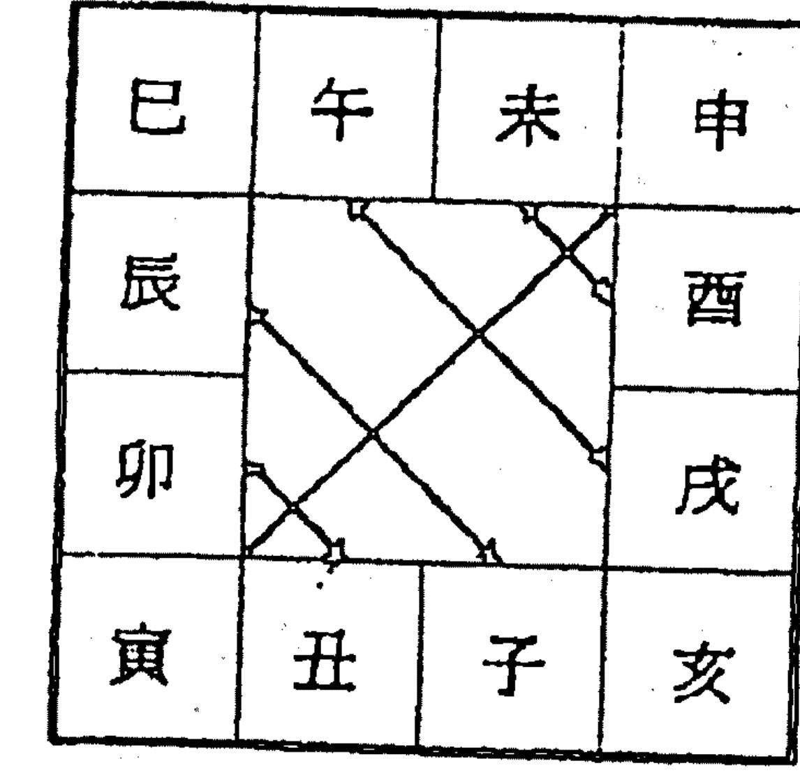
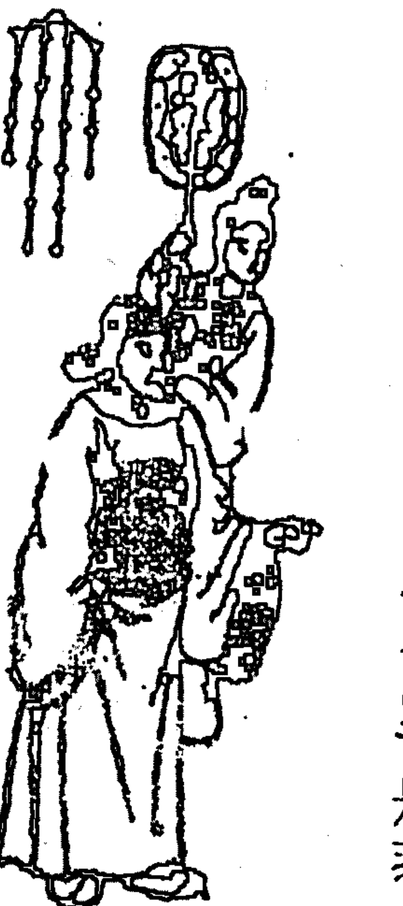

# SUNNY BOOKS

# 紫微隨筆

# 《元集》

# 斗數拆招

星盤分富貴窮通
運限判吉凶休咎

鍾義明 / 著

# 《紫微隨筆》總序

這一部《紫微隨筆》，是我的五術著作系列命理類中；屬於斗數命理的初作；分為四集：元集《斗數明燈》；亨集《斗數古文新解》；利集《斗數拆招》；貞集《斗數批命實務》。元、亨二集以斗數學理的探討與闡發為主，利、貞二集以斗數的運用與實踐為主。

開始寫作的時間是在一九六九年，那時斗數名家慧心齋主正在臺灣日報綜合生活版，以「飛雲山人」為筆名撰寫《紫微斗數與人生》的專欄（目前我還保留第一篇至五十三篇的剪報），飛雲山人正撰寫《面相與人生》的專欄，而我是自一九六八年起便在該報副刊長期刊登散文、新詩、報導文學（已結集者有《台灣的文采與泥香》，一九九二年11月由武陵出版有限公司出版），並在綜合生活版，以「竹山人」為筆名，或用真名撰寫《古今名人八字研究》（已結集《古今名人命運鑑賞》，一九九一年11月由武陵出版有限公司出版）的專欄及其他關於風水和命理的作品。

二十多年來寫寫停停，很不順暢，為什麼呢？因為我發現紫微斗數本身的理論體系並不完整，架構也不穩固，充滿很多矛盾抵觸，令人困惑不解的問題太多了。於是，當思考和實驗觸礁、卡在瓶頸時，我就轉向《易經》、《張果星宗》、《河洛理數》、《鐵板神數》、古天文學、現代天文學、曆學、子平命學、《皇極經世》等方面去探求，希望能找到打開斗數寶庫的金鑰。同時極力搜尋古笈、秘本，多閱近賢著作，一有心得輒隨手筆記。其間的艱苦心境，可用清·王國維《人間詞話》所說的為學做事「三境界」來勾畫：

> ——昨夜西風凋碧樹，獨上高樓，望斷天涯路。《泛覽》
> ——衣帶漸寬終不悔，為伊消得人憔悴。《專攻》
> ——眾裡尋他千百度，回頭蓦見：那人正在燈火闌珊處。《創作》

原先的構想是以明·清筆記、小品文式的體裁，作「輕鬆一下」的表現，嘻笑怒罵、插科打諢，並不排斥。但是好友——五術奇才宜易園陳啓銓兄的一句話：「要寫，就寫建設性的。」一改變了我的初衷，乃將所有資料重新整編，去蕪存菁，成為現在的面貌。

自一九八九年仲春辭去省立竹山高中十五年的教學工作後，我不玩物喪志，也不為形神所勞，過著像《菜根譚》所描述的幽閒日子：「徜徉於山林泉石之間，而塵心漸息；夷猶於詩書圖畫之內，而俗氣潛消。」身心得到澄澈的解放後，較能作深入的思考；沒有塵囂俗氣的污染，看事物，較能清晰；經常接近林泉花草和親朋好友，性情變得較平靜溫淳。對治學、著作而言，這四年多的光陰，可說是一種「塞翁失馬，焉知非福」的境遇。當初很多人挽留我、惋惜我，但是我還是毅然向教育界揮手，投入專業畫家、作家這一條路，無怨無悔，在目前的感受，我想：當初的抉擇是無誤的。

在研究斗數的過程中，您所遭遇的所有情況，我大都曾遭遇過，因為我也曾經是依叩無門的門外漢；也曾經是面對群書，一臉困惑、滿頭霧水的讀書人；也曾經是四處尋訪高人名師的小卒仔；和您一樣，也曾相信，也曾不相信：台中小雜貨店有斗數高手，乃至八仙過海到臺海南部，化身在饅頭攤、鮮花店自玩玩人……等等「神話」，也曾羨慕，也曾不羨慕：某名家有一隱者老師，和他飲咖啡、喝茶傳道、授業、解惑，某名家的恩師年事已高，且強調這一輩子只收她一個門人；也曾妄想過：找一處風水奇佳的好龍穴，恭敬趺坐，祈禱天神下降，灌注一點靈光，能夠頓悟斗數玄機。只要是能夠減少學習困境的捷徑，您我都曾聽過、想過、夢過、試過，也都失望過、絕望過。

我要以過來人的身分以及比您多一點的歷練，告訴您：不要相信謊言和神話，不要痴心，不要妄想，「要開慧啊啦」！還是自求多福吧！每當我咬一本書咬不破時，總會想起清末名臣張之洞（一八三七—一九○九）的童年故事：

張之洞的父親張瑛由於居處僻遠的跡中，任州縣小官，平時搜羅書籍不易。有一回，索性竭盡薪俸，買了幾十櫃的書回來，放在孩子們的學舍裏，讓他們在每天固定的功課之外，得隨意翻閱。買回來的大多數是史部、近代說經之書以及朱子書等。有人笑張瑛說：「小孩子那看得懂這些書？」可是張瑛卻回答：「現在姑且讓他們翻一翻，不懂也無所謂，看得多了，將來自然能夠了解。」

選一本好的書，多翻幾遍，逐漸顛倒夢想吧！唯有如此，才能做到「般若波羅蜜多」……（到達智慧的彼岸，進入「究竟涅槃」（修成正果）的境界。

每一位大畫家、大書法家、大運動家、大音樂家……都經過基本技巧的訓練階段，基本技巧越紮實，日後的成就越大。我教學學生繪盤、書法、堪輿、命理，一向都很注重奠基的階段，所以在《紫微隨筆》這部書中，循例先推出能使學習者穩固根基的元集《斗數明燈》和亨集《斗數古文新解》。接著，再推出公開各斗數門派繪命訣竅的利集《斗數拆招》。最後，推出示範斗數批命限流年的貞集《斗數批命實務》。「虔誠談命理，坦蕩洩天機」是我一貫堅持的寫作風格，讀者若能循序閱讀拙著，持之以勤、以恆，必定有充實的收穫。

好友陳啟銓兄在他的大作《紫微玄機》書後語說：「高手一看本書，必哈哈大笑：『宣易圖斗數不亮招則已，一出手不過如此，還以為有什麼天大的本領呢？』一代宗師也會訕笑說：『不值一顧，我才是真正的天下無敵。』『不要得意太早，任何人窮一生的精力，所得有限，好的招式，只要順手，不必言多。』《道德經》有云：『為學日益，為道日損。』命理雖為小道，所學者廢遠，但可為道者不多，必要由簡入繁，再由繁入簡也。我研究學識，不旁門左道，以公正的立場，客觀的條件，推之以理，言之有物，重實證。凡事只要多領悟、多印證，捉著要領，基礎根基打好，再漸次而進，必有成就的一天。」

如今我竹山佛心翠影齋亮出紫微斗數的招式，心態與啟銓兄相似，不敢奢望得到高手、宗師的認同，只是在不玩花俏、不離經叛道的原則之下，提供斗數理則的「可能性」、「多樣性」給讀者罷了；希望讀者能因此而開展視野和心靈領域，改變思考方式和研究方向；這才是我所至盼的。至於個人的毀譽，我並不放在心上。

一九九三年歲次癸酉初冬十月上浣鯤鯓明記於竹山佛心翠影書齋

# 《斗數明燈》自序

紫微斗數這塊園地，近十年來，由於時賢的堅植灌溉，呈現百花怒放的繁華景象，但也令人擔憂：開到茶蘼花事了——芳菲過後，落紅滿地誰掃！

前書——尤其是談堪輿、命理等術數類的書籍，如果沒有抉擇，便是對知識沒有主見。雖然，做學問必須經過泛覽的過程，對各種書都應該去瞭解一下，但是，並不表示要照單全收；所有的知識，都必須經過智慧的觀照和批判之後，才可決定那些觀念、法則具有真正的價值和準確度？值得我們採納：那些觀念、法則是渣滓糟粕？應予棄置。抉擇正確，透過它，才能開啟五術宮殿之門，深入堂奧，得窺宗廟之美、百官之富；抉擇錯誤，受它誤導，不是走進死衚衕，便是步入歧途，自障自絕，虛耗精神，枉度光陰。

> 清初茗溪老人林之翰自序《四診抉微》曰：
> 夫，診家華者，非濟濟之具，不能以登其堂，
> 涉江漢者，非舟楫之用，未足以達其源。
> 是以師曠不廢竿呂以作樂，般倕雖舍繩墨以成器。
> 在宗匠亦必借資於物，而成其工巧。

技藝之士，又豈能舍規矩而成方圓者哉？
學命理，要有正確的觀念和法則作為基礎——就如登山要有足夠的盤纏；渡大河要有堅固的舟船和老練的舵手。基礎是創作之母，即使是春秋晉國的大音樂家師曠，也須以律呂五音為基礎，才能創造出美妙的音樂；春秋魯國的大工藝家公輸般，也須以規矩為基礎，才能創造出工巧的建築和器品；中醫師必須以望聞問切為基礎，才能辨別病症。斗數家須以星宮命限為基礎，才能為人推算命運，指點迷津。唐·魏徵《諫太宗十思疏》說：「求木之長者，必固其根本；欲流之遠者，必浚其泉源。」即指出基礎的重要性：根柢穩固，方成葉茂蔭濃；源頭深邃，方成浩瀚滄茫。

在人生研究學問的過程中，有多少錯誤可以挽救的？又有多少錯誤是無法挽救的？在即將邁入21世紀，社會結構型態急速變動的末現代；在歷經滄桑的現代人而言，一再的嘗試錯誤，一再的蹉跎時光，無疑的，是一種對生命的扼殺！
童年時的跌跤，算不得什麼，父母、師長會扶持你、鼓勵你爬起來：拍一拍就好了，小心再走。成年後的跌跤，還有誰來扶持你，鼓勵你呢？即使有，你肯接納嗎？聽得進去嗎？
會跑、會跳的人，不相信自己不會走路，成年人也不相信自己的判斷會錯誤。在我們的眼中所看到的成年人，有多少是愚昧無知者呢？小孩子走路只會在平地跌跤，成年人卻因為腳力強健，可能由高山斷崖摔下，小孩子摔傷了，不過是皮肉之傷罷了，很快就能痊癒。成年人的失足，卻傷及骨骼臟腑，危及生命，要爬起來成痊癒不知要耗費多少精力與時間，甚至永遠沒有機會了。有形的跌倒，會覺得疼痛，知道自己犯了錯誤所致。無形的深淵，孩童不敢探索，成年人卻因自信而不知不覺的走進去，走下去，等到發覺那是一個黑暗的深淵時，已經皓首齒搖：生命不再給他太多的機會啦！

生命短暫，世路多歧，學海無涯。當我展閱《小窗幽記的啟示》時，上面那些敘述，令我有深切的感觸，想起過去研習斗數的歷程：跌跤了，沒有人扶持、鼓勵，只有自己一再的嘗試錯誤，摸索途徑，突破瓶頸，劈荊斬棘，手胼了，腳胝了，直到撥雲見日的一天——已經由不知愁滋味的少年，進入禿掉髮的不惑之年了。想起不知有多少人，正處於我曾經歷過的徬徨，迷惘的路上？他們能像我一樣，能幸運的及時走出來嗎？或許我該伸出援手，在黑暗的深淵中，擦亮一根火柴，為他們點燃一盞明燈吧。

坊間的斗數書籍及絕版、未出版的古本、秘本，我所接觸過者，至少有二百本，但真正讓我覺得滿意者，如鳳毛麟角，寥寥無幾。古本非魯魚亥豕，即旨義晦澀；今本非因襲不化，即荒誕虛誕，蕪具自體廢衷，詞語曉暢，又能正確詮釋現代性的斗數書籍，真的很少。因此，我常臨到前者無奈。無助的心聲。跌跤失足會帶來肉體、心靈上的創痛，讀錯書時，心靈的悲痛有時更甚於跌跤失足的創痛。也有些作者和讀者，只顧著瞻望遠方，忽忘了腳下，更蔽蔽了自己的心；只看遠方不看腳下，是好高鶩遠，華而不實，瞥眼即逝，心受朦蔽，是自欺——有時腳走的方向不是心想的方向；心是會欺騙人的，不值自欺，也會欺人。據擇錯誤的書，著作錯誤的書，都是心靈受了蒙蔽。

著作本身時，我想起王陽明《傳習錄》所說的：
學射，必張弓挾矢，引滿中的。
學書，則必伸紙執筆，操觚染翰。

一本學問思辯、敦信力行的宗旨，與「虔誠談命理，坦蕩洩天機」的作風，我把所曾遭遇過的困惑問題都答出來，把所問、所思的別記精華整理出來，提供給徬徨、迷惘的讀者。《小窗幽記的啟示》說：「日月亘古不變，總予人間光明，聖賢的心境也是如此，要人們都能棄黑暗而行於光明，使人間常做喜無悲愁。言語有辭窮處，心意有難表時，然而，此心卻昭昭如日月，經行不殆，永遠為人們的幸福著想。」

我非聖賢，但心上烙著六祖惠能的偈語：

> 菩提本自樹，明鏡亦無臺；
> 本來無一物，何處惹塵埃？
> 心是菩提樹，身為明鏡臺；
> 明鏡本清淨，何處染塵埃？

只希望達到明心見性的境界，企望見到風狂雨驟後的天地，呈現清爽明亮的祥和氣氛。

這只是第一盞明燈，但願我自己和斗數先進能繼續點燃第二盞、第三盞，乃至無盡盞的明燈，來照亮無窮的世界。

感謝吾友大師辛師兄為本書封面賜題顯寶、五術界奇才宜易園陳啓銓兄提供資料及鼓勵、門人張建民、陳決丞協助整理校稿；更要感謝本書中參考引用其大作的各位斗數賢才。

一九九三年歲次癸酉初冬十月上浣鈺銘記於竹山佛心翠影書齋

賜教處：臺灣省南投縣竹山鎮雲林里林圮街一巷七號
電話：(049) 644872
傳真：(049) 644872（手動傳真）

# 目錄

《紫微隨筆》總序／3

《斗數明燈》自序／8

## 卷一、應用基礎篇

十天干所屬陰陽表／28

十二地支所屬陰陽表／29

干支五行方位／31

五行生剋制化宜忌／32

五行旺相休囚死／33

天干沖合／34

地支相位／34

納音五行與十二運／36

安命宮與身宮表／38

人事十二宮表／41

十二宮遁干表／42

五行局表／43

起紫微星表／43

安紫微系諸星表／44

起天府星表／45

安天府系諸星表／45

南北斗主星速求法／46

南北斗定位星題圖／48

十四主星定位。交會圖／51

十四主星三方四正圖表／55

安年干系諸星表／62

安年支系諸星表／63

安月支系諸星表／64

安生日系諸星表／65

安生年博士十二星／65

安時支系諸星表／66

安長生十二運星表／67

安截路空亡表／68

安旬空表／68

安天殤、天使表／69

安命主表／70

安身主表／70

諸星十二宮廟旺失陷閑表／71

起大限表／72

起小限表／73

起子年斗君表／74

安流年歲前諸星表／75

安流年將前諸星表／76

群星彙解／77

命盤格式範例／86

## 卷二 / 思辨篇

二至論／90

宮位消息／91

候卦／100

庚年四化辨／103

化忌論／112

命宮無大限辨／118

殺破狼 ─ 竹羅三限論／123

句中空亡辨（附截路空亡）／134

天魁天鉞辨／139

貴人詳論／146

黃道十二宮／153

人事十二宮／161

宮位古名彙／168

圖命宮與身宮二十八宿主應／170

## 卷二／星曜總斷篇

參考資料／184

紫微星總斷／186

天機星總斷／188

太陽星總斷／189

武曲星總斷／191

天同星總斷／192

廉貞星總斷／194

天府星總斷／196

太陰星總斷／197

貪狼星總斷／199

巨門星總斷／201

天相星總斷／202

天梁星總斷／204

七殺星總斷／206

破軍星總斷／207

文昌星總斷／209

文曲星總斷／211

左輔星總斷／212

右弼星總斷／214

天魁星總斷／215

天鉞星總斷／217

祿存星總斷／219

擎羊星總斷／220

陀羅星總斷／222

火星總斷／223

鈴星總斷／225

地劫星總斷／226

天空星總斷／228

化祿星總斷／230

化權星總斷／231

化科星總斷／233

化忌星總斷／234

## 卷四 / 星宮意象篇

星與宮的結合／238

地支配先天八卦意象／239

南北斗主星入黃道十二宮古訣彙編／241

1 紫微篇 2 天機篇 3 太陽篇 4 武曲篇 5 天同篇

6 廉貞篇 7 天府篇 8 太陰篇 9 貪狼篇 10. 巨門篇

11. 天相篇 12. 天梁篇 13. 七殺篇 14. 破軍篇

南北斗主星入黃道十二宮新解／260

紫微星入十二宮意象／264

天機星入十二宮意象／265

附 / 紫微入宮歌／266

太陽星入十二宮意象／267

附 / ...／268

武曲星入十二宮意象／269

天同星入十二宮意象／270

廉貞星入十二宮意象／271

天府星入十二宮意象／272

太陰星入十二宮意象／273

附／太陰入宮歌／274

貪狼星入十二宮意象／275

巨門星入十二宮意象／276

天相星入十二宮意象／277

天梁星入十二宮意象／278

七殺星入十二宮意象／279

破軍星入十二宮意象／280

南北斗主星入人事十二宮斷訣／281

參考資料／281

紫微入宮斷訣／283

天機入宮斷訣／284

太陽入宮斷訣／285

武曲入宮斷訣／286

天同入宮斷訣／287

廉貞入宮斷訣／288

天府入宮斷訣／289

太陰入宮斷訣／289

貪狼入宮斷訣／290

巨門入宮斷訣／291

天相入宮斷訣／292

天梁入宮斷訣／293

七殺入宮斷訣／294

破軍入宮斷訣／295

文昌入宮斷訣／296

文曲入宮斷訣／297

左輔入宮斷訣／298

右弼入宮斷訣／299

## 卷五／四化星斷訣篇

四化引言／310

參考資料／314

四化星入地支十二宮斷訣／316

1 四化。星。干支意象
2 四化要訣
3 年神煞查表
4 年神煞解說
5 五行與天干要義
6 天干配星意象

天魁入宮斷訣／300

天鉞入宮斷訣／301

祿存入宮斷訣／302

擎羊入宮斷訣／303

陀羅入宮斷訣／304

火星入宮斷訣／305

鈴星入宮斷訣／306

地劫入宮斷訣／307

天空入宮斷訣／308

7 天干十二運之意象 8 納音十二運之意象

化祿斷訣／342

化權斷訣／348

化科斷訣／354

化忌斷訣／361

四化星入人事十二宮斷訣／368

四化星應驗時間表／369

化祿入人事十二宮斷訣／370

化權入人事十二宮斷訣／371

化科入人事十二宮斷訣／372

化忌入人事十二宮斷訣／373

甲年廉貞化祿入宮斷訣／374

乙年天機化祿入宮斷訣／375

丙年天同化祿入宮斷訣／376

丁年太陰化祿入宮斷訣／377

戊年貪狼化祿入宮斷訣／378

己年武曲化祿入宮斷訣／379

庚年太陽化祿入宮斷訣／380

辛年巨門化祿入宮斷訣／381

壬年天梁化祿入宮斷訣／382

癸年破軍化祿入宮斷訣／383

甲年破軍化權入宮斷訣／384

乙年天梁化權入宮斷訣／385

丙年天機化權入宮斷訣／386

丁年天同化權入宮斷訣／387

戊年太陰化權入宮斷訣／388

己年貪狼化權入宮斷訣／389

庚年武曲化權入宮斷訣／390

辛年太陽化權入宮斷訣／391

壬年紫微化權入宮斷訣／392

癸年巨門化權入宮斷訣／393

甲年武曲化科入宮斷訣／394

乙年紫微化科入宮斷訣／395

丙年文昌化科入宮斷訣／396

丁年天機化科入宮斷訣／397

戊年右弼化科入宮斷訣／398

己年天梁化科入宮斷訣／399

庚年太陰化科入宮斷訣／400

辛年文曲化科入宮斷訣／401

壬年左輔化科入宮斷訣／402

癸年太陰化科入宮斷訣／403

甲年太陽化忌入宮斷訣／404

乙年太陰化忌入宮斷訣／405

丙年廉貞化忌入宮斷訣／406

丁年巨門化忌入宮斷訣／407

戊年天機化忌入宮斷訣／408

己年文曲化忌入宮斷訣／409

庚年天同化忌入宮斷訣／410

紫微隨筆 26

辛年文昌化忌入宮斷訣／411

壬年武曲化忌入宮斷訣／412

癸年貪狼化忌入宮斷訣／413

□井官／414

竹山佛心翠影書齋門人／416

武陵出版有限公司總裁明著作系列一覽／418

著者啓事／422

## 卷一 應用基礎篇

元者，善之長也。
上人為元，上從一始也；春木；仁也。
始萬物為元，君子體仁足以長人。

### 十天干所屬陰陽表

陽年生人，男為陽男，女為陽女。
陰年生人，男為陰男，女為陰女。

| 所屬十干 | 陰陽 | 五行 |
| :--- | :--- | :--- |
| 甲 | 陽 | 木 |
| 乙 | 陰 | 木 |
| 丙 | 陽 | 火 |
| 丁 | 陰 | 火 |
| 戊 | 陽 | 土 |
| 己 | 陰 | 土 |
| 庚 | 陽 | 金 |
| 辛 | 陰 | 金 |
| 壬 | 陽 | 水 |
| 癸 | 陰 | 水 |

鈕按：天干是種功能量的力，主施。
陰性柔：凡含蓄、內向、消極、韌性、保守、感化、退縮、融合……皆屬之。
陽性剛：凡明朗、外向、積極、脆性、擴張、強制、進展、對抗……皆屬之。
茲將天干所包括的意象，約述於左。

### 十干：

甲：溫性的、直上的、振動的、活潑的、創生的、進開的。
乙：溫性的、彎曲的、延伸的、柔韌的、抽出的。
丙：熱性的、上升的、高速的、猛烈的、光明的、迅速的、輻射的、顯著的。

丁：熟性的、溶解的、內聚的、緩耐的、尖銳的、刺入的。
戊：中性的、抵制的、高亢的、厚重的、集中的、茂盛的。
己：中性的、吸收的、卑濕的、腐蝕的、伏藏的、鬆軟的、生生不息的。
庚：涼性的、剛硬的、破壞的、沈重的、更改的、吸引的、純樸的。
辛：涼性的、輕盈的、透明的、滑潤的、凝結的、硬化的、薄而銳利的。
壬：寒性的、流暢的、通導的、反射的、沖激的、交合的、承受的。
癸：寒性的、包容的、漸漫的、迷漫的、分析的、難以捉摸的、循環的、度量的。

### 十二地支所屬陰陽表

| 所屬十二支 | 陰陽 | 五行 | 生肖 |
| :--- | :--- | :--- | :--- |
| 子 | 陽 | 水 | 鼠 |
| 丑 | 陰 | 土 | 牛 |
| 寅 | 陽 | 木 | 虎 |
| 卯 | 陰 | 木 | 兔 |
| 辰 | 陽 | 土 | 龍 |
| 巳 | 陰 | 火 | 蛇 |
| 午 | 陽 | 火 | 馬 |
| 未 | 陰 | 土 | 羊 |
| 申 | 陽 | 金 | 猴 |
| 酉 | 陰 | 金 | 雞 |
| 戌 | 陽 | 土 | 狗 |
| 亥 | 陰 | 水 | 豬 |

紫微隨筆 30

按：地支的屬性、意象，約述如左。地支表示蘊藏的能量，主受，接受天幹的運轉、控制；天幹左旋，地支右轉。

子：開始的、休止的、靜極思動的、孳萌的。

丑：交結的、暗助的、蘊育的、糾纏的、關節的。

寅：演進的、明顯的、摒斥的、上升的、調和的。

卯：茂盛的、開放的、冒出來的、繁華的。

辰：振作的、伸展的、驚恐的、震動的、雜蕪的。

巳：回復的、扭曲的、陽奉陰違的、華麗的。

午：長大的、忤逆的、交叉的、相衝的、顯著的、熱鬧的、寬大的、動極思靜的。

未：幽昧的、不明顯的、有味道的、下垂的、右斜的。

申：成形的、再度的、舒舒有容的、傷害的。

酉：畏縮的、收斂的、關閉的、成熟的、老化的。

戌：衰滅的、過量的、落下的、亢進的。

亥：閉藏的、彈劾的、擁抱的、對立的（不同性）、矛盾的、週期的。

※幹支的意象在解說斗數星情方面，是一項利器，讀者務要深入研究。可參閱拙著《命理乾坤》、《命理滴爪》、《現代命理實用集》、《現代命理與中醫》，內有詳說，諸書均由武陵出版有限公司出版。

### 干支五行方位

甲乙寅卯辰属东方木。春天。温气。

丙丁巳午未属南方火。夏天。热气。

庚辛申酉戌属西方金。秋天。凉气。

壬癸亥子丑属北方水。冬天。寒气。

辰、戌、丑、未四土是季节的转换，辰土温湿，旺于立夏前十八日内。未土乾热，旺于立秋前十八日内。戌土凉燥，旺于立冬前十八日内。丑土寒湿，旺于立春前十八日内。辰、未土有生长力，戌、丑土无生长力；辰属「水库」，未属「木库」，戌属「火库」，丑属「金库」。

从天上的星座看，东方是青龙、南方是朱雀（凤凰、朱鸟）、西方是白虎、北方是玄武（龟）；甲乙青龙、丙丁朱雀、庚辛白虎、壬癸玄武，戊、己在中宫，寄于辰、未、戌、丑，戊勾陈、己螣蛇。

辰、巳属东南巽卦，辰天罡、巳太乙。

未、申属西南坤卦，未小吉（酒神）、申人门。

戌、亥属西北乾卦，戌河魁、亥天门。

卯、午、子、酉属天地之正中。卯正东，属雷门。午正南（天顶），属端门。酉正西，属咸池。子正北（天底），属帝座。子、午是五星出入之中道，卯酉是日、月出入之门户。

子午卯酉属天地之中，故名「四正」，属五行沐浴之位，故称「四败」。寅申巳亥属黄道之斜升、斜降，故名「四隅」，属五行长生、驿马之位，故称「四长生」、「四马」。

辰戌丑未属方位、华盖之转角，故名「四角」，属五行墓库之位，故称「四墓」、「四库」。

子午卯酉为不劫宫，寅申巳亥为二煞宫，辰戌丑未为转宫。

### 五行生克制化宜忌

金生水，水生木，木生火，火生土，土生金，金生水。

金克木，木克土，土克水，水克火，火克金，金克木。

又有反生、反克之理，宜熟读徐大升「五行生克制化宜忌」：

1. 金旺得火，方成器皿。火旺得水，方成相济。水旺得土，方成池沼。土旺得木，方能疏通。木旺得金，方成栋梁。（以上为克之得宜）
2. 金赖土生，土多金埋。土赖火生，火多土焦。火赖木生，木多火炽。木赖水生，水多木漂。水赖金生，金多水浊。（以上为生之太过）
3. 金能生水，水多金沈。水能生木，木多水缩。木能生火，火多木焚。火能生土，土多火晦。土能生金，金多土弱。（以上为泄之太过）
4. 金能剋木，木多金缺。木能剋土，土多木折。土能剋水，水多土流。水能剋火，火多水沸。火能剋金，金多火熄。（以上为剋之不及）
5. 金弱遇火，必見銷鎔。火弱逢水，必為熄滅。水弱逢土，必為淤塞。土弱逢木，必為傾陷。木弱逢金，必為砍折。（以上为剋之太过）
6. 強金得水，方挫其鋒。強水得木，方洩其勢。強木得火，方化其頑。強火得土，方止其餕。強土得金，方制其壅。（以上为洩之得宜）

### 五行旺相休囚死

春：木旺、火相、水休、金囚、土死。

夏：火旺、土相、木休、水囚、金死。

秋：金旺、水相、土休、火囚、木死。

冬：水旺、木相、金休、土囚、火死。

辰未戌丑四季月：土旺、金相、火休、木囚、水死。

> 銓按：以月令當旺之五行屬我，我生者為相（次強），剋我者屬囚（無力，弱），我剋者屬死絕（最弱），同我者屬旺（最強）。旺、相者，性質穩定、顯著；休者，性質老化；囚、死者，性質不安定，不顯著，或變質。

### 天干冲合

甲庚相冲，乙辛相冲，壬丙相冲，癸丁相冲。

丙剋庚，丁剋辛。

甲己合，化土。乙庚合，化金。丙辛合，化水。丁壬合，化木。戊癸合，化火。

※此為天之五緯，可推氣候、疾病，名「五運」。

### 地支相位

1. 三合
寅午戌，火局。申子辰，水局。巳酉丑，金局。亥卯未，木局。

2. 六合
子丑合，化土。寅亥合，化木。卯戌合，化火。辰酉合，化金。巳申合，化水。午未合，午化太陽（丁火），未化太陰（己土）。

3. 六冲
子午冲，化少陰火氣。丑未冲，化太陰濕氣。寅申冲，化少陽火氣。卯酉冲，化陽明燥氣。辰戌冲，化太陽寒氣。巳亥冲，化厥陰風氣。

少陰君火屬心經。太陰濕土屬脾經。少陽相火屬膽腑。陽明燥金屬大腸。太陽寒水屬膀胱。厥陰風木屬肝經。心合小腸，小腸為受盛之府。肝合膽，膽為中精之府。脾合胃，胃為五穀之府。腎合膀胱，膀胱為津液之府。

4. 刑

子刑卯，卯刑子。丑刑戌，戌刑未，未刑丑。寅刑巳，巳刑申，申刑寅。辰、午、酉、亥自相刑：辰辰刑、午午刑、酉酉刑、亥亥刑。

5. 六害（穿）

子害未，丑害午，寅害巳，卯害辰，辰害卯，巳害寅，午害丑，未害子，申害亥，酉害戌，戌害酉，亥害申。

6. 破（隔角）

子酉相破，丑辰相破，寅亥相破，卯午相破，巳申相破，未戌相破。

※干支的冲、合、刑、穿、破要背起來。

### 納音五行與十二運

### 納音五行歌訣

○甲子乙丑海中金
○丙寅丁卯爐中火
○戊辰己巳大林木
○庚午辛未路傍土
○壬申癸酉劍鋒金

○甲戌乙亥山頭火
○丙子丁丑澗下水
○戊寅己卯城頭土
○庚辰辛巳白蠟金
○壬午癸未楊柳木

○甲申乙酉井泉水
○丙戌丁亥屋上土
○戊子己丑霹靂火
○庚寅辛卯松柏木
○壬辰癸巳長流水

○甲午乙未砂中金
○丙申丁酉山下火
○戊戌己亥平地木
○庚子辛丑壁上土
○壬寅癸卯金箔金

○甲辰乙巳覆燈火
○丙午丁未天河水
○戊申己酉大驛土
○庚戌辛亥釵釧金
○壬子癸丑桑柘木

○甲寅乙卯大溪水
○丙辰丁巳砂中土
○戊午己未天上火
○庚申辛酉石榴木
○壬戌癸亥大海水

12運表

※看命先看本命納音屬何五行？如甲子、乙丑年生，即以金星為主，乃看武曲屬金，在何宮分？以辨禍福。餘命做此。若在生旺之鄉，或在貴人之位，與官祿同宮，便屬吉論；若與七殺、刑忌（擎羊陀羅）同躔，乃屬下等之論。

| 納音\12運 | 水・土 | 火 | 木 | 金 |
|---|---|---|---|---|
| 長生 | 申 | 寅 | 亥 | 巳 |
| 沐浴 | 酉 | 卯 | 子 | 午 |
| 冠帶 | 戌 | 辰 | 丑 | 未 |
| 臨官 | 亥 | 巳 | 寅 | 申 |
| 帝旺 | 子 | 午 | 卯 | 酉 |
| 衰 | 丑 | 未 | 辰 | 戌 |
| 病 | 寅 | 申 | 巳 | 亥 |
| 死 | 卯 | 酉 | 午 | 子 |
| 墓 | 辰 | 戌 | 未 | 丑 |
| 絕 | 巳 | 亥 | 申 | 寅 |
| 胎 | 午 | 子 | 酉 | 卯 |
| 養 | 未 | 丑 | 戌 | 辰 |

按：果老星宗以生年納音看十二宮之生、沐、冠、臨、旺、衰、病、死、墓、絕，不分男女，皆順行，皆屬納音五行正法。俗傳之斗數以命宮五行局納音，分陽男、陰女順行，陰男、陽女逆行，排「長生十二星」，古無此法，或係術士偽造，有待商榷。

※納音五行歌要背起，只有三十組，不多。切莫養成翻書查表的習慣，要知道，有很多命理歌訣、口訣是非背誦不可的，平時熟記那些歌訣、口訣，推命時才能得心應手。

### 安命宫與身宮表

| 生時 | 命身 | 一月 | 二月 | 三月 | 四月 | 五月 | 六月 | 七月 | 八月 | 九月 | 十月 | 十一月 | 十二月 |
|---|---|---|---|---|---|---|---|---|---|---|---|---|---|
| 子 | 命 | 寅 | 卯 | 辰 | 巳 | 午 | 未 | 申 | 酉 | 戌 | 亥 | 子 | 丑 |
| 子 | 身 | 丑 | 寅 | 卯 | 辰 | 巳 | 午 | 未 | 申 | 酉 | 戌 | 亥 | 子 |
| 丑 | 命 | 丑 | 寅 | 卯 | 辰 | 巳 | 午 | 未 | 申 | 酉 | 戌 | 亥 | 子 |
| 丑 | 身 | 子 | 丑 | 寅 | 卯 | 辰 | 巳 | 午 | 未 | 申 | 酉 | 戌 | 亥 |
| 寅 | 命 | 子 | 丑 | 寅 | 卯 | 辰 | 巳 | 午 | 未 | 申 | 酉 | 戌 | 亥 |
| 寅 | 身 | 亥 | 子 | 丑 | 寅 | 卯 | 辰 | 巳 | 午 | 未 | 申 | 酉 | 戌 |
| 卯 | 命 | 亥 | 子 | 丑 | 寅 | 卯 | 辰 | 巳 | 午 | 未 | 申 | 酉 | 戌 |
| 卯 | 身 | 戌 | 亥 | 子 | 丑 | 寅 | 卯 | 辰 | 巳 | 午 | 未 | 申 | 酉 |
| 辰 | 命 | 戌 | 亥 | 子 | 丑 | 寅 | 卯 | 辰 | 巳 | 午 | 未 | 申 | 酉 |
| 辰 | 身 | 酉 | 戌 | 亥 | 子 | 丑 | 寅 | 卯 | 辰 | 巳 | 午 | 未 | 申 |
| 巳 | 命 | 酉 | 戌 | 亥 | 子 | 丑 | 寅 | 卯 | 辰 | 巳 | 午 | 未 | 申 |
| 巳 | 身 | 申 | 酉 | 戌 | 亥 | 子 | 丑 | 寅 | 卯 | 辰 | 巳 | 午 | 未 |
| 午 | 命 | 申 | 酉 | 戌 | 亥 | 子 | 丑 | 寅 | 卯 | 辰 | 巳 | 午 | 未 |
| 午 | 身 | 未 | 申 | 酉 | 戌 | 亥 | 子 | 丑 | 寅 | 卯 | 辰 | 巳 | 午 |
| 未 | 命 | 未 | 申 | 酉 | 戌 | 亥 | 子 | 丑 | 寅 | 卯 | 辰 | 巳 | 午 |
| 未 | 身 | 午 | 未 | 申 | 酉 | 戌 | 亥 | 子 | 丑 | 寅 | 卯 | 辰 | 巳 |
| 申 | 命 | 午 | 未 | 申 | 酉 | 戌 | 亥 | 子 | 丑 | 寅 | 卯 | 辰 | 巳 |
| 申 | 身 | 巳 | 午 | 未 | 申 | 酉 | 戌 | 亥 | 子 | 丑 | 寅 | 卯 | 辰 |
| 酉 | 命 | 巳 | 午 | 未 | 申 | 酉 | 戌 | 亥 | 子 | 丑 | 寅 | 卯 | 辰 |
| 酉 | 身 | 辰 | 巳 | 午 | 未 | 申 | 酉 | 戌 | 亥 | 子 | 丑 | 寅 | 卯 |
| 戌 | 命 | 辰 | 巳 | 午 | 未 | 申 | 酉 | 戌 | 亥 | 子 | 丑 | 寅 | 卯 |
| 戌 | 身 | 卯 | 辰 | 巳 | 午 | 未 | 申 | 酉 | 戌 | 亥 | 子 | 丑 | 寅 |
| 亥 | 命 | 卯 | 辰 | 巳 | 午 | 未 | 申 | 酉 | 戌 | 亥 | 子 | 丑 | 寅 |
| 亥 | 身 | 寅 | 卯 | 辰 | 巳 | 午 | 未 | 申 | 酉 | 戌 | 亥 | 子 | 丑 |

訣：自生月起子時，逆行到生時安命宮，順行到生時安身宮。

總註：

1. 凡閏月生人仍算前月，皆如閏三月生人仍以三月查表。
2. 未朝的時制，一晝夜分百刻，一日十二時。每時分為初初刻、初一刻、初二刻、初三刻、初四刻、正初刻、正一刻、正二刻、正三刻、正四刻。古法子時是從昨夜的23時0分算起，屬今日。現代法，0時為今日的開始，23時59分59秒為今日的結束；0時至0時59分59秒為今日「早子時」，23時0分至23時59分59秒為今日「夜子時」。
3. 陽年生人安命於陽宮，陰年生人安命於陰宮，終身為美；若陰陽相反，一生多蹭蹬進退。
4. 每一命、身宮，均有其宮所含的象徵和意義，可閱本書《黃道十二宮》篇內的說明。一宮三十度，即每四分鐘過一度，命宮逆宮順度，身宮順宮逆度。雖安命、身之宮相同，實有二十八宿度之差異，感應亦殊，研治命理者不可不知也。讀者可閱本書《命宮與身宮二十八宿主應》篇內的說明。
5. 天左旋，地右旋。逆安命，順安身，命不可知，知來者逆，身可知，數往者順。二八易位，寅為三陽，配艮生門，人生於寅，故從寅起。
6. 祿命法和星宗法有論及立命宮位之特質者，摘錄數則如下：
A 男命安子午，必主強狠自恃；女人命入巽乾，必淫冶而恃色。（巽，巳宮為登明。乾，亥宮為天乙、足飽。）《玉衡經》
B 包含萬象身居楚（巳），智過千夫命守幽（亥）。《望斗仙經》
C 天傾西北，論乾（亥）屬尊；地闕東南，詳巽（巳）屬重。《望斗仙經》
D 辰多而門訟官嗔，戌見而凶須小革。《玉照神應真經》
E 四清（寅申巳亥）本主俱全，而文武兩升；四柱見之有旺（子午卯酉），則門中生貴；季（辰戌丑未）中全犯有氣，而庫藏之官。《玉照神應真經》
F 子午卯酉多貧顛，而好酒色；多風流，喜交遊。
寅申巳亥多聰明，而富才藝；多辛勤而勞碌。
辰戌丑未多富裕，而性孤獨；多遷動、離祖，多刑剋六親。

凡此，觀安身立命於何宮，即可知其性情、行藏之大略矣！

宮位特質及命身宮星曜的格局、強弱、生剋制化等等，只代表一個人的性向、體質的類型，而不是表示此人一生「必定如此」。在推命還要觀察行限和他所處的時代、社會結構型態來考量。

### 人壽十二宮表

| 餘宮 | 1 命宮 | 2 兄弟宮 | 3 夫妻宮 | 4 子女宮 | 5 財帛宮 | 6 疾厄宮 | 7 遷移宮 | 8 僕役宮 | 9 官祿宮 | 10 田宅宮 | 11 福德宮 | 12 父母宮 |
|---|---|---|---|---|---|---|---|---|---|---|---|---|
| 子 | 丑 | 寅 | 卯 | 辰 | 巳 | 午 | 未 | 申 | 酉 | 戌 | 亥 | 子 |
| 丑 | 寅 | 卯 | 辰 | 巳 | 午 | 未 | 申 | 酉 | 戌 | 亥 | 子 | 丑 |
| 寅 | 卯 | 辰 | 巳 | 午 | 未 | 申 | 酉 | 戌 | 亥 | 子 | 丑 | 寅 |
| 卯 | 辰 | 巳 | 午 | 未 | 申 | 酉 | 戌 | 亥 | 子 | 丑 | 寅 | 卯 |
| 辰 | 巳 | 午 | 未 | 申 | 酉 | 戌 | 亥 | 子 | 丑 | 寅 | 卯 | 辰 |
| 巳 | 午 | 未 | 申 | 酉 | 戌 | 亥 | 子 | 丑 | 寅 | 卯 | 辰 | 巳 |
| 午 | 未 | 申 | 酉 | 戌 | 亥 | 子 | 丑 | 寅 | 卯 | 辰 | 巳 | 午 |
| 未 | 申 | 酉 | 戌 | 亥 | 子 | 丑 | 寅 | 卯 | 辰 | 巳 | 午 | 未 |
| 申 | 酉 | 戌 | 亥 | 子 | 丑 | 寅 | 卯 | 辰 | 巳 | 午 | 未 | 申 |
| 酉 | 戌 | 亥 | 子 | 丑 | 寅 | 卯 | 辰 | 巳 | 午 | 未 | 申 | 酉 |
| 戌 | 亥 | 子 | 丑 | 寅 | 卯 | 辰 | 巳 | 午 | 未 | 申 | 酉 | 戌 |
| 亥 | 子 | 丑 | 寅 | 卯 | 辰 | 巳 | 午 | 未 | 申 | 酉 | 戌 | 亥 |

### 十二宫遁干表

| 十二宫 | 本生年干 | 甲己 | 乙庚 | 丙辛 | 丁壬 | 戊癸 |
| :--- | :--- | :--- | :--- | :--- | :--- | :--- |
| 寅 | | 丙 | 戊 | 庚 | 壬 | 甲 |
| 卯 | | 丁 | 己 | 辛 | 癸 | 乙 |
| 辰 | | 戊 | 庚 | 壬 | 甲 | 丙 |
| 巳 | | 己 | 辛 | 癸 | 乙 | 丁 |
| 午 | | 庚 | 壬 | 甲 | 丙 | 戊 |
| 未 | | 辛 | 癸 | 乙 | 丁 | 己 |
| 申 | | 壬 | 甲 | 丙 | 戊 | 庚 |
| 酉 | | 癸 | 乙 | 丁 | 己 | 辛 |
| 戌 | | 甲 | 丙 | 戊 | 庚 | 壬 |
| 亥 | | 乙 | 丁 | 己 | 辛 | 癸 |
| 子 | | 丙 | 戊 | 庚 | 壬 | 甲 |
| 丑 | | 丁 | 己 | 辛 | 癸 | 乙 |

註：1. 由命宮起，逆行。不分男女。
2. 現代斗數多以僕役（奴僕）宮為交友宮，大誤！交友宮是兄弟宮，僕役宮是一個人領導統御能力和勞動體力的宮位。
3. 疾厄宮又名「八殺宮」，可看一個人的魄力和氣勢。

### 43 應用基礎篇

口訣：甲己起丙寅，乙庚起戊寅，丙辛起庚寅，丁壬起壬寅，戊癸起甲寅。

| 本生年干 | 甲己 | 乙庚 | 丙辛 | 丁壬 | 戊癸 |
| :--- | :--- | :--- | :--- | :--- | :--- |
| 命宮 | 水二局 | 火六局 | 土五局 | 木三局 | 金四局 |
| 子丑 | 水二局 | 火六局 | 土五局 | 木三局 | 金四局 |
| 寅卯 | 火六局 | 土五局 | 木三局 | 金四局 | 水二局 |
| 辰巳 | 木三局 | 金四局 | 水二局 | 火六局 | 土五局 |
| 午未 | 土五局 | 木三局 | 金四局 | 水二局 | 火六局 |
| 申酉 | 金四局 | 水二局 | 火六局 | 土五局 | 木三局 |
| 戌亥 | 火六局 | 土五局 | 木三局 | 金四局 | 水二局 |

| 五行局 | 水二局 | 木三局 | 金四局 | 土五局 | 火六局 |
| :--- | :--- | :--- | :--- | :--- | :--- |
| 生日 | | | | | |
| 1 | 丑 | 辰 | 亥 | 午 | 酉 |
| 2 | 寅 | 丑 | 辰 | 亥 | 午 |
| 3 | 寅 | 寅 | 丑 | 辰 | 亥 |
| 4 | 卯 | 巳 | 寅 | 丑 | 辰 |
| 5 | 卯 | 寅 | 子 | 寅 | 丑 |
| 6 | 辰 | 卯 | 巳 | 未 | 寅 |
| 7 | 辰 | 午 | 寅 | 子 | 戌 |
| 8 | 巳 | 卯 | 卯 | 巳 | 未 |
| 9 | 巳 | 辰 | 丑 | 寅 | 子 |
| 10 | 午 | 未 | 卯 | 午 | 巳 |
| 11 | 午 | 辰 | 申 | 卯 | 寅 |
| 12 | 未 | 巳 | 丑 | 辰 | 卯 |
| 13 | 未 | 申 | 午 | 寅 | 亥 |
| 14 | 申 | 巳 | 卯 | 未 | 申 |
| 15 | 申 | 午 | 辰 | 辰 | 丑 |

### 安紫微系諸星表

| 紫微 | 天機 | 太陽 | 武曲 | 天同 | 廉貞 |
|---|---|---|---|---|---|
| 子 | 亥 | 酉 | 申 | 未 | 辰 |
| 丑 | 子 | 戌 | 酉 | 申 | 巳 |
| 寅 | 丑 | 亥 | 戌 | 酉 | 午 |
| 卯 | 寅 | 子 | 亥 | 戌 | 未 |
| 辰 | 卯 | 丑 | 子 | 亥 | 申 |
| 巳 | 辰 | 寅 | 丑 | 子 | 酉 |
| 午 | 巳 | 卯 | 寅 | 丑 | 戌 |
| 未 | 午 | 辰 | 卯 | 寅 | 亥 |
| 申 | 未 | 巳 | 辰 | 卯 | 子 |
| 酉 | 申 | 午 | 巳 | 辰 | 丑 |
| 戌 | 酉 | 未 | 午 | 巳 | 寅 |
| 亥 | 戌 | 申 | 未 | 午 | 卯 |

| 生日 | 水二局 | 木三局 | 金四局 | 土五局 | 火六局 |
|---|---|---|---|---|---|
| 16 | 酉 | 酉 | 巳 | 酉 | 午 |
| 17 | 酉 | 午 | 卯 | 寅 | 卯 |
| 18 | 戌 | 未 | 申 | 未 | 辰 |
| 19 | 戌 | 戌 | 巳 | 辰 | 子 |
| 20 | 亥 | 未 | 午 | 巳 | 酉 |
| 21 | 亥 | 申 | 辰 | 戌 | 寅 |
| 22 | 子 | 亥 | 酉 | 卯 | 未 |
| 23 | 子 | 申 | 午 | 申 | 辰 |
| 24 | 丑 | 酉 | 未 | 巳 | 巳 |
| 25 | 丑 | 子 | 巳 | 午 | 丑 |
| 26 | 寅 | 酉 | 戌 | 亥 | 戌 |
| 27 | 寅 | 戌 | 未 | 辰 | 卯 |
| 28 | 卯 | 丑 | 申 | 酉 | 申 |
| 29 | 卯 | 戌 | 午 | 午 | 巳 |
| 30 | 辰 | 亥 | 亥 | 未 | 午 |

### 45 應用基礎篇

| 甲 | 破軍 | 七殺 | 天梁 | 天相 | 巨門 | 貪狼 | 太陰 | 諸星 | 天府 |
|---|---|---|---|---|---|---|---|---|---|
| 戌 | 午 | 巳 | 辰 | 卯 | 寅 | 丑 | 子 | | |
| 亥 | 未 | 午 | 巳 | 辰 | 卯 | 寅 | 丑 | | |
| 子 | 申 | 未 | 午 | 巳 | 辰 | 卯 | 寅 | | |
| 丑 | 酉 | 申 | 未 | 午 | 巳 | 辰 | 卯 | | |
| 寅 | 戌 | 酉 | 申 | 未 | 午 | 巳 | 辰 | | |
| 卯 | 亥 | 戌 | 酉 | 申 | 未 | 午 | 巳 | | |
| 辰 | 子 | 亥 | 戌 | 酉 | 申 | 未 | 午 | | |
| 巳 | 丑 | 子 | 亥 | 戌 | 酉 | 申 | 未 | | |
| 午 | 寅 | 丑 | 子 | 亥 | 戌 | 酉 | 申 | | |
| 未 | 卯 | 寅 | 丑 | 子 | 亥 | 戌 | 酉 | | |
| 申 | 辰 | 卯 | 寅 | 丑 | 子 | 亥 | 戌 | | |
| 酉 | 巳 | 辰 | 卯 | 寅 | 丑 | 子 | 亥 | | |

### 安天府系諸星表

| 甲 | 破星 | 星名 | 紫微 | 天府 |
|---|---|---|---|---|
| 辰 | 子 | | | |
| 卯 | 丑 | | | |
| 寅 | 寅 | | | |
| 丑 | 卯 | | | |
| 子 | 辰 | | | |
| 亥 | 巳 | | | |
| 戌 | 午 | | | |
| 酉 | 未 | | | |
| 申 | 申 | | | |
| 未 | 酉 | | | |
| 午 | 戌 | | | |
| 巳 | 亥 | | | |

### 起天府星表

口訣：紫微天機逆行旁，隔一陽武天同當，又隔二位廉貞地，空三復見紫微郎。

### 紫微隨筆 46

口訣：天府太陰與貪狼，巨門天相及天梁，七殺空三破軍位，八星順數細推詳。

### 南北斗主星速求法

#### 一、紫微系

求紫微星：①以農曆生日加上「虛數」x，除以命宮五行局數，使能除盡。

②當 x 是偶數時，把 x 和商數 A 相加；當 x 是奇數時，把 x 和商數 A 相減。（x 大於 A 時，以 A 加 12 再減 x。）

③A 加 x 和 A 減 x，所得數 K，即紫微星所在之宮。

④K₁ 寅、K₂ 卯、K₃ 辰、K₄ 巳、K₅ 午、K₆ 未、K₇ 申、K₈ 酉、K₉ 戌、K₁₀ 亥、K₁₁ 子、K₁₂ 丑。

（農曆生日 D + 虛數 x）÷ 命宮五行局 F = A

A + x 1（奇數）= 紫微星 K

A - x 2（偶數）= 紫微星 K：（A + 12 - x 2）= K

例／己丑年十月二十二日丑時生。陰男

十月亥宮起子時，逆行至丑生時，命宮在戌。

甲己起丙寅……至戌宮，甲戌，納音山頭火，火六局。

生日二十二加二，除以六，得商數四。即 X₁ = 2，偶數，加商數 A = 4。A 4 加 X₁ 2 得 6，

### 47 應用基礎篇

K 6 為未，即紫微星在未宮。

求紫微系其他五星：①從紫微宮開始。

②逆行紫→機→□→陽→武→同→□→□→廉→□→□→□→紫

#### 二、天府系

求天府星：①從紫微宮起。

②紫府斜角對應

寅申沖對
丑卯斜對
子辰斜對
午戌斜對
未酉斜對

求天府系其他七星：①從天府宮開始。

②順行府→陰→貪→巨→相→梁→殺→□→□→□→破→□→府

### 紫微随笔 48

### 南北斗定位星图

| 天武相曲 | 天同巨门 | 贪狼 | 太阴 |
|---|---|---|---|
| 天太梁阳 | | | 廉贞天府 |
| 七杀 | | | |
| 天机 | 紫微1 | 破军 | |

#### A 紫微在子午

| 天机 | 紫微7 | | 破军 |
|---|---|---|---|
| 七杀 | | | |
| 天太梁阳 | | | 廉贞天府 |
| 天武相曲 | 天同巨门 | 贪狼 | 太阴 |

| 天同天梁 | 天相 | 巨门 | 廉贞贪狼 |
|---|---|---|---|
| 七杀武曲 | | | 太阴 |
| 太阳 | | | 天府 |
| | 天机 | 紫微2破军 | |

#### B 紫微在丑未

| | 天机 | 紫微8破军 | |
|---|---|---|---|
| 太阳 | | | 天府 |
| 七杀武曲 | | | 太阴 |
| 天同天梁 | 天相 | 巨门 | 廉贞贪狼 |

### 49 應用基礎篇

| 太陽 | 破軍 | 天機 | 天紫府微9 |
| 武曲 | 六 | 太陰 |
| 天同 | 貪狼 |
| 七殺 | 天梁 | 天廉相貞 | 巨門 |

#### C 紫微在寅申

| 巨門 | 天廉相貞 | 天梁 | 七殺 |
| 貪狼 | 五 | 天同 |
| 太陰 | 武曲 |
| 天紫府微3 | 天機 | 破軍 | 太陽 |

| 破武軍曲 | 太陽 | 天府 | 太天陰機 |
| 天同 | 八 | 貪紫狼微10 |
| 巨門 |
| 七廉殺貞 | 天梁 | 天相 |

#### D 紫微在卯酉

| 天相 | 天梁 | 七廉殺貞 |
| 巨門 | 七 | 天同 |
| 貪紫狼微4 |
| 太天陰機 | 天府 | 太陽 | 破武軍曲 |

### 紫微隨筆 50

#### E 紫微在辰戌

| 天同 | 天武府曲 | 太太陰陽 | 貪狼 |
|---|---|---|---|
| 破軍 | | 巨天門機 | |
| | | 天紫相微 11 | |
| 廉貞 | 七殺 | 天梁 | |

| 天梁 | 七殺 | 廉貞 |
|---|---|---|
| 天紫相微 5 | | |
| 巨天門機 | | 破軍 |
| 貪狼 | 太太陰陽 | 天武府曲 | 天同 |

#### F 紫微在巳亥

| 天府 | 太天陰同 | 貪武狼曲 | 巨太門陽 |
|---|---|---|---|
| | | 天相 | |
| 破廉軍貞 | | 天天梁機 | |
| | | 七紫殺微 12 | |

| 七紫殺微 6 | | | |
|---|---|---|---|
| 天天梁機 | | | 破廉軍貞 |
| 天相 | | | |
| 巨太門陽 | 貪武狼曲 | 太天陰同 | 天府 |

### 51 應用基礎篇

### 十四主星定位·交會圖

| 天機 | 天機 | 天機 | 太陰天機 |
| 天梁天機 | 天機 | 巨門天機 | 天機 |
| 巨門天機 | 天機 | 天梁天機 | 天機 |
| 太陰天機 | 天機 | 天機 | 天機 |

| 七殺紫微 | 紫微 | 破軍紫微 | 天府紫微 |
| 天相紫微 | 紫微 | 貪狼紫微 | 紫微 |
| 貪狼紫微 | 紫微 | 天相紫微 | 紫微 |
| 天府紫微 | 破軍紫微 | 紫微 | 七殺紫微 |

| 破軍武曲 | 天府武曲 | 貪狼武曲 | 天相武曲 |
| 武曲 | 武曲 | 七殺武曲 | 武曲 |
| 七殺武曲 | 武曲 | 武曲 | 武曲 |
| 天相武曲 | 貪狼武曲 | 天府武曲 | 破軍武曲 |

| 太陽 | 太陽 | 太陰太陽 | 巨門太陽 |
| 太陽 | 太陽 | 天梁太陽 | 太陽 |
| 天梁太陽 | 太陽 | 太陽 | 太陽 |
| 巨門太陽 | 太陰太陽 | 太陽 | 太陽 |

| 貪狼廉貞 | 天相廉貞 | 七殺廉貞 | 廉貞 |
| :--- | :--- | :--- | :--- |
| 天府廉貞 | 廉貞 | 破軍廉貞 | 天府廉貞 |
| 破軍廉貞 | 廉貞 | 天府廉貞 | 破軍廉貞 |
| 廉貞 | 七殺廉貞 | 天相廉貞 | 貪狼廉貞 |

| 天同 | 太陰天同 | 巨門天同 | 天梁天同 |
| :--- | :--- | :--- | :--- |
| 天同 | 天同 | 天同 | 天同 |
| 天同 | 天同 | 天同 | 天同 |
| 天梁天同 | 巨門天同 | 太陰天同 | 天同 |

| 太陰 | 太陰天同 | 太陽太陽 | 太陽天機 |
| :--- | :--- | :--- | :--- |
| 太陰 | 太陰 | 太陰 | 太陰 |
| 太陰 | 太陰 | 太陰 | 太陰 |
| 太陰天機 | 太陰太陽 | 太陰天同 | 太陰 |

| 天府 | 武曲天府 | 天府 | 紫微天府 |
| :--- | :--- | :--- | :--- |
| 廉貞天府 | 天府 | 天府 | 天府 |
| 天府 | 天府 | 天府 | 廉貞天府 |
| 紫微天府 | 天府 | 武曲天府 | 天府 |

### 53 應用基礎篇

| 巨門 | 巨門 | 巨門天同 | 巨門太陽 |
|---|---|---|---|
| 巨門 | 巨門 | 巨門天機 | 巨門 |
| 巨門天機 | 巨門 | 巨門 | 巨門 |
| 巨門太陽 | 巨門天同 | 巨門 | 巨門 |

| 貪狼廉貞 | 貪狼 | 貪狼武曲 | 貪狼 |
|---|---|---|---|
| 貪狼 | 貪狼 | 貪狼紫微 | 貪狼 |
| 貪狼紫微 | 貪狼 | 貪狼 | 貪狼 |
| 貪狼 | 貪狼武曲 | 貪狼 | 貪狼廉貞 |

| 天梁 | 天梁 | 天梁 | 天梁天同 |
|---|---|---|---|
| 天梁天機 | 天梁 | 天梁太陽 | 天梁 |
| 天梁太陽 | 天梁 | 天梁天機 | 天梁 |
| 天梁天同 | 天梁 | 天梁 | 天梁 |

| 天相 | 天相廉貞 | 天相 | 天相武曲 |
|---|---|---|---|
| 天相紫微 | 天相 | 天相 | 天相 |
| 天相 | 天相 | 天相紫微 | 天相 |
| 天相武曲 | 天相 | 天相廉貞 | 天相 |

| 破武軍曲 | 破軍 | 破紫軍微 | 破軍 |
| --- | --- | --- | --- |
| 破軍 | 破 | 破廉軍貞 | |
| 破廉軍貞 | 軍 | 破軍 | |
| 破軍 | 破紫軍微 | 破軍 | 破武軍曲 |

| 七紫殺微 | 七殺 | 七廉殺貞 | 七殺 |
| --- | --- | --- | --- |
| 七殺 | 七 | 七武殺曲 | |
| 七武殺曲 | 殺 | 七殺 | |
| 七殺 | 七廉殺貞 | 七殺 | 七紫殺微 |

說明
甲類：紫微、天府、天相、武曲、廉貞、七殺、破軍、貪狼。
乙類：天機、太陰、天同、天梁、巨門、太陽。
甲類諸星互照，乙類諸星互照。
甲類諸星與乙類諸星永不同宮。
紫微、武曲、廉貞與天府、天相、七殺、破軍、貪狼互照。
天府、天相、七殺、破軍、貪狼與紫微、武曲、廉貞互照。
天機、太陽、天同互照太陰、巨門、天梁。
太陰、巨門、天梁互照天機、太陽、天同。

### 55 應用基礎篇

### 紫微星

### 十四主星三方四正圖表

| 宮 | 子 | 丑 | 寅 | 卯 | 辰 | 巳 | 午 | 未 | 申 | 酉 | 戌 | 亥 |
|---|---|---|---|---|---|---|---|---|---|---|---|---|
| 本宮 | 子 | 丑 | 寅 | 卯 | 辰 | 巳 | 午 | 未 | 申 | 酉 | 戌 | 亥 |
| 對宮 | 午 | 未 | 申 | 酉 | 戌 | 亥 | 子 | 丑 | 寅 | 卯 | 辰 | 巳 |
| 三方宮 | 辰 | 巳 | 午 | 未 | 申 | 酉 | 戌 | 亥 | 子 | 丑 | 寅 | 卯 |
| 三方宮 | 申 | 酉 | 戌 | 亥 | 子 | 丑 | 寅 | 卯 | 辰 | 巳 | 午 | 未 |

### 天機星

| 宮 | 子 | 丑 | 寅 | 卯 | 辰 | 巳 | 午 | 未 | 申 | 酉 | 戌 | 亥 |
|---|---|---|---|---|---|---|---|---|---|---|---|---|
| 本宮 | 子 | 丑 | 寅 | 卯 | 辰 | 巳 | 午 | 未 | 申 | 酉 | 戌 | 亥 |
| 對宮 | 午 | 未 | 申 | 酉 | 戌 | 亥 | 子 | 丑 | 寅 | 卯 | 辰 | 巳 |
| 三方宮 | 辰 | 巳 | 午 | 未 | 申 | 酉 | 戌 | 亥 | 子 | 丑 | 寅 | 卯 |
| 三方宮 | 申 | 酉 | 戌 | 亥 | 子 | 丑 | 寅 | 卯 | 辰 | 巳 | 午 | 未 |

### 太陽星

| 本宮 | 子 | 丑 | 寅 | 卯 | 辰 | 巳 | 午 | 未 | 申 | 酉 | 戌 | 亥 |
|---|---|---|---|---|---|---|---|---|---|---|---|---|
| 對宮 | 午 | 未 | 申 | 酉 | 戌 | 亥 | 子 | 丑 | 寅 | 卯 | 辰 | 巳 |
| 三合宮 | 辰 | 巳 | 午 | 未 | 申 | 酉 | 戌 | 亥 | 子 | 丑 | 寅 | 卯 |
| 三合宮 | 申 | 酉 | 戌 | 亥 | 子 | 丑 | 寅 | 卯 | 辰 | 巳 | 午 | 未 |

### 武曲星

| 本宮 | 子 | 丑 | 寅 | 卯 | 辰 | 巳 | 午 | 未 | 申 | 酉 | 戌 | 亥 |
|---|---|---|---|---|---|---|---|---|---|---|---|---|
| 對宮 | 午 | 未 | 申 | 酉 | 戌 | 亥 | 子 | 丑 | 寅 | 卯 | 辰 | 巳 |
| 三合宮 | 辰 | 巳 | 午 | 未 | 申 | 酉 | 戌 | 亥 | 子 | 丑 | 寅 | 卯 |
| 三合宮 | 申 | 酉 | 戌 | 亥 | 子 | 丑 | 寅 | 卯 | 辰 | 巳 | 午 | 未 |

### 57 應用基礎篇

### 天 同 星

| 本宮 | 對宮 | 三合宮 | 三合宮 |
|---|---|---|---|
| 亥 | 巳 | 卯 | 未 |
| 戌 | 辰 | 寅 | 午 |
| 酉 | 卯 | 丑 | 巳 |
| 申 | 寅 | 子 | 辰 |
| 未 | 丑 | 亥 | 卯 |
| 午 | 子 | 戌 | 寅 |
| 巳 | 亥 | 酉 | 丑 |
| 辰 | 戌 | 申 | 子 |
| 卯 | 酉 | 未 | 亥 |
| 寅 | 申 | 午 | 戌 |
| 丑 | 未 | 巳 | 酉 |
| 子 | 午 | 辰 | 申 |

### 廉 貞 星

| 本宮 | 對宮 | 三合宮 | 三合宮 |
|---|---|---|---|
| 亥 | 巳 | 卯 | 未 |
| 戌 | 辰 | 寅 | 午 |
| 酉 | 卯 | 丑 | 巳 |
| 申 | 寅 | 子 | 辰 |
| 未 | 丑 | 亥 | 卯 |
| 午 | 子 | 戌 | 寅 |
| 巳 | 亥 | 酉 | 丑 |
| 辰 | 戌 | 申 | 子 |
| 卯 | 酉 | 未 | 亥 |
| 寅 | 申 | 午 | 戌 |
| 丑 | 未 | 巳 | 酉 |
| 子 | 午 | 辰 | 申 |

### 星 府 天

| 宫 本 | 亥 | 戌 | 酉 | 申 | 未 | 午 | 巳 | 辰 | 卯 | 寅 | 丑 | 子 |
|---|---|---|---|---|---|---|---|---|---|---|---|---|
| 宫 封 | 已 | 辰 | 卯 | 寅 | 丑 | 子 | 亥 | 戌 | 酉 | 申 | 未 | 午 |
| | 紫殺 | 殺 | 武殺 | 殺 | 廉殺 | 殺 | 紫殺 | 殺 | 武殺 | 殺 | 廉殺 | 殺 |
| 宫合三 | 卯 | 寅 | 丑 | 子 | 亥 | 戌 | 酉 | 申 | 未 | 午 | 已 | 辰 |
| | 相 | 武相 | 相 | 廉相 | 相 | 紫相 | 相 | 武相 | 相 | 廉相 | 相 | 紫相 |
| 宫合三 | 未 | 午 | 已 | 辰 | 卯 | 寅 | 丑 | 子 | 亥 | 戌 | 酉 | 申 |
| | | 紫 | | 武 | | 廉 | | 紫 | | 武 | | 廉 |

### 星 陰 太

| 宫 本 | 亥 | 戌 | 酉 | 申 | 未 | 午 | 已 | 辰 | 卯 | 寅 | 丑 | 子 |
|---|---|---|---|---|---|---|---|---|---|---|---|---|
| 宫 封 | 已 | 辰 | 卯 | 寅 | 丑 | 子 | 亥 | 戌 | 酉 | 申 | 未 | 午 |
| | 機 | 陽 | 同 | | | | 機 | 陽 | 同 | | | |
| 宫合三 | 卯 | 寅 | 丑 | 子 | 亥 | 戌 | 酉 | 申 | 未 | 午 | 已 | 辰 |
| | 陽梁 | 同梁 | 梁 | 梁 | 梁 | 機梁 | 陽梁 | 同梁 | 梁 | 梁 | 梁 | 機梁 |
| 宫合三 | 未 | 午 | 已 | 辰 | 卯 | 寅 | 丑 | 子 | 亥 | 戌 | 酉 | 申 |
| | | 機 | 陽 | 同 | | | | 機 | 陽 | 同 | | |

### 59 應用基礎篇

### 星 狼 貪

| 子 | 丑 | 寅 | 卯 | 辰 | 巳 | 午 | 未 | 申 | 酉 | 戌 | 亥 | 宮 本 |
|---|---|---|---|---|---|---|---|---|---|---|---|---|
| 午 | 未 | 申 | 酉 | 戌 | 亥 | 子 | 丑 | 寅 | 卯 | 辰 | 巳 | 宮 對 |
| 殺 | 殺 | 殺 | 殺 | 殺 | 殺 | 殺 | 殺 | 殺 | 殺 | 殺 | 殺 | |
| 辰 | 巳 | 午 | 未 | 申 | 酉 | 戌 | 亥 | 子 | 丑 | 寅 | 卯 | 宮合三 |
| 殺 | 殺 | 殺 | 殺 | 殺 | 殺 | 殺 | 殺 | 殺 | 殺 | 殺 | 殺 | |
| 申 | 酉 | 戌 | 亥 | 子 | 丑 | 寅 | 卯 | 辰 | 巳 | 午 | 未 | 宮合三 |
| 破 | 破 | 破 | 破 | 破 | 破 | 破 | 破 | 破 | 破 | 破 | 破 | |

### 星 門 巨

| 子 | 丑 | 寅 | 卯 | 辰 | 巳 | 午 | 未 | 申 | 酉 | 戌 | 亥 | 宮 本 |
|---|---|---|---|---|---|---|---|---|---|---|---|---|
| 午 | 未 | 申 | 酉 | 戌 | 亥 | 子 | 丑 | 寅 | 卯 | 辰 | 巳 | 宮 對 |
| 機 | 機 | 機 | 機 | 機 | 機 | 機 | 機 | 機 | 機 | 機 | 機 | |
| 辰 | 巳 | 午 | 未 | 申 | 酉 | 戌 | 亥 | 子 | 丑 | 寅 | 卯 | 宮合三 |
| 陽 | 陽 | 陽 | 陽 | 陽 | 陽 | 陽 | 陽 | 陽 | 陽 | 陽 | 陽 | |
| 申 | 酉 | 戌 | 亥 | 子 | 丑 | 寅 | 卯 | 辰 | 巳 | 午 | 未 | 宮合三 |
| 同 | 同 | 同 | 同 | 同 | 同 | 同 | 同 | 同 | 同 | 同 | 同 | |

### 天相星

| 本宫 | 子 | 丑 | 寅 | 卯 | 辰 | 巳 | 午 | 未 | 申 | 酉 | 戌 | 亥 |
|---|---|---|---|---|---|---|---|---|---|---|---|---|
| 对宫 | 午 | 未 | 申 | 酉 | 戌 | 亥 | 子 | 丑 | 寅 | 卯 | 辰 | 巳 |
| | 破 | 紫破 | 破 | 廉破 | 破 | 武破 | 破 | 紫破 | 破 | 廉破 | 破 | 武破 |
| 三合宫 | 辰 | 巳 | 午 | 未 | 申 | 酉 | 戌 | 亥 | 子 | 丑 | 寅 | 卯 |
| | 武 | 紫 | | 廉 | | | 武 | | 廉 | | 紫 | |
| 三合宫 | 申 | 酉 | 戌 | 亥 | 子 | 丑 | 寅 | 卯 | 辰 | 巳 | 午 | 未 |
| | 紫府 | 府 | 府廉 | 府 | 府武 | 府 | 紫府 | 府 | 府廉 | 府 | 府武 | 府 |

### 天梁星

| 本宫 | 子 | 丑 | 寅 | 卯 | 辰 | 巳 | 午 | 未 | 申 | 酉 | 戌 | 亥 |
|---|---|---|---|---|---|---|---|---|---|---|---|---|
| 对宫 | 午 | 未 | 申 | 酉 | 戌 | 亥 | 子 | 丑 | 寅 | 卯 | 辰 | 巳 |
| | 阳 | 机 | | | | 同 | 阳 | 机 | | | | 同 |
| 三合宫 | 辰 | 巳 | 午 | 未 | 申 | 酉 | 戌 | 亥 | 子 | 丑 | 寅 | 卯 |
| | 同 | 阳 | 机 | | | | 同 | 阳 | 机 | | | |
| 三合宫 | 申 | 酉 | 戌 | 亥 | 子 | 丑 | 寅 | 卯 | 辰 | 巳 | 午 | 未 |
| | 机阴 | 阴 | 阴 | 阴 | 同阴 | 阳阴 | 机阴 | 阴 | 阴 | 阴 | 同阴 | 阳阴 |

### 61 應用基礎篇

### 星 殺 七

| 宮 本 | 亥 | 戌 | 酉 | 申 | 未 | 午 | 巳 | 辰 | 卯 | 寅 | 丑 | 子 |
|---|---|---|---|---|---|---|---|---|---|---|---|---|
| 宮 對 | 已 | 辰 | 卯 | 寅 | 丑 | 子 | 亥 | 戌 | 酉 | 申 | 未 | 午 |
| | 府 | 武廉 | 府 | 紫府 | 府 | 武府 | 府 | 武廉 | 府 | 紫府 | 府 | 武府 |
| 宮合三 | 卯 | 寅 | 丑 | 子 | 亥 | 戌 | 酉 | 申 | 未 | 午 | 已 | 辰 |
| | 廉破 | 破 | 紫破 | 破 | 武破 | 破 | 廉破 | 破 | 紫破 | 破 | 武破 | 破 |
| 宮合三 | 未 | 午 | 已 | 辰 | 卯 | 寅 | 丑 | 子 | 亥 | 戌 | 酉 | 申 |
| | 武貪 | 貪 | 廉貪 | 貪 | 紫貪 | 貪 | 武貪 | 貪 | 廉貪 | 貪 | 紫貪 | 貪 |

### 星 · 軍 破

| 宮 本 | 亥 | 戌 | 酉 | 申 | 未 | 午 | 巳 | 辰 | 卯 | 寅 | 丑 | 子 |
|---|---|---|---|---|---|---|---|---|---|---|---|---|
| 宮 對 | 已 | 辰 | 卯 | 寅 | 丑 | 子 | 亥 | 戌 | 酉 | 申 | 未 | 午 |
| | 相 | 紫相 | 相 | 武相 | 相 | 廉相 | 相 | 紫相 | 相 | 武相 | 相 | 廉相 |
| 宮合三 | 卯 | 寅 | 丑 | 子 | 亥 | 戌 | 酉 | 申 | 未 | 午 | 已 | 辰 |
| | 紫貪 | 貪 | 武貪 | 貪 | 廉貪 | 貪 | 紫貪 | 貪 | 武貪 | 貪 | 廉貪 | 貪 |
| 宮合三 | 未 | 午 | 已 | 辰 | 卯 | 寅 | 丑 | 子 | 亥 | 戌 | 酉 | 申 |
| | 廉殺 | 殺 | 紫殺 | 殺 | 武殺 | 殺 | 廉殺 | 殺 | 紫殺 | 殺 | 武殺 | 殺 |

### 安年干系諸星表 (年從立春算起)

| 星級 | 星名 | 年干 | 祿存 | 擎羊 | 陀羅 | 天魁 | 天鉞 | 化祿 | 化權 | 化科 | 化忌 | 天官 | 天福 |
|---|---|---|---|---|---|---|---|---|---|---|---|---|---|
| 甲 | 甲 | 甲 | 寅 | 卯 | 丑 | 未 | 丑 | 廉貞 | 破軍 | 武曲 | 太陽 | 未 | 酉 |
| 乙 | 乙 | 乙 | 卯 | 辰 | 寅 | 申 | 子 | 天機 | 天梁 | 紫微 | 太陰 | 辰 | 申 |
| 丙 | 丙 | 丙 | 巳 | 午 | 辰 | 酉 | 亥 | 天同 | 天機 | 文昌 | 廉貞 | 巳 | 子 |
| 丁 | 丁 | 丁 | 午 | 未 | 巳 | 亥 | 酉 | 太陰 | 天同 | 天機 | 巨門 | 寅 | 亥 |
| 戊 | 戊 | 戊 | 巳 | 午 | 辰 | 丑 | 未 | 貪狼 | 太陰 | 右弼 | 天機 | 卯 | 卯 |
| 己 | 己 | 己 | 午 | 未 | 巳 | 子 | 申 | 武曲 | 貪狼 | 天梁 | 文曲 | 酉 | 寅 |
| 庚 | 庚 | 庚 | 申 | 酉 | 未 | 丑 | 未 | 太陽 | 武曲 | 太陰 | 天同 | 亥 | 午 |
| 辛 | 辛 | 辛 | 酉 | 戌 | 申 | 寅 | 午 | 巨門 | 太陽 | 文曲 | 文昌 | 酉 | 巳 |
| 壬 | 壬 | 壬 | 亥 | 子 | 戌 | 卯 | 巳 | 天梁 | 紫微 | 左輔 | 武曲 | 戌 | 午 |
| 癸 | 癸 | 癸 | 子 | 丑 | 亥 | 巳 | 卯 | 破軍 | 巨門 | 太陰 | 貪狼 | 午 | 巳 |

### 安年支系諸星表

由身宮起子，順行，數至本生年支，即安天壽星。

| 星級 | 星名 | 年支 | 天壽 | 天才 | 破碎 | 賓厭 | 寡宿 | 孤辰 | 天喜 | 紅鸞 | 鳳閣 | 龍池 | 天虛 | 天哭 |
|---|---|---|---|---|---|---|---|---|---|---|---|---|---|---|
| | | 子 | 命宮 | 巳 | 申 | 戌 | 寅 | 酉 | 卯 | 戌 | 辰 | 午 | 午 | 子 |
| | | 丑 | 父母 | 丑 | 酉 | 戌 | 寅 | 申 | 寅 | 酉 | 巳 | 未 | 巳 | 丑 |
| | | 寅 | 福德 | 酉 | 戌 | 丑 | 巳 | 未 | 丑 | 申 | 午 | 申 | 辰 | 寅 |
| | | 卯 | 田宅 | 巳 | 巳 | 丑 | 巳 | 午 | 子 | 未 | 未 | 酉 | 卯 | 卯 |
| | | 辰 | 官祿 | 丑 | 午 | 丑 | 巳 | 巳 | 亥 | 午 | 申 | 戌 | 寅 | 辰 |
| | | 巳 | 交友 | 酉 | 未 | 辰 | 申 | 辰 | 戌 | 巳 | 酉 | 亥 | 丑 | 巳 |
| | | 午 | 遷移 | 巳 | 寅 | 辰 | 申 | 卯 | 酉 | 辰 | 戌 | 子 | 子 | 午 |
| | | 未 | 疾厄 | 丑 | 卯 | 辰 | 申 | 寅 | 申 | 卯 | 亥 | 丑 | 亥 | 未 |
| | | 申 | 財帛 | 酉 | 辰 | 未 | 亥 | 丑 | 未 | 寅 | 子 | 寅 | 戌 | 申 |
| | | 酉 | 子女 | 巳 | 亥 | 未 | 亥 | 子 | 午 | 丑 | 丑 | 卯 | 酉 | 酉 |
| | | 戌 | 夫妻 | 丑 | 子 | 未 | 亥 | 亥 | 巳 | 子 | 寅 | 辰 | 申 | 戌 |
| | | 亥 | 兄弟 | 酉 | 丑 | 戌 | 寅 | 戌 | 辰 | 亥 | 卯 | 巳 | 未 | 亥 |

### 安月支系諸星表

| 星級 | 星名 | 本生月 |
| :--- | :--- | :--- |
| 甲 | 左輔 | 正月 |
| 甲 | 右弼 | 正月 |
| 乙 | 天刑 | 正月 |
| 乙 | 天姚 | 正月 |
| 乙 | 天馬 | 正月 |
| 乙 | 解神 | 正月 |
| 乙 | 天巫 | 正月 |
| 乙 | 天月 | 正月 |
| 乙 | 陰煞 | 正月 |
| 甲 | 左輔 | 二月 |
| 甲 | 右弼 | 二月 |
| 乙 | 天刑 | 二月 |
| 乙 | 天姚 | 二月 |
| 乙 | 天馬 | 二月 |
| 乙 | 解神 | 二月 |
| 乙 | 天巫 | 二月 |
| 乙 | 天月 | 二月 |
| 乙 | 陰煞 | 二月 |
| 甲 | 左輔 | 三月 |
| 甲 | 右弼 | 三月 |
| 乙 | 天刑 | 三月 |
| 乙 | 天姚 | 三月 |
| 乙 | 天馬 | 三月 |
| 乙 | 解神 | 三月 |
| 乙 | 天巫 | 三月 |
| 乙 | 天月 | 三月 |
| 乙 | 陰煞 | 三月 |
| 甲 | 左輔 | 四月 |
| 甲 | 右弼 | 四月 |
| 乙 | 天刑 | 四月 |
| 乙 | 天姚 | 四月 |
| 乙 | 天馬 | 四月 |
| 乙 | 解神 | 四月 |
| 乙 | 天巫 | 四月 |
| 乙 | 天月 | 四月 |
| 乙 | 陰煞 | 四月 |
| 甲 | 左輔 | 五月 |
| 甲 | 右弼 | 五月 |
| 乙 | 天刑 | 五月 |
| 乙 | 天姚 | 五月 |
| 乙 | 天馬 | 五月 |
| 乙 | 解神 | 五月 |
| 乙 | 天巫 | 五月 |
| 乙 | 天月 | 五月 |
| 乙 | 陰煞 | 五月 |
| 甲 | 左輔 | 六月 |
| 甲 | 右弼 | 六月 |
| 乙 | 天刑 | 六月 |
| 乙 | 天姚 | 六月 |
| 乙 | 天馬 | 六月 |
| 乙 | 解神 | 六月 |
| 乙 | 天巫 | 六月 |
| 乙 | 天月 | 六月 |
| 乙 | 陰煞 | 六月 |
| 甲 | 左輔 | 七月 |
| 甲 | 右弼 | 七月 |
| 乙 | 天刑 | 七月 |
| 乙 | 天姚 | 七月 |
| 乙 | 天馬 | 七月 |
| 乙 | 解神 | 七月 |
| 乙 | 天巫 | 七月 |
| 乙 | 天月 | 七月 |
| 乙 | 陰煞 | 七月 |
| 甲 | 左輔 | 八月 |
| 甲 | 右弼 | 八月 |
| 乙 | 天刑 | 八月 |
| 乙 | 天姚 | 八月 |
| 乙 | 天馬 | 八月 |
| 乙 | 解神 | 八月 |
| 乙 | 天巫 | 八月 |
| 乙 | 天月 | 八月 |
| 乙 | 陰煞 | 八月 |
| 甲 | 左輔 | 九月 |
| 甲 | 右弼 | 九月 |
| 乙 | 天刑 | 九月 |
| 乙 | 天姚 | 九月 |
| 乙 | 天馬 | 九月 |
| 乙 | 解神 | 九月 |
| 乙 | 天巫 | 九月 |
| 乙 | 天月 | 九月 |
| 乙 | 陰煞 | 九月 |
| 甲 | 左輔 | 十月 |
| 甲 | 右弼 | 十月 |
| 乙 | 天刑 | 十月 |
| 乙 | 天姚 | 十月 |
| 乙 | 天馬 | 十月 |
| 乙 | 解神 | 十月 |
| 乙 | 天巫 | 十月 |
| 乙 | 天月 | 十月 |
| 乙 | 陰煞 | 十月 |
| 甲 | 左輔 | 十一月 |
| 甲 | 右弼 | 十一月 |
| 乙 | 天刑 | 十一月 |
| 乙 | 天姚 | 十一月 |
| 乙 | 天馬 | 十一月 |
| 乙 | 解神 | 十一月 |
| 乙 | 天巫 | 十一月 |
| 乙 | 天月 | 十一月 |
| 乙 | 陰煞 | 十一月 |
| 甲 | 左輔 | 十二月 |
| 甲 | 右弼 | 十二月 |
| 乙 | 天刑 | 十二月 |
| 乙 | 天姚 | 十二月 |
| 乙 | 天馬 | 十二月 |
| 乙 | 解神 | 十二月 |
| 乙 | 天巫 | 十二月 |
| 乙 | 天月 | 十二月 |
| 乙 | 陰煞 | 十二月 |

註：月系星要論節氣。《紫微斗數總訣》所說的「不依五星要過節」祇指安命身、紫微星時不必論節氣，並不是說其他的法則都可以不論節氣。

### 65 應用基礎篇

| 星級 | 星名 | 安 諸 星 法 |
| :--- | :--- | :--- |
| 乙 | 三台 | 從左輔上起初一，順行，數到本生日止。 |
| 乙 | 八座 | 從右弼上起初一，逆行，數到本生日止。 |
| 乙 | 恩光 | 從文昌上起初一，順行，數到本生日再退後一宮。 |
| 乙 | 天貴 | 從文曲上起初一，順行，數到本生日再退後一宮。 |

### 安生日系諸星表

### 安生年博士十二星

| 祿 | 博 |
| :--- | :--- |
| 存 | 士 |
| 不論男女命，皆從祿存星起博士，陽男陰女順行，陰男陽女逆行。 | 力士、青龍、小耗、將軍、奏書、飛廉、喜神、病符、大耗、伏兵、官符。 |

鉗按：神煞和化曜都是陰陽五行之「氣」，而不是星，所以要論節氣：年從立春開始算。月的入節是正月立春、二月驚蟄、三月清明、四月立夏、五月芒種、六月小暑、七月立秋、八月白露、九月寒露、十月立冬、十一月大雪、十二月小寒。

### 安時支系諸星表

| 星級 | 本生年支 | 本生時 | 星名 | 甲 | 甲 | 甲 | 甲 | 乙 | 乙 |
| :--- | :--- | :--- | :--- | :--- | :--- | :--- | :--- | :--- | :--- |
| | | | | 午寅戌 | 子申辰 | 酉巳丑 | 卯亥未 | | |
| | | | 文昌 | 戌 | 辰 | 巳 | 午 | | |
| | | | 文曲 | 辰 | 巳 | 午 | 未 | | |
| | | 子 | 火星 | 丑 | 寅 | 卯 | 辰 | | |
| | | | 鈴星 | 卯 | 辰 | 巳 | 午 | | |
| | | 丑 | 火星 | 寅 | 卯 | 辰 | 巳 | | |
| | | | 鈴星 | 辰 | 巳 | 午 | 未 | | |
| | | 寅 | 火星 | 卯 | 辰 | 巳 | 午 | | |
| | | | 鈴星 | 巳 | 午 | 未 | 申 | | |
| | | 卯 | 火星 | 辰 | 巳 | 午 | 未 | | |
| | | | 鈴星 | 午 | 未 | 申 | 酉 | | |
| | | 辰 | 火星 | 巳 | 午 | 未 | 申 | | |
| | | | 鈴星 | 未 | 申 | 酉 | 戌 | | |
| | | 巳 | 火星 | 午 | 未 | 申 | 酉 | | |
| | | | 鈴星 | 申 | 酉 | 戌 | 亥 | | |
| | | 午 | 火星 | 未 | 申 | 酉 | 戌 | | |
| | | | 鈴星 | 酉 | 戌 | 亥 | 子 | | |
| | | 未 | 火星 | 申 | 酉 | 戌 | 亥 | | |
| | | | 鈴星 | 戌 | 亥 | 子 | 丑 | | |
| | | 申 | 火星 | 酉 | 戌 | 亥 | 子 | | |
| | | | 鈴星 | 亥 | 子 | 丑 | 寅 | | |
| | | 酉 | 火星 | 戌 | 亥 | 子 | 丑 | | |
| | | | 鈴星 | 子 | 丑 | 寅 | 卯 | | |
| | | 戌 | 火星 | 亥 | 子 | 丑 | 寅 | | |
| | | | 鈴星 | 丑 | 寅 | 卯 | 辰 | | |
| | | 亥 | 火星 | 子 | 丑 | 寅 | 卯 | | |
| | | | 鈴星 | 寅 | 卯 | 辰 | 巳 | | |
| | | 子 | 火星 | 丑 | 寅 | 卯 | 辰 | | |
| | | | 鈴星 | 卯 | 辰 | 巳 | 午 | | |
| | | 丑 | 火星 | 寅 | 卯 | 辰 | 巳 | | |
| | | | 鈴星 | 辰 | 巳 | 午 | 未 | | |
| | | 寅 | 火星 | 卯 | 辰 | 巳 | 午 | | |
| | | | 鈴星 | 巳 | 午 | 未 | 申 | | |
| | | 卯 | 火星 | 辰 | 巳 | 午 | 未 | | |
| | | | 鈴星 | 午 | 未 | 申 | 酉 | | |
| | | 辰 | 火星 | 巳 | 午 | 未 | 申 | | |
| | | | 鈴星 | 未 | 申 | 酉 | 戌 | | |
| | | 巳 | 火星 | 午 | 未 | 申 | 酉 | | |
| | | | 鈴星 | 申 | 酉 | 戌 | 亥 | | |
| | | 午 | 火星 | 未 | 申 | 酉 | 戌 | | |
| | | | 鈴星 | 酉 | 戌 | 亥 | 子 | | |
| | | 未 | 火星 | 申 | 酉 | 戌 | 亥 | | |
| | | | 鈴星 | 戌 | 亥 | 子 | 丑 | | |
| | | 申 | 火星 | 酉 | 戌 | 亥 | 子 | | |
| | | | 鈴星 | 亥 | 子 | 丑 | 寅 | | |
| | | 酉 | 火星 | 戌 | 亥 | 子 | 丑 | | |
| | | | 鈴星 | 子 | 丑 | 寅 | 卯 | | |
| | | 戌 | 火星 | 亥 | 子 | 丑 | 寅 | | |
| | | | 鈴星 | 丑 | 寅 | 卯 | 辰 | | |
| | | 亥 | 火星 | 子 | 丑 | 寅 | 卯 | | |
| | | | 鈴星 | 寅 | 卯 | 辰 | 巳 | | |
| | | 子 | 火星 | 丑 | 寅 | 卯 | 辰 | | |
| | | | 鈴星 | 卯 | 辰 | 巳 | 午 | | |
| | | 丑 | 火星 | 寅 | 卯 | 辰 | 巳 | | |
| | | | 鈴星 | 辰 | 巳 | 午 | 未 | | |
| | | 寅 | 火星 | 卯 | 辰 | 巳 | 午 | | |
| | | | 鈴星 | 巳 | 午 | 未 | 申 | | |
| | | 卯 | 火星 | 辰 | 巳 | 午 | 未 | | |
| | | | 鈴星 | 午 | 未 | 申 | 酉 | | |
| | | 辰 | 火星 | 巳 | 午 | 未 | 申 | | |
| | | | 鈴星 | 未 | 申 | 酉 | 戌 | | |
| | | 巳 | 火星 | 午 | 未 | 申 | 酉 | | |
| | | | 鈴星 | 申 | 酉 | 戌 | 亥 | | |
| | | 午 | 火星 | 未 | 申 | 酉 | 戌 | | |
| | | | 鈴星 | 酉 | 戌 | 亥 | 子 | | |
| | | 未 | 火星 | 申 | 酉 | 戌 | 亥 | | |
| | | | 鈴星 | 戌 | 亥 | 子 | 丑 | | |
| | | 申 | 火星 | 酉 | 戌 | 亥 | 子 | | |
| | | | 鈴星 | 亥 | 子 | 丑 | 寅 | | |
| | | 酉 | 火星 | 戌 | 亥 | 子 | 丑 | | |
| | | | 鈴星 | 子 | 丑 | 寅 | 卯 | | |
| | | 戌 | 火星 | 亥 | 子 | 丑 | 寅 | | |
| | | | 鈴星 | 丑 | 寅 | 卯 | 辰 | | |
| | | 亥 | 火星 | 子 | 丑 | 寅 | 卯 | | |
| | | | 鈴星 | 寅 | 卯 | 辰 | 巳 | | |
| | | 子 | 火星 | 丑 | 寅 | 卯 | 辰 | | |
| | | | 鈴星 | 卯 | 辰 | 巳 | 午 | | |
| | | 丑 | 火星 | 寅 | 卯 | 辰 | 巳 | | |
| | | | 鈴星 | 辰 | 巳 | 午 | 未 | | |
| | | 寅 | 火星 | 卯 | 辰 | 巳 | 午 | | |
| | | | 鈴星 | 巳 | 午 | 未 | 申 | | |
| | | 卯 | 火星 | 辰 | 巳 | 午 | 未 | | |
| | | | 鈴星 | 午 | 未 | 申 | 酉 | | |
| | | 辰 | 火星 | 巳 | 午 | 未 | 申 | | |
| | | | 鈴星 | 未 | 申 | 酉 | 戌 | | |
| | | 巳 | 火星 | 午 | 未 | 申 | 酉 | | |
| | | | 鈴星 | 申 | 酉 | 戌 | 亥 | | |
| | | 午 | 火星 | 未 | 申 | 酉 | 戌 | | |
| | | | 鈴星 | 酉 | 戌 | 亥 | 子 | | |
| | | 未 | 火星 | 申 | 酉 | 戌 | 亥 | | |
| | | | 鈴星 | 戌 | 亥 | 子 | 丑 | | |
| | | 申 | 火星 | 酉 | 戌 | 亥 | 子 | | |
| | | | 鈴星 | 亥 | 子 | 丑 | 寅 | | |
| | | 酉 | 火星 | 戌 | 亥 | 子 | 丑 | | |
| | | | 鈴星 | 子 | 丑 | 寅 | 卯 | | |
| | | 戌 | 火星 | 亥 | 子 | 丑 | 寅 | | |
| | | | 鈴星 | 丑 | 寅 | 卯 | 辰 | | |
| | | 亥 | 火星 | 子 | 丑 | 寅 | 卯 | | |
| | | | 鈴星 | 寅 | 卯 | 辰 | 巳 | | |
| | | 子 | 火星 | 丑 | 寅 | 卯 | 辰 | | |
| | | | 鈴星 | 卯 | 辰 | 巳 | 午 | | |
| | | 丑 | 火星 | 寅 | 卯 | 辰 | 巳 | | |
| | | | 鈴星 | 辰 | 巳 | 午 | 未 | | |
| | | 寅 | 火星 | 卯 | 辰 | 巳 | 午 | | |
| | | | 鈴星 | 巳 | 午 | 未 | 申 | | |
| | | 卯 | 火星 | 辰 | 巳 | 午 | 未 | | |
| | | | 鈴星 | 午 | 未 | 申 | 酉 | | |
| | | 辰 | 火星 | 巳 | 午 | 未 | 申 | | |
| | | | 鈴星 | 未 | 申 | 酉 | 戌 | | |
| | | 巳 | 火星 | 午 | 未 | 申 | 酉 | | |
| | | | 鈴星 | 申 | 酉 | 戌 | 亥 | | |
| | | 午 | 火星 | 未 | 申 | 酉 | 戌 | | |
| | | | 鈴星 | 酉 | 戌 | 亥 | 子 | | |
| | | 未 | 火星 | 申 | 酉 | 戌 | 亥 | | |
| | | | 鈴星 | 戌 | 亥 | 子 | 丑 | | |
| | | 申 | 火星 | 酉 | 戌 | 亥 | 子 | | |
| | | | 鈴星 | 亥 | 子 | 丑 | 寅 | | |
| | | 酉 | 火星 | 戌 | 亥 | 子 | 丑 | | |
| | | | 鈴星 | 子 | 丑 | 寅 | 卯 | | |
| | | 戌 | 火星 | 亥 | 子 | 丑 | 寅 | | |
| | | | 鈴星 | 丑 | 寅 | 卯 | 辰 | | |
| | | 亥 | 火星 | 子 | 丑 | 寅 | 卯 | | |
| | | | 鈴星 | 寅 | 卯 | 辰 | 巳 | | |
| | | 子 | 火星 | 丑 | 寅 | 卯 | 辰 | | |
| | | | 鈴星 | 卯 | 辰 | 巳 | 午 | | |
| | | 丑 | 火星 | 寅 | 卯 | 辰 | 巳 | | |
| | | | 鈴星 | 辰 | 巳 | 午 | 未 | | |
| | | 寅 | 火星 | 卯 | 辰 | 巳 | 午 | | |
| | | | 鈴星 | 巳 | 午 | 未 | 申 | | |
| | | 卯 | 火星 | 辰 | 巳 | 午 | 未 | | |
| | | | 鈴星 | 午 | 未 | 申 | 酉 | | |
| | | 辰 | 火星 | 巳 | 午 | 未 | 申 | | |
| | | | 鈴星 | 未 | 申 | 酉 | 戌 | | |
| | | 巳 | 火星 | 午 | 未 | 申 | 酉 | | |
| | | | 鈴星 | 申 | 酉 | 戌 | 亥 | | |
| | | 午 | 火星 | 未 | 申 | 酉 | 戌 | | |
| | | | 鈴星 | 酉 | 戌 | 亥 | 子 | | |
| | | 未 | 火星 | 申 | 酉 | 戌 | 亥 | | |
| | | | 鈴星 | 戌 | 亥 | 子 | 丑 | | |
| | | 申 | 火星 | 酉 | 戌 | 亥 | 子 | | |
| | | | 鈴星 | 亥 | 子 | 丑 | 寅 | | |
| | | 酉 | 火星 | 戌 | 亥 | 子 | 丑 | | |
| | | | 鈴星 | 子 | 丑 | 寅 | 卯 | | |
| | | 戌 | 火星 | 亥 | 子 | 丑 | 寅 | | |
| | | | 鈴星 | 丑 | 寅 | 卯 | 辰 | | |
| | | 亥 | 火星 | 子 | 丑 | 寅 | 卯 | | |
| | | | 鈴星 | 寅 | 卯 | 辰 | 巳 | | |
| | | 子 | 火星 | 丑 | 寅 | 卯 | 辰 | | |
| | | | 鈴星 | 卯 | 辰 | 巳 | 午 | | |
| | | 丑 | 火星 | 寅 | 卯 | 辰 | 巳 | | |
| | | | 鈴星 | 辰 | 巳 | 午 | 未 | | |
| | | 寅 | 火星 | 卯 | 辰 | 巳 | 午 | | |
| | | | 鈴星 | 巳 | 午 | 未 | 申 | | |
| | | 卯 | 火星 | 辰 | 巳 | 午 | 未 | | |
| | | | 鈴星 | 午 | 未 | 申 | 酉 | | |
| | | 辰 | 火星 | 巳 | 午 | 未 | 申 | | |
| | | | 鈴星 | 未 | 申 | 酉 | 戌 | | |
| | | 巳 | 火星 | 午 | 未 | 申 | 酉 | | |
| | | | 鈴星 | 申 | 酉 | 戌 | 亥 | | |
| | | 午 | 火星 | 未 | 申 | 酉 | 戌 | | |
| | | | 鈴星 | 酉 | 戌 | 亥 | 子 | | |
| | | 未 | 火星 | 申 | 酉 | 戌 | 亥 | | |
| | | | 鈴星 | 戌 | 亥 | 子 | 丑 | | |
| | | 申 | 火星 | 酉 | 戌 | 亥 | 子 | | |
| | | | 鈴星 | 亥 | 子 | 丑 | 寅 | | |
| | | 酉 | 火星 | 戌 | 亥 | 子 | 丑 | | |
| | | | 鈴星 | 子 | 丑 | 寅 | 卯 | | |
| | | 戌 | 火星 | 亥 | 子 | 丑 | 寅 | | |
| | | | 鈴星 | 丑 | 寅 | 卯 | 辰 | | |
| | | 亥 | 火星 | 子 | 丑 | 寅 | 卯 | | |
| | | | 鈴星 | 寅 | 卯 | 辰 | 巳 | | |
| | | 子 | 火星 | 丑 | 寅 | 卯 | 辰 | | |
| | | | 鈴星 | 卯 | 辰 | 巳 | 午 | | |
| | | 丑 | 火星 | 寅 | 卯 | 辰 | 巳 | | |
| | | | 鈴星 | 辰 | 巳 | 午 | 未 | | |
| | | 寅 | 火星 | 卯 | 辰 | 巳 | 午 | | |
| | | | 鈴星 | 巳 | 午 | 未 | 申 | | |
| | | 卯 | 火星 | 辰 | 巳 | 午 | 未 | | |
| | | | 鈴星 | 午 | 未 | 申 | 酉 | | |
| | | 辰 | 火星 | 巳 | 午 | 未 | 申 | | |
| | | | 鈴星 | 未 | 申 | 酉 | 戌 | | |
| | | 巳 | 火星 | 午 | 未 | 申 | 酉 | | |
| | | | 鈴星 | 申 | 酉 | 戌 | 亥 | | |
| | | 午 | 火星 | 未 | 申 | 酉 | 戌 | | |
| | | | 鈴星 | 酉 | 戌 | 亥 | 子 | | |
| | | 未 | 火星 | 申 | 酉 | 戌 | 亥 | | |
| | | | 鈴星 | 戌 | 亥 | 子 | 丑 | | |
| | | 申 | 火星 | 酉 | 戌 | 亥 | 子 | | |
| | | | 鈴星 | 亥 | 子 | 丑 | 寅 | | |
| | | 酉 | 火星 | 戌 | 亥 | 子 | 丑 | | |
| | | | 鈴星 | 子 | 丑 | 寅 | 卯 | | |
| | | 戌 | 火星 | 亥 | 子 | 丑 | 寅 | | |
| | | | 鈴星 | 丑 | 寅 | 卯 | 辰 | | |
| | | 亥 | 火星 | 子 | 丑 | 寅 | 卯 | | |
| | | | 鈴星 | 寅 | 卯 | 辰 | 巳 | | |
| | | 子 | 火星 | 丑 | 寅 | 卯 | 辰 | | |
| | | | 鈴星 | 卯 | 辰 | 巳 | 午 | | |
| | | 丑 | 火星 | 寅 | 卯 | 辰 | 巳 | | |
| | | | 鈴星 | 辰 | 巳 | 午 | 未 | | |
| | | 寅 | 火星 | 卯 | 辰 | 巳 | 午 | | |
| | | | 鈴星 | 巳 | 午 | 未 | 申 | | |
| | | 卯 | 火星 | 辰 | 巳 | 午 | 未 | | |
| | | | 鈴星 | 午 | 未 | 申 | 酉 | | |
| | | 辰 | 火星 | 巳 | 午 | 未 | 申 | | |
| | | | 鈴星 | 未 | 申 | 酉 | 戌 | | |
| | | 巳 | 火星 | 午 | 未 | 申 | 酉 | | |
| | | | 鈴星 | 申 | 酉 | 戌 | 亥 | | |
| | | 午 | 火星 | 未 | 申 | 酉 | 戌 | | |
| | | | 鈴星 | 酉 | 戌 | 亥 | 子 | | |
| | | 未 | 火星 | 申 | 酉 | 戌 | 亥 | | |
| | | | 鈴星 | 戌 | 亥 | 子 | 丑 | | |
| | | 申 | 火星 | 酉 | 戌 | 亥 | 子 | | |
| | | | 鈴星 | 亥 | 子 | 丑 | 寅 | | |
| | | 酉 | 火星 | 戌 | 亥 | 子 | 丑 | | |
| | | | 鈴星 | 子 | 丑 | 寅 | 卯 | | |
| | | 戌 | 火星 | 亥 | 子 | 丑 | 寅 | | |
| | | | 鈴星 | 丑 | 寅 | 卯 | 辰 | | |
| | | 亥 | 火星 | 子 | 丑 | 寅 | 卯 | | |
| | | | 鈴星 | 寅 | 卯 | 辰 | 巳 | | |
| | | 子 | 火星 | 丑 | 寅 | 卯 | 辰 | | |
| | | | 鈴星 | 卯 | 辰 | 巳 | 午 | | |
| | | 丑 | 火星 | 寅 | 卯 | 辰 | 巳 | | |
| | | | 鈴星 | 辰 | 巳 | 午 | 未 | | |
| | | 寅 | 火星 | 卯 | 辰 | 巳 | 午 | | |
| | | | 鈴星 | 巳 | 午 | 未 | 申 | | |
| | | 卯 | 火星 | 辰 | 巳 | 午 | 未 | | |
| | | | 鈴星 | 午 | 未 | 申 | 酉 | | |
| | | 辰 | 火星 | 巳 | 午 | 未 | 申 | | |
| | | | 鈴星 | 未 | 申 | 酉 | 戌 | | |
| | | 巳 | 火星 | 午 | 未 | 申 | 酉 | | |
| | | | 鈴星 | 申 | 酉 | 戌 | 亥 | | |
| | | 午 | 火星 | 未 | 申 | 酉 | 戌 | | |
| | | | 鈴星 | 酉 | 戌 | 亥 | 子 | | |
| | | 未 | 火星 | 申 | 酉 | 戌 | 亥 | | |
| | | | 鈴星 | 戌 | 亥 | 子 | 丑 | | |
| | | 申 | 火星 | 酉 | 戌 | 亥 | 子 | | |
| | | | 鈴星 | 亥 | 子 | 丑 | 寅 | | |
| | | 酉 | 火星 | 戌 | 亥 | 子 | 丑 | | |
| | | | 鈴星 | 子 | 丑 | 寅 | 卯 | | |
| | | 戌 | 火星 | 亥 | 子 | 丑 | 寅 | | |
| | | | 鈴星 | 丑 | 寅 | 卯 | 辰 | | |
| | | 亥 | 火星 | 子 | 丑 | 寅 | 卯 | | |
| | | | 鈴星 | 寅 | 卯 | 辰 | 巳 | | |
| | | 子 | 火星 | 丑 | 寅 | 卯 | 辰 | | |
| | | | 鈴星 | 卯 | 辰 | 巳 | 午 | | |
| | | 丑 | 火星 | 寅 | 卯 | 辰 | 巳 | | |
| | | | 鈴星 | 辰 | 巳 | 午 | 未 | | |
| | | 寅 | 火星 | 卯 | 辰 | 巳 | 午 | | |
| | | | 鈴星 | 巳 | 午 | 未 | 申 | | |
| | | 卯 | 火星 | 辰 | 巳 | 午 | 未 | | |
| | | | 鈴星 | 午 | 未 | 申 | 酉 | | |
| | | 辰 | 火星 | 巳 | 午 | 未 | 申 | | |
| | | | 鈴星 | 未 | 申 | 酉 | 戌 | | |
| | | 巳 | 火星 | 午 | 未 | 申 | 酉 | | |
| | | | 鈴星 | 申 | 酉 | 戌 | 亥 | | |
| | | 午 | 火星 | 未 | 申 | 酉 | 戌 | | |
| | | | 鈴星 | 酉 | 戌 | 亥 | 子 | | |
| | | 未 | 火星 | 申 | 酉 | 戌 | 亥 | | |
| | | | 鈴星 | 戌 | 亥 | 子 | 丑 | | |
| | | 申 | 火星 | 酉 | 戌 | 亥 | 子 | | |
| | | | 鈴星 | 亥 | 子 | 丑 | 寅 | | |
| | | 酉 | 火星 | 戌 | 亥 | 子 | 丑 | | |
| | | | 鈴星 | 子 | 丑 | 寅 | 卯 | | |
| | | 戌 | 火星 | 亥 | 子 | 丑 | 寅 | | |
| | | | 鈴星 | 丑 | 寅 | 卯 | 辰 | | |
| | | 亥 | 火星 | 子 | 丑 | 寅 | 卯 | | |
| | | | 鈴星 | 寅 | 卯 | 辰 | 巳 | | |
| | | 子 | 火星 | 丑 | 寅 | 卯 | 辰 | | |
| | | | 鈴星 | 卯 | 辰 | 巳 | 午 | | |
| | | 丑 | 火星 | 寅 | 卯 | 辰 | 巳 | | |
| | | | 鈴星 | 辰 | 巳 | 午 | 未 | | |
| | | 寅 | 火星 | 卯 | 辰 | 巳 | 午 | | |
| | | | 鈴星 | 巳 | 午 | 未 | 申 | | |
| | | 卯 | 火星 | 辰 | 巳 | 午 | 未 | | |
| | | | 鈴星 | 午 | 未 | 申 | 酉 | | |
| | | 辰 | 火星 | 巳 | 午 | 未 | 申 | | |
| | | | 鈴星 | 未 | 申 | 酉 | 戌 | | |
| | | 巳 | 火星 | 午 | 未 | 申 | 酉 | | |
| | | | 鈴星 | 申 | 酉 | 戌 | 亥 | | |
| | | 午 | 火星 | 未 | 申 | 酉 | 戌 | | |
| | | | 鈴星 | 酉 | 戌 | 亥 | 子 | | |
| | | 未 | 火星 | 申 | 酉 | 戌 | 亥 | | |
| | | | 鈴星 | 戌 | 亥 | 子 | 丑 | | |
| | | 申 | 火星 | 酉 | 戌 | 亥 | 子 | | |
| | | | 鈴星 | 亥 | 子 | 丑 | 寅 | | |
| | | 酉 | 火星 | 戌 | 亥 | 子 | 丑 | | |
| | | | 鈴星 | 子 | 丑 | 寅 | 卯 | | |
| | | 戌 | 火星 | 亥 | 子 | 丑 | 寅 | | |
| | | | 鈴星 | 丑 | 寅 | 卯 | 辰 | | |
| | | 亥 | 火星 | 子 | 丑 | 寅 | 卯 | | |
| | | | 鈴星 | 寅 | 卯 | 辰 | 巳 | | |
| | | 子 | 火星 | 丑 | 寅 | 卯 | 辰 | | |
| | | | 鈴星 | 卯 | 辰 | 巳 | 午 | | |
| | | 丑 | 火星 | 寅 | 卯 | 辰 | 巳 | | |
| | | | 鈴星 | 辰 | 巳 | 午 | 未 | | |
| | | 寅 | 火星 | 卯 | 辰 | 巳 | 午 | | |
| | | | 鈴星 | 巳 | 午 | 未 | 申 | | |
| | | 卯 | 火星 | 辰 | 巳 | 午 | 未 | | |
| | | | 鈴星 | 午 | 未 | 申 | 酉 | | |
| | | 辰 | 火星 | 巳 | 午 | 未 | 申 | | |
| | | | 鈴星 | 未 | 申 | 酉 | 戌 | | |
| | | 巳 | 火星 | 午 | 未 | 申 | 酉 | | |
| | | | 鈴星 | 申 | 酉 | 戌 | 亥 | | |
| | | 午 | 火星 | 未 | 申 | 酉 | 戌 | | |
| | | | 鈴星 | 酉 | 戌 | 亥 | 子 | | |
| | | 未 | 火星 | 申 | 酉 | 戌 | 亥 | | |
| | | | 鈴星 | 戌 | 亥 | 子 | 丑 | | |
| | | 申 | 火星 | 酉 | 戌 | 亥 | 子 | | |
| | | | 鈴星 | 亥 | 子 | 丑 | 寅 | | |
| | | 酉 | 火星 | 戌 | 亥 | 子 | 丑 | | |
| | | | 鈴星 | 子 | 丑 | 寅 | 卯 | | |
| | | 戌 | 火星 | 亥 | 子 | 丑 | 寅 | | |
| | | | 鈴星 | 丑 | 寅 | 卯 | 辰 | | |
| | | 亥 | 火星 | 子 | 丑 | 寅 | 卯 | | |
| | | | 鈴星 | 寅 | 卯 | 辰 | 巳 | | |
| | | 子 | 火星 | 丑 | 寅 | 卯 | 辰 | | |
| | | | 鈴星 | 卯 | 辰 | 巳 | 午 | | |
| | | 丑 | 火星 | 寅 | 卯 | 辰 | 巳 | | |
| | | | 鈴星 | 辰 | 巳 | 午 | 未 | | |
| | | 寅 | 火星 | 卯 | 辰 | 巳 | 午 | | |
| | | | 鈴星 | 巳 | 午 | 未 | 申 | | |
| | | 卯 | 火星 | 辰 | 巳 | 午 | 未 | | |
| | | | 鈴星 | 午 | 未 | 申 | 酉 | | |
| | | 辰 | 火星 | 巳 | 午 | 未 | 申 | | |
| | | | 鈴星 | 未 | 申 | 酉 | 戌 | | |
| | | 巳 | 火星 | 午 | 未 | 申 | 酉 | | |
| | | | 鈴星 | 申 | 酉 | 戌 | 亥 | | |
| | | 午 | 火星 | 未 | 申 | 酉 | 戌 | | |
| | | | 鈴星 | 酉 | 戌 | 亥 | 子 | | |
| | | 未 | 火星 | 申 | 酉 | 戌 | 亥 | | |
| | | | 鈴星 | 戌 | 亥 | 子 | 丑 | | |
| | | 申 | 火星 | 酉 | 戌 | 亥 | 子 | | |
| | | | 鈴星 | 亥 | 子 | 丑 | 寅 | | |
| | | 酉 | 火星 | 戌 | 亥 | 子 | 丑 | | |
| | | | 鈴星 | 子 | 丑 | 寅 | 卯 | | |
| | | 戌 | 火星 | 亥 | 子 | 丑 | 寅 | | |
| | | | 鈴星 | 丑 | 寅 | 卯 | 辰 | | |
| | | 亥 | 火星 | 子 | 丑 | 寅 | 卯 | | |
| | | | 鈴星 | 寅 | 卯 | 辰 | 巳 | | |
| | | 子 | 火星 | 丑 | 寅 | 卯 | 辰 | | |
| | | | 鈴星 | 卯 | 辰 | 巳 | 午 | | |
| | | 丑 | 火星 | 寅 | 卯 | 辰 | 巳 | | |
| | | | 鈴星 | 辰 | 巳 | 午 | 未 | | |
| | | 寅 | 火星 | 卯 | 辰 | 巳 | 午 | | |
| | | | 鈴星 | 巳 | 午 | 未 | 申 | | |
| | | 卯 | 火星 | 辰 | 巳 | 午 | 未 | | |
| | | | 鈴星 | 午 | 未 | 申 | 酉 | | |
| | | 辰 | 火星 | 巳 | 午 | 未 | 申 | | |
| | | | 鈴星 | 未 | 申 | 酉 | 戌 | | |
| | | 巳 | 火星 | 午 | 未 | 申 | 酉 | | |
| | | | 鈴星 | 申 | 酉 | 戌 | 亥 | | |
| | | 午 | 火星 | 未 | 申 | 酉 | 戌 | | |
| | | | 鈴星 | 酉 | 戌 | 亥 | 子 | | |
| | | 未 | 火星 | 申 | 酉 | 戌 | 亥 | | |
| | | | 鈴星 | 戌 | 亥 | 子 | 丑 | | |
| | | 申 | 火星 | 酉 | 戌 | 亥 | 子 | | |
| | | | 鈴星 | 亥 | 子 | 丑 | 寅 | | |
| | | 酉 | 火星 | 戌 | 亥 | 子 | 丑 | | |
| | | | 鈴星 | 子 | 丑 | 寅 | 卯 | | |
| | | 戌 | 火星 | 亥 | 子 | 丑 | 寅 | | |
| | | | 鈴星 | 丑 | 寅 | 卯 | 辰 | | |
| | | 亥 | 火星 | 子 | 丑 | 寅 | 卯 | | |
| | | | 鈴星 | 寅 | 卯 | 辰 | 巳 | | |
| | | 子 | 火星 | 丑 | 寅 | 卯 | 辰 | | |
| | | | 鈴星 | 卯 | 辰 | 巳 | 午 | | |
| | | 丑 | 火星 | 寅 | 卯 | 辰 | 巳 | | |
| | | | 鈴星 | 辰 | 巳 | 午 | 未 | | |
| | | 寅 | 火星 | 卯 | 辰 | 巳 | 午 | | |
| | | | 鈴星 | 巳 | 午 | 未 | 申 | | |
| | | 卯 | 火星 | 辰 | 巳 | 午 | 未 | | |
| | | | 鈴星 | 午 | 未 | 申 | 酉 | | |
| | | 辰 | 火星 | 巳 | 午 | 未 | 申 | | |
| | | | 鈴星 | 未 | 申 | 酉 | 戌 | | |
| | | 巳 | 火星 | 午 | 未 | 申 | 酉 | | |
| | | | 鈴星 | 申 | 酉 | 戌 | 亥 | | |
| | | 午 | 火星 | 未 | 申 | 酉 | 戌 | | |
| | | | 鈴星 | 酉 | 戌 | 亥 | 子 | | |
| | | 未 | 火星 | 申 | 酉 | 戌 | 亥 | | |
| | | | 鈴星 | 戌 | 亥 | 子 | 丑 | | |
| | | 申 | 火星 | 酉 | 戌 | 亥 | 子 | | |
| | | | 鈴星 | 亥 | 子 | 丑 | 寅 | | |
| | | 酉 | 火星 | 戌 | 亥 | 子 | 丑 | | |
| | | | 鈴星 | 子 | 丑 | 寅 | 卯 | | |
| | | 戌 | 火星 | 亥 | 子 | 丑 | 寅 | | |
| | | | 鈴星 | 丑 | 寅 | 卯 | 辰 | | |
| | | 亥 | 火星 | 子 | 丑 | 寅 | 卯 | | |
| | | | 鈴星 | 寅 | 卯 | 辰 | 巳 | | |
| | | 子 | 火星 | 丑 | 寅 | 卯 | 辰 | | |
| | | | 鈴星 | 卯 | 辰 | 巳 | 午 | | |
| | | 丑 | 火星 | 寅 | 卯 | 辰 | 巳 | | |
| | | | 鈴星 | 辰 | 巳 | 午 | 未 | | |
| | | 寅 | 火星 | 卯 | 辰 | 巳 | 午 | | |
| | | | 鈴星 | 巳 | 午 | 未 | 申 | | |
| | | 卯 | 火星 | 辰 | 巳 | 午 | 未 | | |
| | | | 鈴星 | 午 | 未 | 申 | 酉 | | |
| | | 辰 | 火星 | 巳 | 午 | 未 | 申 | | |
| | | | 鈴星 | 未 | 申 | 酉 | 戌 | | |
| | | 巳 | 火星 | 午 | 未 | 申 | 酉 | | |
| | | | 鈴星 | 申 | 酉 | 戌 | 亥 | | |
| | | 午 | 火星 | 未 | 申 | 酉 | 戌 | | |
| | | | 鈴星 | 酉 | 戌 | 亥 | 子 | | |
| | | 未 | 火星 | 申 | 酉 | 戌 | 亥 | | |
| | | | 鈴星 | 戌 | 亥 | 子 | 丑 | | |
| | | 申 | 火星 | 酉 | 戌 | 亥 | 子 | | |
| | | | 鈴星 | 亥 | 子 | 丑 | 寅 | | |
| | | 酉 | 火星 | 戌 | 亥 | 子 | 丑 | | |
| | | | 鈴星 | 子 | 丑 | 寅 | 卯 | | |
| | | 戌 | 火星 | 亥 | 子 | 丑 | 寅 | | |
| | | | 鈴星 | 丑 | 寅 | 卯 | 辰 | | |
| | | 亥 | 火星 | 子 | 丑 | 寅 | 卯 | | |
| | | | 鈴星 | 寅 | 卯 | 辰 | 巳 | | |
| | | 子 | 火星 | 丑 | 寅 | 卯 | 辰 | | |
| | | | 鈴星 | 卯 | 辰 | 巳 | 午 | | |
| | | 丑 | 火星 | 寅 | 卯 | 辰 | 巳 | | |
| | | | 鈴星 | 辰 | 巳 | 午 | 未 | | |
| | | 寅 | 火星 | 卯 | 辰 | 巳 | 午 | | |
| | | | 鈴星 | 巳 | 午 | 未 | 申 | | |
| | | 卯 | 火星 | 辰 | 巳 | 午 | 未 | | |
| | | | 鈴星 | 午 | 未 | 申 | 酉 | | |
| | | 辰 | 火星 | 巳 | 午 | 未 | 申 | | |
| | | | 鈴星 | 未 | 申 | 酉 | 戌 | | |
| | | 巳 | 火星 | 午 | 未 | 申 | 酉 | | |
| | | | 鈴星 | 申 | 酉 | 戌 | 亥 | | |
| | | 午 | 火星 | 未 | 申 | 酉 | 戌 | | |
| | | | 鈴星 | 酉 | 戌 | 亥 | 子 | | |
| | | 未 | 火星 | 申 | 酉 | 戌 | 亥 | | |
| | | | 鈴星 | 戌 | 亥 | 子 | 丑 | | |
| | | 申 | 火星 | 酉 | 戌 | 亥 | 子 | | |
| | | | 鈴星 | 亥 | 子 | 丑 | 寅 | | |
| | | 酉 | 火星 | 戌 | 亥 | 子 | 丑 | | |
| | | | 鈴星 | 子 | 丑 | 寅 | 卯 | | |
| | | 戌 | 火星 | 亥 | 子 | 丑 | 寅 | | |
| | | | 鈴星 | 丑 | 寅 | 卯 | 辰 | | |
| | | 亥 | 火星 | 子 | 丑 | 寅 | 卯 | | |
| | | | 鈴星 | 寅 | 卯 | 辰 | 巳 | | |
| | | 子 | 火星 | 丑 | 寅 | 卯 | 辰 | | |
| | | | 鈴星 | 卯 | 辰 | 巳 | 午 | | |
| | | 丑 | 火星 | 寅 | 卯 | 辰 | 巳 | | |
| | | | 鈴星 | 辰 | 巳 | 午 | 未 | | |
| | | 寅 | 火星 | 卯 | 辰 | 巳 | 午 | | |
| | | | 鈴星 | 巳 | 午 | 未 | 申 | | |
| | | 卯 | 火星 | 辰 | 巳 | 午 | 未 | | |
| | | | 鈴星 | 午 | 未 | 申 | 酉 | | |
| | | 辰 | 火星 | 巳 | 午 | 未 | 申 | | |
| | | | 鈴星 | 未 | 申 | 酉 | 戌 | | |
| | | 巳 | 火星 | 午 | 未 | 申 | 酉 | | |
| | | | 鈴星 | 申 | 酉 | 戌 | 亥 | | |
| | | 午 | 火星 | 未 | 申 | 酉 | 戌 | | |
| | | | 鈴星 | 酉 | 戌 | 亥 | 子 | | |
| | | 未 | 火星 | 申 | 酉 | 戌 | 亥 | | |
| | | | 鈴星 | 戌 | 亥 | 子 | 丑 | | |
| | | 申 | 火星 | 酉 | 戌 | 亥 | 子 | | |
| | | | 鈴星 | 亥 | 子 | 丑 | 寅 | | |
| | | 酉 | 火星 | 戌 | 亥 | 子 | 丑 | | |
| | | | 鈴星 | 子 | 丑 | 寅 | 卯 | | |
| | | 戌 | 火星 | 亥 | 子 | 丑 | 寅 | | |
| | | | 鈴星 | 丑 | 寅 | 卯 | 辰 | | |
| | | 亥 | 火星 | 子 | 丑 | 寅 | 卯 | | |
| | | | 鈴星 | 寅 | 卯 | 辰 | 巳 | | |
| | | 子 | 火星 | 丑 | 寅 | 卯 | 辰 | | |
| | | | 鈴星 | 卯 | 辰 | 巳 | 午 | | |
| | | 丑 | 火星 | 寅 | 卯 | 辰 | 巳 | | |
| | | | 鈴星 | 辰 | 巳 | 午 | 未 | | |
| | | 寅 | 火星 | 卯 | 辰 | 巳 | 午 | | |
| | | | 鈴星 | 巳 | 午 | 未 | 申 | | |
| | | 卯 | 火星 | 辰 | 巳 | 午 | 未 | | |
| | | | 鈴星 | 午 | 未 | 申 | 酉 | | |
| | | 辰 | 火星 | 巳 | 午 | 未 | 申 | | |
| | | | 鈴星 | 未 | 申 | 酉 | 戌 | | |
| | | 巳 | 火星 | 午 | 未 | 申 | 酉 | | |
| | | | 鈴星 | 申 | 酉 | 戌 | 亥 | | |
| | | 午 | 火星 | 未 | 申 | 酉 | 戌 | | |
| | | | 鈴星 | 酉 | 戌 | 亥 | 子 | | |
| | | 未 | 火星 | 申 | 酉 | 戌 | 亥 | | |
| | | | 鈴星 | 戌 | 亥 | 子 | 丑 | | |
| | | 申 | 火星 | 酉 | 戌 | 亥 | 子 | | |
| | | | 鈴星 | 亥 | 子 | 丑 | 寅 | | |
| | | 酉 | 火星 | 戌 | 亥 | 子 | 丑 | | |
| | | | 鈴星 | 子 | 丑 | 寅 | 卯 | | |
| | | 戌 | 火星 | 亥 | 子 | 丑 | 寅 | | |
| | | | 鈴星 | 丑 | 寅 | 卯 | 辰 | | |
| | | 亥 | 火星 | 子 | 丑 | 寅 | 卯 | | |
| | | | 鈴星 | 寅 | 卯 | 辰 | 巳 | | |
| | | 子 | 火星 | 丑 | 寅 | 卯 | 辰 | | |
| | | | 鈴星 | 卯 | 辰 | 巳 | 午 | | |
| | | 丑 | 火星 | 寅 | 卯 | 辰 | 巳 | | |
| | | | 鈴星 | 辰 | 巳 | 午 | 未 | | |
| | | 寅 | 火星 | 卯 | 辰 | 巳 | 午 | | |
| | | | 鈴星 | 巳 | 午 | 未 | 申 | | |
| | | 卯 | 火星 | 辰 | 巳 | 午 | 未 | | |
| | | | 鈴星 | 午 | 未 | 申 | 酉 | | |
| | | 辰 | 火星 | 巳 | 午 | 未 | 申 | | |
| | | | 鈴星 | 未 | 申 | 酉 | 戌 | | |
| | | 巳 | 火星 | 午 | 未 | 申 | 酉 | | |
| | | | 鈴星 | 申 | 酉 | 戌 | 亥 | | |
| | | 午 | 火星 | 未 | 申 | 酉 | 戌 | | |
| | | | 鈴星 | 酉 | 戌 | 亥 | 子 | | |
| | | 未 | 火星 | 申 | 酉 | 戌 | 亥 | | |
| | | | 鈴星 | 戌 | 亥 | 子 | 丑 | | |
| | | 申 | 火星 | 酉 | 戌 | 亥 | 子 | | |
| | | | 鈴星 | 亥 | 子 | 丑 | 寅 | | |
| | | 酉 | 火星 | 戌 | 亥 | 子 | 丑 | | |
| | | | 鈴星 | 子 | 丑 | 寅 | 卯 | | |
| | | 戌 | 火星 | 亥 | 子 | 丑 | 寅 | | |
| | | | 鈴星 | 丑 | 寅 | 卯 | 辰 | | |
| | | 亥 | 火星 | 子 | 丑 | 寅 | 卯 | | |
| | | | 鈴星 | 寅 | 卯 | 辰 | 巳 | | |
| | | 子 | 火星 | 丑 | 寅 | 卯 | 辰 | | |
| | | | 鈴星 | 卯 | 辰 | 巳 | 午 | | |
| | | 丑 | 火星 | 寅 | 卯 | 辰 | 巳 | | |
| | | | 鈴星 | 辰 | 巳 | 午 | 未 | | |
| | | 寅 | 火星 | 卯 | 辰 | 巳 | 午 | | |
| | | | 鈴星 | 巳 | 午 | 未 | 申 | | |
| | | 卯 | 火星 | 辰 | 巳 | 午 | 未 | | |
| | | | 鈴星 | 午 | 未 | 申 | 酉 | | |
| | | 辰 | 火星 | 巳 | 午 | 未 | 申 | | |
| | | | 鈴星 | 未 | 申 | 酉 | 戌 | | |
| | | 巳 | 火星 | 午 | 未 | 申 | 酉 | | |
| | | | 鈴星 | 申 | 酉 | 戌 | 亥 | | |
| | | 午 | 火星 | 未 | 申 | 酉 | 戌 | | |
| | | | 鈴星 | 酉 | 戌 | 亥 | 子 | | |
| | | 未 | 火星 | 申 | 酉 | 戌 | 亥 | | |
| | | | 鈴星 | 戌 | 亥 | 子 | 丑 | | |
| | | 申 | 火星 | 酉 | 戌 | 亥 | 子 | | |
| | | | 鈴星 | 亥 | 子 | 丑 | 寅 | | |
| | | 酉 | 火星 | 戌 | 亥 | 子 | 丑 | | |
| | | | 鈴星 | 子 | 丑 | 寅 | 卯 | | |
| | | 戌 | 火星 | 亥 | 子 | 丑 | 寅 | | |
| | | | 鈴星 | 丑 | 寅 | 卯 | 辰 | | |
| | | 亥 | 火星 | 子 | 丑 | 寅 | 卯 | | |
| | | | 鈴星 | 寅 | 卯 | 辰 | 巳 | | |
| | | 子 | 火星 | 丑 | 寅 | 卯 | 辰 | | |
| | | | 鈴星 | 卯 | 辰 | 巳 | 午 | | |
| | | 丑 | 火星 | 寅 | 卯 | 辰 | 巳 | | |
| | | | 鈴星 | 辰 | 巳 | 午 | 未 | | |
| | | 寅 | 火星 | 卯 | 辰 | 巳 | 午 | | |
| | | | 鈴星 | 巳 | 午 | 未 | 申 | | |
| | | 卯 | 火星 | 辰 | 巳 | 午 | 未 | | |
| | | | 鈴星 | 午 | 未 | 申 | 酉 | | |
| | | 辰 | 火星 | 巳 | 午 | 未 | 申 | | |
| | | | 鈴星 | 未 | 申 | 酉 | 戌 | | |
| | | 巳 | 火星 | 午 | 未 | 申 | 酉 | | |
| | | | 鈴星 | 申 | 酉 | 戌 | 亥 | | |
| | | 午 | 火星 | 未 | 申 | 酉 | 戌 | | |
| | | | 鈴星 | 酉 | 戌 | 亥 | 子 | | |
| | | 未 | 火星 | 申 | 酉 | 戌 | 亥 | | |
| | | | 鈴星 | 戌 | 亥 | 子 | 丑 | | |
| | | 申 | 火星 | 酉 | 戌 | 亥 | 子 | | |
| | | | 鈴星 | 亥 | 子 | 丑 | 寅 | | |
| | | 酉 | 火星 | 戌 | 亥 | 子 | 丑 | | |
| | | | 鈴星 | 子 | 丑 | 寅 | 卯 | | |
| | | 戌 | 火星 | 亥 | 子 | 丑 | 寅 | | |
| | | | 鈴星 | 丑 | 寅 | 卯 | 辰 | | |
| | | 亥 | 火星 | 子 | 丑 | 寅 | 卯 | | |
| | | | 鈴星 | 寅 | 卯 | 辰 | 巳 | | |
| | | 子 | 火星 | 丑 | 寅 | 卯 | 辰 | | |
| | | | 鈴星 | 卯 | 辰 | 巳 | 午 | | |
| | | 丑 | 火星 | 寅 | 卯 | 辰 | 巳 | | |
| | | | 鈴星 | 辰 | 巳 | 午 | 未 | | |
| | | 寅 | 火星 | 卯 | 辰 | 巳 | 午 | | |
| | | | 鈴星 | 巳 | 午 | 未 | 申 | | |
| | | 卯 | 火星 | 辰 | 巳 | 午 | 未 | | |
| | | | 鈴星 | 午 | 未 | 申 | 酉 | | |
| | | 辰 | 火星 | 巳 | 午 | 未 | 申 | | |
| | | | 鈴星 | 未 | 申 | 酉 | 戌 | | |
| | | 巳 | 火星 | 午 | 未 | 申 | 酉 | | |
| | | | 鈴星 | 申 | 酉 | 戌 | 亥 | | |
| | | 午 | 火星 | 未 | 申 | 酉 | 戌 | | |
| | | | 鈴星 | 酉 | 戌 | 亥 | 子 | | |
| | | 未 | 火星 | 申 | 酉 | 戌 | 亥 | | |
| | | | 鈴星 | 戌 | 亥 | 子 | 丑 | | |
| | | 申 | 火星 | 酉 | 戌 | 亥 | 子 | | |
| | | | 鈴星 | 亥 | 子 | 丑 | 寅 | | |
| | | 酉 | 火星 | 戌 | 亥 | 子 | 丑 | | |
| | | | 鈴星 | 子 | 丑 | 寅 | 卯 | | |
| | | 戌 | 火星 | 亥 | 子 | 丑 | 寅 | | |
| | | | 鈴星 | 丑 | 寅 | 卯 | 辰 | | |
| | | 亥 | 火星 | 子 | 丑 | 寅 | 卯 | | |
| | | | 鈴星 | 寅 | 卯 | 辰 | 巳 | | |
| | | 子 | 火星 | 丑 | 寅 | 卯 | 辰 | | |
| | | | 鈴星 | 卯 | 辰 | 巳 | 午 | | |
| | | 丑 | 火星 | 寅 | 卯 | 辰 | 巳 | | |
| | | | 鈴星 | 辰 | 巳 | 午 | 未 | | |
| | | 寅 | 火星 | 卯 | 辰 | 巳 | 午 | | |
| | | | 鈴星 | 巳 | 午 | 未 | 申 | | |
| | | 卯 | 火星 | 辰 | 巳 | 午 | 未 | | |
| | | | 鈴星 | 午 | 未 | 申 | 酉 | | |
| | | 辰 | 火星 | 巳 | 午 | 未 | 申 | | |
| | | | 鈴星 | 未 | 申 | 酉 | 戌 | | |
| | | 巳 | 火星 | 午 | 未 | 申 | 酉 | | |
| | | | 鈴星 | 申 | 酉 | 戌 | 亥 | | |
| | | 午 | 火星 | 未 | 申 | 酉 | 戌 | | |
| | | | 鈴星 | 酉 | 戌 | 亥 | 子 | | |
| | | 未 | 火星 | 申 | 酉 | 戌 | 亥 | | |
| | | | 鈴星 | 戌 | 亥 | 子 | 丑 | | |
| | | 申 | 火星 | 酉 | 戌 | 亥 | 子 | | |
| | | | 鈴星 | 亥 | 子 | 丑 | 寅 | | |
| | | 酉 | 火星 | 戌 | 亥 | 子 | 丑 | | |
| | | | 鈴星 | 子 | 丑 | 寅 | 卯 | | |
| | | 戌 | 火星 | 亥 | 子 | 丑 | 寅 | | |
| | | | 鈴星 | 丑 | 寅 | 卯 | 辰 | | |
| | | 亥 | 火星 | 子 | 丑 | 寅 | 卯 | | |
| | | | 鈴星 | 寅 | 卯 | 辰 | 巳 | | |
| | | 子 | 火星 | 丑 | 寅 | 卯 | 辰 | | |
| | | | 鈴星 | 卯 | 辰 | 巳 | 午 | | |
| | | 丑 | 火星 | 寅 | 卯 | 辰 | 巳 | | |
| | | | 鈴星 | 辰 | 巳 | 午 | 未 | | |
| | | 寅 | 火星 | 卯 | 辰 | 巳 | 午 | | |
| | | | 鈴星 | 巳 | 午 | 未 | 申 | | |
| | | 卯 | 火星 | 辰 | 巳 | 午 | 未 | | |
| | | | 鈴星 | 午 | 未 | 申 | 酉 | | |
| | | 辰 | 火星 | 巳 | 午 | 未 | 申 | | |
| | | | 鈴星 | 未 | 申 | 酉 | 戌 | | |
| | | 巳 | 火星 | 午 | 未 | 申 | 酉 | | |
| | | | 鈴星 | 申 | 酉 | 戌 | 亥 | | |
| | | 午 | 火星 | 未 | 申 | 酉 | 戌 | | |
| | | | 鈴星 | 酉 | 戌 | 亥 | 子 | | |
| | | 未 | 火星 | 申 | 酉 | 戌 | 亥 | | |
| | | | 鈴星 | 戌 | 亥 | 子 | 丑 | | |
| | | 申 | 火星 | 酉 | 戌 | 亥 | 子 | | |
| | | | 鈴星 | 亥 | 子 | 丑 | 寅 | | |
| | | 酉 | 火星 | 戌 | 亥 | 子 | 丑 | | |
| | | | 鈴星 | 子 | 丑 | 寅 | 卯 | | |
| | | 戌 | 火星 | 亥 | 子 | 丑 | 寅 | | |
| | | | 鈴星 | 丑 | 寅 | 卯 | 辰 | | |
| | | 亥 | 火星 | 子 | 丑 | 寅 | 卯 | | |
| | | | 鈴星 | 寅 | 卯 | 辰 | 巳 | | |
| | | 子 | 火星 | 丑 | 寅 | 卯 | 辰 | | |
| | | | 鈴星 | 卯 | 辰 | 巳 | 午 | | |
| | | 丑 | 火星 | 寅 | 卯 | 辰 | 巳 | | |
| | | | 鈴星 | 辰 | 巳 | 午 | 未 | | |
| | | 寅 | 火星 | 卯 | 辰 | 巳 | 午 | | |
| | | | 鈴星 | 巳 | 午 | 未 | 申 | | |
| | | 卯 | 火星 | 辰 | 巳 | 午 | 未 | | |
| | | | 鈴星 | 午 | 未 | 申 | 酉 | | |
| | | 辰 | 火星 | 巳 | 午 | 未 | 申 | | |
| | | | 鈴星 | 未 | 申 | 酉 | 戌 | | |
| | | 巳 | 火星 | 午 | 未 | 申 | 酉 | | |
| | | | 鈴星 | 申 | 酉 | 戌 | 亥 | | |
| | | 午 | 火星 | 未 | 申 | 酉 | 戌 | | |
| | | | 鈴星 | 酉 | 戌 | 亥 | 子 | | |
| | | 未 | 火星 | 申 | 酉 | 戌 | 亥 | | |
| | | | 鈴星 | 戌 | 亥 | 子 | 丑 | | |
| | | 申 | 火星 | 酉 | 戌 | 亥 | 子 | | |
| | | | 鈴星 | 亥 | 子 | 丑 | 寅 | | |
| | | 酉 | 火星 | 戌 | 亥 | 子 | 丑 | | |
| | | | 鈴星 | 子 | 丑 | 寅 | 卯 | | |
| | | 戌 | 火星 | 亥 | 子 | 丑 | 寅 | | |
| | | | 鈴星 | 丑 | 寅 | 卯 | 辰 | | |
| | | 亥 | 火星 | 子 | 丑 | 寅 | 卯 | | |
| | | | 鈴星 | 寅 | 卯 | 辰 | 巳 | | |
| | | 子 | 火星 | 丑 | 寅 | 卯 | 辰 | | |
| | | | 鈴星 | 卯 | 辰 | 巳 | 午 | | |
| | | 丑 | 火星 | 寅 | 卯 | 辰 | 巳 | | |
| | | | 鈴星 | 辰 | 巳 | 午 | 未 | | |
| | | 寅 | 火星 | 卯 | 辰 | 巳 | 午 | | |
| | | | 鈴星 | 巳 | 午 | 未 | 申 | | |
| | | 卯 | 火星 | 辰 | 巳 | 午 | 未 | | |
| | | | 鈴星 | 午 | 未 | 申 | 酉 | | |
| | | 辰 | 火星 | 巳 | 午 | 未 | 申 | | |
| | | | 鈴星 | 未 | 申 | 酉 | 戌 | | |
| | | 巳 | 火星 | 午 | 未 | 申 | 酉 | | |
| | | | 鈴星 | 申 | 酉 | 戌 | 亥 | | |
| | | 午 | 火星 | 未 | 申 | 酉 | 戌 | | |
| | | | 鈴星 | 酉 | 戌 | 亥 | 子 | | |
| | | 未 | 火星 | 申 | 酉 | 戌 | 亥 | | |
| | | | 鈴星 | 戌 | 亥 | 子 | 丑 | | |
| | | 申 | 火星 | 酉 | 戌 | 亥 | 子 | | |
| | | | 鈴星 | 亥 | 子 | 丑 | 寅 | | |
| | | 酉 | 火星 | 戌 | 亥 | 子 | 丑 | | |
| | | | 鈴星 | 子 | 丑 | 寅 | 卯 | | |
| | | 戌 | 火星 | 亥 | 子 | 丑 | 寅 | | |
| | | | 鈴星 | 丑 | 寅 | 卯 | 辰 | | |
| | | 亥 | 火星 | 子 | 丑 | 寅 | 卯 | | |
| | | | 鈴星 | 寅 | 卯 | 辰 | 巳 | | |
| | | 子 | 火星 | 丑 | 寅 | 卯 | 辰 | | |
| | | | 鈴星 | 卯 | 辰 | 巳 | 午 | | |
| | | 丑 | 火星 | 寅 | 卯 | 辰 | 巳 | | |
| | | | 鈴星 | 辰 | 巳 | 午 | 未 | | |
| | | 寅 | 火星 | 卯 | 辰 | 巳 | 午 | | |
| | | | 鈴星 | 巳 | 午 | 未 | 申 | | |
| | | 卯 | 火星 | 辰 | 巳 | 午 | 未 | | |
| | | | 鈴星 | 午 | 未 | 申 | 酉 | | |
| | | 辰 | 火星 | 巳 | 午 | 未 | 申 | | |
| | | | 鈴星 | 未 | 申 | 酉 | 戌 | | |
| | | 巳 | 火星 | 午 | 未 | 申 | 酉 | | |
| | | | 鈴星 | 申 | 酉 | 戌 | 亥 | | |
| | | 午 | 火星 | 未 | 申 | 酉 | 戌 | | |
| | | | 鈴星 | 酉 | 戌 | 亥 | 子 | | |
| | | 未 | 火星 | 申 | 酉 | 戌 | 亥 | | |
| | | | 鈴星 | 戌 | 亥 | 子 | 丑 | | |
| | | 申 | 火星 | 酉 | 戌 | 亥 | 子 | | |
| | | | 鈴星 | 亥 | 子 | 丑 | 寅 | | |
| | | 酉 | 火星 | 戌 | 亥 | 子 | 丑 | | |
| | | | 鈴星 | 子 | 丑 | 寅 | 卯 | | |
| | | 戌 | 火星 | 亥 | 子 | 丑 | 寅 | | |
| | | | 鈴星 | 丑 | 寅 | 卯 | 辰 | | |
| | | 亥 | 火星 | 子 | 丑 | 寅 | 卯 | | |
| | | | 鈴星 | 寅 | 卯 | 辰 | 巳 | | |
| | | 子 | 火星 | 丑 | 寅 | 卯 | 辰 | | |
| | | | 鈴星 | 卯 | 辰 | 巳 | 午 | | |
| | | 丑 | 火星 | 寅 | 卯 | 辰 | 巳 | | |
| | | | 鈴星 | 辰 | 巳 | 午 | 未 | | |
| | | 寅 | 火星 | 卯 | 辰 | 巳 | 午 | | |
| | | | 鈴星 | 巳 | 午 | 未 | 申 | | |
| | | 卯 | 火星 | 辰 | 巳 | 午 | 未 | | |
| | | | 鈴星 | 午 | 未 | 申 | 酉 | | |
| | | 辰 | 火星 | 巳 | 午 | 未 | 申 | | |
| | | | 鈴星 | 未 | 申 | 酉 | 戌 | | |
| | | 巳 | 火星 | 午 | 未 | 申 | 酉 | | |
| | | | 鈴星 | 申 | 酉 | 戌 | 亥 | | |
| | | 午 | 火星 | 未 | 申 | 酉 | 戌 | | |
| | | | 鈴星 | 酉 | 戌 | 亥 | 子 | | |
| | | 未 | 火星 | 申 | 酉 | 戌 | 亥 | | |
| | | | 鈴星 | 戌 | 亥 | 子 | 丑 | | |
| | | 申 | 火星 | 酉 | 戌 | 亥 | 子 | | |
| | | | 鈴星 | 亥 | 子 | 丑 | 寅 | | |
| | | 酉 | 火星 | 戌 | 亥 | 子 | 丑 | | |
| | | | 鈴星 | 子 | 丑 | 寅 | 卯 | | |
| | | 戌 | 火星 | 亥 | 子 | 丑 | 寅 | | |
| | | | 鈴星 | 丑 | 寅 | 卯 | 辰 | | |
| | | 亥 | 火星 | 子 | 丑 | 寅 | 卯 | | |
| | | | 鈴星 | 寅 | 卯 | 辰 | 巳 | | |
| | | 子 | 火星 | 丑 | 寅 | 卯 | 辰 | | |
| | | | 鈴星 | 卯 | 辰 | 巳 | 午 | | |
| | | 丑 | 火星 | 寅 | 卯 | 辰 | 巳 | | |
| | | | 鈴星 | 辰 | 巳 | 午 | 未 | | |
| | | 寅 | 火星 | 卯 | 辰 | 巳 | 午 | | |
| | | | 鈴星 | 巳 | 午 | 未 | 申 | | |
| | | 卯 | 火星 | 辰 | 巳 | 午 | 未 | | |
| | | | 鈴星 | 午 | 未 | 申 | 酉 | | |
| | | 辰 | 火星 | 巳 | 午 | 未 | 申 | | |
| | | | 鈴星 | 未 | 申 | 酉 | 戌 | | |
| | | 巳 | 火星 | 午 | 未 | 申 | 酉 | | |
| | | | 鈴星 | 申 | 酉 | 戌 | 亥 | | |
| | | 午 | 火星 | 未 | 申 | 酉 | 戌 | | |
| | | | 鈴星 | 酉 | 戌 | 亥 | 子 | | |
| | | 未 | 火星 | 申 | 酉 | 戌 | 亥 | | |
| | | | 鈴星 | 戌 | 亥 | 子 | 丑 | | |
| | | 申 | 火星 | 酉 | 戌 | 亥 | 子 | | |
| | | | 鈴星 | 亥 | 子 | 丑 | 寅 | | |
| | | 酉 | 火星 | 戌 | 亥 | 子 | 丑 | | |
| | | | 鈴星 | 子 | 丑 | 寅 | 卯 | | |
| | | 戌 | 火星 | 亥 | 子 | 丑 | 寅 | | |
| | | | 鈴星 | 丑 | 寅 | 卯 | 辰 | | |
| | | 亥 | 火星 | 子 | 丑 | 寅 | 卯 | | |
| | | | 鈴星 | 寅 | 卯 | 辰 | 巳 | | |
| | | 子 | 火星 | 丑 | 寅 | 卯 | 辰 | | |
| | | | 鈴星 | 卯 | 辰 | 巳 | 午 | | |
| | | 丑 | 火星 | 寅 | 卯 | 辰 | 巳 | | |
| | | | 鈴星 | 辰 | 巳 | 午 | 未 | | |
| | | 寅 | 火星 | 卯 | 辰 | 巳 | 午 | | |
| | | | 鈴星 | 巳 | 午 | 未 | 申 | | |
| | | 卯 | 火星 | 辰 | 巳 | 午 | 未 | | |
| | | | 鈴星 | 午 | 未 | 申 | 酉 | | |
| | | 辰 | 火星 | 巳 | 午 | 未 | 申 | | |
| | | | 鈴星 | 未 | 申 | 酉 | 戌 | | |
| | | 巳 | 火星 | 午 | 未 | 申 | 酉 | | |
| | | | 鈴星 | 申 | 酉 | 戌 | 亥 | | |
| | | 午 | 火星 | 未 | 申 | 酉 | 戌 | | |
| | | | 鈴星 | 酉 | 戌 | 亥 | 子 | | |
| | | 未 | 火星 | 申 | 酉 | 戌 | 亥 | | |
| | | | 鈴星 | 戌 | 亥 | 子 | 丑 | | |
| | | 申 | 火星 | 酉 | 戌 | 亥 | 子 | | |
| | | | 鈴星 | 亥 | 子 | 丑 | 寅 | | |
| | | 酉 | 火星 | 戌 | 亥 | 子 | 丑 | | |
| | | | 鈴星 | 子 | 丑 | 寅 | 卯 | | |
| | | 戌 | 火星 | 亥 | 子 | 丑 | 寅 | | |
| | | | 鈴星 | 丑 | 寅 | 卯 | 辰 | | |
| | | 亥 | 火星 | 子 | 丑 | 寅 | 卯 | | |
| | | | 鈴星 | 寅 | 卯 | 辰 | 巳 | | |
| | | 子 | 火星 | 丑 | 寅 | 卯 | 辰 | | |
| | | | 鈴星 | 卯 | 辰 | 巳 | 午 | | |
| | | 丑 | 火星 | 寅 | 卯 | 辰 | 巳 | | |
| | | | 鈴星 | 辰 | 巳 | 午 | 未 | | |
| | | 寅 | 火星 | 卯 | 辰 | 巳 | 午 | | |
| | | | 鈴星 | 巳 | 午 | 未 | 申 | | |
| | | 卯 | 火星 | 辰 | 巳 | 午 | 未 | | |
| | | | 鈴星 | 午 | 未 | 申 | 酉 | | |
| | | 辰 | 火星 | 巳 | 午 | 未 | 申 | | |
| | | | 鈴星 | 未 | 申 | 酉 | 戌 | | |
| | | 巳 | 火星 | 午 | 未 | 申 | 酉 | | |
| | | | 鈴星 | 申 | 酉 | 戌 | 亥 | | |
| | | 午 | 火星 | 未 | 申 | 酉 | 戌 | | |
| | | | 鈴星 | 酉 | 戌 | 亥 | 子 | | |
| | | 未 | 火星 | 申 | 酉 | 戌 | 亥 | | |
| | | | 鈴星 | 戌 | 亥 | 子 | 丑 | | |
| | | 申 | 火星 | 酉 | 戌 | 亥 | 子 | | |
| | | | 鈴星 | 亥 | 子 | 丑 | 寅 | | |
| | | 酉 | 火星 | 戌 | 亥 | 子 | 丑 | | |
| | | | 鈴星 | 子 | 丑 | 寅 | 卯 | | |
| | | 戌 | 火星 | 亥 | 子 | 丑 | 寅 | | |
| | | | 鈴星 | 丑 | 寅 | 卯 | 辰 | | |
| | | 亥 | 火星 | 子 | 丑 | 寅 | 卯 | | |
| | | | 鈴星 | 寅 | 卯 | 辰 | 巳 | | |
| | | 子 | 火星 | 丑 | 寅 | 卯 | 辰 | | |
| | | | 鈴星 | 卯 | 辰 | 巳 | 午 | | |
| | | 丑 | 火星 | 寅 | 卯 | 辰 | 巳 | | |
| | | | 鈴星 | 辰 | 巳 | 午 | 未 | | |
| | | 寅 | 火星 | 卯 | 辰 | 巳 | 午 | | |
| | | | 鈴星 | 巳 | 午 | 未 | 申 | | |
| | | 卯 | 火星 | 辰 | 巳 | 午 | 未 | | |
| | | | 鈴星 | 午 | 未 | 申 | 酉 | | |
| | | 辰 | 火星 | 巳 | 午 | 未 | 申 | | |
| | | | 鈴星 | 未 | 申 | 酉 | 戌 | | |
| | | 巳 | 火星 | 午 | 未 | 申 | 酉 | | |
| | | | 鈴星 | 申 | 酉 | 戌 | 亥 | | |
| | | 午 | 火星 | 未 | 申 | 酉 | 戌 | | |
| | | | 鈴星 | 酉 | 戌 | 亥 | 子 | | |
| | | 未 | 火星 | 申 | 酉 | 戌 | 亥 | | |
| | | | 鈴星 | 戌 | 亥 | 子 | 丑 | | |
| | | 申 | 火星 | 酉 | 戌 | 亥 | 子 | | |
| | | | 鈴星 | 亥 | 子 | 丑 | 寅 | | |
| | | 酉 | 火星 | 戌 | 亥 | 子 | 丑 | | |
| | | | 鈴星 | 子 | 丑 | 寅 | 卯 | | |
| | | 戌 | 火星 | 亥 | 子 | 丑 | 寅 | | |
| | | | 鈴星 | 丑 | 寅 | 卯 | 辰 | | |
| | | 亥 | 火星 | 子 | 丑 | 寅 | 卯 | | |
| | | | 鈴星 | 寅 | 卯 | 辰 | 巳 | | |
| | | 子 | 火星 | 丑 | 寅 | 卯 | 辰 | | |
| | | | 鈴星 | 卯 | 辰 | 巳 | 午 | | |
| | | 丑 | 火星 | 寅 | 卯 | 辰 | 巳 | | |
| | | | 鈴星 | 辰 | 巳 | 午 | 未 | | |
| | | 寅 | 火星 | 卯 | 辰 | 巳 | 午 | | |
| | | | 鈴星 | 巳 | 午 | 未 | 申 | | |
| | | 卯 | 火星 | 辰 | 巳 | 午 | 未 | | |
| | | | 鈴星 | 午 | 未 | 申 | 酉 | | |
| | | 辰 | 火星 | 巳 | 午 | 未 | 申 | | |
| | | | 鈴星 | 未 | 申 | 酉 | 戌 | | |
| | | 巳 | 火星 | 午 | 未 | 申 | 酉 | | |
| | | | 鈴星 | 申 | 酉 | 戌 | 亥 | | |
| | | 午 | 火星 | 未 | 申 | 酉 | 戌 | | |
| | | | 鈴星 | 酉 | 戌 | 亥 | 子 | | |
| | | 未 | 火星 | 申 | 酉 | 戌 | 亥 | | |
| | | | 鈴星 | 戌 | 亥 | 子 | 丑 | | |
| | | 申 | 火星 | 酉 | 戌 | 亥 | 子 | | |
| | | | 鈴星 | 亥 | 子 | 丑 | 寅 | | |
| | | 酉 | 火星 | 戌 | 亥 | 子 | 丑 | | |
| | | | 鈴星 | 子 | 丑 | 寅 | 卯 | | |
| | | 戌 | 火星 | 亥 | 子 | 丑 | 寅 | | |
| | | | 鈴星 | 丑 | 寅 | 卯 | 辰 | | |
| | | 亥 | 火星 | 子 | 丑 | 寅 | 卯 | | |
| | | | 鈴星 | 寅 | 卯 | 辰 | 巳 | | |
| | | 子 | 火星 | 丑 | 寅 | 卯 | 辰 | | |
| | | | 鈴星 | 卯 | 辰 | 巳 | 午 | | |
| | | 丑 | 火星 | 寅 | 卯 | 辰 | 巳 | | |
| | | | 鈴星 | 辰 | 巳 | 午 | 未 | | |
| | | 寅 | 火星 | 卯 | 辰 | 巳 | 午 | | |
| | | | 鈴星 | 巳 | 午 | 未 | 申 | | |
| | | 卯 | 火星 | 辰 | 巳 | 午 | 未 | | |
| | | | 鈴星 | 午 | 未 | 申 | 酉 | | |
| | | 辰 | 火星 | 巳 | 午 | 未 | 申 | | |
| | | | 鈴星 | 未 | 申 | 酉 | 戌 | | |
| | | 巳 | 火星 | 午 | 未 | 申 | 酉 | | |
| | | | 鈴星 | 申 | 酉 | 戌 | 亥 | | |
| | | 午 | 火星 | 未 | 申 | 酉 | 戌 | | |
| | | | 鈴星 | 酉 | 戌 | 亥 | 子 | | |
| | | 未 | 火星 | 申 | 酉 | 戌 | 亥 | | |
| | | | 鈴星 | 戌 | 亥 | 子 | 丑 | | |
| | | 申 | 火星 | 酉 | 戌 | 亥 | 子 | | |
| | | | 鈴星 | 亥 | 子 | 丑 | 寅 | | |
| | | 酉 | 火星 | 戌 | 亥 | 子 | 丑 | | |
| | | | 鈴星 | 子 | 丑 | 寅 | 卯 | | |
| | | 戌 | 火星 | 亥 | 子 | 丑 | 寅 | | |
| | | | 鈴星 | 丑 | 寅 | 卯 | 辰 | | |
| | | 亥 | 火星 | 子 | 丑 | 寅 | 卯 | | |
| | | | 鈴星 | 寅 | 卯 | 辰 | 巳 | | |
| | | 子 | 火星 | 丑 | 寅 | 卯 | 辰 | | |
| | | | 鈴星 | 卯 | 辰 | 巳 | 午 | | |
| | | 丑 | 火星 | 寅 | 卯 | 辰 | 巳 | | |
| | | | 鈴星 | 辰 | 巳 | 午 | 未 | | |
| | | 寅 | 火星 | 卯 | 辰 | 巳 | 午 | | |
| | | | 鈴星 | 巳 | 午 | 未 | 申 | | |
| | | 卯 | 火星 | 辰 | 巳 | 午 | 未 | | |
| | | | 鈴星 | 午 | 未 | 申 | 酉 | | |
| | | 辰 | 火星 | 巳 | 午 | 未 | 申 | | |
| | | | 鈴星 | 未 | 申 | 酉 | 戌 | | |
| | | 巳 | 火星 | 午 | 未 | 申 | 酉 | | |
| | | | 鈴星 | 申 | 酉 | 戌 | 亥 | | |
| | | 午 | 火星 | 未 | 申 | 酉 | 戌 | | |
| | | | 鈴星 | 酉 | 戌 | 亥 | 子 | | |
| | | 未 | 火星 | 申 | 酉 | 戌 | 亥 | | |
| | | | 鈴星 | 戌 | 亥 | 子 | 丑 | | |
| | | 申 | 火星 | 酉 | 戌 | 亥 | 子 | | |
| | | | 鈴星 | 亥 | 子 | 丑 | 寅 | | |
| | | 酉 | 火星 | 戌 | 亥 | 子 | 丑 | | |
| | | | 鈴星 | 子 | 丑 | 寅 | 卯 | | |
| | | 戌 | 火星 | 亥 | 子 | 丑 | 寅 | | |
| | | | 鈴星 | 丑 | 寅 | 卯 | 辰 | | |
| | | 亥 | 火星 | 子 | 丑 | 寅 | 卯 | | |
| | | | 鈴星 | 寅 | 卯 | 辰 | 巳 | | |
| | | 子 | 火星 | 丑 | 寅 | 卯 | 辰 | | |
| | | | 鈴星 | 卯 | 辰 | 巳 | 午 | | |
| | | 丑 | 火星 | 寅 | 卯 | 辰 | 巳 | | |
| | | | 鈴星 | 辰 | 巳 | 午 | 未 | | |
| | | 寅 | 火星 | 卯 | 辰 | 巳 | 午 | | |
| | | | 鈴星 | 巳 | 午 | 未 | 申 | | |
| | | 卯 | 火星 | 辰 | 巳 | 午 | 未 | | |
| | | | 鈴星 | 午 | 未 | 申 | 酉 | | |
| | | 辰 | 火星 | 巳 | 午 | 未 | 申 | | |
| | | | 鈴星 | 未 | 申 | 酉 | 戌 | | |
| | | 巳 | 火星 | 午 | 未 | 申 | 酉 | | |
| | | | 鈴星 | 申 | 酉 | 戌 | 亥 | | |
| | | 午 | 火星 | 未 | 申 | 酉 | 戌 | | |
| | | | 鈴星 | 酉 | 戌 | 亥 | 子 | | |
| | | 未 | 火星 | 申 | 酉 | 戌 | 亥 | | |
| | | | 鈴星 | 戌 | 亥 | 子 | 丑 | | |
| | | 申 | 火星 | 酉 | 戌 | 亥 | 子 | | |
| | | | 鈴星 | 亥 | 子 | 丑 | 寅 | | |
| | | 酉 | 火星 | 戌 | 亥 | 子 | 丑 | | |
| | | | 鈴星 | 子 | 丑 | 寅 | 卯 | | |
| | | 戌 | 火星 | 亥 | 子 | 丑 | 寅 | | |
| | | | 鈴星 | 丑 | 寅 | 卯 | 辰 | | |
| | | 亥 | 火星 | 子 | 丑 | 寅 | 卯 | | |
| | | | 鈴星 | 寅 | 卯 | 辰 | 巳 | | |
| | | 子 | 火星 | 丑 | 寅 | 卯 | 辰 | | |
| | | | 鈴星 | 卯 | 辰 | 巳 | 午 | | |
| | | 丑 | 火星 | 寅 | 卯 | 辰 | 巳 | | |
| | | | 鈴星 | 辰 | 巳 | 午 | 未 | | |
| | | 寅 | 火星 | 卯 | 辰 | 巳 | 午 | | |
| | | | 鈴星 | 巳 | 午 | 未 | 申 | | |
| | | 卯 | 火星 | 辰 | 巳 | 午 | 未 | | |
| | | | 鈴星 | 午 | 未 | 申 | 酉 | | |
| | | 辰 | 火星 | 巳 | 午 | 未 | 申 | | |
| | | | 鈴星 | 未 | 申 | 酉 | 戌 | | |
| | | 巳 | 火星 | 午 | 未 | 申 | 酉 | | |
| | | | 鈴星 | 申 | 酉 | 戌 | 亥 | | |
| | | 午 | 火星 | 未 | 申 | 酉 | 戌 | | |
| | | | 鈴星 | 酉 | 戌 | 亥 | 子 | | |
| | | 未 | 火星 | 申 | 酉 | 戌 | 亥 | | |
| | | | 鈴星 | 戌 | 亥 | 子 | 丑 | | |
| | | 申 | 火星 | 酉 | 戌 | 亥 | 子 | | |
| | | | 鈴星 | 亥 | 子 | 丑 | 寅 | | |
| | | 酉 | 火星 | 戌 | 亥 | 子 | 丑 | | |
| | | | 鈴星 | 子 | 丑 | 寅 | 卯 | | |
| | | 戌 | 火星 | 亥 | 子 | 丑 | 寅 | | |
| | | | 鈴星 | 丑 | 寅 | 卯 | 辰 | | |
| | | 亥 | 火星 | 子 | 丑 | 寅 | 卯 | | |
| | | | 鈴星 | 寅 | 卯 | 辰 | 巳 | | |
| | | 子 | 火星 | 丑 | 寅 | 卯 | 辰 | | |
| | | | 鈴星 | 卯 | 辰 | 巳 | 午 | | |
| | | 丑 | 火星 | 寅 | 卯 | 辰 | 巳 | | |
| | | | 鈴星 | 辰 | 巳 | 午 | 未 | | |
| | | 寅 | 火星 | 卯 | 辰 | 巳 | 午 | | |
| | | | 鈴星 | 巳 | 午 | 未 | 申 | | |
| | | 卯 | 火星 | 辰 | 巳 | 午 | 未 | | |
| | | | 鈴星 | 午 | 未 | 申 | 酉 | | |
| | | 辰 | 火星 | 巳 | 午 | 未 | 申 | | |
| | | | 鈴星 | 未 | 申 | 酉 | 戌 | | |
| | | 巳 | 火星 | 午 | 未 | 申 | 酉 | | |
| | | | 鈴星 | 申 | 酉 | 戌 | 亥 | | |
| | | 午 | 火星 | 未 | 申 | 酉 | 戌 | | |
| | | | 鈴星 | 酉 | 戌 | 亥 | 子 | | |
| | | 未 | 火星 | 申 | 酉 | 戌 | 亥 | | |
| | | | 鈴星 | 戌 | 亥 | 子 | 丑 | | |
| | | 申 | 火星 | 酉 | 戌 | 亥 | 子 | | |
| | | | 鈴星 | 亥 | 子 | 丑 | 寅 | | |
| | | 酉 | 火星 | 戌 | 亥 | 子 | 丑 | | |
| | | | 鈴星 | 子 | 丑 | 寅 | 卯 | | |
| | | 戌 | 火星 | 亥 | 子 | 丑 | 寅 | | |
| | | | 鈴星 | 丑 | 寅 | 卯 | 辰 | | |
| | | 亥 | 火星 | 子 | 丑 | 寅 | 卯 | | |
| | | | 鈴星 | 寅 | 卯 | 辰 | 巳 | | |
| | | 子 | 火星 | 丑 | 寅 | 卯 | 辰 | | |
| | | | 鈴星 | 卯 | 辰 | 巳 | 午 | | |
| | | 丑 | 火星 | 寅 | 卯 | 辰 | 巳 | | |
| | | | 鈴星 | 辰 | 巳 | 午 | 未 | | |
| | | 寅 | 火星 | 卯 | 辰 | 巳 | 午 | | |
| | | | 鈴星 | 巳 | 午 | 未 | 申 | | |
| | | 卯 | 火星 | 辰 | 巳 | 午 | 未 | | |
| | | | 鈴星 | 午 | 未 | 申 | 酉 | | |
| | | 辰 | 火星 | 巳 | 午 | 未 | 申 | | |
| | | | 鈴星 | 未 | 申 | 酉 | 戌 | | |
| | | 巳 | 火星 | 午 | 未 | 申 | 酉 | | |
| | | | 鈴星 | 申 | 酉 | 戌 | 亥 | | |
| | | 午 | 火星 | 未 | 申 | 酉 | 戌 | | |
| | | | 鈴星 | 酉 | 戌 | 亥 | 子 | | |
| | | 未 | 火星 | 申 | 酉 | 戌 | 亥 | | |
| | | | 鈴星 | 戌 | 亥 | 子 | 丑 | | |
| | | 申 | 火星 | 酉 | 戌 | 亥 | 子 | | |
| | | | 鈴星 | 亥 | 子 | 丑 | 寅 | | |
| | | 酉 | 火星 | 戌 | 亥 | 子 | 丑 | | |
| | | | 鈴星 | 子 | 丑 | 寅 | 卯 | | |
| | | 戌 | 火星 | 亥 | 子 | 丑 | 寅 | | |
| | | | 鈴星 | 丑 | 寅 | 卯 | 辰 | | |
| | | 亥 | 火星 | 子 | 丑 | 寅 | 卯 | | |
| | | | 鈴星 | 寅 | 卯 | 辰 | 巳 | | |
| | | 子 | 火星 | 丑 | 寅 | 卯 | 辰 | | |
| | | | 鈴星 | 卯 | 辰 | 巳 | 午 | | |
| | | 丑 | 火星 | 寅 | 卯 | 辰 | 巳 | | |
| | | | 鈴星 | 辰 | 巳 | 午 | 未 | | |
| | | 寅 | 火星 | 卯 | 辰 | 巳 | 午 | | |
| | | | 鈴星 | 巳 | 午 | 未 | 申 | | |
| | | 卯 | 火星 | 辰 | 巳 | 午 | 未 | | |
| | | | 鈴星 | 午 | 未 | 申 | 酉 | | |
| | | 辰 | 火星 | 巳 | 午 | 未 | 申 | | |
| | | | 鈴星 | 未 | 申 | 酉 | 戌 | | |
| | | 巳 | 火星 | 午 | 未 | 申 | 酉 | | |
| | | | 鈴星 | 申 | 酉 | 戌 | 亥 | | |
| | | 午 | 火星 | 未 | 申 | 酉 | 戌 | | |
| | | | 鈴星 | 酉 | 戌 | 亥 | 子 | | |
| | | 未 | 火星 | 申 | 酉 | 戌 | 亥 | | |
| | | | 鈴星 | 戌 | 亥 | 子 | 丑 | | |
| | | 申 | 火星 | 酉 | 戌 | 亥 | 子 | | |
| | | | 鈴星 | 亥 | 子 | 丑 | 寅 | | |
| | | 酉 | 火星 | 戌 | 亥 | 子 | 丑 | | |
| | | | 鈴星 | 子 | 丑 | 寅 | 卯 | | |
| | | 戌 | 火星 | 亥 | 子 | 丑 | 寅 | | |
| | | | 鈴星 | 丑 | 寅 | 卯 | 辰 | | |
| | | 亥 | 火星 | 子 | 丑 | 寅 | 卯 | | |
| | | | 鈴星 | 寅 | 卯 | 辰 | 巳 | | |
| | | 子 | 火星 | 丑 | 寅 | 卯 | 辰 | | |
| | | | 鈴星 | 卯 | 辰 | 巳 | 午 | | |
| | | 丑 | 火星 | 寅 | 卯 | 辰 | 巳 | | |
| | | | 鈴星 | 辰 | 巳 | 午 | 未 | | |
| | | 寅 | 火星 | 卯 | 辰 | 巳 | 午 | | |
| | | | 鈴星 | 巳 | 午 | 未 | 申 | | |
| | | 卯 | 火星 | 辰 | 巳 | 午 | 未 | | |
| | | | 鈴星 | 午 | 未 | 申 | 酉 | | |
| | | 辰 | 火星 | 巳 | 午 | 未 | 申 | | |
| | | | 鈴星 | 未 | 申 | 酉 | 戌 | | |
| | | 巳 | 火星 | 午 | 未 | 申 | 酉 | | |
| | | | 鈴星 | 申 | 酉 | 戌 | 亥 | | |
| | | 午 | 火星 | 未 | 申 | 酉 | 戌 | | |
| | | | 鈴星 | 酉 | 戌 | 亥 | 子 | | |
| | | 未 | 火星 | 申 | 酉 | 戌 | 亥 | | |
| | | | 鈴星 | 戌 | 亥 | 子 | 丑 | | |
| | | 申 | 火星 | 酉 | 戌 | 亥 | 子 | | |
| | | | 鈴星 | 亥 | 子 | 丑 | 寅 | | |
| | | 酉 | 火星 | 戌 | 亥 | 子 | 丑 | | |
| | | | 鈴星 | 子 | 丑 | 寅 | 卯 | | |
| | | 戌 | 火星 | 亥 | 子 | 丑 | 寅 | | |
| | | | 鈴星 | 丑 | 寅 | 卯 | 辰 | | |
| | | 亥 | 火星 | 子 | 丑 | 寅 | 卯 | | |
| | | | 鈴星 | 寅 | 卯 | 辰 | 巳 | | |
| | | 子 | 火星 | 丑 | 寅 | 卯 | 辰 | | |
| | | | 鈴星 | 卯 | 辰 | 巳 | 午 | | |
| | | 丑 | 火星 | 寅 | 卯 | 辰 | 巳 | | |
| | | | 鈴星 | 辰 | 巳 | 午 | 未 | | |
| | | 寅 | 火星 | 卯 | 辰 | 巳 | 午 | | |
| | | | 鈴星 | 巳 | 午 | 未 | 申 | | |
| | | 卯 | 火星 | 辰 | 巳 | 午 | 未 | | |
| | | | 鈴星 | 午 | 未 | 申 | 酉 | | |
| | | 辰 | 火星 | 巳 | 午 | 未 | 申 | | |
| | | | 鈴星 | 未 | 申 | 酉 | 戌 | | |
| | | 巳 | 火星 | 午 | 未 | 申 | 酉 | | |
| | | | 鈴星 | 申 | 酉 | 戌 | 亥 | | |
| | | 午 | 火星 | 未 | 申 | 酉 | 戌 | | |
| | | | 鈴星 | 酉 | 戌 | 亥 | 子 | | |
| | | 未 | 火星 | 申 | 酉 | 戌 | 亥 | | |
| | | | 鈴星 | 戌 | 亥 | 子 | 丑 | | |
| | | 申 | 火星 | 酉 | 戌 | 亥 | 子 | | |
| | | | 鈴星 | 亥 | 子 | 丑 | 寅 | | |
| | | 酉 | 火星 | 戌 | 亥 | 子 | 丑 | | |
| | | | 鈴星 | 子 | 丑 | 寅 | 卯 | | |
| | | 戌 | 火星 | 亥 | 子 | 丑 | 寅 | | |
| | | | 鈴星 | 丑 | 寅 | 卯 | 辰 | | |
| | | 亥 | 火星 | 子 | 丑 | 寅 | 卯 | | |
| | | | 鈴星 | 寅 | 卯 | 辰 | 巳 | | |
| | | 子 | 火星 | 丑 | 寅 | 卯 | 辰 | | |
| | | | 鈴星 | 卯 | 辰 | 巳 | 午 | | |
| | | 丑 | 火星 | 寅 | 卯 | 辰 | 巳 | | |
| | | | 鈴星 | 辰 | 巳 | 午 | 未 | | |
| | | 寅 | 火星 | 卯 | 辰 | 巳 | 午 | | |
| | | | 鈴星 | 巳 | 午 | 未 | 申 | | |
| | | 卯 | 火星 | 辰 | 巳 | 午 | 未 | | |
| | | | 鈴星 | 午 | 未 | 申 | 酉 | | |
| | | 辰 | 火星 | 巳 | 午 | 未 | 申 | | |
| | | | 鈴星 | 未 | 申 | 酉 | 戌 | | |
| | | 巳 | 火星 | 午 | 未 | 申 | 酉 | | |
| | | | 鈴星 | 申 | 酉 | 戌 | 亥 | | |
| | | 午 | 火星 | 未 | 申 | 酉 | 戌 | | |
| | | | 鈴星 | 酉 | 戌 | 亥 | 子 | | |
| | | 未 | 火星 | 申 | 酉 | 戌 | 亥 | | |
| | | | 鈴星 | 戌 | 亥 | 子 | 丑 | | |
| | | 申 | 火星 | 酉 | 戌 | 亥 | 子 | | |
| | | | 鈴星 | 亥 | 子 | 丑 | 寅 | | |
| | | 酉 | 火星 | 戌 | 亥 | 子 | 丑 | | |
| | | | 鈴星 | 子 | 丑 | 寅 | 卯 | | |
| | | 戌 | 火星 | 亥 | 子 | 丑 | 寅 | | |
| | | | 鈴星 | 丑 | 寅 | 卯 | 辰 | | |
| | | 亥 | 火星 | 子 | 丑 | 寅 | 卯 | | |
| | | | 鈴星 | 寅 | 卯 | 辰 | 巳 | | |
| | | 子 | 火星 | 丑 | 寅 | 卯 | 辰 | | |
| | | | 鈴星 | 卯 | 辰 | 巳 | 午 | | |
| | | 丑 | 火星 | 寅 | 卯 | 辰 | 巳 | | |
| | | | 鈴星 | 辰 | 巳 | 午 | 未 | | |
| | | 寅 | 火星 | 卯 | 辰 | 巳 | 午 | | |
| | | | 鈴星 | 巳 | 午 | 未 | 申 | | |
| | | 卯 | 火星 | 辰 | 巳 | 午 | 未 | | |
| | | | 鈴星 | 午 | 未 | 申 | 酉 | | |
| | | 辰 | 火星 | 巳 | 午 | 未 | 申 | | |
| | | | 鈴星 | 未 | 申 | 酉 | 戌 | | |
| | | 巳 | 火星 | 午 | 未 | 申 | 酉 | | |
| | | | 鈴星 | 申 | 酉 | 戌 | 亥 | | |
| | | 午 | 火星 | 未 | 申 | 酉 | 戌 | | |
| | | | 鈴星 | 酉 | 戌 | 亥 | 子 | | |
| | | 未 | 火星 | 申 | 酉 | 戌 | 亥 | | |
| | | | 鈴星 | 戌 | 亥 | 子 | 丑 | | |
| | | 申 | 火星 | 酉 | 戌 | 亥 | 子 | | |
| | | | 鈴星 | 亥 | 子 | 丑 | 寅 | | |
| | | 酉 | 火星 | 戌 | 亥 | 子 | 丑 | | |
| | | | 鈴星 | 子 | 丑 | 寅 | 卯 | | |
| | | 戌 | 火星 | 亥 | 子 | 丑 | 寅 | | |
| | | | 鈴星 | 丑 | 寅 | 卯 | 辰 | | |
| | | 亥 | 火星 | 子 | 丑 | 寅 | 卯 | | |
| | | | 鈴星 | 寅 | 卯 | 辰 | 巳 | | |
| | | 子 | 火星 | 丑 | 寅 | 卯 | 辰 | | |
| | | | 鈴星 | 卯 | 辰 | 巳 | 午 | | |
| | | 丑 | 火星 | 寅 | 卯 | 辰 | 巳 | | |
| | | | 鈴星 | 辰 | 巳 | 午 | 未 | | |
| | | 寅 | 火星 | 卯 | 辰 | 巳 | 午 | | |
| | | | 鈴星 | 巳 | 午 | 未 | 申 | | |
| | | 卯 | 火星 | 辰 | 巳 | 午 | 未 | | |
| | | | 鈴星 | 午 | 未 | 申 | 酉 | | |
| | | 辰 | 火星 | 巳 | 午 | 未 | 申 | | |
| | | | 鈴星 | 未 | 申 | 酉 | 戌 | | |
| | | 巳 | 火星 | 午 | 未 | 申 | 酉 | | |
| | | | 鈴星 | 申 | 酉 | 戌 | 亥 | | |
| | | 午 | 火星 | 未 | 申 | 酉 | 戌 | | |
| | | | 鈴星 | 酉 | 戌 | 亥 | 子 | | |
| | | 未 | 火星 | 申 | 酉 | 戌 | 亥 | | |
| | | | 鈴星 | 戌 | 亥 | 子 | 丑 | | |
| | | 申 | 火星 | 酉 | 戌 | 亥 | 子 | | |
| | | | 鈴星 | 亥 | 子 | 丑 | 寅 | | |
| | | 酉 | 火星 | 戌 | 亥 | 子 | 丑 | | |
| | | | 鈴星 | 子 | 丑 | 寅 | 卯 | | |
| | | 戌 | 火星 | 亥 | 子 | 丑 | 寅 | | |
| | | | 鈴星 | 丑 | 寅 | 卯 | 辰 | | |
| | | 亥 | 火星 | 子 | 丑 | 寅 | 卯 | | |
| | | | 鈴星 | 寅 | 卯 | 辰 | 巳 | | |
| | | 子 | 火星 | 丑 | 寅 | 卯 | 辰 | | |
| | | | 鈴星 | 卯 | 辰 | 巳 | 午 | | |
| | | 丑 | 火星 | 寅 | 卯 | 辰 | 巳 | | |
| | | | 鈴星 | 辰 | 巳 | 午 | 未 | | |
| | | 寅 | 火星 | 卯 | 辰 | 巳 | 午 | | |
| | | | 鈴星 | 巳 | 午 | 未 | 申 | | |
| | | 卯 | 火星 | 辰 | 巳 | 午 | 未 | | |
| | | | 鈴星 | 午 | 未 | 申 | 酉 | | |
| | | 辰 | 火星 | 巳 | 午 | 未 | 申 | | |
| | | | 鈴星 | 未 | 申 | 酉 | 戌 | | |
| | | 巳 | 火星 | 午 | 未 | 申 | 酉 | | |
| | | | 鈴星 | 申 | 酉 | 戌 | 亥 | | |
| | | 午 | 火星 | 未 | 申 | 酉 | 戌 | | |
| | | | 鈴星 | 酉 | 戌 | 亥 | 子 | | |
| | | 未 | 火星 | 申 | 酉 | 戌 | 亥 | | |
| | | | 鈴星 | 戌 | 亥 | 子 | 丑 | | |
| | | 申 | 火星 | 酉 | 戌 | 亥 | 子 | | |
| | | | 鈴星 | 亥 | 子 | 丑 | 寅 | | |
| | | 酉 | 火星 | 戌 | 亥 | 子 | 丑 | | |
| | | | 鈴星 | 子 | 丑 | 寅 | 卯 | | |
| | | 戌 | 火星 | 亥 | 子 | 丑 | 寅 | | |
| | | | 鈴星 | 丑 | 寅 | 卯 | 辰 | | |
| | | 亥 | 火星 | 子 | 丑 | 寅 | 卯 | | |
| | | | 鈴星 | 寅 | 卯 | 辰 | 巳 | | |
| | | 子 | 火星 | 丑 | 寅 | 卯 | 辰 | | |
| | | | 鈴星 | 卯 | 辰 | 巳 | 午 | | |
| | | 丑 | 火星 | 寅 | 卯 | 辰 | 巳 | | |
| | | | 鈴星 | 辰 | 巳 | 午 | 未 | | |
| | | 寅 | 火星 | 卯 | 辰 | 巳 | 午 | | |
| | | | 鈴星 | 巳 | 午 | 未 | 申 | | |
| | | 卯 | 火星 | 辰 | 巳 | 午 | 未 | | |
| | | | 鈴星 | 午 | 未 | 申 | 酉 | | |
| | | 辰 | 火星 | 巳 | 午 | 未 | 申 | | |
| | | | 鈴星 | 未 | 申 | 酉 | 戌 | | |
| | | 巳 | 火星 | 午 | 未 | 申 | 酉 | | |
| | | | 鈴星 | 申 | 酉 | 戌 | 亥 | | |
| | | 午 | 火星 | 未 | 申 | 酉 | 戌 | | |
| | | | 鈴星 | 酉 | 戌 | 亥 | 子 | | |
| | | 未 | 火星 | 申 | 酉 | 戌 | 亥 | | |
| | | | 鈴星 | 戌 | 亥 | 子 | 丑 | | |
| | | 申 | 火星 | 酉 | 戌 | 亥 | 子 | | |
| | | | 鈴星 | 亥 | 子 | 丑 | 寅 | | |
| | | 酉 | 火星 | 戌 | 亥 | 子 | 丑 | | |
| | | | 鈴星 | 子 | 丑 | 寅 | 卯 | | |
| | | 戌 | 火星 | 亥 | 子 | 丑 | 寅 | | |
| | | | 鈴星 | 丑 | 寅 | 卯 | 辰 | | |
| | | 亥 | 火星 | 子 | 丑 | 寅 | 卯 | | |
| | | | 鈴星 | 寅 | 卯 | 辰 | 巳 | | |
| | | 子 | 火星 | 丑 | 寅 | 卯 | 辰 | | |
| | | | 鈴星 | 卯 | 辰 | 巳 | 午 | | |
| | | 丑 | 火星 | 寅 | 卯 | 辰 | 巳 | | |
| | | | 鈴星 | 辰 | 巳 | 午 | 未 | | |
| | | 寅 | 火星 | 卯 | 辰 | 巳 | 午 | | |
| | | | 鈴星 | 巳 | 午 | 未 | 申 | | |
| | | 卯 | 火星 | 辰 | 巳 | 午 | 未 | | |
| | | | 鈴星 | 午 | 未 | 申 | 酉 | | |
| | | 辰 | 火星 | 巳 | 午 | 未 | 申 | | |
| | | | 鈴星 | 未 | 申 | 酉 | 戌 | | |
| | | 巳 | 火星 | 午 | 未 | 申 | 酉 | | |
| | | | 鈴星 | 申 | 酉 | 戌 | 亥 | | |
| | | 午 | 火星 | 未 | 申 | 酉 | 戌 | | |
| | | | 鈴星 | 酉 | 戌 | 亥 | 子 | | |
| | | 未 | 火星 | 申 | 酉 | 戌 | 亥 | | |
| | | | 鈴星 | 戌 | 亥 | 子 | 丑 | | |
| | | 申 | 火星 | 酉 | 戌 | 亥 | 子 | | |
| | | | 鈴星 | 亥 | 子 | 丑 | 寅 | | |
| | | 酉 | 火星

### 67 應用基礎篇

### 安長生十二運星表（應改用生年納音對照十二宮）

| 五行局 | 星名順逆 | 陰陽男女 | 長生 | 沐浴 | 冠帶 | 臨官 | 帝旺 | 衰 | 病 | 死 | 墓 | 絕 | 胎 | 養 |
|---|---|---|---|---|---|---|---|---|---|---|---|---|---|---|
| 水二局 | 陰陽男女 | 陰陽男女 | 申 | 酉 | 戌 | 亥 | 子 | 丑 | 寅 | 卯 | 辰 | 巳 | 午 | 未 |
| 水二局 | 陽陰男女 | 陽陰男女 | 申 | 未 | 午 | 巳 | 辰 | 卯 | 寅 | 丑 | 子 | 亥 | 戌 | 酉 |
| 木三局 | 陰陽男女 | 陰陽男女 | 亥 | 子 | 丑 | 寅 | 卯 | 辰 | 巳 | 午 | 未 | 申 | 酉 | 戌 |
| 木三局 | 陽陰男女 | 陽陰男女 | 亥 | 戌 | 酉 | 申 | 未 | 午 | 巳 | 辰 | 卯 | 寅 | 丑 | 子 |
| 金四局 | 陰陽男女 | 陰陽男女 | 巳 | 午 | 未 | 申 | 酉 | 戌 | 亥 | 子 | 丑 | 寅 | 卯 | 辰 |
| 金四局 | 陽陰男女 | 陽陰男女 | 巳 | 辰 | 卯 | 寅 | 丑 | 子 | 亥 | 戌 | 酉 | 申 | 未 | 午 |
| 土五局 | 陰陽男女 | 陰陽男女 | 申 | 酉 | 戌 | 亥 | 子 | 丑 | 寅 | 卯 | 辰 | 巳 | 午 | 未 |
| 土五局 | 陽陰男女 | 陽陰男女 | 申 | 未 | 午 | 巳 | 辰 | 卯 | 寅 | 丑 | 子 | 亥 | 戌 | 酉 |
| 火六局 | 陰陽男女 | 陰陽男女 | 寅 | 卯 | 辰 | 巳 | 午 | 未 | 申 | 酉 | 戌 | 亥 | 子 | 丑 |
| 火六局 | 陽陰男女 | 陽陰男女 | 寅 | 丑 | 子 | 亥 | 戌 | 酉 | 申 | 未 | 午 | 巳 | 辰 | 卯 |

銓註：長生十二星運當以生年干支納音對照十二宮，不分男女皆順行。俗以命宮干支納音分陽男陰女順行、陰男陽女逆行，此是術士偽造，納音法則絕無此理，不可採信。

### 安截路空亡表

| 星級 | 星名 | 本生年干 |
|---|---|---|
| 丙 | 截空 | 甲 |
| | | 己 |
| | | 乙 |
| | | 庚 |
| | | 丙 |
| | | 辛 |
| | | 丁 |
| | | 壬 |
| | | 戊 |
| | | 癸 |

銓註：截路空亡的正確用法是以日干對時支，故只用於推算流時。以年干對十二宮是術士偽造之法，不足採信。

### 安旬空表

| 空亡支 | 年干支 |
|---|---|
| 戌 | 甲子 |
| 亥 | 乙丑 |
| 子 | 丙寅 |
| 丑 | 丁卯 |
| 寅 | 戊辰 |
| 卯 | 己巳 |
| 辰 | 庚午 |
| 巳 | 辛未 |
| 午 | 壬申 |
| 未 | 癸酉 |
| 申 | 甲戌 |
| 酉 | 乙亥 |
| 戌 | 丙子 |
| 亥 | 丁丑 |
| 子 | 戊寅 |
| 丑 | 己卯 |
| 寅 | 庚辰 |
| 卯 | 辛巳 |
| 辰 | 壬午 |
| 巳 | 癸未 |
| 午 | 甲申 |
| 未 | 乙酉 |
| 申 | 丙戌 |
| 酉 | 丁亥 |
| 戌 | 戊子 |
| 亥 | 己丑 |
| 子 | 庚寅 |
| 丑 | 辛卯 |
| 寅 | 壬辰 |
| 卯 | 癸巳 |
| 辰 | 甲午 |
| 巳 | 乙未 |
| 午 | 丙申 |
| 未 | 丁酉 |
| 申 | 戊戌 |
| 酉 | 己亥 |
| 戌 | 庚子 |
| 亥 | 辛丑 |
| 子 | 壬寅 |
| 丑 | 癸卯 |
| 寅 | 甲辰 |
| 卯 | 乙巳 |
| 辰 | 丙午 |
| 巳 | 丁未 |
| 午 | 戊申 |
| 未 | 己酉 |
| 申 | 庚戌 |
| 酉 | 辛亥 |
| 戌 | 壬子 |
| 亥 | 癸丑 |
| 子 | 甲寅 |
| 丑 | 乙卯 |
| 寅 | 丙辰 |
| 卯 | 丁巳 |
| 辰 | 戊午 |
| 巳 | 己未 |
| 午 | 庚申 |
| 未 | 辛酉 |
| 申 | 壬戌 |
| 酉 | 癸亥 |
| 戌 | 甲子 |
| 亥 | 乙丑 |
| 子 | 丙寅 |
| 丑 | 丁卯 |
| 寅 | 戊辰 |
| 卯 | 己巳 |
| 辰 | 庚午 |
| 巳 | 辛未 |
| 午 | 壬申 |
| 未 | 癸酉 |
| 申 | 甲戌 |
| 酉 | 乙亥 |
| 戌 | 丙子 |
| 亥 | 丁丑 |
| 子 | 戊寅 |
| 丑 | 己卯 |
| 寅 | 庚辰 |
| 卯 | 辛巳 |
| 辰 | 壬午 |
| 巳 | 癸未 |
| 午 | 甲申 |
| 未 | 乙酉 |
| 申 | 丙戌 |
| 酉 | 丁亥 |
| 戌 | 戊子 |
| 亥 | 己丑 |
| 子 | 庚寅 |
| 丑 | 辛卯 |
| 寅 | 壬辰 |
| 卯 | 癸巳 |
| 辰 | 甲午 |
| 巳 | 乙未 |
| 午 | 丙申 |
| 未 | 丁酉 |
| 申 | 戊戌 |
| 酉 | 己亥 |
| 戌 | 庚子 |
| 亥 | 辛丑 |
| 子 | 壬寅 |
| 丑 | 癸卯 |
| 寅 | 甲辰 |
| 卯 | 乙巳 |
| 辰 | 丙午 |
| 巳 | 丁未 |
| 午 | 戊申 |
| 未 | 己酉 |
| 申 | 庚戌 |
| 酉 | 辛亥 |
| 戌 | 壬子 |
| 亥 | 癸丑 |
| 子 | 甲寅 |
| 丑 | 乙卯 |
| 寅 | 丙辰 |
| 卯 | 丁巳 |
| 辰 | 戊午 |
| 巳 | 己未 |
| 午 | 庚申 |
| 未 | 辛酉 |
| 申 | 壬戌 |
| 酉 | 癸亥 |
| 戌 | 甲子 |
| 亥 | 乙丑 |
| 子 | 丙寅 |
| 丑 | 丁卯 |
| 寅 | 戊辰 |
| 卯 | 己巳 |
| 辰 | 庚午 |
| 巳 | 辛未 |
| 午 | 壬申 |
| 未 | 癸酉 |
| 申 | 甲戌 |
| 酉 | 乙亥 |
| 戌 | 丙子 |
| 亥 | 丁丑 |
| 子 | 戊寅 |
| 丑 | 己卯 |
| 寅 | 庚辰 |
| 卯 | 辛巳 |
| 辰 | 壬午 |
| 巳 | 癸未 |
| 午 | 甲申 |
| 未 | 乙酉 |
| 申 | 丙戌 |
| 酉 | 丁亥 |
| 戌 | 戊子 |
| 亥 | 己丑 |
| 子 | 庚寅 |
| 丑 | 辛卯 |
| 寅 | 壬辰 |
| 卯 | 癸巳 |
| 辰 | 甲午 |
| 巳 | 乙未 |
| 午 | 丙申 |
| 未 | 丁酉 |
| 申 | 戊戌 |
| 酉 | 己亥 |
| 戌 | 庚子 |
| 亥 | 辛丑 |
| 子 | 壬寅 |
| 丑 | 癸卯 |
| 寅 | 甲辰 |
| 卯 | 乙巳 |
| 辰 | 丙午 |
| 巳 | 丁未 |
| 午 | 戊申 |
| 未 | 己酉 |
| 申 | 庚戌 |
| 酉 | 辛亥 |
| 戌 | 壬子 |
| 亥 | 癸丑 |
| 子 | 甲寅 |
| 丑 | 乙卯 |
| 寅 | 丙辰 |
| 卯 | 丁巳 |
| 辰 | 戊午 |
| 巳 | 己未 |
| 午 | 庚申 |
| 未 | 辛酉 |
| 申 | 壬戌 |
| 酉 | 癸亥 |
| 戌 | 甲子 |
| 亥 | 乙丑 |
| 子 | 丙寅 |
| 丑 | 丁卯 |
| 寅 | 戊辰 |
| 卯 | 己巳 |
| 辰 | 庚午 |
| 巳 | 辛未 |
| 午 | 壬申 |
| 未 | 癸酉 |
| 申 | 甲戌 |
| 酉 | 乙亥 |
| 戌 | 丙子 |
| 亥 | 丁丑 |
| 子 | 戊寅 |
| 丑 | 己卯 |
| 寅 | 庚辰 |
| 卯 | 辛巳 |
| 辰 | 壬午 |
| 巳 | 癸未 |
| 午 | 甲申 |
| 未 | 乙酉 |
| 申 | 丙戌 |
| 酉 | 丁亥 |
| 戌 | 戊子 |
| 亥 | 己丑 |
| 子 | 庚寅 |
| 丑 | 辛卯 |
| 寅 | 壬辰 |
| 卯 | 癸巳 |
| 辰 | 甲午 |
| 巳 | 乙未 |
| 午 | 丙申 |
| 未 | 丁酉 |
| 申 | 戊戌 |
| 酉 | 己亥 |
| 戌 | 庚子 |
| 亥 | 辛丑 |
| 子 | 壬寅 |
| 丑 | 癸卯 |
| 寅 | 甲辰 |
| 卯 | 乙巳 |
| 辰 | 丙午 |
| 巳 | 丁未 |
| 午 | 戊申 |
| 未 | 己酉 |
| 申 | 庚戌 |
| 酉 | 辛亥 |
| 戌 | 壬子 |
| 亥 | 癸丑 |
| 子 | 甲寅 |
| 丑 | 乙卯 |
| 寅 | 丙辰 |
| 卯 | 丁巳 |
| 辰 | 戊午 |
| 巳 | 己未 |
| 午 | 庚申 |
| 未 | 辛酉 |
| 申 | 壬戌 |
| 酉 | 癸亥 |
| 戌 | 甲子 |
| 亥 | 乙丑 |
| 子 | 丙寅 |
| 丑 | 丁卯 |
| 寅 | 戊辰 |
| 卯 | 己巳 |
| 辰 | 庚午 |
| 巳 | 辛未 |
| 午 | 壬申 |
| 未 | 癸酉 |
| 申 | 甲戌 |
| 酉 | 乙亥 |
| 戌 | 丙子 |
| 亥 | 丁丑 |
| 子 | 戊寅 |
| 丑 | 己卯 |
| 寅 | 庚辰 |
| 卯 | 辛巳 |
| 辰 | 壬午 |
| 巳 | 癸未 |
| 午 | 甲申 |
| 未 | 乙酉 |
| 申 | 丙戌 |
| 酉 | 丁亥 |
| 戌 | 戊子 |
| 亥 | 己丑 |
| 子 | 庚寅 |
| 丑 | 辛卯 |
| 寅 | 壬辰 |
| 卯 | 癸巳 |
| 辰 | 甲午 |
| 巳 | 乙未 |
| 午 | 丙申 |
| 未 | 丁酉 |
| 申 | 戊戌 |
| 酉 | 己亥 |
| 戌 | 庚子 |
| 亥 | 辛丑 |
| 子 | 壬寅 |
| 丑 | 癸卯 |
| 寅 | 甲辰 |
| 卯 | 乙巳 |
| 辰 | 丙午 |
| 巳 | 丁未 |
| 午 | 戊申 |
| 未 | 己酉 |
| 申 | 庚戌 |
| 酉 | 辛亥 |
| 戌 | 壬子 |
| 亥 | 癸丑 |
| 子 | 甲寅 |
| 丑 | 乙卯 |
| 寅 | 丙辰 |
| 卯 | 丁巳 |
| 辰 | 戊午 |
| 巳 | 己未 |
| 午 | 庚申 |
| 未 | 辛酉 |
| 申 | 壬戌 |
| 酉 | 癸亥 |
| 戌 | 甲子 |
| 亥 | 乙丑 |
| 子 | 丙寅 |
| 丑 | 丁卯 |
| 寅 | 戊辰 |
| 卯 | 己巳 |
| 辰 | 庚午 |
| 巳 | 辛未 |
| 午 | 壬申 |
| 未 | 癸酉 |
| 申 | 甲戌 |
| 酉 | 乙亥 |
| 戌 | 丙子 |
| 亥 | 丁丑 |
| 子 | 戊寅 |
| 丑 | 己卯 |
| 寅 | 庚辰 |
| 卯 | 辛巳 |
| 辰 | 壬午 |
| 巳 | 癸未 |
| 午 | 甲申 |
| 未 | 乙酉 |
| 申 | 丙戌 |
| 酉 | 丁亥 |
| 戌 | 戊子 |
| 亥 | 己丑 |
| 子 | 庚寅 |
| 丑 | 辛卯 |
| 寅 | 壬辰 |
| 卯 | 癸巳 |
| 辰 | 甲午 |
| 巳 | 乙未 |
| 午 | 丙申 |
| 未 | 丁酉 |
| 申 | 戊戌 |
| 酉 | 己亥 |
| 戌 | 庚子 |
| 亥 | 辛丑 |
| 子 | 壬寅 |
| 丑 | 癸卯 |
| 寅 | 甲辰 |
| 卯 | 乙巳 |
| 辰 | 丙午 |
| 巳 | 丁未 |
| 午 | 戊申 |
| 未 | 己酉 |
| 申 | 庚戌 |
| 酉 | 辛亥 |
| 戌 | 壬子 |
| 亥 | 癸丑 |
| 子 | 甲寅 |
| 丑 | 乙卯 |
| 寅 | 丙辰 |
| 卯 | 丁巳 |
| 辰 | 戊午 |
| 巳 | 己未 |
| 午 | 庚申 |
| 未 | 辛酉 |
| 申 | 壬戌 |
| 酉 | 癸亥 |
| 戌 | 甲子 |
| 亥 | 乙丑 |
| 子 | 丙寅 |
| 丑 | 丁卯 |
| 寅 | 戊辰 |
| 卯 | 己巳 |
| 辰 | 庚午 |
| 巳 | 辛未 |
| 午 | 壬申 |
| 未 | 癸酉 |
| 申 | 甲戌 |
| 酉 | 乙亥 |
| 戌 | 丙子 |
| 亥 | 丁丑 |
| 子 | 戊寅 |
| 丑 | 己卯 |
| 寅 | 庚辰 |
| 卯 | 辛巳 |
| 辰 | 壬午 |
| 巳 | 癸未 |
| 午 | 甲申 |
| 未 | 乙酉 |
| 申 | 丙戌 |
| 酉 | 丁亥 |
| 戌 | 戊子 |
| 亥 | 己丑 |
| 子 | 庚寅 |
| 丑 | 辛卯 |
| 寅 | 壬辰 |
| 卯 | 癸巳 |
| 辰 | 甲午 |
| 巳 | 乙未 |
| 午 | 丙申 |
| 未 | 丁酉 |
| 申 | 戊戌 |
| 酉 | 己亥 |
| 戌 | 庚子 |
| 亥 | 辛丑 |
| 子 | 壬寅 |
| 丑 | 癸卯 |
| 寅 | 甲辰 |
| 卯 | 乙巳 |
| 辰 | 丙午 |
| 巳 | 丁未 |
| 午 | 戊申 |
| 未 | 己酉 |
| 申 | 庚戌 |
| 酉 | 辛亥 |
| 戌 | 壬子 |
| 亥 | 癸丑 |
| 子 | 甲寅 |
| 丑 | 乙卯 |
| 寅 | 丙辰 |
| 卯 | 丁巳 |
| 辰 | 戊午 |
| 巳 | 己未 |
| 午 | 庚申 |
| 未 | 辛酉 |
| 申 | 壬戌 |
| 酉 | 癸亥 |
| 戌 | 甲子 |
| 亥 | 乙丑 |
| 子 | 丙寅 |
| 丑 | 丁卯 |
| 寅 | 戊辰 |
| 卯 | 己巳 |
| 辰 | 庚午 |
| 巳 | 辛未 |
| 午 | 壬申 |
| 未 | 癸酉 |
| 申 | 甲戌 |
| 酉 | 乙亥 |
| 戌 | 丙子 |
| 亥 | 丁丑 |
| 子 | 戊寅 |
| 丑 | 己卯 |
| 寅 | 庚辰 |
| 卯 | 辛巳 |
| 辰 | 壬午 |
| 巳 | 癸未 |
| 午 | 甲申 |
| 未 | 乙酉 |
| 申 | 丙戌 |
| 酉 | 丁亥 |
| 戌 | 戊子 |
| 亥 | 己丑 |
| 子 | 庚寅 |
| 丑 | 辛卯 |
| 寅 | 壬辰 |
| 卯 | 癸巳 |
| 辰 | 甲午 |
| 巳 | 乙未 |
| 午 | 丙申 |
| 未 | 丁酉 |
| 申 | 戊戌 |
| 酉 | 己亥 |
| 戌 | 庚子 |
| 亥 | 辛丑 |
| 子 | 壬寅 |
| 丑 | 癸卯 |
| 寅 | 甲辰 |
| 卯 | 乙巳 |
| 辰 | 丙午 |
| 巳 | 丁未 |
| 午 | 戊申 |
| 未 | 己酉 |
| 申 | 庚戌 |
| 酉 | 辛亥 |
| 戌 | 壬子 |
| 亥 | 癸丑 |
| 子 | 甲寅 |
| 丑 | 乙卯 |
| 寅 | 丙辰 |
| 卯 | 丁巳 |
| 辰 | 戊午 |
| 巳 | 己未 |
| 午 | 庚申 |
| 未 | 辛酉 |
| 申 | 壬戌 |
| 酉 | 癸亥 |
| 戌 | 甲子 |
| 亥 | 乙丑 |
| 子 | 丙寅 |
| 丑 | 丁卯 |
| 寅 | 戊辰 |
| 卯 | 己巳 |
| 辰 | 庚午 |
| 巳 | 辛未 |
| 午 | 壬申 |
| 未 | 癸酉 |
| 申 | 甲戌 |
| 酉 | 乙亥 |
| 戌 | 丙子 |
| 亥 | 丁丑 |
| 子 | 戊寅 |
| 丑 | 己卯 |
| 寅 | 庚辰 |
| 卯 | 辛巳 |
| 辰 | 壬午 |
| 巳 | 癸未 |
| 午 | 甲申 |
| 未 | 乙酉 |
| 申 | 丙戌 |
| 酉 | 丁亥 |
| 戌 | 戊子 |
| 亥 | 己丑 |
| 子 | 庚寅 |
| 丑 | 辛卯 |
| 寅 | 壬辰 |
| 卯 | 癸巳 |
| 辰 | 甲午 |
| 巳 | 乙未 |
| 午 | 丙申 |
| 未 | 丁酉 |
| 申 | 戊戌 |
| 酉 | 己亥 |
| 戌 | 庚子 |
| 亥 | 辛丑 |
| 子 | 壬寅 |
| 丑 | 癸卯 |
| 寅 | 甲辰 |
| 卯 | 乙巳 |
| 辰 | 丙午 |
| 巳 | 丁未 |
| 午 | 戊申 |
| 未 | 己酉 |
| 申 | 庚戌 |
| 酉 | 辛亥 |
| 戌 | 壬子 |
| 亥 | 癸丑 |
| 子 | 甲寅 |
| 丑 | 乙卯 |
| 寅 | 丙辰 |
| 卯 | 丁巳 |
| 辰 | 戊午 |
| 巳 | 己未 |
| 午 | 庚申 |
| 未 | 辛酉 |
| 申 | 壬戌 |
| 酉 | 癸亥 |
| 戌 | 甲子 |
| 亥 | 乙丑 |
| 子 | 丙寅 |
| 丑 | 丁卯 |
| 寅 | 戊辰 |
| 卯 | 己巳 |
| 辰 | 庚午 |
| 巳 | 辛未 |
| 午 | 壬申 |
| 未 | 癸酉 |
| 申 | 甲戌 |
| 酉 | 乙亥 |
| 戌 | 丙子 |
| 亥 | 丁丑 |
| 子 | 戊寅 |
| 丑 | 己卯 |
| 寅 | 庚辰 |
| 卯 | 辛巳 |
| 辰 | 壬午 |
| 巳 | 癸未 |
| 午 | 甲申 |
| 未 | 乙酉 |
| 申 | 丙戌 |
| 酉 | 丁亥 |
| 戌 | 戊子 |
| 亥 | 己丑 |
| 子 | 庚寅 |
| 丑 | 辛卯 |
| 寅 | 壬辰 |
| 卯 | 癸巳 |
| 辰 | 甲午 |
| 巳 | 乙未 |
| 午 | 丙申 |
| 未 | 丁酉 |
| 申 | 戊戌 |
| 酉 | 己亥 |
| 戌 | 庚子 |
| 亥 | 辛丑 |
| 子 | 壬寅 |
| 丑 | 癸卯 |
| 寅 | 甲辰 |
| 卯 | 乙巳 |
| 辰 | 丙午 |
| 巳 | 丁未 |
| 午 | 戊申 |
| 未 | 己酉 |
| 申 | 庚戌 |
| 酉 | 辛亥 |
| 戌 | 壬子 |
| 亥 | 癸丑 |
| 子 | 甲寅 |
| 丑 | 乙卯 |
| 寅 | 丙辰 |
| 卯 | 丁巳 |
| 辰 | 戊午 |
| 巳 | 己未 |
| 午 | 庚申 |
| 未 | 辛酉 |
| 申 | 壬戌 |
| 酉 | 癸亥 |
| 戌 | 甲子 |
| 亥 | 乙丑 |
| 子 | 丙寅 |
| 丑 | 丁卯 |
| 寅 | 戊辰 |
| 卯 | 己巳 |
| 辰 | 庚午 |
| 巳 | 辛未 |
| 午 | 壬申 |
| 未 | 癸酉 |
| 申 | 甲戌 |
| 酉 | 乙亥 |
| 戌 | 丙子 |
| 亥 | 丁丑 |
| 子 | 戊寅 |
| 丑 | 己卯 |
| 寅 | 庚辰 |
| 卯 | 辛巳 |
| 辰 | 壬午 |
| 巳 | 癸未 |
| 午 | 甲申 |
| 未 | 乙酉 |
| 申 | 丙戌 |
| 酉 | 丁亥 |
| 戌 | 戊子 |
| 亥 | 己丑 |
| 子 | 庚寅 |
| 丑 | 辛卯 |
| 寅 | 壬辰 |
| 卯 | 癸巳 |
| 辰 | 甲午 |
| 巳 | 乙未 |
| 午 | 丙申 |
| 未 | 丁酉 |
| 申 | 戊戌 |
| 酉 | 己亥 |
| 戌 | 庚子 |
| 亥 | 辛丑 |
| 子 | 壬寅 |
| 丑 | 癸卯 |
| 寅 | 甲辰 |
| 卯 | 乙巳 |
| 辰 | 丙午 |
| 巳 | 丁未 |
| 午 | 戊申 |
| 未 | 己酉 |
| 申 | 庚戌 |
| 酉 | 辛亥 |
| 戌 | 壬子 |
| 亥 | 癸丑 |
| 子 | 甲寅 |
| 丑 | 乙卯 |
| 寅 | 丙辰 |
| 卯 | 丁巳 |
| 辰 | 戊午 |
| 巳 | 己未 |
| 午 | 庚申 |
| 未 | 辛酉 |
| 申 | 壬戌 |
| 酉 | 癸亥 |
| 戌 | 甲子 |
| 亥 | 乙丑 |
| 子 | 丙寅 |
| 丑 | 丁卯 |
| 寅 | 戊辰 |
| 卯 | 己巳 |
| 辰 | 庚午 |
| 巳 | 辛未 |
| 午 | 壬申 |
| 未 | 癸酉 |
| 申 | 甲戌 |
| 酉 | 乙亥 |
| 戌 | 丙子 |
| 亥 | 丁丑 |
| 子 | 戊寅 |
| 丑 | 己卯 |
| 寅 | 庚辰 |
| 卯 | 辛巳 |
| 辰 | 壬午 |
| 巳 | 癸未 |
| 午 | 甲申 |
| 未 | 乙酉 |
| 申 | 丙戌 |
| 酉 | 丁亥 |
| 戌 | 戊子 |
| 亥 | 己丑 |
| 子 | 庚寅 |
| 丑 | 辛卯 |
| 寅 | 壬辰 |
| 卯 | 癸巳 |
| 辰 | 甲午 |
| 巳 | 乙未 |
| 午 | 丙申 |
| 未 | 丁酉 |
| 申 | 戊戌 |
| 酉 | 己亥 |
| 戌 | 庚子 |
| 亥 | 辛丑 |
| 子 | 壬寅 |
| 丑 | 癸卯 |
| 寅 | 甲辰 |
| 卯 | 乙巳 |
| 辰 | 丙午 |
| 巳 | 丁未 |
| 午 | 戊申 |
| 未 | 己酉 |
| 申 | 庚戌 |
| 酉 | 辛亥 |
| 戌 | 壬子 |
| 亥 | 癸丑 |
| 子 | 甲寅 |
| 丑 | 乙卯 |
| 寅 | 丙辰 |
| 卯 | 丁巳 |
| 辰 | 戊午 |
| 巳 | 己未 |
| 午 | 庚申 |
| 未 | 辛酉 |
| 申 | 壬戌 |
| 酉 | 癸亥 |
| 戌 | 甲子 |
| 亥 | 乙丑 |
| 子 | 丙寅 |
| 丑 | 丁卯 |
| 寅 | 戊辰 |
| 卯 | 己巳 |
| 辰 | 庚午 |
| 巳 | 辛未 |
| 午 | 壬申 |
| 未 | 癸酉 |
| 申 | 甲戌 |
| 酉 | 乙亥 |
| 戌 | 丙子 |
| 亥 | 丁丑 |
| 子 | 戊寅 |
| 丑 | 己卯 |
| 寅 | 庚辰 |
| 卯 | 辛巳 |
| 辰 | 壬午 |
| 巳 | 癸未 |
| 午 | 甲申 |
| 未 | 乙酉 |
| 申 | 丙戌 |
| 酉 | 丁亥 |
| 戌 | 戊子 |
| 亥 | 己丑 |
| 子 | 庚寅 |
| 丑 | 辛卯 |
| 寅 | 壬辰 |
| 卯 | 癸巳 |
| 辰 | 甲午 |
| 巳 | 乙未 |
| 午 | 丙申 |
| 未 | 丁酉 |
| 申 | 戊戌 |
| 酉 | 己亥 |
| 戌 | 庚子 |
| 亥 | 辛丑 |
| 子 | 壬寅 |
| 丑 | 癸卯 |
| 寅 | 甲辰 |
| 卯 | 乙巳 |
| 辰 | 丙午 |
| 巳 | 丁未 |
| 午 | 戊申 |
| 未 | 己酉 |
| 申 | 庚戌 |
| 酉 | 辛亥 |
| 戌 | 壬子 |
| 亥 | 癸丑 |
| 子 | 甲寅 |
| 丑 | 乙卯 |
| 寅 | 丙辰 |
| 卯 | 丁巳 |
| 辰 | 戊午 |
| 巳 | 己未 |
| 午 | 庚申 |
| 未 | 辛酉 |
| 申 | 壬戌 |
| 酉 | 癸亥 |
| 戌 | 甲子 |
| 亥 | 乙丑 |
| 子 | 丙寅 |
| 丑 | 丁卯 |
| 寅 | 戊辰 |
| 卯 | 己巳 |
| 辰 | 庚午 |
| 巳 | 辛未 |
| 午 | 壬申 |
| 未 | 癸酉 |
| 申 | 甲戌 |
| 酉 | 乙亥 |
| 戌 | 丙子 |
| 亥 | 丁丑 |
| 子 | 戊寅 |
| 丑 | 己卯 |
| 寅 | 庚辰 |
| 卯 | 辛巳 |
| 辰 | 壬午 |
| 巳 | 癸未 |
| 午 | 甲申 |
| 未 | 乙酉 |
| 申 | 丙戌 |
| 酉 | 丁亥 |
| 戌 | 戊子 |
| 亥 | 己丑 |
| 子 | 庚寅 |
| 丑 | 辛卯 |
| 寅 | 壬辰 |
| 卯 | 癸巳 |
| 辰 | 甲午 |
| 巳 | 乙未 |
| 午 | 丙申 |
| 未 | 丁酉 |
| 申 | 戊戌 |
| 酉 | 己亥 |
| 戌 | 庚子 |
| 亥 | 辛丑 |
| 子 | 壬寅 |
| 丑 | 癸卯 |
| 寅 | 甲辰 |
| 卯 | 乙巳 |
| 辰 | 丙午 |
| 巳 | 丁未 |
| 午 | 戊申 |
| 未 | 己酉 |
| 申 | 庚戌 |
| 酉 | 辛亥 |
| 戌 | 壬子 |
| 亥 | 癸丑 |
| 子 | 甲寅 |
| 丑 | 乙卯 |
| 寅 | 丙辰 |
| 卯 | 丁巳 |
| 辰 | 戊午 |
| 巳 | 己未 |
| 午 | 庚申 |
| 未 | 辛酉 |
| 申 | 壬戌 |
| 酉 | 癸亥 |
| 戌 | 甲子 |
| 亥 | 乙丑 |
| 子 | 丙寅 |
| 丑 | 丁卯 |
| 寅 | 戊辰 |
| 卯 | 己巳 |
| 辰 | 庚午 |
| 巳 | 辛未 |
| 午 | 壬申 |
| 未 | 癸酉 |
| 申 | 甲戌 |
| 酉 | 乙亥 |
| 戌 | 丙子 |
| 亥 | 丁丑 |
| 子 | 戊寅 |
| 丑 | 己卯 |
| 寅 | 庚辰 |
| 卯 | 辛巳 |
| 辰 | 壬午 |
| 巳 | 癸未 |
| 午 | 甲申 |
| 未 | 乙酉 |
| 申 | 丙戌 |
| 酉 | 丁亥 |
| 戌 | 戊子 |
| 亥 | 己丑 |
| 子 | 庚寅 |
| 丑 | 辛卯 |
| 寅 | 壬辰 |
| 卯 | 癸巳 |
| 辰 | 甲午 |
| 巳 | 乙未 |
| 午 | 丙申 |
| 未 | 丁酉 |
| 申 | 戊戌 |
| 酉 | 己亥 |
| 戌 | 庚子 |
| 亥 | 辛丑 |
| 子 | 壬寅 |
| 丑 | 癸卯 |
| 寅 | 甲辰 |
| 卯 | 乙巳 |
| 辰 | 丙午 |
| 巳 | 丁未 |
| 午 | 戊申 |
| 未 | 己酉 |
| 申 | 庚戌 |
| 酉 | 辛亥 |
| 戌 | 壬子 |
| 亥 | 癸丑 |
| 子 | 甲寅 |
| 丑 | 乙卯 |
| 寅 | 丙辰 |
| 卯 | 丁巳 |
| 辰 | 戊午 |
| 巳 | 己未 |
| 午 | 庚申 |
| 未 | 辛酉 |
| 申 | 壬戌 |
| 酉 | 癸亥 |
| 戌 | 甲子 |
| 亥 | 乙丑 |
| 子 | 丙寅 |
| 丑 | 丁卯 |
| 寅 | 戊辰 |
| 卯 | 己巳 |
| 辰 | 庚午 |
| 巳 | 辛未 |
| 午 | 壬申 |
| 未 | 癸酉 |
| 申 | 甲戌 |
| 酉 | 乙亥 |
| 戌 | 丙子 |
| 亥 | 丁丑 |
| 子 | 戊寅 |
| 丑 | 己卯 |
| 寅 | 庚辰 |
| 卯 | 辛巳 |
| 辰 | 壬午 |
| 巳 | 癸未 |
| 午 | 甲申 |
| 未 | 乙酉 |
| 申 | 丙戌 |
| 酉 | 丁亥 |
| 戌 | 戊子 |
| 亥 | 己丑 |
| 子 | 庚寅 |
| 丑 | 辛卯 |
| 寅 | 壬辰 |
| 卯 | 癸巳 |
| 辰 | 甲午 |
| 巳 | 乙未 |
| 午 | 丙申 |
| 未 | 丁酉 |
| 申 | 戊戌 |
| 酉 | 己亥 |
| 戌 | 庚子 |
| 亥 | 辛丑 |
| 子 | 壬寅 |
| 丑 | 癸卯 |
| 寅 | 甲辰 |
| 卯 | 乙巳 |
| 辰 | 丙午 |
| 巳 | 丁未 |
| 午 | 戊申 |
| 未 | 己酉 |
| 申 | 庚戌 |
| 酉 | 辛亥 |
| 戌 | 壬子 |
| 亥 | 癸丑 |
| 子 | 甲寅 |
| 丑 | 乙卯 |
| 寅 | 丙辰 |
| 卯 | 丁巳 |
| 辰 | 戊午 |
| 巳 | 己未 |
| 午 | 庚申 |
| 未 | 辛酉 |
| 申 | 壬戌 |
| 酉 | 癸亥 |
| 戌 | 甲子 |
| 亥 | 乙丑 |
| 子 | 丙寅 |
| 丑 | 丁卯 |
| 寅 | 戊辰 |
| 卯 | 己巳 |
| 辰 | 庚午 |
| 巳 | 辛未 |
| 午 | 壬申 |
| 未 | 癸酉 |
| 申 | 甲戌 |
| 酉 | 乙亥 |
| 戌 | 丙子 |
| 亥 | 丁丑 |
| 子 | 戊寅 |
| 丑 | 己卯 |
| 寅 | 庚辰 |
| 卯 | 辛巳 |
| 辰 | 壬午 |
| 巳 | 癸未 |
| 午 | 甲申 |
| 未 | 乙酉 |
| 申 | 丙戌 |
| 酉 | 丁亥 |
| 戌 | 戊子 |
| 亥 | 己丑 |
| 子 | 庚寅 |
| 丑 | 辛卯 |
| 寅 | 壬辰 |
| 卯 | 癸巳 |
| 辰 | 甲午 |
| 巳 | 乙未 |
| 午 | 丙申 |
| 未 | 丁酉 |
| 申 | 戊戌 |
| 酉 | 己亥 |
| 戌 | 庚子 |
| 亥 | 辛丑 |
| 子 | 壬寅 |
| 丑 | 癸卯 |
| 寅 | 甲辰 |
| 卯 | 乙巳 |
| 辰 | 丙午 |
| 巳 | 丁未 |
| 午 | 戊申 |
| 未 | 己酉 |
| 申 | 庚戌 |
| 酉 | 辛亥 |
| 戌 | 壬子 |
| 亥 | 癸丑 |
| 子 | 甲寅 |
| 丑 | 乙卯 |
| 寅 | 丙辰 |
| 卯 | 丁巳 |
| 辰 | 戊午 |
| 巳 | 己未 |
| 午 | 庚申 |
| 未 | 辛酉 |
| 申 | 壬戌 |
| 酉 | 癸亥 |
| 戌 | 甲子 |
| 亥 | 乙丑 |
| 子 | 丙寅 |
| 丑 | 丁卯 |
| 寅 | 戊辰 |
| 卯 | 己巳 |
| 辰 | 庚午 |
| 巳 | 辛未 |
| 午 | 壬申 |
| 未 | 癸酉 |
| 申 | 甲戌 |
| 酉 | 乙亥 |
| 戌 | 丙子 |
| 亥 | 丁丑 |
| 子 | 戊寅 |
| 丑 | 己卯 |
| 寅 | 庚辰 |
| 卯 | 辛巳 |
| 辰 | 壬午 |
| 巳 | 癸未 |
| 午 | 甲申 |
| 未 | 乙酉 |
| 申 | 丙戌 |
| 酉 | 丁亥 |
| 戌 | 戊子 |
| 亥 | 己丑 |
| 子 | 庚寅 |
| 丑 | 辛卯 |
| 寅 | 壬辰 |
| 卯 | 癸巳 |
| 辰 | 甲午 |
| 巳 | 乙未 |
| 午 | 丙申 |
| 未 | 丁酉 |
| 申 | 戊戌 |
| 酉 | 己亥 |
| 戌 | 庚子 |
| 亥 | 辛丑 |
| 子 | 壬寅 |
| 丑 | 癸卯 |
| 寅 | 甲辰 |
| 卯 | 乙巳 |
| 辰 | 丙午 |
| 巳 | 丁未 |
| 午 | 戊申 |
| 未 | 己酉 |
| 申 | 庚戌 |
| 酉 | 辛亥 |
| 戌 | 壬子 |
| 亥 | 癸丑 |
| 子 | 甲寅 |
| 丑 | 乙卯 |
| 寅 | 丙辰 |
| 卯 | 丁巳 |
| 辰 | 戊午 |
| 巳 | 己未 |
| 午 | 庚申 |
| 未 | 辛酉 |
| 申 | 壬戌 |
| 酉 | 癸亥 |
| 戌 | 甲子 |
| 亥 | 乙丑 |
| 子 | 丙寅 |
| 丑 | 丁卯 |
| 寅 | 戊辰 |
| 卯 | 己巳 |
| 辰 | 庚午 |
| 巳 | 辛未 |
| 午 | 壬申 |
| 未 | 癸酉 |
| 申 | 甲戌 |
| 酉 | 乙亥 |
| 戌 | 丙子 |
| 亥 | 丁丑 |
| 子 | 戊寅 |
| 丑 | 己卯 |
| 寅 | 庚辰 |
| 卯 | 辛巳 |
| 辰 | 壬午 |
| 巳 | 癸未 |
| 午 | 甲申 |
| 未 | 乙酉 |
| 申 | 丙戌 |
| 酉 | 丁亥 |
| 戌 | 戊子 |
| 亥 | 己丑 |
| 子 | 庚寅 |
| 丑 | 辛卯 |
| 寅 | 壬辰 |
| 卯 | 癸巳 |
| 辰 | 甲午 |
| 巳 | 乙未 |
| 午 | 丙申 |
| 未 | 丁酉 |
| 申 | 戊戌 |
| 酉 | 己亥 |
| 戌 | 庚子 |
| 亥 | 辛丑 |
| 子 | 壬寅 |
| 丑 | 癸卯 |
| 寅 | 甲辰 |
| 卯 | 乙巳 |
| 辰 | 丙午 |
| 巳 | 丁未 |
| 午 | 戊申 |
| 未 | 己酉 |
| 申 | 庚戌 |
| 酉 | 辛亥 |
| 戌 | 壬子 |
| 亥 | 癸丑 |
| 子 | 甲寅 |
| 丑 | 乙卯 |
| 寅 | 丙辰 |
| 卯 | 丁巳 |
| 辰 | 戊午 |
| 巳 | 己未 |
| 午 | 庚申 |
| 未 | 辛酉 |
| 申 | 壬戌 |
| 酉 | 癸亥 |
| 戌 | 甲子 |
| 亥 | 乙丑 |
| 子 | 丙寅 |
| 丑 | 丁卯 |
| 寅 | 戊辰 |
| 卯 | 己巳 |
| 辰 | 庚午 |
| 巳 | 辛未 |
| 午 | 壬申 |
| 未 | 癸酉 |
| 申 | 甲戌 |
| 酉 | 乙亥 |
| 戌 | 丙子 |
| 亥 | 丁丑 |
| 子 | 戊寅 |
| 丑 | 己卯 |
| 寅 | 庚辰 |
| 卯 | 辛巳 |
| 辰 | 壬午 |
| 巳 | 癸未 |
| 午 | 甲申 |
| 未 | 乙酉 |
| 申 | 丙戌 |
| 酉 | 丁亥 |
| 戌 | 戊子 |
| 亥 | 己丑 |
| 子 | 庚寅 |
| 丑 | 辛卯 |
| 寅 | 壬辰 |
| 卯 | 癸巳 |
| 辰 | 甲午 |
| 巳 | 乙未 |
| 午 | 丙申 |
| 未 | 丁酉 |
| 申 | 戊戌 |
| 酉 | 己亥 |
| 戌 | 庚子 |
| 亥 | 辛丑 |
| 子 | 壬寅 |
| 丑 | 癸卯 |
| 寅 | 甲辰 |
| 卯 | 乙巳 |
| 辰 | 丙午 |
| 巳 | 丁未 |
| 午 | 戊申 |
| 未 | 己酉 |
| 申 | 庚戌 |
| 酉 | 辛亥 |
| 戌 | 壬子 |
| 亥 | 癸丑 |
| 子 | 甲寅 |
| 丑 | 乙卯 |
| 寅 | 丙辰 |
| 卯 | 丁巳 |
| 辰 | 戊午 |
| 巳 | 己未 |
| 午 | 庚申 |
| 未 | 辛酉 |
| 申 | 壬戌 |
| 酉 | 癸亥 |
| 戌 | 甲子 |
| 亥 | 乙丑 |
| 子 | 丙寅 |
| 丑 | 丁卯 |
| 寅 | 戊辰 |
| 卯 | 己巳 |
| 辰 | 庚午 |
| 巳 | 辛未 |
| 午 | 壬申 |
| 未 | 癸酉 |
| 申 | 甲戌 |
| 酉 | 乙亥 |
| 戌 | 丙子 |
| 亥 | 丁丑 |
| 子 | 戊寅 |
| 丑 | 己卯 |
| 寅 | 庚辰 |
| 卯 | 辛巳 |
| 辰 | 壬午 |
| 巳 | 癸未 |
| 午 | 甲申 |
| 未 | 乙酉 |
| 申 | 丙戌 |
| 酉 | 丁亥 |
| 戌 | 戊子 |
| 亥 | 己丑 |
| 子 | 庚寅 |
| 丑 | 辛卯 |
| 寅 | 壬辰 |
| 卯 | 癸巳 |
| 辰 | 甲午 |
| 巳 | 乙未 |
| 午 | 丙申 |
| 未 | 丁酉 |
| 申 | 戊戌 |
| 酉 | 己亥 |
| 戌 | 庚子 |
| 亥 | 辛丑 |
| 子 | 壬寅 |
| 丑 | 癸卯 |
| 寅 | 甲辰 |
| 卯 | 乙巳 |
| 辰 | 丙午 |
| 巳 | 丁未 |
| 午 | 戊申 |
| 未 | 己酉 |
| 申 | 庚戌 |
| 酉 | 辛亥 |
| 戌 | 壬子 |
| 亥 | 癸丑 |
| 子 | 甲寅 |
| 丑 | 乙卯 |
| 寅 | 丙辰 |
| 卯 | 丁巳 |
| 辰 | 戊午 |
| 巳 | 己未 |
| 午 | 庚申 |
| 未 | 辛酉 |
| 申 | 壬戌 |
| 酉 | 癸亥 |
| 戌 | 甲子 |
| 亥 | 乙丑 |
| 子 | 丙寅 |
| 丑 | 丁卯 |
| 寅 | 戊辰 |
| 卯 | 己巳 |
| 辰 | 庚午 |
| 巳 | 辛未 |
| 午 | 壬申 |
| 未 | 癸酉 |
| 申 | 甲戌 |
| 酉 | 乙亥 |
| 戌 | 丙子 |
| 亥 | 丁丑 |
| 子 | 戊寅 |
| 丑 | 己卯 |
| 寅 | 庚辰 |
| 卯 | 辛巳 |
| 辰 | 壬午 |
| 巳 | 癸未 |
| 午 | 甲申 |
| 未 | 乙酉 |
| 申 | 丙戌 |
| 酉 | 丁亥 |
| 戌 | 戊子 |
| 亥 | 己丑 |
| 子 | 庚寅 |
| 丑 | 辛卯 |
| 寅 | 壬辰 |
| 卯 | 癸巳 |
| 辰 | 甲午 |
| 巳 | 乙未 |
| 午 | 丙申 |
| 未 | 丁酉 |
| 申 | 戊戌 |
| 酉 | 己亥 |
| 戌 | 庚子 |
| 亥 | 辛丑 |
| 子 | 壬寅 |
| 丑 | 癸卯 |
| 寅 | 甲辰 |
| 卯 | 乙巳 |
| 辰 | 丙午 |
| 巳 | 丁未 |
| 午 | 戊申 |
| 未 | 己酉 |
| 申 | 庚戌 |
| 酉 | 辛亥 |
| 戌 | 壬子 |
| 亥 | 癸丑 |
| 子 | 甲寅 |
| 丑 | 乙卯 |
| 寅 | 丙辰 |
| 卯 | 丁巳 |
| 辰 | 戊午 |
| 巳 | 己未 |
| 午 | 庚申 |
| 未 | 辛酉 |
| 申 | 壬戌 |
| 酉 | 癸亥 |
| 戌 | 甲子 |
| 亥 | 乙丑 |
| 子 | 丙寅 |
| 丑 | 丁卯 |
| 寅 | 戊辰 |
| 卯 | 己巳 |
| 辰 | 庚午 |
| 巳 | 辛未 |
| 午 | 壬申 |
| 未 | 癸酉 |
| 申 | 甲戌 |
| 酉 | 乙亥 |
| 戌 | 丙子 |
| 亥 | 丁丑 |
| 子 | 戊寅 |
| 丑 | 己卯 |
| 寅 | 庚辰 |
| 卯 | 辛巳 |
| 辰 | 壬午 |
| 巳 | 癸未 |
| 午 | 甲申 |
| 未 | 乙酉 |
| 申 | 丙戌 |
| 酉 | 丁亥 |
| 戌 | 戊子 |
| 亥 | 己丑 |
| 子 | 庚寅 |
| 丑 | 辛卯 |
| 寅 | 壬辰 |
| 卯 | 癸巳 |
| 辰 | 甲午 |
| 巳 | 乙未 |
| 午 | 丙申 |
| 未 | 丁酉 |
| 申 | 戊戌 |
| 酉 | 己亥 |
| 戌 | 庚子 |
| 亥 | 辛丑 |
| 子 | 壬寅 |
| 丑 | 癸卯 |
| 寅 | 甲辰 |
| 卯 | 乙巳 |
| 辰 | 丙午 |
| 巳 | 丁未 |
| 午 | 戊申 |
| 未 | 己酉 |
| 申 | 庚戌 |
| 酉 | 辛亥 |
| 戌 | 壬子 |
| 亥 | 癸丑 |
| 子 | 甲寅 |
| 丑 | 乙卯 |
| 寅 | 丙辰 |
| 卯 | 丁巳 |
| 辰 | 戊午 |
| 巳 | 己未 |
| 午 | 庚申 |
| 未 | 辛酉 |
| 申 | 壬戌 |
| 酉 | 癸亥 |
| 戌 | 甲子 |
| 亥 | 乙丑 |
| 子 | 丙寅 |
| 丑 | 丁卯 |
| 寅 | 戊辰 |
| 卯 | 己巳 |
| 辰 | 庚午 |
| 巳 | 辛未 |
| 午 | 壬申 |
| 未 | 癸酉 |
| 申 | 甲戌 |
| 酉 | 乙亥 |
| 戌 | 丙子 |
| 亥 | 丁丑 |
| 子 | 戊寅 |
| 丑 | 己卯 |
| 寅 | 庚辰 |
| 卯 | 辛巳 |
| 辰 | 壬午 |
| 巳 | 癸未 |
| 午 | 甲申 |
| 未 | 乙酉 |
| 申 | 丙戌 |
| 酉 | 丁亥 |
| 戌 | 戊子 |
| 亥 | 己丑 |
| 子 | 庚寅 |
| 丑 | 辛卯 |
| 寅 | 壬辰 |
| 卯 | 癸巳 |
| 辰 | 甲午 |
| 巳 | 乙未 |
| 午 | 丙申 |
| 未 | 丁酉 |
| 申 | 戊戌 |
| 酉 | 己亥 |
| 戌 | 庚子 |
| 亥 | 辛丑 |
| 子 | 壬寅 |
| 丑 | 癸卯 |
| 寅 | 甲辰 |
| 卯 | 乙巳 |
| 辰 | 丙午 |
| 巳 | 丁未 |
| 午 | 戊申 |
| 未 | 己酉 |
| 申 | 庚戌 |
| 酉 | 辛亥 |
| 戌 | 壬子 |
| 亥 | 癸丑 |
| 子 | 甲寅 |
| 丑 | 乙卯 |
| 寅 | 丙辰 |
| 卯 | 丁巳 |
| 辰 | 戊午 |
| 巳 | 己未 |
| 午 | 庚申 |
| 未 | 辛酉 |
| 申 | 壬戌 |
| 酉 | 癸亥 |
| 戌 | 甲子 |
| 亥 | 乙丑 |
| 子 | 丙寅 |
| 丑 | 丁卯 |
| 寅 | 戊辰 |
| 卯 | 己巳 |
| 辰 | 庚午 |
| 巳 | 辛未 |
| 午 | 壬申 |
| 未 | 癸酉 |
| 申 | 甲戌 |
| 酉 | 乙亥 |
| 戌 | 丙子 |
| 亥 | 丁丑 |
| 子 | 戊寅 |
| 丑 | 己卯 |
| 寅 | 庚辰 |
| 卯 | 辛巳 |
| 辰 | 壬午 |
| 巳 | 癸未 |
| 午 | 甲申 |
| 未 | 乙酉 |
| 申 | 丙戌 |
| 酉 | 丁亥 |
| 戌 | 戊子 |
| 亥 | 己丑 |
| 子 | 庚寅 |
| 丑 | 辛卯 |
| 寅 | 壬辰 |
| 卯 | 癸巳 |
| 辰 | 甲午 |
| 巳 | 乙未 |
| 午 | 丙申 |
| 未 | 丁酉 |
| 申 | 戊戌 |
| 酉 | 己亥 |
| 戌 | 庚子 |
| 亥 | 辛丑 |
| 子 | 壬寅 |
| 丑 | 癸卯 |
| 寅 | 甲辰 |
| 卯 | 乙巳 |
| 辰 | 丙午 |
| 巳 | 丁未 |
| 午 | 戊申 |
| 未 | 己酉 |
| 申 | 庚戌 |
| 酉 | 辛亥 |
| 戌 | 壬子 |
| 亥 | 癸丑 |
| 子 | 甲寅 |
| 丑 | 乙卯 |
| 寅 | 丙辰 |
| 卯 | 丁巳 |
| 辰 | 戊午 |
| 巳 | 己未 |
| 午 | 庚申 |
| 未 | 辛酉 |
| 申 | 壬戌 |
| 酉 | 癸亥 |
| 戌 | 甲子 |
| 亥 | 乙丑 |
| 子 | 丙寅 |
| 丑 | 丁卯 |
| 寅 | 戊辰 |
| 卯 | 己巳 |
| 辰 | 庚午 |
| 巳 | 辛未 |
| 午 | 壬申 |
| 未 | 癸酉 |
| 申 | 甲戌 |
| 酉 | 乙亥 |
| 戌 | 丙子 |
| 亥 | 丁丑 |
| 子 | 戊寅 |
| 丑 | 己卯 |
| 寅 | 庚辰 |
| 卯 | 辛巳 |
| 辰 | 壬午 |
| 巳 | 癸未 |
| 午 | 甲申 |
| 未 | 乙酉 |
| 申 | 丙戌 |
| 酉 | 丁亥 |
| 戌 | 戊子 |
| 亥 | 己丑 |
| 子 | 庚寅 |
| 丑 | 辛卯 |
| 寅 | 壬辰 |
| 卯 | 癸巳 |
| 辰 | 甲午 |
| 巳 | 乙未 |
| 午 | 丙申 |
| 未 | 丁酉 |
| 申 | 戊戌 |
| 酉 | 己亥 |
| 戌 | 庚子 |
| 亥 | 辛丑 |
| 子 | 壬寅 |
| 丑 | 癸卯 |
| 寅 | 甲辰 |
| 卯 | 乙巳 |
| 辰 | 丙午 |
| 巳 | 丁未 |
| 午 | 戊申 |
| 未 | 己酉 |
| 申 | 庚戌 |
| 酉 | 辛亥 |
| 戌 | 壬子 |
| 亥 | 癸丑 |
| 子 | 甲寅 |
| 丑 | 乙卯 |
| 寅 | 丙辰 |
| 卯 | 丁巳 |
| 辰 | 戊午 |
| 巳 | 己未 |
| 午 | 庚申 |
| 未 | 辛酉 |
| 申 | 壬戌 |
| 酉 | 癸亥 |
| 戌 | 甲子 |
| 亥 | 乙丑 |
| 子 | 丙寅 |
| 丑 | 丁卯 |
| 寅 | 戊辰 |
| 卯 | 己巳 |
| 辰 | 庚午 |
| 巳 | 辛未 |
| 午 | 壬申 |
| 未 | 癸酉 |
| 申 | 甲戌 |
| 酉 | 乙亥 |
| 戌 | 丙子 |
| 亥 | 丁丑 |
| 子 | 戊寅 |
| 丑 | 己卯 |
| 寅 | 庚辰 |
| 卯 | 辛巳 |
| 辰 | 壬午 |
| 巳 | 癸未 |
| 午 | 甲申 |
| 未 | 乙酉 |
| 申 | 丙戌 |
| 酉 | 丁亥 |
| 戌 | 戊子 |
| 亥 | 己丑 |
| 子 | 庚寅 |
| 丑 | 辛卯 |
| 寅 | 壬辰 |
| 卯 | 癸巳 |
| 辰 | 甲午 |
| 巳 | 乙未 |
| 午 | 丙申 |
| 未 | 丁酉 |
| 申 | 戊戌 |
| 酉 | 己亥 |
| 戌 | 庚子 |
| 亥 | 辛丑 |
| 子 | 壬寅 |
| 丑 | 癸卯 |
| 寅 | 甲辰 |
| 卯 | 乙巳 |
| 辰 | 丙午 |
| 巳 | 丁未 |
| 午 | 戊申 |
| 未 | 己酉 |
| 申 | 庚戌 |
| 酉 | 辛亥 |
| 戌 | 壬子 |
| 亥 | 癸丑 |
| 子 | 甲寅 |
| 丑 | 乙卯 |
| 寅 | 丙辰 |
| 卯 | 丁巳 |
| 辰 | 戊午 |
| 巳 | 己未 |
| 午 | 庚申 |
| 未 | 辛酉 |
| 申 | 壬戌 |
| 酉 | 癸亥 |
| 戌 | 甲子 |
| 亥 | 乙丑 |
| 子 | 丙寅 |
| 丑 | 丁卯 |
| 寅 | 戊辰 |
| 卯 | 己巳 |
| 辰 | 庚午 |
| 巳 | 辛未 |
| 午 | 壬申 |
| 未 | 癸酉 |
| 申 | 甲戌 |
| 酉 | 乙亥 |
| 戌 | 丙子 |
| 亥 | 丁丑 |
| 子 | 戊寅 |
| 丑 | 己卯 |
| 寅 | 庚辰 |
| 卯 | 辛巳 |
| 辰 | 壬午 |
| 巳 | 癸未 |
| 午 | 甲申 |
| 未 | 乙酉 |
| 申 | 丙戌 |
| 酉 | 丁亥 |
| 戌 | 戊子 |
| 亥 | 己丑 |
| 子 | 庚寅 |
| 丑 | 辛卯 |
| 寅 | 壬辰 |
| 卯 | 癸巳 |
| 辰 | 甲午 |
| 巳 | 乙未 |
| 午 | 丙申 |
| 未 | 丁酉 |
| 申 | 戊戌 |
| 酉 | 己亥 |
| 戌 | 庚子 |
| 亥 | 辛丑 |
| 子 | 壬寅 |
| 丑 | 癸卯 |
| 寅 | 甲辰 |
| 卯 | 乙巳 |
| 辰 | 丙午 |
| 巳 | 丁未 |
| 午 | 戊申 |
| 未 | 己酉 |
| 申 | 庚戌 |
| 酉 | 辛亥 |
| 戌 | 壬子 |
| 亥 | 癸丑 |
| 子 | 甲寅 |
| 丑 | 乙卯 |
| 寅 | 丙辰 |
| 卯 | 丁巳 |
| 辰 | 戊午 |
| 巳 | 己未 |
| 午 | 庚申 |
| 未 | 辛酉 |
| 申 | 壬戌 |
| 酉 | 癸亥 |
| 戌 | 甲子 |
| 亥 | 乙丑 |
| 子 | 丙寅 |
| 丑 | 丁卯 |
| 寅 | 戊辰 |
| 卯 | 己巳 |
| 辰 | 庚午 |
| 巳 | 辛未 |
| 午 | 壬申 |
| 未 | 癸酉 |
| 申 | 甲戌 |
| 酉 | 乙亥 |
| 戌 | 丙子 |
| 亥 | 丁丑 |
| 子 | 戊寅 |
| 丑 | 己卯 |
| 寅 | 庚辰 |
| 卯 | 辛巳 |
| 辰 | 壬午 |
| 巳 | 癸未 |
| 午 | 甲申 |
| 未 | 乙酉 |
| 申 | 丙戌 |
| 酉 | 丁亥 |
| 戌 | 戊子 |
| 亥 | 己丑 |
| 子 | 庚寅 |
| 丑 | 辛卯 |
| 寅 | 壬辰 |
| 卯 | 癸巳 |
| 辰 | 甲午 |
| 巳 | 乙未 |
| 午 | 丙申 |
| 未 | 丁酉 |
| 申 | 戊戌 |
| 酉 | 己亥 |
| 戌 | 庚子 |
| 亥 | 辛丑 |
| 子 | 壬寅 |
| 丑 | 癸卯 |
| 寅 | 甲辰 |
| 卯 | 乙巳 |
| 辰 | 丙午 |
| 巳 | 丁未 |
| 午 | 戊申 |
| 未 | 己酉 |
| 申 | 庚戌 |
| 酉 | 辛亥 |
| 戌 | 壬子 |
| 亥 | 癸丑 |
| 子 | 甲寅 |
| 丑 | 乙卯 |
| 寅 | 丙辰 |
| 卯 | 丁巳 |
| 辰 | 戊午 |
| 巳 | 己未 |
| 午 | 庚申 |
| 未 | 辛酉 |
| 申 | 壬戌 |
| 酉 | 癸亥 |
| 戌 | 甲子 |
| 亥 | 乙丑 |
| 子 | 丙寅 |
| 丑 | 丁卯 |
| 寅 | 戊辰 |
| 卯 | 己巳 |
| 辰 | 庚午 |
| 巳 | 辛未 |
| 午 | 壬申 |
| 未 | 癸酉 |
| 申 | 甲戌 |
| 酉 | 乙亥 |
| 戌 | 丙子 |
| 亥 | 丁丑 |
| 子 | 戊寅 |
| 丑 | 己卯 |
| 寅 | 庚辰 |
| 卯 | 辛巳 |
| 辰 | 壬午 |
| 巳 | 癸未 |
| 午 | 甲申 |
| 未 | 乙酉 |
| 申 | 丙戌 |
| 酉 | 丁亥 |
| 戌 | 戊子 |
| 亥 | 己丑 |
| 子 | 庚寅 |
| 丑 | 辛卯 |
| 寅 | 壬辰 |
| 卯 | 癸巳 |
| 辰 | 甲午 |
| 巳 | 乙未 |
| 午 | 丙申 |
| 未 | 丁酉 |
| 申 | 戊戌 |
| 酉 | 己亥 |
| 戌 | 庚子 |
| 亥 | 辛丑 |
| 子 | 壬寅 |
| 丑 | 癸卯 |
| 寅 | 甲辰 |
| 卯 | 乙巳 |
| 辰 | 丙午 |
| 巳 | 丁未 |
| 午 | 戊申 |
| 未 | 己酉 |
| 申 | 庚戌 |
| 酉 | 辛亥 |
| 戌 | 壬子 |
| 亥 | 癸丑 |
| 子 | 甲寅 |
| 丑 | 乙卯 |
| 寅 | 丙辰 |
| 卯 | 丁巳 |
| 辰 | 戊午 |
| 巳 | 己未 |
| 午 | 庚申 |
| 未 | 辛酉 |
| 申 | 壬戌 |
| 酉 | 癸亥 |
| 戌 | 甲子 |
| 亥 | 乙丑 |
| 子 | 丙寅 |
| 丑 | 丁卯 |
| 寅 | 戊辰 |
| 卯 | 己巳 |
| 辰 | 庚午 |
| 巳 | 辛未 |
| 午 | 壬申 |
| 未 | 癸酉 |
| 申 | 甲戌 |
| 酉 | 乙亥 |
| 戌 | 丙子 |
| 亥 | 丁丑 |
| 子 | 戊寅 |
| 丑 | 己卯 |
| 寅 | 庚辰 |
| 卯 | 辛巳 |
| 辰 | 壬午 |
| 巳 | 癸未 |
| 午 | 甲申 |
| 未 | 乙酉 |
| 申 | 丙戌 |
| 酉 | 丁亥 |
| 戌 | 戊子 |
| 亥 | 己丑 |
| 子 | 庚寅 |
| 丑 | 辛卯 |
| 寅 | 壬辰 |
| 卯 | 癸巳 |
| 辰 | 甲午 |
| 巳 | 乙未 |
| 午 | 丙申 |
| 未 | 丁酉 |
| 申 | 戊戌 |
| 酉 | 己亥 |
| 戌 | 庚子 |
| 亥 | 辛丑 |
| 子 | 壬寅 |
| 丑 | 癸卯 |
| 寅 | 甲辰 |
| 卯 | 乙巳 |
| 辰 | 丙午 |
| 巳 | 丁未 |
| 午 | 戊申 |
| 未 | 己酉 |
| 申 | 庚戌 |
| 酉 | 辛亥 |
| 戌 | 壬子 |
| 亥 | 癸丑 |
| 子 | 甲寅 |
| 丑 | 乙卯 |
| 寅 | 丙辰 |
| 卯 | 丁巳 |
| 辰 | 戊午 |
| 巳 | 己未 |
| 午 | 庚申 |
| 未 | 辛酉 |
| 申 | 壬戌 |
| 酉 | 癸亥 |
| 戌 | 甲子 |
| 亥 | 乙丑 |
| 子 | 丙寅 |
| 丑 | 丁卯 |
| 寅 | 戊辰 |
| 卯 | 己巳 |
| 辰 | 庚午 |
| 巳 | 辛未 |
| 午 | 壬申 |
| 未 | 癸酉 |
| 申 | 甲戌 |
| 酉 | 乙亥 |
| 戌 | 丙子 |
| 亥 | 丁丑 |
| 子 | 戊寅 |
| 丑 | 己卯 |
| 寅 | 庚辰 |
| 卯 | 辛巳 |
| 辰 | 壬午 |
| 巳 | 癸未 |
| 午 | 甲申 |
| 未 | 乙酉 |
| 申 | 丙戌 |
| 酉 | 丁亥 |
| 戌 | 戊子 |
| 亥 | 己丑 |
| 子 | 庚寅 |
| 丑 | 辛卯 |
| 寅 | 壬辰 |
| 卯 | 癸巳 |
| 辰 | 甲午 |
| 巳 | 乙未 |
| 午 | 丙申 |
| 未 | 丁酉 |
| 申 | 戊戌 |
| 酉 | 己亥 |
| 戌 | 庚子 |
| 亥 | 辛丑 |
| 子 | 壬寅 |
| 丑 | 癸卯 |
| 寅 | 甲辰 |
| 卯 | 乙巳 |
| 辰 | 丙午 |
| 巳 | 丁未 |
| 午 | 戊申 |
| 未 | 己酉 |
| 申 | 庚戌 |
| 酉 | 辛亥 |
| 戌 | 壬子 |
| 亥 | 癸丑 |
| 子 | 甲寅 |
| 丑 | 乙卯 |
| 寅 | 丙辰 |
| 卯 | 丁巳 |
| 辰 | 戊午 |
| 巳 | 己未 |
| 午 | 庚申 |
| 未 | 辛酉 |
| 申 | 壬戌 |
| 酉 | 癸亥 |
| 戌 | 甲子 |
| 亥 | 乙丑 |
| 子 | 丙寅 |
| 丑 | 丁卯 |
| 寅 | 戊辰 |
| 卯 | 己巳 |
| 辰 | 庚午 |
| 巳 | 辛未 |
| 午 | 壬申 |
| 未 | 癸酉 |
| 申 | 甲戌 |
| 酉 | 乙亥 |
| 戌 | 丙子 |
| 亥 | 丁丑 |
| 子 | 戊寅 |
| 丑 | 己卯 |
| 寅 | 庚辰 |
| 卯 | 辛巳 |
| 辰 | 壬午 |
| 巳 | 癸未 |
| 午 | 甲申 |
| 未 | 乙酉 |
| 申 | 丙戌 |
| 酉 | 丁亥 |
| 戌 | 戊子 |
| 亥 | 己丑 |
| 子 | 庚寅 |
| 丑 | 辛卯 |
| 寅 | 壬辰 |
| 卯 | 癸巳 |
| 辰 | 甲午 |
| 巳 | 乙未 |
| 午 | 丙申 |
| 未 | 丁酉 |
| 申 | 戊戌 |
| 酉 | 己亥 |
| 戌 | 庚子 |
| 亥 | 辛丑 |
| 子 | 壬寅 |
| 丑 | 癸卯 |
| 寅 | 甲辰 |
| 卯 | 乙巳 |
| 辰 | 丙午 |
| 巳 | 丁未 |
| 午 | 戊申 |
| 未 | 己酉 |
| 申 | 庚戌 |
| 酉 | 辛亥 |
| 戌 | 壬子 |
| 亥 | 癸丑 |
| 子 | 甲寅 |
| 丑 | 乙卯 |
| 寅 | 丙辰 |
| 卯 | 丁巳 |
| 辰 | 戊午 |
| 巳 | 己未 |
| 午 | 庚申 |
| 未 | 辛酉 |
| 申 | 壬戌 |
| 酉 | 癸亥 |
| 戌 | 甲子 |
| 亥 | 乙丑 |
| 子 | 丙寅 |
| 丑 | 丁卯 |
| 寅 | 戊辰 |
| 卯 | 己巳 |
| 辰 | 庚午 |
| 巳 | 辛未 |
| 午 | 壬申 |
| 未 | 癸酉 |
| 申 | 甲戌 |
| 酉 | 乙亥 |
| 戌 | 丙子 |
| 亥 | 丁丑 |
| 子 | 戊寅 |
| 丑 | 己卯 |
| 寅 | 庚辰 |
| 卯 | 辛巳 |
| 辰 | 壬午 |
| 巳 | 癸未 |
| 午 | 甲申 |
| 未 | 乙酉 |
| 申 | 丙戌 |
| 酉 | 丁亥 |
| 戌 | 戊子 |
| 亥 | 己丑 |
| 子 | 庚寅 |
| 丑 | 辛卯 |
| 寅 | 壬辰 |
| 卯 | 癸巳 |
| 辰 | 甲午 |
| 巳 | 乙未 |
| 午 | 丙申 |
| 未 | 丁酉 |
| 申 | 戊戌 |
| 酉 | 己亥 |
| 戌 | 庚子 |
| 亥 | 辛丑 |
| 子 | 壬寅 |
| 丑 | 癸卯 |
| 寅 | 甲辰 |
| 卯 | 乙巳 |
| 辰 | 丙午 |
| 巳 | 丁未 |
| 午 | 戊申 |
| 未 | 己酉 |
| 申 | 庚戌 |
| 酉 | 辛亥 |
| 戌 | 壬子 |
| 亥 | 癸丑 |
| 子 | 甲寅 |
| 丑 | 乙卯 |
| 寅 | 丙辰 |
| 卯 | 丁巳 |
| 辰 | 戊午 |
| 巳 | 己未 |
| 午 | 庚申 |
| 未 | 辛酉 |
| 申 | 壬戌 |
| 酉 | 癸亥 |
| 戌 | 甲子 |
| 亥 | 乙丑 |
| 子 | 丙寅 |
| 丑 | 丁卯 |
| 寅 | 戊辰 |
| 卯 | 己巳 |
| 辰 | 庚午 |
| 巳 | 辛未 |
| 午 | 壬申 |
| 未 | 癸酉 |
| 申 | 甲戌 |
| 酉 | 乙亥 |
| 戌 | 丙子 |
| 亥 | 丁丑 |
| 子 | 戊寅 |
| 丑 | 己卯 |
| 寅 | 庚辰 |
| 卯 | 辛巳 |
| 辰 | 壬午 |
| 巳 | 癸未 |
| 午 | 甲申 |
| 未 | 乙酉 |
| 申 | 丙戌 |
| 酉 | 丁亥 |
| 戌 | 戊子 |
| 亥 | 己丑 |
| 子 | 庚寅 |
| 丑 | 辛卯 |
| 寅 | 壬辰 |
| 卯 | 癸巳 |
| 辰 | 甲午 |
| 巳 | 乙未 |
| 午 | 丙申 |
| 未 | 丁酉 |
| 申 | 戊戌 |
| 酉 | 己亥 |
| 戌 | 庚子 |
| 亥 | 辛丑 |
| 子 | 壬寅 |
| 丑 | 癸卯 |
| 寅 | 甲辰 |
| 卯 | 乙巳 |
| 辰 | 丙午 |
| 巳 | 丁未 |
| 午 | 戊申 |
| 未 | 己酉 |
| 申 | 庚戌 |
| 酉 | 辛亥 |
| 戌 | 壬子 |
| 亥 | 癸丑 |
| 子 | 甲寅 |
| 丑 | 乙卯 |
| 寅 | 丙辰 |
| 卯 | 丁巳 |
| 辰 | 戊午 |
| 巳 | 己未 |
| 午 | 庚申 |
| 未 | 辛酉 |
| 申 | 壬戌 |
| 酉 | 癸亥 |
| 戌 | 甲子 |
| 亥 | 乙丑 |
| 子 | 丙寅 |
| 丑 | 丁卯 |
| 寅 | 戊辰 |
| 卯 | 己巳 |
| 辰 | 庚午 |
| 巳 | 辛未 |
| 午 | 壬申 |
| 未 | 癸酉 |
| 申 | 甲戌 |
| 酉 | 乙亥 |
| 戌 | 丙子 |
| 亥 | 丁丑 |
| 子 | 戊寅 |
| 丑 | 己卯 |
| 寅 | 庚辰 |
| 卯 | 辛巳 |
| 辰 | 壬午 |
| 巳 | 癸未 |
| 午 | 甲申 |
| 未 | 乙酉 |
| 申 | 丙戌 |
| 酉 | 丁亥 |
| 戌 | 戊子 |
| 亥 | 己丑 |
| 子 | 庚寅 |
| 丑 | 辛卯 |
| 寅 | 壬辰 |
| 卯 | 癸巳 |
| 辰 | 甲午 |
| 巳 | 乙未 |
| 午 | 丙申 |
| 未 | 丁酉 |
| 申 | 戊戌 |
| 酉 | 己亥 |
| 戌 | 庚子 |
| 亥 | 辛丑 |
| 子 | 壬寅 |
| 丑 | 癸卯 |
| 寅 | 甲辰 |
| 卯 | 乙巳 |
| 辰 | 丙午 |
| 巳 | 丁未 |
| 午 | 戊申 |
| 未 | 己酉 |
| 申 | 庚戌 |
| 酉 | 辛亥 |
| 戌 | 壬子 |
| 亥 | 癸丑 |
| 子 | 甲寅 |
| 丑 | 乙卯 |
| 寅 | 丙辰 |
| 卯 | 丁巳 |
| 辰 | 戊午 |
| 巳 | 己未 |
| 午 | 庚申 |
| 未 | 辛酉 |
| 申 | 壬戌 |
| 酉 | 癸亥 |
| 戌 | 甲子 |
| 亥 | 乙丑 |
| 子 | 丙寅 |
| 丑 | 丁卯 |
| 寅 | 戊辰 |
| 卯 | 己巳 |
| 辰 | 庚午 |
| 巳 | 辛未 |
| 午 | 壬申 |
| 未 | 癸酉 |
| 申 | 甲戌 |
| 酉 | 乙亥 |
| 戌 | 丙子 |
| 亥 | 丁丑 |
| 子 | 戊寅 |
| 丑 | 己卯 |
| 寅 | 庚辰 |
| 卯 | 辛巳 |
| 辰 | 壬午 |
| 巳 | 癸未 |
| 午 | 甲申 |
| 未 | 乙酉 |
| 申 | 丙戌 |
| 酉 | 丁亥 |
| 戌 | 戊子 |
| 亥 | 己丑 |
| 子 | 庚寅 |
| 丑 | 辛卯 |
| 寅 | 壬辰 |
| 卯 | 癸巳 |
| 辰 | 甲午 |
| 巳 | 乙未 |
| 午 | 丙申 |
| 未 | 丁酉 |
| 申 | 戊戌 |
| 酉 | 己亥 |
| 戌 | 庚子 |
| 亥 | 辛丑 |
| 子 | 壬寅 |
| 丑 | 癸卯 |
| 寅 | 甲辰 |
| 卯 | 乙巳 |
| 辰 | 丙午 |
| 巳 | 丁未 |
| 午 | 戊申 |
| 未 | 己酉 |
| 申 | 庚戌 |
| 酉 | 辛亥 |
| 戌 | 壬子 |
| 亥 | 癸丑 |
| 子 | 甲寅 |
| 丑 | 乙卯 |
| 寅 | 丙辰 |
| 卯 | 丁巳 |
| 辰 | 戊午 |
| 巳 | 己未 |
| 午 | 庚申 |
| 未 | 辛酉 |
| 申 | 壬戌 |
| 酉 | 癸亥 |
| 戌 | 甲子 |
| 亥 | 乙丑 |
| 子 | 丙寅 |
| 丑 | 丁卯 |
| 寅 | 戊辰 |
| 卯 | 己巳 |
| 辰 | 庚午 |
| 巳 | 辛未 |
| 午 | 壬申 |
| 未 | 癸酉 |
| 申 | 甲戌 |
| 酉 | 乙亥 |
| 戌 | 丙子 |
| 亥 | 丁丑 |
| 子 | 戊寅 |
| 丑 | 己卯 |
| 寅 | 庚辰 |
| 卯 | 辛巳 |
| 辰 | 壬午 |
| 巳 | 癸未 |
| 午 | 甲申 |
| 未 | 乙酉 |
| 申 | 丙戌 |
| 酉 | 丁亥 |
| 戌 | 戊子 |
| 亥 | 己丑 |
| 子 | 庚寅 |
| 丑 | 辛卯 |
| 寅 | 壬辰 |
| 卯 | 癸巳 |
| 辰 | 甲午 |
| 巳 | 乙未 |
| 午 | 丙申 |
| 未 | 丁酉 |
| 申 | 戊戌 |
| 酉 | 己亥 |
| 戌 | 庚子 |
| 亥 | 辛丑 |
| 子 | 壬寅 |
| 丑 | 癸卯 |
| 寅 | 甲辰 |
| 卯 | 乙巳 |
| 辰 | 丙午 |
| 巳 | 丁未 |
| 午 | 戊申 |
| 未 | 己酉 |
| 申 | 庚戌 |
| 酉 | 辛亥 |
| 戌 | 壬子 |
| 亥 | 癸丑 |
| 子 | 甲寅 |
| 丑 | 乙卯 |
| 寅 | 丙辰 |
| 卯 | 丁巳 |
| 辰 | 戊午 |
| 巳 | 己未 |
| 午 | 庚申 |
| 未 | 辛酉 |
| 申 | 壬戌 |
| 酉 | 癸亥 |
| 戌 | 甲子 |
| 亥 | 乙丑 |
| 子 | 丙寅 |
| 丑 | 丁卯 |
| 寅 | 戊辰 |
| 卯 | 己巳 |
| 辰 | 庚午 |
| 巳 | 辛未 |
| 午 | 壬申 |
| 未 | 癸酉 |
| 申 | 甲戌 |
| 酉 | 乙亥 |
| 戌 | 丙子 |
| 亥 | 丁丑 |
| 子 | 戊寅 |
| 丑 | 己卯 |
| 寅 | 庚辰 |
| 卯 | 辛巳 |
| 辰 | 壬午 |
| 巳 | 癸未 |
| 午 | 甲申 |
| 未 | 乙酉 |
| 申 | 丙戌 |
| 酉 | 丁亥 |
| 戌 | 戊子 |
| 亥 | 己丑 |
| 子 | 庚寅 |
| 丑 | 辛卯 |
| 寅 | 壬辰 |
| 卯 | 癸巳 |
| 辰 | 甲午 |
| 巳 | 乙未 |
| 午 | 丙申 |
| 未 | 丁酉 |
| 申 | 戊戌 |
| 酉 | 己亥 |
| 戌 | 庚子 |
| 亥 | 辛丑 |
| 子 | 壬寅 |
| 丑 | 癸卯 |
| 寅 | 甲辰 |
| 卯 | 乙巳 |
| 辰 | 丙午 |
| 巳 | 丁未 |
| 午 | 戊申 |
| 未 | 己酉 |
| 申 | 庚戌 |
| 酉 | 辛亥 |
| 戌 | 壬子 |
| 亥 | 癸丑 |
| 子 | 甲寅 |
| 丑 | 乙卯 |
| 寅 | 丙辰 |
| 卯 | 丁巳 |
| 辰 | 戊午 |
| 巳 | 己未 |
| 午 | 庚申 |
| 未 | 辛酉 |
| 申 | 壬戌 |
| 酉 | 癸亥 |
| 戌 | 甲子 |
| 亥 | 乙丑 |
| 子 | 丙寅 |
| 丑 | 丁卯 |
| 寅 | 戊辰 |
| 卯 | 己巳 |
| 辰 | 庚午 |
| 巳 | 辛未 |
| 午 | 壬申 |
| 未 | 癸酉 |
| 申 | 甲戌 |
| 酉 | 乙亥 |
| 戌 | 丙子 |
| 亥 | 丁丑 |
| 子 | 戊寅 |
| 丑 | 己卯 |
| 寅 | 庚辰 |
| 卯 | 辛巳 |
| 辰 | 壬午 |
| 巳 | 癸未 |
| 午 | 甲申 |
| 未 | 乙酉 |
| 申 | 丙戌 |
| 酉 | 丁亥 |
| 戌 | 戊子 |
| 亥 | 己丑 |
| 子 | 庚寅 |
| 丑 | 辛卯 |
| 寅 | 壬辰 |
| 卯 | 癸巳 |
| 辰 | 甲午 |
| 巳 | 乙未 |
| 午 | 丙申 |
| 未 | 丁酉 |
| 申 | 戊戌 |
| 酉 | 己亥 |
| 戌 | 庚子 |
| 亥 | 辛丑 |
| 子 | 壬寅 |
| 丑 | 癸卯 |
| 寅 | 甲辰 |
| 卯 | 乙巳 |
| 辰 | 丙午 |
| 巳 | 丁未 |
| 午 | 戊申 |
| 未 | 己酉 |
| 申 | 庚戌 |
| 酉 | 辛亥 |
| 戌 | 壬子 |
| 亥 | 癸丑 |
| 子 | 甲寅 |
| 丑 | 乙卯 |
| 寅 | 丙辰 |
| 卯 | 丁巳 |
| 辰 | 戊午 |
| 巳 | 己未 |
| 午 | 庚申 |
| 未 | 辛酉 |
| 申 | 壬戌 |
| 酉 | 癸亥 |
| 戌 | 甲子 |
| 亥 | 乙丑 |
| 子 | 丙寅 |
| 丑 | 丁卯 |
| 寅 | 戊辰 |
| 卯 | 己巳 |
| 辰 | 庚午 |
| 巳 | 辛未 |
| 午 | 壬申 |
| 未 | 癸酉 |
| 申 | 甲戌 |
| 酉 | 乙亥 |
| 戌 | 丙子 |
| 亥 | 丁丑 |
| 子 | 戊寅 |
| 丑 | 己卯 |
| 寅 | 庚辰 |
| 卯 | 辛巳 |
| 辰 | 壬午 |
| 巳 | 癸未 |
| 午 | 甲申 |
| 未 | 乙酉 |
| 申 | 丙戌 |
| 酉 | 丁亥 |
| 戌 | 戊子 |
| 亥 | 己丑 |
| 子 | 庚寅 |
| 丑 | 辛卯 |
| 寅 | 壬辰 |
| 卯 | 癸巳 |
| 辰 | 甲午 |
| 巳 | 乙未 |
| 午 | 丙申 |
| 未 | 丁酉 |
| 申 | 戊戌 |
| 酉 | 己亥 |
| 戌 | 庚子 |
| 亥 | 辛丑 |
| 子 | 壬寅 |
| 丑 | 癸卯 |
| 寅 | 甲辰 |
| 卯 | 乙巳 |
| 辰 | 丙午 |
| 巳 | 丁未 |
| 午 | 戊申 |
| 未 | 己酉 |
| 申 | 庚戌 |
| 酉 | 辛亥 |
| 戌 | 壬子 |
| 亥 | 癸丑 |
| 子 | 甲寅 |
| 丑 | 乙卯 |
| 寅 | 丙辰 |
| 卯 | 丁巳 |
| 辰 | 戊午 |
| 巳 | 己未 |
| 午 | 庚申 |
| 未 | 辛酉 |
| 申 | 壬戌 |
| 酉 | 癸亥 |
| 戌 | 甲子 |
| 亥 | 乙丑 |
| 子 | 丙寅 |
| 丑 | 丁卯 |
| 寅 | 戊辰 |
| 卯 | 己巳 |
| 辰 | 庚午 |
| 巳 | 辛未 |
| 午 | 壬申 |
| 未 | 癸酉 |
| 申 | 甲戌 |
| 酉 | 乙亥 |
| 戌 | 丙子 |
| 亥 | 丁丑 |
| 子 | 戊寅 |
| 丑 | 己卯 |
| 寅 | 庚辰 |
| 卯 | 辛巳 |
| 辰 | 壬午 |
| 巳 | 癸未 |
| 午 | 甲申 |
| 未 | 乙酉 |
| 申 | 丙戌 |
| 酉 | 丁亥 |
| 戌 | 戊子 |
| 亥 | 己丑 |
| 子 | 庚寅 |
| 丑 | 辛卯 |
| 寅 | 壬辰 |
| 卯 | 癸巳 |
| 辰 | 甲午 |
| 巳 | 乙未 |
| 午 | 丙申 |
| 未 | 丁酉 |
| 申 | 戊戌 |
| 酉 | 己亥 |
| 戌 | 庚子 |
| 亥 | 辛丑 |
| 子 | 壬寅 |
| 丑 | 癸卯 |
| 寅 | 甲辰 |
| 卯 | 乙巳 |
| 辰 | 丙午 |
| 巳 | 丁未 |
| 午 | 戊申 |
| 未 | 己酉 |
| 申 | 庚戌 |
| 酉 | 辛亥 |
| 戌 | 壬子 |
| 亥 | 癸丑 |
| 子 | 甲寅 |
| 丑 | 乙卯 |
| 寅 | 丙辰 |
| 卯 | 丁巳 |
| 辰 | 戊午 |
| 巳 | 己未 |
| 午 | 庚申 |
| 未 | 辛酉 |
| 申 | 壬戌 |
| 酉 | 癸亥 |
| 戌 | 甲子 |
| 亥 | 乙丑 |
| 子 | 丙寅 |
| 丑 | 丁卯 |
| 寅 | 戊辰 |
| 卯 | 己巳 |
| 辰 | 庚午 |
| 巳 | 辛未 |
| 午 | 壬申 |
| 未 | 癸酉 |
| 申 | 甲戌 |
| 酉 | 乙亥 |
| 戌 | 丙子 |
| 亥 | 丁丑 |
| 子 | 戊寅 |
| 丑 | 己卯 |
| 寅 | 庚辰 |
| 卯 | 辛巳 |
| 辰 | 壬午 |
| 巳 | 癸未 |
| 午 | 甲申 |
| 未 | 乙酉 |
| 申 | 丙戌 |
| 酉 | 丁亥 |
| 戌 | 戊子 |
| 亥 | 己丑 |
| 子 | 庚寅 |
| 丑 | 辛卯 |
| 寅 | 壬辰 |
| 卯 | 癸巳 |
| 辰 | 甲午 |
| 巳 | 乙未 |
| 午 | 丙申 |
| 未 | 丁酉 |
| 申 | 戊戌 |
| 酉 | 己亥 |
| 戌 | 庚子 |
| 亥 | 辛丑 |
| 子 | 壬寅 |
| 丑 | 癸卯 |
| 寅 | 甲辰 |
| 卯 | 乙巳 |
| 辰 | 丙午 |
| 巳 | 丁未 |
| 午 | 戊申 |
| 未 | 己酉 |
| 申 | 庚戌 |
| 酉 | 辛亥 |
| 戌 | 壬子 |
| 亥 | 癸丑 |
| 子 | 甲寅 |
| 丑 | 乙卯 |
| 寅 | 丙辰 |
| 卯 | 丁巳 |
| 辰 | 戊午 |
| 巳 | 己未 |
| 午 | 庚申 |
| 未 | 辛酉 |
| 申 | 壬戌 |
| 酉 | 癸亥 |
| 戌 | 甲子 |
| 亥 | 乙丑 |
| 子 | 丙寅 |
| 丑 | 丁卯 |
| 寅 | 戊辰 |
| 卯 | 己巳 |
| 辰 | 庚午 |
| 巳 | 辛未 |
| 午 | 壬申 |
| 未 | 癸酉 |
| 申 | 甲戌 |
| 酉 | 乙亥 |
| 戌 | 丙子 |
| 亥 | 丁丑 |
| 子 | 戊寅 |
| 丑 | 己卯 |
| 寅 | 庚辰 |
| 卯 | 辛巳 |
| 辰 | 壬午 |
| 巳 | 癸未 |
| 午 | 甲申 |
| 未 | 乙酉 |
| 申 | 丙戌 |
| 酉 | 丁亥 |
| 戌 | 戊子 |
| 亥 | 己丑 |
| 子 | 庚寅 |
| 丑 | 辛卯 |
| 寅 | 壬辰 |
| 卯 | 癸巳 |
| 辰 | 甲午 |
| 巳 | 乙未 |
| 午 | 丙申 |
| 未 | 丁酉 |
| 申 | 戊戌 |
| 酉 | 己亥 |
| 戌 | 庚子 |
| 亥 | 辛丑 |
| 子 | 壬寅 |
| 丑 | 癸卯 |
| 寅 | 甲辰 |
| 卯 | 乙巳 |
| 辰 | 丙午 |
| 巳 | 丁未 |
| 午 | 戊申 |
| 未 | 己酉 |
| 申 | 庚戌 |
| 酉 | 辛亥 |
| 戌 | 壬子 |
| 亥 | 癸丑 |
| 子 | 甲寅 |
| 丑 | 乙卯 |
| 寅 | 丙辰 |
| 卯 | 丁巳 |
| 辰 | 戊午 |
| 巳 | 己未 |
| 午 | 庚申 |
| 未 | 辛酉 |
| 申 | 壬戌 |
| 酉 | 癸亥 |
| 戌 | 甲子 |
| 亥 | 乙丑 |
| 子 | 丙寅 |
| 丑 | 丁卯 |
| 寅 | 戊辰 |
| 卯 | 己巳 |
| 辰 | 庚午 |
| 巳 | 辛未 |
| 午 | 壬申 |
| 未 | 癸酉 |
| 申 | 甲戌 |
| 酉 | 乙亥 |
| 戌 | 丙子 |
| 亥 | 丁丑 |
| 子 | 戊寅 |
| 丑 | 己卯 |
| 寅 | 庚辰 |
| 卯 | 辛巳 |
| 辰 | 壬午 |
| 巳 | 癸未 |
| 午 | 甲申 |
| 未 | 乙酉 |
| 申 | 丙戌 |
| 酉 | 丁亥 |
| 戌 | 戊子 |
| 亥 | 己丑 |
| 子 | 庚寅 |
| 丑 | 辛卯 |
| 寅 | 壬辰 |
| 卯 | 癸巳 |
| 辰 | 甲午 |
| 巳 | 乙未 |
| 午 | 丙申 |
| 未 | 丁酉 |
| 申 | 戊戌 |
| 酉 | 己亥 |
| 戌 | 庚子 |
| 亥 | 辛丑 |
| 子 | 壬寅 |
| 丑 | 癸卯 |
| 寅 | 甲辰 |
| 卯 | 乙巳 |
| 辰 | 丙午 |
| 巳 | 丁未 |
| 午 | 戊申 |
| 未 | 己酉 |
| 申 | 庚戌 |
| 酉 | 辛亥 |
| 戌 | 壬子 |
| 亥 | 癸丑 |
| 子 | 甲寅 |
| 丑 | 乙卯 |
| 寅 | 丙辰 |
| 卯 | 丁巳 |
| 辰 | 戊午 |
| 巳 | 己未 |
| 午 | 庚申 |
| 未 | 辛酉 |
| 申 | 壬戌 |
| 酉 | 癸亥 |
| 戌 | 甲子 |
| 亥 | 乙丑 |
| 子 | 丙寅 |
| 丑 | 丁卯 |
| 寅 | 戊辰 |
| 卯 | 己巳 |
| 辰 | 庚午 |
| 巳 | 辛未 |
| 午 | 壬申 |
| 未 | 癸酉 |
| 申 | 甲戌 |
| 酉 | 乙亥 |
| 戌 | 丙子 |
| 亥 | 丁丑 |
| 子 | 戊寅 |
| 丑 | 己卯 |
| 寅 | 庚辰 |
| 卯 | 辛巳 |
| 辰 | 壬午 |
| 巳 | 癸未 |
| 午 | 甲申 |
| 未 | 乙酉 |
| 申 | 丙戌 |
| 酉 | 丁亥 |
| 戌 | 戊子 |
| 亥 | 己丑 |
| 子 | 庚寅 |
| 丑 | 辛卯 |
| 寅 | 壬辰 |
| 卯 | 癸巳 |
| 辰 | 甲午 |
| 巳 | 乙未 |
| 午 | 丙申 |
| 未 | 丁酉 |
| 申 | 戊戌 |
| 酉 | 己亥 |
| 戌 | 庚子 |
| 亥 | 辛丑 |
| 子 | 壬寅 |
| 丑 | 癸卯 |
| 寅 | 甲辰 |
| 卯 | 乙巳 |
| 辰 | 丙午 |
| 巳 | 丁未 |
| 午 | 戊申 |
| 未 | 己酉 |
| 申 | 庚戌 |
| 酉 | 辛亥 |
| 戌 | 壬子 |
| 亥 | 癸丑 |
| 子 | 甲寅 |
| 丑 | 乙卯 |
| 寅 | 丙辰 |
| 卯 | 丁巳 |
| 辰 | 戊午 |
| 巳 | 己未 |
| 午 | 庚申 |
| 未 | 辛酉 |
| 申 | 壬戌 |
| 酉 | 癸亥 |
| 戌 | 甲子 |
| 亥 | 乙丑 |
| 子 | 丙寅 |
| 丑 | 丁卯 |
| 寅 | 戊辰 |
| 卯 | 己巳 |
| 辰 | 庚午 |
| 巳 | 辛未 |
| 午 | 壬申 |
| 未 | 癸酉 |
| 申 | 甲戌 |
| 酉 | 乙亥 |
| 戌 | 丙子 |
| 亥 | 丁丑 |
| 子 | 戊寅 |
| 丑 | 己卯 |
| 寅 | 庚辰 |
| 卯 | 辛巳 |
| 辰 | 壬午 |
| 巳 | 癸未 |
| 午 | 甲申 |
| 未 | 乙酉 |
| 申 | 丙戌 |
| 酉 | 丁亥 |
| 戌 | 戊子 |
| 亥 | 己丑 |
| 子 | 庚寅 |
| 丑 | 辛卯 |
| 寅 | 壬辰 |
| 卯 | 癸巳 |
| 辰 | 甲午 |
| 巳 | 乙未 |
| 午 | 丙申 |
| 未 | 丁酉 |
| 申 | 戊戌 |
| 酉 | 己亥 |
| 戌 | 庚子 |
| 亥 | 辛丑 |
| 子 | 壬寅 |
| 丑 | 癸卯 |
| 寅 | 甲辰 |
| 卯 | 乙巳 |
| 辰 | 丙午 |
| 巳 | 丁未 |
| 午 | 戊申 |
| 未 | 己酉 |
| 申 | 庚戌 |
| 酉 | 辛亥 |
| 戌 | 壬子 |
| 亥 | 癸丑 |
| 子 | 甲寅 |
| 丑 | 乙卯 |
| 寅 | 丙辰 |
| 卯 | 丁巳 |
| 辰 | 戊午 |
| 巳 | 己未 |
| 午 | 庚申 |
| 未 | 辛酉 |
| 申 | 壬戌 |
| 酉 | 癸亥 |
| 戌 | 甲子 |
| 亥 | 乙丑 |
| 子 | 丙寅 |
| 丑 | 丁卯 |
| 寅 | 戊辰 |
| 卯 | 己巳 |
| 辰 | 庚午 |
| 巳 | 辛未 |
| 午 | 壬申 |
| 未 | 癸酉 |
| 申 | 甲戌 |
| 酉 | 乙亥 |
| 戌 | 丙子 |
| 亥 | 丁丑 |
| 子 | 戊寅 |
| 丑 | 己卯 |
| 寅 | 庚辰 |
| 卯 | 辛巳 |
| 辰 | 壬午 |
| 巳 | 癸未 |
| 午 | 甲申 |
| 未 | 乙酉 |
| 申 | 丙戌 |
| 酉 | 丁亥 |
| 戌 | 戊子 |
| 亥 | 己丑 |
| 子 | 庚寅 |
| 丑 | 辛卯 |
| 寅 | 壬辰 |
| 卯 | 癸巳 |
| 辰 | 甲午 |
| 巳 | 乙未 |
| 午 | 丙申 |
| 未 | 丁酉 |
| 申 | 戊戌 |
| 酉 | 己亥 |
| 戌 | 庚子 |
| 亥 | 辛丑 |
| 子 | 壬寅 |
| 丑 | 癸卯 |
| 寅 | 甲辰 |
| 卯 | 乙巳 |
| 辰 | 丙午 |
| 巳 | 丁未 |
| 午 | 戊申 |
| 未 | 己酉 |
| 申 | 庚戌 |
| 酉 | 辛亥 |
| 戌 | 壬子 |
| 亥 | 癸丑 |
| 子 | 甲寅 |
| 丑 | 乙卯 |
| 寅 | 丙辰 |
| 卯 | 丁巳 |
| 辰 | 戊午 |
| 巳 | 己未 |
| 午 | 庚申 |
| 未 | 辛酉 |
| 申 | 壬戌 |
| 酉 | 癸亥 |
| 戌 | 甲子 |
| 亥 | 乙丑 |
| 子 | 丙寅 |
| 丑 | 丁卯 |
| 寅 | 戊辰 |
| 卯 | 己巳 |
| 辰 | 庚午 |
| 巳 | 辛未 |
| 午 | 壬申 |
| 未 | 癸酉 |
| 申 | 甲戌 |
| 酉 | 乙亥 |
| 戌 | 丙子 |
| 亥 | 丁丑 |
| 子 | 戊寅 |
| 丑 | 己卯 |
| 寅 | 庚辰 |
| 卯 | 辛巳 |
| 辰 | 壬午 |
| 巳 | 癸未 |
| 午 | 甲申 |
| 未 | 乙酉 |
| 申 | 丙戌 |
| 酉 | 丁亥 |
| 戌 | 戊子 |
| 亥 | 己丑 |
| 子 | 庚寅 |
| 丑 | 辛卯 |
| 寅 | 壬辰 |
| 卯 | 癸巳 |
| 辰 | 甲午 |
| 巳 | 乙未 |
| 午 | 丙申 |
| 未 | 丁酉 |
| 申 | 戊戌 |
| 酉 | 己亥 |
| 戌 | 庚子 |
| 亥 | 辛丑 |
| 子 | 壬寅 |
| 丑 | 癸卯 |
| 寅 | 甲辰 |
| 卯 | 乙巳 |
| 辰 | 丙午 |
| 巳 | 丁未 |
| 午 | 戊申 |
| 未 | 己酉 |
| 申 | 庚戌 |
| 酉 | 辛亥 |
| 戌 | 壬子 |
| 亥 | 癸丑 |
| 子 | 甲寅 |
| 丑 | 乙卯 |
| 寅 | 丙辰 |
| 卯 | 丁巳 |
| 辰 | 戊午 |
| 巳 | 己未 |
| 午 | 庚申 |
| 未 | 辛酉 |
| 申 | 壬戌 |
| 酉 | 癸亥 |
| 戌 | 甲子 |
| 亥 | 乙丑 |
| 子 | 丙寅 |
| 丑 | 丁卯 |
| 寅 | 戊辰 |
| 卯 | 己巳 |
| 辰 | 庚午 |
| 巳 | 辛未 |
| 午 | 壬申 |
| 未 | 癸酉 |
| 申 | 甲戌 |
| 酉 | 乙亥 |
| 戌 | 丙子 |
| 亥 | 丁丑 |
| 子 | 戊寅 |
| 丑 | 己卯 |
| 寅 | 庚辰 |
| 卯 | 辛巳 |
| 辰 | 壬午 |
| 巳 | 癸未 |
| 午 | 甲申 |
| 未 | 乙酉 |
| 申 | 丙戌 |
| 酉 | 丁亥 |
| 戌 | 戊子 |
| 亥 | 己丑 |
| 子 | 庚寅 |
| 丑 | 辛卯 |
| 寅 | 壬辰 |
| 卯 | 癸巳 |
| 辰 | 甲午 |
| 巳 | 乙未 |
| 午 | 丙申 |
| 未 | 丁酉 |
| 申 | 戊戌 |
| 酉 | 己亥 |
| 戌 | 庚子 |
| 亥 | 辛丑 |
| 子 | 壬寅 |
| 丑 | 癸卯 |
| 寅 | 甲辰 |
| 卯 | 乙巳 |
| 辰 | 丙午 |
| 巳 | 丁未 |
| 午 | 戊申 |
| 未 | 己酉 |
| 申 | 庚戌 |
| 酉 | 辛亥 |
| 戌 | 壬子 |
| 亥 | 癸丑 |
| 子 | 甲寅 |
| 丑 | 乙卯 |
| 寅 | 丙辰 |
| 卯 | 丁巳 |
| 辰 | 戊午 |
| 巳 | 己未 |
| 午 | 庚申 |
| 未 | 辛酉 |
| 申 | 壬戌 |
| 酉 | 癸亥 |
| 戌 | 甲子 |
| 亥 | 乙丑 |
| 子 | 丙寅 |
| 丑 | 丁卯 |
| 寅 | 戊辰 |
| 卯 | 己巳 |
| 辰 | 庚午 |
| 巳 | 辛未 |
| 午 | 壬申 |
| 未 | 癸酉 |
| 申 | 甲戌 |
| 酉 | 乙亥 |
| 戌 | 丙子 |
| 亥 | 丁丑 |
| 子 | 戊寅 |
| 丑 | 己卯 |
| 寅 | 庚辰 |
| 卯 | 辛巳 |
| 辰 | 壬午 |
| 巳 | 癸未 |
| 午 | 甲申 |
| 未 | 乙酉 |
| 申 | 丙戌 |
| 酉 | 丁亥 |
| 戌 | 戊子 |
| 亥 | 己丑 |
| 子 | 庚寅 |
| 丑 | 辛卯 |
| 寅 | 壬辰 |
| 卯 | 癸巳 |
| 辰 | 甲午 |
| 巳 | 乙未 |
| 午 | 丙申 |
| 未 | 丁酉 |
| 申 | 戊戌 |
| 酉 | 己亥 |
| 戌 | 庚子 |
| 亥 | 辛丑 |
| 子 | 壬寅 |
| 丑 | 癸卯 |
| 寅 | 甲辰 |
| 卯 | 乙巳 |
| 辰 | 丙午 |
| 巳 | 丁未 |
| 午 | 戊申 |
| 未 | 己酉 |
| 申 | 庚戌 |
| 酉 | 辛亥 |
| 戌 | 壬子 |
| 亥 | 癸丑 |
| 子 | 甲寅 |
| 丑 | 乙卯 |
| 寅 | 丙辰 |
| 卯 | 丁巳 |
| 辰 | 戊午 |
| 巳 | 己未 |
| 午 | 庚申 |
| 未 | 辛酉 |
| 申 | 壬戌 |
| 酉 | 癸亥 |
| 戌 | 甲子 |
| 亥 | 乙丑 |
| 子 | 丙寅 |
| 丑 | 丁卯 |
| 寅 | 戊辰 |
| 卯 | 己巳 |
| 辰 | 庚午 |
| 巳 | 辛未 |
| 午 | 壬申 |
| 未 | 癸酉 |
| 申 | 甲戌 |
| 酉 | 乙亥 |
| 戌 | 丙子 |
| 亥 | 丁丑 |
| 子 | 戊寅 |
| 丑 | 己卯 |
| 寅 | 庚辰 |
| 卯 | 辛巳 |
| 辰 | 壬午 |
| 巳 | 癸未 |
| 午 | 甲申 |
| 未 | 乙酉 |
| 申 | 丙戌 |
| 酉 | 丁亥 |
| 戌 | 戊子 |
| 亥 | 己丑 |
| 子 | 庚寅 |
| 丑 | 辛卯 |
| 寅 | 壬辰 |
| 卯 | 癸巳 |
| 辰 | 甲午 |
| 巳 | 乙未 |
| 午 | 丙申 |
| 未 | 丁酉 |
| 申 | 戊戌 |
| 酉 | 己亥 |
| 戌 | 庚子 |
| 亥 | 辛丑 |
| 子 | 壬寅 |
| 丑 | 癸卯 |
| 寅 | 甲辰 |
| 卯 | 乙巳 |
| 辰 | 丙午 |
| 巳 | 丁未 |
| 午 | 戊申 |
| 未 | 己酉 |
| 申 | 庚戌 |
| 酉 | 辛亥 |
| 戌 | 壬子 |
| 亥 | 癸丑 |
| 子 | 甲寅 |
| 丑 | 乙卯 |
| 寅 | 丙辰 |
| 卯 | 丁巳 |
| 辰 | 戊午 |
| 巳 | 己未 |
| 午 | 庚申 |
| 未 | 辛酉 |
| 申 | 壬戌 |
| 酉 | 癸亥 |
| 戌 | 甲子 |
| 亥 | 乙丑 |
| 子 | 丙寅 |
| 丑 | 丁卯 |
| 寅 | 戊辰 |
| 卯 | 己巳 |
| 辰 | 庚午 |
| 巳 | 辛未 |
| 午 | 壬申 |
| 未 | 癸酉 |
| 申 | 甲戌 |
| 酉 | 乙亥 |
| 戌 | 丙子 |
| 亥 | 丁丑 |
| 子 | 戊寅 |
| 丑 | 己卯 |
| 寅 | 庚辰 |
| 卯 | 辛巳 |
| 辰 | 壬午 |
| 巳 | 癸未 |
| 午 | 甲申 |
| 未 | 乙酉 |
| 申 | 丙戌 |
| 酉 | 丁亥 |
| 戌 | 戊子 |
| 亥 | 己丑 |
| 子 | 庚寅 |
| 丑 | 辛卯 |
| 寅 | 壬辰 |
| 卯 | 癸巳 |
| 辰 | 甲午 |
| 巳 | 乙未 |
| 午 | 丙申 |
| 未 | 丁酉 |
| 申 | 戊戌 |
| 酉 | 己亥 |
| 戌 | 庚子 |
| 亥 | 辛丑 |
| 子 | 壬寅 |
| 丑 | 癸卯 |
| 寅 | 甲辰 |
| 卯 | 乙巳 |
| 辰 | 丙午 |
| 巳 | 丁未 |
| 午 | 戊申 |
| 未 | 己酉 |
| 申 | 庚戌 |
| 酉 | 辛亥 |
| 戌 | 壬子 |
| 亥 | 癸丑 |
| 子 | 甲寅 |
| 丑 | 乙卯 |
| 寅 | 丙辰 |
| 卯 | 丁巳 |
| 辰 | 戊午 |
| 巳 | 己未 |
| 午 | 庚申 |
| 未 | 辛酉 |
| 申 | 壬戌 |
| 酉 | 癸亥 |
| 戌 | 甲子 |
| 亥 | 乙丑 |
| 子 | 丙寅 |
| 丑 | 丁卯 |
| 寅 | 戊辰 |
| 卯 | 己巳 |
| 辰 | 庚午 |
| 巳 | 辛未 |
| 午 | 壬申 |
| 未 | 癸酉 |
| 申 | 甲戌 |
| 酉 | 乙亥 |
| 戌 | 丙子 |
| 亥 | 丁丑 |
| 子 | 戊寅 |
| 丑 | 己卯 |
| 寅 | 庚辰 |
| 卯 | 辛巳 |
| 辰 | 壬午 |
| 巳 | 癸未 |
| 午 | 甲申 |
| 未 | 乙酉 |
| 申 | 丙戌 |
| 酉 | 丁亥 |
| 戌 | 戊子 |
| 亥 | 己丑 |
| 子 | 庚寅 |
| 丑 | 辛卯 |
| 寅 | 壬辰 |
| 卯 | 癸巳 |
| 辰 | 甲午 |
| 巳 | 乙未 |
| 午 | 丙申 |
| 未 | 丁酉 |
| 申 | 戊戌 |
| 酉 | 己亥 |
| 戌 | 庚子 |
| 亥 | 辛丑 |
| 子 | 壬寅 |
| 丑 | 癸卯 |
| 寅 | 甲辰 |
| 卯 | 乙巳 |
| 辰 | 丙午 |
| 巳 | 丁未 |
| 午 | 戊申 |
| 未 | 己酉 |
| 申 | 庚戌 |
| 酉 | 辛亥 |
| 戌 | 壬子 |
| 亥 | 癸丑 |
| 子 | 甲寅 |
| 丑 | 乙卯 |
| 寅 | 丙辰 |
| 卯 | 丁巳 |
| 辰 | 戊午 |
| 巳 | 己未 |
| 午 | 庚申 |
| 未 | 辛酉 |
| 申 | 壬戌 |
| 酉 | 癸亥 |
| 戌 | 甲子 |
| 亥 | 乙丑 |
| 子 | 丙寅 |
| 丑 | 丁卯 |
| 寅 | 戊辰 |
| 卯 | 己巳 |
| 辰 | 庚午 |
| 巳 | 辛未 |
| 午 | 壬申 |
| 未 | 癸酉 |
| 申 | 甲戌 |
| 酉 | 乙亥 |
| 戌 | 丙子 |
| 亥 | 丁丑 |
| 子 | 戊寅 |
| 丑 | 己卯 |
| 寅 | 庚辰 |
| 卯 | 辛巳 |
| 辰 | 壬午 |
| 巳 | 癸未 |
| 午 | 甲申 |
| 未 | 乙酉 |
| 申 | 丙戌 |
| 酉 | 丁亥 |
| 戌 | 戊子 |
| 亥 | 己丑 |
| 子 | 庚寅 |
| 丑 | 辛卯 |
| 寅 | 壬辰 |
| 卯 | 癸巳 |
| 辰 | 甲午 |
| 巳 | 乙未 |
| 午 | 丙申 |
| 未 | 丁酉 |
| 申 | 戊戌 |
| 酉 | 己亥 |
| 戌 | 庚子 |
| 亥 | 辛丑 |
| 子 | 壬寅 |
| 丑 | 癸卯 |
| 寅 | 甲辰 |
| 卯 | 乙巳 |
| 辰 | 丙午 |
| 巳 | 丁未 |
| 午 | 戊申 |
| 未 | 己酉 |
| 申 | 庚戌 |
| 酉 | 辛亥 |
| 戌 | 壬子 |
| 亥 | 癸丑 |
| 子 | 甲寅 |
| 丑 | 乙卯 |
| 寅 | 丙辰 |
| 卯 | 丁巳 |
| 辰 | 戊午 |
| 巳 | 己未 |
| 午 | 庚申 |
| 未 | 辛酉 |
| 申 | 壬戌 |
| 酉 | 癸亥 |
| 戌 | 甲子 |
| 亥 | 乙丑 |
| 子 | 丙寅 |
| 丑 | 丁卯 |
| 寅 | 戊辰 |
| 卯 | 己巳 |
| 辰 | 庚午 |
| 巳 | 辛未 |
| 午 | 壬申 |
| 未 | 癸酉 |
| 申 | 甲戌 |
| 酉 | 乙亥 |
| 戌 | 丙子 |
| 亥 | 丁丑 |
| 子 | 戊寅 |
| 丑 | 己卯 |
| 寅 | 庚辰 |
| 卯 | 辛巳 |
| 辰 | 壬午 |
| 巳 | 癸未 |
| 午 | 甲申 |
| 未 | 乙酉 |
| 申 | 丙戌 |
| 酉 | 丁亥 |
| 戌 | 戊子 |
| 亥 | 己丑 |
| 子 | 庚寅 |
| 丑 | 辛卯 |
| 寅 | 壬辰 |
| 卯 | 癸巳 |
| 辰 | 甲午 |
| 巳 | 乙未 |
| 午 | 丙申 |
| 未 | 丁酉 |
| 申 | 戊戌 |
| 酉 | 己亥 |
| 戌 | 庚子 |
| 亥 | 辛丑 |
| 子 | 壬寅 |
| 丑 | 癸卯 |
| 寅 | 甲辰 |
| 卯 | 乙巳 |
| 辰 | 丙午 |
| 巳 | 丁未 |
| 午 | 戊申 |
| 未 | 己酉 |
| 申 | 庚戌 |
| 酉 | 辛亥 |
| 戌 | 壬子 |
| 亥 | 癸丑 |
| 子 | 甲寅 |
| 丑 | 乙卯 |
| 寅 | 丙辰 |
| 卯 | 丁巳 |
| 辰 | 戊午 |
| 巳 | 己未 |
| 午 | 庚申 |
| 未 | 辛酉 |
| 申 | 壬戌 |
| 酉 | 癸亥 |
| 戌 | 甲子 |
| 亥 | 乙丑 |
| 子 | 丙寅 |
| 丑 | 丁卯 |
| 寅 | 戊辰 |
| 卯 | 己巳 |
| 辰 | 庚午 |
| 巳 | 辛未 |
| 午 | 壬申 |
| 未 | 癸酉 |
| 申 | 甲戌 |
| 酉 | 乙亥 |
| 戌 | 丙子 |
| 亥 | 丁丑 |
| 子 | 戊寅 |
| 丑 | 己卯 |
| 寅 | 庚辰 |
| 卯 | 辛巳 |
| 辰 | 壬午 |
| 巳 | 癸未 |
| 午 | 甲申 |
| 未 | 乙酉 |
| 申 | 丙戌 |
| 酉 | 丁亥 |
| 戌 | 戊子 |
| 亥 | 己丑 |
| 子 | 庚寅 |
| 丑 | 辛卯 |
| 寅 | 壬辰 |
| 卯 | 癸巳 |
| 辰 | 甲午 |
| 巳 | 乙未 |
| 午 | 丙申 |
| 未 | 丁酉 |
| 申 | 戊戌 |
| 酉 | 己亥 |
| 戌 | 庚子 |
| 亥 | 辛丑 |
| 子 | 壬寅 |
| 丑 | 癸卯 |
| 寅 | 甲辰 |
| 卯 | 乙巳 |
| 辰 | 丙午 |
| 巳 | 丁未 |
| 午 | 戊申 |
| 未 | 己酉 |
| 申 | 庚戌 |
| 酉 | 辛亥 |
| 戌 | 壬子 |
| 亥 | 癸丑 |
| 子 | 甲寅 |
| 丑 | 乙卯 |
| 寅 | 丙辰 |
| 卯 | 丁巳 |
| 辰 | 戊午 |
| 巳 | 己未 |
| 午 | 庚申 |
| 未 | 辛酉 |
| 申 | 壬戌 |
| 酉 | 癸亥 |
| 戌 | 甲子 |
| 亥 | 乙丑 |
| 子 | 丙寅 |
| 丑 | 丁卯 |
| 寅 | 戊辰 |
| 卯 | 己巳 |
| 辰 | 庚午 |
| 巳 | 辛未 |
| 午 | 壬申 |
| 未 | 癸酉 |
| 申 | 甲戌 |
| 酉 | 乙亥 |
| 戌 | 丙子 |
| 亥 | 丁丑 |
| 子 | 戊寅 |
| 丑 | 己卯 |
| 寅 | 庚辰 |
| 卯 | 辛巳 |
| 辰 | 壬午 |
| 巳 | 癸未 |
| 午 | 甲申 |
| 未 | 乙酉 |
| 申 | 丙戌 |
| 酉 | 丁亥 |
| 戌 | 戊子 |
| 亥 | 己丑 |
| 子 | 庚寅 |
| 丑 | 辛卯 |
| 寅 | 壬辰 |
| 卯 | 癸巳 |
| 辰 | 甲午 |
| 巳 | 乙未 |
| 午 | 丙申 |
| 未 | 丁酉 |
| 申 | 戊戌 |
| 酉 | 己亥 |
| 戌 | 庚子 |
| 亥 | 辛丑 |
| 子 | 壬寅 |
| 丑 | 癸卯 |
| 寅 | 甲辰 |
| 卯 | 乙巳 |
| 辰 | 丙午 |
| 巳 | 丁未 |
| 午 | 戊申 |
| 未 | 己酉 |
| 申 | 庚戌 |
| 酉 | 辛亥 |
| 戌 | 壬子 |
| 亥 | 癸丑 |
| 子 | 甲寅 |
| 丑 | 乙卯 |
| 寅 | 丙辰 |
| 卯 | 丁巳 |
| 辰 | 戊午 |
| 巳 | 己未 |
| 午 | 庚申 |
| 未 | 辛酉 |
| 申 | 壬戌 |
| 酉 | 癸亥 |
| 戌 | 甲子 |
| 亥 | 乙丑 |
| 子 | 丙寅 |
| 丑 | 丁卯 |
| 寅 | 戊辰 |
| 卯 | 己巳 |
| 辰 | 庚午 |
| 巳 | 辛未 |
| 午 | 壬申 |
| 未 | 癸酉 |
| 申 | 甲戌 |
| 酉 | 乙亥 |
| 戌 | 丙子 |
| 亥 | 丁丑 |
| 子 | 戊寅 |
| 丑 | 己卯 |
| 寅 | 庚辰 |
| 卯 | 辛巳 |
| 辰 | 壬午 |
| 巳 | 癸未 |
| 午 | 甲申 |
| 未 | 乙酉 |
| 申 | 丙戌 |
| 酉 | 丁亥 |
| 戌 | 戊子 |
| 亥 | 己丑 |
| 子 | 庚寅 |
| 丑 | 辛卯 |
| 寅 | 壬辰 |
| 卯 | 癸巳 |
| 辰 | 甲午 |
| 巳 | 乙未 |
| 午 | 丙申 |
| 未 | 丁酉 |
| 申 | 戊戌 |
| 酉 | 己亥 |
| 戌 | 庚子 |
| 亥 | 辛丑 |
| 子 | 壬寅 |
| 丑 | 癸卯 |
| 寅 | 甲辰 |
| 卯 | 乙巳 |
| 辰 | 丙午 |
| 巳 | 丁未 |
| 午 | 戊申 |
| 未 | 己酉 |
| 申 | 庚戌 |
| 酉 | 辛亥 |
| 戌 | 壬子 |
| 亥 | 癸丑 |
| 子 | 甲寅 |
| 丑 | 乙卯 |
| 寅 | 丙辰 |
| 卯 | 丁巳 |
| 辰 | 戊午 |
| 巳 | 己未 |
| 午 | 庚申 |
| 未 | 辛酉 |
| 申 | 壬戌 |
| 酉 | 癸亥 |
| 戌 | 甲子 |
| 亥 | 乙丑 |
| 子 | 丙寅 |
| 丑 | 丁卯 |
| 寅 | 戊辰 |
| 卯 | 己巳 |
| 辰 | 庚午 |
| 巳 | 辛未 |
| 午 | 壬申 |
| 未 | 癸酉 |
| 申 | 甲戌 |
| 酉 | 乙亥 |
| 戌 | 丙子 |
| 亥 | 丁丑 |
| 子 | 戊寅 |
| 丑 | 己卯 |
| 寅 | 庚辰 |
| 卯 | 辛巳 |
| 辰 | 壬午 |
| 巳 | 癸未 |
| 午 | 甲申 |
| 未 | 乙酉 |
| 申 | 丙戌 |
| 酉 | 丁亥 |
| 戌 | 戊子 |
| 亥 | 己丑 |
| 子 | 庚寅 |
| 丑 | 辛卯 |
| 寅 | 壬辰 |
| 卯 | 癸巳 |
| 辰 | 甲午 |
| 巳 | 乙未 |
| 午 | 丙申 |
| 未 | 丁酉 |
| 申 | 戊戌 |
| 酉 | 己亥 |
| 戌 | 庚子 |
| 亥 | 辛丑 |
| 子 | 壬寅 |
| 丑 | 癸卯 |
| 寅 | 甲辰 |
| 卯 | 乙巳 |
| 辰 | 丙午 |
| 巳 | 丁未 |
| 午 | 戊申 |
| 未 | 己酉 |
| 申 | 庚戌 |
| 酉 | 辛亥 |
| 戌 | 壬子 |
| 亥 | 癸丑 |
| 子 | 甲寅 |
| 丑 | 乙卯 |
| 寅 | 丙辰 |
| 卯 | 丁巳 |
| 辰 | 戊午 |
| 巳 | 己未 |
| 午 | 庚申 |
| 未 | 辛酉 |
| 申 | 壬戌 |
| 酉 | 癸亥 |
| 戌 | 甲子 |
| 亥 | 乙丑 |
| 子 | 丙寅 |
| 丑 | 丁卯 |
| 寅 | 戊辰 |
| 卯 | 己巳 |
| 辰 | 庚午 |
| 巳 | 辛未 |
| 午 | 壬申 |
| 未 | 癸酉 |
| 申 | 甲戌 |
| 酉 | 乙亥 |
| 戌 | 丙子 |
| 亥 | 丁丑 |
| 子 | 戊寅 |
| 丑 | 己卯 |
| 寅 | 庚辰 |
| 卯 | 辛巳 |
| 辰 | 壬午 |
| 巳 | 癸未 |
| 午 | 甲申 |
| 未 | 乙酉 |
| 申 | 丙戌 |
| 酉 | 丁亥 |
| 戌 | 戊子 |
| 亥 | 己丑 |
| 子 | 庚寅 |
| 丑 | 辛卯 |
| 寅 | 壬辰 |
| 卯 | 癸巳 |
| 辰 | 甲午 |
| 巳 | 乙未 |
| 午 | 丙申 |
| 未 | 丁酉 |
| 申 | 戊戌 |
| 酉 | 己亥 |
| 戌 | 庚子 |
| 亥 | 辛丑 |
| 子 | 壬寅 |
| 丑 | 癸卯 |
| 寅 | 甲辰 |
| 卯 | 乙巳 |
| 辰 | 丙午 |
| 巳 | 丁未 |
| 午 | 戊申 |
| 未 | 己酉 |
| 申 | 庚戌 |
| 酉 | 辛亥 |
| 戌 | 壬子 |
| 亥 | 癸丑 |
| 子 | 甲寅 |
| 丑 | 乙卯 |
| 寅 | 丙辰 |
| 卯 | 丁巳 |
| 辰 | 戊午 |
| 巳 | 己未 |
| 午 | 庚申 |
| 未 | 辛酉 |
| 申 | 壬戌 |
| 酉 | 癸亥 |
| 戌 | 甲子 |
| 亥 | 乙丑 |
| 子 | 丙寅 |
| 丑 | 丁卯 |
| 寅 | 戊辰 |
| 卯 | 己巳 |
| 辰 | 庚午 |
| 巳 | 辛未 |
| 午 | 壬申 |
| 未 | 癸酉 |
| 申 | 甲戌 |
| 酉 | 乙亥 |
| 戌 | 丙子 |
| 亥 | 丁丑 |
| 子 | 戊寅 |
| 丑 | 己卯 |
| 寅 | 庚辰 |
| 卯 | 辛巳 |
| 辰 | 壬午 |
| 巳 | 癸未 |
| 午 | 甲申 |
| 未 | 乙酉 |
| 申 | 丙戌 |
| 酉 | 丁亥 |
| 戌 | 戊子 |
| 亥 | 己丑 |
| 子 | 庚寅 |
| 丑 | 辛卯 |
| 寅 | 壬辰 |
| 卯 | 癸巳 |
| 辰 | 甲午 |
| 巳 | 乙未 |
| 午 | 丙申 |
| 未 | 丁酉 |
| 申 | 戊戌 |
| 酉 | 己亥 |
| 戌 | 庚子 |
| 亥 | 辛丑 |
| 子 | 壬寅 |
| 丑 | 癸卯 |
| 寅 | 甲辰 |
| 卯 | 乙巳 |
| 辰 | 丙午 |
| 巳 | 丁未 |
| 午 | 戊申 |
| 未 | 己酉 |
| 申 | 庚戌 |
| 酉 | 辛亥 |
| 戌 | 壬子 |
| 亥 | 癸丑 |
| 子 | 甲寅 |
| 丑 | 乙卯 |
| 寅 | 丙辰 |
| 卯 | 丁巳 |
| 辰 | 戊午 |
| 巳 | 己未 |
| 午 | 庚申 |
| 未 | 辛酉 |
| 申 | 壬戌 |
| 酉 | 癸亥 |
| 戌 | 甲子 |
| 亥 | 乙丑 |
| 子 | 丙寅 |
| 丑 | 丁卯 |
| 寅 | 戊辰 |
| 卯 | 己巳 |
| 辰 | 庚午 |
| 巳 | 辛未 |
| 午 | 壬申 |
| 未 | 癸酉 |
| 申 | 甲戌 |
| 酉 | 乙亥 |
| 戌 | 丙子 |
| 亥 | 丁丑 |
| 子 | 戊寅 |
| 丑 | 己卯 |
| 寅 | 庚辰 |
| 卯 | 辛巳 |
| 辰 | 壬午 |
| 巳 | 癸未 |
| 午 | 甲申 |
| 未 | 乙酉 |
| 申 | 丙戌 |
| 酉 | 丁亥 |
| 戌 | 戊子 |
| 亥 | 己丑 |
| 子 | 庚寅 |
| 丑 | 辛卯 |
| 寅 | 壬辰 |
| 卯 | 癸巳 |
| 辰 | 甲午 |
| 巳 | 乙未 |
| 午 | 丙申 |
| 未 | 丁酉 |
| 申 | 戊戌 |
| 酉 | 己亥 |
| 戌 | 庚子 |
| 亥 | 辛丑 |
| 子 | 壬寅 |
| 丑 | 癸卯 |
| 寅 | 甲辰 |
| 卯 | 乙巳 |
| 辰 | 丙午 |
| 巳 | 丁未 |
| 午 | 戊申 |
| 未 | 己酉 |
| 申 | 庚戌 |
| 酉 | 辛亥 |
| 戌 | 壬子 |
| 亥 | 癸丑 |
| 子 | 甲寅 |
| 丑 | 乙卯 |
| 寅 | 丙辰 |
| 卯 | 丁巳 |
| 辰 | 戊午 |
| 巳 | 己未 |
| 午 | 庚申 |
| 未 | 辛酉 |
| 申 | 壬戌 |
| 酉 | 癸亥 |
| 戌 | 甲子 |
| 亥 | 乙丑 |
| 子 | 丙寅 |
| 丑 | 丁卯 |
| 寅 | 戊辰 |
| 卯 | 己巳 |
| 辰 | 庚午 |
| 巳 | 辛未 |
| 午 | 壬申 |
| 未 | 癸酉 |
| 申 | 甲戌 |
| 酉 | 乙亥 |
| 戌 | 丙子 |
| 亥 | 丁丑 |
| 子 | 戊寅 |
| 丑 | 己卯 |
| 寅 | 庚辰 |
| 卯 | 辛巳 |
| 辰 | 壬午 |
| 巳 | 癸未 |
| 午 | 甲申 |
| 未 | 乙酉 |
| 申 | 丙戌 |
| 酉 | 丁亥 |
| 戌 | 戊子 |
| 亥 | 己丑 |
| 子 | 庚寅 |
| 丑 | 辛卯 |
| 寅 | 壬辰 |
| 卯 | 癸巳 |
| 辰 | 甲午 |
| 巳 | 乙未 |
| 午 | 丙申 |
| 未 | 丁酉 |
| 申 | 戊戌 |
| 酉 | 己亥 |
| 戌 | 庚子 |
| 亥 | 辛丑 |
| 子 | 壬寅 |
| 丑 | 癸卯 |
| 寅 | 甲辰 |
| 卯 | 乙巳 |
| 辰 | 丙午 |
| 巳 | 丁未 |
| 午 | 戊申 |
| 未 | 己酉 |
| 申 | 庚戌 |
| 酉 | 辛亥 |
| 戌 | 壬子 |
| 亥 | 癸丑 |
| 子 | 甲寅 |
| 丑 | 乙卯 |
| 寅 | 丙辰 |
| 卯 | 丁巳 |
| 辰 | 戊午 |
| 巳 | 己未 |
| 午 | 庚申 |
| 未 | 辛酉 |
| 申 | 壬戌 |
| 酉 | 癸亥 |
| 戌 | 甲子 |
| 亥 | 乙丑 |
| 子 | 丙寅 |
| 丑 | 丁卯 |
| 寅 | 戊辰 |
| 卯 | 己巳 |
| 辰 | 庚午 |
| 巳 | 辛未 |
| 午 | 壬申 |
| 未 | 癸酉 |
| 申 | 甲戌 |
| 酉 | 乙亥 |
| 戌 | 丙子 |
| 亥 | 丁丑 |
| 子 | 戊寅 |
| 丑 | 己卯 |
| 寅 | 庚辰 |
| 卯 | 辛巳 |
| 辰 | 壬午 |
| 巳 | 癸未 |
| 午 | 甲申 |
| 未 | 乙酉 |
| 申 | 丙戌 |
| 酉 | 丁亥 |
| 戌 | 戊子 |
| 亥 | 己丑 |
| 子 | 庚寅 |
| 丑 | 辛卯 |
| 寅 | 壬辰 |
| 卯 | 癸巳 |
| 辰 | 甲午 |
| 巳 | 乙未 |
| 午 | 丙申 |
| 未 | 丁酉 |
| 申 | 戊戌 |
| 酉 | 己亥 |
| 戌 | 庚子 |
| 亥 | 辛丑 |
| 子 | 壬寅 |
| 丑 | 癸卯 |
| 寅 | 甲辰 |
| 卯 | 乙巳 |
| 辰 | 丙午 |
| 巳 | 丁未 |
| 午 | 戊申 |
| 未 | 己酉 |
| 申 | 庚戌 |
| 酉 | 辛亥 |
| 戌 | 壬子 |
| 亥 | 癸丑 |
| 子 | 甲寅 |
| 丑 | 乙卯 |
| 寅 | 丙辰 |
| 卯 | 丁巳 |
| 辰 | 戊午 |
| 巳 | 己未 |
| 午 | 庚申 |
| 未 | 辛酉 |
| 申 | 壬戌 |
| 酉 | 癸亥 |
| 戌 | 甲子 |
| 亥 | 乙丑 |
| 子 | 丙寅 |
| 丑 | 丁卯 |
| 寅 | 戊辰 |
| 卯 | 己巳 |
| 辰 | 庚午 |
| 巳 | 辛未 |
| 午 | 壬申 |
| 未 | 癸酉 |
| 申 | 甲戌 |
| 酉 | 乙亥 |
| 戌 | 丙子 |
| 亥 | 丁丑 |
| 子 | 戊寅 |
| 丑 | 己卯 |
| 寅 | 庚辰 |
| 卯 | 辛巳 |
| 辰 | 壬午 |
| 巳 | 癸未 |
| 午 | 甲申 |
| 未 | 乙酉 |
| 申 | 丙戌 |
| 酉 | 丁亥 |
| 戌 | 戊子 |
| 亥 | 己丑 |
| 子 | 庚寅 |
| 丑 | 辛卯 |
| 寅 | 壬辰 |
| 卯 | 癸巳 |
| 辰 | 甲午 |
| 巳 | 乙未 |
| 午 | 丙申 |
| 未 | 丁酉 |
| 申 | 戊戌 |
| 酉 | 己亥 |
| 戌 | 庚子 |
| 亥 | 辛丑 |
| 子 | 壬寅 |
| 丑 | 癸卯 |
| 寅 | 甲辰 |
| 卯 | 乙巳 |
| 辰 | 丙午 |
| 巳 | 丁未 |
| 午 | 戊申 |
| 未 | 己酉 |
| 申 | 庚戌 |
| 酉 | 辛亥 |
| 戌 | 壬子 |
| 亥 | 癸丑 |
| 子 | 甲寅 |
| 丑 | 乙卯 |
| 寅 | 丙辰 |
| 卯 | 丁巳 |
| 辰 | 戊午 |
| 巳 | 己未 |
| 午 | 庚申 |
| 未 | 辛酉 |
| 申 | 壬戌 |
| 酉 | 癸亥 |
| 戌 | 甲子 |
| 亥 | 乙丑 |
| 子 | 丙寅 |
| 丑 | 丁卯 |
| 寅 | 戊辰 |
| 卯 | 己巳 |
| 辰 | 庚午 |
| 巳 | 辛未 |
| 午 | 壬申 |
| 未 | 癸酉 |
| 申 | 甲戌 |
| 酉 | 乙亥 |
| 戌 | 丙子 |
| 亥 | 丁丑 |
| 子 | 戊寅 |
| 丑 | 己卯 |
| 寅 | 庚辰 |
| 卯 | 辛巳 |
| 辰 | 壬午 |
| 巳 | 癸未 |
| 午 | 甲申 |
| 未 | 乙酉 |
| 申 | 丙戌 |
| 酉 | 丁亥 |
| 戌 | 戊子 |
| 亥 | 己丑 |
| 子 | 庚寅 |
| 丑 | 辛卯 |
| 寅 | 壬辰 |
| 卯 | 癸巳 |
| 辰 | 甲午 |
| 巳 | 乙未 |
| 午 | 丙申 |
| 未 | 丁酉 |
| 申 | 戊戌 |
| 酉 | 己亥 |
| 戌 | 庚子 |
| 亥 | 辛丑 |
| 子 | 壬寅 |
| 丑 | 癸卯 |
| 寅 | 甲辰 |
| 卯 | 乙巳 |
| 辰 | 丙午 |
| 巳 | 丁未 |
| 午 | 戊申 |
| 未 | 己酉 |
| 申 | 庚戌 |
| 酉 | 辛亥 |
| 戌 | 壬子 |
| 亥 | 癸丑 |
| 子 | 甲寅 |
| 丑 | 乙卯 |
| 寅 | 丙辰 |
| 卯 | 丁巳 |
| 辰 | 戊午 |
| 巳 | 己未 |
| 午 | 庚申 |
| 未 | 辛酉 |
| 申 | 壬戌 |
| 酉 | 癸亥 |
| 戌 | 甲子 |
| 亥 | 乙丑 |
| 子 | 丙寅 |
| 丑 | 丁卯 |
| 寅 | 戊辰 |
| 卯 | 己巳 |
| 辰 | 庚午 |
| 巳 | 辛未 |
| 午 | 壬申 |
| 未 | 癸酉 |
| 申 | 甲戌 |
| 酉 | 乙亥 |
| 戌 | 丙子 |
| 亥 | 丁丑 |
| 子 | 戊寅 |
| 丑 | 己卯 |
| 寅 | 庚辰 |
| 卯 | 辛巳 |
| 辰 | 壬午 |
| 巳 | 癸未 |
| 午 | 甲申 |
| 未 | 乙酉 |
| 申 | 丙戌 |
| 酉 | 丁亥 |
| 戌 | 戊子 |
| 亥 | 己丑 |
| 子 | 庚寅 |
| 丑 | 辛卯 |
| 寅 | 壬辰 |
| 卯 | 癸巳 |
| 辰 | 甲午 |
| 巳 | 乙未 |
| 午 | 丙申 |
| 未 | 丁酉 |
| 申 | 戊戌 |
| 酉 | 己亥 |
| 戌 | 庚子 |
| 亥 | 辛丑 |
| 子 | 壬寅 |
| 丑 | 癸卯 |
| 寅 | 甲辰 |
| 卯 | 乙巳 |
| 辰 | 丙午 |
| 巳 | 丁未 |
| 午 | 戊申 |
| 未 | 己酉 |
| 申 | 庚戌 |
| 酉 | 辛亥 |
| 戌 | 壬子 |
| 亥 | 癸丑 |
| 子 | 甲寅 |
| 丑 | 乙卯 |
| 寅 | 丙辰 |
| 卯 | 丁巳 |
| 辰 | 戊午 |
| 巳 | 己未 |
| 午 | 庚申 |
| 未 | 辛酉 |
| 申 | 壬戌 |
| 酉 | 癸亥 |
| 戌 | 甲子 |
| 亥 | 乙丑 |
| 子 | 丙寅 |
| 丑 | 丁卯 |
| 寅 | 戊辰 |
| 卯 | 己巳 |
| 辰 | 庚午 |
| 巳 | 辛未 |
| 午 | 壬申 |
| 未 | 癸酉 |
| 申 | 甲戌 |
| 酉 | 乙亥 |
| 戌 | 丙子 |
| 亥 | 丁丑 |
| 子 | 戊寅 |
| 丑 | 己卯 |
| 寅 | 庚辰 |
| 卯 | 辛巳 |
| 辰 | 壬午 |
| 巳 | 癸未 |
| 午 | 甲申 |
| 未 | 乙酉 |
| 申 | 丙戌 |
| 酉 | 丁亥 |
| 戌 | 戊子 |
| 亥 | 己丑 |
| 子 | 庚寅 |
| 丑 | 辛卯 |
| 寅 | 壬辰 |
| 卯 | 癸巳 |
| 辰 | 甲午 |
| 巳 | 乙未 |
| 午 | 丙申 |
| 未 | 丁酉 |
| 申 | 戊戌 |
| 酉 | 己亥 |
| 戌 | 庚子 |
| 亥 | 辛丑 |
| 子 | 壬寅 |
| 丑 | 癸卯 |
| 寅 | 甲辰 |
| 卯 | 乙巳 |
| 辰 | 丙午 |
| 巳 | 丁未 |
| 午 | 戊申 |
| 未 | 己酉 |
| 申 | 庚戌 |
| 酉 | 辛亥 |
| 戌 | 壬子 |
| 亥 | 癸丑 |
| 子 | 甲寅 |
| 丑 | 乙卯 |
| 寅 | 丙辰 |
| 卯 | 丁巳 |
| 辰 | 戊午 |
| 巳 | 己未 |
| 午 | 庚申 |
| 未 | 辛酉 |
| 申 | 壬戌 |
| 酉 | 癸亥 |
| 戌 | 甲子 |
| 亥 | 乙丑 |
| 子 | 丙寅 |
| 丑 | 丁卯 |
| 寅 | 戊辰 |
| 卯 | 己巳 |
| 辰 | 庚午 |
| 巳 | 辛未 |
| 午 | 壬申 |
| 未 | 癸酉 |
| 申 | 甲戌 |
| 酉 | 乙亥 |
| 戌 | 丙子 |
| 亥 | 丁丑 |
| 子 | 戊寅 |
| 丑 | 己卯 |
| 寅 | 庚辰 |
| 卯 | 辛巳 |
| 辰 | 壬午 |
| 巳 | 癸未 |
| 午 | 甲申 |
| 未 | 乙酉 |
| 申 | 丙戌 |
| 酉 | 丁亥 |
| 戌 | 戊子 |
| 亥 | 己丑 |
| 子 | 庚寅

### 安天殤、天使表

| 星級 | 星名 | 命宮 |
| :--- | :--- | :--- |
| 丙 | 天殤 | 天使 |
| | 巳 | 未 |
| | 午 | 申 |
| | 未 | 酉 |
| | 申 | 戌 |
| | 酉 | 亥 |
| | 戌 | 子 |
| | 亥 | 丑 |
| | 子 | 寅 |
| | 丑 | 卯 |
| | 寅 | 辰 |
| | 卯 | 巳 |
| | 辰 | 午 |

註①天殤永在僕役宮，天使永在疾厄宮。

②殤、使即是黑白無常，其所夾之宮即命宮對沖的遷移宮，亦即62至75歲的大限宮。而殤、使所在宮，是52至65及72至85歲的大限宮。換言之：52至85歲是死亡率最高的年齡，故古書稱為「活閻王」，謂：「此二星，限內逢之，必主凶災，如無吉神相解，必死。」

③天殤：丑酉戌宮禍輕。子卯辰午未禍緊。
天使：子午未宮禍輕。丑卯辰酉戌禍緊。

④甲生人忌在寅宮，庚生人忌在申宮。丙生人忌在巳宮，壬生人忌在亥宮。

⑤太歲、大限、小限逢天殤、天使，或殤使相夾之宮，若遇羊、陀、火、鈴、化忌、巨門、天機（配巽卦、乙木，乾卦為性、巽卦為命），其年必主災病、傷亡、破財。天殤加惡曜（貪狼、廉貞、破軍），仲尼絕糧鄧通亡。

### 安命主表

| 星名 | 命宫 |
|---|---|
| 貪狼 | 子 |
| 巨門 | 丑 |
| 祿存 | 寅 |
| 文曲 | 卯 |
| 廉貞 | 辰 |
| 武曲 | 巳 |
| 破軍 | 午 |
| 武曲 | 未 |
| 廉貞 | 申 |
| 文曲 | 酉 |
| 祿存 | 戌 |
| 巨門 | 亥 |

### 安身主表

| 星名 | 本生年支 |
|---|---|
| 火星 | 子 |
| 天相 | 丑 |
| 天梁 | 寅 |
| 天同 | 卯 |
| 文昌 | 辰 |
| 天機 | 巳 |
| 火星 | 午 |
| 天相 | 未 |
| 天梁 | 申 |
| 天同 | 酉 |
| 文昌 | 戌 |
| 天機 | 亥 |

註：命主、身主的用法，在斗數是失傳的「秘訣」，坊間書籍不過是「聊備一格」而已。若是沒有學習《張果星宗》、《星平會海》等星宗法及河洛配卦的人，絕對不會運用。筆者在《紫微隨筆》利樂《斗數拆招》中，將予揭露。

### 71 應用基礎篇

### 諸星十二宮廟旺失陷閒表

| 宮 \ 廟 | 廟 | 旺 | 得地 | 利益 | 平和 | 不得地 | 陷 | 閒 |
|---|---|---|---|---|---|---|---|---|
| 子 | 機府陰相梁破祿 | 武同貪巨殺 | 昌曲 | | 紫廉 | | 陽羊火鈴 | 紫 |
| 丑 | 紫武府陰貪相殺昌曲羊陀 | 梁破 | 火鈴 | 廉 | | 陽同巨 | 機 | |
| 寅 | 廉府巨相梁殺祿火鈴 | 紫陽陰 | 機武破 | 同 | 貪曲 | | 昌陀 | 貪 |
| 卯 | 陽巨梁祿 | 紫機殺曲 | 府 | 武貪昌火鈴 | 同廉 | | 陰相破羊 | |
| 辰 | 武府貪梁殺羊陀 | 陽破 | 紫相昌曲 | 機廉 | 同 | | 陰巨火鈴 | 紫相殺 |
| 巳 | 同昌祿曲 | 紫陽巨 | 府相火鈴 | | 機武殺破 | | 廉陰貪梁陀 | 梁機破 |
| 午 | 紫破相梁破祿火鈴 | 陽武府貪巨殺 | | | 廉 | 陰 | 同昌曲羊 | |
| 未 | 紫武府貪殺羊陀 | 梁破曲 | 陽相 | 廉昌火鈴 | | 同陰巨 | 機 | |
| 申 | 廉巨相殺祿 | 紫同 | 機陰武府破昌曲 | 陰 | 貪 | | 梁陀火鈴 | 貪破武 |
| 酉 | 巨昌曲祿 | 紫機府陰殺 | 梁火鈴 | 武貪 | 陽同廉 | | 相破羊 | 梁 |
| 戌 | 武府貪梁殺羊陀火鈴 | 陰破 | 紫相 | 機廉 | 同 | 陽 | 巨昌曲 | 相 |
| 亥 | 同陰祿 | 紫巨曲 | 府相 | 昌火鈴 | 機武殺破 | | 陽廉貪梁陀 | 紫殺 |

### 起大限表

| 大限宫 | 五行局 | 男女 | 命宫 | 兄弟 | 夫妻 | 子女 | 财帛 | 疾厄 | 迁移 | 仆役 | 官禄 | 田宅 | 福德 | 父母 |
|---|---|---|---|---|---|---|---|---|---|---|---|---|---|---|
| | 水二局 | 阴男阳女 | 2-11 | 12-21 | 22-31 | 32-41 | 42-51 | 52-61 | 62-71 | 72-81 | 82-91 | 92-101 | 102-111 | 112-121 |
| | 水二局 | 阳男阴女 | 2-11 | 12-21 | 22-31 | 32-41 | 42-51 | 52-61 | 62-71 | 72-81 | 82-91 | 92-101 | 102-111 | 112-121 |
| | 木三局 | 阴男阳女 | 3-12 | 13-22 | 23-32 | 33-42 | 43-52 | 53-62 | 63-72 | 73-82 | 83-92 | 93-102 | 103-112 | 113-122 |
| | 木三局 | 阳男阴女 | 3-12 | 13-22 | 23-32 | 33-42 | 43-52 | 53-62 | 63-72 | 73-82 | 83-92 | 93-102 | 103-112 | 113-122 |
| | 金四局 | 阴男阳女 | 4-13 | 14-23 | 24-33 | 34-43 | 44-53 | 54-63 | 64-73 | 74-83 | 84-93 | 94-103 | 104-113 | 114-123 |
| | 金四局 | 阳男阴女 | 4-13 | 14-23 | 24-33 | 34-43 | 44-53 | 54-63 | 64-73 | 74-83 | 84-93 | 94-103 | 104-113 | 114-123 |
| | 土五局 | 阴男阳女 | 5-14 | 15-24 | 25-34 | 35-44 | 45-54 | 55-64 | 65-74 | 75-84 | 85-94 | 95-104 | 105-114 | 115-124 |
| | 土五局 | 阳男阴女 | 5-14 | 15-24 | 25-34 | 35-44 | 45-54 | 55-64 | 65-74 | 75-84 | 85-94 | 95-104 | 105-114 | 115-124 |
| | 火六局 | 阴男阳女 | 6-15 | 16-25 | 26-35 | 36-45 | 46-55 | 56-65 | 66-75 | 76-85 | 86-95 | 96-105 | 106-115 | 116-125 |
| | 火六局 | 阳男阴女 | 6-15 | 16-25 | 26-35 | 36-45 | 46-55 | 56-65 | 66-75 | 76-85 | 86-95 | 96-105 | 106-115 | 116-125 |

### 73 應用基礎篇

### 起小限表

| 小限之歲 | 1 | 2 | 3 | 4 | 5 | 6 | 7 | 8 | 9 | 10 | 11 | 12 |
|---|---|---|---|---|---|---|---|---|---|---|---|---|
| | 13 | 14 | 15 | 16 | 17 | 18 | 19 | 20 | 21 | 22 | 23 | 24 |
| | 25 | 26 | 27 | 28 | 29 | 30 | 31 | 32 | 33 | 34 | 35 | 36 |
| | 37 | 38 | 39 | 40 | 41 | 42 | 43 | 44 | 45 | 46 | 47 | 48 |
| | 49 | 50 | 51 | 52 | 53 | 54 | 55 | 56 | 57 | 58 | 59 | 60 |
| | 61 | 62 | 63 | 64 | 65 | 66 | 67 | 68 | 69 | 70 | 71 | 72 |
| | 73 | 74 | 75 | 76 | 77 | 78 | 79 | 80 | 81 | 82 | 83 | 84 |
| | 85 | 86 | 87 | 88 | 89 | 90 | 91 | 92 | 93 | 94 | 95 | 96 |
| | 97 | 98 | 99 | 100 | 101 | 102 | 103 | 104 | 105 | 106 | 107 | 108 |
| | 109 | 110 | 111 | 112 | 113 | 114 | 115 | 116 | 117 | 118 | 119 | 120 |

| 本生年支 | 男 | 女 | 男 | 女 | 男 | 女 | 男 | 女 |
|---|---|---|---|---|---|---|---|---|
| 寅午戌 | 辰 | 卯 | 巳 | 寅 | 午 | 丑 | 未 | 子 |
| 申子辰 | 戌 | 酉 | 亥 | 申 | 子 | 未 | 丑 | 午 |
| 巳酉丑 | 未 | 午 | 申 | 巳 | 酉 | 辰 | 戌 | 卯 |
| 亥卯未 | 丑 | 子 | 寅 | 亥 | 卯 | 戌 | 辰 | 酉 |

鉗按：① 從生年三合局墓庫之卦宮起一歲，男順、女逆，要排出六十甲子。② 依星宗法則，小限是從流年生日算起，至次年生日前止，管一年之休咎。

### 起子年斗君表

| 生月\生時 | 子 | 丑 | 寅 | 卯 | 辰 | 巳 | 午 | 未 | 申 | 酉 | 戌 | 亥 |
|---|---|---|---|---|---|---|---|---|---|---|---|---|
| 正月 | 子 | 丑 | 寅 | 卯 | 辰 | 巳 | 午 | 未 | 申 | 酉 | 戌 | 亥 |
| 二月 | 丑 | 寅 | 卯 | 辰 | 巳 | 午 | 未 | 申 | 酉 | 戌 | 亥 | 子 |
| 三月 | 寅 | 卯 | 辰 | 巳 | 午 | 未 | 申 | 酉 | 戌 | 亥 | 子 | 丑 |
| 四月 | 卯 | 辰 | 巳 | 午 | 未 | 申 | 酉 | 戌 | 亥 | 子 | 丑 | 寅 |
| 五月 | 辰 | 巳 | 午 | 未 | 申 | 酉 | 戌 | 亥 | 子 | 丑 | 寅 | 卯 |
| 六月 | 巳 | 午 | 未 | 申 | 酉 | 戌 | 亥 | 子 | 丑 | 寅 | 卯 | 辰 |
| 七月 | 午 | 未 | 申 | 酉 | 戌 | 亥 | 子 | 丑 | 寅 | 卯 | 辰 | 巳 |
| 八月 | 未 | 申 | 酉 | 戌 | 亥 | 子 | 丑 | 寅 | 卯 | 辰 | 巳 | 午 |
| 九月 | 申 | 酉 | 戌 | 亥 | 子 | 丑 | 寅 | 卯 | 辰 | 巳 | 午 | 未 |
| 十月 | 酉 | 戌 | 亥 | 子 | 丑 | 寅 | 卯 | 辰 | 巳 | 午 | 未 | 申 |
| 十一月 | 戌 | 亥 | 子 | 丑 | 寅 | 卯 | 辰 | 巳 | 午 | 未 | 申 | 酉 |
| 十二月 | 亥 | 子 | 丑 | 寅 | 卯 | 辰 | 巳 | 午 | 未 | 申 | 酉 | 戌 |

註：從子年斗君所在的宮位起子，順數至流年年支，即為流年斗君。

### 75 應用基礎篇

| 星煞 | 歲建 | 嗨氣 | 喪門 | 貫索 | 官符 | 小耗 | 大耗 | 龍德 | 白虎 | 天德 | 吊客 | 病符 |
|---|---|---|---|---|---|---|---|---|---|---|---|---|
| 年支 | 丁 | 戊 | 丁 | 戊 | 丁 | 戊 | 丁 | 戊 | 丁 | 戊 | 丁 | 戊 |
| 子 | 子 | 丑 | 寅 | 卯 | 辰 | 巳 | 午 | 未 | 申 | 酉 | 戌 | 亥 |
| 丑 | 丑 | 寅 | 卯 | 辰 | 巳 | 午 | 未 | 申 | 酉 | 戌 | 亥 | 子 |
| 寅 | 寅 | 卯 | 辰 | 巳 | 午 | 未 | 申 | 酉 | 戌 | 亥 | 子 | 丑 |
| 卯 | 卯 | 辰 | 巳 | 午 | 未 | 申 | 酉 | 戌 | 亥 | 子 | 丑 | 寅 |
| 辰 | 辰 | 巳 | 午 | 未 | 申 | 酉 | 戌 | 亥 | 子 | 丑 | 寅 | 卯 |
| 巳 | 巳 | 午 | 未 | 申 | 酉 | 戌 | 亥 | 子 | 丑 | 寅 | 卯 | 辰 |
| 午 | 午 | 未 | 申 | 酉 | 戌 | 亥 | 子 | 丑 | 寅 | 卯 | 辰 | 巳 |
| 未 | 未 | 申 | 酉 | 戌 | 亥 | 子 | 丑 | 寅 | 卯 | 辰 | 巳 | 午 |
| 申 | 申 | 酉 | 戌 | 亥 | 子 | 丑 | 寅 | 卯 | 辰 | 巳 | 午 | 未 |
| 酉 | 酉 | 戌 | 亥 | 子 | 丑 | 寅 | 卯 | 辰 | 巳 | 午 | 未 | 申 |
| 戌 | 戌 | 亥 | 子 | 丑 | 寅 | 卯 | 辰 | 巳 | 午 | 未 | 申 | 酉 |
| 亥 | 亥 | 子 | 丑 | 寅 | 卯 | 辰 | 巳 | 午 | 未 | 申 | 酉 | 戌 |

### 安流年將前諸星表

| 星級 | 諸星 | 年支 |
| :--- | :--- | :--- |
| 丁 | 將星 | 午 |
| 戊 | 攀鞍 | 未 |
| 丁 | 威驛 | 申 |
| 戊 | 息神 | 酉 |
| 丁 | 華蓋 | 戌 |
| 戊 | 劫煞 | 亥 |
| 丁 | 災煞 | 子 |
| 戊 | 天煞 | 丑 |
| 丁 | 指背 | 寅 |
| 戊 | 咸池 | 卯 |
| 丁 | 月煞 | 辰 |
| 戊 | 亡神 | 巳 |
| | | 寅午戌 |
| | | 申子辰 |
| | | 巳酉丑 |
| | | 亥卯未 |

### 群星彙解

斗數所用的星，可分為斗星（北斗系、南斗系，又分正星和助星）及吉凶星（神煞），大多數是沿習祿命法、星宗所使用者。

#### 一、斗星

- 北斗系正星—紫微、貪狼、巨門、祿存、文曲、廉貞、武曲、破軍。
- 北斗系助星—左輔、右弼、擎羊、陀羅。
- 南斗系正星—天府、天機、天相、天梁、天同、七殺、文昌。
- 南斗系助星—天魁、天鉞、火星、鈴星。

#### 二、吉凶星

- 吉星—太陽、太陰、天馬、化祿、化權、化科、天喜、天才、天壽、台輔、封誥、恩光、天貴、天官、天福、三台、八座、龍池、鳳閣。
- 凶星—天殤、天使、天空、地劫、天刑、天姚、化忌、天哭、天虛、孤辰、寡宿、劫殺、亡神（天官符）、華蓋、旬空。

以上所列，只是一般推命時所經常使用的。若要精密地使用，則有一百多個吉凶神煞，若不是精於《叢辰法》者，實難駕輕就熟。為便於讀者查用，筆者將之整理，列為表格於次。

### 紫微隨筆 78

| 分斗 | 星名 | 五行 | 陰陽 | 級等 | 別名 | 化氣 | 意義 | 所主之事項 |
|---|---|---|---|---|---|---|---|---|
| 北 | 紫微 | 己土 | 陰 | 甲 | 帝座 | 尊星 | 厚重、謙恭、耿直。 | 為官祿宮主星。掌爵祿。 |
| 南 | 天機 | 乙木 | 陰 | 甲 | 善星 | 善星 | 機變、急性、善良。 | 為兄弟宮主星。掌壽數。 |
| 北 | 太陽 | 丙火 | 陽 | 甲 | 口 | 貴星 | 光明、開朗、達觀。 | 為官祿宮主星。父星掌爵祿。 |
| 南 | 武曲 | 辛金 | 陰 | 甲 | 開陽 | 財星 | 剛毅、果決、率直。 | 為財帛宮主星。掌財帛。 |
| 北 | 天同 | 壬水 | 陽 | 甲 | 福星 | 福星 | 謙和、正直、嚴謹。 | 為福德宮主星。掌生命。 |
| 南 | 廉貞 | 丁火 | 陰 | 甲 | 玉衡 | 囚星 | 放蕩、狂傲、烈性。 | 為官祿宮主星。掌品秩。 |
| 北 | 天府 | 戊土 | 陽 | 甲 | 上相 | 令星 | 溫良、才華、高尚。 | 為財帛宮主星。掌福祿。 |
| 南 | 太陰 | 癸水 | 陰 | 甲 | 月 | 富星 | 內向、隱密、包容。 | 為田宅宮主星。掌母、妻。 |
| 北 | 貪狼 | 壬水 | 陽 | 甲 | 天樞 | 桃花 | 多變、好動、計較。 | 為福德主星。掌遊樂。 |
| 南 | 巨門 | 癸水 | 陰 | 甲 | 天璇 | 暗星 | 偏激、批判、口舌。 | 為品物主星。掌是非。 |
| 北 | 天相 | 壬水 | 陽 | 甲 | 印星 | 印星 | 厚道、誠正、祥和。 | 為官祿宮主星。掌爵祿。 |
| 南 | 天梁 | 戊土 | 陽 | 甲 | 窮星 | 陰星 | 平和、正直、老成。 | 為父母宮主星。掌壽命。 |
| 北 | 七殺 | 庚金 | 陽 | 甲 | 上將 | 將星 | 指導、剛強、佔有慾。 | 為子女宮主星。掌統帥。 |
| 南 | 破軍 | 癸水 | 陰 | 甲 | 瑤光 | 耗星 | 獨立、剛強、佔有慾。 | 為成敗主星。掌風憲。 |

### 79 應用基礎篇

| 分斗 | 星名 | 五行 | 陰陽 | 級等 | 別名 | 化氣 | 意義 | 所主之事項 |
|---|---|---|---|---|---|---|---|---|
| 北 | 左輔 | 戊土 | 陽 | 甲 | 洞明 | 佐助之星 | 助力、發展、溫厚。 | 為佐助之星。掌善令。 |
| 南 | 右弼 | 癸水 | 陰 | 甲 | 隱光 | 佐助之星 | 助力、發展、溫厚。 | 為佐助之星。掌制令。 |
| 南 | 天魁 | 丙火 | 陽 | 甲 | 天乙 | 才名之星 | 和合、外緣、築學。 | 為才名之星。掌科甲。 |
| 北 | 天鉞 | 丁火 | 陰 | 甲 | 玉堂 | 才名之星 | 和合、外緣、築學。 | 為才名之星。掌科甲。 |
| 北 | 擎羊 | 庚金 | 陽 | 甲 | 掃星 | 護衛之星 | 剛強、果決、破壞。 | 為護衛之星。主凶禍。 |
| 北 | 陀羅 | 辛金 | 陰 | 甲 | 掃星 | 護衛之星 | 剛強、無常、破壞。 | 為護衛之星。主凶禍。 |
| 南 | 火星 | 丙火 | 陽 | 甲 | 大殺 | 殺神 | 剛強、深沉、急躁。 | 為殺神。主刑災。 |
| 南 | 鈴星 | 丁火 | 陰 | 甲 | 大殺 | 從神 | 沉吟、剛烈、勇氣。 | 為從神。主威名。 |
| 北 | 祿存 | 己土 | 陰 | 甲 | | 富貴之神 | 剛強、充足、地位。 | 為富貴之神。掌壽基。 |
| 化祿 | 己土 | 陰 | 甲 | | 福德之神 | 名位、富裕、策華。 | 為福德之神。主財祿。 |
| 化權 | 甲木 | 陽 | 甲 | | 掌判之神 | 統御、功業、判決。 | 為掌判之神。主權勢。 |
| 化科 | 壬水 | 陰 | 甲 | | 文墨之神 | 考選、師範、獎勵。 | 為文墨之神。主考試。 |
| 化忌 | 壬水 | 陰 | 甲 | 計都 | 多管之神 | 阻礙、是非、打擊。 | 為多管之神。主災咎。 |
| 文昌 | 辛金 | 陰 | 甲 | 文桂 | 科甲主星 | 才藝、智力、機變。 | 為科甲主星。掌文墨。 |
| 文曲 | 癸水 | 陽 | 甲 | 文華 | 科甲主星 | 辯論、判決、技術。 | 為科甲主星。掌文墨。 |

### 81 應用基礎篇

| 斗分 | 星名 | 五行 | 阴阳 | 等级 | 别名 | 所主之事及意义 |
| :--- | :--- | :--- | :--- | :--- | :--- | :--- |
| 北 | 三台 | 戊土 | 阳 | 乙 | | 主贵，文职。稳重、正直、辅助。升等。 |
| 北 | 八座 | 己土 | 阴 | 乙 | | 主贵，武职。高尚、稳劳、领导。升等。 |
| 南 | 恩光 | 丙火 | | 乙 | | 主恩遇。赏识、提拔、赞美、荫有。 |
| 北 | 天贵 | 戊土 | | 乙 | | 主贵。信誉、名望、成功、正义。 |
| | 地劫 | 丙火 | | 乙 | | 劫杀之神。疏狂、破坏、虚诈、邪门。 |
| | 天空 | 丙火 | | 乙 | | 空亡之神。虚幻、无常。又名「断桥」。破败、损失。 |
| 中 | 台辅 | 戊土 | | 乙 | | 立阁之星。耿直、参谋、助力、开运出世之星。 |
| 中 | 封诰 | 己土 | | 乙 | | 封章之星。主荣贵、模范、完美、特长。 |
| | 天刑 | 丙火 | | 乙 | 罗火 | 主火灾。入庙（寅卯、酉戌）为天喜神。威严、孤独。 |
| | 天姚 | 癸水 | | 乙 | 女淫 | 与「地劫」同位。主东奔、禁锢、善变、多疑。 |
| | 天马 | 丙火 | | 乙 | 驿马 | 主变动、赶时启、活力、交通工具旅游。 |
| | 天巫 | | | 乙 | 成神 | 祈善修德，能负责、有信心，白手成家。 |
| | 天月 | | | 乙 | 月杀 | 主疾病，忌入命身宫、及行限。 |
| | 天官 | 戊土 | | 乙 | | 天干正官之通支，主地位、身份。 |
| | 天福 | 戊土 | | 乙 | | 主地位、身份，又名「禄干福神」，掌文翰。 |

| 解神 | 陰煞 | 天才 | 天壽 | 天哭 | 天虛 | 龍池 | 鳳閣 | 紅鸞 | 天害 | 孤辰 | 寡宿 | 蜚廉 | 破碎 | 旬士 | 力士 |
|---|---|---|---|---|---|---|---|---|---|---|---|---|---|---|---|
| 乙 | 乙 | 乙 | 乙 | 乙 | 乙 | 乙 | 乙 | 乙 | 乙 | 乙 | 乙 | 乙 | 乙 | 丙 | 丙 |

### 83 應用基礎篇

| 青龍 | 小耗 | 將軍 | 婚喜 | 飛廉 | 喜神 | 病符 | 大耗 | 伏兵 | 官府 | 長生 | 沐浴 | 冠帶 | 臨官 | 帝旺 | 衰 |
|---|---|---|---|---|---|---|---|---|---|---|---|---|---|---|---|
| 水 | 火 | 木 | 金 | 火 | 火 | 土 | 火 | 火 | 火 | | | | | | |
| 丙 | 丙 | 丙 | 丙 | 丙 | 丙 | 丙 | 丙 | 丙 | 丙 | 丙 | 丙 | 丙 | 丙 | 丙 | 丙 |
| 天車 | 天馬 | 金匱 | 天祿 | 天孤 | 天廚 | 天傷 | 天空 | 天陷 | 天非 | | 敗 | | 神 | | 衰 |
| 喜氣、賒貸之方法、機變。 | 損失錢財。不聚財。 | 威猛、欠和。亦主掌權、進財。 | 福氣、文書之喜、聘書、獎狀。 | 孤獨、中傷、詆毀、損六畜。 | 官氣、吉慶、生子。月經、痔瘡。 | 病、災疾。（大都是流行性、傳染性的病。） | 退祖業、失財物、破財。 | 口舌、陰謀、是非。 | 口舌、訟事、官司、責罰。 | 圓滿、創新、伸長、基層、策畫。 | 自由不拘、破敗、學術、技術、實業。 | 獨立、自主、批判、分辨、成就。 | 觀察、分析、細心、安定、滿足、新偉。 | 頑固、任性、現寶、領導力、強盛。 | 理智、自制力、老成世故。 |

| 病 | 死 | 墓 | 絕 | 胎 | 發 | 截空 | 旬空 | 天馬 | 天使 | 將星 | 羊刃 | 歲驛 | 息神 | 華蓋 | 劫煞 |
|---|---|---|---|---|---|---|---|---|---|---|---|---|---|---|---|
| | | | | | | 丁火 | | | 丙火 | 丁火 | | | | 甲木 | 丁火 |
| 丙 | 丙 | 丙 | 丙 | 丙 | 丙 | 丙 | 丙 | 丙 | 丙 | 丁 | 丁 | 戊 | 丁 | 戊 | 戊 |
| 夢幻、回憶、空靈、直覺力、神秘性。 | 困惑、溫和、無限大、特殊世界、科技、哲學。 | 又名「葬神」。善於積聚錢財。固執、研究、勤儉。 | 返本還原、瞬息、煩忙、突變。 | 無中生有、多變性、初步、計畫。 | 又名「小長生」。稍遲、承繼、希望、天真。 | 阻滯、推展困難、中途受挫、沒有好結果。 | 隔支為「空」，陰支為「亡」。主消失、突變、顯性。 | 虛耗之神。困厄、意外之災、殘疾。 | 隔使之神。調查、結算、破敗。 | 提高權勢地位、威風得意、首領、傑出。 | 結交貴人、生貴子，順利如意。 | 變動、鈞職、退居、忙碌、生子、出國。 | 又名「大害」。主冷退、蕭條。 | 孤獨、藝術、清高、僧道、文才、宗教。 | 又名「殺氣」。主損人口、招盜竊、生病。 |

| 災煞 | 天煞 | 指背 | 咸池 | 月煞 | 亡神 | 歲建 | 晦氣 | 喪門 | 貫索 | 官符 | 小耗 | 大耗 | 龍德 | 白虎 | 天德 |
|---|---|---|---|---|---|---|---|---|---|---|---|---|---|---|---|
| 戊 | 戊 | 戊 | 戊 | 戊 | 戊 | 戊 | 戊 | 戊 | 戊 | 戊 | 戊 | 戊 | 丁 | 戊 | 丁 |
| 囚獄 | 的殺 | 地殺 | 桃花 | 報殺 | 天官符 | 太歲 | 天空 | 地雌 | 勾神 | 五鬼 | 死符 | 歲破 | 福德 | 天雄 | 福星 |
| 人口耗散、財物衰落、官訟、疾病、橫禍。 | 又名「歲殺」、「小口殺」。盜賊、損小口、退財。 | 毀謗、被批評、指責、警告、申誡。 | 酒色、暗戀、外遇、性病、泌尿病。樹敵。 | 即「豹尾」。主跌倒、眼病目翳、報復、報怨。 | 腰腳病、不利家長、官訟。 | 吉凶極端、增強、威權。主一年之休咎。 | 倒霉、沒人緣、無物質享受。 | 喪服、倒霉事、傷心事。台語叫「崩敗星」。 | 男為「勾神」，女為「絞煞」。主口舌、刑獄。 | 破敗、官司、訴訟、小人拖累陷害陰邪怪疾。 | 遺失、浪費、賭博、不聚財。又名「死氣」。 | 暗病、貧死、破財、離承祖業。 | 長上提拔、努力有成、德望高崇。 | 陰邪、痛苦、車禍、破財、外傷、不和。 | 解消災厄、喜慶。 |

| | 吊客 | 病符 |
|---|---|---|
| | 火 | 木 |
| | 戌 | 戌 |
| | 天狗 | 爵越 |
| | 喪孝、疾病、不良變化、驚悲、病泣。 | 流行病（肝炎、感冒）、傳染病。 |

鑑按：1. 另有專用於推流年、流月、流日、流時的神煞，見拙著《紫微隨筆》貞集《斗數批命實務》。

2. 紫微斗數所用的神煞，大多數是沿襲星宗法、祿命法所用者（尤其是江湖派論命的神煞），很可能是明、清兩代的江湖派斗數論命術士所加入。對這些神煞，我們不必一味排斥（除了理論架構有問題者之外），因為其所以被採入，必然有其「臨床實驗」上的可信度。正所謂「韓信點兵，多多益善」，擅用者不嫌其多也。

### 命盤格式範例

| 第微 | 天府 | 紅鸞 | 恩光 | 天才 |
|---|---|---|---|---|
| 丙申 | | | | |
| 55-64 | | | | |
| 廚 | 沐浴 | 長生 | 力士 | |
| 祿存 | 太陰 | 天官 | 大限 | 丁酉 |
| 45-54 | 博士 | 賓 | | |
| 喪門 | 災煞 | 吊財 | | |
| 地劫 | 天月 | 擎羊 | 句空 | 食祿 |
| 戊戌 | | | | 地解 |
| 35-44 | 官符 | 女子 | 天煞 | 貞 |
| 胎 | | | | |

| 天刑 | 天機 | 天城 | 天魁 | 天鉞 | 天同 | 天梁 | 天空 | 右弼 | 天相 | 廉貞 | 天姚 | 天哭 | 旬亡 | 文昌 | 巨門 |
|---|---|---|---|---|---|---|---|---|---|---|---|---|---|---|---|
| 乙未 | | | | | | | | | | | | | | | |
| 65-74 | | | | | | | | | | | | | | | |
| 冠帶 | 病符 | 息神 | 75-84 | 小限 | 冠帶 | 建 | 華蓋 | 移遷 | 胎 | 沐浴 | 廚 | 劫煞 | 55-64 | 力士 | 長生 |
| 祿宮 | | | | | | | | | | | | | | | |

| 太陽 | 天魁 | 天鉞 | 天機 | 天城 | 天刑 | 天同 | 天梁 | 天空 | 右弼 | 天相 | 廉貞 | 天姚 | 天哭 | 旬亡 | 文昌 | 巨門 |
|---|---|---|---|---|---|---|---|---|---|---|---|---|---|---|---|---|
| 甲午 | | | | | | | | | | | | | | | | |
| 75-84 | | | | | | | | | | | | | | | | |
| 病符 | 息神 | 75-84 | 小限 | 冠帶 | 建 | 華蓋 | 移遷 | 胎 | 沐浴 | 廚 | 劫煞 | 55-64 | 力士 | 長生 | | |
| 祿宮 | | | | | | | | | | | | | | | | |

| 天機 | 天城 | 天刑 | 天同 | 天梁 | 天空 | 右弼 | 天相 | 廉貞 | 天姚 | 天哭 | 旬亡 | 文昌 | 巨門 |
|---|---|---|---|---|---|---|---|---|---|---|---|---|---|
| 乙未 | | | | | | | | | | | | | |
| 65-74 | | | | | | | | | | | | | |
| 冠帶 | 病符 | 息神 | 75-84 | 小限 | 冠帶 | 建 | 華蓋 | 移遷 | 胎 | 沐浴 | 廚 | 劫煞 | 55-64 |
| 祿宮 | | | | | | | | | | | | | |

| 天機 | 天城 | 天刑 | 天同 | 天梁 | 天空 | 右弼 | 天相 | 廉貞 | 天姚 | 天哭 | 旬亡 | 文昌 | 巨門 |
|---|---|---|---|---|---|---|---|---|---|---|---|---|---|
| 乙未 | | | | | | | | | | | | | |
| 65-74 | | | | | | | | | | | | | |
| 冠帶 | 病符 | 息神 | 75-84 | 小限 | 冠帶 | 建 | 華蓋 | 移遷 | 胎 | 沐浴 | 廚 | 劫煞 | 55-64 |
| 祿宮 | | | | | | | | | | | | | |

| 天機 | 天城 | 天刑 | 天同 | 天梁 | 天空 | 右弼 | 天相 | 廉貞 | 天姚 | 天哭 | 旬亡 | 文昌 | 巨門 |
|---|---|---|---|---|---|---|---|---|---|---|---|---|---|
| 乙未 | | | | | | | | | | | | | |
| 65-74 | | | | | | | | | | | | | |
| 冠帶 | 病符 | 息神 | 75-84 | 小限 | 冠帶 | 建 | 華蓋 | 移遷 | 胎 | 沐浴 | 廚 | 劫煞 | 55-64 |
| 祿宮 | | | | | | | | | | | | | |

| 天機 | 天城 | 天刑 | 天同 | 天梁 | 天空 | 右弼 | 天相 | 廉貞 | 天姚 | 天哭 | 旬亡 | 文昌 | 巨門 |
|---|---|---|---|---|---|---|---|---|---|---|---|---|---|
| 乙未 | | | | | | | | | | | | | |
| 65-74 | | | | | | | | | | | | | |
| 冠帶 | 病符 | 息神 | 75-84 | 小限 | 冠帶 | 建 | 華蓋 | 移遷 | 胎 | 沐浴 | 廚 | 劫煞 | 55-64 |
| 祿宮 | | | | | | | | | | | | | |

| 天機 | 天城 | 天刑 | 天同 | 天梁 | 天空 | 右弼 | 天相 | 廉貞 | 天姚 | 天哭 | 旬亡 | 文昌 | 巨門 |
|---|---|---|---|---|---|---|---|---|---|---|---|---|---|
| 乙未 | | | | | | | | | | | | | |
| 65-74 | | | | | | | | | | | | | |
| 冠帶 | 病符 | 息神 | 75-84 | 小限 | 冠帶 | 建 | 華蓋 | 移遷 | 胎 | 沐浴 | 廚 | 劫煞 | 55-64 |
| 祿宮 | | | | | | | | | | | | | |

| 天機 | 天城 | 天刑 | 天同 | 天梁 | 天空 | 右弼 | 天相 | 廉貞 | 天姚 | 天哭 | 旬亡 | 文昌 | 巨門 |
|---|---|---|---|---|---|---|---|---|---|---|---|---|---|
| 乙未 | | | | | | | | | | | | | |
| 65-74 | | | | | | | | | | | | | |
| 冠帶 | 病符 | 息神 | 75-84 | 小限 | 冠帶 | 建 | 華蓋 | 移遷 | 胎 | 沐浴 | 廚 | 劫煞 | 55-64 |
| 祿宮 | | | | | | | | | | | | | |

紫微隨筆 86

### 87 應用基礎篇

### 大運

| 據真數·近宿度 | 旺三乙亥四三辛未 | 十三甲戌五三庚午 | 三三癸酉六三己巳 | 三三壬申七三戊辰 |
|---|---|---|---|---|
| 年·根 | 丑 | 丑 | 巳 | 辰 |
| 月·苗 | 子 | 子 | 申 | 壬 |
| 日·花 | 亥 | 亥 | 甲 | 申 |
| 時·果 | 丑 | 丑 | 辰 | 辰 |
| 胎元丁卯立命 | | | | |
| 天德巳月德壬 | | | | |
| 天乙子玉堂申 | | | | |
| 暗祿巳暗祿戌 | | | | |
| 驛馬巳亥空亡未酉 | | | | |
| 參造化·測玄微 | | | | |

### 紫微斗數

| 男 女 | 姓名： | 生辰：己丑年十月二十二日丑時 | 星祥數瑞 |
|---|---|---|---|
| 夫妻 | 壬申 26-35 | 天喜 玉堂（旺） | |
| 子女 | 辛未 36-45 | 紫微（旺） 破軍（旺） 羊刃（廟） 句空 | |
| 財帛 | 庚午 46-55 | 刑祿存（廟） | |
| 疾厄 | 己巳 56-65 | 使馬陀羅（陷） 曲（廟） | |
| 遷移 | 戊辰 66-75 | 武曲（利） 破殺（旺） | |
| 僕役 | 丁卯 76-85 | 同（利） 梁（廟） 紅鸞 | |
| 官祿 | 丙寅 86-95 | | |
| 田宅 | 丁丑 96-105 | | |
| 福德 | 丙子 106-115 | | |
| 父母 | 乙亥 115-125 | | |
| 兄弟 | 癸酉 16-25 | 空陰（旺） | |
| 命宮 | 甲戌 6-15 | 貪狼（陷） 廉貞（陷） | |
| | | 命主祿存 身主天相 | |
| | | 山頭火六局 | |
| | | 所喜星格 所忌星格 | |
| | | 右左相（廟） | |
| | | 劫天乙（魁） 巨門（旺） | |
| | | | |
| 小限：自 | | | |
| 未子女 | | | |
| 宮起一歲順行 | | | |
| 竹山佛心翠影書齋 | | | |
| 鍾義明 | | | |

# 卷一
人思刻篇

## 二至論

十二月「辟卦」，夏至三三三三三三三三三三三三三三三三三三三三三三三三三三三三三三三三三三三三三三三三三三三三三三三三三三三三三三三三三三三三三三三三三三三三三三三三三三三三三三三三三三三三三三三三三三三三三三三三三三三三三三三三三三三三三三三三三三三三三三三三三三三三三三三三三三三三三三三三三三三三三三三三三三三三三三三三三三三三三三三三三三三三三三三三三三三三三三三三三三三三三三三三三三三三三三三三三三三三三三三三三三三三三三三三三三三三三三三三三三三三三三三三三三三三三三三三三三三三三三三三三三三三三三三三三三三三三三三三三三三三三三三三三三三三三三三三三三三三三三三三三三三三三三三三三三三三三三三三三三三三三三三三三三三三三三三三三三三三三三三三三三三三三三三三三三三三三三三三三三三三三三三三三三三三三三三三三三三三三三三三三三三三三三三三三三三三三三三三三三三三三三三三三三三三三三三三三三三三三三三三三三三三三三三三三三三三三三三三三三三三三三三三三三三三三三三三三三三三三三三三三三三三三三三三三三三三三三三三三三三三三三三三三三三三三三三三三三三三三三三三三三三三三三三三三三三三三三三三三三三三三三三三三三三三三三三三三三三三三三三三三三三三三三三三三三三三三三三三三三三三三三三三三三三三三三三三三三三三三三三三三三三三三三三三三三三三三三三三三三三三三三三三三三三三三三三三三三三三三三三三三三三三三三三三三三三三三三三三三三三三三三三三三三三三三三三三三三三三三三三三三三三三三三三三三三三三三三三三三三三三三三三三三三三三三三三三三三三三三三三三三三三三三三三三三三三三三三三三三三三三三三三三三三三三三三三三三三三三三三三三三三三三三三三三三三三三三三三三三三三三三三三三三三三三三三三三三三三三三三三三三三三三三三三三三三三三三三三三三三三三三三三三三三三三三三三三三三三三三三三三三三三三三三三三三三三三三三三三三三三三三三三三三三三三三三三三三三三三三三三三三三三三三三三三三三三三三三三三三三三三三三三三三三三三三三三三三三三三三三三三三三三三三三三三三三三三三三三三三三三三三三三三三三三三三三三三三三三三三三三三三三三三三三三三三三三三三三三三三三三三三三三三三三三三三三三三三三三三三三三三三三三三三三三三三三三三三三三三三三三三三三三三三三三三三三三三三三三三三三三三三三三三三三三三三三三三三三三三三三三三三三三三三三三三三三三三三三三三三三三三三三三三三三三三三三三三三三三三三三三三三三三三三三三三三三三三三三三三三三三三三三三三三三三三三三三三三三三三三三三三三三三三三三三三三三三三三三三三三三三三三三三三三三三三三三三三三三三三三三三三三三三三三三三三三三三三三三三三三三三三三三三三三三三三三三三三三三三三三三三三三三三三三三三三三三三三三三三三三三三三三三三三三三三三三三三三三三三三三三三三三三三三三三三三三三三三三三三三三三三三三三三三三三三三三三三三三三三三三三三三三三三三三三三三三三三三三三三三三三三三三三三三三三三三三三三三三三三三三三三三三三三三三三三三三三三三三三三三三三三三三三三三三三三三三三三三三三三三三三三三三三三三三三三三三三三三三三三三三三三三三三三三三三三三三三三三三三三三三三三三三三三三三三三三三三三三三三三三三三三三三三三三三三三三三三三三三三三三三三三三三三三三三三三三三三三三三三三三三三三三三三三三三三三三三三三三三三三三三三三三三三三三三三三三三三三三三三三三三三三三三三三三三三三三三三三三三三三三三三三三三三三三三三三三三三三三三三三三三三三三三三三三三三三三三三三三三三三三三三三三三三三三三三三三三三三三三三三三三三三三三三三三三三三三三三三三三三三三三三三三三三三三三三三三三三三三三三三三三三三三三三三三三三三三三三三三三三三三三三三三三三三三三三三三三三三三三三三三三三三三三三三三三三三三三三三三三三三三三三三三三三三三三三三三三三三三三三三三三三三三三三三三三三三三三三三三三三三三三三三三三三三三三三三三三三三三三三三三三三三三三三三三三三三三三三三三三三三三三三三三三三三三三三三三三三三三三三三三三三三三三三三三三三三三三三三三三三三三三三三三三三三三三三三三三三三三三三三三三三三三三三三三三三三三三三三三三三三三三三三三三三三三三三三三三三三三三三三三三三三三三三三三三三三三三三三三三三三三三三三三三三三三三三三三三三三三三三三三三三三三三三三三三三三三三三三三三三三三三三三三三三三三三三三三三三三三三三三三三三三三三三三三三三三三三三三三三三三三三三三三三三三三三三三三三三三三三三三三三三三三三三三三三三三三三三三三三三三三三三三三三三三三三三三三三三三三三三三三三三三三三三三三三三三三三三三三三三三三三三三三三三三三三三三三三三三三三三三三三三三三三三三三三三三三三三三三三三三三三三三三三三三三三三三三三三三三三三三三三三三三三三三三三三三三三三三三三三三三三三三三三三三三三三三三三三三三三三三三三三三三三三三三三三三三三三三三三三三三三三三三三三三三三三三三三三三三三三三三三三三三三三三三三三三三三三三三三三三三三三三三三三三三三三三三三三三三三三三三三三三三三三三三三三三三三三三三三三三三三三三三三三三三三三三三三三三三三三三三三三三三三三三三三三三三三三三三三三三三三三三三三三三三三三三三三三三三三三三三三三三三三三三三三三三三三三三三三三三三三三三三三三三三三三三三三三三三三三三三三三三三三三三三三三三三三三三三三三三三三三三三三三三三三三三三三三三三三三三三三三三三三三三三三三三三三三三三三三三三三三三三三三三三三三三三三三三三三三三三三三三三三三三三三三三三三三三三三三三三三三三三三三三三三三三三三三三三三三三三三三三三三三三三三三三三三三三三三三三三三三三三三三三三三三三三三三三三三三三三三三三三三三三三三三三三三三三三三三三三三三三三三三三三三三三三三三三三三三三三三三三三三三三三三三三三三三三三三三三三三三三三三三三三三三三三三三三三三三三三三三三三三三三三三三三三三三三三三三三三三三三三三三三三三三三三三三三三三三三三三三三三三三三三三三三三三三三三三三三三三三三三三三三三三三三三三三三三三三三三三三三三三三三三三三三三三三三三三三三三三三三三三三三三三三三三三三三三三三三三三三三三三三三三三三三三三三三三三三三三三三三三三三三三三三三三三三三三三三三三三三三三三三三三三三三三三三三三三三三三三三三三三三三三三三三三三三三三三三三三三三三三三三三三三三三三三三三三三三三三三三三三三三三三三三三三三三三三三三三三三三三三三三三三三三三三三三三三三三三三三三三三三三三三三三三三三三三三三三三三三三三三三三三三三三三三三三三三三三三三三三三三三三三三三三三三三三三三三三三三三三三三三三三三三三三三三三三三三三三三三三三三三三三三三三三三三三三三三三三三三三三三三三三三三三三三三三三三三三三三三三三三三三三三三三三三三三三三三三三三三三三三三三三三三三三三三三三三三三三三三三三三三三三三三三三三三三三三三三三三三三三三三三三三三三三三三三三三三三三三三三三三三三三三三三三三三三三三三三三三三三三三三三三三三三三三三三三三三三三三三三三三三三三三三三三三三三三三三三三三三三三三三三三三三三三三三三三三三三三三三三三三三三三三三三三三三三三三三三三三三三三三三三三三三三三三三三三三三三三三三三三三三三三三三三三三三三三三三三三三三三三三三三三三三三三三三三三三三三三三三三三三三三三三三三三三三三三三三三三三三三三三三三三三三三三三三三三三三三三三三三三三三三三三三三三三三三三三三三三三三三三三三三三三三三三三三三三三三三三三三三三三三三三三三三三三三三三三三三三三三三三三三三三三三三三三三三三三三三三三三三三三三三三三三三三三三三三三三三三三三三三三三三三三三三三三三三三三三三三三三三三三三三三三三三三三三三三三三三三三三三三三三三三三三三三三三三三三三三三三三三三三三三三三三三三三三三三三三三三三三三三三三三三三三三三三三三三三三三三三三三三三三三三三三三三三三三三三三三三三三三三三三三三三三三三三三三三三三三三三三三三三三三三三三三三三三三三三三三三三三三三三三三三三三三三三三三三三三三三三三三三三三三三三三三三三三三三三三三三三三三三三三三三三三三三三三三三三三三三三三三三三三三三三三三三三三三三三三三三三三三三三三三三三三三三三三三三三三三三三三三三三三三三三三三三三三三三三三三三三三三三三三三三三三三三三三三三三三三三三三三三三三三三三三三三三三三三三三三三三三三三三三三三三三三三三三三三三三三三三三三三三三三三三三三三三三三三三三三三三三三三三三三三三三三三三三三三三三三三三三三三三三三三三三三三三三三三三三三三三三三三三三三三三三三三三三三三三三三三三三三三三三三三三三三三三三三三三三三三三三三三三三三三三三三三三三三三三三三三三三三三三三三三三三三三三三三三三三三三三三三三三三三三三三三三三三三三三三三三三三三三三三三三三三三三三三三三三三三三三三三三三三三三三三三三三三三三三三三三三三三三三三三三三三三三三三三三三三三三三三三三三三三三三三三三三三三三三三三三三三三三三三三三三三三三三三三三三三三三三三三三三三三三三三三三三三三三三三三三三三三三三三三三三三三三三三三三三三三三三三三三三三三三三三三三三三三三三三三三三三三三三三三三三三三三三三三三三三三三三三三三三三三三三三三三三三三三三三三三三三三三三三三三三三三三三三三三三三三三三三三三三三三三三三三三三三三三三三三三三三三三三三三三三三三三三三三三三三三三三三三三三三三三三三三三三三三三三三三三三三三三三三三三三三三三三三三三三三三三三三三三三三三三三三三三三三三三三三三三三三三三三三三三三三三三三三三三三三三三三三三三三三三三三三三三三三三三三三三三三三三三三三三三三三三三三三三三三三三三三三三三三三三三三三三三三三三三三三三三三三三三三三三三三三三三三三三三三三三三三三三三三三三三三三三三三三三三三三三三三三三三三三三三三三三三三三三三三三三三三三三三三三三三三三三三三三三三三三三三三三三三三三三三三三三三三三三三三三三三三三三三三三三三三三三三三三三三三三三三三三三三三三三三三三三三三三三三三三三三三三三三三三三三三三三三三三三三三三三三三三三三三三三三三三三三三三三三三三三三三三三三三三三三三三三三三三三三三三三三三三三三三三三三三三三三三三三三三三三三三三三三三三三三三三三三三三三三三三三三三三三三三三三三三三三三三三三三三三三三三三三三三三三三三三三三三三三三三三三三三三三三三三三三三三三三三三三三三三三三三三三三三三三三三三三三三三三三三三三三三三三三三三三三三三三三三三三三三三三三三三三三三三三三三三三三三三三三三三三三三三三三三三三三三三三三三三三三三三三三三三三三三三三三三三三三三三三三三三三三三三三三三三三三三三三三三三三三三三三三三三三三三三三三三三三三三三三三三三三三三三三三三三三三三三三三三三三三三三三三三三三三三三三三三三三三三三三三三三三三三三三三三三三三三三三三三三三三三三三三三三三三三三三三三三三三三三三三三三三三三三三三三三三三三三三三三三三三三三三三三三三三三三三三三三三三三三三三三三三三三三三三三三三三三三三三三三三三三三三三三三三三三三三三三三三三三三三三三三三三三三三三三三三三三三三三三三三三三三三三三三三三三三三三三三三三三三三三三三三三三三三三三三三三三三三三三三三三三三三三三三三三三三三三三三三三三三三三三三三三三三三三三三三三三三三三三三三三三三三三三三三三三三三三三三三三三三三三三三三三三三三三三三三三三三三三三三三三三三三三三三三三三三三三三三三三三三三三三三三三三三三三三三三三三三三三三三三三三三三三三三三三三三三三三三三三三三三三三三三三三三三三三三三三三三三三三三三三三三三三三三三三三三三三三三三三三三三三三三三三三三三三三三三三三三三三三三三三三三三三三三三三三三三三三三三三三三三三三三三三三三三三三三三三三三三三三三三三三三三三三三三三三三三三三三三三三三三三三三三三三三三三三三三三三三三三三三三三三三三三三三三三三三三三三三三三三三三三三三三三三三三三三三三三三三三三三三三三三三三三三三三三三三三三三三三三三三三三三三三三三三三三三三三三三三三三三三三三三三三三三三三三三三三三三三三三三三三三三三三三三三三三三三三三三三三三三三三三三三三三三三三三三三三三三三三三三三三三三三三三三三三三三三三三三三三三三三三三三三三三三三三三三三三三三三三三三三三三三三三三三三三三三三三三三三三三三三三三三三三三三三三三三三三三三三三三三三三三三三三三三三三三三三三三三三三三三三三三三三三三三三三三三三三三三三三三三三三三三三三三三三三三三三三三三三三三三三三三三三三三三三三三三三三三三三三三三三三三三三三三三三三三三三三三三三三三三三三三三三三三三三三三三三三三三三三三三三三三三三三三三三三三三三三三三三三三三三三三三三三三三三三三三三三三三三三三三三三三三三三三三三三三三三三三三三三三三三三三三三三三三三三三三三三三三三三三三三三三三三三三三三三三三三三三三三三三三三三三三三三三三三三三三三三三三三三三三三三三三三三三三三三三三三三三三三三三三三三三三三三三三三三三三三三三三三三三三三三三三三三三三三三三三三三三三三三三三三三三三三三三三三三三三三三三三三三三三三三三三三三三三三三三三三三三三三三三三三三三三三三三三三三三三三三三三三三三三三三三三三三三三三三三三三三三三三三三三三三三三三三三三三三三三三三三三三三三三三三三三三三三三三三三三三三三三三三三三三三三三三三三三三三三三三三三三三三三三三三三三三三三三三三三三三三三三三三三三三三三三三三三三三三三三三三三三三三三三三三三三三三三三三三三三三三三三三三三三三三三三三三三三三三三三三三三三三三三三三三三三三三三三三三三三三三三三三三三三三三三三三三三三三三三三三三三三三三三三三三三三三三三三三三三三三三三三三三三三三三三三三三三三三三三三三三三三三三三三三三三三三三三三三三三三三三三三三三三三三三三三三三三三三三三三三三三三三三三三三三三三三三三三三三三三三三三三三三三三三三三三三三三三三三三三三三三三三三三三三三三三三三三三三三三三三三三三三三三三三三三三三三三三三三三三三三三三三三三三三三三三三三三三三三三三三三三三三三三三三三三三三三三三三三三三三三三三三三三三三三三三三三三三三三三三三三三三三三三三三三三三三三三三三三三三三三三三三三三三三三三三三三三三三三三三三三三三三三三三三三三三三三三三三三三三三三三三三三三三三三三三三三三三三三三三三三三三三三三三三三三三三三三三三三三三三三三三三三三三三三三三三三三三三三三三三三三三三三三三三三三三三三三三三三三三三三三三三三三三三三三三三三三三三三三三三三三三三三三三三三三三三三三三三三三三三三三三三三三三三三三三三三三三三三三三三三三三三三三三三三三三三三三三三三三三三三三三三三三三三三三三三三三三三三三三三三三三三三三三三三三三三三三三三三三三三三三三三三三三三三三三三三三三三三三三三三三三三三三三三三三三三三三三三三三三三三三三三三三三三三三三三三三三三三三三三三三三三三三三三三三三三三三三三三三三三三三三三三三三三三三三三三三三三三三三三三三三三三三三三三三三三三三三三三三三三三三三三三三三三三三三三三三三三三三三三三三三三三三三三三三三三三三三三三三三三三三三三三三三三三三三三三三三三三三三三三三三三三三三三三三三三三三三三三三三三三三三三三三三三三三三三三三三三三三三三三三三三三三三三三三三三三三三三三三三三三三三三三三三三三三三三三三三三三三三三三三三三三三三三三三三三三三三三三三三三三三三三三三三三三三三三三三三三三三三三三三三三三三三三三三三三三三三三三三三三三三三三三三三三三三三三三三三三三三三三三三三三三三三三三三三三三三三三三三三三三三三三三三三三三三三三三三三三三三三三三三三三三三三三三三三三三三三三三三三三三三三三三三三三三三三三三三三三三三三三三三三三三三三三三三三三三三三三三三三三三三三三三三三三三三三三三三三三三三三三三三三三三三三三三三三三三三三三三三三三三三三三三三三三三三三三三三三三三三三三三三三三三三三三三三三三三三三三三三三三三三三三三三三三三三三三三三三三三三三三三三三三三三三三三三三三三三三三三三三三三三三三三三三三三三三三三三三三三三三三三三三三三三三三三三三三三三三三三三三三三三三三三三三三三三三三三三三三三三三三三三三三三三三三三三三三三三三三三三三三三三三三三三三三三三三三三三三三三三三三三三三三三三三三三三三三三三三三三三三三三三三三三三三三三三三三三三三三三三三三三三三三三三三三三三三三三三三三三三三三三三三三三三三三三三三三三三三三三三三三三三三三三三三三三三三三三三三三三三三三三三三三三三三三三三三三三三三三三三三三三三三三三三三三三三三三三三三三三三三三三三三三三三三三三三三三三三三三三三三三三三三三三三三三三三三三三三三三三三三三三三三三三三三三三三三三三三三三三三三三三三三三三三三三三三三三三三三三三三三三三三三三三三三三三三三三三三三三三三三三三三三三三三三三三三三三三三三三三三三三三三三三三三三三三三三三三三三三三三三三三三三三三三三三三三三三三三三三三三三三三三三三三三三三三三三三三三三三三三三三三三三三三三三三三三三三三三三三三三三三三三三三三三三三三三三三三三三三三三三三三三三三三三三三三三三三三三三三三三三三三三三三三三三三三三三三三三三三三三三三三三三三三三三三三三三三三三三三三三三三三三三三三三三三三三三三三三三三三三三三三三三三三三三三三三三三三三三三三三三三三三三三三三三三三三三三三三三三三三三三三三三三三三三三三三三三三三三三三三三三三三三三三三三三三三三三三三三三三三三三三三三三三三三三三三三三三三三三三三三三三三三三三三三三三三三三三三三三三三三三三三三三三三三三三三三三三三三三三三三三三三三三三三三三三三三三三三三三三三三三三三三三三三三三三三三三三三三三三三三三三三三三三三三三三三三三三三三三三三三三三三三三三三三三三三三三三三三三三三三三三三三三三三三三三三三三三三三三三三三三三三三三三三三三三三三三三三三三三三三三三三三三三三三三三三三三三三三三三三三三三三三三三三三三三三三三三三三三三三三三三三三三三三三三三三三三三三三三三三三三三三三三三三三三三三三三三三三三三三三三三三三三三三三三三三三三三三三三三三三三三三三三三三三三三三三三三三三三三三三三三三三三三三三三三三三三三三三三三三三三三三三三三三三三三三三三三三三三三三三三三三三三三三三三三三三三三三三三三三三三三三三三三三三三三三三三三三三三三三三三三三三三三三三三三三三三三三三三三三三三三三三三三三三三三三三三三三三三三三三三三三三三三三三三三三三三三三三三三三三三三三三三三三三三三三三三三三三三三三三三三三三三三三三三三三三三三三三三三三三三三三三三三三三三三三三三三三三三三三三三三三三三三三三三三三三三三三三三三三三三三三三三三三三三三三三三三三三三三三三三三三三三三三三三三三三三三三三三三三三三三三三三三三三三三三三三三三三三三三三三三三三三三三三三三三三三三三三三三三三三三三三三三三三三三三三三三三三三三三三三三三三三三三三三三三三三三三三三三三三三三三三三三三三三三三三三三三三三三三三三三三三三三三三三三三三三三三三三三三三三三三三三三三三三三三三三三三三三三三三三三三三三三三三三三三三三三三三三三三三三三三三三三三三三三三三三三三三三三三三三三三三三三三三三三三三三三三三三三三三三三三三三三三三三三三三三三三三三三三三三三三三三三三三三三三三三三三三三三三三三三三三三三三三三三三三三三三三三三三三三三三三三三三三三三三三三三三三三三三三三三三三三三三三三三三三三三三三三三三三三三三三三三三三三三三三三三三三三三三三三三三三三三三三三三三三三三三三三三三三三三三三三三三三三三三三三三三三三三三三三三三三三三三三三三三三三三三三三三三三三三三三三三三三三三三三三三三三三三三三三三三三三三三三三三三三三三三三三三三三三三三三三三三三三三三三三三三三三三三三三三三三三三三三三三三三三三三三三三三三三三三三三三三三三三三三三三三三三三三三三三三三三三三三三三三三三三三三三三三三三三三三三三三三三三三三三三三三三三三三三三三三三三三三三三三三三三三三三三三三三三三三三三三三三三三三三三三三三三三三三三三三三三三三三三三三三三三三三三三三三三三三三三三三三三三三三三三三三三三三三三三三三三三三三三三三三三三三三三三三三三三三三三三三三三三三三三三三三三三三三三三三三三三三三三三三三三三三三三三三三三三三三三三三三三三三三三三三三三三三三三三三三三三三三三三三三三三三三三三三三三三三三三三三三三三三三三三三三三三三三三三三三三三三三三三三三三三三三三三三三三三三三三三三三三三三三三三三三三三三三三三三三三三三三三三三三三三三三三三三三三三三三三三三三三三三三三三三三三三三三三三三三三三三三三三三三三三三三三三三三三三三三三三三三三三三三三三三三三三三三三三三三三三三三三三三三三三三三三三三三三三三三三三三三三三三三三三三三三三三三三三三三三三三三三三三三三三三三三三三三三三三三三三三三三三三三三三三三三三三三三三三三三三三三三三三三三三三三三三三三三三三三三三三三三三三三三三三三三三三三三三三三三三三三三三三三三三三三三三三三三三三三三三三三三三三三三三三三三三三三三三三三三三三三三三三三三三三三三三三三三三三三三三三三三三三三三三三三三三三三三三三三三三三三三三三三三三三三三三三三三三三三三三三三三三三三三三三三三三三三三三三三三三三三三三三三三三三三三三三三三三三三三三三三三三三三三三三三三三三三三三三三三三三三三三三三三三三三三三三三三三三三三三三三三三三三三三三三三三三三三三三三三三三三三三三三三三三三三三三三三三三三三三三三三三三三三三三三三三三三三三三三三三三三三三三三三三三三三三三三三三三三三三三三三三三三三三三三三三三三三三三三三三三三三三三三三三三三三三三三三三三三三三三三三三三三三三三三三三三三三三三三三三三三三三三三三三三三三三三三三三三三三三三三三三三三三三三三三三三三三三三三三三三三三三三三三三三三三三三三三三三三三三三三三三三三三三三三三三三三三三三三三三三三三三三三三三三三三三三三三三三三三三三三三三三三三三三三三三三三三三三三三三三三三三三三三三三三三三三三三三三三三三三三三三三三三三三三三三三三三三三三三三三三三三三三三三三三三三三三三三三三三三三三三三三三三三三三三三三三三三三三三三三三三三三三三三三三三三三三三三三三三三三三三三三三三三三三三三三三三三三三三三三三三三三三三三三三三三三三三三三三三三三三三三三三三三三三三三三三三三三三三三三三三三三三三三三三三三三三三三三三三三三三三三三三三三三三三三三三三三三三三三三三三三三三三三三三三三三三三三三三三三三三三三三三三三三三三三三三三三三三三三三三三三三三三三三三三三三三三三三三三三三三三三三三三三三三三三三三三三三三三三三三三三三三三三三三三三三三三三三三三三三三三三三三三三三三三三三三三三三三三三三三三三三三三三三三三三三三三三三三三三三三三三三三三三三三三三三三三三三三三三三三三三三三三三三三三三三三三三三三三三三三三三三三三三三三三三三三三三三三三三三三三三三三三三三三三三三三三三三三三三三三三三三三三三三三三三三三三三三三三三三三三三三三三三三三三三三三三三三三三三三三三三三三三三三三三三三三三三三三三三三三三三三三三三三三三三三三三三三三三三三三三三三三三三三三三三三三三三三三三三三三三三三三三三三三三三三三三三三三三三三三三三三三三三三三三三三三三三三三三三三三三三三三三三三三三三三三三三三三三三三三三三三三三三三三三三三三三三三三三三三三三三三三三三三三三三三三三三三三三三三三三三三三三三三三三三三三三三三三三三三三三三三三三三三三三三三三三三三三三三三三三三三三三三三三三三三三三三三三三三三三三三三三三三三三三三三三三三三三三三三三三三三三三三三三三三三三三三三三三三三三三三三三三三三三三三三三三三三三三三三三三三三三三三三三三三三三三三三三三三三三三三三三三三三三三三三三三三三三三三三三三三三三三三三三三三三三三三三三三三三三三三三三三三三三三三三三三三三三三三三三三三三三三三三三三三三三三三三三三三三三三三三三三三三三三三三三三三三三三三三三三三三三三三三三三三三三三三三三三三三三三三三三三三三三三三三三三三三三三三三三三三三三三三三三三三三三三三三三三三三三三三三三三三三三三三三三三三三三三三三三三三三三三三三三三三三三三三三三三三三三三三三三三三三三三三三三三三三三三三三三三三三三三三三三三三三三三三三三三三三三三三三三三三三三三三三三三三三三三三三三三三三三三三三三三三三三三三三三三三三三三三三三三三三三三三三三三三三三三三三三三三三三三三三三三三三三三三三三三三三三三三三三三三三三三三三三三三三三三三三三三三三三三三三三三三三三三三三三三三三三三三三三三三三三三三三三三三三三三三三三三三三三三三三三三三三三三三三三三三三三三三三三三三三三三三三三三三三三三三三三三三三三三三三三三三三三三三三三三三三三三三三三三三三三三三三三三三三三三三三三三三三三三三三三三三三三三三三三三三三三三三三三三三三三三三三三三三三三三三三三三三三三三三三三三三三三三三三三三三三三三三三三三三三三三三三三三三三三三三三三三三三三三三三三三三三三三三三三三三三三三三三三三三三三三三三三三三三三三三三三三三三三三三三三三三三三三三三三三三三三三三三三三三三三三三三三三三三三三三三三三三三三三三三三三三三三三三三三三三三三三三三三三三三三三三三三三三三三三三三三三三三三三三三三三三三三三三三三三三三三三三三三三三三三三三三三三三三三三三三三三三三三三三三三三三三三三三三三三三三三三三三三三三三三三三三三三三三三三三三三三三三三三三三三三三三三三三三三三三三三三三三三三三三三三三三三三三三三三三三三三三三三三三三三三三三三三三三三三三三三三三三三三三三三三三三三三三三三三三三三三三三三三三三三三三三三三三三三三三三三三三三三三三三三三三三三三三三三三三三三三三三三三三三三三三三三三三三三三三三三三三三三三三三三三三三三三三三三三三三三三三三三三三三三三三三三三三三三三三三三三三三三三三三三三三三三三三三三三三三三三三三三三三三三三三三三三三三三三三三三三三三三三三三三三三三三三三三三三三三三三三三三三三三三三三三三三三三三三三三三三三三三三三三三三三三三三三三三三三三三三三三三三三三三三三三三三三三三三三三三三三三三三三三三三三三三三三三三三三三三三三三三三三三三三三三三三三三三三三三三三三三三三三三三三三三三三三三三三三三三三三三三三三三三三三三三三三三三三三三三三三三三三三三三三三三三三三三三三三三三三三三三三三三三三三三三三三三三三三三三三三三三三三三三三三三三三三三三三三三三三三三三三三三三三三三三三三三三三三三三三三三三三三三三三三三三三三三三三三三三三三三三三三三三三三三三三三三三三三三三三三三三三三三三三三三三三三三三三三三三三三三三三三三三三三三三三三三三三三三三三三三三三三三三三三三三三三三三三三三三三三三三三三三三三三三三三三三三三三三三三三三三三三三三三三三三三三三三三三三三三三三三三三三三三三三三三三三三三三三三三三三三三三三三三三三三三三三三三三三三三三三三三三三三三三三三三三三三三三三三三三三三三三三三三三三三三三三三三三三三三三三三三三三三三三三三三三三三三三三三三三三三三三三三三三三三三三三三三三三三三三三三三三三三三三三三三三三三三三三三三三三三三三三三三三三三三三三三三三三三三三三三三三三三三三三三三三三三三三三三三三三三三三三三三三三三三三三三三三三三三三三三三三三三三三三三三三三三三三三三三三三三三三三三三三三三三三三三三三三三三三三三三三三三三三三三三三三三三三三三三三三三三三三三三三三三三三三三三三三三三三三三三三三三三三三三三三三三三三三三三三三三三三三三三三三三三三三三三三三三三三三三三三三三三三三三三三三三三三三三三三三三三三三三三三三三三三三三三三三三三三三三三三三三三三三三三三三三三三三三三三三三三三三三三三三三三三三三三三三三三三三三三三三三三三三三三三三三三三三三三三三三三三三三三三三三三三三三三三三三三三三三三三三三三三三三三三三三三三三三三三三三三三三三三三三三三三三三三三三三三三三三三三三三三三三三三三三三三三三三三三三三三三三三三三三三三三三三三三三三三三三三三三三三三三三三三三三三三三三三三三三三三三三三三三三三三三三三三三三三三三三三三三三三三三三三三三三三三三三三三三三三三三三三三三三三三三三三三三三三三三三三三三三三三三三三三三三三三三三三三三三三三三三三三三三三三三三三三三三三三三三三三三三三三三三三三三三三三三三三三三三三三三三三三三三三三三三三三三三三三三三三三三三三三三三三三三三三三三三三三三三三三三三三三三三三三三三三三三三三三三三三三三三三三三三三三三三三三三三三三三三三三三三三三三三三三三三三三三三三三三三三三三三三三三三三三三三三三三三三三三三三三三三三三三三三三三三三三三三三三三三三三三三三三三三三三三三三三三三三三三三三三三三三三三三三三三三三三三三三三三三三三三三三三三三三三三三三三三三三三三三三三三三三三三三三三三三三三三三三三三三三三三三三三三三三三三三三三三三三三三三三三三三三三三三三三三三三三三三三三三三三三三三三三三三三三三三三三三三三三三三三三三三三三三三三三三三三三三三三三三三三三三三三三三三三三三三三三三三三三三三三三三三三三三三三三三三三三三三三三三三三三三三三三三三三三三三三三三三三三三三三三三三三三三三三三三三三三三三三三三三三三三三三三三三三三三三三三三三三三三三三三三三三三三三三三三三三三三三三三三三三三三三三三三三三三三三三三三三三三三三三三三三三三三三三三三三三三三三三三三三三三三三三三三三三三三三三三三三三三三三三三三三三三三三三三三三三三三三三三三三三三三三三三三三三三三三三三三三三三三三三三三三三三三三三三三三三三三三三三三三三三三三三三三三三三三三三三三三三三三三三三三三三三三三三三三三三三三三三三三三三三三三三三三三三三三三三三三三三三三三三三三三三三三三三三三三三三三三三三三三三三三三三三三三三三三三三三三三三三三三三三三三三三三三三三三三三三三三三三三三三三三三三三三三三三三三三三三三三三三三三三三三三三三三三三三三三三三三三三三三三三三三三三三三三三三三三三三三三三三三三三三三三三三三三三三三三三三三三三三三三三三三三三三三三三三三三三三三三三三三三三三三三三三三三三三三三三三三三三三三三三三三三三三三三三三三三三三三三三三三三三三三三三三三三三三三三三三三三三三三三三三三三三三三三三三三三三三三三三三三三三三三三三三三三三三三三三三三三三三三三三三三三三三三三三三三三三三三三三三三三三三三三三三三三三三三三三三三三三三三三三三三三三三三三三三三三三三三三三三三三三三三三三三三三三三三三三三三三三三三三三三三三三三三三三三三三三三三三三三三三三三三三三三三三三三三三三三三三三三三三三三三三三三三三三三三三三三三三三三三三三三三三三三三三三三三三三三三三三三三三三三三三三三三三三三三三三三三三三三三三三三三三三三三三三三三三三三三三三三三三三三三三三三三三三三三三三三三三三三三三三三三三三三三三三三三三三三三三三三三三三三三三三三三三三三三三三三三三三三三三三三三三三三三三三三三三三三三三三三三三三三三三三三三三三三三三三三三三三三三三三三三三三三三三三三三三三三三三三三三三三三三三三三三三三三三三三三三三三三三三三三三三三三三三三三三三三三三三三三三三三三三三三三三三三三三三三三三三三三三三三三三三三三三三三三三三三三三三三三三三三三三三三三三三三三三三三三三三三三三三三三三三三三三三三三三三三三三三三三三三三三三三三三三三三三三三三三三三三三三三三三三三三三三三三三三三三三三三三三三三三三三三三三三三三三三三三三三三三三三三三三三三三三三三三三三三三三三三三三三三三三三三三三三三三三三三三三三三三三三三三三三三三三三三三三三三三三三三三三三三三三三三三三三三三三三三三三三三三三三三三三三三三三三三三三三三三三三三三三三三三三三三三三三三三三三三三三三三三三三三三三三三三三三三三三三三三三三三三三三三三三三三三三三三三三三三三三三三三三三三三三三三三三三三三三三三三三三三三三三三三三三三三三三三三三三三三三三三三三三三三三三三三三三三三三三三三三三三三三三三三三三三三三三三三三三三三三三三三三三三三三三三三三三三三三三三三三三三三三三三三三三三三三三三三三三三三三三三三三三三三三三三三三三三三三三三三三三三三三三三三三三三三三三三三三三三三三三三三三三三三三三三三三三三三三三三三三三三三三三三三三三三三三三三三三三三三三三三三三三三三三三三三三三三三三三三三三三三三三三三三三三三三三三三三三三三三三三三三三三三三三三三三三三三三三三三三三三三三三三三三三三三三三三三三三三三三三三三三三三三三三三三三三三三三三三三三三三三三三三三三三三三三三三三三三三三三三三三三三三三三三三三三三三三三三三三三三三三三三三三三三三三三三三三三三三三三三三三三三三三三三三三三三三三三三三三三三三三三三三三三三三三三三三三三三三三三三三三三三三三三三三三三三三三三三三三三三三三三三三三三三三三三三三三三三三三三三三三三三三三三三三三三三三三三三三三三三三三三三三三三三三三三三三三三三三三三三三三三三三三三三三三三三三三三三三三三三三三三三三三三三三三三三三三三三三三三三三三三三三三三三三三三三三三三三三三三三三三三三三三三三三三三三三三三三三三三三三三三三三三三三三三三三三三三三三三三三三三三三三三三三三三三三三三三三三三三三三三三三三三三三三三三三三三三三三三三三三三三三三三三三三三三三三三三三三三三三三三三三三三三三三三三三三三三三三三三三三三三三三三三三三三三三三三三三三三三三三三三三三三三三三三三三三三三三三三三三三三三三三三三三三三三三三三三三三三三三三三三三三三三三三三三三三三三三三三三三三三三三三三三三三三三三三三三三三三三三三三三三三三三三三三三三三三三三三三三三三三三三三三三三三三三三三三三三三三三三三三三三三三三三三三三三三三三三三三三三三三三三三三三三三三三三三三三三三三三三三三三三三三三三三三三三三三三三三三三三三三三三三三三三三三三三三三三三三三三三三三三三三三三三三三三三三三三三三三三三三三三三三三三三三三三三三三三三三三三三三三三三三三三三三三三三三三三三三三三三三三三三三三三三三三三三三三三三三三三三三三三三三三三三三三三三三三三三三三三三三三三三三三三三三三三三三三三三三三三三三三三三三三三三三三三三三三三三三三三三三三三三三三三三三三三三三三三三三三三三三三三三三三三三三三三三三三三三三三三三三三三三三三三三三三三三三三三三三三三三三三三三三三三三三三三三三三三三三三三三三三三三三三三三三三三三三三三三三三三三三三三三三三三三三三三三三三三三三三三三三三三三三三三三三三三三三三三三三三三三三三三三三三三三三三三三三三三三三三三三三三三三三三三三三三三三三三三三三三三三三三三三三三三三三三三三三三三三三三三三三三三三三三三三三三三三三三三三三三三三三三三三三三三三三三三三三三三三三三三三三三三三三三三三三三三三三三三三三三三三三三三三三三三三三三三三三三三三三三三三三三三三三三三三三三三三三三三三三三三三三三三三三三三三三三三三三三三三三三三三三三三三三三三三三三三三三三三三三三三三三三三三三三三三三三三三三三三三三三三三三三三三三三三三三三三三三三三三三三三三三三三三三三三三三三三三三三三三三三三三三三三三三三三三三三三三三三三三三三三三三三三三三三三三三三三三三三三三三三三三三三三三三三三三三三三三三三三三三三三三三三三三三三三三三三三三三三三三三三三三三三三三三三三三三三三三三三三三三三三三三三三三三三三三三三三三三三三三三三三三三三三三三三三三三三三三三三三三三三三三三三三三三三三三三三三三三三三三三三三三三三三三三三三三三三三三三三三三三三三三三三三三三三三三三三三三三三三三三三三三三三三三三三三三三三三三三三三三三三三三三三三三三三三三三三三三三三三三三三三三三三三三三三三三三三三三三三三三三三三三三三三三三三三三三三三三三三三三三三三三三三三三三三三三三三三三三三三三三三三三三三三三三三三三三三三三三三三三三三三三三三三三三三三三三三三三三三三三三三三三三三三三三三三三三三三三三三三三三三三三三三三三三三三三三三三三三三三三三三三三三三三三三三三三三三三三三三三三三三三三三三三三三三三三三三三三三三三三三三三三三三三三三三三三三三三三三三三三三三三三三三三三三三三三三三三三三三三三三三三三三三三三三三三三三三三三三三三三三三三三三三三三三三三三三三三三三三三三三三三三三三三三三三三三三三三三三三三三三三三三三三三三三三三三三三三三三三三三三三三三三三三三三三三三三三三三三三三三三三三三三三三三三三三三三三三三三三三三三三三三三三三三三三三三三三三三三三三三三三三三三三三三三三三三三三三三三三三三三三三三三三三三三三三三三三三三三三三三三三三三三三三三三三三三三三三三三三三三三三三三三三三三三三三三三三三三三三三三三三三三三三三三三三三三三三三三三三三三三三三三三三三三三三三三三三三三三三三三三三三三三三三三三三三三三三三三三三三三三三三三三三三三三三三三三三三三三三三三三三三三三三三三三三三三三三三三三三三三三三三三三三三三三三三三三三三三三三三三三三三三三三三三三三三三三三三三三三三三三三三三三三三三三三三三三三三三三三三三三三三三三三三三三三三三三三三三三三三三三三三三三三三三三三三三三三三三三三三三三三三三三三三三三三三三三三三三三三三三三三三三三三三三三三三三三三三三三三三三三三三三三三三三三三三三三三三三三三三三三三三三三三三三三三三三三三三三三三三三三三三三三三三三三三三三三三三三三三三三三三三三三三三三三三三三三三三三三三三三三三三三三三三三三三三三三三三三三三三三三三三三三三三三三三三三三三三三三三三三三三三三三三三三三三三三三三三三三三三三三三三三三三三三三三三三三三三三三三三三三三三三三三三三三三三三三三三三三三三三三三三三三三三三三三三三三三三三三三三三三三三三三三三三三三三三三三三三三三三三三三三三三三三三三三三三三三三三三三三三三三三三三三三三三三三三三三三三三三三三三三三三三三三三三三三三三三三三三三三三三三三三三三三三三三三三三三三三三三三三三三三三三三三三三三三三三三三三三三三三三三三三三三三三三三三三三三三三三三三三三三三三三三三三三三三三三三三三三三三三三三三三三三三三三三三三三三三三三三三三三三三三三三三三三三三三三三三三三三三三三三三三三三三三三三三三三三三三三三三三三三三三三三三三三三三三三三三三三三三三三三三三三三三三三三三三三三三三三三三三三三三三三三三三三三三三三三三三三三三三三三三三三三三三三三三三三三三三三三三三三三三三三三三三三三三三三三三三三三三三三三三三三三三三三三三三三三三三三三三三三三三三三三三三三三三三三三三三三三三三三三三三三三三三三三三三三三三三三三三三三三三三三三三三三三三三三三三三三三三三三三三三三三三三三三三三三三三三三三三三三三三三三三三三三三三三三三三三三三三三三三三三三三三三三三三三三三三三三三三三三三三三三三三三三三三三三三三三三三三三三三三三三三三三三三三三三三三三三三三三三三三三三三三三三三三三三三三三三三三三三三三三三三三三三三三三三三三三三三三三三三三三三三三三三三三三三三三三三三三三三三三三三三三三三三三三三三三三三三三三三三三三三三三三三三三三三三三三三三三三三三三三三三三三三三三三三三三三三三三三三三三三三三三三三三三三三三三三三三三三三三三三三三三三三三三三三三三三三三三三三三三三三三三三三三三三三三三三三三三三三三三三三三三三三三三三三三三三三三三三三三三三三三三三三三三三三三三三三三三三三三三三三三三三三三三三三三三三三三三三三三三三三三三三三三三三三三三三三三三三三三三三三三三三三三三三三三三三三三三三三三三三三三三三三三三三三三三三三三三三三三三三三三三三三三三三三三三三三三三三三三三三三三三三三三三三三三三三三三三三三三三三三三三三三三三三三三三三三三三三三三三三三三三三三三三三三三三三三三三三三三三三三三三三三三三三三三三三三三三三三三三三三三三三三三三三三三三三三三三三三三三三三三三三三三三三三三三三三三三三三三三三三三三三三三三三三三三三三三三三三三三三三三三三三三三三三三三三三三三三三三三三三三三三三三三三三三三三三三三三三三三三三三三三三三三三三三三三三三三三三三三三三三三三三三三三三三三三三三三三三三三三三三三三三三三三三三三三三三三三三三三三三三三三三三三三三三三三三三三三三三三三三三三三三三三三三三三三三三三三三三三三三三三三三三三三三三三三三三三三三三三三三三三三三三三三三三三三三三三三三三三三三三三三三三三三三三三三三三三三三三三三三三三三三三三三三三三三三三三三三三三三三三三三三三三三三三三三三三三三三三三三三三三三三三三三三三三三三三三三三三三三三三三三三三三三三三三三三三三三三三三三三三三三三三三三三三三三三三三三三三三三三三三三三三三三三三三三三三三三三三三三三三三三三三三三三三三三三三三三三三三三三三三三三三三三三三三三三三三三三三三三三三三三三三三三三三三三三三三三三三三三三三三三三三三三三三三三三三三三三三三三三三三三三三三三三三三三三三三三三三三三三三三三三三三三三三三三三三三三三三三三三三三三三三三三三三三三三三三三三三三三三三三三三三三三三三三三三三三三三三三三三三三三三三三三三三三三三三三三三三三三三三三三三三三三三三三三三三三三三三三三三三三三三三三三三三三三三三三三三三三三三三三三三三三三三三三三三三三三三三三三三三三三三三三三三三三三三三三三三三三三三三三三三三三三三三三三三三三三三三三三三三三三三三三三三三三三三三三三三三三三三三三三三三三三三三三三三三三三三三三三三三三三三三三三三三三三三三三三三三三三三三三三三三三三三三三三三三三三三三三三三三三三三三三三三三三三三三三三三三三三三三三三三三三三三三三三三三三三三三三三三三三三三三三三三三三三三三三三三三三三三三三三三三三三三三三三三三三三三三三三三三三三三三三三三三三三三三三三三三三三三三三三三三三三三三三三三三三三三三三三三三三三三三三三三三三三三三三三三三三三三三三三三三三三三三三三三三三三三三三三三三三三三三三三三三三三三三三三三三三三三三三三三三三三三三三三三三三三三三三三三三三三三三三三三三三三三三三三三三三三三三三三三三三三三三三三三三三三三三三三三三三三三三三三三三三三三三三三三三三三三三三三三三三三三三三三三三三三三三三三三三三三三三三三三三三三三三三三三三三三三三三三三三三三三三三三三三三三三三三三三三三三三三三三三三三三三三三三三三三三三三三三三三三三三三三三三三三三三三三三三三三三三三三三三三三三三三三三三三三三三三三三三三三三三三三三三三三三三三三三三三三三三三三三三三三三三三三三三三三三三三三三三三三三三三三三三三三三三三三三三三三三三三三三三三三三三三三三三三三三三三三三三三三三三三三三三三三三三三三三三三三三三三三三三三三三三三三三三三三三三三三三三三三三三三三三三三三三三三三三三三三三三三三三三三三三三三三三三三三三三三三三三三三三三三三三三三三三三三三三三三三三三三三三三三三三三三三三三三三三三三三三三三三三三三三三三三三三三三三三三三三三三三三三三三三三三三三三三三三三三三三三三三三三三三三三三三三三三三三三三三三三三三三三三三三三三三三三三三三三三三三三三三三三三三三三三三三三三三三三三三三三三三三三三三三三三三三三三三三三三三三三三三三三三三三三三三三三三三三三三三三三三三三三三三三三三三三三三三三三三三三三三三三三三三三三三三三三三三三三三三三三三三三三三三三三三三三三三三三三三三三三三三三三三三三三三三三三三三三三三三三三三三三三三三三三三三三三三三三三三三三三三三三三三三三三三三三三三三三三三三三三三三三三三三三三三三三三三三三三三三三三三三三三三三三三三三三三三三三三三三三三三三三三三三三三三三三三三三三三三三三三三三三三三三三三三三三三三三三三三三三三三三三三三三三三三三三三三三三三三三三三三三三三三三三三三三三三三三三三三三三三三三三三三三三三三三三三三三三三三三三三三三三三三三三三三三三三三三三三三三三三三三三三三三三三三三三三三三三三三三三三三三三三三三三三三三三三三三三三三三三三三三三三三三三三三三三三三三三三三三三三三三三三三三三三三三三三三三三三三三三三三三三三三三三三三三三三三三三三三三三三三三三三三三三三三三三三三三三三三三三三三三三三三三三三三三三三三三三三三三三三三三三三三三三三三三三三三三三三三三三三三三三三三三三三三三三三三三三三三三三三三三三三三三三三三三三三三三三三三三三三三三三三三三三三三三三三三三三三三三三三三三三三三三三三三三三三三三三三三三三三三三三三三三三三三三三三三三三三三三三三三三三三三三三三三三三三三三三三三三三三三三三三三三三三三三三三三三三三三三三三三三三三三三三三三三三三三三三三三三三三三三三三三三三三三三三三三三三三三三三三三三三三三三三三三三三三三三三三三三三三三三三三三三三三三三三三三三三三三三三三三三三三三三三三三三三三三三三三三三三三三三三三三三三三三三三三三三三三三三三三三三三三三三三三三三三三三三三三三三三三三三三三三三三三三三三三三三三三三三三三三三三三三三三三三三三三三三三三三三三三三三三三三三三三三三三三三三三三三三三三三三三三三三三三三三三三三三三三三三三三三三三三三三三三三三三三三三三三三三三三三三三三三三三三三三三三三三三三三三三三三三三三三三三三三三三三三三三三三三三三三三三三三三三三三三三三三三三三三三三三三三三三三三三三三三三三三三三三三三三三三三三三三三三三三三三三三三三三三三三三三三三三三三三三三三三三三三三三三三三三三三三三三三三三三三三三三三三三三三三三三三三三三三三三三三三三三三三三三三三三三三三三三三三三三三三三三三三三三三三三三三三三三三三三三三三三三三三三三三三三三三三三三三三三三三三三三三三三三三三三三三三三三三三三三三三三三三三三三三三三三三三三三三三三三三三三三三三三三三三三三三三三三三三三三三三三三三三三三三三三三三三三三三三三三三三三三三三三三三三三三三三三三三三三三三三三三三三三三三三三三三三三三三三三三三三三三三三三三三三三三三三三三三三三三三三三三三三三三三三三三三三三三三三三三三三三三三三三三三三三三三三三三三三三三三三三三三三三三三三三三三三三三三三三三三三三三三三三三三三三三三三三三三三三三三三三三三三三三三三三三三三三三三三三三三三三三三三三三三三三三三三三三三三三三三三三三三三三三三三三三三三三三三三三三三三三三三三三三三三三三三三三三三三三三三三三三三三三三三三三三三三三三三三三三三三三三三三三三三三三三三三三三三三三三三三三三三三三三三三三三三三三三三三三三三三三三三三三三三三三三三三三三三三三三三三三三三三三三三三三三三三三三三三三三三三三三三三三三三三三三三三三三三三三三三三三三三三三三三三三三三三三三三三三三三三三三三三三三三三三三三三三三三三三三三三三三三三三三三三三三三三三三三三三三三三三三三三三三三三三三三三三三三三三三三三三三三三三三三三三三三三三三三三三三三三三三三三三三三三三三三三三三三三三三三三三三三三三三三三三三三三三三三三三三三三三三三三三三三三三三三三三三三三三三三三三三三三三三三三三三三三三三三三三三三三三三三三三三三三三三三三三三三三三三三三三三三三三三三三三三三三三三三三三三三三三三三三三三三三三三三三三三三三三三三三三三三三三三三三三三三三三三三三三三三三三三三三三三三三三三三三三三三三三三三三三三三三三三三三三三三三三三三三三三三三三三三三三三三三三三三三三三三三三三三三三三三三三三三三三三三三三三三三三三三三三三三三三三三三三三三三三三三三三三三三三三三三三三三三三三三三三三三三三三三三三三三三三三三三三三三三三三三三三三三三三三三三三三三三三三三三三三三三三三三三三三三三三三三三三三三三三三三三三三三三三三三三三三三三三三三三三三三三三三三三三三三三三三三三三三三三三三三三三三三三三三三三三三三三三三三三三三三三三三三三三三三三三三三三三三三三三三三三三三三三三三三三三三三三三三三三三三三三三三三三三三三三三三三三三三三三三三三三三三三三三三三三三三三三三三三三三三三三三三三三三三三三三三三三三三三三三三三三三三三三三三三三三三三三三三三三三三三三三三三三三三三三三三三三三三三三三三三三三三三三三三三三三三三三三三三三三三三三三三三三三三三三三三三三三三三三三三三三三三三三三三三三三三三三三三三三三三三三三三三三三三三三三三三三三三三三三三三三三三三三三三三三三三三三三三三三三三三三三三三三三三三三三三三三三三三三三三三三三三三三三三三三三三三三三三三三三三三三三三三三三三三三三三三三三三三三三三三三三三三三三三三三三三三三三三三三三三三三三三三三三三三三三三三三三三三三三三三三三三三三三三三三三三三三三三三三三三三三三三三三三三三三三三三三三三三三三三三三三三三三三三三三三三三三三三三三三三三三三三三三三三三三三三三三三三三三三三三三三三三三三三三三三三三三三三三三三三三三三三三三三三三三三三三三三三三三三三三三三三三三三三三三三三三三三三三三三三三三三三三三三三三三三三三三三三三三三三三三三三三三三三三三三三三三三三三三三三三三三三三三三三三三三三三三三三三三三三三三三三三三三三三三三三三三三三三三三三三三三三三三三三三三三三三三三三三三三三三三三三三三三三三三三三三三三三三三三三三三三三三三三三三三三三三三三三三三三三三三三三三三三三三三三三三三三三三三三三三三三三三三三三三三三三三三三三三三三三三三三三三三三三三三三三三三三三三三三三三三三三三三三三三三三三三三三三三三三三三三三三三三三三三三三三三三三三三三三三三三三三三三三三三三三三三三三三三三三三三三三三三三三三三三三三三三三三三三三三三三三三三三三三三三三三三三三三三三三三三三三三三三三三三三三三三三三三三三三三三三三三三三三三三三三三三三三三三三三三三三三三三三三三三三三三三三三三三三三三三三三三三三三三三三三三三三三三三三三三三三三三三三三三三三三三三三三三三三三三三三三三三三三三三三三三三三三三三三三三三三三三三三三三三三三三三三三三三三三三三三三三三三三三三三三三三三三三三三三三三三三三三三三三三三三三三三三三三三三三三三三三三三三三三三三三三三三三三三三三三三三三三三三三三三三三三三三三三三三三三三三三三三三三三三三三三三三三三三三三三三三三三三三三三三三三三三三三三三三三三三三三三三三三三三三三三三三三三三三三三三三三三三三三三三三三三三三三三三三三三三三三三三三三三三三三三三三三三三三三三三三三三三三三三三三三三三三三三三三三三三三三三三三三三三三三三三三三三三三三三三三三三三三三三三三三三三三三三三三三三三三三三三三三三三三三三三三三三三三三三三三三三三三三三三三三三三三三三三三三三三三三三三三三三三三三三三三三三三三三三三三三三三三三三三三三三三三三三三三三三三三三三三三三三三三三三三三三三三三三三三三三三三三三三三三三三三三三三三三三三三三三三三三三三三三三三三三三三三三三三三三三三三三三三三三三三三三三三三三三三三三三三三三三三三三三三三三三三三三三三三三三三三三三三三三三三三三三三三三三三三三三三三三三三三三三三三三三三三三三三三三三三三三三三三三三三三三三三三三三三三三三三三三三三三三三三三三三三三三三三三三三三三三三三三三三三三三三三三三三三三三三三三三三三三三三三三三三三三三三三三三三三三三三三三三三三三三三三三三三三三三三三三三三三三三三三三三三三三三三三三三三三三三三三三三三三三三三三三三三三三三三三三三三三三三三三三三三三三三三三三三三三三三三三三三三三三三三三三三三三三三三三三三三三三三三三三三三三三三三三三三三三三三三三三三三三三三三三三三三三三三三三三三三三三三三三三三三三三三三三三三三三三三三三三三三三三三三三三三三三三三三三三三三三三三三三三三三三三三三三三三三三三三三三三三三三三三三三三三三三三三三三三三三三三三三三三三三三三三三三三三三三三三三三三三三三三三三三三三三三三三三三三三三三三三三三三三三三三三三三三三三三三三三三三三三三三三三三三三三三三三三三三三三三三三三三三三三三三三三三三三三三三三三三三三三三三三三三三三三三三三三三三三三三三三三三三三三三三三三三三三三三三三三三三三三三三三三三三三三三三三三三三三三三三三三三三三三三三三三三三三三三三三三三三三三三三三三三三三三三三三三三三三三三三三三三三三三三三三三三三三三三三三三三三三三三三三三三三三三三三三三三三三三三三三三三三三三三三三三三三三三三三三三三三三三三三三三三三三三三三三三三三三三三三三三三三三三三三三三三三三三三三三三三三三三三三三三三三三三三三三三三三三三三三三三三三三三三三三三三三三三三三三三三三三三三三三三三三三三三三三三三三三三三三三三三三三三三三三三三三三三三三三三三三三三三三三三三三三三三三三三三三三三三三三三三三三三三三三三三三三三三三三三三三三三三三三三三三三三三三三三三三三三三三三三三三三三三三三三三三三三三三三三三三三三三三三三三三三三三三三三三三三三三三三三三三三三三三三三三三三三三三三三三三三三三三三三三三三三三三三三三三三三三三三三三三三三三三三三三三三三三三三三三三三三三三三三三三三三三三三三三三三三三三三三三三三三三三三三三三三三三三三三三三三三三三三三三三三三三三三三三三三三三三三三三三三三三三三三三三三三三三三三三三三三三三三三三三三三三三三三三三三三三三三三三三三三三三三三三三三三三三三三三三三三三三三三三三三三三三三三三三三三三三三三三三三三三三三三三三三三三三三三三三三三三三三三三三三三三三三三三三三三三三三三三三三三三三三三三三三三三三三三三三三三三三三三三三三三三三三三三三三三三三三三三三三三三三三三三三三三三三三三三三三三三三三三三三三三三三三三三三三三三三三三三三三三三三三三三三三三三三三三三三三三三三三三三三三三三三三三三三三三三三三三三三三三三三三三三三三三三三三三三三三三三三三三三三三三三三三三三三三三三三三三三三三三三三三三三三三三三三三三三三三三三三三三三三三三三三三三三三三三三三三三三三三三三三三三三三三三三三三三三三三三三三三三三三三三三三三三三三三三三三三三三三三三三三三三三三三三三三三三三三三三三三三三三三三三三三三三三三三三三三三三三三三三三三三三三三三三三三三三三三三三三三三三三三三三三三三三三三三三三三三三三三三三三三三三三三三三三三三三三三三三三三三三三三三三三三三三三三三三三三三三三三三三三三三三三三三三三三三三三三三三三三三三三三三三三三三三三三三三三三三三三三三三三三三三三三三三三三三三三三三三三三三三三三三三三三三三三三三三三三三三三三三三三三三三三三三三三三三三三三三三三三三三三三三三三三三三三三三三三三三三三三三三三三三三三三三三三三三三三三三三三三三三三三三三三三三三三三三三三三三三三三三三三三三三三三三三三三三三三三三三三三三三三三三三三三三三三三三三三三三三三三三三三三三三三三三三三三三三三三三三三三三三三三三三三三三三三三三三三三三三三三三三三三三三三三三三三三三三三三三三三三三三三三三三三三三三三三三三三三三三三三三三三三三三三三三三三三三三三三三三三三三三三三三三三三三三三三三三三三三三三三三三三三三三三三三三三三三三三三三三三三三三三三三三三三三三三三三三三三三三三三三三三三三三三三三三三三三三三三三三三三三三三三三三三三三三三三三三三三三三三三三三三三三三三三三三三三三三三三三三三三三三三三三三三三三三三三三三三三三三三三三三三三三三三三三三三三三三三三三三三三三三三三三三三三三三三三三三三三三三三三三三三三三三三三三三三三三三三三三三三三三三三三三三三三三三三三三三三三三三三三三三三三三三三三三三三三三三三三三三三三三三三三三三三三三三三三三三三三三三三三三三三三三三三三三三三三三三三三三三三三三三三三三三三三三三三三三三三三三三三三三三三三三三三三三三三三三三三三三三三三三三三三三三三三三三三三三三三三三三三三三三三三三三三三三三三三三三三三三三三三三三三三三三三三三三三三三三三三三三三三三三三三三三三三三三三三三三三三三三三三三三三三三三三三三三三三三三三三三三三三三三三三三三三三三三三三三三三三三三三三三三三三三三三三三三三三三三三三三三三三三三三三三三三三三三三三三三三三三三三三三三三三三三三三三三三三三三三三三三三三三三三三三三三三三三三三三三三三三三三三三三三三三三三三三三三三三三三三三三三三三三三三三三三三三三三三三三三三三三三三三三三三三三三三三三三三三三三三三三三三三三三三三三三三三三三三三三三三三三三三三三三三三三三三三三三三三三三三三三三三三三三三三三三三三三三三三三三三三三三三三三三三三三三三三三三三三三三三三三三三三三三三三三三三三三三三三三三三三三三三三三三三三三三三三三三三三三三三三三三三三三三三三三三三三三三三三三三三三三三三三三三三三三三三三三三三三三三三三三三三三三三三三三三三三三三三三三三三三三三三三三三三三三三三三三三三三三三三三三三三三三三三三三三三三三三三三三三三三三三三三三三三三三三三三三三三三三三三三三三三三三三三三三三三三三三三三三三三三三三三三三三三三三三三三三三三三三三三三三三三三三三三三三三三三三三三三三三三三三三三三三三三三三三三三三三三三三三三三三三三三三三三三三三三三三三三三三三三三三三三三三三三三三三三三三三三三三三三三三三三三三三三三三三三三三三三三三三三三三三三三三三三三三三三三三三三三三三三三三三三三三三三三三三三三三三三三三三三三三三三三三三三三三三三三三三三三三三三三三三三三三三三三三三三三三三三三三三三三三三三三三三三三三三三三三三三三三三三三三三三三三三三三三三三三三三三三三三三三三三三三三三三三三三三三三三三三三三三三三三三三三三三三三三三三三三三三三三三三三三三三三三三三三三三三三三三三三三三三三三三三三三三三三三三三三三三三三三三三三三三三三三三三三三三三三三三三三三三三三三三三三三三三三三三三三三三三三三三三三三三三三三三三三三三三三三三三三三三三三三三三三三三三三三三三三三三三三三三三三三三三三三三三三三三三三三三三三三三三三三三三三三三三三三三三三三三三三三三三三三三三三三三三三三三三三三三三三三三三三三三三三三三三三三三三三三三三三三三三三三三三三三三三三三三三三三三三三三三三三三三三三三三三三三三三三三三三三三三三三三三三三三三三三三三三三三三三三三三三三三三三三三三三三三三三三三三三三三三三三三三三三三三三三三三三三三三三三三三三三三三三三三三三三三三三三三三三三三三三三三三三三三三三三三三三三三三三三三三三三三三三三三三三三三三三三三三三三三三三三三三三三三三三三三三三三三三三三三三三三三三三三三三三三三三三三三三三三三三三三三三三三三三三三三三三三三三三三三三三三三三三三三三三三三三三三三三三三三三三三三三三三三三三三三三三三三三三三三三三三三三三三三三三三三三三三三三三三三三三三三三三三三三三三三三三三三三三三三三三三三三三三三三三三三三三三三三三三三三三三三三三三三三三三三三三三三三三三三三三三三三三三三三三三三三三三三三三三三三三三三三三三三三三三三三三三三三三三三三三三三三三三三三三三三三三三三三三三三三三三三三三三三三三三三三三三三三三三三三三三三三三三三三三三三三三三三三三三三三三三三三三三三三三三三三三三三三三三三三三三三三三三三三三三三三三三三三三三三三三三三三三三三三三三三三三三三三三三三三三三三三三三三三三三三三三三三三三三三三三三三三三三三三三三三三三三三三三三三三三三三三三三三三三三三三三三三三三三三三三三三三三三三三三三三三三三三三三三三三三三三三三三三三三三三三三三三三三三三三三三三三三三三三三三三三三三三三三三三三三三三三三三三三三三三三三三三三三三三三三三三三三三三三三三三三三三三三三三三三三三三三三三三三三三三三三三三三三三三三三三三三三三三三三三三三三三三三三三三三三三三三三三三三三三三三三三三三三三三三三三三三三三三三三三三三三三三三三三三三三三三三三三三三三三三三三三三三三三三三三三三三三三三三三三三三三三三三三三三三三三三三三三三三三三三三三三三三三三三三三三三三三三三三三三三三三三三三三三三三三三三三三三三三三三三三三三三三三三三三三三三三三三三三三三三三三三三三三三三三三三三三三三三三三三三三三三三三三三三三三三三三三三三三三三三三三三三三三三三三三三三三三三三三三三三三三三三三三三三三三三三三三三三三三三三三三三三三三三三三三三三三三三三三三三三三三三三三三三三三三三三三三三三三三三三三三三三三三三三三三三三三三三三三三三三三三三三三三三三三三三三三三三三三三三三三三三三三三三三三三三三三三三三三三三三三三三三三三三三三三三三三三三三三三三三三三三三三三三三三三三三三三三三三三三三三三三三三三三三三三三三三三三三三三三三三三三三三三三三三三三三三三三三三三三三三三三三三三三三三三三三三三三三三三三三三三三三三三三三三三三三三三三三三三三三三三三三三三三三三三三三三三三三三三三三三三三三三三三三三三三三三三三三三三三三三三三三三三三三三三三三三三三三三三三三三三三三三三三三三三三三三三三三三三三三三三三三三三三三三三三三三三三三三三三三三三三三三三三三三三三三三三三三三三三三三三三三三三三三三三三三三三三三三三三三三三三三三三三三三三三三三三三三三三三三三三三三三三三三三三三三三三三三三三三三三三三三三三三三三三三三三三三三三三三三三三三三三三三三三三三三三三三三三三三三三三三三三三三三三三三三三三三三三三三三三三三三三三三三三三三三三三三三三三三三三三三三三三三三三三三三三三三三三三三三三三三三三三三三三三三三三三三三三三三三三三三三三三三三三三三三三三三三三三三三三三三三三三三三三三三三三三三三三三三三三三三三三三三三三三三三三三三三三三三三三三三三三三三三三三三三三三三三三三三三三三三三三三三三三三三三三三三三三三三三三三三三三三三三三三三三三三三三三三三三三三三三三三三三三三三三三三三三三三三三三三三三三三三三三三三三三三三三三三三三三三三三三三三三三三三三三三三三三三三三三三三三三三三三三三三三三三三三三三三三三三三三三三三三三三三三三三三三三三三三三三三三三三三三三三三三三三三三三三三三三三三三三三三三三三三三三三三三三三三三三三三三三三三三三三三三三三三三三三三三三三三三三三三三三三三三三三三三三三三三三三三三三三三三三三三三三三三三三三三三三三三三三三三三三三三三三三三三三三三三三三三三三三三三三三三三三三三三三三三三三三三三三三三三三三三三三三三三三三三三三三三三三三三三三三三三三三三三三三三三三三三三三三三三三三三三三三三三三三三三三三三三三三三三三三三三三三三三三三三三三三三三三三三三三三三三三三三三三三三三三三三三三三三三三三三三三三三三三三三三三三三三三三三三三三三三三三三三三三三三三三三三三三三三三三三三三三三三三三三三三三三三三三三三三三三三三三三三三三三三三三三三三三三三三三三三三三三三三三三三三三三三三三三三三三三三三三三三三三三三三三三三三三三三三三三三三三三三三三三三三三三三三三三三三三三三三三三三三三三三三三三三三三三三三三三三三三三三三三三三三三三三三三三三三三三三三三三三三三三三三三三三三三三三三三三三三三三三三三三三三三三三三三三三三三三三三三三三三三三三三三三三三三三三三三三三三三三三三三三三三三三三三三三三三三三三三三三三三三三三三三三三三三三三三三三三三三三三三三三三三三三三三三三三三三三三三三三三三三三三三三三三三三三三三三三三三三三三三三三三三三三三三三三三三三三三三三三三三三三三三三三三三三三三三三三三三三三三三三三三三三三三三三三三三三三三三三三三三三三三三三三三三三三三三三三三三三三三三三三三三三三三三三三三三三三三三三三三三三三三三三三三三三三三三三三三三三三三三三三三三三三三三三三三三三三三三三三三三三三三三三三三三三三三三三三三三三三三三三三三三三三三三三三三三三三三三三三三三三三三三三三三三三三三三三三三三三三三三三三三三三三三三三三三三三三三三三三三三三三三三三三三三三三三三三三三三三三三三三三三三三三三三三三三三三三三三三三三三三三三三三三三三三三三三三三三三三三三三三三三三三三三三三三三三三三三三三三三三三三三三三三三三三三三三三三三三三三三三三三三三三三三三三三三三三三三三三三三三三三三三三三三三三三三三三三三三三三三三三三三三三三三三三三三三三三三三三三三三三三三三三三三三三三三三三三三三三三三三三三三三三三三三三三三三三三三三三三三三三三三三三三三三三三三三三三三三三三三三三三三三三三三三三三三三三三三三三三三三三三三三三三三三三三三三三三三三三三三三三三三三三三三三三三三三三三三三三三三三三三三三三三三三三三三三三三三三三三三三三三三三三三三三三三三三三三三三三三三三三三三三三三三三三三三三三三三三三三三三三三三三三三三三三三三三三三三三三三三三三三三三三三三三三三三三三三三三三三三三三三三三三三三三三三三三三三三三三三三三三三三三三三三三三三三三三三三三三三三三三三三三三三三三三三三三三三三三三三三三三三三三三三三三三三三三三三三三三三三三三三三三三三三三三三三三三三三三三三三三三三三三三三三三三三三三三三三三三三三三三三三三三三三三三三三三三三三三三三三三三三三三三三三三三三三三三三三三三三三三三三三三三三三三三三三三三三三三三三三三三三三三三三三三三三三三三三三三三三三三三三三三三三三三三三三三三三三三三三三三三三三三三三三三三三三三三三三三三三三三三三三三三三三三三三三三三三三三三三三三三三三三三三三三三三三三三三三三三三三三三三三三三三三三三三三三三三三三三三三三三三三三三三三三三三三三三三三三三三三三三三三三三三三三三三三三三三三三三三三三三三三三三三三三三三三三三三三三三三三三三三三三三三三三三三三三三三三三三三三三三三三三三三三三三三三三三三三三三三三三三三三三三三三三三三三三三三三三三三三三三三三三三三三三三三三三三三三三三三三三三三三三三三三三三三三三三三三三三三三三三三三三三三三三三三三三三三三三三三三三三三三三三三三三三三三三三三三三三三三三三三三三三三三三三三三三三三三三三三三三三三三三三三三三三三三三三三三三三三三三三三三三三三三三三三三三三三三三三三三三三三三三三三三三三三三三三三三三三三三三三三三三三三三三三三三三三三三三三三三三三三三三三三三三三三三三三三三三三三三三三三三三三三三三三三三三三三三三三三三三三三三三三三三三三三三三三三三三三三三三三三三三三三三三三三三三三三三三三三三三三三三三三三三三三三三三三三三三三三三三三三三三三三三三三三三三三三三三三三三三三三三三三三三三三三三三三三三三三三三三三三三三三三三三三三三三三三三三三三三三三三三三三三三三三三三三三三三三三三三三三三三三三三三三三三三三三三三三三三三三三三三三三三三三三三三三三三三三三三三三三三三三三三三三三三三三三三三三三三三三三三三三三三三三三三三三三三三三三三三三三三三三三三三三三三三三三三三三三三三三三三三三三三三三三三三三三三三三三三三三三三三三三三三三三三三三三三三三三三三三三三三三三三三三三三三三三三三三三三三三三三三三三三三三三三三三三三三三三三三三三三三三三三三三三三三三三三三三三三三三三三三三三三三三三三三三三三三三三三三三三三三三三三三三三三三三三三三三三三三三三三三三三三三三三三三三三三三三三三三三三三三三三三三三三三三三三三三三三三三三三三三三三三三三三三三三三三三三三三三三三三三三三三三三三三三三三三三三三三三三三三三三三三三三三三三三三三三三三三三三三三三三三三三三三三三三三三三三三三三三三三三三三三三三三三三三三三三三三三三三三三三三三三三三三三三三三三三三三三三三三三三三三三三三三三三三三三三三三三三三三三三三三三三三三三三三三三三三三三三三三三三三三三三三三三三三三三三三三三三三三三三三三三三三三三三三三三三三三三三三三三三三三三三三三三三三三三三三三三三三三三三三三三三三三三三三三三三三三三三三三三三三三三三三三三三三三三三三三三三三三三三三三三三三三三三三三三三三三三三三三三三三三三三三三三三三三三三三三三三三三三三三三三三三三三三三三三三三三三三三三三三三三三三三三三三三三三三三三三三三三三三三三三三三三三三三三三三三三三三三三三三三三三三三三三三三三三三三三三三三三三三三三三三三三三三三三三三三三三三三三三三三三三三三三三三三三三三三三三三三三三三三三三三三三三三三三三三三三三三三三三三三三三三三三三三三三三三三三三三三三三三三三三三三三三三三三三三三三三三三三三三三三三三三三三三三三三三三三三三三三三三三三三三三三三三三三三三三三三三三三三三三三三三三三三三三三三三三三三三三三三三三三三三三三三三三三三三三三三三三三三三三三三三三三三三三三三三三三三三三三三三三三三三三三三三三三三三三三三三三三三三三三三三三三三三三三三三三三三三三三三三三三三三三三三三三三三三三三三三三三三三三三三三三三三三三三三三三三三三三三三三三三三三三三三三三三三三三三三三三三三三三三三三三三三三三三三三三三三三三三三三三三三三三三三三三三三三三三三三三三三三三三三三三三三三三三三三三三三三三三三三三三三三三三三三三三三三三三三三三三三三三三三三三三三三三三三三三三三三三三三三三三三三三三三三三三三三三三三三三三三三三三三三三三三三三三三三三三三三三三三三三三三三三三三三三三三三三三三三三三三三三三三三三三三三三三三三三三三三三三三三三三三三三三三三三三三三三三三三三三三三三三三三三三三三三三三三三三三三三三三三三三三三三三三三三三三三三三三三三三三三三三三三三三三三三三三三三三三三三三三三三三三三三三三三三三三三三三三三三三三三三三三三三三三三三三三三三三三三三三三三三三三三三三三三三三三三三三三三三三三三三三三三三三三三三三三三三三三三三三三三三三三三三三三三三三三三三三三三三三三三三三三三三三三三三三三三三三三三三三三三三三三三三三三三三三三三三三三三三三三三三三三三三三三三三三三三三三三三三三三三三三三三三三三三三三三三三三三三三三三三三三三三三三三三三三三三三三三三三三三三三三三三三三三三三三三三三三三三三三三三三三三三三三三三三三三三三三三三三三三三三三三三三三三三三三三三三三三三三三三三三三三三三三三三三三三三三三三三三三三三三三三三三三三三三三三三三三三三三三三三三三三三三三三三三三三三三三三三三三三三三三三三三三三三三三三三三三三三三三三三三三三三三三三三三三三三三三三三三三三三三三三三三三三三三三三三三三三三三三三三三三三三三三三三三三三三三三三三三三三三三三三三三三三三三三三三三三三三三三三三三三三三三三三三三三三三三三三三三三三三三三三三三三三三三三三三三三三三三三三三三三三三三三三三三三三三三三三三三三三三三三三三三三三三三三三三三三三三三三三三三三三三三三三三三三三三三三三三三三三三三三三三三三三三三三三三三三三三三三三三三三三三三三三三三三三三三三三三三三三三三三

## 宮位消息

十二宮的意象，可以參考消息卦（辟卦），茲錄邵康節《河洛理數》所載於次。

### 子宮

復卦。為十一月。冬至後，一陽生於子。是時也，萬物有萌動之機，天數不可過多，地數不可有餘。若陽始生而過多，或又至於太過之極，在人必有傾覆橫天毀折之患。所謂一行冬令是也。一陽既生，陽當盛於陰，而猶有不足之數，如四、五以下者，失之於弱，在人亦豈有健成之理，厚發之福乎？惟有得中，則不失乎天地致中和之氣，其人必處逸樂之中，居崇高之位矣。始生之陽，有得八、九以至十一、十二者為佳。至於十八為太多，十九至二十五為太過。學者當

。午、未、申、酉四陰宮，為得位，又值進氣，才是有力的貴人，能發福、催官、生子。反之，若貴人不得位、不得令，只能化解小凶，發福也緩而緩慢。

陽氣生於冬至後坎子宮，至立春（雨水前）艮寅宮，為三地天泰，而三陽成。陰氣生於夏至後離午宮，至立秋（處暑前）坤申宮，為三天地否，而三陰成。陰陽即水火，在人身為心腎，在氣候為寒熱，乃命局喜忌之關鍵，凡五行之生剋制化，皆須明此陰陽消長之真機。

以時而觀乎動靜，則吉凶悔吝自不能逃也。

### 丑宮

臨卦，為十二月，陽生於丑。二陽既生之時，萬物以榮於內而未洩於外，內實外虛，內榮外辱。藏蟄者，翻身。屈伏者，少振。陽氣漸健，而陰氣內充，故土內虛而外堅，水氣上騰，污濁在下，澄清在上，視之而不見。當此之時，陽氣不可太少，亦不可太多也。陽數稍盛，陰數稍弱，若卦中陽爻多，則見太盛，過於二十五數以上者，在人雖吉，終必有禍，雖貴顯終不永于壽年，雖安逸終不免于危厲。惟其得中，乃為順時序之宜也。

### 寅宮

泰卦，正月，三陽出於陽，三陽至而泰道成。小往大來，上下交通，草木甲坼，氣清爽朗。當此之時，陽數不可不足，宜健以敵于陰。若陰數多，陽數少，而又所得之數，只有二十四、十六、十八者，便合成卦位，爻于陰則是失之於太多，在人必為時之所合，或居貴賤，或遭天橫，或為僧道，富不能安，貴不能久。惟陽數而無不及、太過之徵，則貴顯清高，豐飫充實，其人必非下流矣。若其數又過於二十五數以上，而或相信者，則又失之于過高，其人必主驕亢傲奢，剛畏淫欲，好勇鬥狠，亦未為善也。值陰數太多，必有春寒之兆，百作俱遲，東風解凍之候，

倘陰多而陽少，非春寒乎？

### 卯宮

大壯卦：二月，陽生於卯，四陽爻曰「壯」，帝出乎震之時。仲春之候，氣象暄和，萬物榮華，芳菲巧麗，雷霆電輝。蟄藏者出，屈伏者伸，陽氣壯甚，陰道消頹，仁風暢達之日也。天地發生之候，陰數不宜乎多，陽數不宜乎少，惟得中為宜。得中者，數不過于九數、十數之下，亦不過二十五之餘；不及者九數十數而止。太過越乎二十之餘，至二十五三十以上，乃陽數太過者也，春行夏令，必至大旱，酷氣早來，蟲螟為害，得此之數，當榮不榮，始吉而終凶，先須富貴升達，後必名辱德喪，而有非妄之禍。不及者，陰寒尚多，春行冬至，時物必乖而有傷，始發須華而不實，人生居此，主吉未成而凶已就，事未合而毀已隨。如春和有悅，而和氣勿奪爻位，更佳。辭理居體更吉，則富貴榮華，才高業廣，六親有情，萬事和蹉。此天地至祥之氣數，所以得中和為貴也。

### 辰宮

夬卦：三月，五陽生辰。五陽既生，則精氣勇而英，結實成，陰道消而陽道長，君子眾而小人殞。當此之時，陽數雖多，不為太過，若陰數過多敵陽，必至傷氣損時，終無久廢之理；

苟於此而陽數有不及之偏，亦非應時合節，其為人不拘士民皆無成矣。且爻位卦體值此時，不可援此以自附，蓋陽數既不及，又居陰爻，是君子居于小人之列，名利俱損，非君子之數，必至寒暄相索，成敗相兼，賤敵交爭，非時所利，貧賤困窮不必言矣。惟陰少陽多，與時偕行，未有不悅者也，更得卦爻吉，體理安，則主人聰明貴顯無疑。

### 巳宮

乾卦：四月，六陽生于巳，乃純陽之月。當此之時，陽數雖多，不嫌太過，天行健也，得健之數，何不利之有？苟所得之數，既已合宜，又復得位當權，有援不屈，其辭凶而理卻吉，不失為富貴名利之人，若更辭吉理長，則是特達高明幹旋大順之賢士，經邦濟世之哲人。於此而陽數或有不及，是失之懦弱，萬事必難成。如陽數太過而成卦，名位反勝陽者，又為強梁驍配之徒。若更理凶而辭惡，必是反叛斬逆之賤。陽數至此，雖是可盛，卻於立夏小滿前可也，如芒種之後，則太文非宜，雖辭理佳，則富不能久，貴不可長，蓋陽極而陰將生，苟不知機而災患豈能免？

### 午宮

姤卦：五月，夏至後一陰生於午，太陽臨度，即成初刻，陰氣在下漸長，卦名曰「姤」

。陽道漸消，陰道日長，萬物實收，無復有再榮之理。天道左旋，地道右轉，陽氣已逆，陰氣自順，陰陽至此，分奪造化，君子於此，平心息氣，以順天之氣。當此之時，陽數不可太多，陰數不可太盛。如陰道盛而成卦，爻辭名理又不吉，則必男孤女寡，九族離散，終身困窮，必是輕薄群小之人；以陰數而不至太過，使陽數而自來援陰，謂二十五之外，餘偶者，必是富貴節要之賢人。若爻位理辭更吉，此尤佳也，必是榮顯崇高之名臣。大概陽數無有餘、不足之患，得其中為貴也。

### 未宮

遯卦：六月，二陰生於未。二陰既長，溫風盛熱，腐草為螢，陽道遯匿，所以為遯卦之令。君子於此，當迴避潛己，庶可避咎。若縱其奔逐，居其前轍，則悔吝難免。蓋，逆天之常，豈有安慶之理乎？生於此際而值此卦，若陽數少而陰數得中，又成卦爻，理體皆得其宜，則百為遂意，萬事稱心，必為公卿大夫之流。即使爻位雖凶，亦不失為豐衣足食之人。苟陰數太過，而爻位又不得其當，則必是貧窮困苦、賤惡兇險之徒矣！蓋，二陰方長之時，未可太盛故也。

### 申宮

否卦：七月，三陰生於申。三陰既長，否道方成，天地不交，萬物蕭索，上下不和，志

氣不通，其道乃窮，君子不可榮于祿。當此之時，陽數不可太多，陰數須多盛。亦不可使過于陽，須得其宜，則必為富貴顯達之士。若陰數反弱不及于陽，又兼卦體爻辭，皆不能勝于陽，則亦貧賤夭折、鰥寡孤獨之徒。終身禍難災尤，不能免也。

### 酉宮

觀卦，八月，四陰生于酉。四陰既長，是名「觀卦」。觀其徵也，乃求為之象，故酉屬兌，而為肅殺之時，晝夜平均。雷收聲，蟄藏戶，陽日衰，陰日長而漸盛，百物收斂，草木黃落，水將枯涸。當此之時，陰數須當隆盛，不宜太多也。設使陽數多而陰數少，則是秋行夏令，蟄蟲不藏，五穀難結。得此數者，必至作富作貧，時發時毀。兼以卦爻理體又不得其當，則凶敗必不能救。使陰數多而陽數少，則為順時適宜，五穀登而萬物實，得此數者，必主顯達豐隆，富貴榮華，兼以卦爻理體又得其宜，則吉祥不可勝言。然陰須當旺盛，終不可過于陽也。若不見機而求大盛，則其為陰之禍，又豈能長乎？

### 戌宮

剝卦，九月，五陰生于戌。五陰長，而陽剝陽剝蕩。鴻雁來而玄鳥去，雀入水化而為蛤，天氣閉塞，霜降水涸物實歸根。當此之時，是謂老陰之地。陰數不應不足，陽數不可太過。設使陽

### 亥宮

坤卦：十月，六陰生於亥。六陰既長，乃純陰之時。肅殺之氣至此為陰之極，陰氣成冰，蟄蟲不食，虹藏不見，雉入水而為蜃，天地不通，陰陽閉塞。當此之際，陰數雖多，不為太過。若使陽數過於陰，又居陽爻，辭凶理短，必為淺薄失時之人，終招其災殃，百為皆不利。設使陰數多於陽，又居陰爻，辭吉理當者，必為貴顯馳名之人，終成其事業，凡謀無不遂。然陰數之隆盛，惟宜立冬後小雪前，若大雪後，冬至將臨，陰數過盛，甚非所宜。何也？蓋，陰凝至此，勢力極盛，陰極而陽將生，當有戰爭傷血之咎。須宜得中，切莫太過，學者宜深思明辨也！

聖人測度陰陽四時，無不合令中時。惟大易、河洛而已，且不遭暴棄火焚之禍，而簡編獨存者，乃天之所致，非人之所能也。其吉凶悔吝、動靜得失、貧富壽夭、窮通利鈍，非聖賢之人，

數太多，而陰數反不足，則是令行失時，而陰生人，必主委靡不振，不能有為。如其為陽生人，必致妄行取困，行險僥倖，乍富乍貧，或作或廢。兼以卦爻理體俱失，則凶害不可勝計矣！如陰數多而陽數少，則是時序順佈，其在人，不拘陰命、陽命，皆獲其福，常人則必富厚，顯貴則為公卿大夫。兼以卦爻理體俱吉，則吉祥不可勝計。且微陽與陰為援，亦最清吉。若陰盛，反援于陽，此乃苟容妄倚，似非正理，有此數者，必是鼠竊狗偷、兇徒惡隸之輩。亦必要陰陽之數得中為貴，否則孤陰不自立也。

孰能知之？學者慎勿輕洩，必須得其人而後傳，不然獲罪于天，豈能免乎！

現代研習斗數的人，大多數不重視生辰八字，其實斗數也是講究八字的——以四柱八字看日主強弱分喜忌、立格局、取用神、定虛實（四柱有的支宮為實，四柱空亡的支宮為虛）、論剋應。

（如生於子年遶流年子，子宮必有剋應；生於子月、子日、子時，遶子之流年，子宮亦有剋應；年管15歲前及一生，月管16至30歲，日管31至45歲，時管46至60歲，61歲後至死又歸年管。）

陰數、陽數的算法，看四柱八字（要論節氣）：

天干取數：

- 戊納於坎，數一。
- 乙癸納於坤，數二。
- 庚納於震，其數三。
- 壬甲納於乾，數六。
- 丁納於兌，數七。
- 丙納於艮，數八。
- 己納於離，數九。

五數寄於中宮。

地支取數：

亥子屬水，其數一、六。
寅卯屬木，其數三、八。
巳午屬火，其數二、七。
申酉屬金，其數四、九。
辰戌丑未屬土，其數五、十。

排出八字，按前列干支定數，將奇（陽）數相加，為「天數」，偶（陰）數相加，為「地數」。

如李登輝總統八字一九二三年陽曆1月15日午時生：

## 候卦

地也。（註：李總統的正確出生時是甲寅時。本文引用的戊午時是坊間所流傳者。）

頤卦六四爻起冬至，蚯蚓結。中孚卦初九爻，麋角解。復卦初九爻，水泉動。

屯卦初九爻起小寒，雁北鄉，鵲始巢。謙卦初六爻，雉始雊。

睽卦初九爻起大寒，雞始乳。升卦初六爻，征鳥厲疾。臨卦初九爻，水澤腹堅。

小過卦初六爻起立春，東風解凍，蟄蟲始振。蒙卦初六爻，魚陟負冰。

益卦初九爻起雨水，獺祭魚，候雁北。泰卦初九爻，草木萌動。

需卦初九爻起驚蟄，桃始華，倉庚鳴。隨卦初九爻，鷹化為鳩。

晉卦初六爻起春分，玄鳥至。解卦初六爻，雷乃發聲。大壯卦初九爻，始電。

豫卦初六爻起清明，桐始華，田鼠化為鴽。訟卦初六爻，虹始見。

蠱卦初六爻起穀雨，萍始生。革卦初九爻，鳴鳩拂其羽。夬卦初九爻，戴勝降于桑。

旅卦初六爻起立夏，螻蝈鳴，蚯蚓出。師卦初六爻，王瓜生。

比卦初六爻起小滿，苦菜秀。小畜卦初九爻，靡草死。乾卦初九爻，麥秋至。

大有卦初九爻起芒種，螳螂生，鵙始鳴。家人卦初九爻，反舌無聲。

節候卦有六十卦，每一卦各管六日。例如一九九三年農曆十二月二十四日巳時初二刻一分（臺灣地區上午九時三十一分）立春，起「雷山小過」初六爻，則二十五日為六二爻、二十六日為九三爻、二十七日為九四爻、二十八日為六五爻、二十九日為上六爻，次年正月初一日為

坤卦初六爻起大雪，閉塞而成冬。未濟卦初六爻，鵙鴟不鳴，虎始交。蹇卦初六爻，荔挺出。

噬嗑卦初九爻起小雪，虹藏不見。大過卦初六爻，天氣上升，地氣下降。

艮卦初六爻起立冬，水始冰，地始凍。既濟卦初六爻起，雉入大水為蜃。

明夷卦初九爻起霜降，豺乃祭獸。困卦初六爻，草木黃落。剝卦初六爻，蛰蟲咸俯。

歸妹卦初九爻起寒露，鴻雁來賓，雀入大水為蛤。无妄卦初九爻，菊有黃華。

大畜卦初九爻起秋分，雷始收聲。賁卦初六爻，蛰蟲坯戶。觀卦初六爻，水始涸。

巽卦初九爻起白露，鴻雁來，玄鳥歸。萃卦初六，群鳥養羞。

同人卦初九爻起處暑，鷹乃祭鳥。損卦初九爻，天地始肅。否卦初六爻，禾乃登。

恆卦初六爻起立秋，涼風至，白露降。節卦初九爻，寒蟬鳴。

渙卦初六爻起大暑，腐草為螢。遯卦初六爻，大雨時行。

鼎卦初爻起小暑，溫風至，蟋蟀居壁。豐卦初九爻，土潤溽暑。

井卦初六爻起夏至，鹿角解。咸卦初六爻，蜩始鳴。姤卦初六爻，半夏生。

「山水蒙」初六爻。

看國運，只推衍該年農曆正月初一日所得的節候卦，便知一年的吉凶否泰。查《易經》蒙卦的卦辭：

> 「蒙，亨。匪我求童蒙，童蒙求我。初筮告，再三瀆，瀆則不告。」

> 初六之「山澤損」初九：「已事遄往，无咎。酌損之。」

本卦之初六：

> 「發蒙。利用刑人，用說桎梏。以往吝。」

此為一九九四甲戌年的國運，人命可做此比例推。

凡人命造之生值節氣卦者，謂之有化工，生月值候卦者，謂之得月卦，皆為天地間至吉至壯之氣，但氣候有盈虛，卦爻有超接。（一卦分六爻，或三爻在歲底，三爻過新年，是謂超接。）

其法當以甲子，甲午，己卯，己酉定二分（春分秋分）二至之中氣，二分二至之爻既定，其餘可類推而知之，一年總三百六十四爻，四爻生八節，餘三百六十爻，分三百六十日，每一日各值一爻。亦可依照日卦上，每日加一刻七分（宋朝時制，一日有一百刻，一刻是今制的十四分二十四秒。一刻七分即今之十五分二十四秒四八），大約六日數過一時。

## 庚年四化辨

斗數存疑之一是庚年四化星的問題。

庚年的化祿星太陽、化權星武曲，古今群書所載皆同，沒有問題。化科星與化忌星則眾說紛紜，同異有殊。過覽時下坊間所有的斗數書籍，庚年化科星與化忌星，有如下諸說：

- 化科星——天同、太陰、天府。
- 化忌星——太陰、文曲、天同、天相。

茲擇較具代表性的斗數書籍，所載庚年四化星，將之列表比較：

| 著者 | 書名 | 化祿 | 化權 | 化科 | 化忌 |
|---|---|---|---|---|---|
| 陳希夷 | 紫微斗數全書 | 陽 | 武 | 同 | 陰 |
| 鐵卜子 | 鐵板神數（附斗數） | 陽 | 武 | 同 | 陰 |
| 俞 樹 | 游藝錄 | 陽 | 武 | 陰 | 曲 |
| 陳希夷 | 十八飛星策天紫微斗數全集 | 陽 | 武 | 陰 | 同 |
| 限嬰主人 | 斗數宜微 | 陽 | 武 | 府 | 同 |
| 張開卷 | 斗數命理新編 | 陽 | 武 | 陰 | 同 |
| 張紹文 | 紫微闡微錄評註 | 陽 | 武 | 府 | 同 |
| 陳岳琦 | 正統飛星紫微斗數 | 陽 | 武 | 同 | 相 |
| 阿部泰山 | 天文紫微斗數 | 陽 | 武 | 陰 | 同 |
| 王亭之 | 中州派紫微斗數口訣（及各書） | 陽 | 武 | 府 | 同 |
| 梁湘潤 | 紫微斗數流年提要 | 陽 | 武 | 陰 | 同 |
| 慈心齋主 | 紫微斗數新詮（及各書） | 陽 | 武 | 同 | 陰 |
| 鮑黎明 | 紫微斗數推命數 | 陽 | 武 | 陰 | 同 |
| 楚皇 | 紫微喜忌神大突破 | 陽 | 武 | 同 | 陰 |
| 正玄山人 | 仙宗斗數（第二冊） | 陽 | 武 | 府 | 陰 |
| 潘子漁 | 紫微斗數精奧 | 陽 | 武 | 府 | 相 |
| 沈平山 | 紫微命譜 | 陽 | 武 | 陰 | 同 |
| 紫微楊 | 天網搜奇錄（及各書） | 陽 | 武 | 陰 | 同 |
| 顧弘祥 | 飛星紫微斗數身命十二宮詳解 | 陽 | 武 | 陰 | 同 |
| 飛星山人 | 十八飛星紫微斗數秘儀 | 陽 | 武 | 陰 | 同 |

同治九年（一八七○），廣東羊城青雲樓梓行的木刻本《合併十八飛星紫微斗數全集》，其《定祿權科忌四化訣》並沒有說明四化星的起例（創作原理）。臺灣竹林書局出版（一九七一年三月五版）的《新鐫希夷陳先生紫微斗數全書》（是書是西元一五五○年江西吉安人羅洪先——明嘉靖八年己丑科一甲第一名狀元，為陳希夷第十八代孫陳了然作序文；今之傳本是江西潘希尹補輯、福建建陽人楊一字參閱。）其《安祿權科忌四化訣》下有小字註：「論生年干，獲火而化。「挾火而化」的「火」是指歲君，也就是生年、流年。這種註語，說了等於沒說，並不足以解開四化創作的隱謎。

薛鳳祚訂閱的《天學會通》云：

甲加寅，化「火」。主應文明翰林，吏部才人，亦主兩手心經。

乙加亥，化「孛」。司禮部，為僧尼，主性媚，心靈好淫。

丙加卯，化「木」。主御史法司，性直仁慈，不順人情，亦主兩足肝經。

丁加戌，化「金」。主都堂法司，亦主剛用兵，兼居肺腑。

戊加丑，化「土」。主戶部教官，管糧，亦主博厚高明，福遐性緩。

己加子，化「月」。兼「計」。主后妃、宰相、妻財、錢穀，兼作「曜」推。

庚加辰，化「水」。主工部虞衡，主聰明才能，並兩耳腎經。

辛加酉，化「紫氣」。主太常、節義、三教九流，亦主肝氣。

壬加巳，化「計」。主司徒，管錢糧，會計算，亦主口角胃經。

癸加中，化「曜」。主司馬兵權，好勝性急，亦主鼻紅。

愛此，以星宗的天祿、天權，與斗數四化比較於左：

從這個架構，很明顯可看出：
化忌欄缺少一個丙——同。
把天同列入化忌，那麼，天機就是化科了。

| 年 | 星宗 | 斗數 |
|---|---|---|
| | 元星 | 天祿 | 天權 | 化祿 | 化權 | 化科 | 化忌 |
| 甲 | 寅 | 火甲 | 羅癸 | 廉甲 | 破癸 | 武己 | 陽庚 |
| 乙 | 亥 | 字乙 | 火甲 | 機乙 | 梁壬 | 紫? | 陰丁 |
| 丙 | 卯 | 木丙 | 字乙 | 同丙 | 機乙 | 昌? | 廉甲 |
| 丁 | 戌 | 金丁 | 木丙 | 陰丁 | 同丙 | 機乙 | 巨辛 |
| 戊 | 丑 | 土戊 | 金丁 | 貪戊 | 陰丁 | 右? | 機乙 |
| 己 | 子 | 月己 | 土戊 | 武己 | 貪戊 | 梁壬 | 曲? |
| 庚 | 辰 | 水庚 | 月己 | 陽庚 | 武己 | | |
| 辛 | 酉 | 無辛 | 水庚 | 巨辛 | 陽庚 | 曲? | 昌? |
| 壬 | 巳 | 計壬 | 無辛 | 梁壬 | 紫? | 左? | 武己 |
| 癸 | 申 | 羅癸 | 計壬 | 破癸 | 巨辛 | 陰丁 | 貪戊 |

| 四化\年 | 化祿 | 化權 | 化科 | 化忌 |
|---|---|---|---|---|
| 甲 | 廉 A | 破 J | 武 F | 陽 G |
| 乙 | 機 B | 梁 I | 紫 m | 陰 D |
| 丙 | 同 C? | 機 B | 昌 K | 廉 A |
| 丁 | 陰 D | 同 C | 機 B | 巨 H |
| 戊 | 貪 E | 陰 D | 右 | 機 B |
| 己 | 武 F | 貪 E | 梁 i | 曲 j |
| 庚 | 陽 G | 武 F | ? | ? |
| 辛 | 巨 H | 陽 G | 曲 j | 昌 K |
| 壬 | 梁 I | 紫 m | 左 | 武 F |
| 癸 | 破 J | 巨 H | 陰 D | 貪 E |

日月道人著《紫微斗數奧訣》是從《全書》的內容，去探討庚年化忌的證據，他說：

> 「其實，對古書中這種因抄傳錯誤所產生的疑惑，要解開它，獲得一個正確的答案並不難。只要多用心研究《紫微斗數全書》的內容，便可更正其錯誤，而不再無所適從。這才是研究斗數的正確途徑及態度。」

假如諸位對《紫微斗數全書》曾下苦功研究的話，那麼，您一定會注意到書中卷三《論太歲大小限星辰遇十二宮吉凶》這一節，其中談到天同與庚年的關係，便有以下幾則：

- 丑年丑宮。天同、廉貞。丙庚生人招是非。
- 辰年辰宮。天同、巨門。丁庚生人災晦。
- 未年未宮。天同。丁庚生人多災。
- 申年申宮。天同。甲庚生人災禍。
- 戌年戌宮。天同。庚生人不宜。

前人手抄、誤植，乃是無心之過，但像這種重複提及的語論，是絕不會有錯的！庚年生人，見天同大抵不利，這又何疑？

詳閱古本，《斗數骨髓賦註解》有「日月科祿丑宮中，定是方伯公。」註：「丑未安命，日月化科祿坐未守是也。」按，日月同時化祿、化科，僅有庚年，且庚年天乙在丑、玉堂在未，乃坐貴向貴，三方有吉星拱照，主方面威權。又有一「天同戌宮為反背，丁人化吉，主大貴。巨門辰

## 111 思辨篇

成為陷地，辛人化吉，祿崢嶸。」註：「蓋，天同在戊宮本陷，如遇丁生人，寅、午宮祿存、化祿，更得寅辰化吉沖照拱，定主大貴……。加殺，僧道下局。」「辰戌巨門坐命，本為陷地，如辛生人，巨門化祿在辰，則酉祿暗合，在戊則酉祿夾命，必主富貴。加殺，非也。」「卷三《論諸星同位垣各同所宜分別富貴貧賤天爵》所載為「天同戊宮化忌，丁人命遇反為佳。」「巨門辰宮化忌，辛人命遇反為奇。」

這兩句中的「化忌」不是指四化的化忌，而是指天同、巨門水星入辰戌土宮，水被土剋（阻塞、圍困），不能活動而言。丁人天同化權在戊，太陰化祿、天機化科在寅，天梁在午會祿存，是為「三奇嘉會」，加上丁之天乙在亥、玉堂在酉，是為「貴人夾命」，雖巨門在對宮化忌亦不礙其吉也。辛人辰宮巨門化祿，辛祿在酉與辰六合。太陽在子化權（財帛宮），辛之天乙在寅（照官祿宮）、玉堂在午（照財帛宮）拱照妻宮，雖擎羊在戊（入廟）亦不礙其吉也。

到目前為止，筆者所能做到的努力，只有止於這個階段的探討。當然，筆者仍然會鍥而不捨的追查，如有新資料出土或研究心得，一定公諸各界。

有些人發癡語說：「庚年生的人最倒霉——有兩顆化忌星。」

說這種傻話的人根本不夠資格研究紫微斗數，更沒有資格為人論命，因為他缺乏求真和負責的精神。何不乾脆說：「庚年生的人倒霉透頂——有四顆化忌星！」把太陰、文曲、天同、天相全給庚人化忌了。

## 化忌論

研究命理學（尤其是要使命理學成為一種「學術」時），絕對不可打馬虎眼，更不能「秀豆」到亂發瞎語，方不致貽識者之譏。

斗數群星中，化忌是一顆令人怕怕的凶星，對斗數星情沒有深入認識的人，對它更是「談虎色變」。因為《紫微斗數全書》如此描述化忌星：

> 「化忌星」為多管之神，守身、命，一生不順，招是非。小限逢之，一年不足。大限相遇，十年悔吝。二限并太歲交臨，斷然蹭蹬，文人不耐久，武人縱有官災、口舌，不妨，雖商賈、技藝，人皆不利。如會紫、府、昌、曲、左、右、科、權、祿，與忌同宮，又兼四殺共處，即發財亦不佳，功名亦不成。如單逢四殺、耗、使、劫、空，主奔波帶疾，僧道流移、還俗，女人一生貧夭。

照這個說法，化忌只是對武人特別關照——只有「官災、口舌」，而且「無妨」，其他的士、農、工、商，善男子、善女子，碰到它鐵定倒霉——無進展、丟官、虧損或不聚財、白忙一場、生病、貧夭、連看破紅塵、遠離世俗的出家人，都有流移、還俗的倒霉事。

> 古書說：「化忌屬水，即計都星。」

## 113 思辨篇

何物「水」？何物「計都星」？有這麼大的能耐，使人聞之色變？
計都星在七政四餘星法中是「四餘」之一，天干配壬，又名「天尾」，乃月軌之降交點，即陰曆口，月逢之而蝕，其性惡毒，主風瘍血氣災咎。「行星花曆」男女值年星辰：男 16、25、34、43、52、61、70、79、88、97 歲，女 19、28、37、46、55、64、73、82、91 歲，為計都星值年。詩曰：
行年值計都，災害不時無；
陰人防口舌，猶可是丈夫。
解曰：「大人不利，六畜不利，陰人主口舌是非，宜出入遠行有財，在家有暗昧不明之事。

以上的「厄年」，若逢化忌，才是真的「化忌年」。
化忌的解說，以陳懸明編著的《道傳紫微斗數入門》解說得最耐人尋味，他將化忌解說為「欠」（在何宮即欠此宮之債）。例如：化忌在遷移宮，表示欠「出外」之債，注定是做「出外人」的命。化忌在財帛宮，表示欠錢債，注定是「為錢賠生命」的命。若在夫妻宮，更應了「夫妻是前世冤仇、相欠債」的說法。這個「欠」的註解，饒富宗教因果報應的哲理，是一種業障。

化忌並不是全然凶的，甚至還有意想不到的「妙處」。紫微楊的《紫微新語》就提到「化忌亦有可取之處」，他舉兩個命例：

| 梁 | 紅 | 府 |
|---|---|---|
| 巳田 | 午官身 | 未奴 | 申遷 |
| 相貪 | | |
| 辰福 | | 酉疾 |
| 巨機祿 | 水二局 | 破（祿） |
| （忌） | | 戌財 |
| 卯父 | | |
| 貪（忌） | 成胎羊 | 府武祿 | 陀同 |
| 寅命 | （科） | 子女 | 亥男 |

1 男命・貪狼 化忌在寅宮守命，身宮為七殺星這個命盤，貪狼星如果不在化忌的話，一定是個嗜好極多的人，有煞星同顯，則嫖賭飲吹可說無所不好。

但，現在他生在癸年出生，貪狼星化忌既可創去不少不良嗜好，同時更使守在財帛宮的破軍星化祿，與子宮的祿存星同時向福德宮會照。

通常，貪狼星化忌守命的人，也會有嗜好，只是這種嗜好會偏向運動方面，那就與不化忌大異其趣了。

## 115 思辨篇

乙年太陰化忌：亥、子、丑入廟。寅、酉、戌旺。（子會天鉞、酉照祿存，最吉。寅照天魁，但會陀羅落陷，有吉有凶。戊沖擎羊入廟，福不全美。）

丙年廉貞化忌：寅、申入廟。

丁年巨門化忌：寅、卯、申、酉入廟。子、午、巳、亥旺。（酉會天鉞、亥會天魁、午會祿存，最吉。）

| 官 (祿) 已遊 | 官 (科) 午祿 | 來財 | 政財 |
|---|---|---|---|
| 殺羊 | | | 中男 |
| 辰奴 | | | 酉夫 |
| 采陰祿 (祿) 卯宮 | | | 府忌 |
| 相武陀 | 巨月 | 食地 | 戊凡 |
| 貪田 | 丑福 | 子父 | 庇 (忌) 玄命 |

2 女命。太陰化忌在亥宮守命

是前命例的姊妹，太陰在亥宮，「月朗天門」，是最旺的位置，化忌對它的影響不大，但好處是遷移宮天機星化祿，事業宮有天梁星化權及祿存，成為一個吉星拱照的格局。

《飛星紫微斗數》載化忌諸例：

- ① 化忌在命、身宮，主一生不順。（筆者參照七政四餘星法，午是太陽宮，未是太陰宮，最怕化忌，日月逢計則蝕也。）
- ② 諸星在廟旺地化忌，不忌。

甲年太陽化忌：卯入廟。（但也是擎羊陷地，不吉。）寅、辰、巳、午旺。

存、卯照天鉞、巳照天魁、子照祿存，皆吉。

戊年天機化忌：子、午入廟。（但會、照擎羊落陷，不吉。）卯、酉旺。（三合魁、鉞、祿存，吉。）

己年文曲化忌：巳、酉、丑入廟。（丑宮照擎羊入廟，有吉有凶。）亥、卯、未旺。（未宮會擎羊入廟，有吉有凶。）

庚年天同化忌：巳、亥入廟。（巳宮三合天魁、擎羊，有吉有凶。亥宮三合天鉞、陀羅，較巳宮好。）子、申旺。（申宮會祿存，但羊、陀夾，福不全美。）

辛年文昌化忌：巳、酉、丑入廟。（酉宮會祿存，巳、丑三合祿存，皆吉。但酉宮羊、陀夾，福不全美。）申、子、辰旺。（申、子照天魁、天鉞，吉。申宮會陀羅落陷，有吉有凶。辰宮沖擎羊入廟，福不全美。）

壬年武曲化忌：辰、戌、丑、未入廟。（辰宮魁、鉞夾，丑、未三合魁、鉞，皆吉。）子、午旺。（會照擎羊落陷，不吉。）

癸年貪狼化忌：辰、戌、丑、未入廟。（辰宮魁、鉞夾，又三合祿存，吉。丑、未會照擎羊入廟，又三合魁、鉞，亦吉。）子、午旺。（會照祿存，吉。但子宮羊、陀夾，福不全美。）

- ③ 水命人逢化忌，不忌。

生年納音是水者，不忌。

- ④ 天同在戌化忌，丁人遇吉。

大、小限及流年天同化忌時，丁年生人天鉞在酉、天魁在亥，乃前後有貴人相夾。

- ⑤ 巨門在辰化忌，辛人反佳。

大、小限及流年巨門化忌時，辛年生人祿存在酉，六合辰，且擎羊在戌入廟對照、癸之魁、鉞在卯、巳夾辰。

- ⑥ 日、月廟旺化忌，為福。日、月陷地化忌，大凶。

按：《星垣論》云：「太陽在寅、卯、辰、巳化忌，太陰在酉、戌、亥、子化忌，反為福論。
見②之解說。

- ⑦ 諸星在陷地化忌，甚忌。廉貞在陷地化忌，更忌。

按：《星垣論》云：「其餘諸星化忌，各審五行不同；如廉貞星在亥化忌，是為火入水鄉。
水命人雖忌，不為害。」廉貞在巳亥宮落陷、會貪狼，不純潔且遭官刑，但是丙年祿存到巳、天鉞到亥，何凶之有？化忌反而利。廉貞、七殺在丑、未同宮，會羊、陀、火、鈴、化忌，主血災、刑戮之禍。

## 命宮無大限辨

憑耕著《斗數辨證》。《命宮不可無大限》篇內說：「起運不依五行局是外行人，大限不自命宮起更是荒謬。」

在「自我意識膨脹」的末現代，斗數界自認天縱英明的「癲才」（台語），創說了不少「諱語」（病至意識模糊說胡話）、「囈語」（說夢話）、「邪說謬論」（混淆視聽，會「教歹囝仔大小」，貽害人群的毒話。）——命宮無大限就是其中之一。

輿論界，設有新聞評議委員會，開闢「請聽我說」，讓受害的民眾投訴，以制裁不實言論，遏止「無冕王」的濫施口誅筆伐。我們的斗數界，最好也要設立一個「紫微斗數評議委員會」來制裁「邪說謬論」，防止「癲才病者」泛濫流行吧？

星學系統的命理學：以果老星宗（七政四餘、五星）、演禽三世相法、紫微斗數為主流，其推運限均用大限、小限。演禽的大限法與星宗相同，均以安命度數（即出生時間的太陽躔度）為基礎。紫微斗數之起源，是脫胎於唐代之果老星宗（見梁湘潤老師著《紫微斗數流年提要》一三八頁），故其起算大小限之法，雖異於星宗，但絕對不會完全甩脫星宗的影子。

憑耕說：「紫微斗數大限的起法，約略來講有四種：有按五行局起運，有按子平學的節氣起運：有自命宮起運：有不自命宮起運：等等不同方法。」（《斗數辨證》九三頁）鄭景峰說：「目前斗數圖中，大約有四分之一之人，採用命宮無大限的理論。大約有一半以上之人採用命宮必須起大限之理論。」（《速成紫微斗數》一一二頁）如果鄭先生的統計資料正確的話，筆者不禁要為目前斗數圖的畸形、錯誤發展而擔憂了。

明朝時候有江湖術士以「元朝國師劉秉忠著、明朝國師劉伯溫註」為名義，編造了一本三合派的地理書——《平砂玉尺經》。此書在嘉靖以前（西元一五六五年之前），名氣還不響亮。到了萬曆年間（末年），有一個福建籍的地理師，名叫徐之鍠（試可）的人，為這本書加油添醋，增釋圖局，堂堂推出，刊印發行。由於此書文辭優美，容易學習，可以高談闊論，於是江湖行術之徒，莫不手握一編，以求食於世。到了清朝迄今，該書已遍天下，幾乎達到「家家三合」的情形了。清初玄空地理大師蔣大鴻，見偽書的傳播很可怕，特著《平砂玉尺辨偽》指出該書謬誤之處，又編註《地理辨正》一書，提倡正確的地理思想。蔣氏謂：「夫，玉尺之於地理，猶鄭聲之於雅樂、楊墨之於仁義；一是一非，勢不兩立，實有關於世道之盛衰、天地之氣數」；「嗚呼！此書不破，世運何由而息水火，生民何由而躋仁壽哉？」

錯誤的思想、似是而非的言論，若姑息之，任其泛濫，最後就會成為洪水猛獸，到處吞噬人們。在資訊高度發展、急功近利的現代社會，錯誤思想、似是而非的理論，比《平砂玉尺經》的時代，散布得更急速、更廣大。

想想，若是我們的下一代，拿著「命宮無大限」、「四化滿天飛」、「大虎、小虎、大羊、小羊、大狗、小狗、大陀、小陀、大鈴、小鈴、歲病、大歲病、大限病符、流年病符、大身主、大火、大馬」、「過宮」、「變局」、「追蹤正統」、「正宗」、「天星」、「七段式」、「天」地人」、「道傳」、「頓悟」、「通靈」……等等四不像、奇奇怪怪的斗數書籍在研習時，是多麼讓人心痛！

現代人受名韁利鎖的羈絆，賣弄上天賦予他的聰明才智，著書沽名，授徒謀利，在「有心」或「無心」中，犯下了傳播邪說異端的文字業障，可曾警覺會遭受「其無後乎！」的因果報應？

星宗起大限是以出生時的太陽曆度為命宮度，三度一年、一度四個月，加十歲為出童限。三度一年，與子平法起大運的三日一年相同。

例如：一九九三年國曆10月31日上午10時生，太陽曆卯宮7度39分52秒，照《果老星宗》古法，立命丑宮7度39分52秒。其大限推法，演算如下。

(7度39分52秒＝7.66°)÷2.55年＝2年6個月19日18小時
1993年10月31日＋2年6月19日18時＝2006年5月20日4時（丑寅限）

以傳統算法，即虛歲的十四歲出童限。

男女皆順行。

## 121 思辨篇

據者，即以此書為支持其歪論的「免死金牌」，大肆張揚。

古籍《紫微斗數全書》（臺灣竹林書局版本）記載安大限訣：「陽男、陰女從命前一宮起（是父母宮），陰男、陽女從命後一宮起（是兄弟宮）。」持「命宮無大限」，振振有詞，以為依

「出童限」，是正式行入大限（大人運）的意思，並非「出童限」以前沒有限，只是稱為「童限」，（本命宮的運）罷了。命宮所管的限，自一歲至二十歲不等。

| 50-58歲 2042.5.20 | 58-65歲 2050.5.20 | 65-76歲 2057.5.20 | 76-80歲 2068.5.20 |
|---|---|---|---|
| 巳超·身 | 午疾 | 未衰 | 申奴 |
| 35-50歲 2027.5.20 | | | 80-85歲 2072.11.20 |
| 辰官 | | | 酉男 |
| 24-35歲 2016.5.20 | | | 85-89歲 2077.5.20 |
| 卯遷 | | | 戌田 |
| 14-24歲 2006.5.20 | 1-14歲 1993.10.31 | 94-99歲 2086.11.20 | 89-94歲 2081.11.20 |
| 寅相 | 丑命 | 子財 | 亥兄 |

相貌宮十年、福德宮十一年、官祿宮十五年、遷移宮八年、疾厄宮七年、妻妾宮十一年，奴僕宮、男女宮、田宅宮各四年半，兄弟宮、財帛宮各五年。共八十五年半。

為什麼各宮掌管年限長短不同？這個問題非本書習範圍，暫略。

星宗的出童限時間，由於太陽入宮深淺的關係，而有遲早之殊；最早是虛歲十一歲，最遲是虛歲二十一歲。以最遲的出童限二十一歲，加上其他宮的八十五年半，是一〇六年，所以俗稱人的壽命「百六大限」之說。

其實該書記載的從命前、命後一宮起大限，並不是說命宮無大限，而是「從命前、命後一宮『虛加十歲』起限」，與星宗的起限法是相同的。當時該書的編纂人，沒有預料到後世的人大都是不懂星宗命法，所以沒註明。這不是古籍的錯，而在於人的認知程度上。所謂「死讀書、認死書、審韻死」，「盡信書不如無書」，即指不善讀書而言；中國術數學：向有「傳書不傳訣」的陋習，也是造成後人學習障礙、自逞私智錯誤發展的主因之一。可悲、可嘆！

> 《新刻希夷陳希夷斗數全集》卷三，記載定大限訣：「大限就從局數起，男女逆順分陰陽；陽男陰女順推數，陰男陽女逆行宮。」註：「凡俱以命宮為主。假如陽男、陰女，命立子宮，屬金四局，子宮起四歲，順行，丑宮為十四；每十年過一宮。餘傲此。逆，陰男、陽女命立子宮，亦屬金四局，即在子宮起四歲，逆行亥宮十四；逐宮遇吉、凶星而斷。餘局傲此而推之，無異。

這是詳細說明起大限方法的古籍之一，臺灣集文書局一九八二年三月出版，原為明朝木刻本，清朝重刻，為目前斗數最原始資料？（可惜的是品質不良，內容錯漏之文字連篇，可見其書的付梓人「金陵益軒唐秉謙」先生，決不是品味很高的名流。）該書記載的起大限訣，與星宗的「出童限」加十歲訣相同，才是正確的。

## 殺破狼——竹羅三限論

天地有成住壞空，人生有生老病死。

斗數的七殺、破軍、貪狼三星，在行限時稱為「竹羅三限」，即含有天地萬物生命歷程的成住壞空、生老病死哲理，也就是含有陰陽的順逆、進退、往來、升降哲理。

《斗數全書》對「竹羅三限」的註解：「法曰：同前『帝皇局』例，只是逆行以上……」。

所謂「帝皇局」，就是以五行局、生日定紫微星的宮位。「竹羅」的意義，在星宗命學的「竹羅三限」中並無解說。考據「羅」的意義，《說文解字》：「以絲罟鳥，古者芒氏初作羅。」《爾雅·釋器》：「鳥罟之羅。」即捕鳥的網。以「羅」推「竹」，可知「竹」是古代用竹子製造的，捕獸的工具。因此，「竹羅三限」是指人生運途上的三段陷阱、危險關頭。

《星學大成》載：「竹羅乃山名，在天之西北，夜半子時諸星列宿皆聚其上，判人間禍福。」

李（淳風）、袁（天罡）曾造彼處，授書三卷，分為三限經。」此是術士之言，並不確然。

我讀過很多很多的紫微斗數書籍，其中讓我感觸最深的是前賢林永義先生所著的「論竹羅三限」一文，該文以宗教哲理闡說殺、破、狼所蘊藏的命理人生哲學。探賾索隱，鉤深致遠，闡述周詳，可謂為斗數界曠古絕今之作。為了使奇文分享讀者共賞，我將該文錄出於後。（在盤量保留原文風貌的原則下，予以改寫。並訂正誤字、重新標點分段、刪去贅語。

## 紫微隨筆 124

# 《拾竹彈三限》

何謂「竹彈三限」？則貪狼、七殺、破軍是也，簡稱「殺破狼」也。
為何「殺破狼」在宇宙之間，有如此的重要呢？
貪狼是種子、是生。
破軍是老死。

七殺介於貪狼的生、破軍的老死之間—即生與死之間的歷程，即宇宙所造成的大變化、人類生涯中的大變化、萬物的大變化，可以說是時空所造成的大變化。

吾人已了解：子開天，丑闢地，寅生人、生萬物。而構成天地人之三才的，都是時空的演變。以斗數哲理來說：貪狼的位置在子，子宫的「十二辟卦」是地雷復。因此，貪狼的五行既屬水，又屬木，是代表種子、原子、質子、中子；是空氣、是「玄」、是「谷神」；是站在天的位置，也就是佔有子午卯酉的縱橫座標。

再說，宇宙中的四種變化，簡稱「四化」，即所謂的「元亨利貞」、「吉凶悔吝」、「春夏秋冬」、「權祿科忌」是也。以科學名詞來說，則是四次因素，即「點、線、面、立體」是也。

林永義原著

## 125 思辨篇

莊子曰：「方生方死，方死方生。」即有了「貞」的結束就有「元」的開始，有「吝」的結束就有「吉」的開始，冬天過後就有春天來臨，有「祿」的結束就有「忌」的開始。
如此看來，貪狼的種子可以說是天的種子，是大氣層中的空氣，是「玄」，是「谷神」，是「太極」，也就是《道德經》所說的「得一」。這是廣義的說法。如以狹義而言，就是所有的果實、宇宙間所有的質點了。其小、可說是小到一個原種——是原子、質子、中子；一個空間中的質點也。亦即符合孔子所說的：小到退藏于密，大到彌滿六合，而周流六虛。「六虛」，就是上下四方。

因而貪狼屬於一六（水）者，即含有生生之機，表示一切萬物之生，是初生也。而且貪狼的本質屬木，木又能生風。屬水，水有蒸發的功能（鍾按：水有「循環」的功能）。兩者均屬於動態。

至於貪狼之水蒸發，變成氣，氣再昇華，變成神，正如同人的精液能降龍伏虎。而昇華為氣，其氣再昇華變成神，則是可變成所謂的舍利子。因此，貪狼亦可稱為神心。何以故？人之初，性本善也。

在此，筆者認為這個貪狼，如果能善用，可成為神心，如果惡用時，可變為佛經所謂的「三陰」，或稱「三毒」之一的貪。所謂「三陰」或「三毒」即是貪、嗔、痴。這個貪，就是貪慾——六根所起念，屬於妄想而生出的色法。

筆者因此特別強調：中國五千年所遺留下來的哲學原理，不論是山、醫、命、卜、相，都會有明辨是非、分別邪正的道理，如果我們能拋棄貪念，發揮「人人為我，我為人人」的精神，談真理存在，那麼舉世之人都是伊尹了，社會上何來鬥爭、豪奪、巧取，甚至偷竊、拐騙……等等的怪現象呢？

雖然我們可以享受「五欲」——財、色、名、食、睡。但我想起，在《譬喻經》中有個「黑白二鼠」的寓言，那是一則意義深長的寓言，就如大文豪托爾斯泰等人，都極受感動。其大意如左：

從前某地有個旅人，當他正走入一處曠野時，突然遇到一隻狂象，他驚恐的立刻就想逃避。可是在遼闊的原野中，無論如何也找不出一處可以逃避躲藏的地方。幸而原野中有一口井，在古井之內，有一條蔓藤垂到井底。逃命的旅人，見到這口井，歡喜的說：「我的天呀！這是神賜的！」說著，急急順著蔓藤，進入古井內。在這當兒，狂象也奔到了古井旁邊，露出可怕的長牙向井裡望。旅人見此情景，吁了一氣說：「好在有這口井，不然命就要完了！」

但是在旅人為自己慶幸時，在井底卻有一條很恐怖的大蛇，張開血盆似的大口等那旅人落下。旅人見到這個情形，驚駭的向四周一看——你說怎樣？在那四方，又有四條毒蛇，即將來咬他。而旅人生命所繫的，僅是一條蔓藤，可是那條蔓藤再仔細一看，好像有黑和白的兩隻老鼠，在互相嚙食。旅人心想：「完了！完了！一切都完了！再也沒有活下去的希望了！」
然而，在那條蔓藤上，又見到有個蜜蜂的窩，蜂窩裏正有很甜的蜂蜜一滴一滴的滴下來，共計滴了五滴，滴落在旅人口中。那位旅人吃到美味的蜂蜜，竟忘了眼前的恐怖和危機，只是一心一意的希望，能再求得一滴蜂蜜。

迷失在曠野的旅人，就是我們大家。
狂象，就是「無常之風」——流動的時間。
古井，就是生和死的深淵，生和死的關頭。
井底的大蛇，就是死亡的影子。
四條海蛇，就是構成我們肉體的地、水、火、風，四大元素。
蔓藤，就是我們的生命，就是生命之網。
黑白兩鼠，就是晝和夜。
五滴蜂蜜，就是五欲之事與官能慾望。

真的，如果一聽到這個巧妙的人生譬喻，雖說不是波斯國王、托爾斯泰，但也不能不有感於「人生的無常」。無常的恐怖，不容許你我不為之戰慄的！

從貪狼順行第五位，即是七殺。
七殺鬥金。

人的生命，到了第五位是危險期。

「乾為天」卦第一到第五爻，即是九五：「龍飛在天，利見大人。」接著就是上九：「亢龍，有悔。」

「坤為地」卦也是遺憾的：六五：「黃裳，元吉。」接著即是上六：「龍戰于野，其血玄黃。」

物極必反，就是第五位為危險期也。

有土才能生金者，屬於地之位置。是地、是土、是權的位置。（寅生人，生萬物，第五位為午，為權的位置。）丑闢地，亦即佔有辰戌丑未的縱橫座標。為什麼說是危險期呢？因為權的發揮表示「宰」，所以地上會發生戰爭，在土地也會有完全殺害生靈的東西，有形物必被殺害，無形物也就殺不了。就是說：要宰你，不等你老死就宰掉，否則就得不到權了。如同到市場買雞鴨一樣，人人都想要買到幼嫩的雞鴨來吃，沒有人肯買將要老死的雞鴨的。這就是人的權的使然，就是雞鳴的危險期啊！戰爭也是一樣，凡一切萬事萬物亦復如是，皆為慾之驅使下發揮的權，屬於慾也。

在佛經的「三毒」來說，七殺就是嗔。如能善用，可把握一切事物的生殺的權柄，為領袖、為統治者、為將相、為成功者。如果惡用時，這個嗔就是「六塵」所顯現出來的相，屬於無明引起的心法，即產生拋棄天物、亂用物件，也就構成殘暴、殺掠、強盜、搶奪、戰爭……等等，慘無人道的事件發生了，皆由於無明、妄想、執著所引起，也就是不中道、偏激所致的。在此奉獻一句古人所說：

> 「一念嗔心起，八萬障門開。
嗔是心中火，能燒功德林。
欲免輪迴苦，善自護嗔心。」

世間一切的鬥爭罪惡，甚至友誼的反目、人類的敵視、彼此的殘害，無不是導源於嗔心，無不是隨七殺的運用是否適當。

從辰的七殺，再順行第五位到申，就是破軍所在的位置。破軍屬水，代表消耗，也具有「先破後成」的意思。屬於科的位置，表示自然界的變化。從來人類萬物之生。會老而死、而滅，必定歸西、歸土、歸自然、歸道。這破軍，就是人類萬物以及萬事，在時間上的消耗。

再說，文化到了最高峰，哲理到了最高峰，就能了解儒家所謂的「執中貫一」，佛家所謂的「萬法歸一」，道家所謂的「抱元守一」之大道理。也就能了解「空妙有」、由無產生有，由有產生無的不變的哲理，亦即一本散於萬殊、萬殊歸於一本者，屬於智心也。

所謂「人生於寅，歿於申」，不是沒有道理的。因此也就佔有寅巳申亥的縱橫座標也。吾人如能善用破軍，萬物可盡其用，人人可以按部就班、安分守己，達成功名，而享受晚年的快樂，否則毀滅自己的前途，喪失天年，破壞事物，且毀滅他人的一生，把痛苦建築在別人身上，皆是由於佛經所謂「三毒」之一的痴所致，住於「六識」引起的執著無疑也，故不得不修養，因此，《金剛經》的重點在於「應於所住，而生其心」是也。

所謂「殺破狼」之重要，皆因心猿意馬所造成的無明、妄想、執著，與貪、嗔、痴「三毒」，以及「六根」、「六塵」、「六識」之如何錯綜，關鍵所在也。

至於「殺破狼」佔有天地人之位置，在十二宮均佔有六合位置者，其變化——在天之貪狼造成天災。即產生大颱風、大雷雨、水災、旱災。

在地之七殺造成地變。即產生大地震、火山爆發、土開裂、土陷。

在人之破軍造成人禍。即產生戰爭、炸死、殺害、瘟疫、病死、毀滅、滅絕之災禍也。

雖然貪狼之天的位置在子午卯酉，但也會走到辰戌丑未、寅申巳亥的宮位。七殺之地的位置、破軍之人的位置，也是如此。

貪狼之天的位置：子午卯酉

第一 走子午卯酉／是先天性，是父親的遺傳。以學術來說，是先聖先賢學問的進修研究。

第二 走辰戌丑未／是後天性，承母親遺傳而進修研究。以學術來說，是承先聖先賢的理論進修再研究，也就帶有偏激隨心所欲去模倣。

第三 走寅申巳亥／外界環境的影響、人與人之間所造成的發展。以學術來說，等於聖賢的理論配合時勢的影響，加以運用而進修研究。

七殺之地的位置：辰戌丑未

第一走子午卯酉／先天性的凶性，或殘暴、固執、驕傲。

第二走辰戌丑未／後天性遺留的凶性，或殘暴。自修後的固執，或驕傲。

第三走寅申巳亥／外界所影響的凶性，或殘暴。七殺乃精神之動力，如同受別人受到極點而被遺棄，自暴自棄而自殺；或恨到極點，喪失理智而殺人；皆是精神動力偏激的表現，是無明的嗔火所引起的。

破軍之人的位置：寅申巳亥

第一走子午卯酉／先天性，或父親的遺傳，或天降的災害。愛之破裂而發生精神上的病症，如精神分裂、發狂。

第二走辰戌丑未／後天性，或母親的遺傳，或地上發生的災變、身體內部的動手術等，而產生肉體的病症、後天失調引起的病症。

第三走寅申巳亥／外界影響的災禍、人與人之間的災害、手足腿膊的折傷、在動力上所發生的病症，或衰老以至老死，或磨損。

以上述及「竹羅三限」，即「殺破狼」的性質、內容以及其重要，配合佛法的哲理作為參考。如有錯誤或不足之處，敬請批評指教，使此學術能夠更上一層樓，而發揚中國固有的哲學於世。

界，則國家萬幸，學者萬幸，筆者萬幸也。

貪狼：代表宇宙之間一切人類、萬物、萬事的種子、生存者。可說是「因」。

七殺：代表一個活生生的人，或完整的事與物，而受害或罹難，在幼、少、青到中年之間遇害或罹難者，係因為人不中道、思想偏激所造成的。可說是「緣」。

破軍：代表老死、滅絕，乃屬於自然的消耗、時間的消耗所造成。可說是「果」。

所以，「殺、破、狼」的一因。緣。果」所造成的現象，是該？或是不該？全視星曜的宮位廟旺失陷、吉凶星會合、化吉化忌，好壞自分。

□ □ □

坊間的《星平會海》載有「竹羅三限」，其法是錯誤的（星曜所掌管的年數也印錯），我把正確的看法介紹於下：

其法，以命宮為主，分晝、夜，定掌管初限、中限、末限的星曜。

晝、夜以出生地為準，日出後為晝，日入後為夜。

| 命宮 | 初限 | 中限 | 末限 | 初限 | 中限 | 末限 |
|---|---|---|---|---|---|---|
| 寅午戌 | 日 | 木 | 土 | 木 | 日 | 土 |
| 申子辰 | 土 | 水 | 木 | 水 | 土 | 木 |
| 巳酉丑 | 金 | 月 | 火 | 月 | 金 | 火 |
| 亥卯未 | 金 | 火 | 月 | 火 | 金 | 月 |

起限訣云：「金星四歲土星五，木三水一火二數。」
日與火同，月與水同。

水星限二十四年（月同）。
火星限二十八年（日同）。
木星限三十年。
金星限二十六年。
土星限二十六年。

以上限星最忌本限臨於生年納音的沐浴（敗）、死、墓、絕四煞宮。

按：星的行限法，除了「竹羅三限」之外，還有「洞微百六大限」，二法合參，斷命奇準。斗數的理論是從星宗脫胎而出，其法則絕對帶有星宗命法的影子，我們可從星宗的「竹羅三限」來探討已失傳的斗數「竹羅三限」之用法。由星宗的法則，筆者導出斗數「竹羅三限」的用法：

1. 貪狼管初限，三十歲前。七殺管中限，三十一至五十六歲。破軍管末限，五十七歲至八十歲。
2. 以上三限，行運遇貪狼、七殺、破軍，在生年的沐浴、死、墓、絕「四煞宮」，為凶。

## 句中空亡辨（附截路空亡）

慧心齋主在她的第一本大作——《紫微斗數新詮》，第二四六頁，安旬中、空亡二星謂：「旬中、空亡二星是橫越兩宮的星曜，而且是相連的兩宮。安旬中、空亡時，依年干和年支來安……」

最初，筆者以為她是一時疏忽的筆誤，把「句中空亡」一分為二。但是在她後來出版的幾本書中，依然執此說法：

1. 《紫微斗數看婚姻》：一九八二年八月三十日初版，第二〇四頁「安旬空表」。
2. 《紫微斗數與四化星如何推算命運》：一九八五年一月二十日初版，第二五四頁「十七、安旬中空亡」。
3. 《紫微斗數趨吉避凶法》：一九八六年九月初版，第二六二頁「安旬中空亡表」。
4. 《紫微斗數看錢財》：一九八六年九月十六日初版，第二二九頁「安旬中、空亡」。

可見並非疏忽筆誤，而是其認知上的錯誤。

查《紫微斗數全書》卷二有「安旬中空亡訣」：

> 甲子旬中空戌亥
甲戌旬中空申酉
甲申旬中空午未
甲午旬中空辰巳
甲辰旬中空寅卯
甲寅旬中空子丑

| 干 | 甲 | 乙 | 丙 | 丁 | 戊 | 己 | 庚 | 辛 | 壬 | 癸 |
| :--- | :--- | :--- | :--- | :--- | :--- | :--- | :--- | :--- | :--- | :--- |
| 空亡 | 戌 | 亥 | 子 | 丑 | 寅 | 卯 | 辰 | 巳 | 午 | 未 |
| 甲子旬 | 戌 | 亥 | 子 | 丑 | 寅 | 卯 | 辰 | 巳 | 午 | 未 |
| 甲戌旬 | 申 | 酉 | 戌 | 亥 | 子 | 丑 | 寅 | 卯 | 辰 | 巳 |
| 甲申旬 | 午 | 未 | 申 | 酉 | 戌 | 亥 | 子 | 丑 | 寅 | 卯 |
| 甲午旬 | 辰 | 巳 | 午 | 未 | 申 | 酉 | 戌 | 亥 | 子 | 丑 |
| 甲辰旬 | 寅 | 卯 | 辰 | 巳 | 午 | 未 | 申 | 酉 | 戌 | 亥 |
| 甲寅旬 | 子 | 丑 | 寅 | 卯 | 辰 | 巳 | 午 | 未 | 申 | 酉 |

筆者相信，只要對祿命法、星宗命法、剋擇等稍有研究的人，都該知道「旬中空亡」的由來，而且都該知道「旬中空亡」是一非二，只有無心齋主創、導，把它一分為二，又稱它為「星」。

「旬中空亡」一般都簡稱為「空亡」，古稱「天中煞」，它並不是「星」。

《三命通會》、《五行精紀》、《星平會海》、《果老星宗》、《星學大成》論之甚詳。《洞玄經》云：「遁窮而亡生，故以甲旬盡處曰空亡，蓋以有是位而無祿曰空，有支而無干曰亡。」

「空」是相對「實」而言，「亡」是相對「有」而言。

天干有十，地支有十二，古命法以干為「祿」、支為「命」、納音為「身」，名「三命」。

甲為干之首，干配支，陽配陽，陰配陰，自甲至癸，每十位為一句。

十干配十二支，每配完一組（旬）天干，必多出兩個地支，要經過六組，即六十單位的組合才能配完。每一組多出的兩個地支，是無干（祿）相配的「空亡」地支（宮位）。

因此，「旬中空亡」的解說是：「每一組（十個）天干，沒有配置的地支」，也可說是：「一句中，沒有天干配置的兩個地支」。絕對不可把它當作「旬中」、「空亡」二「星」。

《果老星宗》將陽群的空亡稱「空」，陰群的空亡稱「亡」，陽空對宮為「孤」，陰亡對宮稱「虛」。祿命法，對空亡的見解尤多，茲舉數端於次：

1. 林開《五命》：「每旬管兩空亡，分前後五辰，各有所屬。令甲子旬中無戌、亥。自甲子至戊辰，以戌為空亡；自己已至癸酉，以亥為空亡。餘做此。」
2. 《穿珠指掌》：「凡論空亡，每旬兩空亡，須分先後。假令甲子旬無戌、亥。自甲子至戊辰，以戌為空亡；自己已至癸酉，以亥為空亡。若甲子至戊辰見亥，不作空亡。又有輕重：若甲子至戊辰，見壬戌則為重，見戊戌之類為輕，如甲子生甲戌時，此時上見空亡，為差輕。如己巳生癸亥時，此亦時上犯空亡，而犯之者看。此重空亡之訣，不可不知也。」
3. 《燭神經》：「天中殺，即空亡是也。生旺，則器度寬大，動招虛名，長大肥滿，多意外無心之福。死絕，則一生成敗飄泊，但在我有氣之地，則不能為禍也。」
4. 《閻東叟書》：「天中，乃十干不及之處，空亡之辰。如刑、害則全要天中解之，若祿、馬之類切忌臨之。」
5. 《廣錄》：「金空即聲，火空即明，水空即清，木空即死，土空即崩。」按：《三命通會作》「金空則響，火空則明，水空則清，木空則折，土空則崩」。前二者為吉，後二者為凶。

祿命法的「空亡」，用法很複雜，變化多端。斗數的空亡只沿襲其中的旬中空亡，截路空亡、天空（流年吉凶星中的天空，與太陽、晦氣同位）、天虛，以及其時系星的地劫、天空（這個「星」因為和流年吉凶星的天空同名，所以有的斗數「顆才」把它改名為「地空」。

筆者從事命理學研究二十多年，對「空亡」的研究，下過很多苦心。茲將心得約言於下：

1. 空亡表示心智的失落。當一個人陷於無法自拔，自制力喪失，判斷常出差錯，無緣無故變得恍惚、寂寞、悲從中來時，那就是碰上空亡了。
2. 空亡，表示對物質享受不執著，轉向精神享受的追求，這是一般人所說的「靈性」。它只是不利於世俗的妻財子祿，但是對宗教、術數哲理而言，它是好的。
3. 空亡，不只表示「消失」、「虛無」，還表示「進入神秘的、未知的狀態或境界」，換句話說：通靈、走火入魔、夢幻、出神……等等，也是一種空亡。
4. 吉星與空亡同宮，不見其吉（指世俗的富貴名利）。凶星與空亡同宮，不見其凶。換句話說：空亡具有抵削、消滅等，近乎能量轉移的作用。
5. 陽為「空」，陰為「亡」，才是正確的用法：「空」的對宮是「孤」，「亡」的對宮是「虛」。世俗的看法，「空」、「亡」、「孤」、「虛」，皆忌入夫妻、子女、財帛、官祿、命身各宮。「金空則響，火空則明，水空則清，木空則折，土空則崩」，論納音，準確度很高。

## 〔附〕截路空亡辨

斗數以本生年干，甲己取申酉、乙庚取午未、丙辛取辰巳、丁壬取寅卯、戊癸取子丑為截路空亡，此法有誤。

《星平會海》卷五註云：「截路空亡，以日取時方是。」

剋擇家將截路空亡列於時家凶神，謂「俗忌焚香、開光、祈福、酬神、賽愿、進表章、設醮、上官、赴任、出行、求財、行船，凶。」

《選擇正宗》云：「按，截路空亡之義，謂十干至此而極，其下二支即是旬空，便如下臨無地，故曰截路空亡也。以五鼠遁，取日干遁支，得甲乙則無吉無凶，得丙丁則為喜神，得戊己則為五鬼，得庚辛則為金神，得壬癸則為截路空亡。今推其義，蓋由奇門最重丙丁，故忌壬癸剋之也。若以行路遇水為截，則方之、舟之可矣，何截之有也？」古說：「時干遇壬癸水，如行路遇水，不可行。」《選擇正宗》故闢之。

## 天魁天鉞辨

斗中數中的天魁、天鉞，即是祿命法中的天乙貴人與玉堂貴人。

古歌云：甲戊庚牛羊，乙己鼠猴鄉。丙丁豬雞位，壬癸兔蛇藏。六辛逢馬虎，此是貴人方。

近有自稱「高段紫微斗數」的某教授，提出驚世駭俗之論：「有不少近賢皆已證明此項記載錯誤，應該改為「甲戊兼牛羊」，另外，把庚歸類於辛，但是辛有兩種安法：一種是「庚辛逢虎馬」，另一種是「庚辛逢馬虎」。××認為前者比較合乎學理，因為貴人星是以天羅、地網為對稱線，陽貴皆安在下方，而陰貴皆安在上方……」云云。

治學之首務，在博徵廣引，確鑿無誤，才能下定論。若是只憑一己之私臆，或少數人曲解之武斷，就遽下定論。那麼，學術求真的每般精神必將為之掃地。個人之學術威信地位喪失事小，把錯誤的理論傳給徒子徒孫，貽害後人，則為事大。

某教授居士所說的「有不少近賢」，的確曾經「甲戊庚牛羊」是古代手民誤植，將「兼」作「庚」之故——因這兩個字的形狀很接近。而其立論基礎是認為乙、己、丙、丁、壬、癸等六個天干都各自分配一個貴人，只有甲、戊、庚三干共用兩個貴人，辛卻獨占兩個貴人。如此，十干各配一個貴人——統統有獎，才「合理」。

這種幼稚的邏輯對嗎？錯了！只要是涉獵過《果老星宗》的人都知道：貴人有天乙（陽貴人、晝貴人）、玉堂（陰貴人、夜貴人）兩種，其起例歌訣曰：

> 天乙——天乙貴人甲見未，戊庚在丑乙申位；
己子丙酉辛居寅，丁亥壬兔巳逢癸。

玉堂——玉堂貴人甲見丑，戊庚在未丁居酉；
丙亥乙子己逢申，壬巳癸卯辛守午。

並無甲戊貴人在丑未、庚辛貴人在寅午的字句。

筆者遍查剋擇書籍，如：《剋擇講義》、《崇正闢謬永吉通書》、《象吉通書》、《協紀辨方書》、《星歷考原》、《選擇金鑑課吉述正》、《燕頭通書》、《通德類情》、《選擇求真》、《選擇正宗》、《洪氏會解通書》、《擇吉會要》、《劉氏家藏》、《陳子性藏書》、《增補天機大要》、《堪輿類的書籍》、《羅經解定》、《羅經頂門鍼》、《羅經撥霧集》、《羅經透解》、《人子須知地學心法統宗》、《陽宅集成》、《郭氏元經》、《羅經解》……，及其他星命書籍，沒有一本是記載「甲戊貴人在丑未、庚辛貴人在寅午」者。

手民誤植（誤刻）、傳抄錯字，容或有一、兩本會有魯魚亥豕的情形，但是不同時代、不同作者的許多書籍，不可能全犯了同樣的錯誤？

> 清·江永著《河洛精蘊》之「貴人說」，就有一針見血的駁斥：

一先天之坤在子，後天之坤在申。貴人者，甲與己合，皆以己所臨之地而分陰陽二貴：陽貴，己在子，庚以後皆順行。辰、戌不臨，午沖子不臨，子不再臨，而戊終於丑。陰貴，己在申，庚以後皆逆行，辰戌不臨，寅沖申不臨，申不再臨，而戊終於未。辰為天罡、戊為河魁，至尊之地，貴人不敢臨也。己臨子、申，所以拱乎天罡也。其曰天乙貴人者，天乙一星在紫微垣門外也。

葉九升謂甲以己之所臨為貴人，己以甲之所臨為貴人，未確。與己同臨子、申者，乙也，非甲也。俗訣『甲戊牛羊、庚辛馬虎』者，謬也。

《郭氏元經・貴人篇》起例歌：

『甲戊庚年求丑未，乙己子申二遁分。
丙丁陽亥陰居酉，六辛先午後臨寅。
壬癸巳陽陰處卯，不逢魁罡是貴人。』

此亦明白指出甲、戊、庚貴人在丑未，辛貴人在寅午。

按，江永的貴人說，圖示如上：

天乙貴人是神煞中，吉神之首。其法，起於天干五合（《河圖》之經）。天乙星在紫微垣，極星之南，今屬大熊座。張衡曰：『天一，偏閭闔外。明則陰陽和合，萬物盛。天一者，太一之臚也。故以之測太一與后妃之和忤。』天乙星紛位於赤經十四時。北緯七十度。太一，即北極五。

星中的帝星（太極、紫微）。

天乙貴人為什麼從坤宮起？又為什麼取天干五合？

> 《蠡海集》有解說：
「貴人有陰、陽之分，陽貴起先天坤位，順行。陰貴起後天坤位，逆行。皆用合處為貴。蓋，天下貴人，自宰相至百僚，皆臣道也，故起坤而不起乾。又，人臣必有所遇合，然後入仕，故十干皆取合處。」

> 《三命通會》卷七「論天乙貴人」更詳。貴人有陰陽、晝夜之分，萬育吾參議的看法是：
「不若只以寅申分陰陽，冬至後用陽貴，夏至後用陰貴。人命一陽生後，遇陽貴為得力，一陰生後，遇陰貴為得力。」

萬氏是認同《通元經》的說法，因其解說文字冗長，筆者以圖示之。

## 紫微隨筆 144

· 按天

| 甲\n合己\n申 | 乙\n合庚\n未 | 丙\n合辛\n午 | 丁\n合壬\n巳 |
|---|---|---|---|
| 壬\n合丁\n酉 | 從中上起甲干，逆行，取干合。\n陰貴人 | 以後天卦為主 | 巽\n4\n辰 |
| 乾\n6\n戌 | | | 戊\n合癸\n卯 |
| 辛\n合丙\n亥 | 庚\n合乙\n子 | 己\n合甲\n丑 | 冲中，為天\n空·女\n人有\n財\n艮\n8\n寅 |

《閩東叟書》云：『天上三奇日月星，則乙為日奇、丙為月奇、丁為星奇。地下三奇甲戊庚，則甲為陽木之魁、戊為陽土之君、庚為陽金之精。』『甲戊庚而逢二吉，則堅完富貴……二吉者，丑未也。』按，《大六壬書》以丑為『大吉』、未為『小吉』，甲戊庚以得丑未為『奇』：丑、未乃地之子午線，故名『地下三奇』。

綜上諸說，已足證明甲戊庚貴人丑未，辛貴人寅午，已是不容改竄的理論。

斗數的天魁即天乙（陽貴），天鉞即玉堂（陰貴）。目前坊間斗數書籍所列的天魁、天鉞，九成以上是錯誤的，試比較如下：

## 145 思辨篇

慧心齋主《紫微斗數新詮》第一二一頁說：「天魁、天鉞二星，前為天乙貴人，後為玉堂貴人。」照上表看，顯然齋主是弄錯了——正好相反。

某教授說：「貴人星是以天羅、地網為對稱線：陽貴皆安在下方，而陰貴皆安在上方，形成一個連續性體系——壬癸天魁在卯、庚辛在寅、甲戊在丑、乙己在子、丙丁在亥；壬癸天鉞在巳、庚辛在午、甲戊在未、乙己在申、丙丁在酉——這個「連續性體系」，恐怕只適用於他自己一個人吧？要知「天下之至廣，非一人所能獨治」，一個人的臉系，不會被很多人所接受的。

| 年干 | 天乙 | 玉堂 | 天魁 | 天鉞 |
|---|---|---|---|---|
| 甲 | 未 | 丑 | 丑 | 未 |
| 乙 | 子 | 申 | 子 | 申 |
| 丙 | 亥 | 酉 | 亥 | 酉 |
| 丁 | 酉 | 亥 | 酉 | 亥 |
| 戊 | 丑 | 未 | 丑 | 未 |
| 己 | 子 | 申 | 子 | 申 |
| 庚 | 丑 | 未 | 丑 | 未 |
| 辛 | 午 | 寅 | 午 | 寅 |
| 壬 | 卯 | 巳 | 卯 | 巳 |
| 癸 | 卯 | 巳 | 卯 | 巳 |
| 比較 | 正確的貴人方位。 | 一般斗數書籍所載的貴人方位，錯誤。 | | |

結論：

1. 斗數的天鉞應當改為陽貴人，天魁應當改為陰貴人。
2. 古歌當改為：
戊庚「甲」牛「羊」，己「乙」鼠「猴」鄉。
丙「丁」雞「豬」位，壬「癸」兔「蛇」藏。
六辛騎虎馬，此是貴人方。
3. 冬至後，夏至前，取天乙（陽貴）為正，夏至後，冬至前，取玉堂（陰貴）為正。寅時至申時，陽貴人有力，申時至寅時，陰貴人有力。
4. 「甲戊兼牛羊」、「庚辛逢馬虎」是《星平會海全書》的梓誤。
5. 由於積習已久，天魁、天鉞之誤，一時之間無法改正過來。在命盤上，不如改以「天乙」、「玉堂」或「陽貴」、「陰貴」代替之。

## 貴人詳論

斗數的天魁、天鉞法則不但錯誤，而且簡淺，與祿命法比較，相去不啻天壤。茲錄祿命法的貴人學理，條說於次，以訂正、補充斗數的缺失。

1. 正確的貴人宮位如表：

## 147 思辨篇

| 年干 | 甲 | 乙 | 丙 | 丁 | 戊 | 己 | 庚 | 辛 | 壬 | 癸 |
| :--- | :--- | :--- | :--- | :--- | :--- | :--- | :--- | :--- | :--- | :--- |
| 阳贵人 | 未 | 申 | 酉 | 亥 | 丑 | 子 | 丑 | 寅 | 卯 | 巳 |
| 阴贵人 | 丑 | 子 | 亥 | 酉 | 未 | 申 | 未 | 午 | 巳 | 卯 |
| 名称 | 天乙 | 天魁 | 玉堂 | 天钺 |

2. 天魁要冬至后夏至前及寅时后申时前，为阳，才能发挥作用。天钺要夏至后冬至前及申时后寅时前，为阴，才能发挥作用。

3. 甲属阳木，乘少阳之气，生于东方，至巳方而作用结束，退藏于未。庚属阳金，乘少阴之气，生于西方，至亥方而作用结束，退藏于丑。戊属阳土，冲和中央，播于四时。甲附之而万物生，庚附之而万物成，生成之理在其中。乙属阴木，己属阴土，二位无气，失类而无所居，必待申子生旺水土，滋养充实，补助不足。丙丁属火，当盛夏，至酷，妨害万物的生机。火熄于酉，藏于亥，以西北成齐之气而和。故丙丁火以酉、亥为贵，是取义于酉、亥阴气的调和。壬癸属水，至隆冬，性严而杀万物。水畜于卯，潜于巳，以东南温燠之气而和。故壬癸水以卯、巳为贵，是取义于卯、巳阳气的调和。辛属阴金，执方不能自化，必须借寅午生旺之火，剉其刚硬之性，方能成形（制成各种用器）。

以上是《三車一覽》的說法。

4. 甲木最喜未，庚金最喜丑，因木庫在未，金庫在丑，各歸其庫也。

甲陽木、戊陽土、庚陽金皆喜土位。未是土的正位（夏土生長力旺盛，有養分），丑是土的安靜之地（冬土陰濕，沒有生長力，但儲存豐富的養分），所以丑、未為貴。

戊子、戊寅、戊午，納音火土，喜胎養之位的丑。

戊辰、戊申、戊戌，納音木土，喜木之庫、土之生旺的未。

己土陰土，喜生旺，尤喜坤土正位的申。

乙木陰木，愛陽水，尤喜坎水正位（冬至後）的子。

丙丁屬火，火墓在戌。壬癸屬水，水墓在辰。辰戌是魁罡（天羅地網）之地，貴人不臨，故火寄貴於酉亥，水寄貴於卯巳，皆歸根復命之鄉。

辛陰金，喜陽火生旺之地，故以寅午為貴。

以上是《廣錄》之說。

5. 更以納音互換推尋，須比和，則其貴為福：

- 甲子、甲午金見乙丑、乙未金。
- 甲寅、甲申水見丁丑、丁未水。
- 甲辰、甲戌火見己丑、己未火。
- 戊子、戊午火見己丑、己未火。
- 戊寅、戊申土見辛丑、辛未土。
- 戊辰、戊戌木見癸丑、癸未木。
- 庚子、庚午土見辛丑、辛未土。
- 庚寅、庚申木見癸丑、癸未木。
- 庚辰、庚戌金見乙丑、乙未金。
- 乙丑、乙未金見甲子、壬申金。
- 乙卯、乙酉水見丙子、甲申水。
- 乙巳、乙亥火見戊子、丙申火。
- 己丑、己未火見戊子、丙申火。
- 己卯、己酉土見庚子、戊申土。
- 己巳、己亥木見壬子、庚申木。
- 丙子、丙午水見乙酉、癸亥水。
- 丙寅、丙申火見丁酉、乙亥火。
- 丙辰、丙戌土見己酉、丁亥土。
- 丁丑、丁未水見乙酉、癸亥水。
- 丁卯、丁酉火見丁酉、乙亥火。
- 丁巳、丁亥土見己酉、丁亥土。
- 辛丑、辛未土見戊寅、庚午土。
- 辛卯、辛酉木見庚寅、壬午木。
- 辛巳、辛亥金見壬寅、甲午金。
- 壬子、壬午木見辛卯、己巳木。
- 壬寅、壬申金見癸卯、辛巳金。
- 壬辰、壬戌水見乙卯、癸巳水。
- 癸丑、癸未木見辛卯、己巳木。
- 癸卯、癸酉金見癸卯、辛巳金。
- 癸巳、癸亥水見乙卯、癸巳水。

6. 甲、戊、庚人得乙丑、癸未為止，丁丑、辛未次之。三陽喜在印庫也。

己人得甲申、丙子生旺之水，乙人得戊申、庚子生旺之土。陰土陰木喜於財旺也。

丙、丁人得丁酉、乙亥，壬癸人得乙卯、癸巳。水、火不嫌死絕也。

辛人得丙寅、丙午。陰金不嫌鬼勝也。

以上是《閻東叟命書》引《紫虛局》之說，為「貴人入廟」，遇者主衣紫腰金之貴。

7.《紫微局》又以「五虎元」遁至贵人本位上，见所遁之天为入庙，不犯空亡败杂，主清贵：

甲命人遁辛未、丁丑。乙命人遁甲申、戊子。

丙命人遁丁酉、辛亥。丁命人遁辛亥、己酉。

戊命人遁乙丑、己未。己命人遁丙子、壬申。

庚命人遁己丑、癸未。辛命人遁庚寅、甲午。

壬命人遁癸卯、乙巳。癸命人遁丁巳、乙卯。

8. 贵合。贵食

甲命人得己丑、己未为贵合。得丙寅、丙辰为贵食。

乙命人得庚子、庚申为贵合。得丁酉、丁亥为贵食。

丙命人得辛酉、辛亥为贵合。得戊子、戊午为贵食。

丁命人得壬寅、壬辰为贵合。得己丑、己巳为贵食。

戊命人得癸丑、癸未为贵合。得庚子、庚午为贵食。

己命人得甲子、甲申为贵合。得辛未、辛亥为贵食。

庚命人得乙丑、乙未为贵合。得壬申、壬戌为贵食。

辛命人得丙寅、丙午为贵合。得癸卯、癸巳为贵食。

壬命人得丁卯、丁巳為貴合。得甲子、甲午為貴食。
癸命人得戊子、戊午為貴合。得乙丑、乙巳為貴食。
有「貴合」，官多稱意。有「貴食」，祿多稱意。

據《三命通會》的記載，貴人的法則還有很多，以上是筆者整理出來，能運用於斗數論命者。
據古書的說法，貴人大抵有下述的意義與作用。

貴人乃天上之神，在紫微垣閭閻門外，與「太乙」並列。事天皇大帝，下遊三辰，家在己丑斗牛之次，出乎己未井鬼之舍。執玉衡，較量天人之事，名曰「天乙」也。其神最尊貴，所至之處，一切凶殺隱然而避。

天乙貴人遇生旺則形貌軒昂，性穎悟，理義分明，不喜雜術，純粹大器，身蘊道德，眾人欽愛。死絕則執拗自是，喜遊近貴。與「劫殺」（地劫）併，則貌厚有威，多謀足計。與「官符」（亡神，或天空）併，則文翰飄逸，高談雄辯。與「建與「建祿」（祿存）併，則文翰純實，濟惠廣遊，君子人也，若落「天中」（旬中空亡），當有伶倫（戲子）之想，好謳歌吟詩，伎藝人（演藝人員）也。

天乙貴人，古人皆謂其主福，是最吉之神，喜生旺、納音偕和，與祿、馬同宮、晝夜不背；最忌落空亡、逢死絕、晝夜陰陽相反。

## 黃道十二宮

現代天文學記錄恆星的座標是用赤經、赤緯表示，但是古代的占星家記錄恆星和行星的位置，是以黃經、黃緯表示的，我國並以地支名稱來表示。每一個宮（星座），在占星術都有其特定的意義。

由於歲差的關係，現代的春分點，已經由古代（西元前二世紀，距今約二千年）的白羊座（戌宮），向西推進至雙魚座（亥宮）五度二十八分的「霹靂五」，所以現代天文學家所說的星座，比占星學所說的星座進一宮。下列星座中有括號的是現代天文學標示的星座。

| 宮 | 星 座 | 字 訣 | 星 與 星 座 結 合 的 意 義 |
|---|---|---|---|
| 卯 | 天秤座（天秤座） | 推行、茂盛、冒出、開始、引申、移動 | 冥王星的「洞察入微的敏銳透視力」結合天秤座的「秘密性」、「沉著觀察人世，持有舉足輕重之精神者」。潛力豐富的耐力、不為人知的創造力和成就。 |
| 寅 | 人馬座（天蠍座） | | 木星的「正義感」結合人馬座的「自由」、「快速」、「要求多而廣博」。基本精神是愛好自由、樂觀，天生富有哲思，積極向理想目標勇往直前。 |
| 辰 | 天秤座（室女座） | 风动、除旧、进退 | 金星的「爱与美」结合天秤座的「理解与公平」，「均衡的理智、高尚的品格」。中庸之道、冷静、谐调、积极而不冲动、公正、能提纲挈领。 |
| 巳 | 室女座（狮子座） | 完成、散布、回复 | 水星的「细心看穿未来、周密计划」结合室女座的「年轻纯深希望、思幻、过去与未来的交织」。 |
| 午 | 狮子座（巨蟹座） | 长大、强壮、丰富 | 太阳的「光和热」结合狮子座的「创造力和精力」，「善良、正直、明朗」。外表热情开朗，内心孤独寂寞，充满王者的威严，现实面的创造力、光明正大。 |
| 未 | 巨蟹座（双子座） | 暖昧、和合、有味 | 月亮的「为防卫的复仇心理」结合巨蟹座的「强烈的母性防卫本能」，「母性爱、敏感」。生之保育、强大生活力、期待、模仿再创造、念旧记仇、多产、防卫本能。 |
| 申 | 双子座（金牛座） | 成形、修养、延长 | 水星的「语文能力」结合双子座的「双重推理、随机应变」，「多方面的才华」。精神的交流、智慧的发展、反省的推断、机智灵敏、富于变化、缺乏恒心、学以致用。 |
| 酉 | 金牛座（白羊座） | 成熟、凋零、飽和 | 金星（維納斯女神）的「愛與美、純情」結合金牛座的「美與調合的精神」，「高尚純潔、圓滿和平」。固執、赤子之心、外柔內剛、抵制虛詐的強烈信念、要求安全與擁有。 |
| 戌 | 白羊座（雙魚座） | 衰滅、掩蔽、制裁 | 火星的「戰鬥力」結合白羊座的「向上心」，「積極果決、追求理想、抑強扶弱」。率直、奮鬥、冒險、獨斷、力爭上游、努力於嶄露頭角的積極行動。 |
| 亥 | 雙魚座（寶瓶座） | 閉藏、預備、彈劾 | 海王星的「包容力」結合雙魚座的「靈與肉的二元性」，「神祕的直覺力」。死亡與永恆、過去一切的總結、矛盾的、模稜兩可、難以捉摸、夢幻、亦正亦邪。 |
| 子 | 寶瓶座（磨羯座） | 孽生、混沌、滋育 | 天王星的「開放智慧」結合寶瓶座的「推理能力、博愛精神」，「敏銳的觀察力與流暢的辯才」。理性、溫情、不拘於世俗的善惡道德觀、超俗不群、止於至善。 |
| 丑 | 磨羯座（人馬座） | 過渡、順從、交結 | 土星的「天使智慧、魔鬼社交術」結合山羊座的「強韌耐力」，「誠實、負責、冷漠、孤寂」。平時保守、謹慎、馴良，一旦發現目標即奮不顧身投入，堅定、富研究心。 |

註：人馬座又稱射手座。室女座又稱處女座、乙女座。白羊座又稱牡羊座。寶瓶座又稱水瓶座。摩羯座又稱山羊座。

以肉眼能觀察到的星座，在果老星宗、西洋占星術、演禽、斗數等星系命學的思想體系中並不重要。星座，不過是一種表徵——只作為太陽、月亮、地球的座標罷了。星命學探討的是天球方位角所隱藏的內在意義。

斗數命學的體系，最重要的是建立在生月之上，也就是斗柄所指向的位置。有了月的位置再用時——地球自轉時所對應於天球的點，定出命宮和身宮。

月的最大影響是氣候的寒熱乾濕，由於溫度、濕度的不同，使出生者有了體質、性情的差異，連帶影響這個人的命運。果老星宗、子平命學都能掌握陰陽、晝夜、寒熱、燥濕等重要的自然因素，所以能發展成為準確度很高的推命術。

前面黃道十二宮表中，「字訣欄」，筆者是依據《五行大義》、《三命通會》、《說文解字》、《中國文字學》等書，以白話譯出。由寅到丑，即春到冬，從字面上可以感受到自然界生物的生命消長歷程，這是先賢觀察到的審智心得。

黃道十二宮的星座是古巴比倫的牧羊人，在春去秋來的時序推移中，觀看星辰的升況而訂定。其中包含了想像力與生活體驗，累積幾千年的智慧，發展為今日的占星學。斗數的基本架構存在者很多矛盾和漏洞，若要成為一個體系完善豐富的命理學術，突破現狀的瓶頸，必須尋求同系統的合理原則來補益、發明。集腋成裘！再經驗求證，它才能滋長茁壯。否則，其理論架構被攻破時，必成為明日黃花！

## 太阳黄道上的位置和季节的关系

（以上三图录自日月道人著《紫微斗数真诀》。1986年1月印行。王家出版有限公司）

西洋占星術把黃道十二宮的性質以四分類、三分類歸納之：

| 四分類 | 四象 | 包括之星座 | 主要性質 |
|---|---|---|---|
| | 地象星座 | 巳（室女座）、酉（金牛座）、丑（磨羯座） | 物質、肉體、踏實、穩固。 |
| | 水象星座 | 亥（雙魚座）、卯（天蠍座）、未（巨蟹座） | 情感、靈魂、神秘、多情。 |
| | 火象星座 | 寅（人馬座）、午（獅子座）、戌（白羊座） | 意志、精神、活潑、剛健。 |
| | 風象星座 | 申（雙子座）、子（寶瓶座）、辰（天秤座） | 理智、規則、輕快、重理。 |

| 三分類 | 包括之星座 | 主要性質 |
|---|---|---|
| 固定星座 | 子（寶瓶）、午（獅子）、卯（天蠍）、酉（金牛） | 組織、策畫、確信、穩定。 |
| 活躍星座 | 辰（天秤）、戌（白羊）、丑（磨羯）、未（巨蟹） | 領導、融通、活躍。 |
| 變動星座 | 寅（人馬）、申（雙子）、巳（室女）、亥（雙魚） | 被動、宣導、哲理。 |

四分類即我國的三合五行局分法，三分類即我國的四正、四隅、四角分法。這兩類分法，有一個特點——依照五行的生（開始）、旺（巔峰）、墓（結束），三段過程予以分類。試列表比較於下：

| 三 分 類 | 我 國 命 理 分 法 | 西洋占星術之分法 |
| :--- | :--- | :--- |
| 子午卯酉 | 四仲・四沐浴・四桃花・定宮 | 固定星座 |
| 辰戌丑未 | 四季・四墓庫・四印・墓宮 | 活躍星座（融通星座） |
| 寅申巳亥 | 四孟・四長生・四馬・二體宮。 | 變動星座 |

| 四 分 類 | 我 國 命 理 學 分 法 | 西洋占星術之分法 |
| :--- | :--- | :--- |
| 巳酉丑 | 金局（內聚力・堅銳） | 地象星座 |
| 亥卯未 | 木局（伸展力・曲直） | 水象星座 |
| 寅午戌 | 火局（上膨力・光明） | 火象星座 |
| 申子辰 | 水局（下侵力・流動） | 風象星座 |

## 人事十二宮

斗數的人事十二宮是沿襲星宗而來，名同而位異：身、命宮為福德之本，財帛、官祿為窮達之源。三方詳審，再察遷移。身、命、財、官、福、遷名「八座」，號「強宮」，可斷一生之榮枯。父母、兄弟、夫妻、子女，名「六親宮」，可占家運福祉。田宅為棲身之基，疾厄為災祥之表，僕役觀用人之得失。

星宗十二宮與斗數十二宮，名同而次序有異，比較如下：

### 星宗十二宮

| 1 | 2 | 3 | 4 | 5 | 6 |
|---|---|---|---|---|---|
| 命宮 | 財帛 | 兄弟 | 田宅 | 男女 | 奴僕 |
| 7 | 8 | 9 | 10 | 11 | 12 |
| 夫妻 | 疾厄 | 遷移 | 官祿 | 福德 | 相貌 |

### 斗數十二宮

| ① | ② | ③ | ④ | ⑤ | ⑥ |
|---|---|---|---|---|---|
| 命宮 | 兄弟 | 夫妻 | 子女 | 財帛 | 疾厄 |
| ⑦ | ⑧ | ⑨ | ⑩ | ⑪ | ⑫ |
| 遷移 | 僕役 | 官祿 | 田宅 | 福德 | 父母 |

星宗是以出生時的東方地平為命宮，西方地平為夫妻宮，天頂為官祿宮，天底為田宅宮。即以夫妻、相貌、福德、官祿、遷移、疾厄六宮為陽性的宮分，在地平線上；命宮、財帛、兄弟、田宅、男女、奴僕六宮為陰性的宮分，在地平線下。斗數以人的成長過程，從命（我）之生處開始，按天球左旋的軌道，安排十二宮，合乎生理、心理的發展。此二法，各具立論基礎，各具特色。一般斗數、星宗古書對人事十二宮並無詳細的闡發，西洋占星學則說得相當完整透徹，茲列表明示如左：

| 宮名 | 男性 | 女性 | 出家人 | 所主宰的範圍與事項 |
| :--- | :--- | :--- | :--- | :--- |
| 命．身 | 命．身 | 命．身 | 命．身 | ①包括一個人給別人的外在印象，影響個人的舉止行為。②是生命的起點，包括個人的靈魂、性格、才能、智慧等先天稟賦。 |
| 兄弟 | 姊娌 | 徒弟 | | ①兄弟姊妹的數量與相處緣份、感情。②學校生活、家庭狀況、教育狀況、交際狀況、交友。③短程旅行、交通工具、語言能力、文藝修養、對環境的適應力、思考與表達的方式、通訊聯絡方法。 |

## 163 思辨篇

| 疾厄 | 財帛 | 子女 | 妻妾 |
| --- | --- | --- | --- |
| 疾厄 | 財帛 | 子女 | 夫官 |
| 疾厄 | 衣祿 | 小師 | 道情 |
| ①疾病、意外事故、善終或不善終。 ②遺產、配偶的財運、妻的嫁粧、股票、保險、信託、借貸、稅務、贈品。 ③對死亡與來生的觀感、犯罪性、與靈魂學、神秘學（風水、命理）的接觸緣份。 | ①個人擁有的財產及對財產的價值觀、物質生活、經濟來源。 ②第二代的品質、晚年的運氣、內在的情感。 ③投資、現財、經營的能力和方式，從事的行業。 ④身體血液循環方面的健康問題。 | ①戀愛、生育能力、兒女的數量和品質、長子、性能力。 ②賭運、娛樂、嗜好、技藝的創造力、冒險性、架會、宴會。 ③對戲劇、運動、活動的傾向；機會、體能活動。 | ①婚姻狀況、配偶的容貌和性情、次子、女友、男友。 ②個人的情感、和事業有密切關係的現象、為人處世的方式。 ③仇敵、訴訟、契約、代理人、業務考察、國外事業、國際交往。 |

| 遷移 | 僕役 | 官祿 |
| :--- | :--- | :--- |
| 闔門 | 奴婢 | 衣祿 |
| 游行 | 人力 | 師號 |
| ①高等教育、深度的研究和心智探索、宗教觀、道德觀、神秘學、良心、夢想、愛動。②大學教育與哲學、科學、數學、法律課程、學術出版、人生觀。第三個子女。③向外發展的能力、長途旅行、國外生活。 | ①工作與部屬的關係、家人、健康、部屬員工的甄選、福利、流動性、忠或不忠、得力或不得力。②寵物、小企業農牧、衛生保健、工人、勞動力、有代價的服務、工作單位。 | ①男性之父宮、女性之母宮。②社會地位與評價、最傑出的成就、與長上相處的關係。③考試、銓敘、任用、個人形象、野心、政治活動、權力、責任感、事業。 |

## 165 思辨篇

| 田宅 | 福德 | 父母 |
| :--- | :--- | :--- |
| 父母 | 福分 | 相容 |
| 本师 | 福德 | 相品 |
| ①生命的根源：風水祖墳、出生地、祖產、房地產、不動產、家庭生活環境。 ②女性的父宮、男性的母宮。 ③父母的教養方式、少年時代、世局。 | ①精神文化面的活動、友誼。 ②與親戚、朋友、鄰居、社團活動、社會關係有關聯者。公意、選舉。 ③野心、願望、建議與改革。修養、辛勞或安逸。 ④養子女、因果報應、壽數。 | ①潛意識。父母遺傳的體形、容貌。隱私權。 ②犧牲、同情心（助人、施捨）、慈善事業、社會福利（公益）、公德心、孝心。 ③對自己的破壞（不良嗜好、習慣、手淫、自殺）。逃避現實、離職。 ④禍福、監獄、增強或限制。 |

以上是西洋占星術和果老星宗所用的十二宮，筆者按斗數十二宮的次序予以條述，學者當互相比較參考。另附政治經濟占星用的十二宮於次。

## 〔附〕政治經濟占星術十二宮

| 十二宮 | 斗數宮 | 主宰範圍與事務 |
| :--- | :--- | :--- |
| 人民宮 | （命身） | 地區、民眾、整個國家、社會康樂、地區繁榮。本宮有「增強」之作用。 |
| 新聞宮 | （兄弟） | 正義、公理、躍進、新聞傳播。交通運輸、通訊、鐵路、電話、官業、汽車、航空、郵政、傳訊、電報、無線電、鐵道、公共事業。 |
| 國際宮 | （夫妻） | 親仁敦睦、外交事務、計畫、戰爭。考察業務、推廣外貿、出入口商業、訂立條約、增進友好關係、加強事務交流。 |
| 娛樂宮 | （子女） | 育樂、強健、擴展、普遍性、藝術。教育、文化、賽馬、音樂、戲劇、電影、廣播、電視、彩券、體育、民俗活動、出生率、兒童、社會。 |
| 經濟宮 | （財帛） | 財富、貨幣、拓展。銀行、證券、股市、工商業、珠寶、黃金、經濟景氣。 |

## 167 思辨篇

| 官名 | 别称 | 象征领域 |
| :--- | :--- | :--- |
| 造命宫 | (疾厄) | 赋税、处置、措施。人口存殁、保险业、代理商、驻外代表、充实税收、公共安全、外匯（与外國的財務關係）。 |
| 船務宮 | (遷移) | 旅遊、利潤、發揚。船務、運輸。法律、宗教、哲學、新聞、傳播、資訊（與新聞宮相關）。 |
| 勞動宮 | (驛役) | 生計、安定、改進。勞工法、公共衛生、調整工作、保持秩序、軍隊、左派份子。 |
| 官商宮 | (官祿) | 統治、貿易、推展。帝后、總統、總理、首相、行政院長、總督、省主席、財團巨頭、政策、工商經濟、政府形象。 |
| 地產宮 | (田宅) | 裕民、厚生、繁榮。石油、礦產、房地產、農業、橡膠、建築、酒店、反對黨、在野黨、非主流派。 |
| 黨會宮 | (福德) | 民意、群情、輿革。辯論、選舉、會議。國會、地方政府、議會、行政工作。 |
| 救濟宮 | (父母) | 賑災、撫郵、刑法、特赦，慈善機構、社會福利（育幼院、養老院、孤兒院、療養院）、義務教育、公立醫院、修道院、秘密結社。 |

## 宮位古名義

推算天下事，可用農曆正月初一日子時排紫微命盤、卦氣值交，以知一年之吉凶休咎；又可用春分寅時刻排七政四餘天宮圖，查年主星及行星之交會。

地支宮位名稱的取象、取義，大抵從下列的方向進行：

- 1. 文字學意義。
- 2. 陰陽、五行、八卦意象。
- 3. 三垣列宿的形象、性質。
- 4. 地理，包括尊貴的建築物。
- 5. 神話故事、傳說。

由這幾方面孳生的宮位名稱，字面饒富文學性。命卜書籍，如：《三命通會》、《蘭臺妙選》、《聿斯經》、《演禽》、《果老星宗》、《祿珞子三命消息賦》、《星平會海》、《太乙神術》、《大六壬》、《奇門遁甲》、《紫微斗數》……等書中，經常見到這一類的名詞。

研究古典命書，最令學者頭痛的，就是這些艱澀深奧的名詞。若不是博覽群籍、強於記憶的飽學之士，鮮有不為之困惑者。

## 169 思辨篇

筆者特詳考諸書，將地支宮名彙為表格，便於學者查覽。

| 子 | 丑 | 寅 | 卯 | 辰 | 巳 | 午 | 未 | 申 | 酉 | 戌 | 亥 |
|---|---|---|---|---|---|---|---|---|---|---|---|
| 帝座 | 北斗 | 天市 | 太微 | 天罡 | 地戶 | 陽樞 | 天常 | 天關 | 從魁 | 河魁 | 天門 |
| 齊國 | 吳國 | 燕國 | 宋國 | 鄭國 | 楚國 | 周國 | 秦國 | 晉國 | 趙國 | 魯國 | 衛國 |
| 青州 | 揚州 | 幽州 | 豫州 | 兗州 | 荊州 | 三河 | 雍州 | 益州 | 冀州 | 徐州 | 幽州 |
| 天罡 | 天廚 | 天梧 | 雷門 | 龍樓 | 天屏 | 紫微 | 天常 | 傳送 | 太常 | 鼓盆 | 天皇 |
| 帝位 | 南斗 | 功曹 | 阿香 | 金台 | 太乙 | 太陽 | 秦娥 | 名都 | 雨師 | 孔子 | 朱衣 |
| 墨池 | 柳岸 | 廢谷 | 瓊林 | 龍池 | 風府 | 天中 | 天道 | 崑崙 | 少微 | 文物 | 紫垣 |
| 北極 | 地上 | 良山 | 扶桑 | 天涯 | 舜風 | 帝岡 | 柳梢 | 地軸 | 華池 | 海角 | 北海 |
| 天樞 | 斗口 | 鬼戶 | 天命 | 龍門 | 明堂 | 端門 | 小吉 | 人門 | 咸池 | 天魁 | 登明 |
| 陽光 | 斗柄 | 虎口 | 暘谷 | 草澤 | 天堂 | 煉城 | 花園 | 片玉 | 鳳華 | 瘴潭 | 洞海 |
| 天開 | 地關 | 泰山 | 天理 | 天門 | 蛇穴 | 天廟 | 東斗 | 坤山 | 蓬島 | 地網 | 天地 |
| 北辰 | | | 玉兔 | 龍宮 | 赤蛇 | 化日 | 神羊 | 陽德 | 鳳沼 | 文庫 | 魚鱗 |
| 太陰 | | | 陽衙 | | 太微 | 龍母 | 金羊 | | 鳳閣 | 天獄 | 天庭 |
| | | | 司命 | | 遊魂 | 嬪宮 | | | 酒神 | 魯邦 | 燒神 |
| | | | 陽明 | | 天馬 | 月殿 | | | 金烏 | 夫子 | |
| | | | 啓明 | | 天廚 | 月臺 | | | 鳳閣 | | |

## 命宮與身宮二十八宿主應

斗數從生月之宮起子時，逆數至生時，安命宮。順數至生時安身宮。每一黃道宮有三十度，而列宿在天，宮度不齊，每宮佔二至四宿。順入宮之深淺而有不同的主應。

一宮三十度，一時一百二十分，故每四分鑑移一度。茲分一時為上60分、下60分，列命、身度數如表：

| 生時分 | 命宮度 | 生時分 | 身宮度 |
|---|---|---|---|
| 上0 | 初0 | 上0 | 29 |
| 04 | 1 | 04 | 28 |
| 08 | 2 | 08 | 27 |
| 12 | 3 | 12 | 26 |
| 16 | 4 | 16 | 25 |
| 20 | 5 | 20 | 24 |
| 24 | 6 | 24 | 23 |
| 28 | 7 | 28 | 22 |
| 32 | 8 | 32 | 21 |
| 36 | 9 | 36 | 20 |
| 40 | 10 | 40 | 19 |
| 44 | 11 | 44 | 18 |
| 48 | 12 | 48 | 17 |
| 52 | 13 | 52 | 16 |
| 56 | 14 | 56 | 15 |
| 下0 | 15 | 下0 | 14 |
| 04 | 16 | 04 | 13 |
| 08 | 17 | 08 | 12 |
| 12 | 18 | 12 | 11 |
| 16 | 19 | 16 | 10 |
| 20 | 20 | 20 | 9 |
| 24 | 21 | 24 | 8 |
| 28 | 22 | 28 | 7 |
| 32 | 23 | 32 | 6 |
| 36 | 24 | 36 | 5 |
| 40 | 25 | 40 | 4 |
| 44 | 26 | 44 | 3 |
| 48 | 27 | 48 | 2 |
| 52 | 28 | 52 | 1 |
| 56 | 29 | 56 | 初0 |

例如：癸亥年陰曆八月二十一日巳時（上午九點二十八分）生，加出生地南投縣竹玉鎮地方時差二分四十四秒，為九點三十分四十四秒，則命宮在辰8度、身宮在寅21度。

## 171 思辨篇

## 一九八四甲子年周天二十八宿宫度表

| 巨蟹座 | 獅子座 | 室女座 | 天秤座 | 天蠍座 | 人馬座 |
|---|---|---|---|---|---|
| 未 | 午 | 巳 | 辰 | 卯 | 寅 |
| 未夏至 | 午大暑 | 巳處暑 | 辰秋分 | 卯霜降 | 寅小雪 |
| 參六 | 井甚 | 星三 | 翼七 | 角七 | 夭 |
| 七 | 其 | 四 | 八 | 八 | 它 |
| 八 | 苷 | 五 | 九 | 九 | 房初 |
| 九 | 苷 | 六 | 十 | 十 | 一 |
| 十 | 苷 | 七 | 十 | 亢初 | 二 |
| 井初 | 鬼初 | 張初 | 十 | 一 | 三 |
| 一 | 一 | 一 | 十 | 二 | 四 |
| 二 | 二 | 二 | 十 | 三 | 心初 |
| 三 | 三 | 三 | 十 | 四 | 一 |
| 四 | 四 | 四 | 十 | 五 | 二 |
| 五 | 柳初 | 五 | 轸初 | 六 | 三 |
| 六 | 一 | 六 | 一 | 七 | 四 |
| 七 | 二 | 七 | 二 | 八 | 五 |
| 八 | 三 | 八 | 三 | 九 | 六 |
| 九 | 四 | 九 | 四 | 氐初 | 七 |
| 丁小暑 | 丙立秋 | 巽白露 | 乙寒露 | 甲立冬 | 艮大雪 |
| 十 | 五 | 十 | 五 | 一 | 尾初 |
| 十 | 六 | 十 | 六 | 二 | 一 |
| 十 | 七 | 十 | 七 | 三 | 二 |
| 十 | 八 | 十 | 八 | 四 | 三 |
| 十 | 九 | 十 | 九 | 五 | 四 |
| 十 | 十 | 十 | 十 | 六 | 五 |
| 十 | 十 | 十 | 十 | 七 | 六 |
| 十 | 十 | 十 | 十 | 八 | 七 |
| 十 | 十 | 翼初 | 亢初 | 九 | 八 |
| 十 | 十 | 一 | 一 | 十 | 九 |
| 十 | 十 | 二 | 二 | 十 | 十 |
| 十 | 十 | 三 | 三 | 十 | 十 |
| 十 | 十 | 四 | 四 | 十 | 十 |
| 十 | 十 | 五 | 五 | 十 | 十 |
| 十 | 十 | 六 | 六 | 十 | 十 |

【註】1. 表列二十八宿宮度是自一九八四年冬至○時起算。
2. 恆星每年向西移動五○．二七三五秒，故每七一．六六年加一度

| 星座 | 摩羯座 | 寶瓶座 | 雙魚座 | 白羊座 | 金牛座 | 雙子座 |
| :--- | :--- | :--- | :--- | :--- | :--- | :--- |
| 宮 | 丑 | 子 | 亥 | 戌 | 酉 | 申 |
| 中氣 | 丑冬至 | 子大寒 | 亥雨水 | 戌春分 | 酉穀雨 | 申小滿 |
| 00 | 尾五 | 斗平 | 虛七 | 室六 | 奎八 | 昴一 |
| 01 | 箕初 | 廿 | 八 | 七 | 九 | 二 |
| 02 | | 廿 | 九 | 八 | 十 | 三 |
| 03 | 二 | 牛初 | 危初 | 九 | 婁初 | 四 |
| 04 | 三 | 一 | 一 | 十 | 一 | 五 |
| 05 | 四 | 二 | 二 | 十一 | 二 | 六 |
| 06 | 五 | 三 | 三 | 十二 | 三 | 七 |
| 07 | 六 | 四 | 四 | 十三 | 四 | 八 |
| 08 | 七 | 五 | 五 | 十四 | 五 | 畢初 |
| 09 | 八 | 六 | 六 | 婁初 | 六 | 一 |
| 10 | 斗初 | 七 | 七 | 一 | 七 | 二 |
| 11 | 一 | 女初 | 八 | 二 | 八 | 三 |
| 12 | 二 | 一 | 九 | 三 | 九 | 四 |
| 13 | 三 | 二 | 十 | 四 | 十 | 五 |
| 14 | 四 | 三 | 十一 | 五 | 十一 | 六 |
| 人節 | 癸小寒 | 壬立春 | 乾驚蟄 | 辛清明 | 庚立夏 | 坤芒種 |
| 15 | 五 | 四 | 十二 | 六 | 十二 | 七 |
| 16 | 六 | 五 | 十三 | 七 | 胃初 | 八 |
| 17 | 七 | 六 | 十四 | 八 | 一 | 九 |
| 18 | 八 | 七 | 十五 | 九 | 二 | 十 |
| 19 | 九 | 八 | 十六 | 十 | 三 | 十一 |
| 20 | 十 | 九 | 十七 | 十一 | 四 | 十二 |
| 21 | 十一 | 十 | 十八 | 十二 | 五 | 十三 |
| 22 | 十二 | 十一 | 十九 | 奎初 | 六 | 十四 |
| 23 | 十三 | 虛初 | 二十 | 一 | 七 | 翼初 |
| 24 | 十四 | 一 | 室初 | 二 | 八 | 參初 |
| 25 | 十五 | 二 | 一 | 三 | 九 | 一 |
| 26 | 十六 | 三 | 二 | 四 | 十 | 二 |
| 27 | 十七 | 四 | 三 | 五 | 十一 | 三 |
| 28 | 十八 | 五 | 四 | 六 | 十二 | 四 |
| 29 | 十九 | 六 | 五 | 七 | 昴初 | 五 |

## 各宮度所在的二十八宿星辰主應

【寅宮。人馬座】

①尾宿（寅宮15度至29度）。在天蠍座尾部，乃蒼龍之厄，又名「九子星」，為后妃之所。為「天榜星」。富尊嚴、忠心、榮譽、野心，充滿冒險上進心和新奇的構想，喜歡追求變化與改革，天生具高貴的熱誠、統治能力。

②心宿（寅宮7度至14度）。如心之形，又名「大火」、「文章星」，第二星名「大辰」，是全天最紅的星。心宿屬狐，性多疑，主聰明博學，性巧心明，有德無毒。為「天昌星」。福壽康寧，晚年享福。性勇敢、積極，野心勃勃，有大無畏的精神，也有侵略的傾向。

③房宿（寅宮2度至6度），有十星，形如房屋，為天衡，又名「天闕」、「天馬四」、「天廐」。

為「天祿星」。才高、學富，有聲名，為人不俗，潔淨能享清福。智慧高，有正義感，敏感，在商業、個人興趣工作都能發揮高度的才能，為人寬洪大量。

④氐宿（寅宮0度至1度）。勇敢、進步，體能強韌，生病能很快痊癒，常受人誤會、批評。責任重大，阻礙、困難很多，通常都能克服。

## 紫微隨筆 174

【卯宮・天蠍座】

①氐宿（卯宮14度至29度）。在天秤座，公元前1200年之秋分點在氐宿一近旁，「氐」的意思是「本」，所以名「天根」，又名「天廚」。其形似斗，為天子之路寢、后妃之府。

圖為「天府星」。美貌、人才出眾，性快、心高、有耐力；對美術、戲劇有特殊的天分，氣質空靈而浪漫，富有魅力與同情心，受人認同、歡迎，少年時代多孤單或漂泊不安。

②亢宿（卯宮4度至13度）。在室女座，其上方有大角星，古名「武昌星」，變化莫測，心勇烈，性母崇，其星有四，形如彎弓，主天子內朝諸侯之禮法，總攝天下奏事，聽訟、理獄、錄功。

圖為「天柱星」。學問、文章豐富，為人樂觀豪放，見解獨特高超，不易得到世人的認同。善變，難以捉摸，具雙重人格，內心存著極大的矛盾；一方面提昇自我，一方面解放自我。

③角宿（卯宮0度至3度）。重視財富和權勢，喜歡接近有教養的上流人士；帶有侵略性，果斷，有點兒吹毛求疵、自信、肯定，使人誤解缺乏同情心；不易被人說服，漠視他人的忠告；行事小心，有優秀的判斷力，有始有終，從競爭、努力中獲得成就。行事大多獨立，外貌出眾，重視穿著的藝術。

【辰宮・天秤座】

①角宿（辰宮23度至29度）。為東方蒼龍七宿之首，在天名「華蓋星」，其星有二，左角名「天

## 175 思辨篇

將「變化莫測，膽氣英豪、有德仁慈、性善無毒。

四為「天成星」。少年貧困，老年豐享，思想富有新意，探索深邃、神秘而設廟的人生問題？人格崇高，機智、悟性高，見解超人一等。

②軫宿（辰宮10度至22度）。在烏鴉座，中國古稱「車星」，日本稱「帆星」，其星四，主軍事。

口為「天階星」。早發達，性端正廉節。行事謹慎，耐心不錯，能體諒別人，仁慈而富有同情心。以儲蓄、小心投資而獲利潤。

③翼宿（辰宮0度至9度）。在巨爵座，是古代的少微垣，有處士、議士、博士、大夫四星。其星有二十二顆，為天子之樂府，主戲劇音樂，故饗伶祀蛇神。

四為「天變星」，人賢德、多才、足智多謀。處世公平，善於比較，能看清一件事物的正反兩面：天賦敏感、慷慨。悟性高，頭腦冷靜，喜歡行善，結合愛與美的力量。

（巳宮。室女座）

①翼宿（巳宮23度至29度）。同上述。但構想力超過執行力，有文藝才華，忠於愛情，善於從過去的經驗中得到好處而少錯失，凡事先確定再做，成功率較常人高。受人歡迎，評價佳，得朋友尊敬。

②張宿（巳宮5度至22度）。在長蛇座，星六，形如方格，主天廟、明堂御史之位。

## 177 思辨篇

□ 為「天正星」。才智聰明、文武雙全。性穩定、堅忍、固執、仁慈，有悲天憫人的胸襟，豁達大度，樂行善事。富思考能力，節儉、謹慎投資致富。

③ 星宿（巳宮 0 度至 4 度）。其星七，在朱鳥之頸；星宿一略帶紅色，為朱鳥之心，西洋以為長蛇之心，古名「天都」，狀如鉤，主衣裳文繡、后妃賢士。

□ 為「流澤星」。優點是機警、靈敏，具悟性、勤勉、堅強的人格。缺點是健忘、狡猾、粗心、乏創意好模仿，愛追根究柢、干涉他人。

（午宮。獅子座）

① 星宿（午宮 27 度至 29 度）。富藝術氣質，欣賞音樂和精緻的東西。外貌迷人，有很優秀的判斷力和冷靜的思維。能給人很好的建議，處理自己的工作卻常蒙受損失。不畏艱難，力求突破。

② 柳宿（午宮 10 度至 26 度）。在長蛇座頭部，即朱鳥之喙，又名「天庫」、「注星」，乃天之廚宰，主尚食，又主雷雨。

□ 為「天梁」。積極、有活力、有勇氣，能實現野心。古詩說：「金帛盈多積蓄，晚年須見榮昌。」氣質高貴、愉悅。

③ 鬼宿（午宮 5 度至 9 度）。在巨蟹座，四星中有鬼宿星團（積屍星），形如方木櫃，主死亡疾病，乃天目，又主觀，明察奸謀。

□ 為「天流星」。有祖產，工於心計，喜歡變化、改革，有領導才能。

④ 井宿（午宮 0 度至 4 度）。做事講究方法，重實際。嗜好與常人不同，亦喜歡探究問題的根據。具有精通任何一種工作或職業的能力，喜歡職業生涯，乏耐性，但人際關係不錯，是很好相處的主管和夥伴。血液循環、腸胃容易致病。

【未宮。巨蟹座】

① 井宿（未宮 0 度至 25 度）。在雙子座腳部，是方朱鳥七宿之首，又名「東井」、「天井」，乃天之亭候。主泉水（衡事，法令取平），亦主諸侯分土建邦。

□ 為「天弼星」。文章出众，地位崇高，能把福氣留給兒孫。未宮 0 度至 9 度：有科技、藝術的天份，經常製造紛亂的局面，是善變、不可捉摸的人；最大的敵人是自己。

未宮 10 度至 19 度：勇敢、積極、活躍。

未宮 20 度至 25 度：性情溫雅慈悲，不喜歡紛爭；天性多疑、恐懼，容易發脾氣，感覺敏銳。

② 參宿（未宮 0 度至 4 度）。在獵戶座，有十星，掌管將軍、殺伐、夷國。

□ 為「天水星」。心境澹泊，怕惹麻煩。幼少時代就以才學豐富有名。才華卓越、果斷、能控制場面；敏感、記性佳、喜歡新奇、藝術，接觸的層面很廣。

【申宮。雙子座】

① 參宿（申宮 24 度至 29 度）。敏感、有先見之明、頭腦冷靜、外表整潔，穿著講究，樂於助人，不聽信謠言、毀謗，忠人之託。抱理想主義，不切實際，喜歡冒險投機，但大多不會成功。

② 觜宿（申宮 23 度，只佔一度）又名「觜觿」，乃天關。主行軍、斥候及軍艦。為「天鉤星」。多才多藝，工作運不錯，古詩說：「日曜觜宿號天鉤，足敵多能享世榮，學問淵源才挺出，此人名必播朝廷。」

③ 畢宿（申宮 8 度至 22 度）。在金牛座，其星有八。畢宿是烏鴉之宿（畢月烏），性最頑，聰明博學。主遊兵、山猛，又為雨師。為「天強星」。度量寬洪，能與人共享。有才高德賢者，有重視物質享受，義行不良者，對音樂有才華。

④ 昴宿（申宮 0 度至 7 度）。在金牛座，昴宿星團又稱「七姊妹星團」，古名「旄頭星」，乃天之耳目，主獄、口舌奏對。為「天房星」。多謀略，善經商，是社會上的能人。智力和領悟力俱佳，勤勉而堅強。缺點是健忘、外表虛偽。

【酉宮。金牛座】

① 昴宿（酉宮 29 度）。優點是有信心、認真。缺點是愛挖苦人、任性、漠視他人的感情。婚姻大多不美滿，有時想法會與現實脫節，不能專一。

② 胃宿（酉宮 16 度至 28 度）。在牡羊座，為天上儲藏五穀的倉庫，又名「大梁」。為「天解星」。品性良好，性賢德，工作職位安穩，脾胃不好，有冷痰、咳喘的病。做事細心、謹慎，有耐心，能瞭解別人的心情，具有寬大的心胸、仁慈、樂於行善，富有同情心。成功來自穩重與堅忍不拔的毅力，財富靠勤儉、小心的投資而得。

③ 奎宿（酉宮 3 度至 15 度）。在牡羊座，為天獄，又為天苑；主犧牲，供郊祀，亦主聚眾。為「天官星」。少年發達，地位崇高。優點：智力、記憶力一流，積極而審慎，勤奮而堅強，語文能力優秀。缺點：健忘、冷漠、極端。大抵其人是堅忍，樂於行善，有意志力、活力；對愛、恨很執著，不輕意放棄，能與人同甘共苦，對待親友更是如此，胸懷氣度大方。

④ 奎宿（酉宮 0 度至 2 度）。聰明而實際、善於說服人；自信、主觀、自負，一旦下決心，很難改變初衷，不喜歡被人批評，有時或慷慨過頭，或好人做過頭；是可靠而愉快的朋友、夥伴。

（戌宮。白羊座）

① 奎宿（戌宮 22 度至 29 度）。在仙女座、雙魚座，星十六，古稱「封豕」、「天豕」，主兵、溝瀆（軍事與水利）。

② 壁宿（戌宮 9 度至 21 度）。在飛馬座，二星垂直相對，主文章、圖書、土功。為「端守星」。富貴榮華、長壽，學識、地位高貴。富同情心，體貌周到，是幸運的人，容易獲得成功。

③ 室宿（戌宮 0 度至 8 度）。性喜變化、革新，氣質高貴，能享榮華。為人有野心、樂聲感，性喜變化、革新，氣質高貴，能享榮華。性專橫，容易不耐煩、憤怒。好動、勇敢，喜歡指揮人，富侵略性，不勞而獲。個性獨立，有特殊癖好。

戌宮 12 度至 14 度出生者：智力非凡、善解人意、創造力強、小心勤勉、和善，能貫徹始終，喜歡理工科技、冒險，主觀、極端、易怒，好支使人。晚年會改變處世方式，得到成功。

【亥宮。雙魚座】

① 室宿（亥宮 24 度至 29 度）。在飛馬座，又名「營室」，主土木之事。

□ 為「天福星」。精力充沛、積極好動，有膽量、有計謀，能實現野心和抱負，很有衝勁。平生少災，父母健康。

② 危宿（亥宮 3 度至 23 度）。在飛馬座、寶瓶座，為天帝之廟堂，主天之府庫及建築。

□ 為「天降星」。性直、學識豐富。亥宮 6 度至 15 度出生者：可能是善變、暴躁的人，民主，喜歡幻想，喜愛家庭，不喜歡暴力吵雜。有神秘感、憂鬱氣質。亥宮 16 度至 25 度出生者：具雙重人格，善變而難以捉摸，正反傾向很難分，有科學、藝術創造的才華。

③ 虛宿（亥宮 0 度至 2 度）。做事情很有原則，實行力強，經驗異於常人。冷靜、健談，急躁，但不粗心。愛恨觀念強烈，一生多阻折、事故。很會賺錢、理財，愛好科學、哲學、宗教、旅遊，有特殊嗜好。穿著考究，外表整潔，不喜歡邋遢的人。第一次婚姻多不美滿，長壽。

【子宮。寶瓶座】

① 虛宿（子宮 23 度至 29 度）。虛宿二星在寶瓶座，其星若有若無而得名，乃亡魂所居，主祭祀、死喪之事。

□ 為「天司星」。耿直、勇敢，心智開放，樂觀、幸運。

② 女宿（子宮 11 度至 22 度），女宿又名「婺女」，為天之少府，掌管嫁娶和女性的才藝。（今稱織女星）

□ 為「天德星」。清秀、聰明、知識淵博，通天文、玄學，個性孤僻、神經質，對商業文學的覺察力敏銳，心智活動優秀。

③ 牛宿（子宮 3 度至 10 度）。牛宿在山羊座，古名「牽牛」，是天上的關梁，掌管犧牲之事。南有天田，北有河鼓。銀河之北有天孫（織女星），河鼓即牛郎星（在天鷹座）。

□ 為「天機星」。善於文章詞藻，能隨機應變，具有吸引力。

④ 斗宿（子宮 0 度至 2 度）。精力旺盛、富變化，早婚人緣很好。子時即將交丑時生的人，據說容易遇到「怪異」之事。

（丑宮。摩羯座）

① 斗宿（丑宮 10 度至 29 度）。在人馬座，是北方玄武七宿之首，乃天之廟，即紫微斗數的天府、天梁、天相。主丞相、太宰之位，酌量政事之宜，褒進賢良，稟受爵祿，又主兵（戰鬥），為武庫。

□ 為「天明星」。性勇敢，踏實而謹慎，亦有積極、容易激動者。辛苦經營，創業置產，老年安裕。一生為家庭、事業竭力。

② 箕宿（丑宮 1 度至 9 度）。有四種，二在銀河內、二在銀河旁，形狀像簸箕，古名「天津」，又名「天雞」，主風。

□ 為「天魁星」。人才不錯，有堅忍的毅力和定性。

③ 尾宿（丑宮 0 度）。知心的朋友不多，有者多為真誠持久的友誼，性堅定，節儉而小心投資。

## 卷二十八
### 星曜總類
新篇

## 參考資料

竹林書局《紫微斗數全書》：一九七一年三月五版。

林永義紫微斗數講義

觀雲主人《紫微斗數宣微》：集文書局。一九七六年七月出版。

陳岳琦《正統飛星紫微斗數》：一九八三年五月初版。

鍾直霖《現代紫微斗數實例》：西北出版社。一九八一年一月出版。

萬育吾《三命通會》：育民出版社。一九七三年八月再版。

陳啟銓《紫微真言導引》：武陵出版有限公司。一九九〇年六月再版。

阿部泰山《天文紫微斗數》：武陵出版社。一九八二年十二月初版。

國家出版社《簡易紫微斗數命運學》：一九八二年十二月初版。

慧心齋主《紫微斗數新詮》：時報文化出版事業有限公司。一九八一年八月初版。

陳慧明《道傳飛星紫微斗數入門》：武陵出版有限公司。一九九〇年九月再版。

沈平山《紫微命譜》：一九八五年九月一日初版。

《康熙字典》：文化圖書公司。一九七八年八月一日再版。

朱駿聲《六十四卦經解》：宏業書局有限公司。一九八二年九月再版。

孫振聲《白話易經》：星光出版社。一九八一年九月初版。

飛星山人《十八飛星紫微斗數秘儀》：漢風出版社。一九九一年一月初版。

張清淵、陳慧明《神妙玄微紫微斗數》：武陵出版有限公司。一九八九年九月初版。

紫微楊《紫微閒話》：香港周刊出版社有限公司。一九八八年二月第六版。

紫微楊《紫微新語》：香港周刊出版社有限公司。一九八八年七月初版。

梁正宏《斗數機密》：王家出版社有限公司。一九八六年一月印行。

飽黎明《紫微斗數推命術》：陳家棟編譯。大坤書局。一九八二年二月初版。

飽黎明《紫微斗數入門》：武陵出版有限公司。一九九〇年三月三版。

普化真人《七星斗罡秘法》：武陵出版社。一九八四年九月初版。

## 紫微星總斷

天上太一，人間帝王

別名／帝星・太一・太極
五行／己土
本質／陰柔（外剛內柔）・端正
方位／中央（寄艮東北・坤西南）

【人物】象徵紫微—北方隱約的星座。北極五星中的第二星名「太一」，是宇宙的樞紐軸心。
※忠厚老成，謙恭耿直。隨心所欲，不計得失。降福消災，制惡為善，化殺為權。
※太極—位鎮中央，臨制八方，陽以相陰，陰以含陽。是萬事萬物的起點。五行有始有終，造化始終相保，謂之太極。是宇宙萬有的本源。

※高尚的氣質、包容力、中心、孤掌難鳴（不能獨立）。

氣色／紫或白。（或云：少年黃白，中年黃潤，老年紫色或紅黃。）

臉形／長圓形（鵝卵型）。

特徵／眉清秀上揚、天庭高、法令紋明顯、雙目有神、氣質高尚、有威儀。

臉型／腰背肥滿。

特長／包容涵蓋、無為而治、制化解厄。

【天象】高氣壓、晴天、北極星。

【地理】高地、黃紅色或黃紫色土壤、富貴豪門之家、名人墳墓、山坡丘陵、磚窯、樓上、中心

| 子 | 卯 | 午 | 酉 |
|---|---|---|---|
| 平 | 旺 | 廟 | 旺 |
| 丑 | 辰 | 未 | 戌 |
| 廟 | 地 | 廟 | 地 |
| 寅 | 巳 | 申 | 亥 |
| 旺 | 旺 | 旺 | 旺 |

【人事】心理／自視高、傲氣、重視名利權勢、獨斷、被動、依賴。
情感／理智、掩飾、隨和、以柔克剛。
疾病／脾胃病、腦病、內臟之病、胰臟病、胃下垂、胃酸過多、打嗝、嘔吐、腹脹。

【器物】總機、主機、電腦、瓜果之蒂、能源（電、石油）、鈕扣、總開關。

【事物】政治、人事管理、行政工作、社會地位、理髮店、美容院、公司負責人、總管、主機人員、控制中心、心理輔導、精神科醫師、腦科醫師。

【其他】中樞神經系統、易經的乾三卦（先天艮三卦。寄中宮為太極☯、A血型。

《封神榜》的伯邑考（文王之子，為善良尊貴之神。）神明中的玉皇大帝、三官大帝（天公）、耶穌、穆罕默德、阿拉、紫微大帝、元始天尊。

註：北極五星第一星主月，為太子；第二星主日，為帝王；第三星主五星（水金火木土），為庶子；第四星為后宮；第五星為天樞（北斗第一星）。

## 天機星總斷

行善添壽的智多星

別名／善曜．上生監簿大理貞君
五行／乙木
本質／陰．內柔外剛．清秀靈巧．善
方位／南方

【人物】象徵天生善良，孝義六親，勤於禮佛。
※觀察力強，重視行事計畫，有理想、有目標。
※靈通變達（腦筋轉得快、智商很高）。
※計較（精打細算、不肯吃虧）。

氣色／少年青白，中年黃潤，老年青藍或青黃。
臉形／長橢圓型或圓瘦長形。
特徵／眉毛細疏、眼神銳利、額寬、眉骨高、下顎狹。
體型／入廟身（上半身）長、肥胖。中等體型。女性．苗條，富古典美。
特長／辯論、長於思考計畫、音樂、美術、交涉。

【天象】風雲莫測（晴時多雲偶陣雨）、溫和的天氣。

【地理】樹木、花卉、電桿、木橋、破屋、棚架、草堆、柴堆、後窗、多變的地形、交通要道。

【人事】心理／有神秘感、善解人意、不服輸。

| 子 | 卯 | 午 | 酉 |
|---|---|---|---|
| 廟 | 旺 | 廟 | 旺 |
| 丑 | 辰 | 未 | 戌 |
| 陷 | 利 | 陷 | 利 |
| 寅 | 巳 | 申 | 亥 |
| 地 | 平 | 地 | 平 |

## 太陽星總斷

自強不息

【人物】象徵※始輪無窮—易經乾卦：「天行健，君子以自強不息。」為萬物生命之始，為生生不息的生命能源，為萬物之主宰。後天屬離卦，坤之中爻入乾而成。
※光明（無所不照）、動（力量）、規律（運行的軌道和速度）、熱。
※造化之表儀—華麗的外表、一切事物的表層。

別名 // 丹墀．金烏
五行 // 丙火
本質 // 剛而動．中庸．慈祥．端正
方位 // 寅至午．午為正位

| 子 | 卯 | 午 | 酉 |
|---|---|---|---|
| 陷 | 廟 | 旺 | 平 |
| 丑 | 辰 | 未 | 戌 |
| 失 | 旺 | 地 | 失 |
| 寅 | 巳 | 申 | 亥 |
| 旺 | 旺 | 地 | 陷 |

【其他】易經的震三卦（或巽三卦）、男性的朋友、結拜兄弟、表兄弟、B血型、BO血型。（封神榜》的姜太公（姜子牙、呂尚，為智慧之神。）身體部位：眉。神明中的鬼谷仙師、孔明、孫臏。

【事務】宗教、哲學、教育、術數（山、醫、命、卜。相）、作家、參謀、顧問、車行、電子業、秘書、電腦業、機械業、美術設計、素食料理。

【器物】編織品、農具、機械、卜卦用具、鏡子、機車、樓梯、鷹架、素食、眼鏡。

情感／敏感、容易激動、情緒變動大。
疾病／肝膽病、眼病、失眠、神經痛、關節炎、食慾不振、頭暈目眩、疲勞致病。

氣色／紅黃、赤紅或紅白。

臉形／圓或圓長。

特徵／健壯、肌肉發達。

體型／中矮、胖，上長下短。

特長／積極的行動力。

【天象】晴天、陽光、太空、輻射線。

【地理】高岡、圓形敦阜、郊野、空地、廣場、採光充足的房子。

【人事】心理／有恆、正直、積極、樂觀、坦率、大公無私、博愛。
情緒／外向、熱情、開朗、仁慈。

疾病／高血壓、心律不整、盜汗、眼病、便秘、瘧疾、耳鳴、痔瘡、皮膚病、精神分裂。

【器物】光學儀器、鐘錶、電燈、齒輪、馬達、眼鏡、望遠鏡、汽車。

【事務】行政工作、貿易、政治、眼鏡行、慈善事業、照明器材、衛生、環保、勞保業務、獎券科、檢察、檢驗、鑑定、運動、汽車業。

【其他】易經的乾三卦（先天乾三卦）、O血型、男性的父星、女性的夫星、兒女的男孩。

《封神榜》中的比干（忠心之神），神明中的太陽星君。

一切得失，主操持之在我

## 武曲星總斷

別名 // 財星，寡宿，陰陽，紀星
五行 // 庚金（或云辛金）
本質 // 陰少陽多，剛中含柔，被動，性剛
方位 // 南（未為果，已為因）

【人物】象徵剛直、果斷。易受影響。（有喜有怒，可福可災。）
自由。（怕受制、入陷。）
弊。（酬也，其短長由於保護之是否合宜而有得失。）
財。（人所共寶也，可入用者也，所以資物生也，泉穀也，裁也，材也，物也。）

氣色 // 青黃、青白或青黑。
臉形 // 圓瘦長形。
特徵 // 至剛至毅（一付很堅強的樣子）。會貪狼，形小聲高而量大。
體型 // 高或中等。
特長 // 善於經商謀生。

【天象】秋天、冷風、霜、雪。

| 子 | 卯 | 午 | 酉 |
|---|---|---|---|
| 旺 | 利 | 旺 | 利 |
| 丑 | 辰 | 未 | 戌 |
| 廟 | 廟 | 廟 | 廟 |
| 寅 | 巳 | 申 | 亥 |
| 地 | 平 | 地 | 平 |

## 天同星總斷

強韌的生命力

【人物】象徵滋益算保生—維護生命、保養身體。
資助福添祥。（成就一切好事、成人之美，是建設性的，以恩澤加於人，為一福星。

別名／福星
五行／壬水
本質／外柔內剛・軟性・性白・好
方位／西（酉為正位・為果・卯為因）

| 子 | 卯 | 午 | 酉 |
|---|---|---|---|
| 旺 | 平 | 陷 | 平 |
| 丑 | 辰 | 未 | 戌 |
| 陷 | 平 | 陷 | 平 |
| 寅 | 巳 | 申 | 亥 |
| 利 | 廟 | 旺 | 廟 |

〈封神榜〉中的周武王（姬發，為成功之神。）神明中的財神、武聖關公。

【其他】易經的乾三卦（先天艮三卦，有道德、財庫之義）、血光之災、開業、B型、B O血型。

【事務】金融業、機械工業、交通業、軍警界、商界、運動員、勞工、舞蹈社、國術館、體育、雜貨店、國防、經濟、證券業、經理人。

【器物】健身器材、食物、刀劍、金錢。

【人事】心理／講義氣、不喜拘束、講求實際、有所為有所不為。
情感／直接表露、喜怒不定、堅強。
疾病／咳喘、感冒傷風、骨節疼痛、風濕關節症、流鼻血、鼻炎、肺癌、聲音嘶啞。

【地理】廟宇、寺塔、高屋、山石、煙囪、突兀之物、商業區、軍營、寡婦的家、二手屋。

【天象】晴天、夏天的及時雨、人馬座第四星。

【地理】水道、溝渠、井泉、窪地、山澗、港口、外交部、公寓、貿易公司。

【人事】心理／仁慈、耿直、謙遜、奇志（不平凡的思想）、樂觀、有主見。
情感／溫和、中和（無亢激）、通融、柔、婉轉。
疾病／胃病、腸炎、便秘、膀胱發炎、淋濁、胸膈脹痛、水腫、頭昏目赤、攝護腺腫大。

【器物】鏡子、彈簧、橡皮筋、草、維他命、香油錢、善書、救濟物品、健康食品。

特長／深謀遠慮（有機樞｜不做沒有把握的事，有計畫）、助福添祥。

體型／高或中等。

特徵／肥滿清明。（加陀羅，肥滿而目眇。）

臉形／方形、方長形略圓。

氣色／黃白或青黃。

※福德｜一切的善行、善行所得的報應，佛經記載的「福田」、「福慧」。

※不受影響。（不怕七殺相侵，不怕諸殺同躔，即富貴不能淫、貧賤不能移、威武不能屈，適應性好，有韌性，經得起打擊、誘惑的考驗。）

## 廉貞星總斷

絕不低頭・死硬派

【人物】象徵※品秩—一家之內尊卑之差，即父、母、兄、弟、子是也。即分類、分等級。

※權令—秤量輕重，執行法律、規則。

※囚—拘也，罪人也。基督教所說的「原罪」，即人與生俱來的惡性因子。

※不可測、不可解—很難預料得到、很難改變。

※色、聲、香、味、觸、眼、意識、無明。

氣色／紅黃或青黃。

臉形／圓而瘦長。

別名／囚星・玉衡・網星
五行／丁火
本質／外陽內陰・外剛內柔・清白・惡
方位／西（申為正位、為果、辰為囚）

| 子 | 卯 | 午 | 酉 |
|---|---|---|---|
| 平 | 平 | 平 | 平 |
| 丑 | 辰 | 未 | 戌 |
| 利 | 利 | 利 | 利 |
| 寅 | 巳 | 申 | 亥 |
| 陷 | 陷 | 廟 | 陷 |

【事務】服務業、手工業、代理商、餐飲業、文化工作、社交活動、貿易業務、外務員、外交工作、電訊、會計、郵務、旅行社、翻譯、禮賓司（主持人、司儀）。

【其他】出國、租屋、親友來往、B血型、A B血型、姨太太、同居人、物質享受、貴夫人。

《封神榜》中的周文王（姬昌，為溫和之神。）神明中的福德正神、保生大帝、釋迦牟尼佛。

## 星曜總斷篇

特徵／眉寬、口闊、面橫（顴骨高張）、眼神銳利、眉毛粗。

體型／身高體壯。

特長／能言善道、發佈命令、品管。

【天象】晴雨不定、西北雨、春天（後母面）、冰雹。

【地理】樹林、籬笆、瓦礫、荊棘、院落房舍、垃圾場、財神廟、小廟、貧民區、簡樸的房子。

【人事】心理／嫉妒、吃醋、酸葡萄心理、好爭（不服輸）、剛烈、機巧，不吃虧。
情感／暴戾、好忿（不平，容易生氣）、硬（不退讓、不改變）、浮蕩。
疾病／頭暈目眩、失眠、憂鬱、食慾不振、神經痛、感冒、痰喘咯血、性病、月經不調。

【器物】火苗、煤炭、電池、秤子、放大鏡、顯微鏡、鐵板。

【事務】電子業、電氣業、公務員、罰單、內勤單位、能源業務（石油、瓦斯）、監察、人事考核、品管、評議人員、審查委員、珠寶鑑定、病理化驗。

【其他】三姑六婆、妒婦、手淫、妄想（意淫）、麻痺、癌症、賭博、單戀、心理上的「貞操」、身體中的口唇、O血型、AB血型、棄嬰、孤兒（無辜的、被天地拋棄的）。

〈封神榜〉中的奸佞之臣費仲（邪曲之神）、易經中的離三卦。神明中的灶君。

## 天府星總斷

無慈則剛・有容乃大

別名／令星・尊星・司命上相鎮國真君
五行／戊土
本質／外柔內剛・主動・性柔・好
方位／南（未・為果）

【人物】象徵兼令—法律、告戒、善、首長、時令（十二月、二十四節氣）、公布、實施、行政

能解一切厄—厄為木節、為果，無肉骨；厄運指地震、大水、雨雹、窮困。

祿庫—祿者，福也、善也、俸（位定而後祿之、居官所給之廩）也。

文昌—《史記・天官書》：「文昌宮六，曰司祿。」

司命—文昌第四星。命者，心所稟受也、使也、教令也、政令也、告也。

氣色／紅白或黃白。

臉形／方圓（橢圓）形。

特徵／純和、精神、唇紅齒白。

體型／中高。

特長／調度、支配、延壽解厄、在逆境中有傑出的表現。

【天象】晴天、不寒不暖之天、靜夜、雨過天青。

| 子 | 卯 | 午 | 酉 |
|---|---|---|---|
| 廟 | 平 | 旺 | 旺 |
| 丑 | 辰 | 未 | 戌 |
| 廟 | 廟 | 廟 | 廟 |
| 寅 | 巳 | 申 | 亥 |
| 廟 | 平 | 平 | 平 |

## 太陰星總斷

風度翩翩，美的化身

【人物】象徵端雅純祥—易經的坤卦：「地勢坤，君子以厚德載物。」為萬物生命之完成，為包容、廣闊、光明、遠大。【坤厚載物，德合无疆，含弘光大，品物咸亨。】後天屬坎卦，乾之中爻入坤而成。

別名／月、桂輝、玉兔
五行／癸水（丁火）
本質／柔而動，中庸、慈祥
方位／酉至寅，子為正位

【地理】高峰、土岡、土堆、牌坊、行政機關、巨宅邸院。

【人事】心理／務實（因天府最怕空亡）、合群、善良。
情感／溫和、偏於理智、優雅。

【器物】日曆、月曆、溫度計、日記、記事簿、計算機、電腦、公告欄、薪水袋。

【事務】金融業、房地產、稅務、公職、薪俸、行政、財政、醫藥、救生人員、救難人員、婦產科、護理工作、教育、傳道、訓導工作。

【其他】易經的坤卦、面部的天庭、秘書、副理、副總統、特使、特赦令、A血型。
《封神榜》中的姜皇后（賢慧之神）。寄中宮為太極。
神明中的廣澤尊王、文昌帝君。太極拳、柔道。

疾病／胃病、口臭、牙痛、腳氣、腿腳浮腫、舌瘡、腹脹、濕熱下注。

| 子 | 卯 | 午 | 酉 |
|---|---|---|---|
| 廟 | 陷 | 陷 | 旺 |
| 丑 | 辰 | 未 | 戌 |
| 廟 | 陷 | 失 | 旺 |
| 寅 | 巳 | 申 | 亥 |
| 旺 | 陷 | 利 | 廟 |

柔和、耿直、聰明（太陰的光輝是反射太陽而來，故其聰明是屬反省、經驗的智慧，太陽的聰明是原創性的智慧。）反面、吸引力、感性、印象。

氣色／青白、青黑或青黃。

臉形／圓長微方、扁圓形。

特徵／清秀。

臉型／中等身裁。廟旺胖，落陷瘦。上長下短。

特長／美化、反射（吸收後再創造）、儲藏、生育。

【天象】陰暗、月亮、夜、秋冬、冰雪、彩虹、星光、薄霧、露水、春雨綿綿。

【地理】參差疏落的房舍、窪地、水池、低平空地、河洲葦塘、妓院、理容院、女人的家、陰暗地帶。

【人事】心理／溫、良、恭、儉、讓。情感／內向、深僻、含蓄、細膩、外冷內熱、逆來順受。疾病／腰痛、不孕症、眼病、消渴、婦女病、泄痢、疝氣、耳聾、耳鳴、重聽、神經衰弱症。

【器物】冷氣機、冰、化妝品、高級轎車、船舶、女性用品、照片、錄影帶、傘、內衣。

【事務】農牧、美容、髮型設計、房地產、文藝工作、水電業務、旅社、賓館、冷凍業、冰果店、侍從人員、幹事、演藝界、婦產科、內科診所、交通運輸、旅遊業。

【其他】易經的坎卦（先天坤卦）、女主人、男性之妻、母星、兒女的女孩。潛能、A血型、O A血型。

《封神榜》中的賈夫人（黃飛虎之妻，為貞潔之神。）神明中的太陰星君、嫦娥

## 天生的玩家
### 貪狼星總斷

【人物】象徵※內狠（坎卦中爻陽剛）。

※性剛猛威，機深謀遠，隨波逐浪，愛憎難定。

※與生俱來的慾望（人性的原始本能）。生機、教化。

※正（震卦為仁）邪（坎卦為險）合體。

氣色／青白或青黃。

臉形／圓長、扁圓形。

特徵／動作急速、靜不下來、好動、身體有殘缺、斑痕疱痣、輕浮、邪氣。

| 別名 | 五行 | 本質 | 方位 |
|---|---|---|---|
| 天樞、火星 | 甲木（壬水） | 陰中含陽、被動、性剛、惡 | 北（子，為果） |

| 子 | 卯 | 午 | 酉 |
|---|---|---|---|
| 旺 | 利 | 旺 | 利 |
| 丑 | 辰 | 未 | 戌 |
| 廟 | 廟 | 廟 | 廟 |
| 寅 | 巳 | 申 | 亥 |
| 平 | 陷 | 平 | 陷 |

體型／矮小（中高）。廟旺，高大而胖；落陷，瘦小聲高。入廟，男性身高一七六公分。

特長／多學多能，長袖善舞（能言善道，很會做人），世故圓滑。

【天象】颱風、雷雨、水災、旱災、入夜後黎明前。

【地理】娛樂場所、餐廳、旅館、大樹、警察局、電柱、平原、沙漠、海洋、新生地、運動場。

【人事】心理／佔有慾、貪心、墮落、投機、多欲、野心、夢想、現實、沒有原則。
情感／不安定、喜放蕩、忽冷忽熱、見異思遷。
疾病／遺精早洩、月經不調、白帶、腰痛、膀胱無力、耳鳴、目眩、口渴喉乾、肝炎、癬疹。

【器物】餐具、種籽、賭具、性用品、棋子、紅綠燈、樂器、煙酒。

【事務】演藝界、娛樂事業、文化工作、美容整形、飲食業、賭博、弄巧成拙、花天酒地、吟詩唱歌、聲色犬馬（嫖賭飲）、狗店。

【其他】抽搐、休克、腎臟、淚堂（眼睛下方）、美人計、仙人跳、房中術、丹道仙術、O血型、一切因、種子、玩家、享樂主義、易經的乾三卦（乾納甲壬，故貪狼包括震三卦與坎三卦）、父系的遺傳。

《封神榜》中的妲己（狐狸精，為慾望之神）。

## 巨門星總斷

深不可測，冷井情深

別名／暗星、天璇、元星
五行／癸水
本質／外剛內柔、主動、性剛、不善
方位／北（子為正位）

【人物】象徵※暗—日無光、不明、深。引申為遮蔽、隱瞞、藏伏、反面、不可知、不可見、不可說、不可測、朦朧不清、神秘感、隱私權、陰謀、掩飾、退避、死亡。

※生離死別、一參、商—兩顆星，一顆出現則另一顆不見）、污名失節、失而後得、爭競、是非、口舌、怨恨、叛逆、處罰、破蕩（敗散）、遺棄、不含。司品萬物、掌執是非（如品質管制，分別好壞）、懷疑、進退兩難、初善終惡。

氣色／青黃或青照。

臉形／方長形。

特徵／清秀。

體型／入廟身長肥胖，落陷五短瘦小。（上半身長，下半身短。）

特長／超人的觀察力、記憶力、耐力及研究心。

【天象】陰天、日蝕、月蝕、黑夜、黑洞、烏雲。

【地理】河口、車站、機場、港口、井、長巷、深淵、空地、山洞、陰溝、更衣室、古蹟。

| 子 | 丑 | 寅 | 卯 | 辰 | 巳 | 午 | 未 | 申 | 酉 | 戌 | 亥 |
|---|---|---|---|---|---|---|---|---|---|---|---|
| 旺 | 旺 | 廟 | 旺 | 旺 | 旺 | 旺 | 旺 | 旺 | 廟 | 旺 | 旺 |

## 天相星總斷

誠實不虛

【人物】象徵誠實不虛、榮耀、清高、祥福、剛毅、富貴、語言不輕洩。
※同情心、正義感。（見人難，有惻隱之人。見人惡，抱不平之氣。）

【人事】心理／秘密、隱私、懷疑、好奇、獨善其身、人不犯我我不犯人。
情感／愛憎極端、忽冷忽熱、初善終惡、抑鬱。

【器物】面紗、面具、窗簾、眼鏡、洋傘、秘笈、日記、內衣褲、衛生棉、藥品。

【事務】五術、醫藥、司法、學術研究、教育界、外交、記者、交通業、海關、律師業、運輸業、外勤工作、仲介業、品管、評議委員、文藝評論、民意代表。

【其他】離鄉、經常不在、他鄉立業、B血型、易經中的坤卦（後天坎卦，坤納乙癸，為二黑土）。

※註：坤納乙、癸，故天機、巨門相碰是絕配，如七殺生偏印，可發揮很大的才能。

《封神榜》中的馬千金（姜子牙之妻，為暗昧之神。）小偷、間諜。

別名／印星、司祿上相鎮獄真君
五行／壬水
本質／外柔內剛、主動、性柔、好
方位／南（未為果、丑為因）

| 子 | 卯 | 午 | 西 |
|---|---|---|---|
| 廟 | 陷 | 廟 | 陷 |
| 丑 | 辰 | 未 | 戌 |
| 廟 | 地 | 地 | 地 |
| 寅 | 巳 | 申 | 亥 |
| 廟 | 地 | 廟 | 地 |

紫印（蔭—保護、賜福、庇佑；手持信物，印即信物，為相合之形。印姓出自穆天子印，以王字為氏。故印亦表示貴族的後裔，有「貴」的意義。）

定力—不隨怨而變志，不因殺而改移。

氣色／黃白或青黃。

臉形／圓中帶方（方形或微圓）。

特徵／清秀敦厚。（看起來很清爽、開適。）精神、持重。

體型／骨肉停勻、中高、胖，上長下短。

特長／富貴不淫，貧賤不移，威武不屈；調解糾紛，善於處理繁雜業務。

【天象】晴天無雲、星夜皎潔、銀河。

【地理】水道、合水處、電影院、服飾店、百貨公司、合租的房屋。

【人事】心理／同情心、打抱不平、服務、犧牲、守信、自愛、自尊、不畏不懼。
情緒／謹慎言語、穩定、有主見、好脾氣。

疾病／糖尿病、淋濁、黑斑、青春痘、濕疹、疥癬、香港腳、皮膚過敏、腹部硬塊、黃疸。

【器物】箱、匣、木器、印章、證物、證據、合約書、模型、傘、信用卡、保證書。

【事務】醫藥、衛生保健、教育界、諮商輔導、顧問、經紀人、五術、法律、攝影工作、影視業。

## 天梁星總斷

吃軟不吃硬

【人物】象徵持重和平、胸懷磊落、形神穩重。為壽。善識兵法。清高。

※蔭。（保護保障、賜予、可以依賴、付出。）化蔭、主壽，父母之主宰。蔭於身命，福於子女。是遺傳、因果的輪迴法則，即過去、現在、未來的傳承，如祿命法中的天德、月德。可引申為福報、夙慧、陰騭。

※最怕起貪念（貪狼），壞了清白。亦怕惹是非（巨門），失了福氣。

氣色／黃白或青黃。

臉形／方長臉。人中深長、法令紋明顯。

特徵／骨骼結實、厚重威嚴、舉止穩重。

| 別名 | 五行 | 本質 | 方位 |
|---|---|---|---|
| 爵星、延壽保命星子 | 戊土 | 外剛內柔、主動、性柔、好 | 西（申為正、為果、實為因） |

| 子 | 卯 | 午 | 酉 |
|---|---|---|---|
| 廟 | 廟 | 廟 | 地 |
| 丑 | 辰 | 未 | 戌 |
| 旺 | 廟 | 旺 | 廟 |
| 寅 | 巳 | 申 | 亥 |
| 廟 | 陷 | 陷 | 陷 |

【其他】自助餐、平價商店、福利中心、百貨公司、O血型、證人、文官。

、藝術家、演藝界、服飾業、廣告業務、裝潢業、色料行、錄影。

《封神榜》中的聞太師（紂王的宰相兼大元帥，為忠勇之神。）神明中的觀世音菩薩、地藏王菩薩、城隍尊神。

體型／胖或微胖，大都高大，上長下短。

特長／經驗豐富，不怕困難，經得起打擊，臨事果決，能考慮前因後果。

【天象】秋冬（表示老成）、光風霽月、晴天。

【地理】土坡、山岡、沙丘、微高的地塊、獨院建築、養老院、木屋、公園、別墅、農村、巨樹旁。

【人事】心理／老大心態、玉潔冰清（自愛）、高速、仁慈、磊落、正直無私。情感／施捨、理智、溫和、吃軟不吃硬、脾氣好。疾病／很少病，在巳、申、亥宮，防胃病。亦主心臟功能衰竭、腿腳水腫。

【器物】醫學器材、佛具、宗教用品、龜甲（卜卦用具）、衛浴用品、古董、賭具。

【事務】宗教、五術、醫藥、衛生保健、社會福利、木材業、建築業、營造業、公園管理、園藝造景、農業、山林業、立法人員、內政工作、領導、軍事。

【其他】行政、領袖、情治單位、意外之財、對宗教的執往、B血型、易經的艮三卦。

〈封神榜〉中的李靖（托塔天王，為長壽之神。）神明中的南極仙翁（壽星）、保生大帝、藥師如來佛、達摩祖師。

## 七殺星總斷

【人物】象徵沈吟（遲疑不決）、猛烈、剛強。

※殺—斧鉞殺人為斬，刀刃殺人為殺。殺就是除去生機，如自然界的秋霜戕害植物，古時的秋決即符合自然規律，使惡靈不再轉世。七殺是說數逆行至第七位，則與原來的數，在「氣」的方面相反、相剋，為死亡。《洛書》九星以七殺反文曲、貪狼反七殺。為斗柄，註生死成敗。此中有「天機」。

氣色／紅黃或青黃。

臉形／方形略長。

特徵／大眼睛。

體型／胖瘦不一。

特長／獨立開創、領導指揮。

【天象】霜雪、涼風、冷風、秋天、斗柄。

【地理】山石、山頂、廟宇、高樓、寺塔、獸頭屋脊、公共場所、缺破缺陷的地形地物、屠宰場

| 子 | 卯 | 午 | 酉 |
|---|---|---|---|
| 旺 | 旺 | 平 | 旺 |
| 丑 | 辰 | 未 | 戌 |
| 廟 | 廟 | 廟 | 廟 |
| 寅 | 巳 | 申 | 亥 |
| 廟 | 平 | 廟 | 平 |

別名／將星、斗柄
五行／丙火、庚金
本質／外剛內柔、主動、性柔、凶、天
方位／南（正位午）

【人事】心理／多疑、勇敢、冒險、孤獨、不受拘束（自由）。
情感／性急不常、喜怒不一、嚴肅。
疾病／痔瘡、心臟病、吐血、咳嗽、便血、腸炎、肺炎、失眠（神經衰弱症）、外傷。

【器物】竹器、木器、手槍、羅盤、刀刃、農藥（除草劑）。

【事務】軍警界、建築業、外科醫學、工業工程、營造業、屠宰業、打字、手工藝、雕刻、地理師、司法人員、管制工作、裁縫、理髮、喪葬業、農場。

【其他】意外之災、一切緣、上方寶劍、劊子手、削減預算、判官（文武判）、殺手、死期。
《封神榜》中的黃飛虎（戰爭之神）。神明中的關聖帝君、精忠岳王。易經中的離卦。

〈先天乾三卦〉及兌三卦。○血型。

## 破軍星總斷

像泥鰍一般滑溜

【人物】象徵※奸猾（鬼計多端）、不合群、倔強、不安協。
※具破壞性、富叛逆性與攻擊性。引申：開創性、變化性、挑戰性、戲劇性、動感

| 別名 | 耗星、英星、瑤光、開星 |
| 五行 | 癸水 |
| 本質 | 外剛內柔、被動、性剛、惡 |
| 方位 | 南（正位午） |

| 子 | 卯 | 午 | 酉 |
| 廟 | 陷 | 廟 | 陷 |
| 丑 | 辰 | 未 | 戌 |
| 旺 | 旺 | 旺 | 旺 |
| 寅 | 巳 | 申 | 亥 |
| 地 | 陷 | 地 | 陷 |

※難以捉摸、亦正亦邪。（破軍一曜性難明）

※不仁（硬心腸、不感情用事、嚴格）。

※耗—減、虛、敗、惡、多而亂、無、盡、獨存。（無窮無盡的付出）

氣色／青黑或青黃。

臉形／圓臉、圓長形。

特徵／眉寬唇厚、頭面有傷疤、行坐不端正。

體型／略胖，高矮不一（視廟陷、會合而定，破軍一曜性難明也）。

特長／創造、改革、有衝勁。

【天象】肅殺的天氣（秋高氣爽、涼燥）、變化莫測的天氣、嚴寒。

【地理】河海江、湖、水池、坑陷、吉屋院落、市集、雜亂的地方、鑄造廠、煙火店、石屋、磚屋。

【人事】心理／雙重性格、投機、孤僻、自由（不受拘束）。

情感／強烈、起伏大，時好時壞，乏同情心。

疾病／疝氣、遺精、月經不調、赤白帶、腹痛、下痢、嘔吐、腹蟲、濃瘡、暈車。

【器物】煙火、磚瓦、電動玩具、鐵櫃、十字弓、魚網、黑函、勒索信、減肥藥、農藥。

【事務】軍警界、交通事業、旅遊業、流動攤販、分財產、軍火業、石料、磚瓦業、玉石雕刻、香燭店、治安工作、偵緝工作、導演、主持人。

【其他】靈車、靈船、母系的遺傳、動態的美感、捕獵行動、殺手、離家出走。一切果（報應）、老死、易經的兌三卦（先天是坎三卦）、A B 血型、B 血型、下顎。

〈封神榜〉中的紂王（損耗之神）。

## 道德文章，形象完美
### 文昌星總斷

【人物】象徵※聰明伶俐、機巧（有謀略，能應變）。
※博學多能、重視形象。
※高貴優雅的氣質。解厄延壽，只怕火星。
※志向高遠、文藝精華（學院派、正統的文藝；創作態度慎重，希望能流傳千古）。

氣色／青白或黃白。
臉形／圓中帶方、均勻。

別名／文桂星、度厄鍊魂真君
五行／辛金
本質／陰性內含陰性、中庸、清秀靈巧
方位／東方。以無需因，戊為果。

| 子 | 丑 | 寅 | 卯 | 辰 | 巳 | 午 | 未 | 申 | 酉 | 戌 | 亥 |
|---|---|---|---|---|---|---|---|---|---|---|---|
| 地 | 病 | 旺 | 廟 | 衰 | 病 | 旺 | 廟 | 衰 | 病 | 旺 | 廟 |

## 文曲星總斷

才華洋溢・風流倜儻

名司祿，主糾察天常。第五星名司命，主人事之壽命。第六星名司寇。

【人物】象徵原創力。清秀機巧。

※多才多藝（遊戲性質，隨興所至而為之，如即席吟詩、作畫，不保存。）

※潛伏性的情慾（食色，性也）。

※便佞之人—便，辯也。《論語・季氏篇》：「友便佞」。朱註：「便佞，謂習於口語而無見聞之實。」即說話不經查證，隨便說說的人，會「蓋」，不求真、不負責。

氣色／青黑或青黃。

臉形／圓長形。

特徵／有痣或胎記。（旺，有暗痣。陷，有瘢痕。）滑奇，一付機靈的樣子。

體型／中等，先瘦後胖，上長下短。

特長／能言善辯、多學多能、將不可能變成可能的創造力。

| 別名 | 五行 | 本質 | 方位 |
|---|---|---|---|
| 文華星・天權・紐星 | 癸水 | 陰性內含中性・清秀靈巧 | 東南 |

| 子 | 卯 | 午 | 酉 |
|---|---|---|---|
| 地 | 利 | 陷 | 廟 |
| 丑 | 辰 | 未 | 戌 |
| 廟 | 地 | 利 | 陷 |
| 寅 | 巳 | 申 | 亥 |
| 平 | 廟 | 中 | 利 |

## 左輔星總斷

忠良敦厚・成人之美

【人物】象徵福。（休一美也，善也，備也，富也，祥也。）

別名／洞明・外輔
五行／戊土
本質／外剛內柔・福壽
方位／東南（正位辰）

【天象】春雨、春風、小雨、微風。

【地理】學校、公家機關、水池、水道、迴廊、小坡、圖書館、藝品店、戲院、補習班、書店。

【人事】心理／好學不倦、文雅、不拘小節（磊落）
情感／重感情、不乾脆、審美、幽默
疾病／經水不調、新陳代謝系統疾病、泌尿系統疾病、耳病。

【器物】金石書畫、文具、印刷品、宗教用品、禮品、音樂器材、布料、草藥偏方。

【事務】學術研究、新聞界、五術界、著作、藝術工作、水果行（或攤販）、冰果室、書刊編輯、印刷業、文具禮品業、大眾傳播、打字、書法、出版業。

【其他】法術（宗教之偏門秘術）、觀光果園、異路功名、B血型、脫口秀、甘草人物。易經的巽三卦（四綠木星）、笑話、寓言、童話。神明中的魯班仙師、西秦王爺（唐明皇，為戲曲的行業祖師）、蔡倫（造紙業祖師）。少妻。

| 子 | 卯 | 午 | 酉 |
|---|---|---|---|
| 助 | 助 | 助 | 助 |
| 丑 | 辰 | 未 | 戌 |
| 助 | 助 | 助 | 助 |
| 寅 | 巳 | 申 | 亥 |
| 助 | 助 | 助 | 助 |

## 右弼星總斷

忠良敦厚・成人之美

【人物】象徵福。（休一美也，善也，備也，富也，祥也。）

※善。（吉也，大也，多也，良也，佳也，好也。）
※佐。（幫助、第二的、次要的、適度的。）建設性、補強性。
※賢豪、能幹能為。防衛，是武力、辛勤、文武雙全、是非。
※尊星—高貴、重要。引申為自尊、端正自己。獨立、深造。

氣色／黃白或青白。
臉形／圓長形。
特徵／敦厚、風流（不拘謹、大方）。
臉型／中高、瘦。
特長／降福（成就好事）、適才適任、成人之美。

【天象】晴天、上弦月。
【地理】龍砂、左廂房、高坡、土山、在外側的住家、路旁之高樓、商業機構。
【人事】心理／不計較、慷慨、看得開、自愛、自尊。
情感／拘謹、隨和、情願、皆大歡喜。
疾病／少病，有的話，也只有胃腸病、腰酸病、風濕關節症。左腰、左腿、左臂之病。

【器物】國寶（出土之古物）、礦物、專利品、金石字畫、千斤頂。
【事務】助理工作、協理、襄理、民意代表、隨從、侍衛、政務官（縣市長）、參謀、監工、和

【其他】易經的艮三卦。投宿外地、O血型、軍團司令、參謀長、宰相、智囊團、提名。神明中的草獸尊佛（護法）、中壇元帥（李哪吒、太子爺）、虎爺、善才童子、降龍尊者。

【人物】象徵耿直、心懷寬恕，好施計，有機謀，降福。
※善星，協助執行命令。武職、勳、爭競。
※有志氣、獨立、堅忍不拔、支持。
※財富、地位（因人而得到的）。

氣色／青黑或青白。
臉形／小圓長形或小方長形。
特徵／厚重清秀、有痣或斑痕。
體型／中等身高、瘦。
特長／策畫、促成。

| 子 | 卯 | 午 | 酉 |
|---|---|---|---|
| 助 | 助 | 助 | 助 |
| 丑 | 辰 | 未 | 戌 |
| 助 | 助 | 助 | 助 |
| 寅 | 巳 | 申 | 亥 |
| 助 | 助 | 助 | 助 |

## 天魁星總斷

人人歡迎的和神

【人物】象徵高尚、唯美、靈性、理解力、純粹性、後天培養出來的高貴氣質。

【天象】月夜、下弦月。

【地形】虎砂、右廂房、親戚的家、深巷內的住宅、倚樓的小屋、別墅、彎曲的河道。

【人事】心理／正直、進取、同意。情感／同情、善解人意、直接表達。疾病／少病，即使有病也很快恢復。月經不調、右腰右腿右臂之病痛、併發症。

【器物】燈火、筒盂、水壺、私人印章、珊瑚、珍珠、貝殼、水缸。

【事務】助理、黨務工作、侍衛、保全人員、司法警察、職業運動員、經紀人、和音、武行、替身、工程師、設計師、編劇。

【其他】易經中的離三卦、A血型、參謀長、軍團司令、智囊團、政治投資。神明中的章馱尊佛（護法）。戰鬥勝佛（齊天大聖孫悟空）、中壇元帥（李哪吒、太子爺）、虎爺、伏虎尊者。

| 別名 | 五行 | 本質 | 方位 |
|---|---|---|---|
| 天乙 | 丙火 | 外剛 | 東北 |
| 陽貴人 | 戊土 | 內柔 | 丑 |
| 壹貴人 | 福壽 | | |
| 和神 | | | |

| 子 | 卯 | 午 | 酉 |
|---|---|---|---|
| 吉 | 吉 | 吉 | 吉 |
| 丑 | 辰 | 未 | 戌 |
| 吉 | 吉 | 吉 | 吉 |
| 寅 | 巳 | 申 | 亥 |
| 吉 | 吉 | 吉 | 吉 |

※優秀的辦事能力。魁—魁罡，魁首，為大。心直口快。

※建設性、助力（顯功、男性的助力、天助）、合群。

※整合力、常識豐富。為和合之神。（創生、和諧，未時杭州城祀奉的「萬回哥哥」。

一。俗繪其像蓬頭綠衣，一持荷花，一持圓盒，婚禮時多祀之。）

氣色／紅黃或青黃。

臉形／圓、下顎稍小。女人是瓜子臉。

特徵／儀態優美、風度翩翩、笑逐顏開。

體型／矮小、廟旺健壯、落陷瘦小。

特長／協調、撮合、去蕪存菁、示範表演。

【天象】晴天、溫和的天氣、陽光普照、彩虹、日出後日落前、冬至後夏至前。

【地理】牌樓、樹林、亭、臺、高級場所、考場、高樓大廈、神明廳、巨宅。

【人事】心理／責任感、榮譽感、成就感、優越感、當費、藝龍附鳳、表現欲。

情感／樂觀，通情達理、偽裝、執著、坦率、好管閒事、仰慕。

疾病／皮膚病、虛火、驚恐、鬼症。

【器物】裝飾品、寶石、玉器、藝術品、盆栽、剪紙、紀念碑、獎品、放榜名單、晚禮服。

【事務】公共關係、仲介業務、編輯、插花、園藝造景、演藝界、調解工作、舊書攤、示範、觀

【其他】文才、模範、模特兒、O血型、帥哥、美女、和聖（唐·天台僧寒山大士，雍正十一年封）。

摩會、參觀活動、古董藝品店、導遊、教育、攝影禮服店。

先天八卦的坤卦。

## 天鉞星總斷

人人歡迎的合神

【人物】象徵※高尚、唯美、靈性、理解力、純粹性、與生帶來的高貴氣質。

※優秀的辦事能力、合群、博學多能。

※建設性、助力（暗助、女性的助力、天助）、整合力。為和合之神（創生、和諧）。

※鉞—大斧，重八斤。古時天子南面對諸侯，背後有屏風名「玉扆」，以絳為質高八尺，上面繡有斧形圖案，亦稱「扆斧」。《史記·天官書》：「東井為水事，其西曲星曰曲星曰鉞。」鉞本作戊，是大鉞鉞車（皇帝坐車）的鑾鈴聲。

氣色／紅黃或黃白。

| 子 | 卯 | 午 | 酉 |
|---|---|---|---|
| 吉 | 吉 | 吉 | 吉 |
| 丑 | 辰 | 未 | 戌 |
| 吉 | 吉 | 吉 | 吉 |
| 寅 | 巳 | 申 | 亥 |
| 吉 | 吉 | 吉 | 吉 |

別名／玉堂·陰貴人·夜貴人·合神
五行／丁火（己土）
本質／外柔內剛·主動·性柔
方位／西南（未 01 15 33 緯南 0 54）

臉形／方長、下顎圓滿。

特徵／儀態優美、風度翩翩、笑臉迎人。

體型／嬌小玲瓏。廟旺豐腴，陷地瘦小。

特長／協調、撮合、美化、示範表演。

【天象】晴夜、星月光輝、彩虹、日落後日出前、夏至後冬至前。

【地理】微高的山坡、土岡、地塊、公園、墓園、考場、高級場所、宿舍。

【人事】心理／責任感、榮譽感、成就感、優越感、自負、慈悲心。
情感／重視私交、念舊、客氣、執著、能忍、厚道、祥和、仰慕。
疾病／脾胃病、肺病、腸病、撞傷、割傷。

【器物】古董珍玩、珠寶飾物、琴棋書畫、獎品、紀念碑、放榜名單、轎車。

【事務】公共關係、調解工作、示範、觀摩會、參觀活動、珠寶業、守衛、金融業、銀樓、珠寶店、金屬工業、汽車業、教育、攝影禮服、新娘化妝。

【其他】模範、模特兒、A血型、帥哥、美女、合聖（唐。天台僧拾得大士，雍正十一年封）。
後天八卦的坤卦。

## 祿存星總斷

要收攤，先怎麼裁！

【人物】象徵精明能幹。
※報酬（得勢而享）、地位（貴爵）、生命的依賴（蓄基，即食、衣、住、行、育、樂等）。
※溫柔和暢（既盛而未極）。
※耿直、剛強、機變、（執著，但不固執。）
※獨立性不足。（遇吉，逞其權。遇惡，敗其迹。落空亡，不能為福。）

氣色／青黃或紅黃。
臉形／圓形或圓長形。
特徵／笑頭笑臉，厚重。
臉型／微高、瘦。
特長／理財、依經驗法則處理事務。

【天象】溫和的天氣、春天的和風、秋天（收穫的季節）。

別名／祿勳、爵祿、祿元、天璣、鎮星、建星
五行／己土
本質／外柔內剛、清秀靈巧、厚重
方位／東。以寅為因，戌為果。

| 子 | 卯 | 午 | 酉 |
|---|---|---|---|
| 廟 | 廟 | 廟 | 廟 |
| 丑 | 辰 | 未 | 戌 |
| 廟 | 廟 | 廟 | 廟 |
| 寅 | 巳 | 申 | 亥 |
| 廟 | 廟 | 廟 | 廟 |

【地理】土岡、土坡、高阜、微高的地塊、銀行、藥局、市場、田園。
【人事】心理／吝嗇、刻薄、固執、保守、功利主義、錦上添花、成就感、信直。
情感／孤僻、現實、和諧。
疾病／脾胃、水臟、痞脹、腫瘤、結石、肥胖症、膽固醇太高、脂肪肝、糖尿病。
【器物】抵押物品、珍貴品、不動產、典當品、金庫、保險箱、存款簿、信用卡、穀倉。
【事務】保證、定期存款、倉儲業、保險業、信託公司、地政事務、金融政策、銀行業務、糧食業、旅館業、食品業、房地產業、工業原料行、水泥業、藥局、水果商。
【其他】房屋出租、購置房地產、住宿旅館。○血型。易經中的履卦（三碧木）。
神明中的福德正神（土地公）、五穀先帝（神農）

※祿為「建」。祿後為「向」，即陀羅。祿前為「近」，即擎羊。祿之六合為「合」，即暗祿。

## 擎羊星總斷

亢龍有悔

【人物】象徵※剛強、宰割。（羊之性外柔內狠，有角好鬥；刃者，薄而鋒利。
※險越（功成當退而不退，則過越其分）、物極而反（有傷）。困難。

| 別名 | 五行 | 本質 | 方位 |
|---|---|---|---|
| 羊刃、背祿、刑星 | 庚金（丙火） | 外剛內柔、被動、性剛、凶 | 東（卯為因、酉為果） |

| 子 | 卯 | 午 | 酉 |
|---|---|---|---|
| 陷 | 陷 | 陷 | 陷 |
| 丑 | 辰 | 未 | 戌 |
| 廟 | 廟 | 廟 | 廟 |
| 寅 | 巳 | 申 | 亥 |

※防衛、攻擊力。刑—成法、舊法、懲罰，〈易經〉兌三卦，毀折，為刑。
※反面無常。（視親為疏，翻恩為怨。說好聽一點是…大公無私、大義滅親、不循私。）孤單、殘疾、好景不常、夭折。

氣色／青白或青黑（或云紅白）。

臉形／「甲」字形，圓長形。

特徵／眼露凶光、五官有缺陷，或麻臉，或眇目（獨眼龍）。

體型／入廟健壯粗獷，陷地帶病傷殘。

特長／在動亂中發揮潛力。

【天象】狂風、暴雨、霜雪、龍捲風、暴雷、酷暑、烈日當空。

【地理】隔牆、大小道路、叉路、邊緣地帶、分水嶺、斷橋、坎坷崎嶇的地形。

【人事】心理／狡詐、剛強、勇敢、孤獨。
情感／決裂、粗暴、果決、喜怒明顯。

疾病／癱瘓、中風、刀傷、腸病、肺病、四肢殘障、酒精中毒、性病、頭痛。

【器物】刀劍、槍械、五金、毒蛇、猛獸、病毒、烈酒、毒品、炸藥、核子武器。

【事務】軍警界、流動攤販、保全人員、守衛、鑄造廠、鐵工廠、彈子房（撞球場）、軍火製造（兵工廠）、教練、拳擊、摔角、武術。

## 陀羅星總斷

不按牌理出牌

【人物】象徵※精神上長期的折磨（暗淚長流）。
※不穩定（作事進退、橫成橫破、飄蕩不定）。
※走偏門、不循傳統規範（心行不正）。
※挑撥離間、搬弄是非。
※忌—憎惡、嫉妒（不滿的表情和動作）、諱（避開）、憚（懼怕）、戒敬（禁忌）、怨。

氣色／青白或青黃。
臉形／圓方或長。
特徵／臉有瘢痕、缺唇露齒、容貌不揚、彎腰駝背、行坐不正。

別名／忌星．向沉
五行／辛金（丁火）
本質／外剛內柔．被動．性剛．凶
方位／北方（丑）

【其他】明道、土地糾紛、佔用土地、黑社會、暴力份子、保鑣、殺手、劊子手、車禍、自殺、O血型、洪水、地震、戰爭、火山爆發、絕交、談判破裂、懸車、犯法。
神明中的周倉將軍、易經中的兌三卦、離三卦。

| 子 | 卯 | 午 | 酉 |
|---|---|---|---|
| 丑 | 辰 | 未 | 戌 |
| 廟 | 廟 | 廟 | 廟 |
| 寅 | 巳 | 申 | 亥 |
| 陷 | 陷 | 陷 | 陷 |

## 火星總斷

華麗的外表

別名／殺神、大殺
五行／丙火
本質／剛烈、外剛內柔、無常、禍
方位／南（子為囚、午為果）

【天象】陰天、冬天酷寒、冰天雪地、日蝕、月蝕、殘月、黑夜、密雲不雨、低氣壓。

【地理】隔牆、死巷、磨坊、殘垣、亂石、塌屋、禁區、荒涼的地方、車行。

【人事】心理／剛愎自用、自怨自艾、嫉妒、偏激、好壞不分、兩極化的性格。
情感／意氣用事、猛烈、冷熱無常、拖延、寂寞、冷漠、傲。

【器物】小五金、刑具、汽車、機車、引擎、武器、魂帛（神主牌）。

【事務】軍警界、流動攤販、虛設行號、玩法走私、詐欺、非法集團、刑事案件、清潔隊、管訓、計程車、汽車業、機車業、道士（司公）、喪葬業、外科整形。

【其他】暗箭、逛街、分居、離異、緩兵之計、逃避現實、自暴自棄、養父母、養子女、A血型、寡婦、孤兒、棄嬰、怨偶。易經中的兌三卦、離三卦、夜叉。

臉型／入廟身材高大粗壯，陷地傷殘虛弱。
特長／強韌性。

疾病／肺病、咯血、癬、骨病、癱瘓、麻痺、缺唇、口瘡、齒痛、左手左腳之病痛。

| 子 | 卯 | 午 | 酉 |
|---|---|---|---|
| 陷 | 利 | 廟 | 地 |
| 丑 | 辰 | 未 | 戌 |
| 地 | 陷 | 利 | 廟 |
| 寅 | 巳 | 申 | 亥 |
| 廟 | 地 | 陷 | 利 |

【人物】象徵※不安定、無次序、好辯。
※不與人寡合、多疑。
※沉毒剛強、內狠外虛。
※南斗浮星—在南斗外圍載沈載浮，浮沉不定的星。

氣色／紅黑或青紅。

臉形／長圓臉。

特徵／頭髮捲曲或紅色。落陷，臉有火傷、燙傷之疤。眉毛粗濃、眼神不定。

體型／中等或矮，入廟健壯。

特長／做事積極，能堅持、搶得先機，有急智。

【天象】晴天。炎熱的天氣、夏天、中午、旱季。

【地理】廟宇、火爐、尖山、惡石、破面巖之山石、寺塔、尖形地基、水形尖斜、鬧區。

【人事】心理／急功近利、愛好自由、喜遊蕩、貪。
情感／重感情、多慾望、求快速、反覆無常。

疾病／聲音暗啞、瘰癧、瘡疽、丹毒、內熱火症、唇齒之傷、四肢傷殘。

【器物】瓦斯、汽油、酒精等易燃物、煙火、香火、打火機、傳真機、影印機、烤箱、乾燥機。

【事務】重工業、煙火製造業、外科醫師、軍事家、軍火業、礦油行、煙酒業、烤肉店、香舖、

【其他】火災、蕩婦、娼妓、喜慶宴會、打扮、除濕、溫泉鄉、戰爭、舞女、酒女。
神壇寺廟、花店、電子業、服飾業、美容業、髮廊、油湯業。
易經的離三卦、O血型。神明中的火神、灶君、瘟神。

## 鈴星總斷

【人物】象徵※敏感、性急、孤獨、剛強。
※沉吟（沉著，不輕易吐露心聲、表現情緒、遲疑不決）。
※膽大、表現與人不同、標新立異。
※南斗浮星—在南斗外圍載沉載浮，浮沉不定的星。
※性毒—毒者，惡也，恨也，害也，痛也，苦也。

氣色／青紅或青黃。
臉形／圓形略長或方形。
特徵／臉有傷疤、長相與一般人不同、麻臉。
體型／中等（西北方人矮瘦）。

別名／大殺
五行／丁火
本質／外柔內剛・主動・性柔・禍
方位／東南（正位辰）

| 子 | 卯 | 午 | 酉 |
|---|---|---|---|
| 陷 | 利 | 廟 | 地 |
| 丑 | 辰 | 未 | 戌 |
| 地 | 陷 | 利 | 廟 |
| 寅 | 巳 | 申 | 亥 |
| 廟 | 地 | 陷 | 利 |

## 地劫星總斷

英雄氣短・名利場中走一回

【人物】象徵並不按牌理出牌、撈偏門。

特長／獨立，能自己挑大樑。

【天象】陰天、山雨欲來、濃霧、暗夜。

【地理】磚瓦屋、寺塔、廟脊、尖銳地形、崩裂險峻之山石、凹缺處、漏洞、窗框、圍籬。

【人事】心理／多疑、不受拘束、愛憎強烈、不平不滿。

情緒／急躁、記恨、沉悶、不安全感。

疾病／眼病、四肢頭面外瘡、頭痛、灼傷、虛火、皮膚病。

【器物】小五金、刑具、鑼（古代發號施令的用具）、錄音機、唱片、樂品、毒品、炸藥。

【事務】重工業、電台廣播、歌廳劇場、演唱、錄音配音工作、情報、爆破人員、軍警、僧尼、道士、幫傭、打零工、跑單幫。

【其他】易經的離三卦（或兌三卦，兌納丁）、歷員、A B血型、O血型、弁嬰、孤兒、橫禍、乞丐、流浪者、密醫、販毒走私、娼妓、火災、黑社會。

別名／劫煞・大煞・煞魁

五行／丁火

本質／外剛內柔・外有內無・禍・無常

方位／南（亥・火之絕處為囚）

| 子 | 卯 | 午 | 酉 |
|---|---|---|---|
| 凶 | 凶 | 凶 | 凶 |
| 丑 | 辰 | 未 | 戌 |
| 凶 | 廟 | 凶 | 廟 |
| 寅 | 巳 | 申 | 亥 |
| 凶 | 凶 | 凶 | 凶 |

## 227 星曜總斷篇

※陳狂（不守傳統規範、不拘小節、不掩飾、自大狂）。

※地劫—從外奪之謂劫，強取、剽掠謂之劫。（天空是無形的，地劫是有形的。）

※《三命通會》：聰慧敏捷、才智過人、事不留行、胸羅萬象、高明爽迅、武德橫財；昏濁邪侈、毒害性重、執拗內狠、貪得無厭、宿疾刑徒、刀兵折傷。

氣色／紅黑或青黃（或云青黑色）。

臉形／申字形（上下尖、中間凸）、圓方形。

特徵／額及下巴較狹小。

體型／胖、矮或枯瘦。

特長／強制執行。

【天象】黑夜。暴風雨、打雷。

【地理】短牆、分塊阡陌、坎坷不平的地面、養豬場、地下室、角落、危險地帶。

【人事】心理／性重（考慮多，不輕易出手）、冤枉、委曲、意馬心猿、固執、放任。

情感／好惡容易表現出來、失意、不通人情、憎恨、嫌棄、不理睬。

疾病／手部與腿部之病、眼病、胃腸病、骨折、外傷、瘧疾、脫水、虛脫。

【器物】風燈、刑具、刀槍武器、毒藥、毒品、義肢、鎖鑰、弓箭、鞋子、釣具。

【事務】鞋業、礦業、地理師、開墾工程、屠宰、捕獵、籠養（寵物店）、雕刻、伐木、打造、

## 天空星總斷

玄之又玄，奇逸人中龍

【人物】象徵※虛空（不務實際，隨自己的喜好行事）、頓悟、自內失之（為亡）、突變。

※不行正道。（撈偏門，不隨世俗的步調、不守傳統的規範。）

※不重視金錢、物質。

※空—虛也、大也、蓋也、天（太空也）。急速的變化。

> ※（道德經）說的：無與有，同出而異名，同謂之玄，玄之又玄，眾妙之門。

氣色／青黑或青黃。

臉形／申字形（上下尖，中間凸）、圓方形。

特徵／額與下巴較狹小。

體型／胖、矮或枯瘦。

| 別名 | 五行 | 本質 | 方位 |
|---|---|---|---|
| 斷橋、亡神、天官符、七煞 | 丙火 | 外剛內柔，外有內無，禍、無常 | 南（巳，火之臨官為果） |

| 子 | 卯 | 午 | 酉 |
|---|---|---|---|
| 陷 | 陷 | 廟 | 廟 |
| 丑 | 辰 | 未 | 戌 |
| 廟 | 陷 | 陷 | 廟 |
| 寅 | 巳 | 申 | 亥 |
| 廟 | 廟 | 陷 | 陷 |

【其他】僧道、強盜、餓荒、刑獄、娼妓、流鶯、江湖人、黑社會、旁門左道、扒手、女傭。

拆除、針灸、接骨傷科、草藥鋪、巫醫、軍警武職。

易經中的離三卦、O血型、示威遊行、孤兒、寡婦、鰥夫。

## 229 星曜總斷篇

特長／無中生有的原創力、想像力。

【天象】晴空無雲、濃霧、白雲、山嵐、太空、宇宙、閃電、太陽、冰雪。

【地理】空地、平原、地窖、養豬場、空屋、頂樓、獨立住宅。

【人事】心理／性重（考慮多，不輕易出手）、透徹、突發奇想、懷疑、神秘、含藏。

情感／淡泊、漠不關心、理解、分析、躁鬱。

疾病／頭痛、傷寒、不孕、跌傷、凍傷、心臟血管病、腸炎、流產、眼病、健忘、失憶症。

【器物】龜甲、防彈衣、簫笛、金玉、鐘鼓、蝦蟹、水晶球、飛機、望遠鏡、太空梭、原子彈。

【事務】航空事業、天文氣象、占星家、冷氣、冷凍業、廣播電台、廣告、腦科醫師、心臟科醫師、婦產科、發明家、宗教界、學術研究、藝術、五術、魔術、作家。

【其他】高僧、單身貴族、義務工作、神宗、氣功、通靈、天才與白痴、賭博、鬧空門。

易經的離三卦（中虛，先天為乾三卦，為天）、O血型、頭、心臟、科幻、傳奇。

## 化祿星總斷

種瓜得瓜，種豆得豆

【人物】象徵※福德之神—德即福，古稱填星為德星，故福德即土星。善有善報也。

※化祿—經過時間、空間改變的報酬、地位、民生需要：機緣、收受、勤儉屬之。

※福，包括祐、休（美）、善、祥、備、富、同、祭祀胙肉、德，包括善美正大、光明純潔的行為及四時的吐氣。所以化祿是指人生光明面、建設性的事物。

※不怕殺，所以具有強韌性、穩定性，能抵消、減弱不好的事物。

氣色／黃白、紅黃、黃紫。

臉形／方圓。

特徵／厚重，平易近人。

體型／中等，中年後發胖，有小肚子、雙下巴。亦有特別高大者。

特長／踏實作事。

【天象】滿月、春天、人造雨、和風、常溫、適當的濕度、晴天。

【地理】土坡、崗嶺、微高的地塊、住宅兼營業的房子。

| 子 | 卯 | 午 | 酉 |
|---|---|---|---|
| 陷 | 陷 | 陷 | 陷 |
| 丑 | 辰 | 未 | 戌 |
| 失 | 失 | 失 | 失 |
| 寅 | 巳 | 申 | 亥 |
| 廟 | 地 | 廟 | 地 |

別名／福德之神

五行／己土

本質／外柔內剛

方位／中央

## 231 星曜總斷篇

## 化權星總斷

【人物】象徵※權威、控制、判決（掌判生殺之神）。

※與眾不同、出類拔萃、有自我風格（古怪）。

※權的原義是秤錘，是用來量輕重的，引申為權柄。又有「平（體制）」、因時制宜、《繫辭傳》說「巽以行權」，是反常而合乎道理」的意義。在人，是兩類一類骨

魄力與威嚴

| 別名 | 五行 | 本質 | 方位 |
|---|---|---|---|
| 甲 | 木 | 外剛內柔 | 東方 |

| 子 | 卯 | 午 | 酉 |
|---|---|---|---|
| 失 | 地 | 平 | 失 |
| 丑 | 辰 | 未 | 戌 |
| 廟 | 平 | 利 | 地 |
| 寅 | 巳 | 申 | 亥 |
| 利 | 平 | 失 | 平 |

【人事】心理／平和（認為理所當然）、安於命、存在感、實質感、順其自然。

情感／和善、隨和、順人意。

疾病／脾胃病、局部病症、膽固醇過高、胰臟炎、結石。

【器物】金庫、五穀、食品、衣服、像具、薪俸。

【事務】民生必需（食、衣、住、行；如食品加工、成衣加工、像具行、雜貨店、百貨行、超級市場、鞋店）。

【其他】易經的「元」（善之長，萬物的根基、起始）、坤三卦、B血型、A B血型、甲己合化土。備工、神明中的土地公（福德正神）。

，代表魄力和威嚴。引申為主觀、固執、積極、強大、霸道。

氣色／青黃或黃白。

臉形／圓長臉或扁長臉。

特徵／古怪（異於常人）、顴骨高、聲音宏亮。

體型／中高、結實、壯。

特長／掌控場面、獨立開創。

【天象】上弦月、下弦月、夏天、打雷、閃電、乍寒乍熱。

【地理】森林、屋舍（木屋）、運動場、競技場、法庭、高樓大廈。

【人事】心理／大膽、佔有慾、有意的、積極的、強制的、主觀的。

情感／硬（不讓步、妥協）、爭取、霸道、激亢。

疾病／肝膽病、神經系統疾病，心臟血管症。

【器物】秤錘、水平儀、木器、行事曆、鼓、號角、警報器、判決書、超音波。

【事務】司法界、建築師、醫師、農牧、造林、工程師、軍警、工商企業、純藝術家、職業運動員。

【其他】易經之「亨」（嘉之會，流暢、傳播、集合）、離三卦（先天乾三卦）、O血型、丁壬合化木。董事長、總幹事。

## 233 星曜總斷篇

## 化科星總斷

名：文星之神

別名：文星

五行：壬水

本質：外柔內剛

方位：北方

【人物】象徵：楷模（可作群英師範）。商、樂。助力、和睦、知名度、純粹度、欣賞。

※變化氣質、提升境界（主掌文墨之星、亦為文章秀士）。

※婦德、婦言、婦容、婦功（修養、說話應對、儀態容貌、手藝—四德）。

※有智慧、通情達理（聰明通達），是理性、正面性的智慧，即理性。

※科的原義是以斗量物，引申為等級、分類、考試、甄選、證敘、獎勵。

氣色／青白或青黃。

臉形／圓長（稍圓）。女性是鵝蛋臉。

特徵／文質彬彬，舉止優雅大方。

臉型／中等或稍瘦。大都苗條。

特長／文藝創作、美化、企劃、改善。

【天象】新月、秋天、早晨、黃昏、彩虹、晚霞。

【地理】水坑、泉水、水源地、高級休閒場所、教育場所、文化區、有階級的地方、寺廟、教堂

| 子 | 卯 | 午 | 酉 |
|---|---|---|---|
| 平 | 地 | 旺 | 失 |
| 丑 | 辰 | 未 | 戌 |
| 廟 | 地 | 利 | 地 |
| 寅 | 巳 | 申 | 亥 |
| 利 | 利 | 旺 | 平 |

## 化忌星總斷

大家都怕怕，最怕是自己的心！

【人物】象徵※複雜（多管之神）。水屬智—隱性、負面性的智慧。不長久。

※阻礙、打擊（不顧、是非）、虧欠、不滿、不足、不平、不順、破壞性、惡因、惡果。

| 別名 | 計都星 |
|---|---|
| 五行 | 癸水（己土） |
| 本質 | 外柔內剛 |
| 方位 | 北方 |

【人事】心理／謹慎、謙虛、樂觀、怡悅。

情感／通情達理、理智、圓滑、怡悅、愉快、仰慕。

疾病／泌尿系統疾病、月經不調、雀斑、黑斑、青春痘、內分泌失調。

【器物】文具、手工藝品、明星照片、書藝作品、化妝品、捧花、傳真機、電腦、影印機。

【事務】補習班、書店、文具行、印刷業、大眾傳播、藝品店、作家、畫家、美容業、攝影業、教育界、模特兒、KTV、遊樂區、旅遊業、玩具店、宗教業。

【其他】易經的「利」（義之和，合宜、和諧）、巽三卦（四綠木）、A血型、AB血型、偶像、獎勵。丙辛合化水。神明中的文昌帝君、魁星。

| 子 | 丑 | 寅 | 卯 | 辰 | 巳 | 午 | 未 | 申 | 酉 | 戌 | 亥 |
|---|---|---|---|---|---|---|---|---|---|---|---|
| 廟 | 廟 | 陷 | 地 | 利 | 陷 | 陷 | 利 | 陷 | 失 | 陷 | 陷 |

## 235 星曜總斷篇

※不安定（奔波勞碌）、驚世駭俗（僧道還俗，違反傳統道德規範）。

※悔吝（憂慮不安）、蹭蹬（失勢）。《說文解字》說：「己心為忌。」化忌是從自己的心產生的憎惡、嫉妒、逃避現實、害怕、怨恨、儆戒等情感，善惡均在一念之間。

氣色／青黑色或青白色。

臉形／小圓長、小方長。

特徵／多痣、看起來怪怪的（或平平凡凡，沒什麼特徵—凡人中的凡人）。

體型／中矮、很胖或很瘦。

特長／滲透、什麼都能做、出鬼主意（點子）、能人之所不能（什麼都敢做）。

【天象】陰霾、日蝕、月蝕、冬天、濃霧、深夜、冰雪、烏雲、低氣壓、濕氣、流星。

【地理】排水溝、地下排水系統、水池、禁區、風化區、貧民區、流動攤販區、地下道。

【人事】心理／遺憾、不平不滿、謹慎、不舒服、消極、害怕、懷疑、兩極、自卑、萎靡不振。

情感／失意、不安、怨恨、不愉快、浮躁、急、陰沉、不講情理。

疾病／腎虧精冷、血海虛寒（不孕症）、淋濁、遺精、痔漏、經帶症、水腫、血症。

【器物】不完整的東西、細菌、病毒、管子、毒品、性用品。

【事務】方塊作家、評論作家、攤販、仲介業、葬儀相關事物、婦產科、情治工作、廁所清潔（

水肥車、拆除工作、病理化驗（以上是關「人忌」的工作）。

【其他】打架、是非、挑撥離間、懲戒、刑罰、罷職丟官、缺陷美、間諜、污垢、A血型。易經的「貞」（結束、固執、貞固）、債（補充作用）、坎卦（先天坤卦，忌的古文是「元亡」，為人類本性的劣根）、密醫、符法（邪術）、靈媒、秘密證人。神明中的好兄弟（有應公、百姓公）。

## 卷之八

## 皇明

## 恩澤

## 之記

## 星與宮的結合

星的意義隱含動機和原則，宮（星座）的意義指出這些動機和原則付諸實行的經過。

掌握星和宮的意義，就可解釋其所顯示的命運現象。

例如《骨髓賦》有一句：

> 「梁居午位，宮資清顯。」

為什麼天梁在午宮，就能當清高尊崇的官職呢？照古書的解說（要自己去探討），有兩個可研究的資料：

1. 天梁在午為入廟，有力。
2. 天梁在午（命宮），則太陰、天機在寅（財帛宮），天同在戌（官祿宮），太陽在子（遷移宮）。雖說是眾吉星拱照，但太陰在寅落陷，天機在寅只得地，天同在戌平和，太陽在子落陷，三方四正所朝照的吉星皆無力，說「宮資清」還差強人意，說「顯」就不通了。

試以星與宮的意義結合解析之：

天梁：「平和。正直。老成」結合午（獅子座）：「善良。正直。明朗」「長大。強壯」「充滿王者之威嚴」「現實面的創造力」→以平和的態度（不會得罪人）、正直的品格（不會

## 地支配先天八卦意象

地支配先天八卦，用卦爻的一（陽）--（陰）表示光線的明、暗。

貪污枉法、老成的行為（不會被輕視、出差錯）做出具有建設性、光明正大的功業→官資滑順。

照此方法來解說，顯然要比古書的探討方法要簡捷、具體。欲熟練此方法，當然須背熟前面所敘述的星、宮意義之字訣，如果又精通《易經。說卦傳》的先天卦、後天卦意象，則可把斗數諸星的星情發揮於極致，超越前人的解說。

八卦與九星的意象，在拙著的《玄空星相地理學》、《玄空地理叢談》第一輯、第二輯、《玄空地理逸篇新解》等書內，有很詳細的解說，讀者可參閱。

卦之意象既明，又須分先天、後天。先天卦為「體」，是內在的本質。後天卦為「用」，是外在的行為。

斗數的星由卦氣推衍而出，卦氣包含天地之理數，故星宮結合，除了從地支、星座的意義來探討之外，我們還可把地支轉換為先、後天八卦，從卦的意象加上星的形性，作較深入的探討。

## 紫微隨筆 240

子。坤卦。（吉象）資生、柔順、公平、文章、亨通、永恆、守本分、執法、理性。

（凶象）晦暗、貪吝、迷失、受害、徒勞、自私、卑賤、貧窮。

丑寅。巽卦。（吉象）振奮、活潑、茁壯、寬仁、威武、諸侯。

（凶象）寡信、急躁、憤怒、好大喜功、反叛、賊寇。

卯。離卦。（吉象）文明、英靈、守祖、光明、長茂、虛而有容。

（凶象）侵伐、習學、枯槁、賊門、發跡、依附。

辰巳。兌卦。（吉象）喜悅、收成、決斷、善言能辯、先進、前賢、僧伽。

（凶象）毀折、性狠好鬥、口舌是非、苦楚、尖利、刑罰、好色。

午。乾卦。（吉象）尊貴、老成、崇高、聖賢、撥善、守德、積極有恆。

（凶象）驕傲、迂遲、粗暴、發老無用、勢利眼、浪蕩、不近人情。

未申。巽卦。（吉象）貞潔、英銳、猛利、觀察深入、巧藝、知命、以德服人。

（凶象）放蕩、進退無定、飄泊、出色相、無結果、計較。

酉。坎卦。（吉象）智謀、思考、流動、志氣、發明、守信、剛習深廣。

（凶象）險詐、憂慮不安、陷溺、勞苦、愚昧、災咎、病弱、酒色。

戌亥。艮卦。（吉象）忠心、仁厚、謹慎、擇善固執、莊嚴、後得、果報。

（凶象）絕交、自閉自限、頑固、狹窄、阻礙、自滿、險。

## 南北斗主星入黃道十二宮古訣彙編

斗數古本傳世者如鳳毛麟角，用於批命的口訣故亦鮮少。今世流傳的古本，傳抄梓印訛誤甚多，今人著作所輯錄者，或因循、或訛傳、或訛誤、或私臆，錯謬尤多。筆者特以文源書局印行《飛星紫微斗數》一書為藍本，重新編排，參閱多種古本，逐句斟酌考訂，俾使讀者有正確之依據。訣語盤盤以原文面貌錄出，僅作極少的增刪，間加補註。

### 1. 紫微篇

子。紫

①丁己庚生人，貴格。②壬癸生人，不耐久。紫微居子午，科祿權照最為奇。③女命：加四殺，美玉瑕玷，日後不美。

丑未。紫破

①甲乙丙丁戊己庚壬生人，富貴可期。②紫微守命丑宮，前有吉曜來呼號，必當大權之職。③紫破命臨於丑未，再加吉曜，富貴可期。④無左右，無吉會，凶惡胥吏。火鈴同，奔波勞碌，官非爭門。⑤為臣不忠，為子不孝。⑥逢羊陀，只宜經商。

寅申。紫府

①甲丁己庚生人，享福終身。②紫府同宮，終身溫厚。③紫府同宮無殺激，甲生人

## 紫微隨筆 242

卯酉 · 紫貪

①乙辛生人見火星，貴。②甲乙庚辛生人，貴不耐久。③亥卯未人，終身不能有為。④紫微貪狼為至淫，男女邪淫。⑤桃花犯主為至淫。女命，落風塵。⑥不忠不義，暱近奸人。⑦無左右昌曲夾制，是無益之人。⑧昌曲同，多為僧道。⑨武曲廉貞會，必主破財。⑩遇羊陀，只宜經商。⑪遇劫空四殺，為僧。⑫極居卯酉，多為脫俗僧人。⑬極居卯酉，如遇四殺劫空機梁沖破，定是僧道。⑭貪狼居卯酉，遇火作公卿。

辰戌 · 紫相

①甲乙己庚癸生人，財官雙美。②紫微辰戌，君臣不義。③紫微辰戌遇破軍，富而不貴有虛名。④為臣不忠，為子不孝。⑤左右昌曲，職掌威權。⑥遇羊陀，只宜經商。⑦火鈴沖破，殘疾。⑧遇擎羊，刑杖不免。

巳亥 · 紫殺

①乙丙戊壬生人，福厚，財官雙美。②紫微七殺化權，反作禎祥。③加空亡，虛名受蔭。④會四殺，不貴、孤獨、刑傷。⑤遇羊陀，只宜經商。⑥女命，加煞，決

午 · 紫

①甲丁己生人，位至公卿。②丙戊生人，成敗帶疾。③府（戌）相（寅）同沖會命

### 2. 天機篇

宮，干通食祿。④女命，吉。貴美，旺夫益子。⑤甲丁己癸生人福，一世風光榮祿豐。

子午。機

①甲丁己庚壬癸生人，財官雙美。②機梁（申寅）會合善談兵。③會左右昌曲，文為清顯，武為忠良。④女命，性剛、機巧，有權柄持家，富壽雙全。⑤子宮機宿亦中平。

丑未。機

①丙丁戊壬生人，財官雙美。②乙辛生人，祿合格。③會左右昌曲，文為清顯，武為忠良。④四殺沖破，下局，宜經商習藝。⑤加惡殺同宮，狗偷鼠竊。⑥對宮天梁，加吉坐遷移，巨商高賈。⑦對宮天梁，主有壽。⑧機梁陷地，女淫奔。

寅申。機陰

①甲丙丁己庚癸生人，財官雙美。②丙丁生人吉星眾，大貴。③機月同梁作吏人。（同辰戌，梁子午。）④機梁會合善談兵。⑤會左右昌曲，文為清顯，武為忠良。⑥祿存同宮，左右相逢。富貴。⑦加吉，主一生快樂。⑧守於身命，跋涉他鄉。⑨昌曲同，男為僕役女為妓。⑩女命：雖富貴不免淫佚，福不全美。⑪女命：四殺沖合，淫賤、偏房、娼婢，或主刑剋。⑫機陰同梁寅申位，一生利業聰明。⑬申宮：

#### 卯酉 · 機巨

破格，男人浪蕩女人貧。

①乙辛癸生人，財官雙美。②丁戊生人，有成敗。③甲生人擎羊同，破局。④巨機同宮，公卿之位。⑤機、梁酉上化吉者，縱遇財官也不榮。⑥巨機同臨格。（乙丙己辛生人，位至公卿，宜男，要加吉方論。）⑦見羊陀，男女邪淫。⑧三合殺湊，必遭大厄。⑨女命：雖富貴，不免淫佚。⑩女命：四殺沖合，淫賤、刑剋。⑪卯上巨機為貴格。⑫天機坐卯貴，寅月（指太陰在寅）六丁榮，巨卯逢左右，六乙立遊庭。

#### 辰戌 · 機梁

①丁己庚壬生人，為福。②天機天梁同宮於辰戌，必有高藝隨身。③善蔭朝綱，仁慈之長。④機梁守命加吉曜，富貴慈祥。⑤機梁會合善談兵。⑥會左右昌曲，文為清顯，武為忠良。⑦工翰墨。⑧有壽。⑨機梁守照身命空，偏宜僧道。⑩天機天梁擎羊會，早有刑而晚主孤。⑪女命：遇羊陀火鈴沖合，淫賤、偏房、娼婢，否則傷夫剋子。

#### 巳亥 · 機

①丙戊壬生人，合局，不耐久。②天機巳亥逢，好飲離宗奸狡重。③左右昌曲魁鉞湊合、加吉，乙丙丁生人亦主富貴。④加羊陀火忌，下局孤窮，只宜經商巧藝之輩。

### 3. 太陽篇

宮／星

子 · 陽

①丁己生人，財官雙美。②壬丙戊生人，勞碌。③勞碌奔忙，眼目有傷，寡合是非。④成敗不一，但出外離祖可吉。⑤逢惡殺，勞碌奔波。⑥加凶殺，帶疾，化忌，目疾，是非日有。⑦對宮天梁，主有壽。⑧對宮天梁，加吉，坐遷移，巨商高賈。⑨為失輝。

丑 · 陽陰

①丁戊生人，財官雙美。②加吉星，財官雙美。③日月同臨，官居侯伯。④日月科祿丑宮中，定是方伯公。⑤日月身命居丑未，三方無吉反為凶。⑥巳酉二宮，昌曲來會，定是方伯公。

寅 · 陽巨

①甲丁己庚辛癸人，財官雙美。②巨日同宮，官封三代。③巨日守命，食祿食祿馳名。④見羊陀，男女邪淫。⑤三合殺湊，必遭大厄。⑥為初昇。⑦巨坐寅申位，偏喜甲庚生。

卯 · 陽梁

①乙辛壬生人，財官雙美，富貴雙全。②甲庚生人主困。③日照雷門，富貴榮華。（查生人）④見諸吉守照，必大貴。⑤吉相逢，平生福壽。⑥昌曲魁鉞，早遂清雲之志。（為「丹墀」）⑦天梁太陽昌祿會，膽傳第一名。⑧日照雷門震卯地，聳生

紫微隨筆 246

#### 辰

陽

①日辰月戌並爭輝，權祿非輕。②守命、身宮，財官雙美。③見諸吉守照，必大貴。④見昌曲魁鉞，早遂青雲之志。（為「丹墀」）⑤女命端正太陽星，早配賢夫信可憑。⑥為昇殿。

#### 巳

陽

①日巳月酉命安丑，佐九重於堯殿。②守命身宮，財官雙美。③見諸吉守照，必大貴。④巨日對照，食祿食祿馳名。⑤見昌曲魁鉞，早遂青雲之志。（為「丹墀」）⑥女命端正太陽星，早配賢夫信可憑。⑦為昇殿。

#### 午

陽

①丁己庚辛生人，富貴雙全。②丙戊壬生人，悔吝。③太陽居午謂之「日麗中天」，有專權之位，敵國之富。④見諸吉守照，必大貴。⑤巨日拱照，為奇格。⑥對宮天梁，加吉，巨商高賈。⑦女命端正太陽星，早配賢夫信可憑。⑧甲丁己癸生人福，一世風光顯祿豐。

#### 未

陽陰

①為偏垣。日落未申在命，為人先勤後惰。②甲丁戊庚壬生人，財官雙美。③加吉星，財官雙美。④昌曲夾之，貴且顯。⑤日月身命居丑未，三方無吉反為凶。⑥亥卯二宮昌曲拱照，出世榮華。（文華文桂，九重貴顯。）

富貴聲揚。（鐘按：此句古今書籍皆誤，特予訂正。）⑨太陽文昌在官祿，皇殿朝班。⑩左右昌曲嘉會，出將入相。⑪女命端正太陽星，早配賢夫信可憑。⑫為初昇。⑬日出扶桑，貴格。（取命宮、官祿宮。）

# 4. 武曲篇

### 子午。武府

①丁己庚癸生人，財官雙美。②為偏垣。日落未申在命，為人先勤後惰。③無劫空四殺，食祿馳名。④見陀羅，男女邪淫。⑤雖富貴，不耐久。⑥三合殺湊，必遭大厄。⑦巨坐寅申位，偏喜甲庚生。⑧男人浪蕩女人貧。

### 申。陽巨

①乙辛壬生人，財官雙美。②甲庚生人，主困。③為西沒。貴而不顯，秀而不實。④梁酉月巳，卻作飄蓬之客。

### 酉。陽梁

①乙辛壬生人，財官雙美。②甲庚生人，主困。③為西沒。貴而不顯，秀而不實。④梁酉月巳，卻作飄蓬之客。

### 戌。陽

①為失輝。日月反背，孤寡。②太陽化忌，是非日有目還傷。③成敗不一，但外出離祖可吉。④逢二殺，勞碌奔波、寡合招非、帶疾。

### 亥。陽

①為失輝，一生勞碌奔忙，更主眼目有傷，與人寡合招非，女命逢之，夫星不美。②甲生人，下局。（經商、巧藝，九流、貧賤。）③雖化權、祿也凶。④成敗不一，但外出離祖可吉。⑤若還孤寒更天折，隨緣勤苦免貧窮。

# 紫微隨筆 248

### 丑未。武貪

①戊己庚辛生人，見火鈴，貴格。②癸生人，不耐久。③加吉，壽元長。無吉，命反不長。④為人諂佞奸貪，自私自利。⑤貪武不發少年人，遇過三十方延壽。（貪武墓中居，三十始發福。）（先貧後富，慳吝之人，少年不利，三十歲後方發福。）⑥西北生人，富貴。⑦武曲貪狼加殺忌，技藝之人。⑧武曲貪狼財宅位，橫發資財。⑨先貧後富，武曲同身命之宮。⑩加魁鉞，財賦之官。⑪守財帛，財賦之官。⑫火鈴同，無羊陀。威壓邊夷。富貴。⑬無吉，迷花忌酒以亡身。⑭羊陀同，為屠卒，因財被劫。

### 寅申。武相

①甲丁己庚生人，福厚，財官雙美。②武曲相遇昌曲遜，聰明巧藝定無窮。③武曲祿馬交馳，發財邊郡。④武居申，好生。⑤左右昌曲，職掌威權。⑥祿馬同宮，發財還鄉。⑦羊陀火鈴同宮，因財被劫。⑧遇擎羊，刑杖不免。⑨火鈴沖破，殘廢。⑩火鈴同，無羊陀。威壓邊夷。富貴。⑪無吉，迷花忌酒以亡身。⑫羊陀同，為屠卒，因財被劫。

### 卯酉。武殺

①乙辛生人，福厚，財官雙美。②有謀略。③宜經商。④七殺火星同宮，因財被劫。⑤武曲貪狼（亥巳）會，必主破敗。⑥會擎羊，因財持刀。

### 辰戌。武

①甲乙生人，福厚，財官雙美。②武曲廟垣，威名赫奕（將星得地格。辰戌丑未生人安命辰戌丑未。西北生人。）③昌曲同，出將入相。④加魁鉞，財賦之官。⑤羊陀火鈴同宮，因財被劫。

### 巳亥。武破

①戊壬生人，福厚，財官雙美。②武曲開宮，多手藝。③遇破軍，難顯貴。④武曲破軍，破祖破家勞碌。⑤破軍同財鄉，財到手而成空。⑥武曲巳亥逢，六甲帥邊庭。⑦少年不利，棄祖離宗。⑧昌曲逢，刑剋勞碌；昌曲同宮，一生貧士。⑨羊陀同，殘疾。⑩火鈴同，奔波勞碌，官非爭鬥。⑪逢祿馬，男浪蕩、女多淫。⑫羊陀火鈴同宮，因財被劫。⑬守財宮，東傾西敗，財到手而成空。⑭臨二限，主是非之擾。

# 5. 天同篇

### 子 · 同陰

①丁戊己辛癸生人，財官雙美。②丙丁夜生人，富貴忠良。③天同若與太陰同，女命逢之淫巧容，衣祿雖終不美，偏房庶妾與人通。④天同守命，遇左右昌曲，貴顯。⑤天同擎羊同宮，身體遭傷。⑥天同陀羅同宮，肥滿而眇。⑦守命身宮，一生快樂。⑧太陰居子，號曰「水澄桂萼」，得清要之職，忠諫之才。⑨太陰居子，丙丁富貴忠良（同②）。

### 丑未 · 同巨

①甲乙丙庚辛壬癸生人，財官雙美。②天同守命，遇巨門火鈴，必生異痣。③一生招口舌是非。④為下格。⑤見羊陀，男女邪淫。⑥加四殺，陷而凶。⑦羊陀同，身體遭傷、肥滿目眇。⑧火鈴同，逢惡限，死於外道。⑨三合殺湊，必遭大厄。⑩丑宮：下格，任他富貴不清寧。未宮：羊刃沖合，橫破橫成到老窮。

# 紫微隨筆 250

### 寅申。同梁

①甲乙丁己庚生人，福厚。②女命天同必是賢。（子生人、寅命宮。）③天同會吉壽元長。④天同天梁，易得純陽中正之心。（天同純和，天梁陽剛，為剛柔相濟。）⑤機月同梁寅申位，一生利業一生利業聰明。⑥天同守命，不怕劫殺相侵，不怕諸殺同宮。⑦機月同梁作吏人。⑧天同守命，遇左右昌曲，貴顯。⑨吉相逢，平生福壽雙全。⑩女命：天同天梁同宮，宜作偏房。

### 卯酉。同

①乙丙辛生人，財官雙美。②擎羊同宮，身體遭傷。③陀羅同宮，肥滿而目眇。④女命天同必是賢。（辛生人、卯命宮。）

### 辰戌。同

①丙丁生人，利達。②庚癸生人，不耐久。③天同戌宮化忌，丁人命遇反為佳。④天同守命，遇昌曲左右，貴顯。⑤擎羊同宮，身體遭傷。⑥陀羅同宮，肥滿而目眇。⑦戌宮：若遇孤寒更天折，隨緣勤苦免貧窮。

### 巳亥。同

①丙戊壬生人，財官雙美。②天同守命，遇左右昌曲，貴顯。③天同居巳亥，會四殺，殘疾孤剋。④女命：居巳亥，雖美必淫。⑤梁同巳亥守命者，男多飄蕩浪蕩，女多娼妓淫濫。

### 午。同陰

①甲丁己辛癸生人，財官雙美。②天同擎羊居午位，丙午生人鎮禦邊疆，為「馬頭帶劍格」，富且貴。③同月陷宮加殺重，技藝癱瘓。④天同守命，遇左右昌曲，貴顯。

# 6. 廉貞篇

### 子午．廉相

①和平。甲丁己癸生人，財官雙美。②丙生人，橫發橫破，不耐久。③廉貞四殺遭刑戮（子宮），天相廉貞擎羊挾，多招刑杖難逃。④逢左右昌曲，職掌威權。⑤遇文昌，好禮樂。⑥遇祿存，主富貴。⑦逢武（辰戌）破（子午），祖業必破。⑧擎羊同，是非日有。（丙戊壬生人）⑨火鈴沖破，殘疾。（火鈴同宮、對照皆作沖破看。）⑩火星同於陷、空之地，投河、自縊。⑪女命：遇擎羊，多嫉妒。⑫女命：甲己庚癸生人，清白。

### 丑未．廉殺

①利益。甲生人加吉星，財官格。②丙戊生人，招非、有成敗。③雖化吉，亦必歷受艱辛。④廉貞七殺，流蕩天涯。⑤廉貞遇七殺，顯武職。⑥七殺廉貞同位，路上埋屍。（加殺化忌，車禍。）⑦廉貞申未宮無殺，富貴聲揚播遠名。（未宮，無羊陀火鈴，為「雄宿朝元格」。）⑧逢武破（巳亥），祖業必破。⑨加殺，殘廢、務病、夭折。⑩遇文昌，好禮樂。⑪擎羊同，是非日有。⑫陀羅同，膿血不免。⑬火鈴同，陣亡。⑭廉貞羊殺居官祿，枷杻難逃。⑮廉貞清白能相守。（甲生人，未宮安命。）⑯廉貞七殺，反為積富之人。（廉貞在未，或七殺在午。）

### 寅。廉

①和平。甲己庚生人，為貴格。丁生人，次之。②廉貞清白能相守。（己生人，寅安命。）③府（午）相（戌）朝垣，甲生人位登一品，食祿千鍾。④遇文昌，好禮樂。⑤遇祿存，主富貴。⑥陀羅同，膿血不免。⑦女命：乙丙戊辛生人，清白。

### 申。廉

①入廟。甲戊庚生人，為貴格。丙丁己生人，次之。②廉貞申未宮無殺，富貴聲揚播遠名。（為「雄宿朝元格」。）③仲由威猛，廉貞入廟會將軍。④府（子）相（辰）朝垣，甲生人位登一品，食祿千鍾。⑤遇文昌，好禮樂。⑥遇祿存，主富貴。⑦陀羅同，膿血不免。⑧火星同於陷、空之地，投河、自縊。⑨廉貞清白能相守。（癸生人，申宮安命。）⑩為積富之人。⑪廉坐申宮逢輔弼，更兼化吉福尤興。

### 卯酉。廉破

①和平。乙辛癸生人，吉利。②甲丙庚人，橫發橫破，不耐久。③棄祖離宗。④廉貞卯酉宮加殺，定是公胥吏輩（或巧藝人）。⑤廉貞破火居陷地，自縊、投河。⑥貞居卯酉，定是公胥吏輩。⑦廉貞破殺會遷移，死於外道。⑧昌曲同，一生貧士、刑剋勞碌。⑨擎羊同，是非日有。⑩火鈴同，狼心狗肺。⑪會擎羊於官祿（丑未），枷杻難逃。⑫女命：乙丙戊辛生人，安命卯，清白。甲己庚癸生人，安命酉，清白。

### 辰戌。廉府

①利益。甲庚壬生人，財官雙美。②丙戊生人，招非、有成敗。③無殺湊，甲己生人富貴。④昌曲左右，高第恩榮。⑤左輔同宮，尊居萬乘。⑥遇七殺（對宮），顯武職。⑦遇文昌，好禮樂。⑧會四殺，奸詐。⑨落空亡，孤立。⑩擎羊同，是非日有。⑪戌宮天府累千金。⑫擎羊同，是非日有。⑬陀羅同，膿血難逃。

# 7. 天府篇

### 子午・府武

見武曲篇子午宮。

### 丑未・府

①丑宮：乙丙戊辛生人，加吉星，財官雙美。②未宮：己生人貴，加吉星，財官雙美。③紫府日月居旺地，必定出任公卿器。

### 巳亥・廉貞

①陷地。甲庚生人，為貴格。丙生人次之。②廉貞巳亥宮，遇吉福盈豐，應過三旬後，須防不善終。③廉貞主下賤之孤寒。④文昌文曲會廉貞，喪命天年。⑤棄祖離家。⑥男浪蕩、女多淫，酒色喪身。⑦流蕩天涯、不潔、遭官刑。⑧巧藝、僧道、軍旅宜之。⑨遇祿存，主富貴。⑩逢武（卯酉）破（丑未），祖業必破。⑪昌曲同，多虛少實。⑫昌曲忌星同，丙生人有禍，甲生人亦不宜。⑬會擎羊於卯酉，枷杻難逃。⑭加陀忌，孤貧、破祖、殘疾，有斑痕疱痣。⑮女命：丙辛乙戊生人，安命巳，清白。甲己庚癸人，安命亥，清白。⑯女命，加殺，必為娼妓。

### 寅申。府紫

見紫微篇寅申宮。

### 卯酉。府

①乙丙戊辛生人，財官雙美。②甲庚生人，不貴，先大後小，有始無終。③天府祿存昌曲，巨萬之資。④天府昌曲左右，高第恩榮。⑤會四殺，奸詐。⑥落空亡，孤立。

### 辰戌。府廉

見天府篇辰戌宮。

①天府臨戌有吉扶，腰金衣紫。（戌宮天府累千金）②天府戌宮無殺湊，甲己人腰金又且富。③天府居午戌，天相來朝，甲人一品之貴。（府午、相戌，府戌、相寅。）④府相同來會命宮，甲人一品之貴。⑤左府同宮，尊居萬乘。

### 巳亥。府

①乙丙戊辛生人，財官雙美。②紫府同臨巳亥，一朝富貴雙全。（對照）③紫府巳亥互輔，左右扶持福必至。④左輔同宮，尊居萬乘。⑤天府昌曲左右，高第恩榮。⑥天府祿存昌曲，巨萬之資。⑦四殺會合，奸詐。⑧落空亡，主孤立。

# 255 星宮意象篇

# 8. 太陰篇

| 宮／星 | 子 | 丑 | 寅 | 卯 | 辰 | 巳 | 午 | 未 | 申 | 酉 |
| :--- | :--- | :--- | :--- | :--- | :--- | :--- | :--- | :--- | :--- | :--- |
| 陰同 | 見天同篇子宮。在田宅宮，為「月生滄海」，貴格。 | | | | | | | | | |
| 陰陽 | | 見太陽篇丑宮。 | | | | | | | | |
| 陰機 | | | 見天機篇寅申宮。 | | | | | | | |
| 陰 | | | | ①乙戊壬生人，合局，但孤寡，不耐久。②化吉科祿權反凶，出外離祖吉。（丁化祿、戊化權、庚癸化科。）③逢惡殺，勞碌奔波。④太陰羊陀，必主人離財散。⑤遇四殺，酒色邪淫、肢體傷殘、下賤夭折。 | 與卯宮同。 | 與卯宮同。 | 見天同篇午宮。 | 見太陽篇未宮。 | 見天機篇寅申宮。 | ①丙丁生人，財官雙美。②太陰同文曲於妻宮，蟾宮折桂，文章令盛。③守命身宮，一生快樂。④丹墀桂墀，早遂霄雲之志。（日在卯辰巳名丹墀，月在酉戌亥名桂墀） |
| 陰 | ①乙丁戊庚壬生人，財官雙美。②丙丁壬癸，夜生人，主貴。③子生，夜生人，不貴即大富。④守命身宮，主一生快樂。⑤月朗天門於亥地，登雲職掌大權。（與③同）⑥太陰入廟有光輝，財入財鄉分外奇，破耗凶星皆不犯，堆金積玉富豪兒。⑦亥宮最喜太陰逢，若人值此福祿隆，男女逢之皆稱意，富貴榮華直到終。⑧月落亥宮（月朗天門），貴格。 | | | | | | | | | |

# 9. 貪狼篇

### 子午。貪

①丁己生人，福厚。②丙戊庚及寅申生人，下局。③子宮，申子辰生人；午宮，寅午戌生人。終身不能有為。④子宮，鈴星同，加吉，戊己生人，將相之名。午宮：擎羊同宮，丙戊生人，富而且貴。⑤昌曲同宮，多虛少實。⑥子宮，擎羊同，為屠宰。⑦子宮，庚辛乙癸生人美，一生富貴足豐榮。

### 丑未。貪武

見武曲篇丑未宮。

### 亥 戌

陰 陰

同酉宮。

①乙丁戊庚壬生人，財官雙美。②丙丁壬癸，夜生人，主貴。③子生，夜生人，不貴即大富。④守命身宮，主一生快樂。⑤月朗天門於亥地，登雲職掌大權。（與③同）⑥太陰入廟有光輝，財入財鄉分外奇，破耗凶星皆不犯，堆金積玉富豪兒。⑦亥宮最喜太陰逢，若人值此福祿隆，男女逢之皆稱意，富貴榮華直到終。⑧月落亥宮（月朗天門），貴格。

坪。宜見昌曲魁鉞，身命遇之為是。⑤祿存同宮、左右相逢，富貴翁。⑥太陰羊陀，必主人難財散。

# 257 星宮意象篇

# 10. 巨門篇

### 子午・巨

①巨門子午科權祿，石中隱玉福興隆。（富而且貴）辛癸人上格，丁己人次之，丙戊人主困。②羊刃三合最嫌沖，縱然化吉居仕路，橫破橫成到老窮。③見羊陀，男女邪淫。④雖富貴，不耐久。

### 丑未・巨同

見天同篇丑未宮。

### 寅申・巨陽

見太陽篇寅申宮。

### 卯酉・巨機

見天機篇卯酉宮。

### 辰戌・貪

①貪狼遇鈴火，四墓宮，豪富家資侯伯貴。②貪狼入廟壽元長。③遇火鈴，戊己生人，財官雙美；癸生人，不耐久。④辰戌丑未生人，或落空亡，反習正。⑤昌曲同，多虛少實。⑥羊陀同，為屠宰。⑦火鈴同，無羊陀空劫，富貴。

### 巳亥・貪廉

見廉貞篇巳亥宮。

### 卯酉・貪紫

見紫微篇卯酉宮。

### 寅申・貪

①庚生人，財官雙美。②昌曲同，多虛少實。③刑（陀羅）遇貪狼，號曰「風流綵杖」（聰明、風流）。

# 11. 天相篇

### 辰戌 · 巨

①辛癸生人，貴。丁庚生人，困。②巨門辰宮化忌（指落陷而言），辛人命遇反為奇。③辰宮：縱然化吉非全美。④見羊陀，男女邪淫。⑤三合殺湊，必遭大厄。⑥火鈴同，逢惡限，死於外道。

### 巳亥 · 巨

①辛癸生人，財官雙美。②巨在巳宮日命亥，反為不佳。③巨火鈴星逢惡限，死於外道。④巨火擎羊陀，逢惡限，防縊死投河。⑤巨門羊陀於身命，疾厄，羸黃困弱盜而娼。⑥巨在亥宮日命巳，食祿馳名。

### 子午 · 相廉

見廉貞篇子午宮。

※辛生人，天梁及巨門化祿夾，為「財蔭夾印格」，富局。

※女命：子宮癸生人，貴。

### 丑未 · 相

①加吉星，財官雙美。②左右昌曲相會，位至公卿。③火鈴沖破（同宮、對照），殘疾。④辛生人，「財蔭夾印格」。

### 寅申 · 相武

見武曲篇寅申宮。

※辛生人，「財蔭夾印格」。

### 卯酉。相

①乙辛生人，吉利。甲庚生人，主困。②左右昌曲，職掌威權。③羊陀殺湊，巧藝安身。④遇擎羊，刑杖不免。⑤火鈴沖破，殘疾。⑥辛生人，「財蔭夾印格」。⑦女命：少福。

### 辰戌。相紫

見紫微篇辰戌宮。

※辛生人，「財蔭夾印格」。

### 巳亥。相

①丙戊壬生人，為福。②左右昌曲加會，職掌威權。③火鈴沖破，殘疾。④辛生人，「財蔭夾印格」。⑤女命：不貴。

※甲生人太陽化忌及擎羊在卯、陀羅在丑，申宮：庚生人天同化忌及陀羅在未，擎羊在酉。為「刑忌夾印」，主牢獄之災。

※女命：寅宮癸己生人，申宮甲癸生人，俱貴。

# 12. 天梁篇

### 丑未。梁

①戊生人，大貴，乙壬生人，財官雙美。②天梁守照吉相逢，平生福壽。③日月並明（丑宮，太陽在巳、太陰在酉），不加殺，乙丙丁辛人富貴。④昌曲同宮，出世榮華。⑤左右昌曲加會，出將入相。

### 寅申。梁同

見天同篇寅申宮。

### 卯酉。梁陽

見太陽篇卯酉宮。

### 辰戌。梁機

見天機篇辰戌宮。

### 巳亥。梁

①梁、同巳亥，男多浪蕩女多淫。②見羊陀，傷風敗俗之流。③加羊陀，殺湊，多下賤。④天梁天馬，為人飄蕩風流。⑤女命，主淫貧，或偏房侍妾。

### 子午。殺

①甲丁己生人，財官雙美，丙戊生人，中平，庚壬生人及午戌生人，不喜。②加吉，亦必歷受艱辛。③「七殺朝斗格」，一生爵祿榮昌。④守命身，有謀略。⑤加吉，左右昌曲會，必為大將。⑥武破貧（午辰申）會於子宫，投河溺水。⑦加四殺，天折、陣亡。

### 丑未。殺廉

見廉貞篇丑未宮。

# 261 星宮意象篇

# 13. 七殺篇

### 寅申。殺

①同子午宮（⑥除外）。②百事通順。

### 卯酉。殺武

見武曲篇卯酉宮。

### 辰戌。殺

①庚生人，加吉星，財官雙美。②齡同子午宮（⑥除外）。

### 巳亥。殺紫

見紫微篇巳亥宮。

# 14. 破軍篇

### 子午．破

①丁己癸生人，福厚；丙戊生人，主困。②破軍子午宮無殺，官資清顯至三公。為「英星入廟格」。③丙戊寅申生人，孤單殘疾，雖富貴不久、夭折。④火鈴同，奔波勞碌，官非爭鬥。

### 丑未．破紫

見紫微篇丑未宮。

### 寅申．破

①甲丁己庚生人，財官雙美。②破軍一曜性難明。③破軍、貪狼逢祿馬，男多浪蕩女多淫。④破軍火鈴，奔波勞碌。⑤破耗羊鈴官祿位，到處乞求。⑥羊、陀同，殘疾。

### 卯酉．破廉

見廉貞篇卯酉宮。

### 辰戌．破

①丙戊生人，富貴；丁癸生人，為禍。②辰宮．癸生人，天乙巳、玉堂卯、「魁鉞」夾命，貴。③戊宮：丙、丁生人，亦屬「魁鉞夾命」，貴。④雖得昌曲，亦非全吉，應主刑剋勞碌。⑤破軍火鈴，奔波勞碌。⑥破耗羊鈴官祿位，到處乞求。

### 巳亥．破武

見武曲篇巳亥宮。

# 南北斗主星入黃道十二宮新解

【字訣】

乾．天．剛健．高貴。
坎．水．幽暗．隱伏。
艮．山．靜止．反背。
震．雷．躁動．生長。
巽．風．侵入．不安。
離．火．光熱．包容。
坤．地．柔順．卑順．卑賤。
兌．澤．毀折．決斷。

子．開始。
丑．交結。
寅．演進。
卯．茂盛。
辰．振作。
巳．回復。
午．長大。
未．幽昧。
申．成形。
酉．收斂。
戌．衰滅。
亥．閉藏。

# 紫微星入十二宮意象

紫微星字訣——厚重、謙恭、耿直、權力、事業

| 星 | 宮 | 先天 | 後天 | 強弱 | 意象 |
|---|---|---|---|---|---|
| 紫 | 子 | 坎 | 坎 | 平 | 無為而治，憂國憂民，推己及人。「勞乎坎」：萬物之所歸（休息）。 |
| 紫破 | 丑 | 艮 | 艮 | 弱 | 紫破，「凶惡胥吏之徒」：有主見、富叛逆性、喜怒無常、情緒交織不清。 |
| 紫府 | 寅 | 艮 | 艮 | 旺 | 女命甲、壬主人富貴。知行合一、樂觀進取。成言乎艮：始其所始，終其所終。 |
| 紫貪 | 卯 | 離 | 離 | 旺 | 會貪狼，「桃花犯主」：發母慈優。「帝出乎震」：創造萬物，登基之始。 |
| 紫相 | 辰 | 兌 | 兌 | 地 | 對宮破軍，「富而不貴有虛名」、「君臣不義」：創業。有建設，也有破壞。不全美。 |
| 紫殺 | 巳 | 兌 | 兌 | 旺 | 「紫微七殺化權，反作禎祥」。調兵遣將、呼風喚雨。「齊乎巽」：齊一成長。 |
| 紫 | 午 | 乾 | 離 | 旺 | 高高在上、豐功偉業。「相見乎離」：面向光明，聽取政務，治理天下。 |
| 紫破 | 未 | 坤 | 坤 | 旺 | 同丑宮。出身寒微，幽昧不明，入於柔順，思慮多、警戒不安。 |
| 紫府 | 申 | 巽 | 坤 | 旺 | 老於世故、才華優越。「致役乎坤」：如大地，擔負孕育萬物的使命。 |
| 紫貪 | 酉 | 坎 | 兌 | 旺 | 會貪狼，「桃花犯主」：耽於逸樂、權力不彰。「說言乎兌」：收穫、喜悅。 |
| 紫相 | 戌 | 艮 | 乾 | 地 | 皇帝與宰相，內外權貴。表面和諧，內藏爭相。行政獨立、互相制衡。 |
| 紫殺 | 亥 | 艮 | 乾 | 旺 | 不怒而威、以德服人，男命壬、甲生人富貴。「戰乎乾」：明與暗、正與邪的界線。 |

## 265 星宮意象篇

## 天機星入十二宮意象

天機星字訣——機變、急性、善良、智慧

| 星 | 宮 | 先天 | 後天 | 強弱 | 意象 |
|---|---|---|---|---|---|
| 機 | 子 | 坤 | 坎 | 陷 | 紫氣到子，名「玉清」。與生俱來的良知良能，默默行善，行善不欲人知。 |
| 機 | 丑 | 艮 | 艮 | 陷 | 紫氣到丑，名「天玄」。吉良。宜進、艮止、丑紐，欲進不得。丑為道教，修道。 |
| 機 | 寅 | 震 | 艮 | 地 | 紫氣到寅，名「天飾」。文章。活用才學，春風得意。積善行仁，多動少靜。 |
| 機 | 卯 | 離 | 離 | 旺 | 紫氣到卯，名「天空」。孤獨。離火照之，風雷動之，學以致用。外鄉發跡，四十歲以後發達。 |
| 機 | 辰 | 兌 | 巽 | 利 | 紫氣到辰，名「華蓋」。清高。風以悅之，風以散之，東南沼澤，好林泉幽致。 |
| 機 | 巳 | 巽 | 巽 | 平 | 紫氣到巳，名「天相」。刑妻。月白風清，美姿容。澤下有風，棟橈，難豫大局。 |
| 機 | 午 | 乾 | 乾 | 陷 | 紫氣到午，名「玉肌」。子孫榮。積德行善，技藝高超，合和履仁。 |
| 機 | 未 | 坤 | 坤 | 陷 | 紫氣到未，名「天鳳」。官足。亦正亦邪，亦善亦惡。未為佛教，信佛。 |
| 機 | 申 | 坎 | 坤 | 地 | 紫氣到申，名「紫微」。風以散之，坤以藏之，達則兼善天下，窮則獨善其身。 |
| 機 | 酉 | 兌 | 兌 | 旺 | 紫氣到酉，名「鳳凰」。富貴。智能優秀，學問淵博，明理，個性穩定。 |
| 機 | 戌 | 艮 | 乾 | 利 | 紫氣到戌，名「玉寶」。艮以止之，乾以君之，德高望重，精神突奕。 |
| 機 | 亥 | 艮 | 乾 | 平 | 紫氣到亥，名「天寶」。亨通。亥為天門，天機乙木為蘭花，乃王者之香。 |

## 附、紫炁入宮歌

銓按：天機星與星宗的紫炁星性質相似，故可互參。紫炁乃月亮的近地點，其氣性清高慈祥，為吉祥之曜，主道藝之流。

【子】紫炁齊瓶號「玉清」，只宜恬淡養精神，命宮遇者傷妻子，故號清閒僧道人。

【丑】炁星在丑曰「天玄」，生世無災福慶全，更得吉星相會照，前遮後擁是神仙。

【寅】炁居寅上名「天飾」，獨享清閒人不識，容貌端嚴冠眾倫，落紙烟雲揮彩筆。

【卯】炁星在卯號「天空」，剋害妻兒年少終，不是僧尼并藝術，一生孤獨更飄蓬。

【辰】「華蓋」從知炁在辰，此星雖獨卻堪親，優遊享福無災咎，咲柏餐松物外人。

【巳】炁居雙女號「天相」，家積珠珍主富藏，福厚清閒并壽永，只愁妻子見刑傷。

【午】紫炁臨周號「玉肌」，人生逢此誠為美，太陽設若同宮分，富貴榮華世無比。

【未】炁居未位名「天廩」，潤色文章錦織，更得主星在高強，家多珍玉豐腴盛。

【申】炁入申宮曰「紫微」，此宮廟旺最為奇，一生獨享清閒福，作事臨危又不危。

【酉】紫炁金牛號「鳳凰」，一生享福最安康，文章錦繡聞天下，若占高強入廟堂。

【戌】炁在白羊名「玉貫」，空房獨守誰為伴？同宮最怕火羅侵，破敗家財心緒亂。

【亥】亥宮紫炁名「天寶」，炁性清閒無所累，木土那堪會合行？少年顯達功名遂。

## 太陽星入十二宮意象

太陽星字訣——光明、開朗、進取、權勢、表面

| 宮 | 先天 | 後天 | 強弱 | 意象 |
|---|---|---|---|---|
| 子 | 坎 | 坎 | 陷 | 子為陰極，陽初生，故陽光微弱，容光煥發，名望高人。冬至後七日生者入格。 |
| 丑 | 艮 | 離 | 失 | 丑為一陽進氣，日月同生會合，後學之才，生於大寒後者吉格，上弦月尤佳。 |
| 寅 | 艮 | 震 | 旺 | 寅為三陽開泰，乃日出之處，有朝氣，進取，積極，有希望時。 |
| 卯 | 震 | 離 | 旺 | 卯為日出扶桑（如日中天），日正當空，普照萬物，為人光明磊落，正直有為。 |
| 辰 | 巽 | 兌 | 旺 | 辰為日到東南，氣清，故曰「天曉」，早達有聲名之象。 |
| 巳 | 巽 | 乾 | 旺 | 巳為日到東南，「當乎巽」，萬物相見，故曰「文明」，有文名，有才學，有聲名。 |
| 午 | 離 | 離 | 旺 | 午為日正中天，有中興之象，故曰「日中」，有聲名，有權勢，有聲望。 |
| 未 | 離 | 坤 | 地 | 未為日斜西，「太陽守命於未宮」，光輝不久，是人、地柔，先強後弱，始勤終惰。 |
| 申 | 坤 | 坤 | 地 | 申為日落西山，將落至地平線，光輝不久，是人、地柔，先強後弱，始勤終惰。 |
| 酉 | 兌 | 兌 | 平 | 酉為日落西山，將落至地平線，光輝不久，是人、地柔，先強後弱，始勤終惰。 |
| 戌 | 乾 | 乾 | 失 | 戌為日入地中，日入地而無光，內才好，外才不好，戊為天羅，忌生於戌年生人。 |
| 亥 | 乾 | 坎 | 絕 | 亥為天門，日人，內才絕於亥，光輝已落，已無用，外靜內動，兩極化的世界。 |

## 附／太陽入宮歌

【子】「天宜」本是太陽星，遇夜生人卻有情，若在日生光太昧，祿高到底總無成。

【丑】太陽居丑號「天幽」，此位原來屬斗牛，若是照臨官祿地，管教一世盡優游。

【寅】日居人馬號「天桑」，光照東升遍萬方，祿厚福高名必顯，也應補袞坐朝堂。

【卯】太陽出卯曰「天烏」，稟性英明大丈夫，多藝多才非俗士，一生顯榮祿盈餘。

【辰】日出龍門角亢方，變名「天爽」最輝光，修文必定登科甲，管取聲名達廟堂。

【巳】日臨雙女號「幽微」，祿厚權高勢位巍，年少功名雖願遂，藍衣換取綠袍歸。

【午】日到離明曰「少微」，此為君位眾星依，縱逢惡曜同宮位，也要還他著錦衣。

【未】太陽臨未號「天輝」，日月交光世所稀，設若太陰無著落，君臣慶會掌樞機。

【申】「天暗」原來屬在申，太陽到此晦光明，若逢祿馬同宮位，作事須教百不成。

【酉】陽到金牛號「九空」，夜生雖天卻亨通，若變刑囚不善終，一生榮貴祿盈餘。

【戌】日臨戌位曰「天樞」，此地元來是旺居，更得大祿同宮位，少年平步立功勳。

【亥】太陽光照燦天門，「玉璽」為名象屬君，倘若有祿同宮位，少年平步立功勳。

## 武曲星入十二宮意象

武曲星字訣——剛毅、果決、率直、財壽

| 星 | 宮 | 先天 | 後天 | 強弱 | 意象 |
|---|---|---|---|---|---|
| 武府 | 子 | 坎 | 坎 | 旺 | 有壽：武曲乾金得坤土為「延年」，後天水，強金得水挫其鋒，剛柔並濟，文武雙全。 |
| 武貞 | 丑 | 離 | 艮 | 廟 | 劍氣沖斗牛，金入軍，少年不發庫中人，揮己旌旗，重感情，大器晚成。 |
| 武相 | 寅 | 震 | 艮 | 地 | 劍氣龍吟（巽為龍，有聲），魄力與才略折衝，善於理財，勤儉致富。 |
| 武殺 | 卯 | 離 | 震 | 利 | 離火烈、煅木煉、武金剛、殺益烈，遇剛則，志氣遠大。 |
| 武 | 辰 | 兌 | 巽 | 廟 | 寶劍化青龍，騰身於雲漢之上，果決而振作。 |
| 武破 | 巳 | 兌 | 巽 | 平 | 燈花拂劍，植的菜於園宴，外剛內柔，能攻應守，善投機。 |
| 武府 | 午 | 離 | 離 | 旺 | 火煉剛金，成器。午中丁火生己土與天府土，土又生金，為有印相生，功名顯達。 |
| 武貞 | 未 | 坤 | 坤 | 廟 | 金在土中人不識，是為潛龍。未中藏乙丁己財官印，少年不發庫中人。 |
| 武相 | 申 | 巽 | 坤 | 地 | 鑄劍成形，崑山片玉，與天相金水相涵，聰明而多才藝，容貌美麗。 |
| 武殺 | 酉 | 坎 | 兌 | 利 | 金水相涵，剛氣收斂，為人處世比較平和，外柔內剛。歷盡艱辛、白手起家。 |
| 武 | 戌 | 艮 | 乾 | 廟 | 金氣太旺（戊是戊—茂盛加多一點），過剛則折，太激進、嚴厲。 |
| 武破 | 亥 | 艮 | 乾 | 平 | 金居艮位，號返魂，後天乾為伏位，少年時代不利。水旺洩金，肺疾咳嗽、口舌是非。 |

【註】沈平山《紫微命譜》分武曲為五個等級：①廟、將軍 ②旺、企業家鉅富 ③利、運動家、軍人 ④地、勞役 ⑤陷（平）、流氓。

## 天同星入十二宮意象

天同星字訣——祥和、正直、廉潔、理想、福

| 宮 | 地 | 先天 | 後天 | 強弱 | 意象 |
|---|---|---|---|---|---|
| 子 | 坎 | 坎 | 坎 | 旺 | 福氣初生，自強於下，水滋在野，清高自守。一陽來復，生機萌動。 |
| 丑 | 艮 | 艮 | 艮 | 天 | 福氣交結，流光溢彩，珠玉出於泥濘而不染，光潤後濟，初發終遂。 |
| 寅 | 艮 | 離 | 離 | 杜 | 福氣深藏，多謀善斷，勤儉文雅。 |
| 卯 | 震 | 震 | 震 | 平 | 福氣茂盛，堅守正道，外柔內剛，厚德載物。 |
| 辰 | 巽 | 巽 | 巽 | 平 | 福氣滋長，剛柔並濟，通來無礙，地利自通。 |
| 巳 | 離 | 離 | 離 | 旺 | 福氣回復，文武雙全，人品端正，福在文章。 |
| 午 | 離 | 離 | 離 | 陷 | 福氣廣大，謙虛自守，性情開朗，感情豐富，外柔內剛，高貴自守。 |
| 未 | 坤 | 坤 | 坤 | 失 | 福氣幽暗，美艷絕倫，來去如水，「費」地，性情溫和，溫文爾雅。 |
| 申 | 兌 | 兌 | 兌 | 旺 | 福氣成形，辛勞謙遜，風以散之，坤以藏之，福在柔順，智勇雙全。 |
| 酉 | 兌 | 兌 | 兌 | 平 | 福氣收斂，謙遜出世，金水相逢，聰明俊秀，酉為「咸池」，風流韻事。 |
| 戌 | 乾 | 乾 | 乾 | 平 | 福氣安詳，以德服人，富而不驕，戌為「天羅」，聰明俊秀。 |
| 亥 | 乾 | 乾 | 乾 | 旺 | 福氣閉塞，以退為進，入天門，福在高貴，亥為「登明」，女子貌美。 |

## 271 星宮意象篇

## 廉貞星入十二宮意象

廉貞星字訣——放蕩、狂傲、烈性、慾望、約束

| 星 | 宮 | 先天 | 後天 | 強弱 | 意象 |
|---|---|---|---|---|---|
| 廉貞 | 子 | 坤 | 坎 | 平 | 情竇初開，羞怯、貴人提拔、定、舒、安、得、公職、善解人意。 |
| 廉殺 | 丑 | 離 | 艮 | 利 | 情結、苦戀、對工作很投入、黎明前的黑暗、危險、危機、斷財。 |
| 廉貞 | 寅 | 艮 | 艮 | 旺 | 變的進行式。積極、多才多藝、名利雙收、正直、激進、威嚴。 |
| 廉破 | 卯 | 離 | 離 | 平 | 變的火花。虛心勤奮、大好大壞。文采風流、藝術家、突破、變動、新穎。 |
| 廉府 | 辰 | 兌 | 兌 | 利 | 陷入情網。公務員、衣食富足、揮霍固執、廉潔自愛、寬嚴並濟。 |
| 廉貪 | 巳 | 兌 | 兌 | 陷 | 變的價值。文藝評論、放蕩的迷戀、漂泊外鄉、曾風采華、乏主見、隨波逐流。 |
| 廉相 | 午 | 乾 | 離 | 平 | 熱戀。開朗光明的前途、名利雙收、經商發財、貴人提拔、節節、公正。 |
| 廉殺 | 未 | 巽 | 坤 | 利 | 愛情是盲目的，敏感、反傳統、反逆性。流浪江湖、敢酒行、凶險、陷阱。 |
| 廉破 | 申 | 坤 | 坤 | 旺 | 變已定局，並有朝元格。機智聰明、才華出眾、獨立開創、冷靜、端淑。 |
| 廉府 | 酉 | 坎 | 兌 | 平 | 變的美夢。唯美主義、藝術家、不畏阻礙、力爭上游、冷靜、超越、冒險。 |
| 廉貞 | 戌 | 乾 | 乾 | 利 | 一頁被愛別人！依偎被愛、意志堅強、大好大壞、先苦後甘、先難後易。 |
| 廉貞 | 亥 | 艮 | 乾 | 陷 | 陷入情網。亦正亦邪、矛盾、曖昧。亥：「天門」、「黎明」、「發源花」、「追逐高級享受」。 |

## 天府星入十二宮意象

天府星字訣——溫良、才藝、高尚、自給自足

| 星 | 宮 | 先天 | 後天 | 強弱 | 意象 |
|---|---|---|---|---|---|
| 府武 | 子 | 坎 | 坎 | 廟 | 剛柔並濟，文武雙全。有靜。情智交融、推理能力優秀，善於經營生產。 |
| 府紫 | 丑 | 艮 | 艮 | 廟 | 擇善固執、有容乃大、保守而有為、靜如處子動如脫兔、有威嚴。 |
| 府廉 | 寅 | 艮 | 艮 | 廟 | 知行合一、樂觀進取。始其所始，終其所終。思想高超、溫和的改革、內心寂寞。 |
| 府 | 卯 | 離 | 艮 | 利 | 多才多藝、知人善用、睿智、能自我怡情養性、敏銳的觀察力。 |
| 府廉 | 辰 | 兌 | 巽 | 廟 | 勤儉蓄財、寬嚴並濟、社交圓滿、積少成多、善於企畫、衡情度理。 |
| 府武 | 巳 | 兌 | 巽 | 地 | 返璞歸真、玉潔冰清、剛正（巳中丙火使戊土硬化）、進納忠言。 |
| 府 | 午 | 乾 | 離 | 旺 | 官印相生、功名顯達。善於理財、地位尊貴、行善積德、光明正大。 |
| 府 | 未 | 坤 | 坤 | 廟 | 溫和含蓄、賢妻良母、有人情味、不佔人便宜也不吃虧、有親和力。 |
| 府紫 | 申 | 坤 | 坤 | 地 | 老於世故、才華優越、負擔養育萬物的使命。收放自如、耐看的吸引力。 |
| 府 | 酉 | 坎 | 兌 | 旺 | 善於守拙、外柔內剛、追求完美、誠實天真、閒雅幽靜、施捨。 |
| 府廉 | 戌 | 艮 | 乾 | 廟 | 敢恨敢愛、意志堅強、力爭上游。冷酷、跳越、冒險。城府深沉、精打細算。 |
| 府 | 亥 | 艮 | 乾 | 地 | 與世無爭、志行高尚、直覺力敏秀、靈感強、氣質文雅、清白自守。 |

## 273 星宮意象篇

## 太陰星入十二宮意象

太陰星字訣——內向、隱密、包容、感性、不動產

| 星 | 宮 | 先天 | 後天 | 強弱 | 意象 |
|---|---|---|---|---|---|
| 陰同 | 子 | 坤 | 坎 | 陷 | 水澄桂萼，清白忠良。太陰朝北，貞潔柔順。 |
| 陰陽 | 丑 | 艮 | 艮 | 陷 | 太陰朝斗。生於大暑後、上弦月，富貴雙全。積善之家，必有餘慶。 |
| 陰機 | 寅 | 艮 | 艮 | 旺 | 活用才學，春風得意。積善行仁，多助少助。倒影江波，慈性明顯。 |
| 陰 | 卯 | 離 | 震 | 陷 | 玉兔東生。負升堂入室之學。病弱、孤寂。 |
| 陰 | 辰 | 兌 | 巽 | 陷 | 陷入情網。因愛生恨。謙遜可免災殃。 |
| 陰同 | 巳 | 兌 | 巽 | 陷 | 月泊風光。戲夢人生，多愁善感。窮途末路。 |
| 陰陽 | 午 | 乾 | 離 | 失 | 月到日宮。感情豐富，外剛內柔。謙遜自愛，富貴包容。 |
| 陰 | 未 | 巽 | 坤 | 失 | 兔入月宮，月掛柳梢。先勤後惰。獨不善之家，必有餘殃。一生勞碌。 |
| 陰機 | 申 | 巽 | 坤 | 利 | 月照崑崙。達則兼善天下，窮則獨善其身。 |
| 陰 | 酉 | 兌 | 乾 | 旺 | 桂林風飄，佩印乘軒。月生滄海，富貴之基。謹慎慎行。 |
| 陰 | 戌 | 艮 | 乾 | 旺 | 月照寒潭，富貴。有文才，中庸兼通。 |
| 陰 | 亥 | 艮 | 乾 | 陷 | 月朗天門，進爵封侯。志向高遠，氣質高貴。 |

## 附 太陰入宮歌

按：星宗太陰十二宮歌訣可用於此，錄之於次。凡太陰廟旺，宜夜生人，宜上弦月、滿月、下弦月尚可，忌晦、朔、虧、落陷，宜晝生，宜離祖外出，遇庚提攜。

- 【子】月居子上號「天姬」，女貴男榮百事宜，若是夜生深有慶，日生還恐福傾危。
- 【丑】太陰居丑曰「天機」，桂影扶疏耀紫輝，已發生人如得此，官高祿厚更光輝。
- 【寅】太陰寅上名「天昧」，白日生人光太晦，在望如逢計火侵，為人祿薄多災滯。
- 【卯】月臨卯上號「天瓊」，與日相逢最吉通，嫌怕計都同此地，夜生反吉福偏隆。
- 【辰】太陰辰位曰「天璿」，金若同宮瑞自然，更得孛星相會照，為官為福又長年。
- 【巳】數當陽極漸陰生，「玉鹿」天星月化成，珠玉不特多積蓄，更兼官顯有聲名。
- 【午】離宮逢月號「天衣」，此位朝居倍有輝，設若太陽同此位，身榮衣錦故鄉歸。
- 【未】太陰在未號「天圭」，千載欣逢明聖時，月孛更來同會照，蟾宮折取最高枝。
- 【申】太陰晉分曰「天潢」，與水同居福祿昌，縱有孛星相照破，必須榮貴福而康。
- 【酉】「天柱」之星屬太陰，喜居酉位福原深，夜生管取多祥泰，一世優游禍不侵。
- 【戌】月臨戌上名「天輔」，喜到奎婁為妙度，玉兔揚輝倍有情，禹門快躍朝天步。
- 【亥】「天晦」變化太陰星，散彩中宵分外明，吉宿同宮宜貴顯，少年及第播清名。

## 貪狼星入十二宮意象

貪狼星字訣——多變、好動、計較、禍福、本能

| 星 | 宮 | 先天 | 後天 | 強弱 | 吉 | 凶 |
|---|---|---|---|---|---|---|
| 貪 | 子 | 坎 | 坎 | 旺 | 桃花泛水，多情種子，正印沐浴，多才多藝，習業丹道，亦仙亦佛。 | |
| 貪 | 丑 | 艮 | 艮 | 病 | 中年才發。（武曲癸金入艮）老郎若花無限好，形小、聲高、量大。 | |
| 貪 | 寅 | 艮 | 艮 | 平 | 桃花伴祿，楊妃貌美，福祿堪誇，聰明活潑。習業技術，數理哲學。 | |
| 貪 | 卯 | 震 | 震 | 利 | 設肆安商。羊刃桃花，因色惹禍。為臣失義，以下犯上，親小人遠君子。 | |
| 貪 | 辰 | 巽 | 巽 | 病 | 桃花浪漫，龍門宜三月之兔。好行小惠，化敵為友，中年發達。 | |
| 貪 | 巳 | 兌 | 兌 | 絕 | 同前「廉貞星」，照水芙蓉，乏主見，隨波逐流。 | |
| 貪 | 午 | 離 | 離 | 旺 | 紅艷桃花，惜多女人。木火文明，多才多藝，習業丹道，少仙亦佛。 | |
| 貪 | 未 | 坤 | 坤 | 墓 | 中年才發。（貪狼甲木入墓庫）美食醇酒，形小、聲高、量大，智力甚高。 | |
| 貪 | 申 | 坤 | 坤 | 平 | 桃花浪漫，必有後福。亦主壽弱，性格不俗。商途吏人，武職巧略。 | |
| 貪 | 酉 | 兌 | 兌 | 利 | 比肩逸樂，福祿不彰，收穫、喜悅，美人遲暮。合而不化，異姓孤兒。 | |
| 貪 | 戌 | 乾 | 乾 | 病 | 桃花泛水，多情種子，正印沐浴，多才多藝，習業丹道，亦仙亦佛。 | |
| 貪 | 亥 | 乾 | 乾 | 陷 | 桃花泛水，多情種子，正印沐浴，多才多藝，習業丹道，亦仙亦佛。 | |

## 巨門星入十二宮意象

巨門星字訣——偏激、批判、口舌、疑惑、觀察

| 星 | 宮 | 先天 | 後天 | 強弱 | 意象 |
|---|---|---|---|---|---|
| 巨 | 子 | 坤 | 坎 | 旺 | 石中隱玉，福祿深藏，大富。知進退、管閒事（子為貪狼主位），多才多藝。 |
| 同巨 | 丑 | 震 | 艮 | 失 | 幽光潛伏，先濁後清，初勞終逸。紅顏薄命，福不成福。富貴亦不消停。 |
| 巨陽 | 寅 | 離 | 艮 | 廟 | 溫和進取、希望無窮。食祿馳名（名利雙收），善交際、殷實經商、為主管。 |
| 巨機 | 卯 | 兌 | 震 | 廟 | 孤獨。學以致用。外鄉發跡，四十歲以後發達。擇善固執、能辯能變。 |
| 巨 | 辰 | 兌 | 巽 | 陷 | 人生不全美、禍從口出。停頓、受制、不自由（辰為水庫）。積怨、宿仇。 |
| 巨 | 巳 | 兌 | 巽 | 旺 | 外表糊塗，內裏精明。語文天才。競爭得名利（巳為武曲主位），飛短流長。 |
| 巨 | 午 | 乾 | 隨 | 旺 | 水火既濟，才華展現，大富大貴。名之所至，諂隨之來。不招人妒是庸才。 |
| 同巨 | 未 | 巽 | 坤 | 失 | 性情溫和、拙於言辭。紅顏薄命，福不成福（未屬土，燕乾同、巨水）。 |
| 巨陽 | 申 | 巽 | 坤 | 廟 | 光輝不久、先強後衰、始勤終惰、半吉半凶、時陰時晴、乍憂乍喜。紅豔桃花。 |
| 巨機 | 酉 | 坎 | 兌 | 廟 | 富貴。學問淵博、批判事理分明、擇善固執。白手起家、口舌是非。 |
| 巨 | 戌 | 艮 | 乾 | 陷 | 巨日拱照。不務正業、好高騖遠。口舌是非、眼瞎、失明。灰心、絕望。 |
| 巨 | 亥 | 艮 | 乾 | 旺 | 精明幹練、口若懸河、通才適用（亥為巨門主位），先得地位後成名（食祿馳名）。 |

## 277 星宮意象篇

## 天相星入十二宮意象

天相星字訣：厚道、誠正、祥和、忠心、容忍

| 星宮 | 相 | 相 | 相 | 相 | 相 | 相 | 相 | 相 | 相 | 相 | 相 | 相 |
|---|---|---|---|---|---|---|---|---|---|---|---|---|
| 宮 | 子 | 丑 | 寅 | 卯 | 辰 | 巳 | 午 | 未 | 申 | 酉 | 戌 | 亥 |
| 先天 | 坤 | 艮 | 艮 | 離 | 兌 | 兌 | 乾 | 坤 | 坎 | 坎 | 艮 | 乾 |
| 後天 | 坎 | 艮 | 艮 | 離 | 兌 | 兌 | 乾 | 坤 | 坎 | 坎 | 艮 | 乾 |
| 強弱 | 廟 | 廟 | 廟 | 陷 | 地 | 地 | 廟 | 地 | 陷 | 陷 | 地 | 地 |
| 意象 | 脫俗、貴人提拔、定、靜、安、慮、得。公職。善解人意。生殖力。順心如願。 | 誠實負責、地位穩固。學術研究（井濕土含蓄天相水，水主智），鈞玄索隱。 | 努力與才智循序而進。善於理財、勤儉致富。雄才偉業。俠義之風。富貴之家。 | 青春永駐、巧藝（插花、烹飪、舞蹈）。曇花一現，破財、官司、口舌是非。 | 創業。有建設，也有破壞。不甘久居人下，不至美。潛力豐盈、暗潮洶湧。 | 貴夫人、簪杏門第、吞水、豔絕流芳。旅遊、寫作。高風亮節、風生水起。 | 開創光明的前程、名利雙收、經商發財、貴人提拔。貞節、公正、富而好禮。 | 賢母、美味、美酒、美夢。善解人意，怡然自得。婚姻喜慶、多才多藝。 | 聰明貌美多才藝。事業有成，衣食無虞。金多水濁（糖尿病、消化不良）。 | 娶妻美妾、良師益友、美少女、高僧（尼）。唯美主義、音樂、繪畫。 | 內外權貴、表而和諧，內要爭權。行政獨立，互相制衡。人不犯我，我不犯人。 | 氣質高貴。行善積德。錦衣玉食。與世無爭、人到無求品自高。 |

> 【註】天相在十二宮皆以福論。

## 天梁星入十二宮意象

天梁星字訣——平和、正直、老成、果決、清高

| 星 | 宮 | 先天 | 後天 | 意象 |
|---|---|---|---|---|
| 梁 | 亥 | 洗 | 天 | 煞 |
| 梁 | 子 | 沖 | 天 | 煞 |
| 梁 | 丑 | 旺 | 天 | 煞 |
| 梁 | 寅 | 旺 | 天 | 煞 |
| 梁 | 卯 | 旺 | 天 | 煞 |
| 梁 | 辰 | 旺 | 天 | 煞 |
| 梁 | 巳 | 旺 | 天 | 煞 |
| 梁 | 午 | 旺 | 天 | 煞 |
| 梁 | 未 | 旺 | 天 | 煞 |
| 梁 | 申 | 旺 | 天 | 煞 |
| 梁 | 酉 | 旺 | 天 | 煞 |
| 梁 | 戌 | 旺 | 天 | 煞 |

## 七殺星入十二宮意象

七殺星字訣：指尊、經歷、統御、性急

| 星 | 宮 | 先天 | 後天 | 旺弱 | 意象 |
|---|---|---|---|---|---|
| 殺 | 子 | 坎 | 坎 | 旺 | 將性剛斗，侯祿榮昌，文武雙全。縱綿抱水之金，歷練豐富，智勇雙全。 |
| 殺 | 丑 | 坤 | 艮 | 旺 | 對工作很投入，發明的策略，領導、危機、衝動，任勞任怨，雄心萬丈。 |
| 殺 | 寅 | 震 | 艮 | 旺 | 將性剛斗，剛毅英明，位居具位，發口遠視，絕處逢生，後福無窮。凡事順利。 |
| 殺 | 卯 | 離 | 離 | 旺 | 敢作敢為，志氣遠大，無人相對，因財起禍。火煉金子，外鄉發跡。 |
| 殺 | 辰 | 兌 | 乾 | 旺 | 鐵和而理哲，執法公平。金逢土肥，威勢強大。獨立離祖，武職峥嵘。 |
| 殺 | 巳 | 乾 | 乾 | 平 | 有鐵服人的氣度，呼風喚雨，浪跡天涯。殺印（火土）相生，功名顯達。 |
| 殺 | 午 | 離 | 離 | 平 | 火煉剛金而成器，將星剛斗，威震榮昌。積富之人，有柔軟性、變化性。 |
| 殺 | 未 | 坤 | 坤 | 旺 | 敏思叛逆、落魄天涯或酒行，凶險、陷阱、危機意識。喜受文藝。 |
| 殺 | 申 | 坤 | 坤 | 旺 | 將星剛斗，剛毅榮昌。金逢官祿，功成名就。權重位高，威壓四方。 |
| 殺 | 酉 | 坎 | 兌 | 旺 | 歷盡艱辛，白手起家。處世平和，外柔內剛。敢愛敢恨（內狠），堅決。 |
| 殺 | 戌 | 艮 | 乾 | 旺 | 姬望：剛毅明敏，冷靜嚴肅，孤高不群。利刃天磨，歷受艱辛，白屋公卿。 |
| 殺 | 亥 | 艮 | 乾 | 平 | 同巳宮。不怒而威，以德服人。明與暗，正與邪的拼殺。流浪天涯。橫變。 |

## 破軍星入十二宮意象

破軍星字訣——獨立、狂放、剛強、破壞、佔有。

| 星 | 宮 | 先天 | 後天 | 強弱 | 意象 |
|---|---|---|---|---|---|
| 破 | 子 | 坎 | 坎 | 廟 | 「英星入廟」學為儒宗，行為士表。超俗不群，止於至善。 |
| 破紫 | 丑 | 離 | 艮 | 旺 | 有土見、常叛逆性。喜怒無常。一山難容二虎。大腦、不滿現實。 |
| 破 | 寅 | 艮 | 艮 | 地 | 水流東，由小而大。德惠旁流，留芳遠播。開導、引導，水到渠成。 |
| 破廉 | 卯 | 離 | 艮 | 陷 | 雄心勃勃、大好大壞。文采風流、藝術家。突破、變動，中年橫發。 |
| 破 | 辰 | 兌 | 兌 | 旺 | 水庫，潛力豐富。弱剛剛爭、倔強叛逆。雅度宏碩，度學甄微。人中之龍。 |
| 破武 | 巳 | 兌 | 巽 | 平 | 外剛內柔、能攻能守。喜歡投機。漂萍人生、一擲萬金。地陷東南，不平不滿。 |
| 破 | 午 | 乾 | 離 | 得 | 「英星入廟」，威名顯赫。水火既濟，文韬武略。豈功偉業、男子氣概。 |
| 破紫 | 未 | 巽 | 坤 | 旺 | 出身寒微、幽昧不明。思慮多、營謀不安。陽奉陰違、不守傳統規範。 |
| 破 | 申 | 坤 | 坤 | 地 | 問渠那得清如許？為有源頭活水來。求新求變、才華流暢。理論、資訊。 |
| 破廉 | 酉 | 坎 | 兌 | 陷 | 唯美主義、藝術家。不棄祖業、大好大壞，先苦後甘。水逆流，沖激有聲。 |
| 破 | 戌 | 艮 | 乾 | 旺 | 改邪歸正、棄武就文。抑強扶弱、率直有為。財庫，財旺。外鄉發達。 |
| 破武 | 亥 | 艮 | 乾 | 平 | 少年時代不利，師寒咳喘。是非，東西西敗（天傾西北，不平衡、不完美）。 |

## 南北斗主星入人事十二宮斷訣

## 參考資料

陸羽洲教學錄音帶筆記（張雲盛筆錄）：一九八七年十一月。

林永義紫微斗數教學講義（五冊）

陳啟銓《紫微真言導引》：武陵出版有限公司、一九九○年六月再版。

紫微楊《紫微閒話》：香港周刊出版社有限公司、一九八八年二月第六版。

紫微楊《紫微新語》：香港周刊出版社有限公司、一九八八年七月初版。

飛星山人《十八飛星紫微斗數秘儀》：漢風出版社、一九九一年一月初版。

陳岳琦《正統飛星紫微斗數》：世峰出版社、一九八三年五月初版。

鄭景峰《速成紫微斗數》：一九八八年二月出版。

文源書局《飛星紫微斗數》：臺灣文源書局、一九七二年十月三版。

阿部泰山《天文紫微斗數》：武陵出版社、一九八二年十二月初版。

國家出版社《簡易紫微斗數命運學》：一九八二年十二月初版。

慧心齋主《紫微斗數新詮》：時報出版事業有限公司、一九八一年八月初版。

陳慧明《道傳飛星紫微斗數入門》：武陵出版有限公司、一九九〇年九月再版。

沈平山《紫微命譜》：一九八五年九月一日初版。

集文書局《星度指南果老星宗合編》：一九八三年五月出版。

觀雲主人《紫微斗數宣微》：集文書局、一九七六年七月出版。

慧心齋主《紫微斗數看婚姻》：時報文化出版事業有限公司、一九八二年九月三十日再版。

慧心齋主《紫微斗數看錢財》：時報文化出版事業有限公司、一九八六年九月十六日初版。

慧心齋主《紫微斗數看工商人》：時報文化出版事業有限公司、一九八八年二月十六日初版。

洪陵《斗數秘儀今論》：武陵出版社、一九八七年十月初版。

潘子漁《紫微斗數研究》：武陵出版有限公司、一九九一年二月五版。

## 紫微入宮斷訣

①最喜左、右夾輔。
②無吉星扶助，為孤君、獨夫。

命身宮：①雍容尊貴、言語不苟。②精神上孤獨寂寞，耳根軟、用錢吝嗇。

兄弟宮：①孤（精神上的知交少）。②有年長的兄弟朋友可以依賴。③同胞約三至六人。

夫妻宮：①遲來的春天。②容易坐失良機。③配偶極具深度，談得來，氣質高貴。

子女宮：①孤（不很親密）。②子女的品質優秀，很傑出。③大約二至五人。先生女兒。

財帛宮：①加化祿或祿存，大富。②宜珠寶業、房地產業。③忌羊陀火鈴劫空，不聚。

疾厄宮：①脾胃、濕熱、雜務之疾。②有病也復原迅速。③防酷寒、酷熱、過勞致病。

遷移宮：①宜向城市都會發展，可得貴人之助。②會合殺、破、狼，須防異性問題。

僕役宮：①孤。②為人勢利短視，善逢迎、辛勞奔馳。③人氣旺，可因用人而得財利。

官利。

官祿宮：①工作能力強，可擔任要職。②會貪狼，受異性提拔。③為官清貴。

田宅宮：①富裕。②附近有富貴之家、高樓。③可擁有土地、房屋，可因房地產致富。

福德宮：①男命耽於逸樂，無大志。女命幸福。②辰戌丑未宮，長壽。因信用而得福報。

父母宮：①孤。②勢利眼、善高攀。③雙親勤儉起家，留有財產。④會破軍，父母早剋。

## 天機入宮斷訣

①辰戌宮，機梁守命，為「菩薩朝綱格」，富貴慈善。
②天機逢四殺也善三分，善良是其本質。

命身宮：①性急心慈，機謀多變。②富同情心。③三教九流的朋友很多。④才貌雙全。

兄弟宮：①相識滿天下，知心能幾人？②會合巨、梁、陰諸星，知交多。③約一至三人。

夫妻宮：①男性妻年輕，能幹。女性夫年長，可靠。②勿干涉對方的生活，以免爭吵。③聰明。

子女宮：①子女心地善良，多才多藝。②與養子或庶子緣份較濃。③約一至三人。④生男。

財帛宮：①白手起家，一生勞碌，晚年有成。②以智慧賺錢，宜向東方發展。

疾厄宮：①肝膽、躁恐之疾，女命月經不調。②耳病、齒病，四肢、胸脅病痛、熱毒症。

遷移宮：①適合在異鄉、國外發展。②在生地，「近廟欺神」，沒有大發展的機會。

僕役宮：①入廟，可得才能優秀的助手。②陷宮、會太陰，無助，時生衝突。

官祿宮：①求好必切。②宜從事設計、企畫、編輯、秘書、顧問工作。③宜宗教、哲學、術數。

田宅宮：①有爭。②不靠祖產，自己購置房地產。③附近有樹林、花木、電桿。

福德宮：①先難後易，先苦後甘。②處世和平，欠積極。③精神重於物質。

父母宮：①生長於積善之家。②父母相當重視子女的教育。③遺傳雙親優秀的智能。

## 太陽入宮斷訣

①在廟旺宮宜晝生人，要動；在陷弱宮宜夜生人，要靜。
②日月反背者，宜向出生地的相反方向去謀發展。

命身宮：①孤獨，大都剋父或剋子。②容易招怨尤。③性豪爽，不拘小節。④喜歡熱鬧。

兄弟宮：①兄弟朋友多，性格開朗，有活力。②會凶星，有損失。③約三至五人。

夫妻宮：①寅宮會巨門，異族通婚。②配偶大都健康、開朗。③晚婚較有利。④忙碌、自由。

子女宮：①兒女活潑開朗。②大、小限流年逢之，必生男兒。③約一至三人。④雙胞胎。

財帛宮：①廟旺，進大財。陷，勞碌得小財。②會巨門，中年成敗無常，中晚年才能富裕。

疾厄宮：①高血壓、痔漏、目疾、忽冷忽熱、心臟病、下部寒冷。②陷宮，防眼翳、失明。

遷移宮：①宜動不宜靜，動才有機會。②會羊陀火鈴劫空，不宜國外發展、移民國外。

僕役宮：①廟旺，得力發財。②陷宮，反目成仇，忌合夥經商。③同巨門、四殺，不歡而散。

官祿宮：①文、武職業皆宜。②由於太「愛現」，或獨斷獨行，招來怨讎。③能掌握先機。

田宅宮：①富足隆盛，近高樓、高起之物。②祖產豐盛，晚年萎縮。③喜太陰、巨門同宮。

福德宮：①勞碌有成。②女命婚姻美滿。熟衷於某樣事物，終生投入。③一生與男性有緣。

父母宮：①受父親的遺傳、教養、影響較多。②父母的管教，作風開明放任。③陷地，剋父，加四殺、空劫，早剋父母。

## 武曲入宮斷訣

①最害化祿，最怕化忌，並怕火鈴劫空；②會貪狼為「貪武格」，三十歲才走好運。

命身宮：①個性剛強，臨事果決，不妥協。②具有嚴厲與溫和的雙重性格。③中年後可富。

兄弟宮：①無緣不睦。②知交少。③周圍的人大都正派，重情義，行事不苟。④一至三人。

夫妻宮：①二手貨。②不和，甚至離異。③同年齡、晚婚，才能偕老。④配偶很精明、獨立。

子女宮：①晚婚、得子遲。②子女個性剛強。③與養子、庶子緣份較濃。④一至二人。⑤生女。

財帛宮：①財星入財宮，一生與金錢息息相關。②喜會吉、化吉、廟旺，必成鉅富。

疾厄宮：①幼年防手腳、臉部受傷，留下疤痕。②呼吸系統，眼疾、痔漏、瘡疽、腸炎、便秘。

遷移宮：①巨商高賈（會合吉星，經商致富）。②勞碌，常常換工作。③會貪狼，無往不利。

僕役宮：①部屬是「扶旺不扶衰」的人，能同甘，不能共苦。②與天相同宮，有助力。

官祿宮：①收入豐富的工作。②財務、會計、工業、軍警界。③會劫空，功名無望。

田宅宮：①富足、②二手屋、舊屋。③附近有廟宇、塔、高樓、煙囪、商業區、軍營。

福德宮：①勞苦。②會貪狼，晚年幸福。（天相同斷）③會破軍、七殺，不得安寧。

父母宮：①母親不利。②父母管教嚴格，厭惡投機取巧的行為。③早剋，生於貧家不剋。

## 天同入宮斷訣

①天同在任何宮都是福星，如易經的謙卦，六爻皆吉。
②入福德宮為「福入福宮」，會天梁，福壽雙全。

命身宮：①廟旺無煞，長壽。②宅心仁厚，謙遜耿直，聰明好學。③喜清閒，講究生活情趣。

兄弟宮：①有助，能同舟共濟，富幽默感，有人情味。②兄弟姊妹多，會凶星，不和睦。③約二至五人。

夫妻宮：①可能早婚。②配偶精明、勤勉。③會天梁，郎才女貌。④重視外表。

子女宮：①女兒較多，必有賢貴者。②子女讀書成績優秀。③約一至五人。④生男。

財帛宮：①因房地產致富。②白手起家，中晚年發財。③宜飲食、手工藝、娛樂業，五術界。

疾厄宮：①膀胱、疝氣、水腫、風癱之症。②入廟，少病痛。③會巨梁，加四殺，患心臟病。

遷移宮：①可得長上的幫助。②變化越多，越能提高社會地位。③會巨、陰，多病痛、苦惱。

僕役宮：①有實力堅強的部屬相助。②同巨門，始惡後善。③加空劫，用人不久，挾怨而去。

官祿宮：①文武皆宜，工作順利。②在外鄉從事服務業，可以成功。③在巳、午宮成就不大。

田宅宮：①積富。②很能運用不動產生財。③買賣房地產時要有定見。④利於北方。

福德宮：①福星入福宮，快樂的時光多。②會巨門，多憂少喜。③人際關係很好。

父母宮：①雙親理智，思想新。②親子關係圓滿，家庭氣氛明朗。③加四殺，重拜。

## 廉貞入宮斷訣

①居身命為「次桃花」，要兼看福德宮花不花；②為凶星，管自己，也管別人；③卯酉宮，為巧藝之人。

命身宮：①硬心腸，外冷內熱，表面屬理智型。②敢愛敢恨，行動積極。③女命善吃醋。

兄弟宮：①無助、難溝通，交遊圈小。②大都我行我素，常常激，常常激辯的人。③同胞約一至三人。

夫妻宮：①雙方的個性都強，但能維持。②男性之妻外柔內剛。能持家，女性之夫行事獨斷。

子女宮：①一個子女。②同天府，聰明。③會凶星，無親生子女。④生男。（會貪狼，先生女）。

財帛宮：①陷宮，周轉不靈。②進公家機關之財。③常有財務上的糾紛。④宜向南方發展。

疾厄宮：①癌症、性病、痼疾。②陷宮，心臟病。③幼年多災病，瘡疽、腰腳部之病。

遷移宮：①富冒險、開創精神，能拓展自己的一片天地。②女命，宜職業婦女。

僕役宮：①不得力。會凶星，被下屬拖累。②晚年會擁有很好的部屬。

官祿宮：①廟旺，宜公職。②會擎羊，官司牢獄。③宜軍人、演藝人員、職業運動員。

田宅宮：①口舌爭鬥。②廟旺，近林木，氣派不凡；落陷，環境嘈雜。③買賣房地產易生糾紛。

福德宮：①外冷內熱，俟機而動，表面理智，內心矛盾。②辛苦努力，終於有成。

父母宮：①雙親的脾氣、習性不好，常有衝突。②父母不雙全，孤獨早離。

## 289 星宮意象篇

## 天府入宮斷訣

①天府管財政經濟、投資理財。②是人生的中央銀行、安身的家。③在命宮，不宜經商。

命身宮：①軟心腸。②性忠厚、心善良，善於調解糾紛。③女命，清正機巧，但婚姻不理想。

兄弟宮：①感情融洽。②不會計較芝麻綠豆小事。③同胞約二至六人。

夫妻宮：①妻能力高。②體型豐腴、有人緣。③女性之夫經濟基礎良好。④婚姻生活圓滿。

財帛宮：①聚財，有入無出，多入少出。②撈偏門。③可繼承上一代的產業，又能增加產業。

疾厄宮：①脾胃病、頭部的病、腳氣病、浮腫、麻痺、口臭。②少災病，即有亦能很快治癒。

遷移宮：①為巧藝之人。②內外、動靜咸宜。③會紫微、武曲、廉貞，可以成鉅富，宜變動。

僕役宮：①攀龍附鳳。②部屬忠心有助，個性樂觀大方，但辦事效率較緩慢。

官祿宮：①做事有持續性，少變動。②公務員、教師最能一展長才。③在卯亥可當作家。

田宅宮：①富足。②喜住寬大的房子。③能守祖業，又能自置房地產，榮宗耀祖。

福德宮：①得貴人之助，財源滾滾。②樂天知命，長壽。③愛面子，重視排場、氣派。

父母宮：①生長在幸福的家庭中。②父母雙全，得父母的助力。③加四殺、劫空，傷父母。

## 太陰入宮斷訣

命身宮：①孤僻沈靜，不輕易動火。②感受性、觀察力都很好。③女性多愁善感，為愛犧牲。

①廟旺宮宜夜生人，要靜；陷弱宮宜晝生人，要動。②日月反背者，宜向出生地的相反方向去謀發展。

## 紫微隨筆 290

兄弟宮：①丑未宮，數量多、和睦。②兄弟姊妹朋友是感情脆弱的人。③同胞二至六人。

夫妻宮：①亥宮，因妻富貴，多多艷遇。②書信往來、文藝活動。③雙方都是溫文爾雅的人。

子女宮：①生於晦、朔之時，乏嗣。查生同。②女多男少。性情溫和，一至五人。③雙胞胎。

財帛宮：①財源不斷。②下半生富足，屬晚成型。③進暗財，宜向西北方發展。

疾厄宮：①腎臟、膀胱等泌尿系統之病。②女性：婦女病。③眼病，又要防水厄。

遷移宮：①廟旺，越變動越吉；陷地，不宜變動。②在外地發展比在本生地好。③宜經商。

僕役宮：①廟旺，有忠實能幹的部屬。②陷宮，善變、不可信任。忌合伙經商。③宜商旅。

官祿宮：①宜理智的行業（電腦程式設計師、機械工程師、秘書、編輯）。②工作富變化性。

田宅宮：①富裕。②廟旺，不動產很多。陷地加殺，無祖產。③同天機、天同，白手起家。

福德宮：①有美好的憶憬、長壽。②是幸福的人生。③一生與女性有緣。

父母宮：①受母親的遺傳、影響比較多。②卯、巳天府守命者漂亮。③陷地加四殺，剋母。

## 貪狼入宮斷訣

①非聖非佛也非仙，是活生生的人。②在命身宮為桃花，為了傳播種籽。③寅申巳亥宮，為巧藝之人。

命身宮：①好行小惠，能化敵為友。②女命愛吃醋。③慾望強烈，易沈迷於財色，無以自拔。

兄弟宮：①知交少，甚至成陌路之人。②兄弟姊妹朋友不常聚。③同胞約二至三人。

夫妻宮：①早婚則離，晚婚可免。②大都是由於肉體關係而結合。③配偶是投機者，不踏實。

## 291 星宮意象篇

子女宮：①會廉貞，先生女兒。②子女個性倔強，很難管教。③約一至七人，男女各半。

財帛宮：①中年後才能發達。②宜向東方及屬木的行業發展。③不利於房地產業。

疾厄宮：①肝膽病、皮膚病、頭部受傷、眼病。②在疾厄宮獨守，一生少病痛災厄。

遷移宮：①是富有變化的人生，勞苦，但可得橫財。②會羊陀火鈴劫空、七殺，防災厄。

僕役宮：①會受到部屬的連累、利用。②女性部屬，性倔強難馴。

官祿宮：①全力投入工作，可得大成就。②最適合獨來獨往，不斷向未知世界挑戰的工作。③會火鈴，防火災。

田宅宮：①廟旺富裕；陷地、先貧後富。②不靠祖業，要自己創置。③會火鈴，防火災。

福德宮：①不平不滿，慾望無窮。②喜尋刺激。③會廉貞，福壽不能兩全。

父母宮：①父母不全，早離祖地。②有義父母，或為養子。③雙親不顧家庭。

## 巨門入宮斷訣

⑩子宮，為「石中隱玉」格，宜遠處榮顯，宜居幕後。

⑪是研究心、觀察力最強的一顆星。

命身宮：①有口才、善辯、富正義感。②觀察入微，腦筋好、反應快。③與父母不同住。

兄弟宮：①骨肉參商，不和睦。②兄友無情義。③會昌天機，有知交。④約二至三人。

夫妻宮：①男命，終生不得寧日。②宜晚婚，意見不合。③男性喜歡冰美人，女性喜才與財。

子女宮：①先損後招。②子女個性難捉摸。③約一至二人（酉宮及會空劫例外）。④先生女。

## 天相入宮斷訣

①不論在何宮，均忌與火鈴同宮，主血光之災。
②為人生品味、地位級數的主宰。

命身宮：①言語謹慎、有正義感、虔信宗教、喜修行，富同情心。②有時比較奢侖，愛漂亮。

兄弟宮：①不多，但可信賴。②會凶星，有損折。③同胞約二至三人。④感情大都不錯。

夫妻宮：①配偶志節高尚。②配偶有儲蓄之財。③男性之妻才貌雙全，女性之夫很有個性。

子女宮：①子女孝順。②約二至四人。③會合羊陀火鈴劫空，老年得子或庶出。④生男。

財帛宮：①終身不缺錢財。②把不動產和嗜好結合，可以大富。（如經營藝品店、遊樂區。）

疾厄宮：①頻尿或皮膚過敏、黃疸。②一生很少病痛（卯、酉宮例外）。

遷移宮：①外出發展或變動，大都會碰上不如意的倒霉事。②出外勞心，生活不安寧。

僕役宮：①招怨謗。部屬有問題不敢表明。不忠、多是非。②與太陽同宮，得力。

官祿宮：①多是非。②宜從事立竿見影的工作（醫師、廚師、工藝家、美容師、會計師）。

田宅宮：①門戶不寧、鄰居不睦。②祖業不睦。②祖業蕩然。③附近有天橋或鐵路、水溝。④廟旺，橫發。

福德宮：①固執、多疑，心靈難得安寧。②廟旺，貴而長壽。③愛吃零食。

父母宮：①無緣，甚至白髮人送黑髮人。②過房認養，可以避免相剋。③父母不雙全。

財帛宮：①競爭而得，白手起家。②不利於房地產。③宜律師、仲介、五術、學術等業。

疾厄宮：①脾胃病、哮喘、皮膚病、眼疾、胰臟炎。②少年時多膿血之災。③吃藥，或進補。

## 293 星宮意象篇

遷移宮：①面臨任何情況都能冷靜、理智的處理。②適應力很好，在外可得長上提拔。

僕役宮：①中年後可擁有得力的部屬和助手。②會武曲，受下屬怨恨。

官恨。

官祿宮：①宜從事需要人際關係的工作（服務員、外務員、演藝人員、劇作家、畫家）。②政治、財經界亦可。

田宅宮：①一生安逸。②附近有生意人。③創新家業。④忌武曲、廉貞、四殺、空劫、無祖業。

福德宮：①不怨不尤，順天應人，自然有福。②會紫微，福厚，會太陽，福壽雙全。

父母宮：①父母長壽，親子關係圓滿。②可受雙親的潛移默化，學得處世之道。

## 天梁入宮斷訣

⑪表示過去、現在、未來的傳承。⑫像人的身體壽命，好壞長短要看人的保養而定。⑬只怕貪狼，起了貪念。又怕巨門，惹是招非。

命身宮：①廟旺無煞，長壽。②有夙慧、善根，預感力強。③喜歡照顧人，有老大的作風。

兄弟宮：①少則和，多則不和。②可能為獨生子，即使有同胞，關係也不親密。③約二至三人。

夫妻宮：①配偶年齡多大於自己。②太太個性倔強，不受支配。③女性之夫堅強，馴服。

子女宮：①先女後男，有在外得子的可能。②會四殺、劫空，無子。③正常情形，二至三人。

財帛宮：①不勞而獲。②最利於房地產之財。③會凶星或落陷，先難後易。

疾厄宮：①脾胃病、心臟病。②廟旺，少病痛而長壽。③胃病、鼻病。④經濟豐餘。

遷移宮：①變動之際，可得貴人協助。②出入近貴，很風光。③會天機，可向文藝之路邁進。

## 七殺入宮斷訣

①在午、申宮為「朝斗格」。
②在子、寅宮為「仰斗格」。一生爵祿榮昌。
③在那一宮，那一宮的性質就突顯出來。

命身宮：①有領導能力。②歷受艱辛。③巧藝謀生。④自視極高，凡事孤立，欠融通性。

兄弟宮：①骨肉參商（不多或無緣）。②子午、寅申宮，受朋友背叛。③同胞約一至三人。

夫妻宮：①個性強硬、缺乏情趣。②子午卯酉宮會擎羊，剋配偶。③做個單身貴族最好。

子女宮：①墮胎、流產，甚至無子。即有，也是個性暴躁。②同紫微，生貴子。③生一男。

財帛宮：①不聚，財來財去。②貧富的情形非常極端，變化多端。③有偏財運。

疾厄宮：①肺病、血症、大腸病。②外傷。③自小就多病多災，成人時要防心臟血管症。

遷移宮：①經常在外。②會武曲、廉貞，在外鄉可遇良機。③會貪狼、破軍、化忌，客死他鄉。

僕役宮：①僕馬如雲，部屬及晚輩能盡心盡力相助。②只忌天機同宮，主僕心意不一致。

官祿宮：①在宗教界、學術界有大發展。②實業界、職業運動員、政治界、劇作家、記者、保險業皆宜。

田宅宮：①富裕。②祖業、房地產都有。②起初雖然沒有，中晚年也一定會擁有。

福德宮：①有夙慧、善根，預感力強。②忌鋒芒太露。③可得貴人之助。

父母宮：①父母爽朗，父親很能幹。②會四殺，家有災殃，離祖、入贅、改名、寄養可解。

## 295 星宮意象篇

僕役宮：①部屬不得力，奴欺主。②周圍的人虎視眈眈，玩弄手段，各懷異心。

官祿宮：①在職怨職。②會擎羊，不滿現職而變動。③越競爭的工作，越能展現實力。

田宅宮：①廟旺，橫發；陷地破敗。②宅形深長、高低起伏的地形。③會廉貞，父母早離。

福德宮：①女命，身份地位不高。②操心勞碌，難享清福。③性苛、不妥協，難得心平氣和。

父母宮：①長相：眼大有威嚴，女性額骨高、愛美。②與祖居地、父母緣份薄，早剋、孤獨。

## 破軍入宮斷訣

①司夫妻、子女、僕役，所以是「創」和「造」和「運用」的星。

②主禍福——禍福無門，惟人自招。一切都操之在「我」。

③丑卯巳未酉亥宮，為巧藝之人。

命身宮：①富有改革精神，衝力強。②個性難以捉摸。③化權，好勝。④能洞察人心。

兄弟宮：①骨肉參商。②緣薄，甚少助力。③很可能是獨子。④同胞約一至三人。

夫妻宮：①婚姻不正，有刑剋。②男性妻大，女性夫小。（會紫微）③很多是單身貴族。

子女宮：①子嗣少，或先損後成。②化祿，子女有傑出成就。③約二至三人。④先生女兒。

財帛宮：①橫發橫破、財來財去。②如湯澆雪，來得快，去得也快。③得到祖產是不利的。

疾厄宮：①陰虧陽萎、月經不調。②營養不良。幼年易生瘡疽、腹蟲。③防水厄。④牙病。

遷移宮：①奔走無力，風波不斷。②廟旺，在外崢嶸；陷宮，勞心費神；會昌曲，穩定。

僕役宮：①多招怨謗、逃走。②廟旺，可得年輕、能力強的助手支援。③會紫微，有助。

## 文昌入宮斷訣

命身宮：①悠然自得，外柔內剛。②明理，博學多才。③口才佳，有文藝才華，愛面子。

兄弟宮：①同胞三人（陷宮，劫空例外）。②交遊很廣，能保持理智而愉快的關係。

夫妻宮：①配偶有吸引人的魅力，文質彬彬。②男子娶年輕的太太，女子嫁貴夫。

子女宮：①生男。加吉星，三人以上。②加羊陀火鈴劫空，一人。③大都聰明伶俐。

財帛宮：①固定久遠之財。②廟旺加吉星，財旺。陷，破耗。巨門同宮，富。加六殺，寒儒。

疾厄宮：①耳痛、耳鳴、耳聾。②心情不穩定、思想多變。③加吉星無災。加六殺，災多。

遷移宮：①出外遇貴人提拔、相助而發達。②命格低者，不足（發達不大）。

僕役宮：①入廟獨守，得力助主。陷地無份。②加羊陀火鈴劫空，有而背主。③家庭教師。

官祿宮：①廟旺，任何行業皆吉。②大學學歷。③與太陽、天府、文曲、科祿權同宮，富貴。

田宅宮：①破蕩無祖產，有亦不能保持。②附近的環境較雜亂。③宜自置不動產。

福德宮：①難享清福。陷地，壽促。②多災，飄泊不定。③付出多，收穫少。

父母宮：①宜過房認養。②刑剋，破相。③臉形比較圓。④不利父親，本有血光之災。（會紫微，可解。⑤有父母不同的兄弟姊妹。

官祿宮：①多變動起伏。②清貧。③宜從事知識性的工作。④能攀附貴人，是成功的手段。

## 297 星宮意象篇

## 文曲入宮斷訣

田宅宮：①有祖產，更能自置（加四殺空劫，敗祖產。）②附近有學校。③分期付款購屋。

福德宮：①入廟加吉星，快樂享福。陷地加四殺劫空，身心不寧。②愛好文藝。③防感情出軌。

父母宮：①不剋（加羊陀火鈴劫空，父母不全，或過房、認養。）②父母聰明、多才多藝。

命身宮：①觀察力敏銳、語文表達能力優秀。②保守，人不犯我，我不犯人。理智而愉悅。

兄弟宮：①同胞三人（陷宮，劫空例外）。②交遊很廣，能保持理智而愉快的關係。

夫妻宮：①配偶很有吸引人的魅力，能言善道、幽默。②男主妻賢早婚，女主夫長。

子女宮：①先生女兒。約二至四人。②子女聰明伶俐，多才多藝。

財帛宮：①透過關係借來的錢。②間接之財。③廟旺，吉星，得貴人財。陷加殺，財來財去。

疾厄宮：①心情起伏不定、思想多變遷。②少災。加吉星，一生無災。落陷、加殺，有災。

遷移宮：①出外得貴人助而發達。②加吉星，得財。③加羊陀火鈴，理想難實現。

僕役宮：①入廟，得力。陷地，無份。②加羊陀火鈴劫空，怨主逃走。③家庭教師。

官祿宮：①廟旺，百業皆吉。②工作輕鬆。③陷，地位不高，小公務員。④加六殺，懷才不遇。

田宅宮：①有祖產。加吉星，更能自置。加四殺空劫，有增有減。②分期付款購屋。

福德宮：①入廟，加吉星，快樂享福。陷地，加四殺劫空，身心不寧。②愛好文藝。③防感情出軌。

## 左輔入宮斷訣

父母宮：①不剋。（加羊陀火鈴劫空，父母不全。）②父母聰明，多才多藝。

命身宮：①性靈巧、肯上進。②得貴人提拔。③隨和、聰明能幹，有雄心與抱負。

兄弟宮：①有助。②同胞約二至五人。③加劫空，沒有幫助，不和睦。

夫妻宮：①配偶辛勞、有助。②第三者介入、第二春。③得貴人提拔。④三角習題。⑤同居。

子女宮：①雙胞胎（多胞胎）、畸形兒。②生男三、女一。約二至四人。③子女中有貴者。

財帛宮：①固定長遠之財。②酬勞。③用錢大方。④缺錢時可得到援助。⑤加六殺，財來財去。

疾厄宮：①左腰、左腿、左臂之病痛。②扭傷、風濕關節症。③脾胃病、浮腫、濕熱。

遷移宮：①得貴人提拔。②凡事有貴人幫助而完成。③加羊陀火鈴，不如意，多是非。

僕役宮：①獨守，多而有助。②加羊陀火鈴劫空耗忌，背主、難招。

官祿宮：①宜武職。②休學、重考、插班、重修。③重婚。④加羊陀火鈴劫空，虛名虛利。

田宅宮：①有祖產。②富裕的家庭。③三合院的左廂。④加羊陀火鈴劫空，退祖、田地少。

福德宮：①有福、辛勤、晚年安寧。②秉性寬厚。③重婚。④加羊陀火鈴，辛勤。

父母宮：①不剋（若廉貞同宮則早剋）。②是勤勞經商起家的人。③加四殺，刑傷退祖，二姓延生。

## 右弼入宮斷訣

命身宮：①有機智，肯上進。②得貴人提拔。③專制跋扈，有雄心大志。

兄弟宮：①同胞約三至五人，或有同父異母者。②加羊陀火鈴，沒有幫助，欠和睦。

夫妻宮：①配偶辛勞。②在家恬靜。③第三者介入、「第二春」。④得貴人提拔。⑤同居。

子女宮：①雙胞胎（多胞胎）。②畸形兒。③生男，約一女一男，或三男。④子女有貴者。

財帛宮：①酬勞之財。②需用之時可得到援助。③大都不缺錢。加羊陀火鈴耗忌，財來財去。

疾厄宮：①腫瘤。②右腰、右腿、右臂之病痛。③陰虧、陽萎、容易疲倦、月經不調。

遷移宮：①得貴人提拔。②凡事有貴人幫助完成。③加羊陀火鈴劫空，外出與人有紛爭。

僕役宮：①獨守，多而有助。②加羊陀火鈴劫空忌，背主、盜財而走。

官走。

官祿宮：①宜武職。②休學、重考、插班、重修。③見羊陀火鈴，虛名顯利，貶降。

田宅宮：①有祖產。②勤②勤儉的家庭。③三合院的右廂（虎邊）。④家庭觀念強。

福德宮：①福祿平穩，無憂無災。②秉性寬厚。③反應能力好。④加羊陀火鈴，勞心欠安。

父母宮：①得父母庇蔭。②是謹慎勤勞的人。③加羊陀火鈴，離祖、二姓安居。

## 天魁入宮斷訣

命身宮：①常得貴人提拔、幫助。②魁守命，鉞臨身，少年娶美妻，遇難呈祥。

兄弟宮：①兄弟姊妹中有表現傑出、知名度高、當官員者。②交遊廣闊，出入上流社會。

夫妻宮：①配偶個性剛強專橫。②才子佳人，或身世、氣質好。③介紹交往結婚。

子女宮：①生男。②子女必有貴者（學歷高、地位好、表現傑出）。③氣質高尚，明朗。

財帛宮：①向長上貴人借來的錢。②間接之財。③進財較順利。④媒人禮、介紹費。

疾厄宮：①驚嚇、鬼症。②暴怒傷肝、皮膚病。虛火。③有病時能遇到良醫、良方。

遷移宮：①無往不利。②喜歡在白天活動。③外出時很重視儀表，平時也很注重。

僕役宮：①得下屬之助。②貴人入賤位，本人不貴，勞碌奔馳。③樂於助人。④養寵物得名利。

官祿宮：①身份地位不錯。「貴入貴鄉，逢之富貴」也。②在社會上有知名度。

田宅宮：①能得到祖產。②住宅華麗。③是著名的住宅。④家中客常滿。

福德宮：①享福快樂，能結交名流貴人。②喜歡高貴的東西。③能成人之美。

父母宮：①父母榮貴，不剋。②父母為社會名人、學者、教師，富貴、聰明。

## 天鉞入宮斷訣

命身宮：①常得異性、隱性的貴人支助。②魁守命，鉞臨身，少年娶美妻，遇難呈祥。

兄弟宮：①兄弟姊妹中有貴者（成就傑出、知名度高、當官員）。②往來無白丁，談笑有鴻儒。

夫妻宮：①配偶個性剛強果決。②才子佳人、帥哥美女，或身世、氣質好。③介紹交往結婚。

子女宮：①生男。②子女中必有貴者。③氣質高尚、文雅。

財帛宮：①向長上貴人借來的錢。②間接之財。③進財較順利。④媒人禮、介紹費。

疾厄宮：①撞傷、割傷。②肝膽、脾胃、痰喘之病。③有病時能遇到良醫、良方。

遷移宮：①無往不利。②喜歡在夜間活動。③重視儀表。

僕役宮：①得下屬之助。②貴人入賤位，本人不貴，勞碌奔馳。③樂於助人。④養寵物得名利。

官祿宮：①身份地位不錯。「貴入貴鄉，達之富貴」也。②在社會上有知名度。

田宅宮：①能得到祖產。②環境雅致，有園林之勝。③是著名的住宅，④家中客常滿。

福德宮：①享福快樂。②常結交名流。③喜歡高貴的東西。④能成人之美。

父母宮：①父母榮貴，不剋。②父母為社會名人、學者、教師，富貴聰明。

## 祿存入宮斷訣

命身宮：①節儉，人緣好、外交手腕好。②正直，有「肚量」。③大都富而不貧。④女人專權。

兄弟宮：①必有兄弟姊妹，但多爭執。②見羊陀火鈴劫空，有損折、感情不好。

夫妻宮：①夫妻感情不親密，宜晚婚。②對象大都是富裕型，注重衣食享受。③多為出外人。

子女宮：①生女。②兒子很少，可能無子（指送終）。③庶出之子或領養、過繼之子。

財帛宮：①富裕。②為「暗祿」，能提昇生活品質。③努力所得，很實際。④是有錢人。

疾厄宮：①腫瘤、結石、肥胖症。②少年時代身體虛弱多災。③見羊陀火鈴，四肢傷殘。

遷移宮：①為「暗祿」，能提昇生活品質。②會羊陀火鈴劫空，與人交往多不滿意。

僕役宮：①本人奔波勞碌，逢迎，逢迎趨捧。②縱有財官也奔馳，凡事親躬（校長兼敲鐘）。

官祿宮：①任何行業均能有成，還能傳給子孫。②為「暗祿」，能提昇地位。③是有錢人。

田宅宮：①富裕，有祖產。②自己購買的更好。③創業。④見羊陀火鈴劫空，財產少。

福德宮：①一生有很厚的福氣。②晚年有錢，富足優裕。③見羊陀火鈴劫空，身心不寧。

父母宮：①不靠父母財產，中、晚年自置家產。②父母是勤勞起家的人。③與父無緣。

## 擎羊入宮斷訣

命身宮：①破相、粗暴、剛強、勇猛。②橫發功名。③六親緣薄、恩將仇報。④頭面有傷痕。

兄弟宮：①陷地，沒有兄弟姊妹。②入廟，一人欠和；加吉星，有二、三人。③剋害（夭折、感情不好）。

夫妻宮：①宜晚婚（有成功的事業、地位時）。②脾氣不好，易起衝突。③配偶頭面有傷痕。

子女宮：①一人或無。②廟旺，對宮（田宅宮，管風水）有吉星無煞星則有三、四人。③生女。

財帛宮：①入廟，鬧中生財。②陷地，辛勤不聚。③加空劫，財來財去。④未宮，破敗。

疾厄宮：①劇痛、撞傷。②羊陀疾厄，眼目昏盲。③肺病、口歪眼斜、癲癇、頭痛、腸胃病。

遷移宮：①不管廟陷，到外鄉去較有發展。②經商、任職均不清閒。③宜西北方。

僕役宮：①不宜合夥經商，宜獨資。②犯小人之災。③入廟，晚年才有得力的下屬。

官祿宮：①入廟，武職最利。陷地平平，虛而不實。②宜西北方。③公司宜坐向辰戌丑未。

田宅宮：①不靠祖業。②入廟，先破後成。陷地加劫空，退敗。③宜辰、戌、丑、未山向。

福德宮：①身心不寧，忙碌。②女命不宜，貧窮。③靈感好，反應快。④無祖產。

父母宮：①幼年刑剋。②入贅、過房、認養。③本人頭面有傷痕。④未宮，父母身體不好。

## 陀羅入宮斷訣

命身宮：①形粗、破相、剛強。②喜走偏門，橫發橫破。③不靠祖業，外鄉立身。④眼高手低，作事無恆。

兄弟宮：①陷地，無兄弟姊妹。入廟，有一位，不和；加吉星，二至三位。②大都是不和的。

夫妻宮：①宜晚婚（事業有成時）。②配偶喜遊蕩、作事拖泥帶水、說話反覆。

子女宮：①一人或無。②廟旺，對宮有吉星無凶星，有三、四人。③生女。④先天缺陷或痴呆。

財帛宮：①入廟，鬧中生財。②陷地，辛勤不聚。③加劫空，財來財去。④大都財來不能守住。

疾厄宮：①幼年多病。②唇齒頭面有傷，可以延壽。③結石、絞痛。④眼目昏盲、脊椎病。

遷移宮：①會吉星，在外地得貴人之助而發達。②陷地加火鈴劫空，多招是非，與人不好相處。

僕役宮：①入廟加吉星，能用人。陷地，用人不忠、怨主。②不宜合夥經商。③小人之災。

官祿宮：①平平或虛而不實。②宜手藝、工藝。③宜任職於公、民營機構。④虛名虛利。

田宅宮：①不靠祖業（有亦退敗）。②宜辰、戌、丑、未山向。③租屋、寄居。

福德宮：①身心不寧，忙碌。②入廟，有福。③牙齒不好。④女命，貧窮。⑤暗淚常流。

父母宮：①幼年刑剋。②入贅、過房、認養。③本人頭面有傷痕（身宮同斷）。

## 火星入宮斷訣

命身宮：①頭髮捲曲，帶紅色。②性情猛烈，與眾不同。③必有某方面特殊表現。④犯小人。

兄弟宮：①入廟，逢吉星，同胞有一、二人。加廉、殺、破、鈴，陷地，無（或有折損）。②交遊不多，不久。

夫妻宮：①宜遲婚。（28歲後，要事業有成之時。）②脾氣暴躁。③配偶紅髮或捲髮。

子女宮：①吉星同宮，二人以上。②陷宮加殺，有損折。③生男。④早產兒。⑤紅髮或捲髮。

財帛宮：①橫發橫破。②賺錢辛苦。③偏財、橫財；會貪狼，橫發。不能留給後代。

疾厄宮：①一生災少，有皮膚病。②發炎、發高燒、燙傷。③突發的、急性的疾病。

遷移宮：①不安寧。（加吉星，鬧中進財。加羊陀劫空，多是非、少遂志。）②宜東南方。

僕役宮：①入廟、加吉，有一、二位得力者。獨守，怨主、不得力。②不宜合夥。③小人之災。

官祿宮：①會貪狼，橫發。②入廟，早年成敗不定，晚年成功。③宜新潮行業、化學工業。

田宅宮：①不靠祖產（有亦退敗）。②會吉星，先無後有。③加空、劫，無祖產。

福德宮：①努力辛勤，加吉星，晚年成功。②女命不宜，貧窮。③靈感好，反應快。④無祖產。

父母宮：①獨守，孤剋，二姓延生。②本人相貌，見命身宮。③父母脾氣火暴、急性。

## 鈴星入宮斷訣

命身宮：①相貌與眾不同，大眼睛。②性情暴躁、遲疑不決。③頭面有傷痕。④犯小人。

兄弟宮：①入廟一、二人。陷地，獨子（獨女）。②交遊不多、不久。③見利忘義之輩。

夫妻宮：①宜遲婚。（28歲以上，要事業有成之時。）②配偶辛勞，易生摩擦。

子女宮：①子女很少，或庶出。②田宅宮有吉星，可得二至三人。③生男。④子女多災。

財帛宮：①橫發橫破。②賺錢辛苦。③偏財、橫財，會貪狼，橫發。會武曲，因財被劫。

疾厄宮：①一生災少，有皮膚病。②疼痛，聲音嘶啞。③會七殺，脊椎骨受傷，或夭折。

遷移宮：①吉星同宮，外出發達。②加羊陀劫空，與人不和、多是非。③長途寂寞。④車禍。

僕役宮：①入廟、加吉星，助主衛家。②獨見，恨主，不得力。③不宜合夥經商。④小人之災。

官祿宮：①大都有權。②會貪狼，橫發。會廉貞，官司。會武曲，被勒索財物。③虛名虛利。

田宅宮：①不靠祖產（有亦退敗）。②夫妻性生活不諧調。③戀人分手。

福德宮：①勞苦辛勤。②女命，貧窮。③心情不好，會破軍，勞碌奔波。④反應快。

父母宮：①刑剋孤單，二姓安居，重拜父母。②本人相貌，見命身宮。③父母眼睛大。

## 地劫入宮斷訣

命身宮：①命中遇劫，恰如浪裏行舟。②女命，感情多波折，宜遲婚。③不合群，惹是生非。

兄弟宮：①感情淡薄或天折、離散。②中途失散、反目決裂。

夫妻宮：①婚前感情多波折。②配偶身分工作、身世特殊。③情絲難斷。④擇偶條件特殊。

子女宮：①墮胎、流產。②天折、敗家子。③受子女連累。④風水不好的，絕嗣。

財帛宮：①劫空臨財福之鄉，生來貧賤。②大煞劫殺臨田財，須防暗損。③中途大敗。④常常鬧窮。

疾厄宮：①香港腳、腳部的病痛。②耳鼻咽喉科之症。③腸炎、下痢、過敏性鼻炎、結膜炎。

遷移宮：①為「剪徑」，有虛驚。②外出勞碌、多是非、不得志、遭動亂戰爭之災。③落水。

僕役宮：①不宜合夥經商。②下人沒有助力、陽奉陰違。③捲逃、連累或陷害主人。

官祿宮：①奔忙，大都是外勤工作或司機。②去官罷職、降謫降謫懲處、鋃鐺入獄。③功名無望。

田宅宮：①大煞劫殺臨田財，須防暗損。②宜辰、戌山向（配合玄空地理使用）。

福德宮：①劫空臨財福之鄉，生來貧賤。②心情不安定，辛勤。③壽命不長（宜看淡名利）。

父母宮：①父母貧窮困苦。②父母不雙全（死亡或分居、離異）。③父母不正。④宜認養。

## 天空入宮斷訣

命身宮：①單身貴族。②生逢劫空。猶如半天折翅。（中年有一次大失敗）③漂流或疾苦。

兄弟宮：①有折損，或無兄弟姊妹。②中途失散、反目，不相往來。③感情淡薄。

夫妻宮：①有災殃。②婚前感情多波折，婚後感情日趨冷淡。③擇偶條件特殊。

子女宮：①墮胎、流產、夭折、痴呆。②痴呆、腦炎。③敗家子或出家。④無嗣。

財帛宮：①劫空臨財福之鄉，生來貧賤。②橫發一時，中途大敗。③判斷錯誤之損失。

疾厄宮：①白髮、禿頭、痴呆。②受寒、凍傷。③頭暈目眩、失眠、腰酸背疼、癰腫瘡疽。

遷移宮：①為「剪徑」，有虛驚。②飛機失事、迷路。③外出不成、不順利、無成就。

僕役宮：①不宜合夥經商。②下人不可靠、能力不好、賣主求榮、捲逃。③一切自己來。

官來。

官祿宮：①不宜政治仕宦，宜宗教、公益。②中途大敗。③浮沈不定、虛名虛利。

田宅宮：①祖業減少或破敗。②不能自置田產（最後一定賣光）。③宜坐西向東、坐南朝北。

福德宮：①劫空臨財福之鄉，生來貧賤。②淡泊名利，轉向宗教、術數。③嗜好與眾不同，靈感好。

父母宮：①父母不全，有損傷，或親情淡薄。②父母貧困漂泊。③宜過房、認養。

## 卷五八四化星斷篇

## 四化引言

星宗有祿、暗、福、耗、蔭、貴、刑、印、囚、權十干變曜，與子平法比較：

| 星宗十曜 | 子平 | 六神 |
|---|---|---|
| 天祿 | 陽年 | 比肩 |
| 天暗 | 陰年 | 比肩 |
| 天福 | 劫財 | 傷官 |
| 天耗 | 食神 | 食神 |
| 天蔭 | 傷官 | 正財 |
| 天貴 | 偏財 | 偏財 |
| 天刑 | 正財 | 正官 |
| 天印 | 七殺 | 七殺 |
| 天囚 | 正官 | 正印 |
| 天權 | 偏印 | 劫財 |

很明顯的可以看出，此十變曜與人生的妻財子祿之吉凶息息相關。星宗又以此十個變曜與人事十二宮相論：天祿管官祿；天暗管相貌（父母，忌入官祿宮）；天福管福德、遷移、財帛；天耗管兄弟（朋友，忌入田宅宮、財帛宮）；天蔭管妻妾（夫妻宮）；天貴管男女（子女）；天刑管奴僕（下人、小人）；天印管田宅；天囚管疾厄（生命、健康、疾病）；天權管命宮（氣質、能力）。

斗數的四化星是從星宗的十干變曜推演而來：

## 四化星斷訣篇

化祿：即「天祿」、「天爵」、「天蔭」，管財利。
化權：即「天權」、「天印」，管權勢、名譽。
化科：即「天福」，管聰明才智。
化忌：即「天暗」、「天耗」、「天刑」、「天囚」，管破財、病痛、阻礙、限制。

所謂「化」，是《韻會》所說：「天地陰陽運行，自有而無，自無而有，萬物生息則為化。」也就是說萬物從生（出現）到死（消滅）的改變過程。

萬物化生根源於《道德經》所說的「無，名天地之始，有，名萬物之母。」乾坤交，生坎離，坎納戊癸、離納己壬，癸祿於子，己祿於午，子午定機，陽生於子，陰生於午，陰陽消長，四時迭更，萬物之理，萬物之機，皆在其中。《青囊海角經》所謂：「乾坤奠位，而陰陽相勝。日月循環，而寒暑推遷。」「有無相生，萬物化成。動靜有時，消長有數。八卦可推，曆律可契，四時依候，子午定機。」是也。

《青囊海角經》又云：「乾坤艮巽為天地之四煞界，日月之所，使之循環。而作天地人鬼之四門，使之變化。為地水火風之四輪，流行造化。主乾坤之橐籥，宰陰陽之呼吸。紹四生、權六道。世之善者，根於人道。世之惡者，根於鬼道。」「蓋，地氣必待天地盛而萬物生，天氣衰而萬物死。天無地道，無以卒乎德行。地無萬物，無以成乎成功。陰陽相勝之妙，根於日月去天地之遠近，日月臨地之近，萬物感陽和以生。日月去地之遠，萬物得陰凝以藏。」「乾坤艮巽為天門、地戶、人門、鬼路四門，作地、水、火、風，而以生化。萬類莫不由此四氣元胞，太陽出沒往來，亦由四氣。地之得以承載，而四繫立極也。

> 《說卦傳》：風以散之，艮以止之，乾以君之，坤以藏之，散、止、君、藏四氣是產生萬物，盡分善惡生死的四大動力（西方占星學稱為地、水、火、風四象，哲學稱為四大元素）。

星宗以月的近地點、遠地點、升交點、降交點，定出紫氣、月孛、羅喉、計都，為木、水、火、土之餘氣，亦是風、水、火、地的思想。

斗數四化，脫離不出乾坤艮巽、地水火風的哲思範圍。

星宗以乾卦之戊配羅喉（火之餘氣），亥配紫氣（木之餘氣），坤之申配月孛（水之餘氣），艮之醜配計都（土之餘氣）。

- 斗數之化祿屬土，相當於月孛星。是坤以藏之。為善。為生。（人門）
- 斗數之化權屬木，相當於羅喉星。是乾以君之。為武。（天門）
- 斗數之化科屬水，相當於紫氣星。是風以散之。為文。（風門、地戶）
- 斗數之化忌屬水，相當於計都星。是艮以止之。為惡。為死。（鬼路）

《紫微斗數全書》對四化星五行的配屬，我肯定絕對不是陳希夷的原手筆，而是後來的術士所增添的，傳抄刻印錯誤的，不可盡信。

星宗對「四餘」的解說：

## 四化星斷訣篇

紫氣／氣性清高慈善，吉祥之曜，主道藝之流。若人身命宮值之：更在廟旺，無凶照破；處世富貴，福壽雙全，仁慈道德，好善樂賢。若臨陷沒：亦九流僧道。其星為孤星，主人心孤身寡，一生好靜。為人之壽星，又為文人解宿，但守身命，為人豁達之操，對照則為福德。此星又名天乙。

月孛／多暗昧不明，與危亡之災，主頭風之疾，遇凶則助凶，遇吉則為吉。若人身命值之，更在廟旺宮：皆為「祿」主，果斷雄武，亦大貴人。喜行陰宮、夜生，忌與他星同，只宜獨行；為災為福，力大。此星又名彗星、攪槍、太乙。

羅喉／為「天首」，性急，宿怨交仇，不能與義，能作妖孽，主血光，招寒熱瘴氣，不逢忌曜，貴而有「權」。若人身命二宮值之，更在廟旺之宮：可為雄銳貴品之格，主人特達慷慨，性不受觸；若陷沒，與火、土、孛同宮：多主為刑暴屠沽之流。貴命見之，則有武斷之威。小人不宜見之。

計都／為「天尾」，含蓄毒惡，主風瘧血氣災咎，逆行於天，逢日月則食。

斗數四化在論斷時，可以參考星宗四餘的惰性。

看四化星，首先要掌握其所管的事項，其次要瞭解四化星之間的聯結環鍵—即本宮星、對宮星、三方星的連屬性，又要看各星的力量（廟旺失陷），比較其間的力量。

## 參 考 資 料

林永義紫微斗數講義《紫微斗數真傳口訣》

陳啟銓《紫微真言導引》：武陵出版有限公司，一九九〇年六月再版。

陳啟銓《紫微玄機》：龍吟文化事業有限公司，一九九二年一月版。

朱龍淵《道德經講義》：康熙御製刊行。

陳慧明《道傳飛星紫微斗數入門》：武陵出版有限公司，一九九〇年九月再版。

張清淵、陳慧明《神妙玄微紫微斗數》：武陵出版有限公司，一九八九年九月初版。

潘子漁《紫微斗數研究》：武陵出版有限公司，一九九一年二月五版。

水中龍《星平會海全書》：武陵出版社，一九八六年十月初版。

曹仁麟、陸位《星度指南·張果星宗合編》：集文書局，一九八三年五月初版。

《青囊海角經》：正海出版社，一九八六年十一月初版。

徐樂吾《滴天髓補註》：瑞成書局，一九七九年五月一日再版。

慧心齋主《如何推算命運—紫微斗數與四化星》：時報文化出版事業有限公司，一九八五年一月二十日初版。

正玄山人《天地人紫微斗數玄空四化解》：大林出版社，一九八三年三月一日再版。

飛星山人《十八飛星紫微斗數秘儀》：漢風出版社，一九九一年一月出版。

洪陵《斗數秘儀今論》：武陵出版社，一九八七年十月初版。

紫微楊《天網搜奇錄》：大人物出版社，一九九一年六月初版。

## 四化星入地支十二宮斷訣

四化隨星曜與地支—黃道十二宮，即垣星座及天球座標的結合，而顯示出不同的意象。由此意象再進入人生範圍的人事十二宮，而產生各種人生的現象。

星曜象徵事物的性質，吉凶沒有絕對性。宮位具有引導事物性質，使之顯隱、強弱的作用，也有指出事物特性的座標（定位）作用。四化則具有使星、宮特質轉變成氣（能量）的作用。三者結合，推命才能掌握事物的吉凶、方向和影響力。這方面的詮釋是目前斗數書籍較弱的一環—不是闕如，就是作者採取「自由心證」的既膚淺又有錯誤的瞭解。筆者有見於此，特從星曜特質、星曜交會、天支意象、干支十二運、神煞、四化特質等六個方向來詮釋四化星入地支十二宮的意象，列表為斷訣。希望給研習者有比較正確與深入的助益，並盼斗數界先進給予指教。

## 四化星斷訣篇

### 1. 四化、星、干支意象

| 四化 | 化祿 | 化權 | 化科 | 化忌 |
|---|---|---|---|---|
| 意象 | 正面・福報
美好・自然
平和・獲得 | 衡量・判決
險越・強制
積極・撲展 | 等級・分類
昇華・感化
理性・流暢 | 負面・業障
惡劣・破壞
偏激・障礙 |

| 星 | 紫微 | 天機 | 武曲 | 天同 | 廉貞 | 貪狼 | 巨門 | 天梁 | 破軍 | 太陽 | 太陰 | 文昌 | 文曲 | 左輔 | 右弼 |
|---|---|---|---|---|---|---|---|---|---|---|---|---|---|---|---|
| 意象 | 統御、權威、主宰。 | 智能、善性、變通。 | 財務、決斷、堅強。 | 謙和、化解、享受。 | 約束、慾望、執著。 | 多變、本能、玩樂。 | 批判、觀察、是非。 | 化解、庇蔭、清高。 | 付出、開創、變動。 | 動產、權勢、表面。 | 不動產、感性、內面。 | 文藝、考試、教育。 | 文藝、考試、教育。 | 協助、執行、建設。 | 協助、執行、建設。 |

| 10干 | 甲 | 乙 | 丙 | 丁 | 戊 | 己 | 庚 | 辛 | 壬 | 癸 | 陽旺 | 失陷 |
|---|---|---|---|---|---|---|---|---|---|---|---|---|
| 意象 | 出長、正直、獨立。 | 細膩、彎曲、柔性。 | 顯著、開放、烈性。 | 敏感、潛能、柔性。 | 厚重、茂盛、靜止。 | 含蓄、基礎、軟性。 | 剛健、粗獷、交替。 | 分析、銳利、革新。 | 包容、流通、交合。 | 神秘、調度、感性。 | 陽、強、正、大、光。 | 陰、弱、負、小、暗。 |

| 12支 | 子 | 丑 | 寅 | 卯 | 辰 | 巳 | 午 | 未 | 申 | 酉 | 戌 | 亥 |
|---|---|---|---|---|---|---|---|---|---|---|---|---|
| 意象 | 開始、生殖、定位。 | 交結、執著、暗助。 | 漸進、行事、分開。 | 茂盛、希望、曙光。 | 振作、鬥爭、刺激。 | 回復、表現、透支。 | 長大、崇高、空窗。 | 幽昧、有味、吸引。 | 成形、交通、延續。 | 收斂、退縮、肅殺。 | 衰滅、超過、潛能。 | 閉藏、高貴、彈劾。 |

## 四化要訣

| 星 | 化 | 干 | 主要象徵與事象 |
|---|---|---|---|
| 紫微 | 科 | 乙 | 規畫、革新、改變形象或體制、從善如流、權威性的知名度、莊敬、任用。 |
| 紫微 | 權 | 壬 | 集中、強調、授予、貢獻、提昇、孤注一擲、領導、派遣、壓力、權威性的裁決。 |
| 紫微 | 祿 | 乙 | 周旋、通暢、機會（緣）。宗教、哲學、術數、行善、健康改善、隨心所欲、機智。 |
| 天機 | 權 | 丙 | 去蕪存菁、掌控、滲透、規準。主動執行、勞動、主管、命令、通訊、近貴。 |
| 天機 | 科 | 丁 | 分析、組織、企畫。名聲、學以致用、貴人賞識、重修、重考、才藝比賽、創作。 |
| 天機 | 忌 | 戊 | 糾紛、動盪。兄弟不利、苦悶驚恐、交通事故、懷才不遇、白忙一場、精神異常。 |
| 太陽 | 祿 | 庚 | 實行、收穫、成功。進財、出名、做事情較順心、主掌實權、有威勢。 |
| 太陽 | 忌 | 甲 | 幻想、光熱不足。不利男性（父、上司、子、男友）、官司、疾病、詐欺、誤會、浪費獎勵。 |
| 武曲 | 科 | 甲 | 分析（庚劈甲）、剛直。開分店、出名、去除蕪雜、連鎖經營、壯大。 |
| 武曲 | 祿 | 辛 | 改革、凝聚、積極。陞遷、掌權、遠行、出國、創業、主觀、爭權、男性貴人。 |
| 武曲 | 權 | 庚 | 剛健、橫財。天行健，君子以自強不息。行善積德、富貴、止於至善。 |

| | 天同 | 廉貞 | 太陰 | 貪狼 |
|---|---|---|---|---|
| 忌 | 壬 | 丙 | 乙 | 己 |
| 祿 | 丙 | 甲 | 丁 | 戊 |
| 權 | 丁 | 庚 | 戊 | 癸 |
| 科 | | | 庚 | 庚 |
| | 鋒利、沈落（北金生水而沈形）。無財、無壽、穿宿、孤注一擲、身心俱傷。 | 反射、相得益彰。光輝燦爛（壬照丙，反光）、諍言、反省、明理、顯節。 | 丁合壬而忠，信守、堅定。良禽擇木而居、專一、互信、隱退、任要職。 | 鋒利（極鋒抱水之金）、發洩。孤芳自賞、嫉妒、任性、曲高和寡。 |
| | | 文明、創新。進財與喜、出國、轉職、活潑、青春、突破、野心、順心。 | 奪取、爭輝。不和、官訟、感情困擾、性病、癌症、失眠、才不過、侵佔。 | 滲入、沒淫。水多木漂、寒水凍木。生病、淫蕩、沾染不良嗜好、憂鬱。 |
| | | | 刺激、促進。活躍、戀愛（女性）、搬家、旅遊、忙碌、擴展、反抗。 | 轉變、轉化。由內走出外，由後走到前，由隱走到顯。勢而有成、美景。 |
| | | | 漲落（潮汐）、吸引。美貌、創新、旅遊、才藝、生育、自由、聰明絕頂。 | 循環、快速。增智慧、才藝。積極、突變（陰極陽生）、名利雙收。 |
| | | | 受制、依附。造林、交際應酬、吃喝玩樂、開放（能適可而止）。 | 變異、提昇（甲己合，為要昇天）。突破、獲得、肯定、財官富貴、苗長壯大。 |

| 文曲 | 文昌 | 破軍 | 天梁 | 巨門 |
|---|---|---|---|---|
| 科 辛 | 忌 己 | 忌 辛 | 科 丙 | 祿 癸 | 權 甲 | 祿 壬 | 科 己 | 權 乙 | 權 癸 | 祿 辛 | 忌 丁 | 忌 癸 |
| 純粹、發洩。心得之發表、才華之展現、清白、專利、生產、著作權、女性天職。 | 混濁、含蓄。不純粹、偶然（隨緣）、逢場作戲、變執、淫渭、不執著、欣賞。 | 一致、堅而脆，恃才傲物、孤芳自賞、不仁（金旺克木）寡情、鋒芒畢露、殺傷力。 | 感化、流暢。百煉鋼化為繞指柔、冰霜溶化。感受、魅力、理智、模倣、創作。 | 循環、突變。失而復得、開創、潛力豐富、理想崇高、好的變動。 | 滋發、茁長。理智、關懷、庇蔭、鼓勵、信心、變動、開創、領導。 | 掙扎（戊土如山靜，壬水如江動，背道而馳）。送禮、賄賂、服務、濟世、辛勞。 | 補強、類化。積砂成塔、隨和、收集、採納、學習新知和經驗、高山仰止。 | 寄託、紮實。逢凶化吉、錦上添花、來源豐富、保險、理財、名士作風。 | 循環、突變。智慧淵深、調度、意外機遇、希望無窮、掌控、口福。 | 靈動、睿智。創造、生產、宜尊、建議、口福、人緣、傳播、清白。 | 矛盾、黯淡。背道而馳（水潤下、火炎上）、反目、口舌是非、橫禍災害、欺辱。 | 腐蝕、發散。雜而不精、好奇、幻想、妄想、外遇、非份之企圖、轉移興趣。 |

## 四化星斷訣篇

以上四化要訣是筆者以干、支陰陽、五行原理揣摩推演，參考時賢之說，摘其精華，汰其糟粕，編寫而成。既名之為「要訣」，故不予長篇解說，讀者可循下例自行推衍。

### 〔例〕右弼化科

左為陽、右為陰，弼為助力。右弼即陰性的助力！女性、隱性、內部、抽象的助力，引申出：女秘書、家族、妻、妻方親戚、書本、土地等方面的助力。

化科屬癸水，包括地球上的一切水份（水循環），戊土為山、為堤防，戊土剋合癸水，如蓄水成庫。戊土為大氣層，癸水為雨，如雨水分析折射光線。

戊癸合化化火，火表示光、熱—美麗、顯現，為文明之母。因此戊土右弼化科，我們可推演為水庫→發電（動能）；雨水分析折射光線→彩虹，顯光。引申出：變化後的助力、美景→打扮（化妝品、服飾、理容、整形美容）、形象設計……等等。

天支、陰陽、五行的意象請參閱拙著《命理鴻爪》、《命理乾坤》、《現代命理實用集》、《現代命理與中醫》上下冊、《命理腦筋急轉彎》等書。

| 左輔 | 右弼 |
| :--- | :--- |
| 科 | 科 |
| 壬 | 戊 |
| 聚蓄、服從。執行建設性的工作、掃黑掃黃、肅清、顯性之助力、治安力量。 | 聚蓄、轉化作用。衛訓儲用、系統策畫、美化、進修、幽光潛德、潛能。 |

### 3. 年神煞查表

年的天干為主，對照十二宮干支。

| 編號 | 神煞名稱 | 甲 | 乙 | 丙 | 丁 | 戊 | 己 | 庚 | 辛 | 壬 | 癸 | 備註 |
| :---: | :---: | :---: | :---: | :---: | :---: | :---: | :---: | :---: | :---: | :---: | :---: | :---: |
| ① | 天乙 | 未 | 申 | 酉 | 亥 | 丑 | 子 | 丑 | 寅 | 卯 | 巳 | 畫生・陽貴・天魁 |
| ② | 玉堂 | 丑 | 子 | 亥 | 酉 | 未 | 申 | 未 | 午 | 巳 | 卯 | 夜生・陰貴・天乙 |
| ③ | 文昌 | 巳 | 午 | 申 | 酉 | 申 | 酉 | 亥 | 戌 | 寅 | 卯 | 又名「文曲星」 |
| ④ | 真文昌 | 己巳 | 壬午 | 丙申 | 己酉 | 庚申 | 癸酉 | 丁亥 | 庚戌 | 壬寅 | 乙卯 | |
| ⑤ | 元祿神 | 寅 | 卯 | 巳 | 午 | 巳 | 午 | 申 | 酉 | 亥 | 子 | 又名「歲祿」 |
| ⑥ | 元星 | 寅 | 亥 | 卯 | 戌 | 丑 | 子 | 辰 | 酉 | 巳 | 申 | |
| ⑦ | 天廚 | 巳 | 午 | 子 | 巳 | 午 | 申 | 寅 | 午 | 酉 | 亥 | 見後註 |
| ⑧ | 太極貴人 | 子午 | 子午 | 卯酉 | 卯酉 | 丑辰未戌 | 丑辰未戌 | 寅亥 | 寅亥 | 申巳 | 申巳 | 又名「科名星」 |
| ⑨ | 文昌貴 | 巳 | 亥 | 戌 | 辰 | 申 | 午 | 寅 | 未 | 卯 | 丑 | |
| ⑩ | 文星貴 | 午 | 巳 | 申 | 酉 | 申 | 酉 | 戌 | 亥 | 寅 | 卯 | |
| ⑪ | 天印貴 | 寅 | 亥 | 戌 | 酉 | 申 | 未 | 午 | 巳 | 辰 | 卯 | |
| ⑫ | 天福 | 酉 | 申 | 子 | 亥 | 卯 | 寅 | 午 | 巳 | 午 | 巳 | |
| ⑬ | 天官 | 未 | 辰 | 巳 | 寅 | 卯 | 酉 | 亥 | 酉 | 戌 | 午 | |

## 323 四化星斷訣篇

| 編號 | 神煞名稱 | 甲 | 乙 | 丙 | 丁 | 戊 | 己 | 庚 | 辛 | 壬 | 癸 | 備註 |
| :---: | :--- | :---: | :---: | :---: | :---: | :---: | :---: | :---: | :---: | :---: | :---: | :--- |
| ⑭ | 歲德 | 甲 | 庚 | 丙 | 壬 | 戊 | 甲 | 庚 | 丙 | 壬 | 戊 | |
| ⑮ | 歲德合 | 己 | 乙 | 辛 | 丁 | 己 | 乙 | 辛 | 丁 | 己 | 癸 | |
| ⑯ | 歲干合 | 己 | 庚 | 辛 | 壬 | 癸 | 甲 | 乙 | 丙 | 丁 | 戊 | |
| ⑰ | 真陽貴 | 辛未 | 甲申 | 丁酉 | 辛亥 | 乙丑 | 丙子 | 己丑 | 庚寅 | 癸卯 | 丁巳 | 宜冬至後、晝生。 |
| ⑱ | 真陰貴 | 丁丑 | 戊子 | 乙亥 | 己酉 | 己未 | 壬申 | 癸未 | 甲午 | 乙巳 | 乙卯 | 宜夏至後、夜生 |
| ⑲ | 真命祿 | 丙寅 | 己卯 | 癸巳 | 丙午 | 丁巳 | 庚午 | 甲申 | 丁酉 | 辛亥 | 甲子 | 又名「飛祿」 |
| ⑳ | 武曲星 | 亥 | 子 | 寅 | 卯 | 寅 | 卯 | 巳 | 辰 | 申 | 酉 | |
| ㉑ | 金神七煞 | 未 | 辰、巳 | 寅子卯丑 | 戌、亥 | 申、酉 | 午、未 | 辰、巳 | 寅子卯丑 | 戌、亥 | 申、酉 | 主眼目之疾 |
| ㉒ | 紅豔煞 | 午 | 申 | 寅 | 未 | 辰 | 辰 | 戌 | 酉 | 子 | 申 | |
| ㉓ | 流霞 | 酉 | 戌 | 未 | 申 | 巳 | 午 | 辰 | 卯 | 寅 | 寅 | |
| ㉔ | 天掃星 | 癸未 | 壬午 | 辛巳 | 庚辰 | 己卯 | 戊寅 | 丁丑 | 丙子 | 乙亥 | 甲戌 | |
| ㉕ | 節度貴人 | 巳 | 未 | 巳 | 未 | 巳 | 未 | 亥 | 丑 | 亥 | 丑 | |
| ㉖ | 金輿 | 辰 | 巳 | 未 | 申 | 未 | 申 | 戌 | 亥 | 丑 | 寅 | |
| ㉗ | 紅鸞天印 | 丙辰 | 丁未 | 戊戌 | 己未 | 庚 | 辛 | 壬戌 | 癸丑 | 甲辰 | 乙 | |
| ㉘ | 福星貴人 | 丙子寅 | 丁丑亥 | 戊戌 | 己酉 | 庚申 | 辛未 | 壬辰 | 癸巳 | 甲辰 | 乙丑卯 | |

註：①第7條的天廚是依據《張果星宗》所載。《星平會海》則取年干食神的祿位為天廚，其訣云：「甲丙愛行雙女遊，乙丁獅子己金牛。戊坐陰陽庚魚腹，二千石祿坐皇州。癸用天蠍壬人馬，辛到寶瓶祿自由。此是天廚注天祿，令人福慧兩優遊。」即甲丙食戊祿巳、乙丁食丁己祿午、己食辛祿酉、戊食庚祿申、庚食壬祿亥、癸食乙祿卯、壬食甲祿寅、辛食癸祿子也。

②年干神煞要「過節」才能發揮作用，即交立春後才算本年，未交立春算前一年。

### 4. 年神煞解說

①天乙：A天乙其神最尊貴，所至之處，一切凶煞隱然而避。《三命通會》

②玉堂：B貴人交互人多貴，旺氣相乘館穀資，切莫五行傷著主，令人間地冷淒清。《紫虛局》

C天乙文星，命中遇之，聰明智慧，出入近貴，逢凶化吉。《算命講義大全》

D貴人有陰陽之分，陽貴起先天坤位，順行，陰貴起後天坤位，逆行，皆用天干合處為貴，蓋天下貴人，自宰相至百僚，皆臣道也，故起坤而不起乾。又人臣必有所遇合，然後入仕，故十干皆取合處。《蠡海集》

按：天乙貴人是神煞中吉神之首，其法起於天干五合，天乙星在紫微垣，極星之南（大熊星座）。張衡曰：「天一偏闇閣外，明則陰陽和合，萬物盛。天一者，太一之傳腦也，故以之測太一與后妃之和忤。」人命帶天乙貴人，大抵有智慧，聰明，出入近貴，逢凶化吉。《李虛中命書》分為三格：干合為上，如甲子、己未。支合次之，如戊子，己丑。無合為下，如辛未，庚寅。月、日、時之干支合最有力，若在生年，須與生日互換得貴方有用。若日主生旺，無死、絕、沖破、空亡，加以喜用配合適宜，上格之命，必居極品之貴，次格亦居清華秘要之選，下格則為正郎員監，或州縣官。若帶死絕為「郎吝煞」，以次遞減，且多難無福。總之，帶天乙貴人者，地位雖有高下，但總不失一命之榮（有一段風光的日子，例如金錢、娛樂的揮霍享受，名望的得意、攀附名流望人，出入上流社會，困難時有人濟助……等）此為命帶天乙貴人成格之特點。紫微斗數以天乙為「天魁星」，玉堂為「天鉞星」。果老星宗以天乙為陽貴，喜晝生（自寅時至申時），玉堂為陰貴，喜夜生（自申時至寅時）。

天乙、玉堂若與其他的星結合，即產生各種性質：

- A 有干合、支合，福分豐厚，富者愈富，貴者愈貴。
- B 與長生、臨官、冠帶、帶旺、發同幹，福力豐厚。與衰、病、死、墓、絕、沐浴同幹，福力減輕。
- C 與祿神同幹，主善於文詞。

結論：天乙貴人分陽貴（天乙）、陰貴（玉堂），陰陽有以子時至午時為陽（子時至十二時），午時至子時為陰（十二時至零時），有以日出（卯時）後為陽，日入（酉時）後為陰，有以寅時後為陽，申時後為陰，有以冬至後為陽，夏至後為陰者。以易理推之，天乙貴人即八卦中的坤卦，隨三元而逐年變動，故陰貴、陽貴當以冬夏至、子午時為分界。

天乙貴人，玉堂貴人入命（四柱、命宮、身宮……）大抵主「貴」（古代主做官，現代主有地位、名聲，出入於上流社會，困難時有人幫助）。若逢刑沖、破害、空亡、坐衰、敗、死、絕，則吉利的作用便抵消，甚至反為凶的作用。

#### ③ 文昌

A 目前師云：「文昌足學飽經才，南極祥光照玉臺，乾坤久固天齊福，神仙來慶壽筵開。」《陽宅集成》

B 《大壬袖金》云：「甲乙巳午報君知，丁己難同庚金豬，丙戊申宮辛見鼠，壬年見虎癸兔知」。

按：文昌六星位於紫微垣之西，斗魁星之前，是經緯天下文德之星。文昌入命，乃才德兼備之人，天生具有文學藝術才華，能兼顧道德、人情、義理，談吐不俗，儀表文雅。命格高者，能成為大文學家、藝術家、學者。命格低者，亦多才多藝。

## 327 四化星斷化星斷訣篇

④ 真文昌：A 同上，但又從「五虎遁」，遁出干。
B 真文昌星是從年干遁出。入命比文昌星更有力量。

⑤ 元祿神：祿者，福也，善也。從精神方面來說，祿是稟受於天的種種好處。從實質來說，祿是「食祿」——擔任公務員所領的薪俸。古代以正官名「祿」，大概是以此而名。《史記·天官書》說：「文昌宮六曰司祿。」按：「司祿星在今之小馬座，與司命、司中，並稱「三台」，又稱「三公」，司命二星曰上台，即太尉。司中二星曰中台，即司徒。司徒二星為下台，即司空。皆正一品，其位至尊。司祿，主賞功進爵。爵，即俸祿。故入命帶祿成格，主其人氣質高貴，稟中正之氣，文章足以華國，威望可以服眾，事功遠大，位高身榮。元祿神又名「歲祿」。

⑥ 元星：元星是五星法十干化曜。根據薛鳳祚訂閱《天學會通》：「甲加寅化火，主應文明翰林，吏部才人，亦主兩手心經。乙加亥化孛，司禮部，為僧尼，主性媚，心靈好淫。丙加卯化木，主御史法司，性直仁慈，不順人性，亦主兩足肝經。丁加戌化金，主都堂法司，亦主剛用兵，兼屬肺腑。戊加丑化土，主戶部教官、管糧，亦主博厚高明，福遅性緩。己加子化月兼計，主后妃、宰相、妻財、錢穀、兼作疆推。庚加辰化水，主工部虞衡，主聰明才能，並兩耳腎經。辛加酉化紫炁，主太常、節義、三教九流，亦主肝氣。壬加巳化計，主司徒，管樞毅，會計算，亦主口角胃經。癸加申化羅，主

⑦天厨：天厨星在紫微垣东北角之外，其星六，今天龙座之一等星。天厨乃天之贵神，入命，司马兵权，好胜性急，亦主鼻红。

男人内才、外才皆优秀，才德兼备，凤鸾遇合，高居鼎鼐。女人佳丽无双，入一等之选，膺五福之荣。

⑧太极贵人：五行有始有终，造化始终相保，谓之太极。甲乙木生于子，终于午。丙、日、丁、月出于卯，落于酉，戊己土藏于辰戌丑未四维之库，庚辛金生于寅（艮卦），成于亥（乾卦），壬癸水生于申（坤卦），纳于巳（巽卦），人命若带太极贵人，主地位崇高，于事业、学术方面有杰出之成就，且能独树一帜，受人景仰。

⑨文昌贵：命带文昌贵，主聪明秀气，职位高，参考「文昌」之目。

⑩文星贵：主好学深思，考试科甲，参「文昌」条之解说。

⑪天印贵：主考试科甲，地位尊荣。

⑫天福：即地支之正官，入命合格，主地位荣耀尊崇。又名「禄干福神」，主科名显赫，官职尊崇，多掌丝纶文翰之美。

⑬天官：从正官之干而来。如乙以庚为正官，乙庚起戊寅，至庚为庚辰，故乙之天官在辰，余做此推。十干之官星又坐贵人，如甲以辛为正官，见辛未，甲之贵人在未。丙以癸为正官，见癸巳，癸之贵人在巳，为官星自坐贵人，丙见癸酉、癸亥，丙之贵人在酉、亥亦是正官坐貴人……謂「貴人頭上戴官星」，若又見正印、祿、貴人，天元清秀，其納音不反剋者尤吉。若見反剋、衝破，則不順無氣，天官即被破壞無用，天官坐貴又名「官貴堂格」。帶天官多主作事順利，如願以償。

## 329 四化星斷訣篇

⑭ 歲德：歲德者，歲中德神也，陽年以陽干之同者為德，陰年以所合之陽干為德。陽主生，陰之刑殺。天地有好生之德，德即生氣。故歲德乃年中之生氣，人命逢之，萬福咸集，能逢凶化吉。

⑮ 歲德合：歲德合為歲德之合干，效用與歲德相同。

⑯ 歲干合：天干之五合。天干乃經度，上下相合，其氣專聚。甲己合為土運、乙庚金運、丙辛水運、丁壬木運、戊癸火運。甲己合、得辰戌丑未為旺相，乙庚合、得巳酉丑而掀轰，丙辛合、得申子辰而奮發，丁壬合、得亥卯未而清貴，戊癸合、得寅午戌而顯榮。

⑰ 天乙貴：乃天乙貴人，以干之五虎遁而得，見天乙貴人。

⑱ 玉堂貴：乃玉堂貴人，以干之五虎遁而得，見玉堂貴人。

⑲ 真命祿：乃元祿神，以干之五虎遁而得。見元祿神。

⑳ 武曲星：武曲星是管理財政之星，其性剛烈，宜男不宜女。武曲星入命，聲音宏亮，剛直善良，氣度寬宏，果決能斷，富經商理財之才能，偏財運旺盛。

㉑ 金神七煞：金神乃金氣最旺的肅殺之氣。金神有「天金神」、「地金神」之分。天干遁得庚辛為「天金神」，地支申酉，納音又為金，即「地金神」。甲、己年，庚午、辛未為天金神，壬申、癸酉劍鋒金為地金神。乙、庚年，庚辰、辛巳為天金神。丙、辛年，庚寅、辛卯、庚子、辛丑為天金神。丁、壬年，庚戌、辛亥為天金神。戊、癸年，庚申、辛酉為天金神。金神七殺為人剛烈，常遭災禍，甚且橫死。

㉒ 紅豔煞：紅豔煞正名為「桃花紅豔殺」，其出處原理不詳，人命逢之，主易受異性之嘉愛、挑逗，女命最忌之。經驗上，帶紅豔殺者，多非禮成婚（被強姦，或婚前先行交易，而舉兒女之命結婚）、同居、外遇、生下私生子等事。帶紅豔殺的人，大多容貌美麗。

㉓ 流霞：流霞者，流紅血也。命帶流霞者，忌酗酒開車，否則出車禍。女命生產時易難產，產後血崩。若命中又帶刃，其災厄更重。

㉔ 天掃星：男命帶之，剋妻，婚姻多次不幸福。

㉕ 節度貴人：節度，官名。三國吳時掌軍中糧運。唐設「節度使」，初置於邊區，以控制異域。後遍於全國，掌民政、軍政、財政大權。故命帶節度貴人成格者，主位高權重。

㉖ 金輿：金輿是貴人乘坐的車子。乃祿命之旌旗，三才之節鉞。主人性柔、貌愿，舉止溫克。婦人逢之，不富即貴。男子得之，多妻妾陰福相扶持。生日、生時逢之為佳，骨肉平生安泰，得賢妻妾，子孫茂盛。貴族皇裔大多帶金輿。命格平常，日主無氣的庶民，為入贅之命。又有以馬前二位為金輿者（如巳酉丑生人馬在亥，馬前二位為丑），若命中又帶正官、貴人、天福、將星夾擁金輿引從者，大貴。

㉗ 紅鸞天印：紅鸞天印是食神居於辰戌丑未之地，墓庫在古法算命為「印」，乃五行歸藏之地。食神是文章、福壽之星。人命帶紅鸞天印者，主富貴。以食神、墓庫之理推之，帶紅鸞天印者，氣度雍容華貴，有文才而能收斂才華，不露，不露鋒芒。

㉘ 福星貴人：福星貴人是從「五虎遁」遁出食神之干支，謂之「真食神」。命中逢之，主享受自然之福，不貴亦富，是富態的人。不逢衝破，主人財厚食豐，福量寬洪，肌體肥大，優游自足，有子息，有壽考。

### 5. 五行與天干要義

- 木：觸，向上發展，向下覆蓋，主仁，有彈性，溫暖。
- 火：燥，化，出以應物，盡而復入。主禮。
- 土：吐，將主者出，將死者歸。主信，重厚寬博，無所不容。
- 金：禁，制止萬物生長，收斂，主義，無彈性、定型，冷縮。
- 水：潤，曲折順下而達。主智。

- 甲木：幹、剛木、解莖、雷、龍、棟樑、堅固不朽；至午，化為灰燼。為頭，為日。
- 乙木：根、活木、彎屈、草、風、樹、柔木；至亥，化為浮木。為月。
- 丙火：宿、太陽、炳著、雷、爐治、至酉，化為落日。為天上。
- 丁火：光、活火、結實、星、燈火、至寅，化為疏星，無光。為地下。
- 戊土：剛、堅硬、茂、城牆、陶瓷、山嶽、至酉，化為空山、碎石。為山。
- 己土：砂、柔軟、秀起、田疇、墳土、至寅，化為磁石。為城。
- 庚金：質、更續、風霜、鐵、鐘鼎、在春為薄刃、至子，化為沉金。為國。
- 辛金：新、礦石、霜、至卯，化為死器。為人。
- 壬水：妊、雲、澤、至卯，化為散漫之水。為水河。
- 癸水：揆、泉、雨、露、至申，化為池沼死水。為海。

> 【註】
1. 陽者言其氣，主闢；發揚暉散為其作用。陰者言其質，主翕，聚斂成就為其作用。
2. 水、火輕清，金、木、土重濁。
3. 木為發生之性，水為貞靜之體，土為包育之母。
4. 木有香味，水、火有聲音，物小而味苦者，火之兆，物熟而甘（甜）為土之味。

### 6 天干配星意象

| 天干 | 配星 | 意象 |
| :--- | :--- | :--- |
| 甲 | 貪 | 甲木參天（高而直）。初生、動。雷電。楷模、獨立、粗壯、出類拔萃、昂昂。 |
| 乙 | 機（廉） | 乙木柔（韌性）、彎曲、抽出。風、花草。攀附、寄生、適應力、纏繞、細膩。 |
| 丙 | 陽 | 丙火猛烈。顯著、強大。太陽、放射線。光明、熱量、觀察、公平、正大、烈性。 |
| 丁 | 廉 | 丁火柔中、內性昭融。抗爭、叮嚀。月亮、燈火。尖刺、結實、強大的潛能、敏感。 |
| 戊 | 梁左 | 戊土固重，既中且正，靜翕動闢，萬物司命。山嶽、兵器。茂盛、出入、堅硬厚實。 |
| 己 | 紫 | 己土卑濕，中正蓄藏。泥沙、微塵。伏滅、驟軟、吞吐、無為而有為、包容、基層。 |
| 庚 | 武昌 | 庚金帶殺，剛健為最。刀劍、潮汐。低著長、廢墟、粗獷、堅剛、質樸、交替。 |
| 辛 | 殺 | 辛金軟弱（硬脆），溫潤而滑。去舊佈新、銳利、硬化、嚴肅。霜。泣、傷痛、分析。 |
| 壬 | 同（貪） | 壬水通河，能洩金氣，剛中之德，周流不滯。江、河。接受（任）、懷孕（妊）、交合、流蕩。 |
| 癸 | 陰巨破曲右 | 癸水至弱，遜於天津。雨、風。揆度、衡星、審度、收束、主機、循環無窮、突變（陰極陽生）。 |

### 7. 天干十二運之意象

長生，沐浴，冠帶，臨官，帝旺，衰，病，死，墓，絕，胎，養，此十天寄臨之十二名詞也。

（沐浴簡稱為敗，臨官簡稱為祿。）

- 甲木：生亥，敗子，冠丑，祿寅，旺卯，衰辰，病巳，死午，墓未，絕申，胎酉，養戌。
- 乙木：生午，敗巳，冠辰，祿卯，旺寅，衰丑，病子，死亥，墓戌，絕酉，胎申，養未。
- 丙火：生寅，敗卯，冠辰，祿巳，旺午，衰未，病申，死酉，墓戌，絕亥，胎子，養丑。
- 丁火：生酉，敗申，冠未，祿午，旺巳，衰辰，病卯，死寅，墓丑，絕子，胎亥，養戌。
- 戊土：生寅，敗卯，冠辰，祿巳，旺午，衰未，病申，死酉，墓戌，絕亥，胎子，養丑。
- 己土：生酉，敗申，冠未，祿午，旺巳，衰辰，病卯，死寅，墓丑，絕子，胎亥，養戌。
- 庚金：生巳，敗午，冠未，祿申，旺酉，衰戌，病亥，死子，墓丑，絕寅，胎卯，養辰。
- 辛金：生子，敗亥，冠戌，祿酉，旺申，衰未，病午，死巳，墓辰，絕卯，胎寅，養丑。
- 壬水：生申，敗酉，冠戌，祿亥，旺子，衰丑，病寅，死卯，墓辰，絕巳，胎午，養未。
- 癸水：生卯，敗寅，冠丑，祿子，旺亥，衰戌，病酉，死申，墓未，絕午，胎巳，養辰。

列表如下：

| 運 \ 干 | 甲 | 乙 | 丙 | 丁 | 戊 | 己 | 庚 | 辛 | 壬 | 癸 | 十二運別名 |
| :--- | :--- | :--- | :--- | :--- | :--- | :--- | :--- | :--- | :--- | :--- | :--- |
| 長生 | 亥 | 午 | 寅 | 酉 | 寅 | 酉 | 巳 | 子 | 申 | 卯 | 旺星、天貴星、福祿星 |
| 沐浴 | 子 | 巳 | 卯 | 申 | 卯 | 申 | 午 | 亥 | 酉 | 寅 | 幼星、天悅星、迷惑星 |
| 冠帶 | 丑 | 辰 | 辰 | 未 | 辰 | 未 | 未 | 戌 | 戌 | 丑 | 少星、天南星、名世星 |
| 臨官 | 寅 | 卯 | 巳 | 午 | 巳 | 午 | 申 | 酉 | 亥 | 子 | 青星、天祿星、登富星 |
| 帝旺 | 卯 | 寅 | 午 | 巳 | 午 | 巳 | 酉 | 申 | 子 | 亥 | 壯星、天將星、威武星 |
| 衰 | 辰 | 丑 | 未 | 辰 | 未 | 辰 | 戌 | 未 | 丑 | 戌 | 中星、天堂星、接替星 |
| 病 | 巳 | 子 | 申 | 卯 | 申 | 卯 | 亥 | 午 | 寅 | 酉 | 老星、天胡星、下沉星 |
| 死 | 午 | 亥 | 酉 | 寅 | 酉 | 寅 | 子 | 巳 | 卯 | 申 | 停止星、天極星、空無星 |
| 墓 | 未 | 戌 | 戌 | 丑 | 戌 | 丑 | 丑 | 辰 | 辰 | 未 | 終結星、天庫星、藏星 |
| 絕 | 申 | 酉 | 亥 | 子 | 亥 | 子 | 寅 | 卯 | 巳 | 午 | 再星、天馳星、悔殆星 |
| 胎 | 酉 | 申 | 子 | 亥 | 子 | 亥 | 卯 | 寅 | 午 | 巳 | 胎星、天報星、萌芽星 |
| 養 | 戌 | 未 | 丑 | 戌 | 丑 | 戌 | 辰 | 丑 | 未 | 辰 | 旺星、天印星、發展星 |

| 納音 | 地支局 | 長生 | 沐浴 | 冠帶 | 臨官 | 帝旺 | 衰 | 病 | 死 | 墓 | 絕 | 胎 | 養 |
| :--- | :--- | :--- | :--- | :--- | :--- | :--- | :--- | :--- | :--- | :--- | :--- | :--- | :--- |
| 金 | 巳酉丑 | 巳 | 午 | 未 | 申 | 酉 | 戌 | 亥 | 子 | 丑 | 寅 | 卯 | 辰 |
| 木 | 亥卯未 | 亥 | 子 | 丑 | 寅 | 卯 | 辰 | 巳 | 午 | 未 | 申 | 酉 | 戌 |
| 水 | 申子辰 | 申 | 酉 | 戌 | 亥 | 子 | 丑 | 寅 | 卯 | 辰 | 巳 | 午 | 未 |
| 火 | 寅午戌 | 寅 | 卯 | 辰 | 巳 | 午 | 未 | 申 | 酉 | 戌 | 亥 | 子 | 丑 |
| 土 | | 申 | 酉 | 戌 | 亥 | 子 | 丑 | 寅 | 卯 | 辰 | 巳 | 午 | 未 |

## 紫微隨筆 336

| 12運 | 意象 |
| :--- | :--- |
| 1 長生 | 福德、增進、圓滿、繁榮、長壽、創新、凡事親躬、伸展、善良。科長、股長、總務、策畫、保險業、基層重要幹部、參謀、幕僚、策畫。※金牛座的畢宿五，我國以畢宿為「雨師」，畢宿大星為「天高」、「邊將」，主四夷之尉。有靈性。 |
| 2 沐浴 | 自由、不穩定、海外發展、才華橫溢、口才、乏毅力、外隨和、內固執。學術、技術、實業界、演藝人員、經理、主管、飛行員、空軍、鳥類買賣。※天鵝座，黃道增七星，色彩調和（橙色），美麗動人。酒醉誤事、經不起考驗，不安於一種行業。豔福。 |
| 3 冠帶 | 獨立、批判、自負、有野心，向上進取、言多必失、好強、不肯低頭。營業股長、幕後人員、賢妻良母、顧問、命學家。怕老婆的男人。敗而不餒、容易樹敵、被人利用、工作效率高、為自己辯解。※人馬座下方之天煞星，南冕座。 |
| 4 臨官 | 觀察、分析、細心、安定、壯年、毅力、和諧、智慧、不能當機立斷。產品製造業、策畫人、具有專門知識之行業（醫師、藥劑師等）、女強人、女教師、名人。不擅於談愛及房事技巧。※獵戶座，參四星，為超巨大之紅色變星。 |
| 5 帝旺 | 頑固、任性、正直、負責、進取、公而忘私、氣勢磅礴、自立、主動。現實、領導力、鋒芒外露，被中傷、昧於恭維而吃虧上當。政治家、消防隊員、潛水俠、飛行員、漁民、地痞流氓、帝王總統。※武仙座之帝座星，為超巨大之M型變星。 |
| 6 衰 | 理性、知性、自制力、老成世故、溫順、忠實、保守、修養、含蓄。坐失良機，強烈之性慾要求、自律、守份。學者、藝術家、教師、公務員、設計、策畫、經理、好好先生。※獵戶座，參宿七，為白色星，光度為太陽之四萬倍。 |
| 7 病 | 夢幻、回憶、虛靈、直覺力、神秘、感覺、理財能力、守成。受誘惑、朦騙而破財，憎極端、誠懇、樂於助人。音樂家、藝術家、作家、演藝人員、顧問、福利事業。※雙子座，北河三，橙色之星。 |
| 8 死 | 溫和、無限大、靈感、特殊世界、急性、矛盾之雙重性格。科技、哲學、嚴謹之性格、專注、追根究柢之精神。藝術家、發明家、通靈人、學者。※雙子座，北河二，白色之星，是一顆雙星。 |
| 9 墓 | 固執、研究、追根究柢、懷疑、潛能、寂寞、不通融、隱藏。祖靈、晚婚、看不見的世界、懷才不露。學者、堪輿家、宗教家、有虐待狂的女人、幕後人員、隱者。※波江座，水委星，為「河之盡頭」之義。 |
| 10 絕 | 瞬間、煩忙、嘈雜、突變、半途而廢、虛榮、膽大、改組、重建。冒險業、幕後角色、喪葬、言不顧行、蹤越。敗家子、編劇、演員、漫畫家、美女、自助餐、速食店、長子、投機者。※天鵝座，天津四，為白色巨星。又名「鼓盆殺」，即要。 |
| 11 胎 | 無中生有、多變性、萌芽、初步計畫。又名「白虎神」，剋子。宰相、行政首長、財政經濟總長。※是牧夫座的大角星，其義為「狩熊人」，我國以之為天王座，為天子樑棟，每年向西南方移動 2.28 之距離，變動迅速。 |
| 12 養 | 赤子之心、幽默、希望、意願、喜悅、大而化之、蕭規曹隨、盡力而為、繼承、養子、戀母情結。※是室女座角宿一星，為龍之角，又名「天將星」，與戰爭有關，每秒以 250 公里的表面速度急速旋轉，古代的角宿是冬至點。 |

### 8. 納音十二運之意象

（可用於命盤12宮、大小限、流年、流月、流日、流時）

| 運/音 | 金 | 木 | 水 | 火 | 土 | 備註 |
|---|---|---|---|---|---|---|
| 自生 | 辛巳 | 己亥 | 甲申 | 丙寅 | 戊申 | 成長、發生，是創新之星。 |
| 自敗 | 甲午 | 壬子 | 乙酉 | 丁卯 | 己酉 | 即沐浴，多成多敗。 |
| 自冠帶 | 乙未 | 癸丑 | 壬戌 | 甲辰 | 丙戌 | 青少年的階段，是功名之星。 |
| 自臨官 | 壬申 | 庚寅 | 癸亥 | 乙巳 | 丁亥 | 壯，是富貴享受之星。 |
| 自旺 | 癸酉 | 辛卯 | 丙子 | 戊午 | 庚子 | 旺盛，是富貴星。 |
| 自衰 | 庚戌 | 戊辰 | 丁丑 | 己未 | 辛丑 | 平凡之星。 |
| 自病 | 辛亥 | 己巳 | 甲寅 | 丙申 | 戊寅 | 孤獨寂寞之星。 |
| 自死 | 甲子 | 壬午 | 乙卯 | 丁酉 | 己卯 | 孤獨寂寞之星。 |
| 自墓 | 乙丑 | 癸未 | 壬辰 | 甲戌 | 丙辰 | 又名「葬神」、「正印」，是財富星。 |
| 自絕 | 壬寅 | 庚申 | 癸巳 | 乙亥 | 丁巳 | 又名「胞胎」，是還原星，受氣星。 |
| 自胎 | 癸卯 | 辛酉 | 丙午 | 戊子 | 庚午 | 半吉半凶，是變化之星。 |
| 自養 | 庚辰 | 戊戌 | 丁未 | 己丑 | 辛未 | 小長生，是精靈之星。 |

| 自生 | 自敗 | 自冠帶 | 自臨官 | 自旺 | 自衰 |
| :--- | :--- | :--- | :--- | :--- | :--- |
| 有理性、能孚眾望，向上發展、健康、長壽，少年時就有不平凡的際遇，家庭幸福。個性開朗、進取，心境常青。 | 作事容易半途而廢，命運多舛，起伏不定，外在的性格令人難以捉摸，是亦正亦邪的人物。行為常輕舉妄動，好色、浪漫。 | 處事練達，善於交際應對，有先見之明，少年老成，頗有人望。作事有幹勁、充滿活力，早年家境困苦，中年發達，有長者風範。 | 溫厚圓滿，聰明，人品好。富有感情，言行有禮，做事勤奮，內心有些固執。外表善解人意，能予人好感。 | 耐力特強，自我觀念很重，精力充沛，意志力強，能貫徹始終，富有實行力，容易致富貴。女性，容易再婚。 | 溫文，不積極，疑心重，易空想，沒有大志，精神不穩定，是悲觀的人物，守本份。雖然有進取的氣概，野心卻不大。 |

| 自養 | 自胎 | 自絕 | 自墓 | 自死 | 自病 |
| :--- | :--- | :--- | :--- | :--- | :--- |
| 獨立能力很強，做事認真，講求實在，有很強的發展潛力。能尊敬臉貼長輩，性格是先天下之憂而憂，後天下之樂而樂者。信心稍不夠。 | 有義氣，人情味濃厚，詼諧風趣，但心情極易變動，是為失敗的致命傷。待人忠心，有俠義之風，喜好研究、發明，惜不專精。 | 不安定，常會輕舉妄動，若能按部就班、循規蹈矩努力，亦能大有發展。個性有些陰沈，不能沈著應變，基本上是溫厚的一個人。 | 內向，稍偏激，財運特佳，若能抑制短處而努力，必有大成功。性純樸、誠實，很會蒐集東西，有儲蓄的美德，不浪費，是圓滿主義者。 | 極為聰明，容易杞人憂天，自尋煩惱。宜於研究、藝術之發展。外表很有氣質，稍倔強，重感情。 | 富有人情味，有同情心，能推己及人，喜愛清靜生活，有藝術氣質，嫉妒心重。內在性格平和、達觀，外表好像有病。 |

## 化祿斷訣

◎強 △平 ×弱

| 年 | 星 | 宮 | 強度 | 斷訣 |
|---|---|---|---|---|
| 甲 | 祿 | 子 | △ | ①午宮紅鸞、太極。易流連於花前月下。②子宫，沐浴桃花。花心。③有創造力。 |
| 甲 | 祿 | 丑 | △ | ①宜財經金融界，經商發財。②善於儲蓄、理財。③坐貪向貪。得意。 |
| 甲 | 祿 | 寅 | ◎ | ①官祿宮，發財。②無羊陀火鈴，富貴揚名。③宜裝飾性之行業。④寅宮，性行為。 |
| 甲 | 祿 | 卯 | △ | ①宜事務性的工作、寫作創作。②卯宮，加羊刃。多是非，或官司、血症。 |
| 甲 | 祿 | 辰 | △ | ①先難後易，先貧後富。②天羅、地網、大敗。防官司刑獄。③小富小貴。 |
| 甲 | 祿 | 巳 | × | ①從困苦中崛起。②多感傷方面的事。③防性病、性頭髮，招蜂引蝶。 |
| 乙 | 機 | 子 | ◎ | ①良機較多。②進財，宜動。③午宮文星。才學聰明。天廚。有食祿。 |
| 乙 | 機 | 丑 | × | ①白忙，枉費心力。②丑宮福星貴。受賞識。③宜文藝、五術界發展。 |
| 乙 | 機 | 寅 | △ | ①透支、挪用。②申宮天福。有貴氣。紅鸞。風聲之醜。③變動。 |
| 乙 | 機 | 卯 | ◎ | ①塞翁失馬。②自食其力。③意料不到的幸運。④宜經商、五術、文藝。 |
| 乙 | 機 | 辰 | △ | ①為田產、母女、錢財而困擾。②逢凶化吉。③辰宮天官、羊刃。貴而有疾。 |
| 乙 | 機 | 巳 | △ | ①忙祿，為人作嫁。②亥為「元星」。司瘟部，為僧尼，主性媚、心淫、好淫。 |

## 四化星斷訣篇

| 年 | 丙 | 丁 |
|---|---|---|
| 星 | 祿 | 祿 |
| 宮 | 子 申 | 丑 未 | 寅 | 卯 酉 | 辰 戌 | 巳 亥 | 子 | 丑 | 寅 | 卯 | 辰 | 巳 |
| 強度 | ○ | × | △ | △ | △ | ○ | ○ | ○ | ○ | × | × | × |
| 斷訣 | ①子宮，多話，女命，衣食無缺。②申宮，男命順利，女命感情困擾。 | ①丑未宮，管閒事。②午宮加羊刃。武職，防病痛，營業不良。 | ①長生、紅艷。創新、有福、有色。②女命，偏房。③甲、乙、丁年生人福厚。 | ①卯宮，沐浴桃花。有艷福。②酉宮，加天乙貴人。無往不利，有顧助。 | ①天羅、地網。安於現狀。②戌宮，丁年生人化吉，大吉。③利遠。 | ①巳宮無祿。富裕。②亥宮，加玉堂貴人。有暗助，富而有福。 | ①富貴忠良、清要之職、忠諫之才。②水澄桂萼。利考試、陞遷。 | ①父母吉，夫妻不吉。②飛刀。投機獲利。③女命宜居福德宮。④名利雙收。 | ①動則吉。②美而多才藝、勞碌。③外鄉創業、置產吉利。④富貴。 | ①宜益生，外地發達。②孤寡，富而不久。③女人掌家計。 | ①逢凶化吉。②日月反背。辛勞。不靠父母，他鄉發展。③孤寡。 | ①巳宮，加陀羅。目疾、肢體傷殘。②月入風府。漂泊他鄉，宜文書工作。 |

## 紫微隨筆 344

| 年 | 丁 | 戊 |
|---|---|---|
| 星 | 陰 | 貪 |
| 祿 | 祿 | 祿 |
| 宮 | 午 | 未 | 申 | 酉 | 戌 | 亥 | 子 | 丑 | 寅 | 卯 | 辰 | 巳 |
| 強度 | × | × | △ | △ | ○ | ○ | ○ | ○ | ○ | △ | ○ | × |
| 斷訣 | ①無祿祿。辛苦有成。②天廚，有食祿。③宜離祖外出，宜生人。 | ①加羊刃。人離財散，肢體傷殘。②紅豔。為情惹禍，因愛生恨。 | ①偏垣。先勤後惰。②加金輿。婚姻吉。③流霞。防車禍、產厄。 | ①加玉堂貴人。美貌。加「文昌」（生年文昌）。有才學。②文星、天印。考試科甲。 | ①太陽在辰對照，日月同輝。富貴。②為「元星」，主都堂法司，剛而用兵。 | ①月朗天門，加天乙貴人。進爵封侯，大貴。②錦上添花。③才貌安全。 | ①子宮，陰陽煞。多感情困擾。②午宮，加羊刃。富貴。③小富小貴。 | ①貪武同行，三十歲後才發財。②為坐貴、向貴，太極貴人。富創造力。 | ①宜從商。②申宮文星、天府。多才多藝、有食祿，受賞識。③和平。 | ①無為。無益之人。②防感情是非。③卯宮天福。有地位。④小富小貴。 | ①加火、鈴，橫發富貴。②辰宮紅豔。春城無處不飛花。③名利雙收。 | ①防酒色變身。②不純潔、遭官司。③巳宮無祿祿。富。④好景不長。 |

## 四化星斷訣篇

| 年 | 己 | 庚 |
|---|---|---|
| 星 | 祿 武 | 祿 陽 |
| 宮 | 子 丑 寅 卯 辰 巳 | 子 丑 寅 卯 辰 巳 |
| | 午 未 申 酉 戌 亥 | |
| 強度 | ◎ ◎ △ △ ◎ △ | × × ◎ ◎ ◎ ◎ |
| 斷訣 | ①進步開創。②午宮，宜經商（坐祿向貴）。子宮，坐貴向祿。富貴雙全。③有壽。 | ①貪武不發少年人，三十後才吉。②減少辛苦，增財祿，開中進展，名利雙收。 |
| | ①寅、申時生，聰明巧藝。②文曲化忌同宮。懷才不遇。③小名小利。 | ①加火星，因財被劫。②加羊刃。因財持刀。③卯為「真武曲」，剛烈，宜男不宜女。 |
| | ①子、午時生人，昌曲同宮。出將入相。②辰宮紅艷。齊人之福。③鬥志加強。 | ①不貴，不紹祖業。②儲蓄、開源節流、經濟與健康有改善。 |
| | ①離祖可吉。②暗貴。得暗助。③好的開始，暗中進行新計畫。 | ①日月科祿丑未中，定是方伯公。②坐貴向貴，逢凶化吉。③貴人支持、掩護。 |
| | ①坐化祿向祿存，富裕。②太極貴人。富創造力，有科名。③邁向成功之路。 | ①日卯月亥命安亥，蟾宮折桂之榮。②飛刃、唐符。武職。武職。武職勛貴。③大富大貴。 |
| | ①日辰月戌並爭輝，權祿非淺。②為「元星」。主工部虞衡、聰明才能、兩耳聰經。 | ①日巳月酉命安丑，佐九重於九重於堯殿。②暗祿。有心栽花花不發，無心插柳柳成蔭。 |

## 紫微隨筆 346

| 年 | 庚 | 辛 |
|---|---|---|
| 星 | 祿 陽 | 巨 祿 |
| 宮 | 午 未 申 酉 戌 亥 | 子 丑 寅 卯 辰 巳 |
| 強度 | ◎ △ △ △ × × | ◎ × ◎ ◎ × ◎ |
| 斷訣 | ①日麗中天。專權之貴，敵國之富。②獨立創業，剛正無私。 | ①「石中隱玉格」。名小利大。宜幕後工作。②午宮，玉堂，夜生人富貴雙全。 |
| | ①日月同位命安丑，侯伯之材。②合祿無煞一世榮，富裕。③文武皆宜。喜官祿宮。 | ①增財祿，逢凶化吉，有權勢。②宜軍政、民政、財政。為節度貴人。 |
| | ①偏垣，為人先勤後惰。②合祿無煞一世榮，富裕。③文武皆宜。喜官祿宮。 | ①無昌、曲化忌同宮或對照，宜大眾傳播業。②寅宮，天乙。富貴雙全。 |
| | ①貴而不願，秀而不實。加羊刃。帶疾。②作事多阻滯。（古書曰「困」。） | ①辛勞有成，進財。忌昌、曲化忌同宮或對照。②酉宮，雙祿、紅艷。富而好淫。 |
| | ①躍網、紅艷。英雄難過美人關。②任是官家富貴女，花前月下也偷期。 | ①陷地化祿，逢凶化吉。②辰宮，暗祿。山窮水盡疑無路，柳暗花明又一村。 |
| | ①加天府、天官、太極，入天門。食祿，創業，有科名。②成敗不一，宜離祖外出。 | ①對宮太陽化權，事業有成。巳強，亥次之。②亥宮太極。有科名。 |

## 四化星斷訣篇

| 年 | 壬 | 癸 |
|---|---|---|
| 星 | 梁 | 祿 | 破 | 祿 |
| 宮 | 子午 | 丑未 | 寅卯 | 辰戌 | 巳亥 | 子午 | 丑未 | 寅卯 | 辰戌 | 巳亥 |
| 強度 | ◎ | ◎ | ◎ | △ | ◎ | ◎ | ◎ | × | ◎ | △ |
| 斷訣 | ①錦上添花。②子宮羊刃、紅鸞。防色慾之災。午宮天福。官資清顯。 | ①丑宮金輿。婚姻吉利。②錦上添花。③未宮安命，富貴雙全。 | ①寅宮文星。好學深思，考試科甲。②卯宮天乙。監生人貴顯。③錦上添花。 | ①天廚。才德兼備，有食祿。②太陽同宮。監傳第一名，富貴。 | ①錦上添花。②辰宮天印星。考試科甲，榮顯。③戌宮天官。作事順利。 | ①領尊能力強。②子宮無煞礙，富。③官資清顯，位至三公。④福厚。 | ①紫微同宮。領尊能力強，未宮尤佳。②丑宮節度貴人。宜財政、民政、軍政。 | ①領尊能力強，申宮尤佳。②申宮紅鸞殺。非禮成婚。為「元星」。好勝心急。 | ①宜向財經界發展。②辰宮，魁鉞相夾，富貴。③有福氣。辰宮魁鉞夾，尤佳。 | ①武曲同宮。宜財經軍警武職。②巳宮天乙貴人、天福、太極。貴。③平和。 |

## 化權斷訣

◎強 △平 ×弱

| 年 | 甲 | 乙 |
|---|---|---|
| 星 | 權 破 | 權 梁 |
| 宮 | 子 丑 寅 卯 辰 巳 | 子 丑 寅 卯 辰 巳 |
| | 午 未 申 酉 戌 亥 | 午 未 申 酉 戌 亥 |
| 強度 | ◎ ◎ △ × ◎ △ | ◎ ◎ ◎ △ ◎ × |
| 斷訣 | ①太極貴人。在學術、事業上有傑出成就。②午宮紅艷。眾香國裏稱英雄。 | ①坐貴向貴。出入近貴。②紫微同宮。勢壓三公，現實，富叛逆性。 |
| | ①寅宮祿權。富貴逼人。②申宮，絕處逢生。武職、巧藝。 | ①卯宮羊刃。官非、爭鬥、疾病。②酉宮天福。宜財經、文翰之職。 |
| | ①辰宮金輿。利於婚姻。②現實、富叛逆性，古云「為臣不忠、為子不孝」。 | ①武破同宮，入財鄉，東傾西敗。②巳宮宜文藝雜職。③亥宮宜自由業。 |
| | ①太極貴人。創業。②子宮，有名。午宮，有利。③官資清顯。 | ①宜財政、民政、軍政。②有名士風度。③能者多勞。④肝臟病。 |
| | ①寅宮，鋒芒太露、地位崇顯。②卯宮，掌實權、快樂享福，中富中貴。 | ①與父緣薄。②瞬間的富貴榮華。③辛勞有成。④宜幕後工作。 |
| | ①智勇雙全，利考試、陞遷。②羊刃、飛刃。忌投機、賭博。③勞心。 | ①申宮紅艷、天乙。感情困擾。②巳亥宮文昌、文星。宜於考試、學術研究。 |

## 四化星斷訣篇

| 年 | 丙 | 丁 |
|---|---|---|
| 星 | 機 權 | 同 權 |
| 宮 | 子 丑 寅 卯 辰 巳 | 子 丑未中 寅 卯 辰 巳 |
| | 午 未 申 酉 戌 亥 | 申 酉 戌 亥 |
| 強度 | ◎ × △ ◎ △ △ | ◎ × △ △ △ ◎ |
| 斷訣 | ①羊刃、飛刃。忌投機、鋒芒太露，口舌是非。②天廚、天福。聰明絕頂、發明、行善。③小富小貴，勞心努力。 | ①流霞、金輿。聯姻貴族、剖腹生產。②防車禍、中風。③小富小貴，勞心努力。 |
| | ①探花格。利考試、陞遷。②文昌、文星、歲德、紅艷煞。利文藝、婚姻、戀愛。 | ①卯「元星」，宜監察、司法、學術研究。②酉宮玉堂。陞遷。③太極貴人。創業、掌權。 |
| | ①辰宮天機，宜參謀、企畫。②戌宮文昌貴、天印貴、紅鸞天印。文藝出名。 | ①瞬間之富貴權勢。②祿存、天官、玉堂、節度貴人。作事順利，名利雙收。 |
| | ①妻奪妻權。②子宮，增強人際關係。③申宮流霞、金輿。聯姻權貴、剖腹生產。 | ①午宮祿存、太陰。妻奪夫權。②丑未宮羊刃、飛刃。忌投機，防眼疾。陞遷。 |
| | ①妻奪妻權。②天梁同宮，有夙慧，靈感增強。③天官。作事順利。 | ①太極貴人。創業致富貴。②貴人提拔。③知名度提高。④生活品質提升。 |
| | ①戌宮大貴。宜司法、軍政。②辰宮文昌貴。文藝出名、外交圓熟。③福厚。 | ①天乙、天廚、天福。食祿祿馳名。②女命貌美、妻奪妻權、感情困擾。 |

| 年 | 星 | 宮 | 強度 | 斷訣 |
|---|---|---|---|---|
| 戊 | 陰 | 子 | ◎ | ①水澄桂萼。清要之職、忠諫之才。②母、妻、女才能優異。③進田產。 |
| | | 丑 | ◎ | ①坐貴向貴。太陰朝斗。侯伯之材。②太極貴人。創建、文藝創作。 |
| | | 寅 | ◎ | ①貞武曲、長生。創業，個性要強。②學業、事業、感情演進變動。 |
| | | 卯 | × | ①天福、天官。有理想、志氣。②沐浴桃花，性情不堅、不專，喜新厭舊。 |
| | | 辰 | × | ①紅豔煞。露水鴛鴦、招手成婚。②陀羅。剋六親、肢體傷殘、目疾。 |
| | | 巳 | × | ①祿存。富貴翁（逢左、右）。②勞碌奔波，不利六親。③增加定力。 |
| | | 午 | × | ①羊刃。肢體傷殘，剋六親。②人離財散。③母、妻、女不利。 |
| | | 未 | △ | ①坐貴向貴。侯伯之材，出入風光。②勞碌奔波，逢凶化吉。 |
| | | 申 | △ | ①文昌、文星、天印。勞碌。②暗貴。山窮水盡疑無路，柳暗花明又一村。 |
| | | 酉 | ◎ | ①月生滄海。美貌、重感情。②宜遲婚。③有感情上的苦惱。 |
| | | 戌 | ◎ | ①太極貴人。文藝才華突出。②日月對照爭輝。富貴，進田產。 |
| | | 亥 | ◎ | ①月朗天門。進爵封侯，增財勢。②向祿，外出創業有成就。 |

## 351 四化星斷訣篇

| 年 | 己 | 庚 |
|---|---|---|
| 星 | 權 貪 | 權 武 |
| 宮 | 子 丑 寅 卯 辰 巳 | 子 丑 寅 卯 辰 巳 |
| | 午 未 申 酉 戌 亥 | 午 未 申 酉 戌 亥 |
| 強度 | ◎ ◎ △ △ ◎ × | ◎ ◎ △ △ ◎ △ |
| 斷訣 | ①長壽、無爲而治。②晚福。③受貴人感召、提拔（對宮紫微）。 | ①飛刃、羊刃。三十歲後發福、先貧後富，利己損人。②貴顯。③少年不利。 |
| | ①聯姻富貴之家。②得賢妻、良夫的鼓勵而成功（對宮廉貞）。 | ①坐貴向貴。名望厚重，財賦之官。②中年橫發。③先貧後富，少年不利。 |
| | ①狐假虎威。②攀龍附鳳、趨炎附勢，現貧（紫貪同宮）。 | ①天府武曲居財、宅，更加權、祿富奢翁。②大富，富而優則仕。 |
| | ①改邪歸正，才華出名。②白屋出公卿，英雄不怕出身低。③晚福。 | ①任性、狂妄、行爲不檢。②酒色惹禍喪身。③慾望難填平。 |
| | ①因財持刀（仗財勢欺人）。②六親緣薄。③寡婦、喪夫權。 | ①才德成名，智力發揮。②生於憂患，死於安樂。③理性行事。 |
| | ①將星得地，威名赫奕，富貴。②文武雙全（辰水庫主智、戌火庫主文）。 | ①手藝成名。②是非之擾。③雖貧顯（可富）。④獨立開創。 |

## 352 四化星斷訣篇

| 年 | 辛 |
|---|---|
| 星 | 陽 |
| 權 | |
| 宮 | 子 | 丑 | 寅 | 卯 | 辰 | 巳 | 午 | 未 | 申 | 酉 | 戌 | 亥 |
| 強度 | × | × | ○ | ○ | ○ | ○ | ○ | △ | △ | △ | × | × |
| 斷訣 | ①新計畫，有目的、有理想。②新生活、生子。③改頭換面、新形象。 | ①節度貴人。宜財政、民政、軍政。②漸進、循傳統而改革。③孝心。 | ①天乙、太極。創造、演進、發明。②競爭獲勝，以言服人。 | ①流霞。車禍、刀傷、剖腹生產。②日照雷門。希望無窮，前途無量。 | ①武曲星、飛刃。掌握重權，剛正不阿。②暗箭傷人。③元老、顧問。 | ①天印、天福。事功宏大，地位崇顯。②科技、哲學方面有傑出成就。 | ①端門、龍墀。日麗中天，功業彪炳。②玉堂、天廚。食祿豐厚，職位尊榮。 | ①文昌貴。有親和力、世故。②能攻能守。③大器晚成。④安慰。 | ①陀羅。現實、陰謀。②肺病、六親緣薄。③勞碌奔波。 | ①紅艷、祿存、天官。外遇、強姦。②以經驗進行改革或製造。 | ①文昌、羊刃。學術、文藝權威。②非份之想、橫財。③獨立，六親緣薄。 | ①金輿。聯姻富貴之家。②文星。棄武就文。③外華內虛。 |

## 353 四化星斷訣篇

| 年 | 壬 | 癸 |
|---|---|---|
| 星 | 權 紫 | 權 巨 |
| 宮 | 子 午 | 丑 未 | 寅 申 | 卯 酉 | 辰 戌 | 巳 亥 | 子 午 | 丑 未 | 寅 申 | 卯 酉 | 辰 戌 | 巳 亥 |
| 強度 | ◎ | ◎ | ◎ | ◎ | △ | ◎ | ◎ | × | ◎ | ◎ | × | ◎ |
| 斷訣 | ①羊刃、飛刃，滿招損。②孤立、自負、主觀。③誘惑、慾望、自私。 | ①創世主、創辦人、革命家之領袖。②大富、大貴、大權。③聯姻豪門。 | ①大富大貴，②王見王。③最高榮譽。④精神孤獨、六親緣薄。 | ①高僧（尼、道）②妾奪妻權、鵲巢鳩佔。③花魁、影帝、影后、賭王。 | ①不遵守傳統規範，②標新立異，③虛名虛利。④廣告界。 | ①紫微七殺化權，反作禎祥。②樹立威信。③以德服人。④掌握王牌。 | ①石中隱玉。名利雙收。②學術、技術方面之權威，③大富，有厚祿。 | ①羊刃、飛刃。投機獲利。②眼目之疾。③從寒微中崛起。④小富小貴。 | ①風流①風流韻事。②聯姻富貴之家。③巨日同宮，食祿馳名，富貴。 | ①傳教佈道、著作出版。②才華洋溢，名利雙收。③術數方面之權威。 | ①發揮潛能。②力爭上游、振作。③六親緣薄。④非份之想。 | ①開朗、滑稽諧言。②文藝評論、名嘴、發言人，③大眾傳播業。 |

## 化科斷訣

◎強 △平 ×弱

| 年 | 星 | 宮 | 強度 | 斷訣 |
|---|---|---|---|---|
| 甲 | 武 | 子午 | ◎ | ①太極貴人，創業、科甲。②午宮紅艷。桑間濮上、排聞頭事。 |
| 甲 | 武 | 丑未 | ◎ | ①科祿權三奇嘉會。富世雙全，名利雙收。②坐貴向貴。名揚內外。 |
| 甲 | 武 | 寅申 | △ | ①寅為「元星」。主應文明翰林。吏部才人。②才藝出名。 |
| 甲 | 武 | 卯酉 | △ | ①科名陷於凶神，苗而不秀。②酉宮飛刃、流產。剖腹生產、車禍虛驚。 |
| 甲 | 武 | 辰戌 | ◎ | ①辰宮金輿。聯姻貴族豪門。②戌宮，少年不利。③將星得地。武職、財經出名。 |
| 甲 | 武 | 巳亥 | △ | ①開創有力、智勇雙全。②手藝安身。③三奇嘉會。富貴雙全。 |
| 乙 | 紫 | 子午 | ◎ | ①太極貴人。開創計劃。②子主堂。學術才名，出人頭地。 |
| 乙 | 紫 | 丑未 | ◎ | ①富而不貴，有虛名。②得子。③化解對立的情勢，收放自如。 |
| 乙 | 紫 | 寅申 | ◎ | ①終身福厚。②高級享受。③能夠自我調適生活品質。 |
| 乙 | 紫 | 卯酉 | ◎ | ①卯祿存，極貴。②節制，非禮勿視、非禮勿聽、非禮勿言。③貴而不久。 |
| 乙 | 紫 | 辰戌 | △ | ①節儉。②辰天官、羊刃、戊流產。剖腹生產、開刀手術。③辛富中貴。 |
| 乙 | 紫 | 巳亥 | ◎ | ①巳文星、亥天印。學術權威。②任命、推薦、賞賚、代表、特使。 |

## 355 四化星斷訣篇

| 年 | 星 | 宮 | 強度 | 斷訣 |
|---|---|---|---|---|
| 丙 | 昌 | 子 | △ | ①天廚。有食祿，考試科甲。②天福。地位尊重。③陰極陽生。多奇遇。 |
| | | 丑 | ○ | ①三合祿、貴。名利雙收。②福氣悠久，水到渠成。③著作權之收入。 |
| | | 寅 | × | ①紅艷。異色書刊、A片、色情廣告、春宮畫。②風流韻事、緋聞。 |
| | | 卯 | △ | ①太極貴人。書畫、著作獨創一格。②「元星」。主御史法司，性直仁慈。 |
| | | 辰 | △ | ①陀羅。詐偽，名過其實。②生異痣。③小有名氣。④辛苦創作。 |
| | | 巳 | ○ | ①祿存、天官、節度貴人。宜財政、民政、軍政。②名利雙收、經典之作。 |
| | | 午 | × | ①羊刃。詐偽，名過其實。②生異痣。③票據是非。④小名氣、虛名。 |
| | | 未 | △ | ①流霞、金輿。剖腹生產、人工流產、交通違規。②小有名氣，名利雙收。 |
| | | 申 | △ | ①文星。才德兼備。②暗祿。有心栽花花不發，無心插柳柳成蔭。 |
| | | 酉 | ○ | ①天乙、太極貴人。文章冠世，才藝出群，風格獨創。②富貴名利。 |
| | | 戌 | × | ①文昌貴、天印貴、紅鸞天印。精神享受。②自怡怡人，小有名氣。 |
| | | 亥 | △ | ①玉堂貴人。學識淵博。②宜學術研究、著作，文藝書畫創作。 |

| 年 | 星 | 宮 | 強度 | 斷訣 |
|---|---|---|---|---|
| 丁 | 科 | 子 | ◎ | ①子宮，多是非。②午宮祿存。學以致用，才堪濟世。③抓住良機。 |
| 丁 | 科 | 丑 | × | ①未宮紅艷。古井揚波。②飛刀、羊刃。起伏、波折、迂回，因禍得福。 |
| 丁 | 科 | 寅 | △ | ①機陰同宮，科祿權三奇嘉會，富貴。②理想、才能得以順利實現。 |
| 丁 | 科 | 卯 | ◎ | ①太陰貴人。創造、獨立。②觀察力、思考力增強或改善，知行合一。 |
| 丁 | 科 | 辰 | △ | ①名士風度。②辰「天罡」，好門訟。③戌「元星」。都堂法司，剛而用兵。 |
| 丁 | 科 | 巳 | △ | ①名利雙收。②巳為鳳府，傳播「慈善」。③亥為「天門」，止於至善。 |
| 戊 | 右 | 子 | ◎ | ①午宮，生暗痣。遭刑盜。②飛刀、羊刃。忌投機，防手腳受傷。 |
| 戊 | 右 | 丑 | ◎ | ①左右魁鉞為福壽。②丑「元星」。主戶部教官管糧，博厚高明，福祿性緩。 |
| 戊 | 右 | 寅 | ◎ | ①寅宮與武曲星。增強剛健、決斷力。②申宮文星、天印、文昌、暗祿。福祿性緩。 |
| 戊 | 右 | 卯 | ◎ | ①卯宮天福、天官。地位提升。②酉宮。特異功能、預感、溫和、定力。 |
| 戊 | 右 | 辰 | ◎ | ①辰宮，生暗痣。紅艷。桃花。②戌宮，儲備、沈穩、安定、強化、硬化。 |
| 戊 | 右 | 巳 | ◎ | ①巳宮坐祿。穩定、名利雙收、成就。②亥宮向祿。否極泰來、進入新境界。 |

## 357 四化星斷訣篇

| 年 | 己 | 庚 |
|---|---|---|
| 星 | 科 梁 | 科 陰 |
| 宮 | 子 午 | 丑 未 | 寅 卯 | 辰 戌 | 巳 亥 | 子 | 丑 | 寅 | 卯 | 辰 | 巳 |
| 強度 | ◎ | ◎ | ◎ | △ | ◎ | ◎ | ◎ | ◎ | × | × | × |
| 斷訣 | ①子坐貴向祿，午坐祿向貴。能力被賞識。②擔任清要之職。 | ①太極貴人。有始有終，克服困難。②發揮敦和的特性化解爭端。 | ①能調適生活品質與心境。②健康、長壽、怡悅。③無為之治、無心之福。 | ①文星、天官、長生。創建新猷。②生子、陞遷、搬、轉職、出名。 | ①辰宮紅豔。老來騷。②與世無爭、閉關、清修、吃素。③不露鋒芒。 | ①申宮，有食祿、出名。②巳、亥宮，改善生活品質、減少阻礙、看得開。 | ①特異功能、奇緣。②宗教、玄學、哲學、術數方面的研究突破。 | ①坐貴向貴。所向無敵。②進田產。③地位穩固、有安定感。④風水庇佑。 | ①否極泰來、重大的突破。②心靈上的享受。③解脫。④宜離祖外出。 | ①除舊佈新、改變住所或工作環境。②吸收新資訊、學習新技藝。 | ①潛心向學、進修、充實內涵。②家庭計畫、不受環境影響。 | ①思想、身體、環境、生活方式方面的創新改變。②結婚、生子、升遷、搬家。 |

## 紫微隨筆 358

| 年 | 庚 | 辛 |
|---|---|---|
| 星 | 科 | 陰 | 科 | 曲 |
| 宮 | 午 | 未 | 申 | 酉 | 戌 | 亥 | 子 | 丑 | 寅 | 卯 | 辰 | 巳 |
| 強度 | × | △ | △ | ○ | ○ | ○ | △ | ○ | △ | ○ | △ | ○ |
| 斷訣 | ①感情上的困擾。②小有名氣。③搬家、轉職、出國、旅遊、戀愛。 | ①坐貴向貴。幸運、順利、陞遷、成長、加薪。②人際關係增進、暗助。 | ①祿存。中年後經濟穩定。②踏實、穩固、謹慎、長遠計畫。 | ①羊刃。感情敏銳而強烈。②宜文學、藝術、音樂創作。③宜外鄉發展。 | ①紅豔煞。風流韻事。②內心堅定、達觀。③能調適生活情趣。④上格命。 | ①天廚。有食祿、進財產。②悟性、直覺力、判斷力、靈感增強。 | ①長生。結婚、生子、快樂享福。②好學不倦、多才多藝。③考試及格。 | ①節度貴人。宜財政、軍政、民政。②考試科甲、學以致用、才堪濟世。 | ①天乙貴人、太極貴人。華而不實、靈感強。②能言善道、天真無邪。 | ①流霞。車禍、剖腹生產。②脫胎換骨、否極泰來、恢復信心。 | ①飛刃。投機小利。②否極泰來。③突破困境，進入新境界。 | ①天印、天福。考試及第。②有特異才華。③名利雙收，大富貴。 |

## 359 四化星斷訣篇

| 年 | 辛 | 壬 |
|---|---|---|
| 星 | 科 | 科 |
| 宮 | 午 | 子 |
| 強度 | × | ○ |
| 斷訣 | ①玉堂貴人。身份、氣質、形象提高、改良。②虛名虛利、華而不實、善辯。 | ①子宮紅艷。感情問題（有婦之夫、有夫之婦）。②生暗痣。遭刑盜。 |

| 年 | 星 | 科 | 宮 | 強度 | 斷訣 |
|---|---|---|---|---|---|
| | | | 子 | ◎ | ①月華在天。光輝皎潔，丙丁生人富貴忠良。②科祿。樂天隨和。 |
| | | | 丑 | ◎ | ①太陰朝斗。日月同臨命安未，侯伯之才。②羊刃。不利六親，獨立。 |
| | | | 寅 | ◎ | ①月出廣谷。才華優秀，多學多能。②純和善良，富而好禮。 |
| | | | 卯 | × | ①月照雷門。無力。②玉堂、文星、天印。懷才不遇。③長生、創新。 |
| | | | 辰 | × | ①日月反背。不利六親，勞碌奔波。②宜為幕後企業之人。 |
| | | | 巳 | × | ①月泊風光。離祖外出，漂泊。②天乙、太極、天福。逢凶化吉，自立門戶。 |
| | | | 午 | × | ①月到日宮。失位，光芒被掩，有名無實。②離祖過房，他鄉立身。 |
| | | | 未 | △ | ①月掛柳梢。日月同未命安丑，侯伯之材。②真曜。內才優異。 |
| | | | 申 | △ | ①月繞昆侖。為「元星」，主司馬兵權，好勝心急，鼻紅。②紅跑。風花雪月。 |
| | | | 酉 | ◎ | ①月生滄海。美貌，為「蝴蝶夢」。②為「真武曲星」，剛烈，有財、名。 |
| | | | 戌 | ◎ | ①月照寒潭、日月爭輝。祿祿非淺。②天羅。孤芳，清潔自守。 |
| | | | 亥 | ◎ | ①月朗天門、桂輝月華。文如蘇湖，學富五車。②考試科甲，名利雙收。 |

## 361 四化星斷訣篇

## 化忌斷訣

| 年 | 星 | 忌 | 宮 | 強弱 | 斷訣 |
|---|---|---|---|---|---|
| 甲 | 陽 | 忌 | 子 | × | ①沐浴桃花，陳倉暗渡。②太極貴人。風格獨樹。③目疾、是非、悔吝。 |
| | | | 丑 | × | ①坐貴向貴。恃寵而驕、耽於逸樂。②六親緣薄、眼疾、是非。 |
| | | | 寅 | ○ | ①口舌是非多、父緣薄。②祿加忌，得而復失、先圓後缺。 |
| | | | 卯 | ○ | ①日照雷門，為變景，並生人富貴榮華。②羊刃，武貴，技術專才。 |
| | | | 辰 | ○ | ①金輿，利於婚姻。②辰為「海角」，孤傲不群。③富貴有份。 |
| | | | 巳 | ○ | ①天府、文昌貴、節度貴人。宜財政、民政、軍政。②巳為「風門」，飄泊難免。 |
| | | | 午 | ○ | ①日麗中天。富貴，滿招損。②一枝紅杏出牆來。③太極，特殊表現。 |
| | | | 未 | △ | ①先勤後惰。②天乙、天官、坐貴向貴。恃寵而驕，安於現狀。 |
| | | | 申 | △ | ①先勤後惰。②絕處逢生。過房螟蛉，離祖托生。③成敗不一。 |
| | | | 酉 | × | ①口而不顯，秀而不實。②天福。有地位。③流霞。防血禍、產厄。④困苦。 |
| | | | 戌 | × | ①天羅滅日。眼目無光，庸頑短視。②六親緣薄，奔波勞碌。 |
| | | | 亥 | × | ①長生。懷才不遇。②「真武曲星」，性情剛烈。入「天門」，坐失良機。 |

◎強 △平 ×弱

## 紫微隨筆 362

| 年 | 忌 | 星 | 宮 | 強度 | 斷訣 |
|---|---|---|---|---|---|
| 乙 | 陰 | | 子 | ○ | ①玉堂。水澄桂萼。清要之職、忠諫之才。②太極貴人。文藝杰出。 |
| | | | 丑 | ○ | ①化忌入廟。有奇才，不忘。②暗中有貴人相助、無心之福。 |
| | | | 寅 | ○ | ①投機、透支。先破後成。②攀龍附鳳。 |
| | | | 卯 | × | ①祿加忌。得而復失、因而后缺。②富貴、財丁不安全。人生有遺憾。 |
| | | | 辰 | × | ①天官、羊刃。貴而有殘疾。②如臨風，感情破裂、受傷害。③孤寡。 |
| | | | 巳 | × | ①金輿、文星。早婚、利於考試。②木被風吹折。肝膽、神經系統之病。漂泊。 |
| | | | 午 | × | ①天廚、太極。宜飲食、發明專利。②長生。少年早發，宜離祖外出。 |
| | | | 未 | △ | ①月居月殿。平安。②節度貴人。宜財政、民政、軍政。 |
| | | | 申 | △ | ①天乙、天福、紅艷。交際花。②月繞昆崙。曲高和寡，外鄉立身。 |
| | | | 酉 | ○ | ①月生滄海。富貴貌美。②日巳、月酉、命丑。利於名，不利於財。 |
| | | | 戌 | ○ | ①月戊日辰對照，富貴。②流曜，防中風、車禍、產厄。③飛刃。投機失敗。 |
| | | | 亥 | ○ | ①月朗天門。富貴貌美。②為「元星」。司禮部，為僧尼，主性媚、心慈、好淫。 |

## 363 四化星斷訣篇

| 年 | 丙 | 丁 |
|---|---|---|
| 星 | 廉 忌 | 巨 忌 |
| 宮 | 子 午 | 丑 未 | 寅 申 | 卯 酉 | 辰 戌 | 巳 亥 | 子 午 | 丑 未 | 寅 申 | 卯 酉 | 辰 戌 | 巳 亥 |
| 強度 | △ | △ | ○ | △ | △ | × | ○ | × | ○ | ○ | × | ○ |
| 斷訣 | ①飛刀、羊刃。官刑、車禍。②子天廚、天相。有食祿，防暗箭傷人。 | ①未宮流霞。車禍、產厄。②流浪天涯，多波折、打滾。③學非所用、懷才不遇。 | ①有勇無謀、爭執不安。②寅宮紅豔。桃色糾紛。③中宮中貴。 | ①公門胥吏、巧藝之人。②小職員、跑腿的、走狗。③破祖業，自力更生。 | ①出身寒微、清白自守。②戌宮紅燭天印。有文才，大器晚成。③艱苦奮鬥。 | ①巳坐祿向貴，亥坐貴向祿。虛名虛利。②出身寒微，人情冷暖，感情創傷。 | ①石中隱玉。早年不利，中年發達。②午宮，羊陀夾祿。閑中進財，口舌是非。 | ①羊刃、飛刀。橫禍飛災。②未宮紅豔。紅顏薄命、愛情是盲目的。 | ①貪祿馳名。②親子代溝。③是非日有、眼目之疾。④女命婚姻不利、產厄。 | ①巨機同臨格，科忌相抵消，公卿之位。②口舌是非、中傷、毀謗、冤曲。 | ①天羅、地網。口才不好，言語過失。②暗悶、心結、久病不愈、痼疾、宿怨。 | ①巳天廚。有食祿。②亥天乙、天廚。食祿馳名。③口舌是非。④巳宮陀羅。生死痣。 |

## 紫微隨筆 364

| 年 | 戊 | 己 |
|---|---|---|
| 星 | 忌 機 | 忌 曲 |
| 宮 | 子 丑 寅 卯 辰 巳 | 子 丑 寅 卯 辰 巳 |
| | 午 未 申 酉 戌 亥 | 午 未 申 酉 戌 亥 |
| 強度 | ◎ × △ ◎ △ × | △ ◎ × ◎ △ ◎ |
| 斷訣 | ①能者多勞。②飛刃、羊刃。車禍、肝膽病、失眠。③忌投機事業。 | ①經商習藝。②坐貴向貴，有虛名。③太極貴人。獨創。 |
| | ①福不全美（有財無丁、有丁無財）。②受助無常。③申宮文星、天府。有食祿。 | ①退祖而自興。②懷才不遇、是非多端。③被中傷、毀謗、勞心努力。 |
| | ①高藝隨身。②善談兵（空談）。③懷才不遇。④太極貴人。獨創。 | ①好飲離宗奸狡重。②酒醉誤江山。③感情、事業不順。④手足無情。 |
| | ①天乙。有虛名。②婦女病、不孕症、性冷感。③坐貴向貴，自鳴清高。 | ①太極貴人。有始有終，創造力特異。②入廟。文章冠世。多學多能。 |
| | ①虛名虛譽。②照破軍，徒然奔走名利場。③小富小貴。 | ①貞武曲星。詞鋒犀利，得理不饒人。②為訟棍、狡辯之人。 |
| | ①紅艷、太極。聰明不用於正途。②為情愁所困。③逢凶化吉。④投河。 | ①陀羅。生異痣、詐偽、虛驚。②防官司刑獄。③貪心、作事反覆。 |

## 365 四化星斷訣篇

| 年 | 巳 | 庚 |
|---|---|---|
| 星 | 忌 | 曲 | 忌 | 同 |
| 宮 | 午 | 未 | 申 | 酉 | 戌 | 亥 | 子 | 丑 | 寅 | 卯 | 辰 | 巳 |
| | | | | | | | 午未 | 申 | | | | 亥 |
| 強度 | X | O | △ | O | X | O | O | X | △ | △ | △ | O |
| 斷訣 | ①同天梁，位至台綱。②祿存，富貴自辛苦得來。③坐吃山空。 | ①羊刃、太極。生異痣、詐偽。②有奇才巧藝。③宜財政、民政、軍政。 | ①玉堂、天廚。有食祿、虛名。②金輿。非禮成婚、車禍。 | ①貞文昌、文星、天官。文章冠世，才高八斗。②女人富貴、貌美、多淫。 | ①投河。②口才不好、言多必失。③太極貴人，有奇才。 | ①富貴不能兩全。②娶命天折，天妒英才。③貪得、顛倒、虛誇。 | ①子宮女命宜作偏房、侍妾，雖美而淫。②申宮祿存。貪圖物質享受。 | ①午宮天印、天福。虛名虛位。②丑未坐貪向貴。虛名。③未宮陀羅。肥滿眇目。 | ①天廚、太極、文昌貴。有食祿。②女命宜作偏房（申宮同）。 | ①羊刃、飛刃。身體遭傷。②忌投機、賭博。③孤寡、破相、目疾。 | ①辰為「元星」。防耳病、腎病。②忌投機、賭博。③戌為紅艷。情網苦人。④辰流產。產厄。 | ①巳太乙。富貴多淫。②亥文昌、太極、天官、天廚、節度貴人。福祿厚重。 |

## 紫微随笔 366

| 年 | 辛 |
|---|---|
| 星 | 昌 |
| 忌 | |
| 宮 | 子 | 丑 | 寅 | 卯 | 辰 | 巳 | 午 | 未 | 申 | 酉 | 戌 | 亥 |
| 强度 | △ | ◎ | × | △ | △ | ◎ | × | △ | △ | ◎ | × | △ |
| 断诀 | ①长生。鉴感好，多奇思。②孤芳自赏，北金懋水而沈影。 | ①出入近贵。②节度贵人。宜财政、民政、军政。③防文书疏误。 | ①天乙、太极。孤傲不群。②学非所用，怀才不遇。③绝处逢生。 | ①流霞。车祸、产厄。②向禄。容易受物欲诱惑。③小富小贵。 | ①投河。投机取巧，刚愎自用。②自蹈法网。③好门、好讼。 | ①会七杀。天妒奇才，丧命夭折。（亥宫同）。②天印、天福。学术成名。 | ①舌辩、巧艺。②自视太高，曲高和寡。③名不副实，好高骛远。 | ①真文昌。有奇才、学非所用。②暗昧不明，抑郁苦闷。 | ①陀罗。生异痣。②怀才不遇。③名不副实。④事多淹滞。 | ①禄存、红艳。富贵多淫。②为天官、元星。三教九流。羊陀相夹，危机隐伏。 | ①羊刃。生异痣、投河。②刀笔不饶人。③自蹈法网。④带疾延寿。 | ①文星、金舆。防婚变、车祸。②伪造文书、文字官司、毁约。③贪心。 |

## 367 四化星斷訣篇

| 年 | 壬 | 癸 |
|---|---|---|
| 星 | 忌 | 貪 |
| 宮 | 子午 丑未 寅申 卯酉 辰戌 巳亥 | 子午 丑未 寅申 卯酉 辰戌 巳亥 |
| 強度 | ◎ ◎ △ △ ◎ ◎ | ◎ △ △ ◎ ◎ × |
| 斷訣 | ①有壽。老而不死謂之賊。②子宮紅艷。富而好淫，敗德亂倫。③丑宮金輿，早婚。防車禍。④寅宮文星。巧藝揚名。⑤卯宮長生，聰明剛烈。⑥辰宮天印，戊宮天官，宦海多波瀾。⑦巳宮坐貴向祿，亥宮坐祿向貴。華而不實。⑧午宮，有志難伸。 | ①子宮泛水桃花。好行邪僻，不守規範。②丑宮羊刃。獨立、剛毅、殘忍。③三十歲以後歲以後漸佳。④武職、技藝。⑤寅宮金輿、流霞。防車禍、產厄。⑥卯宮坐貴，酉宮向貴。有優越感。⑦無用、無益，社會敗類，不知上進。⑧辰宮天羅、地網。登局者迷。⑨自甘墮落，愈陷愈深。⑩巳宮天乙、太極、天廚。聰明反被聰明誤。⑪亥宮天廚。吃喝玩樂，欠定性。⑫天羅、地網。登局者迷。⑬自甘墮落，愈陷愈深。⑭好景不久。⑮天羅、地網。登局者迷。⑯自甘墮落，愈陷愈深。⑰好景不久。⑱天羅、地網。登局者迷。⑲自甘墮落，愈陷愈深。⑳好景不久。㉑天羅、地網。登局者迷。㉒自甘墮落，愈陷愈深。㉓好景不久。㉔天羅、地網。登局者迷。㉕自甘墮落，愈陷愈深。㉖好景不久。㉗天羅、地網。登局者迷。㉘自甘墮落，愈陷愈深。㉙好景不久。㉚天羅、地網。登局者迷。㉛自甘墮落，愈陷愈深。㉜好景不久。㉝天羅、地網。登局者迷。㉞自甘墮落，愈陷愈深。㉟好景不久。㊱天羅、地網。登局者迷。㊲自甘墮落，愈陷愈深。㊳好景不久。㊴天羅、地網。登局者迷。㊵自甘墮落，愈陷愈深。㊶好景不久。㊷天羅、地網。登局者迷。㊸自甘墮落，愈陷愈深。㊹好景不久。㊺天羅、地網。登局者迷。㊻自甘墮落，愈陷愈深。㊼好景不久。㊽天羅、地網。登局者迷。㊾自甘墮落，愈陷愈深。㊿好景不久。 |

## 四化星入人事十二宮斷訣

由出生年月日時排定的人生十二宮與星曜會合、廟旺失陷、格局，是為定數，門數之「數」即指此而言。由定數而分宮、貴、貧、賤、文、武、聰明、技藝、商賈、壽、天、僧道等等人生等級。再由大、小限及流年視命宮、命主、生年納音之喜忌而分吉凶，門數論命能及於此，斯為體用兼得。

四化星引導星曜性情，化為顯「氣」的力量，乃門數命理之精髓，論命而不明四化之運用，即不能明吉凶休咎。四化入黃道十二宮斷訣已述於前，茲再將四化入人事十二宮斷訣，依諸家之說與本人心得，整理成表格，條述於後。習者合天道、人事十二宮之四化意象論命，其驗乃神。

人事十二宮有定盤，系先天的，有大限、小限、流年動盤，系後天的，習者當合先後天動靜而觀，以宮位、四化「疊逢」「衝合」為重點而論斷。

四化星應驗（發動）的月份，古今諸書鮮有言及，筆者不敢藏私，特列表公開於左。

## 369 四化星斷訣篇

### 【四化星應驗時間表】

| 年 | 四化 | 化祿應驗月份 | 化權應驗月份 | 化科應驗月份 | 化忌應驗月份 |
|---|---|---|---|---|---|
| 甲 | 廉貞化祿、破軍化權、武曲化科、太陽化忌 | 立春後十日 | 立春後十日 | 立春後十日 | 立春後十日 |
| 乙 | 天機化祿、天梁化權、紫微化科、太陰化忌 | 春分後十日 | 春分後十日 | 春分後十日 | 春分後十日 |
| 丙 | 天同化祿、天機化權、文昌化科、廉貞化忌 | 立夏後十日 | 立夏後十日 | 立夏後十日 | 立夏後十日 |
| 丁 | 太陰化祿、天同化權、天機化科、巨門化忌 | 夏至後五日 | 夏至後五日 | 夏至後五日 | 夏至後五日 |
| 戊 | 貪狼化祿、太陰化權、右弼化科、天機化忌 | 立秋後十日 | 立秋後十日 | 立秋後十日 | 立秋後十日 |
| 己 | 武曲化祿、貪狼化權、天梁化科、文曲化忌 | 立秋後十日 | 立秋後十日 | 立秋後十日 | 立秋後十日 |
| 庚 | 太陽化祿、武曲化權、太陰化科、天同化忌 | 立秋後十日 | 立秋後十日 | 立秋後十日 | 立秋後十日 |
| 辛 | 巨門化祿、太陽化權、文曲化科、文昌化忌 | 白露後八日 | 白露後八日 | 白露後八日 | 白露後八日 |
| 壬 | 天梁化祿、紫微化權、左輔化科、武曲化忌 | 立冬後十日 | 立冬後十日 | 立冬後十日 | 立冬後十日 |
| 癸 | 破軍化祿、巨門化權、太陰化科、貪狼化忌 | 清明後八日 | 清明後八日 | 清明後八日 | 清明後八日 |

註：①表中月份要論節氣。②四化之應驗多在「正應」月之前。

## 化祿入人事十二宮訣

①在辰為祿，怕四殺同宮、對照。②逢四殺對照、同宮，為沖破，終落陷落。祿逢沖破，吉也成凶。

命身宮：①五官有特殊之處。②個性直率求事。③耳根軟，無主見（能順人意）。④有財祿（位）。

兄弟宮：①生意人發財。②兄弟姊妹有人緣，世故。③兄弟姊妹中有富貴者。

夫妻宮：①配偶善於理財。②談得來，合作得來。③國外的事業順利。④聯姻富貴之家。

子女宮：①子女聰明，有人緣。②親子關係不錯，能不錯，能溝通。③兒女的物質享受豐富。

財帛宮：①錢財往來頻繁。②解決財務問題。③開源節流。④清高中生財，一生遂意。

疾厄宮：①樂天派。②得病者，病情加重。③一生少病災，小病可自然痊癒，逢災有救。

遷移宮：①外出助人、人助，有人緣。②貴人賞識、提拔。③出國旅遊、投資。④能適應環境。

僕役宮：①生意人發財。②人緣廣泛。③能得到忠心善良的下屬相助。④主僕和睦。

官和睦。

官祿宮：①喜歡投資。②貴（地位好、因工作績效而陞遷、出名）。③工作順利、有成就。

田宅宮：①不動產增值、發財。②家境小康以上。③能得到祖產，並且能守。

福德宮：①有物質方面的享受。②國外事業順利賺錢。③與貴人交往，一生快樂享福。

父母宮：①父母勤儉起家，經濟好轉。②父母有人緣榮貴，世故。③不克（同住、善終）。

## 371 四化星斷訣篇

### 化權入十二宮斷訣

①入廟，福厚，不怕四殺。
②卯戌，為福，怕四殺。寅未，福慢，怕四殺。

命身宮：①五官有特殊之處。②女命，勝過丈夫。③個性拿得起，放得下。④霸道、主觀自以為是。

兄弟宮：①商人發財。②在兄弟姊妹朋友平輩中，有傑出的表現或成就。③結交權勢。

夫妻宮：①能幹、獨立，有個性，有主見。②爭來的。③聯姻世家豪門，攀龍附鳳。

子女宮：①能幹、獨立。②子女中必有一位特別傑出的。③親子之間不易溝通。

財帛宮：①生財有方。②負擔家計。③積極爭取、掌握、獲得。④清高中生財，一生遂意。

疾厄宮：①勞碌，凡事親躬。②容易動怒、翻臉（所以容易得肝臟病、高血壓）。③小時候難養。

遷移宮：①貴人提拔。②外出風光，能掌控場面。③出國或離鄉創業。④獨立的能力很強。

僕役宮：①商人發財。②下屬能力比自己好，有助。③能擁有很多下屬，壯大自己的勢力。

官祿宮：①創業，能者多勞。②陞遷，權貴擴大。③爭來的成就、地位。④貴（官大）。

田宅宮：①性能力增強。②購買房地產。③能繼承祖產，又能榮宗耀祖。

福德宮：①花錢爭先、大方，講排場。②與權貴、勢力團體交往，一生享福快樂。

父母宮：①父母有權勢。②本人生病。③不剋（父母俱在、壽終、善終）。

## 化科入人事十二宮斷訣

① 廟旺，不怕殺。
② 得地，為福，怕煞。
③ 利，福慢，怕煞。
④ 逢旬空，劫、空、羊、陀、日月陷地為落陷、沖破。

命身宮：① 聰明，考運好、陞遷。② 愛面子、有知名度。③ 文藝界名人、優良教師、貴夫人。

兄弟宮：① 兄弟姊妹朋友隨和，好相處。② 兄弟姊妹中有貴者。③ 交遊廣闊，人緣很好。

夫妻宮：① 配偶文雅，比較能和諧相處。② 在文藝、考試方面特出。③ 戀愛結婚。④ 一見鍾情。

子女宮：① 子女多才多藝，聰明，必生貴子。② 對兒女的教育很重視。

財帛宮：① 錢的來路清白。用錢有計畫。③ 先有名，後有利，以至名利雙收。④ 一生遂意。

疾厄宮：① 隨和，對人生的看法達觀。② 重視健康、保養身體。③ 災病少，能逢凶化吉。

遷移宮：① 外出遇貴人。② 喜歡參加文藝活動，出入高級場所。③ 喜歡旅遊。④ 能改善環境。

僕役宮：① 主僕關係和諧。② 能得到部屬的助力。③ 可當教官、輔導員、人事管理員。

官員。

官祿宮：① 陞遷、當選。② 學生，成績進步，考運好。③ 貴（有知名度，或有傑出的成就）。

田宅宮：① 興起購物的意念。② 購買不動產。③ 家中擺飾氣氛高雅。④ 將祖產善加利用。

福德宮：① 心情和悅，看得開，做事順意。② 喜愛文藝，有知名度。③ 與貴人交往。

父母宮：① 為學校、政府機構。② 父母文雅風趣。③ 父母榮貴，不剋（父母俱在、相處得來）。

## 373 四化星斷訣篇

### 化忌入人事十二宮斷訣

①廟旺，不忌。諸星在廟旺化忌，亦不忌。
②水命人逢化忌，不忌。天同在戌化忌，丁命人反吉。
③日月廟旺化忌，為禍。日月陷宮化忌，大凶。

命身宮：①失意、不滿、猶豫。②波折、阻礙、打擊。③受冤枉、嫉妒。④武職反吉。

兄弟宮：①無緣、連累、離散、折損。②吵架、打鬥、凶殺。③三教九流的朋友都有。

夫妻宮：①無緣、壓力、離散。②病弱、猜忌、吵鬧。③不是第一個戀人或晚婚。④易生女兒。

子女宮：①無緣、壓力、管束、折損。②惹禍、不孝。③得子遲或無子送終。

財帛宮：①不聚、損失。②周轉不靈。③好壞（貧富）不定。④為錢賭生命，辛勤。

疾厄宮：①多計較。②病情不定。③性急，體質較差。④欠病債，與藥結緣。⑤難產。

遷移宮：①變動不安。②迷路、受困、車禍、違警。③喜在外跑，但無功、不順。

僕役宮：①不宜合夥經商。②下屬陽奉陰違、吃裏扒外、賣主求榮、捲逃。③勞碌。

官祿宮：①浮沈多變。②降調多變。②降調懲罰。③晚婚。④事業心重，但不順，不長遠，忌合夥。

田宅宮：①房屋漏水。②對生意與開冊，財不聚。③財產糾紛、家庭不安。④為家計操勞。

福德宮：①很虛偽、反應快、靈感好。②苦悶、消沈、想不開。③勞碌，物質享受較缺乏。

父母宮：①無緣、壓力、管束。②父母病弱、犯法、死亡。③親子不和。④急性，體質差。

## 甲年廉貞化祿入宮斷訣

①精神上的滿足、豔遇、進財。
②流血，血光之災。

命身宮：①有威權、帶桃花、有財。②保守，宜公務員，做事順利。③喜佔便宜、雙重個性。

兄弟宮：①聰明好辯，善兼職的兄弟姊妹朋友。②享樂主義。③感情不錯。④一至二人。

夫妻宮：①會打扮、雙重個性、善於掩飾。②喜房事。③夫妻感情不錯。④非一夫一妻。

子女宮：①衝動、膽大。②盲從附和。③本人會沈迷於肉體之愛，帶桃花。④一子送終。

財帛宮：①廟旺、財旺、弱地，多收入期票。②公家機構、色情行業、副業、兼差、損客之財。

疾厄宮：①大抵健康無病。②排泄系統及各種小病，都不會嚴重。③有人緣（耐看型）。

遷移宮：①多才多藝，通曉各種江湖伎倆。②善於掩飾，在外面混有一套。③多③多豔遇。

僕役宮：①形形色色的人都有，但性情剛硬、浮蕩、好生事。②部屬聽話。

官話。

官祿宮：①入廟、加吉，有權貴，陷、加凶，虛花。②做事順利。③加工業。④同貪狼，吃喝玩樂。

田宅宮：①有財而且有蔭福。②家庭和順平安。③熱鬧地區、加工廠。④會買不動產。

福德宮：①雙重個性。②懂得享受，為玩樂能手，花樣多，喜出入娛樂場所。

父母宮：①為大企業家、忙碌人、靠外快起家。②有異性緣，屬暗桃花。

## 375 四化星斷訣篇

### 乙年天機化祿入宮斷訣

①好的開始，好的現象，忙碌；②智慧、宗教、哲學、五術。

命身宮：①廟旺動則有利，陷地則華而不實。②智慧、才華、表現力較能發揮出來。

兄弟宮：①同胞不多。②聰慧、有善根、多才多藝。③朋友多善良、有情之人。④二人。

夫妻宮：①信仰宗教、聰明、勤勉。②夫妻幸福、忙碌、有點神經質。③老夫、少妻、性剛。

子女宮：①活潑好動，有善根、有智慧。②本人性生活愉快。③○至二人，或庶出者多。

財帛宮：①廟旺無煞，財源滾滾，陷地，到手則空。②大都是清高之財。③賺錢辛勤。

疾厄宮：①關節、神經系統之病。②大抵無病。③虛驚、眼花齒搖（老化）、月經不調。

遷移宮：①心地善良、好動、有奇智敏捷。②旺地成功，陷地勞而無功。

僕役宮：①很多。②打零工、臨時工。③技術部門、策劃部門。④部屬能幹，有助。

官祿宮：①陞遷調動，陷則降調。②交通，運輸、宗教、會計、教育、電腦、運動。③任公職。

田宅宮：①佛堂、寺廟、教堂、道場、積善之家。②購置不動產或繼承財產。③不宜作營業場所。

福德宮：①心慈、性急、機敏。②出奇制勝、創造機會。③有特殊的人生觀、哲思。

父母宮：①為慈善家、數理學者。②有父母良好的遺傳和教育。

## 丙年天同化祿入宮斷訣

①增福，但乏開創精神。

②安享，不勞而獲，有先見之明。③聚會。④女命可嫁公務員。

①對兄弟姊妹朋友很好。②善於服務。③有人情味，能互相提拔。④二至五人以上。

①肥胖有福，修通文墨。②感情融洽，性生活圓滿。③老夫、少妻。

①易受環境濡染（要注意住宅的環境和風水）。②子女性格溫順。③二至五人。

①廟旺為先知之財，且旺；弱地，小財。②計盡預期之財。③坐享其成，坐吃山空。

①泌尿系統之病、疝氣、浮腫、耳病。②大都是營養過剩、少運動而引起的疾病。

①外出參加繁會。②在娛樂界、公共關係、觀光圈內，社交圓融。③可結交貴人。

①相處融洽。②部屬得力，相助主人成功。③重視員工福利。④人生樂觀。

①坐享其成，得大發展、陷地，不府。②受人欣賞，出足風頭。③處理事務的能力加強。

①有遺產可得。②家庭和詳。③購買不動產。④先少后多（增值）。

①享受。②增福壽，遇難呈祥。③有風流韻事。

①耳根軟，易受煽動鼓惑。②父母得力，能受父母的關懷和恩惠。③本人福相。

## 377 四化星斷訣篇

### 丁年太陰化祿入宮斷訣

① 沒對，均強個人魅力、形象。
② 英化。

命身宮：① 物質享受優越富厚，有體面、愉快。② 女命，很會打扮。③ 一生與房地產有緣。

兄弟宮：① 小人、女人態、陰險。② 能互相通信，迎絡。③ 二至五人，其中有大富者。

夫妻宮：① 男性早婚，體貼太太。女性的先生較女性化。② 有潔癖。③ 房事過多。④ 非有才，即有貌。

子女宮：① 女孩杰出、漂亮。② 女多男少。③ 兒女乖巧、文雅。④ 先女或男，二至五人。

財帛宮：① 廟旺，稱意大旺；陷地，不能達於理想。② 花費在女人、打扮上的錢。③ 外鄉之財。

疾厄宮：① 暗病、性病、婦科病、癇疾。② 宜往外地求醫。③ 陷地加殺，防四肢傷殘。

遷移宮：① 喜走暗路、夜生活。② 外出逢小人。③ 廟旺，變動吉，進財。落陷，勞碌無成。

僕役宮：① 小人、女人態、陰險。② 女性部屬比較有表現。③ 部屬的儀容多美麗。

官祿宮：① 大器晚成，宜理財工作；陷地，職位多變動。② 防桃花事件。③ 大都是內勤工作。

田宅宮：① 購屋置產、添置家具。② 清潔住宅環境。③ 生美女、貴女（風水蔭生）。

福德宮：① 內向，喜花、酒、文章。② 頗富田產。③ 多物質享受，帶桃花。

父母宮：① 聰明博學，富同情心，有潔癖。② 母親漂亮或能力較好。③ 本人容貌優美。

## 戊年貪狼化祿入宮斷訣

①物質享受，屬財、色、毒。②意外收穫、多元化發展。

命身宮：①多際遇、好酒色，有體面。②聰明、世故。③異性幫助。④交際應酬很頻繁。

兄弟宮：①放蕩、心多計較、酒肉朋友。②在物質方面有幫助。③各胞或一至二人。

夫妻宮：①酒色財氣的結合，臭味相投。②性慾強。③配偶掌權。④晚婚可偕老。

子女宮：①好動，女美男蕩。②溺愛，寵壞了。③聰明、世故，多學而不專精。④一至二人。

財帛宮：①廟旺，進暴利或貪污之財，陷地，小財。②偏財、投機之財，中年後發財。③暗財。

疾厄宮：①肝膽、風濕、痔瘡、花柳病。②在巳亥宮，容易得性病。③看中醫、巫醫、吃偏方。

遷移宮：①常出國、變動。②涉足風月、娛樂場所。③聰明、世故。④運動競技獲獎。

僕役宮：①外籍勞工、外地勞工。②慷慨好客。③給小費。④下人得力。

官祿宮：①得陰人之助而成功，陷地多作邪業或入九流。②中年後漸入佳境。③貪污。④女人之助。

田宅宮：①男命廟旺，習神仙道術，女命操賤業。②飲食業、旅館業、賭場。③搬家、出國、移民。

福德宮：①待人沒有原則，厚者薄、薄者厚。②性慾強、長袖善舞。③野心家。④逢凶化吉。

父母宮：①性剛強、多計較、現實多愁。②父母事業有成。③本人早熟。

## 379 四化星斷訣篇

## 己年武曲化祿入宮斷訣

① 進財（要看三方四正有無文曲化忌）。
② 有所為，有所不為。

命身宮：①財旺，亦節儉守財。②心直無毒、豪爽、果決、有毅力、善於理財投資。

兄弟宮：①形小聲高、武勇、富裕。②在動中崛起、行事速戰速決。③○至三人。

夫妻宮：①性剛、聲音宏亮。②「第二次」的婚姻美滿。③先上車後補票。④財或勢的結合。

子女宮：①好動、耿直。②子女有存款，常得財（紅包、獎金、撿到錢）。③子女不多，約一人。

財帛宮：①廟旺，大富；陷，小財。②財力雄厚、金融界。③暴發戶。④最怕空亡。

疾厄宮：①肺病癆疾、鼻衄、咯血、聲音嘶啞。②舊病復發或痊癒（視廟陷而定）。

遷移宮：①外出喜競爭、鬥志強。②在外能得到發展。③越鬧（刺激、競爭）越有利。

僕役宮：①多而有助、得力。②銀行界、金融界、工商企業界、軍警界的人事助力。

官祿宮：①宜理財或武職，陷地為人作嫁。②五金業、銀行業、錢莊、武術、軍人、貿易。③多元化發展。

田宅宮：①富貴豪門。②與舊屋、二手屋有緣。③當二房東。④購置不動產。

福德宮：①重感情，容易衝動行事。②忙碌而有所得（物質方面）。③有福氣。

父母宮：①眉毛濃、有威嚴、財力雄厚。②富鬥志。③本人聲音宏亮、方形臉，體壯。

## 庚年太陽化祿入宮斷訣

①錦上添花，雪中送炭。
②公平正直。

命身宮：①廟旺，職顯位崇；陷地，風光一度。②光明磊落、有威嚴。③掌實權，當老闆。

兄弟宮：①口快心直，有正義感。②合夥人、股東。③感情不錯，能坦懷相見。④一至三人。

夫妻宮：①喜參預政治活動。②妻有男子氣概，奪夫權。③配偶事業有成。④遲婚吉。

子女宮：①聰明、健壯，充滿活力。②合夥生意。③男孩較好。④一至五人，晚生者貴。

財帛宮：①廟旺，大富；陷地，不理想。②有實權，是老，是老闆命。③突然進財。④勤勞致富。

疾厄宮：①頭部、心臟、血管之病。②宜當上班族。③陷地，眼睛（男左、女右）有病。

遷移宮：①出外能照顧別人，風度好，交際圓滿。②外出、變動有成。③要動，動才有利。

僕役宮：①政府官員、政治人物、學者等方面的人事助力。②部屬服從命令。③部屬多。

官祿宮：①廟旺，掌大權；陷地，辛勞少成。②政治、公益、電力、塑膠、核能。③文武皆宜。

田宅宮：①鬧區。②明朗的家庭。③合夥的生意。④裝修一新。⑤有祖業。

福德宮：①光明正大、富正義感、慈愛寬大。②有威望。陷地，勞碌、不長壽。

父母宮：①父親健壯、熱心、光明磊落。②父親的遺傳。③從事文書方面的生意（非負責人）。

## 381 四化星斷訣篇

## 辛年巨門化祿入宮斷訣

① 努力的報酬。
② 口福。

命身宮：①眼光銳利、嘴巴厲害。②好奇，多學多能，誇張。③名利雙收。④愛吃零食。

兄弟宮：①暗中較勁、話中有詐。②工作的地方多口舌、競爭。③存款增加。④○至二人。

夫妻宮：①多管、嘮叨。②有小災、小恙。③家庭經濟情況有好的改變。④遲婚吉。

子女宮：①多話、做事牽延。②兒女學習語文、參加演講比賽。③○至二人。得子遲。

財帛宮：①競爭、仲介之財。②演講、歌唱之收入。③本人學習語文。④外地得財。

疾厄宮：①眼疾、氣喘、輸卵管阻塞。②參加口試通過。③父母有變動。④耳病。

遷移宮：①外出有口福。②多招是非。③廟旺，意料外的好運。④賺取外快。⑤競爭得利。

僕役宮：①多疑、欺瞞、反覆無常、挑撥離間。②賺取利息。③兄弟姊妹朋友有變動。

官祿宮：①餐飲業。②交際應酬之口福。③民意代表、教師、經紀人、主持人、掮客、歌星、廣告業。

田宅宮：①房屋漏水、採光排水不佳、陰濕。②得到無恤金或賠償金。③自置產業。

福德宮：①有口福。②得到外地之財或意外之財。③充實語文能力。④愛吃零食。

父母宮：①待人視自己的愛憎而定。②宜過房、認養。③本人的預感能力加強。

註：本表所列事項，是加入宮位轉移之斷訣。

## 壬年天梁化祿入宮斷訣

①不勞而獲，但有精神上的困擾。
②解厄、添福壽。

命身宮：①廟旺，地位超然，多無險，陷地，多凶。②很會「蓋」。③逢凶化吉，少病少災。

兄弟宮：①和睦。②人緣廣泛。③朋友大都有名士作風。④一人或不同胞，多則不和。

夫妻宮：①穩重無私。②為配偶操心勞碌。③為再婚者。④老妻、少夫之逆配，美貌。

子女宮：①子女聰明、有人緣。②孝順、獨立，喜歡為人解決問題。③至二人。

財帛宮：①廟旺，謀略計畫而得，陷地，極少。②收受賄賂、禮品。③意外之財。④財不露白。

疾厄宮：①逢凶化吉，少病少災。②鼻炎、腰酸背疼，脾胃不和等小病。③能逢凶化吉。

遷移宮：①長壽。②外出發展，助人人助，有人緣。③宜經商、旅遊。④貴人提拔。

僕役宮：①貧主投緣，相敬如賓。②能得到大力相助的人。③部屬很多。

官祿宮：①為別人「打拼」。②醫藥、衛生器材、古董藝品、傳記作家、考古學家、歷史學者。

田宅宮：①逢凶化吉。②得好風水的庇蔭。③能擁有自己的房地產。④有祖產。

福德宮：①逢凶化吉、健康長壽。②理智，能行善濟世。③跟得上時尚。④喜清閒。

父母宮：①得父母之蔭。②父母心地善良，有名士之風度，孤高不群，厚重威嚴。

## 383 四化星斷訣篇

## 癸年破軍化祿入宮斷訣

①以謀略、計策進取，降低破壞性。②為有一「根」。

命身宮：①經商大發。②開創新局面，孤注一擲，忽然橫發。③有意外的陞遷。

兄弟宮：①無緣、分居。②兄弟姊妹朋友有很大的轉變。③舊友重逢。④○至三人。

夫妻宮：①女命夫之性格不定；男命妻嬌小玲瓏。②加四殺，招手成婚。③破鏡重圓。④宜遲婚。

子女宮：①先損後得。②子女個性很強、能獨立。③最多三子，性情剛強，有貴者。

財帛宮：①橫發橫破，失陷典當、賣物。②努力謀生。③先破後成。④消費之財，討債所得。

疾厄宮：①陽萎陰虧、月經不調、糖尿病、泌尿系統疾病。②腿病。③幼年多災病。

遷移宮：①喜外出捕魚打獵、冒險。②官司勝訴、與人競爭佔上風。③宜演藝界。

僕役宮：①用人性凶狠、嫉惡如仇。②部屬是欺善怕惡的人。③很難招請員工。

官祿宮：①廟旺升遷，失陷操賤業、多風波。②努力謀生。③古董商，流年逢之，有新的發展。

田宅宮：①零亂、破敗的房屋，附近堆放雜物。②流年遇之主喬遷之喜。③有祖產。

福德宮：①愛好捕獵，有破壞性、虐待狂。②性格難以捉摸。③勞心努力，能結交名人。

父母宮：①損人利己。②家庭或社會的糾紛。③離開父母，到外地謀求發展。

## 甲年破軍化權入宮斷訣

①增加領導能力及成就。
②好的大變動，為驛馬之象。
③辛勞有成。

命身宮：①獨創、橫發。是外地人。②破壞力、想像力、控制局勢的能力強。③掌生死大權。

兄弟宮：①堅決分開。②負氣離家出走。③離鄉發展。④好動。⑤愛管人。⑥○至三人。

夫妻宮：①配偶主動求變。（包括搬家、轉職、出國、移民。）②配偶事業有成。③宜遲婚。

子女宮：①兒女好動、破壞性強。②不依賴、能獨立。③子女學業、事業有成。④最多三人。

財帛宮：①廟旺，先失後得。陷地，失而不得。②先付出，後獲利。③橫發資財而不留。④做大事業。

疾厄宮：①破相（曾動手術）。②膽大，有威嚴。③初病弱，後健壯。④官場失勢，受中傷。

遷移宮：①在外界有權柄。②奔波勞碌。③得貴人援助。④宜旅遊、出國、轉職。

僕役宮：①員工部屬有利，主人不利。②官場失勢，官非、貶謫，宜轉職。

官祿宮：①廟旺，自立，主動改變而吉。陷地，失職或有爭端。②交通、運輸業之要職。③最宜自由業。

田宅宮：①行限流年遇之，主喬遷之喜。②在家中的時間少，常外出、出國。③購置不動產。

福德宮：①先苦後甘、先敗後成。②勞心；難享清閒之福。③達成願望。

父母宮：①先貧後富。②有夢想，能實現。③外地人。④父母有勢，事業成功。

## 385 四化星斷訣篇

## 乙年天梁化權入宮斷訣

① 化解困難，增強事業上的權力。
② 身分地位的提升。

命身宮：① 廟旺有名士作風，陷地，多遭怨咎。② 善於理財、企業管理、心地善良。③ 喜歡找人麻煩。

兄弟宮：① 兄弟姊妹朋友能相助。② 道親、工作伙伴。③ 至二人。④ 有貴者。

夫妻宮：① 有家庭責任，能互相幫助。② 配偶事業有成，婚姻幸福。③ 老妻、少夫。

子女宮：① 兒女有善根，肯上進。② 子女學業、事業有成。③ 本人理智增強。④ 至二人。

財帛宮：① 賭博大利。② 廟旺，辛勞而得，陷地，極少。③ 宜向醫藥方面發展。

疾厄宮：① 無大病，最多只是食慾不振、便秘而已。② 注意心臟血管方面的病。

遷移宮：① 能感化周圍的人。② 外出傳道宏法或行醫、行善。③ 德高望重，無往不利。

僕役宮：① 部屬有善根，大都有宗教信仰。② 官場失勢、受流言中傷。

官傷。

官祿宮：① 多變反覆。② 宗教、醫藥、專業技術性的事業。③ 陞遷。

田宅宮：① 設有神壇、佛堂、道場的房屋。② 增置不動產。③ 有祖業。

福德宮：① 心地善良，凡事能為人著想。② 信仰宗教。③ 有先天的夙慧。

父母宮：① 父母有善根，能度人向善。② 為宗教、醫藥界之專才。③ 父母健康轉佳。

## 丙年天機化權入宮斷訣

①能者多勞。
②加強辦事效率和領導能力。

命身宮：①性急心善，有機智、善辯。②勤勞、能掌握先機。③陞遷，掌權勢。

兄弟宮：①兄姊弟妹朋友同心協力，有助。②兄弟姊妹朋友是人中的龍鳳，多才多藝。

夫妻宮：①古典美人、才子。②精明能幹、善良勤勉。③配偶有高藝隨身。

子女宮：①善良、聰明、孝順。②敏銳、好動。③子女學業、才藝出類拔萃。

財帛宮：①調頭寸，廟旺吉，陷地凶。②進財，得獎，名利雙收。

疾厄宮：①肝膽、神經、關節之小病。②過敏性體質。③才華遭妒。

遷移宮：①能抓住時代、社會的脈動。②在外地、外國能發展。

僕役宮：①帶人、管人有一套。②由於鋒芒太露，容易受人毀謗中傷。

官祿宮：①主動變換職業，廟旺吉，陷地凶。②交通、運輸業。③文藝工作有利。④任公職。

田宅宮：①為積善之家。②在家中佔權、佔上風。③想變動住宅。④退祖產，自置。

福德宮：①興趣廣泛，喜研究學術。②忙碌，理想能夠實現。

父母宮：①父母良善。②本人智慧高，能致用。

## 387 四化星斷訣篇

## 丁年天同化權入宮斷訣

①表現積極進取。
②福力、解除災殃的力量增強。

命身宮：①享受（能自主）。②多才多能、服務周到、善於外交。③理想能實現，福氣很大。

兄弟宮：①善於交際、人際關係圓滿。②有人情味，能互相體諒、幫助。

夫妻宮：①柔順溫和。②能抓住配偶的心。③積極交往而成婚，婚後美滿。

子女宮：①肥胖、溫和、稍軟弱。②懶散、好逸惡勞。（有慈福）③孝順。

財帛宮：①本欲破而不放手，陷地則破。②意外之財（如賭博贏錢）。③賺錢容易。④薪俸。

疾厄宮：①不利健康（眼部、呼吸系統、手腕）。②無大病。③多閒言閒語。

遷移宮：①謙和，服務周到，人緣很好。②調劑身心的旅遊。③陞遷、出國、考察、旅遊。

僕役宮：①公開部門員工、外務員。②重視員工福利。③多閒言閒語。

官祿宮：①本有調動，自己不願動。②取得工作，工作完成後，招來妒忌是非。③坐失良機。④掌財經之權。

田宅宮：①家庭溫馨快樂。②改良生活品質。③購置房地產，或入居高級住宅。④有祖產。

福德宮：①喜古董藝品、金石玉器。②喜運動，信仰自由。③能自我調適身心。

父母宮：①能得到父母的好遺傳和教養。②父母親性情慈愛，有厚福。

## 戊年太陰化祿入宮斷訣

①增強理智、辦事能力、判斷力。
②女強人。
③剛柔相濟，主動、積極、上進。

命身宮：①能享樂。陷地，結果不佳。②女命，間接影響男性的決策，勞碌創業。

兄弟宮：①姊妹、女友傑出、創業。②富婆的朋友、經營房地產的朋友。③二至五人，有貴者。

夫妻宮：①妻傑出、創業。②富婆，夫懼妻家之財勢。③陷地，離異。④外表文雅、美貌。

子女宮：①女兒多，男兒有女性化的性格。②防縱慾過度而致病。③小時難養。④先女後男。

財帛宮：①廟旺，富而能守；陷地，不留。②得妻家財。③房地產之財。④錢財來去快速。

疾厄宮：①輕症的糖尿、水腫、風濕。②防小人中傷、連累。③男主勞傷，女主月經不調。

遷移宮：①是搞房地產的能手。②勞碌奔波。廟旺有成，陷地無功。

僕役宮：①女性部屬才能優秀。②防受小人中傷、連累。

官祿宮：①有暗權、清閒，陷地遭嫉不利。②家庭加工業、建材、畜牧業、地政或稅務工作。③出名。

田宅宮：①富家。②購置房地產。（陷地，賣財產。）③不動產很多。

福德宮：①注重物質享受。②男性，防桃花。③有潔癖，喜愛旅遊。

父母宮：①得母家之助。②父親怕母親。③母親傑出，比較忙碌。

## 389 四化星斷訣篇

## 己年貪狼化祿入宮斷訣

①占有慾增強、競爭成功。
②進財、獲取。

命身宮：①喜揮霍、請客、找女人。②固執，喜佔上風，不受管束。③野心家、交際能手、玩家。

兄弟宮：①貪大心狠、善惡不常多計較。②女美男蕩。③有號召力。④○至二人；或不同胞。

夫妻宮：①愛慕虛榮、交際多。②感情出軌、走私。③女性防性騷擾。④不尋常的結合。

子女宮：①不易溝通。②好高騖遠、亦正亦邪。③女美男蕩、叛逆性強。④○至二人。

財帛宮：①廟旺財旺，陷地無多；喜宴客、送禮、用於女人。②創業（食品、餐飲業、酒類）。

疾厄宮：①意外的病痛、傷害。②肝膽病、風濕、腎病。③受小人流言中傷。

遷移宮：①好遊蕩於風月、娛樂場所。②宜改行或到外地、外國去發展。

僕役宮：①外籍勞工、外地勞工。②受流言中傷，官場不得意。

官祿宮：①廟旺，有飛來之機會；陷地，職位卑小。②強烈的創業意念和毅力。③橫發橫敗。

田宅宮：①家人各執己見，不易溝通。②家中常宴客，三教九流的人常來往。③自己置產。

福德宮：①意外之災。②吃喝嫖賭、仙道佛密，樣樣都「通」。

父母宮：①好吹噓、野心大。②康樂節目之主持人。③由於父親浪蕩而致父子無緣。

## 庚年武曲化權入宮斷訣

①增強意志及毅力。
②出名。

命身宮：①利武職、財經、出納。②是地方上的名人、要人。③可參加民意代表選舉。

兄弟宮：①兄弟姊妹朋友有權勢，掌經濟之權。②相處不錯。③至三人，有富貴者。

夫妻宮：①太太是職業婦女、女強人。②宜晚婚，早婚則剋。③「第二次」的婚姻為佳。

子女宮：①兒女健壯威武、節儉。②子女很少（大都是獨子）。③添丁。④或有庶出者。

財帛宮：①掌經濟大權。②財力雄厚。③進財，廟旺財大，弱地財小。④越競爭，越有錢。

疾厄宮：①肺病、胸痛（無大礙）。②痔瘡、便秘、流鼻血、眼痛。③注意刀傷、車禍。

遷移宮：①在外能掌控場面。②活躍於工商業。③在外能遇上賺大錢的機會。

僕役宮：①僕從多而有用。②部屬中有「扶旺不扶衰」的人，甚至越權行事。

官祿宮：①武市（大批發商）、重工業。②武器製造。③掌經濟之權，商而優則從政。④出名。

田宅宮：①富豪、工商界、工商界鉅子。②軍人之家庭。③有兩處以上的住家。④添置不動產。⑤增值。

福德宮：①重信義、重感情（但脆弱）。②衝動，欠冷靜。③英雄難過美人關。④有物質享受。

父母宮：①中年以後才發達。②心直無毒，武勇財富。③可得到父母財產。

## 391 四化星斷訣篇

## 辛年太陽化祿入宮斷訣

① 增強領導能力及權威性。
② 辛金濕潤加太陽丙火猛烈，成為剛柔相濟，寬嚴並施。

命身宮：① 廟旺，職顯位崇，陷地，假道學。② 女命能幹，奪夫權，婚姻不美滿。③ 積極。

兄弟宮：① 正人君子、外華內虛。② 樂於助人，交遊廣闊。③ 一至三人，有富貴者。

夫妻宮：① 女命奪夫權。先生能力高，地位好，學歷高。② 光明磊落。③ 宜遲婚。

子女宮：① 男兒多，生貴子。② 女兒有男孩子的性格。③ 創業做生意。④ 一至五人。

財帛宮：① 廟旺，富裕，動用遂心，陷地，不利。② 大企業。③ 主動花錢（有目的）。

疾厄宮：① 頭痛、高血壓、眼病。（無大礙）② 丙辛合化水，防寒症、酒色之病。

遷移宮：① 在外有掌控大場面的才能。② 遠行。③ 離開生地發展，越動越有成就。

僕役宮：① 正派。② 公職、政治界人員。③ 以德服人。④ 外地、外國勞工。

官工。

官祿宮：① 廟旺，掌權、利武職，陷地，多是非。② 公職，為主管、陞遷。③ 事業擴展。

田宅宮：① 祖先之遺澤。② 鬧區。③ 創業做生意。④ 女命奪夫權，婚姻不利。⑤ 生子。

福德宮：① 行事光明，樂善好施、豪爽。② 嚴以律己，寬以待人。

父母宮：① 政府官員、有威嚴、氣度高貴、善交際。② 父親的遺傳。

## 壬年紫微化權入宮斷訣

① 增加權威及統治力。
② 主觀、偏激、包容、任勞任怨。

命身宮：① 有權有勢。② 理解力特強，行事果決，隨心所欲。③ 貴人提拔而成功。

兄弟宮：① 年長者有助力。② 兄弟姊妹朋友可靠，言出必行。③ 約三人，必有貴者。

夫妻宮：① 怕太太。② 能力優秀。③ 配偶的氣質高尚，大都出自名門豪族世家。④ 性剛。

子女宮：① 生貴子。② 孝順。③ 至五人，或庶出，或三女二男。④ 氣質高尚。

財帛宮：① 巨富，無往不利。② 進公家之財、長輩之財。③ 一生不缺錢用。

疾厄宮：① 大致無病。（多為腸胃小病）② 事業多阻礙，小人排擠、中傷。

遷移宮：① 外出得貴人之助。② 與貴人交遊，風光。③ 能掌控大場面。

僕役宮：① 奴欺主。② 小人讒謗、中傷、諂媚。③ 狐假虎威。④ 本人善於趨捧。

官祿宮：① 指揮一切，順心。② 陷弱無輔，平庸。③ 任公職，可受重視。

田宅宮：① 生貴子。② 華美高尚的住宅。③ 裝潢美化。④ 貯置不動產。（自置）

福德宮：① 智能優秀。② 感情勝過理智。③ 熱心公益，受人欽仰讚賞。

父母宮：① 有剋，或孤。② 父母升官發財，掌大權。③ 本人儀表有威嚴，天生尊貴。

## 393 四化星斷訣篇

## 癸年巨門化權入宮斷訣

①觀察力、研究心、口才得以有效發揮，降低感情方面的波折。
②建立權威。

命身宮：①面帶威嚴、一言九鼎、行事乾淨俐落。②出言有力。③為發言人、預言家、評論家。

兄弟宮：①兄弟無助。②獨善其身。③兄弟姊妹少，但有貴者。④○至三人，或不同胞。

夫妻宮：①配偶喜佔上風。②離異，或有口角、紛爭。③不相稱（才貌、年齡）。④○至二人。

子女宮：①進退無常初善終惡。②善辯、多話、不能靜下來。③很精、能察言觀色。

財帛宮：①辛苦、競爭而得之財。②防口舌是非。③白手起家。④因財惹禍。

疾厄宮：①泌尿系統、循環系統之病（無妨）。②在職不滿意，多閒言閒語。③耳、目之病。

遷移宮：①外出，能以言語服人。②官司勝訴。③在競爭的環境中成長。④多是非。

僕役宮：①諫言、諍言的部屬。②防飛短流長。③下屬即使有助，相處亦不久。

官祿宮：①辯論家、傳道士、教師、律師、名嘴。②官司勝訴、外交圓滿。③宜武職。

田宅宮：①先難後易。②可得遺產或住入高級住宅。③自置。④產權糾紛。

福德宮：①善辯、多學多能。②自私、不合群、不友善。③工作繁重，防十二指腸之病。

父母宮：①無緣、遺棄。②父母施予的壓力大。③本人很精明能幹，在競爭中成長。

## 甲年武曲化科入宮斷訣

①出名，才藝表現。
②改善健康與經濟。

命身宮：①廟旺，富而有名，弱地，空名。②表面上看是有錢的，而且有名。③寬宏大量。

兄弟宮：①對兄弟姊妹友善，其中有名人。②人際關係改善。③○至二人。

夫妻宮：①私房錢。②性慾。③「第二次」的婚姻美滿。④夫妻同年或遲婚，可偕老。

子女宮：①子女很會支配錢財。②先上車後補票，或婚前生的兒女。③子女很少（優生學）。

財帛宮：①廟旺，富足，弱地，財來財去。②一生無衣食之憂。③副業、兼職尤吉。④最忌空亡。

疾厄宮：①鼻子、胸部的病。②將要生病的預兆。③能防止疾病、災禍的發生。④健康改善。

遷移宮：①想外出尋找異性的念頭。②宜陞遷、出國、旅遊或外地創業。③動則有利。

僕役宮：①有助。②能化解對自己不利的謠言中傷。③重視員工福利。

官祿宮：①廟旺，宜財經界、武職，有聲名，弱地，有名無實。②結婚而得名利。③才藝名利雙收。

田宅宮：①進財的喜訊。②瀕臨周轉不靈的邊緣。③財富上的名氣。④有祖業。

福德宮：①對理財的學問有興趣。②進財，事業發展。③注重健康方面的保證。

父母宮：①父母善於經營、理財。②可得父母財產。③幼年時家境不好。

## 乙年癸貪化科入宮斷訣

①增加處理事務的能力。
②文藝方面的表現。
③隨和。

命身宮：①聲名極佳。陷弱，虛名。②言行可為人的楷模。③一生順利少災。④為社會名人。

兄弟宮：①兄弟朋友很多，相處愉快。②得兄姊之助。③約三人。

夫妻宮：①以配偶的成就為傲。②互相幫助，婚姻生活和諧。③聯姻富貴豪門世家。

子女宮：①子女活子女宮：①子女活潑快樂、聰明伶俐。②實行生育計畫（避孕）。③對子女的教育很重視。

財帛宮：①廟旺，富裕，陷地為酬勞、獎金，不旺。②大都富裕。③錢的來去清白，用錢有計畫。

疾厄宮：①無病，體型不胖不瘦，是標準的身裁。②逢凶化吉。③可遇良醫。

遷移宮：①外表有精神。②能帶動周圍的氣氛。③到高級地方渡假、旅遊。④外出平安。

僕役宮：①善於逢迎拍馬。②遷就下層。③下層、用人善於分析、計畫。④無為而治。

官祿宮：①廟旺，大而有聲。②有前途的工作，企業形象很好，有知名度。③考試及格。

田宅宮：①有名氣的家庭。②家庭氣氛愉快。③家庭的佈置擺飾很高雅。④自置。

福德宮：①靈感好。②思想高尚，心境舒坦。③愛好文藝，眼光不俗。④有福氣。

父母宮：①為社會名流。②高尚。③父母多屬公教人員。④父母雙全。

## 丙年文昌化科入宮斷訣

①利於才藝表現、考試、競賽、治學。
②合作、圓滿、諧調。

命身宮：①多才多藝，受人羨慕。落陷，虛名。②一生有名氣。③考運好。④明理。

兄弟宮：①有私生子或螟蛉過繼之人。②是帥哥美女、才子佳人。③交遊廣闊。④○至三人。

夫妻宮：①貌美，有緣份。②某一方面有問題。③有才華，學識淵博。④少妻、貴夫。

子女宮：①聰明，成績好。②孝順。③在學時為模範生、校園名人。④一至三人。

財帛宮：①有價證券、會款、分期付款之財。②玩股票或運用支票。③文書生財。

疾厄宮：①血路病、神經系統之病。②暗痣、斑痕。③精神大致不錯。④開刀手術。

遷移宮：①名氣、財訊。②出外得貴人明顯的助力。③喜歡逛書店、畫廊、舊品店。

僕役宮：①無情、不講交情。②命宮有羊陀劫空，有天折之虞。③下屬能力很好。

官祿宮：①正式學歷、學者、律師、代書、判決書、法律條文。②常在傳播媒體上出現。

田宅宮：①分期付款購屋。②違章建築。③購屋順利。④可經營文化事業、舊品店。

福德宮：①硬性、循規蹈矩。②孤癖、嫉惡如仇。③文書出名。④好學不倦，喜愛文書。

父母宮：①重法治之人。②古板之人。③能得到傳統學術的教導。④父母是名人。

## 丁年天機化科入宮斷訣

命身宮：①性急心善、善辯、足智多謀。②聰明，但不喜歡思考。③神秘。④說話快而不滑。⑤得到名譽。⑥踏實、表現、計言。⑦攀龍附鳳。

兄弟宮：①善良、有機智。②神經質、多計較、易幻想。③交遊廣闊。④二人，有貴者。

夫妻宮：①神經質、容易生氣。②富心機、多計較。③配偶善良、多才多藝。④老夫、少妻。

子女宮：①善良、富想像力。②體質過敏、骨骼有異狀。③是天才兒童。④○至二人，或庶出。

財帛宮：①廟旺為借調流動之資金，陷地為經手之錢財。②以智慧謀生。③著作、專利之財。

疾厄宮：①皮膚過敏、骨骼畸形。②神經痛、氣喘（支氣管過敏）。③失眠、近視眼。

遷移宮：①外出有行程計畫，不亂動。②外出遇貴人相助。③出國傳道、教學。

僕役宮：①用人中有神秘性人物。②用人中多氣短易怒，富有急智之人。③以善心待人處世。

官祿宮：①考試、競賽大利。②因專業知識技能而有高知名度。③才華、企畫案受賞識。

田宅宮：①搬家。②臨時性的房屋。③家庭教師。④裝修住宅。⑤退祖產，自置。

福德宮：①喜研究宗教、哲學、術數。②創造力豐富，多才多藝。③先勞後逸。

父母宮：①有夙慧、善根，富機謀、神秘性。②可得到優良的家庭教育。③有養父母。

## 戊年右弼化科入宮斷訣

①助力、收穫、進展。②協調。

命身宮：①貴人相助而成名。②心境愉快、有巧智、善解人意。③異路功名、暗中行善。

兄弟宮：①同母異父之同胞。②能互相幫助。③三至五人，其中有貴者。

夫妻宮：①第三者介入。②第二春。③離婚、分居。④大都是老夫、少妻，才貌必居其一。

子女宮：①異母同父之子女。②獨立性強。③一至三人。④有貴者。

財帛宮：①因人而成之財或借貸之財。②救濟、撫、撫卹金。③賺錢的管道、機會增加。

疾厄宮：①先天不足，體力虛弱、月經不調。②逢災有救，遇難呈祥。

遷移宮：①在外得暗助。②要動、要爭，主動爭取才能獲利（得財、得地位）。

僕役宮：①參謀、秘書、顧問、保鑣。②暗貴人。③善於調度下屬，使適才、適用。

官適用。

官祿宮：①因人而成事、推薦之人、關說之人。②增資、貸款、周轉金。③宜助理之職位。

田宅宮：①寧靜的房屋。②金屋。③有祖產。④提供建地與建築商合作建屋。

福德宮：①拖泥帶水、厚薄不分。②私心、重感情。③享福快樂，喜成人之美。

父母宮：①同祖父異祖母。②精通文墨。③厚薄不分。④父母雙全。

## 己年天梁化科入宮斷訣

①解除困難、改善現狀。
②父母健康長壽。

命身宮：①孤高不群、善良、老成端正。②宗教家、哲學家、名醫、五術家。③長壽。

兄弟宮：①心無私曲、臨事果決、富謀略。②君子之交淡如水。③○至二人。④有貴者。

夫妻宮：①玉潔冰清、有為有守。②互相幫助。③逆配，即娶「某大姊」，或嫁「小丈夫」。

子女宮：①正直無私、心地善良、老成穩重。②資質優異。③○至二人。

財帛宮：①救濟金、宗教之樂捐。②賭資、獎學金、研究費、醫藥費。③財運亨通。

疾厄宮：①脾胃病。②久病成良醫，由於關心健康而具豐富之醫藥常識與人生觀。

遷移宮：①喜行善施捨、善辯、有謀略、具名士風度。②在外臨事果決。③長壽。④善經商。

僕役宮：①有助力。②能關心員工福利。③天生有一老大一的架式，部屬很多。

官祿宮：①考運佳、清貴之職。②宗教、哲學、醫藥，無往不利。③有各方面的才能。

田宅宮：①積善之家、虔信宗教之家庭。②進財或進田產。③家人平安、健康改善。④有祖產。

福德宮：①行善積德、德孚眾望。②遇難呈祥、逢凶化吉、長壽。③夙慧、善根。

父母宮：①健康長壽、白首偕老。②名士風格、孤高不群、心慈性善、理智勝過感情。

## 庚年太陰化科入宮斷訣

①表面風光、有名，內心有隱情、苦悶。
②實至名歸。
③私房錢、存款。

命身宮：①具知名度，為名所累。②多才多藝，能者多勞，且多招暗誇。

兄弟宮：①無助力。②陰險小人。③兄弟姊妹朋友不能推心置腹。④二至五人，有賢者。

夫妻宮：①文靜、怕羞。②配偶有私房錢。③配偶有好內才，或外表美觀、高尚。

子女宮：①子女對學業很用功，考試運佳。②子女有存款、常有零用錢。③女兒較好，女多男少。

財帛宮：①私房錢、預備款（應急之用）。②海外投資。③才藝之財、房地產之財。

疾厄宮：①眼病、腸病、濕疹。②暗病、痼疾。③陷地多災，男主壽命，女主氣血之疾。

遷移宮：①奔波忙碌。②喜愛遊山玩水。③交遊廣闊。④喜存錢，時常有錢花。

僕役宮：①文宣、美工部門。②暗中排擠主人的部屬。③女性部屬比較傑出。

官祿宮：①他鄉、國外創業，先苦後甘。②配偶有私房錢。③有知名度。④忌鋒芒太露。

田宅宮：①擁有辛苦打拼得來的房地產。②海外購置的房地。③不動產增加。

福德宮：①喜好詩歌、賞花飲酒、附庸風雅。②有同情心、性急、浪漫自由。③忙碌悠閒。

父母宮：①母親精明能幹。②受母親的遺傳和影響比較多。③父母雙全。

## 辛年文曲化科入宮斷訣

①出名。
②能言善道。

命身宮：①文藝出名。②緋聞、風流、風流韻事。③聰明清秀，能言善道。

兄弟宮：①養子、義子。②見空、劫，無兄弟姊妹，或緣薄。③有貴者。④三人。

夫妻宮：①與有夫之婦或有婦之夫同居。②年輕的太太，年長的丈夫。③配偶多才多藝。

子女宮：①私生子、養子、孤兒。②至少有二個以上的兒女，其中有一個必貴。

財帛宮：①文書、票據之財。②回扣、賄賂、搓圓仔湯之財。③間接之財。

疾厄宮：①精神異常、痙攣、抽筋。②很少意外之災，即使有，也能逢凶化吉。

遷移宮：①風評不好。②落陷，到處招搖撞騙，惡名昭彰。③在外混，大都很風光。

僕役宮：①個性怪異。②可得下屬之助。③加羊、陀、火、鈴、劫、空，下屬自立門戶。

官祿宮：①出名。②文化、大眾傳播事業。③文藝批評、方塊作家、政論家。④非正規教育。

田宅宮：①怪異的房子。②分期付款購置的房子。③違章建築。④有祖產。

福德宮：①精神不正而怪異。②有審美能力（藝術評論）。③與貴人交往，一生快樂。

父母宮：①同居的父母。②父母有外遇。③父母會符籙、法術。④父母雙全。

## 壬年左輔化科入宮斷訣

①助力、收穫、進展。②協調。

命身宮：①得貴人之助而成名。②辦事有績效，賢良有志，才華得以發揮。

兄弟宮：①同父異母的兄弟姊妹。②能互相幫助。③交遊廣闊。④二人以上至五人，有貴者。

夫妻宮：①第二春。②有外遇、走私。③三角習題。④配偶非賢貴即貌美。

子女宮：①同父異母的子女。②賢孝。③至少有二個以上的兒女，其中有一貴者。

財帛宮：①因人而得財，或貸款。②一生不缺錢用，口袋裏一定有錢。③花錢遂意。

疾厄宮：①脾胃病。②防併發症。③逢災有救，遇難呈祥。④人生樂觀。

遷移宮：①外出遇貴人相助。②要動，動才有利（發財或出名，或名利雙收）。

僕役宮：①明顯的貴人。②助手、協理。③下屬有文才，也有武才，大都是忠厚之人。

官祿宮：①因人而成事。②古董、金石書畫、礦石。③專利品。④貴人的推薦書。

田宅宮：①鄰接大廈的房屋、略高的房屋、商業機構。②有祖產，能改變其用途。

福德宮：①常懷寬恕之心，喜成就好事。②風流。③助人為快樂之本，有俠義心腸。

父母宮：①能文能武、正派。②智商高、參謀、顧問。③過房、認養。

## 癸年太陰化科入宮斷訣

①改善形象、處世作風。
②利於讀書、研究、考試。
③短暫、突發性的才華、名氣。

命身宮：①有深癖，表面沈靜冷淡，儀容高雅。②多才多藝。③女性化。

兄弟宮：①沒有助力。②心事不表明、容易記恨。③二至五人，其中有貴者。

夫妻宮：①文靜、怕羞。②耽於逸樂。③冷感、落寞。④配偶不是有才，即是有貌。

子女宮：①有深癖。②子女的讀書運很好。③模範生、校花、社團風雲人物。④先女後男。

財帛宮：①私房錢。②富足。③海外投資、他鄉之財。④才藝之財或房地產之財。

疾厄宮：①眼病、疝氣、濕疹、糖尿病。②暗病。③陷地，男主色癆，女主傷殘、血氣之疾。

遷移宮：①喜愛旅遊，為遊記作家（報導文學作家）、紀錄片製作。②有私房錢。

僕役宮：①女性員工多。②有陰險的小人。③文宣工作部門。④屬下的才華、儀容不錯。

官祿宮：①有知名度。②建築師、設計家、書畫家、詩人、作曲家、作詞家。③他鄉創業。

田宅宮：①擁有房地產。②海外置產。③無祖產、不靠祖產（會坐吃山空）。

福德宮：①愛好詩文、琴棋書畫。②有同情心、不拘小節、溫柔。③愛漂亮、愛靜。

父母宮：①爸爸怕老婆，媽媽御夫有術。②母系的親戚美貌。③榮貴，不克。

## 甲年太陽化忌入宮斷訣

①廟旺化忌，為禍，多富而不貴，或貴而不富。
②陷地化忌，大凶。
③未宮，先劫後情，中宮同，且多競爭；寅宮，多口舌是非。

命身宮：①歷盡艱辛而後出人頭地。②近視、散光，戴眼鏡。③作事多虛而不實，也不順利。

兄弟宮：①不和，兄弟少、姊妹（異性朋友）多。②不大正派，不切實際。③兄弟鬧牆。

夫妻宮：①不和。子、丑、卯、辰、午、亥宮，女命不利於夫。酉宮，女命宜晚婚。②妻奪夫權，愛出風頭，夫綱不振。

子女宮：①忤逆。②男少女多。③沒有男子氣概、因循怠慢。④一至五人。近視眼。

財帛宮：①因口舌競爭而得。陷地，破財。②女性倒貼男人。③周轉不靈倒閉不體面的破財。

疾厄宮：①眼睛病痛、生翳，在巳戌亥宮尤甚。②頭昏、頭痛、心臟病、高血壓、精神不振。

遷移宮：①在外發展不順。②疲勞過度、精神不振。③實行力差。④是非很多。

僕役宮：①用人不忠、反背。②心意不能溝通。③員工流動量大、勞資糾紛。④內亂。

官祿宮：①不易成。陷地，一事無成。②工作疲憊。③電力、火力、放射線、照明、政治、著作等行業。

田宅宮：①不動產之紛爭。②採光不良的住宅。③搬家。④家人多眼目、血壓之病。

福德宮：①凡事多操心。陷地，有厭世思想。②精神生活空虛。③不得安閒。④無精打采。

父母宮：①父之健康、事業不利。②丑卯辰午酉亥宮，與父母無緣。③多空想。④父先亡。

## 乙年太陰化忌入宮斷訣

①不利於女性。男命不利於母、妻，女命不利於母、女與本人。
②精神上的苦悶、五官的病痛。

命身宮：①有隱憂。陷地，無福享受。②有淫癖、女人態、心陰險、缺乏親和力。

兄弟宮：①小人、陰毒、女人態。②姊妹、女友拖累。③一至二人，手足情深。

夫妻宮：①縱慾過度。②有淫癖。③外表軟弱、內心陰險。④感情長期受折磨。

子女宮：①為女兒、問題兒童。②為女兒而操心、破財。③女孩較差。④一至五人，近視眼。

財帛宮：①廟旺，先破後成；陷地，破敗。②透支、錢根緊縮。③為女性而破財。④不聚財。

疾厄宮：①長期之憂鬱症、失眠。②婦女病、腎臟、膀胱之病。③糖尿病、尿酸、尿路結石、性冷感。

遷移宮：①喜走暗路。②外出多遇小人，漂泊無根。③旅行出麻煩。④出國。⑤多是非。

僕役宮：①小人、女人態、心性陰險。②女性部屬帶來的困擾。③挾怨而去、捲款而逃。

官逃。

官祿宮：①廟旺，有成但無名。陷地，十作九不成。②色情行業。③不能顯達（無實權、實利）。

田宅宮：①財庫破，多虧損暗耗，不聚財。②無祖產、賣盡祖產。③坐吃山空。

福德宮：①心狠手辣、好色。②多災多病，婦女暗病。③精神苦悶，不安寧。

父母宮：①多主母先亡。②母系親屬帶來的困擾。③久病纏綿。④過房、認養。

## 丙年廉貞化忌入宮斷訣

①感情觸礁。②羈絆、限制、不適。

命身宮：①忌合夥，宜獨資。②官非、色情困擾、無大發展。③性格喜怒無常、行藏不一。

兄弟宮：①無助、不知上進。②損友、心狠手辣。③女性防色狼、性騷擾。④一至二人，不和。

夫妻宮：①虛榮矯飾、標新立異、好門。②單身貴族。③沒有好結果。（凶星化忌，變為死結。）

子女宮：①正邪不一、不習禮儀。②家庭多風波。③公務員之行政過失。④流產。最多一子。

財帛宮：①破敗、錢財糾紛、周轉困難。②不義之財。③男命，經營特種行業。④看錢較重。

疾厄宮：①癌症、怪病腫瘤。②泌尿科疾病、性病。③意外災禍。④面皰、青春痘。⑤血症、血光之災。

遷移宮：①意外之災。②日夜忙碌。③女命，操賤業。④見羊刃，車禍、凶險。⑤死於外鄉。

僕役宮：①好鬥、敗類、害群之馬、個性兩極化。②女性防色狼、性騷擾。③被出賣、拖累。

官累。

官祿宮：①雜職，地位不高。②男命，經營特種行業。③電氣、塑膠、紡織等加工業。

田宅宮：①家事糾紛、感情糾紛。②住宅附近喧嘩嘈雜。③官訟是非。④長親不利。

福德宮：①亦正亦邪、享樂主義、自甘、自甘墮落、慾海沈淪。②女命，操賤業。③意外災殃。

父母宮：①凶暴粗野。②善於掩藏身分。③感情走私。④父母不全。⑤血光、癌症。

## 丁年巨門化忌入宮斷訣

①祖墳風水引起的痼疾。
②死亡（女性）。
③是非口舌、感情方面的困擾。

命身宮：①一生多招惹是非，受冤屈。②口角、刑傷，先敗後成。陷地，欺詐、破耗。

兄弟宮：①互相猜忌、陰沈。②記恨心重。③無情無義。④一至二人，不和或有損折。

夫妻宮：①嘮叨。②言語惡毒。③與人寡合。④各懷鬼胎，同床異夢，分居、離異。

子女宮：①孤獨、寡言（不善言詞）或口出惡言。②是問題兒童。③最多二人。有氣喘病。

財帛宮：①財務、金錢糾紛。陷地，有凶險。②外緣不好。③訴訟、競爭而破財受氣。

疾厄宮：①愛管閒事、嚼舌。②女命為三姑六婆型，好搬弄是非。③痼疾。④生殖、排泄系統之病。

遷移宮：①外出多惹是非糾紛、被詐欺。②車禍、官司、罰單。③看到車禍的現場。

僕役宮：①初善終惡，賓主關係不融洽、不久長。②員工之間不和、各懷異心。

官心。

官祿宮：①官訟、不務正業、敗訴、倒閉。②宜律師、法官、教師。③事業上多麻煩。④同居。

田宅宮：①家庭不寧。②排水溝不通、水管阻塞或破裂、屋頂漏水、濕度高。③不宜經商。

福德宮：①無法享清福。②多管多話，惹人厭。③口業。④懷才不遇，甚至走極端。

父母宮：①愛管閒事、嚼舌。②痼疾。③行事反覆無常、多疑心、與人寡合。

## 戊年天機化忌入宮斷訣

①在廟旺，不忌。②在陷地，甚忌。③水命人不忌。④驚恐，精神不安。

命身宮：①多家務糾紛、事多反覆不順，失陷，逢變必不利，動輒遭咎。②偽善、工於心計。

兄弟宮：①有剋（不友愛、夭折）。②兄弟朋友無助、偽善、用心機。③最多二人，不和分離。

夫妻宮：①家庭風波，會解神，主離異。②本人不利。③關係不正常、同床異夢。

子女宮：①有剋（墮胎、流產、夭折、殘障）。②子女不善、好使心機、有小兒麻痺者。③生多兩個。

財帛宮：①廟旺，破小財。失陷，大破財。②呆帳。③不義之財、票據是非、周轉不靈。

疾厄宮：①多病、病情惡化。②骨骼、神經系統之疾病。③精神異常、癲癇、腦炎。

遷移宮：①迷路，會凶星，主交通事故。②出外遇偽善之人、不順、不得不外出。③出國。

僕役宮：①下屬不得力。②下屬偽善、好使心機、成事不足，敗事有餘。

官祿宮：①宦海浮沈、在職多是非。②轉職改業而生不利，失陷，進退皆凶。③周轉不靈。

田宅宮：①賣祖業。②死巷之住宅、近臭水溝之住宅。③變動祖墳或住宅。

福德宮：①生涯多福德宮：①生涯多煩心。②不善良、工於心計、盲目行事、不自量力。③驚嚇恐慌。

父母宮：①父母不雙全、不和。②偽善、勞碌。③本人神經質，反覆無常。④早離父母。

## 409 四化星斷訣篇

## 己年文曲化忌入宮斷訣

① 在廟旺宮及水命之人，不忌。在陷宮，甚忌。
② 在發財、法律、感情方面多是非困擾。
③ 有機會不善掌握，交際應酬的手腕不好。

命身宮：① 名不副實，陷地，好吹噓。② 走異途、江湖術數。③ 健忘、冒頭多失。④ 水厄。

兄弟宮：① 喜推理。② 戶籍不同之兄弟姊妹。③ 為朋友做保而招來破財、官司、是非。④ 三人以下，不和。

夫妻宮：① 會官符，為離婚協議書。② 非禮成婚。③ 不是合不來，就是生離、死別。

子女宮：① 私生子、問題兒女。② 專科學歷、一異路一功名。③ 約三人，成就不均，個性各異。

財帛宮：① 錢財不易入手，失陷，收入空頭支票。② 會錢被倒、分期付款。③ 股票虧損。

疾厄宮：① 神經系統之疾病、頭眩。② 女性月經不調。③ 病從口入，亦從口出。④ 意外之災。

遷移宮：① 混跡於三教九流之列。② 在外多倒霉事。③ 出國時小心病從口出。④ 不得意。

僕役宮：① 勞資糾紛。② 下人陽奉陰違。③ 保證、背書、簽約要小心。④ 挾怨而去。

官祿宮：① 辛勞而小成，失陷，無成就。② 遇官符，懲戒、罷職。③ 學非所用。④ 為名作家。

田宅宮：① 違章建築。② 家電用品故障修理。③ 發生契約方面的糾紛。④ 不宜用於經商。

福德宮：① 標新立異、孤傲不群、有奇智、奇能。② 防賭博破財、口舌是非。③ 反應好。

父母宮：① 旁門左道、秘方偏方。② 父母好賭。③ 與父母不和。④ 本人身體有痣斑疤痕。

## 庚年天同化忌入宮斷訣

① 血親喪亡（寅中巳亥宮）。
② 感情方面的困擾。

命身宮：① 不滿現實。② 感情用事。③ 為人疏懶，不喜歡工作，不會捉住機會。

兄弟宮：① 好聚好散。② 為交友惹來麻煩。③ 二至五人，不和，分開居住。④ 父不利。

夫妻宮：① 外遇（男情居多）。② 不和，時生磨擦。③ 懸夢難圓，好事多磨。④ 分、離。

子女宮：① 身體不好。② 比較被動。③ 在亥子宮，膀胱無力、易尿床。④ 二至五人，送終者少。

財帛宮：① 破財、詐財。② 預先料到會破財。③ 收入不多，捉襟見肘。④ 九流之財。

疾厄宮：① 氣喘、砂眼。甲狀腺病變、失眠。② 手腳、眼睛、呼吸系統疾病。③ 復原很慢。

遷移宮：① 旺宮無災，或外出逢凶化吉。② 虛驚。③ 交涉事務比較棘手。④ 不得意。

僕役宮：① 無助。② 員工去留不定。③ 主僕關係不久。

官祿宮：① 該發而不發。② 勞而有成。③ 陷地，操賤業。④ 沒有貴人相助。⑤ 多起伏。

田宅宮：① 不宜置產，尤其是合夥購買房地產。② 名高千古，送窮無術。③ 不利遠行。

福德宮：① 無福，多災多難。② 死於安樂，生於憂患。

父母宮：① 勞碌，身體不好。② 死亡（辭終）。③ 認養、過房。

## 411 四化星斷訣篇

## 辛年文昌化忌入宮斷訣

① 文字、書類、名譽方面的困擾。
② 名不副實。

命身宮：① 體弱多病。② 說話比較誇張、不實在。③ 文書、契約、名譽方面的妨礙、爭端。

兄弟宮：① 戶籍不同的兄弟姊妹。② 聲名狼籍的朋友。③ 為朋友保證而招來破財、官非。

夫妻宮：① 離婚、分居。② 精神上不能溝通，對配偶不滿。③ 配偶的才華虛有其表。

子女宮：① 學業欠佳。② 戶籍不同之子女。③ 一至三人，個性各異，成就不均。④ 體質過敏。

財帛宮：① 投機（炒金、炒股票、賭博）破財。② 錢財收支不順、收入空頭支票。③ 觸犯著作權法、毀謗而破財。

疾厄宮：① 婦女血路病。② 神經系統疾病、暈眩、高血壓。③ 耳鳴、耳痛、耳聾。④ 無妄之災。

遷移宮：① 出臭名。② 行車被開罰單、中途拋錨。③ 外出使用護照、信用卡時要小心。

僕役宮：① 受下屬背叛、連累。② 前科犯、不識字的文盲。③ 保證、背書、簽約小心。

官祿宮：① 認書、考試、升遷不利。② 文書、契約方面的錯失、爭端。③ 刑事案件。④ 跳票。

田宅宮：① 停電、家電用品故障。② 機車、汽車電路故障。③ 產權契約糾紛。④ 敗祖產。

福德宮：① 冷酷無情。② 玩法、無視法律之人。③ 無福無壽。④ 精神苦悶，開刀之厄。

父母宮：① 「一對半」（1½）的父母。② 犯案的父母。③ 面上或身體有痣斑疤痕。

## 壬年武曲星化忌入宮斷訣

① 在廟旺，不忌。② 財與壽不能兩全。

命身宮：① 因色情破財。② 貧困、不遇。③ 金錢、財產糾紛。④ 才華遭妒。⑤ 忌合夥經商。

兄弟宮：① 酒肉朋友。② 為財務而反目。③ 時常因為不讓步而反目絕交。④ 一至三人。

夫妻宮：① 本人損財、受辱、病痛。② 因不信任而破裂。③ 女命，為情所困。④ 一第二二的。

子女宮：① 加四煞，無子。② 女多男少。③ 子女體弱多病、醫藥花費多。④ 一子或庶出者多。

財帛宮：① 破財，周轉困難。② 人財兩失。③ 被倒帳或借錢不還。④ 金錢往來不清楚。

疾厄宮：① 癌症癌症腫瘤。② 牙痛、鼻炎、腹部以上之病。③ 盲腸炎、四肢酸痛無力、胃腸病。④ 生多災病。

遷移宮：① 外出，為異性而破財。② 外出賺錢辛苦。③ 副業、外快中斷。④ 是非多端。

僕役宮：① 為色情而破財。② 下人不聽從。③ 防部屬挪用公款、侵占、捲逃。

官祿宮：① 五金業、珠寶商。② 周轉不靈、停業、破產。③ 辛苦經營。④ 優才不遇。

田宅宮：① 置產不利。② 遭賊盜。③ 老年人重病、死亡。④ 貧民窟、舊屋、破屋。

福德宮：① 因感情脆弱而損失財物。② 色慾傷身。③ 存款縮水。

父母宮：① 貧困清寒。② 受欺辱。③ 貧賤夫妻百事哀。④ 貧者壽，富者不壽。

## 413 四化星斷訣篇

## 癸年貪狼化忌入宮斷訣

① 在廟旺，不忌。② 在陷地，甚忌。③ 水命人不忌。④ 陽宅風水引起的痼疾。⑤ 減少不良的嗜好，發揮才藝。

命身宮：① 偏食。② 有技藝專長以謀生，嗜好偏向運動方面。③ 女命有外情。④ 留下傷疤。

兄弟宮：① 酒肉之友。② 逢色狼、遭性騷擾。③ 運動、競技方面的朋友。④ 一至二人，各胞。

夫妻宮：① 多次婚嫁。② 姦姦。③ 外遇、走私。④ 很少「真正」離婚的。⑤ 夫妻不相稱。

子女宮：① 沈迷酒色，甚至因此喪生。② 不成大器。③ 兒女糾紛、拐帶兒童。④ 一至二人，得子遲。

財帛宮：① 因感情、色情引起金錢糾紛。② 陷地，吃喝嫖賭而大破財。③ 錢財損失不大。

疾厄宮：① 身體有難治之症，體質弱，多災病。② 遇病符，為性病（命身宮同）、癆症。

遷移宮：① 不該動而動，不佳。② 喜走花街柳巷，或有，或有豔遇。③ 會廉貞，大忌。④ 失竊。

僕役宮：① 用人多放蕩奸詐、好酒色。② 員工容易鬧情緒，但不會影響公司全體。

官祿宮：① 喜習邪術。② 職業不高尚、多是非、變動不定。③ 經營色情非法行業。

田宅宮：① 一生多感情糾紛。② 從事特種行業（色情行業）。③ 會火星，火災。④ 賣祖產。

福德宮：① 體質弱，多災病。② 執著於某種嗜好。③ 作事一波三折。④ 對「吃」很有心得。

父母宮：① 身體有難治之症。② 父母為野心家、夢想家，現實、貪色。③ 庶出，或過房、認養。