The request was rejected because it was considered high risk

据的，这个假说的支持者也最多。

关于塔罗的起源众说纷纭，不胜枚举。但是不管各种说法如何流行，至今为止还没有一种说法可以得到确认。塔罗的起源一直都是个谜，并且可能永远都只是个未解之谜。

或许塔罗并没有起源，又或者有不止一个起源。

综合各种说法来看，最接近真实的较为可信的说法是：塔罗牌有可能在最开始只是起源于意大利或者其他地方的一种普通而又特殊的纸牌游戏，然后随着时间的推移，一些神秘学者发现了其中所隐含的智慧，并不断地将希伯来、埃及、印度等世界各地的各种神秘学说（如卡巴拉、生命数字学、占星术、炼金术等）引入塔罗牌中来。久而久之，塔罗牌便渐渐形成了具有丰富理论基础的具有占卜功能的纸牌。

不过这也终究只是一个没有获得验证的猜想而已。以目前来看，非要给塔罗寻找一个准确起源的话，只能是徒劳。

## 塔罗占卜科学原理解读

## 塔罗：古老类的最高智慧

一提起塔罗，人们的脑海中总是伴随着浮现出“命运”、“宿命”等词汇。在不少人眼中，塔罗占卜等于算命，甚至许多不懂塔罗的人给塔罗贴上了“迷信”和“伪科学”的标签。

可是，什么是迷信，什么是科学呢？

迷信是“泛指盲目地信仰和崇拜。人由于没有判别能力，对事物本质分辨不清而对某些事物发生了特殊的认识固着现象，并确实相信，进而从相信到信仰，甚至到崇奉、毫不怀疑的地步”。而科学是“崇尚真理和真实的人们所进行的永无止境的探索实践”。人们总是阶段性地逼近真理，所以只能阶段性地解释和揭示真理。

科学在常规期的目标是将一切纳入已有理论的规则和框架之中，在这阶段内的科学活动无法超越局限去理解理论以外的一切。在革命期，科学会产生新的理论，先前的鸭子可能在新的理论框架下变成了兔子，先前曾被证实是正确的结论也许会被推翻，而那些曾经无法被理解或人们曾普遍认为是错误的事物也许会在新的理论下被证明是正确的。“鸭变兔理论”充分说明了科学的阶段性和局限性。如果忽略科学的阶段性和局限性，盲目去崇拜科学，那我们所谓的科学又与迷信有何区别？

纵观历史，不难发现有趣的一点：人们往往是将自己坚信的东西称做“科学”，将自己曾经坚信的但已经被新的坚信取代的事物称做“迷信”。回想在现代科学被世人接受之前的时代，宗教的教义才是人们坚信的真理，是可以解释自然的完美理论，是那个时代的“科学”。当现代科学已被世人广泛接受后，曾经作为“科学”统治人们思想的一些宗教教义不就被贬低成迷信了吗？人的知识和思维能力是有限的，又往往高估自身，认为自己知道了宇宙所有的奥秘，正因如此人们常被自身所迷惑，分不清什么是迷信、什么是科学。所以当代世人对现代科学的态度又何尝不是“迷信”，又何谈“科学”呢？现代的人们不正是经常盲目地崇拜现代科学，对贴上了科学标签的一切事物毫不怀疑吗？

真正的科学是宽容的、怀疑的、不断进步的、百家争鸣的。对于一件事物并没有真正了解，仅凭道听途说便武断宣判其为“迷信”、“非科学”、“伪科学”的人才是真正的迷信。

这样我们再来看塔罗，眼光就会客观、公正得多。塔罗虽然算不上科学，但也绝不是迷信！作为历史悠久的占卜方式，塔罗有其落后、不合理的部分，但同时也有其先进、合理之处。塔罗正如中医、周易一样，是在现代科学出现之前出现的，是古人用其思维方式、语言习惯总结出的智慧。近来国内外众多中医和周易学者一直在尝试用现代科学理论解释和“翻译”这些古老的知识，并获得了不少成果。因此，中医和周易才逐步洗刷冤屈，为人们所接受。

塔罗也正如中医和周易一样，是用古老语言书写的智慧，只是跟现代人的表达方式不同，才导致被误解为迷信。其实塔罗也完全可以从现代科学——心理咨询——的角度来解释。从理论到方法，塔罗都与现代的心理咨询有着许多惊人的相似之处，甚至将塔罗占卜算做心理咨询都毫不为过。

## 塔罗原理：潜意识的超验感知

也许很多人会问：塔罗占卜的结果为什么会如此准确？
神秘主义者会回答说：因为塔罗不是一般的纸牌，而是神遗失在人间的预言之书。

这句话是可以用心理学的语言来分析和描述的。“神”是伟大自然在人的潜意识中的一个投影，是“本我”（内心深处的自我，不受道德约束的原始的自我）的一部分，野性的、原始的自我，是很难被察觉到的心理活动，是人的本能、欲望和自然追求。潜意识拥有编写“剧本”（或称“脚本”，script，这个概念类似于习惯、惯性，即潜意识的习惯、惯性）的能力，人的行为受“神”即潜意识的支配。而人的“自我”就像演员一样，会以合理的方式去执行剧本。塔罗可以将很难被察觉的潜意识以图画象征的方式表达出来，相当于揭示剧本，给人提示潜意识将要做什么，从而预测未来。

所以，塔罗所预测的未来不同于占星、易经等预测的未来那样很难改变，塔罗所预测的是问卜者（占卜的对象）以当前状况继续下去的结果，是可以通过问卜者自己的努力而改变的。

那么塔罗又是如何探知潜意识的呢？

一般塔罗占卜，都是由一个问卜者和一个占卜师共同完成的。首先问卜者提出让其困扰的问题，然后占卜师根据需要选择适用的牌阵，接着洗牌、抽牌、解牌。这个过程操作起来可能会很复杂，但究其原理，其实很简单。塔罗的每张牌都可以代表无数的潜意识信息。问卜者为占卜确定一个方向，让占卜师不至于在混乱的潜意识信息中迷路。然后，占卜师通过洗牌将这些信息随机分配，洗牌的过程也就是塔罗牌与问卜者的潜意识建立联系的过程。洗完牌后，塔罗牌便按照能够描绘问卜者的潜意识而排列。然后由问卜者或占卜师抽出所需要的数量的牌，这是信息的提取，这个过程相当于从问卜者的潜意识中抽取出来问卜者想要了解的部分。牌阵的位置和问题的已知状况确定了解释信息时的角度定位。所以占卜解读出来的内容并非神秘的天命，而只是没有被察觉到的潜意识信息而已。如前面所说，潜意识拥有编写剧本的能力，而自我又一定会执行剧本，所以探知了潜意识就等于探知了剧本，也就等于探知了未来。

## 塔罗学体系：汲取多学科养分

塔罗是一个开放的系统，它就像一个盒子，在不断地填充和吸收各种知识来丰富自己。要了解塔罗就必然要打开这个盒子，看看它里面到底都装了些什么。塔罗的系统又像一棵大树，它的根须深深地扎入神秘学的土地，向四面八方延伸。所以，学习塔罗，尤其是想要深入学习塔罗，不可避免地要接触卡巴拉、占星术、炼金术等各种各样的神秘学。

在这里，我们先对与塔罗关系密切的一些学科作一个简短的介绍。如果有兴趣深入研究，可以翻阅本书的“实战专训”部分或查看相关的专业书籍。

卡巴拉，起源于犹太教，是一种以生命之树为核心象征的哲学体系，一种可以联结许多原型的方法，每一个象征都是一种不同的观点。它们相互之间有时有多重的相似性（不同的路径中相互的关联），有时却相互对立、相互矛盾。而无论心理学、神话学、神秘学、梦境分析学、占星术、灵数学、诗歌、几何学等学科都能很协调地相容在这生命之树中。尤其是后期的卡巴拉结合了西方神秘学传统、犹太教思想以及当代占星术，这种复杂的关系改变了卡巴拉的单纯性，它也因此成了塔罗等许多其他神秘学的基础。

炼金术，是精馏和提纯贱金属、以炼制哲人之石为最终目标的神秘方术。哲人之石也被称做“贤者之石”，它可以随心所欲地把铅变成金或银，并且可以使人长生不老。其实，炼金术只是以具体的冶金过程来暗示精神上的升华。金属由不纯到纯净是复活而完善的过程，象征了从事炼金的人的灵魂由死亡、复活而完善的过程。炼金术的哲学思想对其他神秘学乃至心理学都有着非常广泛的影响。

占星术，也被称做“星占学”。我们平时所说的十二星座就是源自于此。占星术是星相学家通过观测天体、日月星辰的位置及其各种变化并作出解释，来预测人世间各种事物的一种方术。星相学认为，天体，尤其是行星和星座，都以某种因果性或非偶然性的方式预示人间万物的变化。占星术的最初目的是根据人们出生时行星和黄道十二宫的位置，来预卜他们一生的命运。后来，占星术发展为几个分支：一种专门研究重大的天象（如日食或春分点的出现）和人类的关系，叫做“总体占星术”；一种选择行动的吉祥时刻，叫做“择时占星术”；另一种叫做“决疑占星术”，则是根据求卜者提问时的天象来回答他的问题。

生命数字学，是公元前580年到公元前520年之间，希腊哲学家兼数学家，也是数学之父的毕达哥拉斯传授的一个概念。他认为数字具有精神上的意义，可以揭示万事万物背后的真理。毕达哥拉斯还试图使用数字来诠释人生的意义，他利用与我们切身相关的数字，如生辰年月日（生命密码），来研究和解释我们性格的优点、缺点和与生俱来应该学习的课题等。

符号学，广义上是研究符号含义的，涵盖所有涉及文字符、信号符、密码、古文明记号、手语的人文科学。在这里所提的符号学，特指其中那些与神秘学或宗教文化相关的部分。一般宗教符号及图案、图腾、古代文字、文身、雕饰图案都属于符号学的研究范畴。符号学是一种特殊的语言学。在塔罗牌和魔法仪式中经常会出现符号象征。

塔罗是基于以上学科发展起来的。如果想深入研究塔罗，难免会涉及这些学科，所以在此作了一些简短的介绍。总之，想要学好塔罗，只学塔罗是不够的。

## 正宗塔罗三大派系

随着时代的发展，塔罗牌已从巫师的神秘工具逐渐演变成了大众的流行事物。这个历经久远的传承之物并没有像其他许多古老事物一样消亡，而是仍然在这个崭新的世界顽强地生存着。适应总是伴随着改变，改变总是伴随着分化。塔罗牌在适应现代文化的过程中逐渐演变出了三大派系。

在科学盛行、宗教衰落的时代，唯物主义造成了人们心灵的空虚。人们已经被严重物质化，成了物质的傀儡。人们创造物质原本是为了生活得更舒适，而舒适的前提是舒心，如果忽略了心而去追求物质，即使得到的再多，最终也不会幸福。为了追求物质而心烦，这已经违背了人们创造物质的初衷。疲惫的心灵对救赎的渴求是迫切的，所以才会诞生各种各样颓废与堕落的边缘文化。而塔罗是大自然的奥秘库，它能够赋予人类心灵强大的力量。塔罗是可以救助人们疲惫不堪的心灵的希望。所以，在这样一个世界里，塔罗的前景必然十分广阔。

观察塔罗的现况以及占星的发展史，不难推断，在不久的将来，塔罗牌势必将会分成娱乐和专业两个发展分支。

娱乐性的发展分支会不断简化占卜步骤，直至连占卜和塔罗牌本身都被省略，演变成心理测试和运势自测等。但是塔罗的理论本身会得以保存，以区别于心理测试。

为了便于测试者（问卜者）测试，塔罗牌会由卡片式的牌逐渐演变成书面上的图画或者网络上的程序。而选择娱乐方向的塔罗师的工作则将主要是编写测试题和程序。

娱乐性的塔罗具有操作简单、受众广等特点，很容易流行，对塔罗的传播会作出非凡的贡献。但同时，娱乐性的塔罗缺乏针对性，不能细致区分不同的问卜者。

专业性的发展分支则会不断完善塔罗的理论体系，在获取合法身份和广泛认可的同时保持原有的神秘性和魅力。在很长一段时间内，塔罗仍然会将神秘学作为理论基础推动塔罗系统的进步和完善，心理学只是作为一种对外界解释、翻译的途径和塔罗理论分析的辅佐。专业塔罗的发展会调和传统塔罗与心理分析塔罗的差距，但不会磨灭魔法派系的塔罗，坚信魔法（超自然）的塔罗师还会在一定范围内继续以另类群体形式存在。

在心理学理论的支持下，塔罗向专业方向发展的同时，也势必会推动心理学的发展。

## 正宗塔罗三大派系

| | 心理分析系 | 神秘魔法系 | 传统解读系 |
|---|---|---|---|
| 主要应用者 | 心理学大师荣格将塔罗与心理学联系在一起。心理学是塔罗在当代的一条出路，是塔罗获得合法身份和广泛认可的有利立足点。 | 深信魔法并且固执地保持烦琐仪式的人，通常是此派系的拥护者。 | 使用塔罗的传统理论作为占卜依据，将塔罗视为占卜工具和伙伴。 |
| 主要特点 | 试图将心理学方法引入塔罗占卜中来。只能算是新生的派系，但是真正将塔罗当做心理咨询并且在占卜中使用心理学方法的人还只占少数。 | 他们将塔罗视为魔法道具，而不是占卜道具。认为占卜只是塔罗的一小部分力量，学习塔罗是为了操作魔法。他们眼中的魔法如神话中的魔法一般强大，具有超自然的力量。他们通常会深信自己具有召唤和通灵的能力。 | 他们占卜不会追求复杂的牌阵、烦琐的仪式，对环境等客观因素的要求也并不苛刻。他们不会将塔罗占卜称做（超自然的）魔法，同时，他们也不会以心理咨询称之。他们把神秘学作为学习和解释塔罗的理论基础。他们传承和保留了塔罗师的传统，是最主流的派系。 |

## 实战必备

## 初学必知

刚刚接触塔罗的人往往会不知道各种牌之间的差异，不知道该如何选择。可能有些人因为喜欢漫画就选择了漫画主题的塔罗牌，却不曾想过漫画主题的塔罗牌绝大部分都算不上是塔罗牌，它们最多只能算做被冠上了塔罗名称的美丽卡片。真正的塔罗牌是能引发占卜师灵感的、能反映问卜者潜意识活动的特殊纸牌，并不是随便一张纸印上美丽的图案加上塔罗牌名称的牌就都可以拿来占卜的。

## 选择塔罗牌

如果不是以收藏为目的，选购塔罗牌有以下几个原则：
第一，牌要有内涵。也就是说，你选择的牌画面不能是随便找些图画拼凑的，简单而无意义的。最好是由塔罗专业人士设计的，在画面内容中融合了许多神秘学知识和象征元素，是能够引发人灵感的牌。现在市面上发售的各种漫画塔罗牌一般都不具备“内涵丰富”这一点，只是简单地把漫画中的画面或人物抽取出来冠以塔罗牌的名称。这样拼凑出来的卡片，既不能聚集自然界的力量，也不能反映问卜者的潜意识活动，又怎么能用来占卜呢？所以，牌要有内涵是选择塔罗牌的首要原则。
第二，要适用于个人的知识领域。现在有很多塔罗牌是基于特殊的神秘学或者某些独特角度来设计的，对于没有该知识背景的人来说，牌的内容是非常难以理解的。例如克劳利设计的透特塔罗牌，如果你没有很深、很全面的神秘学修养，恐怕很难运用好这套牌。所以，选择塔罗牌切不可好高骛远，要针对自己的实际情况选择适合自己的塔罗牌。

第三，要对牌有感觉。所谓的感觉，是指你一眼看上去就能联想到很多，就好像那个画面会动、会说话、想要告诉你很多东西一样；就好像是命中注定，这副牌注定属于你，一直在这里等你；就好像是前世的恋人，有一种莫名的亲切感，忍不住想拿起来看看。不必执著于权威的塔罗牌，如果没有感觉，再权威、再出名的塔罗牌在你手里也发挥不出该有的力量。而反过来，如果是一副你有感觉的牌，即使是默默无闻的一副牌（但一定是要有内涵的），在你手中也会发挥出异常强大的力量。每个人的灵魂状态（人格构成）不同，不同的人对同一副牌的感觉往往会大相径庭。即使是现在最流行的韦特牌，也有不少人对它没感觉。如果片面追求权威，勉强去选择韦特等主流塔罗牌，反而会影响到占卜的效果。

除了以上三个基本原则外，还要考虑牌的印刷质量、材质以及一些制作工艺，这关乎这副牌能使用时间长短的问题。

此外建议不要将“画面是否华丽”当做第一选择标准，至少也要把它放在三个基本原则之下。如果不是为了收藏，最好不要为了华丽而牺牲内涵或者放弃适用性。毕竟对大多数人来说，牌主要是用来占卜的，而不是用来观赏的。

## 塔罗牌种类

塔罗牌的种类并没有准确而权威的划分方法，但是为了方便大家选择塔罗牌，在这里还是为大家提供一些简单的划分方法。不过以下划分方法并不保证全面和准确，仅仅作为选择的参考。

### 按主题划分

- 宗教（哲学）：如韦特塔罗、异教徒塔罗。
- 神话（文明）：如女神塔罗、埃及塔罗。
- 灵异（恐怖）：如哥特塔罗、地狱塔罗。
- 魔法（玄学）：如透特塔罗、风水塔罗。
- 动物（植物）：如猫族塔罗、草药塔罗。
- 艺术（另类）：如文艺复兴塔罗、情色塔罗……

### 按规格划分

- 标准：66mm × 120mm和70mm × 110mm，适合用于占卜，通用规格。
- 加大：95mm × 140mm，大多用于教学，不适合占卜使用。
- 口袋：44mm × 80mm和57mm × 89mm，适合收藏或交流使用。
- 特殊：超大或超小号，如圣甲虫公司出版的一套塔罗只是14mm × 22mm大。
- 此外：也有一些长或宽稍微有些出入的，但大小都大致与以上规格相仿。

### 按使用方式划分

- 直觉系：使用时需尽量避免分析，依靠直觉去判断。如透特牌。
- 直观系：含义直观明了，跃然纸上，不用过多思考。如韦特牌。
- 冥想系：需要安静的环境，依靠冥想去判断。如变形塔罗。

### 按数量划分

- 78张：绝大部分塔罗牌都是22张主牌、56张副牌，共78张。
- 80张：个别版本的塔罗，如有一版透特牌有3张“魔术师”，总共80张牌。
- 22张：有些塔罗牌只有22张主牌。
- 其他数量：特殊体系的塔罗牌，如变形塔罗有81张牌。

## 几种重要塔罗牌的介绍

在塔罗牌的世界中，有些牌虽然现在已经保存不全或没有人使用了，却有着极高的历史价值，它们曾为塔罗牌的成熟奠定了坚实的基础。它们现在大多作为文物或者收藏品，被保存在博物馆或者收藏家的手中。

### 维斯康提塔罗牌（Visconti Tarot）

上图是已知的保存至今最早、最完整的一套塔罗牌。1450年，在意大利米兰地区的索佛萨（Sforza）和维斯康提（Visconti）两家族联姻，新郎索佛萨的朋友、著名的意大利艺术家班宝（Bonifacio Bembo）手工绘制了这副著名的塔罗牌作为礼物。画中的人物是当时的著名人物。虽然此牌号称是迄今为止保存的最早、最完整的一套塔罗牌，但其实也已残缺不全。现在主要有三套塔罗牌保存得相对比较完整，分别是保存在纽约皮尔庞特·摩根图书馆的“Pierpont-Morgan Bergamo Visconti-Sforza”，牌的尺寸规格为176mm × 87mm，现存74张；保存在美国耶鲁大学图书馆的“Cary-Yale Visconti”，牌的尺寸规格为189mm × 90mm，现存67张；收藏于意大利米兰的“Brera-Brambilla Visconti”，牌的尺寸规格为178mm × 88mm，仅存48张。保存在纽约皮尔庞特·摩根图书馆那套最完整的维斯康提塔罗牌缺少了“恶魔”、“塔”、“宝剑三”、“星币骑士”四张牌，现今市面上流通的维斯康提塔罗牌是在此基础上根据十五世纪末在波隆那（意大利的一座城市）印制的“罗宾伍德图稿”重新创作，补齐了遗失的四张牌而成的。

维斯康提塔罗牌是传统塔罗牌的代表，副牌小阿卡纳的牌面只由简单的宝剑、圣杯、权杖或者星币以不同数量、不同方式排列构成。维斯康提塔罗牌的小阿卡纳虽然适于冥想，但是牌义并非直观可得，所以并不适合新手使用。

下面介绍的是现今最受塔罗师们欢迎和好评的两副牌。

### 韦特塔罗牌（Rider-Waite Tarot）

这副塔罗牌是在1909年由魔术团体“金色曙光”一个非常著名的成员亚瑟·爱德华·韦特（Arthue Edward Waite）设计的，由画家帕梅拉·科尔曼·史密斯（Pamela Clman Smith）作画并在后来为之上色而出版的。这副莱德·韦特塔罗牌可以说是塔罗牌发展历史上的一座里程碑，因为在莱德·韦特塔罗牌出现之前，大多数传统塔罗牌小阿卡纳的牌面都是简单地由宝剑、圣杯、权杖或者星币以不同数量、不同方式排列构成，其含义只能根据组名、数字、排列的不同来区分，过于晦涩难懂。韦特牌出现以前的塔罗牌图案与其象征意义的关联性往往很复杂、难以理解，只有对塔罗牌很了解的人才能明白每张牌的含义，一般人根本不懂这些牌究竟代表什么意思。这使塔罗在人们眼中带有了神秘色彩，同时也限制了塔罗牌的普及。而这套由韦特设计指导、史密斯绘制的“莱德·韦特”塔罗牌为每张小阿卡纳添加了如大阿卡纳一样形象生动的图画，让原本艰深的理论与象征变成了简单直观的图画，使人们能够在日常生活中更方便地使用。因此，这套塔罗牌很快便成了全球最畅销的塔罗牌，为塔罗牌的普及作出了卓越的贡献。

莱德·韦特塔罗牌的画面简单明了，内涵也比较丰富，适合刚刚入门的新手使用。但是对有一定基础的塔罗师们来说，这种简单在带来方便的同时也束缚了想象和发展的空间，不利于更好地了解事件的深意和全貌。虽然也不乏大师级人物在使用韦特牌，但韦特牌如小孩子玩具般的看法还是广泛存在于塔罗界的。

### 透特塔罗牌（Thoth Tarot）

这副塔罗牌由“金色曙光”另一个非常著名的成员阿莱斯特·克劳利（Aleister Crowley）在1938年开始设计，他历时五年的时间不断修改和完善，最终于1943年基本完成。阿莱斯特·克劳利（Aleister Crowley）出生在著名的神秘学者列维去世的同一天，所以他一直被人们认为是列维的转世，而他本身的成就和知名度在其成年后甚至超过了这位伟大的神秘学者。但克劳利的名声不怎么好，他主张人性的自由，宣称“新世纪”将到来，所以被信仰基督教的西方称做史上最邪恶的人。不论如何，没有人可以否认，他也是史上最伟大的巫师、最伟大的神秘学者之一。就是这位饱受争议的人设计了这副同样饱受争议的塔罗牌。正如其设计者一样，也没有人可以否认，这副牌是塔罗牌中的经典之作。

一开始克劳利并没有打算设计一套全新的塔罗牌，他只是对传统的塔罗牌感到不满意，试图把各种不同的传统智慧和宗教结合起来，修改出一套完善的塔罗牌以方便自己研究、占卜和修行使用。但是他与他的搭档——负责绘图的佛理耶达·哈里斯女士（Frieda Harris）——最终还是决定创造一套全新的、革命性的、完美的塔罗牌，这套牌就是透特塔罗牌。这套塔罗牌后来成了与韦特牌一样著名的塔罗牌。它深度结合了很多不同系统的象征元素，包含了埃及的、东方的、希腊的、基督教以及中古时代的许多象征符号，同时又涵盖了占星术、炼金术、生命数字学和卡巴拉的神秘元素。克劳利和哈里斯整整花了五年的时间才完成这套牌，其间对图画一再修改，直到满意为止。尤其是对“魔术师”这张牌，他们更是设计了无数个版本，最终在三张牌之间难以取舍，以至今天出现了80张版本的透特牌。依据克劳利本人的说法，“魔术师”这张牌的图像应该是虚幻的，包容了许多含义，一张牌无法表述完全。所以他设计了一张希腊风格的“魔术师”、一张印度风格的“魔术师”，还有一张埃及风格的“魔术师”。克劳利至死，也未能设计出一张他完全满意的“魔术师”。据说在这三张“魔术师”中，克劳利最满意的是希腊风格的，所以现在市面上78张版本透特塔罗牌的“魔术师”都是采用希腊风格的那张。在克劳利与哈里斯女士的有生之年，这副牌都只是他们自己使用，并在不断地完善之中，一直都没有向世人发布。直到他们相继去世多年后，1969年这副塔罗牌才由克劳利的朋友、他所领导的魔法协会“OTO”（Ordo Templi Orientis）的一位重要成员格雷迪少校（Grady L. McMurtry）整理出版。这副牌出版后，不但广为人知，而且备受尊重，尤其是受到专业塔罗牌师们的喜爱。

这副牌虽然具有丰富的内涵和象征，并蕴含着极高的灵力，但遗憾的是其画面过于深奥，而且市面上关于透特牌的书籍也不多见，所以刚刚入门的新手们只能望而却步，因此这套牌的普及程度也远远不如韦特牌。

### 诺斯塔罗牌（Gnosis Tarot）

诺斯塔罗牌结合了韦特牌与透特牌的优点，取透特牌的内涵，辅之以韦特牌直观明了的特点，适合新手使用，也适合进阶的专业塔罗师使用。

“诺斯（Gnosis）”在希腊语中的意思是“灵知”，是相对于“理知”的隐秘知识。诺斯替派认为灵知是关于神、世界以及人类自身本质的终极奥秘，唯有通过“悟”的过程才能获取这种知识并获得救赎。灵知也是在卡巴拉生命之树中十个原质以外隐藏着的原质“Da'ath”。这套塔罗牌取名“诺斯”，意在强调塔罗师应该了解塔罗的本质，鼓励塔罗师探索自身和世界的奥秘，不要局限于固有的理论之中，唯有跳脱束缚才能发现迷雾后的真理。

诺斯塔罗牌的图画基本承袭自韦特塔罗体系，所以大部分解读韦特塔罗的书籍和理论也都适用于这套牌。但是诺斯塔罗牌也引入了象征系统，结合透特塔罗牌以及心理学和其他神秘学，用无数的象征构建成了不同的图画。诺斯塔罗牌中的一草一木，甚至一个动作一种颜色都不是随意设计的，它们都具有独特的象征和含义。而这些象征和含义，在其他塔罗牌中，在世界各国神话中，以及在其他神秘学中，也是常见和通用的。所以诺斯塔罗牌是解构了的塔罗，是塔罗系统的砖瓦，是所有塔罗的共通之物，正如同“诺斯”是大自然最根本的通用法则，适用于万物。

## 塔罗牌构成：主牌大阿卡纳

在组成结构上，标准的塔罗牌由78张牌组成，这78张牌分为主牌和副牌两大部分。

主牌又叫大阿卡纳（Major Arcana），共22张。其中，“Arcana”是“Arcanum”的复数形式，“Arcanum”是“奥秘”之意，“Arcana”的意思则是“大自然的奥秘库”。“Arcana”这个词经常出现在炼金术以及其他各类神秘学中。塔罗主牌的意思就是“大自然（人生）主要的奥秘”，是可以揭示命运轨迹的重要智慧。

从名字就不难看出，这22张主牌是塔罗的核心，它们高度总结和象征了人类22种共通性经验，即心理学中所说的“原型”。

原型是指神话、宗教、梦境、幻想、文学中不断重复出现的意象，它源自民族记忆和原始经验，即“集体潜意识”。这种意象可以是描述性的细节，也可以是剧情或典型角色，能唤起人们潜意识中的原始经验，使其产生深刻、强烈、非理性的情绪反应，决定着人的行动和决策。如果将潜意识理解为人的魂魄，指引着人的行动，则原型就是灵魂的组成部分，塔罗牌的22张主牌就可以理解为这些组成部分的照片或名片。

每张大阿卡纳都可以代表一系列原型，它们在占卜中出现时一般都会携带着问卜者“集体潜意识”的许多信息，而这些信息经常是以所有人类所共通的形式展现的。正因为大阿卡纳反映的是最深层次的集体潜意识，所以它们在占卜中所描述的往往也是最根源最本质和影响最大最深远的部分。一般如果在占卜时牌阵中出现了大阿卡纳，那么它很有可能是问题的关键，最好围绕着它来解释整个牌阵，在一定程度上它甚至会决定周围小阿卡纳含义的取向。

很多时候初学者面对78张塔罗牌会不知所措，如此众多的牌应用起来也确实很耗费脑力和精力。其实塔罗占卜并不一定要78张牌全部使用，只使用22张大阿卡纳也同样可以进行准确的占卜。虽然大阿卡纳很少去描述细节，但是抓住问题的关键就等于找到了解决问题的方法。占卜不就是为了探求未来，寻找解决问题的方法吗？

大阿卡纳也可以反映问卜者的“个体潜意识”活动，它们在占卜中常常会描述事件的核心部分；小阿卡纳则经常反映问卜者的“个体潜意识”和“意识”活动，在占卜中它们经常会描述事件的细节部分。个体潜意识、集体潜意识和意识是人格构造的三个层次。意识是当我们说“我”这个词的时候，所指代的那个脑海中的“我”。个体潜意识是人格结构的第二层，作用要比意识大，包括一切被遗忘的记忆、知觉和被压抑的经验，以及梦和幻想等。与集体潜意识不同的是，个体潜意识不是不能被感知和意识到，只是被遗忘或压抑了，当需要时，这些内容会很容易地到达意识层面。个体潜意识内容是情结，情结往往具有情绪色彩，是一组一组被压抑的心理内容聚集在一起而形成的无意识，如恋父情结、批评情结、权力情结等。主牌通常表达精神层次的问题，副牌则通常表达现实生活中的问题。副牌的影响一般都是即时的和短暂的。

## 塔罗牌构成：副牌小阿卡纳

副牌又叫小阿卡纳（Minor Arcana），共56张，分为四组：权杖（Wands）、星币（Pentacles）、宝剑（Swords）和圣杯（Cups）。每组14张牌，其中有十张牌被从1（Ace）到10编号，如“权杖Ace”、“权杖二”、“权杖三”……“权杖十”。每组牌中还有四张没有编号的人物牌，四组共16张，又被统称为“宫廷牌（Court Cards）”，一般这四张人物牌分别为国王、王后、骑士、随从，如“权杖国王”、“星币王后”、“宝剑骑士”、“圣杯随从”。但在克劳利的透特塔罗中这四张人物牌分别为骑士、王后、王子、公主，而在诺斯塔罗牌中这四张人物牌则是国王、王后、骑士、公主。宫廷牌往往会代表具有某种特定身份或特定气质的人，有的时候也会指某个人的身份和气质。

所以宫廷牌与心理学中的“角色”或“面具”等概念有些类似。

人格面具一般存在于个体潜意识中。这里所说的人格面具与荣格所提出的人格面具稍有不同，不是指“顺从社会的天性”，而是具体化指代人所戴的假面、所扮演的身份。这个假面或身份也具有荣格所说的人格面具的特性。人格面具是潜意识世界和意识世界的分界点，它掩盖了真实的自我，与真正人格并不一致，它会使人按照别人的期望行事。某种意义上，人格面具与我们所说的社会身份概念相同。例如，某个人在工作时，他的人格面具是“医生”，他会以一个医生的标准要求自己、约束自己的行为。但是“医生”只是一个面具，只是一个身份而已，并不是这个人心灵中的真实自我。正如医生会以一个医生的标准来要求自己、约束自己的行为，人格面具是一种严格的检查机制，它会使人的行为符合其社会身份的要求。人可以依靠面具来协调人与社会之间的关系，人格面具决定一个人以什么形象在社会上露面。它靠我们的肢体语言、衣着、装饰等体现。我们以此告诉外部世界“我是谁”，用人格面具去表现我们理想化的“我”。另一方面，由于人们自身总是对未知事物或人感到恐惧，经常会不自觉地以人格面具来伪装和掩藏真实的自我以适应社会，这也必然地造成了人的虚伪与怯懦。

宫廷牌描述的正是人的身份特征和社会身份带来的性格特征。

当问卜者的自我意识嵌入塔罗牌中，主牌和副牌便会将正常情况下不能被察觉到的集体潜意识和个体潜意识分别以充满象征的图画形式展现出来。这样，问卜者完整的人格构成便展现在占卜师的眼前，想要了解问卜者的个性特征、过去所发生的事和预测未来也便不再是什么困难的事了。因为每个人的行为和思维都是有一定模式、一定规律的，而这些模式、规律都是由性格（心灵）决定的，就如现实生活中我们常能预测自己非常了解的人下一步会做什么一样。

## 塔罗牌构成：牌面三要素

一般一张标准的塔罗牌由名称、编号和画面三部分内容构成。

### 名称

即每张牌的名称，代表该牌的主题或标题。
主牌有四种命名方式。有四张牌以天体命名，分别是“太阳”、“月亮”、“星星”、“世界”；有三张牌以事物命名，分别是“战车”、“命运之轮”、“塔”；有十一张牌以人物的身份或关系命名，分别是“愚者”、“魔术师”、“教皇”、“女教皇”、“皇帝”、“女皇”、“恋人”、“倒吊人”、“隐士”、“死神”、“恶魔”；还有四张牌以精神概念命名，分别是“审判”、“正义”、“力量”、“节制”。它们象征着人从原始到完美的过程。
副牌有两种命名方式，它们各自又包含两个组成部分。数字牌以“组名+编号”来命名，例如“权杖八”、“宝剑四”、“圣杯三”等；宫廷牌以“组名+人物身份”来命名，例如“宝剑国王”、“权杖公主”、“星币骑士”等。

### 编号

代表着那张牌在整套牌顺序排列中的位置，一般在主牌上用罗马数字书写，在副牌上则用阿拉伯数字书写。
副牌的编号没有什么争议，每组从1号开始一直到10号；每组的1号牌均被写做“Ace”；宫廷牌不编号。
主牌中“愚者”被编号为0，剩余的从“魔术师”到“世界”被依序按罗马数字从I到XXI编号。其中“愚者”、“力量”和“正义”三张牌的顺序一直存有争议。列维曾主张将“愚者”放在“XXI世界”之后。但是且不谈塔罗的理论体系，只是0排在I前面就比将0排在XXI之后更容易让人接受。所以将“愚者”位列于“魔术师”之前虽然有争议，却也不算什么难题。而关于“力量”与“正义”排列顺序的争议，则主要源自于克劳利和韦特这两位二十世纪最伟大的塔罗师了。克劳利在其设计的透特塔罗中依据传统将“力量”编号为XI，“正义”编号为VIII。而韦特则在其设计的韦特塔罗中根据“金色曙光”的对应体系将“力量”编号为VIII，“正义”编号为XI。这两位塔罗师的两种编号都有着各自的道理，很难说谁对谁错、谁好谁坏。只是克劳利设计的透特牌是给自己用的，而韦特设计的牌是给大众使用的。因此韦特牌对塔罗的影响远远大于透特牌，以至在韦特牌之后的塔罗牌大多没有采用传统的编号序列，而是都采用了韦特的编号序列。

无论主牌还是副牌，其顺序都不是随便排列的，而是依照塔罗的原理有序排列的。因为塔罗牌会依照排列顺序与卡巴拉和占星术等其他体系对应，如果一张牌的顺序被调整，整个对应体系都会受到牵连。所以塔罗牌的编号并不仅仅影响到一张牌的含义，甚至会影响到整副牌，影响整个塔罗体系。另外，编号还直接参与决定了数字牌的含义。例如同属于宝剑组的“宝剑三”和“宝剑四”，虽然编号只差一个数字，意义却是千差万别。编号在很大程度上也影响着主牌的含义。例如，韦特塔罗牌中编号XIII的“力量”在透特塔罗牌中却为编号XI，甚至连名字都叫做“欲望”了。虽然无论从画面还是塔罗的理论体系来看它们都是同一张牌，但在韦特塔罗牌中“力量”的含义侧重力量、坚毅、耐心和控制，而透特塔罗牌中“欲望”的含义则侧重于运用力量的乐趣、控制的乐趣、激情、热情和热烈的爱等。

### 画面

塔罗牌上的图画是牌的主要内容，这些图画承载了塔罗的绝大部分智能。
塔罗牌的含义几乎全部来源于这些图画。无论是油画还是水彩，是抽象还是写实，是唯美还是另类，塔罗牌上的图画都一定要能引发人灵魂的共鸣，否则这图画便只是简单的图画而已，并没有什么智能和力量蕴含其中，也便不能称为塔罗。所以，能不能算得上是塔罗牌，关键是看这副牌的图画是不是能让人有感觉。

## 塔罗牌图案与象征

通过前面的讲解，相信你对塔罗的历史、原理和塔罗牌已经有了一些了解。也许此刻你已经迫不及待地想要开始学习如何使用塔罗牌了。那么，接下来就进入塔罗牌使用方法的讲解了。

使用塔罗牌占卜，首先要学会解读牌面上的图案。牌上的图案是“奥秘”的承载，塔罗牌绝大部分的含义都是源于图案，所以只有先学好解图才能更好地解读塔罗牌。

许多书籍在讲塔罗牌含义的时候都是将每张牌的含义罗列起来丢给初学者去死记硬背，这样做，往往会让初学者感觉塔罗很枯燥无趣，读者也无从理解为什么这张牌是这个含义。甚至有些人很心急，还没有弄清牌义便去占卜，结果出现了一边解牌一边查书的有趣现象。

而我们拒绝这种无意义的堆砌和不负责任地将学习困难抛给读者的行为，本书将会把塔罗牌的“定义”原理和“读义”方法介绍给读者，让读者可以马上就学会塔罗牌的牌义，不用苦苦背几个月的牌义或者依靠查书才能占卜。至于每张牌具体的经典含义，则会在以后的章节专门讲解。

首先让我们了解什么叫象征，因为塔罗牌的含义正是通过象征来表达的。

象征是指借用某种具体的、形象的事物来暗示特定的人、物或事理。在塔罗中，牌上的图画正是通过象征来寄寓某种深邃的思想和某种富有特殊意义的事理的。象征中所暗示的人、物或事理叫象征的本体，而用来象征的、能引发人联想到象征本体的具体事物则叫做象征物。例如，在水象征着感情这个象征中，水是象征物，感情则是象征本体。塔罗牌的图画是象征物的集合，它们是潜意识中那些象征本体的映射。

象征物和象征本体之间本身可能没有必然的联系，但是因为潜意识的思维具有原始性和幼稚性等特征，并且常常表现出非逻辑性的、现实与意念相混淆等特点，所以在潜意识思维中本来没有联系的象征物与象征本体之间也可能是有联系的。

例如一个经典的例子：我以前的女友很漂亮，她抛弃了我，所以我恨她。

在意识思维的逻辑中，我知道其他漂亮的女孩不是我的女友，我不恨她们。在非逻辑性的潜意识思维中却可能出现“其他漂亮的女孩都是我的女友，所以我恨她们”的结论。

潜意识是无视逻辑的，只要有一点儿相似，它就会在两者之间建立联系，甚至像上面的例子一样完全忽略不同点而将两者等同。所以，塔罗牌的图画经常会象征着一些看似非常不相关的内容，实质上却反映了潜意识的真实信息。

了解了象征，我们再回过头来看塔罗。塔罗正是通过象征来反映潜意识活动内容的。在占卜的过程中，占卜者会在塔罗牌上的图案与问卜者的潜意识活动之间建立映射，即牌上的每个图案都是一个象征物，潜意识的每个活动都是一个象征本体，它们之间是对应的。通过解读象征物，便可以窥察象征本体。例如，塔罗牌中的宝剑往往代表着问卜者心中的恐惧、伤害或者攻击的欲望。

每一种象征物即为一个象征元素，例如“红色”就是一个常见的象征元素。在不同种类的牌之间，同一个象征元素的象征意义相同，其对应的象征本体在非逻辑中也是相同的。不同的图案，构成了不同的牌；不同的象征元素，构成了不同的牌义。所以，学会了辨认象征元素，不同牌的牌义也自然会变得明了。此外，象征元素在不同种类的塔罗牌之间也几乎是通用的。所以，将常见的象征物种类与基本象征含义记住，基本就等于学会了使用所有的牌。

塔罗牌中的象征元素又可以划分为两大类：基本象征元素和衍生象征元素。基本象征元素是现实、可见、明显存在于牌面的形象象征，而衍生象征元素是不能直接看见的、在基本象征元素基础上发生变化而得到的隐藏象征。

常见的基本象征元素种类有以下六种：

- 颜色类——包括黑、白、红、黄、蓝、绿、紫等。
- 事物类——包括物体、道具、符号、动植物、建筑物、山水等。
- 人物类——包括身份、性别、年龄、表情、动作、姿势、服饰等。
- 背景类——包括天气、天色、季节、星辰等。
- 构图类——包括人或物的方向、形状、相对位置、整体构图等。
- 数量类——包括数字以及物件或人物的数量等。

常见的衍生象征元素有以下三种：

- 时态衍生类——画面的过去或未来状态，以及现在状况的根源和影响。
- 联想衍生类——联想相关的神话、神秘学以及相关的牌等。
- 视角衍生类——观察的视角发生变化衍生出的一类象征物。

接下来介绍一下塔罗牌中经常出现的象征含义。

### 颜色类图案象征

黑色——黑色通常代表着“无”、混沌、原始的、野性的、神秘的、未知的等，有的时候黑色也代表着稳重、老成、心机重。

如“权杖王后”（以韦特牌为代表，象征体系方面，各种牌之间的差异不大，所以以下均以流传最广的韦特牌为例，特殊举例另做说明），其身边的黑猫象征着她拥有神秘的精神力量，具有成熟沉稳的气质和决断力。

在少数时候，黑色也会象征黑暗、恐怖、不幸、没有未来、结束等，例如“恶魔”牌背后的黑暗，象征着恶魔的恐怖力量以及被恶魔所操纵的失控的未来，还有“死神”牌中死神的黑旗代表着破坏、毁灭以及死亡和结束。还有些时候黑色代表被污染的心灵、消极的情绪或态度，例如“圣杯七”中男子的黑衣象征着他的心灵已经被欲望迷惑、污染了。

白色——白色通常代表着单纯、纯粹、纯洁、高尚、神圣，在塔罗牌中一般出现在衣服和花上。最常见到的是白色衣服和白色的玫瑰或百合。

例如“魔术师”、“女教皇”、“隐士”、“节制”等牌中出现的白色衣服，“魔术师”、“星币（Ace）”、“圣杯六”中出现的白色玫瑰或百合，它们通常象征着纯洁无瑕、单纯美好。在神秘学中，白色也经常代表事物的根源、开端、创造力、净化以及原始的单一性，例如“死神”旗帜上的白色玫瑰，还有“审判”中天使的白色旗帜，象征着新生、重生，“魔术师”的白袍和“世界”中女神背后的白色也象征着无限的创造力。白色（或银色）也经常与黄色（黄色和金色通常是男性或太阳的象征）相对，象征月亮的光芒、阴、女性。

白色除了会与黄色相对外，还会和红色与黑色形成相对的关系。特别是当此三种颜色中的某一种与白色同时出现的时候，白色的象征意义则往往和单独的白色有所不同。白色在与黄色或红色对比的时候象征着一切阴性的元素，而与黑色对比的时候则象征着一切阳性的元素。例如，白色的光芒代表冷光，而黄色的光芒代表暖光；白色的衣服代表冷静和被动，而红色的衣服代表热情和主动；白色的柱子代表意识和理智，而黑色的柱子代表无意识和感性。

白色与黑色的结合在世界各地各种文化中都具有特殊的意义，通常象征着两极对立。无论是韦特牌还是其他牌，“女教皇”身后通常会有白色和黑色两个石柱，如前面所说黑色石柱象征着无意识、感性、阴和被动，而白色石柱象征着意识、理性、阳和主动。

#### 颜色象征

白色与红色同时出现，通常象征消极的、被动的、冷的、湿的与积极的、主动的、暖的、干的之间的对立，这一象征来自炼金术。黑色与白色的对立包含着激烈的斗争，是绝对对立的事物；红色与白色的对立则一般是温和的，虽然对立，斗争却没有黑色与白色之间那样激烈。

炼金术追求的就是调和阴与阳（分别以白色与红色为代表）。在塔罗牌中红色与白色经常同时出现在花和衣服上。与黑色和白色同时出现强调对立和斗争不同，红色与白色同时出现通常是侧重象征对立的包容和调和。例如“魔术师”中，他的白色长袍与红色长袍以及白色百合和红色玫瑰象征着他能够自由地运用这两种相对的能量，创造出缤纷美好的事物。

红色——红色是火的象征，通常代表行动力、热情、活力、血液、温暖、能量、生命力等阳性事物。在塔罗牌的图画中，一般红色衣服出现在男性身上，女性则多以白色衣服为主。例如“皇帝”、“教皇”、“权杖二”和“权杖三”。红色还代表攻击、侵略、斗争、胜利、坚强、刚毅、勇气以及对生命的热情和动机、原始的欲望、性的冲动等，如“战车”红色的屋顶象征着征服的欲望和侵略性，“恋人”背后红色的山则象征着对生命的热情和最原始的欲望。此外，红色与副牌中的权杖牌组关系密切。

黄色——黄色是风的象征，在西方有许多神秘学者认为风是存在之父，是万物的构成元素、灵魂力量的源泉。所以黄色经常象征着生机勃勃、丰盛富饶、富贵华丽、高贵典雅和从精神层次转向物质层次、把计划付诸行动等。

例如，“愚者”背后黄色的天空代表着风，象征着一切的可能性；“魔术师”背后的黄色象征着把虚幻转化为实际的能力；“女皇”背后的黄色以及前面的金色麦田则象征着女皇的高贵和物质的富饶。

黄色与红色类似，通常象征阳性事物，只是黄色没有红色那么激烈，相对要温和许多。许多红色象征的事物减弱程度后也可以适用于黄色，但是黄色象征的事物一般不适用于红色。在含义比较积极的牌中，天空一般都是黄色的，蓝色的天空则相对较少出现，因为蓝色在神秘学中的属性是阴，通常只用来表示夜空或阴沉的天。此外，黄色与副牌的宝剑牌组关系密切。

蓝色——蓝色是水的象征，代表着潜意识、宁静、纯净、平稳、理智。如“命运之轮”后面的蓝色象征着潜意识以及命运的平稳、公平性；“星星”的夜空象征着纯净美好。

虽然蓝色也属于阴性，但是与黑色的绝望、恐怖、压抑不同，蓝色是一种淡淡的愁或者是透彻、释然。所以蓝色的天空与黑色的天空不同，蓝色的深浅、接近黑色的程度直接决定着蓝色的象征意义。通常，任何颜色的深浅度加深，其象征意义的程度也要加深；其颜色的深浅度降低，则其象征意义的程度也要随之减少。

根据颜色的神秘学属性，阳性会变得更阳，阴性会变得更阴，阴阳调和的时候是美好的，但是阴阳失调，陷入过分的阳或者过分的阴都可能是种灾难。极阳代表着一种毁灭性、攻击性，极阴则代表着一种压抑的、绝望的、过度防御性。

最简单的例子便是蓝色的天空逐渐向黑色的天空过渡，其阴性（消极）程度也逐渐加深，本来象征着宁静，却变成了压抑、失望。另外还有粉色（红色程度减弱）象征着淡淡的喜悦或是感官上的享受。

有的时候，蓝色（尤其是水）象征着思考、感情、情绪。穿着蓝色衣服的人通常象征了一种自省、思考或心情安定平和、感觉满足的状况，或是一种没有察觉的潜意识行动，例如“隐士”、“星币七”和“星币八”。

根据前面所说的颜色程度原理，“月亮”中深蓝色的夜空和“宝剑六”中撑船人的蓝色衣服所象征的情绪已经不再是平和了，而应该是烦躁、疑虑、不安。同样的例子还有“圣杯八”。此外，蓝色与副牌中的圣杯牌组关系密切。

绿色——绿色是大地的象征，象征着生命、物质、希望、孕育、自然、丰富、生长以及孕育万物的力量，如“星币王后”宝座所处的绿色草地和王后身披的绿色披风，以及“女皇”中女皇身后的森林象征着对新生的孕育和细心照料、丰富的物质以及充满希望的未来（下一代）。绿色还象征着包容万物的宽容、广博胸怀、可依赖的，如“星币国王”中绿色的藤蔓不仅在地上、墙上到处生长，就连国王的身上也长满了绿色的藤蔓，象征着国王的宽容和可依赖、可靠性。虽然副牌中星币牌组的星币是黄色的，但是，同样作为大地象征的绿色在星币牌组中的重要性也是毋庸置疑的，除了“星币三”之外，此组牌中所有的牌都出现了绿色，而且大部分都以绿色为关键色。

紫色——紫色通常象征神秘、神圣、魔法、权威、有能力。

例如“正义”的背幕象征着权威、公平、有能力有权利定夺，“世界”的丝带象征着神圣、神秘以及创世的魔法，而“宝剑国王”和“星币四”的披风则象征着其作为国王（领导者）或商人的能力是得到肯定的。

紫色因为象征着神秘，有时候也会被引申为好奇和诱惑，“恶魔”牌中被锁链锁住的女性的尾巴以及“星币九”和“星币国王”身后或衣服上的葡萄，象征被诱惑、沉溺在物欲之中，过度追求物质享受。

其他颜色多为以上颜色加强或减弱程度得到的，其象征含义可以根据在蓝色象征元素中所讲到的“程度原理”来确定。关于“圣杯十”中出现的彩虹色，在其他牌中也经常见到，其实就是各种颜色按照一定顺序排列而已，通常象征着完美、完全、美梦成真、幸福等。但是从另一方面来说，彩虹也包含着消极的颜色，也就是说在幸福美好的表面下还是潜藏着危机，应该居安思危。

### 事物类图案象征

鸢尾花——鸢尾花大多为蓝紫色，花形似翩翩起舞之彩蝶。鸢尾花是光明、自由、力量、财富、雄辩的象征，经常与莲花、百合花及棕榈叶一起组成生命之树的图案，所以也有复活、生命的象征含义。

鸢尾花图案经常出现在宗教石雕上，象征着神的启示，或者是内心的导引。它同时也是神的信使、彩虹女神的象征，暗示未来发展的潜在可能性。在基督教中，鸢尾花被认为是伊甸园之花，同时又因其三片花瓣的形象，被认为是三位一体（Trinity）的象征。也有一些关于鸢尾花是圣母玛利亚甚至夏娃的眼泪生成的说法。

莲花——莲花大多为白色或粉红色。莲花是佛教的主要象征，是神圣、女性的美丽纯洁、复活、智慧、真理、高雅和太阳的象征。有的时候莲花也会象征和平与宁静、自我历练、修行、精神上的成熟或是开始朝更高的精神层次迈进。

百合花——在塔罗牌中的百合花通常是白色的，白色通常象征着思想或是纯洁、清晰的思路、庄严、高雅等。百合花也经常象征着女性或者是阴性、女性性器，由此也衍生了孕育、母性、慈爱、温柔、脆弱的象征含义。百合花也是死者之花，所以有时候也象征着死亡和复活。

玫瑰花——红色的玫瑰花一般象征热情、能量、勇气、行动、男子气概、阳性。在塔罗牌中通常和代表女性的白色百合花一起出现。而白色玫瑰花通常代表单纯、转变、结束，常被画成五瓣。五瓣玫瑰花通常是欧洲中世纪著名魔法协会的玫瑰十字（Rose Cross）的符号，它由四种元素加上神秘的第五元素构成，而这个第五元素指示了到达天国的方法，与五芒星类似。

铃兰——又名君影草、谷中百合（Lily of the valley）、圣母之泪（Lady-tears）、天堂之梯（Ladder to heaven）等。浪漫、清雅，柔弱、惹人怜惜，象征着幸福。

彼岸花——红色彼岸花又名曼珠沙华（源于梵语Mañjusaka）、莉可莉丝，梵语意为开在天界的大红花，天降吉兆，乃天界四华之一。白色彼岸花又称曼陀罗华（Maṇḍarava），佛典中也说曼陀罗华是天上开的花，白色而柔软，见此花者，恶自去除。佛经记载有：“彼岸花，开一千年，落一千年，花叶永不相见。情不为因果，缘注定生死。”所以彼岸花一般象征着诱惑、分离、灾难、死亡、疯狂、血腥，也象征着救赎、洗涤和结束。

罂粟——与颠茄类似，是用来制作“飞行药膏”的主要原料，罂粟起兴奋、催眠作用，颠茄起镇静和放大瞳孔的作用。它们象征着魔法、奇幻的同时，也象征着欲望和享受。

曼德拉草——曼陀罗草，因根部长得像人体，被中世纪的植物象征学家们认为是精灵甚至邪恶生物的化身。据说它还具有强大的魔法力，是恶魔用来控制人类的邪恶工具，也被称做“巫师之法宝”。

桃金娘——开粉色或白色的花，香气浓郁，也被称做“爱神木”，长久以来它被看成是情欲与淫荡的象征，但是对于新婚燕尔的夫妇来讲，桃金娘又象征着幸福的生活和繁衍后代。

棕榈树——象征着胜利、成功、顽强的生命力、富饶以及奉献和庇护。

槲寄生——即詹姆斯·弗雷泽著作中所谓的“金枝”，它是火、闪电和再生的象征，同时也是幸运、美好和圣洁的象征。

月桂树——通常我们看到的月桂树是以桂冠的形式出现的，代表胜利、成就、荣誉、地位和能力。

橡树——象征力量、年长、成熟、智慧、王者风范。

※注：詹姆斯·弗雷泽：（1854—1941）出生于苏格兰格拉斯哥，英国人类学家、神话学和比较宗教学先驱。曾在格拉斯哥大学和剑桥大学三一学院学习。其主要研究领域包括神话和宗教。弗雷泽一生的研究尽在《金枝》（*The Golden Bough*）一书，第一版出版于1890年，两卷。1915年第三版出版的时候，已经扩充到十二卷。另外在塞尔特神话中橡树还象征着来世之道。

梣树——北欧神话中的世界之树，人类也是由梣木树枝制成。北欧神话中许多神祇的武器都是以梣木为原料的。它象征着刚强、坚固，也象征着创造。

石榴——石榴经常象征女性的繁衍以及生殖能力，在塔罗牌中经常与女性或女神一同出现。有时也象征一些极为机密的知识或是复活与再生。

常春藤——是生命力的象征，也是友谊和依赖的象征。最初并不是基督教所使用的象征，后来才被基督教吸收而使用。

向日葵——向日葵通常是太阳的象征，象征着喜悦、温暖、能量、生机充沛的精力、积极向上以及追求、敬仰、领导力等。

农作物——麦子、水稻以及玉米等，这一类粮食通常象征土地的肥沃以及人与自然的亲密关系。它同时又象征物质、健康、生命、食物、富饶、季节的更替、死亡与再生。有的时候也代表物质的丰富和精神的匮乏。

蔬菜与水果——通常象征着收获与丰收。

公牛——公牛象征稳定、力量和权力，有时也象征顽固、勤奋和牺牲。公牛与狮子、鹰隼和人经常以《启示录》中的四活物一起出现，例如“命运之轮”和“世界”。公牛代表路加福音，象征着力量、可靠性和富庶。此外，公牛也是四元素的代表之一，并且象征着金牛座。

鹰隼——鹰隼也是《启示录》中的四活物之一，是群鸟中最敏捷的飞禽，象征着高贵、敏捷、思维能力卓越、迅速与独立，也象征着高洁、尘世不染的品格。鹰代表着《约翰福音》。鹰象征着自由、不受束缚的、新颖的思维。

狮子——狮子也是《启示录》中的四活物之一，一般象征着领袖的气概、不可阻挡的、凶猛的、热情、原始的自我以及兽性的直觉。有时狮子也是贵族、自尊、勇气或是骄傲的象征。狮子代表狮子座和《马可福音》。

天使——《启示录》中的四活物之一，有时象征祝福，有时则象征驱逐，是不可违的强大力量。

乌鸦——象征死亡的信息，也象征重生和轮回。

朱鹭——象征知识。

蛇——通常象征女性的智能或精神上的能力。有时蛇也代表了蜕变、诱惑、死亡、陷害、陷阱、堕落。而当蛇吞下自己的尾端而形成一个圆圈或是形成一个无限大的符号形状时，则象征着无限以及永远、潜能和法力。

胡狼——狗头人，是埃及的死神阿努比斯的象征，代表重生、复苏、恢复、转好等。

虫子——丰收、肥沃、勤奋的象征。如果是蝗虫，则可能代表惩罚、灾难。

鹦鹉——鹦鹉通常象征着和谐、融洽、交流等。有时也会象征问卜者的孤单、自我封闭、不爱说话、缺少朋友等。

蝙蝠——蝙蝠通常象征住在地狱的恶魔，被隐藏、被压抑的欲望以及我们内心的阴暗面，例如“恶魔”的恶魔中有蝙蝠的翅膀。蝙蝠经常被与黑魔法联系在一起。

山羊——山羊是摩羯座的象征。山羊经常出现在国王的宝座上，象征着地位与权力或对权力与地位的渴望追求。山羊还象征着武断、暴力、好色、滥交等，尤其是出现在与恶魔有关的牌中。山羊的形象也会出现在丑陋的牧神潘（Pan）身上，象征嬉闹、玩笑、恶作剧，有时还象征着乖僻与黑魔法。

猫——经常象征高贵和享受。白色的猫会象征乖巧和懒散，金色的猫经常会象征骄傲和虚伪，而黑色的猫通常会象征神秘、魔法、阴险、狡诈或厄运。

狗——狗有忠犬和恶犬的分别，所以狗这个象征物一般要结合颜色来看。通常白色或其他浅颜色的狗象征着忠实的伙伴，有陪伴、护佑、提示危险等象征意义。而黑色或其他深颜色的狗通常象征着身边的威胁、不安全感、背叛、桀骜不驯、难以驯服、野性等。

狼——狼通常象征贪婪、暴力、侵略、威胁和伤害。

蝴蝶——蝴蝶象征重生、转变、自由与生存的希望。

鸟类——大多数的鸟都代表独立和自由，有些时候也会代表为神传话的信使。

鸽子——鸽子是和平的象征，有的时候也是信使和消息的象征。

蜘蛛——蜘蛛也是邪恶的象征，它经常暗示着阴谋和心灵的束缚。

虾蟹——象征着自我保护、胆小、敏感、占有欲、外刚内柔、外表坚强内心脆弱，有的时候也象征着自卑和容易放弃。

鱼——水通常象征无意识、感情和情绪，而鱼有些时候也会代表水，所以也可以象征感情和情绪。但通常鱼都代表富庶、收获和上帝的爱，例如“圣杯国王”和“圣杯王后”。

马——马象征着工具、手段、选择方式、凭借物等。有时马也会象征自由或者控制、驯服、束缚。

兔子——代表单纯、幼稚、顽皮或者肥沃、旺盛、繁殖。

蜥蜴——代表火元素，也是龙的象征，代表力量、权位、统治、霸道、侵略性等，例如“权杖国王”和“圣杯七”中出现的蜥蜴。

独角兽——是神圣、勇猛的象征。但是平时凶猛异常的它在美丽处女面前却会变得服服帖帖，所以它也被与性和淫欲联系在一起。相传独角兽的角磨制成的粉末是最烈性的春药。

蜥尾蛇——也被称做“王蜥（Basilisk）”，它是一条有鸡头、王冠、爪子、羽毛和鳞片，还长有翅膀和蜥蜴之尾的怪蛇，被人们称做“万蛇之王”。相传它的血液和气息都有剧毒，看到它眼睛的生物都会变成石头。它象征着报复和邪恶。类似的还有蛇尾鸡（Cockatrice）和炼金术中的水银神。

斯芬克司——在埃及神话中经常被描述为有翅膀的怪物，多为雄性，是仁慈和高贵的象征。在埃及，有三种斯芬克司，人面狮身的“Androsphinx”，羊头狮身的“Criosphinx”，鹰头狮身的“Hierocosphinx”。到了希腊神话中，斯芬克司专指人面狮身的“Androsphinx”，而且被描写成了一个雌性的邪恶之物，代表着神的惩罚。但是埃及人面狮身的斯芬克司是神秘知识的守护者，象征着智慧和知识。

凤凰——象征着太阳和光明，也是不断重生和永生的象征。

教堂——我们在塔罗牌中所看到的教堂通常是有彩绘玻璃窗的基督教教堂。虽然在历史上基督教把塔罗牌视为禁忌，塔罗牌却吸收了不少基督教丰富、优秀的象征物来充实自己的体系。塔罗牌中出现的教堂一般象征着治疗、赎罪、逃避、安宁或是精神上的更新与复原。有的时候也会代表神的祝福和眷顾。

帐篷——帐篷在韦特牌中出现于“宝剑七”中，通常象征着不安定的生活、漂泊、旅游或者逃避灾难等。

塔——除了“塔”这张牌以外，塔也出现在许多牌中。通常情况下，塔象征着高傲、自负、高度、防御、高处不胜寒、孤僻、被排挤、无法被接受等。两座塔以对立姿态同时出现时也代表两种途径，与两座对立的山或柱子类似，一个是代表潜意识、阴性的、隐藏的方式，另一个是代表有意识、阳性的、明显的方式。双塔也代表难以接近、不可调和、有距离、误解、分离、分隔。

房屋——房屋这种建筑物在塔罗牌中很常见，它象征着安全、稳定、家人、思念等。当房屋富贵华丽到成为宫殿或者城堡的时候，它也会象征文明、富贵、地位、幸福等。

墙壁——墙壁象征着安全、安全感，也象征着阻碍、限制、跨越、超越。在某些时候，墙也会象征隐情、隐瞒、看不到过去或未来。如果墙构成了房屋内部空间则可能会象征封闭、保守的、安全、家族的、难以接纳新的事物。

柱子——柱子是很常见的象征物，“女教皇”、“教皇”、“正义”、“星币三”等牌中都有出现。这些柱子通常是成对出现的，代表着肉体和精神、意识和潜意识、阴和阳的对立，有的时候强调对立的斗争，有的时候则强调对立的调和。柱子有时也是精神领袖、长者、经验丰富的带路人、导师的象征。

王座——王座是权威和地位的象征，只有国王、王后或是教皇才能拥有，表示成熟、统治、尊严、威严、不容侵犯。王座的细节、雕像等一般会象征着其拥有者的性格、资本等，而王座所处的环境则会代表其拥有者的现状。

城镇——城镇或市场通常象征着商业、交易或是金钱、财富。

船只——船是渡河的工具，所以船经常象征着过渡时期、困难时期、胜利的彼岸、忍耐、改变、离开、旅行等。船也是商业的象征。

桥梁——桥梁与船类似，也会象征着过渡时期、出路、跨越，另外桥梁还会象征顺利、幸运、有贵人帮助等。

坟墓——棺材、坟墓通常象征着放弃、平静、归属、结束、死亡与复活。行刑台则象征着绝望与恐惧。

河海——无论是泉水、河水还是海水，水通常都象征着感情、情绪。水的波澜程度通常能反映感情和情绪的起伏。

石头——彩色的石头、宝石象征财富。脚下的石头则通常象征阻碍，有的时候也代表进步、升职、依靠物。

芒星——五芒星在埃及被认为是冥界子宫的符号，在希腊则是大地女神的象征，在其他文明中，五芒星也通常是冥界或者女神的象征。尖角向上的正五芒星象征着健康、祝福、神圣，是神圣纹章。而倒五芒星则是魔鬼和自由、放纵的象征。六芒星由一个代表男根（Lingam）的正等边三角形（尖端向上）和一个代表女阴（Yoni）的倒等边三角形拼合而成，象征着阴阳结合、生命的火种、灵魂或精神的完美形态。

武器——杖或剑通常代表攻击和伤害，正如剑是双刃的，伤害也经常是双方的。武器也会象征防御、自卫、保护。

权杖——权杖也是身份、地位和权力的象征。魔法杖是创造力、魔法的象征。手杖是依靠、凭借、努力的象征。

羽毛——羽毛象征追求、热情、年轻、不成熟。

### 人物类图案象征

年龄——年轻象征活力、攻击、不成熟、没有经验等；婴儿象征希望、新生、开始；年长者则象征着经验、地位、衰退、稳重、经验丰富、害怕孤单等。例如“隐士”牌中的人物是个白发长者，象征着智慧、大彻大悟和丰富的人生经历，他虽然因为对世俗的厌倦而离群索居，却也害怕孤单。而“恋人”中的儿童则象征着新生、单纯和无限的可能性。

性别——男性象征阳性事物，充满征服的欲望，比较武断、霸道、有能力、主动、善谈、直接、不遵守规则；女性则象征阴性的事物，比如繁衍、欲望、阴谋、温柔、善解人意、被动、婉转等。例如“女教皇”和“教皇”相比起来，“女教皇”更加宽容、注重直觉，更加善解人意，同时也是被动的。而“教皇”则象征着精神领域的权威、信仰和崇拜，它更加主动和积极，武断而霸道。“女皇”与“皇帝”比较起来也类似，“女皇”趋向于繁衍、温柔，而“皇帝”则趋向于征服和统治。

#### 身份
牌上图画人物的身份往往象征着该身份人物的性格和特征。如“教皇”中的教皇象征着传授、引导、谆谆教导、帮助、精神领袖等。而“魔术师”则象征着创造力、浪漫、奇迹、不可思议等。

关系——牌上人物之间的关系也往往会象征着一些现实中的人或事。如恋人关系通常象征着关系密切、友好、有好感、爱好、热情专注于某事等，敌对关系则象征着紧张的气氛、斗争、困难、争吵、竞争等。

表情——牌上人物或动物的表情通常也会暗示问卜者的心情或状态。牌上如果有人物出现，其表情是决定牌义取向的重要依据。高兴、不屑、骄傲、忧伤等都包含着许多信息。例如“圣杯五”中人物沮丧的表情表达出了对恶劣环境的无奈和对损失的懊恼之情。“教皇”中微笑的脸充分展示着他对信徒和世界的慈爱，而如果将“教皇”的微笑理解为偷笑或奸笑，则牌面和寓意将会是完全不同的情形。

姿势——站姿代表行动上的、主动的，坐姿则代表精神上的、思考中的、被动的。蹲姿或卧姿通常代表受伤或无力、放弃。另外还有攻击、防御、行走、炫耀、沉思、等待等姿势，它们的象征一般都是直观、可以了解的。

状态——受伤、被捆绑、死亡等也是很形象的象征。例如“宝剑八”中被捆绑的女人，象征了束缚、不自由以及陷于困境等；“塔”中被烧伤和坠落的人代表着遭受惩罚或付出代价，也象征着功亏一篑、面对现实或回到起点等；“宝剑三”中被剑刺死的人代表了结束、伤害和伤心等，也象征着痛彻心肺和恍然大悟等。

### 背景类图案象征
天气——雨天通常意味着坏心情、回忆、环境阻碍、伤心，但有的时候也会象征新生、清洗、清新、生机、复苏。晴天多半意味着好心情、心胸开阔、顺利，多云的晴天和无云的晴天有一些细微的差别。阴天通常代表压抑、负担、困境、难过、受伤、沉重等等。

天色——黎明通常代表转机，象征着新的开始和希望。清晨则代表精力充沛、充满活力、计划转向行动等。中午则一般代表困倦、疲倦、厌倦。黄昏有的时候代表失望、难过、消极、冷淡、萧条、缺乏行动力，而有的时候则象征着收获、成功、财富、事业顺利等。夜晚通常是休息的象征，不过更多时候象征着恐怖、阴谋、担忧、不安、阻碍等。

季节——四季的象征比较形象，一般基于常识推测即可获得。当四季交替出现或同时出现时则象征着时间的流逝和不可违背的强大自然力。

星辰——星星经常会以星座的形式出现，一般会象征着某个黄道星座。有的时候会出现“星星”中的七颗星，它们代表古代占星术、天文学中的七颗行星、七种炼金术的操作方式以及七种金属。最大最亮的星是天狼星，在埃及，天狼星与尼罗河水泛滥同时出现，所以又被称做“水上之星”，代表着希望、顺利、秩序、新生、新的开始、新的轮回。星星单独出现时一般都是天狼星或类似的象征。

太阳——在塔罗牌中，甚至是大多数神秘学中，我们所看到的太阳的图案通常包含着直线和曲线（波浪）两种不同的光线。直线的阳光向来被称为“哲学家的太阳”，代表“光之源”，即光、光芒；而曲线的阳光则代表着光所带来的效果即热与温暖。太阳代表着光明、温暖、男性、阳性、能量、明显的、表面上的、没有秘密的。

月亮——月亮的光芒反射自太阳的光芒，我们所看到的月亮并不是它的原貌，所以月亮经常象征掩饰、隐藏、狐假虎威、没有真实本领、虚假。月亮的光芒不如太阳的真实，经常是忽明忽暗，如幻影一般，所以月亮有时也象征错觉、幻觉、扭曲的、不安的、诡异的。月亮也是女性和情绪的象征，尤其象征情绪的善变性和周期性变化。

从月光落下的露水是另一种炼金术中的象征，炼金术士在满月时收集这些露水用来洗涤或是净化银。这些露水被称为“五月露”，是从晚间的空气中收集来的，拥有乳白的颜色，一般认为它们在炼金术中与血液和牛奶有关系，所以这里也代表女性的净化以及生机。外围有一个圆月、里面包含着弦月的画法则暗示着自然界的循环与易变。

### 构图类图案象征
#### 方位的含义
方位的含义——通常“左”代表过去、已经，“正面”代表现在、正在，“右”代表未来、将要；“正面”代表面对、勇敢、高兴，“背面”代表逃避、懦弱、伤感；“左”代表调和、服从，“右”代表争斗、征服；“左”还代表精神、智慧、虚假、虚幻，“右”也代表物质、力量、实在、真实；“上”代表高贵、神、潜意识、集体、情感、动机，“下”代表个人、意识、行动；“前”代表形象的、明显的，“后”代表模糊的、隐藏的。

隐藏的图画——隐藏在其中的新图画（在韦特牌中不常见到，而透特牌中常常见到）经常代表精神层次或较高层次的智慧等。例如透特牌的“皇帝”牌中皇帝的双臂、头形成一个正三角，与交叉成十字的双腿构成了硫黄炼金符号，象征着内心的火焰、急性子、热情以及欲望。而“女皇”牌中女皇的躯干和双臂则构成了阴暗的炼金符号，象征着缓慢、被动、沉着、冷静等女性特征。

摆放形成的几何图形——物件在图画构图中常常会形成一些简单的线条或图形，例如直线、折线、平行线、三角形、四边形等。

横向并列成一排代表平等、旗鼓相当、类似。

竖向排成一列代表着（上对下）征服、控制、压制、管辖、从属、拥有。有的时候竖向排成一列也象征着专一、精力集中、下定决心。

横向、竖向可以综合起来考虑，例如形如“二”式的排列，每个横排都适用横向并列的象征，两个横排之间也适用竖向排列的象征。

当几个物件摆放的位置形成了较为复杂的几何图形，如“月亮”中月亮与狗和狼之间、“教皇”中教皇与两个教徒之间形成的三角形，则象征含义会比线条进一步丰富。

正立的三角形象征着进攻、侵略、有力量、传授、散发、对外的，而倒立的三角形通常象征着接受、防御、无奈、无力、学习、吸收、向内的。

当正反两三角形叠加成六芒星，如“命运之轮”，则既包含正反三角形的寓意，同时也会产生新的关于六芒星的象征含义。如果牌面中的物件列成了四方阵，如“世界”中的四活物，则象征稳定、正式、严肃、神圣的，有的时候也象征枯燥、无趣、沉寂、心中不满。

十字交叉象征着心理斗争、犹豫、复杂的形势、难以取舍。

若排列构成了五芒星、金星、维纳斯符号、生命之树等图案，则可参考其相应的象征意义扩展来推测此图案的象征意义。

其他几何排列也可以根据形象来推测其象征含义。

### 数量类图案象征
数字 0——代表着虚无、无限的可能性。

数字1——代表着统一、显现、开始、创造、完整性，也代表着本能的行为、自我，象征着实现自我的理想、追求、目标、对某事的意愿或认同，也象征着完美、满足、不求进取、缺乏自信、没有进步。

数字2——象征着分裂、区分、选择、进步、成长；象征对立，即事物的二元性（是非、善恶，黑白等）。有的时候2也象征结合，尤其是人或事物的结合，但是这种结合通常是有一定难度的，需要付出能量、努力才能达成。

数字3——是基督教三位一体的象征，代表着神圣性、完整性、进步、稳定、完美，有的时候也会代表神秘事物，尤其是与神、魔法有关的。3也是知识与学习的象征，更深一层的意义则象征着人的社会化，代表着人从无知的状态到成为智慧的人群的过程，即3也象征着社交与人际关系。此外，3也是排斥变化、难以接纳新事物的象征，代表着破坏、权威不容侵犯、专权等。

数字4——象征着稳固与梦想实现，同时也有保护的意义。4是万物解构的法则，4是世界的度量法。由于西方认为风、火、水、土是构成万物的四元素，所以4也通常会象征着组合、创造、秩序、法则和原则、原理。4=2×2，即双重的二元对立，此时多半暗示着精神与肉体上的折磨。

数字5——代表着行动、变化、不稳定、不确定性、混乱、自由、突破、创造力、进步。5是续接四元素之后的力量，象征着四元素开始结合后所产生的变化或是神秘的第五元素。5也是超越、无视权威、成就的象征。5象征着人的五根手指，是物质结合的开始、生产和创造行动的展开。

数字6——代表着和谐、平衡和保护。6无论在卡巴拉还是生命数字学中，都有和谐、慈悲、怜悯、同情心等含义。6=3×2，3本身是排斥变化的、难以接纳的，但是两个3确实可以相互接纳融为一体，从而超越3的缺陷；而2本来是象征难以结合的对立，但是与神圣的数字3相乘则变成了完美的结合。6也象征着被动、缺少主动性。

数字7——无论在东方还是西方，7这个数字都具有神秘与神圣的味道，尤其在西方，上帝用了7天创造世界，一个星期有7天，7是一个幸运的数字。在中世纪，7代表着宇宙的完整性，因为过去人们认为宇宙由太阳、月亮、水星、金星、火星、木星、土星所组成，所以7也代表了一个人内在的小宇宙。有的时候会在六角的大卫之星中间加入一点，这代表着内部的协调，偏重精神上的自省。7是个位数中最后一个质数，不可以再拆分，所以7代表着完美、完善，但同时7也代表偏执、过于自信。

数字8——象征行动与力量，在数学上横写的8是无限的符号（The Sign of Infinitive），是无限大或无限小的符号象征，从形象上8也象征着流通、交流、互动。8通常具有物质化的倾向，是事物由精神层面向物质层面转化的过程，象征着计划转为实质的行动。

数字9——代表着幸福、达成、饱和。9也代表着孤单、过犹不及、暗示着衰落的可能。中世纪时9是对他人服务奉献的意思。

#### 神秘学中常用的数字计算方法
位加和——分别取原数字的各位数字作加和运算。例如1、2、3、4，各位之间相加之和为1+2+3+4=10。所得结果可以继续加和。

位拆分——将原数字的各位逐一拆分成个位数字的运算。例如数字1234，可以直接拆分为1、2、3、4四个单独的数字。

和拆分——将原数字拆分成两个不同的数字，并且两个新数字加和等于原数字的运算。例如11=2+9=8+3=7+4=6+5，数字11可以被和拆分为2、9或8、3或7、4或6、5。

积拆分——将原数字拆分成两个不为1的数字，并且新数字相乘等于原数字。例如16=4×4=2×8，数字16可以被积拆分为4、4或2、8。

### 时态衍生类图案象征
时态衍生可以从现在向过去和向未来两个方向进行。

现在向过去——依据眼前的画面推测过去的画面，能够从现在的象征物集合中衍生出全新的象征物集合。占卜师可以依靠此类象征物来扩展牌的含义，对所占卜的事件有更多更深入的了解。准确地说，过去时的象征物是不能单独存在的。它们并非实际的象征物，而是必须依赖已存在象征物的象征物，是推测得到的已存在象征物的过去形态。既然是推测的，就代表着有多种可能、不确定、假设的，不同的时间、不同的状况、不同的人推测所得到的结果不一定相同，即每个象征物都有无数种潜在的过去状态，所以一一罗列此类象征是不可能的。但是其他类的基本象征在象征物的过去依然适用，所以解读时态衍生类的象征元素也并非不可能。

现在向未来——画面的过去状态通常象征着所占卜事件或人的本质、原因、动机、解决关键等根本问题，过去时的象征物往往代表着这些根本问题的所在。另一些时候，过去时的象征物还会代表其象征含义已失去或正在失去。所以在套用其他类的象征含义的时候，要注意侧重“已经”，即已发生。例如“权杖九”中的伤者，现在时的象征物“伤者”代表着伤害、无力、疲劳、打击、挫折、不舒服、疗养；而“伤者”对应的过去时象征物是“战士”（也可能是倒霉的人或其他，这里以“战士”为例子），则代表着不满足、追求、欲望、争斗、敌对或灾难、挫折、遇人不淑。分析牌义时，推测得知伤者在过去时可能是“战士”与敌人争斗。如果要注重本质和原因来解释的话，“战士”（“伤者”这个象征物对应的过去时象征物）可能象征着争强好胜或贪心等；如果用动态观点（已失去、正失去）来解释的话，则“战士”可能象征着争斗已经结束、得到了教训、贪心正离他远去等含义。

依据眼前的画面推测未来的画面，也可以从现在的象征物集合中衍生出全新的象征物集合。与过去时类一样，占卜师也可以依靠此类象征物来扩展牌的含义，对所占卜的事件有更多更深入的了解。同样，将来时的象征物也是不能单独存在的。就好像有一个加工厂，将画面上已有的象征物作为原材料经过加工得到新的产品（新的象征物），这些产品就是属于过去时或将来时类的象征。产品在本质上也与原料一样，都是象征物，但产品必须要依赖原料才能生产。所以过去时和将来时的象征物都是在其他类象征物基础上的存在。

画面的未来状态通常象征着所占卜事件的发展走向或未来的结果等问题。将来时的象征物则通常会细致描述这些问题。另一些时候，将来时的象征物还会代表其象征含义将要到来或初露端倪。所以在套用其他类的象征含义的时候，要注意侧重“即将”，即还没发生。例如“愚者”中，现在时的象征物“愚者”代表着冒险、无知、天真、勇敢、没有经验、没有计划等；而“愚者”对应的未来时象征物是“伤者”（也可能是获得成功的人，但这里以“伤者”为例子），代表着因无知、冒险、没有经验等原因遭受沉重打击。尤其是在此牌中，愚者立于“悬崖”之上，却仍然没有发觉危险。这张牌的将来时画面很有可能就是“跌落悬崖”，更进一步地描述了冒险的后果。但是这种后果是还未到来的，只是以现在的情况继续下去将会出现的未来，如果能意识到自己身处险境并积极改变，即可以避免这种后果。

通常对未来预测，除了通过分析牌阵中“未来”位置上的牌，分析其他位置上牌的“将来时”也是很重要的途径。“过去时”探求问题的根源和解决方法，而“将来时”则是对未来作出预测。

### 联想衍生类图案象征
联想衍生出的象征物与时态变化衍生出的象征物一样，是隐藏的象征物。联想衍生象征大致可以分为相关知识联想和相关牌联想两种。

相关知识联想——主要是联想牌的画面中所蕴含的神话及其来历、演变等，依靠塔罗师个人的知识储备，具体可以参考后面的“知识晋级拓展”部分。

而对相关牌的联想衍生象征则是将牌上的一些象征物与其他牌中的象征物建立联系，从而借用或参考相关联牌的牌义。例如，“女教皇”脚下的月亮，很容易让人联想到“月亮”牌中的月亮，两个月亮的含义可能是相同的，也可能是相似的或者相反的，不管是什么关系，“女教皇”和“月亮”牌之间肯定有着某种联系。如果参考卡巴拉生命之树和克劳利的说法，就会知道，“女教皇”是位于深渊之上的“月亮”，是纯粹、纯洁、本质、积极、没有杂念的“月亮”。“女教皇”与“月亮”同样具有女性特质，但是“女教皇”对应的则是女神，是精神层次的，而“月亮”对应的则是女人，是物质层次的。

相关牌联想——牌与牌之间的关系通常有以下几种：

相关牌——牌与牌之间有着相同或相似的关联物，如“女教皇”与“月亮”，“月亮”即两者之间的关联象征物。或者牌在神秘学理论中、神话中、来源上有着相关联的关系，例如“恋人”和“恶魔”牌中的情侣，是《圣经》中的亚当和夏娃，“恋人”是被撒旦诱惑前，而“恶魔”则是被诱惑之后，这对情侣即两张牌之间的关联象征物。在解释“恋人”牌的时候要注意，是否有恶魔化的倾向，而解释“恶魔”牌的时候则可以试着回忆和找回失去的美好时光。

相连牌——所谓相连牌，即与某张牌序号相邻的前后两张牌，例如在解“节制”这张牌的时候，可以参考“恶魔”和“死神”这两张相邻牌，“欲望”是“节制”与两张牌之间的关联象征物（当然还有其他关联象征物，在此仅以“欲望”为例）。“死神”是“节制”的左邻（通常数字按照左小右大排列），而“左”代表着过去或不足等阴性特质，所以在“死神”牌中的欲望是不足的、被强大的力量压抑的，这可能会导致“死神”似的绝望、无奈、结束等负面效果。“恶魔”则是“节制”的右邻，而右代表着未来或过度等阳性特质，所以在“恶魔”牌中的欲望是放大的、过度的、完全没有抑制的，这将导致失去自我、被欲望束缚等结果。结合关联象征物在这两张相连牌中的含义，则反映了“节制”的重要性以及“节制”需要适时、适度的道理。

另外，在牌阵中相邻的牌也算相连牌。

相对牌——所谓相对牌，是牌的画面或含义相对立的两张牌，两者之间相对立的元素即关联象征物。例如“皇帝”和“女皇”，皇帝和女皇是关联象征物，他们是不同性别的最高统治者、权威，也是父亲和母亲的象征。在解“皇帝”牌中的皇帝的时候，可以对比“女皇”来分析“皇帝”的特质。另外，一张牌并不只限有一个相对牌，例如“教皇”即与“女教皇”互为相对牌，同时“教皇”也与“恶魔”互为相对牌。

### 视角衍生类图案象征
观察牌的视角发生变化，牌上的图画也会有不同的含义。

视角变化衍生出的象征中尤以“逆位”最为常见也最为重要，因为逆位牌即倒立的牌在图画感觉上变化最大。例如“倒吊人”本来是被倒吊着的人，却变成了正立的姿势，而本来坐在椅子上的“皇帝”也变得岌岌可危。

每张牌被抽取出来之后都会有正逆位之分，图案正立时即为正位，图案倒立时即为逆位。正逆位的辨认可以依据牌面的数字编号或牌的名称，当牌竖向时是字顶朝上为正位，当牌横向时是字顶朝左为正位。

正逆位的含义自然是不相同的。正位时的含义是正常的，象征元素的含义均如前面所讲的一样。而当逆位时，牌内象征元素的含义会发生一些变化。这些变化并不是完全改变原貌的剧变，原来的主要象征含义还是存在的，只是有了一些方向、性质、影响上的细微变化。

经常发生的变化有以下四种：

方向变化——方向变化通常只有反向的变化，包括完全反向和部分反向。完全反向是完全颠倒原象征含义，相当于取反义词。例如“开始”变成“结束”，“好”变成“坏”，“死亡”变成“新生”。而部分反向则是在象征含义的核心不变的前提下，解读方向发生180度的变化，相当于加否定词。例如，“开始”变成“拒绝或无法开始”，“结束”变成“拒绝结束、无法接受结束”。在部分反向变化中，“开始”不会变成“结束”，“结束”也不会变成“开始”。

程度变化——原象征含义的核心不变，程度发生变化，包括增强和减弱、不足和过度。牌呈现逆位状态时，原含义会发生增强或减弱的变化。例如程度增强变化时，“还不错”会变成“完美”，“还算顺利”会变成“非常顺利”；程度减弱变化时，“完美”会变成“还不错”，“非常顺利”则会变成“还算顺利”。增强或减弱到达极限的特殊情况下，会演变出不足或过度。例如“努力”的程度减弱变成“还算努力”，再减弱就会变成“不够努力”，言下之意是懒惰、需要多付出些努力；而将“努力”的程度增强则会变成“非常努力”，继续增强就会变成“过分努力了”，言下之意是需要注意休息。

显隐变化——这种变化中，由隐到显的变化比较少，一般出现在负面象征意义中。比较多的是由显到隐的变化，包括由明确变成不明确，由表面变成隐藏的，由具有的变成潜在的，由表露的变成压抑的等。例如，“了解”会变成“误解”，“竞争”会变成“阴谋”，“成功”会变成“成功的可能性”，“欲望”会变成“拒绝承认或被压抑的欲望”。

时间变化——通常是将时间错位，从“现在”向前或向后稍稍移动。一般相当于在原象征含义前添加“已经”、“正在”或者“将要（还未）”。也就是说正位时的象征含义是代表现在状态的话，在逆位时却有可能是过去或者未来的状态。例如正位时的象征含义是“力量”，在逆位时的含义则有可能是“失去力量（即过去拥有力量）”、“正在失去力量”、“正在得到力量”或“即将得到力量（即未来拥有力量）”。

### 象征分析的应用举例

假如我们在某次占卜中遇到了“女教皇”这张牌，先不考虑牌阵中的位置，只须单纯运用上面所讲的象征来分析其牌义。

首先让我们来看看韦特牌中“女教皇”牌面上的图画，寻找基本的象征物。我们可以很容易地寻找到以下象征物：女教皇、黑白两根柱子、石榴、月亮、绿披风和白衣服、胸前十字、手中书卷、白色头冠（镶嵌圆形）和石榴幕后的水。其中石榴的数量是八个。女教皇是坐着的，在两根柱子之间。

参考之前讲过的象征含义，可以得知“女皇”相比之下还有一些男性（阳性）气质，而“女教皇”是纯粹女性化（阴性）气质的一张牌。她安静地坐在那里，等待着人来接受她的知识，她擅长思考和计划，却不擅长行动。她是被动的、不对人妄加干涉的、宽容的、恬静的、仁慈的。她也充满了直觉和智慧，只是这些智慧是隐匿的、不张扬的。她是仁慈的，却主张人要自救。她不会把自己当做救世主而强迫自己去救助别人，也不会强迫别人接受她的救助。她是冷静的、理智的，做事有计划，却又不死板。对待爱情，她是一个完美主义者，很少有人能令她满意，所以她看起来对爱情有些冷淡。她具有创造力（生殖力），却孤芳自赏，不懂表达、不懂发挥。她能宽容接受一切，却不愿放松防备去真诚袒露一切。

你能找出其他塔罗牌中“女教皇”的象征物和象征含义吗？

基本象征元素的前四类是最基础的象征（见第28页），了解了这四类象征元素再辅之以每张牌的关键词，基本就掌握了塔罗牌的大致牌义，初学者至此就可以尝试进行占卜了。牌的关键词虽然不是象征物，也没有刻画在牌面上，但是它们可以起到向导或地图的作用，它们能够以简单明了的方式向我们提示牌义的核心和解读方向。我们可以先记住每张牌的名称和关键词，这不失为一条熟悉牌义的捷径。关于每张牌的关键词，读者可以查询本书中“经典牌义”部分。

基本象征元素的后两类与衍生象征元素则是相对较为复杂的象征，建议初学者有一定经验后再进行学习。这些象征元素是为进阶学习准备的，它们可以帮助读者补充和完善自己的知识结构，从而对塔罗的牌义有更多的领悟。

关于牌义的学习，个人比较推荐结合实际情况与象征元素，凭自己的理解去对牌义进行发挥和扩展。以自由和开放的方式去学习远比死记硬背要有效率得多。不仅要知其然，知其所以然才算是真知。知其本而推其末，占卜时就不会出现只会死板套用，遇到变故就无法应对的情况了，更何况填鸭式的速成教学不仅枯燥无味，而且是不利于学习者长久发展的。

## 塔罗牌阵简介

正如施展魔法离不开咒语和魔法阵一样，塔罗占卜是离不开牌阵的。

什么是牌阵呢？牌阵是指按照一定规律或随机抽取的一定数量的牌，再将之按照一定的顺序和格局摆放而构成的固定阵型，是经实践验证的可以在占卜时套用的经典模板。

塔罗牌也可以只用一张牌占卜。在最初的时候，塔罗牌占卜可能都是只使用一张牌来占卜，并没有现在这些复杂的、典型的牌阵可以使用。

一张牌占卜法算不算牌阵呢？如果从牌阵的定义来看，它是属于牌阵的，它是最早、最原始、最简单的牌阵。但是在实际应用中，我们并不将其列为牌阵，因为它只有一张牌，在我们的思维中很难将其与“阵”这个概念等同起来。

一张牌占卜法也叫“单切”，操作起来比较简单，解读的对象专一，往往它给出的指示都是简单明了的，十分易懂，不会含糊不清。但是单切有个很大的缺陷，就是它通常只能解读事件的某一方面，不能很全面地将整个事件的前后因果、各种因素、各种可能都描述得很清楚，尤其是对于事件的各部分、各因素之间的关系和相互影响更是没有办法解读。这很好理解，正如很难用一个词客观地评价一个人一样，只用一张牌来分析一个事件是很难做到客观、真实的。正因为单切有如此的缺陷，相对更复杂更专业的牌阵的出现也就成了历史的必然。但是牌阵具体起源于何时已经是无从考证的事了。

也许最开始出现的牌阵只是多个简单单切的罗列，牌与牌之间并没有联系与影响，也不严格地按照顺序与位置摆放。虽然已经有了一定的格局，但这种格局主要的功能还是促发占卜者联想，扩展占卜者的思维视野，并不像现在流行的牌阵的位置会代表一定的含义。与单切占卜相比，这时的牌阵已大大丰富了占卜师可得到的信息，占卜师能够对事情、状态或过程进行相对更细致的分析了，这使得塔罗牌占卜变得更加专业和准确，从而对塔罗牌的发展起到了极大的推动作用。

这种能够通过一定的布局组成一定的图形让占卜师产生联想的牌阵，通常会在布局上形成一些神秘学符号或一些神秘事物，在视觉上能给人带来良好的感受，能促发人不自觉地产生平时很难想到的新想法。在神秘学的理论中，这些图形是具有神秘力量的。所以，后来这种牌阵的冥想作用几乎超越了占卜的功能，以至于出现了不少人应用塔罗的牌阵进行灵魂修行或施展魔法。由于塔罗的产生和原理一直带有神秘色彩，所以将塔罗与魔法联系在一起也是在情理之中的事情，在西方中古世纪就有不少巫师通过塔罗牌祈祷或诅咒，施展各种各样的魔法。虽然塔罗的确蕴含着无限的智能，但用其施展魔法已经扭曲了其作为“预言之书”的本质。

后来，塔罗师们经过理论研究和经验总结创造了另外一种改良的牌阵，就是现在我们经常使用的牌阵。在这种牌阵中，牌与牌之间不再是割裂、孤立的关系，而是相互之间有了联系和影响，每个位置都有其固定的含义。这样，同一张牌在不同的位置，或者其周围位置的其他牌发生变化时，其牌义也会发生很大的变化。

现如今牌阵已经发展得相对很完善了，针对不同问题、事件，不同的求问细节、不同的深广程度都有着不同的牌阵，其所用牌数也从3张到78张不等。有适用于爱情的牌阵，也有适用于事业的牌阵，有侧重探析原因的牌阵，也有侧重探知结果的牌阵，有简单求问事件走向的牌阵，也有详细求问各个细节的牌阵……

在这里先介绍一个最流行也最简单的通用牌阵——“圣三角”牌阵，以供初学者使用。更多更详细的牌阵知识介绍以及一些常用的经典牌阵可以查阅本书之后章节的相关附表。

“圣三角”牌阵是一个简单的通用牌阵，它适用于大部分种类的占卜。这个牌阵可以只使用22张主牌，也可以整套78张牌一起使用。它需要由问卜者随意抽取三张牌，然后按抽取的先后顺序如图摆放。

第一张取出的牌代表着“过去”和“原因”。
第二张牌代表着“现况”和“症结”。
第三张牌则代表着“未来”和“结果”。

这个牌阵比较简单，也没有什么复杂的要求，但适用性很广泛，非常适合初学者使用。唯一需要注意的就是解读这个牌阵的时候不要太教条化，不要有强烈的时空割裂感，即类似“这个问题过去怎么怎么样，现在怎么怎么样，未来又怎么怎么样”的模式。虽然牌阵的布局位置规定“过去”、“现在”和“未来”，但是解的时候还是要将整个牌阵融合成一个过去到未来的连续事件，这样才不致于让问卜者觉得占卜死板，同时也可以避免占卜者面对牌阵心里明白却无话可说的局面。

## 占卜流程

既然已经掌握了牌义和牌阵，我们就可以正式开始占卜了。
占卜的流程可以简述为“问、选、洗，切、取、析，解、检、议”九个步骤。每三个步骤又可以划归为一个阶段：

1. 准备阶段——包括“问、选、洗”。在这个阶段要通过“提问”来确认要占卜的主题和方向，然后要根据需要来“选择”适合的牌阵，最后“洗牌”以达到使牌随机排列并且清除上次占卜残留的能量和信息的目的；
2. 操作阶段——包括“切、取、析”。在这个阶段要通过“切牌”来向随机的信息中注入问卜者的因素，以明确这次占卜的对象。然后由问卜者按牌阵需要“抽取”一定数量的牌，最后初步“分析”牌阵，在心里对过去与未来的状况有个大概的了解；
3. 解读阶段——包括“解、检、议”。在这个阶段要向问卜者“解读”塔罗牌所呈现的信息，然后再通过问卜者的反馈信息来“检查”并确保解读的准确性，最后根据具体情况和需要提出有意义的“建议”。

以上每个阶段的每一步都有其存在的意义，可以简化但不可以忽略，其中每一个阶段中又以第一个步骤尤为重要，它们直接关乎占卜所能达到的效果。
以下将会详细讲解每一个步骤。

## “问”——如何提问

确认占卜的主题，是一次占卜首先要做的。不确认主题，就无法占卜，就好像没有目标的船只能漫无目的地航行一样。然而确认这个主题却不如一艘船要确认目标或确认航向那么简单。问卜者有的时候是因好奇而来，他干脆就不知道塔罗能占卜什么，所以也不知道要问什么，有的时候问卜者还会因为事情太复杂而迷茫于不知如何提问。总之，很多时候问卜者都很难向占卜师准确地提供一个明了的主题，这就需要占卜师来协助问卜者来共同确认这次占卜的主题了。

主题通常表现为问题，例如“我的未来会怎么样”、“事情为什么会这样”等，所以如何确认主题其实就是如何提问的问题。虽然塔罗可以占卜绝大多数的问题，但是正如一般医院什么患者都接收但并不见得都能治得好一样，总有一些病患是他们无法治疗的，也总有一些病患是他们擅长治疗的。塔罗所能占卜的问题也总有擅长和不擅长的区分，占卜的准确率也不尽相同。一个主题确认得好，不但占卜过程会非常顺利，占卜的结果也往往令人信服。而主题确认得不好，占卜的过程则有可能会困难重重，结果也不见得有多准确。那么如何才能提好一个问题，什么样的问题才算是好的问题呢？

一般占卜的问题（主题）应该具有以下几个特点：

具体性—— 问题（主题）要具体，不能太概括了。越是概括，占卜出的结果越朦胧越模糊。概括的问题自然得到的是概括的结果。这就好比想要了解一个人，但你只问他是哪国人，那么你就只能得知他的国籍，显然无法得知更多的关于他在哪一国的哪一个地区、现在住在哪里、他的血统等信息。问题的具体程度直接关系到结果的具体程度。如果问“这个人怎么样”，可能会得到“这个人很好”的结果，然而“具体怎么好”、“有什么优点缺点”，则要继续追问下去才能得知。所以在确认占卜主题的时候，除非特殊情况，都应该尽量避免空泛，一定要落实到具体问题上，这样才能够得到具体的、细致的结果。然而需要注意的是，太具体的事也是没有办法占卜的。这是因为塔罗依据潜意识来进行推测，而潜意识是一种模糊计算，最后再经过模糊的象征进行关联，因此所得到的“预测”也必然是模糊的。也就是说塔罗的预测结果只能是类似“原型”的一系列特征的集合，指代具有同一特征的人或事物，这也就意味着塔罗是无法准确预测到具体的数字、人或地点的。

发展性——问卜者所求卜的问题应该是具有发展性的，不能是已经停滞的、结束的或者人力不能改变结果的事件。已经停滞、结束的事件，无所谓发展，而无所谓发展也就没有所谓的未来，既然连未来都不存在又怎么可以预测呢？或者直线发展的未来，没有其他选择的、唯一的、已确定的未来，预测也同样没有什么意义。例如高考结束后，在成绩还没出来的时候问卜能不能考上理想的大学，这样的占卜主题就没有什么意义。已经考完了，成绩已经是确定的事了，考了多少分就是多少分，不可能靠努力学习再添加几分，也就是说这个事件已经结束了，不可能再有发展，未来虽然还未知，但已经是确定了，早知晚知又有什么区别呢？而且塔罗占卜是为了让人认清自己和以自己的现况继续下去的未来，然后去通过个人的努力去避免非期待的未来出现。当未来已经确定，不能再通过努力去避免，那么无论是不是自己想要的未来，都只能去接受了。此时占卜不仅无法帮助改变结果，反而会将未来的坏情绪提前到现在。既然不能避免未来的痛苦，又何必通过占卜来将痛苦延长、加深呢？

短期性——所求卜的问题应该是短期内的。最好不要超过一年，以三个月内为最佳。不是说一年以后的问题就不能占卜了，而是与食物都有保质期的道理一样，占卜的准确率也是会随着问题的久远程度的增加而递减，越是久远的事越是难以准确预测，越是难以捉摸。这是因为世间没有什么是永恒的，世间万物时时刻刻都在变化之中，而这种变化短期内还可以在一定程度上呈现某些规律，但长久来看往往无规律可循。所以影响一个事件发展的各种因素经过的时间越是长久，就越是容易发生变化，同时也就越难以预期这些因素是如何变化的。这样这个事件的走向就更加难以预测了。这与人的视野有限是一样的道理。远处的景物必然会变模糊，最远的东西必然会消失在地平线，被无法预期的山或其他障碍物遮挡住的景物也必然会看不见。《易经》也有变数一说，所以所求卜的问题应该限制在一个短期的范围内。

操作性——所谓操作性是指人为因素能够介入，可以通过付出努力去改变，而非宿命性的，例如“运气”、“命运”等主题就不适合占卜。塔罗占卜预测的是“人的未来”（Man's will, Future），而非“天命”（God's will, Fate），所以最好不要用塔罗牌来占卜运气的好坏或自己的命运如何这样的问题。塔罗虽然也可以占卜运气如何，但是往往只能简单片面地告诉你运气是好或是坏，无论好或坏，都没有办法改变，这并不符合塔罗占卜的目的。探求没有人为因素介入的天命，不是塔罗占卜的目的。而且现实中不可能消除人为因素的影响，这种完全上天注定的事可以说是几乎是不存在的。所谓的运气与命运在本质上也只不过是错综的人为因素以复杂和难以看清的方式相互作用，最终对未来的发展造成影响。所以与其单纯求问所谓的运气，倒不如求问运气背后的错综因素。塔罗占卜的目的是帮助人们掌握那些可以操作的“未来走势”，从而走向自己更加满意的未来。

现实性——所谓现实性是指人力所能及的、符合现实的问题。操作性要求占卜的问题应该是可以改变的，而现实性则要求这种改变是在问卜者的能力范围之内能达到的。超越了问卜者的能力范围，改变未来就会变得不现实，占卜也便没有了意义，例如占卜怎么样才能让已故的亲人复活，怎么才能让自己登上火星。另外还有一种情况就是也许别人能做到但不见得问卜者也能做到的事情，所以这个现实性是指对问卜者来说的现实。这就要求占卜师要对问卜者有所了解，至少也要通过观察猜测其能力范围。例如一个缺乏耐性的问卜者，让他去长久地等待就是不现实的事情。

关联性——关联性要求所占卜的事件应该与问卜者有关。问卜者可以不是事件的主角，但是至少问卜者的行为要能影响到该事件的发展。问卜者与事件的关联程度也会影响占卜的准确率。一个不能影响事件发展的局外人来占卜，一是他对事件各种复杂的因素了解有限，尤其是事件内部的利害关系对于局外人来说难以知晓，二是虽然他对整个事件的发展轨迹和各种因素了如指掌，他却不能影响事件的发展，不能去改变什么，那占卜岂不是又陷入了无意义的地步？

非感性——不要占卜带有强烈情绪反映的问题。正所谓感情容易冲昏头脑，强烈的心理暗示或执念往往会扭曲事实。心理学证明，当人在面对一些无法接受的失败或挫折时常常会创造假象来麻痹自己。俗话说欺骗别人容易，欺骗自己很难，如果自己创造的假象连自己都能欺骗，那么这个假象对于别人来说就更难识别了。占卜的问题如果带有强烈的主观情感，往往连塔罗牌和占卜师都会被假象迷惑，看不清事情的本来面目。即使塔罗牌与占卜师看清了事实，问卜者也常常无法接受。正因为这个事实是他无法接受的，所以他才创建了假象来逃避。如果将塔罗看作心理咨询，则与通常意义上的心理咨询有一点差异，那就是塔罗占卜通常是一次性的、没有疗程计划的，它不同于其他具有漫长治疗过程的心理咨询。而带有强烈情绪反应的问题，或问卜者（来访咨询者）所无法接受的事实，是几乎不可能在一次占卜、一次谈话中就能将局面扭转的。急于求成而逞强地去揭露事实，只会让问卜者身心受到伤害甚至精神崩溃，更严重的甚至还可能对问卜者和占卜师双方的人身安全都造成威胁。所以当遇到这类问题的时候，尽量不要逞强去占卜，如果可以的话，不妨转移话题、旁敲侧击，慢慢以委婉的方式开导，必要的时候应该介绍其去其他心理医生处接受治疗。

总结一下，一般好的占卜主题经常会以“什么样（what）”、“怎么办（how）”或“为什么（why）”为问题，例如：我现在的人际关系还不错，未来会是什么样，需要注意些什么？我对现在的工作很不满意，我应该怎么办？我想知道这件事的原因，为什么会这样？……

而以“什么时候（when）”、“谁（who）”或“哪里（where）”开头的问题通常都是不适合占卜的，例如：什么时候我会遇到我的“Mr.Right”？谁将是我未来的妻子？哪里可以挖到黄金？……

另外，关于是否、决策、抉择类的问题其实是可以作为主题来进行占卜的，但是解释牌阵的时候应该侧重讲不同选择会产生的状况和其产生的原因，预测的结果只能作参考，而不应该是问卜者决策的主要依据。毕竟决策权在问卜者自己手中，我们不应该去帮他们作决定，我们也无权干涉他人的人生。所以不要把是否或选择类的占卜重心放在结果或决策上，并不是非要有决定才可以。

确定主题的过程其实也是获取信息的重要过程。关于信息的获取技巧属于进阶学习的内容，在“实战进阶”中的心理学应用部分我们会细致地进行讲解。

## “选”——如何选牌阵

确认了占卜的主题，下一个步骤就是选择合适的牌阵了。

如何选好一个牌阵是一门学问，也是一门艺术。针对同一个问题，如果采用不同的牌阵，解出来的结果也会有所不同，这种不同主要是角度和细节上的。这就好比在一个原始森林中有许多岔路口，它们最后都汇聚到了森林的出口，无论我们选择哪一条，最后的结果都一样，一路上的风景却是不同的。每个牌阵所能描述的细节是不同的，有的侧重关系，有的侧重原因，有的侧重结果，还有的侧重感情……有的牌阵呈现了时间的流动，有的牌阵呈现了不同状况的对比，还有的牌阵呈现了因与果……

选择什么样的牌阵直接决定着你能解出什么信息来。

而选好牌阵首先要掌握一些经典的牌阵，因为只有拥有更多的选择才能作出更好的选择。本书的“实战专训”中为大家提供了一些常用的经典牌阵，希望读者可以从中挑选出几种自己喜欢的牌阵进行学习。

下面我们来看看如何选择牌阵。牌阵的选择主要有两个依据。

1. 问卜者想知道的详细程度。牌阵所使用牌的数量是不同的，能描述问题的详细程度自然也会随之不同。例如，使用三张牌的“圣三角”牌阵只能单线程地描述从过去到未来的发展，而使用七张牌的“六芒星”牌阵则能够从时间和因果两方面同时描述事件的发展。在了解了问卜者的基本情况、确定了占卜主题后，我们可以针对问卜者对事件详细程度的不同需求来选择适用数量的牌阵进行占卜。如果问卜者的问题比较复杂，想知道更多因素和更多细节，那么我们就可以试着选择使用牌数量较多的大型牌阵；而如果问卜者的问题比较简单，没有必要探析更多的因素和细节，我们则可以选择使用牌数量相对较少的中小型牌阵。除了极少数的牌阵外，一个牌阵使用牌的数量越多，对问题解析得也就越细致。然而与此同时，也就越耗费占卜师的精力。所以在以问卜者想知道的详细程度为依据的同时，也要考虑占卜师的精力状况。也就是说，不是使用牌数越多、解得越细就越好，而是要依据双方需求和实际情况，选择适量和适用的牌阵。如果在精力不足、能力不够的情况下勉强使用大牌阵，反而可能会事倍功半，甚至更糟糕的是可能还会出现思维混乱或不知从何解起，以至于不但没有解得更详细，反而解得更简单了。

2. 问卜者想知道的角度（种类）。也就是要关心问卜者是想作出选择，还是想知道因果，是想知道事件的发展，还是想知道解决方法等，从而在选择、因果、发展、方法、综合这五类牌阵中选择一种适合的牌阵。还有一种划分方式是将牌阵划分为爱情、事（学）业、人际、财富、健康、走势。我们可以结合牌阵的两种划分方式来共同选择牌阵。另外，不只不同类型的牌阵之间所能推测问题的类型不同，推测同一类问题的牌阵之间在所能推测的内容细节上也有不同。例如同样占卜爱情的“维纳斯之爱”牌阵和“关系对位”牌阵都属于发展类和爱情类的牌阵，但是“维纳斯之爱”牌阵可以占卜两人爱情会遇到的阻碍和感情对两个人的影响，而“关系对位”牌阵则可以占卜两个人内心里对对方和感情的真实想法。所以选择牌阵之前要先确定问卜者想知道什么，才能依此来选择一个适合的牌阵。

总结一下，选择牌阵的依据也就是问卜者想知道多少、想知道什么，还有一个原则就是适可而止，不能好大喜功。

## “洗”——如何洗牌

准备阶段的最后一步是洗牌。

选好了牌阵，占卜师的心中对整个占卜过程也就有了计划，对要占卜问题的发展轨迹也有了大概的了解，接下来就要整理思绪、放松身心，然后通过洗牌开始为这次占卜的主要阶段进行最后的准备。如前面所说，洗牌是为了让塔罗牌随机排列，让每张牌被抽到的几率相同，同时也是为了清除上次占卜残留的能量和信息，不至于使这次占卜受到干扰。所以我们应该认真对待洗牌，要洗到塔罗牌的顺序和正逆位都呈随机排列，洗到将残留的能量和信息清除干净，不要让占卜受到这些本来可以消除的因素影响。如果精力和体力实在不充足，不想去认真洗牌，最好不要勉强占卜。因为洗不净牌就意味着占卜所得到的“意象（Image）”将受到更多因素的干扰，而这些因素却是与占卜事件无关的。它们可能影响到占卜所呈现的结果，但它们并没有影响到事件本身。也就是说，受到干扰的只有意象，所以此时占卜得到的信息只是一种假象，并没有真实地反映事件本身。这就好比电报发送的电磁信号在传播过程中受到干扰了，被接收时意义会被误解，本来的意思会变得不明了。所以如果不能好好洗牌，还不如干脆不要占卜。

洗牌的方式有很多种，只要可以达到完全随机，采用什么方式都可以。但是，作为一个塔罗师也要爱护自己的塔罗牌，选择洗牌方式的时候也要考虑是否会伤害到塔罗牌。例如平时我们玩扑克牌时所采用的那种将牌分成两叠，一手拿一叠，牌倾斜与桌面接触，然后拇指用力让两叠牌在下落过程中交叉重叠的洗牌方式。虽然这种方式也可以将牌随机排列，但是同时也会对牌造成非常大的损伤。毕竟塔罗牌与扑克牌不一样，不是玩乐的工具，价值也不一样，作为一个塔罗师，我们还是应该倍加爱护它们才对。

下面推荐两种洗牌方式作为参考。

### 1. 抽取叠放法

首先将牌整齐叠放在左手或桌面上，接着从中间一次性抽取任意数量的牌，然后将抽出的牌旋转叠放在剩余的牌上。旋转是为了重排正逆位，这一点很重要，一定不可以忽略。这时所有的牌又在左手或桌面上整齐地排列了，然后再次从中间抽取，重复前面的动作，直到牌洗净了为止。

这种洗牌方式操作起来比较简单，但缺点是很难将牌洗净。

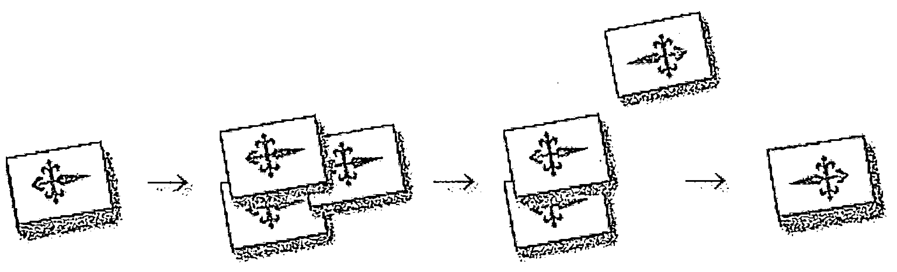

### 2. 麻将洗牌法

首先将牌叠放在桌面上，然后双手将牌慢慢抚平，使牌散乱地平铺在桌面上。这个过程就像打麻将时和牌后将麻将推倒一样，只是动作由推变做抚，由用力变做轻柔。接下来也如麻将洗牌一样，双手朝一个方向（顺时针或逆时针）轻柔地搓洗，让每张牌都旋转起来，让整副牌作为一个整体也一起旋转起来。当牌洗净后，双手再将牌汇聚一拢，横向整理成一叠。

至于洗牌时的方向是顺时针还是逆时针，可以依据个人的偏好来决定，但是决定后最好就不要再更换，在每次洗牌过程中从头至尾都采用一个方向来洗牌。

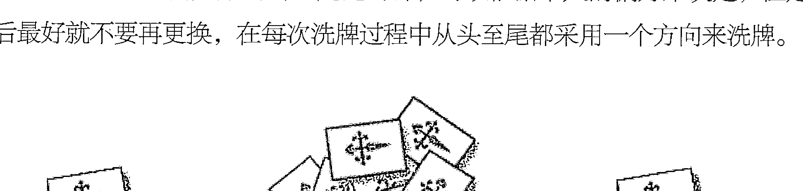

以上两种洗牌方式是塔罗师们经常使用的，我们可以依据自己的喜好选择一种，当然也可以将两种方式结合使用，这样洗牌的效果还会比单独使用更好。

洗牌的时候应该要求问卜者集中精神，不要东张西望或者做其他事情，问卜者应该将注意力集中在牌上，然后心中想着所要占卜的问题。而占卜者则要放松精神、心无杂念。至于思考牌阵和事件的发展，请放到选择牌阵或者分析牌阵的步骤中，占卜师在洗牌的时候要做的只是收敛身心、整理思绪。我们可以将塔罗牌当做放映机，将问卜者的心灵当做影片，然后将自己当做投射荧幕，那么可想而知，如果荧幕不是空白的话，势必会影响影片的真实投射。所以只有占卜师放开了自己的心灵，让大脑空白，才能更好地接受来自问卜者的信息。为了达到更好的效果，在洗牌的整个过程中双方最好都保持沉默。

至于洗牌洗到什么程度才算洗净了、什么时候结束洗牌，这没有一个标准来评判，只能靠我们自己去感觉，只要你觉得牌洗净了便可以结束洗牌。我们的心中会自然地发出一种声音，而我们要做的就是去聆听它。

另外，洗牌也可以由问卜者进行。但如果问卜者是第一次尝试塔罗占卜，我们最好不要让他来洗牌，且不说教导起来麻烦，操作的准确性也无法得到保障。如果问卜者不是第一次占卜，在此前尝试过多次占卜，对塔罗占卜的整个流程尤其是洗牌的过程非常了解，而且他又希望由他自己来洗牌，那么我们也没有什么理由好推辞，在这种情况下由问卜者来洗牌也许还会对占卜有所帮助。

## “切”——如何切牌

洗完了牌，我们就可以进入占卜的主要阶段，这一阶段首先从切牌开始。

切牌是为了让问卜者参与进来，让问卜者的信息介入此次占卜，让塔罗牌确认此次占卜的对象是谁。如果不是由问卜者来洗牌的话，这便是问卜者在此次占卜中第一次与塔罗牌接触。此前在准备阶段无论你与问卜者聊了多少，对于塔罗牌来说，它对问卜者还是一无所知。而在切牌之后，问卜者的信息便介入塔罗牌中，此前洗牌的随机性已经消失，变成了有意义的排列。可以将随机状态理解为塔罗牌的空白或待机模式，切牌便是输入数据的过程。本次占卜的对象和问题在切牌过程中得到了确认。

毫无疑问，切牌是要由问卜者操作的。而我们作为占卜者的任务便是指导问卜者进行切牌，尤其在问卜者是第一次尝试占卜、对切牌过程一无所知的情况下。如果洗牌的过程中没有出现错误的操作，那么在此时，牌应该是横向叠摞在桌子上的。接下来，问卜者首先要将桌子上的牌一次性分成两摞，然后再将包含着原来最顶上那一张牌的一摞（也就是刚刚被拿起的那一摞）再一次性分成两摞。这样，桌面上就摆放着三摞牌了。接下来拿起第一次分割时没有被拿起的那一摞（也就是含有最初最底下面牌的一摞）放在第二次分割没有被拿起的那一摞（也就是不包含最初顶层或底层牌的那一摞）上面合成新的一摞，然后再将这一摞叠放在第二次分割被拿起的那一摞（也就是包含最初最顶层那张牌的那一摞），这样三摞牌就又重新合成了一摞牌。在这个过程中，牌应该始终保持横向，且牌不应该发生翻转。

最后将这摞牌逆时针转动90度，也就是将这摞牌的右侧转向问卜者，左侧转向占卜者。旋转后，牌呈竖向的一摞，接下来再轻轻将牌横向抚推均匀展开成扇形。

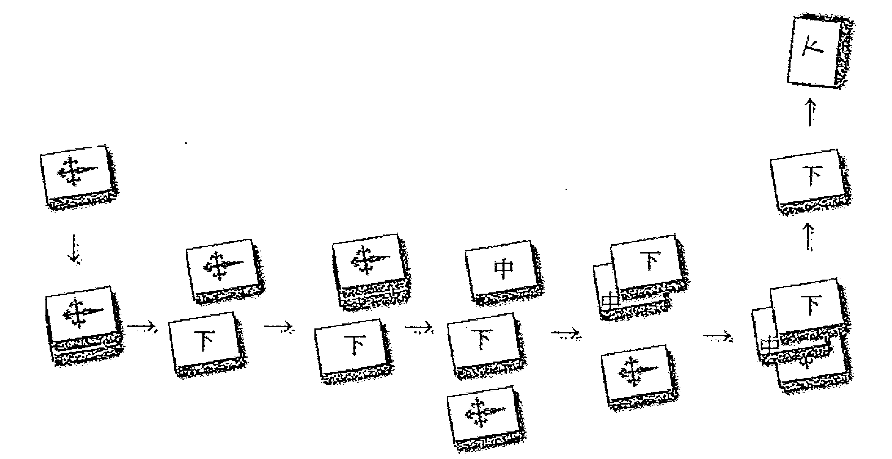

但是当给自己占卜时，占卜者与问卜者是同一个人的时候怎么办呢？国内一些塔罗书籍主张以右侧转向问卜者为准，所以在给自己占卜的时候，作为问卜者，应该将牌顺时针转动，右侧朝向自己。但是这种做法显然是错误的。因为牌的正逆位是以占卜者角度来看的。如果给自己占卜时将右侧转向自己，则是把自己当做问卜者，在自己对面虚构出一个占卜者。这样你眼中的正逆位其实是以问卜者角度得到的，与占卜者眼中的正逆位是相反的。你要坐到你的对面（问卜者的位置）才能看到正确的正逆位。而按国内这些书籍的说法，将右侧转向自己后却没有纠正牌的正逆位，这样解出来的牌其实是正逆完全颠倒的了。这样的占卜，还可能准确吗？所以，在给自己占卜时，与其将右侧转向自己（顺时针旋转）然后颠倒正逆位或者坐到你对面的位置去解读，倒不如同给别人占卜时一样将左侧转向自己（逆时针旋转），这样眼中的正逆位便直接是占卜者眼中的正逆位。这样，便不存在正逆位颠倒的问题了。所以，无论为谁占卜，都只要无差别地逆时针切牌即可。

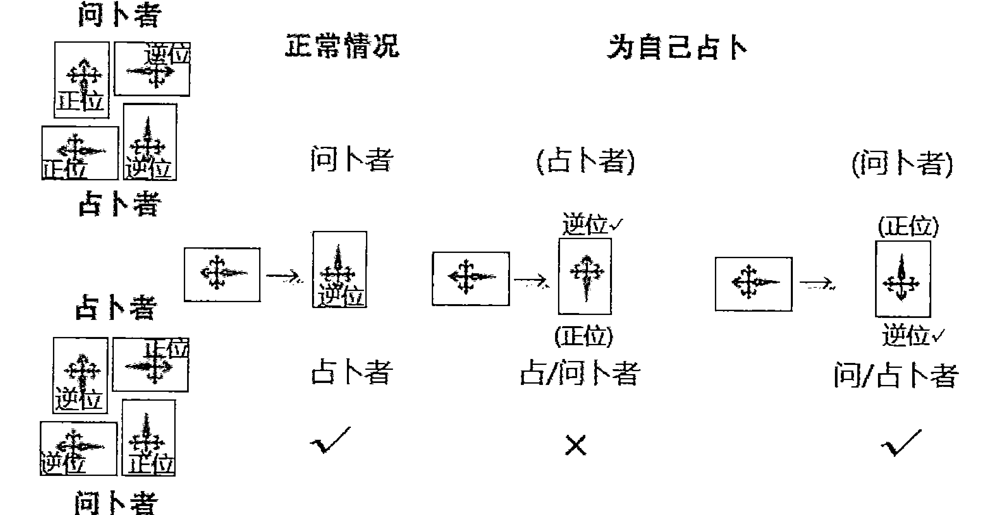

另外，切牌应该保证一次性完成，动作要流畅，不要停滞。也就是说，在拿牌的时候不要去想要拿多少牌。牌被拿起来后，拿了多少就是多少，千万不要再去调整，不要放下一些牌让牌看起来更均匀或者再补拿一些牌让牌看起来足够多。在拿起牌后也不要考虑将牌放在哪儿，或者考虑下次拿牌从哪儿拿等问题。在切牌之前，占卜师有责任详细地讲解切牌的每一个步骤以使问卜者明白。一旦切牌开始后，动作就不要有停滞，占卜者也不要插嘴指导，让问卜者随着直觉走就可以了。即使在切牌过程中有错误操作，也不要纠正，继续下去就好，如果在切牌之前有很好的讲解，但还是出现失误，那也许意味着这才是潜意识或者说命运所要表达的真实。

## “取”——如何取牌

取牌是为了从问卜者海量的潜意识信息中挑选出与占卜事件相关的信息。这个过程充满了随意性，并没有过多的严格要求，放松心态去做就可以了，因为越是自然随意，越是能客观反映潜意识的真实情况。

“取”这一步骤包括了抽取、摆放和翻开三个小步骤。在切牌完毕后，塔罗牌应该是扇形展开在桌面上的，接下来应该请问卜者从中任意抽取牌阵所需要数量的牌，然后按照牌阵的布局摆放。需要注意的是，我们要提醒问卜者在取牌的时候不要将牌颠倒，也不要翻开，取出后交给占卜师或者直接放置在牌阵中属于它的那个位置。每取好一张牌就放置一张牌，不要一次抽取很多张牌然后再摆放，这样很容易造成混乱，从而导致错误的操作。所以，牌应该一张一张地抽取，在全部摆放完毕后，再逐一将每张牌从右侧向左翻开。注意不要将牌从下向上或从上向下翻开，这样会颠倒正逆位。

绝大部分牌阵的取牌方式都可以是由问卜者随意抽取的，但是个别牌阵在个别的时候也会要求取固定序数的牌，例如也有人主张“圣三角”牌阵的取牌方式应该是取第7张、第14张、第21张。这两种取牌方式代表了两种观念，序数取牌突出了命运的必然性，而随意取牌突出了命运的人为性。现在严格要求只能按序数取牌的牌阵几乎不存在了，也就是说，无论遇到什么牌阵，如果没有特殊说明，都可以简化成由问卜者随意抽取。

## “析”——初步分析牌阵

取好并且摆好牌之后，还不用着急去解牌。我们应该先来整体看一下整个牌阵，这样可以对整个牌阵得到一个整体印象和一些灵光乍现的想法。但是我们不需要将这些想法牢牢记在心中，只要做到心中有数就可以了。

在这个阶段，我们更要多关注整体而不是细节。静下心来，沉默一会儿，扫一眼整个牌阵，对事件的发展有个初步的了解，尝试着为事件的发展轨迹定一个基调：积极或消极，乐观或悲观，转好或转坏，等等。我们还可以重点关注一下牌阵中的关键位置，牌阵中出现的正逆位牌之间的数量比，以及积极性意义的牌与消极性意义牌的数量比，这些可以帮助我们快速掌握事件的发展趋势。

然后我们可以再看一下整个牌阵中对哪些牌有感觉，在心中大概制订一下解牌的计划，从哪几张牌开始解读，向哪个方向解读。提前组织一下语言，有利于我们更好地向问卜者传达塔罗牌所呈现的信息。

## “解”——如何解牌

解读牌阵以及牌的含义是占卜的核心步骤。塔罗牌将问卜者的潜意识信息显示出来了，但是问卜者没有相关的知识背景，自然也就看不懂塔罗都呈现了些什么，所以才需要由作为占卜者的我们来翻译、解读。对于一个牌阵，能够解读多少、多深、多准是衡量占卜师能力的基本标准。

解读牌阵，其实并没有什么固定的顺序要求，不同的占卜师会有不同的解读习惯。但一般解读都会先从牌阵入手。在上一阶段“析”的步骤中应该已经对牌阵有了初步的了解，在此刻则要更细致地了解牌阵的几个关键位置，然后提纲挈领，逐一解读关键牌。进而将解读对象从关键位置的牌逐步扩展延伸到整个牌阵。关键牌通常是被摆放在牌阵中代表原因、关键或结果位置的那些牌。

解读牌义，也没有什么具体的规定。可以死记牌义来解读，可以根据理论原理来解读，也可以依据直觉灵感来解读。无论采用什么方法解读，只要能准确解读塔罗牌所要表达的信息就可以。一般解读一张牌的牌义都会参考该牌的名称、关键词、经典含义、象征物、牌阵位置以及与其他牌的联系，然后依据理论、直觉或经验来将相关含义整合到一起。

解读应该围绕着占卜的主题，要有条理，同时也要突出重点，不能漫无目的东解一点儿西解一点儿。这样只会使问卜者云山雾罩，搞不清事实的状况，以至占卜结束后问卜者还是一无所知。但是将所有牌都融入一个主题在大多数时候是不可行的，所以在解读的时候允许有相互之间矛盾的牌存在，要知道这个世界一直都是充满矛盾的。

解读的时候应该多关注自己的灵感和直觉，因为它们往往会使占卜变得有趣，变得令人激动，变得更加准确。灵感和直觉一般都是在自信和放松的情况下才能产生，所以解读的时候不要怀疑自己，也不要精神紧绷，自信放松地做反而会更加有成效。同时还要避免分析化、教条化，死板、因循守旧的解读只会扼杀灵感。解牌的时候，可以适当地把所有牌义和理论抛诸脑后，因为牌义是可以变化的，牌阵也是可以变化的。如果在某个位置的某张牌就应该是某个意思，而那张牌的经典含义中没有包括那个意思，或者在解读某张牌的时候，你的脑海中突然闪过了一个与此牌经典含义不符的含义，那么请勇敢些、自信些，按照你脑海中的想法去解读，它才是真实的正确的结果。如果这个含义在以后的占卜中一再得到印证，那么你甚至可以自豪地将其列入该牌的经典含义之中。因为所谓经典含义，也不过是前人在理论或实践中发现的，然后经过时间的验证最终成了经典。

不要孤立地去解读某张牌，不要割裂某张牌与牌阵中其他牌之间的联系，也不要割裂某张牌与事件和周围环境之间的关系。一张牌会有许多含义，只有放到具体的事件中、具体的牌阵中，与牌阵中其他牌结合，它的含义才最终确定。如果孤立地解读某一张牌，将会失去解读的方向，不知道如何取牌义，所得到的牌义也很难真实反映事件的状况。我们可以试着采取编故事的方法将牌阵内的所有牌串联起来，将牌阵的位置作为路标，结合起来指引解读。这样可以有效地避免偏离或迷失方向。

作为一个负责任的占卜师会在解读的时候注意语速、重复和交流。因为解读是为了使问卜者明白一些事情，而语速过快，问卜者可能会听不清或来不及思考吸收。滔滔不绝地演说以及对重要信息缺乏重复强调，会使问卜者难以抓住重点。缺乏交流则会使占卜者和问卜者的关系变成说与教，而不是倾诉与帮助的关系了，这样问卜者没有机会表达自己的想法，也没有办法通过语言反馈信息，这对占卜的影响可想而知。适当的停顿、重复和交流是有好处的，甚至还可以采用录音、笔记的方式辅助问卜者记录心得。

如果牌面所呈现的信息非常不好，也不要惊慌，不要恐吓问卜者，应该避免作出绝望的解读，应该铭记要始终给予问卜者希望。因为这个世界没有完全令人绝望的情况，无论情况多么糟糕，也总会有一两处希望的苗头。即使现在真的绝望透顶了，那么谁又敢保证再过一两天希望就不会出现呢？凡事一旦被贴上“绝对”的标签，通常就意味着判断者作了错误的判断。所以，既没有绝对的绝望，也没有绝对的希望，看待问题的角度不同，得到的景观也不同。我们占卜是为了帮助问卜者，而不是为了打击他们，所以我们要时刻铭记我们应该并且能够给予他们希望。

对某一张牌没感觉时、思维陷入死角时、不知道怎么表达时，我们可以试着反过来问问问卜者对这张牌有什么看法。虽然问卜者不懂塔罗，但是毕竟塔罗牌展现的是问卜者的心灵。有的时候，对于牌上展现的信息他们会比我们更明了。毕竟还有谁能比问卜者自己对他的心灵更加了解呢？在其他心理咨询中也有类似的做法，这不是无能的体现，相反是睿智的表现。问卜者的一两句话语往往就会打通我们的思路，所以，在需要的时候，放下架子去请教问卜者吧。

另外，解读时还要能够针对问卜者的反馈信息作出敏锐和及时的反应。解读有错误，要虚心地接受，然后及时改正；解读方向有偏移或脱离占卜主题，也要及时纠正；解读有不足或者有新信息出现，更要及时补充，不断地去完善解读。只要对问卜者的反应足够敏感，能够敏锐地察觉到反馈信息并及时作出反应，那么解读的准确率一定不会低到哪儿去。即使不能及时地察觉和作出反应，也不必灰心气馁，尽量去做就可以了，因为此后还有“检”的步骤可以来弥补。

## “检”——记得纠错

解牌的时候，无论解得对或错，问卜者一般都会有一个反馈信息。这种反馈可以是语言的，也可以是表情或动作的。我们不应该忽视它们，甚至还需要多留意，因为依据这些反馈信息我们可以得知之前解牌哪里解得好、哪里解得不好，然后随时纠正错误和不好的地方。这样才能更准确地为问卜者分析事件，这样我们才能算是负责任的占卜师，才能知道自己的不足之处，纠正坏习惯，不断取得进步。

有时候，反馈的信息是针对解读发生错误的地方，而有时候是我们之前解读没注意到的地方，或是问卜者新提供的信息。这个时候我们要做的自然不是纠正，而是补充。新提供的信息往往非常有价值，因为它们是在解读过程中问卜者受到促发而主动提出的，通常是与问卜者和事件关系非常密切和重要的信息。我们要依据这些新信息来为解读作出补充，甚至有的时候还会推翻此前的解读，重新审视刚才的牌阵，完全重新解读一遍。

## “议”——如何议牌

“议”并不仅仅是“建议”，还包括商议和讨论，所以这一步骤简称为“议”而不是“建”。在解牌结束后不要急着结束这次占卜。正所谓编筐织篓重在收口，一次完美的占卜应该有一个完美的收尾。作为塔罗占卜师（心理咨询师），我们应该尽我们的可能来安抚问卜者（来访咨询者）的情绪，帮助他们认识自己，认识未来的可掌握性。我们可以试着跟他们谈谈自己类似的经历，或者双方谈谈对本次占卜的想法以及对此次占卜满意与否。我们也可以简单地介绍塔罗的一些原理，让问卜者更了解塔罗的本质，排除那些流传的对塔罗的误解。如果问卜者是没有主见的人，而事情又很急迫，我们也可以为其出谋划策，帮助他走出困境……

总之，解读结束后不要着急结束，要做好收尾工作。

## 占卜的讲究

### 占卜场所

在电影中出现的塔罗占卜场面，通常是这样的：在深街后巷里，某家昏暗的店内，一个昏暗的角落，占卜师一身黑装，看不见脸，只有一双苍老的手从黑暗中伸出……

其实电影的描述已经完全脱离了事实。这些影视作品在将塔罗神秘化的同时，也将塔罗妖魔化了。

塔罗并不一定要与黑暗牵连，也并不一定非要在黑暗的角落以一身黑装进行占卜。塔罗本身是非常宽容随意的，无论在什么条件下，只要有张桌子，不会受到风或水等潜在的破坏因素干扰，就可以进行占卜。当然，出于对牌的爱护、占卜过程的舒适度以及塔罗师的个人习惯等考虑，一般对占卜的环境还是有所要求的。

第一，要有一张干净的、平坦的、足够大的桌子，以保证塔罗牌不会受到损害，并且在占卜时桌子上可以放得下大部分牌阵。如果有桌布最好，如果没有，则在占卜前一定要再擦拭一遍灰尘，注意不要弄湿桌面。毕竟塔罗牌是纸做的，很容易变脏和浸湿。

第二，尽量在室内占卜，如果在室外，则要保证没有风等因素的干扰。如果被风或者吵闹的人群等扰乱了桌面上的牌，占卜就很难继续下去了。应该保证塔罗牌在占卜结束前都能安静、安全、稳妥地放在桌子上。

第三，光线不能太暗，也不能太亮。如果还想进行占卜的话，就不要到光线暗到连牌面和问卜者的表情动作都看不清晰的地方，总不能“瞎”解牌吧……光线太刺眼的地方会让人心情烦躁，也不适于占卜。

第四，不要在过于吵闹的地方占卜，除非你能在吵闹的环境下好好思考，并且能够清楚地听到问卜者讲的每一句话。至于要不要在隐秘的地方进行占卜，主要还是看问卜者的要求了。如果是非常隐秘的事情，并且问卜者强烈要求，那么可以选择一个隐秘、安静的地方占卜。不过，无论问卜者要求与否，都应该尽量保证占卜的时候周围没有旁观者，除非客观条件实在不允许。

### 占卜道具

一般塔罗师为了避免塔罗牌与桌面直接接触而变脏都会至少备有一张桌布在占卜时使用。虽然桌布的主要功能是保护塔罗牌，但有些塔罗师还会备有各种颜色的桌布，占卜时会根据不同的占卜主题，选择不同颜色的桌布，以提升占卜的准确率。

在神秘学中，不同的颜色拥有不同的力量、不同的磁场，会给占卜带来不同的影响。例如粉红色和红色一般有助于以爱情、感情为主题的占卜，棕色、褐色、绿色适合以健康为主题的占卜，而灰色、金色适合以事业、学业为主题的占卜，黑色和白色是通用的。无论选择什么颜色，桌布最好是单色的，不要花花绿绿，防治占卜时被扰乱心神。桌布上可以有一些神秘符号图案，但最好不要太花哨以致占卜时会分散注意力或被迷惑。至于桌布的材质，最好是纯棉或真丝等天然的、不易起褶皱的，这样一方面可以减少牌的磨损，另一方面也不会干扰牌的磁场。

除了桌布，我们也可以另外多备一块小的布，平时用来包裹塔罗牌。这样可以更好地保护塔罗牌。

塔罗牌当然不能总是装在纸盒里，也不能仅仅包着一块布就随便放，更不能散着随便放在哪里……通常塔罗牌都是被装在布袋或盒子里保存的。如果是用布袋来保存塔罗牌，则要求布袋尺寸不能太大也不能太小，装下塔罗牌后稍微还有一点儿空隙就好。可以将塔罗牌先包上一层布再放进布袋里，也可以直接放在布袋里。如果是用盒子来保存塔罗牌的话，是不可以将牌直接“裸”放在盒子里的，应该先用布袋装或用布包裹之后，再放进盒子里。盒子的尺寸可以是刚好放下一副牌，也可以根据实际需要选择更大空间的盒子以放更多的牌或者其他道具。用布袋保存塔罗牌比较容易携带，而且布袋非常廉价、实用，只是如果放置不当，布袋很难保证牌不会变形、折弯或者潮湿。而用盒子保管塔罗牌则能起到更好的保护作用，只是盒子比起布袋稍显笨重而又不易携带。两者单独使用各有利弊，所以如果条件允许的话，最好还是两者皆用。

此外，塔罗还会涉及一些辅助道具和仪式用品，例如水晶球、灵摆、元素物品等。但是这些东西对于占卜来说都不是必需的，而且关于水晶球等道具到底是否真的有助于提升占卜师的灵力，历来也是存有争议的。所以，要不要配置一些辅助道具和仪式用品，需要读者根据自己的认知情况来自行决定。

### 占卜禁忌

塔罗不是万能的，塔罗师也不是万能的，一些问题塔罗无法准确占卜，一些情况塔罗师无法准确解读。接下来就来讲讲塔罗的一些禁忌以及什么时候、什么情况不宜占卜。

1. 塔罗师的精力不足的时候不要占卜。没有休息好或者过度疲劳的情况下，塔罗师的头脑自然也很难保持清醒和敏捷。头脑都不清醒，心灵也难免是混沌的。在这种情况下勉强占卜，很难做到准确，而且占卜是非常消耗心神的活动，在精力充沛的情况下完成一次占卜都可能会感觉疲惫不堪，如果经常在精力不足的时候勉强占卜，只会对占卜师的身心造成伤害。所以，与其疲劳的时候占卜，不如等养足了精神再来。这也是很多塔罗师限定每天的占卜次数的主要原因。
2. 如果塔罗师或问卜者的心理状态不对，最好不要占卜。无论塔罗师还是问卜者，在情绪不稳定的时候对占卜都会造成难以预料的影响。因为在极度喜悦或悲伤的情绪下，人的思维往往也会偏激、极端。本来非常乐观的人在悲伤的时候看待事物也常常是悲观的，而本来很客观的人在过度喜悦的时候看待事物也常常会过于乐观。情绪对人的心灵冲击会打破心灵的本来面貌。无论是什么样的极端，都会破坏以平衡为法则的塔罗占卜。占卜者也好，问卜者也罢，被极端情绪冲击的时候都应该尽量避免占卜。等到情绪平复了再进行占卜也不迟。
3. 问卜者不诚不卜。诚既指诚心又指坦诚。首先，如果问卜者不诚心，并不相信塔罗牌，则不要进行占卜。给不相信占卜的人占卜，是没有意义的事情，勉强占卜，只会让双方都不愉快。更有甚者会不惜做出一些可怕的事情来证明占卜的结果是错误的。其次，如果问卜者不坦诚，也不要占卜。正如对医生撒谎的患者很容易被误诊一样，给不坦诚的问卜者占卜也很难有准确的结果。虽然很多时候塔罗牌能揭露问卜者撒谎或者隐瞒的真相，但既然是问卜者有意撒谎和隐瞒的事，肯定是问卜者难以接受的事。塔罗师应该尽量避免引起冲突，这种情况下倒不如不占卜。
4. 问卜者所要占卜的事情不对时不要占卜。生活中那些零散琐碎的不用占卜就可以自己决定的小事不需占卜，要到哪里吃饭、要走哪条路之类的事情又何必麻烦塔罗牌呢？影响过于重大的事件也不要占卜，除非你能够承担起相应的责任。不可能的事情和无法努力的事情不要占卜，受情绪干扰严重的事情也不要占卜。
5. 不要同一个问题问很多次，不占卜到好的结果不罢休。执念只会扭曲表象，并不能改变本质。如果事件的状况没有发生改变，无论占卜多少次，即使出现了不同的牌，结果其实还是一样的，因为塔罗是根据已知状况推测未来走向，在状况没有发生改变的时候不断追问是没有意义的。而无法接受结果的这种强烈执念，只会扭曲表象，不断追问，即使获得了满意的答复，也只是不能代表真实的假象而已。
6. 不为有虔诚宗教信仰，尤其是有独尊信仰的宗教人士占卜。塔罗是一个包容万物的容器，拥有大自然那广阔胸怀的宽容。它不排斥任何事物，各种宗教、神话、文化都可以被塔罗所用。但是，对于排外排异的文化和宗教来说，与之“独尊”理念格格不入的塔罗牌是恶魔般的存在。一直以来，许多宗教都视塔罗牌和塔罗师为邪物，即使到了现代，塔罗师也应该尽量避免与有虔诚宗教信仰，尤其是有独尊信仰的宗教人士接触，更不要与其讨论塔罗或为其占卜。
7. 不要遗失、破坏一副塔罗牌中的任何一张。塔罗是大自然的奥秘库，是人类智能的补充，它与人的大脑一样，完整时才能起作用，缺少或者损坏任何一部分都会对整体带来极大的影响。不完整或有损坏的塔罗牌是无法继续使用的。如果不幸真的丢失或损坏了某张牌，不要想着用白纸或自己画一张来替代，还是将其封存，换一套新牌吧，这样还能算是对逝者的一种敬意。
8. 塔罗牌应该尽量避免让无关的人碰触，但并不是意味着不让任何人去碰它。占卜时，要引导问卜者去正确接触塔罗牌。在非占卜情况下，别人只是感兴趣想看看塔罗牌，也不一定非要拒绝，只要他们能够小心、细心地去对待手里的牌。让别人接触塔罗牌的前提是要保证牌不会被“虐待”。为了保护塔罗牌，还是应该尽量避免把牌借给那些会把牌放在手里折、把牌弄到地上的“纸牌杀手”们把玩。
9. 不过度依赖塔罗，要有自己的判断力。为了提高能力，平时可以多多练习，大事小事都拿来占卜，但是不要过度依赖塔罗，不要养成凡事都依靠塔罗作决定的习惯。塔罗牌只是辅助工具，不应该让其取替人来作决定。塔罗存在的意义在于让人变得更睿智，但是，过于依赖塔罗，只会让人变得懒惰，渐渐失去决策的能力，这是违背塔罗初衷的。

### 占卜仪式

仪式本身对于塔罗不是必须的，是可有可无的。不做任何仪式，并不会影响到塔罗师对塔罗牌的使用。但是，对于爱好魔法、爱好神秘事物、想要严肃庄重对待塔罗的人来说，仪式又是必不可少的。仪式可以提高塔罗的魅力，也可以集中塔罗师的精神，提升塔罗师的心灵力量。

与塔罗牌相关的仪式主要有以下几种：

#### 开牌仪式

在启用一副新牌前所做的仪式。目的是去除牌上残留的信息和磁场，使塔罗师与牌建立关系。相当于使用新魔法和召唤前签订契约，开牌仪式也可以看成是塔罗师与塔罗牌签订契约的过程。塔罗师承诺保护塔罗牌、正当使用塔罗牌、帮助迷惑的人们并传播塔罗的智能，塔罗牌则授予塔罗师预测未来的能力，并辅助塔罗师参透命运与世间万物所遵循的“道”。

不同的魔法社团、不同的魔法师，所使用的仪式也往往是不同的。魔法师、占卜师可以依据个人喜好和特征来选择已有的经典仪式，也可以根据经验和心得自创适合自己的仪式。塔罗牌的开牌仪式也有许多种，比较流行的是元素开牌仪式。

开始仪式之前，如果条件可以的话，最好先沐浴更衣，如果条件不允许，至少也要保证双手是干净的。仅仅身体纯净还不够，更重要的是精神也要处于纯净的状态，即要保证塔罗师精力充沛、情绪稳定。另外，环境也应该是处于纯净的状态，即要保证进行仪式的地方足够干净和安静，不会有人打扰。

仪式中所使用的物品应该在仪式开始前准备好。在这个仪式中主要用到的物品有塔罗牌、桌布（最好上面已画有魔法阵）、四元素的象征物。四元素的象征物有很多种，塔罗师挑选自己认为美观、庄重、合适的就可以了。火元素常用的象征物是点燃的蜡烛，短粗的白蜡烛最为合适；水元素常用的象征物是美观的杯子，高脚杯之类的杯子要比普通水杯和咖啡杯更为合适；风元素常用的象征物是匕首，宝剑也可以，一般要求是银制的，最好是双刃；土元素常用的象征物是石头，水晶、宝石和鹅卵石之类的石头最为合适。

将塔罗牌（整套）放在桌布中央，水、风、土、火四元素的象征物依次摆放在桌布的西、南、北、东四个方位，使其围绕着塔罗牌。蜡烛一定要点燃，杯子里最好盛有干净的水。一切准备就绪，仪式就可以开始了。

首先要做的是集中精神、收敛心灵、聚集自己的全部精神力量。身体保持一个姿势不动，眼睛可以直视前方也可以看着塔罗牌。然后调整呼吸，深长、轻悠、缓慢地呼吸。仪式的过程中，也可以播放一些神秘风格或宗教的纯音乐。总之要把散布在四处的所有精神力吸纳回体内，做到心中无所思，周围事物难以入眼入心。只有进入冥想状态之后，仪式才可以继续下去，否则就要一直努力收敛心神。

进入状态后，大概会有种感觉不到肉体存在、意识很集中又很缥缈的感觉。接下来塔罗师可以在心中默念祷文，也可以大声诵读祷文。因为祷文是塔罗师与塔罗牌建立关系的契约，只会涉及进行仪式的塔罗师和塔罗牌，所以内容可以由自己撰写，例如祷文中可以包含“请帮助我拯救迷途之人”、“请借我你的力量”之类的话语。祷文可以简单到只有一句话，也可以复杂到长篇累牍。如果你相信魔法，并且想要更庄重些，祷文最好还是认真撰写，甚至还可以与四元素的精灵或天使签订契约。

契约签订后，如果已经感到疲惫，塔罗师就可以放松心神，结束仪式了。如果精力还足够充沛，塔罗师可以逐一拿起每一张塔罗牌进行冥想，这时候获得的心得会使以后的占卜受益无穷。

仪式结束后，要好好地收拾起塔罗牌和其他仪式物品，不能随便乱丢。此外，塔罗师的心得总结、回想也很重要。总之，不要虎头蛇尾地结束开牌仪式。

#### 冥想仪式

心理学家们认为冥想（Meditation）是一种改变意识的形式，它通过获得深度的宁静状态而增强自我知识和良好状态。在生活中，冥想更多与瑜伽和佛教联系在一起，是一种复杂的修行方法。而在塔罗中，冥想主要以辅助占卜为目的而被使用，所以其过程完全可以被简化，省略掉其中烦琐复杂的仪式。既然冥想可以作为心灵修行的一种方式，而塔罗也存在着心灵成长这一追求，我们还是建议在平时精力充沛、时间充足的时候，依照完整仪式和流程进行冥想，因为这样可以增强冥想的效果。

冥想的仪式有很多种，但不是掌握越多越好，仪式也不是越复杂越好，关键是要挑选适合自己的，才能让冥想发挥最大效益。

在介绍具体的冥想仪式之前，让我们先来学习一下冥想的基本练习。

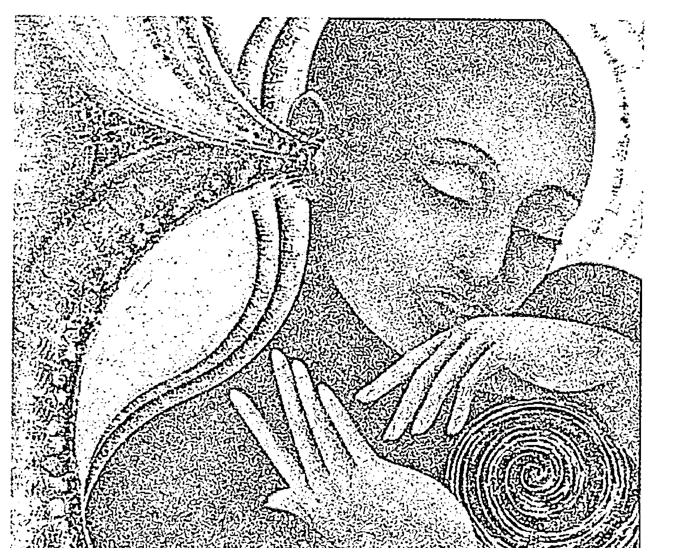

##### 一、呼吸练习

进入冥想，首先要调整好呼吸。深深地吸气，越深越好，吸到底后稍停顿一下，再缓慢绵长地呼出。需要注意的是吸气时一定不可以张嘴，而呼气时嘴张开或闭上则无所谓。呼吸需要有一定节奏，以自己的感觉为准。一般初学者可以用六秒左右的时间吸气一次，停六秒后，再用六秒的时间呼气，完成一次呼吸大约需要十八秒的时间。循序渐进到熟练之后，呼吸频率会继续放慢，完成一次呼吸所用的时间会增加。调整呼吸的目的在于让身心平静下来，所以呼吸越深、越慢越好。

呼吸节奏稳定下来是进入冥想状态的一个重要标志。此时可以想象吸入的是白色的、纯净的光，而呼出的是黑色的、污垢的暗。想象一定要形象，并且要催眠自己确实相信才可以。这是一切冥想的基础，冥想时切忌呼吸紊乱。

##### 二、基本的视觉化练习

冥想的过程是闭着眼的，所谓的视觉化练习并不是练习用眼去看，而是练习用心去看。我们的眼睛是受到限制的，它们只能在有光的地方看见东西，它们只能看向前方，它们看不见阴暗。所以，我们要锻炼我们的另一双眼睛，那双更敏锐的眼睛。

基本的视觉化练习可以依靠塔罗牌，但也不局限于塔罗牌，只要是美丽的图画即可。

把画面从左到右或从上到下看一遍，将这个画面扫描进你的脑海中。当你感觉到你的脑中存在这个画面后闭上眼睛，努力把图像调出来。图像被清晰地描绘出来之后，再想象着把它从右到左或从下到上抹去。

这是基础的视觉化练习，为下面的练习作准备。它只是调用已存在的意象，并没有真正创造意象。

##### 三、高级的视觉化练习

这里介绍一下“花的意念”练习。

这个冥想练习分为七个阶段，一般一天为一个阶段。如果顺利的话，这个练习需要一周的时间，如果练习得不顺利，就可能需要更长的时间了。这个冥想练习虽然耗费的时间很长，但是对于培养创造性的视觉化能力是很有效的。

练习的第一阶段请随便在脑海中形象地描绘出一朵花，什么样的都可以，但一定要能够清晰地看到它的样子，能够真实地感觉到它的触感，最好还能够闻到气味。要尽量保持描绘成型的花长时间不消失。描绘（创造）它的时间越短，存在的时间越久，则说明练习得越成功。顺利描绘出成型的花朵并能维持它存在一段时间后，就可以进入下一个阶段的练习了。

第二阶段，在脑海中创造出与第一阶段一样的花，成功后，再把它的花色转变为其他颜色。

第三阶段，在脑海中创造出与第二阶段一样的花，成功后，再把它的花形转变成其他形状。

第四阶段，在脑海中创造出与第三阶段一样的花，成功后，改变花的大小。

第五阶段，在脑海中任意创造一朵花，同时改变它的颜色、花形与大小。

第六阶段，先在脑海中创造出一朵花，然后将其变成复数，越多越好，颜色、形状与大小最好各不相同。

第七阶段，将第六阶段所有的花都变为白色并发出纯净的光芒，飞往空中形成穹形照耀着你。

##### 四、聚集能量的练习

首先将双手洗净，两手相对。

可以指尖向上，将双手放在胸前；也可以指尖向前，将双手放在腰间。

然后感受力量在双手中。要能够“看见”双手流溢的光芒。

把光芒聚集在双手之间，形成一股顺（逆）时针旋转的涡流。流动方向、流动速度、光芒颜色均无具体限制，但最好不要过于激烈。

然后感受这些能量的流动，感受它们的存在。要切实感觉到那温度、那触感。

继续聚集，让光芒扩大，感受那团旋转的能量已经完全包裹你的双手并扩散开来，直到最后所有能量流入了你体内。

##### 五、冥想的具体操作

###### 适合冥想的场所

平静的场所是最适合进行冥想的地点，但不必刻意避开自然的声音。举凡虫声、风声、波浪声、潺潺流水声、鸟声等，若能融入其中，才是最理想的冥想。

###### 冥想的要诀

- 静：缓和身心，消除紧张。
- 定：专注不移，一心一意。
- 止：摆脱杂念，头脑休息。
- 观：一心观想，坚强意志。
- 觉：感觉敏锐，思绪空明。
- 同：无限可能，创意无限。

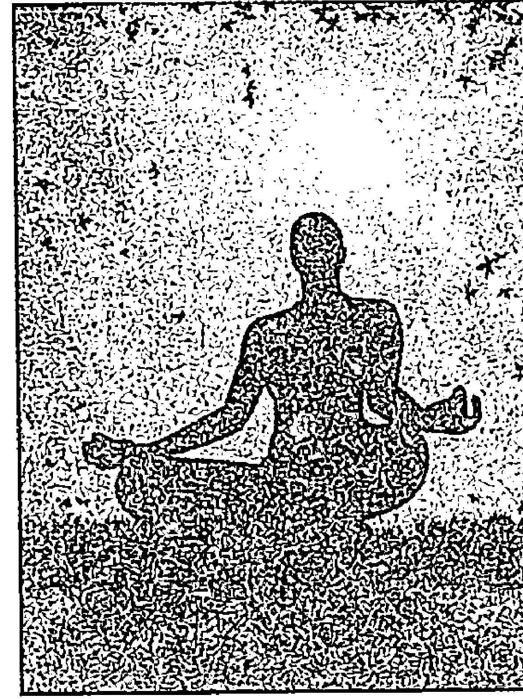

###### 适合冥想的时间

空腹——饱腹容易使人想要入睡，所以在身体缺乏“气”的空腹时间，最适合冥想。

早晨——这是一天当中“气”最饱满的时段，即朝雾散尽，阳光普照大地，充满活力和新鲜之气的时段，朝着太阳上升的地平线坐下，进行冥想。

中午——这是一日之中“气”最强烈的时段。它能带给工作疲累、有疾病和虚弱之人身心安详的活力，使人感受到强烈之“气”。

黄昏——一面望着夕阳，一面进行冥想时，内心会萌生一股将希望寄托于明日升起的太阳之信念，此时是心灵获得慰藉的绝佳时段。

深夜——在万籁俱寂的深夜进行冥想，是冷静检讨自己的最佳时机。

冥想时要精神放松，并选择具有稳定亮度和温度的场所。

以上是刚开始练习冥想的一些客观条件，当达到一定水平，能够熟练操作后，甚至无论任何时间、场所、亮度、温度等，随时随地皆可进行冥想。

#### 冥想仪式（MerKaBah）

“MerKaBah”是希伯来语“战车（Chariot）”的意思，尤指塔罗牌“战车”中那个有四活物的战车，也指上帝的王座。实际上我们常常见到的“MerKaBah”是由两个三角体反向拼合而成的六芒星体。“Mer”代表光，“Ka”代表灵魂，“Bah”代表身体和现实世界。“MerKaBah”冥想仪式是一种净化灵魂、提升心灵的仪式。

在仪式正式开始之前的准备阶段，先寻找一个适合的地方安静地坐下来。然后闭上眼，运用前面所讲的“视觉化”将自己置身于六芒星体的中央。呼吸、坐姿都可以参考瑜伽。

1. 双手置于膝盖，结手印。食指与拇指指尖相触，其余三根手指自然摊开。调整呼吸，感觉污秽之气从下面的尖端排出。你现在身处的六芒星体像水晶那样干净了。
2. 改变结印，拇指与中指指尖相触，其余三根手指自然摊开。放慢呼吸，感觉六芒星体内充满了宇宙的圣洁之光。
3. 改变结印，拇指与无名指指尖相触，其余三根手指自然摊开。稍微调整呼吸频率，想象那光芒在六芒星体中激荡，使六芒星体充满了能量。
4. 改变结印，拇指与小拇指指尖相触，其余三根手指自然摊开。放慢呼吸，感觉六芒星体被能量充满后发出了光芒。
5. 改变结印，食指与拇指指尖相触，其余三根手指自然摊开。调整呼吸到最开始的频率。光芒向自己的体内扩散，感觉到自己很有能量。
6. 改变结印，拇指与中指指尖相触，其余三根手指自然摊开。放慢呼吸，光芒掩盖了整个视野。
7. 改变结印，拇指与无名指指尖相触，其余三根手指自然摊开。稍微调整呼吸频率。然后，感觉有一条真实的隧道穿过天灵、百会一直延伸到会阴。呼吸的同时感觉能量从隧道的两端流入，然后在腹部肚脐附近的地方汇聚，形成一个小的能量球。
8. 改变结印，拇指与小拇指指尖相触，其余三根手指自然摊开。放慢呼吸。感觉能量从隧道两端流入，在腹部汇集成能量球并逐渐扩大。
9. 暂时停止呼吸或将呼吸频率放到最慢，感觉能量球扩大的过程。
10. 再次改变结印，拇指与食指指尖相触，其余三根手指自然摊开。将呼吸速度放到最慢，想象你在腹部汇集的能量球迅速扩散，形成一个球形结界包围住你和六芒星体。
11. 改变结印，拇指与中指指尖相触，其余三根手指自然摊开。感觉能量依然从隧道两端流入，并努力感觉那球形结界的旋转。
12. 改变结印，拇指与无名指相碰，指尖相触，其余三根手指自然摊开。感觉球形结界的旋转扩大。

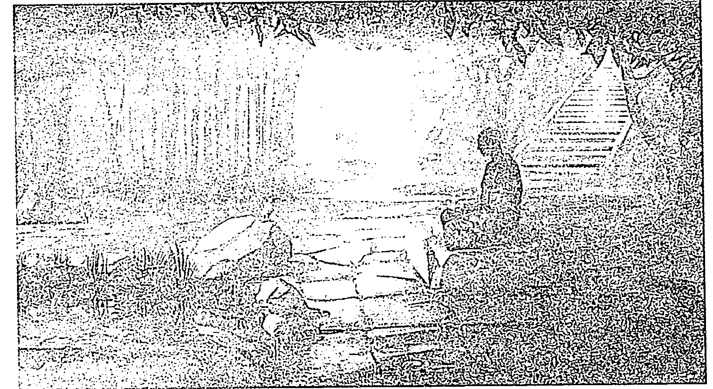

13. 改变结印，拇指与小拇指指尖相触，其余三根手指自然摊开。仍然感觉能量从隧道两端流入，努力感觉球形结界在旋转。
14. 双手在胸前聚集能量，形成一个散溢光芒的球体。感觉它位于球形结界中央，并与球形结界通过能量连接。
15. 调整呼吸，缓而绵长。吸气的时候想象组成六芒星体的两个三角体开始以不同方向转动。上面的三角体按逆时针方向转动，而下面的三角体按顺时针方向转动。
16. 吸气的时候想象灵摆的旋转开始加速。
17. 想象转速已达到光速，你的全身和四周都被能量充满了。你的周围像是包裹着一个发光的真实球体。圆球圆周伸展出发光的圆盘。你身处宇宙中心，周围的一切都溶解于光芒之中。

仪式完成后，尽量维持这种能量状态便可进入思维空白的深层冥想状态。

#### 封牌仪式

当你的某一套牌部分丢失或损毁，无法继续使用的时候，请不要随意丢弃它。毕竟它曾伴随过你，辅佐过你，请让它“死”得有尊严一些，让它可以“安眠”。

封牌仪式很简单，你只需要准备一块黑布，如果有木盒，那就更好了。

封牌仪式前可以与开牌仪式一样先沐浴。接下来用黑布将塔罗牌包起来，安静地放在房屋的北方就可以了。如果有木盒，也可以把牌放在木盒中。

不过与开牌仪式一样，封牌仪式也不是必需的。

## 占卜神秘说法解疑

## 牌灵与卡灵

牌灵的说法在传统塔罗与韦特塔罗中都不存在，只是近些年来在中国随着塔罗热潮而流行起来的。这种说法的大致意思是每套牌都有一个与某张大阿卡纳相关的精灵，它代表了这套牌擅长什么类型的占卜以及这套牌的一些特性。

这样就出现了两个疑问。

牌灵真的存在吗？

牌灵真的决定塔罗牌的占卜特质吗？

假设牌灵真的存在，首先，若多副同种类的牌（例如多副韦特牌）各有不同的牌灵，其牌的特质与擅长领域是否会有差别？依照牌灵理论，结果是肯定的。然而显而易见的是，同一个人无论使用同种类中的哪一副牌，结果都不会有什么差别。有着不同的牌灵，牌的特质却依然相同，这就证明了牌灵跟牌的特质没有任何关系。至少在同一种类的塔罗牌中，牌的特质及其擅长占卜的类型都与牌本身或牌灵并无关联。

其次，再假如多副种类不同的塔罗牌（例如同时使用韦特牌与透特牌）拥有同样的牌灵，其牌的特质与擅长领域是否会有差别呢？依照牌灵理论，结果却是否定的。事实上，韦特牌与透特牌不仅特质不同，针对所擅长的占卜类型而言，韦特牌相对偏向于日常事物，而透特通常较善于探寻心灵深处，二者也有明显不同。这更进一步证明了牌的特质与牌灵无关，而与牌的种类有关。

我们再来看看同一套牌被不同的人使用的情况。我们假设同一套牌先后有两个主人，他们在开牌仪式中抽到了相同的牌灵。按照牌灵的理论，这套牌的特质和所擅长的占卜类型不会发生变化。然而众所周知，不同的人使用同一套牌，所擅长占卜的类型自然也不同。这也证明了一套牌所擅长占卜的类型与牌灵无关，而与使用者有关。

所以综上可以得出，塔罗牌的特质和塔罗师所擅长占卜的类型都与牌灵无关，而只与塔罗师本身和塔罗牌的种类有关。

且不说“牌灵”选取过程中的随意性和“牌灵”存在的合理性，仅通过以上牌灵理论的自相矛盾之处，我们就可以得知牌灵一说的荒谬。

然而，换一个角度来看，牌灵本身虽然是错误的理论，却如此之流行，可见在一定程度上它确实满足了人们的一部分心理需求。追根溯源，其原因就在于牌灵将塔罗牌人格化，赋予塔罗牌以生命，让塔罗师可以与之对话——这正是塔罗系统本来不具备的、不完善之处。

与塔罗牌对话，并不是一件可笑的事情。“牌灵”理论虽然站错了立足点，但是它为正确的理论指明了方向。依此，我们可以借鉴、改正并发展牌灵理论。

先来剖析这个“灵”的本质。这个“灵”是灵体，是精灵，它有具体的形象、性格和意识，它有自己的个性特征，能思考、会说话。虽然在现实生活中很难看到神话中的精灵，其实另一种类似于精灵的“灵”却与我们息息相关，那就是“人格”。事实上并不是只有病理学上的双重人格或者多重人格的人才有不止一个人格，我们每个人都有许多不同的人格，每个人格都有自己的性格，它们是相互独立的，并且还会经常对话。如果你曾留心自己的心理活动，你就会发现，无论在思考还是在行动，我们脑海中总是有两个以上的声音在相互争论，最后我们的身体会屈从于它们之中最强势者的号令。不同于一般人，塔罗师们还有一个特殊的人格，是心灵在塔罗牌上的一个映射。它在心灵中扮演着督导角色，与扮演着解说者角色的人格对话。所以，我们也可以将这个特殊的人格理解为一个实实在在、单独存在的灵体。但是给它命名为“牌灵”并不准确，因为它不是寄宿在塔罗牌中的灵，而是寄宿在塔罗师身上的灵。它也并非代表着塔罗牌的特质，而是代表着塔罗师的特质。所以，给它取名为“卜灵”更适合，意为代表塔罗师占卜特质的灵。

卜灵在本质上是自我心灵的一部分，是另一个“我”。但实际上它又像是存在于自己心中的另一个人，有它自己的性格、情绪和思维方式。没有遭遇大的变故的话，很长的一段时间内卜灵都会与心灵一样保持稳定状态，不会发生什么变化。即使更换了所使用的塔罗牌，塔罗师的卜灵也不会发生变化。

借鉴牌灵的理论，我们也可以给卜灵划分种类，并以每张大阿卡纳命名一类卜灵。但是每个人的卜灵都是唯一的、不同于别人的，并且它又是完整的灵体，所以，如果喜欢的话，我们甚至可以专门为自己的卜灵起个名字。

事实上，正如很难将世界上的人准确地划分为有限的种类一样，充满个性的卜灵也是很难被准确分类的。虽然不能达到完美，但是人们可以无限接近完美；虽然不能为卜灵准确地分类，但也可以模糊地制定出相对比较准确的分类。正如人们的性格可以依据占星术被模糊划分为十二种，类似地，卜灵也可以利用心理测试大致地被划分为二十四种。

可以通过下面一套测试题得知你的卜灵种类。

## 测试你的卜灵的代表牌

- 1.你总是在思考后才会行动？
是→题2    否→题3

- 2.你经常会按照计划行事吗？
是→题4    否→题5

- 3.你会经常陷入回忆之中吗？
是→题6    否→题7

- 4.你认为经验比理论更可靠吗？
是→题8    否→题9

- 5.你会经常凭直觉行动吗？
是→题10    否→题11

- 6.你认为世界是美好的吗？
是→题12    否→题13

- 7.你对未来很好奇并经常猜测未来会发生什么吗？
是→题14    否→题15

- 8.你会认为多数人的经验比自己的经验更可靠吗？
是→题18    否→题16

- 9.你认为神秘的超自然力量有可能存在吗？
是→题20    否→题16

- 10.你的情绪会经常起伏变化甚至失控吗？
是→题6    否→题14

- 11.如果让你在拥有一技之长和一辈子都事事顺利之间选择，你会选择一技之长吗？
是→题22    否→题23

- 12.你经常会同情别人并帮助他人吗？
是→题24    否→题17

- 13.你认为你的不幸是个人原因而不是社会造成的？
是→题27    否→题17

- 14.你完全相信甚至痴迷于命运与魔法吗？
是→题28    否→题29

- 15.你认为推理比直觉更可靠吗？
是→题4    否→题11

- 16.你会相信奇迹发生吗？
是→题19    否→题21

- 17.你总是对未来抱有希望，总是很乐观吗？
是→题25    否→题26

- 18.你看见一个有前科的人鬼鬼祟祟，但不确定他在做什么，你会断定他在做坏事吗？
是→结果 A    否→结果 B

- 19.你认为自己还算有能力吗？
是→结果 C    否→结果 D

- 20.你会认为情理和道德比法律更重要吗？
是→结果E　　否→结果F

- 21.你认为科学是可以解释一切的吗？
是→结果G　　否→结果H

- 22.你经常有自豪感和优越感吗？
是→结果I　　否→结果J

- 23.在旅游的时候你会急着到达山顶而不是漫步欣赏全部风景吗？
是→结果K　　否→结果L

- 24.你会经常有种使命感或责任感一定要去做什么吗？
是→结果M　　否→结果N

- 25.在两难的处境下你能果断作出选择吗？
是→结果O　　否→结果P

- 26.你认为别人可信可靠吗？
是→结果Q　　否→结果R

- 27.面对绝望的环境，你会选择逃避和放纵而不是努力改造吗？
是→结果S　　否→结果T

- 28.你认为一切都是注定的，人对命运无能为力吗？
是→结果V　　否→结果W

- 29.你会经常准确感觉到未来的状况吗？
是→结果X　　否→结果Y

### 结果A／审判

代表你的卜灵是刻板的经验主义者。
在占卜的时候往往会联想到以前的占卜，并将以前的占卜结果作为此次占卜的依据。拥有此类卜灵的初学者往往会一边查书一边解读，几乎完全套用书上的原话。这种卜灵解读很谨慎，一般情况下不会出现太大偏差，准确率稳定。
此类卜灵与塔罗师的对话模式一般是长辈指导型。
关键语：你应该……

### 结果B／节制

代表你的卜灵非常理智，充满了理性，并且自制力比较强。
擅长运用理论知识结合实际情况分析进行占卜，逻辑思维能力非常强，考虑周到。执行计划能力和对局势的控制力突出。占卜通常会有条不紊地进行，占卜时双方都很少会出现情绪波动。但是这类卜灵容易缺乏想象力和创造力。
此类卜灵与塔罗师的对话模式一般是朋友探讨型。
关键语：可能是……

### 结果C／力量

代表你的卜灵非常果断，敢作敢当，有自信。
平易近人，占卜时很容易就能给问卜者信赖感，常常会与问卜者成为朋友。经常会用论断性语气解读塔罗，而且对自己占卜的结果非常有自信。有的时候听不进问卜者的解释，固执己见。占卜的准确率起伏比较大。
此类卜灵与塔罗师的对话模式一般是粉丝支持型。
关键语：……对你来说没什么……

### 结果D／倒吊人

代表你的卜灵善于反思，能快速成长。
这是学习型的卜灵。能虚心接受别人指出自己的不足和错误并很快改正，进步很快。擅长通过与问卜者交流进行占卜。很容易对问卜者敞开心扉，经常以自己的内心和过往开导问卜者。擅长获取信息，只是缺乏自信，容易迁就问卜者，甚至会被问卜者控制局势。
此类卜灵与塔罗师的对话模式一般是朋友谈心型。
关键语：我曾经……

### 结果E／皇帝

代表你的卜灵客观公正，善于辩论。
这是能给人安全感的卜灵。它善于基于事实思考得出结论，理论与经验只是参考，事实才是最终依据。它总会以自己认为客观公正的方式来解读塔罗，但有些时候又难免自以为是。此类卜灵占卜准确率起伏较小，但解读也会偶尔出现偏差。
此类卜灵与塔罗师的对话模式是朋友辩论型。
关键语：事实上……

### 结果F／正义

代表你的卜灵公正守法，循规蹈矩，道德感、正义感强烈。
它是法律与道德的维护者，它是公平与正义的代言者。它正义感强烈，难以容忍黑暗，它因循守旧，很难创新。占卜更多的是依靠前人的经验，尤其是对历代塔罗大师的书籍和话语更加奉若神旨。此类卜灵中许多都会抱有匡扶正义、拯救弱小的理想而使用塔罗。
此类卜灵与塔罗师的对话模式一般是师长教导型。
关键语：……正确的……

### 结果G／未知

代表你不适合占卜，几乎感觉不到卜灵的存在。
此类卜灵不是真正意义上的不存在，只是被无视到相当于无的境界。这类人太理性，很难与卜灵沟通，一般很少主动接触塔罗，即使接触，也很难深入研究。所以这类人并不适合占卜。
此类卜灵与塔罗师的对话模式一般是自言自语型。
关键语：……真的吗……

### 结果H／隐士

代表你的卜灵是擅长推理的分析主义者。
它不擅长长篇累牍地表达，却很擅长逻辑推理，往往能够一语中的，道破天机。不过同时它也很懒惰，经常打不起精神，没有干劲儿。它不会经常占卜，且很容易放弃和逃避。一想到复杂的事就感到头痛，于是干脆就不想了。它很难对人敞开心扉。
此类卜灵与塔罗师的对话模式一般是颓废消极型。
关键语：……算了吧，无所谓……

### 结果I／塔

代表你的卜灵具有非常强的自尊心，非常自信，有些自傲。
它总是想要证明自己的能力，爱表现。占卜时常常会跑题，讲到自己以前非常灵验的占卜和预言。对于问卜者对自己的怀疑会感到非常气恼。如果问卜者对其表示出信任，它便可能会超常发挥，作出异常灵验的占卜。占卜的准确率受问卜者对其态度的影响，起伏较大。
此类卜灵与塔罗师的对话模式一般是对手挑战型。
关键语：……你不行……

### 结果J／战车

代表你的卜灵喜欢挑战和征服，追求成就感。
它喜欢困难和复杂的占卜，对于重复的占卜没有多少兴趣，总是喜欢新鲜的事情。占卜时也往往会更多地探讨事件的过去，费尽力气去解析一些与事件未来并没有太大关系的因素。但是它非常有能力，能很轻易地操作复杂的牌阵。准确率也非常稳定。
此类卜灵与塔罗师的对话模式一般是朋友怂恿型。
关键语：去……吧

### 结果K／太阳

代表你的卜灵是个急性子，总是精力充沛的家伙。
占卜时它通常是开门见山，喜欢先从牌阵中“未来”或“结果”的位置解起。它比较适合短而精的占卜。因为它总是很活跃，又乐于助人，所以占卜的频率也比别人高。它的准确率也不错，只是它的表达力不是很好，而且很少有耐心去详细给问卜者解释，经常自己很明白，问卜者却什么也没听懂。
此类卜灵与塔罗师的对话模式一般是领导催促型。
关键语：快点儿……

### 结果L／世界

代表你的卜灵是个完美主义者。
它难以容忍瑕疵的存在，总是追求完美。占卜中，它精益求精，往往会沉醉于解说之中，不知如何结束。对于塔罗知识的学习也是孜孜不倦，令人敬佩。只是同时它也过于苛刻，会让人无所适从。
此类卜灵与塔罗师的对话模式一般是父母期待型。
关键语：你可以做得更好……

### 结果M／教皇

代表你的卜灵非常善良，乐于助人。
它是非常积极主动帮助别人的类型，它无法漠视正在痛苦中挣扎的人，即使没有人向它求救，它也会主动伸出援手。它有些强迫自己，将救扶当成了自己的责任和使命。但它同时也过于体现自我，太从自我出发，总是会以自己的想法去妄自揣度他人。结果常常因此给人造成困扰。
此类卜灵与塔罗师的对话模式一般是朋友怂恿型。
关键语：只有你才能……

### 结果N／女皇

代表你的卜灵非常有同情心，非常宽容，非常体贴。
它对问卜者是纯粹的同情，就像父母对待子女一样，总是无条件地全心提供帮助，不计较得失。很多时候，在占卜结束后，还会与问卜者联系询问事态发展。它是个非常负责任的卜灵。但对于拥有这类卜灵的人来说，它又何尝不是一种负担？
此类卜灵与塔罗师的对话模式一般是子女依赖型。
关键语：傻孩子……

### 结果O／星星

代表你的卜灵总是充满希望，十分乐观。
在占卜中非常擅长、非常乐于描述未来，即使解读的结果不顺利，也能让问卜者对未来充满勇气和希望。但这类牌灵对过去和现在不是很重视，往往会忽视问题的根源，也找不到解决问题的办法。
此类卜灵与塔罗师的对话模式一般是恋人安慰型。
关键语：……没关系……

### 结果P／恋人

代表你的卜灵非常感性、重感情。
占卜感情类问题时，它会异常投入，并会与问卜者产生共鸣。但是面临选择时，它往往会犹豫不决，所以此类卜灵并不适合抉择类占卜。它感情细腻，害怕孤独，容易情绪化，容易被感动。
此类卜灵与塔罗师的对话模式一般是恋人撒娇型。
关键语：……也不错……

### 结果Q／月亮

代表你的卜灵有些孤僻，常常会凭心情臆断。
不擅长交流的一类卜灵。尤其当心情不好的时候，占卜会自说自话，完全不理会问卜者。准确率随心情变化而起伏。对感情，尤其是恋爱类问题敏感，往往会作出意想不到的精确解读。
此类卜灵与塔罗师的对话模式一般是子女任性型。
关键语：……（沉默）

### 结果R／女教皇

代表你的卜灵以一双冷眼看世界。
它看透了世界的本质。对善与恶、好与坏有自己的看法和标准。它心如止水，无欲无求。它充满智慧，却不去拯救陷入困难之人。因为它主张人需要自救，只有自己才能够救得了自己。占卜中，它不会为问卜者提供具体的方法和建议，但它会详细地解析事件的关键因素。
此类卜灵与塔罗师的对话模式一般是智者冷漠型。
关键语：请仔细想想……

### 结果S／恶魔

代表你的卜灵不守常规，脱俗新颖。
它无拘无束，不受道德束缚，敢于承认和表现自己。它与众不同，常常做出令人瞠目结舌的事情。在占卜中，非常善于看透问卜者内心深处的欲望，并依此来指导占卜。它能够知道问卜者想要什么，但那如果是奢望，它也会直白地告诉问卜者，令问卜者遭受打击。
此类卜灵与塔罗师的对话模式一般是恶魔解说型。
关键语：……虚伪……

### 结果T／死神

代表你的卜灵愤世嫉俗，敢于大破大立。
这是一个非常危险的卜灵，因为它对这个世界非常失望、不满，并且想要破坏并改造它。占卜时，它会侧重于解读伤害和隐患等方面，对阴暗的部分非常敏感。对于问卜者来说，听它解读可能会很压抑，却受益匪浅。
此类卜灵与塔罗师的对话模式一般是战友悲观型。
关键语：……可悲……

### 结果V／未知

代表你的卜灵非常善变，太感性而不适合占卜。
这类卜灵没有固定的面貌，让人琢磨不定。同时它又对魔法过于热衷，导致对占卜的忽略，所以拥有这类卜灵的人并不适合做塔罗师。
此类卜灵一般没有与塔罗师固定的对话模式。
关键语：……（无）

### 结果W／命运之轮

代表你的卜灵是宿命论者，讲究顺其自然。
它非常擅长冥想和仪式，对既定的命运有很敏锐的感觉，往往能察觉到别人察觉不到的细节。它的第六感和直觉很强，但是又过于依赖直觉。它一般能为问卜者详细地描绘未来如何如何，却不能给问卜者很好的建议。
此类卜灵与塔罗师的对话模式一般是卦师转述型。
关键语：缘分如此……

### 结果X／魔术师

代表你的卜灵具有非常强烈的直觉。
它也是依靠灵感占卜的卜灵。不过它充满了新奇的想法，解读往往很生动，令问卜者沉醉。它解读的角度很特别，经常会收到让人意想不到的效果。同时它也有自由散漫的毛病，解读往往不能集中一个主题，以至占卜结束后问卜者都不知道重点是什么。
此类卜灵与塔罗师的对话模式一般是朋友推荐型。
关键语：……这个不错……

### 结果Y／愚者

代表你的卜灵是改进主义者，乐于尝试，勇于进取。
它总是精力旺盛，充满行动力。它是个急性子，经常还没有仔细思考，便已作了决定。它总是追求美好的事物，即使失败了，也从不气馁。占卜时，也许还没有听问卜者讲完详细状况，便开始解读。这类卜灵是疯狂的冒险家。
此类卜灵与塔罗师的对话模式一般是同伴盲目型。
关键语：努力一定会有结果……

※注：本测试方法和卜灵理论仅供读者参考。

## 养牌和血牌

不知从什么时候起，流行起了这么一种说法：时常将牌带在身边、睡觉时将牌放在枕头下面、经常跟自己的牌聊天，可以增强跟塔罗牌的默契，从而提高占卜的准确率。更有甚者，认为用自己的血祭祀塔罗牌可以提升牌的魔力，经过血祭的牌占卜会异常准确。确实有不少人在用自己的血养牌，并信誓旦旦地说他的牌具有接近邪恶的魔力，比别人的牌占卜更准确……无论是血牌使还是养牌者，他们都根据牌灵理论或者其他什么谬论把塔罗牌拟人化了，他们将塔罗牌看作仆人或宠物，对其进行饲养……此前我们已经证明过了牌灵理论的荒谬性，塔罗牌中根本就不存在什么精灵，更不可能存在嗜血的恶魔。更可笑的是，流传于坊间的与塔罗牌签订契约的祭文竟自动漫，可见以血祭祀、签订契约和饲养的说法，大概是由沉迷于奇幻小说或动漫的人编造出来的，并不真实可信。

塔罗牌所展示出的所有奇迹其实都是源于塔罗师自身，塔罗牌只是将一个塔罗师体内所蕴含的智能释放的一个媒介和窗口。而这个媒介的效率和窗口的大小，只会影响智能的释放速率罢了，塔罗牌到底能展现多少奇迹只取决于使用它的塔罗师本身。妄图通过饲养一个“窗口”，或者向“窗口”上涂血，来提高占卜的准确率，只不过是在浪费粮食、浪费精力、浪费血液而已。

那些所谓灵验的血牌使和养牌者只是陷入了基于强烈心理暗示的一种自我催眠状态。如果你相信，没有血祭你的占卜，准确率只有两成，那么实际上你就给自己设定了一个上限，为自己套上了枷锁。即使以你的能力，占卜的准确率可以达到七成，最终结果也只能在两成以下，因为你的心只有那么高，你的自信只有那么多而已。而当你血祭之后，你就会解除心灵的枷锁，从而展示出自己的真正实力。表面上看，是血祭提升了你的占卜准确率，但其实这并不是血祭的原因，只是你放开了心灵，展示出了自己真正实力的结果。实质上，血祭不但不是提升占卜准确率的方法，反而正是束缚和压抑能力的枷锁。

养牌和血牌并不能在本质上改变一个人的能力。如果你的能力至此，那么无论有没有养牌，有没有以血祭牌，占卜的准确率都会很高；如果一个人的能力至此，那么无论有没有养牌，有没有以血祭牌，占卜的准确率都会很高；如果一个人的能力不足，那么即使天天养牌、日日血祭，占卜的准确率也不会有丝毫提高。

## 魔法和诅咒

有人说塔罗牌是魔法道具，用它可以施展魔法，诅咒他人。这句话只有一半是对的。让我们先来了解一下魔法和塔罗的一些属性。

魔法，也被称作“巫术”，泛指所有能达到超越常人理解能力范围以外结果的技巧，或者以常人无法理解的方式达到可理解范围内的结果的一些技巧。魔术也算是一种巫术，但它是通过作弊的方式达到令人意想不到的效果，而我们更多的是对实实在在的巫术感兴趣。按照我个人的理解，魔法可以被划分为超自然魔法、物理魔法和精神魔法。

超自然魔法是指那些常见于传说、小说和影视中的超脱自然法则的魔法，例如火球术、通灵术、召唤术等。这种魔法的存在性和合理性暂且不论，既然有人相信它，就将它放在这里，但在此并不加以讨论。这里更多的是关注可理解的物理魔法和精神魔法，而塔罗的魔法属性也是基于这两个层次。

物理魔法，遵守自然法则，作用于物质世界的魔法，是人们改变世界的方法。科学技术和发明创造等其实也属于物理魔法的范畴。另外，精神活动带来的物质世界的改变也属于物理魔法，例如在心理暗示或催眠状态下，人们会有一些意想不到的举动，带来一些令人匪夷所思的结果。

精神魔法，遵守自然法则，作用于精神世界的魔法。它主要会改变人的一些想法和心理状态。例如，通过言语或一些客观行为会改变一个人的态度，而一些突然的变故也会导致人性格的改变。

咒语是最常见的魔法之一，如果它作用于物质世界则属于物理魔法，作用于精神世界则属于精神魔法。而所谓的诅咒术，一般作用于人的精神世界，所以我们讨论的诅咒术属于一种精神魔法，其本质是一种作用于施法者与受法者双方的强烈的心理暗示，其施展受到许多客观条件的约束。

占卜术大多也属于精神魔法，但塔罗的魔力并不局限于占卜术，还包含了其他许多影响精神世界的智慧。塔罗相当于一本魔法书，其中蕴含着无限的智慧和大自然的终极奥秘，可以启迪人的灵魂，却不用担心这本书会割伤你。

关于塔罗的魔力，有几点我们必须要清楚。

首先，塔罗牌只是一个容器，它可以承载力量，但它本身并不产生力量；塔罗牌只是一个窗口，塔罗师的力量由此释放，由此输出；塔罗牌只是一个媒介、一个桥梁，塔罗师的精神力量借此传达到其他人的精神世界；塔罗牌的作用只在于诱发、引导和增强塔罗师的力量，它本身不是力量的源泉和主体，也没有善恶黑白之分。所以，塔罗牌不会自发地去为任何人祈福，也不会自发地去诅咒任何人。我们也根本不用担心被自己的牌诅咒，也不用担心自己的牌会诅咒他人。

此外，任何魔法都具有一定的作用范围，与塔罗相关的魔法自然也不例外。借由塔罗牌操作的与塔罗相关的所有魔法都被局限在占卜者和问卜者之间，不会涉及没有直接参与的第三人。除塔罗师自身以外，塔罗牌不能影响没有直接参与占卜的任何人。也就是说，与塔罗相关的魔法必须以塔罗牌做桥梁，而且只能在占卜中实现。塔罗牌并不能作为符咒，被用来施展魔法。塔罗的神秘力量主要在于“说”，而不在于“做”。所以，用塔罗牌诅咒他人是非常困难的事情，不是任谁都可以做到的。而且，诅咒他人，这种行为本身就严重违背了身为塔罗师所必须遵守的准则。塔罗的大智慧中，也强调平息仇恨、放弃报复，调节身心的平衡才能获得心灵的稳定和成长。

作为一个塔罗师，必须先将心术放正，须知害人终害己，切勿心存贪恶之念，痴迷于黑魔法。多利用积极的魔法，让心灵成长，这才是塔罗的真谛。

## 占卜修行的途径

修行，首先要端正心态，而后还需要明确目标和内容。

学习塔罗，要有一颗宽容而严谨的心。无论接触到的理论和学说看似多么荒谬和不可信，也不要完全否定和无视它。因为没有任何事物是绝对的，即使是错误的理论也必定有其合理的、可借鉴的部分。如果只是因为它有错误的部分，就连它正确的部分也一起无视，只会因此错失一个完善现有理论的机会。对于未经验证的理论，切勿武断地为其贴上对或错的标签。当然也不能因此轻信任何理论，我们还需要学会严谨地去审视这一切，明辨其中的对错成分。要学会去怀疑“权威”，敢于怀疑才能有所发现，只有在不断的怀疑和证明的过程中，我们才能真正地学习到较为正确的知识。

要成为塔罗师，还必须做到自信和谦虚。因为塔罗拥有一个兼容并蓄的开放系统，它可以包容一切。塔罗没有也不需要一个具体的评判标准，人人都是正确的，人人又都不完全正确。无论是占卜还是学习，其实都与自信有很大的关系。如果你自信，那么你就是高手；如果你不自信，那么你就永远只能是个新手。但如果自信变成了自傲，那么无论你学习了多久，也只算是个新手，因为你不懂谦虚，不懂平衡之道，不懂塔罗的真谛。真正的谦虚与自信一样重要，是一个塔罗师必备的素质。

学习塔罗和使用塔罗还需要“活学活用”。死记硬背学来的东西只是别人生产出来的腐朽的沉淀，唯有活学才能取其精华去其糟粕，将别人的学说吸收成自己的知识。没有灵活运用，再好的理论也只是纸上谈兵的虚无缥缈；唯有学以致用，才能使学来的知识变成现实的力量。真正的学习，不是学习知识和学习某些人的观点，而是学习解决问题的方法和思考问题的方法。这就像学做菜一样，食材和菜谱差别不大，关键在于能否学到制作的手艺。

学习塔罗其实不在于学习牌义、牌阵这些固有的东西，而在于学习其背后的理论和哲学思想。甚至可以说学好塔罗并不在于学习塔罗的理论，而在于学习占星术、炼金术等其他看似与塔罗没有实际关联的神秘学。塔罗就像一个盛装神奇露水的空瓶子，所有学习者都相差不多，真正将学习者区别开来的是不同人的瓶子里面装了什么不同的东西。获取一个瓶子很简单，想要填满瓶子却不容易。瓶子里装了多少，装了什么，才是决定这个瓶子重量和价值的标准。如果瓶子里的液体发生了化学反应，形成了新的物质，那么这个瓶子就是无价之宝了。

学习塔罗其实也不在于你学了多少、记了多少，而在于你忘了多少、吸收消化了多少。正所谓无招胜有招，只有将所学的那些固定招式忘记，你才能学会真正的绝招，才能真正将招式的精髓融入自己的骨髓，随心所欲地应用。但是“忘记”也分两种境界——有境界的忘记是将知识嚼碎后消化吸收到自己的体内，而没境界的忘记只是将知识呕吐或排出体外。

所以，学习塔罗要尽可能多、尽可能精地吸收各种优秀的理论，然后忘记它们，再经过自己的思考加工重建，最终融合、塑造出自己对塔罗的认识。

塔罗的修行，大致可以划分为“牌修”、“灵修”和“历修”三个主要部分。

## 牌修

所谓牌修，就是为了能够熟练使用塔罗牌占卜而进行的修行，是修习塔罗最基本的修行。它包括理论和实践两大部分。与大部分学科的初学者状况相反，目前修习塔罗的人大多过于侧重实践而忽视了理论，甚至有的人干脆就忽略掉理论学习，尤其是原理部分更是遭人忽视。

正如塔罗的理论所说，平衡是宇宙的基本法则，世间万物总是趋于平衡的。失衡是短暂的、相对的，过度和极端通常意味着错误。这里所说的平衡并不是指完全对等，而是指一个范围内相当，相差并不悬殊。理论和实践可以有所侧重，但是无论哪一方面都是不能忽略的。不去实践，学习再多的理论也没有什么意义；没有理论支持，实践的发展高度也会受限，不明白原理，又如何能够更好地运用呢？

当然，学习理论并不是要求每个塔罗师都要学到精通的地步。作个简单的比喻，无论护士、医生还是药剂师，都需要对药有所了解，但是护士只要会用药就可以了，医生还需要对药性和药效有所了解，而药剂师不但要了解药性，还需要会调制药剂。

所以，想要成为塔罗师的人首先要明确自己的目标，是要仅仅成为塔罗使用者、专业塔罗师，还是塔罗大师。

本书将以专业塔罗师为标准讲解塔罗师的修行。

理论学习，这首先要求修习者掌握塔罗的基础知识，在前面的章节我们已经对此作出了详细的讲解，修习者只要熟习并掌握就可以了。理论的学习过程应该侧重于牌义和牌阵的掌握以及原理的理解和运用。初期以学习和理解经典理论为主，中期则应以运用和思考其原理为主。后期对塔罗的理论有了一定的了解，我们则应该扩展视野，跳脱塔罗的范围，广泛地借鉴和学习世界各地各种学科的优秀理论。

实践应用方面的修行则应重点强化“问”“解”“议”的能力。初期可以先锻炼解牌能力，积累足够经验后，“问”与“议”的能力便很容易提升。

下面介绍一下塔罗牌的修行五法。

### 修行方法一：多看书

很显然，这是获取基础知识最简单有效的办法，也是修习塔罗最基础的方法。即使有老师教授塔罗的知识，看书也是必不可少的复习和巩固方法。只可惜国内的资料有限，如果可能的话，尽量多浏览一些国外的资料，尤其是原版资料。

### 修行方法二：多交流

与他人交流是了解自己不足的最佳途径。如果有朋友一起修习塔罗，多聚在一起探讨各自的心得，多借鉴他人的经验也不失为成长的捷径。如果身边没有一起修习塔罗的人，那也没关系，现在网络很便捷，国内也有一些知名的塔罗网站或论坛可以供塔罗爱好者讨论，例如中华塔罗网、新浪星座、腾讯星座、百度塔罗吧、女巫神算馆都是不错的选择。如果可以阅读英文，还可以浏览一些国外的网站或论坛，例如“Aeclectic Tarot”等。

### 修行方法三：多练习

实际占卜是积累经验、获取第一手信息的有效方法。只有在实践中去体会，才能有针对性地作出调整，弥补不足，取得进步。而练习占卜最好的方式是给陌生人占卜，因为这样可以避免许多因素的干扰。虽然一开始就给陌生人占卜对于初学者来说可能有些困难，但也不用为此担心，学习都是循序渐进的过程。最初可以先给自己占卜，然后再给亲朋好友占卜，逐渐地积累经验和自信，等到时机成熟了，自然就会有勇气给陌生人占卜了。第一次给陌生人占卜，不要太担心准确率而放不开手脚。塔罗就是这样，如果自信的话，即使是新手，也会有非常高的准确率。需要注意的是，练习不要盲目追求次数。一是因为体力和精力有限，过度练习伤身伤神；二是因为不思考不总结的练习，错误往往难以改正，这样不断地重复错误反而容易将错误养成习惯，日后更难改正。所以，多练习是要在保证质量和不伤身的前提下进行的。

### 修行方法四：多记录

俗话说好记性不如烂笔头，如果不记录下来，很多东西过一段时间就会遗忘。尤其是思维和想法，往往转瞬即逝。实际上在学习塔罗的过程中，最珍贵的就是这些转身即忘的“突然想法”和“感悟”。所以，如果可能，尽量随身带着笔记本。倒不用每天都写占卜日记，也不用每次占卜都详细记录，只要当对某张牌的牌义突然有了新的想法或者对某个牌阵有所感悟时，能够马上记录下来即可。塔罗的灵感只有被马上记下来，才能算是真正拥有。

### 修行方法五：多联想

在学习过程中尤其在占卜过程中陷入窘境，苦于没有思路时，如果可以善加利用联想法，则可顺利摆脱困境。我们知道世间任何事物都不是孤立存在的，在这个世界上一定存在着与之相似、相关或相反的事物。在现实中，这些相似、相关、相反可能意义不大，但是在塔罗中，它们却往往是解决问题的关键。所以，当思维陷入死角时，不妨在牌阵中或牌面上去寻找与某个因素有关的其他因素，从相关、相似、相反三个维度来拓展思维的视野。如果可以学会并善加使用联想法，占卜时自然就不用担心理屈词穷了。

## 灵修

所谓灵修，就是灵魂的修行和心灵的修行，是指通过一些手段来使精神能力获得提升，使心灵趋于成熟和完善。塔罗是大自然的奥秘库，蕴含了无限的智能。塔罗师要掌握、利用和支配这强大的智能，就必须具备同样强大的精神力量。所以，灵修对于塔罗修行是十分必要的。

灵修包括两个部分，即提高精神力的修行和完善心灵的修行。

精神力对于魔法而言是十分重要的，精神力越强，所施展魔法的威力和对魔法的掌控力也越强；精神力越弱，所施展魔法的效用也会越弱，失败、失控和被反噬的概率也就会越大。所以，提升了精神力，更是提升了魔法的效用以及对魔法的掌控能力。

提升精神力修行的内容包括洞察力、推断力、联想和想象力、第六感和直觉、控制力、忍耐力六个方面。

### 1. 洞察力

即情报和信息的收集能力。可以是有意识收集，也可以是无意识收集。只有能够敏锐地察觉到魔法操作或占卜过程中发生的细微变化，才能够相应地作出适当调整，更好地掌握局势和发展方向。

锻炼洞察力，首先要做到随时随地都能集中注意力。把注意力集中到需要观察的事物上，对旁物置若罔闻，这样才能掌握所观察事物的一举一动，不会有所疏漏。在日常生活中多观察身边人的衣着、言语和表情的变化，也不失为锻炼洞察力的一种好方法。能够掌握问卜者言语和表情的细微变化，以及通过衣着、言行辨认问卜者的身份和性格特征，对占卜的意义是不言而喻的，洞察力的锻炼应以此为目标。

### 2. 推断力

即对信息及情报的分析处理能力。作为魔法师或占卜师（心理咨询师），仅仅能够收集信息是不够的，还要具有处理信息的能力。能够将细微的、隐晦的、难以理解的信息转化为明显的、有意义的、可以被理解的信息，并找到相关联系，推断出发展路线，才算是具有合格的推断力。

如果说洞察力是发现已发生的现在和过去，是抓住命运之蛇的尾巴，那么推断力则是看见了未来，是扼住了命运之蛇的喉咙。抓不住线索就找不到关键，而抓不住关键，持有线索也便没有任何意义。

锻炼推断力要求修行者对人性和世间的种种客观规律有所了解，这样才能够推断人和事物的未来走向。

### 3. 联想和想象力

联想和想象可以拓展人思维的视野，让思维“看”得更远、更广、更多。分析和推断可以使信息深化、延伸，联想和想象则可以使信息增值，产生更多的相关信息。

联想和想象是人类思维的本能，是魔法的引导力和驱动力。但在逻辑思维当道的现代，人们的联想和想象力已经被理性和物理定理束缚和压制了，我们的精神力量大打折扣，我们的魔法力也同时被约束甚至消亡了。只有给想象松绑，让思维自由，才能更好地发挥出我们本来所具有的强大精神力量。

锻炼联想和想象力，首先要敞开心扉，鼓起勇气，去质疑“常识”，用心去思考，而不是用脑去思考。我们用脑思考太久了，已经几乎失去了用心思维的能力。只用脑去思考，就好比只用一只眼去看世界，视野是狭隘的。只有心脑并用，我们的思维视野才是完整的。不要害怕荒谬和错误，要大胆勇敢地去想，这样才能发现被理性掩盖的真相。也许一开始会漫无边际、漫无目的，会觉得迷茫、不知所措，但是慢慢就会习惯，就会掌握住要点，让思维在自由的同时又不至于盲目。修行者可以观察火或云这类无形且多变的事物，尽情地去将它们的外形联想或想象成各种东西，达到锻炼联想和想象力的目的。

### 4. 第六感和直觉

某些时候，我们的脑海中会突然闪过一些想法或念头，它们虽然是未经思考便出现的，却常常具有出奇的准确率。如果联想和想象是霰弹枪，那么第六感和直觉便是狙击枪，它不会轻易发射，但只要发射就会成为胜负的关键。第六感和直觉的出现往往会对占卜产生决定性的影响。

延续上面的比喻，无论是谁，只要经过训练都可以使用好霰弹枪，但是没有一定天赋的人无论怎么训练也无法得心应手地用好狙击枪。第六感和直觉很大程度上是由占卜师的天赋决定的，很难通过后天锻炼获得较大提升。第六感和直觉强的人通常很容易就可以在占卜领域达到不错的水平，资质一般的占卜师则要付出更多的努力。

可是我们不应该就此灰心，虽然人的天赋有所差异，不见得每个人都是天才，但至少每个人还都有可以挖掘的潜力。不能发挥的天赋不能算是能力，只有有效发挥出的天赋才能算是能力。也就是说，虽然天赋无法通过人为的努力而改变，我们却可以在天赋的发挥和潜力的挖掘上下功夫。不管天赋如何，总有提升的空间，尽可能去发挥才是我们应该做的事情。

比较有效的锻炼方法是在日常生活中多依靠直觉行事，不是十分重要的事情，尽量不要思考后才行事，同时还要多留意脑海中突然闪过的一些莫名其妙的想法，无论这些想法多么天马行空。

### 5. 控制力

包括对自己言语、行动和情绪的控制力以及对问卜者和局势的控制力。这要求塔罗师能够敏锐地察觉到自己、问卜者或局势的细微变化并迅速作出反应。正所谓先发制人，抢占先机是获取控制权的根本。

控制的目的在于保障占卜能够顺利进行，不至于被某一方的情绪影响或被突发事件干扰。

锻炼控制力，塔罗师首先要学会控制自己的言行和情绪。如果连自身因素都不能很好地控制，又怎么能控制问卜者和局势呢？

控制包括抑制和表达两个方面。塔罗师要能够在抑制和表达之间自由切换。例如，占卜的时候有些话可能会很有道理，自己想说，也想让问卜者明白，但是说了又可能伤害到问卜者，这种情况下塔罗师就该抑制自己表现的欲望，控制自己的表达方式。而另一种情况下，有些话很难说出口，却又必须说出来，此时塔罗师要能够勇敢地说出。还有些时候，塔罗师的情绪会被问卜者感染，可能是厌恶，也可能是同情。要抑制自己的情绪，还是要表达出来，这就需要塔罗师视情况而定了。

此外，表达并不一定要表达真实的感情，如果情况需要也可以表达虚假的表情，但前提是这虚假的表达必须能够达到足以乱真的程度，否则就可能得到相反的效果。

对问卜者的控制在内容上并没有什么与众不同，也包括抑制和表达两个部分。抑制是调整问卜者的情绪状况，表达则是为了令问卜者更加坦诚地表述真实情况和真实想法。对问卜者的控制在方法上对塔罗师有更高的要求。控制通常由语言、表情和动作来达成，一般有语言暗示、话题转换、重复强调、直接制止、情绪感染、动作暗示等方法。

在言行方面，占卜者对自己的控制更多的是抑制，对问卜者的控制则更多是表达。在情绪方面，占卜者对自己的控制更多的是表达，而对问卜者的控制则更多是抑制。另外，占卜者的表达必须参考实际情况的需要，适当包含虚假的成分，而问卜者的表达不应该包含虚假的成分。

除了言行和情绪，塔罗师还要控制占卜局势的发展方向，把占卜所解出的信息限制在问卜者可接受、可承受、可理解的范围内。不要让解读的结果打击问卜者，以致占卜无法继续下去；也不要让解读出的结果连自己都无法解释清楚；更不要被问卜者牵着鼻子走，自觉或不自觉地按照问卜者的希望解读出不真实的信息。

### 6. 忍耐力

包括身体承受力和精神承受力。

身体是精神的容器，强大的精神寄宿于强大的肉体。虚弱的身体不但会限制精神的强度，甚至会被强大的精神伤害。占卜是相当耗费心神和体力的活动，身体不具有一定的承受力是无法承受这种强大的负担的。

身体的强度以健康程度、耐久和对精神的承载力，以及所承载精神的活力作为标准。也就是说，高大壮硕的身体并不见得就是强大的，瘦小的身体也不见得就是虚弱的。对于塔罗师来说，身体要足以支撑连续几个小时精力高度集中，其间不停思考、不停说话也不会出现虚弱或精神涣散的状况。提高身体的承受力，即提高体力，一方面可以保证占卜的质量，另一方面也保证了塔罗师的身体和心神不遭受损害。

占卜作为精神层次的活动，对塔罗师的精神承受力要求自然非常高。占卜实质上相当于一种入侵和解析问卜者心灵的精神活动，这就难免会遇到问卜者所表现出的一些“排异反应”。排异反应可以被划分为反抗、反噬和侵蚀三种类型。其中，反抗和反噬是即时性的应激反应，通常对“侵入者”的影响是短暂的。

如果问卜者的心灵是防卫型，当占卜者碰触问卜者的心灵深层时便有可能遇到反抗，通常表现为不配合、不合作、突然沉默、撒谎或转移话题、反唇相讥等。前面几种是比较低程度的反抗，只要塔罗师拥有足够的耐心就能够找到方法对付；越向后，反抗的程度越高，越容易对塔罗师的心灵造成冲击，塔罗师应该有足够的承受力，不能因此动怒或者受到打击，甚至是因此感到自卑或气馁。

如果问卜者的心灵是攻击型的，当占卜者碰触问卜者的心灵深层时便有可能会遇到反噬，通常表现为占卜者受控于问卜者，尤其是情绪方面受到问卜者严重影响。反噬一般是指占卜者受到问卜者消极人格或负面情绪的感染而变得与问卜者一样。反噬对占卜者的影响在占卜结束后依然会在一定时间内继续存在。当反噬的影响无法消除或动摇和改变了占卜者的心灵时，反噬就演变成了侵蚀。

侵蚀是最危险的心灵排异行为，因为它像暗杀者一样，无声无息地出现并施加影响。它并不是在一次占卜中出现，也不是突然发作，而是在一次又一次的占卜中一点一点地积累，然后又在不知不觉中一点一点侵蚀占卜者的心灵。它的危险性不但表现在它难以被察觉，还表现在它无处不在。无论是攻击型心灵还是防卫型心灵又或者是平衡型心灵，只要有阴暗的角落，就一定存在着侵蚀的潜力。它们就像墨水一样，一旦触及，就会沾染。要成为专业塔罗师，就难免会长期触碰心灵的阴暗面，这就要求塔罗师的心灵一定要有抵抗力，要有足够强大的精神承受力，而不至于被这些排异反应击垮。

完善心灵的修行是较高层次的、非应用性的修行，它与占卜无关，与问卜者无关，不是必要修行。但是如果舍弃了完善心灵的修行，除了金钱（如果是收费占卜的话）和成就感（与占卜带来的负面影响抵消），塔罗师修习塔罗几乎可以算是毫无受益了。因为占卜是使问卜者受益，并没有为塔罗师带来什么，只有心灵的完善才是塔罗带给塔罗师个人的受益之处。

其实占卜也好，预示未来也罢，都不过是塔罗力量的一小部分，塔罗更强大的力量在于帮助心灵成长。占卜的本来目的是让占卜者指导问卜者变得更睿智，心灵变得更成熟。不仅普通大众早已遗忘了这本来的目的，让占卜单纯变成了预示未来，甚至连塔罗师们也都逐渐遗忘了塔罗所蕴含的智慧，将塔罗牌变成了纯粹的占卜工具。这也正反映了世人心灵的不成熟之处：人们往往只看得见事物的表面，对于更深层次的意义和本质却视而不见。因此，塔罗才会变成单纯的占卜工具，就像瑜伽竟变成了减肥秘方一样。

不成熟的心灵面对这个复杂的世界难免会觉得迷茫、不知所措，于是人们惧怕孤独、郁郁寡欢、无法相互理解，甚至相爱的人也会互相伤害，在命运中随波逐流……正因如此，人们发明了宗教和科学，希望自己能有所遵循、有所依靠。

可是，无论宗教与科学多么强大，毕竟都只是外力凭借，并没有从本质上解决心灵的迷茫。这就好比一个缺乏方向感的人，即使手中持有地图也照样会迷路一样，如果不从根源下手，仅凭外物弥补和辅助是无法真正解决问题的。因为，不成熟的心灵无论有多么强大的信仰依托，也都会觉得无依无靠，缺乏安全感。

之所以在这里提到完善心灵的修行，是因为塔罗师有必要了解塔罗，了解塔罗的力量和本来目的。而关于灵修的具体方法，会在“实战进阶”中提出以供参考。但是要知道，受人传授而轻易得到的事物永远是别人的，只有经历千难万险、克服种种困难而找到的才是真正属于自己的东西。尤其对于修行来说，寻找修行的方法，本身也是修行的一部分。依靠自己顿悟远比教导与学习要有意义，可以说开窍的那一瞬间，修行便已成功了一半。

## 历修

所谓历修，是指塔罗师人生经历的修行。历修是塔罗修行中最不能强求的修行，所以也是最难的一部分。既然很难，听起来又与塔罗关系不大，那么可不可以忽视它呢？结果显然是否定的。历修与牌修、灵修并列为三大修行，其重要性可见一斑。

试想，一个没有恋爱过的人又如何知道恋爱中的烦恼，又如何能够开导为爱情而烦恼的人呢？没有亲身经历过的人即使能够占卜出结果，也不见得能够理解结果。

只有拥有足够丰富的人生阅历，才能更好地了解问卜者的处境和感受，才能更好地占卜和引导。但需要注意的是，不见得拥有丰富的阅历就能够拥有睿智的眼光。有些时候，经历得多了，人反而会变得麻木、迟钝，看不清事物的本来面貌，反倒不如年轻时眼光清澈锐利。盲目嘲笑年轻人幼稚无知，是偏激的说法。

年轻人也好，年长者也罢，无论谁的想法都有可取之处，也都有可笑可悲之处。年轻人的思维总是倾向于理想和空泛，而年长者的思维总是倾向于现实和妥协。年轻人进行历修应该更加侧重于认识这个现实的世界，而年长者的历修则更应该侧重于找回单纯和美好。

在希望中寻找失望，才不会让希望变成不切实际的幻想；在失望中寻找希望，才不会让失望变成绝望。塔罗占卜始终要给问卜者希望，所以给予问卜者希望的占卜者自己首先必须能够看到并且找到希望。

塔罗师不能仅仅以自己为中心或以客观世界为中心去思考，因为这样看到的都只是局部，并不是真实。世界不是纯粹的美好，也不是纯粹的丑陋，关键在于看的角度。如果仅从一个角度去看世界，自然看不见好坏掺杂的真实世界，所以塔罗师应该学会辩证思考，这样才能更好地指导处于任一世界中的问卜者。

历修还包括锻炼归纳总结能力，塔罗师要能将人和事划分成若干种类和若干模式。这样，在占卜时就可以快速套用，提高占卜的效率。

历修最重要的还是人生经历的体会，并在体会后总结出一些规律及应对策略。如何对待这个世界，如何对待自我，如何对待他人，如何看待亲情、友情、爱情，如何面对事业，如何应对挫折……只有亲身经历，才能对世界和人性有更清醒的认识，才会有更客观的感悟。

历修也可以在占卜中通过换位思考去体会和感受别人的人生经历，并以此来积累经验。但并不推荐这种方法，因为毕竟是他人的经历，不管再怎么努力认真地去换位感受，也很难感受得到当事人当时的感觉。所以，历修最好还是在自己的人生中去慢慢体会，慢慢积累。

## 经典牌义：大阿卡纳

大阿卡纳代表了共通性的主题，是探索我们生活剧本的线索。它通常代表我们心灵深处的真实想法和欲望。一般大阿卡纳所描绘的都是抽象的事物，它所反映的却是潜意识中最核心最本质的部分。在占卜中，大阿卡纳往往处于核心位置，引领着牌阵的走向，也影响着它周围牌的含义。

## 愚者
the fool

**关键词**
冒险、旅行、自由、新的开始

**对应占星**
天王星、风元素

**希伯来字母**
Aleph

**生命之树路径**
连接“Kether（王冠）”与“Chokmah（智慧）”

### 牌面解说

远处是寒冷坚硬的冰山，高处是温暖柔和的太阳。这是冷与热的混合交杂，是父也是母的原始混沌。无形的风无处不在，它是存在之父、生命之母。风无法捉摸，是无形、是多变、是焦躁，也是轻浮。

背着包袱的年轻人，是流浪者。在世俗的眼光中，他是为了不知所谓的理想而放弃了安定生活的疯子。在另一些人眼中，他却是勇敢的开拓者，一步一步地去实践自己的理想。也许他的理想过于高远，也许他的行为欠缺考虑，但盲目不是目的，行动才是通往成功的路径。不要忘记一切都有代价。

高昂的头，是骄傲，也是盲目；轻巧的脚步，是自信，也是轻浮。地上的障碍物或眼前的悬崖可能限制他前进，也可能无法限制他前进。跨越障碍后，即将面对的可能是飞翔，也可能是毁灭。过度的自信与勇敢往往会让人忽视潜藏的危机。缺乏自信与勇敢则会让人畏缩不前。

红色的羽毛是胜利、是激情、是渴望。手中的杖则是愚者的凭仗，是行动力的源泉。包袱是有益的经验。但如果不懂得如何利用或者不去利用，包袱只会是负累。

狗是愚者忠实的伴侣。它在他寂寞的时候陪伴着他，在他困难的时候支持着他，在他危险的时候提醒他、帮助他，但是，他经常忽视它。有的时候，前方的路坎坷并不可怕，祸起萧墙才是最可怕的事。

### 牌义解说

“Aleph”是希伯来字母中三个母字母之一，是风元素与水银的象征。风与水银都是介于阴与阳之间的调和。因此，“愚者”这张牌是未被分离的原始混沌，是非常暧昧、非常不明确的一张牌。它代表着不确定性。这张牌的编号是0，因此它也代表着生命之树上的负无极，它是万物之源，是真空，是空气，是空白。

它是真诚的、天真的、纯洁的、无拘束的，也是愚蠢的、简单的、散漫的、盲目的。

它是勇敢的、直白的、激情的、浪漫的，也是不成熟的、不理性的、缺乏安全感的、轻浮的、疯狂的。

**正位牌义**
- 新的开始，无限的潜力和可能性，追求新奇，具有冒险精神。
- 清高、脱俗、新颖的思想，不理世俗眼光。
- 过度兴奋，对危险毫无知觉，非常乐观，不害怕失败。
- 旅行或流浪，升迁、转学或搬家，发生改变，进入一个全新的环境。
- 没有计划，随着感觉走，没有烦恼。
- 不拘形式，自由，充满活力。
- 异于常人，幽默，受欢迎，有艺术家的气息。
- 明知毫无意义或错误却仍然一意孤行，过于固执，太理想主义，总是忽略现实。

**逆位牌义**
- 散漫，无组织，无纪律，缺乏管教，太自我为中心，不顾及别人的感受。
- 不知天高地厚，盲目无知，狂乱的精神状态，鲁莽，疯狂。
- 缺乏信任或过于信任，缺乏安全感，感情上不愿意付出或一厢情愿。
- 缺乏责任心，没计划，混乱的，错误的方向。
- 没有耐心，急躁，轻浮，忽冷忽热，三分钟热情。
- 不切实际，不稳妥，错失良机。

## 魔术师
the magician

**关键词**
创造、控制、沟通、运用

**对应占星**
水星

**希伯来字母**
Beth

**生命之树路径**
连接 “Kether（王冠）” 与 “Binah（理解）”

### 牌面解说

神的使者赫耳墨斯（Hermes）右手执双蛇缠绕的凤凰头魔法杖，操控着四元素。左手下指，施展法术，遍开花朵。他向人们传达神的旨意，带给人们魔法与知识。他拥有无穷的法力、无限的智慧，神的创造力通过他在世界得到表达。双蛇是无限，是重复，是循环，也是修复与治愈。凤凰是重生，也是永恒。

代表四元素的法杖、圣杯、宝剑、星币在魔法师面前——以法杖创造它，以圣杯保护它，以宝剑毁灭它，以星币赎回它。这是物质构成与事物发展的法则、魔法的根源。

魔术师会创造，也会毁灭，可以给予，也可以掠夺。真实往往是矛盾的，正如智慧与愚笨并存，真理与谬误并存。“绝对”，其实是件可怕的事情。

创造是打破旧的、创造新的，所以魔术师往往会混淆任何已建立的观念。也许这样会显得没有良知或者狡诈，但正因如此才有了创造。当正当方法不能到达终点时，他会以违规的方式创造新的路径到达终点。

双手在眼前摆出无限符号的石猴是被禁锢的神或被封印的神力。神的知识没有被完全传达，魔法也受到了限制，无法完全施展。强大的创造力总是伴随着强大的破坏力。没人喜欢束缚，但是没有约束不见得是好事。

### 牌义解说

这是将意念变为行动的一张牌。它能引导出心灵深处的力量，使之表象化。同时它也是错综复杂而多元化的一张牌，有着无穷的创造力和可能性。但除非它变成现实，否则可能性是毫无价值的。我们每个人都有极大的潜能，但并不是每个人都会去实现这些潜能。

“魔术师”要我们去发挥，将这些潜能变成现实。它告诉我们，每个人都是神，在心灵深处拥有强大的力量。将这些力量引导释放，便是魔法，便是创造力。

**正位牌义**
- 有创造性，新的开端，创意，好的发展，新的计划。
- 思路清晰，沟通良好，口齿伶俐，能够顺利表述，心灵相通，默契。
- 思维缜密，不墨守成规，有把握，有自信。
- 熟练的技术及技巧，贯彻自我的意志，掌控，计划顺利。
- 能梦想成真，将有恋情发生，良师益友的出现，能给予正确的引导和帮助。
- 本来的，真实的，想象力，自然的，依靠自己。
- 自信，聪明，领导性，自我控制，使用诡计欺骗。

**逆位牌义**
- 迷失方向，错误的引导，缺乏创意，困难的阶段。
- 失去控制局面，知识不足，意志力薄弱，无法沟通。
- 滥用权力或力量，心术不正，误入歧途。
- 缺乏热忱和行动力，厌烦，疲倦。
- 优柔寡断，才能平庸，聪明反被聪明误。
- 没有进展，停滞不前，放弃，被骗。

## 女教皇
the high priestess

**关键词**
直觉、睿智、思考、知性

**对应占星**
月亮

**希伯来字母**
Gimel

**生命之树路径**
连接 “Kether（王冠）” 与 “Tiphareth（美丽）”

### 牌面解说

遗迹中，一尊女神雕像端坐在石椅上，她是月亮女神阿耳忒弥斯（Artemis），是永恒处女伊希斯（Isis），是冥后珀耳塞福涅（Persephone），也是女祭司或女教皇。她是纯粹的、精神层次的阴性象征。

她的膝盖上是阿耳忒弥斯之弓。它既是狩猎的武器，也是娱乐的乐器——再温柔的面孔在愤怒的时候也会变得狰狞，只看表面并不能获得全貌。轻掩着一切的光芒并不是神灵的形态，而只是掩盖着神灵的帷幕。女教皇是光之帷幕后的真理，是光源，是光的灵魂。光固然绚丽，但被其迷惑便无法得窥真理。光芒是流溢而出的智慧，也是阿耳忒弥斯之弓的箭。

在女教皇脚下，代表女神不同属性的科林斯和爱奥尼克柱子已经坍塌，它们交叉重叠，长满青苔及常春藤等植物。没有绝对的对立，也没有不可调和的事物，在时间面前没有永恒不变的真理。耐力超群的骆驼驮负着水果、珠宝以及卷轴等货物跪卧在女教皇脚下，象征着富有和传承。

虽然看不见天空，也看不见天空中的月亮，但坍塌的柱子旁边的水中映着月亮的倒影，是智慧和直觉的象征。但这智慧和直觉是隐藏的、不张扬的、不可捉摸的，同时也有些虚幻和不真实。

### 牌义解说

位于深渊（The Abyss）之上的女教皇是纯粹和最崇高概念的月亮，是意念和精神，是灵魂和本质。相比深渊之下的月亮，它更加纯洁和无形，代表着阴性中的高尚部分和纯粹的思想。

“女教皇”通常代表凭感觉做事或处于一段退缩和消极反省的时段，也可以是直觉、洞察，或是逃避。她拥有智能，但是这智能是隐藏的，只有去求教，才能获悉其中一部分。她具有敏锐的感觉和直觉，往往非常理性，但理性中又有情绪化的任性。

她具有强大的精神力量，但缺乏行动力，经常计划得很好，但因为种种原因没有实施。她是完美主义者，对感情和其他人或事都要求过于苛刻。

**正位牌义**
- 智慧，知识，神秘的事物，未知的未来。
- 客观性，深度，远见，冷静的思考，理智的决定，强大的意志力。
- 充满知性魅力，具有优秀的判断力和洞察力，平静，直觉。
- 有学问有智慧，常识，与科学相关，技能。
- 独立自主，静默地坚持。
- 冷淡，缺乏激情，男女之间的普通友谊，柏拉图式的恋爱。

**逆位牌义**
- 粗心，任性，紧张，无知，目光短浅，缺乏理解和判断力。
- 过于理性或不够理性，有点儿神经质，行为不被人理解和接受。
- 挑剔，要求苛刻，有洁癖，固执，自私，压力过大。
- 没有结果的单相思或者独身主义者，不够体贴，缺乏热情。
- 懒惰，盲目自大，锋芒外露，行为乖张，缺乏思考。
- 阳奉阴违，错误的决定，受到冷漠对待，遭人嫉妒，争执。

## 女皇
the empress

**关键词**
丰富、被动、高贵、喜悦

**对应占星**
金星

**希伯来字母**
Daleth

**生命之树路径**
连接 “Chokmah（智慧）” 与 “Binah（理解）”

### 牌面解说

“Daleth” 的意思是门，所以在这张牌的背景上有一扇拱形门。它是天堂之门，是美丽和幸福的象征。但门没有完全打开，需要付出一定努力才可以打开并通过它。门也是女性性器的象征，代表着伟大的繁衍力和永不停息的循环接替。

在门的前面，坐在蓝色王座上的女皇右手拿着白色的伊希斯之莲花，左手拿着盛满血的圣杯，弯曲的双臂与身躯自然构成了炼金术中盐的符号。盐是惰性的元素，是被动和消极的，它需要由硫黄供应能量。莲花植根于水中，但开放的花瓣迎向太阳，构成了高脚杯的形态，它代表着阴性或被动、消极的力量，也是圣杯的象征。它盛放太阳之血，靠吸收太阳的能量繁衍。女皇本身也是圣杯，所以在这张牌中出现了三个不同层次的圣杯。

王冠以及以绿色和金色为主的华丽衣袍显示了女皇的地位。她的腰间是黄道十二宫的腰带，脚下是溪水流过的麦田。金黄的麦田代表着富饶的物质和安逸的生活，而流水则是女性、感情和潜意识的象征。女皇的身上以及王座上的花纹是鸢尾花和鱼。

绘着炼金术中白鹰形象的纹章放在女皇的脚边，一个女婴在旁边玩耍。她是女皇的女儿，是血统的传递，是王位的继承人。白鹰的头被白色的圆盘包围，那是月亮，是银。

### 牌义解说

金星的符号是唯一出现在生命之树中的行星符号，同时它也是女性的符号。它象征着女性的气质和特征，代表着爱与繁衍。金星是以爱与美之神阿佛洛狄忒（Aphrodite）的罗马名称命名的。“女皇”这张牌与爱神的关系密切，通常象征着幸福美满，尤其是爱情与家庭方面。

女皇也代表着由感官通往心灵的一条途径，她是理想主义的；她往往带来富饶，尤其是精神领域的。她也是新生命的预兆、新生活的开始。女皇是一个全然的母性形象，她是大地的母亲，代表丰收、富饶、成长。在感情上，她代表着热烈的情感。“女皇”代表着由女性主导，这是具有女性特色力量的一张牌。

**正位牌义**
- 丰收，繁荣，富饶，幸福，喜悦。
- 强烈的母爱气息，温柔，女性魅力，优雅，高贵。
- 艺术才能，细心，浪漫的气氛，受女性的影响。
- 结婚，会有结果的恋情，新生命的到来，受到照顾。
- 事业丰收，奖金，成就。
- 亲近自然，怡然的生活，得到他人的好感，受人注目。

**逆位牌义**
- 匮乏，贫困，资金周转不开，困窘。
- 傲慢，虚荣，缺乏上进心，损失，挫折。
- 计划不顺利，现阶段不适合生育或生育不顺利。
- 没有成就感，内心迷惑，优柔寡断，不专一，没有发展。
- 任性，自负，堕落的生活，养尊处优，不能吃苦，令人无法接近。
- 浪费，不懂得珍惜，不行动，延期，忧虑。

## 皇帝
the emperor

**关键词**
支配、可靠、权威、成熟

**对应占星**
白羊座

**希伯来字母**
Heh

**生命之树路径**
连接 “Chokmah（智慧）” 与 “Tiphareth（美丽）”

### 牌面解说

皇帝身处很高的山峰之上，远处是还在活跃的火山。火山的岩浆带着火焰，在皇帝的脚下流淌而过。那高山是他的地位，是他的权力，也是他的孤独；那火焰是他的热情，是他的能量，也是他的暴躁。岩浆没有束缚地流淌，没有人能够操控它，没有人能够劝说它，如果它愿意，它可以摧毁一切，只有大海可以熄灭它的愤怒。岩浆也是皇帝的象征之一。

皇帝身着以红色和金色为主的衣袍，威严而华丽。他坐在雕刻着公羊的王座上。那公羊是喜马拉雅野生羊，意味着白羊座。公羊是生性狂野和凶猛的动物。它离群索居，独自在人迹罕至的僻静地方。它可以克服别人无法克服的困难，它充满了力量和干劲。而当它被人工驯化后，在草原上的，只有温顺、乖巧、胆小、没有活力的绵羊。

皇帝脚下，没有岩浆流过的一边，放置着绘有炼金术之双头红鹰的纹章。红鹰的头被绯红色的圆盘包围，那是炼金术中的红色物质，是太阳，是金。

这张牌中人物脸的朝向与女皇牌相反，相邻放置时，他们是对视的。他们被水与火包围，他们带来新的生命。两个纹章相倚，是完美的象征。

皇帝的右手握着朗基努斯之枪，他的左手是一颗王权宝球，上面嵌着玛尔它十字，是王权的象征。

皇帝的右腿搭在左腿上，交叉构成十字，而他的头与双臂构成正三角形。这两个图形加在一起则构成了炼金符号硫黄。

### 牌义解说

白羊座的守护星是火星，而火星是以战神阿瑞斯（Ares）的罗马名字命名的。这张牌与战神阿瑞斯关系密切，是充满战斗力和征服欲望的。

硫黄是宇宙阳性之火的能量，是具有爆发力的创造性力量。但是这个力量同样具有难以长久持续的特质，所以它必然是突然的、猛烈的且短暂的。正如火焰，燃烧久了便会熄灭。它可以供给盐能量，这样盐才会发生变化，产生新的物质。它是新生事物的催化剂，是能量。

皇帝也是父系力量的代表，他是原型的父亲，象征着社会的基本结构、道德、原则以及法律。皇帝也可以代表维护这些社会基本结构稳定的人。

他正直、公平和实际，也是经验丰富、值得信赖的长者，但难免会有点儿武断的倾向。

**正位牌义**
- 影响力，秩序，权威，积极，勇敢，野心，自信，帮助，控制。
- 坚强的意志力，可利用人际关系，手段高明，成功。
- 有责任感，具有领导能力，权力，不屈服，良好的处理能力。
- 专制，征服的欲望，斗争，可靠。
- 缺乏感情的交流，不懂得表达，行动派。
- 年长者，照顾，依赖性，习惯。

**逆位牌义**
- 失去控制，消极，没有野心，自卑，混乱的局面，没有领导者。
- 意志薄弱，不成熟，软弱而犹豫不决，不可靠，卑鄙手段。
- 因傲慢招人反感，欠缺理智的分析，自我放纵，不成熟。
- 工作过度投入，追逐名利，为人固执，强制。
- 感情比较勉强，年龄不适合，无法沟通。
- 占有欲，行事武断，滥用权力，冷酷无情。

## 教皇
the hierophant

关键词 ………………………………
帮助、教导、信仰、疗养
对应占星 ………………………………
金牛座
希伯来字母 ………………………………
Vav
生命之树路径 ………………………………
连接“Chokmah（智慧）”与“Chesed（仁慈）”

### 牌面解说

神殿的两侧，矗立着两根风格统一的柱子。没有任何争议，只有服从，那是单一的信仰，是强制的一神论体系。教皇站在中央，背后是教堂常见的彩绘玻璃窗，彩色的光从中透射进来。教皇的手中拿着“丰”字形的法杖，象征着他所具有的神圣权力和权威。教皇身着红色长袍，胸口位置绘有五芒星。在画面的最前端是被光芒隐藏的六芒星，代表大宇宙。而五芒星刚好位于六芒星的中央，它代表着小宇宙。教皇的脚下交叉叠放着两把能够开启神秘智慧之门的金色钥匙。

牌面左侧柱子下有一根木钉栓系着一头公牛，温顺地向教皇低着头。右侧柱子下卧睡着一只雄狮，狮子的脚下压着《圣经》。牌面左侧柱子上立着一只雄鹰，牌面右侧柱子上则是吹着号角的天使。它们是四神兽、四活物，分别代表着四福音，守护着神殿和教皇，也守护着信仰和权威。它们都是雄性，也代表着阳性的主导地位。

### 牌义解说

“教皇”对应金牛座，是世俗规矩的拥护者，是现实世界的守护者。它代表着统一与权威，不容侵犯，不容置疑。它代表着稳定的、不易改变的一切事物。新的事物很难在这里滋长。教皇代表着父权的形象，他就是权威，他的话语不可反抗，严格而公正，处于绝对支配和掌握的地位。他是一种绝对的男性形象。

同时，它也是一张有关宗教信仰或传统的牌，代表着精神层次的需求，尤其是对安全感、荣誉感和归属感的渴求。它代表着由经验而得来的智慧，代表着大宇宙和小宇宙力量的结合。那结合的力量来自于服从，来自于救赎。

教皇过于主动地救扶，有的时候会把救助他人当作自己的责任与使命，强制自己去帮助别人。同时，教皇也有将自己的思想理念灌输给别人的嫌疑。

公牛与狮子温驯地在教皇面前低头，听由他来引导心灵前进。教皇会根据历史以及自己的经验来帮助和引导迷失的心灵。因此，教皇是长者的象征，是历练丰富的老人的象征。然而也正因如此，教皇缺乏的是看向未来、跳脱旧俗的能力和勇气。

- 1. 有贵人相助或长辈的指引，受益于好的建议，强援出现。
- 2. 心胸宽广，严格遵守法律以及道德等各种规则，老成，稳重。
- 3. 受长辈或上司重视，与年长者有共同语言，有修养，有风度。
- 4. 柏拉图式的爱情，精神上得到满足，一切顺利。
- 5. 容易为朋友破财，获得朋友或长辈的资助。
- 6. 仁慈，同情心泛滥，宽恕，按计划行事，自信，缺乏信任。

- 1. 打破传统规范，受到指责，不守常规，被道德约束。
- 2. 缺乏援助，孤立无助，孤独，过分依赖。
- 3. 不考虑他人心情，局限于自我的想法，落后，保守，固执，守旧。
- 4. 缺乏行动力，犹豫不决，错失良机。
- 5. 没信用，好心没好报，太啰嗦而令人讨厌。
- 6. 过于慷慨，不听劝说，不同寻常的，放弃。
- 7. 不宜贸然采纳别人的建议，被误导，被长辈讨厌。

## 恋人
the lovers

关键词 ………………………………
选择、结合、爱情、幸运

对应占星 ………………………………
双子座

希伯来字母 ………………………………
Zain

生命之树路径 ………………………………
连接“Binah（理解）”与“Tiphareth（美丽）”

### 牌面解说

牌的中间是为一对夫妻主持神圣婚礼的三翼天使，他摊开双手祝福他们，同时也是警告他们。因为在天使的身边是生命之树与智慧之树。这对夫妻穿着华丽的衣服，看起来像是国王与王后，却也是亚当与夏娃的象征，也许他们是已经吃了智慧之树果实的亚当和夏娃。那天使是在祝福还是驱逐他们呢？

两个赤裸的婴儿在这对夫妻脚下玩耍，代表着未被物质欲望污染的单纯，是最纯洁的童贞。他们是年幼的亚伯和该隐，是兄弟，所以同时他们也是双子座的象征。《圣经》中的故事对现在的他们来说还只是个寓言。

夏娃的右脚缠绕着一条黑色的蛇，那是撒旦幻化成的蛇。它将神隐瞒的一些事实告诉了夏娃，是出于恶意还是善意？

而亚当的身后是背对着他的莉莉斯（Lilith），她的手里拿着染满鲜血的剑。她是亚当的第一任妻子，是与亚当一起被神创造出来的。她与夏娃不同，不是由从亚当身体里取出的肋骨创造的，而是与亚当完全一样，拥有独立的骨和肉。她因反抗神不公正的待遇而被流放，后来嫁给了撒旦，成了夜之女神。

### 牌义解说

“恋人”这张牌对应双子座，无论是希腊神话中的那对兄弟还是《圣经》中的这对兄弟，都是亲兄弟。他们本来是没有什么不同的，使他们不同的是神，造成悲剧的也是神。这象征着不公正会扭曲人性，也象征着选择总是会伴随着伤害作为代价。

希伯来字母“Zain”的意思是剑，是莉莉斯手中的剑，是反抗与斗争之剑，也是该隐杀害亚伯的凶器。选择要付出代价，反抗也同样是要付出代价的。有所追求就必须要有所抛弃，这本身也是一种选择。

现实与假象，过去与未来总是纠缠在一起，要理清这一切只有果断地斩断疑虑。天使是在祝福还是在驱逐，撒旦是在陷害还是在帮助，亚当是选择夏娃还是莉莉斯，神是选择该隐还是亚伯，该隐是杀害亚伯还是与他和睦相处，什么是善、什么是恶，什么是好、什么是坏，什么是真、什么是假，在挥剑之前这一切都是无法区分的。

这张牌也代表了矛盾的结合。杀害兄弟的人与兄弟在一起玩耍，撒旦与天使同在，祝福与驱逐同在……善中藏着恶，恶中含着善。一切都不能妄下结论，因为这不是单纯而是矛盾结合。这是炼金术所追求的调和。

- 1. 面临着重大抉择，也许要付出一些代价。
- 2. 能够很好地调和矛盾，人际关系融洽，与人合作，与对手和解。
- 3. 知道自己想要什么，突然想通了，误会冰释。
- 4. 两人感情融洽而甜蜜，长期稳定，自由、自主的恋情。
- 5. 果断决定，开始新的阶段，告别过去。
- 6. 机遇，幸运，受祝福，发现真相。

- 1. 挣扎，反抗，不公正待遇，追求平等。
- 2. 价值观动摇，疑惑，迷茫，犹豫不决，在伤与被伤之间的挣扎。
- 3. 婚姻或爱情遭受挫折，第三者，受到他人阻碍，不专一。
- 4. 背信或者不信任，不可靠的合作关系。
- 5. 错误的选择或决定，要为此付出代价。
- 6. 不得不放弃某些不想放弃的。

## 战车
the chariot

关键词 ……
胜利、成功、保护、依赖
对应占星 ……
巨蟹座
希伯来字母 ……
Cheth
生命之树路径 ……
连接 “Binah（理解）” 与 “Geburah（力量）”

### 牌面解说

整张牌是位于战车内部的，看不到战车顶棚的外表，两边的轮子只露了一小部分，在前面拉车的四只斯芬克司也都只露出了头而已。它的内部是绘满星星的深蓝，仿佛深邃的夜空一般。有四根柱子支撑着车篷。它们被分别涂以代表四元素的颜色。

战车内，蓝色丝绒坐垫上端坐着一位王子或将军。他身着琥珀色的铠甲，胸前的铠甲铭刻着巨蟹座的标志。他的头盔上雕刻着 “Assiah（物质界）” 世界的十颗星。他的脸被头盔遮住了，没有人可以看得见他的表情。

王子或将军双手伸出，如巨蟹的双螯，捧着圣杯。可以看得见圣杯中红色的液体在稳定地旋转，没有溢出，所以可以知道战车是在平稳移动的。圣杯的中心点，也是整张牌的中心点，发出了紫色的光芒，那是木星的颜色，连接着 “Binah（理解）” 的伟大海洋。

战车的后面是深邃的旋涡，那是星之海洋。

### 牌义解说

“战车”对应巨蟹座，是缺乏安全感的代表。他非常珍惜自己拥有的一切，并且为了保护这一切可以牺牲自己。一切想要威胁他所珍惜事物的人，他都会毫不犹豫地毁灭他、战胜他。当涉及他珍惜的事物，他就会充满战斗力，几乎是不可战胜的。

“战车”也是代表感情的一张牌。这张牌所表现的占有欲非常强烈。然而这张牌也象征了不擅长表达自己的感情，经常是腼腆和羞怯的代表。

这张牌的星空中没有月亮，是因为王子或将军本身就是月亮。他感情细腻，非常情绪化。这张牌中只有他是不稳定的，只有牵涉到他珍惜的事物时他的心才是坚定的。盔甲可以掩盖得了他的表情和他的心，却不能带给他安全感。他害怕失去，害怕失败，以至于畏缩不前。为了全心保护他所珍惜的一切，他甚至放弃了战车的控制权。好在有四只斯芬克司辅佐，战车才不至于颠覆。

希伯来字母“Cheth”的意思是仆人，四只斯芬克司便是忠实的仆人。王子或将军也是被手中圣杯束缚住的仆人。

- 1. 具有坚强的意志力，坚定不移的信心和决心，控制整个局势。
- 2. 获得胜利，事情发展顺利。
- 3. 占有欲，珍惜，保护。
- 4. 出现挑战，须勇往直前，报复，成功。
- 5. 没人理解，不善于表达，缺乏交流和沟通，隐瞒自己的真实感情。
- 6. 依赖性，恋家，害怕孤独却又孤军奋战。

- 1. 遭遇失败，计划失败，伤心，受到伤害。
- 2. 逃避，不敢面对现实，无法接受现实，自我欺骗。
- 3. 失去珍惜的东西，争吵，感觉没有力气。
- 4. 孤独，被朋友疏远，逆境。
- 5. 无法控制自己的情绪，陷于痛苦回忆。
- 6. 遇到强劲的对手，丧失战斗意志，状态不佳。

## 力量
strength

关键词 ………………………………
意志、坚持、勇气、信心
对应占星 ………………………………
狮子座
希伯来字母 ………………………………
Teth
生命之树路径 ………………………………
连接 “Chesed（仁慈）” 与 “Geburah（力量）”

### 牌面解说

牌的左侧是一根断裂的柱子，狮子的一只脚踩在残余的半根柱子上。很显然，那根柱子是被狮子击断的，这是一只充满力量的成年雄狮。它那金色的毛发仿佛黄金铠甲一般散发着慑人的威严。然而它的背上却骑着一个看似非常柔弱的女神。那女神左手臂挂着盾牌，手上牵着控制着这头狮子的缰绳。盾牌上是美杜莎的头颅，显然这就是雅典娜之盾，所以这位女神应该就是智慧女神雅典娜。她一身金光流溢的铠甲，右手执枪。雅典娜曾在特洛伊战争中用计谋战胜过战神阿瑞斯。她也是正义和战争之神。然而这位公正的女神也有私欲，正是因为她对特洛伊的王子将金苹果给了爱与美之神阿佛洛狄忒一事怀恨在心，才会传授雅典人木马屠城计。

### 牌义解说

狮子是男性的象征，是力量的象征，是征服与统治的象征。但是狮子不是这张牌的主题，力量也不是这张牌的主题。虽然被称作力量，但这张牌要表达的真正意义是“力量的局限性”。无论多么强大的力量，也总有能够战胜它之物——狮子可以击倒石柱，却被女神制伏；男人可以征服世界，却被女人所征服。力量应该用于保护，而不应该用于破坏。但没有束缚的强大力量，只会带来破坏。不用过于追求力量，拥有力量并不值得喜悦，没有力量，也不需要悲伤，因为有些时候，柔更胜于刚。在力量无法奏效的时候，不妨换一种“力量”。

女神不是依靠蛮力战胜狮子的，正如战胜阿瑞斯一样，她凭借的是智慧、斗志，还有意志。坚强的意志可以让人毫无畏惧地面对比自己强大的敌人，而斗志和智慧是战胜敌人的重要法宝。在现实生活中，困难便是我们强大的敌人。

“力量”在克劳利（他与弗洛伊德一样，是个泛性论者）设计的透特塔罗牌中被称作“欲念（Lust）”，告诉世人要享受力量带来的快乐。人们总是有获取力量的欲望，追求征服和控制的快感。其实这也警告世人，压抑的力量和放纵的力量一样可怕。

智慧与战争之神雅典娜是这张牌刚柔并济的最好象征。

- 1. 外柔内刚，睿智，不蛮干。
- 2. 有勇气，有信心，有斗志，内心坚强。
- 3. 不屈不挠，敢于争取，充满斗志，全力以赴，突破难关。
- 4. 意志力坚强，决心，挑战危险，大胆行动，有活力，热心。
- 5. 坚守信念，成就，受人赏识，轰轰烈烈的爱情。
- 6. 平息内心的不安、烦躁和愤怒，冲破难关，发挥潜能，愉快。
- 7. 恢复健康，收支平衡，活跃于人际交往。

- 1. 软弱无能，无力，缺乏耐心，半途而废。
- 2. 恐惧和怀疑，丧失斗志，犹豫不决，缺乏勇气和信心。
- 3. 勉强行事，滥用力量，浮躁不安，无法把握机会。
- 4. 任性，骄傲，自负，滥用权力，故弄玄虚。
- 5. 死要面子，爱情无法持久，屈服于诱惑，漠不关心。
- 6. 疲劳，没有体力，生病，须多加注意健康问题。

## 隐士
the hermit

关键词 ……
引导、寻求、孤独、内省

对应占星 ……
处女座

希伯来字母 ……
Yod

生命之树路径 ……
连接 “Chesed（仁慈）” 与 “Tiphareth（美丽）”

### 牌面解说

白雪覆盖的大地上，只剩依稀几棵金黄的麦子未被积雪掩埋。这是处女座的象征，也是冥王哈得斯所统辖的地狱的外壳，因为看守地狱之门的三头犬蹲坐在麦田中。然而它却温驯地低着头，并没有警吠。

一个发须雪白的老人，在雪地中缓慢行走。他是智者，也是问道者。他的身体向左弯曲，构成了希伯来字母 “Yod” 的形状。这字母是耶和华之名的第一个字母，是手的意思。优异而杰出的工具皆由此创造。智者在地狱守门犬面前走过，却没有引起狗的警吠，因为地狱守门犬已经被他驯服了。

画面中心是智者的左手提着的一盏油灯。它散发出九束光芒，照亮了智者的周围。这光芒是上帝之光，是真理之光。灯芯不是火焰，而是可以融化积雪的太阳。智者似乎在黑暗中寻找着什么，又似乎是在等待着什么。他那红色的衣服，是火的颜色，也是第三原质“Binah（理解）”的颜色。智者的右手被身体遮住，只露出部分缠有青蛇的木杖。

### 牌义解说

“Yod”的意思是手，代表着创造力和神性。所以这张牌注定与精神领域关系密切。

这张牌代表着对真理和心灵世界的不懈探索。隐士孑然一身告别了舒适的环境，毅然前往条件恶劣的深山之中。他要唤起自身的潜意识能量，透过聆听自己的声音，找到下一步路的解答。他在寻求结果，寻求真理，哪怕为此要有所牺牲。然而只有足够寂静，心如止水，才足以听到更加寂静的内心的声音。所以，隐士选择了离群索居来彻底地消除来自外界的干扰，以此来净化自己的心灵。寒冷抹杀了一切，让天地间变成单纯一色，这更有助于隐士寻找他所要的东西。

隐士手中提着的光明便是它所寻找的真理，他已经将它提在手中了。但是他似乎还在寻找，也许他还没发现真理已经在手中，也许他是在寻找其他东西。在黑暗中不停地摸索，也许在前方不远，他能够找到春天。

- 1. 忠告，警惕，拥有智慧和卓越的见解，谨慎，判断。
- 2. 思虑周密，小心谨慎，冷静沉着，追求，探索。
- 3. 需要独处和内省，自我思考，理智，自我定位，单独。
- 4. 单身，隐瞒真实感情，自我否定，以礼相待。
- 5. 退出，退步，取消，放弃。
- 6. 脚踏实地，长期计划，倾听建议，劝诫。

- 1. 不警惕，过分警戒，不谨慎而导致了失误或过分谨慎造成了不必要的延期。
- 2. 过于固执，过于匆忙，我行我素，不愿听从别人的意见。
- 3. 孤独，只能依靠自己的力量，远离人群，缺乏沟通与交流。
- 4. 过分挑剔，精力不集中，没有发挥的机会。
- 5. 不正确的意见，不必要的花费。
- 6. 轻浮的爱情，没有勇气告白，不成熟的爱情，对爱情产生怀疑。

## 命运之轮
the Wheel of Fortune

关键词 ………………………………
转变、契机、命运、轮回
对应占星 ………………………………
木星
希伯来字母 ………………………………
Kaph
生命之树路径 ………………………………
连接 “Chesed（仁慈）” 与 “Netzach（胜利）”

### 牌面解说

牌的中央是有十根辐条的木雕轮子，对应卡巴拉生命之树中的第十号路径（Kaph）和第十个原质（Malkuth），代表着物质世界事物的管理。这轮子是命运三女神纺织命运之线的纺轮，所以，在这张牌中可以看到轮子向外散射了无数的细线。旋转飘荡的细线看起来像是旋涡，也像是台风。从细线的状态可以看出轮子正在旋转。命运三女神隐藏在千丝万缕的细线之后，不断地创造、改写，控制着命运。

在轮子的上方端坐着狮身人面的斯芬克司，罗马式的短剑在它的两只前爪之间。它在这里特别代表了炼金术中三个基本物质之一的硫黄。在牌的左边，沿着轮子的旋转方向下降的是一条蛇，它代表了炼金术中三个基本物质之一的盐。在牌的右边，沿着轮子的旋转方向上升的是有着胡狼头的神祇阿努比斯，他是炼金术三个基本物质中水银的象征。

### 牌义解说

希伯来字母“Kaph”的意思是手掌。在手相学中，掌纹是命运的预示，通过解读掌纹可以了解拥有者的命运。可见这是一张代表命运的牌。而“命运之轮”这张牌又相当于占星中代表“大幸运”的木星，所以，这张牌也往往含有幸运的意义。

命运之轮一直在转动着，代表了轮回和常理。世间万物总是依据一定规律不断循环变动。也许你现在身处逆境，但也许明天就会转好。正所谓“三十年河东，三十年河西”，该结束的终究要结束，该来的终究是要来的。衰落与兴起总是交替出现。

轮子辐射出的线代表了影响命运的各因素之间复杂的相互作用，同时它们也是探知命运的线索。但是在轮子背后操纵它们的命运女神到底是什么样子的呢？

牌的左边是下降的景象，是向不好的方向发展，蛇是死亡的引路者。牌的右边是上升的景象，是向好的方向发展，胡狼是死神，是灵魂的引导者。牌的上方是重生的景象，斯芬克司也暂时安稳地坐在旋转的轮子上。

- 1. 代表好的转变，状况改变，幸运，不可避免的，命运。
- 2. 把握机会，重大转折，契机，工作或财运上会有意外惊喜。
- 3. 缘分、宿命，新恋情，一见钟情，改善。
- 4. 健康状况有所改善，升迁有望。
- 5. 得到贵人相助，有利的环境，随机应变。

- 1. 代表不幸的转变，低潮期，厄运，混乱的顺序。
- 2. 要坦然接受，经验不足，希望落空，计划取消。
- 3. 犹豫不决，与事实不符，未能抓住机遇。
- 4. 失败，妨碍或是无法料想造成的事实。
- 5. 时机未到，或居于劣势，不宜做投机之事。
- 6. 失恋，短暂的恋情，误解，无法抓住机会。

## 正义
### Justice

**关键词** ……
公平、均衡、决议、正义

**对应占星** ……
天秤座

**希伯来字母** ……
Lamed

**生命之树路径** ……
连接 “Geburah（力量）” 与 “Tiphareth（美丽）”

### 牌面解说

牌的中央是蒙着双眼的女神，她着一身素白的长袍，头戴金冠。她是希腊神话中的正义女神阿斯特蕾亚（Astraea）。她的左手提着一杆秤，秤的两边分别盛放着人的头骨和古埃及真理与正义女神的羽毛。羽毛上隐约可见字母A，头颅上刻有“Ω”的刻印，分别代表着希伯来字母第一个“Alepha”和最后一个“Omega”。女神的秤称量的不只是人的善恶，还有整个宇宙。她的右手举着一柄宝剑，用来惩罚和调整宇宙间一切不均衡的元素。

### 牌义解说

正义女神蒙着双眼象征公正、公平，她不会依靠感官印象妄下结论，而是依靠心去作出评判。她身着白色长袍，代表了她在道德上刚正不阿、纯净无瑕。她手中的秤是公平、精确的象征，代表着她作出的裁决是毋庸置疑的。她手中的剑则是调整不均衡的凭借力量，是实施制裁的有力保障。

“正义”也可解释为谨守法规、解决某项争议，或签署法律文件。这张牌有可能意指平衡有形的物质，或精神与物质的平衡。

这是一张对应天秤座的牌，在透特塔罗牌中被称作“调整”。因为克劳利主张大自然是不公平的，却是精确的。所以，在他设计的透特塔罗牌中此牌侧重“均衡”这个含义，而淡化了“公平”和“正义”的含义。

它象征着理智、正义、正当的平衡、和谐、同等、公正、德行、名誉、处女、正当的报酬、最终的结果、不论好坏一切公平看待、均衡、安定、公平等，也象征着成见、诬告、顽固、过于严格的决定、不可忍受的、不公平、滥用等。

- 1. 公正，受到公平地对待。
- 2. 分析利弊，合理地处理事务。
- 3. 彼此获得协调或中立的立场。
- 4. 作为一个协调者、裁判者，应站在公正的立场。
- 5. 暗示将会讨回公道。
- 6. 代表还你公道的某个人。
- 7. 诚实之心，光明正大。

- 1. 不公平，不公正的待遇。
- 2. 契约等存在问题，不够公允或有诈。
- 3. 作出了错误的决断。
- 4. 会发生纷争或诉讼。
- 5. 无法两全，无法取得平衡。
- 6. 发生了逃避责任、偏颇、偏见或独断专行的行为，总之心中有愧。

## 倒吊人
### the hanged man

- **关键词**
付出、牺牲、换视角、等待

- **对应占星**
海王星、水元素

- **希伯来字母**
Mem

- **生命之树路径**
连接“Geburah（力量）”与“Hod（荣耀）”

### 牌面解说

水中生长的巨树，是生命之树，也是世界之树。它的树冠散发出绿色的光芒，是希望之光，也是救赎之光。树干占据了牌中央的大部分，它粗壮而宽厚，是生命、世界以及真理的支撑和保障。在深蓝色水的下面、牌的底部，有一黑色的圆穴，那是深渊。在深渊中，清晰可见一样散发着绿光的树根，它在向深渊深处生长，又或者，它是从深渊深处成长而来。

倒吊人左脚被钉在了树干上，就在树冠之下。他仿佛是受难的耶稣，没有衣服，也没有痛苦的表情。他右腿的小腿与伸直的左腿交叉，形成了一个十字形。他的右脚与左脚一样，被钉在了树干上。带有黑色花纹的黄蛇缠在他左腿的脚腕上。

倒吊人的双手背在身后，看上去可能是被钉在了树干上，也可能是被绑在了树干上。他的双臂与头构成了一个类似菱形的不规则形状，它与十字叠加则刚好构成了安卡（Ankh）十字。倒吊人的额头与头发被浸在了水中，散落的头发一部分浸入了深渊之中。

### 牌义解说

“倒吊人”对应的希伯来字母是“Mem”，意思是水。水出现在这张牌的底部，深渊之上。水可以给养生命，也可以溺杀生命。水可以充满善意，也可以充满恶意；它可以是神圣的，也可以是邪恶的；它无形，又无所不形；它没有颜色，又可以被颜料浸染成任何颜色。水是矛盾、意识以及情绪的象征。水也是许多宗教洗礼和水葬的必需品。这张牌，象征牺牲，也象征新生。

生命之树、世界之树，在水面之上，是神居住的地方，是神圣的领域。那里充满了代表希望与救赎的绿光。在水下，意识的笼罩之下，深渊之下，三条巨大的树根延伸向了三个方向。人类居住的世界中央被一条树根贯穿而过。这部分的象征可以从北欧、犹太等神话中获悉。

倒吊人身体构成的安卡十字是生命的象征，他似乎是求索的奥丁，但是他的样子又仿佛是受难的耶稣，这让这张牌的含义在牺牲奉献与新生重生之间徘徊。没有衣服，象征着他纯净的内心无欲无求。被钉在树干上则象征着他被束缚，不能自由行动。他没有选择，只能被动接受。沉浸在水中的散发，犹如陷入自我世界，沉溺于思考之中。他的额头浸入水中，接近死亡的深渊，代表着危险的临近，而散发绿光的树根是救赎的力量。那条蛇则是毁灭与创造的结合。

- 1. 接受考验，放弃，悔改，不贪图眼前利益，重新调整。
- 2. 牺牲，有失必有得，无偿的奉献，丢失，僵局。
- 3. 内心平静，休息，等待，听从了自己内心的选择。
- 4. 新生，换一个角度思考，回报将至。
- 5. 充满奉献的爱，为爱不计回报的付出，没有进展。
- 6. 不考虑自身利益，吃亏，过于慷慨。

- 1. 苦苦挣扎，不愿付出，不愿意牺牲，钻牛角尖，固执。
- 2. 过于追求自己的利益，不考虑别人，陷入困境，得不到回报。
- 3. 无意义的付出，盲目努力，事倍功半，挫折。
- 4. 苦恋，单恋，没有回报的恋爱，奋不顾身的恋爱。
- 5. 毫无结果的牺牲，无回报的花费，财产的损失。
- 6. 失去耐心，不想努力，被束缚，不能自由行动。
- 7. 瓶颈时期，困难时期，孤立无援，等待救援。

## 死神
### death

**关键词** ………………………………
结束、转变、新生、留恋

**对应占星** ………………………………
天蝎座

**希伯来字母** ………………………………
Nun

**生命之树路径** ………………………………
连接 “Tiphareth（美丽）” 与 “Netzach（胜利）”

### 牌面解说

牌的右上角是黑色的太阳（日食），它散发出黑色的网，网住了许许多多气泡。气泡无法逃离黑色网的束缚，它们一点一点向黑色的太阳飘去。气泡中，可以看见蓝白色的云状物体，有些具有人形，有些则是动物。它们是灵魂，脱离了已经死亡的肉体。

在牌的左边，有一只双眼火红、四蹄和颈部被火焰包裹了的黑马，它来自地狱，名为“梦魇”。坐在它背上的是犹如被烧焦、犹如中了毒的黑色骷髅，也就是死神。他挥舞着巨大的镰刀，将脱离黑网的气泡割破斩碎，然而气泡中的灵魂也有可能被一同割裂。被碎裂的灵魂挣扎着慢慢消失。那锈蚀的镰刀看起来并不锋利，像是被肮脏的血液腐蚀了一般。

名为“梦魇”的马下，趴着一只周身被火焰包裹的蝎子。

干涸的大地上簇拥着绽放的彼岸花，花下可以看见血泊以及从中探出头来呼吸的蛇尾鱼，鱼头后有蛇的身体和尾巴。

### 牌义解说

与这张牌相关的希伯来字母“Nun”的意思是鱼，在本质上与蛇结合为一，是生命与死亡的代表。鱼和蛇也是许多宗教中的神圣之物，甚至基督也以鱼为象征，这鱼也是供奉墨丘利（Mercury）的圣物，因为它冷血、敏捷，正是冷静客观的象征。

血泊滋养的彼岸花异常繁盛，然而身处其中的鱼却无法呼吸，探头而出。这代表着在死亡的压抑下，总有通往新生的出路。

名为“梦魇”的马，身上燃烧的是地狱之火，可以焚毁一切罪恶肮脏之物，将噩梦带给邪恶之人。那火焰已俨然成为它颈部和腿部的鬃毛。火红的双眼，充满了憎恨，无法容忍一丝不洁。而蝎子，带着地狱之火，将会引燃一切腐朽之物，带来崭新的世界。在早期，人们通过观察发现蝎子在身陷火海等绝境时会自杀，所以蝎子也代表着毁灭。天蝎座与狮子座是黄道十二星座中最有力量的两个星座，狮子座是显性力量的代表，对应“力量”这张牌。而天蝎座是隐性力量的代表，对应“死神”这张牌。隐性力量以炼金术中的腐蚀为代表，是一切缓慢而强烈作用的象征。

挥舞着死亡之镰的死神代表着结束和恐惧。它也是制裁的象征。在这张牌中，想要挣脱黑色之网束缚的气泡以及气泡中的灵魂，无一不被死神的镰刀所毁灭。不接受死亡，则只能毁灭。这里的死亡并不一定意味着肉体的死亡，也代表着一切事物的结束。接受结束而走向未知的世界也许是件恐怖的事情，但是只有克服这种恐惧，才能有所改变，才能前进，才能摆脱腐朽现实的腐蚀。

- 1. 失败，结束，改变，失去。
- 2. 失业，或交易终止，停止，计划失败。
- 3. 恋爱关系的结束，离婚或分手。
- 4. 生病或发生意外，突然打击，没有意料到的改变。
- 5. 改变习惯，除旧迎新，改变自我，戒烟或戒酒。
- 6. 财务的损失，工作不顺利，换新工作。

- 1. 绝处重生，转机，拒绝改变，停滞不前。
- 2. 缓慢的改变，不彻底的改变，留恋，惯性。
- 3. 斩断情丝，开始新生活，念念不忘，无法取舍。
- 4. 改变印象，挽回了名誉，挽留却依然失去。
- 5. 低迷期的结束，自己一手造成的窘境。
- 6. 顽固不肯放手，恐惧，沉溺在过去中无法自拔。

## 节制
### Temperance

**关键词** ……
调和、净化、斟酌、治愈

**对应占星** ……
射手座

**希伯来字母** ……
Samekh

**生命之树路径** ……
连接 “Tiphareth（美丽）” 与 “Yesod（基础）”

### 牌面解说

远处的山顶太阳初升，从山上流淌而下的岩浆，在牌的底部形成了火之海洋。岸边的白鹰和红鹰分别向火之海洋中呕吐着红色和白色的黏稠液体。这是火与水、硫黄与盐的象征。

而牌的中央，在火之海洋的岸边，站立着炼金术中的阴阳人，他左手持杯向海洋中浇灌银白的液体——水银。右手则平摊，上面放着红色的粉末——哲人之石（也称“贤者之石”或“魔法石”，是炼金术的最高追求）。他闭着双眼，却能更好地掌握分量，调和各物质的比例。他的右脚浸在火之海洋中，看起来却安然无恙。

在人物的白色衣服上绣有蜜蜂、蛇以及鸢尾花。杯子上刻有象征炼金术中残渣和腐化的、栖息在骷髅上的乌鸦以及铭文“V·I·T·R·I·O·L”。这段铭文是拉丁文“Visita interiora terrae rectificando invenies occultum lapidem”的首字母缩写，意思是：“去寻访大地内在的隐秘讯息，经过精馏萃取之后，你会发现隐藏的神秘之石。”“Vitriol”组成的单词含义是矾（硫酸盐）。

在人物的身后有一道弓形的彩虹，它是狩猎女神的弓，是射手座的象征。彩虹同时也是连通人间与天国的桥梁。

### 牌义解说

这张牌在一些古老的塔罗牌中被称作“时间（Time）”，在透特塔罗牌中被称作“艺术（Art）”。这张牌的含义中最重要的是“调和”，这个含义反复以各种形式的象征出现在牌的画面中。

远处山上的朝阳是能量，是催化剂，是彩虹诞生的条件，是岩浆的诞生之处。在它之下流淌的岩浆汇聚成的海洋则是水与火的融合。它是火，却也拥有水的特点，它是水与火完美的结合。整个火之海洋也是炼金术操作的溶液。白鹰吐着红色的液体，而红鹰吐着白色的液体，代表它们彼此的融合。硫黄、盐和水银在溶液中完美地结合，诞生出哲人之石。

“节制”这张牌的含义，多是指由精神与知识的理解力去调和外在行为。在遇到问题时，运用智慧去分析，以了解正确应对的方式。物质与精神之间需要调和在一个平衡的范围内才不至于出现冲突。中庸、和谐是自然稳定的法则。

“凡事有度，过度则误”是“节制”所要表达的基本含义。

腐蚀也好，魔法石的炼造过程也好，都是一个缓慢的过程，所以，“节制”这张牌也包含了一层“缓慢”的含义。调和、恢复、治疗都是一个缓慢的过程，不能操之过急。转变总是在不易察觉之中进行的。

- 1. 适当的，恰当的，和谐，融洽，融合。
- 2. 调整，调和，彼此交换有利条件，管理，自制，控制。
- 3. 平淡的幸福，平和的关系，共同爱好，步调一致，心有灵犀。
- 4. 心境平和，平淡恬静，耐心，团结，合作。
- 5. 退休，中产阶级，小资情调。

- 1. 缺乏调整能力，消耗，浪费，没有节制，贫乏。
- 2. 相处不融洽，敌意，难以保持平衡的状态，不能合作。
- 3. 缺乏耐心，情绪化，不能了解他人，不和谐，缺乏默契。
- 4. 不稳定的工作，收支失衡，奢侈的生活。
- 5. 疲惫，休息不够，生病。

## 恶魔
### the devil

**关键词** ……
欲望、诱惑、束缚、堕落

**对应占星** ……
摩羯座

**希伯来字母** ……
Ayin

**生命之树路径** ……
连接 “Tiphareth（美丽）” 与 “Hod（荣耀）”

### 牌面解说

从牌的背景可以看到两只恐怖的眼球，似乎一直在观察着这个世界，随时可能伸出双手带走些什么。那是身处地狱的恶魔的双眼，是诱惑之眼；那也是荷鲁斯之眼（Eye of Horus），是分辨善恶之眼；它们也是湿婆之眼（Eye of Shiva），是破坏与毁灭之眼。

牌中央的石台上，矗立着喜马拉雅野生公羊的雕像，它是牧神潘的象征，也是摩羯座的象征。它经常被描述为粗暴、充满性欲地在大地最高最神秘的山峰上疯狂跳舞的山羊。在这只羊的额头上，长有第三只眼。

山羊的羊角螺旋而尖锐，上面缠绕的两条锁链锁住了在雕像前舞蹈的一对男女。那对男女扭动着赤裸的身体，沉浸在狂喜之中，完全没有注意到颈上的锁链已经将他们牢牢地束缚住。

四处飞舞的蝙蝠在空气中散播着恐惧和神秘。

### 牌义解说

与这张牌相关的希伯来字母“Ayin”的含义是眼睛。

荷鲁斯是奥西里斯与伊希斯之子，他的左眼是月亮，右眼是太阳，而他的泪水生成了大地上的人类。在与杀父仇人赛特的搏斗中，他的左眼被夺走了。后来，在月亮之神孔苏的帮助下，经过殊死搏斗，他才终于打败了赛特，将左眼夺回，并将这只失而复得的眼睛献给了父亲——冥神奥西里斯。再后来，荷鲁斯之眼就成为分辨善恶的象征。在“恶魔”这张牌中，本没有善恶，关键在于眼睛看到的是什么。享乐也本没有错，错在于纵欲。

而在印度神话中，湿婆是破坏神，相传当他睁开眼睛的时候宇宙便会毁灭。当这张牌被引导向消极的一面时，这双眼睛便充满了破坏力。

山羊则代表着沉溺于物质和欲望之中难以自拔。尤其是舞蹈的男女被铁链束缚而不自知，更加强烈地表现出了这张牌“欲望”与“束缚”这两个主题。但在一定限度内，铁链不会束缚到舞蹈的人。这是矛盾的结合。山羊尖锐的双角是能量、力量的象征，在一定限度内，它会作为保护者存在，如果突破了这个界限，它会变成强大的破坏力。这张牌在暗示着过度的欲望是丑陋的、充满破坏力的。

精神的贫瘠伴随着物质的丰富，是非常危险的事情。

- 1. 被欲望所束缚，堕落，沉溺于物质享受，不可抗拒的诱惑，精神贫瘠。
- 2. 盲目，无知，恶意，破坏，奉承，打击，无法挽救。
- 3. 荒废学业，颓废堕落的生活，无心工作，厌倦。
- 4. 心胸狭窄，被玩弄，嫉妒，诱惑。
- 5. 纵欲，发生意外，突发事件，打击。
- 6. 盲目的爱，无法自拔的恋情，只有性的爱情。
- 7. 贪心的人，斤斤计较，工作狂，被物质所主导。

- 1. 脱离物质的束缚，思想开放，自由，战胜欲望。
- 2. 拒绝诱惑，快刀斩乱麻，舍弃私欲，斩断情丝。
- 3. 长期的病痛得到治愈，恢复景气，心情转好。
- 4. 从痛苦中解脱，放下沉重的包袱，误会冰释。
- 5. 面临别离，告别旧的生活，重新开始。

## 塔
### the tower

**关键词** ……
剧变、灾难、争吵、考验

**对应占星** ……
火星

**希伯来字母** ……
Peh

**生命之树路径** ……
连接“Netzach（胜利）”与“Hod（荣耀）”

### 牌面解说

大地仿佛刚经历过一场地震，出现了许多的裂缝。牌的右下角有一道巨大的裂缝，宛若一张血腥的巨嘴，甚至连牙齿都清晰可见。这是张贪婪的、充满欲望的嘴，它妄图吞噬天地，最后连自己也吞噬殆尽。

牌的左边，高耸的石塔虽然有许多裂缝，但更致命的是塔顶端的火焰以及从天空降下的闪电。它是巴别塔。狂傲的巴比伦人为了显示自己的能力，意图建立塔以到达神的国度，神为了惩罚他们的狂傲，降下闪电击毁了他们建造的塔。

塔上跌落的人身着的衣服已经燃烧起来，正在向巨大的裂缝落去，即将被那贪婪之嘴吞噬。他们是狂傲的巴比伦人，被自己的骄傲毁灭，被自己的欲望吞噬。

### 牌义解说

与这张牌相关联的希伯来字母“Peh”的含义是嘴，所以在这张牌的底部出现了巨大的贪婪之嘴。它无时无刻不散发着欲望的气息，它是毁灭的根源，最终它会吞噬一切，包括它自己。人往往在自我毁灭、自我惩罚，却又将一切归咎于他人，归咎于天意。意外的灾难背后总是隐藏着必然之因，世间的一切没有无缘无故就发生的，正所谓因果循环，有因方有果。

除了高傲，塔也代表一种固执的人生观，一种虚幻的结构、不实际的价值观。人在一生中难免会遇到一些突然的打击或是意外，这些意外往往充满惊惶与恐惧，令人措手不及。但是这张牌要表达的是，只有彻底的破坏才能带来全新的重建。塞翁失马，焉知非福？有些东西是很难但又必须要舍弃的，舍弃后才能有新的成长。如果顽固地守着旧的观念或事物，就好像筑起一座越来越高的塔一样，只会将自己与现实隔离得越来越远。土石构筑的塔终究是要回归到土里的，这是自然的规则。而塔的毁灭，就是一种强迫你去改变的契机。自主的改变一般都是有心理准备的，而被迫改变的来临，通常无法预期，并且经常以激烈的形式发生，就像被闪电击中一样，在瞬间发生，冲击着当事人的人生。这是一种不容抗拒的力量。

正如跌落塔的人一样，回归现实和改变总是伴随着剧烈的痛苦。人要为自己的行为负责。

人在绝境中会看透人生的真谛，彻底毁灭后才会完全解放。

- 1. 致命的打击，彻底的改变，剧变，意想不到的事情。
- 2. 纷争，纠纷不断，失败，破产，争执。
- 3. 终止一段感情，改变想法，陷入困境，不稳定。
- 4. 骄傲自大，玩火自焚，自讨苦吃，咎由自取。
- 5. 意外的分手，争吵，意见不和，脾气暴躁，以自我为中心。
- 6. 信念崩溃，与周遭的事物对立，突然分离，彷徨。

- 1. 祸从口出，紧张的气氛，内讧，决裂，因骄傲而受打击。
- 2. 状况不佳，陷入困境，意料到的变化，变故。
- 3. 没有有效的应对措施，事态紧迫，背水一战。
- 4. 不要勉强，紧张而出错。
- 5. 表面风光，不可大意，遭人嫉妒，被人算计。

## 星星
### The Star

**关键词** ………………………………
希望、祝福、宁静、乐观

**对应占星** ………………………………
水瓶座

**希伯来字母** ………………………………
Zade

**生命之树路径** ………………………………
连接 “Netzach（胜利）” 与 “Yesod（基础）”

### 牌面解说

这张牌出现了与“倒吊人”牌类似的背景。在牌的中央是世界之树，它生长在深蓝的水中，粗壮的树干之上有茂密繁盛的树冠。只是在“星星”这张牌中，世界之树没有散发绿色的光芒，因为它被银色的星辉掩盖了。在牌的左上角，散发着银辉的七芒星清晰可见，它是天狼星，是夜空中最亮的恒星。

“星星”这张牌的世界之树上没有钉着倒吊人，但是在它的旁边跪坐着一个女神，她是北欧神话中的命运女神。过去、现在与未来三女神在这张牌里重合成一人。她在用命运之井的泉水浇灌着世界之树的树根和意识之海。她面朝世界之树，淡蓝色的长发散落在白皙的背上，右手举过头顶灌溉着世界之树，左手自然垂落浇灌着意识之海。

水下的深渊被女神的身体挡住了，虽然完全看不见，但它确实存在于那里。世界之树上栖息着不死鸟。

### 牌义解说

这张牌是充满希望的一张牌。即使在漆黑的夜晚也会有明亮的星光指引，即使在干涸的旱季也会有女神的灌溉。无论在顺境中，还是在逆境中，未来总是充满希望，抱着乐观的态度，一切都会向好的方向发展。

女神本身即命运之井，她在用自己的奶水同时滋养着物质与意识，却也消瘦了自己。这张牌中可以看出女神的疲惫姿态，虽然她的右手很努力地抬高去灌溉世界之树，但左手已经没有任何力气地下垂着。女神凭借一己之力已经无法滋养人们极度空乏的精神世界。人们在求助于神灵、等待希望降临的时候，更应该依靠自己的力量去寻找和创造希望。凡事都求助于他人，只会使自己逐渐丧失自救的能力，等到他人没有力气帮忙的时候，简单的困境也会变成绝境。所以，这张牌也暗示着要居安思危，乐观的同时也要有危机意识。

- 1. 愿望达成，梦想成真，前途光明，未来充满希望。
- 2. 富有创造力，想象力，浪漫，新颖，脱俗。
- 3. 新鲜的事情，有趣的工作，理想的工作。
- 4. 生活美好，水准提高，幸福美满。
- 5. 美好的恋情，理想的对象，关系和睦，志趣相投。
- 6. 乐观，宁静的生活，祝福。

- 1. 遭遇挫折，失败，失望，没信心，幼稚。
- 2. 事与愿违，情况不乐观，无法实现愿望。
- 3. 缺乏想象力，缺乏创造力，俗气，墨守成规。
- 4. 异想天开，不切实际，胡思乱想，期望过高。
- 5. 看不起人，要求过高，错失良机。

## 月亮
### the moon

- **关键词** ……… 不安、多变、谣言、幻想
- **对应占星** ……… 双鱼座
- **希伯来字母** ……… Qoph
- **生命之树路径** ……… 连接 “Netzach（胜利）” 与 “Malkuth（王国）”

### 牌面解说

牌的两侧，两座黑色高塔的阁楼处发出了诡异的灯光，像是死亡的守候与呼唤。塔身则散发着阴森、冰冷而恐怖的气息，仿佛这双塔不是人间之物，而是两个世界的交界。在两塔之间有一条幽深的小路，不知通往远处的什么地方。

夜空并不晴朗，阴沉得让人窒息。

两座塔的下面分别蹲着一条狗和一只狼，它们朝着夜空中的月亮狂叫不止。它们守护着黑塔，守护着黑塔之间的小路。而九滴形似希伯来字母“Yod”的污血从天上阴郁的弯月落下，袭向小路又或者是袭向小路上推着太阳的圣甲虫。

塔下是有些肮脏的湖水，或许这湖水肮脏的色调只是由于被夜色沾染的缘故。在水下可以看到惊恐地逃向不同方向的两条鱼，它们的尾巴被系在了一起。这个情形很容易让人想到双鱼座的来源。但在这张牌中，并没有怪兽或恶魔出现，双鱼的慌张多半是源于对月和夜的恐惧。

画面上所有东西都是背对着我们的，因为“Qoph”这个希伯来字母的意思是“头的背面”。

### 牌义解说

与这张牌相关的希伯来字母“Qoph”的意思是头的背面、后脑，在这张牌中暗示着人们往往在没有看到真实的一面时就妄下结论，因此产生了不实的困扰。只见到背面，是无法准确预测其正面模样的。月亮一直以一面示人，它的背面却与正面很不相同。这张牌告诫我们不要被假象迷惑，不要被流言击倒。恐惧只在于恐惧本身，真正可怕的是没有缘由的不实担忧。

“月亮”这张牌也是警告危险的一张牌。周围的安逸与和睦有可能只是假象。眼里所见的真实不见得就是真相。在这里，真相与假象之间的界限被模糊了，可能因此不安、迷茫，但不安和迷茫本身也有可能是幻觉。在污月之下，一切感官、一切常识，都变得不可靠了。

这也是一张多变的牌，正如月亮的周期变化一般。圣甲虫在沉默中推着太阳前进，这是冬天或夜晚，太阳即将在此复活。即使月亮降下的污血企图袭击它，也无法阻止改变。月亮与太阳的交替是无法阻止的，月亮的盈亏变化也是无法阻止的。也许是有规律的变化，也许是没有规律的变化，不管怎样，变化终将还是要继续，而变化自然也会带来不安。

- 1. 不安，迷茫，面对变化不知所措，内心失去平衡，动摇，迷惑。
- 2. 谎言，欺骗，背叛，被流言所困扰，虚伪，失望。
- 3. 潜在危机，被隐瞒，危险的讯息，有阴谋，狡猾，中伤，毁谤。
- 4. 不好的预感，情绪波动，流言飞语，不好的影响。
- 5. 内心迷惑，难以抉择，容易受到伤害，暧昧，缺乏安全感。

- 1. 认清现实，识破骗局，摆脱纠缠，冰释前嫌，误会解除。
- 2. 消除迷惑，下定决心，静观其变，逐渐好转，冷静处理。
- 3. 消除障碍，发现敌人，阴谋败露。
- 4. 长远的眼光，时间能解决一切，病情好转。
- 5. 逐渐适应环境，对未知的恐惧减轻。

## 太阳
### the sun

关键词 ………………………………
达到、成功、自由、快乐
对应占星 ………………………………
太阳
希伯来字母 ………………………………
Resh
生命之树路径 ………………………………
连接“Hod（荣耀）”与“Yesod（基础）”

### 牌面解说

艳阳当空，散射出代表光的十二道主光和代表热的十二道副光。十二不仅是黄道星座的数量，同时也是一年的计量。十二这个数字象征着永恒和律法。在太阳的下面只能看到青山的山顶，似乎这个角度是正处在山腰观察太阳。

牌的中部，隐约可以看到似乎是建在山腰的长墙。这面墙的大部分被巨大的向日葵挡住了，只露出了两侧，而太阳散发的部分光和热消失在这堵墙的后面。这面墙是由红色的砖建成的，只有火才能阻挡太阳之火。正如森林大火时，人们会通过迎着火向点燃新的火线以阻止火势蔓延，有时只有火才能阻挡火。

阳光可以驱赶黑暗和寒冷，却无法熄灭炙热的火焰和岩浆。

巨大的向日葵有十二个花瓣，象征着黄道十二宫，也与太阳的十二道光芒对应。这向日葵是太阳神的情人之一克吕提厄（Clytie）变成的。向日葵的花盘向着天空中的太阳，一个初生的婴儿在上面舞蹈。他是太阳之子，就是后来擅自驾驶太阳神马车的法厄同（Phaethon），我们都知道他未来的命运。但此时此刻他没有骑在马背上，而是处在女神的庇护下，所以他的未来仍有可能是未知的。

### 牌义解说

太阳是生命的源泉，孕育着大地上的万物；太阳的光芒是永恒不变的，它不断地散发出光和热，影响着大地万物。所以，关于太阳，有两个最重要的主题：能量和影响。一般情况下，这张牌表达的是积极一面的含义，太阳带来的能量和影响是正面的。自由、活力、快乐、希望、理想，这些词汇常常被这张牌提及。但是，环顾各国神话，太阳的负面影响也一定不能忽略。许多关于十个太阳的传说、希腊神话中关于太阳之子的故事都提醒我们，过度的能量是致命的。过于乐观，去做一些超越自己能力范围的事情，对自己对他人来说都是一种潜在的危险，并且这种危险随时会转化为伤害。

光无法照到每个角落，热也并不能传达到所有地方。能力总是有限的，超越限度去强求，是痛苦的事情。限度的存在不是为了造成痛苦，而是为了避免过度带来的毁灭力。在这张牌中，许多象征元素都在提醒我们，要学会有所保留。

- 1. 生命力，精力充沛，生活自由自在，快乐，活跃。
- 2. 工作顺利，满足，成就，成功。
- 3. 学业顺利，喜悦，专心。
- 4. 爱情愉悦，好的关系，表白，婚姻幸福。
- 5. 温暖，真诚，贴心，透明度。
- 6. 天真，可爱，没有杂念，坦白。

- 1. 体力衰弱，消沉，失望，情绪低落，放弃，自责。
- 2. 生活不安，沟通不好，隐瞒，冲动，可能会失业。
- 3. 缺乏思考，幼稚，过于乐观，盲目自信。
- 4. 失恋，优柔寡断，离婚，耽搁，疏远的感情，迟迟不行动。
- 5. 不能施展全力，不快乐，不被理解，孤独，忽略表面的事实。
- 6. 悲观，失去信心，缺乏干劲，奄奄一息。

## 审判
### Judgement

关键词 ………………………………
判断、解放、醒悟、复苏

对应占星 ………………………………
冥王星、火元素

希伯来字母 ………………………………
Shin

生命之树路径 ………………………………
连接“Hod（荣耀）”与“Malkuth（王国）”

### 牌面解说

牌的左上角，吹着号角的天使宣布审判时刻的到来。这个天使是儿童的模样，身体几乎比号角还要小。他不是审判的法官，他只负责唤醒沉睡或死亡的人们，只是传达讯息的信使。

在天使身下的地平线处可以看到正在消失的双鱼座。正在天空中闪耀着的是水瓶座。号角中飘出了流动的奇异光彩，开启了水瓶时代的大门。

萤火虫在飞舞。死去的人们从棺材中爬了出来。他们本来已经没有了肉体，只剩下一具具如柴的骷髅。圣洁之光照在了每个人的身上，于是他们便重新拥有了肉体。

天使降临后，有些人掩面哭泣，有些人伸臂欢呼，还有些企图逃避审判的人躲在了角落的阴影里。圣洁之光照射在了空荡荡的棺材中，被圣光照耀的人都有了新的生命，只有逃避的人依旧是白骨。

墓地中倒下的十字架代表固有的宗教信仰正在衰落。

### 牌义解说

只要面对错误，接受审判，无论曾犯下什么过错，都会有新的开始。而不肯承认错误，拒绝改正，却将永远停滞在黑暗中。审判本没有惩罚，作出惩罚的正是被审判者自己。水瓶时代是一个自由和宽容的时代。在这个时代，人们把对神的崇拜转向了自身的内部。源自于并且居住于人类内心的神曾一度被人们极度外化，而在这个时代，神将归位，人们将探索自己的心灵世界。如佛教和诺斯替教所说，神在我们心中，我们每个人都是神。悟，是我们发现自己神性的过程。在这个时代，没有审判的神，没有乱施惩罚的神，没有强迫唯一信仰的神，没有必须尊敬的神。但是，人们不会因此堕落，因为心灵是公正的，它会自己审判自己。

在审判来临之时，心有愧疚之人用手遮挡住脸，裸露着身体，甚至裸露着骨骼。他们没有脸面直视自己的内心，因为他们曾犯下过错。心无愧疚之人则身着盛装，欢呼着迎接新时代、新生命的到来，他们可以毫无愧疚地面对自己、面对他人，因为他们清白无罪。而事实上新时代的圣光并没有作出任何选择和区分，它无差别地给了每个人新生的契机。愧疚之人选择了遮住脸面而没有去穿上衣服，这是他们自己的选择，他们自己作出的审判。他们需要面对羞耻，面对自己的过错，重新面对这个世界。而心无愧疚之人穿上了衣服，没有担忧地开始享受新生，这也是他们自己作出的审判。还有一些人企图逃避审判，不敢面对自己犯下的错误，与此同时他们也逃避了带来新生的圣光。他们以为自己逃避了审判，却不知这正是他们自己为自己作出的审判。没有人可以逃脱心灵的审判。这些审判都是客观公正的，因为嘴可以说谎，但心永远不会说谎。

- 1. 重生，逆转，复苏，转机，危机解除。
- 2. 荣升，补偿，奖励，进步，判断力。
- 3. 好消息，事态明朗，坦白，裁决。
- 4. 破镜重圆，友情复原，经受住考验，劫后余生。
- 5. 恢复健康，东山再起，失而复得。
- 6. 必要的审慎，需要面对。

- 1. 坏消息，失败，愧疚，忏悔。
- 2. 无法挽回，自我逃避，不敢面对，弄巧成拙。
- 3. 陷入困境，无法自拔，受到阻碍，举步维艰。
- 4. 态度虚伪，不是真心，需要一段时间振作，狭隘。
- 5. 旧病复发，积累的问题爆发，幻灭，报应。
- 6. 不断重复，失去，噩梦。

## 世界
### the world

- **关键词** ………… 完成、成功、完美、成就
- **对应占星** ………… 土星、土元素
- **希伯来字母** ………… Tav
- **生命之树路径** ………… 连接 “Yesod（基础）” 与 “Malkuth（王国）”

### 牌面解说

牌面四个角落从左到右、从上到下分别是雄鹰、人（天使）、公牛和雄狮，他们分别代表了构成世界的四种基本元素。以牌内向牌外视角观察，顺时针方向从雄鹰，经由公牛、狮子，到人（天使），代表着世界从原型界，经由创造界、形成界到物质界的创造过程。

牌的中央是俯视角度下的所看到的世界之树的树冠。它呈现非常规则、非常完美的圆形。这里是世界的终点，世界的顶点。世界之树外面是空旷的黑色，内部则充满了奇妙的景象。一些白色的光丝四处萦绕。

树冠上有七只精灵在跳舞，它们手中各执彩虹一色，代表金星、木星、水星、火星、土星、太阳、月亮七颗星。其中，一只精灵从牌的上部向牌的下部抛落彩带，另一只从牌的下部向牌的上部抛出彩带，构成了双螺旋结构。在这个结构之下，还有四只精灵舞动着各自的彩带构成了无限大的符号。双螺旋与无限符号则又叠加构成了十字形。它们之间，俯视交汇之处，最后一只精灵在舞动着彩带，顺时针向外旋转形成旋涡，刚好到达而没有越出世界之树的边缘。

### 牌义解说

有四个不同层次的世界存在着，这里描述的是在轮回之外的火性原型世界，是世界的起点，也是世界的尽头。它贯穿于其他世界，但又在其他世界之外。时间在这里是停滞的，在这里的一切都是永恒的。树冠的圆是完美与圆满的象征，也是终结和永恒的象征。

其他世界皆相继诞生于此，然后分散到轮回的不同阶段。与命运之轮类似，这个世界也有轮回之意，只不过命运之轮是轮回的中点，是循环的转折点；世界则是新轮回的起点，是另一个愚者之后的另一个魔术师。世界跳脱出一个轮回，然后开启另一个轮回……

双螺旋代表着生命和延续，它叠加了无限的永恒，便成了神圣的象征。生命的永恒延续是神圣的，而且是不断进步和成长的。十字形是向四面扩展的，这也代表了生命对完美的不断追求。彩虹的七色代表美好的事物，代表着这个世界的一切真理，也代表着第五元素——空性（也就是意识、灵魂）。精灵们用四元素创造了这个世界的形，用第五元素创造了灵。并且它们一直以此为这个世界加持。

第七只精灵舞动的是时间，没有始与终之分。过去与未来都是漫长的，而现在只是精灵所处的那一个点。时间的旋涡不断地吞噬着未来将其变成过去，最后到达永恒。而未来又从延续中不断重生。这个复杂的意象要说明的是：“未来不存在永恒，因为永恒只存在于过去。生命存在于未来，以延续作为另一种方式的永恒。”

这张牌描绘了世界的构成法则。

- 1. 完成，成功，圆满，赞美，完美，达成目标。
- 2. 永恒，法则，幸福，到达顶峰，顺利结束。
- 3. 本质的，自然的，不做作的，顺利的，顺心的。
- 4. 聚会，庆功，志气高涨，良好的气氛。
- 5. 理想的恋情，令人羡慕的情侣，神圣，受到祝福的。

- 1. 没有完成，中途停止，不顺利，不成熟，无法维持。
- 2. 准备不足，缺少材料，缺少依靠，条件不足，不满足于现状。
- 3. 热情减退，不自然的，不协调，混乱，不完美。
- 4. 精神松弛，疲劳，状态不佳，懒散。
- 5. 缺乏远见，方向或方法不对，努力收不到结果，考虑不周全，缺乏全局眼光。

## 经典牌义：小阿卡纳

大阿卡纳代表了共通性的主题，构成我们生活剧本的线索，而小阿卡纳把这些主题扩展到现实中，展示出它们如何在日常事件中发生作用。它们代表着我们关心的事情、我们的行动和我们的情绪，这些东西构成了我们生活剧本的细节。

## 权杖牌组

这一组与四元素之火关联，是一切阳性事物的象征，代表创造、行动和变动。关于火的一切象征均可以引入此组牌中。权杖的象征含义侧重表现于身体，尤其是表现在行动和行为上。

## 权杖首牌 · Ace of Wands

### 关键词

行动、新行动、能量、开始、开端、创造、机会、灵感

标号：1 标注：Ace 符号：Yod 火元素

图画：黑色和红色的诡秘空间中，有紫色的电流在穿行。在正中央，是一根巨大的树桩。横切面上可以看见树的纹理和卡巴拉生命之树的路径。烧焦、冒着烟尘并且仍在燃烧的十个点，正好位于生命之树十个原质的位置上。而在Da'ath位置上，则是一颗红色的宝石。

### 正位含义

新的开始，无限的潜能，创造，原因，根源，重大事件的开端，发明，一件事的开始，新的旅程，事业，获得，继承，小孩出生，一段具有意义的经验开始了，一段冒险，出现良机。

### 逆位含义

错误的开始，开局不利，前景堪忧，遭到挫折，未知，未实现的目标，衰落，苦恼，计划取消，缺乏开始的勇气。

## 权杖二 · Two of Wands

### 关键词

决定、权力、胆识、计划、魅力、支配、积极、辉煌

标号：2 标注：支配 符号：火星 白羊座

图画：山水之间坐落着一座祭坛，一个魔法师在祭坛之上，双手摊开、双臂向上自然伸直，仿佛在欢迎神灵的降临。在他两手之间，有一个比较大的红色光球，火焰似的闪电在光球表面游走。可以看到光球内部两根交叉成X型的权杖或魔法杖。

### 正位含义

充满勇气和创造力，能力出众，成熟的人，个人魅力，管理者，达到目标和愿望，无畏无惧，尽责尽职的勇气，以智慧和力量为基础，权力，支配，实践，积极向上，辉煌。

### 逆位含义

意外事故，失去理智，伤心，陶醉于权力，滥用权力，麻烦，行动受到拘束，他人的阻碍，失去信心，惊讶，遇到了麻烦。

## 权杖三 · Three of Wands

关键词
旅行、成就、领导、等待、远见、探索、贸易、合作

标号：3 标注：和谐 符号：太阳 白羊座

图画：站在山顶，远望运河的商人，并没有焦急的姿态。他背部的衣服上画着白色的莲花和红色的玫瑰。整张牌的色调温暖，而不是像同组其他牌那么炽热。人物右手扶着立在地上的权杖。另外两根杖在这根权杖的下半部分交叉而立支撑着它。

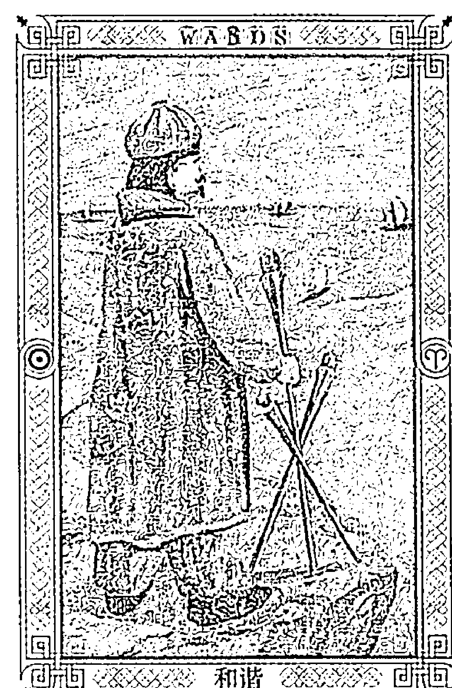

正位含义
商业，商人，期待，希望，领导地位，好机会，实际的知识，寻求援助，成功的预兆，事业，协商谈判，交易，高瞻远瞩，目光长远，依赖，等待。

逆位含义
事业不顺利，合作没有默契，商业敏锐度不够，缺乏远见，计划不周，别有用心的援助，减轻不幸，当心所提供的帮助，缺乏领导能力，计划被延迟。

## 权杖四 · Four of Wands

关键词
巩固、丰收、稳固、安全、欢庆、和谐、繁荣

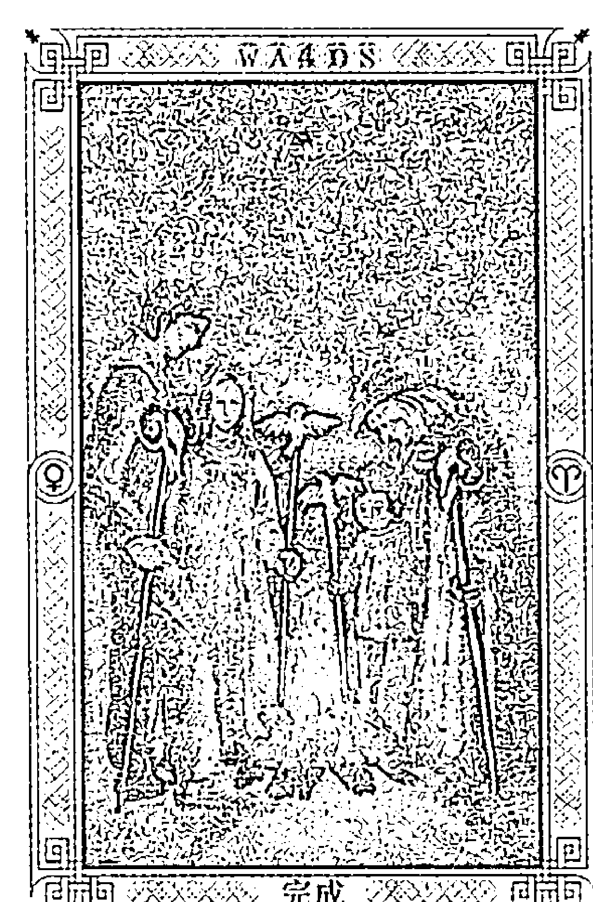

标号：4 标注：完成 符号：金星 白羊座

图画：画面中心，男童、少女、成年男子、老妇人四个人手中各有一根权杖。有的权杖尖端雕有公羊头，有的则装饰着白色的鸽子。在夜晚，四个人围着中央的一堆篝火，似乎在庆贺或者野餐。火光照亮了背景，隐约可以看到桥梁和它后面的城镇。人物的影子被拉得很长。

正位含义
友情顺利，恋爱浪漫，关系稳固，扎实的基础，庆祝，成功，喜庆，结婚，和谐，平静安宁，暴风雨后的宁静，和平繁荣，充满安全感。

逆位含义
失去了平衡，失去安稳平静，不顺利的恋情，第三者，局促不安，缺乏安全感，不好的预感，不确定，模糊，不稳定的局面，表面宁静，虚伪，乐极生悲。

## 权杖五 · Five of Wands

关键词
冲突、迷茫、矛盾、斗志、争执、竞争、激战

标号：5 标注：冲突 符号：土星 狮子座

图画：战士、魔法师、农民、居民、文人，五个不同职业和身份的人拿着形色各异的木杖或铁杖在混乱地争斗。站在中央面向右的是魔法师，他那竖直的法杖上缠绕着双头蛇，它们吐出可怕的红信。在他面前，战士的铁杖被魔法悬空，战士向后仰去，一脚踩在了农民的衣服上。而农民正在与居民争斗得不分上下。文人的杖打在了魔法师的腰上。居民横着的杖，尾端似乎就要在文人的头上落下，另一端与农民竖起的杖碰触。大地被火焰覆盖。

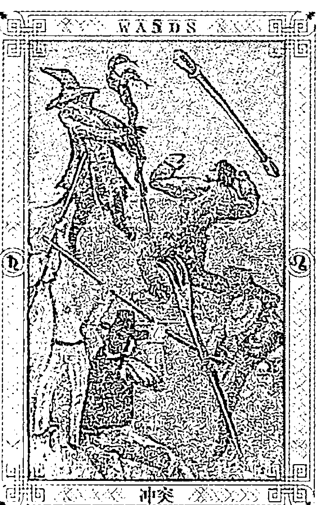

正位含义
竞争，彼此争斗，内心的矛盾与冲突，不满足的欲望，迷茫，公平的竞争，挣扎，劳力，障碍，将会出现强敌，势均力敌，充满斗志。

逆位含义
混乱而复杂的局势，失控，受到牵连，纷争，诉讼，争执，不公平的竞争，诡计，自相矛盾，错综复杂，欺诈，切莫迟疑。

## 权杖六 · Six of Wands

关键词
稳定、欢迎、凯旋、成功、进展、自信、好消息

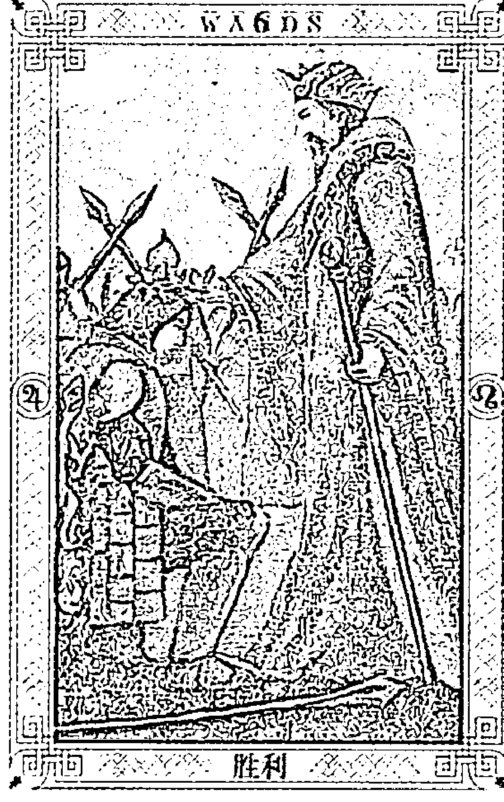

标号：6 标注：胜利 符号：木星 狮子座

图画：背景庆贺的人群前，一个国王左手扶杖，右手伸出，正在给骑士授予代表胜利的桂冠。骑士半跪，火红的披风上绣着火蜥蜴，杖倒放在右脚旁。在群众前，国王的护卫们拿着杖交叉防卫。

正位含义
征服，凯旋，衣锦还乡，金榜题名，胜利，得到回报，好消息，进展顺利，期待，付出努力而达成心愿，充满自信，受到欢迎和拥戴，荣耀。

逆位含义
失败，无限期的延迟，恐惧，挂念，背叛，表面上的利益，丢失，奸细，骄傲自满，迟迟到来的成功，努力没有结果，被陷害，计谋。

## 权杖七 · Seven of Wands

关键词
坚毅、挑战、保护、勇气、防御、反击、对立、权衡、决断

标号：7 标注：斗争 符号：火星 狮子座

图画：一个人衣衫褴褛，大汗淋漓。他双手紧握着木杖防卫，一脸坚毅的表情，却被六根长矛逼退到了河边。河水被火光和血水染红。敌人没有出现在牌中，但从伸出的长矛可以知道他们是要将画面中的人置于死地。

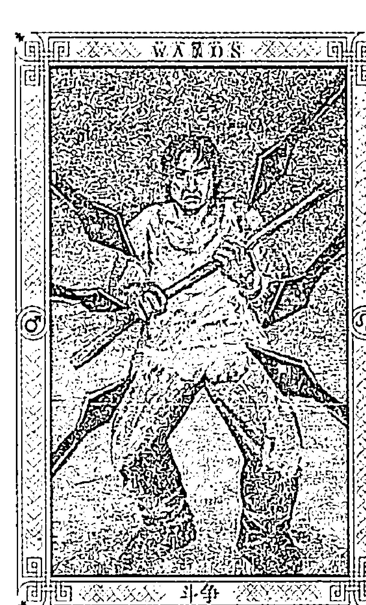

正位含义
立场坚定，保护重要的事物，迎接挑战，充满勇气和斗志，成功防御，转为反击，获得，打破阴霾险境，优越，胜利，坚强不服输，不畏强敌。

逆位含义
对自己的能力产生怀疑，惊愕，焦虑，难堪，立场动摇，斗志不足，感到困扰，迟疑导致损失，无法对事物进行决断，困惑茫然。

## 权杖八 · Eight of Wands

关键词
充沛的体能、迅速、抵达、顺利、旅行、信息、前进

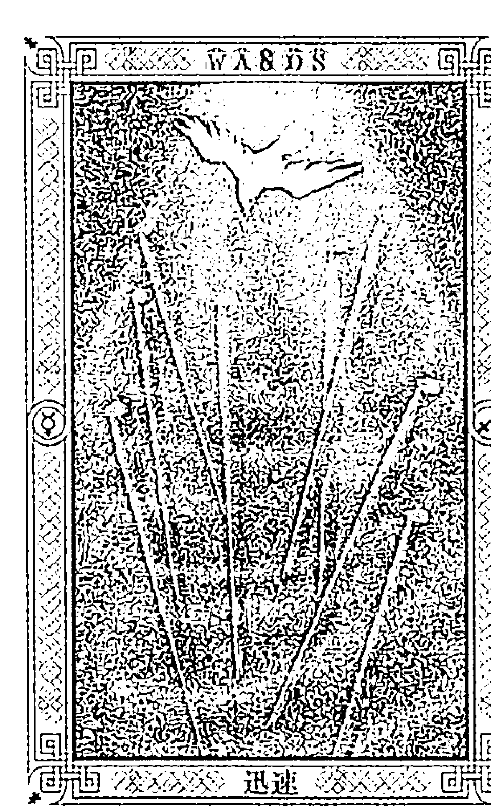

标号：8 标注：迅速 符号：水星 射手座

图画：神圣的光辉从天空中降落，扩散的光芒照射着快速旋转着的八根权杖。鸽子在圣光中出现，衔着橄榄枝，扑翅准备降落。旋转的权杖向四周散发出彩虹的七种单色光芒。这七束光芒末段都是弯曲的，如奔走的电流一般。

正位含义
迅速地行动，突飞猛进，进展神速，胜利在望，开始或结束，无法阻碍，顺利，仓促下决定，不稳定，付诸实践，一鼓作气，勇往直前，没有退路。

逆位含义
突然降临的打击，嫉妒，停滞不前，难以挽回，行动不够迅速，没能把握住机会，反应迟钝，遭受挫折，计划进展缓慢，受到阻碍。

## 权杖九 · Nine of Wands

关键词
审慎、警觉、伤害、疲惫、固执、防御、经验、痛苦的遭遇和回忆

标号：9 标注：守护 符号：月亮 射手座

图画：正在升起的朝阳与正在落下的月亮在地平线的两端。一根长长的杖倒在地平线上，似乎连接着太阳与月亮。另外八根不同程度烧焦的木杖，分别立成两列，刚刚熄火的地方还飘着浓烟。中间一个头部受伤的人双手捧着跳跃的火星，表情中充满着疑虑，似乎是怕被谁抢走手中的火星似的。

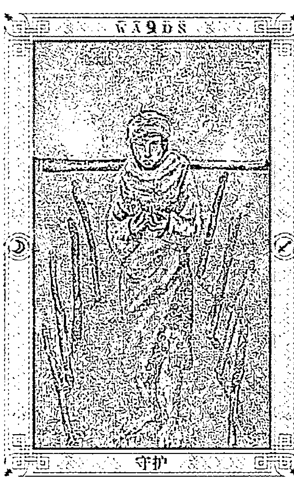

正位含义
面对困难，隐藏的敌人，欺骗，困境，疲惫，陷阱，受尽折磨，艰苦的岁月，艰难旅程，永不放弃，保持警醒，走不出痛苦的回忆，顽强，不要屈服，蓄势待发。

逆位含义
障碍，逆境，问题，延迟，灾难，须克服的阻碍，伤痕累累，疲惫不堪，脆弱，容易受到伤害，自我保护，不信任别人，运气不好，丧失斗志。

## 权杖十 · Ten of Wands

关键词
负担、累赘、缓慢、勉强、压迫、疲累、压力、努力、责任

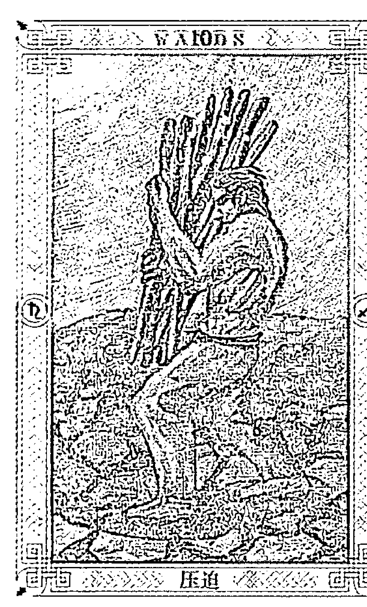

标号：10 标注：压迫 符号：土星 射手座

图画：烈日在左边的天空炙烤着大地，热气扭曲了大地表面的空气和景观，大地已经龟裂成无数块。一个上身赤裸的男子，满身汗水地弯腰抱着十根木杖艰难前进。木杖的顶端冒着烟，其中部分木杖已经开始燃烧。

正位含义
巨大的压力，勉强自己，问题马上能解决，非常具有责任感，奋力达成目标，情绪不安，过度疲劳和劳累，付出许多的辛劳，因计划不切实际而进展缓慢。

逆位含义
举步维艰，不够深思熟虑，鲁莽，困难，推托，借口，快要崩溃，逃避责任，无法释怀，无法获得帮助和同情，不被人理解，疲劳，日积月累的疾病。

## 权杖公主 · Princess of Wands

关键词
认真、纯洁、热衷、勇敢、活泼、天真的少年

标号：Wands 标注：公主 符号：Heh 土性火

图画：小公主披着虎皮制成的简陋衣裙，红色的花纹如同火焰。年幼的公主面向右，手拿太阳神杖。神杖稍显高大，杖头的金色球体仿若太阳升入云端。公主似乎站在举行仪式的台子上，左侧可以看到祭台的边缘，那里立着一个石柱，又似乎是烛台，表面上下对称雕刻着公羊头，台上面燃烧着的硫黄卷起汹涌的火焰。整个祭台，甚至整个世界似乎都在燃烧着。

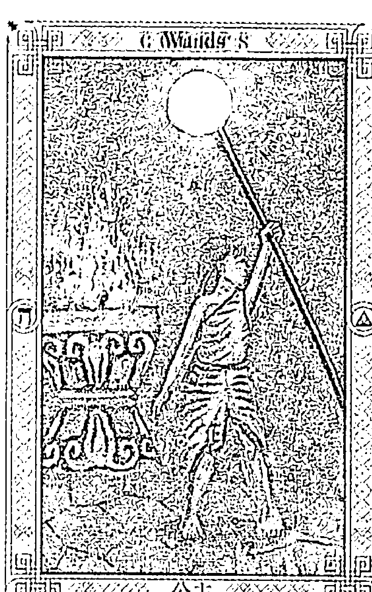

正位含义
忠诚和忠心的人，优秀的助手，信使，间谍密探，能信任的朋友，友好的陌生人，始终如一的人，携带重要信息的人，不稳定和不够成熟，拥有天赋的力量，有好消息传来。

逆位含义
优柔寡断，祸从口出，不情愿，不安定的状态，善变，传来坏消息，令人担忧的困惑，缺乏成熟的思考和决断的能力，不愉悦，幼稚，不安分。

## 权杖骑士 · Knight of Wands

关键词
积极、转变、自信、勇敢、鲁莽、火热的年轻人、旅行

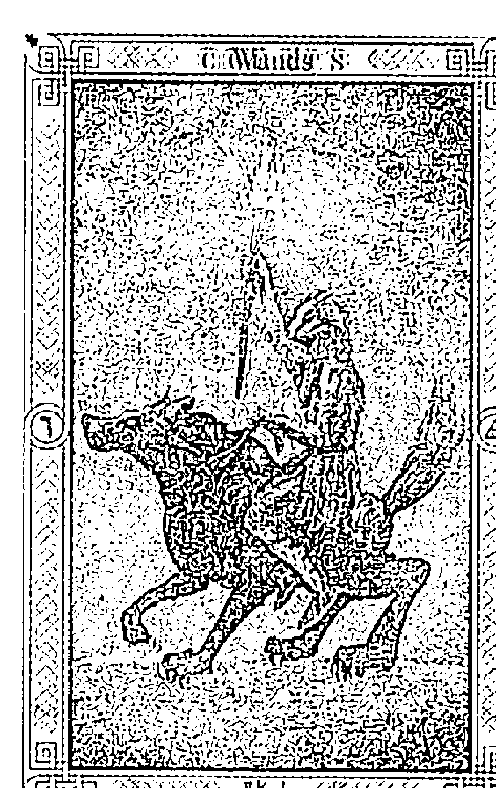

标号：Wands 标注：骑士 符号：Vav 风性火

图画：燃烧的火炬犹如火凤凰的尾巴。夜的黑暗被火炬照亮，残存的一点儿黑暗在牌的最边缘也即将完全消失。从天而降的许多飞火流星使夜空璀璨而华丽。一个勇士骑在黑狼身上，左手控制狼的缰绳，右手高举火炬。狼抬起前蹄，刚刚起步，一副马上就要出发的架势。

正位含义
勇气，热情奔放，勇往直前，自信，一段旅程，爱冒险，开始新的旅程，前进到未知的领域，改变，缺乏，居所的变动，事业顺利，获得晋升，缺少谋略。

逆位含义
过犹不及，有勇无谋，鲁莽，傲慢，中断，预料之外的转变，骄傲自大，暴躁易怒，争吵，人际关系的破裂，仓促行动，缺乏耐心，决裂，吵闹的场面，产生分歧。

## 权杖王后 · Queen of Wands

关键词
开朗、阳光、粗心大意、女强人、巾帼英雄

标号：Wands 标注：王后 符号：Heh 水性火

图画：似乎是烈日晴天，强烈的光芒遮掩了下半部分牌面。炙热的感觉，仿佛燃烧起了看不见的火焰。头戴向日葵王冠的王后，身着红色羽毛编织而成的衣服，坐在金色的豹子身上，脚几乎融于光芒之中，身后是与权杖国王一致的图腾。王后左手紧紧握着权杖，右手抚摩着温驯的豹子。身体向前倾，大腿倾斜，一副随时会起身的样子。

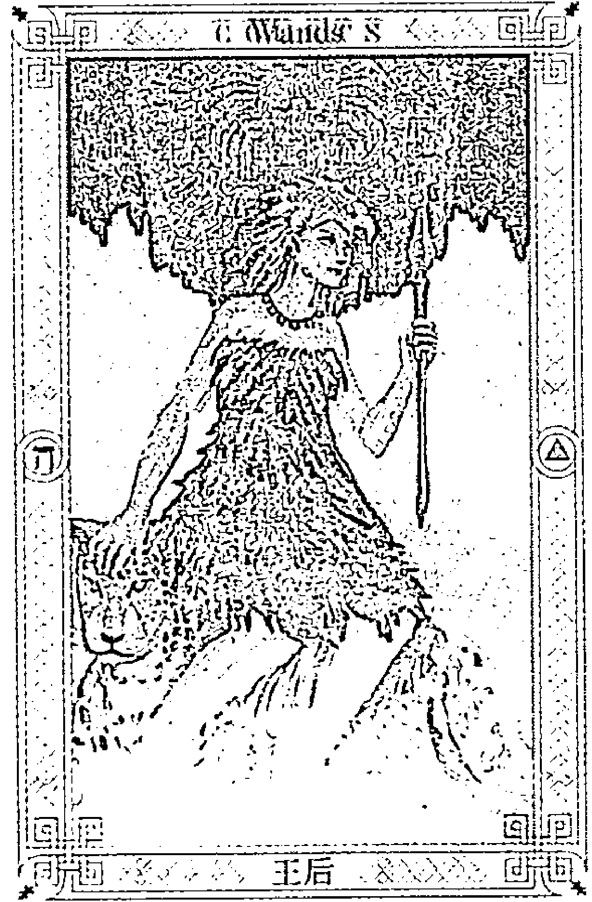

正位含义
公正无私，值得信赖，富于同情心，容易谅解的人，友善的，热情的，魅力和优雅，亲切的，真诚的，精力充沛，热情而温暖，独立，有决心，有能力，积极乐观，坚定果敢，刚柔并济。

逆位含义
遭人妒忌，欺诈，叛逆的，傲慢，不屈服，起伏的情绪，曲高和寡的，善变，抵抗，对立，妨碍发展，孤独，粗心大意，盲目乐观。

## 权杖国王 · King of Wands

关键词
稳重、成熟、控制、霸道、权威、安全感、雄心万丈、领导者

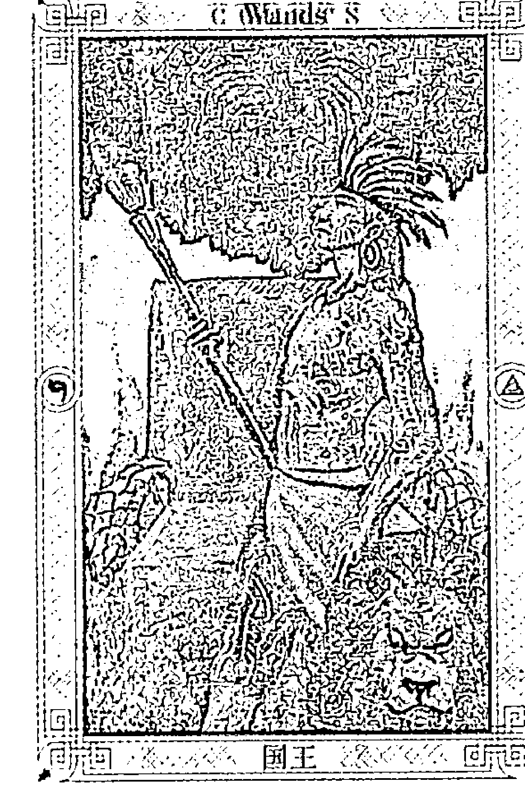

标号：Wands 标注：国王 符号：Yod 火性火

图画：王座后面挂的旗帜上绣着狮子和龙的图腾，扶手上雕刻着火蜥蜴。整个画面以红色为基调。国王有着红发和坚毅的面孔，戴着羽织王冠，身上刺满了华丽的文身，身后火焰飞腾，看起来就像是土著部落的酋长。他离开了自己的宝座，是四个国王中唯一站立的国王。他的右手握着权杖，向前伸出，似乎在命令士兵出击。左手边是一只露出凶狠面孔的狮子。

正位含义
成熟，智慧，经验丰富，具有统治力，极强的行动力，果断决策，宽宏大量，正直而诚恳的人，忠实的，友善的，有同情心的，有学识的人，开明的领导者。

逆位含义
失控，缺乏果断的决策力，不成熟，容易冲动，态度傲慢，独断专行，严格，苛刻，爱面子，容易极端，滥用权力，武断，威压。

## 圣杯牌组

这一组与四元素之水相关联，是一切阴性事物的代表。它也代表情绪和心灵体验，描述了我们的内心状态、感觉和关系。相对于火的外向，水是内向的。水本无形，可以流动，可以填满空隙，能够忍受一切，同时也喜怒无常。一切关于水的象征都适用于这组牌。

## 圣杯首牌 · Ace of Cups

关键词
开始、感情、情绪、爱、幸福、喜悦、感受

标号：1 标注：Ace 符号：Heh 水元素

图画：布满涟漪的水面，漂浮着许多荷叶。在中央的白莲上，绽开出透明的圣杯。杯体呈透明的淡蓝色，杯上雕刻着希伯来字母Mem。圣杯中流溢而出的光，以白莲为中心在水面向四周流淌。水平面与杯面持平。在水平面以下，流溢而出的彩色的、弯曲的、流动的神奇光芒。而水平面以上，杯所散发的光则是直线的、白色的、神圣的光芒。一些蓝色的颗粒向上漂浮，白鸽从圣光中下降。

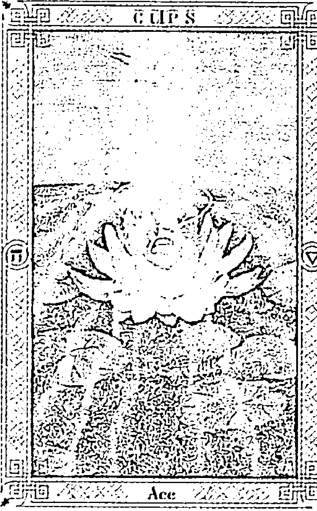

正位含义
新感情的开始，新的情人，新的朋友，充沛丰富，充满关怀，满足，完美，欢喜，丰腴，美丽，美好的愿景，慷慨回报，珍惜，有婚庆之喜，喜讯传来。

逆位含义
虚伪，改变，单相思，喜悦中带着隐忧，侵蚀，不安稳，需用爱和耐心来化解贫乏，无回报的爱，不尽情的欢乐，被欺骗，不真实。

## 圣杯二 · Two of Cups

关键词
结合、合作、平等、真爱、交换、恋情、友谊

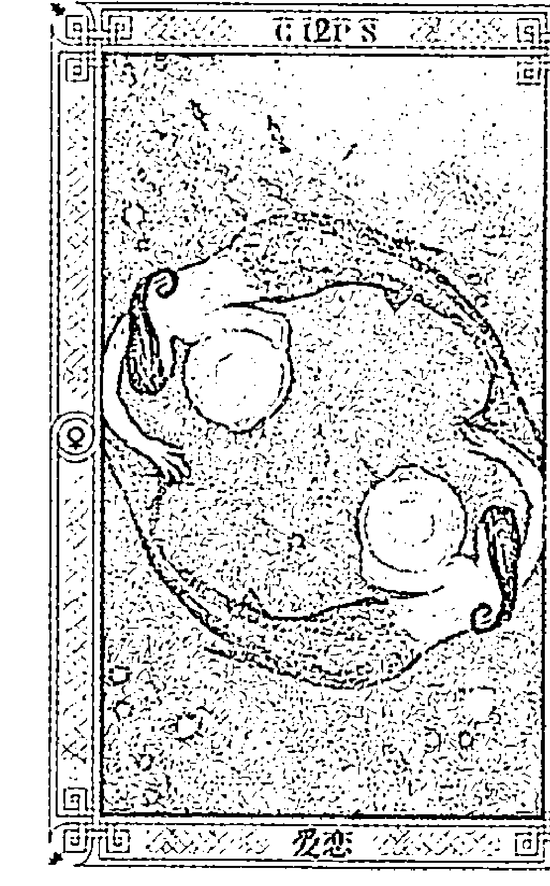

标号：2 标注：爱恋 符号：金星 巨蟹座

图画：蔚蓝的海洋深处有两条人鱼手中各自捧着圣杯。她们一上一下，相互追逐着对方的尾巴嬉戏着。她们手中的圣杯，与她们的身体一起构成了巨蟹座的标志，也与太极图有些相似。鱼群与阳光，描绘出了一幅宁静、祥和而温馨的画面。

正位含义
爱情，和谐，对等的人际关系，新的友谊或是重修旧好，热情，结合，婚约，相互了解，合作，平等，初恋，愉快，不强求，相敬如宾，康复。

逆位含义
不满足，相互猜疑，不信任，虚假的友谊，貌合神离，关系对立，麻烦的关系，离异，分离，交错的欲望，对立，误解，欲求不满。

## 圣杯三 · Three of Cups

关键词
成长、进步、喜悦、庆祝、联盟、合作、宴会

标号：3 标注：丰富 符号：水星 巨蟹座

图画：极光的奇异色彩在幽蓝的夜空中闪耀跳动。横跨黑色之河的桥梁上，冥王、冥后与农业女神似乎正在为达成了协议而举杯庆祝。桥的左边是白色的积雪，代表冬季的三个月。而桥的右边是金黄色的麦田，代表万物生长的九个月。

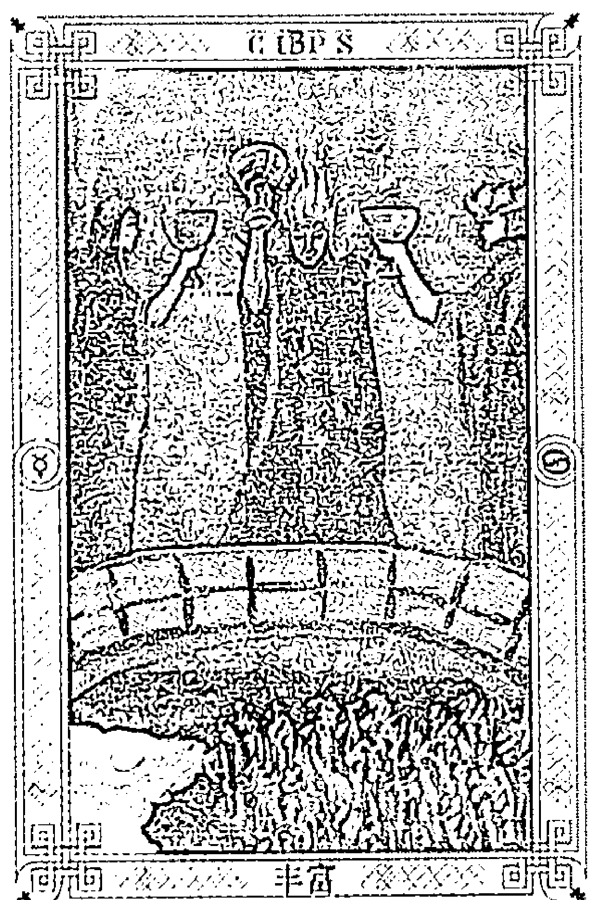

正位含义
丰收，幸福，问题得到解决，结论，安慰，满意的结果，妥协共识，庆祝成功，宴会，婚礼，融洽，友谊，关系和解，独立自主，平等互利。

逆位含义
乐极生悲，过分，过剩，不好的饮食习惯，奢侈，延迟，实力相当，相持不下，鸿门宴，做事拖拉，喜忧参半，貌合神离。

## 圣杯四 · Four of Cups

关键词
巩固、选择、无聊、厌倦、不满、沉思、冷淡、退缩

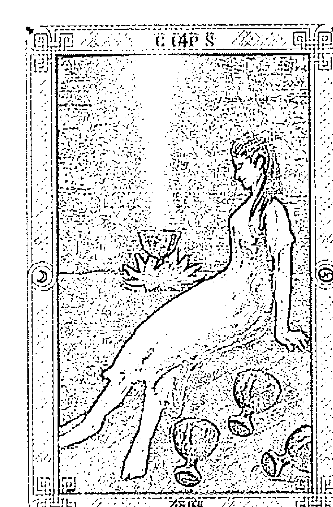

标号：4 标注：奢靡 符号：月亮 巨蟹座

图画：阴霾的天空下，漂在水面的粉红莲花中盛放着一个圣杯，一束白色的光从圣杯中心散射向空中。一个女人坐在水边，身后摆着三个圣杯，而她的目光朝向水中的圣杯，眉头紧锁、双目紧闭，似乎在思考着什么。

正位含义
百无聊赖，陷于往事不可自拔，拒绝新的机会，疲倦，反感，厌恶，失望，缺乏动力，消极，退缩，对一切漠不关心，寂寞，离群索居。

逆位含义
外遇，新机会的来临，可能性，新的人际关系，对旧问题的新见解，新知识，摆脱低潮，觅得新机会。

## 圣杯五 · Five of Cups

关键词
分离、逃避、失落、痛苦、失望、悲伤、损失

标号：5 标注：失望 符号：火星 天蝎座

图画：干涸的河床、枯萎的荷叶，一切都是那么落寞。天空被沙尘暴染成了深红色，凛冽的风携着沙子和花瓣，席卷大地。一个身着黑袍的男子，惋惜地低头看着脚下倒着的三个圣杯：一个流出了血液，一个流出了洁净的水，另一个流出了沙子。但在他的身后还有两个盛满神秘液体的圣杯。

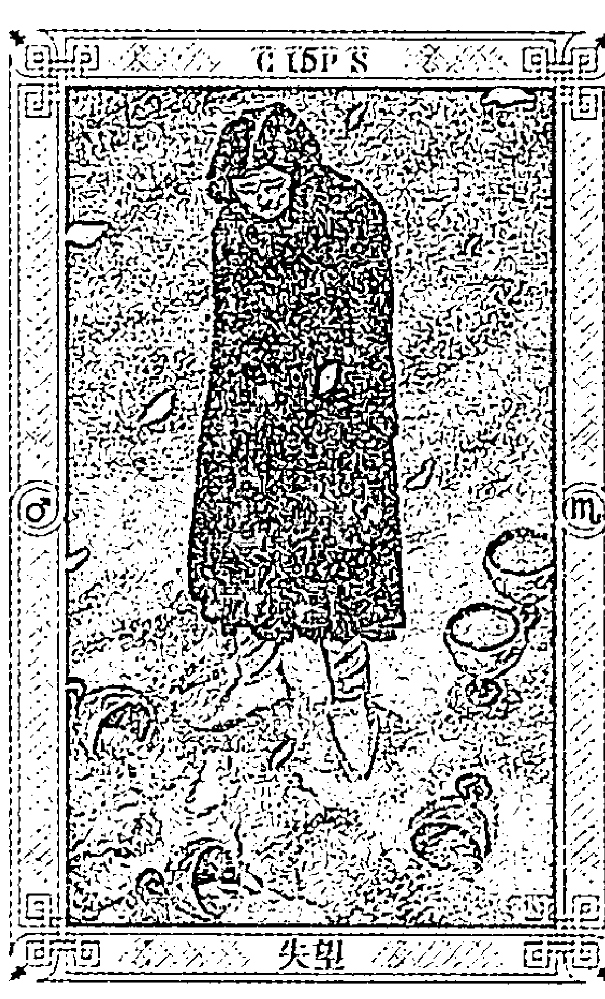

正位含义
部分损失，后悔，惋惜，孤立无援，没有真正意义的友谊，继承，悲伤痛苦的处境，缺陷，怀疑人生，迷茫，不知所措，逃避，面对分离。

逆位含义
告别悲伤，放弃所有，开始新的生活，充满希望的愿景，老友归来，回到熟悉的环境中，破镜重圆，重聚，东山再起，重拾信心。

## 圣杯六 · Six of Cups

关键词
情绪稳定、回忆、依赖、馈赠、善意、童年、思乡、照顾

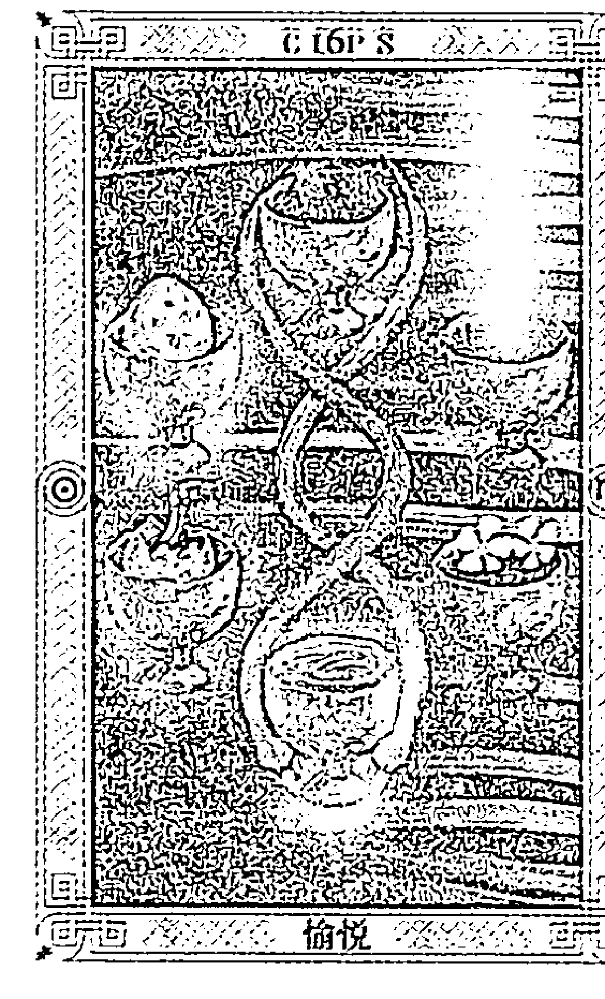

标号：6 标注：愉悦 符号：太阳 天蝎座

图画：“时间之流”贯穿整个牌面，缓慢而又匆匆流过。六个圣杯在时间之流中漂浮着。左边两个竖向紧挨着并列，散发出鲜艳的光彩，其中分别呈放着神秘蛋和刚刚破壳而出的小蛇。中间两个上下罗列，距离较远，它们被两条蛇双螺旋缠绕着，并散发出浓重的光彩，分别呈放着石榴和流溢的液体。右边的两个则散发出深暗的光彩，上面的杯子射出神圣的光芒，下面的杯子盛放着白色的花朵。

正位含义
与过去相关的人与物，陷入回忆，思乡，慷慨大方，乐于付出，放下仇恨，慈爱，照顾，馈赠，刻骨铭心的曾经，往事再现。

逆位含义
绝处逢生，受到馈赠，长远打算，老树开花，为事业奋斗，对未来充满希望，在前方的机会，将来的事件，新的展望，计划可能失败，即将来临的。

## 圣杯七 · Seven of Cups

关键词
追求、梦想、欲望、迷惘、想象、选择、决心

标号：7 标注：放纵 符号：金星 天蝎座

图画：沼泽一样的水面布满了旋涡和伸出大嘴的鳄鱼。水的颜色令人作呕，散发而出的毒气笼罩在水面上，久久不能散去。一个人撑着船在水面缓缓行过，船的尾部堆满了财宝、权杖和书籍，还有被捆绑着的美人鱼，船的边缘则摆放着七个杯子。杯中燃着蓝、绿或黑的火焰，流出绿色或黑色的液体。一只被腐蚀的手骨从水中伸出，似乎在求救和挣扎。

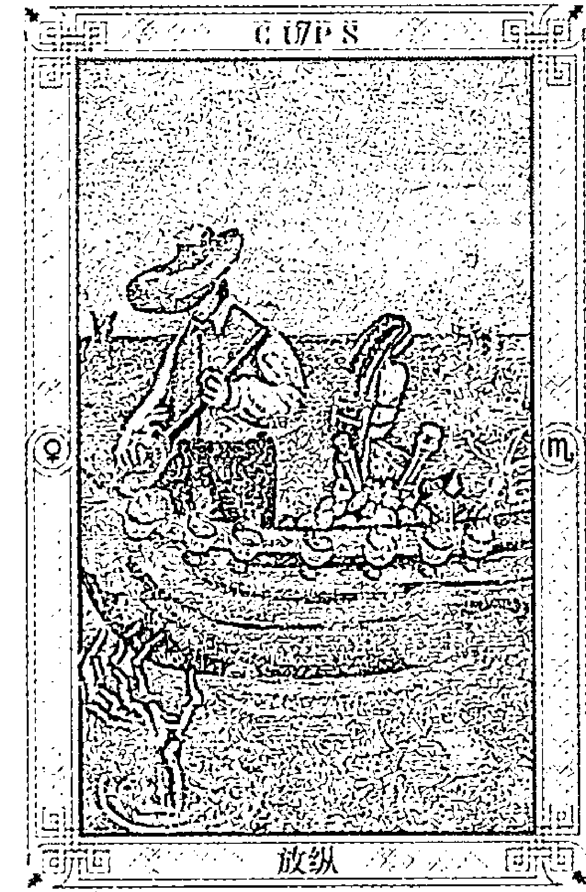

正位含义
不现实的态度，反复无常，出尔反尔，无序混乱，幻想，白日梦，愚蠢的念头，极端，放纵，沉溺，颓废，为失去而叹息。

逆位含义
欲望，决心，充满渴望的想法，强大的意志力，无奈，接近达成的目标，选择，不切实际和污浊之物，现有体系被打破，调整生活状态。

## 圣杯八 · Eight of Cups

关键词
力量、追寻、丢弃、不满足、行动、牺牲

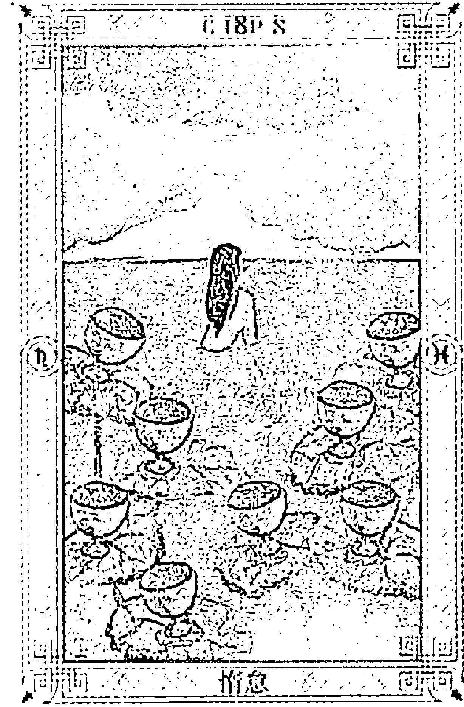

标号：8 标注：惰怠 符号：土星 双鱼座

图画：浓厚的乌云与水面只有一线的距离，水面上有八片枯萎的荷叶，上面分别摆放着没有承装任何东西的破旧杯子。水下不远的地方散发着的圆形光芒、荷叶下绿色的茎，均暗示着生命和复原潜力。但感到疲惫的人鱼似乎已经放弃这片海域，正在向远处的海平面缓缓游去。

正位含义
半途而废，停止努力，缺乏毅力和耐心，失望，放弃先前的计划，羞怯，谦逊，有了新的目标，见异思迁，不满足于现状，为了寻找而丢失。

逆位含义
不懈努力直到完全成功，淤塞的情感，抛弃，美中不足，不停追求，牺牲精神，突破常规，邀请，出现转机，有舍弃才能有获得，付出代价。

## 圣杯九 · Nine of Cups

关键词
满足、安宁、健康、享乐、得意、美梦成真

标号：9 标注：幸福 符号：木星 双鱼座
图画：水池的中央喷泉源源不断地涌出泉水，围绕在池子周围的九个圣杯也不断向池中溢出水流。新鲜的水充满了生机，滋润着万物。在池子左边，一对情侣恩爱亲昵；中间有三个孩子在快乐地玩耍；右边一个商人拿着钱袋露出满意的微笑。

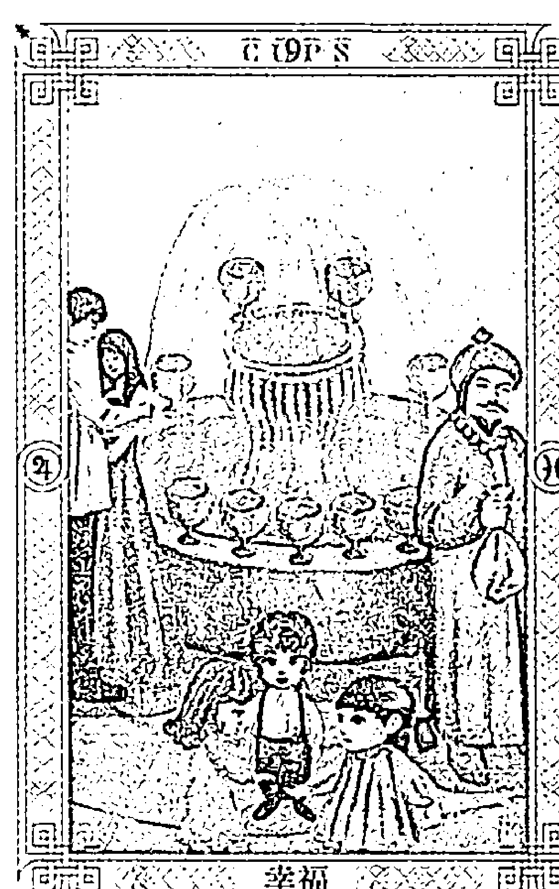

正位含义
成功，愿望实现，物质上的成就，好运气，利益，安宁，形势有利，富足安康，丰富充沛，有希望，健康，克服困难。

逆位含义
易犯错误，勇于承担责任，物质上的损失，不完美，不满足，不当，错误的信任，虚假的自由，对立，差异，虎头蛇尾。

## 圣杯十 · Ten of Cups

关键词
幸福、家庭、满足、和谐、欢乐

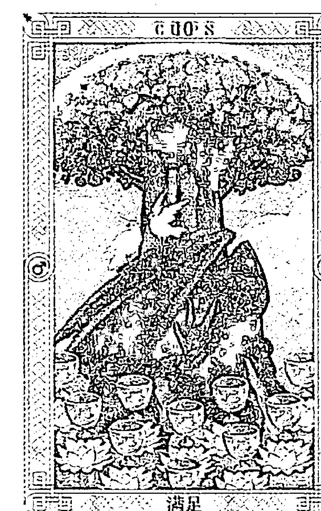

标号：10 标注：满足 符号：火星 双鱼座
图画：生命之树或世界之树的树冠之上，是美丽的彩虹。树下命运之井的水流溢而出，形成了湖泊和海洋。十个圣杯被安放于漂在树下水面的莲花之上。一只巨龙安静而祥和地沉睡在突出水面的树根上。有两只鸽子在龙身上跳跃着玩耍。

正位含义
家庭和睦，内心平静，感到幸福，愉悦，和平，爱情美满，满足，十全十美，美好的家庭生活，荣誉，尊重，美德。

逆位含义
失去友谊，不愉快，家庭纷争，琐碎的事，不和，完美主义，要求苛刻，盛怒，意见的差异，隐患隐忧。

## 圣杯公主 · Princess of Cups

关键词
柔情、细腻、友善、信赖、好学、付出感情、好朋友

标号：Cups 标注：公主 符号：Heh 土性水
图画：人鱼公主身着近乎透明的白纱长裙，边缘绣着淡绿色的百合和莲花。公主左手执白色的伊希斯之莲，右手中的贝壳（圣杯）中跳出了青鱼。牌的右上方露出了海面上的光芒，隐约可以看到天鹅的倒影。蔚蓝的海水中，巨大的乌龟和海蛇在其中盘旋游弋。

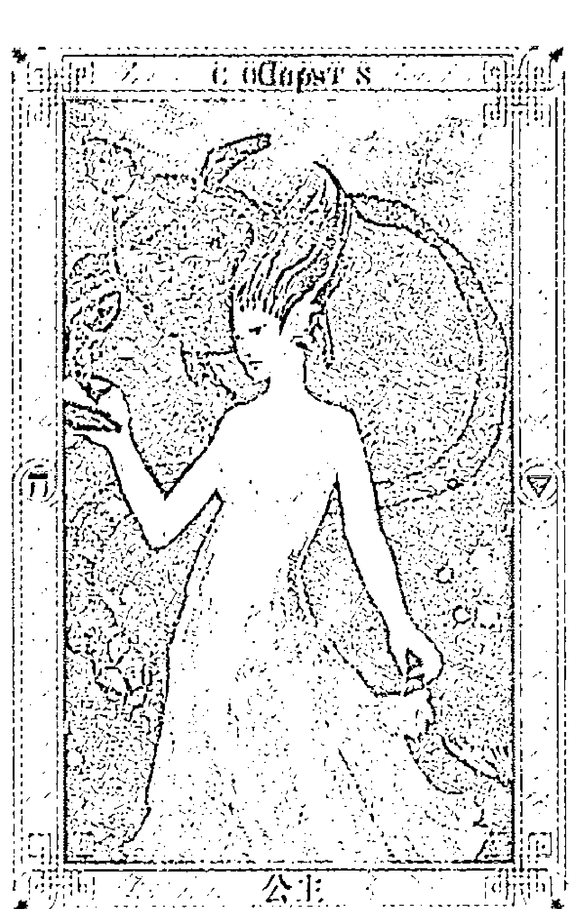

正位含义
勤勉好学，专心致志的人，热心，自然，真诚，凝思默想，忠诚，不成熟的情人，有帮助的人，值得信赖的工作人员。

逆位含义
倾斜，偏离，越轨，教唆，缺乏主见，依赖性太强，脆弱，多愁善感，暂时的纷乱和焦躁，引诱，阿谀奉承。

## 圣杯骑士 · Knight of Cups

关键词
体贴、浪漫、多情、才艺、美男子

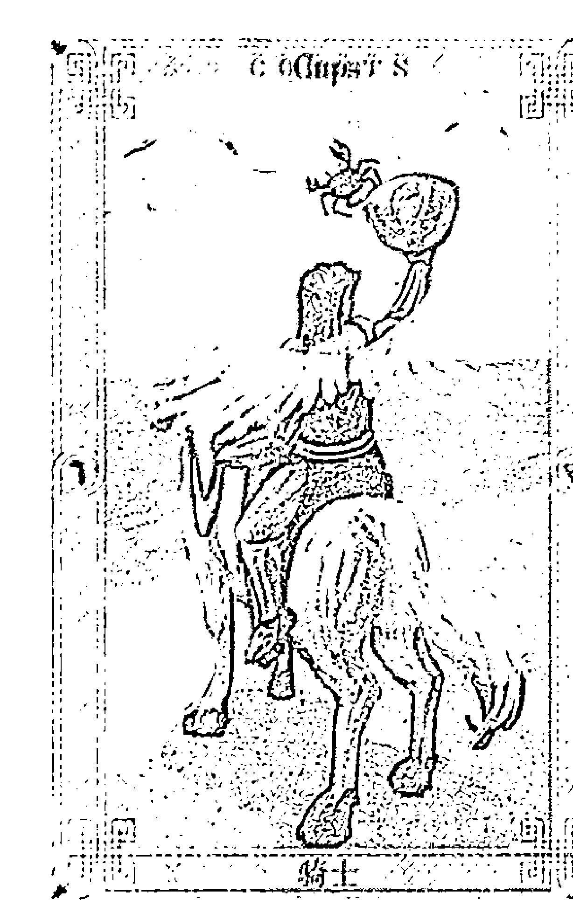

标号：Cups 标注：骑士 符号：Vav 风性水
图画：有海鸥飞翔的宁静海边，浪花拍打在马蹄上。白马停下脚步，似乎到达了终点。骑士左手握着缰绳，右手举着圣杯。圣杯中装着的螃蟹一跃而出，奔向海面。骑士轻便的衣服两侧有近乎透明的美丽翅膀从中伸出。

正位含义
浪漫，直觉，创意，艺术气质，即将面临一个邀请或机会，抵达，接近，前进，吸引，恳求，挑战，提案。

逆位含义
暗中，手段，欺骗，狡猾奸诈的人，梦想家，缺乏行动力，全心投入，冲动，感情丰富，花心，劝诱。

## 圣杯王后 · Queen of Cups

关键词
温柔、想象力、倾听、浪漫、关怀、感性、女诗人

标号：Cups 标注：王后 符号：Heh 水性水
图画：清澈的湖水中开放着一朵莲花，岸边长满了水仙和芦苇。王后面向左侧，温婉地坐在水边。她左手伸于水中，似乎在梳洗、玩水或映照自己，王后右手捧着圣杯，其中装着一只龙虾。一只鹈鹕单脚立于王后身边。芦苇、水仙延长出的光线形成了帷幕，与圣杯双螺旋上升的光芒一起遮掩住了王后的脸。倒映在水面的光芒与涟漪融合为一。

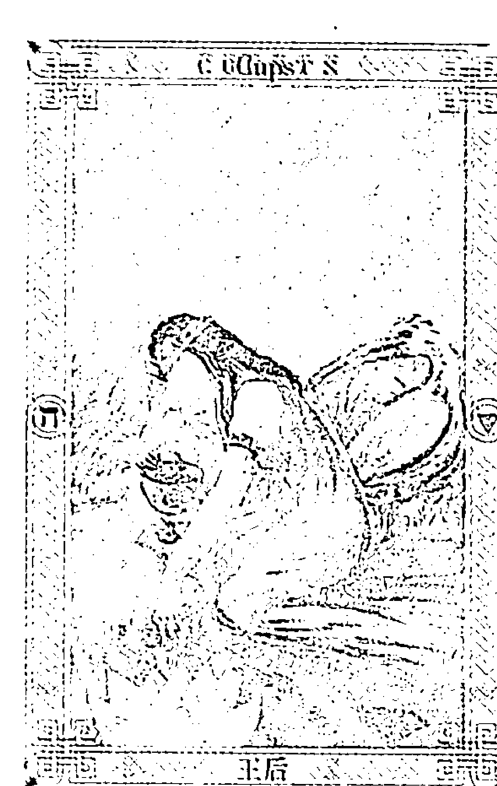

正位含义
热心和公正的人，被爱戴，被敬重，感性，情感丰富，奉献，实际，正直，爱心和智慧，有远见。

逆位含义
不正直，不道德，性情乖戾，无法信赖，恶行，笑里藏刀，神经过于敏感。

## 圣杯国王 · King of Cups

关键词
宽容、爱家、关怀、慈善、善变、头脑清晰

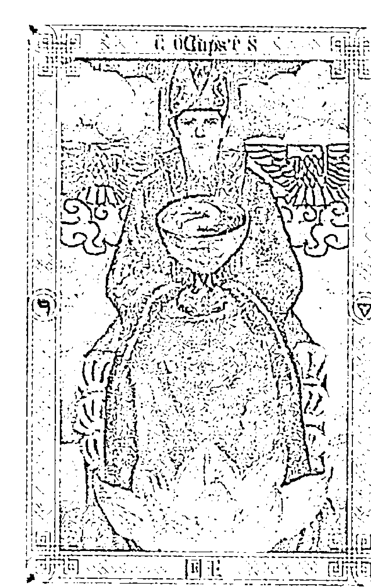

标号：Cups 标注：国王 符号：Yod 火性水
图画：一位穿着轻便而华丽的老国王手捧圣杯，安详地坐在王座上。圣杯中装着一条小白蛇。王座阶下，一朵莲花开出水面。那莲花似乎刚刚破水而出，周围的水面还泛着涟漪。王座后的幕布绘着鹰和云的图腾，图腾之后似乎是云朵。王座的扶手上雕刻着鱼，装饰着贝壳。

正位含义
有责任感，公正，有修养的人，专业的，有创意，体贴周到的人，善良，可靠，开明，对科学和艺术感兴趣，慷慨大方。

逆位含义
艺术家性格，双面的交易，表里不一，不公正，不诚实，狡猾，丑闻，损失，毁灭，诡诈，不值得信任，不值得托付。

## 宝剑牌组

这一组与四元素之风相关联。它代表才智、思考和原因，也与公正、真诚、道德等相关，侧重描绘我们的内心世界以及我们对事物的态度。

## 宝剑首牌 · Ace of Swords

### 关键词

开始、思想、理智、决断、新挑战、极端、决心

标号：1 标注：Ace 符号：Vav 风元素

图画：深蓝的夜空中，云层间布满了繁星。巨大的满月前，竖立着铁青的宝剑，青蛇缠绕着剑柄，蛇头则俨然成了宝剑的护手，剑身上雕刻着“θ ε λ η μ α”，挂着桂枝与樱桃的王冠。宝剑周围的云雾散开，才看见其后的满月。如果算上月亮，王冠周围的剑身被二十二颗特别闪亮的星环绕着。

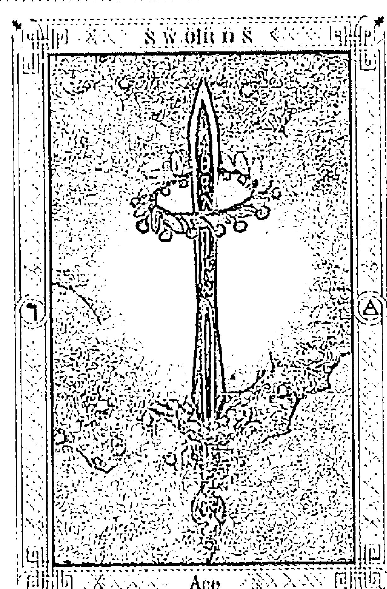

### 正位含义

强大的决心，克服困难，开创，力量，行动，胜利，权力，成功，丰腴，兴旺，爱情，优胜，进取心。

### 逆位含义

灾害，破坏，专制，不幸，争端，引来麻烦，极度，火暴的脾气，深层的情感，难堪，障碍，贫瘠。

## 宝剑二 · Two of Swords

### 关键词

决定、选择、僵局、逃避、抗拒、对立、紧张

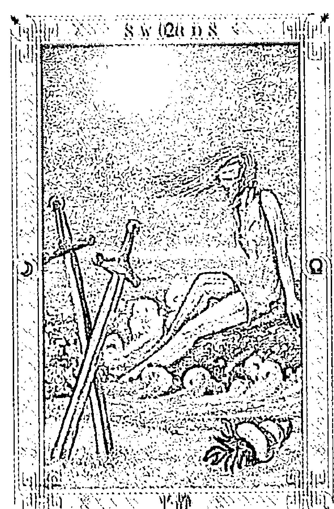

标号：2 标注：平静 符号：月亮 天秤座

图画：浪花拍打的礁石上面，坐着一个蒙着双眼的女性。她在“看”海，用身心去感受旁边的海洋。她的长发随着海风的吹拂而飘起。她似乎是在思考着什么，又或者是对什么感到疲倦而逃避到此。海上的明月，照耀着汹涌起伏的浪花。海边有金黄色的沙滩，上面交叉立着两把铁剑，而一只寄居蟹就在旁边四处游走。

### 正位含义

均衡的力量，协调，和谐，坚定刚毅，协定，抵消的要素，僵局，钟爱，停滞不前，没有进展，不知如何选择。

### 逆位含义

打破僵局，口是心非，虚伪，谎言，不实或扭曲的陈述，背叛，被催促而盲目作出决定，后悔，难堪。

## 宝剑三 · Three of Swords

关键词
悲伤、失落、分离、受伤、失去、痛苦、延迟

标号：3 标注：悲伤 符号：土星 天秤座
图画：黑暗的夜空，淅淅沥沥下着压抑和苦涩的雨。一个人跪在地上，一把剑刺穿了他的胸口。身边没有其他人，也许是凶手已经离去，也许凶手就是他自己。在他的膝下，散落着满地的花瓣。两把锈迹斑斑、豁口无数的铁剑交叉立在他的面前。

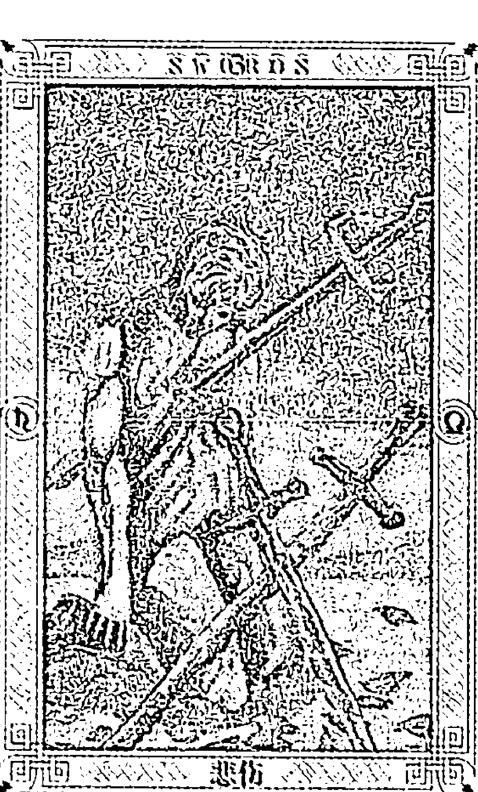

正位含义
缺乏，冲突，孤立，悲伤，放弃，失望，争吵，调动，缺席，转移注意力，对立，分离，延迟。

逆位含义
注意力散乱，放不下，过失，困惑，焦虑，混乱，不和，错误，误解，不融洽，损失，疏远。

## 宝剑四 · Four of Swords

关键词
巩固、休息、恢复、消极、沉思、准备

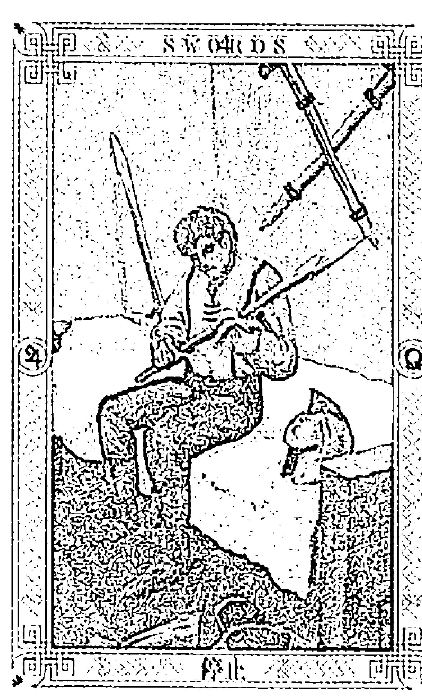

标号：4 标注：停止 符号：木星 天秤座
图画：一个身穿便服的战士安静地坐在床上，擦拭着手中破损的宝剑。头盔和铠甲被放在旁边，他却看也不看一眼。也许他已经无心争斗，也许他只是在为下一次战斗作准备。墙上悬挂着两把锋利的宝剑，另一把残破不堪的宝剑则斜倚在床边。

正位含义
延缓，休息，病后的休养，恢复，沉思，消极，补充，孤单，放逐，撤退，放弃。

逆位含义
活动，活跃，不顾病痛，慎重，警觉，试图纠正失败，积极，小心地前进，希望挽回所失去的。

## 宝剑五 · Five of Swords

关键词
内在的冲动、纷争、失落、自私、无谓的胜利、屈辱

标号：5 标注：战胜 符号：金星 水瓶座
图画：牌的正上方有一个巨大的风车，其下一个农民牵着一匹瘦马，马身上背有一柄宝剑。一个瘦小的骑士得意扬扬地将剑放在肩上，看着远处。风车下，战败的两个人，一个弃剑逃跑，一个倒地不起。倒地不起的是一个仆从，他的旁边跪着求饶的贵妇人。她在为她的仆人或者只是为了她自己而求情。仓皇逃跑的是一个商人，他为了保命顾不得那一车货物和自己的宝剑。这张牌在描述堂吉诃德的故事。

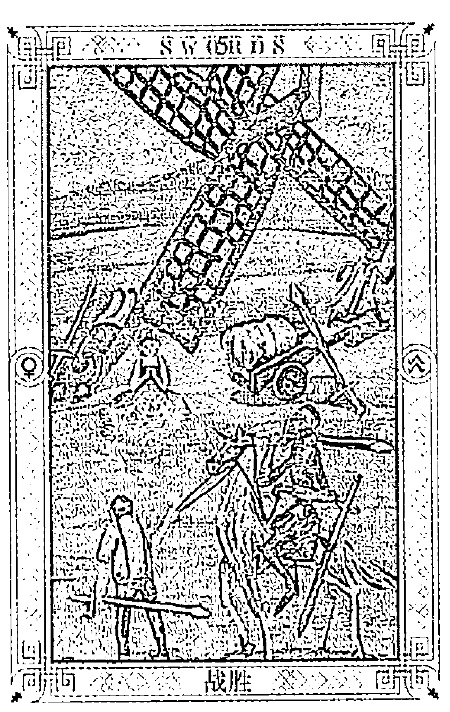

正位含义
征服，纷争，恶化，面临强敌，堕落，击败，破坏，退化，废止，撤回，恶名，争执，争吵，斗争，竞争。

逆位含义
不确定的展望，软弱无力，屈辱，失败，被打败，损失或是击败的机会，虚弱，或许有不幸会降临，魅惑，埋葬。

## 宝剑六 · Six of Swords

关键词
放弃旧信念、平静、带着问题前进、忧郁、疗伤、痊愈、旅行

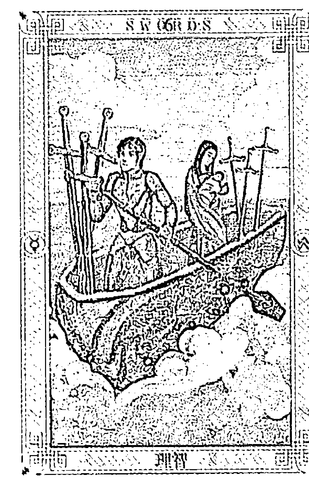

标号：6 标注：理智 符号：水星 水瓶座
图画：平静的水面，在船驶过后泛起层层波浪。穿着盔甲的男人撑着黑色的船桨，使船前行。船前插着三把宝剑，船后插着另外三把宝剑。船中央，一个孩子依偎在母亲的怀里，从盔甲上卸下来的披风围在他们身上。

正位含义
旅途和行程似乎已经结束，固执地试图克服困难，权宜之行为，焦虑之后的成功，令人烦恼的事，难以解决的事，淡淡的忧虑。

逆位含义
僵局，无用的提案，陷入困境，无望的提议，暂时没有好的对策，问题显现出来，表白，宣布。

## 宝剑七 · Seven of Swords

关键词
突发奇想、适应、与众不同、欺诈、孤立、尝试、自信

标号：7 标注：徒劳 符号：月亮 水瓶座
图画：军营前，地上散落了六把宝剑，这是小偷被发现后在慌忙之中丢弃的。一个士兵手拿一把宝剑，踩着地上的宝剑追击着企图偷剑的小偷。小偷正在翻越军营栅栏，仓皇逃跑的他还恋恋不舍地望着丢在地上的宝剑。

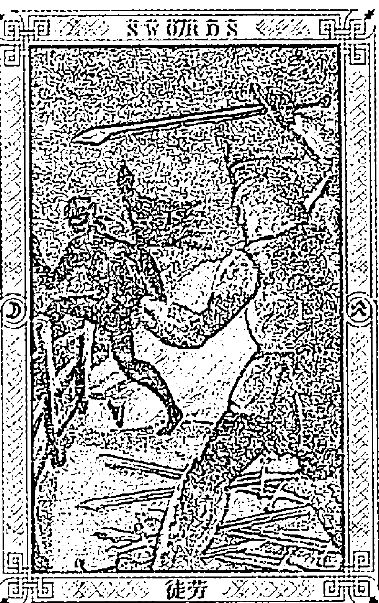

正位含义
计划，可能失败的计划，让人烦恼的事情，心愿，坚忍不拔，毅力，尽力而为，希望，信心，幻想，局部的成功。

逆位含义
争执，不明确的忠告和指导，商议，毁谤，错误的目标，心力憔悴，慎重的，恶语中伤，胡言乱语。

## 宝剑八 · Eight of Swords

关键词
限制、坏消息、压迫、迷惑

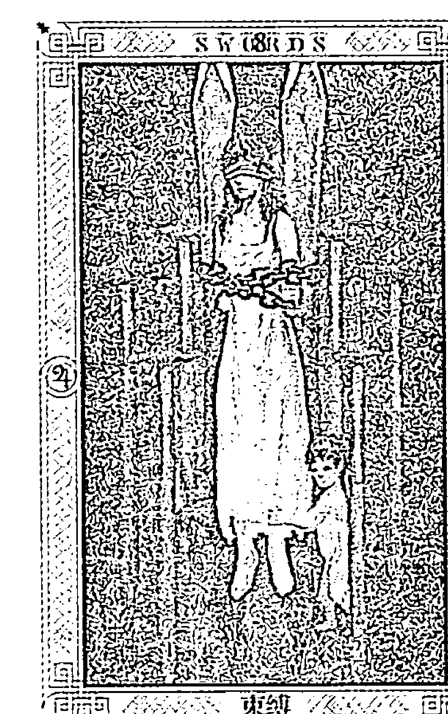

标号：8 标注：束缚 符号：木星 双子座
图画：一个女人被铁链绑在两把很长的宝剑上，眼睛被白色的布蒙住了。她不仅仅被剥夺了自由，同时也被剥夺了感官能力。除了能够感觉到周围冰冷的剑和她可怜的孩子外，她对周围的一切一无所知。是白天还是黑夜，自己是在哪里，所有的疑问混合到一起变成了单一的颜色，充满了整个画面。

正位含义
紧要关头，四面楚歌，危险临近，责难，冲突，画地为牢，控制，被束缚，骚动，坏消息，批评，生病，诽谤。

逆位含义
危机解除，挣脱束缚，艰难的工作，过往的背叛，困难，消沉，忧虑不安，意外，事故。

## 宝剑九 · Nine of Swords

关键词
忧虑、担心、绝望、痛苦、失眠

标号：9 标注：残酷 符号：火星 双子座
图画：被噩梦惊醒的男人双手捂着头坐了起来，被子颇显凌乱。牌的周围是被黑色渲染的梦境，它们还久久不能散去，萦绕在这个男人眼前。又或者，此时此景才是男人的梦境，因为男人身后有九把锈迹斑斑并且残缺不全的宝剑，还在向下滴着鲜红的血液。

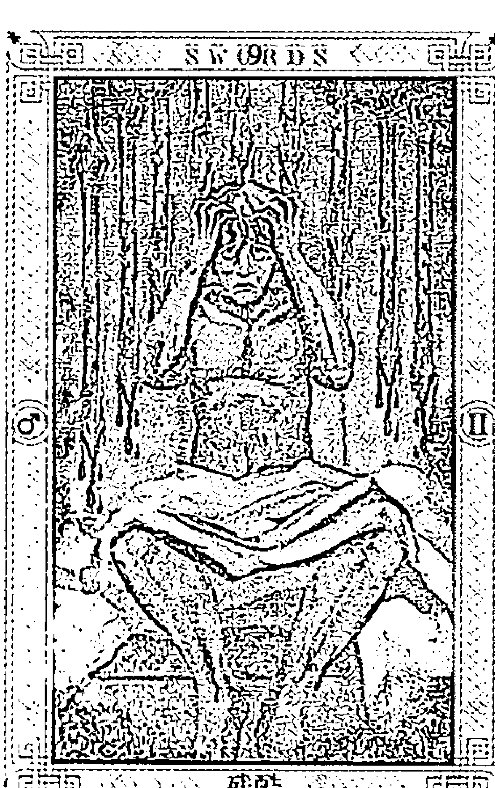

正位含义
关心，悲惨，苦难，不愉快的经历，争吵，生病，流产，为所爱的人担心，绝望。

逆位含义
怀疑，犹豫不决，中伤的流言，疑惑，耻辱，顾忌，羞怯，阴暗的特质，有理由的恐惧。

## 宝剑十 · Ten of Swords

关键词
迷茫、失败、惨痛、结束、黎明前的黑暗

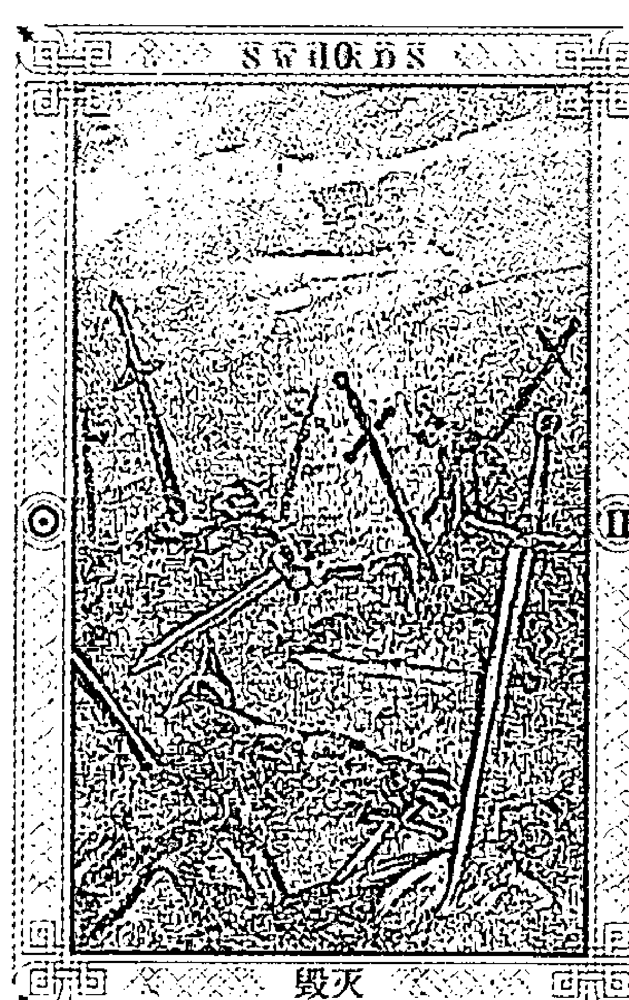

标号：10 标注：毁灭 符号：太阳 双子座
图画：朝阳在地平线后面缓慢地升起，东方的天空泛起了鱼肚白。但是黑云和硝烟还在四处弥漫，战场上纵横交错躺着五具尸体，也许更多。每一具都是被剑刺穿了心脏，有的面朝上，有的面朝下，有的侧倒。而他们各自的剑握在手中或掉落在身旁。

正位含义
绝望，毁灭，没有反抗的能力，希望破灭，苦痛，折磨，精神上的痛苦，荒芜寂寞，不幸，失望。

逆位含义
受惠，一时获利，隐藏的危机，暂时拥有，改善，瞬间的优势。

## 宝剑公主 · Princess of Swords

关键词
机警、谣言、坏消息、侦探、间谍、狗仔队

标号：Swords 标注：公主 符号：Heh 土性风
图画：零零散散的乌云遍布天空，但只有薄薄一层，阳光从中透射而出。身着青色铠甲的公主站在烟尘之中，她没有头盔，黑色的长发散落着。公主的左手放在倒塌的风车上，右手拿着宝剑，摆出防卫的姿态。风车和塔楼已经坍塌，风轮掉落在地上，只剩下塔基部分比较完整地保留着。塔下弥漫着黑色的浓烟。

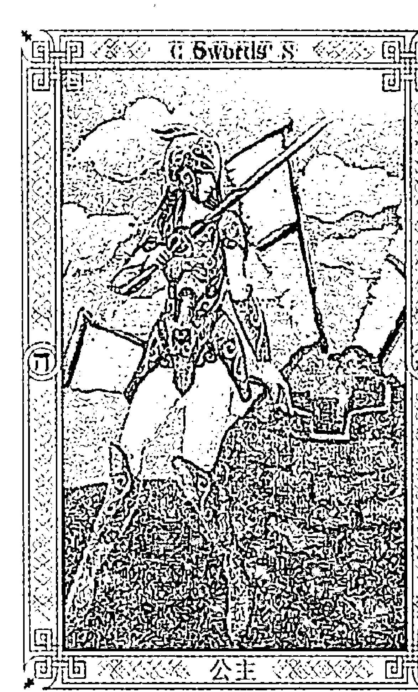

正位含义
警戒，敏捷，刺探，审慎、低调的人，活力旺盛的年轻人，柔软的身躯，察觉到事情的变化，敏锐的洞察力。

逆位含义
没有预期到的变化，被发现的冒充者，生病，无力面对更强大的力量，缺乏准备。

## 宝剑骑士 · Knight of Swords

关键词
强势、激进、急躁、极端分子

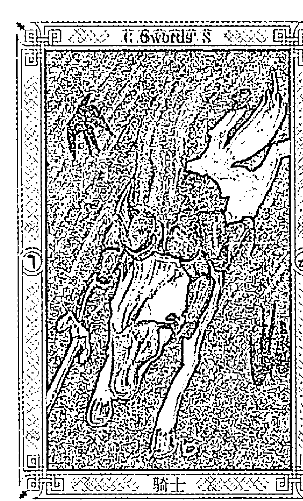

标号：Swords 标注：骑士 符号：Vav 风性风
图画：奔驰中的骏马上，身着坚实铠甲的骑士身体前倾，用力将宝剑向前挥到最远。人和马极速前进，硝烟与绿色的草地后掠形成线条，带来了风驰电掣的感觉，树木也变得模糊不清。马的鬃毛和骑士的披风向后飘扬。燕子被落在了马后。

正位含义
勇敢，直率，技巧，能力，乐于追求自己的理想，英雄行径，对抗与战争，无畏地急骋冲进未知当中，深谙行动和战事的专家。

逆位含义
鲁莽，轻率，缺乏战略意识，没有计划，冲动造成的错误，自吹自擂，单纯的。

## 宝剑王后 · Queen of Swords

关键词
孤独、言辞锋利、分离、冷若冰霜

标号：Swords 标注：王后 符号：Heh 水性风
图画：云端上身着镂空的轻甲的，不知是王后还是女神。她右手的宝剑与伸出的左手腕相重合，左手似在索取，右手却像要斩断什么似的。结合她的表情来看，又有点儿割腕或威胁的嫌疑。一个婴儿般的天使和许许多多的蝴蝶在其身旁萦绕着。

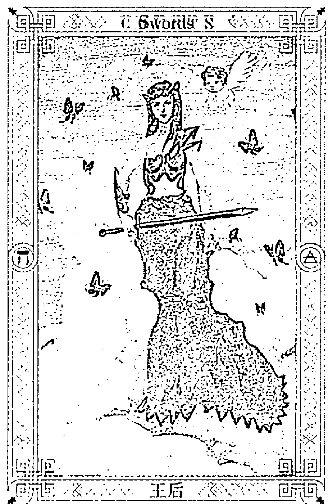

正位含义
机智的，极为敏感的，难以捉摸的人，或代表寡妇或代表悲伤的女人，很有能力却很孤单，分离，曾经有着极度快乐的人但现在体验到了不幸和逆转的焦虑。

逆位含义
心胸狭窄，不公平，有恶意的，顽固，报复，过于拘谨，险恶的敌人，坏脾气的人。

## 宝剑国王 · King of Swords

关键词
严肃、精明、公正、专业人士

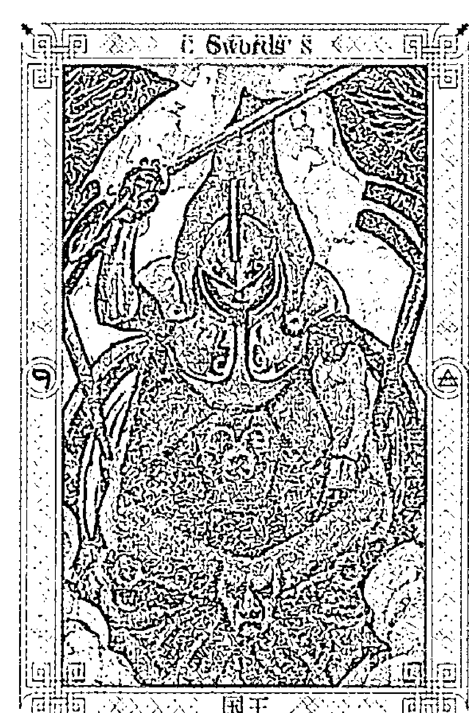

标号：Swords 标注：国王 符号：Yod 火性风
图画：国王身着铠甲，挥舞宝剑，坐在移动的王座——战车——中。两边滚滚烟尘之中，有跑动的士兵守护。飘扬的旗帜上以天使为图腾。飞快向后逝去的硝烟与光线，说明战车正在高速移动。画面以绿色和黑色为整体色调。战车上装饰着人和蝴蝶。

正位含义
富有行动力和决断力的人，能够冷静思考，有经验的，控制，掌握，指挥若定，正直，力量，优越。

逆位含义
残酷，现实，冷酷无情，自私，手段恶劣，虐待狂，引发不必要的动乱和悲哀的人，倔强刚愎。

## 星币牌组

这一组与四元素之土关联，代表物质、安全和实践。它们与处理问题时的具体需求相关。星币牌组侧重于描绘物质世界和人的欲望需求，所以这组牌也经常代表各种各样的繁荣、成功和财富。

## 星币一 · Ace of Pentacles

### 关键词

实质性的开始、物质、财富、享乐、安全、实质

标号：1 标注：Ace 符号：Heh 土元素
图画：农田中有三头耕牛。其中两头小牛朝向右侧，抬头看着天空。个头较大的公牛则朝向左侧，低头俯视着大地，背上放置着一个巨大的五芒星币。也许是清除杂草、开始耕种的季节，也许是作物成熟、开始收获的季节，无论如何，有踏实能干的公牛，一切都让人那么安心。

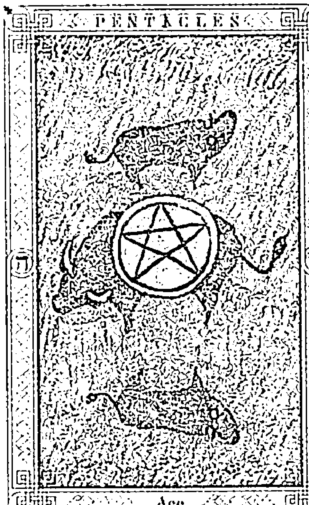

正位含义
完美，达成，富庶，幸福，繁荣，获得，黄金，意外收获，宝物，物质上和精神上满足的结合。

逆位含义
富庶但不快乐，守财奴，不当使用财富，浪费的金钱，为金钱而堕落，吝啬，贪心，精神空虚。

## 星币二 · Two of Pentacles

### 关键词

财务上的决定、流通、波动、弹性、平衡、娱乐

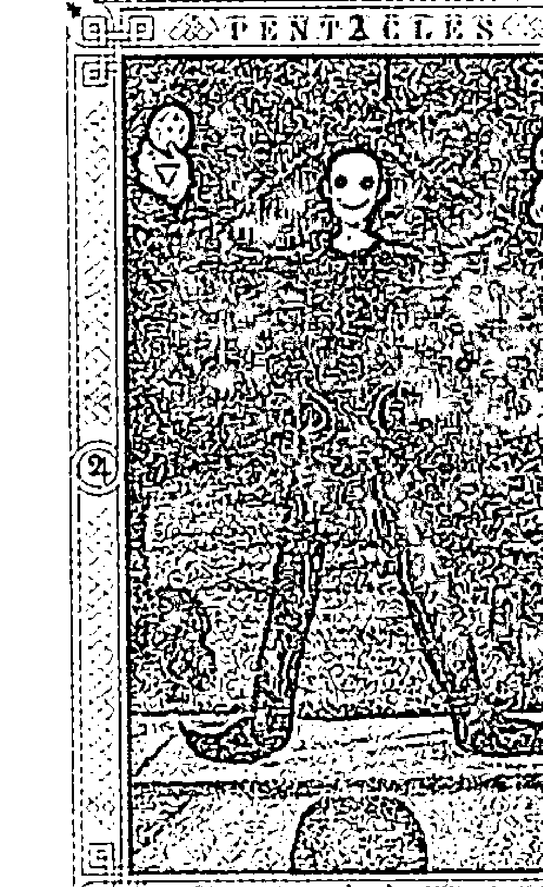

标号：2 标注：变动 符号：木星 摩羯座
图画：黑帷幕的舞台上，马戏团的杂技演员身着镶有金色花纹的紫黑色衣服，戴着很高的帽子，踩着平衡板。他左右手各拿一枚星币，左手手套上绣有风元素的符号，右手手套上绣着水元素的符号，左右脚的鞋子上则各自绣着火元素和土元素。戴着王冠的花蛇在两币间头咬尾，缠绕成无限大的符号。

正位含义
资金周转不通，交流受阻，担忧，借贷，执行新计划时的困境，困难的情况，新的麻烦，难堪。

逆位含义
文学才能，过犹不及，浪费，处事才干，假装的快乐，勉强的欢颜，信件，消息。

## 星币三 · Three of Pentacles

关键词
成长、计划、合作、协调、荣誉、才干

标号：3 标注：建设 符号：火星 摩羯座
图画：画面中有三个人在建造祭坛或者亭台。三根支撑柱上分别雕刻着盐、水银和硫黄的符号。柱子支撑的天花板上雕刻着内切于圆的五芒星，三个五芒星顶角朝内，两角之间呈120度，三等分天花板的中心圆。一个人站在墙边的长椅上，手拿锤子和钉子，正要修葺或建设，脸孔朝向另外两个拿着图纸的人，似乎在说着什么。

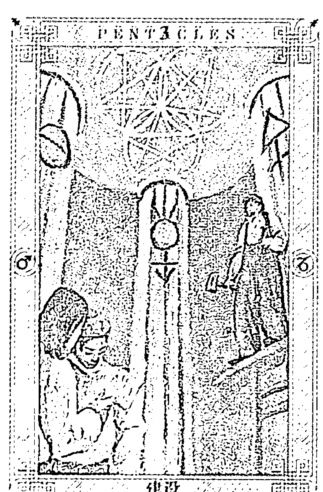

正位含义
积累，学习带来实物的成长，极强的商业或工作技能，优异，美术才能，尊严，名声，层级，权力。

逆位含义
情感脆弱，技术不足，平庸，财务问题，司空见惯的意见，损失钱财，全神贯注。

## 星币四 · Four of Pentacles

关键词
固守、吝啬、占有、控制、获利、遗产

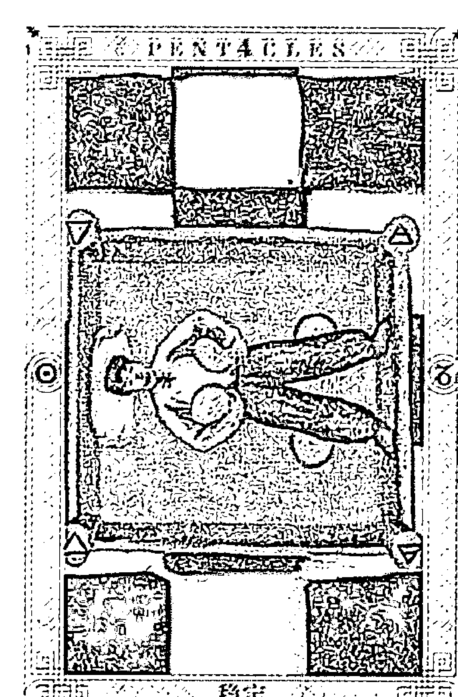

标号：4 标注：稳定 符号：太阳 摩羯座
图画：一人衣装整齐，平躺在床上或盒子里，头朝牌左，脚向牌右。他的腿上夹着两枚星币，双手在腰间各又搂着一枚星币。床的四面都有拦板，四角四根木柱上分别绘着四元素的符号。

正位含义
对物质财富的喜爱，精打细算，囤积者，放高利贷者，吝啬鬼，无法与人分享。

逆位含义
物质事务方面的挫败，小气，入不敷出，反对进一步获得，疑虑和耽搁，挥霍无度的人。

## 星币五 · Five of Pentacles

关键词
贫穷、疾病、艰苦、爱侣

标号：5 标注：困扰 符号：水星 金牛座
图画：地震的废墟中，在一个倒掉且碎裂的窗子上，星币恰巧构成了倒五芒星的图案。两个难民在废墟上走过，一个身体受伤拄着拐杖，一个心灵受伤弯腰哭丧着脸。他们衣衫褴褛，赤裸着双脚，其中一个头上还缠着绷带。

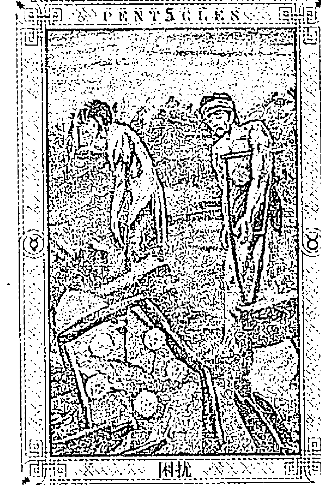

正位含义
精神及财务上的匮乏，损失，失败，错误，情妇，爱人，物质上的麻烦，处于困境，心情低落，事业。

逆位含义
逆转，不协调，混乱，担心居住问题，事务上的新兴趣，放荡，婚姻或爱情关系不和谐。

## 星币六 · Six of Pentacles

关键词
施舍、慈善、慷慨、理财

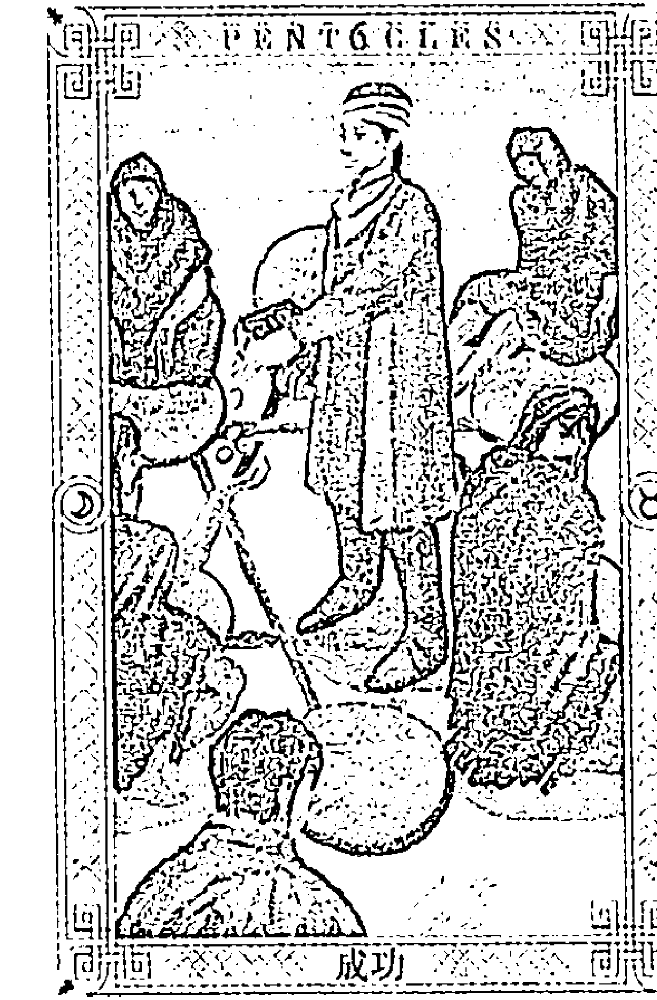

标号：6 标注：成功 符号：月亮 金牛座
图画：六枚星币组成六芒星的台子，一个成功的商人站在中央。六枚星币上分别蹲或坐着乞讨的、羡慕的、嫉妒的、高兴的、怀疑的、不屑的六个人。商人正在向其中一个施舍金币，另一只手则抱着书。

正位含义
财务上的稳定，慷慨，满足，慈善行为，施舍，善良，报酬，礼物，物质上的获得。

逆位含义
贪婪，自私自利，小气，来历不明的资金，羡慕，嫉妒，偷窃，负债。

## 星币七 · Seven of Pentacles

关键词
评估、待机、暂停、思索、收成

标号：7 标注：失败 符号：土星 金牛座
图画：枯萎的叶子旁，残缺或破裂的星币以倒立的正三角形下叠加正方形为排列方式，如果实般结在树上，似乎被虫子咬坏了。一个农民右手握着锄头立在地上，左手捏得草帽有些变形。他的头发很乱，表情呈现出功亏一篑的惋惜和痛苦。

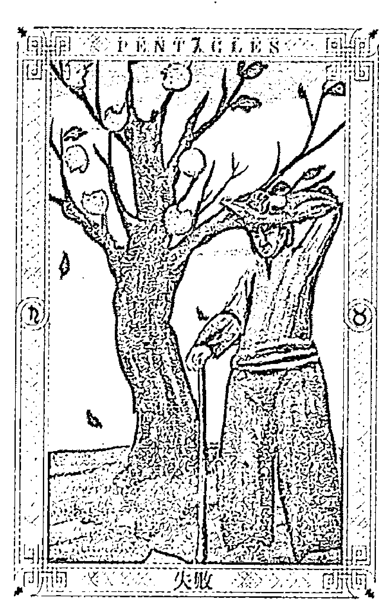

正位含义
等待时机成熟，需要适应力的重大财务挑战，心灵手巧，成长，努力工作，进步，成功的交易。

逆位含义
无法达到预期目的，局促不安，轻率、不谨慎的行动，金钱的损失，不明智的投资。

## 星币八 · Eight of Pentacles

关键词
专业、技能、勤劳、工作

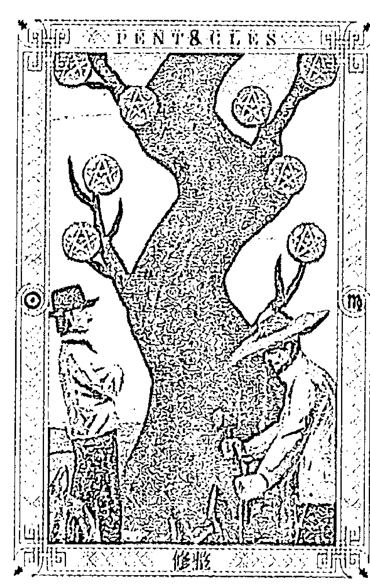

标号：8 标注：修整 符号：太阳 处女座
图画：巨大的树螺旋扭曲地生长，高耸而不见树顶。树的两侧对称着结出四颗星币果实。树上没有枝叶，果实却很完整。一个木匠正在修理倒下的篱笆，而果园的主人站在旁边看着树，思考着什么。

正位含义
学徒，上进心，有条理，决意在过去的成功上建立基础，技能，学习快速，坦率，谦逊，手工艺品，个人的努力。

逆位含义
缺乏志向，虚荣，野心受挫，理想破灭，不够专业，自大自满，高利贷，伪善，阿谀谄媚，密谋策略。

## 星币九 · Nine of Pentacles

关键词
魅力、信心、成功、享受、自律、富足

标号：9 标注：收获 符号：金星 处女座
图画：三组正三角形尖端向外构成一个大的正三角形。星币周围长着繁盛的花草树木，一个精灵在花丛中间飞舞，伴随她的有各种颜色的蝴蝶和各式各样的鸟儿。

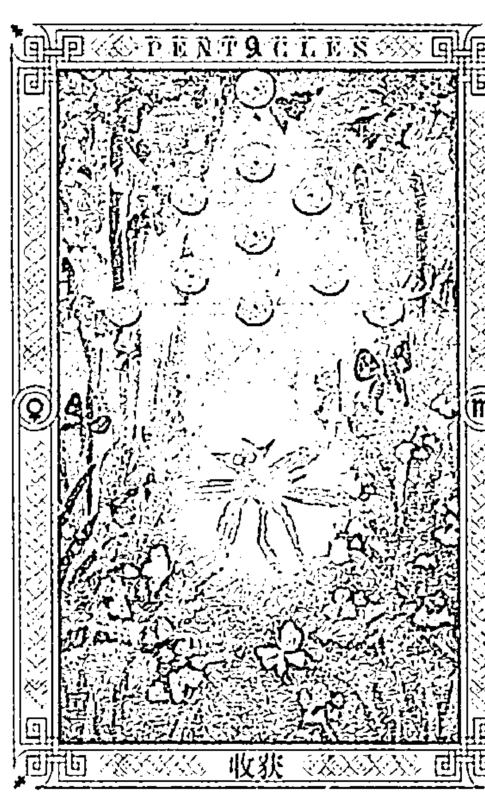

正位含义
成就，洞察力，深谋远虑，因实际努力达成物质上的成功，辨别，周到，谨慎，物质上的富足，对大自然之爱。

逆位含义
安全受到威胁，意图不轨，失窃，计划终止，危险，风暴，或许会失去一位好友或珍贵的财物。

## 星币十 · Ten of Pentacles

关键词
家产、富裕、物质成功

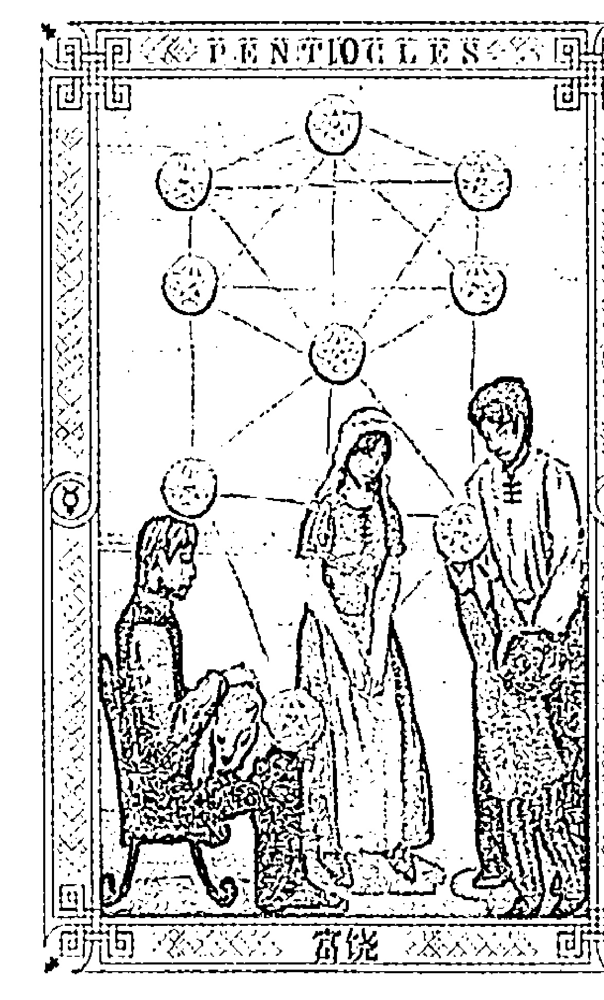

标号：10 标注：富饶 符号：水星 处女座
图画：房子内，星币组成生命之树的图案。老人坐在左下角，膝上、脚下各有一枚星币，墙上的六枚星币构成六芒星的图案，牌的右边小孩向上举着一枚星币给他的父母。父母弯着腰慈爱地看着孩子。老人则闭着眼，抚摩着他身边的狗。

正位含义
财富，富有，物质上稳固而持久的成功，家务事，血统，继承家业。

逆位含义
风险，可能的损失，冒险犯难，抢劫，失去继承权，与亲戚对立，赌博。

## 星币公主 · Princess of Pentacles

关键词
运用、学徒、工匠、投资

标号：Pentacles 标注：公主 符号：Heh 土性土
图画：秋天的森林中，到处都是干枯的树木，一片褐色和黄色。这是一个丰收的季节，但同时也是一个寂寞和冷清的季节。身着华丽貂绒的公主站在一棵树旁，双眼轻闭，左手抚摩着树干，右手扶着立在腰上的星币，其上刻印的五芒星散发着绿色的光芒。一只温驯的白色兔子趴在公主脚下的落叶上。

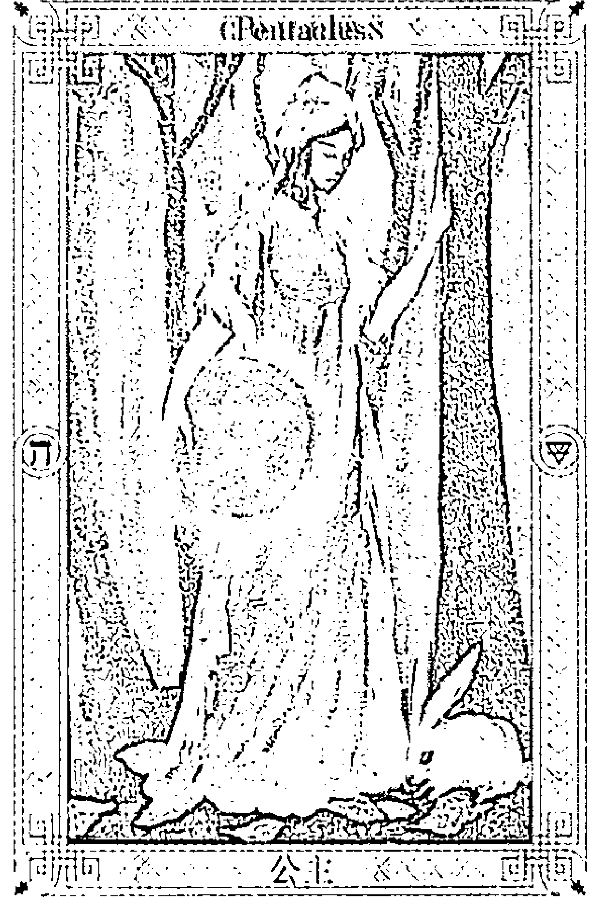

正位含义
深度的专注和用心，学习态度认真，求知欲，学术成就，反映，渴望有新的点子，不顾实际的改良家，携带信息的人。

逆位含义
挥霍无度，逃避现实，不切实际的人，无法承认显而易见的事实，思维混乱，视野狭窄，不合逻辑的思考，不利的消息。

## 星币骑士 · Knight of Pentacles

关键词
积累、勤奋、现实、工作狂、拜金主义

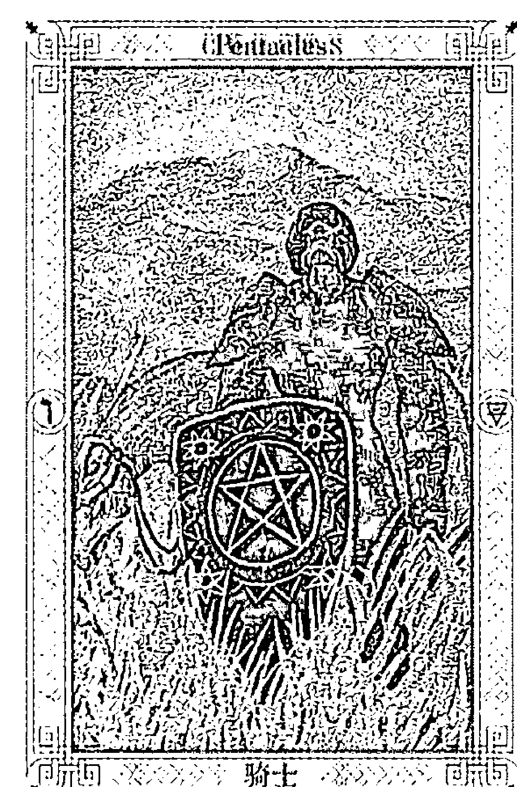

标号：Pentacles 标注：骑士 符号：Vav 风性土
图画：远处是土山和正在落下的太阳。近处一匹棕色的马在悠闲地吃着野草，身着黑色盔甲的骑士站在马旁牵着松弛的缰绳。骑士立于马的外侧，挡住了马的部分身体；右手的盾牌又挡住了骑士的部分身体。盾牌中心由五芒星雕饰，周围点缀着华丽的太阳花纹。骑士仰望着天空。高耸的草没过了马的四蹄。

正位含义
成熟而可靠的人，有责任感，保守派，可信赖的，有办事方法的，耐性，坚持不懈的，达成任务的能力，勤奋的，有组织的。

逆位含义
停滞，粗心，惰性，缺乏决断或方向，热情冷却，缺乏计划安排。

## 星币王后 · Queen of Pentacles

关键词
母爱、抚育、职业妇女、老板娘、少妇

标号：Pentacles 标注：王后 符号：Heh 水性土
图画：高耸而巨大的树干有些倾斜，王后坐在其上观察着远处的河流和田地。放眼望去是郁郁葱葱的山林、一片墨绿色的田野。牛在田地间辛勤地耕作，羊群四处走着。王后华丽的衣服上绣着蜜蜂和金色的花纹，用金片和珠宝装饰手腕，手指、耳朵上也都戴着华丽的珠宝。她的左手捧着土褐色的球体，表面雕刻着许多黑色重叠的五芒星。

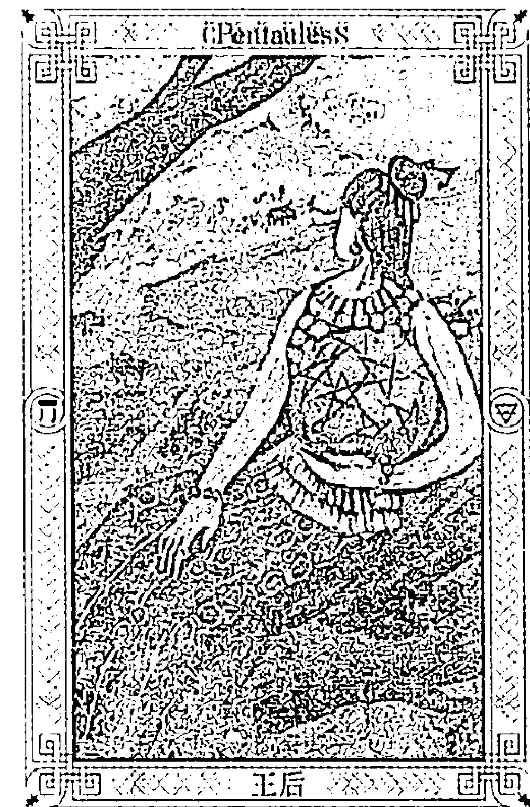

正位含义
繁荣兴旺，温柔，优雅，尊严，极为舒坦，慷慨，安全，安康，自由，华贵，慷慨仁慈的人，高尚的灵魂。

逆位含义
假象，浪费，怠慢，挂念，疑心，忽视责任，不值得信任的人，失败的恐惧。

## 星币国王 · King of Pentacles

关键词
可靠、事业有成、经济基础、大老板、企业大亨

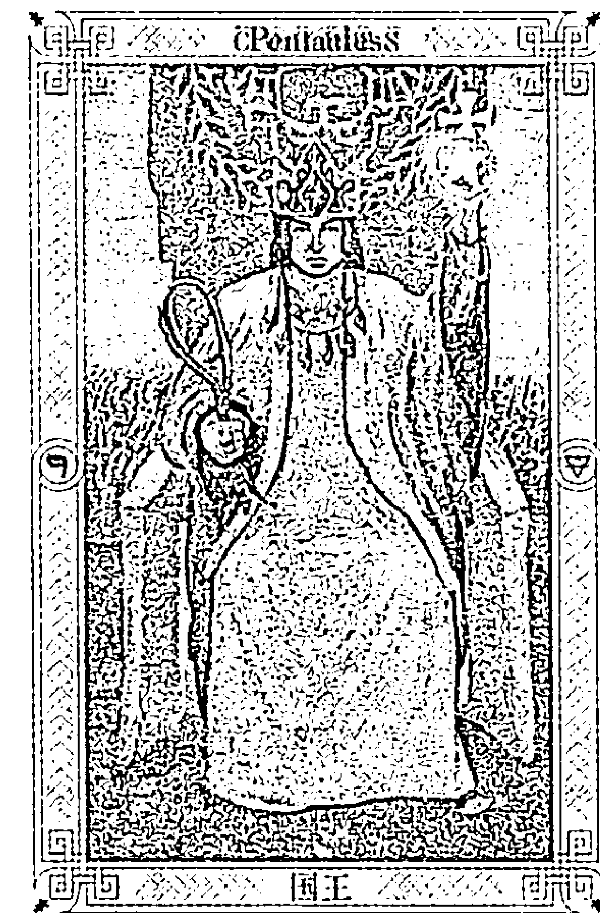

标号：Pentacles 标注：国王 符号：Yod 火性土
图画：一位穿着最为富贵华丽的国王，金银珠宝装饰满身。他坐在王座上，右手握着鞭子，左手向上托着散发出金光的球体，球的内部悬浮着五芒星。球体顶部装有十字架，构成了权力的象征。以牛和麦子为图腾的幕布在王座后垂下。这张牌整体色调为褐色和黄色。在大地上、垄间和垄上，都撒满了种子、麦子、五谷、花瓣以及土壤颗粒。

正位含义
经验丰富，成功的领导人，踏实，值得信赖，有品格和智慧的人，商业敏锐度，数理能力，忠诚的朋友，可靠的结婚对象，明智的投资，有能力获取金钱和珍贵的财物。

逆位含义
腐败堕落，无情，迷惑，为达目的不择手段，恶行，贪婪，不忠诚，冒险犯难，不知节俭。

## 经典牌阵

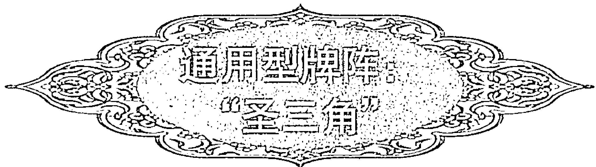

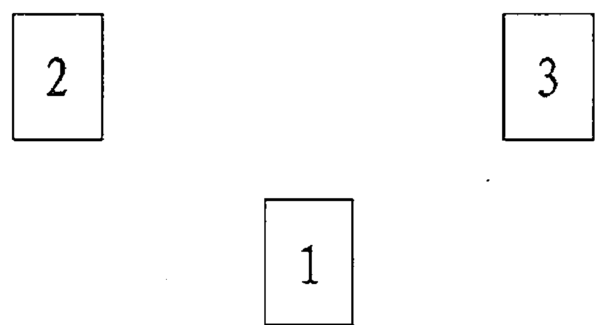

通用型牌阵顾名思义，就是通用于各种占卜主题的牌阵。其中“圣三角”牌阵最为著名，有许多名称和摆法，但是原理和作用都是一样的。“圣三角”比较常见的摆法是尖端朝下的三角形（尖端位置摆放第一张牌）。不过，也有很多塔罗师将三张牌从左到右依次排列成直线，这样操作起来比较简单。

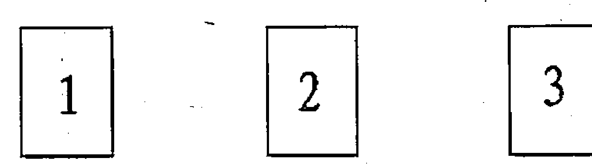

1号位代表所占卜问题在过去的状态。这个位置的牌往往暗示着事件的根源，所以除了可以解读成过去，也可以解读为原因。如果是随机抽取，则第一张被抽出的牌摆放于此位置。如果是数牌抽取，则在洗完牌后从最上面的牌开始向下数第七张牌，将其抽出，摆放于此位置。

2号位代表所占卜问题在现在的状态，也就是现况。这个位置往往代表着事件的关键、问卜者当前的处境和所遇到的问题。所以这张牌除了可以被解读为现状外，也可以被解读为问题。如果是随机抽取，则将取出的第二张牌摆放在此位置。如果是数牌抽取，则这个位置摆放着在第一次抽取完成后继续向下数的第七张牌，也就是从上面数第十四张牌（包括第一次已抽取出的那张牌）。

3号位代表着所占卜的问题在未来的状态。这张牌就是这次占卜所预测的结果。处于这个位置的牌受前两张牌影响，牌义可能发生很大变化，不能单独解读。如果是随机抽取，则将第三次取出的牌摆放在此位置。如果是数牌抽取，则这个位置摆放着在第二次抽取完成后继续向下数的第七张牌，也就是从上面数第二十一张牌（包括前两次已抽取出的牌）。

这张牌的因素作用是单一线程的，所以解读起来比较简单。需要注意的是不要将牌和牌割裂开来单独解读。1号位的牌影响着2号位的牌，2号位的牌又影响着3号位的牌，它们之间具有因果和时间延续的关系。

“圣三角”使用的牌数比较少，可以简明扼要地理清事件的发展脉络，但同时也难免存在着解读不够全面、具体的弊端。要详细了解事件的细节而又不想使用太多的牌，则可以选择使用“六芒星”牌阵或“圣杯”牌阵。

## 通用型牌阵：六芒星

“六芒星”牌阵共有七个摆放牌的位置，摆法如下。如果是随机抽取，则按位置的标号依次摆放抽出的牌。如果是数牌抽取，则从上面开始数，将第七、八、九三张牌依次摆放在1、2、3号位，接下来继续向下数，将第七、八、九、十这四张牌（也就是包括第一次被抽取的三张牌在内，从上面数第十六、十七、十八、十九共四张牌）依次摆放在4、5、6、7号位。

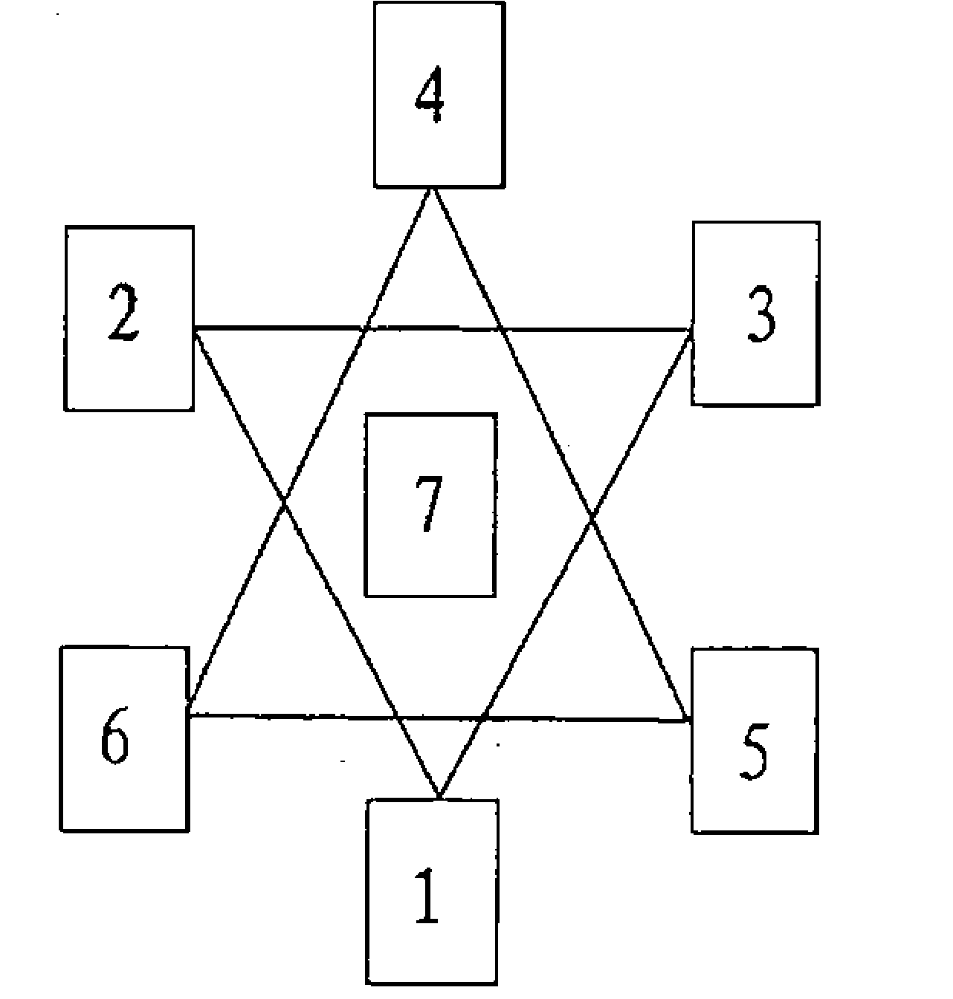

1号位代表事件的过去状态，也是问题的根源所在。
2号位代表事件的现在状态，也就是事件的现况、问卜者所面临的问题。
3号位代表事件的未来状态，也就是事件的结果。这里的结果也仅仅是指在问卜者没有施加干预的情况下的未来状态。当问卜者努力去改变时，未来可能会是另一种状况。
4号位代表对策，与1号位相关联。这张牌暗示着针对问题的根源可以采取的对策，也就是解决问题的根本办法。
5号位代表对策，与2号位相关联。这张牌暗示着针对问题的现况可以采取的紧急措施，避免不愿意看到的状况发生。
6号位代表对策，与3号位相关联。这张牌描述的是在无法改变事件发展方向的情况下如何去面对未来。
7号位综合人为因素（特指问卜者）和非人为因素（包括一切问卜者不可直接改变的、可以影响事件发展的因素），暗示着事件的走向。这张牌通常暗示着问卜者是否有心或是否有能力去改变事件的发展方向。这张牌决定着占卜中应该侧重解读4、5、6号位中的哪一张牌。

这个牌阵的因素作用比较复杂，牌与牌之间的影响不是简单的一对一，所以在占卜的时候更加不能孤立地解读某一张牌。1、2、3号位相当于一个“圣三角”牌阵，1号位影响2号位，2号位影响3号位，3号位反馈1号位。1号位和4号位、2号位和5号位、3号位和6号位又形成了三个对应的关系。7号位则全面作用于前6张牌。

## 通用型牌阵：“圣杯”

“圣杯”牌阵也是由七个位置构成，摆放方法如下。若随机抽取，按照牌阵位置的标号依次摆放牌。

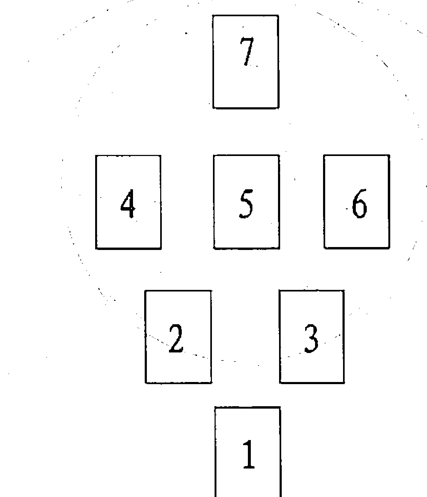

1号位代表事件过去的状态，暗示着问题的根源所在。这个位置的牌同时也能说明问卜者的心态和渴望，是整个牌阵的出发点。

2号位、4号位代表着非人为现况，即可以影响事件发展的，但不由问卜者决定的现况，例如客观环境、人际环境、舆论环境、文化标准、道德标准等。2号位侧重于过去和影响正在减弱或即将消失的状况和因素，4号位则侧重于未来和影响正在到来或正在增强的状况和因素。

3号位、6号位代表着人为现况，即问卜者可掌握的、可改变的现况，例如问卜者的心态、不良习惯、错误方法、不实际的目标等，也包括客观环境中可由问卜者决定的部分。3号位的牌偏于描述过去和影响正在减弱或即将消失的状况和因素，6号位的牌则偏于描述未来和影响正在到来或正在增强的状况和因素。

5号位代表事件的未来状态，与前面介绍的牌阵一样，这个位置的牌表达的是不受干预的自然未来。

7号位代表事件的结果，它表明了问卜者是否有意愿和能力去改变事件的发展方向。如果此位置的牌表达的含义是消极的，则代表问卜者很难改变事件的发展方向，他很有可能按照5号位的牌所示的未来走下去。

## 通用型牌阵：凯尔特十字

“凯尔特十字”是目前最流行的通用牌阵之一。这个牌阵有十个位置，不算多，也不算少，可以比较细致地解读事件的各个部分，同时也不会太耗费塔罗师的心力，所以颇受欢迎。

这个牌阵有许多取牌方式。但其所需的牌数已经不能算少，数起来会比较麻烦和耗费精力，既然无论选择哪种取牌方式，所占卜的结果都是一样的，所以比较推荐的取牌方式还是随机抽取（如未特殊说明，本书中牌阵的位置标号均与放在那个位置的牌的取出顺序相同）。

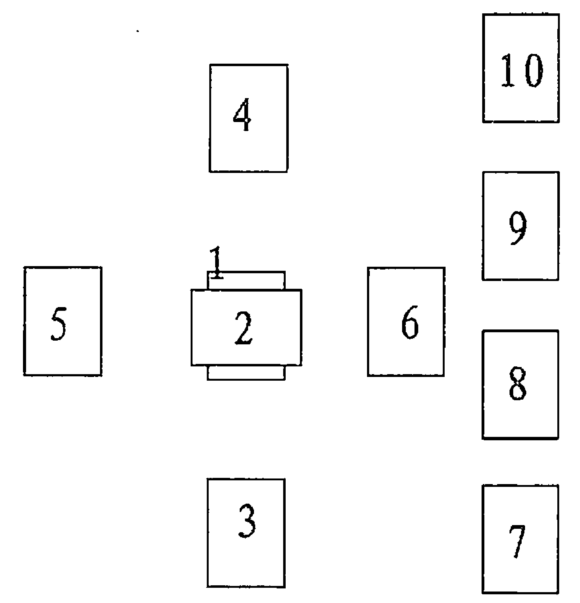

1号位代表事件的现况，这个位置的牌描述了问卜者的处境和他所面临的问题。

2号位代表事情的阻碍或帮助。这个位置牌的取意除了与自身含义相关，还与1号位牌的属性有关。如果1号位的牌是消极的，则这个位置的牌倾向于“帮助”，而如果1号位置的牌是积极的，则这个位置的牌倾向于“阻碍”。1号位与2号位是补充的关系。另外，这个位置的牌是横放的，正逆位的区分方法是“左侧为上”，即牌头朝左为正位。

3号位代表问卜者理想中的未来，也就是问卜者的期望与目标。这个位置的牌描述了现在问卜者精神层面的未来。

4号位代表问卜者的本意，暗示着事件现况的成因。这个位置的牌描述了现在的状况中与过去期望不符的地方。这是问卜者精神层面的过去，相当于3号位的过去时态。

5号位代表事件在现实中过去的状况。
6号位代表事件在现实中未来的状况。6号位与1号位和5号位结合一起相当于一个“圣三角”。这个位置的牌描述的也一样是在不受干预情况下的自然未来。
7号位代表问卜者自身的现况及其对事件的影响。
8号位代表周围环境（包括客观环境和人际环境）及其对事件的影响。
9号位代表问卜者的能力、凭借和可以紧急阻止事态恶化的措施。
10号位代表事件的结果趋势，这个位置的牌描述了问卜者是否有决心和能力改变事情的发展方向。
“凯尔特十字”牌阵中左边六张牌可以连接成（爱尔兰）凯尔特十字架，代表着物质与精神的结合。

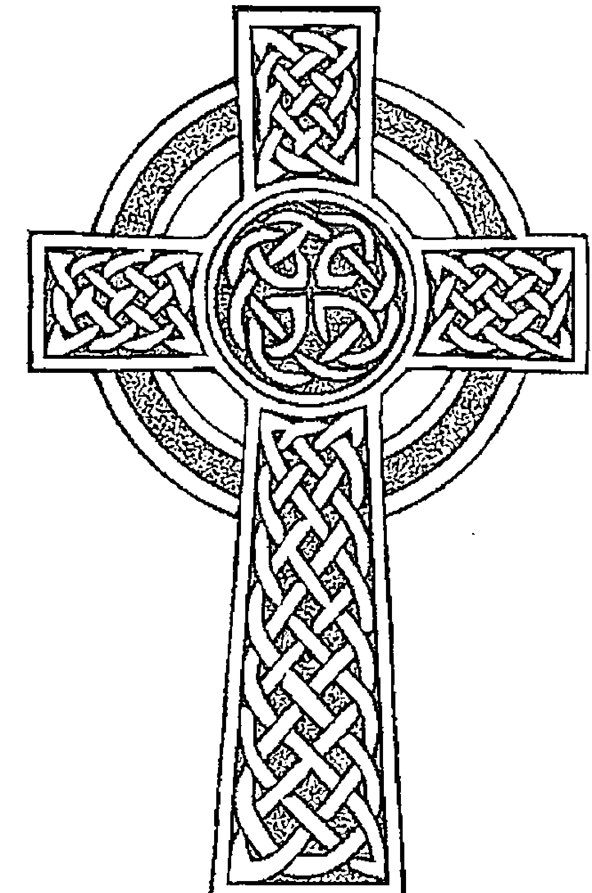

（爱尔兰）凯尔特十字架

圆内的小十字（由1号位与2号位构成）代表事件的核心，是因果与时间的连接点，也是死亡与生存、物质与精神、过去与现在等两极事物的连接点。而延伸到圆外的大十字（由1~6号位六张牌构成）则代表着两极结合后产生的世界。3号位和4号位穿过小十字架，代表连贯的精神世界。5号位与6号位穿过小十字架，代表连贯的物质世界。无论从左到右还是从上到下，都有完整和连续的因果流与时间流。
左边的六张牌是描述，右边的四张牌是指导。

## 选择型牌阵：“三择一”

并不是所有的牌阵都像“通用型”牌阵那样可以通用于各种主题的占卜，可能有一些牌阵适用于爱情为主题的占卜，另一些牌阵适用于事业为主题的占卜。在这些专项型牌阵中有一类特殊的牌阵，它们不是唯一适用于某一主题的占卜，而是唯一适用于某一类型的占卜，所以也可以被单独列成一类，这就是选择型的牌阵，也就是适用于具有选择性的任何主题占卜的牌阵。

选择型牌阵的基础是“是或否”牌阵。这个牌阵有三个位置，摆放方法如下图，这个牌阵的摆法有点儿像标准的“圣三角”牌阵，但是一般不会像“圣三角”那样随意，它没有变形。

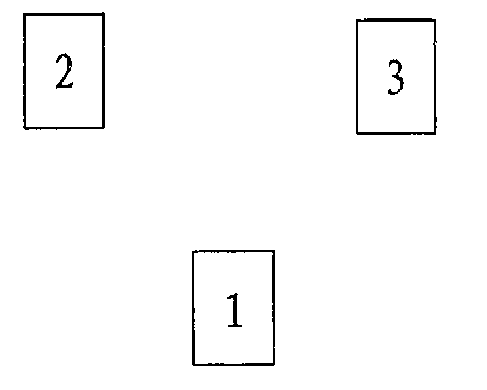

1号位代表现况，描述让问卜者犹豫不决或产生疑惑的根源。
2号位代表选择“是”的结果。
3号位代表选择“否”的结果。

这个牌阵比较特殊的地方在于，结果除了要参考2号与3号位置的牌的情况，还要参考所取出的三张牌的正逆位情况。

正位多于逆位则通常结果趋向于“是”，反之则趋向于“否”。

如果1号位的牌是正位而整个牌阵正位又多于逆位，则趋于“是”的可能性更加大，结果更加明显。反之亦然。

如果1号位的牌是逆位，而整个牌阵正位又多于逆位，则说明问卜者需要多加考虑，决定需要果断，不能已经决定了还在犹豫。相同的情况之于2号位也如此。

总之，这个牌阵需要特别注意正逆位的问题。

简单而又不是很重要的问题可以通过“是或否”牌阵来为决定提供参考，但是对于复杂而又重要的问题，使用这个牌阵就显得有些草率了。牌数少的牌阵虽然简单明了，但是往往也会忽略许多重要的细节，为此我们有些时候才不得不使用相对复杂一些的牌阵。
“抉择”牌阵是在“是或否”牌阵的基础上发展而来，共有七个位置，对“是或否”的选择进行了更加细致的描述，牌阵的具体摆法如下图。

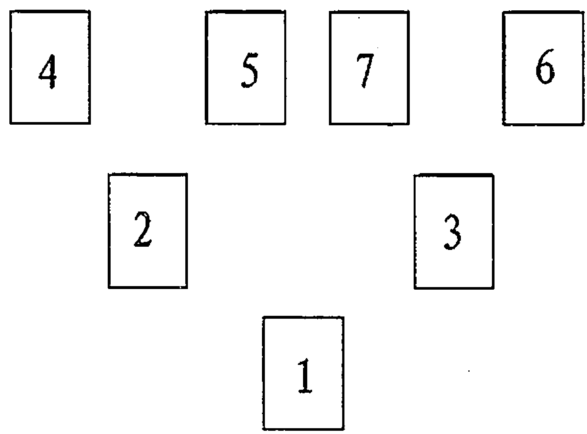

1号位代表现况，描述问卜者的犹豫、疑虑和困惑，同时也描述了问卜者的本意和期望。
2号位代表选择“是”或者“行动”的动机、原因。
3号位代表选择“否”或者“不行动”的动机、原因。
4号位代表选择“是”或者“行动”后将面临的阻碍和困难。
5号位代表选择“是”或者“行动”后的收获和结果。
6号位代表选择“否”或者“不行动”后将面临的阻碍和困难。
7号位代表选择“否”或者“不行动”后的收获和结果。
2、4、5号位和3、6、7号位相当于两个“圣三角”。如果把这六张牌看成是两张牌，那么这个牌阵就是“是或否”牌阵了。所以，这个牌阵的解读方法可以借鉴“是或否”牌阵。需要注意的是，这个牌阵除了参考整体外，还需要分别参考左边2、4、5中的正逆位的对比情况与右边3、6、7正逆位的对比情况。

“二择一”牌阵是选择型牌阵中最受欢迎的一个牌阵，因为相对于“抉择”牌阵，它解读起来更容易更轻松些，而相对于“是或否”牌阵又能解读更多细节。这个牌阵有五个位置，介于“抉择”的七个与“是或否”的三个之间，比较适中。摆法如下图。牌的取法除了随机抽取，还可以洗牌后从上面数抽取第六张放于1号位，继续向下数第六、七张（包括第一次取出，从上面数第十二、十三张）放于2、3号位，再向下数第六、七张（包括前两次取出，从上面数第十九、二十张）放于4、5号位。

## 选择型牌阵：“二择一”

1号位代表事件的现况，描述问卜者的犹豫、疑虑和困惑，同时也描述了问卜者的本意和期望。
2号位代表选择A将面临的情况，大多数情况下这个位置的牌是描述阻碍与困难。
3号位代表选择B将面临的情况，大多数情况下这个位置的牌是描述阻碍与困难。
4号位代表选择A的收获和结果。
5号位代表选择B的收获和结果。

这个牌阵不需要像“是或否”和“抉择”牌阵那样注意正逆位的对比，只要按常规解读牌阵中的牌就可以了。另外需要注意的是，要在洗牌之前确定A（左）与B（右）所代表的具体选项，洗牌之后就不可以更改了。

## 选择型牌阵：“三择一”

“三择一”牌阵可以算是选择型牌阵有效和实用的极限。因为如果再增加选项，必然要增加更多的牌，操作和解读也必然会更加困难。而且过多的选项只会冲淡主题，让占卜变得难分主次，让问卜者变得更加迷茫。所以，在三个以上选项间徘徊的人还是静下心来，先把重要的选项列出来，将那些无关痛痒的选项排除掉吧。

这个牌阵有十二个位置，摆法如右下。

- 1号位代表问卜者自身的现况。
- 2号位代表事件的现况。
- 3号位代表问卜者所面临的困惑。
- 4号位代表选择A的益处。
- 5号位代表选择A的弊端。
- 6号位代表选择A的结果。
- 7号位代表选择B的益处。
- 8号位代表选择B的弊端。
- 9号位代表选择B的结果。
- 10号位代表选择C的益处。
- 11号位代表选择C的弊端。
- 12号位代表选择C的结果。

A.B.C代表三种选择。“三择一”也好，“二择一”也好，需要注意的是选择型的牌阵很少会给出明确的选择，它只会将选择的利弊告知问卜者，最后作选择的还是问卜者。所以，当面临两个选项或三个选项情况差不多的时候也不用感觉懊恼，更不用勉强去判断哪个好、哪个不好。好与坏二者是并生的，一定要有取舍才能有所获得。决定如何取舍是问卜者的事，塔罗师要做的只是告知问卜者“舍弃什么会获得什么，获得什么需要舍弃什么”就足够了。

## 专项型牌阵：“维纳斯之爱”

顾名思义，专项型牌阵是指特别适用于某一主题占卜的牌阵。这类牌阵又可以分为感情、事业和运势三个专题。“维纳斯之爱”牌阵是最受欢迎的以“感情”为主题的牌阵之一。这个牌阵有八个位置，可以连接成金星（Venus）的符号，具体摆法如下。

- 1号位代表问卜者的真心和期望。
- 2号位代表对方的真心和期望。
- 3号位代表问卜者受到的影响。
- 4号位代表对方受到的影响。
- 5号位代表双方会遇到的阻碍和麻烦。
- 6号位代表这段感情或事件的结果。
- 7号位代表问卜者未来的处境和心情。
- 8号位代表对方未来的处境和心情。

解读这个牌阵的关键在于5号位和6号位。其中5号位受1、2、3、4号位的共同作用，而5号位又影响6号位的牌义取舍。牌阵内被线牵连的牌一般都有相互作用，不能割裂解读。上面组成圆的四张牌描述已成的客观事实，是不可变或很难改变的。而最下面组成十字架下半部分的三张牌则从不同的方面描述未来，是具有变数的。5号牌连接在可变与不可变之间，是变化的施力点。

## 专项型牌阵：“探问真心”

“探问真心”适用于友情和爱情主题的占卜，是可以了解两个人关系和发展的牌阵。这个牌阵共有六个位置，摆法如下，随机抽取六张牌依次摆放即可。

- 1号位代表问卜者对对方的看法及态度。
- 2号位代表对方对问卜者的看法及态度。
- 3号位代表问卜者认为的双方目前关系。
- 4号位代表对方所认为的双方目前关系。
- 5号位代表问卜者期望的双方关系。
- 6号位代表对方所期望的双方关系。

这个牌阵具有很明显的对位关系，上下两排的牌形成了明显的对比。1、3、5号位是描述问卜者的状况，而2、4、6号位是描述对方的状况。通过对比1与2、3与4、5与6，可以很清楚地了解双方的真心。牌阵从左到右又是精神层次的时间的流动，从“过去”和“根源”到“现在”，再到“未来”和“期望”。

## 专项型牌阵：“感情十字”

“感情十字”适用于任何感情为主题的占卜，包括爱情、友情与亲情，属于感情问题的通用牌阵。这个牌阵有四个位置，摆法如下。

- 1号位代表过去的感情状况或感情问题的根源。
- 2号位代表现在的感情状况和问卜者的状况。
- 3号位代表现在感情所面临的问题、困难和对方的状况。
- 4号位代表未来的感情状况或感情问题的结果。

这个牌阵所需的牌数不多，只有四张，虽然在细节上难免有所欠缺，但是可以比较全面地描述当事人感情的处境和发展情况。解读时可以从2号位和3号位着手，对比着解读这两张牌，可以对这段感情有一定了解，然后将已得的信息代入1号位，就可以确认问题的根源所在。解决问题的关键在于1号位，而4号位只是描述未受干预的自然未来。

## 事业（学业）发展

“事业（学业）发展”是以事业、学业和财富为主题的牌阵中比较全面和实用的一种。这个牌阵有十三个位置，摆法如下。

- 1号位代表力量，这个位置的牌描述问卜者的能力、工作情况以及对同事的影响。
- 2号位代表期望，这个位置的牌描述问卜者的期望和价值观。
- 3号位代表关系，这个位置的牌描述问卜者与周围的人或事的关系。
- 4号位代表基础，这个位置的牌描述问卜者的习惯以及潜意识对决定和工作的影响。
- 5号位代表创造，这个位置的牌描述问卜者在工作相关方面的创造力。
- 6号位代表环境，这个位置的牌描述问卜者所处的客观工作环境。
- 7号位代表同事，这个位置的牌描述问卜者一起工作的同事是什么样的人。
- 8号位代表改变，这个位置的牌描述问卜者在工作中的机遇与转折点。
- 9号位代表过程，这个位置的牌描述问卜者在工作期间会遇到的事。
- 10号位代表收获，这个位置的牌描述问卜者工作的报酬和收获。
- 11号位代表幸运，这个位置的牌描述可以给问卜者的工作带来幸运的事物。
- 12号位代表秘密，这个位置的牌描述问卜者在工作中的隐私，不希望他人知道的事物。
- 13号位代表总况，这个位置的牌描述问卜者工作的概况以及近期内的发展情况。

这个牌阵较为全面地描述了问卜者工作的各个方面，其中有短期的描述，也有长期的描述，它属于比较综合的牌阵。这个牌阵中牌与牌之间的相互作用比较明显地与牌阵的结构对应。1、2、3、4号位是问卜者的个人状况，是选择什么工作和怎么样工作的基础。它们间接影响和决定着下面牌的含义。5、6、7、8、13号位是问卜者现在工作的状况，是充满变动性的，受客观环境影响的同时，也在一定程度上受问卜者自身状况的影响。9、10、11、12号位描述的是不由问卜者的意志决定的内容。它们描述了三个层面。处于不同层面同一列的三张牌，从上到下施加作用。个人能力（1号位）决定工作能力（5号位），工作能力又在一定程度上影响着在工作中会遇到的事以及待遇（9号位）；期望和价值观（2号位）影响问卜者对工作环境（6号位）的挑选，什么样的工作环境又决定着有什么样的报酬和收获（10号位）。一些心理学家认为有些机遇（8号位）是由人的潜意识（4号位）行为（习惯）积累产生的，这也与佛教的因果说相仿，秘密与隐私（12号位）也有许多是源于潜意识的意愿（4号位）。

解读这个牌阵时，注意联系相关的牌，可以拓展思路获取更多的信息。

## 专项型牌阵：“财富之眼”

占卜财富方面的问题可以使用“财富之眼”牌阵。这个牌阵有五个位置，摆法如下。

- 1号位代表问卜者获取财富的基础、凭借和力量。
- 2号位代表问卜者需要注意的地方、破财之处。
- 3号位代表有助于问卜者获得财富的人或事物。
- 4号位代表阻碍问卜者获得财富的人或事物。
- 5号位代表问卜者的财政现况。

这个牌阵虽然没有代表“结果”的位置，但是可以从5号位现况推知未来结果，因为5号位的现况是趋于未来的。这个牌阵的重点在于解读1、2、3、4号位。知道结果不能改变也是徒然，所以，与其单纯告知结果，不如告知如何获取财富。

## 专项型牌阵：工作关系

可以占卜同事关系、同行关系、领导关系、同学关系与师生关系等。这个牌阵有十个位置，摆法如下。

- 1号位代表对方如何看待问卜者。
- 2号位代表问卜者如何看待对方。
- 3号位代表问卜者对双方关系的态度。
- 4号位代表增进双方关系的因素。
- 5号位代表减弱双方关系的因素。
- 6号位代表问卜者的期望。
- 7号位代表问卜者害怕的事。
- 8号位代表问卜者应该负担起的责任。
- 9号位代表对方应当负担起的责任。
- 10号位代表双方关系的发展前景和可能发生的事情。

这个牌阵是从问卜者角度描述双方的关系。4、5、8、9号位是解读重点。

## 专项型牌阵：“卡尔米克”

这是可以占卜一个人此生的牌阵。“卡尔米克”是“karmic”的音译，而“karma”是一个古老的佛教名词，被翻译成“业”，是一种很复杂、古老、神秘的概念，简单说就是因果报应。业是个人的某种举动，它会产生某种结果，这种结果又产生新的行动，从而产生新的结果……如此循环往复，永无停歇的一刻。

这个牌阵有七个位置，从不同的角度对问卜者此生的宿命进行了详尽的描述。牌阵的摆法如下。

- 1号位代表问卜者前生的“因”或“业”，以及其对今世的影响。
- 2号位代表问卜者今世的“因”或“业”，以及其对现在的影响。
- 3号位代表“因”或“业”对问卜者自身、肉体和周围环境的影响。
- 4号位代表“因”或“业”对问卜者自我、精神和灵魂的影响。
- 5号位代表问卜者今生的目的、追求以及应做的事、应还的债。
- 6号位代表问卜者今生能够达到的高度以及能够获得什么。
- 7号位代表问卜者今生的业果。

这是一个非常宿命论的牌阵，构建在佛教“业”的理论基础上，主张因果报应和现世现报。宇宙万物都受业的控制，它不断创造、催生，也不断打击、毁灭。如此，整个世界生生灭灭，服从于它的伟大因果律之下。人也难逃因果律的控制，种下什么样的因，就将会获得什么样的果。我们无法改变已成立的因所对应的果，但是我们可以创造更多的善业，从而获得更多的善果。我们无法改造宿命，但是可以创造宿命。

## 专项型牌阵：“流年运程”

“流年运程”牌阵以占星术的理论为基础，描绘问卜者一年内的运势走向。这个牌阵有十三个位置，摆法如下，1到12号位逆时针构成一个圆形，对应占星中的黄道十二宫。

1号位代表问卜者的个人性格和行事风格，也代表问卜者在白羊月（确切的日期通常不确定，一般为3月21日—4月19日，应按太阳进入和离开该宫的时间为准，下同）的整体运势。
2号位代表问卜者一年的财富运，也代表问卜者在金牛月（一般为4月20日—5月20日）的整体运势。
3号位代表问卜者一年内与兄弟姐妹的关系状况，也代表问卜者在双子月（一般为5月21日—6月21日）的整体运势。
4号位代表问卜者一年内的家庭状况和与母亲的关系状况，也代表问卜者在巨蟹月（一般为6月22日—7月22日）的整体运势。
5号位代表问卜者一年内的恋爱运和与子女的关系状况，也代表问卜者在狮子月（一般为7月23日—8月22日）的整体运势。
6号位代表问卜者一年内的身体健康状况，也代表问卜者在处女月（一般为8月23日—9月23日）的整体运势。
7号位代表问卜者一年内的人际关系状况和婚姻状况，也代表问卜者在天秤月（一般为9月24日—10月22日）的整体运势。
8号位代表问卜者一年内的性生活状况，也代表问卜者在天蝎月（一般为10月23日—11月21日）的整体运势。
9号位代表问卜者一年内的学业运和旅行运，也代表问卜者在射手月（一般为11月22日—12月21日）的整体运势。
10号位代表问卜者一年内的工作运和与父亲的关系状况，也代表问卜者在摩羯月（一般为12月22日—1月19日）的整体运势。
11号位代表问卜者一年内与朋友的关系状况，也代表问卜者在水瓶月（一般为1月20日—2月18日）的整体运势。
12号位代表问卜者一年内的感情状况和可能会发生的意外状况，也代表问卜者在双鱼月（一般为2月19日—3月20日）的整体运势。
13号位代表问卜者一年的整体运势。

理论上这个牌阵可以在一年内的任意时间使用，但是占卜结果的时间范围并不以我们纪元用的周年为起始和终结。例如，假设是在今年5月15日使用此牌阵占卜，则2号位到10号位所显示的是今年对应月份的运势，其他位置超过12月31日的则显示为明年相应月份的运程。也就是说，这个牌阵的占卜结果显示的是以占卜时刻为界限到明年这一天的一整年的运势，在今年中今天之前的日期全部显示为明年的对应日期。而这个牌阵中所显示的一年内学业运、事业运等也全是在此刻起开始的一年范围内，并不是以1月1日或3月21日作为起点。另外，原则上，如果没有巨大变化，一年内只能占卜一次。

“一周运势”牌阵共有十四个位置，摆法如下。因为占卜的是短期内的运势，所以在准确率上比其他长期运势的牌阵更可靠。

1号位、8号位代表问卜者在周一一天的整体运势。
2号位、9号位代表问卜者在周二一天的整体运势。
3号位、10号位代表问卜者在周三一天的整体运势。
4号位、11号位代表问卜者在周四一天的整体运势。
5号位、12号位代表问卜者在周五一天的整体运势。
6号位、13号位代表问卜者在周六一天的整体运势。
7号位、14号位代表问卜者在周日一天的整体运势。

这个牌阵占卜结果的时间范围与“流年运程”类似，以占卜的时间为界限，处于占卜时刻之前的时间对应下周相应的时间。例如在周三上午使用此牌阵占卜，则1号位、8号位和2号位、9号位显示的分别是下周周一和周二的运势，其他位置的牌显示的才是本周对应时间的运势。

## 实战进阶

## 技术进阶专训

## 希伯来字母和圣名公式

塔罗的经典牌义主要来自塔罗师历来的归纳总结和基于神秘学理论的推衍。最早为塔罗赋予经典占卜含义的是杰柏林、麦莱特和艾特拉，他们将埃及神话和希伯来字母引入塔罗牌，扩展了塔罗的理论体系。而后，列维和帕普斯系统全面地将塔罗牌与希伯来字母和圣名公式结合起来，从而将塔罗牌更广泛地与神秘学各学科建立了联系。帕普斯更以六芒星体系为桥梁，将塔罗牌更紧密地与神秘学结合在了一起。可以说，当今塔罗的理论体系是构建在列维和帕普斯的学说基础上的，即使是“金色曙光”所使用的塔罗理论体系，本质上也是基于列维和帕普斯的理论发展而来的。

希伯来语是犹太人的民族语言，《圣经》、死海古卷等诸多基督教（包括由犹太教衍生的各个支系）的典籍都是用希伯来语书写的。犹太教著作《创造之书》（*Sefer Yetzira*）描述了上帝用希伯来语的二十二个字母和十个数字创造了这个世界的过程，而后也成了卡巴拉的思想核心。所以，希伯来语被西方的神秘学家们认为是充满魔力和智慧的语言，其中隐含着世界的构成法则，是寻找神迹的线索。

希伯来语行文与阿拉伯语和古代汉语类似，都是从右向左书写。在希伯来语中共有二十二个字母，但它们都是辅音字母。而事实上，如果没有元音，任何一门语言都是没有办法发音的，希伯来语自然也不例外。其实希伯来语的元音包含在二十二个辅音之中，“Aleph”、“Heh”、“Vav”、“Yod”四个辅音字母在变化发音后也可以当作元音来使用，它们之间还可以组合成复元音。也就是说“Aleph”、“Heh”、“Vav”、“Yod”四个字母有两组读音方式，它们既可以做辅音字母，又可以做元音字母。另外，“Kapf”、“Mem”、“Nun”、“Peh”、“Zade”这五个辅音字母，在词尾处还会变化书写方式。

《创造之书》将二十二个希伯来字母划分为三大类：单音字母（Single）、双音字母（Double）和母字母（Mother）。单音字母是只有一个发音的字母，而双音字母则有软硬两种发音。母字母是基础的字母，从某种意义上来说，所有字母都是在母字母的基础上衍生出来的，所以，三个母字母“א（Aleph）”、“מ（Mem）”、“ש（Shin）”分别对应构成世界的三个基本元素；而七个双音字母，“ב（Beth）”、“ג（Gimel）”、“ד（Daleth）”、“כ（Kaph）”、“פ（Peh）”、“ר（Resh）”、“ת（Tav）”则分别对应七个行星；剩下的十二个单音字母，依次对应黄道十二星座。此外每个字母还被赋予了数值，可以用于计算。

详细的对应如下表：

### 希伯来字母表

| 符号 | 名字 | 值 | 含义 | 类别 | 路径 | 塔罗 | 占星 |
|---|---|---|---|---|---|---|---|
| א | Aleph | 1 | 公牛 | Mother | Kether – Chokmah | 愚者 | 风元素 |
| ב | Beth | 2 | 房屋 | Double | Kether – Binah | 魔术师 | 水星 |
| ג | Gimel | 3 | 骆驼 | Double | Kether – Tiphareth | 女教皇 | 月亮 |
| ד | Daleth | 4 | 门扉 | Double | Chokmah – Binah | 女皇 | 金星 |
| ה | Heh | 5 | 窗口 | Single | Chokmah – Tiphareth | 皇帝 | 白羊座 |
| ו | Vav | 6 | 钉子 | Single | Chokmah – Chesed | 教皇 | 金牛座 |
| ז | Zain | 7 | 利剑 | Single | Binah – Tiphareth | 恋人 | 双子座 |
| ח | Cheth | 8 | 栅栏 | Single | Binah – Geburah | 战车 | 巨蟹座 |
| ט | Teth | 9 | 毒蛇 | Single | Chesed – Geburah | 力量 | 狮子座 |
| י | Yod | 10 | 创造的手 | Single | Chesed – Tiphareth | 隐士 | 处女座 |
| כ/ך | Kaph | 20/500 | 握紧的手 | Double | Chesed – Netzach | 命运之轮 | 木星 |

## 意识流在牌阵中的运用

在塔罗占卜中，解读往往会围绕着牌阵进行，我们正是通过牌阵将零散的牌义串联起来，再将它们组织成连续的、完整的和可被理解的预言。

从神秘学角度来研究牌阵，我们可以将之视为一种特殊的智能增幅系统。当占卜师的能量从牌阵中流过时，强度和幅度就会被提升，这样塔罗师的能量就可以到达平时所无法到达的领域，实现平时所不能实现的功能。从心理学角度来说，牌阵则相当于一个灵感启发工具，它可以帮助咨询师发现一些平时因为过于细小或者被其他因素遮蔽了的隐藏信息。总之，牌阵可以帮助塔罗师更加细致地观察命运和潜意识。

我们还可以将牌阵喻为乐器，因为当占卜师的能量或咨询师的意识注入其中后，不同的结构就会产生不同美妙的智慧音符。不同的牌阵，可以带给我们不同的视野。不过，乐器和牌阵都只是一个寂静的物理结构，没有能量或意识流经过，它们无法凭空产生任何东西。所以，乐器能奏出什么样美妙的音乐，牌阵能够发挥出什么样的效果，关键在于有没有和有什么流经它们。

我们在解读牌阵时，如果没有让自己的能量或意识介入牌阵中去推动解读，而只是死板地照本宣科，按照牌阵的位置去解读每张牌的经典含义，那么我们从牌阵中所能获取的信息必定非常有限，甚至可能一无所获。只有在解读的时候，让我们的心和灵魂去推动去参与牌阵的发展，我们才能从中倾听到命运和潜意识的优美旋律。

怎样将意识或能量注入牌阵中呢？

我们首先要了解意识（能量）的一些特性和它们在牌阵中的“通道”。

意识或能量在注入牌阵后，在纵向会形成意识流或能量流，在横向则会形成意识（能量）旋涡。“通道”就是在某个牌阵中，意识（能量）流或意识（能量）旋涡经常出现的预定轨迹。实际上，“通道”只是我们为了研究意识和能量在牌阵中的活动而提出的一个概念，它并不是真实存在于牌阵中的固有结构。虽然为了研究方便，我们会讨论牌阵的经典“通道”，但其实每个牌阵的“通道”都不是始终如一的，同一个牌阵对于不同的塔罗师而言会有不同的“通道”。即使是同一个塔罗师，在不同的时期、不同的问卜者或不同的情景下，同一个牌阵也会有不同的“通道”。

意识（能量）流在牌阵中会按照一个方向流动，往往沿直线前进，较少出现曲折和回旋等“绕路”现象。它具有连续性、黏带性和沾染性等特点。

连续性是指一个“流”一旦出现，必定是连续的，它不会中断或割裂，它是一个整体。

黏带性是指一个“流”经过一张牌，必定会黏带上这张牌的所有信息，将它们溶解到“流”之中，将其化做一种（潜在因素）成分。

沾染性是指一个“流”经过一张牌，“流”内的成分（潜在因素）必定会沾染在这张牌上，对其造成一定影响，甚至有些时候会是决定性的影响。

按不同类型的“通道”，意识（能量）流可以被划分为“时间流”和“因果流”。

时间流是流经牌阵中时间通道的意识（能量）流，它们往往在唯一的路径上单方向流动，有的时候有起点和终点，有的时候则是向两边无限延伸。时间流以时间的流逝为线索，将牌阵中各个位置的牌排序并串联起来，将牌义按照时间顺序组成一个连续的故事。“圣三角”牌阵就是一个最简单的例子，“过去——现在——未来”的发展线索组成了明显的时间通道。很多人觉得“圣三角”这个牌阵太过简单，解读不出来什么，甚至很多“高手”认为“圣三角”是新手专用牌阵，对此阵不屑一顾。殊不知最简单的事物往往才是最复杂的，就像哲学一样，我们所谓的简单、无聊或没有意义，其实大多都只是我们逃避复杂和思考的一个借口。事实上，现在我们所使用的大部分牌阵都是在“圣三角”这个牌阵的基础上衍生和发展而来，这个牌阵中蕴含了许多令人敬畏的智慧。结合“流”的三个特性，我们再来看“圣三角”这个牌阵就会发现，每张牌并不是孤立的，它们之间是相互联系、相互渗透、相互影响的。时间流并不是从一张牌跳到另一张牌，而是连续地经过它们，从一张牌逐渐变化成另一张牌。两张牌之间的空白并不是真的空无一物，而是被时间流充满着。在这个过渡区域中，就像流水冲击河中的沙堆一样，上一张牌被黏带的信息密度逐渐变小，直到它们被稀释到被下一张牌的信息所掩盖。但是根据“流”的沾染性，我们知道上一张牌的信息被稀释并不等于就消失了，它还会作用于下一张牌，甚至会作用于整个牌阵。

所以我们要明白，一张牌并不是一个孤立的点，而是附着在时间通道上的一个向两端渐淡的线段，如上图所示。牌阵内所有牌的主体将经过的“流”平分，主体间互不干涉，它们是各自独立的信息（能量）堆。但是它们的主体作用会涉及相邻的牌上，相邻牌的主体作用范围有交叉的部分。所谓主体作用是指由于“流”或“旋涡”的沾染性导致的信息（因素）扩散，这些信息（因素）在牌的主体范围附近仍会具有很高的浓度或密度，并且会对临近的牌产生较大的影响。主体作用可以分为向前施加的“前作用”，和向后反馈的“后作用”。例如在“圣三角”牌阵中，1号位和2号位的牌之间基本牌义上不会有混淆，但是它们会相互影响各自的牌义取舍。我们在解读2号牌时，不能忽略1号牌对它的“前作用”。1号牌会将自身的“牌义”作为“母义”，在时间流中逐渐发展成为2号位上的“子义”。“母义”从1号牌的牌面或基本牌义中选取，“子义”则从2号牌的牌面或基本牌义中选取，但是牌义的选取被限制在了它们之间必须具有从母向子过渡关系的范围内。在解读1号牌时，我们同样不能忽视2号牌对它的“后作用”，2号牌可以引导1号牌的发展方向，也可以对1号牌信息作出反馈。

黏带造成的影响并不仅仅局限在相邻牌之间，它会贯穿牌阵始终。超越牌的主体范围后，这种影响会变弱，但还是会作为一种因素作用继续影响其他的牌。

因果流与时间流非常相似，只是时间流侧重事物在时间线上的前后发展和衍生关系，因果流则是侧重事物在因果线上“造成”与“根源”的因果关系。因果流在牌阵中也经常是单方向单线程前进的，因此经常会和时间流重合。但是由于因与果之间的复杂关系，往往也会出现一因对多果（歧化）或者多因对一果（汇集）的多线程前进模式，例如“二择一”牌阵，如下图：

因果流的主体作用与时间流有些差别。在时间流中，前（后）作用关注时间的顺势发展；而在因果流中，前（后）作用则关注牌义或者图画中的前因后果。

意识（能量）旋涡与意识（能量）流在性质上有些类似，它也具有连续性、黏带性和沾染性，因此它也会产生主体作用。但是循环的“旋涡”比单向的“流”更复杂，因为它在牌阵中往往会首尾相接朝不同的方向运动。意识或能量在“旋涡”中循环流动，能够到达牌阵的每一个角落，可以充分地将牌阵内的所有信息（能量）融合。“流”着重于推动牌阵内牌与牌之间的发展，“旋涡”则着重于塑造牌阵中各个牌的含义。

“旋涡”内各个牌之间不分时间先后和前因后果，它们之间的关系是并列的，它们之间的影响都是相互的，并且每一张牌都会影响到牌阵内其他所有的牌。

我们可以根据有无旋转中心将“旋涡”划分为中心旋涡和边缘旋涡两种。中心旋涡是指在牌阵中，某张牌会作为中心向周围的牌施加主体作用的旋涡，它很少在牌阵中出现，并且一般不会单独存在，因为通常情况下，在它周围的那些牌之间也会相互作用，产生边缘旋涡。下图即六芒星牌阵中的两种意识（能量）旋涡。

中心旋涡中影响的分布，一般会以中心牌为圆心呈辐射状。中心牌在中心旋涡中占主导地位，因为它对它周围的每张牌都施加了主体作用。而边缘旋涡是牌与牌之间的相互作用串联起来形成的，相邻牌之间主体作用明显，但是不相邻的牌之间只有因素作用。所以，在边缘旋涡中，一张牌只对它临近的牌影响较大，对其他的牌影响较小。

现在让我们回到如何将意识（能量）注入牌阵中这个问题上来。其实这个问题已经有了结果，你已经学会了如何将意识（能量）注入牌阵中了。意识（能量）的注入并不需要什么咒语或者仪式，甚至根本不需要任何具体的方法，任何人都有这个与生俱来的天赋，只要凭感觉你就可以做到。也许唯一欠缺的就是一个启发，而前面关于其中的原理和机制的讲解不正是唯一欠缺的启发？

在解读的时候，如果可以将“流”作为线索，通过“旋涡”看清每一张牌，那么无论多么复杂的牌阵、出现多么怪异的牌，应该也都如“圣三角”一般简单明了了吧。

不过最后还要补充两点需要注意的地方，就是关于歧点和瑕点。

歧点是指牌阵中的分流点，一般出现在因果流中，在它之后的“流”是不能调和的并列关系。我们解读的时候经常会忽略歧点。例如在“二择一”牌阵中，很多人都不去关注1号位上的牌。事实上歧点的作用非常重要，因为后面的两条支流都是从它流出的，它不仅包含了之所以分流的原因，也包含了所有支流发展的初步指导，它的因素和信息会影响到后面所有的牌。而且，歧点上的牌还包含了现有资源的一些信息，是决定后面支流取舍的基础。

瑕点，是指牌阵中不需要解读的牌。但是不需要解读并不是说可以完全忽略它的存在，因为瑕点只是主体（信息或能量堆）被冲毁了的牌，它的信息（能量）还会以因素形式作用于其他牌。完全与牌阵割裂，与其他牌无关的“信息（能量）孤岛”是不存在的，因为意识（能量）的洪流是不可阻挡的，牌阵中所有的信息（能量）堆都势必会经受它的冲击。甚至当一张牌的牌义与洪流相抵触时，还可能会被洪流冲毁，从而产生瑕点。牌的主体被洪流冲毁，便无从了解它的实际含义了，所以我们在解读牌阵时可以跳过它。但是信息（能量）堆被冲毁后所产生的信息（能量）碎片会以比其他因素更高的浓度融入洪流之中，参与影响整个牌阵。所以我们在解读的时候又不能完全忽略它，甚至由于它具有强因素作用，我们还要更加关注它。

## 升级“流变之轮”与“愚者之旅”

在传统塔罗牌牌面的图画中，1号牌“魔术师”与11号牌“力量”中人物的头顶往往都有一个“∞”符号，这个符号代表无限和转变。所以，一些人以这两个无限大的符号为支点，将大阿卡纳依照顺序摆放成了一个更大的无限符号，并且称之为“流变之轮”。

如上图，从0号“愚者”开始到10号“命运之轮”，依照顺时针排列的一组牌被认为是“阳性之环”；从11号“力量”到21号“世界”，依照逆时针排列的一组牌被认为是“阴性之环”。魔术师（男）引导的阳性之轮代表着白天和物质世界，而力量女神引导的阴性之轮则代表着夜晚和精神世界。流变之轮将塔罗牌的大阿卡纳分成了两个对立的组。两组对应的牌相加之和都是20，例如“愚者”+“审判”=0+20=20，“魔术师”+“太阳”=1+19=20。但是这种对应方式难免显得有些牵强，何况还存在着一个例外，不能很好地被解释——21号牌“世界”与10号牌“命运之轮”的对应并不等于20。

“金色曙光”崛起以后，为了将塔罗牌与占星符号对应，一些大师在自己设计的塔罗牌中将“力量”与“正义”交换了位置，并且获得了广泛的认可。这使得“力量”从11号变成了8号，而“正义”从8号变成了11号。于是，“力量”和“魔术师”都进入了阳性之轮，显然古塔罗的流变之轮在新顺序的塔罗牌中并不适用。

但是，还有另一种适应新顺序塔罗牌的流变之轮。

我们知道塔罗牌的大阿卡纳采用罗马数字编号，而且每张牌被分配了一个希伯来字母和数值。其实，依据大阿卡纳的顺序和数值，二十二张牌可以被完美地融入一个新的流变之轮中。不过，在这个流变之轮的对应体系中，大阿卡纳的数值与希伯来字母的数值并不完全一致。因为古代人对数学的认识有限，罗马数字和希伯来字母的数值都是从1开始，并没有0的概念，但是塔罗牌中“愚者”的标号为0，而且事实上完善的数学不可以忽略0的存在，所以，我们依照大阿卡纳的顺序重新为塔罗牌赋值：

从“0愚者”开始，赋值为0，“I魔术师”赋值为1，“II女教皇”赋值为2……“IX隐士”赋值为9。

在神秘学中9是数字的终点，是神圣的数字，而且无论是罗马数字还是阿拉伯数字，在9之后都会进入新一轮的循环。10在神秘学中被认为是新一轮的1，因为根据“和拆分计算”10=1+0=1。但是如果9之后直接到10的话，新一轮循环其实是不完整的，因为无论10～19还是10～90的循环，都只有9个环节，比第一轮0-9的循环少了1节。

缺失的那一节就是0。

理所当然0也要参与这个无限循环的过程，所以在9和10之间还有一个00被我们忽略了。00在数值上等于0，但是又不完全是0，它是新一轮循环中的另一个0。

因此，我们得到了一个数字的完美循环“0、1、2、3……7、8、9，00、10、20、30……70、80、90，000、100、200、300……∞”，每一轮循环都重复1～9，一轮结束后增加一个0。它们所对应的罗马数字也是一个完美的循环。

根据这个完美的循环法则，我们继续为塔罗牌赋值：

“X命运之轮”赋值为00，“XI正义”赋值为10，“XII倒吊人”赋值为20……“XIX太阳”赋值为90。第二轮循环结束，进入下一轮循环。“XX审判”被赋值为000，“XXI世界”赋值为1000和∞。

注意，“XXI世界”开始又进入了新一轮的循环，在第三轮循环中它可以被赋值为1000。可是“XXI世界”并不仅仅是第三轮循环的起点，虽然塔罗牌的大阿卡纳到此为止了，1000却不是数字的终点，它只是新一轮的起点。所以“XXI世界”不仅仅代表1000，它还代表10000，也代表100000，它是000以后的所有数字，它是无穷，因此“XXI世界”的值无法被明确地说明，我们只能用∞这个符号来代表。

大阿卡纳的编号和值整理后如下图：

这是一个完美的体系，数值在两个环上震荡着无限延伸的同时也在两个环上始终保持着左右对称递增的形态。除去无限的“世界”以后，在剩下的这个有限的范围内，数字完整地展现了一轮循环。在这轮循环中，左边的罗马数字X和其数值00对应右边的XX及其数值000，左边的I及其数值1对应右边的XI及其数值10……IX和其数值9对应XIX及其数值90。右边的环是左边的镜像重复和放大，两个环组合在一起形成的无限符号及循环方式是更大的循环中的一个环节、一个缩影。

我们可以在这个循环中发现非常多的有趣的巧合：

- 1. 左右两个环，镜像对称位置上的罗马数字相差一个X，数值相差一个0；
- 2. 一个环内，上下对称位置上的数值相加后计算等于0，例如1+9=3+7=X=00=0+0=0；左右对称位置上的数值相加后计算等于5，例如7+8=9+6=XV=50=5+0=5，40+10=50=5+0=5。
- 3. 一个环内，上下对称位置上，编号相加等于X或XXX（当前循环半周期的出口）；左右对称位置的编号相加分别得到V、XV、XXV、XXXV，每个循环的1/4部分所组成的小集合也在进行着无限循环。

……

其实这还不是这个循环的全貌，因为它并不只是在一个平面上进行的，而是一个双向螺旋上升的过程。在三维空间中，最初从0开始，随着数值增大，数字在旋转的同时，在空间中也在上升着。当完成一轮0～9的小循环后，数字在尾端增加一个0，进入另一个环，此后回转方向继续螺旋上升。从俯视角度观察垂直于数轴的平面，数字的循环是无穷多的数字重叠堆积成的无限大符号，如上页的图，构成了“流变之轮”。而从侧面观察数轴与编号轴相交组成的平面，数字的循环则是折叠上升的直线，更像一个旋转的阶梯，我们可以称之为“流变之梯”，如下图：

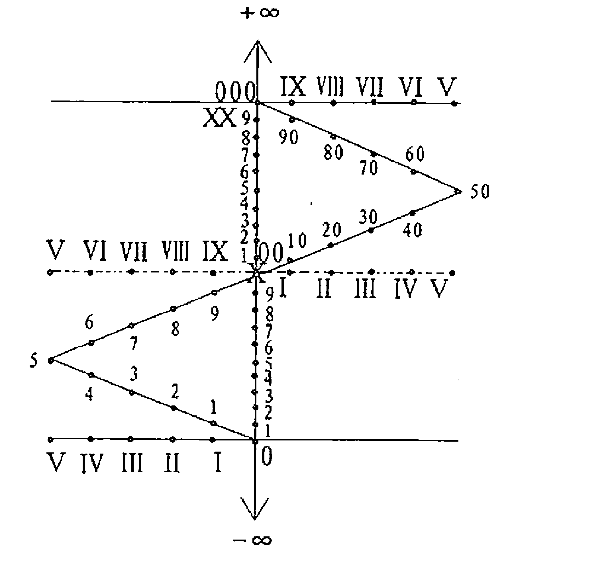

在数值上升的过程中，0的各种形态伴随始终，无论是10还是200，即使是个位数也一样包含0，因为0是空，它存在于所有数字之中，也存在于所有数字之外。0也是数轴（竖轴）本身，是横坐标（罗马数字）等于0的点集合。横轴则是数值等于0的点集合，它的长度是十个罗马数字符号。横轴在竖轴上以10为周期，无限循环出现。竖轴则只有唯一一条向两边无限延伸。

再把塔罗牌按照对应的罗马数字放到“流变之轮”中，如下图。

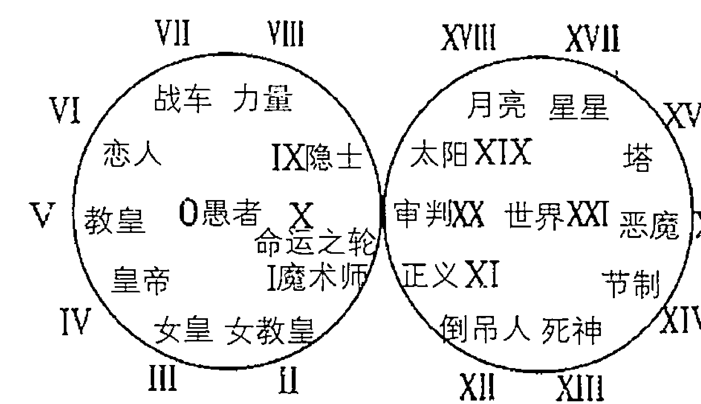

我们又可以发现有非常多的有趣的巧合：

- 1. 在横轴上，也就是“愚者”和“世界”连成的直线上，还有“教皇”、“命运”、“审判”和“恶魔”。这四张牌都是宗教中常见的概念，也是塔罗牌中“信仰”主题最突出的四张牌。并且，“教皇”与“命运之轮”一组，“恶魔”与“审判”一组，“命运之轮”与“审判”相连，这似乎也在暗示着什么。
- 2. 左侧的小循环中，大多是代表具体社会身份的塔罗牌，例如“皇帝”、“魔术师”等；而右侧则大多是代表精神、品质或星体的抽象概念。左侧抽象的牌分别是“VII战车”、“VIII力量”、“X命运之轮”，右侧代表具体身份的牌则是“XII倒吊人”、“XIII死神”、“XV恶魔”，它们的编号和位置也巧妙得有些类似。如果从立体空间的另一角度去看，这六张例外的牌还是在同一条直线上的。
- 3. 左右两个环，镜像对称位置上的塔罗牌，在牌义上似乎也存在着镜像对称关系。

左侧是代表“空”和“起点”的“愚者”，右侧是代表“满”和“终点”的“世界”；
左侧是正在祈福的“教皇”，右侧是正在诅咒的“恶魔”；
左侧是代表丰收的“女皇”，右侧是代表荒芜的“死神”；
左侧是可以肆意妄为的“皇帝”，右侧是充满约束的“节制”；
左侧是无私奉献知识的“女教皇”，右侧是用一定的代价探索智慧的“倒吊人”。
左侧是代表自然法则的“魔术师”，右侧是象征人类文明的“正义”；
左侧是伊甸园受神眷顾的“恋人”，右侧是巴比伦遭受天谴的通天“塔”；
左侧是保护珍惜事物的“战车”，右侧是被神灵护佑的“星星”；
左侧是绵延不绝的均匀“力量”，右侧是断断续续阴晴不定的“月亮”。
左侧是消极避世的“隐士”，右侧是积极行动的“太阳”。
左侧是不断循环的“命运之轮”，右侧是终结的“审判”……

- 4. 在神秘学中4是一个神奇的数字，西方有四元素，东方有四相及其衍生的八卦。犹太教中上帝的名字也是由四个字母组成。在生命数字学的理论中，4也是一个不断循环的数字，因为1+2+3+4=10=1+0=1，又回到了1。生命数字学的创始人毕达哥拉斯认为，4与7一样，是一个不可思议的数字，它们不断循环从而衍生出了无穷。塔罗牌也是一再被4这个数字划分。小阿卡纳有四组，宫廷牌有四张，整套牌还一度被人们分成了“愚者”、主牌、宫廷牌和数字牌四部分。在这个“流变之轮”中也充满了4的魔法，除去横轴，每个环中，上下都各有四张牌。一个环中的八张牌又暗合了《易经》的推衍之数。

……

巧合之处不胜枚举，不过这些还仅仅只是从一个角度观察这个“流变之轮”而得到的结论。接下来，我们再从侧面的角度来观察这些牌，如下图：

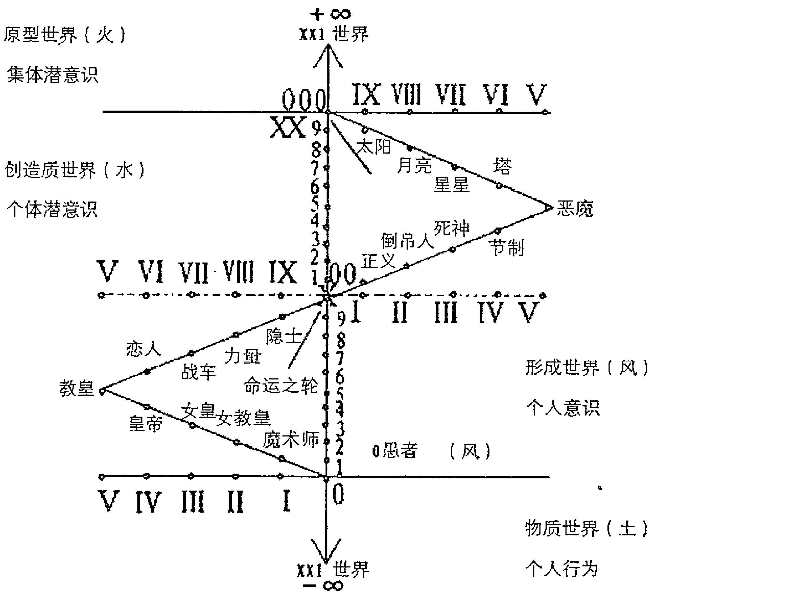

从这个图中，我们可以很直观地了解到二十二张大阿卡纳空间位置的分布规律。首先我们可以看到，“愚者”和“审判”是两个起点；“命运之轮”是过渡点，它既是终点也是起点；“教皇”和“恶魔”是两个转折点。不过我们应该注意的是更深层的东西，例如属性和象征。

在此图中，大阿卡纳中三张对应希伯来文中三个母字母的牌，被很巧妙地均分开了。对应“Aleph”的“愚者”是0～9循环区间的起点，而“Mem”的“倒吊人”则处于00～90循环区间，对应“Shin”的“审判”是000～∞循环区间的起点。前面介绍过了，“Aleph”、“Mem”、“Shin”三个字母对应了风、水、火三个基本元素，也代表了三个不同层次的世界。因此我们不难想到将这三个区间与三个基本元素及三个不同层次的世界对应。如图所示，0～9区间对应风元素和形成界，00～90区间对应水元素和创造界，000到+∞区间对应火元素和原型界。

但是，在此之后，神秘学家们又添加了第四元素——土元素，并且将之分配给了“世界”牌和“Tav”字母，这又是为什么呢？在流变之轮中又是怎么体现的呢？

从立体空间里，我们可以看到“愚者”在“命运之轮”下方，“命运之轮”在“审判”下方，“审判”在“世界”下方。“愚者”是位于“命运之轮”正下方、“魔术师”之前的一个点，而“世界”是在“审判”之后和之上的无穷空间。从数学的概念中我们可以知道，无穷是无边无尽的，并且+∞与-∞在无穷远处是相连在一起的。所以“世界”不仅仅是“审判”之后的无穷空间，而且是包围着从“愚者”之下某一范围开始到“审判”之间所有空间的无穷大的外壳。

从000到+∞循环的区间是火性的世界，从-∞到0的区间则是代表土元素的土性的世界。“世界”的本质是土性世界的起点，它是属于土性世界的，所以它对应土元素。但是，火性世界（原型界）是难以描述的无穷大的空间，我们无法只用它的起点描述它，因此我们需要借用土性世界的起点（“世界”）作为它的边缘来描述它。站在“审判”这一点处观察，无穷远处的+∞与其后的-∞以及再之后的0重合为一点，这一点就是“世界”。被借用来的广义“世界”不再是一个点，而是无穷多的点的集合。

这样，我们就得到了一个完整的对应体系：

0～9循环区间，从“愚者”到“隐士”，对应风元素，属于形成界，也对应着心理学中的“个人意识”，是依照计划行事的、可操控的精神世界。

00～90循环区间，从“命运之轮”到“太阳”，对应水元素，属于创造界，也对应着心理学中的“个体潜意识”或“前意识”。它是常常处于意识察觉和控制之外的“灵性”。

000到+∞循环区间，从“审判”到“世界”（不包括“世界”），对应火元素，属于原型界，也对应着心理学中的“集体潜意识”，是一个未知的无穷世界。

-∞到0循环区间，从“世界”到“愚者”（不包括“愚者”），对应土元素，属于物质界，即客观的物理世界，包含了心理学中的“个人行为”。这里不再是属于抽象精神的世界，这里是我们所生存的外在世界。它与火性的原型世界一样，也是无穷大的，并且充满了未知。代表我们行为的小阿卡纳也处于这个区间，不过它们只是这个世界的一个小角落，在其之外还有着无穷无尽的空间。这说明我们的能力在现实世界中也是有限的。

大阿卡纳主要分布在创造界和形成界，也就是心理学中的个人意识和个体潜意识中。而这部分正是我们日常心理活动的主体，它们的一举一动都影响着我们自己以及他人的行动和命运。从“流变之梯”中也不难看出，0～IX号牌充满了理性、计划性和现实性，是个人意识的写照；而X～XIX号牌则是更深层次的一些本性，包括求知欲，对食物、繁衍的欲望，原始的道德感和宗教原型以及对死亡的畏惧等。

从“流变之轮”中，我们可以获得的信息和启示远远不止这些。例如星座和行星在其间也被有规律地均分等，无数的巧合在这其中似乎向我们暗示着什么。我们还可以结合圣名公式或者卡巴拉，或者占星术、心理学，甚至只是结合我们日常的一些想法，从中获得许多启示。

实际上，三维空间双向螺旋旋转的形态也并不是“流变之轮”的全貌，因为从其侧面分解图中我们可以看到，横轴的刻度“V—I—0—IX—V”也是一个循环，并且横轴（编号轴）的两端是重合于“V”的。这意味着，编号轴其实并不是在平面内的直线，而是一个首尾闭合的圆环。因此，侧面分解图其实是我们将坐标系变形和简化后，将圆环展开后获得的。实际上数值是在沿着一个圆柱体的表面立体式三维双向螺旋循环上升。但这还远远没有结束，仅仅对坐标系进行一次还原，还不足以使我们观察到“流变之轮”的原貌。需要注意，在不同的循环区间内，横轴会在“V—I—0—IX—V”和“V—IX—0—I—V”之间震荡循环，这意味着横轴在上升的过程中，也会发生循环错位，也就是说整个坐标系在圆柱体的竖直方向上还会扭曲成螺旋状。所以，我们可能需要一些空间想象力才能经过两次坐标系还原，在脑海中构建出“流变之轮”的真实模型。如果再引入时间变量，将“流变之轮”扩展到四维的时空之中，恐怕就超出我们的想象力范围了。不过，比起古人，我们更加幸运，因为我们可以借助计算机和数学模型来辅助研究这个可怕的复杂之物。

在四维的“流变之轮”中隐藏了时空的奥秘，可能它本身就是世界的设计图。不过，作为初级和中级学习者，我们只需要对三维分解图进行研究便足以受益匪浅了。

除了辅助理论的推衍，我们也可以将“流变之轮”用到灵修中。

这里所说的灵修是指完善心灵的修行，一般可以通过冥想或感悟两种途径使心灵得到成长。冥想可谓提升心灵的一个捷径，在宗教和神秘学仪式中我们常常会见到。

冥想，是对人生和自然中所蕴含的“道”的思考，我们希望通过“想”来参透宇宙的奥秘。我们在对一个事物进行辩证和深层思考的过程中会对人生和自然有更深刻的认识或领悟。在冥想的过程中，禅坐与否并不拘泥，关键在于“想”的深度和“想”的方式。所以往往我们需要借助一些素材和方法来辅助自己进行冥想。例如，一些修行者会在瀑布的激流下进行冥想，通过环境的刺激来触发自己的灵感。藏传佛教中，人们还会使用“曼茶罗”来辅助自己冥想。其实塔罗牌也有类似的功能，塔罗牌的图画也像“曼茶罗”一样可以引发我们更深层次的思考。但是塔罗牌并不是如“曼茶罗”一样单纯的宗教及修行图画，塔罗牌背后还有着丰富的神秘学理论支撑，还有着更广泛的智慧等待我们去探索。“流变之轮”可以作为我们探索塔罗之中隐藏着的智慧世界的地图。

从“愚者”到“世界”的上升之路上的每一个里程碑、各个过程之间的关系、“世界”的循环之道，以及这一切之中所蕴含和所影射的人生道理，只有自己通过思考才能领悟。

形成界为什么在“教皇”处转折？这意味着什么？“女教皇”要告诉我们什么？为什么在“力量”之后出现了“隐士”？……

只要认真去想、去思考，你就会获得意想不到的启示，从塔罗中获得更多意想不到的智慧。可能很多学习塔罗的人都听说过“愚者之旅”。我们常常将塔罗牌的大阿卡纳比喻成一个“愚者”向“世界”前进的旅程，并以此来比喻人生旅程的一系列课程。从“愚者”出发，每经过一张塔罗牌都代表着人生旅程中的一个阶段，这些阶段都是每一个人成长的必经之路。每一张牌、每一个阶段，都可以帮助我们获得更多的智慧，使我们对人生和世界有进一步的认识。

如果大阿卡纳是“愚者”的旅程，那么“流变之轮”就是这个旅程的地图。不过同样的路，不同的人走，会看到不同的风景。最独特的你，在这个旅程的各个阶段又会发现什么呢？

如果每一张牌都是一门课程，那么“流变之轮”就是这一系列课程的课程表。我们可以通过冥想，去思考“愚者”的每一门课程。但是同样的课程，不同的人会学习到不同的东西，你又会从中学到什么呢？

这一切的结果，只有在你认真去想、去思考之后才能知道。

“冥想”在一定程度上约等于“深思”，但仅仅依靠这种“空想”是无法完全理解“愚者之旅”的。为此，我们还需要“感悟”，也就是在现实生活中去探索“愚者的旅程”。

试想，当你经历了“厌世”情绪的侵扰后，也许没有人会比你更了解“隐士”的心理状态。如果不是亲身经历获得的感悟，仅仅凭想象无法感同身受地理解“隐士”牌所要表达的内容。当你在生活中经历了“隐士”这一阶段，你也许会对此前自己的一些行为感到可笑，并且会放弃从前的一些看法。但是深陷于此是无济于事的，总有一天你会从这个成长阶段迈向另一个成长阶段。

也许身体在成年之后不会再变化，但是我们的心灵在漫长而又短暂的人生之中无法避免地要学习到种种道理，然后无可避免地不断成长，只不过每个人的成长速度和历程不同罢了。

大阿卡纳的每一张牌都是我们人生必然会经历的阶段，也是必然要学习的课程。学习过程中有可能会不及格，也许还会重修，总之这个学习的过程必然是曲折的。我们就在这个曲折的旅程之中不断成长。

在这里，我们不会详细讲解“愚者之旅”的每一个阶段，不会详细提供每一张牌的“课程”。因为从历来的教学经验来看，即使为学习者提供了详细的参考，他们也不会看，即使看了，也不认真，即使认真了，也不一定了解，即使了解了，也不一定赞同……因为一切的参考都只是别人总结出来的，只是别人的心灵旅程，不是真正的“愚者之旅”，也不是自己的旅程。所以每个人都应该有自己的旅程，然后从自己的旅程中去获益，这才是修行的本意。

在这里还有一些忠告。

旅程中不要心急，不要以完成旅程为目标，因为无论是冥想还是感悟，都将是伴随你一生的长期而缓慢的积累过程。你不可能完成它，更不可能提前完成它。何况急匆匆的旅程只会使你错过一路上的风景，所以不如放慢脚步去享受。

不要定什么计划，不要依照塔罗牌的顺序或其他什么固定的顺序去安排自己的感悟，也不需要每天都去煞费苦心地修行。因为感悟是可遇而不可求的，就像佛教中所说的“缘”，该来的时候自然会来，不来的时候再怎么求索也没有用，而且它并不会遵照什么顺序，它总是没有规律地随机出现。每个人的学习过程都不同，也许你先从“节制”中获得感悟，后从“正义”中有所感悟，而他也许是先学习到“命运之轮”，后学习到“倒吊人”。

不要过多参考别人的旅程，因为那不仅不会帮助到你，而且只会干扰你获得属于你自己的东西。

生活或修行中要多想、多回味、多反思，从不同角度反复观察和思考。不要怕重复和曲折，因为曲折和重复其实是一个完善的良机。

## 人生修行：塔罗牌游戏

塔罗牌跟扑克牌十分相似，加之塔罗牌在中世纪以前也的确曾有过一段时间是作为一种纸牌游戏而被流传，因此有不少人都曾想过塔罗牌到底可不可以当作纸牌来玩。这个问题的答案是肯定的，塔罗牌的确可以用来玩纸牌游戏。帕普斯就曾在《波希米亚人的塔罗牌》中提到过一种叫作“The Royal Game of Human Life”的塔罗牌游戏。

但是不要简单地以为塔罗牌游戏就是把小阿卡纳抽出来当作扑克牌来玩。要知道塔罗牌的小阿卡纳比扑克牌多了四张，塔罗牌小阿卡纳每组牌中除1～10数字牌以外还有“King（国王）”、“Queen（王后）”、“Knight（骑士）”、“Princess（Page）（公主或男仆）”四张宫廷牌，而扑克牌除了1～10以外，只有“King”、“Queen”、“Jack”三张牌。

塔罗牌游戏和扑克牌又不一样。在这里为大家介绍一种使用全部阿卡纳的、真正的塔罗牌游戏——爬树游戏。

有些人可能要问，为什么要在书中花这么大篇幅来介绍爬树游戏？玩这个游戏我们能获得些什么？

首先，这是一个有意思的纸牌游戏，而且你还可以跟不懂塔罗牌的朋友一起玩这个游戏，不管是不是塔罗学习者，都可以在游戏中获得快乐。

其次，这个游戏可以为你提供一个与其他人交流、了解其他玩家内心的机会。虽然操作起来有些复杂，可能要求你对塔罗牌和心理学有一定的了解，但这不失为一个沟通心灵的良机。

第三，从这个游戏的名字我们可以看出，这个游戏与卡巴拉生命之树有着密切的关系。而学习塔罗，难以避免地要学习卡巴拉。对卡巴拉有更多的了解，可以帮助你更好地学习塔罗牌。生命之树正是卡巴拉的精髓和核心。通过这个游戏，我们可以寓学于乐，在游戏的过程中既便捷又轻松地加深对塔罗牌和生命之树之间联系的领悟。

第四，这个游戏还具有冥想的作用，所以我们可以称其为“人生修行游戏”。在游戏过程中，我们不可避免地要与每张牌打交道，并且对其所蕴含的人生哲理有所思考。所以这也不失为一个了解每张塔罗牌以及我们自身的力量和缺点的修行方式，我们可以从中对人生有更多的领悟。

第五，这个游戏还具有占卜的功能。在游戏结束后，玩家所出过的牌，会给出一个充满寓意的暗示。

这个游戏的胜利条件是最先到达“生命之树”的顶端，所以我们也可以形象地称其为“爬树游戏”。简便起见，以下的游戏说明统一采用“爬树游戏”的命名方式。

说到这里，想必你也觉得这个游戏值得一玩了吧。接下来就让我们来了解爬树游戏的具体玩法。

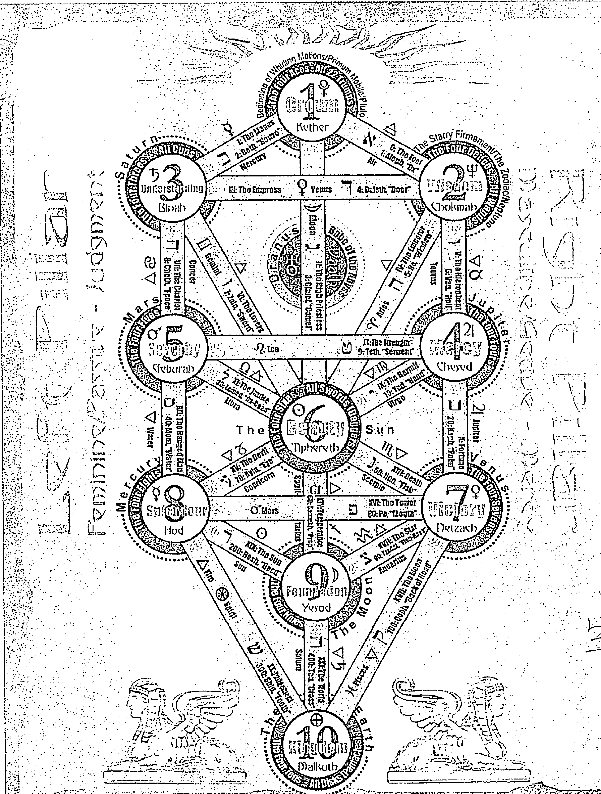

## 游戏说明

| 游戏名称 | 爬树游戏（人生修行游戏） |
| :--- | :--- |
| 玩家数目 | 2～7人 |
| 游戏道具 | 一副塔罗牌（全78张），一张生命之树的图表（上附） |
| 胜利条件 | 最先到达并且稳定立于生命之树的顶端 |

## 牌的作用

数字牌对应生命之树1～7号原质，可以用来提升自己。
宫廷牌可以按其点数代替对应的数字牌。
四张“国王”为“小鬼牌”，可以代替任意数字牌。
大阿卡纳可以按照生命之树中所对应的路径连接两个原质。例如，“月亮”连接10和7：如果在10号原质使用“月亮”，“月亮”将作为“梯子”帮助玩家，使得玩家可以越过9和8直接到达7；如果在7号原质使用“月亮”，则“月亮”将作为“毒蛇”攻击玩家，使得玩家从7号原质跌落回10号原质。
“愚者”为“大鬼牌”，可以代替任意数字牌和任意大阿卡纳。

## 点数设置

小阿卡纳的数字牌按牌面点数对应，例如，权杖二和圣杯二都为2点。
宫廷牌如下设置：
- 公主 10
- 骑士 9
- 王后 6
- 国王 1（做“小鬼牌”时可取1～10任意点数）
大阿卡纳无点数。
“愚者”代替大阿卡纳时无点数，代替数字牌时可取任意点数。

## 手中牌数

每轮结束时每位玩家手中都有11张牌。如果某人操作失误，多了一张牌，则下一轮再到他的时候，必须选择丢弃一张牌；如果操作失误，少了一张牌，则再下一轮到他的时候，必须选择抓牌。为了表示惩罚，补牌的过程消耗行动值，也就是说，纠正错误的丢弃或抓牌，算作那一轮的行动。

## 牌堆设置

“新牌堆”：未被分配的牌，每一轮玩家都可以选择从此抓牌。
“旧牌堆”：每轮玩家丢弃的牌，玩家也可以在这里换取自己需要的牌。
“上升堆”：玩家出过的所有的牌，每个玩家都有自己的“上升堆”。

## 行动

出牌：首轮，如果你手中有“10”或者可以代替“10”的宫廷牌，你可以出牌，把“10”放在自己面前的“上升堆”上，使自己完成生命之树的10号原质。在之后的每一轮，你需要按照从10到1的顺序依次出牌。如果你有合适的大阿卡纳，你也可以选择出牌提升自己或攻击对手。如果没有对应的数字牌，也没有“鬼牌”，你还可以选择以下出牌方式：

换牌：如果“旧牌堆”最上面的一张牌是你需要的牌，你可以拿手中任意一张牌与之对换。换牌后完成此轮行动。如果无法换牌，你还可以选择：

交易：你可以通过协商跟其他玩家换牌。在轮到你出牌时，可以向所有玩家公开寻求某一张牌或者根据其他玩家的“上升堆”，猜测谁有你需要的牌和你有谁需要的牌，然后向某位玩家提出交易申请。不过，交易必须在双方同意并且一次只能以一张牌换一张牌的前提下成交。另外，在你公开或单独询问某张牌时，其他玩家不论有无都没有必须回答的义务。交易成功则本轮行动完成，如果交易失败，你则需要选择其他行动。

抓牌：如果玩家不能出牌，也无法换牌或达成交易，则玩家可以在“新牌堆”中抓取一张新牌。不过，玩家抓牌后，必须从手里的12张牌中选择放弃一张，以遵守“每轮结束时每位玩家手中都是11张牌”的规则。另外，玩家出牌后，也需要抓牌。牌。不过，玩家出牌后手中只剩下10张牌，所以不需要再丢牌，玩家抓牌即完成了此轮行动。

丢牌：如果玩家没有出牌，则抓牌后必须选择一张牌将其面朝上丢弃到旧牌堆上，以维持手中只有11张牌的状态。丢牌后结束此轮行动。

补牌：如果上一轮因为失误而多了一张牌或少了一张牌，则玩家在此轮必须选择抓牌或丢牌，以恢复手中只有11张牌的状态。“补牌”后结束此轮行动，不可以再进行其他行动。

## 备注

1. 到达和完成的区别：如果使用“梯子”到达某一原质（例如6号原质），在接下来还必须寻找一张“6”以完成“6号原质”，使自己稳定立足于6号原质。“到达6”其实只是“在去6的路上”（on the way to 6），而“完成”才是真正地到达（reach）。
2. 无法对“在路上”的人使用大阿卡纳，因为他在两个数字之间，没有对应的“毒蛇”可以攻击他。
3. 如果“新牌堆”分配尽了，则保留“旧牌堆”最上面的一张，其他牌全部翻转后作为“新牌堆”使用。
4. 在通过“梯子”到达1号原质后，如果寻找不到一张“Ace”，也可以使用“鬼牌”代替“Ace”完成1号原质，但是这种情况下，该玩家还必须接受一轮的考验，因为“鬼牌”不是真正的“Ace”。如果其他玩家可以在接下来的一轮对其使用“愚者”、“魔术师”或“女教皇”，则该玩家必须按照生命之树所示路径退回到2、3或6号原质继续游戏。如果玩家使用“Ace”完成1号原质，则不需要经受考验。
5. 当有一个玩家胜出时，其他玩家可以选择是否继续游戏。如果游戏继续，则获胜的玩家将自己剩余的牌放到“新牌堆”中，其他玩家继续游戏。不过在继续游戏之前，所有玩家都应该仔细查看一下各自的“上升堆”，因为它已经给出了第一个预言。以出牌的顺序为线索，上升堆里的所有牌被串联起来就像一个连续的故事，其中蕴含着充满寓意的启示。如果其他玩家选择结束游戏，则只有此时的胜利者获得了完整的预言。如果游戏继续，则直到自己完成1号原质才会获得完整的预言，并且在“上升堆”中其他每个玩家胜出的点都是占卜结果中一个需要注意的重要部分。
6. 如果没有任何一个人可以完成1号原质，则和牌，胜者是达到1号原质或者旅行到最高原质的玩家。

## 进阶玩法

以下是爬树游戏的一些进阶玩法，玩家可以选择是否采用这些规则：

1. 在一些玩法中，除了四张“国王”外，“女教皇”也可以作为“小鬼牌”去代替任何数字牌；而除了大小鬼牌以外，还有一张“中鬼牌”——“魔术师”，它可以代替任意大阿卡纳。
2. 生命之树的1、2、3号原质，在深渊之上，在卡巴拉中具有至高的地位，代表着神圣的、理想的世界。所以任何人到达了3号原质以上之后，就不能再从“旧牌堆”里换牌，并且必须放弃6张牌，接下来手里只能保留5张牌。也就是说，在3号原质以上的人，要遵守5张牌原则，手里必须维持5张牌。如果他被降到3号原质以下，他还可以被分配其他6张牌，重新遵守11张牌原则。
3. 深渊之上的“Da'ath”代表“奥秘”和“灵知”，是诺斯替教中救赎的必要途径。获得“灵知”的人可以提升自己的精神境界。不过，深渊也是危险的，当在爬树游戏中某位玩家通过“女教皇”到达1号原质时，在3号原质以下的所有玩家都可以在原来的基础上提升一层。例如完成7号原质的人可以直接完成6号原质，而到达5号原质的人则直接到达4号原质。
4. 生命之树的4号原质代表着神的慈悲、恩赐和祝福，所以位于（完成）4号原质的人在离开之前每轮都有两次行动的机会。
5. 生命之树的5号原质代表神的严厉、愤怒和惩罚，所以位于（不是到达）5号原质的人在停留期间每两回合才可以行动一次。
6. 生命之树的6号原质是生命之树的核心，代表了能量、矜持等美丽的祝福，所以位于6号原质的玩家可以在停留期间手中持有17张牌。但是离开之后必须归还6张牌，以恢复11张牌的状态。
7. 生命之树的7号原质代表勇气和胜利，所以其他玩家不可以攻击位于7号原质的人。
8. 生命之树的8号原质代表和睦和收缩，所以位于8号原质的人不可以使用“毒蛇”攻击其他玩家。
9. 生命之树的9号原质代表基础，所以位于9号原质的玩家不可以对自己使用“梯子”。

## 游戏范例

假设A、B、C三个人玩普通版的爬树游戏。（A、C两人对生命之树不太了解，所以打印了一张生命之树作为游戏地图，随时查看。而B完全记住了生命之树，所以他不需要地图，只凭记忆中的生命之树即可顺利进行游戏。）
洗牌后，A先抓牌，随后B和C依次抓牌，每人轮流抓取一张，直到三人手中都有11张牌后游戏正式开始。

每个玩家都应该铭记爬树游戏的诀窍：

1. 以最短的路径朝着生命之树顶端前进。
2. 善加利用大阿卡纳的“梯子”功能提升或保护自己。
3. 善加利用大阿卡纳的“毒蛇”功能，攻击和阻碍对手。不要心慈手软，因为在游戏中手下留情对对方来说反而是种侮辱。如果可能，还可以结合“梯子”和“毒蛇”设置更大的陷阱……
4. 妥善选择采取各种行动，遵守并充分利用游戏规则。

第1轮：

A出牌，他将“权杖十”面朝上放在自己的面前，然后从新牌堆上抓了一张牌。
轮到B出牌了，他没有任何一张“10”，但是他有一张“小鬼牌”，于是他出牌，将“宝剑国王”代替“10”面朝上放在自己的面前，然后从“新牌堆”上抓了一张牌。
轮到C出牌了，可是他没有“10”，也没有“鬼牌”，所以他无法出牌。他只能考虑换牌或者交易，但是还没有任何一个玩家丢牌，所以他也无法换牌。于是他公开提出要拿一张“8”交易“10”，因为他有两张“8”，并且他认为其他玩家可能很需要“8”。可惜的是，其他玩家没有回应他，于是他只好抓牌。不过很幸运，他竟然抓到了一张“圣杯十”。于是他留下了“圣杯十”，丢弃了一张“8”。

第2轮：

A提出交换“9”，B回应说他可以用“9”换张“7”或者任意一张大阿卡纳。A没有“7”，也不想用大阿卡纳交换，所以交易没有达成。于是，A只得抓牌，然后丢牌。
轮到B出牌了。他出牌，将“星币九”面朝上放在宝剑国王上面。“星币九”可以遮盖“宝剑国王”的图画，但要露出国王牌的标题以供其他玩家查看。然后B从新牌堆里抓了一张牌。
轮到C出牌了，他将“圣杯十”放在自己的面前，然后抓了一张牌。

第3轮：

A继续提出交换“9”。这一次，B妥协了，他说A可以拿“7”以上任意数字与之交换“9”。于是A拿了一张“5”跟B达成了交易。

轮到B出牌了，他将“星星”放在自己的“9”之上，跳过了“8”。他抓了一张牌。下一轮他将寻找“7”。

C用手里的一张牌与“旧牌堆”最上面那一张牌对换。

第4轮：

A出牌，将上一轮跟B换来的那张“9”放在自己的“权杖十”之上，然后抓了一张牌。

轮到B出牌了，他通过抓牌得到了一张“愚者”，然后从手中另11张牌中丢弃了一张。

C出牌，对A使用了“毒蛇”，他将“世界”放在了A的“9”之上，使得A回到了“10”。A因此必须再次寻找“10”，重新开始自己的旅程。C又从新牌堆里抓取了一张新牌。

……

第7轮：

A通过换牌获得了一张“10”。

B出牌，将一张“7”放在自己的“星星”之上。

C抓牌后丢弃了一张牌。

第8轮：

A出牌，将“10”放在“世界”之上，然后抓了一张新牌。

B对C使用了“毒蛇”，“星币六”上的“恶魔”使得C回到了8号原质。他从“新牌堆”中抓牌。

C从“旧牌堆”中换牌。

第9轮：

A出牌，将一张“骑士”代替“9”放在了“10”之上，然后抓了一张新牌。

B通过与A交易获得了一张“4”。

C出牌，将一张“8”放在“恶魔”之上，然后抓牌。

……

第15轮：

A出牌，对自己使用了“梯子”，使自己提升到了5号原质。但是出牌后他忘记了抓牌。

B出牌，一张“3”使得B稳定地立于3号原质。

C提出交易，但是没有达成。于是C抓牌，但是忘记了丢牌。

第16轮：

由于A此前忘记了抓牌，此时他手中只有10张牌，所以他必须通过抓牌来补牌。A抓牌后结束此轮行动。

B以“魔术师”为“梯子”到达了1号原质。

C由于多了一张牌，所以必须通过丢牌来补牌。C丢牌后结束行动，本轮结束。

第17轮：

A换牌。

B出牌，用一张“国王”代替Ace完成了1号原质。但是为此他必须接受一轮的考验才能获取胜利。

C抓牌，然后丢牌。

第18轮：

A抓牌，然后丢牌。

B跳过……

C出牌，完成6号原质。

第19轮：

B胜出，A和C选择继续游戏。B将余下的10张牌放进“新牌堆”。A和C查看自己的“上升堆”，获得了第一部分的预言，然后继续游戏……

## 知识晋级与拓展

塔罗是一个开放的系统，在演化发展的过程中不断地吸收各种优秀的知识来完善自己。如今塔罗的系统已经涉及了宗教、神话、命理、神秘学、巫术、心理学等众多学科领域，这些看似关系不大的知识一起支撑和完善了塔罗的系统。

在这里先要明确几点：

1. 下面介绍的神话、宗教等内容是笔者对诸多资料中挑选出的与塔罗关系密切和重要的部分，加以整合而成的，线索较为清晰，内容较为简单，比起神话、宗教方面的专业书籍和资料更加适合初学者学习使用。不过此处根据学习塔罗的需要，对内容进行了一些筛选取舍，不保证内容完整且完全符合相关专家的说法。
2. 神话内容过于庞大，即使是与塔罗密切相关的内容，本书也无法全部收录。所以，要想认真学习塔罗，或者对神话和宗教有兴趣的读者，可以在此后自行查阅相关资料和书籍，继续深入学习。
3. 精神和物质是有区别的，精神层次的事物具有模糊性，不应该也不可能要求精神层次的事物像物质层次一样精确。
4. 学习应该持有严谨和宽容的态度，对于理论要严谨，对于概念要宽容。要力求精确，也要能够容忍错误，因为我们生活在一个充满错误的世界，错误不可避免。

因此，学习神话、宗教、神秘学和心理学时我们要有不同的态度和方法。

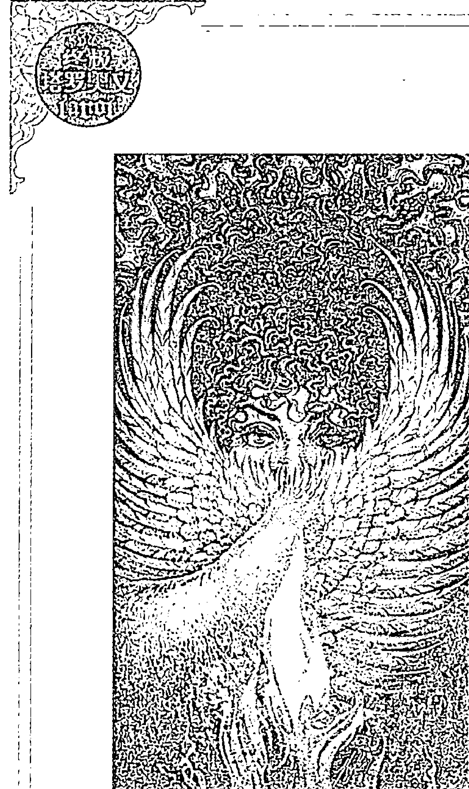

学习神话是为了扩充知识，理清和构建自己的原型（象征）体系。这样在占卜的时候，才能更轻松更全面地解出更多准确的东西，而自己在生活中也会变得更加睿智。

学习神秘学是为了懂得塔罗的原理。原理是基础，是发展的根本，所以，在学习神秘学的过程中，我们要抱着严谨的态度，一定要力求有理有据、真实确切。可以大胆假设，但一定要小心求证。即使是精神层次的学问，不能精准，也要保证逻辑严密。

但是鉴于神话的复杂性，想要完全整合某个神话或多个神话是很困难的，我们在学习神话的过程中要抱着一颗“糊涂”的心，允许矛盾并存，而后在深入学习或研究神话的过程中再睁开“精明”的眼，去辨认是非。有些神话中往往会出现前后矛盾的事物或者同一事件有多种不同的说法的情况，如果不能统合，就不要纠结于此，择其优者而信之，暂且不管其是否完全合理。有些时候，没有完全合理的存在。而我们的目的在于构建自己的原型（象征）体系，利用神话来充实自己和学习塔罗，而不是科研考究神话本身，所以能有一个差不多的说法（印象）在心就可以了。

学习心理学是丰富塔罗的手段，鉴于心理学还没有被系统地引入塔罗，塔罗也没有被心理学所利用，所以在下面我们更多的是认识心理学以及心理学与塔罗的联系和发展前景。

关于塔罗的起源之所以众说纷纭，是因为塔罗建立在众多文明基础之上。最能代表不同文明特点的莫过于神话和宗教。

## 塔罗汲取之埃及神话

埃及，很有可能是塔罗的发源地。从最早的塔罗到现行的知名塔罗牌画面，几乎都包含着埃及的图画或元素，甚至还有不少以埃及文明为主题的塔罗牌。例如韦特牌“命运之轮”中的蛇、狗头人和斯芬克司就来自埃及太阳神的敌人阿贝普（Apep）、死神阿努比斯（Anubis）和圣言之神胡（Hu）。埃及神话就像一节脊椎深深埋藏在塔罗的深处，支撑着塔罗的整个系统。

九柱神（Ennead）体系则是埃及神话的脊梁，贯穿并支撑着整个埃及神话。

埃及神祇较为混乱，经常是一个神多个名字，或一个职位多个神。例如，阿蒙（Amon）、阿吞（Aton）、阿图姆（Atum）都是太阳神，泰芙努特（Tefnut）、伊希斯（Isis）和奈芙蒂斯（Nephthys）都是生育之神。这主要是因为埃及神话在历史发展过程中对某一神之信仰不断变化以及不同区域信仰不同的神祇造成的。现在流传的埃及神话可以依照地区划分为孟斐斯（Memphis）、赫利奥波利斯（Heliopolis）和赫尔莫普利斯（Hermopolis）三个版本，其中赫利奥波利斯城的影响最大。我们可以依照赫利奥波利斯城的九柱神（Ennead）体系，来整合埃及神祇并理清埃及神话的脉络。

九柱神依次为阿图姆（Atum）、舒（Shu）、泰芙努特、盖布（Geb）、努特（Nut）、奥西里斯（Osiris）、伊希斯（Isis/Auset）、赛特（Seth）和奈芙蒂斯。

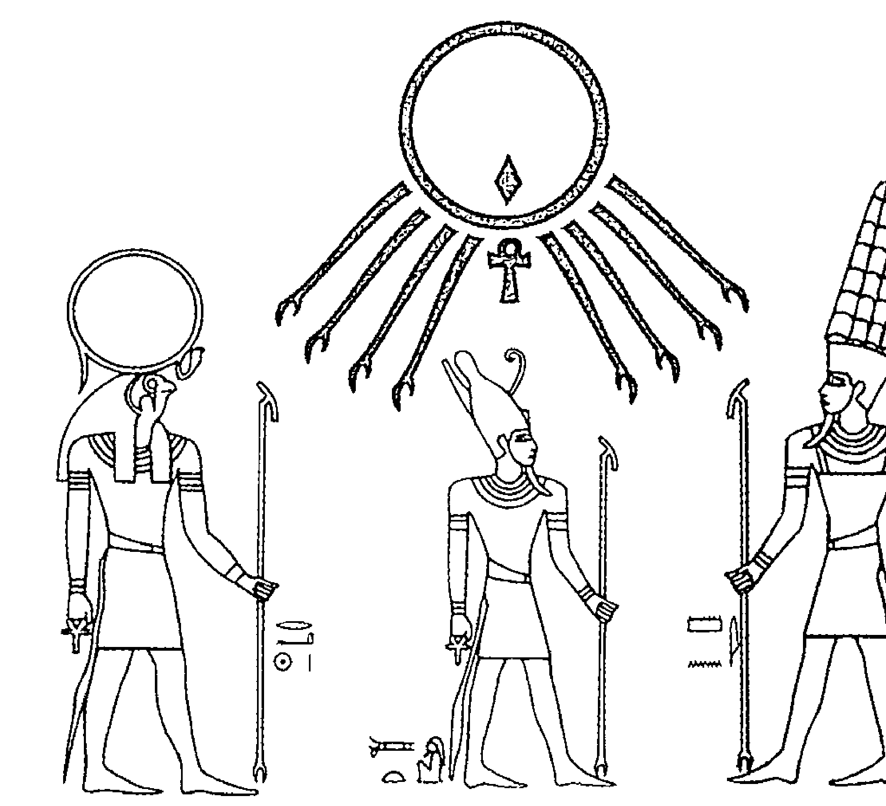

太阳神阿图姆，可以认为他与阿吞、拉（Ra）和阿蒙是同一个神祇。在埃及神话中太阳神最常见的名称是拉，他通常头顶代表太阳的圆盘，名字以占星中太阳符号即中间带有一个点的圆圈来表示。

在清晨，拉被叫作阿吞，他的象征是一轮金色的圆盘，每一束光线的末端都是手的形状；在黄昏的时候拉则被叫作阿图姆，他常被表现为黑公牛莫努尔（Mnewer）的形象，有时他还具有蛇、蜥蜴、甲虫、狮子、公牛和姬蜂的外形。所以阿吞又被称作朝日神，阿图姆被称作暮日神，而拉是太阳神的总称。

至于阿蒙，则可以理解为拉作为主神和众神之王时的称呼。他与妻子姆特（Mut，通常形象为头戴上埃及、下埃及双冠的母狮）生育了月亮与医药之神孔苏（Chons）。

阿图姆主要作为落日的象征，在埃及神话中很少出现。在以赫利奥波利斯城为中心的创世神话中，他用自己的精液和黏液创造了风神舒及雨神泰芙努特。

自己的兄弟舒结婚并生了盖布和努特。

有一次，泰芙努特与舒发生了争执，她一气之下离开了埃及。舒很快开始想念泰芙努特，但是她变成了一只猫，攻击一切靠近她的男人和男神。最后，智慧之神托特（Thoth）在乔装之下终于说服她返回埃及。

大地之神与生育之神盖布（又被称作塞布或凯布），是泰芙努特与舒的儿子。与世界其他地区的神话往往将大地之神表现为女神有所不同，在埃及神话中，大地之神为男神。

盖布的形象为鹅头人身，身体呈绿色或黑色。他关押着邪恶之人的灵魂，使他们无法进入天堂。

天空之神努特（Nut，也作Nuit），与世界其他地区的神话往往将天空之神表现为男神有所不同，埃及神话中的天空之神努特是一位女神。努特是泰芙努特与舒的女儿。她通常被画成一位具有蓝色皮肤的女人，身体含有星星，四肢撑在地面上，表示天空在地球上的弧度。太阳神拉每晚日落后进入她的口中，第二天早晨又从她的阴门中重生。她同时也如此吞咽和再生着其他所有星辰。努特也是死亡女神，大多数石棺的内壁上都绘有她的形象。法老死后会进入她的身体，不久便会重生。

在艺术作品中，努特的形象是一位被舒支撑着、以星辰遮身的裸体女性；在她（天空）的对面是她的丈夫（大地）。

努特与盖布结婚并生育了奥西里斯、伊希斯、赛特和奈芙蒂斯。

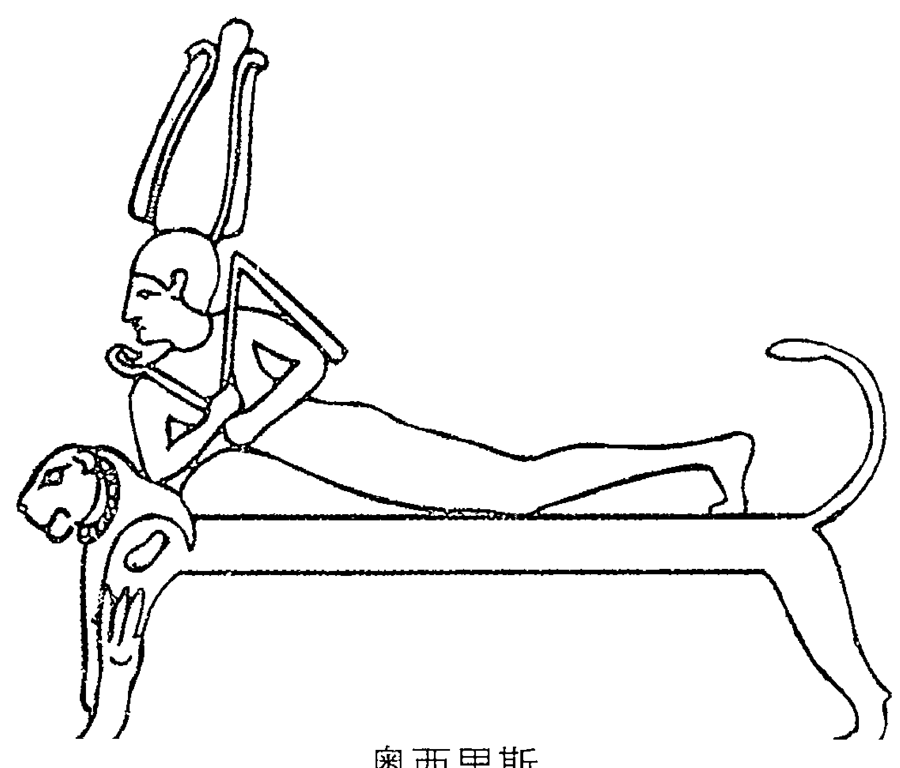

冥界之王奥西里斯（Osiris，也作Usiris，又译作乌西里斯），是古埃及最重要的神祇之一。他是一位反复重生的神。他最终被埋在阿比多斯城（Abydos），成为那里的守护神。一般在壁画中，若脸上涂有绿色颜料，则表示他正在复活中或已经复活。

奥西里斯是大地之神盖布与天神努特的儿子。在埃及，奥西里斯是掌管阴间的神，执行人死后是否可得永生的审判。同时他也是丰饶之神，文明的赐予者。他与妻子伊希斯生了荷鲁斯。根据死亡之书，他的长子叫作“贝卜（Beb）”。

母性与生育之神伊希斯（Isis，希腊语，在埃及语中叫作阿赛特），也是一位反复重生的神。最初，伊希斯是一位掌管皇权的女神（在象形文字中，她的名字里包括“王座”一词），后来在希腊人统治时期，她又成为水手的守护神。

伊希斯是大地之神盖布与天神努特的女儿。她的丈夫奥西里斯被兄弟赛特谋杀并肢解，伊希斯将奥西里斯的尸体拼接起来并使他复活（这使伊希斯的形象与阴间和葬礼崇拜联系起来），并与他在凯姆尼斯（Kemnis）湿地生下荷鲁斯。除了荷鲁斯，她还是丰收之神敏（Min）的母亲。

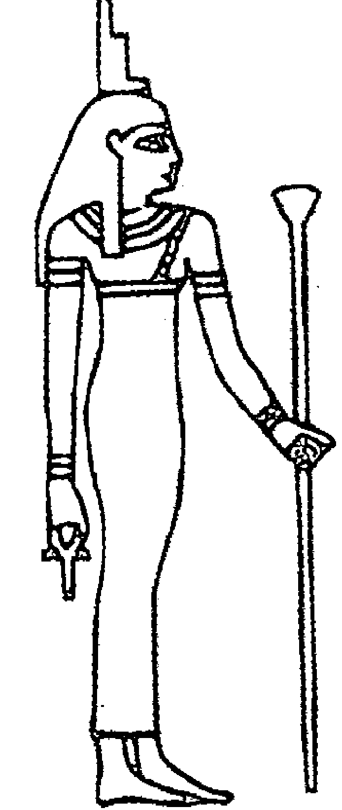

伊希斯与她的姐妹奈芙蒂斯同为死者的守护神，她们常在棺材的两端以人形现身，伸开翅膀保护死者。这对姐妹都拥有魔法力量。伊希斯可以说是埃及神话中最重要亦最受欢迎的女神之一，古埃及人相信她是宇宙间最有魔力的魔术师，因为她知道太阳神的秘密名字。相传太阳神的力量来源于其隐藏的真名，伊希斯为了获得与太阳神同样的力量，于是用拉的口水和泥土混合制成了一支长矛，又将之放在炉子上烤干，之后长矛变为一条蛇，这条蛇就是咬伤太阳神的阿贝普。伊希斯借着为太阳神拉治疗的机会，威胁并获得了他的真名和双眼。

力量之神、战争之神、风暴之神、沙漠之神以及外陆之神赛特（Seth，也作Set、Setekh等），保护沙漠中的商队，但同时又发起沙暴袭击他们。他是盖布与努特的儿子，奈芙蒂斯的丈夫。他的形象与亚什神（撒哈拉沙漠之神）紧密结合。

按照希腊历史学家希罗多德（Herodotos）的说法，赛特最早是柏柏尔人（El Barbar）所崇拜的神祇。还有些学者认为，赛特就是柏柏尔人的海神波塞冬。

赛特的一个更常见的绰号是“力量之主”（Great of Strength），在一部金字塔文本中阐述到的国王的力量就是赛特的力量。

当太阳神拉在夜间游历阴间时，赛特就在他身旁护卫。最值得一提的是，他曾与每晚攻击拉的那条邪恶的黑暗之蛇阿贝普战斗，并杀死了它。

后来，当赛特的兄弟奥西里斯成为一位更重要的神祇时，赛特渐渐被看作与他截然相反的存在。因为一段关于赛特在搏斗中杀死奥西里斯的神话，使赛特逐渐变成了邪恶之神。

赛特在公元前3000年，取代荷鲁斯成为法老的守护神，但当他谋杀兄弟的传说流传起来时，荷鲁斯又被替换回来。赛特也被看作土地之神，来自地下的金属矿石被称作“赛特之骨”。

赛特的形象通常是一位豺头人身的神祇，长有长方形的耳朵和弯曲凸出的长嘴。

一些人相信这实际上描绘的是土猪，或是另一种尚未辨明的野兽。除了上面提到的动物，赛特有时还被描绘为长有羚羊、驴、鳄鱼或是河马的头。

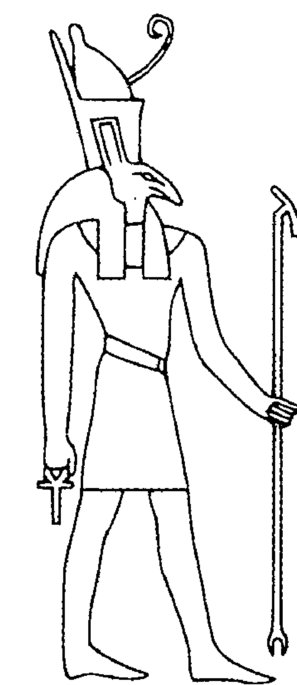

赛特

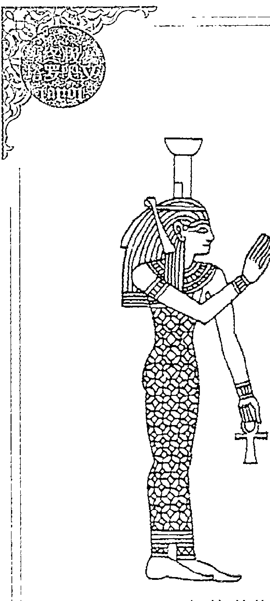

死者的守护神奈芙蒂斯（Nephthys），同时也是生育之神。“Nephthys”也是对一个家庭中最年长妇女的称呼。她可能曾经是巴特（Bat）或奈斯（Neith）的变形。

她是盖布与努特最小的女儿，同时也是赛特的妻子。她却灌醉奥西里斯并与之生下了阿努比斯。当赛特杀了奥西里斯时，她背弃丈夫赛特，与阿努比斯一起协助伊希斯使奥西里斯复活并照顾荷鲁斯。

她常与自己的姐妹伊希斯一同出现在艺术作品中。在埃及艺术作品中，她的头发看上去与裹尸布相似，头顶一只篮子或一座小房屋，有时是生有双翅的女性，有时则是风筝、猎鹰、隼或其他鸟类。

其他重要神祇：

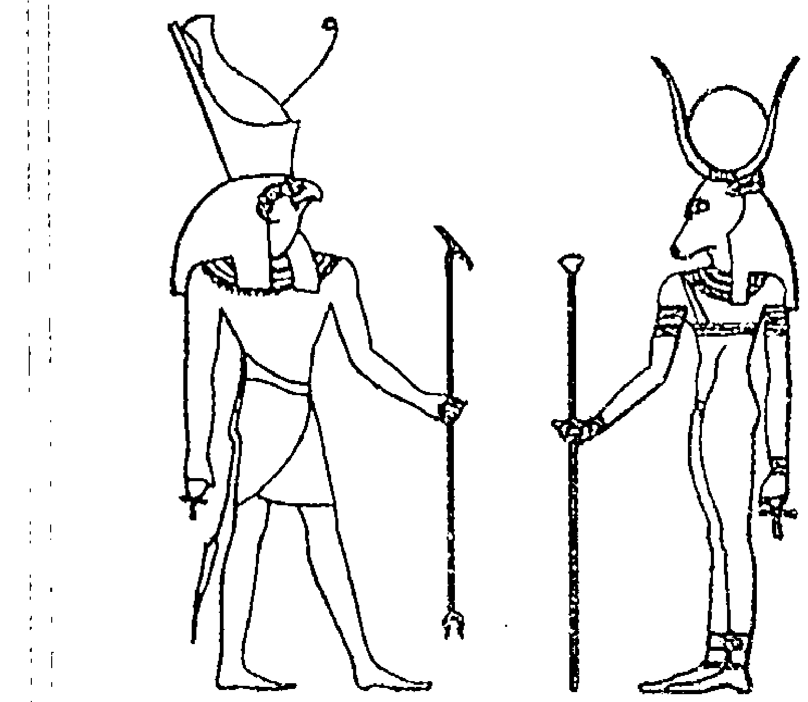

复仇之神荷鲁斯，奥西里斯与伊希斯的儿子，王权的守护者，外形为鹰。他的母亲从太阳神拉那里要来了太阳和月亮作为荷鲁斯的双眼。在与杀父仇人赛特争夺王位的斗争中，荷鲁斯被夺去了代表月亮的左眼，后来又在月神孔苏的帮助下夺回了左眼和王位。

荷鲁斯之妻哈托尔，是古埃及所有女神中最美的，经常幻化成牛，司爱情及丰饶。在某些地方，人们相信哈托尔是太阳神的眼睛，并认为她是荷鲁斯的母亲（等同于伊希斯）。

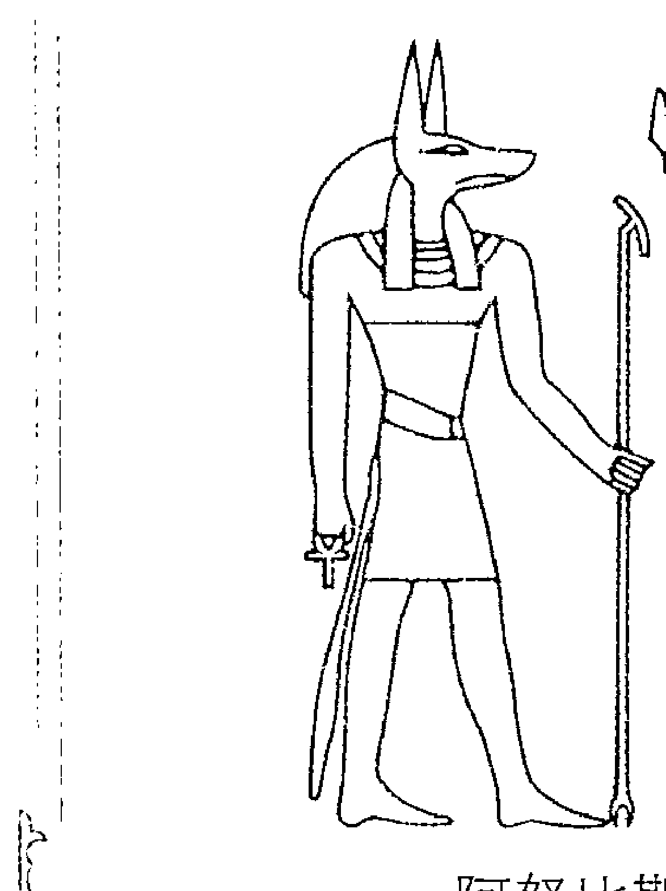

死神阿努比斯，护送灵魂通向另一个世界，有时也被看作冥界之神。他是奈芙蒂斯与奥西里斯的儿子，形象为一只胡狼或有着胡狼头的人。在《死亡之书》中，他为奥西里斯的尸体涂油，用伊希斯和奈芙蒂斯的魔法使他复活。

## 埃及神话中的神祇

蒂斯编织的亚麻布把他包裹起来，并把自己的手按在他的尸体上保护他。此后阿努比斯成了冥府的看门人和引路人，他会将死者的灵魂带到审判庭并将死者的心脏与玛特（Maat）的羽毛放在天平上对比。如果灵魂与羽毛一样轻，阿努比斯就带他去见奥西里斯，否则就将他喂给长着鳄鱼的头、狮子的上半身、河马的下半身的怪兽阿米特（Ammit）。

**正义、真理、秩序之神玛特**，托特的妻子，太阳神拉的女儿，名字暗示着真实及正义。她常常以配戴着羽毛（上刻有其名）的年轻女神形象出现，有的时候也仅仅以羽毛形式出现。在冥府执行审判时，阿努比斯将死者的心脏和她的羽毛一起放在天平的两边称重。

**智慧之神托特**，又译为透特或图特，负责传递文书和书记的工作。相传他是古埃及文字的发明者。早期外形为狒狒，后来外形逐渐演变成朱鹭头人身，一般他出现时被描绘成左手拿着书版，右手执笔书写的神明。他与希腊神话的赫耳墨斯（其在罗马神话中被称作墨丘利）以及传授亚当《拉结尔之书》的大天使拉结尔（Rasiel）类似，是管理一切科学与艺术成果的神。托特也是夜晚的图书管理员，负责保管“生命之屋里那些神秘的书籍”。这些书是埃及人智慧的结晶。据说其中有一本《托特之书》（*The Book of Thoth*）共42卷，是这位神自己口述而成的，里面的内容包罗万象，其中四卷是埃及人在占星学和天文学领域的智慧结晶，另外还有哲学和医学及有关宗教传统、宗教礼仪方面的记述。

**阿蒙与姆特之子、月亮与医药之神孔苏（Khonsu/Chons）**，有王室发辫，头顶月盘和新月。在某些地区，他被认为是太阳神拉的哥哥，被流放到遥远的地方守夜。在底比斯他与父亲阿蒙和母亲姆特被一起供奉为最高神祇，他曾帮助荷鲁斯夺回左眼。在古埃及曾流行一种根据死者通往阴间之路而设计的叫作“赛纳特（Senet）”的棋牌游戏，孔苏曾以他的光为赌注与托特进行赛纳特比赛，结果孔苏输了。因此他除了满月以外无法展现所有的光芒。

旅行者的守护神敏（Min/Amsu），亦司掌生产及收获，是道路和沙漠旅行者的守护神。在埃及神话中，他是男性化的极端表现，以男性生殖器、莴苣和公牛为象征，赋予男人男性能力。他还常常被描述成一个长胡子的男人形象，穿着和太阳神一样的服装。

爱及美的女神奎特（Qetesh），敏的妻子，是埃及神话中女性化的极端表现，通常被描绘为一美丽的裸女站或坐在狮子上，手上握着花和蛇。而且与一般的埃及人物雕画都以侧面出现不同，奎特通常以正面出现。

复仇女神、毁灭女神赛克麦特（Sekhmet），在孟斐斯被视为是布塔（Ptah）之妻。而在某些地区她被认为是太阳神拉的女儿和妻子，是由拉为了惩罚人们所犯的罪而用他自己眼里的火焰所创造的。她被派遣至人间进行杀戮。后来太阳神后悔，于是他在女神必经之路上洒满了酒水，女神在饮酒之后变得平静下来，变成了一个爱好和平的慈善女神贝斯特（Bast/Bastet），外形也变成了猫，喜欢舞蹈和歌声。贝斯特在夜间伸展着猫儿一样的娇媚身姿，露出月光般动人的目光，象征着月亮的温暖和女性魅力。她也是主管人间性爱的女神。赛克麦特代表着复仇和毁灭，贝斯特则代表家庭、幸福和快乐。她的双面形更象征着女人天使和魔鬼的两面性及潜在的诱惑。

工匠之神布塔（Ptah），在孟斐斯被奉为世界的创造神。以孟斐斯为中心的信仰认为布塔在世界还没诞生之前就已经存在了，他经由自己的思想和语言创造了世间的一切，包括其他的神祇。也有人认为布塔是在托特的辅助下创造世界和其他神祇的。除了作为国王与职工的守护神之外，他亦为孟斐斯的主神。通常以一具有胡子且戴着无边帽、握着凤凰头权杖和安卡十字（Ankh）的男木乃伊的形象出现。

圣甲虫凯布利（Khepri），经常出现在护身符及墓穴中，是太阳的象征。它在埃及文化中有着十分重要的地位，因为太阳的升起就像甲虫滚动着它的卵（或粪便），它代表了太阳在天空运行的推进器和太阳的重生。著名的“太阳神的纹章”（Amon's Emblem）上也刻有圣甲虫，象征着创造与再生之意。圣甲虫在球上产卵，又意味着多产、生命。

黑暗与混乱之神阿贝普，是伊希斯用太阳神拉的口水和泥土创造的一条巨蛇，传说曾经咬伤太阳神，是拉最大的敌人。相传拉每天夜晚沉睡的时候，会在众神的护卫下乘舟经过冥界，拉的敌人们则会想方设法阻止这艘船，阿贝普是其中最强大的一个。众神击败阿贝普，第二天太阳会升起带来光明；而如果众神失败，船被阿贝普吞食，则会出现暴风雨和日食。阿贝普企图让宇宙回到最初的混沌与黑暗，他是创造秩序的敌对者，是混沌、死亡的象征。

鳄鱼神索贝克（Sobek），赛特与奈芙蒂斯生下的畸形之子，是一位长着鳄鱼头的神祇。他的身体类似人，但是全身覆盖着坚硬密实的鳞片，身后还拖着一只粗大沉重的鳄鱼尾巴，他的手脚也是鳄鱼脚爪的模样。有时他也会直接以一条鳄鱼的形态现身。他是鳄鱼与法老的守护神。据说他具有四倍的神性，同时具有拉的火、舒的风、盖布的土和奥西里斯的水这四种元素。在《死亡之书》中，它保护刚出生的荷鲁斯，并帮助伊希斯及奈芙蒂斯打败了赛特。后来为了感谢索贝克帮助荷鲁斯夺回王位，人们建造了库姆翁布神庙（Temple of Kom Ombo），将索贝克与荷鲁斯供奉在一起。

## 塔罗牌与埃及神祇对照表

| 十一张人物牌 | | 四张主体牌 | | 三张动物牌 | | 四张精神牌 | |
|---|---|---|---|---|---|---|---|
| 愚者 | Shu | 太阳 | Khepri | 战车 | Sobek | 力量 | Qetesh |
| 魔术师 | Thoth | 月亮 | khonsu | 命运之轮 | Hu | 正义 | Maat |
| 女教皇 | Mut | 星星 | Nut | 塔 | Apep | 节制 | Sekhmet |
| 女皇 | Hathor | 世界 | Ptah | | | 审判 | Osiris |
| 皇帝 | Horus | | | | | | |
| 教皇 | Geb | | | | | | |
| 恋人 | Tefnut | | | | | | |
| 隐士 | Atum | | | | | | |
| 倒吊人 | Nephthys | | | | | | |
| 死神 | Anubis | | | | | | |
| 恶魔 | Seth | | | | | | |

埃及神话为塔罗牌的牌义提供了原型，并为塔罗牌的图画提供了丰富的象征符号。了解埃及神话，可以加深对塔罗的理解，例如看到韦特牌“命运之轮”中的狮身人面、蛇和狗头人，自然会想到命运的宣读者胡、毁灭者阿贝普和亡灵引导者阿努比斯，也就不难想到命运的轮回性、变动性、从死亡到复生到死亡的循环过程；而看到透特塔罗牌的“欲望”（相当于“力量”），就不难想到奎特，以及绵延的女性之力。如果了解埃及神话，在其他牌中遇见类似的埃及元素时就可以很顺利地解读，同时还可以扩展自己解牌的思路。

埃及神话还对塔罗的理论以及世界其他文化产生了很多影响。不同位格的太阳神和月神可以对应卡巴拉生命之树的不同层次，从而将塔罗牌的含义细化并区别开来。与其他神话先有天地后有风雨不同，埃及神话中是无形的风和雨孕育了有形的天和地，引领了唯心论。另外，复仇女神赛克麦特最终变成了慈善女神贝斯特，似乎也在宣示着对立事物之间是可以转化的，神（世界）也并非一成不变的（永恒）。

埃及神话中的伊希斯还为基督教与天主教圣母马利亚的出现奠定了基础，荷鲁斯的设定也与基督教的三位一体有着莫大的渊源关系。

## 塔罗汲取之希腊神话

希腊文化和北欧文化是西方文明的核心，也是塔罗系统的中流砥柱。塔罗牌从牌面牌义到牌阵仪式无不涉及希腊和北欧神话，并深受基督教、犹太教、诺斯替教等西方宗教的影响。几乎每张牌都可以在希腊神话中找到对应的故事，例如“恋人”和“审判”分别出自基督教“出伊甸园”和“末日审判”两个典故。

如果说埃及神话之于塔罗的作用就像脊椎之于动物，是深层的、起源的、根本的支撑，那么希腊文化和北欧文化之于塔罗，更像血肉，是丰富、充实、补充和完善。塔罗兴起于欧洲，发展于欧洲，完善于欧洲，血肉里烙着欧洲文化的痕迹。

希腊文化源于古老的爱琴文明，是西方文明的始祖。与埃及神话不同，希腊神话包括神的故事和英雄传说两个部分。神的故事围绕着以宙斯为中心的奥林匹斯众神，涉及宇宙和人类的起源、神的产生及其谱系等诸多内容。

在希腊神话中，一切皆从混沌（Chaos）开始……

## 上古时代

宇宙之初，只有混沌之神卡奥斯（Khaos / Chaos）。它是一个无边无际、一无所有的空间。随后诞生了大地母神盖娅（Gaia）、地狱深渊神塔尔塔罗斯（Tartarus）、黑暗神厄瑞波斯（Erebus）、黑夜女神尼克斯（Nyx）和爱神厄洛斯（Eros）。

世界由此开始。

大地女神、大地的本体和卡奥斯之女盖娅生育了天空乌拉诺斯（Ouranos）和海洋蓬托斯（Pontus）。接着她又和她的两位儿子生了许多神：和乌拉诺斯生了提坦（Titans）神族，分别代表世界最初的事物（日、月、天、时间、正义、记忆等），和蓬托斯生了五个孩子，分别代表不同的海。所以盖娅可以称得上是众神之母，是奥林匹斯诸神的始祖。塔罗牌“世界”与“Earth”相关，即土元素和大地，韦特塔罗牌“世界”中的女神就是盖娅。

卡奥斯之子、地狱深渊之神塔尔塔罗斯作为深渊的本体出生在大地女神盖娅之后，他在盖娅身体之下。后来塔尔塔罗斯和盖娅生育了盖娅最小的儿子，也就是著名的怪物提丰（Typhon）。塔尔塔罗斯是一个无形的深渊，位于世界的最底端，后来他成了关押妖魔、怪物以及一些受罚的神祇的地方。宙斯就把一些提坦神关押在塔尔塔罗斯。

黑暗神、黑暗的化身与本体、卡奥斯之子厄瑞波斯在塔尔塔罗斯之后，诞生在塔尔塔罗斯（冥界）与盖娅（大地）身体之间。

黑夜女神、黑夜的化身和本体、卡奥斯之女尼克斯在厄瑞波斯之后诞生在大地（盖娅）之上，她是一位古老而强大的神祇，她与厄瑞波斯生了以太之神埃忒耳（Aether）、白昼女神赫墨拉（Hemera）和冥河的渡神卡戎（Charon）。她还独自一人生育了许多神祇。

诺斯塔罗牌“世界”中的黑暗正是厄瑞波斯，其上流动的是以太，其下掩盖的是塔尔塔罗斯。

卡奥斯之子爱神厄洛斯作为爱欲、生育及性欲的化身诞生在黑暗和黑夜之后，他促进了诸神的相爱和生育，他是一切爱欲的化身（还有一些说法认为他是罗马的丘比特，是维纳斯的儿子）。

在卡奥斯之后诞生的五大创世神是这个世界的本身。不是他们创造了这个世界，而是他们的诞生就是这个世界自我形成的过程，他们是第一代神祇。随后，他们的子嗣，即第二代神祇，以盖娅的长子天神乌拉诺斯为王统治了这个世界。

盖娅又与乌拉诺斯结合生下了六男六女共十二个提坦神。在被盖娅创造出来后，乌拉诺斯就一直躺在生下他的大地身上，他们完全叠合，每一寸土地都粘连着天空。但原始的乌拉诺斯除了性交之外什么都不做，他不停地在盖娅的怀抱中发泄淫威。为了防止被子女夺取众神之王的地位，乌拉诺斯把他和盖娅的孩子全都困在盖娅体内。直到盖娅无法忍受，与最小的儿子、之后提坦之一、天空之神克洛诺斯（Cronus）联手，用弯刀割去了乌拉诺斯的生殖器，他才轰然与盖娅分离，从此永远固定在世界的最高处，再也不能动弹。克洛诺斯随手将乌拉诺斯的生殖器扔了出去，掉进了爱琴海，爱与美之女神阿佛洛狄忒因此从掀起的海浪泡沫中诞生了。

克洛诺斯从母亲盖娅的体内救出了另外十一位兄弟姐妹，并在他们的拥戴下成了第二代众神之王。但乌拉诺斯对克洛诺斯施加了一个诅咒：克洛诺斯也终将被自己的孩子推翻。

## 提坦时代

推翻了乌拉诺斯之后，克洛诺斯带领着十二提坦统治了世界，也拉起了黄金时代的帷幕。

十二提坦分别为俄刻阿洛斯（Oceanus）、科俄斯（Coeus）、克利俄斯（Crius）、伊阿珀托斯（Iapetus）、福柏（Phoebe）、特提斯（Thethys）、克洛诺斯（Kronos）、瑞亚（Rhea）、忒弥斯（Themis）、莫涅莫绪涅（Mnemosyne）、赫披里昂（Hyperion）、忒伊亚（Theia）。

他们各自繁育了自己的后代，以提坦神族为核心，进一步丰富了世界。

初代太阳神赫披里昂与璀璨及视力女神忒伊亚结合生育了那位著名的驾驶着太阳车的太阳神赫里阿斯（Helius）。赫披里昂代表原始的太阳本体，而赫里阿斯则是代表衍生出的太阳之力量。赫里阿斯每日乘四马金车载着太阳在天空中奔驰，从东到西，朝升暮落，用光明普照世界。韦特塔罗牌“太阳”中的白马即他的坐骑之一。

因为赫里阿斯每天驾驶太阳车从天空飞过，所以他也是明知、真相与信息的象征。当珀耳塞福涅被冥王掳走时，正是赫里阿斯告诉了德墨忒尔（Demeter）。当爱与美之女神阿佛洛狄忒与战神阿瑞斯私通时，也是他告诉了赫淮斯托斯（Hephaestus）。

大部分塔罗牌的“太阳”中都会出现小男孩、战车或马，其中的男孩就是赫里阿斯的一种形态，或者是赫里阿斯与海洋女神克吕墨涅（Clymene）的儿子法厄同。法厄同曾对人夸耀自己是太阳神的儿子，但是别人不相信，于是他去向父亲赫里阿斯请求驾驶他的太阳车一天，从东方天边日出处到西方日落处。赫里阿斯知道自己的儿子没有这个能力，担心儿子闯祸，便没有同意。法厄同后来偷出了太阳车，在飞行中却慌乱失去了对驾车马匹的控制。结果太阳车先是升得太高，大地骤然变冷，然后又突然降低，烧焦了地上的草木，非洲的大片地方变为沙漠，把当地居民的皮肤烧黑。最后，宙斯不得不亲自动手，用闪电把法厄同击死。

后来赫里阿斯与艺术之神阿波罗（Apollo）被混淆。他的许多事迹也与阿波罗混淆在一起，包括驾驶太阳车、捉奸事件、坠车事件。

赫披里昂与忒伊亚还生育了月亮女神塞勒涅（Selene）与黎明女神厄俄斯（Eos）。

塞勒涅的形象为长有双翼身穿长袍的美女，头饰月轮，两匹白色的天马拉着她的银车驶过夜空，为世界洒下清冷光辉。这个形象经常在“女教皇”中出现。塞勒涅素以多情闻名，她曾与赫里阿斯、宙斯生育过多个孩子，连牧神潘也与她有过一段风流韵事。潘曾送过塞勒涅许多礼品，甚至还把自己装扮成小羊，企图诱奸塞勒涅。不过塞勒涅和恩底弥翁（Endymion）倒是有一段浪漫的故事。

小亚细亚的拉塔莫斯山附近，有一个外貌俊美、风度翩翩的年轻牧羊人叫作恩底弥翁。他住在一座幽静明媚的山谷中，过着无忧无虑的日子。每天带着羊群到茂盛的草地上吃草时，他就躺在草地上沉睡，丝毫不受人世间悲伤与忧虑的侵扰。直到一个皓月当空的夜晚，当塞勒涅驾着马车穿越天空时，无意中看到这位正在静谧的山谷中睡觉的美少年，立刻被他的美貌所吸引，对他充满爱慕之情。她从月亮马车中滑翔而下，匆忙而深情地偷吻了一下他的脸，当熟睡中的恩底弥翁睁开双眼看到仙女时，也有些神魂颠倒。但眼前的一切很快消失，以至于他误认为这是一场梦。于是从那以后，每天夜间塞勒涅都会从空中飘下，偷吻这个熟睡中的牧羊人。然而凡人是会衰老和死亡的，于是塞勒涅打算请求宙斯让恩底弥翁永葆青春，但宙斯不可能赐予凡人永生，于是她请求让恩底弥翁永远沉睡，这样他就既不会死去也不会离开她了。这个故事的另一些版本里说，或是因为爱慕女神或是因为宙斯逼迫，总之恩底弥翁自己作出了沉睡的决定。

与哥哥赫里阿斯的状况类似，塞勒涅也被与狩猎女神阿耳忒弥斯相混淆，也出现了阿耳忒弥斯向宙斯索要月神一职的托词。赫里阿斯、塞勒涅兄妹与阿波罗、阿耳忒弥斯兄妹混淆后渐渐被后者吸收、同化。不过不同于太阳，月亮的变化性致使多位月神可以同时存在，古希腊人便以月的不同形态来区分天界的三位月神，通常福柏代表新月，塞勒涅代表满月，阿耳忒弥斯代表弯月。

黎明女神厄俄斯有着玫瑰般的手指、鲜艳的衣装。她驾驶着由双翼天马牵引的金车，用曙光遍染黎明的天空。每天她都亲自用她犹如晨雾一般的手为赫里阿斯掀开东边的天门，让他乘太阳车进来，开始新的一天。传说，她每到一处，散发着清香的花瓣和玫瑰香的水珠便坠落在地上成为露水。与姐妹塞勒涅一样，她也以风流韵事而闻名，与宙斯等许多神祇生有众多的子女。而她与战神阿瑞斯的恋情遭到了阿佛洛狄忒的嫉妒，厄俄斯被诅咒变成了迷恋凡人的花痴，从此她陷入对凡人无休无止的情欲当中。后来厄俄斯爱上了人间的美少年提托诺斯（Tithonus），但苦于凡人无法像她一样永生不死，于是她也像塞勒涅一样去恳求宙斯让提托诺斯永远不死。在她再三恳求下，宙斯终于答应了。但是厄俄斯不知道，宙斯答应的仅仅是不会死，却没有答应不会老。于是后来她只能看着提托诺斯不断地衰弱老去，最终竟缩成一只蟋蟀。无可奈何的厄俄斯唯有含着泪水把早就失去了说话能力的提托诺斯关在一只蟋蟀笼子里面，每天与蟋蟀的唧唧鸣声相伴。

塞勒涅和厄俄斯这对姐妹的爱情故事很有代表性。塔罗牌中也有类似的画面，故事告示世人爱情中并没有永恒与完美存在，凡事都是有代价的。

赫披里昂、忒伊亚与他们的孩子可谓是光明家族。

而暗与疑问之神科俄斯、月亮女神福柏以及他们的女儿暗夜女神勒托（Leto）和星夜女神阿斯忒瑞亚（Asteria）则组成了黑暗家族。

阿斯忒瑞亚、勒托和尼克斯三位都是夜之女神，不同的是尼克斯是夜之本体的化身，而勒托与阿斯忒里亚姐妹乃是夜的两种不同体现：勒托是无星无月的黑暗之夜，阿斯忒瑞亚则对应星光璀璨之夜。

勒托经常头戴面纱，不以真面目示人——“黑暗掩盖了勒托”。她与宙斯生育了阿波罗和阿耳忒弥斯，也因此遭到了嫉妒心最强的天后赫拉（Hera）的迫害。在勒托刚刚怀孕的时候，赫拉就派出了巨蛇皮托（Python）追杀勒托。勒托为逃避这种迫害，不得不到处流浪。所有神祇都惧怕赫拉的权势而拒绝为勒托提供庇护，最后她的姐妹阿斯忒瑞亚变化出了提洛岛（Delos），收留了这位女神。勒托在提洛岛落脚后，就在岛上的一棵棕榈树下分娩，她先生下了阿耳忒弥斯，然后，在阿耳忒弥斯的帮助下生出了阿波罗。这位暗夜女神所生育的儿女后来取代她的表亲成了太阳神和月亮女神。

河流及海洋之神俄刻阿诺斯与他的妻子沧海女神特提斯，生育了所有的海洋和河流，组成了海之家族。其子女中最著名的莫过于克吕墨涅，她嫁给了她的叔叔——十二提坦之一，灵魂和死亡之神伊阿珀托斯（Iapetus）。克吕墨涅和伊阿珀托斯生育了厄毗米修斯（Epimetheus）和墨诺提俄斯（Menoetius），以及因反叛宙斯失败而被罚顶天的亚特拉斯（Atlas）和创造人类并为人类偷取火种的普罗米修斯（Prometheus）。普罗米修斯经常手提火种出现在“隐士”中。

克吕墨涅还跟其他许多神都有过亲密关系，并生育了不少子女。最著名的当属她与太阳之神赫里阿斯生下了法厄同。在法厄同死后，伤心过度的克吕墨涅变成了向日葵。

十二提坦之一的莫涅莫绪涅是记忆女神，也是诗歌三女神（Musa）之一。她是宙斯的情人，与宙斯生育了九位缪斯（艺术女神）。

十二提坦中的另一位女神忒弥斯也是宙斯的情人，她是水之女神，秩序和正义女神。她与宙斯生育了时序三女神和命运三女神（Moirai）。

在罗马神话中，正义女神有确定的身份朱斯提提亚（Justitia），但在希腊神话中关于正义女神的身份，尤其是升上天空成为处女座以及出现在许多塔罗牌“正义”中的女神，一直存有争议。

忒弥斯是秩序和正义女神，帮助宙斯维持奥林匹斯山的秩序，监管仪式的执行。在古希腊的雕塑中，她的造型是一位表情严肃的妇女，手持一台天平。但她更重要的才能在于她的智慧以及对未来的预知，她综合了“正义”和“预言”等元素，所以在神话中出现的意义在于作为正义与命运之母，生育了时序女神和命运女神。

时序三女神分别为秩序女神欧诺弥亚（Eunomia）、和平女神厄瑞涅（Eirene）和公正女神狄刻（Dike）。与法律关系密切的狄刻被认为是正义女神，据说她掌管着白昼和黑夜大门的钥匙，监视人间的生活，在灵魂循环时主持正义。她经常手持利剑追逐罪犯，刺杀亵渎神灵者，因此往往被描绘成手持宝剑或棍棒、令人望而生畏的妇女形象。狄刻并不能完全代表正义女神。

在希腊神话中另一位经常出现的正义女神是阿斯忒赖亚（Astraea），可以确定的是，她是宙斯的女儿，但是关于她的母亲有厄俄斯和忒弥斯两种说法，笔者比较倾向于阿斯忒赖亚是宙斯与忒弥斯的女儿。甚至，我们可以将时序三女神统合为阿斯忒赖亚，因为她们一直在被混淆着使用，很多事迹已经难以辨认。事实上（主流）也一直将阿斯忒赖亚对应（约等于）罗马神话中的朱斯提提亚，作为完整的正义女神。至于狄刻以及她的两个姐妹，我们可以参考阿波罗和赫里阿斯，把她们融入阿斯忒赖亚，作为阿斯忒赖亚的其他面相。

摩伊拉是希腊神话中命运三女神的总称。这三位掌管万物命运的女神分别是克罗托（Clotho）、拉切西斯（Lachésis）和阿特洛波斯（Atropos）。年幼的克罗托负责未来和纺织生命之线，拉切西斯负责现在和检查生命之线，年长的阿特洛波斯负责过去和切断生命之线。世间万物都不能逃出命运的掌心，即使是天父宙斯也不能违抗她们的安排。诺斯塔罗牌的“命运之轮”中隐匿在巨轮之后的正是这三位女神。

十二提坦中最年幼的天空与空间之神克洛诺斯作为第二任众神之王，与他的妻子时光和风霜女神瑞亚生育了赫斯提（Hestia）、德墨忒尔（Demeter）、赫拉（Hera）、哈得斯（Hades）、波塞冬（Poseidon）以及宙斯（Zeus）。

推翻自己的父亲乌拉诺斯而登上王座的克洛诺斯唯恐自己也会被子女取而代之，所以他也同自己的父亲一样，每当妻子瑞亚生下一子，他便会立即将之吞入腹中。直到第六个孩子即将降生，非常伤心的瑞亚才下定决心要保全此子。瑞亚以石头替换襁褓中的宙斯，蒙骗克洛诺斯吞了下去，暗中则把宙斯送往克里特岛（Crete），交由三个女神抚养。这才保全了宙斯，但也因此引发了时代更替的“提坦之战”。

宙斯在克里特岛长大后，为了推翻父亲的统治，宙斯去找来了俄刻阿诺斯和特提斯的三千女儿之一、拥有无比智慧和预知能力的提坦女神墨提斯（Metis），向她求教击败克洛诺斯的方法。墨提斯为宙斯配了一小瓶具有催眠和催吐作用的药水，并且教宙斯扮做倒酒的小厮，寻求瑞亚的帮助以接近嗜酒的克洛诺斯。聪明伶俐的宙斯很快便接近了克洛诺斯，并且得到了他的欢心和信任。终于有一天，宙斯将药水混入酒中，服侍克洛诺斯喝下。很快，克洛诺斯便昏睡不醒，并不断呕吐，将吃进肚中的已长大成人的五个孩子都吐了出来。随后，宙斯与五个兄弟姐妹一起废黜了父亲的王位，并把父亲克洛诺斯逐出了王宫。

宙斯的兄弟姐妹们感激宙斯的救命之恩，一致拥立宙斯为新的王。宙斯就在奥林匹斯山建立了新的神殿，重新分配权力。他将海洋交给波塞冬管理，地府则交给哈得斯，自己留下了天空和大地。

宙斯重新划分权力，重用其兄弟姐妹，却无视其他神祇，因此触怒了第二代提坦神。于是伊阿珀托斯那个有着巨大身躯的儿子亚特拉斯联合被废黜的克洛诺斯和其他不甘心失败的提坦们，打算攻打奥林匹斯山夺回失去的权力。但伊阿珀托斯另外两个儿子普罗米修斯和厄毗米修斯却没有参加这次政变。

刚刚从克洛诺斯手里夺过权力的奥林匹斯诸神，完全抵挡不住提坦们强大的攻势，眼看就要全线溃败时，宙斯从塔尔塔罗斯地狱放出了对克洛诺斯怀有深仇大恨的独眼巨人和百臂巨人们。独眼巨人们还帮宙斯打造了一柄神器——可以发射雷霆和闪电的权杖。获得神器和巨人族帮助的宙斯很快便扭转了战局。提坦们被雷霆霹雳击打得四处逃窜，结果都被百臂巨人捉住并关进了塔尔塔罗斯地狱，提坦的首领亚特拉斯则被惩罚去支撑天地。

大地之母盖娅不满自己的儿子被宙斯推翻，与地狱之神塔尔塔罗斯生育了一个强大而恐怖的怪物提丰，让他去为提坦们复仇。提丰是一条巨龙，有百个龙头，每张嘴中，暗色的蛇信都不时地伸缩吞吐，百双骇人的眼里也不时地喷出烈焰。它的吼声也变化多端：有时做人言，有时如牛吼、狮啸、犬吠，声若奔雷，响彻四极。提丰浑身披着坚硬的鳞甲，嘴中喷出灼热剧毒的火焰，还未到奥林匹斯山，众神已被吓得到处逃窜。只有宙斯和雅典娜留了下来，勇敢地面对这个怪物。最终宙斯与雅典娜击败巨龙，把提丰也关进了塔尔塔罗斯地狱。

至此提坦神族的时代结束，奥林匹斯神族的时代到来。

## 奥林匹斯时代

宙斯与他的子女以及兄弟姐妹们在奥林匹斯山开创了白银时代。

起初，宙斯为了推翻自己的父亲，便追求智慧女神墨提斯以得到她的帮助。但墨提斯不停地变幻身份以逃避宙斯的追求，可是最后还是被宙斯的毅力所打动并嫁给了他，成了宙斯第一个妻子，并帮助宙斯推翻了克洛诺斯。

然而大地之母盖娅曾预言，宙斯与墨提斯的第一个孩子将是个女孩，并且她的智慧和力量将可以与宙斯匹敌；而第二个孩子将会是男孩，并且会重演他父亲与祖父的经历，推翻自己的父亲并夺走王位。宙斯对于这个预言十分忌讳，所以当墨提斯怀孕的时候，他花言巧语骗过墨提斯，趁她不留神的时候将其变成一只苍蝇吞了下去。于是肚子里的墨提斯成了宙斯智谋的来源。

宙斯在吞下墨提斯后，突然开始剧烈地头痛，这疼痛让宙斯难以忍受甚至号啕大叫，最后火与工匠之神赫淮斯托斯用巨斧劈开了宙斯的头颅，然后身穿银甲、手持金矛全副武装的雅典娜从宙斯的头里蹦了出来。宙斯的头痛这才停止，他没能阻止雅典娜的诞生。

雅典娜吸收了父亲的力量与母亲的智慧，是智慧与力量的完美结合，所以后来她成了智慧女神与女战神。她应验了盖娅的预言，拥有足以跟宙斯匹敌的力量。

“皇帝”通常会被认为是宙斯的化身，并且与白羊座相关，所以在占卜健康问题的时候往往会代表着头痛等症状。

宙斯后来又娶了秩序女神忒弥斯做第二任妻子。忒弥斯能够预知未来，这一点甚至连号称万能的宙斯都无法做到。后来她与宙斯生下了命运三女神，这三姐妹掌管了包括宙斯与诸神在内的世间万物的命运。忒弥斯还是正义的象征，正是由于她的指点，被缚的普罗米修斯才能重获自由。

此后宙斯又相继娶了海洋女神欧吕诺墨、农业女神德墨忒尔与记忆女神莫涅莫绪涅，先后生育了美惠三女神、珀耳塞福涅以及缪斯九女神。

珀耳塞福涅经常被描绘成身穿长袍、抱着收割的稻穗或者麦穗、庄重微笑的女性，这个形象经常出现在“女皇”中。德墨忒尔非常疼爱这个女儿，赫耳墨斯、阿瑞斯、阿波罗和赫淮斯托斯都曾向她提亲，然而都被德墨忒尔拒绝了。她担心失去女儿，想要把女儿一直留在身边，于是她把珀耳塞福涅藏在了深山里，不让她与其他神接触。后来珀耳塞福涅在山里游玩的时候被冥王变出的水仙花吸引，然后就被冥王强掳到了冥界。身为农业女神的德墨忒尔在失去女儿后十分悲伤，一直在四处寻找女儿，结果万物停止了生长，大地一片荒芜。宙斯得知原因后，只得派赫耳墨斯去冥界接回珀耳塞福涅。然而在赫耳墨斯到达之前，珀耳塞福涅在冥王的哄骗下吃了六颗石榴籽，吃了冥界的食物就等于珀耳塞福涅已经是冥界的人了，即使宙斯也没有理由和办法强迫冥王交出珀耳塞福涅了。最后赫耳墨斯与冥王谈判，各自让步，每年中有六个月可以让珀耳塞福涅回到地上陪母亲。于是在珀耳塞福涅在冥界的六个月，就是地上万物凋零的秋冬两季。这个故事与“女教皇”和“女皇”相关。

后来宙斯又与暗夜女神勒托生育了阿耳忒弥斯和阿波罗。

宙斯娶的第七位妻子，也是唯一的一位正式妻子，就是著名的醋坛子天后赫拉。前面六位虽然没有明媒正娶，但是她们比其他情妇的地位要高，且没有配偶，所以也可以把她们算作宙斯的妻或妾。宙斯与赫拉生育了两男两女共四个孩子，分别是战神阿瑞斯、火与工匠之神赫淮斯托斯、助产女神艾勒提亚（Eileithyia）和青春女神赫伯（Hebe）。

战神阿瑞斯矫健俊美、勇猛无比，纯粹论武力的话，无人能及。但是他性格乖张暴戾、嗜杀成性、好战不疲，又有勇无谋，所以无论是在奥林匹斯还是在人间，都非常不受欢迎。同为战神的他，却屡次败给雅典娜。“皇帝”和“战车”均与阿瑞斯相关。

赫淮斯托斯因长相丑陋和天生跛足而被赫拉抛弃，是大洋深处的特提斯和欧律诺墨收养了他。赫淮斯托斯长大后回到奥林匹斯山，并向赫拉献上一座制作精美的王座。然而赫拉坐上后被王座束缚住而起不来了，包括宙斯在内的众神也没有任何办法打开王座上的机关，最后宙斯和赫拉只得向赫淮斯托斯承诺可以答应他任何要求。赫淮斯托斯要求他们承认自己是他们的儿子，而且还要娶众神垂涎的阿佛洛狄忒为妻。宙斯此前追求阿佛洛狄忒不成，一直心有怨恨，这次又只有赫淮斯托斯才能救赫拉，所以很痛快地答应了他的要求。赫淮斯托斯因此回到了奥林匹斯山并娶了最美的女神为妻。

赫淮斯托斯虽然长相丑陋，但是因为性格温和又乐于助人，而且手艺精湛的他还为众神打造了许多神兵利器，所以在众神之中颇受欢迎。相传他以火山为炉，在独眼巨人的帮助下，先后为宙斯和雅典娜打造了两面埃癸斯神盾。宙斯的埃癸斯是以山羊皮为原料，经过复杂的工艺加魔法后打造而成的，即使是宙斯的雷霆也不能伤它分毫。挥动这面神盾可以产生风暴，把它放在天空，天就会变得阴暗，拿下来，天就会放晴。雅典娜的埃癸斯则是以曾给宙斯喂奶的母山羊（Amalthea）的皮毛为原料，在四个角落加上恐惧、战斗、凶暴、追踪，中央镶有美杜莎的头，使得任何人看到这面神盾都会被石化。

赫淮斯托斯的妻子阿佛洛狄忒是爱与美之女神。她深爱着阿瑞斯，并和阿瑞斯生育了小爱神厄洛斯。不过，她已经被迫嫁给了赫淮斯托斯，只能瞒着赫淮斯托斯与阿瑞斯偷情。但是有一次她和阿瑞斯偷情时被太阳神发现并告诉了赫淮斯托斯。这位工匠之神非常愤怒，于是在床上做了一个机关，将赤裸的阿佛洛狄忒和阿瑞斯用一张巨大的铁网罩住，放在奥林匹斯山上“展览”。阿佛洛狄忒和阿瑞斯在众神面前出了大丑。不过这似乎并没有结束他们两个之间的关系。

阿佛洛狄忒是金苹果事件的主角之一，正是这一事件引发希腊神话中最著名的特洛伊战争。据说人类英雄珀琉斯和海洋女神忒提斯的婚礼，众神均受邀参加，唯有纠纷女神厄里斯（Eris）没有受到邀请。她十分生气，作为报复，留下了一只金苹果，上面写着：“送给最美丽的女神”。为了这个金苹果，阿佛洛狄忒、雅典娜和赫拉争吵了起来，并让主神宙斯来评判她们三个中谁更漂亮。宙斯让阿波罗来评判，结果，为难的阿波罗把这个困难的任务交给了一个凡人——特洛伊的小王子帕里斯（Paris）。三位女神纷纷贿赂帕里斯，赫拉承诺给帕里斯至高无上的权力，雅典娜允诺给帕里斯足以战胜一切困难的智慧与力量，阿佛洛狄忒则允诺给帕里斯人间最美的女子。帕里斯认为他已经拥有了权力与力量，而且他也觉得阿佛洛狄忒是最美的，于是，他把苹果给了阿佛洛狄忒。雅典娜和赫拉十分恼怒，扬言要报复整个特洛伊。而阿佛洛狄忒则帮助帕里斯从斯巴达拐走了美丽的王后海伦，结果引发了长达十年的特洛伊战争，宙斯、波塞冬、雅典娜以及阿瑞斯等众神都直接或间接地参与了这场战争。

在罗马，阿佛洛狄忒和当地丰产及植物女神维纳斯（Venus）融合，成为丰收和爱情女神，所以她也与“女皇”牌有关。

宙斯还与他的情人风雨女神迈亚以及忒拜公主赛墨涅分别生育了神使赫耳墨斯（Hermes）和酒神狄俄尼索斯（Dionysus）。

赫耳墨斯脚生双翼，行动敏捷，是为天界众神传令的信使，后来又成了旅人、商人和盗贼的保护神。他经常化为凡人下界帮助受他庇护的人们。他也是最聪明和最狡猾的神，经常出现在“魔术师”中。

酒与狂欢之神狄俄尼索斯是唯一有凡人血统的正式神祇。他的母亲在怀着他的时候被赫拉设计陷害而死，宙斯把未成形的他缝在自己的大腿里抚育成人。成年后的狄俄尼索斯又被赫拉陷害变得疯疯癫癫，到处流浪。他发明了葡萄酒，并推广了葡萄的种植。他本身具有双重性格，正像酒一样，他能给人带来欢乐和迷醉，但同时又残忍、易怒。有些时候也可以把他和“愚者”等同。

在奥林匹斯时代十二个最重要的神祇合称“奥林匹斯十二主神”，他们全部是宙斯的兄弟姐妹或儿女。较早的说法是，十二主神为宙斯的兄弟姐妹五人，即宙斯、波塞冬、德墨忒尔、赫拉、赫斯提亚和宙斯的儿女七人，即雅典娜、阿瑞斯、阿佛洛狄忒、阿波罗、阿耳忒弥斯、赫淮斯托斯、赫耳墨斯（据古希腊吟游诗人荷马所言，阿佛洛狄忒是宙斯与俄刻阿诺斯和特提斯的女儿狄俄涅（Dione）所生。笔者比较倾向阿佛洛狄忒是乌拉诺斯之女的说法，但此处为了方便统计，暂将阿佛洛狄忒当作宙斯之女）。

但比较流行的说法是：掌管万民家事家灶的火焰女神赫斯提为了与凡人一起生活而把她的主神位置让给了酒神狄俄尼索斯；农业女神德墨忒尔有半年的时间无心主事，所以把主神位置让给了冥王哈得斯。

所以，十二主神是宙斯的兄弟姐妹四人，即宙斯、波塞冬、哈得斯、赫拉，和宙斯的儿女八人，即雅典娜、阿瑞斯、阿佛洛狄忒、阿波罗、阿耳忒弥斯、赫淮斯托斯、赫耳墨斯、狄俄尼索斯。

在提坦之战中，自由丰足的黄金时代结束，第一代人类也被殃及而毁灭了。当宙斯成了众神之王后，奥林匹斯众神（主要是珀耳塞福涅）又重新创造了完全不同于第一代人类的新人类，这个时代被称作白银时代。但是这个时代的人类骄横放纵，没多久就被白橡树三神女墨利埃（Meliae，天神乌拉诺斯的精血落在地神盖娅身上后盖娅所生）的后代所取代，开启了残暴血腥的青铜时代。

青铜时代人类的行为惹怒了奥林匹斯众神，最后宙斯用一场大洪水清洗了世界。宙斯和奥林匹斯众神对人类失望了，决心不再创造具有灵魂的、能够主宰凡间世界的高级生物。

可是后来普罗米修斯用水和泥土按照众神的模样塑造了人类，他又从动物的灵魂中提取了善与恶两种性格封进人的胸膛里，还请求自己的好友智慧女神雅典娜朝具有一半灵魂的泥人吹起了神气，使“人类”获得了灵性。

可是普罗米修斯所创造的人类虽然具有神的样子和灵性，却不具有神力。人类没有利爪、尖牙，在大地上无法获取食物，也没有如风的速度和厚重的毛皮，很容易就被食肉动物猎取。于是普罗米修斯从火与工匠之神赫淮斯托斯那里偷来了火与工具，交给了人类。从此人类不但学会了使用火，还可以锻造工具和武器。至此，英雄时代的帷幕正式被拉开了。

人间出现了诸多伟大的英雄：大力士赫拉克勒斯（Heracles）、取得金羊毛的伊阿宋（Easun）、解开了斯芬克司的谜题的俄狄浦斯（Oedipus）、特洛伊战争中的猛将阿喀琉斯（Achilles）、智勇双全巧献木马计的奥德修斯（Odysseus）等。

可是普罗米修斯造人取火之举却惹怒了众神。宙斯将之锁在高加索山的悬崖上，每天派一只鹰去吃他的肝，又让他的肝每日重生，使他日日承受被恶鹰啄食肝脏的痛苦。直到后来猎取涅墨亚狮子（The Nemean Lion）、完成十二项英雄伟绩的赫拉克勒斯为寻找金苹果而来到悬崖边，误伤了恩师喀戎（Chiron）。喀戎是半人马的智者，是忒修斯、阿喀琉斯、伊阿宋和赫拉克勒斯的导师。他本是不死之身，但是射伤他的正是当年他赠送给赫拉克勒斯的那支无坚不摧的箭，而且箭刃浸泡了九头蛇许德拉的毒血，这让喀戎感到疼痛的折磨超过死亡。于是喀戎决定代替普罗米修斯缚于高加索山受刑，从而解救了普罗米修斯。这个故事与“倒吊人”关系密切。

为了抵消火给人类带来的巨大力量，宙斯还决定要让灾难降临人间。宙斯命赫淮斯托斯将水土搅混，依女神的形象做出一个可爱的女性，并邀请众神赋予她美丽、香气、智慧、手艺、语言等能力，使她成为一个完美的女性。众神又为她精心打扮，取名潘多拉（Pandora），寓意是诸神送给人类的礼物。

宙斯把潘多拉送给了普罗米修斯的弟弟厄毗米修斯。潘多拉带着宙斯给她的密封盒子嫁给了厄毗米修斯。可是当潘多拉禁不住诱惑打开盒子时，从里面立即飞出了痛苦、疾病、悲伤等所有灾难，潘多拉惊慌地赶紧关上了盒子。然而盒子里还剩一样东西没有飞出来，那便是唯一一件美好的事物，智慧女神雅典娜为了挽救人类而偷偷放在盒子里的“希望”。这一故事与“塔”关系紧密。

从此人类饱受战争、瘟疫、灾难之苦，不久便进入了最为堕落和黑暗的黑铁时代。

## 塔罗汲取之北欧神话

北欧神话的神祇没有希腊神话那么著名，但是它的世界构造和神话故事影响深远，一点儿也不亚于希腊神话，甚至连希腊神话也或多或少受到了北欧神话的影响。

北欧神话的最大特点是神并不完美，他们既不是万能的，也不是永生的。北欧的众神依靠由丰收女神伊登（Iðunn）负责看管的魔法苹果才能长生不死。主神奥丁（Odin）也是历经重重困难穿过迷雾之森见到了守护世界树的智者弥米尔（Mimir），被吊在树上九夜，饱受创伤，并以一只眼睛为代价，才得到了充满魔法智慧的卢恩符文（Runes）和象征力量的永恒之枪昆古尼尔（Gungnir，枪身上以卢恩文铭刻着神圣的契约：“持有此矛者，将统治世界”，类似于基督教的朗基努斯圣枪），因此才成了众神之王。塔罗牌中的“倒吊人”来自于奥丁的故事。

北欧神话的世界也不是永恒的，总是在不断地灭亡与重生。众神终将被取代，世界终将会毁灭并重建。诸神的黄昏早已注定，新的神将建立新的世界和新的秩序。塔罗也一直试图告诉人们这个世界以及人类并不完美。获得总是伴随着失去，选择总是伴随着代价。只有不断进取，才会不断接近完美。永恒意味着停止不前，又何必追求永恒呢？

北欧神话的宇宙由世界之树（Yggdrasil）支撑。起初在宇宙中只有中央巨大而幽深的金伦加深渊（Ginnungagap），在其北方是寒冷的雾之国尼弗尔海姆（Niflheim），南方则是火之国穆斯贝尔海姆（Muspelheim）。后来在深渊中诞生了庞大的巨人伊密尔（Ymir），从他身上又诞生了霜之巨人一族。阿萨神族（Aesir）击败巨人一族后，将伊密尔的尸体置于深渊之上建造了世界。从巨人伊密尔的尸体上生长出的世界之树，有三条巨大的分根，它们分别植根于的东方约顿海姆（Jothuheim）的弥米尔之泉、西方的乌尔达之泉以及北方尼弗尔海姆的不竭之泉赫瓦格密尔（Hvergelmir）。

世界之树也贯穿了诺斯塔罗牌的始终，尤其是在“倒吊人”、“星星”和“世界”中有近乎完整的出现。“倒吊人”和“星星”之中还出现了世界之树下的泉水。

霜之巨人一族战败后逃到了东方，占领了约顿海姆，由智者弥米尔看守弥米尔之泉。而在北方的不竭之泉赫瓦格密尔旁，有一条在不停地啃噬世界之树树根的黑色巨龙尼德霍格（Nidhogg）。在西方的乌尔达之泉，有三位诺恩（Norns）负责用泉水灌溉树根，维持大树枝叶茂盛。这三位诺恩就是命运三女神，她们不是诸神的伙伴，更不隶属于诸神。年长的乌尔达常常向后回顾，似乎念念不忘过去的事物，风华正茂的维尔丹迪（Verdandi）则活泼旺盛、目光笔直向前。她们俩性情温和，诸神向她们询问各种事情，她们都是有问必答。但最年幼的斯考尔德（Slculd）脾气古怪，常常把快要完成的手工撕得粉碎，抛在空中随风飞撒。斯考尔德常常神秘地躲在网上，手里拿着书卷，却不展开，她代表着未来的不可知和神秘。命运三女神一同在世界之树下编织着世间万物的命运之网，连诸神也逃不过她们的裁决。希腊神话中的命运三女神源自于此，经常出现在“命运之轮”中。

在乌尔达之泉的正上方，是世界之树的最高枝。阿萨神族在这里建造了诸神的国度亚斯格特（Asgard）。

位于亚斯格特的中心的是艾达华尔（Idavoll）平原，这里是阿萨神族集合并讨论重要事件的地方。在平原中有一片树林叫作格拉希尔（Glarsir），英灵殿（Valhalla）就坐落于此间。这个巨大的殿堂共有五百四十扇门，每道门可让八百名战士并肩走出。宫殿的墙用长矛装饰，屋顶用盾牌筑成，英灵殿的正中摆放着黄金座椅，主神奥丁就坐在上面。凡战死沙场的勇士，都会被女武神瓦尔基里（Valkyrie）带到英灵殿，成为英灵战士（Einherjar）。他们先由奥丁的两个儿子在宫中欢迎，然后被带到奥丁的御座前接受嘉奖。如果是诸神平日属意的战士到来，奥丁也会起身亲自迎接，以示特别的礼遇。

英灵殿的大厅，被称作“格拉兹海姆（Gladsheim）”，也被称作“金宫”（Bright Home）。在这个大厅中，有所有的男神和女神的宝座，是众神的议会大厅。

华纳神族（Vanir）所居住的领域华纳海姆（Vanaheim）和精灵（Elf）所居住的亚尔夫海姆（Alfheim）也位于世界之树的其他树枝上。华纳神族通晓许多连奥丁都不知道的神秘咒法，控制着海洋和风以及天地之间万物的生养繁殖。他们长期与阿萨神族对峙。

精灵则是从巨人伊密尔尸体中生出的蛆虫变化而成的一种生物，他们不具神性，但拥有很大的法力。他们生性自由，热爱花草，常常与鸟儿，蝴蝶嬉戏，有时还可以在月夜的绿草上看到他们的舞姿。

人类居住的中庭（Midgard）位于世界之树的树干与根部连接处。通过彩虹桥（Bifrost）与诸神的国度亚斯格特相连，通过恐怖的铁森林（Jarnvid）与巨人的国度约顿海姆相连。西边是常人无法到达的命运女神居所，南边是有火巨人苏尔特尔（Surtur）守护的穆斯贝尔海姆，而在北边的是从巨人伊密尔尸体中生出的蛆虫变化而成的另一种生物侏儒（Dwarfs）的领域海姆。

侏儒长得很丑，皮肤苍白如尸体，他们习惯居住于地下，非常害怕阳光。据说被阳光照射到的侏儒会变成石头。侏儒虽然身形扭曲，腿短而手长，但是他们通常都是优秀的工艺师、冶金匠、宝藏的守护者，他们还通晓预言、魔法以及卢恩文字，这使他们做出来的任何饰品或武器都带有很大的魔力。

在北方更远的地方是只有亡者才能到达的永夜之地尼弗尔海姆。有时候，尼弗尔海姆又被称为“海姆冥界（Helheim）”，是由邪神洛基（Loki）的女儿海拉（Hel）统治的死亡之国。它的边界是冥河吉欧尔（Gioll），河上有镶金的水晶桥，守桥者是状如骷髅的老巫婆莫德古德（Modgud），凡要过桥者都要用血贿赂她。过桥后是由冥犬加姆（Garm）看守的冥界之门。在后来的诸神之黄昏中，加姆杀死了战神提尔（Tyr），而洛基的儿子怪狼芬里厄（Fenrisulfr）则杀死了主神奥丁。“隐士”中的地狱犬有些时候也可以与加姆等同。

支撑宇宙的世界之树最后也在诸神的黄昏中被火焰吞没而倾倒了，整个宇宙也随之毁灭。残存的神来到从未有人到过的南方，建立了一个新的世界……

塔罗是个开放的系统，在塔罗牌中可以找到世界上许多宗教的影子。无论是基督教、佛教、伊斯兰教这些普世宗教，还是藏传佛教、道教这些区域性宗教，我们都可以在塔罗中找到与之关系密切的部分。

下面将要介绍的是对塔罗影响相对较为深远的两个教派及其相关的思想。

## 塔罗汲取之犹太教卡巴拉

犹太教是世界三大神信仰中最早、最古老的宗教，也是犹太民族的生活方式及信仰来源。近代的塔罗理论主要构建在犹太教密宗的框架之上，尤其是在列维将塔罗牌与希伯来字母建立联系之后，作为犹太思想载体的希伯来字母和卡巴拉几乎成了所有塔罗学习者的必修课和第一课。

犹太教的信仰和教义主要来自三部重要的典籍：《塔纳赫》《塔木德》和《米德拉什》。

《塔纳赫》也就是《圣经·旧约全书》，全书分为《托拉》《先知书》和《圣录》三部分，它们的英语名称都是由希伯来语音译而成，而《塔纳赫》显然取自这三部书名的首字母缩写。其中《托拉》在希伯来语中意为“律法”，相传由先知摩西所作，共5卷，所以又称“摩西五经”；《先知书》记录了犹太人历史上几个伟大先知的事迹，分为上下两部，共8卷；《圣录》则有11卷，是一部杂录了许多诗歌、文学、历史和礼拜仪式的作品集。《塔纳赫》全书共计24卷，因此也被称为“二十四书”，它是犹太教思想的根源。

《塔木德》，在希伯来语中的意思是“伟大的研究”，它是一部犹太人作为生活规范的重要书籍，是犹太教中地位仅次于《塔纳赫》的第二重要经典。这本书深入犹太人生活的方方面面，汇集了有关天文、地理、祭祀、婚姻、法律、农事等世俗生活的智慧，是口头律法的文字总集。而《米德拉什》则是犹太教解释、讲解《圣经·旧约全书》的布道书卷，在希伯来语中具有“解释”和“阐述”之意，即表明了它是《托拉》的注解。但是更重要的意义在于它还在《塔纳赫》的基础之上完善和发展了犹太教的神秘知识。

《塔木德》和《米德拉什》是《塔纳赫》的补充，这三本经籍一起几乎构成了犹太人和犹太教的全部，也极大地丰富和充实了塔罗的理论系统。

在一些塔罗牌中，尤其是韦特塔罗牌的“女教皇”中出现的书卷上，都可以隐约看见“TORA”字样，其实那正是犹太教经典《托拉》，因为它代表着神圣的智慧和知识。而列维在十字架上所建立起的“TARO”与“YHVH”的旋转对应，其实也与《托拉》有密切联系，因为如果按十字逆向旋转，所得到的正是“TORA”。

犹太教的基本教义以伟大先知摩西·迈蒙尼德的教诲为核心，其最大的特点以及最重要的教义在于寰宇之内只有一位真神，即无形并且永恒的上帝。犹太人坚信这位全能且仁慈的上帝用二十二个希伯来字母创造了世界，并按照他的形象创造了人，他愿人们行公义、好怜悯，因此通过摩西向人们传达了他的律法让人们遵守。这律法是神圣的，人们只能遵守而不能随意更改，并且全能的神时刻观察着所有人的一切行为。按照律法行事、奉行公义的人最终将会享受神的恩惠，而触犯并忤逆律法的人最终都会遭受神的惩罚。

碍于篇幅，这里不便再作详细讲解。简而言之，犹太教可以总结为对两个“至高”的崇拜和遵从，即“唯一的神”和“摩西的律法”。

虽然犹太教只是一个民族性的宗教，信仰人口并不多，但它不仅仅泽被了本民族，也恩及了塔罗，甚至它所信仰的神论、复活、仪式、救世主、弥赛亚、律法至上等观念，也深切地影响了后世的基督教、伊斯兰教以及诺斯替主义，整个欧洲甚至整个世界其实都或多或少地受到了犹太智慧的感染。

如果要寻求犹太人的智慧，那必然离不开卡巴拉，因为它是犹太智慧的精华所在，它是犹太人的神秘哲学。相传卡巴拉的概念出自伟大先知摩西的著作、犹太教的圣经《托拉》。不过也有人相信其实卡巴拉最原始的根源是埃及文化。虽然关于卡巴拉的起源存有争议，但谁都不能否认其中蕴含着无限的智能，并且近代塔罗与这无限智慧颇有渊源。

卡巴拉思想受《托拉》启发也是毫无争议的，因为使卡巴拉真正成型的三部重要的典籍都或多或少是以注释和讲解《托拉》为目的的。

首先是前卡巴拉时期的《创造之书》，相传它由犹太始祖亚伯拉罕（Abraham）撰写。这本书中描述了上帝通过二十二个希伯来字母和十个数字创造整个世界的过程。上帝将二十二个字母划分为三个母字母、七个双音字母和十二个单音字母，并按照它们的性质制定了世间的一切性质，然后他又从其中挑选出了三个神圣的字母，组合成“Yod-Heh-Vav-Heh”作为自己的名字。正是这本书奠定了希伯来语充满灵性的语言的地位。

虽然卡巴拉与犹太教密切相关，但是卡巴拉思想受新柏拉图主义和灵知主义影响，已经在许多观点上与传统的犹太教大相径庭。在《创造之书》中就已经初现灵知主义的端倪，而至《光明之书》（Sepher Ha-Bahir）和《光辉之书》（Sepher Zohar）出现后，卡巴拉的思想几乎已经脱离犹太教的刻板教条而自成一派，以至于至今还有人称卡巴拉为“密教”。

《创造之书》时期是卡巴拉的萌芽时期，其思想还未成体系。迄今所知最早的真正意义上的卡巴拉专著是十二世纪出现的《光明之书》，相传其作者为生活在公元一世纪的犹太人拉比奈胡尼亚（Nehunia ben Ha-Kanah）。这本书在《创造之书》的基础之上完整地建立了现今的生命之树（Tree of Life）的原型，并且围绕着生命之树建立了一系列理论学说。类似于毕达哥拉斯的灵数主义，《光明之书》认为数字是神圣而具有能量的，它首先提出了原质（也译作“源质”、“能球”、“萨菲罗斯”等，其希伯来语中意为“数字”，按其发音写成英文为“Sephra”，复数为“Sephiroth”）这个术语，将十个数字分别对应生命之树上的十个原质，并且为它们赋予了神圣的名字。而这十个原质也因此象征着神的十个属性，它们从一至十分别是：

“Kether”王冠（Crown）、“Chokmah”智慧（Wisdom）、“Binah”理解（Understanding）、“Chesed”仁慈（Mercy）、“Geburah”力量（Strength）、“Tiphareth”美丽（Beauty）、“Netzach”胜利（Victory）、“Hod”荣耀（Splendor）、“Yesod”基础（Foundation），以及“Malkuth”王国（Kingdom）。

另外，在“Kether”和“Tiphareth”之间的深渊（Abyss）中，还隐藏着一个特殊的原质——“Da'ath”，意为灵知（Gnosis），是有关世界、神灵和人类自身的奥秘真知。

在创造世界的过程中，神的能量从上面的原质向下面的原质流动，而这之间所经过的通道即是“路径”（Paths），也就是二十二个希伯来字母。因这能量的流动，世界得以形成，生命之树就是这形成过程的记录。通过对生命之树的观察，我们便能够获悉上帝创造这个世界的奥秘。所以列维才将塔罗牌的二十二张牌与这希伯来字母和生命之树路径对应，并试图从中解读上帝以获得神秘的智慧。

《创造之书》中构建的由这十个数字和二十二个字母组成的生命之树的概念，是卡巴拉智慧的线索和轴心。卡巴拉的后期思想几乎无一例外都是在这一基础之上发展起来的。

生命之树的原质与路径中还隐藏着许多其他的奥秘。所以后世的诸多神秘学家才会不断地试图在此寻找灵感。无论是塔罗、占星术还是炼金术，各种各样的理论都被与卡巴拉和生命之树建立起了联系，因为它是神体的构造图，因为它创造宇宙的蓝图，它是一切的根本和指引。

例如在生命之树中，智慧、仁慈和胜利组成了充满恩惠的“慈悲之柱（Pillar of Mercy）”，王冠、美丽、基础和王国构成了充满神性的“和谐之柱（Pillar of Mildness）”，理解、力量和荣耀则组成了充满惩罚的“严厉之柱（Pillar of Severity）”。正是在这三个支柱的隐藏智慧的指引下，炼金术师才得以获悉如何经过盐和硫黄的试炼，以及水银的提纯，最终寻求至高的哲人之石。

而生命之树中所揭示的神创造世界的四个阶段更是一项伟大而不可企及的智慧。在神的王冠之下，首先被创造的是“原型界（Atziluth）”，即第一个原质“Chokmah”，它是一个原始的世界，是纯粹的意识、理念和思想。随后，第二个原质“Binah”出现了，它就是充满可塑性和可能性的“创造界（Briah）”，在这里纯粹的思想和观念开始被赋予了形态，进而开始了下一阶段，进入了“形成界（Yetzirah）”，从“Chesed”到“Yesod”，一个概念和零碎的属性逐渐组织在一起形成了一个完整的“意象”，最终到达“物质界（Assiah）”。再进入“Malkuth”由一个个概念具化而来的意象进一步结晶，变成了实在的客体，最终形成了纯粹客观的自然，这便形成了人所居住的世界。这四个阶段、四个世界是一切四分的原型和根源，并且由于世界由四分而创造，所以“四”便成了宇宙神圣的度量法。

《光明之书》建立了卡巴拉的理论系统，而几乎与之同期的《光辉之书》像姊妹篇一样，它建立了卡巴拉的修行系统。相传《光辉之书》是由摩西·德·里昂（Moses de Leon）托名生活在公元二世纪的施蒙（Shimon Bar Yochai）所编写，此书在《光明之书》的基础之上，进一步提出了生命之树上从“Kether”到“Malkuth”代表着人从神性堕落至物质世界的过程，并且提出了从“Malkuth”到“Kether”的回归之路。它使得卡巴拉正式成了一种有理论支持并且可操作的完善体系。《创造之书》和《光明之书》只解释了创世的过程，它关注的是神和世界；《光辉之书》则解答了人与造物主的关系、人从何处来将要到何处去、要怎样做才可以获得心灵的成长，它关注的是人的心灵，以及救赎与回归。

《光辉之书》为卡巴拉添加了灵修的理念和方法，使其与世俗世界紧密相连，并为俗世的人们指明了通往神性世界的道路。它与《光明之书》和《创造之书》组成了卡巴拉的思想核心，后世颇有影响的卡巴拉主义者艾萨克·卢里亚（Isaac Luria）、亚伯拉罕·阿布拉菲亚（Abraham Abulafia）以及所罗门·本·盖比洛（Solomon ibn Gabirol）等人的理论和专著多是出自对这三部书的解释。

## 塔罗汲取之诺斯替教灵知主义

诺斯替教派（Gnosticism），也被译作灵知教派，是与基督教派同一时期的、同样由犹太教发展而来的新教派。但对于犹太教，它与基督教有着截然不同的观点。基督教吸收了犹太教圣经《塔纳赫》作为自己的《圣经·旧约全书》，并继承了犹太教所信奉的神，仍将造物神视为唯一的至高神。而诺斯替教派则将《塔纳赫》作为批判的对象，认为造物神是一个无知、低等和恶劣的神，在它之上还有一位真正的至高之神，并将犹太教奉为至上的“律法”视为邪恶的象征。

诺斯替教派与基督教派的另一个不同之处在于耶稣的神性问题。基督教派认为耶稣是神，是三位一体中的圣子，它代表着救赎即“基督”，唯有信仰耶稣才能获得救赎。诺斯替教派则认为耶稣只是一个伟大的先知，信仰他并不是自我救赎的直接方式，只有凭借获得灵知，才能战胜“掌权者”回归到那无限的智慧和光明之中。

但由于诺斯替教派崇尚自由，所以其本身必然发展成了支系纷杂、组织极差的一盘散沙。在诺斯替教派中有纯粹的灵知主义者，也有将灵知主义运用到基督教义的基督教派改良者。不过通常认为，除了传说中的西蒙在撒马利亚建立的关于恩诺亚（Ennoia）的灵知式宗教和东方的摩尼教以外，只有以罗马派和亚历山大派为代表的基督灵知派发展成了真正意义上的教派，而其他的一些支系大多只是灵知主义寄生于各种教派之中的不同形式。

基督灵知派曾以罗马和亚历山大为中心，建立起了一些大学和修道院，传播基督式的灵知思想。罗马的基督灵知派以瓦伦提努（Valentinus）和托勒密（Ptolemy）为代表。其中瓦伦提努将人按照成分划分为属灵的人、属魂的人和属世的人三种类型。他本人以及他的门生都认为：属灵的人是被拣选的人，他们知道神而被神感召；属魂的人是在灵知与所谓正统之间徘徊的基督徒，他们一旦醒悟，便获得灵知从而获得救赎；属世的人则是没有信仰的人，他们是不可启智、不可救赎的一群人。托勒密与瓦伦提努有近似的观点，但不同于瓦伦提努派的不作为，他倡导属魂的人也是神积极拯救的对象。

基督灵知派是灵知主义的主要传播者，巴西里德（Basilides）、赫拉克里昂（Heracleon）、瓦伦提努以及托勒密等广为人知的基督徒也在灵知主义领域作出了不可磨灭的贡献。二十世纪后期出土的灵知派经典《纳克·哈玛迪文集》（*The Nag Hammadi Library*）中记载了这些人的学说。可惜的是，他们的学说没有广泛流传，并且基督灵知派在公元十世纪以后被迫陷入与天主教和基督教的论战中，最终在教廷独裁权力的打压下覆灭。从此以后，以基督灵知派为代表的一切灵知教派都被教廷贴上了“异端”的标签。

但是灵知主义并没有因此消失，因为它并不仅是属于基督徒和犹太人的智慧，也是阿拉伯人和希腊人的智慧。它起源于犹太教，也起源于伊朗和希腊，它与毕达哥拉斯主义、柏拉图主义以及新柏拉图主义相互融合，形成了一个适应力极强的哲学系统，深深扎根在世界各地人的心中。

广义的灵知主义是一种极端二元论的哲学理念，它以灵知为线索，以精神和物质的对立为核心，以反宇宙本质的神话为载体，信仰知识与自由。

灵知主义的发展背景与希腊古典哲学和卡巴拉思想近乎重合，所以三者之间的相互影响随处可见，在灵知主义中常常会看到卡巴拉、柏拉图以及毕达哥拉斯常用的术语和概念。

灵知主义的立足点建立于对犹太律法及圣经神话的怀疑、反思、批判以及重新诠释。因此它具有与其他宗教格格不入的奇怪的世界观，对灵魂和世界以及它们之间的关系也有独特的看法。

首先，灵知主义在本质上与存在主义类似，它认为真正的上帝是落在现象世界以外的位格，并且人类的认知能力局限于存在着的这个现象世界。也就是说，灵知主义所信仰的上帝是人类所不能认识的对象，他是不可知、不可言状的，他永远都不会成为人类认识活动的客体。

虽然存在着一位至高的神，但灵知主义实际上与无神论无异，因为这神只是一位外界的旁观者，在这个现象宇宙内没有真正的神。其他宗教广泛信仰的那位人格化了的造物主，在灵知主义中，却丧失了人格，被贬低成了“无知”和“无情”的压迫性秩序。这里的无知和无情并不仅仅是指那个贬义词汇所具有的狭义上的意义，实际上它们指的是：这个造物神即宇宙，丝毫不具有灵性的察觉力和更高级的情感。

这造物主，在灵知主义中被称作亚大伯斯（Yaldabaoth），它是一位瞎眼的神，它只能按照冲动即它（宇宙）的律法行事，它不知道它在做什么，也不关心它在做什么，因为它只是纯粹的客观。虽然亚大伯斯有了名字，被称作神，但它其实只是宇宙的象征，没有任何人格，它的本质只是一个没有灵性的东西。灵知主义中关于它所作所为的一切神话，也只不过是为了通过象征和拟人的手法描述一些必要的知识。因此，当这现象宇宙之中的至高神显示出了它的本质，并丧失了人格和神性之后，这宇宙之中还会有其他的神灵吗？

依据二元论的思想，灵知主义在贬低物质和客观的同时，也在着手提升人性和精神的地位。与这宇宙的本质不同，人的本质来自于那位超验的真神。宇宙是黑暗和无知的，它之中的一切也都是沉浸于黑暗与无知之中，而唯有人是例外的，因为人具有灵性，具有察觉能力和高级的情感。人类的灵性犹如黑暗之中的微光，它照到哪里，哪里便有知，便有了意义，因这缘故，意义不再是被发现，而是被赋予。而这具有发现和赋予力的灵性与那位存在于宇宙之外的真神具有相同的本质，因此，灵知主义认为人是真神光辉的流溢，堕落到了这个物质的宇宙，被低级邪恶的造物神所束缚。

这束缚的过程和本质，与近代物理学的观念又不谋而合。根据爱因斯坦的相对论，能量和物质之间是可以转化的，无形、混沌、自由的纯粹能量可以转化为有形、秩序、规律的物质。而灵性那自由的光——纯粹的能量，一旦被物质的宇宙捕获，就只能依着物理的法则转化成有形的物质，因此能量便被束缚于形式之中了。

亚大伯斯所创造的宇宙是形式的宇宙，是律法的宇宙，其中只有压迫性的统治，一切事物不管愿不愿意都必须遵守它的律法——所谓的客观规律和物理定律。敬畏无益，一切都不能影响和更改这律法，因为它源于“无知”和“无情”，没有任何事物可以干扰这位暴君。灵知主义极端地鄙视这位独裁的造物主，即使它掌握着宇宙间一切事物的命运，即使没有任何事物可以逃脱出造物主的安排，它也只是一位低级而无知的神。与这无限浩渺的宇宙相比，人类只是一根渺小的芦苇，他的命运完全不在自己手中，并且随时随地都可能被这巨大而盲目的宇宙力量所碾碎。但这宇宙是没有思想的，它没有知觉，没有情感，也没有任何目的，在其中的一切都是偶然和盲目的，所以人在这宇宙之中的存在只是一个盲目的偶然，他的毁灭也是同样盲目的一个偶然。无情的宇宙可以碾碎那芦苇，但永远毁灭不了思想，因为思想不属于这个宇宙，它高于宇宙且不受这宇宙管辖。一个有思想的芦苇，既属于这个宇宙，又不属于这个宇宙，既受宇宙驱使，又不受宇宙驱使，他的独特性使得他即使被无情地碾碎，也优越于那掌握他命运的统治者。因为，如果命运碾碎了这根芦苇，那它必然是出于无心的并且不知道它在做什么，而这根有思想的芦苇，哪怕在被碾压的那一瞬间，也意识到了自己正在被压碎。

灵知主义将犹太教的律法批判为亚大伯斯的律法，是用来束缚人类灵性的律法。实际上，这与尼采对宗教的批判是如出一辙的。他们都认为对宗教的信仰必然导致“奴隶道德”的产生，普世宗教实际上是“掌权者”的统治工具，它们通过宣扬所谓的信仰来统治人们的思想，通过允诺超凡的世界来削弱人们控制世界的意愿，通过给人们冠以罪恶的枷锁来束缚人们依照本性表达自我的自由。总之，普世宗教的所作所为与通过甜枣加大棒训练猴子的方式无异，其目的在于阻止人类本能的自然表现。但灵知主义没有尼采那么激进和直白，它更多的是通过对宇宙的象征性批判授予人们灵性的自由。

灵知主义者认为来自上帝的“灵”经过这世界时，被造物主捕获并用物质肉身包裹和囚禁起来了。但是，被囚禁的光明的“灵”照亮了那用来囚禁它的黑暗的造物，从而靠近“灵”的一部分产生了“魂”。可是，这“灵”只是由上帝流溢而出的碎片，是不完全的，所以它并没能够照亮全部的牢笼并从中逃逸而出。

属灵的人知道自己的本质是灵，所以他能够与那超越物质外的永恒光明感应，从而穿透物质黑暗的束缚回归光明；属魂的人知道灵的存在，但他并不知道自己的本质是什么，所以他需要被拯救；而属世的人根本不知道也不相信灵的存在，它只能永远地被束缚在黑暗之中。

但是，物质的本质是惰性的，它总是阻碍改变，正如万有引力总是阻碍分离以及各种阻力阻碍运动一样，物质世界总是阻挠着灵性的脱离。灵知主义用象征和拟人的手法描写道：“造物主并不甘心，于是派出天使惩罚那些逃逸者。”这显然是对《圣经》的重新诠释，这样的例子在灵知主义中比比皆是。犹太教的造物主在诺斯替教派中显露出来它的本性，天使也由救赎者变成了帮凶。它们是掌权者，是律法的维护者，也是世俗法律和物理定律的象征，阻碍着灵性逃往自由的领域。灵知主义者相信，只有战胜这些统治者的束缚，才能够获得灵知和灵性的回归。这种肉体、灵魂与救赎的观念也与佛教思想非常相似。

灵知主义者由于意识到了自我的独特性而感受到了前所未有的孤独，但对物质世界的敌视又使得他们陷入了虚无主义。他们像佛教徒一样，对现实毫不关心，从而在精神生活中变得越发充实，他们全心全意地追求着知识和永恒的真理。

由于这个原因，灵知主义在知识领域尤其是关于精神世界和超验世界的探索，具有前无古人后无来者的深度和广度，是人类智能的宝库。而它与卡巴拉之间相互影响，不仅促进了彼此的发展，也促进了包括塔罗在内的许多神秘学的发展。而碍于篇幅，这里不便细作讲解，关于灵知主义和卡巴拉，以及它们与塔罗的关系，可以参考笔者的译作《象征之书》（*The Book of Tokens*, *Meditations on the Ageless Wisdom*）或其他相关专著。

## 塔罗汲取之炼金术与占星术

### 炼金术部分

炼金术是流行于中世纪的一种化学哲学思想，是当代化学的始祖与雏形。炼金术士们追求通过化学方法将一些基本金属转变为黄金，并制造魔法石和长生不老药。近代化学的出现使人们对炼金术的可能性产生了怀疑，甚至不少科学的卫道士武断地批判炼金术为伪科学。他们根据原子理论和当代生物学理论，认为金属的转化和长生不老是滑稽可笑的，却浑然不知自身的认知和科学也是有局限性的。随着科学的进步，核物理的出现使金属的转化成为可能，而现代医学和生物学的进步使长生不老在理论上也并非不可能。

不过炼金术的价值其实不在于制药和炼丹方法，而在于它的哲学思想。

炼金术士们相信，炼金术的精馏和提纯贱金属是一道经由死亡和复活而完善的过程，象征了炼金术士的灵魂由死亡到复活而完善。所以，炼金术士炼出的“金丹”能延年益寿、提神强精，并能使人获得幸福的生活、高超的智慧、高尚的道德，改变人的精神面貌，最终达到与造物主沟通的目的。

西方炼金术认为金属都是活的有机体，会逐渐发展成为十全十美的黄金。这种发展可加以促进，或者由人工仿造。所采取的手段是把黄金的形式或者灵魂隔离开来，使其转入贱金属，这样贱金属就会具有黄金的形式或特征。金属的灵魂或形式被看作一种灵气，主要表现在颜色上。因此贱金属的表面镀上金银就被当作炼金术士所促成的转化。

炼金术所采用的一个相当普遍的方法是把四种贱金属铜、锡、铅、铁熔合，获得一种类似合金的物质。然后使这种合金表面变白，这样就赋予它一种银的灵气或形式。接着再给它加进一点儿金子作为种子或发酵剂使全部合金变为黄金。最后再加一道工序，或者把表面一层的贱金属蚀掉，留下黄金的表面，或者用硫黄、水把合金泡过，使它看上去有点儿像青铜，这样转变就完成了。

炼金术的理论以亚里士多德的形式质料说为基础，认为宇宙万物来源于四种原质和四种原素。四种原质分别为热、冷、干、湿，四种原素为水、土、风、火。四种原质通过相互转换，结合为两种本原，即硫和汞。不过，这里所说的硫和汞并非通常意义的矿物质，其含义类似于中国传统哲学思想中的阴与阳，二者结合乃有宇宙万物。譬如，按照炼金术的理论，硫和汞两种本原以不同比例相融合，在某种神秘因素的作用下，便可产生各种不同的金属矿物。

另一种为早期炼金术士加以广泛传播的思想，是一种更原始的观念，即金属是两性生殖的产物，金属本身就有雌雄之分。这种观念在伊斯兰教和中古炼金术里的地位比较重要。

伊斯兰炼金术与西方炼金术不大相同，它是一种关于本质的哲学，与古希腊赫耳墨斯的哲学和中国的炼金术，以及关于矿物和金属转变成金的特殊原理都有密切的关系。伊斯兰教历史上，穆斯林学者对炼金术的效能长期争论不休。正统的宗教学者大多反对炼金术，而多数自然学科的学者，尽管他们也不相信一般金属能变成黄金，却接受了炼金术的基本观点。著名的穆斯林医学家伊本·西那在他的《治疗书》中关于金属构成的学说便是以炼金术的理论为基础的。

在现代，炼金术与其他神秘学被归类为“伪科学”，是因为它们使用的是神秘的象征语言。而炼金术实际上是一种看待事物的完整方式，既包括与冶金术有关的对宇宙的看法，又包含涉及精神心理疗法的对灵魂的认识。所以炼金术一度又被认为是一种科学和一种方法。炼金术以“相互兼容”的理论为基础，认为万物的存在方式是“你中有我，我中有你”，所以，一事物与他事物是可以相互转换的，不仅是事物的一般属性可以转换，本性也可以改变。所谓炼金术，是指在以点金石为象征的精神力量面前改变物质的形态和性质的一种秘术，但物质改变的前提是人的内在精神的转变。从表面上看，炼金术与物质世界，特别是与矿物和金属密切相关，可以说化学的发展史离不开炼金术。但从本质上讲，炼金术并非原始化学，亦非纯粹的心理学，它是利用炼金过程中形成的矿物金属等物质的变化，来促进人的灵魂的转变。

### 占星术部分

占星术（Astrology），也被译作星占学或星相学，是通过分析天体的运行和相对位置，尤其是太阳系内的行星的位置，来解释或预言人的命运和行为的系统方法。

在人类文明早期，世界各地许多不同的文化都曾不约而同地将人类的命运与天空中星体的运行联系起来，并试图通过观察天象，尤其是星象，来预示凶吉以及解释人的性格和命运。在中国古代，占星术的应用也曾占有重要的地位，尤其是在君主制时期，每个皇亲贵戚出生时都会有专人去绘制其生辰天宫图，并以此来推断他一生当中将会出现的波折。东方的占星术主要以中国的紫微斗数为代表，通过出生时间和数的演变来分析天命；而现行的西方占星术主要通过分析人的出生地、出生时间和天体的位置之间的关系来解析命运。

西方占星术起源于以巴比伦和苏美尔为代表的美索不达米亚文明，后传播至希腊、印度、埃及等世界各地，在欧洲希腊化时代发展为现在面貌的占星术。在古典希腊时期，占星家通过观察太阳在天球中的运行轨迹提出了黄道的概念，并将其按照割据于其上的十二个主要星座划分为十二宫。不只太阳按照一定的速度在黄道带上运动，水星、金星、火星、土星、木星等其他行星也在黄道平面上以一定的周期循环运动着。占星家认为天体在黄道十二宫中的运动以及它们之间的位置关系对人类会产生一种难以违背的影响。

在测量技术不发达的早期，古人只能通过星座来划分和标记黄道十二宫，因此每个天宫都被冠以其内主宰星座的名字。第一宫自然从万物苏醒的春分点开始，并且因为在那个时代的春分时节正好是白羊座居于那片天空，所以第一宫被命名为白羊宫，其余十一宫也同理被依次命名为金牛宫、双子宫、巨蟹宫、狮子宫、处女宫、天秤宫、天蝎宫、射手宫、摩羯宫、水瓶宫、双鱼宫。人们将这种以星座为标准的划分方式叫作“整宫制（Whole Sign House System）”，因为每个星座都刚好正对一宫。但是由于星座大小不同，所占据的天空大小也不同，所以这种分割下的黄道必然是不均匀的。至少从几何学来看，这种划分是不完美的，所以另一种划分方式——均分制（Equal House System）——应运而生。这种划分制是从上升点开始，将每30°天空划分为一宫，这样360°的黄道一周正好被等分地化为了十二份。但这两种划分制都不够完美，所以此后又诞生了各种各样的划分标准。不过现如今采用最多的依然是整宫制和均分制。

随着占星术的完善，人们逐渐赋予了这十二宫不同的象征含义。这是历代人们积累下来的伟大智慧，塔罗也受益于此。正是通过与十二星座和它们的象征含义建立了联系，塔罗才得以完善自己的象征系统。事实上，不仅十二宫被赋予了含义，十二星座以及天空中主要的星体也被赋予了相应的象征意义。甚至连黄道带上的重要参考点也被赋予了特殊的含义，而这其中最重要的莫过于横轴、竖轴与黄道的四个交点。

所谓横轴，即占卜对象所在地的东西方两条地平线与黄道带的交点的连线，而这两个交点分别被称为“上升点（Ascendant）”和“下降点（Descendant）”。它们是绘制星盘图时最基本的坐标，均分制的划分正是从上升点开始。而竖轴是占卜对象所在地的子午线与黄道带的两个交点间的连线，在均分制的星盘图中是垂直于横轴的一条直线。竖轴与黄道上下两端的交点分别被称作“中天（Medium Coeli）”和“天底（Imum Coeli）”。

占星术的核心理论即以黄道十二宫为基础，围绕着太阳、月亮、金星、水星、火星、土星、木星、天王星、海王星、冥王星和一些小行星以及四个基本点在黄道中的行进、位置和相互之间的角度的特殊寓意建立起来的。

为了解读星辰的运转与个人或社会的关系，占星术还提出了“星盘”这个重要的工具性概念。所谓星盘（Horoscope 或 Chart）是指将某一时刻某一地点天空中星体的排列按照一定规律绘制而成的图形。星盘有许多种，对于个人来说，其中最重要的当属自己的生辰星盘，即“命盘”。占星师们认为，命盘影响着人的一生，通过研究命盘，或者将命盘与其他星盘相互比较，便可以推测出许多既定的命运。

解读一个星盘的隐秘寓意，一般是通过分析星体的位置和星体之间的角度进行的。

星体在星盘中的位置叫作“宫位”，以“星体+宫名”表示，例如“太阳白羊宫”，即表示在这张星盘中太阳位于白羊宫内，我们通常简称之为“太阳白羊座”。但其实这样的简称是错误的，我们不能因此将十二星座与十二宫的概念混淆。因为在本质上，十二宫是天空中的一片领域，十二星座只是其中的星体，星体在运动，而空间领域没有运动。虽然现在十二宫仍然遵循古典占星时期的命名，但实际上由于岁差，春分点已经移动到了双鱼座，所有星座也已经不再跟它们相应名称的天宫重合了。因此，我们不能将十二星座与十二宫等同，也不要将“太阳白羊座”理解为“太阳落在白羊座”。

星体与星体在星盘中的位置关系叫作“相位”，通常以角度为主要分析对象，一般会特别关注0°、30°、60°、90°、120°、180°等特殊角度。而星体之间所成角度很难完美地符合这些特定的角度，所以占星家一般都会设定一个容差，即允许一定的估算，例如86°可能会被当成90°进行分析。

虽然对于占星理论的合理性一直存有争议，并且很多人怀疑占星的效度和信度，但在世界各地的不同文化中，人们都曾经或仍然相信天文现象对人具有影响，占星术也因此得以流行并且经久不衰。占星术之所以时至今日仍然受人欢迎，还有一个重要原因就是其一直保持着与时俱进的状态，随着岁月的流逝，新的占星理论也层出不穷。占星术在其发展史上不断地借鉴各家所长，不断地吸收炼金术等神秘学领域的精华，从而形成了坚不可摧的理论体系。尤其是对使用范围进行了调整之后，现代占星术似乎不再寻求与我们意愿无关的未来预言，而是通过对心理功能及其外部现实的影响的描述，以一种创造性的目光来考察实际的经验。它从探索必然的命运转变为探索潜在的发展可能，在分析事件之间的关联时得出一些可能的并且往往能够导致积极变化的解决办法。这使得占星摆脱了宿命论的指责，即使是对“传统科学”摧城拔寨的“现代科学”也难以再撼动占星术的基石了。

## 塔罗汲取之心理学渊源

### 心理学基础

#### 1. 心理学概述

“心理学（Psychology）”一词来源于希腊语，意思是关于灵魂的科学。随着科学的发展，心理学的主要对象由灵魂逐渐变为心灵。它是研究人的行为与心理活动规律的科学，在前科学阶段属于哲学范畴。至于心理学是社会科学还是自然科学，历来存在争议，因为它本身具备两者的特点，关键在于以什么视角和立场去看待它。

心理学也曾经被批判为伪科学，直到十九世纪初叶，德国哲学家、教育学家赫尔巴特（Johann Friedrich Herbart）才首次提出心理学是一门科学。心理学被科学界承认以1879年冯特（Wilhelm Wundt）在莱比锡大学建立心理研究所为标志。实证研究方法的运用是这一学科成为科学的转折点。其后的一百多年，心理学门派纷争并高度发展，学科体系也进一步完善。

此后心理学形成了几个有代表性的流派：

- 行为主义心理学——侧重于对心理外化的表现（行为）进行研究，是美国现代心理学的主要流派之一，也是对西方心理学影响最大的流派之一。行为主义的主要观点认为心理学不应该研究意识，必须放弃那些不能被科学术语普遍加以说明的概念，如意识、心理状态、心理、意志、意象等，心理学只应该研究可以客观观察和证明的行为。行为主义者把行为与意识完全对立起来。在研究方法上，行为主义主张采用客观的实验方法，而不使用内省法。这是一个极端的心理学流派。

- 精神分析心理学——研究的侧重方向是潜意识功能的探究，确切地说是对压抑在潜意识中的伤害意识的研究。而精神分析学派对心理的其他方面都很少涉及。其实潜意识与意识的界限并没有弗洛伊德所说的那样明显。比如边骑自行车边看风景，骑自行车的行为控制可以根据情况变化随时出入潜意识。意识与潜意识具有近似的本质，意识的内容一旦不被注意，就会被压入潜意识，变成潜意识的内容。人的绝大部分行为都是由潜意识控制的，受意识控制的行为只占很小的比例。这样有利于一个人同时从事多项运动，更深刻地讲，这样还有利于人类适应自然。因为只有人的心跳、呼吸和眨眼等基本生理活动受潜意识控制，才可以减轻意识的压力。如果同时要意识到并控制这些活动，长久以往就很有可能会被这些活动累死，更不用说生存与发展了。但是，被压抑并不等于消失，这些在潜意识中的活动一旦出现异常，就会返回意识层，重新被意识主动积极地调控。

- 人本主义心理学——从人人都有存在和发展的需要出发，认为向良好方向发展的心理，是人们正常的合理需求，每个人都要发展和完善自己。该学派把人看成一个整体，着重研究人们发展需求的实现过程，即旨在探讨人性自我实现的心理历程。该心理学主要观点是：每个人都有追求生命意义和创造美好生活的潜力，这实际上是人们发展需求的反映。一言以蔽之，人本主义心理学是着重研究人的生存和发展需要的心理学，而这仅仅是心理学一个很小的方面。

- 格式塔心理学——采用整体论观点解释知觉，认为知觉是以感觉为基础的超感觉整体经验。其核心观念是“整体不等于部分之和”。这实际上是人体结构与功能的自组织过程和结果。靠吃饭获得成长的人，并不等于原初的人与饭的叠加；获取知识的人并不是人与知识的总和，知识被已有知识重新组织，然后被纳入已有的知识系统；神经系统在刺激的作用下，其结构也被或隐或显地改变。知觉是由几种感觉经过类似的组织化而形成的，是对几种感觉的整体反映，虽不等于感觉之和，但感觉是知觉必备的素材和原料。这种自组织化的结果表现出整体性，即完形性。一言以蔽之，格式塔心理学侧重的是心理的自组织性，是对心理的自组织现象和结果的研究。

- 认知心理学——主要侧重研究人的认知过程，即研究人如何获取知识及其过程的心理学。虽然认知心理学已经逐渐成为心理学中的新主流，但它的研究范围依旧非常局限，对情绪、能力及性格等心理现象研究较少，更不用说意志、动机和需求等现象。

- 结构主义心理学——侧重采用实验方法研究意识的结构，这是受物质结构论影响的结果。由于心理具有极高的流变性、复杂性和高度的自组织性，要用单纯的实验来精确化意识的结构，在现有的科学水平上是不可行的。但该心理学派系充分发挥了抛砖引玉的作用，它引发后人对心理学进行了更广泛更深刻的研究。

#### 2. 心理学理论

与其他建立在统一理论基础上的学科不同，心理学是建立在许多相互矛盾的理论基础上的科学。心理学的理论正如其流派一样繁多复杂，其间还往往存在许多不可调和的矛盾之处。每种理论都有其忠实的信徒，却也无法说服所有人。没有哪个理论可以说是完全正确的，但每个理论又都有证据能表明其正确性。

人心是复杂的，研究人心的理论自然也是复杂的。我们无法罗列和讲解所有的心理学理论，所以在此我们只简单介绍几种与塔罗关系密切的心理学理论。

### 弗洛伊德与精神分析

弗洛伊德（Sigmund Freud，1856—1939），犹太籍精神病医生，创立了以潜意识为基本内容的精神分析学派。同时他所开创的自由联想法和梦的解析也成了现代心理治疗的主要手段。在精神分析理论创建的初期，弗洛伊德提出了防御、抗拒、压抑、发泄等概念，并发现了移情现象，可谓对后世影响深远。然而他把一切心理问题的根源都归结于性压抑，致使他最得意的几名弟子，包括荣格、阿德勒和兰克，相继背离他而自立门户。

第一次世界大战期间及战后，他不断修订和发展自己的理论，提出了自恋、生和死的本能及本我、自我、超我的人格三分结构论等重要理论，使精神分析成了解释人类动机和人格的方法。

弗洛伊德的人格理论把人的心理划分为三个系统：

- 意识系统，是人赖以认识自己和环境的心理结构，在我们注意集中点上的心理过程都是属于意识的。可是意识只是整个心理系统中的一个部分，它的主要功能是从人的心理能量活动中把那些先天的、兽性的本能或欲望排除。

- 下意识系统，也称前意识系统，是介于意识系统和无意识系统之间的一个边缘结构。它的特点在于其中也存在无意识的冲动、欲望和感情等。下意识系统中的活动可以很容易地转移到意识系统中。它在整个心理系统中起着“检查者”的作用，其目的在于既保证适合于本能，又形成由道德良心和社会意识组合而产生的个人理想。这种个人的理想就是“检查者”，它考虑到本能，但又不允许充满强烈心理能量的本能渗透到意识中去。如果那些被压抑和被排除的本能借助伪装的形式，通过迂回的道路，试图经由下意识系统达到意识系统时，它们必然会遇到“检查者”的阻碍，因为“检查者”在本能朝向意识的道路上建筑了防御线。

- 无意识系统，是心理系统中的深层部分，是人的生物本能和欲望的储藏库。这些本能和欲望具有强烈的心理能量。但由于社会标准不认同，得不到满足的它们就会被压抑在无意识之中。但是它们并不是被消除，只是不被本人意识到，在无意识中它们依然积极活动着，继续追求满足。它们总是在无意识中横冲直撞，试图为自己寻找出路。无意识系统的活动不受客观现实调整，而是由它本身来决定的。它服从享乐和不满的原则，无时无刻不在追求着欲望的满足。

弗洛伊德的理论，把人格理解为意识与无意识之间的矛盾，亦即理解为意识与本能和欲望之间的争斗。人的心理和意识并不是在他同外部世界的相互作用中形成的，并不是受他的生活条件决定的。外部世界供给“检查者”以宗教和道德标准，以及社会规范和戒条，以便他可以借助它们来防止无意识内容渗透到意识领域。

弗洛伊德精神分析理论中的人格系统基于本能或内驱力，以“力比多”的形式表现出来。在弗洛伊德早期的理论中，他根据生物的分类法，把本能分为自卫本能（包括饥饿的本能、危险害怕的本能等，如果这种本能长期受到阻碍，便会导致死亡）和生殖本能（是指繁衍本能或性爱本能，如果这种本能长期受到压抑，便会导致人格的改变和精神官能症的产生）两种。

在第一次世界大战期间，弗洛伊德目睹了恐怖屠杀和破坏的行为，这使他感到人格中似乎存在着一种侵略的本能，即自我毁灭的本能。他把这种本能称为“死之本能”。以此为根据，弗洛伊德修改了自己早先的理论，把人的行为动机重新划分为生之本能和死之本能。

生之本能表现为推动和创造，它能产生包括性爱本能在内的多种多样的机体本能。它们为数很多，最初互不依赖，在较晚期才结合，成为一个完整的综合体。每一种生之本能的目的都在于使个别器官得到享受，它们结合起来，是保证种族生存的力量。

死之本能，向内促使自我毁灭，向外进行攻击和破坏，通常表现为残忍、攻击、自杀、杀人等。甚至体育运动和战争毁灭也受人类死之本能的欲望所驱使。死之本能的结局，必然是使有机体变为无机体，使生命变为死亡。弗洛伊德还指出，生之本能可以使死之本能转向，由指向自己转变为指向别人，于是便以攻击别人的形式表达。

性的本能和欲望在整个心理活动中起着重大作用，弗洛伊德把它们所具有的心理能量称为“力比多”。力比多能够给人的包括本能和欲望在内的全部活动提供力量。

由“力比多”的基本概念开始，弗洛伊德把人类的一切行为都看作与“力比多”的性欲有关，所以他将幼儿要求别人向他表示亲善和体贴以及依偎别人的行为，也狭义地理解为“性行为”的表现。同时他还借用希腊神话中俄狄浦斯的故事去解释恋母情结。弗洛伊德认为，几乎所有男孩都会恋母仇父，女孩都会恋父仇母。

后来弗洛伊德又对早期提出的意识、下意识和潜意识的理论进行了修正，他将人格的结构分为本我、自我和超我三个部分。他认为这三个部分是在意识和无意识活动的机制内，在“力比多”发展的关系中形成的。

本我（Id）与无意识相一致，包括性欲和攻击本能，也包括无价值判断，追求即时满足和缓解紧张，它服从快乐原则。本我是一个最原始的无意识结构，它由遗传的本能和习得的欲望所组成，并同肉体联系着。肉体是它的能量源泉。本我是心理能量的储藏器，它是无组织的，仿佛是一团混沌的本能和一口欲望沸腾的大锅。在本我之中充满了本能、冲动以及强烈的欲望，它总是力图最快得到满足。倘若这种欲望得不到满足或者满足有些迟缓，个体就会感到烦忧和懊恼，其结果不是这种原动力消失或弱化，而是企图满足的要求会变得更加迫切。本我策动的力量如果受到压抑，就会改变方向而转移地方。弗洛伊德指出，本我主要通过“反射作用”和“愿望满足”来满足肉体需要。反射作用是对烦恼起源的自动反应，是依照快乐原则行事，为了避免痛苦、紧张而追求快乐的行为。例如新生儿的活动，完全由生物冲动所控制，当他感觉饥饿或不适时就会哭叫，摆动四肢，以便满足肉体需要，在这种状况下反射作用对减少紧张状态是很有效的。而“愿望满足”是比较复杂的过程。当某种本能需要得不到满足时，在本我中就能激发起一种满足这个需要的物体或事件的意象，从而减少与这种需要有关的紧张状态，这种现象称为“初级历程”。例如，失意的人会一直想起分手的对象，这种意象就是初级历程，它的出现会暂时减少需求的紧张状态。但是愿望的满足只能暂时降低紧张状态，而非真正地满足肉体上之需求。

自我（Ego）与理智一致，介于本我和外部世界之间。本我寻求享乐的行动通常处于自我的控制之下，自我服从现实原则。自我是人格结构的表层，但也只是部分意识而已。人若生存在完全由本我控制的社会中，危险与恐惧是难以想象的，因为本我不受任何管制。自我与本我不同，它不是按快乐原则来活动的，而是根据外部世界的需求来行事，并调节着外部世界与本我之间所存在的冲突。自我是遵从现实原则，借着次级历程及现实考验而运作。现实原则与快乐原则相反，它会阻止紧张的解除，一直到发现能够满足需求的适宜对象为止。次级历程，是现实原则所经历的历程、相对虚幻的初级历程，次级历程则是比较实在的思考，它是属于较高的智力作用。现实考验是自我借着次级历程建立的一种以满足需求且用一些实际的行动来考验其是否能够成功的过程。自我所具有的心理能量，大部分消耗在对本我的非理性冲动的压抑和排除上。自我能建立防御线，应用各种防卫机制来对付本我。

超我（Super Ego）与良心道德一致，朝着完全压抑本我的方向发展，使自我实现达到完美的状态。超我是人格道德的维护者。幼儿在与环境的交往中，不但发展了自我，而且还知道了什么是对的、什么是错的，能够辨别正确和错误，这就是人格中的超我，与我们所说的道德和良心很相似。超我的形成在很大的程度上依赖父母的影响，所以弗洛伊德说：“在儿童成长的时期，这个沉淀物构成了自我里面一个特殊的机制，使父母的影响能够长期存在。”儿童在与父母的接触中，通过心力内投或摄取机制，将父母的人格及祖先的社会道德等变成为自己的东西，这正是人格中的超我结构。超我表达了人的性格特点，使人按照道德观念和各自的自我理想行事。由于超我的出现，自我的职能就变得更加复杂了，它不但要寻找满足本我需要的对象，而且还必须考虑所寻找的对象不能违背超我的价值观。

## 荣格与潜意识和人格

荣格（Carl Gustav Jung，1875—1961），瑞士心理学家和精神分析医师，分析心理学的创始人。早期曾和弗洛伊德合作。后来，由于观点不同，两人的关系破裂。他的分析心理学因集体潜意识和人格类型的理论而声名远扬。

荣格认为，分析心理学实际上可以包括一切研究潜意识心理现象的学说。他纠正了弗洛伊德的泛性论，并在弗洛伊德的无意识理论基础上提出了集体潜意识。

后来荣格又在联想实验的基础上提出了著名的“情结理论”。他认为，情结是构成整体人格结构的一个个独立的单元，它是自主的，带有强烈的情绪，因而有自己的驱力；情结是潜意识的，但足以影响意识活动；情结属于个体潜意识的范畴，它是集体潜意识或原型和个人经验相联合而形成的；情结是人人都有的，但在内容、数量、强度和来源上因人而异。荣格认为，情结主要来源于童年的心理创伤和道德与人性的冲突。

荣格把整个人格叫作“心灵”。他认为，心灵包含一切意识与潜意识的思想、情感和行为。它由意识、个体潜意识和集体潜意识三个部分组成。

意识是人心灵中唯一能够被个体直接感知到的部分。自我是意识的核心，它由各种感觉、知觉、记忆、思维和情感组成。意识和自我是一致的，都是为了使人格结构保持同一性和连续性。同时，意识也在不断发展，重新塑造和完善新的自我，他把这一过程叫做个性化（Individuation）。荣格认为，个性化或人格的发展并不是以自我为主体的，人格的主体是潜意识的自性（The Self）。

个体潜意识是发生于个体身上的个体经验。它的内容是情结，即潜意识中的情感观念丛。个体人格大多是由其所具有的各种内容、强度、来源等不同的情结所决定的。荣格认为，心理治疗就是要帮助患者从情结的束缚下解放出来。但是，他后来认为，情结不只是消极的，实际上它常常是灵感和创造力的源泉。

集体潜意识位于心灵最深处，是荣格提出的一个引起许多争议的概念。它是我们人类原始祖先潜藏记忆的储存库，世世代代遗传下来，常常影响我们原型的组成和各种本能行为。它的基本含义是，在人类历史演化过程中积累下来的祖先经验的积淀，使人类据以作出特定反应的先天遗传倾向。它的主要内容是本能和原型。本能是先天的行为倾向，原型是先天的思维倾向。荣格常把潜意识与原型、原始意象、本能的概念混淆使用。集体潜意识在每一世纪只增加极少的变异，是个体始终意识不到的心理内容。荣格认为集体潜意识反映了人类在以往历史进化过程中的集体经验。人从出生那天起，集体潜意识的内容已给他的行为提供了一套预先形成的模式，这便决定了知觉和行为的选择性。我们之所以能够很容易地以某种方式感知到某些东西并对它作出反应，正是因为这些东西早已先天地存在于我们的集体潜意识之中了。“集体潜意识”一词的原意即最初的模式，所有与之类似的事物都模仿这一模式。

原型不能在意识中直接表现，但会在梦、幻想、幻觉和神经症中以原始意象或象征的形式表现出来。最重要的原型有人格面具、阿尼玛、阿尼姆斯、阴影和自性。

所谓人格面具，即指一个人公开展示的一面，其目的在于给人一个好的印象，以得到社会的承认，保证能够与人，甚至不喜欢的人和睦相处，实现个人的目的。但过分认可人格面具会导致对真实自我的过分压抑。因此，从心理健康的意义上看，必须在人格面具和真实自我之间保持平衡。

阿尼玛是男性心理中女性的一面。荣格认为每个人都天生具有异性的某些性质，要想使人和谐平衡，必须允许男性人格中的女性性质在人的意识和行为中得到展现。如果一个男人展现的完全是男性的气质，他的女性气质始终留在无意识中，那么，他的无意识就有一种软弱、敏感的性质，所以那些表面最富于男子气概的人往往内心十分软弱柔顺。有些男人则反其道而行之，过分突出阿尼玛以至显得儿女情长，英雄气短，有的甚至患上易装癖、恋物癖，或者成为富于女性气质的同性恋者。

阿尼姆斯是女性心理中男性的一面，它为女性提供了一个理想化的男性形象，那就是英勇强悍、聪明机智、才华横溢、体格健壮。荣格认为对一个女性来讲，否认她的男性倾向就是否认她精神生活中的一个重要方面，这是不幸的；但另一方面，一个过分强调男性特征的女性也同样是不幸的。

阴影是心灵中遗传下来最阴暗的、隐秘的部分。一方面，它与个体潜意识有联系，包括一个人违背道德的所有体验，一方面又与集体潜意识相连，包括心灵内部所有最受压抑的或不发达的部分。由于它的存在，人类形成了不道德感、攻击性和易冲动的趋向。阴影代表一个人的性别，同时影响着这个人与其他同性别的人的关系。他们往往把自己受压抑的暗影冲动强加到其他同性别的人身上，因而与同性别的人之间相处总是不融洽。唯有当自我与阴影相互协调和谐时，人才会感到自己充满生命的活力。

自性是整个意识和潜意识人格的代表，是人格发展力争达到的最高目标。它具有超越功能，即产生一种使对立面趋于统一的力量，从而使人格的各个方面保持和谐平衡。

人格结构要正常活动需要一个动力系统。荣格认为，心灵的能量来自外界或身体，但是，一旦外界能量转化为心灵的能量，就由心灵来决定其使用。我们的感官不断地从外界接受能量，每个心理系统也会从身体接受能量，它们使心灵处于不断变化的状态。荣格所理解的心理能量是一种普遍的生命力，不是性本能。他借用物理学的能量守恒原则来解释心理，即能量在心理结构中可以转移，并且可以把某一结构的部分特征也转换过去。

荣格认为，心理能量有前行和退行两种流动方向。前行是有意识地适应外部世界的方向，即努力与环境的要求保持一致；退行则是潜意识地满足内在的要求，即激活被排斥的潜意识内容以产生新的机能去适应现实。他认为，前行和退行的适当调整对于人格发展和心理健康是至关重要的。

荣格主张，心理的动力不仅遵循因果性原则，还符合目的性原则。因果性原则即承认过去的经验对当前的行为具有影响；目的性原则即认为未来的目标和欲望也会对当前行为产生影响。

## 伯恩内与“沟通分析”

伯恩内（Eric Berne，1910—1970）提出了“沟通分析理论”（Transaction Analysis，即“TA理论”），也被称为“交互作用分析”或“交流分析”。

“沟通分析”是一种人格理论，也是一种针对个人成长和改变的心理治疗方法。这一人格理论是一套描述有关于推测人类在内心及人际层面如何运作的理论。“沟通分析”的重点在“沟通”。沟通是指两个人之间的互动，而人们都由彼此身上得到某种“注意”。“沟通分析”的一个主要概念在于个体的发展是在与他人互动时发生的。

在“沟通分析理论”的发展初期，伯恩内相对于弗洛伊德的理论提出了新的人格结构理论，他把人格划分为“父母”、“成人”和“儿童”三部分，并从中诠释思考、情感和行为，观察当事人此时此地的现象，例如接受新的刺激行为，改变面部表情、说话音调、语句结构、举动、姿态等。犹如一个人的内部有许多不同的人格，有时这些人格仿佛控制着整个人格，这些观察的效标可作为推论个人过去历史、预测未来行为的基础。

“TA理论”中的结构分析是帮助人们察觉其父母、成人及儿童的自我状态之内容与作用的工具。在健全的人格中，自我状态可以依环境不同展现不同的自我状态，从而达到有效的沟通。但是来到咨询室求助的当事人，他们的自我状态通常呈现为相互“污染”和“排斥”，致使其生活出现混乱。

“TA理论”另外两个重要的概念是心理游戏（Game）和人生剧本（Life Script，也翻译为“生活脚本”）。

心理游戏的定义是“一系列连续进行的互补隐藏式沟通，进展至一个明确且可预期的结果”。亦即“心理游戏是借着与他人交换安抚而得到负面感受的结果”。换句话说，心理游戏结束时至少会使一个参与者感到不舒服，因为玩游戏的真正本质是在“阻止亲密”。安抚是指“每一项承认或肯定某人存在的行为”，因此它可被定义为“社会性认可的单位”。人之所以需要接触社会，乃是因为从出生到成年这段时期，其生理和心理必须接受来自四面八方的刺激。这种饥渴的满足可视为对生存及心理健康的生物需求，也就是“安抚”。

对应心理游戏，伯恩内提出了生活脚本，即“潜意识里的人生计划”。伯恩内指出人生剧本的形成与早期价值观的认定及童年的心理地位有关，它发自于“儿童”自我状态，通过儿童与父母的互动沟通编写而成的。脚本的形成最初是在婴儿时期，由父母传达的非语言信息产生。例如：在一个强调男主外、女主内的家庭中，儿子很容易上演“男人是一家之主”的人生剧本。伯恩内的观点认为，脚本由别人赋予，是被动形成的，所以要改变脚本必须以强大的“父母”姿态给予指引。而高登二人（Goulding M. & Goulding R.）则认为个体具有编写自己的脚本的能力，并能以强大的“父母”状态重写脚本，而不需要借用他人的脚本帮忙。

沟通分析的最终目标是脚本分析。

通过前面的介绍，相信你对心理学已经有了初步的认识。当然这些仅仅是心理学的冰山一角，只是我们精心挑选的与塔罗关系密切的部分。如果要想更多地了解心理学，并利用心理学研究塔罗的话，系统地学习相关知识就很有必要了。

## 心理学应用

### 1. 塔罗与心理学的关系

塔罗与心理学，本是两个不相干的学科，最早是何时何人将它们联系在一起的，我们无从得知。但是塔罗牌与心理学的关联受到重视，是在心理学大师荣格将塔罗占卜作为研究心理学的一种手段之后。荣格利用塔罗占卜、炼金术、《易经》等从另一角度证明他的原型理论、潜意识理论和共时性原理。也正是这些“难登大雅之堂”的神秘学启发了这位心理学大师的灵感。

荣格可能是第一位正视塔罗牌的心理学家。他将塔罗牌视为有象征性的原型：人的基本类型或境遇都隐含在人类所有的潜意识行为里。比如“皇帝”是最高权威（家长）或父亲形象的象征。他将塔罗牌作为他原型理论的重要依据，并经常通过塔罗占卜进行思考。

自荣格以后，我们都知道塔罗与心理学有着密切的联系，但是除了简单地用原型和潜意识理论解释塔罗占卜的原理以外，我们还做了什么？从塔罗的角度，而非从心理学的角度来看，塔罗牌与心理学的关系又到底有多少呢？

荣格毕竟是心理学大师，而非塔罗大师，他只是借塔罗研究心理学。他无意间为我们打开了一扇门，但是门后究竟是什么样的世界，则需要我们自己去探索。

### 2. 塔罗与心理咨询的相似性

塔罗与心理学关系密切，更与心理咨询有着千丝万缕的联系。无论是在原理、准则、目的等理论方面，还是在技巧、方法等应用方面，塔罗都与心理咨询有着令人无法忽视的共同点。

- 塔罗占卜与心理咨询一样，是属于咨询行为，而非治疗行为。
- 塔罗占卜与心理咨询一样，是属于辅导行为，而非指导行为。
- 塔罗占卜与心理咨询一样，是属于科学行为，而非迷信行为。

塔罗占卜与心理咨询有着相似的目标，它们都试图挽救咨询者的心灵，帮助咨询者摆脱困境或作出更明智的选择；它们都以辅导人们心灵成长，帮助咨询者塑造出更完整、更健康的心灵为最终追求。

塔罗占卜与心理咨询有着相似的准则：它们都坚持不干涉原则，不介入咨询者的生活，不干涉咨询者的决定，并主张授人以渔以及困苦唯自救；它们都坚持保密原则，未经咨询者授权，不会透露任何有关咨询者以及咨询内容和过程的信息。

塔罗占卜与心理咨询有着相似的禁忌：它们都需要选择恰当的时机和地点，注重咨询双方的精神状态；它们都需要操作者谨慎言行，不唐突触碰敏感信息；它们都需要咨询双方的信任和良好的关系；它们都需要注意咨询过程中的移情与反移情……

另外，心理咨询的理论和方法也大多适用于塔罗占卜。因此从这种意义上说，塔罗占卜是属于一种特殊的心理咨询，甚至与其称之为“塔罗占卜”，不如称之为“塔罗咨询”，也许更为合适。

### 3. 塔罗理论的心理学原理

提到塔罗的原理，接触过塔罗的人一般都会联想到荣格的共时性原理。

根据荣格自己所下的定义，所谓共时性原理（Synchronicity）是指“在一种内部意象或某人心中突然产生的预感，与一种表达同样意义的外部事物几乎在同时出现，这二者之间的巧合”，或者说“两种或两种以上事件的意味深长的巧合，其中包含着某种并非意外的或必然性东西”。荣格用这种理论来解释“说曹操，曹操到”的现象。例如你正在想一个人，这个人就来了，要不就是收到他寄来的信；或者某个人梦见自己的亲人生病或去世，后来就听说，就在他做这个梦的同时，他的亲人真的生病或去世了；或者一个人去世的同时，家里的钟表无缘无故地停了……荣格认为这些看似巧合的“不相关的共发性事件”之间是有联系的，不是偶然的。荣格将这类巧合归结为共时性原理，他本人和许多神秘学学者都认为这是与因果律共存的真理，并常用它来解释占卜的原理。

但是，共时性原理因无法得到客观的验证而广受质疑和批评。且不论共时性原理是否正确，用共时性原理来解释塔罗占卜都是一个误区，因为在广受质疑的理论基础上建立起来的理论是无法让人接受的，用还没有得到证实的理论去解释和证明另一种理论，也是无法让人信服的。所以，寻找塔罗与心理学的连接点，我们走错了方向，陷入了误区。

但是，我们离正确并不远，荣格的理论依然启迪了我们。其实，塔罗通往心理学世界的大门，并不是共时性原理，而是结合了荣格的潜意识理论和伯恩内的剧本理论。

通过前面的学习，我们知道塔罗牌最重要的部分是“图画”。即使是同一张主题的牌，在不同种类的牌中有不同的图画，也就有不尽相同的含义。例如韦特牌和透特牌的“皇帝”，含义在主体一致的基础上也有一些不能忽略的明显区别。

塔罗牌之所以能代表一定的含义，是因为牌面上图画内的每一个意象或一系列意象的集合，都与潜意识中的一个或一系列原型相关联，这些图画包含和反映了来自潜意识的隐秘信息。

潜意识信息的表达一般是通过象征实现的。但是象征具有模糊性，“关联法则”并不是固定的。并且，象征一般还会受到客观环境和心理状态的影响，所以潜意识信息通过图画的表达充满了变数，不是一成不变的。不过，混乱的象征依然有一些清晰的规律可以遵循，因此虽然塔罗牌的牌义不可能是固定的，也有经典的牌义可以遵循。

集体潜意识是人类共通的，原型也是类似的。塔罗师根据自己的知识储备和塔罗的理论体系，结合塔罗牌图画的呈现和问卜者的实际情况，便可以在一定程度上解读出塔罗牌所承载的关于问卜者潜意识的信息。

通过前面对伯恩内沟通分析理论的学习，我们知道潜意识具有编写剧本的能力。但是伯恩内的剧本理论并不完全正确，也不完全适用于塔罗，所以我们在这里引入这个理论的同时，也要对它作一定的修正。不同于伯恩内的终生剧本和负面游戏的概念，我们关注的剧本是“潜意识中的计划”，它一般是短期的、结果可好可坏的计划，并且经常是重复循环进行的。它是伯恩内剧本和游戏概念中比较特殊的一部分。

剧本存在于潜意识中，一般我们的意识察觉不到剧本的存在。意识中的自我却会严格按照剧本演出，将潜意识中的计划付诸行动。心理剧本就像影视剧一样，拥有角色、场景、幕、章、事件和结果等元素。一旦条件具备，演员就会进入角色，按照剧本，在适当的时机和适当的地点，与其他角色一起进行演出。

无论客观环境如何阻碍，我们总会在不自觉之中去克服一切困难，去努力完成剧本。

在客观环境变故较大、困难无法克服的情况下，或者受到意识的强烈干扰，潜意识也可能对剧本进行重写或更改，自我则会按照新的剧本继续进行演出。

综上，我们可以得出几个结论：剧本不是固定的，它主要由潜意识编写，同时也受到客观环境和意识的影响；它不易被意识察觉到，是潜意识中的人生计划；它包含了我们过去、现在和未来的信息。

如果结合“编剧”、“演员”和客观环境，对剧本未上演的部分进行分析，我们便可以得知“既定的未来”；如果对剧本已经上演的部分进行分析，我们则可以得知“已然的过去”。所以，一旦某事件具有潜在的行为模式或者说“剧本”，我们就可以通过分析来探知其过去和未来。通过解读潜意识中的剧本，我们可以预测绝大部分的“命运”。所谓命运，不过就是剧本，不过就是我们潜意识中的计划。

塔罗占卜正是依此原理通过图画象征获取潜意识信息，然后对潜意识信息进行再组织和分析，从而解读潜意识中的剧本，它最终是要探知事件及人物的过去和未来。

### 4. 塔罗操作的心理学原理

在心理学测试技术中有两种与塔罗占卜非常类似的方法非常著名，应用范围也非常广泛。一种是由瑞士精神科医生、精神病学家罗夏（Hermann Rorschach）创立的罗夏墨迹技术（Rorschach Inkblot Method，简称RIM），另一种是由H.A. 默里于1935年为性格研究而编制的主题统觉测试（Thematic Apperception Test，简称TAT）。

这两种心理测试方法都以象征丰富且含义隐晦的图画为工具，通过让被测者给图片赋予明确的意义，来研究被测者潜意识中的欲望、情绪、动机或冲突。这与塔罗牌通过抽取卡片和读取画面信息来分析、预测问卜者所关心的事件是如此类似。

塔罗占卜过程可简化为提出问题、随机抽取和解读信息三部分。每一部分都可以对应地在RIM技术或TAT测试中找到类似的环节，也都可以找到被人接受的理论来支持它的合理性。

首先，“提出问题”可以对应 RIM 技术中“确认被试者自由反应阶段、故意隐藏信息的阶段”。主试以自由联想阶段的记录材料为基础，通过提问，以清楚地了解被试者的反应利用了墨渍图的哪些部分，以及得出回答的决定因子是什么。在塔罗占卜中，这一步骤是通过交流获取事件的初步信息以确定占卜的主题并选择适合的牌阵。

随机抽取，则对应 RIM 技术和TAT测试中由被测者观察图画的环节。与塔罗类似，RIM技术和TAT测试都要求被测者在一定数量精心制作的图片中随机或按照一定规律选取部分图画来赋予含义。RIM 技术由三张彩色墨迹图和七张水墨墨迹图组成，TAT测试由30张黑白图片外加一张空白图组成，而塔罗牌是由22张主牌和56张副牌组成。

在RIM技术和TAT测试中被抽取出来的牌或图画，本身并没有固定含义，正如同样的一组牌在不同的问卜者、不同的事件、不同的占卜者和不同的时空背景下会代表不同的含义一样。潜意识信息，或者说命运的信息，并不是在抽取的过程中呈现和确定的。

比对相关测试的原理，我们可以知道，将信息投射到图画上是在解读的过程中实现的。被测者怎样解读图画，占卜师怎样解读塔罗牌，才是赋予图画含义的过程。无论是罗夏墨迹技术、主题统觉测试，还是塔罗占卜，最重要和最核心的步骤是为图画赋意和解读。也就是说，命运不是固定的，抽取的卡片本身并不能代表命运的任何信息，但是命运是可以被解读的，测试者与被测者可以通过解读画面来获取命运的信息。而解读的本质不是单纯地解读图画，而是以图画为工具和媒介，观察被测者的心理投射过程。

在投射过程中，存在着一个疑问，可能会使塔罗与RIM和TAT的类比遭受质疑。那就是塔罗占卜过程中问卜者的潜意识信息是如何投射到塔罗牌上的？要知道在RIM和TAT中为图画赋予含义的是被测者，但是在塔罗占卜中为塔罗牌赋予含义的是占卜者（测试者）。如果依照RIM和TAT的原理，那么塔罗占卜的结果岂不表达的是占卜者的命运而非问卜者的命运？

其实在传统的塔罗占卜中，问卜者的潜意识信息并没有投射到塔罗牌中。而解读准确的原因在于占卜者使用了一种叫作“释义”的技巧。虽然塔罗师们可能并不了解什么是“释义”，但他们的确已经在不知不觉中使用了几百年。

释义（Hermes），原本是宗教和法律中常用的一种研究方法，是通过设身处地的换位思考去诠释的方法，后来被哲学家引入实践哲学领域，成为研究历史和社会课题的与研究自然现象的实证主义截然不同的方法。这种方法强调主观，淡化客观，强调体验，淡化诠释。因为理解不可能是纯客观的，总是带有时代氛围、个体历史、个人心境等色彩，所以理解总是显示出明显的主体性特征。很多时候仅仅依靠观察和研究会陷入无法理解的困境，有时只有通过切身体验或设身处地的思考，才能真正理解。

经过特殊训练，具有相关知识的塔罗师可以在人类共通的集体潜意识和基本象征法则的基础上，通过释义进入问卜者的精神世界，去理解问卜者的心灵。这并不是什么特异功能，也不是什么高深的魔法，这只是更深层次的理解和思考，是每个人与生俱来却有待挖掘的能力。先天禀赋和后天努力共同决定着一个人的“释义”能力，决定着他所获取信息的准确性，从而决定他占卜所获得结果的准确性。

在占卜过程中，塔罗师先利用释义连接问卜者的潜意识，再结合塔罗的理论系统对图画进行解读，获取和分析问卜者的潜意识信息。也就是说，问卜者的潜意识信息是通过塔罗师间接投射到塔罗牌上的，在这个过程中，投射的失真率会不可避免地进一步被放大。

还有另一种理论也可以解释问卜者潜意识投射的原理。

生理心理学、神经学、解剖学的研究结果表明，我们的大脑分为左右两个半球，并且它们有不同分工。一般我们的左脑负责逻辑思维和数学运算，而我们的右脑则负责感性思维、直觉和艺术创造，我们左脑是理性的，右脑是感性的。在此基础上，超右脑学说应运而生。该学说认为，我们的右脑具有与左脑不同的天赋，它是以画面为计算元素，进行高速高运算量的计算。我们的直觉、第六感和部分潜意识即来源于此。超右脑的高速高运算量是以损失计算结果的可辨认性和可理解性为代价的。也就是说，这种运算的结果，我们通常是难以注意到和难以理解的。我们的右脑还具有在不知不觉中时刻收集细微的和不易察觉到的信息的能力，它可以在收集这些信息的同时高速高效地推算，从而获得更多的信息。

依照超右脑学说，塔罗牌相当于运算符号。我们在占卜的过程中，右脑不断收集那些来自问卜者的细微信息，然后借由塔罗牌作为运算符号，将信息代入公式，在潜意识中作出高速高效的运算，最后得知事件的过去和未来。而这一切都发生在一瞬间，以至于我们误认为我们所说出来的预言并不是通过大脑计算的结果，而是脱口而出的直觉或灵感。

释义学说和超右脑学说都在一定程度上解释了塔罗占卜的原理。但稍有遗憾的是，在这个科学至上、实证主义盛行的年代，无论是释义学说还是超右脑学说，都无法完全获得大众的认可。

唯有被世人理解并接受，真理才能成为真理，而唯有紧跟时代，不落后、不超前，真理才能被人理解。落后于时代，要敢于修正过时的理论，勇于接受新鲜的事物；超前于时代，就要改用世人理解的方式表达。基督教顺应罗马的需求而成为今天世界上最大的宗教，炼金术顺应时代需求，化学才得以发展而出。正所谓改变不了世界，就改变自己。当你作出改变，世界也会随之改变。

塔罗在当今时代的发展又何尝不是如此呢？在我们尽力保留传统特色的同时，也应适当地顺应时代的要求。既然塔罗占卜的过程中存在着世人无法理解和接受的部分，而且即使能够被人理解和接受，但由于间接投射的作用，所获取的信息也会进一步失真，致使占卜结果出现更大的误差，那么我们何不大胆对这一环节作出修正，从根本上解决问题？我们需要做的只是在占卜过程增加一个步骤，这并不违反塔罗的原理，也不需改写塔罗的理论系统。

我们可以把以往解牌的环节分解成两步：解牌和释牌。

在塔罗牌被抽取、摆放妥当之后，首先由问卜者对牌面进行解读。解读没有任何限制，不需要遵循任何规则。塔罗师在此过程中应留意问卜者对塔罗牌取义的趋向和他所透露出的各种细微信息。而在此之后再由塔罗师结合问卜者的解读和塔罗的理论对塔罗牌所表达的意义进行进一步诠释。也就是相当于在常规的塔罗解牌前增加一个由问卜者解读的环节。

有了解牌和释牌的区别，问卜者的潜意识信息就可以直接投射到塔罗牌上来了，这样不仅投射误差被减少，解读的准确性增加了，而且罗夏墨迹技术和主题统觉测试的理论也能更好地被应用在塔罗占卜中了。

可能有些人会担心让问卜者先解牌会显得塔罗师无能与无用。但事实上先由问卜者解读塔罗牌，并不代表塔罗师没有用了，也不代表塔罗师水平有限。增加这个环节，实际上更能客观地表现出塔罗师的高水平和在占卜中的必要性，因为问卜者并不具备相关的塔罗专业知识，在占卜中还需要塔罗师作出后续的释牌和专业补充。并且由问卜者先解读塔罗牌，塔罗师可以获取更多的信息，可以更准确地把握事件的线索，从而对事件作出更加精准的预测。而这种广度、深度和准确率却是问卜者和普通塔罗师很难做得到的。

### 5. 心理咨询方法和技巧的应用

塔罗与心理学的缘分并不仅仅局限于理论层次，在实际应用方面，心理学常用的许多测试方法和研究方法也同样适用于塔罗占卜。尤其是心理咨询常用的一些方法和技巧，在塔罗占卜中也一样大有用武之地。

不过塔罗占卜的问卜者进行占卜的目的远远要比心理咨询的来访者进行咨询的目的复杂和模糊得多。所以在将心理咨询的方法和技巧引入塔罗占卜之前，我们需要先研究一下问卜者占卜的不同目的，以评估当前占卜案例是否有必要按照心理咨询的规格去进行。

问卜者依照不同的占卜目的大致可以被划分为以下四种类型：

- 挑衅型——一般是无神论者，极度崇尚科学，坚信所有神秘学都是伪科学，是迷信。也有一些是宗教或某学说狂热者，总之这类问卜者完全不相信塔罗占卜。他们占卜仅仅是为了让塔罗师出丑，要证明塔罗占卜是荒谬可笑的。
- 尝鲜型——一般是对神秘学尤其是命理非常感兴趣，他们乐于尝试新鲜的事物。这类问卜者通常在之前没有占卜过，但是听说过塔罗，所以是抱着好奇心，想要探探塔罗的虚实。
- 困惑型——一般是现在陷入困境之中或执着于过去的某种心情中无法自拔。他们占卜是希望获得塔罗师的支持，是希望塔罗师可以提供建议帮忙解决事件，是希望有人可以帮助他们走出困境。
- 迷茫型——一般是现在没有遇见什么问题，但是对未来充满了迷茫，甚至是恐惧感。他们占卜是因为他们对未来不知所措，是因为他们不知道该如何作选择，是因为他们想要作出更明智的决定。

对于不同的问卜者，要有不同的占卜策略。

如果遇到挑衅型的问卜者，最好不要去理会，与之辩论将是无休无止的，最后也很难辩论出个结果来。正所谓道不同不相与谋，何必浪费口舌。

如果遇到尝鲜型的问卜者，可以不用太耗费精力，按照传统为其进行占卜，并为之讲解塔罗的一些基础知识，满足他的好奇心即可。

但是遇到迷茫型和困惑型的问卜者，我们就应该负起塔罗师的责任，穷毕生所学为之解决疑惑，助其走出困境。在面对这两类问卜者的时候，我们就有必要在塔罗占卜中运用心理咨询的方法，以使占卜达到更好的效果。

下面介绍几种心理咨询常用的方法，在塔罗占卜中，我们可以借鉴和使用它们，从而更好地为问卜者服务。

#### 自由联想

自由联想（Free Association），是心理学大师弗洛伊德进行精神分析的主要方法之一，主要过程是由测试者提供一个视觉或听觉的刺激（也可以被称作联想源，一般为词语或图片），然后要求被测者尽快地说出他脑海中浮现的词语或事实。与自由联想相对的是控制联想，它要求被测者的反应与刺激之间的关系，不能附加联想范围和关系等任何限制。

自由联想可以被划分为中心联想和链式联想两种形式。前者是围绕着测试者提供的联想源，不断地进行联想；而后者是不断地以前一个联想物为新的联想源继续进行联想。例如，被测者以“女皇”牌中的麦田为联想源进行中心联想，则可能会联想到水稻、玉米、面粉、丰收、黄金、秋天等；如果以麦田为联想源进行链式联想，被测者则可能会联想到水稻、米饭、筷子、吃、美味、满足……

在心理学中，自由联想一般以联想的反应时间、同一类联想反应重复数、反应词的质量作为反应变量的指标，用来测定人的能力和情绪等，也是精神分析学派使用的一种诊断技术和治疗方式。在塔罗占卜中，自由联想则关注事件和其中蕴含的情绪信息以及事物之间的联想关系，塔罗师通过问卜者的自由联想来获取和分析其潜意识信息，最终掌握事件的线索和问卜者潜意识中的剧本。

在心理咨询和精神分析中，自由联想的具体做法是在一个比较安静且光线适当的房间内，让病人躺在沙发床上放松身心，治疗医生则坐在病人身后指导他进行联想并倾听他的讲话。

在联想之前，治疗医生应先为病人讲解自由联想的各个步骤和保密原则，打消病人的一切顾虑，从而使病人可以想到什么就讲什么，将最原初和最真实的想法讲出来，因为自由联想最重要的就是自由和真实。联想不能因为怕难为情或怕人们感到荒谬、奇怪而有意加以修改，荒唐或不好意思讲出来的东西，可能就是最有意义、最核心和最本质的部分。

在进行自由联想时还要注意以病人为主，治疗医生不能随意打断他们讲话，当然在必要时医生可以进行适当的引导。

一般来说，自由联想往往鼓励病人回忆从童年起所遭遇到的一切经历或精神上的创伤与挫折，从中发现那些与病情有关的心理因素。

在塔罗占卜中应用自由联想，具体操作则需要有些调整。

一般塔罗师和问卜者是对面而坐，在占卜前，塔罗师和问卜者要有初步的沟通。在确定了问卜者属于困惑型或者迷茫型，并且有必要进行塔罗咨询辅导后，塔罗师应为问卜者简单介绍占卜（咨询）的一些细节和流程，包括保密措施、准确性、禁忌以及如何进行联想等。

塔罗师还需确保问卜者心神放松，感到安全和自由，而后塔罗师为问卜者指定一张牌（限定在已抽取并依照牌阵摆放妥当的牌中），问卜者可以在该牌中自行寻找意象作为联想源进行自由联想。塔罗师则指导问卜者结合使用中心联想和链式联想。

当已经获取足够的信息或者问卜者确实无法继续联想下去，塔罗师便可以指定另一张牌由问卜者继续进行自由联想。而当问卜者遗漏图画中的某些意象，或者通过对某个意象进行自由联想可以分辨和确认一些模糊的信息，塔罗师也可明确地指定某张牌中的某个意象作为联想源让问卜者进行自由联想。

塔罗占卜中的自由联想也要求问卜者说出最真实和最原初的联想，因为这些信息最能代表问卜者的潜意识。不过与心理咨询和精神分析中的自由联想鼓励病人回想创伤型经历不同，在塔罗占卜中的自由联想鼓励问卜者关注情绪性和欲望性事件。这些事件可以是过去的，也可以是未来的；可以是快乐的，也可以是难过的；可以是期望的，也可以是失望的……塔罗师和问卜者需要了解事件的动机和目的。对于困惑型问卜者，塔罗师应该关注过去，暗示和指导问卜者尽可能多地从回忆中或自己的生活中寻找真实存在的联想物；而对于迷茫型问卜者，塔罗师则应关注未来，暗示和指导问卜者尽可能多地用想象去创造联想物。

另外，自由联想还可以与主题统觉测试结合，让问卜者将画面编串组织成完整的故事，在问卜者解牌的环节中使用。

#### 人格模型构建

人格模型构建（Personality-model Construction），综合了几种心理咨询的理论和方法，可以为塔罗师提供更多重要的指引信息。塔罗师通过构建问卜者的人格模型，可以对问卜者和事件有更多了解，并且可以从中寻找到问题的症结所在和恰当的解决方法。

人格模型的构建，需要了解问卜者的人格结构、人格类型以及人格结构的状态（稳定性）和人格类型的偏移量（平衡性）。在占卜中，塔罗师首先要收集信息，描绘出问卜者的人格结构和类型，而后再对其进行分析，寻找症结或解决方法。

根据弗洛伊德的理论，我们可以将人格划分为“本我”、“自我”和“超我”三个组成部分。而根据伯恩内的理论，人格结构则包含“父母”、“儿童”和“成人”三部分。理论细节虽有不同，但概念类似，在塔罗占卜中应用时，我们可以将这两种理论融合，或者塔罗师根据自己的偏好挑选其中一种作为指导依据。

根据人格结构理论，当“本我”和“超我”（或“儿童”和“父母”）之间的稳定性受到破坏，“自我”（或“成人”）就会陷入负面情绪或者遭遇心理危机。例如，“本我”（或“儿童”）过于强大，则“自我”（或“成人”）就会呈现缺乏责任感而任意妄为的行为；而当“超我”（或“父母”）过于强大时，则“自我”（或“成人”）就会呈现懦弱、害羞、冷漠和死板等特征，甚至会出现自残行为。只有当人格结构处于稳定状态下，“自我”（或“成人”）才会平静健康地成长。

如果问题出在人格结构的稳定性上面，我们可以称之为“结构障碍”。在塔罗占卜中，我们要利用相关的心理学方法去了解问卜者的人格结构，并努力去帮助其更好地作出调节。一般困惑型问卜者的人格结构往往会呈现“本我”或“儿童”强势的特征，而迷茫型问卜者的人格结构往往具有“超我”或“父母”强势的特征。所以困惑型问卜者需要做的是自省，要知道自己做了什么、可以做什么、不可以做什么；而迷茫型问卜者需要做的是自知，要知道自己该做什么、能够做些什么，要知道自己拥有决策权。

结合荣格的人格类型说和广为流传的五大人格理论，我们可以将人格按照“一般心理倾向”、“人际关系倾向”、“智能倾向”、“思维倾向”和“情绪倾向”五个维度划分成“外倾”与“内倾”、“随和”与“孤僻”、“开放”与“保守”、“积极”与“消极”以及“理性”和“感性”十种倾向类型。

在一般心理倾向维度上，趋向外倾的人一般会呈现张扬、幽默、感情丰富、爱冒险、活跃等特征，趋向内倾的人则会呈现内敛、严肃、含蓄、爱思考、冷静等特征。

在人际关系倾向维度上，趋向随和的人一般会呈现热情、乐于助人、信赖他人、愿意合作、乐于交际、直率等特征，而趋向孤僻的人则会呈现冷漠、多疑、斤斤计较、喜欢独处、不愿意表达自己的真实想法等特征。

在智能倾向维度上，趋向于开放的人一般会呈现想象力丰富、富有创造力、充满艺术感、浪漫、接受能力强、善变、多变、自主、求异等特征，而趋向保守的人则具有务实、循规蹈矩、顺从、井井有条、计划性、经验主义等特征。

在思维倾向维度上，趋向积极的人一般呈现自信、乐观、主动、行动力强、勇于面对困难等特征，而趋向消极的人则一般具有自卑、悲观、被动、缺乏行动力、腼腆、总是逃避问题等特征。

在情绪倾向维度上，趋向于理性的人一般具有谨慎、情绪稳定、逻辑性、细心、自律、坚忍、公正、责任感强等特征，而趋于感性的人则具有冲动、情绪化、粗心大意、艺术感、意志薄弱、自我中心、不守陈规、率性而为等特点。

绝对的平衡是不存在的，任何人在这五个维度上都会或多或少有些偏移。在平衡点附近一定范围内的偏移是正常的。但是当偏移量超过允许范围，就可能造成一些问题，偏移量越大，极端性越强，出现的问题可能越棘手。

人格类型的判断方法可以参考相关的人格测试题。

在占卜过程中，塔罗师可以结合问卜者的人格结构和人格类型，寻找适合问卜者特性的占卜方式、对话方式和建议方式，对症下药才能药到病除。

#### 剧本分析

剧本分析（Script Analysis）和主题统觉测试是塔罗占卜核心过程的实质内容。也就是说，塔罗占卜可以被看作综合使用主题统觉测试和剧本分析的一个过程。塔罗师和问卜者通过主题统觉测试使剧本呈现，然后再对剧本进行分析，从而研究事件的过去和未来。

其实自由联想和人格模型构建也可以看作剧本分析的一部分，自由联想为研究剧本编写者的写作习惯和台词风格服务，而人格模型构建为研究剧本的角色和演员性格服务。在本节提到的剧本分析，特指在最后阶段对剧本剧情和发展阶段进行的分析。而且由于我们在塔罗占卜中提到的剧本与心理咨询中的人生剧本概念有些区别，所以对剧本的获取和分析方法也与心理咨询中所使用的方法不尽相同。

在塔罗占卜中获取问卜者潜意识的剧本主要通过自由联想归纳、人格模型推论和主题统觉影射三种手段。

自由联想归纳，一般是借由自由联想法，观察问卜者在塔罗牌图画中所关注的意象类型以及其进行联想的趋向和风格，并以此结合问卜者所问卜的事件进行归纳总结，描绘出问卜者潜意识中剧本的草图。另外问卜者在联想时提到的回忆和想象对剧本的描绘也是非常有用的信息。

人格模型推论，一般是借由观察问卜者人格模型的特征，结合日常规律和塔罗师的占卜经验，对问卜者潜意识的剧本进行分析和推论。不同人格类型的问卜者往往具有不同风格的剧本。

主题统觉影射，是最有效的使剧本呈现的办法，也是塔罗占卜一直以来都在使用的方法。主题统觉影射是借由主题统觉测试，通过观察塔罗师和问卜者为图画赋予的含义，编串成连续的故事，然后经过分析描绘出问卜者潜意识中的剧本。塔罗

### 6.塔罗咨询的定位与发展

塔罗占卜，也可以被称为塔罗咨询。它的理论和操作可以用心理学原理解释，算是心理咨询的一种，但它又与一般的心理咨询有所区别，不完全属于心理咨询。

塔罗占卜有别于一般的心理咨询，是一种特殊的心理咨询。

一般的心理咨询是以人为核心，针对人，解决的是人心的问题。而塔罗占卜是以事为核心，针对事，解决的是问卜者所遭遇的困难。

一般的心理咨询所面对的大多是心理出现问题的“来访者”，而塔罗占卜面对的只是因具体事件陷入困境的“问卜者”。

一般的心理咨询的来访者大多长期被心理危机困扰，而塔罗占卜的问卜者往往只是暂时陷入困境。

塔罗占卜与心理咨询的核心对象具有程度上的差异，正如心理咨询与心理治疗的对象之间的区别。塔罗咨询、心理咨询、心理治疗以及精神治疗所面对的对象，其心理问题的严重性和状况维持的时间呈递增趋势。但是每两种不同的方法之间并没有明确的界限，塔罗咨询和心理咨询之间以及心理咨询和心理治疗之间存在着对象群的交叉共容。

另外，塔罗占卜与一般的心理咨询还在见效速度和效果维持时间上有所区别。塔罗占卜属于短期咨询，见效快，效果不持久；而一般的心理咨询属于长期咨询，见效慢，但效果持久。

所以说，塔罗占卜可以当作心理咨询，但是又不能完全与心理咨询等同。塔罗占卜在心理学领域的发展，不能也不应该抹杀塔罗传承已久的历史和神秘色彩。在引入心理学理论和方法时，作为塔罗师的我们应该有保护塔罗特色的觉悟，确保塔罗在向合理和科学方向发展的同时，不致迷失本性。

## 成为真正的塔罗师

### 塔罗师的道德标准

任何一个行业都有一定的规范条律作为职业道德的标准，塔罗也不例外。而无论是专业塔罗师，还是塔罗牌使用者，只要使用塔罗占卜，就应该遵守塔罗相关的戒律。由于国内没有官方团体制定相关标准，而美国塔罗牌协会（American Tarot Association，简称ATA）制定的九项戒律又并不完全适用于我国的情况，所以本书在ATA的九项戒律基础上，参考中美两国的心理咨询师职业道德标准，增添修改，制定了以下几条戒律作为塔罗师的职业道德标准：

1. 我将秉持客观及怜悯的态度诚实而完整地解读塔罗牌。但在可以肯定对问卜者有益并且必要时，我将最低限度更改或隐瞒部分事实。
2. 我使用塔罗牌占卜的目的是引导迷茫无助的问卜者作出对他们成长最有利的决定，我同时也将努力地帮他们洞悉问题的症结所在，并简单传授他们塔罗的智慧以帮助他们在日后可以独自面对问题。
3. 无论占卜的结果如何，我都不会打击问卜者，并且在每次占卜中我都将给予问卜者真实的希望。
4. 我会为我的每次占卜和解读负责，并以问卜者的角度为问卜者着想，尽量避免我的占卜和解读给问卜者带来负面影响。
5. 我保证只解读问卜者要求解读的部分，并且不会将解读的内容泄露；但是如果问卜者将可能危害到其他人或者告知其他人对问卜者有益且必要时，我将改变原有的措辞告知其他人借以帮助问卜者。
6. 与其他塔罗师研究交流或者出版所使用的占卜事例，须经该占卜事例的问卜者同意并化名后方可使用。
7. 如果在占卜的过程中出现灵异状况，我将以确保问卜者的安全为先。
8. 如果我解读塔罗牌的行为是收费的，我将在一开始便公开说明，也不会额外再收取任何费用。
9. 如果问卜者咨询的问题是属于法律、精神病、财政或是医学等专业问题而非我能解决的，我将请他们去求教相关的专业人士。我也须鼓励他们改善自己的生活，为此我将准备一些资源供他们参考。
10. 我会爱护我的塔罗牌，并不断努力学习和实践塔罗的相关知识。我相信我们的未来是由自己创造的，我也将以塔罗牌来教育问卜者什么是可以做的、什么是不能做的。
11. 我尊重不同的宗教信仰，我将以宽容的胸怀面对问卜者，面对这个世界。
12. 我将严格遵守关于塔罗牌的一切伦理方面的戒律以及国家的法律。我将在合法的范围内使用塔罗牌并努力让大家相信塔罗占卜不是迷信，并且在占卜的过程中我也不会运用和传播迷信思想。

### 塔罗师阶级评定

阶级评定本身没有太多的意义，只是作为给塔罗师们一个自我定位的参考标准而存在。阶级的高低不是拿来炫耀的资本，而是拿来确定自己的不足从而作为继续前进的坐标。扭曲了阶级评定的本意，以级别作为衡量一个人能力的标准并对他人加以崇拜或蔑视的人，则是完全没有理解塔罗的真谛。

阶级的评定没有明显的划分界限，常常有某些人属于初级的同时也属于中级或高级。因为塔罗是复杂的，塔罗师也是复杂的，想要准确地为塔罗师确定一个阶级几乎是不可能的事情。但我们依然可以制定一个大致的阶级评定标准。当然这个评定标准不是按牌龄的长短来划分，而是以经验和能力来划分的。

在前面的章节中，我们将塔罗师划分为三个派系。这三个派系是并列平行存在的，各自又可以划分为从初级到高级的三个阶级。

#### 传统解读系

##### 初级·塔罗使用者
判定条件：基本掌握78张塔罗牌的牌义和常用牌阵，能够针对不同的人或事进行占卜。对占星术、炼金术等神秘学有兴趣，并且对神秘学的相关基本知识有所了解，但欠缺理解，尤其是对牌义与牌阵的原理尚不知晓。注重形式，喜欢套用书籍的词句，死板而欠缺灵活。

##### 中级·塔罗占卜师
判定条件：熟练掌握塔罗的知识和占卜技巧，能够充满自信地应对各种各样的问卜者和占卜事件。对神秘学、宗教、塔罗知识有所理解，在占卜和学习中能够运用相关的神秘学知识。初步了解塔罗所潜藏的智慧，对那宏大智能有所认知。

##### 高级·塔罗大师
判定条件：已经完全理解和吸收了塔罗的知识和相关的神秘学知识，对塔罗有自己独到的见解。可以根据需要开发新的牌阵、牌义，可以对塔罗的理论进行修正改进。了解塔罗的智慧与奥秘所在，对灵魂与世界的本质有所理解。有不借助塔罗牌也可以使用塔罗的智慧。

#### 心理分析系

##### 初级·塔罗使用者
判定条件：基本掌握78张塔罗牌的牌义和常用牌阵，能够针对不同的人或事进行占卜。对精神分析或心理咨询等心理学有兴趣，并且对心理学的相关基本知识有所了解，但欠缺理解，不能在占卜中应用心理学知识。注重形式，喜欢套用书籍的词句，死板而欠缺灵活。

##### 中级·塔罗咨询师
判定条件：熟练掌握塔罗的知识和占卜技巧，能够充满自信地应对各种各样的问卜者和占卜事件。对心理学理论和方法有所理解，并在塔罗占卜和学习中能够运用相关的心理学知识和方法。可以科学地解释塔罗的原理，拥有心理咨询师的资格。

##### 高级·塔罗大师
判定条件：已经完全理解和吸收了塔罗的知识和相关的心理学知识，对塔罗有自己独到的见解。可以进行心理咨询和精神分析，可以将塔罗与心理学的知识融会贯通，可以对塔罗的理论进行修正改进。了解塔罗的智慧与奥秘所在，对心理与世界的本质有所理解。不借助塔罗牌也可以使用塔罗的智慧。

#### 神秘魔法系

##### 初级·塔罗使用者
判定条件：基本掌握78张塔罗牌的牌义和常用牌阵，能够针对不同的人或事进行占卜。对魔法、仪式、宗教等有兴趣，并且对魔法、仪式的相关基本知识有所了解，但欠缺理解。注重形式，喜欢照搬书籍，死板而欠缺灵活。

##### 中级·塔罗魔法师
判定条件：熟练掌握塔罗的知识和占卜技巧，能够在占卜和学习中凭借塔罗熟练地操作魔法和举行仪式。可以应对各种各样的问卜者和占卜事件。掌握丰富的魔法、仪式知识，并具有自己的理解，可以灵活运用。

##### 高级·塔罗大师
判定条件：对塔罗和魔法有着自己独到的见解。了解塔罗的智慧与奥秘所在，对灵魂与世界的本质有所理解。了解魔法的原理，可以自由操纵魔法并开发新魔法。可以辨别各种魔法中的真实与虚假成分。可以不借助塔罗而操作魔法。

可以注意到，三个派系初级和高级的名称都是一致的。这是因为在初级阶段很少能够运用塔罗以外的知识，各派系的塔罗使用者没有太多实质性的区别；而在高级阶段，各派别的塔罗师几乎都由实用转向了理论，由物质转向了精神，也没有太多实质性的区别。只有在中级阶段，各派系的塔罗师存在着明显的差别。正所谓殊途同归，世间万物起于一点，终于一点。

### 做一个真正的塔罗师的塔罗之路

是时候开始自己的塔罗之路了。

但是最后还有一些忠告，希望可以帮助本书的读者在自己的塔罗之路上走得更好，并且也希望借此机会，鼓励读者积极参与、共同营造和维护中国塔罗界的环境。

我们一直在强调塔罗师应该去探索那超越占卜和纸牌之外的，名为“Arcana of Tarot（塔罗之阿尔卡纳）”的无限智慧。它都包含了些什么、每个人能从中获得什么，我们无从得知，更无以言表，但是我想与读者分享一些我的收获。

无论是大阿卡纳与小阿卡纳，还是塔罗理论学说的各种模型，或者精神与物质的对立，我们在塔罗中总是可以看到“二元对立与统一”的基本观念。世界不是由“唯一”的什么组成，而是在二元对立的基础上不断向多元丰富衍生，并且这种二元对立并不是静止的完全对立，而是类似道家所讲的“太极”，是动态的相互转化的平衡。所以我们在观察这个世界、在这个世界中行走时，不能轻信任何“唯一”，不能轻易走向任何“极端”，不能轻易相信任何“永恒”。

从多角度去看待所有事物，不妄下结论，不以偏概全，这是塔罗教给我们的基本学习理念。

平衡，是万物维持存在状态的基础，但是它并非完全的概念性平衡，而是在绝对平衡附近不断跳跃和调整的过程。在宏观上，平衡看起来是一个静止的状态，而在微观上，它则是不断变化的动态。动静是同时存在、缺一不可的。

无论是在学习还是在生活中，我们都需要随时注意平衡。心静而身动，静中可以观动，动中可以生静。当今世界环境下的我们，所面临的最大问题就是心总浮躁不安。我们总是无法安静下来去思考，总是以非常急躁和功利的心态追求一切。

我们总是忽略心灵的真实感受，总是抑制心灵的要求。过分强调客观而无视主观的我们又怎么可能去保证心灵的正常发展呢？

我们总是忽略关于基础理论的研究，而过分追求实际应用。但是没有基本理论的支持，何来实际应用的产生和进步？

我们总是强调速度和效率，要求立竿见影，也因此常常忽视质量和长远利益。如此短视和浮躁的我们又怎能正确地审视这个世界？

而接触了塔罗智慧，并且真正了解塔罗的人，则会心如止水，会充满耐心，因为他们懂得以二元的视角观察世界，他们懂得如何调整和平衡。真正的塔罗师可以既宽容又严谨，既自信又谦虚，既理想又现实……

但是又有多少塔罗师能够做到这样呢？

不是许多塔罗师还是以浮躁的心态去学习塔罗，急躁地追求实用而忽略理论吗？不是还有许多塔罗师自卑地去盲目崇拜所谓的权威，或者自以为是高人吗？不是还有许多塔罗师只学习了皮毛，就以为了了解了塔罗的全部而停止了学习，只学会了一二三，就以为了了解了一万吗？不是还有许多塔罗师纯粹把塔罗当成一种算命或赚钱的工具吗？

当今世界，尤其是国内的塔罗界，充满了各种各样的神棍、骗子和投机者。他们利用自己的一点儿浅薄学识来欺骗新手，他们或者将塔罗神化，或者鼓吹天赋论，他们以此来抬高自己，把自己吹嘘成“大师”或者“老师”，他们蛊惑众人以从中获取名利……

我们要小心这些神棍、骗子和投机者，我们要明眼去辨认这种人。为此，我们必须要提高自信，放弃盲目崇拜。无论是理论还是个人，任何权威都不是真理，它们都可以被质疑。我们在学习中不断积累知识的同时，也要不断怀疑，不断积累自信。并不是接触塔罗早、学习时间长的人，就一定会是我们值得学习和尊敬的人。由于资料的匮乏和学习态度等原因，许多所谓的塔罗师或者讲师都只不过是会占卜的普通人。他们只是略懂牌义、牌阵、仪式和解读方法，只是早一些接触了塔罗而已。其实他们只是塔罗牌使用者，除了纯粹占卜以外没有任何神秘学或哲学知识的积累。

塔罗的神秘性和只可意会不可言传的特征确实可以暂时掩饰一些人的“无知”。但正如塔罗的基本理念所说：一切都不可能是永久的。掩人耳目的虚假终究会被识破。真正的塔罗师，或者严格地说，中级以上的塔罗师，必然要懂得塔罗的历史、原理和各种理论学说，而且有必要了解神秘学、象征及符号等相关的专业知识。一个合格的塔罗师（中级以上）不能只对塔罗一知半解就浅尝辄止，至少还要对塔罗的进阶知识有比较全面的了解和自己的见解。我们不能总是用“它就是这样的，没有为什么”这样的话语来解释一切和自欺欺人。

真正的塔罗大师应该是不仅有学问，而且非常有素养的人。只有无论是做学问，还是做人，都值得我们尊敬的人，才配得起“大师”这个称号。

回到平衡这个主题上，我们在拒绝盲目崇拜权威、怀疑一切理论的同时，还要提防自信心过分膨胀，小心不要让自信最终演变成自大。无论如何，我们还是应该对那些前辈和理论保持尊重。因为从平衡的观点来看，没有绝对的对与错，对错总是掺杂的，所以权威或者即使是伪权威，也必然有其可以借鉴和学习的地方。我们应该保持二元平衡的视角，取其精华去其糟粕，为自己的成长吸取养分。我们更要以神棍、骗子和投机者为戒，不要与之同流合污，不要自高自大而沦落成为他们中的一员。为此，我们必须要学会谦虚，要客观地认识自己的实际水平，对于有素质、有修养、有学问的前辈也应该给予足够的尊重。

自信而不自傲，谦虚而不自卑，理性尊敬而不盲目崇拜，这是一个真正的塔罗师起码应该具备的素质。希望本书的读者能够以此自勉，走上一条适合自己的塔罗之路。

## 附：占卜实录

※本节所使用的占卜事例均已获得当事人授权，记录内容有所调整 ※

### 实录Ⅰ

#### 问卜者情况

姓名：保密（以星座加性别称呼）
性别：女
星座：双鱼座
占卜主题：运程
使用牌阵：一周运势

记得是在一个夏天，天气热得不得了。问卜者是我一个朋友的朋友，我们本来并不认识。她是从我的朋友那里听说我很会“玩”塔罗牌，觉得很好奇，于是就拜托我那个朋友约了我。

地点约在了一家我很喜欢的咖啡店，可能是因为地理位置的缘故，客人不是很多。人少环境好是我喜欢在这家店占卜的主要原因。

因为那里离我的住处不远，所以我先到了这家店。点了东西之后，听着店里放着的轻音乐，我铺开了桌布，从盒子里拿出了我的塔罗牌。虽然之前没有与她见过面，但是在双鱼女推开店门四处张望的那一瞬间我便知道是她来了。

发现了桌子上的塔罗牌，双鱼女便径直向这里走来。

“对不起啊，我迟到了。”她双手合十，很自责的样子。

我简单地寒暄几句，便开始了正题。当然，正题并不是以询问占卜的主题开始。那样的话会显得太匆忙，在问卜者还没有适应环境敞开心扉的时候就仓促地询问她想要占卜什么，只会让接下来的占卜过程如入泥泞。

“以前尝试过塔罗占卜吗？”我们从塔罗开始聊起。

“没有啊，只是在电视里看到过……我是听×××说你很会塔罗占卜，很感兴趣，就过来了呀！”

大概继续聊了几句，我觉得她已经可以很自然地表达自己的想法时，便开始询问一些她的基本情况。

“你是什么星座的啊？你看起来有点儿像巨蟹座，是巨蟹座的吗？”每次占卜，我都要先问问卜者的星座，这样可以帮助我快速掌握问卜者的性格概况。

“不是啊，我是双鱼座，双鱼座好像很多愁善感吧，很多星座书上都这么说。”她微笑着回答。

“双鱼座性格不错啊，所谓多愁善感是情感丰富嘛，更有人情味，是很招人喜欢的星座呢。”我开始罗列双鱼座的优点。这样可以让问卜者心情愉悦，从而更加放松，更加坦然。

话题渐渐转移，我得知她这几天遇到些不顺心的事，想要占卜一下最近的运程，于是选择了可以占卜一周运程的牌阵。

因为问卜者是第一次占卜，不会洗牌，教她洗牌又很麻烦，于是我自己洗好了牌将牌叠好放在她面前。“请从上面随意拿起一摞牌，多少都可以，随意。”切牌不能代而为之，所以我一步一步地教她如何切牌。

切好牌后，我把牌展开成扇形，让她从中随意抽取了十四张。在取牌的过程中，我叫她每取出一张牌后都原封不动地交给我，然后由我来依次按照牌阵的位置摆放好并翻开。因为很多问卜者都会习惯性地将牌沿着牌的短边上下翻开，而正确的翻法其实是应该沿牌的长边左右翻开。沿短边翻牌的问卜者的翻法会将牌的正逆位颠倒，这种错误的操作自然会影响占卜的结果。

“最近有很多不顺心的事啊？”看着全部展开的牌，我重复先前已获得的信息，“但不用太担心，总会有解决办法的。”在解牌之前，我先安慰了一下她，然后从代表当天运势的牌入手开始解读。

“今天跟父母吵架了？”我试探性地问道。因为牌阵中出现了正位“权杖五”，而且刚刚聊天中我得知她还在跟父母住，作为女生没有怎么打扮的她却会迟到，刚进门的时候神色还留有少许愠气，这种种迹象促使我作出了这样的猜测。

“是啊，你怎么知道？真是的，他们太烦了，我都二十几岁的人了，还什么都管着我！”她的回答肯定了我的猜测。

在开导她之前，我先肯定她的抱怨，从而获得她的信任：“嗯，他们太不了解你，孩子长大了，就该放手给他们自由的。”拥有信任永远比面对敌意要有助于占卜的进行。

“是啊，是啊。可是他们怎么就不明白呢，我都说了多少次了，我不是小孩子了，可他们还是老把我当小孩子一样，连回家晚了一点点都要问这问那的！”

“嗯，你已经长大了，不是小孩子了。”我继续顺着她的话，“可是在你父母心里，不管你多大，你永远都是他们的孩子。那是父母的爱。”然后，我向她点明她的父母这些作为的本质是爱。我把我的立场从她的身边转向了中立。不偏袒她，才能让她看清她所迷惑的部分。

“这个问题上没有谁对谁错，关键在于沟通。你父母爱的方式值得商榷，而你也应该试着去理解他们，试着耐心地去跟他们说明……”

在这个问题上，我们谈了许久。她觉得豁然之后，我才继续向下解读。

“嗯，这几天要多注意休息，不要太累了，尤其不能玩得太疯狂，不然可能会影响到下周二的活动。”我指着周日位置上的正位“恶魔”和周二位置上的逆位“节制”说道。周一位置上的牌是正位的“圣杯三”，所以我说：“下周一有值得欢庆的事，有可能是聚会或庆功宴。”

……

就这样，解读完了牌阵。然后我总结道：“嗯，总体来说，运势还不错，就是要注意不要过于沉浸于喜悦之中。所谓过犹不及，过度总是不好的。”

“嗯，知道了。”

“那么今天的占卜就到这里？”

“嗯，好的，今天谢谢你啊。”

“客气了。”

### 实录 II

#### 问卜者情况

姓名：保密（以星座加性别称呼）
性别：女
星座：巨蟹座
占卜主题：爱情
使用牌阵：维纳斯之爱

问卜者是巨蟹女，我的一个学生，最近在跟男朋友闹矛盾。因为自己给自己占卜准确率会受到情绪和个人意识的影响，所以她拜托我来帮她占卜。
为了突出重点，这个事例会省略大部分对话和描写，只保留重要对话和解读部分。

牌阵的状况：

- 1号位是正位“圣杯二”；
- 2号位是正位“恶魔”；
- 3号位是正位“宝剑七”；
- 4号位是逆位“审判”；
- 5号位是逆位“塔”；
- 6号位是正位“宝剑三”；
- 7号位是逆位“权杖九”；
- 8号位是正位“星币七”。

> “他果然不是真的爱我，我知道的。我早就知道的。可是我怎么都狠不下心，怎么办？”

“你是真的爱着他吗？”

“我真的很爱他啊！这个位置上放着正位的‘圣杯二’呢！”

“我是问你的心是真的爱着他吗？你真的了解自己的真实想法吗？”

“圣杯二”也好，“恋人”也好，虽然都以恋情作为关键词，但其含义往往不是恋情。解读牌义不能单纯地解读关键词，也不能简单地按照书上的经典含义解读。实际情况才是最终的决定标准。一开始巨蟹女对他并没有感觉，是他一直坚持不懈地追求她，她才同意开始这段感情。“圣杯二”在这里描述的是友谊，是依赖，是习惯，是某种交换。

> “静下心来想想，你爱他的什么？还是爱上了自己的爱情？”

生存在自己创造的梦境中，当醒来时就会被真实的阳光刺痛双眼。这段不实的感情带给巨蟹女的只有负担与伤害，她越是沉浸其中，越是难以自拔，越是伤痕累累。而沉浸其中的人却不自知，还奢望更久地沉浸其中，不愿醒来。正如“宝剑七”中的人物，已经扛着五把剑还在望着地上的另外两把剑一样，浑然不知拿得越多，伤害越深。欲望是伤害的根源。

巨蟹女错把习惯当成爱恋，而对方则是怀揣着“恶魔”，被欲望驱使着，开始了这段不实的恋爱。所以从开始到结束，一切都只是梦境而已。没必要迷恋于虚假的梦幻。经常争吵更是说明了两人根本就不适合。长痛不如短痛，梦醒了就会清醒，就能分清真实与虚假。梦醒了，梦里的痛便也是虚幻了。

### 实录 III

#### 问卜者情况

- 姓名：保密（以星座加性别称呼）
- 性别：男
- 星座：未知
- 占卜主题：未知
- 占卜牌阵：圣三角

我在一朋友开的酒吧做特邀驻店占卜师的时候，碰到过一个有意思的人。占卜后经过他同意，我将这次占卜记录了下来。

那天酒吧有一群客人在为某人庆生，所以很是吵嚷。我坐在朋友特意为我准备的占卜角的沙发上，因为没有人占卜，所以闲着无聊地摆弄着我的塔罗牌。这时候一个穿白衬衫的年轻男子坐到了我的面前。他的身上散发着淡淡的酒味，但他显然没有多少醉意。一开始他什么也没有说，只是饶有兴趣地看着塔罗牌。

“想要占卜吗？挺准的，要不要试试？”我问他，但是他没有回答，目光依然停留在塔罗牌上。

过了一会儿他突然问道：“这个是算命？要怎么玩，要生辰八字吗？”

一般人对塔罗和占卜的第一印象都是“算命”，我已经习以为常了。我随口回答：“可以算是一种另类的算命吧，不过我通常叫它占卜或心理咨询，与算命还是有一些差别的。”

停顿了一下，我继续说道：“生辰八字倒是不需要。你把你心中疑惑的或想知道的问题告诉我，然后在这些牌中抽出几张，就能推算出你的未来。或者说，就可以算出你的命运吧……”

“哦。不说问题，可以算吗？我记得在电影里看到过塔罗牌占卜，都没有说问题就直接占卜了。”

“哈哈，那是电影啦。有剪辑，把提问的过程省略掉了吧。不过，理论上似乎只要问题是确定的，即使不‘说’出问题，也可以占卜。虽然我很少这样占卜，不过如果你不担心准确率，尝试一下倒也无妨。”

“好啊，问题倒是很明确的。你来帮我算一下吧！”

洗牌、切牌、抽牌，一切步骤照常操作。因为不确定问题的种类，所以我选择了万能的通用牌阵“圣三角”。

- 抽出的第一张牌是正位的“皇帝”；
- 第二张牌是正位的“隐士”；
- 第三张牌是正位的“世界”。

映入眼帘的全是大阿卡纳，而且全都是正位的，这让我有一种很特别的感觉。所占卜的事件应该是影响问卜者一生的重大事件。

“你正在面临一个具有非常非常重大意义的决定吧？”我试探性地问道。

“嗯，算是吧，继续。”

“而且你基本上已经下定决心了，只是在世俗或他人的标准来看，你又会有些犹豫？”没办法，没有确定的线索，只有继续试探。

“你的说法有些矛盾吧，说我下定决心，又怎么会犹豫？”

“我是指你已经下定决心了，虽然你也会觉得这么做有些不妥当，但仍然会这么做。”

“嗯，可能我自己的心也是矛盾的，虽然下定了决心，还是偶尔会觉得有那么点儿说不出是什么感觉的感觉……大概像是你说的吧，觉得有点儿不妥当，但仍然会去做。”

“可以问一下你是什么星座的吗？”因为这次占卜的特殊性，在占卜之前没有聊天，所以我也没有能够获取到任何关于他的信息。

“不知道啊，生日在4月15日是什么星座？”

“那是白羊座了。”我继续试探地问道，“这是关于工作的一个问题吧？”

“嗯，对。塔罗这玩意儿还真有那么点儿意思嘛！”

这样我就获取了三个关键词“白羊座”、“工作”和“重大决定”。将它们带入牌阵中，经过整理，我得出了两种猜测。第一种从试探的反馈得知是错误的，于是又试探性地提出第二种猜测。

“皇帝，代表你在工作上颇有成就，拥有不错的收入和地位。而‘隐士’代表你的精神疲倦，你已经厌倦了这种生活，渴望另一种恬静自得的生活？”

这个试探得到了肯定的回复。这个白羊男终于开始坦白了：“是啊，是啊。还真准啊！我现在的工作收入还算不错，但是这工作真是太无聊了，而且赚的钱都没时间花，我都不知道工作到底是为了什么。”

“工作是为了赚钱，赚钱当然是为了花了，如果赚了钱没时间去花，那工作就没有意义了嘛。”我顺着他的话说下去。

“就是啊。我现在在考虑辞职，然后到世界各地去走走。等钱花完了再找份工作……”

“不是考虑，是已经决定了吧？”

“嗯，对。是已经决定了，再这样工作下去，我就真的要无聊疯了。”

“以你的工作性质或者是你的学历和能力，应该是很好找到同样的工作吧？”因为还有一张牌不是很确定，我又试探地问了一句。

“嗯，对。等钱花完了，再找份差不多的工作也不难。虽然工资可能不会有现在这么高，但也不会差多少。我从事的这个行业还挺缺人的。”

“那就不用担心了，放心去做吧。这次占卜所显示的结果是‘世界’，代表的是完美和愿望的完成。你的未来是充满希望的，一切都蛮顺利的。不过需要注意的是，不要把钱花得太干净了，留些以备他用，总还是更稳妥一些。”