# 前言

塔罗对我们的读者来说也许是陌生的，然而在西方世界，塔罗却是人们再熟悉不过的东西，从中世纪开始，塔罗就在欧洲的王公贵族和平民百姓当中流传。虽然曾经塔罗一度被作为神秘占卜的工具，然而随着时间的推移，人们不断从塔罗当中发掘出深邃的哲学智慧和优美的艺术内涵，于是越来越多的人开始研究塔罗，塔罗也成为一种拥有众多分支的学术研究。尽管如此，塔罗也没有失去它的大众性和娱乐性，它依然是一种人们喜闻乐见的牌类预测游戏。

近几年，塔罗开始被介绍到我们当中，引起了读者们极大的兴趣。可是作为读者认识塔罗、接触塔罗的媒介的几本书，却由于种种原因存在很大的缺憾。有的内容不成体系，没有把塔罗的精要体现出来；有的对牌面意义阐释不清，使得读者无法对塔罗乐在其中。更重要的是，由于塔罗已经成为西方文化重要的一部分，种类繁多，并不是每一种都适合介绍给初学者。尤其是目前还没有一本书采用欧美最流行的国际标准版莱德—韦特塔罗牌，而一些漫画家绘制的塔罗牌虽然精美，却更适合于收藏而不适用于预测。并且，塔罗牌之所以具有娱乐性，就在于它有流传下来的经典牌阵以及许多爱好者和专家创作的实用牌阵，能够变化出各种各样丰富多彩的玩法。目前我们能见到的介绍塔罗牌的书籍中，罗列的牌阵种类都过于单一重复，数量也不够丰富。这就大大降低了塔罗牌的娱乐性。

为了让读者更真实、更全面地认识塔罗牌，我们精心编译了这本《经典塔罗》，并搭配经典塔罗牌使用。本书分为五章，第一章是“认识塔罗牌”，从塔罗的起源到塔罗的历史发展，全面地对作为一种古老西方文化的塔罗作了一个概要的阐述，使我们的读者能够初步了解什么是塔罗。第二章是“标准塔罗入门”，从这一章开始，我们便进入了对作为一种休闲游戏的塔罗牌的介绍了。塔罗牌游戏对我们的读者来说是比较新奇的，这一章从如何挑选塔罗牌、游戏注意事项，到如何洗牌、切牌、展开牌阵、解牌等等，都作了详细说明，力求使读者看完就能上手。

第三章是“塔罗牌义解释”。由于本书附赠的塔罗牌采用的是国际标准版的莱德—韦特塔罗牌，其每张牌面图案都有特定的含义，图案本身也具有很高的艺术价值，因此我们精心选择了整套韦特牌面的赏析和释义，以供读者使用和欣赏。第四章是“塔罗预测实例”，特别列举了6个精选的预测实例，给读者一个直观的感受，以便于读者理解塔罗牌的游戏方法；第五章是“塔罗牌阵完全攻略”，列出了百余个既好玩又实用的牌阵。这是我们从300多个牌阵中精心挑选编译的，按照基础、实用和经典的顺序编排，使读者能够由浅入深、由易到难地渐渐熟练掌握塔罗游戏，乐在其中。

总之，塔罗的世界广阔无边，我们为读者展现的也只是这神秘世界的一隅，想真正了解塔罗牌，还要读者自己去探索，我们正如牌中的隐士那样，只是为读者们点一盏心灯，那若隐若现的塔罗之路，要由读者去牌中慢慢找寻。

# 目录

# 第一章 认识塔罗牌

- 1 塔罗牌的历史
- 2 塔罗牌是什么
- 3 认识塔罗牌
  - 一、认识主牌（大阿尔卡那）
  - 二、认识辅牌（小阿尔卡那）

# 第二章 标准塔罗入门

- 1 如何挑选塔罗牌
- 2 预测前的准备
- 3 预测时的禁忌
- 4 塔罗预测规则
- 5 如何洗牌
- 6 如何切牌
- 7 如何选牌
- 8 如何解牌

# 第三章 塔罗牌牌义解释

- 1 大阿尔卡那
  - 0. 愚人
  - 1. 魔术师
  - 2. 女祭司
  - 3. 女皇
  - 4. 皇帝
  - 5. 教皇
  - 6. 恋人
  - 7. 战车
  - 8. 力量
  - 9. 隐士
  - 10. 命运之轮
  - 11. 正义
  - 12. 倒吊人
  - 13. 死神
  - 14. 节制
  - 15. 恶魔
  - 16. 高塔
  - 17. 星星
  - 18. 月亮
  - 19. 太阳
  - 20. 审判
  - 21. 世界
- 2 小阿尔卡那

| 权杖 | 圣杯 | 宝剑 | 星币 |
| :--- | :--- | :--- | :--- |

# 第四章 塔罗预测实例

- 1 初级篇
  - "天狼星的使者"预测法
  - "贤者之镜"预测法
- 2 中级篇
  - "五星"预测法
  - "六芒星"预测法
  - "法兰克斯"预测法
- 3 高级篇
  - "凯尔特十字"预测法

### 第五章 塔罗牌阵完全攻略

- 1 基础牌阵
  - 1 把握未来
  - 2 Yes or no
  - 3 得失
  - 4 活力
  - 5 星期
  - 6 每天
  - 7 过去，现在，未来
  - 8 关键
  - 9 了解自己
  - 10 命运
  - 11 今天事件
  - 12 今天的工作
  - 13 今天的金字塔
  - 14 目标
  - 15 新机会
  - 16 工作
  - 17 合伙
- 2 实用牌阵
  - 一、爱情牌阵
    - 18 分手
    - 19 恋爱前景
    - 20 一生的爱
    - 21 真命天子
    - 22 检验爱情
    - 23 关系
    - 24 爱已消失
    - 25 新的恋情
    - 26 再见
    - 27 爱的新起点
    - 28 秘密情人
    - 29 爱情三角
    - 30 爱的进行
    - 31 爱人
    - 32 爱情凯尔特十字
    - 33 爱之路
    - 34 浪漫诱惑
    - 35 破镜重圆
    - 36 别人的爱
  - 二、财富牌阵
    - 37 金钱
    - 38 收获
    - 39 财宝金库
    - 40 阿拉伯的财富
    - 41 财务
    - 42 财富之路
  - 三、家庭牌阵
    - 43 搬家
    - 44 宠物
    - 45 小孩特征
    - 46 家庭问题
  - 四、事业牌阵
    - 47 跳槽
    - 48 决策因素
    - 49 工作
    - 50 事业
    - 51 事业发展
    - 52 此岸彼岸
    - 53 工作二择一
    - 54 合作关系的反映
    - 55 转折点
    - 56 生意前景
    - 57 事业的发展
  - 五、生活牌阵
    - 58 旅行
    - 59 窗户
    - 60 希望
    - 61 生日
    - 62 四个星期的开始
    - 63 四季
    - 64 新年
    - 65 棒球场
    - 66 彩虹
    - 67 长柄勺子
    - 68 成功
    - 69 调节压力
    - 70 飞鸟
    - 71 人生
    - 72 人际关系
    - 73 何人、何事、何地
    - 74 健康与幸福
    - 75 理想
    - 76 梦想
    - 77 是或否
    - 78 西方的风
    - 79 心的方向
    - 80 信念
    - 81 幸运
    - 82 遗失与找寻
    - 83 应该或不应该
    - 84 愿望
    - 85 生活重心
    - 86 九宫命运
    - 87 关系之圣杯
    - 88 金色曙光
    - 89 精神目标
    - 90 你的一切
    - 91 炼金术
    - 92 灵魂循环
    - 93 灵感之门
    - 94 三择一
    - 95 我的生活故事
    - 96 五芒星
    - 97 心灵的梦想家## 第二章

## 入口塔罗牌

### 1 塔罗牌的历史

“塔罗”一词，是取自埃及语的TAR（道）和 RO（王）两词，含有“王道”的意思。因此，“塔罗”本身也就是指身为王者，他应该具备正确的决断力，这也正是塔罗预测方式的起源。

塔罗牌最初是一种古老的推算预测工具，它是智者将古老的智能宝典绘成图案，流传下来。就像《易经》被公认为东方智慧之书，塔罗牌则被认为是西方的智慧游戏。两者都是探讨宇宙和生命的变化，所不同的是塔罗牌充满了西方文艺和文化的风貌。

1781年，由一位研究神秘学团体的考古人类学家德·杰柏林（Antoine Court de Gebelin）所出版的《原始世界》（Le Monde Primitif）一书在探讨塔罗来源时，认为塔罗和一本古老埃及的《智慧之书》（The Book of Thoth）有关，而Thoth就是埃及的沟通和智慧之神，也就是月神。相传他以埃及的象形文字创造了塔罗，以传达他的智慧。《智慧之书》是专门用来传达天神旨意的神秘之书。每当古代的法老王有任何疑难问题需要解决时，就会打开这本书。所有的问题便能迎刃而解了。

而当基督教入侵埃及时，当时的新罗马皇帝下令毁掉一切不属于基督教的东西，包括所有的图书馆，因此有许多相当珍贵的前人智慧和资料都消失了。埃及王朝惨遭灭亡之时，为了防止这部神秘之书落入异族的魔手，便将他用图画的形式绘在卡片上，交付在神官手中。后来经历亚历山大之手传入欧洲。在中世纪左右的时候，就形成了现在我们所玩的塔罗牌。

塔罗牌风行在西方的中世纪，从很多当时的图画，书籍中都可以找到他的踪影。无论是王公贵族或是平民百姓，塔罗牌无所不在。

直到教会的兴起，塔罗牌被视为异教的神秘魔法，从此遭到打压。在有心人士的保护下，塔罗牌还是流传了下来，在世人面前展现他的神秘气息。

塔罗牌是由22张大阿尔卡那和56张小阿尔卡那所组合而成，共有78张牌，每张精致的纸牌都有他独特的图案和意义，在使用塔罗牌预测的时候，可以78张牌全部使用，不过大多数都是仅使用大阿尔卡那的22张牌。

关于塔罗牌的起源有多种说法，大致应该是这样的：首先塔罗牌的大阿尔卡那源自古犹太人的KABBALA（卡巴拉）。由于古犹太人跟古埃及人经常有接触，也吸纳了不少埃及的宗教符号，随着中东战乱频繁。塔罗牌的前身几乎消失。后来吉卜赛人不知道怎么学会使用了塔罗牌，但相信他们似乎对塔罗牌的哲学层面未必十分了解，他们用它当作占卜工具。在12到14世纪期间传道欧洲，又很快被教廷禁绝。教会的势力减弱后，塔罗牌又得到发展，陆续有新的塔罗牌推出。尤其是19世纪末，研究人员把塔罗牌和古犹太人密教的卷轴文化联系起来后，塔罗牌的研究变得更有系统，莱德—韦特塔罗牌就是其中的代表。

保存至今的最早的一副塔罗牌，是目前存放在法国巴黎的国家图书馆的17张大阿尔卡那。在欧洲中世纪时。塔罗牌被教会视为异端邪说而被打压，许多教会禁止教友接触塔罗牌，到18、19世纪经由德·杰柏林与李维（Levi）等人的研究与推动，塔罗牌又以全新的面貌出现在世人眼前。19世纪末李维的追随者帕普斯大幅改进了塔罗牌的理论与系统，帕普斯的名著Tarot of the Bohemians 是第一本完全的塔罗牌专著，其中更加入灵教学（Numerology）丰富了塔罗牌的内涵。帕普斯因而被奉为近代欧洲塔罗牌理论与系统的开山祖师。

1910年，A.E.韦特与史密斯女士出版了莱德——韦特塔罗牌，并出版了一本用以解释这幅纸牌的著作A Pictorial Key to the Tarot。很快该牌就成为全球发行量最大的纸牌，也是大多数塔罗牌研究者公认的国际标准。而书则用以作为研习塔罗牌入门的教科书。

时至今日，塔罗牌的发展更加多元，不少塔罗牌更结合当地的文化艺术推陈出新，例如：俄罗斯塔罗牌、英国塔罗牌、瑞典塔罗牌、中国易经塔罗牌，可以说塔罗牌在游戏之余，又表现了世界各地不同文化与风俗民情。

### 2 塔罗牌是什么

塔罗牌的起源很神秘，我们可以肯定，在15世纪的意大利，塔罗牌是种流行的纸牌游戏。富人们出钱制作了精美的纸牌。其中一些留存至今。问世于1450年或稍早时期的威尼斯康提——斯佛扎（Visconti-Sforza），就是最早的塔罗牌之一，而且非常完整。

后来，在18和19世纪，一些知名的神秘学学者发现了塔罗牌。这些人被塔罗牌迷住。发现牌面上的图画拥有强大的力量，绝不仅仅是游戏那么简单。

尽管塔罗牌的根基是古老的神秘学，近几十年来，人们对塔罗牌的兴趣仍然不断发展，其中包括许多不同的方向。许多新的塔罗牌被创造出来，以反映这些新视角。例如，美国土著塔罗牌（Native American）,草药塔罗牌（Herbal）,龙之塔罗牌（Dragon）,以及日本塔罗牌（Japanese）等。

塔罗牌主要被看成一种预测工具。传统的塔罗预测，解牌是需要两个人共同完成：一个称为“求问者”——遇到个人问题，想要寻求答案的人；另一个称为“解牌者”——懂得如何解释牌义的人。求问者洗牌并切牌之后，解牌者把选出的牌按某图形（即所谓牌阵）摆开。牌阵中每个位置都有特定的意义，每张牌也都有自己特定的含义。解牌者把这两种含义加以结合，以此提示求问者的问题。

这是一套有图片的牌。问题来了：我们到底能用它干什么？

答案牵涉到潜意识——它存在于我们每个人的记忆和意识深处，却又表现在日常体验中。尽管大多数时候我们都会忽略潜意识的活动，但它却深刻地影响着我们的行为。佛洛依德在其著作中着重描述了潜意识的非理性和创造性。他试图说明，潜意识是人性中那些共同的优良品德的集合。

或许我们永远无法了解潜意识的全部内涵与能力，但却有办法揭示它的面貌。为此发展出许多方法，心理学，解梦，想象与冥思。塔罗牌也是这类工具中的一种。

花点时间来观察塔罗牌中很典型的一张：“宝剑五”。这张牌画着一个男人手拿三柄剑，看着远处另外两个人。地上还有两柄剑。当我们看着这张牌时，我们开始围绕这张图创建故事。我们看到一个男人在战斗中获胜，心满意足。他沾沾自喜，很高兴能夺得所有的剑。另外两个人被打败，沮丧而失落。

我们所做的就是观察一张意义广泛的图片，并为它编写一个故事，设想出这张图唯一可能的解释。但实际上，其他人没准会设想出一个完全不同的故事来，或许这个男人正在捡起宝剑；他叫别人来帮他，可他们拒绝了。或者，另外两个人正在打斗，而他想迫使他们停下来。

关键在于，有许多可能的故事，而我们选择了其中一个，为什么？因为人会本能地把潜意识映射到事物上。我们始终透过内心的镜头来看待事实。心理医生们早就注意到了这种特性，并发明了工具来辅助治疗。著名的《若斯查墨迹实验》（Rorschach Inkblot Test）（瑞士HANS HUBER 1927年出版）就是基于心理映射的。

心理映射正是塔罗牌最有价值的原因之一。这些令人迷惑的图画和符号对于释放潜意识非常有效。这是塔罗牌的个人性，但它还有共同性。作为人类，我们都有些普遍的需求和体验。塔罗牌的图画抓住了这些共同的东西，并且描绘出来，人们很容易对塔罗牌有反应，因为它代表了某些心理模型。许多世纪以来，塔罗牌已经演变成人类思想和情绪的最基本的集合。

再看看另一张“女皇”。她代表母亲的象征意义：生命处于富饶质地。注意她的图画如何唤起丰饶的感觉。她坐在软软的豪华座椅上，长椅飘垂折叠，围绕着她。在女皇身上，我们感受到大自然的慷慨与丰富。

塔罗牌的力量源于个人性与共同性的结合。你可以用自己的方式看待每一张牌，但与此同时，你也能感受到别人所体会到的东西。塔罗牌是一面镜子，反映出你个人意识中隐藏的一面。

我们洗牌，切牌，选出一些牌并摆开。尽管这个过程看来是随机的，但我们仍然认为自己取出了特定的牌。说到底，这就是塔罗牌预测的关键——选择我们想要的牌。

首先，塔罗牌预测并非机械作用的孤立产物。它是一长串意识活动的结果。我们决定学习塔罗牌，我们买了牌，开始研究如何使用它，我们在特定的地方用特定的方式洗牌、切牌。最后，我们用自己的直觉和理解能力解释牌义。

在每一步中，我们都活跃地投入，那么我们为何说塔罗预测是“机械作用的随机结果”呢？因为我们无法理解心理医师如何投入。我们知道自己抽牌时并没有特意去选择，因此说是随机的。而实际上，这一过程中是否有种深层的力量，一种涉及潜意识的力量？我们的内心状态是否以一种尚未了解的方式影响外部事物？

塔罗牌的图画内涵丰富，互相联系，因此包含许多信息。更重要的是，塔罗游戏把各种含义联系起来，因为我们投入愿望，志于内心，来发现我们生命中更深层的真实。借着这种寻求含义的方式，我们承认内心愿望的真实性，并有机会揭示它的实质。

如果在预测中有某种含义的存在，那么它从哪儿来？它来自我们本身的一部分，来自意识的神奇源头。这是潜意识的一方面，但还不只这些。它就像一个深深了解我们的智者。他理解我们的需求，并引导我们走向我们想要的方向，有人把它叫做灵魂，超意识，或是超我。应该称它为“心灵向导”，因为这正是它在塔罗预测中扮演的角色。

我们每个人都有心灵向导。它是意义之泉。你的心灵向导始终伴随着你，因为他是你的一部分，你无法切断这种联系，但你确实可以忽略它。当面对塔罗牌时，你向心灵向导发出信号，准备接收它的智慧。这一简单而真诚的行为，使你意识到内心的存在。

我们天生就懂得依赖心灵向导的智慧，但却时常忘了这一点。我们相信头脑，却忘了观察内心。我们的脑子很聪明，但不幸的是，它并没有足够的意识力，好让我们每天做恰当的选择。

当我们使用头脑时，我们经常感到各种事情随机出现，带给我们压力。生活没有什么目标，我们总是忍受。因为我们并未真正明白自己是谁，要去向何方。当懂得如何运用心灵向导后，我们对生活的体验就完全不同了。用内心目标把意识愿望列出来后，我们获得了自信与和平。

你不一定非要用塔罗牌来接触心灵向导。塔罗牌的作用和“丹波的魔羽”一样。在迪士尼电影《小飞象丹波》中，小象丹波真的会飞，但他认为羽毛能带给他飞行的本领，但当发现羽毛飘走时，他发现自己拥有自身的能力。

塔罗牌或许可以帮助你飞行，直到你能自己运用心灵向导为止。

### 3 认识塔罗牌

### 一、认识主牌（大阿尔卡那）

标准的塔罗牌共78张，分为两部分：主牌（大阿尔卡那）和辅牌（小阿尔卡那）。“阿尔卡那”（arcana）是arcanum 的复数形式，后者意为“深奥的秘密”。22张主牌是塔罗牌的核心。每张主牌都象征着某种共同性的人类经验。

主牌中每一张都有自己的名字和序号。有些牌的名字直接表达牌义，例如：“力量”、“正义”和“节制”；另一些牌是特定的人，例如“魔法师”、“隐士”；还有一些牌采用天体的名字，例如“星星”、“太阳”和“月亮”，它们高悬在天，代表着难以捉摸的力量。

主牌很特殊，因为他们描绘出复杂的、深层的内心反应。塔罗牌上的图像能唤起很多东西，因为它们描绘出复杂的、深层的内心反应。塔罗牌上的图像能唤起很多东西，因为他们把深奥的象征与可识别的人物、境况结合起来。这种象征很微妙，但是很有效。

在塔罗预测中，主牌一直备受关注。当一张主牌出现时，那牌位上的含义绝非是平俗的、暂时的，它们代表了你最基本的、最关心的事；你的主要感觉和动机。

主牌通常被视为一组。为了研究塔罗牌如何映射出人的心理状况，许多不同的体系已经发展出来。这些体系中经常用到数学、天文学以及其他一些深奥的学问。

许多解牌者把这些主牌看成个人内心成长的不同阶段——有人称之为“愚者的旅程”。在这些理论中，每张牌都代表某种品德或经验，我们必须结合这些品德或者经验才能完全认识自身。

我们都会沿着这条公路走向自我实现的目标，尽管旅程绝非一帆风顺，而且是经常走弯路、重复甚至重新开始。每个人的路途是独一无二的，但我们的里程碑却是相同的。22张主牌就是心灵成长道路上的路标，从最初的意识（0号牌愚人）开始，直到睿智与充实（21号牌世界）。“愚人的旅程”从一种经验到下一种经验，看起来是顺利有序地前进，但我们的学习之路并非如此。有时我们缺乏勇气与见识，没有探索心灵深处。有些人从来未听到过“隐士”在呼唤他们反省内心；有些人则不曾体会到“塔”所代表的危机，而这种危机体验或许能让他们从自我防卫中解脱出来。许多时候我们试图战胜困难，却一次次遭到失败。“倒吊人”的教训——放弃，并承受失败的感觉——是非常不易学到的一课。在完全理解这一课之前，我们或许要一遍又一遍地去面对。

我们学到的经验常常不按顺序来。一个童年艰难的人，可能会提前学会“力量”这种品质，但以后必须学习“战车”的统治驾驭的能力与控制力。一个过着隐居生活的人，或许能够克服“恶魔”的诱惑，不去追名逐利，可是早晚要补上“情侣”这一课。

主牌包含了人生经验的许多层次和模式。这些描述了成长的全部过程，不管这些过程是发生在人生的某一段还是要整个一生。

无论我们自我探索的过程如何，主牌告诉我们，生命应该是完整而充实的。

### 二、认识辅牌（小阿尔卡那）

主牌表达了共通的主题，而辅牌则把这些主题扩展到现实中，展示出它们如何在日常事件中发生作用。辅牌代表你关心的事情、你的行动、你的情绪、这些东西构筑出生活的剧本。辅牌共56张，分为四组：权杖、圣杯、宝剑、星币（注：许多塔罗牌使用另外的名字来称呼这四组牌。所选的名字通常反映出本组的主题）每组牌都有特定的含义。

#### 权杖 (Wands)

权杖这一组，代表创造、行动和运动。它们与热情、探求、冒险和自信等品德相关。这一组相当于中国哲学里的“阳”或是男性特征，关联元素为火。一堆跳动的火焰是权杖之力量的完美象征。这种能量向外发散，使人热情地参与事物。

#### 圣杯 (Cups)

圣杯这一组，代表情绪和心灵体验。它们描述了内心状态、感觉和关系。这种能量是向内聚焦的。圣杯相当于中国哲学里的“阴”或是女性特征，关联元素为水。水可以流动、可以填满空隙，能够忍受，却又喜怒无常；这些都是使它成为圣杯的典型象征。

#### 宝剑 (Swords)

宝剑这一组，代表才智、思考和原因。它们与公正、真诚、道德等相关。宝剑的关联元素是风。晴空开敞，万里无云，处处明亮，象征着清澈明晰的内心精神，这是宝剑的最好写照。这一组也会引向不协调与不幸。我们的头脑是一项宝贵的财产，但是它代表自我，如果没有心灵向导注入智慧，他便会把我们带入歧途。

#### 星币 (Pentacles)

星币这一组，代表实践、安全和物质。它们与处理问题时的具体需求相关。星币的关联元素是地。星币的精神是赞颂大自然之美、与植物和动物互动，以及身体的生理感觉。星币也代表各种各样的繁荣、成功和财富。有时这一组也成为“币”。在这个物质世界上，当换取货物、享受服务时，“币”当然是最明显的象征了。

每组牌都有自己代表的独特性质。我们的日常体验中，混合了这四类特性。塔罗牌会告诉你，在任何特定的时刻，这四种不同的能量如何影响你的生活。

这四组牌都是由10张数字牌（从A到十）以及四张宫廷牌（王、后、骑士和侍从）组成，很像我们经常玩的扑克牌。在塔罗牌的能量运行中，每张牌都扮演着自己的角色。

#### A (ACES) 首牌

A说明了本组的主题。例如，“圣杯A”代表爱、情绪、直觉，以及亲密关系——这些内容呈现在圣杯组的其他牌中。A始终代表正面的力量。它承载着本组所能提供的最好的东西。

#### 中间牌

编有序号的中间牌（二至九号牌），每张都代表本组的一个不同侧面。例如，权杖组所揭示的主题中，有个人力量（权杖二）、领导能力（权杖三）、兴奋（权杖四）和竞争（权杖五）。一张牌可能会从几个角度探讨一个问题，例如“星币五”显示出需求的许多方面——困难时期（物质需求）、健康不佳（生理需求），以及拒绝（感情需求）。

#### 十号牌

第十号牌把A牌的主题推导到一个逻辑结果上。例如，“圣杯A”代表爱、亲密关系以及情绪等等，如果你让它们发展下去，最后就会变成乐趣、平和以及家庭之爱，这正是“圣杯十”的内容。

#### 宫廷牌

宫廷牌是一些个性化的人物，反映出各自的特质与身份。宫廷牌向我们展示一些特定的生存方式，因此在适当的时候我们可以应用（或是避免）这种处世原则。

国王是成熟而男性化的。他是个实干家，在生活中的事务上，他关注着外在。本组中，他代表权威、控制和统御的方面。国王的方式是强壮、果断、直接。他关心结果与实践，以及如何应对事务。

王后是成熟而女性化的。她包容本组的特性，却并不把他们发挥出去。她关注着内在，她的方式是放松与自然。她更关心生存的乐趣，而不太看重结果。她与感觉、关系和自我表现相关。

骑士是个未成熟的青年。在表现自己时，他无法保持平衡。他想要成功地适应世界，却在两个极端中大幅度摇摆。骑士的行为有时很过分，但他仍然是热切而忠诚的，这使我们能够原谅他。我们佩服并且羡慕他的精神与精力。

侍从是个顽皮的孩子。他用快乐的方式发挥本组的特性。他的方式或许不够深刻，但却是简单、轻松、出于本能的。他象征着探求与可能性。

每张塔罗牌都有其基本概念与特性，在了解了这些之后，就可以用塔罗牌作简单的预测游戏了。

# 第一章

## 标准拾零入门## 1 如何挑选塔罗牌

#### 一、要选喜欢的牌

首先，选择自己“有感觉”的牌是最重要的。塔罗牌是一种工具，也是一种美丽的收藏品，当你不喜欢你的塔罗牌时候，你的心情必受影响。用着自己不喜欢的工具，为自己指引方向，其准确性能有多少？就算不把塔罗牌当成工具，而是当成艺术品收藏，试问你会喜欢收藏自己不喜欢的东西吗？所以一定要选择自己“有感觉”的牌。

#### 二、注意牌的外观

纸牌的一些外在形式要斟酌，如纸质的感觉与牌的大小，甚至背面图案都要考虑。

- 纸质的感觉要软硬适中：若纸质不好、经过长期多次使用，纸牌容易受损，尤其是纸牌的四个牌角。厚度最好不要太薄，但也不要太厚，影响洗牌与切牌动作。
- 牌的大小要配合用途：主要是配合携带性与易读性的需要，若您是经常使用，必然随时带着塔罗牌，那最好选小一点的牌；若要方便求问者观看，则可选大一点的牌；但是，太大或者太小的牌也会造成洗牌时的不方便，请注意。

#### 三、要买标准的塔罗牌

购买的塔罗牌应该是标准的78张塔罗牌，也就是除了有22张的大阿尔卡那，还拥有56张小阿尔卡那。虽然一般书上都从大阿尔卡那教起，但是小阿尔卡那的使用属于大阿尔卡那的进阶运用。在学习到塔罗牌较高阶段时，还是建议大家一定要试着去用78张塔罗牌。若您现在买22张的塔罗牌，对于初学者是够用了，但是，您若开始学习小阿尔卡那的时候，又要买另一幅牌，可能又要重新习惯这幅牌，并且又增加了一笔花费。不如现在就直接购买78张的标准塔罗牌，先用22张主牌大阿尔卡那，56张小阿尔卡那先收藏备用。除此之外，小阿尔卡那的样式也要考虑。虽然56张小阿尔卡那目前标准的统一样式，但主要分成三种：

1. 马赛牌的数量型，图画只画有几个星币、杯子。
2. 托特牌的隐喻型，构图类似马赛牌，但用的颜色、排列方式来隐喻解释。
3. 韦特牌的人物型，利用人物的动作，来带出解释。

建议初学者最好买有人物图形的韦特牌，一般来说比较易懂，而且容易从牌得到直觉。不要买一些图画太恐怖的牌，比如吸血鬼塔罗牌，除了图画太过灰暗，容易让自己心中产生负面想法，若自己帮别人预测的时候，对方看到这种塔罗牌，通常会有防御心态，无法对您放开心胸，这样很容易影响解牌的进行与沟通互动的程度。

#### 四、其他注意事项

1. 选择普及的牌：在学习塔罗牌的过程中，有共同爱好的朋友在一起研究切磋可以事半功倍。而塔罗牌首重图像，图像不同，解释也不同；因此版本相异，解释也随之不同。比方说，目前全世界最通行的塔罗牌应是韦特（Rider-Waite）牌，关于教学韦特牌的书籍、网站、学校也最多，资源也最多，使用这也不愁没人问。遗憾的是，韦特牌的解释并不能完全套用在其它版本上，因此，其他版本塔罗牌使用者在学习过程中，就不像韦特牌使用者那样顺利了。
2. 选择塔罗大师设计的牌：塔罗牌的设计极为精密。牌上任何一个图像、颜色、版面配置都有它的象征意义，马虎不得。因此只有研究塔罗多年的大师才有资格设计塔罗牌，设计出来的牌才优秀，而不是随便一个漫画家就有资格设计塔罗牌。
3. 选择不需要背景知识的牌：塔罗牌毕竟是西方的产物，有许多版本需要具有西方神秘学或者是神话的背景知识才能使用。初学者在背景知识尚未建立前，应尽量避免使用这类的牌。

### 2 预测前的准备

使用塔罗牌前，确认自己的身体和心灵都在良好、平静的状态。解读塔罗是一件需要费心力的工作，必须集中精神，才能了解塔罗牌所呈现的意义。最好挑选安静的地方，避免干扰；若是求问者希望隐秘、注重隐私，更应注意选择推测的地方。预测时要严肃，要提前洗手，环境要清净整洁。

### 3 预测时的禁忌

预测时要以尊重的态度，不可以在同一日内推测同一个问题两次。塔罗牌是你借以窥探命运一隅的工具，可说是命运旅程上的伙伴，因此，你必须对它寄予绝对的信任。如果它告诉你的不尽如意，还是应该保持着尊重的态度。千万不要有“算到好结果出来为止”的心态——命运并不是一种尝试错误的游戏。如果一意孤行，那么你的塔罗牌以后便不会再向你显示任何正确的答案了。

不要遗失任何一张牌。一套牌就像手足一样，有其完整性，无论遗失哪一张，对牌本身而言都是一种伤害。所以务必要小心。

避免洗牌时的意外状况，如：洗着洗着一张牌突然翻过来正面朝上；要不就是把一些牌洗掉到地上；或者在切牌的时候放错堆等等。你应该尽量避免这些意外。这些现象都在说明一件事：你的精神不够集中，这会对推测的结果造成最严重的影响。此时要么集中精神重来一次，那么今天就到此为止，不能无所谓地继续洗下去。

### 4 塔罗预测规则

预测方法原则上没有一个公定的规则：各人有各人的习惯与偏好，只要熟练都能够使用。而塔罗牌在长期演变下，发展出各式各样琳琅满目的仪式，令人眼花缭乱。其实，绝大部分花哨的仪式都可以省略且不会影响准确度；而只要不装神弄鬼，玩家可以依据自己的偏好选择地实行，甚至自行创造。在这样的情况下，仪式变得比较像是个人的习惯，能够使人感到自在。不过，使用仪式有个小缺点：一旦养成实行仪式的习惯之后可能导致玩家太依赖仪式。如果没有实行，就觉得浑身不对劲而影响解牌的准确度。事实上，仪式可有可无不会影响准确度，这点可以牢记在心。

在正式说明之前，为避免初学者混淆，有两个名词需要先加以解释：第一是求问者，指的是问问题的人。第二是解牌者，指的是解牌的人。如果自问自解，那么求问者与解牌者是同一个人。当然，名词并不是限定这两种，求问者也可称作当事人，解牌者也可称作分析师。

虽说预测方法没有一定的规则，然而我们仍然可以归纳出几点必须遵循的基本步骤：

#### 一、要问恰当的问题

在接触牌之前，首先要确认的是你的问题是什么。怎么问一个好问题恐怕没有想象中那么简单。有个方法可以参考，就是要有改变的余地。与其问：“他会不会离开我？”而束手待毙，不如问：“我该如何改善我们的关系？”或是：“照目前这个状况看来，我跟他未来的发展如何？”要知道塔罗牌提供的答案不是唯一的结果，而是“照这个情势演变下去而不加人力改变，所得到的结果”。打个比喻来说，我们可以将人生看成一个多重结局的计算机游戏，玩家做的每个选择都导向不同的结局，而塔罗牌就是作弊的工具，可以偷偷告诉玩家“照他目前的选择走下去会得到何种结局”。玩家如果对结局不满意，随时可以改变。真正的结果还是掌握在玩家手中。

#### 二、要有安静的环境和平和的心情

在环境方面并没有严格的限制。安静的地方可以帮助我们放松心情，集中精神，但若有能力在嘈杂的环境中集中精神，又有何不可呢？当然，最基本是要有一张干净的桌子，桌面不要太小，以免洗牌或使用大型牌阵不方便。讲究一点的可以拿块绒布铺在桌上以保护塔罗牌，而绒布以深色素面为理想，才不会眼花缭乱。特别推荐黑色绒布，因为黑色会使图像显得特别清晰、鲜明又美观。

前面的步骤都完成后，请集中精神，放松身心，不要紧张，也不要想到负面的事，尽量保持心情宁静。就可以准备下一步了。

#### 三、要选择适合的牌阵

依据问题选择适合的牌阵，千万注意，牌阵最好在洗牌前决定好，否则会本末倒置。在决定牌阵的同时，使用指示牌及如何切牌的问题也会一并被解决。

### 5 如何洗牌

#### 一、扑克牌式

这个扑克牌式洗牌法可不是花哨地将两叠牌放在桌面上，噼里啪啦交错刷下来。那样绚丽的方式还是留给扑克牌用，除非有钱把牌当消耗品使用，否则这样方式很容易把牌弄旧弄坏（特别警告：如果把别人的塔罗牌拿来这样洗的话，他很可能会翻脸）。在这里的扑克牌式洗牌法指的是一般洗牌的方式，玩过牌的应该不用教就会。如果硬要用文字来描述的话，那就是把整副牌背面朝上放在右手，用左手随意抽出一叠置于其上，如此反复进行（对惯用右手的而言）。假如不想分正逆位置，可以用这个方式洗牌；若要使用正逆位，必须每隔一会将部分的牌旋转180度。

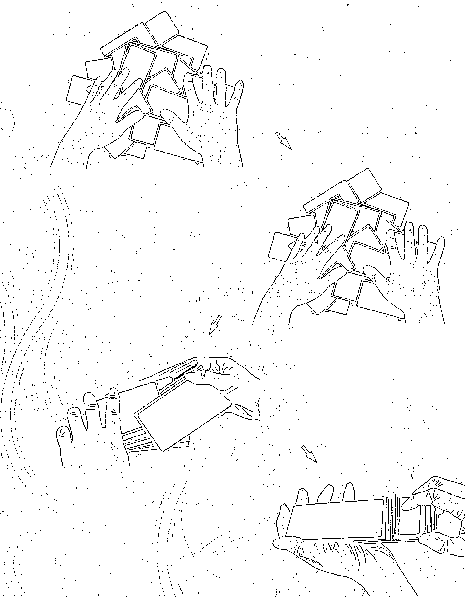

#### 二、麻将式

把整副牌背面朝上置于桌面，像洗麻将一样的搓洗。顺时针或逆时针都可以。这个方式洗得干净，正逆位也都有，唯一的缺点是对于桌面环境的要求高，最好有布垫着。

当然洗牌并不限以上这两种方法，但无论使用什么方式，洗牌的时间都不限。只要确定洗干净就行。眼睛张开或闭着也不限。让求问者洗牌或是解牌者洗也不限。洗牌的目的是取得随机数。

如果分正逆位置，那么在收牌时，请记住一个原则：不管帮别人算或是自己算，右手这一边就是待会排牌的下方。所以自己帮自己算时，只要将牌顺时针转90度，就是正确的方向了。而帮别人算的时候，将牌顺时针转90度就是以自己为准的方向。将牌逆时针转90度，就是以对方为准的正逆位置了。

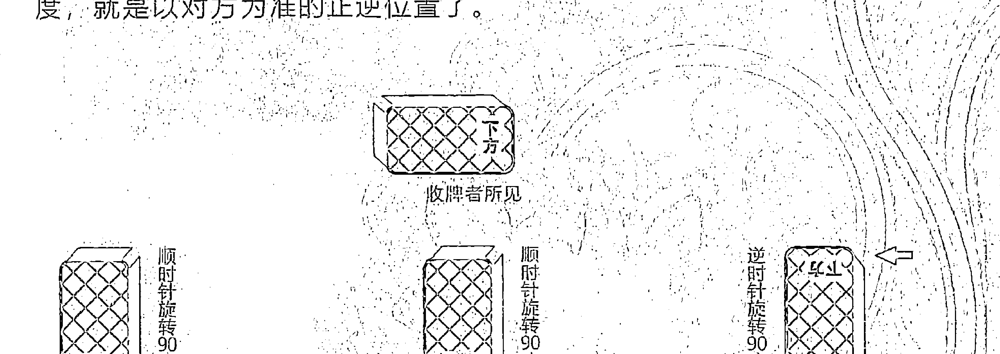

### 6 如何切牌

洗完牌、牌面朝下叠成一叠放好之后，就要请求问的人来切牌。当然，如果求问的人就是你自己，就要自己来切牌了。

首先，请对方集中精神，从牌叠的上方，依照自己的意志拿起一叠牌（绝对不可以不拿）。把这一叠牌放在原先牌叠的下方（也就是靠近你的这个方向），变成两叠。

再来，从第二叠的上面再拿一叠牌；这将要放到第一叠的上方。现在，你们面前已经有三叠牌了。

接下来，由你来把牌叠回去。先把第一叠拿起来，放到第二叠的上方；再把这第一叠和第二叠的合体拿起来，放到第三叠的上方。如此，便恢复为一叠牌了。

我们还剩下最后一个切牌动作。在刚刚的过程里，牌面都是横面朝下的。我们现在要把牌转为直向朝下。这个动作千万不可以搞错；如果是为对方推测，你的旋转方向是逆时针的；也就是说，你要把塔罗牌的左端朝下旋转90度，变为直向。如果你是为自己推测，则是顺时针把牌旋转90度。一旦搞错，整个牌面的意义会完全颠倒，所以务必要谨慎哦！

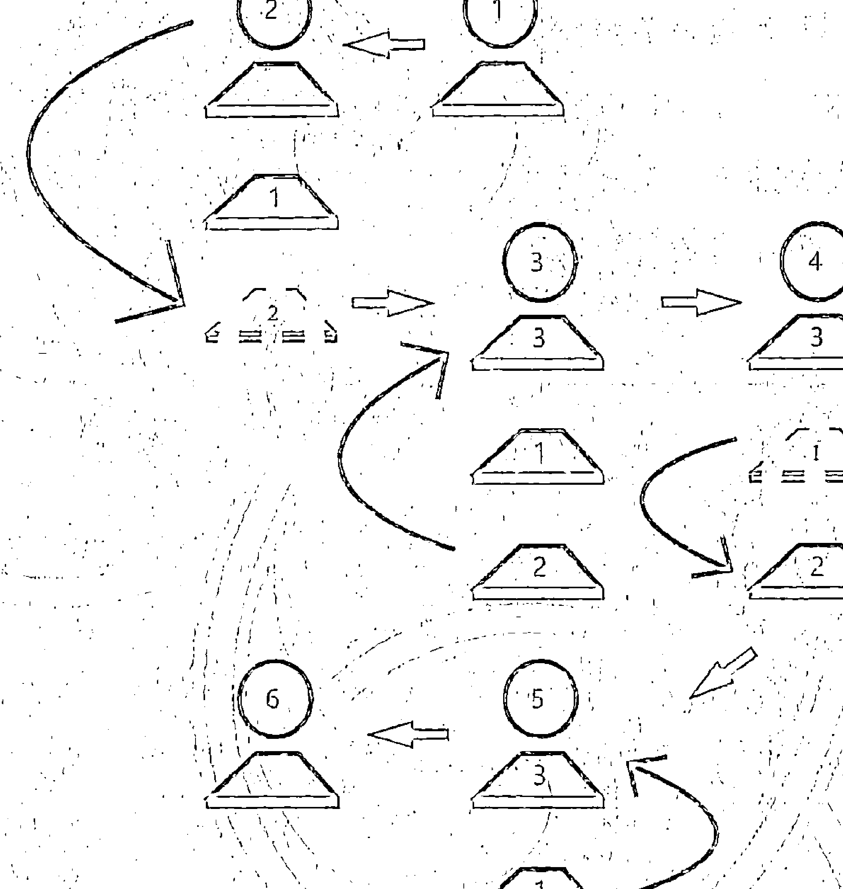

例一：某女在问与A男和B男间的感情时，两次都切到圣杯四。我们可以猜测，她在感情生活方面，虽然同是有两个选择，但是她仍有强烈的不满足感。这两个选择对她来说都不完美。

例二：某女问考试，切到星币八，很明显的，她曾经相当努力用功。

例三：经商的男子问事业，切到节制。此时我们可以大胆猜测他目前为止可能从事跨国贸易，与外国人在生意上的往来。

例四：某男问学业，切到愚人。他可能太爱玩，游手好闲，或者缺乏计划。此猜测可以在后面的牌阵中证实。

例五：某男问与女朋友的感情，切到圣杯八。不太妙，他可能想离开他的朋友。

### 7 如何选牌

将牌背面朝上摊开成扇形。由求问者抽出需要的牌数。左右手不限，睁眼闭眼不限。由求问者抽的原因是为了得到最原始的数据。让别人替求问者抽牌，总是二手数据。因为最好让求问者亲自与牌接触，他所抽出的才是最能反映事件本身的第一手资料。

### 8 如何解牌

将牌排成牌阵要有一定的顺序。将求问者抽出的第一张牌放在牌阵位置1，依次类推。排完之后，就大功告成，可以开始解牌了！

解牌没有什么规律可循，每个解牌者都有自己的一套方法，而不同的牌型也适合不同的解法，需要解牌者细细选择。基本的方法包括：

- **释义**：按照书本上的解释来阐释牌阵所传达的意思。
- **感应**：凭个人的天资来定。
- **图解**：塔罗牌的图会互相有所关联，尤其韦特牌，在这方面做得相当好。但一些漫画牌，那些漫画家对塔罗的研究还远远不够，画出来的牌自然也就无法图解。
- **数字**：数字也会有关联，如果读过《易经》，这种方法比较合适。
- **宗教**：塔罗在希腊神话和生命之树方面都有特殊意义。如果了解这些，这样解的正确度还是很高的。这也是高级预测师所常用的方法。

一般人通常会选择几种适合自己的方法混合使用。你也不妨试试。

每张塔罗牌都隐藏正反两种意义。当牌翻出来图案是正位，就代表正面意义。当牌翻出来图案是逆位，则代表反面意义。如果牌是横放的，则人头在左为正，右为逆。不过你千万不要用倒吊人来看，大家都知道，倒吊人的图案刚好是反的。

#### 解牌时的注意事项

牌阵排好之后，按顺序把每一张牌掀开，掀牌的方式是由左往右翻，注意不要弄乱牌的正逆位。然后就可以开始解牌了。

解释牌义的时候，首先要注意避免断章取义。“死神的正位，坏牌，你绝对会倒大霉！”“世界的正位，全世界最好的牌，你鸿运当头啦！”这些话，都是刚开始使用塔罗牌的人容易说出来的。如果以牌义来说，好像也没什么错误，但是太草率了。就预测而言，死神只是描述事情的某些过程，或是某些心理层面的东西，很少真正代表肉体的死亡。

而且，预测要统揽全局。塔罗告诉了你一件事情的整个过程，如果单凭一张牌来判断，多半是对不了的。一定要贯通整个牌阵，才能发现其中的缘由。所以要注意培养自己的串联能力。

在帮助别人预测的过程中，你等于是在训练自己的串联能力。这种能力是很重要的，因为解牌不能只靠单张牌的解释，自由联想能力在这里非常重要，你必须是一个想象力丰富的人。

还要注意，不要使用过于耸动的字眼。和《易经》一样，任何一张塔罗牌都有阴阳两面，即积极面和消极面。因此，拿到好牌不要太得意，应把握机会，采取行动，才不会丧失良机；拿到坏牌也不必气馁，只要能够提高警觉就可以化险为夷。正确的态度是，不管所显示的征兆是凶是吉，都一样坦然处之。

因此，在回答求问者的问题时，切忌使用太多负面的字眼。即使所出现的牌真的非常不好，也不可以说出一些会让求问者感到惊吓的话。解牌者应该始终站在求问者的立场，尽量寻找一些解决的方法，或是给予一些正面的警告。

最后，要重视灵感和直觉。除了对于牌义的掌握和对牌的熟悉程度之外，还必须依靠解牌者当下的灵感和直觉，这点是非常重要的。即使是同样的牌阵与牌，不同的问题和不同的人，都会引发解牌者不同的灵感和直觉。抓住一瞬间的感悟，才是塔罗预测真正的诀窍。所以千万不要拘泥于别人怎么说，书上怎么说，一定要把自己的心灵完全打开，才可以找到真正的启示。

一开始固然要尽量把牌的意义记下了，可随着运用逐渐熟练，这时应该慢慢跳出塔罗本身的束缚，找出自己的见解，这才是练习塔罗牌的重点。

解牌时可以参照本书第三章对牌面的详尽解释，也可参照本书附赠的塔罗牌上的画面及文字解释。

# 第二章

### 塔罗牌义解释

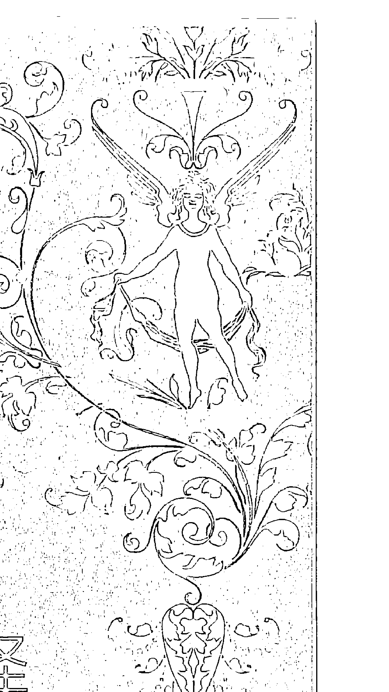

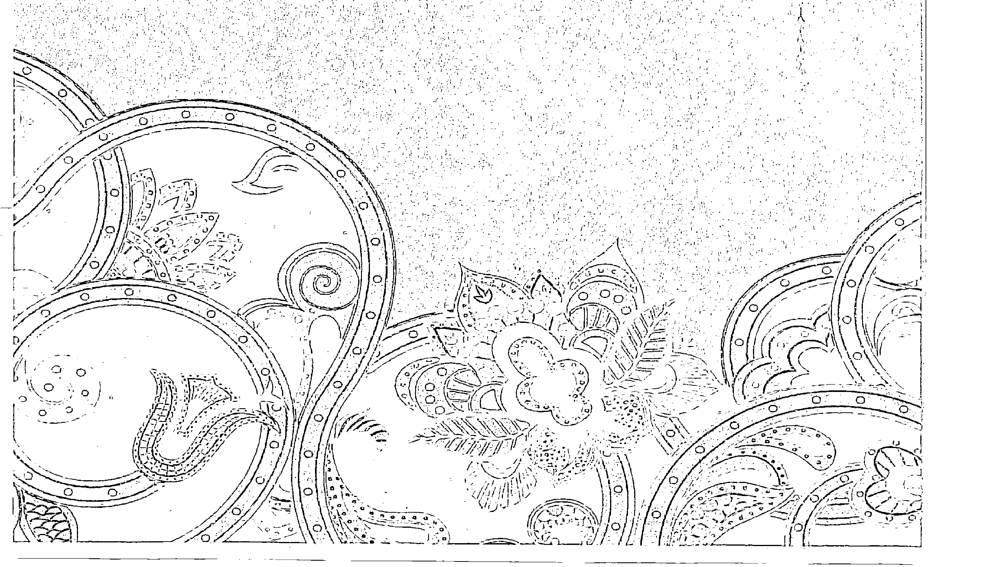

## 第三章 塔罗牌牌义解释

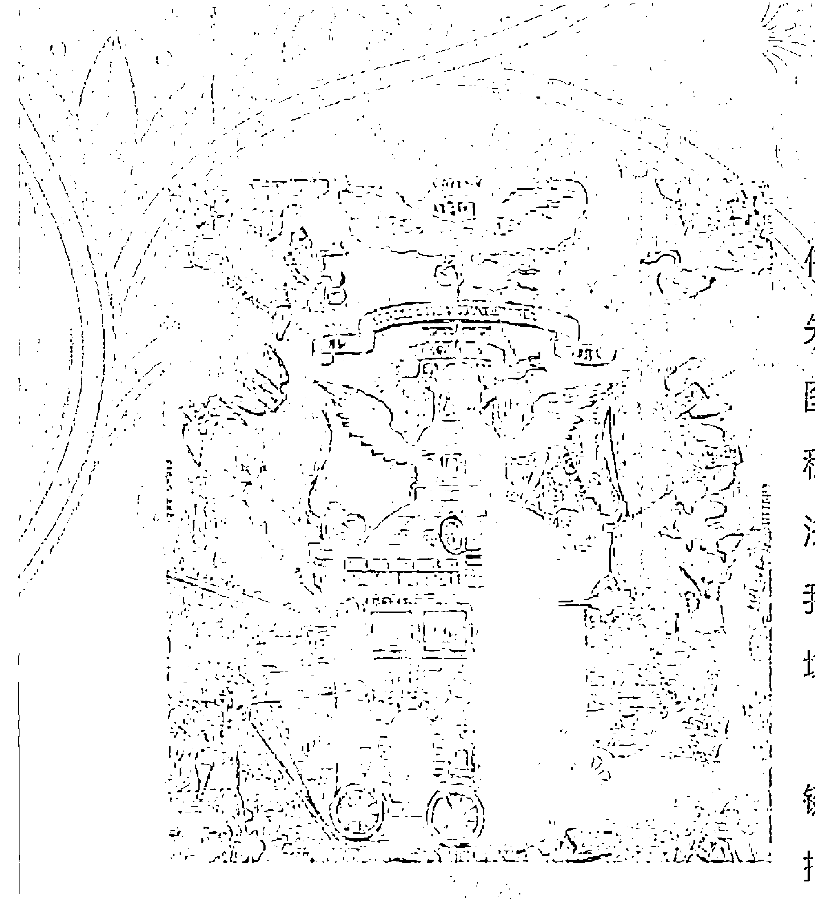

我们将看到对每一张伟特塔罗牌的详细诠释。首先是对每一张美丽而神秘的图案的解读：我们将推开神秘之门，触摸到那些古老的法则，读懂神之语言，推测我们的内心世界不可知的领域。

每一张牌的牌义都有关键之词，一个关键词就像一把钥匙，穿透灵感之锁，让我们懂得每一张牌蕴含的寓意；能辅助我们推测时更好地理解牌阵含义，可以对照相寻，是详细的推测解读。当然，一万个人眼中，有一万个哈姆雷特。所以，每一个解牌师，都会有自己对人生独特的理解。当懂得牌义和关键意义之后，如何诠释人生，就完全依照解牌师们自己的内心世界了！只要适合自己的，相信自己吧。你，一定是对的！

每一张牌的每一种解释中，总有一些牌和另一些牌的某些意义相对或相近，我们列出了那些可能相对立或相近似的牌之牌义。既可以帮助我们记忆，当它们同时出现在牌阵中时，又可以帮助我们更好地理解整个牌阵的含义！宫廷牌没有普通意义上的对立牌或加强牌，它们可以和任何别的宫廷牌搭配成配对牌，可以对比这两张牌的级别及装饰来判别其意义所指。

每一个牌义之后，我们都有附录，懂得星象学的推测者就可以进一步了解每一张大阿卡那牌对应的星象！这对更深层次地理解每一张牌的牌义是极有帮助的。相关的希腊神话故事除了有很强的阅读趣味和知识性之外，对于加深对牌义的理解，作用更是不言而喻的。

## 牌义解释 大阿尔卡那

### # 0愚人
#### THE Fool

**关键词：新开始、有信仰、自发性、貌似愚蠢**

| 类型 | 牌名与解释 |
| :--- | :--- |
| **对立牌** | 教主：根据惯例，例行公事 |
| | 死神：结束，关闭 |
| | 魔鬼：感到愤世嫉俗，缺乏信仰 |
| | 宝剑二：阻挡经验，感到紧张，踌躇 |
| | 星币四：规则和规律性 |
| **加强牌** | 吊人：对做什么都有信心，随波逐流 |
| | 星辰：清白，信仰，信任 |
| | 审判：重生，新的开始 |
| | 权杖三：扩大视野，进入一个未开发的领域 |

- **新开始：** 进入一个新阶段；产生一条新路径；范围的扩大；开始一件新事情；开始旅行；进入一些未知领域。
- **有信仰：** 相信潮流；持有开放的心态；困惑和恐惧；感觉自己受到保护、被人爱；生活在快乐中；夺回清白。
- **自发性：** 生活的瞬间；让期待放任自流；按设想行事；凭冲动做事；感觉放荡不羁；不对某人感到惊讶；无忧无虑。
- **貌似愚蠢：** 接受你的选择；选择一条“愚蠢”的途径；追求白日梦；对你自己真实；做一个“疯狂”的选择；相信你内心的期望。

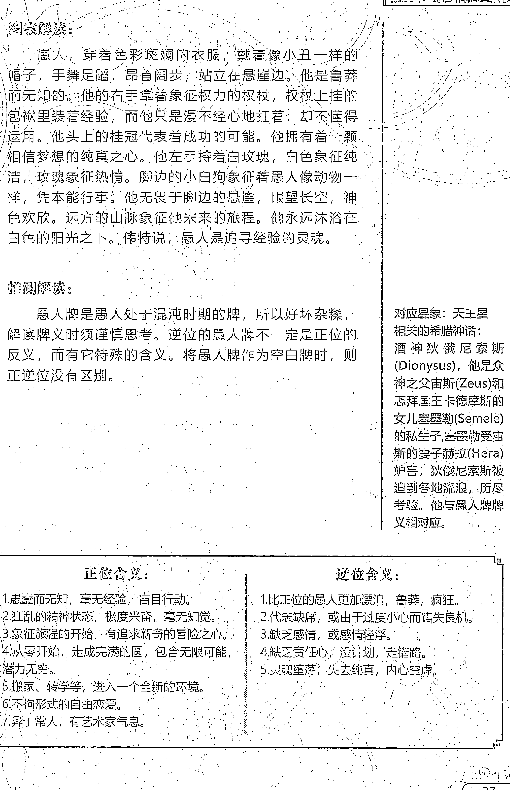

图案解读：

愚人，穿着色彩斑斓的衣服，戴着像小丑一样的帽子，手舞足蹈，昂首阔步，站立在悬崖边。他是鲁莽而无知的。他的右手拿着象征权力的权杖，权杖上挂的包袱里装着经验，而他只是漫不经心地扛着，却不懂得运用。他头上的桂冠代表着成功的可能。他拥有一颗相信梦想的纯真之心。他左手持着白玫瑰，白色象征纯洁，玫瑰象征热情。脚边的小白狗象征着愚人像动物一样，凭本能行事。他无畏于脚边的悬崖，眼望长空，神色欢欣。远方的山脉象征他未来的旅程。他永远沐浴在白色的阳光之下。伟特说，愚人是追寻经验的灵魂。

推测解读：

愚人牌是愚人处于混沌时期的牌，所以好坏杂糅，解读牌义时须谨慎思考。逆位的愚人牌不一定是正位的反义，而有它特殊的含义。将愚人牌作为空白牌时，则正逆位没有区别。

对应星象：天王星

相关的希腊神话：

酒神狄俄尼索斯 (Dionysus)，他是众神之父宙斯 (Zeus) 和忒拜国王卡德摩斯的女儿塞墨勒 (Semele) 的私生子，塞墨勒受宙斯的妻子赫拉 (Hera) 妒害，狄俄尼索斯被迫到各地流浪，历尽考验。他与愚人牌牌义相对应。

- **正位含义：**
  1. 愚蠢而无知，毫无经验，盲目行动。
  2. 狂乱的精神状态，极度兴奋，毫无知觉。
  3. 象征旅程的开始，有追求新奇的冒险之心。
  4. 从零开始，走成完满的圆，包含无限可能，潜力无穷。
  5. 搬家、转学等，进入一个全新的环境。
  6. 不拘形式的自由恋爱。
  7. 异于常人，有艺术家气息。
- **逆位含义：**
  1. 比正位的愚人更加漂泊，鲁莽，疯狂。
  2. 代表缺席，或由于过度小心而错失良机。
  3. 缺乏感情，或感情轻浮。
  4. 缺乏责任心，没计划，走错路。
  5. 灵魂堕落，失去纯真，内心空虚。

## 牌义解释大阿卡那

### 牌义对立或相近的牌

◇对立牌:
- 女教主: 没有行动力, 直觉, 达到无意识
- 吊人: 犹豫不决的行动, 不做事情
- 圣杯七: 缺乏关注的事情和承诺
- 宝剑四: 安静地休息, 储存能量
- 宝剑八: 困惑, 不确定性, 无能力

◇加强牌:
- 战车: 有目标专心致志, 有说服力
- 权杖二: 个人能量, 发出强大的力量
- 权杖八: 快速地行动, 实施你的改变
- 星币八: 集中注意力, 专心致志

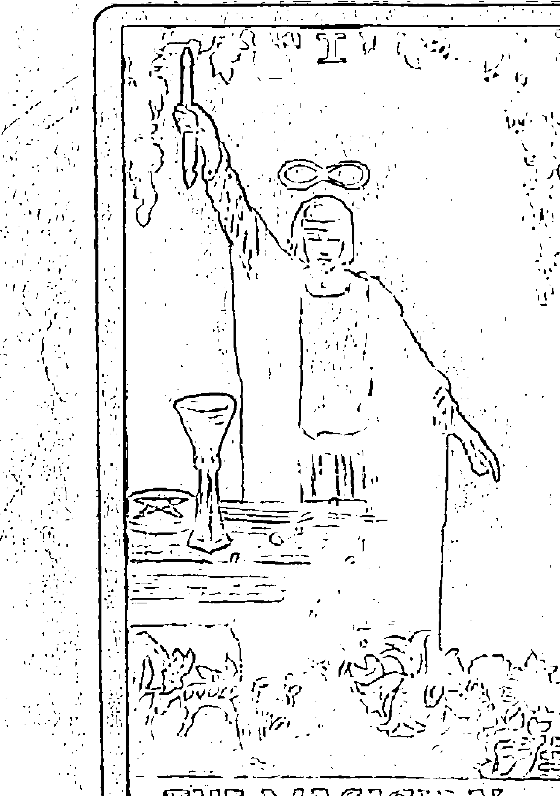

## 1 魔术师 THE MAGICIAN

关键词: 行动、专心、有意识的行为、控制力

行动: 做需要做的事情；了解你的潜力；使一些可能的事情变成现实；做你鼓吹的事情；实施计划；产生不可思议的后果；运用你的聪明才智

专心: 有单一的目标；完全忠心；应用你意愿的力量；感觉处于中心位置；不理会分心的事物；集中于一个目标

有意识的行为: 知道你正在做什么和为什么这样做；了解你的动机；明白你的意图；检验已知的局面

控制力: 实施强有力的影响；有活力；创造奇迹；开始精力充沛；感觉精力旺盛；有创造性

### 图案解读：

魔术师正在施行法术，他右手高举权杖指向天，召唤神奇的法力，左手食指指向地，象征了他正是联结天与地的桥梁，主宰着地上的一切。他身前的桌上放着权杖、圣杯、宝剑和星币，既代表四个牌组，也正是四要素的象征。他身穿的红袍代表热情与主动，白色内衣代表内在的纯洁和智慧。他具有无限的创造能力和潜力，但需要有坚强意志和纯洁内心的保证。他的腰带是一条蛇，在这里的蛇并不代表邪恶，而是象征智慧与启发。他的头上有躺着的8字，代表无限。他的周围被鲜花环绕，红色的玫瑰象征热情，白色的百合象征智慧。鲜黄的背景，预示着未来的成功。

### 推测解读：

“1”是所有数字的开始，代表沟通。在占星学中，对应的水星也代表沟通。这一张牌蕴含力量强大，正逆位不同，起落大，大悲大喜，结果明确。

### 对应星象：水星

### 相关的希腊神话：

水星，希腊神话十二主神之一的信差之神汉密斯(Hermes)，他的罗马名就是水星(Mercury)。他是宙斯和神女迈亚(Maia)之子，是众神的居所奥林匹斯山的信差，是诸神的使者，所以他也是使节和传令官的庇护神，他也是魔法护神，和各种比赛竞技的庇护神。

| 正位含义： | 逆位含义： |
| --- | --- |
| 1.代表与沟通或外交有关的事物。 | 1.因权杖的方向改变，预示着发生了错误的引导，或者精力用错了方向。 |
| 2.思路清晰，口齿伶俐，表述明白透彻。 | 2.导致无法收拾的失控局面，或直接预示着失败。 |
| 3.思维缜密，有把握，有自信。 | 3.牌倒逆，桌上要素掉落，代表二流角色，如巫师等。 |
| 4.有良好的开端，将发展顺利，计划成功。 | 4.花无法生长，缺乏热忱和行动力。 |
| 5.能梦想成真，或将有恋情发生。 | 5.优柔寡断，才能平庸，缺乏创造力。 |
| 6.有良师益友出现，或有能给予正确引导和帮助的人出现。 | 6.爱情没有进展。 |

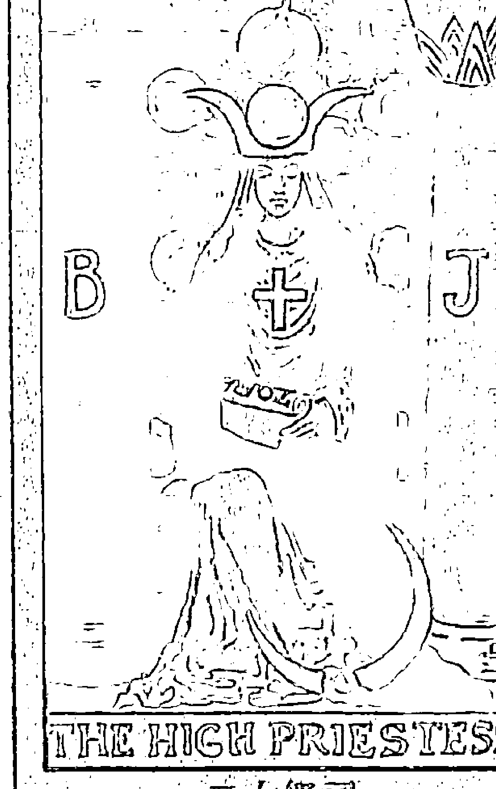

## 2 女教主 THE HIGH PRIESTESS

关键词：无行动力、潜力、无意识、神秘

### 牌义对立或相近的牌

◇对立牌:
- 魔术师: 有意识的行动, 有意识的思考, 已知的和显而易见的
- 权杖二: 勇敢的行动
- 权杖七: 主动的
- 权杖八: 将计划付诸行动

◇加强牌:
- 隐士: 看到内心世界, 退缩, 寻求引导
- 吊人: 对行动犹豫不决, 等待
- 宝剑四: 安静地休息, 沉思

无行动力: 不参与；让事情自然进行，不加干涉；乐于接受对其的影响；平静的心态；被动的；耐心地等待

潜力: 明白可能性；对能出现的情况持开放的态度；能看到你潜在的才能；允许发展；让那里的事物欣欣向荣

无意识: 运用你的直觉；找到来自内心的指导；相信你的心声；天马行空的梦想和想象；注意更广阔的现实

神秘: 看得不真切；趋近一个封闭的领域；对未知的事物持开放的态度；记住有些事很重要；感觉到秘密和隐藏的事物；寻找隐蔽的东西；承认阴影

### 图案解读：

女教主表面静默，端坐于石凳之上，她手上的卷宗上书着Tora，乃律法之意，代表她内心的知性和洞察力，她明辨是非、善恶和明暗，也代表神秘的魔法，静静等待适合行动的时机，以及给予明确的指示。身侧的柱子一黑一白，也暗示了她强烈的是非观念，理性的思考和判断。白色的头冠和白色的长裙，象征了她内心的纯洁和对洁净的要求。背后的绿叶和果实，既象征她的女性形象，慈爱和娴静，同时也暗示了她具有强大的直觉力和判断力。石榴暗示着希腊神话中的冥后珀耳塞福涅(Persephone)吞下的象征姻缘不断的石榴子。她裙角的月亮，也是智慧和直觉力的象征。

### 推测解读：

女教主的职位本身，已经能给推测者很多讯息。这是一张意义明确的牌。同时，若求问者为男性，则此牌代表关注他的女性；若求问者为女性，则此牌代表求问者自己。

### 对应星象：月亮

### 相关的希腊神话：

希腊神话中的地狱统治女神冥后珀耳塞福涅(Persephone)，她是宙斯和他的姐姐德墨特耳(Demeter)的女儿，后来被冥王哈德斯(Hades)掳去当冥后。德墨特耳无心工作，致使大地荒芜，于是宙斯仲裁，让珀耳塞福涅一年回来一次。她回来之前，哈德斯强迫她吞下冥界的4颗石榴子，结果她必须每年在冥界住4个月。这4个月，就形成了冬季。回到母亲的身边，大地便重新结出果实。于是造成了一年四季，一年的荣枯。珀耳塞福涅不仅掌管土地丰收，而且统治回归土地的死者。石榴子同时也是姻缘不断的象征。

| 正位含义： | 逆位含义： |
| --- | --- |
| 1.女教主代表了奥秘，神秘的事物和尚未揭露的未来。 | 1.无知，缺乏理解力和判断力。 |
| 2.代表着静默和坚持，冷静的思考，强大的战斗意志。 | 2.理性的态度，或有点神经质，行为不被人理解和接受。 |
| 3.充满知性魅力，具有优秀的判断力和洞察力。 | 3.挑剔，有洁癖。 |
| 4.有学问，有智慧，或与科学相关。 | 4.没有结果的单相思或者独身主义者。 |
| 5.独立自主的女性。 | 5.盲目自大，锋芒外露，行为乖张，缺乏深沉的智慧。 |
| 6.冷淡的恋情，或柏拉图式的恋爱。 | 6.身体不好，或者不孕。 |

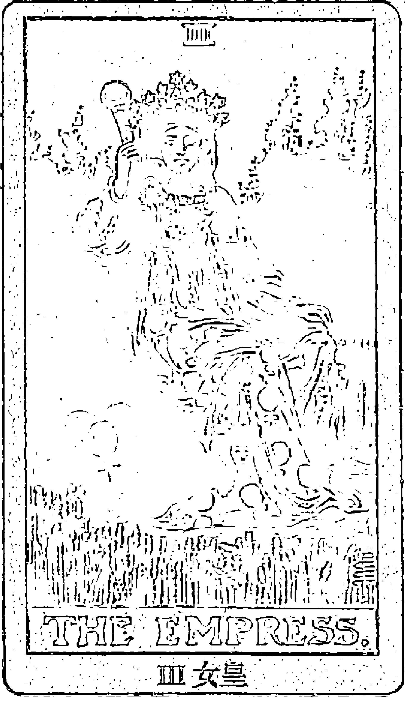

## 3 皇后 THE EMPRESS

关键词：母性、体验感觉、丰富的、自然

### 牌义对立或相近的牌

◇对立牌：
- 皇帝：父性，规则和纪律，规律性
- 死神：死亡原则
- 星币四：对财物很吝啬
- 星币九：精致，强词夺理

◇加强牌：
- 情侣：性的实现，愉悦
- 星辰：慷慨，让爱自由流淌
- 圣杯九：享受感觉
- 星币七：物质回报
- 星币十：富足，奢侈，物质上的舒适

母性: 给予生命；为生命提供营养；照顾和关心其他人；珍爱世界；传达亲切慈爱；和孩子一起玩

体验感觉: 给予和接受愉快；关注个体；欣赏美丽；感到勃勃生机，健康；朴实的；做运动

丰富的: 享受奢侈的乐趣；接受慷慨的回报；生活奢侈，物质极大丰富；不计其数；感觉很富有

自然: 涉及植物和动物；拥抱自然；感觉与自然的联系；户外活动；与自然节奏相协调

### 图案解读：

皇后牌的牌面象征意义明了而强烈。她的坐榻的旁边放着一颗洁白的心，里面有醒目的绿色女性符号，坐榻后方的靠垫上也绘满了象征女性的符号。所以皇后牌所代表的是洋溢着母性温柔的女性特质。长裙上的果实，象征着生育，身后的森林和流水，代表大地的复苏和生机盎然。母亲，就是大地，孕育万物。金黄的谷物，代表丰收。豪华的靠椅，还有美丽的红丝绒坐垫，象征着皇后的高贵和繁荣的物质景象。她戴着缀满繁星的桂冠，右手举着权杖，显示了她至高无上的母亲形象。

### 对应星象：金星

### 相关的希腊神话：

宙斯的姐姐德墨特耳(Demeter)，她与皇后牌牌义相对应，她是丰产和农业女神，司谷物的成熟。也就是冥后珀耳塞福涅(Persephone)的母亲。珀耳塞福涅被冥王掳去当冥后后，德墨特耳无心工作，使得万物枯萎。后来宙斯仲裁让珀耳塞福涅一年回来一次，这时德墨特耳重新工作，大地复苏。于是形成了一年四季的轮回。

### 推测解读：

相对于女教主牌的知性，皇后牌更感性，更贴合女性之事。如果求问者是男性，则可能暗示与女性有纠缠，或女性气质强。

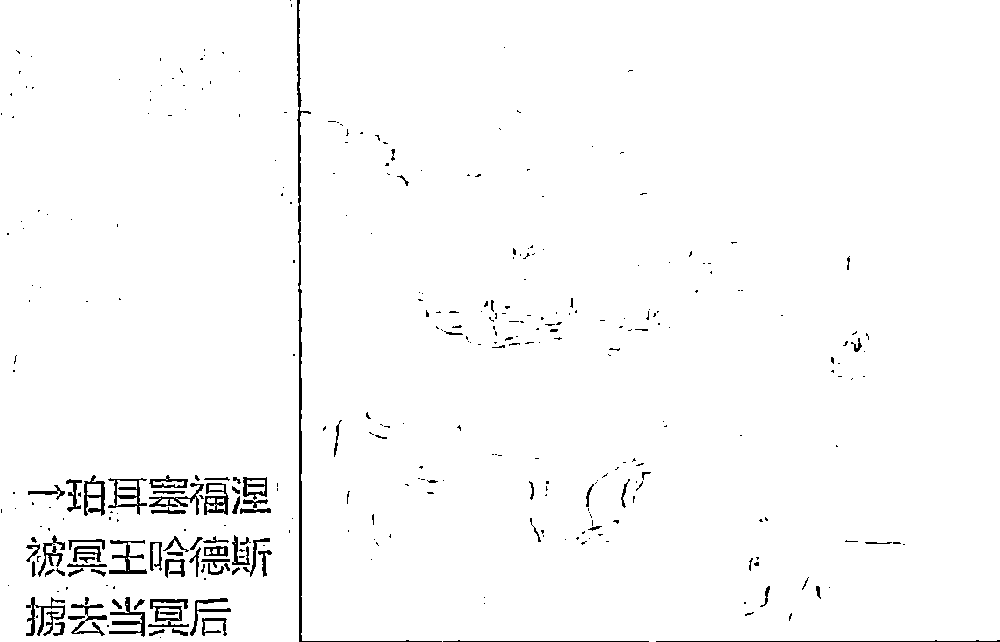

### 正位含义：
1. 皇后牌最首先代表了丰收和繁荣。
2. 强烈的母爱气息，女性魅力。
3. 有艺术才能，或从事以女性为对象的工作。
4. 代表结婚或者生产或者会有结果的恋情。
5. 优雅的生活，或者充满了喜悦的生活。

### 逆位含义：
1. 欢乐消失了。
2. 收获有所折损或爱情遇到一些挫折。
3. 若求问有关生产，则可能代表难产、流产或堕胎。
4. 没有成就感，内心迷惑。
5. 虚荣、任性、自负令人无法接近。
6. 浪费和损失。

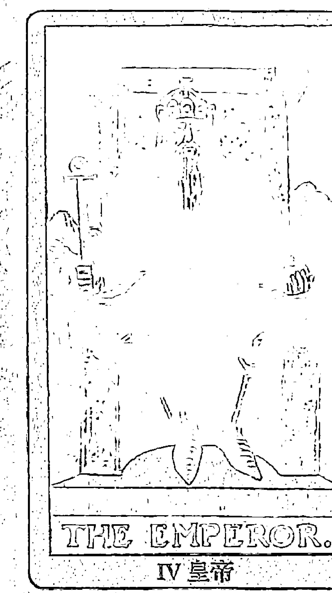

## 4 皇帝 THE EMPEROR

关键词：父性、权威、强调结构、规则

父性: 建立和维护一个家庭；设立方向和基调；保护和防御；引导成长；带来安全和舒适；提供解释

权威: 起领导作用；指挥的；实行控制；拥有声誉；处于有强大力量的位置；与官员接触；设定方向

强调结构: 从混乱的状态中解脱出来；设立规则；分类；系统化；提供形状和形式；被组织化；申明原因；协调；坚持计划

规则: 建立法律和秩序；实施良好的原则；应用规则或引导原则；在法律体系内活动；设立行为标准；服从于政权

### 牌义对立或相近的牌

◇对立牌：
- 皇后：母性，财富自由流动
- 圣杯七：分散，缺乏规则
- 宝剑五：违反规则，触犯法律

◇加强牌：
- 教主：遵守规则
- 正义：关注公正和法律
- 权杖二：有权威
- 权杖三：假设的领导权
- 星币四：控制，结构，规则

### 图案解读：

皇帝是皇后的丈夫，是男性象征的代表。他拥有主宰物质世界的支配力。一国之尊的皇帝充满了自信，他头戴皇冠，身着红袍，上覆铠甲。铠甲象征严格的纪律。右手持的古埃及十字架象征生命。王位上装饰着四颗牧羊头。牧羊座是十二星座的头一个，代表勇敢、积极、有野心、有自信。与牧羊座的性格相互呼应的是整张牌红色的主色调。作为背景的是严峻蜿蜒的山脉，象征了前方险峻的路途。皇帝牌代表道德戒律与禁令。此牌偏向秩序、规范和稳定的局面，拥有至高无上的权力。同时正因为这些理性和权威，他必须收藏起个人的感情，并且有高处不胜寒的隐喻。

### 推测解读：

皇帝既可以是明君，也可能是暴君，所以皇帝牌是可好可坏的。著名心理学家荣格认为“父亲代表道德戒律与禁令”，皇帝也是父权至高的象征。

### 对应星象：牧羊座

### 相关的希腊神话：

众神之首宙斯 (Zeus)，希腊人崇奉的最高天神，众神和万民之父，白银时代的最高统治者。他与皇帝牌牌义相对应。他是黄金时代的统治者天神克洛诺斯 (Cronos)的儿子。克洛诺斯预知他的子女会推翻他的统治，于是吞食自己的孩子。宙斯的母亲瑞亚 (Rhea)把宙斯偷偷救出藏好，他喝克里特岛上的山羊阿卡迪亚的奶水长大成人，果然推翻了父亲的统治，逼父亲吐出了被吞下的哥哥姐姐。他跟哥哥波塞冬和哈德斯分治宇宙。

### 正位含义：
1. 代表对当事人极具影响力的人。情况好时，能给予当事人帮助；情况不好时，会对当事人进行控制。
2. 以坚强的意志力及手腕获得成功。
3. 有责任感，具领导能力和良好的处理能力。
4. 虽有点专制但值得信赖。
5. 缺乏感情的交流而导致情感问题。
6. 与年长者恋爱。

### 逆位含义：
1. 欠缺理智的分析，自我放纵，不成熟。
2. 意志薄弱，软弱而犹豫不决，没有自信。
3. 因傲慢而招人反感。
4. 工作过度投入，或为人固执。
5. 缺少好的对象，或感情比较勉强。
6. 行事武断，滥用权力，冷酷无情。
7. 占有欲、控制欲过分强烈。

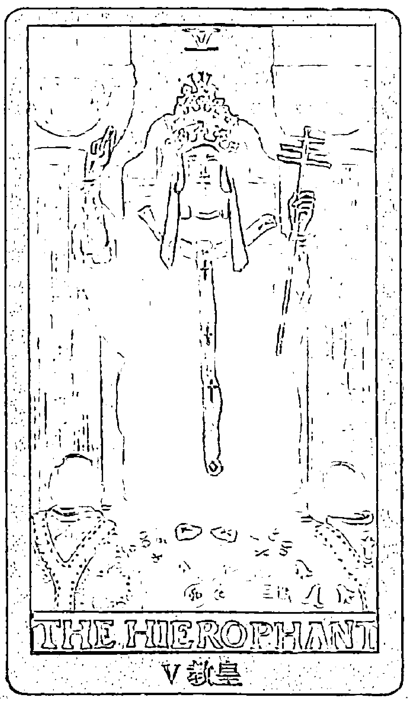

## 5 教主 THE HIEROPHANT

关键词：教育、一致、信仰体系、群体认同

### 牌义对立或相近的牌

◇对立牌:
- 愚人：“疯狂的”且反传统
- 情侣：个人信仰
- 权杖二：脱离群众，成为先锋
- 宝剑七：是一只孤独的狼
- 星币二：灵活的，不断改变主意

◇加强牌:
- 皇帝：遵循规则
- 圣杯三：关注群体
- 星币三：在团队或群体中工作
- 星币八：学习，研究
- 星币十：一致的，遵守规则，保守的

教育: 追求知识；见多识广的；增强理解力；学习和研究；寻求更深层次的含义；找出更多的东西

一致: 遵循规则；按传统的方法办事；在传统习惯中循规蹈矩；适应系统；装配好；按规划一步一步进行；做预料中的事情；是已建立好的组织中的一部分

群体认同: 分享文化传统；学习宗教传统；崇尚宗教礼节和宗教仪式；鉴别世界观；知道应将信仰置于何处

群体认同: 忠于某个原因；将能量投入一个群体中；加入一个组织；作为团队的一部分积极工作；对其他人有诚心；处于一个有组织的环境中

### 图案解读：

教主身穿大红袍，端坐于信众前。他头戴三层皇冠，三层皇冠代表了身心灵三层次的世界，皇冠代表权力。他的右手食指与中指指向天，象征祝福；左手主教权杖象征神圣和权力。他耳朵旁垂挂的白色物，代表内心的声音。前方摆放的两把钥匙，可用以开启智慧与神秘之门。教主面前站立的两位信徒，左边身穿红玫瑰花纹的衣裳，象征热情；右边身穿白色百合的衣裳，象征性灵成长。教主与宗教有密切的关联，是有组织的教会或教派，是入世的，走入人群的。

教主是精神之父，提供心灵成长与道德教育。是社会规范和社会责任的化身。他用言论指引人们走向正途。

### 推测解读：

推测时，教主往往代表心灵上的追求，尤其是道德方面的。

### 对应星象：金牛座

### 相关的希腊神话：

海神波塞冬 (Poseidon)，宙斯的兄弟。他与教主牌牌义相对应。在各种传说中，他最初是一个图腾神，以马的形状受到膜拜。他名字的意思是“大地的丈夫”，他既是海神，也是大地神。

### 正位含义：
1. 有贵人相助或长辈的引领。
2. 代表各级机关团体和学校，或任何与群体有关的事物。
3. 暗指仪式，毕业典礼，结婚典礼，成年礼，丧礼等等。
4. 柏拉图式的爱情。
5. 深情的爱，有结良缘的机会。
6. 代表神职人员、教师、长者、贵人、专业人士、典礼主持者、保守分子、卫道士等人物。

### 逆位含义：
1. 打破传统规范，不依常规，与众不同，大胆创新。
2. 没有贵人相助，孤立无援。
3. 缘分浅薄的恋情。
4. 过度的依赖心。
5. 没信用或者太啰嗦而令人讨厌。
6. 过度保守武断和固执，或者过度地标新立异。
7. 不宜贸然采纳别人的建议。
8. 不宜举行仪式或参加典礼等。

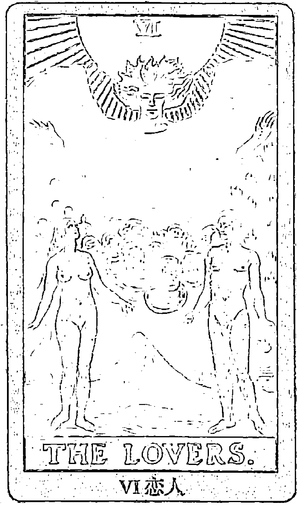

## 6 恋人 THE LOVERS

关键词：关系、个人信仰、性欲、价值

### 牌义对立或相近的牌

◇对立牌：
- 教主：已经建立好的信仰
- 隐士：孤独的，和别人没有联系，禁欲的
- 圣杯五：关系上的缺失
- 宝剑三：拒绝，分离

◇加强牌：
- 皇后：性欲的实现，愉悦
- 圣杯二：结合，结婚，联系
- 圣杯九：性交的快感
- 圣杯十：家庭关系，禁锢
- 星币十：永久的联合，家庭的联结

关系: 设立隔阂；感觉到爱；形成联合或婚姻；承认血缘关系；同意另一个人；更接近；联结；亲密的

个人信仰: 对已经接受的意见表示质疑；指出你所代表的立场；设立你的哲学体系；按照你自己的标准进行；自己下决心

性欲: 寻找结合；体验欲望；性交；对另一人开放；带着激情的回应；感觉到身体上的吸引；释放内心的能量

价值: 与诱惑的斗争；在正确与错误中进行选择；面对伦理或道德的选择；拒绝用结果证明方式是正当的；找到你所关心的

### 图案解读：

情侣牌以伊甸园为背景，亚当与夏娃分站两边。他们脚下是肥沃的土地，生机盎然。夏娃的背景是知识之树，树上有五颗苹果，象征五种感官，有蛇缠绕其上，蛇在此处代表潜在的智慧。亚当背后是生命之树，树上的十二团火焰，象征十二星座，也象征欲望之火。伟特的释义是：亚当与夏娃年轻诱人的躯体，象征着未受有形物质污染之前的青春、童贞、纯真和爱。两人背后的人物是风之天使拉斐尔(Raphael)。风代表沟通，他身上的紫袍象征忠贞。亚当看着夏娃，夏娃则望着天使，这象征着“意识——潜意识——超意识”与“身——心——灵”之间的传导。亚当和夏娃中间有一座山，象征我们必须把阴与阳、理性和感性的能量调和。也可以把山看作阳性的代表，把水看做阴性的代表，象征着阴阳平衡。

### 推测解读：

情侣牌不仅仅与爱情有关，它也暗示着“选择”或广义的“结合”。

### 对应星象：双子座

### 相关希腊神话：

情侣牌也包含着选择和三角恋情或情侣之间的争斗的意思。

在特萨利亚的英雄珀琉斯(Peleus)的婚礼上，宙斯忘了邀请司纷争的女神厄里斯(Eris)。厄里斯于是丢出了一个写有“送给最美丽的女神”的金苹果，引起了宙斯的妻子赫拉、智慧和战争女神雅典娜(Athene)、美和爱神阿佛洛狄特(Aphrodite)三女神之间的争吵。她们诉诸宙斯，宙斯便让特洛伊的二王子帕里斯(Paris)评判她们谁是最美丽的女神。于是她们极力设法使帕里斯偏袒自己。赫拉许诺给他统治权和财富，雅典娜许诺给他智慧和战胜的光荣，阿佛洛狄特许诺帮助他得到人间最美丽的女子。于是帕里斯把苹果判给了阿佛洛狄特。阿佛洛狄特帮助帕里斯拐走了斯巴达国王墨涅拉俄斯的妻子海伦。高傲的雅典娜和善妒的赫拉联手发动了著名的特洛伊战争。

### 正位含义：
1. 面临着重大抉择，须谨慎而深思熟虑。选择不当，则会后果严重。
2. 价值观面临挑战，确定什么是自己最重要的。
3. 预感到罗曼蒂克的爱情会来到。
4. 两人感情融洽而甜蜜，长期稳定。
5. 结盟、合伙等幸运的合作关系。
6. 有好的机会出现在眼前。

### 逆位含义：
1. 婚姻或爱情遭受挫折或失败。
2. 不恰当的合伙或联盟关系。
3. 冷漠的爱或者逃避的爱。
4. 背信，或者不信任。
5. 不稳定、无法持续。
6. 错误的决定。

## 牌义解释
大阿尔卡那

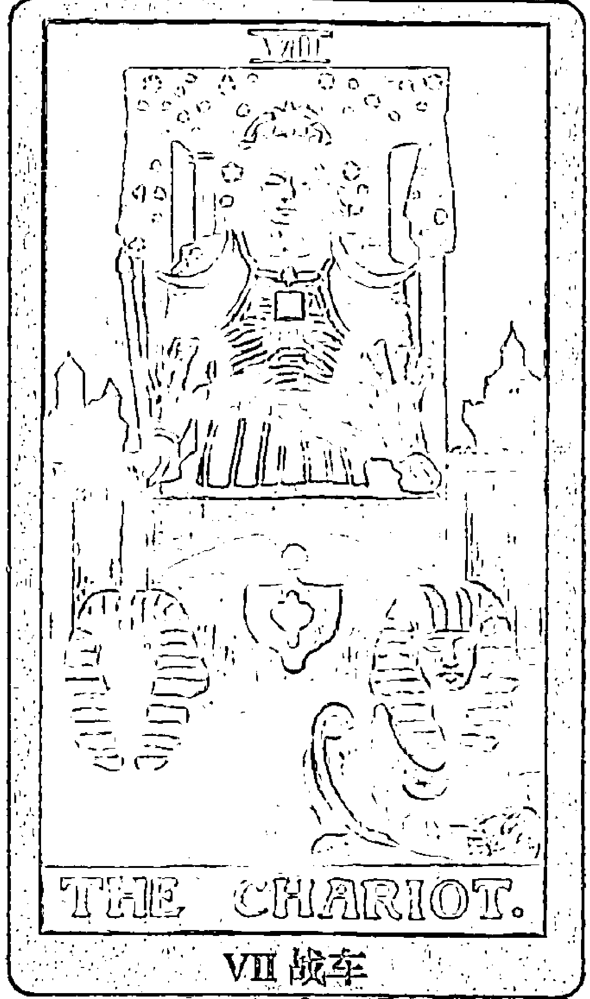

## 7 战车
THE CHARIOT

关键词：胜利、自我声明、意愿、强劲的控制

牌义对立或相近的牌

◇对立牌：
- 力量：软控制
- 吊人：接受上帝的意愿，把别人的意愿置于第一位
- 高塔：打败，受挫的经历
- 宝剑八：迷惑，自我困惑
- 宝剑十：软弱无力，陷入陷阱中，把别人的意愿置于第一位

◇加强牌：
- 魔术师：运用你自己的意愿，集中精神
- 权杖二：有权威的，主导地位的
- 权杖六：胜利的、自信的
- 星币四：控制
- 星币九：自我控制，有纪律性的

胜利：达到你的目标；胜利，成功的；占统治地位的；独占鳌头；打败竞争对手

自我声明：注重自我；建立身份；知道你是谁；感到自信；对你自己充满信心；出去寻找自己的利益

意愿：下决心要成功；集中于你的目标；不受诱惑；不让任何东西转移你的注意力；不断努力；集中你的能量；锁定目标

强劲的控制：控制情绪；控制冲动；维持纪律；控制怒气；保持自己的方向；假设力量的支配；显示权威

## 第三章 塔罗牌牌义解读

### 图案解读：

图中英勇的战士驾着一辆由两只狮身人面兽拉着的战车。狮身人面兽一只黑色，一只白色，黑色代表严厉，白色代表慈悲。黑白也象征阴阳平衡。战车上战士身后有四根柱子支撑蓝色车篷，四根柱子象征火水风土四要素，蓝色车篷上六角星花纹象征天体对战士的影响。战士手持的矛形权杖象征意志与力量。八角星头冠象征统治，桂冠象征胜利。斜挂的腰带上有占星学符号，裙上有炼金术符号。胸前的四方形代表土元素，象征意志的力量。战车前方的翅膀图案是古埃及的一种图腾，代表灵感。翅膀下的盾牌上的红色图案是印度的一种图腾，是男性与女性结合的象征；也暗示了编号为7的战车牌已走过了愚人之旅的三分之一，已达到了性的成熟阶段。战士的身后是城市，表示他把物质置于身后，而向前展开心灵历程。他手上没有缰绳，狮身人面兽的身上也没有缰绳，代表了战士凭借强大的意志力驾驭战车和控制狮身人面兽。同时也暗喻着人类意志与本能若无法好好控制它们，就会使它们互相拉扯，失去胜利。他站在城门外守望，是一个守护者、防御者。

对应星象：巨蟹座

相关希腊神话：
阿瑞斯(Ares)，十二主神中的战神。宙斯和赫拉的儿子。曾帮助特洛伊人参加特洛伊战争。他与战车牌牌义相对应。

### 推测解读：

6号的情侣牌代表选择，此张的战车牌则代表了选择之后采取的实际行动，以及生活的转变。

正位含义：
1. 具有坚强的意志力，坚定不移的信心和决心，控制整个局势。
2. 获得胜利。
3. 有野心，或先下手为强。
4. 出现挑战，须勇往直前。
5. 感情过度自控，缺乏温和的交流和沟通。
6. 活泼而又独立的人格。
7. 代表一个人，可能是旅客，司机、骑士、赢家或者任何一个具有战士精神的人。

逆位含义：
1. 惨遭失败。
2. 当事人野心过度膨胀，太过鲁莽而导致冲突与阻碍。
3. 感情方面，可能有口角或发生三角关系。
4. 旅行计划被延期或取消，或者在旅途中遇到无法预期的状况或事故。
5. 代表酒后驾驶、危险驾驶或身陷冲突的人、鲁莽的人等。
6. 丧失战斗意志，状态不佳。
7. 遇到强劲的敌手。

## 牌义解释
大阿尔卡那

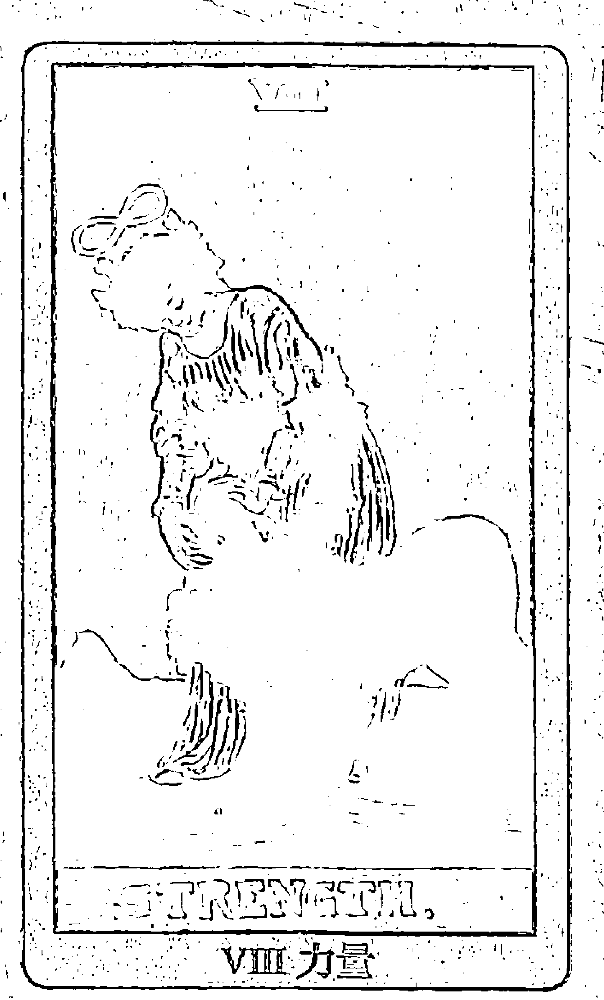

## 8 力量
STRENGTH

关键词：显示力量、有同情心、有耐心、软控制

### 牌义对立或相近的牌

显示力量：知道你能忍受什么；英勇的精神；感觉到不可动摇的决心；尽管遇到挫折，不气馁；有毅力；像岩石一样坚定不移

◇对立牌：
- 战车：强劲的控制
- 圣杯八：疲倦，缺乏力量
- 宝剑六：情绪低落的，缺乏感情
- 星币五：健康状态不好，虚弱的

◇加强牌：
- 吊人：从容进行，有耐心
- 权杖九：有毅力，忍受的力量

有同情心：给其他人许多空间；容忍；体谅别人的感受；接受；原谅不完美的地方；好心的

有耐心：平静地处理挫折；接受其他人；从容进行；保持沉着冷静；拒绝生气；显示自制力

软控制：劝说；和别人一起工作；间接地引导；有影响力；用爱心控制武力；展示爱的力量

### 图案解读：

力量牌的画面上，一位美丽的女子正驯服一头勇猛的狮子。力量的含意，并非指壮汉的蛮力，而是指内心的坚韧。狮子代表人类的本能，美女运用的是她所拥有的特质，以柔克刚，用坚韧的意志制服狮子。同时整幅图也体现了“刚柔并济”和整体平衡的寓意。女子的头上的倒8字符号，象征着智慧与无穷的潜能。她头上的花环和腰间的花带，象征着她的高贵圣洁和温柔但坚韧的力量。她无所畏惧，有着不可战胜的勇气、信心和耐心。她散发出自信的光芒，温和中自有一股威仪。这象征着我们要凭借这些优秀的特质克服内心的兽性和恐惧、愤怒与冲动。

### 推测解读：

力量，顾名思义，首要牌义就是力量，但这里指的并非壮汉的蛮力，而是内心的坚韧。

→赫拉克勒斯与狮子

| 正位含义: |
| --- |
| 1. 外柔内刚的特质。 |
| 2. 有勇气，有信心，内心坚强。 |
| 3. 不屈不挠，全力以赴，突破难关。 |
| 4. 具有神秘的力量或旺盛的斗志。 |
| 5. 轰轰烈烈的爱情。 |
| 6. 平息内心的不安烦躁和愤怒。 |
| 7. 降伏病魔，重拾健康。 |

| 逆位含义: |
| --- |
| 1. 软弱无能，内在的勇气和信心消失了。 |
| 2. 恐惧和怀疑，犹豫不决。 |
| 3. 勉强行事，滥用力量，而适得其反。 |
| 4. 自大、自负，故弄玄虚。 |
| 5. 爱情无法持久。 |
| 6. 需多加注意健康问题。 |

对应星象：狮子座

### 相关希腊神话：

赫拉克勒斯 (Heracles)，著名的英雄人物。他是宙斯和阿尔克墨涅 (Alcmene) 的儿子。宙斯善妒的妻子赫拉迫害阿尔克墨涅，推迟了她的产期，使赫拉克勒斯原本该他所得的英雄地位和各族人民的统治者地位，令被安排提前出生的欧律斯透斯 (Eurystheus) 得去。他长大后赫拉又使他神经错乱犯下了杀孽。他为了赎罪必须为欧律斯透斯 (Eurystheus) 完成十二项功绩。其中第一件就是杀死猛狮涅墨亚 (Nemean)。赫拉克勒斯与力量牌牌义相对应。

## 牌义解释
大阿尔卡那

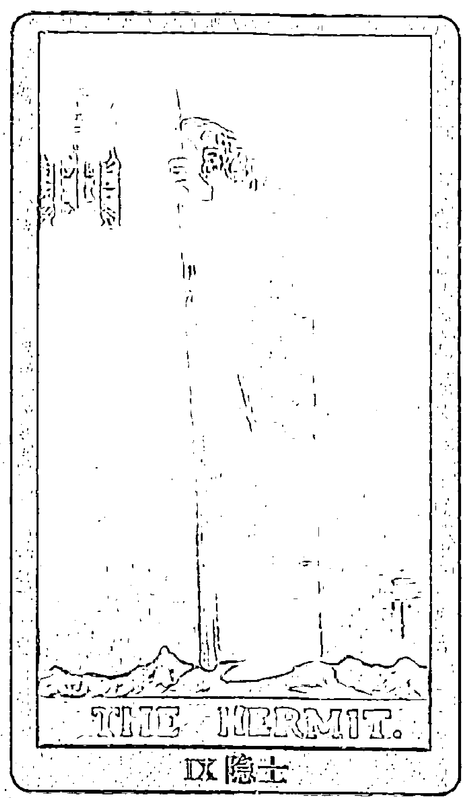

## 9 隐士
THE HERMIT

关键词：反省、引导、寻求、寻找孤独

牌义对立或相近的牌

◇对立牌：
- 情侣：有某种关系，性欲
- 世界：参与世界
- 圣杯二：联系，成为一员
- 圣杯三：在集体中，和其他人在一起
- 圣杯九：肉体上的快乐

◇加强牌：
- 女教主：关注内心世界，撤退
- 圣杯四：撤退，内向的
- 宝剑四：沉思的，安静的
- 宝剑七：单独的，远离其他人

反省：仔细思考事情；关注内心世界；使自己心境平和；从内心寻找答案；需要理解

引导：希望成为或已成为一个贤明的指导者；接受或提供明智的忠告；向宗教领袖学习或已成为宗教领袖；变成或已成为一个可信赖的老师；受到帮助或帮助别人

寻求：寻找更深的理解；寻找什么东西；不惜一切代价寻求真理；不断地自我批评；需要更多；渴望一个新的方向

寻找孤独：需要孤独；渴望安宁；从世间隐退；经历隔离；放弃娱乐；建立一个私人世界

### 图案解读：

隐士是一位老人，年老代表他充满人生的智慧。他穿着一件斗篷，伫立在冰天雪地的山巅上，颔首沉思，右手高举的灯，象征真理，灯里是一颗发亮的六角星，是所罗门的封印，光芒代表潜意识。灯没有照亮眼前的事物，象征不要只一味追求遥远的梦想，而忽略了身边的真理。老人的左手拄着族长之杖，象征着在启蒙之路上做前导。隐士举步谨慎，他已积累了人生的经验，充满智慧并且行事谨慎。同时，正因为在悬崖之巅，高处不胜寒，隐士是孤独的，离群索居的，他追寻的是性灵的成长，远离人群和交际，内心平静，冥想和沉思。他在寻求着答案，希望寻到真理之光。

### 推测解读：

如果隐士牌出现在牌阵的中间，则可以比较简单地解释出来。但如果出现在结果部分则含义比较难解，此时不妨重整牌局，或者注意从一些细微之处，寻找出答案来。

对应星象：处女座

相关希腊神话：克洛诺斯(Cronos)，黄金时代的开创者，天神乌拉诺斯(Uranus)和地母该亚(Gaea)之子，宙斯、赫拉、哈德斯、波塞冬等人的父亲。乌拉诺斯把他的孩子关在地下。后来克洛诺斯推翻了父亲的统治。随后他也如预言说：克洛诺斯将如其父，为一子所推翻，而把自己的子女吞入腹中。后来宙斯被母亲所救，最后推翻了克洛诺斯的统治。

### 正位含义：

1. 拥有智慧和卓越的见解。
2. 思虑周密，冷静沉着。
3. 需要独处和内省，自我思考的空间。
4. 可以向有智慧的前辈或长者请教。
5. 单身，或暂时退出感情关系。
6. 极有帮助的建议。

### 逆位含义：

1. 失去谨慎而导致了失误。
2. 过于固执，我行我素，而不愿听从别人的意见。
3. 孤独。
4. 过分远离人群，缺乏沟通与交流。
5. 过分的警戒，影响事物的顺利发展和进行。
6. 轻浮的爱情或对爱情产生怀疑。

## 牌义解释
大阿尔卡那

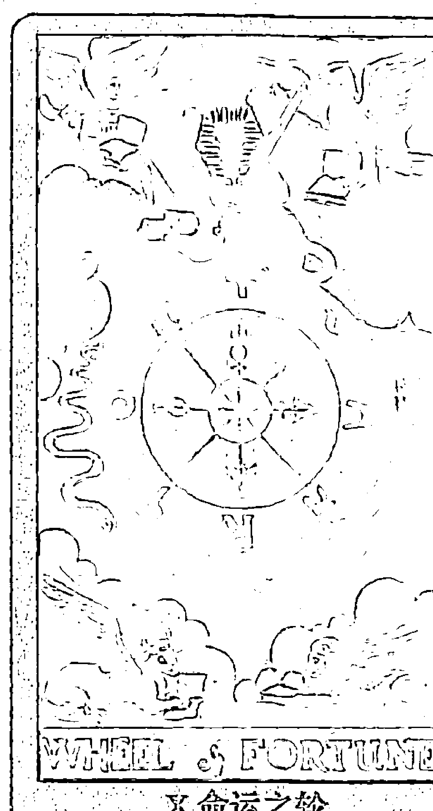

## 10 命运之轮
WHEEL OF FORTUNE

关键词：命运、运动、转折点、个人视角

**命运：** 利用机会提供的一切；看到编织生活；在意外事故中寻找机会；对好运持开放态度；感觉到命运的行为；见证奇迹的发生

**运动：** 经历变化；感到生活节奏加快；在新发展机会中积极卖力；重新加入到活动中；参与

**转折点：** 反向的；向不同的方向运动；使事情转向；命运的转折；改变现状；在事情出现转折时感到奇怪

**个人视角：** 看到所有的事情是相互联系的；变得更有意识；揭露群体和周期；扩大你的视野；得到更好的前途；发现你的作用和目的

### 牌义对立或相近的牌

◇对立牌：
- 宝剑二：坚持，陷入僵局
- 宝剑四：休息，安静，缓慢的步伐
- 星币四：受阻碍的变化，没有行动
- 星币七：方向改变之前进行评估

◇加强牌：
- 权杖八：快速地行动，快速地发展

### 图案解读

命运之轮是唯一一张没有人物的大牌。然而它牌面丰富，寓意深刻。中间的命运之轮由三个圆圈组成，从里到外分别代表了创造力、形成力和物质世界。空白的创造力圆圈代表潜能无限。中间圈中所画的是炼金术中的符号，与风、火、水、土四元素相关联，代表了形成物质世界的基本要素。最外层代表物质世界的圆圈中，上右下左四个正方位分别是TARO四个字母，这四个字母可以组合成Rota(轮)、Orat(说)、Tora(律法)、Ator(哈托尔女神)四个词，这四个词形成一个完整的句子：塔罗之轮诉说哈托尔女神的律法。哈托尔女神是埃及的女神，掌管音乐、爱和美，相当于希腊神话中的维纳斯。物质世界之圈中的另外四个方位的符号是希伯来字母YHVH，这是上帝最古老的名字。

在轮盘的左方有一条往下游行的蛇，它是堤丰(Typhon)(注释一)的象征，在另一方，阿努比斯神(Anubis)(注释二)背负着轮盘向上飞升。两个力量，一个带轮盘进入黑暗的地下，一个带轮盘升入天堂。两种力量使轮盘不停运转的同时保持平衡。

轮子上方的狮身人面兽是智慧的象征，画面的四个角落有四只动物(注释三)，这四个动物分别代表四个固定星座和四要素，老鹰代表天蝎座，属水；狮子代表狮子座，属火；牛代表金牛座，属土；人代表水瓶座，属风。他们都在看书，汲取智慧，而翅膀赋予了他们变动中依然保持稳定的能力。

### 推测解读

命运之轮牌表现了命运不可预测和变幻莫测。当命运之轮转动时，犹如人生潮起潮落，祸福变换。命运是变化的。同时每次是新的循环，新的开始，是轮回的。所以当命运之轮牌预示不好的结果时，同时也暗含着否极泰来的意义。

对应星象：木星

相关希腊神话：掌管人的命运的女神摩伊赖(Moirae)，是宙斯和忒弥斯的女儿。起初，每个人都有自己的命运女神，后来，命运女神减到三个：克罗托(Clotho)，她负责纺织生命之线；拉克西斯(Lachesis)，她使生命之线通过各种命运的波折，决定生命之线的长短；阿特洛波斯(Atropos)，她负责剪断人的生命之线。

### 正位含义

1. 代表好的转变。
2. 工作或财运上会有意外惊喜。
3. 会有一见钟情的恋情发生。
4. 好运，好的机会到来，把握到了好的人生机遇。
5. 美好而幸运的婚姻，注定的姻缘。

### 逆位含义

1. 代表不幸的转变。
2. 不要试图拒绝命运之轮必然的转变，要坦然接受。
3. 犹豫不决，未能抓住机遇。
4. 失败。
5. 时机未到，或居于劣势。不宜做投机之事。
6. 失恋或者短暂的恋情。

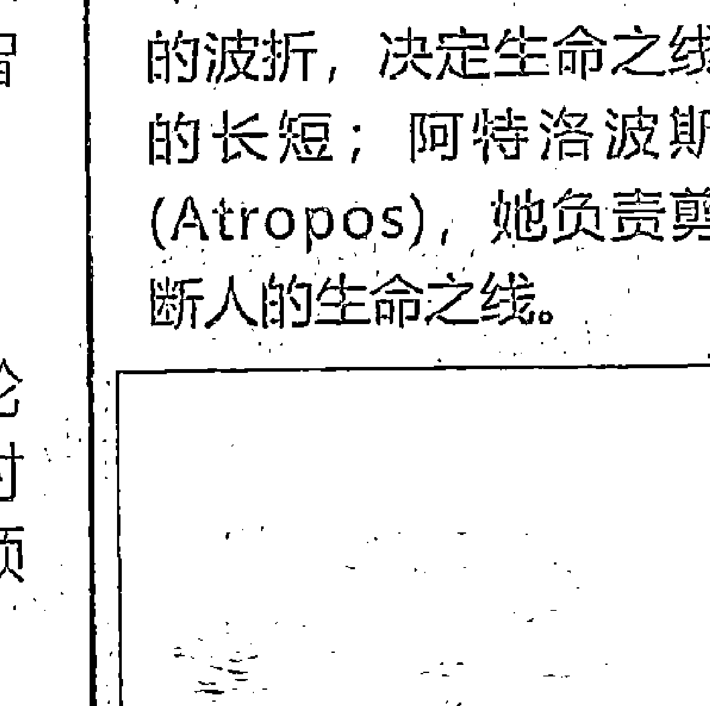

## 牌义解释
大阿尔卡那

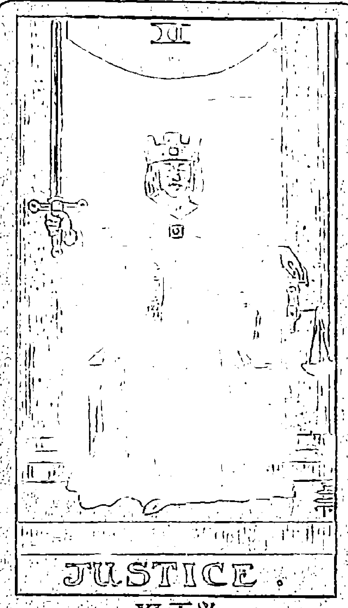

## 11 正义
JUSTICE

关键词：公正、决定、责任、因果

牌义对立或相近的牌

◇对立牌：
- 宝剑二：避免触及真相，否认你的作用
- 宝剑五：缺乏整体性，不做正确的判断
- 宝剑七：逃避责任

◇加强牌：
- 皇帝：公正，规则，依法办事
- 审判：决定的，接受过去的行为，包括错误
- 权杖十：接受责任，有责任
- 宝剑九：对过去有内疚感，承认错误
- 星币七：评估你在何处，决定未来的方向

公正：坚持正义；按伦理的原则行动；受到法律约束；诚实；寻求平等；不偏不倚；试图想做正确的事情

决定：权衡事情的各个方面；为未来做计划；平衡所有的因素；决定正确的行动；全神贯注地选择

责任：解决原来的债权；有责任的；承认事实；允许参与；处理局势；做必须做的事

因果：接受你创造的结果；看看你如何选择你的局面；辨认因果报应的行为；知道哪些事是有意义的；把事情联系起来看

### 图案解读：

正义女神左手拿天秤，右手持剑直举，她身披红袍，头戴金冠，绿色的披肩用方形扣子扣起，端坐于石凳之上。高举的宝剑，象征她的决心，宝剑不偏不倚，象征公正。天秤代表她正在评估，一旦作出决断，她就会利用手中的宝剑进行裁决。披肩的绿色和天秤都是公平和正义的象征。披肩的方形纽扣中间有红色的圆形，象征着四要素的调和，大地、物质、自然的力量。她身后紫色的帷幕，象征智慧，两旁的柱子象征正负两面的力量。他维护正义、力求公平，透露出冷静而凌厉的气质。

正义牌整体呈对称模式，正义女神长相中性，这暗示着天平追求平衡的特性。正义女神，也是法律的化身。

### 推测解读：

正义牌的出现，通常代表与某个决定有关，需要用心中的天平来衡量各种因素而作出决定。它暗示着我们，不论何时何地，都要坚持道德与正义，要有宽容的心胸，不可受利益影响而偏私。

对应星座：天秤座

相关希腊神话：
在宙斯的第一个妻子大洋神女墨提斯怀孕的时候，预言说她将生下一个比父亲更强的孩子。为防患未然，宙斯就把墨提斯吞了下去。然而，胎儿却在宙斯的头颅中继续生长了。宙斯和赫拉的儿子火神和锻治之神赫淮斯托斯 (Hephaestus) 用斧子把宙斯的头颅劈开，于是雅典娜 (Athene) 全身披挂着出世了。她是智慧和科学的女神，是战斗和力量的女神，是正义女神，是雅典人的保护神。

| 正位含义： | 逆位含义： |
| :--- | :--- |
| 1. 公正，受到公平的待遇。 | 1. 不公平，不公正的待遇。 |
| 2. 分析利弊，合理地处理事务。 | 2. 契约等存在问题，不够公允，或有诈。 |
| 3. 彼此获得协调，或中立的立场。 | 3. 做出了错误的决断。 |
| 4. 作为一个协调者、裁判者，应站在公正的立场。 | 4. 会发生纷争或诉讼。 |
| 5. 暗示将会讨回公道。 | 5. 无法两全，无法取得平衡。 |
| 6. 代表还你公道的某个人。 | 6. 发生了逃避责任，偏颇、偏见或独断专行的行为，总之心中有愧。 |
| 7. 诚实之心，光明正大。 | |

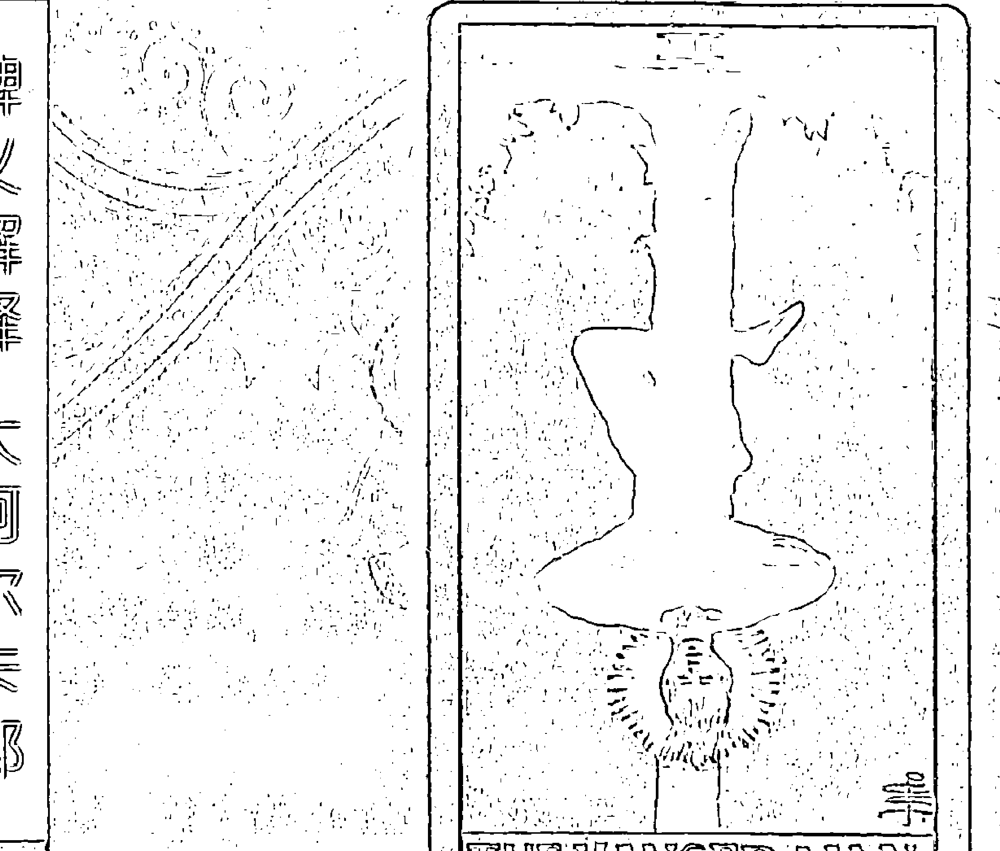

## 12 吊人
THE HANGED MAN

关键词：顺其自然、悬吊、反向的、牺牲

牌义对立或相近的牌

◇对立牌：
- 教主：行动力，去做事
- 战车：自我肯定
- 权杖七：挑战，斗争
- 权杖十：斗争
- 星币四：坚持控制

◇加强牌：
- 愚人：对事物的本质有信心，随波逐流
- 女教主：犹豫的行动，等待
- 力量：耐心，从容不迫
- 宝剑四：休息，悬而未决的活动
- 宝剑十：奉献，牺牲

顺其自然：情绪上的释放；接受事物本来的样子；向经验妥协；结束斗争；易受攻击的和开放的；放弃控制；接受上帝的意愿

悬吊：停止影响；不在意时间；从容进行；放弃紧迫感；生活的瞬间；等待最好的机会

反向的：使世界转向；改变你的想法；摧毁过去的优先权；从一个新的角度看；颠倒旧秩序；做表面的工作

牺牲：成为殉教者；断绝要求；把个人利益抛开；后退一步，前进两步；为高尚的原因而放弃；把其他人置于首位

### 图案解读：

这是一位被倒吊在一棵T字形树上的年轻人。他两只手背于身后，一只脚屈起，整体形象像一个完成炼金术符号，象征伟大事业的完成，低层次的欲望转化到了高层次的灵魂。红色的裤子象征“身”，即人类的欲望和肉体；蓝色的上衣象征“心”，即知识；金发和光环象征“灵”，即智慧和心灵。金色的鞋子象征吊人崇高的理想。吊人的表情是平静的，他甘愿做自我牺牲，即使肉体毁灭了，灵魂会永远存在，他深悟其中的道理。再糟的情况，只要耐心等待，厄运终究会过去。

把吊人颠倒来看，就不再倒吊了，且很像世界牌中的舞者，这暗示了吊人最终仍能转正，看到事物真实的模样。吊人的编号12正好是世界牌21的相反，他是倒吊的世界，他敢于与众不同，做自己想做的事情，且不是像愚人一样出于自己的本性，而是出于对世界的深沉的理解。

吊人头下脚上，也暗示着换一个角度看世界，换一种思考模式。

吊人与海王星相对应，代表牺牲与理想。他安宁而祥和，是自愿的牺牲，有着智慧上的深沉理解，他不挣扎，因为他明白牺牲会换来更有价值的收获。有舍才有得，他是崇高的殉道者。

### 推测解读：

吊人牌的出现，正位是有偿的牺牲，逆位则可能是无偿的牺牲，或者是不付出的意思。关键是弄清楚正面临抉择时，这一次牺牲是否有价值。

对应星象：海王星

相关希腊神话：

提坦神之一普罗米修斯（Prometheus）为了帮助人类减少供神的祭品，他把一头牛的身体分成两堆，一堆全是可吃的牛肉，上面盖着牛皮和牛肚；另一堆是骨头，上面盖着成块的牛油。宙斯看中牛油，挑了后一堆。宙斯发现上了当，大发雷霆，从人间取走了火种。普罗米修斯从奥林匹斯山上盗来了火带到人间，并教会人类用火，为了惩治普罗米修斯反抗众神的行为。宙斯把他锁在高加索（Caucasus）山上，派一只老鹰啄他的肝，但他的肝每天都会长出新的来。后来被宙斯的儿子著名的英雄赫拉克勒斯（Heracles）所救。普罗米修斯具有着光辉的形象，他仇视暴虐、争取正义、为理想而饱受苦难，为了人类而甘愿牺牲。

### 正位含义：

1. 接受考验，不贪图眼前利益。
2. 有牺牲，但有失必有得，有偿的牺牲。
3. 面临抉择时内心平静，做自己想做的事，听从了自己内心的选择。
4. 等待，不急躁，换一个角度思考。
5. 充满奉献的爱，或明知辛苦不一定有回报仍然全心付出全力以赴。
6. 感情方面可能需要静静等待一段时间。
7. 换一个角度看世界。

### 逆位含义：

1. 苦苦挣扎，钻牛角尖，想不透人生的真谛。无法换一个角度看世界。
2. 利己主义者，不愿付出和牺牲。
3. 没有耐性，不努力。
4. 受社会眼光的制约，不敢做自己想做的事情。
5. 得不到回报的爱情。或者泛指无谓的毫无结果的牺牲。
6. 可能出现身体上的损害，重则折断骨头之类。
7. 也可能暗示瓶颈时期或者承受牺牲时期的结束。

## 牌义解释 大阿尔卡那

## 13死神
DEATH

关键词：结束、消除、改变、内部的力量

对应星象：天蝎座
牌义对立或相近的牌
◇对立牌：
愚人：新开始
皇后：生育
审判：重生，新开始
◇加强牌：
高塔：扫除影响，强大的力量
权杖八：结论，结果
圣杯五：失去，结束
圣杯八：移动，结束

结束：
关闭一扇门，打开另一扇；使某事结束；一个阶段结束；结束未完成的生意；把过去抛到脑后；对道路的选择有分歧

消除：
摆脱不可能的事情；抛开旧的态度；开始考虑本质问题；集中于重要事情上；回到最基本的问题上

改变：
改变的局面；从已知的地方运动到未知的地方；被抛掷而流动；等待处于中间状态；在中间

内部的力量：
处于大规模改变的路途上；不可避免地被抓住；通过不可避免的地方；成为强大运动的一部分；控制你的命运；接受这种必然

图案解读：
骷髅骑士身披铠甲，头戴红色羽毛，手擎旗帜，骑于白色的战马之上，发出摄人气魄。旗帜以黑色为背景，象征光芒的不存在。白马的周围有四个人，他们分别是国王、主教、女人和小孩。国王拒绝死亡，所以被白马踏过。主教绝望地死去，他的权杖掉在地上，象征着世俗的权利遇到死亡时一样无能为力。女人跪在地上，转过脸去，似乎不忍目睹这一切。她可能就是力量牌中的女人，花冠和衣着都很相似。而小孩对死亡懵懂无知，好奇地看着这一切。这一幅景象象征：无论是谁，都逃不过死亡。远方的河流是流经伊甸园的四条河流之一，上面有一艘船。骷髅骑士的脚边，有个箭头指向船上方的洞穴一样的地方，那个洞穴也许就是《神曲》中但丁通往阴间的通道。

凡人皆难逃一死，但生命走到尽头的同时，也是新生命的诞生。死神手中的旗帜上五瓣蔷薇的图案是蔷薇十字会的图腾，这个图腾代表纯洁与不朽。不仅仅生命如此，任何事情的结束，同时也是新的旅程新的目标的开始。牌的右方那条小径通往两高塔之间，象征永生的朝阳冉冉升起，这代表了通往耶路撒冷的神秘之旅，象征着死亡绝不是一切的终点。骷髅骑士骑着白马，白色是最纯洁的颜色，它象征着把过往的一切全部擦掉，一切重新开始。死神牌预示着忘记过去，获得新生。

### 对应星象：冥王星

### 相关希腊神话：

哈迪斯是古希腊神话中的冥界之王，同时还是掌管瘟疫的神。他曾经使忒拜城邦染上致命的瘟疫，直到两个少女墨提娥克、墨妮佩自愿献祭，瘟疫才停止。在部分版本中是奥林匹斯十二神之一。他是第二代神王神后克洛诺斯和瑞亚的长子，是波塞冬和宙斯的大哥。他的配偶是神王宙斯与农业女神得墨忒耳的女儿珀耳塞福涅。克洛诺斯把妻子瑞亚的孩子们都吞下肚子，哈迪斯是长子。而后独眼巨人帮哈迪斯制作了一顶能隐形的头盔库内埃。十年的提坦之战中，哈迪斯与波塞冬、宙斯以及姐妹们一起打败了他们的父亲克罗诺斯，和两个弟弟结束了这场战争。

### 推测解读：

虽然名为死神牌，但肉体死亡的含意在推测中是很罕见的，死神牌更大意义上代表着各种形式的结束。

### 正位含义：

+   1. 失败。
+   2. 失业，或交易终止、停滞。
+   3. 恋爱关系的结束，离婚或分手等。
+   4. 生病或发生意外。
+   5. 长久习惯的戒除，包括戒烟戒酒等。
+   6. 生活味如嚼蜡毫无生气。

### 逆位含义：

+   1. 起死回生、柳暗花明的机会。
+   2. 奇迹般康复病情。
+   3. 斩断情丝，开始新生活。
+   4. 改变印象或者挽回了名誉。
+   5. 低迷期的结束，新的良好的开端。
+   6. 顽固不肯放手，恐惧，沉溺在过去之中无法自拔。

## 牌义解释 大阿尔卡那

## 14 节制
TEMPERANCE

关键词：节制、健康、平衡、结合

- **节制：** 寻找中间基础；表现适度；避免过剩；减轻粗糙的局面；寻找黄金道路；达成妥协；弥补极限
- **健康：** 重新获得力量；精力旺盛；康复的；享受良好的状态；恢复；繁荣昌盛
- **平衡：** 体验协调；达到平衡；共同带来对立；承认各个方面；鼓励合作；感觉处于中心位置和安全可靠
- **结合：** 所需要的集合在一起；加入其他人；巩固；找到正确的融合；创造综合体；把所有的一切都结合在一起

### 牌义对立或相近的牌

- 对立牌:
  - 高塔: 极端, 暴发
  - 权杖五: 不同意.竞争.失衡
  - 圣杯七: 过剩的, 过分放纵
  - 宝剑五: 不协调.缺乏协调
  - 星币五: 不健康的

### 加强牌

- 世界: 统一的, 合成的, 结合
- 圣杯二: 联结, 一起工作
- 圣杯三: 加入的力量, 一起工作
- 星币二: 平衡, 发现正确的融合点
- 星币三: 团队, 综合的

图案解读：
牌中金发的可爱天使，正缓缓将水倒入圣杯中。这两个圣杯，分别代表着‘物质’和‘精神’，象征着在物质与精神方面的渴求。两只圣杯都注满时，便可取得平衡，走向成功。调节圣杯之水不致溢出来的，便是暗含的‘节制之力’。天使飞扬的双翼，代表他获得平衡的能力。头上的金色光芒，代表智慧，与远方山巅的闪耀金光的太阳遥相辉映。身旁的水和花草，象征着诱惑。节制体现出来的是适度和自我克制。在充满诱惑自由放任的世界里，找到自我的平衡是多么必要。这样是明智的，但是也许有点乏味，不是吗？节制的能量从表面看起来，也许没有激情，但是它是飓风中的宁静。四处都是旋转的风，但是中心是一个安静的点，使所有的东西都保持平衡。这是一种令人鼓舞的团结的力量。这样的人，散发着沉静的力量。平静和从容中，不知不觉已获得成功。

### 推测解读：

节制牌代表了适度的需要和平衡的必要。妥协和合作是非常重要的，应寻找一切机会使对立的双方结合为一体。如果加入一个新元素，节制便意味着改变。通过结合和重新结合，我们能找到一个理想的混合体或解决方案。

对应星象：射手座
相关希腊神话：伊里斯(Iris)，彩虹女神，按古代人的观念，彩虹连接天和地。伊里斯专为宙斯和赫拉传信。她是个带翅膀的姑娘，手捧一只杯子，常与赫拉并肩出现。她用手中的杯子，给云运水。她与节制牌图上的可爱天使十分相近，与其牌义也对应。

### 正位含义：
1. 交往顺利，两者相融洽和畅。
2. 调整，彼此交换有利条件。
3. 平凡中也见真正的幸福。
4. 心境平和，生活单纯而顺利。
5. 从好感转变为爱意。
6. 深深的爱恋。

### 逆位含义：
1. 消耗，浪费，没有节制的损耗。
2. 缺乏调整的能力，难以保持平衡状态。
3. 爱情彼此没有默契。
4. 不稳定的工作。
5. 双方合作不融洽，不宜与人合作。

## 牌义解释 大阿尔卡那

## 15 魔鬼 THE DEVIL

关键词：束缚、无知、物质主义、绝望的

| 关键词 | 解释 |
|--------|------|
| 束缚 | 接受一个不希望的局面；被困扰；感觉违背意愿被束缚住了；失去独立性；让自己被控制了；沉溺及被奴役；屈服于另一个人 |
| 无知 | 无意识的；在一个狭小的范围内运行；体验局限；选择待在黑暗中；害怕未知的事物；凭表面接受 |
| 物质主义 | 被表面吸引；只相信物质；忘记精神的；得到和花费；过分纵容感觉 |
| 绝望的 | 相信最坏的；绝望的；缺乏信心；寻找一个寒冷的世界；负面的思考；预见一个黯淡的未来；怀疑的 |

牌义对立或相近的牌
◇对立牌:
- 愚人：有信心，相信
- 星辰：希望，信心，乐观
- 权杖四：自由，解放
- 圣杯六：良好的意愿，清白，简单的快乐
- 圣杯十：快乐，和平，祈祷
◇加强牌:
- 圣杯七：过分纵容的，分散的
- 宝剑八：混乱的，约束
- 宝剑九：绝望,缺乏快乐

图案解读：
魔鬼面目狰狞，生着蝙蝠一样的翅膀，另外生着羊角、羊腿和鸟足，象征动物的本能与天性。他的驴耳，象征着固执。头顶倒立的五角星，指向地面，代表物质世界。他右手向上摆出魔鬼法的姿势，与教主的祝福手势形成对比。手心的符号代表土星，是限制与堕落之星。魔鬼左手拿着火炬，同样向下指着物质世界，似乎在煽动着亚当的欲望，这与亚当尾巴上的火焰相呼应着。同时夏娃的尾巴上是葡萄，这些都是情侣牌中树上结的果实。他们都长出了角和尾巴，显露出动物的本能，暗含着堕落的引诱。他们的脖子上都锁着铁链，似乎无处可逃，但仔细看来，这些铁链非常松，很容易就可以取下来。但是他们没有，表示他们是自愿承受枷锁所缚的。他们已经沉沦，上天的祝福变成了诅咒。魔鬼牌的背景一片墨黑，象征着精神上的黑暗。魔鬼的力量是强大的，一旦屈服于魔鬼的轻声细语之下，便跌入万劫不复的深渊。

### 推测解读：

诱惑，是魔鬼牌的重要含义。诱惑在于心灵，魔鬼牌提醒着保持内心自省的状态。

对应星象：摩羯座

### 相关希腊神话：

潘(Pan)，野生动物与森林之神。他出生时，浑身毛发，头上长角，有山羊的蹄子和弯鼻子，有胡须和尾巴。他母亲看到婴儿的长相，惊恐中把他抛弃。但是众神都喜欢他，允许他加入神的行列。他向水泽神女绪任克斯(syrinx)求爱，她为了回避他而躲入阿耳卡狄亚的拉冬河里变成了一棵芦苇。潘用这棵芦苇削制成了一支芦笛。

### 正位含义：
1. 因为欲望而堕落被束缚，或不可抗拒的诱惑。
2. 忽略了心灵，盲目追求外在的物质。或沉迷于某种刺激中深陷成瘾。
3. 卑躬屈膝，荒诞的生活。
4. 有恶意。
5. 病魔入侵。
6. 私密的恋情。明知不该，却无法自拔的恋情。
7. 代表小气、势利、贪心的人，工作狂等。

### 逆位含义：
1. 脱离了物质的束缚，思想恢复开放，得到自由。
2. 拒绝诱惑，舍弃私欲。
3. 长期的病痛得到治愈。
4. 斩断情缘，从长期痛苦的恋情中得到解脱。
5. 面临别离。
6. 爱恨交加的恋情，愈加深陷泥沼。
7. 一片混乱，更强烈地追求物质，甚至使用不正当的手段或罪恶。

## 16高塔
### THE TOWER

关键词： 突然的改变、下落的、释放的、有启示

| 关键词 | 解释 |
|---|---|
| 突然的改变 | 经历剧变；计划被打破；惊奇的；正在经历一场危机；路线的摇摆改变；处于混乱的状况中 |
| 下落的 | 受挫的；经历撞击；从高处掉下来；运气的转变；遭受对自信的打击 |
| 释放的 | 爆发的；情绪上的爆发；怒气的爆发；自我防御体系的破裂；打破主张；让所有的事情顺其自然 |
| 有启示的 | 突然意识到真理；发现隐藏的东西；洞察力的突破通过幻想看见；得到结论；瞬间看到所有的一切 |

### 牌义对立或相近的牌

◇对立牌：
战车：胜利，控制
节制：中间点，在一起，包含的
星辰：平静，宁静
权杖六：欢呼，感到自豪
圣杯十：和平，安全
◇加强牌：
死神：施加影响，强大的力量
太阳：发光发亮，启示
星币五：艰难的日子

图案解读：
一座屹立于山颠的高塔正受雷击，即将毁灭。高塔象征物质，高塔顶跌落的王冠代表统治和成就。天上的雷，是来自上帝的语言。人从高塔上摔下，象征着人类即使有再大的本事，依然敌不过自然的力量，违逆不过上帝的旨意。高耸的高塔和王冠，也象征着人类的高傲和自满，这是遭受毁灭的本因。让人联想起《圣经》中的巴别高塔（另注）。图中雷溅起的火花有22个，象征塔罗牌22张大牌。云是灰色的，呈现突兀的形状，象征灾难。在自然规律和上帝面前，人是平等的。整张牌黑色的背景，预示了一段黑暗的时期。

### 推测解读：

在大阿卡那牌中，高塔牌是最没有好意的一张，也是宗教意义很重的一张牌，提醒自省的意义便相对地强烈了。但同时也须明白，没有非常的破坏，就没有非常的建设。解脱高塔的牢笼，未尝不是置之死地而后生。逆位的高塔牌与正位类似，但改变不如正位剧烈。而其实有时候压抑控制事态的发展不一定是好事，更有可能把自己囚禁在高塔中。

→巴比伦通天塔

### 正位含义：

+   1.致命的打击，遭遇剧变，或意想不到的事情
+   2.纷争，纠纷不断。
+   3.身患急症。
+   4.玩火自焚。
+   5.与周遭的事物对立，情况十分糟糕。
+   6.信仰崩溃，内心世界变得黑暗而彷徨。
+   7.突然的分离，或者幻灭的爱情。

### 逆位含义：

+   1.因骄傲自大将付出惨痛代价。
+   2.状况不佳，陷入困境，气氛险恶，有问题急需解决。
+   3.事态紧迫，有背水一战的意味。
+   4.注意可能会出现刑事问题。
+   5.爱情出现了危机，或许有分离的预感。
+   6.内讧，关系将破裂。

## 17 星辰
THE STAR

关键词：希望、慷慨、灵感、平静

牌义对立或相近的牌
◇对立牌:
- 魔鬼：无望、缺乏信心、消极
- 高塔：剧变、混乱
- 月亮：有麻烦、烦乱、焦虑
- 宝剑二：感情封闭
- 宝剑九：内疚、苦闷
◇加强牌:
- 愚人：单纯、信任、相信
- 皇后：慷慨、博爱
- 圣杯六：美好愿望、分享
- 圣杯十：愉快、积极、祝福

希望： 对未来充满信心；思想积极；有信仰；相信祈祷的作用；看到希望；强烈期待；期望成功

慷慨： 愿意给予或分享；施舍财物；敞开心扉；归还所获；博爱；无保留地给予；毫无隐瞒

灵感： 重获灵感；发现内在力量；洞察一切；达到更高境界；创新；获得解答

平静： 心境平和；放松；保持内心平和；没有烦恼；保持冷静；在困境中泰然自若；享受和谐

图案解读：
希望之星在天空灼灼生辉。天穹下面，有美丽女子自壶中倾倒出源源不绝的水源来滋润大地，而这些水孕育了地球上所有的生命，是生命力的象征。我们要不吝惜地尽心付出我们的爱，借此培育希望，迈向光明的未来。只要能够相信未来，就一定能达成目标。因此，星辰会不停地闪耀着光辉，前途必将是一片光明。星辰是灵感和希望的源泉。星辰的光芒给我们的心灵指引方向。日常生活中所有的粗糙和密度都被精炼了，只剩下最纯净的本质。暴露于星辰下，我们感到振奋，受到了祝福。星辰是魔鬼的对立，魔鬼剥夺了我们对未来的信心。星辰牌给予我们承诺，即我们最终能找到心灵的平静。星辰也提醒我们要放开心胸，释放恐惧和怀疑。如果你在任何方面踌躇不前，现在就慷慨地给予吧。

### 推测解读：

经过死神和魔鬼，来到了星辰的一派欣欣向荣之中。星辰虽然不能提供具体实践解决方案或最终结论，但星辰令人鼓舞，给予希望。当看到17号的星辰牌时，我们知道，我们正处于正确的轨道上。我们的目标和热情得到了祈祷，同时我们也必须采取积极的行动。运用星辰的光芒指导努力的方向。

### 对应星象: 水瓶座

### 相关希腊神话：

因为普罗米修斯窃取了天火送给人类，宙斯为了惩罚世人，让工匠之神赫淮斯托斯(Hephaestus)用泥和水捏成了第一个女人潘多拉(Pandora)。她有着和女神一样的容貌；阿佛洛狄特赐给她美；赫耳墨斯(Hermes)赐给她机智、说谎、奸诈和辩才；雅典娜给她做了漂亮的衣裳。宙斯将潘多拉嫁给了普罗米修斯的兄弟厄庇墨透斯(Epimetheus)，并送给他一个大匣子。普罗米修斯警告他们不要打开，但潘多拉克制不住好奇之心打开了匣子，于是宙斯装在匣子中的生、老、病、死等一切灾祸和罪恶都飞了出来。只有在匣子的底部，留下了一个“希望”。

### 正位含义：

+   1.愿望达成了。
+   2.前途光明，未来充满希望。
+   3.有新的创造力和想像力。
+   4.生活美好，水准提高了。
+   5.美好的恋情，理想的对象，爱苗正得到滋润。
+   6.代表怀孕。

### 逆位含义：

+   1.遭遇挫折和失败。
+   2.事与愿违，情况不容乐观。
+   3.缺乏想像力。
+   4.异想天开、好高骛远。
+   5.缺少爱的生活或追求不可期待的对象。
+   6.秘密的恋情，未来希望渺茫。

## 18月亮
THE MOON

关键词：恐惧、想象、幻想、困惑

牌义对立或相近的牌
◇对立牌：
- 星辰：安全的，没有烦恼的，平和的
- 太阳：肯定的，清晰的，闪亮的
◇加强牌：
- 圣杯七：幻想，不现实的想法，白日梦
- 宝剑二：自我欺骗，看不到真相
- 宝剑八：迷惑的，缺乏清晰感

- 恐惧：
释放你内心的魔鬼；感到莫名的忧郁；遭受恐惧症；陷入自我阴影中；缺乏勇气；为焦虑所控制
- 想象：
有具体的梦境或景象；天马行空的幻想；陷入无意识；接受不寻常的想法；古怪的，奇异的
- 幻想：
接受虚假的图像；欺骗你自己；有不现实的想法；误解真相；体验扭曲；追求白日梦
- 困惑：
失去方向和目标；不能清晰地思考；糊涂的；容易心烦意乱的；感到失去方向感；没有目标地游荡

图案解读：
夜空中悬着一轮巨大的满月。月中有一张沉思的脸的剪影，仿佛隐隐透露着不安。月亮象征着想象、联想的精神世界。月亮的阴晴圆缺，代表着“变化”。狗儿在月下吠叫，似乎本能感应到了不安与危险。月亮牌的意象，象征着潜意识的活动，事物的暧昧性以及发现不安定的讯息。也代表着迷惑，越幸福的时候，越担心不幸会到来。如果能破除迷惑，就能得到好的结果。很多时候，我们熟悉的环境环绕着自己，觉得很安全。我们背向神秘的宇宙，那里有广阔的空间。有时，我们也许会用想象对神秘事物进行偷看，或者在白日梦中体验冒险的感觉，将意识的空间扩大。月亮就是这个领域的光线——黑暗和夜晚的世界。尽管这个地方可怕，但是没必要惊恐。在正确的环境下，月亮触及灵感并施展魔法。它承诺，所有你想象的东西都是你自己的。月亮引导我们到未知的领域，这样就使我们的生活变得不平常。

### 推测解读：

我们通常都害怕月亮。解牌时，月亮牌通常代表恐惧和焦虑——它们是来自夜晚最黑暗的地方。月亮也代表幻想。月光下，我们很容易迷失方向，有时会被诡计和错误的想法引入歧途。所以，18号的月亮牌也是在提醒我们，必须找到回归之路，弄清楚自己真正的目标。

### 对应星象：双鱼座

### 相关希腊神话：

阿耳忒弥斯（Artemis），阿波罗的孪生姐姐，月之女神。她有很多别名，也常常被人和其他女神合为一体，她既是月神，又是狩猎女神、道路之神、亡灵之神。她爱上了美少年恩戴米恩（Endymion），于是让他在月下长眠，得以永葆青春。而自己便可以经常去吻这个熟睡的青年。

### 正位含义：

+   1. 内心失去平静，不安而动摇。
+   2. 谎言，欺骗。
+   3. 暗藏动乱，危险的讯息。
+   4. 仿佛鬼迷心窍，受着某种诱惑而难以自拔。
+   5. 三角恋情或令人内心不安的爱。
+   6. 内心迷惑，难以抉择。

### 逆位含义：

+   1. 从危险的骗局中逃脱，或摆脱了对虚情假意的恋情的依赖。
+   2. 误会冰释，或消除了迷惘。
+   3. 状况有所好转。
+   4. 事前察知了危险，幸免于难。
+   5. 长远的眼光。
+   6. 静静地等待，时间能解决一切。

## 牌义解释 大阿尔卡那

## 19太阳
THE SUN

关键词：启迪、有生命力、伟大、保证

### 牌义对立或相近的牌

-   ◇对立牌：
月亮：困惑，失去方向感，幻想
圣杯八：虚弱的
宝剑六：沮丧的，倦怠的
星币五：被裁减的，疲惫的

-   ◇加强牌：
高塔：启迪，新发现
世界：成就，实现
权杖三：个人力量，有生命力的，显赫的
权杖六：喝彩，显著的

启迪：
理解；找到混乱背后的感觉；达到一个新的洞察力水平；有智力上的突破；抓住事情的核心；意识到真相

有生命力：
充满能量；热情的爆发；体验快乐；感到得到了滋补；被充电了；享受健康的快乐

伟大：
获得显著；被孤立出来；引人注目；得到个人荣誉的瞬间；举了一个杰出的例子；耀眼的光芒；显示区别；开始成为注视的焦点

保证：
感到自由和扩张的；为真实的自我感到骄傲；知道你能取得成功；有自信；相信你自己的价值；相信你的能力；原谅自己

### 图案解读：

太阳牌表达的是生命的喜悦。金色的太阳是生命的源头，万物赖它为生。太阳散发出21道光芒，象征着除愚人牌外的21张大阿卡那牌。顶端数字旁边一条黑色的光线，代表起初尚在蒙昧期的愚人。太阳的下方是四朵向日葵，代表四元素，也代表四个牌组。向日葵没有朝向太阳，而是朝向了前方的孩童。孩童象征新生，他头戴花冠，插着红色的羽毛。他左手中的旗帜是力量的象征。没有马鞍，没有缰绳，孩童已获得了完全的能量，他可以自然地控制一切。他是纯自然的，超脱的。光明而灿烂的景象教导我们，所有生命的喜悦，来自健康的养育和繁荣的生活。

### 推测解读：

虽然过度的阳光意味灼伤，意味炙烤，但太阳牌是所有大阿卡那牌中光明意义最多的一张牌。比星辰牌更加充满希望。逆位的太阳牌可当作比正位稍弱一些的牌义，有时也会多少有一点的负面意义。

## 对应星象：太阳

### 相关希腊神话：

阿波罗是古希腊神话中的光明、预言、音乐和医药之神，消灾解难之神，同时也是人类文明、迁徙和航海者的保护神、奥林匹斯十二主神之一。还是宙斯和勒托之子，也是一位太阳神。福玻斯是“光明”或“光辉灿烂”的意思。阿波罗是所有男神之中相貌最英俊的一个，他快乐、聪明、拥有着阳光般的气质，是许多艺术家在诗画中赞颂的对象。阿波罗常被现代人说成是太阳神，而事实上，公元前5世纪已经将他与赫利俄斯等希腊土著文明所信奉的太阳神进行并同。在古希腊神话晚期，阿波罗已有太阳神的属性。

### 正位含义：

1. 丰富的生命力，精力充沛。生活自由自在，快乐无比。
2. 工作顺利，飞黄腾达。
3. 学业得成，或金榜题名。
4. 爱情愉悦。
5. 婚姻幸福。
6. 暗示或建议去热带或亚热带旅行。
7. 万里无云的晴朗天气。
8. 代表一个人，婴儿、儿童等快乐的人。

### 逆位含义：

1. 活动力变弱，意气消沉。
2. 生活不安，人际关系不好。
3. 可能会失业。
4. 失恋。或结果不明的恋情。
5. 离婚。
6. 事态的发展不很乐观。

## 20审判
JUDGEMENT

关键词：审判、心声、重生、赦免

### 牌义对立或相近的牌
◇对立牌：
- 死神：死亡，结束
- 圣杯五：后悔，错误
- 宝剑九：罪恶的，谴责，罪孽的感觉

◇加强牌：
- 愚人：重生，新开始
- 正义：决定，接受过去的错误
- 星币七：决策点

审判：有算账的一天；把谷壳从麦子中分离出来；做一个诚实的估价；严格使用权力；确定一个立场；作出艰难的选择

心声：承认你真实的职业；感觉到内心的冲突；感觉到有冲动去做；做一个紧要的决定；感觉被拖入一个新的方向；知道你必须做什么；必然性的回答

重生：醒悟的可能性；形式的改变；享受收获的希望；一个新的开始；在新局面下看到一切；恢复的快乐

赦免：感觉到干净且充满活力的；释放罪恶感和悲伤；原谅你自己和其他人；为过去的错误进行弥补；不要让自己背上负担；感觉罪孽被清洗干净了

### 图案解读：

拥有翅膀的天使在云端吹奏着金色的喇叭，象征着发现真理，接受神的审判。人们在天使的召唤下，抬起头来。这是审判日，那一天信徒要被带入天堂，但是那些没有获得拯救的人怎么办？被认为不够格吗？对于他们的罪孽，将会被上帝否定吗？审判的这个方面让人感到不安。审判怎么样才能得到宽恕呢？神的审判，有着“精神觉醒”的含义。天使的喇叭，代表唤醒人们的觉悟，神的爱是无穷的，不论什么罪孽，只要有悔改之心，就会拥有希望。审判牌伴随着拯救的感觉。当天使召唤的时候，你就获得了重生——所有的罪孽被清洗干净了，包袱被卸掉了。过去和过去的错误都在你的身后，你正准备开始新生活。你也许感觉到一种召唤，那是对你想做的事情的个人确信。如果你处于低潮阶段，需要希望和赦免，审判表示，重生触手可及。

### 推测解读：

最终审判，在基督教的观念中，神会站在历史的终结处，所有人都走向最终审判。审判之时，善必得报，恶必被惩。而这张牌正显示了这个终结之处。而审判之后，便是复生的美丽世界。

### 对应星象:天蝎座

### 相关希腊神话:

赫尔墨斯是古希腊神话中的商业、旅者、小偷和畜牧之神。也是众神的使者，奥林匹斯十二主神之一。是宙斯与阿特拉斯之女迈亚的儿子，罗马又称墨丘利。赫尔墨斯出生在阿耳卡狄亚的一个山洞里，最早是阿耳卡狄亚的神。奥林匹斯统一后，他成为宙斯的传旨者和信使。同时也被视为行路者和商人的保护神、以及雄辩之神。传说他发明了尺、数和字母。他聪明狡猾，又被视为欺骗之术的创造者，他把诈骗术传给了自己的儿子。他还是七弦琴的发明者，是希腊各种竞技比赛的庇护神。后来他又与古埃及的智慧神托特混为一体，被认为是魔法的庇护者，他的魔杖可使神与人入睡，也可使他们从梦中苏醒过来。

### 正位含义：

| 正位含义： | 逆位含义： |
| :--- | :--- |
| 1. 危机解除，或代表身体上恢复健康。 | 1. 坏消息，失败，从此一蹶不振。 |
| 2. 事业上崭露头角或获得荣升。 | 2. 无法作出决定，或者被延期。 |
| 3. 有好的消息，事态明朗，或带来重见光明的喜讯。 | 3. 离复苏或者事态好转还有很长的时间。 |
| 4. 复苏的爱，重新获得的爱。 | 4. 计划、建议、应聘或者爱情不被接受。 |
| 5. 爱的奇迹。 | 5. 恋恋不舍的爱。 |
| 6. 必要的审慎；判决，作出决断。 | 6. 虽然重新开始，却再度恢复为原状。 |

### 逆位含义：

## 牌义解释 大阿尔卡那

## 21 世界
THE WORLD

关键词：融合、开始参与、成就、履行

**融合：** 体验整体；把各个部分合在一起；达到动态的平衡；结合的；创造性地综合；一起加入；协调一致

### 牌义对立或相近的牌
-   ◇对立牌：
    - 隐士：孤独的
    - 圣杯四：缺乏参与，缺乏兴趣，撤退的
    - 权杖五：为不一致的目的工作，缺乏综合
-   ◇加强牌：
    - 节制：综合，合成，结合
    - 太阳：成就，成功
    - 圣杯九：达到你心中的愿望
    - 圣杯十：快乐的，情感上的满足
    - 星币十：富裕，物质满足

**开始参与：** 起作用的，贡献的；有治疗作用的；提供服务；运用天赋或能力；分享你有的一切；你自己的给予；感觉到参与其中；积极的

**成就：** 实现你的目标；繁荣昌盛；达到你内心的期望；看到梦想成真；繁荣的；找到一个好的解决方案

**履行：** 享受现在；抓住生活中的快乐；享受心境的平和；满意；找到知己，感到满意；珍惜你的祈祷

### 图案解读：

象征名誉和光荣的月桂树的叶子，代表宇宙四大元素火、地、风、水的动物，包围着爱和美的女神阿佛洛狄特。她是调解纷争、教导慈爱、孕育生命的女神，世界在她手中完成。只要我们拥有感恩的心，就必定能为自己打造美丽的世界，找到幸福与快乐。快乐的一个主要元素是整体——就是所有一切都在一起协调工作的感觉。它不是一种静态的方式，而是动态的平衡。参与同样很重要。要快乐，你就必须感觉到是被联结的——与我们周围的一切有机结合。这里同样有成就感——知道我们是有目标的，而且能够成功地向目标前进。当所有的元素共同作用，我们就会感到充实，得到祝福。

### 推测解读：

世界，就是最终极的幸福之处了。推测时，世界牌是一个非常积极的信号，代表我们认识到了内心的渴望。21号的世界牌是积极贡献和服务的象征。要把握世界，我们必须把自己投身其中。这就是真正快乐的源泉。

→三美女神与众女神

## 对应星象：土星

### 相关希腊神话：

赫耳玛佛洛狄托斯 (Hermaphroditus)，汉密斯(Hermes)和阿佛洛狄特的孩子。由水泽女神养育长成俊美绝伦的少年。因为仙女萨耳玛喀斯(Salmacis)爱他入迷，把他抱住，说：“神啊！我不想再离开他了！”于是众神让他们变成了合体。

### 正位含义：
1. 完成，成功，达成目标。
2. 拥有毕生的追求。
3. 达到标准，完美的状态。
4. 快乐的结束，美好的结果。
5. 理想的恋情，受人称羡的情侣。

### 逆位含义：
1. 没有完成，没有获得计划中的成就。
2. 因准备不足而失败。
3. 事情进行得不顺利。
4. 精神松弛，状态不佳。
5. 态度不够圆融，不能发挥整体优势。
6. 因不够成熟而使情感受挫。

# 释义 小阿尔卡那

### 权杖首牌
ACE OF WANDS

关键词：创造力、自信、激情、勇气

#### 首一首搭配:
首一首搭配显示将有新的血液注入你的生命。它不但吸取了权杖首牌的能量(创造力，爱情，勇气以及个人自身的能力)，而且加上了以下的某一种能量：
- 圣杯首牌：深厚的感情，亲密，协调，同情，爱
- 宝剑首牌：智力，理智，公正，真理，坚定
- 星币首牌：繁荣，富裕，信任，安宁

创造力： 创造力：更好的创新方法；挖掘你的潜能；增加可能性；相信梦想，展现自我；激发自己的思维能力；展现自己的天赋；提出解决问题的方法

自信： 自信：相信自己；充分肯定自己的才能；有必胜的信心；自重；确信自己所从事的事情会成功；相信事情会解决

激情： 激情：热情高涨的，渴望的；创造令人激动的氛围；随时准备应付一切可能发生的事情；激励别人；保持乐观的；百倍努力的

勇气： 勇气：处理挑战性的事务；超越你的极限；忠实你的信仰；敢于坚定你的立场；直面恐惧；努力去争取

### 图案解读：

山峦、草原、树木、流水还有远方的城堡；在广袤的大地上空，云端里伸出一只强劲有力的大手，紧握着一根象征力量的权杖。权杖很粗，上面长着绿色的叶子，在空中飞舞。那只大手的周围，有白色的光芒，象征着这只手是至高无上的，传达着神的旨意。首牌代表新的开始，权杖象征能量；权杖首牌代表着无限的潜能，它像火花一般，隐隐可见燎原之势。

### 推测解读：

权杖首牌代表新的机会，无论结果如何，放弃都是不可取的。

### 相关希腊神话：

金羊毛皮是给宙斯的祭品，图案是宙斯一手拿伊阿宋的权杖，也就是伊阿宋必须完成取金羊毛皮的任务。

伊阿宋，是伊俄尔科斯国王埃宋的儿子，在埃宋的兄弟珀利阿斯(Pelias)篡夺了王位后，亲人们担心伊阿宋被害，把他交给了马人喀戎，躲在教皇的洞穴中长大。

→半人半马的肯陶洛斯人喀戎是个聪明的博学之士，包括阿喀琉斯在内许多英雄都曾拜他为师，受他教育与抚养。伊阿宋也是由他抚养长大的

### 正位含义：

1. 蕴含创造力。
2. 重大事件的开端。
3. 新的发明诞生了。
4. 开始一段冒险旅程。
5. 新的机会出现，实现梦想的好时机。

### 逆位含义：

1. 采取的新行动的失败可能性比较大。
2. 事件的开端情势不佳。
3. 遭到失败。
4. 前途不太明朗，事情发展不见曙光。
5. 为感情而心痛。
6. 流产或堕胎。

### 权杖二
TWO OF WANDS

关键词：个人魅力、创新、勇气

**个人魅力：** 获得关注和尊重；支配你周围的人；将世界掌握在你的手中；富有感染力的；有反响的；拥有权威的；摧毁你的敌对面；能达到你的目标

**创新：** 做前人所没有做的；创造自己的方式；成为先锋人物；进行不同前人的尝试；发明新事物；不同于一般人的

**勇气：** 敢于做你想做的；探险；前进道路中出现未定因素；面临困难；新的开始；畅所欲言的；直面恐惧；捋虎须的；把握每一天

### 牌义对立或相近的牌
-   ◇对立牌：
- 女教主：被动的，幕后的
- 教主：顺从的，和群体保持一致行动的
- 宝剑八：没有能力，不敢采取行动
- 宝剑十：牺牲精神，没有能力的
- 星币十：循规蹈矩，习惯的

-   ◇加强牌：
- 魔术师：个人魅力，极有能力的
- 皇帝：权威
- 战车：个人魅力，命令
- 太阳：生机，光辉，伟大

### 图案解读：

权杖二赞扬的是个人的勇气和伟大。它和魔术师牌一样显示的是能量。但魔术师代表的是天赋的能力，权杖二代表的是个人的创造力和能力。图中的人物面对着大海、山峦和人类居住的大地驰目远眺。他左手握着权杖，挂在刻着花纹的石墩上，象征着以智慧和力量为基础。他右手所持既像地球状貌的缩影，又像神秘的水晶球，象征着支配的力量和能源。能量来自于上苍，它经过我们然后还归世界。他似乎在告诉我们，要在正确的引导下运用手中的权力，去创造新的生活环境。

### 推测解读：

权杖二所代表的是一种来自实践或者依靠自身修养而来的权力。个人魅力是一种生生不息的力量，令人积极向上，当它和勇气相搭配的时候，就能成就辉煌。它给人新的精神状态。

### 相关希腊神话：

伊阿宋长大后，珀利阿斯派他到埃厄忒斯(Aeetes)统治的王国去取金羊毛，那样他就会归还王位。前途凶险，但伊阿宋不得不去完成这件事。

### 正位含义：
1. 拥有权力和威力，或拥有权力和威力的人。
2. 正确运用手中的权力。
3. 富有个人魅力。
4. 摒弃以往的陈腐，要开创新的生活。
5. 额外地具有勇气和创造力。

### 逆位含义：
1. 出现了意外事故。
2. 事情的进展遇到了麻烦。
3. 生活穷困潦倒，或生病。
4. 行动受到拘束。
5. 不要陶醉于权力的感觉而失去理智。

## 牌义解释 小阿尔卡那

## 权杖三
THREE OF WANDS

关键词：探险、领导、远见

**探险：** 搜寻未知领域；猎奇；开创新局面；不顾安危的；处理某些不同的事情

**领导：** 给别人指示；成为主角；提供急需的指示；集结你下面的力量；敢于担当你能胜任的职位；树立榜样；替代

**远见：** 善于想象的；寻求更大的可能性；预先规划的；能预见某些可预测的；觉察到征兆；预测到阻碍；有长远眼光的

### 牌义对立或相近的牌
- 对立牌：
- 宝剑二：完事的，坚持
- 星币十：拘泥守旧的，安全第一的

加强牌：
- 愚人：扩张空间，进入未曾开发的地段
- 皇帝：领导，指示
- 圣杯八：准备新的旅程
- 星币三：规划，为未来做准备

## 第三章 塔罗的奥秘

相关希腊神话：伊阿宋回到了伊俄尔科斯，珀利阿斯假意很有诚意归还王位，诱使伊阿宋去拿金羊毛。因为他知道金羊毛有巨龙看守。珀利阿斯想借此杀死伊阿宋。

### 图案解读：

站在山颠远眺海面的那个人，像一个成功的商人般模样。他用右手撑着权杖，似乎在寻求权杖的支持。他一副期待者的形态，假如权杖代表神灵的旨意，那么不可知的未来便有点依赖天意的意味。未来是需要探索的，有时候人力有无法达到之处。但整幅图是给人希望的。金黄的背景象征光明，海面辽阔而平静，正是出航的大好机会，预示着成功。以统领之姿站立在山颠，象征着领导地位，登高远望象征着高瞻远瞩、目光长远。

### 推测解读：

权杖三既代表这是一个探索新领域的好时机，也代表着已经踏上了探索的旅程。

> →伊阿宋终于战胜了守护金羊毛的神龙

### 正位含义：

1. 事业已经或者将会获得成功。
2. 与贸易有关的事务。
3. 彼此合作，协调性比较好，有助于事物发展。
4. 能够获得援助。
5. 具有领导地位，或具有领导地位的人。
6. 探索新的方向，有新的情侣或开始新的旅行出国出差等。
7. 成功的异地恋爱。

### 逆位含义：

1. 事业发展倒退，财运下降。
2. 整体局势不佳，或者事情被终止。
3. 合作不良好。
4. 缺乏远见，计划不周。
5. 欠缺领导力，或当事人刚愎自用，过度的野心。
6. 项目、旅程等等计划被延迟。

# 解释 小阿尔卡那

## 权杖四
FOUR OF WANDS

关键词：欢庆、激情、自由

欢庆：庆祝愉快的事，庆祝成功；见证新纪元；里程碑或者某一很特殊的时间；为某事画上圆满句号而庆幸；欣喜于获得的某种荣誉；参加庆典

激情：极为兴奋的；心神俱醉的；满怀期待的；及时的；感到高兴的；短时间的放松；惊奇的

自由：从受压抑的环境中挣脱出来；冲破藩篱；解开束缚；有了新的可能性；逃脱不愉快的环境；要求自尊的；自由自在

### 牌义对立或相近的牌
◆对立牌:
- 魔鬼：束缚，缺乏自由
- 权杖十：压抑，处于受压制的形势下
- 圣杯四：平静的，缺乏激情的，冷漠的
- 宝剑六：轻微的不快或者不怎么值得庆贺的
- 宝剑八：限制，缺乏自由

◆加强牌:
- 圣杯三：激情，热情高涨的，欢庆
- 星币二：欢乐，激情，喜庆集会

### 图案解读：

四根高大的权杖对称而中正地耸立在大地之上，象征着稳固和坚定。权杖上缠绕着果实累累的长藤，象征着繁荣和富裕，权杖下两名盛装的女子举着花束挥舞，她们身后的人群更是欢呼着，似乎在庆贺丰收，欢庆安定富足的美满生活。权杖后高高的城堡更是固若金汤，人们在这个安乐的避风港湾里，其乐融融。

### 推测解读：

权杖四给人的意向是正面的，积极向上的，一种安全感油然而生。因为四具有四位方正的含义，逆位的权杖四既有与正位相反的含义，也有不变的含义，应当视具体推测问题与整体牌阵局势而定。

相关希腊神话：
伊阿宋建造了大船阿耳戈船(Argo)，并带领了一群英雄出发前往科尔喀斯(Colchis)寻取金羊毛。

### 正位含义：

1. 和平繁荣的景象。
2. 悠闲的生活，稍作小憩。
3. 罗曼蒂克的感情，或美满的家居生活。
4. 关系稳固，彼此交往越来越深。
5. 学业事业等基础牢靠而扎实。
6. 代表庆功宴、婚礼、晚会等喜庆的事件。

### 逆位含义：

1. 失去了平静的状态。
2. 没有结果，不够稳定的恋情。
3. 不够确定，有点模糊。
4. 基础薄弱。
5. 人际关系差。

## 牌义解释小阿尔卡那

## 权杖五
**FIVE OF WANDS**

关键词：争执、激战、竞争

### 牌义对立或相近的牌
对立牌：
- 节制：均衡，协调，一道工作
- 世界：团结，协调工作
- 圣杯二：休战，和约，走到一起来
- 星币二：工作顺利的，集结人群，团结一致的
- 星币三：合作，团队
加强牌：
- 权杖七：敌对，战争
- 权杖十：战斗，激战，集会抗议
- 宝剑五：不和谐的，互相对立的

争执：感觉每个人都持相反的意见；因意见不同而争吵；辩论；争论；卷入一场辩论；跟别人的意见相左；在琐事上互相讥讽

激战：被某种渴求所烦恼；不愿退步的；渴求细节的；愤怒的；被琐事所困扰的

竞争：全身心地投入比赛或者争论；抵制敌对者；接受挑战；被卷入某运动或者比赛；想胜出的；为金牌而努力的；挑衅；面临竞争；被挑战

### 图案解读：
伟特说：权杖五是一场模仿的战役。的确如此，权杖代表的是火元素，你看权杖五的整个画面就似一场混战。每个人都举着权杖为武器，彼此争斗。他们的神色中露出迷茫，可见他们的争斗，是有模仿性质的。他们装束类似，形貌类似，象征着这是一场公平的争斗。他们虽然在争斗，但是并无血腥和残酷的景象出现，所以权杖五表现的，更多的是暗指一种竞争的状态，不仅是外在的，也代表内心的矛盾与冲突。

### 相关希腊神话：
伊阿宋历尽千辛万苦来到了科尔喀斯，国王埃厄忒斯的女儿美狄亚（Medea）爱上了伊阿宋，她帮助伊阿宋打败了巨龙，取得了金羊毛。

### 推测解读：
权杖五这张塔罗牌实际上是在描述一个状态：每个人都在坚持自己的主张和做法，这让他们完全没有办法达成一致。当一个人抽到这张塔罗牌来说明自己所面对的问题时，他自己是有想法的，但现实证明每个人都有自己的想法，所以他只会面对一个混乱的局面。

→美狄亚爱上了伊阿宋，为了他备受煎熬，苦苦等待他的到来。

### 正位含义：
1. 将会发生激战或冲突。
2. 对方是强敌，或将将会出现强敌。
3. 充满斗志。
4. 面临抉择和挑战，内心难以抉择。
5. 竞争的良机。

### 逆位含义：
1. 非公平的竞争，欺诈。
2. 状况混乱而复杂。
3. 受到纷争的牵连。
4. 可能会有诉讼发生。

## 权杖六
**SIX OF WANDS**

关键词：胜利、自豪、称赞

### 牌义对立或相近的牌
◇对立牌：
- 高塔：谦卑的，极少被称赞的
- 圣杯五：失败
- 宝剑十：孤芳自赏的，受冷遇
- 星币五：拒绝，缺乏认同
◇加强牌：
- 战车：胜利，自信
- 太阳：称赞，突出
- 圣杯九：怡然自得的，志得意满的

**胜利：** 生活处于顺境；被拥护的；取得荣誉；领先所有人；到达顶点；获得成功

**自豪：** 自尊而不自负的；昂首阔步；抬头挺胸的；对自己有较高的评价；置自己于别人之上；傲慢的；故意屈尊的；觉得自己很重要

**称赞：** 被认可；接受奖励或被提及引用；接受表扬或者恭维；赢得喝彩；获得尊敬

### 图案解读：
戴着桂冠的勇士胜利归来，骑着白马，受到众人的欢迎和拥戴。他手持的权杖上也挂着象征胜利的花环。权杖六代表着有荣耀的胜利，是外在的，众人可见的。白色的马和身披的绿色绒衣代表力量，勇士红色的外衣象征他的热忱和斗志。勇士昂首挺胸，充满自信，他是通过自己的努力取得成就的。

### 推测解读：
权杖六好似战车牌的小阿卡那版本，胜利的象征意味明显，不过这一种胜利更世俗些、具体些、生活化一些。

### 相关希腊神话：
伊阿宋终于拿到了金羊毛，他和同伴们高声欢呼着。

↑ 在美狄亚的倾力相助下，伊阿宋终于取走了金羊毛

| 正位含义： | 逆位含义： |
|------------|------------|
| 1. 获得胜利：凯旋而归、金榜题名、衣锦还乡，等等。 2. 努力有了成果得到回报。 3. 有吉报、喜讯传来。 4. 进展顺利，取得进步。 5. 感情有望水到渠成。 6. 能力出色，充满自信。 | 1. 失败。 2. 不诚实的交易。 3. 内部有敌人。 4. 骄傲自满，导致恶果。 5. 传来坏消息。 6. 迟迟到来的成功。 |

## 权杖七
**SEVEN OF WANDS**

关键词：进取、坚信、挑战

**进取：** 追求理想；肯定自我；反击；打响第一枪；射击；表明立场；展现自己的优势

**坚信：** 确定；坚定立场；展示很强的个性；坚定你的信仰；知道自己是对的；行动或者表现坚决的

**挑战：** 反对压制；保护阵地或位置等自己所有的；回击挑衅；回击批评或者诽谤；拒绝屈服；说“不”；抵制权贵

### 牌义对立或相近的牌
对立牌：
- 女教主：被动的，抑制
- 吊人：等待，放手
- 星币三：团队
加强牌：
- 权杖五：对立，战斗
- 权杖九：保护，防御，拒绝屈服
- 宝剑五：冲突，寡不敌众的精神状态

### 图案解读：
权杖七的画面出现在战斗中。一个身穿绿色服装的人举着手中的权杖应对着面前向自己进攻的权杖。他既像在进攻也像在防御，也许两者都是。权杖七代表进攻或者防御，这如同一枚硬币的两面一样，你进攻，你的对方防御，而当他反攻的时候，你则需要防御。衣服的绿色，象征力量。战斗中的勇士面色坚毅，象征了立场的坚定。既像进攻又像防守的姿态，代表内心的权衡和决断，不是盲目往前的，当确信战争是正义的时候，便会勇往直前。所以权杖七也代表了一种信仰，要相信自己的观点和能力，要拥有正义鉴别的洞察力。

### 推测解读：
权杖七表示你需要更大的挑战。在生意上，它表示开拓州际或海外市场的行动。新的市场将带给你新的挑战与难题，等你一一去克服。它也可以表示，现在正是你事业多元化的时机。
权杖七的讯息是“不要放弃”。继续努力前进，你将得到成功的回报。你投注于完成目标的体力与行动，将是值得的。

### 相关希腊神话：
为了把金羊毛带回伊俄尔科斯，伊阿宋和伙伴与埃厄忒斯在海上对战。

### 正位含义：
1. 战胜对手，获得成功。
2. 有利的立场，正义的立场。
3. 充满斗志。

### 逆位含义：
1. 对自己的能力产生怀疑。
2. 被打败了。
3. 感到困惑，无法对事物进行决断。

## 权杖八
**EIGHT OF WANDS**

关键词：快速行动、消息、结局

### 牌义对立或相近的牌
◇对立牌：
- 女教主：等待，拖延
- 宝剑四：不急，准备
- 星币七：估计形势，行动前的积蓄力量(物质)

◇加强牌：
- 魔术师：采取行动，实施计划
- 命运之轮：快速，很快地进展
- 死神：结局，结尾
- 圣杯八：结束，告一段落

**快速行动：** 采取行动；趁热打铁；公开声明；将计划付诸实施；突进新区域；进入紧急状态；抓住机会

**消息：** 得到重要的信息；获得急需的信息；发现揭秘性质的消息片段；发现真相；知道得更多

**结局：** 努力后的状态；将一切因素归结到一起；行动或者计划的终结；发现一个完美的解决方案；结束努力的事务

### 图案解读：
权杖八是少数没有人物与故事场景的小牌之一，看似难解，其实含义同样明确。广袤的绿草原上一条河流横贯而过；河流的上空平行排列着八根权杖，权杖是倾斜的，仿佛顺河流之势，这让人联想起摩西的拐杖（另注），它是一切行动开始及结束的象征。在行动前，我们思考、想象、推测、游说并充满幻想，然后我们决定我们的行动，一切脚踏实地，将我们的想法付诸实际。权杖八意味着现在——是展现自我的时候了。不要犹豫，一切因素都已经准备就绪为你效劳。趁热打铁！一旦行动开始，它会进展神速，仿佛一股飓风将人卷起，而且很快就会尘埃落定，看到计划中的进展程度。

### 推测解读：
权杖八没有拘束的本性反映了这是很少阻碍的时机。它表示你是自由的、可投注热情、直接追求目标。权杖八经常出现在你即将到海外旅行时。它也代表你所有的努力将会得到回报，也将从困难中解放出来。

### 相关希腊神话：
在美狄亚的帮助下，伊阿宋逃过了埃厄忒斯的追赶，他们平静地在海上航行。

### 另注：
在《圣经·旧约》中，摩西是以色列人的英雄。他是主的使者，拯救了以色列人民脱离埃及法老残酷的统治。主赐予摩西的手杖以神奇的力量，他护佑以色列人逃至红海，用手杖点开了海面，他们顺利通过，埃及的追兵却没入了大海之中。他们来到西奈大沙漠，摩西用手杖点击石头，涌出了清泉。

### 正位含义：
1. 快速地行动。
2. 不妨做一个旅行计划。
3. 果断地下决定，马上开始行动。
4. 一鼓作气，勇往直前。
5. 看到或听到某些很重要的信息，需仔细辨认。
6. 结束手中的任务，为下一个任务做准备。

### 逆位含义：
1. 有争论发生。
2. 家庭不很和睦。
3. 行动不够迅速，令进展迟滞。
4. 一蹶不振。

## 权杖九
**NINE OF WANDS**

关键词：防御、毅力、坚定

### 牌义对立或相近的牌
◇对立牌：
- 圣杯三：友谊，信任别人
- 圣杯六：清白，相信是最好的
- 圣杯八：疲劳，心智衰弱
◇加强牌：
- 坚强：耐力，决心，精神
- 权杖七：保护自己的地位，维持
- 宝剑二：防御的，隔离自己
- 星币八：坚持，持续

**防御：** 做最坏的打算；往最坏处想；做额外防护；妄想；机警的；保护别人；铭记前车之鉴

**毅力：** 不顾辛劳地继续；坚持住；发挥潜能；展现体能；跟上

**坚定：** 百折不挠；拒绝说“不”；倒下了再爬起来；矢志不移的；一次又一次的

### 图案解读：
权杖九中的人物显然经历了一段艰苦的岁月：缠满了绷带，靠一根权杖支撑身体。这个战士已经受了不少战争的洗礼。图案在告诉我们，当我们经过一段艰难历程的时候，我们疲惫、受伤害，或者即使我们没有身体上的伤痕，可我们的灵魂已经受尽折磨，我们原有的童真，心胸的宽广坦荡，对人的信任都一去不复返了，取而代之的只是一种自我防御。它提醒着我们，要更加细心地处理事物，保持警醒，因为随时都有可能出现伤害。同时我们也应该看到，那个士兵虽然已经伤痕累累，但是依然没有倒下，他顽强地站立着，永不放弃。这就是权杖九的内涵所在。这张牌告诉我们的是，不管面对的是什么，永不放弃！即使所有人，一切事物看起来都像要反对我们的样子，也不要屈服，要坚信在我们的体内，有一种能量足以让我们赢得胜利！

### 推测解读：
权杖九是一张用来衡量你过去的失败与成功，并决定在未来要做些什么的牌。它先是让你察觉，并不是所有你尝试的事情都会成功，这是一个时机，你必须抛弃你生活里一些不完全的计划。

### 相关希腊神话：
伊阿宋带领着他的伙伴即将到达目的地，但是船却触礁了。长久的战斗令大家筋疲力尽。

| 正位含义： | 逆位含义： |
| --- | --- |
| 1. 要做好准备，以应付困难来临。 | 1. 遭遇逆境。 |
| 2. 在气势上压倒了敌人而获胜。 | 2. 气势低落，斗志衰弱。 |
| 3. 隐藏实力，蓄势待发。 | 3. 身体不健康。 |
| 4. 看不见的敌人。 | 4. 运气不太好。 |

## 权杖十
**TEN OF WANDS**

关键词：过分展现、抗争、忍耐

**过分展现：** 试图做很多的事；拒绝说“不”；承担所有的责任；承揽别人的债务；想当名流；承担一切事情；超负荷工作

**抗争：** 奋争；以很艰难的方式做事；遭遇抵抗；逆潮流而动；不劳则无获

**忍耐：** 从无放松的时间；感觉受束于一件单调的事情；承受数不胜数的任务；肩负重担；执行不乐意做的任务；清除杂乱场面；承担不属于自己的全部责任

### 牌义对立或相近的牌
◇对立牌：
- 愚人：无忧无虑的
- 吊人：放手
- 权杖四：解除负担，逃脱压制状态
- 宝剑四：放松，休息
- 宝剑七：推脱责任
◇加强牌：
- 正义：承担责任，应负责任的
- 权杖五：抗争，激战，争论，抵制
- 宝剑六：通过，混过，挣扎
- 宝剑九：焦虑
- 星币五：抗争，艰难时刻

### 图案解读：
身穿红衣的男子抱着十根权杖，正费力地往前走去。前方有绿树、房屋，代表目的地，代表胜利。然而男子已经十分疲累了，他的腰弯了，举步维艰，象征他承受了巨大的压力。这个压力是超过他的负荷能力的。他为什么要背起如此沉重的负荷呢？是因为强烈的责任感，还是因为不够深思熟虑而鲁莽行事呢？也许他完全可以不必如此辛苦，但无论如何，他已经背负了这一切，已经行进了很长一段路，而且尽管如此艰难，男子毫不放弃，他身上衣服的红色象征了内心的热忱和努力，你看目的地就在不远处，即将到达，希望就在前方。

### 推测解读：
权杖十通常伴随着一种态度：“如果你想要适当地完成它，你就要自己做。”在做生意当中，你就可以发现它很难，或不可能假他人之手。如果你真的让别人来做部分的工作，通常你得检查完成的产品。你觉得身负重任，所以不能去信任别人也能完成这件工作。它也可能是在描述某个自雇型的人，他事必躬亲以确保工作的完成。或者它也可以形容你负担了一些并不属于你责任范围内的事物，例如，觉得有必要为了另一个人而负起责任。

### 相关希腊神话：
伊阿宋回到伊俄尔科斯后，才知道珀利阿斯杀死了自己的父亲和兄弟，逼得母亲自杀。他伤心而痛苦，于是在美狄亚的帮助下，设计杀死了珀利阿斯。他和美狄亚也被赶出了伊俄尔科斯。

### 正位含义：
1. 信念强烈，非常具有责任感，付出许多努力和辛劳。
2. 因为不懂得拒绝而承受了过重的负担。
3. 感到有压力，情绪不安。
4. 过度的疲倦和劳累。
5. 因获得成功而承受的压力。

### 逆位含义：
1. 难以承受的压力，快要崩溃。
2. 无法继续负荷而放下负担。
3. 受到损失。
4. 逃避责任，逃避别人的言论。
5. 不诚实，搬弄是非。

## 权杖侍从
**PAGE OF WANDS**

关键词：创造性、自信的、热情的、勇敢的

**创造性：** 独辟蹊径；原创；发明；发现一个自我表现的新领域；提出解决方法；从新的角度出发

**自信的：** 应付挑战；说“是的，我行”；相信自己；还清债务；专注于成功；相信有志者事竟成

**热情的：** 全身心地投入；激动的；热血沸腾的

**勇敢的：** 冒险；敢于面对的；探险；猎奇的；独断专行；领导者；克服恐惧感

**相关希腊神话：** 佛里克索斯（Phrixus），是弥倪埃人的国王阿塔玛斯（Athamas）和云之女神涅斐勒（Nephele）的儿子。后来他为了逃避后母伊诺（Ino）的迫害，和姐姐赫勒（Helle）一起骑着金毛公羊出走。赫勒从羊背上跌落海峡而死（从此那个海峡被人称为赫勒海峡）。最后佛里克索斯来到了科尔喀斯，他杀死了金毛羊作为祭品献给宙斯。在星座的希腊神话起源中，宙斯派黄金牧羊去载佛里克索斯和赫勒至天空的彼方，因牧羊前行速度太快，赫勒不幸跌落海峡，金牧羊一边驮着佛里克索斯飞奔，一边扭头看赫勒，于是形成了如今的牧羊座。

### 图案解读：
图中的少年双手握着权杖，白色的帽子象征他的纯洁，上面插着红色的羽毛让人联想起愚人头上的羽毛，所以可以想象权杖侍从的天真、不稳定和不够成熟。虽然他有愚昧的一部分，但是他的神态是认真的，他穿着金色的衣服，象征他的地位不俗，和拥有天赋的力量，衣服的里面是红色的，象征他内心的热忱和勇敢。他有点古怪，他是活泼的。

### 推测解读：
权杖随从仰着头，好似正在宣读消息的模样。这是他对发号施令的一种学习，并不是真的为他自己的声威发声，而是为人作假。他很热心地要接触权杖，期待自己磨练出成熟的态度。这样的人一般直率正直，行动力强，待人热诚而善意，只是不太了解对方的感受。他也是忠诚和忠心的人，乐于助人，是能够信任的朋友，纵使是陌生人，也充满了热诚和善意。在感情方面也很愿意付出，始终如一的坚持，是一位很好的情人，也代表对家庭很照顾和体贴的人。在事业方面则象征担任职位，代理事务，在学业和事业执行上有可为；金钱方面属于冒险性质，有风险存在。

### 正位含义：
1. 代表一个诚实的人。
2. 有好消息传来。
3. 优秀的助手或辅佐人员。
4. 值得参考的资讯。

### 逆位含义：
1. 传来坏消息。
2. 祸从口出。
3. 不安定的状态，令人担忧和困惑。
4. 缺乏成熟的思考和决断的能力。

### 权杖骑士
**KNIGHT OF WANDS**

关键词：富有魅力/浅薄的，爱冒险的/不安宁的，自信的/自大的，热情的/急躁的，敢作敢当的/有勇无谋的

**相关希腊神话：** 柏勒洛丰（Bellerophon），科林斯国王格劳科斯（Glaucus）的儿子。他骑着天马珀伽索斯（Pegasus）战胜了喷火的三头怪物喀迈拉（Chimaera）。

**富有魅力 / 浅薄的：** 迷人的，有吸引力的，只注重外表的；用浅薄的：笑容瓦解对方，无思想的，肤浅的；诱人的，性感的；妄图以色相来俘获某人；有感染力，有激情的；回避严肃和深刻的事情；能言善道的，甜言蜜语、巧言令色的

**爱冒险的 / 不安宁的：** 喜欢旅行和增加新阅历的，不喜欢平静的；猎奇的，不愿意长时间呆在一个地方的；发起挑战不倦的

**自信的 / 自大的：** 基本上不怀疑自己的，高估自己的；相信自己天赋，夸大成就的；觉得自己能行、自夸的；任何时候都很自信，傲慢的；不自满的，专横的

#### 热情的/急躁的：
易振奋的、易怒的；忠心耿耿的/好斗的；觉得一切事物有生气的；愤怒时候猛击

#### 敢作敢当的/有勇无谋的：
敢于冒险的、莽撞的；敢于挑战别人所回避的，危害自己或者别人；危险面前第一个站出来的，一点都不考虑危险；爱做英雄的，冲动的；敢去人未去过的地方，蛮勇；铤而走险的

### 图案解读：
权杖骑士是极富生命力的一张牌。骑士戴着头盔，穿着铠甲，全副武装，代表他随时作战的状态。铠甲外面黄色的外衣象征他的地位和胜利的可能。衣角翻飞成火焰的形状，头盔上的红缨也似一团火，身后更像有一团火焰正在燃烧，象征着强烈的勇气和热情。骑士的马是红色的，跃蹄前奔的姿势，象征着勇往直前。正如整个画面暗示的那样，骑士带着火一般的气息前行，既是自信的、勇敢的，同时也无可避免地带来负面意义。比如过犹不及，有勇无谋；爱冒险的，莽撞，傲慢，暴躁。

### 推测解读：
当看到权杖骑士时，我们要抱着权衡的态度，是不是骄傲自大？是暴躁易怒抑或总是很有耐心？有人伤害自己的时候是不是暴跳如雷？是不是未做任何准备就仓促行动？也许是时候去做些改变了呢。

| 正位含义： | 逆位含义： |
| :--- | :--- |
| 1.事业顺利，获得晋升。 | 1.令人措手不及的突发事件。 |
| 2.开始新的旅程。或者人生有一段新的开始。对新事物进行挑战。 | 2.事情的进展被中断。 |
| 3.充满自信，有令人难以抗拒的魅力。 | 3.喧哗、吵闹的场面。 |
| 4.脾气很坏，缺少谋略。 | 4.意见产生分歧。 |
| | 5.感情破裂，分居或分离。 |

## 牌义解释 小阿尔卡那
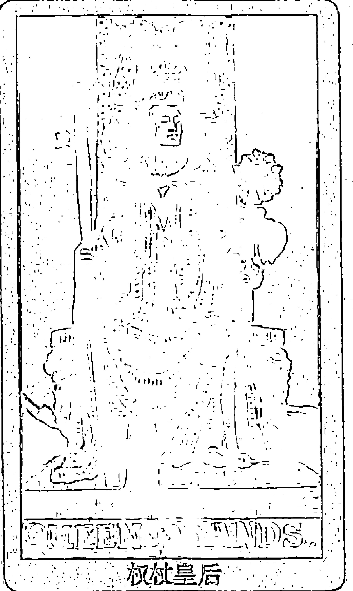

### 权杖王后
#### QUEEN OF WANDS
关键词：有魅力的、愉悦的、一心一意、自信的、精力充沛的

- 有魅力的：吸引人的，受欢迎的；能给人很强的第一印象，易成为朋友的；性感的；和善，对人友好的
- 愉悦的：乐观向上的；激励每个人的；能很快摆脱不快的；任何地方都很快乐的
- 一心一意：很积极的，全身心地投入去完成某事；任何时候都尽力的；敞开心扉，衷心的；无隐瞒的
- 自信的：沉着冷静地处理事情；不轻易动怒的；相信自己的能力，精力充沛的；过忙碌而积极的生活；有活力的；有生命力的；活跃的；天生的运动健将

相关希腊神话：
珀涅罗珀(Penelope)，奥德赛的妻子。她是品行高尚、忠于爱情的美好女子。奥德赛远征特洛伊，并被波塞冬百般迫害而无法回国的20年中，珀涅罗珀千方百计拒绝了112个求婚者。因为她坚信丈夫没有死。

### 图案解读：
权杖王后的牌面内容也很丰富。王后穿着金黄色的衣服，右手握着粗壮的权杖，象征她的尊贵和权力。外面披着白色的大氅，象征她公正无私可信赖。左手持着金黄的向日葵，象征旺盛的生命力和智慧。向日葵中间的红色代表热情。面前的台阶上蹲着一只黑猫，象征她拥有的法力，和沉稳的决断力。她戴着镶有月桂树叶子的王冠，容光焕发，让人感受到光明而积极的气息。石座的两旁雕刻着狮子的头像，带着叛逆的意味。微微左仰的头，是毫不屈服，坚定果敢的象征。这是一个可敬可爱的女性形象，刚柔并济，英姿勃发，并且拥有各种不可思议的力量，无论是世俗的权力，还是神奇的法力。但是她的宝座矗立在荒漠之上，隐隐有孤独之意，高处不胜寒，王后是曲高和寡的，但她永远那么高贵而坚定。

### 推测解读：
权杖象征着热情活力和世俗的权力、事业发展，王后手执权杖，就代表一位拥有事业的女人。她享受工作，认真地投入所喜爱的领域当中。她的态度负责而尽职，独立而进取，在职场中的表现不让须眉，也可以说是女强人。她非常重视荣耀，也许很爱面子，也会有事业心，或是权力欲较强。整体而言，这是一张不错的牌，尤其在事务的处理上，特别是人事方面，运作比较成功。财务经营也能够调配得当，渴望赚钱而也能有不错收入。在感情方面，代表热情魅力而吸引人的爱情。学业则可以有奋斗的意志和不错的表现。

| 正位含义： | 逆位含义： |
| :--- | :--- |
| 1. 值得信赖的女性或女性工作者。 2. 精力充沛，热情而温暖。 3. 内心或者地位很独立。 4. 有决心，有能力。 5. 叛逆，比如从事变革的工作，革命者之类。 6. 精神世界丰富的人，有时感性强于理性。 | 1. 情绪化，波动不稳定。 2. 傲慢。 3. 有阻力存在妨碍发展。 |

## 奥义解释 小阿尔卡那
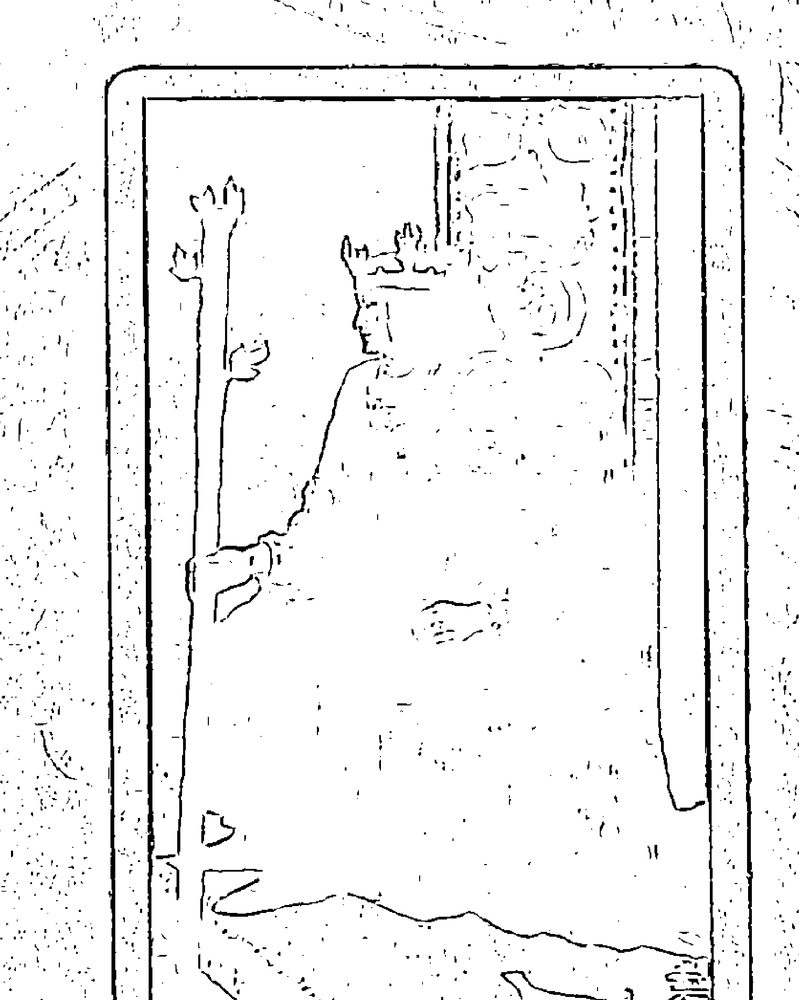

### 权杖国王
#### KING OF WANDS
关键词：创造性、超凡魅力、鼓舞人的、勇敢的、有能力的

- 创造性：提出新颖的计划或者想法，开启新局面；天赋的艺术细胞；策划新的战略；发明的；原创的
- 超凡魅力：有戏剧性的；极有光彩的；天赋的魅力让其成为关注的焦点；吸引人的；引人注目的；被模仿的；挂人嘴上的
- 鼓舞人的：热情洋溢的交流；沟通；创造令人激动的氛围；树立榜样；慢慢地灌输自信心；一个强有力的天生的领导者
- 勇敢的：无畏的；大胆的；直接交锋的；坚定不动摇的；不在乎别人想法的；受信仰所激励
- 有能力的：能支配环境的；果断的；受人尊重让人服从的；能自然而然地利用其权力的

相关希腊神话：
忒修斯(Theseus)，是雅典国王埃勾斯(Aegeus)和特洛曾公主埃特拉(Aethra)的儿子。埃勾斯在一次漫游中来到了特洛曾，同埃特拉结了婚。在离开特洛曾回雅典的时候，埃勾斯把自己的宝剑和绊鞋藏在一块巨石下面，对妻子说，生下儿子，等他成长到力大若父，能搬动巨石取出宝剑和绊鞋时，就让他到雅典去。忒修斯长大了，他轻而易举就搬开了巨石。于是他前往雅典。忒修斯建立了许多功绩。就是他打倒了弥诺斯的怪物弥诺陶洛斯。后来，忒修斯当了雅典的国王。

有能力的：能支配环境的；果断的；受人尊重让人服从的，能自然而然地利用其权力的

### 图案解读：
权杖国王是一个开国者与建国者，他的坐姿仿佛随时准备着站立起来，代表他有极强的行动力。金黄色大氅象征他的统治力量。绿色的披肩代表智慧，以及调和了四元素而拥有的潜能。红色的衣服也象征了权杖国王的热情与行动力。金色火焰形的王冠象征了权杖的火元素特质。虽然过度的热情会导致冲动，但他成熟的决断力和拥有的智慧足够加以控制。权杖国王是稳重而宽宏大量的。

### 推测解读：
这张牌代表一位威严强势，具有阳刚味的和男性魅力的男人，态度主动而积极。性格豪迈爽朗大方，行动果决明快，待人热心而慷慨，主观意识很强，而且具有主导性，不会轻易迁就他人。他喜欢直接而简单明了，凡事凭个人喜好而决定，所以没什么城府，当然也显出正直和诚意的特色。这样的男人能给人安全感，让人想要依靠，但也会对他心存敬畏。如果当作事态状况来解释，是描述掌控、稳定、升级或是接掌。整体而言，它是一张不错的牌，尤其在事业和工作的处理上特别有成就，财务经营自然也不差。在感情方面，有足够的热情和魅力，而人际关系也很有主导性，只不过情感上可能不是很细致。

- **正位含义：**
1. 有教养，有学识的人。
2. 优秀的父亲。
3. 态度圣明。
4. 诚实而有良知。

- **逆位含义：**
1. 太过严格、苛求。
2. 独断专行。
3. 态度傲慢。
4. 爱面子，导致失败。

## 小阿尔卡那
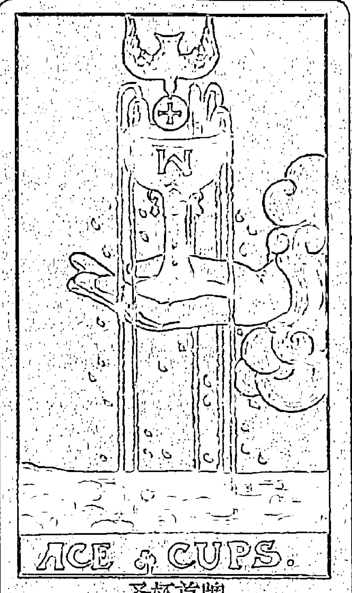

### 圣杯首牌
#### ACE OF CUPS
关键词：情感作用、亲密、直觉、爱

◇首一首搭配:
首一首搭配显示将有新的血液注入你的生命。它不但吸取了圣杯首牌的能量(深厚的情感，协调，亲密，怜悯，爱)，而且加上了以下的某一种能量:
- 权杖首牌: 创造力， 激情， 勇气， 冒险， 个人魅力
- 宝剑首牌: 智力， 理智， 公正， 真理， 坚定
- 星币首牌: 繁荣， 富裕， 信任， 安宁

- 情感作用：和内心想法联系紧密的；潜意识的；表白深厚感情；共鸣
- 亲密：感觉越来越离不开的，陷入爱河；与另一个人结合；发展关系；与某人走得很近；进入一个更深的层次
- 直觉：相信自己灵魂深处的声音；对来自内心的信息作出反应；增强心理预警；和自我保持一致；相信感官
- 爱：示爱；向某人敞开心扉；友善回应；救助；不再拒绝；原谅

### 图案解读：
图中的圣杯是耶稣在最后的晚餐中使用过的。耶稣死后，他的鲜血也是由这只杯子盛装着。白鸽是天主教中圣灵的象征，它衔着象征耶稣身体的圣饼，自上而下似要进入圣杯，象征着灵魂进入物质世界。杯中涌出的五道水象征人的五种器官。下边水面上盛开着朵朵睡莲，象征着人类灵魂的觉醒。云中伸出的手轻轻托住圣杯，充满着无限爱意。圣杯首牌经常代表新感情的开始。

### 推测解读：
圣杯预示着一场新恋情或新友谊的开始。在情感刚开始时，爱与关怀常常满溢，要懂得慷慨回报对方，珍惜这份福气。若求问者这份感情已维持很久了，出现圣杯首牌，要好好看看四周的牌，小心外遇迹象。若是在无关感情的推测中，出现圣杯首牌，表示这个局势需用爱来耐心化解。

### 相关希腊神话：
普绪克(Psyche)有着出众的容貌，堪与美与爱之神阿佛洛狄忒媲美。阿佛洛狄忒感到委屈，决定惩罚她，给予她悲惨的命运。阿佛洛狄特派自己的儿子厄洛斯(Eros)(拉丁语即丘比特丘比特)去执行惩罚。阿佛洛狄忒在罗马神话中即是维纳斯。

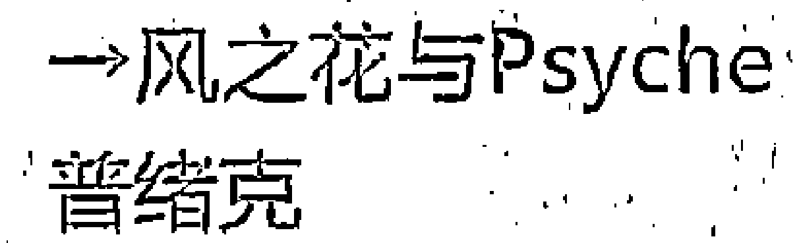

### 正位含义：
1. 爱苗已经萌芽动土，大胆追求美好生活。
2. 有婚庆之喜，或身边朋友、亲戚的。
3. 心中充满幸福感。
4. 一切顺利。

### 逆位含义：
1. 应改掉虚伪的毛病。
2. 对求爱者无爱意。
3. 一场单相思，需尽量摆脱。
4. 喜悦中带着隐忧。

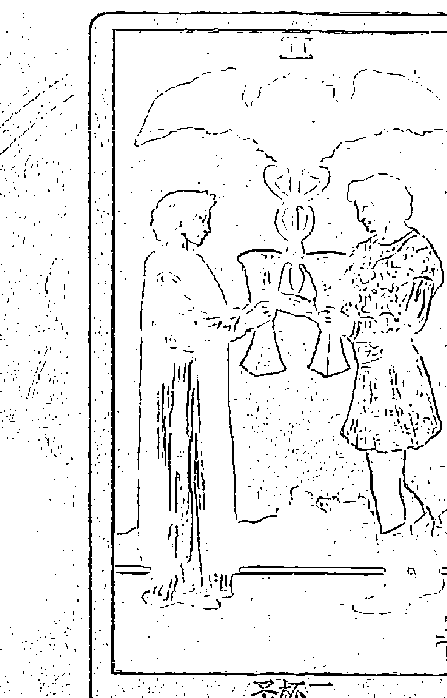

### 圣杯二
#### TWO OF CUPS
关键词：发生关系、意识到吸引力、寻求信任

- **发生关系：** 和别人产生联系；庆祝婚礼或者联合；友谊；合作关系；一起工作；分享；帮助人，被帮助
- **意识到吸引力：** 承认正发展的关系；接受你的好感；感觉到友善回应；朝某方向移动
- **寻求信任：** 恢复关系；从对立面走到一块来；忘记过去不快的；呼唤和平；达成友好协议；原谅

### 牌义对立或相近的牌
◇对立牌：
- 隐士：要求独处的，孤独
- 权杖五：不同意，保持隔离状态，非和平的
- 圣杯四：热衷于自己的想法，独处
- 圣杯五：关系破裂
◇加强牌：
- 情侣：团结，婚姻，联合
- 节制：联合，一起工作
- 圣杯十：血统，家族，联合

### 图案解读：
头上戴着花环的一对男女面对彼此，持圣杯向对方致意。男人身体前倾，象征着一种积极外向的阳性力量；女人站姿端凝如山，象征着一种含蓄内向的阴性力量。他们中间悬着两条蛇缠绕的杖，是治疗的象征。杖上的狮子头象征沟通，张开的翅膀象征圣灵。整个画面透着一种结合或合作的神秘力量。

### 相关希腊神话：
先知告诉厄洛斯，普绪克将被安排与一个怪兽结婚。她会被绑在岩石上举行婚礼，然后等待死亡。厄洛斯去执行此项任务。可是厄洛斯却被普绪克的美丽所倾倒，他爱上了她。

### 推测解读：
圣杯二经常与爱情产生强烈关联，在这方面，此牌比较近似初恋状态。如图中一样，男女相敬如宾，平等相待对方，不做强求。圣杯二不只局限于男女情感，也可以涉及友谊，以及任何人际关系，而这种关系往往是和谐对等，愉快的。因此，问友谊，问婚恋，问合作，圣杯二都会给你一个答案。

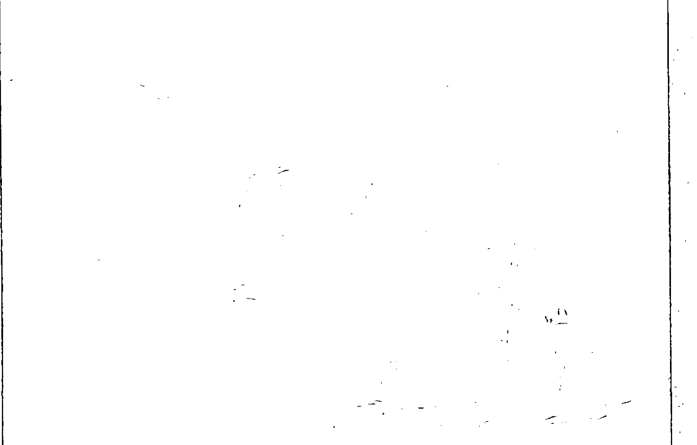

### 正位含义：
1. 有火一样的热情。
2. 有美好的友谊。
3. 你或周围有人结婚。
4. 方方面面的关系很和谐。
5. 情侣或朋友间相互了解。

### 逆位含义：
1. 情侣或朋友间互相猜忌。
2. 你或周围有人离婚。
3. 方方面面的关系较对立。
4. 你的爱无法得到满足。

## 牌义解释 小阿尔卡那
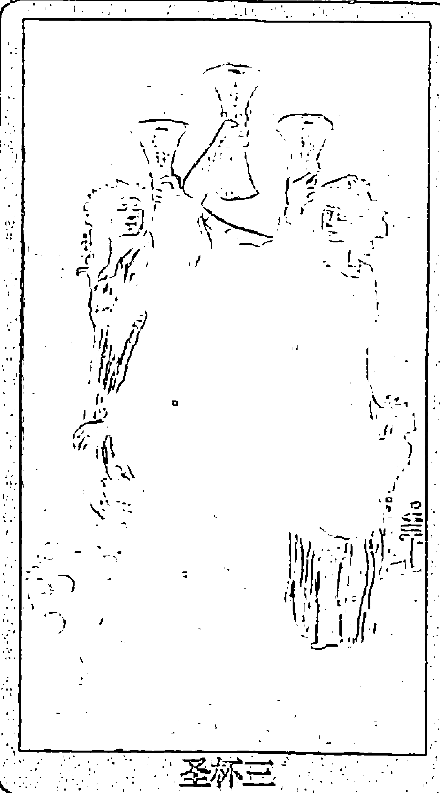

### 圣杯三
#### THREE OF CUPS
关键词：感受繁荣、团体、友谊

- 感受繁荣：欣欣向荣的，生机勃勃的；处于流动中的；庆典的；热情高涨；感觉处于顶峰的；歌舞升平

牌义对立或相近的牌
◇对立牌：
- 隐士：孤独的，脱离团体
- 权杖九：不信任的，戒备的
- 宝剑三：孤独，隔离，受伤害的
- 宝剑六：悲伤，沉痛
- 宝剑九：痛苦，苦恼的
◇加强牌：
- 教主：集中团体成员
- 节制：参加团队，一起工作
- 权杖四：激动，热情高涨，庆祝
- 星币三：在团体中一块工作

- 团体：参加认同你的团队；发扬集体主义精神；一起工作，联合别人，组织团队；互相帮助；求同；做邻居
- 友谊：跟你喜欢的人在一起；同志；好客；分享；信任别人；依靠外来帮助

### 图案解读：
三个衣着艳丽的女子，头戴象征丰收的花环，彼此围成圆圈，高举圣杯互相庆贺。她们脸上洋溢着幸福，四周有南瓜及葫芦，一女子手提一串葡萄，一派丰收景象。三位女子有不同颜色的头发与眼球，衣着也很不同，代表她们都是独立的个体，有自己的个性，但她们又能融洽相处，围成圆圈的形状，表示她们之间无尊卑之分。在这个象征欢庆和团体合作的画面中，洋溢着一种庆祝成功的气氛。圣杯三也是友谊的象征，在欢庆之外，圣杯三也有鼎力的象征，各方势力均等，相持不下，蕴含多种可能。

### 相关希腊神话：
厄洛斯决定带走普绪克并与她举行婚礼。三个人鱼在岛边为他们庆贺。但是他们在一起的条件必须是普绪克不得见到他的容颜。

### 推测解读：
圣杯三通常表示以感情作为关联的团体，另外，也代表一种欢庆的场合，包括宴会、婚礼等。其丰收的含义通常代表事情有了好的结果。当然，有时也相反。

### 正位含义：
1. 事情难以得到解决。
2. 需要做一项决定。
3. 幸福的婚姻。
4. 生活重新开始。
5. 矛盾的关系和解了。
6. 伤已经痊愈。

### 逆位含义：
1. 事情做过头了。
2. 乐极生悲。
3. 快乐也伴随着痛苦。
4. 不好的饮食习惯。
5. 做事拖拉。

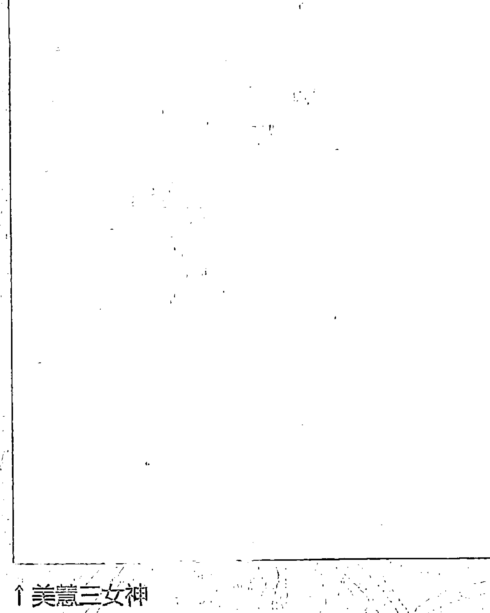

## 牌义解释 小阿尔卡那
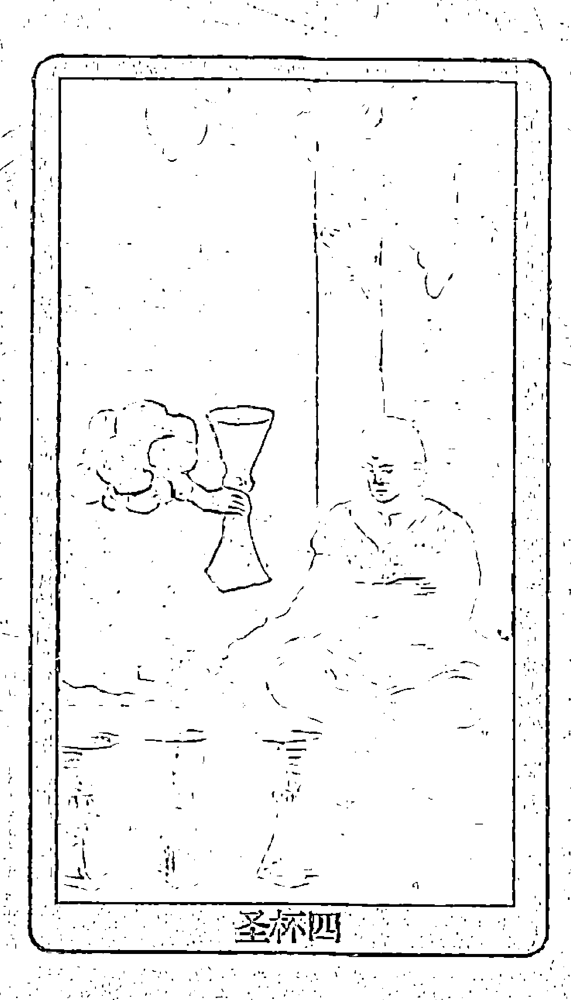

### 圣杯四
#### FOUR OF CUPS
关键词：沉浸自我、沉思、冷漠

牌义对立或相近的牌
◇对立牌：
- 世界：牵连，关注，参与
- 权杖四：激动，热情，乐观
- 圣杯二：联合，分享
- 星币八：勤奋，努力的
◇加强牌：
- 隐士：收敛，内向
- 宝剑四：沉思，独处
- 宝剑六：情绪低落，郁闷

- 沉浸自我：只关心自己感觉的；只顾自己的，不关心别人的；吝啬，少同情心的；只以自己的观点看问题；对礼物和祝福不屑一顾的
- 沉思：反省；考虑；梦想；沉浸在幻想中；入神；无警惕性的
- 冷漠：被动接受的；无兴趣的；自由；闲散的；少主观努力的；无积极性的；无追求的

### 图案解读：
图中的男子背靠着树，一副百无聊赖的样子。他紧闭着双眼，双臂交于胸前，作出一副防卫的姿态。前方并列着的三个杯子，象征着他过去的经验，他默默地盯着，代表他陷于往事不可自拔。云中伸出的一只杯子，象征着一个新的机会。然而，这位消极退缩的男子轻易地拒绝了。生活对他而言，好像半点兴趣都没有了。他对任何事都表现出彻底的冷淡和漠不关心。

### 推测解读：
圣杯四表示一段消极、无聊、疲惫、退缩的时光。当事人缺乏动力，对一切事物漠不关心，不想参加社交。圣杯四有时也代表外遇和新机会的降临。

### 相关希腊神话：
厄洛斯把普绪克带到了自己的宫殿。为了不让她看到自己的容貌，他只是每天夜里与她相会。心怀嫉妒的姐妹怂恿普绪克打破限制。

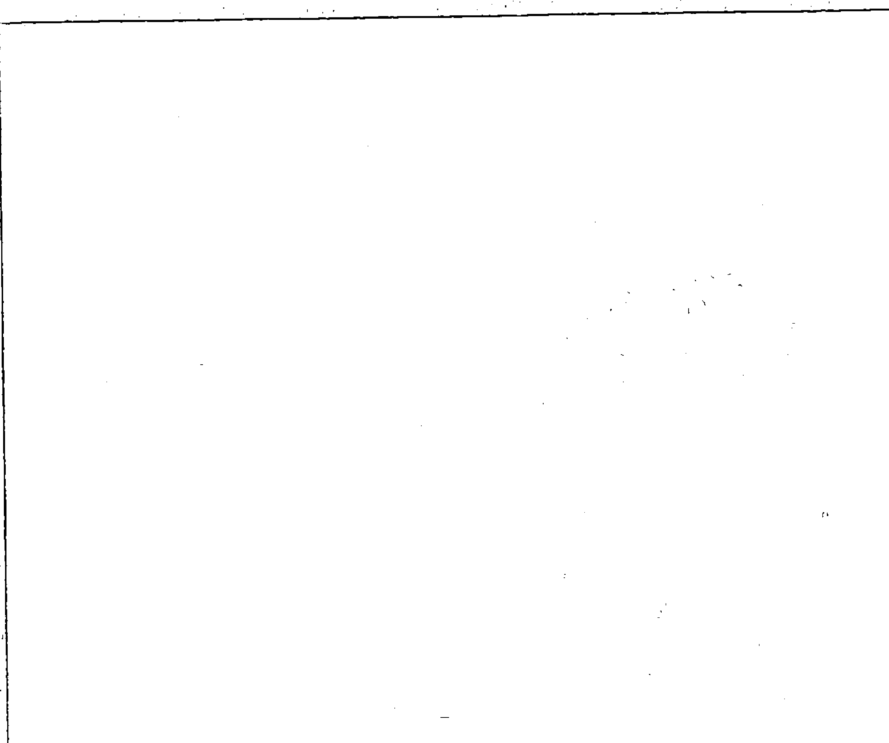

### 正位含义：
1. 总感到寂寞无聊，需找一件自认为有意义的事做。
2. 身心俱疲，需要调节或休息。
3. 深深地失望，对生活没有信心。
4. 对什么都不感兴趣，或感到活着没意思。

### 逆位含义：
1. 有新的人际关系，生活出现另一种境界。
2. 发现新方法，觅得新机会。
3. 脱离低潮期。

## 牌义解释 小阿尔卡那
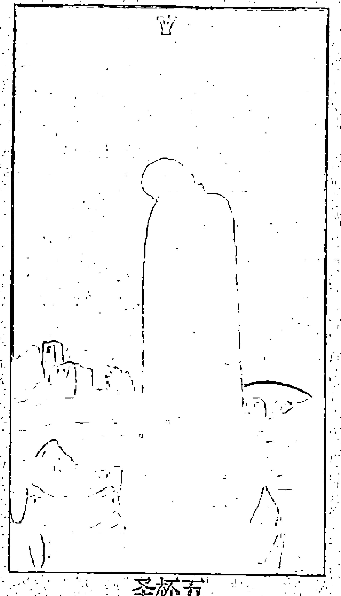

### 圣杯五
#### FIVE OF CUPS
关键词：亏损、遗憾、丧亡

- 亏损：理想破灭；失败；遭受挫折；所有权的剥夺；分手
- 遗憾：失望；为打翻的牛奶哭泣；悔恨；意识到自己错误的选择；认识到缺点
- 丧亡：关系的破灭；悲伤；失去亲人的痛苦

牌义对立或相近的牌
◇对立牌：
- 情人：确立关系
- 审判：解脱，摆脱愧疚或者遗憾
- 权杖六：成功，胜利
- 圣杯二：关系
- 圣杯九：愉悦，满足
◇加强牌：
- 死神：亏损，道别
- 宝剑三：分离，失恋，心伤
- 宝剑六：悲伤
- 星币五：拒绝，缺少支持，缺少认同

### 图案解读：
灰暗的天空下，一个身披黑色斗篷的男人，垂头哀悼面前三个倾倒的杯子。他面前河上有一座通往远处村落的桥，预示着他有选择另一种生活状态的机会。面前的三个杯子倒了，身后还有两个杯子立着。他不转过身，永远发现不了，会一直以为自己孤立无援。而希望就在失望的背后，他拾起两只立着的杯子，跨过桥去，生活会重新开始；否则，生活会永远这么痛苦下去。

相关希腊神话：
普绪克终于控制不住爱恋之情和好奇，她点了灯试图看清丈夫的脸。丈夫便立刻消失得无影无踪了。幸福立刻化为乌有。

### 推测解读：
圣杯五代表的是一种悲伤痛苦的处境，同时，也预示着另类生活的可能开始。

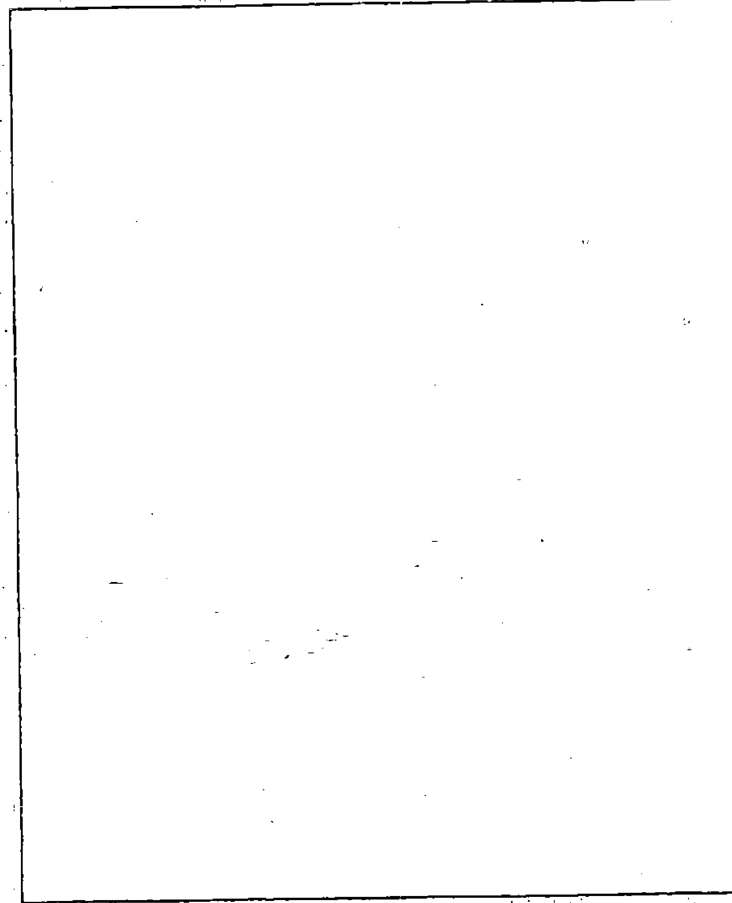

### 正位含义：
1. 被后悔的情绪淹没，生活在一种无望的痛苦当中。
2. 局部受到损害，导致怀疑自己整体的正确性。
3. 有一种缺陷。
4. 无意义的交际。
5. 有深深的幻灭感，开始或已经怀疑生活和人生。

### 逆位含义：
1. 老朋友回来了，往日的美好会重新回到生活中。
2. 旧缘分得到重续，或指夫妻破镜重圆。
3. 东山再起，重拾生活的信心。
4. 结成新的同盟。

## 牌义解释 小阿尔卡那

## 圣杯六

SIX OF CUPS

关键词：善意、孩提、清白

### 牌义对立或相近的牌

善意：好心的；慷慨的；慈善的；分享你的拥有；感觉被祝福的；出于善意的

+   ◇对立牌：
    魔鬼：消极，腐化，觊觎
    权杖九：不清白的，最坏的
    宝剑五：愤世嫉俗的，敌视的，自私的
    宝剑七：欺骗，模仿，假冒
    宝剑九：犯罪

孩提：和年轻人或小孩在一起；无忧无虑的；被照顾的；怀旧的；贪玩的；喜欢年轻人的活动；生小孩

+   ◇加强牌：
    星辰：善意，分享
    圣杯十：被祝福的，高兴，快乐

清白：易满足的；仁慈善良；幸福的；喜悦的；无戒心的；无贪污腐化堕落行为的；欣喜于单纯的快乐

### 图案解读：

在色彩绚烂的花园里，一个小男孩捧嗅着圣杯里的鲜花，他好像要把它献给面前的小女孩。整个画面充满浓烈的童话般的色彩，让人重新拾起童年的回忆。圣杯六代表的是与过去相关的人与物。此外，也代表着思乡情绪，就像图中的庄园，绽满鲜花，充满欢笑，无忧无虑，像家一样温暖。如男孩将花献给女孩的慈爱模样，圣杯六也可以表示照顾以及馈赠。

### 推测解读：

圣杯六除代表对往事的温馨回忆和思乡、照顾之外，有时也提醒当事者，要像男孩一样慷慨大方，乐于付出，放下一切仇恨和不悦情绪。

### 正位含义：

1.  陷入回忆之中，难以自拔。
2.  幼时的体验刻骨铭心，影响到你现在的情绪及行为。
3.  虽分别了，但还能再见。
4.  总多愁善感，情绪不稳定。
5.  雾一样消散不了的乡愁。

### 逆位含义：

1.  好运马上到来，需要在奋斗中等待。
2.  比过去更关心未来。
3.  开始有长远打算，能够高瞻远瞩地过日子或为事业奋斗了。

### 相关希腊神话：

丈夫消失了，普绪克十分悲伤，她坐在岩石上叹息着，手中握着白色的百合花。

## 牌义解释 小阿尔卡那

## 圣杯七

SEVEN OF CUPS

关键词：幻想、浪费、选择

### 牌义对立或相近的牌

-   对立牌：
    -   魔术师：聚焦，认同
    -   皇帝：纪律，机构
    -   节制：平衡，中庸
    -   星币四：秩序，控制
    -   星币八：努力工作，志愿
    -   星币九：纪律，限制，节制
-   加强牌：
    -   魔鬼：溺爱，浪费
    -   月亮：幻想，不切实际的想法，妄想
    -   圣杯九：纵情声色

幻想：往好的方向想的，做白日梦的；沉迷于幻想的；放纵自己的思维的；自己骗自己；空中楼阁；经不住考验的想法；缺乏认同；不切实际的

浪费：溺爱；放纵；对每样东西都不爱惜的；无组织的；挥霍；倾向于好吃懒做的；懒惰；延迟；耽搁

选择：有多种选择机会的；面临一系列的选择的；相信无穷的可能性；开辟更宽广的领域；做选择

### 图案解读：

图中的男人看着面前浮于云端上的七只圣杯，一副贪婪和无奈的样子。他在为失去的叹息，他在为打翻的牛奶哭泣。另外，云层上摆放的这些东西也象征着一种空中楼阁的存在，那只是男人白日梦的幻想。此外，男人面对着七只圣杯，也意味着一种选择。

### 推测解读：

圣杯七代表的是不切实际的和污浊东西的存在。另外，当看到圣杯七的时候，也意味着一种严格有序的体系被打破，会释放出巨大能量，会有众多的选择机会。

如果生活在无序混乱中，看到此牌后，要马上调整生活状态，要知道系统的生命是由规则给的。如走了极端，会像图中描述的那样，演变为有害的放纵、沉溺和颓废。

### 相关希腊神话：

厄洛斯不得不与妻子分离，也十分悲伤。他的母亲阿佛洛狄特告诉他，普绪克会重新回到他身边，但她必须完成艰巨的任务。这时，普绪克决定到各处寻找自己的情人。

| 正位含义： | 逆位含义： |
| :--- | :--- |
| 1.对生活不现实的态度。 2.反复无常，出尔反尔。 3.不切实际，幻想成功。 4.白日梦患者。 5.采取欺诈的手段。 | 1.下定了决心，有决断力。 2.有坚强的意志，经得起艰难困苦的考验。 3.近期要达到目标。 4.明智的选择。 |

## 牌义解释 小阿尔卡那

## 圣杯八

EIGHT OF CUPS

关键词：内省、厌倦、继续

### 牌义对立或相近的牌

-   ◇对立牌：
    -   力量：忍耐，坚强
    -   太阳：活力，高能量
    -   权杖九：坚持，保持
-   ◇加强牌：
    -   隐士：寻求深层次的意义，探询真谛
    -   死神：继续，离开
    -   权杖三：旅行，进入新领域
    -   权杖八：结束，告一段落
    -   宝剑六：继续，旅行

| 关键词 | 解释 |
| :--- | :--- |
| 内省 | 专注于隐私；搜寻答案；要点所在；开始探险之旅；发现真相；花更多的时间于思想上 |
| 厌倦 | 感觉疲惫的；冷漠的；缺乏精力；筋疲力尽的 |
| 继续 | 意识到当前的事情已告一段落；从没希望的状态中摆脱出来；解脱自己；开始一次不知终点的旅行；放手 |

### 图案解读：

在一个月明之夜，一个红衣男子挂杖离开他辛苦搭建起来的八个圣杯而去。周围密布的沼泽，象征着淤塞的情感。他离开是因为发现搭建的杯子上还有一个缺口。于是，他为了寻找一个杯子，抛弃了身后搭建已好的八个杯子。他本来可以带着八个杯子去寻找那个杯子的，但他没有这样做。他穿着的红色衣鞋，象征着他的行动力。由画面中可看出本牌的中心题旨“抛弃”。

八个杯子中缺少一个，象征着万事万物总有美中不足。不满足于此的人，就继续追求。由此可看出，圣杯八也代表着一定的牺牲精神。

### 推测解读：

当身处于沼泽般的僵化局势中，圣杯八表现的是突破常规，大胆地追寻自己的希求之物。

### 相关希腊神话：

普绪克历经了千辛万苦，有时还必须给阿佛洛狄特当女奴。阿佛洛狄特命令她去到冥界，她于冥后珀耳塞福涅之处取回一瓶美容霜。普绪克很沮丧，因为很可能她会一去难返。

### 正位含义：

1.  放弃计划，半途而废，指一切无毅力耐心之举。
2.  有很重的疑心病。
3.  衰弱，失去了力气。
4.  爱已经变得理智。
5.  停止努力。

### 逆位含义：

1.  新的恋情将降临，或者生活出现转机。
2.  喜庆之事不断。
3.  有舞会或者宴会之类的邀请。
4.  在努力奋斗过程中。

# 阿佛洛狄特与普绪克

## 牌义解释 小阿尔卡那

## 圣杯九

NINE OF CUPS

关键词：实现理想、感官愉悦、满足

### 牌义对立或相近的牌

-   ◇对立牌：
    隐士：不太注意感官享受的
    圣杯五：悔恨，遗憾
-   ◇加强牌：
    皇后：享受感官快乐的
    情侣：性快乐
    世界：获得内心渴望的
    权杖六：自豪，获得自己想要的
    圣杯七：纵欲

实现理想： 达到目的，获得自己想要的，美梦成真

感官愉悦： 奢侈的；品尝美味；欣赏艺术；做爱；放松；物质享受

满足： 安于现状；获得自己想要的；愉快的

### 图案解读：

图中的男人志得意满地坐在摆放整齐的一排圣杯之前，他得到了任何想要的，整个画面充溢着一种满足愉悦的气氛。不难看出，圣杯九代表的是一切感官的愉悦，包括视觉、味觉、触觉上的享受。从个人角度看，圣杯九暗示当前的一种生活状态。

### 相关希腊神话：

普绪克来到冥界，她顺利地完成了任务，取回了冥后珀耳塞福涅的美容霜。

### 推测解读：

圣杯九以“愿望”牌闻名，它预示你的梦想在现实中的去向。但要领悟图形的寓意，你必须知道自己的内心意图，勇于承担寻梦过程中的相应责任，这样你才能最终享受你的好运气。

### 正位含义：

1.  物质生活很富足。
2.  内心充盈着一种幸福感。
3.  形势对你是有利的。
4.  有潜力，有希望。
5.  获得成功。

### 逆位含义：

1.  物质上将有一定损失。
2.  生活中易犯错误。
3.  内心中尽是不满。
4.  不懂得节制，体力减弱得厉害。
5.  做事虎头蛇尾。

## 牌义解释 小阿尔卡那

## 圣杯十

### TEN OF CUPS

关键词：欢乐、家庭、和平

### 牌义对立或相近的牌

-   ◇对立牌：
    -   魔鬼：缺少快乐安宁的
    -   高塔：剧变，嘈杂
    -   宝剑三：心碎，孤独
    -   宝剑九：痛苦，悲伤，失望
    -   宝剑十：牺牲
-   ◇加强牌：
    -   情侣：家庭关系，团结
    -   星辰：快乐，积极的，祝福
    -   世界：欢乐，情绪的满足
    -   圣杯六：感觉被祝福的，快乐，高兴

欢乐：被快乐所拥抱；浑身舒坦；喜形于色

家庭：为家庭的安宁工作，从事家务活；维持必要的关系；团结家庭成员；原谅家人的过失

和平：平静；清除敌对因素；和谐；消除紧张与压抑感；感到高兴安逸的；要求信任，放松

### 图案解读：

这是其乐融融的一家人，夫妻相拥各扬一只手，迎向象征美好生活的圣杯与彩虹。两个孩子在一旁快乐地嬉戏。远处是他们的家。这是一幅温馨感人的画面。这张牌主要代表以感情相关联的团体，如家庭、社团、公司、几个知交好友等。

圣杯十指的是个人的成熟与满足，此牌表现的是人际关系中的快乐和满足。

### 推测解读：

如果经历一段时间的人际冲突，此牌出现，代表和解指日可待。

在感情方面的推测上，圣杯十代表两人已经越过圣杯二的初恋阶段，寻求更长久更稳定的关系，极可能步入婚姻的圣殿。

### 正位含义：

1.  内心平和，情绪良好。
2.  认为目前的幸福是实实在在的，感到很知足。
3.  有一个美满的家庭，或者一个人际关系融洽的工作环境。
4.  爱使你身心愉悦。

### 逆位含义：

1.  内心感到不安，整天生活在忐忑不安的情绪中。
2.  失去友情，或事业中失去一个得力的合作伙伴。
3.  家庭暴力在你身边。
4.  人际关系不和，对立。

### 相关希腊神话：

普绪克得到了永生，成为了众神的一员。他与厄洛斯终于重聚，两人不再分离，过着幸福快乐的日子。

## 牌义解释 小阿尔卡那

## 圣杯侍从

PAGE OF CUPS

关键词：情绪、亲密、直觉、爱

### 相关希腊神话：

那耳喀索斯(Narcissus)，河神刻菲索斯和水泽神女利里俄珀的儿子。他是一个非常俊美的少年。他看到水中自己的倒影，陶醉而相思，终于恋恋不舍而亡。于是众神把他变做了水仙花，这也是水仙花的由来。

情绪：

被感动的；表现自己的情感；浪漫的；信马由缰

亲密：

开始或者重新一次恋情；与人约会；与某人关系密切；不拘泥于礼节；分享；巩固友谊

直觉：

潜意识的；重温旧梦；相信自己的潜在反应；精神意识方面的经验

爱：

做亲昵体贴的动作；表示同情或者理解；宽恕自己；拥抱某人；向你伤害过的某人道歉；改善破裂过的关系；不批判；不谴责

### 图案解读：

一个年轻男子，叉腰站在蔚蓝色大海前，高兴地看着圣杯中喂养的鱼。他的天真让人想起一个善良无邪的孩子。他感情丰富，富有爱心，他是爱和温暖、亲密的象征。

### 推测解读：

圣杯侍从代表一段新关系或神圣合伙关系的到来。一个让情感得到满足的机会；也就是说，这样的生意合作包含了你所喜爱的工作，或有创意的工作。

### 正位含义：

1.  爱好冥想，在冥想中体验现实中缺少的幸福。
2.  有新的消息传来，消息往往是正面的。
3.  在辛苦努力着。
4.  身边有不少热心人，有很好的人缘。
5.  做事深思熟虑。

### 逆位含义：

1.  身边不少阿谀奉承的人，需小心。
2.  心灵手巧。
3.  学会一个人排遣不悦。
4.  脱离了某方面的控制。

## 牌义解释 小阿尔卡那

## 圣杯骑士

KNIGHT OF CUPS

关键词：浪漫/超情绪化、优雅/做作、想象/空想、反省/内向、敏感/喜怒无常

浪漫/超情绪化: 理想化爱情；缺乏自控；注重情感；嫉妒，猜疑；追求诗意人生、易动感情的；回忆特殊的一些场合或者片断、爱情或者友情上犯冷热病的；非常完美；非常漂亮地表白自己的感情；疏漏

优雅/做作: 从各个方面去增加美感；让别人做脏活；追求完美，不能面对失意的；创造令人心旷神怡的氛围；体弱；温和，亲切的；被压力、困难所击倒

想象/空想: 透过现象看本质，超越表象；不可能有结果的想法；采取不同一般的办法，走不同路子，不切实际的尝试；非凡的天赋；夸张的想法或者想象；梦想的，幻想的；隐瞒真相

反省、内向：

试图弄清楚为什么不积极参与；追求自我完善和提高；过分看重自己的失败；透过表面的；不与人交流

敏感、喜怒无常：

对心情和想法很警觉的；情感波动幅度大的；助人为善；爱生气，脾气坏的；体谅人的；变化快的；圆滑老练的；轻率的

### 相关希腊神话：

阿耳戈斯国王阿克里西俄斯从神示中得知，女儿达那厄所生的一个男孩会推翻他的统治并把他杀死，于是阿克里西俄斯便把女儿关进了地窖。但是宙斯化作黄金雨进入了地窖。后来达那厄生下了珀修斯(Perseus)。阿克里西俄斯又把女儿和外孙装进箱子扔进了大海，他们被岛上的国王波吕得克忒斯所救。波吕得克忒斯为了追求达那厄，支使珀修斯去取墨杜萨的头——任何人见到她的头都会变成石头。珀修斯从神女那里得到了宝物，杀死了墨杜萨。归途中解救了锁在岩石上即将被海怪吃掉的安德洛墨达。他用墨杜萨的头杀死了波吕得克忒斯，救出了母亲。因为想念外祖父，珀修斯前往阿耳戈斯，在竞技会上无意中砸死了外祖父。

### 图案解读：

骑士挺胸端坐于马背之上，手举着象征执着的圣杯，双目深情地注视着，马儿顽皮地低头盘旋。整个画面充盈着执着和浪漫的气氛。在这儿，骑士代表着情感丰富、重直觉且有创意的一类人。

### 推测解读：

圣杯骑士暗示来自某人的供给。例如，生意上的提供或机会的提供。有一个二十来岁的人，或年纪更长但感情年龄只有二十几岁的人，要献给你某种东西。它可能是指情感上的奉献，或某种更为实际的事物。

骑士也意味着一段决定是否等待或行动，让事情充分发展或找寻新机会的时期。为了发现满足，或许现在是随着心意（河流的象征）而为的时候了。

### 正位含义：

1.  新的机会在慢慢靠近，生活正在慢慢起变化。
2.  做计划，提交提案。
3.  身边布满诱惑，当事人意识不到。
4.  热心款待客人。

### 逆位含义：

1.  小心身边乖巧之人；处境表面很好，实际上很危险。
2.  小心欺诈。
3.  行为不正，需改正。
4.  在过着不检点的生活。

## 牌义解释 小阿尔卡那

## 圣杯王后

QUEEN OF CUPS

关键词：爱意的、感应的、善良的、仁慈的、直觉的

爱意的： 出于人道、同情心而不动怒的；无条件接受；能察觉别人想法的；不生气，不憎恨的；特有耐心的

感应的： 第六感觉敏锐的；和某人有心灵感应；配合，搭配完美协调的

善良的： 容易被别人苦痛所感动的；同情，怜悯；对人、动物有爱心的；乐于助人；想人之所想

仁慈的： 与神的旨意保持一致，对一切生灵持爱心的；乐于融合，欣喜于生命的真谛；把世界看成圣地

直觉的： 和潜意识相协调，能感觉到环境的氛围；下意识的；相信内心中真实的感觉；心领神会

### 相关希腊神话：

海伦(Helen)，她是宙斯的女儿，是古希腊史诗中最为驰名的女主人公，以美丽非凡著称于世。她在少女时代曾经被忒修斯抢走，为两个哥哥所救。许多英雄都向她求婚，她的母亲采纳了奥德赛(Odysseus)的意见，让所有求婚的英雄立誓决不向海伦的配偶动武，而且给予一切帮助，然后把海伦嫁给了墨涅拉俄斯。后来因为金苹果之争，特洛伊王子帕里斯在阿佛洛狄特的帮助下，赢得了海伦的芳心，把她带到了特洛伊。墨涅拉俄斯向希腊各地英雄求助，于是发动了著名的特洛伊战争。

### 图案解读：

坐于宝座上的王后，目光温柔地注视着手上的圣杯，一副多情而专一的神态。另外，王后也代表着仁慈、善良和直觉。她是那种会让年轻小伙子爱上的成熟而有韵味的女人，不只因美貌，还因为她的同情心。此牌往往代表了一种对情感的需要。

### 推测解读：

圣杯皇后意味透过倾听感觉，以及利用富有创意的想象力而获得成功。如果圣杯皇后是在形容一个人，它代表的是一个成熟的女人，并富有直觉及创造力的本质。属于相当安静的典型；什么事都听，但说得很少。这些能力使她适合从事咨商、心理学、社会工作、照顾孩子、协作、医疗以及任何创造性的工作。通常人们愿意相信她，并把她的沉默解读为允许他们说出困扰他们的事。

| 正位含义： | 逆位含义： |
| :--- | :--- |
| 1.感受性丰富而细腻，但要节制情绪，容易多愁善感。 | 1.无法信赖身边的人，为一种尴尬的环境所困。 |
| 2.有种愿为爱献身的冲动，彻底陷身爱河。 | 2.注意别人身心的独立性，是一个好朋友(或好领导、好父亲、好同事等)。 |
| 3.你是善良而公平的人。 | 3.要注重口碑和声誉。 |
| 4.成功在即，坚持奋斗。 | 4.性情需要改变，你面临的困难，往往是坏性情造成的。 |
| 5.幸福生活在眼前。 | 5.品行不良，要注意。 |

## 圣杯国王

KING OF CUPS

关键词：明智、人道、平静、宽恕、圆滑老练

明智：给出好的建议；对人性有好的把握；知道别人成长中所需要的；在关照和爱护中教导；明了事物本质；经验丰富

人道：安慰；治疗；帮助；同情；慈善

平静：安抚，让别人有镇定感；灵魂的安宁；从不紧张的

宽恕：心胸宽广的，容忍的，能跟各式各样的人和睦相处；给别人自由；能忍耐逆境的

圆滑老练：能平衡很多人需要的；能团结人一起工作，缓解紧张局面；有技巧地实现目的；能在恰当的时候说中肯的话

### 相关希腊神话：

俄耳甫斯(Orpheus)，河神俄阿格洛斯和卡利俄珀的儿子。他发明了音乐和做诗法。他的歌声能使树木弯枝，顽石移步，野兽俯首。他的妻子神女欧律狄克被蛇咬死了，他为了使妻子还阳，下到冥界。他的歌声驯服了地府的守门犬，使复仇女神流出了眼泪，使冥后珀耳塞福涅深受感动。于是珀耳塞福涅准许他把妻子带回人间，但在走出冥界前不得回头看妻子，不得同她说话。在即将走出冥界的时候，俄耳甫斯终于忍不住，不放心而回头看了一眼，于是功亏一篑，永远失去了妻子。

**总述：** 能平衡很多人需要的；能团结人一起工作，缓解紧张局面；有技巧地实现目的；能在恰当的时候说中肯的话。

### 图案解读
国王坐于宝座之上，手执圣杯，目光炯炯注视前方，象征着他开阔的视野，有前瞻性的眼光。他披着的宽大衣氅象征着宽广的胸怀。同时，圣杯国王也代表着冷静、明智和圆滑。

### 推测解读
无论对于家庭、爱情和财产，都愿付出爱和关怀。有一切‘为了明天’的前瞻性和责任心。

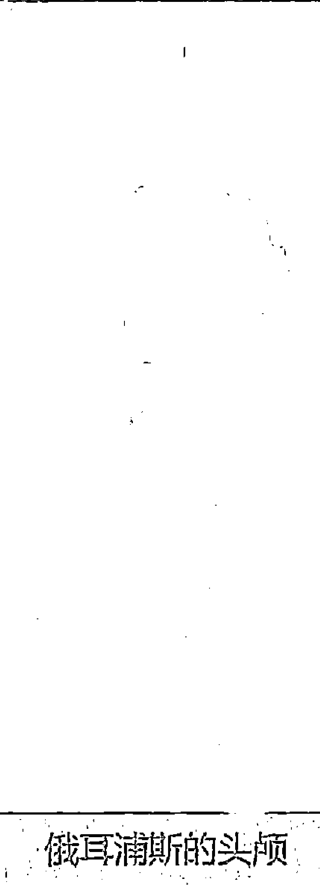

| 正位含义 | 逆位含义 |
|----------|----------|
| 1. 见多识广，让人尊敬。 | 1. 表里不一，让人厌恶。 |
| 2. 某方面的专家，在某方面有突出的作为。 | 2. 行为不端，欠缺道德感，在追逐名利上不择手段。 |
| 3. 有创造性，常想人所未想。 | 3. 面临损失。 |
| 4. 是个公正而值得信赖的人。 | |

## 宝剑首牌
ACE OF SWORDS

关键词：智力、公正、坚忍、真相

- **智力**：客观的；思考；查明真相；分析形势；运用智慧；理智行事
- **公正**：改正错误；做正义的事情；承担责任；要求公平
- **坚忍**：克服困难；直视困难；解析形势；寻求克服力量；战胜困难；百折不挠
- **坚忍**：还债；弄清楚；透过假相；有清楚的认识；诚实；找到真相

- ◇首一首搭配：显示将有新的血液注入你的生命。它不但吸取了宝剑首牌的能量(智力, 理智, 公正, 真理, 坚定), 而且还加上了以下的某一种能量:
- 权杖首牌: 创造力, 激情, 勇气以及个人自身的能力
- 圣杯首牌: 深厚的情感, 亲密, 协调, 同情, 爱
- 星币首牌: 繁荣, 富裕, 信任, 安宁

### 图案解读
在群峦之上，一只手破空伸出，紧紧抓住宝剑，剑尖刺穿顶部的王冠。整个画面象征着挑战欲望的威力无边。宝剑代表着一种伤害，正像它的双刃一样，可伤人，亦可伤己；可救人，亦可杀人。宝剑在这里作为一种象征物，警示着使用它的人们，稍有不慎，就可造成不良后果，就像图中剑尖刺穿王冠一样，极容易成为一种极端的力量。如同爱与恨，可以建设也可以毁灭。

### 推测解读
当宝剑首牌出现，可反思自己是否有过激的表现。但宝剑首牌只是一个开端，一种可能，未来究竟要如何发展，掌握在持剑者手中。

### 相关希腊神话
阿特柔斯（Atreus）和弟弟堤厄斯特斯（Thyestes）逃往迈锡尼。阿特柔斯继承了迈锡尼的王位，弟弟堤厄斯特斯诱通了阿特柔斯的妻子埃洛珀（Aerope）阴谋篡位，被宙斯揭发，驱逐出国。后来堤厄斯特斯唆使由他养育长大的阿特柔斯的儿子反对阿特柔斯。阴谋败露后，阿特柔斯处死了罪犯，他不知道其中有自己儿子。阿特柔斯知情后，为了报复堤厄斯特斯，在弟弟回迈锡尼求和时，将他的儿子们煮成食物请他吃。众神为了惩罚阿特柔斯的罪行，对他进行了诅咒。

- 正位含义：
1. 表示具有强烈的进取心与攻击性。
2. 挑战时，胜利的可能性更大，结果可能更富正面性。
3. 在健康的推测上，宝剑首牌代表着手术或打针，预示着可以治疗。
4. 做事顺利，能逢凶化吉。
5. 有超人的力量，作出使自己惊讶的成果。

- 逆位含义：
1. 意味着做事容易引起麻烦、争端。
2. 预示着奋斗路上障碍很多。
3. 意味着因逞强而招来灾难。
4. 挑战时，失败的可能性更大，结果可能更趋负面性。
5. 在健康的推测上，宝剑首牌表示外伤。

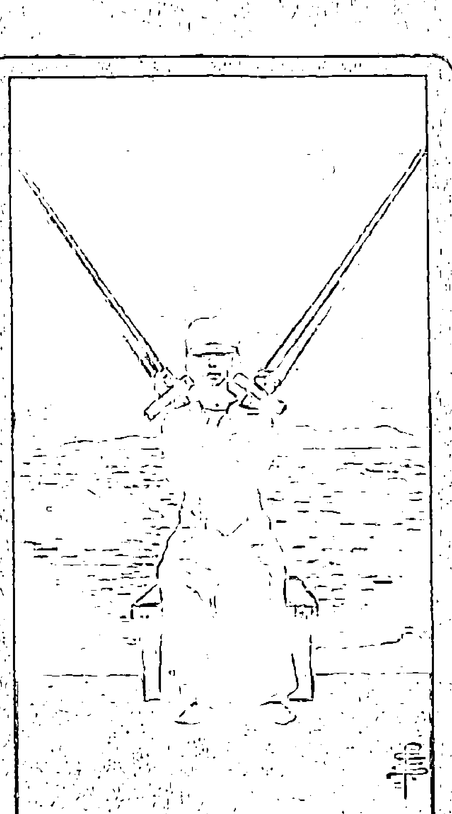

## 牌义解释 小阿尔卡那

## 宝剑二
TWO OF SWORDS

关键词：压抑、僵局、避免

- 牌义对立或相近的牌
- ◇对立牌:
  - 愚人：揭露，放荡，不受禁止，不受限制的
  - 命运之轮：进展，运行
  - 正义：明白真相，担当责任
  - 星辰：自由发挥积极性
  - 权杖三：前进，直面事实
- ◇加强牌:
  - 月亮：自己骗自己的，没看到真相的
  - 权杖九：戒备的，隔离自己的
  - 宝剑七：逃避现实的
  - 星币四：僵局，封锁，障碍

- **压抑：** 否认真实想法；戒备的；坚持冷漠；装聋作哑；埋藏痛苦的；抑制应该有的反应
- **僵局：** 不敢动的；成僵持状态；不动；拒绝下决定或者结论；不愿靠岸的
- **避免：** 拒绝面对事实；不顾警示；睁只眼闭只眼；回避煞风景的事；不想知道

### 图案解读
画面上，身穿灰色长袍的女人背对身后汹涌澎湃代表着感情的海洋。她坐在石凳上，眼蒙着象征逃避现实的白布，双手持剑，在胸前交叉着，作出一副自卫的姿态。

女人背对着代表感情的海洋，且双眼蒙布，表现出一副掩耳盗铃的自欺之态。她双剑交于脸前，等于交叉在"心"前，表示她有颗封闭的心灵。

女人静坐不动，两把宝剑斜叉交立，像两股僵持的努力，相持不下，代表着一种尴尬的人际关系或窘困的处境。另外，也表示当事人做不出决定，甚或拒绝下决定。

### 推测解读
宝剑二提示推测者有一颗较封闭的心灵，对待万事万物消极悲观，在采取一种抗拒和逃避的态度。此牌提醒我们，要诚实面对内心情感。无论事情怎样，要接受，莫逃避；要接纳，勿抗拒。把蒙眼布取下，将双剑放下，事情其实没有那么严重。

### 相关希腊神话
阿特柔斯的儿子阿伽门农(Agamemnon)，是阿耳戈斯的国王，特洛伊(Troja)战争中希腊军的统帅。他出战特洛伊时，射中了月神阿耳忒弥斯(Artemis)的赤牝鹿。女神大怒，刮起阵阵逆风，使希腊舰队滞留海港。于是阿伽门农许愿将自己的女儿伊菲革涅亚(Iphigenia)作为祭品献给女神。阿伽门农借口要女儿跟阿喀琉斯订婚，把她送上了祭坛。阿耳忒弥斯用一只赤牝鹿做牺牲替换了姑娘，带她到陶里斯让她当了自己的祭司。陶里斯的习俗是要把外乡人刺死在阿耳忒弥斯的祭坛上。于是阿耳忒弥斯赐给了伊菲革涅亚永生，并让她以俄耳西罗喀亚的名字与阿喀琉斯结婚。

### 正位含义
1. 做事有一定协调力，能集中全部身心去完成一件事。
2. 有钢铁般的意志，不轻易改变。
3. 与同事或竞争对手互相残杀。
4. 一直不认输的一件事已经走到尽头。

### 逆位含义
1. 代表当事人能作出决定，打破僵局，结束紧张，停止抗拒，但因海面与礁石移到牌面上方，隐藏的流言与欺诈会浮出水面。
2. 两面人，有双重人格。
3. 注意做事不要损害朋友利益。
4. 见好就收，适可而止，或激流勇退。
5. 口是心非，表里不一。

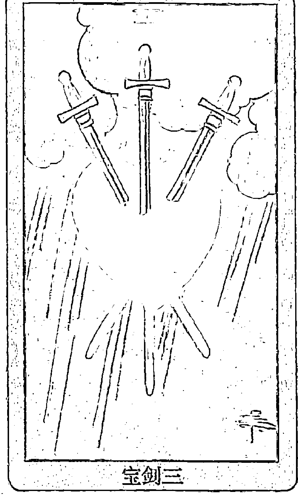

# 宝剑三
THREE OF SWORDS

关键词：伤心、辜负、寂寞

## 牌义解释 小阿尔卡那

- 牌义对立或相近的牌
- ◇对立牌：
  - 情侣：感受到爱，亲昵
  - 圣杯三：友谊，信任
  - 圣杯十：快乐，爱，安宁，协同
- ◇加强牌：
  - 圣杯五：隔离，心痛，失恋
  - 宝剑九：痛苦，心碎
  - 星币五：拒绝，隔离，缺少支持

- 伤心：
  心碎，遭受心灵伤害的，心伤，失望；听到令人不安的消息；伤害了自己或者别人的感情；没人安慰的
- 辜负：
  揭开了令人心伤的真相；发现自己不该信任某人的；失望；丧失信心；倒戈一击；食言爽约；反对
- 寂寞：
  被隔离，在异地流浪徘徊；被拒绝；被所爱的人疏远；若有所失；在急需帮助的时候被丢下不管

### 图案解读
三把宝剑合力刺穿一颗心；背景是灰暗的雨天。这是一幅令人触目惊心的画面，它直观地道出了这张牌的含义——伤心。然而，画面在混乱中仍保持着某种和谐，三把剑似在无意中形成一种对称的形态。它意在告诉世人，悲伤是凄美的和必然的，悲伤使人成长。只要坦然接受悲伤，它就会转化成你成长的力量。

一画面只是如实地描述心碎的模样，却没有描述伤心的来由和愈合过程。它意在告诉世人，不要因为在情感上受了伤，就看不开，导致伤口迟迟无法愈合。

### 推测解读
宝剑三告诉推测者，正确认识悲伤情绪，它会成为有益于你生命的东西。

> 阿伽门农为了将女儿伊菲革涅亚送上女神阿耳忒弥斯的祭坛，欺骗了妻子克吕泰涅斯特拉（Clytemnestra）。等克吕泰涅斯特拉发现时，阿伽门农已经带着女儿出发了。克吕泰涅斯特拉决心报复，她和埃癸斯托斯（Aegisthus）私通，并在阿伽门农回国时合力将他杀死。

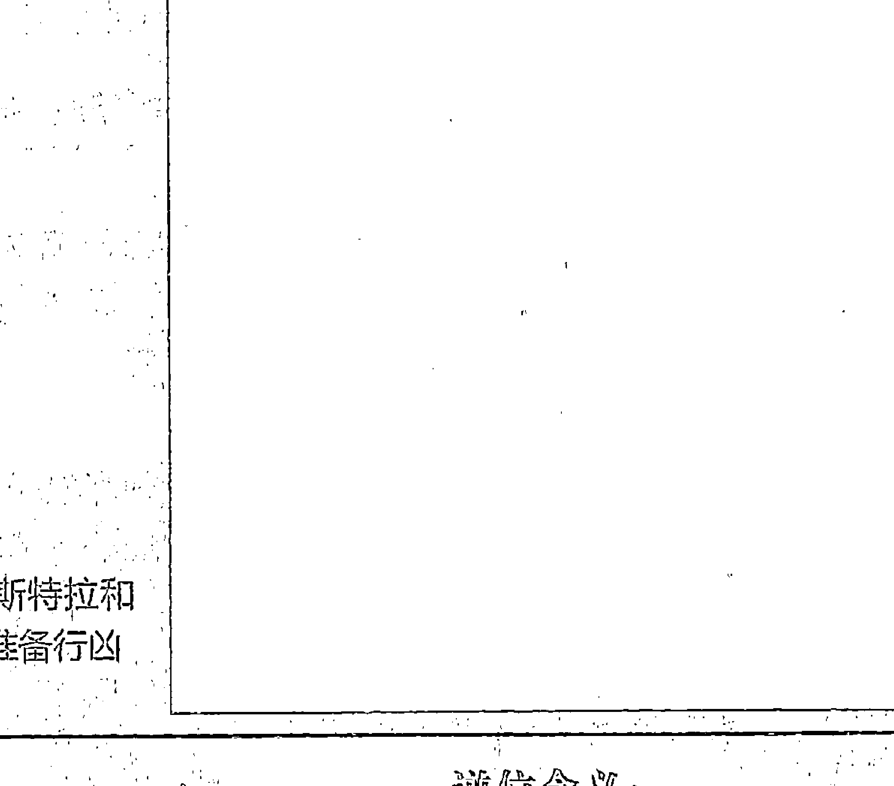

### 正位含义
1. 最近一直有口角。
2. 失去了生活中一直享有的一种爱。
3. 离散了，开始分手，或朋友分手。
4. 生活中发生了严重的对立。
5. 伤心，失意的眼泪。

### 逆位含义
1. 心理上一直处于封闭状态，不愿接纳任何事物。
2. 伤该愈合了，但当事人仍沉浸在悲伤中，不愿接受别人帮助。
3. 一直让周围的人伤心。
4. 小心，你有致命的损失。
5. 不安感越来越重。

# 牌义解释：小阿尔卡那

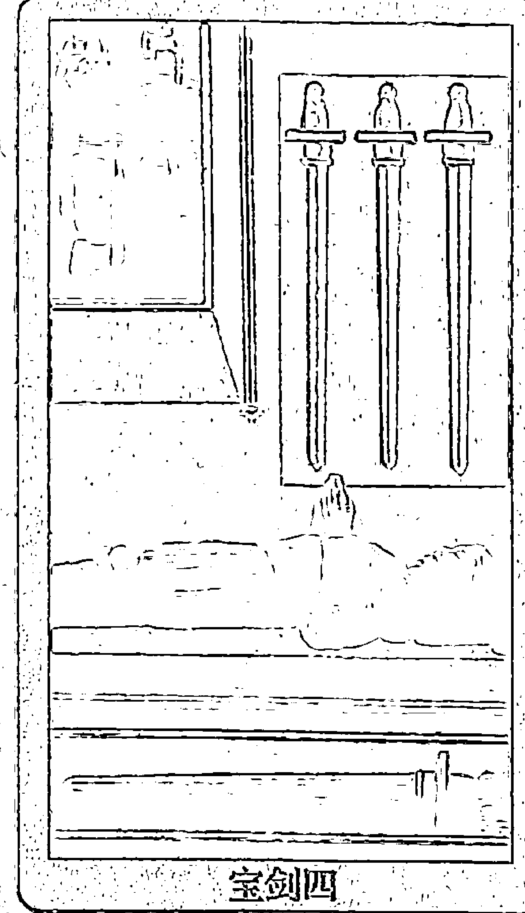

## 宝剑四

### FOUR OF SWORDS

关键词：休息、预备、沉思

休息：给自己身体一个恢复时间，避免体能的耗尽；寻求安宁；放松身心；过一段轻松的日子

预备：巩固和加强自身内在的能量，确定自己基础的稳定可靠性；为将来做准备；稳定

沉思：获得更好的观点及看法；看看自己内心的真实想法；一个人静下来想想；审视自己的动机；回顾自己所处的阶段、位置等

### 牌义对立或相近的牌

- ◇对立牌：
  - 魔术师：积极进取的，注意外在因素
  - 命运之轮：高速的，快节奏的，运动的
  - 权杖八：采取行动，猛冲，急奔
  - 权杖十：用力过度，用力过猛的，盛气凌人
  - 星币二：娱乐，均衡行动

- ◇加强牌：
  - 女教主：安静地休息，沉思，凝想
  - 隐士：沉思，凝想，安静
  - 吊人：休息，延缓行动
  - 圣杯四：沉思，独处
  - 宝剑六：休息，复原
  - 星币七：停止反应，估计，评价

### 图案解读
一个男人正在悬挂的三把宝剑的下方安静地休息，男人的身边还备有一把宝剑，他随时可以起身行动。此牌较其他宝剑牌的画面安宁祥和，它通常是代表消极不动的状态。但并非全然无为，而是在休息的过程中积蓄精力，暂停手头事务，计划下一步动向。等他准备完毕，随时会一跃而起，继续他的未完事业。“休息是为了更好地工作”是这副牌的主要牌义。

### 推测解读
宝剑四出现的时候，通常代表当事人正处于一种休息状态，或是他需要放慢步履，好好休息一番，然后重新出发。这是张“充电”的牌。提示你在休息当中，要好好反思，注意总结教训。

### 相关希腊神话
阿伽门农的妻子克吕泰涅斯特拉为了报复丈夫，把女儿当作祭品，与人私通杀死了丈夫。她把儿子俄瑞斯忒斯(Orestes)送去了别处，所以他什么都不知道。

### 正位含义
1. 需静养一段时间再说。
2. 凡事要学会做暂时性的让步。
3. 要学会“以退为进”之法。

### 逆位含义
1. 要提醒自己切勿急躁，凡事细细想，慢慢来。
2. 通常能在较短时间内休息妥当，然后投入生活。
3. 注意检讨自己，拾回以前失去的东西。

## 牌义解释 小阿尔卡那

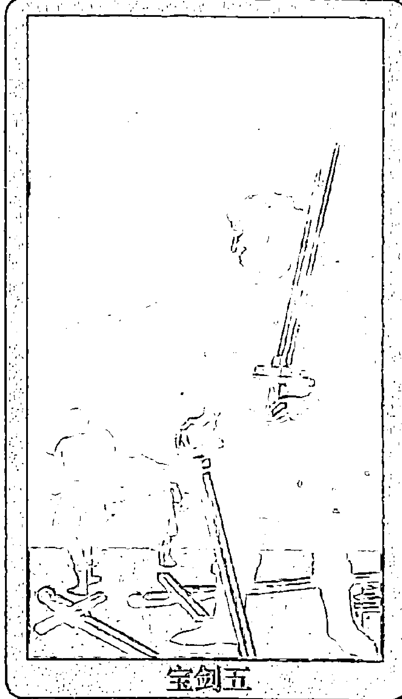

## 宝剑五

### FIVE OF SWORDS

关键词：自私、声名狼藉、不和

自私：不关心别人的，只考虑自己所有的；明白必须照顾自己；热衷权力角逐；心满意足；关心赌局或者比赛结果

声名狼藉：无道德准则的，不择手段，牺牲正义；不诚实的；无是非观念；取得让人争议的胜利

不和：处于敌对环境中；感觉人们互相作对的；选择战争同仇敌忾；冲突

- 牌义对立或相近的牌
- ◇对立牌:
  - 皇帝: 循规蹈矩, 遵纪守法
  - 正义: 诚实, 正直, 从事正义事业
  - 节制: 共同工作, 协调, 合作
  - 圣杯六: 清白, 善意的, 好心的
- ◇加强牌:
  - 权杖五: 不和, 相互反对
  - 权杖七: 敌视, 冲突
  - 宝剑七: 不名誉, 与别人不往来, 隔离

# 第三章 塔罗牌的义理释义

### 图案解读
战胜者收获了失败者的几把宝剑，看着手下败将离去的身影，嘴角露出了微笑。可以说，看到失败者越沮丧，胜利者就越高兴。从画面上可以看出，一场暴力斗争刚结束，胜者在洋洋自得中还没有清醒过来。他的这场胜利没有给他带来任何好处，只损人并不利己，只会培养他的野心，使他变得更自私。宝剑五代表着一个人取得了一场毫无意义的胜利，警示着某些人不择手段伤害对方，为得胜而得胜的行为。另外，此牌也代表着敌意、争执、屈辱等。

### 相关希腊神话
阿波罗命令俄瑞斯忒斯杀死自己的母亲为自己的父亲报仇，不然就要让他发疯。

### 推测解读
宝剑五在提示当事人不要一味追求胜利而忽略了其意义，要在奋斗过程中，既利人又利己。

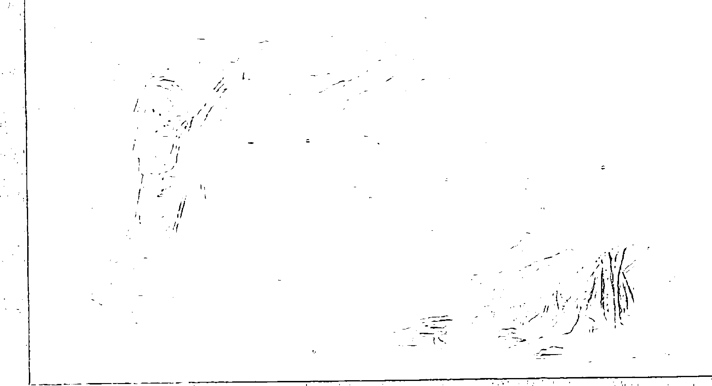

↑阿波罗命令俄瑞斯忒斯杀死自己的母亲

- 正位含义：
1. 不要短视，不要忘掉比赛的最终目的。
2. 要环视周围有没有对你怀有敌意的人。
3. 你有被辞职或免职的危险。
4. 正在堕落。
5. 对人际关系产生迷惑。

- 逆位含义：
1. 从自私的行为中解脱出来，停止无谓的争执。
2. 无法预测。
3. 你的熟人中将有一位发生不幸。
4. 将有关于丧事发生(祭奠、吊唁等)。

## 牌义解释 小阿尔卡那

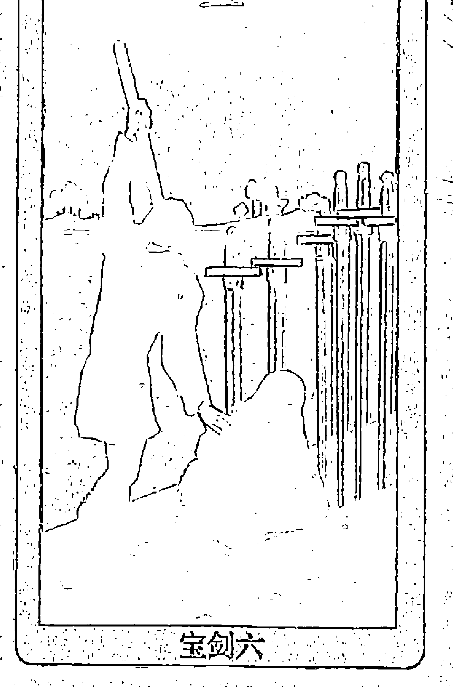

## 宝剑六
SIX OF SWORDS

关键词：忧郁、旅行、恢复

- **忧郁：** 经受轻微的伤痛；混日子，无聊地打发时间；一定程度地受压抑；持低调态度；情绪低落的；运行但不是很活跃的
- **旅行：** 改变位置，从一个地方到另一个地方；进行一次旅行；场地的变化；连根拔起的；根除；思想的一次变迁
- **恢复：** 处理外伤；熬过一段艰难的时间；捡起碎片；着手处理，开始对付；身体开始复原；向另一个更好的地方或者状态进发；重新扬起希望风帆

- 牌义对立或相近的牌
- **对立牌：**
  - 力量：不动摇的，有决心的
  - 太阳：活力，激情
  - 权杖四：激动，庆祝
  - 圣杯三：热情高涨，丰富
  - 星币二：欢乐
- **加强牌：**
  - 权杖十：经过，通过，挣扎
  - 圣杯四：情绪低落，压抑，不予关注的
  - 圣杯五：悲伤
  - 圣杯八：移动，开始一次旅行
  - 宝剑四：休息，恢复
  - 宝剑九：沮丧，消沉，悲伤

### 图案解读
插着六把宝剑的小船，与上面撑篙的船夫和一对母女，向着远方向着光明未来的平静水域驶去（而船下的水汹涌起伏）。象征伤害的六把宝剑不能拔起，否则船会沉没。他们只能带着危险前行，与伤害结为旅伴。事情不很糟，但也不很好。

船夫手中的黑色竹篙，其黑色象征潜力，意味将来什么都有可能发生，不要将自己困死了，驶过汹涌，就是水域的无边平静。

### 推测解读
处于一种困境中，何去何从，都决定着人的命运。前进，或许还有希望；不前进，只能困死原地。

### 相关希腊神话
俄瑞斯忒斯不得不遵照阿波罗的命令，他乘着小船回往故乡阿耳戈斯（Argos）前去报仇。

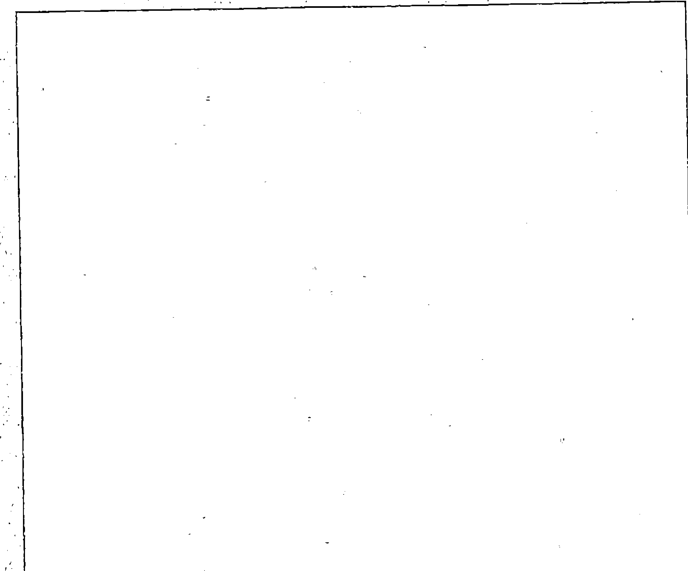

→俄瑞斯忒斯为父报仇

### 正位含义
1.汹涌的水溢到岸上来了，表示未来有更多艰难。
2.伤口迟迟无法痊愈，不肯接受帮助。
3.现在没有很好的对策。
4.需要向误解你的人倾吐心声。

### 逆位含义
1.历尽艰险后万事太平。
2.把自己隐藏起来与世隔绝。
3.需要中介者帮忙。
4.已渡过难关。

# 牌义解释：小阿尔卡那

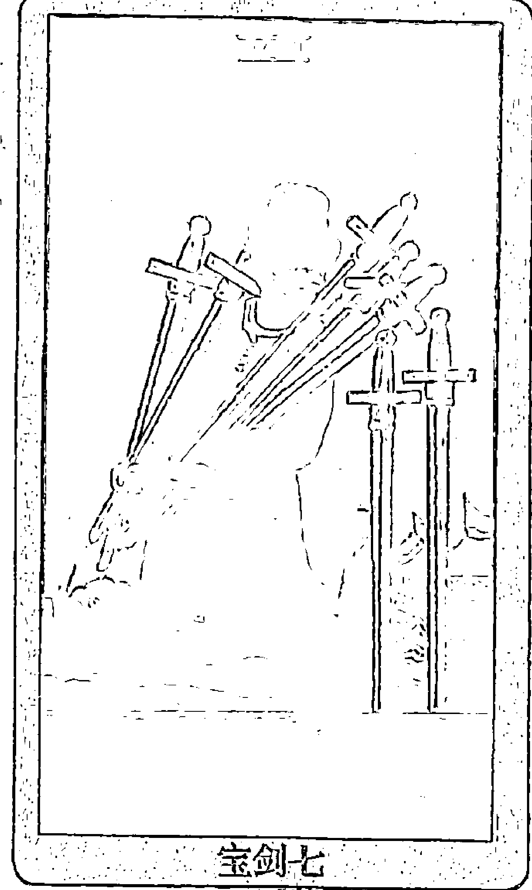

## 宝剑七

### SEVEN OF SWORDS

**关键词：逃避、不光彩、独来独往**

**逃避：** 逃避责任；偷偷逃走的；不争气；卑鄙的；逃避义务的；隐瞒真相；延迟；耽搁

- 牌义对立或相近的牌
  - ◇对立牌：
    - 教主：与群体一块工作
    - 正义：承担责任
    - 权杖十：尽义务，负责的
    - 圣杯六：清白，好心，高贵的，公开的
  - ◇加强牌：
    - 隐士：孤独，不爱与人相处的
    - 宝剑二：不真实的
    - 宝剑五：不名誉的，不跟人接触
    - 星币九：依靠自己，以自己方式行事

**不光彩：** 欺骗或者被欺骗；销毁证据；幕后操纵，两面三刀；躲在旁边看别人中套；消除可耻的秘密；说谎；小偷小摸

**独来独往：** 感觉自己不需要人的；要求独立；不要人帮助的；好独处的；冷漠；孤零零的；拒人千里之外的

### 图案解读
这是一个男人溜进军营偷剑的画面。不过，这个男人只偷了五把，另两把还留在原地。一个人力量毕竟有限，所以他无法光明正大地与敌人交锋，只能采取这种狡猾的手段，减弱敌人的战力。留在他身后的两把剑代表着这种行为的危险性，稍有不慎，他就会有惨烈的下场。不过，他不因难退缩，反而展示出十足的自信，值得称道。单从这个男人的表情来看，似乎已经成功了，但事实不然，只要留一把剑给敌人，伤害就不免发生。宝剑七告诉人们，做一件困难的事情，想要成功，就要付出极大的心力。另外，宝剑七也告诉人们，这种鼠窃狗偷的行为，也许一两次成功，但并非永远行得通。

### 推测解读
宝剑七经常代表欺骗、狡猾、背叛或诡计。当事人可能是说谎的一方，也可能是受骗的一方。

### 相关希腊神话
俄瑞斯忒斯为了报仇，他拿着七把宝剑，走进了阿耳戈斯的宫殿，周围非常阴森。

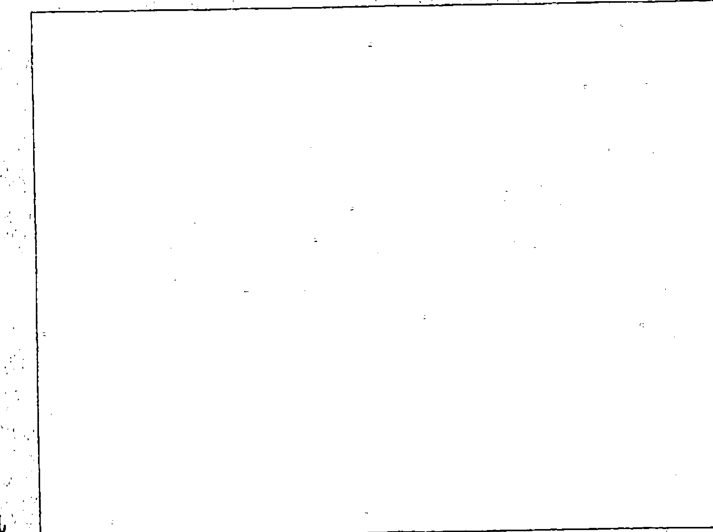

→俄瑞斯忒斯的复仇

| 正位含义 | 逆位含义 |
|----------|----------|
| 1.生活中总是疏忽大意。 | 1.有意想不到的好运。 |
| 2.有隐藏得很深的敌人。 | 2.要参考别人的建议。 |
| 3.泄露了秘密(包括私生活方面的)。 | 3.好的忠告或指导。 |
| 4.将要或已经失窃。 |  |
| 5.计划已经或面临失败。 |  |

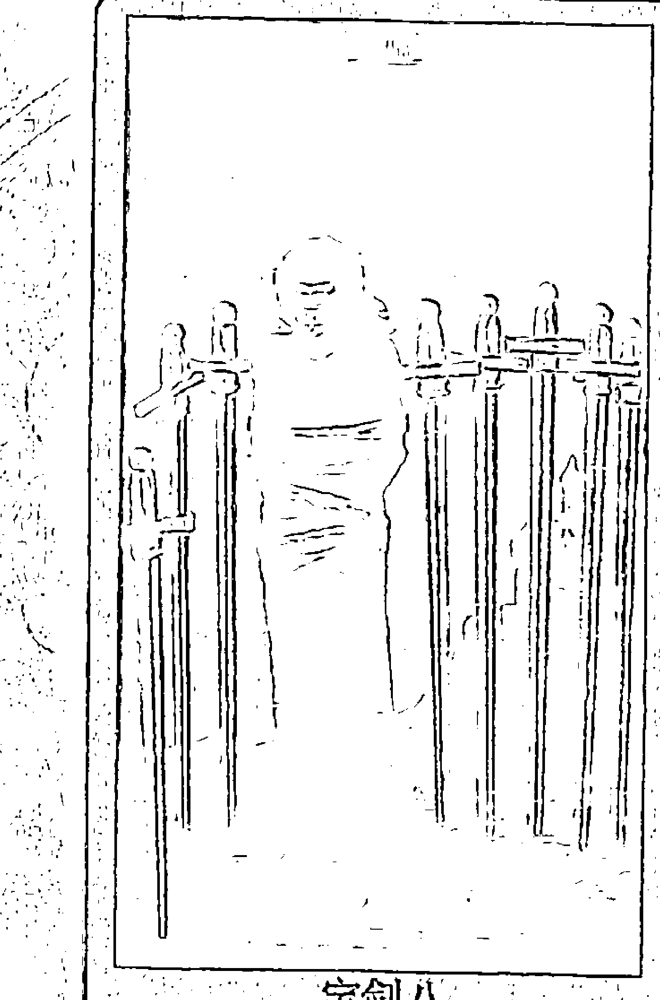

## 宝剑八
EIGHT OF SWORDS
关键词：约束、无能、混乱

### 牌义对立或相近的牌

**对立牌：**
- 魔术师：有力的，知道下一步该发生或者该做的
- 战车：自信，集中
- 权杖二：大胆的，有力的
- 权杖四：自由，少节制的
- 星币三：能力，知道该怎么做，计划

**加强牌：**
- 魔鬼：混乱，限制
- 月亮：混乱，不清楚
- 宝剑十：牺牲精神，无力的

**约束：** 被障碍所围住，待在一个受限制的环境，感觉被环境所约束；少选择的，不自由的；感觉受压迫的

**无能：** 等待外来援助；怀疑你做不了任何事；逃避责任；寻求帮助；感觉是做牺牲品的；怠惰；不采取行动

**混乱：** 不确定该怎么办；觉得亏了；方向不明确的；感觉被淹没；被打击、被压倒；挣扎；发慌的；需要保证和慈善援助；不知道会发生什么## 宝剑八

图案解读：
图中的女人被蒙眼缚手，困在剑阵之中。她伸不出手，看不见东西，不能自由地移动。她的家，在背后遥远的山上。宝剑八象征的是一种孤苦无援的处境。但希望还是有的，背后温暖的家在召唤鼓舞着女人冲破险阻，奔向自由。宝剑八表明的是人的一种状态。

推测解读：
这张牌预兆着当事人将陷入或已陷入艰难的处境。同时预示着当事人新的奋争开始了。

相关希腊神话：
阿波罗命令俄瑞斯忒斯杀死自己的母亲为父亲报仇，不然就要把他弄疯。但是复仇女神（The Furies）不许他杀自己的母亲，不然也要把他弄疯。

正位含义：
- 处于孤立境地，一种全新的奋斗生活开始了，或就此沦落下去。
- 有坏消息传来。
- 周围有对你的责难、中伤。
- 被束缚，失去自由。
- 生活中总是起争执。

逆位含义：
- 挣脱束缚，获得自由。
- 危机解除了，终于可以松一口气了。
- 生活已经重新开始。

## 牌义解释 小阿尔卡那

## 宝剑九
NINE OF SWORDS

关键词：焦虑、苦恼、内疚

焦虑：不相信一切会变好；冥思苦想；犯愁于你的困难；老想着你的问题；感到焦急；紧张的；想把所有事情都一下子整理好的

苦恼：失望；感觉自己已经到了极限；失眠；觉得沮丧；灵魂仿佛走在黑夜；忘记还有快乐；想哭

内疚：后悔所做的，不肯宽恕自己的；想要时间倒流；追悔莫及的；纠缠于自己的过失中不能自拔；不承认自己已经尽力了；被懊悔所击倒的

牌义对立或相近的牌
◇对立牌：
星辰：平静，想法的安宁
审判：无罪，赦免
圣杯三：在世界的巅峰的
圣杯六：清白
圣杯十：快乐，和平，欢乐
◇加强牌：
魔鬼：失意，闷闷不乐的
权杖十：焦虑
宝剑三：苦恼，心碎的
宝剑六：沮丧，悲伤

## 第三章 塔罗牌图解

图案解读：
图中捂脸坐在床上的男人痛苦不堪，被子已拖到地上，九把像窗棂和肋骨一样的剑挂于身边的墙上。这幅画面是很有象征意义的。人们在晚上的时候，悲伤和悔恨总是来得特别强烈，当白天让人分心的一些琐碎杂务结束后，人们总是沉浸在自己的想法中，被折磨得彻夜难眠。宝剑九代表的就是这种随时向我们袭来的不快。不同于宝剑三所代表的痛楚，在那里是指来自外界的烦恼，而这里代表的是来自内心的煎熬。

相关希腊神话：
最终俄瑞斯忒斯还是听从了阿波罗的命令，杀死了自己的母亲。于是复仇三女神各拿着三把剑指向俄瑞斯忒斯，一起指责俄瑞斯忒斯。

推测解读：
宝剑九不是令人高兴的一张牌，但是它也不仅仅预兆悲痛。通常它只是某些不快因素或者麻烦将出现的信号。它常表明你所走的道路将不是很平坦。

→ 俄瑞斯忒斯被指责

正位含义：
- 正处在苦难之中或苦难将来临。
- 因情侣将引起不幸事件。
- 半途天折，好事多磨。
- 与友人或情侣绝交。
- 生病，指一切身体不适。

逆位含义：
- 认为耻辱的事不断发生，一时难以应对生活，沮丧万端。
- 拥有很多知心的朋友。
- 做事优柔寡断。
- 有一种恐惧感。
- 周围充满谣言、中伤。

## 牌义解释 小阿尔卡那

## 宝剑十
TEN OF SWORDS

关键词：最低点、殉难、牺牲精神

**最低点：**
无处可去唯有向上；黎明前的黑暗；在最低点；觉得事情不可能再坏了；准备转折；达到一个最低点

**殉难：**
感觉像门前的擦鞋垫子；牺牲；把自己的利益排在最后的；让别人走前头；坐最后的位置

**牺牲精神：**
哀叹你的命运；觉得无助的；轻视生命的；不畏死的；遭受进攻；怜悯自己

牌义对立或相近的牌
◇对立牌：
战车：自作主张，力量，胜利
权杖二：力量，自信
权杖六：自满，在世界的顶峰
圣杯九：满足，满意
◇加强牌：
吊人：牺牲，殉难
宝剑八：牺牲精神，无力的

图案解读：
在灰色天空和朵朵乌云的笼罩之下，一个俯卧的男人，惨死在背上插的十把剑之下，其中一把洞穿头部，整个画面令人触目惊心。无疑，宝剑十是张“坏牌”，它的含义非常负面，包括惨痛、难过、痛苦等一切令人不适的情绪。同时，宝剑十代表着一切比较“过度”的状况：一把剑足可致人于死地，怎可需要十把呢？它象征的是一切事物任其泛滥和发展所造成的后果。
但是，这张牌也有一定的亮点：男人披着的红袍象征着他对生命的热爱，而远方露出的鱼肚白，则在告诉人们，黑暗马上要过去。尸旁的水平静无波，和该组牌中其他水面汹涌的画面不同，预示着：也许事情没有想象中那么糟，黑暗中的已经死去，黎明中的正在新生。

推测解读：
每一个事件，不论其坏或者好，都有意义。宝剑十出现，在于告诉当事者如何从失败中学习，在痛苦中成长。

相关希腊神话：
俄瑞斯忒斯非常绝望；此时雅典娜出现了。雅典娜派了陪审团来决定哪一方才是对的。有六票支持阿波罗，六票支持复仇女神。雅典娜投了关键性的一票，支持阿波罗，并给予了复仇女神她们自己的祭坛。俄瑞斯忒斯得到了解救。

正位含义：
- 一直十分苦恼，找不到出路。
- 希望一切结束，很消极。
- 面临或已经惨败。
- 悲惨而孤寂的命运。

逆位含义：
- 有瞬间可成功的机会。
- 有东山再起的希望。
- 有改善的可能性。

## 牌义解释 小阿尔卡那

## 宝剑侍从
PAGE OF SWORDS

关键词：思维、公正、诚实、毅力

相关希腊神话：
仄费洛斯（Zephyrus），西风之神，是吹来雨水的暖风的化身。他小时候很喜欢制造风暴搞恶作剧，后来他和彩虹之神伊里斯（Iris）结了婚。

- 思维： 分析问题；运用逻辑和理智，重新检查自己的信念；改善自己的计划；提高认识；教和学；反复想问题
- 公正： 纠正错误；依照伦理行事；公平待人；努力做到公正；做你知道是对的事；承担责任；承认另一种观点
- 诚实： 敢于面对事实的；清楚任何疑惑，暴露隐藏的；直说；不再隐瞒说谎
- 毅力： 直面困难的；不气馁的；百折不挠；坚定的决心；昂首挺胸的；保持努力

图案解读：
画面上的男人双手举剑，表情坚毅，背后晴空万里，整个画面洋溢着昂扬的气氛。持剑者举剑凝望，象征着一种既干练又沉稳的做事方式。这种做事方式含着一定的分析与考量。同时，宝剑侍从双手举剑，含有一定的防御意味。

推测解读：
宝剑侍卫可能代表一趟搭飞机的旅程、任何与你问题有关的讯息，或是在一般的占卜中，有关你目前所拥有的一个构想或计划的消息。一个心思活泼、容易沉浸于灵感中，而想法却并不怎么实际的年轻人，也可能是宝剑侍卫所暗示的。

正位含义：
- 在事情有变异前已察觉。
- 适合做调查类的“间谍”事务。
- 经历过挫折，已柳暗花明。

逆位含义：
- 没有预见到事情变化，无准备。
- 一时无力对付强劲的对手。
- 做事有漏洞。
- 生病。

## 牌义解释 小阿尔卡那

## 宝剑骑士
KNIGHT OF SWORDS

关键词：直接的/生硬的、知识渊博的/武断的/ 权威的/傲慢的、逻辑的/无情的

直接的/生硬的： 坦率直言的；粗鲁的；不老练的；直奔主题的；采取粗暴的方式；快言快语；不顾忌别人想法；诚实作答的；少判断力的
知识渊博的/武断的： 知道她或他所说的；认为自己总是对的；在任何主题上都可以展开的；对别的观点少宽容的；理智；傲慢自大的；高智商的；教条的；独断的
权威的/傲慢的： 说话毋庸置疑的；极权倾向的；作威作福的；要求或者命令予以关注的；强迫别人；非常确定地行事；要求绝对地服从；自然而然，理所当然地发布命令；不许不同意的；有很大影响力的；以高压方式行事的

相关希腊神话：
卡斯托耳（Castor）和波吕丢刻斯（Polydeuces）是一对勇士双胞胎。他们为了救出被抢走的妹妹海伦（Helen），在格斗中卡斯托耳被杀死了。波吕丢刻斯不愿独活，他希望和自己的兄弟在一起。于是宙斯把他们一起变成了神。

## 第三章 塔罗牌义解读

逻辑的/无情的：
条理清晰的；不重视情绪的作用；低估直觉的；充分地分析信息和形势；把别人看成数字一样的；专注于正确的东西；不因为怜悯而改变判决的；不受情绪影响的；没有感情的；混乱中保持理智的；冷漠，冷淡的

图案解读：
风驰电掣的骑士手挥宝剑勇往直前，风吹得衣襟飘扬，整个画面洋溢着一股昂扬向上的力量。骑士虽因性急而易失去理智的力量，但进取的精神可佳。他代表着事业心强的人，他们可能缺乏情感，但不是冷漠，只是心不在焉。他们对异性有强烈的吸引力，却无法建立长期的关系。

推测解读：
宝剑骑士代表的是迅速的行动：跃进或跳出某种情景。作为某个问题的答案，它暗示着一个快速的动作或出其不意的行为是有需要的。已经没有时间去想该做何选择了——去做就对了。
这张牌通常是代表一个年轻人，他不按牌理出牌、缺少耐心、思考敏捷。如果这个人要来帮忙你，你只有很短的时间可以考虑要婉拒或接受，因为很快地，他又会将注意力转移到其他地方去了。

→ 特洛伊王子帕鲁斯带走海伦

| 正位含义： | 逆位含义： |
|------------|------------|
| 1. 具有挑战的勇气，具有一往无前的行动力。 | 1. 做决定较轻率，不经分析与考量。 |
| 2. 强力压制反弹，对待突发事件不乏手段。 | 2. 因英雄气短而失败，易受情绪支配。 |
| 3. 有行动力，不乏手腕。 | 3. 自负，轻狂。 |
|  | 4. 朋友间或夫妻间关系不和。 |

## 牌义解释 小阿尔卡那

## 宝剑王后
QUEEN OF SWORDS

关键词：诚实、机智、机敏、经验丰富 / 坦白

相关希腊神话： 雅典娜，一个美丽的英雄，但是由于她十分要强，因此她提出向她求婚的人必须跑得比她快，否则就得死。密拉尼恩（Melanion）得到阿佛洛狄特的帮忙拿到三个金苹果，赢了亚特兰大。但是密拉尼恩忘了给祭品。于是他们双双被变成了狮子。

**诚实：** 直面（即使不愉快的）现实和事实；把任何事都放到台面上来；按规则办事；不撒谎，不欺骗的

**机智：** 很有幽默感的，用搞笑评论来缓解紧张局势；任何事都不严肃的；嘲弄每个人，自嘲机敏；迅速把握，认清形势；理解隐含动机的，难以糊弄的，不好耍的；表述出不好说的规章日程，反应很快的

**经验丰富：** 见识或者经历过一切的；对生活中的一切打击都有认识的；不做自以为是的判断，合理预期的

**坦白：** 公开，直接的，接触到问题的中心；不使诡计，不用借口的行事；直截了当，实际的；严肃的，必要时能坦白直接的

图案解读：
王后端坐于宝座之上，一手举剑，一手轻举（做布道状），目视前方，神情镇定，气质悠闲，一副洞明世事和胸有成竹的样子。她是战神雅典娜，会随时排除阻碍她计划成功的事物。她具有水的直觉和风的智力，有非凡的沟通力，是智者和所有胸怀宽广者的象征。她通常单身（一般被认为是国王的配偶），有独立的事业及价值观。这张牌同时代表智慧与经验，悲伤与孤独。

推测解读：
宝剑皇后是一张思索感情的牌。它可能意味运用心智到情感中的行动，好让感觉有意义。作为某个问题的答案，宝剑皇后暗示透过清晰思考而获致成功。
现在正是你反省过去的行为或目前情况的时刻了。密切的观察那些接近你的事物，以确认你不会再重陷困境中。你可能会想从生活当中撤退，好好的思考你自己，以及未来的方向。

→ 强势的雅典娜

正位含义：
- 事业如意却倍感孤独；或者事业失意，其他方面还可以。
- 有洁癖的倾向，泛指生活习惯上的过火行为。
- 离别，分手。
- 强烈的失落感。

逆位含义：
- 相当固执，不撞南墙不回头。
- 敌人很顽固。
- 过于盛气凌人。

## 宝剑国王
KING OF SWORDS

关键词：聪明的、公正的、分析、伦理清晰表明

聪明的： 内心舒坦的；创造性地应用；迅速完整地把握信息；能干的；巧妙的；知识渊博的

相关希腊神话： 奥德赛（Odysseus），伊塔克（Ithacus）岛的国王。他参加了希腊人对特洛伊的远征。特洛伊木马就是在他的指挥下建造的。在他回国的途中，为了自保，弄瞎了海神波塞冬的儿子巨人波吕斐摩斯（Polyphemus）的眼睛。从此受到了海神波塞冬的百般迫害。他历尽艰辛，20年后终于在众神的帮助下回到了自己的国家。

公正的： 做事诚实；富有洞察力的判断；理解并考虑事情的各个方面；不带任何感情色彩地看待问题；客观的分析；看透迷雾，透过混乱；应用理智和逻辑的；在游戏和其他智力挑战方面有天赋的；善于分解复杂问题；善于辩论；迅速理解问题

伦理： 道德精神上的领袖；激励高标准与高层次；与腐败和不诚实做斗争的；很有准则；原则地生活

清晰表明： 擅长语言和有表达技巧的，能成功表达思想的；健谈者；常充当某一团体的代言人；条理清晰的作者和演讲家

图案解读：
国王内着白衣，外着红氅，手擎宝剑，剑锋斜指苍天，一副惟我独尊的气势。他雷打不动的岿然之态，体现着他的老练与统治手腕的高明。另外，宝剑国王代表着一种专业的力量。

推测解读：
宝剑国王代表对清楚的思想的追求、诚实，以及将知识导入现实的需求。作为某个问题的答案，这张国王牌可以说是透过清楚而有效之计划而达到成功。他也可以暗示健全的构想及经营会带来成功，因为拥有一个计划、目标和持续的努力，正是一个赢的组合。
这张牌可能暗示，有人正在对你做明确而合理的忠告。在牌面上当正义牌随同出现时，这张牌即暗示即将有一场官司要上场了。

→ 特洛伊木马

| 正位含义： | 逆位含义： |
|------------|------------|
| 1. 有权威性，是某方面“帝皇”式的人物。 | 1. 生活中时常发生冲突，且常为自己意想不到。 |
| 2. 有统率力，领导能力出众。 | 2. 常遭不正常手段的打击。 |
| 3. 很冷静且想象力丰富。 | 3. 身边始终有群很残酷自私的男人。 |
| 4. 在专业领域内如鱼得水。 | 4. 不专一，朝三暮四。 |

## 牌义解释 小阿尔卡那

## 星币首牌
ACE OF PENTACLES

关键词：物质力量、实用性、繁荣、信任

物质力量：看重具体结果；有现实作用；取得切实的成果；提高体质；变得和自然相关

实用性：运用常识；脚踏实地；实际的；立根于实际，着眼于现实；运用在手的工具

繁荣：有达到目的的工具和方法；欣喜于丰盛繁华；被吸引；使接近到所需要的东西；兴旺；看到努力有了回报；资产的增值，增长

信任：相信别人的忠诚、信仰、承诺等；感到安全有保障的；有支持保障体系；知道形势稳定可靠；基地巩固

首一首搭配：
首一首搭配表示你身体将有新的血液注入，它不但吸取了星币首牌的能量（繁荣，丰盛，信任，安全，脚踏实地），还加上了以下能量中的一种：
- 权杖首牌：创造力，激动，冒险，勇气，个人魅力
- 圣杯首牌：深厚感情，亲昵，协调，怜悯，爱
- 宝剑首牌：智力，理智，公正，信任，仁慈，坚定

图案解读：
云端中伸出一只捧着金币的手，金币在这里代表人间最实际的东西，包括金钱、财富与身体等。下面是花草繁盛的庭园，园门外有逶迤的白色山峦，暗示着星币首牌不只有关物质，也可以延伸到精神层面。星币首牌既象征富足与安全，也象征着享乐与颓废。

相关希腊神话：
代达罗斯（Daedalus）出生在雅典的皇室，是一个优秀的工匠。

推测解读：
当星币首牌出现时，通常代表一个有关金钱与物质的新计划，且前景光明。但这并不代表以后就衣食无虞，它只是提示你：想要的东西就在伸手可及之处。另外，星币首牌可以表示加薪、获利，以及肉体与精神上的满足和娱乐。
在感情推测上，星币首牌代表一段稳定且充满感官享受的关系，也可以表示感情的物化，如给对方送上一枚钻戒等。

→ 代达罗斯被困弥诺斯王宫时，为他的儿子伊卡洛斯做了一双翅膀使他飞出了宫殿

正位含义：
- 物质丰富的生活，同时，往往代表着精神生活欠乏。
- 想得到的都得到了。
- 获得利益，事事顺利，运气较佳。
- 安泰的生活状态。

逆位含义：
- 被强烈的欲望冲昏头脑，干一些自己冷静下来都认为不可理喻的事。
- 奢侈的生活。
- 因金钱导致声名狼藉。
- 精神空虚，物质丰富。

## 星币二
TWO OF PENTACLES

关键词：协调、娱乐、机动

| 协调： | 保持平衡；应付各种需求；团结一致行动；确保顾及到方方面面；注重各方面的平等性 |
| --- | --- |
| 娱乐： | 做你爱做的；玩耍；觉得情绪很高的；愉快工作；看到形势中的诙谐幽默；反冲；交付 |
| 机动： | 快速适应；习惯于新方法或者新尝试；随波逐流；善于变通；看到可能性；对付挑战；易改变方向的 |

牌义对立或相近的牌

◇对立牌：
教主：按程序办事的习惯
权杖五：左右为难，处于十字路口，不能解决的
宝剑四：休息，安静，变化不大的
宝剑六：忧郁，情绪低落

◇加强牌：
节制：平衡，发现最佳的混合搭配比例
权杖四：娱乐，激动，派对第三章 塔罗牌火元素

### 图案解读：

一个颇似马戏团小丑般的男人，正在耍弄着两枚金币，金币外面环绕着“8”字形的带子。他后面的海面起伏剧烈，船只正在浪尖上行驶。单从男人杂耍的星币和起伏的海面来看，星币二表现的是一种动荡的生活状态。小处言之，是财务状况的波动；大处言之，是整个人生的潮起潮落。人的一生要应付许多状况，从画面上看，男人正在掂量两枚金币的重量，似在寻求一种应对方法。保持弹性，是星币二给人们的一个启示；面对人生的风浪，要像图中的男人那样从容应付。

### 相关希腊神话：

代达罗斯是木工技艺、刨子、吊线和胶水等的发明者。他不断地练习自己的技术，用新技术来制造东西。

### 推测解读：

星币二要求推测者面对各种事务，要八面玲珑，长袖善舞，不要死守某个思维定势。在财运的推测中，星币二预示收支平衡。如果你近来情绪低落，星币二则提示你应想得开，投入地娱乐一番。

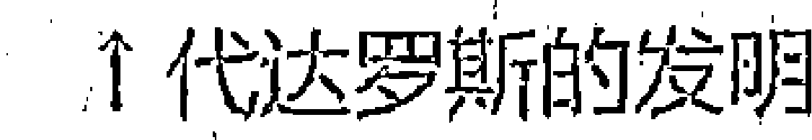

| 正位含义： | 逆位含义： |
| :--- | :--- |
| 1. 生活中总麻烦迭出，运气差到极点。 | 1. 能投入地娱乐，能正确处理工作和生活的关系。 |
| 2. 旧的烦恼未了，新的烦恼又来，逼着你学会在逆境中生活。 | 2. 用钱过度，越出计划。 |
| 3. 新的计划无法实现。 | 3. 表面快乐，内心痛苦。 |
| 4. 生活混乱如麻，没头绪。 | |

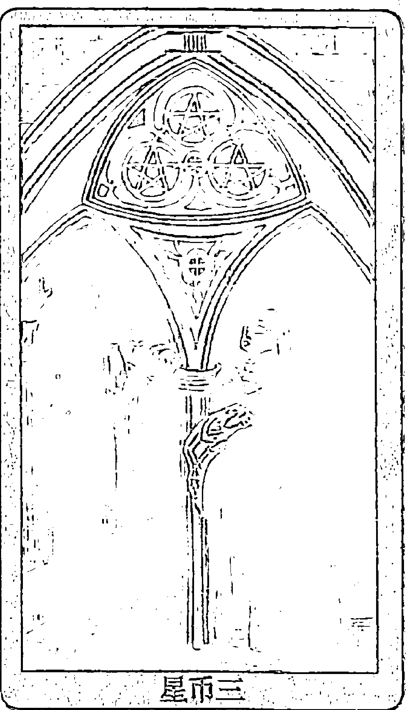

## 星币三
THREE OF PENTACLES

关键词：协力、能力、计划

- 牌义对立或相近的牌
  - ◇对立牌：
    - 权杖五：缺乏合作，无协调力的
    - 权杖七：对立，纠纷
    - 宝剑八：觉得难以胜任的，缺少指导
    - 星币九：单独做的，不注重统一行动的
  - ◇加强牌：
    - 教主：在某集体中工作
    - 节制：团结力量
    - 权杖三：计划，为将来做准备
    - 圣杯三：在团体中工作

- 协力：协调；寻找所有需要因素；统一行动；一起做事；为集体做贡献；联合
- 能力：完成任务；将某件计划执行得很好，实现你的目标；证实你的能力；做比期望的要好；知道该做什么和怎么去做，胜任工作
- 计划：按日程表行事；着手前深思熟虑的；考虑一切可能发生的问题；准备

### 图案解读：

一位雕刻师正在教堂里面辛勤工作，他的身旁站着一个修士和一个修女，正在给他出谋划策。从他们聚精会神的讨论，看来合作得很愉快。星币三经常代指团队工作。团队中每个人目标必须共同一致，不能谁想干什么就干什么，一定要先经过计划，并在实施过程中，要经过多次讨论。所以，星币三也经常代表沟通、协调。从图中可看出，雕刻师已经雕刻出了一部分花纹，他的技艺已得到了修士和修女的赞赏，所以，星币三也代表因专业能力得到的赞扬与荣誉。

### 推测解读：

在感情推测上，星币三可能表示工作团队中培养起来的恋情；也可能暗示双双把重心都放在了金钱与地位上，而缺乏情感交流。

> 相关希腊神话：
代达罗斯也是一个很有名声的建筑师和艺术家。

| 正位含义 | 逆位含义 |
|----------|----------|
| 1. 业务熟练，有一流水准。 | 1. 水准不高，难让人满意。 |
| 2. 有才能，超出一般人。 | 2. 想法不成熟，难实施。 |
| 3. 完成了一件奋斗已久的大事。 | 3. 有一定的物质损失。 |
| 4. 注重名声，有荣誉感。 | |

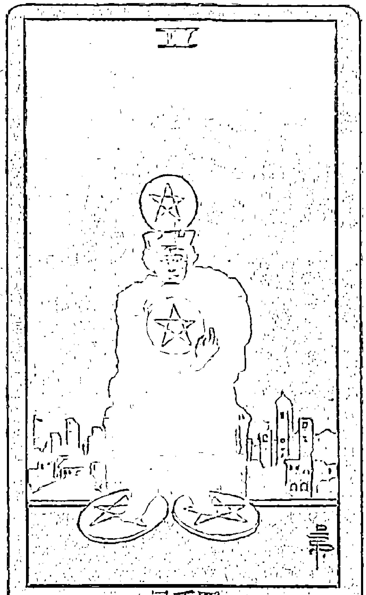

## 星币四
FOUR OF PENTACLES

关键词：占有、封闭、控制

- 占有：保持你的拥有；得到你的那一份；获得某物；紧紧握住某人；贪婪；声明所有；节约储蓄；小气
- 封闭：保持当前地位或者形势不变；要求任何东西呆在原地；拒绝新的尝试；停滞；变萧条；阻止新的变化；安于现状；逆潮流的
- 控制：要求一切尽在掌握中；拒绝变衰弱；指令；指示；坚持自己的方式；指定规章限制；确立秩序

## 牌义解释 小阿尔卡那

### 牌义对立或相近的牌

- ◇对立牌：
  - 愚人：自发的，冲动的
  - 皇后：不隐瞒的，开诚布公的，不客气的，大方的，浪费的
  - 命运之轮：运动，快速改变
  - 吊人：放手，不再努力去控制了
- ◇加强牌：
  - 皇帝：控制，结构制度，秩序，命令
  - 战车：控制
  - 宝剑二：僵局，封锁，妨碍
  - 星币十：喜欢当前地位或者形势，保存，保藏

### 图案解读：

图中的男人，从衣着上看，地位显赫。他头顶一枚金币，脚踩两枚金币，怀抱一枚金币，他屁股下坐的箱子里，说不定还有很多枚金币。从表情上看，他很紧张，很明显，他怕失去任何一丁点财产。从物质上而言他是富有的，但他孤零零地远离于城堡里的人们之外，可以看出，在精神层面上，他是一贫如洗的。星币四经常代表物质生活上的充足与稳定，以及精神层面上的空虚。

### 推测解读：

星币四在实际推测中，往往代指“控制”，代表那些紧紧抓住物质资产不放的人(也包括精神层面上的东西)。若是情侣，会嫉妒心很重，爱吃醋；若是老板，肯定是处处克扣工资的小气鬼。

> 相关希腊神话：代达罗斯把手艺教给了塔罗斯(Talos)，但是学生的手艺却超过了老师。于是代达罗斯很不高兴。

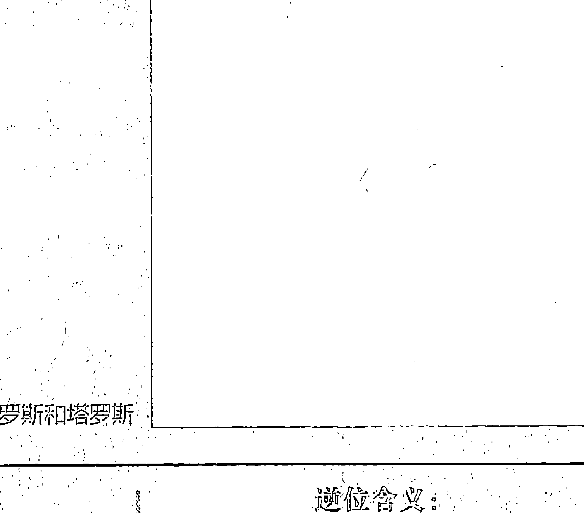

→ 代达罗斯和塔罗斯

| 正位含义： | 逆位含义： |
|-----------|-----------|
| 1. 吝啬鬼，多指有钱人一些可笑的节约措施。 | 1. 入不敷出，或坐吃山空。 |
| 2. 生活中精打细算，多指贫穷者。 | 2. 奢侈无度的人，生活开支没有计划性，缺自控能力。 |
| 3. 有遗产方面的问题，或预示某位亲属要亡故，而财产继承不会太顺利。 | 3. 金钱运势很差。 |
| 4. 追求物质财富很执着。 | 4. 因物质欲望过度膨胀而导致失败。 |

## 牌义解释 小阿尔卡那

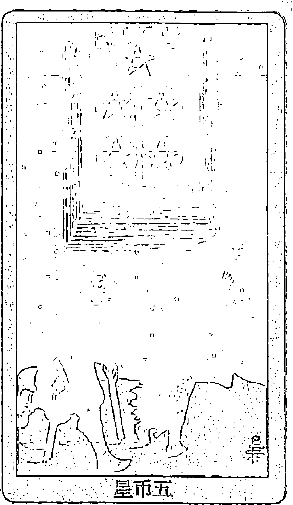

## 星币五
### FIVE OF PENTACLES

**关键词：艰难时刻、拒绝、亚健康**

- **艰难时刻：** 碰到实际困难，失业或者没有收入，觉得不安全的；通过一段艰苦岁月；缺少想要的
- **拒绝：** 缺少支持；持否定态度的；排斥；放逐；受冷遇的
- **亚健康：** 感觉疲惫，筋疲力尽的；不注意保养自己，忽视自己身体需要；需医护的；虐待自己

### 牌义对立或相近的牌

- **◇对立牌：**
  - 力量：精力，毅力，持久力
  - 节制：好的体魄
  - 太阳：活力，强健的体格
  - 宝剑六：喝彩，欢呼，认可
  - 星币七：物质奖励，报酬
- **◇加强牌：**
  - 高塔：艰苦岁月
  - 权杖十：艰难时刻
  - 圣杯五：拒绝，少支持，少赞同
  - 宝剑三：拒绝，孤立，少支持

### 图案解读：

风雪交加中，一对衣衫褴褛的乞丐夫妻蹒跚而行，从象征物质与精神庇护的教堂前路过，却视而不见，径自远去。图中，拄着双拐的乞丐象征着疾病与困厄。此牌也象征着不渝的爱情，像图中处于贫困中依然心心相印的爱侣，在冰天雪地中，给人以一丝温暖。另外，教堂只有窗户没有门给人以无限深思。可由推测者根据自己的境况自由发挥联想。

### 推测解读：

星币五出现，显示某方面有欠缺，可能是财务上需援助，可能是缺乏精神支持。同时，此牌也提醒你，珍惜你已经拥有的。

### 相关希腊神话：

因为嫉妒学生的才能，代达罗斯杀死了塔罗斯。但他在雅典也无法生存下去了，只得逃亡他处。

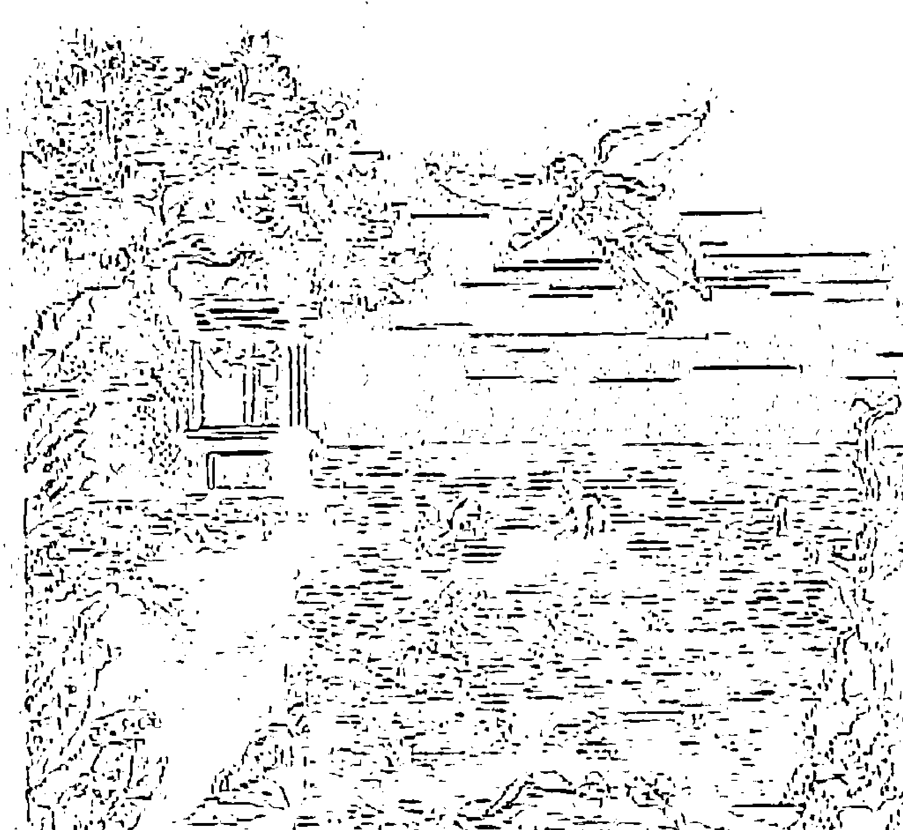

→代达罗斯的逃亡

### 正位含义：

+   1. 有金钱方面的烦恼(物质上困乏，但精神上往往很充实)。
+   2. 放浪，玩世不恭，生活态度不端正。
+   3. 连续失败。
+   4. 失业。
+   5. 心灰意冷。

### 逆位含义：

+   1. 担心居住问题，或近来房产方面有麻烦。
+   2. 生活混乱无序，各种物质上的烦恼使你心神不宁。
+   3. 方方面面的关系较对立。
+   4. 想法荒唐，但耽于其中。

## 牌义解释 小阿尔卡那

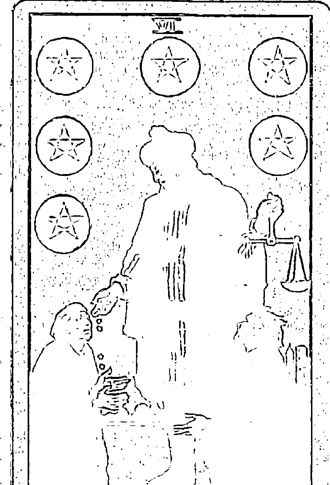

## 星币六
SIX OF PENTACLES

关键词：有或没有能源、有或没有知识、有或没有力量

牌义对立或相近的牌
星币六没有通常意义上的对立牌和加强牌，因为星币六既可以是正面的意思，也可以是反面的意思——有，或者没有。从整个牌阵其他牌的阅读中，我们可以知道哪一面的意思是适合这一次推测的。以下是意义可能相近的牌：
- 皇后：丰富，安乐
- 世界：富裕，物质充足
- 权杖十：战争相持不下，艰难的时刻
- 星币五：贫乏，缺少
- 星币七：物质酬劳，获得
- 星币十：丰富，拥有

- **有或没有能源：** 给予或接受；照顾或被照顾；配备或被配备；支持或被支持；提供或收到酬劳；获得或没有获得所需
- **有或没有知识：** 教导、学习；传授、接收信息；成为、找寻顾问；提供、建议；展示、被套牢；获知、不知秘密
- **有或没有力量：** 引领或跟随；控制或服从；权威或顺从；坚持或否定；强迫或被迫；滔滔不绝或倾听

### 图案解读：

两个乞丐跪伏在商人模样的男子面前，在乞讨。男子右手在施舍，左手提着一柄象征平衡的天平。画面在辛酸中透出“幽默”，施舍需要讲究公平。——该给他们多少，给太多，给太少，都不是恰当的援助。星币六除代表慈善外，也代表一种理财能力。

### 推测解读：

在推测中，星币六经常代表你将要得到需要的东西。如朋友久欠不还的债款，一件意义非凡的赠礼，甚至是遗产。当然，有时也代表着你将要捐献、馈赠，为别人付出。

有时，星币六也代表一方控制另一方。毕竟，施舍本身就是不平等的，往往意味着讲条件。理财方面的推测上，往往意味着收支平衡。同时星币六是一张正反意思皆可的牌，需要仔细辨认和考虑。

> 相关希腊神话：
代达罗斯逃到了克里特岛(Crete)，投奔国王弥诺斯。弥诺斯收留了他。

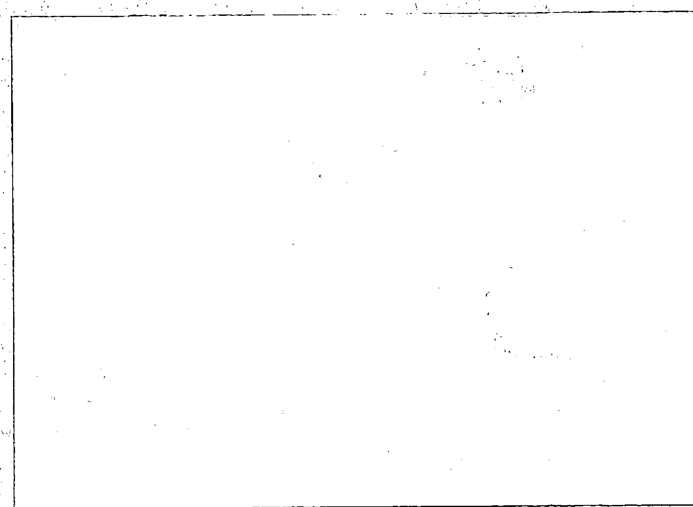

→ 克里特之王弥诺斯

### 正位含义：

+   1. 懂得礼尚往来，人际关系圆通。
+   2. 与人为善，人缘极好。
+   3. 生活状况良好。
+   4. 胸怀宽广，坦荡。

### 逆位含义：

+   1. 自私自利，令人生厌。
+   2. 嫉妒心很强，心情时常处在恶劣状态。
+   3. 拥有很多不干净的钱。
+   4. 负债，或者在情义上欠别人的，不知报答。
+   5. 贪欲很重，为其操纵。

## 牌义解释 小阿尔卡那

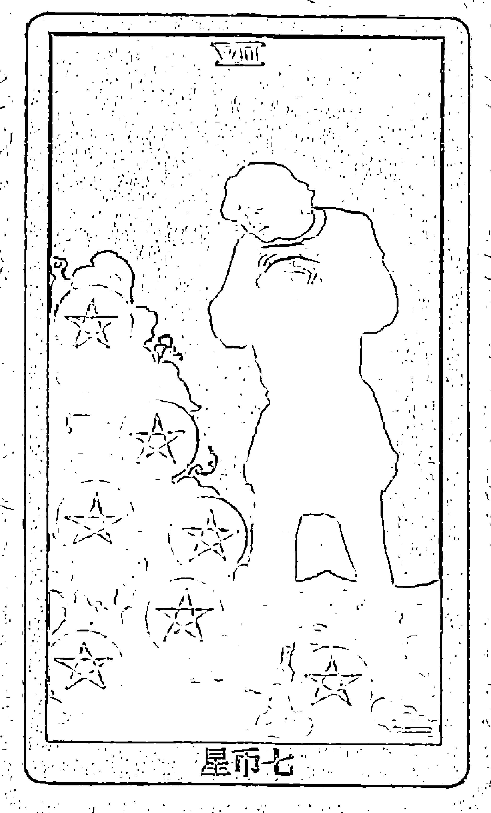

## 星币七
SEVEN OF PENTACLES

关键词：评估、转变、回报

- 评估：衡量当前形势，对当前的进展做考虑；反省已做过的事，确定自己是否上路；确定自己所处位置或者阶段；清查存货
- 转变：考虑新的变化，考虑一种选择；开始新的战略；站在十字路口
- 回报：最终的结局；享受最初成果；得到投资的回报；获得报酬；抵达里程碑

- 牌义对立或相近的牌
  - ◇对立牌：
    - 命运之轮：运动，行动，转折
    - 权杖八：快速反应
    - 星币五：无结果，无回报，艰难
  - ◇加强牌：
    - 皇后：物质奖励，回报
    - 正义：确定自己所处位置，决定将来进程
    - 审判：关键点
    - 宝剑四：休息，反复考虑

### 图案解读：

星币七中的人物是一个劳动者的形象。他身边繁茂的藤叶象征他曾经付出了辛勤的劳动。藤叶上挂着七颗星币，象征着丰硕的劳动果实。他有些疲惫，但终于劳有所得，一切付出都是值得欣慰的。无论是这个劳动者，还是他脚下的土地，都是朴素的。但象征果实的那七颗星币却无比辉煌，这象征着一份耕耘一份收获，只要付出努力，任何人，都有机会获得成功。从另一个角度看，劳动者站立在藤叶旁边，这些藤叶并不是耕作所得，而是妨碍耕作的杂草，需要去清理，劳动者仿佛在思考，我有能力把它清理干净吗？这些值得我去做吗？收获能抵偿付出的辛劳吗？清理掉杂草能得到星币吗？清理掉杂草会损失星币吗？这一系列疑问引发人们对自己的生活进行思考。

### 相关希腊神话：

代达罗斯生活在克里特岛。当时弥诺斯因为触怒了海神波塞冬，波塞冬就让弥诺斯的妻子帕西淮(Pasiphae)和公牛在一起。帕西淮乞求代达罗斯能发明一种方法使她能和公牛交配。如果代达罗斯答应了帕西淮，那么他就背叛了弥诺斯，但因此会得到波塞冬的好处。于是他还是帮助了帕西淮。后来帕西淮生下了怪物弥诺陶洛斯。弥诺斯乞求代达罗斯建造一座迷宫，让弥诺陶洛斯住进了迷宫。

### 推测解读：

星币七也象征一个十字路口。在日常生活中，规范实际上也有一定的连续性，开拓一个新的方向并不容易。星币七正显示一种过程改变中的形象，这不是一张终结之牌，因为游戏并未结束，所以需要时时刻刻去把握变化的现在。

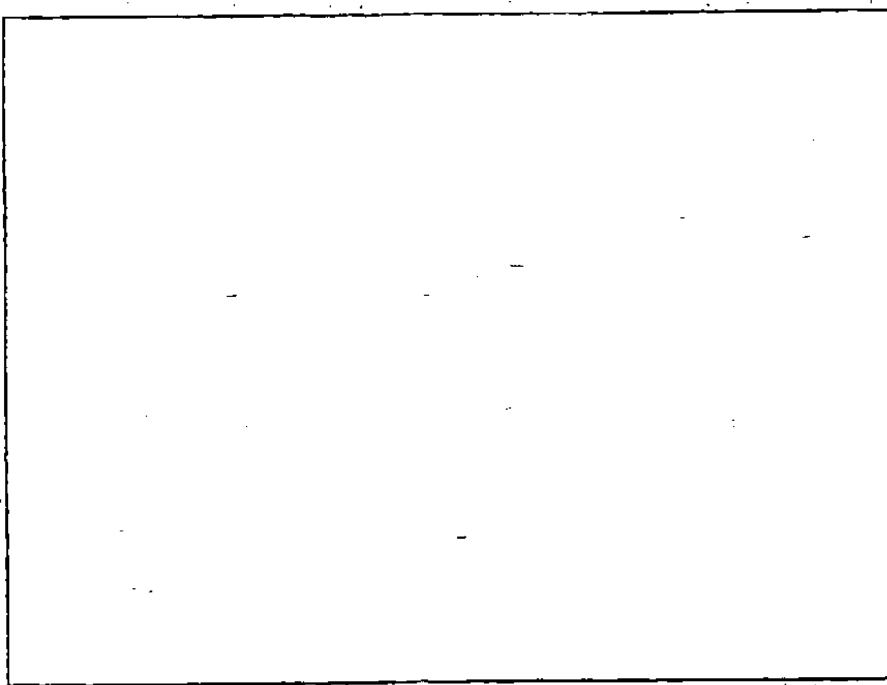

↑ 海神波塞冬之怒

- 正位含义：
  +   1. 目的无法实现，需衡量问题的严重性。
  +   2. 对事物进行仔细的评估。
  +   3. 做了无用功。
  +   4. 因辛勤劳作而获得成功。
- 逆位含义：
  +   1. 付出了多余的努力或生产过剩了。
  +   2. 无知，轻率地作出决定。
  +   3. 毫无见识，愚蠢的投资。
  +   4. 努力得不到回报。

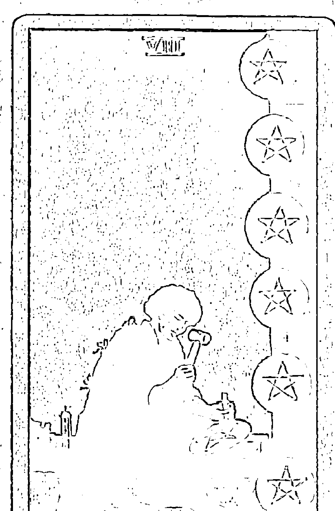

## 星币八
EIGHT OF PENTACLES

关键词：勤奋、细节、知识

- 牌义对立或相近的牌
  - 对立牌：
    - 圣杯四：缺乏兴趣的，不关心的，缺乏感情的，无动于衷的
    - 圣杯七：懒惰，缺乏积极性，缺乏动力
  - 加强牌：
    - 魔术师：聚焦，集中
    - 教主：学习
    - 权杖九：坚持

- 勤奋：努力，全身心投入，全神贯注于某事
- 细节：辛苦，辛勤；特别小心；有系统有规划地去完成某任务，检查再检查，核对再核对
- 知识：选课，学习新方法新技能；接受培训；追求更深的理解，探索，研究；发现真相；增加专门技术

### 图案解读：

图中的年轻人正专注地执锤雕刻星币，显然，他已经干了很长时间了，已经完成了7枚，第8枚眼看也要完成。年轻人为能更专注于工作，搬离了背后远处的城镇，以便能更好地集中注意力。不难看出，星币八的要义是勤奋工作，注重细节。

### 推测解读：

星币八通常暗示推测者要集中精力去处理眼前急切的事务。同时，此牌也鼓舞推测者付出百分之二百的汗水去从事感兴趣的事情。

相关希腊神话：代达罗斯赠送给弥诺斯的女儿阿里阿德涅(Ariadne)一个线团。后来阿里阿德涅爱上了被当作祭品送来的忒修斯。她把线团送给了忒修斯，忒修斯杀死了弥诺陶洛斯，走出了迷宫。于是弥诺斯把代达罗斯关进了迷宫。代达罗斯就制作了一对翅膀，飞了出去，飞到了西西里(Sicily)的宫殿中。

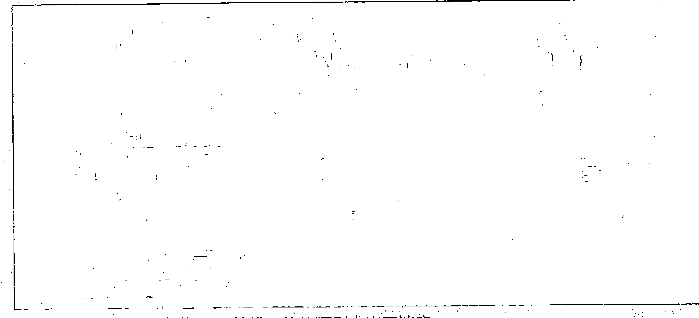

↑ 阿里阿德涅交给忒修斯一团丝线，使他顺利走出了迷宫

### 正位含义：

+   1. 进取心强，不甘于人后。
+   2. 做事有条理。
+   3. 在技术上精益求精。
+   4. 在研究学习过程中。
+   5. 会自我激励，经常用名人故事鞭策自己。

### 逆位含义：

+   1. 无真本事，且虚荣得很。
+   2. 放高利贷，泛指为谋取利益不择手段。
+   3. 本事用不到正经地方。
+   4. 野心遭受挫折。

## 牌义解释 小阿尔卡那

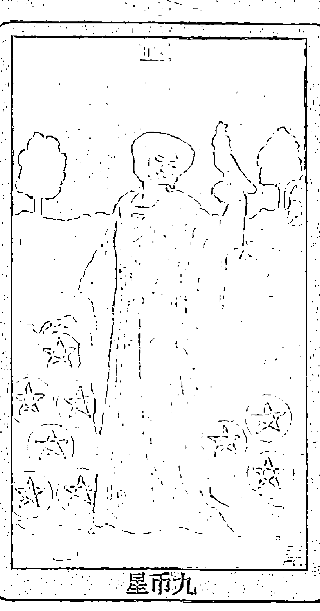

## 星币九
NINE OF PENTACLES

关键词：纪律、精美、自立

- 纪律：自我控制，显示约束力；支配；控制自己的冲动；坚持计划；按部就班
- 精美：令人舒适的生活方式；不粗鄙；不难吃的；不令人讨厌的；圆滑的；老道的；享受生活中的美好事物；休闲
- 自立：独自应付当前形势；依靠自有资源；一个人做的；不求助于人的；确信自己的方法是最佳的

### 牌义对立或相近的牌

- ◇对立牌：
  - 皇后：粗俗，淫荡。好色，感觉性
  - 圣杯七：无纪律的，放任自流的
  - 星币三：与团队一起工作的
- ◇加强牌：
  - 战车：自我控制，纪律约束
  - 宝剑七：依靠自己

### 第三章 塔罗牌牌义解读

### 图案解读：

一位悠闲的妇人在自己的花园里散步，气质贤淑温文尔雅，垂着的右手下是几枚叠放着的金币，象征着一切物质层面的东西。稍显突兀的是，她左手背上立着一只听命于她的猎鹰。猎鹰是生活中一切黑暗粗鲁东西的象征。表明妇人已经成功地控制住了生活，不再为冲动和欲望所动。

### 推测解读：

星币九在推测中含义丰富。有时是纪律和自控的象征，有时暗示推测者放弃一切尘世中低俗下流不文明的东西，有所节制。此牌正放和倒放差别较大。

相关希腊神话：
西西里国王科卡罗斯(Cocalus)收留了代达罗斯在他那里工作。代达罗斯的工作表现很出色，受到信任，他也感到很满足。

### 正位含义：

+   1. 有一定眼光，懂得选择，为人激赏。
+   2. 知蓄财的必要，生活中精打细算，但不吝啬。
+   3. 能持续不断地为自己创造有利条件，是个实践家，讨厌一切“口头主义”者。
+   4. 取得一定的成就。
+   5. 知道最安全的行事方式。

### 逆位含义：

+   1. 不守信用，为人厌恶，一时改不掉，习惯成自然。
+   2. 计划中止，前功尽弃。
+   3. 没有管理能力。
+   4. 因失去信用而失去财产。
+   5. 失窃。

## 牌义解释 小阿尔卡那

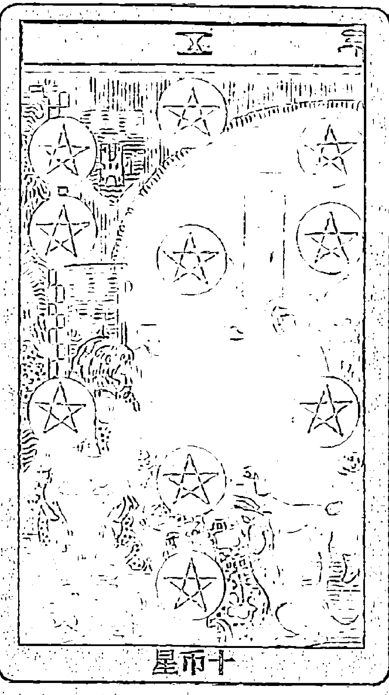

## 星币十
TEN OF PENTACLES

关键词：富裕、惯例、持久

- 牌义对立或相近的牌
  - ◇对立牌：
    - 权杖二：原创，不因循守旧
    - 权杖三：探险，进入未知区域
    - 星币五：艰难时刻，物质匮乏
  - ◇加强牌：
    - 皇后：奢侈，物质上的舒适，富裕
    - 教主：遵守，保守
    - 情侣：持久的联盟，家庭关系
    - 世界：富足，物质上的满足
    - 星币四：安于现状，保守的

- 富裕：物质上的丰富，金钱不成问题的；享受商业上的成功；财政上的安全感；有大笔钱
- 惯例：固守陈规；按规章制度办事；遵守传统的；成为制度协议的一部分；保守的；相信经验；继续以前模式
- 持久：寻求能持久的策略，建立可以持久的基础；安于现状；有序的家庭生活；不再持权宜之计；明确计划的## 图案解读：

画面是一个温馨祥和的家庭，老人舒适地坐于屋中，两只象征家庭和睦的狗围绕在他身前，门外站着儿子和儿媳，小孙子调皮地抚着一只狗的尾巴。金币在画面上错列成形，组成生命之树的符号。星币十描述的是一个财务基础稳固的家庭，其中世代传承的意味很浓，老人经过一生奋斗，创造了可观的财富，使儿孙们衣食无忧。星币十也可代表企业(家族性)等以金钱与成功为目标的团体，甚或政府机构，或指一些成功的事业伙伴。

### 推测解读：

情爱方面的推测，星币十可能显示双方在事业上是契合的伙伴。但同时暗示缺乏情感交流，或不重视这方面的沟通。另外，也可代表掺杂了其他物质因素的婚姻。

> 相关希腊神话：
代达罗斯在西西里过着快乐而富裕的生活。

### 正位含义：
- 亲人渐入暮年，意味着遗产在一步一步向你靠近。
- 传统家庭，子承父业，维持一定用度。
- 家境很好，物质丰富，儿孙满堂，妻贤子孝。
- 团体事业运作态势良好。

### 逆位含义：
- 团体中某种程度的不和即将出现，而症结所在经常是金钱。
- 投资合伙宜暂缓，理财务必谨慎。
- 失去遗产。
- 与亲人对立，家庭陷入不和。
- 失窃，或其他方面有一定损失。
- 偏护自己的家人，有失公平。

## 释义解释小阿尔卡那

## 星币侍从
PAGE OF PENTACLES

关键词：起作用、繁荣、实践/实际、信任

起作用：实践计划，实现你的梦想，取得实际成果
繁荣：获得想要的；增长；膨胀；去获取成功；变得安全；寻求丰盛富足；致富
实践/实际：做现实的尝试；找到可行方法；不再做白日梦；运用常识；利用现成的；关注有效的东西
信任：相信某人；证明自己值得依靠；适应（相信）不确定性；重塑信用；跟你的队友站在一起；守信的

相关希腊神话：农业之神特里普托勒摩斯(Triptolemus)，是厄琉西斯(Eleusis)的国王刻勒俄斯(Celeus)的儿子。冥王哈德斯(Hades)抢走大地之母得墨忒耳(Demeter)的女儿珀耳塞福涅(Persephone)去做冥后的时候，特里普托勒摩斯给得墨忒耳指示了方向，于是得墨忒耳给了他玉米籽、农具及农业技术。特里普托勒摩斯乘坐着得墨忒耳赐给的有巨蟒曳引的飞车走遍天下，到处传播农业技术。

### 图案解读：

星币侍从绿色的衣衫象征着自然科学及其旺盛的生命力。他的头上没有戴桂冠，而是戴着厚重的红色的帽子，这象征着他可能不是一个战胜者，不是一个领导者，但他是一个学者，有智慧，有热情，有创意，并且成熟稳健。他脚下繁茂的草原象征丰富的知识和充实的未来。

### 推测解读：

星币侍从象征有关金钱、新工作或学习一门课程的消息。它可以表示去学习某些将会产生实质效益的事物。这个侍从通常代表学生的勤奋向学。透过学习一门课程，或于工作中学习，发挥了自己的能力。有时候这个侍从可能暗示你对于正在学习的科目，变得更专注，甚至更重视学习的成果。
星币侍从描述的是一名认真的年轻人，它正专注于长远的目标上。它可以代表一张开始新工作或学习的牌。

### 正位含义：
- 学习态度端正。
- 热心积极地投身于研究工作。
- 求知欲旺盛，头脑优秀。
- 与知识或者研究工作有关的好消息。

### 逆位含义：
- 挥霍、浪费金钱。
- 知识贫乏，认识不够全面深刻。
- 视野狭窄。
- 精力充沛。
- 自食恶果。

## 牌义解释小阿尔卡那

## 星币骑士

### KNIGHT OF PENTACLES

关键词：
- 坚定/顽固
- 现实的/悲观的
- 谨慎的/不冒险的
- 工作努力的/折磨人的
- 彻底/强迫

### 相关希腊神话：

畜牧之神阿里斯泰俄斯 (Aristaeus)，他是阿波罗和神女库瑞涅的儿子，是使庄稼免遭干旱和冰雹的保护者，是迷路行人的救星，他是牧人的庇护者。他还教人们种植葡萄、油橄榄的方法，传授养蜂技术等等。

### 坚定/顽固：

顽强地追求目标；死脑筋的，固执的；绝不放弃的；钻进死胡同不肯出来的，钻牛角尖；坚定立场，认死理的；坚持原来选择，拒绝听道理的

### 现实的/悲观的：

愿意面对现实的；对自己的错误耿耿于怀；面对真相的；认为别人是在做梦的；不为虚假的希望所诱的；只看到漏洞没有看到成果；正确估计形势；持消极的、令人沮丧的观点；预测困难在增加；刚开始就对计划持悲观态度

### 谨慎的/不冒险的：

核对再核对；太保守；预先检查每个角落；坐失良机；小心而缓慢地进行；不愿意尝试新方法；偏好安全和熟悉的路子；从安全考虑出发，宁愿少点收获

### 工作努力的 / 折磨人的：

献身，致力于某任务，过分专注，刻苦，勤勉，严酷，无幽默感的；做两个人那么多的；看待休息为浪费的；精力旺盛地处理任何事情，弄得筋疲力尽的；不倦的，不松弛的，忘记生活还得有娱乐

### 彻底 / 强迫的：

关注每一个细节，不知道什么时候得放弃的；小心翼翼的，吹毛求疵的，过分挑剔的；不让工作只干一半就不管的；不许打折扣的；强制的；辛苦的，要求完美的

### 图案解读：

星币骑士身姿稳健地骑坐于一匹黑马之上，左手紧握缰绳，右手平稳地托起一颗星币，神色坚定，是那么可值得信赖。他是一位前途光明的有为青年。他戴着头盔，披挂着铠甲，外表冷静，卓尔不凡，甚至严肃得有些古板。但那身红色的铠甲说明了他坚硬的外表下火热的另一面，必要的时候，也是会爆发的呢！

### 推测解读：

星币骑士通常指的是强化你的计划，并朝确定的目标迈进。它意味着为了实现一个目标而努力工作。
就一个人而言，这个人对于承诺非常的认真，不论是对事业、个人雄心或两性关系。通常，他相信这个格言：“如果你想做好一件事，那就自己动手吧。”

正位含义：
- 讲究效率，有能力的组织者。
- 了解现实状况，稳扎稳打的实干家。
- 有责任感，值得信任和依靠的人。
- 家庭的保护者。
- 观念有点保守的人，一个保守派。

逆位含义：
- 懈怠，不振作的态度面对工作或人生。
- 思想过分保守，顽固分子。
- 处事随性，对事物产生的热情很快冷却。
- 发展停滞不前。

## 星币王后

### QUEEN OF PENTACLES

关键词：养育、机智、慷慨宽大的、可信赖的、实际的

相关希腊神话：翁法勒(Omphale)，吕狄亚(Lydia)的女王，吕狄亚的特摩罗斯河河神特摩罗斯(Tmolus)的遗孀。宙斯之子，英雄人物赫拉克勒斯(Heracles)因突然地丧失理智误杀了俄卡利亚国王欧律托斯的儿子伊菲托斯，于是被罚给翁法勒当奴隶三年。他们相互钟情，结为夫妇。赫拉克勒斯为了翁法勒放弃了男性的尊严，男扮女装操持家务。而翁法勒则手持狼牙棒，身披英雄的狮皮。翁法勒是庇护妇女的女神。

养育：给予爱和支持，创造一个温暖安全的环境；让人觉得更好；有特殊园艺才能；很有方法和小孩及动物待在一起的

机智：对任何手中的东西能找到用途；敏捷的，多才多艺的；总能给出别人想要的

慷慨宽大的：愿意提供任何帮助；容易上当的人；好客的；无条件地大量地给予；有雅量的；温和的；不自私的

可信赖的：保持信任和秘密的；坚定的；忠实的；守信的

实际的：处理实际问题，不带感情色彩的

### 图案解读：

星币王后是非常热烈丰富而生机盎然的牌，她几乎集结了星币组牌所有的积极因素。星币王后被鲜花围绕着，草地上枝叶茂盛，布满红色的果实，有小兔子在旁边奔跑，似乎闻到春暖花开的香气，一派宁静祥和。星币王后以温柔的姿势坐在自己的宝座上，慈祥地看着手中的星币以及周围的一草一木。白色的内衣代表她的纯洁，红色的长袍代表热情、好客、慈爱和母性。凤冠下长长的绿色披巾代表她蕴含的能力。端详星币王后的容颜，仿佛感到她在引领我们和她一样地在思考，一样地在感触，“你能感受到温暖吗？你对别人有同情心吗？你是不是很明智？你守信了吗？你有雅量吗？当处境艰难时你值得依靠吗？”在这样的自省中，我们的恐惧被抚平，困难变得轻微。

### 推测解读：

正如前所说，星币王后是无限温暖的一张牌，当我们看到这张牌的时候，王后的能量已经辐射到我们身上，不管她是以何种身份出现在我们生活中，我们都将被激励，被帮助！

| 正位含义： | 逆位含义： |
| --- | --- |
| 1.自立而成熟的女性。 | 1.爱慕虚荣，生活浮华。 |
| 2.母爱般温暖包容，值得依靠和信赖的人。 | 2.对人态度恶劣不够友善。 |
| 3.温柔而善解人意的人。 | 3.铺张浪费的行为。 |
| 4.坚定而有气度的人或行为。 | 4.内心冷淡，不可信任的人。 |
| 5.温暖，信任，安宁的氛围。 | |
| 6.好客、乐于助人。 | |
| 7.富裕而繁荣的生活。 | |

## 星币国王
### KING OF PENTACLES

关键词：事业 / 进取、支持、熟练、坚定、可靠

相关希腊神话：
佛律葵亚的国王弥达斯(Midas)，以财富著称。因为他释放了精灵西勒诺斯(silenus)，西勒诺斯是一个经常喝醉酒的心地善良的老人，但他不能自己走动。他是狄俄尼索斯的养育者和教师。弥达斯把西勒诺斯交还给了狄俄尼索斯(Dionysos)。狄俄尼索斯许诺有求必应。于是弥达斯如愿以偿得到了点金术。但是因为他接触的食物都变成了金子，他即将饿死，只好再度求助于狄俄尼索斯。狄俄尼索斯要他在帕克托罗斯(Pactolus)泉水中洗澡。所以后来帕克托罗斯泉水中便含有许多金沙。

- **事业/进取：** 冒险成功的；任何地方都能找到机会；敛财；有想法并付诸实际；天生的经纪人，商人；有Midas(希腊神话中爱财并能点石成金的国王)那样的触觉
- **支持：** 鼓励别人去完成；随时准备帮助的；慈善家；慷慨地给出时间和关照；项目活动的赞助者
- **熟练：** 对实际问题很有经验的，见多识广的；有多种天赋的才能；反应很快的；手巧的；能应对任何情况的
- **坚定：** 坚定决心去解决某既定问题的；心态和行动都不动摇的；有规律地习惯活动；始终平静一致地尝试；稳定作用

## 第三章 塔罗牌的解读

**可靠：** 兑现所有的承诺；承担责任；独立的；可靠的；在危难中可以指望的。

### 图案解读：

星币国王是一个成功的统治者。他充满自信地坐在自己的宝座上，一切都在他掌控之中，他很放心。绿色的藤蔓铺满他的周围还有身上，结满了象征智慧的果实，代表在他的统治之下，人们过着幸福而富裕的生活。他头上戴的，既有象征胜利的月桂树叶子的花环，又有象征权力的金色王冠，上面镶嵌着的红色花朵代表智慧和潜能。

### 推测解读：

星币国王暗示透过身体力行而达到成功。它也可以说是务实的努力带来物质上的成功。有时候它也可能暗示，眼前有一位黑头发而务实的人，会提供你务实上的帮助。在健康的分析上，他可能指的是颈部和肩膀的紧张。

| 正位含义： | 逆位含义： |
| --- | --- |
| 1. 有身份有地位的成功人士。 | 1. 缺乏经济头脑的人或做法。 |
| 2. 有营销手腕的商业人才。 | 2. 行为卑鄙。 |
| 3. 学识丰富的人。 | 3. 两个人关系危险，也许会导致不良后果。 |
| 4. 适宜投资。 | 4. 对别人不信赖的态度。 |
| 5. 值得信赖的人，或彼此相互信赖。 | |
| 6. 预示着能够达成理想，或代表一个能够达成理想的人。 | |

# 第四章

## 塔罗牌预测实例

牌阵的使用是一个较复杂的问题，为了让读者对塔罗牌有更直观的感觉，我们先列举6个预测范例，供大家参考。

## 1 初级篇

### “天狼星的使者”预测法

这是一个会对你最想知道的问题做出非常简洁明了的回答的预测方法。在此呈现出答案的就仅有一张牌，是古埃及的法老们祈祷之后，“天狼星”再将它的回答表达在这张牌上。倾听天狼星给予你的预言吧！

### 牌阵展开方法

首先，将塔罗牌中的22张大阿尔卡那牌充分的洗过，牌面朝下，由上往下数到第13张牌，将此牌取出，把这张牌保持着牌面朝下的方式圣地放在你面前，朝着这张牌问出你想要问的问题，然后再将此牌静静的翻过来，这时候天狼星的使者将会一针见血的道出你要的答案。

### 实例

例如，你目前正好有单恋的对象，我们就来看看这个恋爱是否能成功。首先依照上述步骤，选择一张牌，并且将这张牌放在你的前面，再将你的右手食指轻轻碰触该牌的背面。这时心中默念着：‘天狼星的使者啊，请你现在告诉我，我的希望的是否能够实现呢？’之后请将这张牌翻过来。这张牌所开出的是‘月亮’的正位置。天狼星使者的回答是：‘这个恋情，有躲在暗处的敌人在干扰着，而你所仰慕的对象，对于你的诚意也抱着不诚实的心来回应你。即使你与他的交往成功，这段恋情，也会如同月亮的阴晴圆缺一般，呈现不安定的情况。虽然仅是一张牌，但是所给的启示却是相当全面的。因此，塔罗牌的专家们常常使用这种方法来预测事物。

### “贤者之镜”预测法

这种预测方法也被称为“水晶预测法”或“小金字塔预测法”，这是自古以来就有的预测方法。首先，在1牌上想着你要预测问题的“肯定的答案”，再在2牌上想着“否定的答案”，然后再选一张能够聪明地使得1与2相互配合的第3张牌，知道肯定和否定的意见之后，第3张牌就是问题的正解。这解答就是“贤者的智慧”，同时也是“能够发现真实的镜子”。牌虽然只有3张，但能发现真实，也有其严肃的一面。

### 牌阵展开方法

牌面朝上
从1开始开启

### 这种预测法只使用大阿尔卡那牌。

照既定的程序洗过塔罗牌，牌面朝下，将整叠的牌放在手掌上，然后由上而下数到第7张，将该牌放在1的位置。此时，把整叠牌翻面，再从刚刚取出的第7张牌的位置开始数到第7张牌，再将此牌放到2的位置。完成这些动作之后，依照相同要领，再数到第7张牌拿出，放到3的位置。

这时已经完成了小金字塔了。此时便可手按着1牌心里默念着你想预测事物的“肯定的答案”来开启1牌。了解1牌的意思之后，在2牌的位置默念着“否定的答案”来开启2牌。之后开启调和的3牌。好好地考虑1与2不同的意见之后，如果你能够知道3牌所告诉你的“取得协调言语”的深沉含义，你的问题便会有如被朝阳照到的晨雾一般，迅速消失不见。

### 实例

例如，你目前正被“应该换工作吗”这个问题困扰着，现在就用这个方法来为你的前途预测一下。首先照着预测方法，将1、2、3牌配置完成。

1牌开出了“恋人逆位”，此处原本应该是要配置肯定意见的地方却出现了“逆位”，实在是有点累人。其实真正应该解释为“虽然可以换工作，不过你应该清楚地认识到，其实是对于目前工作实力不足，这才想换工作”。

1牌的位置，虽然常对所提示的问题给予肯定的答复，不过当开出逆位，在肯定的意见上，会给予你“必须注意的重点”忠告。

继续打开2牌，开出了“星星正位”。2牌传达给你的意思是“你要引燃希望的做法是可以理解的，但是如果不考虑清楚就行动的话，将会招致无法预期的不良结果”。虽然是张“肯定的牌”，不过遗憾的是没有很清楚地支持我们的想法。再开出第3张牌，开出的是“力量正位”，这是张代表力量全开的牌。根据现实状况所给予你的解答是：“询问过1与2的意见，进而将之调和后所得到的考量是：你应该还是一位能力尚未开发的人，相对地还隐藏着许多的可能性，比起你轻率地决定转换工作，还是留在目前的职场上更加努力会比较好，毕竟到社会上去也必须具备一定的实力才行。”要听从贤者的智慧，或者是照着自己的心情去做，那就是你的自由了。

## 2 中级篇

### “五星”预测法

这个预测法被称为“五星预测法”或是“希望之星预测法”。芒星五角形在神秘学里被称为“保留的力量”，是一种具有相当强力量的魔法阵。

这种预测法用于“人际关系”、“交际的进行方式”等，应用在对手的应对、攻略等，特别有效。

### 牌阵展开方法

使用大阿尔卡那牌。首先照着程序先将牌洗过，牌面向下，将整叠牌放在手中。上面第1张牌就放在1的位置上。然后依序放在2、3、4、5。注意在你配置牌的时候，请将牌面朝下，排好之后再将牌翻过来。

### ☆1-自己的运气

### ☆2-对方的运气

### ☆3-应该排除的事情

### ☆4-战略方法

### ☆5-成功的可能性

| 牌位位置 | 牌义说明 |
| :--- | :--- |
| 1 | 自己的运气 |
| 2 | 对方的运气 |
| 3 | 应该排除的事情 |
| 4 | 战略方法 |
| 5 | 成功的可能性 |

### 实例

例如，你有喜欢的人时，这会是单相思吗？会有结果吗？将你的牌一一摆好之后，1的位置是“正义的正位”；2的位置是“教皇的逆位”；3的位置是“月亮的正位”；4的位置是“力量的逆位”；5的位置是“倒吊人的正位”。我们就照着牌的顺序来解释。

☆1-你的运气是：沉稳及平顺的状态，对事物能做仔细的判断。因为对于事情的想法太过于钻牛角尖，所以很难与人沟通，这一点是有点令人担忧的。

☆2-对方的运气：你想念的人，并没有将你放在心上。也就是说，目前并没有马上要进去恋爱层次的打算。

☆3-应该排除的事情：对方根本就不太知道你这个人，更不用说要把你当成恋爱的对象了。对你的警戒心相当强。因此为了要使这个单恋能有结果，首先必须要排除的是对方的“警戒心”以及“不关心”。

☆4-战略方法：比起用强迫的手段，还是沉着地花点时间让他能够感受到你的存在比较好。除了恋爱以外的问题，你的人际关系方面看起来需要再加强。

☆5-成功的可能性；这个单相思成功的可能性就目前的情势看来是很小的。但只要发挥你的耐性，好好研究对方的生活方式，抱着一步一步接近的心态，虽然会花点时间，但是应该能打动对方敞开心胸接纳你。你的奉献态度以及诚意是必要的。这是个焦急就没有结果的恋情。

以上就是此预测法所呈现的答案。将重点放在常有可能成功的方式之上，就是该预测的重点。

### “六芒星”预测法

所谓的“六芒星预测法”就是“芒星六角形”的意思，也称为“所罗门王的玉玺”或者是“大卫之星”。芒星六角形象征着天界和地界的调和。

想获得清楚、明白的结果时，“六芒星预测法”是很有效的。正中央的那张牌就是结论，不过如果你不需要结论，只要状况分析的话，那就不要放置中央的那张牌，仅使用六张牌来推算也没关系。

### 牌阵展开方法

将大阿尔卡那牌，照着既定的程序充分地洗过，牌面朝下放在手中。从第1张牌开始，往下数的第7张牌放在1的位置。照着顺序，将下一张牌按图所示，依序放到2、3、4、5、6的位置。最后，将第7张牌，牌面朝下放在中央7的位置。整个牌局就仅有此牌是以牌面朝下的方式配置的。

- ☆1-代表过去的姻缘。
- ☆2-代表目前的状况。
- ☆3-代表不久将来的预测。
- ☆4-代表问题的对应方法。
- ☆5-代表自己和他人影响力（相互关系的密切程度）。
- ☆6-代表隐藏的问题。
- ☆7-代表结论或是解答。

当作完各式各样的分析之后，该问题的结论刚好是在7的位置，所以说这是个清楚明白的预测法。

### 实例

我们现在以“是否应该和交往3年的情人分手”来作为假设问题，使用“六芒星预测法”来预测看看。将开出的牌如图放在它的位置上。

- ☆1-开出的是“魔术师的正位”。
- ☆2-开出的是“恋人的逆位”。
- ☆3-开出的是“隐士的正位”。
- ☆4-开出的是“世界的逆位”。
- ☆5-开出的是“战车的正位”。
- ☆6-开出的是“命运之轮的正位”。
- ☆7-开出的是“女皇的逆位”。

☆1-解读：当你们两人刚在一起的时候，因为你的好奇心与热情，又加上他的反应也很好，所以交往非常顺利。但是，现在回想起当初的情形，或许开始时，只是一时的好奇心才交往的，根本就没有爱意或欣赏就开始这段恋情。

☆2-清楚地说明对彬彬有礼的人已经厌倦了。相互表达出最大诚意的心已经变淡了。那是因为在他的心中，已经有了另外一个人的缘故。

☆3-热情变淡了，合理的结局就是让这段恋情结束。

☆4-不管如何，这段恋情已经渐渐地走向终点，如何能够使双方不受伤害，完美结束这段恋情才是正确的抉择。

☆5-虽然当初热情还在的时候，你们曾相互吸引、相互爱慕，不过目前在你们的心中，已经慢慢产生对对方的不满了。

☆6-命运之轮已经开始朝着新的未来转动了，目前表面上虽然还很平静，但是想要分手的这股力量已经开始运作了。

☆7-目前的状况是，虽然告诉你分手会比较好，不过分手之后可能会有一段日子，因为暂时内心无处寄托，所以会有点后悔。分手虽简单，但是再给自己一次考虑的机会才是重要的。这个结果依然是要你将分手的想法摆在优先的位置上，纵观每一张牌的忠告，看来还是分手比较好。

注：当你不使用中央牌7时，就分析到6牌为止，结果由你自己去判断。

### 法兰克斯预测法

此种预测法只需要使用56张小阿尔卡那牌。

所谓“法兰克斯”就是“密集枪兵阵”的意思。许多士兵拿着枪向着前方行进，形成一整个区域朝着敌阵前进的一种集体作战方式。当你将牌阵摆好之后的图形，有点类似于“法兰克斯”阵式，所以才被称之为“法兰克斯”。这个阵式由9张牌构成。

此预测法用来作“胜或负”的预测。预测现在或不久的将来（6个月至1年后）、未来（3至10年后）胜负的运气。在前卫、中卫、后卫三组牌中各有一张关键牌。从牌面朝下的牌中，选出一张你喜欢的牌，每一组牌剩下的两张则作为辅助牌。当你选择喜欢的牌来开启却得到不好的答案时，再从其余的两张牌中选择一张开启也可以。

### 牌阵展开方法

| 位置 | 牌 | 时间 |
|------|----|------|
| 前卫 | 1, 2, 3 | 现在 |
| 中卫 | 4, 5, 6 | 近期未来 |
| 后卫 | 7, 8, 9 | 远期未来 |

先将塔罗牌照着既定的顺序充分洗过，整理成一叠，牌面朝下放在手上，然后再依图所示，按照顺序一一放在位置上。摆好之后，再从“前卫”中选一张，从“中卫”中选一张，从“后卫”中选一张，将你选的牌翻面过来。这就是“决定你遇到事情时的运气”。不过，如果选到不好的牌，觉得在这场输赢中你能获胜的机会很少时，也可以在同一组牌中另选一张看看。因为“法兰克斯”是一种相互援助的阵型。所以如果当你选的第2张牌还是不满意的时候，也可以去开启剩下的那一张牌。

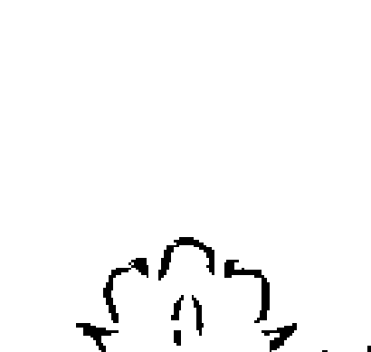

### 实例

例如你目前正想与朋友合资开一家小型精品店，这时正担心着是否能成功，我们就用这个预测法，来算算“开业是否有利可图”。

在此你选取的牌是“前卫”的2号牌、“中卫”的4号牌以及“后卫”的9号牌。牌依序开出之后，2开出的是“圣杯十逆位”，4开出的是“权杖八的正位”，9开出的是“钱币国王的正位”。

以目前的状况看：“基础尚未稳固，你想要开店的愿望虽然强烈，但是如果马上进行的话会有问题产生。”因为这是个不好的答案，所以我们就开启该牌左边的1号牌来寻求援助，而1号牌开出的是“宝剑三的正位”，意思是说：“在工作的进行上，会和你的伙伴发生口角”。不过由于你开店的意愿极强，所以我们再开启右方的第3号牌试试。开出的是“钱币二的正位”，这张的意思是“暗示会有金钱方面的问题发生”。

如果现在不做的话，在不久的将来再从事可以吗？在“中卫”之上选取的牌是4号，该牌的意思是：“如果你能听听长辈的意见后再去做的话，会有成功的可能。”这也正是说明，再过一阵子，经过再次研究后，再和有经验的长辈商讨后会比较好。

然后是关于未来的“后卫”9号牌，此牌的意思为“经过了二三年艰苦奋斗之后，好不容易会有资助者出现”，这是个好的答复。现在就只剩下你对于将来的决心是否能够保持不变了。

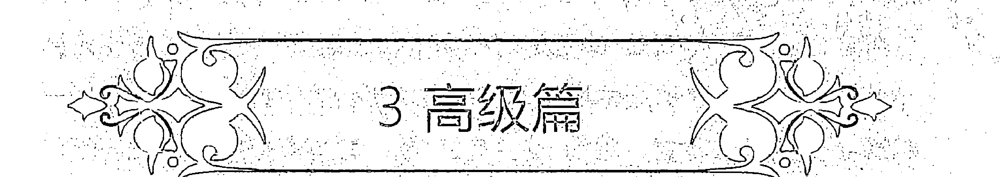

### 3 高级篇

#### “凯尔特十字”预测法

所谓“凯尔特十字”是塔罗牌预测法中最普遍的一种预测方法。虽然一般大都只使用大阿尔卡那牌，不过我们在此将大阿尔卡那牌和小阿尔卡那牌混在一起使用。该预测法能针对问题给予各种角度的分析和推理，所以也可以当成头脑体操。对于特定问题此预测方法特别有效。

### 牌阵展开方法

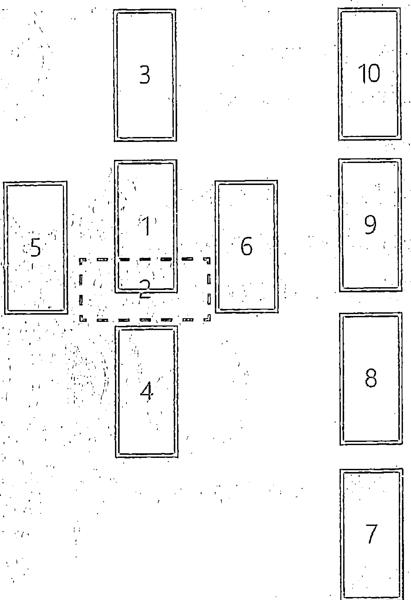

将78张牌按照既定的程序洗过，牌面向下放在左手上。然后从上往下数到第7张牌，翻面过来放在桌子的中心位置。这张牌为1。然后再从该牌的位置往下数到第7张牌拿出，把这张牌放置在1的上方，将牌面设计成十字的模样。这张牌定为2号。再根据相同要领，数到第7张牌拿出，如图所示放置于3至10的位置之上。

将牌以凯尔特十字的方式摆好后，每张牌的位置代表的意思，如下所示：

- ☆1-表示你的现状（你所要问的问题）。
- ☆2-表示阻碍你的事物。
- ☆3-表示你的意志方向。
- ☆4-表示你害怕的事物。
- ☆5-表示发生此问题的过去缘由。
- ☆6-表示因为这个问题而产生的一些事情。
- ☆7-表示解决该问题的方法。
- ☆8-表示在你周围的一些人际关系。
- ☆9-表示你的愿望。
- ☆10-暗示可能的结果，总结全部。
- ☆1至6的牌表示问题起因的现状分析。
- ☆7至10的牌表示对未来所做的暗示。

### 实例

例如你目前正想挑战有点困难的国家考试，我们就用这个预测方法看看情况如何。

- ☆1-开出的是“女皇的正位”。
- ☆2-开出的是“圣杯五的逆位”。
- ☆3-开出的是“权杖骑士的正位”。
- ☆4-开出的是“愚人的逆位”。
- ☆5-开出的是“宝剑九的正位”。
- ☆6-开出的是“恶魔的逆位”。
- ☆7-开出的是“星星的正位”。
- ☆8-开出的是“钱币王后的正位”。
- ☆9-开出的是“宝剑三的逆位”。
- ☆10-开出的是“皇帝的正位”。

现在一一来做推理与分析。

- ☆1-表示目前的你有个很大的愿望，而且你也很有冲劲。虽然现今的状况很艰巨，但是你想要有一番作为的意愿非常强烈。
- ☆2-阻碍你的事物就是“时间的浪费”。你该好好地分配利用时间。
- ☆3-不管如何，你想达成目的的意志必须要坚持下去。
- ☆4-如果你会感到些许不安的话，那是因为读书的方式以及重点太过干粗糙，没有条理的缘故。
- ☆5-也许是因为你没有“信心”。
- ☆6-与其说你没有时间，还不如说是因为你对你应该做的事，抱着得过且过的心，越来越不认真。可能会很想玩吧。
- ☆7-但是目前的你，不能就这样过下去，应该重新调整步伐，以“胜利”当作你奋斗的目标。应该要打败其它诱惑以及精神疲劳。
- ☆8-因为你周围的朋友诱惑你玩乐，所以这些诱惑就成了你的阻碍。努力认真念书是不可以输给诱惑的。
- ☆9-你的愿望当然是“成功”，但是由于没有自信，所以常会受到外在环境的影响。简单地说就是不够认真。
- ☆10-就结论来说，抱着坚定的意志，以不屈不挠的心态朝着目标前进的话，胜利一定可以手到擒来。不过克己之心看起来是有锻炼的必要。

以上就是这个预测的结果。

## 第四章 塔罗预测实例

### 第五章 塔罗牌阵完全攻略

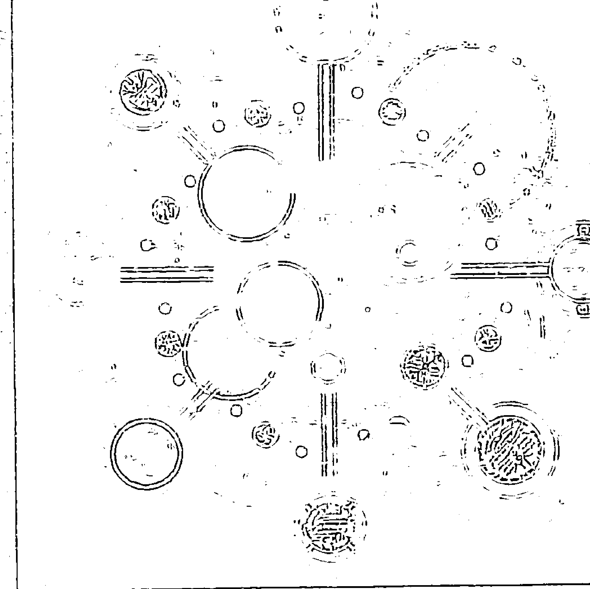

牌阵是问题呈现的一个形式。在预测时，选对牌阵，可得事半功倍之效。因此，如何为问题选择一个适当的牌阵是相当重要的一个步骤。牌阵少则使用一张牌，多则数十张不等。简单的牌阵应付简单的问题，复杂的牌阵则处理重大的问题，依据不同的问题而选择不同的切入点。没有绝对的优劣之分，合适、恰如其分即可。

在使用牌阵时，有一点需要特别注意：选择牌阵的重点是有效呈现问题、解决问题，而不应被不适用的牌阵所牵制。有时候，甚至可以不使用牌阵。举例来说，我们时常要面对一些鸡毛蒜皮的问题，像是：“明天要去吃大餐，还是郊游？”此时使用大型牌阵只是大而无当。我们可以利用小巧的二择一牌阵。或者是更简单的，抽一张牌代表吃大餐，再抽一张代表郊游。不使用牌阵的“与牌对话”有时反而更加直接明了。

讨论牌阵有多少种是毫无意义的，因为牌阵有无数多种，其中变化万千，任何人都可以自创牌阵。以下列举的是我们为初学者准备的最简单的基础牌阵和一些方便的实用牌阵，以及一些经过时代考验的经典牌阵。下列牌阵中，标明22张的，只使用22张大阿尔卡那牌；标明56张的，只使用56张小阿尔卡那牌；标明78张的，则要使用整副牌；同时标明22张、56张、78张的，则可任选其一。

### 1 基础牌阵

#### 把握未来

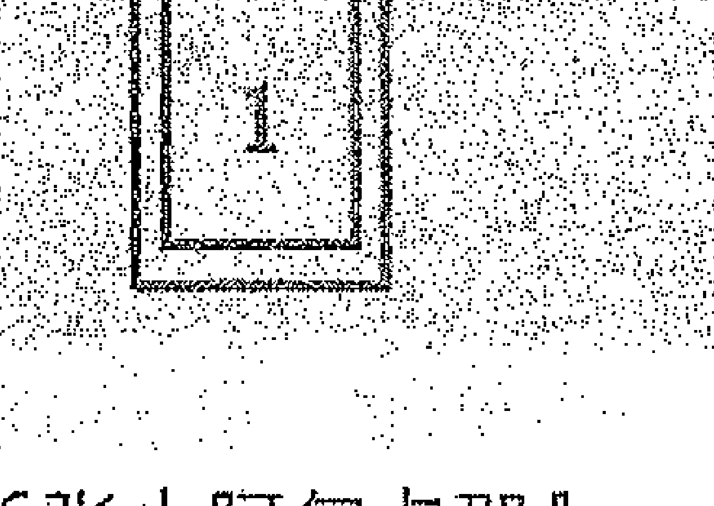

适用于：『22张大阿尔卡那』、『56张小阿尔卡那』、『78张塔罗牌』

取牌方式：『22张大阿尔卡那』、『56张小阿尔卡那』、『78张塔罗牌』 随意抽1张牌，放在1处。

如何解释：你现在应该将焦点、力量集中在此。

#### 2 Yes or no

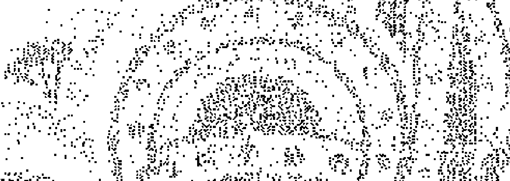

适用于：『78张塔罗牌』 使用大阿尔卡那22张，以及小阿尔卡那的圣杯九、4张Ace牌，共27张牌。

取牌方式：随意抽取1张牌，不考虑正逆位，以出现的牌面来解释。

如何解释：

- ☆1-若是出现小阿尔卡那首牌(ACE)的任何一张，代表你必需调整自己的动作，或等待时间的安排。
- ☆2-若是出现圣杯九，则代表明确的“是”。
- ☆3-若出现大阿尔卡那牌请查阅下面所列。
  - 是：愚人、魔术师、女皇、皇帝、战车、正义、星星、太阳、世界。
  - 是或否都可以（您可以自己随需要选择）：女祭司、命运之轮、恋人、教皇、月亮、审判。
  - 否：力量、塔、节制、隐士、倒吊人、死神、恶魔。

#### F3 得失

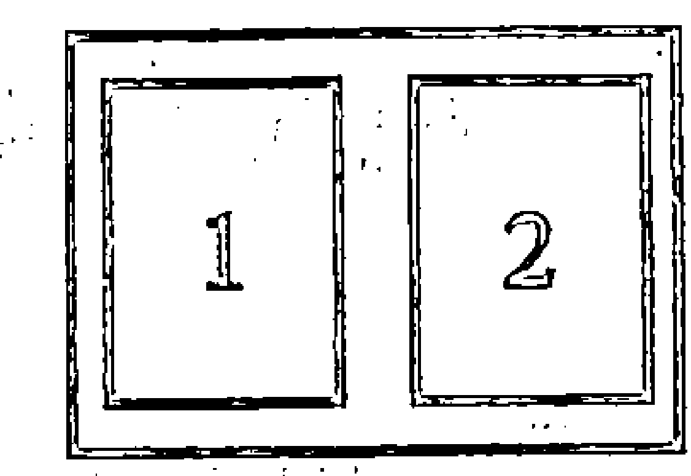

适用于：『22张大阿尔卡那』、『56张小阿尔卡那』、『78张塔罗牌』

取牌方式：『22张大阿尔卡那』、『56张小阿尔卡那』、『78张塔罗牌』随意抽2张牌，依序放在1、2。

如何解释：
- ☆1-我将失去什么。
- ☆2-我将获得什么。

#### 4 活力

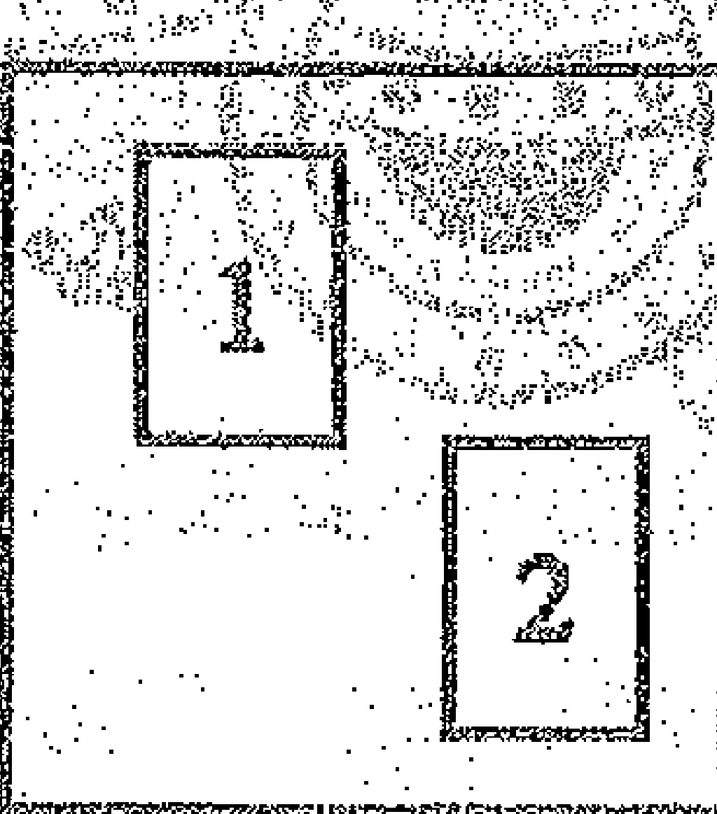

适用于：『22张大阿尔卡那』、『56张小阿尔卡那』、『78张塔罗牌』

取牌方式：『22张大阿尔卡那』、『56张小阿尔卡那』、『78张塔罗牌』随意抽2张牌，依序放在1、2。

如何解释：
- ☆1-今天会影响你的能量（也有可能是明天或下星期发生效力）。
- ☆2-你如何将此能量提升，进而成为帮助你的力量。

#### 5 星期

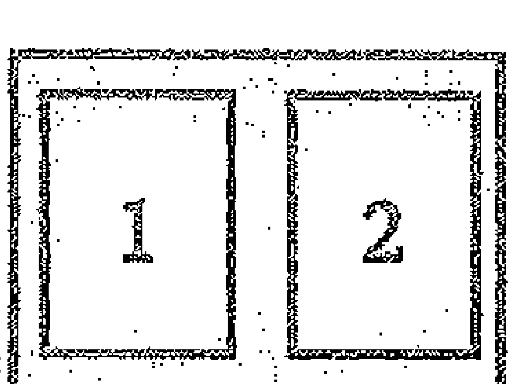

适用于：『22张大阿尔卡那』、『56张小阿尔卡那』、『78张塔罗牌』

取牌方式：『22张大阿尔卡那』、『56张小阿尔卡那』、『78张塔罗牌』随意抽2张牌，依序放在1、2。

如何解释：
- ☆1-这星期中的潜在影响力。
- ☆2-这星期呈现的主要情势。

#### 6 每天

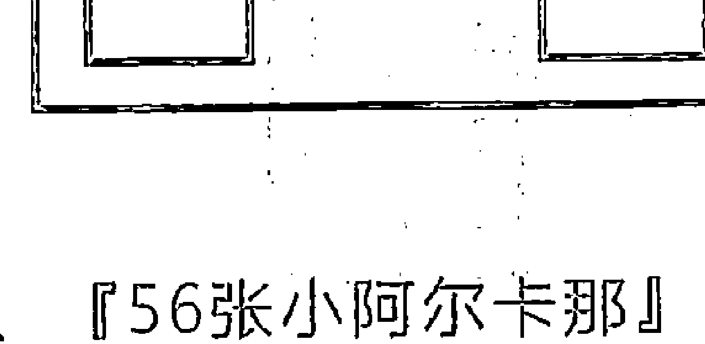

适用于：『22张大阿尔卡那』、『56张小阿尔卡那』、『78张塔罗牌』

取牌方式：『22张大阿尔卡那』、『56张小阿尔卡那』、『78张塔罗牌』随意抽2张牌，依序放在1、2。

如何解释：
- ☆1-事件：今天可能发生的一些事。
- ☆2-感受：你的感受或是对所发生事情的反应。

#### 7 过去，现在，未来

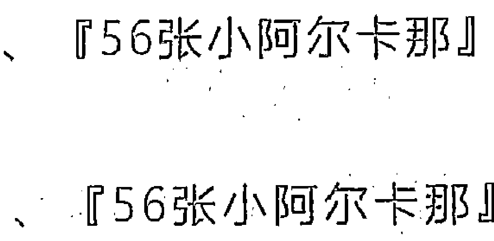

适用于：『22张大阿尔卡那』、『56张小阿尔卡那』、『78张塔罗牌』

取牌方式：『22张大阿尔卡那』、『56张小阿尔卡那』、『78张塔罗牌』随意抽3张牌，依序放在1、2、3。

如何解释：
- ☆1-过去发生过的事情。
- ☆2-现在正发生的事情。
- ☆3-未来可能发生的事情。

#### 8

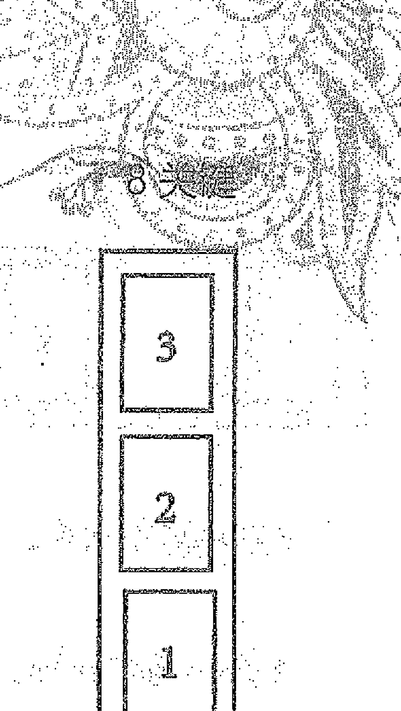

适用于：『22张大阿尔卡那』、『56张小阿尔卡那』、『78张塔罗牌』

取牌方式：『22张大阿尔卡那』、『56张小阿尔卡那』、『78张塔罗牌』随意抽3张牌，依序放在1、2、3。

如何解释：
- ☆1-问题的关键。
- ☆2-关键的重点。
- ☆3-在你前方的、你将面对的。

#### 9 了解自己

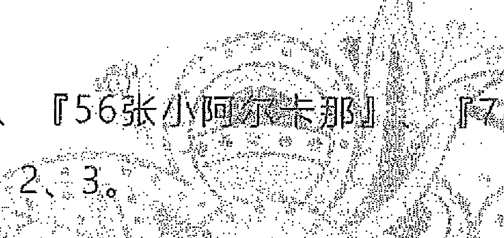

适用于：『22张大阿尔卡那』、『56张小阿尔卡那』、『78张塔罗牌』

取牌方式：『22张大阿尔卡那』、『56张小阿尔卡那』、『78张塔罗牌』随意抽3张牌，依序放在1、2、3。

如何解释：
- ☆1-我是谁。
- ☆2-我的需求。
- ☆3-我如何达成我的需求。

#### 7-10 命运

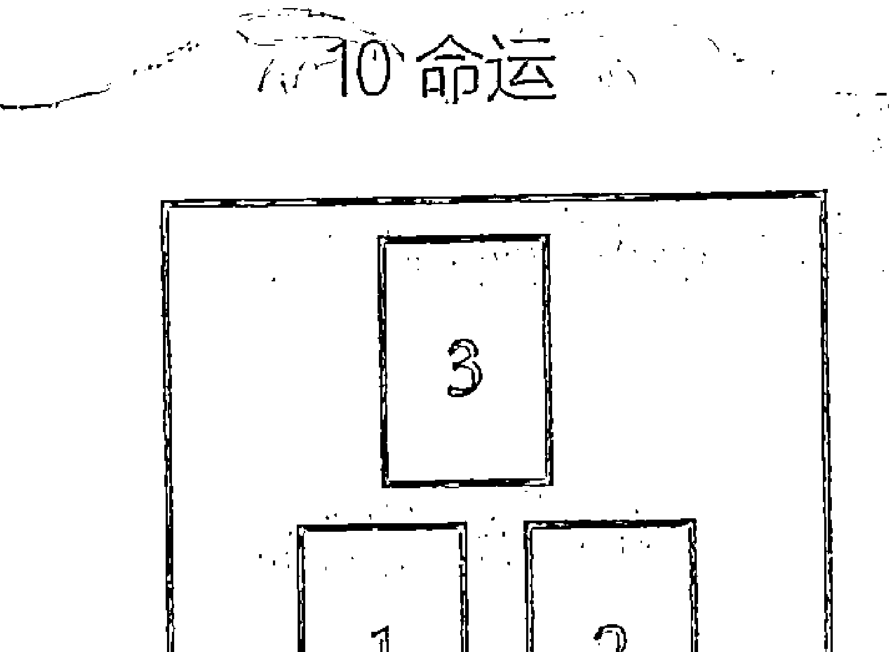

适用于：『22张大阿尔卡那』、『56张小阿尔卡那』、『78张塔罗牌』

取牌方式：『22张大阿尔卡那』、『56张小阿尔卡那』、『78张塔罗牌』随意抽3张牌，依序放在1、2、3。

如何解释：
- ☆1-某年某月某日将发生什么事。
- ☆2-为何发生此事。
- ☆3-此事将如何发生。

#### 11 今日事件

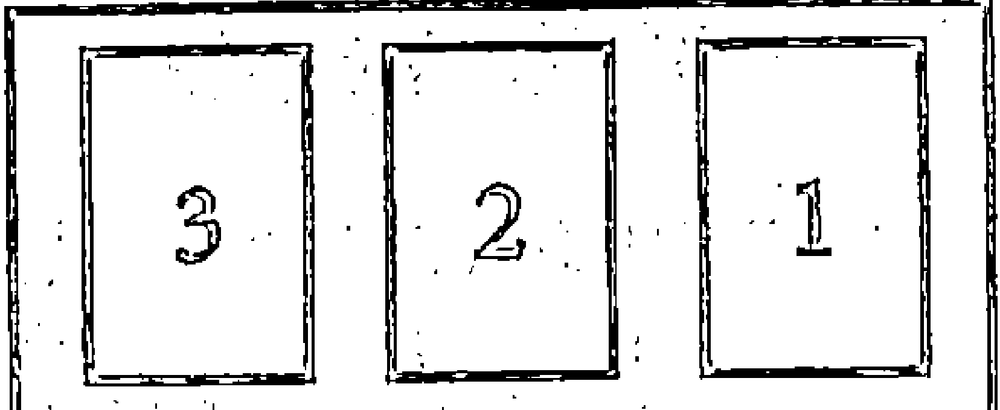

适用于：『22张大阿尔卡那』、『56张小阿尔卡那』、『78张塔罗牌』

取牌方式：『22张大阿尔卡那』、『56张小阿尔卡那』、『78张塔罗牌』 随意抽3张牌，依序放在1、2、3。

如何解释：
- ☆1-今天的重点事件。
- ☆2-这件事会如何发展。
- ☆3-你如何开始或你该为这事件做些什么。

#### 12 今天的工作

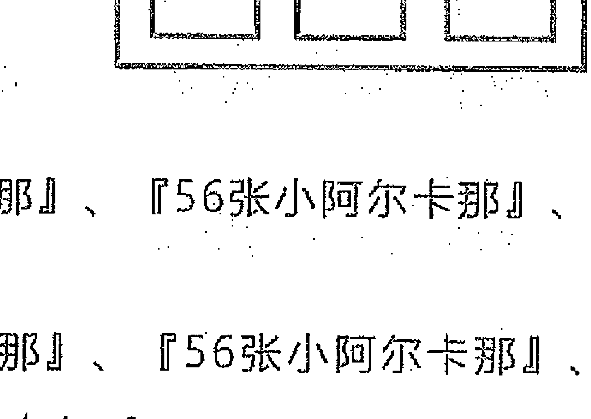

适用于：『22张大阿尔卡那』、『56张小阿尔卡那』、『78张塔罗牌』

取牌方式：『22张大阿尔卡那』、『56张小阿尔卡那』、『78张塔罗牌』 随意抽3张牌，依序放在1、2、3。

如何解释：
- ☆1-今天的状况。
- ☆2-今天特别的工作、目标。
- ☆3-今天中唯一、独特的机会。

#### 13 今天金字塔

适用于：『22张大阿尔卡那』、『56张小阿尔卡那』、『78张塔罗牌』

取牌方式：『22张大阿尔卡那』、『56张小阿尔卡那』、『78张塔罗牌』随意抽3张牌，依序放在1、2、3。

如何解释：
- ☆1-一天的开始。（白天必须专注什么）
- ☆2-一天的最高潮。（今天最主要的事）
- ☆3-一天的结束。（结束）

#### 14 目标

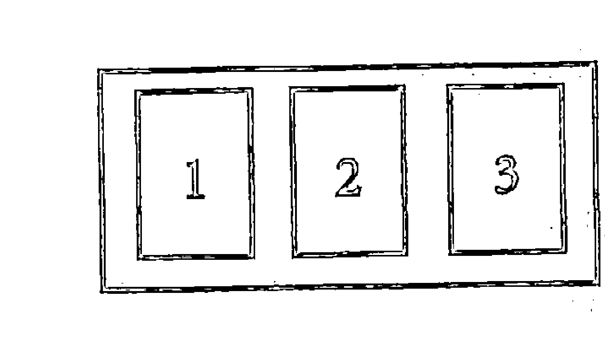

适用于：『22张大阿尔卡那』、『56张小阿尔卡那』、『78张塔罗牌』

取牌方式：『22张大阿尔卡那』、『56张小阿尔卡那』、『78张塔罗牌』随意抽3张牌，依序放在1、2、3。

如何解释：
- ☆1-今天的目标。
- ☆2-达成目标的力量。
- ☆3-阻碍。

#### 15 新机会

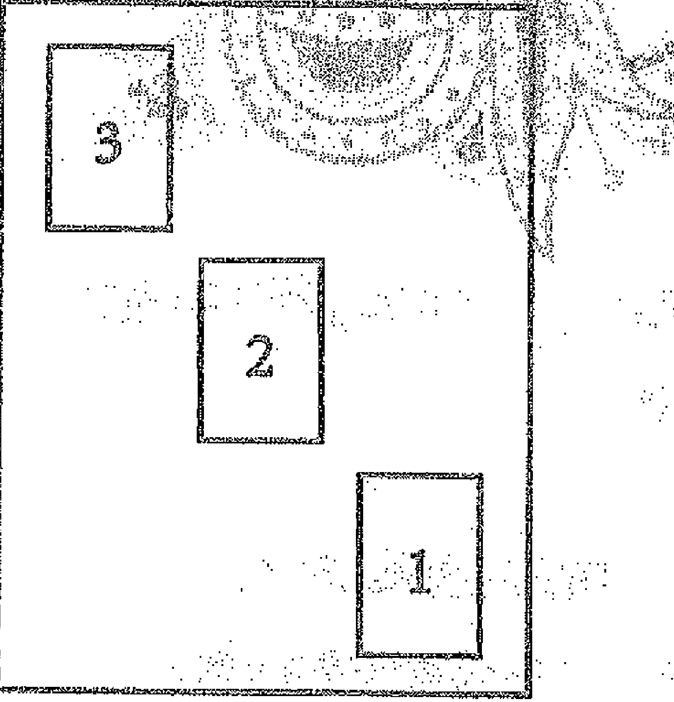

适用于：『22张大阿尔卡那』、『56张小阿尔卡那』、『78张塔罗牌』

取牌方式：『22张大阿尔卡那』、『56张小阿尔卡那』、『78张塔罗牌』随意抽3张牌，依序放在1、2、3。

如何解释：
- ☆1-这些将变成不重要的。
- ☆2-这些将变成较重要的。
- ☆3-这些是现在必要的。

#### 16 工作

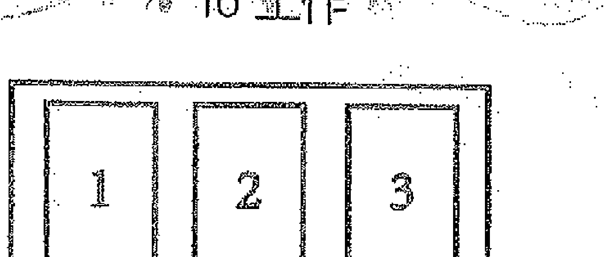

适用于：『22张大阿尔卡那』、『56张小阿尔卡那』、『78张塔罗牌』

取牌方式：『22张大阿尔卡那』、『56张小阿尔卡那』、『78张塔罗牌』随意抽3张牌，依序放在1、2、3。

如何解释：
- ☆1-我选对工作了吗？（必须深思熟虑）
- ☆2-这工作稳定吗？（可以做多久）
- ☆3-应该做些改变吗？（我应该继续做，还是稍作调整，甚至离职）

#### 17 合伙

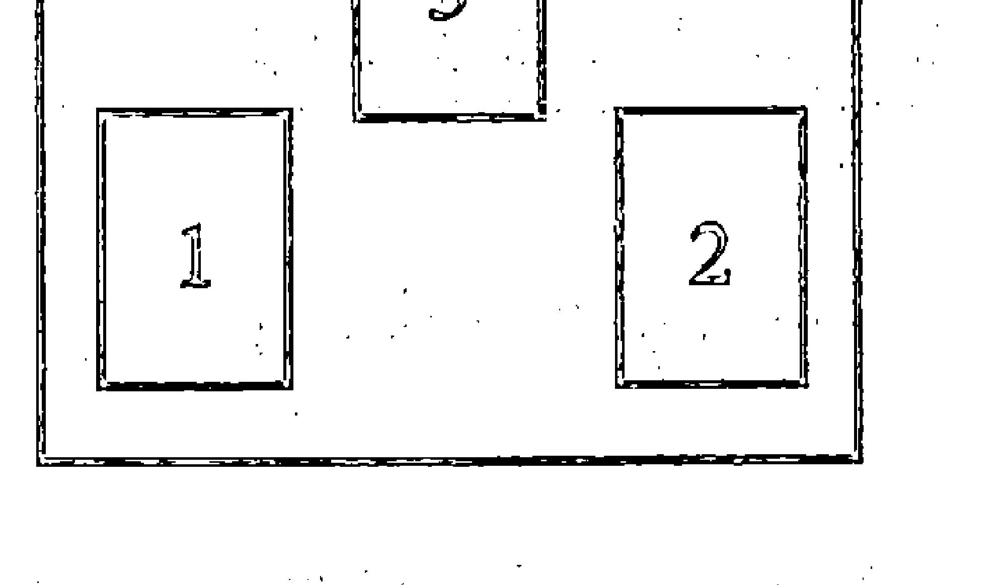

适用于：『22张大阿尔卡那』、『56张小阿尔卡那』、『78张塔罗牌』

取牌方式：『22张大阿尔卡那』、『56张小阿尔卡那』、『78张塔罗牌』随意抽3张牌，依序放在1、2、3。

如何解释：
- ☆1-我的伙伴。
- ☆2-我自己。
- ☆3-合伙工作的状况或是风险。

### 2 实用牌阵

#### 一 爱情牌阵

#### 18 分手

适用于：
『22张大阿尔卡那』、『56张小阿尔卡那』、『78张塔罗牌』

取牌方式：
『22张大阿尔卡那』、『56张小阿尔卡那』、『78张塔罗牌』随意抽5张牌，依序放在1、2、3、4、5。

如何解释：
分手预测法主要是告诉你一些你必须取舍的事。第5张牌主要告诉你如何去调整自己对爱的感觉。
- ☆1、2、3-我为什么要放手？为何要放弃的隐藏原因。
- ☆4-为何要放弃的最主要或唯一的原因。
- ☆5-最终结果：如果你放手了，会造成怎样的结果。

#### 19 恋爱前景

适用于：
『22张大阿尔卡那』、『56张小阿尔卡那』、『78张塔罗牌』

取牌方式：
『22张大阿尔卡那』、『56张小阿尔卡那』、『78张塔罗牌』随意抽4张牌，依序放在1、2、3、4。

如何解释：
☆1、2、3-你对于你爱人的感觉。
☆4-路的前方（未来）。

#### 20 一生的爱

适用于：
『22张大阿尔卡那』、『56张小阿尔卡那』、『78张塔罗牌』

取牌方式：
『22张大阿尔卡那』、『56张小阿尔卡那』、『78张塔罗牌』随意抽6张牌，依序放在1、2、3、4、5、6。

如何解释：
☆1-你过去对爱的经验。
☆2-你目前对爱的经验。
☆3-在爱情关系中你想得到什么。
☆4-在爱情关系中你需要什么。
☆5-你对你的爱人付出了什么。
☆6-未来有可能得到的爱的经验。

#### 21 真命天子

适用于：
『22张大阿尔卡那』、『56张小阿尔卡那』、『78张塔罗牌』

取牌方式：
『22张大阿尔卡那』、『56张小阿尔卡那』、『78张塔罗牌』随意抽5张牌，依序放在1、2、3、4、5。

如何解释：
☆1-我真正的伴侣的类型。
☆2-我真正的伴侣已经走入我的生命之中了吗？
☆3-将会有困难产生吗？
☆4-什么样的改变是需要的？
☆5-我将相信什么？

#### 22 爱情关系

适用于：
- 『22张大阿尔卡那』
- 『56张小阿尔卡那』
- 『78张塔罗牌』

取牌方式：
『22张大阿尔卡那』、『56张小阿尔卡那』、『78张塔罗牌』随意抽5张牌，依序放在1、2、3、4、5。

如何解释：
- ☆1-这段时间，我的爱情关系传达了什么东西给我。
- ☆2-在爱情关系中我真正要什么。
- ☆3-在爱情关系中我不喜欢什么。
- ☆4-什么可以赋予爱情新的能量。
- ☆5-对于爱，我仍不了解的，或是我应该学习的。

#### 23 关系

适用于：
- 『22张大阿尔卡那』、『56张小阿尔卡那』、『78张塔罗牌』

取牌方式：
『22张大阿尔卡那』、『56张小阿尔卡那』、『78张塔罗牌』随意抽4张牌，依序放在1、2、3、4。

如何解释：
- ☆1-在这关系中你付出的。
- ☆2-在这关系中你得到的。
- ☆3-在这关系中你的爱人付出的。
- ☆4-在这关系中你的爱人得到的。

#### 24 爱已消失

适用于：
『22张大阿尔卡那』、『56张小阿尔卡那』、『78张塔罗牌』

取牌方式：
『22张大阿尔卡那』、『56张小阿尔卡那』、『78张塔罗牌』随意抽5张牌，依序放在1、2、3、4、5。

如何解释：
前3张牌(1、2、3)可以解读成，因为长时间的误解，而造成现在爱情伤心与痛苦的原因。
- ☆1-因为某事、某原因你伤害我很深。
- ☆2-在一起时，我们曾拥有什么。
- ☆3-因为某事、某原因，你却破坏了它（第2张牌所指）。
- ☆4-这状况可以获得解决吗？
- ☆5-我们将会在一起吗？

#### 25 新的恋情

适用于：
『22张大阿尔卡那』、『56张小阿尔卡那』、『78张塔罗牌』

取牌方式：
『22张大阿尔卡那』、『56张小阿尔卡那』、『78张塔罗牌』随意抽6张牌，依序放在1、2、3、4、5、6。

如何解释：
- ☆1-我马上会有一段新恋情、新关系吗？
- ☆2-那个人是什么星座？
- ☆3-我们会相处融洽吗？
- ☆4-这将会是一段持续的关系吗？
- ☆5-那个人将会是我的灵魂伴侣吗？
- ☆6-我愿望的结果。

#### 26 再见

适用于：
『22张大阿尔卡那』、『56张小阿尔卡那』、『78张塔罗牌』

取牌方式：
『22张大阿尔卡那』、『56张小阿尔卡那』、『78张塔罗牌』随意抽5张牌，依序放在1、2、3、4、5。

如何解释：
- ☆1-我最初想要什么？
- ☆2-目前的情况（第一张的延续）。
- ☆3-我正跟什么道别（正失去什么）。
- ☆4-我一直得不到的。
- ☆5-我如何得到它（第4张牌所指的）。

#### 27 爱的新起点

适用于：
『22张大阿尔卡那』、『56张小阿尔卡那』、『78张塔罗牌』

取牌方式：
『22张大阿尔卡那』、『56张小阿尔卡那』、『78张塔罗牌』随意抽9张牌，依序放在1、2、3、4、5、6、7、8、9。

如何解释：
- ☆1-这是一个新起点吗？
- ☆2-将会有新的爱人吗？
- ☆3-会有什么惊喜产生？
- ☆4-这将令人安心吗？
- ☆5-过程将会如何？
- ☆6-相处融洽吗？
- ☆7-内心所想的是真的吗？
- ☆8-将设定怎样的目标？
- ☆9-一切都会好吗？

#### 28 秘密情人

适用于：
『22张大阿尔卡那』、『56张小阿尔卡那』、『78张塔罗牌』

取牌方式：
『22张大阿尔卡那』、『56张小阿尔卡那』、『78张塔罗牌』随意抽9张牌，依序放在1、2、3、4、5、6、7、8、9。

如何解释：
1. 你的爱情过去的状况。
2. 你现在的处境。
3. 你前任伴侣现在的处境。
4. 你对于与前任伴侣复合的真正感觉。
5. 你的前任伴侣对于与你复合的真正感觉。
6. 阻碍你的。
7. 帮助你的。
8. 一些你可能不知道的事。
9. 结果或决定。

#### 29 爱情三角

适用于：
『22张大阿尔卡那』、『56张小阿尔卡那』、『78张塔罗牌』

取牌方式：
『22张大阿尔卡那』、『56张小阿尔卡那』、『78张塔罗牌』随意抽10张牌，依序放在1、2、3、4、5、6、7、8、9、10。

如何解释：
本牌阵应在陷入三角恋时使用（同时有两人爱上你），必须先设定爱人A与爱人B是谁。
- ☆1-我现在的处境。
- ☆2-我期望爱人A吗？
- ☆3-我相信爱人A吗？
- ☆4-我已经爱上了爱人A吗？
- ☆5-我与A的情况。
- ☆6-我期望爱人B吗？
- ☆7-我相信爱人B吗？
- ☆8-我已经爱上了爱人B吗？
- ☆9-我与B的情况。
- ☆10-我的未来。

#### 30 爱的进行

适用于：
『22张大阿尔卡那』、『56张小阿尔卡那』、『78张塔罗牌』

取牌方式：
『22张大阿尔卡那』、『56张小阿尔卡那』、『78张塔罗牌』随意抽10张牌，依序放在1、2、3、4、5、6、7、8、9、10。

如何解释：
- ☆1-爱情关系的历史。
- ☆2-在这关系中你过去的经验、体验。
- ☆3-在这关系中你的爱人过去的经验、体验。
- ☆4-在这关系中你现在的经验、体验。
- ☆5-在这关系中你的爱人现在的经验、体验。
- ☆6-这关系目前的情况。
- ☆7-在这关系中你未来可能的经验、体验。
- ☆8-在这关系中你的爱人未来可能的经验、体验。
- ☆9-这关系当前的处境。
- ☆10-结果：未来在这关系中可能发生的事。

#### 31 爱情前景

适用于：
『22张大阿尔卡那』、『56张小阿尔卡那』、『78张塔罗牌』

取牌方式：
『22张大阿尔卡那』、『56张小阿尔卡那』、『78张塔罗牌』随意抽10张牌，依序放在1、2、3、4、5、6、7、8、9、10。

如何解释：
- ☆1-我的爱人关心我吗？
- ☆2-我们稳定吗？
- ☆3-我们有相似的梦想与目标吗？
- ☆4-我的爱人是忠诚、可靠的吗？
- ☆5-我们相互吸引对方只是因为性感的因素吗？
- ☆6-我的爱人考虑过结婚吗？
- ☆7-我的爱人是高水平与高评价的人吗？
- ☆8-我们能分享彼此的金钱与个人财富吗？
- ☆9-我的爱人将为我停留，还是离开我？
- ☆10-最终结果。

#### 32 爱情凯尔特十字

适用于：
『22张大阿尔卡那』、『56张小阿尔卡那』、『78张塔罗牌』

取牌方式：
『22张大阿尔卡那』、『56张小阿尔卡那』、『78张塔罗牌』随意抽10张牌，依序放在1、2、3、4、5、6、7、8、9、10。

如何解释：
- ☆1-你现在的情况：你感受到的信任或伤害。
- ☆2-与你幸福有关的，你应该开始改变的。（此牌在第1张牌底下不显示）
- ☆3-这恋爱如何发展：你已经在进行的部分。
- ☆4-你的愿望或需求：你如何面对目前已经明朗的状况。
- ☆5-问题的中心：你必会碰触到的。
- ☆6-你必须的步骤：必走的一条路。
- ☆7-下一步该做的：你必须去改变的。
- ☆8-有用的影响：你越来越了解的、察觉的。
- ☆9-怀疑与恐惧：此牌是要告诉你任何可能发生的失败、挫折。
- ☆10-你目前的状况所产生的结果：你未来的梦想。

#### 33 爱之路

| 1 | 6 |
|---|---|
| 2 | 7 |
| 3 | 8 |
| 4 | 9 |
| 5 | 10 |

适用于：
『22张大阿尔卡那』、『56张小阿尔卡那』、『78张塔罗牌』

取牌方式：
『22张大阿尔卡那』、『56张小阿尔卡那』、『78张塔罗牌』随意抽10张牌，依序放在1、2、3、4、5、6、7、8、9、10。

如何解释：
分析自己与两位朋友的关系状况（合伙、恋爱）；请先设定对象A与对象B是谁。
- ☆1-关于对象A。
- ☆2-这将会是一个新开始吗？
- ☆3-我们将会相处融洽吗？
- ☆4-我可以相信我心里的声音吗？对于A的想法。
- ☆5-应该选择A吗？
- ☆6-关于对象B。
- ☆7-这将会是一个新开始吗？
- ☆8-我们将会相处融洽吗？
- ☆9-我可以相信我心里的声音吗？对于B的想法。
- ☆10-应该选择B吗？

#### 34 浪漫诱惑

适用于：
『22张大阿尔卡那』、『56张小阿尔卡那』、『78张塔罗牌』

取牌方式：
『22张大阿尔卡那』、『56张小阿尔卡那』、『78张塔罗牌』随意抽10张牌，依序放在1、2、3、4、5、6、7、8、9、10。

如何解释：
- ☆1-有吸引力的、诱人的。
- ☆2-那个人正在恋爱吗？
- ☆3-我们能相处愉快吗？
- ☆4-我们可以一起工作以及相互支持对方吗？
- ☆5-我们的性生活能配合吗？
- ☆6-我们的家族能相处融洽吗？
- ☆7-我们宗教信仰是否不同、有冲突吗？
- ☆8-我们将会有权力与金钱方面的问题吗？
- ☆9-这将是一段长时间的关系吗？
- ☆10-结果。

#### 35 破镜重圆

适用于：
- 『22张大阿尔卡那』、『56张小阿尔卡那』、『78张塔罗牌』

取牌方式：
『22张大阿尔卡那』、『56张小阿尔卡那』、『78张塔罗牌』随意抽11张牌，依序放在1、2、3、4、5、6、7、8、9、10、11。

如何解释：
- ☆1-你最近的及过去的情况。
- ☆2-你的现况或关键。
- ☆3-你若与之前爱人复合所产生的结果。
- ☆4-与你分手的爱人，过去的情况。
- ☆5-与你分手的爱人，现在的情况。
- ☆6-与你分手的爱人，未来的情况；或是指与你复合的可能性。
- ☆7-与你分手的爱人，他（她）新的恋人过去的情况。（你的情敌）
- ☆8-与你分手的爱人，他（她）新的恋人现在的情况。（你的情敌）
- ☆9-与你分手的爱人，他（她）新的恋人与你互动的未来的情况。（你的情敌与你的互动）
- ☆10-可能的结果一：会因为第3张牌而减弱或加强。（一同解释）
- ☆11-可能的结果二：会因为第9张牌而减弱或加强。（一同解释）

#### 36 别人（的）爱

适用于：
『22张大阿尔卡那』、『56张小阿尔卡那』、『78张塔罗牌』

取牌方式：
『22张大阿尔卡那』、『56张小阿尔卡那』、『78张塔罗牌』随意抽14张牌，依序放在1、2、3、4、5、6、7、8、9、10、11、12、13、14。

如何解释：
- ☆1、2-在这关系中，他所喜欢的部分。
- ☆3、4-在这关系中，她所喜欢的部分。
- ☆5、6-在这关系中，他不喜欢的部分。
- ☆7、8-在这关系中，她不喜欢的部分。
- ☆9、10-在这关系中，他想要看见什么样的事情发生。
- ☆11、12-在这关系中，她想要看见什么样的事情发生。
- ☆13、14-结果：这关系当前的处境。

#### 二、财富牌阵

适用于：
『22张大阿尔卡那』、『56张小阿尔卡那』、『78张塔罗牌』

取牌方式：
『22张大阿尔卡那』、『56张小阿尔卡那』、『78张塔罗牌』随意抽5张牌，依序放在1、2、3、4、5。

如何解释：
- ☆1-财富的根基。
- ☆2-财富如何快速地来到你的生活当中。
- ☆3-有助增加财富的有利条件—你应该好好的考量的。
- ☆4-暗示某些人或某些计划会带来新的财富。
- ☆5-结果。

#### 38 丰收

适用于：
『22张大阿尔卡那』、『56张小阿尔卡那』、『78张塔罗牌』

取牌方式：
『22张大阿尔卡那』、『56张小阿尔卡那』、『78张塔罗牌』随意抽7张牌，依序放在1、2、3、4、5、6、7。

如何解释：
- ☆1-你的愿望。
- ☆2-如何播种你的愿望种子，并且得到成果。（该如何行动—种瓜得瓜，种豆得豆）。
- ☆3-在实现愿望的过程中所需要的新想法。
- ☆4-某人或某些事物会帮助你。
- ☆5-你面前的挑战。
- ☆6-你将得到什么。
- ☆7-实现未来远景的关键。

#### 39 财宝金库

适用于：
『22张大阿尔卡那』、『56张小阿尔卡那』、『78张塔罗牌』

取牌方式：
『22张大阿尔卡那』、『56张小阿尔卡那』、『78张塔罗牌』随意抽9张牌，依序放在1、2、3、4、5、6、7、8、9。

如何解释：
☆1-钻石：你出众的地方，主要的天赋、能力，你拥有的财富。
☆2-珍珠：你的知识，你将其融入生活中的知识与信息。
☆3-金币：你拥有的，金钱与目前你可以使用的物质。
☆4-翡翠：你认识的人，在你生命中新发生的关系。
☆5-白金链：阻碍你的，在你生命中你必须去解决、处理的人事物。
☆6-蓝宝石：你能够与众不同的地方，目前正脱颖而出的才能、财产、能力。
☆7-水晶：你正在学习的，你可以将其融入生活中的知识与信息。
☆8-红宝石：你可能马上要认识的人，那人正走入你的生命中。
☆9-未经琢磨的钻石：你尚未发挥的地方，你可以开发的财产、能力。

#### 40 阿拉伯的财富

适用于：
『22张大阿尔卡那』、『56张小阿尔卡那』、『78张塔罗牌』

取牌方式：
『22张大阿尔卡那』、『56张小阿尔卡那』、『78张塔罗牌』随意抽11张牌，依序放在1、2、3、4、5、6、7、8、9、10、11。

如何解释：
- ☆1-家庭、伙伴、环境。
- ☆2-教育、事业、工作。
- ☆3-关系、自尊。
- ☆4-以前的强力的影响，但现在仍有影响力。
- ☆5-求问者本身：求问者的现在状况，目前的心态，个性。
- ☆6-神殿：先前影响求问者的，例如：阻碍他们的。
- ☆7-祭坛：求问者目前的目标；也代表求问者的恐惧与不安。
- ☆8-工作领域与创造力。
- ☆9-社会领域与关系。
- ☆10-健康与家庭方面的领域。
- ☆11-未来的强力的影响。

#### 41 4个财务

适用于：
『22张大阿尔卡那』、『56张小阿尔卡那』、『78张塔罗牌』

取牌方式：
『22张大阿尔卡那』、『56张小阿尔卡那』、『78张塔罗牌』随意抽10张牌，依序放在1、2、3、4、5、6、7、8、9、10。

如何解释：
☆1、2、3、4-与我金钱方面有关的，并且需小心注意的。
☆5、6、7-我如何让我的财务方面稳定安全？
☆8、9-谁能提供我所需要的帮助？
☆10-我财政方面的未来规划。

## 42 财富之路

适用于：
『22张大阿尔卡那』、『56张小阿尔卡那』、『78张塔罗牌』

取牌方式：
『22张大阿尔卡那』、『56张小阿尔卡那』、『78张塔罗牌』随意抽11张牌，依序放在1、2、3、4、5、6、7、8、9、10、11。

如何解释：

- ☆1、2-现在的情况。
- ☆3、4-隐藏的、你不知道的。
- ☆5、6、7-在目前的情况下最有可能产生的结果。（维持现状不做改变）
- ☆8、9-另一种可能发生的结果。
- ☆10、11-你可以做的努力，以便创造出最好的结果。

#### 三、家庭牌阵

#### 43.搬家

适用于：
『22张大阿尔卡那』、『56张小阿尔卡那』、『78张塔罗牌』

取牌方式：
『22张大阿尔卡那』、『56张小阿尔卡那』、『78张塔罗牌』随意抽7张牌，依序放在1、2、3、4、5、6、7。

如何解释：

- ☆1-什么样的地方对你福利、健康是有帮助的。
- ☆2-下次搬家的机会。
- ☆3-你如何找到属于你的特殊地方。
- ☆4-关于这个地方你必须知道的事。
- ☆5-你搬家前必须做的。
- ☆6-关于这地方你必须考量的事。
- ☆7-结果。

#### 44 宠物

适用于：
『22张大阿尔卡那』、『56张小阿尔卡那』、『78张塔罗牌』

取牌方式：
『22张大阿尔卡那』、『56张小阿尔卡那』、『78张塔罗牌』随意抽7张牌，依序放在1、2、3、4、5、6、7。

如何解释：

- ☆1-你的宠物试着要告诉你的。
- ☆2-你的宠物现在的感受，它的需要。
- ☆3-你如何帮助你的宠物。
- ☆4-此时你的宠物需要更多的是什么。
- ☆5-你的宠物整体的健康。
- ☆6-在最近的未来中你的宠物将所需要的。
- ☆7-你的宠物的整体分析。

#### 45 小孩特征

适用于：
『22张大阿尔卡那』、『56张小阿尔卡那』、『78张塔罗牌』

取牌方式：
『22张大阿尔卡那』、『56张小阿尔卡那』、『78张塔罗牌』随意抽8张牌，依序放在1、2、3、4、5、6、7、8。

#### 如何解释：

这牌阵专为有两个小孩的家庭所创，且此牌阵可以很容易增加其它牌与解释到牌阵里面。你可以沿用这个牌阵的格式或是增加一些牌来符合你的需要。

- ☆1、2、3-你最大的小孩的个性、人格与性向的特征。
- ☆4-你能做些什么事来帮助你最大的小孩。
- ☆5、6、7-你最小的小孩的个性、人格与性向的特征。
- ☆8-你能做些什么事来帮助你最小的小孩。

#### 46 家庭问题

适用于：
『22张大阿尔卡那』、『56张小阿尔卡那』、『78张塔罗牌』

取牌方式：
『22张大阿尔卡那』、『56张小阿尔卡那』、『78张塔罗牌』随意抽8张牌，依序放在1、2、3、4、5、6、7、8。

如何解释：

- ☆1-谁是造成问题的主要人物。
- ☆2-危及你的安全与保障之事。
- ☆3-在这问题中，（第1张牌所指之人）一些越轨的行为是如何造成危机的。
- ☆4-在过去，这个人（第1张牌所指之人）是否发生过同样问题。
- ☆5-如何解决这个问题。
- ☆6-需要避免哪些突发状况。
- ☆7-这个问题对你健康的影响。
- ☆8-最后结果。

#### 四、事业牌阵

#### 47 跳槽

适用于：
『22张大阿尔卡那』、『56张小阿尔卡那』、『78张塔罗牌』

取牌方式：
『22张大阿尔卡那』、『56张小阿尔卡那』、『78张塔罗牌』随意抽5张牌，依序放在1、2、3、4、5。

如何解释：

- ☆1-我将有一个更好的工作吗？
- ☆2-我拥有什么或是我该做些什么。
- ☆3-我将经历什么问题。
- ☆4-我可以期盼一个新环境的到来吗？
- ☆5-结果。

#### 48 决策因素

适用于：
『22张大阿尔卡那』、『56张小阿尔卡那』、『78张塔罗牌』

取牌方式：
『22张大阿尔卡那』、『56张小阿尔卡那』、『78张塔罗牌』随意抽5张牌，依序放在1、2、3、4、5。

如何解释：

- ☆1-关键或主要的观点。
- ☆2-会驱使你的。
- ☆3-外界的影响。
- ☆4-危机、风险。
- ☆5-要如何解决、完成。

#### ★49 工作

适用于：
『22张大阿尔卡那』、『56张小阿尔卡那』、『78张塔罗牌』

取牌方式：
『22张大阿尔卡那』、『56张小阿尔卡那』、『78张塔罗牌』随意抽11张牌，依序放在1、2、3、4、5、6、7、8、9、10、11。

#### 如何解释：

- ☆1-你自己想要什么。
- ☆2-某些人或某些事物将帮助你。
- ☆3-你应该把焦点放在那边。
- ☆4-转折点：改变情况的事情。
- ☆5-在工作上一个可能的新发展。
- ☆6-同时信号：在5这张牌所指的发展中一个重要的事件，当它发生时，你将会察觉到。
- ☆7-在5这张牌所指的情形下最后的成就。
- ☆8-在工作上另一个可能的新发展。
- ☆9-同时信号：在8这张牌所指的发展中一个重要的事件，当它发生时，你将会察觉到。
- ☆10-在8这张牌所指的情形下最后的成就。
- ☆11-为了满足自己的需求，在选择时你所需要知道的事。

#### 50 事业

适用于：
『22张大阿尔卡那』、『56张小阿尔卡那』、『78张塔罗牌』

取牌方式：
『22张大阿尔卡那』、『56张小阿尔卡那』、『78张塔罗牌』随意抽12张牌，依序放在1、2、3、4、5、6、7、8、9、10、11、12。

#### 如何解释：

- ☆1、2、3-对于你目前的工作或失业情况的现状仔细分析。
- ☆4、5、6-过去造成目前情形的影响因素。
- ☆7、8、9-会帮助你改变目前现状的人和事物。
- ☆10、11、12-未来会为你带来什么情况。

#### 事业发展

适用于：
『22张大阿尔卡那』、『56张小阿尔卡那』、『78张塔罗牌』

取牌方式：
『22张大阿尔卡那』、『56张小阿尔卡那』、『78张塔罗牌』随意抽5张牌，依序放在1、2、3、4、5。

#### 如何解释：

- ☆1-我为何选择这份工作、事业。
- ☆2-我选的路是对的吗？
- ☆3-我面前主要的障碍。
- ☆4-什么对我有益。
- ☆5-如何让进展持续不断。

### ## 52此岸彼岸

适用于：
『22张大阿尔卡那』、『56张小阿尔卡那』、『78张塔罗牌』

取牌方式：
『22张大阿尔卡那』、『56张小阿尔卡那』、『78张塔罗牌』随意抽6张牌，依序放在1、2、3、4、5、6。

如何解释：

- ☆1-你目前在哪里（目前处境）。
- ☆2-你现在正前往哪里（你想得到的）。
- ☆3、4、5-你将如何到达那里（你将如何得到）。
- ☆6-将帮助、支持你的。

### ## 53 工作选择牌阵

适用于：
『22张大阿尔卡那』、『56张小阿尔卡那』、『78张塔罗牌』

取牌方式：
『22张大阿尔卡那』、『56张小阿尔卡那』、『78张塔罗牌』随意抽9张牌，依序放在1、2、3、4、5、6、7、8、9。

如何解释：
请先设定工作A、工作B是指哪一份工作。

- ☆1-我自己：就个人而言，我在找寻什么类型的工作？
- ☆2-若要选择工作A，所给的指示。
- ☆3-若要选择工作B，所给的指示。
- ☆4-工作A：这工作对我有何吸引力？
- ☆5、6-工作A有什么优点与缺点。
- ☆7-工作B：这工作对我有何吸引力？
- ☆8、9-工作B有什么优点与缺点。

#### 54合作关系的反映

适用于：
『22张大阿尔卡那』、『56张小阿尔卡那』、『78张塔罗牌』

取牌方式：
『22张大阿尔卡那』、『56张小阿尔卡那』、『78张塔罗牌』随意抽10张牌，依序放在1、2、3、4、5、6、7、8、9、10。

如何解释：

- ☆1-我自己。
- ☆2-我怎么看待我的伙伴。
- ☆3-我怎么看待这合作关系。
- ☆4-这将强化我们之间的合作关系。
- ☆5-这将减弱我们之间的合作关系。
- ☆6-我希望的。
- ☆7-我惧怕的。
- ☆8-在这合作关系中，我必须负担的责任。
- ☆9-在这合作关系中，我的伙伴必须负担的责任。
- ☆10-即将发生的事。

#### 55转折点

适用于：
『22张大阿尔卡那』、『56张小阿尔卡那』、『78张塔罗牌』

取牌方式：
『22张大阿尔卡那』、『56张小阿尔卡那』、『78张塔罗牌』随意抽11张牌，依序放在1、2、3、4、5、6、7、8、9、10、11。

如何解释：
第5张牌”转折点“是最特别的牌，它可能因为一件事、特定的人物、或是自我中心思想的突然改变而触发。假如圣杯九出现在位置9或10，它的效力会比其它位置出现的牌义不好的牌要为优先与重要。

- ☆1-周围的情况。
- ☆2-有关现在情况的一些你必须知道的事。
- ☆3-从现在到转折点时一直有的想法。
- ☆4-领导你到转折点的事件。
- ☆5-转折点。
- ☆6-身处转折点时意外的好处。
- ☆7-历经转折点后你所学习到的。
- ☆8-转折点所带来的发展。
- ☆9-意外的收获。
- ☆10-第一种可能的结果。
- ☆11-第二种可能的结果。

### ## 第五章 塔罗牌阵完全攻略

#### 56 生意前景

适用于：
『22张大阿尔卡那』、『56张小阿尔卡那』、『78张塔罗牌』

取牌方式：
『22张大阿尔卡那』、『56张小阿尔卡那』、『78张塔罗牌』随意抽10张牌，依序放在1、2、3、4、5、6、7、8、9、10。

如何解释：

- ☆1-我可以开始属于自己的事业、自己做生意吗？
- ☆2-这生意需要别人合伙吗？
- ☆3-大家会接受我的产品吗？
- ☆4-这工作会很艰难吗？
- ☆5-现在的我该做哪些改变？
- ☆6-我忽略了哪些该做的事、应尽的责任？
- ☆7-我将会成功吗？
- ☆8-我将会因为这生意而赚钱吗？
- ☆9-我该做哪一类型的广告、宣传？
- ☆10-最后的结果。

#### 57事业的发展

适用于：
『22张大阿尔卡那』、『56张小阿尔卡那』、『78张塔罗牌』

取牌方式：
『22张大阿尔卡那』、『56张小阿尔卡那』、『78张塔罗牌』随意抽7张牌，依序放在1、2、3、4、5、6、7。

如何解释：

- ☆1-对于我所选的事业，我真正想要从中得到什么。
- ☆2-什么行动可以改善我的事业。
- ☆3-事业中的哪些方面是我无法改变、改善的。
- ☆4-对于事业，我是否感觉到已经作出最棒的结果。
- ☆5-我可以去创造哪些属于自己的机会用来帮助我的事业。
- ☆6-虽是过去形成的阻碍，但现在仍影响我的事业。
- ☆7-最终的结果。

#### 五、生活牌阵

#### 58 旅行

适用于：
『22张大阿尔卡那』、『56张小阿尔卡那』、『78张塔罗牌』

取牌方式：
『22张大阿尔卡那』、『56张小阿尔卡那』、『78张塔罗牌』随意抽4张牌，依序放在1、2、3、4。

如何解释：

- ☆1-周围环境对于你即将开始的旅行的影响。
- ☆2-关于这次旅行你所必须知道的一些事，而这些事有可能会被隐藏或忽略。
- ☆3-因为此次旅行，你将学到或领悟什么。
- ☆4-结果。

#### 59 窗户

适用于：
『22张大阿尔卡那』、『56张小阿尔卡那』、『78张塔罗牌』

取牌方式：
『22张大阿尔卡那』、『56张小阿尔卡那』、『78张塔罗牌』随意抽4张牌，依序放在1、2、3、4。

##### 如何解释:

- ☆1-现在的身体的状态。
- ☆2-现在的心智的状态。
- ☆3-现在的情绪的状态。
- ☆4-现在的身体的状态。

适用于：
『22张大阿尔卡那』、『56张小阿尔卡那』、『78张塔罗牌』

取牌方式：
『22张大阿尔卡那』、『56张小阿尔卡那』、『78张塔罗牌』随意抽4张牌，依序放在1、2、3、4。

##### 如何解释:

- ☆1-你拥有什么。
- ☆2-你的希望。
- ☆3-你需要什么。
- ☆4-你得到什么。

#### 61. 生日

适用于：
『22张大阿尔卡那』、『56张小阿尔卡那』、『78张塔罗牌』

取牌方式：
『22张大阿尔卡那』、『56张小阿尔卡那』、『78张塔罗牌』随意抽9张牌，依序放在1、2、3、4、5、6、7、8、9。

##### 如何解释:

- ☆1-你目前的处境。
- ☆2-下次生日的时候你希望能达成什么。
- ☆3-可以帮助你的。
- ☆4-完成你的目标前必须去做的。
- ☆5-你目前身体的状况。
- ☆6-你目前感情的状况。
- ☆7-你目前精神的状况。
- ☆8-对你的阻碍。
- ☆9-为了让梦想实现今年所必须去做的事情。

#### 62.四个星期的开始

适用于：
『22张大阿尔卡那』、『56张小阿尔卡那』、『78张塔罗牌』

取牌方式：
『22张大阿尔卡那』、『56张小阿尔卡那』、『78张塔罗牌』随意抽7张牌，依序放在1、2、3、4、5、6、7。

如何解释：

- ☆1-现在的情况。
- ☆2-第一个星期。
- ☆3-第二个星期。
- ☆4-第三个星期。
- ☆5-第四个星期。
- ☆6-我将会如何。
- ☆7-新发展的指示。

#### 63 四季

适用于：
『22张大阿尔卡那』、『56张小阿尔卡那』、『78张塔罗牌』

取牌方式：
『22张大阿尔卡那』、『56张小阿尔卡那』、『78张塔罗牌』随意抽8张牌，依序放在1、2、3、4、5、6、7、8。

如何解释：

- 1、8-春季：象征开始或行动开始、立定志向，可以说像是种下种子一样。
- 2、3-夏季：象征计划的持续进展，想法开花结果（企划完成）。
- 4、5-秋季：象征计划的决议，结果将会如何。
- 6、7-冬季：象征计划或行动完成后那一段的收获期，或是代表求问者想从这计划行动过程学到的东西。

适用于：
『56张小阿尔卡那』、『78张塔罗牌』

取牌方式：
『56张小阿尔卡那』、『78张塔罗牌』随意抽20张牌，依序放在1、2、3、4、5、6、7、8、9、10、11、12、13、14、15、16、17、18、19、20。

如何解释：

- ☆1、2-你从去年带到今年的期望。
- ☆3-冬季概观。
- ☆4-一月展望。
- ☆5-二月展望。
- ☆6-三月展望。
- ☆7-春季概观。
- ☆8-四月展望。
- ☆9-五月展望。
- ☆10-六月展望。
- ☆11-夏季概观。
- ☆12-七月展望。
- ☆13-八月展望。
- ☆14-九月展望。
- ☆15-秋季概观。
- ☆16-十月展望。
- ☆17-十一月展望。
- ☆18-十二月展望。
- ☆19、20-你将从今年带到明年的期望。

#### 65 棒球场

适用于：
『22张大阿尔卡那』、『56张小阿尔卡那』、『78张塔罗牌』

取牌方式：
『22张大阿尔卡那』、『56张小阿尔卡那』、『78张塔罗牌』随意抽6张牌，依序放在1、2、3、4、5、6。

如何解释：

- ☆1-本垒板：你目前的处境，一个计划或情况正要开始。
- ☆2-投手丘：即将发生在你身上的事，可能是一个事件或是一个人发生的事情与你生活有所牵连。
- ☆3-一垒：第一步，新计划开始的状况。
- ☆4-二垒：第二步，新计划再来的状况。
- ☆5-三垒：第三步，新计划最终的状况。
- ☆6-本垒板：最后的结果，新计划最后呈现的结果。

#### 66 彩虹

适用于：
『22张大阿尔卡那』、『56张小阿尔卡那』、『78张塔罗牌』

取牌方式：
『22张大阿尔卡那』、『56张小阿尔卡那』、『78张塔罗牌』随意抽6张牌，依序放在1、2、3、4、5、6。

如何解释：

- ☆1-雨：阻碍你完成心中愿望的。
- ☆2-细雨：首先要做的，可以帮助你更进一步达到你想要的。
- ☆3-雨停：某些人事物将会帮助你。
- ☆4-阳光：你所能指望的最好状况。
- ☆5-彩虹：短期的指引。
- ☆6-金色苍穹：长期的结束。

#### 67 长柄勺子

适用于：『22张大阿尔卡那』、『56张小阿尔卡那』、『78张塔罗牌』

取牌方式：『22张大阿尔卡那』、『56张小阿尔卡那』、『78张塔罗牌』随意抽6张牌，依序放在1、2、3、4、5、6。

如何解释：

- ☆1-问题的根本、忧虑、争议。
- ☆2-隐藏了些什么。
- ☆3-浮现了些什么。
- ☆4-目前明显可见的。
- ☆5-你察觉了什么、你发现的事实。
- ☆6-解决、决定；并且它将如何影响你。

#### 08 成功

适用于：『22张大阿尔卡那』、『56张小阿尔卡那』、『78张塔罗牌』

取牌方式：『22张大阿尔卡那』、『56张小阿尔卡那』、『78张塔罗牌』随意抽6张牌，依序放在1、2、3、4、5、6。

如何解释：

- ☆1-你现在生命中最兴盛的领域。
- ☆2-你希望未来生命中也能兴盛的领域。
- ☆3-为了达到第2张牌的结果，你必须去做的、去培养的。
- ☆4-某些人、事物将会帮助或是阻碍你。
- ☆5-有些事你必须察觉到的。
- ☆6-你最终的成就。

#### 69 调节压力

适用于：『22张大阿尔卡那』、『56张小阿尔卡那』、『78张塔罗牌』

取牌方式：『22张大阿尔卡那』、『56张小阿尔卡那』、『78张塔罗牌』随意抽6张牌，依序放在1、2、3、4、5、6。

如何解释：

- ☆1-问题的根本。
- ☆2-现在的情况、处境。
- ☆3-在某个阶段、某段时间、或某个步骤的情况、处境。
- ☆4-你在明白某些事情以前，对于所在处境的感觉。
- ☆5-相关的人。
- ☆6-结果。

#### 70 启

适用于：『22张大阿尔卡那』、『56张小阿尔卡那』、『78张塔罗牌』

取牌方式：『22张大阿尔卡那』、『56张小阿尔卡那』、『78张塔罗牌』随意抽8张牌，依序放在1、2、3、4、5、6、7、8。

如何解释：

- ☆1、2-你目前的处境。
- ☆2-你如何前往你想要到达的地方。
- ☆4-你从何处出发。
- ☆5-你得到什么、发现什么（沿路上你会发现什么）。
- ☆6、7-你学习到什么，你会得到的经验。
- ☆8-结果（旅程的终点是如何的）。

#### 71 人生

适用于：『22张大阿尔卡那』、『56张小阿尔卡那』、『78张塔罗牌』

取牌方式：『22张大阿尔卡那』、『56张小阿尔卡那』、『78张塔罗牌』随意抽8张牌，依序放在1、2、3、4、5、6、7、8。

如何解释：

- ☆1-家庭。
- ☆2-工作事业。
- ☆3-人际关系。
- ☆4-声誉与成就。
- ☆5-苦难、烦恼。
- ☆6-获得、取得。
- ☆7-限制。
- ☆8-整体分析。

#### 72 人际关系

适用于：『22张大阿尔卡那』、『56张小阿尔卡那』、『78张塔罗牌』

取牌方式：『22张大阿尔卡那』、『56张小阿尔卡那』、『78张塔罗牌』随意抽9张牌，依序放在1、2、3、4、5、6、7、8、9。

如何解释：

- ☆1-你如何看其他人。
- ☆2-其他人如何看你。
- ☆3-你需要的。
- ☆4-其他人需要的。
- ☆5-目前的关系。
- ☆6-你希望这关系如何发展。
- ☆7-其他人希望这关系如何发展。
- ☆8-必须仔细考虑的因素。
- ☆9-最终结果。

#### 73 何人、何事、何地

适用于：『22张大阿尔卡那』、『56张小阿尔卡那』、『78张塔罗牌』

取牌方式：『22张大阿尔卡那』、『56张小阿尔卡那』、『78张塔罗牌』随意抽9张牌，依序放在1、2、3、4、5、6、7、8、9。

如何解释：

- ☆1-目前你需要前往的地方。
- ☆2、3-你到达那个地方的时候，你需要去考量的某些人、事物。
- ☆4、5-某些人、事物将帮助、引导你。
- ☆6、7-你必须知道的：在未来四个礼拜内将发生的事。
- ☆8-（第6、7张牌所显示的事）它将如何影响你。
- ☆9-关于你问的问题，你可以完成怎样的结果。

#### 74 健康与幸福

适用于：『22张大阿尔卡那』、『56张小阿尔卡那』、『78张塔罗牌』

取牌方式：『22张大阿尔卡那』、『56张小阿尔卡那』、『78张塔罗牌』随意抽8张牌，依序放在1、2、3、4、5、6、7、8。

如何解释：

- ☆1-你过去的健康状况。
- ☆2-你现在的健康状况。
- ☆3-你未来可能的健康状况。
- ☆4-某人或某些事物可以帮助你改善或维护你的健康。
- ☆5-过去什么事情让你快乐。
- ☆6-现在什么事情让你快乐。
- ☆7-未来什么事情可能会让你快乐。
- ☆8-某人或某些事物可以帮助你或加强你的幸福与健康。

#### 75. 理想

适用于：『22张大阿尔卡那』、『56张小阿尔卡那』、『78张塔罗牌』

取牌方式：『22张大阿尔卡那』、『56张小阿尔卡那』、『78张塔罗牌』随意抽取21张牌，依序放在1、2、3、4、5、6、7、8、9、10、11、12、13、14、15、16、17、18、19、20、21。

如何解释：

- 1、2、3、4-现况、争论、关键。
- 5、6、7、8-你心中真正的愿望。
- 9、10-11、12-你的真正想法与你的愿望是如何密合或冲突。
- 13、14、15、16-当你准备好了以后，你应该去做的。这步骤是必需的。
- 17、18、19、20-如何让你感到满足。
- 21-当你觉得满足后，会发生的事情。

#### 76. 梦想

| 1 | 4 | 7 | 10 |
|---|---|---|---|
| 2 | 5 | 8 | 11 |
| 3 | 6 | 9 | 12 |

适用于：『22张大阿尔卡那』、『56张小阿尔卡那』、『78张塔罗牌』

取牌方式：『22张大阿尔卡那』、『56张小阿尔卡那』、『78张塔罗牌』随意抽12张牌，依序放在1、2、3、4、5、6、7、8、9、10、11、12。

如何解释：

- ☆1、2、3-你的梦想的轮廓、想象。
- ☆4、5、6-这梦想的意义或计划。
- ☆7、8、9-这梦想如何影响你。
- ☆10、11、12-你如何将这信息（此次的预测所得知的）做最好的运用。

#### 77 是或否

适用于：『22张大阿尔卡那』、『56张小阿尔卡那』、『78张塔罗牌』

取牌方式：『22张大阿尔卡那』、『56张小阿尔卡那』、『78张塔罗牌』随意抽5张牌，依序放在1、2、3、4、5。

如何解释：
此种牌阵看变化成使用5张、7张或9张来分析。
排在中间的牌代表两点，其他牌代表一点。
（5张牌 ——第3张，7张牌——第4张，9张牌——第5张）
打开所有的牌，正位的牌代表"是"，逆位的牌代表"否"。
把正逆位的牌所代表的点数相加，一般是一张牌一点，但中间的牌代表两点。
比较两者的点数，若是"是"的点数较高，则代表答案是"是"。
若是"否"的点数较高，则代表答案是"否"。
若两者点数相同，则代表牌不愿意告诉你一个明确的答案。

#### 四方阵

适用于：『22张大阿尔卡那』、『56张小阿尔卡那』、『78张塔罗牌』

取牌方式：『22张大阿尔卡那』、『56张小阿尔卡那』、『78张塔罗牌』随意抽4张牌，依序放在1、2、3、4。

如何解释：

- ☆1-你必须舍弃过去的什么，让自己解放。
- ☆2-你必需面对的。
- ☆3-你必需知道的。
- ☆4-你会获得的、达成的。

#### 79 心的方向

适用于：『22张大阿尔卡那』、『56张小阿尔卡那』、『78张塔罗牌』

取牌方式：『22张大阿尔卡那』、『56张小阿尔卡那』、『78张塔罗牌』随意抽8张牌，依序放在1、2、3、4、5、6、7、8。

如何解释：

- ☆1-与你潜意识的欲望有关的最主要关键。
- ☆2-在第1张牌所指的关键中最重要的因素（通常是指一种过去的情绪反应）。
- ☆3-对于阻挠你的因素，你可以如何改变它；对于帮助你的因素，你可以如何加强它。
- ☆4-你的行动将可能产生怎样的结果。
- ☆5-在最近的未来，你可能忽略、没考虑到的事情。
- ☆6-在最近的未来你可能面对的挑战。
- ☆7-它（第6张牌的挑战）可能会如何影响你。
- ☆8-你最后获得的。

第1、2、5张牌的范例：
☆1-你想要钱，那么如何赚钱就是你的最主要关键。
☆2-你过去对于如何赚钱的想法。
☆5-周转资金不够、市场饱和、你想要进修或休息。

#### 80 信念

适用于：『22张大阿尔卡那』、『56张小阿尔卡那』、『78张塔罗牌』

取牌方式：『22张大阿尔卡那』、『56张小阿尔卡那』、『78张塔罗牌』随意抽5张牌，依序放在1、2、3、4、5。

如何解释：

- ☆1-你的愿望。
- ☆2-一直阻碍你有所成就的根本想法。（阻碍、负面）
- ☆3-连接第2张牌与第4张牌的想法。（应该是4出现前的想法）
- ☆4-即将出现在你生命中的新想法。
- ☆5-新想法所带来的结果。

#### 81 幸运

适用于：『22张大阿尔卡那』、『56张小阿尔卡那』、『78张塔罗牌』

取牌方式：『22张大阿尔卡那』、『56张小阿尔卡那』、『78张塔罗牌』随意抽6张牌，依序放在1、2、3、4、5、6。从4张小阿尔卡那ACE抽出1张放在6。

如何解释：

- ☆1-你的幸运状况大概的分析。
- ☆2-你的幸运状况是如何影响你的生活。
- ☆3-可能产生幸运的地方。
- ☆4-某人或什么事物将走入你的生命之中并带来幸运的效果。
- ☆5-第4张牌带来的幸运将如何帮助你达成你的愿望。
- ☆6-较幸运的季节——只使用小阿尔卡那的4张Ace之一。
  - 权杖Ace-春天。
  - 圣杯Ace-夏天。
  - 星币Ace-秋天。
  - 宝剑Ace-冬天。

#### 82. 遗失与找寻

适用于：『22张大阿尔卡那』、『56张小阿尔卡那』、『78张塔罗牌』

取牌方式：『22张大阿尔卡那』、『56张小阿尔卡那』、『78张塔罗牌』随意抽10张牌，依序放在1、2、3、4、5、6、7、8、9、10。

如何解释：

- ☆1-遗失的东西。
- ☆2-关于遗失的东西，你必须知道的一些事。
- ☆3、4-从哪个地方开始寻找。
- ☆5-某人或某些事物将会帮助你。
- ☆6、7-在寻找时，你必须仔细考虑、审视的因素。
- ☆8、9、10-结果。

#### 83. 应该或不应该

适用于：『22张大阿尔卡那』、『56张小阿尔卡那』、『78张塔罗牌』

取牌方式：『22张大阿尔卡那』、『56张小阿尔卡那』、『78张塔罗牌』随意抽9张牌，依序放在1、2、3、4、5、6、7、8、9。

如何解释：

- ☆1、2、3-你依心中想法去做的话，可能会发生的事。
- ☆4、5、6-你维持目前状况的话，可能会发生的事。
- ☆7-假如你做了任何改变所可能产生的结果（1、2、3张牌的结果）。
- ☆8-假如你不做任何改变所可能产生的结果（4、5、6张牌的结果）。
- ☆9-下决心前，你所必须知道的一些事。

#### 84 愿望

适用于：『22张大阿尔卡那』、『56张小阿尔卡那』、『78张塔罗牌』

15张以上的牌阵建议用『56张小阿尔卡那』、『78张塔罗牌』

取牌方式：『22张大阿尔卡那』、『56张小阿尔卡那』、『78张塔罗牌』随意抽15张牌，依序放在1、2、3、4、5、6、7、8、9、10、11、12、13、14、15。

如何解释：
假如代表愿望的卡片，也就是圣杯九出现在任何一个位置（除了7、8、9-个位置，因为这三个位置是负面的），会至少让你的梦想实现了一部分。
若圣杯九出现在第1个位置，代表你的梦想会完全实现。

- ☆1、2、3-围绕你的。
- ☆4、5、6-有关你梦想的描述。
- ☆7、8、9-阻碍你完成梦想的因素。
- ☆10、11、12-你的家庭即将发生的事。
- ☆13、14、15-你将获得实现的。

#### 85 生活重心

适用于：（注：此处不用大卡）『56张小阿尔卡那』

取牌方式：『56张小阿尔卡那』 随意抽22张牌，依序放在1、2、3、4、5、6、7、8、9、10、11、12、13、14、15、16、17、18、19、20、21、22。

如何解释：

- ☆1、2-你目前的情况。
- ☆3、4-你最想要改变的。
- ☆5、6-某些人、事物将帮助你。
- ☆7、8-为了达成你的愿望所必须培养的信念。
- ☆9、10-从那些新的信念所衍生的第一种可能的事件。
- ☆11、12-你对那些第一种可能发生事件的感觉。
- ☆13、14-从那些新的信念所衍生的第二种可能发生的事件。
- ☆15、16-你对那些第二种可能发生事件的感觉。
- ☆17、18-从那些新的信念所衍生的第三种可能发生的事件。
- ☆19、20-你对那些第三种可能发生事件的感觉。
- ☆21-为了开创你想要的未来，你现在必须培养的力量。
- ☆22-你最终的成就。

#### 86 九宫命运

适用于：『22张大阿尔卡那』、『56张小阿尔卡那』、『78张塔罗牌』

取牌方式：『22张大阿尔卡那』、『56张小阿尔卡那』、『78张塔罗牌』随意抽9张牌，依序放在1、2、3、4、5、6、7、8、9。

如何解释：

- ☆1-我的生活将有何改变。
- ☆2-会有新关系或婚姻的产生吗？
- ☆3-我可以创造出成功的机会吗？
- ☆4-我将有金钱方面的保障吗？
- ☆5-我将有一个自由的旅程、旅行吗？
- ☆6-将会有什么问题发生？
- ☆7-我将会变得更聪明、更有智慧吗？
- ☆8-我将变得崇拜物欲吗？
- ☆9-我将变得更有价值吗？

#### 87. 关系之圣杯

适用于：『22张大阿尔卡那』、『56张小阿尔卡那』、『78张塔罗牌』

取牌方式：『22张大阿尔卡那』、『56张小阿尔卡那』、『78张塔罗牌』随意抽11张牌，依序放在1、2、3、4、5、6、7、8、9、10、11。（6压5的底下）

如何解释：

- ☆1-你自己。
- ☆2-你的伙伴。
- ☆3-你们关系的基础。
- ☆4-最近的过去。
- ☆5-这关系现在的情况。
- ☆6-你们共同的阻碍。（隐藏的）
- ☆7-你如何看待这关系。
- ☆8-你的伙伴如何看待这关系。
- ☆9-你希望如何看待这关系。（希望怎么发展）
- ☆10-你的伙伴希望如何看待这关系。（希望怎么发展）
- ☆11-最佳的结果。

#### 88 金色曙光

适用于：『22张大阿尔卡那』、『56张小阿尔卡那』、『78张塔罗牌』

取牌方式：『22张大阿尔卡那』、『56张小阿尔卡那』随意抽15张牌，依序放在1、2、3、4、5、6、7、8、9、10、11、12、13、14、15。

如何解释：

- ☆1-你自己。
- ☆1、2、3-你的个性、特质，以及针对这情况或问题，本身所拥有的相关知识。
- ☆4、8、12-若没有采取任何行动，这情况或问题会如何自然发展。
- ☆5、9、13-若采取任何行动，这情况或问题会产生怎样不同的发展。
- ☆6、10、14-些对你下定决定、做出决定可能有帮助的信息。
- ☆7、11、15-超过求问者所能控制的一些力量（无法控制的）。

#### 89 精神目标

适用于：『22张大阿尔卡那』、『56张小阿尔卡那』、『78张塔罗牌』

取牌方式：『22张大阿尔卡那』、『56张小阿尔卡那』随意抽9张牌，依序放在1、2、3、4、5、6、7、8、9。

如何解释：

- ☆1-我应该对我的生活设定什么样的精神目标：我的精神目标或工作。
- ☆2、3、4-这精神目标将如何显示在我的生活中：它将如何影响我的生活。
- ☆5、6-可以帮助我的：哪些天赋与潜力可以帮我完成这目标。
- ☆7、8-阻碍我的：冲突与问题。
- ☆9-上帝的指示。

#### 90 宫你的一切

适用于：
- 『22张大阿尔卡那』
- 『56张小阿尔卡那』
- 『78张塔罗牌』

取牌方式：『22张大阿尔卡那』、『56张小阿尔卡那』随意抽9张牌，依序放在1、2、3、4、5、6、7、8、9。

如何解释：
☆1-你或你目前的处境。
☆2-你的心理问题的因素。
☆3-你的人际关系。
☆4-你创作的灵感。
☆5-你的行动（你应该做的事）。
☆6-你潜意识问题的因素。
☆7-你情绪问题的因素。
☆8-在目前实际影响你的主要因素。
☆9-你内心的力量。

#### 91 炼金术

适用于：

- 『22张大阿尔卡那』
- 『56张小阿尔卡那』
- 『78张塔罗牌』

取牌方式：

『22张大阿尔卡那』、『56张小阿尔卡那』随意抽13张牌，依序放在1、2、3、4、5、6、7、8、9、10、11、12、13。

如何解释：

- ☆1-自己、自我意识。
- ☆2-愿望。
- ☆3-梦想：我们想要实现的。
- ☆4-追求：我们积极试着去实现的。
- ☆5-依恋：追求梦想时，让我们放不开的、抓着我们不放的。
- ☆6-特质：求问者的优点。
- ☆7-懊悔：求问者需要改进的缺点。
- ☆8-自我印象：求问者对自己的印象、想法。
- ☆9-精神动力：自己真正的目标与愿望。
- ☆10-地元素：黑暗面、神秘的、未知的。
- ☆11-风元素：精神启发、启蒙、悟性。
- ☆12-火元素：智力、理性、思考、愿望。
- ☆13-水元素：创造力、情感。

#### 92 灵魂循环

适用于：

- 『22张大阿尔卡那』
- 『56张小阿尔卡那』
- 『78张塔罗牌』

取牌方式：

『22张大阿尔卡那』、『56张小阿尔卡那』随意抽7张牌，依序放在1、2、3、4、5、6、7。

如何解释：

- ☆1-求问者本身。
- ☆2-祖先的灵魂：家庭中长辈的影响。
- ☆3-种族的灵魂：文化的影响。
- ☆4-时间的灵魂。
- ☆5-地方的灵魂：故乡与住所的影响。
- ☆6-旅程的灵魂：先前生活的影响。
- ☆7-上天或大自然给与的天赋、祝福、恩典。

#### 93 灵感之门

适用于：

- 『22张大阿尔卡那』
- 『56张小阿尔卡那』
- 『78张塔罗牌』

取牌方式：

『22张大阿尔卡那』、『56张小阿尔卡那』随意抽9张牌，依序放在1、2、3、4、5、6、7、8、9。

如何解释：

这牌阵基本的进行方式是先把1到8张牌排好，象征一道门，然后再将第9张牌放在中间，第9张牌象征新的刺激、力量，或是正要求问者生命的人。

在这启发之门牌阵中，借由不同元素的比较，如冲突、和谐、矛盾、不安定来解读问题。

此牌阵不但可以找出事件成功的原因（假如条件都符合），也可以显示事件的过程与结果。

- ☆9-在门口正在走进来的人。新的事件。
- ☆8-入口。进入的条件，一种现实生活中寻求突破现状的机会。
- ☆5、6、7-波阿斯(Boaz)，力量的支柱，为维持力量所需的长时间条件。（让力量持续）
- ☆2、3、4-贾曲(Jachin)，秩序的支柱，为了让新事物变得持久之长时间条件。（让瞬间变永恒）
- ☆1-顶点：事件结构中的关键。当事情发展到最高潮时，可能产生的现象。

> 注：Boaz Jachin，就是伟特牌中女祭司身后的两根柱子(B & J)。

#### 94 三择一

适用于：

- 『22张大阿尔卡那』
- 『56张小阿尔卡那』
- 『78张塔罗牌』

取牌方式：

『22张大阿尔卡那』、『56张小阿尔卡那』随意抽11张牌，依序放在1、2、3、4、5、6、7、8、9、10、11。

如何解释：

请先设定A、B、C三件事是哪三件事。

- ☆1、2-对策、心中所考虑的事情。
- ☆3-对于事件A，肯定的因素。（现在）
- ☆4-对于事件A，否定的因素。（对策、障碍）
- ☆5-事件A的未来。
- ☆6-对于事件B，肯定的因素。（现在）
- ☆7-对于事件B，否定的因素。（对策、障碍）
- ☆8-事件B的未来。
- ☆9-对于事件C，肯定的因素。（现在）
- ☆10-对于事件C，否定的因素。（对策、障碍）
- ☆11-事件C的未来。

#### 95 我的生活故事

适用于：

- 『22张大阿尔卡那』
- 『56张小阿尔卡那』
- 『78张塔罗牌』

取牌方式：

『22张大阿尔卡那』、『56张小阿尔卡那』、『78张塔罗牌』随意抽13张牌，依序放在1、2、3、4、5、6、7、8、9、10、11、12、13。

如何解释：

- ☆1、4、7-遥远的过去。
- ☆2-5-8 最近的过去。
- ☆3-6-9 现在：我目前的处境。
- ☆10-未来6个月的发展：我的直觉直接感受到我将面临的阻碍、挑战。
- ☆11-未来12个月的发展：明年将会发生在我生活中的主要事件。
- ☆12-我的生活即将面临的、未来的处境。
- ☆13-最终的结果：假如我维持目前的情况且不加以改变，会发生的结果。

#### 96 五芒星

适用于：

- 『22张大阿尔卡那』
- 『56张小阿尔卡那』
- 『78张塔罗牌』

取牌方式：

『22张大阿尔卡那』、『56张小阿尔卡那』随意抽11张牌，依序放在1、2、3、4、5、6、7、8、9、10、11。

如何解释：

1. 身体的观察。
2. 情感的观察。
3. 心智的观察。
4. 问题、关键。
5. 问题的根本原因。
6. 需要去解决的问题。
7. 你压抑了什么。
8. 阴（女性）的特征方面。
9. 阳（男性）的特征方面。
10. 需要努力的方面。
11. 解决问题的方法或指天赋、祝福。

#### 97 心灵的梦想家

适用于：

- 『22张大阿尔卡那』
- 『56张小阿尔卡那』
- 『78张塔罗牌』

取牌方式：

『22张大阿尔卡那』、『56张小阿尔卡那』、『78张塔罗牌』随意抽7张牌，依序放在1、2、3、4、5、6、7。

如何解释：

- ☆1-关键：象征此梦想的状况或你对于此梦想的感觉。
- ☆2-梦想状况：一些与梦想有关的事件，例如：何时、何地、如何、为何。
- ☆3-内部的能量：此梦想的主要能量。
- ☆4-表意识的想法：此梦想对你当前生命的意义。
- ☆5-潜意识的想法：此梦想在你心中的意义。
- ☆6-不易掌握的能量：假如你盼望梦想实现或想解决目前的窘境，你所需要的力量。
- ☆7-结果：此梦想将会如何呈现于它的影响效果。

#### 98 突破现状

适用于：

- 『56张小阿尔卡那』
- 『78张塔罗牌』
（注：此处不单独使用大卡）

取牌方式：

『56张小阿尔卡那』、『78张塔罗牌』随意抽23张牌，依序放在1、2、3、4、5、6、7、8、9、10、11、12、13、14、15、16、17、18、19、20、21、22、23。

如何解释：

- ☆1、2、3-你想要突破什么状况。
- ☆4、5、6、7-你想要突破的原因。
- ☆8-你需要去创造出的力量，一种可以让你在未来更加有利与坚强的力量。
- ☆9、10、11-突破这状况后你可以得到的。
- ☆12、13、14-突破这状况后你将损失的。
- ☆15、16、17-依你现在的个性、情况，最有可能发生在你私人生活中的事。
- ☆18、19、20-依你现在的个性、情况，最有可能发生在你专业领域的事。
- ☆21、22、23-你如何感受它们（15-20张牌所指）与你如何改变它们。

#### 3 经典牌阵

这里介绍的牌阵，是一些经过漫长时间考验的牌阵，有一些曾流传了数百年之久，所以牌阵的摆放相对复杂一些，使用的牌数也相对多一些，建议初学者要熟悉了简单牌阵和牌义后来了解这些经典牌阵。

#### 98 凯尔特十字

据说塔罗牌刚刚出现的时候，凯尔特十字预测法就已经成为塔罗预测的主要方法，它由流浪的吉普赛人从埃及传到爱尔兰，在凯尔特人中广泛流行，由于其形状与当时欧洲流行的中世纪武器十字剑相似，更添了几分神圣与庄严，成为战争或结婚前必用的预测仪式。

它流传至今，已有了多种分支牌阵，但十张牌的凯尔特十字仍是现今塔罗牌预测的主流牌阵，亦是很多预测师最偏爱的牌阵。

适用于：

- 『22张大阿尔卡那』
- 『56张小阿尔卡那』
- 『78张塔罗牌』

取牌方式：

『22张大阿尔卡那』、『56张小阿尔卡那』、『78张塔罗牌』随意抽10张牌，依序放在1、2、3、4、5、6、7、8、9、10。

如何解释：

传统上对“古代凯尔特”牌形的诠释是这样的：

- ☆1-第1张牌放在十字形的中央，代表预测者及其目前状况或是他现在的问题。
- ☆2-第2张牌与第1张牌呈十字形交叉，代表阻碍或影响现在状况的困难。
- ☆3-第3张牌放在头两张牌之上（十字形之首），代表短期的目标，即现在状况所能达到的目标。
- ☆4-第4张牌放在头两张牌之下（十字形之脚），代表较远的过去影响了现在的情况。
- ☆5-第5张牌在十字形的右臂，代表较近的过去对现在的影响。
- ☆6-第6张牌在十字形的左臂，反映了最近的将来。如果其他因素不变的话，这个顺序可追溯至十字的赫尔墨斯牌或说是反向牌，形似数字4。

最后四张牌放在十字的右边，直线排列，由下而上。

- ☆7-第7张牌代表内在的自我秘密愿望与欲望，及影响目前情况的基本人格。
- ☆8-第8张牌代表环境或家庭的影响，包括现实或精神上的住所。
- ☆9-第9张牌代表预期之外的好运或噩运。
- ☆10-第10张牌像小阿卡娜的10号牌一样总结全部，暗示可能的结果。

> “古代凯尔特”牌形有一首方便记忆的韵文，牌洗好之后可以念：
> “1找到你，2横过你，3加冕你，4在你下面，5在你后面，6在你前面，7是你的希望与恐惧，8是你的房子与家庭，9是你没有预期的，10是一定会发生的。”

请注意，当事人是指问题的主角，并不一定是求问者，例如求问者问：我男朋友考得上大学吗？我爸爸的病会好吗？这时候，问题的主角就不是求问者，请注意问题解释的角度不同，结果会差很多。

#### 100 黄道12宫

这也是一个流传已久的预测法，因为塔罗牌大阿尔卡那22张牌都有其象征的星座（见图表），所以十二宫预测也是塔罗牌预测中很重要的一个分支。

#### 第五章 塔罗牌完全攻略

| 编号 | 牌名 | 塔罗牌的星座意义 |
|------|------|------------------|
| 00 | 愚人 | 天王星/风 |
| 01 | 魔术师 | 水星 |
| 02 | 女祭司 | 月亮 |
| 03 | 女皇 | 金星 |
| 04 | 皇帝 | 白羊座 |
| 05 | 教皇 | 金牛座 |
| 06 | 恋人 | 双子座 |
| 07 | 战车 | 巨蟹座 |
| 08 | 力量 | 狮子座 |
| 09 | 隐士 | 处女座 |
| 10 | 命运之轮 | 木星 |
| 11 | 正义 | 天秤座 |
| 12 | 倒吊人 | 海王星/水 |
| 13 | 死神 | 天蝎座 |
| 14 | 节制 | 射手座 |
| 15 | 恶魔 | 摩羯座 |
| 16 | 塔 | 火星 |
| 17 | 星星 | 水瓶座 |
| 18 | 月亮 | 双鱼座 |
| 19 | 太阳 | 太阳 |
| 20 | 审判 | 冥王星/火 |
| 21 | 世界 | 土星 |

适用于『78张塔罗牌』

取牌方式：

『78张塔罗牌』随意抽12张牌，依序放在1、2、3、4、5、6、7、8、9、10、11、12。

如何解释：

第1、5、9三张牌，象征火，并且说明与此人有关的事情。（就是火相星座—白羊、狮子、射手）

☆1-他（求问者）是什么样的人，他的个性又是如何。虽然此牌所指不能说是他性格的全貌，但他是以这样貌、个性见人的。也代表求问者个性的状况。

- 若出现：
  - 星币：具有社交手腕、领袖魅力，以赚钱为目标。
  - 宝剑：个性消沉、沮丧，易想不开的。
  - 权杖：让强烈的企图心驾驭自己，并且达到目标。
  - 圣杯：流露爱意，让人想要围绕在他身旁。

☆5-创造力与解决问题的能力，也代表有关小孩方面的事（可从第11宫去查出形成他们性格的因素），此宫也可以看出当事人想不想要小孩。

- 若出现：
  - 星币：你是一个开心果，也容易交到有钱的朋友。
  - 宝剑：自己不想做的事，却强迫自己去做。也代表自己拥有非常少的艺术家潜力。
  - 权杖：享受工作。
  - 圣杯：让事情变得有价值的人。

☆9-精神状态：高层次的知识。到国外的远距离旅行。象征行动的牌，担起责任、学习新技术、上课。你所相信的事物，例如：哲学、宗教。此牌也象征一个真理追寻者。此牌也可看出必须做的事。

- 若出现：
  - 星币：重回学校读书或旅行的好时机。
  - 宝剑：不要开始任何事情，不要进行任何长距离的旅行。
  - 权杖：为你自己做些事，多读一些书。
  - 圣杯：你学习的事情，或是能帮助你发展计划的能力。

仔细看1、5、9三张牌：你将知道或遇见一个对你有极大影响力的人（通常是一位老师或精神领袖）。

注：分析这三张牌，看是哪种类型的人最容易影响求问者。

第2、6、10三张牌，象征地告知工作与金钱方面的情况。（就是土相星座—金牛、处女、魔羯）

☆2-讲述有关金钱的状况，以及你所拥有的物品。你如何赚钱花钱。

若是出现小阿尔卡那并且数字为A至五之间，则代表你金钱方面会有很大的问题，并且你拥有的钱不够付账，尤其是出现宝剑一到五，这情况非常可能发生。同样此宫也象征种植植物与食物的收成好坏。

- 若出现（一至五除外）：
  - 星币：关于钱的方面，没有太多的问题。
  - 宝剑：没有足够的钱。
  - 权杖：为了钱而辛苦工作，也代表你拥有什么。
  - 圣杯：通常关于钱的方面，没有什么问题，但也代表你不会存一毛钱。

食物方面：出现权杖与宝剑的人，通常是喜欢减肥的一群人，他们喜欢蔬菜。而出现圣杯与星币的人，通常吃得太多，尤其是垃圾食物、油炸的肉类。

☆6-地宫象征的是工作与劳动，但并非指事业（第10张牌才是）。对其他人的责任与义务。宠物与健康。

- 若出现：
  - 星币：你热爱自己的职业，而且觉得这份职业对自己非常重要。
  - 宝剑：象征工作上出现太多的问题，可能失业或职位过低，有时也代表这份工作不稳定（正找另一份）。
  - 权杖：太多沉重的责任与困难的工作，让你在工作时承受太大的压力。
  - 圣杯：一份令人愉快的工作，若出现圣杯六，代表你这个人自愿为他人服务。
  - 宫廷牌：感到自己是有义务的（也代表武力），并且总是去帮助他人。

健康方面的指示：

- 若出现：
  - 星币：你是健康的人，而且是健康的热爱者，你通常意识到为了保持外表与健康，必需保持经常性的运动。
  - 宝剑：依照出现的牌之点数多寡，而有或大或小的病痛（数字越大，身体越糟）。
  - 权杖：几乎都需要去做个身体检查，而且必须注意自己的健康。
  - 圣杯：健康的。

☆10-对管理经营的看法或事业。也代表一个人如何安排、管理自己的工作。这边也可以看出当事人想在哪一方面用他的技术能力赚钱。

- 若出现：
  - 星币：差不多代表一个发起人或是让工作水准提高的人。
  - 宝剑：对于工作没有现实方面的观点。
  - 权杖：对于技术、专业技能精益求精（有些人会回到学校学习，或者是进行特别的训练）。
  - 圣杯：热爱工作而且非常快乐。

第3、7、11三张牌，象征风，有关人际关系的情况。（就是风相星座—双子、天秤、水瓶）

☆3-血缘关系，即指兄弟姊妹、叔叔阿姨。也代表当事人对这些关系的看法。短距离的旅行、沟通、人际关系、教学、写作。人际关系方面可由第3宫看出你试着想要与谁沟通。

- 若出现：
  - 星币：可以通过教授与写作去赚更多的钱。
  - 宝剑：没有人服从你。
  - 权杖：你需要采取不同的策略。
  - 圣杯：你可以用你的方式如说、教、写，去有效地指使他人。

☆7-因你选择而产生的关系，例如：丈夫、妻子。此宫也代表商务上伙伴的状况。人际关系的问题。

- 若出现：
  - 星币：与所爱的人共同经营一大生意。
  - 宝剑：这段时间，在你的人际关系上有许多的问题。
  - 权杖：这段时间，你的人际关系产生了一些短暂的分离、破裂，所以你必须了解在你的人际关系中哪些因素、事物是必须的，然后你必须好好对这些事物下工夫。有些事物必须去修复、改善。
  - 圣杯：一切都还不错，例如夫妻俩充满着罗曼蒂克的感觉等等。

宫廷牌通常形容那人看起来的长相：

- 钱币宫廷牌：浅色头发，浅黑色眼睛。
- 宝剑宫廷牌：黑头发，黑眼睛。
- 权杖宫廷牌：有深褐色头发，褐色或浅褐色的眼睛。
- 圣杯宫廷牌：白皮肤，金色头发，蓝色或绿色眼睛。

第七张牌代表我们爱谁，以及如何去爱。

☆11—朋友的房子，新的技术（如计算机、互联网）。此宫也象征出版与出书（出现小阿尔卡那）。最主要的是，本宫指出你所吸引的朋友是什么类型，假如出现宫廷牌的话（除了四张骑士牌），你需要去了解这个人是指谁（你可以通过第10宫与第12宫去了解）。

- 若出现：
  - 星币：你将与朋友合伙或一起工作。
  - 宝剑：你的朋友正陷入麻烦之中，也许你想为他做些什么事，但是你必须小心翼翼，好好控制你的行动，否则你将显得过于冲动，并且做出一些无意义的事。
  - 权杖：开始去做你已经定好的计划，并且求教你想要求教的朋友。
  - 圣杯：跟随自己的想法去做，假如出现圣杯三，则代表你将会与你最好的朋友有一个聚会。

假如骑士牌出现在第11宫，而且是正位，代表你的朋友们将帮助你；假如出现骑士牌逆位，代表曾经帮助过你的朋友，正因为你而生气，并且有可能正想办法对付你。

第4、8、12三张牌，象征水，你无法用肉眼看见的事物。（就是水相星座—巨蟹、天蝎、双鱼）

☆4-房子、你的家中（或指你住的地方）各项事务的状况，家中的突发事件，重建。

- 若出现：
  - 星币：你可以在家中工作赚钱。
  - 宝剑：家中发生不幸，家中发生变故或是冲突、伤害，你的家庭生活是不快乐的。
  - 权杖：重建，正在做某些屋子的工作，建筑房屋，有打算增建房屋。
  - 圣杯：幸福的家庭，若是出现圣杯逆位，则要小心水灾或是房屋某个地方的水管渗漏。
  - 星币六逆位：你可能因为要修理家中的某种事物，而花费了额外的金钱。

☆8-其他人的钱（继承来的房子），也代表一些意想不到的突发事件，性、律师、税金、合法合约、死亡。这一宫是具有性感方面的象征，若针对性方面，代表着自身与他人一种紧紧相系的力量，你可以在此宫中找寻有关爱人的事，一个吸引你或被你吸引的人。

- 若出现：
  - 星币：你可能正跟一个提供你难以抗拒的钱财与帮助的人交往，尤其是有关遗产方面的人，依你所翻出牌数字大小，数字越大你可能获得的金钱与不动产越多。
  - 宝剑：难与人相处的人，也包含查税的人员。不要在这段时间进行有风险的事情。
  - 权杖：小心阅读你所要签署的法定文件，尤其是你要继承遗产的文件请多读几次。
  - 圣杯：性。

☆12-问题与垮台（也代表这情况将如何结束）。这一宫代表意外的事物与潜意识，同样，本宫也象征幻想、对于酒与药物（毒品）过度沉迷的人。

- 若出现：
  - 星币：事情进行得很顺利，而且你对自己与你整体的生活抱有非常乐观的想法。

宝剑 逆位：需要休息，需要从冲突中解脱。

权杖：你必须由内往外，为自己做些付出。

圣杯：极端的想法。

宫廷牌：在你心中，你一直无法忘记的人，可能是你的恋人或是敌人。

当你解读完第12宫，请回到第1宫，以顺时针的方向再次解读一遍。

#### 另外补充：

- ☆1-我 自己（求问者）。
- ☆7-你（求问者的伙伴）。
- ☆2-我的（求问者的财产、所拥有的）。
- ☆8-你的（其他特定的伙伴所拥有的东西）。
- ☆3-这边（求问者的环境）。
- ☆9-那边（旅途中暂住的房子、远方）。
- ☆4-私人（求问者的私人生活）。
- ☆10-大众（求问者的公众生活，也代表他/她的事业）。
- ☆5-给与的爱（求问者的爱）。
- ☆11-拥有的爱（求问者由爱情或朋友中得到的爱）。
- ☆6-生理健康（求问者的身体健康状况）。
- ☆12-心理健康（求问者的心理健康状况）。

第1张到第6张代表此时此刻、现状。

第7张到第12张代表未来，也代表你无法用肉眼看到的事物。

牌阵的设计上很像正方形，但是解读时要用三角形顺序来解。

### 101 星宫之书

适用于：
『22张大阿尔卡那』、『56张小阿尔卡那』、『78张塔罗牌』

取牌方式：
『22张大阿尔卡那』、『56张小阿尔卡那』、『78张塔罗牌』随意抽14张牌，依序放在1、2、3、4、5、6、7、8、9、10、11、12、13、14。

#### 如何解释：

类似十二宫预测法，解释也是用十二星座的象征解释。

- ☆1-第1宫：你的外貌与外显的个性，最容易被其他人了解的方式，例如：你如何打扮、着装。
- ☆2-第2宫：金钱、拥有物、价值观，你对于获得的东西要如何运用的想法，也代表自我的层次，你的价值与你如何设定你的目标。
- ☆3-第3宫：人际关系、短程旅行、兄弟姊妹，为了受人欢迎，与其他人沟通的最佳方式。依照你所问的问题而定，短程旅行或兄弟姊妹等因素可能要加以考虑。
- ☆4-第4宫：家庭、根基、双亲之一，你的家庭状况，以及那些你需要去加强的（你在家中无法感受到的，并且是你一直想要的感觉却...）
- ☆5-第5宫：罗曼史、小孩、创造力，通常是指将你的创造力用在外在的欲望上。依据你的情况，恋情或小孩等因素可能要加以考虑。
- ☆6-第6宫：工作与健康，你因为什么样的目标而工作，你的工作节奏如何，如何借你的工作扩展你的人际关系。也代表在这段时间中，你如何照顾好你的身体。
- ☆7-第7宫：婚姻与其它的人际关系，你的配偶、家庭、朋友、生意上的伙伴可以如何帮你实现你的目标。
- ☆8-第8宫：性、死亡、改革、其他人的金钱，你能如何激励自己，你需要放弃哪些东西，哪些部分需要革新，在金钱方面其他人能如何帮助你。
- ☆9-第9宫：高等教育、远距离的旅行、信仰、人生观，你需要学习的，你需要前往的地方，你能如何与你的灵性相结合并让你的人生观使你更加坚强。
- ☆10-第10宫：事业、身份地位、声望、双亲中的另一位，你的整体概观与生活经验，你应该要强化的部分，让某部分的能力、优点更加突出，你的另一位双亲（父或母）能如何帮助你，（与第4宫指的另外一位）。
- ☆11-第11宫：朋友、团体、抱负，你的个人接触、交往，对你的目标最好的憧憬。
- ☆12-第12宫：隐居、隔离、内在、秘密、下意识，当你单独一人时该做些什么，隐蔽而没有显示的事物，克服你的恐惧的最好方式、获得直觉的最好方式。
- ☆13、14-神秘知识之书的指示：最后两张牌包含来自神秘知识之书的特殊星体资料，虽然这两张牌没有对应任何的星体位置或是相关联的星座意义，但是在广泛的解读中，这两张正说明着每件事的光明面。解释上，这两张牌将告诉你最后必需知道而且非常重要的事。

### 102 生命之树

适用于：
『78张塔罗牌』

取牌方式：
『78张塔罗牌』随意抽10张牌，依序放在1、2、3、4、5、6、7、8、9、10。

#### 如何解释：

这个生命之树牌阵是将塔罗、哲学和冥想连接在一起的多种复合系统，此牌阵必须由底部解释到最上方（由第10张解释到第1张），通常使用这牌阵是用来分析生命的整个情况，并且它使用所有牌（通常为78张）来展开牌阵。在完成解读之后，把没用到的牌展开成扇形，并再选出一张牌，这张牌称为Daat Card-达卡。这张牌的位置在第1张与第6张牌所连成的直线中间，它象征一种隐藏的智慧，一种能帮你完成你最大愿望的智慧。

一个完整的生命之树牌阵解说，通常要花费数小时之久，并且包罗万象，所以通常建议预测之后一年内不要重复预测（因为这是长效型牌阵，而且算一次真的很累）。

- ☆1-Malkut（王国）：结果、家、物质界、肉体、日常生活、实际的情况。
- ☆2-Yesod（根基）：灵魂的中心、想像力、幻想、习惯、过去的生活、潜意识的根基。
- ☆3-Hod（光辉、荣耀）：思想、判断真实与虚伪的知识、口语的表达与沟通、技能、技艺、科学与应用科学。
- ☆4-Netzach（胜利、持续）：爱、性爱、本能、艺术、灵感、感受、美、欢乐。
- ☆5-Tiferet（美）：个性、自我、特质、健康、对其他人的付出、目标、主要的目的或意图。
- ☆6-Gievurah（严厉、力量）：力、征服、挑战、冲突、重新调整、障碍、不和谐、挑衅、力量的表现、领导能力。
- ☆7-Chesed（慈悲、恩典）：善良、有利的机会、赋予、机智、救助者、援助、褒奖、力量。
- ☆8-Bina（理解）：心灵的意识与理解力、母亲、心灵、阴、接近结束、企划能力。
- ☆9-Chochma（智慧）：创造力、外在价值与思想、父亲、意图、阳、智能与知识、本质。
- ☆10-Keter（王冠）：高层次的思想、目标与意图的正确判断力、和谐的状态、问题的根本或起因。

### 第五章 塔罗牌阵完全攻略

适用于：
『22张大阿尔卡那』、『56张小阿尔卡那』、『78张塔罗牌』

取牌方式：
『22张大阿尔卡那』、『56张小阿尔卡那』、『78张塔罗牌』随意抽15张牌，依序放在1、2、3、4、5、6、7、8、9、10、11、12、13、14、15。

#### 如何解释：

- ☆1-太阳：生命力、愿望、男性本能。
- ☆2-月亮：感受性、感觉、女性本能。
- ☆3-水星：智力、人际关系、灵巧。
- ☆4-金星：爱、和平、美丽、和谐。
- ☆5-火星：性、战争、能量、勇气。
- ☆6-木星：成功、幸运、扩张、成长。
- ☆7-土星：责任、义务、限制、安全。
- ☆8-天王星：创造力、自由、独立自主、天赋。
- ☆9-海王星：理想主义、幻想、灵性、神秘。
- ☆10-冥王星：改变、转变、力量、研究。
- ☆11-北交点：合作、同盟、联结。
- ☆12-南交点：过去生命的联结。
- ☆13-上升点：个人的嗜好。
- ☆14-中天：事业、状态、工作。
- ☆15-天顶：上天赋予的角色、天命。

适用于：
『78张塔罗牌』

取牌方式：
『22张大阿尔卡那』、『56张小阿尔卡那』、『78张塔罗牌』随意抽7张牌，依序放在1、2、3、4、5、6、7。

#### 如何解释：

- ☆1-家庭环境。
- ☆2-希望与担心。
- ☆3-所有的关系。
- ☆4-愿望。
- ☆5-意外的援助（或是虽是阻碍却意外帮助了你，或是阻挡了企图影响你的）。
- ☆6-近期未来。
- ☆7-结果。

### 105 鼓风炉

适用于：
『22张大阿尔卡那』、『56张小阿尔卡那』、『78张塔罗牌』

取牌方式：
『22张大阿尔卡那』、『56张小阿尔卡那』、『78张塔罗牌』随意抽8张牌，依序放在1、2、3、4、5、6、7、8。

#### 如何解释：

- ☆1、2-东-感觉到的：求问者感觉到的争议、关键。
- ☆3、4-南-观察到的：其他人观察到的争议、关键。
- ☆5、6-西-渴望的：求问者希望的事情发展。
- ☆7、8-北-潜在的：这事件可能的发展。

### 106 吉普赛人传统

适用于：
『56张小阿尔卡那』、『78张塔罗牌』

取牌方式：
『56张小阿尔卡那』、『78张塔罗牌』随意抽21张牌，依序放在1至21的位置上。

#### 如何解释：

- ☆1、2、3-自己的情况。
- ☆4、5、6-正接近你的、即将发生的。
- ☆7、8、9-你的希望与恐惧。
- ☆10、11、12-你预料到的、你盼望的。
- ☆13、14、15-出乎你预料之外、意外的。
- ☆16、17、18-近期未来。
- ☆19、20、21-长远的未来。

### 107 金字塔

适用于：
『22张大阿尔卡那』、『56张小阿尔卡那』、『78张塔罗牌』

取牌方式：
『22张大阿尔卡那』、『56张小阿尔卡那』、『78张塔罗牌』随意抽10张牌，依序放在1、2、3、4、5、6、7、8、9、10。

#### 如何解释：

- ☆1、2、3、4-过去。
- ☆5、6、7-现在。
- ☆8、9-未来。
- ☆10-结果。

### 108 螺旋

适用于：
『22张大阿尔卡那』、『56张小阿尔卡那』、『78张塔罗牌』

取牌方式：
『22张大阿尔卡那』、『56张小阿尔卡那』、『78张塔罗牌』随意抽9张牌，依序放在1、2、3、4、5、6、7、8、9。

#### 如何解释：

- ☆1-根基：求问者现在的情况建立在此牌所指的意义之上。
- ☆2-过去的行动：求问者过去的一些行动，并且促成目前情况的发生。
- ☆3-过去的情感：求问者过去的情绪状态。
- ☆4-过去外在的影响：已经影响求问者的过去的一些行动或者情绪。
- ☆5-现在的处境：求问者在这关系中目前的处境。
- ☆6-未来的外在影响：将会影响求问者的其他人的一些行动或情绪。
- ☆7-未来的情感：求问者未来要小心的情绪反应。
- ☆8-未来的行动：求问者未来可能会做的行动。
- ☆9-结果：在这情况下预见的结果。

### ☆109 陀螺

适用于：
『22张大阿尔卡那』、『56张小阿尔卡那』、『78张塔罗牌』

取牌方式：
『22张大阿尔卡那』、『56张小阿尔卡那』、『78张塔罗牌』随意抽9张牌，依序放在1、2、3、4、5、6、7、8、9。

#### 如何解释：

- ☆1-自己、自我意识。
- ☆2-愿望。
- ☆3-梦想：我们想要实现的。
- ☆4-追求：我们积极试着去实现的。
- ☆5-依恋：追求梦想时，让我们放不开的、抓着我们不放的。
- ☆6-物质：求问者的弱点。
- ☆7-懊悔：求问者需要改进的缺点。
- ☆8-自我印象：求问者对自己的印象、想法。
- ☆9-精神动力：自己真正的目标与愿望。

### 110 七‘行星’

适用于：
『22张大阿尔卡那』、『56张小阿尔卡那』、『78张塔罗牌』

取牌方式：
『22张大阿尔卡那』、『56张小阿尔卡那』、『78张塔罗牌』随意抽7张牌，依序放在1、2、3、4、5、6、7。

#### 如何解释：

- ☆1-代表月亮，指的是求问者的家人状况与家庭环境。
- ☆2-代表土星，表示求问者的智能及精神状况。
- ☆3-代表金星，表示情感方向。
- ☆4-代表太阳，象征求问者的人际关系及社交魅力。
- ☆5-代表火星，指的是求问者及其对手的竞争状态。
- ☆6-代表木星，意味着物质的获得，或是任何人际关系、精神性物质。

### 111 切割六芒星

适用于：
『22张大阿尔卡那』、『56张小阿尔卡那』、『78张塔罗牌』

取牌方式：
『22张大阿尔卡那』、『56张小阿尔卡那』、『78张塔罗牌』随意抽7张牌，依序放在1、2、3、4、5、6、7。

#### 如何解释：

- ☆1-未知的精神方面强烈的影响。
- ☆2-未知的精神方面微弱的影响。
- ☆3-对于当事人的心灵指引。
- ☆4-无意识的渴望。
- ☆5-意识的渴望。
- ☆6-实际的指示。
- ☆7-最终的结果，这段时间内不做任何改变就会发生的结果。

### 112 沙迪若之星

适用于：
『22张大阿尔卡那』、『56张小阿尔卡那』、『78张塔罗牌』

取牌方式：
『22张大阿尔卡那』、『56张小阿尔卡那』、『78张塔罗牌』随意抽6张牌，依序放在1、2、3、4、5、6。

#### 如何解释：

这牌阵适合当求问者不清楚状况，或正在深思熟虑目前情况时，给与当事人相关的忠告与消息。此牌阵虽然没有告知一个肯定的结果，但是在最后结论你的地方，仍是告诉你一个相当可靠的事情发展情况。

- ☆1-代表求问者与他们的感觉。
- ☆2-疑问、问题、状况。
- ☆3-隐藏在问题底下的影响因素。
- ☆4-将求问者与问题纠缠在一起的过去的时间。
- ☆5-要注意的、指示你的，必须深思熟虑的。
- ☆6-可能的结果。

### 113 两张六芒星

适用于：
『22张大阿尔卡那』、『56张小阿尔卡那』、『78张塔罗牌』

取牌方式：
『22张大阿尔卡那』、『56张小阿尔卡那』、『78张塔罗牌』随意抽12张牌，依序放在1、2、3、4、5、6、7、8、9、10、11、12。

#### 如何解释：

- ☆1-问题的过去情况。
- ☆2-问题的现在情况。
- ☆3-问题的未来情况。
- ☆4、5-问题的对策、障碍。
- ☆6-对方的过去情况。
- ☆7-对方的现在情况。
- ☆8-对方的未来情况。
- ☆9-你的过去情况。
- ☆10-你的现在情况。
- ☆11-你的未来情况。
- ☆12-最终结果。