# 塔罗占卜

李崇森 刘星 编著

- 韦特预言式的诠释
- 史密斯图像化的笔触
- “金色曙光”的秘宝
- 缔造古老塔罗经典

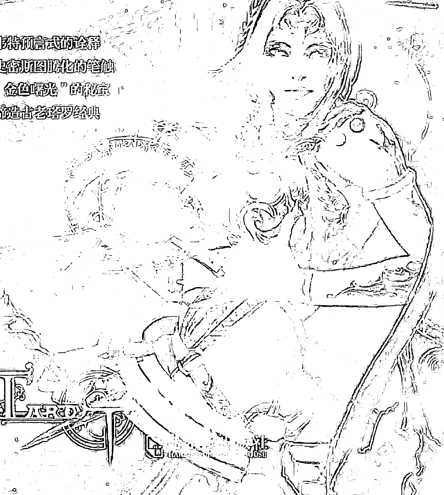

责任编辑：王放 张贺然

封面设计：李影

封面插图：晋佳博

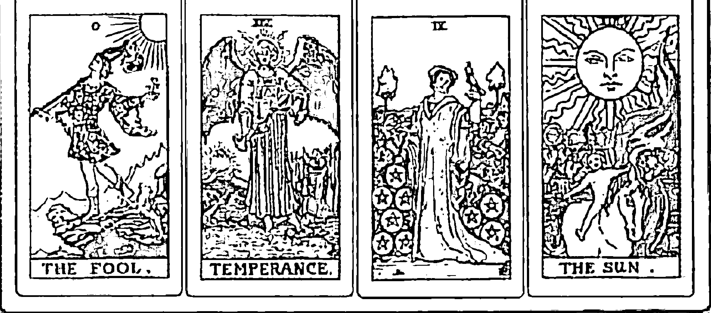

作为塔罗牌中的经典体系，韦特塔罗牌由古代塔罗大师亚瑟·爱德华·韦特和画家帕米拉·柯尔曼·史密斯共同创作而成。

爱德华·韦特是当时著名的塔罗社团“金色曙光”的重要成员，他在保持早期塔罗主题的宗旨下，淡化了基督教色彩，强调牌自身的神秘学的预示性，并重新赋予牌画中的细节和背景更为深邃的内涵和象征含义。韦特塔罗在1909年出版后，便得到欧洲塔罗团体的认可，受到人们的推崇。

韦特塔罗逾越百年，已成经典，每一个寓意深刻的符号，每一张古朴独特的牌面都在向你传递着神秘的意义。

现在，就让我们开始这段奇妙的塔罗之旅吧！

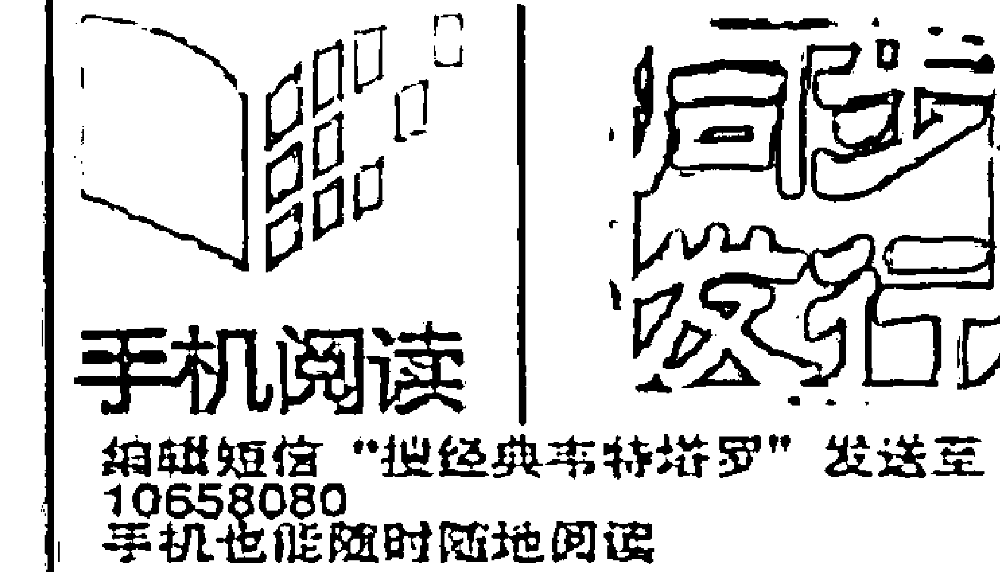

上架建议：塔罗

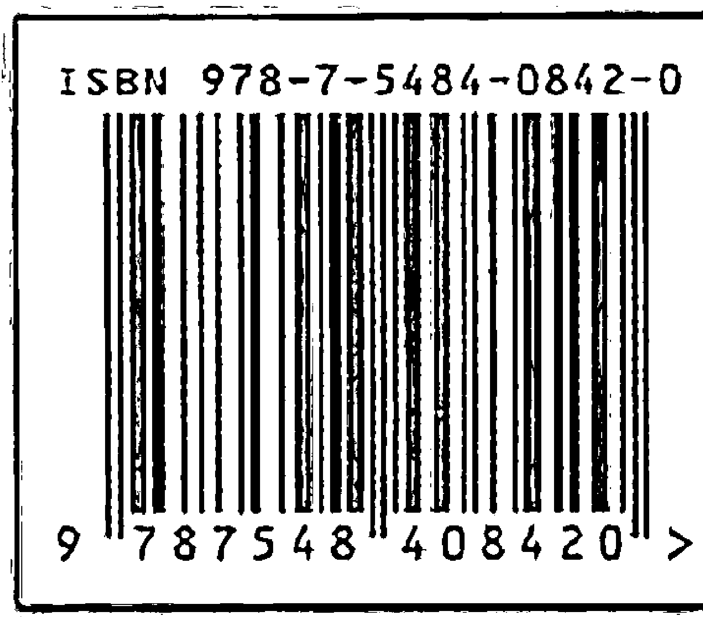

定价：28.00元

# 经典韦特塔罗

李崇森 刘星 编著

# **图书在版编目(CIP)数据**

经典韦特塔罗 / 李崇森, 刘星编著. —哈尔滨: 哈尔滨出版社, 2012.1
ISBN 978-7-5484-0842-0

Ⅰ. ①经… Ⅱ. ①李… ②刘… Ⅲ. ①扑克-游戏-基本知识 Ⅳ. ①G892

中国版本图书馆CIP数据核字(2011)第254784号

# **书名: 经典韦特塔罗**

作者: 李崇森 刘星 编著
责任编辑: 王欣 张贺然
责任审校: 陈大霞
封面设计: 李影
封面插图: 晋佳博

出版发行: 哈尔滨出版社 (Harbin Publishing House)
社址: 哈尔滨市香坊区泰山路82-9号 邮编: 150090
经销: 全国新华书店
印刷: 哈尔滨市石桥印务有限公司
网址: www.hrbks.com www.mifengniao.com
E-mail: hrbks@yeah.net
编辑版权热线: (0451)87900272 87900273
邮购热线: 4006900345 (0451)87900345 87900299
或登录蜜蜂鸟网站购买
销售热线: (0451)87900201 87900202 87900203

开本: 787×1092 1/32 印张: 4 字数: 45千字
版次: 2012年1月第1版
印次: 2012年1月第1次印刷
书号: ISBN 978-7-5484-0842-0
定价: 28.00元

凡购本社图书发现印装错误，请与本社印制部联系调换
服务热线: (0451)87900278
本社法律顾问: 黑龙江佳鹏律师事务所

# 目录

# 大阿卡那

- 愚人 ........................................ 002
- 魔术师 ...................................... 003
- 女教主 ...................................... 004
- 皇后 .......................................... 005
- 皇帝 .......................................... 006
- 教主 .......................................... 007
- 情侣 .......................................... 008
- 战车 .......................................... 009
- 正义 .......................................... 010
- 隐士 .......................................... 011
- 命运之轮 .................................. 012
- 力量 .......................................... 013
- 吊人 .......................................... 014
- 死神 .......................................... 015
- 节制 .......................................... 016
- 魔鬼 .......................................... 017
- 塔 .............................................. 018
- 星辰 .......................................... 019
- 月亮 .......................................... 020
- 太阳 .......................................... 021
- 审判 .......................................... 022
- 世界 .......................................... 023

## 小阿卡那

| 左项 | 左页码 | 右项 | 右页码 |
| :--- | :--- | :--- | :--- |
| 权杖首牌 | 026 | 权杖国王 | 039 |
| 权杖二 | 027 | 圣杯首牌 | 040 |
| 权杖三 | 028 | 圣杯二 | 041 |
| 权杖四 | 029 | 圣杯三 | 042 |
| 权杖五 | 030 | 圣杯四 | 043 |
| 权杖六 | 031 | 圣杯五 | 044 |
| 权杖七 | 032 | 圣杯六 | 045 |
| 权杖八 | 033 | 圣杯七 | 046 |
| 权杖九 | 034 | 圣杯八 | 047 |
| 权杖十 | 035 | 圣杯九 | 048 |
| 权杖侍从 | 036 | 圣杯十 | 049 |
| 权杖骑士 | 037 | 圣杯侍从 | 050 |
| 权杖王后 | 038 | 圣杯骑士 | 051 |

## 小阿卡那（续）

| 牌名 | 页码 | 牌名 | 页码 |
| :--- | :--- | :--- | :--- |
| 圣杯王后 | 052 | 宝剑国王 | 067 |
| 圣杯国王 | 053 | 星币首牌 | 068 |
| 宝剑首牌 | 054 | 星币二 | 069 |
| 宝剑二 | 055 | 星币三 | 070 |
| 宝剑三 | 056 | 星币四 | 071 |
| 宝剑四 | 057 | 星币五 | 072 |
| 宝剑五 | 058 | 星币六 | 073 |
| 宝剑六 | 059 | 星币七 | 074 |
| 宝剑七 | 060 | 星币八 | 075 |
| 宝剑八 | 061 | 星币九 | 076 |
| 宝剑九 | 062 | 星币十 | 077 |
| 宝剑十 | 063 | 星币侍从 | 078 |
| 宝剑侍从 | 064 | 星币骑士 | 079 |
| 宝剑骑士 | 065 | 星币皇后 | 080 |
| 宝剑皇后 | 066 | 星币国王 | 081 |

# 塔罗牌解牌法

- 无牌阵解牌法 ............. 082
- 圣三角解牌法 ............. 083
- 二选一解牌法 ............. 085
- 吉卜赛十字解牌法 ........... 088
- 爱的现状解牌法 ............. 091
- 爱的金三角解牌法 ........... 092
- 平安扇解牌法 ............. 094
- 四要素牌阵 ................ 095
- 身心灵牌阵 ................ 096
- 问题解决牌阵 ............... 097
- 塔罗牌难题牌阵 ............. 098
- 圣花猫牌阵 ................ 099
- 得失展开法(三张牌) ........ 100
- 缘分推测法 ................. 100
- 寻找对象牌型(X形) ...... 102
- 婚姻牌型(风车形) ....... 102
- 自我探索牌型(钻石型) ... 103
- 金钱/财宝牌阵(V型) .... 103
- 十二月运气牌型(O形) ... 104
- 向日葵展开法 ............. 105
- 凯尔特十字 ................ 106
- 星宫之书 ................ 108
- 七“行星” ............... 109
- 意识动力 ............... 110
- 房型阵 ................ 111
- 得与失 ................ 112

| 占卜项目 | 页码 | 占卜项目 | 页码 |
| :--- | :--- | :--- | :--- |
| 今日运势 | 113 | 评价爱人 | 116 |
| 了解自己 | 113 | 收获 | 117 |
| 今天会发生什么 | 113 | 财宝金库 | 117 |
| 工作 | 113 | 事业发展 | 118 |
| 合伙 | 114 | 跳槽 | 118 |
| 分手 | 114 | 四季运势 | 119 |
| 真爱预测 | 115 | 彩虹阵 | 120 |
| 爱已消失 | 115 | 飞鸟阵 | 120 |
| 爱的新起点 | 116 |  |  |

## 大阿卡纳

22 张主牌是塔罗牌的核心，每一张都有自己的序号，每张主牌都象征着某种共通性的人类经验。它们代表着人性的原型，直接而连贯地描绘出人类精神世界的影响。牌面上的图像能唤醒很多东西，因为它们把深奥的象征与可识别的人物、境况结合起来。这种象征很微妙，但是很有效。

在塔罗解牌中，主牌一直备受关注。当一张主牌出现时，那个牌位上的含义绝非是平俗的、暂时的。它们代表了你内心深处最基本的、最关心的事：你的主要感觉和动机。

许多解牌者把这些主牌看成个人内心成长的不同阶段——有人称之为“愚人的旅程”。22 张主牌就是心灵成长道路的路标，从最初的意识(第 0 号牌)开始，知道睿智与充实(第 21 号牌)。主牌通常被组为一组，为了研究塔罗牌的奥妙，主牌会带我们走入神秘的塔罗地带。

## 愚人牌

0

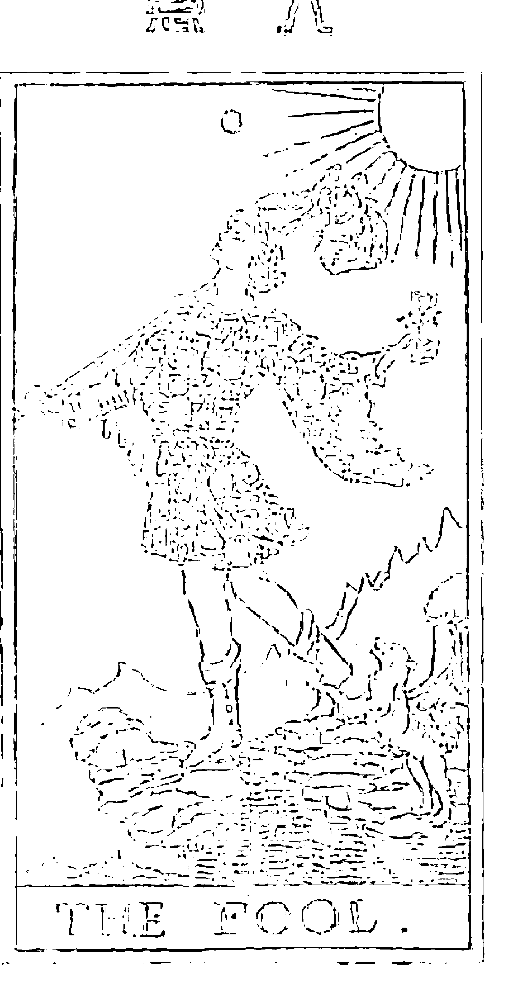

**关键词** 新开始 有胆识 有信仰 童真

**牌面解读** 愚人穿着华丽的衣服，迈着轻巧的脚步，走在悬崖边。他的眼中是他的理想。身旁的狗提醒他，不要一直勇往直前，要停下来想一想前面的路怎样走。然而，他并未惊醒，依然微笑着大步向前。

**正位牌义** 憧憬自然的地方，毫无目的地前行，喜欢尝试挑战新鲜事物，四处流浪。即使明知是毫无意义的冒险、错误的选择及失败的结果，也一意孤行，盲目地追求梦想而完全忽略现实。但是单纯凭着盲目的勇气和自信是不够的，要暂时停一下脚步，冷静地分析自己所拥有的东西，将之重新安排。这样无论走向何方，对于愚人来讲，都是完美的开始。

**逆位牌义** 最近发生的事情让你失去了感情、责任心和纯真，看重的东西无法得到，内心焦躁浮动，却只能莽撞地继续前进。本来以为事情会有新的开始，却走到连自己都不认识的路上，甚至与更好的机会失之交臂。

## 魔术师

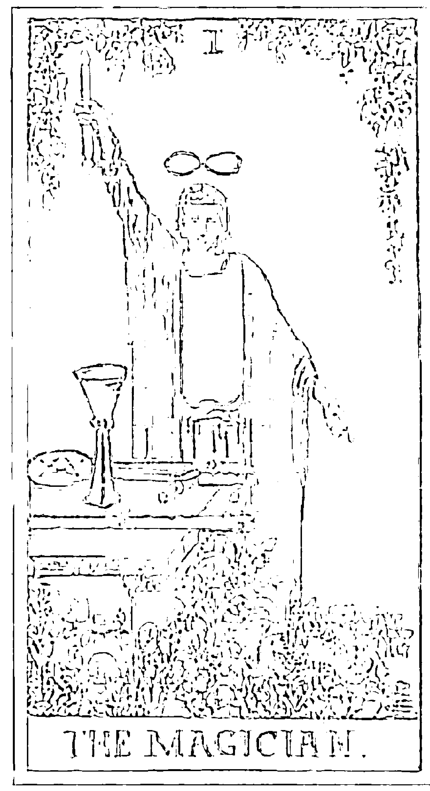

**关键词** 创造力 专心 新计划 控制力 有意识的行为

**牌面解读** 魔术师的桌面上是宇宙四要素：生命树（火）、剑（风）、五芒星（土）、圣杯（水），魔术师头顶上有个无限的符号，腰带为一条头尾相接的蛇，它是精神永恒的象征。在繁花似锦的环境里，他的智慧和法力在慢慢地聚集。魔术师被放置在1号的位置，以显示它的重要性。

**正位牌义** 在你内心中，比例占据最大、最重要的事物，就是你想要的。为了它你必须马上制订出计划来。如果你已经有了计划，在还没有看到事物新的发展之前，要坚持，因为目前的计划是最好的且对你自己最有利的。如果你还没有计划，那么放下内心的忐忑和矛盾，你现在已经拥有了实现计划的能量，并且这种能量正在大幅度增强，所以你制订的计划几乎都是可能实现的。你自身的努力、周围人的帮助，都可以让你得到你想要的。

**逆位牌义** 对手边的计划要更加小心谨慎，如果有了新发展，尽量观察四周有没有潜在的危险和阻碍，自身的修为有没有偏离常规，意识中是不是有停滞不前的因素。在恋情中，顺利者要更加注意对方的想法；追求或被追求状态中，如果无法达到预期的效果，要特别注意沟通方面是否出了问题。逆位的魔术师，爱情不会如想象的顺利，也许有别的物质掺杂进爱情中，需要冷静地分析。

## 女教皇

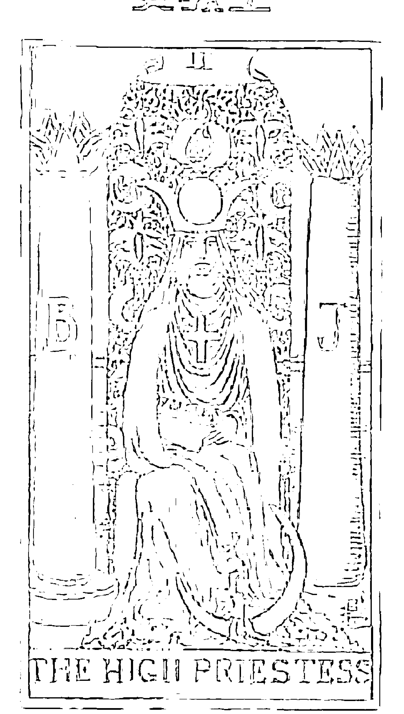

**关键词** 智慧 等待 理智 神秘

**牌面解读** 表情淡漠的女教主，眉宇间却隐含着一种莫名的忧愁，双眼无意识地凝视远方。身上穿的蓝衣、头顶的月晕之珠象征着灵性与智慧，显示出她的冷静和睿智，以及包容万物的爱心与温柔。

**正位牌义** 正位的女教主正确地判断当前的一切情况，与前面的魔术师牌连在一起，潜意识中或者在心里有的计划将更加明确。正位牌义为有良知，有学问，有智慧，有敏锐的观察力；理性、富有研究的精神；将有正确的时机或人出现；理智的情感生活，柏拉图式的恋情，深藏内心的爱意，在爱情中表现冷淡；充满知性魅力，拥有良好的判断力和洞察力。

**逆位牌义** 陷入思维怪圈中，得不到内心的平静。身心非常疲惫。其寓意为：缺乏理解和判断力，粗心大意，容易紧张，神经质；单恋，有洁癖，因冷漠而产生误会；任性、晚婚、无趣的女性；没有计划的花费；因任性而感到孤独；嘲笑别人；所有意见不和的对象都不理会；固执，不能集中全力，甚至想换个环境又下不了决心。

## 皇后

**关键词** 母性 高贵 丰收 自然

**牌面解读** 皇后那华丽的服饰，显示出她那特殊的威严和地位。她头戴象征地位的皇冠，手拿象征土地的金色小麦，泰然自若地坐在宝座之上，双眼慈祥地向下俯视，流露出她母性的光辉。她拥有宛如天使般的神圣力量和高贵灵魂，表现了母仪天下的万物之母具备的特质。女教主给人的感觉是一位身具智慧而且文静的女士，而皇后则正好相反，她具有一种温和的包容力和信赖感，会给人民带来丰收和喜悦。

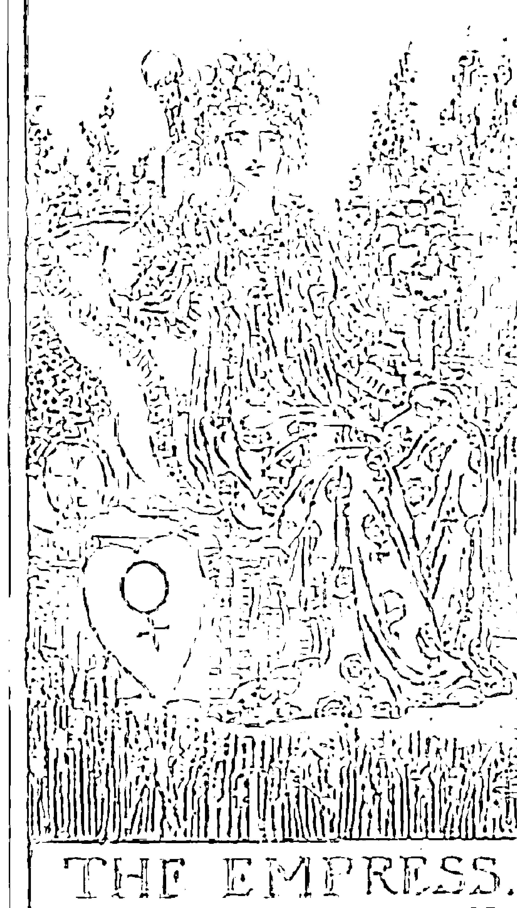

**正位牌义** 正位的皇后牌让你感觉到幸福在向你靠近，在施舍与奉献中，你赢得了周围人的尊重和爱戴。正位的含义为优雅的生活，艺术天分；丰收，繁荣兴盛，富足；成绩进步，在艺术领域颇有成就；适合装扮和服饰方面的职业；突出的感受性，在工作上很活跃的女性。

**逆位牌义** 开始时积极向上的动力和明确的事物逐渐失去意义，一些期望中可以有回应的事物却迟迟没有动静，令你产生“是不是我做错了”的疑问。逆位代表迷惑、缺乏上进心、轻浮、损失、没有成就、爱慕虚荣；因任性而遭人厌恶，嫉妒。过于迷恋而无法自拔；缺乏女人味，遥远的婚期；浪费时间，懒惰；在学习上对各个科目的喜好过于明显；成绩低落，缺乏集中力。

## 皇帝

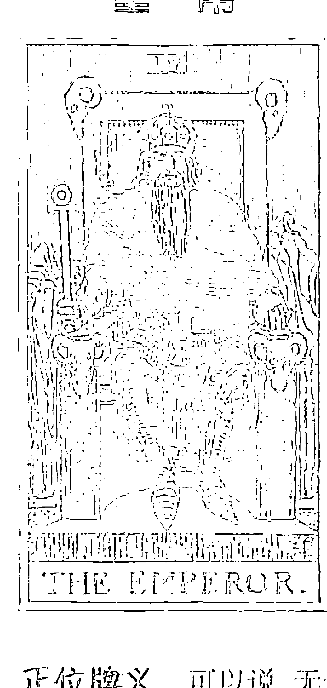

**关键词** 权威 统治 秩序 父性

**牌面解读** 皇帝是男性权力和威严的象征，他身着战袍，右手握着象征权力的权杖，充满自信地坐在那里。但在威严背后是一般人难以了解的孤独与焦躁，而不像想象中那样的幸福和无忧无虑，这也暗示着有得必有失的道理。对于任何事情不及固然不好，但是如果过多也未必是你真正想要的。

**正位牌义** 可以说，无论你的现在，还是你的将来，“什么是影响”不是你该担心的问题。因为以你的才智，你比任何人都清楚这个问题。而且，你会懂得如何更好地控制和使用，如何让力量发挥到极致。你的身边可能会出现一个对你影响极深的人，这个人以强有力的姿态支配你的行动，但是不要一味地听从，在坚持自己的看法之外，应多听多学，这对你有益而无害。

**逆位牌义** 你可能会失去对别人的影响力和控制力。你的命令可能不再像从前那样被人执行，别人甚至都不愿意接受你。那是因为你内心的力量感在失衡，并且严重倾向于“铁腕就是一切”的信念。内心孤独、缺乏温暖，但还要将这些不利情绪强加到别人身上，从而使你完全被动。也许是之前那比较顺利的时光，使得你看重手中的能量，任意使用，无形中形成了狂妄自大的心态。

## 教主

**关键词** 引导 援助 传统 教育 群体认同

**牌面解读** 教主身穿代表教职的法袍，手持传教的法器，坐在信众面前，他引领人们脱离并舍弃肉体而接受圣灵的引导。教主身后的恶劣天气仿佛是一扇门，象征教主是站在天国之门的门口引领人们的带路使者，他无畏的表情给人无比的信心，所有的迷惘和痛苦都随之消失无踪。

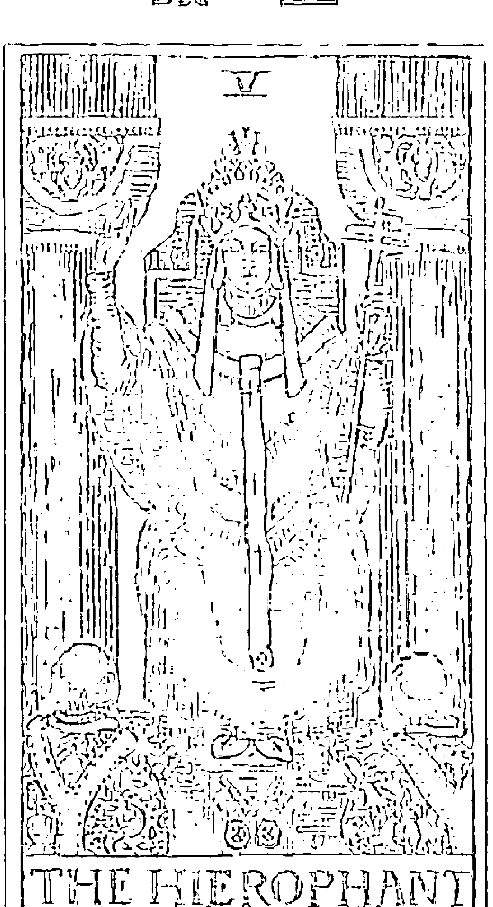

**正位牌义** 要相信你身边出现的智者，他能给你心灵上的引导，这预示着你将逐渐在团体生活中变得重要，而且你也喜欢这种感觉，因为你体会到了“一致”的幸福。你内心充满关怀，希望把自己的智慧传达给他人。恋爱中的你，被人看到了可依赖的一面。同时，你最好看紧钱包，借改变环境往好的方向发展。

**逆位牌义** 教主的逆位通常代表打破传统规范，尤其在恋情中，隐藏在心中的过分依赖使得你无法独立，也无法审视你们的关系。你应该是充满智慧和理性的，不要再继续坚持自己的观点不肯改变。你的想法不是没有人倾听，如果你将内心的声音写在纸上，就会惊讶地发现，这些想法都是那么不合理。还要切忌自以为是和没有必要的义气。

情侣

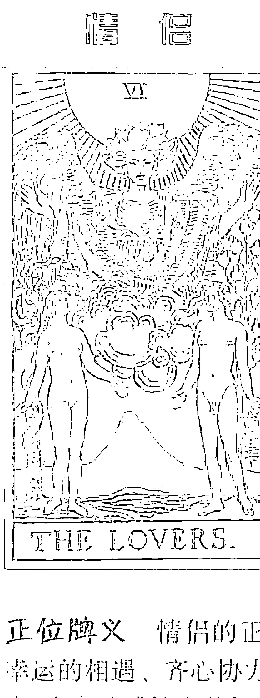

关键词
- 结合
- 开端
- 选择
- 性欲
- 价值

牌面解读：幸福的爱情并不是完美的，象征激情与坚贞的风之天使将这对情侣围在一起，使他们和谐统一。他们忘情相依，且坚定不移。女子青春貌美，面容羞涩；男子阳刚英俊，强壮有力。两个年轻诱人的躯体代表着青春、童贞和纯洁的爱。这幅画面让我们看到了阴阳的平衡！

正位牌义：情侣的正位意味着幸运的相遇、齐心协力、情投意合、丰富的感情和美好的前途。计划在顺利进行，与别人的合作关系非常融洽而且有利可获。恋人正位，对于预测恋情的人来说，是一张意义极度明确的正面信息牌。在恋情中，你和爱人甜蜜美满，而且在身体的结合中体会到了至高无上的快感，这些统统让你精神焕发、魅力十足。

逆位牌义：逆位的情侣牌意味着离别的时刻、与某些事情擦肩而过、没有把握好机会。也许你在不符合道德规范的欲望中迷失了自己，而且对于已接受的意见表示质疑，并且极力维护自己的立场。在将来的伴侣或者事物的选择上，你会出现不正确的判断。朋友虽多却没有固定的恋人，抓不到对方的心，婚姻或爱情遭受挫折或失败。

大阿卡纳

## 战车

关键词
- 前进
- 胜利
- 意志
- 旅程
- 自我声明

牌面解读：一位勇士站在战车上，铠甲、宝剑和那炯炯有神的目光体现着对前方征途的自信。崭新的战车上镶嵌着象征家族荣誉的徽章。在民众的欢呼声中，他已经充满信心地踏上探求未知世界的征途，家乡那种满绿树的山丘已被抛在脑后，征途就在前方。

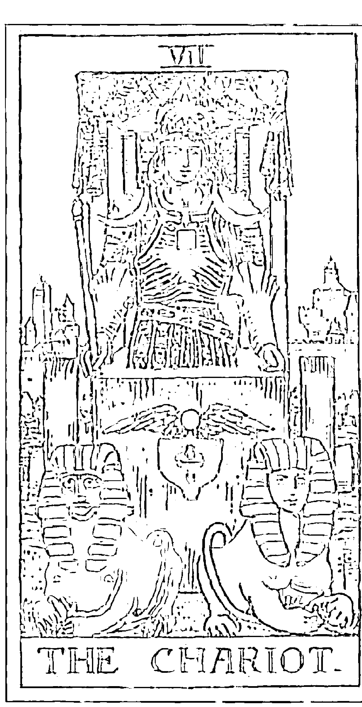

正位牌义：战车的强大力量使你的前进鲜有阻碍。你以有效的方式进行，把握先机。情场上你是胜利者，交往顺利，遇到喜欢的对象会猛烈地追求。在学业中成绩进步，自信增强，如果你好好运用强大的控制力的话，那么胜利对你而言，就必定不是梦想。

逆位牌义：逆位的战车意味着感情上过于鲁莽，遭到抛弃；因懦弱而无法进展的恋情，对不想做的事情缺乏责任感；对学业不感兴趣，成绩和效率低下。预示着你现在对自己的信任不是在失去，就是在盲目扩张，无论哪一点，都越过了平衡的底线。如果你根本不清楚力量是做什么用的，那么你永远都理不清头绪。而缺乏节制的花销也使你经济上捉襟见肘。

## 正义

关键词
- 公平
- 平衡
- 责任
- 决定

牌面解读：正义女神端坐在审判的宝座上，身旁放着象征权力和正义的天平。她身穿红色的正义长袍，头戴公平之石，手握锋利的宝剑，目光中没有一丝一毫的怜悯，显示出公正的冷漠。女神的全身透露出一种冷静且凌厉的气质。

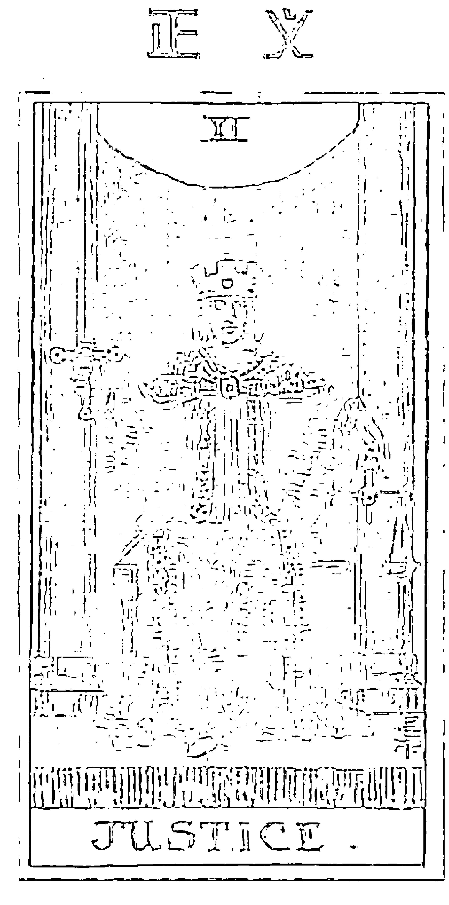

正位牌义：正位代表受到诚实、公正的待遇；各科成绩都很好，工作与家庭兼顾，个人学业和社团活动兼顾；贷款获准，财运上升，得到应有的回报。你可能会在一些事情上保持中立，这个选择是正确的，你去做你必须做的事情就行了。恋情中，你正寻找一种适合两个人相处的原则。

逆位牌义：正义的逆位代表着不公平、不公正的待遇；不顾后果的交往。如果你能够让自己冷静下来，就会发现自己身上有着某种偏袒，偏心造成的后果有时候会很严重，而且每个人都知道这一点。在作决断时，应该尊重道德，作出公平而合理的决定。恋情中，一味地争吵只会让关系恶化，要尽可能地达到平衡。也许在某些事情中，你得不到最合理的对待。

大阿卡纳

## 隐士

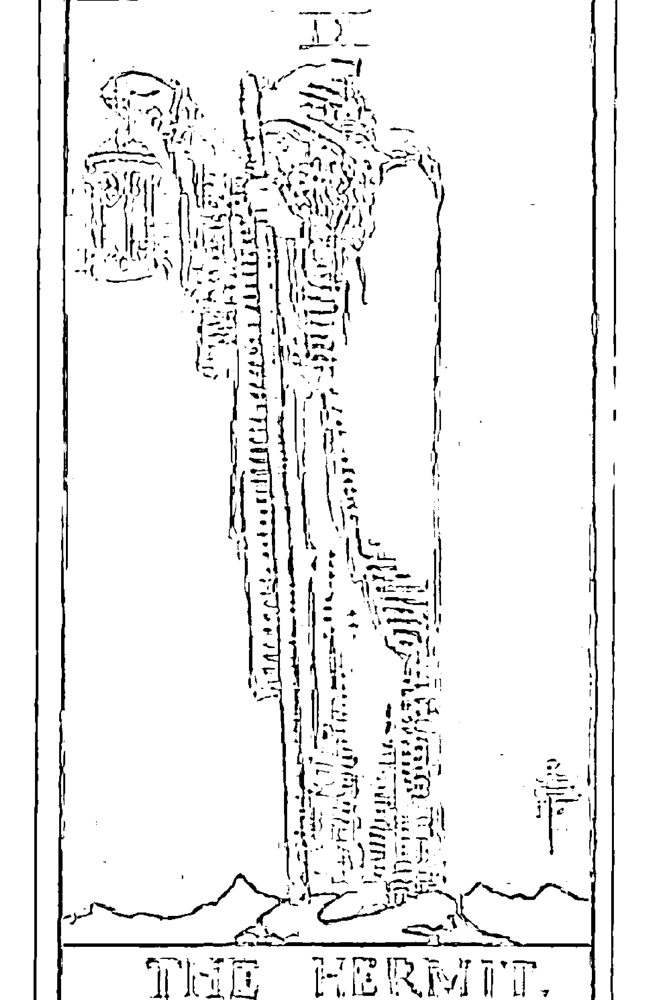

关键词
- 孤独
- 本性
- 内省
- 指引

牌面解读：隐士离群索居，远离人世间的虚伪和喧嚣，在平静中寻求真知。他身穿长袍，站在山巅，陷入了寻求真理的沉思之中。他的右手高举着一盏明灯，象征着真理的指引。对隐士而言，他似乎能感受到周围空气任何轻微的流动，盲目者都可以通过他的指引找到黑暗中的道路。

正位牌义：隐士代表自信、理智、坚持不懈的心态。恋情中，你不太能够体会到狂热的爱恋，甚至对自己的感情都不太在意。或许，你只是想要寻找更加适合你的状态而已。你现在非常适合通过杰出的分析能力来拟订长期计划，以积极睿智的心态去实践，收获将远胜于你的预期。

逆位牌义：隐士的逆位代表着泄露秘密；俗气，神经质；怀疑爱情，不能敞开心扉。逆位隐士手中的灯在下方，潜意识中的真理之光非常薄弱，一旦灯处在下方，就会更加无法捉摸。这个阶段，应该注意调整心态，学一些新的东西来补充越来越匮乏的心灵。关于恋情，不要勉强，也不要太消极。如果能够在自我和他人之间找到平衡的所在，那么你最近的低迷状态就会结束。

## 命运之轮

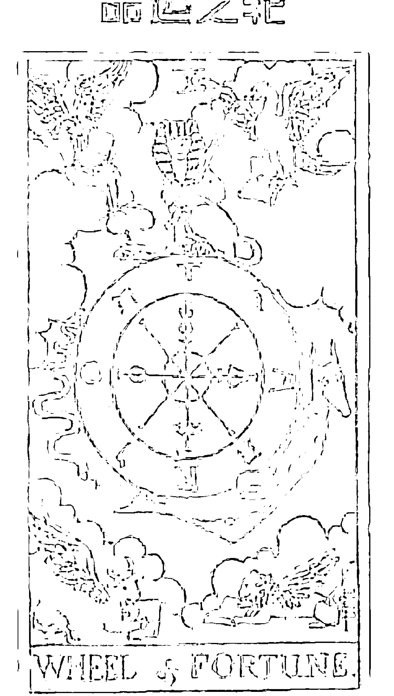

关键词
- 运转命运
- 契机
- 转折点

牌面解读：命运之轮这张牌是独树一帜的，命运之轮的上方是两个奇怪的人，他们的样子似乎想掌控命运。然而，谁知道这个轮子竟然掌握着整个世界的命运呢？每个人都在冥冥中不知不觉地加入到了它的轮转中。

### 正位牌义

意外的幸运让你奇迹般地见证了一份好运的到来。此刻的状态积极、热情、善意接踵而至，这是你好运的开端，无论之前的处境如何，现在将大为改观。最关键的就是你开始积极地参与到事情当中，别人都感觉到了你身上的变化。转变可能有些出乎意料，你在往更高处行走。恋情中，你能够拥有完整的开始阶段，好好把握这段恋情。

### 逆位牌义

命运之轮正被带向低层，导致你判断错误，处于低潮期，左右为难；缺乏要领的交往方式使得爱情之火逐渐失去往日热烈的感觉。在某些机会面前，你也许并没有把握好。处在将要结束却迟迟无法开始的阶段，你将忍受某种外界带来的变动，恋情不会如你想象的去发展，甚至会与你的想象有很大差距。

## 力量

关键词
- 坚韧
- 耐心
- 同情
- 力量
- 勇气
- 控制

牌面解读：一位美丽的仙女驯服了一只凶猛的狮子。虽然凶猛的狮子嘴里长满了锋利的牙齿，但它却显得微不足道。作为百兽之王的狮子，本该意味着不被征服，然而在仙女柔美的身体下，原本充满敌意与伤害的兽性也被彻底征服了。其实，力量在一些方面虽然是胜负的关键，但却不是征服别人的唯一因素，力量的最高层次是以柔克刚。

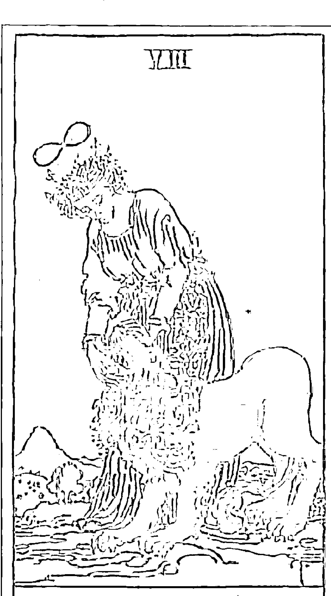

正位牌义：正位的牌代表了精力充沛，不屈不挠，扭转乾坤的意志力。在爱情上，你也将成为主导者。在某些难以坚持的事件上，一旦你表现出极大的耐心，你就会获得想要的。恋情中的你，知道什么该做什么不该做，算是个非常聪明的人，你的同情心令别人感受到了你的细腻。无论在什么情况下，你都是个识大体的人。你还有可能获得热情的赏识，因果断的言行受到赞赏。

逆位牌义：事情发展的方向与你的希望背道而驰。懦弱而不能持久的爱情会让你受伤。你要学会善用自己心中的力量，那并不是在强化我们的外在，也不是在权力或者能力上的有所提高，而是一种发自内心的感染力。没有人跟一个强势的人在一起会觉得舒服。逢赌必输、透支、不善理财的后果都困扰着你。

经典塔罗牌鉴赏

## 吊人

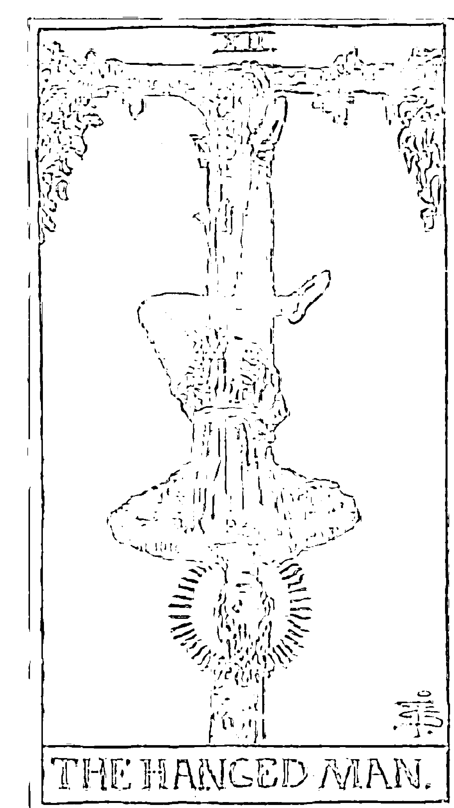

关键词
- 牺牲
- 等待
- 悬吊
- 相反

牌面解读：这张牌图案简单，含义却十分深远，一个男人的一只脚被捆绑住，身体被倒吊着。他的两只手背在身后，形成一个三角形，一条腿屈起与另一条腿交叉成一个十字。十字和三角形结合起来，就是一个炼金符号，象征伟大事业的完成，也象征灵魂和欲望由低层次上升至高层次。

正位牌义：正位牌代表着接受考验，不贪图眼前利益；爱情要经得起考验，不要急躁，可能需要静静地等待一段时间。你要相信内心强大的信念，你当前的状态在别人看来可能会有些不利，但这种情况很快会改变。你内心平静，甚至不求回报，你认为自己这么做是值得的。

逆位牌义：逆位一方面预示着一段得不到回报的恋情，没有发展的希望，一直在作着无谓牺牲的你，尽快结束这段关系会对你大有好处。另一方面，你有些只顾着自己而不想别人，有时候应该付出的地方你并没有付出，反而一直认为这么做才是对的。你的思想钻进了牛角尖。在工作和学习上，因过于被动导致成绩退步，努力无所获，反效果。

大阿卡纳

## 死神

关键词
- 牺牲
- 结束
- 转变
- 新生
- 消除

牌面解读：一个骷髅身穿铠甲，左手举旗，右手挽着缰绳。死神的出现并不是要带来死亡，而是要找到那些生命走到终点的灵魂，带领它们走到它们该去的地方。苍白的面色中透出一股死亡的白骨气息。死神空洞的眼神里看不出一丝情感，但他的内心隐隐地露出诡异的微笑。

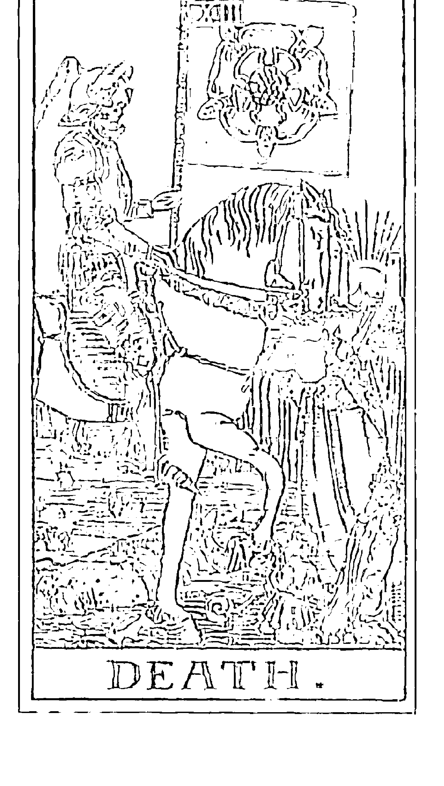

正位牌义：正位的死神将一切正在进行的计划打破，计划面临着终止的可能。在不久的将来，你的人际关系也将发生重大的改变，可能一直以来维持着的关系将结束。在一种难以摆脱的影响力中，你失去了对周围的控制力，你发现自己对这种改变几乎没办法适应。恋情中，你非常不顺利，在挫折中这段恋情也许会走到尽头。不要勉强对方，该放手的就放手，可能会更好一点儿。

逆位牌义：扭转方向，改变形象，奇迹般地东山再起，脱离低潮期。主动展开攻势将有好结果，感情好转，绝望后重新燃起爱的一切正在重新开始。之前别人不了解你，之后开始接受并且欣赏你的行为，你可以做自己能做好的事情了。此刻的你，一切都是崭新空白的，你只需要将信心激发出来，便能在新的生活中操控方向。

## 节制

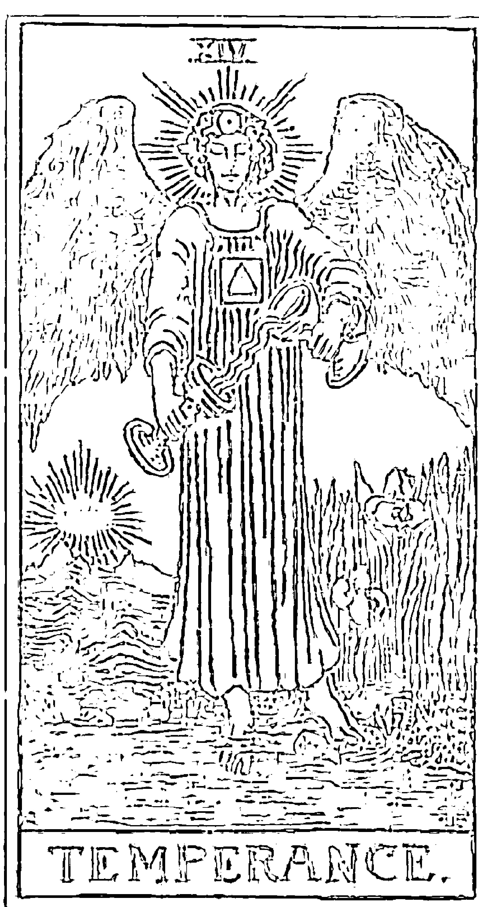

关键词
- 节制
- 协调
- 配合
- 平衡
- 关心
- 健康

牌面解读：图中的天使正将代表灵魂的水从一个圣杯倒入另一个圣杯。她脚下的土地代表意识，水代表无意识，两个圣杯分别代表物质和精神，象征着在物质和精神方面的渴求。当两个圣杯都注满时，便可以取得平衡，走向成功。

正位牌义：生活稳定而且充满了平静，要注意调理和整顿，在平淡的重复中发现关键，关注自我需求也兼顾他人的意愿。你将自己置于一个非常高的点上，观望者斗争和纠纷，心静如水。这种平衡不是正义牌的那种为了保持和平而作出抉择的平衡，而是发自内心想要的稳固。爱情弥坚，心心相印，但要有节制地交往，才能心灵相通。

逆位牌义：为了追求某些东西而不惜代价，心里的愿望像火一样燃烧着你，你缺乏冷静，对事情不分析就下结论，跟别人在一起又常常斤斤计较。其实你努力别人也在努力，双方都有着共同的目标就要懂得平衡。这一时期你的工作学习状态很不稳定。恋情中，你无法持久，因缺少默契而造成了很多负担。

## 魔鬼

关键词
- 欲望
- 诅咒
- 沉沦
- 束缚
- 无知

牌面解读：魔鬼支配着黑暗，他长着一对蝙蝠一般的肉翅，头上长着羊角，生着羊腿，这些象征着动物的本能与天性。魔鬼下方是一对由锁链连结的，长着角的年轻男女，他们代表了人类的一切欲望。里面杂糅的奇怪生物原本应该是人，但由于受到各种欲望的引诱，缺乏自制力而失去了人类的形体。

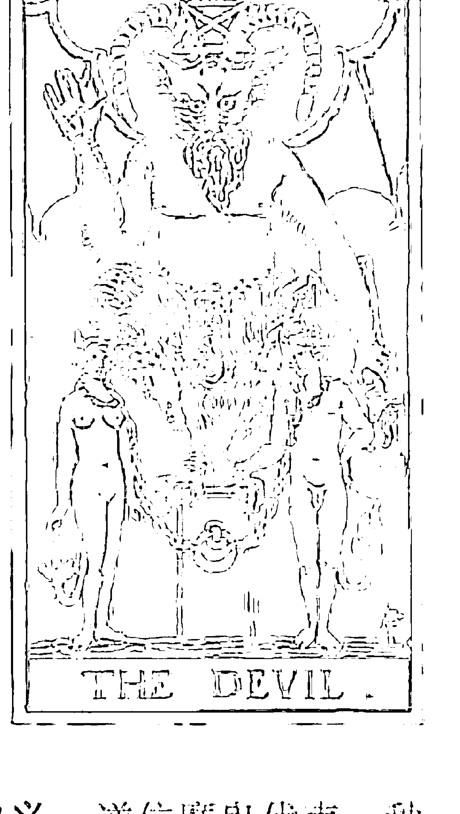

正位牌义：正位魔鬼表示你不愿意为自己的行为负责。可以说，这正是你想抛开所有责任的时候。你现在可能因为自己缺乏机会或在有限的选择中无法找到满意的答案而责备他人。恋情中，双方心里都有隔阂，心灵受着煎熬。

逆位牌义：逆位魔鬼代表一种打破自由枷锁的企图，你找到了力量，解脱了现状，不论是肉体上还是精神上都得到了自由。现在你正积极地找寻改变或新的选择，你不再打算接受目前的状况，而且你充满了开拓感，你希望自己有全新的生活。恋情中，你放下了备受煎熬的感情，心灵从桎梏中挣脱了出来。

## 高塔

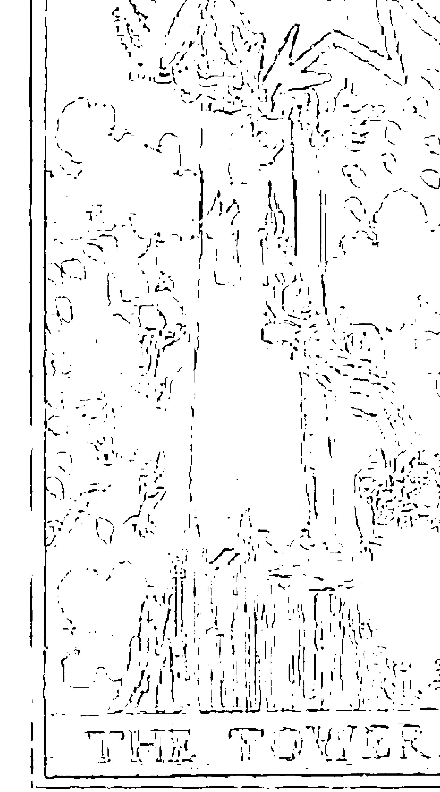

关键词
- 毁灭
- 意外
- 剧变
- 释放

牌面解读：原野的远处伫立着一座华丽的高塔，然而，此时它受到了雷击，正在坍塌，即将毁灭。高塔象征物质，雷鸣电闪则意味着神的愤怒与制裁。画面上的枯树代表已死去的万物，说明人类即使有再大的本领，也无法抵抗自然的力量，无法违抗神的旨意。高塔的坍塌和毁灭意味着结束，闪电代表着突如其来的意外灾难。高塔是一个强制的结束，必须先有完全的破坏才能重建。

正位牌义：一切都在改变，计划被打破，旅行被中断，金钱失去，感情破裂，总之，你的所有正面信息都重新被改写，成为一片黑暗。可能唯一不变的就是，在这种黑暗且毫无希望的状态中，你将待很长一段时间，或者现在的你，的确是在低谷中。但是任何事情都可能在废墟中生长出新苗来。灾难让你学习到你并不是能统领一切的，要学会遵守自然的法则。

逆位牌义：如果有骄傲自满的心，那无论怎么样的成功，最后都会走向失败。现在的你，似乎失去了一切力量，内心也归于无助和绝望，你的处境让你感受到前所未有的危机感。你也许无法想得通，之前还那么顺利，为什么突然之间陷入了困难的境地，其实，一路走来，你的掠夺和强势已经埋下了危险的种子。你的心态变了。但是如果你肯承认并接受这段黑暗，你将学到更多。

## 星辰

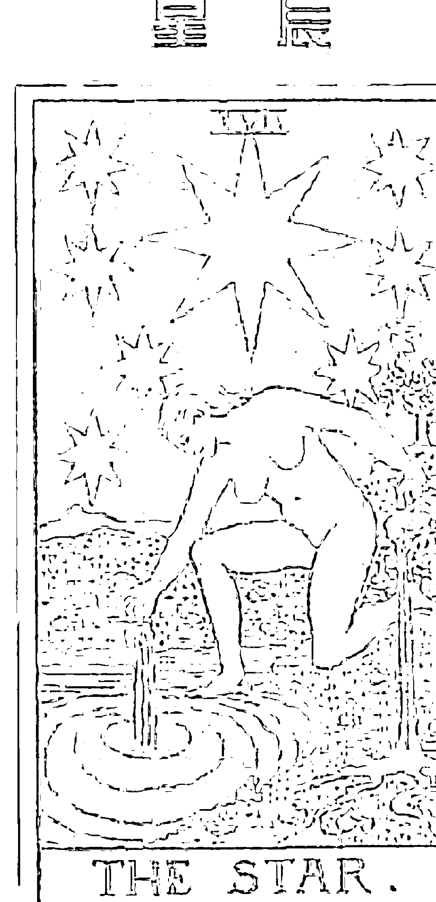

关键词
- 希望
- 祝福
- 平静
- 慷慨

牌面解读：希望之星辉映了整个夜空，星光下的女神象征着“永恒之美与无穷的希望”。星星是生命的希望，仿佛在夜空中指引方向的星辰一般，它的光芒给我们的心灵指引方向，只要能够坚持信念，就一定能达成目标。因此，星星会不停地闪耀着光辉，暗示前途将是一片光明。

正位牌义：正位星辰暗示你最近具有了宽容之心，而且比较自律。就日常生活而言，这张牌可以暗示你赶在你毁掉自己的计划前清醒了，之前你忽视眼前的机会，因为你的注意力集中在未来的可能性上，但是现在你可能会投入全部精力从事某个方案。在成长中，你发现比起之前，你现在只要花一点儿精神就可以顺水推舟地做下去了。恋情中，你会有好消息或者有好的预感，将自己置身于一个宽和的环境中，从而感受到爱。

逆位牌义：逆位星辰意味着情感的欠缺沟通和不满足感。这是一个开始而不是结束。你要弄清楚这一点。当揭开逆位星辰时，你心里一定有着放不下的事情，它困扰了你很久，暗示你生活中存在着不快乐，感受不到爱。如果你不克制自己，它可能会带着你进入一段更困难的时期。恋情中，你似乎总是沟通不畅，你想要的和对方意见相左让你恼火而无奈。

## 月亮

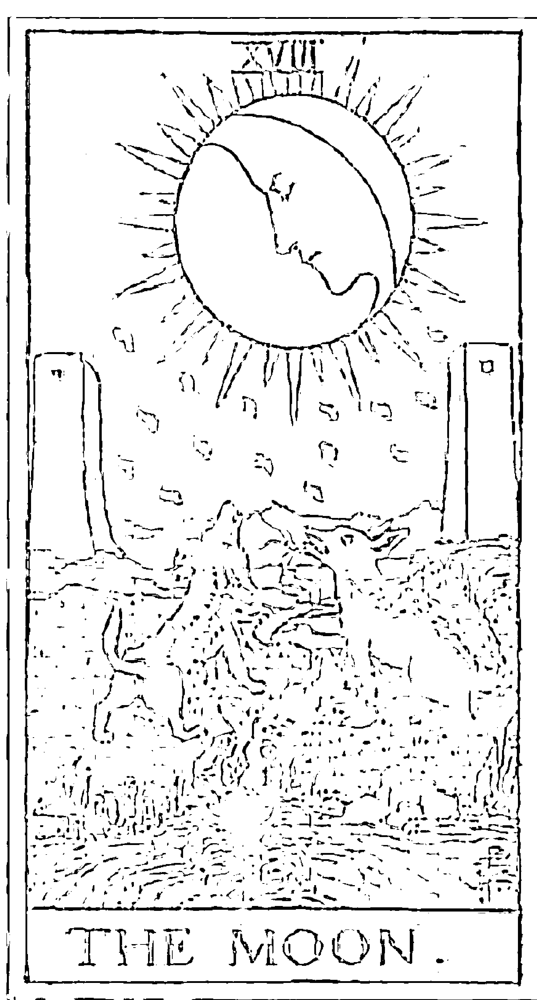

关键词
- 潜意识
- 不安
- 迷惑
- 欺骗
- 幻想
- 恐惧

牌面解读：变幻莫测的月亮自古以来在人们的心中留下了许多梦幻与神奇的故事。月亮象征着想象的精神世界，代表着极富浪漫的气氛，月亮的阴晴圆缺代表着变化，因此偶尔也会令人感到隐隐的不安。月光之城下，两只狼仰望苍穹低声地嚎叫，让人感到些许危险和不安。月光下的城镇一片死寂，看不见一个人影。在龙虾忧郁的表情中，我们可以清楚地看到圆月和狼嚎让它充满了躁动和恐慌。

正位牌义：正位月亮下的两只狼朝着月亮狂吠，暗示着你已经和心灵目标失去联结，而且内心充满了不安全感和随时失去这份联结的感觉。你在情感、创造力以及心灵上将逐渐感到失落。你必须遵照内心需求去寻找灵感和力量的源泉，这样才能从对人生的失望中解脱出来。恋情中，你不需要短暂的关系，那对你现在的生活是负债而不是提升。

逆位牌义：逆位月亮指一种心灵与身体上的契合。它形容开始一种丰富而又有温和感的关系。当出现逆位月亮时，它意味着通过你自己的努力，顺利联结了和对方的关系，而且你可能会获得某些比你单打独斗的成就还要大的收获。恋情中，目前有个机会让你摆脱困境，下了决心去挣脱才是对你有益的。

大阿卡纳

## 太阳

关键词
- 光明
- 生命
- 快乐
- 成功
- 自由
- 启迪

牌面解读：太阳是能源的中心，也是一切能量的来源，是一切生命的源头，它所表达的是一种喜悦的情绪。炽热的阳光孕育了大地万物，使美丽的花朵得以绽放，生物得以繁衍。在金色的阳光下，田野充满了生命的喜悦。太阳牌中的太阳神是一个可爱的小男孩，一头金色的头发，浑身散发着活力，太阳神手牵着一个红发的小女孩，两个年轻的躯体象征着新生，让人们感到生命的力量。

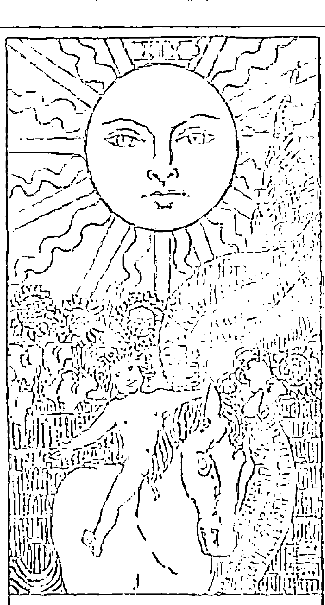

正位牌义：正位太阳影响着人们欢乐、平和、幸福及有计划的生活态度，并且让人深深体会到生命之美。太阳拥有乐观、强有力的目的性，充满智慧的直觉理解以及热忱。你最近变得务实、在精神上觉醒、对别人在你生命中所扮演的角色有了更高的领悟，在实施计划中又非常有条理。可以说，一切将在你手中变得光辉灿烂。恋情中，你遇到了有力量的恋人，带着彼此走进了人生的另一个新的阶段。

逆位牌义：逆位太阳可能是在描述一种颇有创意的计划，它在别人的眼中是成功的，然而你却对它有更高的期望，你要得到更多才会感到满足。所以逆位太阳也可视为你自己或和一个完美的理想竞争，这样的竞争难免会让你精疲力竭，甚至会将本来很好的事情弄糟。恋情中，你们经历过的考验还不够，你已经出现了懈怠，可能是因为缺乏沟通和理解。

## 审判

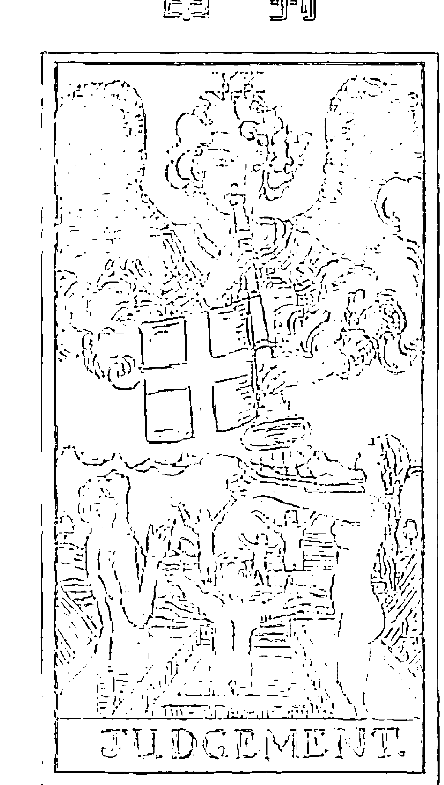

关键词
- 审判
- 复活
- 觉醒
- 回忆
- 心声

牌面解读：拥有一对华丽翅膀的天使冲破了灰暗的天空，仿佛从一朵盛开的花中探出身来，给世界带来力量和鼓舞。审判的时刻到了，得到赦免的灵魂就要被带入天堂，但是那些没有获得拯救的人怎么办？神的审判有一种“精神觉醒”的含义，天使的出现是在唤醒人们的觉悟。神的爱是无界限的，不论什么罪孽，只要诚心悔改，就会拥有希望，让人们感到灵魂不灭与生命复苏的奇迹。

正位牌义：正位审判正在了解你的精神目的。你能够清楚地看到自己的现状以及生命的时光。近期你会接受到关于你之前行动的一切后果。这是一个最公平的时候，你将看到自己的努力得到的一切。这会使你对如何开始又是如何收获产生莫大的喜悦。当然，如果你种下的是恶种，得到的也只能是恶果。恋情中，你经历了死灰复燃的爱情，这让你无比惊骇而不辨悲喜。但是顺从命运的安排，一切都将有答案。

逆位牌义：当逆位审判出现时，代表你正在寻找某些东西，以填补生命中越来越大的空白，但是你却对自己的主意犹豫不决。你觉得你分不清这个召唤究竟是来自内心，还是来自你理性的分析。简单说，这是因为缺乏清晰的判断力。恋情中，可能有一段恋情将无法挽回。

大阿尔卡那

## 世界

关键词
- 终极成就
- 完美
- 达成
- 开始

牌面解读：在美丽的星空树下，爱与美的女神神情泰然，体态优美。她调解纷争，教导慈爱，孕育生命，世界在她手中完成。这张牌代表宇宙的终点，只要我们怀着感恩的心，就一定能为自己打造美丽的世界，找到幸福与快乐。在这里，一切都圆满了，人们心里平安喜乐，从此可以无牵无挂地踏上新的旅程。

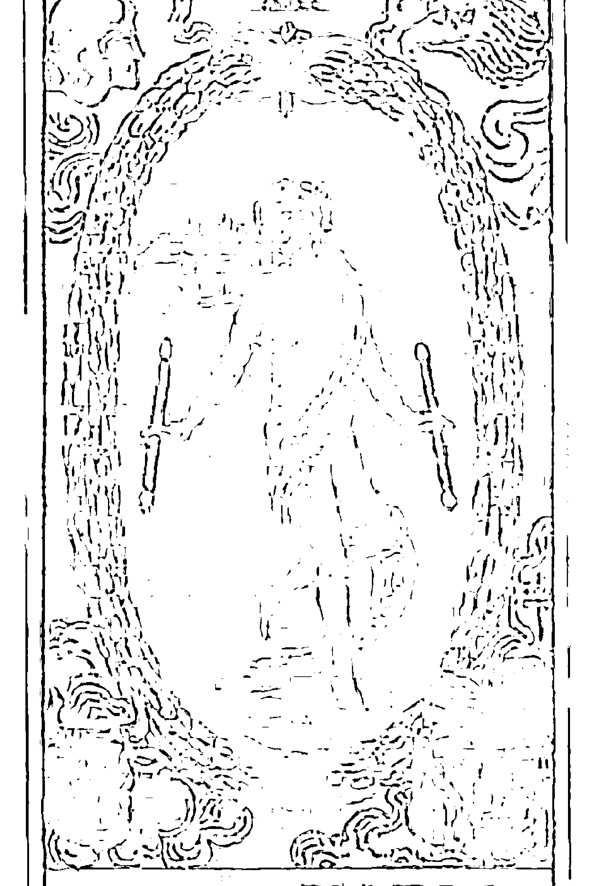

正位牌义：正位世界可能意指环游世界的行动，或重大的成功与巨大的快乐。在你追寻快乐的路上，它可能是个终点站。就事物变化的角度而言，正位世界代表着你就站在生命的终极之处，那是你喜欢并站着的地方，而且你也能感受到生命及你周遭的人的强力支持。正位世界带给你快乐，来自你耕耘后的收获，来自你的成就。恋情中，你很满意现在的一切，希望对方能够伴随你一生。

逆位牌义：逆位世界代表着你有些无法把握现在的一切，事情的发展因为你的判断变得模糊不清，但是你依然相信有一些事情还没有得到评价，你需要得到一种解释。但是越是深究，就越是难以恢复好的状态，你必须再度审视自己的内在，以明确对当下情况的充分理解。恋情中，你一直苦心经营的家庭可能出现了令人不愉快的变化。

# 经典扑克牌意象

## 小阿卡那

主牌表达了共同的主题，而副牌则把这些主题扩展到现实中，展示出它们如何在日常事件中发生作用。

权杖牌组：表现的是主动、积极、外向和创造力。如同“热情如火”一词，火通常与运动、战争、行动力和直觉有关。具有火的特质的人，个性较急，直来直往，随时都精力充沛，在人群中特别引人注目。

宝剑牌组：飘忽不定，难以捉摸，变动性强。占星学上认为，风代表着抽象的思考分析与清晰的判断力。然而，另一方面，它也和麻烦、困扰、争执、疾病、死亡等负面事物相关，所以宝剑牌组几乎令人避之不及。

圣杯牌组：水是与情感、感受、潜意识相关的阴性元素。相对于火的主动热情，水扮演的是平静而被动的角色。具有水的特质的人特别注重人际关系与感情，较女性化，心思细腻敏感，多愁善感，喜欢照顾别人的同时也尤其需要受人保护。

星币牌组：土地滋养万物，最是稳定牢靠。如果说风是理论家的话，那土就是实践家了。具有土的特质的人勤奋不懈，重视财富给予的安全感，认为经济有保障，便可以享乐。所以与土相关的星币牌组除了表现在金钱物质方面之外，也代表了物质享受和娱乐。

第10宫 摩羯座
第9宫 射手座
第11宫 水瓶座
第8宫 天蝎座
15 恶魔
14 节制
17 星星
13 死神
第12宫 双鱼座
18 月亮
11 正义
第7宫 天秤座
4 皇帝
9 隐士
第1宫 白羊座
5 主教
8 力量
第6宫 处女座
6 恋人
7 战车
第2宫 金牛座
第5宫 狮子座
第3宫 双子座
第4宫 巨蟹座

# 经典塔罗牌

## 权杖首牌

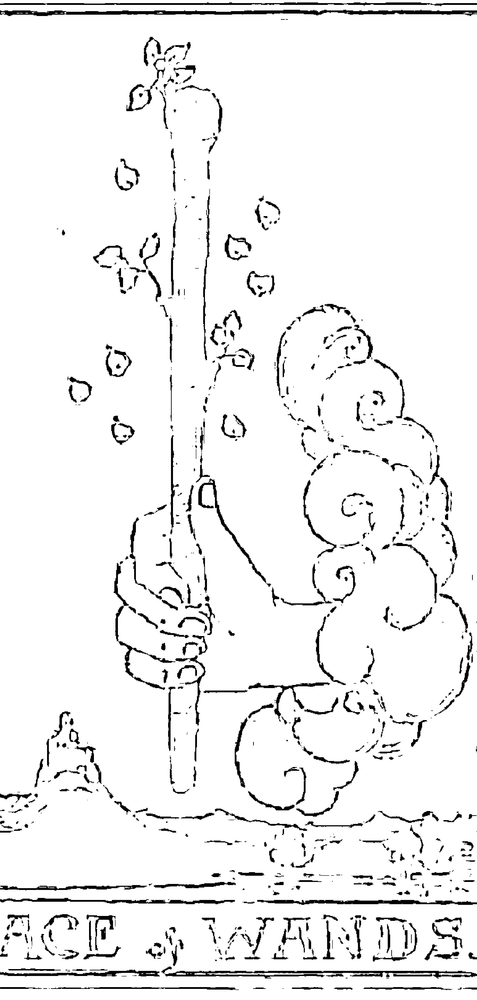

关键词：创造力、灵感、行动的开始、自信、激情、勇气

牌面解读：权杖首牌象征着一个强而有力的开始，画面中一只有力的手握着已萌发枝叶的树枝从云端伸出。整幅画面色彩庄重，象征勃勃生机。这种勃勃生机反映了权杖牌组面对各种日常事物的活力与热情，在目标与挑战中成长，并以其内心的狂热追求潜在的胜利。

### 正位牌义

1.  蕴涵创造力。
2.  重大事件的开端。
3.  新发明的诞生。
4.  开始一段冒险的旅程。
5.  新的机会出现，实现梦想的好时机。

### 逆位牌义

1.  采取新行动而且失败的可能性比较大。
2.  事情的开端形势不佳。
3.  遭到失败。
4.  前途茫然，事情发展不见曙光。
5.  为感情而心痛。
6.  错误的开端，停滞不前。

## 外滩特辑18

## 权杖二

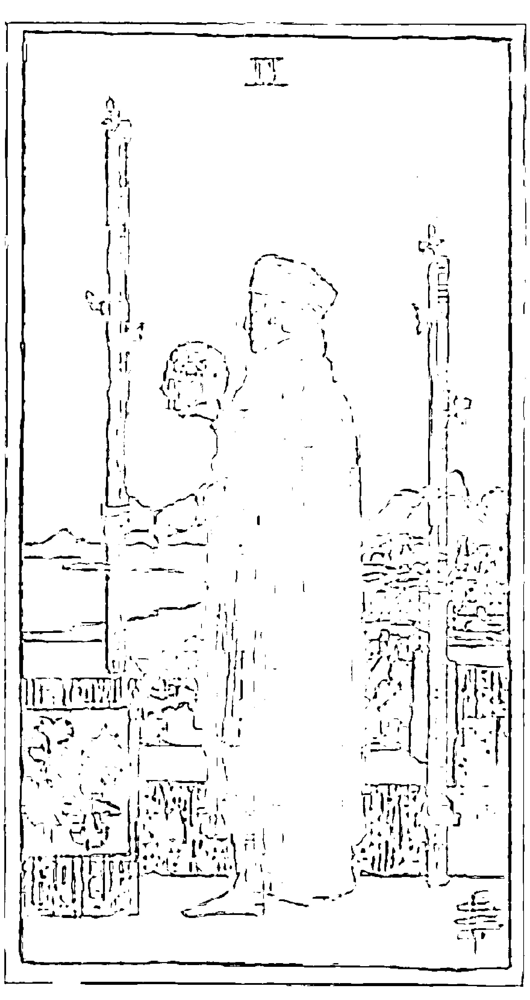

-   掌握
-   决定
-   勇气
-   个人魅力
-   创新

画面中健康、年轻的小伙子与远处美丽的风景构成了生动的画面。四周茂密的树林与画面和谐统一。这张牌的出现，通常在提醒人们沟通的重要性，在统一的掌握中，合作才是达到目标的捷径。权杖二代表的是一种源于实践或者依靠自身修养而能够掌控全局的力量。个人魅力本身是一种生生不息的力量，令人积极向上，当它和勇气相搭配的时候，能给人一种新的精神状态，就能成就辉煌。

### 正位牌义

1.  拥有权力和威力，或拥有权力和威力的人。
2.  富有个人魅力。
3.  拥有勇气和创造力。
4.  训练，增强斗争与对抗的力量、主动竞争。

### 逆位牌义

1.  出现了意外事故。
2.  事情的进展遇到了麻烦。
3.  行动受到拘束。
4.  不要陶醉于权力的感觉而失去理智。
5.  矛盾、复杂、令人疲惫的人际斗争，因为各执己见而把事情搞得一团糟。

# 经典塔罗密码

## 权杖三

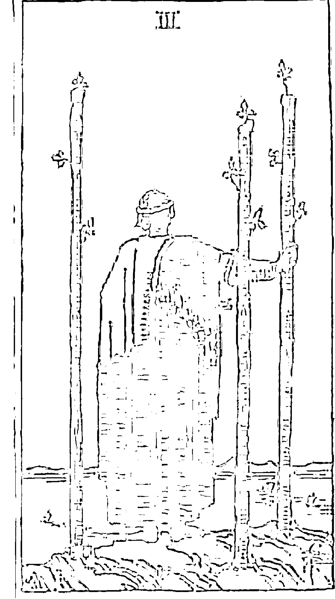

**关键词**：远见、领导、旅行、探险

**牌面解读**：画面中的这个男人不再年轻，显然是经历了很多沧桑。他目视远方，似乎是在寻找新的方向。权杖三通常指发自内心的动力，代表在你寻求自我内在意义的过程中，仍然可以保持沉静和稳定的心态，表示你一面在重视自身内在的成长，一面在维持一种平衡的状态。在这个过程中，耐心是非常重要的，因为在我们所处的环境中，已经有足够的能量来促进改变和成长，我们所需要的是一点对于成长的渴望。

### 正位牌义

1.  事业已经获得成功或者即将获得成功。
2.  与贸易有关的事务。
3.  与他人建立良好的合作关系，有助于事务发展。
4.  具有领导地位，或具有领导地位的人。
5.  成功的异地恋爱，拥有灵感、想法的集合并将实现，实用的知识，发自内心的动力。

### 逆位牌义

1.  事业发展不顺利甚至逆转，财运下降。
2.  整体局势不佳或者事情被迫终止。
3.  缺乏远见，计划不周。
4.  欠缺领导力，当事人刚愎自用，野心过度。
5.  项目、旅行等计划被延迟。
6.  环境的影响，心灵上的损耗。

## 权杖四

关键词：牌面解读

两位美丽的少女挥舞着鲜花，她们衣着华丽、年轻貌美。伸展的双臂似乎想要舞蹈，又像是想要拥抱这一切的美好。她们看起来生活得十分幸福，衣食无忧。她们可以悠闲自得地生活，生活显得十分美好。权杖四给人的感觉是正面的，积极向上的，会有一种安全感油然而生。因此，这是一张代表幸福的牌，表示你会有一个稳固的家庭或者优越的工作环境，欢乐与分享将是你生活的一部分。

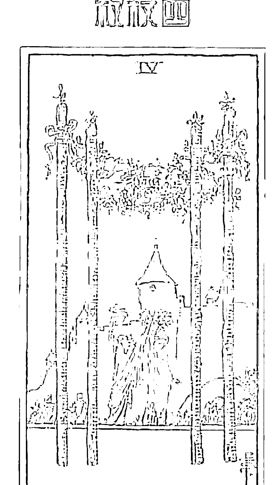

### 正位牌义

1.  和平繁荣的景象。
2.  悠闲的生活，紧张繁忙之后的小憩。
3.  浪漫而幸福的爱情，美满的家庭生活。
4.  关系稳固，与人交往越来越深。
5.  学业事业等基础牢固而扎实。
6.  代表庆功宴、婚礼或晚会等喜庆事件。
7.  发明、实践、未知的地方、迷惑、影响未来的决定。

### 逆位牌义

1.  打破平衡的状态。
2.  没有结果，不够稳定的恋情。
3.  不够确定，有点模糊。
4.  基础薄弱。
5.  人际关系差。

## 权杖五

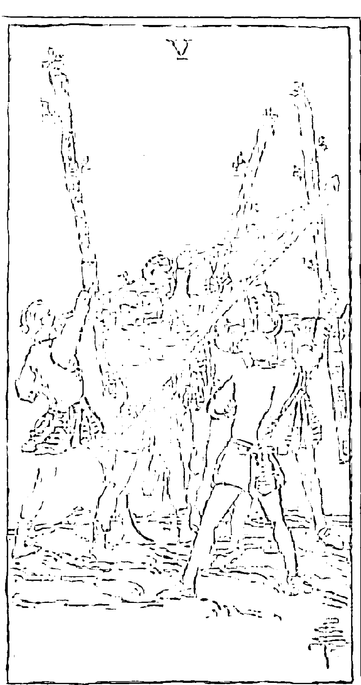

关键词：冲突、得不到满足、阻碍、竞争、争执、激战

牌面解读：权杖五的画面颜色看起来很压抑。画面中，青年男子们手握权杖正在打斗。这可以算是一幅令人无奈的画面。权杖五代表火的元素，这张牌表现出一种激烈的争斗。这张牌更多地表现了生活中必然存在的一种竞争状态，不仅是外在的，也代表内心的矛盾与冲突。

### 正位牌义

1.  将会发生激战或冲突。
2.  对方是强敌或将会出现强敌。
3.  充满斗志。
4.  面临抉择和挑战内心仍然难以抉择。
5.  竞争的良机。
6.  尽职尽责、克服障碍、充分准备、努力得到结果。

### 逆位牌义

1.  非公平的竞争、欺诈。
2.  状况混乱而复杂。
3.  受到纷争的困扰或牵连。
4.  可能会有诉讼发生。
5.  失去消息，缺乏帮助及支援。

## 权杖六

**关键词**：自信、胜利、获得、自豪、称赞

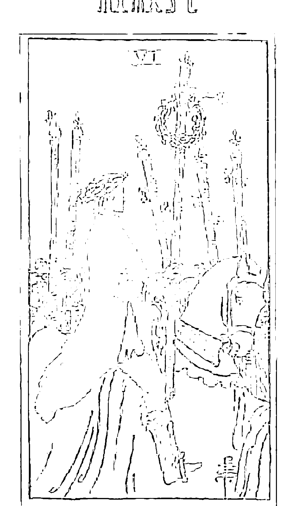

**牌面解读**：这是一幅充满生机的画面：一位年轻的小伙子身穿华丽的衣服，骑着骏马，眼睛望向远方，他似乎在幻想未来的生活。怒放的鲜花象征着生活的美好。权杖六表示要相信自己，并且用个人的能力去实现、完成自己的目标。如果你这样努力的话，必定会获得成功，就像辛勤耕耘就能得到收获一样。

### 正位牌义

1.  努力有了成果，得到回报。
2.  有捷报、喜讯传来。
3.  事情进展顺利，取得进步。
4.  感情有望水到渠成。
5.  能力出色，充满自信。
6.  一贯性，教育、培养得到回报。

### 逆位牌义

1.  失败。
2.  不诚实的交易。
3.  内部有敌人。
4.  骄傲自满，导致恶果。
5.  会有坏消息传来。
6.  经历失败后迟迟到来的成功。
7.  劳累，放任自流。

# 经典韦特塔罗

## 权杖七

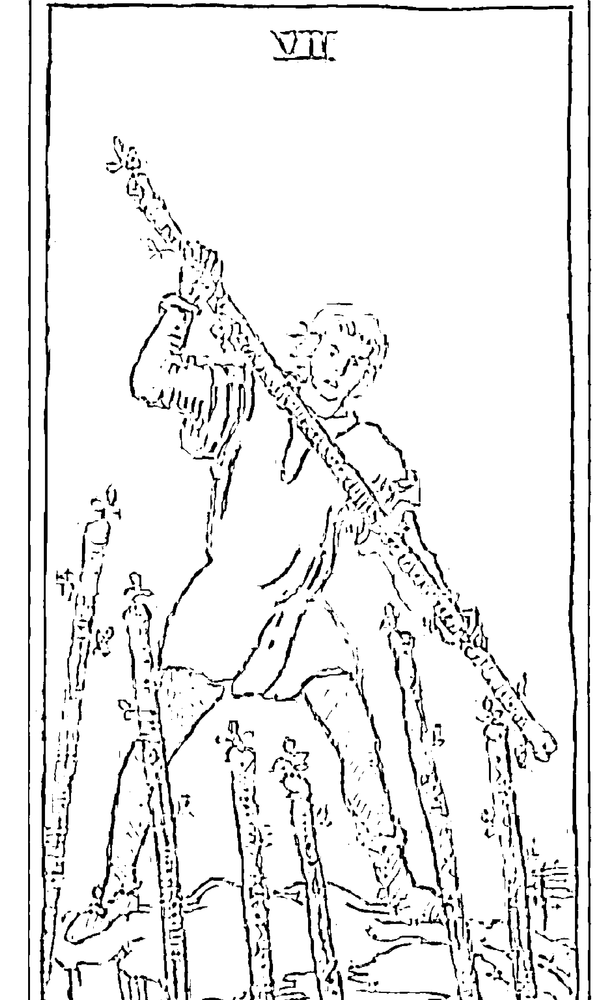

关键词：挑战、勇气、信心、进取、坚信

牌面解读：图中的男子费力地拿着权杖，整个画面以他的劳作情景为主。权杖七暗示通过坚持而获得成功。你虽然面临着巨大的挑战，但如果你继续努力向前，就一定能获得相应的回报。即使逆风而行，也不要轻易放弃，因为明媚的终点就在前方。

### 正位牌义

1.  战胜对手，获得成功。
2.  有利的立场，正义的立场。
3.  充满斗志，坚信成功。
4.  有勇气，在逆境中的力量，面对逆境不放弃；逆境即将结束。

### 逆位牌义

1.  对自己的能力产生怀疑。
2.  受到失败情绪的困扰。
3.  感到困惑，无法对事物进行判断。
4.  冲突、焦虑、困窘。

## 小阿卡那

## 权杖八

关键词：快速、消息、结局、急剧的变化

牌面解读：图中的权杖是画面的全部，给人鲜明的目标感。权杖八意味着目标清晰可见，以往的努力已经显露出你应得的成果，收获的时刻已经来到了。但是，如果你不付出劳动，那么之前的劳动也将付诸东流。只要再付出一点儿，你就可以得到应得的成功，享受丰盛的果实。

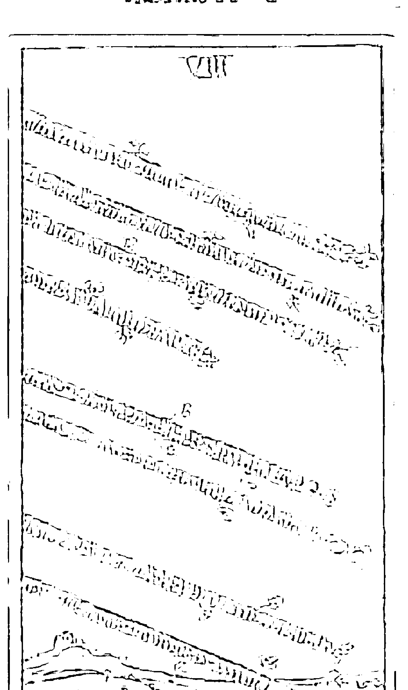

### 正位牌义

1.  尽快行动。
2.  不妨作一个旅行计划。
3.  果断地下决定，马上开始行动。
4.  一鼓作气，勇往直前。
5.  得到某些很重要的信息，需要仔细思量考虑。

### 逆位牌义

1.  有争论发生。
2.  家庭出现矛盾，不和睦。
3.  行动不够迅速，进展迟滞。
4.  一蹶不振。
5.  缺乏防范，睡眠不足。

## 权杖九

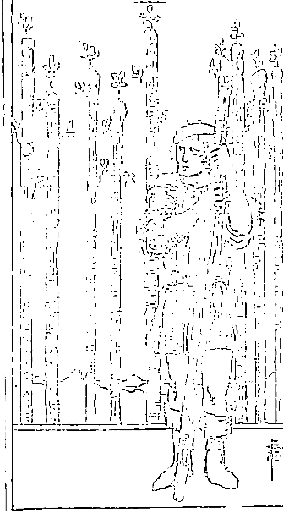

关键词：谨慎、防御、固执、毅力、坚定

牌面解读：健壮的小伙子手拄权杖，警惕地注视着周围的一切。权杖九意味着情况会有些暧昧不清，最好再观望一段时间。你可能把自己不受欢迎、不被接受的部分强加给别人了，这样会让人喘不过气来，朋友就会离你而去，人们也会对你采取防御的姿态。

### 正位牌义

1.  要作好充足的准备，应付困难的来临。
2.  在气势上压倒敌人而获胜。
3.  隐藏实力，蓄势待发。
4.  身边出现看不见的敌人。
5.  僵持，需要观望的情况。

### 逆位牌义

1.  遭遇逆境。
2.  气势衰弱，斗志低落。
3.  身体不健康。
4.  运气不太好。
5.  必须克服阻碍，要做的事情被延迟。

## 权杖十

关键词：忍耐、责任过重、压力大、抗争

### 牌面解读

十根权杖带来了巨大的压力，这张牌暗示肩上承受着巨大压力，但是无法对别人诉说。你想获得自由，想轻松地享受生活，然而，蓦然回首，你却发现自己背负了太多的责任，很明显这种状况已经超出了你能处理的范围。

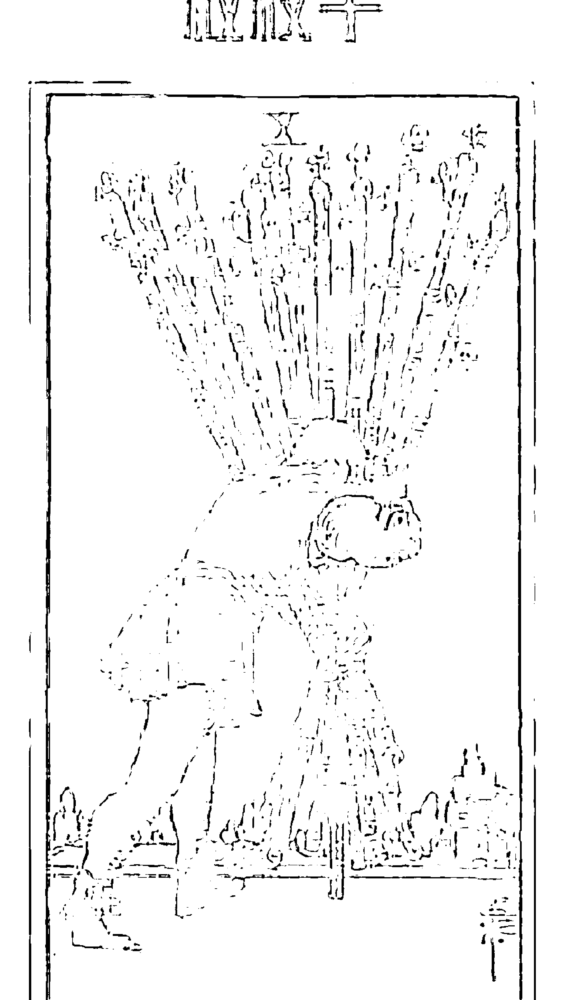

### 正位牌义

1.  信念强烈，非常具有责任感，付出许多努力。
2.  由于不懂拒绝而导致负担过重。
3.  感到有压力，情绪不安。
4.  过度的疲惫和劳累。
5.  因为获得成功而感到很大的压力。
6.  压迫感，为达目的而甘愿承受苦难。

### 逆位牌义

1.  遇到难以承受的压力，快要崩溃。
2.  无法继续承担，最终选择放下。
3.  有些许损失。
4.  逃避责任，逃避别人的言论。
5.  不诚实，搬弄是非。
6.  背叛、推脱责任，不变通的话就无法脱离困境。

## 权杖侍从

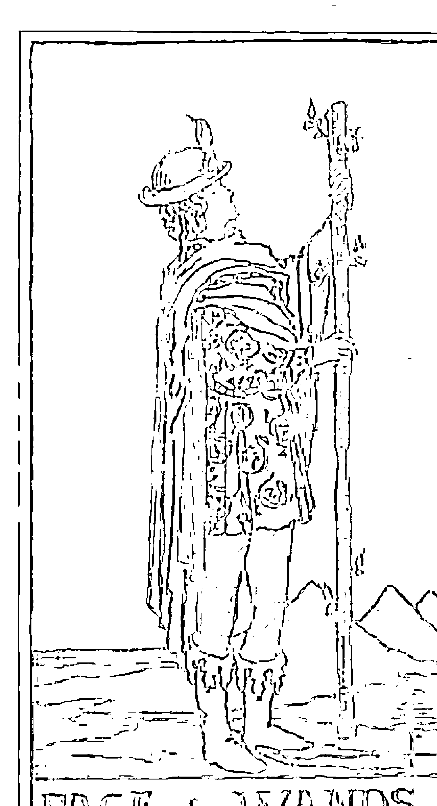

**关键词**：自信、认真、一个美好的开始

**牌面解读**：风光秀美的山顶上，一个羞涩的少年穿着鲜艳的衣服，手持一根权杖。这张牌的出现代表不论做什么事，都将有一个良好的开端。权杖侍从意味着一个崭新的人生即将开始。侍从牌也可以象征通过信件或其他媒介带来的新消息，但通常是暗示一项新计划或新的人生方向的开始。

### 正位牌义

1.  代表一个诚实的人。
2.  有好的情形出现，有好消息传来。
3.  优秀的助手或辅佐人员。
4.  值得参考的资讯。
5.  专心致志，可信任的朋友，新的灵感及合作关系，带来重要消息的人，新的挑战。

### 逆位牌义

1.  传来坏消息。
2.  祸从口出。
3.  不安定的状态，令人担忧和困惑。
4.  缺乏成熟的思考和决断的能力。
5.  傲慢；小阻碍，思考太多而行动不足，优柔寡断。

## 权杖骑士

关键词：忍耐、责任过重、压力大、抗争

牌面解读：权杖骑士优雅地骑着骏马，悠闲地漫步。他手握权杖，脸上写满了对人生的信心。由于过于自信，甚至露出骄傲的神情。权杖骑士代表火元素，可以象征行动、旅行、改变，以及为了自身缘故的活动。他给人一种活力、热情及运动的印象，但因为太过志得意满，难免会有一些负面意义。

### 正位牌义

1.  事业顺利，获得晋升。
2.  开始新的旅程，人生将出现新的转机，对新事物进行挑战。
3.  脾气暴躁，缺少谋略。
4.  有进入新领域的愿望，有进取心却性情暴躁。

### 逆位牌义

1.  令人措手不及的突发事件。
2.  事情的进展被中断。
3.  喧哗吵闹的场面。
4.  意见产生分歧。
5.  感情破裂，分居或分离，无法和谐共处；猝然改变，关系中断。

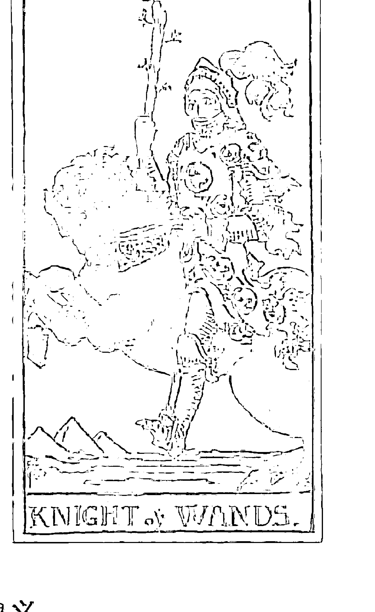

## 权杖王后

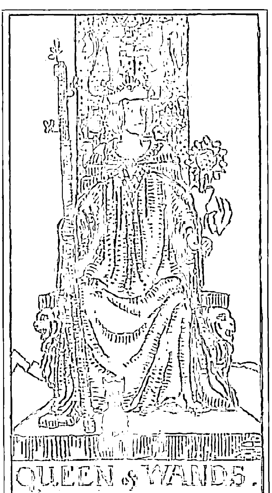

**关键词**：热情、有魅力、开朗

**牌面解读**：权杖王后穿着华丽的衣服，右手持象征地位的权杖，左手拿鲜花。权杖王后代表水元素，通过感情、情绪以及直觉处理事情。她和力量牌都以狮子座为代表，代表既坚强又直率的个性，做事比较感性，喜欢凭感觉处理问题，运用内在的力量达成目标。

### 正位牌义

1.  出现值得信赖的女性或女性工作者。
2.  精力充沛，热情而温暖。
3.  内心很独立自主或者地位很独立。
4.  有决心，有能力。
5.  叛逆，从事变革的工作。
6.  精神世界丰富的人，有时感性强于理性。

### 逆位牌义

1.  情绪化，心理易波动，不稳定。
2.  傲慢。
3.  会出现阻碍，难以发展。
4.  嫉妒，被忽视，缺乏回应。

## 权杖国王

### 关键词

-   坚强
-   领导者
-   能力超强
-   有魅力
-   自信

### 牌面解读

权杖国王代表一个开国者与建立者，他虽然坐在宝座上，但看上去似乎随时准备站起来去实行他的计划，说明他有着很强的行动力。权杖国王这张牌暗示着因自律自信而获得成功，能够通过意志力来领导及统御别人。对自己有坚定的信心，因为这种自信建立在经验之上。诚实、积极而坦率，愿意接受新的挑战，认为过程比结果更重要。

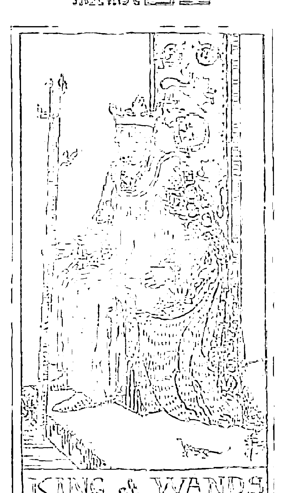

### 正位牌义

1.  有教养，有学识。
2.  是位优秀的父亲。
3.  精明，判断常常是正确的。
4.  诚实而有良知，善良，有高尚的道德品质。
5.  与成熟的男性有良好的关系。

### 逆位牌义

1.  太过严格，苛求。
2.  独断专行。
3.  态度过于傲慢。
4.  过于在乎颜面而导致些许失败。
5.  过分简朴，思想极端。

# 经典塔罗牌

## 圣杯首牌

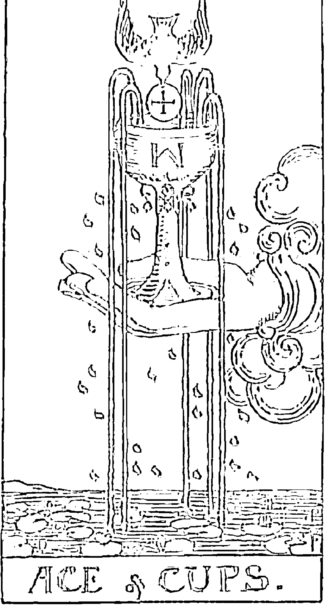

关键词：喜悦、满足、丰盈的爱、情感作用、亲密

牌面解读：从云中伸出的手，托着一只金色的圣杯，一只白鸽正飞向圣杯。圣杯首牌意味着情感的获得和满足。这张牌代表一个新的开始，暗示生活当中存在着快乐、爱和喜悦的机会。它可能意味着你要进入一段情感满足的时期，你将在生命的核心中发现真正持久的东西。

### 正位牌义

1.  大胆追求美好生活。
2.  有婚庆之喜。
3.  心中充满幸福感。
4.  一切顺利。
5.  出生；精神的永恒之源；满足、欢喜、丰富、美好的前景。

### 逆位牌义

1.  必须改掉虚伪的毛病。
2.  对求爱者毫无感觉。
3.  一场单相思，要尽量摆脱。
4.  喜悦中带着隐忧。
5.  改变不稳定、没有回应的爱。

## 圣杯二

-   平等
-   珍惜
-   真爱
-   意识到
-   吸引力
-   寻求信任

牌面解读：画面中的少男少女似乎正在愉快地交流着，神情愉悦。圣杯二与爱情具有很大关联，提醒你去珍惜现在拥有的感情。当你拥有爱情时，请宽容地对待你身边的那个人，即使有一天要分离，心里也要有感激，至少你们曾经相遇过。这张牌不只局限于男女情感，也可以涉及友谊或各种人际关系。

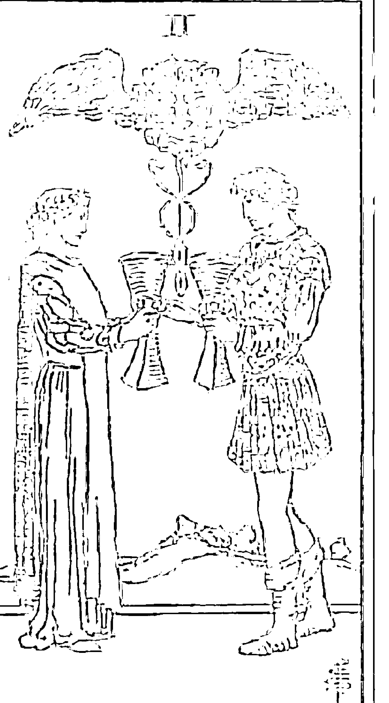

### 正位牌义

1.  有火一样的热情。
2.  美好的友谊。
3.  求问者或身边的朋友有婚庆之喜。
4.  方方面面的关系都很和谐。
5.  情侣或朋友之间相互了解、相互尊重、彼此善待。

### 逆位牌义

1.  情侣或朋友之间互相猜忌。
2.  求问者或周围的朋友可能即将面临离婚。
3.  各方面的关系比较对立。
4.  爱无法得到满足。
5.  误解，失去方向。

## 圣杯三

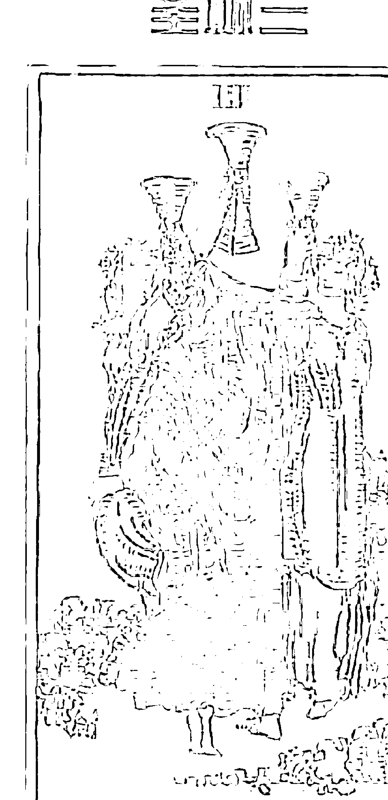

关键词：喜悦、丰收、享受庆祝、感受繁华、友谊

牌面解读：画中的女子身穿华服，三人载歌载舞，正共同举起各自的圣杯庆祝。圣杯三通常表示以感情作为关联的团体，是带来祝福的圣杯，杯子里满盛着各种各样的想法，带着喜悦的心情，一起干杯。另外，这张牌也代表一种欢庆的场合，其丰收的含义通常代表事情有了好的结果。

### 正位牌义

1.  该事情会得到解决。
2.  需要作一项决定。
3.  幸福的婚姻。
4.  生活重新开始。
5.  矛盾的关系化解了。
6.  伤痛已经痊愈。

### 逆位牌义

1.  事情做过头了。
2.  乐极生悲。
3.  快乐也伴随着痛苦。
4.  不好的饮食习惯。
5.  做事情拖拉，不干脆。

## 圣杯四

关键词：不满、冷漠、沉思、观望、选择、沉浸自我

牌面解读：美丽的少女坐在一边，好像在思考着什么。她好像很为难，不知该怎么选择，一脸的愁容。也许她遇到了让她两难的事情，她还没有想好怎样去平衡。你的生命中肯定出现过这样的情况，你必须懂得合理地安排。

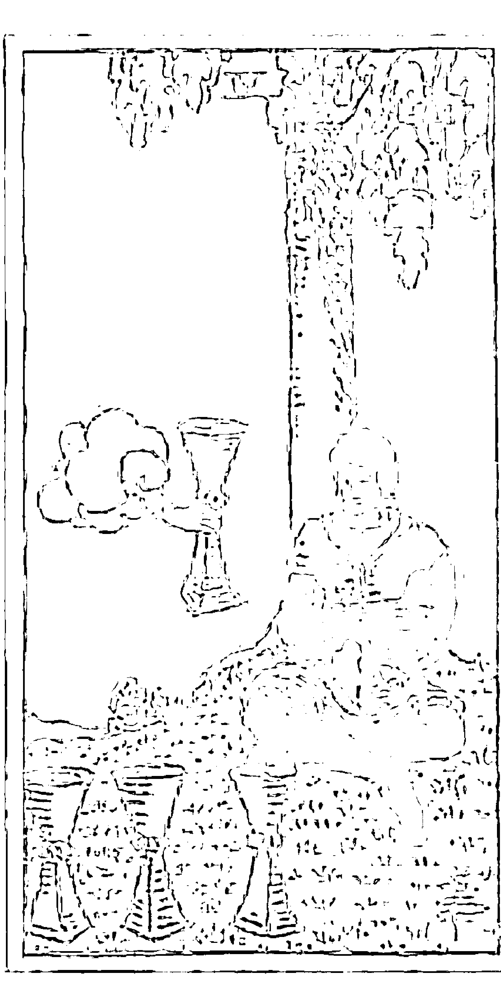

### 正位牌义

1.  总感到寂寞无聊，需要找到一件自认为有意义的事情来做。
2.  身心俱疲，需要调节或休息。
3.  失望的心情出现或持续，对生活没有信心。
4.  对什么都不感兴趣，觉得生活没有意义；面临选择。
5.  珍爱的东西：保持，恢复，重逢。

### 逆位牌义

1.  有新的人际关系，生活出现另一种局面。
2.  发现新方法，出现新机会。
3.  脱离低潮期。
4.  新鲜事，新的关系。

## 圣杯五

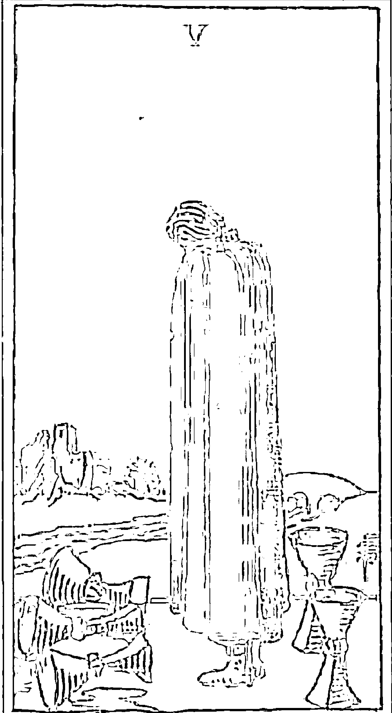

**关键词**：悲观、遗憾、毫无发展、亏损、丧亡

**牌面解读**：本来完好的圣杯，却被打翻了。圣杯中的东西也都没有了，唾手可得的幸福与成功也因此失之交臂。圣杯五代表的是一种悲伤痛苦的心态，眼看着身边的幸福在一瞬间消失无踪，即将到达的成功彼岸忽然又如此的遥不可及，心中的悲痛和遗憾可想而知。珍惜仍然拥有的，重新开始，否则生活会永远这么痛苦下去。

### 正位牌义

- 被后悔的情绪淹没，生活在一种无望的痛苦当中。
- 局部受到损害导致怀疑自己整体的正确性。
- 有缺陷。
- 无意义的交际。
- 深深的幻灭感，开始怀疑生活和人生的意义。
- 出现少许错误，有物质上的损失，美中不足。

### 逆位牌义

- 老朋友回来了，往日的美好会重新回到生活中。
- 旧缘分得到重续，夫妻破镜重圆。
- 东山再起，重拾生活的信心。
- 结成新的同盟。
- 快活，满足，继承，庆祝，成就，胜利。

## 圣杯六

**关键词**：纯洁、安定、善意、孩提、清白

画面的主要位置，是一个可爱的男孩和一个女孩，显示出一种美好与和谐。圣杯六除了代表对往事的温馨回忆和思乡情怀之外，也能提醒求问者，回忆毕竟是过去的事情了，生活的路还很长，要迎接将来的幸福，现在就应该开始努力。

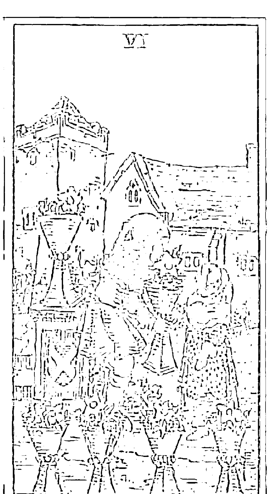

### 正位牌义

- 陷入回忆之中，难以自拔。
- 幼时的体验刻骨铭心，影响到现在的情绪及行为。
- 虽然分手，但两人仍然可以再见。
- 多愁善感，情绪不稳。
- 无法消散的乡愁。
- 结合；快乐的未来：爱情，热情，友情。

### 逆位牌义

- 好运即将到来，需要在奋斗中等待。
- 比过去更关心未来。
- 开始有长远的打算，能够高瞻远瞩地过日子，努力为事业奋斗。
- 把过去的回忆作为将来努力的动力。

## 圣杯七

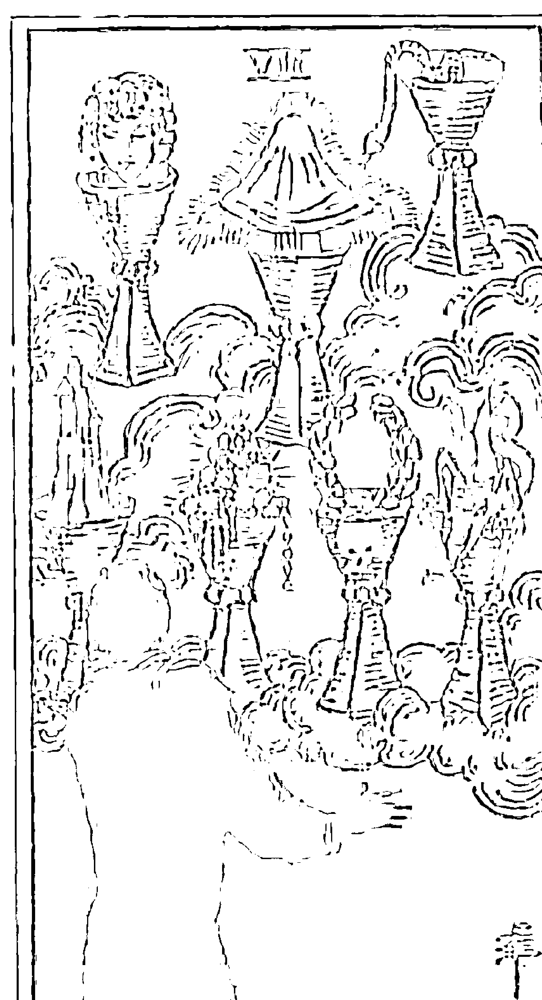

**关键词**：幻想、欲望、浪费、选择、无法实现的梦想

**牌面解读**：画中的人紧闭双眼，似乎在幻想得到整个世界，圣杯中盛有珠宝、谷物等物品，它们代表着构成物质世界的各个方面。圣杯七代表着一种无序的混乱，什么都想得到，这种贪欲本是人类的本性，但也是无法实现的梦想。这张牌的出现表示你必须马上调整生活状态，否则过分的贪心会变成有害的放纵、沉溺和颓废。

### 正位牌义

- 对生活不现实的态度。
- 反复无常，出尔反尔。
- 不切实际，只会幻想成功。
- 爱做白日梦。
- 多种选择的机会，放弃自己过多的欲望。

### 逆位牌义

- 下定决心，有决断力。
- 有坚强的意志，经得起艰难困苦的考验。
- 近期将有机会实现目标。
- 明智的选择。
- 不再优柔寡断，突破保守的限制。

## 小阿卡那

## 圣杯八

**关键词**：追寻、新的选择、内涵、厌倦、继续

**牌面解读**：画面中的人正在前行，他的神情没有委顿和踌躇，他对自己的选择很满意，同时也对前路充满期望。圣杯八表示应该认知你的内在追求。这是一张代表自我发现、心灵成长的牌。对行动有所思考能帮助你将经验转变为智慧，这会使你更靠近理性思考。试着探索自己的内心。

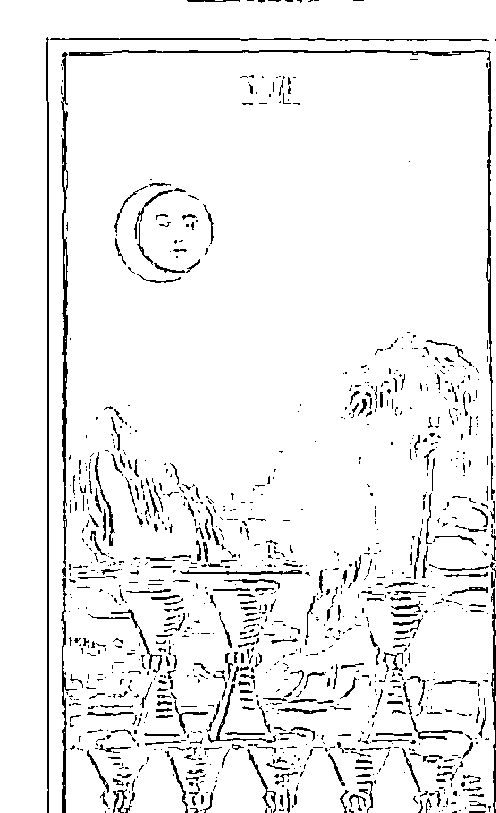

### 正位牌义

- 半途而废，没有毅力和耐心。
- 好奇心极重，严重的疑心病。
- 衰弱，失去力气。
- 理智的爱，不再盲目追求。
- 停止努力。
- 深思之后的理智选择。

### 逆位牌义

- 新的恋情即将降临，生活出现转机。
- 喜庆之事不断。
- 将有舞会或宴会之类的邀请。
- 正在努力奋斗。
- 幻想，欲望，不实际的想法。

# 经典韦特塔罗

## 圣杯九

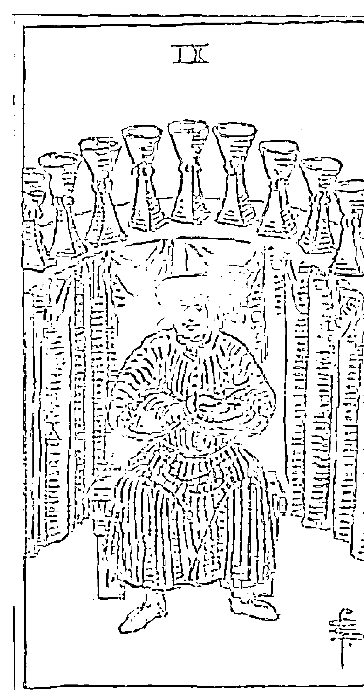

**关键词**：梦想成真、快乐、满意、实现理想、感官愉悦

**牌面解读**：图中的人端坐在画面的正中，身后摆放着九只圣杯。圣杯九这张牌充满强劲的生命力，预示梦想在现实中的去向，是一张可以招来好运气的幸运牌。出现这张牌的时候，就预示着你有可能得到希望拥有的东西。

### 正位牌义

- 物质生活很富足。
- 内心充满幸福。
- 形势有利，乘胜追击。
- 有潜力，有希望。
- 获得成功。

### 逆位牌义

- 物质上有一定损失。
- 生活中容易犯错误。
- 不懂得节制，体力开始衰弱。
- 虎头蛇尾，有始无终。
- 拒绝或缺少他人的帮助，心灰意懒，孤单。

## 小阿卡那牌

## 圣杯十

**关键词**：保障、安全、愉悦、欢乐、家庭、和平

**牌面解读**：画面中的男人紧紧地拥着女人，十只圣杯如彩虹般排列在图画的上方，孩子们在嬉戏，他们身边的圣杯实指的是个人的成熟与满足，表现的是人际关系中的快乐与和谐。如果在很长一段时间内有人际冲突，那么拿到这张牌就表示和解指日可待。这张牌也代表了保障和安全。

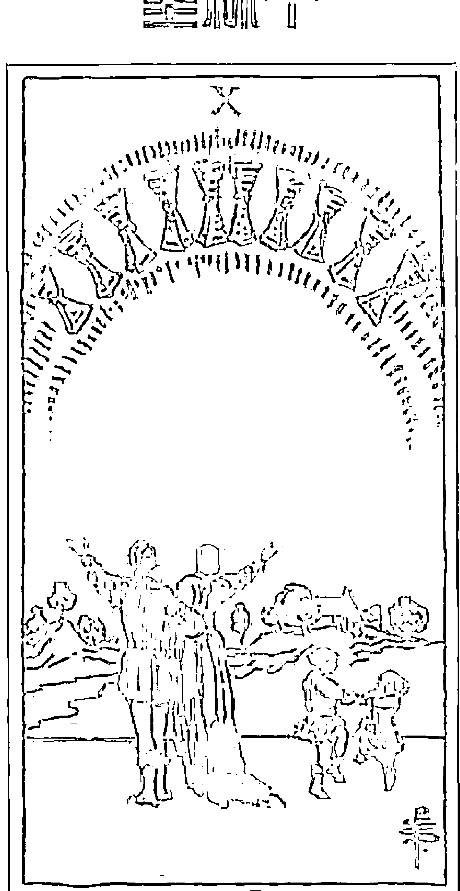

### 正位牌义

- 内心平和，情绪良好。
- 认为目前的幸福是实实在在的，感到知足。
- 家庭美满，工作环境良好，人际关系融洽。
- 满足的爱，身心愉悦。
- 慷慨，幸福，安心。

### 逆位牌义

- 内心感到不安，情绪忐忑。
- 失去友情，失去事业上的得力伙伴。
- 有家庭暴力发生。
- 人际关系不和，对立。
- 过于依赖，安于现状。

## 圣杯侍从

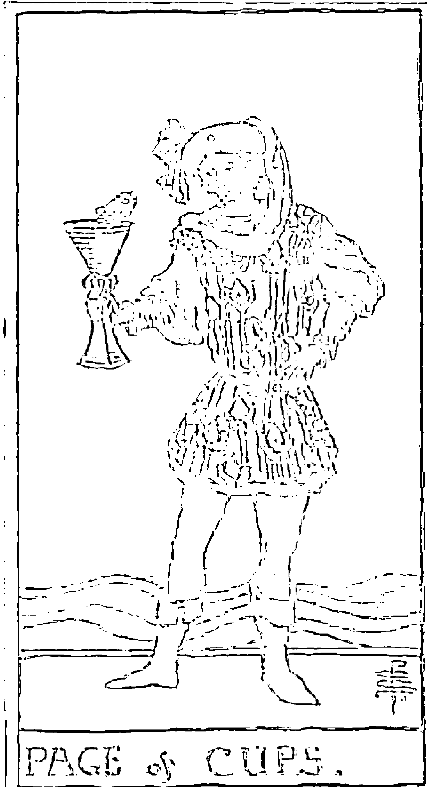

**关键词**：柔弱、情窦初开、直觉、情绪、亲密、爱

**牌面解读**：一个年轻男子手持圣杯，低头露出浅浅的微笑。他在想什么？圣杯侍从这张牌意味着情感上的成长，表示透过冥想或其他任何类似的被动方式来进行心灵上的学习或发展。圣杯侍从看上去像个柔弱纤细的少年，代表着善于思考的年轻人，好学和沉稳使他得到人们的信赖。

### 正位牌义

- 喜欢冥想，在冥想中想象并感受现实中缺少的幸福。
- 将有好消息传来。
- 辛勤努力。
- 人缘好，身边的朋友很热心。
- 做事情深思熟虑。

### 逆位牌义

- 身边有阿谀奉承的小人。
- 心灵手巧。
- 应该学会独自一人排遣不良情绪。
- 脱离控制。
- 出轨、分心、诱惑。

## 圣杯骑士

**关键词**：体贴、有魅力的男子、情感、浪漫、直觉

**牌面解读**：英俊的骑士手持圣杯，骑着骏马，茂林和远山都成为了他的背景。他面带浅浅的笑容、瘦削刚毅的脸庞散发出男性的魅力。这张牌如果代表的是一个人的话，则是温柔、体贴和感性的，通常内心温和敏感，各种人际关系、情感和创造力的追求都会吸引他。

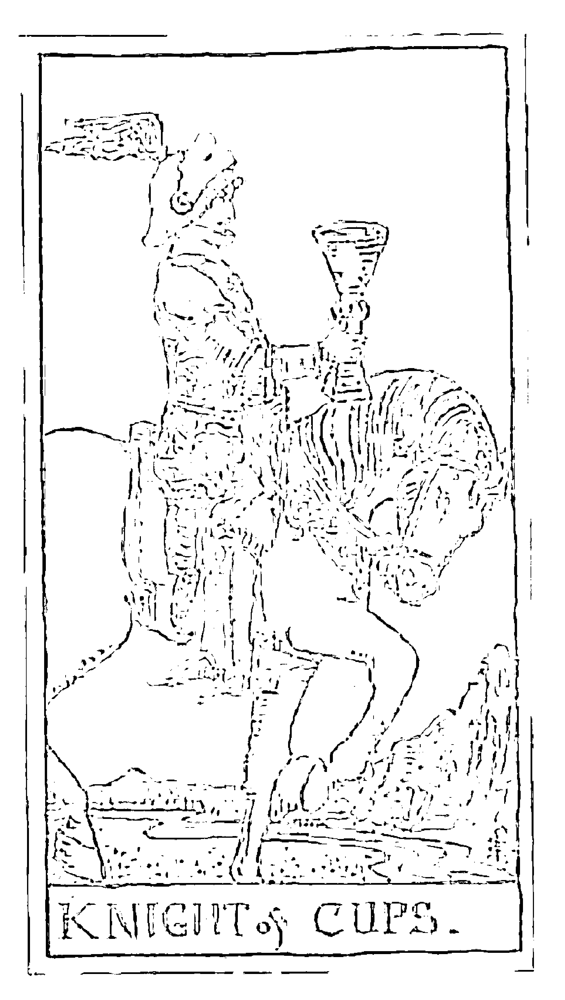

### 正位牌义

- 新的机会在慢慢靠近，生活正在发生变化。
- 计划，提交预案。
- 身边到处是诱惑却毫无感觉。
- 放松；增进情感的行为；深思熟虑的人。

### 逆位牌义

- 小心身边的人，处境危险。
- 谨防被欺诈。
- 行为不端，需要检讨自己。
- 生活不够检点。
- 得到坏消息；优柔寡断，停滞不前。

## 圣杯王后

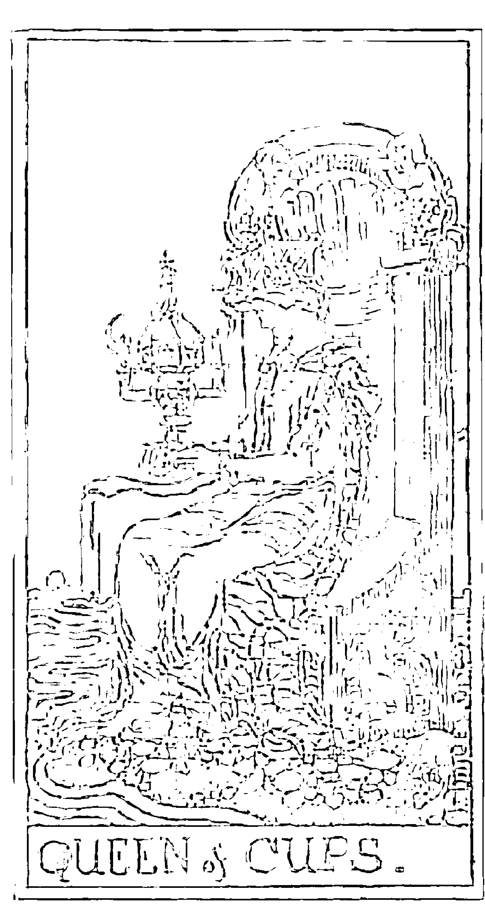

**关键词**：仁慈、直觉、倾听、爱意、善良、感应

**牌面解读**：高贵的王后，目光温柔地注视着她手中象征丰盈的圣杯，穿着端庄的长袍，散发着成熟女人的韵味。圣杯王后意味着凭借直觉而成功，她从经验得知杂乱无章的想象所产生的结果通常是有限的，因此她应该将精力用在对身体、情感、精神以及心灵都很有价值的行动上。创造力显示出的成就就是她最大的骄傲。

### 正位牌义

- 感情丰富而细腻，容易多愁善感；压抑情绪。
- 愿意为爱献身，陷入爱河。
- 善良，公正。
- 成功就在眼前，坚持奋斗。
- 幸福的生活。
- 女性朋友，心中所想的女性；倾听，准确的直觉。

### 逆位牌义

- 无法信赖身边的人，尴尬的环境会困住你。
- 注意别人身心的独立性，不要强求别人，给别人足够的空间。
- 尝试改变性情使你面临困难。
- 品行不够端正。

## 小阿卡那

## 圣杯国王

**关键词**：宽宏、亲切、明智、胸怀宽广、人道、平静、圆滑老练

**牌面解读**：手握大权的国王端坐在宝座上，他右手握着圣杯，充满自信地望着前方。看着国王仁慈的面庞，人们不禁开始忏悔自己的所作所为。圣杯国王暗示通过创造和情感上的训练而获得成功。他对任何需要创造力的领域都很在行，例如艺术、建筑、音乐等。圣杯国王也适合从事心理学、考古学、哲学或宗教信仰的研究。在现实的事业中，他可能成绩中等，表现也不是最出众的，但他从未放弃对创意的追寻。

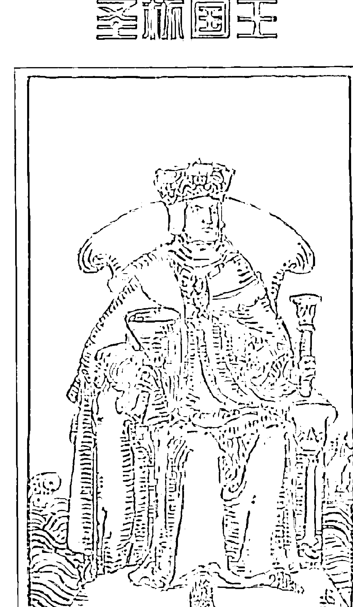

### 正位牌义

- 见多识广，令人尊敬。
- 某方面的专家，在某方面有突出的作为。
- 有创造力，有创新意识。
- 公正而值得信赖的人。

### 逆位牌义

- 表里不一，令人厌恶。
- 行为不端，缺乏道德，在追逐名利上不择手段。
- 即将遭受一些损失。
- 不诚实，不公正；狡猾。

# 经典塔罗牌解

## 宝剑首牌

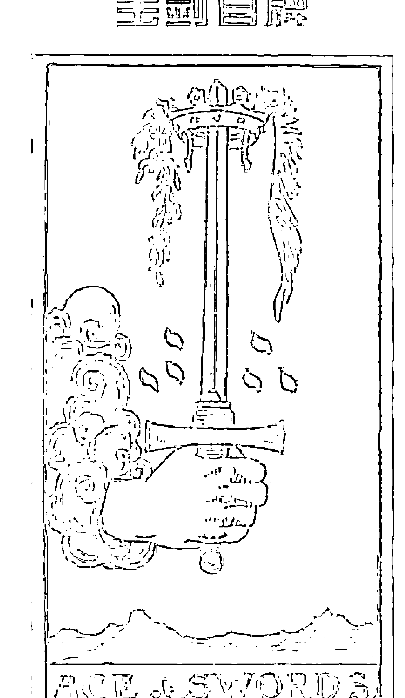

**关键词**：新的冒险、挑战、公正、智力、坚忍、真相

**牌面解读**：不知从何处伸出的手，用利剑挑起皇冠，像是在向世人挑战，但似乎又有许多顾虑，因此画面并未充斥着挑衅。宝剑首牌代表开始或正计划着一项冒险，暗示你的心智可以看透物质世界，直达事物的精神层面，看穿思想在物质世界中造成的结果，你必须谨慎地估计采取行动可能产生的任何后果。这张牌出现的时候，你应该开始反思自己是否有过激的表现。

### 正位牌义

- 表示具有强烈的进取心与攻击性。
- 接受挑战时胜利的可能性比较大，结果更积极一些。
- 需要手术，经过治疗可以治愈疾病。
- 否极泰来，逢凶化吉。
- 有过人的力量，取得使自己惊讶的成果。
- 敏锐的理解力，成功，能量的释放，创造力，构思，果断，开始。

### 逆位牌义

- 容易引起麻烦，有争端。
- 拼搏奋斗的过程中出现很多障碍。
- 因逞强而招来灾难。
- 挑战失败的可能性较大，结果比较消极。
- 受到外伤，住院。
- 暴力，自我毁灭；有阻碍。

## 小闲占卜

## 宝剑二

**关键词**：僵局、逃避、压抑、选择、避免

**牌面解读**：一位美丽的少女背对大海而坐，双手握剑，似乎有很多愁苦。她看上去很封闭自己，所有的苦恼都由自己承担，不愿对别人倾诉。宝剑二暗示求问者有一颗比较封闭的心灵，对待万事万物都持有消极的心态。但是，事情已经陷入了僵局，逃避并不是办法，应该去勇敢面对，作出选择。这张牌还有一个意义，它暗示任务即将成功完成。

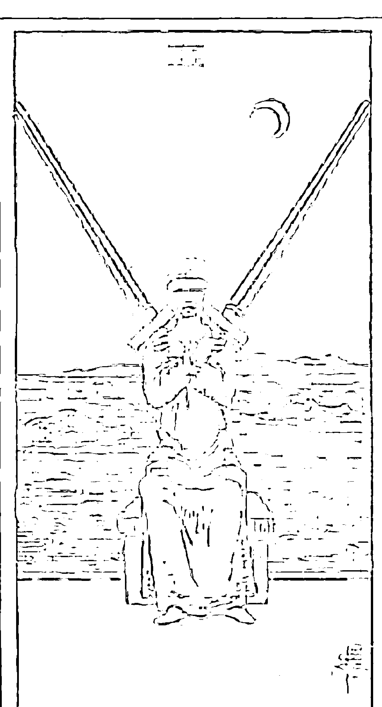

### 正位牌义

- 有协调能力，能全身心去完成一件事。
- 有钢铁般的意志，不轻易改变。
- 与同事或竞争对手互相残杀。
- 一直不认输的事情已经放弃或即将结束。
- 合作，勇于面临新的工作；相称，有帮助的环境。

### 逆位牌义

- 代表求问者能作出正确的决定；打破僵局，结束紧张，停止抗拒。
- 表里不一，双重人格。
- 不要损害朋友利益，注意保护友谊。
- 见好就收，急流勇退。
- 口是心非，貌合神离。

## 宝剑三

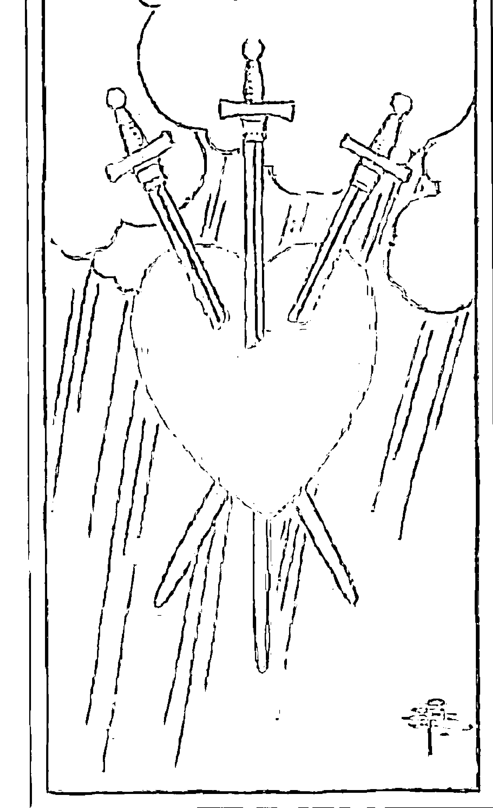

**关键词**：伤心、灾难、悲惨的结局、辜负、寂寞

**牌面解读**：大地的生机已被悄然带走，剩下的是一片荒芜。宝剑三意味着另一个开始之前某种状况的结束。这张牌描绘的是一个不幸的情景，暗示在某种情况下，一切已到了最低潮的时期，但尾随艰难而来的将会是新的以及更好的事物。通常这种低潮到来的时候，你应该设法抓住那些你平日所丢失的事物和态度，这时所需要学习的是屈从并且容许改变发生。

### 正位牌义

- 最近经常有口角发生。
- 离散，准备分手。
- 生活中出现了严重的对立。
- 伤心，失意的眼泪。
- 无法减轻痛苦的泪水，坏消息，不幸；新的开端。

### 逆位牌义

- 心理上一直处于封闭状态，不愿接纳任何事物。
- 一直让周围的人伤心。
- 小心会有大的损失。
- 不安的感觉越来越重。
- 短期的获利，暂时的成功。

## 宝剑四

**关键词**：休整、沉思、预备、纠缠不清

**牌面解读**：图中的人如雕塑般躺在床上，他的上方悬着三把宝剑，左侧平放着一把，他双手抬起，似乎进入了一种冥想状态。只有经过休整和思考之后，才能够以清醒的头脑和心态来解决各种问题。宝剑四出现的时候，通常代表求问者正处于一种休息状态，或是需要放慢步伐，好好休息一番，然后重新出发。这张牌也可以提醒求问者摆脱那些让自己心烦的事情。

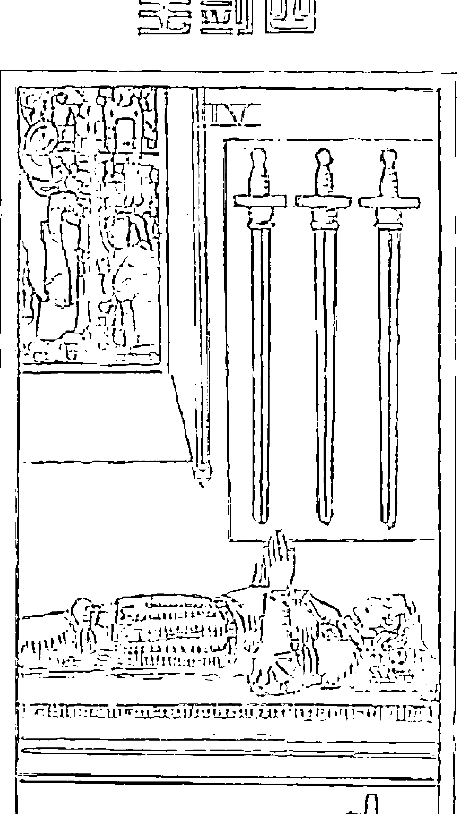

### 正位牌义

- 需要静养一段时间。
- 凡事要学会作暂时性的让步。
- 以退为进。
- 休息，一段不去思考或争斗的时间；撤退。

### 逆位牌义

- 要常常提醒自己切勿急躁，凡事要宽容对待。
- 通常能在较短的时间内休息妥当，重新投入生活。
- 注意检讨自己。
- 杂乱、忙碌、焦虑。

## 宝剑五

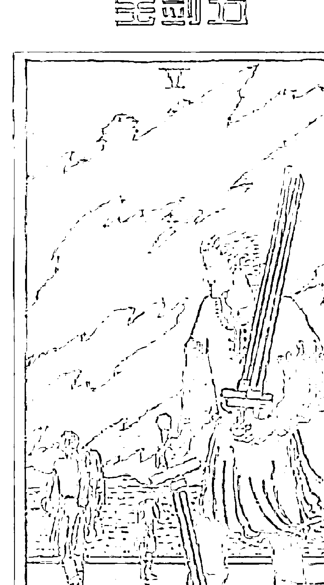

**关键词**：不和、混乱的景象、恶化、暂时的胜利

**牌面解读**：图中的战士怀抱两把利剑，正回头望向他的同伴，纷争会使事态越来越恶化，受到伤害的人将会对你失去信心，为了暂时的胜利而失去更多的东西，这是不值得的。这张牌提醒求问者不要一味地追求胜利而忽略了其真正的意义，应该在奋斗的过程中，找到利人利己的方法。

### 正位牌义

- 不要目光短浅，不要忘掉努力的最终目的。
- 小心四周对你怀有敌意的人。
- 有辞职或免职的危险。
- 堕落，脱离正轨。
- 对人际关系产生迷惑。

### 逆位牌义

- 从自私的行为中解脱出来，停止无谓的争执。
- 无法预测。
- 朋友中将有人发生不幸。
- 不好的消息。
- 放弃；争论；可疑的建议。

## 小阿卡那

## 宝剑六

**关键词**：旅行、前往解决、尝试、忧郁、恢复

**牌面解读**：画面中的男子正在河上划船，船头宝剑如帆，幽蓝的河水与船上竖立的宝剑构成了和谐的画面。整个画面让人感到舒畅、愉快。处于困境中的时候，何去何从都决定着人的命运。前进也许还有希望，否则逆水行舟，停止不前，要面对的就只能是失败。这张牌意味着经过不断地尝试而获得成功，苦难带来的磨炼丰富了我们对人生的理解。

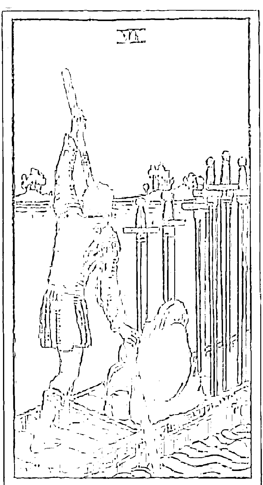

### 正位牌义

- 将来会遇到更多的艰难。
- 暂时没有好的对策。
- 需要倾吐心声，避免误解。
- 勇敢，胜利；通过思考和平静战胜恐惧；旅行，假期。

### 逆位牌义

- 否极泰来，历尽艰险后会事事顺利。
- 把自己隐藏起来，与世隔绝。
- 需要别人帮忙。
- 已渡过难关。
- 失落，空虚；潜在的危险。

## 宝剑七

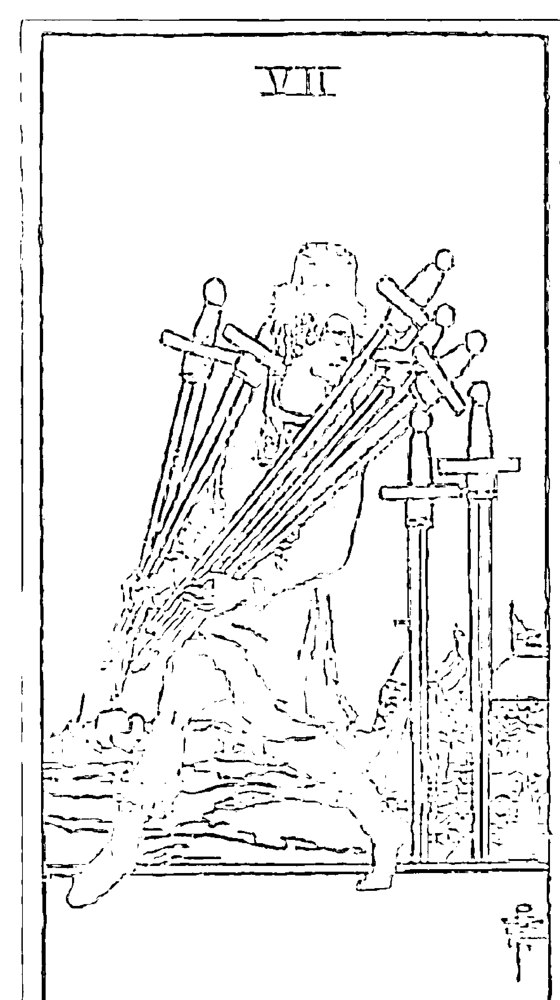

**关键词**：与众不同、奇思妙想、独来独往

**牌面解读**：图中男子虽然怀抱五把宝剑，但是脚步轻盈，丝毫没有倦意。理想使他踌躇满志，但现实又让他无所适从。他紧闭双眼，似乎不想面对现实与理想的不同。这张牌告诉人们，想成功地做任何事情都要付出极大的努力。宝剑七暗示了你内心的无奈，你对现实情况无能为力而感到失落，你觉得自己无法选择，这也是一种对自己没有信心的表现。

### 正位牌义

- 疏忽大意。
- 有隐藏得很深的敌人。
- 泄露秘密。
- 将要或已经失窃。
- 计划已经或面临失败。
- 危机；放弃，投降；被束缚。

### 逆位牌义

- 有意想不到的好运。
- 要参考别人的建议。
- 好的忠告或指导。
- 艰难的任务；意志消沉。

## 宝剑八

**关键词**：限制、约束、停止、无能、混乱

**牌面解读**：画面中的女人被绳索捆绑，无法挣脱，给人一种束缚的压迫感。女人肤色蜡黄，整个画面透露着一种对自由的渴望。宝剑八预示着求问者即将陷入或者已经陷入艰难的处境，但也暗示着新的奋斗将随之而来。这是一张代表着担心和情绪变化的牌，这种担心可能是因为自己，也可能是因为周围的人或事。

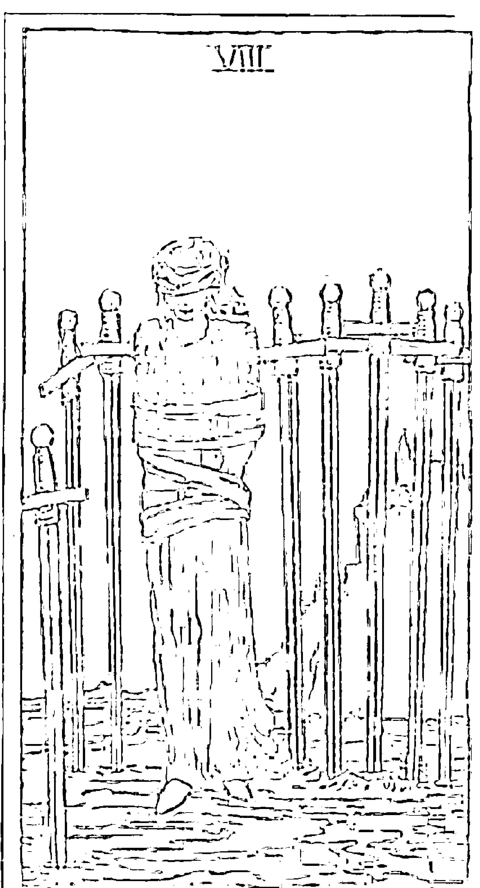

### 正位牌义

- 周围有对你的责难、中伤，生活中总有争执。
- 处于孤立的境地，必须开始全新的奋斗，否则就会沦落下去。
- 有坏消息传来。
- 被束缚，失去自由。

### 逆位牌义

- 挣脱束缚，获得自由。
- 危机解除，可以重新开始生活。

## 宝剑九

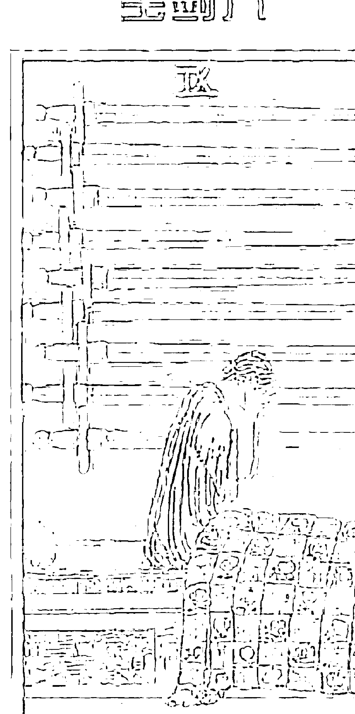

**关键词**：恐惧、焦虑、苦恼、内疚、噩梦

**牌面解读**：墙上挂着的利剑使人感到窒息和恐惧，男人掩面的姿势更强化了这种暗示。宝剑九代表来自内心的煎熬，它不是一张令人高兴的牌。不过它不仅仅预兆不安的状况，也代表鲜明的梦境或梦魇。梦魇可能在传达一种强烈的信息，也就是你生命中某些不对劲的事物，已经从潜意识层面浮现出来了。

### 正位牌义

- 正处在苦难之中，苦难即将来临。
- 爱人将给你带来不幸。
- 半途而废；好事多磨。
- 与朋友出现矛盾，甚至和好友绝交，与情人分手。
- 生病，身体不适。

### 逆位牌义

- 耻辱的事不断发生；难以应对生活，沮丧。
- 拥有很多知心朋友。
- 做事优柔寡断。
- 具有非常强烈的恐惧感。
- 周围充满谣言，被中伤。

## 宝剑十
关键词：失败、殉难、毁灭、极端、牺牲精神

牌面解读：画面中的男子已经在搏杀中身负重伤，数把利剑贯穿了他的身体。在这场搏杀中，男子将走向毁灭。事情不可能更糟了，似乎所有的不幸都在这一刻集中起来。宝剑十代表一种险恶到极致的状况。恐怕你已经到了最低潮的时期，伤口越来越深，救援的手还没有到来。

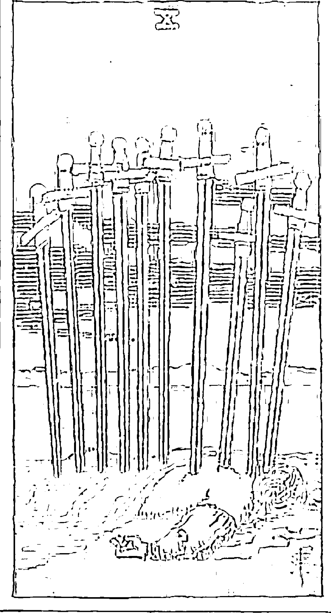

### 正位牌义
- 十分苦恼，找不到出路。
- 内心一直希望一切能快点结束，心态消极。
- 面临惨败，极端的失败。
- 悲惨而孤寂的命运。
- 梦境，成长，迷惑，寂寞。

### 逆位牌义
- 有瞬间可以成功的机会。
- 心中要一直怀着东山再起的希望。
- 仍然有改善的可能性。
- 虚弱；胶着；未成形的计划。

## 宝剑侍从
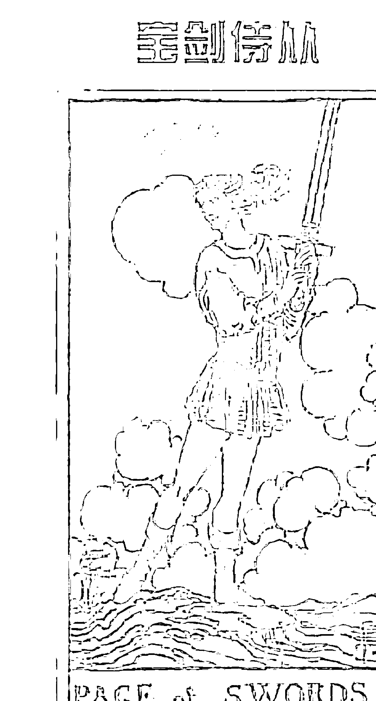

**关键词**：敏锐、公正、毅力、沟通、思维、诚实

**牌面解读**：一个年轻的战士双手托着宝剑，他虽然年轻，但是看起来也仿佛经历了一定的风霜，目光中透露出沉稳和敏锐的洞察力。宝剑侍从象征着心中有太多的梦想，但行动却不够。对于那些以创意和思考为生的人而言，这是一张正面的牌。这张牌还暗示着航空旅行，如果权杖四、宝剑六、节制或者世界出现在牌阵中，这个意味就更加明显了。

### 正位牌义
- 在事情有变异前已经察觉。
- 适合做调查类的工作。
- 经历过挫折，找到新的开始。
- 忠诚；有远见、有观察力的人。

### 逆位牌义
- 没有预见到事情的变化。
- 暂时没有办法对付强劲的对手。
- 做事有漏洞。
- 生病。
- 脱离实际，幼稚，虚幻。

## 宝剑骑士

**关键词**：强而有力、过于激进、想到就做、权威、傲慢

**牌面解读**：这位骑士的穿着十分华丽。他身穿铠甲，披着披风，左手持着马的缰绳，右手拿着锋利的宝剑。宝剑骑士代表事业心强的人，他们可能缺乏温柔的情感，但不是冷漠，只是不关心。因此，这种人对异性有强烈的吸引力，却无法建立长期的关系。这张牌也暗示着要达成愿望需要有敏捷的行动。

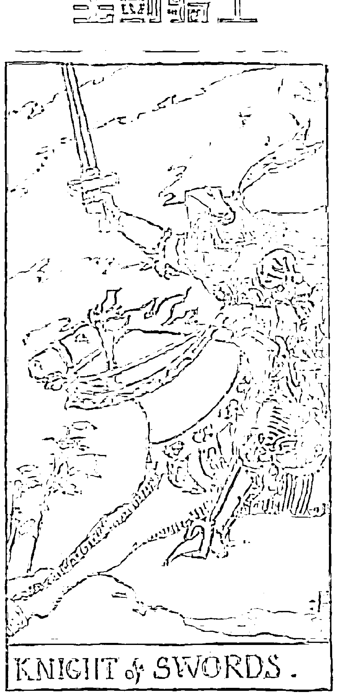

### 正位牌义
- 具有挑战的勇气，具有勇往直前的动力。
- 强力压制反弹，对待突发事件有很强的应变能力。
- 有行动力，有很强的社交和管理能力。

### 逆位牌义
- 作决定需要深思熟虑，仔细分析考量。
- 英雄气短导致失败，容易受情绪支配。
- 自负，轻狂。
- 与朋友或伴侣关系不和。

# 经典韦特塔罗
## 宝剑皇后
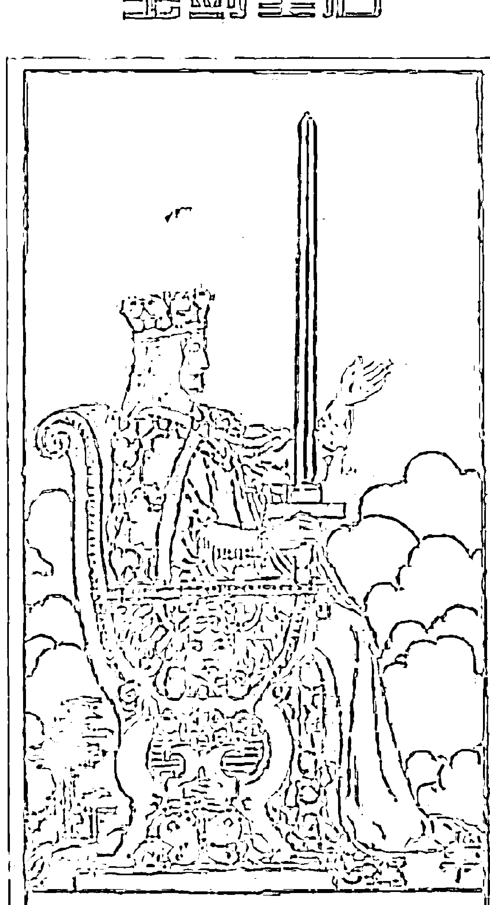

**关键词**：深思、经验丰富、裁判、机智、坦白、诚实

**牌面解读**：一位披着长长的秀发，带着小巧王冠的皇后，微笑着坐在宝座之上，她静静地看着一切。她身穿美丽的长袍，手持一把锋利的宝剑，睿智的目光望向遥远的地方。这张牌暗示经过深思熟虑所得到的成就。王后是理性的，思路清晰且富有耐性，是个优秀的组织者，也是个称职的审判者。她应该是个完美主义者，会给予别人明智的忠告。

### 正位牌义
- 事业如意却倍感孤独，各方面都差强人意。
- 有洁癖，生活习惯上有过分的行为。
- 离别，分手。
- 强烈的失落感。
- 努力创造机会，敏锐，坚忍的毅力。

### 逆位牌义
- 相当固执，不到黄河心不死。
- 敌人十分顽强。
- 盛气凌人，不顾他人感受。
- 目光短浅。
- 忧伤，体验锥心刺骨的凄凉。

# 神谕卡
## 宝剑国王

**关键词**：公正、严厉、气势

**牌面解读**：宝剑国王没有穿着华丽的王袍，而是披着素雅的战袍，看上去更像个战士，只有头顶的王冠表明了他的身份。他身后广袤的土地诉说着他的战功与成就。宝剑国王暗示通过清晰的思考和实际的努力而成功。这张牌在告诉你，你需要利用你的构想去做一些真实的事。宝剑国王代表一个拥有很强自制力的成熟男人，他深谙规划的价值，也明白思考与行动结合的重要性。

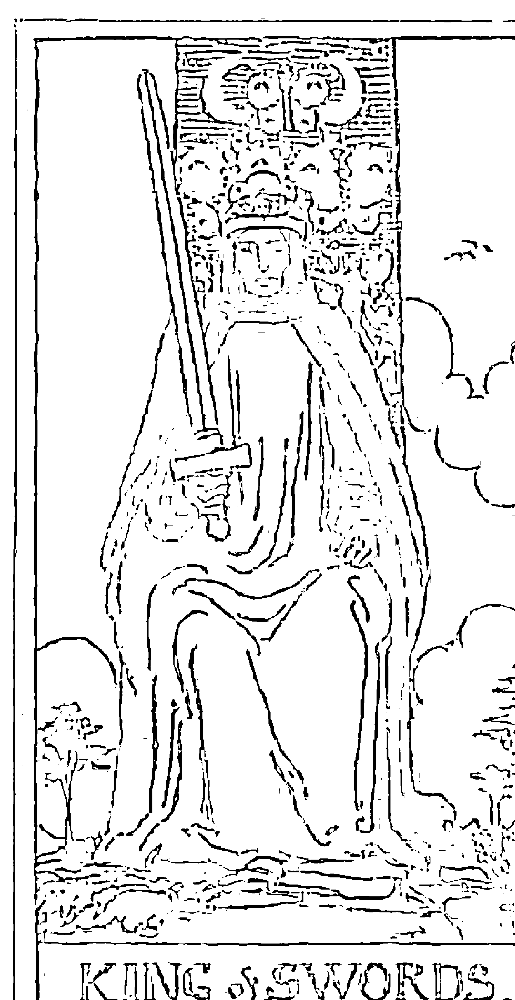

### 正位牌义
- 有权威性，是某方面的专家。
- 有统率力，领导能力出众。
- 很冷静，想象力丰富。
- 在专业领域内如鱼得水。
- 具有征服欲，并不断增加自己的力量。

### 逆位牌义
- 生活中时常发生冲突，遇到意想不到的麻烦。
- 遭受不正常手段的打击。
- 身边始终有群很残酷很自私的男人。
- 残酷的失败。

## 星币首牌
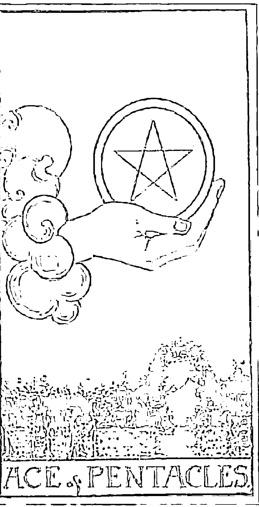

**关键词**：财富、丰足、地位、物质力量、繁荣、信任

**牌面解读**：星币下方的田野上开满了鲜花，看上去一片美好、祥和的景象。星币首牌暗示你有足够的金钱去执行你的计划，这张牌代表一种新状态的开始，可能是一个崭新的未来，或者是某种状态中一个新局面的开端，表示一种务实的作风；也暗示你所投资的金钱、时间可能会带来很好的回报。

### 正位牌义
- 物质生活很丰富，但精神生活欠缺。
- 得到一切想要的物质。
- 获得利益，事事顺利，运气较佳。
- 安逸的生活状态。
- 大型商业活动获得成功，收入增加，富有经商的天分。

### 逆位牌义
- 被强烈的欲望冲昏头脑，做出不可理喻的事。
- 奢侈的生活。
- 因为金钱方面的原因导致声名狼藉。
- 精神空虚，物质丰富。
- 不快乐的成功，金钱虚掷。

## 星币二
关键词：动荡、贸易、投资、协调、娱乐、机动

**牌面解读**：两枚星币在男人的手中因翻转而失去了方向。星币二要求求问者要善于处理纷繁复杂的情况，而不要死守某个思维定式。就财运方面而言，星币二预示着一种收支平衡。

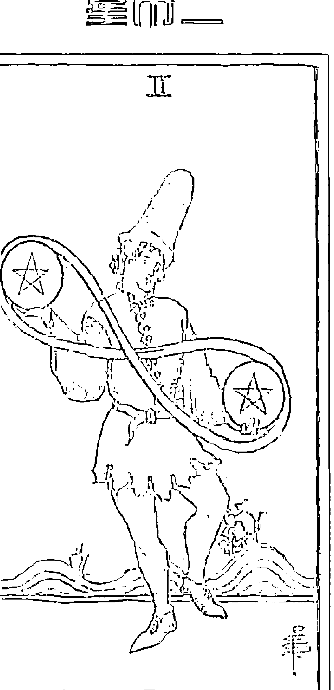

### 正位牌义
- 寻找生活中暗藏的机会。
- 未知的未来，学会在逆境中生活。
- 新的计划，机遇的来临。
- 向前看，脱离混乱的生活，理清头绪。
- 节约资金，参与贸易。

### 逆位牌义
- 正确处理工作和生活的关系。
- 用钱过度，超出计划。
- 表面快乐，内心痛苦，自欺欺人。
- 扭转劣势，打开局面。

## 星币三
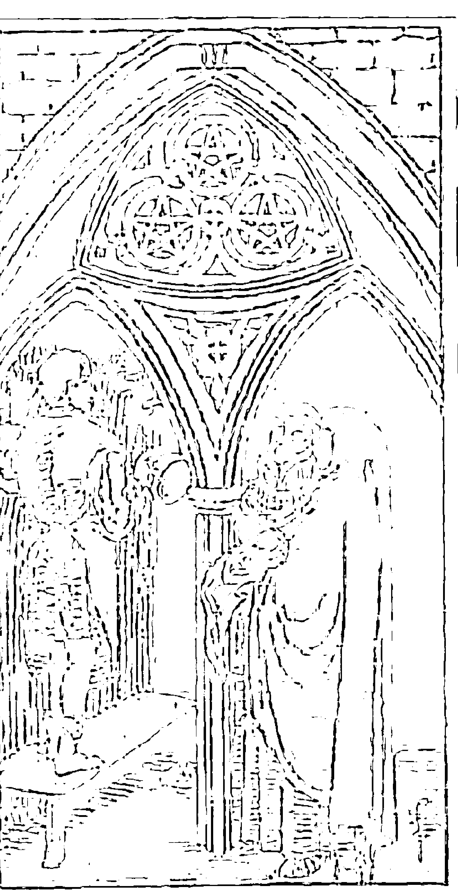

**关键词**：协力、合作、能力出众、计划

**牌面解读**：一群人在屋子里讨论着，一个男人正站在高处发表他的见解。星币三通常代表团队合作，团队中所有人的目标必须一致，不能单独行动或决定，一定要经过事先的计划，并在实施的过程中多次讨论决定，否则就会像孤独的少女一样独自奋斗。因此，星币三也经常代表沟通与协调。

### 正位牌义
- 业务熟练，一流的水准，才能出众。
- 完成了一件奋斗已久的大事。
- 注意名声，有荣誉感。
- 喜好玩耍，拥有手艺及商业方面的能力。

### 逆位牌义
- 素养水准不高，难以令人满意。
- 想法不成熟，难以实施。
- 物质方面有一定的损失。
- 出现恶作剧，做事过于轻率。

## 星币四
关键词：控制、占有、得到、封闭

**牌面解读**：身着华丽长袍的男人坐在椅子上，他头顶的星币如皇冠一样华美，他怀抱星币的同时还用双脚各踏一枚星币。星币四经常代表物质生活上的充足与稳定，但精神层面往往却很空虚。这张牌一般指控制，代表那些紧紧抓住物质不放的人。如果是情侣，会有很重的嫉妒心，非常爱吃醋。这张牌的出现是提醒我们，要认清在人与财富的关系中，人真正的价值是什么。

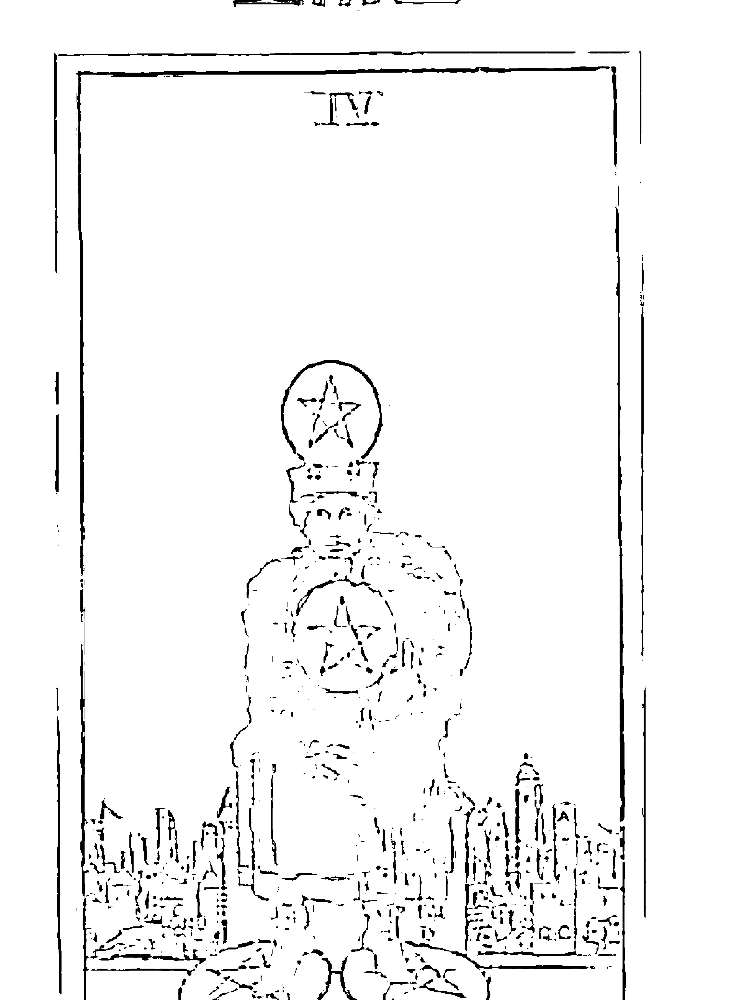

### 正位牌义
- 吝啬鬼，过分的节俭。
- 生活中精打细算，勤俭节约。
- 有遗产方面的问题，继承不太顺利。
- 对物质财富的追求十分执著。
- 审度自己拥有的，不确定。

### 逆位牌义
- 奢侈无度，金钱的开销没有计划，缺乏自控能力，导致入不敷出。
- 金钱运势很差。
- 物质欲望过度膨胀，失败。
- 错误的预期，虚假的利益。

## 星币五
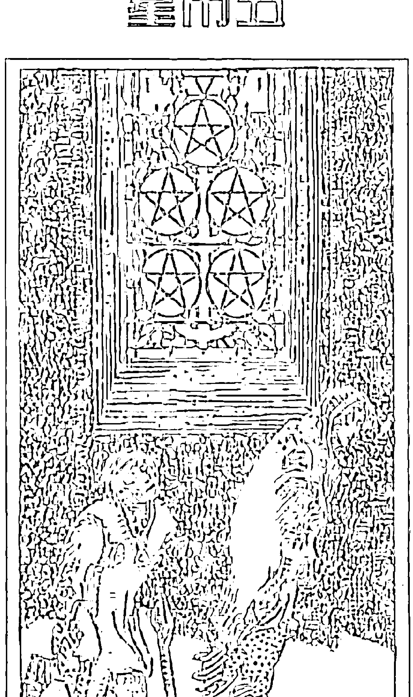

**关键词**：穷苦、艰难、绝望的境地、拒绝、亚健康

**牌面解读**：画面中，女人身穿单薄的衣服，双手捂在胸口；男人双手拄杖，艰难地在雪中行走。在这个飘雪的冬天，她看上去有些绝望，不知什么原因让她陷入这种孤独的境地，而她身边也没有人可以相伴。星币五的出现表示物质上的缺乏，也可能是某方面的欠缺。这就是提醒我们要注意避免无谓的消耗，静静地等待时机的到来；并且，要珍惜目前所拥有的。

### 正位牌义
- 有金钱方面的烦恼，物质方面有所匮乏。
- 放浪，玩世不恭，态度不端正。
- 连续失败。
- 失业。
- 心灰意冷。

### 逆位牌义
- 担心居住问题，有房产方面的麻烦。
- 生活秩序混乱，有物质上的困难烦恼。
- 各方面的关系都不太好。
- 缺乏野心，事情发展缓慢。

## 星币六
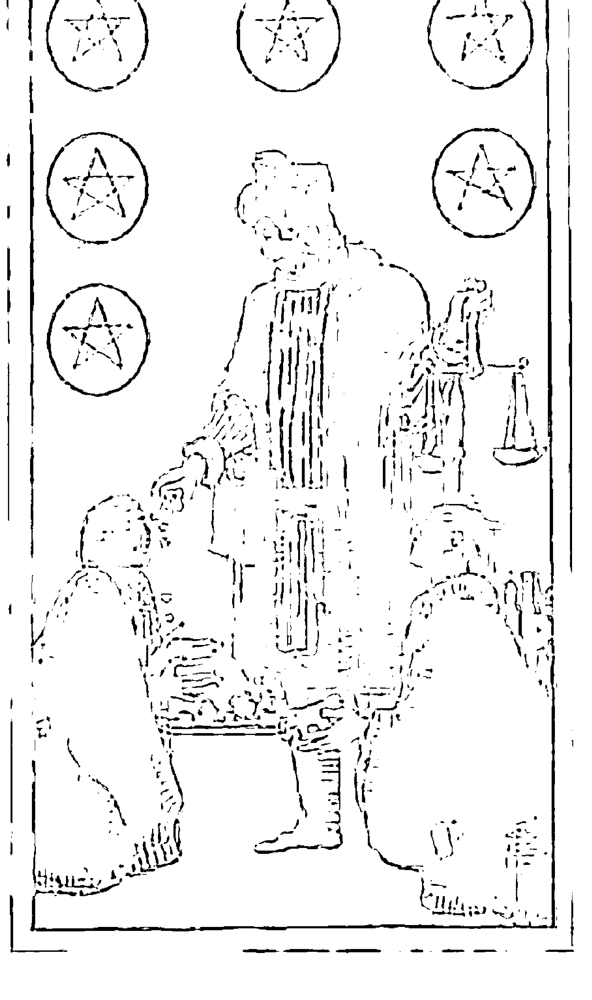

**关键词**：慷慨、施与、理财、知识、能源、力量

**牌面解读**：画面中的人似乎很富有，他一手执天平，一手将金币施舍给别人，他好像没有任何烦恼，因为物质上的富有，他从不考虑会有所匮乏，也不考虑别人会占有他的东西。星币六代表一种理财能力，或者你即将得到需要的东西，比如朋友欠你的债、一件有意义的礼品，又或者遗产等等。当然，也代表你会有所付出，但总体上表示收支平衡。

### 正位牌义
- 懂得礼尚往来，人际关系很好。
- 胸怀宽广，坦荡，与人为善，有人缘。
- 生活状况良好。
- 有一定的经济能力，积累财富，追求安定。

### 逆位牌义
- 自私自利，令人生厌。
- 嫉妒心强，恶劣的心情经常出现。
- 欠债，欠人情，知恩不报。
- 贪图物欲，被物质欲望操控。
- 失去所拥有的财富，守财奴。

## 星币七
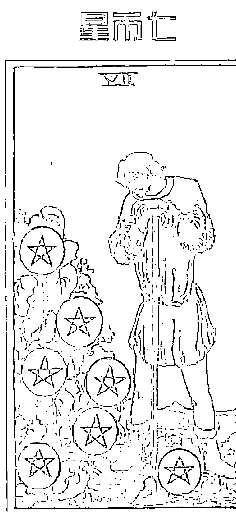

**关键词**：休息、思考、收获、评估、转变

**牌面解读**：少年面对众多星币却丝毫没有欣喜之情，看得出，他现在的生活应该很富足。但少年却一脸落寞，似乎觉得生活中缺少了什么。他在思考，他想改变现在的生活，实现自己的理想。当星币七出现的时候，你应该明白工作本不应该是沉闷无味的，而是一种自我完善的机会。工作不仅仅是为了获得报酬，更重要的是让你的人生更加丰富多彩。

### 正位牌义
- 目标无法实现。
- 做无用功。
- 通过辛勤的劳动取得成功。
- 金钱带来的困扰。
- 有令人难堪的消息。

### 逆位牌义
- 付出了多余的努力，导致生产过剩。
- 无知、轻率地作出决定。
- 没有远见，盲目地投资。
- 付出的努力得不到相应的回报。
- 工作稳定，安于现状。

## 星币八
关键词：勤奋、学习、知识、细节

**牌面解读**：画面中的男人正在雕刻一枚星币，他已经融入到了创作之中，十分忘我，周围都是他已做完的星币。他一定是经过多年的学习与探索，才达到如此造诣的。现在，他的努力将得到回报，星币八暗示着通过努力、学习，或将构想付诸行动而改善自身的境遇。要想建立持久的大厦，必须要有稳固的根基。我们应当懂得知识的价值，并与他人分享，脚踏实地地生活，而不要沉迷于那些遥不可及的梦幻。

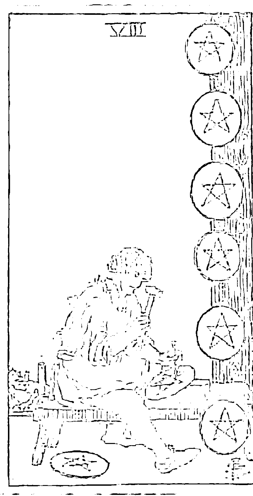

### 正位牌义
- 进取心强，不甘人后。
- 做事有条理。
- 技术上精益求精。
- 正在专心研究与学习。
- 善于自我激励，鞭策自己。
- 理解、领悟知识，获得别人的支持。

### 逆位牌义
- 没有真才实学，爱慕虚荣。
- 为谋取利益不择手段。
- 不务正业。
- 野心遭受打击。
- 平庸之才，出现金钱上的困扰。

## 星币九
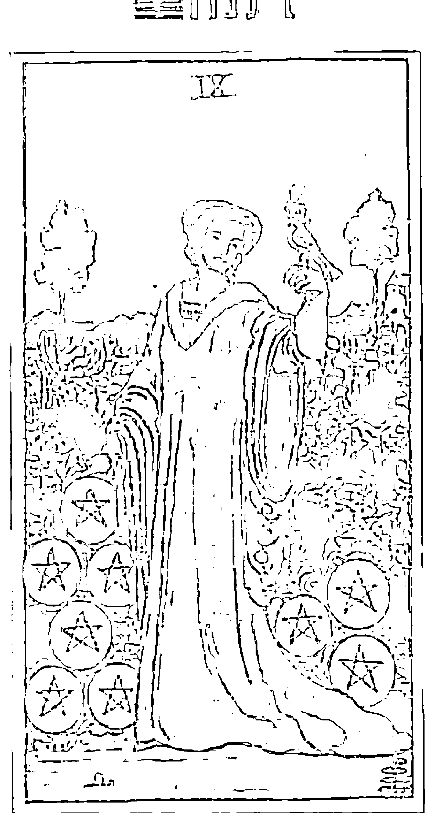

**关键词**：丰足、美满、上进、吸引、精美、自立

**牌面解读**：少女身穿华丽的衣裙，周围盛开的鲜花与茂密的树林都暗示着生机与活力。一只美丽的小鸟飞落在她的手上，与她玩耍。星币九的含义非常丰富，意味着经过长期的努力而得到好的结果。有时候这张牌也是纪律和自控的象征，要求人们注意节制，选择理性思维，从而作出正确的判断，这样才能获得最后的成功。

### 正位牌义
- 有一定的眼光，懂得选择，被人欣赏。
- 储蓄是必要的，精打细算但不吝啬。
- 为自己创造有利条件，付诸实践，说到做到。
- 做事沉稳可靠，取得一定的成就。
- 有稳定的收益，没有贫困的困扰。

### 逆位牌义
- 目标没有完成，半途而废，前功尽弃。
- 没有管理能力。
- 不守信用，被人厌恶。
- 情绪焦虑、急躁。
- 由于投资失败，损失金钱，甚至破产。

## 星币十
**关键词**：富裕、家庭、团体成功、惯例、持久

**牌面解读**：画面中的人们看上去生活很富足，他们穿着锦缎的衣服，坐在铺着绫罗的椅子上，目光中充满自信，悠闲的神态显示出他们对物质生活的满足。星币十代表以金钱与成功为目标的人或事。成功并非偶然，通过承诺、劳动、纪律、学习，以及重新评估，已经稳固地建立起了某种具体的成就，并且也为将来打下良好的根基。

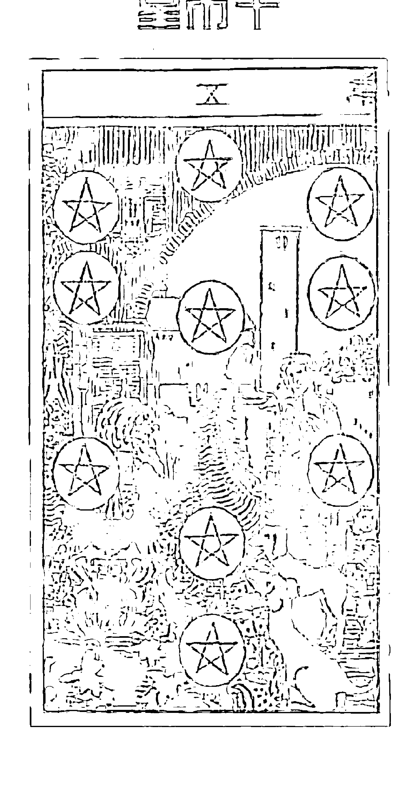

### 正位牌义
- 可能会继承遗产。
- 家境良好，物质丰富，家人关系良好。
- 团体事业运作态势良好。
- 获得幸福，有所成就。

### 逆位牌义
- 团体中某种程度的不和即将出现，为金钱起纠纷。
- 投资合伙要暂时缓一缓，谨慎理财。
- 失去遗产。
- 与亲人对立，家庭不利。
- 家中失窃，或其他方面将会有一定损失。
- 出现不安稳的状态。

## 星币侍从
关键词：运用、实践、投资

**牌面解读**：一个清秀的年轻人站在绿树草坪之上，他双手擎着一枚大大的星币。年纪轻轻就拥有了这笔不小的财富，该如何运用呢？他的人生阅历似乎还不足以给他任何建议。这张牌意味着努力学习，形容的是一个务实，并且稳健、热爱大自然的人。这张牌还说明你需要认真地实践，从而展开一项新的方案，或者开始某个阶段。星币侍从有着充满希望的前途。

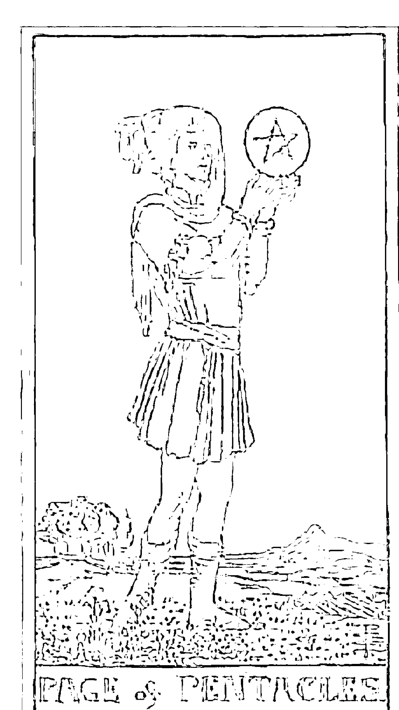

### 正位牌义
- 学习态度端正。
- 热心积极地投身于研究工作。
- 求知欲旺盛，头脑灵活。
- 将收到与知识或者研究工作有关的好消息。

### 逆位牌义
- 挥霍、浪费金钱。
- 知识贫乏，认识问题不够全面深刻。
- 井底之蛙，目光短浅。
- 自食恶果。

## 小阿卡纳
## 星币骑士
关键词：认真、努力、坚定、谨慎、物质主义

**牌面解读**：身着铠甲的骑士手举星币，面容平静地骑马缓缓前行，命运为他带来了象征财富的星币。不过他的身边没有和他一起分享胜利的朋友，恐怕是他在努力的过程中过分注重物质，而忽略了与朋友、亲人之间的情感交流。稳健而认真是星币骑士的标志，但因为他的野心分散了他在情感方面的精力，因此在这方面他显得不成熟。当别的骑士在享受爱情、亲情、友情的快乐时，星币骑士却在学习、工作，为将来而努力。

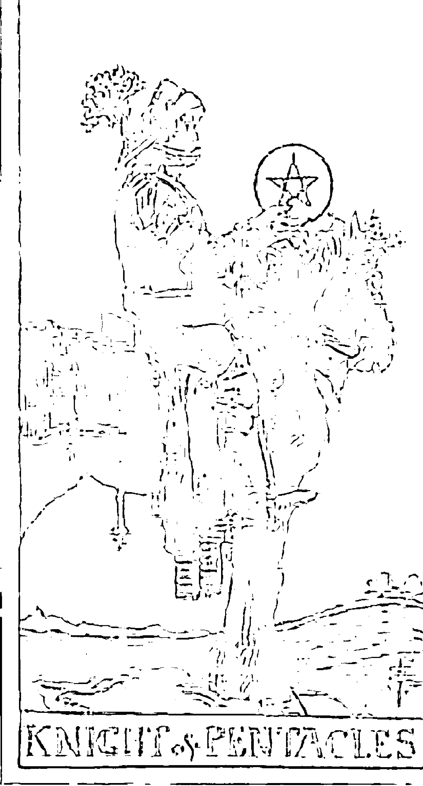

### 正位牌义
- 讲究效率，有能力的组织者。
- 了解现实状况，稳扎稳打的实干家，有责任感，是值得信赖和依靠的人。
- 家庭的保护者，是个在观念上有点保守的人。

### 逆位牌义
- 懈怠、松散的工作态度，没有进取心。
- 思想过分保守，顽固派。
- 处事随性，三分钟热度，没有恒心和毅力。
- 事业或其他方面发展停滞不前。

## 星币皇后
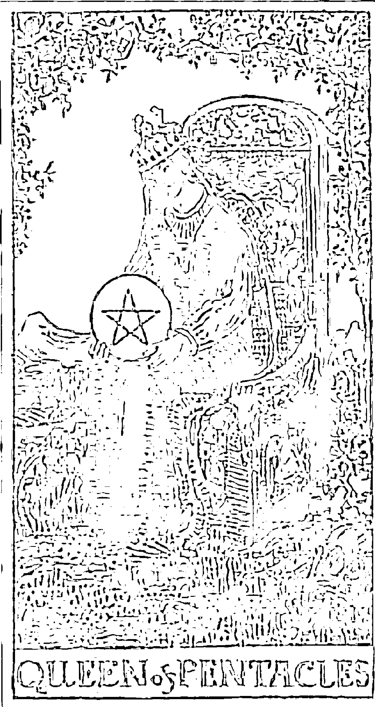

**关键词**：慷慨、机智、母爱、养育、繁荣、可信赖的

**牌面解读**：这位皇后穿着高贵的衣裙，戴着式样简单的皇冠，长发披肩垂下，衬托出她温柔而典雅的面容。星币王后是表示无限温暖的一张牌，她稳定而具耐心的特质可以使一切井井有条。她清楚自己的能力，用一种务实的态度把个性的力量和对情感的理解结合起来，让周围的人都能感受到她良好的影响力。

### 正位牌义
- 代表自立而成熟、严格却又宽容的女性，温柔而善解人意，包容别人，乐于助人，值得信赖和依靠。
- 坚定而有气度的人或行为。
- 拥有预知的能力。

### 逆位牌义
- 爱慕虚荣，生活浮华。
- 对人态度恶劣，不够友善。
- 总是出现铺张浪费的行为。
- 内心冷淡，是不可信任的人。
- 疏忽职责，虚无的成功。

## 星币国王
关键词：坚定、富有、事业成功、保守

**牌面解读**：星币国王坐在宝座上，头戴较大的皇冠，他左手按着一枚星币，右手握着象征地位的权杖，眼神里流露出一种满足和快乐，这是他对地位的满足，对财富的满足，对所拥有一切的满足。而这些满足正是他内心愉快的根源，但这样的富有是否就能真正地拥有快乐呢？星币国王这张牌一般代表经济基础和事业有成，但在财富已经不成问题的情况下，也暗示着金钱带给人的迷惑。这位国王很可能在对成功的追求中迷失了自己，他个性稳健、可靠，并且保守。

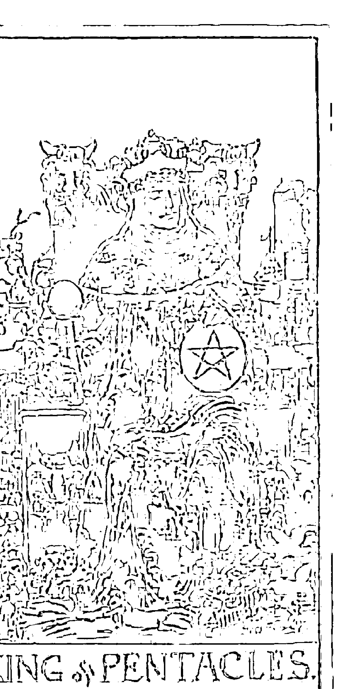

### 正位牌义
- 拥有身份和地位的成功人士。
- 有营销手段的商业人才，适宜投资。
- 学识丰富的人。
- 值得信赖的人，彼此互相信赖。
- 预示着理想能够达成。

### 逆位牌义
- 缺乏经济头脑的人或做法。
- 行为卑鄙。
- 两人之间关系危险，可能导致不良后果。
- 处事随性，三分钟热度，没有恒心和毅力。

# 无牌阵解牌法
无牌阵解牌是塔罗牌里最简单的一种解牌法，由于没有任何牌阵的束缚，推测的灵活性和自由度也非常高。不过对初学者来讲，需要经过不断地努力练习才能完全掌握。无牌阵解牌需要解牌者抽牌前先决定好抽多少张，每张牌要问的问题或代表的意义是什么。

## 发牌
解牌者洗好牌后，求问者从中随意抽出三张意念指引的牌，从右至左排列好，然后按照抽牌顺序依次解释牌意。其实，无牌阵解牌具体抽多少张牌是没有硬性限制的，但牌数太少没办法将问题解释清楚，大多初学者又不能很好地掌握整个牌意，所以以三张为最佳。

## 解读
无牌阵解牌法没有统一的解牌方法，解牌者需要发挥自己的想象力，将牌面描绘和具体表述结合起来，这样就可以完全抛开牌阵和书本的束缚，更接近塔罗的真意。

## 实例1
求问者：女生；
求问：我觉得我暗恋的人最近似乎不爱理我，给他打了好几次电话都没接。我想知道他是有意躲我，还是太忙碌而无暇顾及。

| 位置 | 牌面 | 位置（正逆） |
|------|------|--------------|
| 1    | 隐士 | 逆位         |
| 2    | 世界 | 逆位         |
| 3    | 情侣 | 正位         |

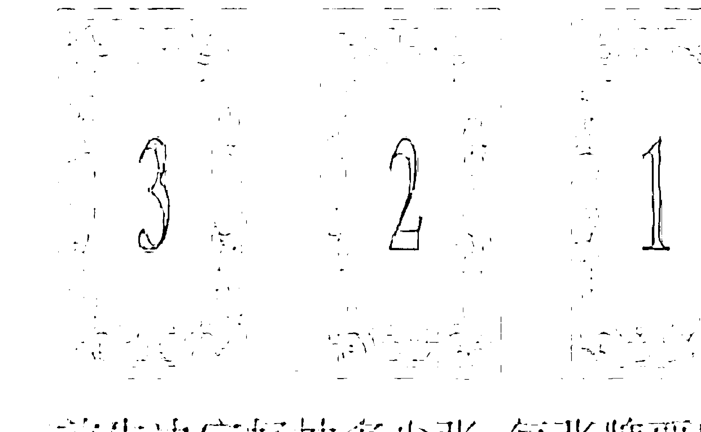

# 恋爱塔罗牌阵法

牌面解读：情侣正位的出现是因为你希望跟男方成为恋人；世界逆位表示在这段关系中，常有一方无法配合行动；隐士逆位表示你很容易胡思乱想，总是钻牛角尖，即使男方对你非常专一，也总是患得患失，对这段感情没有信心，无法得到满足，因此对这段感情有消极的想法。如果你想得到满意的结果，就应该放平心态，积极争取，即使失败也没什么，因为感情毕竟是两个人的事。

## 实例2

求问者：女生。

求问：我跟男友交往多年，最近因为一些原因决定分开一段。他说没意见，尊重我的决定。对于他的毫无留恋，我感到很伤心。是不是他真的已经不在乎我了？我们这段感情还有希望吗？

| 开牌情况 | 位置  | 牌名     | 位势 |
| :------- | :---- | :------- | :--- |
|          | 位置1 | 隐士     | 正位 |
|          | 位置2 | 教主     | 逆位 |
|          | 位置3 | 命运之轮 | 正位 |

牌面解读：隐士正位的图中显示的是一位老者手持明灯，意味着双方都在黑暗中寻找出口与答案。教主逆位代表两个人之间沟通的渠道受到严重的阻碍，不再那么心有灵犀了。命运之轮这张牌代表随缘或顺其自然，轮子在转动着，就像是重生。也许两人经过一段时间的冷静，会使爱情得到重生。

# 圣三角牌阵法

这是塔罗牌最常用的牌阵之一。这三张牌按照序号依次为过去、现在、未来，这样解牌能比较准确地掌握事情当下的状况和事情的发展前景。这个牌阵有很强的变化与灵活度，而得出的答案也会相当明确清晰，但有时这个牌阵给出的答案过于直接，会使求问者有很大的心理反应，这就需要解牌者根据情况作出委婉的解释。

# 经典塔罗牌阵

## 发牌

-   1. 将牌洗好，从最上面的一张开始数起，将第七张牌拿出，放到牌阵图中1的位置上，这张牌代表的是过去。
-   2. 把数过的牌放到一旁，将剩下的牌重新数到第七张，拿出放到图中2的位置上，这张牌代表现在。
-   3. 重复步骤2，再次拿出第七张牌放到图中3的位置，这张牌就是未来。

## 解读

-   1代表过去，即此刻之前发生的事情；
-   2代表现在，指现在的问题或这件事情目前面对的情况；
-   3则代表未来，是对未来的事情发展或结果的推测。

## 实例1

求问者：男生。

求问：一个女同学的生日快到了，我该不该帮她买礼物呢？

| 开牌情况 | 位置 | 牌名   | 位势 |
| :------- | :--- | :----- | :--- |
|          | 1    | 战车   | 正位 |
|          | 2    | 节制   | 正位 |
|          | 3    | 情侣   | 正位 |

牌面解读：情侣这张牌表示你正在抉择要不要买；战车这张牌是说你在考虑给这位女同学买什么礼物的同时，还要兼顾其他的事情；节制这张牌说明就算送了礼物，你们的关系也不会有什么大变化，因为本来你们就是朋友。

## 实例2

求问者：女生。

求问：我和男朋友的交往遭到男方家长的强烈反对，而目前两人又因工作原因两地分隔。我想知道，我的男朋友对这段感情的未来有什么打算。

开牌情况：

| 位置 | 牌名     | 位势 |
| :--- | :------- | :--- |
| 1    | 隐士     | 正位 |
| 2    | 节制     | 逆位 |
| 3    | 命运之轮 | 正位 |

牌面解读：命运之轮代表的就是因为工作原因而在空间上产生距离的情况，两人的关系也因此发生了改变，未来也可能跟着改变。而你的男朋友对于家长的反对，会采取低调的做法。

从节制逆位看起来，你们突破的空间并不大，再加上隐士，看来你们之间的关系是凶多吉少了。

# 二选一牌阵

这个牌阵属于选择性牌阵，当求问者心中有两难的事情需要抉择的时候，就可以选择这个牌阵。这个牌阵有些类似圣三角牌阵，也是比较简单的牌阵，比较容易上手。

# 经典爱情塔罗

## 发牌

-   1. 在洗牌前让求问者选定一个方向，因为此牌阵呈V字形，分成左右两边，分别代表了A、B两种选择，这就使求问者要先明确哪一边代表什么选择，并且牢记自己定下的方向，然后再开始洗牌。
-   2. 洗好牌后，从最上面的第一张牌开始数，数到第六张，把这张牌放到牌阵图中1的位置上。
-   3. 把已经数过的牌放到一旁，重新数剩下的牌，将第六张与第七张牌分别放在牌阵中的2和3的位置上。
-   4. 重复步骤3，把第六张与第七张牌取出，放到牌阵中的4和5的位置上。

## 解读

-   位置1上的牌，表示问题的整体状况。
-   位置2上的牌，代表A选择的现状。
-   位置3上的牌，代表B选择的现状。
-   位置4上的牌，代表A选择的未来发展或结果。
-   位置5上的牌，代表B选择的未来发展或结果。

## 实例1

求问者：女生。

求问：现在我在国外留学，要等一段时间才毕业，但因为课已修完，目前时间比较空闲。由于经济的原因，加上很想累积一些工作经验，我想在这段时间暂时找个工作。但就国内和国外来说，哪边找工作会比较好呢？

# 塔罗牌测验1

开牌情况：位置2和位置4代表选择国外，位置3和位置5代表选择国内。

-   位置1 星币九 正位
-   位置2 权杖一 逆位
-   位置3 圣杯二 正位
-   位置4 宝剑王后 正位
-   位置5 圣杯侍从 逆位

牌面解读：星币九代表你现在正处于情绪不平稳的状态，但还可以自我控制，你想要通过自己的努力获得一些成就及满足。

权杖一逆位表明在国外找工作的过程会非常困难，你如果想在国外工作，就需要有清晰的思考能力。宝剑王后表示你就算最后找到了，结果也不会很好。

牌面显示你在国内找工作似乎会容易一些，因为圣杯二显示出有在外国学习的经验，但逆位的圣杯侍从又说明你在情绪上可能不快乐。至于最后要如何选择，还是要看你的意愿了。

## 实例2

求问者：男生。

求问：我是否要选修一门极难的专业课。

开牌情况：位置2和位置4代表选择退课，位置3和位置5代表选择修课。

-   位置1 愚人 正位
-   位置2 权杖十 逆位
-   位置3 星币八 逆位
-   位置4 权杖四 逆位
-   位置5 星辰 逆位

牌面解读：选择退课，修这门课可能会让你自己觉得有点吃不消，你也非常不想承担这个压力，因此想选择退课。

选择修课：星币八逆位代表你选修了这门课后，可能也不会太用功，最后的成绩也不会很理想。愚人代表你自己没有计划，拿不定主意。而愚人这张牌包含了各种可能性，未来可能是好也可能是坏，但最终还是要你自己来选择。

# 吉卜赛十字解牌法

此牌阵属于拥有建议牌的牌阵，并且加入了配牌的解法，所以属于高级牌阵，需要比较多的时间来训练，才能更加熟练地运用。这个牌阵只适用于大阿卡那，不需要小阿卡那。虽然牌阵有五张牌的位置，但有时候却只需要四张牌，因为这个牌阵用到了重复牌，所以有时候也会有同一张牌在不同位置上的解释，需要特别加以注意。

## 发牌

将大阿卡那洗好后呈扇形展开，平放在桌面上。

求问者从洗好的牌中随意抽取四张，依次放在牌阵的1至4号位上。

收好剩下的牌，不要弄乱顺序，把整叠牌从左至右翻转过来，使有图案的那一面朝上，放到一旁。

## 塔罗牌解读

把位置1至4的牌全部翻至图案朝上，然后把牌上面所有的数字相加，得到的数字若小于或等于21，就从剩下的大阿卡那中找寻这一数字的牌，放到5的位置。

若这四张牌相加的数字超过21，就把所得数的个位与十位相加，所得的数字就是要寻找牌的号码。

如果位置5得到的牌已经被放在1至4号位时，我们就可以先不解读这一位置，等到前四张都解读完时，再来分析。

## 解读

位置1和位置2上的牌，象征着影响事情或问题的外在因素，需要把这两张牌综合在一起进行解读，综合分析。

位置3上的牌，代表事情或问题发生的原因或问题的关键所在。

位置4上的牌，代表整件事情或问题的解决方式与建议。

位置5上的牌，代表整件事情或问题的最终结果。

## 实例1

求问者：女生

求问：我与男朋友之间发生了一件事，我想知道这件事对我们的影响以及我与他今后的发展。

-   位置1 皇后 逆位
-   位置2 皇帝 逆位
-   位置3 力量 逆位
-   位置4 节制 逆位
-   位置5 命运之轮 正位

牌面解读：二人的心情：逆位的皇后，代表你的男朋友从内心里是感动高兴的，但由于种种原因仍一直处于比较不安的状态中。而逆位的皇帝表明你觉得自己很了不起，有点自负。

现在应采取的对策：力量逆位是暗示你应该对待他再温柔些，不要着急，慢慢来。

周围状况：节制逆位代表两个人的心还有一定距离，有不同的追求，因此，周围的人对你们的未来也不抱太大的希望。你们之间还是缺乏沟通。

最后的结果：根据整个牌阵来看，命运之轮正位说明目前你们这种不和谐的状态是暂时的，你应该主动把握时机，将命运引导到有利的一面。

## 实例2

求问者：男生。

求问：我想知道我和自己心仪的女孩未来的感情会如何发展。

开牌情况：

-   位置1 皇帝 逆位
-   位置2 愚人 正位
-   位置3 隐士 正位
-   位置4 审判 逆位
-   位置5 死亡 逆位

牌面解读：从皇帝逆位来看，女孩对你没有什么感情。

愚人正位说明你可能是想要不计后果地去尝试。

而你们的关系从隐士正位来看，可以知道目前你们都是单身，对感情也都有所保留，因此这段感情应该是比较保守而且不易发展的。

从审判逆位来看，你们的关系并不乐观，因为你和她都欠缺太阳正位代表的光明、乐观和希望。

最后，死亡逆位这张牌提出了建议，你应该先认清并且接受目前对你不利的情势，再想办法发展这段感情。

# 恋人牌阵占卜法

## 发牌

可以只使用大阿卡那或只用小阿卡那，也可以使用整副塔罗牌。只需要随意抽取两张牌，依序放在位置1和位置2上。

## 解读

-   位置1代表两人目前的状况。
-   位置2是建议牌。

## 实例1

求问者：男生。

求问：我和女朋友的关系遭遇瓶颈，该如何解决呢？

| 开牌情况     |
| :----------- |
| 位置1 高塔 正位 |
| 位置2 圣杯二 正位 |

牌面解读：正位高塔，表示你们之间的感情目前正处于停滞的状态。而正位的圣杯二是建议你跟她进行平等的、良性的沟通，从而扭转瓶颈现象，解决你们的问题。

## 愛的金三角解牌法

### 開牌

可以只使用大阿卡那或只使用小阿卡那，也可以使用整副塔罗牌。游戏时随意抽取四张牌，依次放在位置1至位置4上。

### 解讀

-   位置 1 代表你和对方未来发展的前景。
-   位置 2 代表对方的情况和想法。
-   位置 3 代表你的情况和想法。
-   位置 4 代表你们之间的关系。

### 实例 1

求问者：女生。

求问：W君和我的未来会如何？他是怎么看待我们之间的关系的？

开牌情况：

-   位置1 皇帝 正位
-   位置2 月亮 正位
-   位置3 星辰 正位
-   位置4 吊人 逆位

牌面解读：星辰正位代表你在内心深处认为未来的发展态势是乐观的，而过往岁月里的所有付出，或许是今生注定。

吊人逆位表示你内心的矛盾与挣扎，但现在的情况并不是很理想，最好分开一段时间好让彼此的心冷静一下。

皇帝正位让你觉得喜欢一个人一定要为他做一些实际的事情，有时候不妨多关心一下他的情绪或他在乎的事情。

月亮这张牌看起来表面上可能关系不错，但是有时候明亮的月光又被乌云遮住，这块掩盖在他心中的乌云可能是过去一直困扰着他的一个未解难题。

可能两人在相处过程中会觉得少了一些许默契吧？塔罗牌告诉你别太着急，随着时间的流转，也许很快就会乌云散尽。

## 实例1

求问者：女生。

求问：我对一个男性朋友越来越有感觉，并且对他用情已经到了很深的地步。最近，我跟他的关系也更近了一些，所以我想问一下我们目前对彼此的态度及恋爱的可能性。

-   位置1 太阳 逆位
-   位置2 力量 逆位
-   位置3 命运之轮 正位
-   位置4 女教主 正位

牌面解读：从命运之轮正位来看，你对他的感觉会与日俱增。而他心里可能正在犹豫是否要选择你，因为他对你的感情并不是很深，所以，你们目前的状况才正是女教主正位所显示的：处于一种退缩而内省的状态。

而对于你们的未来，他最终应该还是没有选择你，因为他内心真实的情感可能还是不够喜欢你，而你对他与日俱增的感情，又给他造成了很大压力，从而使他对你慢慢疏远。

# 平安扇牌阵

平安扇牌阵是专门对人际关系进行占卜的牌阵，适合于和某一个人的关系的占卜，这样的结果会更加准确。

## 发牌

平安扇牌阵的形状就像是一把扇子，第一张牌表示当事人目前的人际关系状况，第二张牌表示问卜当事人与对方结识的因缘，第三张牌表示双方关系未来的发展趋势，第四张牌（按习惯，这张牌通常横着摆放）表示对双方关系的结论。

## 注意事项

在平安扇牌阵中，牌与牌之间的影响是明显的。表示问卜者现状的第一张牌受代表双方过去关系的第二张牌的影响，同时也影响着表示双方关系未来发展的第三张牌，而第三张牌又会对第四张牌造成影响。

# 四要素牌阵

四要素牌是分析在未来的某个时候可能出现的某种状况而经常采用的牌阵。由于未来的很多因素无法确定，所以经常要用一些假设的前提作为条件。

四要素牌阵适合的范围也非常广，因为现实中，很多事情我们都需要预先作出判断，有所准备。例如，到了新学校或新单位，自己会受到什么待遇呀？如果自己采取某种行动，是否会赢得某人的好感呀？

## 解牌

四要素牌阵采取的是四方形的布局。第一张牌火要素表示的是在未来某一状况中问卜者的努力方向及精神方面的东西。如果是与工作有关的问题，有时也是指上级或客户。第二张牌土要素表示的是当事人在未来某一状况下物质及财富方面的情况。在特定人的感情关系中，有时也代表性关系。第三张牌风要素表示的是在这种状况下，遇到的问题或受到的伤害。第四张牌水要素表示在这一状况下，当事人的人际关系及感情方面的情况，在与工作有关的问题上，有时也表示同事或下级。切牌或指示牌位于牌阵的中心，切牌表示问卜者的主观想法，指示牌则表示当事人的特质。

# 经典牌阵图

## 身心灵牌阵

身心灵牌阵因其可以用来作最为日常的占卜，且整个操作又极为简单，容易掌握，而成为使用最频繁的牌阵之一。人们经常用它来测算每天的运势，也可以用来占卜感情或分析某一事件对当事人的影响。

如果熟练地掌握了身心灵牌阵，不妨将它作为每日一占的牌阵来使用，能够及时反映当日的一些情况。在实际运用中，这种牌阵也的确被人们多用于日常的占卜，来测算当天的情况。但也有例外，比如要占卜某事对当事人的影响或感情方面，就经常会跨越一天的界线。

## 解读

身心灵牌阵的布局采用的是三角形布局。第一张牌代表着身体状况或事情对身体状况的影响；第二张牌代表着心理状况或事件对心理的影响；第三张牌被称为灵，表示的是精神状态或事件对精神的影响。

在占卜两人之间的关系时，身、心、灵都代表着两个人相处的现实情形。身表示日常相处的状况，心表示两人之间的内心交流等内容，灵则代表了两人在精神上是否和谐。

# 塔罗牌阵

## 注意事项

需要注意的是，不论是代表身的牌，还是代表心的牌或代表灵的牌，它们互相之间都会产生影响，所以一定要联系两张牌的牌面意思及相互之间的对应关系来解读。

# 问题解决牌阵

问题解决牌阵比较适合于那些已经存在了一段时间的问题。由于时间较长了，一方面说明问题的难度，表明其不易解决；另一方面也让人更容易找出其症结，从而找到解决的方法。

与难题牌阵的主要区别在于，问题解决牌阵更注重于找到问题的要害。另外在牌的布局上也与难题牌阵有很大区别，它是一个纵向布局的牌阵。同样是三张牌，但由下往上纵向排列。第一张表示问题产生的原因；第二张代表问题出现以后，目前的状况；第三张是解决方案，代表着解决这一问题的可能方法。这三张牌都是对问题的一种客观描述。切牌位于三张牌纵列的右方，表示的是问卜者对问题的主观想法。如果选择使用指示牌，则表示问卜当事人的特质。

## 注意事项

如果使用切牌，那么切牌所能影响的牌包括代表原因的牌和代表问题现状的牌；如果选择使用指示牌，那么指示牌对所有的牌都会产生影响。至于代表问题客观状况的三张牌之间的影响模式比较简单，只是单一问题的原因影响问题的现状，再由问题的现状去影响问题未来的解决方案，不存在反向的影响。

## 难题牌阵图阵

难题牌阵是专门针对疑难问题所设计的牌阵，也是一种很简单的、非常易于掌握的牌阵。难题牌阵适用的范围非常广，既没有时间的限制，也没有问题种类的限制。只要我们遇到不知如何是好的情况，都可以选择难题牌阵。

## 解读

难题牌阵是从左到右依次排列的布局，第一张牌表示现今存在的状况；第二张牌表示困难所导致的现实局面；第三张牌表示困难可能有的解决方法。这三张牌说的都是在现实中已发生或将要发生的事，是客观描述；而切牌表示的是问卜者的主观想法，如果使用指示牌，则表示问卜当事人的特质。

# 难题牌阵

## 注意事项

在难题牌阵中，各张牌之间的影响不同于前面介绍过的牌阵。如果抛开切牌和指示牌不算，这三张牌相互之间会出现的影响如下：表示现在状况的牌能够影响代表困难状况的牌，同时也会被对方所影响。第三张关于难题可能有的解决方法这张牌能够对代表问题的牌产生影响，而代表困境的牌无法反向对解决方法这张牌产生影响。

如果是使用切牌，切牌会对表示现状的牌和表示困境的牌产生影响，却不会被它们所影响。如果是使用指示牌，那指示牌会对所有的牌产生影响，却不被其他牌所影响。另三张牌的相互影响的模式同前面介绍的一致。

# 圣花盗牌阵

## 发牌

塔罗牌的灵感对应局，适用于任何问题的占卜。牌阵如上图。占卜方法：

洗牌后，从上向下数：
-   第7张牌放在位置1；
-   第8张牌放在位置2；
-   第9张牌放在位置3；
-   第10张牌放在位置4；
-   第11张牌放在位置5；
-   第12张牌放在位置6。

# 经典韦特塔罗

## 解读

位置 1 和位置 2 代表从过去到现在的状况。
位置 3 和位置 4 代表从现在到未来的状况。
位置 5 和位置 6 代表未来的发展，最后的结果。

## 得失展开法（三张牌）

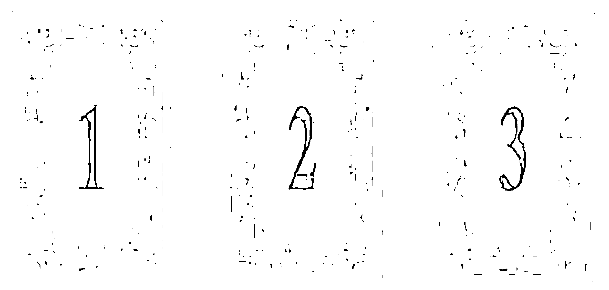

22 张大阿卡那、56 张小阿卡那、78 张塔罗牌。

## 发牌

## 解读

随意抽取三张牌，放在 1、2、3 号位置。

位置 1 代表你将摆脱、脱离的；
位置 2 代表你需要注意的；
位置 3 代表你将达成的。

## 缘分推测法

不管置身于幸福的恋情中还是正默默地单恋着，所有恋人们最想知道的问题都是：我和他/她的未来发展到底如何？这便是“缘分推测法”最擅长解决的问题了。它能够针对过去、现在、未来三个方面进行解读，同时提出对求问者的行动建议，是一种相当实际的推测方式。

## 发牌

- 1. 这个推测法跟其他方式有很大的不同：在进行洗牌的时候，需要求问者的配合。当你开始在桌面上洗牌的时候，请求问者同时集中精神，在内心里默念想推测对象的名字（一次只能想一位）。而你只要集中精神洗牌，不用想任何事物。然后，让求问者决定何时停止洗牌。当求问者觉得可以的时候，必须喊“停”，这时你才可以把牌依顺时针的方向，慢慢收拢。然后切牌的程序便和一般的方式一样进行。

## 解牌

- 2. 切完牌后，将最上面的第一张到第七张取出，依图示的位置放好。要小心，不要把牌的上下方向弄颠倒。
- 3. 牌型完成，翻牌进行解读。

## 解读

- 位置1代表的是求问者过去的恋爱经验。
- 位置2则是求问者与对方目前的状况。
- 位置3是求问者与对方的未来状况。
- 位置4象征的是这副牌建议求问者采取的行动。
- 位置5是对方的个性、行事的特征。
- 位置6为两人关系中可能出现的阻碍。
- 位置7代表两人最终的结局。

# 经典牌阵型

## 圣三角牌阵（X型）

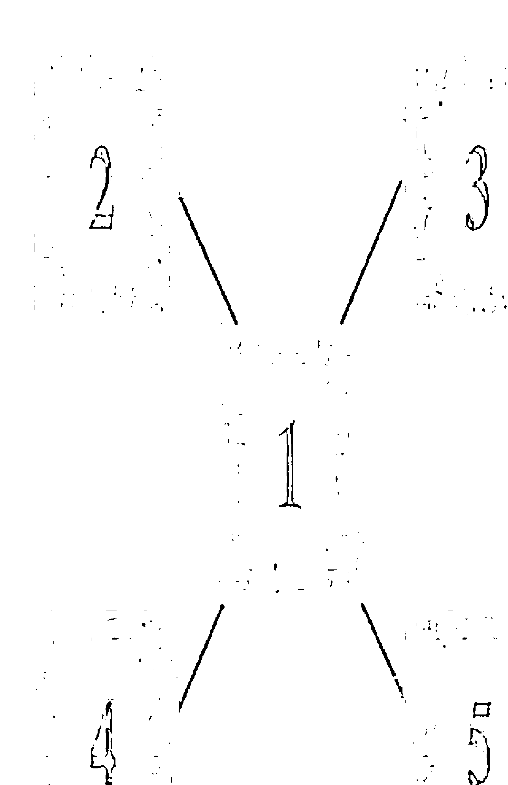

- 位置 1 代表你现在的心情、处境。
- 位置 2 代表你希望追求的对象。
- 位置 3 代表你不喜欢的对象。
- 位置 4 代表该采取的行动。
- 位置 5 代表未来的发展、最后的结果。

### 婚姻牌阵（圆车形）

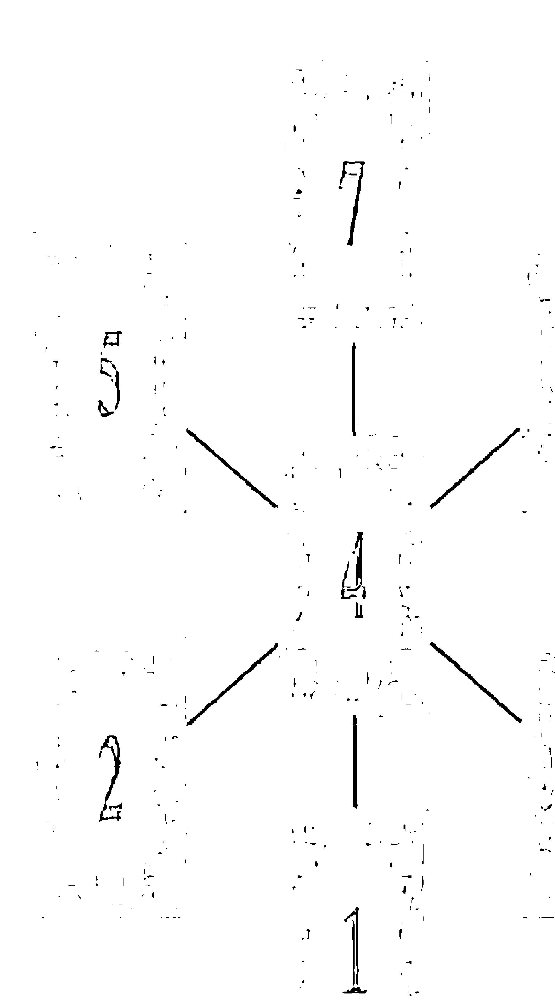

- 位置 1 代表你自己。
- 位置 2 代表过去的婚姻状况。
- 位置 3 代表现在的婚姻状况。
- 位置 4 代表婚姻遇到的问题。
- 位置 5 代表对婚姻的期望。
- 位置 6 代表对婚姻的恐惧。
- 位置 7 代表未来的发展、最后的结果。

## 自我探索牌型（钻石形）

## 解读

- 位置 1 代表你的个性、内在的自我。
- 位置 2 代表你的理性面。
- 位置 3 代表你的感性面。
- 位置 4 代表你的精神面。

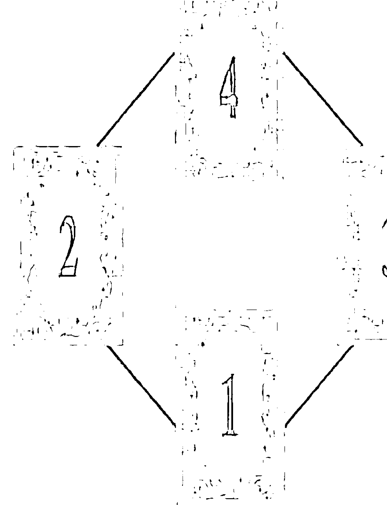

## 金钱/财物牌型（V型）

## 解读

- 位置 1 代表过去的状况。
- 位置 2 代表现在的状况。
- 位置 3 代表未来的状况。
- 位置 4 代表最佳的抉择。
- 位置 5 代表环境的影响。
- 位置 6 代表面临的阻碍。
- 位置 7 代表最后的结果。

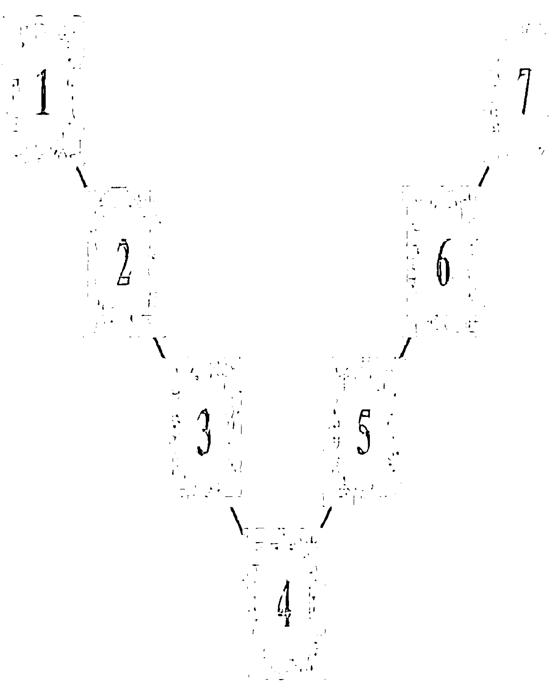

# 经典占卜塔罗

## 十二月运势塔型（O型）

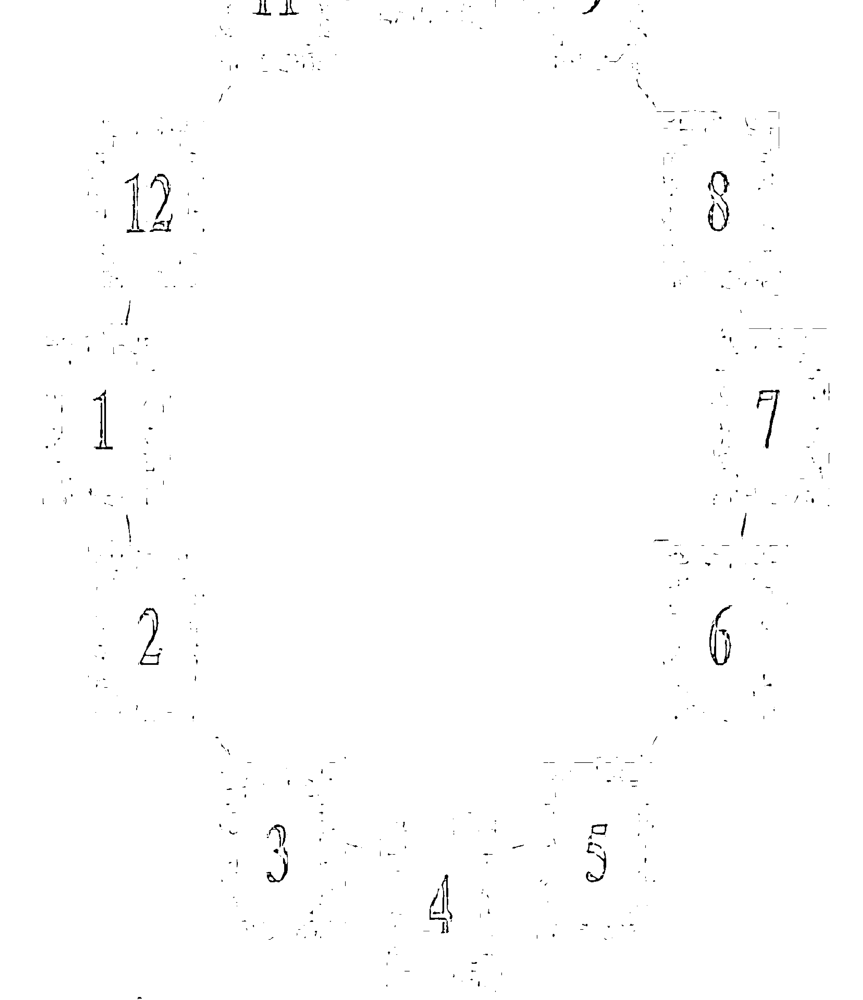

## 解读

- 1. 位置 1 代表第一个月的运气
- 2. 位置 2 代表第二个月的运气
- 3. 位置 3 代表第三个月的运气
- 4. 位置 4 代表第四个月的运气
- 5. 位置 5 代表第五个月的运气
- 6. 位置 6 代表第六个月的运气
- 7. 位置 7 代表第七个月的运气
- 8. 位置 8 代表第八个月的运气
- 9. 位置 9 代表第九个月的运气
- 10. 位置 10 代表第十个月的运气
- 11. 位置 11 代表第十一个月的运气
- 12. 位置 12 代表第十二个月的运气

## 塔罗牌解

## 问自己展开法

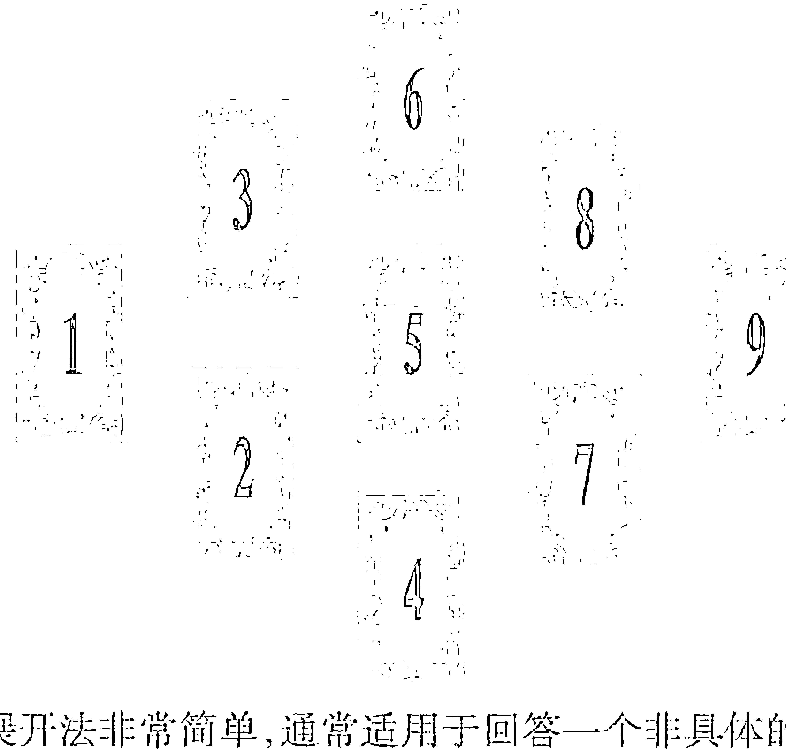

这种展开法非常简单，通常适用于回答一个非具体的疑问。首先由求问者洗牌，当确认他洗牌完毕，让他用左手切牌（如果是左撇子则用右手）。接下来接过牌并按图示排列。

## 解读

- 位置1代表求问者的特性，与他想解答的问题有关。
- 位置2代表隐藏的原因。
- 位置3代表机会。
- 位置4代表求问者为得到答案而必须接受的挑战。
- 位置5代表在将来必须计划好的问题。
- 位置6代表发现答案必须承受的负担。
- 位置7代表需要致力于一项任务。
- 位置8代表对问题赋予一个新的观点。
- 位置9代表问题的解决方法。

# 经典塔罗预测

## 经典牌阵

经典牌阵，是一些经过时间考验的牌阵，有一些甚至流传了数百年之久，相信这些牌阵会给求问者指点迷津。

## 凯尔特十字

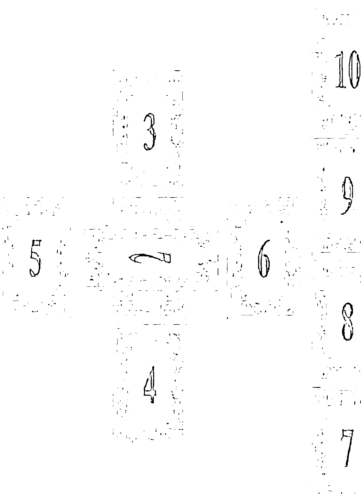

据说，塔罗牌刚刚出现的时候，凯尔特十字预测法就成为解牌的主要方法。相传，它是由流浪的吉卜赛人从埃及传到爱尔兰，在凯尔特人中广泛流行，成为战争或婚庆前必用的占卜仪式。

凯尔特十字流传至今，仍然是塔罗牌解牌的主流牌阵，也是很多塔罗大师偏爱的牌阵。它的取牌范围可以单独使用大阿卡那，或者是全套塔罗牌。

## 解牌技巧

传统上，凯尔特十字牌阵的解读是这样的：

- 位置 1 在十字形的中央，代表求问者的目前状况或是他现在的问题。
- 位置 2 与位置 1 呈十字交叉，代表要面临的阻碍或影响现状的困难。
- 位置 3 是在前两张牌之上，代表短期内所能达到的目标。
- 位置 4 在前两张牌之下，代表很久以前发生的事对现在的影响。
- 位置 5 在十字形的左臂，代表不久之前发生的事对现在的影响。
- 位置 6 在十字形的右臂，代表即将到来的时刻。
- 最后四张牌放在十字的右边，直线排列，由下而上：
- 位置 7 代表埋藏在心底的愿望与欲望，还有影响目前情况的基本人格。
- 位置 8 代表环境或家庭的影响，包括现实或精神上的住所。
- 位置 9 代表预料之外的好运或噩运。
- 位置 10 是对以上的全部总结，暗示可能的结果。

凯尔特十字牌阵有一段韵文，方便人们记忆：

> “1 找到你，2 影响你，3 加冕你，4 在你下面，5 在你左面，6 在你右面，7 是你的希望与恐惧，8 是你的房子与家庭，9 是超出你的预期，10 是一定会发生。”

还有一点要注意：当事人是指问题的主角，并不一定就是求问者。要知道问题解释的角度和对象不同，结果会相差很多。

# 星宫之书

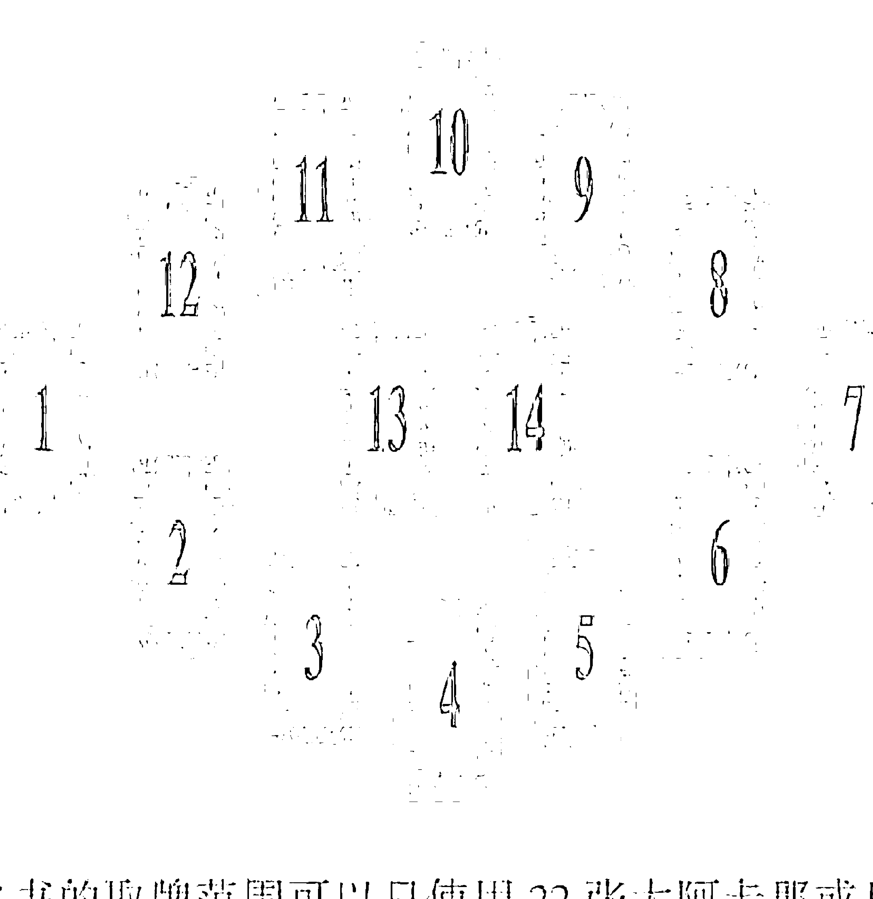

星宫之书的取牌范围可以只使用22张大阿卡那或只使用56张小阿卡那，还可以使用整套塔罗牌。

## 解牌技巧

- 位置1代表你的外貌与外在表现、个性。
- 位置2代表金钱、拥有物和价值观，你对于获得的东西要如何使用，你的价值与你如何设定你的目标。
- 位置3代表与其他人沟通的最佳方式。根据你的问题，短程旅行和兄弟姐妹等因素可能需要加以考虑。
- 位置4代表你的家庭状况，以及那些你需要去加强的各种因素，也代表你的双亲之一会怎样给予你帮助。
- 位置5通常是指你将用在外在欲望上的创造力，依据你的问题，恋情或小孩等因素应该要加以考虑。
- 位置 6 代表你的工作目标、工作节奏，以及你工作中的人际关系，也表示在这段时间内，你该如何照顾好你的身体。
- 位置 7 代表你的婚姻及人际关系，这些人际关系该如何帮你实现目标。
- 位置 8 代表性、死亡、改革和其他人的金钱，暗示你该如何激励自己，你应该放弃哪些东西，哪些部分需要变化，在金钱方面其他人能怎样帮助你。
- 位置 9 暗示你需要学习的事物，你需要前往的地方，你该如何坚持你的信仰并让你的人生观使你更加坚强。
- 位置 10 表示你的整体状况与生活经验，你应该要加强的部分，你的另一位双亲将会如何帮助你。
- 位置 11 代表你所接触、交往的朋友和团体，也代表对你的目标最美好的憧憬。
- 位置 12 代表当你单独一个人时会做些什么，隐蔽而没有显示的事物，还是指导你克服内心恐惧的最好方式。
- 位置 13 和位置 14 说明每件事情光明的一面。在牌义的解释上，这两张牌将告诉你最后必须知道而且非常重要的事。

## 七“行星”

七“行星”的取牌范围可以仅为 22 张大阿卡那或 56 张小阿卡那，也可以是全套塔罗牌。

## 解牌技巧

- 位置 1 代表月亮，指的是求问者的家人情况与家庭环境。
- 位置 2 代表土星，指的是求问者的智能及精神状况。
- 位置3代表金星，表示情感方面。
- 位置4代表太阳，指的是求问者的人际关系及社交魅力。
- 位置5代表火星，指的是求问者及其对手的竞争状况。
- 位置6代表木星，指的是物质的获得，或者人际关系、精神性物质的取得。
- 位置7代表水星，表示在贸易、商业、工作或学习方面的状况。

## 经典马蹄阵

## 意识动力

意识动力的取牌范围可以只使用22张大阿卡那或仅使用56张小阿卡那，也可以使用全套塔罗牌。

## 解牌技巧

此牌阵是用于了解意识、时间和结果之间的相互作用，当你有一项计划或决定时，就可以使用此牌阵。

- 位置1代表求问者的感觉和他所了解的现状。
- 位置2分析过去的事件对现在的影响。
- 位置3进一步解读位置2中的相关人物，以便客观公平地认清当前的状况或人。
- 位置4表示内心的道德对事件的影响。
- 位置 5 代表累积的习惯、情绪、事件，这些都会影响求问者现实方面的判断力。
- 位置 6 表示求问者不想有任何改变，情况会如何发展。
- 位置 7 暗示未来可能产生的结果。
- 位置 8 表示求问者可以做的改变，也有可能是一种让你偏离目标的诱惑。
- 位置 9 暗示更多可能的结果，前提是假如求问者听从位置 8 的指示时就有可能发生。

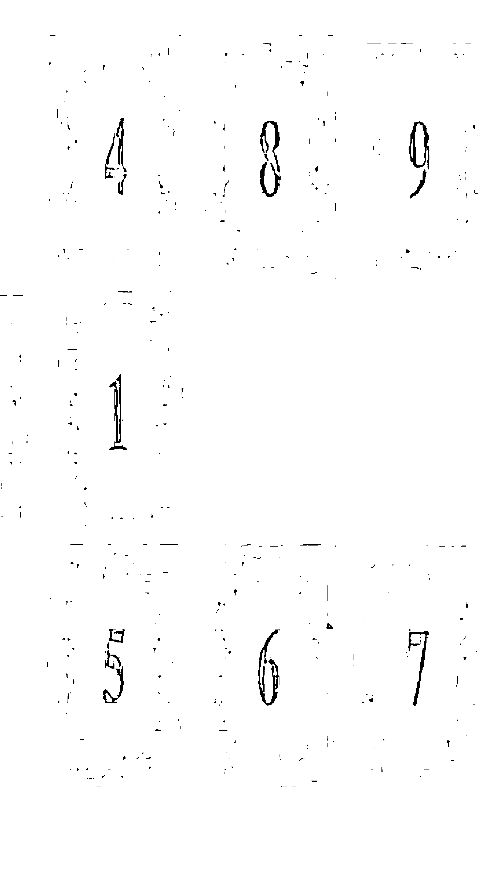

## 房形阵

房形阵的取牌范围可以仅为 22 张大阿卡那或仅为 56 张小阿卡那，也可以是全套塔罗牌。

## 解牌技巧

- 位置 1 代表客厅，暗示朋友、社交关系以及团体活动。
- 位置 2 代表休息室，暗示父母、兄弟姐妹、配偶、孩子和宠物。
- 位置 3 代表厨房，暗示健康和肉体。

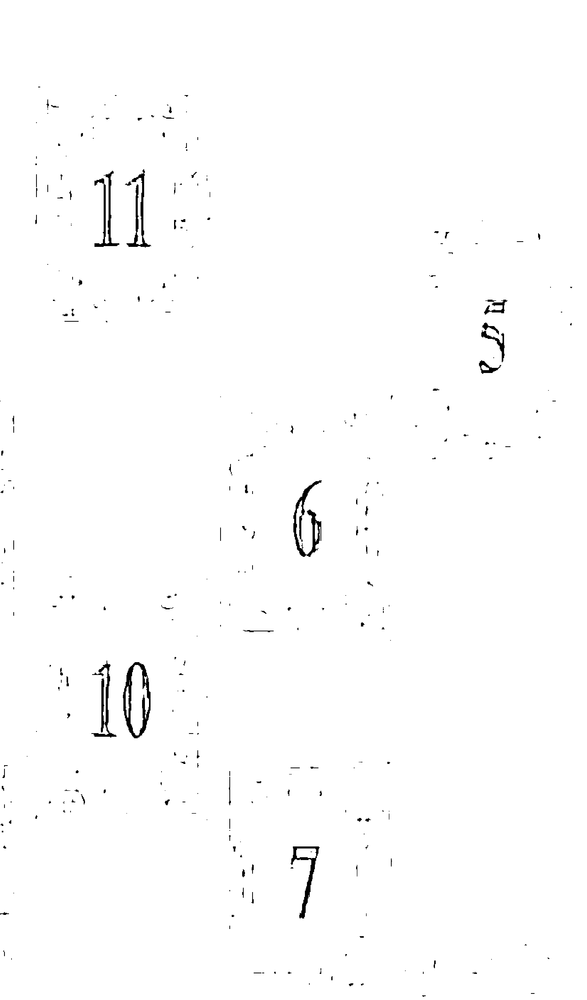

- 位置 4 代表私人房间，暗示工作、资金。
- 位置 5 代表洗衣间，暗示你需要留意的，必须小心的。
- 位置 6 代表地下室，暗示被隐藏的或者你没有意识到的，但却在你的生命中不断积累的。
- 位置 7 代表车库，暗示在你生命中停留并需要留意的。
- 位置 8 代表卧室，暗示对位置 9 和位置 10 的想法。
- 位置 9 代表后门，暗示正从你生命中离开的人或事。
- 位置 10 代表前门，暗示正走入你生命的人或事。
- 位置 11 代表阁楼，暗示你最后将取得的成就。

# 经典梦境塔罗

## 基础牌阵

基础牌阵的取牌范围可以仅为 22 张大阿卡那或仅为 56 张小阿卡那，也可以使用全套塔罗牌。

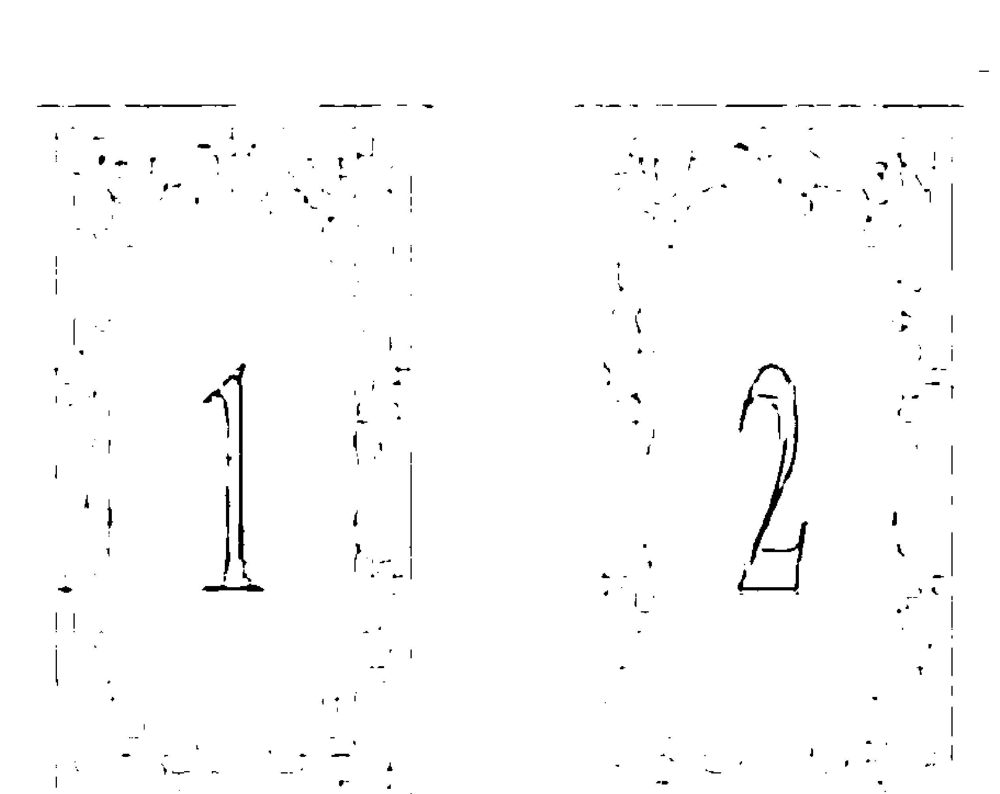

- 位置 1 代表我将失去什么。
- 位置 2 代表我将得到什么。

## 塔罗牌解读

## 今日运势

- 位置 1 代表事件，暗示今天可能发生的一些事。
- 位置 2 代表感受，暗示事情发生后你的感受，或者事情发生后你的反应。

## 了解自己

- 位置 1 代表我是谁。
- 位置 2 代表我的需求。
- 位置 3 代表我能达到的需求。

## 今天会发生什么

- 位置 1 代表今天的重点事件。
- 位置 2 代表这事件会如何发展。
- 位置 3 代表你怎样开始做这件事，或你该为这事件做些什么。

## 工作

- 位置 1 代表是否对工作作出了正确的选择。
- 位置 2 代表这项工作是否稳定。
- 位置 3 代表是否应该作些改变。

# 合伙

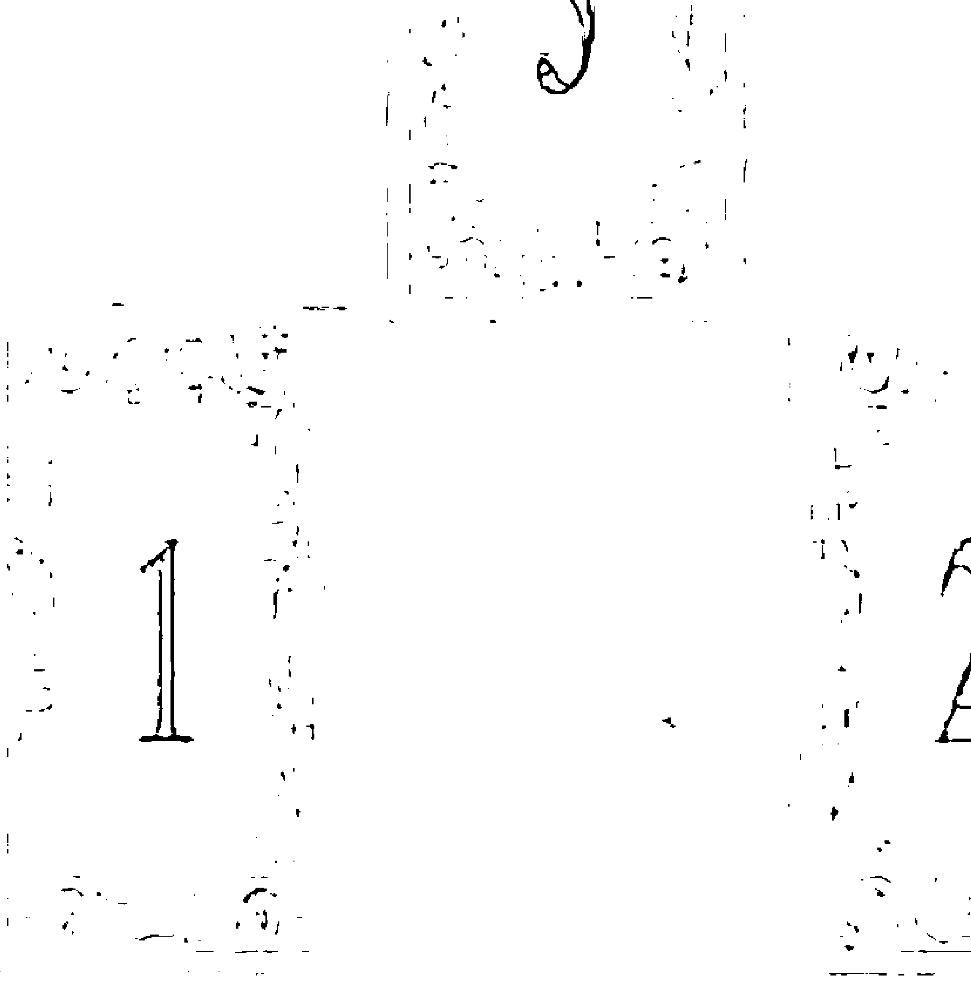

- 位置 1 代表我的伙伴。
- 位置 2 代表我自己。
- 位置 3 代表合伙工作的状况或者风险。

# 爱情牌阵

## 分手

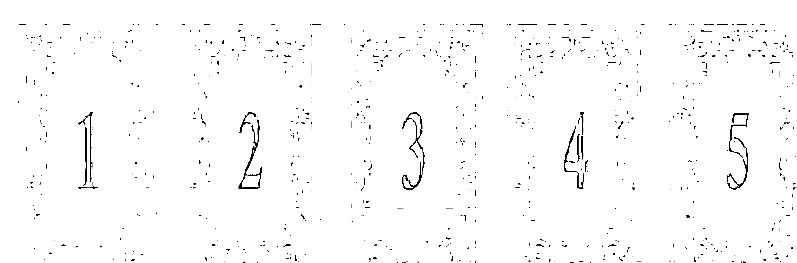

## 注意事项

分手牌阵主要是告诉你一些你必须取舍的事。
位置 1、2、3 则代表你为什么要放手，其中隐含的原因。
位置 4 代表你放弃爱情的主要原因。
位置 5 代表如果你选择了放手，那最后的结果将会怎样。

# 塔罗牌牌阵

## 真爱预测

- 位置 1 代表你真正的伴侣类型。
- 位置 2 暗示你真正的伴侣是否已走入你的生命之中。
- 位置 3 暗示将会出现的困难。
- 位置 4 暗示你需要作出的改变。
- 位置 5 代表在爱情中你坚持的信仰。

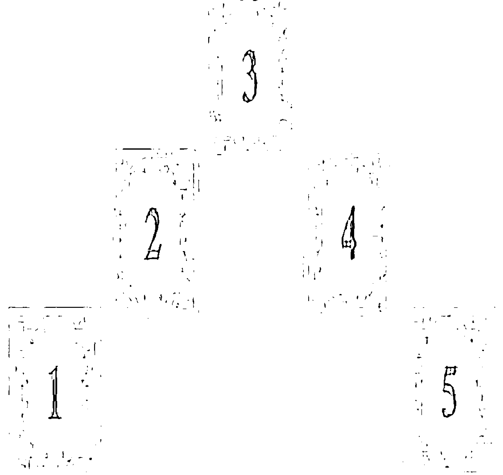

## 伤心已消失

位置 1、2、3 可以解读为造成现在爱情伤心与痛苦的原因。
- 位置 1 代表伤害你的事件或原因。
- 位置 2 代表在一起时，你们共同拥有的事物。
- 位置 3 代表破坏你们共同拥有的事物的原因或事件。
- 位置 4 暗示这种情况能否解决。
- 位置 5 暗示你们能否继续在一起。

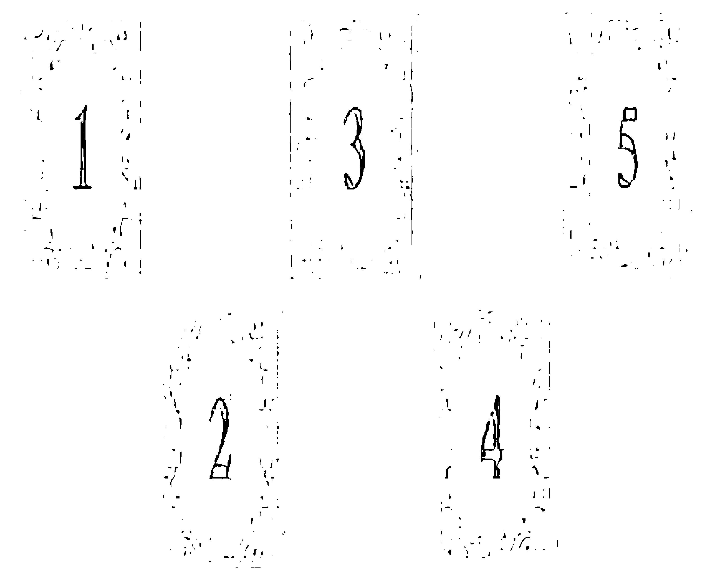

# 爱情奇遇记

## 爱的新起点

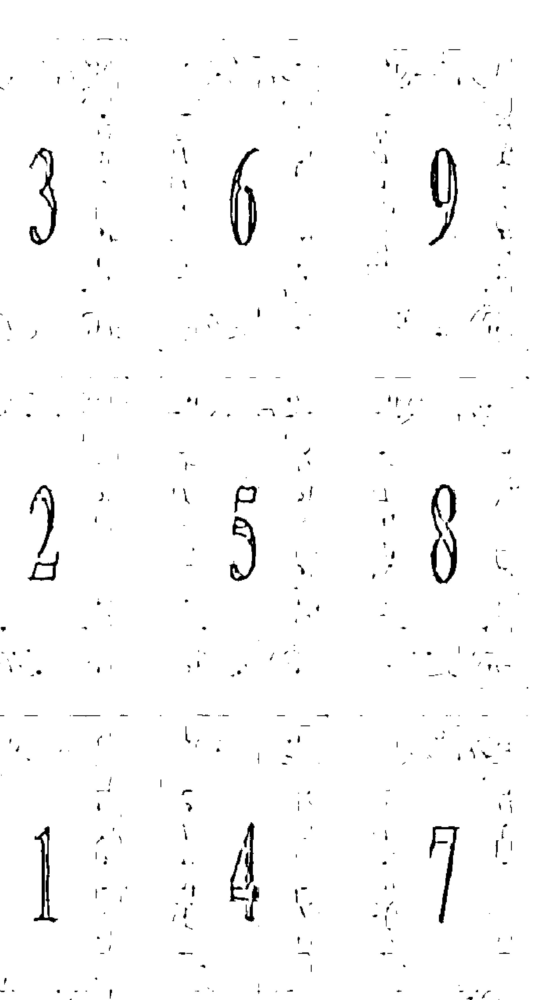

- 1. 位置 1 会告诉你这是否是个新的起点。
- 2. 位置 2 暗示你是否会有新的爱情出现。
- 3. 位置 3 告诉你随之到来的惊喜。
- 4. 位置 4 告诉你新的爱情是否会令你安心。
- 5. 位置 5 代表爱的过程将会如何。
- 6. 位置 6 表示你们是否会相处融洽。
- 7. 位置 7 提醒你内心所想的真假。
- 8. 位置 8 告诉你应该设定的目标。
- 9. 位置 9 告诉你一切是否会顺利。

## 评价爱人

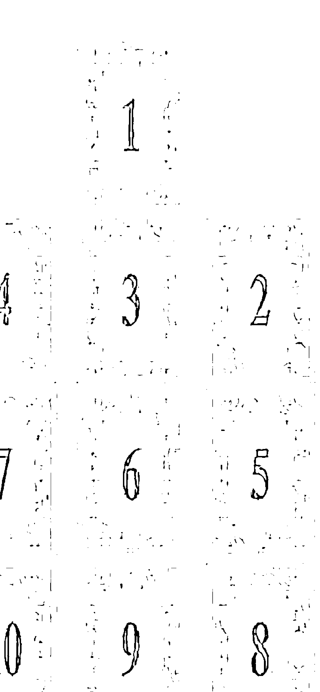

- 1. 位置 1 暗示你的爱人是否关心你。
- 2. 位置 2 暗示你们之间的感情是否稳定。
- 3. 位置 3 是让你明白你们是否有相同的目标。
- 4. 位置 4 告诉你，你的爱人是否忠诚可靠。
- 5. 位置 5 暗示“性”在你们之间的重要性。
- 6. 位置 6 代表你的爱人是否考虑过结婚。
- 7. 位置 7 告诉你，你的爱人素质的高低。
- 8. 位置 8 代表你们之间对于金钱的态度。
- 9. 位置 9 代表你的爱人是否会离开你。
- 10. 位置 10 暗示你们之间的最后结果。

# 财富牌阵

- 位置 1 代表你的愿望。
- 位置 2 告诉你该如何行动，才可以得到最后的结果。
- 位置 3 暗示如果想实现愿望，所需要的新想法。
- 位置 4 代表会帮助你的人或事。
- 位置 5 代表你将面对的挑战。
- 位置 6 代表你将得到的收获。
- 位置 7 代表实现愿望的关键。

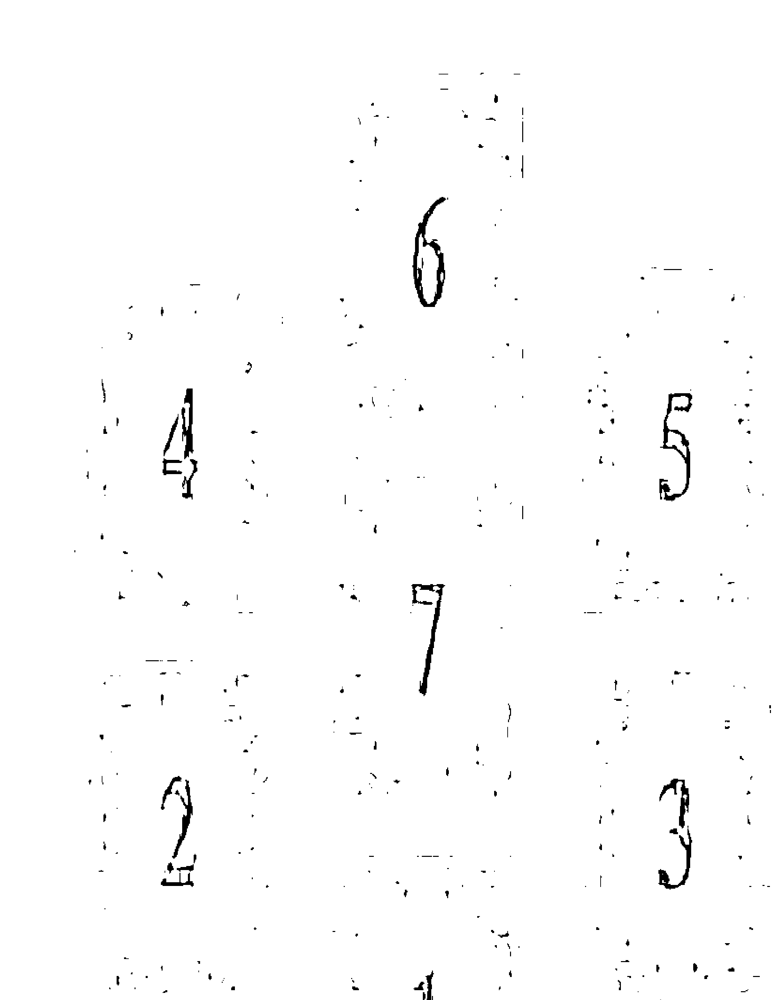

# 财富金库

- 位置 1 是钻石，代表你出众的地方，拥有的天赋、能力以及财富。
- 位置 2 是珍珠，代表应用于生活的知识与信息。
- 位置 3 是金币，代表目前可以支配的金钱与物质。
- 位置 4 是翡翠，代表你刚刚结识的人及产生的关系。
- 位置 5 是白金链，代表阻碍你发展的人或事。
- 位置 6 是蓝宝石，代表你与众不同、脱颖而出的能力。
- 位置 7 是水晶，代表你正在学习的知识与信息。
- 位置 8 是红宝石，代表注定要走入你生命中的那个人。
- 位置 9 是未经切割打磨的钻石，代表你尚未发挥的能力。

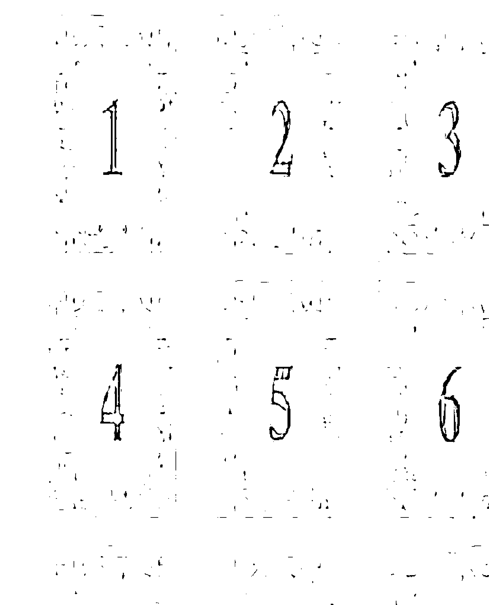

# 经典牌阵图解

## 事业牌阵

## 事业发展

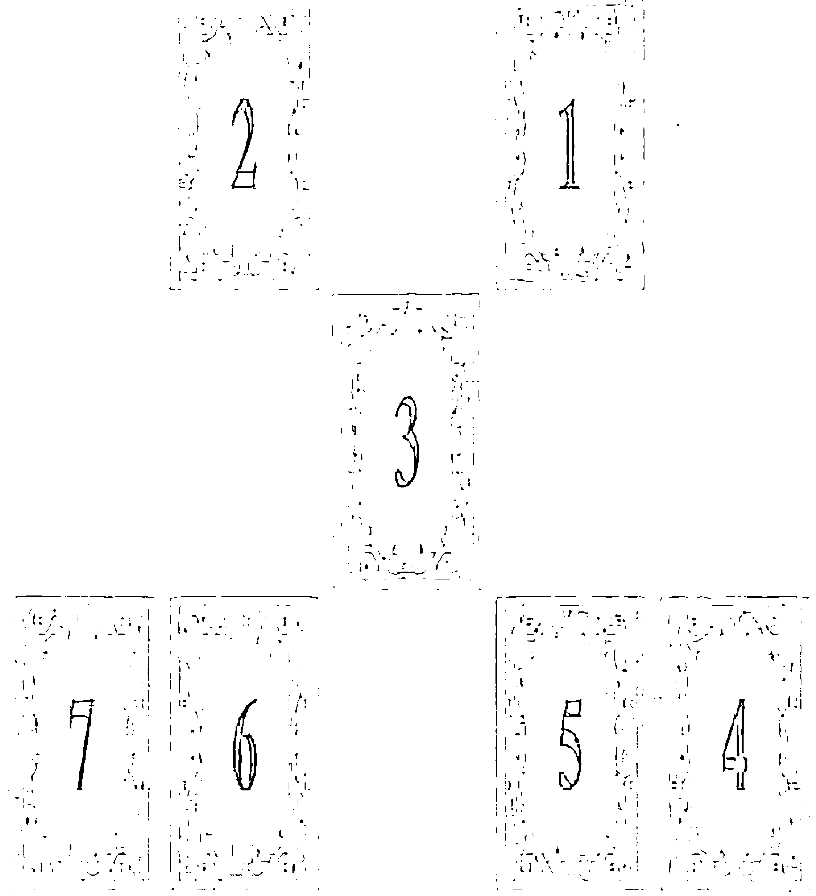

- 位置 1 代表你想从所选择的事业中得到什么。
- 位置 2 代表怎样做才能改善你的事业。
- 位置 3 代表事业中你无法改变的方面。
- 位置 4 代表你是否已得到最好的结果。
- 位置 5 代表你应该做哪些事来提升自己的事业。
- 位置 6 代表至今仍影响你的事业的障碍。
- 位置 7 代表最终的结果。

## 跳槽

- 位置 1 代表你能否拥有一个更好的工作。
- 位置 2 暗示你应该做些什么。
- 位置 3 告诉你将遇到的问题。
- 位置 4 告诉你是否应该企盼一个新的环境。
- 位置 5 代表最终的结果。

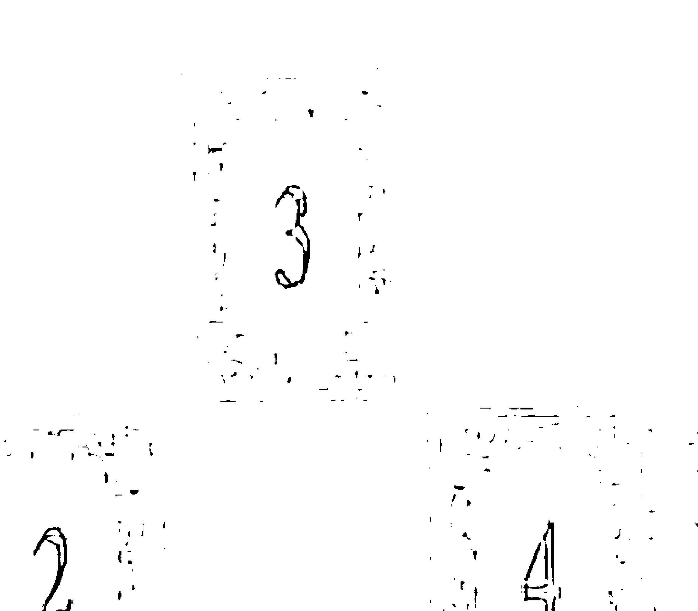

## 日常牌阵

## 四季运势

- 位置 1 和位置 8 代表春季，象征开始，就像是春天播种一样。
- 位置 2 和位置 3 代表夏季，象征计划的进展，努力将梦想实现。
- 位置 4 和位置 5 代表秋季，象征结果将会如何。
- 位置 6 和位置 7 代表冬季，象征计划完成后的收获。

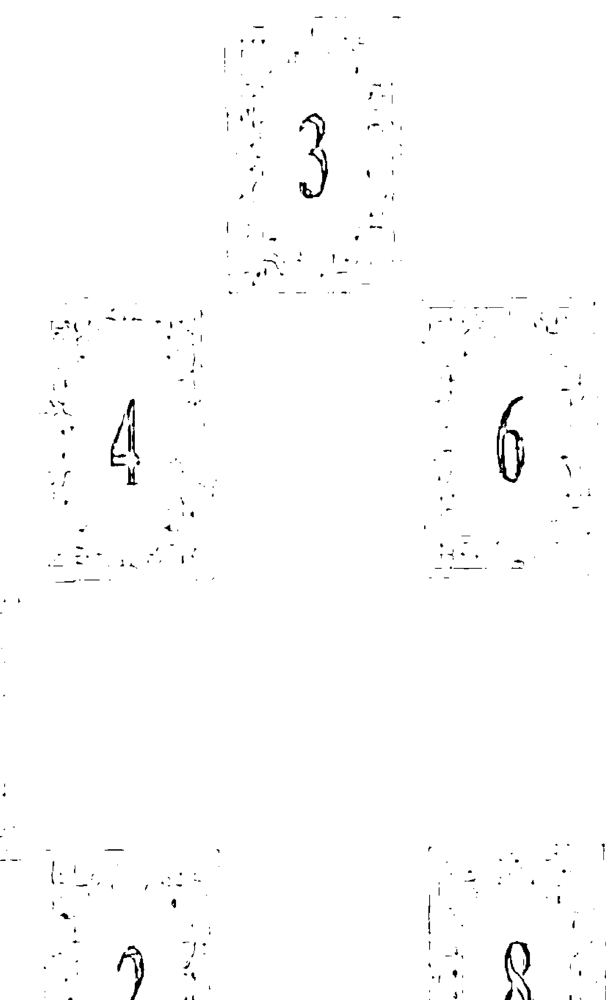

# 经典书籍塔罗

## 彩虹阵

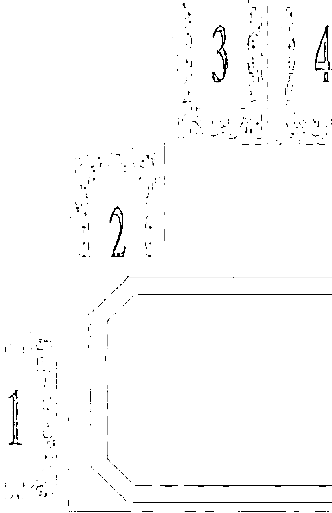

- 1. 位置 1 代表雨，象征阻碍实现愿望的事物。
- 2. 位置 2 代表细雨，象征为了实现愿望而进一步要做的事情。
- 3. 位置 3 代表雨停，代表将会帮助你的人或事。
- 4. 位置 4 代表阳光，代表你希望的最好状况。
- 5. 位置 5 代表彩虹，暗示短期的指引。
- 6. 位置 6 代表金色苍穹，指长期的结果。

## 飞鸟阵

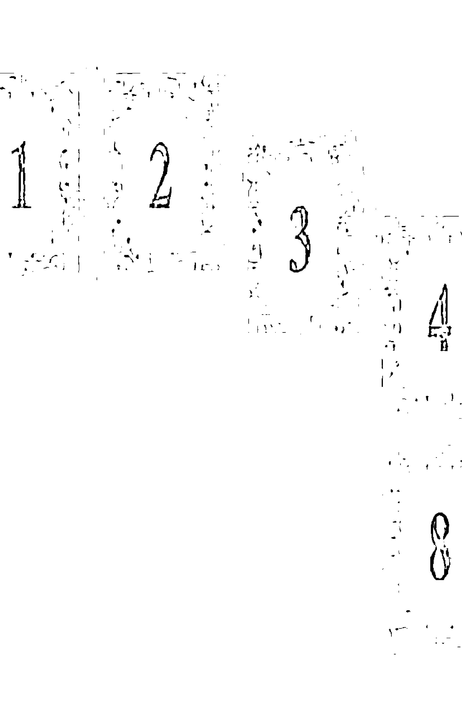

- 1. 位置 1 和位置 2 代表你目前的处境。
- 2. 位置 3 代表你如何到达你想要去的地方。
- 3. 位置 4 告诉你该从何处出发。
- 4. 位置 5 暗示你将得到什么，发现什么。
- 5. 位置 6 和位置 7 告诉你将学到什么。
- 6. 位置 8 告诉你这次旅行的结果。