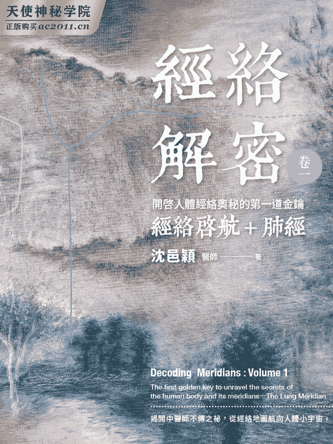

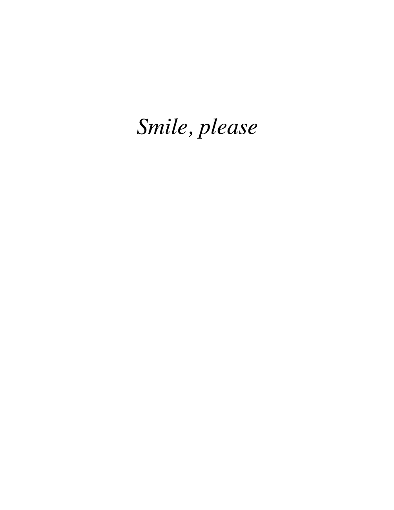

* * *

**Smile 146**

**经络解密 卷一**

开启人体经络奥秘的第一道金钥－经络启航＋肺经

作者：沈邑颖

策画：萧菊贞

封面画作：李美慧

内页图：小瓶仔

责任编辑：李潍美

美术设计：张士勇、许慈力

校对：赵曼如、萧菊贞、沈邑颖

出版者：[大块文化出版股份有限公司](http://www.locuspublishing.com)

台北市 10550 南京东路四段 25 号 11 楼

法律顾问：董安丹律师、顾慕尧律师

著作权所有　侵权必究

EPUB 初版：2018 年 6 月

档案制作：菩萨蛮数位文化有限公司

* * *

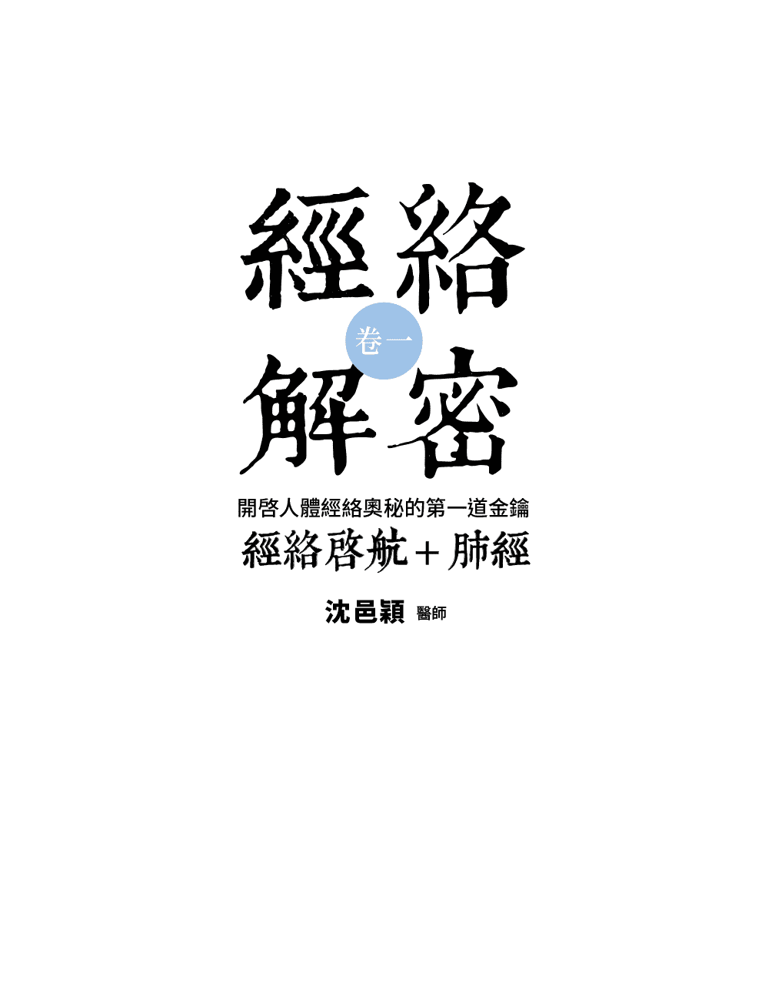

目录缘起自序：含藏时间与空间秘密的中医学经络启航一、中医的人体脏腑理论 1.从生命演化看人体阴阳概念脏象学说 2.人与身体的对应关系五脏六腑互为表里身体与情志密不可分五脏六腑对应十二官位 3.人与天地的对应关系五行学说的特色中医的时间医学二、中医的人体经络理论经络系统是演化生命体的维生连结系统 1\. 经与络的定义经络的分布 2. 经络的功能和重要性经脉三部曲经络系统是中医的核心 3.经络四大系统的特色以肺经为例，认识经络四大系统 4. 经脉系统的命名 5.经络系统为五脏六腑建立表里关系 6.经脉系统的循行特色 7. 经络系统连结五脏与肢节 8. 经络系统连结五脏与五官 9. 经络四大系统的个别特色 10.认识经络图与经穴图 11. 经络系统为人体建立运输通路与专属系统 12 . 经络系统「由外知内」及「由外治内」的特色 13.中医诊断治疗疾病的利器：结构的必然性 14. 十二经络系统隐藏大秘密肺经总论经络解密「开幕式」──现在的我们是演化的作品一、肺经甦醒三部曲第一部曲「纯净重生」第二部曲「储备蓄势」第三部曲「寅始出发」二、肺经是时间的记录者重温肺经三部曲经络系统是一份寻宝图肺经就是每一天的勇气来源肺经四大系统一、肺手太阴之脉（经脉）1.手太阴肺经──循行特色肺大胃觉醒专线肺腑之言，开怀赞美专线 2.手太阴肺经──经络关系 3.手太阴肺经──病候二、手太阴之正（经别）三、手太阴之别（络脉）四、手太阴之筋（经筋）肺经的保健肺经的人生哲学

## 缘起

2016 年出版《中医护好心》的医普书之后，原本打算撰写已被我搁置已久的中医专业书，但一次与郝明义先生见面之后，竟又改变了计划。

郝先生对于中医理论很有兴趣，尤其是经络系统，我当下即与他分享经络的概念和奥妙，没想到他听了之后马上问我：「如果想进一步了解经络，有没有可以参考的入门书？」被他突然一问，我竟一时答不出来，因为最早学经络已经是几十年前的事了，之后的印证与研究则是在临床经验上慢慢累积与体悟出来的。但我心想过去或许还没有合适的书籍，但现在应该会有吧！我答应郝先生回去找找再回覆他。

回到医院工作，我询问坐在后面跟诊的一群年轻医师们，「如果想进一步了解经络，有没有可以参考的入门书？」

年轻医师们异口同声的答案竟然是：「没有！」

我听了感到很惊讶，后来自己上网搜寻相关资料，确实没有找到合适的入门书。回想自己学习中医的过程中，尤其是经络系统，多数是从古书典籍里去搜寻及思考，而现代的一些经络书籍对于一般读者而言，仍较为深涩古奥，难得其门而入。因此我当下就起心动念，干脆自己来写一本趣味的经络入门书吧！可是，内心却很挣扎！说好的中医专业书何时才能开始动笔呢？

但后来想想，其实十几年来不断有对中医感兴趣的病人，以及中西医同道询问如何进一步了解经络？如果能够藉此机会将经络概念推广给更多人认识也不错，就决定先轻松的写一本经络医普书吧！

刚开始写经络时还真的很轻松，因为这些年我也开过许多经络课程，临床上更是以经络概念来做诊治，因此要切换到与隐形的读者们聊一些经络与生活中的趣事，自己也写得很开心！同时我也常在诊间和脸书上，与病人、跟诊医师和好友们分享写书心得，逗得大家笑呵呵。然而大家听完之后，开始提问了……病人希望增加养生保健；医师希望增加临床诊治；亲朋好友建议增加深度与广度……不同的期盼都是善意，使得我原本轻松的心念也跟着动摇，试着将一些比较专业的概念写进书中，然后就一发不可收拾，因为一旦加入专业的思路，就没办法轻轻带过，势必要说清楚讲明白，解说的文字与图表就一直增加，每条经络内容就跟我的身材一样，不断地「长胖」，如果纳入一本书，势必会比枕头高，这可怎么办呢？

谢谢大块文化的谅解与支持，经过几度讨论，决定由原有的一本书「繁衍」成八册《经络解密》的套书。

感谢郝明义先生的「投石问路」，主编李潍美小姐的信任，庄智翔医师、余宛真医师、张玉玲老师、王玉萍小姐、慈济大学何翰蓁老师，洪素贞老师与杨雯婷小姐的协助审稿润稿，李美慧老师提供画作为本书增色，清华大学萧菊贞老师统筹和总校稿，还有参与讨论的所有病友及医师们，才让这套兼具医普与专业，并以现代人的理解方式所阐释的经络入门书，于焉诞生！

本系列书纯属个人在学习中医及门诊临床的心得，胆敢不揣浅陋出版，提出一些另类思考，主要是希望能抛砖引玉，让中医呈现出该有的多元与丰富面貌。但由于作者学养浅薄，尤其演化学非个人专长，文中若有疏漏之处，敬请各位先进不吝指导。

## 自序：含藏时间与空间秘密的中医学

自古以来，中医理论因为文字古奥精简，内容博大精深，通常是读书人或儒医方能一探究竟，一般人很难理解。这种情况到了近代更加严重，由于西方医学的快速发展，已成为医界主流，若以西方现阶段的科学逻辑来理解中医，那只会使得传统的中医理论更加难懂，外加被贴上「不科学」的标签。

但中医真的那么难理解吗？

以个人浅见，中医医学难以理解的主要原因之一，在于它涵括的内容太多太广，以天地为空间，含括人体，而不侷限于人体；以透析人类演化的时间为纵轴，而非单一的人身生死为起灭。因此古人常说，一位优秀的医者或士人要上知天文，下知地理，中知人事。这里所强调的正是中医学最大的特色，呼应大宇宙的全人身心小宇宙观，若能以此学习态度来认识中医、理解中医，那必定会被其博大精深所震慑，若是受限于分科、分部位的西方实证医学思考，那就容易读不通了。

虽然现代学校教育中也都有相关的天文、地理、历史、生物和文学等课程，规划上也算善尽培养现代的知识分子，但实际面却是让学习知识流于应付考试，而非造就知识的融会贯通。现今医师的养成，也是由学校教育而来，大家多是学院里的顶尖优秀人才，兼具中医、西医的丰富学识，但我也发现很少有医师能跨足其他知识学科，将看似非中医的知识与智慧应用于中医理论的思考，一窥经典的真正奥秘。我个人虽非中医正规教育出身，身处在同样的中医大环境下，过去的思考也多在中医领域，在探索中医的过程中，当然也遇到一些难解之谜，直到十年前，开始教授经络系列课程才有所改变。

我讲课向来不希望同学死背，而是理解它的脉络思考，这样在临床上遇到病人与疾病时，才能举一反三，灵活运用。记得当时备课之际，要说明中医所谓的「合谷太冲开四关」概念时，我一直在思考如何解说位于手背第一与第二指间虎口位置的合谷穴，与位于足背第一与第二趾间的太冲穴，两穴如何通力合作来开四关（疏通身体的阴阳气血运行，详细内容将于大肠经部分说明）。

想着想着，脑中突然闪过四肢并用爬树的猿猴，牠们的手跟脚长得很像，大指（趾）与其他四指（趾）分开，都有「虎口」的型态，能利于四肢同时握住树干爬树觅食。但人类的脚却已进化为五趾并排，并且形成人类特有的「足弓」，脚掌左右窄，前后长的坚固拱形结构，适合长距离的直立行走。

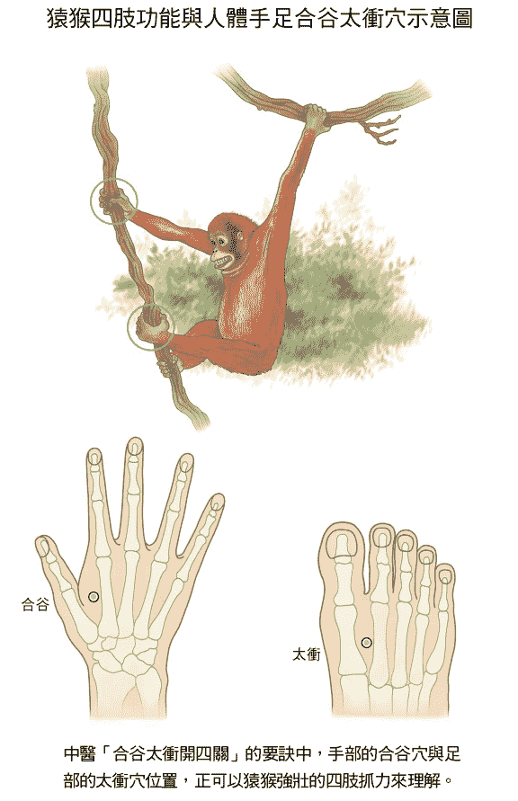

如果我们将合谷及太冲两穴放回到猿猴的身体，就会看到这两个穴位恰好在相对的位置，也就是说，由于猿猴的手与脚都有「虎口」，合谷与太冲两穴都位于「虎口」处，这也是抓握时可以如钳子般施力紧握的部位，让身体可以在树丛中灵巧的活动、追逐、觅食、求偶、逃生等，这些都是野外丛林生活必备的生存能力，因此这两个部位一定具有非凡的能力。

当时思考着，中国古代医家所记录的合谷与太冲穴，有没有可能就是源自于过去那两个曾经位于手与足的相对位置？如果是，合谷与太冲当然具有开四关的最佳条件！

从那时起，我开始收集演化资料，陆续发现许多与中医相对应的奥秘之处。

例如我从临床诊治病人经验，观察到人体的疤痕组织对于身体功能会产生持续的影响，无论当事人是否记得这个疤痕的发生时间或疤痕的存在，但身体并没有遗忘，而是牢牢的锁上了这道伤痕的印记，于是疤痕也就理所当然的对人体的机能产生了影响。

从这个经验以及后续的观察，发现身体的记忆力远远超过人类意识的记忆力，譬如很少人记得自己在胚胎时期或是小婴儿时期的情况，但是身体会记得，因为人体结构很像树木的年轮，会记录生命每一个阶段的经历。

无论我们喜欢与否，现代考古学家已经证实，人类的演化是经过好几个大阶段的改变，我们可以说是升级版的鱼类，乍听之下大概很难接受，但这说法的重点是强调在人类的演化过程中，有经过鱼类阶段，而且某些鱼类特征还保留在我们身体里面。例如人类胎儿在母体子宫内是生活在一个充满液体的袋状空间「羊膜腔」，腔中的液体就是羊水。羊水可以提供浮力，让胚胎自由活动、缓和冲击等等，可说是维持胚胎成长及守护生命很重要的结构。若羊水过少，可能造成胎儿发育受限，胎儿宫内窘迫，甚者造成胎儿畸形与新生儿窒息，羊水的重要性可见一斑。

除此之外，国外还有妈妈在水中顺利分娩，也有实验将新生儿放到水中，小婴儿却能轻松熟练的在水里摆动四肢，不会呛到水，可见现代人类早期的生命仍旧生活在水中，跟鱼类一样，所以能在水中悠游自在。

面对人类的演化历程，我也开始推想，传统中医对于人体脏腑和经络的见解，不仅是现在这个时间空间条件下的人体，还包含更早以前的人类形体，甚至还可以将时间再推向早期的演化阶段。因此就尝试逆着演化的时间线往回推，越推越惊讶，发现许多早期生物的特征，竟然已经被记录在中医理论之中。难怪以现代人的眼光和侷限的知识，无法理解宏观与天地对话，微观将时间与空间浓缩在人体之内的中医理论！

由此体会，中医学并没有「发明」人体的理论，而是「发现」人类从单细胞生物演化的历程还深藏在我们的身体里面，中国古代的贤者将这些发现记录下来。他们同时还发现，生存在天与地之间的人类，也与天地宇宙规律相对应，体现在人体的脏腑和经络之中，因此就汇聚了这些观察和临床的验证，整理、归纳、建构成一个可以传承给后代医者的医学理论。下图是中医对于人体的观察。

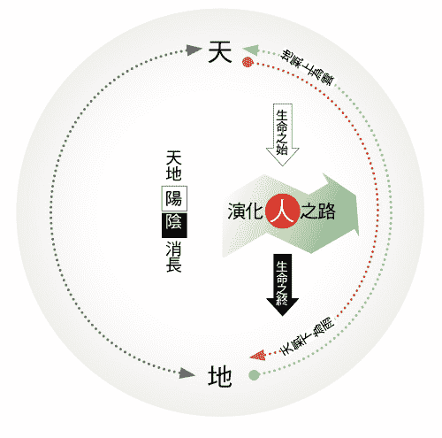

若以轴线来看，人类演化是一个以时间性为主的横向水平轴，天方地圆的宇宙是一个以空间性为主的上下垂直轴，而人类就位在这两个水平与垂直轴之间，人体也就包含了这些讯息。就东西方医学所观察的人体来说，西方医学以当下这个时间空间的人体为主，中医则以历经四十亿年演化和天地关系的人体为主。这也是为何东西方医学都是面对同一个人体，但思考逻辑会差异那么大的原因之一。

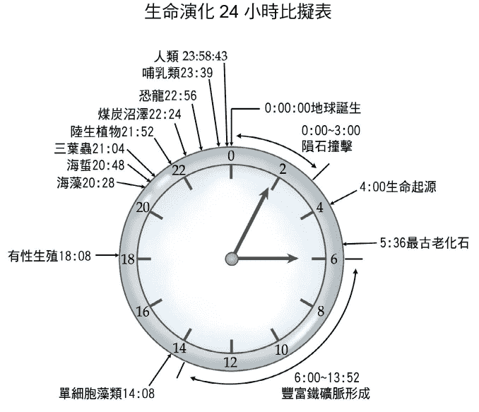

我也从上述中医理论的特质中，发现中医理论可以从古代应用至现代，仍非常有疗效，且能历久弥新的部分原因。

以生命的演化历程来看，最早生命的出现大约在四十亿年以前，而人类的诞生大约在两百万年前。有科学家将地球的生命以 24 小时做比喻，人类诞生的时间点在这个时钟的 23:58:43，仅占 1 分钟多一点点的时间，以此比例，可以看出人类在演化过程中出现的时间很晚也很短。

依照这样的理论与考古发现，从最早的单细胞生物演化至今，大约历经了四十亿年，最后两百万年才出现具有现代人类的身体结构。这些亿年、百万年的时间单位，听起来是难以想象的巨大，尤其对我们这些只有百年身的生命经验来说更是抽象，但我相信我们的身体是保留了这演化的记忆。就像有植物学家研究森林中的大树，也已经证实大树的细胞是存有演化记忆的。

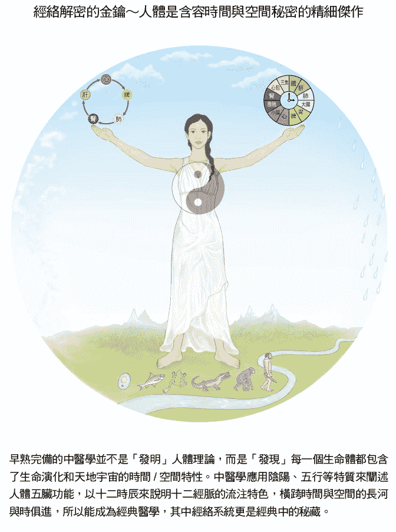

生命演化的历程，换个角度，发挥想象力来浓缩时间比例试想，从一颗小小的受精卵开始分裂，一直到胚胎的成长，都在母体的子宫羊水之中孕育，受孕十月后胎儿成熟呱呱落地，而后历经婴儿期「七坐、八爬、一岁站」的时间才学会自立，这必经的「新生儿诞生」过程，彷彿重演了一场生命演化大秀。

所以，只要能掌握人类演化的概念与方向，就能超越时间与空间，窥见人体的奥秘，找到治疗身体疾病的关键。我想，这也是中医学能历经千年而不衰的关键之一吧！

在这套书中写下的不只是我研究中医的思路与临床经验，也期望与各位读者分享，虽然中医典籍的文字精要深奥，但它所记述的内容，却是涵盖天地，亘古贯今，穿越时空的，这样的内涵多么地浩瀚精妙呀！这也是前人高度的智慧与逻辑归纳，所留下的真正宝藏。

所以中医学不只是一个早熟而且完备的医学体系，在经历了时间、空间、环境、社会的变迁后，还能与时并进，为现代人解决病苦，绝对足以堪称为「经典医学」。而其中的经络系统，又是这经典中的秘藏，或许有人以看不见来怀疑经络的存在，但我却从临床诊治上，真实的感受并体察到经络的存在，与其在人体中所扮演的重要功能。所以在《经络解密》系列书中，我将人体十二经络分为八册依序书写，期待不只让大家认识经络，还要深入经络系统，为人体解密。

以下为八册书的分册介绍，先略作说明：

《经络解密》卷一：

揭开人体经络奥秘的第一道金钥──经络启航、肺经

肺经启动生命的每一天，让我们得以蓄势待发之姿迎接甦醒后的挑战。身为十二经络的首发经络，肺经包含着人类生命演化历程以及天地对应的重要秘藏，也是全身气血循环的第一道关口，有着娇嫩、洁癖的特性，让我们每天都能从洁净中重生，成为揭开人体经络奥秘以及开启学习中医之门的第一道金钥。

《经络解密》卷二：

强健体魄、延续生命的关键──大肠经、胃经

大肠经与肺经相表里，是肺的贴身护卫，为肺解风热，通鼻窍，调气机，更配合老大哥胃经一同完成营养吸收和代谢的任务。

中医认为脾胃是人的后天之本，胃经亲自掌理食物的消化与吸收，它同时也是传宗接代的重要经络之一，因此有强健的胃经系统，就能拥有健壮体魄、全能发育、耳聪目明，对于个人的成长学习以及繁衍后代，都具有正向的影响与支持力。

《经络解密》卷三：

充满幸福甜滋味的大地之母──脾经

脾与胃为后天之本，除了运送胃所吸收的营养物质之外，脾经还有人体中非常重要的向上升清力量，因为她在体内形成一个宛如篓子般的特殊生理结构，对抗地心引力，托住了人体的重要器官，也深深影响女性一生的经带胎产四大事。此外，脾的五行属土，如大地之母孕育及滋养万物，加上甘味入脾，让脾经成为一条充满甜蜜滋味，幸福家庭的经络系统。

《经络解密》卷四：

维系身心平衡运行的君主之官──心经、小肠经

心是生命之本，主血脉也主一个人的神志，是五脏六腑的君主之官，就如过去王朝的国王，其重要性可见一斑。心经系统虽然很短，却像中心枢纽似的连结了各方重要的经络系统，成为身心平衡运转的关键掌舵者，维持情绪的稳定（EQ）。

心脏是如此重要的君主，身为表里经的小肠经就是心脏的护卫军。小肠经就像古代的花木兰，刚柔并济，不仅从人体背部保护心脏，为心脏代谢水液与火气，成为维持美丽容貌的重要经络系统。

《经络解密》卷五：

人体最珍贵的先天之本与最强大的护卫官──肾经、膀胱经

中医认为肾为人的先天之本，决定人的先天体质。肾储藏着人体宝贵的精气，并主管骨、髓及脑等，与智商、智力发展、学习能力密切相关。肾经主动连结许多脏腑，提供精气，维持身体的机能。肾也是人体最后一道防线，一旦重病或久病，阴阳失衡，气血严重损耗，都会影响到肾而危及生命。

膀胱经是肾经的表里经，是护卫肾脏的最重要保镳。本经主要分布在人体背部，从头到脚，是人体最长、最大的防卫系统，是抵御外来邪气侵袭的第一道防线。

《经络解密》卷六：

心的密使与人体代谢网──心包经、三焦经

心包是心脏的外膜，可以视为心脏这位君王的贴身小厮，是一起成长的开心玩伴。随侍君侧，是心的密使，为心脏打理一些个人私事，使命必达。当君王有难时，也会代心受邪受难。

与心包经同为表里经的三焦经，是运行气血和津液的道路，也是人体之中，最精细无所不在的代谢网络，善于行气祛湿消肿。

心包与三焦两者合作，藉着细密的代谢系统，将心脏的君令布达，协助执行，维持人体代谢循环的平衡。

《经络解密》卷七 ：

人体最强的排毒与净化工务组──胆经、肝经

胆经位于人体的侧面，宛如拉鍊般连接身体前与后的结构，是人体气机与结构的枢纽，让身体可以保持弹性，得以自在旋转、跳跃，也是重要的排毒与代谢系统。

肝经主管生殖系统和传宗接代有关，肝主怒，专责对抗压力，也是影响脾胃功能的隐形杀手。肝经身为最后一条经络，将气血净化之后交给肺经，重新启动每一天纯净的开始。

《经络解密》卷八 ：

掌握经络奥秘，航向身心和谐之道──终极解密

整体性的分析比较十二经脉特色，介绍如何综合应用经络系统来自我保健和诊治疾病，以达身心和谐的秘境。同时分享个人临床诊治疾病的经验，呈现经络在人体所展现的「神功」，并将解开期待已久的十二经脉系统三组团队所隐含的身体终极奥祕。

人体的十二经络各有所司、各有所掌，让人体这个小宇宙得以每分每秒、每日每夜，生生不息的与天地并行。若能对经络多一点认识和了解，不只是守护健康，更是习得一套天、地、人和谐共处的养生秘籍。

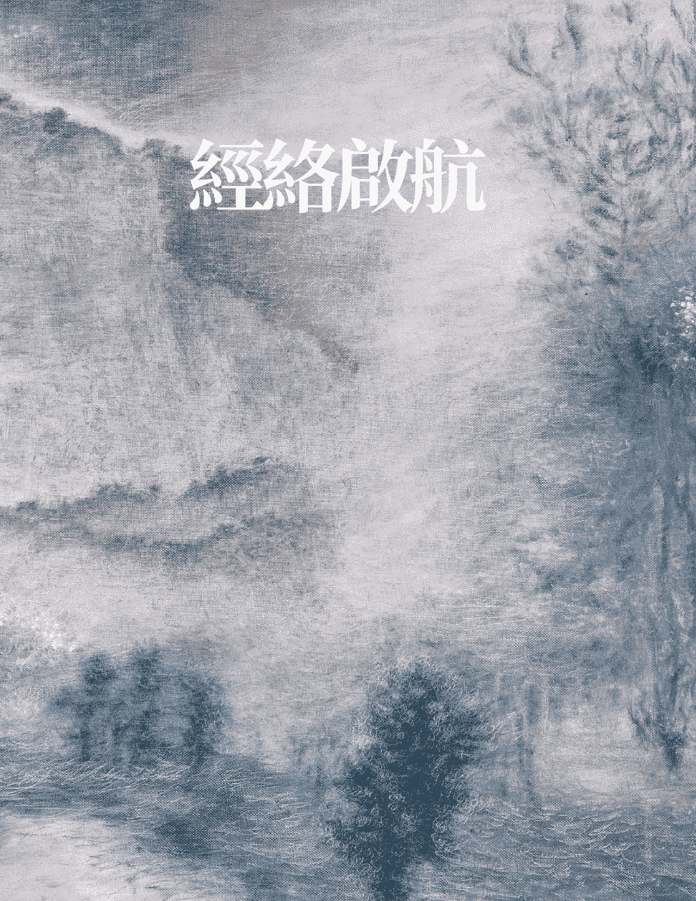

# 经络启航

### 经络启航

中医看人体，最大的特色就是「全人整体观」，身体本身是一个完整精密的有机体，生命的运行，依赖脏腑运作、气血运行环环相扣以维系，也因为互相连结，并且相辅相成而达到平衡，因此当身体失衡失序而产生病痛时，在临床观察诊治上，就可以循着经络系统发现病征、解决病症，进而重回平衡的运行状态。

在依序走进人体的十二经络小世界前，首先要对整体的中医经络系统建立一全盘观点，我将从中医的人体脏腑理论，与中医的人体经络理论两方面带入。

#### 一、中医的人体脏腑理论

##### 1.从生命演化看人体

人类的生命起始于单细胞生物，随着生命的型态及生活环境的改变，逐渐演化出：功能由简而繁，器官由少而多，组织由小而大的特质。如右图。

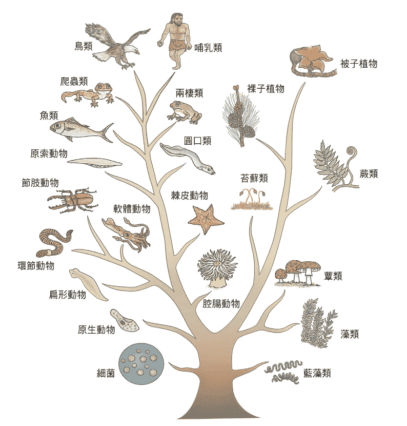

在过去简单生物时代，营养输送以及讯息传递都很简单迅速，就像小家庭或小公司一样，人口简单，联系迅速。但当人体逐渐变得复杂且巨大时，身体机能仍有一个共同目标就是「维持生命」，但是如果没有适当的管理，各组织器官很容易各自为政，导致身体的崩坏，甚至死亡。就像大家庭或大公司，当成员增多之后，就会开始建立制度，以确保能在同一目标之下，各自发挥所长，维持公司或大家族的运作。人体也是一样，会建立组织器官之间的营养输送以及讯息传递系统，让所有组织器官成为一个「整体」，同心协力完成维持生命的重责大任！

在进入人体与天人地对应之前，先介绍中国传统文化中的阴阳概念，以及中医独特的身体观「脏象学说」。

###### 阴阳概念

阴阳的概念早已渗透到中国传统文化的各个方面，例如中医、哲学、历法、宗教、风水及占卜等，只要看到右方包含阴（黑色）阳（白色）的太极图，马上联想到与传统文化有关的事物。

前人真的很有智慧，面对复杂的万事万物，以简驭繁，提纲挈领，选择阴与阳来归纳，然后又可以变化无穷，亦即在不变的阴阳关系中，还存有变化无端的阴阳！这么聪明的阴阳概念从何而来？据传是先民们观察到自然界中存在着各种对立又统一的现象，如天地、日月、昼夜、寒热、高低、雌雄、上下、动静、刚柔等，而归纳出「阴阳」的概念。

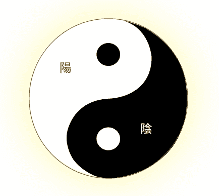

阳性特质，如天、昼、热、高、雄性、上、动、刚强等，偏向男性特质。

阴性特质，如地、夜、寒、低、雌性、下、静、柔弱等，偏向女性特质。

请再仔细观察上方的太极图，黑色与白色并不如刀切西瓜般的左右截然对立，而是即使在白色面积最大的区域之内仍有一个黑色圆点，反之亦然。可见阴与阳之间存在着特殊的关系，例如：

互相对立：万物都有互相对立的特性。

例如：天地对立，天为阳，地为阴；寒热对立，热为阳，寒为阴。但是这种对立关系是相对的，不是绝对的，例如上为阳，下为阴，以楼房来看，三楼相对于四楼偏低，所以三楼属阴，四楼属阳。另一方面，四楼相对于五楼偏低，在四楼与五楼两层楼的关系上，四楼属阴，五楼属阳。

相互依存、转化、消长：阴阳理论强调「阴极阳生，阳极阴生」和「孤阴不生，独阳不长」的概念。

从太极图可以看出，阴与阳有着消长和转化的关系，就像白天与晚上，白天属阳，晚上属阴，随着时间的流转，白天太阳从东方升起，充满光亮，阳长阴消，属阳；中午之后太阳慢慢地转到西方，天色逐渐幽暗，阳消阴长；等到太阳下山天色漆黑，此时就转为晚间属阴，这就是「阴极阳生，阳极阴生」的道理。

前面举例的楼层关系中，若没有三楼与五楼的存在，四楼就没有高低与阴阳的概念，所以阴与阳必须倚靠对方的存在，才能成为阴阳。

自然界之中，万物都需要阴与阳同时存在，互相合作。例如植物的生长需要属阳的阳光，也需要属阴的土地，如果只有阳光而没有土地就是「独阳」，没有阳光只有土地就是「孤阴」，若只在单一条件下，植物都无法生长，所以才会点出「孤阴不生，独阳不长」，必须阴阳和谐，万物才能欣欣向荣。

太极图中阴阳存在着互依和转化的关系，阴中有阳，阳中有阴，加上彼此的消长，呈现出宇宙万物不断变动的动态现象，而人体亦然。

《黄帝内经》指出「阴阳者，天地之道也。」、「阴阳者，数之可十，推之可百；数之可千，推之可万；万之大，不可胜数，然其要一也。」中医学也使用阴阳概念来阐述人体的组织、部位和活动，例如：气为阳，血为阴；背为阳，腹为阴；表为阳，里为阴；动为阳，静为阴；六腑为阳，五脏为阴。阴阳还可以再细分，如五脏之中，心为阳，肾为阴；心的气血，心气为阳，心血为阴等，阴阳概念成为中医核心理论，指引中医师诊断与治疗疾病的方向。

###### 脏象学说

大家都知道人体主要维持生命的器官就是「五脏六腑」，包括：肝心脾肺肾等五脏，大小肠、三焦、胆、胃、膀胱等六腑，这些名词中医沿用了数千年。

近代西方医学兴起，医学知识引入东方，由外文翻译成中文之时，直接借用传统的脏腑名词。由于东方与西方看人体的角度不同，阐释的内涵也不同，导致脏腑名字相同，内涵却不相同的混乱现象。例如心脏的功能，西医认为是推动循环系统中血管的血液，中医所认知的心除了主管血液及脉动之外，还包括神志情绪，就如同俗语中的「心情」、「心志」一样。

为什么会有这样的差别呢？

前面介绍过，中医发现人体是演化的产物，以及天地大宇宙的精美缩小版，蕴涵着无比丰富的奥秘，而且彼此之间都有密切联系，将人体连结成一个整体，牵一发动全身。中医将这些发现整理成为一个理论，称为「脏象学说」。

脏象学说的内涵

「脏象」顾名思义就是指人体内在的脏腑活动，表现于身体之外的征象。这些脏腑功能以及体外征象的组合就是「脏象学说」。所以脏象学说的内容主要是内在的脏腑，以及透过经络系统连结的四肢百骸和官窍等。

我们以肺经经络系统为例，参见右图。

依据脏象学说，肺脏的特色是：

● 内在脏腑：肺与大肠这两个脏腑有表里关系，功能上相辅相成，但肺为主导。

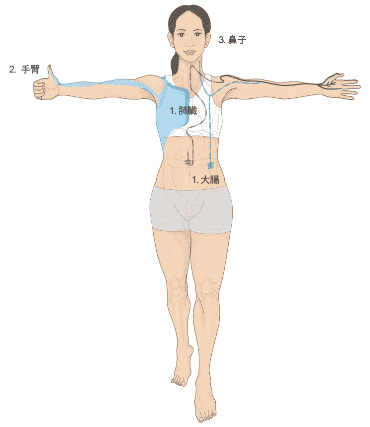

● 四肢百骸：透过经络连结手臂，手臂阴面的前线直到拇指这段路线属于肺经。

● 官窍：肺主呼吸，鼻子也与呼吸有关，中医说「肺开窍于鼻」，鼻子的功能由肺管辖。

透过经络系统的连结，让人体内在脏腑活动会表现于身体之外，让我们得以观察人体外在的表现，来了解身体内在的脏腑机能，这种现象中医称之为「由外知内」。

这个方法日常生活都会用到喔！譬如婆婆妈妈都有不必切开西瓜，就能选到好瓜的秘招，例如拍拍瓜体有清脆的声音，还有纹路清晰，头尾形状匀称，瓜脐窄小紧实等眉角，这样买回去的瓜，清甜又多汁，保证全家大小都赞不绝口！西瓜的内在滋味可以透过外在型态的观察，更精密的人体当然会透露出更多的讯息囉！所以中医师就能依据脏象所提供的讯息，由外知内，来诊断及治疗疾病。

##### 2.人与身体的对应关系

依据脏象学说，首先介绍关系最亲密的五脏与六腑。五脏为肝、心、脾、肺、肾，六腑为胆、小肠、胃、大肠、膀胱及三焦。其中三焦因为很难定义，所以本篇章暂时不论，只讨论其他五腑，以便与五脏相配。

五脏与六腑之间，功能一样都是相辅相成，但所在部位就有差别了，有些像连体婴一样黏得很紧，例如肝与胆；有些属于远距夫妻，两者分开但同为家庭打拚，例如肾与膀胱，脾与胃；最后一组属于上司与部属的关系，例如心与小肠，肺与大肠，离得很远，中间没有任何明显的连线，而是透过经络系统的连结来合作。这种相对应的关系，中医称为「表里关系」。

###### 五脏六腑互为表里

五脏从形象上来看，属于实体性器官；功能上负责储藏人体最珍贵的气血、津液、精气等精微物质，中医称为「藏精气」，所以《内经》说「五脏者，藏精气而不泻」。

六腑从形象上来看，属于管腔性器官；功能上负责食物的受纳、腐熟、吸收和排泄，也就是整个消化过程，中医称为「传化物」，所以《内经》说：「六腑者，传化物而不藏」。

每对脏腑的功能都是既有收藏，也有传化，合作无间。

五脏主藏精气，与人体生命机能密切相关，相较于时时要传化食物的六腑，偏于静态，而且深居于身体的中心部位，因此在阴阳特质方面属阴，属里。六腑主传化物，只要一进食就启动它们的动态运作机制，相较于五脏，居于身体比较周边，浅层的部位，因此在阴阳特质方面属阳，属表。

五脏与五腑：肝与胆，心与小肠，脾与胃，肺与大肠，肾与膀胱，从而建立了各自的「表里关系」。脏腑还与身体的器官、组织、官窍等建立连结关系。

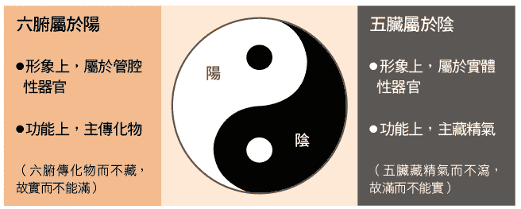

###### 身体与情志密不可分

中医很早以前就发现身体与情志互相影响，因此将情绪也归入五脏系统，以便于诊治疾病，所以中医是很善于治疗情志病的。

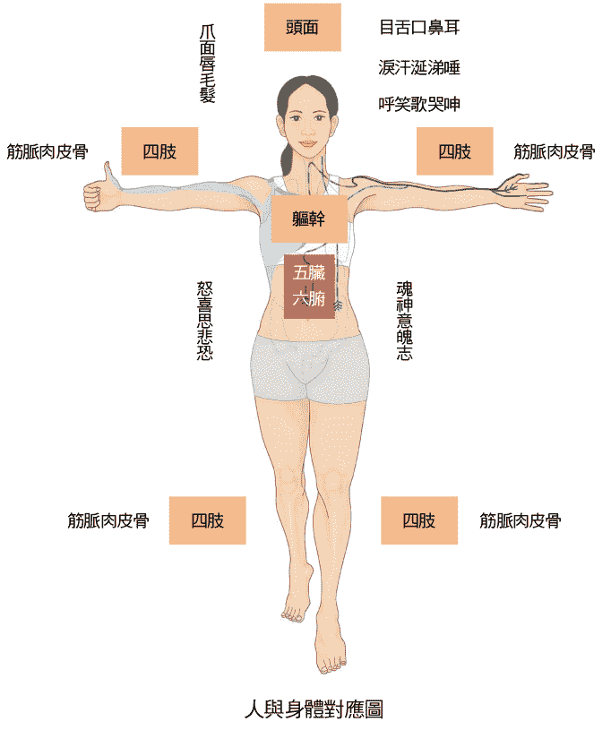

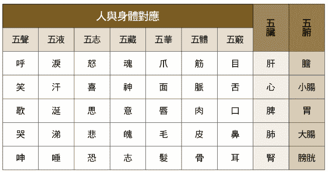

人体的对应关系请参阅上表，相关内容在后续篇章中介绍。

###### 五脏六腑对应十二官位

《内经》时代的老医家为了让后世学者更了解脏腑观念，还特别借用朝廷中的官位来说明脏腑特性。

心者，君主之官，神明出焉。

肺者，相傅之官，治节出焉。

肝者，将军之官，谋虑出焉。

胆者，中正之官，决断出焉。

膻中者，臣使之官，喜乐出焉。

脾胃者，仓廪之官，五味出焉。

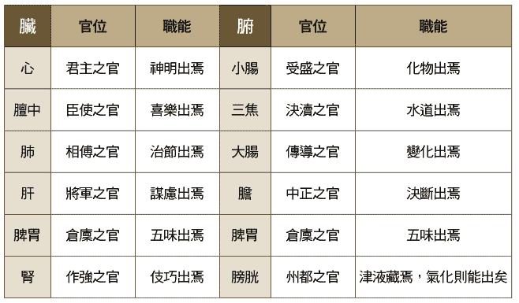

大肠者，传导之官，变化出焉。

小肠者，受盛之官，化物出焉。

肾者，作强之官，伎巧出焉。

三焦者，决渎之官，水道出焉。

膀胱者，州都之官，津液藏焉，气化则能出矣。

总计十二个官位，它的职能也都切合脏腑的功能。例如，人体以心为主导，所以是为君主之官；肺与心同居于胸中，肺主气，为心的辅佐，助心输送血液，所以是宰相；五志主怒，很容易怒发冲冠的肝，当然是将军；有胆量的人必然很果决，但做决定时须考量到公平公正，以免顾此失彼，所以胆很像判官，需做出公正的决断等，都符合脏腑本身的生理功能。

《内经》也提醒「主明则下安……主不明则十二官危」，这里的「主」当然是心脏，指出万一心脏功能不彰，那么所有脏腑机能都会濒于危险，例如出现心肌梗塞这个隐形杀手时，身体其他机能也会跟着遭殃而丧失生命，心脏的重要性，中医自古即知。

##### 3.人与天地的对应关系

中医观察到人生活于天地之间，人体与天地也有对应关系，例如心脏在体内持续跳动，推动血液，血液为红色，并产生热能，这些特质与五行的火，五季的夏季，五气的暑热，五色的赤色，再加上火性偏热，五方属于气候较热的南方，天气热则万物生长快速，五化为长……等，中医因此就将观察所得，整理成右页的对应表。

其实现代的研究也发现，人体体内的水分与地球的水分比率都是百分之七十，人体果真是一个精密的小宇宙。

###### 五行学说的特色

在人与天地对应的关系中，五行可以视为领头羊，其他的特质都跟随五行而变化，所以脏腑对应五行特质所形成的五行学说也是中医的核心理论。阴阳理论以阴阳对立、互根、消长以及转化为主，五行学说则以五行之间的相生与相克关系为主。

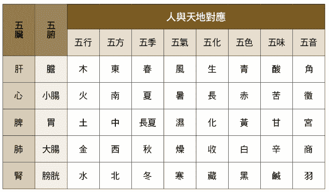

相生相克是什么意思呢？

木火土金水是大自然中实质存在的东西，也是我们日常生活中时时刻刻应用到的物品，例如木材，厨火，泥土，锯子（金属），自来水，您看，这些是不是都存在一般的生活中？我们会用锯子或斧头来砍木材，用水来灭火…….。

这种以 A 去抑制 B 的功能或破坏形体的情况，就是「相克」，因此金可以克木，水可以克火。

反过来说，水可以滋养树木，而木材可以用来生火……，这种以 A 去协助 B 的功能或型态的情况，就是「相生」，因此水可以生木，木可以生火。

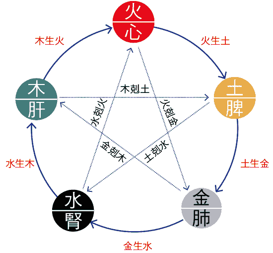

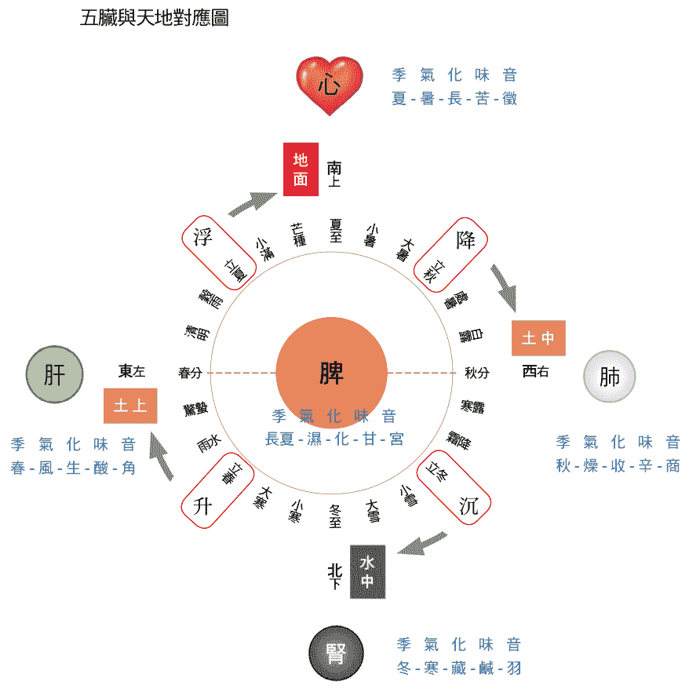

其余的五色、五味等，也都配合五行而出现相生相克的关系。请参阅前页的五脏与天地对应图。

一旦五脏配合五行，五脏之间也跟着产生相生与相克的关系，例如肝木生心火，当心脏机能不足时，可以透过补肝来改善心脏功能；肝木克脾土，长期的情绪压力，导致肝气过旺，也会影响脾胃的消化吸收功能，出现腹痛腹胀，消化不良的现象，这也是现代人常见的文明病。

中医从观察生命演化，人与自己的身体，以及人与天地的三种对应关系，形成中医特有观察身体的方式：「脏象学说」及人与天地相应的「整体观」，请参阅以下跨页图。

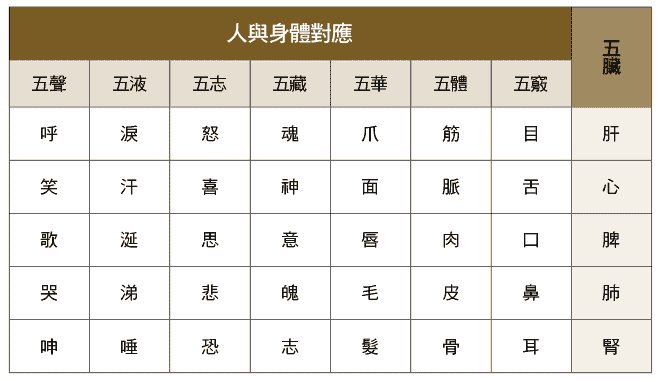

在中医这样的概念下，没有任何一个组织器官是单独存在的，它们都与其他的组织密切相关，也都深深影响着身体的生理机能与病理现象，一如大家常说的「国家兴亡，匹夫有责」一样，每个组织都承担着共同的责任，就是延续生命。人也必须与天地和谐相处，让阴阳调和，方能身心轻安延年。

因为各个脏腑都有与其连结的组织，所以当这些组织发生病变的时候，就可以循着中医理论找到疾病源头，从根本治疗，这就是中医治病强调治本的道理。例如眼睛红肿，情绪暴躁易怒，中医可以「从外知内」，诊断肝火上炎，只要清降肝火，治疗病本就可以缓解，无需点眼药，或吃镇静剂等这类治标的方式。

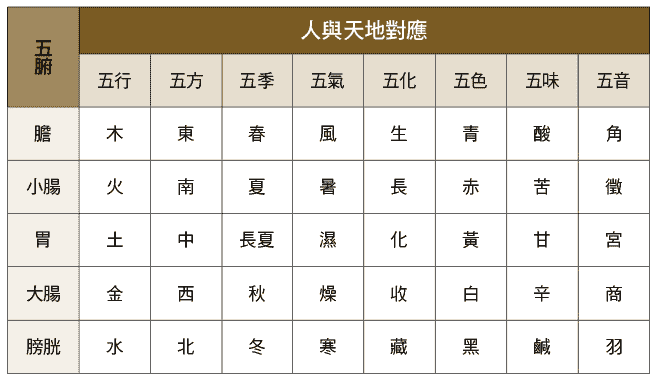

###### 中医的时间医学

人与天地相对应关系除了一年的五季之外，还包括一天中的十二时辰。

十二时辰的对应关系主要是以十二经脉在身体流注期间，每一条经脉都有它经气最旺盛、工作能力最强的一个时辰。如下图。

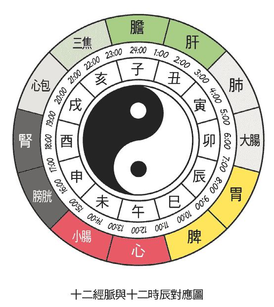

有个简单的歌诀供大家参考：

肺寅大卯胃辰官，脾巳心午小未中，

申膀酉肾心包戌，亥焦子胆丑肝通。

自古以来，除了中医师外，练功者及养生家都会配合这个时辰表来活动，譬如 5-7 点卯时大肠经最旺，最好能排便，清肠胃，之后 7-9 点辰时胃经最旺，赶紧吃早餐，此时营养吸收最好！另外，晚上十一点到凌晨三点胆经与肝经最旺，中医说「人卧，血归于肝」，此时应赶紧去睡觉，不要再有任何活动，血液就会回到肝脏。子丑这两个时辰正是肝胆经修复人体组织、净化气血的时刻，人体才能长保健康。所以说中医是不是很科学？

2017 年诺贝尔医学奖颁给研究「生理时钟」的三名科学家，因为他们发现控制生理时钟（circadian rhythm）分子机制，解释昼夜作息规律背后的运作。其他研究也指出，当人们的作息节奏长期跟生理时钟不配合时，会增加罹患癌症、神经性退化疾病、新陈代谢失调和炎症等疾病的风险。这个看法与中医的时间医学有些相似之处，期待未来东方与西方医学可以合作，配合人体的时间节律，除可自我保健之外，更可预防与治疗重大疾病。

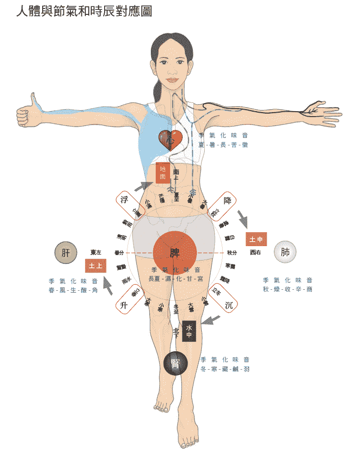

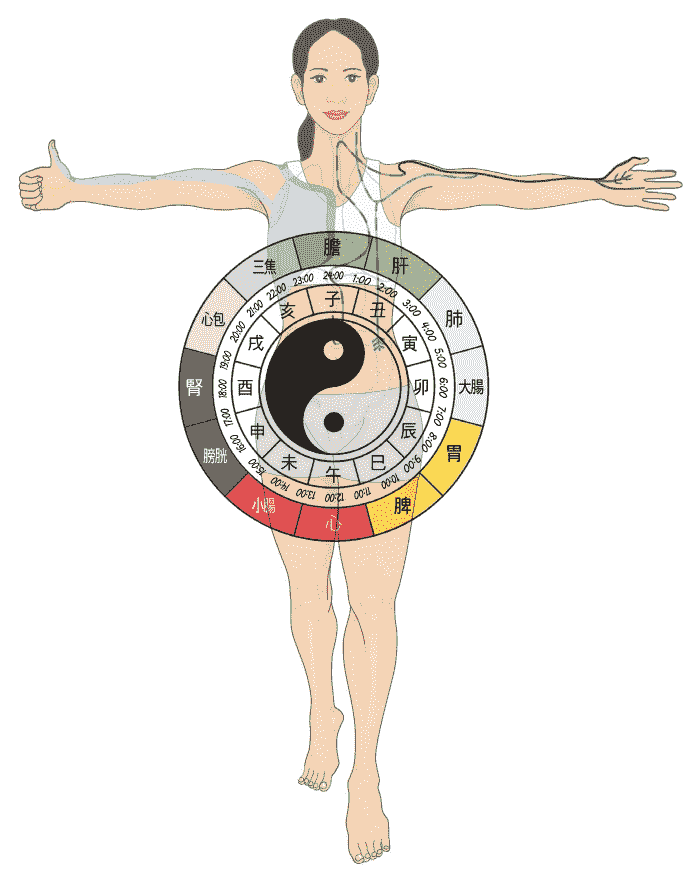

#### 二、中医的人体经络理论

###### 经络系统是演化生命体的维生连结系统

人类从单细胞生物演化而来，逐渐发展成身体内在的器官及身体外在的肢体，身体持续增大，生理需求也跟着增加，就像个新兴城市，当人口变多地域就会扩大，生活中的食衣住行育乐、交通等需求增加，此时就须开始建设房屋及道路，架设水电瓦斯供应管道，成立市场、学校等连结系统，以供应民生所需。人体也是一样，有着越来越多、分工越精细的组织器官，以及活动频繁的四肢躯干，彼此之间都需要一个类似城市的连结系统，以输送养分和传送讯息，如此才能让复杂的人体同舟共济，共同完成生命活动。

中医发现这个精妙的人体连结系统，因为有着如纺织物的网络状态，就称之为「经络系统」，是维持生命的重要系统。经络系统既是一个维生系统，因此也存在于所有的生物体内，不只动物有经络，甚至植物也有经络。台湾有位萧贵文先生以针灸原理，在果树的树干找出穴位扎针，成功为果树提前十天到一个半月开花，成为首位也是唯一的植物针灸中医师。萧先生运用中医理论的看诊原理，发明「木本植物之生长促进与开花时序之调整方法」获得了专利权，也证实了植物也有经络。

为何用对穴位，就能产生这么神奇的疗效？

穴位位在经络系统上，是经脉里面的气血输注到体表的部位。我们可用铁路来说明穴位的特性。铁路沿线经过大大小小的城镇，铁路局会依人口多寡及交通运输重要性来设置停靠站，人口众多的城市，例如台北，台中，高雄等，车站腹地大停靠的车辆多；人口数比较少的城市，例如我工作所在的台东县关山镇，车站腹地小有些快车便不停靠，所以能选择的班次就比西部大城市少很多。大的车站人潮多、收益高，当然会有较多的建设和影响力。

穴位就是经络列车的停靠站，每条经络都跟铁道沿线一样，满布着大大小小的穴位，它们的功能主要来自所属的经络系统。

穴位依据所在位置及特性不同，所聚集的气血多寡也不同。若以同样一根针来刺激穴位，选择气血聚集较多的穴位，其治疗效果比较好，影响力也比较大，当然经济效益也高。因此古代医家在每条经络上，特别标注临床诊治有特效的穴位。这些特定穴位数与经络长度正相关，如手经比较短，从 11 穴到 22 穴；足经比较长，从 14 穴到 67 穴。右图为肺经，左臂上的圆点就是肺经的穴位。

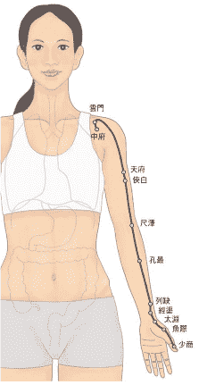

##### 1\. 经与络的定义

古人的衣物许多都是由家中妇女编织，可以看到制作的过程。中医师观察到人体的连结系统，形状类似纺织物的网络，深浅大小不同，所以就使用编织物的名称来命名。

例如：

编织物的直线称为「经」，中医就将直行的连结系统称「经」。

绵絮及粗绵称「络」，中医就将较不规则的连结系统称「络」。

经络是人体内经脉与络脉的总称，做为人体的连结系统，除了形状之外，还肩负重要的生理功能，这些概念在中医经典《内经》里都有深入的说明。

###### 经络的分布

经：「经脉为里」，「经脉十二者，伏行分肉之间，深而不见」。经脉有十二条，分布在人体较深的部位，无法看到。

络：「诸脉之浮而常见者」，「支而横者为络，络之别者为孙」。络的数目多，分布在人体较浅的部位，分枝多，横向分布，可以看见。络的分支称为孙络，例如体表的微血管就属于孙络。

从文字的意涵来看，「经」有路径的意思，也有恒常、常道之意，是经络系统的主干，纵行的通路，多循行于人体深部，日夜恒常循环不懈，以维持人体的机能。

「络」有网络的意思，也有联络、网络、缠绕之意，是经脉的分支，纵横交错遍布，犹如网络一样联系及缠绕全身，分布在人体的浅处。

##### 2\. 经络的功能和重要性

经络主要有四大系统：经脉系统、经别系统、络脉系统和经筋系统。我在临床诊治上常将四大系统合在一起研究和应用，因此本书多会以「经络系统」来统称经络四大系统。

经络论述初现于《马王堆医书》，完整的经络理论则见《内经》。《内经》所说的「经脉」主要指经脉系统。为了让读者容易理解，将《内经》中有关经脉的内容整理成「经脉三部曲」加以说明。

##### 经脉三部曲

###### 第一部曲：解释经脉的功用

《内经》记载：

「 十二经脉者，内属于府藏，外络于肢节。」

「人之血气精神者，所以奉生而周于性命者也。经脉者，所以行血气而荣阴阳，濡筋骨，利关节者也。」

首先解释经脉的功用有二：

● 经脉是一个「连结系统」，负责连接脏腑与四肢躯干。

身体内部的五脏六腑与身体外部的四肢躯干，透过十二经脉连结在一起。经脉也像道路一样，将所有的城镇连结起来，让居民可以自由往来。这也就建立了中医特有的内在脏腑与外在躯干相连的「内外相连」关系。

● 经脉是一个「通路系统」，协助脏腑运送维持生命的重要物质到全身。

中医认为维持生命最关键的物质就是血气精神，十二经脉是连结内脏与四肢躯干的通路，脏腑所生产的气血就可经由经脉这个通路输送至全身，既能维持体内脏腑的阴阳平衡，也能滋养体外的四肢筋骨，让关节活动顺畅。

###### 第二部曲 ： 经脉的重要性

《内经》记载：

「经脉者，所以能决死生，处百病，调虚实，不可不通。」

「十二经脉者，人之所以生，病之所以成，人之所以治，病之所以起。学之所始，工之所止也，麤之所易，上之所难也。」

人能否存活？是否会生病？疾病能否治愈？这些来自身体生理／病理状况以及疾病的预后等，都跟经脉有密切的关系。所以《内经》再次强调，经络深深影响一个人的生老病死四大环节，如果经络照顾得当，就可以长命百岁。

经脉除了与一般人有关之外，它更是医师习医的核心基础，而且学无止境，未来医疗能力的高下取决于经络的了解和应用。因为经络实在太重要了，影响人体这么深远，对医生来说，当然值得穷毕生之力去研修、去探讨。

历代的医学家都特别强调经络的重要性，例如：

● 谚云「学医不知经络，开口动手便错。」经络不明，无以识病证之根源，究阴阳之传变。（宋―窦士材）

● 夫经络为识病之要道……经络不明，何以知阴阳之交接，脏腑之递更，疾病情因从何审察。（宋―窦士材）

● 医而不知经络，犹人夜行无烛，业者不可不熟。（明―李梃）

● 经络并不是《伤寒论》独有的，凡是学中医的，为了给以后的学术打下很好的基础，首先得先学好经络。……病机变化之快，治疗方法之多，不用经络学说的广泛归纳是不行的。（现代―刘渡舟）

###### 第三部曲 : 经脉要「通」的健康原则

《内经》：「经脉者，所以能决死生，处百病，调虚实，不可不通。」

经络连结人体脏腑、孔窍、皮毛、筋肉、骨骼等各种器官组织，形成紧密的、统一的整体，经络同时也是人体气血、津液运行的通路，遍布于全身。

十二经脉尤其是脏腑运送气血至全身的重要通路，经脉通路如果顺畅，人体的组织器官得到充分的营养，身体自然健康。反过来说，如果经脉阻塞，气血无法送达，与这条经络所连结的脏腑与躯干四肢，就会失去营养而产生不适或疾病。因此想要健康，经脉务必要畅通。

「疼痛」是身体不舒服时最明显且常见的感觉，中医认为「不通则痛」，因为经脉不通，气血无法运送到组织器官才会产生疼痛， 改善的方法，只要「通则不痛」，经脉通畅，气血可以顺利运达，组织器官得到营养，痛感自然就解除了。

例如要治疗心脏疾病，只要在心经经脉上给予适当的治疗，截长补短，虚证用补法，实证用泻法，让经脉畅通就可通行气血，心脏得到滋养就能回复平衡状态，这个法则可以应用在各种病症上。所以《内经》特别指出，若要活命，经脉不可不通！

###### 经络系统是中医的核心

依据《内经》的记载，加上个人临床治疗的印证，我认为经络系统是中医的核心，因为有了经络系统，才能连结脏腑与躯干四肢， 还把脏与腑连结成表里经，再将五官配五脏，形成人体的整体观，所以看不见的经络系统是中医整体观的幕后功臣。

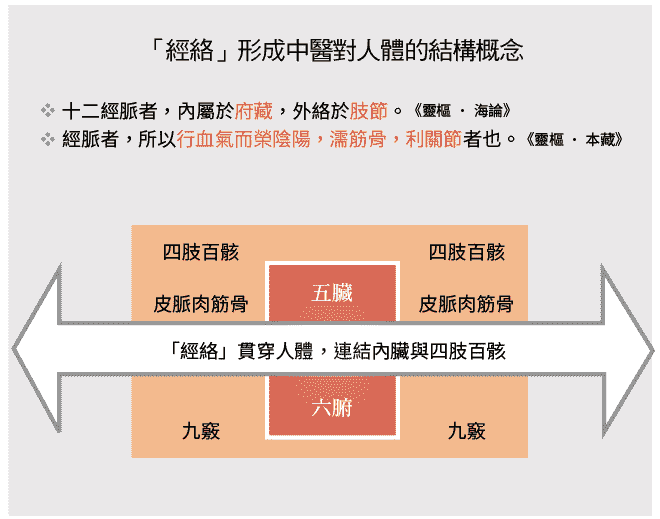

##### 3.经络四大系统的特色

人手一机的行动通讯装置，是现代人的基本配备，现在就藉由智能型手机的概念来说明经络系统的特色。

手机是储存及浏览资料的主体，里面的资料包罗万象。

正常的传输线包含两类导线：充电及传输，所以传输线具有两个功能：一是充电，另一是传输资料。如果打开传输线，就会看到导线被绝缘体包覆，这与一般电线概念是一样的。

手机传输充电线有两个连接头，一头接手机，另一头接插头以充电，或是连结其他 3C 产品来传输资料。这两端的接头处都比传输线粗大坚固，一方面配合手机与插头的插孔尺寸，另一方面因为这两端常常会被拔插，因此一定要加强它的强韧结构，可以减少线材的损伤，后来市面上甚至还有销售保护这两端线头的保护套，可见线头的接点处多却容易损耗。如果有一天传输线故障了，而且一时之间找不到其他代用品，手机无法充电也无法传输资料，那这支手机就毫无用武之地了。

其实，经络系统也跟手机传输线一样！人体内在脏腑就像手机，经络系统就像传输线，人体的四肢末梢就像传输线的插头端。

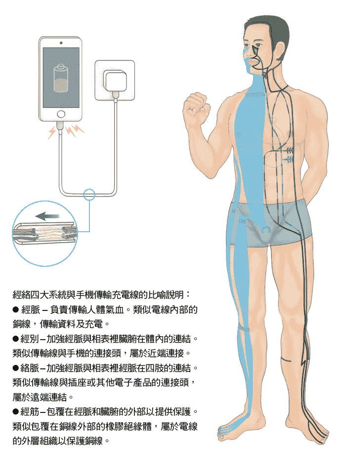

##### 以肺经为例，认识经络四大系统

前面介绍过，十二经脉是经络系统的核心，也是人体重要的连结与通路系统。结构上，经脉连接脏腑与四肢躯干，类似连接手机和插头的传输线。功能上，经脉协助脏腑运送血气精神到全身，以维持生命，类似传输线里面的导线，可以传送讯息。如此重要的经脉，当然也要像手机传输线一样，加以外部的保护套特别照顾（经筋）；经脉也跟传输线一样有两端：一端连结身体内部的脏腑（经别），一端连结身体外面的四肢躯干（络脉）。

经脉：经脉在身体内部与相表里的脏腑相连，如肺经连结肺与大肠；经脉在四肢末梢与相表里的经脉相连，如肺经在腕关节处分出一条支脉到食指与大肠经相连接。相表里的脏腑功能相辅相成，团结力量大，发挥了 1+1 大于 2 的价值，所以肺与大肠会紧紧相连，以确保合作无间。

肺与大肠有两个衔接点，一个在体内，一个在手指末梢，这很像手机传输线的两端。人体也很聪明，也在这两个重要区域加强联系：

经别：加强体内相表里脏腑之间的联系系统，称为「经别系统」，以连结脏腑为主。

络脉：加强四肢末梢相表里经脉的联系系统，称为「络脉系统」，以连结经脉为主。

从另一个角度来看，经别跟络脉都是备用经脉，万一经脉损伤时，还可以维持生命的运作。

经筋：经筋系统与人体的筋肉有关，没错！经筋包覆在人体外面的筋骨关节上，就宛如电线外层的绝缘体，以保护重要的经脉系统。

以上就是经络四大系统的特色，真的很像手机传输线吧！所有的重心都在保护重要的经脉系统，请参阅 p.63 示意图。

##### 4. 经脉系统的命名

经络四大系统在《内经》都有各自的名字，但到了后世，为了简化称谓，都以十二经脉名称来概括其他三大系统。

每个脏腑都有专属的经络系统，为了好鉴别，每条经脉都会冠上脏腑的名称，很像家族的姓氏，让人一目了然，例如「肺经」就是指专属于肺的经脉系统。肺经经脉就称为「手太阴肺经」，经别称为「肺经经别」，络脉称为「肺经络脉」，经筋称为「肺经经筋」，一看就知道属于同一系统。

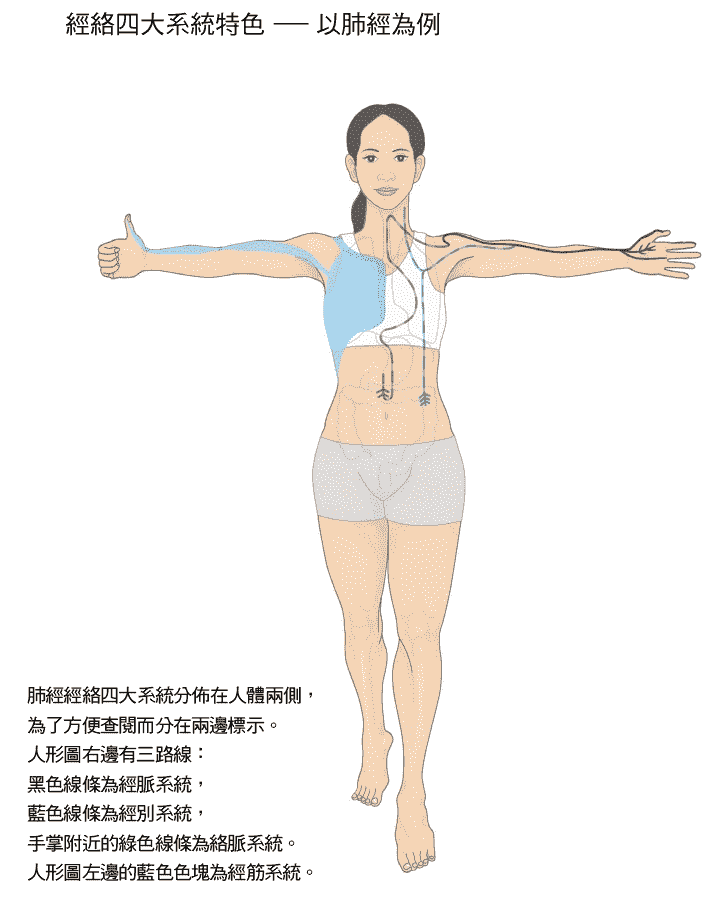

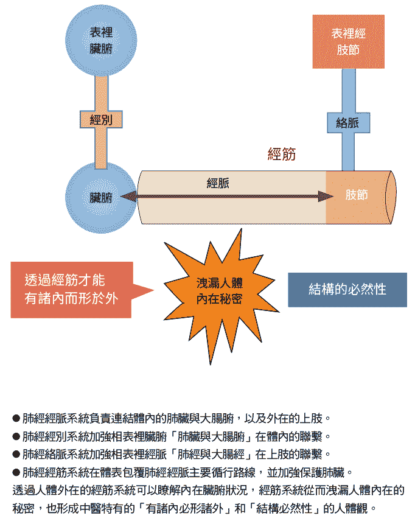

接下来用以下的四个步骤来说明经脉命名的逻辑概念：

步骤一： 依据五脏在身体的部位分手经及足经

● 心、心包与肺都位在横膈之上的胸部，接近手臂，与它们相连的经脉连结到肩背及手部，所以属于手经。

● 脾、肝与肾都位于横膈以下的腹部，接近足部，与它们相连的经脉连结到腰腹及足部，所以属于足经。

步骤二、依据五脏在身体的层次分为三条路线

人体是立体的，有厚度的，千万不要因为看到的经络图是平面图，而误以为经络系统也是平面的。经络系统在人体的循行分布路线，在手部与足部有分为前线、中线和后线三条路线交叠，请想象立体交流道的模样。

这样的分布路线，其实是与五脏在体内的层次有关，分布由浅而深，所属经脉也跟着行于前、中、后线。例如：

● 在胸部：肺在最外层，心在最里层，心包介于心肺之间，因此，肺经走在前线，心包经走在中线，心经走在后线。

● 在腹部：肾在最里层，但脾与肝的位置很难分深浅，只能依据肝与侧面胁肋的密切关系，将肝列为介于前线与后线之间，因此，脾经走在前线，肝经走在中线，肾经走在后线。

步骤三、依据脏腑的表里关系，配入相表里的六腑

人体原有五脏六腑，但经络为两两成对，所以将心包纳入脏之行列，与六腑成对，分为手部三对、足部三对。分别为：肺配大肠，心包配三焦，心配小肠；脾配胃，肝配胆，肾配膀胱。

步骤四、为经脉配阴阳

五脏虽然加入心包成为六脏，但一般不会称「六脏六腑」，仍习惯称「五脏六腑」。在阴阳属性上，五脏都属阴，六腑都属阳。

人体也分阴阳，人体外侧属阳称为「阳面」，主表；人体内侧属阴称为「阴面」，主里。手足六条阴经都分布在人体的阴面，手足六条足经则分布在人体的阳面。

阴阳还可以再细分：

阴：太阴，厥阴，少阴；阳：阳明，少阳，太阳。（关于三阴三阳的内容，介绍起来相当复杂与专业，在此先不详述。）

阴与阳两两相配搭，宛如人类的和谐成家：太阴配阳明，厥阴配少阳，少阴配太阳。

肺经与脾经都在前线，属于太阴。相表里的大肠经与胃经属于阳明。

心包经与肝经都在中线，属于厥阴。相表里的三焦经与胆经属于少阳。

心经与肾经都在后线，属于少阴。相表里的小肠经与膀胱经属于太阳。

相表里的两条经脉，分别循行于四肢内外侧的相对位置，并在四肢末端交接。下表是十二经脉的名称及表里关系表，详细内容将于后续十二经络中各自详述。

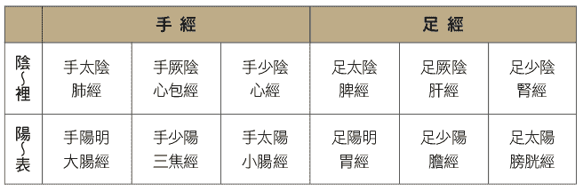

###### 五脏在经络系统的主导权类似母系社会

五脏属于阴经，六腑属于阳经。通常我们习惯认定阳主男性，阴主女性，但在中医理论里是以五脏为核心，六腑为辅，这种「阳配合阴」的情况，颇有母系社会的梗概。

或许这时有人会好奇，中医如何以阳配合阴？

前面说过，经络属于手经或足经都取决于五脏的位置，并以横膈为分界点。横膈以上为胸部，胸部与手臂直接相连；横膈以下为腹部，腹部与腿足直接相连。所以位在横膈以上的脏属于手经，位在横膈以下的脏属于足经。

六腑经络命名必须配合相表里的五脏，即使小肠和大肠皆在胃的下方，位在腹部，但是为了配合肺与心，也都成为手经而不是足经。

因此在经络循行上，五脏所属的阴经对于循行部位和病候比较有主导权，六腑所属的阳经比较是配合的角色，如肺主呼吸，开窍于鼻，肺经的循行部位主要在胸部，鼻部就由相表里的大肠经负责。

以下是结合人体部位的十二经脉表。

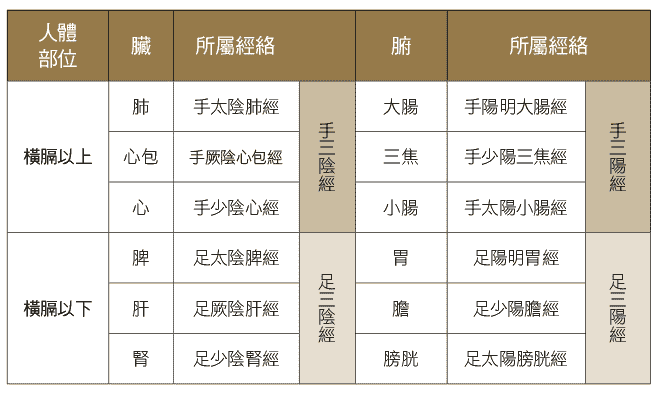

##### 5. 经络系统为五脏六腑建立表里关系

脏象学说提到五脏主藏，六腑主泻。人体是很奥妙的，既注重阴阳的平衡，也注重身体藏与泻的平衡，这点若以人体的消化系统来说明最清楚。

通常便秘的病人胃口都会变差，因为宿便会影响胃受纳食物的功能，「没有出就没有进」，这是我常跟病人解释的话，就像杯子装满水，想倒进水是不可能的，唯有将水喝掉一部分才能再注水，进与出要达到平衡，才会有活水。所以脏腑之间的藏与泻，就是进与出的概念，两者要达到平衡，身体机能才能顺畅的运转。

人体五脏六腑位置有远有近，无论是远亲的肺与大肠，或是近邻的肝与胆，都能透过经络系统就将这两个脏腑连结在一起形成「表里经」系统。

为何称为表里经？

因为五脏是最重要的器官，属阴，位在人体较深的部位，五腑为辅佐角色，属阳，位在人体较表浅的部位，因此五脏属里，五腑属表，被经络系统送作堆，就变成表里经了，相表里的脏腑生理与病理情况都会互相影响。

其实经络系统也像婚姻与生育关系，让每个脏腑由单一器官的单身汉，变成有了属于自己的家族（表里经的脏腑）成员及广大田产（四肢躯干）庄园的庄主。属于这个家族的成员都流着同样的血液， 同理，属于同一经络系统的部位，无论身体内部与外部，都流通着一样的气血。

###### 表里关系的内涵

经络系统建立的表里关系，所形成的内涵包括：

● 实质器官：连结五脏（加上心包）六腑，成为十二经络系统。

● 功能关系：脏主藏，守于里，腑主泻，通于外。表里脏腑生理上相辅相成，病理上互相连累。

● 对应关系：经脉在四肢躯干的循行部位内外相对应，如太阴经与阳明经都循行在人体的前线。

反过来说，假设不知道脏腑经络之间的表里关系，这里提供三个辨识的方法如下：

● 脏腑位置：脏腑相连，如肝与胆，脾与胃，肾与膀胱，必然有表里关系。
脏腑位置决定了三组脏腑的表里关系，而肺与大肠，心与小肠，这两组则须从经络名称辨识。

● 经络名称：如太阴与阳明相表里，手太阴肺经与手阳明大肠经为表里关系。少阴与太阳相表里，手少阴心经与手太阳小肠经为表里经，足少阴肾经与足太阳膀胱经为表里关系。厥阴与少阳相表里，足厥阴肝经与足少阳胆经为表里关系。

● 经络循行：前面说过，相表里的经脉在肢体的循行部位内外相对应，只要在手足的相对位置就有表里关系。

###### 表里经的脏腑功能互相影响

透过经络系统建立五脏六腑之间的表里关系，深深影响着中医学，形成中医很特别的脏腑理论。

相表里的脏腑生理功能相辅相成，病理上互相影响，但也可以互相治疗。例如熬夜过度，嘴破、口干、心烦等，是心火旺的现象，若不改善就会出现小便黄热，甚至尿道发炎的现象，中医称为「心火下移小肠」，就是相表里的脏腑疾病相互影响的明证。

###### 阳经为阴经守护头面部

表里关系也会呈现在人体特殊部位的保护方面。

阴经属于五脏的经络系统，承担人体重要的任务。五脏主藏，如心藏神，肝藏魂，肺藏魄，脾藏意，肾藏志，神魂魄意志都是维持人体正常功能很重要的物质，所以必须谨慎保藏，不要轻易外泄。五脏也很像怀着孩子的母亲，具备了传宗接代的特殊能力，但是体质较娇弱，留在屋内养身待产，由强壮的父亲守卫在门外保护一样。这样的关系，有内有外，就是表里关系的另一种呈现。

五脏都开窍于面部，如肺开窍于鼻，脾开窍于唇等，但阴经经脉多数不会上行到头面，为什么？

大家如果有机会到离岛，如马祖、澎湖等地，可注意海边的房子通常窗户都很窄也很少，当地乡亲说这是为了避免强风和海浪湿气的侵袭。人体亦然。

头面部是人体对外的部位，天气再冷，仍会露出头面以随时观察外在环境，因此头面部也是外邪容易入侵的部位，所以五脏所属的阴经就不直接上头面，以减少外邪入侵，循着经络直接伤害内脏的机率。当然也有例外，如眼睛为灵魂之窗，会透露心思，肝开窍于目，所以心经及肝经系统上达头面，尤其是眼睛。

头面这些部位就由相表里的六腑经络经过。因为六腑属阳，经络比较长，也比较曲折，经络循行速度快，比较有护卫能力，在体内通常先到六腑再到五脏，所以，阳经可以作为阴经的保镳。

###### 人体还有另一套透过经络连结的「关键管理」生理机制

由于五脏所主管的人体机能很多，如果每样功能都亲自管理，是不符合经济效益的。人体非常有智慧，选择采用「关键管理」，五脏选择管理最关键性的机能，其余则由其他经络脏腑协助。如肺为水之上源，通调水道下输膀胱，但肺经本身没有到膀胱，而是透过与膀胱相表里的肾经系统，主动连结膀胱与肺，肾就大方的将膀胱借给肺，两者一同完成体内水液代谢。

###### 认识同名经

经脉系统除了类似婚姻的表里经关系之外，还有手足同名经关系，很像同姓的自家人。这个关系很好辨识，只要同一个阴阳经名就是一家人，经名就是家族的姓。例如：经名为「太阴」的是手太阴肺经及足太阴脾经，就有家族关系。

我们把属于阴经的同名经列为姊妹关系，属于阳经的同名经列为兄弟关系，总共有六组，三个姊妹，三个兄弟，见下页表。

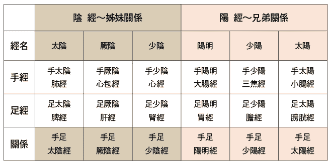

经脉系统的兄弟姊妹关系也和家庭中的手足一般，平日各自打拚，必要时可以联合起来，打虎需要亲兄弟，肥水不落外人田。例如手阳明大肠经阻滞，导致手肘关节疼痛，大便不利，此时可以选用同名经的足阳明胃经足三里穴来解围，改善肘痛及大便情况。这是临床上常用的治疗方法。

##### 6. 经脉系统的循行特色

经脉系统既然是通路，当然要流动才能发挥输送气血的功能。经脉里面流动的营养物质，中医称为「营气」，从字面上来看，就是含有营养的珍贵物质。

十二经脉通过手足阴阳表里经的连接而逐经相传，构成了一个周而复始、如环无端的传注系统。气血通过经脉即可内至脏腑，外达肌表，营运全身。

###### 手足阴阳经脉的循行走向与交接规律

手足阴阳经脉的循行大部分依照「表里经」和「同名经」规律交接。

1.手三阴经从胸走手，在手指交接给手三阳经，从手走头 。依据表里关系。

2.手三阳经在头部交接给足三阳经，从头走足。依据手足同名经关系。

3.足三阳经在足趾交接给足三阴经，从足走胸。依据表里关系。

4.足三阴经在胸部交接手三阴经，从胸走手。无特别关系。

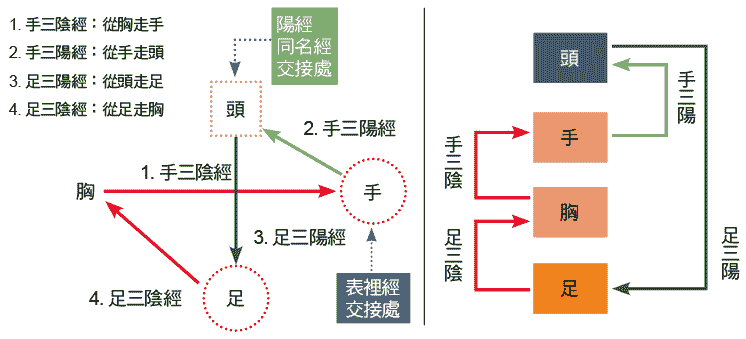

表里经与同名经关系决定了经络流注的顺序：先是表里经关系，然后是同名经关系。表里经在手足末梢相交接，阳经同名经在鼻和目附近交接，阴经同名经没有直接交接。

附上简单的口诀：手阴胸手阳手头，足阳头足阴足胸。

###### 十二经脉的流注顺序

十二经脉的流注是从手太阴肺经开始，阴阳相贯，首尾相接，逐经相传，传到肝经为一个完整的循环。肝经再传给肺经，启动新的循环。人体的气血就是经由经脉的周而复始、如环无休的流注，才能周流濡养全身。

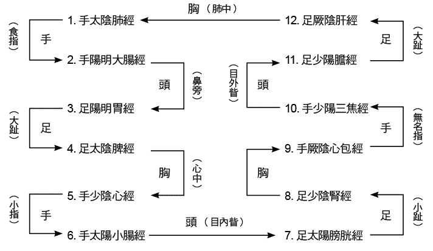

具体的流注从手太阴肺经开始，依序传给手阳明大肠经，足阳明胃经，足太阴脾经，手少阴心经，手太阳小肠经，足太阳膀胱经，足少阴肾经，手厥阴心包经，手少阳三焦经，足少阳胆经，足厥阴肝经，最后再回到手太阴肺经。

从上页图表可以看出表里经的交接处都在手足末梢，位于图的两侧；阳经的同名经在头部交接，手足阴经的交接都在胸中，位于图的中央。

附上简单的口诀：肺大胃脾心小肠，胱肾包焦胆肝乡。

将前面所述重点内容汇整为下表，方便学习中医者记忆整理。

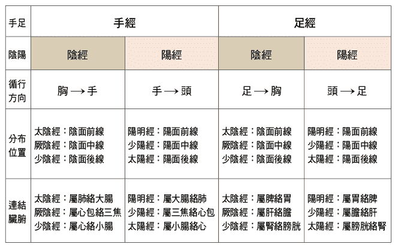

##### 7. 经络系统连结五脏与肢节

《内经》：「十二经脉者，内属于府藏，外络于肢节。」每个脏腑因此有了与它相连结的躯体。限于篇幅，简单介绍如下：

手三阴经：因为心肺位在胸部，经络走在胸腹部、上肢的内面，分别连接拇指、中指及小指。

手三阳经：配合手三阴经，大肠、三焦及小肠的经络走在胸腹及肩背部、上肢的外面，分别连接食指、无名指及小指。

足三阴经：脾肝肾虽然都在腹部，经络分布却很广泛，头部、胸腹及背部、下肢内侧，分别连结足大趾头和足底。

足三阳经：胃胆和膀胱也在腹部，经络分布比足三阴经更广， 几乎涵盖全身，是人体最长的三条经络，头部、胸腹、腰背部、下肢外侧及后侧，分别连结第二、四、五趾。

在此提供一个简单的口诀：

手三阴，肺包心，一三五（手指）

手三阳，大焦小，莲花指（手指）

足三阴，脾肝肾，大足底（脚趾）

足三阳，胃胆胱，二四五（脚趾）

##### 8. 经络系统连结五脏与五官

现代人常会对于一个人的头面五官品头论足，可怜的五官似乎已经沦为面部的装饰品。其实远古时代人类处在蛮荒丛林之中，既要与野兽争抢食物，还要避开牠们的侵袭，耳聪目明、鼻嗅舌尝，都是非常重要的保命能力，人体为了维持五官的灵敏度，就将它们归给强而有力的五脏专责照顾，提供充足的养分。

但问题来了，五脏住在躯干里，要如何管理及照顾五官呢？

这份重责大任当然非经络系统不可啦！

因为五官都是凹陷的，所以也被称为「窍」，它们透过经络与五脏的连结关系如下：

心开窍于舌：透过心经连结。

肺开窍于鼻：透过大肠经连结。

脾开窍于唇：透过胃经连结。

肝开窍于目：透过肝经及胆经连结。

肾开窍于耳：透过膀胱经连结。

五官与五脏的生理与病理关系相连，所以我们可藉由观察五官来了解内脏功能。之前有一句广告词「肝哪不好人生就是黑白的！」讲得太好了，因为肝开窍于目，如果肝有病，肝血不足视力就会下降，肝胆有湿热，眼白就会出现黄色，也就是黄疸，只要看到眼白发黄，就要小心肝胆功能囉！还有心开窍于舌，一旦心脏有病时，舌头的型态或功能也会异常。舌头的功能包括说话，当人们的心神混乱或精神异常时，就会胡言乱语、不知所云。举一首流行歌曲「爱你在心口难开」，让大家脑筋急转弯联想，既然很爱你为何却开不了口？

以中医来看，因为心主神志，被爱情冲昏了头，也搅乱了心，当然舌头卡住，就说不出话来啦！

##### 9. 经络四大系统的个别特色

###### 十二经脉

又称为「正经」，主要负责连结脏腑与肢体，运行气血濡养全身，为经络系统的核心。详细内容请参阅前文。

###### 十二经别

经别是别行的正经，因为它从经脉中别出，是正经别行深入体腔的支脉，加强相表里脏腑的联系。

十二经别具有离、入、出、合的循行特色：

● 多数从四肢肘膝附近的正经别出，称为「离」

● 走入体腔到脏腑深部与相关的脏腑联系，称为「入」

● 再浅出体表，称为「出」

● 上行到头项部，无论是阴经或阳经的经别，最后都合入阳经，称为「合」

每一对相表里的经别都会合入阳经形成一「合」，十二经别共有「六合」。

经别象是经脉的特使，代表经脉专程前往相表里的脏腑致意，因为目标明确，任务特定，在于加强重点的联系，所以路线较短，更为直接。

经别身为特使，当然也会为经脉增加循行部位，以分散风险，增加机会，加强和协调经脉与经脉之间、经脉与脏腑之间，以及人体各器官组织之间的联系。

十二经脉承担运送气血，联系组织之重责大任，因此循行路线较长，所经过的部位多，很像每站都会停的豪华区间车。

经别主要帮助经脉加强脏腑联系，作为它的另一条便道，最好能够达到简便、快速、安全的目标，所以经别类似停留的站比较少的直达车。而且以安全性考量来说，经别所经过的部位和连结的部位越少，减少曝光，受损害的机率越低，这对于经脉而言，也是好事一桩。

###### 十二络脉

十二经脉表里经都在四肢末梢交棒，四肢末梢因为劳动多，容易损伤，就会损及经脉。为了安全起见，人体就在四肢末梢上方，也就是在腕关节及踝关节以上的部位，相对较安全的部位，发出一条络脉，加强相表里经络的连结，作为经脉在四肢末梢的备用系统。

络脉发出的位置都有一个穴位，称为「络穴」，是络脉的起始点。

手经的络穴，都在腕关节以上 2~5 寸的位置，足经的络脉从足跗（俗称「脚盘」）到踝关节以上八寸的位置。络脉也具有简捷的特性，循行路线短，比较直接，经过的部位少。络穴的主治非常明确，是中医师很喜欢使用诊治的系统。

经别与络脉都是经脉系统的简要版与备用路线。两者的差别在于：

经别多行于体腔以连结脏腑，络脉多走在体表以连结经脉。但这只是大致规则，也有一些例外，后续内文再介绍。

###### 十二经筋

《内经》：「经脉者，所以行血气而荣阴阳，濡筋骨，利关节者也。」

因此十二经筋是由十二经脉之气所濡养筋肉骨节的体系，可视为十二经脉的外周连属部分。

经筋顾名思义就是以「筋」为主的结构，主要是指身体上面的肌肉与肌腱等软组织，可以约束骨骼，屈伸关节，维持人体正常的运动功能。更重要的是，经筋包覆在经脉的外层，宛如电线绝缘体般的保护经脉这条铜线，还可跟经脉互相传递讯息，也保护所属的脏腑、重要组织，以及容易受伤的部位，如四肢。

经筋都是从四肢走向躯干，这跟人体向中性的施力有关，也颇像远古时代，逃生躲避的形态类似。因为四肢是最常用的部位，也是强而有力的部位，可以保护身体，也可以抵御外敌侵扰，所以需要加强保护。

经筋基本上不入体腔，唯一例外是脾经经筋。

经筋所包覆的范围，因为任务不同，有时范围比经脉小，有时范围比经脉大。例如大肠经经过胸腹部，但经筋只从手臂到面部，未到胸腹部，却增加背部膏肓部位以保护肺脏。

另外，因为经脉循行路线颇长，有些经脉的位置很接近，经筋重叠包覆会浪费资源。所以经筋只包覆对于本条经脉重要的部位，其余部分交由其他经筋全责处理，例如胃经经筋全然包覆腹部，位在腹部的小肠及大肠都在保护范围之内，这两条经筋就专心去包覆头面。

身体一些重要部位也会有多条经筋重叠保护，例如胸部内有心与肺，多条经筋都参与保护行列，再如胆经经筋，向前与胃经重叠，向后与膀胱经重叠，加强保护人体的躯干。（关于经脉与经筋位置与功能的详述，将会在各经络中介绍，总论则强调整体观念。）

有些经筋所包覆的部位超过经脉，可以想成是电线压条，帮助经筋可更安全稳固的黏贴在身体上，以确实发挥保护之职。

我们可从《内经》中有关经筋的用词来了解中医对于身体的看法，例如：

1.经筋在关节的部位，因为肌腱比较坚韧，摸起来好像有结块，因此用「结」这个字来说明。

2.《内经》用了许多动词，如「入」「出」生动的说明，经筋系统在身体有不同的深浅层次，「入」是由浅层到深层，「出」是由深层到浅层。

透过现代解剖学，我们了解了身体肌肉是有深浅不同的层次。其实经筋系统，就是让经络系统成为一个立体的、动态的结构。许多初学中医的人，对于经典中简要的文字一直缺乏理解，只是死背，这是很可惜的，深入了解每一个字意，才会发现这些经典真正的伟大之处。

经筋与经脉的气血相通，所以两者的讯息可以互通，生理上互相协调，病理上相互影响。外在经筋受伤，便会影响内脏功能活动，内脏病变也会反应到经筋之上。

由于经筋包覆在身体外层，我们可以从经筋去了解经脉及内在脏腑的状况，这就是中医「有诸内必形诸外」，可以「由外知内」，也可以经由经筋去治疗内在的经脉脏腑疾病，这正是中医说的「由外治内」的重要结构。

##### 10.认识经络图与经穴图

介绍经络四大系统，大家对于经络图已经有所了解之后，特别再介绍经穴图。因为个人曾将这两个图混淆，希望读者不要重蹈覆辙。

我们再以肺经为例。请注意下面两张图。左侧为经络图，右侧为经穴图。

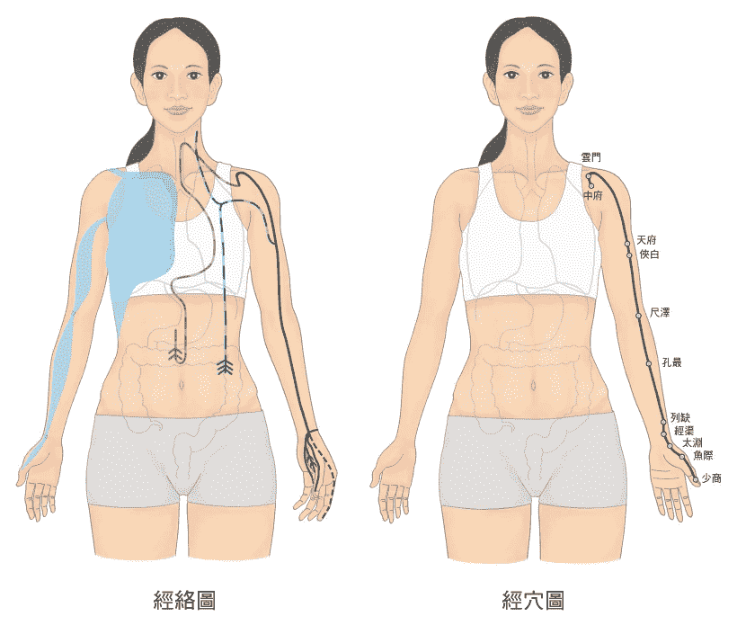

经穴图只连结经络在体表的穴位，没有进到体腔内的胸腹部，所以通常比经脉短，两者千万不要混淆。

穴位的完整呈现主要在《针灸甲乙经》一书，后世大致以它为蓝本，并将这些穴位归入经脉，依据经脉循行的方向，如肺经从胸走手，穴位就从胸部排列至拇指。

穴位是经脉的经气及气血聚集的地方，所以又称为「经穴」。即使属于同在一条经脉，每个部位所聚集的经气量不同，每个部位所聚集的经气量不同，就像在省道上，有些地方很繁荣，有些则很荒凉，繁华地方才会设置车站，穴位就像车站一样。城市人口决定了车站的大小，经气也有多寡，也决定了这个穴位诊治疾病的能力。例如大家都知道「足三里」穴是很棒的保健穴，而同样属于胃经，离足三里才三寸的「上巨虚」穴就乏人问津了。

只要是关节处，都是大穴位，因为通过的气血量多，人体活动量也大，就像一个工商业发达的城市，就业机会多，就会吸引外地人进驻一样。

每条经脉的穴位数都不同，但与长度成正比，经脉长者，如足太阳膀胱经从头到脚最长，有拥有 67 个穴位，居十二经之冠！但俗语说「兵在精不在多」，穴位多不表示比较厉害，脏腑功能才是关键。肺为相傅之官，肺经从胸到手，路途不长，只有区区 11 个穴位，但是短小精悍，个个是强将，连最长的膀胱经都要听从它的命令呢！

理论上，经穴都位于经脉上，所以才能透过经脉循行治疗远端和内在疾病。《内经》有关经脉循行部位的叙述有时过于简约，此时就可参考经穴图确认部位，因此经脉图与经穴图可以合参，而且只要是经脉所经过之处，都可以选用经穴来治疗，虽然有些部位没有穴位，还是可以应用此法。为什么呢？因为中医诊治疾病并不是「头痛医头，脚痛医脚」，而是根据中医理论，结合望闻问切四诊所收集的资料做出判断，找出病因、病理变化，再做治疗，这就是中医师常用的「审因辨证论治」，所以中医才会有「头痛医脚，脚痛医头」的有趣现象。

##### 11. 经络系统为人体建立运输通路与专属系统

随着时代发展的演变，交通需求量越来越强，各个国家满布着各种交通动线，如高速公路、省道、铁路、高铁等等。许多大城市交通路线繁忙，且多以网状围绕连贯，再从这些城市延伸出去通达其他的卫星乡镇。

如果问大家这些交通路线的功能，一定会马上回答是为了「运输」！是的，就是运输功能。交通路线上各种交通工具奔驰，运送乘客和货物从甲地到乙地，除了有形的道路之外，还有无形的路线，像天空中专用的飞机航道和输送无形信息的网际网络，都成为现代生活不可或缺的运输要道。现代社会的经济发展与便利生活，全得仰赖这些路线，一旦故障停摆了，将影响城市的各项机能。之前说过，经络系统就是人体的运输通路，越重要的脏腑通过它的经络越多。五脏象是直辖市，人口稠密，经络分布较多，六腑象是卫星城市，人口较少，经络分布较疏。而经络上面的穴位，就象是一个个社区，依地域人口有多有少，穴位也因它所聚集精气的多寡， 而有不同的功能。

经络系统还有一个特质，就是它所通过的部位远远超出脏腑本身的部位，我们再以心经系统为例，心经系统的路线并不只在心脏而已，而是以心为中心点，向上经过喉咙，分布于面，再到眼睛，向外从胸部到手臂最后抵达小指，向下走到腹部至小肠。透过经络的串连，心脏与小肠、面部、腹部、手臂连成一家人，才能称为「系统」。这也就是为什么中医强调「上病下治，左病右治，前病后治」的原理，采取远端治疗法，心脏痛不必治心，而是从手治疗的原因即在此。

##### 12 . 经络系统「由外知内」及「由外治内」的特色

前面提到「经脉者，所以能决死生，处百病，调虚实，不可不通。」维持经脉畅通既然如此重要，但该如何维持？怎么知道哪些经脉阻塞了？阻塞的经脉又该如何处理呢？这就得要感谢《内经》了！

《内经》明确告诉我们，每一条经脉它所连接的脏腑和分布在躯干四肢的部位，因此只要掌握了这个「内外相连」的关系，就可以按图索骥，经由身体外部的变化，来了解内在脏腑的情况。例如，心肌梗塞的典型征兆，除了出现胸痛、心绞痛，还延伸到下巴、颈部、左手臂内侧等，这些都是心经经过的部位，一旦心脏有病，经络气血不通，就会反映到这些体表部位，只要看到这些部位出现异常现象，就可以推论心脏的情况。这种观察体表来掌握内脏功能的诊断方法，中医称为「由外知内」。

医师藉由「由外知内」了解内在脏腑病变之后，同样地，可以从与它同一条经络的躯干四肢部位着手治疗，例如心脏有病时，左手肘的少海穴也会出现压痛点，此时可在这个部位施针或按揉治疗，当经络中的气血通畅之后，手肘的痛感就会消失，心脏的问题也会跟着改善。这种藉由治疗体表部位来改善内脏功能的方法，中医称为「由外治内」。

「由外知内」与「由外治内」是中医非常重要的诊断治疗架构。中医正统的诊断法「望闻问切」四诊，就是收集外在躯体的资料，并以中医理论分析归纳出内在脏腑的变化，及时进行治疗，就能达到早期治疗防病的目标。

由于经络系统有如此强大的功用，除了中医师之外，许多从事与身体调整、保健相关的专业工作者，都会强调他们也运用中医经络系统，并且得到身体很好的反馈反应，如以「经络按摩」、「经络 SPA」、「经络音疗」、「经络芳疗」标榜的业者，都是透过「以外治内」的方法，提供全身性的保健，可见坊间早就以实用、生活来印证经络系统在人体的功用。

##### 13.中医诊断治疗疾病的利器：结构的必然性

前面在介绍经筋系统时提到「以外知内，以外治内」的观念。

我们可以把这个观念放大来看，中医强调「上工治未病」，就是希望能早期发现病苗，早期疗愈，这是一直以来中医学习的标的之一，但说时容易，要能在临床诊治上实践却不容易。我个人的临床经验发现，这时候若能深入了解人体的经络系统，就会发现人体早就释放了许多讯息出来，让我们有机会预知疾病先兆，加以预防。

所以现代人寿命延长，预防医学蔚为显学，就连一般民众也重视养生保健之际，认识、掌握和善用经络更显重要。

经络系统形成人体的整体观，当然形成人体的结构必然性。

当人体的内脏发生病变时，会透过经络系统反应于外在的躯体结构，导致结构异常，例如心脏有病的人，心经循行所过的小指末梢也会出现瘀肿、麻痛的现象，这就是「有诸内必形诸外」的现象。

反过来说，当人体结构发生异常变化时，例如小指头因为打球而挫伤，时间久了之后，关节弯曲变形，局部肿胀，所经过的心经产生阻滞，必然会导致该经络所连结的脏腑肢节产生病理变化，而出现胸闷气短，甚至影响心脏功能。这就是异常结构会导致病症的必然性，我称之为「结构的必然性」。

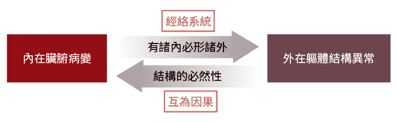

对于医师来说，「结构的必然性」很重要。因为我发现人体有一些异常的结构时，只要循着该部位所属的经络，就可以掌握经络脏腑的病情，赶紧进行治疗，才能达到早期截断病根的机会，一般读者也可以用这个概念来做自我保健（相关内容参见十二经络各篇内容）。

异常结构透过经络系统的连结，会产生相关的病证以及其他同一系统或相关系统的结构改变，都可以归为同一经络的「症候群」。最可怕的是，内在脏腑病变与外在躯体结构异常，随时间累积，二者互相影响且互为因果。就像前面心脏疾病与小指肿胀的情况，哪个是因，哪个是果，真的是难分难解。

幸好中医有很好的诊断治疗方法，就是「以外知内」，从异常结构所属的经络脏腑，审因辨证，诊断出疾病病性与病位。然后「以外治内」，赶紧改变异常结构，透过经络系统的连结，竟能治疗相关「症候群」。

运用这个诊治法，心脏疾病和小指肿胀就可以同时治疗了。

##### 14. 十二经络系统隐藏大秘密

在写书的过程中，常常对着经络资料「发呆」，推敲着经络隐藏的秘密及趣味。有一天突然发现，每四条经络在脏腑关系和循行部位上自成一个系统！

我把十二经络分为三个群组，基本上当然可以用阴阳的对应关系来说明，可是，我一直思索，是否有更生动的说明方式呢？想着想着，灵光乍现，脑海中突然浮现「春夜宴图」四个字！顿时想到可以用餐会的流程来说明此三组经络群组的分工特色与意义。（想一探我的灵感来源，读者可参看「春夜宴图」，提供创意想象）

唐朝诗人李白将与诸弟欢宴桃花园的情景，写成［春夜宴从弟桃花园序］，配上国画表现，刚好可以借来说明人体一个用餐的过程，其中的三步骤分别是：

第一步骤：餐前的准备：备料与烹煮，组头为肺，是相傅之官，有洁癖，可以确保饮食的安全。

第二步骤：上菜与享用，心为君王，当然是主要的享用者囉！

第三步骤：餐后的整理复旧，心包是心的代言人，当君王用餐完毕之后，代替君王发号施令，要求善后团队进场。

此三步骤恰好符合三个经络分组的特色！有趣吧！

当我们把十二经脉配上十二时辰时，就会发现三个群组的时辰特质与人体活动相合，也可以验证许多中医的养生保健观念。

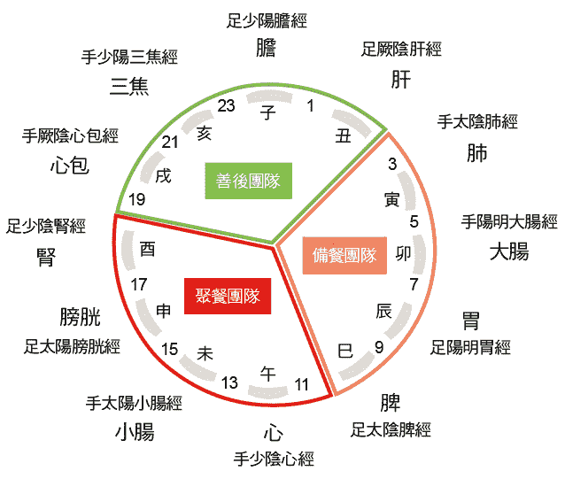

群组一（橙色区块）：太阴经及阳明经组合为「备餐团队」。

● 经脉循行特色：循行在手足部位的前线。

● 经脉流注路线：手太阴肺经→手阳明大肠经→足阳明胃经→足太阴脾经。

● 表里脏腑组合：肺—大肠，胃—脾。

群组二（红色区块）：少阴经及太阳经组合为「聚餐团队」。

● 经脉循行特色：循行在手足部位的后线。

● 经脉流注路线：手少阴心经→手太阳小肠经→足太阳膀胱经→足少阴肾经。

● 表里脏腑组合：心—小肠，肾—膀胱。

群组三（绿色区块）：厥阴经及少阳经组合，为「善后团队」。

● 经脉循行特色：循行在手足部位的中线。

● 经脉流注路线：手厥阴心包经→手少阳三焦经→足少阳胆经→足厥阴肝经。

● 表里脏腑组合：心包—三焦，胆—肝。

以「春夜宴图」灵感为譬喻的介绍说明，是否加强了大家对十二经脉系统的了解，提升了更大的好奇心？我一直在各种课程和演讲机会中，对学生以及民众们强调，身体是活的，是一个设计非常精密的有机体运行，也可以想象为一个分工井然有序的工厂，每个单位都克尽职守，彼此又互相连动，相互补位，让我们得以灵巧的「活着、活动」，研究经络越深，越是发现它的精彩与奥秘！真想赶紧跟读者分享。

接下来，大家就拿出第一把金钥，跟我一起揭开肺经的奥祕吧！

* * *

【体例说明】

《经络解密》书中，每条经络系统都有一篇［导读］，介绍该经络与所属脏腑特色，还有不同于传统观念的特有形象。

接着是四大系统的循行与病候介绍，文中会透露经络趣味，并连结日常生活。文中的「解密」揭露经络奥秘，「中医师不传之祕」介绍中医师专业应用经验，还补充在诊间来不及跟病友卫教的观念，并非中医师真的吝于传授中医知识喔。

之后是众人期待的穴位保健理念。最后分享经络所呈现的人生哲学，期能维持身心和谐！这是中医一大特色。

* * *

每条经络系统都有三种图形示意

1.经络循行图：

标示经络在人体的循行路线，简称「经络图」。经络系统同时存在人体两侧，但为了便于观看，将经脉、经别及络脉绘制在人体的左侧，黑色为经脉，蓝色为经别，绿色为络脉；经筋则以蓝色色块标示在人体右侧。

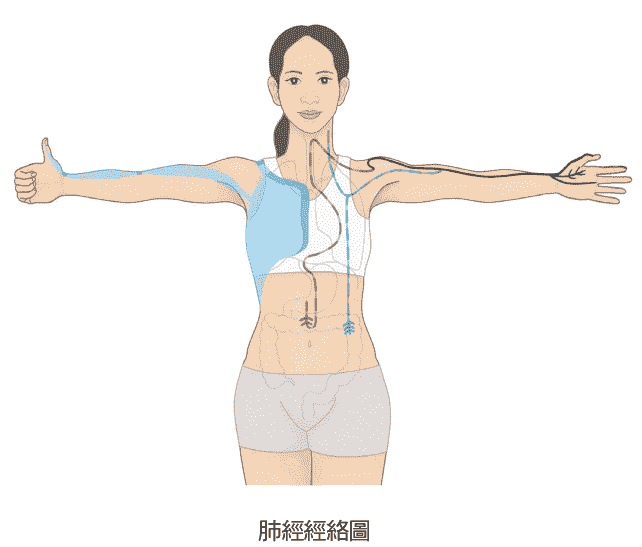

2.经络循行简图：

将经络循行以色块及线条表现，比较容易掌握要诀。因长得很像捷运路线图，因此简称「捷运图」。而且捷运图的颜色及形状都有经过特殊思考喔！包含脏腑本身所属的颜色，四肢颜色较淡，躯干颜色较深。经筋部分，凡是结聚的部位，都会再用黑线框起来。

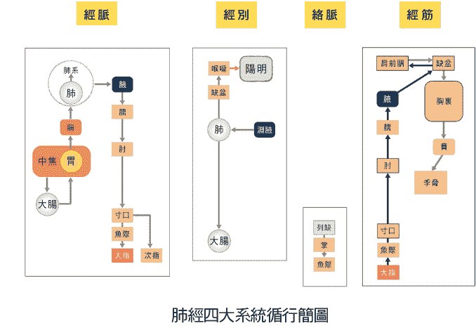

3.经穴图：

主要用在养生保健的穴位介绍篇章。

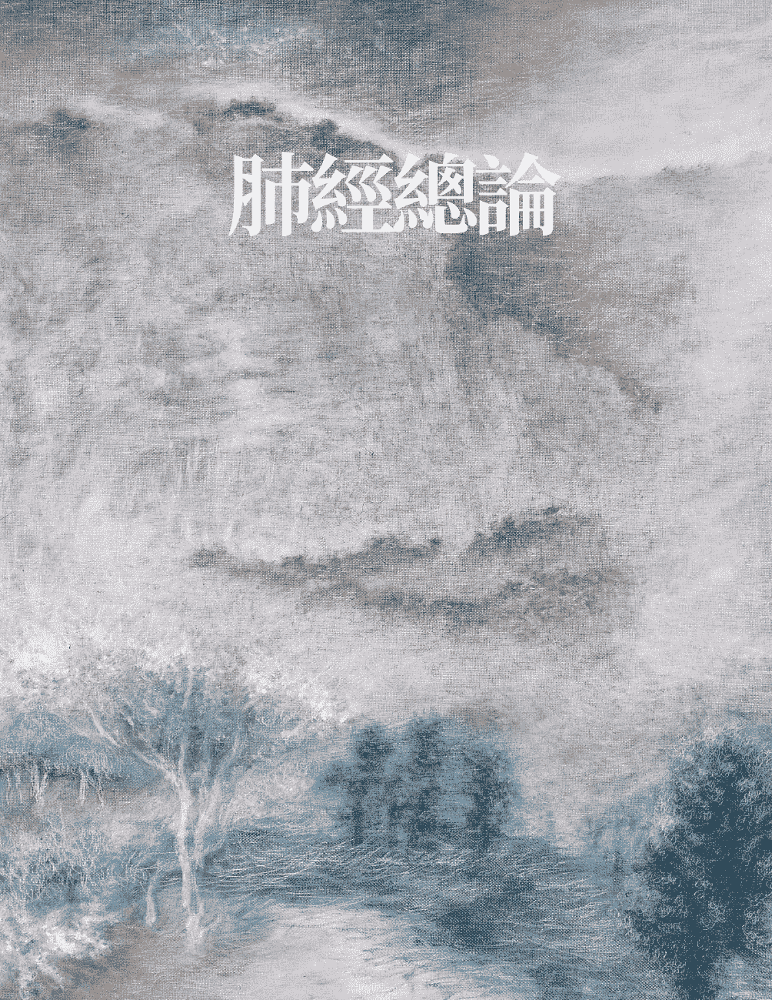

# 肺经总论

清晨 4:30 闹钟响起

2018 年 1 月 1 日清晨 4:30 闹钟响起，你将手伸出被外，循着声音摸索着找到手机，迷蒙着眼睛，将手机闹铃关掉。

打了个长长的呵欠。

拿起床头柜上的水，喝一大口。

掀开棉被，披上外套，走进浴室小解。

擤个鼻涕，清清喉咙，接着刷牙洗脸。

走出浴室，张开双臂，深深呼吸，确定自己真的醒过来了！

你可以和家人一起到东部海边去迎接 2018 年的第一道曙光！

六点多，太阳终于露面了，沐浴在红光万丈的你，身心宛如被新生的阳光洗涤净化，心中充满了蓄势待发的勇气，相信：今年会是个好的开始，我决定要好好的展现自己，让自己发光发热！

如果每天都能在凌晨五点前起床，就有机会迎接每一天的第一道曙光！也能让自己每天都有新的开始！

你知道吗？身体这个「甦醒」过程，每个动作都启动了身体的某些器官和机能。这些启动与连结的关系，都来自大约四十亿年来从低等生物演化到人类的结果，同时也都凭借中医的肺经系统运作着。

或许你正歪着头，想了想，有看没有懂。

没关系！让你了解这一切事情，正是本书《经络解密》的任务！

###### 经络解密「开幕式」──现在的我们是演化的作品

手太阴肺经身为首发团队的队长，当然也就成为十二经络的总队长了！应该有个轰动的「开幕式」来展开以下序曲。

● 肺连结演化历程的过去与现在。

● 肺经短短的经脉、少数的穴位，却是开启演化之路、中医之门的钥匙。

● 如果能了解「肺经身为第一条经络」的重要性，就可帮助读者走进中医之门！

科普书《我们的身体里有一条鱼》（Your Inner Fish），作者苏宾博士（Neil Shubin）是古生物学家，他在加拿大极区发现了「提塔利克」（Tiktaalik roseae）化石，是距今三亿七千五百万年前的鱼类，牠同时拥有两生类的原始特征，是水中动物至陆地生活时的过渡物种。这结果清楚地显示：陆上的动物的确是从水中的鱼类演化而来，我们都是鱼的后代！

对于达尔文所提出的演化论，科学界虽然一直都有争论，我个人是相信历经了近四十亿年，我们从小小的单细胞演化为人类，而且这个演化的过程还在持续中。

现代人读中医的理论，常会觉得很难懂，除了文字艰涩之外，再者就是没有看穿它横跨了数十亿年的时间轴。这部分正好可以从肺脏及肺经贯穿时间与空间，来解开这亘古以来的秘密，以及人与天地的关系。

准备好了吗？肺经将以开天辟地之姿，震古烁今之声，登场喽！

### 一、肺经甦醒三部曲

每一天纯净重生，蓄势待发，归「寅」之际，敞开胸怀出发，迎向挑战，产生接纳世界的勇气。

肺经是十二经脉之首，也是医学生最熟悉的一条经络，因为是第一条，读的时候精神还不错，加上循行简单好记，所以「起于中焦，下络大肠，还循胃口……」就朗朗上口了！但是为什么貌不惊人的肺经能成为首发经络呢？

十二经脉循环交接过程的终点站是肝经将气血注入于肺。多数的经脉都直接起于交接处，但肺经并不起于肺，而是「起于中焦」然后「下络大肠，还循胃口，上膈，属肺」。

肺经没有马上将气血从肺输出，而是另起炉灶，历经中焦这一段路线后再到肺。喜欢阅读推理小说的读者可能会开始怀疑，中间这段时间差，肺是否趁机从事什么勾当啊？呵呵〜确实如此！肺可忙着呢！

第一部曲「纯净重生」：

肝经净化过的气血流入肺，肺经被动接收，存放在肺里保管及审核。

肺经做为人体的第一条经络，气血循环的第一道关口，为了身体健康，对于肝经传来的气血，肺就必须严格把关，审慎评估，检验质量，确保净化后，才能放行。这些工作需要时间，所以，肺经先将气血保存在肺中以做审核，这是第一阶段的工作。

第二部曲「储备蓄势」：

肺开始内部整备：1.启动中焦，为进食做准备。2.启动肺功能，推动气血水的运行。

肺经开辟另一条从中焦开始的路线，经过与肺相表里的大肠，和掌握身体重要资源的胃，最后再抵达肺，展开肺专属的任务。这是第二阶段的工作。

第三部曲「寅始出发」：

肺主导甦醒，人体进入甦醒时分，肺经主动启动卫气及躯体中气血水的循行。

当一切就绪之后，就会启动人体的甦醒机制，美丽的一天从此开始。这是第三阶段的工作。

第一部曲接收来自肝净化的营气，第二部曲启动五脏六腑的气血，第三部曲偏重在启动卫气，而且准备出发。

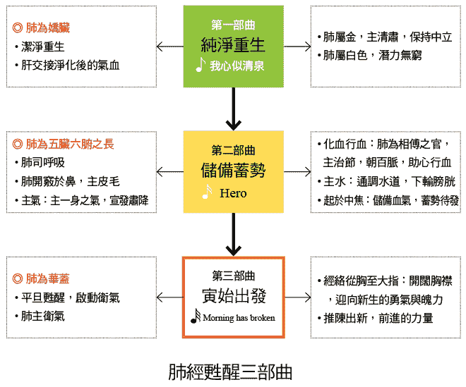

肺连结演化历程的过去与现在，短短的经脉、少数的穴位，却是开启演化之路、中医之门的钥匙。个人觉得，如果能将「肺经身为第一条经络」解说清楚，将会帮助读者走进中医之门，因此这也是让我写来最耗神的一篇总论，但毕竟这是一本医普书，也希望读者能先放松心情，跟我一起走入经络世界，去发掘人体经络的奥秘之处。

#### 第一部曲「纯净重生」

###### 承接肝经净化过的气血

肝经为十二经络之末，最后流注到肺。

中医说「肝主藏血」，可是血液不是一直都在血管里面流动吗？什么时候会被肝收藏呢？目的是什么？好问题。

《内经》说：「人卧血归于肝」，当我们躺下休息时，身体的代谢速度减慢，对气血的需求量减少，一些比较「有空闲」的血液就可以「下班休息」去，明天继续上工。到哪儿休息呢？就像每家客运公司都设有司机休息站及汽车维修站一样，肝脏是血液的休息站及维修站，下班后的血液就流向肝脏，在肝脏得到最后的净化和修复。

肝脏统领经络团队第三组的「善后团队」，心包经、三焦经和胆经，都在肝的监督管理下，很认真地清理体内的杂质，修复损伤的组织，最后经肝经的「扫毒排毒」系统确认一切完好如初之后，再慎重的将这些用心修复与净化的气血交接给肺。有一首由王海玲唱的「我心似清泉」民歌，很贴近肺经的气质：

让我拥抱这片温暖阳光　　好像拥抱灿烂的新希望

当我越过千山涉过万重水　为理想走他乡

当我呼吸春花吐蕊芬芳　　望岳看云听生命在回响

朋友当你轻轻握着我的手　我心似清泉向上流……

###### 肺为娇脏，洁净重生

中医认为「肺为娇脏」，就生理结构上来看，肺脏确实比其他器官显得柔嫩。在五脏之中唯有肺脏直接和外界相通，时时刻刻都得忍受及抵抗空气中的各种杂质、邪气的侵袭，加上肺本身有洁癖（详述于后），所以一定会努力将这些杂质和邪气排出体外。由于它具有非常敏感且易受伤害的特质，中医就此归纳出肺比较「娇」，也提醒我们注意呵护肺脏，无论是饮食或是治疗肺系疾病时都不要过于激烈，例如过于辛辣或是苦寒的食物或药物，都会对肺造成二度伤害。

肺经身为首发经络，「肺为娇脏」亦有深意。

1.就型态层面来说：刚出生的婴儿有着最娇嫩的躯体，「娇脏」提示健康的肺应如初生婴儿般的娇嫩无瑕，另一方面更提示身为「娇脏」的肺就是生命的开始。

2.就工作层面来说：「肺为娇脏」不是为了讨宠爱，而是为了捍卫身体，肺为气血设立了一个「纯净」标准值：只要不伤害肺，且能让肺持续保持娇脏特质的气血，就可以过关，允许放行。肺脏的「娇」是人体的健康标准之一。

看到这里有没有很感动呢？肺为身体把关，确保每天首发经络的经脉内，流动的是纯净健康的气血，不惜牺牲自己，作为检测的仪器。所以有时会在寅时突然咳嗽，这可能表示，肺脏对于肝经传来的营血质量并不满意，就以自己的方式提出「抗议」，以咳嗽来排拒不良质量，也提醒我们要开始注意肺功能了。

另有一种人肺本身就有疾病，再加上寅时肺经的气血较旺，冲击之下，容易引发旧疾，甚或加重病情，也会出现咳嗽、气喘等旧疾，甚至特别剧烈。曾有一个跟肺经旺于寅时有关的案例：一位中年妇女常在凌晨四点多醒来就难再睡，研判是寅时肺经经气过旺而扰动睡眠，加入泻肺气的中药之后，就可以睡到天亮。

3.就结果层面来说：俗语说「一日之计在于晨」，一天最美好的时光在于晨间。若以人生来论，晨间时刻好似幼年及青少年时期，清新单纯，肌肤娇嫩，就是大家所说的「小鲜肉」啦！聪明健康，前途充满希望。肺经也是年轻娇嫩，时时充满希望的经络，所以它只接受经肝净化过、最纯净的气血。

「肺为娇脏」提示我们这是健康的肺脏该有的特色，我们该以呵护宠爱孩子的心态来照顾肺脏。也感谢肺这个娇脏的坚持及牺牲，让我们每一天都能从洁净中重生。

认识了「肺为娇脏」大家是否会很同情菸民的肺？还有在锅炉旁烹饪的家庭主妇以及烧烤店的厨师呢？这些都是肺的恐怖杀手。至于日益严重的空气污染问题就得由全民的肺一起承担了。也难怪肺癌这个隐形杀手，已连续五、六年成为国人癌症的第一大死因。

至于很多人闻之色变的肺腺癌，也可以从「肺为娇脏」的概念下延伸，了解肺需要呵护的特性，在临床观察下，当人们「失宠」或「失去了重要的依靠」后，这重重的打击很容易引起此疾患。

某天门诊中，一位老病人突然向我询问起肺腺癌，因为他有一位三十多岁的同事检查出肺腺癌，由于状况不好，让大家都很担心。

我马上反问：「你这位同事最近有没有历经过很大的感情创伤？」

「有耶！沈医师怎么知道？」老病人满脸惊讶。

长期从新闻报导和临床观察中发现，「肺为娇脏」在工作与人际关系上，代表深度的认可和全然的信任，在感情关系上，代表被捧在手心的宠爱（男女皆然）。一旦失去被呵护的感觉，例如老板关爱的眼神移向他人，曾经如胶似漆的情人移情别恋了，或失去了最深爱的人……，「失宠」之后，都会产生非常严重的「失落感」，心病导致身体也生病，肺的世界崩盘，肺腺癌由此而发。前述三十多岁的年轻人属于适婚期，猜想最大的失落感应该来自于感情，果然不出所料。唉！情关难过啊！

###### 肺属金，喜清肃，保持中立

肺的五行属金，金属的特质就是刚硬，外面的尘埃污垢只能停留在金属表面，无法入侵，因此金属才能保持自己的特性，不受外界干扰，当然也不喜欢外物的攀附。简单说，就是「洁癖」、「不沾锅」，无论身体上或是道德上，皆然。

在身体功能上，肺属金：展现出洁净的特质，不喜欢异物停留或入侵，一旦出现这些情况，就会努力将之排出。例如灰尘从鼻入侵，喉咙有痰停留等，身体自然就会以打喷嚏、咳嗽等方式将之排出，以保持肺的干净。这种特质中医称为「肺喜清肃」。

在相学上，金形人面白，五官方正，个性比较正直坚毅。肺属金，也有金属的铁面无私特质；喜清肃，可以延伸出刚正不阿、朋而不党的特性。但若正直过头了，就会非常顽固，食古不化，超难沟通的。

此外，在脏腑的十二官中，肺身为相傅之官，就是君王旁边最重要的辅佐人物──宰相，当然会有许多人想去巴结。所以，肺经系统除了连结上下接经的肝经与大肠经之外，没有主动与其他经络连结，这就保持了肺本身的中立性，无所偏袒，也没有包袱（肺经虽然没有主动连结肝经与大肠经以外的经络，但为了完成生命的重要任务，心经与肾经主动与肺连结。这部分内容请参阅肺经经脉篇），可以如实呈现身体的真相，以明快的作风，将能放行的气血放行，不能放行就透过肺的系统排出体外，让我们每天都能纯净的开始。

###### 肺属秋天，多愁善感，易生肺病

中医的天人合一理论，认为人与天地四季相应，如肝属木，对应花木繁茂的春天；心属火，对应炎热的夏天；肺属金，对应肃杀的秋天；肾属水，对应寒冷的冬天。

宋朝词人吴文英的［唐多令］：「何处合成愁，离人心上秋。纵芭蕉，不雨也飕飕。都道晚凉天气好，有明月，怕登楼。……」在词人眼中，愁来自离人心上秋，难怪到了秋天，人们看着满地的落叶与逐渐灰暗单调的风景，心里难免会勾起对于自然界及生命力逐渐消退的悲愁感。

但是过度「悲秋」的人，个性通常都比较细腻，多愁善感，一如《红楼梦》中的林黛玉，而且到了秋天特别多病。肺主表，肺气比较虚弱的人，体质也较为敏感，容易受外在环境影响，一到秋天，身体呼应秋天肃杀之气，导致肺病发作，如咳嗽、喘促、鼻塞等，或是原有的病情加重。

所以肺气虚弱的人，平日就应多注意调适身心状况，进入秋季，尤应注意保暖，多晒太阳，多接触正面的事物，就能淡化秋天的悲凉感。

###### 肺属白色，潜力无限

肺在五色系统中属于白色。现代人认为白色是纯洁的象征，而在中国传统民俗中，「白色」和「服丧」有很大的关联，是丧礼服装与布置的主要颜色。两者差异很大。那么中医所认知的白色是什么呢？

过去人们以为白色就是无色，或者是基本色，就如白纸没有自己的颜色，等着着上其他颜色一样的概念。后来科学家证明白色是一种包含光谱中所有颜色光的颜色。所以白色不是「没有」颜色，而是「全有」。

中医看透了白色，知道它包含所有的颜色，因此，白色代表了各种可能性。中医将白色给予生命之始的肺，让我们的生命始点存在着各种机会与变化，得以发挥潜力，创造自己的人生。

另一方面，《内经》说：「精明者，所以视万物，别黑白，审长短。」指出眼睛的功能是视察万物，分别黑白颜色，判断长短。白与黑是极端对比的颜色，五色之中，肺属白色，肾属黑色。肺与肾也有着极端对比，例如在人体脏腑的位置，肺在最高位，肾在最低位。天地是大宇宙，人体是与其对应的小宇宙，肺宛如天，脾宛如地，肾在脾之下，宛如地底。天有着明亮的特质，地底就暗不见天日，因此白则亮，黑则暗。肺的白色也代表「明亮」，肺经所主的寅时正是天色将亮之际，肺属白色隐含了清晨与光明，充满了希望。

前面提到肺为娇脏，需要呵护。白色的食物，如白木耳、莲子等都能呵护娇嫩的肺。这是肺属白色在饮食上的应用。

当然我们也可以就一般认知的白色来讨论肺的特色。白色有纯洁干净的感觉，俗语说「一白遮三丑」，即使中国人多属黄种人，民间还是比较喜欢白皙的肤质。肺五行属金，五色属白，宛如肤色白皙细致、鼻梁高挺、语音清脆、注重外表整齐、衣着利落、有点洁癖、「天生丽质难自弃」的美女，这又呼应了肺为娇脏的特色。

综上而论，肺为相傅之官，是位独具风格、优雅的「白面书生」，就如三国演义中，羽扇纶巾的诸葛亮一样；身为娇脏，敏感也很有品味，挑剔且龟毛；五行属金，有洁癖，坚持原则，不轻易妥协；五色属白，未来充满光明与希望。我想，这是大宇宙给小宇宙的我们最真诚、最珍贵的祝福与赏赐。

肺经拥有十二经络系统中独有的风格与优雅，可以简称为「白金娇脏」，属首发经络不可或缺的重要特质。

* * *

在撰写本书的过程中，肺经不是我第一条写的经络，是第七条！为什么？当初要开始落笔时，发现肺经太庞杂，超级难写，决定先跳开写别的经络，等把笔磨尖了之后，再回来写肺经。过程中，肺经总论篇最耗费心神，感慨也最多！

自从清朝时期，西医兴起之后，中医就被视为落伍的象征，国人中（甚至连中医同道）一直有人想消灭中医。在这样的氛围下，许多年轻的中医师对于中医普遍缺乏信心，反倒是民众们感受到中医疗效之后，给予中医全然的信任与支持。

临床上，即使身为医师的我，常被中医的强大疗效震慑住！病人也常惊呼连连说：「中医怎么这么神奇！」隔壁床的病人就会淡淡地跟他说：「中医就是一直这么神奇啊！」

我逐渐体会到，部分中医理论不仅活在当下，也涵括了更长更广的时间与空间观点。因缘际会下，开始接触演化，赫然发现，中医竟然记录了生命演化的历程，而且确实与天地活动类似，难怪眼光只放在现在的人们会误解中医、看浅中医！

我常在对外授课时强调，我们不是在发现中医，而是透过临床，印证中医！所以我画了以下「肺与天地人和演化关系图」，说明肺经系统的特性。

天地是大宇宙，人是小宇宙，也还在演化的过程。开天辟地的肺经，叙说着宇宙的时间故事！

* * *

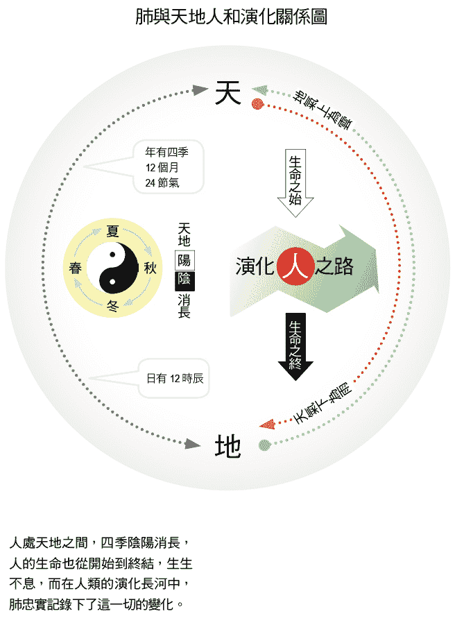

#### 第二部曲「储备蓄势」

肺身为五脏六腑之长，没有三把刷子是不可能赢得这个美誉。是哪三把呢？就是掌理全身的气、血、水。气、血、水到位，肺就领头储备资粮，蓄积力量，准备启动全身活动。

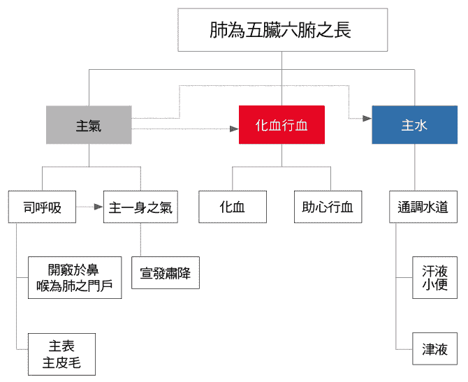

###### 肺主气，司呼吸，主一身之气

肺所有能力的来源都是「呼吸」。众所皆知，肺是重要的呼吸器官，中医也说「肺司呼吸」，肺由此衍伸出许多功能，可以让我们回溯人类的演化过程。

1\. 中医的肺脏观就是呼吸演化史的缩影

脏腑经络记录了人类从单细胞生物进化至今的这一大段历程，这些历程还保留在我们体内，中医以此为基础发展了完整的医学理论，直至今日还引导着中医师们治病救人。

我们就先从演化谈起吧！

达尔文的「演化论」认为地球上人类是由低等生物演化而来。历经四十亿年，从原始单细胞微生物、多细胞微生物、海中低等生物、有壳生物、鱼类、两栖类、爬虫类、鸟类、哺乳类、灵长类、猿猴，才演化到人类 。

生命的存活是最关键的事情，所有的活动也都围绕着这个目的展开。呼吸就是存活的要件之一。

从演化的历程来看呼吸方式的改变：

● 最早期的生物都是单细胞，构造非常简单，呼吸就从体表直接扩散。

● 蚯蚓以皮肤呼吸，还会从背孔分泌黏液保持皮肤的湿润。

● 水生动物以鳃呼吸，当水通过鳃时，位在鳃丝上鳃片的微血管会藉由扩散作用和水进行气体交换，将溶解在水中的氧气吸收到血液中。比较特别的是泥鳅，平常用鳃呼吸，当水中氧气缺乏时，会暂时把肠子作为呼吸器官，这与中医肺与大肠相表里的理论有异曲同工之妙。

● 两栖动物利用皮肤、口和肺呼吸三个方式进行气体交换。通常幼体在水中生活，用鳃呼吸；成体在陆地生活，用肺、皮肤和口腔内膜呼吸。青蛙主要依靠肺呼吸，但肺还不发达，呼吸氧量不足，因此还需透过皮肤呼吸来补强。中医也有肺司呼吸又主皮毛的概念，这项关系与呼吸和排汗有关。

● 陆生动物主要以肺呼吸。人类的呼吸器官最为复杂，包括：鼻、咽、喉、气管、支气管和肺等，中医也说肺主咽喉，肺开窍于鼻，鼻子是肺在面部的外窍，中医可以透过观察鼻部了解肺的状况。

俗语说：「凡走过必留下痕迹」，人体亦然！人类的身心灵中皆存有演化的历程，人类母体中的胎儿也以十个月时间，从单细胞开始，快速重演人类演化史。

中医对于肺功能的概念存有最多演化痕迹，也是必然的结果。因为细胞内完成生命活动所需的能量都是来自呼吸作用，呼吸贯穿整个演化史。呼吸是个体与外在环境气体的交换，所以一定跟体表有关，这段从体表呼吸演化到肺呼吸的过程，全被中医归纳在肺的功能之中。

中医是以五脏六腑为核心的医学，周边相关功能的组织就依据不同性质交给脏腑管理。以肺来说，虽然早期生物体中还不存在肺这个器官，但因为呼吸贯穿整个演化史，肺的核心概念也是「呼吸」，后来才出现的肺脏就概括继承所有与呼吸有关的器官与功能。所以，中医的肺脏概念不仅记录以呼吸为主的演化历程，还从此衍伸，包括体表皮肤也能呼吸，生命从水中开始，水生动物及两栖动物的呼吸系统也能让水通过，进行气体交换等等。

中医认知「肺司呼吸，主皮毛，主水」这些特性，都可以视为人类从单细胞、水底动物进化到陆上动物的记录。

2\. 呼吸不仅贯穿整个人类的演化史，也贯穿个体的生命史。

###### 肺为气之主

中医对于呼吸的看法不是用 O2 ，CO2 概念，而是用气的升降来说明。

中医认为「肺为气之主，肾为气之根，肺主出气，肾主纳气，阴阳相交，呼吸乃和。」肺将吸入体内的气降至肾受纳，让气有根，也将气带来的能量存在肾之中，然后再从肾升至肺而呼出体外。这是中医很特别的见解，因为中医了解这个气机的升降运作深深影响全身机能。

肺主一身之气，还包含气的生成和运行。

呼吸与食物是维持生命的两大关键，中医观察到，人体将来自呼吸的气（中医称为清气）与食物养分的气合而为一，成为最营养且最有能力的组合，提供人体所用。但谁来做整合的工作呢？身为五脏六腑之长的肺，就像学校的班长，义不容辞的挺身而出。肺把从自然界吸进来的清气，与脾胃从食物中吸收的营养之气，结合成为一股新的气，称为「宗气」，宗气积于胸中的膻中处，也就是中丹田，再输送到全身。

宗气既然是清气加上营养的统合，必然会影响全身的气机。所以宗气足，心肺功能强，肾也能纳气；宗气虚则百病丛生。因此营养不良的人，就算处在空气好的地方，还是会有气虚不足的现象，那是因为营养不足，致使宗气生成也不足。看到这里，就为肺经不是起于肺，而是起于中焦埋下伏笔。

宗气部分来自于空气，当然会走呼吸道，帮助呼吸；

宗气含有营养物质，会通行心脉，提供给耗能的心脏，助心行血；

宗气也到丹田，由肾受纳来滋养元气；

宗气周行全身，濡养全身的组织器官。

宗气可以再分为运行在经脉内的「营气」和经脉之外的「卫气」。

###### 肺主宣发肃降

肺主一身之气，除了滋养心肺肾主要器官之外，气也周行全身其他组织器官。如何周行？中医归纳宗气在全身的活动方式为「宣发」与「肃降」。

宣发是指气机向上、向外，升发和发散的意思，肃降是指气机向下、向内，清肃和下降的意思。它们的活动看起来很像一棵树的型态。宣发类似树枝与树叶向上、向外伸展的特性，肃降类似树干与树根向下、向内收敛的特性。透过肺的宣发肃降，宗气就能在人体上下内外活动，有升有降，生机不息，维持身体机能。

美国学者栗山茂久博士在《身体的语言》（The expressiveness of the body and the divergence of Greek and Chinese medicine，中译本究竟出版社出版）书中比较中西文化看身体的异同，发现古希腊的解剖学以动物为中心，中国人则对于植物的兴趣明显高于动物。中医对于「内脏与其所控制的部位、内在的生命核心以及外表的呈现──它们之间的关系就和根、茎与叶、花之间的关系一样。」

中医确实常以植物概念来看待人体，所以特别强调「根」，人体的根就是肾脏，中医说是先天之本，藏有人体最宝贵的精。呼吸是生命大事，呼吸有根，生命也才有根。因此，每一个生命的开始与终结都与肺肾有关。

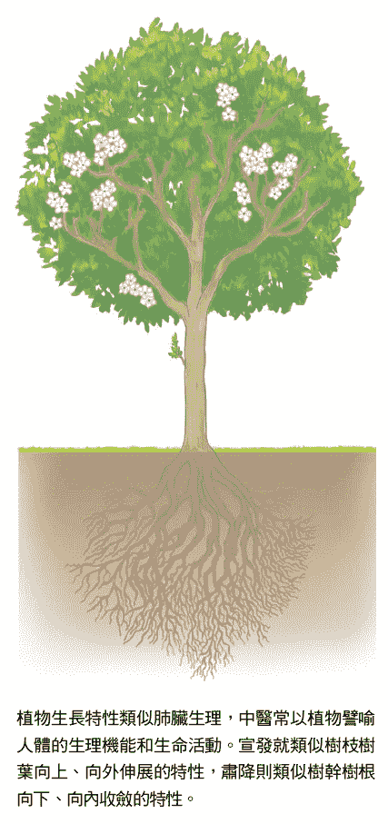

生命中的呼吸都是吸与呼成对，遵照着肺吸气─肾纳气─肺再呼气的循环。只有两个例外：人离开母体后的第一个气息来自肺的吸气，人将离世前最后一个气息来自肾无法再为肺纳气，气主出不进，所以只能呼出最后一口气。肺贯穿了生命的开始与结束。

许多重症病人的呼吸都是短而浅，气出多进少，表示肾纳气功能逐渐下降。一般人紧张时呼吸也会变得短而浅，只要「深呼吸」就能让呼吸加深加长，这就是有意识的将气吸入丹田，让肾多纳气的关系。

就天地间的运动来说，气在天地之间有升有降，地气上为云，天气下为雨，上下循环，万物方能生生不息，请参考「肺与天地人和演化关系图」（p.120）。就人体而言，肺在最高处，肾在最低处，两者宛如天与地，无论气或水也都是上下周流，才能维持人体的平衡。肺主气，肾主水，注定肺与肾在主气与主水功能上互相依赖的关系，所以中医才称肺肾为「金水相生」。肾水譬喻如地下水、河流，经太阳（如心阳）与地热（如肾阳）蒸腾水气向上，在天凝结为云，如人之肺，当云降为雨流入河流与地下水中，其关系才称为金水相生。

###### 道家的丹田真气均与肺有关

中医许多观念与道家类似，故又称为「道医」。道家很重视「丹田」，顾名思义是指道教炼丹术呈现之处，炼丹时意守之处，简单说就是练真气的地方。真气对于生命很重要，影响我们生老病死的型态，真气充足的人可以少病、长生、不老。这也就难怪练武及注重养生之人，都注重练丹田之气。

道家认为人体存有三个丹田，藏有精气神三宝：上丹田在头部的眉心，藏神；中丹田在胸部的膻中，藏气；下丹田在下腹部的肚脐以下部位，藏精。奇妙的是，三个丹田都与肺有关。

上丹田在眉心，又称为印堂，也是俗称第三眼所在的位置。在《内经》面部望诊，两眉之间的印堂是肺的反应区，如下图。

中丹田在胸口正中的膻中，中医称膻中为「气海」，就是气汇聚的地方，属于印度瑜伽七轮中的心轮。肺主一身之气，胸口也是肺经系统经过的部位。

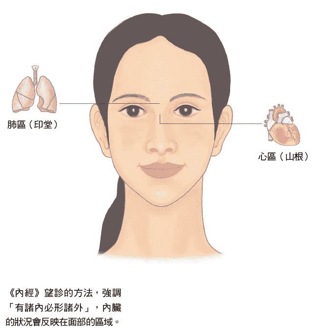

下丹田在肚脐以下部位，任脉的关元穴、气海穴附近。从穴位名称中，关「元」，「气」海，合起来就是「元气」，暗示下丹田是元气之所在。主藏精，肾藏精，因此下丹田由肾管理。

肺所吸入的气蕴涵能量，也是生命的关键，当然要周行于丹田，人们才能经由呼吸来炼丹。上丹田属于肺，鼻部吸入气息也会到印堂的上丹田，气进入肺，向下经过中丹田到下丹田，真气在此收纳滋养之后，再逆向呼出体外。这就是中医肾为肺纳气的原理，也让气有根。

###### 肺开窍于鼻

肺开窍于鼻，鼻子能呼吸也有嗅觉。早期鱼类的鼻孔只是凹下的构造，只管嗅觉，与呼吸无关，演变到两栖类时才逐渐有了呼吸的功能。

从嗅觉方面来说，嗅觉有助于生存。人类早期在野外的生活，嗅觉有助于觅食和追踪猎物，也避免我们误用了一些中毒的食物。在现代社会，嗅觉仍是生存的关键之一，例如闻到食物的味道会让我们闻香而去进食，若闻到腐坏食物味就不会吃进肚子，闻到瓦斯外泄味道便会赶紧报警并逃离现场，捷运车厢中闻到身边乘客有浓浓酒味，就会赶紧退避三舍，保持距离等等，所以嗅觉是很重要的生存能力。

在所有的感官中，嗅觉与情感联系最强，许多婴幼儿要闻到妈妈的味道才能安睡，有些人从小就需要有陪睡布或绒毛玩具，长大后仍无法抛弃，每天晚上得依偎着，闻着熟悉的味道才能入睡。现代的芳香疗法，藉由芳香植物所萃取出的精油做为媒介，经由呼吸道或皮肤吸收进入体内（肺主皮毛），来舒缓身心压力。在肺经的病候也有心烦，试试芳香疗法应该不错。

嗅觉也是所有感官之中最直接的接收器，在十二对脑神经中，第一对就是嗅神经。气味也是最容易记忆的东西，所以嗅觉为感官之首。

中医也很重视鼻子。鼻子在中医望诊时称为「面王」，因为它在面部最高的位置，如地面之泰山；另一方面也与前述的呼吸及嗅觉有关。肺开窍于鼻，鼻子是肺的外窍，功能由肺管理，中医师也可以从鼻了解病人肺的情况。严重鼻塞的人，常常用力吸气，鼻翼会比较肿硬而且外张，表示肺气阻滞，胸部也会跟着变紧，需要开胸理肺。中医也说喉为肺之门户，跟呼吸与发声有关，这与现代观点一致，不再赘述。

在《我们的身体里有一条鱼》书中，苏宾博士写道，在演化的过程中，会发生基因突变，导致部分基因功能丧失，但是仍保留在 DNA 中，成为演化的无言记录，因此「身体记录了生命的历史」。

而中医将这些演化历程归纳于脏腑与经络理论之中，所以唯有回归到演化的历史长河才能理解中医的特色。中医是活的医学，充满生命力的医学，面对变化快速的人类环境，中医与时并进，持续进化，丰富内涵，迄今仍活用在日常生活与医疗保健上，颇受民众喜爱与信任。我想，这就是中医的奥秘，也是中医可以绵延千年的生命力来源之一吧！

###### 肺在体合皮、其华在毛

中医说「肺在体合皮、其华在毛」，前面提过，呼吸的演化是从体表到鳃，最后才是肺。肺又与外界气息相通，包覆在人体外面的皮毛也就由肺管理了。

中医认为，皮毛具有防御外邪、调节津液代谢、调节体温、辅助呼吸等生理功能，其实皮毛就是肺的一个分身，而且是站在最前线的分身。皮毛是人体最外面的保护膜，皮毛上面有毛细孔，很像现代的防风透气外套，可以排汗透气，调节体温，也有抵御风寒入侵的双向作用。

肺对于皮毛这个分身也特别照应，将具有保护能力的卫气、水谷精微和津液外输给皮毛，成为足够防御外邪的「武器」和能力。

我们也可以从皮毛判断肺的情况。皮毛细致的人，肺比较娇嫩；皮毛粗糙的人，肺也比较粗糙，容易引发肺病。曾经有一位皮肤细嫩的女性友人，开始抽菸之后发现，只要菸多抽一些，皮肤就变得比较粗糙。临床上也看到许多抽菸的男性，四肢表皮都比较干燥粗糙，果然肺主皮毛！皮毛上的一些皮肤疾病，中医也会从肺着手治疗。所以肺与皮毛之间的关系也非常密切。

##### 肺主化血及行血

大家都知道，心脏是泵血（推动血液循环）的器官，中医也说心主血主脉，这点中西医是一致的。但对于心脏的血液来源以及如何推动血液，中医有其独特理论。

###### 肺主化血

中国人很重视吃，是不争的事实，且其来有自！中医非常强调饮食，因为维持人体生命活动的气与血，都来自于胃从食物中消化吸收的营养，中医称为「精微物质」。

气的部分，前面提过精微物质与空气合为「宗气」，濡养全身各组织器官。

血的部分，《内经》说：「中焦受气，取汁，变化而赤，是谓血。」「谷入于胃，胃气上注于肺。」「中焦亦并胃中，出上焦之后，此所受气者，泌糟粕，蒸津液，化其精微，上注于肺脉，乃化而为血。」总结而言，胃将精微物质经由肺经上注到肺，肺再转化成血液。

各位请记得，以上《内经》有关肺转化血液的说法距今至少 2500 年以上。而在 2017 年最新发表的现代医学研究指出，肺不只是呼吸器官，也是制造血小板和支援造血功能的要塞！科学家透过小鼠实验发现，肺还贡献了体内一半以上的血小板；此外，肺还能和骨髓在造血任务上互相合作，在骨髓的造血功能受损时，派出造血先驱细胞，支援血球和血小板的合成。这跟中医理论完全相合。

中医脏腑理论中，肺与肾金水相生，共同完成呼吸与水液代谢两项任务，肾主骨主髓，现在可以加上第三项任务「造血」囉。

###### 肺助心行血

中医的心为君主之官，不仅要输送血液到全身，还要管理神志，保持人心神安定，还要管理眼睛及脸色，说话要小心，不要轻易泄漏内心的秘密……。中医的心要管理好多事啊！幸好老天派来超能力的肺，担任相傅之官，辅佐心脏，肺主一身之气，透过呼吸，气行则血行，帮助心脏推动血液输布到全身。

中医另一本典籍《难经》说：「人一呼脉行三寸，一吸脉行三寸，呼吸定息，脉行六寸，人一日一夜，凡一万三千五百息，脉行五十度周于身。」《难经》时代的医学家数学能力不错，算出人一呼一吸，血液在经脉走六寸，一天 24 小时，共呼吸 13500 次，经脉绕行身体五十周。五十周之后经脉回到手太阴肺经，就是肝经注入肺的时候。

中医师常在腕关节上把脉的地方叫做「寸口」，是肺经经过的部位，肺经是五脏六腑经脉的始点也是终点，五脏六腑的气会显现在寸口处，所以中医师只要在寸口把脉就能掌握五脏六腑的状况。寸口靠近腕关节的位置有一个「太渊穴」，也因此被称为「脉会」，可以诊测经脉运行的状况，调节心律。

一般人常言「感人肺腑」和「肺腑之言」，都指发自内心深处诚挚的情感言词，不知大家是否注意到这个用词，都以「肺腑」二字替代了诚挚的内心状态！其实《史记》中也曾以肺腑二字来譬喻帝王（心）的亲属：「诸侯子弟若肺腑。」唐朝诗人白居易也曾在诗中以肺腑喻内心（「肺腑都无隔，形骸两不羁」），可见这譬喻用词由来已久。不过从中医的角度看待这说法，乍听之下会觉得有点小别扭，因为肺属五脏，不属六腑，但延伸思考若以肺为五脏六腑之长，因而取「肺＋腑」的肺腑之词来象征五脏六腑的象征倒也说得通。所以，我们也只好默认「肺腑」一词，并安慰自己：反正肺还与心相连，「肺腑」与内心怎么说都会通！

###### 肺朝百脉，主治节

肺经的太渊穴被称「脉会」，可知肺与脉有密切关系。中医的「脉」有多重意思，有时是血脉，有时是经脉，但无论是血脉或经脉，都是气血流动的管道。

《内经》说：「脉气流经，经气归于肺，肺朝百脉。」就是前面所说的，经脉绕行五十周之后回到手太阴经，旧的循环已然结束，新的循环马上开始，肺在人体最高点，朝向所有经脉，由上而下，将宗气输到全身所有经脉。

《内经》说：「肺者，相傅之官，治节出焉。」肺这个宰相能力很强，除了能助心行血之外，还能帮心脏安定心神，治理国家。

中医的五脏都藏有重要的精神物质，如心藏神、肺藏魄等。当心神不安、心思紊乱的时候，肺就展现魄力，帮君王快刀斩乱麻，安定心神。肺属金，个性方正，喜清肃，肺行气之力宛如扫帚，能驱逐君王身边的小人佞臣，让心成为英明的君主。以身体来说，佞臣就像黏腻的痰饮、瘀血等。治节即指肺有辅佐心脏、治理调节全身各种功能的作用。

##### 肺主水

###### 通调水道，掌管水液代谢

《内经》对于身体的水液代谢叙述如下：「饮入于胃，游溢精气，上输于脾，脾气散精，上归于肺，通调水道，下输膀胱。」

人体所需要的津液，跟血液一样，都源自于饮食。饮食中的水分，经胃消化吸收后，转输给脾，再运送到肺，肺统理体内所有水液的道路，将水液输送到五脏六腑中，以滋润脏腑，并将五脏六腑代谢的废液向下输送到膀胱，这就是肺主水的工作内容。

###### 肺主水，也可以从演化讨论

生命来自水，地球表面百分之七十的面积由海水覆盖，所以又称为「水星球」，水与生命有着密切的关系。原核生物是最原始的生物，如细菌和蓝绿藻等，都是在温暖的水中发生，所以有「生命来自水」一说。身为首发经络的肺，似乎记载了生命起源于水，并适应水中生活，在水中呼吸的历程，由此可知肺具有水液代谢的能力。

肺所主导的水包括全身所需的津液，还有排出体外的汗液、小便，以及呼吸时的水蒸气等。肺与大肠相表里，大肠会吸收糟粕中可用的水分再利用，大肠的排便也与肺有关，如果体内津液不足，大便也会过于干躁而难解。肺的功能是否顺畅，也与大便排泄能力有关。

前面提过，就天地间的运动来说，地气上为云，天气下为雨。类似现代所说的水循环。水循环指水在一个既没有起点亦没有终点的循环中，不断移动或改变存在的模式。当水在地球中移动时，将会在气态、固态和液态三个状态中不断的转变。（参见下页图）

中医说肺主气，肾主水，肺肾金水相生。气与水本质是同一物，只是形态不同而已。水液跟血液一样，都需要气的推动，才能周行全身。

气、血、水三者环环相扣，成为人体生命的动力。肺是呼吸器官，主一身之气，而气又为血帅，气行则血行，所有脏腑的气血都需要肺气来推动。气行则水行，推动水液输送和代谢，濡养全身器官组织，肺才因此被公推为「五脏六腑之长」。

###### 肺经起于中焦之理

肺要推动全身之气（宗气）来启动一天的活动很重要。宗气可再分为运行在经脉内的「营气」和经脉之外的「卫气」。

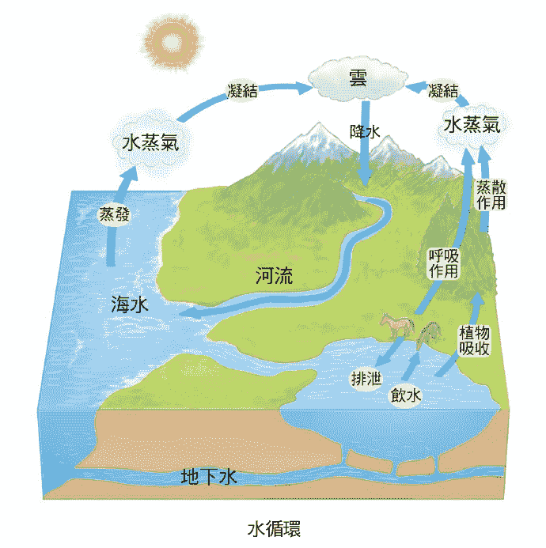

《内经》说：「人受气于谷，谷入于胃，以传与肺，五脏六腑，皆以受气，其清者为营，浊者为卫，营在脉中，卫在脉外，营周不休，五十而复大会，阴阳相贯，如环无端。」

这里先介绍营气（卫气具有保卫功能，行于脉外，将在第三部曲中发挥功能），营气是具有营养功能，行于脉中，就是在经脉里流动，跟着十二条经脉循环全身。营气是甦醒首部曲和第二部曲的主角。

首部曲的营气：已经周流过十二经脉，属于「二手」品，肝是最后一条经络，肝经注于肺，将净化过的气血交给肺。

第二部曲的营气：来自于中焦胃，这是新鲜的营气，胃再传送给肺。于此同时，肺正忙着检验肝经送过来的气血。历经十二经脉的气血，数量难免会减少。肺一方面确保旧的营气质量，一方面将胃传来的营养物质转换为血，与肺部吸入的新清气，形成新营气，新旧合并，刚好补足身体所需的质与量。

此时，肺已经储备足够的气血，蓄势待发囉！

中医认为人的情绪与五脏六腑密切联系，喜、怒、忧、思、悲、恐、惊的七情之中，敏感的肺主悲与忧；肺属金，过于「洁癖」，有时会让人感到孤独，加上四季之中，肺属于秋季，离人心上秋，合成愁字，更容易出现莫名的萧瑟感。尤其面对变动、重新开始之际，有魄力的肺，也难免会有情绪低落的时刻。

以前在国外读书时，当面临许多情绪激荡时，就听「Hero」这首歌自我鼓舞！现在也把这首歌送给每天都蓄势待发的你！

There’s a hero （有这么一个英雄）

If you look inside your heart （如果你仔细审视你的心）

And you don’t have to be afraid

Of what you are （就不必对真的你感到害怕）

There’s a answer （有这么一个答案）

If you reach into your soul （如果你深入探索你的灵魂）

And the sorrow that you know （所有的悲伤）

Will melt away（ 就会融化殆尽）

#### 第三部曲「寅始出发」

这个阶段准备甦醒出发。

生活中，一般我们在出门前都会穿上外衣，保护自己免于外面的艷阳、灰尘、寒冷的侵袭。人体在此准备出发时刻，当然也需要罩上保护的外衣，肺就是这件美丽的外衣，中医称为「肺为华盖」！

###### 肺为华盖──是人体最强而有力的保护伞

不同于现代医学认为肺只是个呼吸器官，中医尊称肺为「五脏六腑之华盖」。「华盖」有两种说法，一种说法是古代帝王出巡时用来遮阳的御用伞，另一种说法是古代帝王所乘坐车辆的车盖。无论是哪一种说法，只要君王用品一定非常华丽，而且具有从上而下的保护特性，所以称之为华盖可谓名符其实。

心为君主之官，肺为相傅之官。肺位于胸中的人体最高处，主卫气，宛如华盖一样保护心脏这位君王和其他脏腑，加上肺为「五脏六腑之长」，推动全身气血水的生成与代谢，让肺既有保护力又有推动力，连心脏都得让它三分，与它配合，可见肺在人体的高贵地位，当然具有十二经之首的冠军相。

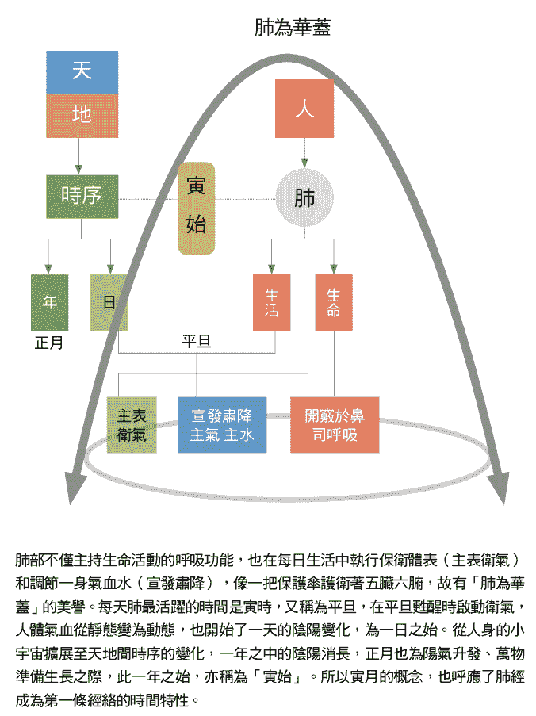

##### 肺主卫气──是人体第一道防线

卫气和营气一样都来自宗气，卫气一如其名具有保卫功能。《内经》说：「卫气者，所以温分肉，充皮肤，肥腠理，司开阖者也。」营气具有营养功能，所以行于脉内。卫气要护卫身体，所以行于脉外，包括皮肤、腠理、肌肉这些身体表层的组织，让体表坚实，维持体温，防御外邪侵袭，并能调节毛孔的开阖功能，适时排汗。卫气就象是卫兵一样，坚守在城墙，保卫国家。

肺主一身之气也主一身之表，卫气分布于体表，是人体的第一道防线，当然就归肺管理。卫气在某个层面来说，跟现代常说的免疫力类似，能为机体抵抗各种外来微生物侵袭，维护体内环境的稳定性。

##### 肺经与足太阳经共同保卫人体

足太阳经是人体最长的经络，真的是「从头到脚走透透」，也拥有最多的穴位数，共 67 穴。这样讲大家可能没感觉，肺经有 11 穴，大肠经 20 穴，能力也很强的胃经 45 穴，大家现在就能了解足太阳经的厉害了吧！

足太阳经又称为「巨阳」，表示阳气巨大，《内经》说：「巨阳者，诸阳之属也，其脉连于风府，故为诸阳主气也。」足太阳经连结所有的阳经，而武侠小说中人人都在狂练「打通任督二脉」，其中的督脉具有总督一身阳气的强大力量，太阳经透过连结督脉的风府穴而与督脉相连，这种类似以婚姻联结两个家族而建立的裙带关系，让太阳经与督脉在管理阳气上「亲上加亲」，足太阳经就有充足的能力掌理所有的阳经和全身的阳气，成为阳经对外的代表及发言人。

全身的阳气，特别是护卫在身体外面的阳气，中医称为「表阳」或「卫阳」是很重要的防护机制。

《内经》说：「阳气者，若天与日，失其所，则折寿而不彰，故天运当以日光明。是故阳因而上，卫外者也。」「阳者，卫外而为固也。」太阳是万物长养所必须，《内经》将人体的阳气比喻为天上的太阳，对于人体的重要性可见一斑。

自然界气候异常，如同现代的全球暖化一样，在全世界形成各种灾难，人体的阳气如果失常也一样会危及生命。所以人体正常运作的阳气应该如天上的太阳一样，有着向上及向外保卫人体的作用。人体的足太阳经就像自然界的太阳一样，统领所有的阳经和卫阳之气，所以中医说足太阳主一身之表。

肺也主一身之表，所以肺经与足太阳经共同管理卫气来保护人体。（两经有通经关系，以后会介绍）人在平旦时甦醒这件事，其实是以肺经为主导，启动手足六阳经而形成的机制。

人是宇宙的缩影，中医努力要藉自然界的比拟说法来解释看不见的脏腑与经脉功能，以上就是一例，期望读者都能体会中医阐释人与「天地相应，天人合一」思想的苦心，而不要轻易认为中医理论不科学、不现代。

##### 人体正常的睡眠规律是由卫气主导

依据中医理论，人体正常的睡眠规律是由卫气主导。

保卫人体的卫气白天走在阳分，是人体活动的时刻；晚上走在阴分，是人体休息的时刻。当卫气在晚上逐渐进入阴分时，人体阳分的卫气就会逐渐减少，阳气不足就会闭上眼睛，进入睡眠状态。到了白天，卫气会从阴分逐渐走出来，进入阳分，人体阳分的卫气逐渐增加，阳气充足就会睁开眼睛而甦醒。所以卫气在晚上进入阴分，白天离开阴分进入阳分，就是睡眠与甦醒的差别。

若以夫妻共组的家庭来比喻卫气的活动，卫气就像承担养家任务的先生，阳分是外在的工作职场；阴分是两人共组的家庭，太太在家中，温柔教养孩子。卫气先生白天在外上班，刚强干练；傍晚下班回到家中，卸下上班时的高张压力，表现出为人夫为人父的体贴，与家人温馨团聚，然后一起放松安眠，补充体力。待明日天亮醒过来后，又要展开精实的工作生涯。（这个比喻只是为了方便说明，并无歧视女性之意喔。）

卫气离开阴分，进入阳分的时刻就是「平旦」（寅时：凌晨三到五点）。《内经》说：「卫气行于阴二十五度，行于阳二十五度，分为昼夜。故气至阳而起，至阴而止。……平旦阴尽，而阳受气。」平旦之时，卫气在阴分的休息已经足够，即将走出阴分，进入阳分，展开一天的活动。俗语说「一日之计在于晨」，就是指平旦这个一天开始的时刻。

现代研究，影响睡眠最重要的因素是体内的生理时钟，它控制人体一天二十四小时的昼夜节律。人体的卫气也有生理规律，它每一天运行全身共五十圈，中医称「五十度」，昼夜各半。在夜间行于阴分二十五度，在白天行于阳分二十五度。卫气在白天绕行二十五度之后进入阴分准备休息，然后进入睡眠。在绕行阴分二十五度之后，卫气离开阴分，开始白天活动。这就是中医的生理时钟概念。

写到这里，想起临床一件趣事。一位从欧洲回到台湾近一个月的年轻病人，时差一直调不回来，日夜颠倒，颇为困扰，希望中医可以帮忙调时差。该怎么调呢？若以 GPS 连接手表时间的概念来调整，让欧洲的生理时钟归零，再启动，就会连结到台湾的生理时钟了。说得很顺，但中医怎么做呢？从肺经着手呀！肺经是一天的开始经络，只要在肺经上取穴做重新设定的动作，就会回到当地时间，有趣吧！

睡眠除了与卫气有关之外，《内经》也连结到眼睛：「阳气尽，阴气盛则目瞑，阴气尽而阳气盛，则寤矣。」意思是卫气入于阴，阴气盛就会闭眼入睡，卫气出于阴，阳气盛就会睁眼甦醒。

对于一般人来说，卫气是看不到的东西，还是以眼睛是否闭上来判断是否睡着比较实在。有趣的是，现代医学对于睡眠的看法也与眼睛有关。

睡眠主要分成两种，第一种睡眠称为「快速动眼期睡眠」（Rapid Eye Movement sleep，简称 REM sleep）。眼睛连结到脑部，眼睛活动时表示大脑在活跃运作。快速动眼期是大脑在做修复工作，此时是脑的发展与记忆的整合 ，所以又称为「脑的睡眠」，睡眠比较深沉且多梦。第二种睡眠称为「非快速动眼期睡眠」（Non-Rapid Eye Movement sleep，简称 NREM sleep）。非快速动眼期分为四期，一、二期在消除疲劳，三、四期（后来第四期已并入第三期）称为熟睡期，是在修复身体基因。

可见睡眠对于人体真的很重要，可以消除疲劳、修复脑部和身体基因，是生命的大事，这也正是中医肝胆好兄弟的工作内容。中西医对此英雄所见略同！

##### 在寅时与丑时交接时甦醒，是最健康的理想状态

1950-1960 年代出生的人，在学生时代大都是边听收音机边读书，记得警察广播电台凌晨小姐主持晚上十一点到隔天凌晨一点「平安夜」节目，会在十二点播放美国歌手 Cat Stevens 以清亮嗓音唱出「Morning has broken」（破晓时分） 这首歌：

Morning has broken like the first morning

Blackbird has spoken like the first bird

Praise for the singing ; Praise for the morning

Praise for them springing fresh from the world

Broken 的说法很有趣，中文翻成「破晓时分」也很传神，符合实际状况。

古人以十二个时辰来订定时间并给予符合情境的名词，如子时是 23 点─01 点，称为「夜半」；丑时是 01 点─03 点，称为「鸡鸣」；寅时是 03 点─05 点，称为「平旦」；卯时是 05 点─07 点，称为 「日出」。

###### 十二经脉对应十二时辰

中医认为十二经脉各有经气最旺的时间，刚好对应十二时辰，肺经最活跃的时辰是寅时，又称为平旦、黎明或五更，是太阳露出地平线之前，天空才刚灰蒙蒙亮起的时刻，代表新的一天即将开始。中医非常重视「平旦」，为什么呢？

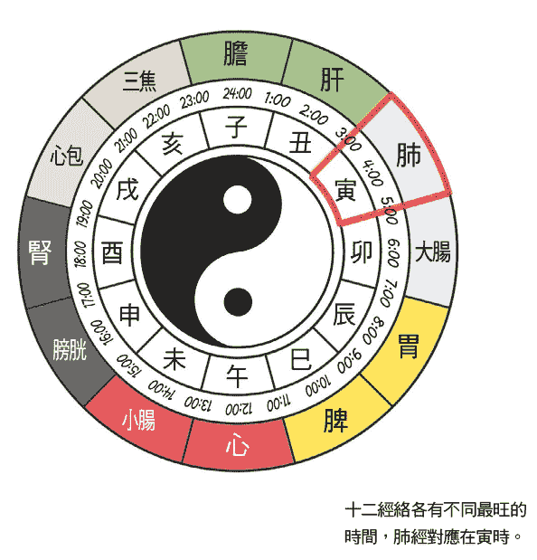

平旦是肺经主事的时间，经过纯净与蓄势的静态内部作业之后，即将转为启动一天活动的动态外在行动，就是甦醒。在寅时与卯时交接时刻甦醒，是中医认为最健康的理想状态，因为可以顺着生理时钟，依序启动十二经脉，维持身体气血正常循环与代谢。例如在肺经的寅时之末起床，之后大肠经早上 5-7 点，排便以清空肚子，胃经 7-9 点可以好好吃早餐。

但对于忙碌晚睡的现代人来说，要在凌晨五点左右起床，真的很要命！尤其许多年轻人可能才刚睡下不久。所以，没有顺着经脉时间作息，对身体会有影响吗？也许会！例如上午八点起床，错过大肠经，排便可能没那么顺畅，久坐马桶，腿都麻了，肚子仍未排空，不仅影响早餐食欲，也影响用餐的时间。一步慢，后面的流程就会一直赶！赶！赶！

寅时正是人体气血从静态转变为动态的时刻，有运动习惯的人，通常会在这个时间起床，出门活动肢体，打开肺脏，呼吸新鲜空气。这也让我们想起，肺司呼吸，记录生命演化的历程，肺为五脏六腑之长，主一身之气，气行则血行、水行，启动生命机能，因此在周而复始的每一天活动都从肺经开始。

###### 平旦甦醒，启动卫气

中医认为人与天地的阴阳相应，一天之中，天地间的阴阳之气会有所消长，白天阳气盛属阳，夜间阴气盛属阴，「平旦阴尽，而阳受气」，平旦也是人体阴气已尽，阳气即将要启动的时候，尤其是保卫身体的卫气。

《内经》说：「太阴主内，太阳主外。」平旦时走在经脉内的营气就由手太阴肺经开始流动，走在脉外的卫气就由足太阳膀胱经开始启动。

卫气的流动方式很特别。《内经》原文写得有点长，但非常精彩，「阳气出于目，目张则气上行于头，循项下足太阳，循背下至小指之端。其散者，别于目锐眦，下手太阳……其散者，别于目锐眦，下足少阳，注小指次指之间，以上循手少阳之分侧……别者以上至耳前，合于颔脉，注足阳明以下行……其散者，从耳下下手阳明……。其至于足也，入足心，出内踝，下行阴分，复合于目，故为一周。」

《内经》原文提示一件很重要的事，当我们在平旦张开眼睛的同时，就开启了人体卫气的保护机制。

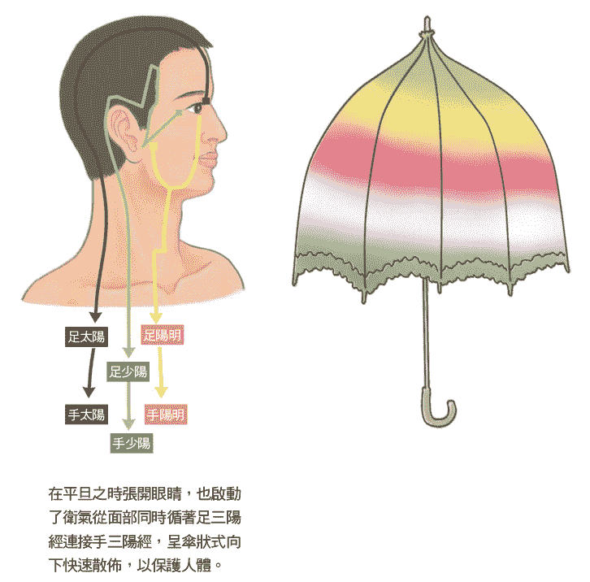

卫气的工作方式跟通行在经脉里面的营气截然不同。营气负责运送精微物质，所以可以一条经一条经地慢慢送货到家。而卫气通行在经脉外面，主要是保护人体，所以必须「全面启动」形成一个百分百涵盖的保护网，才不会让敌人趁虚而入。因此，《内经》告诉我们，一旦张开眼睛，人体开始要活动，卫气就从面部同时循着足三条阳经连接手三阳经，向下快速散布，此时就像打开一把「保护伞」，从头向下围护住身体，形成防护网。

以这个概念来说，张开眼睛就能打开保护伞，人体很厉害吧！

###### 平旦之时，适合诊断疾病及养生

人适合在平旦时甦醒，开始一天的活动。《内经》也提到最好的诊断疾病时间就是「平旦」，因为这时候的人体「阴气未动，阳气未散，饮食未进，经脉未盛，络脉调匀，气血未乱，故乃可诊有过之脉。」

前面说过「平旦阴尽，而阳受气」，这里又说「诊法常以平旦，阴气未动，阳气未散」，个人浅见，《内经》关于平旦的阴阳状况，可以分为两阶段：第一阶段是「阴气未动，阳气未散」，卫气还留在阴分，人尚未甦醒，属于寅时的前段；第二阶段是「平旦阴尽，而阳受气」，卫气已经开始出阴分，行于阳分，人逐渐甦醒，属于寅时后段，接近卯时之际。

然而，现代人要在清晨三至五点的寅时早起去看病，应该很难！多数医师也不可能那么早开诊。即使以农业为主的县市如花莲及台东，有些医师会配合农民朋友开设「晨间门诊」，但也没早到寅时看诊。而且人只要一活动，身体的代谢就会增加，阴阳之气就会产生大幅的波动和消长。如果真的要维持「阴气未动，阳气未散」的状态，可能要像古时候的医师一样，到病家出诊，病人则在家卧床等候。

虽然身处在繁忙的现代生活，《内经》提及的这个理想状态难以实行，但我个人还是很欣赏这段论述，或许我们还是能加以运用。例如在起床前，让平时忙碌纷乱的身心得以沉静片刻，保持「阴气未动，阳气未散，经脉未盛，络脉调匀，气血未乱」的状态，一定会感觉清明舒爽，这是多美好的事！

感谢中医告诉我们，平旦是人体蓄势待发的状态，此时适合先静坐或静躺调息，平衡阴阳，之后再慢慢起身活动，这可作为平日的养生指引喔！

年轻朋友若是无法早起也别担心！等年纪大ㄧ点，自然就会早睡早起早出门了，届时在公园一定会遇到许多同龄层可以一起运动的好朋友！虽然我是中医师，懂得理论也是很难早起，知易行难啊！不过也可能表示我还年轻吧！哈！记忆中，有两段时光真真实实感受到寅时的特色。

第一段时光是刚上高一的时候，班导师 Diamond 老师是英文老师，上课认真，要求很高，每天都有新进度，天天要晨考。因为学校离家颇远，须转换几班巴士，回到家都累瘫了，只好早睡早起，凌晨三点多起来补做功课及唸英文，就这样边读书，边看着窗外的天色逐渐转亮，赶紧收拾书包，搭第一班车到学校！幸好半年后就进入状况，无需再如此早起。

第二段时光是 2010 年在台北开经络带状课程。平日看诊很忙，只能利用假日备课。但想说的内容很多，能用的时间很少，所以常常通宵赶做 ppt。有时太专心，还会被鸡鸣吓到，转头看窗外，赫然发现天已经渐渐亮了，手上的资料却还没完成！自己历经这段日子，深深体会熬夜工作非常不可取，我到现在还承担着当年损伤身体的后果，所以奉劝大家该睡觉的时候还是赶紧去睡吧！

人们常说新的一天，让一切归零，重新开始。肺经旺于寅时，正是一天的开始，我们也可以把每天的开始称为「寅始」，让一切归「寅」，重新开始吧！别像歌手童安格先生一样重复询问身边的他/她：「明天你是否依然爱我 ？ Will You Still Love Me Tomorrow？」明天「归寅」，当一切重新来过，谁还能保证不会改变呢？

##### 「寅始」概念可从日推广到年

天地之间阴阳气的消长，不仅出现在一日之内，也出现在一年之中。寅始的概念来自一日的阴阳变化，「寅」可用于时辰，也可用于月份。

有人说， 天开于子，地开于丑，人开于寅。以一年来看，十二月份中的「子月」是农历十一月，天开于子，天气开始有变化；「丑月」是农历十二月，地开于丑，地气开始有变化；「寅月」是农历一月，人开于寅，也是农历春节的日子，此时才是属于人的时刻。

一年又有二十四节气，十五天一个节气，一个月含括两个节气。立春和雨水通常在寅月，此时春暖花开，万物蓬勃生长。「寅月」的概念再度呼应肺经成为第一条经络「开始」的时间特性。

###### 中医重视阴阳

中医重视阴阳，认为「阴阳者，天地之道也，万物之纲纪，变化之父母，生杀之本始，神明之府也。」将宇宙间所有事物的变化都纳入阴阳两个特质。各位也许会怀疑，阴阳真的能概括这么多事物吗？现代的计算机使用二进制， 只有 0 与 1，却能创造出这么多的功能与变化，完全符合老子《道德经》所说的「万物之始，大道至简，衍化至繁。」

对于天地的变化，《内经》说「积阳为天，积阴为地」所以「清阳为天，浊阴为地；地气上为云，天气下为雨；雨出地气，云出天气。」其中的「积」呈现量变再质变的过程。阴阳的变化不是突然全面翻转，而是随着时间的进程，互有消长，消长是量变，量变到了极致，才会质变。天为阳，地为阴，天与地之间的阴阳随时都在变化，持续的变化是宇宙生息不变的道理，变化才有生机！

天地间，一年之内，阴阳的消长，才有春夏秋冬四季、十二个月、二十四节气。一日之内，阴阳的消长，才有昼夜，阳盛为昼，阴盛为夜。

近代名医彭子益先生撰写《圆运动的古中医学》，书中以《易经》河图中的气升降圆运动之理来破解中医的奥秘。他认为中医学是人身一小宇宙之学，所以要学中医，须先认识二十四节气，地面上所受太阳射到的热，降、沉、升、浮的圆运动。

降者，夏时太阳射到地面的热，降入土中。立秋为降之起点。

沉者，降入土中的热，沉入土下之水中。立冬为沉之起点。

升者，沉入水中的热，升出土上。立春为升之起点。

浮者，升出土上的热，又与夏时太阳射到地面的热，同浮于地面之上。立夏为浮之起点。

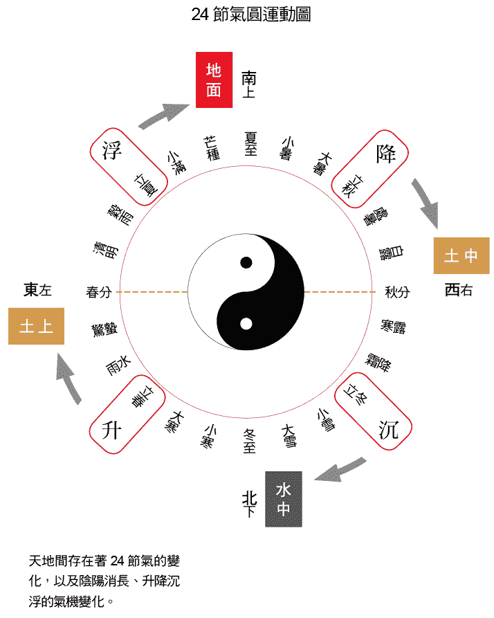

降极则升，升极则降，呈现了量变而极则质变的过程。彭子益借用宇宙间热能的降、沉、升、浮的圆运动，来阐释中医对于人体阴阳气血活动的变化。这些变化，其实都牵涉到时间！

### 二、肺经是时间的记录者

##### 重温肺经三部曲

第一部曲──纯净重生：肺为娇脏，经脉的气血历经一天的循环，最后由肝经流注至肺，给予肺带来人体清净重生的本钱。

第二部曲──储备蓄势：肺为五脏六腑之长，肺司呼吸，记录了生命演化的历程。

第三部曲──寅始出发：肺为华盖，在平旦甦醒时启动了卫气，让我们安然开始每一天。

您有没有发现，肺经三部曲都与时间有关？肺经不仅是具有功能性的经脉，而且更是具有时间性的经脉。

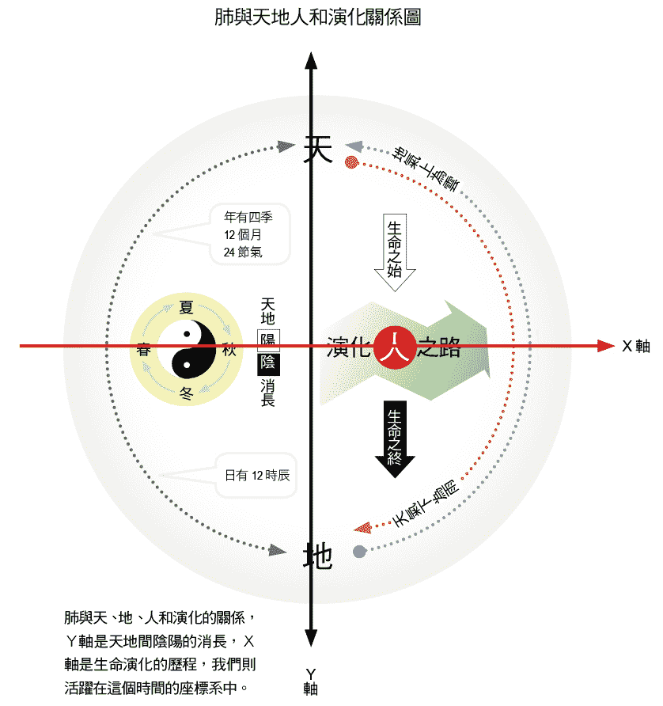

十二经脉的循环，人体阴阳气血的变化，也都与天地的阴阳消长一致，而阴阳的消长都与时间有关。生命之始与生命之终都在呼吸，时间就在一呼一吸之中流过，所以肺经就是时间的记录者，不仅记录时间的过往，还记录时间的节律。根据前面的关系图，把时间概念画成坐标，天地之间阴阳的上下消长是时间的 Y 轴，生命由单细胞演化至高等生物的历程是时间的 X 轴。而现在的我们就活跃在这个时间坐标系之中，生命是多么的珍贵啊！

肺经也因此成为开啓人体经络奥祕的第一道金钥！

还记得 2017 年 7 月 31 日早上，坐在上班的车上，脑中却还一直在思考肺经，当所有的线索都朝向同一个结论「肺经就是时间的记录者」时，真的不敢置信，怎么会有这个说法？完全超乎预期！接着，许多与时间的念头持续浮现脑海，最后一句是：Time is everything（时间就是一切）。

##### 经络系统是一份寻宝图

前面介绍肺脏这个宝藏，接下来轮到肺经的四大系统出场了。

经络图是把经络路线画在人体结构图上，一般书籍及网络上的经络图大致若此。前面说过，循行简图是我以前在开立经络系列课程时为了方便解说和记忆所画，简称「捷运图」，这次全部重新修订。在本系列书中，每条经络都会有这两种图供读者参考。

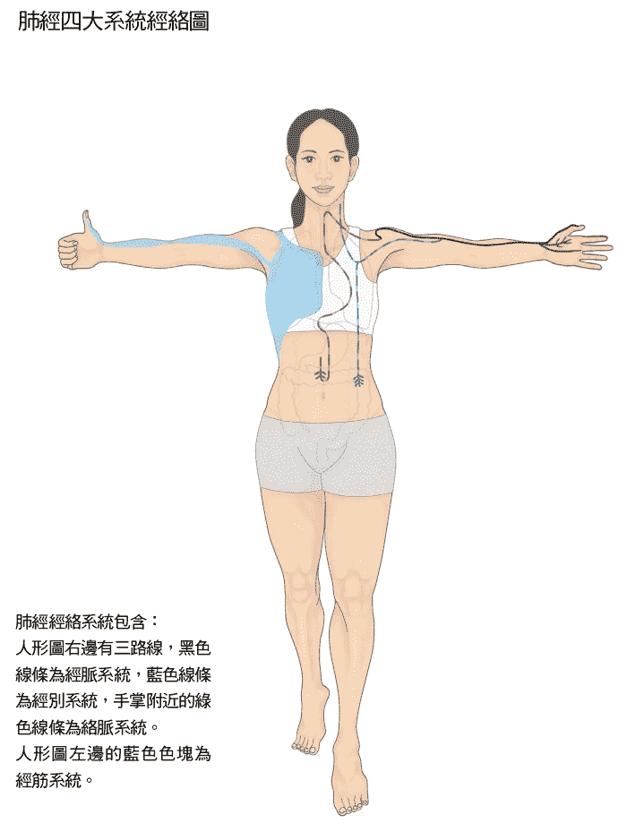

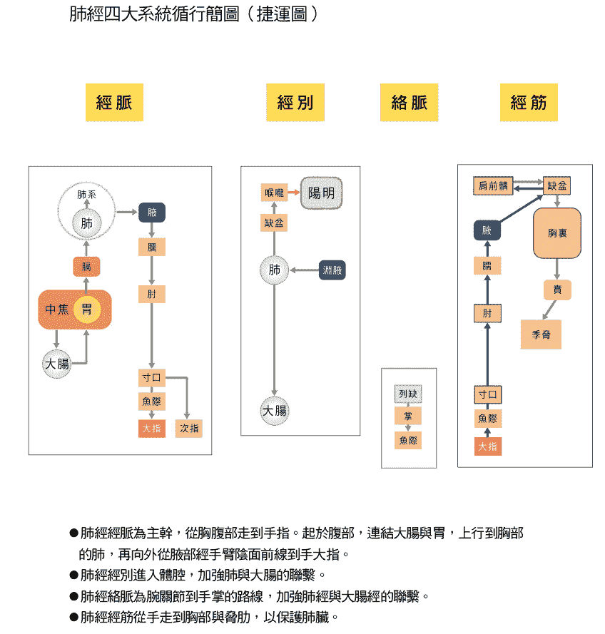

##### 肺经就是每一天的勇气来源

肺经从胸口到手大拇指，当我们将双臂外展，敞开胸怀，竖起拇指赞赏别人时，就是肺经循行的路线。

###### 开阔胸襟，是迎向新生的勇气与魄力

身为首发经络的肺，有着其他脏腑经络所没有的胸襟气度。肺藏魄，具有魄力与决心，让我们敞开胸（肺）怀，充满勇气的出发，推陈出新，主动迎向每一天「寅始」新生活的力量。

竖起拇指，以「肺腑之言」称赞别人，接纳世界，呈现生命中宽阔与接纳的态度。因此，肺经这条路线可以称为「肺腑之言，开怀赞美专线」。

您的肺经准备好了吧！深吸一口气，潇洒且勇敢的出发囉！

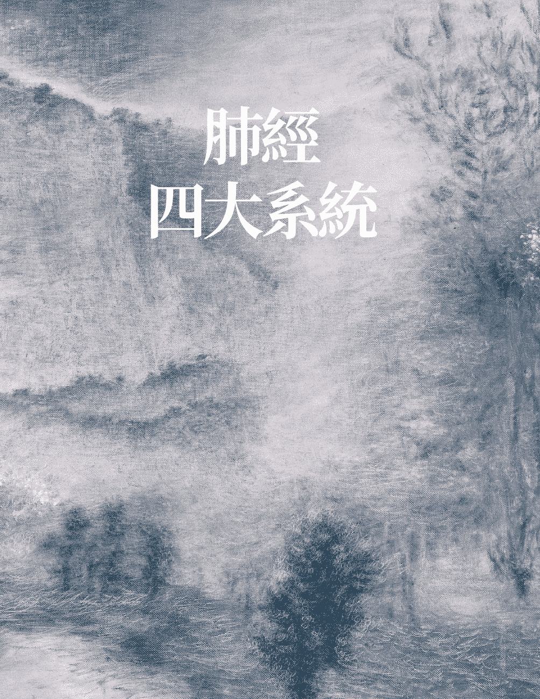

# 肺经四大系统

### 一、肺手太阴之脉（经脉）

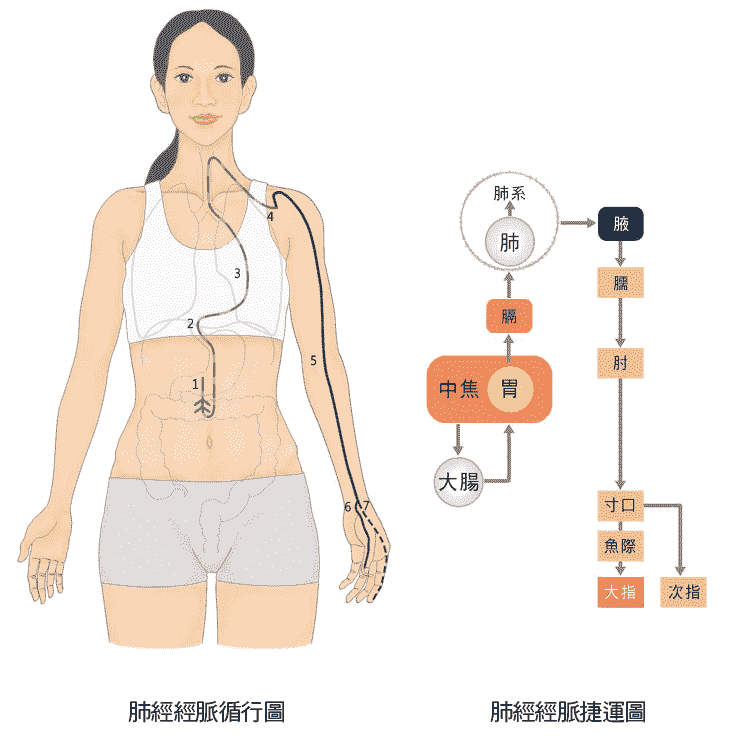

#### 1.手太阴肺经──循行特色

肺经经脉的循行路线可以分为路线 1 至 3 的胸腹部和路线 4 至 7 的上肢部两部分。

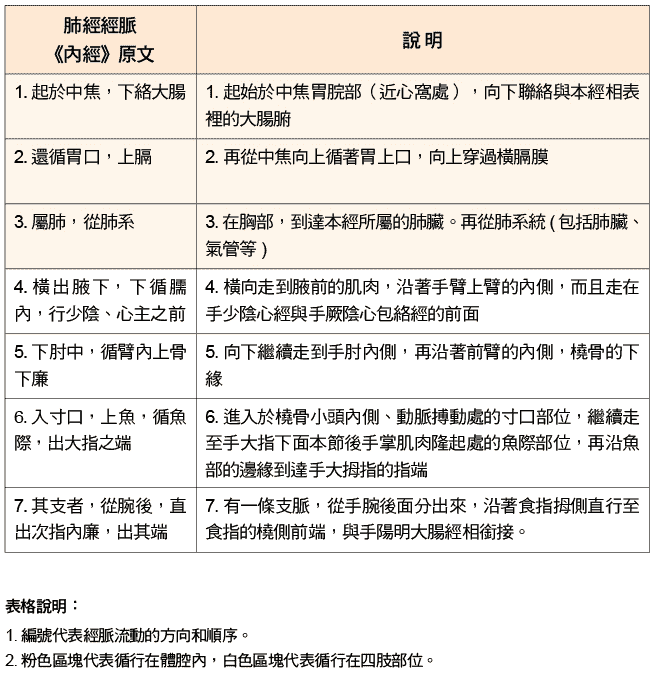

以下经脉循行规律表，主要希望呈现每一条经脉的循行部位、连结的脏腑、经脉的名称和起止点等特性。黑色方块代表属于本经的特性。

在连结的脏腑部分，除了表里关系之外，「其他」代表透过经脉与其他脏腑的连结关系，例如本经只连结胃，心肝肾则经由它们所属的经脉来与肺连结。

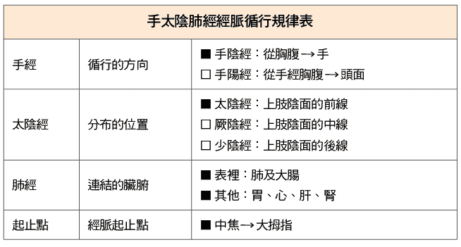

##### 肺大胃觉醒专线

肺经经脉在胸腹部路线我们称为「肺大胃觉醒专线」，体现出生命「开始」的特色。肺经作为首发经络，但起点不在肺，而是起于中焦，连结相表里的大肠，稳固好表里关系之后，再从中焦循着胃的上口抵达本条经脉所属的肺脏，再连结到肺系，就是肺与喉咙相联系的部位。这条路线有两项功能，一是与肺有关的呼吸功能，二是与中焦肠胃有关的食物消化吸收和运送功能。

依据所经过的脏腑跟肺脏的特色所形成的「肺大胃觉醒专线」，与人体蓄势待发、准备甦醒有关。

「肺大胃觉醒专线」可以分为三部分工作：

1.肺脏本身的工作，接受来自肝经运送来已经净化的营气。

2.中焦胃把从食物吸收的精微物质转化为营气和卫气。营气传送给肺，转变为新鲜血液。卫气则由肺经与膀胱经管理。两个不同来源的营气汇集到肺，质与量都得到提升之后，肺以五脏六腑之长的身份，将气血输送全身，五脏六腑皆以受气。一切就绪，人体就准备要甦醒了。

3.大肠将胃送来的食物糟粕中，有用的水份再吸收，中医称蒸津液，没用的水分就输送到膀胱排出体外，中医称济泌别汁。

这就是「肺大胃觉醒专线」的重要任务，也是人体很重要的新陈代谢。

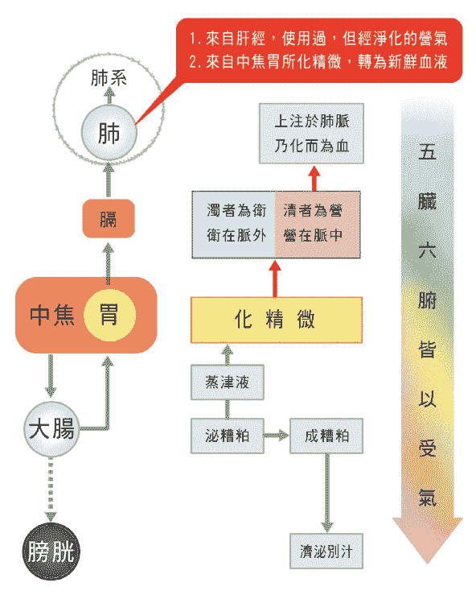

♼ 解密：经络团队分工有序

我们也可以从经络团队的概念来带大家从另一个角度来认识经络路线！

在总论中也介绍过，肺为相傅之官，为五脏六腑之长及华盖，也是最娇嫩的脏腑，五色属于白色，所以肺很像三国时代的诸葛孔明先生，坐在白色的车上，戴着葛巾，手持白色的羽毛扇，规划战略，指挥战局，但他可不会亲自下去作战。

肺也是如此。心为君主之官，肺为相傅之官，若以夫妻关系来看，心是家族中的大老爷，肺是养尊处优的少奶奶，负责每天为大老爷丈夫规划菜单，料理厨房，准备美食佳肴的工作。

从「经络团队」的关系来看，肺经为第一组经络团队「备餐团队」的班长，当黎明到来时，它不是自己出手做事，而是先从中焦这个人体厨房开始，透过内线电话唤醒相表里的大肠，再连结胃一起暖身。大肠与胃这两条手足阳明经不仅勤快无比（阳明为两阳合明，是阳气最旺、活动力强的组别），还是面部主要的经络，分布到与促进食欲「色香味俱全」的五官：与视觉有关的眼睛，与嗅觉有关的鼻子，与味觉有关的口唇，还有咀嚼食物的牙齿等，让它们准备这一天的进食任务。

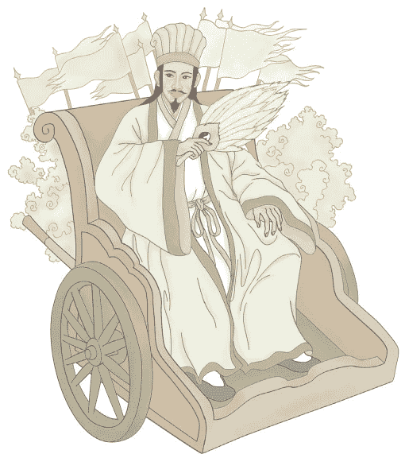

写到这里，想到以前妈妈常念我「手不动三宝」，我还反问她说：「什么是三宝？」妈妈没想到懒人还敢回嘴，一时竟说不全三宝是什么。感谢网络大神，列出了好几种说法，我觉得煎匙、扫把及绣花针最符合妈妈的说法。煎匙代表煮饭作菜，扫把代表打扫清洁，绣花针指缝纫修补的女红，几乎含括了女性的家务事。想当然耳，三宝这些家务事，肺一定如诸葛先生一般，召唤勤快的胃肠和其他脏腑一同来承担工作！

可是，这条经络是肺经耶！事情都是胃肠在做，那肺能做什么呢？

好问题！

属于白色的肺为娇脏，又主皮毛，是五脏六腑之中最重视外在形象，当胃肠在厨房忙着准备开伙之际，肺这位少奶奶就在闺房里（胸腔）好整以暇的梳洗，将自己打扮得美丽清爽。想想我们早上起床时，常是一脸睡相，频打呵欠，口中有着异味，喉咙还卡着一口痰……，完全不符合肺清爽的形象，所以我们会先进到浴室，上厕所，吐出痰，擤鼻涕，洗把脸，刷刷牙，梳妆上粉……，把自己整理得干净整齐有精神，才会走出房门开始一天的活动。肺也是如此，喜欢干净、重视外表的肺，是不允许自己蓬头垢面出来见客的。打扮妥当的肺深吸一口气，抬头挺胸，以清晰的嗓音、优雅的手指，指挥大伙为大老爷开始备膳的工作。

肺经旺于寅时，也就是平旦的黎明时分启动「肺大胃觉醒专线」，是我们每一天全新的开始，不仅符合经脉循行，也符合肺脏的特色（请参阅肺经总论）。肺为娇脏，不喜欢干燥，所以起床时喝一杯温水，不仅可以润肺，还可以温柔的唤醒胃肠，为下一阶段的工作预作准备。

* * *

对于肺经的循行路线，我有两个想法：

第一，有关本经「起于中焦，下络大肠，还循胃口」。还循胃口这条路线是从大肠向上到胃口，或是从中焦另外发出一条路线到胃口？主要考虑点在于大肠是否有连到胃。两种路线都说得通，但临床意义不同。几乎所有的经络图都画大肠向上到胃口，我心里虽然存疑，但因目前还没有明确的证据，就先跟着现有版本绘图囉。

第二，肺系包含哪些组织器官？十二条经络系统中，唯有肺经有肺系，心经有心系。心、肺是关乎生命的重要器官，无庸置疑，心系当然与心血管系统有关，肺系也该与呼吸系统有关。

现代医学将呼吸道分为两部分：上呼吸道：鼻、咽和喉；下呼吸道：气管及各级支气管，肺。

中医对于肺系所包含内容，主要有两种说法。比较狭义的说法是包括肺、喉头、气管等；广义的说法是包括所有的呼吸道。两种说法差异在于是否包含鼻部。中医界有「阴经不上头面」的规律，若依照此规律，肺经系统没有直接到鼻部，而是透过经别合入手阳明大肠经而抵达鼻部。但我认为肺系应该包含鼻部。理由有二：

一方面，肺主呼吸，开窍于鼻，临床上鼻病多从肺治疗取效，临床上针灸肺经可以通鼻窍，改善打喷嚏、鼻塞、流鼻水、鼻咽部卡痰等情况。

其次，有些经络虽也经过鼻部，但都在鼻外，没有到鼻内，如大肠经脉挟鼻孔，胃经经脉起于鼻之交頞中……下循鼻外，胃经经筋下结于鼻，小肠经脉别颊上抵鼻，膀胱经筋下颜结于鼻等。若依据肺透过大肠经到鼻部的说法，也只到鼻孔，根本没到鼻内。

呼吸是生命何等大事呀！肺既然开窍于鼻，没有道理不直接连到这个官窍，加以管理。虽说「阴经不上头面」是通则，但就如肝经也是阴经，开窍于目，也连目系，同属阴经的肺，开窍于鼻，没道理不连肺系。肺经理论上也可透过内部路线抵达鼻部。所以，个人认为肺系应包括鼻腔和鼻旁窦等。

* * *

##### 肺腑之言，开怀赞美专线

肺经经脉在上肢部路线，称之为「肺腑之言，开怀赞美专线」。

肺经从肺系出来之后，经过腋下，沿着手臂阴面的前侧，经过手肘，顺着手臂靠近外侧的路线，进入寸口处。「寸口」就是中医师把脉的位置，在腕关节上方有明显的动脉跳动处。接下来进入手掌内侧，在大拇指根部肌肉丰厚隆起的地方称为「大鱼际」，最后直接抵达大拇指末梢。这条路线其实很简单，就是手臂伸直，掌心朝上，从肩膀到大拇指的连线。

另外一条支脉从腕关节转到手背，沿着拇指与食指之间俗称「虎口」的位置，走到食指末梢衔接手阳明大肠经。

肺经这条从腋下到大拇指的连线，依据所经部位跟动态特色，体现出生命中宽阔与接纳的态度，所以才称为「肺腑之言，开怀赞美专线」。（请参阅肺经总论）

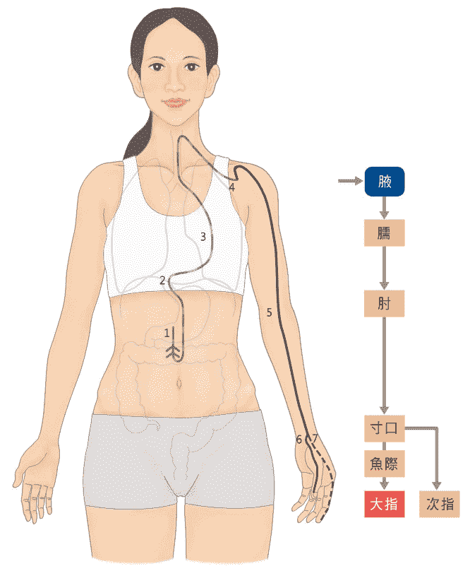

肺经经脉连结肺与肩膀、手臂，因此我们可以透过观察与活动上肢来了解心肺功能。这里会提到『心』是因为心经有循行到肺，肺帮助心脏输送血液，心肺一起位于胸部，它们的关系密不可分，有福同享，有难也同当。

♼ 解密：从手指判断心与肺脏功能

肺为五脏六腑之长，古人认为拇指是五根指头的本源，故称「拇指」。拇指也是手最重要的指头，俗称「大拇哥」，肺与大拇指有着一样的「大哥」地位。有些病人因为大拇哥痛前来就诊，无论是扳机指或是陈年的手指挫伤等，我们都会询问最近是否有咳嗽、胸闷的现象，病人常会惊讶地连忙点头。再请病人将五指自然轻松的张开，若拇指与食指之间，虎口的角度小于 75 度，而且拇指摸起来僵硬，表示其心肺功能有问题。

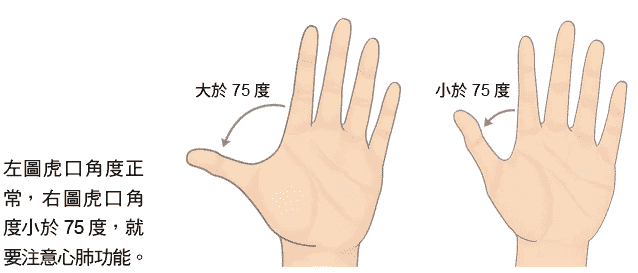

反过来说，心肺方面有问题的人，即使大拇指没有外伤，也会莫名其妙出现僵硬，甚至麻木疼痛的情况。

现代研究发现，四肢末端增生、肥厚，呈现杵状般膨大称为「杵状指」，容易罹患心肺疾病。日本长谷川嘉哉医师推广有意识地活动大拇指，据说能让大脑血流提高 1.5 倍，可以提升记忆力，预防失智，安定血压。这也可视为肺助心行血的另一种功用。

 中医师不传之祕

大拇指和小指头下方都有隆起的肌肉，因为长得像鱼腹，所以称为「鱼际」。大拇指下方的比较丰厚，称为「大鱼际」属于肺经，小指下方的称为「小鱼际」属于心经。大鱼际不仅反映肺功能，由于肺经连大肠，循胃口，心经又从心系连到上肺，还能观察肠胃和心脏功能。

《内经》早就透露大鱼际的望诊秘密了：「胃中寒，手鱼之络多青矣；胃中有热，鱼际络赤。其暴黑者，留久痹也。其有赤、有黑、有青者，寒热气也。其青短者，少气也。」

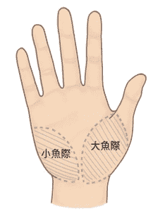

从颜色上来看：

● 颜色过红代表有热，若红中带暗，表示气血瘀滞，要特别小心心脏。喜欢大鱼大肉的壮年男性，大鱼际除了红暗，也会比较肿紧。

● 颜色偏青代表有寒，《内经》说「鱼上白肉有青血脉者，胃中有寒。」与脾胃功能有密切关系，常见于喜欢吃冰喝冷饮的人。脾胃偏寒的人，吃一点寒性食物就会拉肚子，吸收功能较差。许多年轻女性，体内过寒，大鱼际就会浮现青筋。

● 颜色偏白代表气血虚，常见于贫血或久病衰弱之人。

从型态上来看：

● 肌肉过度丰厚，常有肺气阻塞、胸廓肿胀、呼吸不顺畅的情况。

● 肌肉凹陷无力，甚则还会出现条状凹纹，肌肉拿捏起来都很干瘪无力，常见于气血大虚的人，脾胃虚弱，心肺功能也很差，容易疲倦，稍微一活动就胸闷而喘个不停。

♼ 解密：从肩膀判断心肺功能

这个方法比手指容易诊断。首先，以眼睛观察一个人两边肩膀，因为很难找到完全对等的肩膀，所以主要是看看哪一侧明显偏高、偏肿？接下来，两侧手臂向外扩胸，看看哪一侧肩膀活动比较僵硬？只要某侧肩膀偏高、偏肿，外展僵硬，都是心肺功能异常的前兆。如果读者想了解先兆或对这类检查有兴趣，请参考之前出版的《中医护好心》，书中会有详尽说明。

虽然可以透过观察上肢来了解自己的心肺功能，但也不是每个人都对自己身体有感觉。常见病人对自己的心肺功能「浑然无感」的情况，更遑论手臂了。这类病人因为某些疾病就诊，当医师诊断病因在于心肺功能不佳，再检查手臂手指，就可以发现诸多问题的征兆，通常当事人都是毫无查觉！就像我们在临床上也常见「习惯成自然」的故事。中医师从望闻问切四诊收集资料后，发现病人心肺功能不佳，而有胸闷的现象，但病人常说自觉呼吸还算顺畅。直至治疗到某一个段落，心肺功能改善，呼吸也改善之后，病人两相比较才发现，之前以为正常的呼吸状态其实就是「胸闷」，而且过去自己习惯了这样的呼吸情况，也以为每个人的呼吸都是如此。

所以我常感慨，很多人会花时间花钱去保养爱车，也会随时更换时尚的新手机，对于网络或脸书的动态更是分秒不遗漏，但却鲜少花心思在自己的身体上。难怪社会新闻常出现「猝死」的消息，多数民众对于自己的身体都过于忽略了！疾病不是不能预防，如果平日能多加关注，一定可以减少这类悲剧。

#### 2.手太阴肺经──经络关系

肺经本身的循行很简单，让人不禁怀疑，凭着这么短短的路线，肺脏有可能达成重要任务吗？各位听过「真人不露相」吧！人体也是如此。五脏承担着维持生命的关键性任务，当然不宜轻易将底牌掀出来。

前面提过「阴经不上头面」，所以一般情况是由相表里的阳经代为「抛头露面」去完成，例如肺开窍于鼻，一般认为肺经没有到鼻部，大肠经就代肺出征循行到鼻孔。此外，手三阴经属于手经，循行路线较短，所通过的部位比较少，无法面面俱到，但是偏偏它们都属于非常关键的心与肺（心包属于心的外膜，不独论），所以聪明的身体会私底下与其他脏腑经络连结成立「秘密社团」，辅助心肺完成任务。这个秘密社团成员包括肺心肝肾四脏、大肠及胃二腑。

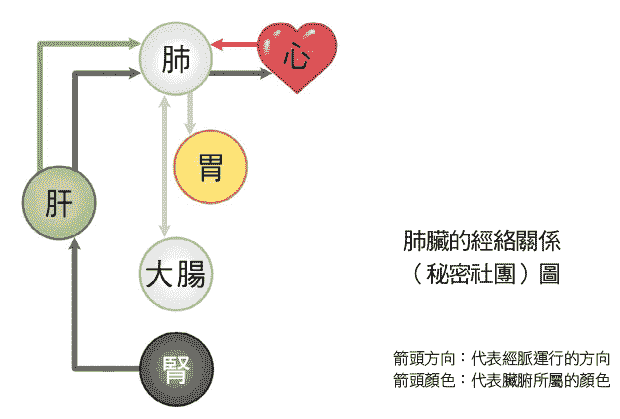

##### 肺主动连结大肠及胃

肺连结大肠及胃，共同完成消化吸收代谢的任务，肠胃系统吸收而来的水谷精华与肺吸收的氧气结合成宗气，化生为营卫之气，由肺散布到全身，因此，肠胃协助肺，主一身之表和推动气血的工作。

##### 心经连结肺

心为君主之官，肺为相傅之官。肺居万人之上，一人之下，身为心的部属，听从心的命令，也协助心完成任务。心主血主脉，肺转化食物精华为血液，主气助心行血，主治节，朝百脉，推动全身机能。

##### 肝经最后注入肺

虽然在脏腑的五行关系上，肺属金，肝属木，金可以克木。但是在经脉流注关系上，肝经与肺经是非常友好的。肝经将历经一日操劳后的身体，把损伤的组织修复，把混浊的气血净化，然后再转交给肺。肝胆好兄弟很像俗称很会修理器械的「黑手」，专长修复组织与净化气血，身为娇脏的肺很像白领高阶主管，接收来自肝已经整理得干净漂亮的组织与气血，在黎明时分优雅地推送到全身，让我们每一天都有着清新的开始。

##### 肾经连结肝与肺

在脏腑的五行关系上，肺属金，肾属水，金可以生水，看似肺主导了肾的功能，实际上肺依赖肾甚深，如果没有了肾，肺也不可能独活，因为肺的呼吸与调节水液代谢的功能都需要肾共同完成，两者之间存在「金水相生」，互相滋养、互相依赖的关系。虽然肺与肾关系密切，可是肾经并未直接连结肺，而是透过肝再到肺，为什么要这么麻烦？这就要回到肝与肺的关系来。肝专长修复组织与净化气血，来自于肾经的气血必须经过肝脏的专业处理之后，才能输送至挑剔的肺。在面对「人体保护机制」这个生存大计时，肾即使跟肺再熟，也只得乖乖配合啦！肺与肾之间存在太多相似之处或对应关系，感情因此特别深浓。例如：

● 五脏六腑之中，惟有肺与肾是成对的器官，其余都是单个。

● 肺居于人体最高位，肾居于人体最低位。

● 以五色来看，肺宛如天空明亮的白色，肾宛如地下不见天日的黑色，两者是「黑白郎君」。

● 生命之始来自肺的吸气，生命之末终于肾的呼气。

● 肺主一身之表，肾很想帮忙，但碍于自身循行及功能限制，特别委派相表里、主一身之表的膀胱经协助，共同完成此项任务。

看到这里，大家有没有发现，五脏之中，四脏都加入这个秘密社团，唯独不见脾。在后续的肾经经络系统中会见到四脏都纳入，而脾依旧未参加。为什么？难道脾比肺更不沾锅、更龟毛吗？

当然不是啦！这可误会了最善良无私的脾！脾宛如大地母亲，无条件的接纳万物，脾的五行属土，也有这项特质，且以更积极的方式来呈现。脾主健运升清，为我们抵抗地心引力，维持气血得以在体内上下流动，让各个脏器可以固定在原有的位置，发挥所长。

脾脏就像付出而无所求的母亲，默默照护身体这个孩子，时时刻刻不曾止息，人体所有的功能都隐含着脾主健运升清的努力。我们常说从一个人的言行举止可以看出他的家庭教养，我们也可从脏腑功能表现中看出脾脏的努力。沉默勤奋的母亲自然无需向外张扬自己的功劳，脾脏对于身体的呵护，让我想起杜甫的诗［春夜喜雨］：「好雨知时节，当春乃发生。随风潜入夜，润物细无声。」

润物细无声，正是脾脏内敛特质的写照。

脾这位沉默的母亲，因为在体内随处都在，也就不必特别与其他脏腑结盟。然而，肺与脾之间仍存有特殊的合作关系，肺脏在上，撑起人体的华盖，提供保护力量；脾脏在下，托起所有的内脏器官，提供稳定力量。一上一下、一内一外，合作无间。

#### 3.手太阴肺经──病候

病候一般分为「是动病」与「所生病」两类。从古至今，定义众说纷纭，颇为复杂，本书不是中医专业书，所以就不讨论，而将两类疾病一起并入说明。

五脏经脉的「所生病」都是主该脏的疾病，如肺经「主肺之所生病」，心经「主心之所生病」，余此类推。六腑经脉及心包的「所生病」规律，在大肠经中再介绍。

十二经脉的病候都有一些共同规律：

● 所属的脏腑功能异常。

● 经脉循行所过部位气血运行失常，出现「不通则痛」的情况。

肺经病候整理如下表：

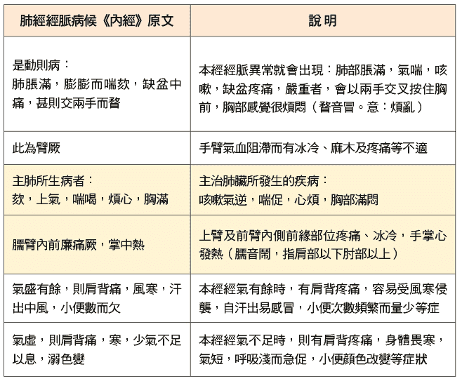

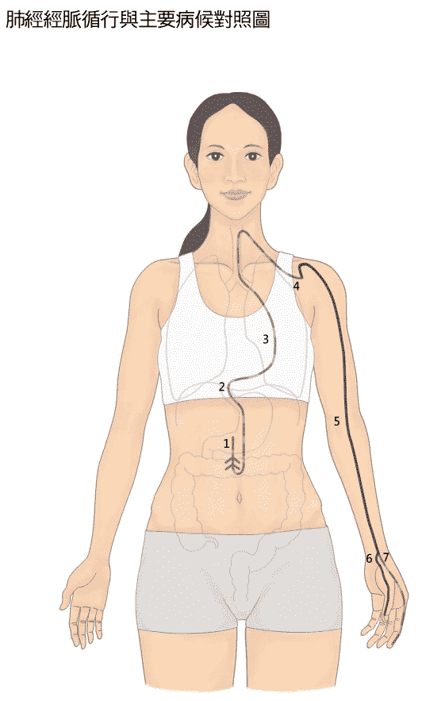

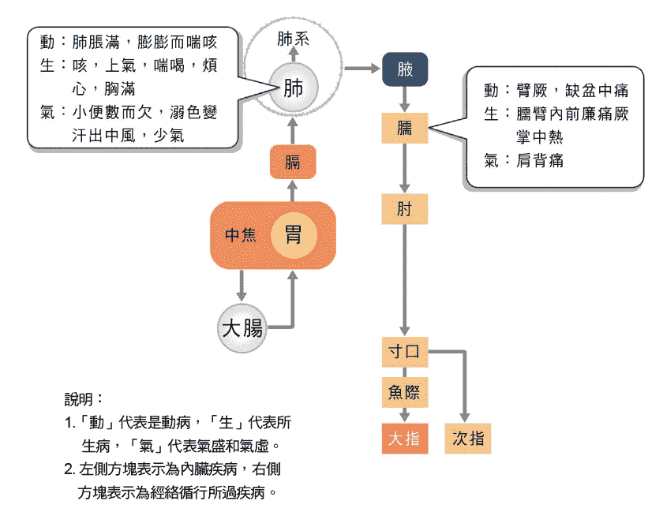

##### 肺经经脉病候可分为四类症状：

###### 1.肺脏功能失调：

主要与肺所生之病有关。肺主气，主宣发肃降，主皮毛，主一身之表，掌管呼吸。肺功能失常就会出现肺胀满、胸满、上气、咳喘等症状。

 中医师不传之祕

肺经连结大肠与胃，为中医「脾为生痰之源，肺为贮痰之器」的理论，扩大治疗咳嗽的思路。

肺经经脉起自于中焦的消化系统并连结大肠，除了前面所说的内容之外，还提示一些中医界常用的诊治思考：

● 肺主表，肺经连结大肠跟胃，一旦罹患肺病很容易影响肠胃而出现肠胃型感冒，如咳嗽，腹痛，腹泻等。

● 中医有「脾为生痰之源，肺为贮痰之器」的理论。人体内的痰，多数都来自于脾胃消化水谷功能失常而生成的，部分痰会顺着经脉来到肺内停留，爱干净又龟毛的肺，既喜清肃又为娇脏，岂容得下痰这个异物？当然就会不断透过咳嗽想要将痰给咳出来。中医治疗讲求治本，提出「脾为生痰之源，肺为贮痰之器」，提醒我们痰所引起的咳嗽，脾胃才是根源，肺只是受害者，治疗首先从调整脾胃功能着手，如果喜欢油腻食物，生痰的机会更高，当然也须改变饮食习惯。

● 肺主呼吸，开窍于鼻，中医师临床上治疗过敏性鼻炎，除了针对鼻子的治疗之外，也会加强改善脾胃功能。脾胃功能好了，吸收足够的营养，就可提供给肺足够的气，进而改善鼻子的通气功能。所以治疗鼻病及提高免疫功能要从脾胃着手。

###### 2.其他脏腑功能失调：

肺经虽然只连结胃及大肠，但仍有其他经络，如心经及肾经等，将肺脏与心脏及肾脏连结起来。透过这样的连结，肺与心肾的功能就会互相影响，加上肺通调水道下输膀胱，所以会出现烦心、小便异常等症状。

###### 3.所过部位气血运行失常：

如缺盆中痛，臂厥，臑臂内前廉痛厥，掌中热等。

###### 4.气盛和气虚:

病候有再分气盛和气虚两型，只出现在肺经、大肠经和胃经。

气盛与气虚的症状是互相对照版：

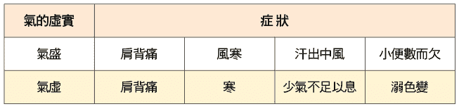

气盛「风寒，汗出中风」偏向表证，因肺主表，主皮毛，外在的风寒暑湿燥火外邪入侵身体所引起的，例如感冒等。

气虚「 寒，少气不足以息」偏向里证，因肺主气，由于气不足所造成的结果。

至于四组症状中，肩背痛两型都有。但肺经经脉并没有到肩背部，为何会出现肩背痛？这点我们会在经筋系统中再做说明。

小便异常也是两型都有，至于气盛「小便数而欠」和气虚「溺色变」详情为何，还需要配合参酌其他的症候才能确定。重点是小便异常的症状点出了肺通调水道、下输膀胱的关系。

 中医师不传之祕

缺盆中痛和肩背痛，隐含肺的重大疾病。

中医所说的「缺盆」，就是现代解剖的锁骨上窝。

人体两侧锁骨上方有锁骨上窝淋巴结，分为左、右两侧。锁骨上窝淋巴病变，常由锁骨下内脏器官之原发癌症所转移造成。根据统计，发生在左侧淋巴结转移的癌症，最常见为肺癌，其次是胃癌，再次是睪丸癌及卵巢癌，发生右侧淋巴结转移的癌症，依次为肺癌、食道癌、胃癌及胰脏癌等。

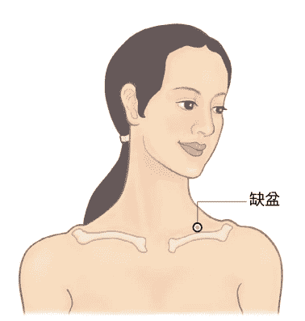

两侧淋巴结转移都可能与肺癌有关，尤其在右锁骨上和颈部触及肿块，缺盆中痛，若再加上右侧肩关节及肩背肌肉明显疼痛且难以改善时，要赶紧做肺部检查。

肺经经脉循行虽然没有明写到缺盆，但是「肺系」本身已经包含到的喉咙处，就会经过缺盆，所以病候中出现缺盆中痛。经别也有「上出缺盆，循喉咙」，经筋循行「结肩前髃，上结缺盆」可见缺盆是肺经系统必经之处。肺经经筋还从缺盆「下结胸里，散贯贲，合贲下，抵季胁」（贲是胃上口之贲门；季胁为软肋，相当于侧胸第十一、第十二肋的软骨部位。） 包覆整个胸廓 ，并连结肩关节和缺盆，因此，当肺癌出现转移时，除了出现缺盆痛和肩背痛外，还有胸廓的症状，如咳喘、吐血等，经筋病候就有「其成息贲者，胁急，吐血」（息贲又名「肺积」，为肺部肿块） ，所以肺癌转移症状与肺经经脉系统循行部位与病候有许多相似处。胆经也出现「缺盆中肿痛，腋下肿，马刀侠瘿」病候，更明显点出淋巴结病变的特色。

### 二、手太阴之正（经别）

#### 经别特色

由于肺经经别是第一条经别，大家对于经络概念还很陌生，所以再加以介绍。我们在总论中介绍过，经别是从经脉中分支而来，主要加强相表里脏腑之间的连结，其循行路径，都是由四肢深入内脏，而后出于头颈部，无论是阴经或阳经，它们的经别最后都合入互为表里经中的阳经，如：肺经与大肠经为表里经，肺经最后与大肠经会合，两者经别合而为一。

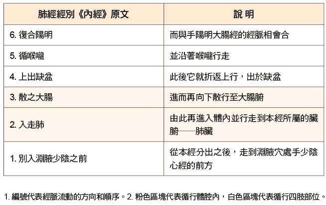

经别循行特色，在于加强重点部位的联系，路线较短，更为直接，类似直达车。

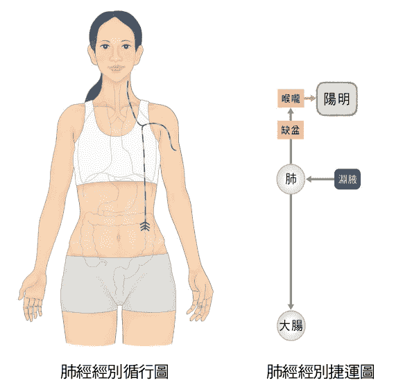

##### 经别以肺为中心，分为上行和下行两部分

下行路线：加强肺与大肠相表里脏腑的关系。

上行路线：从肺以上经过缺盆到喉咙。这个部位可以视为「肺系」，与呼吸有关，强化肺与喉咙的呼吸功能。

 中医师不传之祕

肺与大肠相表里，从大肠治疗有助于改善肺病。

「肺病从大肠治」这是中医基于肺与大肠相表里关系而发展出来的特殊治疗思路，案例很多，试举几类分享如下：

● 发烧：带过孩子的家长最恐怖的记忆，应该是孩子感冒发烧持续不退。肺主表，是感冒时第一道被冲击的防线，如果服用退烧药无效，孩子大便也不通时，使用甘油球通大便，让热从大便而出，有时可以发挥退烧作用。

● 喘咳：肺主呼吸，肺热会导致呼吸失常而喘咳，临床上中医师会一并询问大便情况，若兼有便秘，就会使用清肺热兼泻大肠热的方法治疗，例如「宣白承气汤」就是这样的治疗思路。

● 皮肤病：肺主皮毛，现代人由于饮食习惯较油腻辛辣，不喝水，少吃蔬果，长期熬夜，大便数日一次也不以为意。大便不通，体内持续累积的热毒无处可去，影响到肺，就会从皮肤爆发！所以中医在治疗皮肤病时也会特别关注排便问题，临床常用的防风通圣散也就是从肺与大肠同治。另有一类皮肤病病人，长期有鼻子过敏的症状，容易鼻塞，不容易出汗，皮肤毛孔粗糙，这类皮肤病人，中医师就会从肺直接着手治疗。

### 三、手太阴之别（络脉）

#### 络脉特色

跟经别一样的情况，肺经络脉也是第一条络脉，所以再加以说明。络脉是为了保护及加强相表里经脉在四肢部位的连结，特别再延伸出一条比较安全的道路。

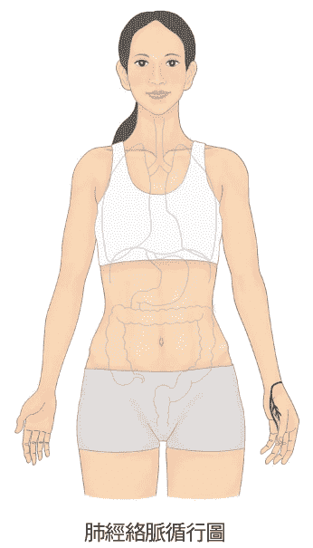

每条络脉的起始点都有一个穴位称为「络穴」，还有一些相关的病症。

络脉的症状会依据病情分为实与虚两类，这对于临床医师可是莫大的恩赐呢！只要遵循这些症状，马上就能掌握病情的虚实，加上它的症状精简，且聚焦于特定的病症。另外，每个络穴都与表里经络相通，当然可以治疗该经络的病症，即使病候中未列出，也可推想而知。因此每条络脉与络穴都非常适合做为疾病诊断治疗和自我养生保健的入门款。

肺经络脉循行很短，却很有特色。

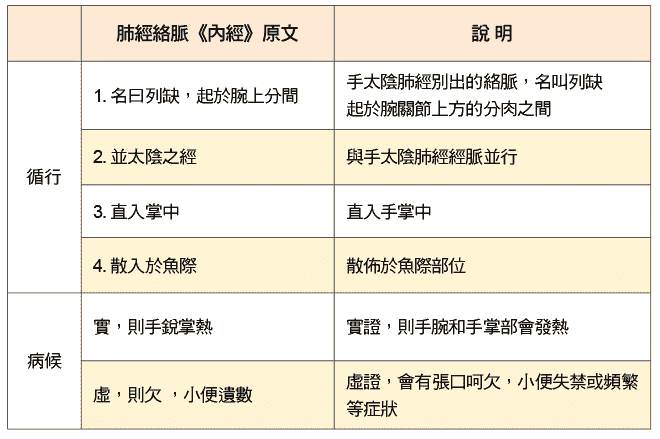

♼ 解密：循行路线的隐晦处正是强大之处。

本络脉只循行在手腕及手掌部位：「起于腕上分间，并太阴之经，直入掌中，散入于鱼际。」

络脉负责连接表里经，十二络脉中的十一条络脉会用「别走」、「注」或「合」的词汇点出连接到表里的经络或脏腑，唯独本经没有提到如何连到大肠经。依据络脉连接部位在腕关节以上部位的通则，列缺穴可能发出一条横向经脉别走至大肠经，再回到肺经，从手腕直接进到手掌，散络于大鱼际。

肺经络脉特别强调大拇指和大鱼际部位，可见是肺经很重要的部位，也提供拇指与鱼际作为判断心肺功能的经络基础。从养生的角度来说，常常活动拇指及按摩鱼际也有助于维持心肺功能。

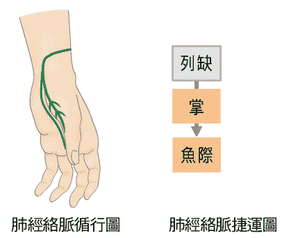

♼ 解密：非常震撼效果的「列缺」穴名。

「列缺」是很特别的字眼，中医很少用如此激烈的穴名。古代称「天隙电照」（即天空闪电）和天上的裂缝（天门）为列缺，表示列缺具有裂开、缝隙的意思。

中医为何会要用列缺做为穴位名？说法很多，选取部分说法简要说明于下：

● 说法一，本穴别通手阳明大肠经，肺经脉气由此别裂而去。

● 说法二，本穴位于两条肌腱之间，很像裂缝。

● 说法三，本穴的针感很强，且善治头颈痛，针感会如闪电般直冲上头部。

● 说法四，本穴的主治能力很强，具有如闪电雷雨般荡涤万物的能力。

无论何种说法，都可以看出「列缺」穴具有特殊的能力。

个人浅见，在前文肺经总论介绍过，肺在五脏之中位置最高，属于天，为五脏六腑之长，也是华盖，让生命从纯净中重生。人与天地相应，天空出现闪电之后，常有雷雨，荡涤万物，雨过天晴，一切重生，与肺的洁净特质是一致的，也因此列缺穴可以作为肺经的代表穴。

♼ 解密：列缺穴配备有强大无比的治疗能力。

###### 1.「列缺穴」是奇经八脉交会穴，以及四总穴之一

十几年前，当我还是个懵懵懂懂的年轻医师，很幸运地经由周左宇老师的启蒙，决定深入研究经络。因缘际会之下，竟然不从十二经脉，反而从奇经八脉着手研究。奇经八脉跟十二经络在功能上有许多交互作用，经过金元时代医家们的努力之下，发现十二经脉有八个穴位能与奇经八脉相通，透过这八个穴位就可以调节奇经八脉，中医称此八穴为「八脉交会穴」。乍听起来，这八个穴位一定非常厉害。没错！这八穴除了能治疗本身所属经脉之外，也可以治疗相交会的奇经八经。由于奇经八脉本身的循行颇长，能力也很强，单个交会穴恐怕力有未逮。感谢古代医家帮我们设想好了，「团结力量大」，将八穴上下配合成为四组，各有特殊的主治范畴。以下是八脉交会的穴歌：

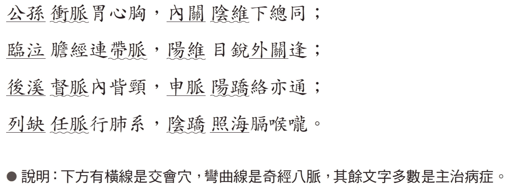

列缺穴是其中一员大将，通过手太阴肺经脉循行于喉咙处，与任脉相通。喜欢武侠小说的朋友，对于打通任督二脉一定非常向往。任督二脉简单来说，就是走在人体胸腹中线的两条经脉，任脉走在前面，属阴，统领全身的阴经；督脉走在后面，属阳，统领全身的阳经。所以打通任督二脉，等于打通全身所有经脉，以二条经脉打通十二条经脉，四两拨千斤之法，当然比个别打通每一条经脉有效率多了。

任脉除了统领全身所有阴经之外，也有自己的特殊能力。

《内经》记载：「冲脉、任脉皆起于胞中。」广义地说，胞就是骨盆腔中的脏器，为男子藏精液和女子孕育生子之处，自然是与泌尿生殖系统有关。「任脉为病，男子内结七疝，女子带下瘕聚。」任脉的病候当然也与泌尿生殖系统失常有关。另一方面，古人认为任即妊也，妊即妊娠之意，所以任脉与冲脉合作，共同负责女性一生中的经、带、胎、产，四件大事。

列缺穴通任脉，可以治疗泌尿生殖系统疾病，加上属于肺经，又与肾经的照海穴配搭，善于治疗横膈与喉咙的疾病。

中医还有一首大家朗朗上口、针灸初学者必学的「四总穴」：

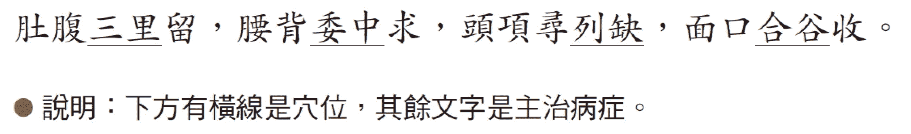

其中，「头项寻列缺」指导我们临床用列缺穴治疗头颈部痠痛、落枕等，确实有效，但其原理却是四穴之中最难懂的，我常用来询问年轻医师。要解开这个难题，会牵涉到通经理论，已经超出本书范畴。有兴趣的人可参阅拙作《古典经络针灸大家 ：周左宇医道精要》（橡实出版）「古典针灸的通经概念」篇章。

四总穴是历代医家的心血，能将临床经验浓缩在四句四穴之中，简单而有奇效，令人不得不赞佩古人的深厚功力。

中医传统认可的穴位有 361 个，列缺穴占 1/361，到了八脉交会穴占 1/8，经过激烈筛选，占四总穴的 1/4，其重要性可见一斑！

###### 2.「列缺穴」具有强大的调节肺气功能

一般人的认知，打呵欠是脑部缺氧，或精神上的无聊，或者为了促进身体觉醒的反应。从中医的角度来说，肺主呼吸，也主一身之气。若肺气虚，无力推动血液，就会出现肢体困倦、昏沉嗜睡、呵欠连连的情况。

《内经》曾列出十二种特殊疾病，称为「十二邪」，呵欠也在其中喔！《内经》认为病因来自于「奇邪之走空窍者」，所以「邪之所在，皆为不足，故上气不足，脑为之不满，耳为之苦鸣，头为之苦倾，目为之眩，中气不足，溲便为之变，肠为之苦鸣。」简单说，就是特别的邪气趁着身体虚而入侵体内所产生的病症。

还记得在肺经总论篇章介绍过中医对于睡觉的概念吧！有关打呵欠，《内经》认为就是该睡觉时不去睡觉，还在硬撑引起的。《内经》说「阴气积于下，阳气未尽，阳引而上，阴引而下，阴阳相引，故数欠」，因为卫气还没完全入于阴，阴想把卫气拉进来，但你又想违背身体想睡的讯息再继续硬撑，企图将阳气引上来，形成阴阳相引，上下拉锯战，结果就会出现打呵欠的情况。

但若有人平日也常精神不济，呵欠连连，就不是正常的状况，甚至也会引起工作上的困扰，这时以列缺穴来治疗就很好。

###### 3.「列缺穴」可以治疗各种小便异常症状

在经脉病候中提到无论气盛或气虚都会出现小便异常现象。在络脉篇章中，特别指出「列缺穴」可以治疗各种小便异常症状。

在肺经总论中，介绍肺能通调水道，下输膀胱，跟人体的水液代谢有密切关系。既然肺是水之上源，一旦肺功能异常，当然就会导致膀胱排尿失常，而出现小便失禁或频尿的状况。还有经脉篇中，频尿而量少难出的「小便数而欠」和小便颜色异常的「溺色变」，都可归纳为列缺穴主治的小便异常系列。

###### 4.总结前面的讨论，列缺有四个身份

1.身为肺经的穴位，除治疗原有络脉病症之外，还能治肺经经脉的所有病症。肺主表，肺经每个穴位几乎都能解表，但列缺穴因为还兼具其他经脉的特殊能力，解表能力明显高于一筹，因此列缺穴才得以成为肺经的代表穴。

2.身为肺经的络穴，联络大肠经，也可治疗大肠经病，如面部神经麻痺的口眼歪斜、鼽衄、牙痛等。（据临床经验，治疗牙痛，太渊穴的效果更佳。）

3.身为八脉交会穴，可以治疗任脉相关的泌尿生殖疾病、横膈与咽喉病。

4.身为四总穴，擅长治疗各种头颈痛。

列缺为闪电之意，也许是古人对于此特殊穴位的感受，所以才借用此超级霹雳的名字。能力高强的列缺穴，被八脉交会穴与四总穴同时青睐，扩大肺经的格局，承担更多的治证，这是其他穴位所望尘莫及的。

列缺穴这个位于手腕附近并不起眼的穴位，竟然可以包山包海的治病。成就它这些能力的后援就是经络！读者们应该可以开始感受到经络魅力了吧！

* * *

列缺穴

【位置】在桡骨茎突上方，肱桡肌与拇长展肌腱之间，腕关节横纹向上 1.5 寸。

【取穴】两手虎口交叉，用一手食指压在另一手的桡骨茎突上，当食指尖端尽处陷中是穴。有些针灸书会特别指出列缺穴在腕关节的背面，但我都秉承周左宇老师的教导，在肺经循行路在线直接取穴，也就是在腕关节的内面，临床疗效也很好。

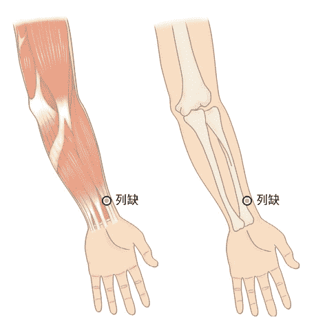

* * *

### 四、手太阴之筋（经筋）

#### 经筋特色

● 经筋是由经脉之气濡养的筋肉骨节体系，可以约束骨骼、屈伸关节、保护经脉及维持人体正常运动功能的作用。

● 经筋的重大任务是包覆在经脉外层，保护容易损伤的部位，如四肢，还有本条经脉重要的部位，并扩大部位以黏贴固定。

● 经筋行于体表，不入脏腑。循行都是从四肢末端，结聚在关节、骨骼部，再走向躯干头面部位。

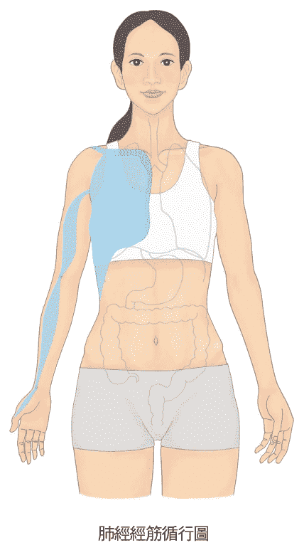

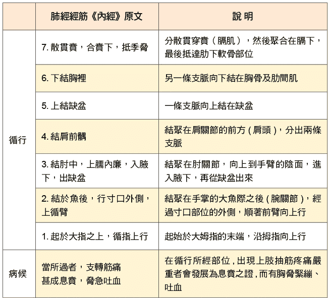

经筋使用一些特定文字来说明它的特质。例如，经筋在关节的部位，因为肌腱比较坚韧，摸起来似乎有结块，也是最容易形成肿胀筋结的部位，因此用「结」字。遇胸腹壁或入胸腹腔则用「散」或「布」字形容。中医也知道身体筋肉有深浅层次，使用「入」、「出」等字生动说明经筋在不同层次肌群的活动。为了阅读方便，表格中经筋循行部位的顺序，是依据人体部位的高低排列。所以四肢末梢的起点会在表格最下面一列，止点通常都在最上面一列。

接下来，正式进入肺经经筋系统。肺经经筋分布与肺经经脉类似，也可分为两个部分介绍：

1.上肢部：

循行从拇指到肩前关节部位与经脉相符，本经筋完全包覆经脉「肺腑之言，开怀赞美专线」。

从拇指上行到肩关节，这段经筋是手臂使用频率非常高的部位，也是很容易外伤或劳损的部位。困扰现代人的肩膀痛，有一类就是肩膀前面的肱二头肌肌腱炎，尤其是长头腱，这个部位正是本经筋肩前髃的位置。

依据临床观察发现，使用过度引起的肩膀痛，肩前髃附近都非常肿痛。已经有五十肩的病人，其肩部最顽固的肿结处也常在肩前髃，这与手臂习惯往前旋转活动有关，最后的损伤处都落在肩前髃。

肩痛严重者，连带肺经位于胸部「云门穴」和肘关节「尺泽穴」都会出现肿结压痛，这两个穴位也是经筋所结之处，所以我们可以从尺泽穴（肱二头肌腱桡侧凹陷处，与肩前髃同一条肌肉）着手治疗，肺经也因此成为治肩痛常用的经络。一般民众平日可以多揉按同侧尺泽穴，有助于松缓肩痛。

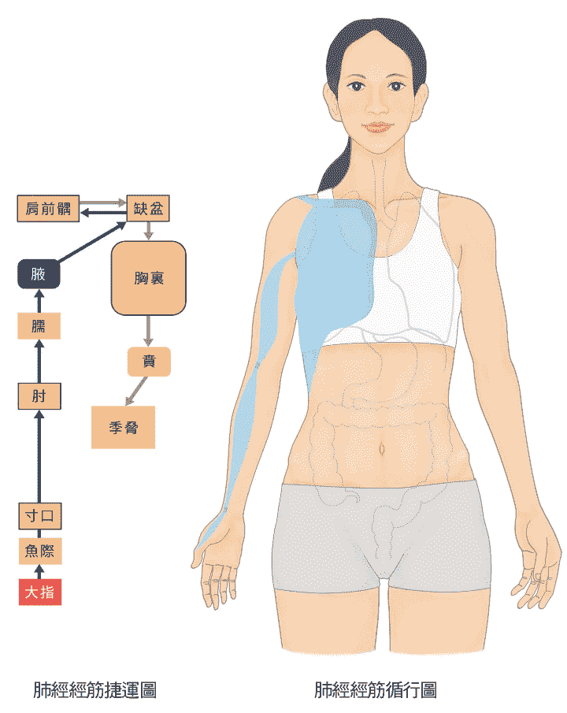

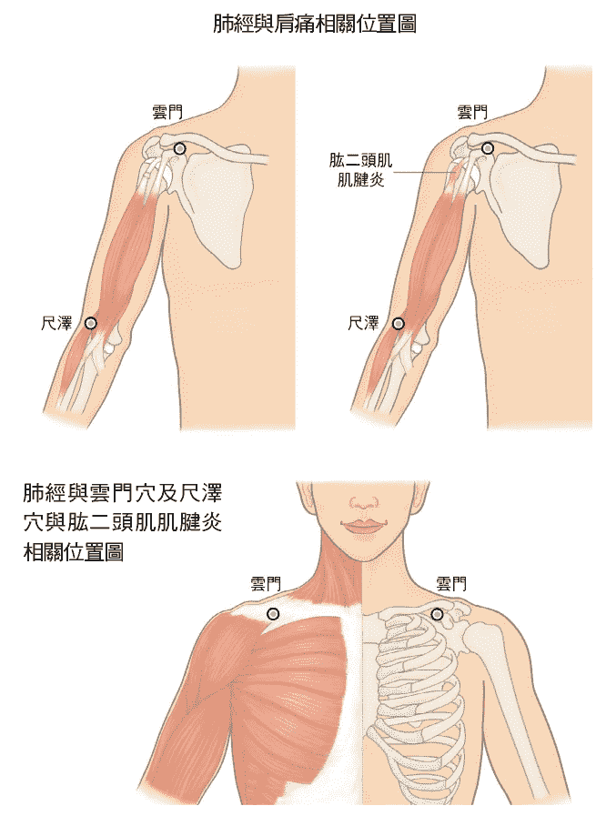

2.胸胁部：

从缺盆以下，到胸里，最后抵达季胁这条经筋，正好包覆整个胸骨与肋骨部位，可以保护肺经和肺脏。

从缺盆到胸里，经筋并未进入体腔，主要分布在胸膈，可再分为浅层和深层的肌群。

浅层肌群就是胸大肌，是将手臂拉向胸部的肌肉。临床上，胸大肌会反映出心肺的状态，例如以手检查肌肉的弹性，以眼观察肌肉表层的血络等，都能透露心肺的消息。

比较深层的肌群包括肋间肌（肋间内肌和肋间外肌）与膈肌，是很重要的呼吸肌群，可以协助肺司呼吸的功能。

本经筋结于五个部位：腕关节、肘关节、肩关节，缺盆及胸里，连结手臂与胸廓，所以张开手臂来扩胸，有助于肺的呼吸功能。现在，各位可以看出肺经最在乎的部位是哪里了吧！

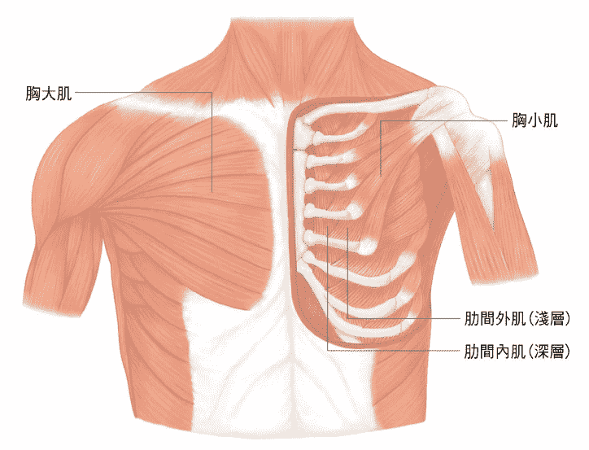

##### 经筋的病候

手太阴经筋的病候，可以分为两大类：

● 与经筋循行部位有关：「所过者，支转筋痛」。所经过的部位会出现紧绷感、卡卡感，活动不顺畅，甚至还会抽筋、抽痛。这几乎是每条经筋都会出现的情况。

● 与肺脏功能失调有关：「其成息贲者，胁急，吐血」。中医的典籍《难经》提出「五脏之积」。「积」指出现在胸腹部的有形肿块，与五脏功能失调有关。心之积为「伏梁」，心经会出现这个症状，届时再做介绍。肝之积为「肥气」，脾之积为「痞气」，肺之积为「息贲」，肾之积为「奔豚」，合称为「五脏之积」。

此段病候就是肺之积「息贲」的症状。《难经》解释息贲为「在右胁下，覆大如杯，久不已，令人洒淅寒热，喘咳，发肺痈」，肺有病，除了喘咳，右胁下还会出现肿块，导致胁下紧绷拘急感，甚至肺叶生疮，形成脓疡而吐血，显示病情已经很严重了。

造访了肺经的经络四大系统后，应该对经络会有更深刻、更立体的认识。

身为人体的首发经络，肺经经络四大系统以肺脏为核心，肺经经脉系统为主干，从胸腹部走到手指。透过经脉系统，肺脏连结大肠与胃，心、肝、肾三条经脉也主动来连结肺脏，一起完成人体重要的呼吸纳气、启动卫气与气血水的代谢功能；经别系统则在体内加强表里脏腑肺与大肠的联系；络脉系统在体外，加强表里经络肺经与大肠经的联系。经别与络脉可以视为经脉的备用系统，以确保肺与大肠之间的连结关系安全无虞。经筋系统全然包覆经脉循行路线以及肺脏所在的胸胁部，以保护肺脏并且协助肺的呼吸功能。

由于设想到大家对于经络概念比较陌生，肺经又是第一条经络，所以许多重要观念会在文中反覆出现，让大家温故知新。

中医向来重视身体与心理的平衡，当我们掌握了每条经络的四大系统，其实就是掌握维护自己身心平衡健康的钥匙。

恭喜您已经用这把金钥进入了肺经健康之门！接下来我要跟大家介绍照顾身体健康的肺经精选穴位，以及维护心理和谐的经络人生哲学。

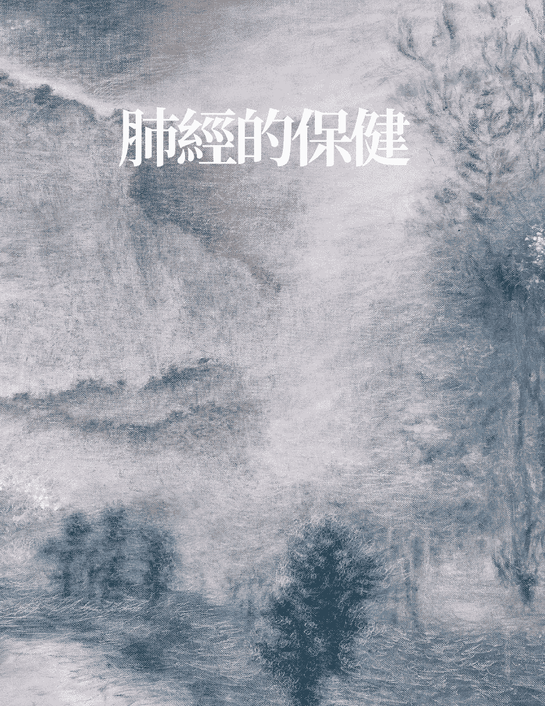

# 肺经的保健

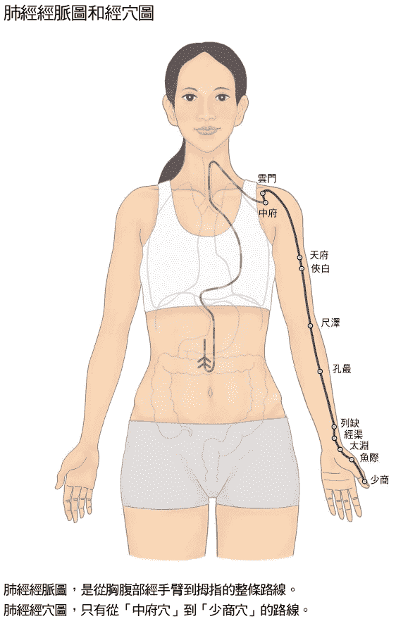

肺司呼吸，主表跟皮毛，主导全身的气、血、水的运行。肺的功能这样厉害，一般人也可以在短短的肺经上自我保健。

肺经共有十一个穴位，分布着重在上肢，胸部外侧只有二个穴位。从胸部外侧接近肩膀的「中府」、「云门」穴开始，顺着手臂上的经脉路线，最后抵达拇指末梢的「少商」穴。

#### 肺经经脉与经穴的差异

肺经经脉在胸腹部的循行路在线没有穴位，其实十二经络都有这样的现象，亦即，经穴不会出现在经脉循行所过的所有路线上，请参考左图。

读者们别担心，经穴虽然没有分布在经脉所有部位上，但都具备足够的能力去治疗全部的病症。同理，肺经十一个穴位也能充分治疗胸腹部及脏腑疾病。

人体是讲究团队工作，肺的功能虽然很强，仍须与其他脏腑合作。将肺与其他脏腑的合作关系及肺经之中适任的穴位绘成下图。

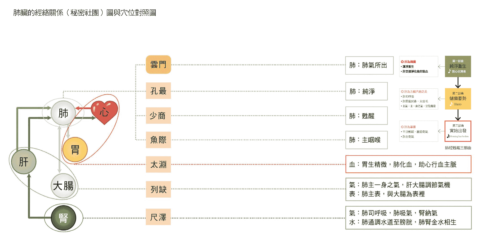

● 肺脏本身功能：显现在肺经甦醒三部曲，有四个穴位适任（后面再介绍）。

● 肺与心、胃：肺将胃吸收的精微物质转化为血之后，输送给心。肺再以呼吸行气，帮助心脏行血主脉。「太渊穴」中医称为「脉会」，与脉搏的稳定有关。

● 肺与肝、大肠：肺主一身之气，肝胆有着春天般特有的升发之气，可以将气机向上推动；大肠属腑，六腑（胆、小肠、胃、大肠、膀胱、三焦）主要处理食物水饮，饮食从唇口而入，到肛门尿道而出，这段路程必须下行为顺，如果反其道而上逆，就会出现嗳气、恶心甚至呕吐的现象，所以中医说「腑气以降为和」，大肠的气机向下推动。肝气向上，大肠气向下，有助于肺的宣发肃降功能。另外，肺主表，相表里的大肠经还能协助肺治疗表证。在络脉篇章介绍过的络穴「列缺穴」就是最佳人选。

● 肺与肾：肺与肾金水相生，密切合作。肺司呼吸，肺为气之主，肾为气之根，肺吸气，肾纳气，共同完成正常的呼吸。肺通调水道下输膀胱，肾是膀胱的老板，肺要跟膀胱合作，当然须经过肾同意。「尺泽穴」恰是肺经最善于处理水的穴位。

#### 肺经的重要穴位与功能

肺经虽然只有十一个穴位，因为肺功能强大，每个经穴也武艺高强。依照前面图表顺序简要介绍。穴位后面括号的英文与数字是穴位国际编码。肺经简称来自英文肺的英文 Lung 简称为 LU，后面数字为该穴位在本经的顺序，如云门穴 LU2，表示是肺经的第二个穴位，余此类推。

由于本书以介绍经络为主，穴位为辅，加上书刊网络上都有许多穴位资料，本书不再赘述，否则会变成厚到可以当枕头用的「枕头书」。

● 云门穴（LU2）：胸前壁外上方，胸大肌与三角肌之间凹陷处。

简单取穴法：在肩膀内侧，从圆圆的肱骨头向胸部平行滑动，就在锁骨下方的凹陷处。

云出天气，天气通于肺，古人认为云门穴就是肺气所出的门户。按摩此穴可以疏通肺经，增强肺脏机能，也可以改善肩膀痛。

● 孔最穴（LU6）：尺泽与太渊的连线，腕横纹上 7 寸处（腕关节到肘关节共 12 寸)。

简单取穴法：在手臂内侧前线，用另一手的拇指从腕关节向肘关节推进，约在手臂 1/2 以上的位置，会感觉拇指下的肌肉开始变宽大，就是孔最穴。

孔最穴是肺经的郄穴。每条经的郄穴都善于治疗所属脏腑经络的急性发炎疼痛。在甦醒三部曲的首部曲是肺接受来自肝经净化过的气血，肺脏「以身试法」用自己的娇性检测质量。若有不净的气血，肺会反应在寅时咳嗽，也会反应在孔最穴附近，警告身体「异形入侵」要赶紧处理，否则将会导致严重后果。

对于孔最穴这项特质我个人感受良深！因平日有喝茶习惯，茶叶来自四面八方，质量不一。如果茶叶不干净（我怀疑有其他化学残留物），喝了之后，从孔最到尺泽这段经筋突然非常痠痛，忍不住会用手揉按；若不死心还继续喝，接下来胸口开始紧闷，胸肌出现痛感，会想用手敲胸口、捏胸肌，此时只好顺应身体的感受，停止喝这泡茶。而手臂和胸口的痠痛，却要好一会儿才能慢慢缓解。从此以后挑选茶叶备加小心，以免伤害了娇嫩的肺脏。

● 少商穴（LU11）：在拇指末稍的桡侧，指甲根旁约一分处。

少商是井穴。井穴都位在手脚末梢，人体有十二条经络就十二个井穴，刺激性很强，是急救的要穴，常用在高烧、昏迷等情况，可以退烧，开窍醒神。在甦醒三部曲第三部是寅始，少商穴正是唤醒的要穴，昏沉时刻可以手掐穴以醒神。

另外，少商是肺经井穴，对于急性咽喉痛，声哑难出，无法吞咽的急症，少商放血很有效。

● 鱼际穴（LU10）：拇指本节后凹陷处，当第一掌骨中点桡侧（即大鱼际肌肉上），赤白肉际。本穴在手掌内面，第一掌骨靠近食指的方向（桡侧），掌骨边缘，掐下去非常痠胀痛才是喔。

肺主咽喉，鱼际穴可以快速舒缓喉咙紧缩、干痒、频频咳嗽的状况，按压就有效。我自己身在超冷的冷气房或是长时间讲课，喉咙开始干干紧紧想咳嗽时，就会偷偷掐鱼际穴，喉咙马上就会松开，但手掌会很酸！

● 太渊穴（LU9）：在腕关节的横纹桡侧，桡动脉跳动处。

太渊穴因为在动脉跳动处，中医称为「脉会」，可以调节心律。但因为在血管上，不好按摩，可以选用跟它一筋之隔的阳溪穴（大肠经）。

太渊穴对于牙痛有特效，临床上我们用来治疗各式各样的牙痛，效果不错。部分病人因为牙组织严重损伤，必须前去牙科治疗前，我们会在太渊穴埋针，减缓牙痛感。若是拔牙，当麻药退去后，太渊穴可以持续发挥缓解疼痛的功效。

各位会怀疑，太渊穴不是在血管上，可以下针吗？可以呀！中医师的巧手在下针时会避开血管的，别担心！

● 列缺穴（LU7）：络脉篇已介绍。

● 尺泽穴（LU5）：在肘关节的横纹外侧，肱二头肌腱桡侧凹陷处。

尺泽穴是肺经中最能补水的「水当当」穴位，水分不足的喉咙干痒、皮肤干燥都很有效，揉按也可缓解肩膀痛。

我们常在肘关节内侧拔罐来清肺热、退烧，还有促进血液循环的功效。肘关节内侧的三条经络都与心肺有关，长期使用计算机的人，手肘弯曲久了之后，气血瘀滞，若能适时拔罐，一方面松解肘关节，一方面改善心肺功能，这也是之前流行在手肘拍痧的保健原理。

【提醒】：手部三条阴经取穴时，记得翻掌，让掌心朝上才会找到正确的位置。

##### 肺经教我们的自我保健法

由于经络系统连结内脏和肢体，所以当我们伸展肢体及按摩穴位时，就等于是在按摩内脏，为身体做 SPA，是集「简便廉效」于一身的现代保健利器。

● 伸展肢体：配合肺经经络图的动作，竖起拇指，展开双臂，打开胸廓，深度且缓慢的呼吸，就是疏通肺脏和肺经的最佳伸展动作。寅时属于肺经的时辰，早上起床之后，特别适合做此伸展动作。

由于肺主呼吸，肺经又起于中焦的腹部，建议可以采用腹式呼吸，刚好与肺经循行相合。

腹式呼吸特别着重在横膈膜的运动。吸气时使横膈膜下压下降，让胸腔尽量扩大，空气就能进到肺部更深处，上腹部也会随着突起。吐气时，横隔膜放松而上升，帮助气体排出。简单的说，就是吸气时让腹部逐渐凸起，吐气时使腹部逐渐凹陷的呼吸法。

从中医的角度来说，前面介绍过，肺与肾共同完成人体的呼吸任务，肺主出气，肾主纳气，腹式呼吸时，腹部隆起，空气可以进到丹田，也就是进到肾脏，由肾收纳，呼吸会深且长，有更多的空气含量和较长停留时间得以滋养人体，所以自古以来的养生法都注重呼吸。

现代研究也指出，腹式呼吸法可以提高肺活量，缓解压力及促进消化，对于呼吸系统、心血管系统、淋巴系统、自律神经系统、内分泌系统等功能都有助益。

● 穴位按摩：读者们可以依据前面七个穴位的特性来自我保健。例如，在一个绝对不能咳嗽的场合，包括参加古典音乐会，或者老板在台上致词，你又刚好坐在第一排时，都可以偷偷按压手掌的鱼际穴来舒缓喉咙。

当然，依据病症的情况，穴位也可以合用，以加强效果。例如：

喉咙痛：可以掐少商，按鱼际穴；咳嗽，可以揉孔最穴和尺泽穴。以上两种情况，若因感冒引起，都可以加上列缺穴。

肩膀痛：可以按云门穴和尺泽穴，如果兼有脖子紧，后头硬的状况，也可以加上列缺穴。

头颈部的僵硬痠痛：如因感冒、落枕或姿势不良等引起者，都可以按摩列缺穴。(列缺穴超级好用吧！所以才能成为肺经的代表穴。)

除了穴位按摩之外，平日多按揉手肘到拇指的肺经路线能强化肺脏功能，也能让您声如黄雀，肤白如雪，细致娇嫩，呼吸顺畅，心胸开阔，心情愉快喔！

● 护肺食疗：中医向来注重食疗，所以饮食方面可以依据五行及五色来选择适合的食品。

肺的五行属金，一般常说「真金不怕火炼」，但是日常生活中的火可真能融化金属，五行中的火也真会克金，所以燥热容易上火的食物也会损伤肺脏，如辣椒、香菸及油烟等，都尽量不要碰。

该吃什么来照顾娇嫩的肺呢？

肺的五色为白色，因此白色的蔬果，如白木耳、莲子、山药、百合、水梨等，都能照顾娇嫩的肺脏。

此外，在五行的相生关系上，脾土能生肺金，对肺有益，加上肺经起于中焦，又循胃口上行，脾与胃都是肺的良师益友，所以，凡是有助于脾胃的食物也能增强肺的功能，例如：黄耆、党参、米粥等，这也是民间流行的保健药膳之中，所蕴含的中医智慧。

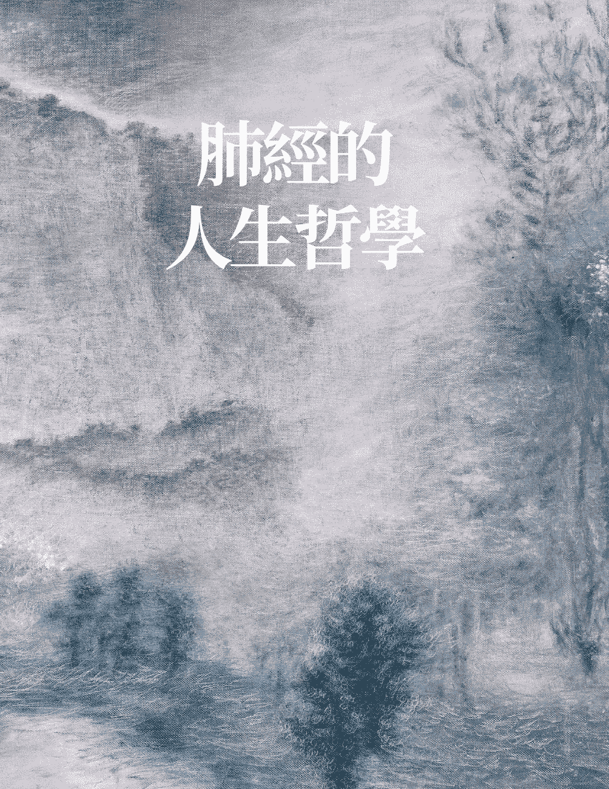

# 肺经的人生哲学

#### 肺经的人生哲学：
接纳涵容，开怀赞美，勇气魄力

身为相傅之官，有着其他脏腑经络所没有的高度与广度。

肺经连结胸口、肩臂及大拇指，当我们竖起拇指，展开双臂，打开胸廓，就是展开肺经。

肺的五行属金，肺又藏魄，在决断事情上是刚毅明快且有魄力的。肺经让我们敞开胸（肺）怀，具有主动迎向每一天新生活挑战的勇气，更能涵容接纳各种事物。还能以出自「肺腑之言」来真心称赞别人的胸襟气度。这其中的关键都在大拇指。

我们可以选择：

竖起大拇指，称赞别人!

也可让拇指带领其余四指一起张开，打开手掌，拥有全世界!

也能让拇指跟着其他四指一起紧握拳头，来表达愤怒与抗拒。

生命会因着我们的选择而有不同的风貌，决定权在我们自己。我的恩师周左宇老师的生活哲学是：

人逢老年掌朝下，一天到晚笑哈哈，

儿孙之事不需问，心平气和度年华。

手掌心向下或向上决定了是要给予或是接受施舍，翻掌的动力都来自大拇指。一个指头之差，心情截然不同，境遇应该也很不同吧！

恭喜您，已进入经络的奇妙殿堂，感受到经络的魅力了吧！

后续还有更丰富、有趣的奥秘，欢迎继续前进，一起解密。

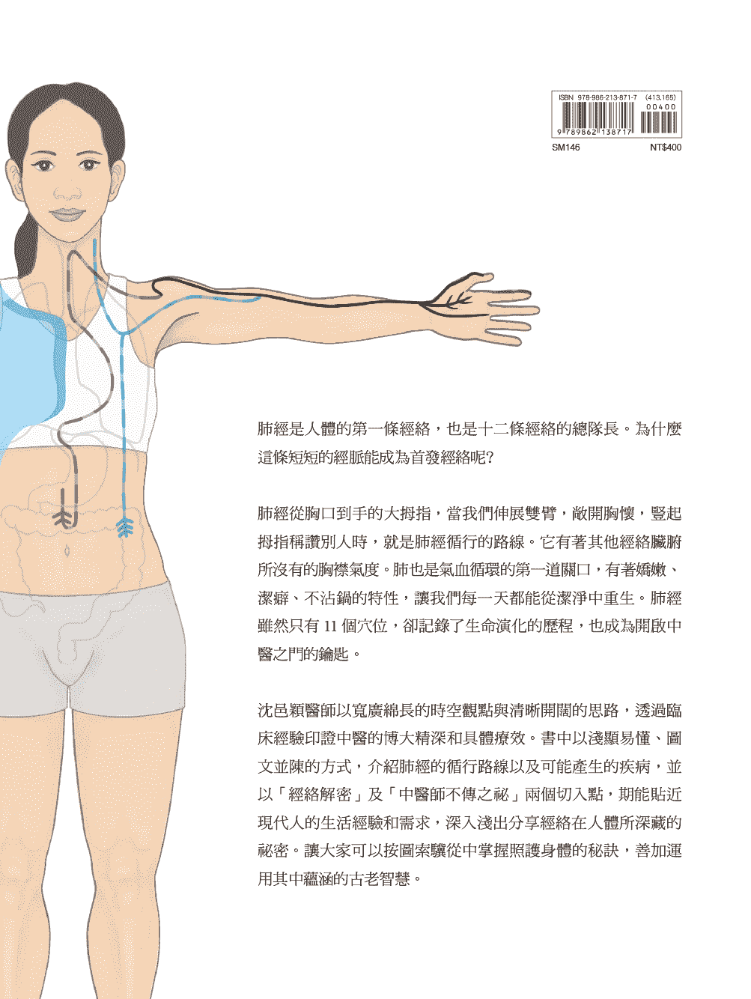