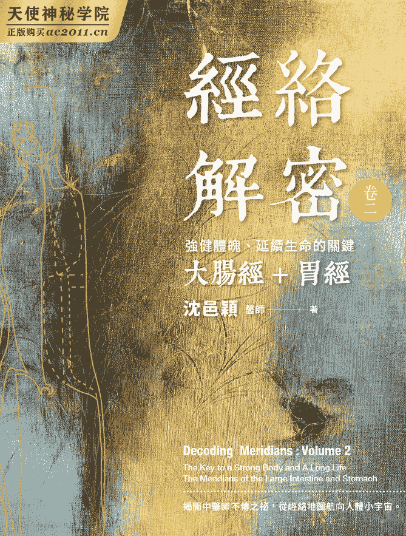

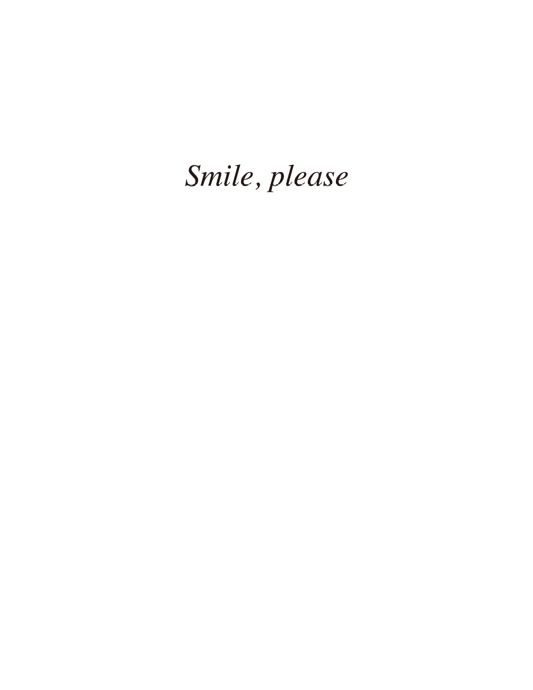

* * *

Smile 147

经络解密  卷二

强健体魄、延续生命的关键──大肠经+胃经

作者：沈邑颖

策画：萧菊贞

封面画作：吴冠德

内页插图：小瓶仔

责任编辑：李潍美

美术设计：张士勇、许慈力

校对：余宛真、萧菊贞、沈邑颖、邹牧帆、张霺馨、陈立山

出版者：[大块文化出版股份有限公司](http://www.locuspublishing.com)

台北市 10550 南京东路四段 25 号 11 楼

法律顾问：董安丹律师、顾慕尧律师

著作权所有　翻印必究

EPUB 初版：2018 年 6 月

档案制作：菩萨蛮数位文化有限公司

* * *

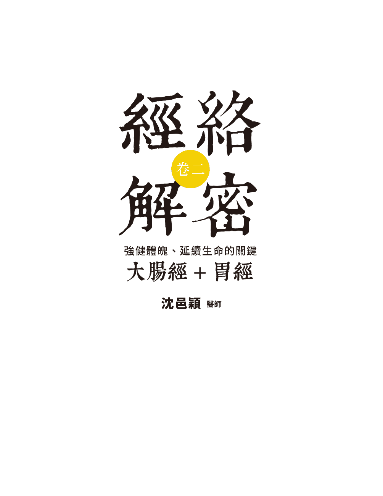

目录序曲：手足同名经的兄弟档爱拚才会赢的「大胃王」：阳明好兄弟！大胃王大肠经总论大胃王之一：咬紧牙关，一肩挑起的人生一、民间对于「肠子」的看法二、中医对于「大肠」的看法逆转「传导之官」的思辨三、中医对于「大肠经」的看法 1.大肠经在早期医书称为「齿脉」2.认识中医眼中的牙齿 3.牙齿与大肠经的关系 4.大肠经与肺经的表里关系四、中医对于「手阳明经」的看法五、大肠经与其他经络脏腑的关系大肠经四大系统一、大肠手阳明之脉（经脉）手阳明大肠经─循行特色 1.上肢部的「向前看齐专线」食指在东西方文化的故事大肠经的菁英部位──虎口到腕关节大肠经的健美部位──腕关节到肘关节人体及大肠经最有担当的部位──从肩关节到上背部向前看齐专线与大肠经的其他脏腑经络关系相合 2.胸腹部的「大肺呼吸专线」3.头面部的「鼻齿交叉线」观察鼻孔和鼻翼可掌握呼吸状况大肠经在人中部位左右交叉的思考手阳明大肠经─病候大肠经脉病候特色大肠经经脉病候分类 1.主津之所生病 2.头面部症状 3.气盛和气虚二、手阳明之正（经别）经别分为上肢部和胸腹部胸腹部路线二大特色增加循行到膺乳部位改变大肠与肺的循行顺序三、手阳明之别（络脉）大肠络脉─循行特色大肠络脉循行入耳，记录演化历程偏历穴名内含演化秘密大肠络脉─病候五官病症胸腹病症四、手阳明之筋（经筋）大肠经筋─循行特色 1.上肢部的「向前看齐专线」2\. 肩背部大肠经筋所涵盖的「膏肓」与病入「膏肓」有何不同？3\. 头面部横越头部经筋的 3 个疑义大肠经筋─病候大肠经的保健一、大肠经的重要保健穴位与功能肺大胃肝组：合谷、曲池、手三里护心通肾组：阳溪、偏历二、大肠经的饮食保健法─多喝水、多蔬果、少油腻三、大肠经的生活保健法─包得暖，常揉合谷穴大肠经的人生哲学肺大胃新年欢唱篇大肠经真实生活篇最硬颈的大肠经情绪垃圾桶大肠经的教导 1.传导则有变化 2\. 顺势即能改变胃经总论大胃王之二：一门三杰之聪明哥、型男主厨哥和高富帅老爸的传说「食色性也」的胃经一、胃经与食欲的关系胃口与食欲胃口与贪欲胃腑与肚量胃腑的三大特质脾胃同为后天之本，气血生化之源二、胃经与性欲的关系三、掌控欲望的胃经胃经四大系统周左宇老师与足三里的故事一、胃足阳明之脉（经脉）足阳明胃经─循行特色 1.头面部的「腮帮 U 形线」胃经在头面的交会穴个个都有好身手胃经是点穴高手胃经在头面循行路线会透露身体的秘密 2.胸腹部的「胃乳脐线」「胃乳脐线」是「食色性也」的大本营，维持自身生命与传宗接代 3.下肢部的「正面 1-4 趾」饭后散步真的有助于消化吗？胃经保留了远古人类在野外求生的过程足阳明胃经─病候 1.与循行所过部位有关的病候 2.与胃经特色有关的病候一连串精神异常的状况主血所生病寒证及热证二、足阳明之正（经别）「胃心口专线」「胃心口专线」建立人类特有的交际生活史！由口唇判断一个人的消化功能及语言表达能力胃功能不好会影响睡眠！临床上真的有「吊人胃口」的状况三、足阳明之别（络脉）「丰隆喉头线」一手掌握所有足经的丰隆穴为什么喉咙总是有点痰，卡卡的，吞也吞不下，吐也吐不出来呢？生活中或电视电影中，常听到「我就是咽不下这口气！」到底是哪一口气咽不下呢？百病皆由痰作祟丰隆穴是中医的化痰要穴四、足阳明之筋（经筋）胃经经筋─循行特色人体正面最强大的经筋系统 1.下肢部的「正面 2-4 趾」2.胸腹部的「前腹后脊线」为什么特别强调胃经经筋形成强大防护网？3\. 头面五官部的「手掌抓握区」胃经多经筋保护机制，让你成为人生胜利组！胃经经筋与现代流行运动有着特别关系喔！胃经经筋的各部特色 1.加强脚力 2.保护后天之本 3.聚在阴器，保护命根子，加强性能力 4.大面积的包覆胸腹部 5.面罩形的包覆五官胃经经筋─病候 1.与循行所过部位有关 2.与「阳明主面」有关胃经的保健一、胃经的自我保健运动 1.美容瘦脸，提升五感功能 2.修饰身形，提升肠胃功能 3.敲打胃经下肢部，促进气血循环二、胃经常用保健穴位 1.人体捕梦网：厉兑穴 2.健胃一条龙：内庭─陷谷─下巨虚─丰隆─上巨虚─足三里─梁丘─天枢胃经的人生哲学胃经三杰与君子三戒以胃经穴位来配合「君子三戒」总结胃经与大肠经的生理机能胃经与大肠经的经络分布

## 序曲：手足同名经的兄弟档

在《经络解密》系列书八卷中，多数是两条表里经在同一卷，惟有《卷二》是手足同名经的兄弟档，同属于阳明经的大肠经和胃经。

为什么会这样呢？

因为在人体之中，大肠经与胃经的特质是最阳光，肌肉最强健，四肢最灵活，也是直接面对人生挑战的两条阳经，它们同时出场，所展现出的正是在肺经甦醒之后，人体面对真实生活的生命力。

由于大肠经与胃经都属于阳明经，所以我称这两条经为「阳明好兄弟」，依据经络名称和特质，又称为「大胃王」，也表达出它们与消化系统的密切关系。胃口好能吃的人，身体就会强壮，才有拚搏的本钱与动机，所以大肠经与胃经也是十二经脉中最苦干实干的经络系统。

#### 爱拚才会赢的「大胃王」：阳明好兄弟！

每天清晨我们历经纯净重生→储备蓄势→寅时出发的肺经甦醒三部曲之后，握着肺经这把打开人体奥秘的金钥匙，推开经络之门，第一个遇见的黄金组合就是大肠经与胃经这组阳明好兄弟，以其健美强壮的身躯，灵活矫健与充满斗志的行动派风格，开展一天的生活。

大肠经旺于卯时（上午 5-7 点 ），适合如厕，净空肠道，有出才有入，为后续纳食做准备。接下来胃经旺于辰时（上午 7-9 点），适合进食以储备一天活动所需的动力，此时也是一般人吃早餐的时间，现代营养学强调早餐是三餐之中最重要的一餐，要吃得像国王一样，其实也隐含中医的智慧喔！

大肠与胃都属于消化系统。胃本身属于上消化道，上消化道包括食物进入胃的管道，如口腔、咽喉、食道等。胃经还管理被饮食刺激的五官，如眼睛（视觉）、鼻部（嗅觉）、口腔（味觉）、耳部（听觉）等，感受食物的色香味，才能促进食欲，帮助消化。

大肠本身属于下消化道，一方面将食物营养物质做最后的吸收，另一方面将食物残渣排出体外。此外，大肠经也会协助胃经管理面部五官。

人类的消化系统属于管状消化系统，具有口腔及肛门两个口，胃经主管属于消化道上口的口腔，大肠经主管属于消化道下口的肛门。胃经让食物水分从上口进入体内，大肠经将食物残渣从下口排出体外。胃与大肠一进一出，合作无间，让人体可以从食物中获取营养，补充气血津液，并且维持气机的通畅。

在阴阳气血属性上，阳明是多气多血，阳气旺盛，还与个人生命存活及种族繁衍有关。

胃是阳明大哥，与脾相表里，共同负责从食物中吸收营养，是人体的气血生化之源，也是一个人的后天之本。《内经》还特别强调「人以胃气为本」，因为胃是五脏六腑营养的来源，加上脾胃还主管全身肌肉的营养以及四肢的活动，充足的营养会使体格健壮、反应敏捷，拥有更好的机会与能力来维系个人生命与传宗接代。

大肠是阳明小弟，与肺相表里，除了直接管理排便之外，还协助肺主一身之气，司呼吸，主皮毛，保卫人体免于邪气侵袭（卫表），和水液代谢等功能。另外大肠也是人体气机变化的重要推手，大肠经篇章中会详述。

在经络循行特性上，阳明主面，大肠经与胃经都循行于面部，且以全方位涵盖方式，提供五官充足的气血以发挥最佳机能。躯干部分，阳明经走在人体阳面的前线，简单说就是人体的正面。四肢方面，大肠经主要循行在手臂、肩膀和上背部，胃经主要循行在腿骻、膝盖和足部 1 到 4 趾，这些部位其实是人类在身体前进移动时会用到的肌群和结构，由此可见阳明好兄弟对于人类文明发展的重要性。

一直以来，人们都有着改善生活、发挥创意的梦想，为达此目标努力不懈，这也是阳明好兄弟的信念，它们认为道路是人的脚走出来的，技术是人的手发展出来的，世界是人的肩膀承担起来的，只要持续地努力拚搏，一定可以挣得一片天！爱拚才会赢！

阳明好兄弟所具备的高度企图心，坚强的意志力，灵活的行动力，加上体格健壮，耳聪目明，都是人生胜利组必备的条件。

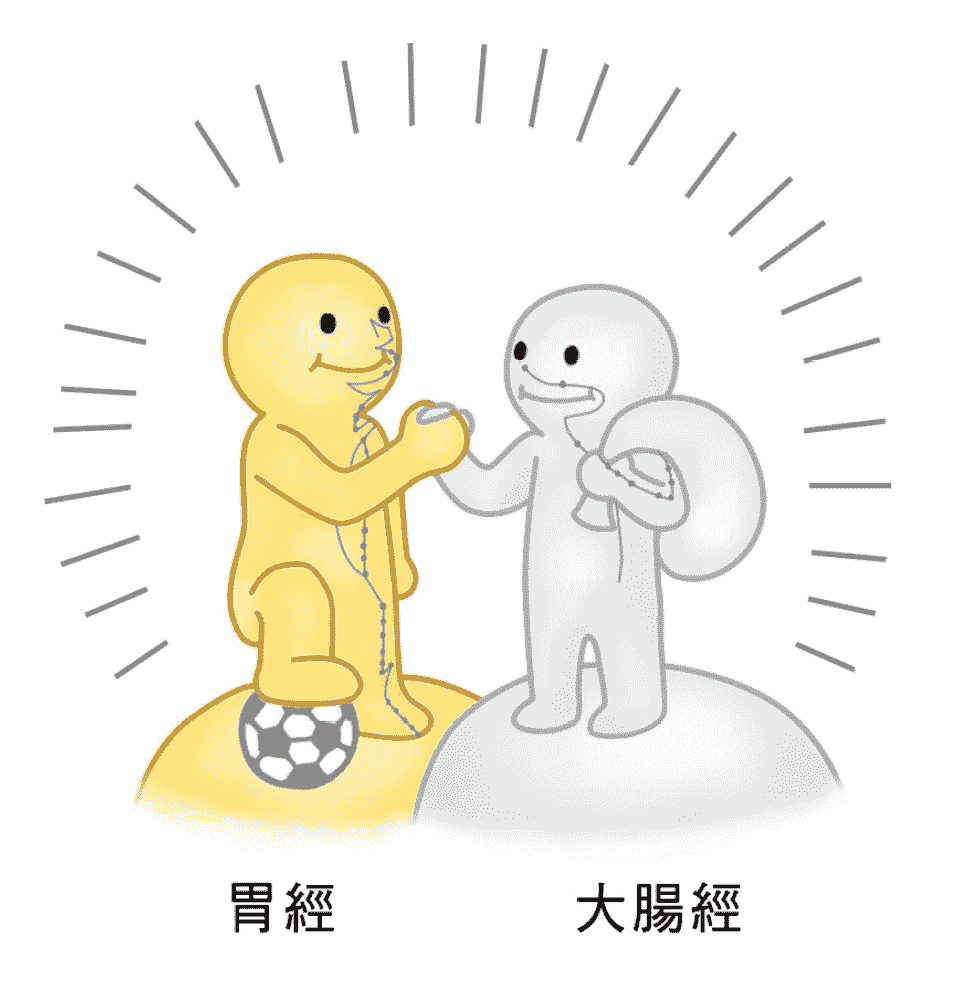

写到这里，脑中浮现云门舞集林怀民先生早年的经典舞作《薪传》，描绘台湾先民「柴船渡乌水，唐山过台湾」的［ 渡海］，大学时期前去观赏时，还感动到热泪盈眶！阳明好兄弟就具有这种冒险犯难、勤奋拚搏的精神！

#### 【大胃王】

依据经络名称和特性，本卷称为「大胃王」实至名归。

「大胃」取自大肠经与胃经第一个字所成，而且颇为契合消化的特色。那「王」又从何而来呢？

1.鼻子是面部最高的器官，不管再塌的鼻子，都能突出于面部，具有崇高的地位，中医特别尊称鼻子为「面王」。大肠经与胃经都属于阳明经，「阳明主面」，阳明经是面部的主要经络，特别跟鼻子有关，当然也跟面「王」有关。

2.王也可以念成兴旺的「旺」，表示大胃兄弟气血与肌肉都很旺盛，展现人体外在的结构特质。

3.王也可以念成欲望的「望」，或者英文的 W A N T。「望」与 「want」 都代表欲望，呈现人体内在的心理特质。

「大胃王」既代表大肠经与胃经名称和消化功能，也呈现它们在身体与心理层面的特质。

人体多么精妙！在肺经甦醒之后，马上启动肠胃系统，开始一天充实的生活！

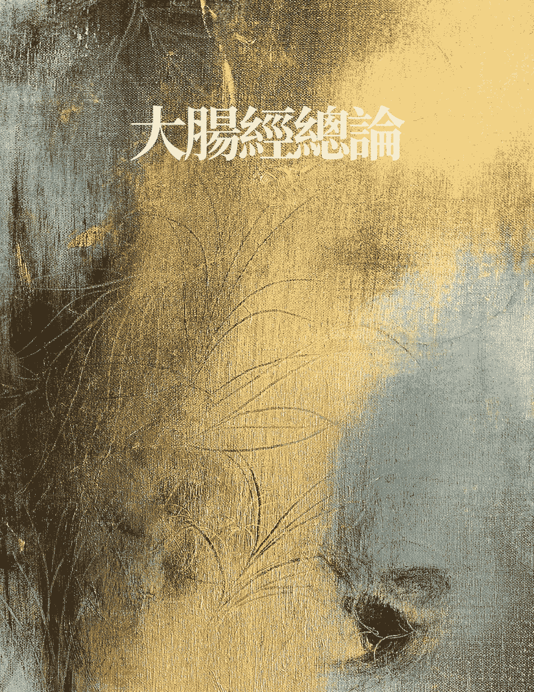

# 大肠经总论

## 大胃王之一：咬紧牙关，一肩挑起的人生

一提起大肠经，相信多数的民众一定会想到它的消化或是排便功能，但也有好食之人跟我说，立刻想到的是大肠面线；甚至还有病人问我，大肠经的功能和韩剧《大长今》有没有关联？

大长今是古代韩国的女医，若硬要攀亲带故，大概只能说两者都跟食物与疗愈有关，当然大长今与大肠经的发音也相似，导致许多病友在诊间听到我们讨论大肠经时，常会马上出声加入讨论说：「《大长今》我也有看过喔！」

回到中医十二经络中的大肠经，除了涵括人体腹部大肠这个器官外，大肠经还连结牙齿与肩膀，所以它所执掌的不只是消化系统，还有咬紧牙关又一肩挑起责任的坚毅形象，当然也包含了情绪的承担与抒发。

### 民间对于「肠子」的看法

与消化最直接相关的成语是「飢肠辘辘」，肚子饿到咕噜咕噜作响，以及晕车晕船过程中的「翻肠搅肚」。还有更多的俗语与消化无关，反而被借用来表示其他事物或心情，例如：

沈医师是个性直爽、心直口快的「直肠子」，之前忙着写经络书，历经「搜肠刮肚」、「索尽枯肠」的过程，终于出版了，期望给予读者「荡气回肠」余韵不绝的感受。以上举例出现的肠子可都不是针对真正的肠道喔！

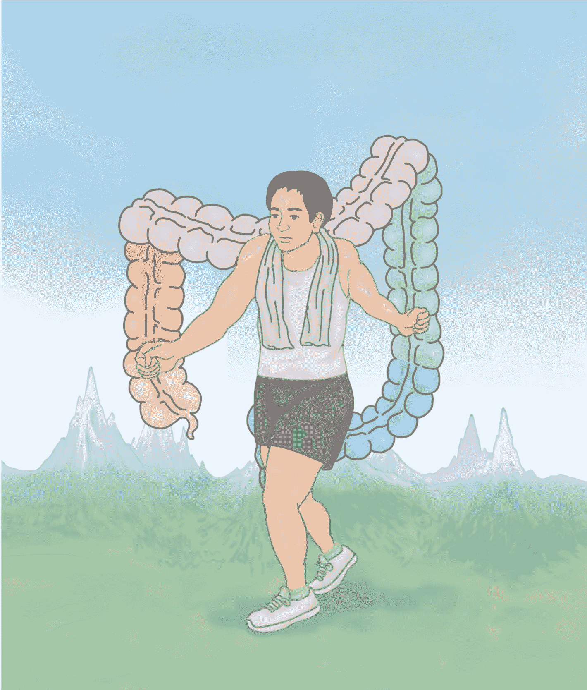

此外，在感情世界中，还有无尽思念的「牵肠挂肚」，情伤之后的「柔肠寸断」、「肝肠寸断」等。此刻您会不会感到小小惊讶？原来我们在不知不觉中，已将肠子的概念扩充到个性和感受之中。

而这时中医师会老神在在的跟各位说：「中医早就明白这个道理了！」中医看「肠」从来不侷限在「肠」，见肠非肠也。

### 中医对于「大肠」的看法

中医的脏腑观念是五脏主藏，六腑主泻，《内经》说：「五藏者，所以藏精神血气魂魄者也。六府者，所以化水谷而行津液者也。」

肝、心、脾、肺、肾等五脏属于内部组织充实的器官，负责储藏人体重要的精气，包括精神血气魂魄，不能轻易泻出，所以说五脏主藏，也因此在中医古书中，「五脏」常写作「五藏」，藏通脏。

胃、大肠、小肠、胆、三焦、膀胱等六腑属于内部组织空腔器官，与人体的代谢有关，尤其食物在体内的消化、吸收、排泄过程，都是顺着由上而下的步骤，一一通过六腑的空腔组织进行，因此中医特别强调「六腑以通为用」的特性，气机宜通宜降。由于六腑负责传化物、化水谷而行津液，应该通降而不能留藏，所以说六腑主泻。中医古书中，府通腑。

大肠属于六腑之一，当然也具有泻而不藏、通降为和的特质。

《内经》称大肠为：「传导之官，变化出焉」，透过「泌糟粕，蒸津液」的功能，从小肠消化吸收之后传送下来的化物，「蒸津液」是将有用的水份和养料再加以吸收，「泌糟粕」是将无用的糟粕变化为粪便，传导至肠道，再排出体外。这个过程与现代医学的观念一致。

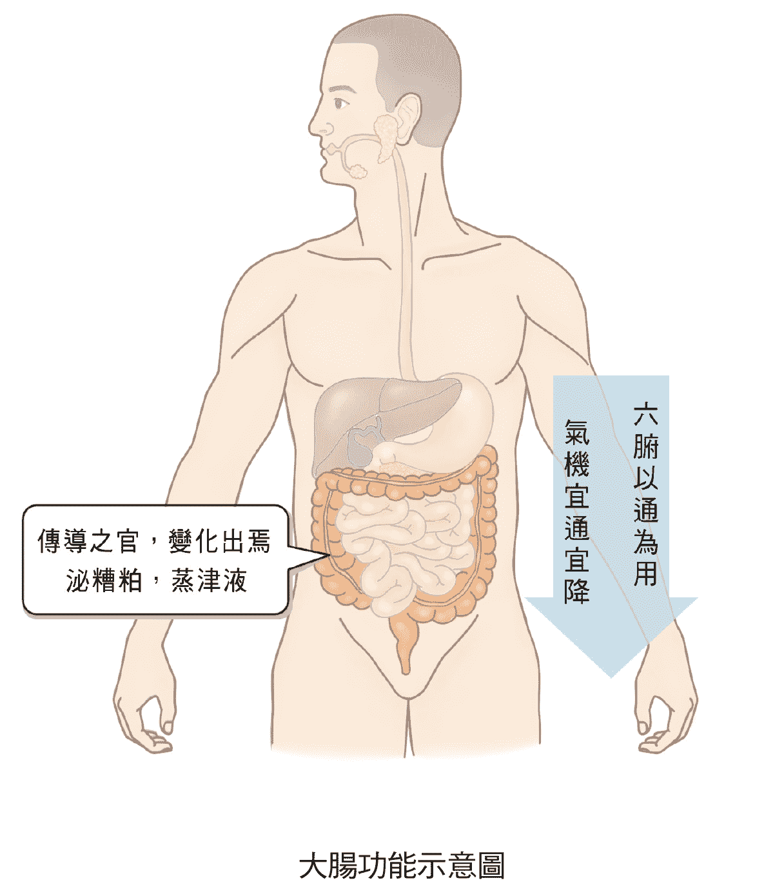

中医观察到大肠具有「传导」与「变化」的观点，相当有深意。

大肠身为消化道的最后一环，一般认为传导可视为「传而导之」，即「传送且引导之」，类似输送的过程，同时还带有一股由上而下的推动力量，以确保大肠内的化物不会向上逆行，而是顺应时势向下顺畅的运行，这对于排便是很重要的推动力量；「变化」即变而化之，表示 Input（进）与 Output（出）已是不同的东西，乍看颇有魔术变幻的概念。

依据现代医学研究，动物的粪便中有四分之一是水分，其余是蛋白质、多种维生素、无机物、脂肪、未消化的食物纤维、消化液残余、从肠道脱落的细胞和死掉的细菌等，堪称「内容丰富」。从古至今，粪便一直是良好的肥料，现在有一些西方国家也开始使用粪便内的某些物质来治疗疾病。其实早在明朝，李时珍所撰写的《本草纲目》中，记录搜集到的民间动物粪便药多达五十余种，部分药品现代临床仍在使用中。

从这里可以看出，中医并没有贬抑大肠处理糟粕的功能，更不认为粪便是肮脏之物，而且觉察到粪便中含有许多营养物质，只是人体用不到，才将它排出体外，回归大地，循环利用，滋养其他生命体，形成生命循环。人们取用大地的食物来滋养生命，又让自己也承担滋养生命体的功能，取之大地又回归大地，因此中医才会以「变化出焉」来赞叹大肠把食物变成粪便，粪便又能滋养食物，这个宛如变魔术般的神奇功能。

#### 逆转「传导之官」的思辨

我个人认为，以古人惜字如金的用词特色，加上「变化」二字是何等的神妙，不会只是讨论由食物变成粪便的过程而已。所以，我将「大肠者，传导之官，变化出焉」试着用否定句方式改写成「当大肠不传导时，也无变化出焉。」反而看得比较清楚，意思是当大肠不传导时，就无法产生变化，大肠功能的重要性马上凸显出来。

中医向来非常重视大小便功能，也是门诊时一定会询问的重点。有些中医科的新病友，刚开始被问到二便状况时，常常面有难色，尴尬难答，因为觉得这是不洁净的事情，既不注意也很难描述。

其实，二便严重失常在中医是危急症，例如《内经》中，黄帝询问如何以疾病的虚实状况来决定死生。岐伯老师回答说：「五实死，五虚死。」

什么是五实？脉盛，皮热，腹胀，前后不通，闷瞀，属于死证。

什么是五虚？脉细，皮寒，气少，泄利前后，饮食不入，属于死证。

「前后不通」及「泄利前后」都是大小便严重失调的情况，「前后不通」是大小便都难出，使得体内无法排除邪气，气机阻滞，所以称为实证；「泄利前后」是小便失禁，大便泄泻，当然无法留住营养物质，正气流失，所以称为虚证。无论是邪气不出或营养难留，皆是人体气机严重异常，都是病情危急的现象。

有怜悯之心的黄帝继续追问，何种情况还有一线生机？

岐伯继续说道：「浆粥入胃，泄注止，则虚者活；身汗，得后利，则实者活。」意思是五虚之证，若能开始进食，让浆粥入到胃来补充营养，且能停止持续狂泻现象，就有生机；五实之证，只要能出汗，且大小便通利，让邪气有出路，就有生机。所以只要邪有出路或营养能补给，人体的气机就能正常运转，当然就有活路。

现在的一些手术，如切除胆囊、结肠、盲肠等肠胃道手术，或妇女剖腹产过程，术中须麻醉让肠胃暂停蠕动，医学上称为「麻痺性肠阻塞」。手术之后，放屁排气是病患能否进食的重要指标，有排气就能进食，身体才能开始恢复。这个概念与中医相符。

《内经》还提到在疾病的传变过程中，如果出现「大骨枯槁，大肉陷下，胸中气满，喘息不便」，也是疾病转趋严重的征兆，这些症状常见于重大疾病后期，如癌末病人身上。临床上病人因为气血过于虚弱，大便无力解出或持续腹泻，腹部却是胀满痛甚，无法进食而缺乏营养，整个人变得非常干瘦痿弱，只剩皮包骨的「大骨枯槁，大肉陷下」情况；由于腹胀，气机难以下降，只能上逆而出现胸满气短喘促，精神疲倦，言语难续，通常预后都不佳，命在旦夕。医师看在眼里，十分不舍，却只能在心里默默祝福。

另一方面，肺脏居于人体最高位，负责将外面的空气吸入体内，肾脏居于人体最低位，主纳气；大肠位于肺与肾之间，也是人体最下方的关口之一，一旦大肠的气机阻滞，无法通降，不仅阻碍肺肾之间气机吸吐的活动，也会影响肺脏的肃降功能，而出现胸满喘息、气机严重上逆的现象。

大肠身为人体消化道的最下口，可以同时排出水分及糟粕。若大肠这个下口功能失常，例如大肠无法传导而致便秘，下口封闭则上口难开、饮食难入，上消化道无法运作，脾胃就无生化之源，当然也就无法转变精微物质为气血津液，以供应身体生存所需。

食物转换为精微物质，再变化为气血津液，推动全身机能的过程应该就是《内经》所说的「变化出焉」，《内经》特别提醒这个过程需要大肠传导才能完成。因此当大肠失去传导之能，身体也无变化之机，这就是前面我们翻转《内经》原文而成的「当大肠不传导时，当然无变化出焉」概念。由此可见，大肠经的原穴合谷穴为何能具有强大的开通气血能力，而且针感强烈，是中医抢救时必用穴，而被列为回阳救急九针之一。

### 中医对于「大肠经」的看法

介绍过大肠功能之后，读者是否认为大肠经应该就是联络大肠的经络系统吧！这样说，也对，也不对。为什么呢？

#### 1.大肠经在早期医书称为「齿脉」

现行的中医圣经《黄帝内经》，并不是最早的中医书，1973 年考古学家在湖南省长沙的马王堆三号西汉古墓中，出土一批医书，其中《足臂十一脉灸经》（简称《足臂本》）、《阴阳十一脉灸经》（简称《阴阳本》）两书保留最原始的经脉内容，成书时间比《内经》早，被视为《内经》中经脉内容的祖本。

透过这两本灸经，可以看到经脉系统由简而繁的发展过程，多数的经脉名称跟《内经•灵枢》中的经脉都有连贯性，唯有《阴阳本》对于手三阳经的命名不同。请参阅下表。

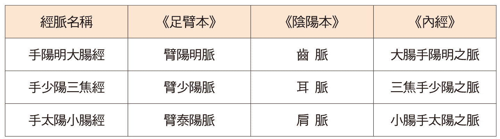

在《阴阳本》中，手三阳经都是以其循行在头面部位命名，因此大肠经称为「齿脉」，三焦经称为「耳脉」，小肠经称为「肩脉」。在《内经》中，齿、耳及肩都是手三阳经循行所经的关键部位。

大肠经的前身「齿脉」，循行路线从手上行到面颊，入齿中，夹鼻，并没有进到体腔。直到《内经》才有「大肠手阳明之脉」之名，且进入体腔，连结大肠与肺，循行路线明显较为多元且深入。虽然如此，牙齿部位仍是大肠经脉系统的循行重点。

#### 2.认识中医眼中的牙齿

齿脉的重心当然在牙齿。牙与齿两字，日常生活中常常合用与混用。

一般认为「齿」的出现早于「牙」，因为字形上「齿」字比较接近牙齿的排列与模样，一看就明白！也难怪《阴阳本》称为「齿脉」，闽南语则用「嘴齿」一词。

还记得小时候换牙，家中长辈会特别叮咛，如果是下排牙齿就要扔到屋顶上，上排牙齿要丢到床下。原理是下牙扔到屋顶，如此牙齿就能向上长，上牙扔到床下，新牙就会向下长。小时候常常担心自己小小的手，扔不到该去的地方，导致长不出新牙怎么办？所以有时就会请哥哥帮忙丢。幸好后来牙齿都顺利长了出来，表示当年有将牙齿丢对地方喔。

成年后拔牙，牙医师都会很体贴的将牙齿装入袋中，让我们带回家做纪念，牙齿的坚固特质，宛如钻石般恒久远，一颗永留存，算是很特别的生命纪念品。

牙齿对于人类而言，具有多重的意义与功能。我们且从演化过程开始介绍。

##### 牙齿的脏腑特色：与肺、大肠关系密切

牙齿跟肺有关？读者若已看过《经络解密》卷一，就知道肺是初始经络，司呼吸，主卫气，很厉害。但是，肺怎么会跟牙齿有关呢？

这个问题我问过许多人，也曾想了一些年，百思不解。后来读到《我们的身体里有一条鱼》才找到线索。该书提到牙齿是皮肤发育过程中，内层与外层组织交互作用的结果。两层组织互相靠近，产生组织摺叠，分泌新的蛋白质，外层细胞分泌珐琅质的先驱分子，内层组织形成牙齿内的齿质及髓质。不仅牙齿发育历经这个过程，所有发育自皮肤内的构造，例如鳞片、毛发、羽毛、汗腺，甚至乳腺，皆然。

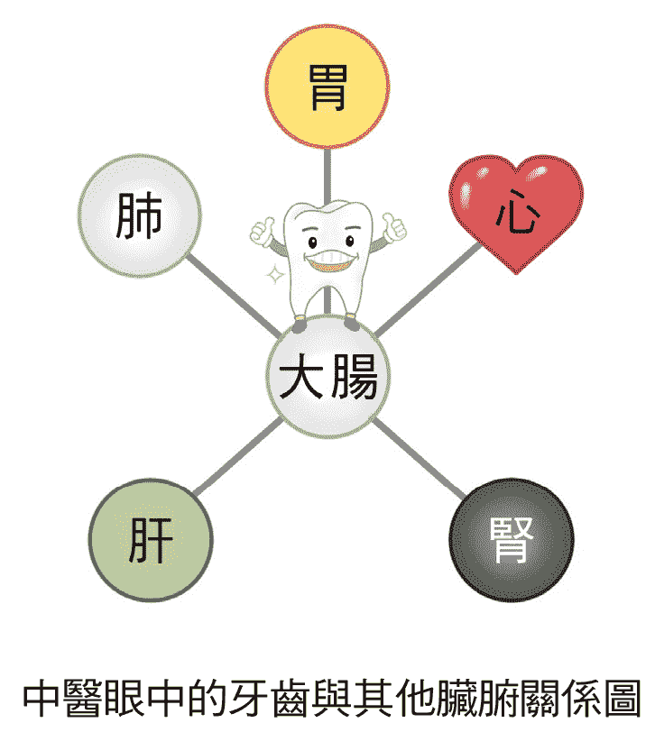

而牙齿与大肠的关系也来自演化。早期的动物只有单一出入口，经由同一个开口进食与排泄，也就是说用嘴巴进食，也用嘴巴排便。随着时间的进程，有些动物演化出肠道，将出入口分开，身体从一端进食，即是嘴巴，再从另一端排出食物消化后的残渣，即是大肠。透过演化，消化道的上口「牙齿」与消化道的下口「大肠」，连结成同一系统。

看到这部分有关牙齿与演化的关系，让我惊喜万分！牙齿由皮肤细胞层的交互作用而来，肺主皮毛，加上牙齿与大肠连成同一系统，《内经》指出大肠经连结牙齿，透过牙齿这个中间人，肺与大肠两者的连结关系部分来自于此！真是奇妙！这也正提醒我们，眼光要更宽更远，才能一窥中医奥秘。

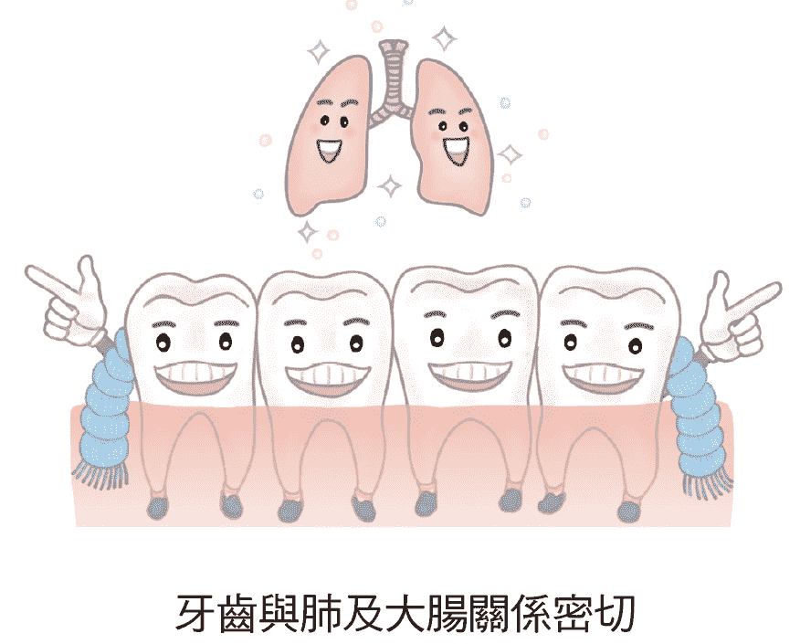

##### 牙齿的结构特色：与肾主骨主髓的关系

牙齿和骨骼都是人体坚硬的结构。我们也可以从演化的角度来看牙齿与骨骼的关系，其中羟磷灰石是人体骨骼组织主要成分，质地非常坚硬，充满在牙齿和骨骼之中。由于牙齿珐琅质所含的羟磷灰石比骨骼还要高，让牙齿成为人体最坚硬的结构。

在早期演化过程中，牙齿可以演变成为头骨，例如甲冑鱼是最早具有头骨的物种之一，它的头骨竟然类似牙齿的结构，有珐琅质也有髓质。这使得牙齿从原先咬动物的功能，之后演化成硬骨，变成保护身体的器官，所以牙齿与骨骼关系相当密切。

中医认为「肾主骨」，「骨为肾之余」，骨头的营养由肾提供，其功能当然也归肾管理。中医也发现牙齿结构坚硬与人体的骨头结构类似，所以说「齿为骨之余」，意指牙齿是骨头的延伸，透过骨骼让牙齿与肾而有了关联。

牙齿是一个人出生后才逐渐长出来的组织，就像植物「发芽」一样，牙齿也在出生后逐渐「发牙」而出。肾为先天之本，主管一个人的先天体质，牙齿能否顺利长出，与肾有关。先天体质良好的孩子，牙齿也会长得健壮，色微黄；体质较差的孩子，牙齿通常会长得小颗稀疏，颜色灰白或呈暗黄。

对于女性来说，生产是大事。俗语说，孕妇「生一个孩子，掉一颗牙」。从中医的角度来说，是非常可能发生的。

肾主骨主髓，也藏有人体最宝贵的物质「肾精」。肾精与血液可以互相转换。如果人体的血液充足，过多的血液就会输送到肾，转为肾精储存起来，就像将多余的薪水转入存款一样。一旦人体血液缺乏，肾精就会转换为血液，进入循环系统，就像提款出来使用一样。

准妈妈在怀孕和产后哺乳过程中，提供自己的血液来养育孩子，此时需要高质量的养分来补充。如果营养补充不及，肾精就必须转换为血液来救急。肾精持续输出，导致匮乏，连带影响肾所负责滋养的骨与髓也跟着失养，而出现腰痠腿软，脑袋空空，记忆力下降，视力茫茫，牙齿松动的现象，难怪许多妈妈产后常常喟叹自己老化得好快喔！

肾与牙齿的关系也会出现在一般人身上。《内经》提到男性的生理周期「五八，肾气衰，发堕齿槁」。五八相乘刚好四十，指出四十岁以上，人体进入由盛转衰的阶段，肾是第一个衰退的器官，会出现掉头发，牙齿枯槁，牙根动摇等老化征兆。著名的唐朝诗人韩愈在吊祭姪子十二郎的文章中，提到自己「吾年未四十，而视茫茫，而发苍苍，而齿牙动摇。」韩愈年未四十，已经出现肾虚的现象，我们透过隔空诊病，判断应该是耗神与用眼过度，才出现一派肾虚的现象。（肾主骨，主髓，脑内充满脑髓，中医脑为「髓海」，与肾脏关系密切。）

现代医学逐渐发现牙齿与智力有关。研究显示，牙周病患者容易导致脑部神经退化，提高罹患阿兹海默症的机率。也有研究发现，咀嚼能有效防止记忆力衰退，因为咀嚼能促进脑部的血液循环，提高大脑功能。

另一方面，许多研究开始探讨牙周病与骨质疏松之间的关联。例如停经后妇女罹患骨质疏松症，下颚骨的骨质密度流失状况及牙齿丧失数目都较多；牙周健康者，咬合力量远高于全口无牙者，同时腰椎骨质密度也较全口无牙者高。证明了牙齿与骨骼的密切关系。

从这些角度来看，中医师通常建议尽量保留真牙，不仅为了饮食方便，更为了护肾以维持良好的生活质量。

##### 牙齿的功能特色：与胃主消化吸收的关系

牙齿最直接的功用就是吃东西，包括咬碎及咀嚼食物，为胃与肠做初步消化。

《内经》提到大肠小肠皆属于胃，大肠经与胃经也都循行到牙齿，可见人体对于牙齿这个进食的第一道关口是非常重视的。

对于吃东西很快、狼吞虎咽的人，我们都会提醒：「牙齿只长在嘴里，胃里面可没有牙齿喔！」难怪这些人都会有胃胀气的情况。

老人家随着年龄增长，身体机能老化，牙齿也是其中之一。一旦牙齿崩坏，不仅无法咀嚼，加上对于食物的寒热性质过度敏感，通常食欲及营养吸收都会出现大问题，所以俗语才说「牙齿若败，胃肠就坏」。

现代人常用「打牙祭」来表示享用一顿与平常不同的丰盛菜肴。根据资料显示，「牙祭」是指过去物资不丰厚的年代，工商业主对于店员、匠师、学徒等在农历每月初二、十六各给予一次肉食。这个特殊的饮食观念，流传到现代这个物资丰富的年代，就成为「打牙祭」的说法。

还有一种牙齿与食物的关联，就是「作牙」的习俗。据说是来自古代商场的习俗。过去的买卖介绍人被称为「牙郎」、「牙侩」或「牵钩仔」，而诸神之中，土地公特别照顾生意人，所以商人向牙郎们请客致谢，拜祭土地公等仪式，称为「作牙」。 我母亲还保留这个习俗，以往固定在每个月农历初二及十六都会「作牙」拜土地公，我们也就顺便打打牙祭囉！

至于到了年尾的尾禡（音「尾牙」）意指在岁末农历十二月十六日祭拜土地公的仪式，现在则变成公司行号老板犒赏员工，吃好料、发奖金、摸大奖，令人血脉贲张的日子。可见「牙」在华人的心中，都与「吃」脱不了关系。

##### 牙齿与爪的协同特色：与肝主筋膜的关系

牙齿对于动物来说，除了进食之外，还与攻击、防御有关。

对于多数动物而言，牙齿是武器。许多凶猛动物的牙齿都很尖锐，下颚有力。牙齿是一个固定结构，不能自己移动，撕咬的力量来自于肝，因为肝主筋膜（下面会说明），所以强力的咬合力部分来自于肝。大家可不要小看嘴巴里这一些牙齿，它们的咬合力很惊人，据估计人类牙齿的咬合力约在七十到一百公斤左右，国内外有些素人还能以牙齿拉动汽车。

大肠与肝的密切关系也呈现在经络关系上，大肠经与肝经相通，所以在许多生理和病理状况都会互相影响。

《内经》说：「肝者……其华在爪，其充在筋」，「爪」这个字本就兼指人类的指甲与动物的爪子之意。由于爪甲与筋膜都需要肝血的滋养才能灵活，因此中医认为「爪为筋之余」，就如同「骨为肾之余」的概念。筋是连接关节的结构，可协助各个关节的运动。筋膜强健，人体的关节就有力且灵活。指爪既然是筋的延伸，当然也具有筋的活动力量。

动物在进食以及防御时，通常都是以手爪握住食物或敌人，再用牙齿撕咬。现代人虽然使用餐具进食，有时也会以手握持食物直接送进口里，例如吃面包或啃玉米时。但人类互殴打架时，男性与女性就有点不同了。由于男性的肌肉筋骨较为结实，通常会以四肢及躯干直接对打，但女性及小孩的肌肉筋骨力量不足，因此会配合以手指揪住头发或是牙齿撕咬来加强战斗力！

手爪与牙齿两者功能合用，等同于大肠经结合肝经，就成为「爪牙」一词。看到「爪牙」一词，读者可能稍皱眉头，因为以现代观点来看带有负面的意思，多指坏人的党羽、帮凶等，让人观感不佳。

其实就前面所述，爪与牙只是动物生存的武器而已，并无好坏之别。聪明的古人见识到爪牙的能耐，将之转为武力的象征。中医认为肝为将军之官，专门带兵打仗，爪牙又是武器，将军与武器根本就是如鱼得水，因此将爪牙延伸为「得力的武将」。后来又从武将扩大为一般的辅佐之臣、帮手等等。当然，有钱有势者才有能力及需求豢养爪牙，但权力总是令人腐败，这些爪牙常仗着主子的势力，胡作非为，才导致此词蒙上负面的色彩。

牙齿是武力的象征，古代军营的将帅大旗，旗竿上常以象牙为饰，称为「牙旗」，以展现军威，出兵时也会祭拜军旗，祈求旗开得胜，谓之「禡牙」！除了军队之外，民间也制作各种兽牙形状的牙旗来标示自己的领地或族群。

综合以上的介绍，可见牙齿代表着力量，而这个力量除了来自牙齿本身的坚固结构之外，还与肝所提供的助力有关。

##### 牙齿与心脏也有关联

心肌梗塞是现代人闻之色变的无形杀手，但它其实是有一些前兆的，例如持续难愈的牙痛，就被称为「心源性牙痛」。据现代研究，部分心肌梗塞死亡的人，冠状动脉血栓里有许多牙周病菌，其基因排列和口腔的牙周病菌相同，证明了牙周病与心血管疾病的关系。

由于心脏神经的分布特色，从鼻子以下到肚脐以上部位的疼痛都可能跟心脏有关，而心肌梗塞会出现从腹部、胸口、左肩到后背膏肓的疼痛，严重者还牵引到下巴及牙齿。从经络的角度来看，这条从鼻子以下到肚脐以上部位的疼痛路线，正好都是心经经络系统所经部位，中医也据此掌握牙齿与心脏疾病的关系，可以提早给予治疗。

另外，中医理论中，心为君主之官，主管神志。人在一些特定情绪的表现也与牙齿有关，例如气愤时的「咬牙切齿」，开心时的「露齿而笑」等。

##### 口腔与全身健康息息相关

日本颚咬合学会在《 0~100 岁都需要的咀嚼力》一书中，直接点出「牙齿健康、咬合好，远离腰痛、肥胖、失智，心脏病」。书中提到，世界卫生组织以「口腔健康为全身健康之本」为口号，目的在提醒世人口腔疾病和全身健康息息相关，不应仅被视为「局部的小问题」。国内外皆有研究指出，口腔健康状况和全身系统性疾病相关，例如：口咽是细菌容易聚集与繁殖的地方，也是吸入性肺炎的主要原因；牙周病会提高罹患癌症、心脏病、糖尿病的风险，也会诱发风湿性关节炎，甚至提高孕妇早产的机率等。这些内容都与中医观点不谋而合。

由于牙齿的特性，我们的文化中还延伸出不少与牙齿有关的成语及俗语，例如：

表达情绪的「咬牙切齿，以牙还牙，张牙舞爪，呲牙咧嘴，令人不齿，狗嘴吐不出象牙」等，这种强烈的情绪主要与心、肝有关，因为心主神志，肝主怒。

表达胃口的「齿颊留香」，与胃有关。表达年龄的「马齿徒长，没齿难忘」。齿为骨之余，与肾相关，肾主先天之本，与人的寿命长短有关，因此这里的齿代表年龄。现代医学也证明，牙齿数目越多，人越长寿。

表达外貌的「唇红齿白，明眸皓齿」。肺主皮毛，重视外貌，与肺有关。

表达关系的「唇齿相依，唇亡齿寒」。脾开窍于唇，胃经也循行于齿，表达大肠与脾胃之间紧密的合作关系。

表达能力状态的「咬紧牙关，难于启齿，何足挂齿，伶牙俐齿」，与大肠经本身循行路线有关。

#### 3.牙齿与大肠经的关系

大肠经从《阴阳本》的「齿脉」到《内经》的「大肠手阳明之脉」，其间历经很大的跳跃。猜想随着医疗经验的累积，《内经》的作者们将原先只行走在手臂和面部的齿脉，延伸连结到大肠与肺这两个相表里的脏腑，并加上手足与阴阳关系，变成更完整的经脉系统。

前面介绍过，演化过程中，牙齿与大肠被连结成同一个消化系统，所以《 阴阳本》的齿脉可以视为记录早期动物的单口状态，当出现双口，牙齿连结大肠之后，齿脉也跟着延伸至体腔连结大肠，大肠经由此而生。

#### 4.大肠经与肺经的表里关系

大肠和肺成为表里脏腑的原因，除了演化过程中，经由牙齿来连结之外，还来自于中医的脏腑理论。

脏腑理论中，五脏六腑在表里关系方面以「脏」为主导，因此有五对主要的表里关系。

在卷一［经络启航］中曾介绍，经络系统为五脏六腑建立表里关系（p.72），其中脏腑位于相临近位置，如肝与胆，脾与胃，肾与膀胱，这三对属于「近水楼台先得月」型，位置接近，功能相辅相成，很容易就建立表里关系。剩下心肺以及大小肠尚未配对。该如何分配成对呢？以下纯属个人见解。

我们先从心脏来看。心主血，小肠为主要吸收营养物质的地方，这些精微物质是制血的材料，从此关系来看，心的表里伙伴首选小肠。

从肺脏来看，肺身为五脏六腑之长，攸关生命的始与终，因此只要与维持生命有关的事项，都在肺的管辖范围之内。但肺经为何会选大肠经为表里经呢？

人体维生的两大主轴：呼吸空气与吃进食物，而且都具有「进」与「出」的特质，亦即空气与食物皆由体外进入体内，经过人体使用之后，再将无用的部分排出体外。肺主一身之气，掌管呼吸气机的进与出，与上述特质相符，所以才能成为维生物质的掌控者。

以下为肺与大肠掌管空气及食物在体内进出的特质。

在空气方面：肺司呼吸，透过宣发与肃降功能来调节气机。肾主纳气，气的吸入要能下达于肾，肺的肃降功能也参与其中；气的排出重点在肺，以肺的宣发功能为主，将气排出体外。

大肠属于六腑之一，腑的气机以下降为和。大肠是身体的下口，负责排出糟粕，气机更是必须下降，「逆流而上」可会吓坏人。而大肠腑气是推动糟粕排出体外的主要动力。大肠这个向外排出的特质与肺排出气体的特质接近，两者相辅相成，大肠腑气顺畅，肺的气机也能顺利下降至肾。反过来说，肺的宣发肃降功能也有助于大肠腑气的通畅，因此肺与大肠建立了合作关系。

在饮食方面：早期单细胞生物，呼吸与摄食同步，然后逐渐进化为呼吸与摄食分流。摄食内容包括固体食物与流质水饮，它们进入消化系统，经过消化吸收之后，残渣从大肠排出，剩水从膀胱排出。依据中医理论，肺能通调水道下输膀胱，同理可推，肺也能协助糟粕下输至大肠。因此肺与大肠再度形成伙伴关系。

临床上，中医在治疗一些呼吸道疾病时，如果病人兼有便秘，通常便秘改善，呼吸疾病也会跟着改善。严重的咳嗽气喘，气机上逆而难下时，即使没有便秘，中医师还是会配合使用通便药，透过通降大肠腑气来协助肺的气机下降。另一方面，长期大便秘结的病人，中医师也会加用肺经药，协助通降大肠腑气。

有些中药可以同时作用在肺和大肠，例如杏仁就是体现大肠与肺表里关系的代表。杏仁色白，入肺经与大肠经，功能止咳平喘，润肠通便。所以日后读者去看中医时，若发现治疗便秘药方有杏仁，治疗咳喘也有杏仁时，就可以跟医师说：「我知道肺与大肠相表里喔！」让您的医师惊喜一下！

中医观察到前述演化过程中，牙齿与肺跟大肠相连结，再加上中医脏腑理论中大肠与肺有着表里关系，齿脉就此脱胎换骨成为大肠经囉！

### 中医对于「手阳明经」的看法

大肠经属于手阳明经，它的特色是什么呢？

第一个特色如《内经》所说「阳明常多气多血」，是气血最旺盛的经络。手阳明是大肠经，足阳明是胃经，胃与大肠都与消化饮食水谷、吸收精微物质有关，算是第一线吸收营养的器官，气血自然非常充沛。

第二个特色是经络循行都走在人体的阳面前线，也就是正面之意，而且都是肌肉最丰厚的部位，手阳明经循行当然以手部为主。

第三个特色是「阳明主面」，这个特色是建立在前面两个特色的基础上。人的面部五官需要最佳营养，才能发挥视觉、嗅觉、听觉及味觉等功能，阳明走在人体正面，又能提供充足的气血，所以面部的主要捍卫者就是阳明经囉！

从齿脉发展到手阳明大肠经，这一段历程标志着中医对于人体更全面的了解，提供临床上诊断及治疗上非常宝贵的指引。

### 大肠经与其他经络脏腑的关系

在牙齿概念中，介绍过它与肺、肾、胃、肝和心等脏腑关系密切。这些脏腑也与大肠有着良好的互动关系，请参阅下图。

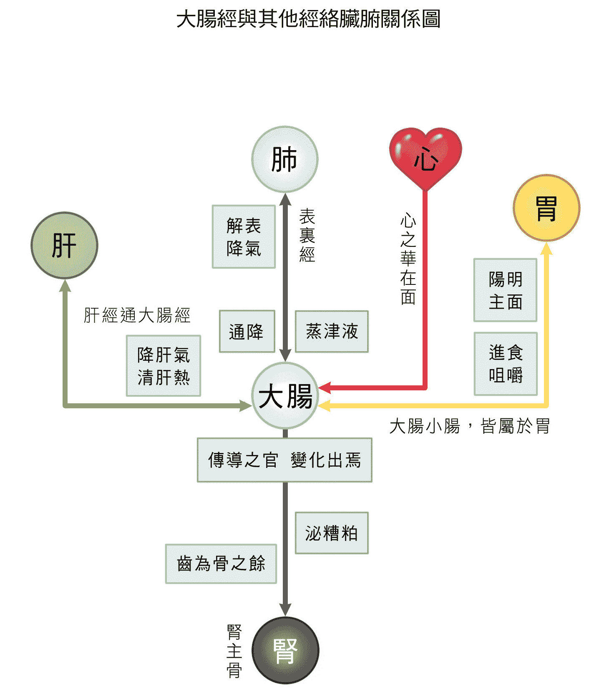

##### 与肺的关系

大肠与肺相表里，关系最接近。由于肺为娇脏，只出嘴巴跟手指头，实际工作还需其他脏腑来执行，大肠就首当其冲。肺是大肠的老板，大肠为肺执行许多需要「抛头露面」的业务，大肠经的穴位也非常擅长治疗肺经系统疾病，如：

肺主表，为人体面对外邪侵袭的第一道防线，合谷穴是治疗外感病的要穴；肺主皮毛，曲池穴善于治疗皮肤热痒疾病，透过发散大肠热来解肺热；肺开窍于鼻，但肺经循行未到鼻部，大肠经特地循行到鼻，助肺治疗鼻病；肺具有向上升发、向下肃降的功能，前面提过大肠属腑，气机以下降为顺，大肠腑气有助于肺的肃降功能；大肠经筋循行在上背部，为肺提供实质的保护。

大肠与肺的关系还可以从水生动物身上看出来。

一般水生动物是以鳃呼吸，藉由扩散作用和水进行气体交换。比较特别的是泥鳅，平常用鳃呼吸，当水中氧气缺乏时，会暂时把肠子做为呼吸器官。您看，这与中医的肺与大肠相表里理论有异曲同工之妙。

##### 与肾的关系

除了肾主骨、齿为骨之余的关系，中医认为肾主管人体下部的前阴与后阴部位，亦即尿道和肛门，当然也统管大便及小便，所以大肠排便功能也受肾的管辖。

##### 与胃的关系

由于大肠小肠皆属于胃，胃也可以视为大肠的第二个老板，但是胃不像肺只负责指挥，动口不动手，大肠与胃是「大胃王阳明好兄弟」，是具有深厚「革命情感」的工作团队，实际执行食物的消化与吸收，面对困难，一起解决。细节会在后续内容介绍。

##### 与肝的关系

前面说过，大肠经与肝经是通经关系（读者若想进一步了解通经关系，可参阅《医道精要》p.52-61），两经宛如拜把兄弟般关系非常密切，生理和病理上都会互相影响，也可以互相治疗。例如肝火过旺会导致大肠热盛而便秘，便秘也会导致肝火上升，大肠经的曲池穴既可以清大肠与肝热，降大肠与肝气，一举两得。

在《卷一》介绍过大肠经与肝经有一个非常特殊的合作关系：「合谷太冲开四关」，原意是用来治疗「寒热痹痛」，亦即筋骨关节的各类疼痛。后世医者虽然对于「四关」有诸多不同见解，但都认同合谷穴配太冲穴可以快速疏通身体的阴阳气血运行。

这两穴为何如此好用呢？

除了演化过程中的对位关系之外，脏腑与经络属性也是关键。

大肠属于六腑，气机以下降为和。大肠经为阳经，是多气多血的阳明经，气血非常充盈，它还可凭借肺脏主一身之气的力量，在体内快速运行，以提供组织器官的养分。

肝脏属于五脏，具有独特的气血特性。在气机方面，肝脏五行属木，具有树木和树枝向外、向上生长伸展的特质，肝脏能打开人体的气机，让气机宛如树枝般的向外、向上开展，中医称此功能为「疏泄」与「条达」，以避免气机的郁滞而影响身体机能。在血液方面，肝主藏血，当人躺下休息时，血液就会回到肝脏进行净化与修复，之后再交给肺来运用。肝经为阴经，属于具有强大行气活血能力的厥阴经。

充盈的气血加上强大的推动能力，当然能快速推动全身阴阳气血运行，这就是大肠经与肝经超强能力的秘密。合谷穴是大肠经的代表穴，性质属阳，但因应大肠腑的特质，能让而气机下降；太冲穴是肝经的代表穴，性质属阴，但因应肝脏的特质，能让气机上升。两穴合用，一阴一阳，一升一降，调节气血，当然具有强大的行气活血能力囉！

##### 与心的关系

「阳明主面」主要与面部肌肉丰厚度和活动灵活度有关。然而中医理论说「心之华在面」，心脏机能会呈现在面部，面部表情也会泄漏心里的想法，所以心脏才是面部的主要掌管者。既然心与面部关系如此密切，心经经别就特别「上走喉咙，出于面，合目内眦」，实际上循行至整个面部，与大肠经及胃经都建立合作关系。

以上是大肠经与其他经络脏腑的关系。中医虽是古老的医学体系，同时也是早熟而完备的体系，明确阐述了人体的生理与病理机能。例如，台湾近年好发癌症首位的大肠癌，由于血液循环的关系，最容易转移到肝脏、肺脏、脑及骨骼。是不是与前面所讨论的内容不谋而合？

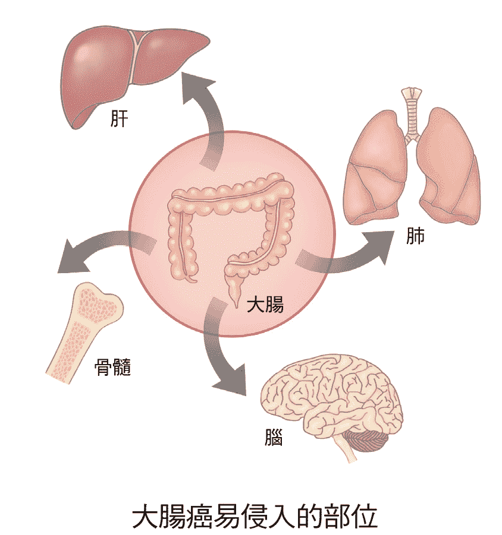

#### 咬紧牙关，一肩挑起的大肠经

大肠经主要循行部位除了牙齿之外，还有我们常用来挑负东西的肩膀部位，也是电视剧中小孙子会帮阿嬷捶肩背的位置。大肠经身为第二条经络，又与娇嫩的肺脏相表里，两人有时宛如夫妻关系。

肺经娘家家大业大，管理的事务既多且重要，大肠经丈夫所需承担的责任可想而知。坚毅的大肠经责无旁贷，既要呵护娇嫩的肺，还要使命必达，只好咬紧牙关，一肩挑起所有的责任，完全是一个护家的新好男人形象，但表面风光之下的辛苦无人知。

既然提到手阳明大肠经，也顺便说说手三阳经的特殊命运。

在《卷一》中提过，手三阳经虽然通过腹部的大肠、小肠，甚至胸腹部的上中下三焦部位，但都配合心、心包、肺而命名为手经，且病候中也比较少见大小肠、三焦实质的脏腑功能异常，多数仍以经络循行所过部位的病变为主。

为什么会这样呢？

这是因为与它们相表里的三条阴经太厉害了！它们主要连结生命的中枢：心与肺，中医称心肺为人体的父母，其尊崇地位可见一斑！大肠与小肠比较象是肺跟心的下属，它们的功能还是由心肺来主导，所以在病候上没有机会凸显自己的特色，而由五脏的经络来呈现，譬如大小便的异常症状出现在脾经与肝经病候之中。

但足部六条经络就不一样囉！由于所连接的脏腑彼此之间的地位与功能比较平等，而且相表里的肝胆、脾胃、肾胱几乎都可视作自家人，彼此不分你我，所以各条经络就尽展所能，病候中也会出现与自己的有关症状。

一旦走进经络的世界，真的会不得不赞叹人体这个小宇宙的设计和运行，真是太精细太奥妙了！

以下是大肠经四大系统捷运图和经络图。

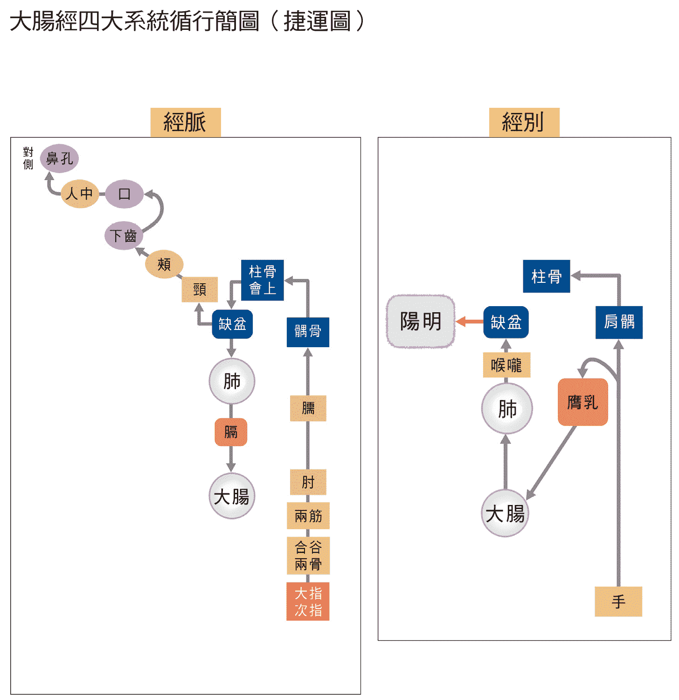

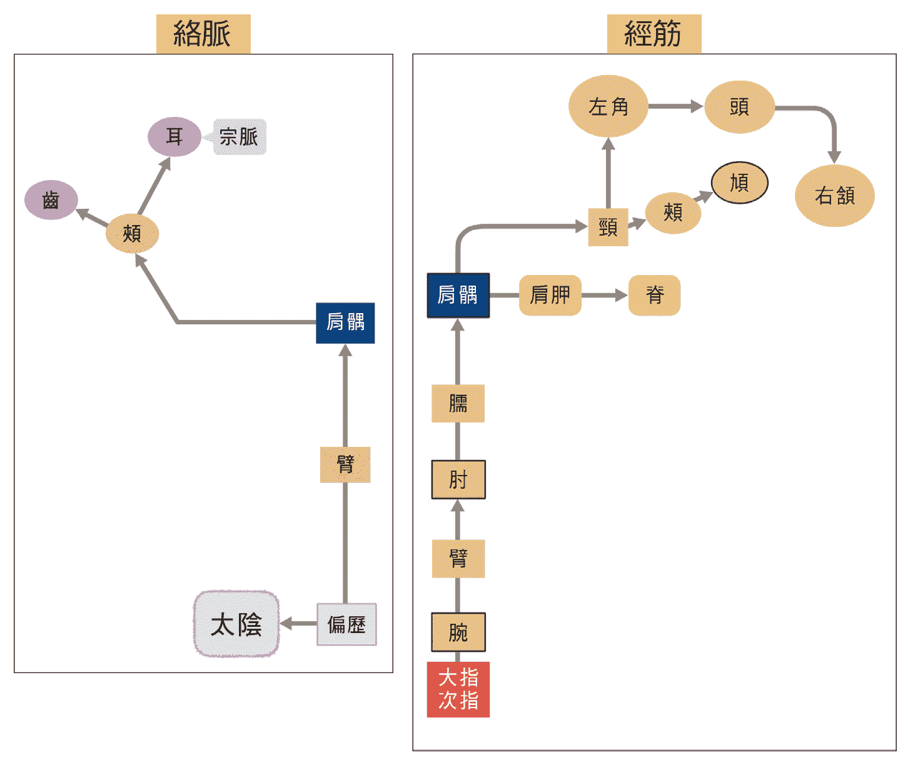

在《卷一 》出版后，有读者询问：「身体两边的经络怎么不一样？」原来是看了经络图及捷运图都只画在身体单侧，以为两边不一样。

在此特别说明：

理论上，身体两边的经络系统几乎都一样。

只是本书为了让读者容易了解，在人体右侧画上经筋的循行图及捷运图，在人体左侧画上经脉、经别和络脉的循行图及捷运图。

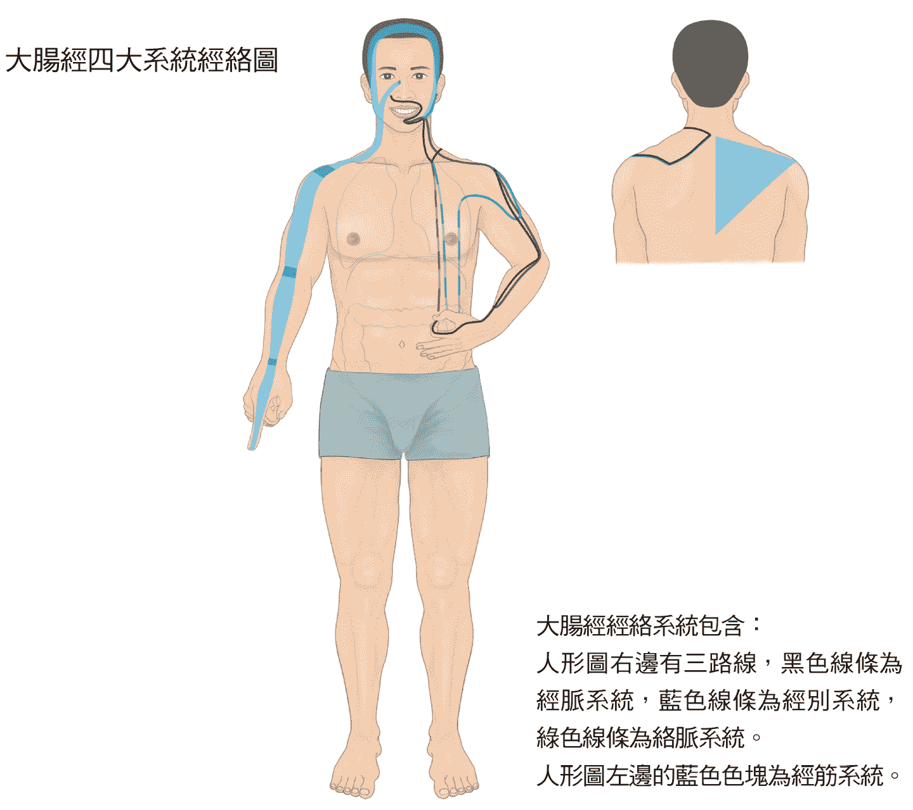

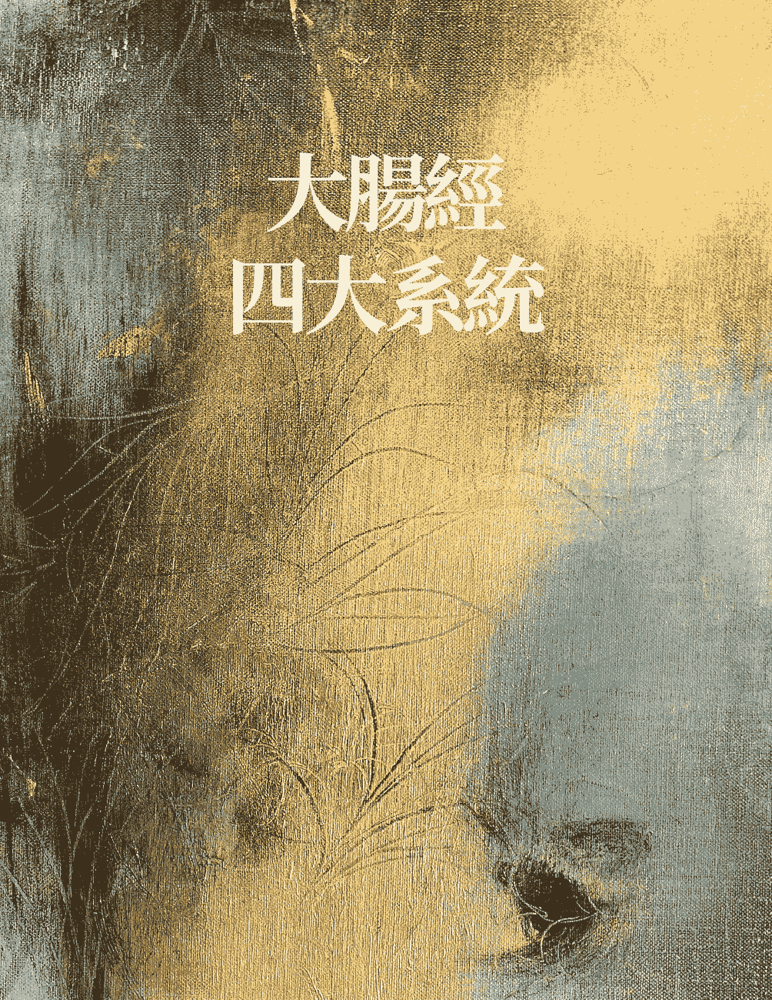

# 大肠经四大系统

## 一、大肠手阳明之脉（经脉）

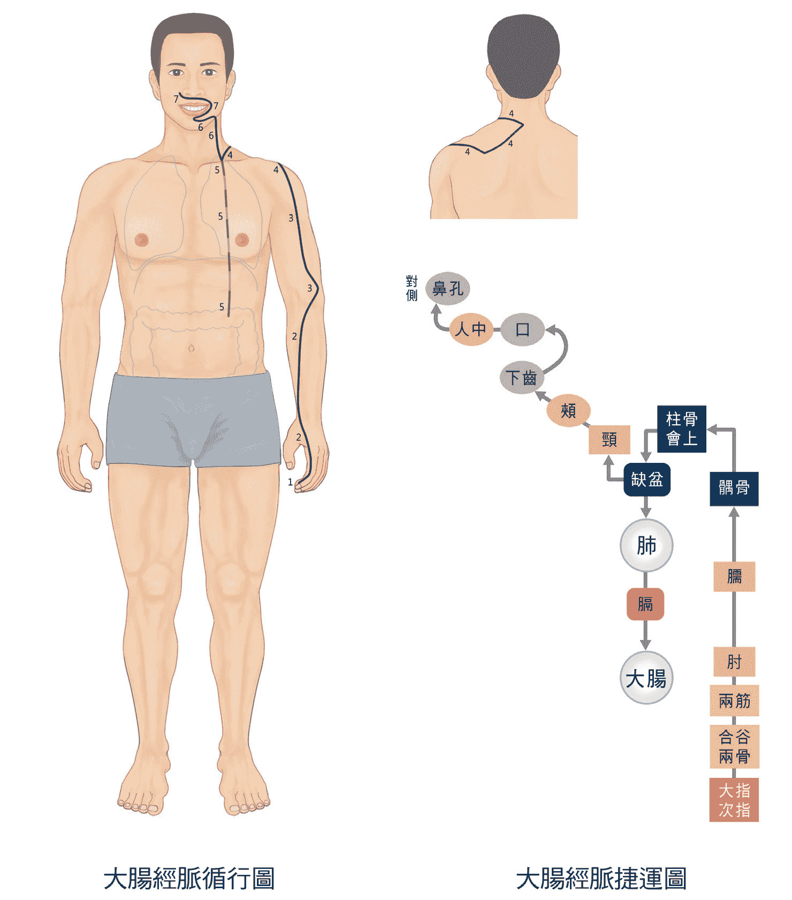

### 手阳明大肠经─循行特色

⼤肠经脉（大肠经四大系统中的经脉、经别、络脉、经筋，于本章中简称大肠经脉、大肠经别、大肠络脉、大肠经筋）的循⾏路线可以分为路线 1 ⾄ 4 的上肢部，路线 5 的胸腹部，路线 6⾄ 7 的头⾯部三部分。

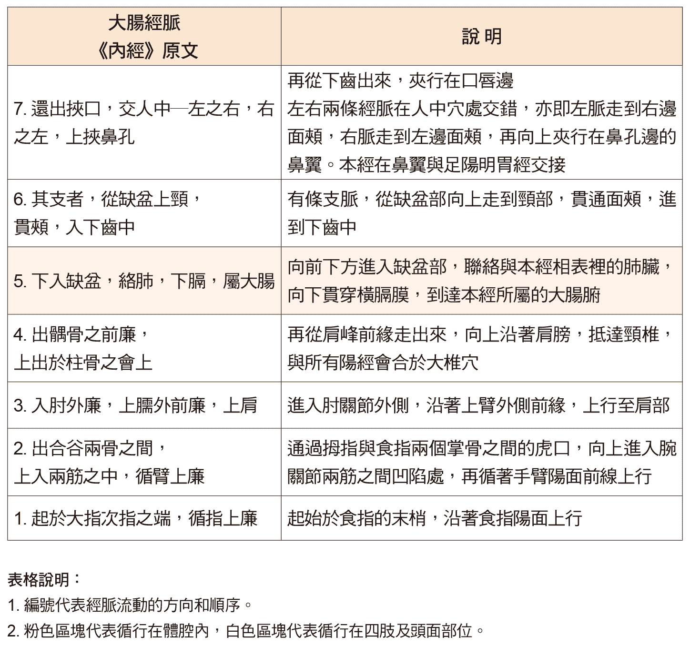

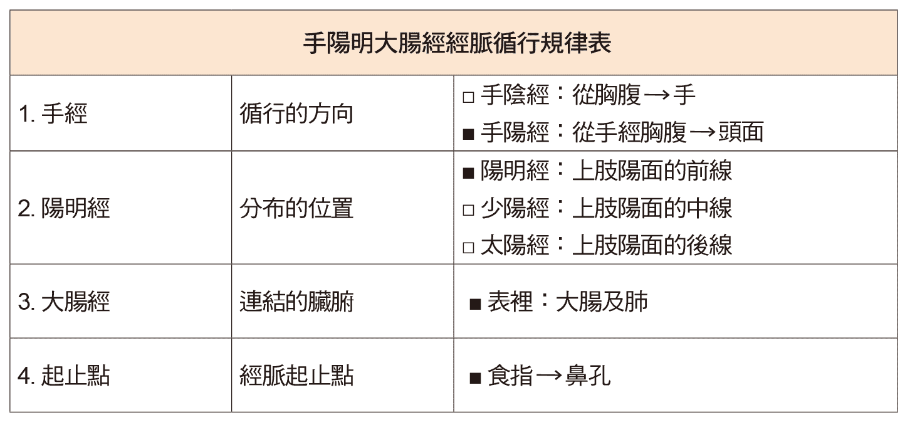

### 1.上肢部的「向前看齐专线」

想了解大肠经脉在上肢的走向位置，有个简单又有趣的方法。熟龄的读者应该还记得，在早期学生时代每天早上都有朝会，全校师生必须抵达操场排好队伍，当要整队时司仪会喊出「向前看齐」，于是所有同学就将手臂抬高与肩平，手掌打开，手指并拢，掌心相对，与前方同学保持距离，队伍才会整齐划一。

这个向前看齐的动作，其实就明白告诉了我们大肠经经脉在上肢部的循行路线，所以这路径就称为「向前看齐专线」（路线 1-4）。

大肠经起于食指，向上经过腕、肘关节到肩膀前方，刚好就是向前看齐时，手臂上方的路线，因此「向前看齐」，一眼望去，正是大肠经在手臂的循行路线。

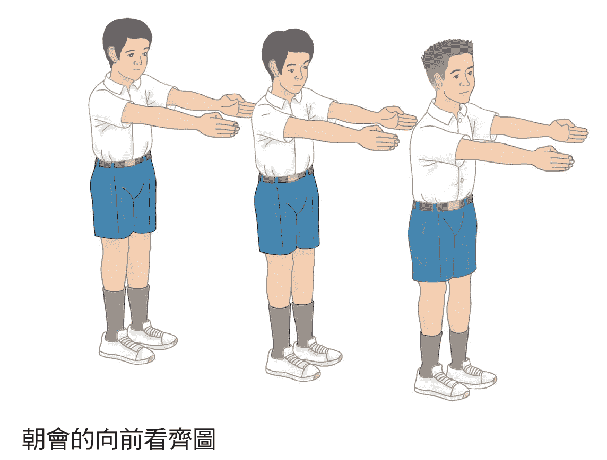

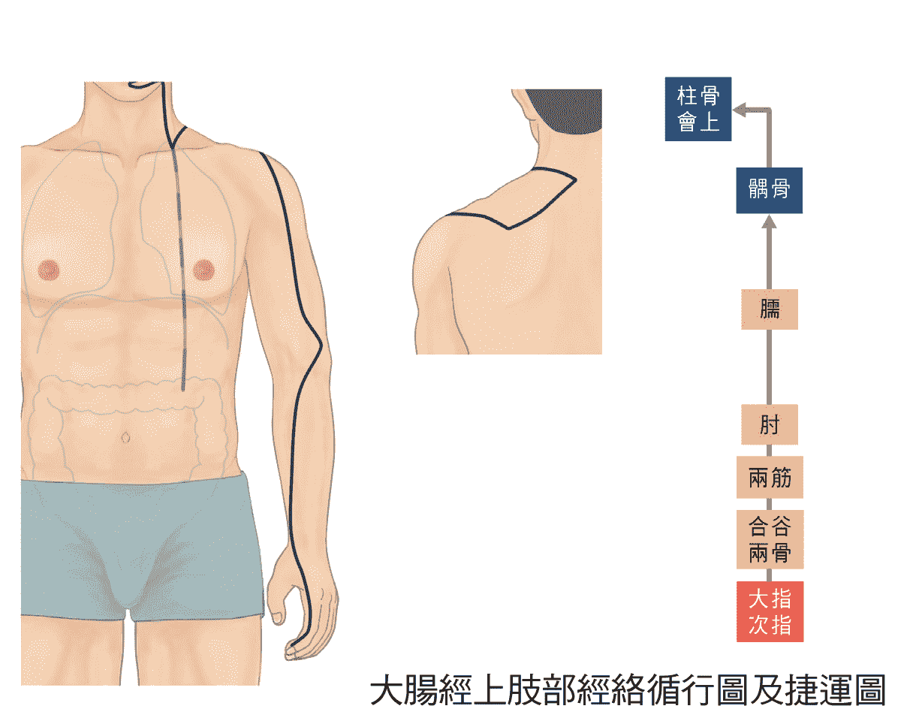

肺经在食指交棒给大肠经，所以「向前看齐专线」的大肠经脉起于食指末梢，沿着食指与拇指之间的虎口部位，通过腕关节，继续顺着手臂阳面的前线，经过肘关节，一路上到肩关节，然后转往上背部，抵达颈椎与胸椎交接的大椎穴上，再向下进入缺盆。

阳明经多气多血，大肠经从腕关节到肩关节之间，都走在手臂阳面的前侧，属于人体活动最频繁、也是肌肉最丰厚的部位，每个部位都有属于自己的强项功能与故事，请听我慢慢道来。

 解密：食指在东西方文化的故事

###### 食指在东西方文化的故事

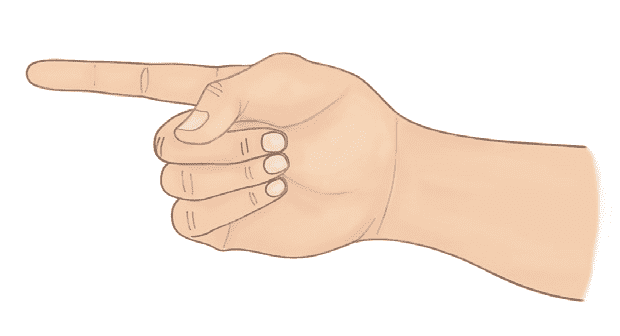

大肠经脉起于食指，这个指头来头可不小喔！

在西方文化中，食指称为 forefinger 或 index finger / pointer finger。

forefinger 意为前方的指头，手指为了能抓握东西，让拇指与其他四指分开。以排列位置来看，食指是这四指的「排头」；就功能来看，光以食指与拇指合作就能完成许多工作，因此食指就成为这四指的班长，名副其实的 forefinger 。

至于 index finger / pointer finger 意为指示的指头，食指可用来指示方向。但是若用食指来指向某人要小心，很容易出问题，譬如现代人常说「指着鼻子骂人」，五指之中可以用来指向对方鼻子的也只有食指，可见以食指指向人时通常带有训斥的意味，因此在某些文化以食指指人是非常不礼貌的行为，现代社会也普遍接纳这个观点，尽量避免这种行为，以防造成不必要的冲突。

而在中国文化中，「食指」就字意来看，直接与饮食相关。

春秋时代的《左传》记载：「楚人献鼋于郑灵公，公子宋与子家将见，子公之食指动。」公子宋依据自己过去的经验，平时只要「食指大动」时，就预示着有口福，可以吃到美味的食物。因此，公子宋的食指就代表着食欲，现代人也常用食指去沾蛋糕点心来品尝，「食指」与食欲的关系自古至今皆然。

与食指有关的俗语还包括「染指垂涎」及「食指浩繁」。

「染指」一词延续前面的《左传》故事，「及食大夫鼋，召子公而弗与也。子公怒，染指于鼎，尝之而出。」可怜的公子宋食指大动之后，原本期待有顿丰盛美食，想不到主人不愿与他分享。公子宋希望落空，恼羞成怒，竟然将自己的食指直接浸入汤锅中，沾汁品尝。这对于主人及其他宾客是多难堪的举动啊！后人就以「染指」来形容想要介入某件事情以获取非分利益的行为。「染指垂涎」则是加强版，染指的同时还流口水，更显得贪求心切。

古时候是以手指来计算人口数，食指更能贴切表达出家中嗷嗷待哺的人，「食指浩繁」用来形容家里需要抚养的人口众多，家计负担很重。

 解密：大肠经的菁英部位――虎口到腕关节

###### 大肠经的菁英部位──虎口到腕关节

大肠经循着食指，走到「合谷两骨之间，上入两筋之中」，这段路线就是从虎口到腕关节。

虎口区域：

本经循行至「合谷两骨之间」，就是拇指与食指所形成的区域，俗称「虎口」，也许因此处是人类抓握物品时，可以如老虎咬住般施力紧握的部位，才获得此名吧！

虎口处也是握手的部位，对于现代人来说，握手是一项表现友好关系的礼节，但对于某些嗜好权力的人来说，握手也是展现权势的机会，国际新闻中曾报导美国川普总统每次与外宾握手总是特别用力，想必这也是他宣示权力的表征吧！

虎口中心点有一个声名远播的穴位「合谷穴」，与循行「合谷两骨之间」名称一致。之前在总论中介绍过「合谷太冲开四关」，也说明它们的特质。在本篇章中，可以再从大肠经循行特色来探讨。由于猿猴的手与脚都还保留「虎口」的型态，合谷与太冲两穴都位于「虎口」处，这也是在抓握时，可以如钳子般施力紧握的部位，而且能快速推送气血，成为气血的爆发点，如此才能在树丛中灵巧地活动、追逐、觅食、求偶、逃生等。

演化到人类阶段，为了站立行走，足部的虎口消失了，但是手部的虎口还在，还持续发挥虎口的强大功能，当然也保留了演化过程所累积而来的特色，例如合谷穴具有阳明经多气多血的特质，也保有丛林生活历程的气血爆发力，快速补充与推动气血，因此在紧急时刻可以用来抢救生命，平时能明显改善「不通则痛」所引起的各种疼痛，对于那些长期为疼痛所苦的现代人可是一大福音，因为人体天然的止痛药就藏在您的虎口。

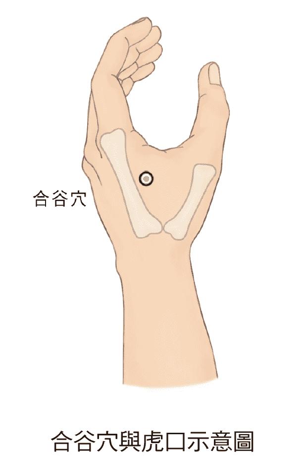

此外，合谷穴也是临床治疗许多疑难杂症时的常用穴，临证可依病情配搭其他穴位治疗。

大学时期参加针灸社，很幸运邀请到锺永祥老师前来指导。锺老师的客家口音颇重，刚开始听课很费力，幸好后来逐渐适应，可以慢慢听懂。至今还记得老师当年介绍几个重要穴位要我们牢记时，还戏称它们为「吃饭穴」。「吃饭穴」顾名思义就是临床好用又有效，可以用来餬口的穴位，合谷穴就是其中之一。当时自己的中医知识还很浅薄，无法了解合谷穴的能耐。直到后来当了医生，正式临床之后，才体会老师当年苦口婆心介绍这些吃饭穴背后所蕴含深厚的中医学理。

腕关节：

大肠经从虎口「上入两筋之中」，就是腕关节的阳面，靠近拇指后面的部位，竖起拇指时会出现凹窝的位置，里面有一个穴位「阳溪穴」，擅长治疗心律不整。

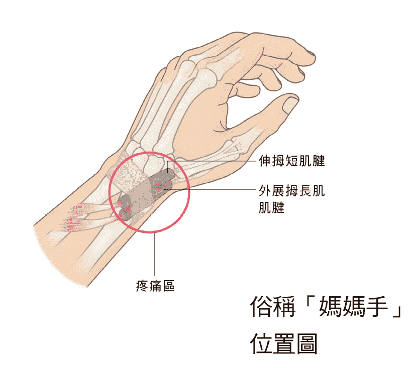

这里是日常生活常会用到的部位，例如转瓶盖、数钞票时。但若拇指使用过度，手腕就会肿胀疼痛，出现俗称「妈妈手」的狭窄性肌腱滑膜炎，造成手腕难以活动，影响生活与工作。

另外还有一种情况我称之为「鼠标腕」，即长期使用鼠标的人，此处容易出现痠软无力感，若持续未能缓解，还会令人情绪烦躁。主要是因为长时间使用鼠标，过度撑开拇指与食指之间关节的筋膜，导致关节松弛，而出现痠软无力的情况，常常会忍不住用力甩腕关节。这种不适感还会沿着大肠经牵连到阳溪穴，进而影响心脏而出现烦躁、胸闷的现象。

大肠经这条从虎口到腕关节的短短路线，却包含了人类求生、社交和维持生活质量的特质，当然就成为大肠经的菁英部位。

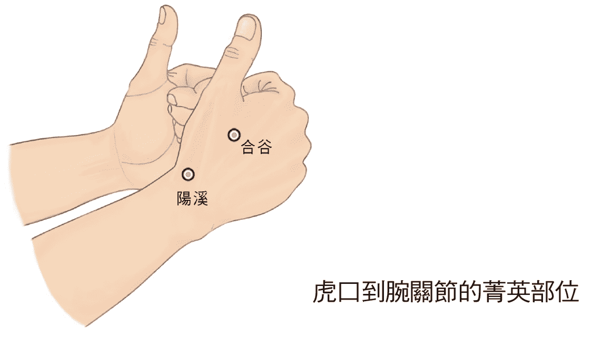

 解密：大肠经的健美部位──腕关节到肘关节

###### 大肠经的健美部位──腕关节到肘关节

大肠经通过腕关节，循着手臂阳面前线到肘关节外侧，通称为「前臂」，这也是手臂活动最频繁的部位。

这条路线上，有二个重要穴位：手三里穴与曲池穴。

「手三里穴」

手三里穴在肘关节下方约五公分处，位于前臂肌肉最丰厚的位置，详细取穴法将在本书保健篇中介绍。

阳明大哥胃经在小腿部位也有一个跟手三里穴类似名称的穴位「足三里」，穴名中的手与足，只是标示出所在部位和所属经络，但在功能上却是一致的。两穴因为属于大胃王好兄弟，都位于肌肉丰厚的部位，因此可以从穴位所在部位的肌肉型态来判断肠胃功能。

以手三里穴来说，如果肠胃吸收好，穴位附近的肌肉浑圆而有弹性，表示身体健康。反之，如果肠胃吸收不良，手三里附近的肌肉就软陷无力，表示身体欠佳。

手三里也是人体对侧膏肓痛的反应区，这部分的细节在大肠经经筋篇再介绍。

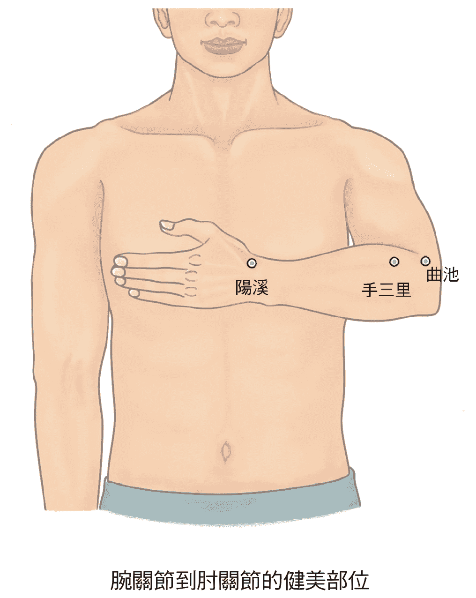

「曲池穴」

本穴就位于肘关节阳面前线上。大肠与肺相表里，曲池穴擅长清除大肠与肺的热邪，不仅能帮助解便，将体内热毒排出，也能改善各类皮肤病，如湿疹、面部青春痘等，这都是藉由大肠经与肺经相表里的关系产生的连结。若是懂得活用经络的原理，善用曲池穴，它可是能帮我们变得标致动人的秘方。

另外曲池穴附近也经常会出现痠痛，例如俗称的「网球肘」肱骨外上髁炎，这部分的细节将在经筋篇介绍。

手三里穴的健壮加上曲池穴的美丽，让大肠经腕关节到肘关节这段路线成为重要的健美部位。长期便秘、体内燥热的人，从手三里到曲池之间的皮肤会比较粗糙，甚至出现丘疹或斑点，这不只是造成手臂难看，更反映出了体内真实的问题，所以若发现自己有这样的症状，可就违反了健美的原则，要赶紧治疗喔！

 解密：人体及大肠经最有担当的部位──从肩关节到上背部

###### 人体及大肠经最有担当的部位──从肩关节到上背部

大肠经向上走到肩部，经过肩关节，转向上背部，抵达颈椎与胸椎交接的大椎穴，并与所有的阳经会合。大椎穴属于督脉的穴位，古人认为人体手足六条阳经都会聚在这里，所以称大椎穴为「诸阳之会」。

虽然有些中医书注解「柱骨」为前胸的锁骨，但我认为，大椎穴既然是诸阳经之会，必然有其道理，也有身体机能上的必要性，让六阳经的精气都能贯注于这个属于「阳脉之海」的督脉的重要穴位。

六阳经阳气旺盛，但是阳气过旺也会产生邪热，大椎穴因此成为退热要穴，例如长期身热的皮肤痒、头痛，和感冒发烧、中暑身热等，都可以在大椎穴拔罐或刮痧来加强退烧。

依据此理，即使是走在人体正面的手足阳明经，也会在肩膀部位特别绕过来与其他四条阳经（手足太阳经与少阳经）相会合。在古医书所记载的经脉交会穴中，大肠经及胃经也都交会于大椎穴。

另外，大肠经还在肩胛部位交会小肠经的秉风穴（位在肩胛部的冈上窝中央），可见大肠经在肩部循行不是一条线，而是一个方块区域，增加涵盖面积，使其更具「承担力」。

大肠经脉在肩背这段跨越肩膀的路线，完全被大肠经筋所涵盖，厚实的肌肉成为人们用来挑担及背负重物的部位，因此成为大肠经最有担当的部位，当然也是最容易痠痛的部位。

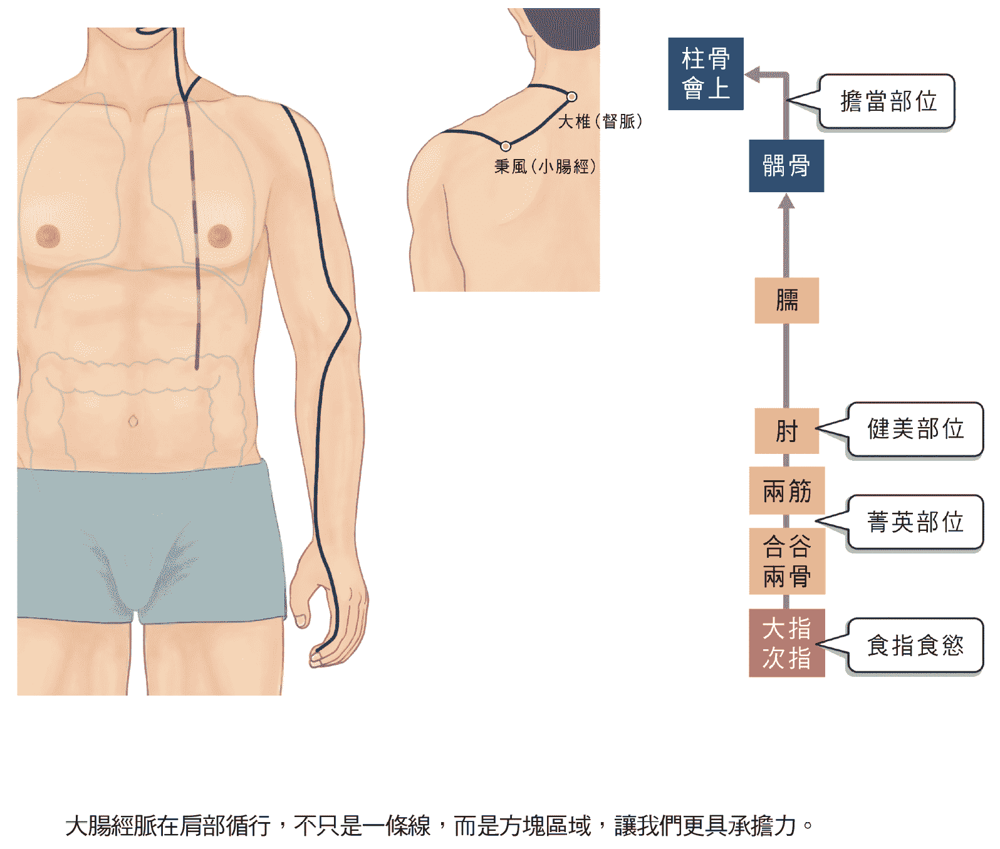

大肠经的肩膀与肺功能也相关喔！

在正常状态下，当我们抬起肩膀时，胸廓也随之伸展，有利于肺的呼吸。

抬高手臂有帮助呼吸的效果喔。有些人睡觉时习惯抬起双手做「投降」状，感觉这样比较好睡，其实这是一个警讯，表示有潜在的胸闷情况，躺下睡觉时胸闷更为明显，才会不自主地抬高手臂来拉开胸廓协助呼吸。

在病理状态下，呼吸喘促的病人，也会用力抬高肩膀来帮助呼吸，中医就以「张口抬肩」来形容喘促发作的身体状态。

 中医师不传之祕：向前看齐专线与大肠经的其他脏腑经络关系相合

###### 向前看齐专线与大肠经的其他脏腑经络关系相合

在大肠经总论中介绍过本经与其他经络脏腑的关系图，下图的橘色方块都是大肠经「向前看齐专线」上的穴位，它们的功效主治与这些脏腑经络的特色有关（细节将在保健篇介绍）。

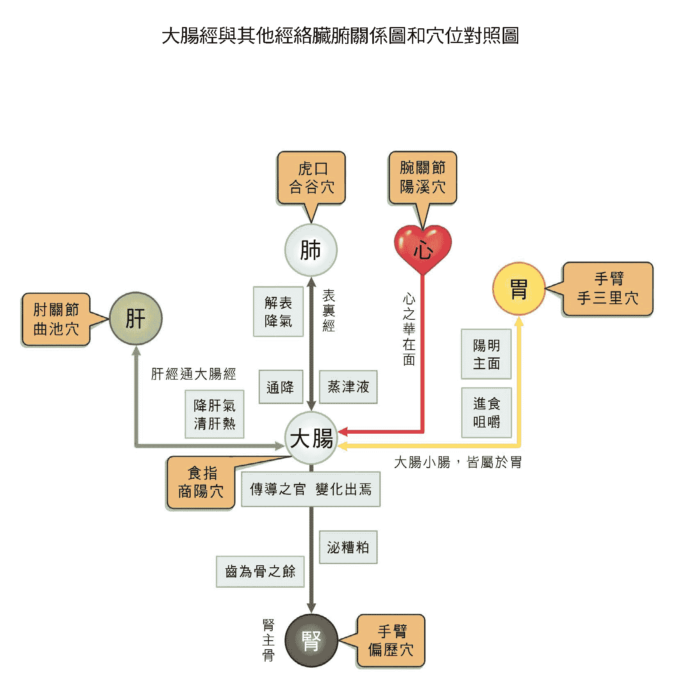

可见「向前看齐专线」是大肠经对外关系的重要路线，如果出现大肠经合并其他经络或脏腑的疾病，就可选用本专线上的穴位来治疗。

### 2.胸腹部的「大肺呼吸专线」

大肠经经脉在胸腹部路线依据循行所过的脏腑称为「大肺呼吸专线」（路线 5）。本经脉从缺盆进入体腔，连接胸部的肺及腹部的大肠，形成大肠与肺的表里经系统。

在卷一的［经络启航］中曾介绍过，五脏六腑的表里经关系多数是近水楼台先得月的邻近关系，唯有心、肺与大、小肠这份远距关系透过经络连结。幸好中医发现了人体这么神奇的经络连结网络，才得以建立脏象学说中脏腑之间的密切关系，以及脏腑与人体官窍等关系。

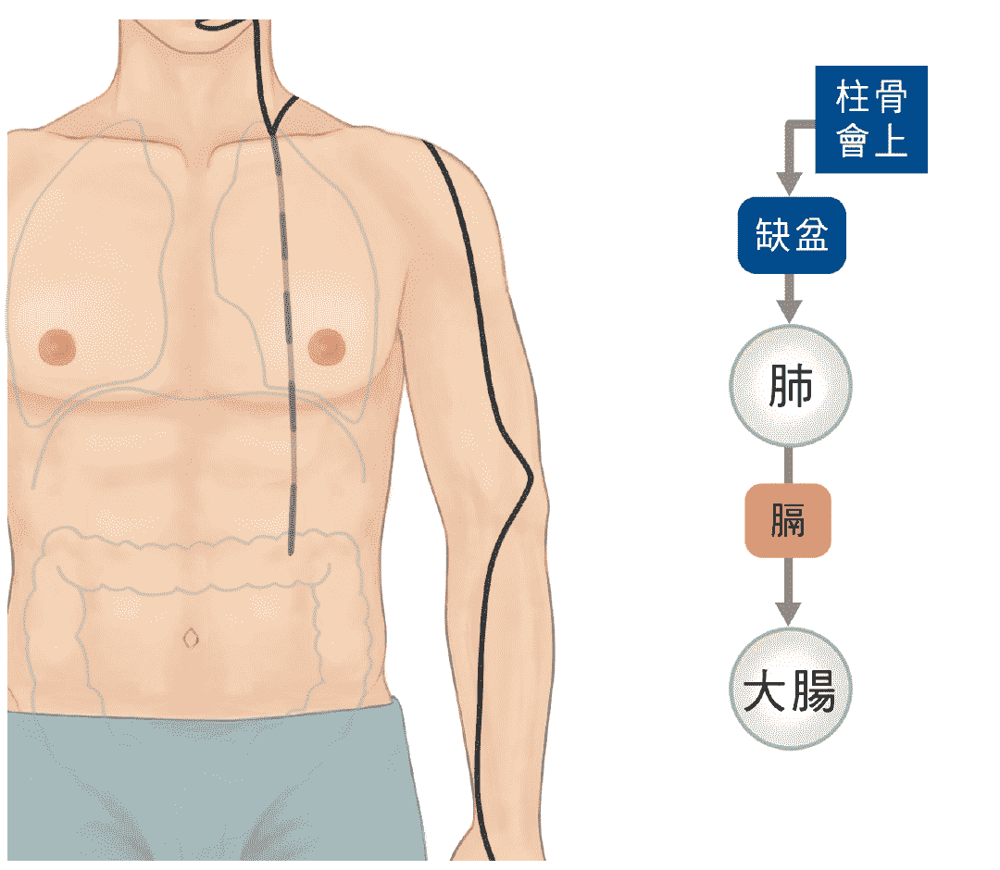

在大肠经总论中，曾介绍大肠为肺执行许多「抛头露面」的业务，例如在人体体表上，肺主表、主皮毛、开窍于鼻等，这些特质很容易会出现感冒、皮肤及鼻部的疾病，大肠都能为肺挺身而出改善。而在身体内部，肺主宣发肃降，大肠属腑，气机以下降为顺，有助于肺气的调节功能。

其实大肠经真的为它心爱的肺经默默承担许多事情，例如肠胃型的感冒，感冒会连累肠胃而出现腹痛腹泻；感冒期间，发烧不退；气喘发作，痰多胸闷，肺气不降，连累大便也跟着闭结等，这些病症都可从大肠着手协助改善。

整体而言，只出嘴巴的肺，大肠就是它延伸而出的手，执行许多业务。肺主一身之气，呼吸是生命大事，因此大肠与肺的关系就以「呼吸」来概括，本段路线就称为「大肺呼吸专线」。

### 3.头面部的「鼻齿交叉线」

大肠经脉在缺盆分出一条走向头面部的支脉。

这条路线从缺盆向上经过颈部，贯穿面颊，进入下牙齿。再从牙齿走出来，向外夹行在嘴唇边，再向上走到鼻子下端的人中部位，左右交叉，最后抵达对侧鼻孔边的迎香穴与胃经交接。

本条路线最特别的是左右两侧的大肠经脉在人中处交叉，左脉到右面颊，右脉到左面颊，再止于鼻孔。因此称本路线为「鼻齿交叉线」（路线 6-7）。由于阳明主面，同属于阳明经的大肠经和胃经都特别循行于面部五官，阳明经的多气多血可以提供最耗费能量的五官来发挥视觉、听觉、味觉和嗅觉等重要感觉。

大肠经循行至鼻部的意义，一则与协助肺开窍于鼻、肺司呼吸有关；二则鼻孔旁的「迎香穴」穴名即透露出与嗅觉有关；再加上大肠经还循行于口齿，与胃经共同合作完成觅食和进食大业。「鼻齿交叉线」就成为大肠经与肺、胃两经的工作站，共同完成呼吸与进食任务。

若我们将双侧「鼻齿交叉线」一起画出来，就可看出它们围绕口齿（其实人中部位的里层就是上牙齿）和鼻子，紧密包围位于面部中央的五官，善尽「阳明主面」的责任，并且在人中处交会督脉，在挟口处交会胃经的地仓穴，加强面部中央的连结关系，这也成为中医重要治则「面口合谷收」的经络基础。

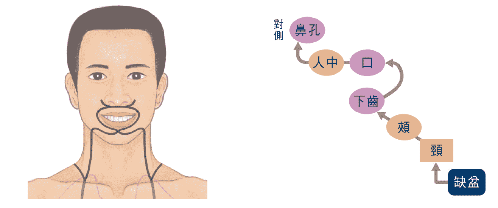

 中医师不传之祕：观察鼻孔和鼻翼可掌握呼吸状况

###### 观察鼻孔和鼻翼可掌握呼吸状况

病人躺在床上，我稍微歪了一下头，看着病人的脸，问他：「右边鼻孔比较塞喔？」病人很惊讶，连忙点头称是。跟诊的年轻医师也露出崇拜的眼神，希望老师传授神功。

「你们看看他的两侧鼻孔长得有一样吗？」

病人张大眼睛，吸一口气，满脸不可思议的表情，跟诊医师则是连忙学老师歪头看病人的鼻孔，一头雾水。

我忍不住笑说，「你们看！我们东方人鼻梁比较低，鼻头比较圆，所以正常的鼻孔应该偏向圆形。如果变成椭圆形，就表示同一侧的鼻子塞住了，才会导致鼻孔变形。而且鼻孔越椭圆，塞得越厉害。」跟诊医师恍然大悟，点点头，忙着写笔记。

看到年轻医师认真的学习态度，我当下决定再传授一招。

「你们也可以轻轻捏一下病人两侧的鼻翼，看看哪一边的鼻翼比较厚，比较硬？」年轻医师连忙伸出手去触摸病人的鼻翼，也顺手捏捏身边同学的鼻子。

「是不是右侧鼻翼比较硬？」

年轻医师点点头，病人也趁机伸手自摸鼻翼，不落人后的跟着点头。

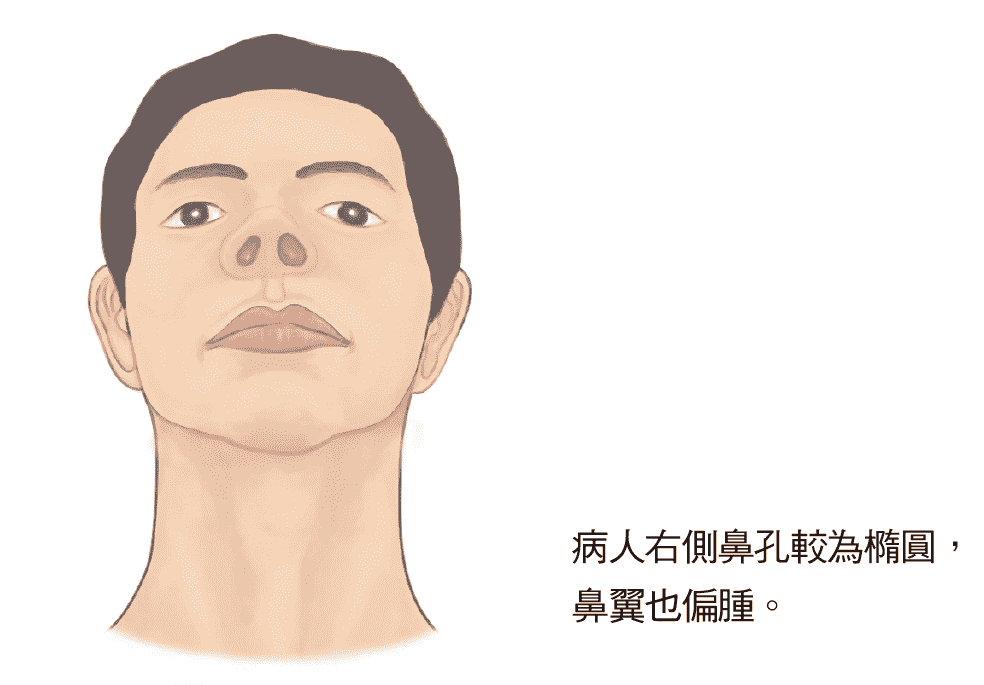

「当鼻子塞住时，人们通常会不自主的用力吸气，希望能改善。这个用力吸气的动作，就会扩张鼻翼。鼻塞那一侧吸气动作会用得多一些，所以鼻翼就比没塞的那一侧增厚变硬。当鼻塞状况改善之后，椭圆形的鼻孔和肿硬的鼻翼都会逐渐回复到正常的型态。我们就可以依此来判断鼻子的状况。」

其实鼻子还会泄漏其他病情。例如：

鼻头色白，触摸温度偏冷，表示体内偏寒，治疗时可多用温药或多喝姜汤；若鼻头色暗，触摸温度偏热，表示体内偏热，治疗时可多用凉药或喝些薄荷茶。

读者也可将手放在鼻孔前方感受鼻孔呼出来的气，若呼气热热的，表示体内有热；若呼气凉凉的，表示体内偏寒。都可以依据前面的方法来改善。

上述这两个方法很适合新手爸妈，尤其是婴幼儿感冒期间，可做初步诊断之用。

另外，如果鼻翼偏软偏薄，捏下去无力者，表示卫气不足，也就是免疫力较差，天气变化时很容易发作鼻病。许多偏向虚性体质的长期鼻过敏患者会出现这样的情况，手脚比较冰冷，肠胃功能差，体力也差。这类体质平日应该要从加强肠胃功能着手，多吃温性食物，少吃冰品油炸物，夏天及冬天也适合做三伏贴来改善体质。

 中医师不传之祕：大肠经在人中部位左右交叉的思考

###### 大肠经在人中部位左右交叉的思考

人体面部五官是对称分布且需要同时合作的组织，例如具有双眼才有立体视觉，双耳才能辨明方位。而位于中央且看似单个的器官，例如鼻子及口齿，其实它们的功能也是双侧进行，例如两侧鼻孔同时呼吸，两侧口齿同时咀嚼食物等。

俗语「同一个鼻孔出气」，带有负面的意思，若真只用一个鼻孔呼吸确实对于身体也不好，最好是两侧鼻孔都能同时出气及吸气。

位于面部中线的鼻、口、齿都只有单一个，但它们可是主掌呼吸、进食有关的维持生命之大事，精明的身体一定会要求多气多血的阳明经，务必提供足够的养分，才能让鼻、口、齿善尽职能。所以在分工上，老大哥胃经就以大面积来涵盖保护面部五官，小老弟大肠经则负责照顾位于中央的鼻口齿，彼此采取交叉方式，通过人中，稳固组织，并确保气血供应，就像要衔接两片布料，都会加强衔接面的缝线一样，对于保护面部肌群的稳定性很有关系，类似的概念也会出现在脾经经脉之中。

另外，还有一种思考。五脏六腑之中，大肠是唯一横跨人体左右两侧的器官，大肠经脉在面部的交叉，是否也是大肠横跨左右的投射？这部分的探讨将在大肠经经筋中再论述。

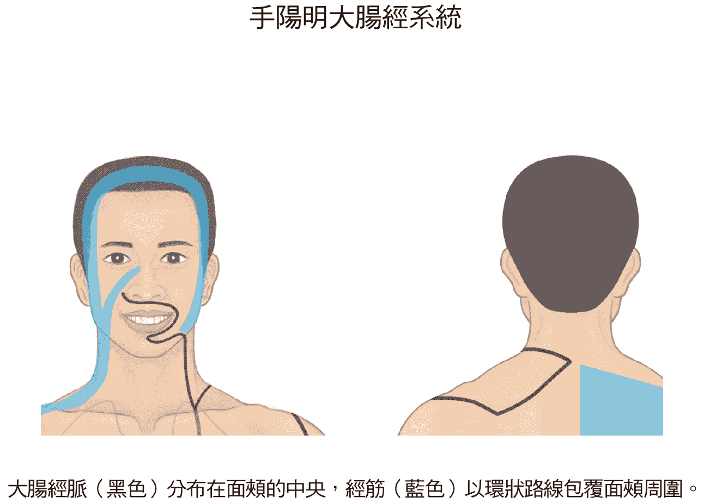

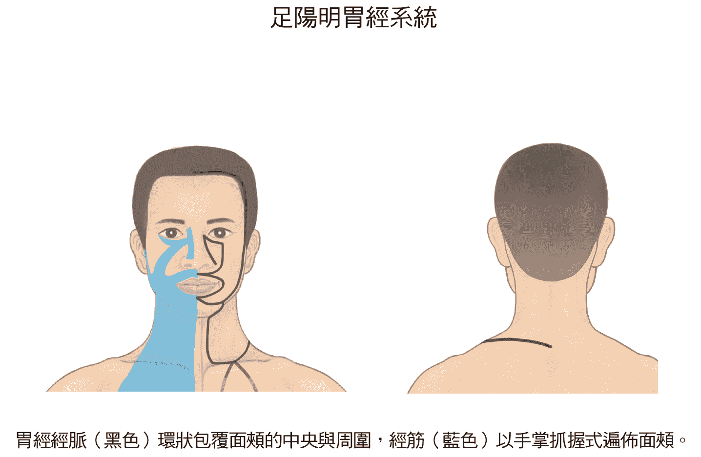

##### 大肠经与胃经在面部循行的比较

• 合作关系：

（1）大肠经与胃经在头面部循行相辅相成。经脉方面，大肠经主内，分布在面颊的中央，胃经主内与外，环状包覆于面颊的中央与周围；经筋方面，大肠经反过来以环状路线包覆于面颊周围，胃经则以手掌抓握方式遍布于面颊。

（2）大肠经筋「上左角，络头，下右颔」，这条路线其实保护胃经经脉「循颊车，上耳前，过客主人，循发际，至额颅。」

• 共同点：

（1）两经都环绕口唇，并在唇上、鼻下交会督脉的人中穴。

（2）两经都连到上背部，交会督脉的大椎穴。

人中与大椎都属于督脉，位于人体正中线。详细内容将于胃经再介绍。

• 差异点：

（1）大肠经是从下而上，从手到头；胃经是从上而下，从头到脚。

对于这个走向，我有一些想法。

当人类以两足站立时，经脉气血「从上而下」，顺着地心引力流动是最省力的方式，一如胃经的走向。但大肠经「从下而上」不就显得辛苦？

其实不用为大肠经担心！因为人类不必像猫狗这些四足动物还要用上肢走路，人类的双手已经空出来，可以做大幅度的活动，所以也能创造出有利于气血流动的姿势，例如只要适时地将手臂抬高，大肠经脉的气血也能采用「从上而下」顺着地心引力的方式流到肩膀，只要再稍微加把劲，将气血推到面部，就能快速且顺畅的交给胃经了。

这个概念，也可推广到手部的另二条阳经，以及足部的另二条阳经，因为手足同名经都是在面部交接，循行方向也跟大胃王组合一样。

了解这个概念后，就更能体会传统健身法「八段锦」的开始式「双手托天理三焦」的道理。当我们将手臂抬高时，手足阳经的气血就能快速交流，也就能通畅人体的上中下三焦了。现代人多数都是垂下手臂工作生活，气血很容易淤滞在手脚的末梢，建议常常高抬贵手来行气活血，通畅您的三焦吧！

（2）大肠经因为在人中左右交叉，会止于对侧鼻孔。胃经没有交叉，经过同侧的鼻孔。所以同一侧的鼻孔会有来自对侧的大肠经与同侧的胃经通过。

这样的分布也是人体精算过的结果，我们来体验看看。

请您高抬左手，想象气血从大肠经的食指沿着手臂流动到面部，在人中交叉到右侧的鼻孔，再衔接右侧胃经，然后向下流动到右脚部。经脉气血这样的上下左右分布特性，可以视为人体为了分散风险所做的规划，避免一侧肢体的损伤而影响全部的气血，另外也可以看作是脑部神经交叉分配的体现。身体如此高明的气血分布方式，为中医的治疗原则，如「上病下治」头痛可以取足部穴位治疗，及「左病右治」左侧肩膀痛可以取右肩膀穴位治疗等，提供了结构基础。

### 手阳明大肠经─病候

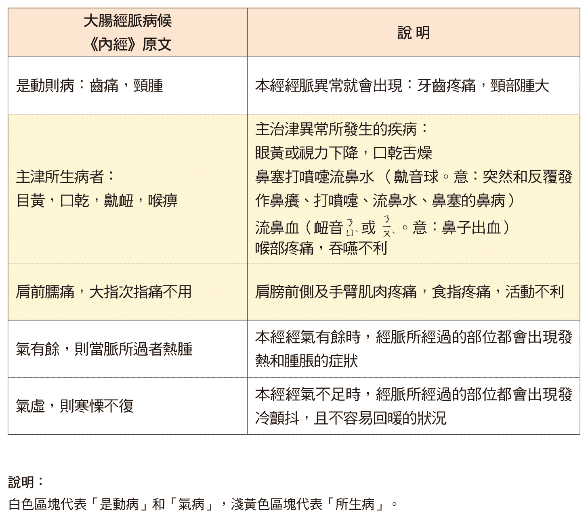

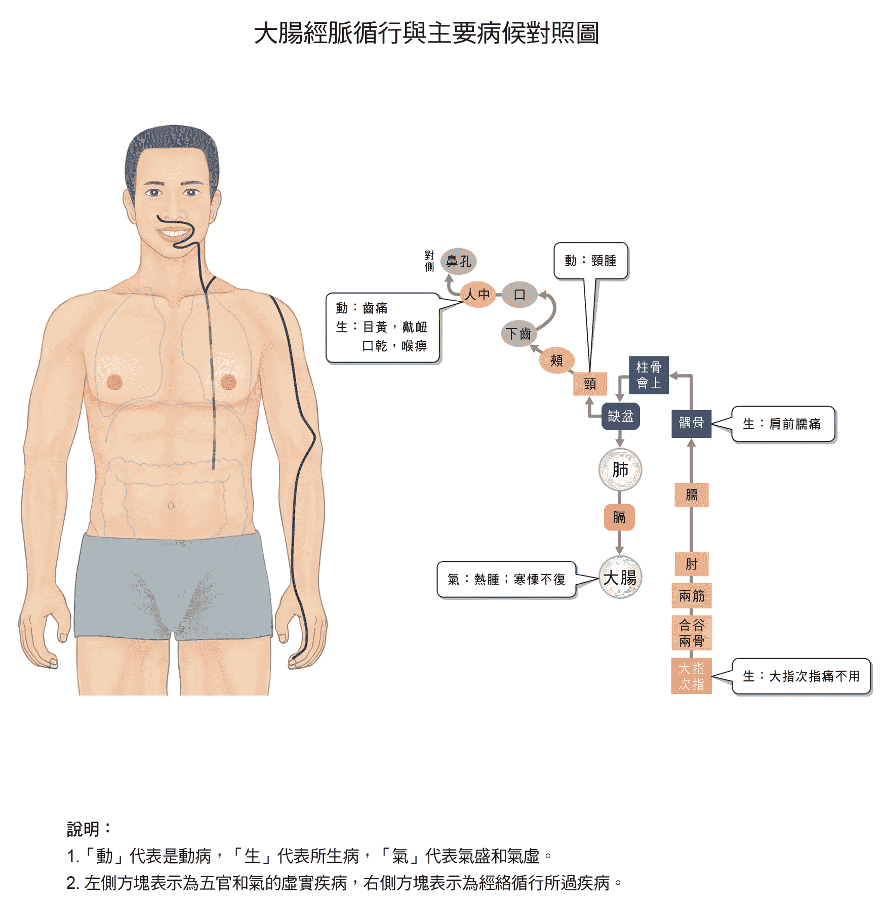

#### 大肠经脉病候特色

各位有没有发现，大肠经病候多数是五官疾病，反而没有内脏疾病，更无与大肠相关的病症，例如便秘或腹泻，可是大肠经明明有连结肺与大肠，为什么没有这些病症呢？

在《内经》所归纳的脏腑经络关系中，大肠、小肠隶属胃管理，所以部分症状会出现在胃经病候中。另外，大、小肠经部分病候也与津液代谢失常有关，既然是失常，那就要往前探究原因。在五行的相克关系中，脾脏的五行属土，肾五行属水，理论上土当能制水。当津液代谢失常时，许多时候源自于脾土不能制水，或肾脏不能主管自己的水液，所以这类病候就会出现在脾经与肾经的病候中。

写到这里，也分享一下自己读中医古籍的心得。

早期刚读中医典籍时，常会有撞墙的感觉，老是觉得书中有些该说的内容没有说，已经说的内容又看不懂。随着经验的累积，慢慢学会善解早期的老医家们要刻下文字是件多么不容易的事情，因此只能择要记录，其余就藏在字里行间，等待有缘人来发掘理解。也逐渐地体会到，古医书没有记载的内容，并不表示不存在或不能用。

例如中医有「经之所过，必治其病」治则，意思是只要经脉所经过部位的疾病，都可以选择该经脉来治疗。这个说法很合理，临床上也确实得到印证。例如大肠经通过大肠与肺，就能治疗大肠及肺的疾病，这个论点其实在前文已经介绍过了，因此大肠疾病，无论是便秘或腹泻，甚至是现代人最担忧的大肠癌，即使古书并未记载在大肠经的病候中，都可选用大肠经的穴位来治疗，效果极好。

#### 大肠经经脉病候分类

每条经脉都会出现循行所过部位气血运行失常「不通则痛」的症状，本经也不例外，例如肩膀及食指疼痛等。除此之外，本经还有三类有特色的病候。

#### 1.主津之所生病

大肠经主「津」之所生病，小肠经主「液」之所生病，大小肠经合起来刚好主「津液」所生病，就是津液代谢异常的疾病。

津跟液分别交给两条经脉管理，两者有什么不同呢？

我们来看《内经》的解释：

「腠理发泄，汗出溱溱，是谓津；谷入气满，淖泽注于骨，骨属屈伸，泄泽补益脑髓，皮肤润泽，是谓液。」

津跟液，简单说就是体内的水分，都来自食物中的营养。

分开来说，津的质地比较清稀，主要分布于体表的组织，例如汗液，可用来润养皮毛。液的质地比较稠厚，主要分布于体内的脏腑器官，例如在骨内的骨髓可以滑利关节，在脑内的脑髓可以充养脑部，在肌肤的厚液可以润泽肌肤而有好脸色等。

虽然在《内经》津与液有所分别，但在一般时候都是津液合用来叙述。

再进一步说，胃经主血之所生病，胃又主管大小肠，正好可以一并统领全身的血及津液的疾病，由此可见阳明大哥胃经的高能耐与重要性。

现在回归到大肠经所主的津病。肺主表，大肠经也偏主于表病，加上属于阳明经，阳气较旺，容易损伤津液，所以病候中就容易出现热盛、津液不足的症状，如口干、齿痛、喉痹、经脉所过部位热肿等。

#### 2.头面部症状

「阳明主面」是大肠经的特色，也宛如紧箍咒般约束了大肠经，凡在大肠经所经过的面部区域出现的症状，都由大肠经负责，例如目黄、鼽衄、齿痛等，而且目黄与鼽衄很容易误解和不解，再详细说明于下：

【目黄】

十二条经络的病候中，有五条经脉都提到「目黄」，显然是一个常见疾病。而「目黄」顾名思义就是「眼睛发黄」，很容易联想到黄疸病的眼珠黄，但这只是其中之一而已。「目黄」其实可以分为两类：

他觉性的目黄：自己的视力没有改变，只是别人看到你的眼珠发黄，这就是前面说的黄疸病症候之一。

自觉性的目黄：从外观上看不出眼珠发黄，但是自觉视力变差，尤其有种昏暗感，明明还是白天或者灯光通明，但总觉得眼前亮度不够而看不清楚，好像到了傍晚时分。台语称傍晚时刻是「黄昏」，台语是中原古音，很传神的表达傍晚的光线变化。所以这种「黄昏感」就是视力下降的现象。多数属于眼睛病变，尤其是眼底病变。

那么，大肠经病候的「目黄」属于哪一种呢？临床上两种都会见到。其实五条经脉病候的「目黄」都是两种兼具。

然而，大肠经并没有到眼睛，为何会出现「目黄」？

原因之一，大肠经没有直接到眼睛，但在鼻孔交接胃经，胃经上行至眼睛，大肠经也间接连到眼睛。

原因之二，与大肠经「主津之所生病」有关。大肠功能之一是传化糟粕。食物经过胃与小肠的消化吸收之后，剩下的食物残渣，经过大肠的气化作用，将有用的水分及营养再吸收回到体内，无用的部分就变成粪便排出体外。所以大肠在传导糟粕的过程中，会再吸收水分与养分，这个功能就是「变化出焉」。

如果大肠功能发生病变，就会影响水分的再吸收：水分回收过多，大便干燥就易便秘；水分回收过少，大便湿黏就易腹泻。大肠功能失常会影响全身的气机与津液代谢。

古人说「目为火户」，意思是眼睛的视物能力，就像烛火照得见东西一样，所以眼睛是火的门户，有火才能照亮世界万物。眼睛既然属火，就需要水分来平衡。眼中的干湿得宜，视力就会正常。如果水分不够，眼睛容易干涩；如果水分过多，眼睛容易湿糊。眼睛无论干涩或湿糊，都会影响视力，而出现自觉性目黄。

另外，《内经》说：「诸脉者皆属于目」，「人卧血归于肝，肝受血而能视。」眼睛需要优质的气血才能发挥作用。胃负责进食，从食物中吸收营养，生成人体所需的气血，因此胃经主血之所生病。如果胃生病，导致气血吸收不足，或者长期熬夜，导致肝血不足，都会造成眼睛失于濡养，视力下降而出现自觉性目黄。

总而言之，大肠与胃为亲兄弟，大肠与肝为拜把兄弟，大肠与胃肝都能影响眼睛的营养供应而导致视力下降，千万要小心。

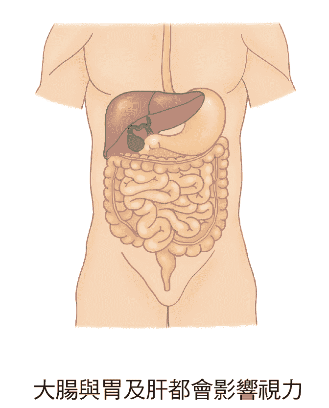

【鼽衄】

鼽与衄两个现代人不常见的字，都是鼻病。

「鼽」：是突然和反覆发作的鼻子痒、打喷嚏、流鼻水、鼻塞等症状，类似现代的过敏性鼻炎。

「衄」：是流鼻血。

鼽与衄是鼻部疾病的总称，鼽与衄只出现在大肠经、胃经、膀胱经这三条有连结到鼻部的经脉病候中。

大肠经本身多气多血偏阳热，又主津，若热盛加上津不足，很容易造成鼻内火气大、长疮、鼻干，甚至流鼻血等症状。另一方面大肠经为肺抵达鼻部，肺主表，开窍于鼻，因此大肠经也需要帮助肺改善外受风寒引起的表证及鼻病，例如鼻塞、流鼻水等。所以各类鼻病都可以透过大肠经来改善。

临床上还观察到许多长期鼻病的病人，肩颈都非常僵硬痠痛，这也是由于大肠经还循行至肩颈部位所导致的。这类痠痛应该要从改善鼻病着手，才能治本。

【齿痛】

总论中介绍过，早期版本的大肠经又称为「齿脉」，牙齿的疾病才是大肠经的本病，前面的眼病和鼻病都是大肠经代人受过者。过去人们认为区区小牙，老了就会自然掉落，何足挂齿，对于维护牙齿健康不甚注重。

写到这里，想起一部与牙齿稍有关联的电影《楢山节考》，叙述日本古代信浓国寒村的山林内弃老传说。这些乡下人生活非常困苦，因此有一个不成文的规定，就是老人家到了七十岁就要由家人背到深山野岭等死，避免耗费家中的粮食。而剧中年纪六十九却身体硬朗的老婆婆，为了让儿孙多一口饭吃，忍痛拿起石头敲掉牙齿，让自己看起来苍老一些，可以赶快被送到深山里……真是一个让人伤感的故事啊。

近代医学研究发现，牙齿对于身体健康有重大影响，WHO 以「口腔健康为全身健康之本」为口号，我在总论中也曾介绍「牙齿健康、咬合好，远离腰痛、肥胖、失智，心脏病」的概念。

除此之外，牙齿刷不干净，口腔细菌也可能引发大肠癌，还有研究显示，结肠切除手术结束的病人，给予吃口香糖，可模拟食物摄入的假性进食，刺激大脑迷走神经反射，促进并刺激肠子蠕动，顺利排气，缩短排气等待时间、排便时间以及术后住院时间。所以照顾好牙齿已是重要的养生之道。

从中医的角度，我们发现牙齿对于身体其他部位也有很大的影响。

例如在门诊时遇过一位老年女性因为视力问题来就诊，几经治疗，视力一直没有好转，后来注意到她面颊两侧靠近下关穴附近有明显凹陷，因而转念一想，询问她是否有拔掉智齿？

病人马上高声说：「不仅是智齿，近年还拔掉许多牙齿。」

我再问：「您的眼睛视力问题是不是在拔了一些牙齿之后才出现？」

病人一愣，思索了一会儿才回答：「对耶！我从来没想过眼睛会跟牙齿有关系。不过确实是拔了牙齿之后，视力才开始越来越模糊。」

病人悔不当初，医师也很无奈，只能尽力治疗，希冀有所进展。

我还在临床治疗过许多颈肩僵硬的病人，有着各式各样的病因，除了前面介绍的鼻病之外，习惯咬牙的人也会循着大肠经而导致肩颈痠痛。

例如台湾最勤勉的客家人有着一股「硬颈精神」，代表不屈不挠、刻苦拚搏的形象。我非客家人，但过去一直很赞赏他们「硬颈」的奋斗精神，后来有客家友人忍不住告诉我「硬颈」还兼有负面意思，就是不听劝、固执，总是撑到最后才肯罢手。

这一听，突然也让我想起台语中的「铁齿」。小时候住在南部，台语是最普遍的语言，在长辈的言谈中，常听到他们说某个人很「铁齿」。在字汇不多的小小心灵里，总疑惑「铁齿」是怎样的牙齿？会不会很吓人？后来看到长辈所说的那位「铁齿」人来到家里，心怀恐惧，一直望着他的牙齿，却看不出特别之处。

长大后，常听妈妈碎念爸爸很「铁齿」，例如天气变冷了，就是不肯听人劝，添加一件衣服，自觉身体很强壮，绝对不会感冒等。慢慢逐渐了解，原来台语的「铁齿」，是指一个人一旦认定某件事之后，就会非常执着于那个信念难以改变，即使某一天心里已经知道观念有误，嘴巴上仍然不承认。

所以早年创造「铁齿」来形容相信某个概念之后，咬紧这个想法，不会轻易松口改变的人，真的很厉害！但是由于铁齿过度固守信念，不能配合时宜调整，有时还兼有「不信邪」的意味，也就让「铁齿」一词蒙上负面的阴影。

当医师之后，常常面对婆婆妈妈们拜托我们去说服家中那位「铁齿」大老爷！

不知是否巧合，多数被说「铁齿」的人，竟然都是男性。难道男人的牙齿比较坚硬吗？

应该不是吧！据我观察，铁齿的人只是坚信某些概念，不轻易更改而已。一旦遭遇重大变故，势必也会跟着调整。

例如家中客厅的灯管一直摇晃，老婆很担心会掉下来砸伤人，拜托老公将之锁紧或更换。但老公坚持当年这个灯座是自己亲手安装的，超级坚固，绝对不可能掉下来。直到某天发生地震，灯管真的掉了下来，而且不偏不倚就砸在老公的头部。霎时间，空气凝结，夫妻俩眼神交会对望。老婆将洒落一地的灯管扫干净，老公就默默的从工具间取出工具，爬上梯子将灯座锁紧，且再三确认无误后再下来。从此之后，只要老婆说灯管有点晃，老公二话不说，不管有没有松脱，都马上登梯上去锁紧。您看！铁齿的人还是有改变的契机。

且抛开世俗的评价，就字面和经络来看，「硬颈」人通常也会配合咬紧牙关，变成「铁齿」人才能坚持到底，度过难关。所以后来在诊间，遇到牙关紧绷，甚至腮帮子也肿起来，晚上频频磨牙，以及颈肩紧硬的病人，我都会多问一句是否为客家人？

不同的语言，竟然有同样的概念，蛮有趣的。

但站在医者的角度，还是要建议大家不要太固执，要听善知识的劝告，更要倾听身体的呼救，适时放松铁齿和硬颈，才能走更长远的人生路喔！

#### 3.气盛和气虚

病候中出现气有余与气虚的共有三条经脉：肺经、大肠经与胃经。

肺经的气病着重在肩背部位，还有肺主表及通调水道的情况。大肠经与胃经多气多血，气盛就会出现热象，气虚就会出现寒象，这是两经的共性。

以大肠经来说，如果经气有余，气血过多堆积，郁久会化热，经脉所通过的部位就会出现发热肿胀的现象。反之，如果经气不足，气血当然也不足，失于濡养，经脉所通过的部位就会出现寒冷颤抖，而且不容易回暖的现象。

肺主皮毛，与大肠经的大肠及鼻子连成同一个系统，成为「肺─鼻─皮肤─大肠」关系，因此只要能清肺热或大肠热，都可以清整个系统的热气，例如位于肘关节的「曲池穴」就非常善于清热消肿；反之，只要能温肺寒或大肠寒，都可以温整个系统的寒气，例如位在虎口的「合谷穴」就是一个热量宝库，可以改善肢体的畏寒颤抖现象。

#### 小结

大肠经连结大肠与头面部，透过经络系统，胃肠与「鼻齿交叉线」头面五官会互相影响，例如鼻塞的人，通常胃口差，皮肤粗糙，头容易昏沉；大便秘结的人，会加重鼻塞，导致口干口破、牙痛等，难怪俗语说「胃肠若败，身体就坏」，真是切中要害。

现代研究也发现，肠胃道是人体最大的免疫器官，许多会出现鼻子、眼睛、皮肤过敏，还有气喘、中耳炎等症状的人，肠胃道也很容易出现食物过敏的症状。

所以照顾好肠胃，就能拥有好脸色、好皮肤、好眼力和一口好牙喔。

## 二、手阳明之正（经别）

### 经别特色

经脉因为要运送气血，联系组织，所以路线较长。经别主要在加强表里脏腑的联系，循行路在线也只挑选重点联络，短而直接。

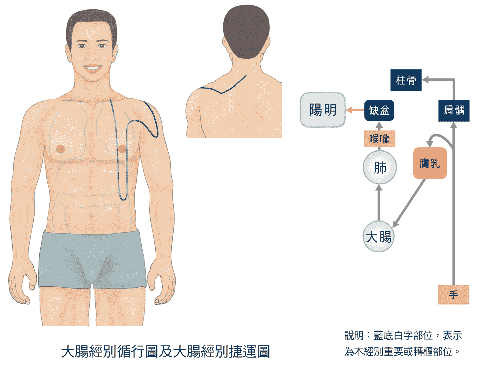

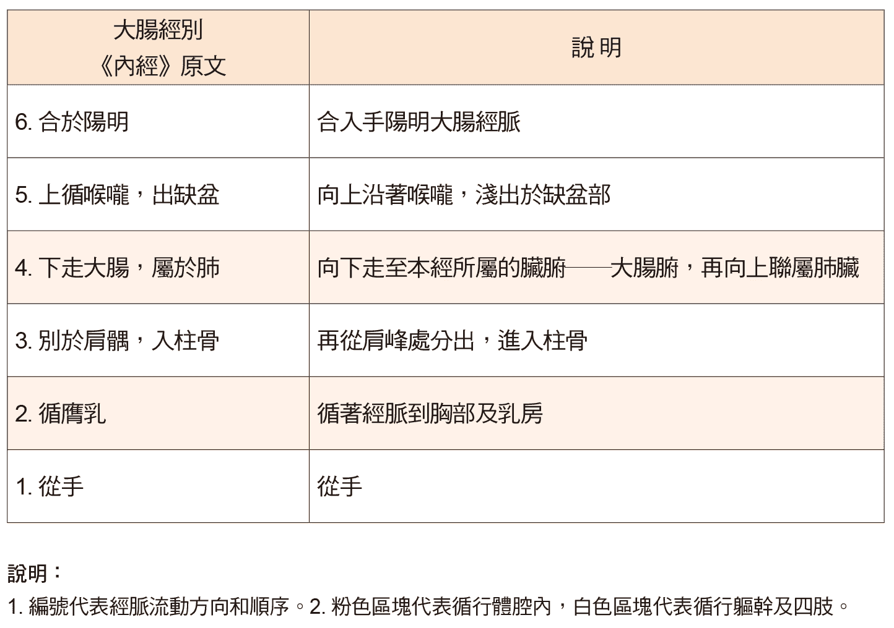

### 经别分为上肢部和胸腹部

大肠经别主要在加强经脉的上肢及胸腹部位的循行，也可视为经脉的浓缩版。

上肢部：从手经过肩峰到柱骨（路线 3）与经脉循行一致。可见从肩峰肩髃到柱骨大椎处是大肠经的重点循行部位。

胸腹部：有二条路线，一是从手循膺乳（路线 2），二是下走大肠，属于肺（路线 4 ），再向上循喉咙出缺盆（路线 5），与大肠经脉会合（路线 6）。

#### 胸腹部路线的思考

我对于大肠经别胸腹部的循行曾有些困惑，主要的思考在于：本经别从哪个部位下走大肠？

可能的循行有二：

1.依循《内经》内文：「入柱骨，下走大肠」，如捷运图所示，从柱骨到大肠（路线 3-4）。

2.参酌文字的语气：个人浅见「从手循膺乳」是条主干线，循行到膺乳之后，继续分出两条路线：

● 一条是从手到膺乳的路线上，经过肩髃，因此「别于肩，入柱骨」，即从肩髃别行，进入柱骨即止。

● 一条从膺乳「下走大肠」，即直接从膺乳下走大肠。

我个人比较认同循行 2，即从膺乳「下走大肠」路线。原因有二：

其一，缺盆也是大肠经系统的重要部位，光是本经经脉就通过缺盆两次。本经别从肺「上循喉咙，出缺盆」，如果从柱骨下走大肠，一定会再经过缺盆，这样本经别就通过缺盆两次，以经别注重效率的特性，有必要重复经过缺盆这个部位吗？

其二，乳部是大肠经别独有的部位，后文会说明乳部对于大肠经的特殊意义。透过在经别这条路线，大肠才有机会「亲近」乳部，扩大涵盖范围，加强功能，大肠经别又何乐而不为呢？所以本经别的循行图与捷运图就采用从膺乳下走大肠路线绘制。

### 胸腹部路线二大特色

#### 增加循行到膺乳部位

总论中提过，依据演化，牙齿及乳腺都是从皮肤演化而来，肺经与大肠经都主皮毛，理论上，牙齿及乳腺都与它们有所关联。

大肠经脉主要连结牙齿，大肠经经别特地连结乳部，并在缺盆处合于手阳明经脉，搭着经脉的顺风车抵达头面部。因此，本经别一方面能反映大肠与牙齿、乳房的演化关系，另一方面，胸膺为肺经所过，此部位的深层为肺脏所在，又有胃经纵向通过乳房与乳头，大肠经别通过胸膺和乳部，正好连结起肺、胃两位上司，加强彼此的关系。

大肠经、肺经、胃经在此的连结关系，也提示我们，若想兼顾顺畅的呼吸与丰满的胸部，多按揉大肠经准没错。

#### 改变大肠与肺的循行顺序

大肠经脉以「由上而下」的循行方向，从缺盆到肺再到大肠；大肠经别循行则以「由下而上」的方向，从膺乳下走大肠再上到肺，经喉咙到缺盆。为何经别与经脉循行于大肠与肺之间的顺序要相反呢？对此，我提出一些想法：

第一、大肠经别的走向，是为了取回大肠对于循行所过部位的主控权。先到大肠，就能加强其与手部的联系，并直接连结膺乳这个特殊部位。

第二、为了加强对于喉咙部位的管理。肺经经别「上出缺盆，循喉咙」，此处的喉咙是指颈部的咽喉部位，应该以呼吸功能为主；大肠经别「上循喉咙，出缺盆」，此处的喉咙是指胸部的咽喉部位，应该兼顾呼吸和进食功能。两条经别分工来管理不同部位的喉咙，更有效率，完全符合经别着重于连结重点部位的特质。

#### 小结

大肠经别的功能，除了在内脏加强大肠与肺的联系，其他路线只选择重点路径，如手臂的肩髃、胸部的膺乳、后背的柱骨，向上只到喉咙，不仅加强与肺经系统的连结，也缩短内脏与肢体的距离，加快传输速度，减少损伤的机率。

## 三、手阳明之别（络脉）

### 络脉特色

络脉是为了保护及加强相表里经脉在四肢部位的连结，特别在腕关节与肘关节之间延伸出一条比较安全的道路。

每条络脉的起始点都有个穴位称为「络穴」，还有一些相关的病症。

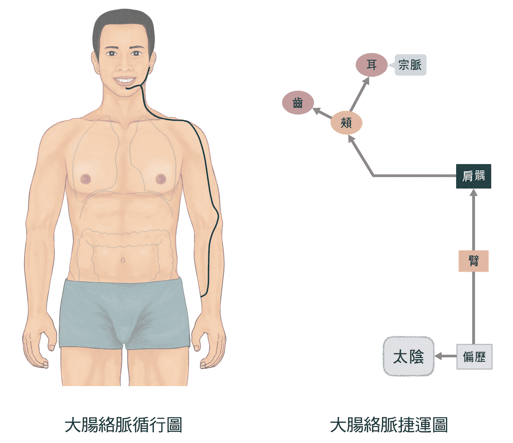

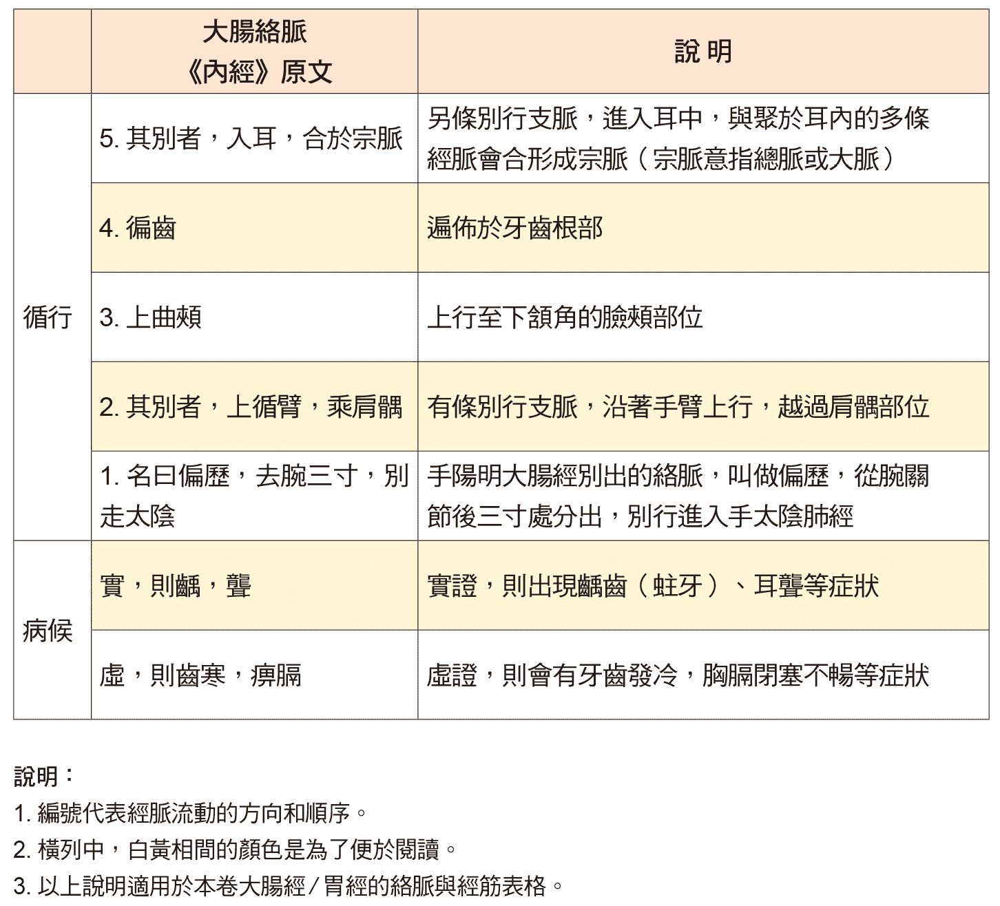

络脉主要的功能，在加强相表里经络在四肢的连结关系。大肠经络脉从前臂的络穴偏历穴分出来，联络与大肠经相表里的肺经。此外，还遍布牙齿并延伸到耳朵，为大肠经连结更多与人体五官的关系。

### 大肠络脉─循行特色

与经别一样，也是分为上肢部和头面部两部分。

上肢部：从手臂到肩髃到曲颊（手臂─肩膀─下巴）（路线 1-3），与经脉路线一致而更精简。

头面部：从曲颊分出二条支脉，一条向前遍布牙齿（路线 4），另一条向后进入耳朵（路线 5）。

 解密：大肠络脉循行入耳，记录演化历程

###### 大肠络脉循行入耳，记录演化历程

本络脉循行入耳，病候出现耳聋，所以「入耳」应该是经过外耳道进入中耳，因为中耳负责将外耳收集到的声音传送至内耳而产生听觉 。

人类属于哺乳动物，中耳有三块听小骨，分别是镫骨、砧骨与槌骨。根据演化专家研究，爬行动物的中耳仅有镫骨，哺乳动物的砧骨与槌骨是由爬行动物下颚的方骨与关节骨退入中耳，转型衍生而成。也就是说，人类中耳内的砧骨与槌骨是从爬行动物颔骨演变而来，下颚的骨头参与中耳结构的形成，彼此有着密切的连结。大肠络脉从曲颊到耳内的循行路线，就是这段演化历程的记录。

听觉是人类发育过程中很早就发展出来的感觉系统，胎儿约在 35 周时听力就已经充分发育，比视觉发展还早。也因此听觉是人类生活中非常重要的感觉系统，例如收集环境的声音，判断情势，决定适时采取行动以维护生命安全，建立人际关系的语言表达能力，倾听大自然声音与人们表达情愫的音乐等。

如此重要的感觉系统，当然就会有许多经脉前来协同保护，本络脉就在耳内与其相合，一起形成「宗脉」，亦即总脉或大脉，团结力量大，可以发挥更大的滋养及保护功能。「宗脉」的概念很像民间的宗亲会，四面八方的宗亲聚集一起形成宗亲会，既能提高亲族之间的向心力，又能彼此协助，增进宗亲福利及贡献社会等良能，这股团结力量所扩及的影响和利益，远远超过单打独斗者。耳内所形成的宗脉也是一样的概念。

大肠经脉系统通过咽喉、鼻部及耳内，与现代医学所说的鼻咽部和耳咽管有关。从中医的角度来看，大肠经与肺经相表里，在外感疾病过程中，外邪（类似现今的细菌或病毒）很容易循此管道进入耳内，导致耳朵疼痛以及听力变差，这种情况即一般的急性中耳炎。

遇到这样的病症，中医师就会采用能清肺与大肠经热毒的中药或针刺大肠经来清热解表。

大肠经除了可治外感病之外，由于阳明主面，面部是阳明经循行的重点部位，不只有胃经系统连结面部所有的官窍，掌理注重色、香、味俱全的饮食系统，还有，大肠经络脉辅佐进入耳内，补足胃经只经过耳前的小缺憾。手足阳明经在耳部的循行，让我们可以透过听觉，提高食欲及生命的警觉性，例如，听到妈妈的炒菜声，就知道等会儿就有好东西吃，食欲马上大开；夜晚加班回家路上，听到背后有凌乱的脚步声，马上会提高警觉，快步离开，避开危险。

大胃王的通力合作，让阳明经系统更为健全。

 中医师不传之祕：偏历穴名内含演化秘密

###### 偏历穴名内含演化秘密

一如前述，大肠经与牙齿和耳朵的关系都历经演化而来，因此大肠经络脉在面部别行入耳，合于宗脉。这条路径恰是从正面的牙齿「偏」行到侧面的耳朵，而且还进入耳内，跟耳内许多经脉互相「历」络成一个宗脉系统，本经络的穴名「偏历」即完全透露出这层特殊关系。

走笔至此，顺便跟大家介绍中医的穴位命名其实都有深意，临床上也可作为应用指引。

周左宇老师传承自杨天霖老师的「内外山陵、丘海池渠、沟谿泉井、手足治疗法则」，其实就是穴名的应用。老医家们归纳名称中有以上这些特别字眼的穴位，提点后学者可以灵活应用。周老师有许多应用穴名治病的有趣案例，例如治疗男性生殖器挺直不下，老师选用双外关、双曲池、双曲泉、双归来，施针后生殖器立刻可以弯曲，归回原位。周老师应用穴名的巧思尽在不言中。（相关内容可参阅《医道精要》p.70）

### 大肠络脉─病候

#### 五官病症

与循行所经的牙齿及耳朵部位一致，实证会出现龋齿及耳聋，虚证会出现牙齿发冷。此外，也因肾开窍于耳，肾又主骨，齿为骨之余，上述症状也与肾有关。

临床上，常遇病人叙述沿着大肠经路线到耳朵发生疼痛症状（包括牙痛等），对侧的偏历穴几乎都会出现肿突现象，中医师只要在偏历穴的肿处下针，很快就能见效，配上太渊穴效果更好。（偏历穴配太渊穴属于中医的原络穴配穴法，将在《经络解密》卷八介绍）

#### 胸腹病症

大肠络脉加强与肺经的连结，肺在胸部，大肠在腹部。

当大肠经出现虚证，由于无法协助肺的宣发肃降功能，人体的气机上下不通，痺阻在胸腹之间的横膈部位，而出现胸闷、腹胀的现象。

除此之外，由于偏历穴联络肺经，能协助肺脏通调水道，恢复正常水液代谢功能，后世医家就提出偏历穴可以利尿，治疗因为水液蓄积体内而出现肠鸣咕咕叫、腹部臌胀等症状。

综观本经络脉循行路线所赋予偏历穴的特质，其实与肾颇有相合之处，本络脉经过牙齿入耳内，正好与肾主骨，并开窍于耳相关；偏历穴做为大肠经与肺经相表里经络的联系点，协助肺通调水道，有利小便的功能，又与肾主水与小便有关。人体蕴藏这些巧合与奥妙真令人赞叹！

## 四、手阳明之筋（经筋）

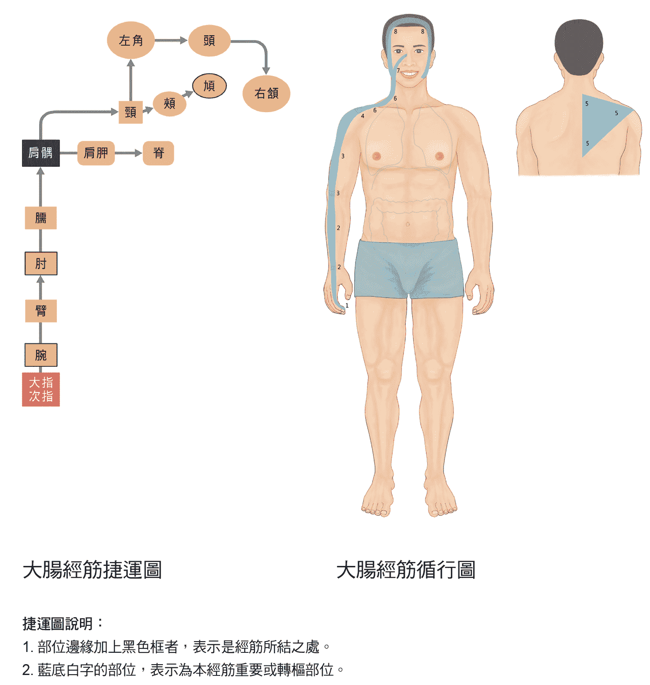

### 大肠经筋─循行特色

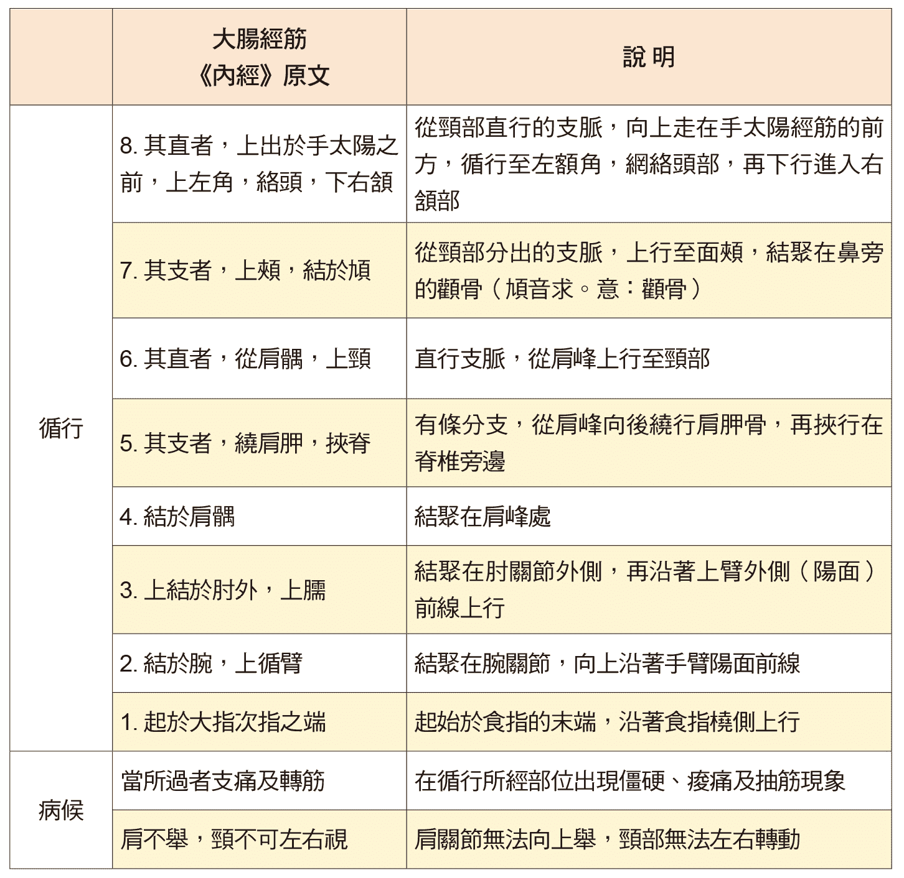

大肠经筋循行在上肢、肩背及头面部，这些部位多数与本经经脉重叠，以保护大肠经经脉、肺脏以及头面五官。尤其在上肢及肩背部位，是日常生活中活动最频繁的部位，无论是要牵拉、投掷、提放、扭转等，都是必用的结构，因此它的肌肉最为丰厚，也最容易损伤。至于大肠所在的腹部就交由强大无比的胃经经筋来保护。

以下就将大肠经筋分三部分来介绍：

#### 1.上肢部的「向前看齐专线」

大肠经筋的循行方向与经脉一致，起于食指，经过腕、肘关节到肩部前方的肩髃即肩峰处，与经脉「向前看齐专线」完全相符，可以全然保护大肠经脉。（路线 1-4）

这条经筋所结之处，正好都是现代人上肢常出现痠痛的部位：

结于腕：常出现「妈妈手」症状。

经脉篇中介绍过，位于阳溪穴附近，俗称「妈妈手」的狭窄性肌腱滑膜炎，常见于勤奋劳动的妈妈们，而获得此名。通常因为拇指的活动过度频繁或用力过度而压迫到肌腱，造成损伤，出现手腕疼痛和手指无力的现象。

结于肘外：常出现「网球肘」症状。

经脉篇中也提到位于曲池穴附近，俗称「网球肘」的肱骨外上髁炎，因为常见于网球选手，所以获得此名。通常因为前臂经常用力旋转或过度使用腕关节，使得附着在手肘肱骨外上髁的伸腕肌群发炎，出现肘关节外侧压痛、手腕痠软无力的情况。

结于肩髃：常出现肩袖损伤的「肩前痛」。

肩髃（肩峰）是大肠经的热门景点，四大系统都经过这个部位，可见大肠经对它的关爱程度。

肩髃穴位于肩峰前外方凹陷处，在肩峰与肱骨大结节之间，三角肌上部中央，将手臂外展或向前平伸时，肩膀出现两个凹窝，前面的凹陷处就是肩髃穴。

本穴附近有一组肩关节旋转肌群，又称为「旋转肌袖」或「肩袖」，协助肩关节和韧带的稳定度。如果因为施力不当，如举过头部的动作，损伤肩袖，就会出现肩前痛、手臂举不起来的现象，即本经筋病候中的「肩不举」。

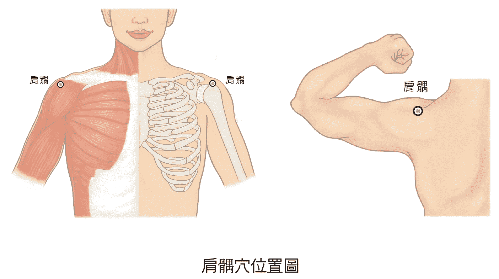

#### 2\. 肩背部

从肩髃分出两条经筋：

一条支脉，从肩髃「绕肩胛，挟脊」，循行路线从身体前面的肩膀转到背面的上背部，主要目的是从背部加强保护心肺两脏。（路线 5）

一条直脉，从肩髃「上颈」，从肩峰上行抵达颈部，分布在肩膀部位，也就是走在「绕肩胛，挟脊」这条支脉的上方部位。（路线 6）

这两条经筋合起来刚好完全覆盖肩膀和上背部区域，与斜方肌有重叠之处。这样的覆盖方式会出现一些特殊状况。

##### 正牌的肩膀痛

大肠经筋循行所过的肩部是正统的「肩膀」部位。当人类开始用两足站立起来，顶天立地，生活于天地之间，肩膀就成为承担身体和身外之物的重要结构。

本经筋在肩背的循行加强了本经经脉「上肩，出髃骨之前廉，上出于柱骨之会上」路线，也为大肠经「一肩挑起所有重担」的坚毅特性，提供厚实的结构基础。

当我们将手搭到对侧肩膀的位置，就是大肠经挑担的部位。再有能力的大肠经系统，再强壮的肩膀，一旦使用过度，时间久了也会痠痛。过去许多劳力工作者需要用肩扛起重物，会造成肩膀的损伤，现代社会则是许多人长期使用计算机后，最容易痠痛的部位之一。

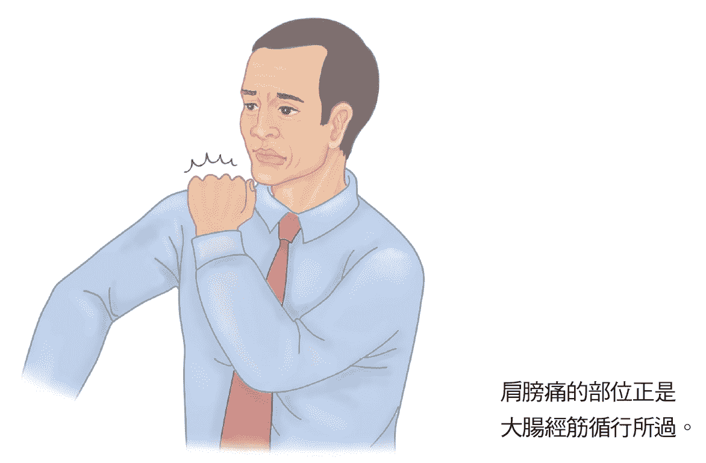

##### 被牵连的肩膀痛

肩膀痠痛也隐含危机，例如肺癌也会出现肩膀痛。从中医的角度来看，肺与大肠相表里，肩背部是肺脏所在部位，癌细胞阻滞局部气血循环，当然也会出现肩膀疼痛，不可轻忽。

##### 上背的膏肓痛

大肠经经筋「绕肩胛，挟脊」，经过一个很重要的部位，称为「膏肓」。

读者看到这里，会不会吓一跳！因为一旦看到「病入膏肓」字眼出现时，通常是暗指病情已经非常严重了。

放心，大肠经所经过的膏肓部位，与「病入膏肓」有所不同。

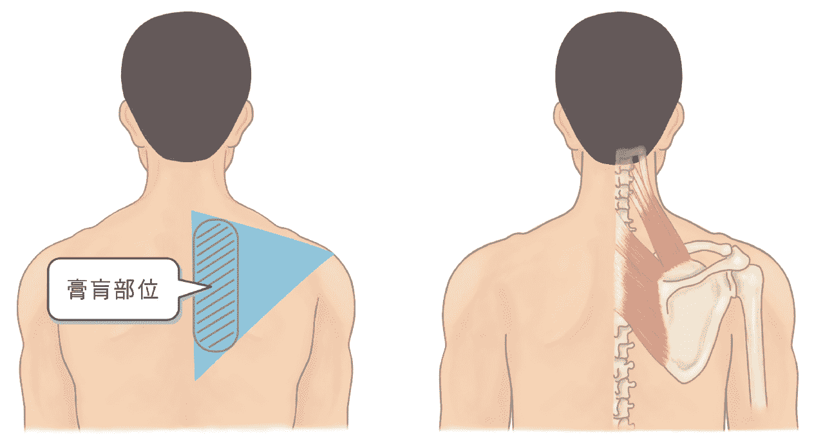

大肠经筋覆盖上背部，在第四胸椎棘突下接近肩胛骨内侧缘有一个穴位称为「膏肓俞」，所以一般就将位于胸椎和肩胛骨内缘之间的区域称为「膏肓」部位，但与古人所说病入「膏肓」部位不同，可参考上图。

从解剖角度来看，膏肓部位浅层肌群是斜方肌，深层肌群是大小菱形肌。由于食指与拇指是手部劳动最频繁的指头，加上大肠经循行所过的肌群也是手臂活动最多的肌肉，无论是劳心工作者长期打计算机，或是劳力工作者长期施力劳动，只要常使用肩背手臂和手指，就会循着大肠经筋牵引至上背部，导致膏肓处跟着出现痠麻胀痛加上僵硬紧绷的感觉，俗称「膏肓痛」。

 中医师不传之祕：大肠经筋所涵盖的「膏肓」与病入「膏肓」有何不同？

###### 大肠经筋所涵盖的「膏肓」与病入「膏肓」有何不同？

记得刚开始学中医时，发现背部有「膏肓」部位，也和大家一样马上联想到「病入膏肓」是不是就是指这个部位。其实不是的。

大肠经筋所涵盖的「膏肓」，位于肩胛骨与脊椎之间的区域，这个区域前面是重要的心、肺两脏，有三条经脉系统经过。除了大肠经筋之外，还有它的好朋友小肠经筋「后走腋后廉，上绕肩胛，循颈」，因为小肠经与心经为表里经，当然要对心脏表示忠诚，特别从后背加以保护。

所以大肠经经筋是从肩峰横向包覆肩胛骨及膏肓，小肠经经筋则是从腋窝向后向上包覆肩胛骨，虽然没有直接循行到膏肓，但是肩胛骨是膏肓的外围，肩胛骨的经筋变化也会影响膏肓（详细内容将在小肠经筋篇介绍）。除此之外，人体最长的经脉─足太阳膀胱经系统，主要循行在人体背部，也以大面积包覆方式通过膏肓部位，可见膏肓的重要性。

至于「病入膏肓」这句成语的膏肓，古人称心尖脂肪为「膏」，心脏与膈膜之间为「肓」，「膏肓」合起来，其实是指心脏深层的部位。心脏是决定一个人生死的重要器官，当病邪深藏在「肓之上，膏之下」，这个接近心脏的隐匿位置，施以补法恐怕营养会被病邪夺走，使用泻法又怕打击到心脏的正气，这就像要抢救被坏人近身挟持的人质，放他们走或进攻搏击的两难是一样的情况。而当各种治法都难以取效时，「病入膏肓」几乎是无药可救的同义词了。

幸好，大肠经经筋系统的膏肓痛属于一般性的上背筋膜痛，类似西医所说的菱形肌筋膜炎，是常见的背痛，但还没到致命的程度。

虽然，大肠经筋所经的膏肓部位与古人说的膏肓不同，但因这个部位的深层组织就是肺脏与心脏，如果膏肓痛长久不愈，表示气血严重不通，病甚者，还会出现胸闷、气短、喘促等症状，膏肓部位肌肉变得特别肿硬或是软陷，有此情况就不仅仅是筋膜痛，表示已经影响到心肺功能了。而且心肺功能异常也会反映在膏肓，例如心肌梗塞的疼痛部位就出现在左侧肩膀及膏肓。千万别掉以轻心喔！

##### 治疗膏肓痛的妙招

膏肓痛是现代人常见的疼痛，也是中医门诊常见的病症。

在医治胸背部疾病时，有经验的中医师总会提醒年轻医师：记得「胸背薄如饼」，要注意安全！因为胸背部的肌肉比起腰腹部及四肢肌肉相对较薄，深层又是重要的心肺，所以自古以来，医书及老师们都一直提醒医师，在胸背部施作针灸治疗时务必要注意深度和角度，以维护病患安全。而膏肓部位就位在上背部，下针当然也要小心。遗憾的是，不时还会耳闻由于直接在该处扎针而导致气胸的案例。

其实，要改善膏肓痛，根本不必冒这种风险！

大肠经的经筋既然抵达膏肓，自然就有妥善又安全的解决方案：那就是对侧的手三里穴！

为什么会用手三里治疗膏肓痛呢？

其实这来自于个人经验。有一次左侧的手三里穴附近非常痠痛，持续数日未能缓解，忍无可忍之下，用力去揉按它，当疼痛缓解之后，突然发现右侧长期痠痛的膏肓部位也跟着轻松。当下不信邪，再换按右侧手三里穴，左侧的膏肓真的也跟着舒缓。回头查看医书，终于理解大肠经筋「绕肩胛，挟脊」就是膏肓部位，此后临床上运用手三里治疗对侧膏肓痛，疗效佳且安全！读者平常也可自行揉按来保健。

请注意，手三里按压越痠痛，代表对侧膏肓也很痠痛，但问题不在手三里，而在对侧膏肓，只要持续轻缓的按揉，就能同时改善手三里和膏肓疼痛，这也是保健心肺功能的好方法。手三里取穴法会在保健篇介绍。

##### 大肠经也可治疗大椎肿痛

前面提过，在经脉及经别中提到的「柱骨」，我们认为是指大椎部位。

虽然大肠经筋在肩背部位没有特别提到大椎，若将大肠经筋两侧背部区域合并，两侧都「夹脊」，就会明显看出大肠经筋其实是夹住大椎穴。所以在此一并提供治疗大椎肿痛的秘法！

「大椎」顾名思义就是很大的脊椎，位在第七颈椎棘突隆起最高，低头时会特别明显，所以才称为「大椎」，它的下方就是属于督脉的大椎穴。大椎穴是诸阳经之会，身为多气多血的手阳明大肠经当然不会错过与之连结的机会。大肠经筋「绕肩胛，挟脊」更证明大肠经脉通过此地，经筋才会特地循行至此加以保护。

大椎处的痠痛也很常见。在过去辛苦的年代，许多长辈们常需挑担或背负重物，时间久了之后，大椎处会高高耸起，宛如趴着一只民间拜拜用的「面龟」。拜科技之赐，近年的低头族也逐渐出现了「面龟」。肿胀的大椎不仅局部痠痛，因为它位在颈部与肩部的交会处，也会牵引颈肩部疼痛，加上它又是人体气血上下左右流动时很重要的十字路口，大椎肿硬会阻碍头部的血液循环，常让病人出现失眠、头痛头晕、记忆力减退、高血压等症状，影响层面很大。

大椎肿痛该如何改善呢？

首先当然要改变「低头」的习惯。

至于在专业治疗上，我们会选用曲池穴。这跟两个中医概念有关。

第一「经之所过，必治其病」，意思为只要是经脉所经过部位所出现的疾病，都可以选用该条经脉的穴位来治疗。这个概念应该很合理，就如只要是火车列车所经过的车站，旅客都可以上车下车，帮助疏运候车人潮。

第二「以形治形」，这就是传统「吃什么补什么」的概念。同理，手三里能治疗膏肓痛，是因为膏肓属于肌肉结构，手三里穴也是肌肉结构，所以「以肉治肉」；大椎肿痛使用曲池穴，因为大椎位于颈肩部可动的关节，曲池也位于手肘部可动关节，所以「以关节治关节」临床应用既安全有又效。

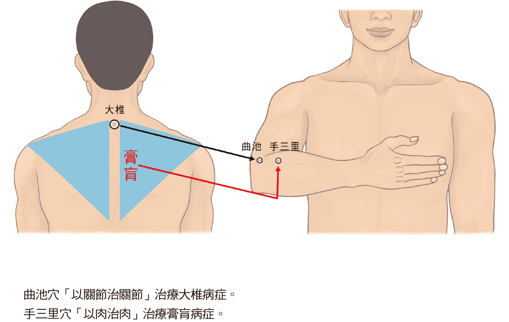

#### 3\. 头面部

大肠经筋从颈部分出二条路线：

一条分支，上行面颊，结在鼻旁的颧骨。（路线 7）

一条直行，向上走在手太阳小肠经筋的前面，沿着头发边缘，到头的左角，横向网络头部，再向下抵达右颔部。（路线 8 ）

##### 从颈部发出的支脉

从脸颊到颧骨的斜切线，涵盖经脉中「上颈，贯颊……还出挟口，交人中」的部位，只是经筋走在同侧，没有交叉到对面的鼻旁。下图将两侧经筋合并，明显看出这条支脉主要包覆大肠经脉同侧的口与鼻部位。

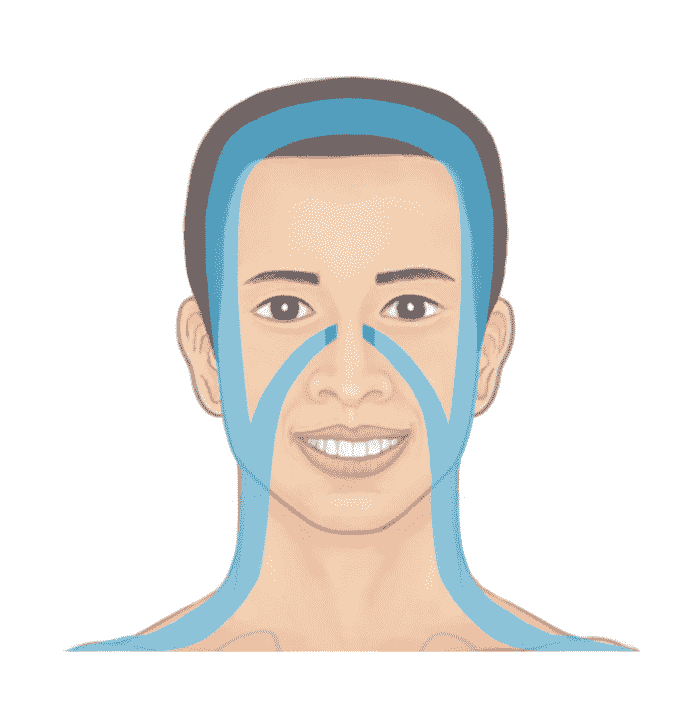

##### 从颈部发出的直脉

手太阳小肠经经筋循行在面部侧面走至耳部，大肠经经筋出于手太阳小肠经之前，表示会经过耳前，向上沿着发际，抵达头的左角，越过头部，向下止于右颔。

这条直行经筋覆盖在五官的外围，沿着发际，横越头部，很像戴着发箍，临床上只要是横越头部的头痛，我们都称为「发箍型头痛」。这条路线也与台湾到处可见的 7-11 超商 logo 类似，因此戏称它为「OPEN 将」头！

从颈部发出的两条经筋，支脉从侧面包覆口与鼻，直脉从上面包覆头面外围，两条经筋联手将头面五官紧紧的裹住，给予全面保护。

 中医师不传之祕：横越头部经筋的 3 个疑义

#### 横越头部经筋的 3 个疑义

【提醒：以下内容主要提供给中医师参考，一般读者暂时略过也无妨。】

大肠经筋头面部（路线 8）这条直行经筋，向上横越头部到对侧面部的路线，虽言简意赅，但却留下三个疑义。

##### (1)这条横越头部的路线是双向或是单向？

《内经》对于经脉循行是有一定的写法，例如大肠经脉循行「还出挟口，交人中─左之右，右之左，上挟鼻孔」，特别指出是双向交叉。

胆经经筋也横越头部，原文说「上额角，交巅上，下走颔，上结于頄。其支者，结于目外眦，为外维。」并未特别注明从何侧的额角向上交到头顶，再跨越到对面。如下图。

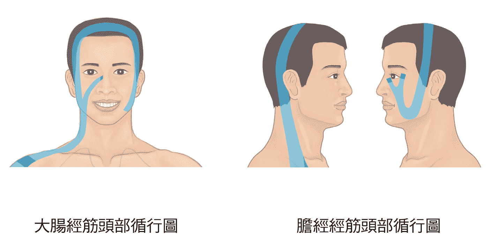

胆经经筋病候中出现「维筋相交」名词，其中，「维」与眼睛有关。足三阳经筋分布在眼睛周围，足太阳经筋走在眼睛上方是为「目上纲」，足阳明经筋走在眼睛下方是为「目下纲」，胆经经筋结在眼睛外角是为「外维」︒

胆经经筋在眼睛外维相交会而出现拘急的「维筋急」病候：「从左之右，右目不开，上过右角，并蹻脉而行，左络于右︒故伤左角，右足不用，命曰维筋相交。」病候中举例说明，胆经经筋在头部的循行与左右交叉的阴蹻脉、阳蹻脉（属于奇经八脉）并行，因此若是从左侧额角跨到右面的经筋损伤，右足就难以行走。以「维筋相交」这种说法来看，损伤通常不会只发生在单侧，因此可以推论，胆经经筋横越头部的路线理论上是双侧交叉。

反观大肠经筋的循行则只有「上左角，络头，下右颔」，再无其他补充论述，依照前面的推论，单向循行的机率很高。

##### (2)如果路线 8 真的是单向循行，会是什么走向？

首先，我们先定义「左」侧是人体的哪一侧？

依据中医的脏腑气机学说，肝气升于东方，位在人体的左侧，因此说「肝气升于左」；肺气降于西方，位在人体的右侧，因此说「肺气降于右」。

但因为肝脏实质器官位于人体的右侧，所以中医自古以来，就一直为了身体哪一侧属于东边而争论不休。

重新检视资料才发现，主要问题来自于多数人只看到「肝气升于左」这个结论，而没有注意到前面有个必要条件「南面而立」。惟有当我们采取坐北朝南或朝向南面站立的方位时，左侧为东方属于肝这个论述才成立。一旦南北向的位置改变时，东西方位也应随之调整。

就像我们来到一个陌生的城市，刚走出车站，一时之间不知东南西北，只要询问当地人这个城市的南北方位，我们就站在北方，面朝南方，此时左手这一边就是东方！

所以「肝气升于左，升于东」不是绝对位置，而是相对位置！如此一来，千古以来的方位争执就自然消弭了！

年轻的吴立工医师将我们在诊间讨论的议题写成以下有趣的故事，题目是「爷爷的左手─肝生于左」，内容我稍作修饰。

小白与爷爷住在黄河边上，一户坐北朝南、负山傍水的窑洞之中，黄土高原气候寒凉，坐北朝南的方位可以得到阳光充足的照射，祛除洞内的阴湿，寒冬时，可以阻绝从北方而来的凛冽寒风，炎夏时，则能迎接夏日凉爽的南风，因此有冬暖夏凉之效。

小白渐渐长大了，渴望去探寻辽阔的大海，疼爱他的爷爷唯恐他会迷路，跟他说：「小白呀！你要记得，只要我们站在北方，面向南方，左手边就永远都是东方，只要往东方走，你就可以看到梦想中的大海了!」

天地的方位

中国古代看待世界的视角和当今科学化的社会有所不同，古人是以「坐北朝南」的方位观点来看待这片天地，当采取这样的方位时，左手边很自然的就是东方，右手边则是西方。东边是太阳升起的一方，主阳气的升发，而西方则是夕阳西下的一面，主阳气的肃降。

人体的方位

从五行及五方对应五脏关系来看，心的五行为火，属于南方，而肾的五行为水，属于北方。依照自然规律，火性炎上，会向上燃烧；水性趋下，会向下流动。

要订立五脏在人身的方位，须要先定南北。心火炎上，所以位于人体的上方；肾水下流，所以位于人体的下方。心属南方，人体的上方成为南方，肾属北方，人体的下方成为北方，与一般的认知刚好相反。当南北定位之后，东西方位则自然而然地确定了，就象是爷爷跟我们说的，只要坐北朝南，左手边就是东方。如下图。

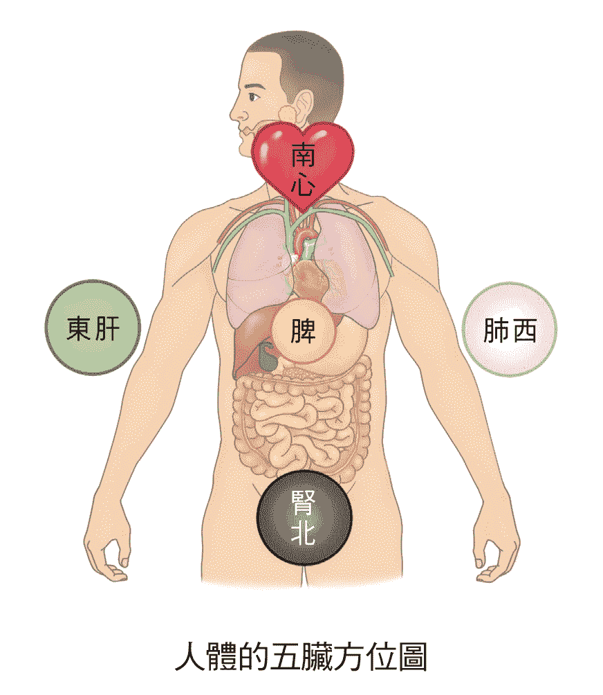

当我们以局外人身份坐在「肾北」的位置，面向「心南」方位来看这个身体时，我们的左手侧是「肝东」方位，右手侧就是「肺西」方位。而就身体本身而言，右手是「肝东」方位，与肝实质器官在同一侧，气机主升；左手是「肺西」方位，气机主降，与大肠的气机方向相符，后文会再说明。

面部的五脏方位也是如此。中医诊断学说：「左颊部肝，右颊部肺，额心颏肾，鼻脾部位。」

前面介绍过，在五行方位关系上，肾水属北，心火属南。在面部的五脏方位方面也一样，心属南，位在额头，是为「额心」；肾属北，位在下巴，是为「颏肾」。当南方位在面部的上位，北方位在面部的下位时，东方与西方的位置也该跟着配合，右面部就成为东方属肝，左面部就成为西方属肺。如右图。

现在回归到大肠经筋「上左角，络头，下右颔」。依据前面对于左侧的定义，这条经筋应从身体的右面部向上绕过头到左面部。

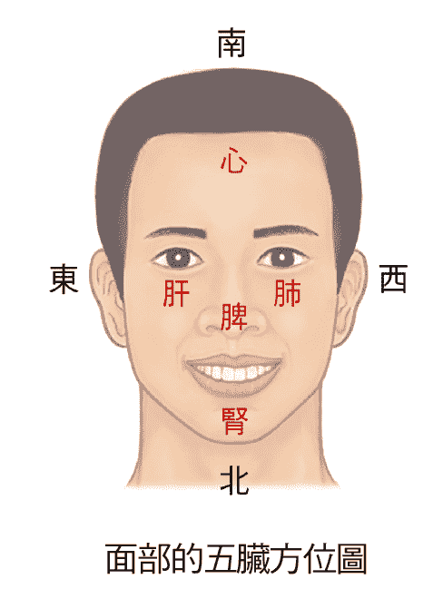

##### (3)再者，如果路线 8 真的是单向循行，目的是什么？

十二经络系统之中，唯独大肠经和胆经在头面部交叉。前面推论过，胆经经筋为双向交叉，大肠经脉也是双向交叉，但大肠经筋可能是单向循行，这是很有趣的现象。

这个问题我也想了很久。有一天痴痴望着大肠的型态，突然间好像同时看到了 OPEN 将！

大肠由右下腹盲肠开始向上为升结肠，转弯为横结肠，到左腹向下为降结肠，乙状结肠，最后为直肠，是为ㄇ字形走向。大肠很明显是由右腹横跨到左腹，也是人体唯一以条状横越两侧的器官。

大肠经筋在头面部的跨越分布与大肠横越人体两侧的走向类似，请参阅下图。

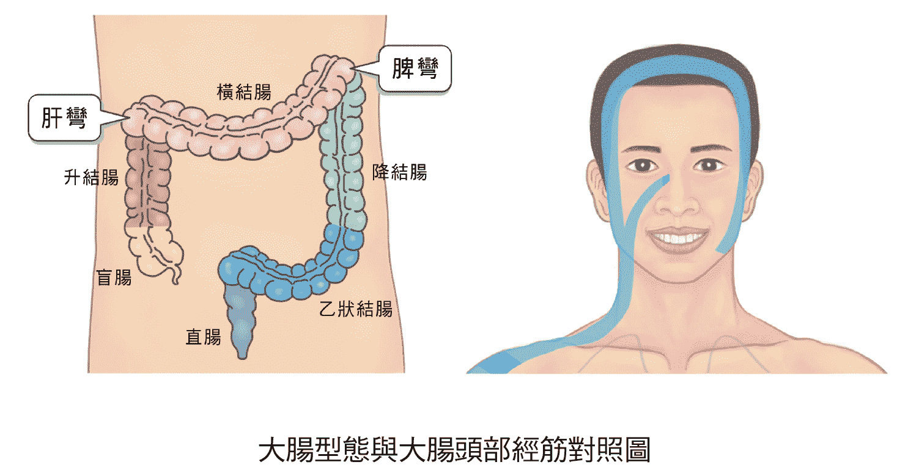

总论中介绍过，大肠为「传导之官，变化出焉」，在食物转换为精微物质，再变化为气血津液，推动全身机能的过程中扮演重要角色。让我不禁猜想，大肠经筋是为了配合大肠ㄇ字形的走向，加上阳明主面，所以才投影在头部。

大肠属腑，气机以降为主，但是从盲肠向上为升结肠，需要一股向上的力量，才能对抗地心引力。横结肠的两端转弯处与肝、脾接近，分别称为肝弯和脾弯（中医的脾脏包括现代的脾与胰）。依据中医的脏腑理论，肝主升发，脾主升清，两者都是向上升的力量，有助于大肠气机的推动力。尤其大肠与肝为拜把兄弟，肝气虽说生于左，实质脏器位在人体的右侧，正好与升结肠同一侧，大肠当然可凭借肝的升发力量，加强升结肠向上推动的功能。

大肠到了腹部左侧，转为降结肠，气机向下降。肺虽说气降于右，其实肺是在人体的左侧发挥下降功能，正好与降结肠同一侧，气机也都是下降。所以大肠的实质结构：右腹升而左腹降，刚好体现人体及面部的五脏方位图。我想这不是巧合，而是人体的奥妙！

依据以上推论，大肠经筋（路线 8）可能是大肠型态与机能的投影，也说明人们常见左肩背偏肿的情况，我们就可藉由按揉或针灸来改善大肠机能。

##### 人体经络是分工合作的聪明系统

看完大肠经筋，大家也许会担心，大肠经筋努力的经过上肢部、肩背部、头面部，但却没有保护到腹部的大肠，这样会不会有问题呢？

请放心。经络系统是很聪明的系统，它会兼顾效率与安全。由于保护腹部的重责大任已经交由大肠经的老大哥──胃经经筋系统提供完整的照护，所以它就不需要重复做工。相对的大肠经为了反馈胃经的照顾，也以头部划过一圈的经筋路线来保护胃经经脉在额颅的循行。这两兄弟互助互补的良能分工，可是经过精心设计的喔！

### 大肠经筋─病候

大肠经经筋病候都与它循行的部位有关：

整体部位

经筋循行所经过的部位，包括手腕、手臂、膏肓及头面部等出现僵硬、痠痛及抽筋现象，这就是经筋病候的特色。基于这样的特色，中医才能以「经之所过，必治其病」的概念，善用经络循行的线索来帮助病人拔除病根。

肩颈部位

肩关节不能向上抬举，颈部不能左右转动，也是大肠经经筋的重要病候。

大肠经络系统三个重要循行部位：肩髃、柱骨及缺盆，都位在此区域，所以本部位的病候才会被特别提出来。

整体而言，肩颈部位上下左右活动不利，是现代人常见的疾病，可见肩颈疾病是人类共同的问题，而且古今皆然啊！这类病症常见于落枕，例如脖子卡在一侧不能动，同侧的手也抬不上来，甚至还会牵连到膏肓也痛，头部抽痛等，通常会在肩髃、柱骨及缺盆这三个部位找到压痛点，此时就可以选取大肠经位于肘关节以下的穴位治疗。

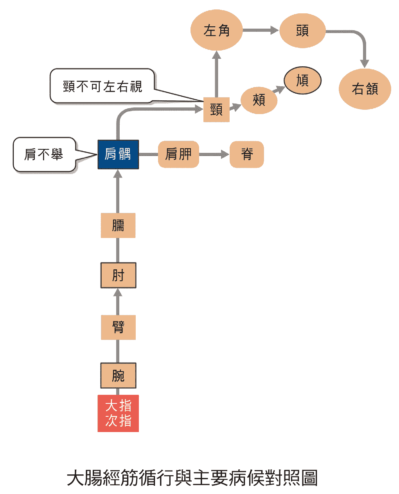

## 总结

大肠位于腹部，属于下消化道，除了承担自身的消化任务，成为「传导之官，变化出焉」之外，还透过大肠经络系统与位在胸部的肺脏相连属，建立表里关系。透过这样的关系，大肠经就能协助肺一起承担保护人体、疏散外邪、通利鼻窍、改善皮肤问题的工作，更重要的是大肠经还参与了人体重要的呼吸功能与津液代谢。

大肠经身为人体第二条经脉，也保留了着许多演化遗迹，例如在牙齿与耳朵部位，所以古人称大肠经为「齿脉」，牙齿就成为大肠经系统的重点部位之一。

至于大肠经循行所过的部位，从食指经肩膀到面部，都与日常生活与人际关系息息相关，也让大肠经成为十二经络中最善于「承担」的经络系统。

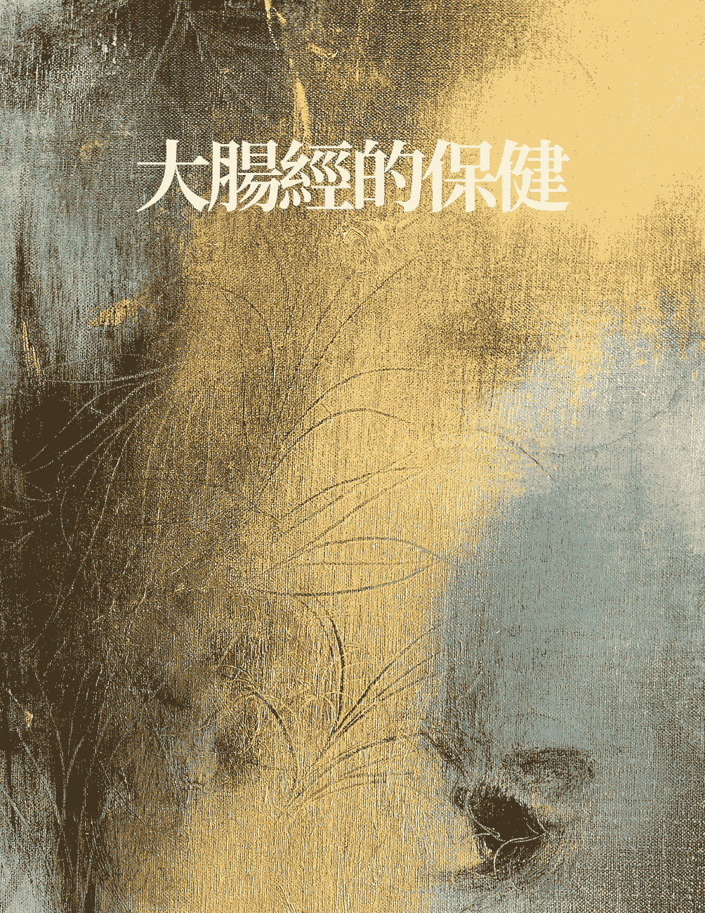

# 大肠经的保健

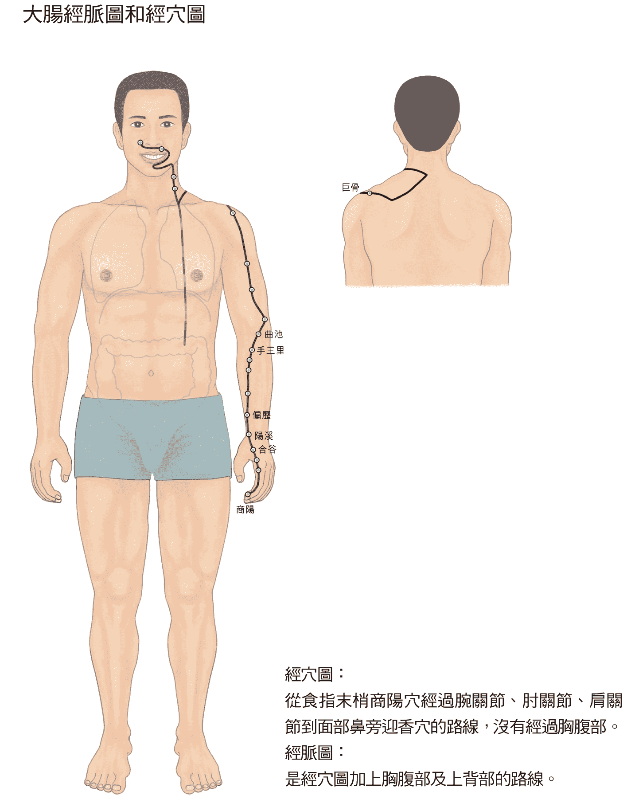

身为大胃王家族的阳明小兄弟，随和且认真的大肠经主要配合肺执行呼吸、皮毛和水液代谢功能，配合胃执行消化与排泄工作。

大肠经共有 20 个穴位，分布在上肢和头面部，从食指的「商阳穴」开始，沿着手臂的阳面前线，到面部鼻翼旁的「迎香穴」为止。

## 大肠经的重要保健穴位与功能

再次提醒读者，在经络上取穴时，肢体的摆位很重要，摆对姿势才会找到正确的穴位。

例如在取大肠经从腕关节至肘关节这段健美路线的穴位时，务必采取「拱手」和「立掌」的方式，将手肘弯曲 90 度，如古人拱手作揖的姿势，将手掌立起来，掌心朝向胸口，这样才能正确取到大肠经的穴位。

为什么要这么麻烦呢？

因为人类双手真的很万能，手臂的桡骨与尺骨可以交叉，以便手臂做扭转运动，例如扭毛巾、转开瓶盖等。如果没有拱手及立掌，就很容易误取到三焦经的穴位。

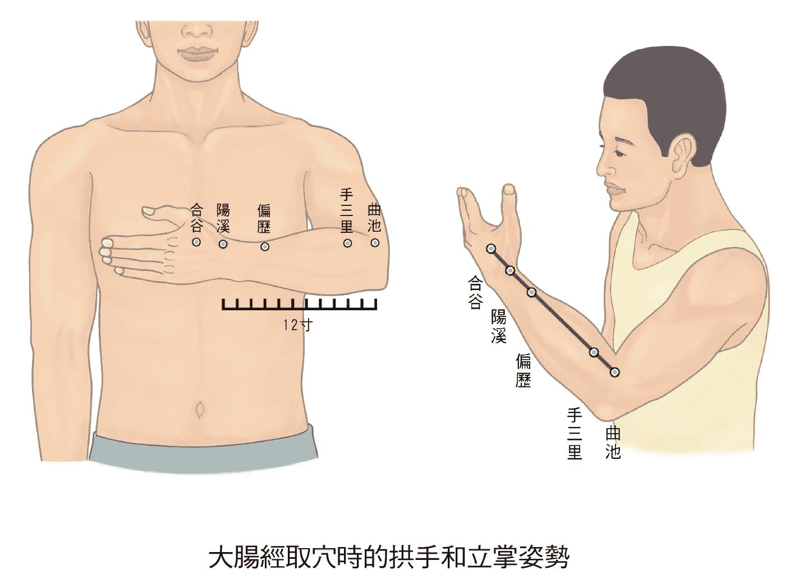

之前总论介绍过，大肠为传导之官，除了负责「蒸津液」回收体内，并且「泌糟粕」形成粪便排出体外，它还与肺、胃、心、肝、肾等脏腑经络系统共同完成重要任务，见下页图。

在经脉篇中，曾介绍「向前看齐专线」有六个穴位与大肠经的其他脏腑经络关系相合，其中位于食指末梢的起始穴「商阳穴」为井穴，十二经脉都有一个井穴，所有的井穴都具有很强的开窍醒神功能，临床上常常多个井穴合用来抢救急症，因此商阳穴就不另作介绍。

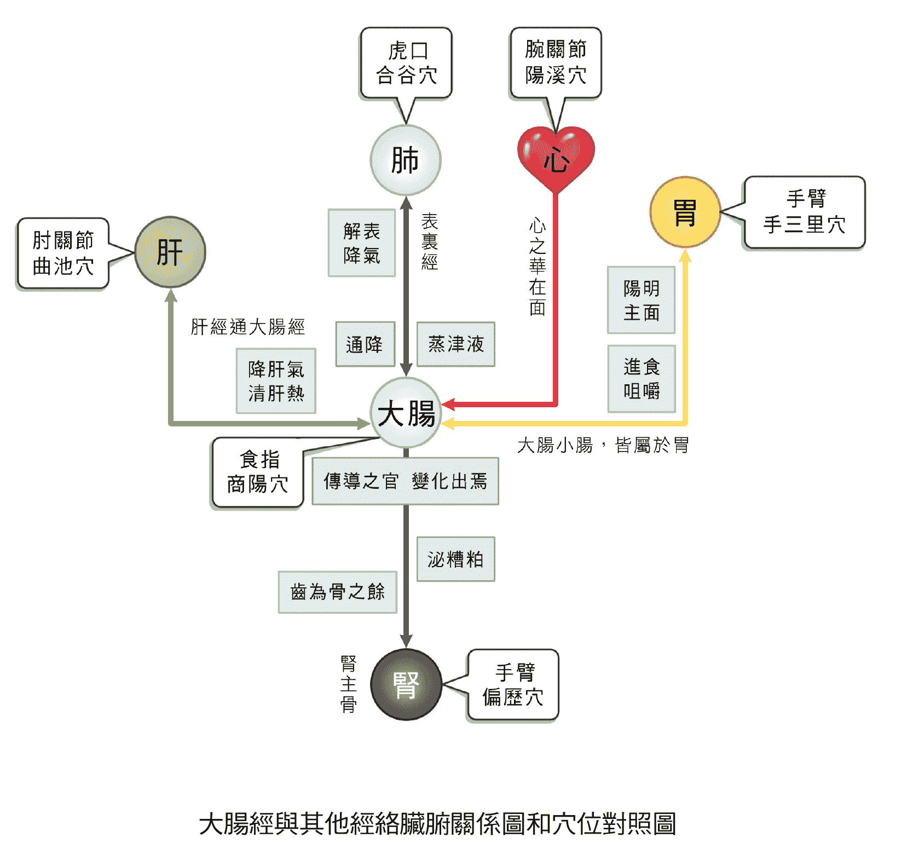

以下依照五个穴位的功能特性，划分为两组：

肺大胃肝组：合谷穴、曲池穴、手三里穴。

护心通肾组：阳溪穴、偏历穴。

大肠经取穴时的拱手和立掌姿势

#### 肺大胃肝组：合谷、曲池、手三里

● 合谷穴（LI 4）：位于大姆指与食指之间的虎口处，沿着食指桡侧向上，在第二掌骨的中点，贴近第二掌骨边缘取穴，按压时会有明显的痠胀痛感。

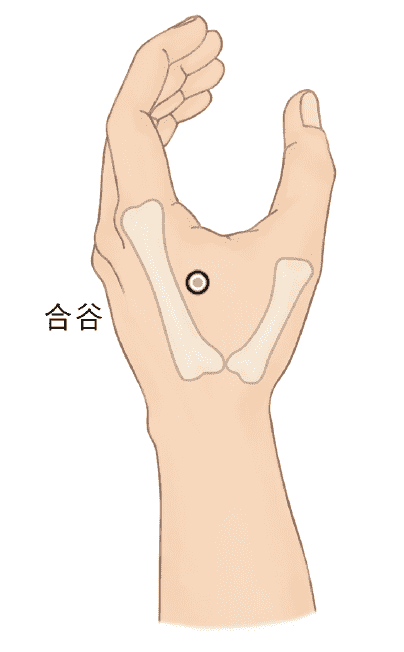

合谷穴是大肠经的原穴，中医认为「五脏六腑有病取之原」，意思是五脏六腑本身的疾病，都可以取用该经的原穴来治疗，所以合谷穴可以治疗大肠腑及大肠经的疾病，也因此成为大肠经的代表穴。

然而合谷穴的功能非常强大，远远超过大肠经的范围，不仅是全身的强壮穴之一，也因气血俱足，对于刺激的反应大，还被列入抢救生命时的「回阳救急九针穴」之一，合谷穴名的响亮程度早已超过大肠经。

为什么合谷穴会有如此强大的功能？

合谷穴除了属于多气多血的大肠经原穴之外，还有来自合谷穴位置之独特性，首先与演化有关。

在本系列书卷一的序篇曾介绍过「合谷太冲开四关」，在人类演化过程的猿猴阶段，合谷与太冲穴正是位于手足相对位置，这也是抓握时可以如钳子般施力紧握的部位，尤其是手部「虎口」的位置，是主要的施力点。

虎口这个名称很有意思，在中国传统四象观念包括「东青龙，西白虎，南朱雀，北玄武」，中医也常用这个观念来诊治疾病。例如肺的方位属于西边，与白虎有关，所以不仅有清肺胃热盛的「白虎」汤，更因为大肠与肺为表里，合谷穴可兼治肺病，因此合谷所在部位称为「虎口」，一方面表达出与肺的关联，另方面也体现出穴位功能的威猛感。

其次，近代大陆的张颖清教授发明「生物全息诊疗法」，简单说就是生物体的某个部分都含有生物体的全部讯息，例如植物的一片叶子或一颗种子都包含有这棵植物所有的讯息，这就是张教授的「全息生物学」。利用这个概念，张教授提出人体的第二掌骨侧有一个全息穴位群（如下页图），对应到全身所有部位，因此可用来诊治全身疾病。合谷穴就位在第二掌骨的中央，其重要性可想而知。

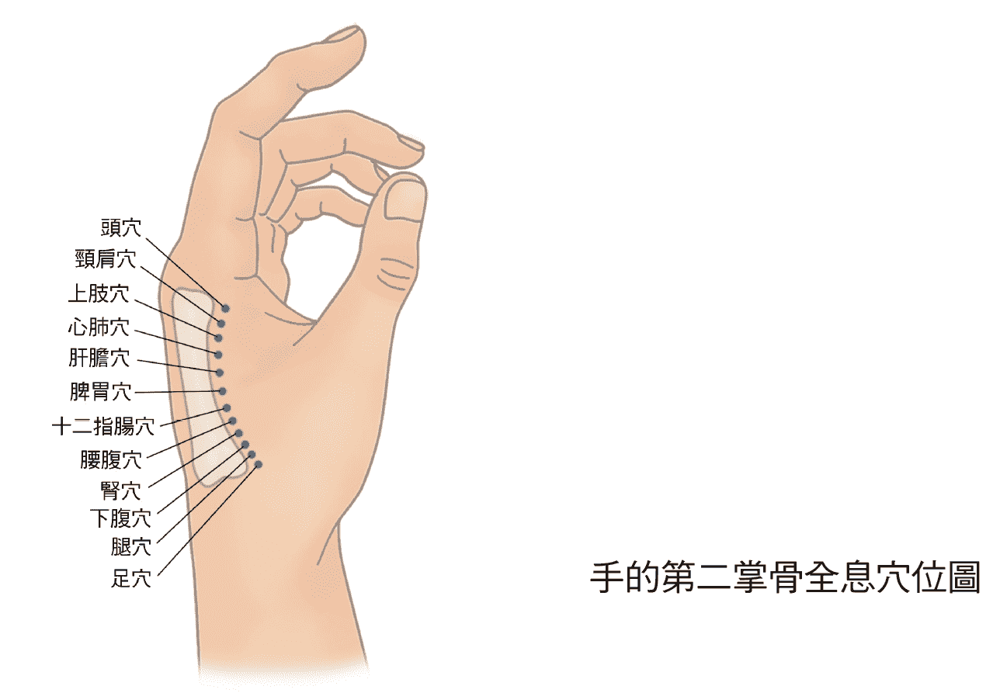

我们再从另一个角度来看，假设合谷穴是一栋房子的话，第二掌骨就是它的前院与后院，合谷穴的经气就会在此区域流动，因此也可将第二掌骨视为合谷穴的代表区。

合谷穴的标准位置在第二掌骨中点，依据张长琳教授的著作《人体的彩虹》研究发现，随着病情变化，穴位是会挪移的，难怪中医古籍《难经》会强调「知为针者，信其左」，在针刺之前，以左手按压和刺激穴位，以确定穴位位置和经气的来临，再下针治疗。

合谷穴位置的特异性以及多气多血的特性，具有强大的通行气血、通关过节的功力，造就了它从头到脚，从里而外，几乎无所不治的英雄角色。归纳重点如下：

##### 1.从头到脚系列

专治头部五官疑难杂症

大肠经循行至头面部，阳明主面，中医说「面口合谷收」，合谷穴擅长治疗头部及面部五官疾病，例如头痛、头晕，面痛如三叉神经痛，面瘫如面神经麻痺，耳聋耳鸣、目痛、鼻病、牙齿痛等。

合谷穴对于眼睛疾病还有特殊专长。

现代人由于长期使用 3C 产品，过用眼睛，眼睛常常觉得痠涩疲倦。由于中医认为肝开窍于目，眼睛的疲劳与肝有关，所以称为「肝劳」， 相当于西医的「视疲劳」。

但是眼睛疲劳有来自眼睛深层的眼底疾病，例如视网膜病变等，也有来自于眼睛浅层的疾病，例如眼球外部有六条肌肉称为「眼外肌」，与眼球的上下左右活动有关，当眼睛长期固定注视计算机或手机时，会导致眼外肌僵硬，而出现眼球痠痛、眼睛转动不利，此时合谷穴就是最佳缓解痠痛的穴位。由于穴位的位置会随着病情移动，所以要在眼睛对侧的虎口区域，寻找特别痠胀的疼痛点，加以按揉后才能见效。

我个人对于头面五官科疾病特别有兴趣，过去在台北时也曾开设中医眼科门诊。从临床诊治经验中发现，大肠经循行至颈肩，病候有目黄之症，可见颈肩与视力之间有密切关系：肩颈僵硬会影响视力，反过来说，视力问题也会造成肩颈的僵硬。有趣的是，多数人都是左颈肩偏肿，而且颈肩僵硬肿胀程度与眼睛病情成正比，与年龄、性别或职业都无关。曾有天生弱视的婴儿来就诊，也一样出现颈肩僵硬的现象，只好建议爸妈帮孩子热敷按摩，缓解僵硬现象来保护眼睛。

髋关节疼痛

以合谷穴治疗髋关节疼痛也是来自个人经验。

之前在台北工作时出了捷运站，还要走 15 分钟的地下街路程才能到达医院。有时赶时间，会加快脚步。某次在快走时，右侧的髋关节突然一阵刺痛，关节当场被卡住，无法前进。当下心里很着急，因为快要迟到了，怎么办才好？想到合谷穴的止痛效果一直很好，而且它气血充足，也许可以缓解症状，所以就用力掐左手的合谷穴，没想到痛感马上消失，关节也被解锁，立刻可以迈步前行。

后来查资料，发现在人体上下部位的对位关系上，合谷穴对应到髋关节，自此临床上时常应用在髋关节的各类疾病，效果还不错。

由此不禁喟叹「百病成良医」有时还真有道理。当医师自己真的生过病之后，对于疾病的发展和身体的变化会产生深刻的感受，也是无价的学习经验。我也据此勉励年轻医师们，珍惜自己每一次生病的机会，从中好好观察与学习。

##### 2.从里而外系列

急救要穴

前面介绍过，合谷穴气血充足，刺激反应大，是回阳救急九针穴之一。

止痛特效穴

我常开玩笑说，合谷穴是人体万用止痛穴，而且比止痛药好用。中医说「不通则痛」，合谷穴大通气血，可以缓解许多痛症，除了前面介绍过的症状之外，还有胃痛、腹痛，当然也包括便秘难出的疼痛，妇女的痛经、筋骨关节痠痛等。建议采用对侧穴位，如痛在左半身就按右侧合谷穴，反之亦然。

天然的健胃整肠药

大肠与胃都属于阳明经，合谷穴可以同时调节肠与胃的功能，促进消化吸收与排泄，无论是胃口不佳或过佳，便秘或腹泻，腹胀腹痛，甚至晕车晕船的恶心呕吐（配合心包经的内关穴效果更好）等都可以改善，是人体天然的肠胃药。

强身保健大穴

阳明经多气多血，大肠经的合谷穴与胃经的足三里穴属于气血充沛的大穴，自古以来都是重要的强身保健穴。可以按揉，也可以热敷或加灸。

合谷穴通行气血能力很强，若加上脾经的三阴交穴功能更强，对于怀孕中的妇女就要谨慎使用这两穴，以免促进气血活动，导致子宫提早收缩而引起流产。

强化人体对外的防护网，提高免疫力

大肠经为肺经做了许多工作，其中肺主表，掌管卫气，彷彿为人体的体表铺上一层保护网，避免外在邪气的侵袭，这就是现代常说的免疫力，免疫力强的人，比较不会被外在的病毒细菌所侵袭。

合谷穴可以协助肺经建构强壮的保护网，提高免疫力。如果不幸被外邪入侵，出现发烧、流鼻水、咳嗽等感冒病症时，合谷穴也能有效的排除外邪，缓解症状。

合谷穴配肺经的列缺穴是大肠经原络配穴。两穴都是该经的代表穴，可视为模范生组合，而且还乐在互助，合谷穴帮忙列缺穴治头项痛及外感病；列缺穴帮合谷穴调和肠胃以及面口疾病。在天气多变化、容易感冒的季节或是肠胃功能不适时，都可多多按摩这两个穴位。

从以上内容来看，合谷穴可视为大肠经与肺经沟通的主要窗口，当然也就独具强大功效。

● 曲池穴（LI11）：穴名为曲池，取本穴当然要曲肘囉！曲池穴就位在肘关节横纹的外侧端，按压也会有痠痛感。

曲池穴是大肠经的合穴，《内经》说「合治内腑」，善于治疗六腑本身的疾病，与「五脏六腑有病取之原」的原穴合谷穴，某些时候可以看作夫妻穴位组。

在经脉病候篇中提到，气有余会出现热肿，气虚会出现寒栗的病症。曲池穴偏阳偏泻，善于清热消肿，合谷穴偏阴偏补，善于温阳祛寒，两个穴位一寒一热，成为大肠经最佳拍档，也有宛如夫妻般的阴阳特质。

不过，上述有关曲池穴跟合谷穴的阴阳寒热特质是相对的关系，只是用来互相比较，而非绝对的特质。

曲池穴当然还有自己的特殊治疗能力，可以分为内脏疾病和肢体疾病两类。

##### 1.治疗内脏疾病

自治大肠疾病

可以治疗大肠经本身的疾病，尤其善于治疗热性病，只要是大肠经络系统所经之处的热病都可使用，例如大肠热盛的便秘、牙齿肿痛、肩膀红肿热痛等，都能清热消炎止痛。

为肺排忧解难

肺为娇脏，五行属金，最怕火来相克，善于解热的曲池穴特别能为肺解除火热困境。例如肺主皮毛，曲池穴能疏散滞留在皮肤的风热邪气所造成的皮肤痒、痤疮等，所以曲池穴可是中医的美容要穴。

临床上，中医也常用通利大便的方法，让体内的热邪从大便而出，来改善皮肤病，就是肺与大肠相表里关系的运用。

肺主表，曲池穴可以解除表邪，治疗感冒。在感冒初期，鼻涕和痰还是白色时，病情偏寒，可用合谷穴为主来治疗。一旦鼻涕和痰逐渐变成黄色，喉咙肿痛，身体发热时，病情已经化热，就需使用曲池穴来清热解表。

与肝同心协力

前面介绍过，大肠与肝是麻吉的拜把兄弟，两经合力，共同透热解毒，治疗头痛头晕，口苦嘴破，改善睡眠，控制血压，还能舒缓眼睛疲劳，改善视力！

##### 2.治疗肢体疾病

这边所提及的肢体疾病，其实就是经络循行所经部位的疾病。包含：

解大椎肿紧。（可参阅经筋篇）

治疗腰痛及膝关节痛。

《内经》提供一个很棒的手肘与躯干对位诊断方法：

「肘所独热者，腰以上热。手所独热者，腰以下热。」《内经》以手肘对应人体的腰部，手肘到手腕的部位对应腰以下部位。周左宇老师常以曲池穴透到对面的少海穴（属于心经）治疗对侧膝关节痛，后来被我借用来治疗腰痛，尤其是第四第五腰椎附近的疼痛特别有效。因为第四腰椎棘突下旁开 1.5 寸有一个穴位叫做「大肠俞」，一看穴名就知道与大肠有关。没错！大肠俞是大肠将自己的经气转输到背部存放的位置，而大肠经是联络大肠的经脉，透过这层关系，大肠经的穴位就可以治疗大肠俞的疾病。

治疗网球肘：直接在病位取穴，特别适用于已经在肘关节处形成筋结肿块的情况。

● 手三里穴（LI10）：取本穴时务必拱手，在阳溪穴与曲池穴的连在线，肘关节横纹下方 2 寸（约 4-5cm，或手指的二至四指横幅宽），肌肉最高点就是本穴。轻轻按没有感觉，但用力按压，会有明显的痠胀痛感，甚至会痛到呲牙咧嘴。不信，您现在就可以试试看！别说我没提醒你喔！

本穴有二个治疗特色：

##### 1.治疗肠胃病

大肠经与胃经是手足同名经，肠与胃功能也密不可分。胃经老大哥在小腿上有一个名闻遐迩的穴位「足三里」，是胃经的代表穴，能强健胃的机能，促进营养吸收，所以是人体的强壮穴之一。大肠经小老弟在手臂上的「手三里」，名字相同，只差手与足，可视为足三里的迷你版，也具有足三里的功能，只是威力稍微小一些。因此手三里穴就能健胃整肠，治疗肠胃疾病，如腹部胀痛、消化不良、食欲不佳、面黄肌瘦、大便异常等。

##### 2.治疗膏肓痛

在经筋篇介绍过，大肠经经筋循行到上背部的膏肓区域，手三里穴以「肌肉治肌肉」的概念，善于治疗对侧膏肓痛，而且膏肓越痛，手三里压痛感也越强。许多人第一次按压自己的手三里穴时，常痛到哇哇叫，因为事先完全没预料到压这个穴位会这么痛。别担心，多按压几次痛感就会减低，对侧膏肓痛也会缓解改善。

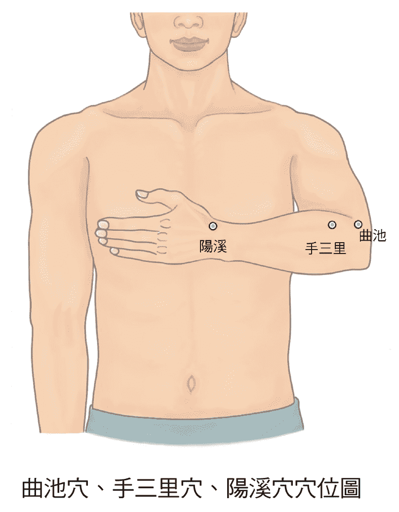

#### 护心通肾组：阳溪、偏历

● 阳溪穴（LI 5）：在腕关节的桡侧，拇短伸肌腱与拇长伸肌腱之间凹陷处。

简易取穴法：将拇指向上翘，拇指后上方腕关节三角形凹陷处的底部，刚好就在腕关节的缝隙中，按压时会非常痠痛。

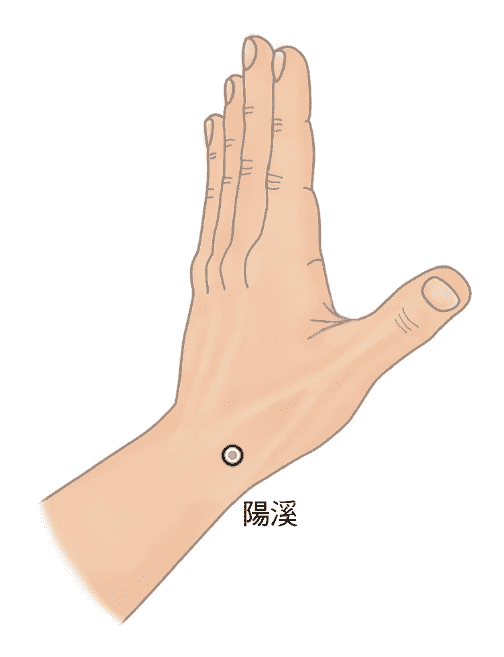

阳溪穴是大肠经的经火穴，阳气很旺，善于推动气血的流通，是大肠经很强的补阳气穴位。

周左宇老师上课时，曾分享他的友人以艾草灸阳溪穴来治疗心律不整的经验。当时听到觉得不可思议，后来门诊时，遇到一位婆婆突发心律不整，教导她按压阳溪穴后，心律真的就逐渐平稳下来，从此才开始相信阳溪穴可以调整心律。

肺经的太渊穴跟阳溪穴只隔一条筋，太渊为脉会，本身就具有调节脉搏节律的能力，我想若能将两穴合用，效果应该会更好，所以就持针试着从阳溪穴透到太渊穴，真的顺利透针，而且效果更好。

我后来还去跟周老师「献宝」，说阳溪透太渊也可以控制心律。这次换老师觉得不可思议。所以当场就在老师的手腕透针试试，幸好没漏气，一针透二穴，成功！这种针法也是古典针灸派特有的「担法」。看到老师赞赏的表情，很开心。从此阳溪透太渊就成为治疗心律不整的常用组。

在总论介绍过，心肌梗塞有许多前兆，包括有牙痛、下巴痛等，这些部位都在大肠经的循行路线，此时要赶紧行气活血，而善于大补阳气、推动气血的阳溪穴就可以派上用场。所以有心律不整病史的读者，平时可以按压本穴保健，加上心经的少府穴效果更快。

最后还要一提，阳溪穴邻近俗称「妈妈手」手腕关节肿胀疼痛的部位，但临床上治疗妈妈手，不一定要从阳溪穴着手，尤其局部有急性发炎，若再加以按揉或针刺，会加重炎症，此时可以酌取大肠经远端的穴位，如曲池穴、手三里，甚至头部胆经的风池穴，都有助于缓解疼痛。

● 偏历穴（LI 6）：偏历穴是大肠经的络穴，因此能治疗本经的耳鸣耳聋及牙痛，也能协助肺通调水道下输膀胱，与肾联手，治疗水肿、腹肿、牙痛等。（细节请参阅络脉篇）

## 大肠经的饮食保健法─多喝水、多蔬果、少油腻

大肠属于阳明经，多气多血，大肠又主津，如果体内津液不足，很容易产生燥热的病症，例如肠道干燥引起的便秘，肠道的火气热毒还会牵连无辜，若循着经络影响到肺，肺开窍于鼻，主皮毛，就会出现鼻干鼻痒，甚至鼻肿、鼻塞、鼻疮等，咽喉干痛，皮肤搔痒等；若影响到胃，就没有胃口，口干口臭，牙痛，心情烦躁，失眠等状况。

所以大肠经的简要保健方法，就是多喝水，多吃蔬菜水果，随时补充水分津液。

从时间特质来看，大肠经主要旺于卯时，即清晨 5-7 点，承接在肺经之后，当肺将新鲜的气血准备就绪，人体在寅卯之交甦醒，即刻启动大肠的功能。大肠主津，此时喝一杯温开水，滋润肠道，然后前去排便，肠道一空，即具有接受食物的能力。人体的新陈代谢由此开始，多喝水当然就是最佳保健良方。

另外，还要减少吃炸物。根据现代医学研究，百分之八十的大肠癌是瘜肉逐渐变大而成为恶性肿瘤的。我曾治疗过一位男性病患，虽然长年茹素，却非常喜欢吃油炸物，健康检查时，竟然发现大肠满布息肉，全身也有多处脂肪瘤，尤其是手臂的大肠经和腹部表层最多。

经过一年的中医诊治及饮食控制后，大肠经及腹部的脂肪瘤明显缩小，经西医检查，大肠内旧的息肉已消退，仅新长数颗而已。

临床上，我常遇到许多年轻时喜欢吃肉、年长之后百病丛生的病人，医师治疗得很费力，病人后悔还得很努力！唉！早知如此，何必当初？

## 大肠经的生活保健法─包得暖，常揉合谷穴

##### 1.身体要保暖，减少受风寒。

头面：

多用口罩保护鼻子，也就是保护迎香穴，可以减少感冒机率，保护肺功能。平常多戴帽子，头部少吹风，就可减少发箍型头痛机率。

肩膀：

肩髃穴是大肠经络系统的热门部位，同时也是人体最容易受风寒的穴位之一，好多人过了四、五十岁以后就得五十肩，很多原因来自于年轻时喜欢光着膀子睡觉，或者只穿一件吊嘎（背心），夜里风寒很容易从肩髃穴进去。建议睡觉时尽量穿有袖子和领子的衣服，防护肩关节及大椎，并能减少落枕机会。

##### 2.揉按合谷穴，以及轻轻敲打腕关节到肘关节这一段健美路线，都有助于提升免疫力和大肠机能。

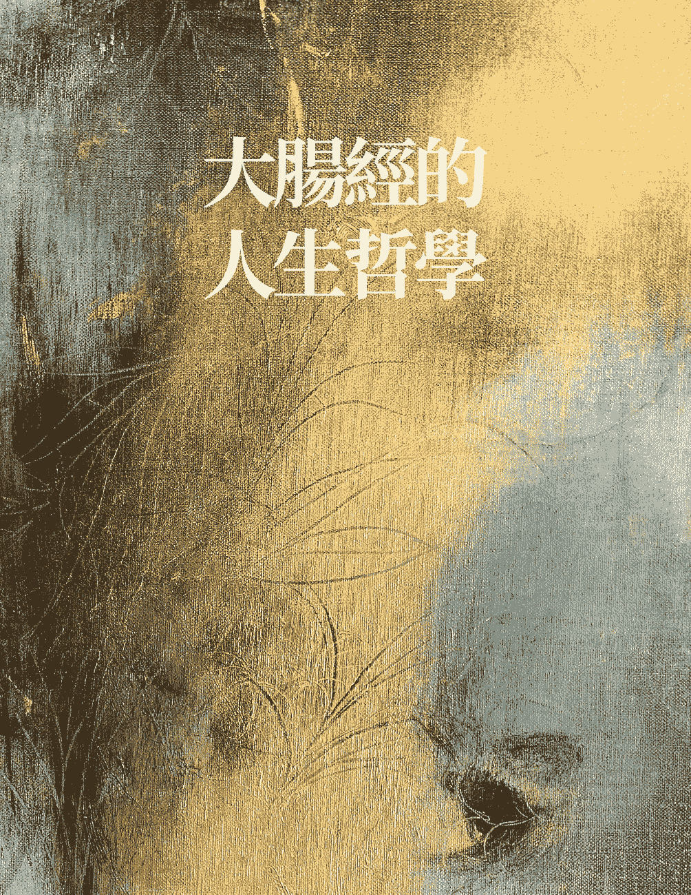

# 大肠经的人生哲学

#### 肺大胃新年欢唱篇

农历过年期间，肺经、大肠经、胃经难得聚首，相约去 KTV 唱歌，庆祝经络书出版。

灵巧的肺经马上找到自己喜爱的歌，肺主呼吸，以空灵的嗓音，带着淡淡的哀伤，唱出王菲的「天空」。

健壮聪明又爱现的胃经，立即抓紧麦克风，一口气唱出台语歌「爱拚才会赢」，然后是国语歌「我的未来不是梦」，最后是英文歌「Forever Young 」（主唱：Alphaville）。

听完肺与胃的歌曲后，大肠经拿起被胃经握得热呼呼的麦克风，对着相表里的肺经深情一望，也选唱王菲的歌曲「我愿意」，传达爱意；然后再对着好兄弟胃经唱出「He Ain't Heavy, He's My Brother.」（他不重，他是我兄弟）手足情深，大肠经的体贴真是令人为之叹息！

#### 大肠经真实生活篇

在真实的生活中，大肠经介于第一条经络肺经与第三条经络胃经之间，两经都很有特色，肺经是洁净爱美、优雅清高的不沾锅个性，有时还犯点公主病；胃经好面子，企图心旺盛，充满理想，身处江湖，交往复杂，追求最大利益和权力，是十二经络之中最务实者。肺、胃都很有主见，介于其中的大肠经常要帮两边架桥，沟通协调，甚至委曲求全。

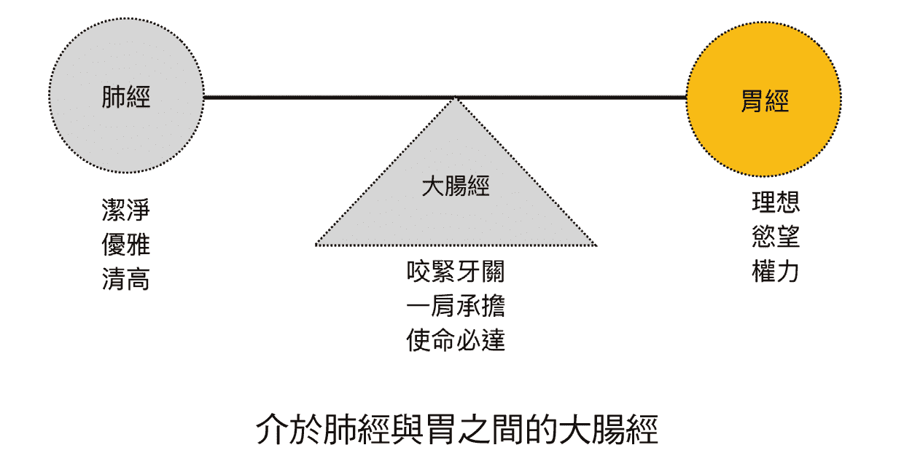

若以家庭关系来比拟，肺经宛如爱漂亮、皮肤白皙的肺妈妈，胃经宛如强壮、好面子的胃爸爸。当肺与胃都习惯以完美形象呈现在世人面前时，在它们的背后，有着朴实的大肠经守护维持着家业：大肠经为肺经抛头露面，行于头面部，连结鼻窍，调节呼吸；配合胃经的饮食消化机能，甚且联合成为头面与手足部位最坚强的结构。

#### 最硬颈的大肠经

大肠经宛如家中的长子或长女，被期望要有深厚的责任感，咬紧牙关，无怨无悔的一肩挑起家业。也因此大肠经常需处理别人不愿意沾手的事情，例如帮忙肺去除皮肤痒疹与鼻涕，以保持美丽的皮肤与畅快的呼吸；将胃消化之后的食物残渣排出体外，让胃净空，可以持续吃东西，维持强健的体格。

面对娇嫩需要呵护的肺经，以及打虎需要亲兄弟的胃经，大肠经总是很铁齿，故作坚强的说：「没问题，我可以的！」还要露齿而笑，耸耸肩，假装轻松潇洒。跟诊的医师听完大肠经这些故事之后，直说大肠经好可怜啊！这也让我想起一首脍炙人口的男性的情伤歌曲「把悲伤留给自己」：

把我的悲伤留给自己　妳的美丽让妳带走

从此以后我再没有　快乐起来的理由

把我的悲伤留给自己　妳的美丽让妳带走

我想我可以忍住悲伤　可不可以妳也会想起我

是不是颇像人前坚强、人后沉重的大肠经！

#### 情绪垃圾桶

中医相信身与心之间互相影响，由于大肠是消化道的下口，宛如人体的垃圾桶，所以大肠经除了承担饮食垃圾之外，还包括情绪垃圾，尤其是来自肺与胃的情绪，因为在追求完美和追逐理想的过程中，一旦所求不遂或得而复失，很容易出现负面情绪。如果这些情绪得不到纾解，也会跟着转嫁给大肠。生活中当负面情绪无法宣泄时，我们也常会说「积了一肚子的大便！」用大便来形容负面的情绪。

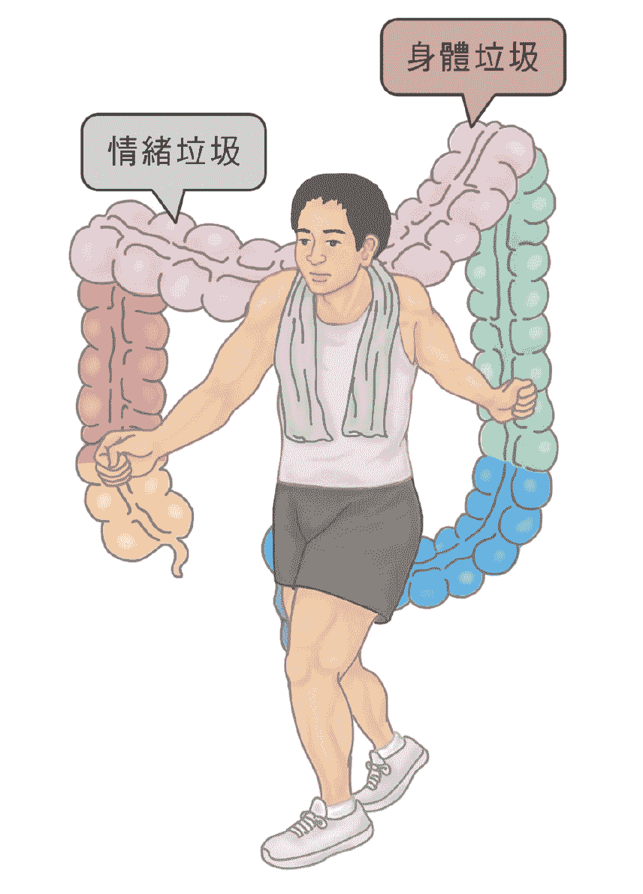

当负面情绪持续滞留在肠道里面就会变质。临床上见到许多大肠癌的病人都有着情绪垃圾无处可道（倒）的情况。

曾问过一位中年的大肠癌患者，是不是情绪都没有人可以倾诉？

病人幽幽地回答：「能跟谁说呢？」

无论是食物或情绪，都需要出口，因此我常建议大肠癌病人要帮自己找一个情绪垃圾桶，无论是真正的垃圾桶，或是可以倾吐心情的闺蜜、麻吉都好，要将负面情绪抛出去，不要累积压在自己身上。

建议大家在日常生活中要自我提醒尽量避免以下四种「肠子」状况发生：

「留肠子」：把所有的压力都往自己身上揽，造成自我伤害。

「大便秘」：负面情绪和不满找不到排解的方法，积郁久了成为情绪宿便，更严重者，还会变成粪石，自我阻碍。

「直肠子」：只想着自己舒畅，让情绪一路通降到底，很容易伤害到身边人。

「泻肚子」：失去情绪平衡能力，情绪宣泄过于急躁，常陷入负面情绪轮回中。

怎么样才是好的肠子呢？请看下面大肠经的教导。

#### 大肠经的教导

在五脏六腑关系中，大肠属腑，主泻而不留藏，气机以向下通降为和。

想一想，大肠的气机也该如此，才能将食物糟粕形成粪便排出体外。如果大肠气机向上冲逆，食物残渣也跟着向胃部上冲，天哪！后果真不敢想象。所以，大肠经教导我们两项人生哲学：

#### 1.传导则有变化

大肠是「传导之官」，是食物与气机的通道，气机要向下通降，到了该放手的时候就要放手，释放情绪，就像排出便便一样；只要该出去的都出去了，能舍才有得，「变化出焉」，事情就会有转机。

#### 2\. 顺势即能改变

不可能每个人都是英雄，大肠本身也没有很强的主导权，我们只是个平凡人，无法改变情势时就学着顺应时势，传而导之，放开牙关与食指，时局就会开始变化。

有一次演讲提到大肠也能排出情绪垃圾，有听众问到：「负面情绪到底要不要发泄？因为不发泄心里难受，发泄又怕再受伤一次。」

我回答说这就像排便一样，成形条状的便便代表肠道健康，水泻稀糊的便便代表肠道生病了。发泄情绪亦然。如果只是纯然情绪的发泄，就像拉肚子一样，一时痛快但于事无补，下次还会继续发作，甚至越拉越严重。但如果在发泄情绪的过程中，加入正面思考与检讨，愿意自我调整，就能有助于改变现状及心情，才是健康的便便了。

所以，加入正面思考，该舍则舍，顺应时势，就能成为好肠子，诚如 The Beatles 的「Let it be」词曲中：

When I find myself in time of trouble　当我发觉陷入苦恼的时候

Mother Mary comes to me　圣母玛利亚来到我面前

Speaking words of wisdom： Let it be　说着智慧之语：让它去吧

大肠经二十个穴位几乎都有助于大肠的通降功能，平日可以多按揉穴位，加上心念的调整，放下武装，偶而耍耍赖透透气，将食物及情绪垃圾一起排出来，就能拥有健康、美丽、快乐的人生。

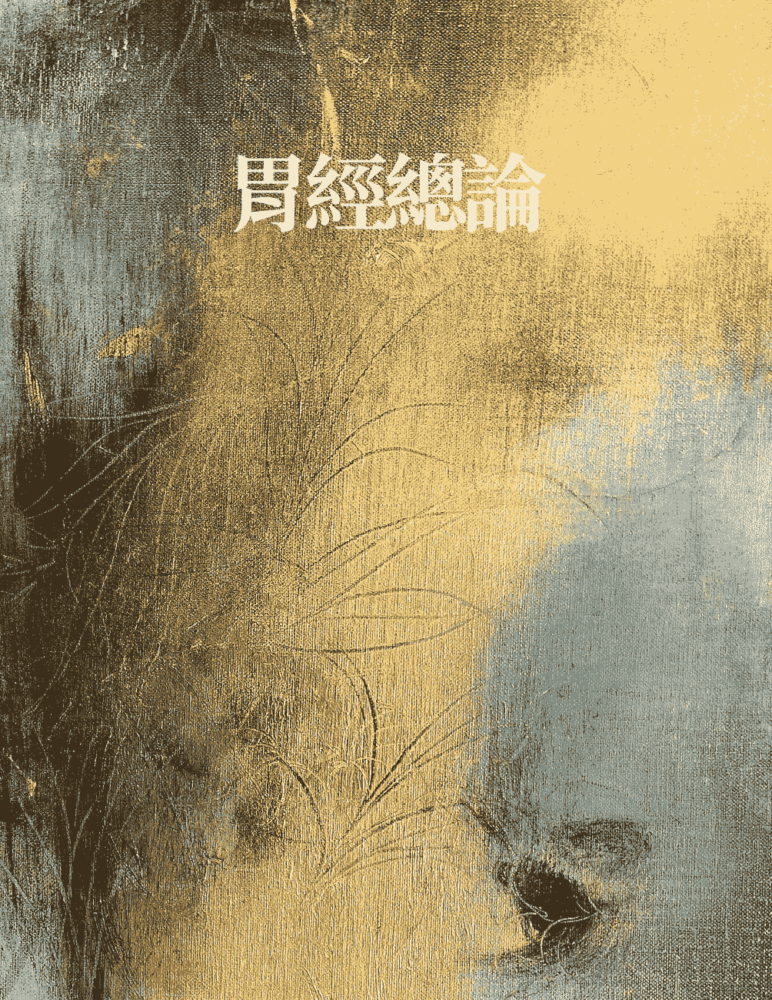

# 胃经总论

## 大胃王之二：一门三杰之聪明哥、型男主厨哥和高富帅老爸的传说

进入了 21 世纪，现今社会里最吃香、最受女性欢迎的男性就是「高、富、帅」，身材高䠷健壮，收入丰富，外表帅气，若再加上聪明灵巧，而且还会烹饪，那肯定是魅力无法挡。

对于胃经的想象，不妨就从这一家三位帅哥说起：在学的弟弟是位聪明哥兼运动健将；进入社会的哥哥是热爱烹饪的型男主厨；事业有成的爸爸是位高富帅的迷人熟男，这三位男性组合成的人生胜利家庭组，其实正好藏着胃经的密码。

胃经家族一门三杰也具有大胃王的优秀血统：追求成功的能力和动力。

聪明哥从小就是个有骨气的孩子，胸襟远大，立下志愿要自力更生，白手起家，创造自己的人生。在校时他是一个优秀学生，认真听讲，过目不忘，还遵照老师教导的学习五到：「眼到、口到、耳到、手到和心到」，勤写笔记，成绩优秀。但是各位可不要以为聪明哥只是一个会读书的文弱书生而已！他不忘阿嬷从小提醒他：「要有好的身体才有奋斗事业的本钱！」所以聪明哥从小就有强烈的健康意识，非常注重饮食和营养均衡，养成专心与细嚼慢咽的好习惯，不只头脑好，身体也壮，前庭饱满，体型高大，肌肉结实，四肢矫健灵活，体力超棒，可谓文武全才。

型男主厨哥哥，则喜欢接触土地和自然食物，得到阿嬷珍藏的传家之宝「胃经烹饪秘籍」，与自己温柔的妻子（脾）在城里经营一家餐厅，哥哥担任主厨，妻子担任外场经理。主厨哥依据胃经秘籍所烹煮的食物，不仅色香味俱全，而且还能保留食物的营养，只要吃过马上成为主顾，是城里人人赞赏的健康厨师。

聪明哥与型男主厨哥这么优良的基因都来自高富帅的熟男老爸，熟男老爸也是吃自己母亲「胃经烹饪秘籍」的食物，长得一表人才，进入职场后，应对敏捷得宜，学习能力强，工作有效率，常事半功倍；由于体力好，除了本份工作游刃有余之外，还会主动帮助别人，乐于付出。如此优异的表现，老板看在眼里，当然一直拔擢成为主管，收入也跟着水涨船高，随着年龄与资历的增长，逐渐成为业界的龙头，大家都称他「高富帅熟男老爸」。

别羡慕这一家人！

他们只是注重饮食均衡、细嚼慢咽，保留食物营养，把胃经照顾好的代表。自己的胃自己顾，人人都可以是大胃王家族的一员。

接下来就跟大家介绍超级优秀的足阳明胃经系统。

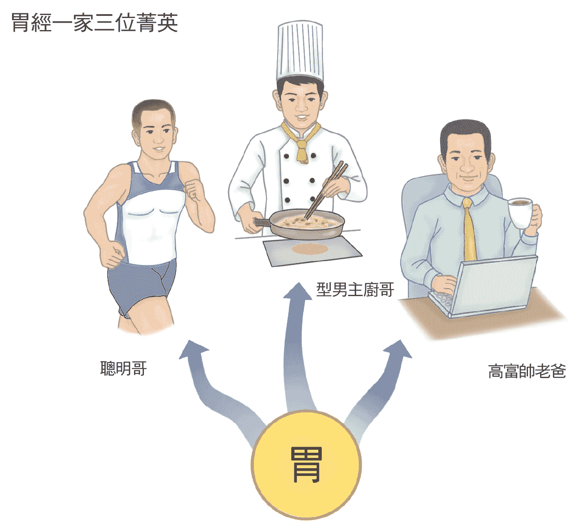

#### 「食色性也」的胃经

自远古时代开始，个体的生存和族群的繁衍都是最重要的事情。人类由动物进化而来，一直都保有动物基本的生存和繁殖的本能，就是食欲和性欲。

中国有句名言「食色性也」，出自《孟子》一书。告子是一位年轻的哲学家，他认为喜爱美好的事物是人类本性，但这句话却被后世从字面上直接解释为食欲和性欲都是人的本性。不过换个方式想，这样的延伸与想象倒也有几分道理，食欲是为了个人的存活，性欲是为了种族的延续，暂且抛开社会规范与礼仪道德，食欲和性欲确实是最基本也最原始的需求。

胃经身为大胃王家族的老大哥，「强壮」与「欲望」非常贴切地形容出胃经系统的特色，因此胃经也成了另一种「食色性也」的代表作，它与食欲和性欲关系密切，而且胃经也跟肺经一样，记录了人类演化过程中有关食与性的历程。

### 胃经与食欲的关系

中国人向来重视吃，认为民以食为天，历史上朝代的更迭，常因饥荒或暴政搞得民不聊生，导致叛乱，让统治者政权变天，可见吃对人们的重要性。

在吃的过程里，食物从嘴巴进入体内后，最重要的一站就是胃！所以大家也很习惯将想吃东西的欲望称为「胃口」，彷彿胃是一个更大的嘴巴，承接所有进入体内的食物。

在民间用语中，「胃口」可代表几种不同的意思。

#### 胃口与食欲

古人只用「胃口」两个字就表达了食物从口进入胃的路程：由口到胃。这就是现代医学所说的上消化道，包括口、咽、食道和胃，正是「胃口」两字一举概括。

胃口既然代表上消化道，最直接的意义就是「吃进食物」，胃口好则吃东西的欲望高，胃口差则没有吃东西的欲望，例如生病的人通常不想吃东西。

对于成长中的孩子，胃口代表成长趋势，养育幼儿的家长最怕孩子胃口不好，吃少少瘦巴巴，营养不足，更担心孩子发育不良。在中医科门诊中常见这些忧心忡忡的年轻爸妈，希望医师能帮孩子开胃，增加食欲，快快长大。

长大后，终于可以掌握自己的胃口和喜欢的口味，但麻烦的是各地的美食纷纷入口后，也让百病丛生。

为什么会「病从口入」呢？

过去人常说，努力工作就是要图个「温饱」，所以「吃饭皇帝大」，不仅重视吃饭的时间与质量，也常用「吃饱了没？」做为亲友彼此关心的问候语。但到了现代的工商社会，「吃饱」对多数人来说已经不是问题，问题反而在于忙碌的现代人拥有充足的食物选择却不懂得珍惜身体，不仅吃饭时间很错乱，还常常吃得很急，很分心，很随意。等到胃出了问题，再看电视广告买成药或找医师开胃药，非但自己闯的祸不想自己收拾，就连医师建议要改变饮食习惯，病人也多半阳奉阴违。在临床过程中，这样的局面常让我感到无奈。

问病人：「赚钱为了什么？」

病人说：「为了有饭吃呀。」

我再问：「你现在有很多饭可以吃了，怎么不好好的吃呢？还弄到胃坏掉？那赚钱到底为了什么？」病人哑然。

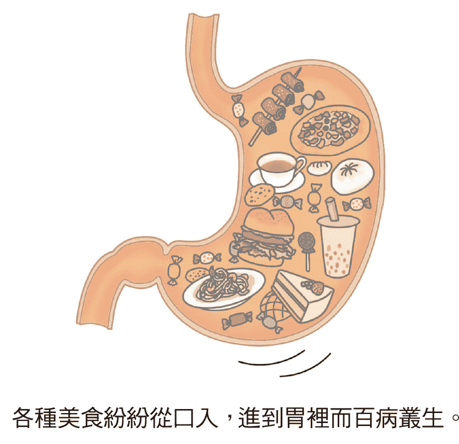

最近一位阿嬷因为胃痛来看诊。病人本来就胃弱，过去只要吃刺激类食物，胃就不舒服。近日动了凡心，吃了点辛辣物，胃痛马上发作。

问她为何要乱吃？她故作轻松地说：「唉呀！就想说吃一点点，应该没关系吧！」

我问：「你会把这种食物给你的小孙子吃吗？」

病人马上摇头说：「当然不会呀！小孩子不能吃这个东西。」

我紧接着再问：「所以，你爱孙子却不爱自己囉？你的胃还比不上小孙子重要吗？」

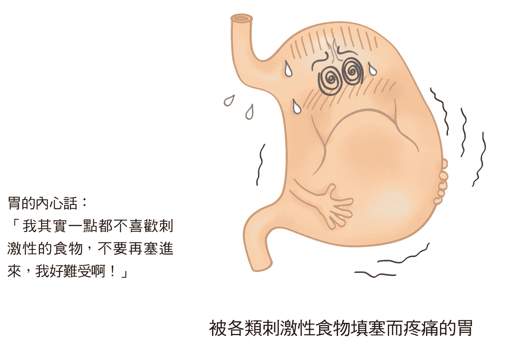

这类故事天天上演，这类对话也常在诊间出现，医师怎会不累呢？

#### 胃口与心之所好而生的强烈兴趣

生命演化过程中，透过进食过程以及营养的传输，维系了我们的生命机能。在中医的观念里，胃经除了原本具有的重要功能外，它的经别还连结到心，所以进食的过程、饮食的内容，也会影响到心情，反之心的欲望与感受，也会透过胃口来反应。

面对喜欢吃的食物 / 口味，人们总是食指大动、胃口大开。这时「想吃东西」不只是生理需求，还掺杂了欲望上的想要与满足，对于特别爱吃的食物常有着强烈记忆与嗜好，并且会产生想要再吃的欲望。

面对不同的情绪，我们的胃口也会随之变动，情绪的压力与释放也经常透过吃来代偿。因为情绪而影响到饮食作息的问题每天都在上演，有人以大吃大喝来舒压，有人用山珍海味的顶级食材来满足身份地位的象征，还有人因为身心挫折而食不下咽，这些行为在中医看来，都是与健康为敌的毛病，看在眼里，叹息在心里啊！

俗语也用了这个概念而延伸出「吊人胃口」一词，本来是指用好吃的东西挑起他人的食欲，让人胃口大开，但后来胃口的譬喻已经变成暗指人们内心欲望的代名词。例如：对于有兴趣的事物，我们会说「合我胃口」，会想多接触、多了解；没兴趣的就说「不合胃口」，意兴阑珊，敬而远之。

语词的变化，也是研究人类生活社群变动的一项见证，就像胃口原先是强调人对于食物的需求，但随着人类的社会化，生活环境与人际关系越来越复杂，胃口已经代表着我们对于周边事物的兴趣与好恶，从生理层面跨越到心理层面。而这样的关联早在中医经典《内经》中载明了。

#### 胃口与贪欲

有段期间电视台流行举办「大胃王」比赛，看谁吃得快又多。看了这类节目，一方面心疼参赛者的胃，猜想比赛之后，胃肯定会跟主人抗议吧！一方面更心疼这些原来可以喂饱不少人的食物，就这样囫囵吞枣、不知滋味的被强咽下去，何尝不是一种浪费。直到今日，还有许多人们处于饥荒濒死的危险境地。曾几何时，我们已经可以如此地恣意挥霍珍贵的食物？在这类比赛中，我看到的胃口已经不是食欲，也不是兴趣，更遑论喜恶，而是用来追求完胜的贪欲。

在台湾有许多自助式吃到饱的中高档餐厅，过去曾有报导，有人特地事先挨饿一天，然后再去这类餐厅用餐。饿个一天是想让胃空一点，好装下更多食物，等到大吃一段落之后，此人还会突然从饭桌上消失，原来是跑到厕所去催吐，吐完后，胃也空了，然后再若无其事的回到座位继续大快朵颐。有人问他，催吐不是很痛苦吗？值得这样做吗？他说值得呀！既然要花一样的钱，何不多吃一点！

这样的人以为多吃就是要捞本，其实他们捞的是贪欲，最后没捞到本，反而是伤本（身体）。

以中医师来看，让食物从胃中反流出口的过程，对于消化系统的伤害，恐怕不是钱可以弥补！胃对食物做初步消化，然后向下送到肠道做进一步消化吸收，中医说「胃气以降为和」，胃气的正常生理功能应该是下降为主。如今人为的勉强胃气上逆，导致胃的气机逆乱，功能失常，再怎么坚强的「铁胃」也终将锈蚀报销。

小结「胃口」的概念，可利用下页图说明。左侧胃经经别连结胃脾与心，让胃口与心念交互滋长强烈兴趣，为右图的食欲─兴趣─贪欲连线开了一扇方便门。

对于饮食与人性欲望的关系，在许多文学、电影中都有许多描述，例如日本动画家宫崎骏的作品《神隐少女》，故事导火线就是起于贪吃的爸妈变成猪，进而延伸出整个奇幻故事，将人性中的贪念阐述得淋漓尽致。早在华人世界里，就曾藉由猪的形象来譬喻好吃懒做、贪食好色的角色，例如《西游记》中的猪八戒（猪真是无辜，最贪的可是人）。

其实食与欲的关联，中医很清楚的看出是透过胃经与心的连结。心是人体的君王，心主神志，管理情绪与欲望，胃连通心脏的这段关系，让胃对于食物无尽的需求，转为对于事物的强烈兴趣，再转而去强化心对于欲望的强烈追求。俗语也常用胃口形容欲望，例如「这个人心很大，胃口也大，不容易被满足喔！」如果能多了解经络系统，就更能体会这箇中奥妙，人的身心本是一套完整的小宇宙呀！

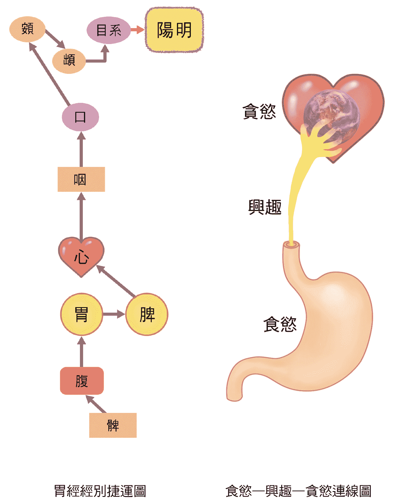

#### 胃腑与肚量

就脏腑的特性，胃属于六腑之一，位在腹部；就经络的分布，胃经经筋全部包覆腹部；腹部又俗称肚子，因此一般人把胃腹部肚子，以为肚子就代表胃，例如飢饿的时候常说「肚子饿」，吃饭就是「填饱肚子」。

在过去较为简朴的生活中，吃饭填饱肚子可是大事，煮饭的人权力超大。万一碗里面的饭粒没吃干净，会遭煮饭的妈妈恐吓「将来会嫁给满脸麻子的丈夫」。如果倒掉或丢弃食物，妈妈一方面生气孩子挑嘴，扬言下次要罢煮，同时更会碎唸「以后会没东西吃」。在这种环境长大的我们，对于食物总有份崇敬和珍惜，常常舍不得丢弃食物，只好全部吃到肚子里，结果肚子就逐渐「自肥」，变成有肚量的人！

「肚量」是与肚子有关的词汇中最常听到，这其实也跟胃本身的特质有关。胃是一个袋状且弯曲的空腔器官，可以「收容、受纳」吃进来的食物，停留在胃里一段时间，让胃有充足的时间做初步消化，再向下输送到小肠。

胃这个容纳食物的特性，代表容量和受纳，被称为「肚量」。实质的功能可用来表示我们吃进去的食物量，譬如肚量大的人一餐可吃十碗饭；但抽象的譬喻，则会以肚量形容一个人对于事物的气度和修养，例如会用肚量大来形容为人比较宽厚、包容，历史上赞美宰相王安石、吕端是「宰相肚里能撑船」，强调他们大人大量的胸怀，虽然夸张，却也非常生动。反之，肚量小的人，常被讥讽为「鸡仔肠，鸟仔肚」，以细小的鸡肠鸟肚来表示气度窄，爱计较。

而在日常生活中，我们也常用「肚子」两字来表达情绪，如：

「我憋了一肚子气，因为遇到一个骗子，虽然心知肚明那人是一肚子坏水和鬼点子，不学无术，肚子里没半点墨水，但我还是被骗，现在我是满肚子委屈，不知要跟谁说啊……」没想到骗子和被骗的人，这两人的肚子里都藏了很多「秘密」，这是不是很奇妙呢！

肚量大在为人处世方面虽是赞美，但回到了身体健康的算计上，如果肚子变得很大又突出，那可不妙！俗语说「膨肚短命」，就是提醒我们要注意肚子的尺寸，也就是现在健康评量中常见的腰围建议。如果长期吃进过多的食物及油脂，囤积大量脂肪，腹部会撑得很大，变成「大肚腩」、「啤酒肚」的苹果型肥胖者，严重的话会影响许多重要内脏功能，甚至引发死亡！（相关细节会在脾经介绍）

 中医师不传之祕：胃腑的三大特质

###### 胃腑的三大特质

如前所述，一般人对于胃的说法，与中医所认知的胃很相似。

在大肠经篇中介绍过「大肠、小肠皆属于胃」。古代医书里面早就有清楚的分别胃、小肠和大肠，而且它们的基本功能跟现代知识差异不大。中医很早就认知到胃的功能很强大，所以胃能控管它下面的小肠和大肠，而大小肠也各有一个下合穴放在胃经上，这很像春秋战国时代，君主常将世子留在敌国，以示忠诚的战略。因此，中医在讨论消化功能时，常以胃来涵括一切。

中医认知的胃腑有三个重要特质：受纳腐熟水谷，胃主通降，以及关乎生命的胃气。分别说明如下：

##### 1.受纳和腐熟水谷

胃的受纳和腐熟水谷，这个概念其实已经融入前面的「肚量」。受纳与腐熟水谷功能可以说是一个连续性的工作：

「受纳」──是胃接受吃进来的食物，包含固体和液体，所以称为水谷，先容纳在胃里一段时间，以便做初步消化。

「腐熟」──是将胃中等待消化的食物做初步消化，变为食糜，再向下输送到小肠做进一步消化吸收。

人体所需要的养分，中医称为「精微物质」，精微物质的吸收是发生在小肠，虽然胃会把腐熟的食物送往小肠，但小肠也会把精微物质再转送回到胃，胃传给脾，脾再运送到心肺转化成气与血，周流全身，维持生命；至于人体不需要的物质，小肠就向下输送，由大肠转化成粪便，肾与膀胱转化成尿液，排出体外。

胃的功能很像炖锅，工作的方式与人们烹煮食物的方式一样。

人是杂食动物，各类食物性质不同，通常先将它们放在锅里，加上酱料，搅拌均匀，浸泡一段时间以便入味，这就是胃的「受纳」功能。然后启动开关，加热，开始焖煮，这就是「腐熟」功能。

容易煮熟煮烂的食物，如豆腐、青菜等，会早点熟，就能早入口，这如同胃所吸收的精微；不易煮烂煮熟的食物，如玉米、芋头等，就会持续放在锅里烹煮，晚点再入口，如同胃将食糜下输到肠道，继续消化，将精微物质逐渐吸收。食物无论早吃或晚吃，都是可口美味佳肴，都能填饱肚子。同理，无论是胃或肠道所吸收的精微物质，都是人体最珍贵的资粮，一并传送给脾。

由于胃具有受纳腐熟水谷的功能，古人特别尊胃为「水谷之海」，是人体气血生化的来源。胃与脾为相表里的脏腑，功能相辅相成，胃负责直接消化吸收水谷精微（脾胃分工概念中，胃含括了大小肠的功能），脾负责运化水谷精微，将水谷精微运到肺，再由肺转化成气血后，输送至全身，这是人体离开母体之后，生存所需最关键的物质，所以中医称脾胃为「后天之本」，「气血生化之源」。

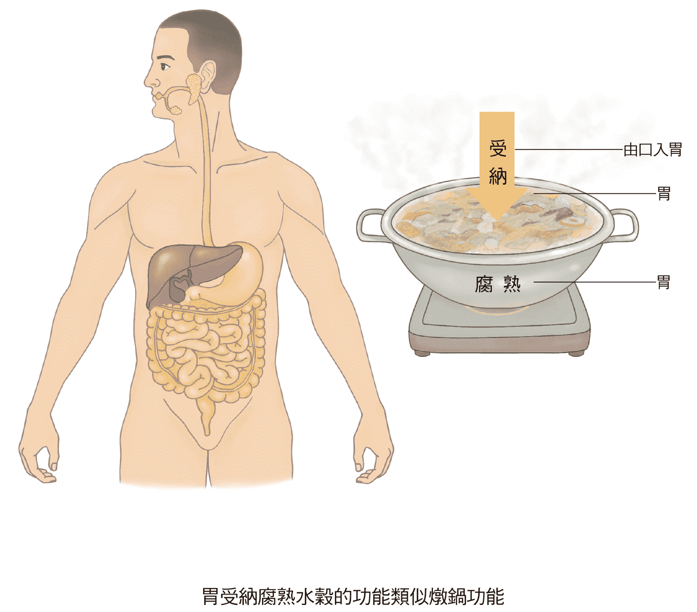

既然脾胃功能如此重要，我们还可以再将它们在食物消化过程中的功能细分。且以餐厅来比喻，胃是厨房里面的大厨师，负责烹煮食物，即受纳腐熟水谷；脾是外场的经理，负责将煮好的餐点送到客户的面前，即运化水谷精微。

对于一般性的水谷精微，胃就交由脾转送出去，转化成气血之后，供给全身组织使用。其中心脏对人体的重要性宛如朝廷的君主之官，要送给君王的饮食当然要谨慎小心。为了保证心脏这位君主之官可以得到最安全而且最营养的食物，胃经与脾经都架构了一条特殊通道，我称为「御膳房之路」，经由脾胃穿过横膈，直接送到心中。

##### 2.胃主通降

人类无论是进食的方向，或者食物在体内的消化动向，都是从上而下。同理，胃也服膺这样的原则。

每个脏腑都有属于自己的功能特性，中医称之为「气」。胃的功能就称为「胃气」，后面会再介绍。胃气推动受纳腐熟水谷的工作，胃气的作用方向自然就以「下降」为主。

胃是袋状且弯曲的空腔器官，食物从此通过，向下到肠道，中医称之为「通」，与前面的下降功能合并为「通降」，是胃正常的运转模式。

中医认为「胃气以通降为和」。「通」是指食物在胃中停留的时间适当而且活动通畅；「降」是指食物从上而下，顺着消化道方向活动的方向；「和」是指健康祥和。胃气能通降，身体就会健康。

反过来说，如果胃气不能通降，就会出现气滞和上逆的情形。

例如胃气该通而不通，食物在胃中会停留过久，气机停滞，而出现腹部胀满、胀气的症状；胃气该降而不降，食物或食糜就会向上冲逆，而出现打嗝、嗳气，甚至恶心呕吐的情况。现代的胃酸逆流就是胃气不能下降反而上逆的现象。

胃和脾相表里，都位在中焦，是人体气机上下的重要通路。若胃气以通降为和，那脾气呢？

胃气以通降为和，脾气则以升提为健。脾与胃一升一降，外提清气，通降浊气，人体的气机才能调和，关系如下图。

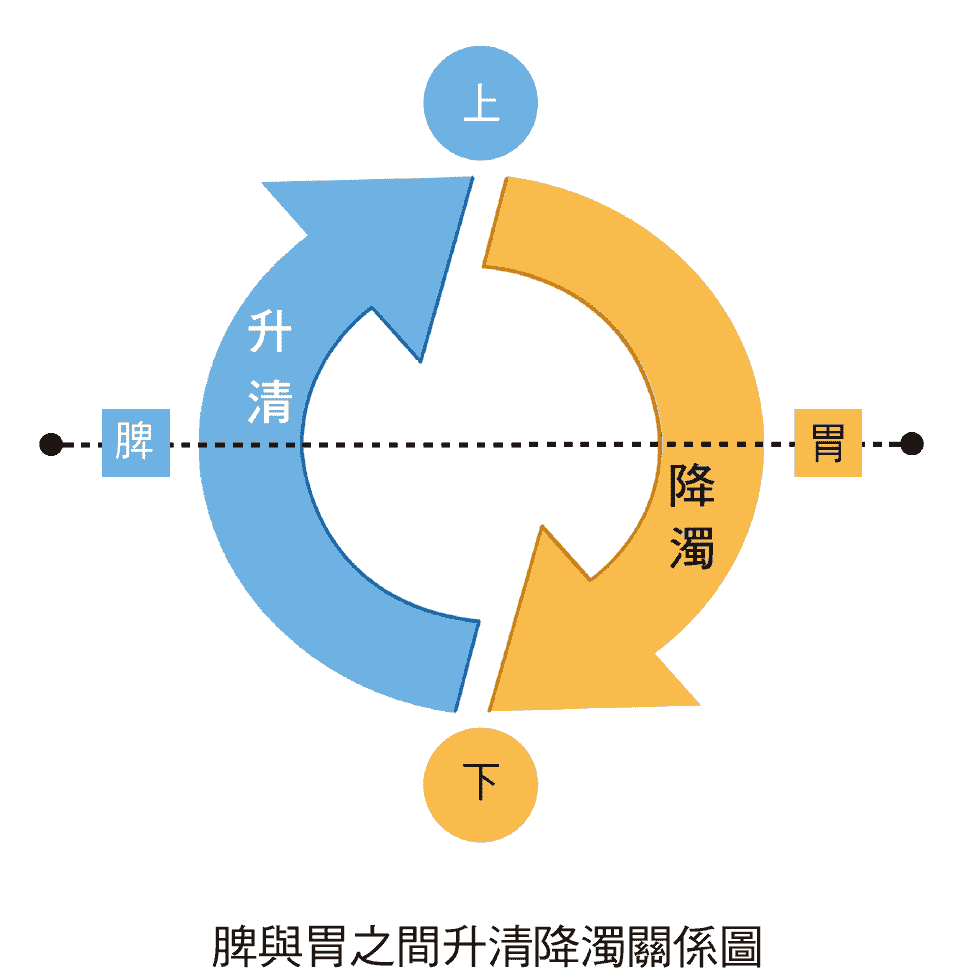

##### 3.气的特色和重要性

中医称胃的功能特性为「胃气」。

饮食是维持生命的根本，民以食为天，胃气能推动胃受纳腐熟水谷，及将精微物质输送到脏腑的能力，以维持身体健康。

《内经》有关饮食消化的重要流程，原文如下：

「食气入胃，散精于肝，淫气于筋。」

「食气入胃，浊气归心，淫精于脉，脉气流经，经气归于肺，肺朝百脉，输精于皮毛，毛脉合精，行气于府，府精神明，留于四藏，气归于权衡，权衡以平，气口成寸，以决死生。」

「饮入于胃，游溢精气，上输于脾，脾气散精，上归于肺，通调水道，下输膀胱。水精四布，五经并行，合于四时五藏阴阳，揆度以为常也。」

简单说，固体和液体食物都先进入胃中，经过受纳腐熟，化为水谷精微，胃再分三路输送：

路径 1：输送给肝脏，滋养筋膜，让人体肢体活动顺畅；

路径 2：在这里「浊气」指的是最稠最佳的营养物质，归给心肺，转化为气血，送至全身百脉，以维持生命活动，并在腕关节附近的寸口处形成脉搏，这是中医很重要的把脉诊断方法；

路径 3：津液输送给脾脏，再由肺敷布全身，最后转输到膀胱。

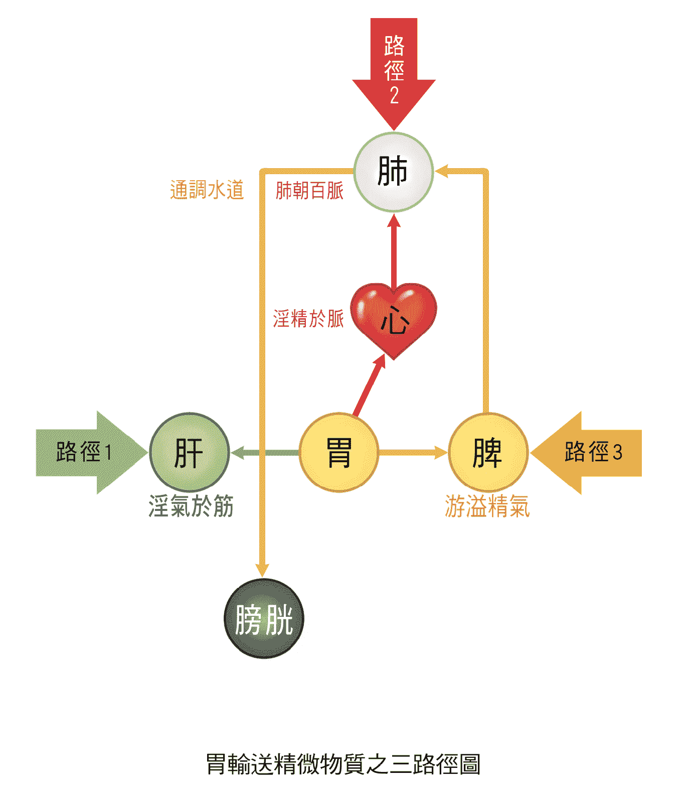

所以胃气的工作繁重且至为关键，推动食物的消化、吸收，变成精微物质，经由心肺转化为气血，再输送到五脏，以维持生命。中医尊崇「胃为五脏之本」，胃气正常则生命所需的营养物质就能得到源源不绝的补充，五脏六腑得到充足的养分，生理活动才能维持正常。

《内经》对于「胃为五脏之本」有非常精辟的论述如下：

「人受气于谷，谷入于胃，以传与肺，五藏六府，皆以受气。」

「胃者，五藏六府之海也，水谷皆入于胃，五藏六府皆禀气于胃。」

（注：古医书中的「藏府」通「脏腑」）

有中医底子的读者也许会发现，在脏腑关系上，中医向来重视五脏，而六腑都只有陪榜的份。胃虽属于六腑之ㄧ，但从功能上来看，可以理解为何「胃为五脏之本」、「胃者五藏六府之海」，而且中医还强调「人以胃气为本」，凸显胃的重要。这就是中医很务实的地方，重视能力甚于名份！

胃是消化系统的核心，对于维持生命来说，胃确实至关重要。

《内经》说：「平人之常气禀于胃，胃者，平人之常气也，人无胃气曰逆，逆者死。」

胃是五脏六腑之中，唯一实际接纳食物，并将之点石成金，转化为维持生命所需物质的「养分工厂」。没有胃气，就没有维生物质，人当然也会失去生命，这就是中医说「有胃气则生，无胃气则死」的道理。这个观念常应用于中医师临床诊断之中。

就诊时，中医师都会询问患者的胃口如何，从中了解其「胃气」情况，以判断疾病的轻重与转归。如果还能进食，表示胃气还能运作，即使重病，都有机会转轻。反过来说，如果饮食持续难进，通常表示胃气严重损伤，即使是轻病，也要小心病情急转直下。

中医师运用「人以胃气为本」的第二个方面就是把脉。

《内经》对此有特别的论述：

「帝曰：气口何以独为五藏主？岐伯曰：胃者水谷之海，六府之大源也。五味入口，藏于胃以养五藏气，气口亦太阴也。是以五藏六府之气味，皆出于胃，变见于气口。」

黄帝直接点出「气口独为五藏主」的观点。

胃气将最营养的物质归给心肺转化为气血，濡养五脏六腑，所以脏腑的状况皆与胃气有关，一如前述「谷入于胃，以传与肺，五藏六府，皆以受气。」

「气口」位在手臂的阴面，腕关节的后方，正在肺经循行所过的部位上，附近有列缺穴、经渠穴及太渊穴，脏腑之气就由胃顺着肺经呈现在气口上。

气口处的脉搏中医特别称为「寸口脉」。它包含所有脏腑功能的讯息，中医师在此把脉就能初步掌握病情与判断预后。健康的寸口脉象，中医认为也要有胃气。有胃气的寸口脉？很难懂喔！没关系，把脉从来就不是一件容易的事，连古人都说把脉是「心中了了，指下难明」，难度可见一斑。

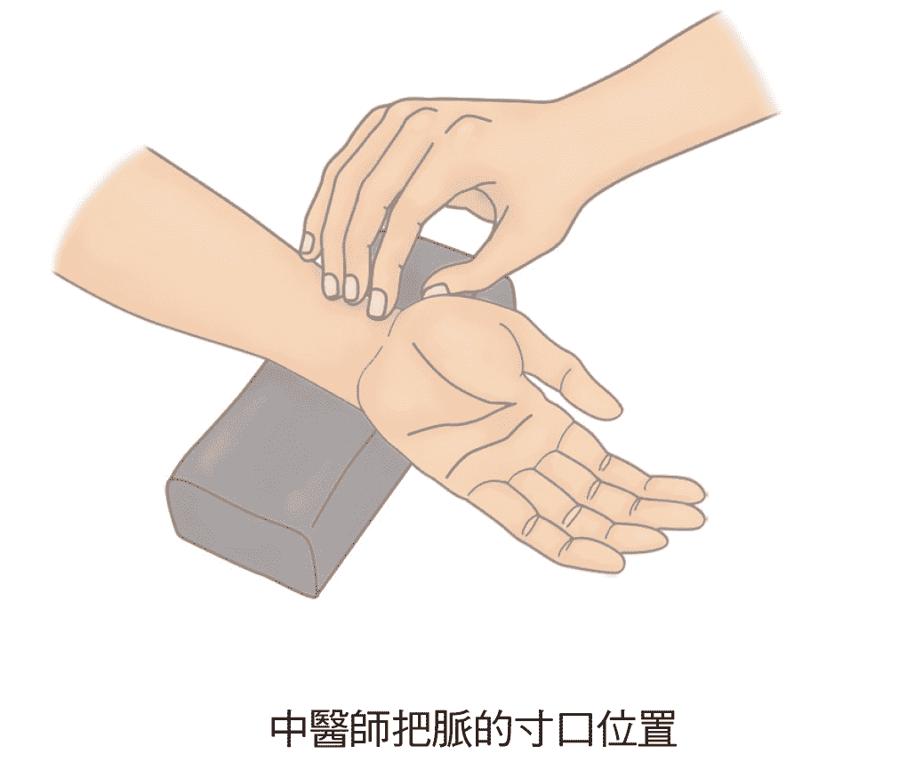

理论上有胃气的寸口脉，把脉者的指下会有一种从容和缓的感受。如果失去这种柔和感，脉象会比较僵硬不顺手，中医称为「真藏脉」，通常预后都不佳。所以寸口脉也符合「有胃气则生，无胃气则死」的诊断原则。

 中医师不传之祕：脾胃同为后天之本，气血生化之源

###### 脾胃同为后天之本，气血生化之源

胃与脾相表里，两者位置接近，功能相辅相成。虽然胃脾五行都属土，但是脾的土性特质更为明显（这部分内容脾经再介绍）。

如前所述，胃象是餐厅内场的主厨，负责将食物转化成营养物质，脾是外场的经理，将营养输送给全身各个组织器官，以维持正常运作，脾胃合作成为「后天之本」。

中医还有「脾胃主肌肉及四肢」一说。

肌肉的丰厚与否取决于营养供给，尤其是蛋白质。这方面可以举例日本的相扑选手，他们乍看之下很胖，其实体脂肪率并不会比一般人高。相扑运动需要强大的力量及非常结实的肌肉，这主要依靠「训练」和「饮食」，所以除了严苛的训练之外，相扑选手的食量也异常大，这样才能将高热量转变为脂肪储存起来，高蛋白成分则作为肌肉生长的物质基础。

至于一般人，虽然不需要这么强健的肌肉，却也需要适当的营养来生肌长肉，有了肌肉，四肢才会强健，运用灵活，可以从事各项学习与谋生的技艺。

在临床治疗时，曾经遇过有些病人过度追求健康饮食，只顾吃糙米和生机蔬食，而完全忽略了蛋白质的摄取（素食者可以从坚果和豆类食物中摄取植物性蛋白质），以为很快地瘦下来就是健康，结果因为缺乏蛋白质而肌肉无力，甚至过度消瘦，引起肢体痠痛及活动不利等问题。

胃经系统的贡献，不仅培养出体格健壮的型男主厨，胃经因为遍布于头面五官部位，充足的营养也让他长得头好壮壮，成为耳聪目明、学习力强、成绩亮眼的聪明哥。再加上胃经主管人体最重要的精微物质，这是胃经专属的财富，也是他最为重要的功能，所以让胃经家族又增添了一位帅哥。综观这些特质，都是胃经能跻身为后天之本的关键。

### 胃经与性欲的关系

古人说「饱暖思淫欲」，这个说法很传神又有趣。其实性欲是人类的本能之一，自然无需等待饱暖之后才出现，此话的重点应是当人吃饱穿暖之际，体内阳气充足，此时的性欲就容易高涨。

食欲是延续自己的生命，性欲是为了延续种族的生命，看似无关的两个本能却都融合在胃经系统之中。尤其胃经系统连结胃与脾（脾与女性生理功能密切相关）、乳房、肚脐和阴器（生殖系统），成为一个完整的性欲系统。请参阅下页图。

胃经的性欲系统可分求偶及性表现两阶段介绍。

● 求偶──注重外在表现

在自然界中，许多雄性动物若没有两把刷子是无法繁衍后代的，而这些求偶的能力都与胃经有关。例如许多雄性动物外表都特别漂亮，或是具有特别的色泽、特征，这些特色几乎都是为了吸引雌性动物而来。

其中鸟类的求偶招数最为花俏，也最为人所知，例如画眉鸟天生一副好嗓子，牠会卖力唱情歌；公孔雀则以美丽的羽毛开屏来吸引母孔雀的好感；天鹅则会张开羽翅跳舞，并邀请异性共舞。

还有许多雄性动物需要具备强健的肌肉（战斗力），会以搏斗方式一较高下，争取交配权，或是族群的领导权，这类的竞赛，比的是肌肉，是强壮。

胃经掌握食欲，可使体格强壮，这是一个可以看见的外显特质，就像雄狮、老虎等猛兽，也要比谁是老大！对于公鸟而言，前述显现于外的特征，如羽毛、歌声、翅膀与脚步的舞蹈，鸟喙的建筑能力等，也可视为体格健壮的另类表现，这些都需要充足的营养来支持。

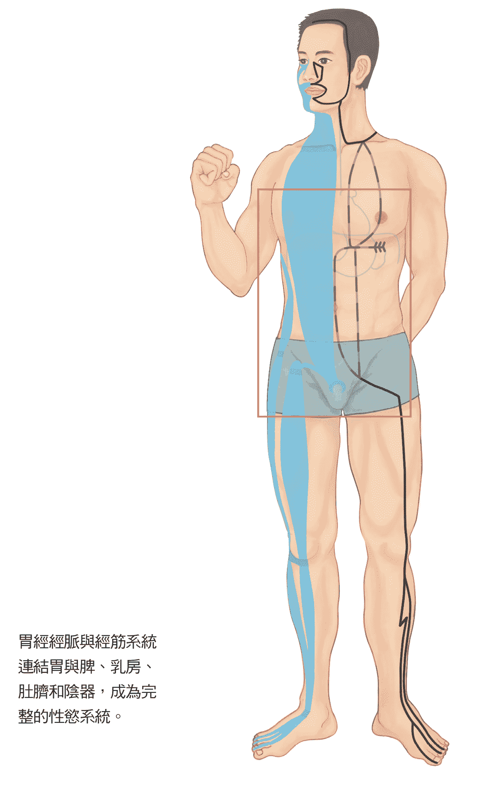

在早期的人类社会和动物界里，身体强壮者比较容易掌握权力，许多动物的族群首领都是体格健壮者。有权力的就比较容易掳获异性与其交配，无论对方是志愿或非志愿皆然！唯有强者才能将其基因传下去。所以有着强壮的胃经才有优先选择的权利。

另一方面，从性别特征来看，胃经的功能强也会强化身体的第二性征，例如强健的胃经除了让雄性体格雄壮，性表现较佳之外，也因为胃经循行到乳房和侧腰部，加上脾胃主肌肉，也会让雌性身形特征鲜明，例如女人的乳房及臀部都会比较丰满，男性对此容易产生较高昂的「性趣」。

台湾早年的婆婆挑媳妇，也都流传着选媳妇要选圆圆的臀部，因为这样的女性生育力比较强，才能为家族多多添丁。

● 性事──注重内在活动

历经前一段，以外在表现吸引异性接近，接下来就要看实质表现囉！

强壮的胃经不仅气血充足，肌肉强健，而且欲望饱满，通常会有较佳的性表现。若能令异性满意，获得青睐，未来也有较多的「合作」机会，能让自己的基因传递下去，这可是人类从洪荒时代就一直追逐的目标之一。

性冲动是一时性的活动，但当进入文明社会之后，哺育与教育下一代却要耗费许多时间与营养，所以快乐一时，却要承担终身。因此，聪明务实的人体，早就相中了脾胃为气血生化之源和后天之本的特质，以及握有生产和输送精微物质的胃经系统，由它来连结脾胃、乳房、肚脐和阴器等这些相关器官，共同提供一时的性冲动所需要的爆发性能量，以及孕育和哺育亲子过程中所需要的长期性营养。

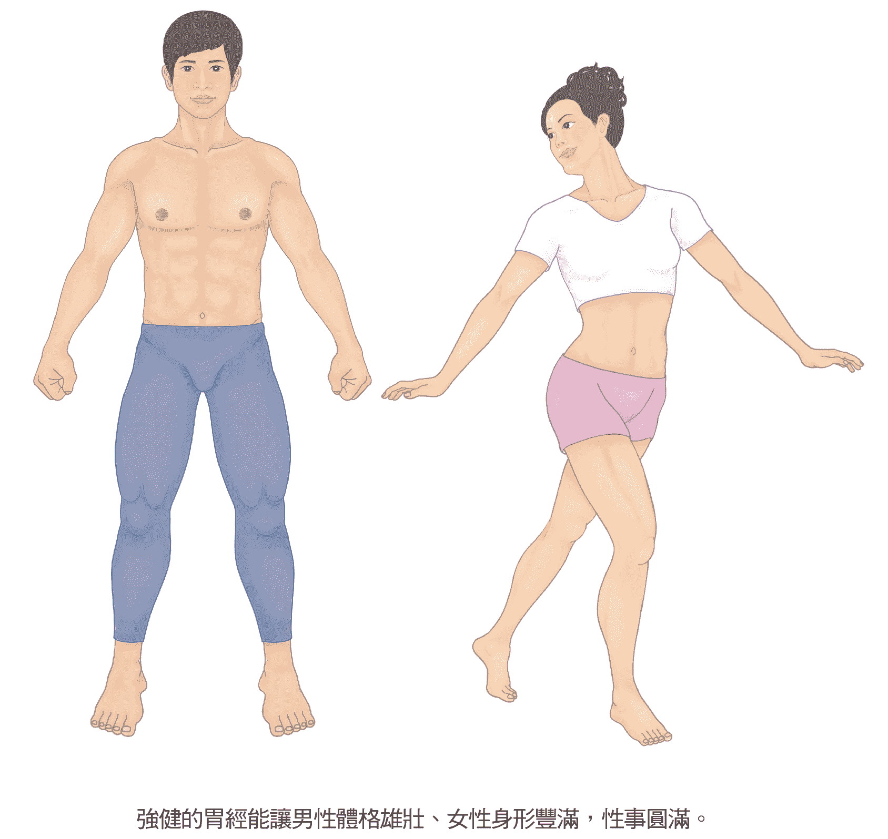

### 掌控欲望的胃经

身为五脏之本的胃经系统，责无旁贷的承担起维系生命与传宗接代这两项重责大任。胃经强者，食欲、性欲皆强，而且不只生理上的生命力强，延伸的权力欲望也会跟着增强，常常会从群体中窜起成为领导者。

但凡事都有利弊消长，相对地，若欲望过于放纵不加节制亦会造成伤害，无论是过量的饮食与性，或是贪欲的增长，都有可能演变成破坏的力量。

过去自然界的规律是强壮者得以生存，现代社会则注重群体规范，心智聪明者较易胜出。聪明的胃经系统，不只反映基本的生理需求，当然也有其理性的平衡机制，胃经循行到额颅，额叶主管专注力、观察力、逻辑力，掌控个人的理智和修为，这也是胃经对欲望的自我约束力。

另一方面，它还有一个好伙伴──脾经，相较于胃经系统是一个彰显于外、喜爱高调展现自己能力、容易冲动的特质，与之相表里的脾经，则是比较成熟阴柔，可以包容承担阳刚暴冲的胃经，两者之间的调和也是阴阳平衡。人体经络的世界里，充满太多奥秘与精微的设计，彼此间环环相扣，运行不断，牵一发而动全身。

在我看来，十二经络系统既像十二种人格特质，也象是一国之君臣，各有所司，互相合作又彼此牵制。胃经的特质反映着人类的基本生理欲望和感受，也是一个人成长过程中开始社会化的过程，理应人际关系也最为密切，因此我在撰写十二经络中，胃经是出现最多人与人之间互动关系的论述。这些细节在后续四大系统内容中再一一说明。

以下是胃经四大系统捷运图及经络图，还含括了胃经与食色性的关系。

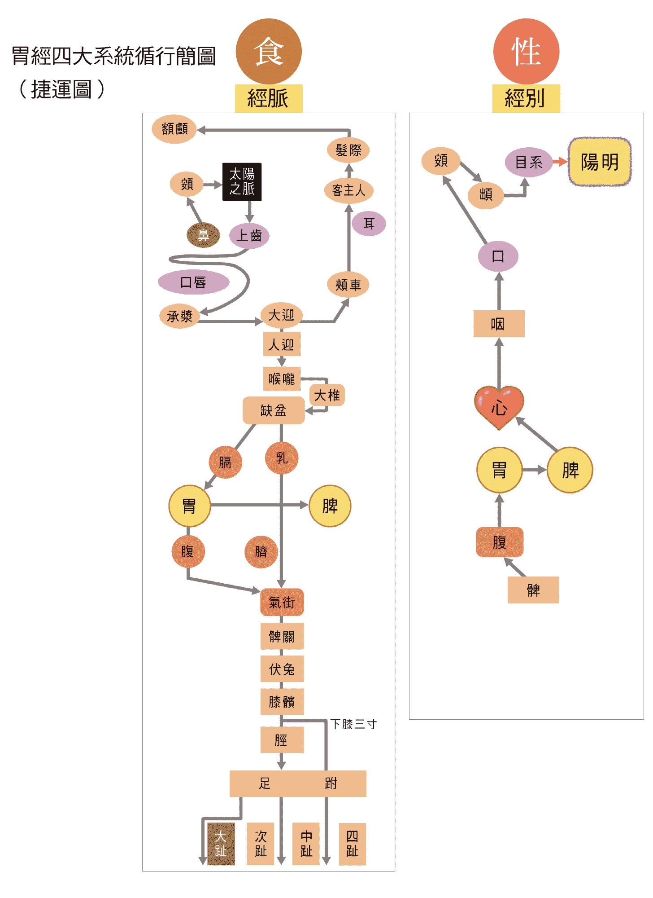

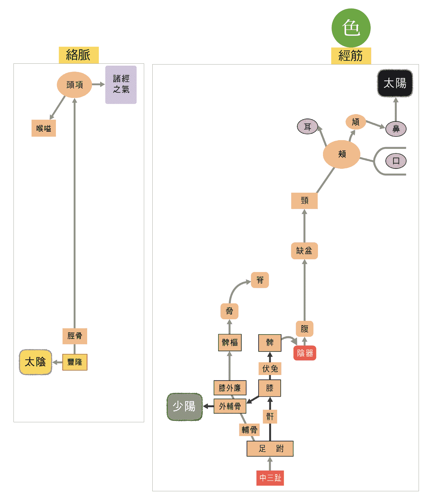

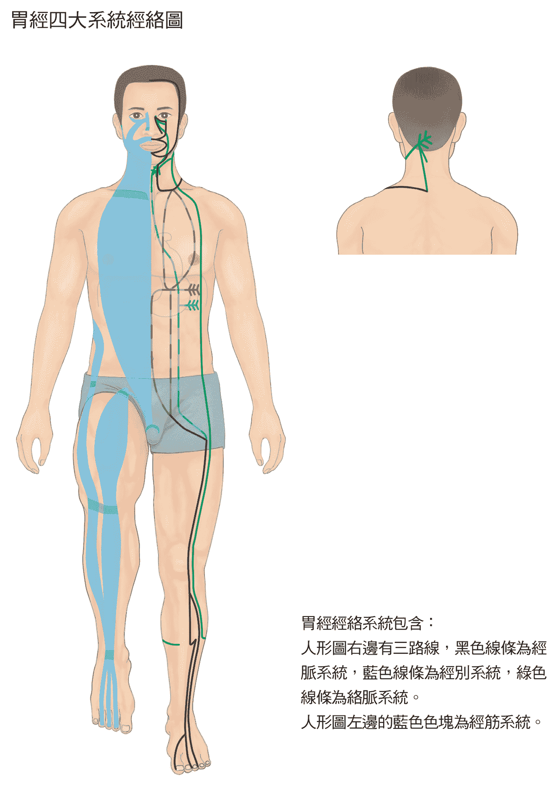

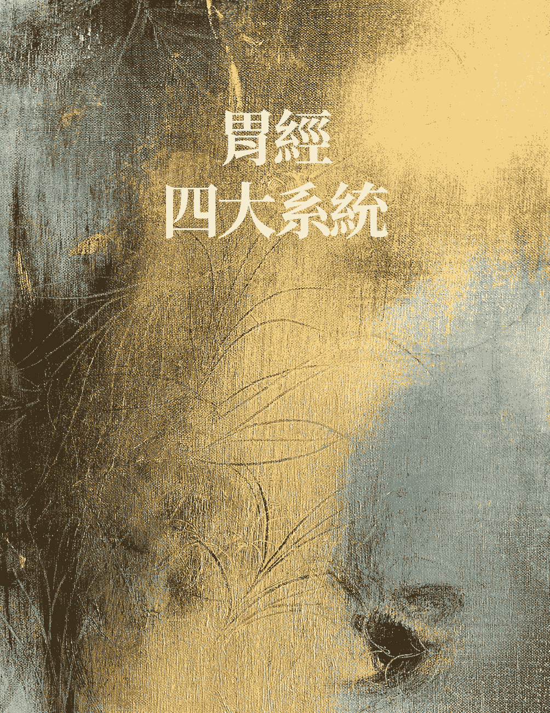

# 胃经四大系统

#### 周左宇老师与足三里的故事

早年跟周左宇老师学习针灸，有一次，为了确认足三里的下针位置，请教老师如何取穴最准确。周老师以一贯的豪迈语气，说了一段影响我至深的话：「胃经那么粗，足三里也很大，怎么扎都可以！」

从大学时代开始学针灸，一直都是在经络循行的「线条」上取穴，而且务必要遵循教科书上或老师教导的取穴法，找到一个点，下针！

胃经可以那么粗！这是我从来没有想过的。

回家比照经络图，再三思索，才了解周老师话语背后的深意。

依照传统所画的经脉图来看，每条经脉都是线状而且粗细一致。然而，对照经络循行部位和相对应的血管神经分布，会看到与经络系统一样都具有传输功能的神经和血管系统，在不同的部位，粗细也不同。

再回到经脉的区域分布来思考，先前《经络解密》卷一书中介绍了肺经，肺经所在的手臂阴面必须容纳三条经脉（肺经，心包经，心经）通过，但面积与手臂阴面相当的小腿阳面前线区域，却只有胃经一条经脉通过。若以房间来譬喻手足部位，面积一样大的房间，手经的房间要住进三个人，都是纤细的美女，足经的房间只住一个人，是个体格健壮的帅哥。两房住户每个人能分配的空间一定不同，手经的美女房客自然会比足经的帅哥房客小。从另一个角度来说，手经美女房客每人只需清洁 1/3 范围，足经强壮帅哥一手包办 100%的范围，非常公平。从这里即可看出经竣 u 作负荷度不同，需要的能力也不同。

每条经脉由于分布的部位有大有小，粗细也有差异，加上所需承担的工作量不同，例如胃经涵盖的面积大，工作量增多，理论上也会比较粗壮，必要时还会增加分支来同甘共苦。其实不仅胃经系统如此，肩负有保护人体重责大任的足三阳经（胃经、胆经、膀胱经）都必须独当一面，足太阳膀胱经守护人体背面，足少阳胆经守护人体侧面，足阳明胃经守护人体前面，它们的经脉都是宽大且多分支。

2010 年有幸为一本很棒的经络研究书《人体的彩虹：见证科学底下的经络奥秘》（张长琳教授着，橡实出版）写推荐序。张教授以其生物物理学家的专业，从现代物理学和生物学观点，应用大量的实验报告及图表等，讨论经络的实质及存在的可信度。边翻阅内容，心里直呼「我终于等到这样一本书了！」就以「喜见〔经络〕飞龙再现」做为标题来表达个人身为经络研究者的欢喜之情！

张教授不是中医师，不囿于传统中医的思考，反能点出简单却直指核心的问题，例如：「穴位有多大？经络有多宽？」

依据纽约大学贝克教授和北京大学张仁骥教授以电导测量得到的经络形状资料，张教授得到的结论：「经络就像一道肉眼看不见的小山脉，而腧穴就如这道小山脉上的一座座肉眼看不到的小山峰，穴位的中心就是小山峰的尖顶。」对于针灸的循经感传现象：「感传线也不是一条边界清晰的细线，而是包括约 2-5 公厘的中间部和 2-5 公分左右的边缘部。」（《人体的彩虹》p.115）

有关「经络和腧穴会不会移动？」

张教授以针灸时〔气至病所〕「就是当人生病时，经络已经自动改变了路线，当然腧穴的位置也不得不相应改变。……所谓的〔阿是穴〕就是在某些病理状态下临时出现的腧穴，也就是说穴位临时变换了地方。」（《人体的彩虹》p.117）

由此也解释了「为什么用西医研究中最拿手的解剖学方法来研究经络没有成功？」因为经络是活的。（《人体的彩虹》p.118）

以上这些论述与中医典籍《难经》的内容不谋而合。

《难经》强调：「知为针者，信其左，不知为针者，信其右。」

《难经》继续说明左手的功能：「当刺之时，先以左手压按所针荥俞之处，弹而努之，爪而下之，其气之来，如动脉之状。」这都是历代针灸医师奉为圭臬的准则。

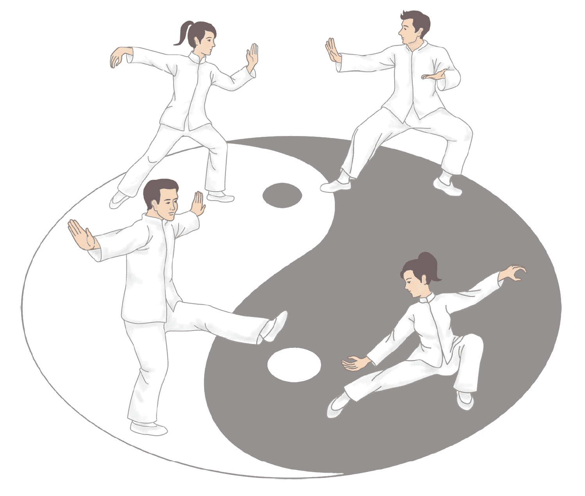

因周老师的启蒙，历经多年的阅读思索，加上临床观察与诊治疗效的验证，我看经络不再只是一条线，而是 3D 立体结构及层次感（可以想象高架桥系统）。再从这个观点深入思考与观察，只要人体还活着，经络系统就会持续运行，经络内的气血不是静态不动，等待医师按图索骥去找到它们。相反的，经络的气血分分秒秒不断地流动，也一直在改变，所以经络系统是活生生的、动态的、持续变化的立体结构，唯有细心去「阅读身体」，才能掌握经络气血的变化，洞烛先机。

人体既然是立体结构，穴位当然也是！所以我看穴位也不再是一个平面上的点，而是一个立体结构的区域。

相较于现在常用的细毫针，经络结构真的很巨大，就像蚂蚁和蛋卷的比例一样。如何以这么细的针，扎进这么宽大的皮肉组织中，除了必须有针感之外，还要能治疗疾病，就成为个人临床上一直以来的挑战。

我开始回溯到《内经》、《难经》等医籍中寻找答案，慢慢摸索出在穴位区找到与病情相对应的下针点，如病情属于实证，就在穴位区找到肿起点下针；若属虚证，就找陷下点下针。跟诊医师最喜欢问「补泻」问题，其实我们这种针法，补泻早在选定下针点时就已经决定了。

十几年来一直坚持走在经络研究路上，但也常风闻有中医同道否定中医理论中的经络、脏腑、阴阳五行等说法，真的感到很无奈！尤其见到像张长琳教授，还有许多现代各学科的专家们跨领域研究中医的用心，我常想：「与其花那么多力气去否定中医理论，为何不把这些宝贵的心力拿来理解中医，证明中医理论的可能性？！」就像夫妻或情人关系一样，花同样的力气，为什么不多试图想想对方的好呢？

这些年来，至少在临床和学理上，病友与我，还有许许多多年轻医师，我们都共同见识到中医理论的精准与临场诊治疾病的厉害之处。

我也常想起《内经》说：

「夫善用针者，取其疾也，犹拔刺也，犹雪污也，犹解结也，犹决闭也，疾虽久，犹可毕也。言不可治者，未得其术也。」

善于用针治疗疾病的人，治病要像拔刺，除去污渍，解开死结……等等功夫，虽然需要花时间，但还是可以治疗改善。若一开始就说不能治，那是医者尚未掌握到精髓啊！

我们其实可以很勇敢也很客观的去研究和讨论中医！不需等待他人的肯定之后，才敢肯定自己！借用《内经》的说法，我认为：「言中医不可用者，未得其道也！」

## 一、胃足阳明之脉（经脉）

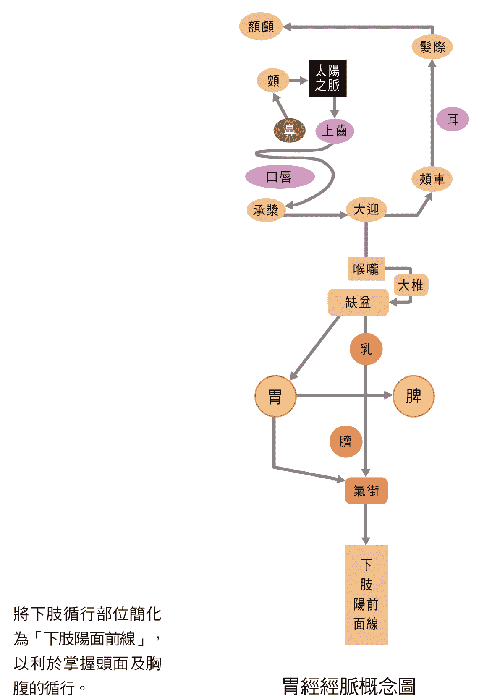

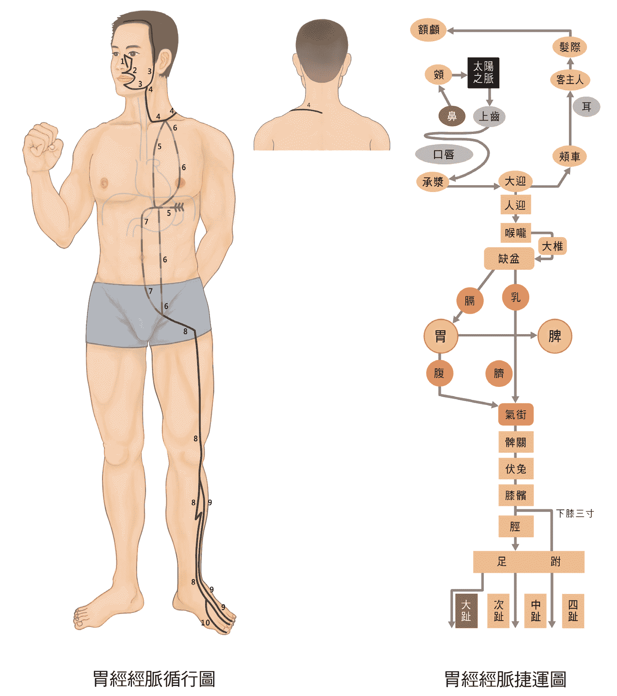

### 足阳明胃经─循行特色

十二经络系统中，足三阳经，包括足阳明胃经、足少阳胆经及足太阳膀胱经，肩负保护人体体表的重责大任，所以它们的循行路线很长，都是从头到脚，且为了确保足够的涵盖面，它们的分支也多，越重要的部位，例如头面部分支就越多。

足阳明胃经主要走在身体的正前方，从头分布到脚。循行路线可分为路线 1-4 的头面部，路线 5-7 的胸腹部，和路线 8-10 的下肢部三部分。

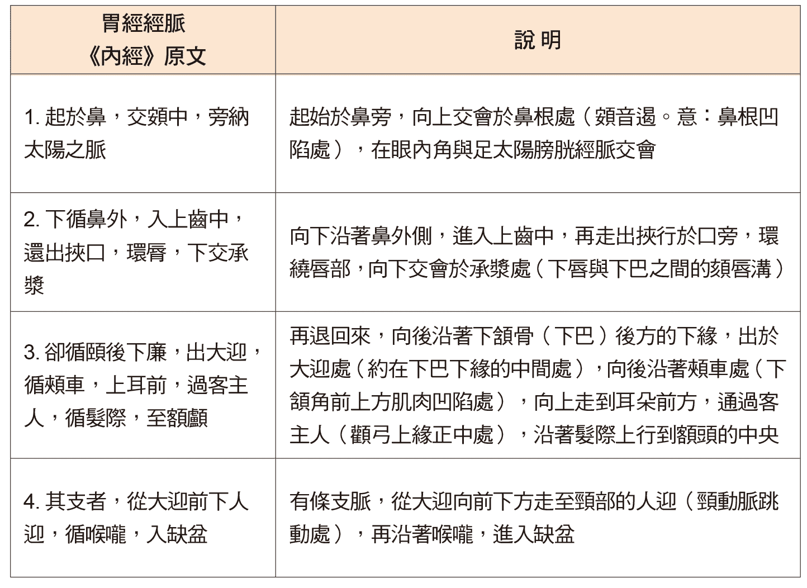

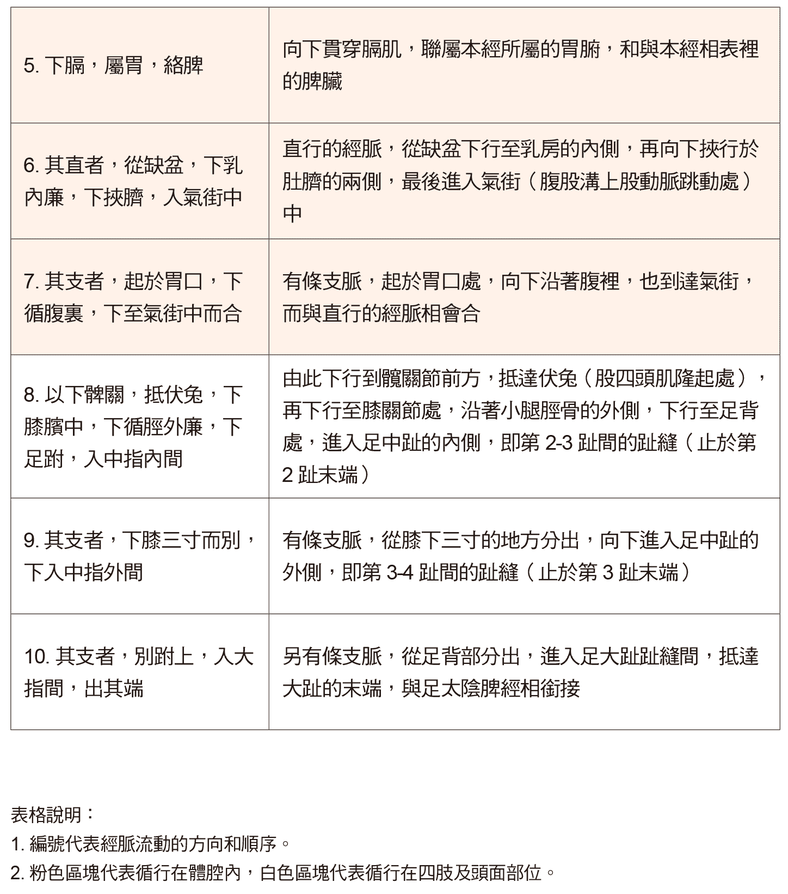

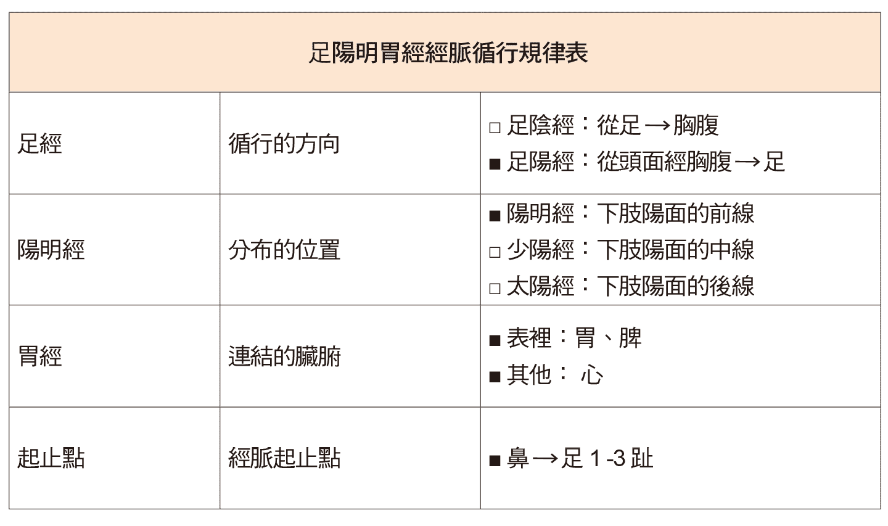

人体的正面是直接与外界接触，面对外界刺激的部位，所以就由多气多血的阳明经来保护，分为三部分：

1.头面部：「阳明主面」，面部是胃经循行的重点部位，在头面部以 U 形线包覆，既周全又安全。

2.胸腹部：是攸关食欲与性欲的大本营，胃经就以双轨并行，一条经络循行体表，一条经络循行胸腹体腔内。

3.下肢部：胃经分布在大腿、小腿、足背正面。而在小腿部位双线并行，脚背则有三条路线。

以下是胃经三个部位的简要图表。

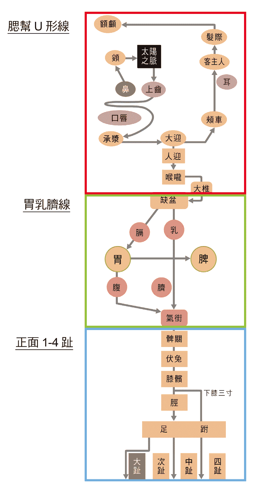

### 1.头面部的「腮帮 U 形线」

胃经所围绕的脸颊区域俗称「腮帮子」，只要闭上嘴巴鼓气，腮帮子就会肿起来。腮帮子另一说是指颊车穴附近。这两种有关腮帮子的说法都在胃经循行区域，所以就称呼这条弯弯曲曲路线为「腮帮 U 形线」，很传神吧！

##### 腮帮 U 形线的循行

依据循行路线的特质，还可细分为两区：

中央区：迂回围绕在眼睛、鼻子及口唇的五官部位。

起于鼻孔旁，与大肠经的迎香穴交接，向上循着鼻根，到眼内角的睛明穴与膀胱经交会，再向下沿着鼻外侧。这段路线以围绕鼻部和眼头为主。

进入上牙齿，之后再环绕口唇周围。在鼻孔下方交会督脉的人中穴，在下巴处交会承浆穴。这段路线以围绕牙齿和口唇为主。

外围区：循着头面部的外围结构而行。

从下巴的承浆穴开始，沿着下颔骨边缘，向外向后到颊车，转而向上经过耳前，沿着发际，在这里交会胆经的颔厌、悬厘、上关穴（即客主人），最后抵达到额头上方的头颅正中点，交会督脉的神庭穴。

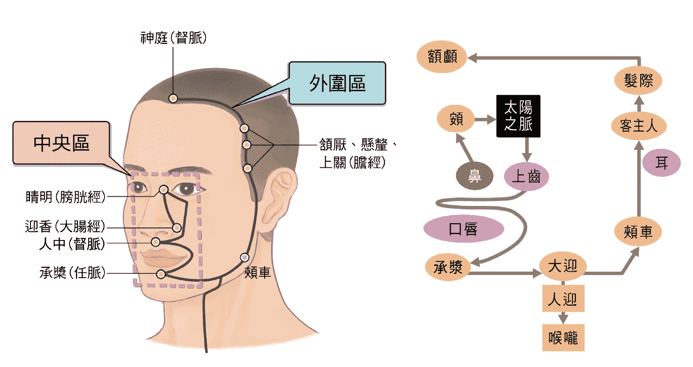

这段路线很明显就是要特别保护头部外围和面部中央。

胃经在头面部循行路线从中线到侧面，包括位于面部中央的五官，以及头面部的外围。

下页图则是将面部两侧循行合起来，左图可以清楚看出胃经围绕整个面部的边缘，中间循行在鼻梁和眼头，再环绕口唇一圈。原来单侧的 U 形线，两侧合并之后，就变成长方形，全然包覆的型态。

右图是将中间区域简化成一条直线。这条直线除了原有鼻眼口唇的路线之外，还加上「额颅」的叙述，代表胃经在面部中央的循行概念。再连结面部两侧原有的路线，从中轴连结两侧弧线，形成一个密不通风的保护网，可以看出胃经分布在头面五官的苦心。

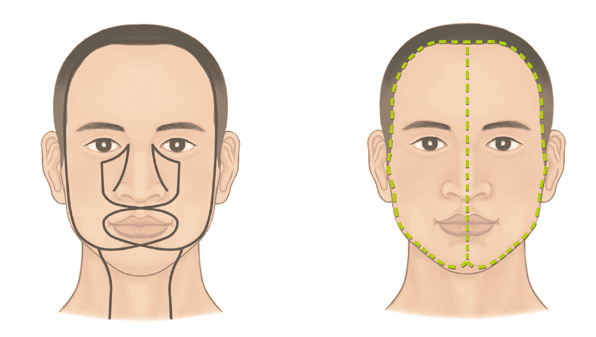

胃经在面部循行结束之后，开始走向下行。从下巴下缘中间的大迎穴分出，走到前下方颈动脉处的人迎穴，再沿着喉咙下行抵达缺盆。

由于胃经交会督脉的大椎穴，所以缺盆会向后绕行到大椎穴，再绕回缺盆，然后进入胸腹部。细节在络脉篇章再说明。

##### 腮帮 U 形线的功能特色

腮帮 U 形线功能以「人人为我，我为人人」为蓝本，变成「为胃工作，胃给反馈」。胃经的腮帮 U 形线跟肺经一样，保留了人类演化的部分历程，包括饮食和生存等。

（1）与食物有关的基本生理机能

首先介绍循行于头面五官的腮帮 U 形线如何为胃工作。

寻找食物：

人类生活的演化过程是由采集、渔猎、畜牧到农耕。食物的获得一直都是生活中的大事。早期原始环境中，能否在野外看到、闻到或听到食物的讯息，都决定了个人或家族的存续。具有良好的视听嗅觉，有助于快速找到食物。接下来就是抢夺食物大战，当然，这就得看谁的胃经比较强，身形健壮者通常比较有胜出的机会。

挑起食欲：

食物所散发出来的色、香、味，即使还没有真正吃到嘴里，就已经引发食欲及胃中消化液的分泌。这就像打电话事先通知将有客人来访，让主人可以稍作准备。还有一种是煎煮食物所产生的声音，例如食物在铁板上滋滋作响，妈妈在厨房炒菜的声音，也都能引发食欲，这是藉由耳朵的听觉来接收讯息。

进食过程：

当食物进入口腔后，透过面部肌肉的运动，牙齿的咀嚼切碎食物，食物的质地、味道等又再次刺激胃中消化液的分泌。食物真实的味道是由嗅觉及口腔中的味觉来接受讯息。之后食物从口腔进入咽喉，一路抵达胃，做初步消化，腐熟食物的工作。这条路线就是现代医学所说的「上消化道」，胃经也分布于上消化道，协助胃的消化功能。

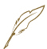

* * *

脾与胃在进食工作上的配搭

脾与胃相表里，脾开窍于口，其华在唇，但是脾经本身没有到口唇，而是藉由胃经联系。反过来说，食物在口中需要舌头搅拌与吞咽，脾经也为胃经连结舌部。胃与脾之间互相协助，共同完成进食这件大事。同为阳明经的大肠经也参与进食的历程。我们借用中医的望闻问切来说明：

　　望诊：眼睛见到食物（眼睛）

　　闻诊：鼻子闻到味道（鼻子）

　　问诊：询问了解情况（口唇及耳朵）

　　切诊：胃经循行到脚，大肠经循行到手，两经合用，走过去靠近食物，觉得不错就先下手为强，将食物拿到手。

食物放进嘴里之后，由牙齿切碎食物，吞咽入咽喉，再进到胃。

食物的色香味特性挑逗吸引着人类五官的视觉、嗅觉、听觉及味觉。在食物不足的时代或地区，协助人们找到食物；在粮食富足的时代或地区，帮助人们「开胃」，促进食欲，而且让进食这件事情，成为一个完整的系统和过程。当吃东西不仅仅是把东西塞进嘴巴时，人类社会开始变得复杂，周边的氛围都会影响进食的心情和食欲，进而影响人际关系。

* * *

（2）与生存有关的生理机能：

腮帮 U 形线为胃做了如此重要的维生工作，胃当然也提供营养作为反馈。

胃从食物中所吸收的精微营养物质，经由经络输送到头面五官，让五官感觉敏锐，听、看、闻都很清楚，这样的辨别能力对于生存是很重要的。现代社会许多讯息都是使用视觉传递，例如红绿灯这类交通号志，看清楚了才不会误闯马路造成危险。还有觉察周边环境的情况，侦测即将到来的危险，例如好眼力可以看到超速横冲直撞的车子，嗅觉可以闻到瓦斯漏气的味道，敏锐的味觉则可判别食物的苦涩或毒性，以免误食导致毒发身亡等。

（3）与社会化有关的人际关系：

在人类文明的发展过程中，透过头面五官对于外界事物讯息接收、分析、感受和回应的情况，越来越细腻也越来越复杂，包括学习也是一样。

根据现代医学研究，脑部约占体重的 2%，却消耗全身 20%的能量。面部的感觉系统，如视觉、嗅觉及听觉等，都是神经系统的一部分，所以眼、鼻、耳等器官需要较多的能量支援来发挥功能，而头面五官所需的能量主要来自气血生化之源的脾胃系统。这也就是出身较好的家庭环境，生活无虞、营养充足的孩子，在各科发展上会比较突出的原因之一。当然这不是绝对的，个人后天的努力还是很重要，可是后天的努力还是需要后天之本的脾胃来支持，不是吗？脾胃的重要性可见一斑。

我们在胃经总论篇介绍过，胃经与食欲和性欲这两种本能有关，强健的胃经也会让欲望跟着提升。但如果人人都欲望无穷，这个社会就会变得很贪婪、很野蛮。所以聪明的人体为欲望设置了一个安全阀，让胃经循行到额颅，这与理智有关，可以管控由胃经而产生的过度欲望。额颅内的脑前额叶是大脑的指令与管理中枢，在正常状态下，会抑制基本的情绪与冲动。幸好额颅内的脑前额叶可以帮忙踩煞车，不让欲望无止尽的高涨，回到动物时代。

有研究指出，老人的脑前额叶随着年龄退化，会导致逻辑判断能力减弱，但是对金钱的欲望和冲动反而明显增强。媒体上不断播出老人被骗的新闻，其实与老人大脑理性中枢的退化有很大关系。由此也可见胃经循行至额颅的重要性了。

 中医师不传之祕：胃经在头面的交会穴个个都有好身手

###### 胃经在头面的交会穴个个都有好身手

胃经属于多气多血的阳明经，若将气血换成金钱来看，胃经可是五脏六腑之中最富有的人。这个高富帅家族的人缘极佳，邻近的经脉也都乐于共襄盛举，因此胃经在头面部与许多经脉和穴位交会，以群策群力共同保护重要的头面部位。

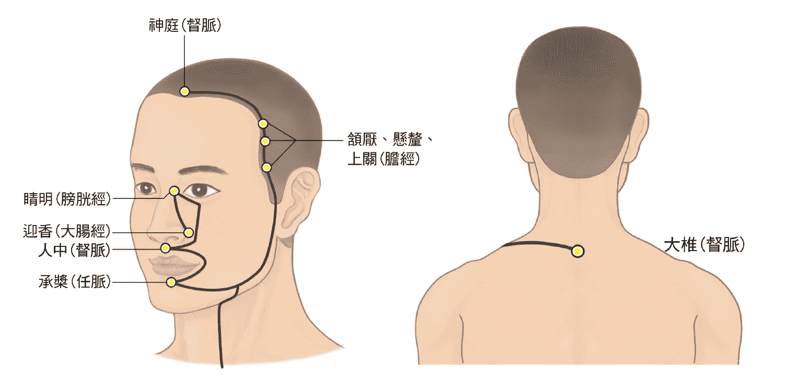

胃经在头面部一共与五条经脉的九个穴位交会，如上图。

交会经脉分为两个群组：

第一组是功夫高手群组：包括任脉（承浆穴）与督脉（人中穴、神庭穴和大椎穴）。

第二组是麻吉好友群组：包括大肠经（迎香穴）、胆经（颔厌穴、悬厘穴、上关穴）和膀胱经（睛明穴）。

##### 功夫高手群组

精明的胃经透过与任督二脉的相连关系，实时掌控十二经脉气血情况，随时调控因应，以维持身体正常运作，更加印证了中医说「人以胃气为本」！

胃为水谷之海，饮食自口唇而入，经过胃的受纳腐熟之后，转化为气血，所以胃是气血生化之源，五脏六腑的根本，十二经脉也得到濡养。而胃经也在口唇处与任督二脉相通，一方面藉由调节十二经气血来协助任督二脉，另一方面也可将气血直接输送给任督二脉。

口唇之处是任脉与督脉的分界区，口唇以下属于任脉，口唇以上属于督脉，这个部位就成为人体阴阳交会的重要区域。胃经环绕唇口，除了与饮食有关之外，还掌握人体的阴阳交会区，等于掐住了任督二脉的要害，让任督听命于胃经。

奇经八脉是十二经脉以外的另一个经络系统，人体正常生理机能仍以十二经脉为主，奇经八脉不属于十二经脉系统，所以不受常理约束，因此能跨越经脉藩篱，联系十二经脉，让多经脉一起工作，同时还能调节十二经脉的气血，例如十二经脉气血过多时，就流入奇经八脉暂时储存，当气血不足时，奇经八脉就将储存的气血送回十二经脉，藉由这样的机制来维持人体经脉中的气血阴阳平衡。

奇经八脉的任脉与十二经脉中的六阴经都有联系，因此称为「阴脉之海」，督脉与六阳经都有联系，因此称为「阳脉之海」，打通任督二脉就是打通人体全部十二条经脉（这可是许多武侠迷的梦想）。胃经同时交会任督二脉，所以只要照顾好胃经，就能强化任督二脉。

 解密：胃经是点穴高手

###### 胃经是点穴高手

再跟大家透露一个秘密，其实胃经本身也是武林高手，尤其专精在「点穴」方面。

胃经与任督二脉交会的四个穴位，包括任脉的承浆穴、督脉的人中穴、神庭穴和大椎穴，都可算是「死穴」。

承浆穴跟人中穴刚好守在嘴巴上下的位置，两穴只要同时被掐住，根本无法开口；前额的神庭穴和上背的大椎穴刚好守在头部前后上下的部位，两穴只要同时被掐住，头根本无法动弹。四穴都位在人体头面部的要害，在武术对打时，一旦被对方掐住胜负几乎已定。

但是点穴不仅用在压制敌人，平时也有良善的用途。例如众人皆知人中穴是开窍醒神的要穴，无论是因为情绪激动或中暑等原因昏厥时，都可掐人中穴促进甦醒。

神庭穴位于脑前额叶，顾名思义就是有安定神志的作用。人类的习惯中，只要出现紧张、烦躁、焦虑、悲伤的情绪时，常不自主地用手掌托住额头以稳定心神，额头正上方发际线后的位置约略就是神庭穴。

大椎穴在大肠经介绍过，是诸阳经之会。胃经身为多气多血的阳明经，连结大椎穴有着锦上添花、让阳气更加旺盛的能力。但大椎穴也因为有多条经络通过，以及位在颈肩部的交通枢纽位置，气血很容易阻塞，而导致头痛头晕、手麻、肩颈痠痛等症状。

一般而言，大椎穴的阳气很旺盛，对于长期熬夜、喜欢燥热饮食的人，或是夏天暑气过盛而有中暑的现象，或感冒发烧时，大椎穴摸起来会有异常的热感，此时可以在大椎穴按揉或拔罐滑罐来透散热邪。但是对于久病久虚之人，大椎穴反而会堆积寒气，使得阳气受到制约，而让病情拖延难愈，大椎穴摸起来会有股冰凉感，此时就可在大椎穴加上艾灸或其他温热的方法，以驱散寒气，温通阳气，改善病情。所以大椎穴又称为「百劳穴」，一般说法是能补虚治劳。但我个人认为「百劳」是点出大椎穴位于枢纽位置，日常生活频繁使用，加上多经脉的气血在此交互流动，成为人体最忙碌的穴位之一，当然也容易因为过劳而损伤，病情有实有虚，有寒有热，需要仔细辨别。

您看！胃经是不是隐身于市井、深藏不露的点穴高手呢？

##### 麻吉好友群组

胃经与大肠经同为阳明经，属于同一家族。胃经、胆经与膀胱经则是足三阳经，共同形成人体最坚强的防护网，是为护身三剑客。因此大肠经、胆经、膀胱经与胃经，成为日常生活中一起工作的麻吉好友，俗语说「打虎不离亲兄弟」，保护头面部如此重要的任务，当然要找麻吉一起行动囉！

 解密：胃经在头面循行路线会透露身体的秘密

###### 胃经在头面循行路线会透露身体的秘密

*   听说前额饱满的人，能力出众，官运佳，这跟胃经有何关系？

胃经循行到额颅，传统相学称额头为「天庭」，代表事业宫，天庭开阔饱满的人，心胸也会开阔，且能力出众，工作表现出色。现代医学认为，脑前额叶是与智力密切相关区域，掌管人的记忆、思考，分析、判断以及反应能力。

胃经经过额颅，深层就是脑前额叶所在处。当营养充足，输送至脑部的养分增多，前额外表部位就会饱满，深层部位能量也很足够。所以可从前额观察一个人的智力、能力和前途发展性。

*   为什么「记忆和理解能力强」就是「聪明」？这跟胃经有甚么关系？

汉字很有趣，将「聪明」拆开就是「耳聪目明」，耳朵听力好，眼睛视力佳，看得清楚、听得明白，就能完整地吸收知识，开发智力，提升理解力和记忆力，甚者还能「青出于蓝，更甚于蓝」，创造出独特的能力。

胃经连结脾胃与眼睛耳朵，自然会将吸收的营养输送到此，让耳聪又目明。中医有一个药方就叫「益气聪明汤」，治疗脾胃功能失调，中气不足而出现头痛眩晕，视力下降，耳鸣耳聋，失眠健忘等症状。方名中的「益气」就是补中气（调补脾胃之气），「聪明」当然就是耳聪目明之意。许多病人说吃了这个药方，记忆力真的有改善。

现代研究显示，人类从出生到三岁之间是脑部活动最活跃的时期。若要孩子头脑好壮壮，除了给予多元且适当的感官刺激之外，充足的营养也是必须的，才能补给脑部发展时所需要的资粮。临床上，遇过几个幼儿时期严重腹泻的案例，成长后学习能力有较差的情况。所以想要聪明的前提，就是要有健康的脾胃及通畅的经络系统，才能将营养输送到头面部。

*   俗语说：「口阔吃四方」跟胃经有何关系？

「口阔吃四方」，在相学上是指口型大的人前途不可限量，四处都有好发展。从饮食的角度来看，口型大的人能塞进去的食物比较多，食欲也比较好。胃经在面颊嚼肌「腮帮子」部位，由于常常咀嚼，长期操练，肌肉变得丰厚，面型也会比较方圆。若有这种女婿到丈母娘家用餐，大口大口的吃饭呷菜，吃相虽然不太雅观，但是对于辛苦做菜的人来说，可是一大鼓励与肯定呢！难怪丈母娘看女婿，越看越有趣，当然就掳获岳母的认同囉！

反过来说，近年来由于受到西方人瘦长脸型的影响，许多家长让婴儿趴睡，加上饮食越来越精致，较少咀嚼，颚骨较小，牙槽跟着变窄，下巴也比较尖。临床上，见到这种瘦尖脸型的人，我们都可直接推论他的胃经一定无力，消化功能也不佳。

*   听说观察口唇附近的面相，就能看出肠胃功能，中医真有这么厉害？

鼻翼与两侧嘴角和下巴所形成的菱形部位，如果出现青色或黄色，表示肠胃功能不佳。

这种状况常出现在小朋友身上，尤其是婴幼儿。因为他们的肠胃机能还不够成熟，很容易受食物的影响，而出现食欲差，稍微吃一点东西就腹胀，大便不正常，有人会便秘，有人会腹泻，或是便秘及腹泻交替出现。大人也会出现这种情况，常见于身形瘦削的女性，会有偏食的倾向，胃口差，营养不良，容易疲劳。有些人则是减肥不当，损及肠胃的后遗症。

这个菱形区域（见下页图），刚好是胃经与大肠经通过的部位，所以会反映出肠胃的状态。只要配合中医师的治疗并注意饮食就能改善，面色青黄也会逐渐淡去。

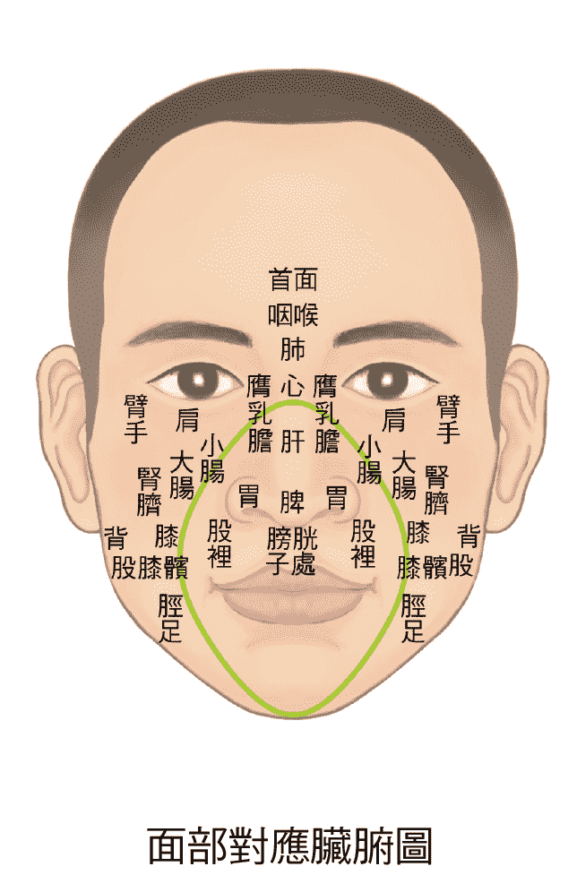

*   听说腮帮子有力，脚就健壮，是真的吗？

胃经包围腮帮子，而且胃经经筋通过腮帮子，胃经系统还连结下肢。在《内经》面部望诊中，腮帮子也刚好是下肢的对应区（参见下页绿线围成的区域），所以腮帮子会透露一个人脚的状况。年轻人腮帮子很饱满，脚就会很灵活软 Q 有力。老人家腮帮子通常都会下垂，当然脚就会越来越没力了！

或许大家会好奇也想知道，那老年人该如何强化腮帮子呢？

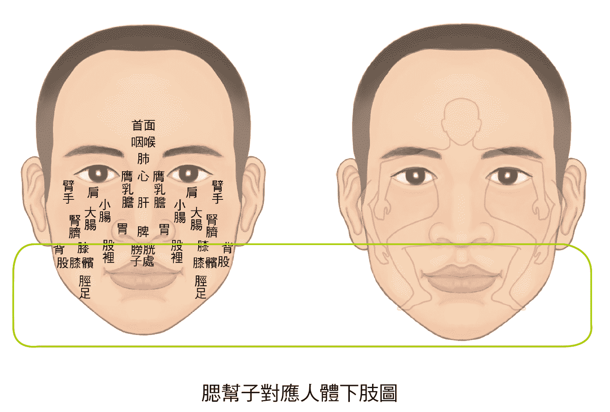

腮帮子其实就是我们咀嚼食物会用到的肌肉群，深层部分就是牙齿。人体也是「用进废退」的原则，只要常常咀嚼，尤其多吃纤维较多的食物，腮帮子就会越练越有力，也能提升脚力常保健壮。

*   腮帮子有力且隆起的人，脸部下方会变得丰厚而成为四方脸，这就是俗称的「官相」，比较有机会担任领导者。这是为什么呢？

腮帮子隆起的人，咀嚼功能比较好，想当然尔，胃的消化吸收能力也不错。之前说过，胃经功能佳，会让人身体强壮且有欲望。体力好，思路清晰（胃经到额颅），加上想成功的欲望所驱动，这几种特质正是领导者必备的条件。

透过经络也能看出面相运势，有趣吧！其实若真的深入经络，不只从面相，全身都有揭秘点，能透析人体的健康与人生运势呢！

### 2.胸腹部的「胃乳脐线」

腮帮 U 形线结束之后，胃经开始向下行。有条分支从下巴下缘中间的大迎穴分出，走到前下方颈动脉处的人迎穴，沿着喉咙经过大椎穴到缺盆，再从缺盆进入胸腹部。

胃经胸腹部路线因为通过乳房，挟行肚脐，所以称为「胃乳脐线」。

##### 胃乳脐线的循行及功能特色

胃经在胸腹部循行分为两线，接近人体中线的为「内线」，另一条为「外线」。（见下页图）

内线：属于旁系路线，为了连结内脏，加强脏腑功能。以胃口作为转接点，再分为上线与下线。

● 上线：从缺盆，下膈，属胃，络脾。以「属胃络脾」为主。

脾在胃的外侧，偏于胁肋处。

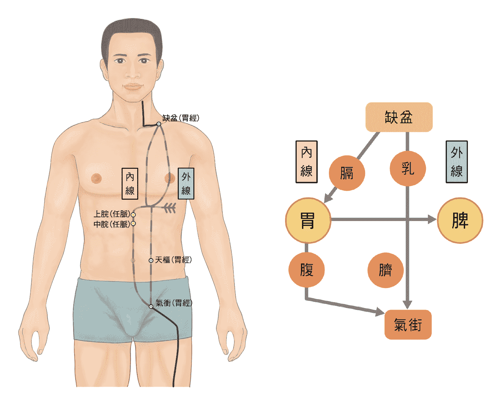

阳明胃经主要走在人体正面，脾脏所在的胁肋区，理论上已经超出阳明经的范围，但是胃与脾鹣鲽情深，胃经还专程延伸至胁肋连结脾脏，而且体贴的胃还用自己强大的经筋系统来保护脾。

● 下线：起于胃口，下循腹里，下行到腹股沟的气街。以连结任脉为主。

由于胃经在腹部交会任脉的上脘穴和中脘穴，因为任脉位于人体中线上，下循「腹里」就隐含着向下循行于「腹部内侧」之意，下线循行到腹部内侧中线上，再斜向外侧的气街。

胃经在内线没有属于自己的穴位，可视为旁系道路，主要目的在以最简捷的方式连结脾脏与任脉，让彼此在功能上相辅相成。

任脉位于人体正中线，是阴脉之海，与人体的泌尿生殖和消化系统有关，胃经在面部已与任脉交会，在腹部再做一次连结。而脾与胃相表里，脾脏位于人体偏外侧。胃经连结脾脏，也为任脉与脾脏之间架起桥梁，胃主消化系统，脾还主生殖系统，都与任脉功能相合。

任脉的上脘穴附近就是俗语「心窝处」或中医说的「心下处」，胃经通过此处，心脏也在附近，心窝痛或心下痛成为胃病与心脏病都会出现的症状，很容易混淆，心脏病因此常被误认为胃病而延误抢救时机。

外线：是直行的干道，也是胃经经穴的主线，可以用来调节脏腑功能。

本线从缺盆向下经过乳部内侧，这个说法是为了与胆经经过乳部外侧做区别，其实胃经走在乳部的正中线，通过乳头，进入腹部，再向下挟行在肚脐两侧，最后也进入气街。

胃经胸腹部的穴位分布在外线，外线看起来好像没经过胃，其实胃是人体厨房的大锅炉，专责受盛腐熟水谷，它的体积一定要够大才能装得下这些食材，因此，外线从乳房下行到肚脐途中，必定经过胃部，刺激这些穴位当然也能调节胃功能。内线与外线之间的上腹部区域，也是胃的所在区，可以按揉护胃。

内线与外线最后在气街合而为一，进入大腿部。

身为多气多血的阳明经，胃经经脉的胃乳脐线，在胸腹部位分出两条经脉以增加涵盖范围。下方左图是合并人体两侧的胃乳脐线，看起来是否有点眼熟？是不是很像右图的腮帮 U 形线？

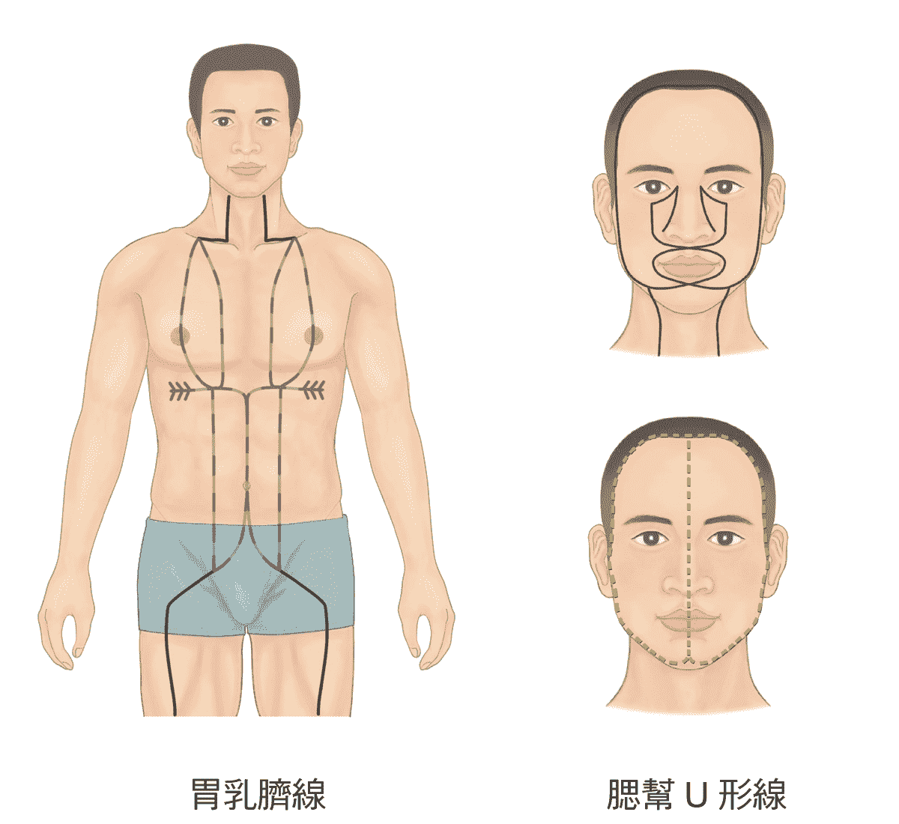

是的！强大无比的胃经就是用这种全面包覆的方式来保护及滋养身体。

胃经经筋在胸腹部循行叙述很简单：「聚于阴器，上腹而布，至缺盆而结」，就是以胃乳脐线为模板，分布在它所形成的胸腹区域。详述请参阅经筋篇。

 解密：「胃乳脐线」是「食色性也」的大本营，维持自身生命与传宗接代。

###### 「胃乳脐线」是「食色性也」的大本营，维持自身生命与传宗接代

总论提过，在《孟子》书中，告子说「食色性也」，意指喜爱美好的事物是人类本性使然。但后世参酌《礼记》「饮食男女，人之大欲存焉」，将「食色性也」转译为食欲与性欲都是人类的本性。虽然误解了告子之意，倒也符合人类追求个人生存与种族延续的目标，所以我们也就跟着使用「食色性也」来解释胃乳脐线的特性。

总论中介绍过胃经与食欲和性欲有关，胃乳脐线就是欲望的大本营。

胃是人体的厨房，实际消化吸收食物，是五脏六腑营养补给站，以维持自身生命。胃和食欲的关系，前面已有详细介绍，不再重述。至于胃经攸关性成熟，增加求偶和性欲能力，有助于传宗接代的部分，再略作补充如下：

性成熟：脾胃功能正常，能提供青少年在青春期蜕变发育为成人的「转大人」过程中，筋骨肌肉快速增高、长壮所需的养分，让他们脱胎换骨，准备踏入人生的另一个阶段──性成熟。

求偶：胃经在头面部连结眼睛、口唇及喉咙，充足的营养，让眼睛会放电，口出甜言蜜语及性感的声音，这种性感魅力谁人能挡？

乳房：中医认为血液向上能化为乳汁，向下能化为月经。胃经通过乳房，乳房发育以及哺乳的乳汁来源，都来自胃所吸收的精微物质。

胃为水谷之海，阳明经多气多血，是身体气血营养很重要的来源。充足的营养转化成生长发育所需的气血，让女性的月经来潮，乳房发育正常，皮肤细致，身材凹凸有致。男性则体格壮硕挺拔，胸肌健壮，当然都能吸引异性的关注目光。

至于母乳也是由血液转化而成，母亲营养充足，乳汁自然充足。但我曾在临床上遇过一位生了第一胎的年轻妈妈，坚持要亲自哺乳，食欲超佳的宝宝也很喜欢喝母奶，但随着时间孩子对母奶的需求量越来越大，妈妈喂的越多，自己却越衰弱。她觉得自己的营养吸收是「入不敷出」，常常头晕、心悸、畏寒，全都是气血不足的症状，甚至损伤到脾胃功能，没有胃口，看到食物就想吐。幸好孩子慢慢大了，在我们的建议之下，年轻妈妈努力断奶，强化自己的脾胃功能，加强摄取营养之后，这些症状就慢慢缓解。

还有一些爱美的女性，以错误的饮食方式减肥，身材是瘦了，但因为营养不良，影响「胃乳脐线」所照顾的器官，例如乳房跟着缩水变扁，月经停止，生理期错乱，性欲低下，增加不孕的风险。时间久了，视力开始模糊，头晕疲倦，影响智力等等，严重者变成厌食症而死亡。这样的美，真的是美吗？其实，美感来自于健康的身体所散发出来的仪态和气质，而不是变成干瘪的四季豆。

肚脐：肚脐是我们在母亲肚子里与母亲的连结，母亲透过脐带将养分输给婴儿，所以肚脐是生命初始生长的源头。脾经系统与肚脐关系更密切，胃为水谷之海，脾胃为气血生化之源，胃与脾一起守护生命的源头。

性冲动：胃经的内线和外线最后汇集在气街。气街位在腹股沟上，两侧腹股沟所夹的中间部位就是外生殖器，中医称为「阴器」。原文虽然没有点出胃经与阴器有关，其实是相关的。为什么呢？

首先可从经脉的特色来推敲。经脉本身并不是一条线，而是一个立体结构，就像水管一样，如此才能输送气血。立体结构除了长度之外，还有宽度及高度。阳明经脉气血充足，它的宽度与高度一定也很粗大。单侧腹部有二条经脉在气街合并，当身体两侧的经脉同时抵达气街所在的腹股沟时，一共有四条经脉的气血汇入，大量的气血会将经脉的管径撑开，宽度增加了，两侧的经脉一定会更为贴近阴器。

其次，胃经经筋「聚于阴器」，直接将阴器纳入保护，可见胃经系统对于阴器的高度重视，胃经当然也会输送营养物质到阴器以提高「性趣」。

生殖器与乳房一样，都是很重要的性征，肩负着吸引伴侣及传宗接代的重要任务。性冲动是一时性的活动，需要快狠准的能量。唯有强壮的胃经才能有强壮的性表现，因为胃所吸收的精微物质能转化为气血，使五官敏锐，放射电眼，成为挑情圣手，肌肉强壮，四肢灵活，体力充沛，充分享受性生活的乐趣。

胃乳脐线提供的营养，让生殖系统充分发育，展现性能力，完成孕育重任，培养出健康的下一代，人类种族生命得以繁衍，胃经功不可没呀！所以，拜托年轻朋友们一定要好好照顾自己的胃，才有追求好伴侣以及实现梦想的本钱。

### 3.下肢部的「正面 1-4 趾」

先跟大家分享一个临床案例。

一位中年女性病患，眼睛有虹彩炎病史，眼睛长期疼痛，经中医治疗后，疼痛减缓许多。没想到中秋节期间，多吃甜食之后，右眼痛加剧，眼头及下眼皮压下去也会痛。病人很疑惑，左脚没有外伤，怎么连脚背也在痛。

我听了忍不住笑说「这就是胃经在作怪！ 」

因为胃经通过目、口、唇、齿到胃，再到大腿、小腿和脚背的正面，以及 1-4 趾的趾缝，所以患者就是沿着胃经的路线生病。治疗就从胃经着手，在胃经脚趾上的穴位针灸治疗后，症状马上解除。

透过胃经的连结，人体上部的额头和面部五官，中部的乳房、肚脐及腹股沟，下部的下肢正面到脚背 1-4 趾趾缝间，这些看似独立的部位都串连成一家人，共荣共享，共同承担。这就是中医「头痛医脚」，头痛眼睛痛不从头治，反而从脚趾治疗的秘密。

现在回归胃经──下肢部主题。胃经属于阳明经，走在下肢阳面的前线。由于脾胃主四肢也主肌肉，加上阳明经多气多血，因此胃经在下肢阳面的循行，主要分布在大腿与小腿正面肌肉丰厚肉多多的部位。

下肢路线从腹股沟的气街开始，经过髋关节前面，沿着大腿正面下行，经过膝关节外侧凹陷处，这个部位中医称为「犊鼻」又称「外膝眼」。当膝盖弯曲 90 度时，在膝关节的内侧和外侧各会出现一个凹窝，这是由膝部的髌骨与髌韧带所形成。由于弯曲的膝盖看似牛的鼻子，两侧的凹窝就像牛的鼻孔，也像膝盖的眼睛，所以外侧凹窝称为「犊鼻」或「外膝眼」属胃经，内侧称为「内犊鼻」或「内膝眼」属脾经。

从膝关节以下，胃经开始分为三支：

主干线：

沿着小腿的阳面走到足背，进入足中趾内间，即第 2-3 趾之间的趾缝中，最后终止于第 2 趾（次趾）末梢外侧端的厉兑穴。

小腿外线：

从膝下三寸亦即足三里穴的位置分出，走在主干线外侧，经过足背，进入足中趾外间，即第 3-4 趾之间的趾缝，止于第 3 趾（中趾）末端。

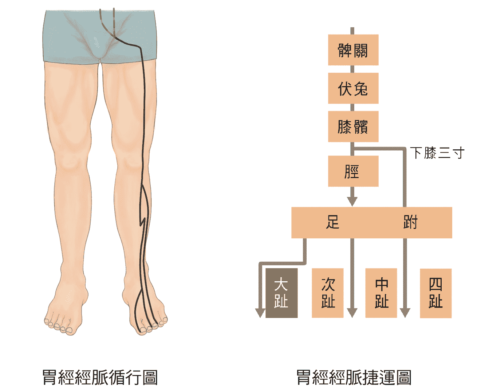

足背内线：

从主干线的足背部位分出，向内进入足大趾趾缝间，再出于大趾末端，与脾经衔接。

胃经在小腿的分支，主要加强连结位于它两侧的胆经和脾经。足背分出三条经脉，连结四个趾头，涵盖面积之广，与腮帮 U 形线及胃乳脐腺有异曲同工之妙，完全展现胃经这位阳明老大哥统领人体正面的威力。

足部这些分支路线也透露了胃经的强势之处。例如，在小腿部，从著名的足三里穴分出「小腿外线」，与胆经的小腿路线非常接近，以加强与胆经的关系。到了足背，进入第 3-4 趾趾缝，最后抵达第 3 趾末梢外侧端。

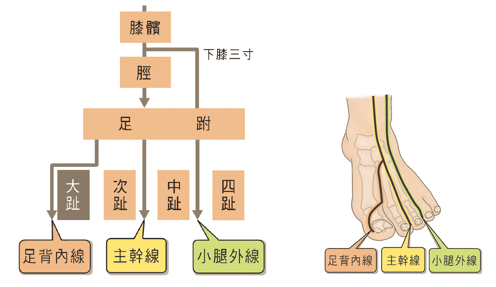

大部分趾头的末端都有穴位，例如第 2 趾末稍为胃经的厉兑穴，第 4 趾末稍为胆经的窍阴穴，唯有第 3 趾末端没有穴位，第 3 趾（即中趾）成为没人管的公共区域。若依位置上来看，第 3 趾应该归胃经与胆经共管。临床上，我们确实使用第 3-4 趾趾缝及骨缝来治疗胃经和胆经共同的疾病，效果不错。

足中趾位于足趾的中间部位，主干线和小腿外线分布在中趾的两侧。中趾虽然号称归胃经与胆经共管，但是多气多血的胃经，它的形势和气势就是比胆经强，不仅用经脉夹行在中趾的两侧，还特地从胃经最强的穴位足三里处发出一条小腿外线，一路直冲到中趾的末梢，将之纳入管辖。谁敢与之争锋？

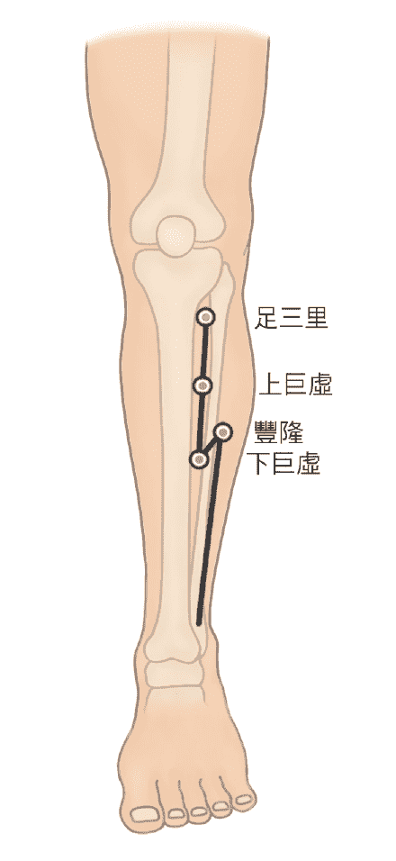

另一个例子。足背内线从主干线的足背部位分出，通过属于肝经的第 1-2 趾间的骨缝与趾缝，再转到大趾内侧末梢与脾经衔接。瞧吧！胃经就这样光明正大的通过肝经领域，不知是否有事先取得肝经的同意？

还有，足三里下方有两个穴位「上巨虚」和「下巨虚」，它们分别是大肠经和小肠经所寄放的下合穴。《内经》说「大肠小肠，皆属于胃」，乃因大肠、小肠皆承受从胃腑传化而来的水榖之气，在生理上有着直接联属的关系，因此由胃统筹大小肠的功能，大小肠也很识相的在功能强大的胃经上放置下合穴以示忠诚，让胃经一并管理。

下合穴临床上很好用。足三里是胃经的合穴也是代表穴，在足三里、上巨虚和下巨虚连下三针，就可以同时调整肠胃功能，超有效率。

 解密：饭后散步真的有助于消化吗？

###### 饭后散步真的有助于消化吗？

当然囉！

胃经本身循行从胸腹部到下肢，在腹部连结胃与脾，在小腿透过下合穴连结大肠与小肠，胃经因此将消化系统与下肢连成一气，所以饭后起身去散步，下肢活动可以促进胃经的气血循环，帮助脾胃大小肠的机能。所以上班族们，饭后记得起身走走，帮助消化，否则持续久坐，食物堆积在胃里，肚子就会越来越大！

 解密：胃经保留了远古人类在野外求生的过程

###### 胃经保留了远古人类在野外求生的过程

充足的营养能让五官敏锐，下肢强健得以保命。

早期生活在大自然中，人类既是猎手也是猎物。会去采集植物及昆虫，追捕猎物，以作为粮食。对于其他的肉食性动物，如老虎、狮子、鳄鱼等野兽而言，人类也是牠们的食物来源之一。所以，要活命一定要「眼明脚快」，去等待去观察去获取食物，同时也要避免成为狮子老虎的大餐。

发挥「眼明脚快」功能的眼睛及脚部，都是胃经通过的部位，胃将营养物质直接输送至此。有了足够的营养，能让五官的感觉敏锐，无论是听、看、闻都很清楚，得以及早发现食物踪迹，强健的下肢就能超前抢得食物。这个循环会让强者更强，无论是去追赶猎物或是逃命自保，都能健步如飞，安全无虞。

对于早期人类而言，胃经以胃为核心，建构起一个维生与逃命系统是非常重要的。而对于居住在工商业城市，出入都有交通工具代步的现代人来说，胃经这个「眼明脚快系统」还有发挥的空间吗？

当然有啊！

请不要忘记，胃经不仅仅是厨师角色而已，它连结头面五官，与智力发展有关；连结生殖系统与内分泌系统，与自我认同有关；连结下肢与人类的自由活动能力有关。这些连结与功能，提供了一个人的谋生能力，魅力自信以及生活尊严！

我自己青春年少时还没有健康概念，也常乱吃一通，糟蹋肠胃，妈妈就会叨唸说：「金山银山，没有好身体，什么也都搬不走！」当了医师才慢慢体会老一辈所言不虚，原来聪明的老祖宗早就知道这个秘诀：吃得好～就会有好未来。

古人说：「将相本无种，男儿当自强」，人人都有这个潜力，只要照护好胃经，都能成为文武全才的高富帅聪明哥喔！

### 足阳明胃经─病候

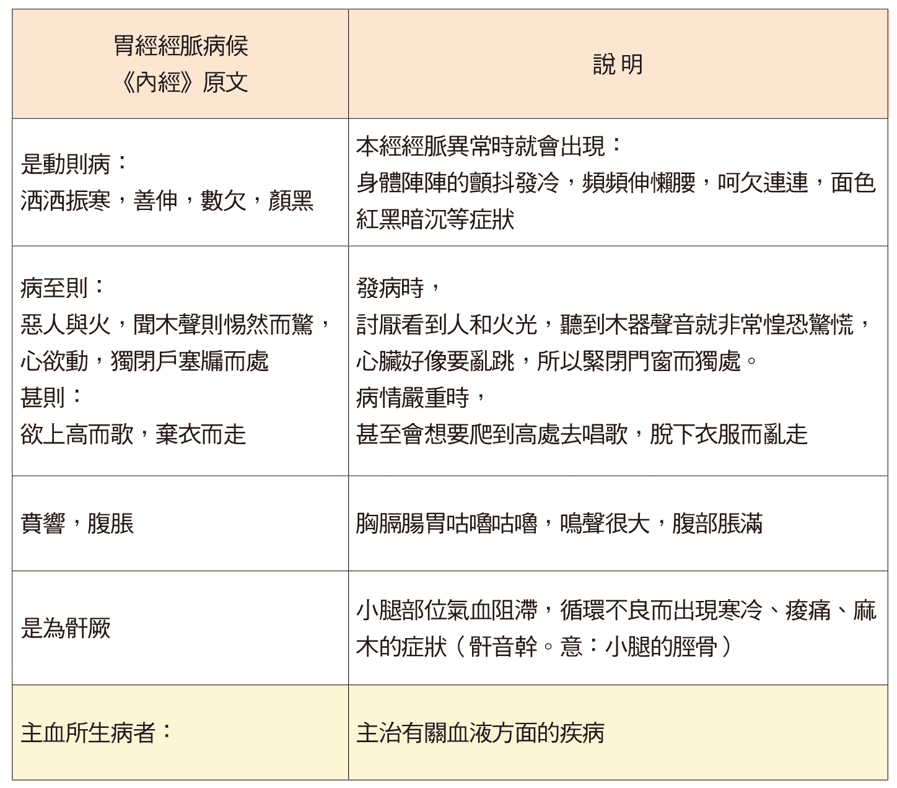

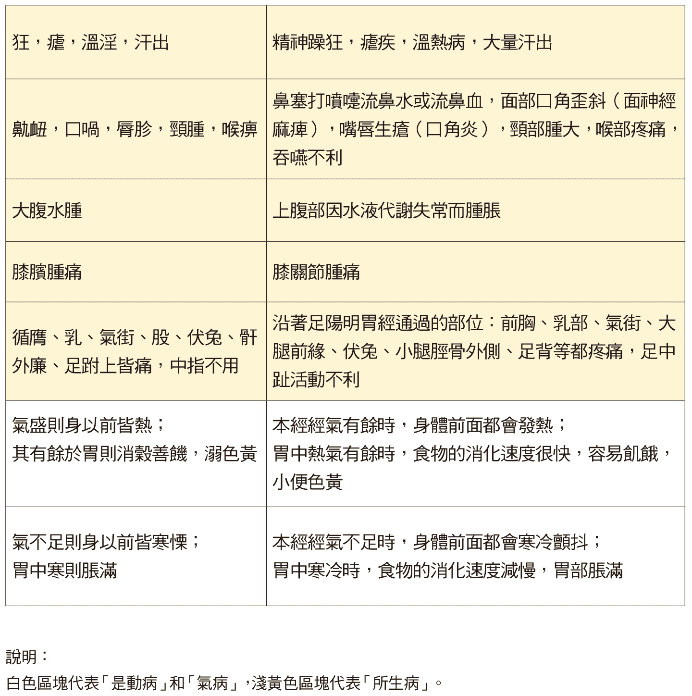

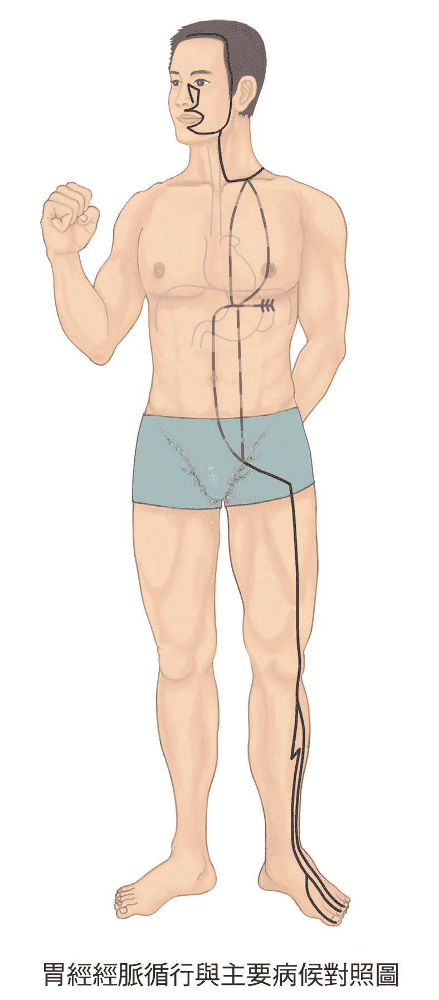

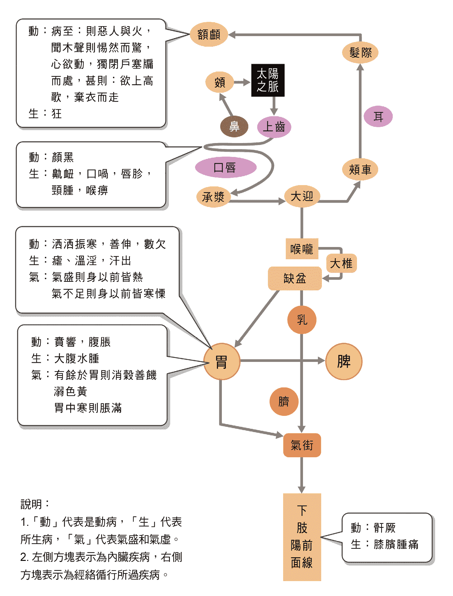

### 胃经经脉病候可分为两类症状

### 1.与循行所过部位有关的病候

每条经脉都有循行所过部位的气血运行失常，所产生的功能异常和「不通则痛」的症状。包括：

头面五官部「腮帮 U 形线」：

鼻病的鼽衄，面神经麻痺的口眼歪斜，嘴唇长疮、颈肿、喉痹等。阳明多气多血又主面，「颜黑」提示我们，气血循环不良会变成黑噜噜的包公脸喔！记得，气血充足才能拥有健康的美丽容颜。

胸腹部的「胃乳脐线」：

如大腹水肿、贲响、腹胀等肠胃功能异常症状；膺、乳、气街疼痛等气血失调症状。

下肢「正面 1-4 趾」：

沿着大腿正面、小腿胫骨外侧、足背等疼痛，脚趾头不灵活等。

### 2.与胃经特色有关的病候

#### 一连串精神异常的状况

其他经脉也有精神异常的症状，但只有胃经病候内容记载得既详细且严重。

原文说：「病至则恶人与火，闻木声则惕然而惊，心欲动，独闭户塞牖而处，甚则欲上高而歌，弃衣而走。」

意思是病人平时言行举止还算正常，一旦发病就非常怕吵，容易恐慌，因此不喜欢见到人和火光，听到木器的声音非常惊惶。这些情况都会造成他的身心压力和刺激，心脏开始砰砰乱跳，所以只好紧闭门窗独处，离群索居。这与现代的恐慌症有相似之处，由于交感神经过敏，导致焦虑型的精神官能症，而有心跳加速、呼吸困难、头痛头晕、恶心反胃、颤抖出冷汗、喉咙异物感、胸闷胸痛等症状。

还有另外一种状况，就是当病情趋于严重时，会心神错乱，身心躁动，想要爬到高处去唱歌，脱下衣服而乱走。

对于上述症状，令人印象很深刻，小时候住在南部，街上常常看到一位蓬头垢面的中年妇女，衣着邋遢，夏天还有点衣不蔽体，边走边摇头晃脑，边唱着歌，有小朋友经过时还会大声喝斥，作势要打人，我们就赶紧逃开。爸妈说她是疯子，居无定所，吃饭也是有一餐没一餐的，叮嘱我们不要靠近她。有一次我壮着胆子靠近她，仔细看她的面容，发现她憔悴暗沉，眼神散乱，当场吓得落荒而逃。后来听老一辈的人说，她是受到很大的刺激后才变成这样，小时候不了解精神刺激与疯子之间的关联，只觉得她既可怕又可怜。

综合前面两种症候，颇似现在的躁郁症，病人经历反覆的情绪亢奋期和抑郁期。前面的症状类似抑郁期，后面的症状类似亢奋期。

大家会不会觉得奇怪，现在不是在讨论胃经吗？怎么出现这一连串精神异常现象？

一起来看看《内经》的解释：

「阳明者胃脉也，胃者，土也，故闻木音而惊者，土恶木也。」

「阳明主肉，其脉血气盛，邪客之则热，热甚则恶火。」

「阳明厥则喘而惋，惋则恶人。」

「四支者，诸阳之本也，阳盛则四支实，实则能登高也。」

「热盛于身，故弃衣欲走也。」

「阳盛则使人妄言骂詈不避亲疏，而不欲食，不欲食，故妄走也。」

《内经》以五行相克，木克土、土恶木的关系，以及阳明胃经本身阳盛，多气多血和主四肢的特质来说明这一系列症状。

《内经》非常注重胃的功能，「五脏者，皆禀气于胃」，「平人之常气禀于胃。……人无胃气曰逆，逆者死。」意思是说，正常人的五脏六腑都要依靠胃所提供的养分才能发挥功能，维持生命和正常的心智活动。如果胃的功能失调，就会产生一系列异常的状况，严重者还会导致死亡。

中医认为「心主神志」，主要掌管神志与情绪的器官不是脑，而是心。而胃经经脉循行到额颅，与脑前额叶有关。脑前额叶与智力密切相关，是主管高阶认知思维活动与人格判断力、行为表现的重要脑区。另外，胃经的经别也循行到心。也就是说，胃经经络系统连结心脏与前额，这两个部位都与神志有关。一旦胃经出现异常时，就会影响心与前额所掌管的神志状况。

在中医的另一本经典，东汉张仲景所着的《伤寒论》中，有一种精神异常病症「神昏谵语」，就是神智不清，胡言乱语，《伤寒论》的诊断是因为严重便秘，胃肠中干硬的粪便难以排出，这些粪便产生的热毒，就顺着胃经经络系统向上冲至心（胃经经别到心）及额颅而影响心神。治疗法则只要将这些硬便排出，精神异常就得以缓解。这就补充了胃经病变会导致精神异常的原理。

乍听之下，很不可思议！可是从古至今，中医师利用通宿便来改善精神异常的有效案例非常多，尤其当一些重症患者，出现神昏谵语、兼有严重便秘的状况，都可以考虑运用。而现代医学也发现，躁郁症病人只要吃了精神类的药物，肠蠕动就会被抑制，排便规律反被破坏，也因此导致病情的胶着难解。

* * *

现代的「腹脑」概念与胃经的功能和病候有很大的相似处

胃统领大肠及小肠的工作，就象是人体餐厅的大厨，食物进入体内之后，由胃先做所有工作分派，时程安排，质量管控……等，而连接在胃后面的小肠及大肠，只要依据胃的指示，完成自己份内工作就可以了。

阳明大学蔡英杰医师在其《肠命百岁》著作中指出，依据现代研究，肠道的神经系统分布有一亿以上的神经细胞，仅次于大脑，所以称为「腹脑」或「第二大脑」！

「腹脑」概念指出了腹部肠道不仅是消化器官，更是具有丰富神经细胞、内分泌等的特殊组织，会影响脑部思考、情绪及诸多复杂疾病。所以肠道是会思考的腹脑，拥有丰富的神经系统，能接收肠道讯息，做出判断，然后发出指令，肠道还会分泌各种荷尔蒙，影响全身大小器官，包括大脑在内；情绪是由肠道掌控，血清素主导人的喜怒哀乐，但血清素并非由大脑分泌，而是来自肠道，所以人的情绪由肠道掌控；肠道毒素是体内秘密杀手，肠道病菌所产生的内毒素，会严重危害人体健康。

根据「腹脑」的研究，保持肠道畅通与健康状态，是维持情绪稳定的要件之一。

近年媒体报导美国研究指出，巴金森氏症这种常见的神经退化性疾病，真正的元凶不在脑部，而是在肠胃，可能与肠道里的微生物变化有关。现代研究已经逐步证实，肠道功能与精神和情绪有着密切关联。

后续在讨论胃经经筋的章节中也会看到，胃经经筋全面性的覆盖在腹部，提供完备且强悍的保护，是名符其实的「腹部一哥」！既然胃是人体非常重要的「后天之本」，当然需要一个团队共同完成如此重要的使命，胃及大肠小肠就形成了以胃为首领，功能一体，合作无间的工作团队了。

* * *

#### 主血所生病

脾胃是后天之本，气血生化之源，所吸收的营养成为身体造血的来源。加上阳明胃经本身就是一条多气多血的经络，如果胃的功能失常，营养不良就会出现贫血现象；或是胃火过旺，导致血中的热气也旺，就会在胃经循行所过的部位出现与血热有关的异常现象，例如情绪烦躁、脣胗等，还有像牙龈出血、皮肤起红疹、眼白出血等与胃火扰动血分有关的症状。这些都与胃功能异常有关。

#### 寒证及热证

《内经》原文中「气盛则身以前皆热，其有余于胃则消谷善饥，溺色黄。气不足则身以前皆寒栗，胃中寒则胀满。」胃经也跟前述的肺经和大肠经一样出现气盛与气虚的症状。胃经旺盛的气血对于维持人体生理机能很重要，但若失去平衡也会百病丛生。

胃经经脉之气的过度亢盛或是不足，在胃经所经过的身体前面部位会出现不正常的寒热现象，以及胃消化功能的异常。

例如：胃经经气有余，气血增多，身体前面部位就会发热；胃有火气，就像炉火变旺一样，「烧」得全身动不动就大汗淋漓，食物的消化速度加快，容易飢饿。胃火过度消耗水份，小便就会变黄，很多胃火大的人都会有这种经验，同时还会出现大便硬难解、口干口臭等等。有些人会去买黄连解毒丸来吃，可能可以暂时改善，却只是治标没有治本。长期吃黄连解毒丸这类泻火的药物，久了之后，胃会受伤，变成过度寒冷，而出现胃经经气不足的症状。治本的方法应该要从改善胃火开始，如少吃辛辣、炸物、油腻的食物，饮食宜清淡，多吃蔬果，多喝水。

另一方面，胃经经气不足，气血也不足，身体前面就会感到寒冷而颤抖；胃中寒冷，就像瓦斯炉关成小火一样，食物的消化速度变慢，囤积在胃里面，胃就胀满。这种情况常出现在长期吃喝冰冷的食物与饮料，或服用过于寒性药物，或是大病之后尚未恢复的人，胃的蠕动速度很慢，有些病人会说自己的胃几乎没在动。食物吃进去就卡在胃里面，胃跟腹部都很胀痛，大便没有力气排出，或是吃到一点点寒性的东西就腹泻，所以常常没有飢饿感，也没有食欲，吃饭变成只是尽义务而已，手脚比较冰冷。治本的方法当从改善胃虚寒着手，如少吃冰冷的食物、饮料、药物，多喝温水，注意保暖，饭后多按摩腹部，起身散步，因为胃经连结了胃部跟下肢正面的肌肉群，散步会透过胃经来促进胃的蠕动，帮助消化。

门诊时，许多病人喜欢问医师，自己的体质是寒性或是热性？每次遇到这种提问，医师几乎就要从「盘古开天」开始介绍中医对于寒热的概念。因为身体很容易受内在和外在环境的影响，随着生活起居、饮食情绪、气候等变化，身体随时都在变化中，没有绝对、静态不变的寒性或热性体质。

正常健康的人体是寒热互相协调，没有人的体质是纯热或纯寒，重点在于找出身体冷热不协调的原因。例如饮食失调导致胃经经脉气血失常，只要调整饮食就能调整不正常的寒热状况，这才是治病的快速法门。

## 二、足阳明之正（经别）

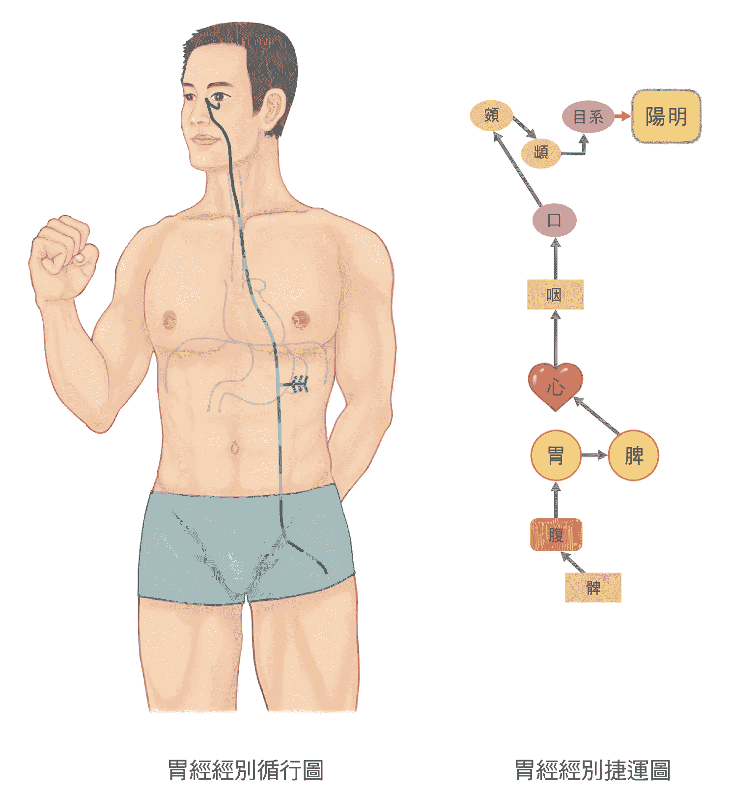

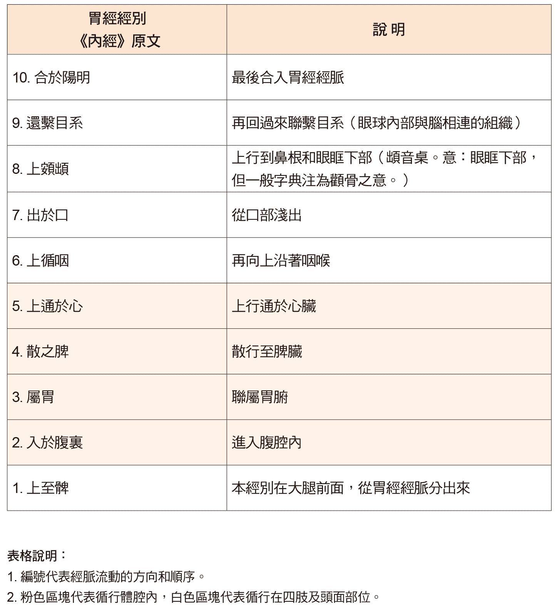

#### 「胃心口专线」

胃经经别在胃经经脉原有的路线加上「心」，将「胃脾─心─目鼻口咽」串连在一起，我把它简称为「胃心口专线」。

本经连结心脏，在生理功能上，营养的供给道路会更直接更安全，心情与胃口也会互相影响。

在病理上，胃病会影响到心，例如胃食道逆流，胸口会有灼热感，即俗语说的「火烧心」，心病也会影响到胃，尤其是情绪影响食欲至大。经脉篇中提到心下痛是胃病与心脏病都会出现的症状，除了由于胃经经脉内线通过心下处之外，本经别连结胃与心，也是心下痛难以鉴别的原因之一。

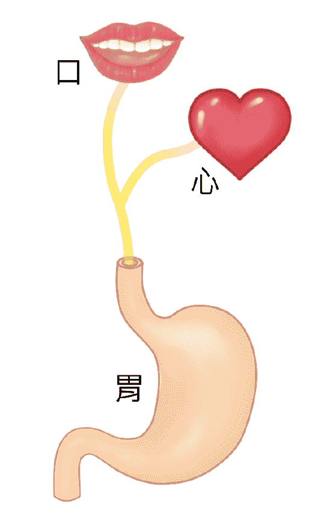

 解密：「胃心口专线」建立人类特有的交际生活史！

###### 「胃心口专线」建立人类特有的交际生活史！

经由胃经经别「胃心口专线」，使得饮食不仅只是动物本能「吃饱」而已，它还牵动了食物与身体健康、心情、言语之间的人际关系。

御膳房之路

从经络的角度来看，首先，心为君主之官，「胃心口专线」就像宫廷中专为皇帝提供饮食服务的「御膳厨房」。

在古代的宫廷戏剧中，常见到两派人马在争权时，就会有人想在皇帝的饮食中掺入毒药的桥段，当然，这也一定发生在真实的宫廷中，所以才会设置「御膳房」这类特殊厨房，确保将最好、最安全的饮食营养，安全且快速的送达皇宫，这是保障君王生命安全很重要的设计。

人体「胃心口专线」也是一条「御膳房」之路，让脾胃得以将营养物质直接送达心脏，确保使命必达，这也是保障个人生命安全很重要的设计。

心口合一

人体五脏之中，心主神志，与喜乐的情绪密切相关。一旦脾胃将营养物质安全无虞的送达心脏，气血充盈，心脏就会产生喜乐幸福感！幸褔感循着「胃心口专线」向上输送到嘴巴，就会发自真心的说好话，舌粲莲花。人与人之间真情交流，自然就会建立真感情，凝聚共识。

反之，如果是「鸿门宴」，就千万不要在美食的诱惑下轻易卸下心防，要时时保持清醒，免得醒后懊悔莫及。「鸿门宴」源自于项羽在鸿门设下酒宴，本想要杀刘邦，刘邦很了解自己的处境，努力保持神志清楚，不为食物所惑，采取「口蜜腹剑」，（「胃心口专线」策略），嘴里说着好听话，心里却打着逃命的念头。最后刘邦终于藉着尿遁而保住一命，若当时刘邦耽溺于美酒佳肴的「口腹之欲」（仍是「胃心口专线」），开怀畅饮，历史恐怕就要改写了！

食物的共享

藉由食物的分享来建立人际关系的串连，一直是群体生活中重要的部分。从人类生活历程来看，早期人类居住在村落里，会将各自收集或采获的食物拿出来与所有人共享，以建立族群的向心力，这样的习俗至今仍在许多原住民部落里保存着。

就算到了现代社会忙碌的办公室中，只要业绩亮眼或是抢到大客户等等喜事，大伙也会兴冲冲的在下班后一起庆功。彷彿有了好心情，胃口也会跟着大开，情感交流就更畅通了。大家边享受美食，边诉说工作中共同经历的艰苦与欢乐，这顿餐叙也就容易建立起革命情感，相约下次再一起拚搏事业！

而每年的春节、端午及中秋三节，远在外地的游子，无论路途多么遥远，车票机票多么难买，总是要赶回家与家人一起吃团圆饭，在饭桌上分享工作与生活点滴来互相取暖，这种感受正是心经与胃经击掌共享的美好时刻。

「胃心口专线」进阶版功能！

以「吃」抚慰人心，强化情感，还只是初级版功能而已。若能加以善用，无论是在情感或工作上，也能所向披靡，一战成功。

##### 想要求婚，提升成功率的关键是什么？

求婚是件浪漫的事情，气氛要精心设计，打动对方的心就能提高成功率！设计气氛也要善用「胃心口专线」！

「胃心口专线」连结了面部的眼睛、鼻子和咽喉。所以第一要有烛光香氛，因为它会启动眼睛与鼻子的感受器，传递至心，让心先卸下防线；第二要精心设计色香味俱全的餐点，让好食物从眼、口、鼻、咽喉启动脾胃功能，将愉悦感传达至心，而快乐的用餐也会让眼睛放电，口出蜜语，能助攻掳获心；最后当然也是最高潮点，拿出亮晶晶会闪入眼睛的定情物，或能打动对方的视觉型礼物，由眼睛直传到心的感动，便能一举攻占整颗心，求婚当然会成功呀！

##### 老一辈常说：要抓住一个男人的心，要先抓住他的胃，真的有用吗？

俗话说，「婚前婚后差很多」，婚前求婚是男人的工作，婚后理家是女人的工作。男人在外冲刺事业，形形色色的诱惑自然不少，怎样才能抓住他的心呢？请呼叫「胃心口专线」吧！

「胃心口专线」，顾名思义就是以口纳食物进入脾胃，再传递满足感到心，成为守护婚姻的红线！只要能满足口腹之欲，心也跟着愉悦，吃饭变成是一件快乐的事情，心当然就被牢牢抓住了。而且中医认为大脑是由心管理，具有记忆的功能。日积月累的生活经验，就会变成一种习惯，时间一到，就要回家与家人用餐。

有些读者可能会觉得上面的说法有点大男人主义，贬抑女性。其实老一辈的人会这样说，也是源自早期社会男主外女主内的生活型态，现今男女平权，同理延伸男性若能抓住女人的胃，肯定也会大受欢迎。这概念也可适用于亲子之间，或者餐饮业与食客之间。

##### 为什么在老板肚子饿的时候要求加薪必败？

人在飢饿的时候，胃部空空，当然也没办法输送养分给心，心情就容易烦躁。此时，如果没能察言观色，而直接提出加薪的要求，不仅会被当场拒绝，还会被老板当作出气桶，臭骂一顿，得不偿失。

所以，千万记得要在老板酒足饭饱之余，开始谈论当年勇以及一些听过千遍且很难找到梗的笑话时，再有技巧地提出要求，成功机率就会大增，切记切记！进食是令人愉悦、放松身心的软性时刻。

 中医师不传之祕：由口唇判断一个人的消化功能及语言表达能力

###### 由口唇判断一个人的消化功能及语言表达能力

胃经经脉「夹口环唇」，两侧胃经刚好包围整个口唇，所以口唇就能反映出脾胃的消化功能。

消化功能较好的人，口唇肌肉比较饱满充盈，有力且有弹性感，嘴巴比较能闭合。消化功能较差的人，口唇肌肉比较不丰满，而且下唇无力，容易松垮，嘴巴常会不自觉的微微张开，甚至会不自主流出口水。

这种情况常出现在小朋友身上，父母亲可以藉由这样的观察，了解孩子的肠胃状况，适时给予照护。

中医认为「心主言」，言语是表达心里想法的重要媒介。胃经经别「胃心口专线」，连接心与口，口唇也能反映语言表达能力，电视新闻主播就是最好的观察对象。多数主播口条流利，咬字清晰，嘴唇厚度比较薄，上下唇线比较分明，嘴唇肌肉比较紧实，这都符合「用进废退」的原则，因为主播们常使用嘴唇，所以这块小小肌肉也就被训练得立体、鲜明且有力。

对于没有机会坐上主播台的我们，这个观察有何意义呢？

一方面是「适性发展」，如果您有这种唇形的孩子或亲友，就可以朝着言语表达这方面去栽培他、鼓励他。

另一方面是在买卖杀价时，若对方是这种唇形，而您刚好不是此类唇形的人，唇枪舌战的赢面不大，建议不必说太多，见好就赶紧收啦！

最后，「胃心口专线」还有一个重要任务，就是它加强心脏与面部五官之间的联系，让心可以掌管感觉，这也为人类特有的细腻感觉铺路。细节我们将在心经系统说明。

 中医师不传之祕：胃功能不好会影响睡眠！

###### 胃功能不好会影响睡眠！

《内经》说「胃不和则卧不安」，指出胃如果有不舒服的状况，例如嘈杂（即台语说的「ㄗㄜ ㄗㄜ」感） 、闷胀、疼痛、胃酸逆流等状况，都会影响睡眠。

胃病跟失眠是现代人常见的疾病，只是大家通常不会想到两者之间有关联。其实这也是透过「胃心口专线」而来的，它提醒我们二件事情：

1.尽量不要吃消夜。吃了消夜，胃一整夜都必须工作，无法休息，久了之后，胃就容易生病。晚餐也不要太晚吃，晚上八点后尽量不要吃固体食物。

2.有胃病的人一定要赶紧照顾好胃，以免牵连到心而影响睡眠。反之，长期的失眠也会影响胃的消化吸收功能。最好的解决方法就是双管齐下，同时治疗胃病与失眠，才能根本改善。

 中医师不传之祕：临床上真的有「吊人胃口」的状况

###### 临床上真的有「吊人胃口」的状况

总论介绍俗语「吊人胃口」来自于将「胃口」转作比喻，让人产生欲望或兴趣。在某些时机点，人们会利用一些方法，就象话说到关键点就卖关子不说，或是要秀给人看的物品却半遮半掩的，让人产生期待感、窥伺欲望、引发兴趣。

但在临床上，我们确实见到「吊胃口」的身体状况。

病人常觉得心脏附近有种空虚感，呼吸很浅，肚子有飢饿感但却吃不下东西，胃一直很胀满。身体检查会发现病人的左肩不自觉的高耸，牵引左侧的胸廓跟胁肋上提，心脏跟胃部当然也「水涨船高」，随着向上提高，一般常见于长期容易紧张的人。

我们会跟病人笑说这就是「吊人胃口」，胃部相关的结构与经络真有向上吊的情况喔！中医也有类似此症状的名词「心悬如飢」，您看，字面上的意义是不是非常符合症状呢？！

若有这种情况，建议时时深呼吸，尤其是腹式呼吸，将气引至丹田；做扩胸运动来加强拉开左侧肩背肌群，手臂向外做圆形运动来拉开肩关节，若能再调节情绪，缓解紧张压力，胃慢慢的就会掉下来，回复原位了。

#### 小结

再次提醒大家，心与胃关系很密切，总论也介绍过胃经与欲望有关，「胃心口专线」在欲望方面扮演重要角色。

身与心互相影响，心为君主之官，管理情绪与欲望。心的想法一旦从「需要」变成「想要」，就很容易拉着胃一起掉入欲望无尽的深渊之中，开始食欲大开，饮食厚味……。幸好胃经经脉到额颅，可以协助管控奔放如野马的心念。所以，健康清爽的饮食，让脾能升清气，胃能降浊气，人体的气机正常，心与脑就能维持理智与节制，不会成为欲望的囚徒。

## 三、足阳明之别（络脉）

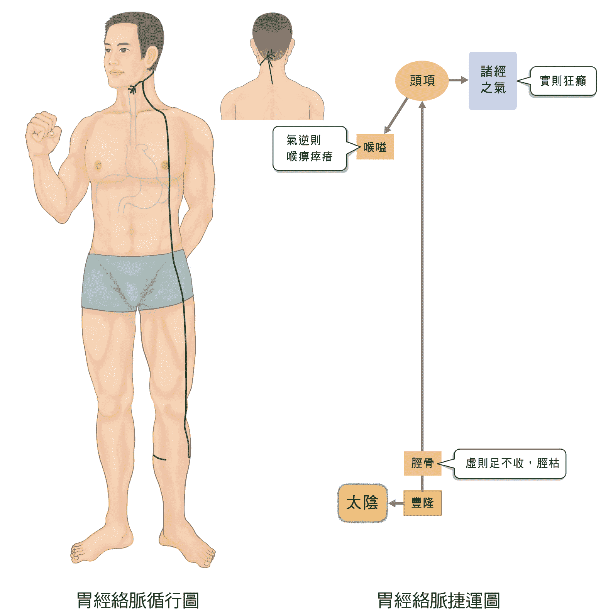

由于本络脉的病候与循行完全相关，所以循行与病候一并介绍。

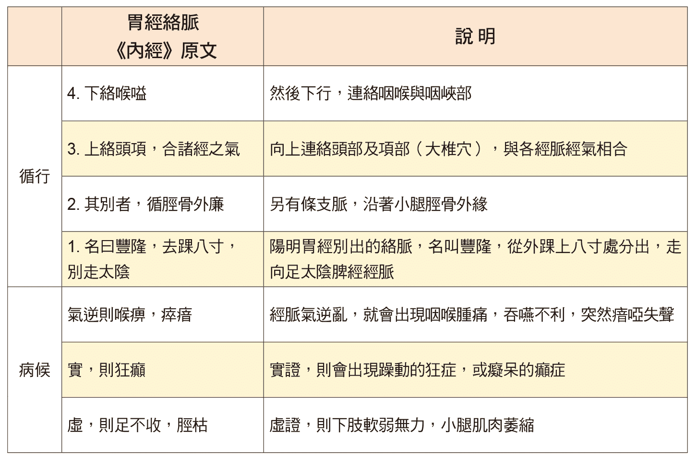

#### 「丰隆喉头线」

胃经络脉循行精简且有效率，从小腿阳面八寸之处的丰隆穴，也就是外踝到犊鼻连线 1/2 高的地方分出来，一条走到小腿阴面去联络脾经，另一条向上沿着胫骨外侧，一路走到头部和项部，并在这里会合各经脉经气，然后再下行到喉嗌部。

本络脉的三个特色部位是丰隆穴、头项部与喉嗌，因此就简称为「丰隆喉头线」。

#### 络脉最重要的考量──安全的备用道路

在进入「丰隆喉头线」内容之前，让我们先想想胃经络脉从外踝以上八寸，循着哪一条路径走到太阴脾经？

早期读中医到这里，通常一眼带过，想说不就是从阳经直接连到阴经而已，没啥特别的。直到之前写到膀胱经的络脉飞扬穴如何连结肾经时，竟然卡住了！才赫然发现，其实络脉连结相表里经脉是有迹可循的，可不是一笔划过去。

相表里的经脉通常位在四肢的相对位置，譬如，太阴经与阳明经分别位在阴面与阳面的前线，厥阴与少阳分别位在阴面与阳面的中线，少阴与太阳分别位在阴面与阳面的后线。我们再参考《内经》的说法，经脉多循行于人体深部，为纵行路线，络脉多分布在人体较浅的部位，为横向分布。

在卷一的［经络启航］介绍了经络四大系统各自的特色，其中相表里的经脉都在手足末梢交接。但是手足末梢活动多，容易损伤而祸及经脉，阻碍经脉内的气血流动，进而影响体内的脏腑功能，兹事体大。聪明的人体就在手部的腕与肘关节之间（适用于手经），足部的踝与膝关节之间（适用于足经，但脾经除外），从经脉另外分出一条络脉，走到相表里的经脉与其连接，做为表里经脉连结系统的备用道路。万一手足末梢部位损伤时，还有络脉可与相表里的经脉相联系。

四肢的主要肌肉都是纵向分布的，这些肌肉活动非常频繁，常常在收缩与舒张。经脉就顺着肌肉走向，形成纵向路线，不会被舒缩的肌肉所夹伤，这也是最安全的路线。而横行的络脉既然做为备用道路，也要学习经脉选择一条安全的路线，才能发挥良能。

假设四肢是一座山，阴阳经脉就位在山的两侧，两者间要交通联系，可以选择打通隧道直接穿越，或是绕道而行。

依据前面的说法，如果直接穿越四肢肌肉群到对侧，很容易被肌肉夹伤，就像穿越山洞容易遇到坍方一样，看起来不是最安全的选择。

另一个方法就是绕道而行了。

络脉从络穴出发去连接对面的表里经，依据络脉多分布在较浅部位的规律，不太可能直接穿过肌肉层到对面，反而比较可能通过表面的肌群到对侧，这样既符合络脉的循行特性，又顾及络脉高度安全的需求。

络脉这条绕行的路线，看似比直接穿越到对面远了一些，有点不符经济效益。其实不然！「凡走过必留下痕迹」，络脉这些横向而浅层的道路，经过的范围更广、连结更多的经脉与部位，反而凝聚更大的效力！

以上说明我的观察与推敲之后，让我们回到胃经络脉吧！

#### 一手掌握所有足经的丰隆穴

依据络脉横向且浅层的分布特性，丰隆穴有两个选择：一是向前横越胫骨，直接连结脾经，这就是「走前门」，二是向后经过小腿肌群，再连结脾经，这就是「走后门」。

聪明的读者，觉得丰隆穴会选择哪一条路线呢？

个人浅见，第二条路雀屏中选的机率比较高。为什么呢？理由有三：

首先，第一条「走前门」路线直接横越胫骨到小腿内侧的脾经，其实小腿正面也是活动频繁的区域，而且骨多肉少，络脉只能分布在非常浅层的位置，损伤机率比较高。

第二，胃经在小腿部位的穴位，只有丰隆穴的位置偏向外侧，与胆经接近。胃经既然选择丰隆穴为络穴，基本上就比较倾向于「走后门」，从小腿的「外侧─后侧─内侧」这条路线。

第三，各位不要忘了，胃经是条充满欲望、掌控性高的经络，如果让它有机会掌握更多资源的时候，它是绝对不会放弃的。从小腿外侧─后侧─内侧这条路线涵盖了足部五条经脉，也就是说，胃经可以藉由丰隆穴「走后门」掌控所有的足经，何乐而不为呢？从另一个角度来说，阳明经多气多血，其他经脉也想多巴结它，以期获得更多营养。大家就各取所需囉！

从这个角度来看，「丰隆」穴这个名字含义可深了。临床上使用丰隆穴也确实可以治疗多种疾病，显示丰隆穴确实有不凡的潜在能力。

#### 丰隆穴的特色

「丰隆穴」顾名思义，就跟丰厚隆起的型态有关。

中医的穴位命名都有很深的意涵，历代医家也常用穴名来取穴治病。周左宇老师传承自杨天霖老师「内外山陵、丘海池渠、沟谿泉井、手足治疗原则」，即是应用穴名来治病的法则，而且还将一些比较特别的穴名列出，提醒我们这些后学者可以善加利用，有兴趣的读者可参阅《医道精要》一书。

足阳明胃经是一条会让人体格强壮的经络，也循行在人体肌肉丰厚的部位。小腿阳面肌肉最丰厚的位置就是「丰隆穴」所在处！

在胃经经脉篇介绍下肢部从膝下三寸分出一条「小腿外线」，它的小腿路线与胆经非常接近，而丰隆穴就在这条路线上。

总结前述内容，得天独厚的丰隆穴具有四种治疗功能：

以穴名来看：

适用于我在门诊中常说的「该丰隆而不丰隆，不该丰隆而丰隆」症状。丰隆穴是胃经的络穴，负责联络脾经，兼具调节脾胃的功能。脾胃主四肢肌肉，所以与四肢的肌肉特别相关。

「该丰隆而不丰隆」主要指身形过度瘦削，如病候中的胫枯，意思是小腿肌肉过度枯瘦甚至脚软无力。

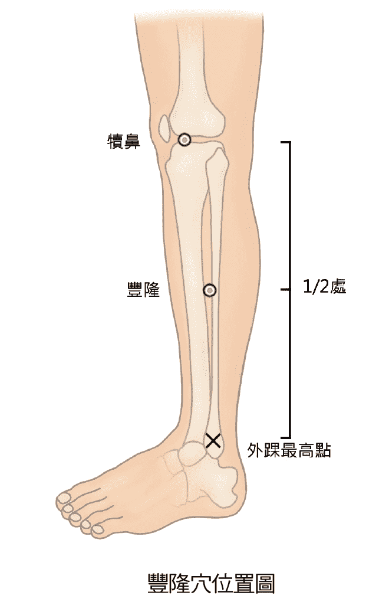

「不该丰隆而丰隆」主要指身形过度丰腴甚至肿胀，如月亮脸、啤酒肚等。由于胃经通过乳房，有些过度臃肿的胸部，会在真正的乳房上面出现柔软肿块，我戏称之为「假奶」。这不是丰乳的后遗症，而是气肿引起的，可加上善于行气消肿的三焦经穴位，如外关穴。

也许读者会想偷偷问，丰隆穴既然那么「丰隆」，那丰胸有效吗？

请注意，丰隆穴只针对「该丰隆而不丰隆」的情况，如果「本钱」不够，丰隆穴也是莫法度！

至于什么是「本钱」？当然就是气血啊！均衡的饮食加上良好的脾胃功能，才能制造出乳房发育所需的气血。所以要丰胸，请先从饮食开始！等累积的「本钱」越来越雄厚，却还缺临门一脚时，丰隆穴就能派上用场囉！

从位置来看：

适合胃经与胆经合病，包括经脉篇介绍的第 3-4 趾趾缝的适应症。

络脉循行：

可以治疗循行所过部位：胫骨、头项及咽喉疾病。

胫骨病症前面已经介绍过。喉嗌部位跟胃经经脉循行一致，经脉气逆乱而出现严重的喉咙痛到难以吞咽，突然失声，临床上也常用本穴加上大肠经的曲池穴和肺经的鱼际穴，或在少商穴点刺放血治疗。

比较特别的是到头项部，还合诸经之气。

经脉篇中介绍过头面部的腮帮 U 形线交会督脉的大椎穴。大椎穴很重要，再强调一次它的重要性。大椎穴位在项背正中线，第七颈椎棘突与第一胸椎棘突之间，即颈椎与胸椎的交会区，大椎穴就位在项背交接处，为颈肩背活动的关键点，是人体非常重要的穴位。「大椎」意思是最大的脊椎骨，低头时，脖子接近背部的位置会出现一个圆形隆起，这是第七颈椎，大椎穴就在它的棘突下凹陷处。

督脉为阳脉之海，人体手足六阳经与督脉都会于大椎穴，所以又称为「诸阳之会」。胃经经脉与督脉会于大椎穴，络脉再度上络头项，再度交会于大椎穴，并与诸阳经之气相合，这都符合阳明胃经多气多血，且多欲望、多掌控的特质。这也跟我们推想丰隆穴会选择第二条「走后门」路线的概念相通。

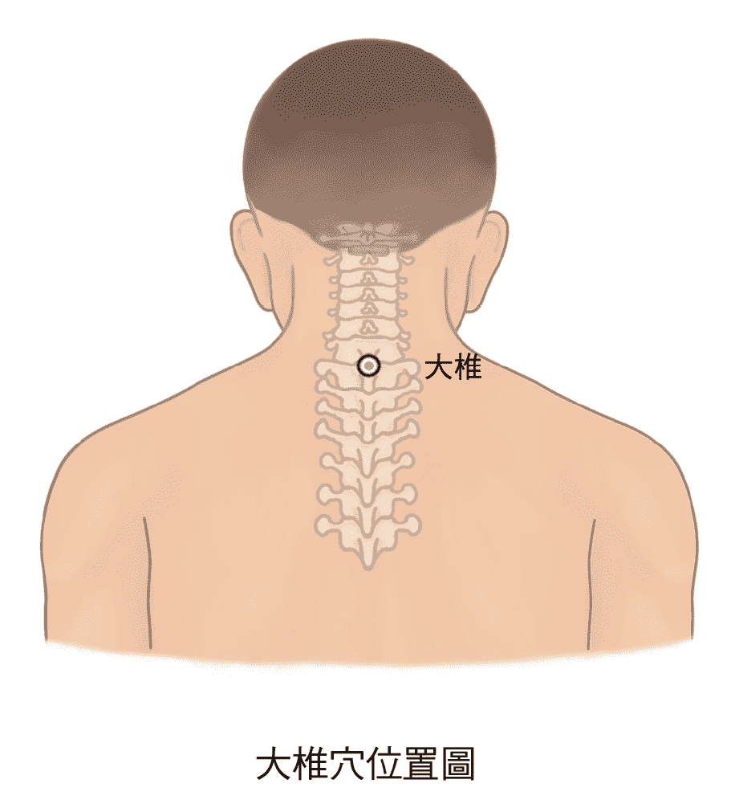

胃经经脉至额颅为主，络脉特别络于头项，两者将前头与后头串连起来。这项串连关系，说明了胃经经脉与络脉都会出现精神异常狂癫症的经络基础。

联络脾经：

丰隆穴是胃经的络穴，负责络脾经，除了可以连起脾胃后天之本，加强水谷精微吸收之外，也兼具有脾主湿化痰饮的功能。所以历代以来，丰隆穴都是中医治痰的要穴。

丰隆穴真是多功能的好穴，从这个角度来看，在胃经 45 穴之中，丰隆穴的关系最丰富、效用最宽广，「丰隆」果然名不虚传。

 解密：为什么喉咙总是有点痰，卡卡的，吞也吞不下，吐也吐不出来呢？

###### 为什么喉咙总是有点痰，卡卡的，吞也吞不下，吐也吐不出来呢？

针对这种情况，中医有一个专有名词：「梅核气」，因为喉咙常常有一种特殊的异物感，宛如一颗梅核塞在咽喉，有痰又似无痰，咯不出来也吞不下去，所以才有这个名称。

会有梅核气的人，个性比较敏感、神经质，非常在乎别人对自己的看法，有追求完美的倾向；因为容易紧张，所以吃饭常常无法细嚼慢咽，难以平心静气，导致肠胃功能不佳，消化不良；眼神时而飘忽不定，肩颈紧绷，胸口有压迫感，常须用力吸气，或用手去抚胸顺气，走路很急，常觉得脚痠，多见于女性。这类病人常会被现代医学诊断为「精神官能症」或「癔病」。

只要压力一来，她们就会惊慌失措，情绪低落，茶不思饭不想，吃了也不消化；晚上睡不着，心情纠结打不开，久而久之，喉咙开始卡痰。老是在清喉咙，却也清不出东西来，喉咙通常没有明显的发炎现象。这些症状类似现代的「咽部神经官能症」及「恐慌症」。

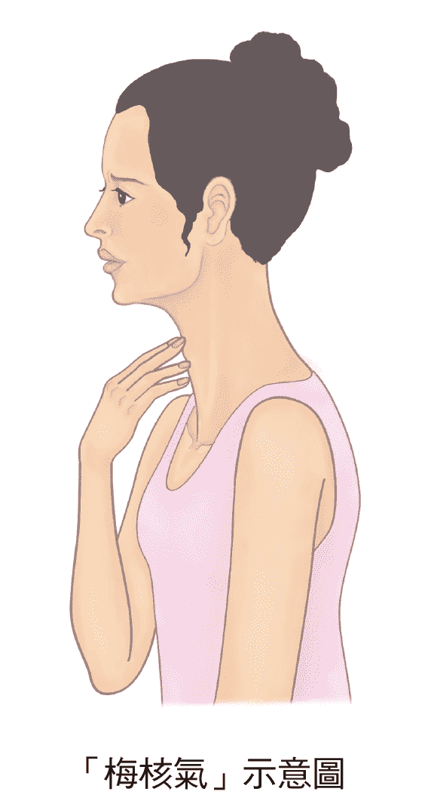

大家可能会很惊讶，个性紧张跟喉咙卡痰竟然有关系！这就是身体与心理之间相互影响所致，透过「丰隆喉头线」连结。

中医所说的痰，主要是脾胃无法将食物中的水分正常代谢，停留在体内而形成的，细节会在后面详述。这些停留在胃经的痰，顺着络脉「丰隆喉头线」流到头部跟喉咙，造成情绪失调跟喉咙的异物感。

有梅核气的人通常具备两种条件：一是个性容易紧张，一是肠胃功能不佳，随着情绪压力的增加，肠胃功能越来越差，痰积越多，喉咙就越来越卡。

大家可以猜猜看，有梅核气的人，小腿是胖胖的情况居多呢？或是瘦瘦的情况居多呢？

根据临床经验，如果从年轻时候就容易紧张的人，小腿瘦瘦的情况比较多，就是病候中「虚则足不收，胫枯」的情况，而且身材也偏瘦。为什么呢？

前面提到过，有梅核气的人多数是紧张大师，肠胃功能怎么会好？食欲差，再加上睡不好，怎么胖得起来？

中医有专门治疗梅核气的药方叫做「半夏厚朴汤」，它的症状及组方原理都跟「丰隆喉头线」吻合。

 解密：生活中或电视电影中，常听到「我就是咽不下这口气！」到底是哪一口气咽不下呢？

###### 生活中或电视电影中，常听到「我就是咽不下这口气！」到底是哪一口气咽不下呢？

门诊中，一位中年妇人因为长期失眠来就医。她是典型的中年发福身形，圆圆胖胖的，脸色灰暗无光彩，声音有点沙哑。病人感觉身体很沉重，全身都在痠痛，喉咙老是有一口痰卡着下不去，情绪有时烦躁易怒，有时忧郁不想说话。

经暸解，失眠是从被自家亲友倒会之后才开始的，至今十几年了。被倒金额几十万，但病人家中经济小康，这笔损失并没有造成生活的压力。

我问她：「既然被倒的会款不会影响生活，为什么还会失眠呢？」

病人忿忿不平地说：「我就是咽不下这口气！他们怎么可以这样骗我？越想越气，就睡不着了！」

咽不下的这口气，让她深陷在被欺骗的负面情绪中，难以平复，而彻夜难眠。长时间的失眠，情绪常摆荡在「崩溃」的边缘，有时非常高昂，有时又非常低落。这位病人有「梅核气」的情况，所以声音沙哑，再严重一点，就会像病候中的「气逆则喉痹瘁瘖」。除此之外，病人还兼有明显的情绪障碍，也与络脉病候中「实则狂癫」类似。

所以咽不下的那一口气，其实就是放不下的情绪。负面的情绪，从心理影响身体，导致喉咙有异物感，这些症状的发展都符合「丰隆喉头线」的循行路线与病候表现，而且与体内的痰有密切关系。

 中医师不传之祕：百病皆由痰作祟

###### 百病皆由痰作祟

中医讲的「痰」，主要来自于饮食失调，脾胃功能差，无法消化及代谢饮食中的水湿，停留在体内而形成。这些痰会在身体的内外部位四处流动及停滞，主要分为有形及无形两种。有形的痰象是可咳吐出来的痰，或是可触摸到软块，如四肢皮肤下面的脂肪瘤，都属于有形的痰。无形的痰是停留在身体内部脏腑、经络等处，无法看到及触摸，属于无形的痰。

痰一旦停留下来就会「挡路」，影响气血的运行。痰停留在身体表面容易形成肿块；痰停留在身体里面，会严重妨碍内脏及经络的气血循环，造成许多难治的疾病，所以中医有句名言：「百病皆由痰作祟」，一些复杂怪异棘手的疾病，甚至精神疾病，如本篇病候中的狂癫等，还有属于「痰迷心窍」者，都可以从化痰的角度来治疗。

 中医师不传之祕：丰隆穴是中医的化痰要穴

###### 丰隆穴是中医的化痰要穴

丰隆穴顾名思义是该「丰富，隆起」、「肿肿胖胖」的样子，没错！

胃经经过小腿前面的肌肉群，由于「脾胃主四肢」及「脾胃主肌肉」，就与四肢肌肉的丰厚程度有关系。

当胃的消化功能正常，营养够，小腿就会有健康隆起的肌肉，而丰隆穴就正位于小腿前面外侧的中央，也就是健康的小腿肌肉比较丰厚的位置。

如果胃的消化功能失常，无法吸收代谢食物中的水湿，停留在体内久了，就会变成前面所说的「痰」。痰是走到哪儿就塞到哪儿，累积量多了，就会形成肿胀的状态，这种情况也会反映在丰隆穴上，而让丰隆穴附近的肌肉也跟着肿起来。所以，临床上，丰隆穴是中医师诊断及治疗痰病的重要穴位。

许多喜欢吃油腻油炸食物或是暴饮暴食的人，当脂肪代谢障碍时，会在四肢、腹部浅层还有躯干的皮下出现扁圆形的脂肪瘤，类似中医的痰核概念。身体累积许多痰无法排出时，丰隆穴都特别肿硬，病人常自我感觉良好的说：「喔！我以为我的小腿这样肿肿的，表示脚很结实强壮咧！」要小心！这可都是三高（高血压、高血糖、高血脂）的候选人！

## 四、足阳明之筋（经筋）

### 胃经经筋─循行特色

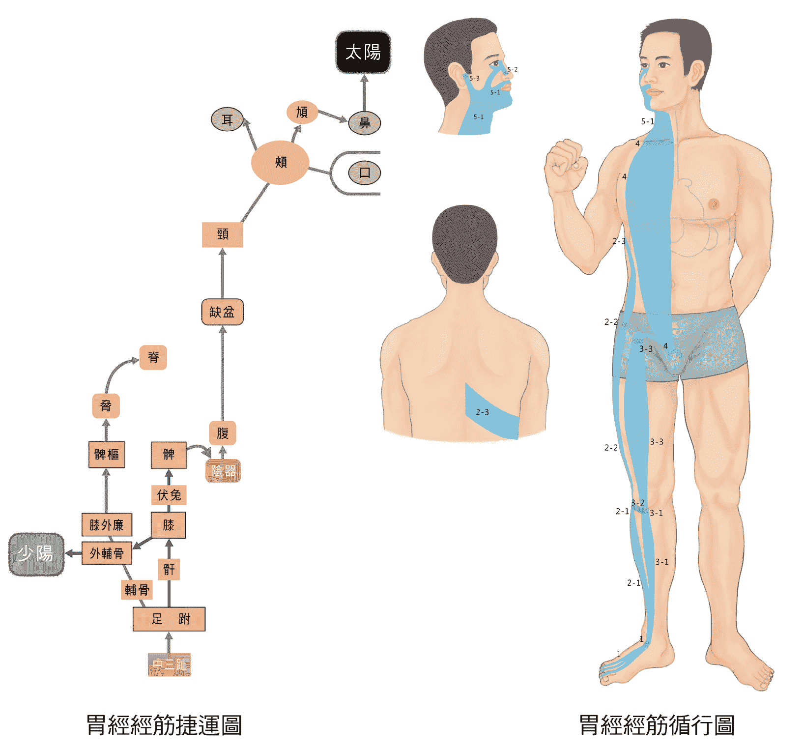

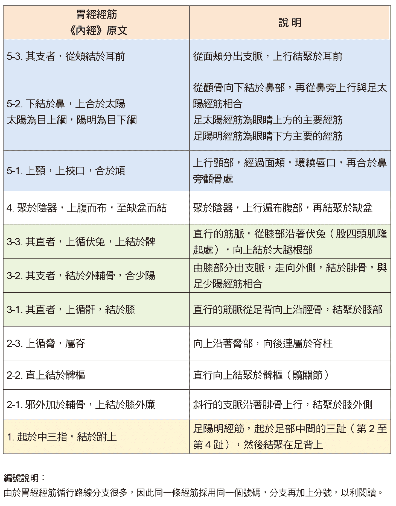

足三阳经筋系统是人体最强大也是最主要的经筋系统，包括分布在正面的足阳明胃经经筋、侧面的足少阳胆经经筋及后面的足太阳膀胱经经筋，共同肩负保护人体体表的重责大任，一如经脉系统，它们的循行路线也是从头到脚，而且为了确保足够的涵盖面，分支也很多，有时甚至比经脉还多，越重要的部位例如头面部，分支就越多。

足阳明胃经经筋主要走在身体的正面，从头分布到脚。循行路线可分为路线 1-3 的下肢部，路线 4 的胸腹部，路线 5 的头面部三部分。

大家看到这里会不会想，胃经经筋听说很厉害，怎么路线这么少？

其实下肢部与头面部的路线包含许多细分支，为了让读者便于阅读，掌握分支所属的主线，才将路线浓缩成五条主线，并非只有五条而已。

#### 人体正面最强大的经筋系统

前面说过，足三阳经经筋是人体最强大的经筋系统，负责保护人体的正面、侧面及后面。胃经经筋专责保护人体的正面，它以大面积、多分支的方式来涵盖人体下肢、胸腹部和头面部的正面。简单的说，当我们面对一个人，一眼望过去，所看到的人体正面几乎全部在胃经经筋的包覆范围。

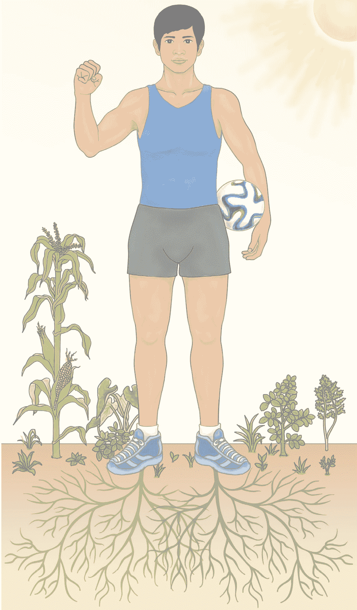

依据经络理论，经筋系统应该去保护自己经脉以及脏腑所在部位。但是有责任感、能力又强的胃经大哥一手包办了胸腹部的保护重责。

如此一来，一些位在腹腔的脏器，如大小肠等所属的经筋系统就无需保护腹部，转而去包覆头面部；位于胸部的心肺，因为攸关生存问题，心肺的经筋系统坚持要亲手贴身护卫心肺两脏，胃经经筋爱屋及乌，也就从腹部一路向上到胸部，覆盖在心肺的经筋外层，以双层经筋模式来加强护卫重要的心肺。

能力强大的胃经经筋系统在公领域与私领域之间，取得非常好的平衡，除了大公无私的保护人体正面之外，私领域方面也认真照顾自家人，特地从侧面及后面延伸出经筋来加强保护胃与脾。

胃经经筋系统循行大致上与经脉相合，因此也跟经脉系统一样分为三部。

### 1.下肢部的「正面 2-4 趾」

本经筋涵盖范围与经脉大致相同，另外还增加一条隐形小路线。

足趾及足背：1 条经筋，起于第 2-4 趾，结于足背上。 （路线 1）

中三指代表第 2-4 趾，与经脉篇相合，表示胃经已经名正言顺的将第 3 趾（即中趾）列管。

胃经经脉走到大趾是为了和脾经交接，经筋系统则是独立系统，没有必要与脾经交接，所以只涵盖中间三个趾头。

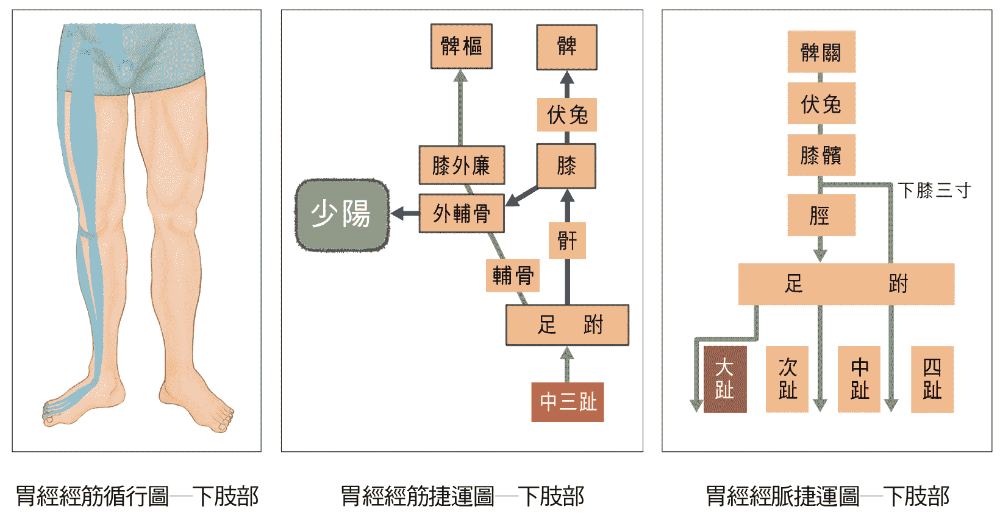

腿部：2 条经筋，分为主干线和小腿外线。

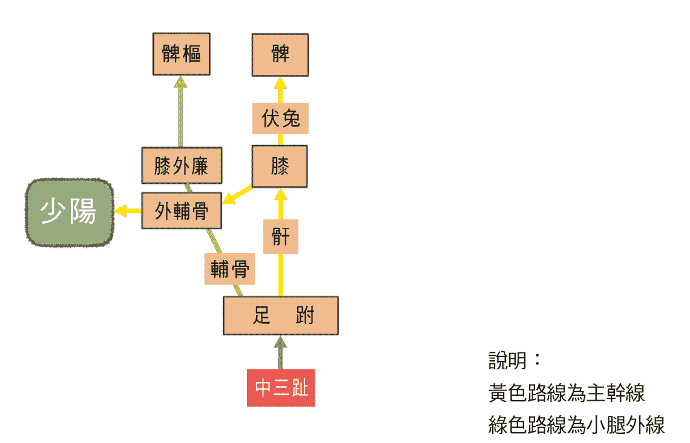

主干线：

从足背、小腿胫骨，结于膝关节，再向上经过大腿正面抵达大腿根部（髀），这段路线跟经脉循行一致。（ 路线 3-1～3-3 ）

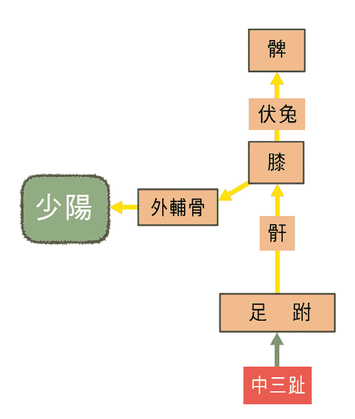

另外还增加一条由膝关节发出的支脉，向外连结腓骨（外辅骨）。

主干线这条斜向连结线很短，常被忽略了。依据我们临床的观察，这里很容易出现筋结，而影响膝盖的活动。

这条斜向短线有两端，个人推测胃经端应该是足三里穴，胆经端是阳陵泉穴，两穴都很巨大也很重要，都有强化膝关节活动的功能，所以才特别以最精简路线来连结。

小腿外线：

也跟经脉一样，走在主干线的外侧，结聚在膝关节外侧，然后直行向上行，结于髋关节（髀枢），在此与足少阳胆经经筋相合，再一次加强胃经与胆经的关系。（路线 2-1）

胃经经筋在下肢部两度与胆经相连结，都是为了强化人体正面和侧面的防护。

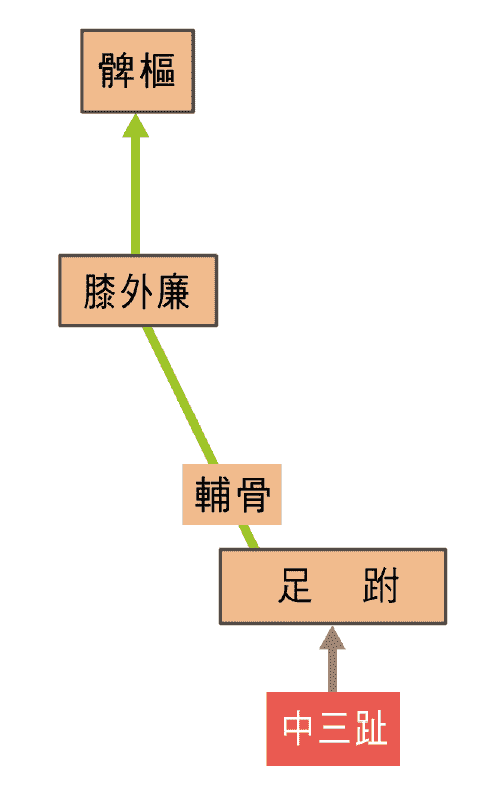

### 2.胸腹部的「前腹后脊线」

胃经经筋在胸腹部的循行文字叙述很简单，但实质涵盖面积非常广大。

衔接自下肢的主干线，走在人体正面的称为「前线」，以涵盖腹部为主；衔接自下肢的小腿外线，走在人体背面的称为「后线」，以连结脊柱为主。所以本部位的经筋就统称为「前腹后脊线」。

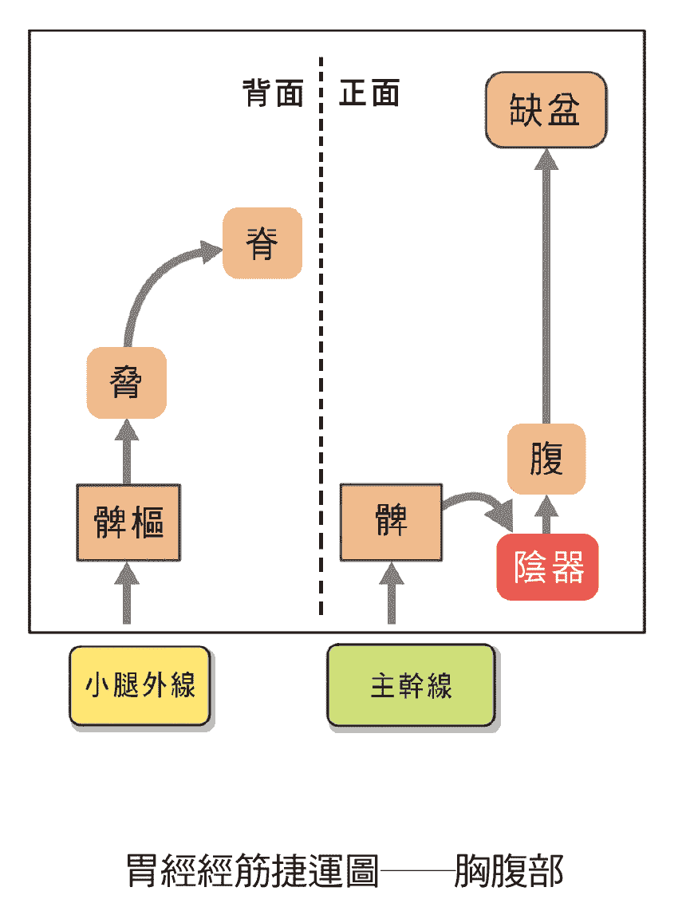

前线：阴器─腹部─缺盆。 （路线 4）

读古文有时需要一些想象力，尤其《内经》许多内容都很简要，常忍不住想跟《内经》时代的老医家说：「您也太省笔墨了吧！」这让后世的我们不得不逐字推敲，还要自己连连看！

例如在经脉篇中提到，胃经经脉的内线和外线最后都汇集在气街，我们推论应该非常接近阴器，加上胃经经筋「聚于阴器」，可想而知，胃经系统对于生殖器官的热切关爱应该与「食色性也」脱不了关系。

另外，这条经筋路线依照《内经》的说法「聚于阴器，上腹而布，至缺盆而结」，只标出三个部位：阴器、腹部及缺盆，然后就上行到头面部。

就这样？是啊！让我们一起来发挥想象力吧！

首先，「阴器─腹部─缺盆」这段路线并没有标出胸部，由于经筋是连续分布，因此从腹部到缺盆一定会经过胸部，加入这个纵向连结就会变成「阴器─腹部─胸部─缺盆」。

其次，依据《内经》内容画的捷运图，是一条细细长长的路线，感觉很单薄，完全没有多气多血的胃经老大哥应有的雄壮气势。

我们来比照经脉捷运图吧！「上腹而布」其实涵盖了经脉循行中，从气街到缺盆之间，人体腹部与胸部的正面区域，「胃乳脐线」当然也在其中，如下方的右图。只要加上胸腹部的横向连结，本经筋原来的线条就会扩充为平面分布。

我们再把腹部经筋捷运图加上蓝色色块为底，以立体结构呈现，如中间图，就能看出，这条经筋是以大面积的涵盖方式，绝对不是一条线而已。

这条路线埋了这么多「宝藏」，过去我也曾一眼看过，当作一条线，并没多加思考，入宝山竟然空手归，真糟糕。幸好这次有读者们跟我一起挖宝、一起揭密，真好！

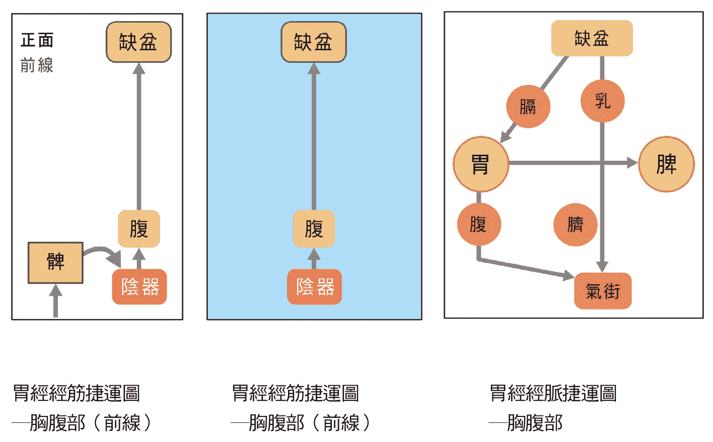

后线：髀枢─胁─脊线。（路线 2-2～2-3）

本条路线衔接自小腿外线，然后从人体的侧面转到背面，所以称为「后线」。

胃经经筋从髋关节向上循着胁肋，这条走在人体侧面的路线再度与胆经重叠。胃经经筋三度加强与胆经的联系！

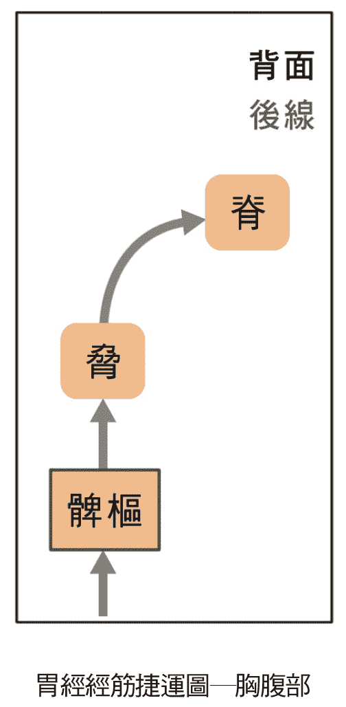

* * *

为什么强壮的胃经要这么努力跟胆经连结？难道是因为胃经的朋友圈太小，只能巴着胆经不放？

当然不是！这个问题细节留待胆经再跟大家解释。

在此，先举一个简单的例子来说明。每个人都有穿衣服的经验吧！以上衣为例，多数都有前后两块布料，在侧面把它们车缝在一起，就可以穿上身了。

同理，人体体表可以分为正面、侧面及背面，跟衣服的布料概念一样，阳明类似前面的布料，太阳类似后面的布料，少阳就类似衔接前后两块布的车缝线，有时我会把它比拟为拉鍊，但意思都一样，少阳就是连结人体前面与后面的重要结构，越牢固越能保护身体。所以阳明与太阳都以少阳为中心，拚命地与少阳连结，少阳也不落人后，前连阳明，后接太阳，形成一个密不透风的护身结构。所以，不仅胃经去连结胆经，它们彼此还有更多联系呢！

* * *

它从胁肋转向身体后侧，连属于脊柱。这条从胁肋到脊椎走在人体背部的斜行路线，有三个作用：

● 从人体侧面与后面保护脾与胃

脾胃是后天之本，攸关生活与生命，脾脏所在的位置偏向胁肋，多气多血的足阳明经筋，思虑也挺周密，当然要从侧面及后面给予自己和爱人脾最全面的保护。

● 连结膀胱经的背俞穴

足太阳膀胱经主要循行在人体后面，五脏六腑纷纷将自己的脏腑之气转输到膀胱经背部的循行路在线，这些穴位就称为「背俞穴」，可以用来诊治疾病和自我保健，中医在夏天和冬天会以三伏贴来调整体质，主要就是作用在这些背俞穴上，透过它们来调节五脏六腑的机能。

脾的背俞穴在胸椎第十一椎下，胃的背俞穴在第十二椎下，个人推想，脾俞与胃俞，正是本条经筋所过之处。

● 提高经筋本身结构的稳定度

在卷一的［经络启航］介绍过，经筋系统还有一个特别的功能，就是「固定」。因为经筋包覆在体表的筋肉关节处，这些部位活动量大，如果结构不够稳定坚固，就很容易松脱，不仅会造成关节松弛，易于损伤，更不能保护经脉与脏腑。所以，许多经筋包覆的范围不仅会超过经脉循行范围，而且还会特别结聚在某些坚固的结构上，胃经经筋正是如此！

下图是合并胃经经筋在人体胸腹及背部两侧的分布区块，刚好形成一个环状结构，就像束腰一样围绕身体。

聪明的胃经经筋，在人体正面以纵向连结上下部位，在人体背面以环状围绕左右部位，这很像在打包物品时，常使用胶带来固定上下左右的方式。以此可以明显看出，胃经经筋所涵盖部位，追求的高安全性，以及所建构的强大防护网。

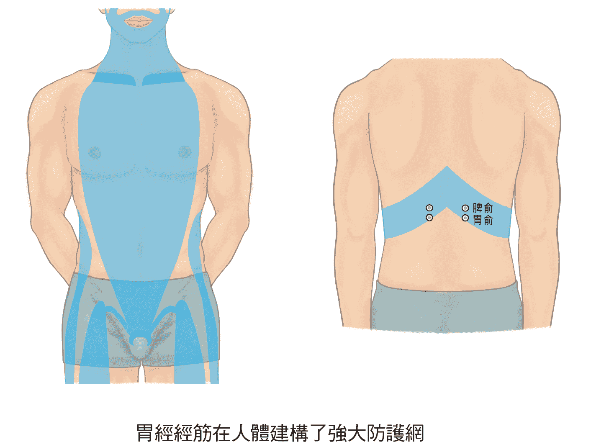

 解密：为什么特别强调胃经经筋形成强大防护网？

###### 为什么特别强调胃经经筋形成强大防护网？

前面说过，经筋系统负有保护脏腑所在部位和经脉循行部位的重责大任。

实际上，如果每条经筋都要顾全与自己有关的所有部位，一方面会出现多条经筋重叠的现象，人体的资源有限，重叠就是浪费资源。另一方面经筋分布在体表，结聚在关节处，与人体活动有关，所以结聚的关节越多，越容易损伤。就像派兵打仗一样，强兵镇守重要关口，老弱残兵只要照顾军营内的事就好。人体也一样，各个脏腑的能力有强有弱，经络循行部位也有长短宽窄不同，让能者多劳，可减少资源浪费。

以阴阳来说，阳主外，阴主内。十二经络系统中，阳经分布较阴经广，适合承担保护性的任务。足经又比手经长，因此足三阳经承担了人体主要保卫工作。

足阳明经筋负责人体正面的防护，阳明经的多气多血特质能承担更多责任，所以，胃经经筋就以铺天盖地的气势，全面涵盖人体腹胸的正面部位，并延伸至背面，成为强大的防护网。

大家了解胃经系统的重要性了吧！

有健康的胃经系统才有强健的体魄，而且这种强壮还会展现于体格上，让人为之品头论足，赞赏不已，深获信赖。再度提醒大家，照顾好胃肠，才有好的未来！

对于医师来说，胃经是用来调整胸腹部肌肉的好经络，例如腹部肌肉过度肿硬的啤酒肚，或是软陷无力等，胃经都是首选的优质经络。

### 3. 头面五官部的「手掌抓握区」

依据经筋的保护原则，胃经经筋应该包覆经脉在头面部所形成的腮帮 U 形线。可是对照经脉的捷运图来看，会发现两者长得不太一样。

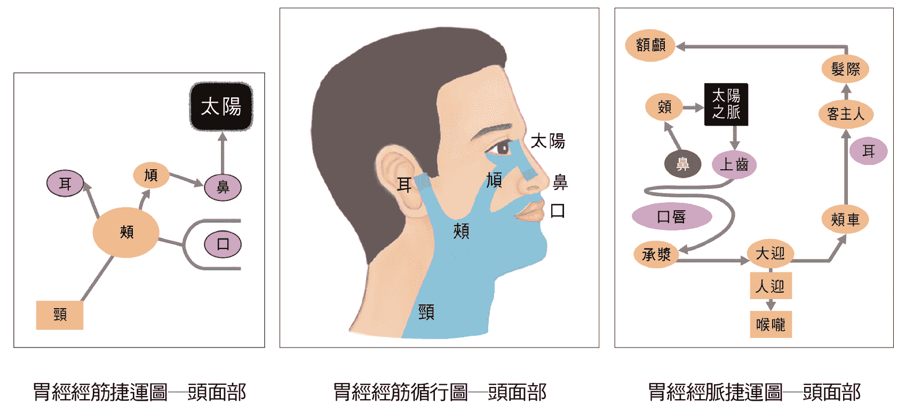

这是因为有多条经筋分别从上下左右来包覆面部，为了避免资源浪费，胃经改用类似以「手掌抓握」的方式，以面颊作为定点，伸展出三条经筋，牢牢握住面部重要结构，形成独具特色的「手掌抓握区」。

乍看之下，似乎没有完全配合经脉的腮帮 U 形线，其实聪明的经筋早已渗透进入 U 形线而纳入管理。耳朵以上的部位，包括发际到额颅，已有其他经筋包覆。

本条经筋从颈部上行到面颊，以面颊做为基地，分出三条路线联络口、鼻、眼和耳等五官。（路线 5-1～5-3）

唇口线：同经脉中央区循行。环绕唇口上下方，之后合于鼻旁颧骨。

鼻眼线：同经脉中央区循行。从颧骨向下结于鼻部，再从鼻旁向上到眼内眦合太阳经筋。再走到眼睛下方，成为主管眼睛下方的「目下纲」。还顺便介绍「目上纲」是足太阳膀胱经。

耳前线：同经脉外围区循行。直接从面颊向上结在耳前。

经过分析后，本段经筋其实跟经脉循行类似，只是方向不一样：经脉由上而下分布，经筋由下而上分布，所以看起来有点落差。

胃经经脉在面部是以下巴的大迎穴做为转输点，向后循行至颊车，胃经经筋的面颊部位早就包含大迎穴到颊车这些部位了。

再仔细看看面部经筋，像不像用手遮住脸部的形状？这正是本经筋的保护区。胃经经筋如此用心保护头面五官，再度验证了充足的营养才能让人耳聪目明。这也是中医师临床在治疗面部五官科疾病时，特别强调脾胃功能的立论基础。

 解密：胃经多经筋保护机制，让你成为人生胜利组！

###### 胃经多经筋保护机制，让你成为人生胜利组！

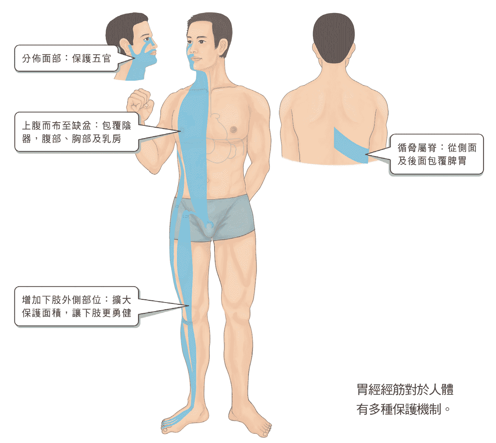

胃经经筋以多条分支来保护人体正面，如在下肢的关节处都有强大的经筋保护，足背有来自脚趾的三条经筋会合，膝关节有两条经筋，再加上一条短的连接带，大腿也有两条经筋。胸腹部也有两条经筋，面部三条经筋。

胃经经筋涵盖区正是一个人的「门面」。胃经系统健康，经筋就会强壮，让一个人的头面长得体面开朗，容光焕发，胸腹肌肉有力则身材挺拔，胸部丰满，腰身窈窕，下肢匀称，行走端正有力。这样的身形会透露出一股力量，展现出自信与魅力，让人乐于亲近，老板愿意任用，同事敢于信赖，家人和乐相处……，难怪会成为人生胜利组，掌握权力，展现自我！

其实，足三阳经筋都具有以多条经筋保护人体重要部位的特质，感谢它们的努力，透过这些严密的保护机制，我们才能高枕无忧的生活与实现理想。

 解密：胃经经筋与现代流行运动有着特别关系喔！

###### 胃经经筋与现代流行运动有着特别关系喔！

棒球运动

棒球运动是台湾人最喜爱的运动之一，大家对于棒球装备应该不陌生吧。还记得七〇年代，一家人彻夜守候电视机前观看球赛的热情与激动吧！

看球赛时，通常都专注于投手的帅气英姿，打击者的勇猛机灵，却常忽略了蹲在打击者后方劳苦功高的捕手。捕手既要稳稳接住投手投过来的球，避免漏接给予对方可乘之机，还要综观全局，随时牵制在投手背后，站在垒包上想要盗垒的对手，所以捕手的重要性乍看之下次于投手，却又比投手多了综观的视野。捕手如此重要的角色，加上被球砸到的高风险，当然要给予最周全的防卫，那就是「捕手装」囉！

有趣的是，胃经经筋系统所包覆的范围与捕手装几乎完全相合，两者就像俗语说的「撞衫」。接下来我们就来看看它们如何的「撞衫」吧！

捕手装分为三个部分：头盔、护胸及护膝。

头盔：

捕手装的头盔包覆面部的正面及耳朵。

胃经经筋包覆颈、口、目到耳前。

胃经经筋除了额部及头顶之外，与捕手装完全相合。

护胸：

捕手装的护胸包覆胸部及腹部的正面，包括下腹部的生殖器（这个保护超重要）、臀部外侧，及胸部的缺盆，后面还有固定环扣。

胃经经筋从生殖器向上通过腹部、臀部外侧的髋关节部位、胸部到缺盆，体贴的身体还从胸部延伸出一条路线到背部（上循胁，属脊），藉此将经筋固定。

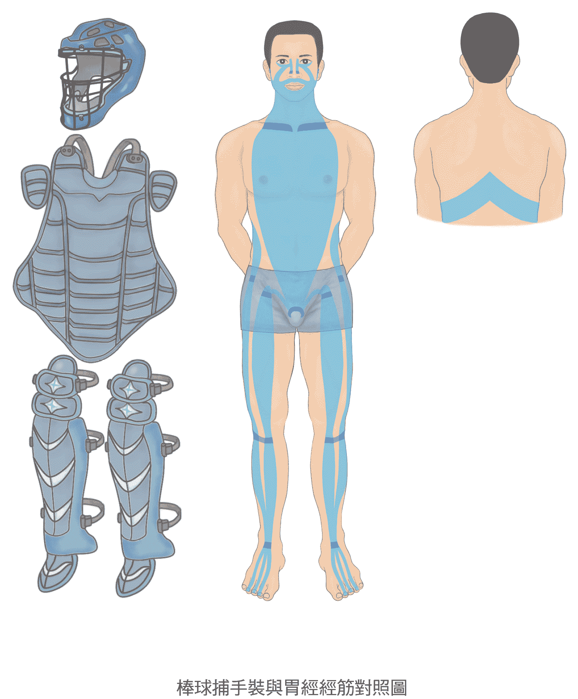

胃经经筋除了肩部之外，也与捕手装完全相合。

护膝：

捕手装的护膝包覆下肢的正面，两侧有固定的结构。

胃经经筋在下肢部位有两条，一条包覆正面，与捕手装的位置相合，另一条包覆侧面，向上延伸至胸部与背部（上循胁，属脊），可以视为固定胃经经筋的结构，这也跟捕手装的固定结构类似，还从侧面与后方保护了与胃相表里的脾脏。

有趣吧！胃经经筋竟然与棒球的捕手装雷同度如此之高！我们也可从捕手装的防护概念来了解胃经经筋对于人体的防护作用。

胃经是多气多血的经络系统，脾胃是人体的后天之本，但胃有时比脾还重要，因为胃主导了饮食的消化与营养的吸收，大肠及小肠在消化方面的功能也都由胃来统领，所以，胃这个「总铺师」，也就责无旁贷的将保护人体正面部位的任务一肩挑起。

大家会不会好奇，其他经筋难道都没有过来帮胃经一下吗？

手三阴经经筋的肺经、心包经及心经都有包覆胸部，心经经筋还延伸至腹部；手三阳经经筋的大肠经、三焦经及小肠经都分布在上肢及头面颈肩，却完全没有到胸腹部；足三阴经经筋的脾经转到腹腔内，形成「篓子」，肝经只到生殖器，肾经走在背部；足三阳经经筋是最粗壮有力的经筋，所以，将人体的正面交由胃经负责，侧面由胆经负责，后面由膀胱经负责。因为这样的分工，胃经经筋就肩负起人体正面的防护，正好跟捕手装一样！

足球运动

请问大家一个运动类的益智问题：世界上最重要也最流行的运动是什么？答案是：足球！

当我们说：胃经经筋也与足球运动关系密切时，大家可能又要惊呼了。根据研究，足球的历史可能起始于战国时代的齐国，当时称它为「蹴鞠」，是一种兼具军事训练和娱乐健身双重功用的活动。

聪明的中国人应该早就知道，胃经经筋是条强壮无比的经筋，透过蹴鞠运动，可以强化这条重要的经筋。

现代足球运动规定，不可以用手，而是用头部、躯干及下肢，例如接球和控球，使用脚部、胸部、腹部、大腿及头部；踢球用脚的内侧、脚背正面、脚背内侧与外侧、脚尖、脚跟传球。这些部位多数是人体的正面，刚好与胃经的经筋相合。所以我们也可称胃经经筋为「足球宝典」啦！

从棒球的捕手装到足球选手使用的身体部位，让人一目了然，拥有健康的肠胃系统，才能保持健壮的体能。这也就是为什么只要讲到提升免疫力时，大家都会想到有加入黄耆的饮料或食物，因为黄耆能透过加强脾胃功能来补气升阳，益卫固表，改善体质，减少感冒。

### 胃经经筋的各部特色

胃经经脉走在人体的正面，胃经经筋就将这些部位全部「打包」起来。

尤其在躯干部位，胃经经筋「聚于阴器，上腹而布，至缺盆而结」，从下腹部开始向上包覆到缺盆，这些部位包括骨盆腔、腹部及胸部，形成人体正面最强壮的保护网。

我们若把两侧的经筋拼在一起来看（p.289 图）：在面部很像戴个口罩，在躯干很像穿背心，在下肢很像穿上厨房的围裙。胃经经筋将人体的正面保护得非常周全。也因为有这样强壮的防护系统，才能让人类敢于正面迎向风雨的挑战，无所畏惧。

但胃经经筋除了保护原本的经脉部位之外，还特别加强保护一些重要部位。

#### 1.加强脚力

包覆第 2 到第 4 足趾，向上沿着小腿及大腿的正面抵达大腿根部。小腿经筋的部位与胫骨前肌类似，与勾脚背的动作有密切关系，听音乐时用脚打拍子就是用到了这条经筋。

除了正面经筋之外，还增加小腿与膝盖外侧部位，扩大分布面积，让小腿更稳固，提升小腿的力量。

#### 2.保护后天之本

为了要保护胃这个重要的「后天之本」，特别从大腿延伸至胁肋部位再向上斜出到背部，包覆在脾与胃的侧面及后面，一方面避免来自这两个方位的撞击损伤到胃，另一方面它就像一条绳索，将胃经经筋牢牢系在躯干上。

由于经筋系统也具有「有诸内必形诸外」的功能，胃经经筋这个精心设计分布于胃部侧面及后面的保护网，一旦胃功能出现问题时，相关部位也会有所变化，就是胸腹部「循胁属脊」部位。许多吃饭狼吞虎咽的病人，左后背这个区域会肿起来，轻者影响身体活动，甚者出现疼痛感。病人常常以为是左腰痛或胁肋痛来就医，其实是吃太快引起的！只要改变饮食习惯，肿胀疼痛就可以改善。

临床上，中医师以此部位做为诊断胃功能的参考之一。一旦胃的功能改善，左后背的肿起现象也就跟着缓解了。

所以背痛的症状不一定要治背，而是要从病因着手才能治本，这就是中医的特色喔。

#### 3.聚在阴器，保护命根子，加强性能力

本条经筋从鼠蹊包覆至阴器。这里的阴器是指外生殖器，是传宗接代的利器，当然要加以保护，以免损伤，对于喜欢激烈运动的男性更为重要，参酌前面提到的捕手装，对于此处的保护也是非常严密的。

更重要的是，这条经筋与阴茎勃起密切相关。《内经》说外生殖器是许多重要筋脉聚合的地方，它的营养源自于胃。胃吸收的营养充足，勃起就会有力；营养不良，就容易阳痿。

对于女性而言，本条经筋分布至下腹部下方，接近耻骨联合前面称为「阴阜」的部位，除了保护功能外，脾胃功能好，营养足，阴阜就会饱满，可以增强性魅力。

古代有缠足的习俗，据说裹小脚之后，活动时的施力点，会落在腰臀部而让阴道紧实。我们暂且撇开伦理道德观，纯就中医的角度来看，缠足是将第 2 到第 5 趾向足底扭曲，导致足背正面也随之翻转向下，牵动的经筋主要是胃经，因为结构改变，施力异常，顺着此条经筋向上而影响了阴器的结构。据此推想，这些缠足的妇女们肠胃功能应该也不佳。

#### 4.大面积的包覆胸腹部

前面说过，胃经经筋以「铺天盖地」之势从下而上，遍布腹部及胸部正面（当然也包括乳房），宛如盔甲背心般，提供人体正面最坚实的防护。

由于胃经经筋实在太强大了，能力无人可比拟，诚如前面所说的，一些位在骨盆腔及腹部的脏腑经络，例如膀胱、大肠、小肠、脾、肝和胆等，它们的经筋系统都没有包覆到自己器官所在的位置，而是全部委托给胃经经筋来照顾管理。它不仅照顾自己的器官，对于其他器官也是不余遗力，胃经经筋的能力与重要性可见一斑。

胃经经筋通过乳房，只要有足够的营养，乳房就能丰满。而在为人母亲的哺乳阶段，营养的补充更为关键，因为中医认为乳汁是由血液所转化，这些血液都来自于多气多血的胃经系统，所以哺乳期间，妈妈的饮食要均衡，脾胃功能也须健全，才能充分将营养转化成乳汁。

一位三十多岁的新手妈妈，怀孕前就在中医科调理体质，一路安胎到顺利分娩，小男婴头好壮壮，胃口奇佳，而且偏好母乳。妈妈在亲喂母乳半年后，开始出现头晕、心悸胸闷、恶心、没有胃口、疲倦嗜睡、手足冰冷、身体怕冷现象，月经期间及月经之后尤为严重。这些症状中医称为「气血两虚」，因为胎儿吸吮乳汁过量，妈妈体内多数的血液都转化成乳汁，胃来不及生产气血供应，才出现了这些症状。我们建议慢慢引导婴儿多接触副食品，有计划的断奶之后，妈妈的身体状况才逐渐恢复。

#### 5.面罩形的包覆五官

胃经经筋从颈部向上到面颊，再包覆五官的口、鼻、眼及耳前部位，既像以手遮脸，也像口罩般保护着重要的五官，使其维持正常功能，避免损伤。

内经原文说「太阳为目上纲，阳明为目下纲」，意思是眼睛下方部位是由足阳明胃经经筋统理，例如下眼袋肿、下眼睑疾病等，都与胃经有关，所以说「阳明为目下纲」。而眼睛上方部位是由足太阳膀胱经经筋统理，例如上眼睑疾病等，都与膀胱经有关，所以说「太阳为目上纲」。

临床上，这个理论是很棒的诊断治疗指引。例如针眼，若长在下眼睑，通常跟饮食过于辛辣有关，我们就会从胃来治疗，若长在上眼睑，可能与水喝太少、憋尿、小便不顺畅有关，我们就会从膀胱来治疗。

看到这里各位应该会赞叹：果然是多气多血的胃经，竟然可以提供这么周密的防护系统，是不是要跟劳苦功高的胃致敬一下！也提醒自己要善待自己的胃啊！

### 胃经经筋─病候

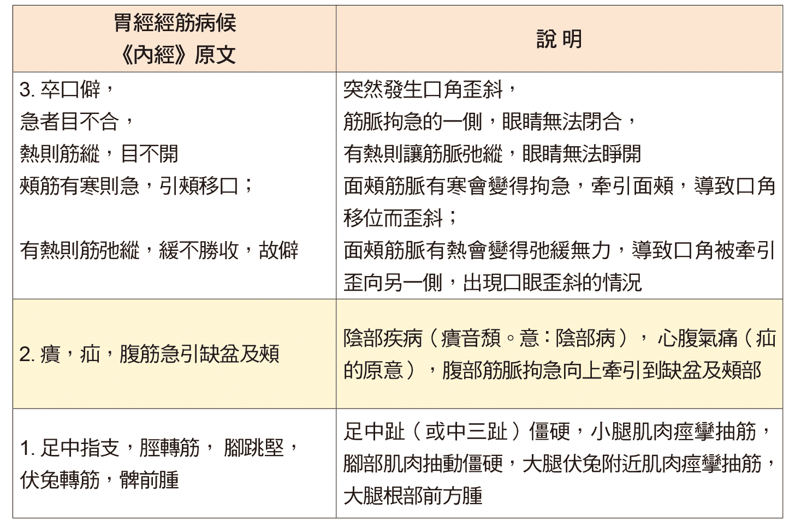

胃经经筋病候主要可分为二类：

#### 1.与循行所过部位有关

从脚趾中间三趾─脚部肌肉─小腿肌肉─大腿肌肉─大腿根部─腹部筋脉，向上牵引到缺盆及颊部肌肉的异常，如僵硬或是抽筋等。

我将「㿉疝」依据古文字学，拆成「㿉」与「疝」，分为表示阴部疾病与心腹气痛。有些书籍则将两字合用，注解为「疝气」。从胃经经筋通过大腿根部，聚于阴器及腹部的循行来看，也是可行的。

#### 2.与「阳明主面」有关

病候中的「口僻」类似现代的颜面神经麻痺，由于口歪是最明显可见的症状，中医还称为「口喎」或「口眼喎斜」，另外也称为「面瘫」，意思是有一侧的面部肌肉瘫痪。

这个疾病通常都是突然发作，尤其一早睡起时，感觉面部肌肉怪怪的，喝水会从口中漏出来，照镜子才赫然发现一边的嘴角歪斜，笑的时候更歪，口水不自主地从歪斜的一侧流出来；眼睛无法闭合，容易流泪，无法抬眉毛；无力将面颊鼓起来，一直漏风，所以无法吸吮食物及使用吸管；面部肌肉感觉迟钝、味觉异常等等。

现代医学认为，颜面神经麻痺多与病毒感染侵犯颜面神经有关，是一种急性神经发炎。

中医的典籍《金匮要略》，对于此病有详细叙述：

「寸口脉浮而紧，紧则为寒，浮则为虚。寒虚相搏，邪在皮肤，浮者血虚，络脉空虚，贼邪不泻，或左或右，邪气反缓，正气即急，正气引邪，喎僻不遂。」

中医认为本病发作原因，首先是身体内虚，例如压力大、忙碌紧张，导致气血不足而「络脉空虚」，再加上外界的邪气入侵，尤其是风寒湿热邪气「贼邪不泻」所致。被邪气侵袭的「异常边」肌肉向下瘫痪，正气侧的「正常边」为了维持此侧面肌的张力，会将嘴角拉向正常边，使得面颊肌肉乍看之下似乎向上变紧。

下图以右侧面神经麻痺为例，说明中医的病因、病理机转及症状。

胃经经筋病候以寒热来说明症状也是一样的概念：

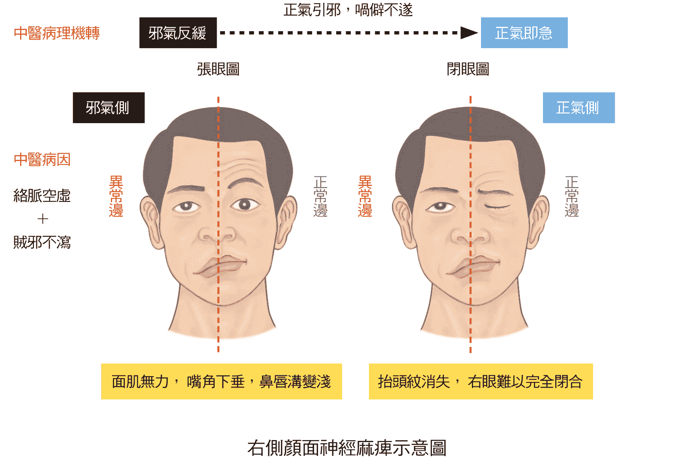

若面颊有热，筋脉比较松弛，口角会被牵引歪向另一侧，眼睑无力下垂，导致眼睛无法张开。

若面颊有寒，筋脉比较紧绷，会牵引面颊将口角移位至同一侧。

「口僻」是中医临床常见病症之一。一位中年女性病友，从年头的开春之始，家里遭逢变故不断，病人虽然嘴里说：「遇到了，就面对呀！」眼神却是忧郁的，且身形日渐消瘦。三周前，陪家人看病回家的路上，觉得左脸僵僵的、怪怪的。赶紧去看西医，确诊是「面神经麻痺」。隔日来到诊间，病人的左面颊凹陷，肌肉下坠，没有表情，无法鼓颔，一直漏风，难以闭眼，眼神张皇不安。她无奈地说：「原来以为一切都要变好了！哪知道还会得到这种病！」眼眸中深层的悲戚，诉说着善良的心又被生命的试炼给刺伤，彷彿看不到尽头。

幸好，治疗初期就找到一个属于这位病友特有的反应区：左脚小腿外侧胃经线上，有许多深深浅浅的血络，下方的肌肉僵硬，与病人长期胃功能差，腹部肿硬，左侧面颊紧硬、凹陷的情况类似，于是就以此为治疗切入点。二周后病情显著改善，病人的面颊变得有力，可以使用吸管，再度治疗后，可以咀嚼吃饭。之后再来时左面颊已经恢复之前的表情，左眼可以轻松闭合，饮食正常，只有在漱口时会稍微渗漏一些水而已。五周后面部恢复正常。

这个案例，印证了前面提过「阳明主面」的说法。临床上，中医师常会选用胃经及大肠经来治疗「口僻」之证。

再次提醒大家，口僻之症发生的前提是身体虚弱，加上没有谨慎规避风寒等邪气，例如盛夏时风扇或冷气直接吹向脸部，或机车的安全帽只有半罩式，骑车时脸部直接吹到风，或者床在窗边，睡觉时没有关窗等，都让邪气有机可乘。所以请不要过劳，慎避风寒，「面瘫」就不会找上您了。

#### 小结

脾胃为后天之本，气血生化之源，尤其胃从受纳腐熟水谷中所吸收的营养，是维持生命的关键物质。足阳明胃经具有多气多血、主肌肉、主四肢、阳明主面等特质，充分展现出「食色性也」的能力，胃经系统从而成为强壮与欲望的代表。

胃经系统环绕头面五官，以铺天盖地之势涵盖胸腹部，还通过乳房与生殖器，加上肌肉丰厚的下肢，这些优势都让胃经成为人类演化过程中，得以延续个人生命和种族繁衍的关键要素之一。

胃经系统连结心脏，也建立了人类特有的交际生活史。而代表欲望的胃经要如何在现代频繁的人际关系中，保持清醒冷静，进退有据，努力但不贪求，在在考验着胃经的智慧。

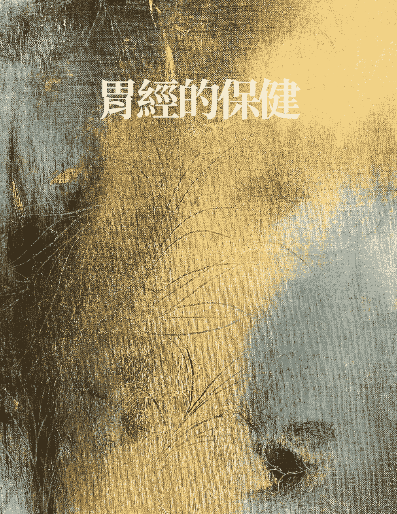

# 胃经的保健

胃为后天之本，气血生化之源，负责受纳腐熟水谷，统领大小肠一起消化吸收食物，获取维持生命机能的营养。胃很像白手起家的人，服膺 「爱拚就会赢」法则，责无旁贷，凡事都要靠自己的实力和努力，期望「我的未来不是梦」，所以需要特别照顾。一旦胃功能败坏，就会出现严重的症状，甚至死亡，因此中医说「人秉胃气而生，无胃气则死」，可见照护好胃的重要性。

## 一、胃经的自我保健运动

配合胃经经脉篇三个分部，也可以发展出不同的自我保健运动：

#### 美容瘦脸，提升五感功能

沿着头面部的胃经腮帮 U 形线走向揉按，可以促进血液循环，还有三个功效：一可美容瘦脸，容光焕发；二可让五官的视听嗅闻功能敏锐；三可安神镇静，头脑昏沉者，还能通窍醒神。

#### 修饰身形，提升肠胃功能

平日多按摩胃经胸腹区的胃乳脐线，再加上经筋系统的「循胁属脊」的后背线，能促进胸部发育，改善胸闷及脾胃肠道功能，还可修饰身形，减少水桶腰与啤酒肚。

#### 敲打胃经下肢部，促进气血循环

过去坊间曾流行敲胆经保健，其实胃经的大腿部位也很容易出现筋结，适合敲打以疏散气血。而且胃经的小腿部位会真实反映肠胃功能，无论小腿肌肉是肿胀或是软陷，都可以配合腹部一起按揉。另外，做勾脚背的动作，也有助于增加胃经小腿及足背部位的气血循环。

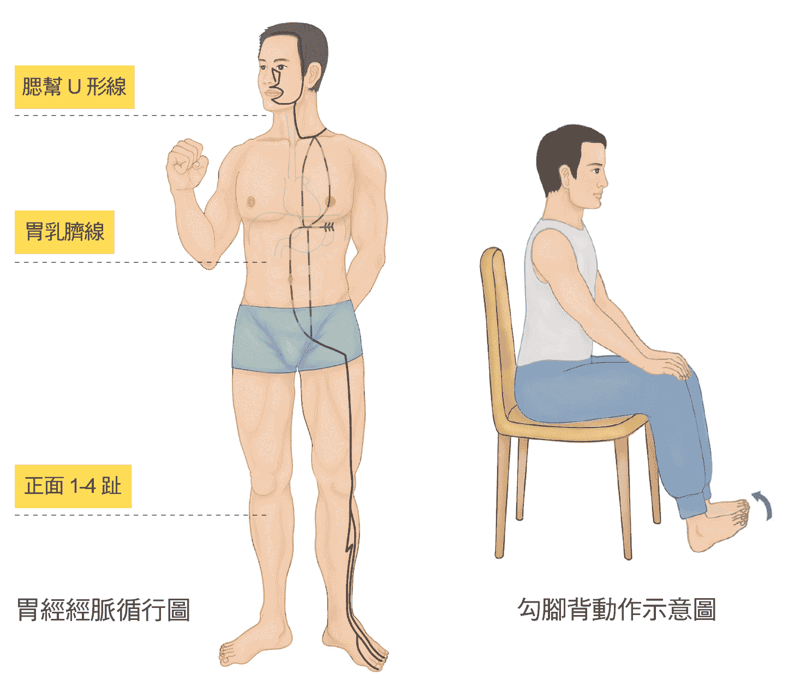

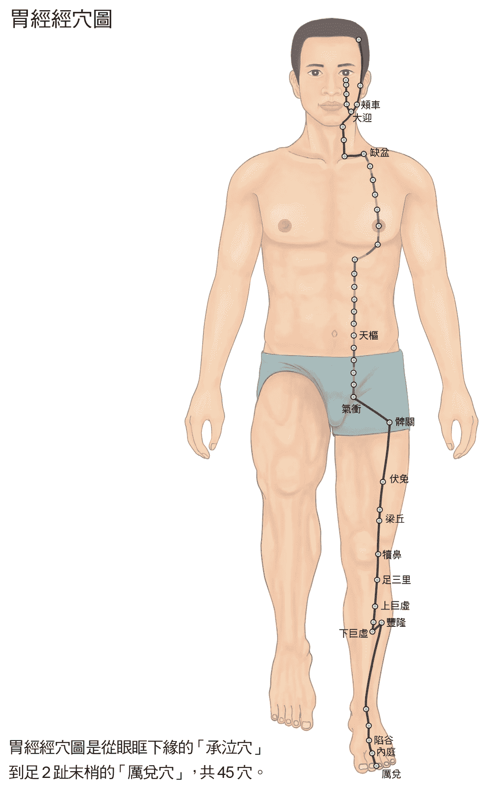

## 二、胃经常用保健穴位

胃经从头到脚共有 45 穴，家族庞大，面部 10 个穴位，胸部 8 个穴位，腹部 12 个穴位，大腿 5 个穴位，小腿到足趾 10 个穴位。胃经在面部和胸腹部的分布很密集，占了总穴数的三分之二，可以看出胃经对于头面部和胸腹部的重视。

透过经络系统的连结，中医无须痛哪里治哪里，而是「头痛医脚」，可以选用远端的足部穴位来治疗头面胸腹部疾病。

胃经系统主要的病候是神志异常以及消化功能障碍，针对这两种病症，我在此分为「捕梦网」和「健胃一条龙」两组，遴选 9 个穴位跟大家介绍。

#### 1.人体捕梦网：厉兑穴

有一年到兰屿义诊，得空逛街欣赏当地的手工艺品，其中有一个环形的网子，旁边还吊着小贝壳，非常可爱，好奇询问老板说是「捕梦网」，听说可以防止恶梦，当场买下，挂在家里的楼梯间，但感觉对于防恶梦好像没特别功用。

后来才知道，捕梦网原来是印地安人做为装饰和避邪之用。印地安父母会将捕梦网挂在孩子的床头，祈求平安，捕捉好运，驱除恶梦，让孩子们可以甜美入梦。

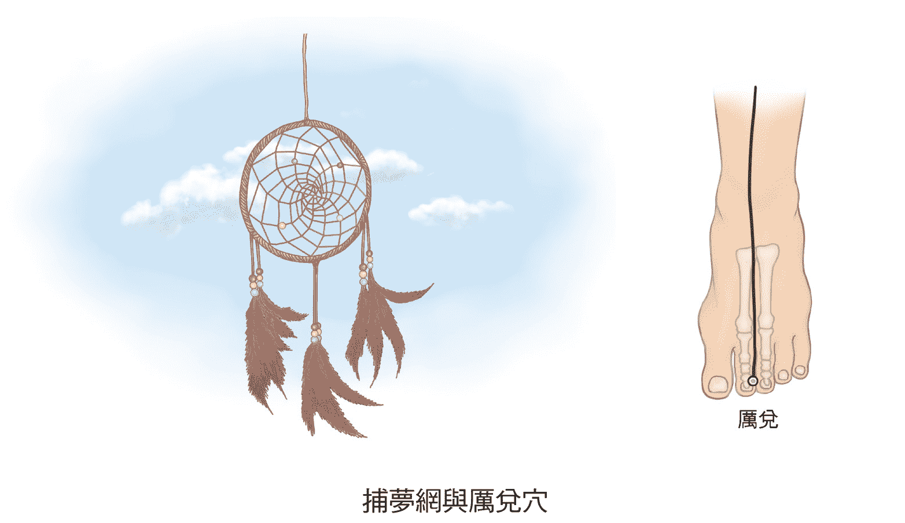

胃经经脉病候中出现十二经脉中独有的一系列神志异常状况，慈悲的人体也为我们在胃经挂上一个专用捕梦网，叫做厉兑穴。

厉兑穴（ST45）是胃经最后一个穴位，位于第 2 趾末稍外侧，趾甲角的外缘处。

四肢末梢的穴位都属于井穴，也都有很强的刺激作用，以开窍醒神。除此之外，本穴还具有很强的镇静安神效果，尤其是狂言乱语，噩梦连连，心神难安，莫名恐惧和少儿夜啼等。

厉兑这个穴名很有内涵。有人说「厉」代表噩梦，「兑」是八卦中代表沼泽的一卦，「厉兑」合起来就是掉进噩梦沼泽之意，做过恶梦的人都知道，深陷梦魇之中宛如掉进漩涡里，难以抽身，更难清醒，字面解释得很贴切。另外，依据中国人会隐晦特定字词的习惯，我将之转音为「厉鬼」，其意不说自明。这两种说法殊途同归，都点出它具有强烈的镇静安神作用。

足阳明胃经，顾名思义「阳明」是阳光明亮之意，守护在人体正面。如此阳光明亮的经络，最后一个穴位却称为「厉兑」，很有意思。这种情况也见于足少阳胆经的窍阴穴和足太阳膀胱经的至阴穴。足三阳经阳气很旺，它们最后与相表里的阴经交接，这个最终交接点的穴名却都很阴，也都能处理神志问题。这就是中医特有的阴阳动态平衡观，就像太极图一样，足阳经气血由阳盛而衰交与阴经，以及在脏腑关系中五脏主导六腑的概念，联结腑的阳经最后臣服于联结脏的阴经。

胃经主干线终止于厉兑穴，另有一条分支到足大趾交接脾经，脾经的起始穴称为「隐白穴」，两穴合用，临床上常用艾灸，去除恶梦，宁心镇静安神的效果更好！如果家中没有艾草，可以点香薰这两个穴位。

#### 2.健胃一条龙：内庭─陷谷─下巨虚─丰隆─上巨虚─足三里─梁丘─天枢

保护胃腑是胃经最核心的功用。但是胃经有 45 个穴位，要如何选择呢？回答这个问题之前，我们先介绍「经之所过，病之所治」的中医理论，意思是只要是经脉所通过的部位，都具有治疗该经脉疾病的能力，这是同一经络上面的共同特质，就象是同父同母所生的孩子都有部分共同的 DNA。经脉也像一条河流，河水在河里流淌，流经的每个地方都接受这些河水。经脉里流动的气血类似河中流动的河水，在经脉里循环无端。同一条经脉所过部位都接受这条经脉里流动的气血所濡养，经脉中流通的都是一样的气血，一旦该经络或所联属的脏腑器官出现病变，则可藉着刺蕈 g 络去调整改善。简单来说，就是只要是自家人，就能解决自家事！所以，清官难断家务事，唯有自家人才能解决。

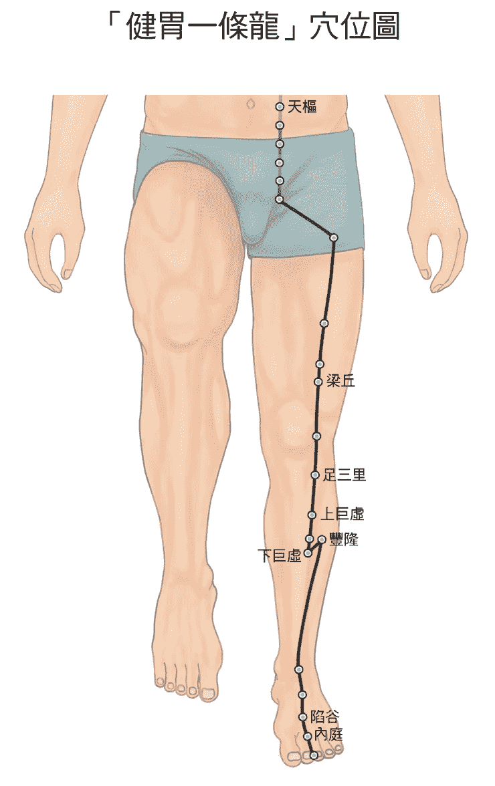

即使是自家人，在共性之中，也有各自的特性，不会每个人都一样。穴位也是如此。

穴位的特性跟它所在的位置息息相关，中医据此特性整理出「特定穴」概念。也就是说，在人体某些特定部位的穴位，尤其位于四肢肘膝关节以下的部位，具有至少两个特性：一个是所属经络的特质，一个是这个部位的特质。这些穴位就称为「特定穴」，它们具有比较明显强大的功效，成为大家耳熟能详的常用保健或治疗穴，例如大肠经的合谷穴、胃经的足三里穴等，都属于特定穴。（本书是经络书，不是穴位书，囿于篇幅，无法详述穴位资料，请自行查阅相关书刊。）

我们回归到胃经的核心功能是要保护胃腑，依据特定穴的概念，加上胃的重要性和现代人胃病很多，特别选用八个擅长照顾胃腑的穴位，连成一条守护线，称为「健胃一条龙」，成员为：内庭─陷谷─下巨虚─丰隆─上巨虚─足三里─梁丘─天枢。

内庭穴（ST44）：位在第 2-3 趾的趾缝上。

内庭穴为荥穴，善于治疗身热，因此有清泻胃火的功效，可治疗经脉病候中胃热所引起的「温淫，汗出，脣胗」「气盛则身以前皆热，其有余于胃则消谷善饥，溺色黄」。

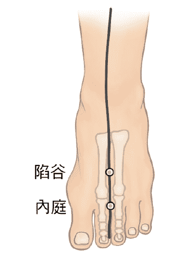

陷谷穴（ST43）：位在足背第 2─3 跖骨之间凹陷如谷处。

陷谷穴为输穴，善于治疗身体的沉重感和关节痠痛，加上「陷谷」之名，功效如其名，对于高肿者能使之陷，可治疗胃经路线上各种肿、胀、满、重，甚至疼痛的情况，例如面肿、胸胀、胃满闷、下肢沉重感、足背痛等。

丰隆穴（ST40）：位于从膝下三寸分出的小腿外线上，外踝尖与膝关节连线为 16 寸，丰隆穴就位在中点处，胫骨前缘外二横指的地方。

本经络脉简称「丰隆喉头线」，丰隆穴是络穴，主治咽喉、头项部及小腿疾病，而且是治痰要穴。其他详情，可参阅络脉篇。

足三里穴（ST36）：位在犊鼻穴下 3 寸，胫骨前缘外一横指（中指）处。古人称三寸也叫做三里，所以本穴才称为足三里穴。

简易取穴法，就是手四指并拢，将食指贴在犊鼻穴，向下四横指宽度，胫骨边缘再向外一个中指宽度。

足三里穴为合穴，五行属土，刚好跟胃的五行一致，土经的土穴，最能调理胃的功能，因此成为胃经代表穴，可以理脾胃，调气血，护胃气，补虚弱。无论是诊治胃腑或胃经疾病，或平日保健，提升免疫力等都是首选穴位，既能治疗疾病也能改善体质，有病治病，无病强身，治标又治本，自古以来就是强壮与长寿的要穴。

足三里穴也是古人常用的四总穴之一「肚腹三里留」，足三里穴成为治疗腹部器官疾病的总司，包括消化系统疾病以及妇科系统。

大家会觉得奇怪，胃经也管妇科？

当然囉！首先从经络循行来看，经脉胸腹部的「胃乳脐线」，经筋「聚于阴器」，都为胃与妇科系统建立连线。

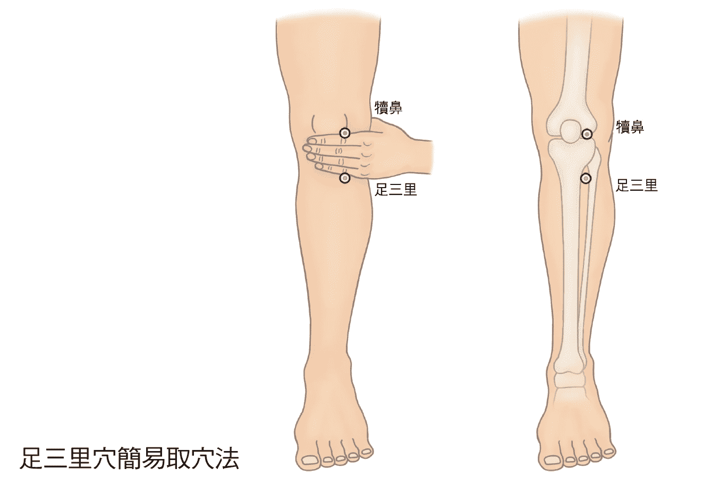

从气血角度来看，胃与脾同为气血生化之源，经脉病候中提到胃经主血之所生病，女性的生理机能非常仰赖脾胃所化生的气血，尤其是月经周期，还有怀孕与哺乳等，足够的气血才能维持正常的生理机能，这也是胃经经络系统特别循行到乳、脐、阴器的原因之一吧！

上巨虚穴（ST37），下巨虚穴（ST39）：上巨虚位于足三里直下 3 寸，下巨虚位于上巨虚直下 3 寸。

胃经从膝关节的犊鼻穴开始，每下 3 寸就是一个穴位，排列顺序是犊鼻穴─足三里穴─上巨虚穴─下巨虚穴。

前面介绍过，胃统领大肠小肠的工作，大小肠在胃经上各有一个下合穴，如此胃经就可同步管理大小肠的营养吸收和食物糟粕的处理工作。

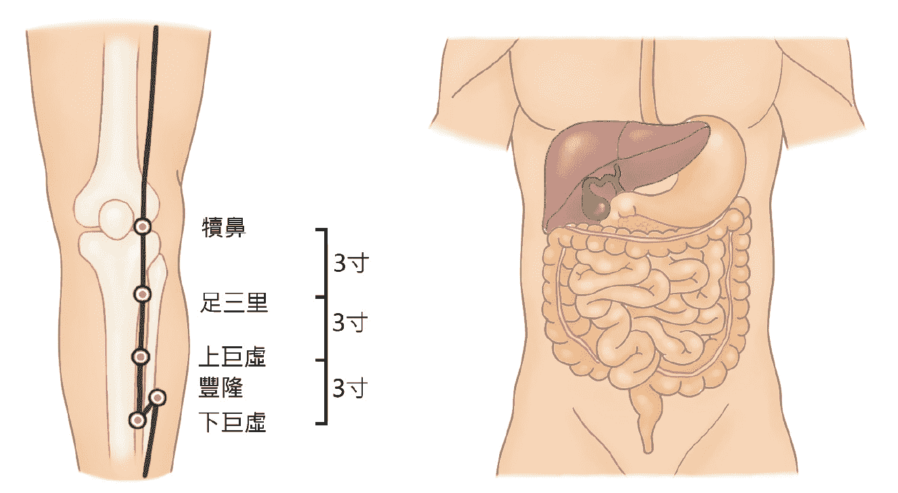

足三里与上下巨虚的位置是依据胃肠道在身体的部位决定。

胃在最上方，足三里位置也最高。大肠围绕在小肠周围，横结肠横过小肠的上方，所以上巨虚穴是大肠的下合穴，下巨虚穴是小肠的下合穴。可见早期中医是了解人体内脏结构的。

足三里与上/下巨虚三穴就是胃肠系统最佳保健穴组。

梁丘穴（ST34）：位于大腿前面接近膝盖外侧处，屈膝，在髂前上棘与髌底外侧端的连在线，髌底上 2 寸处。

简易取穴法，膝盖弯曲 90 度，在犊鼻穴上方，从膝盖的髌骨顶端外缘向大腿方向推（股四头肌外缘方向上推 2 寸，约 3 横指宽），直到肌肉交接处就是本穴。许多久站或下肢长期用力的人，这个部位都会肿起来。

梁丘穴是治疗急性胃痛、胃发炎的首选穴。因为梁丘穴是胃经的郄穴，郄穴为经脉气血深集的地方，非常善于治疗急性病和消炎止痛。平日可以用手掌在膝盖外侧上方按摩来保健。

周左宇老师曾用内庭、上巨虚、足三里和梁丘穴，治疗一个急性乳腺炎案例，病情已经严重到必须赶紧前往医院开刀。老师下完针之后，症状当场缓解，日后未再发作。

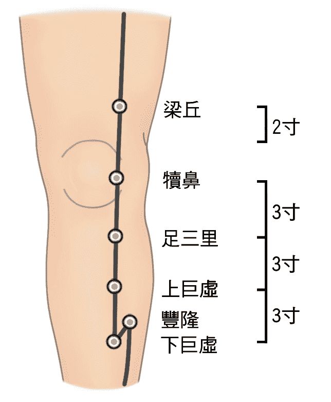

这个处方运用胃经经过乳房的病位概念，以及乳腺炎属于热实证的病性思考，先以内庭穴泻胃热；乳房在人体上方，因为发炎而肿胀，使用「上巨虚」穴名中，有「上巨」使之「虚」的功效，足三里主胃经病，最后加上梁丘穴消炎止痛。周老师灵活运用中医理论，以四两拨千斤之法，瞬间解除病人多日的疼痛。（详细内容可参阅《医道精要》p.70）。

个人觉得「梁丘」这个穴名也很有意思。梁可以是「粱」，代表粮食和美食之意，丘是小山。梁丘合起来看，就隐含膏粱厚味导致脾胃肿起来的意思。临床上常遇到脾胃胀满的人，梁丘穴也跟着肿起，就可取本穴来治疗。

天枢穴（ST25）：位在腹部的肚脐旁边，肚脐向两边横开 2 寸处。还有另外一种定位，乳头与人体中线的距离是 4 寸，天枢穴就在乳头向下，与肚脐向外，横线交接处的 1/2 位置。另一简便取穴法是在肚脐边，用手三指横幅去定位天枢穴。如下图

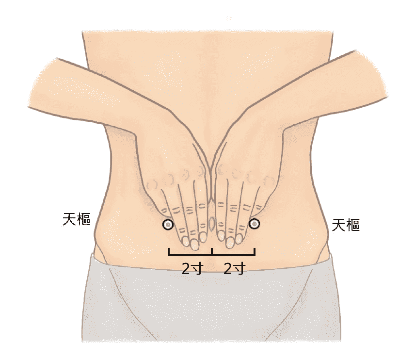

天枢穴是大肠的募穴，大肠之气汇聚于此，大肠也位在天枢穴的附近，本穴类似下合穴的概念（因为大肠经没有胸腹部的穴位），所以天枢穴就成为大肠在胃经的另一个反应区，可藉由天枢穴就近调理肠胃功能。

整体来说，健胃一条龙具有强健胃肠，清胃热，消肿胀，化痰安神，通调脾胃和止痛的全面性功用。平日可以多加按揉或拍打。

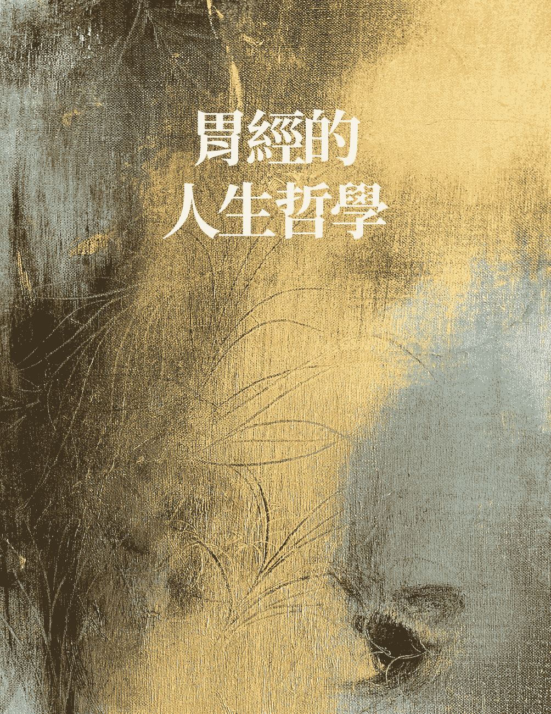

# 胃经的人生哲学

#### 胃经三杰与君子三戒

本经总论中介绍过，大胃王家族中势力最庞大的「胃经三杰」：弟弟是聪明哥，哥哥是型男主厨，老爸是高富帅熟男。

身为足阳明胃经家族成员，都具有多气多血、强壮与欲望的胃经特质，如果不善加节制，很容易造成社会灾难。

孔子在《论语》中提到君子有三戒：

「少之时，血气未定， 戒之在色；及其壮也， 血气方刚，戒之在斗；及其老也，血气既衰， 戒之在得。」

「胃经三杰」刚好与「君子三戒」特质相似，也可借用穴位的概念来加以规范。

首先来看胃经三杰与君子三戒如何对应（见下图），再以胃经四大系统说明胃经三杰与君子三戒的对应关系。

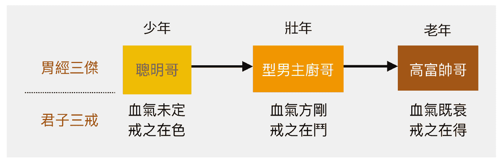

● 血气未定的少年兄聪明哥，属于经筋系统，肌肉健壮，且聚于阴器，胃经的色欲部分容易被挑动，引起性冲动，因此戒之在色。

● 血气方刚的壮年型男主厨哥，属于经脉系统，负责受纳腐熟水谷，吸收精微物质，气血充足，由于经脉上行到头面，容易看人不顺眼，一言不合失去理智而起冲突，因此戒之在斗。

● 血气既衰却依旧高富帅的熟男老爸，属于经别系统，事业有成，但也有老年危机感，面对新生代，唯恐失去人生舞台及权势，胃经的贪欲部分被启动，越担忧则贪嗔执着之心越重，因此戒之在得。

熟谙人情世故的孔子早已提出「君子三戒」，而「胃经三杰」又该如何自我规范呢？

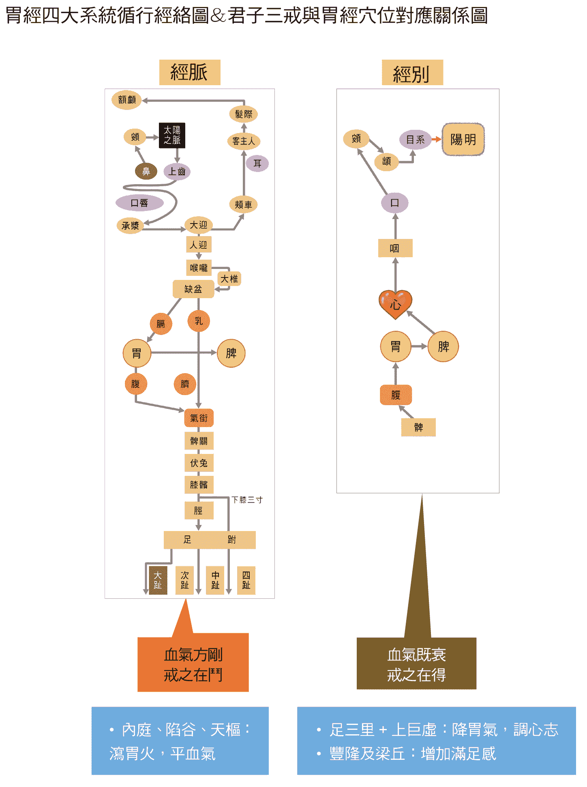

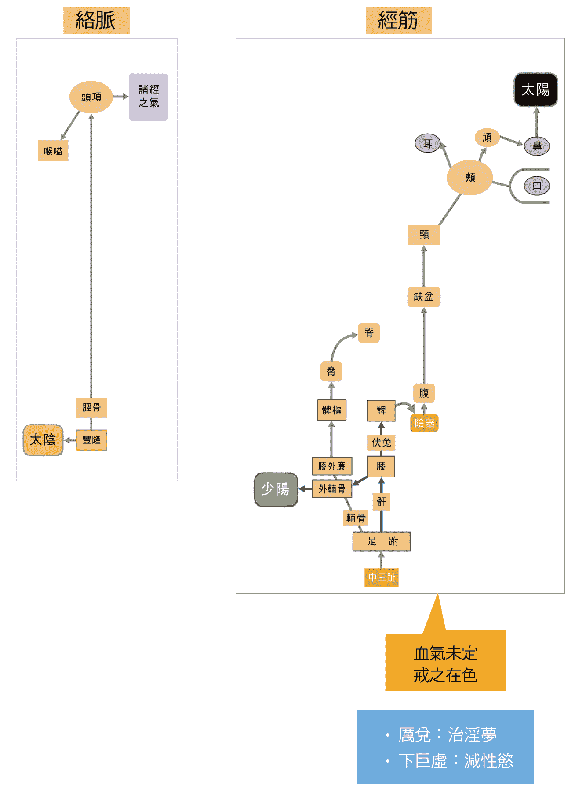

#### 以胃经穴位来配合「君子三戒」

幸好胃经 45 穴中有许多可以配合「君子三戒」的穴位。

● 聪明哥戒之在色，可用厉兑穴治淫梦，下巨虚穴可使下部盛大者虚，减低性冲动。顺便提醒男性朋友要慎用此穴，以免心有余而力不足喔！

● 型男主厨哥戒之在斗，可用内庭穴、陷谷穴和天枢穴泻胃火，平血气。

● 高富帅老爸戒之在得，可用足三里与上巨虚来降胃气，调心志，降低贪欲；丰隆穴及梁丘穴都有饱满之意，可增加满足感。

中医一直认为身心互相影响，心病可以从身体着手治疗，以上的穴位组合就是最好的例子。

而且中医的胃经竟然跟孔子的思想相合，可见大道到最高境界都是合一的。

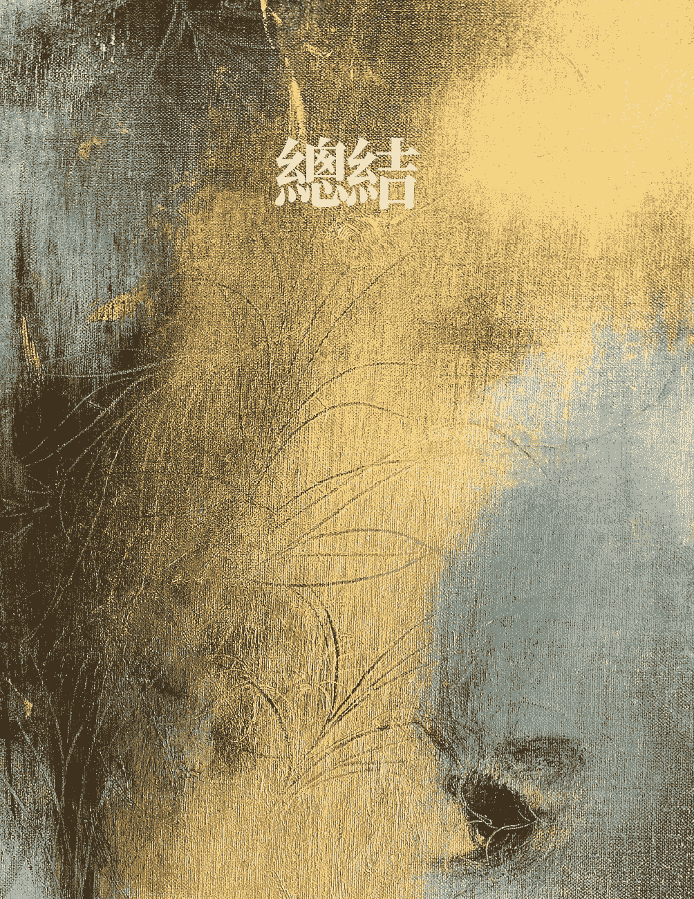

# 总结

行动派的阳明好兄弟是胼手胝足的先民写照。早期台湾居民唯有身强体壮才能负荷生活重担，他们早睡早起，顶着天光，勤奋工作，一肩挑起担子，赤足行遍万里路，期能谋得一家温饱。

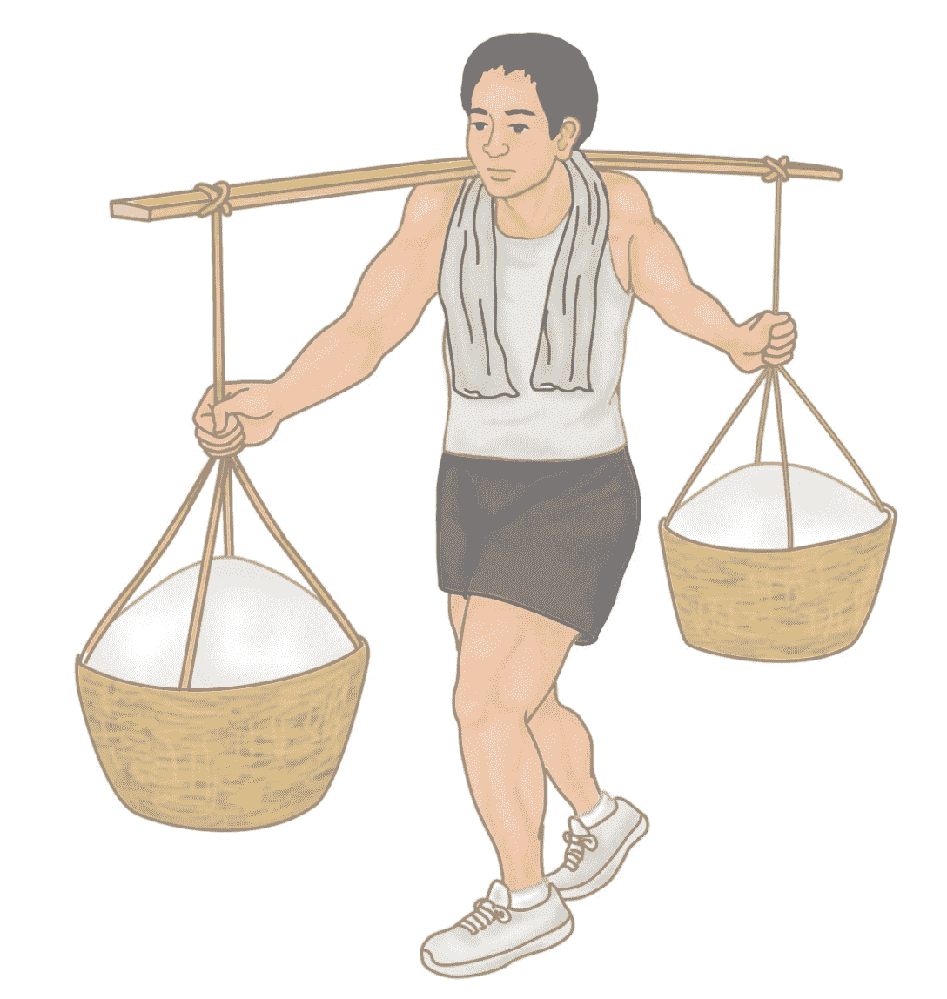

#### 胃经与大肠经的生理机能

胃与大肠都属于六腑，泻而不藏，气机以通降为主。胃经管理消化道上口，大肠经管理消化道下口，经由食物的一进一出，调节人体的气机。大胃王兄弟联手完成食物的消化、吸收与排泄，是谋得温饱的第一要件。

#### 1.磨碎及咀嚼食物

胃经入上齿中，大肠经入下齿中，但都浅出环绕唇口，合起来看，阳明兄弟包覆全部牙齿与口唇，与食物的磨碎及咀嚼有关。另外，人类的下巴是可以上下、左右及向前活动的关节，大肠经在人中左右交叉的路线，与下牙齿的上下、左右及向前活动有关，因而能与上牙齿共同完成更精细的磨碎及咀嚼任务。

#### 2.启动消化系统

人类的消化道是一条连接口腔和肛门的管道，这也约束了食物在体内的流动方向：从口腔往肛门方向进行，口腔是食物的上口及入口，肛门是食物的下口及出口。

当食物进到口腔，上下牙齿开始咀嚼食物，胃经及大肠经同时也输送讯息给所属的器官──胃及大肠。口腔内的牙齿负责磨碎及咀嚼食物，味蕾接受到刺激，就会经过神经反射，促使胃开始分泌消化酵素，一旦食物抵达胃时，马上可以展开消化的功能，然后再将半消化的食物送到小肠做完整的消化及吸收。剩下的残渣夹杂水分进入大肠，做最后的再回收处理。残渣慢慢累积成为粪便，送到直肠，最后由肛门排出。

如果把食物当做消化道的客人，胃经与大肠经的讯息内容大不相同。

● 胃经传给胃的讯息象是迎接及款待客人

食物（客人）已经进到口腔囉！赶紧分泌消化酵素，准备初步消化（款待）喔！

● 大肠经传给大肠的讯息象是打扫房子及清空场地

食物（客人）已经进到口腔囉！赶紧将肠道的残渣向下推送（打扫房子），以便容纳更多食物进来（清空场地）。

消化道就像一根吸管，上口与下口必须通畅，才能让里面的液体流动，尤其下口的顺畅更是关键，这就是「有出才有入」的道理。如果有一端阻塞，液体也跟着停滞，进出不得，「没有出就没有入」，消化道亦然。

消化系统的胃、小肠及大肠都属于脏腑系统的「腑」，气机以「下降」为顺，这与消化道的进行方向一致。如果肠道里面长期充满了食物残渣，难以排出，俗称「宿便」，阻塞肠道，就会出现腹胀满痛、食欲降低的现象。气机阻滞久了，无法下行，只好向上冲逆，而出现恶心、打嗝、呕吐，甚至难以进食的状况。所以胃与大肠两者一进一出的功能，合作无间，是维持消化机能很重要的因素。

#### 胃经与大肠经的经络分布

阳明好兄弟的经络分布也是相辅相成。

#### 1.头面部

首先，阳明主面，头面部是两经的重点部位。

大肠经集中分布在面部中线，掌管鼻、口、唇，还入耳内，以扩大胃经的功能；胃经则从中线绕行面颊上至额部，全面包覆面部，掌管五官和刺激食欲的色香味觉。

#### 2.四肢部位

阳明经多气多血，手阳明大肠经分布在上肢阳面前线，足阳明胃经分布在下肢阳面前线，都是四肢肌肉最丰厚，也是活动最频繁的部位。

阳明兄弟分布在四肢的正面，加上强健的手足结构，提供人类躯体向前推进的力量，也是人类早期野外生活中，生命得以存活和繁衍后代的要件。而在现代繁忙生活中，健壮的阳明兄弟，体力充沛，企图心强，加上头好壮壮，耳聪目明，手脚利落，仍是人生胜利组最佳拍档。

#### 3.躯干部位

胸腹部由强大的胃经经筋以铺天盖地之势全面包覆。阳明虽然分布在人体正面，但是为了加强保护脏腑，也会循行至背部，如大肠经筋分布在上背部以保护肺脏，胃经经筋循行至中背部以保护脾胃。

阳明兄弟管理消化道的上口与下口，功能正常就能顺利吃入，并能顺畅排出。进出皆顺，不只身体健壮，也会让人睡得安稳。古人说「胃不和则卧不安」，良好的肠胃机能就有平稳的睡眠，像现代人大多有失眠问题，除了想用安眠药助眠外，往往都忽略了肠胃功能失调的问题。

此外，阳明兄弟四肢发达，头脑也不简单喔！不只能让人四肢健壮，还能刺激头脑发育，并延缓老化，我们常说人活着就是要动，「活动」就是要动、能动，让身体与脑部都能保持活络，避免老化！

俗语说：能吃，能睡，能排，能动，就是人生一大福气！这正是大胃王阳明好兄弟的最佳贡献！

这个好福气将延续到人生中最甜蜜幸福的经络──脾经系统，敬请前进卷三！

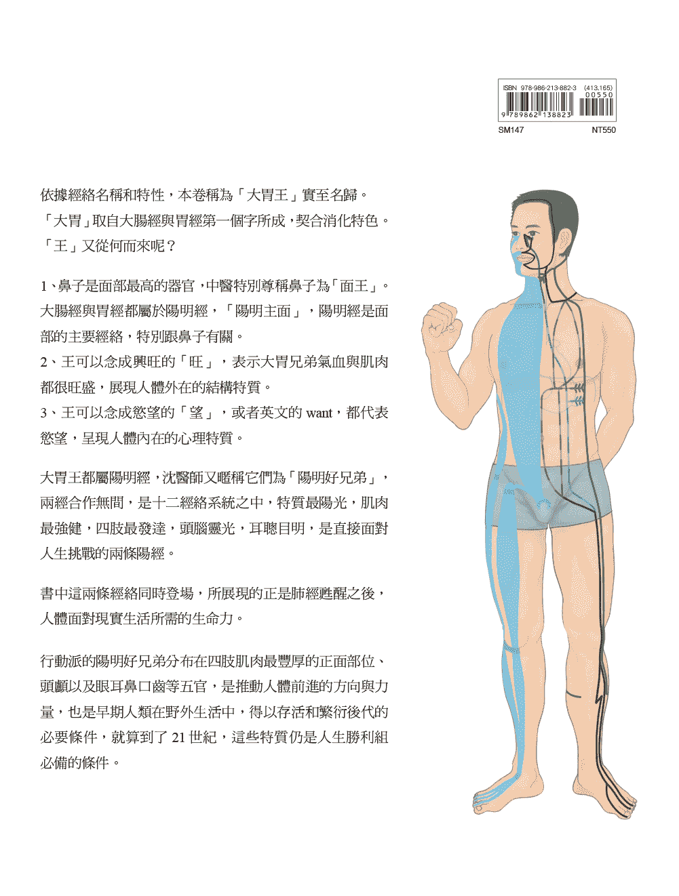