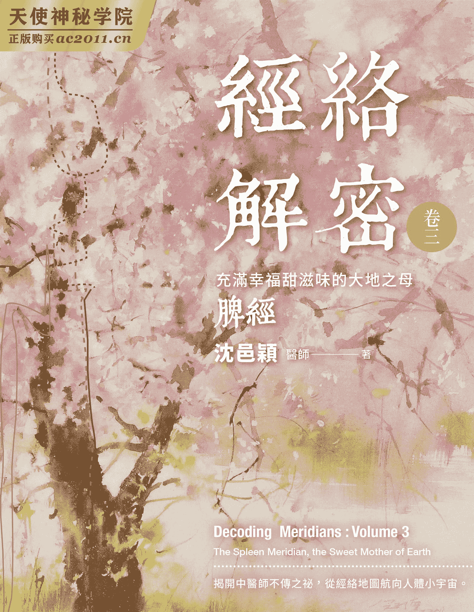

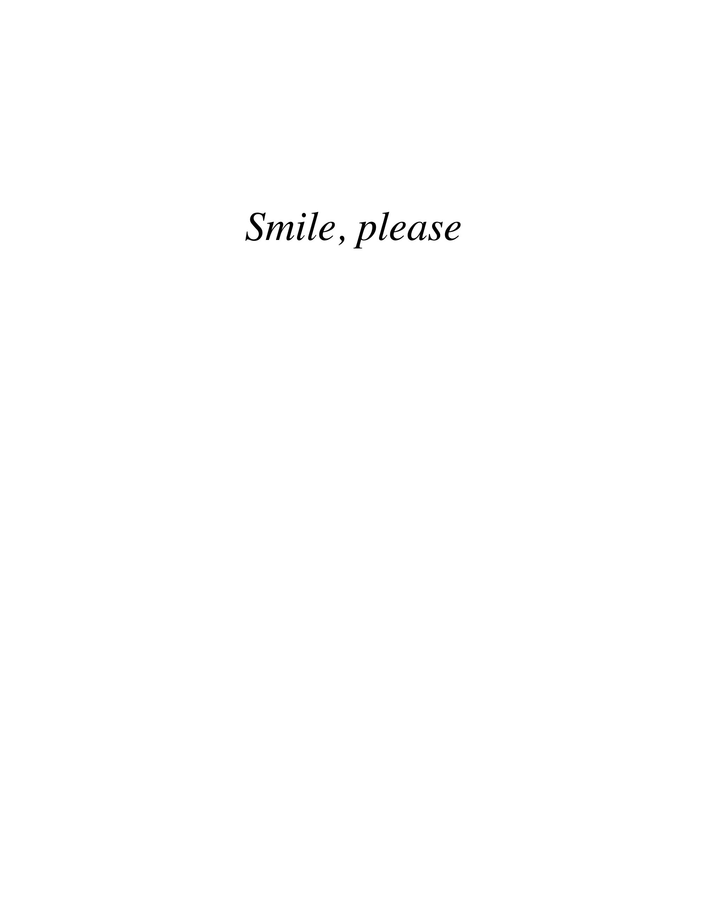

* * *

Smile 148

经络解密 卷三

充满幸福甜滋味的大地之母──脾经

作者：沈邑颖

策画：萧菊贞

封面画作：吴冠德

内页插图：小瓶仔

责任编辑：李潍美

美术设计：许慈力

中药材摄影：陈德宝

校对：余宛真、邹牧帆、张霺馨、陈立山、张玉玲、萧菊贞、沈邑颖

出版者：[大块文化出版股份有限公司](http://www.locuspublishing.com)

台北市 10550 南京东路四段 25 号 11 楼

法律顾问：董安丹律师、顾慕尧律师

著作权所有　翻印必究

EPUB 初版：2018 年 7 月

档案制作：菩萨蛮数位文化有限公司

* * *

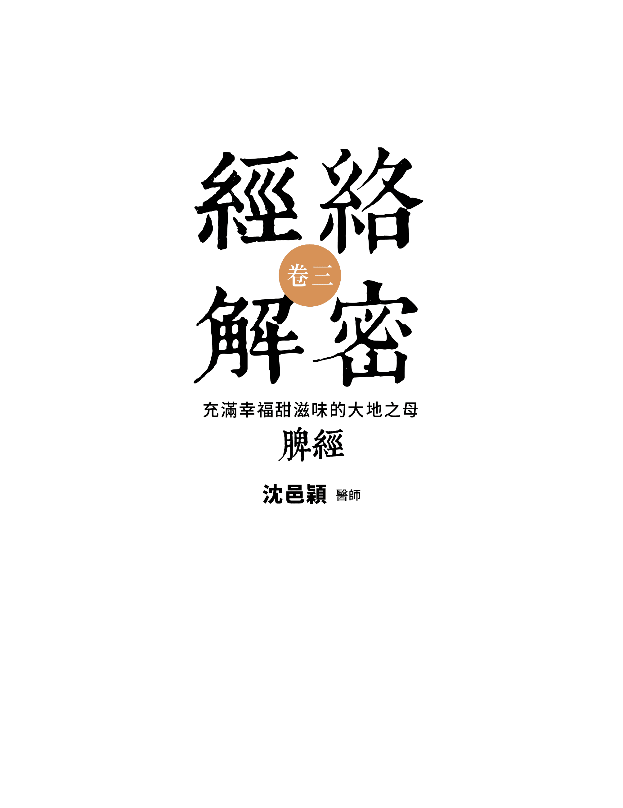

目录《经络解密》导言序曲：给自己的人生装入满满幸福滋味吧！脾胃要结婚，一定要幸福喔！脾经总论幸福一箩筐：守护幸福家、甜滋味的脾经脾脏的六大特质五行属土：无私给予的大地之母特质五味属甘（甜）：令人满足与舒缓的幸福感五色属黄：开胃，温暖与希望五志属思：细腻，周全的妈妈心开窍于口，其华在唇：食欲、消化与营养吸收主肌肉和四肢：输送营养以利肌肉及四肢的强壮灵活脾脏功能对应大地的特质脾脏的「脾气」对应大地的「孕育」脾脏主「运化」对应大地的「包容」脾脏主「升清」对应大地的「长养」脾脏主「祛湿」对应大地的「承担」脾经经脉系统的特色脾的幸福感，就是爱的力量天下父母心∼植物妈妈也有她的想望脾经四大系统一、脾足太阴之脉（经脉）足太阴脾经─循行特色脾经循行特色一：下肢部─脏腑好缘区脾经脏腑好缘区的广大功用「三阴交」的古今故事脾经循行特色二： 胸腹部─慈母心胃（欣慰）区第一重要任务：连结脾、胃与心这三个重要脏腑，成为「心胃区」第二重要任务：形成人体胸腹区重要的「慈母线」脾与肝之间出现复杂关系的可能原因脾肺两经适用中医对位疗法脾经循行特色三： 头面部─夹咽舌本区脾经系统跟免疫系统有重大关联穴位的特质是依附经络与脏腑而来，掌握经络脏腑，方能灵活运用穴位，取得最佳疗效商丘穴是治疗淋巴相关病症的要穴足太阴脾经──病候拇趾外翻与咽喉卡痰有关！脾位于中焦，也参与气、血、水的生成与代谢「脾气—脾土—脾湿」三部曲白朮与茯苓隐藏脾经的大秘密白朮可以安胎之理二、足太阴之正（经别）三、足太阴之别（络脉）公孙穴通冲脉，兼治生殖系统及气逆里急之证公孙穴美丽的错误人体除了喝酒会醉之外，进食后，竟然也会出现类似酒醉的「食醉」现象可怕的「食填太阴」！四、足太阴之筋（经筋）脾经经筋──循行特色人体内都有一个「篓子」的守护结构脾经经筋形成的篓子结构，是人体的悬吊及避震系统！脾经经筋的篓子结构，是体腔内重要组织器官的容器！脾经经筋篓子，对于体内一般器官组织有何贡献？女性一定要知道的青春秘诀∼脾经是女性的守护神男性也需要脾经的力量！脾经三阴交穴为妇科重要穴位，但怀孕妇女不能按揉？凡是脾经所过之处，都要保护它从肚脐到命门穴这一圈是养生保健圈为什么中医师常用黄耆这类补益脾气，升举阳气的中药来治疗胃下垂、眼睑下垂等症状？为什么中医师会用黄耆这类中药，治疗月经经量过多症状？脚水肿，中医师也用黄耆这类中药来治疗？如何照顾这个重要又辛苦的篓子呢？人体有十五条络脉，包覆全身提升及稳固脾经篓子的脾之大络──大包穴足太阴之筋──病候痛经病人在脾经经筋有明显的异常结构脾经经筋可以调整脊椎脾经的进阶幸福版一、神秘的【带脉】现身！与脾经共同守护女性的经带胎产二、脾经慈母线和游子衣组合成的篓子结构，不侷限在胸腹部三、脾经的母子组合是人体最佳「补破网」神器，有助于慢性、消瘦性疾病，加强改善整体病情四、产后坐月子是修复脾经系统的重要时刻胎产之后是否需要「坐月子」？流产妇女更加需要坐月子！安胎也是中医师的专长！脾经的保健脾经的自我保健运动脾经常用保健穴位贯穿女性一生的脾经穴位脾经的人生哲学自我提升，幸福知足的人生哲学人人都有幸福 DNA：脾经是体内永远的妈妈，我们是永远的「妈宝」母亲最后的眼神∼跟父母亲和解吧！心是爱的实现，脾是心爱的能量来源；脾的能量不够，小心变成情绪勒索者！回归自己：You Raise Me Up 你鼓舞着我没有一个人是孤单的，记得要连结大地与众人第一组经络团队的重要性

#### 《经络解密》导言

《经络解密》导言

为什么我们需要认识人体经络？

中医发现这个精妙的人体连结系统，因为有着如纺织物的网络状态，就称之为「经络」，是维持生命的重要系统。中医经典《黄帝内经》中强调，经络深深影响一个人的生老病死四大环节，如果经络照顾得当，就可以健康长寿。

十二经脉是脏腑运送气血至全身的重要通路，人体的组织器官从而得到充分的营养，身体自然健康。反之，如果经脉阻塞气血无法送达，与这条经络所连结的脏腑与躯干四肢，就会失去营养而产生不适或疾病，中医称为「不通则痛」。因此想要健康，经脉务必要畅通，「通则不痛」，组织器官得到营养，痛感自然就解除了。

经脉除了与一般人有关之外，它更是中医师习医的核心基础，而且学无止境，未来医疗能力的高下取决于经络的了解和应用，值得穷毕生之力去研修，去探讨。

为何用对穴位，就能产生神奇的疗效？

穴位在经络系统上，是经脉里面的气血输注到体表的部位。

穴位就象是经络列车的停靠站，每条经络都跟铁道沿线一样，满布着大大小小的穴位，它们的功能主要来自所属的经络系统。不同的经络系统互相支援，互补互助守护着人体。

认识经络与穴位，也是认识人体小宇宙的金钥，治疗疾病不能只是头痛医头，脚痛医脚，要找到病根病因，善用经络特性，从正确的穴位下手，自然能产生好的疗效。

经络四大系统好像有点复杂，该如何理解？

经络系统是人体运行的设计杰作，有许多奥秘等着我们去挖掘探索。但许多中医初学者却一听到经络四大系统就皱眉头了，担心自己读不懂。我在《经络解密》系列书中以现代智能型手机来作比喻，经络系统就跟手机传输线一样！人体内在脏腑好像手机，经络系统就像传输线，人体的四肢末梢则像传输线的插头端。

书中的经络图有何不同意义？循行是单侧，还是对称呢？

在这套书中，每条经络系统都有三种图来说明，分别是：人形图、循行简图、经穴图。

1.经络人形图：标示经络在人体的循行路线，简称「经络图」。经络系统同时存在人体两侧，但为了便于观看，将经脉、经别及络脉绘制在人体的左侧，黑色为经脉，蓝色为经别，绿色为络脉；经筋则以蓝色色块标示在人体右侧。

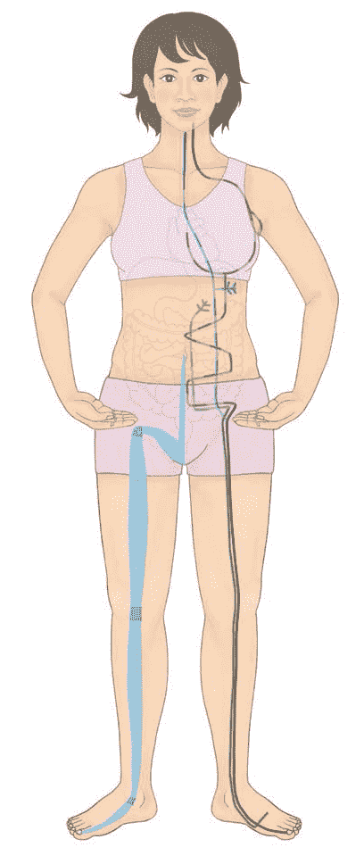

2.经络循行简图：将经络循行以色块及线条表现，比较容易掌握要诀。因为长得很像捷运路线图，简称为「捷运图」。捷运图的颜色及形状都有经过特殊思考喔！包含脏腑本身所属的颜色，四肢颜色较淡，躯干颜色较深。经筋部分，凡是结聚的部位，都会再用黑线框起来。

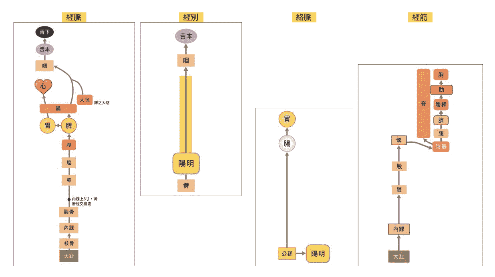

3.经穴图：将属于本条经脉的穴位连结而成。

穴位是人体珍贵气血输注的部位，聪明的人体会将宝贵资源做最佳分配。身体重要部位会有许多经脉通过，但不一定每条经脉都会有穴位。例如，大肠经脉虽然通过腹部和胸部，却没有穴位，而是将所有穴位分布在肩臂和头面部，胸腹部就由老大哥胃经经脉去分配，以免资源重复。

所以，经穴图通常比经脉图简单，对于学习者而言也较为容易掌握。但若要了解穴位的功能及应用，还是需要回到经脉系统，经穴图只是方便法门而已。这个观点在本书 121 页有详尽说明。

「解密」与「中医师不传之祕」有何不同？

♼ 解密：较为深入的内容说明，适合有中医基础，或对于中医有进一步兴趣的读者。

 中医师不传之祕 ：偏向中医专业内容，适合有较深的中医基础，或者从事中医与相关医疗的读者。一般读者若觉得较为艰深，可以略读或越过。

#### 序曲：给自己的人生装入满满幸福滋味吧！

序曲：给自己的人生装入满满幸福滋味吧！

脾在五脏六腑之中最具有母性的特质。在中医常用的五行属性上，脾属土，土与大地的性质相通，大地孕育长养万物，就象是孕育孩子的母亲一样，所以人们常以「大地之母」譬喻土地与自然界的关系。回到人体的小宇宙，中医也称脾为「脾母」。

过去，我常以长红的日剧角色「阿信」来比喻脾的孕育母性和坚毅性格，因为阿信温暖又带点悲苦的母亲形象，曾经赚得了许多婆婆妈妈们的眼泪，不少病人都跟我说过那故事，但我心里总想着：难道母性不能甜美一点吗？

直到我试着把脾「属土，味甘，色黄，开窍于口，其华在唇」这五个特质组合起来时，突然对脾母这形象有了不同的感受，这位丰腴的母亲，就彷彿是我搭火车穿梭在台湾东部时，在池上、关山所见那一大片长满黄澄澄稻浪的土地，映照在蓝天绿水之间，让人不自觉地升起一股幸福感。我们的母亲不正如大地一般，毫不保留的给予我们源源不绝的爱，这才是脾的甜蜜家滋味呀！

在《内经》中关于脾经经络系统的循行介绍颇为简要，但脾经在人体中所含藏的秘密与重要性，完全值得我们以一本专书来好好认识她。尤其了解脾经在人体体腔里，就像一个篓子般向上托住重要的脏器，孕育守护着我们，再加上脾经更是下一条经络「心经」爱的能量来源，这些都是让我不得不感动的脾经力量。希望这本书也能让每位读者发现体内这位守护着我们不离不弃的母亲。

在进入脾经的经络旅程前，要先让大家重温一下脾的好伴侣，也是在《卷二》大胃王里的大哥「胃经」，「脾＋胃」在人体的分工与连结关系上实属一家亲，他们要打造人体的幸福感，可是不能少了对方。下面先请大家戴上人体剧场的 3D 眼镜来认识脾胃关系。

脾胃要结婚，一定要幸福喔！

#### 脾胃要结婚，一定要幸福喔！

话说胃与脾相识已久，相知相惜，还一起开餐厅，是工作与生活上的好伙伴，见到周边许多同学和同事都步入礼堂，两人也决定要结成连理。婚前不免俗的也要找个算命先生来合合八字，确定两人适不适合长久相处。

算命师要他们写下自己的名字，动作向来迅速的胃，毫不迟疑的拿起桌上的蓝笔写下【胃】，脾则是害羞的拿起红笔写下【脾】。这位老师不仅会测字，还懂姓名学和中医学，他看了两个人的名字马上就说：「真是阴阳和谐，天造地设的一对呀！」脾、胃听了都很高兴，连忙要老师多解释一些。

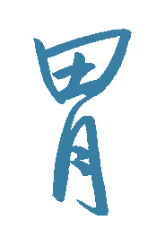

算命师说：「胃先生姓中有【田】，代表家里本来就有不少田产，但却不喜欢在父母的庇荫下过日子。这些年来靠着自己的聪明才智和努力不懈，累积了不少财富。我猜胃先生是家中长子，责任心很重，必要时也会撑起家业，所以家族未来应会越来越兴旺。胃先生个性很阳光，胃口不错，厨艺也很好，适合走餐饮业。姓氏中的【月】代表肌肉，你看他气色多好，身体健壮，一辈子衣食无虞，是个值得倚靠的好对象！」

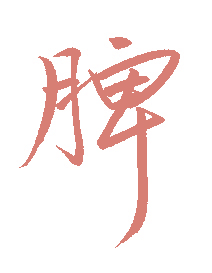

脾听了很欣慰，连忙请算命先生说说自己的情况：「脾小姐名字也有【田】字，加上下面的【千】字，表示家庭环境相当不错，田跟千合起来变成【卑】字，代表个性温柔体贴细腻，嘴巴很甜，对人又宽容，无论在职场上或是朋友圈的人缘都很好，大家都喜欢来跟妳说心里话，工作适合从事对外的企宣业务方面。还有对家庭的照顾部分，脾小姐充满女人味和母性温柔的特质，左边的【月】宛如月亮，未来在养儿育女及理家方面都能处理得很圆满。」

算命仙整合出结论：「胃先生能够娶到脾小姐，肯定是一生中最大的幸福。两人个性一阳刚一阴柔，合作事业会配合得非常好。你们共组的家庭，外面有胃先生打拚，里面有脾小姐守护，生活幸福美满，所以才会说你们是天造地设的一对呀！」

胃经、脾经的经络特质与他们的亲密关系，现在是不是更鲜明了？其实，我们每个人的身体与心灵中，都同时存在胃经与脾经，只要能够顺应自然，刚柔并济，自然能够维持身心的和谐，也唯有心中的爱饱满了，才能让对外的生活踏实知足。

写这本书对我来说，是一趟充满惊喜的发现之旅，也是一场充满温暖与爱意的感性交会。我们一起走进脾经的世界吧！

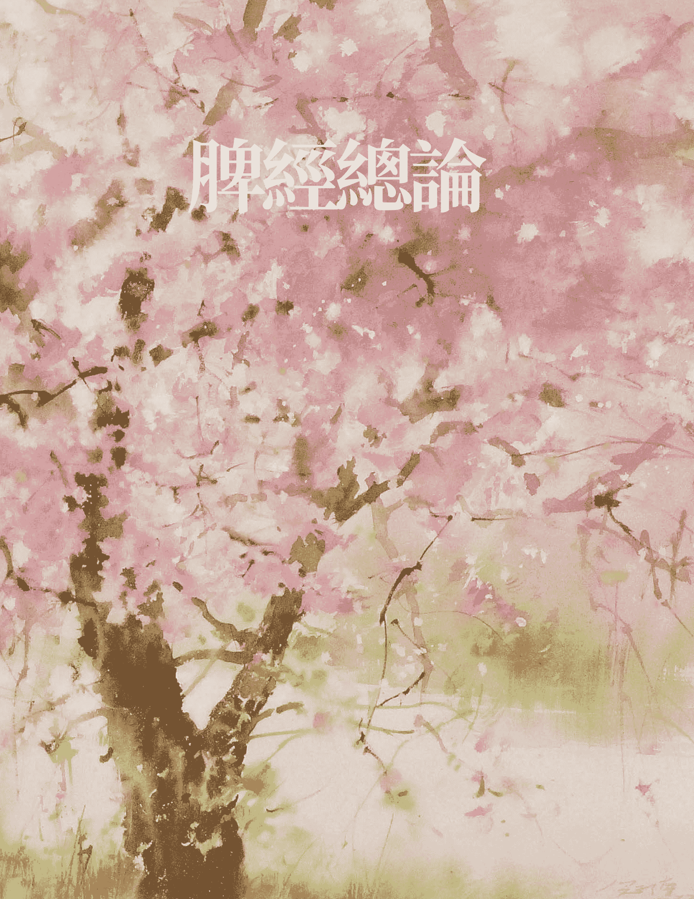

# 脾经总论

幸福一箩筐：守护幸福家、甜滋味的脾经

## 幸福一箩筐：守护幸福家、甜滋味的脾经

其实古代医家早已发现脾的秘密：脾在人体中以一个类似篓子（箩筐）的型态存在，小心翼翼地呵护着生命的运行，就像妈妈和大地之母般对待孩子，悉心照顾。我称这脾经的篓子是每个人皆具的「幸福一箩筐」，陪伴我们终生！

解密脾经的过程让人十分欣喜，我思索着如何把这么特别的经络系统介绍给大家，担心自己的拙笔恐怕无法全然传达出这股幸福滋味，所以决定以较擅长的图表来解说，费了一番心思，终于完成右页的「脾经幸福一箩筐图」。

这张图表把脾脏、脾经系统，以及脾和大地的对应关系全部纳入。脾脏的土性宛如大地之母，承载并包容万物，脾脏的健运宛如太阳，时时刻刻运转不息，符合《周易》「天行健，君子以自强不息。地势坤，君子以厚德载物」的天地观，也应合了中医的「天人相应」。脾有女性的阴柔特质，还兼具阳刚坚毅，让人体会到脾的「为母则强」，宛如母亲愿意为孩子牺牲奉献，让我们得以安然生活在天地间。

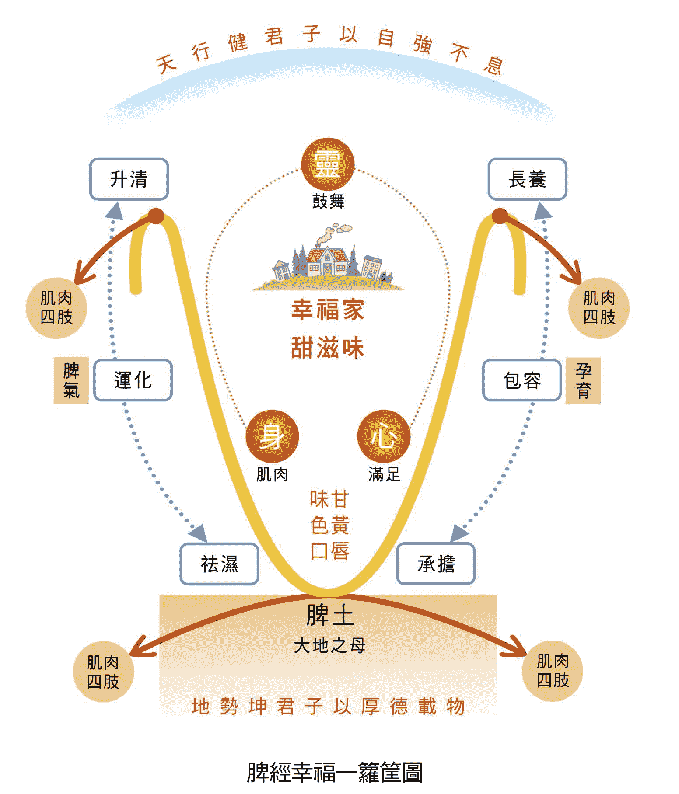

这张图示中，先整理出以下几个关键重点，于后再分别详述：

脾脏特质（在图中央及两侧）：

属土，味甘，色黄，口唇（开窍于口，其华在唇）；主肌肉和四肢。

脾脏功能（在图的左侧）：

涵括为「脾气」——主运化（包括生血），升清（包括统血）和祛湿。

脾对应大地（在图的右侧）：

涵括为「孕育」——主包容、长养和承担万物。

经络系统（在图中央，圆弧向上的图案）：

脾经经脉和经筋系统在胸腹部共同连结成一个如篓子般的立体结构。

为何我会在脾经的介绍中，一直强调幸福感与家滋味？答案已经浓缩在这张图中了。中医学的特色是全人的整合医学，唯有身心灵和谐平衡，才能为我们带来真正的幸福感，这股人人皆有之爱的能量，秘密就藏在脾经里。

脾脏的六大特质

## 脾脏的六大特质

五行属土，五味属甘（甜），五色属黄，五志属思，开窍于口唇，主肌肉和四肢。

1\. 五行属土：无私给予的大地之母特质

#### 五行属土：无私给予的大地之母特质

天空犹如父亲，大地犹如母亲，所以大家常说，妈妈在的地方就是家，女性等同于家的代名词，除了怀胎十月孕育了我们，另一方面也来自于母亲的爱有如大地，生生不息。

脾的五行属土，土地有着乐于给予、不求回报的体贴憨厚特质，每个生命都来自于大地，也终将归于大地。大地是生命的舞台，长养万物，也承载万物，赐给人们踏实感与满足感。所以中医称脾为「脾母」，在五脏六腑中最具有母性特质。

人们对于土地的态度，其实也代表着自己对于生命的态度。大自然是如此丰美富足，人类只是其中一员而已。即使人类的贪婪损伤了大地，无私博爱的大地之母依旧给予每一个生命体无边的力量。脾母也是一样，无微不至的照护身体，忙碌的我们，何妨放缓脚步，静下心来，感受并感恩大地与脾母的恩赐！

* * *

美国著名的［西雅图酋长宣言］，不仅阐述印地安人对于人与土地的看法，也将土地譬喻为母亲。如下谨节录部分内容，并调动内文顺序：

But how can you buy or sell the sky? the land? The idea is strange to us. If we do not own the freshness of the air and the sparkle of the water, how can you buy them?

但是您怎么能够买卖穹苍与土地呢？ 这对我们而言，是非常奇怪的想法啊！假如我们根本就不拥有空气的清新与河流的光耀，您怎能买下它们呢？

Every part of the earth is sacred to my people. Every shining pine needle, every sandy shore, every mist in the dark woods, every meadow, every humming insect. All are holy in the memory and experience of my people.

对我的族人而言， 这块大地的每个部分都是圣洁的。 每一枝灿烂闪亮的松针、 每一处沙滩、每一片密林中的薄霭、每一片草地、每一只嗡嗡作响的昆虫。所有这些生物，在我族人的记忆与经验中都是神圣的。

The shining water that moves in the streams and rivers is not just water, but the blood of our ancestors. If we sell you our land, you must remember that it is sacred. Each glossy reflection in the clear waters of the lakes tells of events and memories in the life of my people.

银波荡漾的河水并不只是水，而是我们先祖们的血液。倘若我们把土地卖给您，您必须记住，这是块神圣的土地，清澈湖水中的每一抹倒影里，都诉说着我们族人生命中动人的故事与回忆。

We love this earth as a newborn loves its mother's heartbeat. So, if we sell you our land, love it as we have loved it. Care for it, as we have cared for it. Hold in your mind the memory of the land as it is when you receive it. Preserve the land for all children, and love it, as God loves us.

我们爱护这片大地的心情，犹如新生儿眷恋母亲的心跳声一样。所以，若我们将我们的土地卖给您，请以我们过去爱护她的心态继续爱护她，看顾她。在你心中要常保大地的记忆，为所有孩子保留大地的原貌，并且爱护她，一如上帝爱护我们一般。

资料来源：http://www.csun.edu/~vcpsy00h/seattle.htm

* * *

多么感人又心酸的宣言啊！透过酋长的眼睛，我们看到了族人对于大地的崇敬，和族人将生命托付给大地之母的紧密连结。到了 21 世纪，土地买卖风气依旧盛行，但是土地真的不是我们可以任意掠夺以及侵略的物品——大地是我们的母亲，是我们生命的源头和归处。

2\. 五味属甘（甜）：令人满足与舒缓的幸福感

#### 五味属甘（甜）：令人满足与舒缓的幸福感

在中医的五味归属上，脾属甘，还进一步提及「甘令人满」、「甘令人缓」，这是什么道理？为甚么甜味可以令人满足，并能安抚我们焦躁不安的情绪呢？

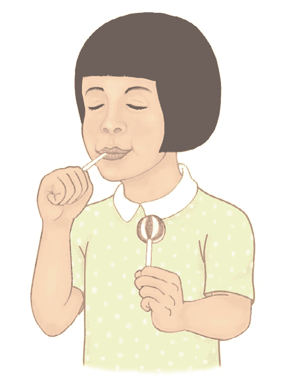

记得小时候特别喜欢吃糖，常跑去「柑仔店」买彩色西瓜皮线条、外面滚满糖粒的金柑仔糖，圆圆胖胖一颗放进嘴里，连脸颊都会挤凸出来，彷彿要让全世界的人都羡慕你在吃糖果……。这份属于童年的幸福滋味，让我一直久久难忘。

出社会后开始爱上小熊 QQ 糖，尤其工作压力大的时候，特别爱吃糖。据传当年跟我去马祖义诊的年轻医师们，都被前任学长姐交代，要帮沈医师带一包小熊糖。过了好几年后，我才终于了解年轻医师「刚好」都带着 QQ 糖的真正原因。人在外岛，坐在海边吹海风，吃着甜滋滋的糖果，真的很幸福，这感觉也是至今难忘。

虽然食物中酸、苦、甜、辛、咸五味俱全，但令人感到幸福的滋味只有一种，就是「甜味」。或许成人们都已遗忘，但婴儿吸吮到的第一口食物，就是母乳，母乳中具有丰富的葡萄糖，这微甜的滋味是我们生命中的第一次味觉经验，也是对母亲的味觉记忆。在成长的过程中，「甜食」常用来庆祝开心的事，即使不喜欢吃甜食的人，也不能否认甜味带来的甘美与幸福感。

演化学者也发现，从非洲的人类老祖先开始，就知道由成熟水果或珍贵蜂巢所取得的糖是难得的营养好料，它的高热量与高吸收率更是当时狩猎生活中，难得的优质食物，也是较具生理优势的人才能享用，因此透过基因很可能把爱吃甜食的嗜好传给后代。 这个说法很有趣，因为在许多不同的语言文字中，「甘」、「甜」、「sweet」、「honey」、「candy」等，不仅代表生理味觉上的反应，也可延伸为满足、幸福、爱等心理上的觉受。

近代西方医学研究发现，甜食对于大脑的情绪反应有显著影响，可以让人心情顿时变好。主要原因是甜食中的糖分，能够刺激身体分泌胰岛素，胰岛素又能让身体中的色氨酸更容易进入细胞中。色氨酸是产生血清素的重要氨基酸，血清素进到大脑会让人产生安定及愉悦的感觉。经过一连串的人体化学反应，和生活经验的累积，一般人只要觉得心情低落或疲劳倦怠时，很容易去找寻甜食，让身心放松，这与中医说法中「甘令人缓」的意思一样。

我再以「甘令人满」来说明两件事。关于「满」，一是甘美食物带来生理上的满足与饱足感，以及心理上的幸福感。另一是在中医的临床诊治上所意，指过度的甜食非常滋腻难消化，「满」就会变成病理上的胀满，例如腹部胀满，就会影响食欲以及消化吸收功能。有些脾胃功能比较敏感的人，一吃甜食就泛胃酸，胃堵闷，甚至还会胸闷。另外，过多的甜食也容易生痰，许多人吃完甜食后，常觉得喉咙卡着满满的一坨痰，吞吐都不利，会不自主的持续清理喉咙。再加上脾主痰湿，每天已经忙着处理体内的痰湿，若再摄入过量甜食，加重脾的工作负担，长久下来会对脾造成直接伤害。

适当的糖可以让人愉悦，但过量的糖则会让人生病，尤其现代人精致饮食过量，糖分摄取过高，许多人罹患糖尿病，在中医的看法上，也与脾病有关。

后来我也在临床上发现老人跟小孩一样特别喜欢甜食，包括我老爸也是如此。因为甜味在舌头的接收器是在舌尖，年纪大的人味觉容易退化，食欲、吸收也比较差，甜食往往能够刺激食欲，也能快速地转化为大脑所需的能量。就像我父亲年轻时并不嗜甜食，年纪愈大竟然越吃越甜。某个假日，老爸从房间抱出一罐四方形塑胶桶，神秘兮兮的问我：「妳要不要吃？」低头一看，天哪！里面满满都是五颜六色的金柑仔糖！爸爸的眼睛里充满孩子般的稚气与淘气，脸上藏不住兴奋的笑容，开心与我分享他的珍藏，成为「蜜友」，这桶金柑仔糖就成为我们父女俩甜蜜的秘密。

不过也要提醒大家，如果家中老人突然大量嗜吃甜食，那可能是疾病的征兆，不能轻忽。

人们对于甜的感受还延伸到外貌的看法。对于面部五官常带着笑容，看起来舒服、亲切、有好感的可爱女生，常说她们长得很「甜」，看了令人心情放松，想要亲近。相反地，对于表情严肃、五官纠结、心事重重的人，常说是「苦瓜脸」，令人有紧绷感，不会想要接近。而在台湾民间习俗中，订婚时女方会奉甜茶及汤圆招待男方亲友，婚礼祝词也会有「吃甜甜，明年乎妳生后生（儿子）」，可见甜味在民俗方面也是一种幸福事。

3\. 五色属黄：开胃，温暖与希望

#### 五色属黄：开胃，温暖与希望

根据研究，凡是鲜艷的颜色都有增进食欲的效果。尤其红色、橘色和黄色等色调看了令人胃口大开，食指大动。其中橘色是最能促进食欲的颜色。大家可以仔细观察一般餐厅或面包店（不含特殊风格的餐厅），几乎都以大地色系作为装潢的元素，也许出现在招牌、餐桌、桌布、菜单或室内装置等等，餐厅老板都晓得用这个颜色偷偷地勾引你的脾胃呢！

中医如何看待橘色这个挑逗脾胃的颜色呢？

橘色是由黄色加上红色调合而成。红色属心，五行属火；黄色属脾，五行属土。在五行关系上，火可以暖土，像日常生活人们会用火来煮熟食物一样，同理，心火可以促进脾土的食欲和消化能力。将心火的红色混合脾土的黄色正好变成橘色，无怪乎会让人一看到这个颜色，马上食欲大开！我猜想橘色会促进食欲这个特性，也许始于人类开始用火烹煮食物，有了熟食以后的生活！

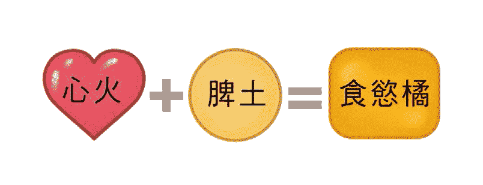

在自然界中，青色大多是蔬果、谷物尚未熟成的颜色，通常口感偏涩，才有「青涩」一词，黄色、橘色则是成熟的颜色，代表着丰收与富足；刚升起的太阳是橘红色，黄色的灯光给予忙碌的都会人温暖，客厅里晕黄灯光也代表家人的期盼与守候。记得有一首歌《留一盏灯》：

留一盏灯让流浪的人　有一种回家的感觉

留一盏灯让晚归的人　有一种被等待的感觉

不要让孤独　常常来作客

不要让寂寞　啃蚀疲倦的心灵

相信这是一盏黄色灯光，给予路过的游子及晚归的人一分温暖。

中国人常说「能吃就是福」，橘色能促进食欲，黄色能给予人们希望与满足感，可见脾的颜色完全是个「幸福」色系！

4\. 五志属思：细腻，周全的妈妈心

#### 五志属思：细腻，周全的妈妈心

人有五志七情，五志对应肝、心、脾、肺、肾五脏，分别为：怒、喜、思、忧、恐。其中脾主思，思则气结。「思」字是由「田心」两字合成，脾脏属于土，与田地有关联，脾经的下接经是心经，完全符合「思」字的特性。

脾主「思」是指个性比较细腻，考虑比较周全。因为脾脏功能正常就能运化养分去滋养全身，让人头脑清楚，思考缜密。而且脾脏具有「妈妈心」的特质，非常关爱家人及孩子，处处为家人着想。如果顾虑得恰到好处就是「细心」，如果想得过多就会变得「太操烦」，甚至可能引发身心失调的症状。

例如许多家庭当中，只要家人出门，妈妈就会悬着一颗心，挂念东担心西，直到家人平安回家才能放下心来，这样的妈妈心大家应该都经历过。如果妈妈过度思虑，而让自己陷入了焦虑恐慌的状况，那可就不妙了。长期的过度思虑，导致脾气停滞，影响脾的运化功能，而出现茶不思、饭不想的情况，中医称为「思则气结」。

经典文学《红楼梦》中的林黛玉就是标准思虑过度的人。思虑过度会影响脾气，降低脾的运化能力，致使脾土不开，没有食欲，胃无法受盛腐熟水谷，消化不良，营养不足，人就会日渐消瘦。

5\. 开窍于口，其华在唇：食欲、消化与营养吸收

#### 开窍于口，其华在唇：食欲、消化与营养吸收

依据中医的脏腑理论，脾胃为气血生化之源，提供身体的养分，宛如国家管理粮仓的官职，所以称为「仓廪之官，五味出焉」。水谷是从口唇进入消化道，《内经》进一步说：「脾开窍于口，脾气通于口，脾和则口能知五谷，脾其华在唇。口唇者，脾之官也。」简单的说，就是口与唇归脾管理。但脾经系统在面部只到舌头部位，并没有直接循行到口唇，主要是藉由胃经「还出挟口，环脣」来连结唇口。

脾开窍于口唇的意义主要与进食有关。如果脾的功能正常，就能辨别食物的各种味道。《内经》还说「心气通于舌，心和则舌能知五味矣。」脾知五谷跟心知五味有何差别？个人认为，心对于味道的感受倾向于欣赏与品尝，而脾对于五谷的感受除了味道之外，还兼有食欲。因为脾本身跟食欲很有关系，食欲正常才会愿意张口去接纳食物。有带过小孩的家长都知道，孩子只要遇到不想吃的东西，都会转开头，抿住嘴，不让大人把食物塞进嘴里。

所以，口唇就是脾在头面五官的官窍，就像鼻子是肺的官窍一样的概念。既然脾之华在唇，就可以从嘴唇的色泽来判断脾的消化功能。正常的唇色应是红润色，如果唇色偏白，表示气血不足，要加强脾胃吸收功能；颜色深红，表示气血瘀滞或是体内热盛，要注意脾的运化功能，少吃辛辣或燥热食品。《内经》中也指出脾病的人，嘴唇会偏黄，这在胃经篇介绍过，嘴唇周围会呈现营养不良的黄色。

临床上曾遇到不少病人有嘴唇脱皮问题，怎么擦护唇膏都没有用，这也透露了脾功能失调的迹象。

还有一种口唇的状况也很让人烦恼：口唇合不拢，常发生在小朋友及老人身上，甚至还会不自觉的流口水。《内经》说人体有五液「五藏化液：心为汗，肺为涕，肝为泪，脾为涎，肾为唾，是谓五液。」涎就是唾液口水之意。正常的唾液，口水会在口腔内流动，若脾脏气虚，无法管控口水，加上口唇无力而松开，就会出现不自觉流口水的现象，这类症状都可以加强脾气来改善。

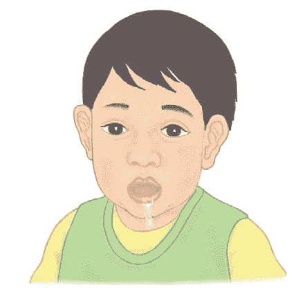

脾脏所独具的母性特质，也让脾经系统与人体生殖系统关系密切，所以女性骨盆腔的情况也会反映在嘴唇周围，例如嘴唇周围透出青色，代表子宫偏寒，容易痛经；嘴唇下方的下巴红肿还出现痤疮，代表子宫内有湿热，容易出现黄色分泌物等。

除了饮食及妇科之外，口唇在生命中还扮演着亲密的角色。例如：生命中第一个来自别人的亲暱肤触，通常来自母亲亲吻我们的脸颊；生命中第一个与别人的亲暱肤触，则是自己的嘴唇含住母亲的乳头，吸吮滋养生命的乳汁。婴儿含着母亲的乳头睡觉会有安全感。成年后与所爱之人的接触多始于牵手，然后就进步到嘴唇的接触（亲吻），所有嘴唇的肤触，象征着人际间亲密的关系。

 中医师不传之祕：脾脏对应鼻头

在五行的方位上，脾属土，位于中央；在人体面部对应脏腑关系中，鼻头也居于面部中央，所以脾脏对应鼻头。鼻头就是鼻子末端肉肉的部位，又称为「鼻准」或「鼻准头」，是面部最高点，中医尊称为「面王」。脾经循行未到鼻部，反而是卷二大胃王循行都到鼻部，为脾建立与鼻子的关系。但请注意，脾对应鼻头，胃对应鼻翼，大肠的对应区则在脸颊。

脾脏对应鼻头，当然可以用来诊断疾病。例如《内经》提到：「脾风之状，多汗恶风，身体怠惰，四支不欲动，色薄微黄，不嗜食。诊在鼻上，其色黄。」黄色是脾的本色，当脾有病，鼻头颜色会偏黄。「脾热病者，鼻先赤。」当脾有热时，鼻头会先红。张仲景先生的《金匮要略》也提到「鼻头色青，腹中痛，苦冷者死；鼻头色微黑者，有水气；色黄者，胸上有寒；色白者，亡血也；设微赤非时者，死。」可见只要鼻头出现异常颜色，都是脾病的警讯。

临床上，喜欢吃香喝辣，喝酒，饮食油腻的人，鼻头颜色都很暗沉，甚至还会浮现青色血络，俗称「酒糟鼻」就是例子，由于脾胃湿热很盛，气血瘀阻，反应在鼻头上，就会出现暗红色，毛孔粗大，皮肤凹凸不平的状况，这种人的腹部也较为肿大，这些都是脾胃生病的讯号。

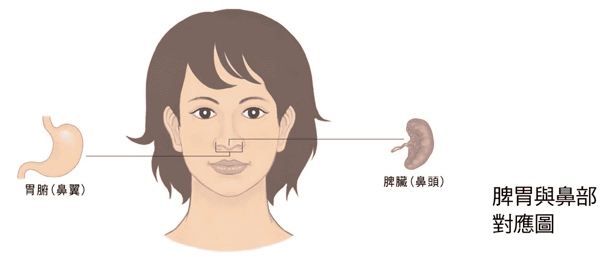

6\. 主肌肉和四肢：输送营养以利肌肉及四肢的强壮灵活

#### 主肌肉和四肢：输送营养以利肌肉及四肢的强壮灵活

中医对于身体组织的认知是有五种形态，称为「五体」，依照它们在身体分布的深度，分为皮、脉、肉、筋、骨，由五脏主管：肺主皮，心主脉，脾主肉，肝主筋，肾主骨。

脾的消化功能主运化（后面会说明），将胃从食物中所吸收的精微物质，转运给全身各组织器官使用。身体肌肉活动量很大，尤其四肢更甚，虽然脾、胃对于肌肉的生成都有贡献，也一起主管四肢，但肌肉及四肢活动主要依赖脾的营养输送。

在卷二胃经篇章也提过，胃是人体餐厅的大主厨，负责烹煮食物，然后交给脾这位外场经理送菜上桌，因此《内经》说「脾主为胃行其津液者也」，特别强调脾主肌肉和四肢，也解释为何脾生病，四肢也会变得衰弱，无法活动的道理：

《内经》：「四支皆禀气于胃，而不得至经，必因于脾，乃得禀也。今脾病不能为胃行其津液，四支不得禀水谷气，气日以衰，脉道不利，筋骨肌肉，皆无气以生，故不用焉。」指出脾生病，无法帮胃运送精微给四肢，四肢筋骨肌肉缺乏营养，就会日渐消瘦，最后无法活动。

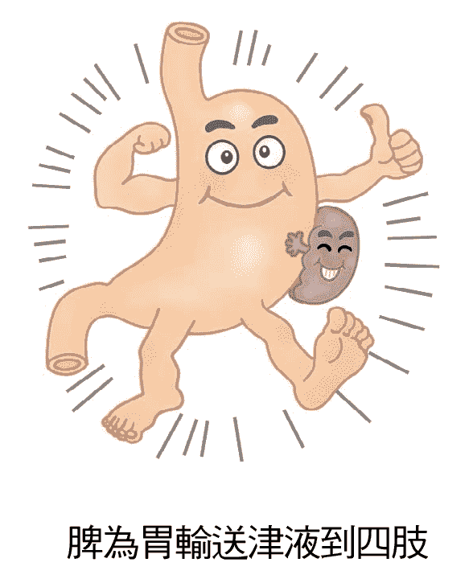

「脾主身之肌肉……脾气热则胃干而渴，肌肉不仁，发为肉痿」，脾有邪热，消耗掉本该为胃输送给四肢的津液，用现代的话来说，就是脾利用职务之便，监守自盗，导致全身肌肉得不到滋养，而出现削瘦痿弱，麻木不仁的情况，中医称为「肉痿」，类似现代的肌肉萎缩状况。

由以上说明可见，脾对于肌肉与四肢的影响真的很巨大。

胃负责吸收营养，脾负责输送营养，所以如果脾气健运，身体的气血就能充足，肌肉和四肢健壮有力。反之，若脾气虚弱，无法运送养分，就会出现营养不良的状况，常见于久病卧床的人，全身肌肉消瘦，四肢只见皮包骨，即使透过输液提供营养，因没有启动脾为胃输送养分的功能，仅能维持生命机能，无法增加肌肉的丰厚度，病人依旧四肢瘦弱，这就是脾主肌肉和四肢的明证。

脾、胃及四肢三者的关系，可以现代的生产流程来说明。

胃负责受纳腐熟水谷，类似养分的制造工厂；脾帮胃输送津液及精微物质，类似输送养分成品的车队，例如现代的宅急便；人体的四肢肌肉享用着胃所生产，脾所运送而来的营养，宛如消费端的顾客一样。请参考下图。

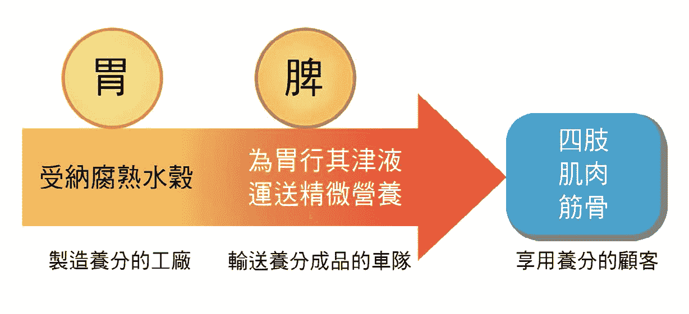

脾胃功能差的孩子，通常是面黄肌瘦，手脚细，俗称「黄酸囝仔」，甚至发色也偏黄，成了「黄毛丫头」。所以色黄、肌肉、四肢运动都与脾有关，只要改善脾胃功能，黄酸囝仔和黄毛丫头也可以变得强壮。因此中医在临床上遇到有「转大人」困扰的病人，都以加强脾胃功能为首要任务。

过去先民们都是胼手胝足、脚踏实地的努力拚搏。在这种要与天争的情况下，唯有矫健的四肢、结实的肌肉，才能为所爱的人构筑可以遮风蔽雨的温暖家园，所以肌肉和四肢也是幸福的重要元素。

反观现代人饮食来源丰富，理论上肌肉应该很健壮，但是肌肉量持续减少的「肌少症」却越来越普遍，六十岁以上的人约一成左右罹患肌少症，随着年龄增加，比例也跟着攀升。临床上常见一些长辈的肌肉非常松垮，出现许多与肌肉走向平行的皱纹，四肢无力，活动不顺畅，甚至容易跌倒。一询问，马上知道问题主要在于饮食失调。因为随着年龄增长，肌肉的组织、强度、耐受力都会逐渐降低，尤其老年人更为明显。

近来还见到许多长辈（或中年人）为了控制体重，刻意减少食物摄取量，或因偏食而导致体内蛋白质缺乏，也产生肌肉松弛无力的病症，这类病人初期甚至误以为「瘦就是健康」，结果却是「赔上了健康」。蛋白质是构成肌肉的主要元素，营养不良缺少蛋白质，肌肉当然会持续消失。幸好经过卫教及治疗之后，重新调整饮食，肌肉逐渐变得丰厚，活动力也跟着改善。也要提醒素食者，平常要注意营养的均衡，植物性蛋白质，例如豆类或是坚果类食材要记得常补充，才不会面有菜色，体力差。

我曾治疗过一位罕见疾病「皮肌炎」的病人，皮肌炎是一种以侵犯肌肉为主，也会侵犯到皮肤的自体免疫性疾病，会造成病人四肢近端肌肉无力或疼痛，甚者肢体瘫痪，行动困难，常让医师束手无策，病人及家属恐慌。在治疗半年多期间（病人后来因其他疾病过世），见证了病人肌肉在很短时间内快速消失，尤其是四肢的肌肉，从可以站立，恶化到只能坐卧，胃口极差。我们赶紧采用脾胃主四肢与肌肉的概念，使用中药方如归耆建中汤合四君子汤等，加上针与灸，以提高食欲及胃纳量，并改善脾的运化机能，确实帮助病人减缓肌肉消瘦的速度，且改善精神和体力。

脾脏功能对应大地的特质

## 脾脏功能对应大地的特质

脾脏功能概括为「脾气」，再细分为主运化（包含生血），升清（包括统血），祛湿。脾对应大地的特质概括为「孕育」，再细分为承担，包容及长养万物。这两个大概念的对照，可参考 19 页图的两侧部分。我将之整合为四部分说明：

1\. 脾脏的「脾气」对应大地的「孕育」

#### 脾脏的「脾气」对应大地的「孕育」

《卷二》中介绍过「胃气」代表胃腑的功能，同理，「脾气」代表脾脏的功能。大家会不会觉得「脾气」这两个字好耳熟啊！它常用在我们的日常用语上，但若被人形容脾气很大，恐怕不是件好事。

其实俗语中的「脾气」，是借用中医「脾属于土，承受万物」的意涵，将它转化成「包容」与「忍耐」的个性特质。如：我们说某人脾气很好时，通常是指包容力好，沉得住气，不容易生气；我们说某人脾气不好时，通常是指包容力差，沉不住气，马上暴跳如雷。

脾胃为气血生化之源，生命活动都仰赖脾胃提供的营养。中医的「好脾气」是指脾脏功能良好，足以供应身体所需。 会被引用为形容个性的「好脾气」，个人猜想乃是因为人的身与心交互影响，身体状况好，心情也跟着放松，对于事物就有比较高的包容力吧！

脾土与大地的特质，都是母亲，都能孕育万物，提供万物生长所需的营养。我们将脾脏与大地特质相结合就成为「好脾气的妈妈」概念，这对于个人的身体和自然环境都是最佳的状态。拥有好脾气的妈妈，无论对自己或他人，都是幸福的来源。脾土与大地都让生命有归宿，爱饱满，心知足且有依靠。

可是，好脾气也有极限。

例如，过去人们以为大地可以无限制的承受一切压力及掠夺。在历经无数次大自然的反扑之后，人们终于了解，大地之母也有承受的极限。同理，一个人的「包容力」也有极限，千万不要以为某人脾气好，就可以持续的挑衅与压榨。一旦超过忍耐限度，埋藏心里深处的负面情绪也会爆发，人际关系破裂就难以修复了。

温柔的妈妈在面对一些特殊状况时，为了保护孩子也会展现出平日未见的坚强意志与行动力，例如遇到歹徒要伤害孩子时，再瘦弱的母亲都会抢先护卫孩子，甚至舍命跟歹徒搏斗，来保护孩子的安全！这就是「为母则强」的特质，人体的脾脏也是「为母则强」，《内经》说人体的五脏六腑各有分工，其中「脾为之卫」，具有保卫人体的功能（详细内容在经脉篇中再述）。

脾母的孕育特质，还呈现在脾与妇科的密切关系上。

女性生理四大事「经带胎产」：

「经」指月经，与气和血有关，气血充足，运行顺畅，月经就规律。

「带」指白带，与气和湿有关，脾能运化水湿，带下就会正常。

「胎产」指怀孕与生产，与气和血有关，脾气足，能升清生血，就能提供母亲与胎儿足够的营养和固摄的力量，胎儿可以健康成长，不会轻易滑胎。由于脾母在孕育后代的特殊贡献，人类才得以繁衍。（经带胎产相关内容在经筋篇中介绍）

2\. 脾脏主「运化」对应大地的「包容」

#### 脾脏主「运化」对应大地的「包容」

胃主要负责受纳和腐熟水谷，脾将胃所吸收的营养物质加以转化后，再运送至全身各组织器官，这项功能称为「运化」，具有运输和转化的功能。

脾所运化的物质，主要来源是从食物所吸收的养分和水分，再转化成身体所需的气血，所以脾胃是人体「气血生化之源」。无用的物质就转化为大小便排出体外。

《内经》说「饮入于胃，游溢精气，上输于脾。脾气散精，上归于肺，通调水道，下输膀胱。」食物中的水湿，主要由脾来转化代谢，因为脾属于土，而在五行的关系中，「土能制水」，俗语有「兵来将挡，水来土掩」的说法，所以脾脏擅长管理及代谢水湿。液体食物进入胃中消化，精微向上送给脾去散布，再向上总归入肺，通调水道，输送全身，以维持体内水液代谢的平衡。

脾的运化功能，更精准的说，就是指脾脏运输及转化营养物质与水湿的能力。身体分分秒秒都在活动中，脾的运化工作也需要持续进行，不容偷懒。如果脾无法运化营养物质，身体的组织器官就会缺乏营养而有气血不足的现象；如果脾无法顺利代谢水湿，就会滞留在身体里演变成湿气、水肿、痰湿等等。有些女生常爱说自己是易胖体质，不吃饭喝水也会胖，其实她们不是胖，大多是水肿。

所以中医期许优秀的脾脏要有「健运」的表现，一如《周易》所述「天行健，君子以自强不息」。

脾主运化对应大地的包容特质，我们再以餐厅工作来说明这项对应关系。

胃是型男主厨，主要是在厨房烹煮食物，脾是外场经理，负责点餐和送上食物。胃只要面对厨房里的食物，脾却要面对各式各样的客人，甚至餐厅奥客的无理要求，如果没有好 EQ，好脾气，去包容和妥善应对这些状况，早就跟客人吵翻了，生意也不用做了。所以脾的运化功能，需要面对身体其他组织器官的各种情况，其实隐含着大地的包容特质。

3\. 脾脏主「升清」对应大地的「长养」

#### 脾脏主「升清」对应大地的「长养」

在这里，我们先介绍大地长养的特质。大地孕育万物，提供所需的各种养分，让植物的种子在泥土中向下扎根，同时向上生长成为大树，这就是大地的「长养」功能。

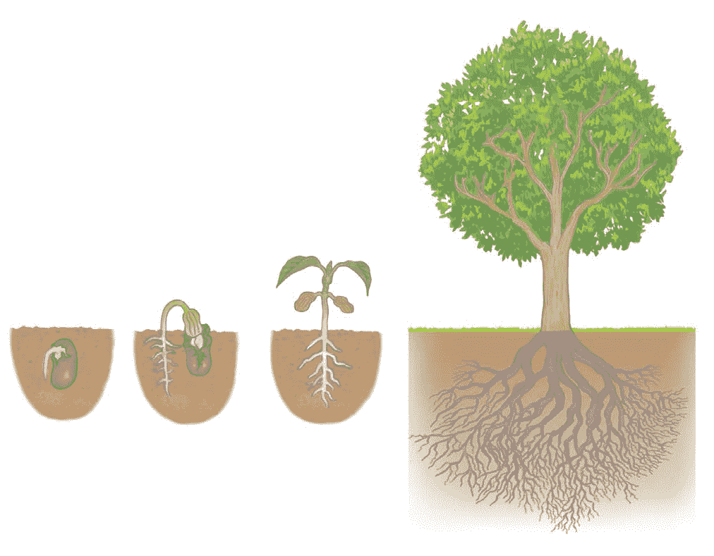

脾土也有同样的特质。

人从一个长约 50cm 左右的小婴儿，逐渐长成 160〜170cm 以上的成人，除了需要充足的营养之外，还需要一股向上生长的力量来支持，就像植物一样。

脾胃为气血生化之源，除了提供人体成长所需的养分之外，脾还提供一股让人向上生长的生命力量，中医称为「升清」功能。

人体是一个五谷杂粮聚会场，就像超级市场一样存放着许多的物品。超市陈列可以贩售的东西，而将无用的东西丢出去，有进有出，才能维持销售的流畅并减低库存的压力。人体也是一样，透过「升清降浊」的机制来维持身体的平衡。

有用的物质称为「清」，清者会向上输送到肺等，再输布到全身。无用的物质称为「浊」，浊者会向下输送到膀胱等，再排出体外。在卷二胃经篇介绍过「升清降浊」的机制主要由脾胃承担，脾尤为重要。

中医与天地循环概念是一致的。自然界中，地上的水气上升到天空，变化为云，再下降为雨，落到大地，形成天地之间的循环。脾属于土，依据自然界的道理，它的气机要向上提升。「升清」是脾将清气向上输送到身体高处，有升就有降，人体的气机才能下降。升降之间，气机生生不息，人体才有生机。

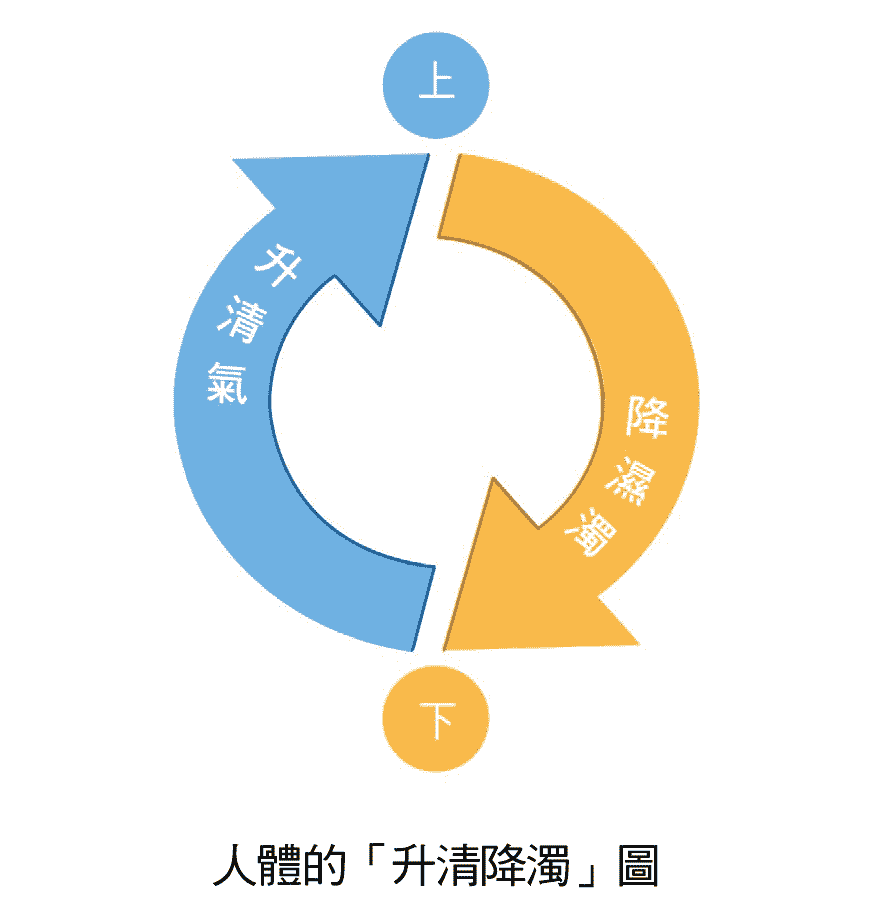

由于脾的升提功能需与地心引力向下拉扯的力量抗衡，聪明的脾就发展出两种对策：

一是脾脏本身的运化功能，以《易经》的「天行健，君子以自强不息」精神，持续不断地运行，勤能补拙，让气机维持在「稳定而不下坠」的情况，这就类似骑脚踏车，只要持续转动轮胎，车子就能保持平衡，不会倒下来。

二是脾经经络系统架构出一个向上稳固的立体结构，我称为「篓子」，以实质结构提供坚强的支撑力，这就类似健身脚踏车，被安置在一个固定的结构中，完全不会有倾倒的危险。脾经的「篓子」不仅强化脾向上输送清气的力量，还能协助五脏六腑和各种组织对抗地心引力不会下坠，维持各个脏器位置的恒定，才能发挥其功能。同时也将血液固摄在经脉里流动，不会轻易出血，中医称为「统血」功能。（脾的降浊功能后面会介绍）

脾所独有向上升提的力量与结构是如此难能可贵，也因此脾才承担得起「升清」的重任。

4\. 脾脏主「祛湿」对应大地的「承担」

#### 脾脏主「祛湿」对应大地的「承担」

《内经》说：「诸湿肿满，皆属于脾」，脾的降浊功能主要呈现在处理痰湿方面。人吃进来的食物都含有水份，经过消化吸收之后，无用的水份理论上应该排出体外，如果未能及时排出而停滞体内就会产生问题。

中医将这些水液代谢障碍所形成的病理产物，称为痰、饮、水、湿等。差别在于黏稠度，「湿聚为水，积水成饮，饮凝成痰」，最稠浊者为痰，清稀者为饮，更清者为水，湿比较是瀰漫性的，类似气态。

以生活经验来举例：例如梅雨季节会觉得房子湿气很重，但其实我们看不到湿气，除非墙面出现霉点。或者一些上班族到了下午就会觉得小腿好像水肿一样，变胖又沉重。还有许多老人家早上起床，一直在咳喉咙里的老痰；年轻人感冒后，鼻涕倒流，咳嗽，喉咙也是塞了一堆痰。饮则跟满街贩卖的「饮料」类似。您看，痰、饮、水、湿这四样东西，是不是一直出现在日常生活中？

痰、饮、水、湿四者可以相互转化，也可以互相结合，所以就有「痰饮」、「痰湿」、「水湿」等名词，中医将它们统称为「湿邪」或「湿气」，又因为是水液代谢失常的病理产物，所以又称为「湿浊」。既然称为湿浊，就一定会向下输送，排出体外，中医称为「降湿浊」，与前面的「升清气」相对照，形成由脾主导的「升清降浊」运动。

前面提到天上的云下降为雨，大地就承担这些水湿之气，与脾主祛湿的功能一致。脾对应大地承担的特质，也如《周易》所述「地势坤，君子以厚德载物」。

湿邪是有形的物质，所停滞的部位都会产生肿胀、沉重、满闷的感觉，所以《内经》才说「肿满」皆属于脾。

脾主湿，专长祛湿气，同时也很讨厌湿气，因为过度湿气会让气机黏滞，雨天常让人心情感到忧郁，湿气上身也一样会让身体与心理都变得沉滞郁闷。所以只要是湿邪所引起的症状，都可藉由脾的运化功能来处理，若加上脾的升清功能，就能让身心轻盈干爽起来。

在脾主肌肉一节中，曾介绍「肉痿」症状，《内经》指出病因除了脾气热之外，湿气也会影响：「有渐于湿，以水为事，若有所留，居处相湿，肌肉濡渍，痹而不仁，发为肉痿。故《下经》曰：肉痿者，得之湿地也。」不同于脾气热是内贼「监守自盗」，湿气是外贼，主要来自外在环境，例如工作需要一直接触水，或是住处过于潮湿，时间长了，湿气侵入体内，还停留在体内，水湿过盛，反过来克土，抑制脾祛湿的功能，就像豪大雨水淹没抽水机一样，导致湿邪在体内流窜，浸润肌肉，阻碍气血循环，而出现麻木不仁的现象。湿气常在无防备心之下，不知不觉入侵人体，等到惊觉身体出现异状时，湿气已经瀰漫体内，治疗颇为耗时。

我到花东以后，发现有些民众居住环境比较潮湿，病人出现许多因湿气而来的疾病，反覆难愈。此时就必须内外兼治，才能奏效。除了在诊间治疗体内的湿气，另方面则努力鼓吹病人使用除湿机，排除环境的湿气。一段时间后，病人开始反馈使用除湿机让家中变得干爽，一些疾病如鼻子过敏、肢体痠痛等都有改善。我听了也很欣慰。

综合前面所述，脾与肺一样，参与人体气、血、水的生成与代谢，并与消化、生殖、泌尿系统都有关联。脾主「运化」，是所有功能的核心：唯有健运，才能升清，才能统血及祛湿；透过转化，才能生成血液。

脾的这些功能，也充分反映出脾母「外刚内柔」的特质，如同一位明理的母亲，作为上也应有这些特色：

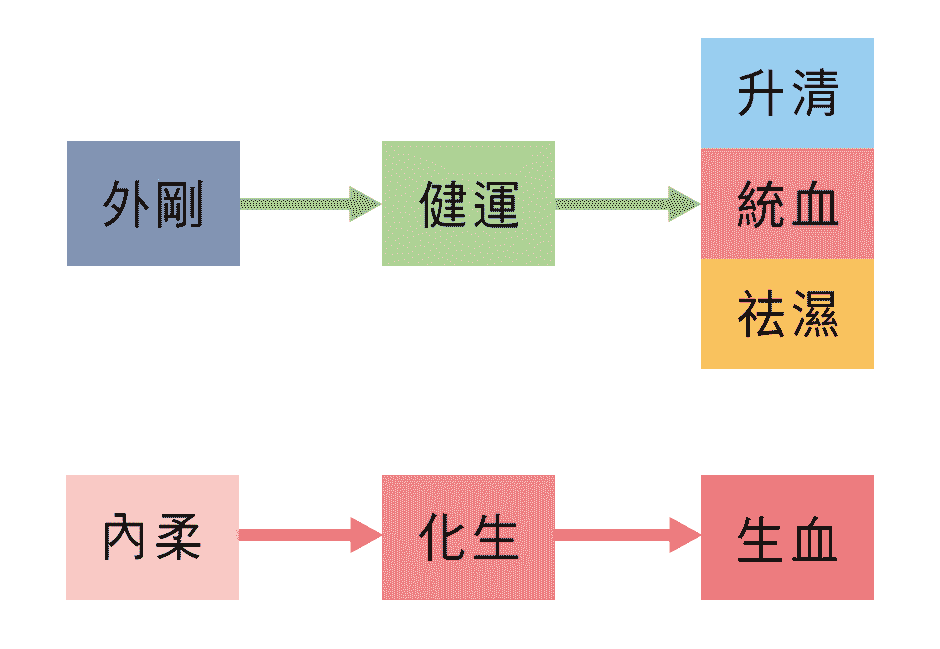

「健运」勤勉操持家务，提供舒适的居住环境，让家人身心舒爽。

「升清」提供孩子一个正向、力争上游的力量。

「统血」守护孩子走在人生的正道上。

「祛湿」不要溺爱孩子，引导孩子抗拒外在诱惑，不要耽溺在负面的事物上。

「生血」提供孩子所需的养育及教育资粮。

脾母跟许多有智慧有远见的母亲一样，都是正向的支持力量，不离不弃，哺养呵护，无微不至的照拂，所以一定要好好照顾脾母，脾母也才有能力照顾我们。一旦脾土受伤，不能制水，湿邪反过来会困住脾土，导致运化功能失常，就象是失去原则，只知溺爱孩子的母亲，不仅让孩子沉沦，也让自己的身心失衡。

 中医师不传之祕：好脾气就有好人缘

外刚内柔的脾脏，虽然经络循行上只与胃和心相连，但因为脾在人体的关键性地位及善于运化的「好脾气」，让它得以与其他脏腑建立良好的合作关系。如下图。

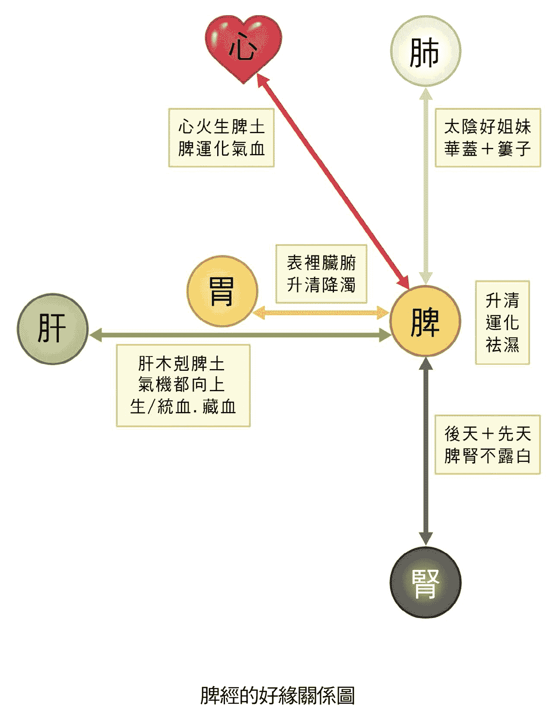

脾与心的关系

五行关系上，心火可以生脾土；在经脉循行上，脾经最后流注到心。心与脾两者一来一往，属于「闺蜜关系」，常会互相吐露心事。脾的幸福一箩筐，当然也会跟心分享，让幸福满溢到心田，一路畅快到心坎里。

但好朋友有时也会互相连累，如果脾生病不能化生血液，也会连累心，出现心脾两虚的情况（经脉篇中会介绍）。而俗语中的「心事重重」也与心、脾有关，「心事」对心，「重重」对脾，因为脾主湿，湿气不除就易出现沉重感。从心脾关系看出心理与身体的相互影响，真的让人惊叹中医的发现吧！

许多人结婚后经常出现「幸福胖」，也是「心宽体胖」的结果。因为幸福感让人心情愉悦，食欲也会大增，由心影响脾，脾的运化功能也会变好，脾主肌肉，营养吸收充足就会有心宽体胖的现象。

一般人认为爱的力量来自于心，但从中医的角度来看，爱的源头其实来自于脾。除了脾所具备的母性特质之外，脾经流注入心，心经是脾经的下一条经络，脾运化功能正常，就能将最充足的养分输送给心脏（身体层面）；而脾的升清降浊功能正常，也会让心神（心理层面）充满正向的能量。健康的心脏与正向的心神，才能涌现爱的力量，所以说脾是爱的能量来源，心是爱的行为表现。

脾与肝的关系

脾与肝比较像室友关系，因为两条经络起始点都是足大拇趾，也类似同侪关系，因为肝经与脾经都经过胸胁部，两经的穴位有交会，气机也都向上，与消化、泌尿、生殖有关，两者能力相当，互有竞争心。所以脾与肝相辅相成，脾主运化，以生血、统血为主；肝则主藏血，人卧则血归于肝。

在五行之中，脾属土，肝属木，脾土提供肝木生长的环境，肝木同时也可为脾土疏通气机，例如豪迈的肝气可以帮容易钻牛角尖的脾一解郁结之苦。

但在五行相克关系上，肝木也制约着脾土，由于脾的修养不错，个性温和，对于有着将军般暴烈个性的肝，脾较为忍让。但是如果过度操烦劳累，导致肝气偏旺，就会克到脾土，不仅影响食欲和消化机能，也会让脾开始胡思乱想，产生思虑过度而有情绪低落的情况。这种情绪上的连锁反应，就容易使得肝脾的气机同时郁滞在胸胁部，而让人出现紧绷胀满、气短疼痛的现象，这类症状常见于现代忙碌、压力颇大的都会人。

中医早就了解这个道理，在《金匮要略》提醒「夫治未病者，见肝之病，知肝传脾，当先实脾。」意思是善于预防医学的医师，见到肝病患者，知道肝会影响脾，此时先不要急着治肝，反而要赶紧顾好脾，以防被肝连累，先阻断肝病传变的后路，再专心治疗肝病。这很像古时候作战时，聪明的将领都会避免直接冲突，先斩断敌方逃走的后路，再一举擒贼，如此一来，我方损伤小，敌方无路可逃，可谓事半功倍。医道与人世智慧是一致的。

脾与肺的关系

脾与肺是手足同名经，都属于太阴经，是为「太阴姊妹」，关系超亲密，常常一起完成任务。

例如脾位于中焦（腹腔），它的升清降浊功能，可以帮助肺的宣发肃降功能。其次，胃所吸收的水谷精微也都由脾向上运送到肺，再由肺敷布至全身。所以脾肺的合作关系是脾做里面的工作，而将面子给了光鲜的肺。

肺为华盖，自上向下保护人体；脾经则象是个立体的篓子结构，自下而上托住人体。肺与脾上下相扣，宛如慈济的环保碗，共同包覆体腔，提供人体周全的防护（相关内容会在四大系统介绍）。

在《经络解密．卷一》的经络启航总论中，我曾经将十二经络分为三大团队，肺经是「备餐团队」的首发经络，旺于寅时 03-05 点，尔后历经大肠经、胃经阶段，最后备餐团队是由脾经来压轴，旺于巳时 09-11 点。这时已经接近午餐时间，要为下一组「用餐团队」守住营养关口，供给重要的心脏来运用，绝不能有任何闪失。所以，肺与脾所形成的环保碗概念就格外有意义。

脾与肾的关系

脾与肾的经络关系很神秘，因为在脾经系统完全看不到与肾的关系，反而要从肾经系统才会看到，肾经经筋在下肢与脾经并行至阴器。肾经经脉通过四脏，就是没注明经过脾脏。奇怪吧！这让人不禁疑惑：明明两者在脏腑功能有非常密切的关系，为何到了经脉系统却绝口不提？

相信大家都听过「财不露白」吧，身体也深知此理，因此也学会了「脾肾不露白」。

首先，肾经经脉循行走在人体的阳面（背部）和阴面（正面），躯干的经筋主要包覆阳面。阴面是重要器官所在，则由脾经经筋来包覆体腔，当然也将肾经这两条路线一起包覆进来，建立起脾肾之间的秘密通道。由于肾五色属黑色，所以我称之为「暗行夜路」。

其次，从身体最珍贵的气血来看，脾负责转化运输，肾负责收藏，气血对于人体的重要性就如生活中的金钱一样，总不能在光天化日之下，让别人看到自己身上有多少钱，容易让人起盗心，脾肾也是如此小心翼翼保护着人体珍贵的气血。

另外，脾与肾之间还有种「暗钱」或「私房钱」的概念。意思是身体有 100% 气血制造出来，思虑周密的脾不会全部送到全身组织器官使用，就像妈妈一样，总会留一手私房钱，以防不时之需，脾当然也懂得暗留一些气血，透过暗行夜路，偷偷送给肾去收藏，以备日后可用。这种事当然只能偷偷做，不能说明白囉，所以就形成「脾肾不露白」的情况。

脾与肾的脏腑关系简单明朗。脾胃为后天之本，肾为先天之本，两者有着互相转化、相辅相成的关系。肾象是承袭自先人的祖产或是定期存款，我常喻为「阿嬷的存款」，平时不会动用；脾胃则靠自己的能力白手起家，类似受薪阶级，有份活期存款，用来支付日常生活所需。

如果薪水有盈余，就会将现金从活存转到定存，在人体的意义就是脾胃将多余的气血送到肾转化成肾精储存。如果要买房子，需要大笔现金，就会从定存转部分现金到活存，在人体的意义就是当脾胃功能失常，体内气血严重不足时，肾就会将肾精转化成气血以供身体使用。

这也就是中医常说「久病及肾」的原因之一。当身体的脏腑器官久病之后，会持续消耗体内的气血，就像孙子因病长期无法工作，不仅没有收入，还会将活存花光，这时只好跟阿嬷伸手要钱，时间久了，只出不入，肾的「阿嬷存款」慢慢被消蚀殆尽，肾功能当然也就开始出现问题。

脾与胃的关系

脾与胃的关系是最麻吉，相对于胃经这个高富帅的型男主厨，脾经比较阴柔且成熟，两者是阴阳调和、刚柔并济的好组合。

之前提过，脾与胃密切配合，专门负责食物的消化、吸收与营养输送，转化成气与血，所以是后天之本，气血生化之源。

脾开窍在口唇这个食物必经的部位，脾经循行到舌头及咽喉，具有搅拌食物，协助吞咽的功能。当我们进食的时候，口唇与食物最早相遇，也最早掌握食物的滋味，如酸苦甘辛咸等，会将这些讯息传送给脾以启动食欲。

胃接纳食物，负责食物实际的消化吸收过程，脾再将胃所吸收的营养物质运送到心肺，转化成气血，就是前面所说的「运化」功能。

另外，在胃经也介绍过「御膳房之路」──保证心脏这位君主之官可以得到最安全且最营养的食物，脾经也有一条这样的特殊通道，由胃穿过横膈，直接送到心中，以确保安全送达。

胃主受纳腐熟水榖，但需要脾代为输送精微物质到全身。如果脾无法代胃输送精微物质，就会出现有食欲但却吃不下的情况，时间久了，就会出现四肢不用的严重后果。

所以脾与胃密切合作才是健康之本，因此古人才会强调「脾胃为后天之本」。

至于要深入了解脾与胃的功能如何互助互补，就一定得认识人体气机的上／下与清／浊的功能。

脾胃的上与下特色：脾上行，胃下行

脾与胃位在人体五脏六腑的中间部位，是人体气血上下流动的枢纽。

脾与胃在气血流动方向的分工，就像高铁站分为南下月台及北上月台一样，旅客依据目的地而分流。同理，脾象是上行月台，向上输送物资给位在胸部的心肺；胃象是下行月台，向下输送物资给位在腹部的肠道与肾、膀胱。脾上行，胃下行，这样人体的物质才能顺畅交流。

脾胃维持人体气血上下枢纽的畅通作用，对于人体的阴阳气血平衡是很重要的。如果脾误下行，胃误上行，人体的气血逆乱就会现许多病症。这些疾病将出现在脾经经脉的病候中。

脾胃的清与浊特色：脾升清，胃降浊

由于脾与胃在消化过程中所扮演的角色不同，所输送的物质属性也不一样。胃将已经完全消化吸收的精微物质，透过脾，运送到心肺，转化成气血，而将半消化的食物输送到小肠、大肠、肾、膀胱等做后续的吸收及代谢处理。

清与浊是相对的概念，脾运送的是已经完全消化吸收的精微物质，相对于胃所输送的是处理半消化的食物，精微物质属性为「清」，半消化食物属性为「浊」。

为了身体健康，属于「清」的物质宜向上运送，属于「浊」的物质宜向下输送，中医称这两样物质的输送为「升清」及「降浊」。这就是中医所强调「胃宜降则和，脾宜升则健」的道理。

但若升清及降浊出现异常，导致该升的不升，该降的不降，就会产生许多疾病。诚如《内经》说：「清气在下，则生飧泄；浊气在上，则生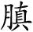胀。此阴阳反作，病之逆从也。」意思是本来应该在人体上面的清气，反而陷在下面，就会出现夹杂着未消化食物的腹泻；反之，本来应该在人体下面的浊气，反而塞在上面，就会出现肚子胀痛、消化不良的状况，临床上还会见到恶心、呕吐。这都是因为气机的清浊倒置，才会百病丛生，严重影响身体健康。所以，护好脾胃才有好未来。

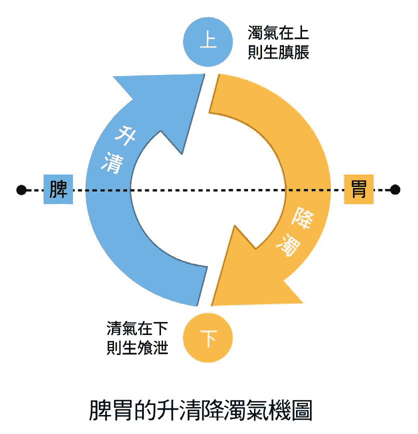

脾经经脉系统的特色

## 脾经经脉系统的特色

脾经四大系统中最有特色的是经脉和经筋。下页的左图是脾经经脉（黑色线）和经筋系统（蓝色色块）在胸腹部共同连结成的立体结构，对照右图中央，圆弧向上图案，我称之为「篓子」或「箩筐」。

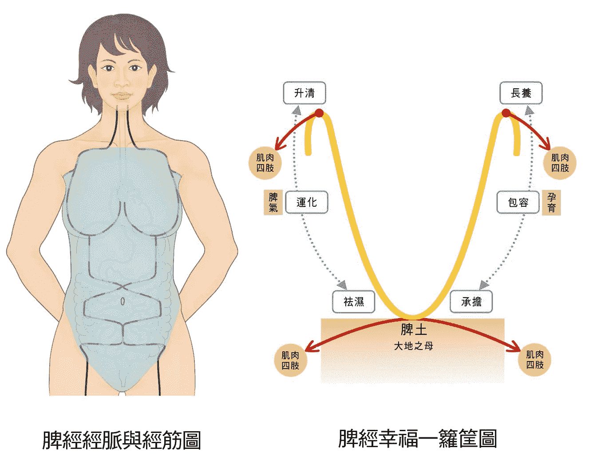

有了这个由下而上撑起的篓子，脾的升清功能才有所支撑，也就是说，这个篓子为脾主升清提供了结构基础。

请再看看这个篓子，是不是有点像妈妈的拥抱？

我每次看到脾经的感觉，总是这么联想，感谢老天赐给我们如此周全的身体，让我们离开母体独立在人世间生活时，依旧有着被母亲疼惜与呵护般的温馨，而且持续一辈子。

以下是脾经四大系统经络图及捷运图（详述于下一篇章）：

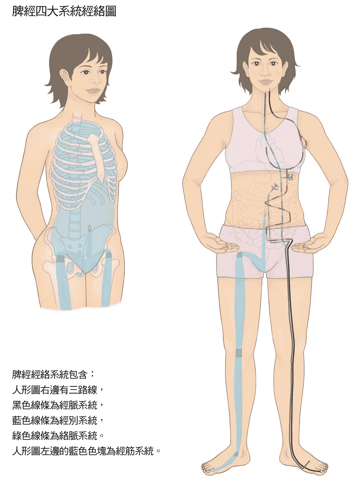

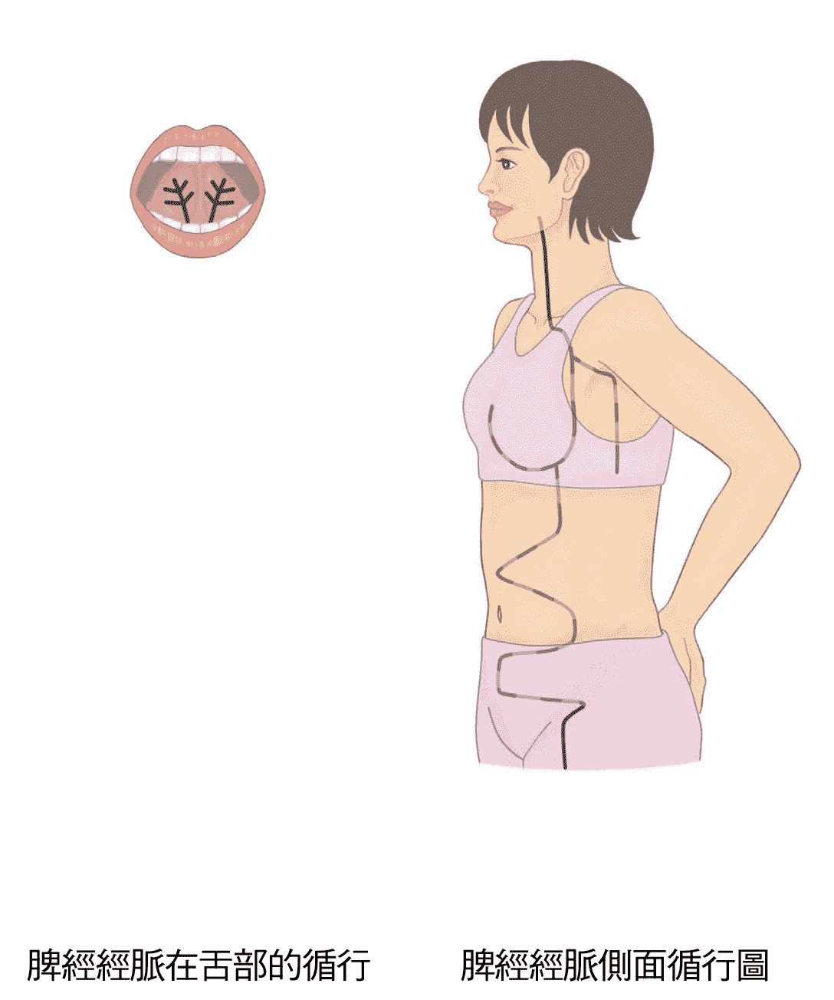

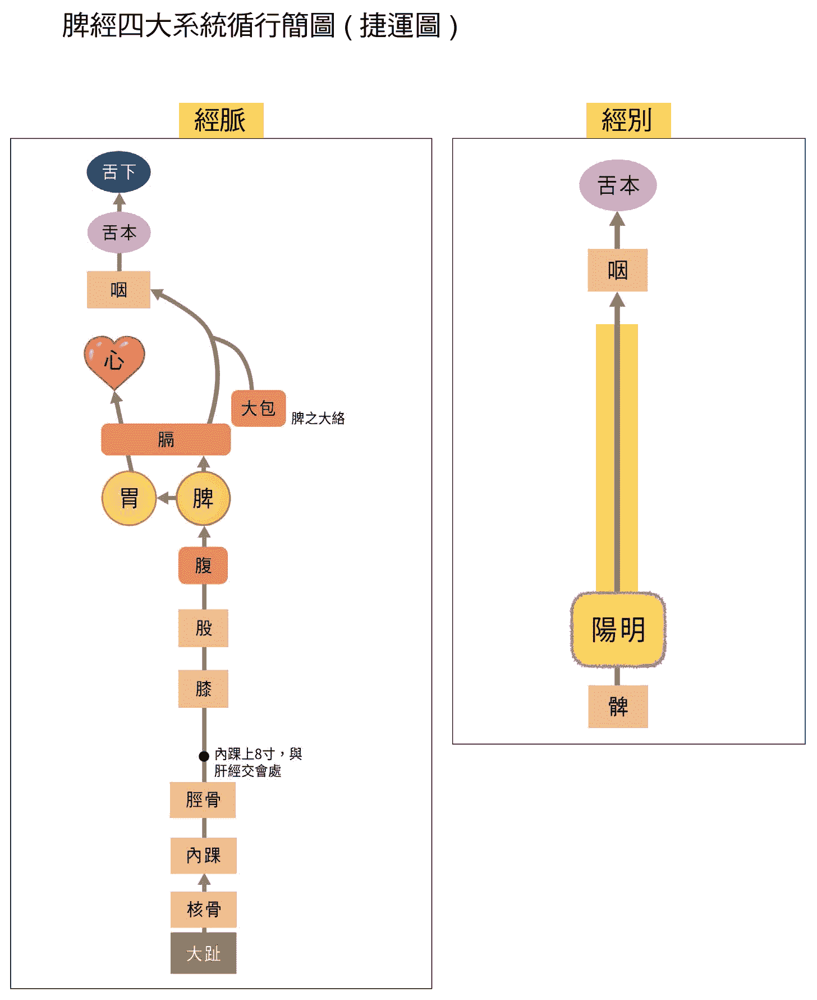

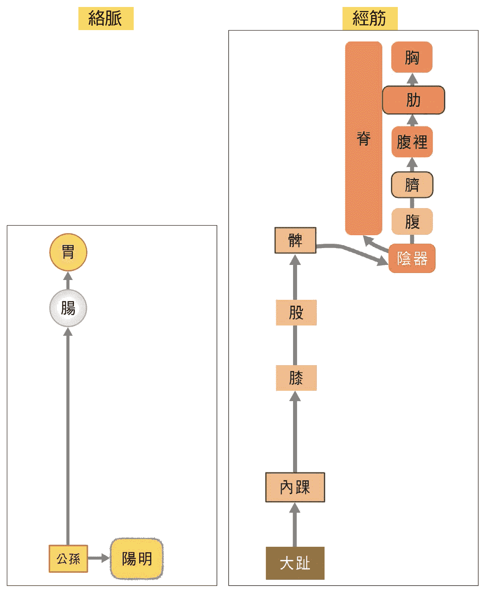

脾的幸福感，就是爱的力量

## 脾的幸福感，就是爱的力量

见证到脾母的努力，我相信每个人都值得被疼惜，成为永远的「妈宝」，因为每个人身体里都蕴藏着幸福的因子，也都有一个生命安全网。

再看一眼「脾经幸福一箩筐图」，我们在背景加上了橙黄大地，温馨小屋，还有蔚蓝天空的底色，下页这个乡村风格的家园图是否带给你满满的幸福感？

当你洋溢着幸福感，身心灵都得到安顿与提升，这就是脾所专有的【幸福家甜滋味】。

脾经的世界够精彩幸福吧！脾从土地而生且升，不甘耽溺，不甘下流，健运化生，时时刻刻守护着家园。所以能生活在天地之间，时时都被天地呵护着，是多么难得的因缘，请大家务必珍爱自己！因为你值得！

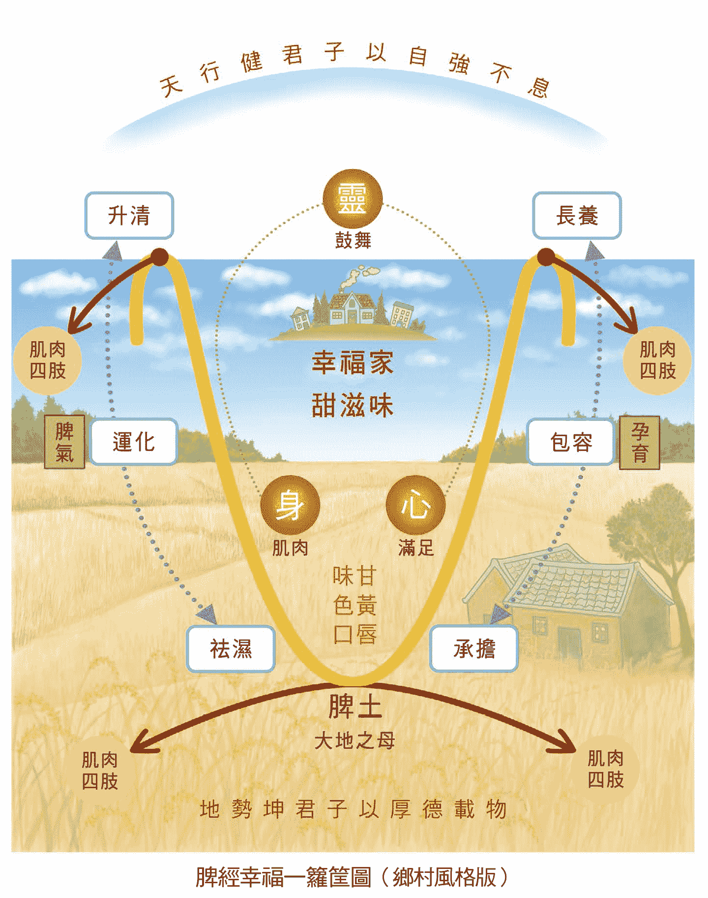

* * *

天下父母心～植物妈妈也有她的想望

#### 天下父母心∼植物妈妈也有她的想望

母性不仅存在人类社会，连植物也有令人感动的母爱故事。

2016 年春末夏初前往绿岛义诊，好朋友特别推荐我们去拜访过去曾在绿岛任教、现已退休的林登荣老师。林老师长久以来有系统的记录绿岛当地文史典故和自然生态，透过他的引导介绍，得以认识植物妈妈原来也有脾母性格，让我们听得啧啧称奇，浑然忘我。因此特别拜托林老师亲笔写下［植物妈妈的想望］与读者分享：

生物，无论是动物或植物，其生命历程最主要的活动无非是在生存环境中─与土地、气候、动物、植物、同侪……等交互作用，相互竞合之中，寻求个体的生存和种群的繁衍。物种在长期的生存竞争中，随着环境的变迁，也得不断的修整和提升生存与繁衍机制，否则在物竞天择的因果轮回当中，势必灰飞湮灭，消失于生物竞存的世界舞台。是以，与我们共同存在于世界上的每个物种，无论是花草树木、飞禽走兽，必有其特别的生存之道，繁衍之方，都值得所谓万物之灵的人类虔敬以待的。

在我们左邻右舍中，许多父母让孩子自小补习外语，累积金钱，希望孩子放洋留学，以取得更多的资源，获致更好的生活环境。细细观察，植物社会里，希望孩子飘洋过海，以取得更大开枝散叶空间的植物爸妈们也自不少，其所费的心思可不比人类少。

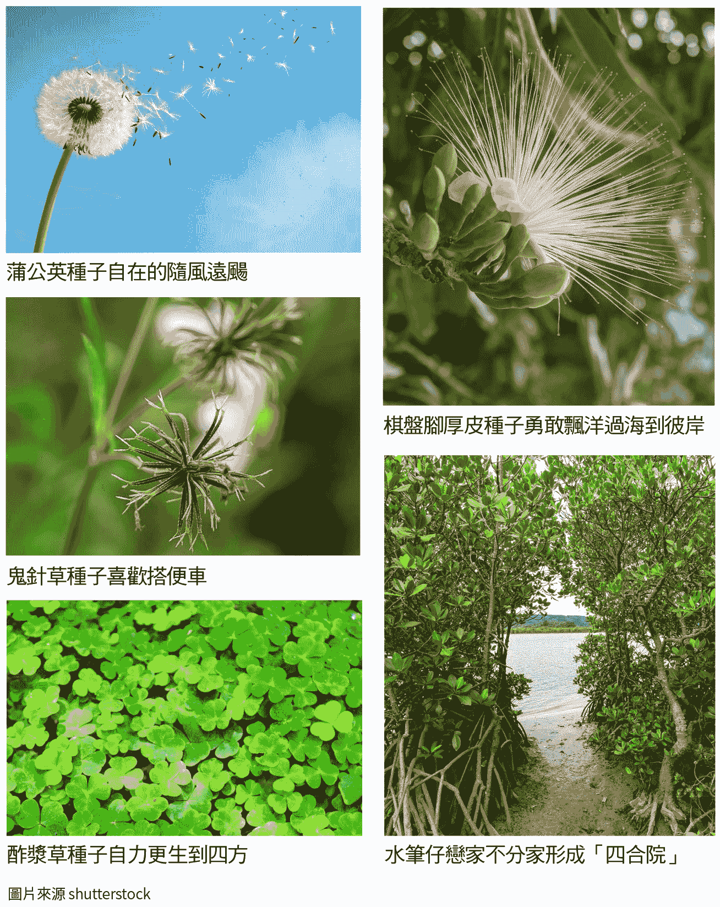

譬如我们常见的蒲公英，瘦果顶上长出轻柔的冠毛，当种子成熟了，蒲公英妈妈就放手让孩子海阔天空，随风远颺；当然，有些植物妈妈会有些不同的思维和策略，桃、李、榕果等，准备了甜美可口的果实，当种子成熟了，就将果子渲染得或亮紫、或橙黄、或艷红，向动物们宣示，请带领我的孩子们到远方吧，甜美的果实是给您的谢礼。而住在海边的椰子树、棋盘脚妈妈为种子外层裹上厚厚的纤维，让孩子可以漂浮水面，托请洋流顺路将孩子飘洋过海带往彼岸。霸气的鬼针草、蒺藜草和羊带来，则果实生具钩刺，不管路过的动物愿不愿意，都得为他们将种子带到远方；而温和纯朴的酢浆草和凤仙花却选择用自己的力量将种子洒向四方。

当然，不是每个父母都愿意孩子离乡背井闯天下的，许多农村父母觉得外面的世界太过诡谲复杂，还是，留在身边安稳放心，于是，在自己原来住的正房之外，又增建了厢房，再加建了耳房……三代同堂，一家人就一起住在四合院里，年代久了，有些地方还形成了纯姓村落呢。生长在河海交会处泥滩地的水笔仔，生存环境相对特殊，果实成熟后并不实时离开妈妈，种子向下伸出细长的笔状胚茎，待发育成熟，再脱离妈妈，堕下，插入亲人身旁的泥滩地里逐渐长大，于是水笔仔群落年复一年慢慢扩大，于是形成红树林。这红树林不就是人类四合院的概念吗?

* * *

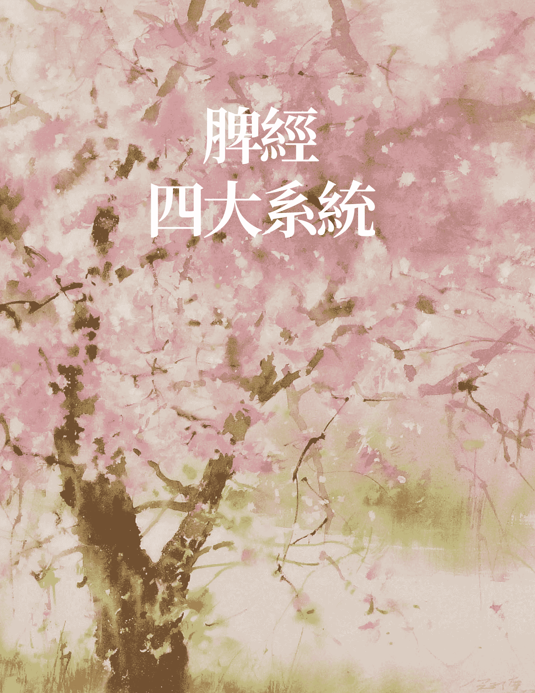

# 脾经四大系统

一、脾足太阴之脉（经脉）

## 一、脾足太阴之脉（经脉）

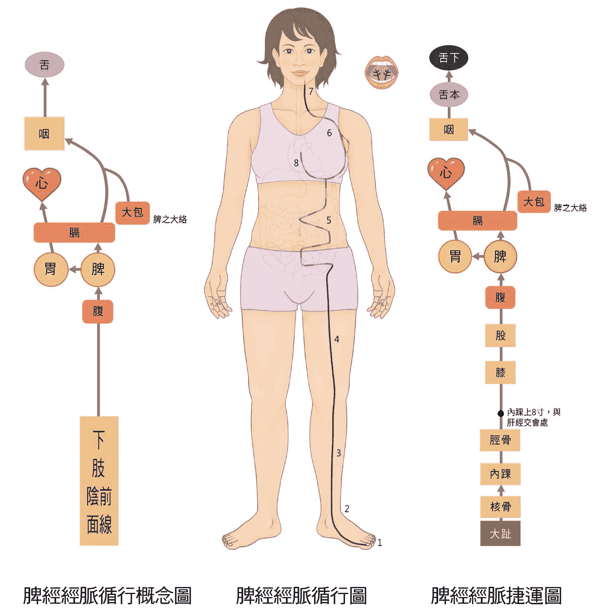

足太阴脾经──循行特色

### 足太阴脾经─循行特色

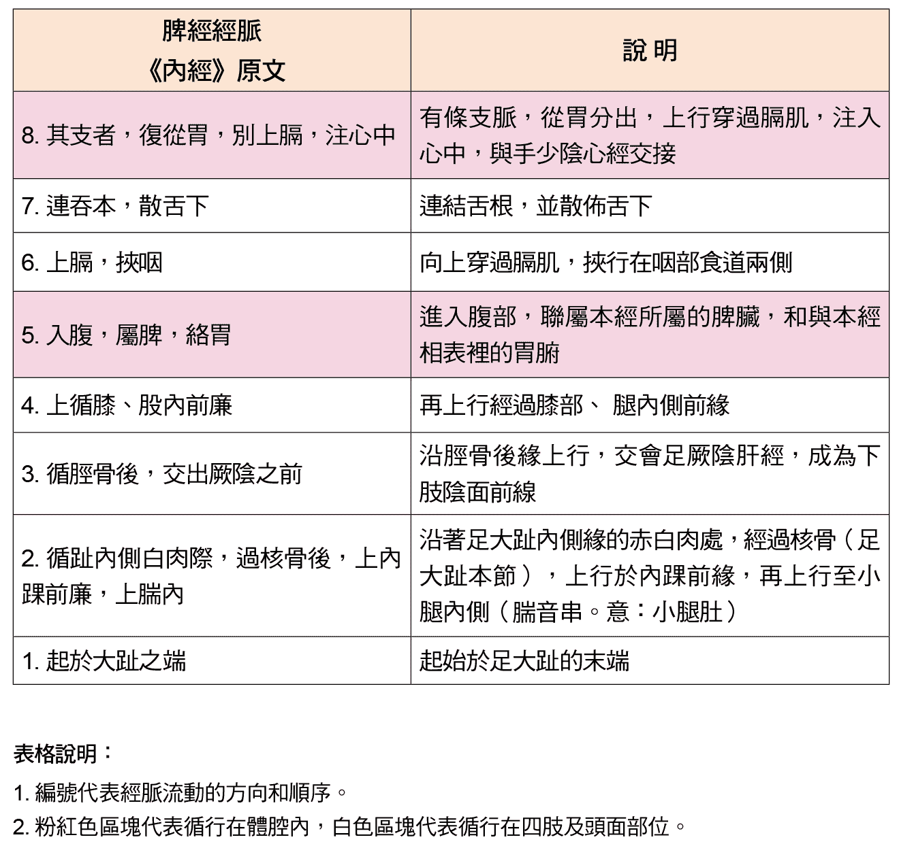

脾经在阴阳经分类上属于阴经，相对于足阳明胃经的复杂循行路线，脾经经脉较为简单。因为阳经主要分布在人体较浅层处，肩负护卫之职，所以循行路线繁多且绵密；阴经主要分布在人体较为深层处，照护滋养所属的五脏六腑，所以循行在内部体腔为主，路线较为精简，但是更为重要。

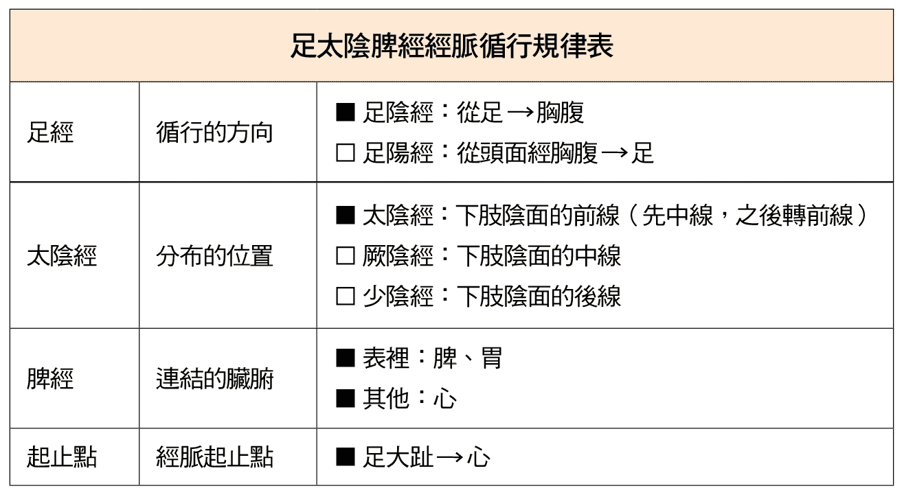

足太阴脾经主要分布在身体的阴面前线，从脚分布到头。循行路线可分为路线 1-4 的下肢部，路线 5&8 的胸腹部，和路线 6-7 的头面部三部分。

脾经经脉循行的秘密，隐藏在前面讨论过的脾脏特色、经脉循行路线与经脉病候中。以下先介绍脾经循行的特色。

脾经经脉循行分为三部分：

下肢部：从足大趾到大腿内侧。脾经始于大趾头的内侧，向上走到小腿约 2/3 高处（八寸），原来走在下肢内侧前线的肝经「交出太阴之后」，肝经主动移到中线，使得脾经从中线变为前线。（路线 1-4）

胸腹部：连结脾脏和相表里的胃腑，还加上心，让胃除了透过胃经经别的「御膳房之路」外，还能经由脾经再度与心脏相连。这就符合我们一直强调的「越重要的部位及传输路线，就有越多经络通过」，以确保气血可安全输送，使命必达！（路线 5&8）

头面部：脾经用最简捷的路线连结咽喉与舌头。（路线 6-7）

脾经将足大趾及下肢内侧、脾胃心三个脏腑，与咽、舌相连，形成一个简短的循行路线，却深深影响人体气、血、水三种重要物质的生成、运输与代谢功能。

脾经经脉在身体三个部位的循行都很有特色，也肩负维持生命的重责大任。本书中也会依其各自的功能和特色，分别加以命名为下肢部的「脏腑好缘区」、胸腹部的「慈母心胃区」、头面部的「夹咽舌本区」，如下页图所示，希望让读者与有心学习中医者，更容易归纳记忆。

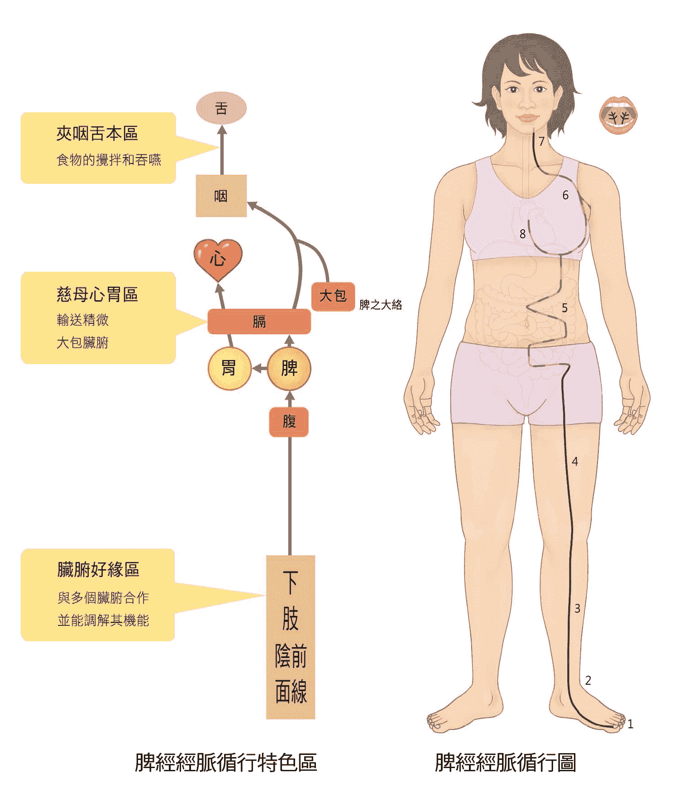

脾经是条充满生机及人生希望的金色大道

脾经经脉从大腿内侧经腹股沟到丹田，再以内外相偕方式包夹乳房，最后到舌部，这是一条对于肤触非常敏感，能挑起情欲的「性感带」路线。同时，脾经「大包」的特性，能给予胸腹腔内所有的脏腑器官向上升清的力量，脾主色为黄色，尤其类似稻穗成熟的金色，所以也是一条充满生机以及人生希望的路线。

脾经循行特色一： 下肢部──脏腑好缘区

#### 脾经循行特色一：下肢部─脏腑好缘区

胃经经脉循行最后在足大趾头内侧末端交接给脾经，脾经经脉就沿着足大趾内侧缘的赤白肉处，经过内踝前缘，向上走在小腿胫骨的后缘，并在内踝上八寸的位置与肝经经脉交叉，从小腿阴面中线变成前线，再上行通过膝部，抵达大腿内侧（阴面）前缘。（路线 1-4）

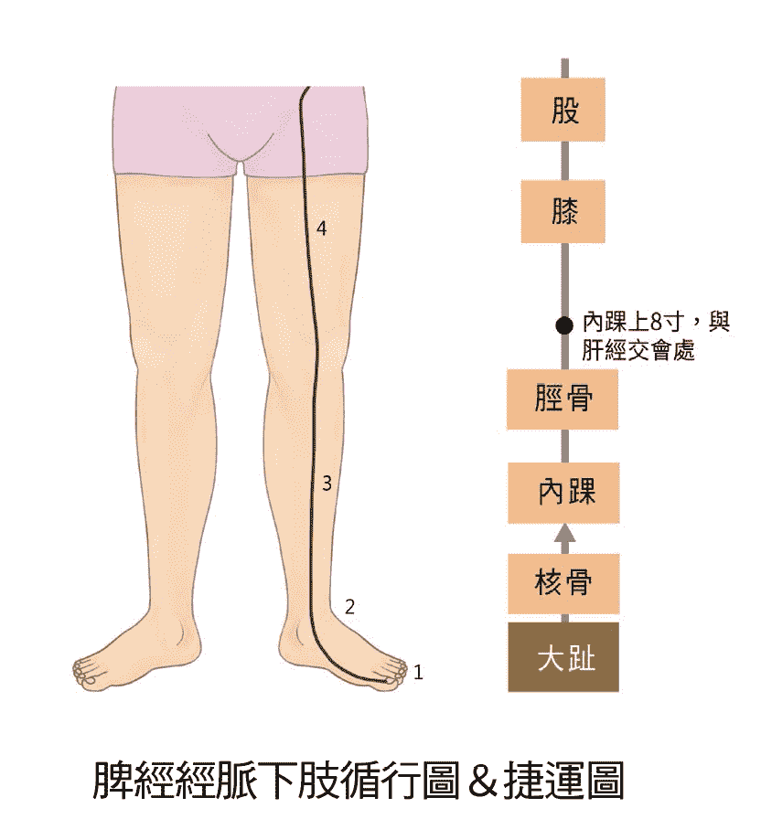

脾经从足大趾到大腿阴面的循行部位与总论中「脾经的好缘关系图」关系密切，这些部位与脾经的好缘脏腑之间具有相辅相成的作用，所以我称此部位为「脏腑好缘区」，也是脾经经脉的精华区。解密如下：

♼ 解密：脾经脏腑好缘区的广大功用

#### 脾经脏腑好缘区的广大功用

首先介绍好缘关系图中脏腑与脾脏之间的功能配搭。如下图。

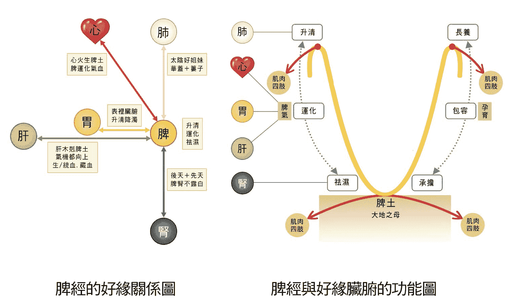

● 肺主气机的宣发，与脾的升清功能相互配合，向上提升人体的气机。

● 心主神志及血脉，胃主和降，肝主气机向上条达，都与脾的运化功能有关。

● 肾五行属水，主管水液的所有事宜，是水的主管；脾五行属土，以土制水的特性来祛湿，加上肺为水之上源，肺脾肾三脏共同管理体内的水液代谢。

经由脏腑间的连动关系，这些脏腑与脾经形成了右侧的「脾经与好缘脏腑的功能图」。从图中可以看出，脾功能正常就有助于这些好缘脏腑维持其功能，脾功能失调也会累及这些脏腑。反之，好缘脏腑功能异常也会影响脾的能力。这其实就是中医的整体观，没有任何一个脏腑或器官是独立运作的，彼此之间都是环环相扣，牵一发而动全身，须互相协助，以共同达成任务。

为了让读者掌握脾经的循行路线与脏腑连结的关系，再将脾经下肢部位与好缘脏腑整理成为「脾经脏腑好缘区对照图」，并于脾经经脉下肢循行图加上穴位放在右侧，穴位色块与相关脏腑相对应。然后依据脾经经脉循行，由下而上的顺序来介绍这些脾经部位与脏腑的关系。

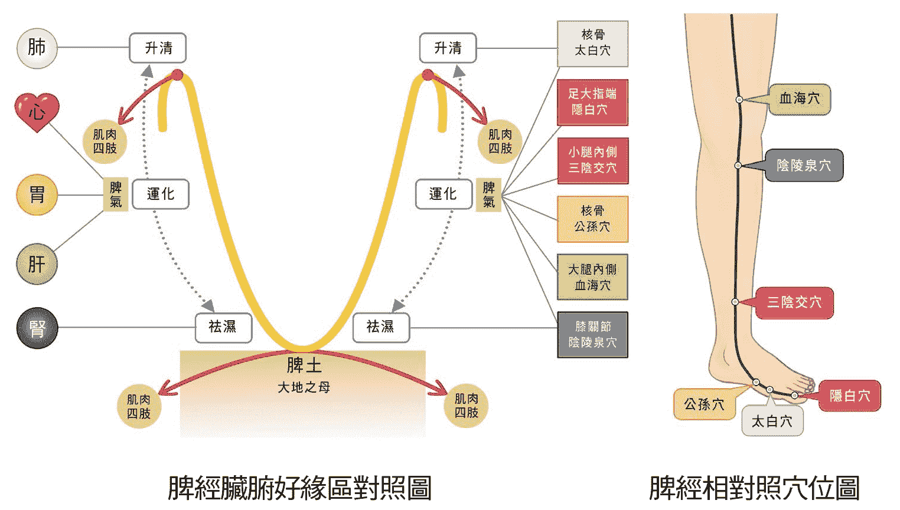

● 大趾端：大趾头末梢，代表穴为隐白穴。

脾主统血，心主神志，本部位既能止血还能安神。

● 核骨到内踝前廉之前：脚板内侧弯曲的弧形部位，通称「足弓」，代表穴为太白穴及公孙穴。

它是脾脏运化功能的主要对应区，可视为「脾脏功能」的指挥中心，也是脾经最精华的部位。

脾属土，因此本区的土性最强，不仅能健运脾气，发挥升清及祛湿之职，有助于脾主肌肉和四肢的能力，还能照顾妇科及生育机能，更是调和脾、胃、肠道功能最强的部位。

● 腨内：小腿位在胫骨后缘的部位，代表穴为三阴交穴。

脾胃为气血生化之源，心主血脉，肝主藏血，都与血液有关，此部位是脾生化血液的重要区域，也是妇科的重点区之一。

● 膝内前廉：小腿阴面前线部位，代表穴为阴陵泉穴。

脾属土能制水，肾属水主管水，本区不仅是脾自己的制水功能区，还能辅佐肾主水的功能，协助脾肾共同祛湿利水，来处理水湿夹着气机上逆的情况。本区善于调节脾经经络系统循行部位的病变，因此可视为「脾经系统」的指挥中心。

● 股内前廉：大腿阴面前线部位，代表穴为血海穴。

脾的「化血」功能可以产生新的血液，脾的「统血」功能主要控制血液维持在血管内移动，不会轻易溢出血管之外，变成出血，中医称为「离经之血」。身体若不能及时将离经之血排除，持续停留在体内就会变成「瘀血」。我们平日生活都有类似的经验，例如手臂不小心撞到硬物，没多久局部就会出现青紫色的肿块，俗称「瘀血」或「乌青」，压下去还会有痛感。

中医认为「气行则血行」，血液是有形的物质，无法自己行动，需要依赖气机的推动，一如电视广告上常说「行血气」，瘀血须要透过气的活动力来消散。同理，将身体瘀血适当的热敷按揉就会逐渐消退。本区是脾经中最擅长行气活血、止痛消肿的部位。

［补充］：肝脏与心脏也有助于行气活血

肝主藏血，表示肝能将血液收纳回到肝脏存放，所以肝脏是血液的仓库，而肝所库存的血液要透过肝的疏泄功能才可提领出来，重新进入身体的循环系统。因此，无论血液要收藏回肝或是流通出肝，都由肝来管理。前面说过气行则血行，要推动血液进／出肝脏需要非常强大的能力，肝经也因此具有特殊的行气活血机能。

心主血，《内经》说「诸痛痒疮皆属于心」，气血不通则痛，还会造成各类痒疮，都跟心所主管的血液循环不良有关。只要心脏机能正常，即能推动气血循环，气血通畅则不痛、不痒。

 中医师不传之祕：「三阴交」的古今故事

#### 「三阴交」的古今故事

由于脾经与肝经在内踝上八寸相交叉，后世因而产生一个脾、肝、肾三条阴经的交会穴，称为「三阴交」，名称来由一看即知。据此推论，「三阴交」位置应该就是脾肝经在小腿交叉的部位吧！实则不然。

《内经》有提到脾经循行与肝经交叉，但没有提出「三阴交」这个穴名，直到《黄帝明堂经》这本最早的中医腧穴专书才出现：「三阴交，在内踝上八寸，骭骨下陷者中」。有些古籍还称之为「足太阴交」，如《孙真人千金方》说「三阴交，在内踝上八寸，骨下陷中，足太阴交。」

可见最早的三阴交是位在脾经内踝上八寸与肝经交叉处。但是另一本针灸专书《针灸甲乙经》则认为三阴交在内踝上三寸，这派说法后来盛行于世，三阴交穴从此就被定在内踝上三寸了。

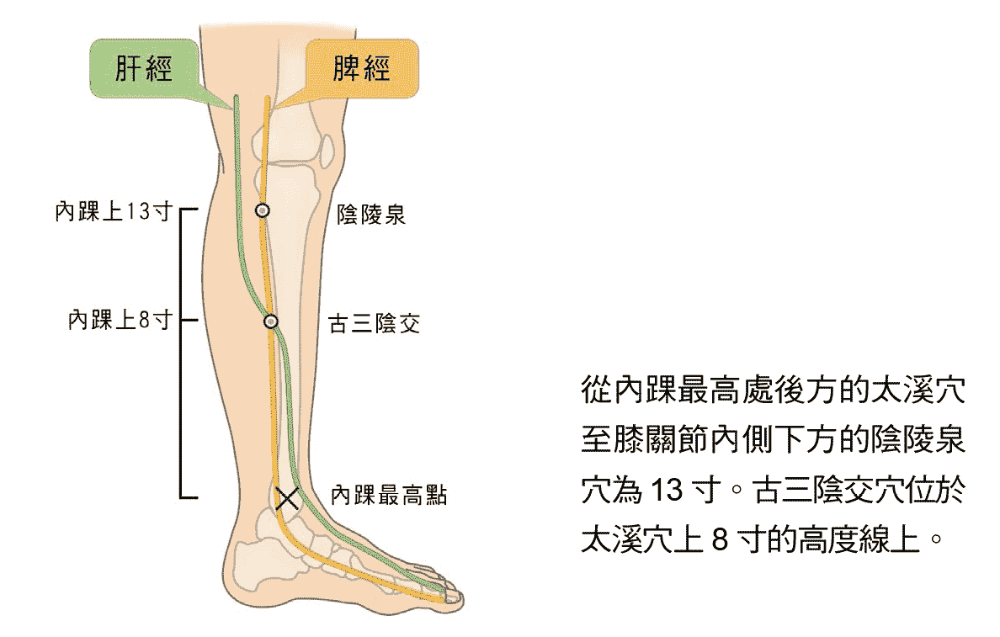

大陆研究经络的学者黄龙祥先生认为三阴交是因位于足厥阴、足太阴经交会处而得名，现在认知的三阴交穴在隋唐时期被误认为足三阴之会，连带部位也由原先的内踝上八寸变成内踝上三寸。

十几年前看到上述这些资料时，我就开始在临床诊疗上观察这两个穴位，同时为了教学方便，内踝上八寸这个穴位，我另称之为「古三阴交穴」。个人体会是古三阴交穴对于三阴经病变反应比较灵敏 ，除了有较为明显的肿突现象外，针感也较为强烈。

至于许多医家质疑古三阴交穴只是肝经与脾经的交会穴，肾经并未参与其中。对于这项疑义我有小小的见解，将于《卷五》肾经篇章中再详细跟大家分享。

 中医师不传之祕：膝关节是脾胃的重要气血通道，也与心脏功能有关

胃经篇中介绍过，膝关节两侧膝眼都有穴位，外侧称为「外膝眼」或犊鼻，属于胃经；内侧称为「内膝眼」，没有特别归入那一条经脉。但依据脾经的循行来看「上循膝、股内前廉」，脾经走在下肢阴面的前线，内膝眼位在膝关节内侧，应该属于脾经所经之处。

临床上，内外膝眼两穴常被用来治疗膝关节局部疼痛，但我个人很少应用这两个穴位来治疗膝痛，原因有二：

第一，膝关节疼痛通常是疾病的结果，而不是疾病的原因。膝关节由许多骨骼和肌肉、韧带、软骨、肌腱、关节囊、滑液囊等软组织所形成，共同支撑人体的重量，维持稳定，以及频繁的活动。随着岁月的增长，必然会有磨损，常在膝关节出现肿胀疼痛，影响活动，但是痛处不见得是病本，更多的问题常出现在软组织的异常。

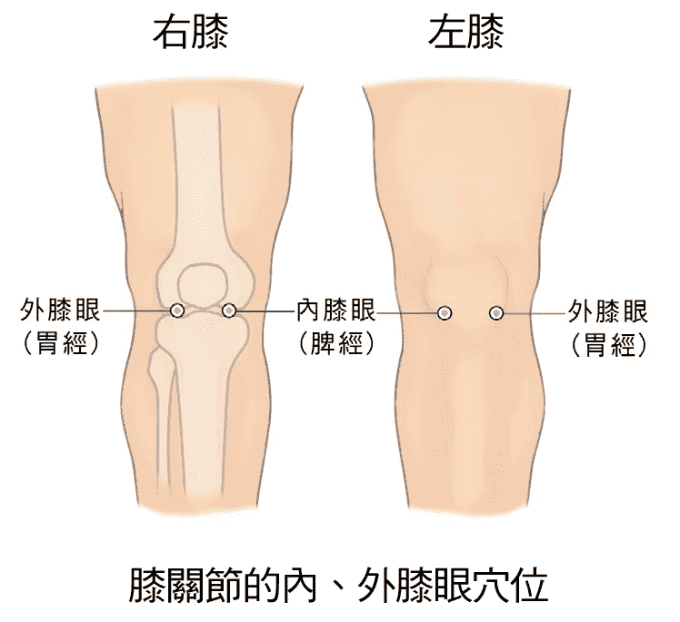

从中医的角度看，与膝关节相关连的软组织分别属于足六经的经筋系统。中医强调治病求本，所以我们常从头项、腰背部和下肢等部位的经筋着手，从根本治疗来改善膝关节疾病。

其次是我早期学中医时，老师耳提面命的提醒：「人体的关节腔很容易感染，能不扎针就尽量不要针。」所以对于四肢的关节腔一直都是戒慎恐惧，极少用针。直到有一次，一位老人家因为下肢麻木冰冷来就诊，检查身体时，发现婆婆膝盖以上的部位温度正常，膝盖以下部位则是冰冷的，判断气血阻滞在膝关节，无法通行至小腿。因此决定在内膝眼和外膝眼下针，针柄上加灸粒成为「针上灸」，再在脚趾头末梢加灸。治疗过程中，婆婆很高兴的说「脚终于有热热的感觉」。起针后，婆婆下肢的麻木明显改善。自此之后，我才开始使用膝关节的针法来「通关过节」。

膝关节活动多，容易磨损，损伤之后必会阻碍气血通行，造成膝盖上下部位气血痺阻不通，一如前面案例中婆婆的情况，所以我就运用「通关过节」法则，从内外膝眼治疗，疏通膝关节这个重要通路，让气血恢复流动。

其实膝关节很像台湾过去高速公路的人工收费站，高速行驶的车辆为了缴费，必须减速通关，因此常在收费站附近造成壅塞。所以遇到连续假期，为避免交通大壅塞，政府都会宣布取消收费让车辆快速通关，减少塞车的状况，这也可以视作中医「通关过节」的交通应用版。

由于内外膝眼分别属于脾经与胃经，两经都经过胸腹部，也都与消化功能有关，因此，疏通内外膝眼首先可以改善脾胃气机，治疗顽固性的胸闷与腹胀。其次，膝盖也是腰背部气血流通至下肢的中继站，疏通膝关节也能改善长年的腰痠背痛。

此外，足部六条经络也都通过膝关节，并且与心脏连结，因此膝关节疾病也与心脏有关联，相关内容可参阅《中医护好心》（大块文化）第五章。

由于人体站立时的受力点偏在下肢中央，膝盖内侧承受较大的压力，一旦受到外力伤害或是年长开始退化，膝盖内侧关节面比较容易出现结构改变，造成膝关节内侧肿突变形等，这些部位正是脾经、肝经与肾经足三阴经通过的地方，对于人体健康有许多负面影响，最直接的就是影响脾肝肾的功能，例如：消化不良，容易疲倦，动则喘促，腰背痠痛，全身筋紧，行走不利，活动缓慢，睡眠障碍，小便异常等状况。

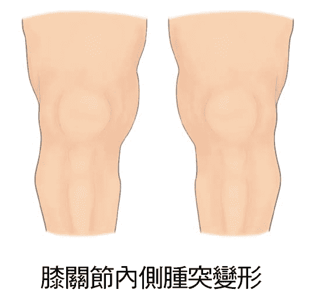

膝盖既然如此重要，应如何照顾呢？

首先，慎用膝盖，少负重，少坐矮凳，受伤要赶紧就医等，减少膝盖磨损的机率。其次要保护膝盖，不要让膝盖曝露于外，面临风吹雨打，尤其年轻人喜欢穿短裤短裙四处活动，还流行牛仔裤膝盖撕出几道裂口，当年纪愈大，愈容易腰痠背痛，却不知病根是来自于膝关节受到风寒。

建议平日多覆盖膝关节，睡觉时尽量穿着长裤，久坐时也尽可能盖住膝盖。总之，保护好膝盖可是有全身性的好处，千万别轻忽了。

脾经循行特色二：胸腹部──慈母心胃（欣慰）区

#### 脾经循行特色二： 胸腹部─慈母心胃（欣慰）区

脾经经脉在胸腹部循行有二条路径，分别是：

路线 5 主脉，从大腿内侧「上腹，属脾，络胃」；

路线 8 支脉，「复从胃，别上膈、注心中」。

这样的路径规划，呈现本区循行有二个重要任务：

第一重要任务：连结脾、胃与心这三个重要脏腑，成为「心胃区」

#### 第一重要任务：连结脾、胃与心这三个重要脏腑，成为「心胃区」

乍看脾胃经在胸腹部的循行与心脏的连结关系上，似乎存在着「爱你在心口难开」的矛盾，脾胃在自己的经脉中都不敢直接连结心，例如胃经经别「属胃，散之脾，上通于心」，由胃→脾→心，脾经经脉则是由脾→胃→心。

脾与胃为何要将与心的连结关系弄得如此复杂呢？

这是因为脾胃与心的关系主要在于：输送精微物质与维持精神的稳定，而且两者都与生命存活和生活质量有关，所以脾与胃轮流与心脏相连，互相协力，且不容其他脏腑插手其中，就像重要的事情一定要亲力亲为，才能让人安枕无忧。精明的经络系统早就懂得这个道理！所以此区称为脾经的「心胃（欣慰）区」。

第二重要任务：形成人体胸腹区重要的「慈母线」

#### 第二重要任务：形成人体胸腹区重要的「慈母线」

脾经胸腹部的循行若直接参考《内经》原文「入腹，属脾，络胃」及「复从胃，别上膈、注心中」，画起来会是一条从大腿直接到脾胃，再连结到心的路线。

但是《内经》之后的医学家并不满足于这样内涵，他们纳入脾经与其他经脉的交会穴，将之连接，结果变成一条蜿蜒的路线。

这个路线目前有两种主要的版本：

版本一：在腹部循行围成一个方块区。如此一来，脾经在腹部的中间路线会与胃经经脉重复。

版本二：在腹部形成「之字形」走向。本书将采取这个版本来介绍。

没采用版本一的原因有两个，一是根据「婆婆妈妈菜市场经济学」，总论曾介绍过，脾经是具有妈妈性格的经络，当然有着节俭的美德，秉持着买东西时「葱姜蒜头，能多要就多拿；一元五元，零头可以不付」的精神，讲究效率的人体，没有必要在腹部重复路线。原因之二是，腹部方块形经络走向将无法成就脾经经筋的篓子功能，这部分会在经筋篇章中介绍。

选择版本二的思考，乃是依据古代医家的记录，脾经与其他经脉有六个交会穴，加上脾经本身的穴位分布，显示脾经经脉在胸腹部循行，并不是一条从大腿内侧进入腹部，联络脾胃的直线，反而是一条弯曲的路线，如下图。

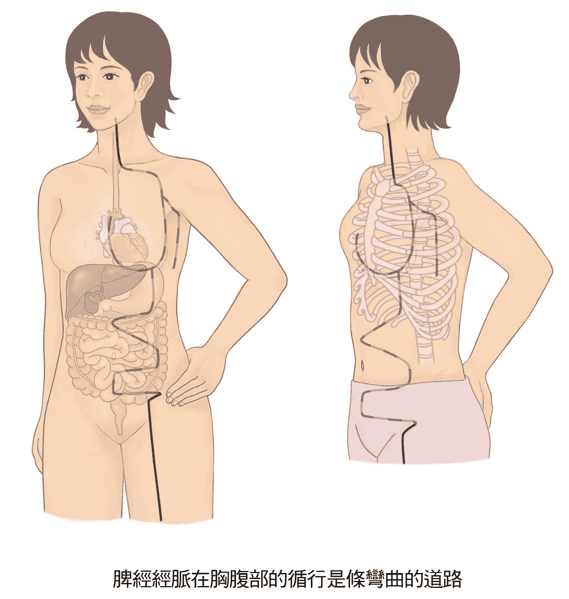

脾经经脉胸腹部循行的重要性，在于形成连结人体中线和侧线的缝合线，我称之为「慈母线」。

脾经经脉宛如慈母的手中线

还记得唐朝诗人孟郊的［游子吟］吗？

慈母手中线，游子身上衣。

临行密密缝，意恐迟迟归。

谁言寸草心，报得三春晖。

脾脏本来就具有母性特质，脾经经络系统也类似游子吟所述的内容。

脾脏这位大地之母，亲手为她钟爱的孩子缝制衣裳，以脾经经脉为针线，我称为「慈母线」（下图黑色线条），缝制出脾经经筋这件游子身上衣（经筋篇中会详细说明），我称为「游子衣」（蓝色色块）。以慈母线缝制成的游子衣来陪伴照护我们一生，这就是脾母的苦心与深意。

由于经脉循行过脾、胃、心三个脏腑，所以我才称此部位为「慈母心胃区」，并期望人人都可以照护好身体，让慈母安心欣慰，所以采谐音称心胃为「欣慰」。我相信这是来自亿万年演化，与天地共振的杰出设计，是老天赐予万物之长的我们最珍贵的礼物。

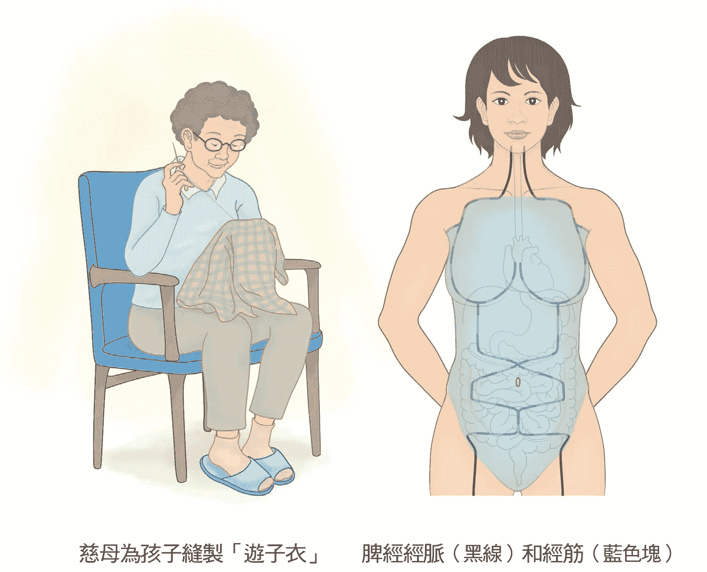

为何这条慈母线要以缝合线的交错方式来行进？

别急，我们先来认识脾经在胸腹部的循行，就能一一解密了。以下将循序介绍脾经胸腹区的循行特色及功能。

脾经与胃经在胸腹部的循行特色──定位脾经经脉路线

了解脾胃两条经脉在下肢和胸腹的循行特色，将有助于脾经循行路线的定位。脾经与胃经为表里经，两条经脉阴阳属性不同，循行部位也有阴阳之别。理论上，脾经属于阴经，循行在人体的阴面；胃经属于阳经，循行在人体的阳面。但这个规律在胸腹部出现例外。

一方面与脾胃两个脏腑所在位置有关。胃腑位于人体偏于中间的部位，脾脏位于人体偏于外侧的部位。

另方面因为脾经与胃经都经过胸腹部的正面（前面）。胃经从腹部向下经气街（鼠蹊部）到大腿部偏向外侧到髀关，然后沿着大腿阳面前线下行。脾经从下肢阴面前在线行，从冲门（鼠蹊部）向上到胸腹部。胃经为了连结胃腑，在胸腹路线也较偏中线，过了鼠蹊之后，就向外斜切到下肢阳面。脾经从下肢阴面上行，在鼠蹊部与胃经交叉，经脉转偏外侧以连结脾脏。

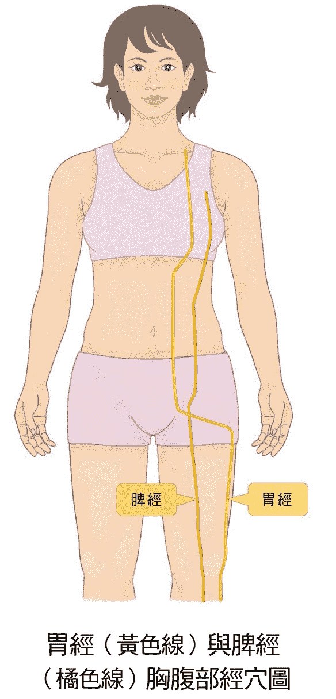

上页图是胃经与脾经的经穴图，因为它们的循行比经脉图简单，比较容易看出两经的差别。

脾经在胸腹部的实质循行──以「之」字形连接人体中线

脾经经脉从下肢阴面前线向上走到大腿根部，从鼠蹊（腹股沟）进入下腹部之后，循行开始有了曲折变化，如下图。

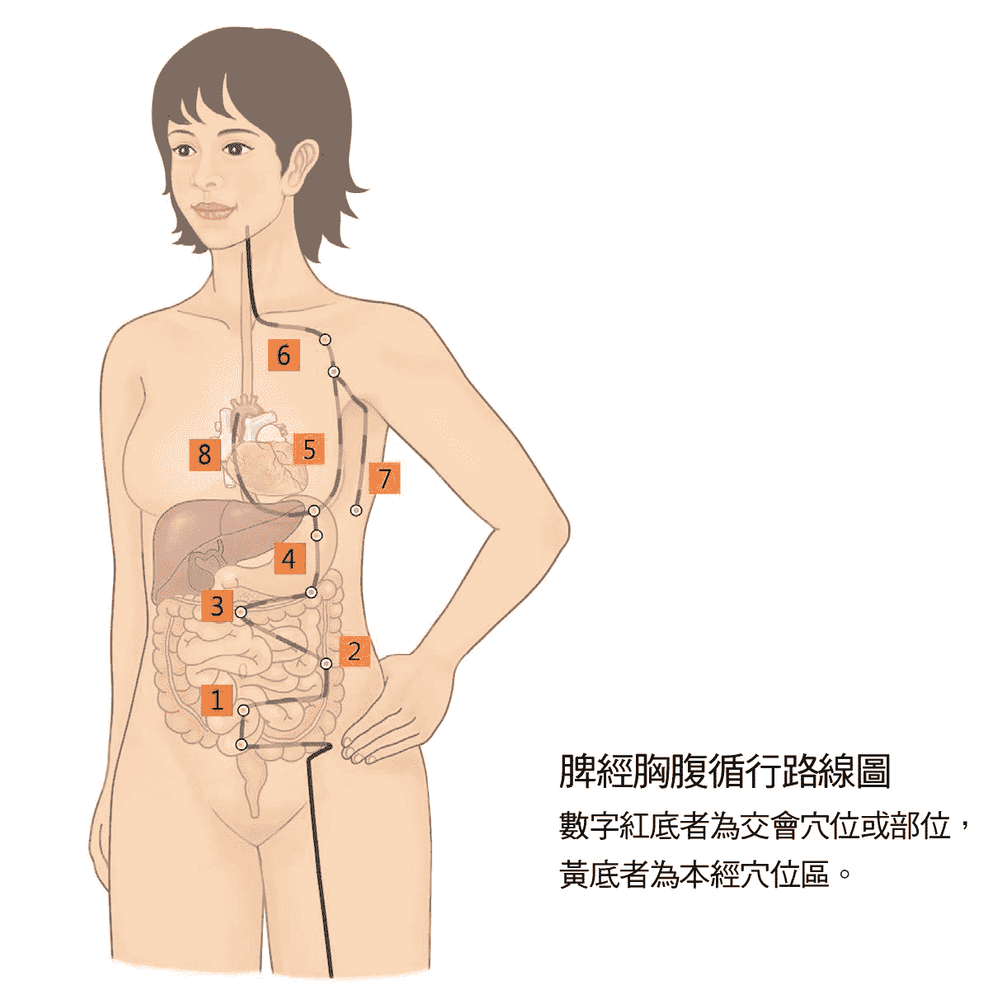

我们来看看脾经如何从腹部开展出神奇的缝合线：

１ 通过鼠蹊，弯曲向中线靠拢，交会任脉的中极穴和关元穴（肚脐以下）；

２ 弯曲向外侧行，回到脾经路线，连接自己的穴位腹结穴，向上抵达与肚脐相平的大横穴；

３ 再弯曲向中线靠拢，交会任脉的下脘穴（肚脐以上）；

４ 弯曲向外侧行，交会胆经的日月穴＊，肝经的期门穴；

５ 向上穿过横膈，向外上侧行，回到脾经路线，连结自己位于胸部的穴位。脾经这条胸部路线与肺经在同一条纵轴上；

６ 从本经的周荣穴向上交会肺经的中府穴（周荣穴就位于中府穴的正下方），再向上挟咽，连舌本，散舌下。

７ 再从周荣穴向外下方抵达本经最末穴大包穴。

８ 有条支脉再从胃，上过横膈，注于心中。

＊有些书籍无日月穴，有些书籍有膻中穴。

您有没有发现，脾经特地转弯去交会其他经脉处，都是没有脾经穴位的地方，这一切填补得天衣无缝，令人赞叹！

脾经在胸腹部的三大结构特性

蜿蜒的慈母线在胸腹部围成三个区域，分别是：

● 腹胸慈母线区● 胸部夹乳区● 胁肋大包区

下图是将双侧胸腹循行合并，可以清楚看出脾经所过的几个重要部位和所形成的特殊功能性区域。

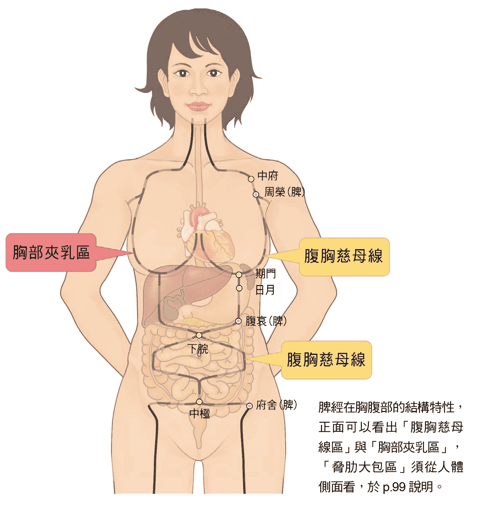

1.腹胸慈母线区

脾经从府舍穴进入腹部，从中极穴蜿蜒到下脘穴，向上经过腹哀穴到中府穴，在腹部及胸部各自连结成为一个方块区域，我称之为「腹胸慈母线区」，与脾经经筋有密切关系。双侧「腹胸慈母线区」，几乎包覆了体腔所有的部位。

比较特别的是，在横结肠两端的转弯处分别称为肝弯（或肝曲）和脾弯（或脾曲），脾经的腹哀穴位就位在这两个转弯处附近，腹哀穴向上交会日月穴及期门穴，这两穴的深层处正是胃与肝胆，所以脾经循行在腹哀穴附近「属脾」，在日月穴及期门穴附近「络胃」。从此向上穿过横膈，走在胸部的外侧。

2.胸部夹乳区

脾经经脉主脉从期门穴上膈，循胸向上至周荣穴，再向上交会肺经的中府穴。另条支脉从胃上膈，最后注入于心。这两条经脉合起来的区域称为「胸部夹乳区」。

我们先用中医的定位方法来确定这两条经脉走过的部位。中医衡量身体各部位尺寸的方法称为「骨度分寸法」，是以体表的骨节为主要标志，设定一个整体尺寸，然后再折量各部位的长度和宽度， 定出分寸，以便于确定腧穴位置。

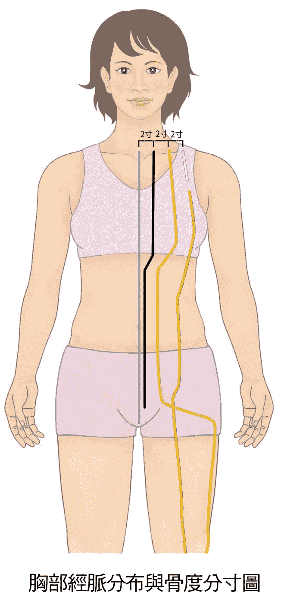

以胸部为例：正中线是任脉(蓝色），两个乳头之间为八寸，胃经(黄色）经过乳头，所以胃经为中线旁开四寸；肾经(黑色）在胃经的内侧，为中线旁开二寸；肺经(白色）及脾经(橘色）在胃经的外侧，为中线旁开六寸。如左图。

从女性的乳房型态来看，肾经约在乳房的内侧缘，胃经在乳房最高处的乳头部位，肺经与脾经约在乳房的外侧缘。

脾经在胸部的主脉走在旁开六寸处，支脉走在接近中线的部位，从身体浅层部位来看，正好包夹乳房的内侧缘与外侧缘，所以才称为「胸部夹乳区」。从身体深层部位来看，脾经经脉包住了肺脏及心脏，由此可见脾经经脉喜欢「大包」身体器官的特性，正符合脾经最后一个穴位「大包」的穴名与特性。

3.胁肋大包区

《内经》的脾经经脉原文中没有记载从周荣到大包这条路线，它出现在《内经》十五络脉中的脾之大络「脾之大络，名曰大包，出渊液下三寸，布胸脇。实则身尽痛，虚则百节尽皆纵。此脉若罗络之血者，皆取之脾之大络脉也。」我们依据《内经》内容画出周荣到大包这条路线，并依据分布部位及穴位名称，称之为「胁肋大包区」。

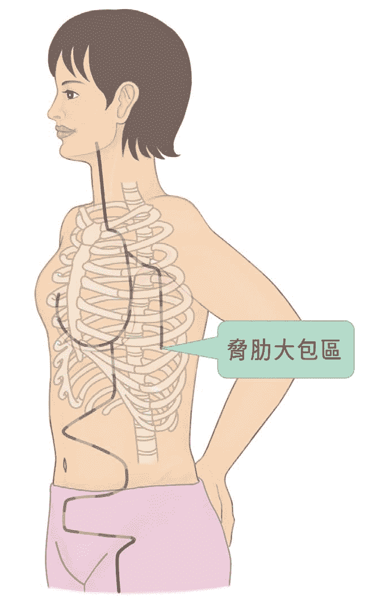

脾经在胸腹部循行以「缝合线」曲折路径进行之目的

脾经从鼠蹊开始到大包穴为止，共有七个转折，让脾经得以从人体正中线的任脉游走到外侧线的大包穴。

首先，我们将两侧经脉合并。

有裁缝经验的读者会发现，脾经为了连结人体的正中线和外侧线，用了一个缝合技巧，即以网状的结合方式，在转弯处贯穿二个以上的穴位，以加强固定，然后再转到另一侧，连成为一个面，而且越重要部位，串连的穴位也越多。

脾经经筋从鼠蹊连结阴器，上腹，再从肚脐进入腹腔，向上连结胸部的胸骨与肋骨，向后连结后背的脊椎，形成一个涵盖所有组织器官的立体结构，我称之为「篓子」。

我们再将脾经经筋在胸腹部所形成的篓子图，与脾经经脉胸腹部循行图一起并列，这样大家是否更能理解脾经的用心良苦？原来脾经经脉在胸腹部形成缝合线的用意，都与经筋这个篓子的结构有关，脾经经脉宛如为篓子加强与身体连结的「缝合线」，目的就是要产生更强更稳固的向上力量。

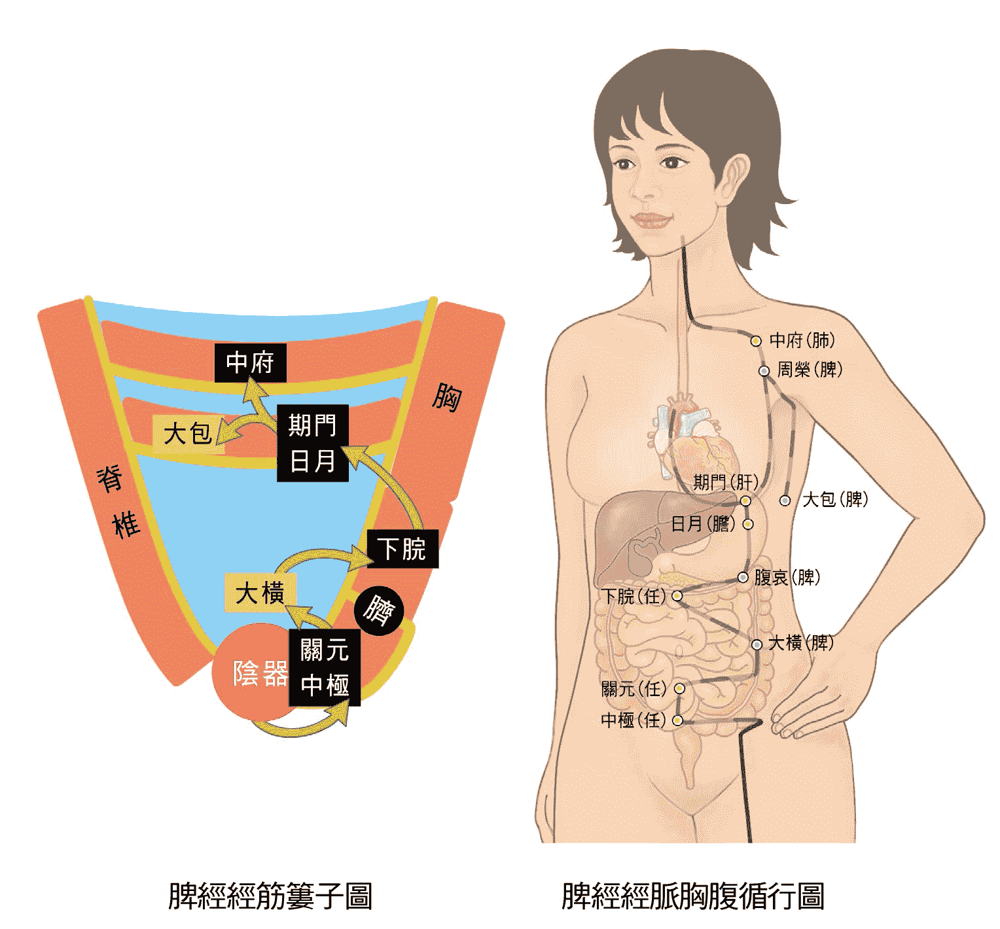

脾经经脉在胸腹部这段弯弯曲曲的缝合线有五个重要意义：

意义一、脾经所交会的穴位与脾脏功能密切相关，而且都有加强效果

例如属于任脉的穴位有二组：

一组是中极穴及关元穴：在下腹部通称「下丹田」的部位。这两个穴位是脾经、肝经与肾经足三阴经的共同交会穴。中极穴是膀胱募穴（膀胱的经气转输到腹部的穴位），关元穴是小肠募穴（小肠的经气转输到腹部的穴位），是人体阴阳元气交关之处，能大补元气，培元固本，才有「关元」之名。膀胱与肾相表里，小肠与心相表里，加上膀胱与小肠都属于太阳经，阳气充足，功能强大，两穴与泌尿、生殖和消化功能相关，脾脏本身与孕育生殖有关，当然要前来连结。

另一组任脉的穴位是下脘穴：在胃的下方，脾经从此进入胃部，所以下脘穴是治疗脾胃的常用穴位。

意义二、脾经的「大包」概念体现脾无所不包的功能

脾经最后一个穴位是「大包穴」，也在胁肋形成「胁肋大包区」。其实「大包」这个名词不仅是脾经穴位名，更是脾经系统无所不包的写照。

脾经在胸腹部的蜿蜒路线，包覆了膀胱、大小肠、脾胰胃、肝胆、心肺等脏腑，神通之广大，无人能出其右，封为「大包」实至名归。也因为脾经这样的经络特质，提供脾经经筋形成篓子的结构基础和气血供应系统，更是脾这位人体的母亲对身体各器官组织无微不至照护的通路。

意义三、脾经连结胆经日月穴、肝经期门穴，为肝木与脾土建立实质关系

在五行关系上，木很容易会克土，肝胆属木，是脾土的制约者。总论介绍过，《金匮要略》「见肝之病，知肝传脾，当先实脾。」这是中医很重要的预防医学观念，透过五行之间的生克关系，即能事先掌握病情变化。脾当然知道肝胆好兄弟是自己与生俱来的克星，也深知「不入虎穴，焉得虎子」，与其每天在家担心，不如深入敌营，与其为友，同时探测军情，以便提早防备！脾，够聪明吧！另一方面，木与土之间仍有合作关系，也因此脾经与肝经之间的脏腑功能和经络循行彼此缠绕，相当复杂，后文会介绍。

 中医师不传之祕：
脾与肝之间出现复杂关系的可能原因

#### 脾与肝之间出现复杂关系的可能原因

中医理论中，脾脏与肝脏的特性和功能，泾渭分明。如脾五行属土，主运化水谷，肝五行属木 ，主条畅气机。由于人是一个整体，因此脾与肝之间也存在整体关系，一如土与木，可以相互合作，如脾土提供肝木生长的养分，而肝木的根可以伸入土中，为脾疏松土质，中医称「木可疏土」；两者也有克制关系以维持平衡，木克土有时也是应用「木可疏土」，如以情绪关系来说，当脾陷于过度思虑时称为「土郁」，肝的疏泄条达特质可以帮助脾冲出忧郁的深渊，这就是中医所说的，肝木可以疏开脾土之郁的功用，而脾的周延思考特质，也有助于抑制肝的过度冲动，避免暴冲的后遗症。

脾与肝关系如此密切，若脾功能失调，也会影响到肝，中医称为「土壅木郁」，造成脾与肝同病，出现情绪低落，胸胁胀闷，腹胀，胃口差，疲倦，失眠等情况。

脾脏与肝脏不仅功能方面交互影响，连经脉循行也是相互交错。在小腿部及胸胁部，脾经都与肝经相交。如下页图。

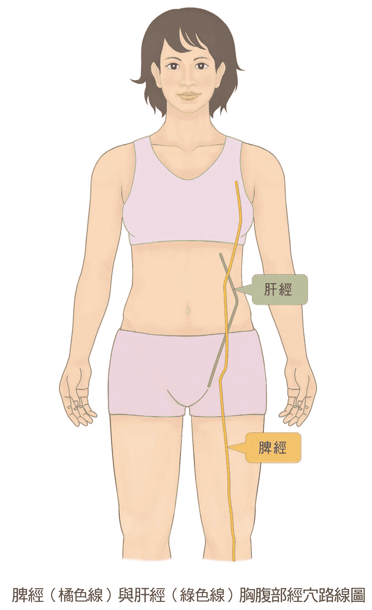

在十二经络系统中，唯独脾与肝在功能及经络系统方面存在如此错综复杂的关系，原因是什么呢？

在回答这个问题之前，我们先来说明另一个问题，就是胰脏。

现代人所熟知的胰脏并未见于中医的脏腑学说，但是近代许多人都认为应该将它纳入中医的脾脏系统。

个人在写脾经之前，也一直考虑要不要加入胰脏。随着撰写经脉，看到脾与肝的复杂关系中，隐含着胰脏的影子，所以还是决定将胰脏纳入本书中。

从功能来看，现在医学所认知的脾脏与食物的消化无关，属于淋巴器官（后文会介绍），可以储存免疫细胞，过滤血液汰旧换新，以及贮藏血液，必要时还可以与肝脏一起造血。

现代医学所认知的肝脏与消化有关，以代谢功能为主，负责合成、加工、解毒、排泄、储存和氧化还原等功能。

现代医学所认知的胰脏（或称为胰腺）与消化有关，是具有外分泌与内分泌功能的腺体，可分泌各种消化液并调节血糖浓度。胰脏的外分泌系统分泌胰液，透过胰管送往十二指肠。胰管与胆管在十二指肠相合，形成一个肝胰壶腹，开口于十二指肠，胰液与来自胆囊的胆汁，由此进入十二指肠中以帮助消化。胰脏的内分泌系统主要为了控制血糖，当血糖浓度太高时会分泌胰岛素，将葡萄糖从血液中运至肌肉、脂肪和肝细胞中，以便降低血糖浓度。另外，胰岛素也能促进肝脏中肝糖的形成和贮存。

中医所认知的脾脏功能，如运化水谷、祛湿等，与现在医学的肝与胰功能有关，尤其是胰脏调控血糖功能对应脾主甘味的特性；中医所认知的肝脏功能，如藏血等，与现在医学的脾功能有关。胰脏与肝脏之间的合作关系，如促进消化、调控血糖等，宛如中医的脾脏与肝脏关系。中医脾脏「脾统血」对应现代脾脏过滤及贮藏血液；「脾化血」对应现代脾脏与肝脏一起造血的功能，中医与现代医学的脾脏功能一致。「脾主升清」则为中医特有的观念。

从位置来看，肝脏、脾脏与胰脏三个器官的解剖位置很接近，在一些低等脊椎动物，它们的胰与肝还结合在一起。人类的胰脏位在脊柱的前方、胃的后方，长得像一把尺，所以台语称为「腰尺」。胰脏较大的一端称为胰头，中间为胰体，较细长的一端称为胰尾。胰头位于十二指肠弯内，胰体占据大部分，胰尾延伸到脾，等于横越了人体的左右两侧。

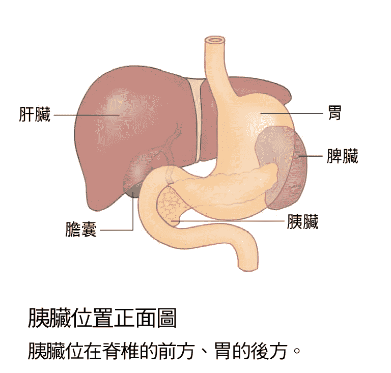

综合以上讨论可知，中医脾脏的部分功能出现在现代医学的肝脏与胰脏，胰脏也连接了脾脏与肝脏。即使在中医理论中没有看到胰脏的论述，但是它的功能和位置都深深影响人体的脏腑功能以及经络循行。例如胃经经筋特地循行至后背，脾经经筋附着于脊柱上，都是为了保护脾脏和胰脏。

虽然胰脏对于脾脏贡献良多，但是胰脏的功能只是中医脾脏功能的一部分而已，也就是说现代医学的胰脏不等于中医的脾脏系统，中医的脾脏所涵括的内容更为广大，因为它有很强的经络系统在背后撑腰，而具有如「升清」等特殊功能。

从现代解剖部位来看，下脘穴与腹哀穴所连结成横越身体两侧的路线，刚好位在胰脏的下方。这也让我们思考，脾经经脉交会任脉下脘穴的用意，以及中医的脾与肝之间，是不是因为有了胰脏这位隐形第三者，所以才会产生如此复杂的关系。

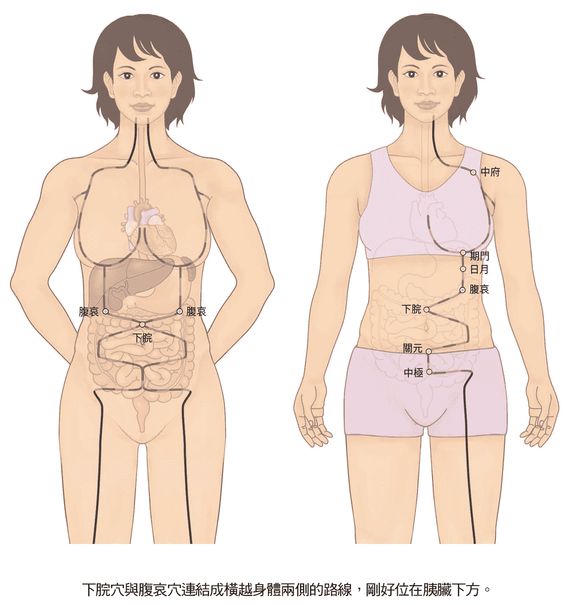

意义四、脾经最后一个交会穴是中府穴，为人体建立严密的保卫系统

在肺经篇章中介绍过「肺为华盖」，由上而下提供人体的保护伞，免于外在邪气的侵袭。脾经经脉与经筋共同形成一个由下而上的「篓子状立体结构」以托住内在器官。

脾经在胸部以位置最高的穴位周荣穴连结肺经的第一个穴位中府穴，意味着肺经与脾经联姻，两经门当户对，宛如下图的慈济环保碗：肺由上而下覆盖人体，是为上面的盖子，脾由下而上托住人体，是为下面的碗形，碗盖相扣处就等同于人体的中府穴，只要轻轻一扣，就可以严严密密的保护人体。这也可以看作是经络第一团队将脾胃所吸收的精微物质放置在碗内，准备运送给下一组用餐团队，有趣吧！

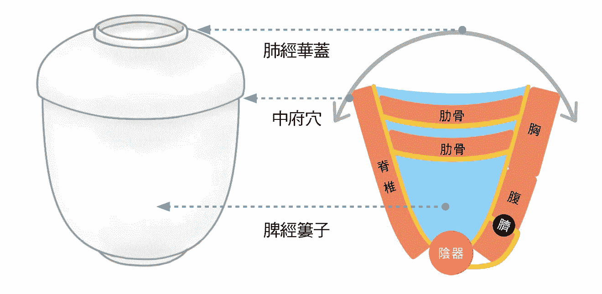

 中医师不传之祕：脾肺两经适用中医对位疗法

#### 脾肺两经适用中医对位疗法

周左宇老师曾以脾经在鼠蹊上的冲门穴，治疗对侧属于肺经位于胸部的云门穴痛，这是因为冲门穴与云门穴位置相对应，如下页图。古典针灸派称为「扁鹊神针法」，属于中医的对位疗法。详文请参阅《 医道精要》（橡实出版社 p.62）

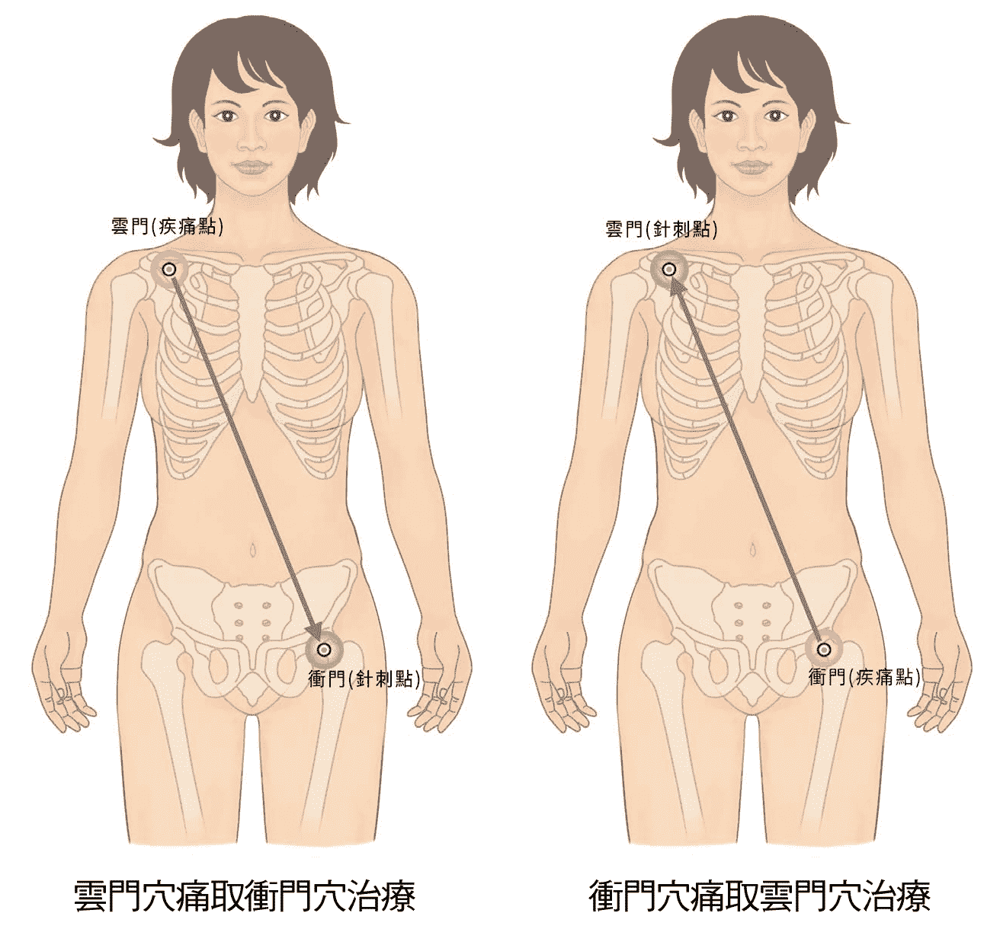

我就狗尾续貂，借用周老师的对位概念，加上肺与脾都是太阴经，经气可以相通，以及中府穴是肺脾两经的交会穴等关系，选用阴陵泉穴来改善对侧肺经中府与云门穴附近的疼痛与筋肿，效果不错。若再加上肾经的阴谷穴，还可开胸理气，效果加倍。

意义五、脾经所交会的穴位与经筋篓子部位相合，为脾脏提供坚实的后盾

脾经交会穴位与经筋篓子分布部位相合，说明了经筋篓子保护着循行于其中的经脉，经脉也提供充足的气血给经筋作为动力，两者相辅相成，这正是脾经系统能肩负运化、统血和升清功能的重要结构基础，因此才会走得如此崎岖，却又暗藏苦心与深意。

如果先读过经筋篇会发现，脾经经脉好像没有跟经筋一样循行到胸骨与脊椎。其实，脾经经脉最后又从胃，别上膈，注入心中，这就有走到胸骨，因此部分书籍才提出本经交会于膻中穴。

脾与胃相表里，两人好麻吉，健壮的胃经经筋特地从大腿向上循胁肋，环绕到身体后侧，连结在脊椎上，从后面保护脾与胃，也为脾经篓子提供与脊椎的连结。差别在于，胃经的经筋走在胁肋的外层肌群，脾经的经筋走在胁肋的内层肌群，两条经筋从内外包夹肋骨与脊柱。

脾经循行特色三： 头面部──夹咽舌本区

#### 脾经循行特色三： 头面部─夹咽舌本区

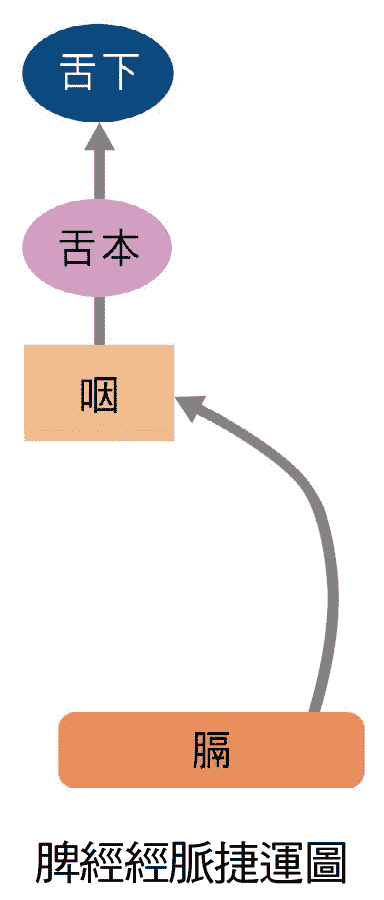

本段循行主要在于连结舌头。本经脉穿过横膈，挟咽，连舌根，散布于舌下，所以称为「夹咽舌本区」。此处的咽主要指食道，所以此段循行与食物的搅拌和吞咽功能有关。

脾与胃感情真好，一直为对方着想，例如胃经为脾环绕唇口，脾经也为胃连结舌部，连来连去，都是为了共同的目标：食物的消化吸收，再转化为气血。脾胃果然是共同成就后天气血生化之源的好伴侣！

 中医师不传之祕：
脾经系统跟免疫系统有重大关联

#### 脾经系统跟免疫系统有重大关联

《内经》提到「五藏六府，心为之主，耳为之听，目为之候，肺为之相，肝为之将，脾为之卫，肾为之主外。」其中「脾为之卫」从字义上来看是指脾能提供身体的保卫机制，这应该是与脾胃生成卫气有关。卫气遍布全身，保护人体免于外来邪气的侵袭，也能将入侵的邪气从体表排出，以保卫人体。

人体的淋巴系统又称免疫系统，是由淋巴组织、淋巴管和淋巴器官组成。淋巴器官包括扁桃腺、胸腺、脾脏，以及遍布全身的淋巴结。淋巴结主要分布在颈部、胸部、腋窝、腹部和腹股沟等。

现代医学的脾脏是人体最大的淋巴或免疫器官，可以储存及产生淋巴细胞、过滤血液来吞噬细菌、破坏衰老的红血球及血小板，还可储存血液，必要时也能造血。

淋巴系统是人体的防卫战士，当细菌从受伤处进入人体时，淋巴细胞能有效的杀灭细菌而启动免疫反应功能来防卫人体，这类似中医的卫气功能。

淋巴系统与心血管系统一样也属循环系统，只是心血管系统主要负责血液的循环，淋巴系统主要负责体液的代谢。血液中部分血浆会在血管外成为组织液，部分组织液再进入淋巴管成为淋巴液。淋巴液起始于全身各组织，淋巴系统负责运送这些组织液，最后汇入静脉系统。

从中医的角度来看，淋巴液是清澈水状类似血浆的物质，所以兼具血液与水液的特质。微淋巴管深入组织间隙，微薄的管壁可以让组织液回收进入淋巴循环系统，最后与静脉系统汇合，再由心脏血管系统循环至全身。淋巴液这些特质与中医脾脏管理血液及水湿，以及脾经最后流入心，交棒给心，将气血运送至全身的理论非常相似。依据中医理论，人体的血液与津液都来自水谷精微物质，都属于阴液，所以可以互相转化，淋巴液最后汇入血管成为血液的这个特质，也与中医理论有异曲同工之妙。

这里还有一个特别的思考就是「脾统血」。前面介绍过，中医传统观念认为脾「统血」是将血液固摄在血管内，避免出血。中医并没有特别提出「淋巴」及「淋巴管」的概念，但淋巴与中医认知的血与水特质类似，在血管内就是血液，血管外就是组织液，所以脾统血这个概念也适用于淋巴系统，即脾「统管及分配进出血管的各项物质」，包括血液及淋巴液，同时也再度印证脾脏兼管血液及水液的功能。一旦淋巴回流有所阻滞时，就会出现水肿的现象，也是脾经经脉系统病候中的症状。

由此可见，中医的脾脏功能与现代医学脾脏为免疫器官的观念可以相呼应，只是中医与现代医学处在不同的时间空间，语言文字的表述方式才因此有所不同。

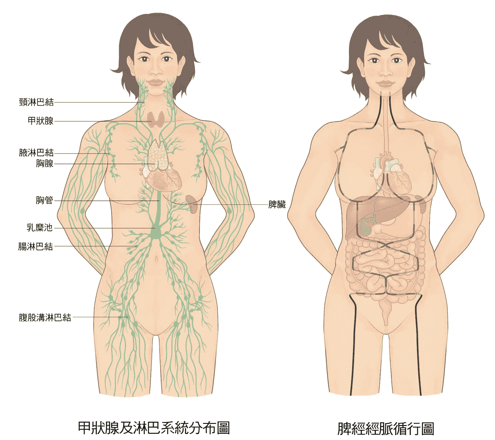

读者可能会问，《内经》有关脾经经脉在胸腔及颈部循行的叙述都很精简，如何判断是否有经过这些淋巴分布区域呢？

这个问题可以从脾经在胸腔的循行通过乳房外侧，交会肺经中府穴之后向上挟咽，连舌本散舌下的路线判断，脾经经脉非常可能通过扁桃腺，以及属于内分泌系统的甲状腺；从胃上注于心的路线，有可能连结到胸腺；从脾经的周荣穴到腋中线的大包穴过程中，有可能经过腋下。

临床上，淋巴器官与脾脏功能确实有相关，例如胸腺。

胸腺位于胸骨后方，由甲状腺下方延伸至胸腔，位于心脏前上方与两肺之间。脾经经脉从胃上注于心，脾经经筋结于肋，散于胸中，也分布在胸骨的后方，脾经经络系统是有极高的可能性连结到胸腺。

胸腺在幼年时期发育旺盛，担负着身体免疫功能的重任，在青春期以前功能及大小达到最高峰，之后逐渐停止发育，开始退化萎缩。胸腺病变尤其是胸腺瘤，合并重症肌无力的比例相当高，这与脾脏主肌肉及升清功能失调，导致肌肉下垂有关。

曾有一位胸腺癌病友，她在发病前就是嘴唇容易脱皮、体瘦、单侧眼皮有肌无力下垂的症状。发病时则有后背痛、体重一直减轻、胃口不好等问题，做完 MRI 检查后，发现肿瘤已经扩散到整个胸肋。在中西医治疗过程中，她一直要面对吃不下、胃口不好的状况。跟她母亲闲聊时，才知道母亲怀她时，经济状况较为艰苦，不仅要出去打工，也没有心力注意营养补给，所以母亲一直认为孩子从小身体瘦弱，是因为母亲怀孕时没有好好照顾而来。

从中医角度来看，这些症状与背景都与脾脏有关联。

脾经经脉循行也可能通过位于颈部两侧的甲状腺。甲状腺属于内分泌器官，现代人常见的甲状腺肿大，中医自古就有记载，称为「瘿气」或「瘿瘤」，常因情志抑郁，导致痰与气互结于颈部，俗称「大脖子」。

甲状腺亢进会出现甲状腺肿大，从中医角度来看，甲状腺亢进通常与肝脏有关，所以会出现一系列代谢亢进的症状。

甲状腺机能低下则与脾脏较有关联，例如容易疲劳、嗜睡、一动就喘、心跳变慢、水肿、怕冷、四肢无力、食欲减退、便秘、体重增加、月经紊乱、反应力变慢、情绪低落等，这些症状都与脾脏运化、升清及袪湿功能失调有关，可选用脾经改善症状。

临床上，也用脾经来治疗甲状腺术后的伤口肿胀疼痛。一位女老师就是这样的情况来就诊，颈部手术处非常肿胀疼痛，不仅吞咽及说话不利，还影响睡眠。我们针刺脾经商丘穴，颈部伤口处的肿痛迅速缓解，病人都感到不可思议。

 中医师不传之秘：穴位的特质是依附经络与脏腑而来，掌握经络脏腑，方能灵活运用穴位，取得最佳疗效

#### 穴位的特质是依附经络与脏腑而来，掌握经络脏腑，方能灵活运用穴位，取得最佳疗效

经络解密的读者阅读到此，已经认识了三条以上经络，可能逐渐发现中医真的很强调整体观，各个经络与脏腑都是同心协力来维持身体正常的运作。中医的整体观，除了呈现在脏腑关系外，经脉系统亦然，没有任何一条经络系统是独立运作的，都是同心协力互相支援，以达成任务。

另外，经络系统所涵盖的部位远远超过所连属的脏腑，它们还连结四肢、躯干及头面等，将脏腑与身体连结成一个系统。每个系统又跟其他系统相连结，全身的经络宛如城市的交通网络一样交错纵横，同一个部位会有许多经络通过，彼此之间的关系更为复杂与敏感，同时也很脆弱，可以共荣共生，也会互相连累。因此掌握经络也就掌握了脏腑及躯体之间的密切关系。

位在经络路线上的穴位，其功能效用多数依附经络与脏腑而来，每个穴位不仅承担本经循行所过部位的照护责任，也与本经所连结的脏腑经络建立特殊的关联性，该穴也因此可以用来调节相关连的脏腑经络气血。这就像一般公司的分工，业务部面对外面的客户，人事室管理内部员工，采购部专责向外采买，会计部负责帐务管理一样，这些部门都同属一家公司，但是术业有专攻，职务分工发挥的作用不同，就整体而言，都是为了让公司的营运上轨道，可以蓬勃发展。经络就像公司，穴位就像公司各部门，穴位的功能主要是让经络气血可以通畅，脏腑功能可以正常，如此一来人体就能健康。

前面的「脾经脏腑好缘区对照图」，一个穴位可以面面俱到，照护多个经络脏腑功能，在不同情况下，同一个穴位也能发挥不同的功用，这就是人体整体观的应用，在临床诊治上都有良好的印证。

我深深体会具有坚实的经络基础，可以提高对于穴位特性的了解，以及诊断治疗疾病时的能力。因此常建议年轻的医学生，想要学好针灸，必须先学好经络与脏腑观念，唯有厚实的经络脏腑知识，方能灵活掌握病情，妥善运用穴位，取得最佳疗效，而不会落入特效穴/经验穴的侷限框架中。

某天门诊中，我跟实习医师说明穴位的特性，旁边有病人很专注地聆听，就顺便举个例子说明上述概念。现代科技发达，电子产品日新月异，产品设计都很精细，功能也很多元，所以说明书成为很重要的入门指引。但有一类人士从来不看说明书，就凭借自己过去的经验开始使用产品，使用后碰到问题，就嫌产品设计不良，难以使用而放弃，正如俗话说的，自己功夫差反而嫌工具不好一样。

《内经》说：「小针之要，易陈而难入」，系指针刺之法，说来容易，实际操作很难，因此才需要「临床」的学习。在针灸业界（不限于中医），还看到另一种现象，我称之为「易入而难精」，就是要将针刺入身体很容易，连我们在缝衣服时，都可能不小心刺到手指而产生「针刺放血」的效果，可是要将针法运用得精妙却很难！针具就像电子产品，经络脏腑的概念就像说明书，唯有细细研读之后，方能将针灸运用自如，进入经络的神奇殿堂。

若以前述脾脏与淋巴系统相关，是人体重要的免疫器官为例，想要改善或强化免疫系统，该如何选择脾经上的穴位？

商丘穴是治疗淋巴相关病症的要穴

#### 商丘穴是治疗淋巴相关病症的要穴

首先，每条经络都有五个特定穴「井荥输经合」，以对应五脏及五行功能特色。免疫系统是保卫机制，相对应的五脏特色，应该是主一身之表的肺脏，肺的五行属金，脾经特定穴之中，属于金的穴位是商丘穴。

其次，许多淋巴结都位于关节处，如腹股沟及腋部，商丘穴正位于内踝关节处，位置相对应，可用来治疗淋巴相关病症。

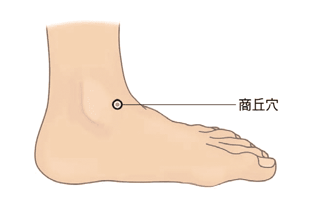

此外，《卷一》介绍过「有诸内必形诸外」的人体特性，我们在临床上也观察到，只要脾经系统发生较为重大的病变，例如循行所经部位出现异常现象，如前所述颈部甲状腺术后局部肿痛，右腹部接近横结肠肝曲处的肿胀压痛、腋窝肿痛等，还有消化、生殖及免疫等机能异常时，商丘穴也会跟着出现肿突现象，此时可以按摩或针灸对侧商丘穴来保健及改善。

足太阴脾经──病候

### 足太阴脾经──病候

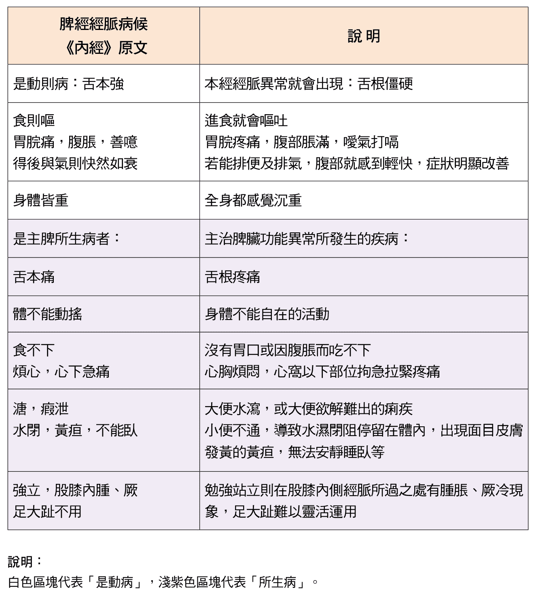

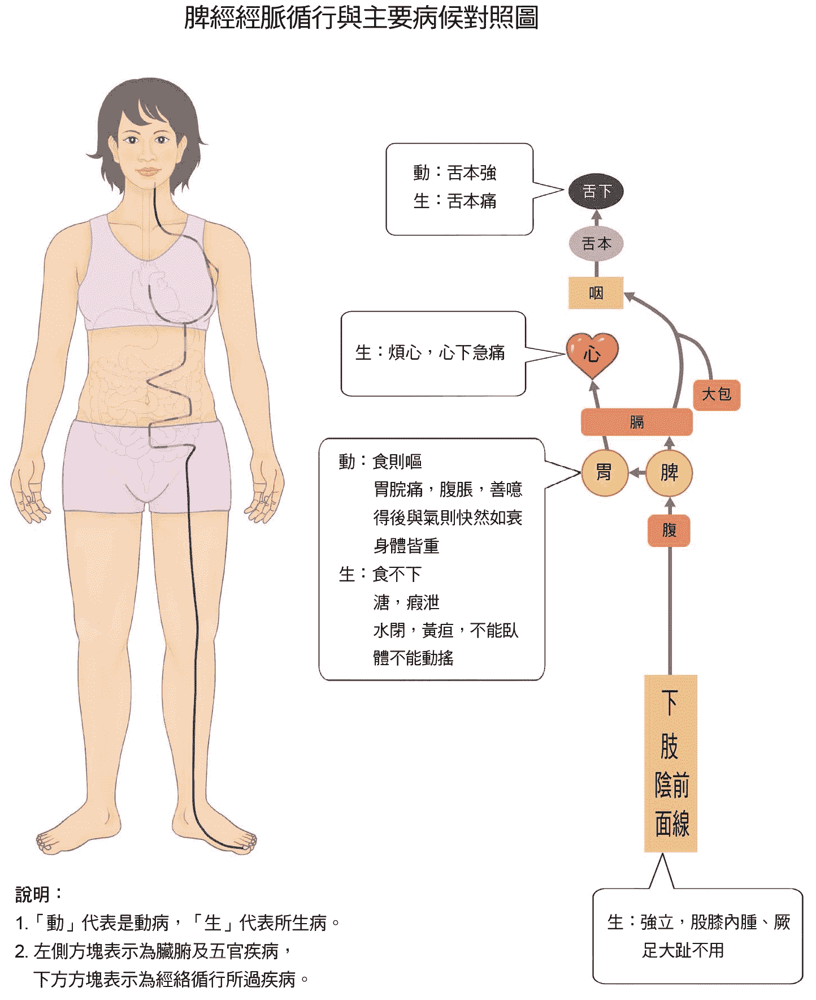

脾经经脉病候特色

脾经经脉病候与经脉循行所过部位完全吻合。病候内容以脏腑功能异常为主，尤其呈现出脾脏与脾经的特色。肢体疾病只有下肢型态改变的肿胀和温度异常的厥冷现象。

依经脉循行的部位，将脾经经脉病候依序分为三部分介绍：

1.下肢部位

脾经循行所过部位出现肿胀且有冷感，足大趾不灵活。

在循行篇中介绍过，下肢部位是脾经的脏腑好缘区，与多个脏腑的功能相对应，这就是身体的整体观。

脾经下肢部位的肿胀偏冷，都是气血循环不良的表征，当然也会影响下肢穴位，连带也牵连到所关联的脏腑。虽然病候篇中轻轻带过下肢病症，对于身体的影响却不容忽视。

 中医师不传之祕：拇趾外翻与咽喉卡痰有关！

#### 拇趾外翻与咽喉卡痰有关！

大趾头在临床上的常见病是「拇趾外翻」，它的成因与穿尖头鞋、高跟鞋，长期负重久站久走有关，过去认为拇趾外翻是典型的「高跟鞋病」。但是越来越多研究发现，拇趾外翻与家族遗传更为密切，且女性居多。拇趾一旦开始外翻，就会持续变形，甚至疼痛，造成生活及行动上很大的困扰。

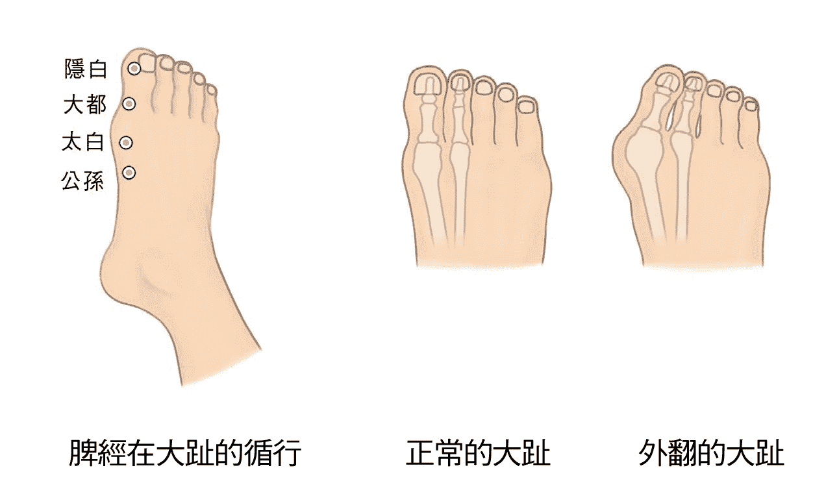

从中医角度来看，拇趾外翻的部位就位在脾经循行上，脾经将足大趾与咽喉连成一个系统。因此临床上许多拇趾外翻的病人，喉咙常有卡卡的感觉，或有异物感常需清喉咙。病人可能因喉咙不舒服看了许多医生并未改善，直到听到我们的解释，知道跟拇趾变形有关，甚至还是遗传造成的，虽感无奈，却能释怀，就不再急着治疗喉咙，而是先治脾经了。

不过拇趾外翻容易造成卡痰现象，但喉咙有卡痰症状，却不一定会出现拇趾外翻，脾经的这项循行病候只是原因之一。

2.胸腹部位

这个部位是脾经循行的重点，以脾为核心，与相连脏腑功能异常所产生的病症为主。下面用三个图示来呈现。

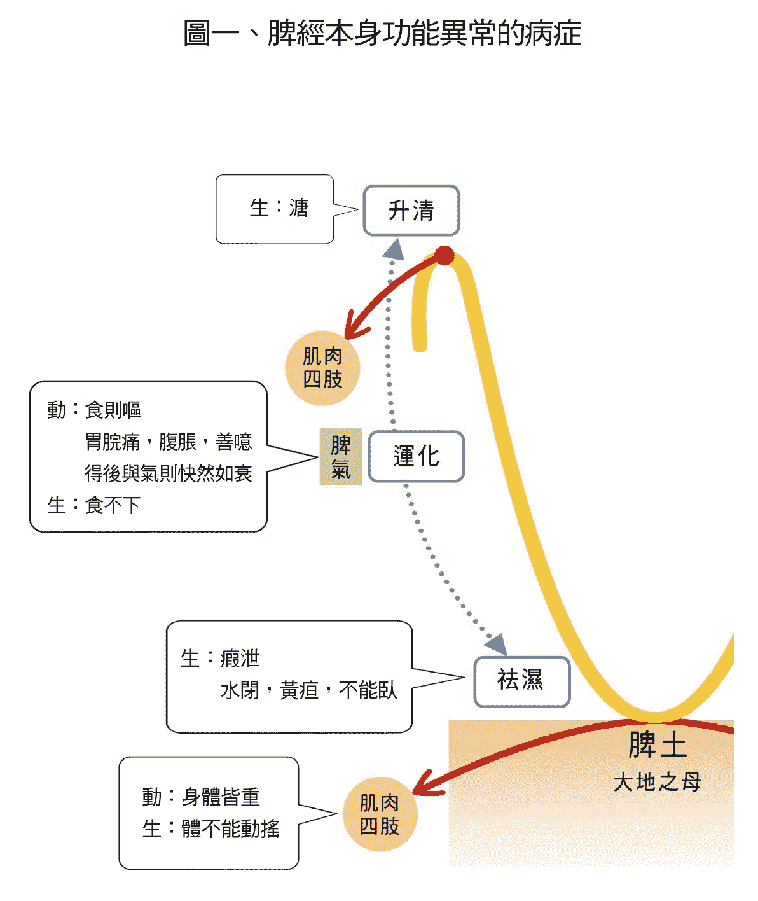

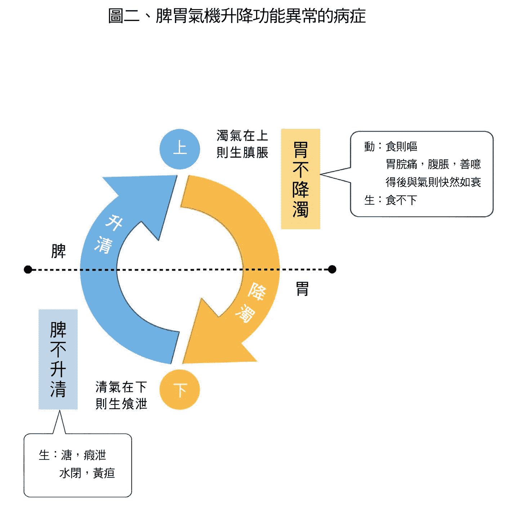

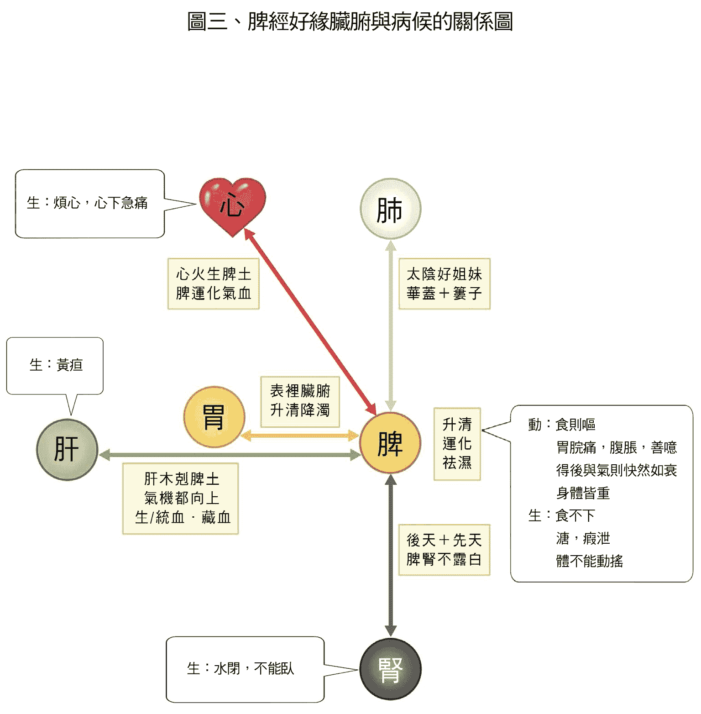

● 脾脏本身功能异常的病症：

五脏经脉的病候都以脏为主，脾经经脉当然也是以脾脏的病症为主。脾脏特色在总论已经介绍，这里就快速说明。

脾主湿的功能失常：身重，体不能动摇；水闭，黄疸，不能卧。

《内经》说「诸湿肿满，皆属于脾」，脾五行属土，土可以制水，脾土对于水湿是嫉恶如仇，遇到就想除之为快，所以脾不喜欢水湿，喜欢干燥。

如果脾功能失常，土不能制水，不能运化水湿，滞留在身体就会出现「浮肿」与「沉重感」，如下肢水肿、面部浮肿、腹部肿满等状况。

水湿停留在体表，脾主肌肉，全身的肌肉就像浸水的大浴巾一般，变得很沉重。这种情况在雨天最明显，一觉醒来，窗外的雨淅淅沥沥，而你宛如被黏在床上，身体像绑了铅块难以起身，这就表示脾气比较虚弱，加上平时喜欢喝饮料（病人常辩称「我喝饮料但没吃冰」咦？难道饮料都是热的吗？其实在我们看来冷饮与吃冰都是一样），脾不能运化水湿，停留于体内成为内湿，遇到天雨时，外在湿气增加，内湿与外湿相结合，身体都是水，怎么不会沉甸甸的，难以动摇，行动迟缓呢？

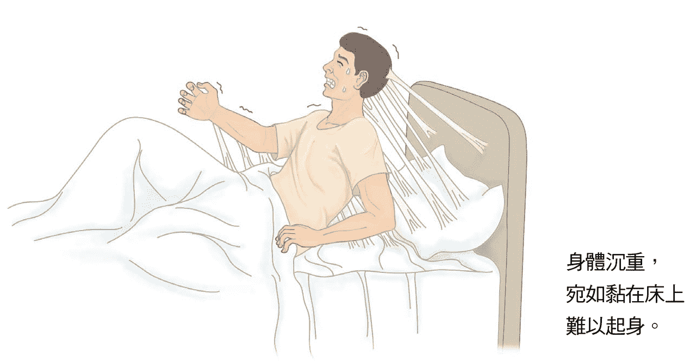

如果水湿潴留在体内会如何呢？除了腹部肿满之外，中医还有「黄家所得，从湿得之」及「无湿不成疸」理论。人体排出水液主要方式是排尿与排汗，如果该出汗而无法出汗，或是该小便而小便难出，脾无法运化这些水湿，水液闭阻在体内，形成水闭，加上一些既有因素，如肝胆疾病等，就会出现身黄、目黄、小便黄的黄疸现象。

这种内湿的病情比外湿严重。但内湿病久之后，反过来也会影响脾主肌肉水湿的功能，而导致身体内外肿胀，难以安卧休息。

● 脾与心相关的病候：

脾经最后注入心中，脾与心互相影响，最常见于情绪失调和养分吸收。在中医的五志七情中，脾主思，思则气结，就是想得太多而变成爱操烦一族，常出现于空巢期的妈妈和失恋的人身上。

脾胃为后天之本，负责吸收精微物质，再转化为血液提供给心脏。这种人事事都挂心，日思夜想，还会钻牛角尖，不仅影响脾的运化功能，导致脾虚血少，也影响心主血脉和神志的功能，造成心脾都生病，出现心脾气血两虚，食少倦怠、面色萎黄、心悸失眠等症状。若长期失眠还会出现烦心、心窝痛等。

中医有个专治这种思虑过度，茶不思、饭不想、睡不着，心脾两虚的药方――「归脾汤」，光看方名就知道是要拉回陷在牛角尖里的脾。

归脾汤以补益心脾为主，其中一味最有特色的中药也是食物，就是将龙眼晒干变成「龙眼干」或「桂圆肉」。古人认为，龙眼甘味归脾，能补血益智，又称为「益智」。荔枝跟龙眼颇像，但荔枝性热，龙眼比较平和，是滋补良品，故有「南桂圆，北人参」之称，所以天冷时大家会喝桂圆茶补身，却少见荔枝茶。

● 脾与肾相关的病候：

脾五行属土，肾五行属水，脾土与肾水通力合作，若再加上肺的通调水道功能，就能共同维持人体正常的水液代谢。

若肺脾肾三脏功能失常，当然也会导致水湿停留体内，而出现一系列水肿相关的症状。

 中医师不传之祕：脾位于中焦，也参与气、血、水的生成与代谢

#### 脾位于中焦，也参与气、血、水的生成与代谢

前面介绍脾脏自身的功能，以及与胃心的关系，体现了位于中焦的脾也和上焦的肺一样，参与人体气血水的生成与代谢。

人体主要功能都由位在胸腹腔的五脏六腑承担，尤其是五脏，生命活动所需的气血水，其生成与代谢当然也是在胸腹腔完成。胸腹腔分为上中下三焦，上焦由肺，中焦由脾，下焦由肾，三脏共同完成体内气血水的生成与代谢。肺脾肾三脏因为所在位置和特性不同，工作重点也不同，将于肾经再跟大家介绍。

人体是不是很奥妙？而中医竟能解读此奥秘，真是身体的知音啊！

● 脾与胃相关的病候：

脾胃位在人体的中焦，是气机上下必经之路。脾气主升，胃气主降，脾胃成为升降的枢纽，脾升则胃降，胃降则脾升，很像跷跷板的动态平衡，人体气机也才能平衡。

如果脾胃气机升降失常，脾该升而不升，胃该降而不降，就会出现《内经》所说的「清气在下，则生飧泄；浊气在上，则生䐜胀。」由于脾气不升，胃气不降，脾胃消化功能失调，气机就「僵住」在腹部，导致腹部胀满，没有食欲而吃不下。

胃气无法下降，勉强进食就会出现呕吐、胃痛腹胀、打嗝嗳气，若能排便及排气，僵住的气机得到松解，症状就能明显改善。

脾气无法上升就会出现腹泻、水泻甚至痢疾的情况。临床上，如果单纯脾气虚弱，中医师会开四君子汤加黄耆来健脾益气，如果脾虚还夹水湿，腹胀腹泻，台湾大街小巷都有的国民美食「四神汤」（如下图）就是良方！若再加个薏苡仁，健脾利湿效果更好。

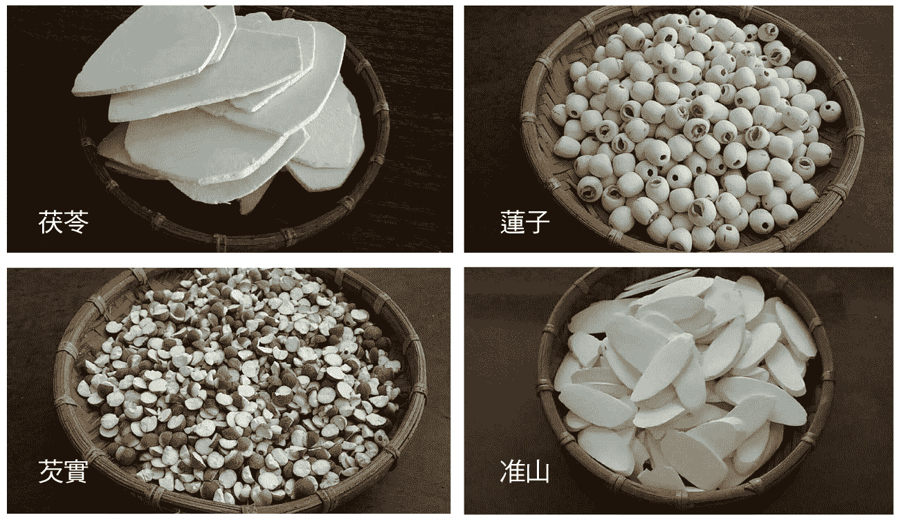

此外，脾胃功能失调很容易出现大便异常，但是疾病表现有差异。脾属阴偏寒，胃属阳偏热，大便异常也有阴阳寒热之别，例如脾脏生病时多出现腹泻，胃腑生病时多出现便秘。

本经病候中的「溏瘕泄」有其特殊含义。

《难经》介绍五种腹泻称为「五泄」，包括胃泄、脾泄、大肠泄、小肠泄及大瘕泄。与本经病候有关的是「胃泄」，饮食不化，大便色黄；「脾泄」腹胀满，泄注──意即大便如水般倾泻而出，食即呕吐逆；「大瘕泄」出现里急后重，意即肚子搅动得很急促，肛门很沉重，便意很急，频频如厕却解不出来，古人称为「痢疾」。

依据《难经》，我将病候中的「溏瘕泄」分为「溏」与「瘕泄」两症，溏类似脾泄中的泄注，瘕泄类似大瘕泄的症状，两症都是大便异常，只是病情轻重有别。

3\. 头面部位

脾经连舌本，散舌下，脾病就会出现舌头根部僵硬、疼痛等。

中医以望闻问切四诊来看病，望舌是望诊的重点，又称为「舌诊」。舌诊以望舌质和舌苔为主，正常人的舌头应该是淡红舌，薄白苔。脾与舌密切关系，加上舌苔是由脾胃所化生，从舌苔就可判断脾胃功能。

除此之外，五脏六腑的情况都会反映在舌上，古代有「舌镜」之称。舌头的型态、动态以及血络等，都会透露全身的讯息，这就是为什么很多人去看中医时，医师经常会要你伸舌头的用意了。

 中医师不传之祕：
「脾气—脾土—脾湿」三部曲

#### 「脾气—脾土—脾湿」三部曲

脾与胃在中医是相表里的器官，但对一般民众的辨识度来说，胃的功能特色很容易了解，脾就不太容易说清楚、讲明白。

但在中医诊间，若遇到有成长中孩童的家长，最关心的还是生长发育问题，当孩子胃口不佳时，就会问医师「有没有能开脾土的药？」当孩子睡觉醒来全身湿答答，手汗脚汗多时，就会问医师「有没有能祛脾湿的药？」可见脾的概念还是深植于民间。

在脾经总论中介绍过脾脏的特色，只要脾气够强，脾土就开，土能制水，就能祛脾湿，所以「脾气—脾土—脾湿」形成三部曲，以脾气为马首是瞻，「补益脾气」就会贯穿在所有治脾的思路中。

一旦脾气虚弱，脾土不开，脾湿就会四处停留：若停留身体内部，如在肠胃道，大便就会变得稀软，甚至水泻；若停留在体表，许多部位会开始变肿，如脸肿、眼泡浮肿、手臂及脚肿等等；脾经连结舌本，脾有湿气，舌头也会变胖，向外扩张，与牙齿相挤压，导致舌头周围会出现牙齿的压痕，中医称为「齿痕」，又因为看起来很像荷叶边缘一个个小圆弧，所以又称「荷叶边」。

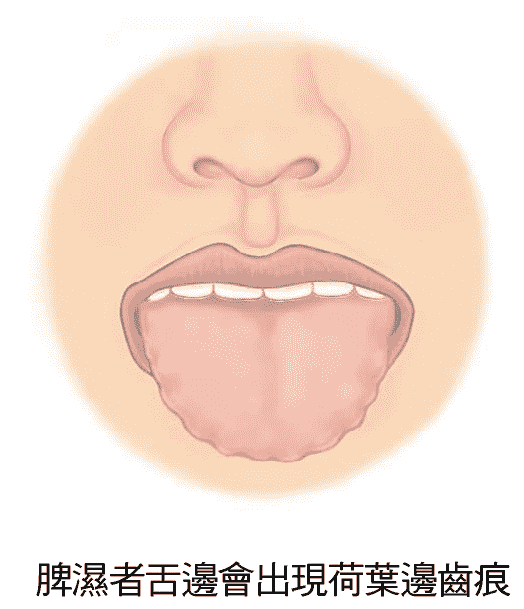

对于「脾气—脾土—脾湿」三部曲，深思熟虑的中医体系有完备的治疗方案。

依据湿气排出人体的管道，分为三种方法：

● 用芳香性质的药物来醒脾化湿，如藿香、砂仁等。

● 以苦温性质的药物来健脾燥湿，如白朮、半夏等。

● 以淡渗性质的药物来导水利湿，如茯苓、薏苡仁，让水湿从小便而出。

 中医师不传之祕：
白朮与茯苓隐藏脾经的大秘密

#### 白朮与茯苓隐藏脾经的大秘密

在脾经的用药中，白朮与茯苓是最常见的拍档，常常一起治疗脾胃病，时间久了，就好像两人结婚共同生活之后，出现「夫妻脸」一样，开始失去自己的特色，我觉得很可惜，因为在早期的中医书如《伤寒论》等，白朮与茯苓各自的个性都很鲜明，临床应用指征也很严格。所以我们就回到白朮与茯苓的「青春年代」来看看它们的特色吧！

现存最早的中药书《神农本草经》，共有 360 种药物，分上中下三品，每一品共有 120 味药。白朮与茯苓都列属上品药，上品药主要必须无毒，多服或久服不伤身，又能养命轻身，所以上品药也被认为是「君药」。可见，白朮和茯苓是延年的好药。

《神农本草经》记载：

● 白朮：气味甘温，无毒。治风寒湿痺、死肌、痉、疸。止汗、除热、消食。

● 茯苓：味甘平。主胸胁逆气、忧恚、惊邪恐悸、心下结痛、寒热、烦满、咳逆。止口焦舌干，利小便。久服安魂魄养神。

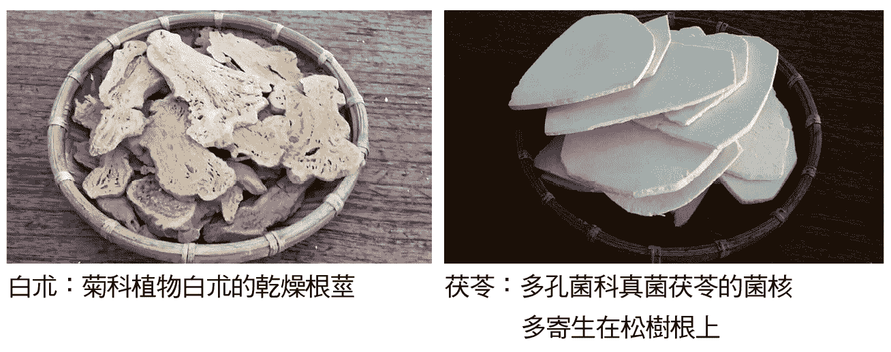

依据《神农本草经》和现代中药学有关记载，整理如下表：

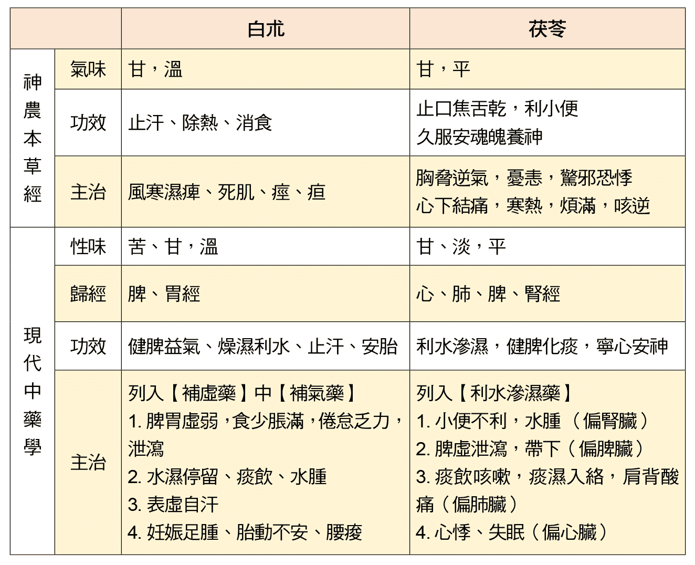

从上表可以看出，在现代中药学中，白朮与茯苓的功用主治有许多类似之处，譬如都能强健脾脏，治疗水湿停留体内的症状。但若细分还是可以看出两味药处理水湿的方式不同，如：

白朮列入【补虚药】和【补气药】，以强健脾胃机能，燥湿利水为主。茯苓列入【利水渗湿药】，以通利水道，渗除水湿为主。

「燥湿」跟「渗湿」有何不同？

刚开始学中药的时候，我也看不懂这两个名词有何差异。后来当然懂了，但对于一般读者需要以比拟方式说明。

假设大雨过后，阳台积了一大滩水，可用两种方式清理：

一是使用干抹布直接把水吸干、擦干。这个去除水湿的做法，中医称为「燥湿」，转换成在人体的作用，就是以土能制水的能力，将水湿直接燥干。

二是用扫把将水扫到阳台角落的排水管，让水从水管渗下去，排到外面的水沟。中医称此法为「渗湿」，就是把体内的水道（如膀胱）打开，将水湿集中到水道，以小便方式排出体外。

白朮是补气药，透过强健脾胃之气来燥湿；茯苓是利水渗湿药，主要通利水道，让水湿变成小便排出体外。茯苓药性平和，可以利水而不伤正气，是中医很重要的利水渗湿药。

从现代中药学了解两味药的相同与相异之处后，接下来要溯回源头，从《神农本草经》一探两味药藏有的秘密。现代中药学记载白朮与茯苓有类似的功用主治，但在早期的《神农本草经》中，白朮与茯苓的内容几乎没有共同点，为何会如此？

请参阅下表便会明了。

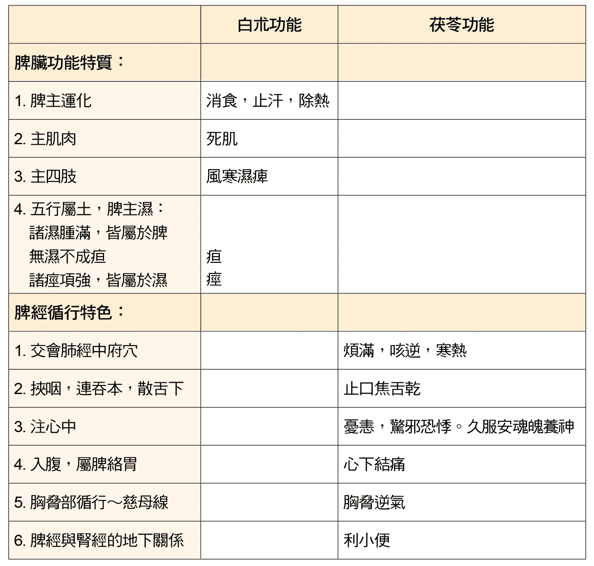

看出端倪了吗？白朮与茯苓隐藏有脾经的重大秘密，就是脾经经络系统与药物的作用一致。

脾经连结三个脏腑：脾、胃与心。白朮与茯苓的功能都与这三个脏腑有关。

《内经》中载明，诸湿肿满皆属于脾，无湿不成疸，诸痉项强皆属于湿等，白朮主治的疸及痉病都是脾脏处理水湿功能异常，所以白朮主治脾脏功能失调。

而茯苓所治的病症几乎都与脾经循行有关，加上脾经由足部向上走到胸胁，所以出现「气机上逆」的现象。当气机上逆还挟带着水气，对于人体影响很大，因此它的治症遍布在体腔而且还很动态，例如由下而上的「胸胁逆气」、「咳逆」，结在局部团状疼痛的「心下结痛」、「烦满」等，这些症状都可透过「利小便」由下而出的方式来改善。

茯苓的治症还有一个很特别的现象，因为脾经最后注入心脏，水气很容易搭着脾经顺风车上逆影响到心，中医称为「水气凌心」，病人会出现心悸，严重的话会影响心主神志功能，而有过度忧虑、恐慌害怕等情绪失常的反应。

《神农本草经》中茯苓主治水气上逆故事如此精彩，可惜现代中药学将茯苓写得很平淡，就跟它的性味一样。

后世医家还曾将茯苓菌核中抱有松根的部分称为「茯神」，顾名思义，就是很能安神，用来治疗茯苓治证中忧恚、恐惊等心神不安的症状，现代临床也常如此使用，尤其能帮助睡眠。古医家因此认为，茯苓入脾肾之用比较多，茯神入心之用比较多，将原来属于茯苓的治症做更精细的分工，但是茯神重在安神，如果是因水气上逆的心神不安，仍需使用茯苓。

白朮与茯苓在人体的作用方向不同

请参考右下图，白朮作用于脾与胃之间，为横跨两侧的橘色线，重在强健脾胃之气。

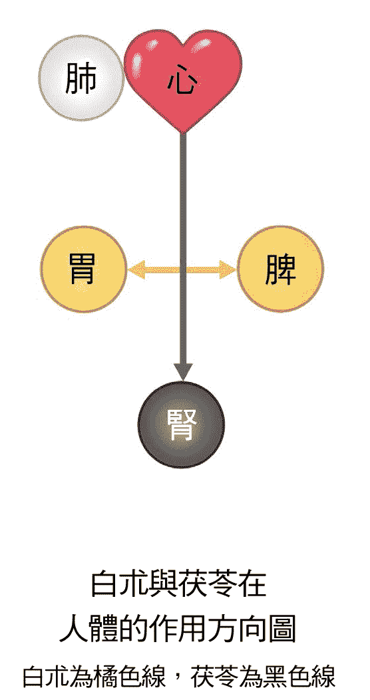

茯苓作用于心肺与脾肾之间，为箭头向下的黑色线，由于水气上逆会影响人体上中下三焦，重在通利水道，让脾经所过部位潴留的水湿之气从小便而出。

白朮与茯苓在人体形成一个十字形的作用方向，脾胃正位于十字形路线的关口，由此更凸显出脾胃在人体气机流动的重要性。

一层层解开白朮与茯苓所藏的秘密之后，我们再继续深入探讨。

白朮、茯苓药性与穴位特质的配合

白朮类似太白穴的功用。太白穴为脾经原穴，善于治疗五脏疾病。脾脏属土，太白穴也属土，土上加土，是脾经之中强健脾胃能力最强的穴位，可以明显改善脾脏疾病。白朮双重土性的特质，宛如加高加粗的河堤，治水功能当然很强。

茯苓类似阴陵泉穴功能。阴陵泉穴为脾经合穴，善于治疗内腑疾病。其五行属水，可以疏濬水道，导引湿邪从小便而出，改善水饮停留在脾经循行所过部位所造成的疾病。如果气机上逆严重，还可配合最擅长降逆气的公孙穴，若再加入内关穴一起开胸理气，敞开胃心胸，效果更佳。

白朮和太白穴属于脾脏用药和穴位，功能比较静态与内向，守护脾脏家业；茯苓和阴陵泉穴属于脾经用药和穴位，功能比较动态与外向，为脾脏家族拓展人际关系。

《伤寒杂病论》使用白朮与茯苓的思考

白朮与茯苓合用：

东汉张仲景的著作《伤寒杂病论》（含《伤寒论》及《金匮要略》两书）中，常以白朮配茯苓来治疗水湿，最经典的方剂就是「苓桂朮甘汤」，具有温阳利水的功能。苓朮两药合用能强健脾胃来治本，燥湿利湿来治标，标本共治。桂枝合甘草能加强心脏阳气，心脏的阳气就像太阳的光与热，可以将水湿晒干一样。苓桂朮甘汤能让脾胃心的阳气充足，除湿效果当然很好。（桂枝与甘草也是非常精彩的组合，且待《卷四》再跟大家介绍。）

在《金匮要略》的痰饮篇中最能看出「苓桂朮甘汤」的特色。这一篇章主要探讨水饮停留人体所产生的疾病，有两个主题：

1.水饮停留在五脏

水在心：心下坚筑，短气，恶水不欲饮；

水在肺：吐涎沫，欲饮水；

水在脾：少气身重；

水在肝：脇下支满，嚏而痛；

水在肾：心下悸。

水饮停留在五脏症状，除了水在脾的「少气身重」，类似白朮的「死肌，风寒湿痺」症状之外，其他都与茯苓主治类似：

水在心「心下坚筑」类似茯苓的「心下结痛」，水在肺「吐涎沫，欲饮水」类似「咳逆…止口焦舌干」，水在肝「脇下支满」类似「胸胁逆气」，水在肾「心下悸」类似「惊邪恐悸」。

由此看出内向的白朮属于脾脏药，主治脾水之证；外向的茯苓属于脾经药，兼治脾经连结的脏腑经络之水病。

2.水饮停留在体内不同部位

主要分为四类：水留肠间的「痰饮」，水流胁下的「悬饮」，水停四肢皮肤的「溢饮」和水堵在胸膈的「支饮」。

其中跟脾胃比较相关的是「痰饮」，症状之一是水走在肠道之间，发出沥沥声音的肠鸣，症状二是痰饮停留在心窝处（心下），出现胸胁堵闷胀满（支满）、头晕目眩的症状，都可用苓桂朮甘汤治疗。

苓桂朮甘汤所治的「痰饮」，所病部位已经从茯苓原先的胸胁部位延伸到头面部，出现眩晕等症。再参考《伤寒论》中「伤寒若吐若下后，气上冲胸，起则头眩，脉沉紧，发汗则动经，身为振振摇者，苓桂朮甘汤主之。」本证心下逆满，气上冲至胸，而出现头晕目眩，跟《金匮》的情况一样，可见「气上冲胸」比茯苓的「胸胁逆气」更严重，因此需要白朮一起健脾利水来平冲逆之气。

《金匮》在本篇章还提到：「短气有微饮，当从小便去之，苓桂朮甘汤主之，肾气丸亦主之。」指出水饮会造成短气，呼吸不利的情况，但因所病的脏腑有异，处方也不同。在《卷一》中提过，肺肾与呼吸有关，肺主吐气，肾主纳气，《难经》也说「呼出心与肺，吸入肾与肝」，因此如果呼气较短，表示是心肺阳气不足，适合苓桂朮甘汤；如果吸气较短，表示是肝肾气化与纳气功能不足，适合肾气丸。

苓桂朮甘汤还有一个强力利水版「五苓散」，治疗水停脐下「瘦人脐下有悸，吐涎沫而癫眩，此水也。」

由上述讨论可知，白朮与茯苓合用，都可治水饮停蓄及向上冲逆之证。

白朮、茯苓独行：

现在回归《神农本草经》所述，看看《伤寒杂病论》中两药如何各自发挥。

【白朮】

1.治疗湿邪为病，导致关节疼痛。

如《金匮要略》提及：

● 麻黄加朮汤——治湿家，身烦疼。

● 麻杏薏甘汤——治风湿，一身尽疼，发热，日晡所剧。

● 防己黄耆汤——治风湿，脉浮，身重，汗出恶风。

● 白朮附子汤及甘草附子汤——治风湿相搏，身体疼烦，不能自转侧，大便坚，小便自利，或骨节疼烦，掣痛不得屈伸，小便不利。

● 桂枝芍药知母汤——治历节之证，诸肢节疼痛，身体尪羸，脚肿如脱，头眩短气等。

以上可以看出，白朮常被用在治疗关节及肌肉疼痛，符合《神农本草经》「风寒湿痺、死肌」之症。

临床上，见到多吃各种瓜类、白萝卜等寒性食物的病人，由于寒湿困脾土，致使肌肉变得过度松软，我形容是「融化的冰淇淋」，都可使用太白穴或白朮来健脾利湿，强健肌肉。

2.治疗脾脏功能失调之症。

如《金匮要略》载明：

● 枳实白朮汤——水饮所作，心下坚，大如盘，边如旋盘。

● 泽泻汤——心下有支饮，其人苦冒眩。

白朮与行气消胀的枳实合用，脾胃两治，治疗水气虚结的心下肿硬感；白朮与利水的泽泻合用，脾肾两治，治疗水饮结于心下的眩晕症。

白朮合枳实是「以土治土」，白朮合泽泻是「以土制水」，两个药方都是凭借白朮属于脾土的特质。

【茯苓】治症都与小便不利，水气上逆有关。

例如「小半夏汤」主治心下有支饮的呕吐，兼有眩晕心悸会加入茯苓；《伤寒论》「小柴胡汤加减方」中，兼心下悸，小便不利，少腹满就会使用茯苓。

「五苓散」跟「猪苓汤」都能利水渗湿，猪苓汤治疗水热互结之证，药物组合就在五苓散的基础上，去桂枝、白朮，加阿胶、滑石，加强清热滋阴的功效。

藉由上述分析，应该可以了解茯苓与白朮功用之别吧！

* * *

白朮可以安胎之理

#### 白朮可以安胎之理

《神农本草经》未提到白朮可以安胎，首见于《药性赋》「佐黄芩有安胎之能，君枳实有消痞之妙。」张洁古老医家说：「白朮除湿益燥，和中益气，利腰脐间血，除胃中热。」可见白朮是善用健脾除湿及利腰脐间血来达成安胎的任务。

白朮透过「利腰脐间血」来安胎的这项功能，就要回归到脾经经筋所形成的篓子结构，因为胚胎形成后都安住在这个篓子里，因此只要篓子稳固，没有松脱下滑，胚胎就能安全无虞。

谁能让篓子稳固呢？这当然就要交给能改善脾脏功能，强化升清功能的白朮了。

* * *

二、足太阴之正（经别）

## 二、足太阴之正（经别）

脾经经别比脾经经脉精简许多，在大腿部与胃经的经别相合，再一起向上行，结在咽喉部，最后贯穿舌根。

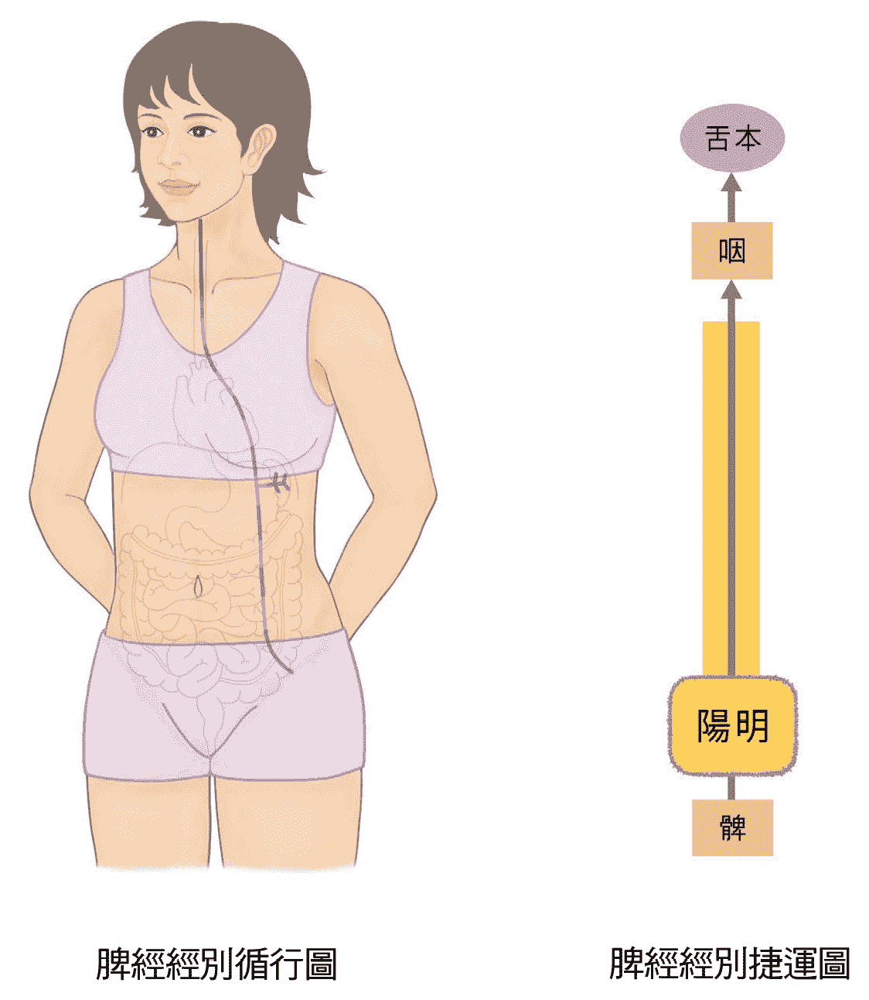

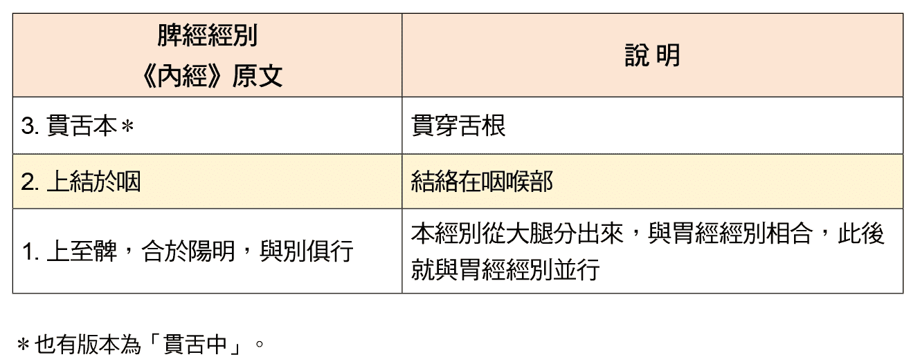

细心的读者可能发现，怎么脾经经别的《内经》原文与上页的循行图不同？而且看起来似乎跟胃经经别相似，怎么会这样？

这是因为脾经经别有隐藏版的循行路线。我们以下面脾经与胃经的经别对照图来做说明，大家就比较容易了解。

脾经经别「上至髀，合于阳明，与别俱行，上结于咽，贯舌本。」

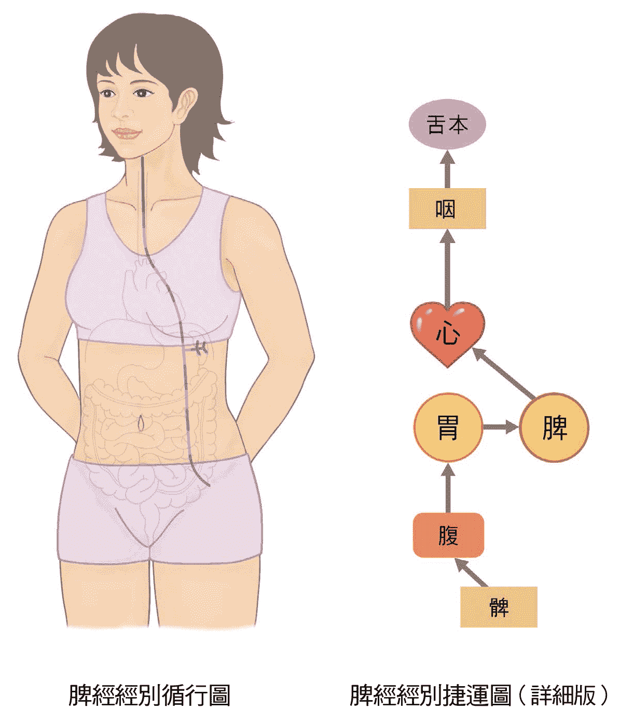

胃经经别「上至髀，入于腹里，属胃，散之脾，上通于心，上循咽，出于口，上頞䪼，还系目系，合于阳明。」

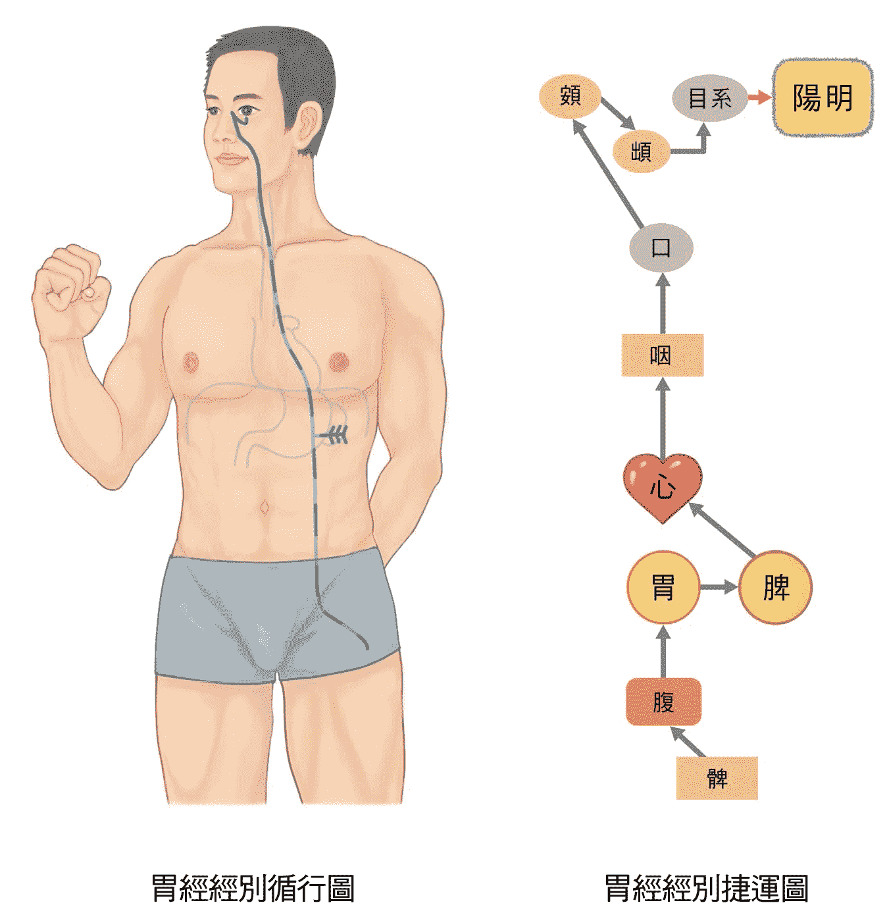

对照两经经别内容可以看出，脾胃经别都上至髀，但脾经经别自此以后的循行就直接交给胃经经别「合于阳明，与别俱行」，最后再上结于咽，贯舌本。依此推论，脾经经别的详细路线应该是「上至髀，入于腹里，属胃，散之脾，上通于心，上结于咽，贯舌本。」划线的内容是胃经经别的循行。依据此内容，我们画出前面的脾经经别捷运图（详细版）。

脾经经别加强了脾经经脉中，咽与舌本、舌下的连结，可见脾经对于咽与舌的重要程度，此外脾经还透过胃经经脉连结人体口部。而胃经经脉也透过脾经经别，连结胃、心与舌部。看来脾胃之间，有一种非常密切的合作关系，到底这有什么特殊作用？

我以它们之间的三种关联简单说明：

1.胃与舌：胃主受纳食物，舌部有助于食物在口中的搅拌及吞咽。

2.脾与口：脾开窍于口唇，《内经》说「脾气通于口，脾和则口能知五谷矣。」脾功能正常就能品尝各种食物，食物味道经由舌部传递给脾胃，启动消化系统。

脾胃的状况也可透过脾经经别输送到舌面。因此中医在临床上也能透过舌诊来诊察脾胃系统的疾病。例如：舌体偏胖，甚至舌边有齿痕，表示脾胃湿气重；舌苔黄干，表示脾胃火气大等。

脾经经别将舌与胃经相连结，有助于消化系统的运作以及疾病的诊断。

3.心与舌：《内经》说「心气通于舌，心和则舌能知五味矣。」心开窍于舌，心脏功能正常，就可「细心品味」食物的各种特色。另外，心主神志，舌头能辅以语言的方式表达个人情感以及内心想法，当心念正常时，言语也会正常，若心绪纷乱则容易说错话。透过脾经经别，让心与舌建立亲密关系。

脾经经脉连结脾—胃—心，脾经经别连结胃—脾—心，脾开窍于口，心开窍于舌，俗话说「病从口入，祸从口出」，完全就是心脾关系的写照，且脾的角色更为重要。脾可以制约胃的食欲，注意饮食卫生和习惯，脾也以爱的能量来约束心在讲话前多加思量，以免语出伤人。

另外，肾经经脉「循喉咙，挟舌本」，与吞咽及发音有关联。心与肾关系密切，就五行关系来看，肾水能制约心火，加上肾又主纳气，如果能在心要开口发表意见之前，先吸一口气纳入丹田，一方面让心冷静，一方面给脾多些时间约束心舌，或许就能减少许多不必要的口舌之争吧！

三、足太阴之别（络脉）

## 三、足太阴之别（络脉）

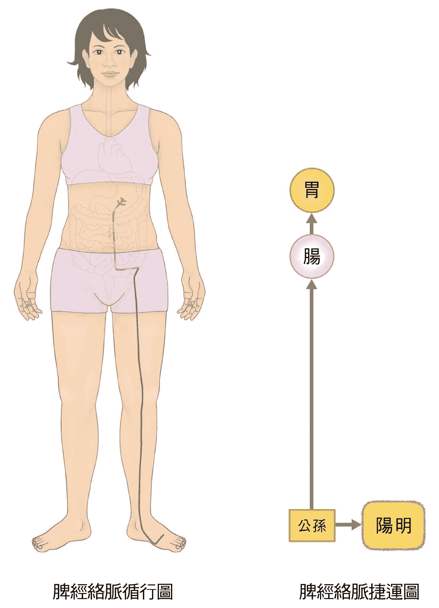

脾经是用心于照顾家人肠胃的「妈妈型」经络系统，循行路在线，脾经以经脉连结胃与心，以经别连结胃、心与舌，再以络脉连结肠道系统，更加强化脾经系统对于消化功能的重大影响力。

当脾胃的升清、降浊功能失常，就会出现上吐下泻的现象，古代以「霍乱」来形容胃肠道里面挥霍撩乱，一片混乱，并不是现代所说的霍乱。脾胃气机阻滞在腹部会出现腹部胀满，甚至肠子绞痛的情况，这些症状都可取脾经络穴「公孙穴」来治疗。

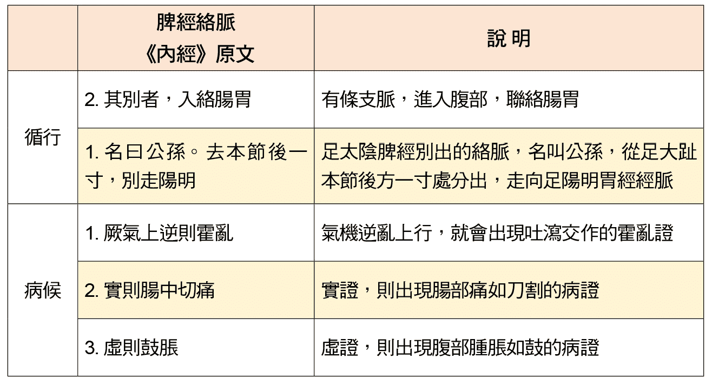

 中医师不传之祕：公孙穴通冲脉，兼治生殖系统及气逆里急之证

#### 公孙穴通冲脉，兼治生殖系统及气逆里急之证

「公孙穴」位于核骨到内踝前廉之间的精华区，能治疗脾经系统的各项疾病。除了消化系统的疾病之外，由于公孙穴还通奇经八脉的冲脉，让它又添加了三个特色：

1.能治生殖系统疾病：

公孙穴与生殖系统的关系，可从穴名上先做想象：在人伦关系上，男人必须有了「孙子」才会变成「阿公」，因此公孙穴与传宗接代有关。

公孙穴通冲脉，冲脉循行至阴器，古人称冲脉为「血海」，透过冲脉的连结关系，公孙穴也与生殖系统有关，在中医临床上常用公孙穴来调理月经、治疗各种妇科疾病。公孙穴这项能力也跟脾经经筋所形成的篓子有关。（详情参阅经筋篇）

2.能降胸腹部胀满：

「冲脉」的冲字既有「上冲」，也有「要冲」的意思，冲脉所过的要冲部位主要为胸腹部，一旦冲脉有病变，就会出现气血向上冲逆，甚则胸腹里拘急，大小便不利的现象。

公孙穴通冲脉，因此具有强大的降逆气、缓里急的能力，临床常用来治疗腹部胀满、紧绷，甚至胀满上至胸部，胸闷，嗳气等。

3.与内关穴合作力量强大：

奇经八脉八个交会穴，两两一组协力治病。公孙穴配搭通阴维脉的内关穴，善于治疗胃心胸的疾病。

内关穴属于心包经（经络解密．卷六），心包经循行经过胃心胸部位，内关穴本来就可以治疗胃心胸的疾病，例如胃胀气，心烦、胸闷等，但处理气逆能力不足，配搭善于降逆气缓里急的公孙穴，如虎添翼，处理胃心胸部位的气机阻滞，气机上逆和紧绷压迫感的力量更强大。

 中医师不传之祕：公孙穴美丽的错误

#### 公孙穴美丽的错误

一直很喜欢郑愁予先生的诗［错误］：

我打江南走过

那等在季节里的容颜如莲花开落

东风不来，三月的柳絮不飞

你的心如小小寂寞的城

恰若青石的街道向晚

跫音不响，三月的春帷不揭

你的心是小小的窗扉紧掩

我达达的马蹄是美丽的错误

我不是归人，是个过客……

年轻时曾经走在满城柳絮之中，随着脚下ㄎㄎ的足音，浪漫情怀大发，脑海浮现这首诗，美丽却也哀伤。接下来要介绍的内容可一点都不感伤，而且是临床很好用的「错误」喔。

前面介绍过公孙穴通冲脉，然而有关冲脉在胸腹部的循行，在《内经》和《难经》却有不同的说法。

《内经》：「冲脉者，起于气街，并少阴之经，夹脐上行，至胸中而散。」

《难经》：「冲脉者，起于气冲，并足阳明之经，夹脐上行，至胸中而散。」

《内经》说冲脉并肾经经脉，《难经》说冲脉并胃经经脉。所以我们该以哪本书为准呢？

奇经八脉除了任脉与督脉有自己的循行路线与穴位之外，其余六条奇经的循行，都与十二经脉有所交会，交会之时，会顺便借用十二经脉的穴位作为自己的穴位。后世医家记录冲脉在胸腹部借用的穴位属于肾经，可见前辈们依循《内经》的说法。

《内经》和《难经》对于冲脉并经的不同说法，也影响公孙穴的治疗范围。两本中医经典有着不同的说法，可能其中一种说法有误，虽然存在着错误，但临床上却很好用，所以我称它为「美丽的错误」。怎么说呢？

我们将两种说法合并如下图，再将身体两侧合并，就会看到冲脉在胸腹部的涵盖范围颇大，包括两侧胃经与肾经，也符合公孙穴是脾经络胃经的特色。

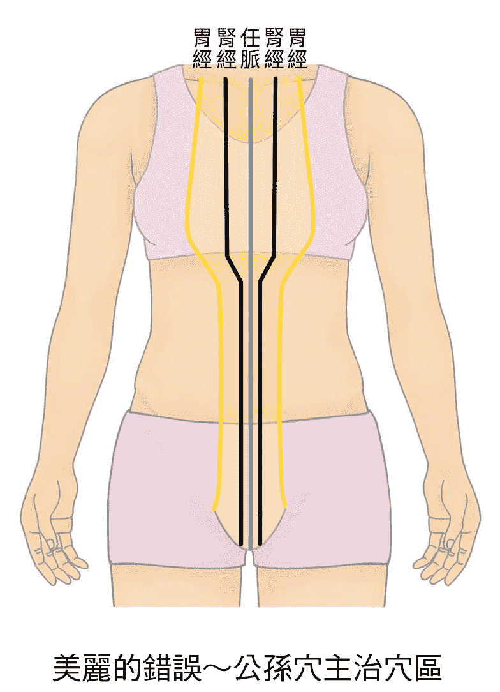

曾经治疗一位女性病患诉说腹部严重肿胀，检查发现肿胀范围刚好就落在「美丽的错误区」，而且肾经与胃经循行路线颇为僵硬，过去需选用胃肾两经穴位，现在只需选用公孙穴，下针之后腹部快速松缓。

冲脉这个「美丽的错误」，反而扩大公孙穴的应用范围，临床上只要发现胃肾合病，或任脉冲脉为病，都可使用公孙穴。您看，这个错误是不是很美丽呢？

♼ 解密：人体除了喝酒会醉之外，进食后，竟然也会出现类似酒醉的「食醉」现象

#### 人体除了喝酒会醉之外，进食后，竟然也会出现类似酒醉的「食醉」现象

早期读中医书，看到「食醉」一词，还以为印错了，因为曾看过「酒醉」，但没听过「食醉」。仔细看后面的说明，原来是指脾胃气虚的人，当食物进入中焦脾胃之后，由于脾胃的消化与运化功能不良，导致清气不升，浊气不降，以致进食后，肢体无力，头部昏沉而想睡。

依据现代医学的说法，是因为进食后大量血液进入消化系统，致使头部血液供应不足，出现短暂的缺氧，才会头晕想睡。

有趣的是，中医竟然使用「醉」这个字来形容头部的昏沉感和无力的嗜睡感，就好像酒醉之后的身体反应，真的非常传神。

临床上，也常听到病人说吃饱饭后四肢无力、昏昏欲睡的情形，连我们自己也有这种现象。依据现代医学的说法，饭后稍微想睡是正常的，但如果出现明显疲倦感与昏沉感的「食醉」，就要小心了。为什么呢？

从中医理论来看，「食醉」除了起因于脾胃气虚之外，还包括吃饭速度过快、所吃的食物较难消化，还有饮食过量等不良习惯所致。脾胃气虚属于内在因素，饮食习惯则属外在因素。

当我们吃下食物之后，脾胃就开始繁重的消化与运化工作。对于一个本来脾胃就虚弱的人，脾胃之气一旦被拿去消化食物，身体其他部位的气机就会不足，当然容易出现疲乏困倦的情况，这就像平日收入不丰的人，到了月底缴房租时，都会有一种口袋被掏空的感觉。

另一方面，即使脾胃功能正常的人，若以飞快的速度将食物塞入肚中，脾胃的工作量骤增，气机耗损量大，无法及时消化食物而停滞在脾胃，中焦气机升降失调，也会出现腹胀、身重、头昏嗜睡的情况。

所以无论是脾胃气虚的内在因素或是饮食习惯的外在因素，都会导致中焦气机升降失常，出现清气不足的四肢无力，以及浊气不降，致使头部这个清窍失于濡养而昏沉嗜睡，很像喝醉酒的「食醉」现象。

「食醉」现象如果偶而出现，还好！如果频频出现，就要了解是来自内在或是外在因素，加以改善。若不赶紧改善，反覆发作，未来很可能出现后面所述的「食填太阴」急症。

 中医师不传之祕：可怕的「食填太阴」！

#### 可怕的「食填太阴」！

中医有一个病名「食填太阴」，最初看到这个名词，也跟「食醉」一样，因为很生动马上记住了。临床后真的遇到此证，病情有轻有重，但对病人来说，都是很痛苦的经验。

为何会出现「食填太阴」？简单的说，算是「食醉」病情的升级版。

脾胃位于人体的中焦部位，为气机上下通行的要道。如果饮食不节，消化不良，食物填塞于中焦，就会阻滞胸腹气机而出现痞闷胀痛；脾胃主四肢，阳气阻于胸腹，不能敷布于四肢而手足逆冷，甚则气机难达下焦，下焦隔绝而尺脉全无。病情看起来是不是有点像「食醉」的加强版，实则更为恐怖！

临床上遇过的案例，轻者胸腹痞闷胀痛，频频搥胸也无法缓解，呼吸不利，饮食难下，二便难出，浊阴盘踞于上，头晕欲吐，心情烦躁。重者甚至当场昏厥。

曾有一位老妇人，太晚用膳过度飢饿，食物上桌后吃得太急，加上吃进不易消化的食物，才吃几口，突然告诉身旁的家人：眼睛模糊、头昏、想吐……接着眼神涣散，马上瘫软晕倒、四肢冰冷。家人当场吓坏了，紧急叫救护车送急诊，途中甚至还小便失禁。入院后病人意识渐渐恢复，各项西医检查均无异常，可是全身虚弱、头晕、胸闷，后来转到中医科，经治疗后头晕改善，再经二三天后才恢复元气。

临床上的体会是：食填太阴者过去都有伤食史，亦即因饮食习惯不良而伤及消化机能。通常以饮食不节为前提，例如饮食过于寒凉或油腻，加上吃太快又过量，导致食物难消化，积滞在脾胃，脾失运化，致使气机上下痞隔不通而见诸证。

治疗方面：当以消食化积，疏通中焦气机为主。

中药药方：一般性食积可用半夏天麻白朮汤为主，过食寒凉可用吴茱萸汤为主，饮食厚味可用保和丸和温胆汤为主。

针灸部分：太白穴合丰隆穴（原络配穴：脾白隆），内关穴和公孙穴（八脉八法交会穴：内关公孙善治胃心胸疾病），甚者再加足三里穴、陷谷穴、合谷穴、曲池穴、神门穴等，以加强疗效。食冷者，宜加灸。

「食填太阴」重症者，也算临床急症，务必赶紧救治。

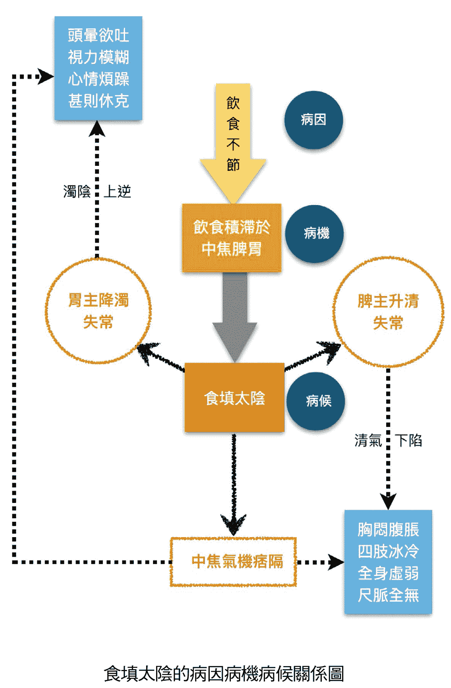

四、足太阴之筋（经筋）

## 四、足太阴之筋（经筋）

脾经经筋──循行特色

### 脾经经筋──循行特色

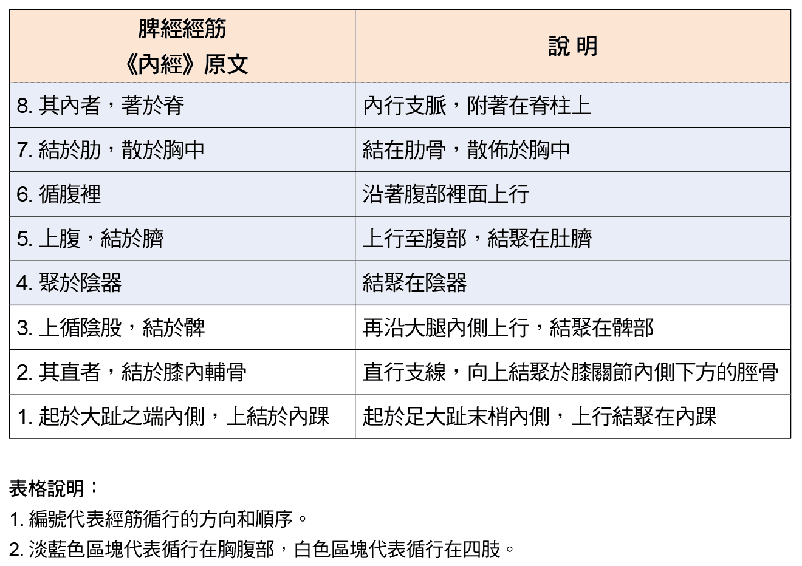

脾经经筋在下肢部循行跟经脉一致，都是走在下肢阴面的前侧，从大趾抵达髀。从髀沿着腹股沟连接到阴器，再向上到胸腹部就非常有特色，跟经脉循行不同，功能上却与经脉互补。

1.下肢部

从足大趾→内踝→膝内辅骨→阴股到髀，与经脉循行一致，都是走在下肢阴面的前侧。脾经经筋这段循行，除了保护脾经经脉之外，还有一个特色，就是肾经经筋与之并行，即两条经筋并肩同行的意思。

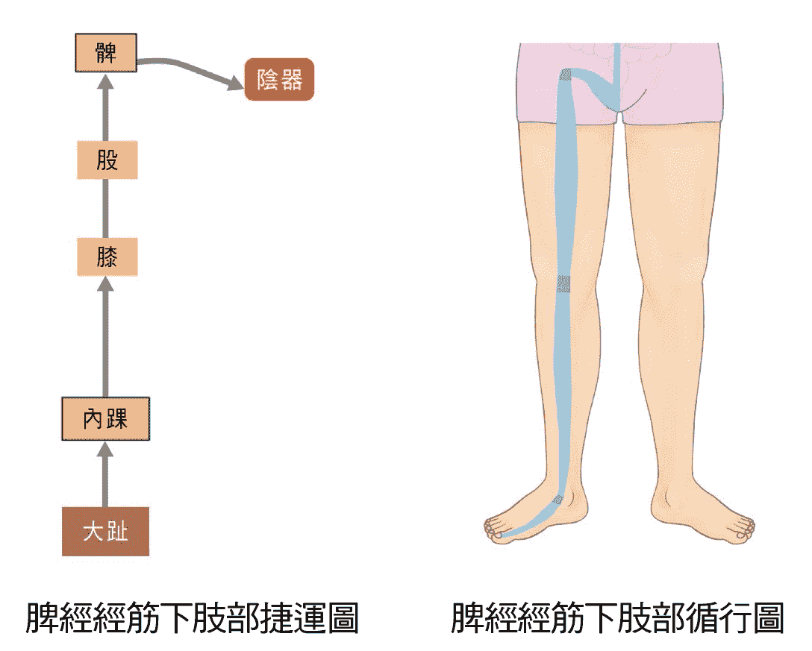

脾经经筋与肾经经筋有二个并行部位，分别是从足心到内踝之下，与膝关节内辅骨之下，循阴股，结于阴器：

从足心到内踝之下：两条经筋并行处应该在足弓，约在脾经的公孙穴与肾经的然谷穴之间，我称这个区域为「公然穴」，是治疗脾肾两经共同疾病的好穴区。

从膝关节内辅骨之下，循阴股，结于阴器：两条经筋并行于膝盖下方内侧，向上到大腿根部，一起结于阴器。

脾经经筋与肾经经筋在下肢部并行，再一起结于阴器，是一件有趣的事。因为在脾经的好缘关系中，脾与肾没有直接关联，加上「后天＋先天，脾肾不露白」的特色，两经都非常低调，唯有透过经筋在下肢部并行，暗通款曲，互送讯息。

人体的下肢阴面有三条经筋通过：脾经位于前线，肝经位于中线，肾经位于后线。大腿部位脾肾两条经筋并行，覆盖走在中间的肝经，这样的循行特色，很有可能是为了保护掌管外生殖器功能的肝经，为了保护「命根子」，脾肾两经手牵手并肩走，将肝经「藏」在下面，避免无谓的损伤。

2.胸腹部

本经筋从下肢上行结聚于阴器，然后分出内外两线：

外线：走在腹部及胸部。

从阴器上腹，结于肚脐，进入腹部，循着腹部的里层向上走，结在所有肋骨的内侧面，再向上连到胸骨，散布于胸廓之中。

内线：走在脊椎的内侧面。

从阴器连结脊椎，并附着在脊柱内侧面上。

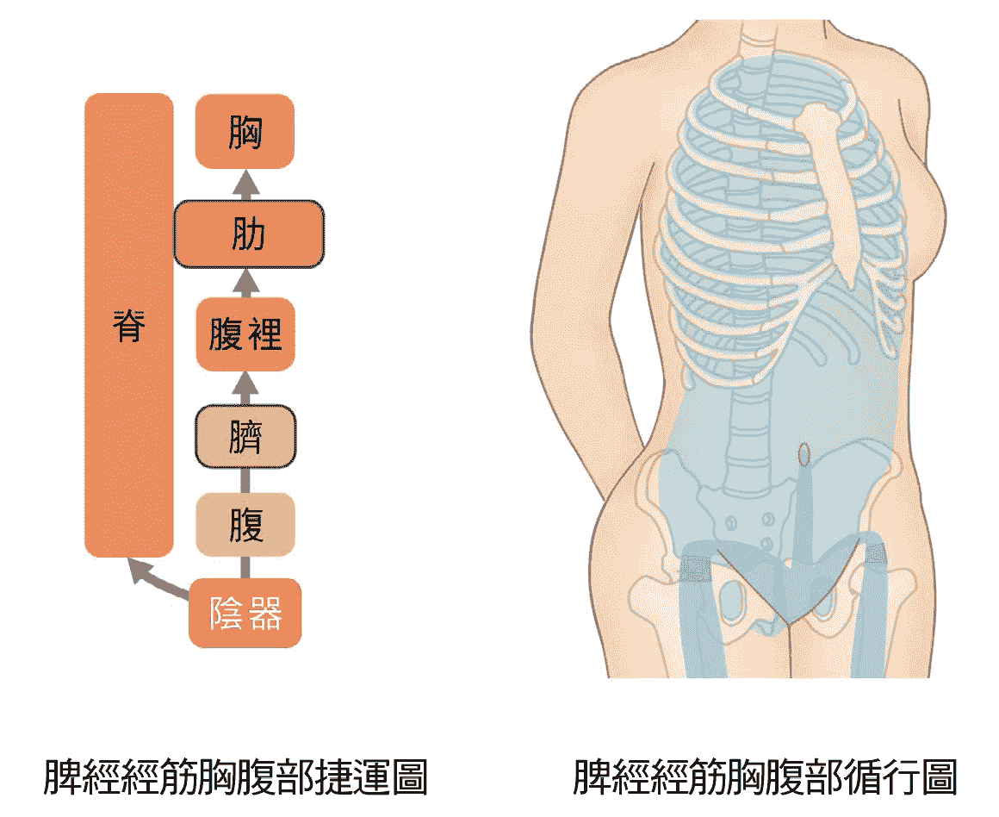

理论上，经筋不进入体腔。严格来说，脾经经筋循行虽然进入胸腹部，但只分布在胸腹部外层的肌肉与骨骼组织上，并没有进入体腔深处与脏腑连结。

脾经经筋与脾经经脉循行路线之间，存有很特别的关系。在经脉篇中提过，贤惠的慈母线能将布料缝成孩子穿在身上防寒的游子衣，脾经经筋在胸腹部所形成的空腔组织（篓子结构），就宛如游子衣。脾经经脉在胸腹部弯曲的路线连结多个脏腑，宛如慈母线，经脉穿梭在各个脏器之间，连属和交会重要脏器，形成联络讯息与输送气血的通道，并在重要的交会处串连经筋，让经筋得以发挥保护经脉之职，如下图。

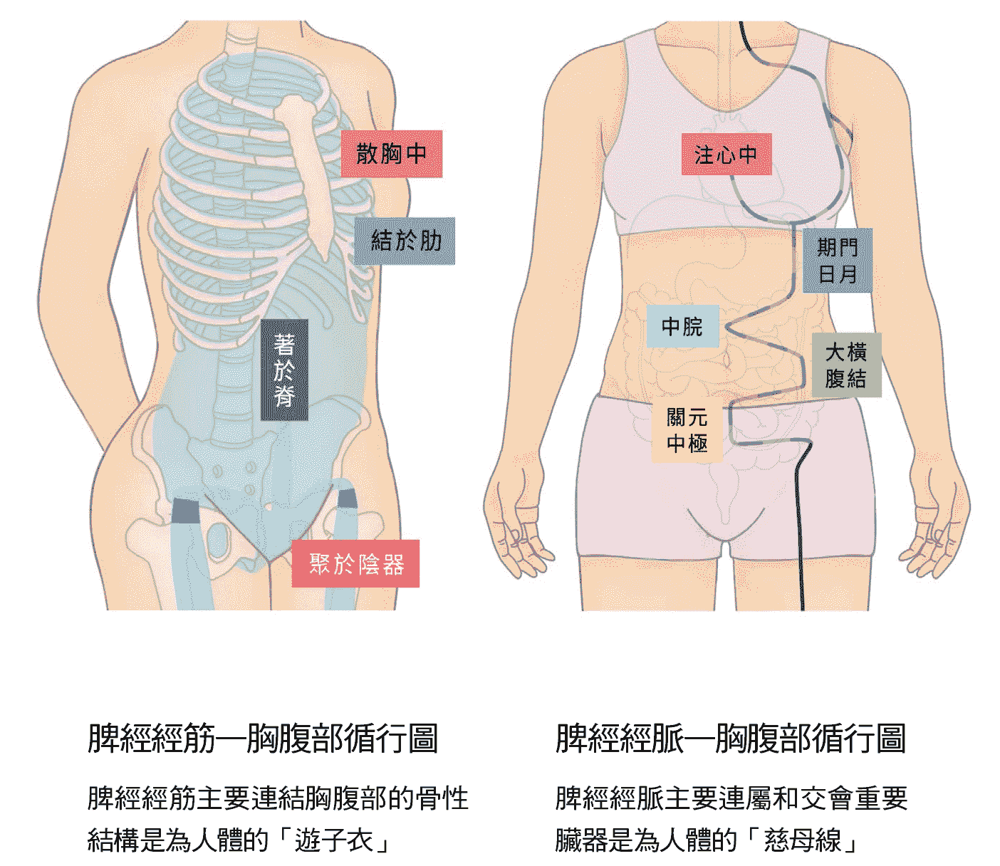

经筋分布在体腔外层，包覆在经脉重要的交会部位，给予脾经经脉全面的防护，且连结胸腹部所有的骨性结构，包括前面的胸骨、侧面的肋骨与后面的脊椎，形成体腔最直接的保护结构。这个结构有一个支撑点是「着于脊」，连结在脊椎内侧面，是篓子结构很重要的固定部位，脾经也藉此与肾经建立了秘密关系。

此外脾经经筋与肺经经筋虽然都分布在胸肋区，但确切部位和功能则有不同：肺经经筋分布在肋骨与肋骨之间，主要功能是帮助呼吸，并保护心肺；脾经经筋分布在胸骨与肋骨内面，主要功能是帮助固定经筋以形成篓子结构，提供升清、固定和缓冲。

人体内都有一个「篓子」的守护结构

#### 人体内都有一个「篓子」的守护结构

犹记开始研究经络时，读到脾经经筋，感觉很奇妙。因为多数的经筋系统都宛如贴身保镖般，如影随形包覆着经脉，配合经脉的主要循行。

脾经经脉在胸腹部的循行，只有「入腹，属脾，络胃」六字，言简意赅，可是它的经筋在胸腹部的叙述却非常精采，从阴器上腹，一路到肚脐、腹部和胸肋部，后面还附着在脊椎上，乍看它比经脉循行路线复杂，更是少数进入体腔的经筋。

我试着将《内经》的文字叙述画成图（下图），赫然发现脾经经筋在胸腹的循行建构了十二经筋系统中唯一的立体结构，若将两侧合并，竟然像一个大篓子！不禁赞叹古人怎么这么厉害，发现人体藏着这个大秘密！

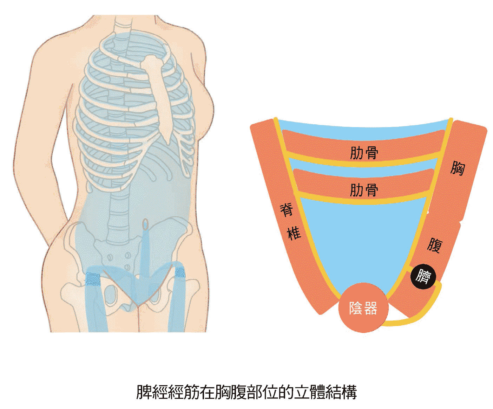

再仔细一想，脾的母性特质与女性生殖系统密切相关，脾经这个经筋所形成的篓子，除了提供脾脏特有的结构基础之外，如同古早时代母亲用来承载保护孩子的篓子，这些特质都深深影响女性一生。

脾经经筋结构特色

脾经经筋在胸腹部的循行，以阴器为起始点，分为前、中、后三条路线：

● 前线：沿着腹部表层结在肚脐，接着进入腹部，顺着腹部的内面上行，结在肋骨的内侧面，再向上散布到胸骨及胸中。

● 中线：腹部及肋骨的经筋顺着体腔，分别向后延伸，附着在脊椎内侧面。

● 后线：从阴器转向身体后面，向上沿着尾骨、荐椎、腰椎到胸椎的内侧面。

只要将前中后三条路线连结起来，就会发现 V 形橘线其实不是线，而是一个圆锥形的立体结构，类似早期民间生活常用的「篓子」。

早期的篓子是采用取材方便的竹子编织而成。细竹条轻巧有弹性，可以形成缓冲，避免篓子内的物品磨损或破碎。为了固定篓子的形状，会在篓子上端和下端采用较粗的竹片围成圆形，让位于篓子中间的细竹条可以附着其上，成为坚固的结构，不但维持篓子的形状，不会轻易变形或散开，篓子里的物品也不会被挤压而摔落出来。

有趣的是，脾经在胸腹部的经筋竟然也采用一样的概念，架构出一个上宽下窄的篓子。

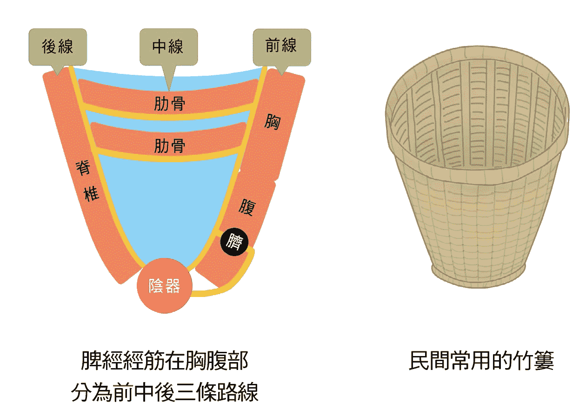

脾经经筋的前中后三线，形成了人体篓子的边缘，图中蓝色区块就是脾经经筋所围成的上宽下窄的中空结构，体腔内的所有组织器官都位在其中。它以阴器为底端，前线沿着腹部及胸肋的内侧面分布，后线沿着脊椎内侧面分布，前线与后线之间的中线就由肋骨上的经筋连结。

人体胸腹部的骨性结构包括：下腹部的骨盆、胸部的肋骨和胸骨、后面的脊椎。如下图。

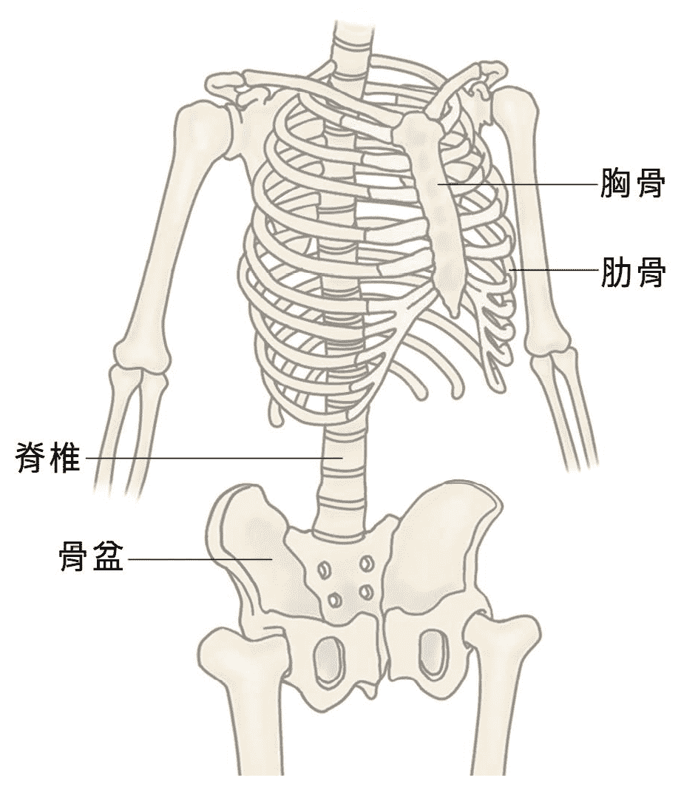

这四个骨性结构就像篓子上下两端的粗壮竹片，让脾经经筋得以附着并固定在体内。脾经经筋的篓子结构，简述如下：

上方：敞开的型态。

下方：耻骨（阴器）为中心，向前到肚脐，向后到脊椎。

前面：腹部、胸部及肋骨的内侧面。

后面：脊椎内侧面。

脾经经筋以上、下、前、后四个特殊方位，形成了篓子状结构，功用与一般篓子相同，都是用来承装及保护物品，只是保护的物品内容不同而已。

为何要一直强调，脾经经筋循行到这些结构的内侧面？

多数经筋只分布在人体表面的肌肉层，如胃经经筋包覆腹部及胸部的外层，并没有进入体内，脾经经筋则进入体内，分布在胸腹腔的内侧面。

人体胸腹部正面最强的两组经筋就是胃与脾，因分布位置不同，功能也不同。

胃经走在胸腹部的外侧（表层），像棒球的捕手装一样，直接从体外保护位于腹部及胸部的器官；脾经走在胸腹部的内侧（里层），环绕且结聚在骨面上，就像妈妈以手环抱孩子般的圆形包覆，它所形成的篓子状中空结构，既能保护体腔中所有组织器官，更能缓冲撞击，固定它们的位置。胃经在胁肋向后延伸一条经筋连到脊椎，以保护胃与脾；脾经在骨盆腔及腹部向后延伸出大片的经筋，附着在脊椎的内侧，除了保护脾胃之外，更保护骨盆腔内的器官。

由此可见，身为人体后天之本的脾胃，除了提供营养物质、濡养器官之外，也提供具体且强大的保护性结构。

有一次跟朋友分享脾经概念，朋友听懂后，马上惊呼说：「这简直就是个挂耳包嘛！」的确，现在流行的挂耳式咖啡，两侧如翅膀般的夹板，拉开后可直接挂在杯沿上，固定滤纸内的咖啡粉，整个马克杯的杯体，除了把手和杯底之外，类似本经筋所附着的结构，挂耳包就像脾经经筋，这种型态更能凸显脾经经筋在胸腹腔前面、中间及后面的固定结构。

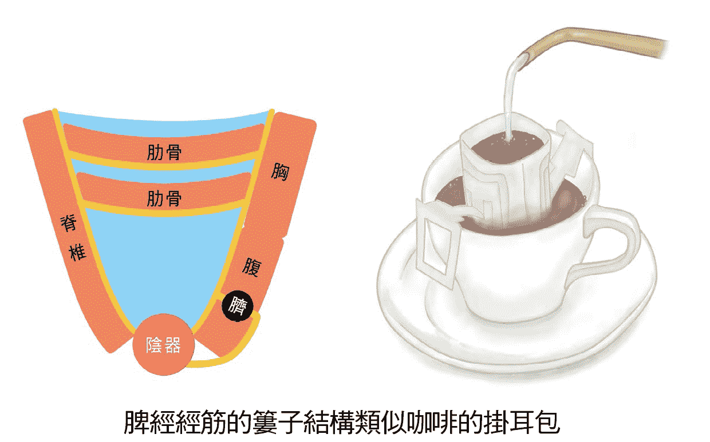

♼ 解密：脾经经筋形成的篓子结构，是人体的悬吊及避震系统！

#### 脾经经筋形成的篓子结构，是人体的悬吊及避震系统！

前面所说的篓子结构及咖啡挂耳包型态，可以看出脾经经筋在胸腹部循行具有两种特色：固定悬吊结构和缓冲避震功能。

● 固定悬吊结构：脾经经筋进入腹部内面，附着在耻骨、胸肋骨及脊椎三个骨性结构上，一方面将经筋固定在胸腹及背部的内侧面，另方面让经筋以环状型态悬吊在胸腹腔里面。这两项功能是以下「缓冲避震」功能所必备的结构。

● 缓冲避震功能：俗语说「要活就要动」，人的身体一直处于活动状态，体内各个器官、组织，犹如在船舶航行中工作的人员一样，不仅要在持续晃动中保持平衡，还要正常工作，这就需要非常优良的缓冲系统。有搭船经验的人都知道，只要身体放松，轻轻配合着船身晃动，就可以减轻晕船的状况。

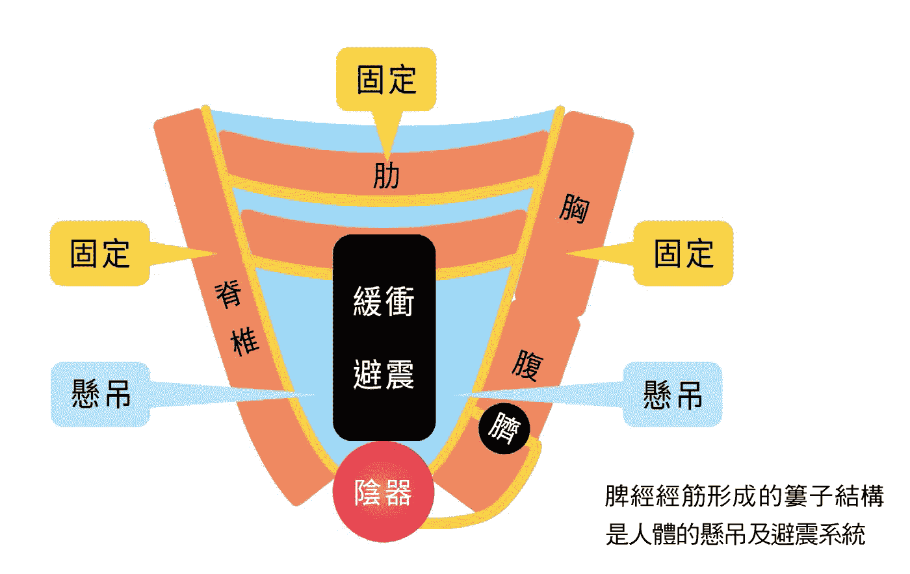

也可以借用汽车的「悬吊避震」系统概念来说明脾经经筋的功用。

汽车的悬吊系统，除了支撑车体的重量之外，还能降低行驶时的震动，以及维持车辆行驶的操控性等重任。

脾经经筋的「固定悬吊」结构，支撑胸腹腔内器官组织的重量并固定在它们应有的位置上，当身体晃动、运动，甚至遭遇重大撞击时，减缓对于内在器官组织的震荡与损伤，这就是「缓冲避震」功能，让人体得以维持平衡稳定的运作状态。

♼ 解密：脾经经筋的篓子结构，是人体体腔内重要组织器官的容器！

#### 脾经经筋的篓子结构，是体腔内重要组织器官的容器！

早期人们使用篓子作为承装物品的容器，以方便搬运输送，而脾经经筋的篓子结构，也是承载人体许多重要组织器官的容器。它包覆体腔的内面，体内主要的器官及组织都安置其中，包括五脏六腑，还有其延伸出来的组织，如「阴器」（主要是生殖器官，包括女性的阴道、子宫、卵巢等，男性的阴茎、睪丸等）以及各种组织，如血管、横膈膜、肠系膜等等，都是维持生命的关键。

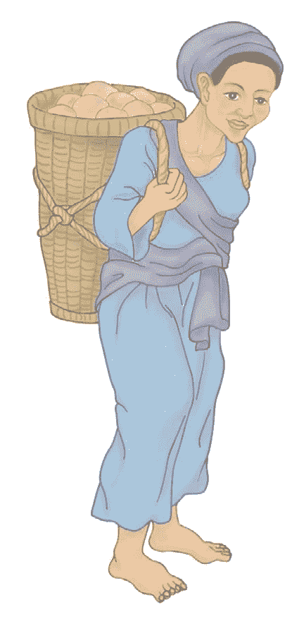

脾脏在五行属土，土为大地之母，承载万物，脾经经筋包覆与承载人体重要器官及组织，这项功能恰似《易经》所言「地势坤，君子以厚德载物」，这也是脾能作为人体主要承载者，万物所归的重要依据。

♼ 解密：脾经经筋篓子，对于体内一般器官组织有何贡献？

#### 脾经经筋篓子，对于体内一般器官组织有何贡献？

人体十二条经筋系统之中，唯独脾经经筋进入体腔形成大面积、前后左右相连的篓子结构，可想而知它一定身负重任，才会不循常规，自成一格。

脾与肺肾一起管理人体气血水的生成、循环与代谢，脾也跟肺肾一样，执行这些能力都需要「气」的推动，尤其脾位于中焦，是人体气机上下的道路，脾的气机「脾气」的稳定度，尤为重要。我们再回顾一下脾气所推动的主要功能：

*   运化：运送精微物质到全身，协助生成血液，且将体内多余的水湿运出体外。
*   统血：将血液固摄在血管内避免出血，并管控进出血管的物质。
*   升清：向上转输精微物质，并维持内脏器官位置恒定。

完成这三种功能的助力，都来自于脾经经筋篓子结构。

如前所述，脾经经筋的篓子结构协助脾气持续运化，且还有着向上升提的力量，可以对抗地心引力，让全身的组织器官固定在该有的位置，不会轻易下坠或松散，这都有助于脾的升清与统血功能。它还能缓冲撞击力道，让身体在时时刻刻的晃动中，得以减少损伤，且让器官组织快速回归原位，继续运作，有助于脾的运化功能，不会轻易被阻断。

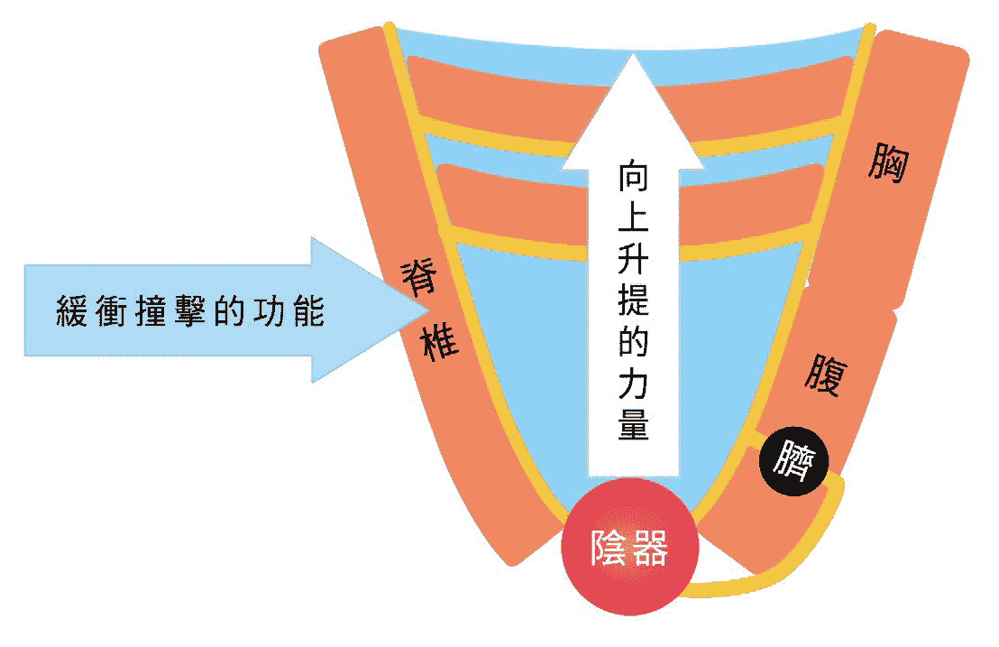

中医称脾胃为人体的「后天之本」，脾经经络系统不仅能生成与输送气血，也宛如贴身保镖般随时保护身体免于重大伤害，得以维持正常机能，其重要性可见一斑，也难怪脾经经筋享有特权，进入体腔形成立体结构。

正常的脾经经筋能协助脾气发挥运化、升清和统血三项功能，让人体组织器官得到气血滋养之外，还能「安居乐业」，安住在自己的位置上，发挥良能。

介绍到这里，大家会不会担心，脾经经筋篓子功能如此强大，会不会「功高震主」，超越脾脏呢？而谁能管控它呢？

请放心。总论中曾介绍过，每条经络系统都连结一个主要的内脏器官跟四肢躯干，经络系统必须服从五脏六腑指挥。就像军队一样，国家必须提供充足的粮饷和军备，战士们才能全力冲锋陷阵。经络系统也像守护在脏腑外面的部队一般，需要所属脏腑提供气血养分（类似军饷及军备）才能顺利运作。如果所属脏腑功能失常，经络系统也会随之失常。所以每一个脏腑都管控着所属的经络系统。

脾经经筋系统功能虽然强大，但需仰赖脾脏提供的养分来支持。如果脾脏功能正常，经筋的固定、上提等功能就会如常，可以持续协助脾的运化、升清和统血功能，这就是善的循环。若脾脏功能失常，经筋的固定、上提等功能也会失常，脾的运化、升清和统血功能变差，经筋功能也随之降低，这就陷入恶的循环。所以要维持脾经篓子功能正常的首要条件就是脾脏功能正常。

由于脾经篓子结构与脾脏互利共生，功能相辅相成，若经筋功能失常，脾脏功能也必然失常，补救之法当从调理脾脏着手，这个概念对于中医师尤其重要，后面会再详述。

♼ 解密：女性一定要知道的青春秘诀～脾经是女性的守护神

#### 女性一定要知道的青春秘诀∼脾经是女性的守护神

《内经》有关月经失调的论述是：「二阳之病，发心脾，有不得隐曲，女子不月。」二阳是指同属阳明的肠胃。由于心主神志，脾主思，心脾有病可以因情绪问题；另一种说法是，脾主化血，心主血脉，心脾有病也可以因气血生化不足，营养失调。

综合论之，肠胃为大胃王组合，功能差则营养吸收不足，脾病则养分无法输送给心，心的气血不足导致心病，心不能主神志，心火不能助脾土，脾也因思虑过度而情志郁结，消化功能异常加上情绪失调，致使大小便不利，女子月经闭而不来。

脾主运化，却与女性的妇科问题有关联，可见饮食及情绪对于女性的影响很大。《内经》同时也指出心脾胃与妇科的关联性：女性的经血属于血分，心脾胃都与血分有关，胃主受纳腐熟水谷，提供制作气血的材料，脾主运化，是血液的来源，心主血脉，是血液的展现，一旦心脾胃生病，气血的生产化源不足，冲、任两条经脉失于濡养，就会让人形体消瘦，月经量逐渐减少，严重者，无血可出就变成闭经了。

现代女性常以减少饮食做为减肥的手段，殊不知月经之血来自脾胃与心，如果饮食严重错乱，脾胃心功能跟着失调，不仅月经不来，甚至还会出现厌食症而死亡。

了解脾与女性的关系之后，接下来介绍女性的生理特色。女性的生殖特色与男性大不相同，女性四大生理特质分别为经、带、胎、产。

【经】：代表月经。

【带】：代表带下，指阴部分泌物。

【胎】：代表受孕及怀胎。

【产】：代表生产过程及产后的照护。

女性这四项功能都在脾经经筋的篓子里运作，因为脾经经筋结在阴器，前后包覆骨盆腔，女性的生殖器包括阴道、子宫及卵巢都在其中，其功能当然深受脾经经筋影响，所以脾脏对于女性一生的影响至为巨大。加上脾主生血统血，又能祛湿，「血」与「湿」都跟女性密切相关。

月经周期及血量质地等都与气血有关，不正常的带下与湿有关，胎产的过程与脾经经筋更为密切。

脾经经筋所形成的篓子，与胚胎在母体内成长的型态很相似（如下图），脾经经筋的篓子也像悬吊起来的摇篮，给予胚胎安全的生长环境，缓冲外来的冲击；而且向上提升的力量也能避免滑胎流产。

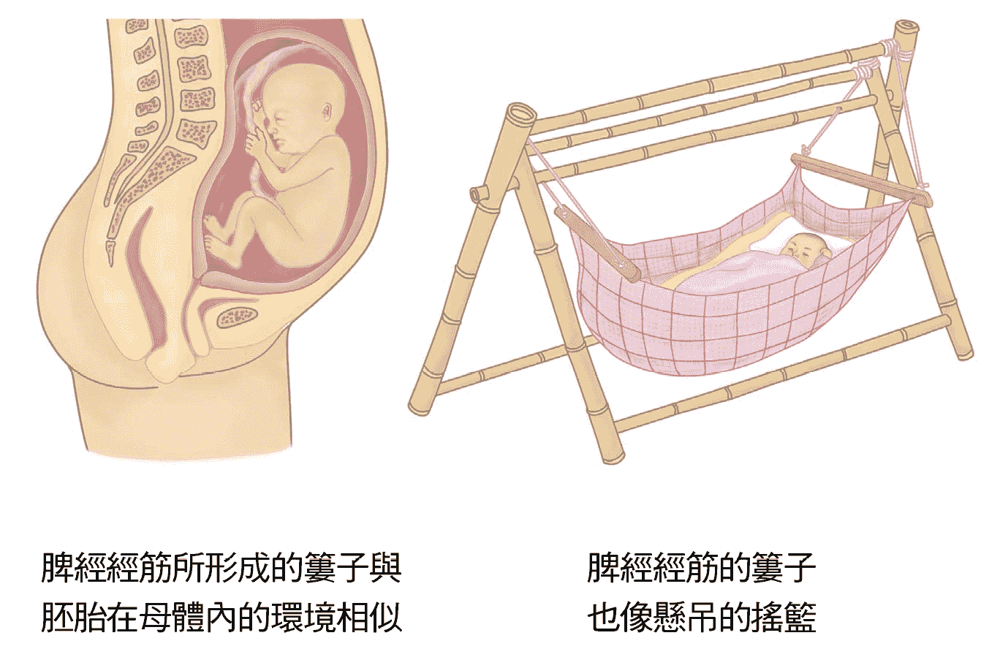

当胎儿足月将要临盆时，脾经篓子会向下滑坠，脾经经筋附着在腰椎的地方，会有强烈的酸楚沉重感，好像快要折断一样，许多准妈妈都有这类经验。接下来脾经篓子开始收缩(现代称子宫收缩)，将胎儿推至阴道分娩而出。

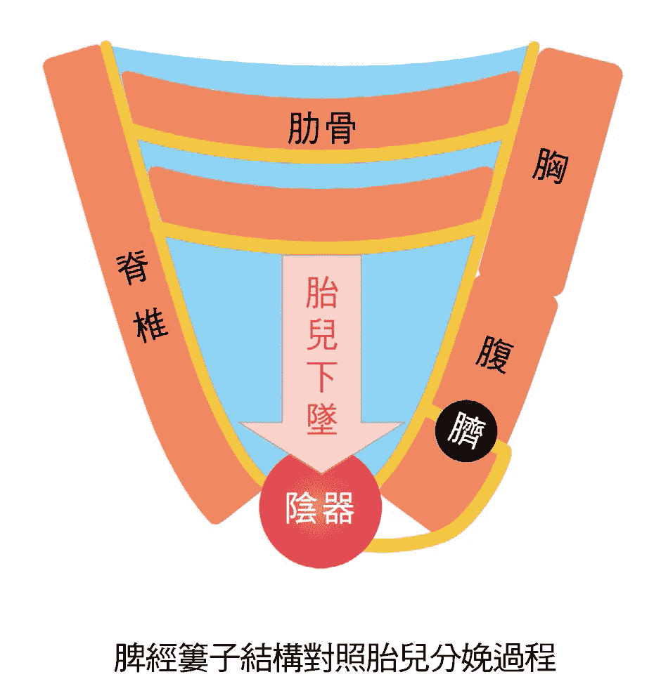

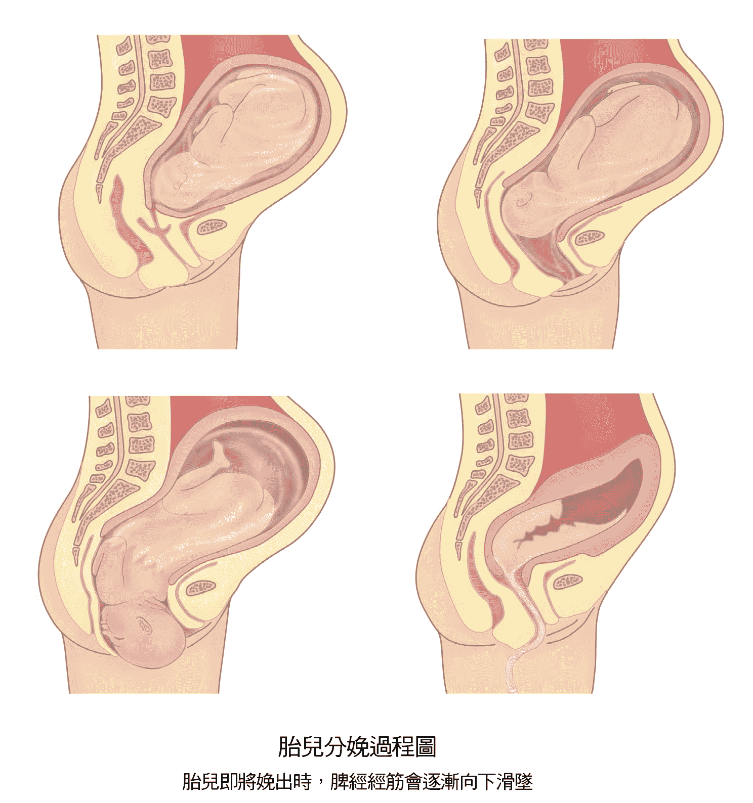

♼ 解密：男性也需要脾经的力量！

#### 男性也需要脾经的力量！

看到这里，男性读者会不会感到失落，感觉脾经似乎特别偏爱女性？其实不会。就像胃经强壮且多欲望，但不会因为偏于阳刚的特质，女性就不需要健康的胃经吧！

天地有阴阳，人体也包含阴与阳，每个人身体里面都同时具有阳性与阴性特质，《内经》说「阴平阳秘，精神乃治；阴阳离决，精气乃绝。」体内的阴阳平衡，身心才会健康。如果只有阴而没有阳，或只有阳没有阴，就属于危重症阶段了。所以男性的脾经当然也很重要！脾的阴性特质可平衡身体的阳性特质，加上脾胃共同为后天之本，脾脏许多功能，如运化、升清和统血等，也是男性所需的。

例如男性在外奋斗事业，必须精气神十足，如果压力大、思虑过度、饮食不正常等，导致脾气虚，甚至中气下陷，整个人就会像永远充不饱的电池，稍微工作一小段时间就没电了，疲劳无神无力承担上司交办的事务，严重的话甚至还会头晕，说话中气不足，要如何去开发客户？陪女朋友逛街一路喘吁吁；吃点东西就胃胀气；喝点冷饮就会腹泻；疲累就大便出血、腰痠背痛；下午还脚水肿，晚上超频尿；性生活无心也无力……够惨了吧！这都是脾经的篓子出了问题，所以男性同胞，还是要跟女性一样好好爱护你的脾经。

♼ 解密：中医师常说脾经的三阴交穴为妇科重要穴位，但怀孕妇女不能按揉。为什么呢？

#### 脾经三阴交穴为妇科重要穴位，但怀孕妇女不能按揉？

脾经的三阴交穴善于调理女性生殖系统中血液的问题，它可以补血、活血，还能促进分娩，若是过早刺激孕妇的三阴交穴，促进血流，提早宫缩，会有流产的风险，因此中医师才会特别提醒不要轻易去按揉此穴。

三阴交穴位于小腿内侧，足内踝尖上三寸，约为食指到小指合并的高度，胫骨内侧缘后方凹陷处。

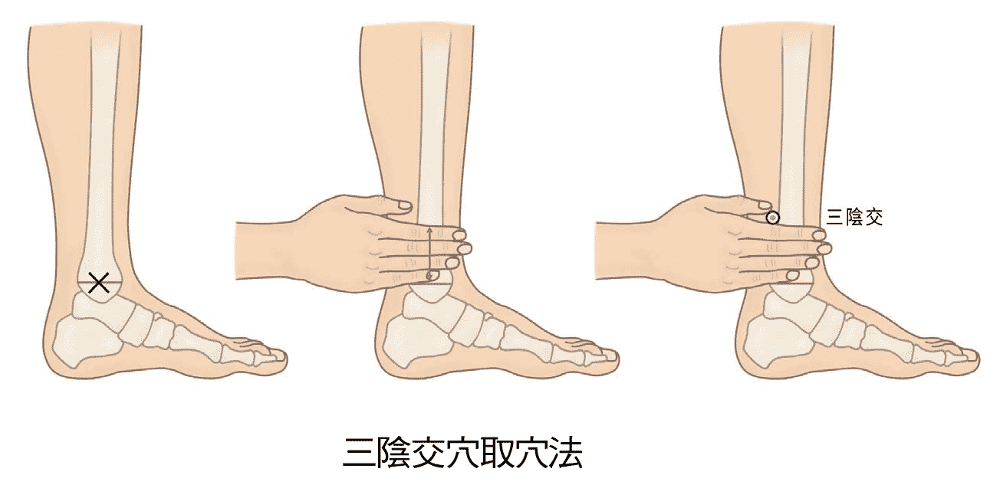

♼ 解密：凡是脾经所过之处，都要保护它

#### 凡是脾经所过之处，都要保护它

脾经像妈妈一样守护我们，我们也要记得守护脾经，关于脾经的保养，大家只要记得一个原则：包覆它！

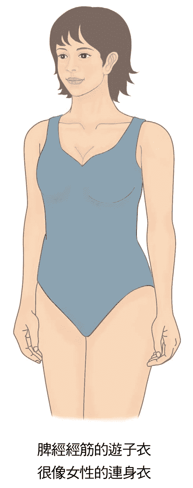

● 保护小腿部的三阴交，对于女性朋友尤其重要。

许多妇科问题，都来自风寒邪气客于胞中（就是子宫）。而风寒进入胞中的主要管道就是小腿的三阴交穴。建议尽量穿着长裤，而且是裤管能盖过三阴交的长度。如果必须穿裙子，也尽量穿上袜子盖过三阴交。

● 保护下腹的肚脐及腰部的命门穴。

脾经经筋的游子衣，其实很像女性的连身衣，如马甲，或小婴儿的包屁衣。

有一段时间年轻人流行穿低腰裤和垮裤，女生露出白嫩嫩的肚脐，男生露出粗壮壮的腰部，看在中医师眼里，很为这些年轻人未来的健康忧心。

因为在腹部及腰部坦露出来的部位有两个重要穴位；腹部肚脐为「神阙穴」，腰部为「命门穴」，位于第二腰椎下方（中医称为十四椎。对于脊椎数的算法，中医是从胸椎一路累积算到荐椎。扣除胸椎十二椎，十四椎即第二及第三腰椎之间），这两个位置刚好前后相对应。光看名字中有「神」和「命」，就应知道是重要穴位，两穴对生殖泌尿系统和肠胃系统有重大影响，应该避免曝露在外。若长期受寒，让寒气由肚脐及腰部侵入体内，不仅伤脾，更会伤了元气，百病丛生，状况比三阴交受寒严重许多。建议天冷时，把卫生衣扎进裤头，或穿着高腰裤，别让冷风有机会趁缝而入。

♼ 解密：从肚脐到命门穴这一圈是养生保健圈

#### 从肚脐到命门穴这一圈是养生保健圈

既然说到肚脐及命门穴，就跟大家进一步介绍中医养生观点。

周左宇老师上课时讲过一个案例：将热饭加上胡椒，揉成一小团，填在肚脐中，是治疗急性腹部胀气疼痛的秘方，立刻见效。（这个方法治疗寒性腹痛应该也很有效）

中医非常重视肚脐神阙穴和命门穴，除了穴名有特色外，穴位位置也是关键。

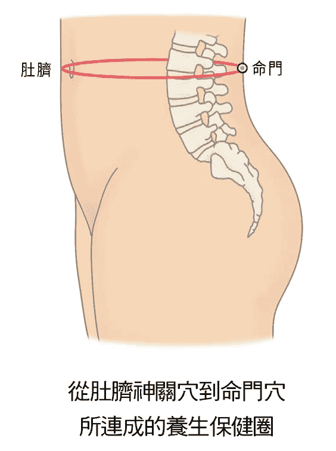

肚脐与腹壁直接相连，是胎儿在胚胎发育过程中，从母体获取营养的通道。肚脐属于任脉，内联十二经脉、五脏六腑、四肢百骸， 被历代医家视为治病保健要穴，才有「神阙穴」之称。这里的肌肉少而薄，药物易于通过脐部，进入细胞间质迅速布于血液中，所以中医师常在肚脐做灸疗，防治百病，养生保健。

「命门穴」位在腰椎上，属于督脉，但与肾关系更密切。肾为先天之本，藏有人体生命的元阴与元阳，肾经贯穿脊椎，连结命门穴，因此命门穴兼具有肾的特性，包括为五脏六腑之本，十二经脉之根，呼吸之源，能固本培元，也是中医很重要的保健穴。

属于任脉的神阙穴与属于督脉的命门穴，两穴前后相对，若将之连结成一圈，就成为「保健养生圈」。早年婆婆妈妈们照顾婴幼儿时，都会在腹部前后围上一圈毯子，将小朋友包裹起来，或者穿比较长的上衣，扎进内裤里，避免受寒而出现腹痛、腹泻、抽筋、夜哭等。这一圈保护毯同时包裹了神阙穴与命门穴，当然可以防寒。

基于中医理论，这个保健方式不限于婴幼儿，我也经常如此穿着，老人家的智慧真的很棒！

 中医师不传之祕：为什么中医师常用黄耆这类补益脾气，升举阳气的中药来治疗胃下垂、眼睑下垂等症状？

#### 为什么中医师常用黄耆这类补益脾气，升举阳气的中药来治疗胃下垂、眼睑下垂等症状？

中医将脾脏正常的运化精微功能称为「健运」。《易经》的干卦为「天行健，君子以自强不息」，「健」是指持续运转不息的力量，「健运」就是持续运转的运化功能。由于人体时时刻刻都在活动、变化中，这些生理性活动需要源源不绝的气血支援，脾的健运能力就是幕后重要的推手！

只要脾功能正常，脾经经筋就可上提与固定人体结构，组织结构正常，脾脏就能持续发挥运化精微物质，向上输送，供给全身之责，这就是脾的「升清」功能。

若脾功能失常，脾气严重不足，导致脾经经筋无力上提与固定人体结构，器官组织难以托住，就会出现下垂现象，例如胃下垂、子宫下垂、眼睑下垂等。这些情况也会加重脾脏工作负担，导致中焦气机无法上升，反而下陷，中医称为「中气下陷」，出现胸闷气短、容易疲倦头晕、饮食难消化、腹部胀满、容易腹泻等症状。此时可以选用能补益脾气、加强脾脏健运升清功能的方法治疗，如服用黄耆、升麻、葛根这类能补益脾气、升举阳气的中药，或针刺脾经的太白穴，还可刺激人体最高的穴──位头顶的百会穴等。

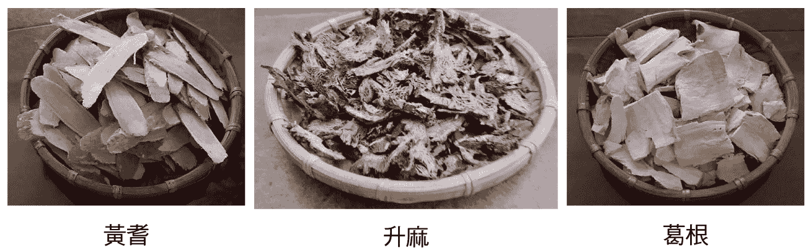

 中医师不传之祕：为什么中医师会用黄耆这类中药，治疗月经经量过多症状？

#### 为什么中医师会用黄耆这类中药，治疗月经经量过多症状？

造成月经经血过多有几种原因，若是严重气虚所引起的出血，就跟脾脏统血功能失常有关了。

脾脏的统血功能跟前面所说的运化、升清是同样的概念。血液必须在血管内才能周流全身，而约束血液在血管内活动的功能就是「统血」，这能力也来自于脾的运化升清功能，持续运转与升提的力量，才能让血管保持弹性且有约束力。

若脾气虚不能「统血」，会让血液排出量增多，如女性月经出血量过多等；甚则血液溢出血管之外，造成不正常的出血，如皮肤的紫癜、流鼻血等；若溢出的血液停滞在局部，就会形成「瘀血」而百病丛生。

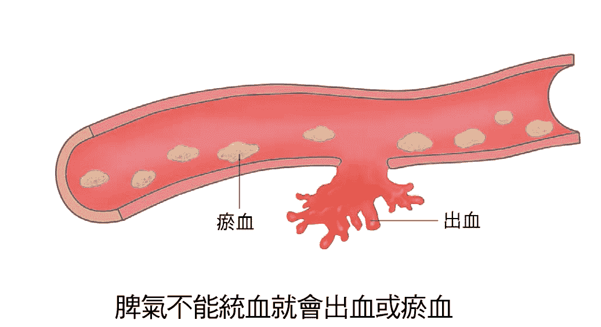

治疗脾虚的出血当然要从补益脾气着手，黄耆就是最佳选择。

读者会不会觉得奇怪：黄耆不是补益脾气的药吗，怎么胃下垂跟月经血量过多这两种完全不同的疾病，却使用同样的药物来治疗？

中医有一个很特别的治病原则叫「异病同治」，因为中医治病着重在治疗病因，而同一种病因会出现不同的症状，例如胃下垂与月经血量过多的病因都是脾气虚，一个是无力升清导致器官下坠，一个是无力统血导致血液排出过多，既是同一个病因，当然可采同样的药物治疗。

综合上述可以了解，其实脾的健运升清力量，不仅在于运化精微物质而已，更是一股让身体可以持续行于正道，发挥良能，避免下流的力量，如同人要力争上游，不要自甘堕落的概念一般。

 中医师不传之祕：脚水肿，中医师也用黄耆这类中药来治疗？

#### 脚水肿，中医师也用黄耆这类中药来治疗？

为什么脚水肿也可以用黄耆？

聪明的读者或许已经知道，「这一定是因为脾气虚引起的，所以才会用补脾气的药来治疗。」

确实没错！

人生活在天地之间，一方面承受大自然变化所产生的风、寒、暑、湿、燥、火等各种气的侵袭，一方面吃进身体的食物经过胃及消化道的吸收之后，会产生一些残渣和水湿之气。无论来自外在环境的溼气或体内的溼气，主要都是由脾处理。

因脾脏属土，五行关系中，土能制水。就像台风季节，大家会用沙包堵在门口防止水淹入屋内，这就是土能制水的最佳应用。

脾的运化功能不仅运化人体需要的精微物质，也能将体内多余无用的水湿运出体外，中医称此项功能为「祛湿」。

若脾气虚，无法将水湿运出体外，就会停留在体内。由于地心引力作用及脾经通过下肢内侧面，这些水湿容易停滞在人体下半身的小腿内侧，而出现水肿的状况。有些辛苦的上班族从下午开始，脚会慢慢变得沉重，肿大，甚至穿不下鞋子，若判断是因脾气虚引起，都可服用黄耆这类药物治疗，亦是应用「异病同治」的原则。

脾经有一个常用来祛湿的穴位「阴陵泉」，在小腿的内侧，接近膝盖的下方胫骨内侧的凹陷中，就是经筋循行「膝内辅骨」的位置。许多人这个穴位都很肿，压下去颇痛，这就表示体内有水湿停留，可常常按揉，有助体内除湿。

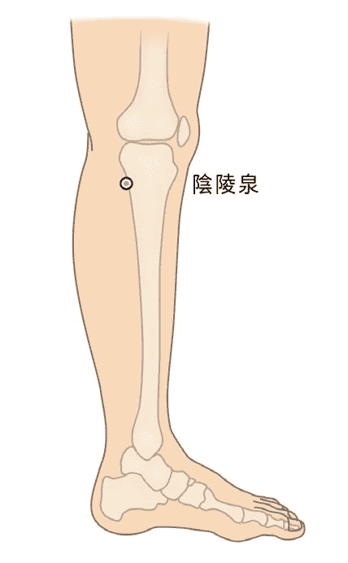

如何补益脾气？

中医历代以来就有许多有效药方，例如：黄耆、党参，或补中益气汤等，但都是针对脾气虚弱的处方。

胃与脾既是夫妻档，也是好搭档，胃偏阳刚，脾偏阴柔。两者功能互补，但内外工作部位有时会对调，如：

在消化吸收水谷营养的功能上，胃主内，偏静态，受纳腐熟水谷，在厨房里直接烹煮食物；脾主外，偏动态，运化升清，负责将胃吸收的精微运送给肺。

在人体胸腹的保护功能方面，胃经筋主外，分布在胸腹部外面（下图深蓝色块），提供盾牌形的保护，还斜向背部以保护胃与脾；脾经筋主内，分布在胸腹部内面（下图浅蓝色块），提供圆桶形的保护。脾胃合看，胃经经筋走胸腹部的外层，可以视为脾的外卫，保护内侧的脾经经筋，脾经经筋走胸腹部的内层是胃的贤内助，这应是贤伉俪之间相互关爱的表现吧！

所以，只要有助于胃的穴位与药物也有助于脾，如足三里穴、黄耆等。经络方面，脾胃两经穴位合用，效果加乘数倍，如足三里配三阴交补益气血，天枢配公孙健脾胃消胀气等。

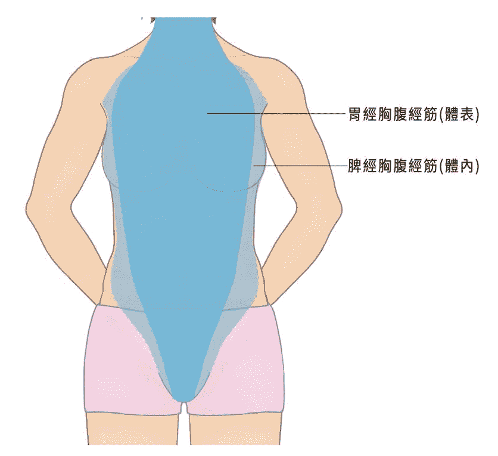

走笔至此，忍不住再跟读者分享脾与胃另一个特色。

由于脾主升清，脾气比较轻盈，偏于心灵层次；胃主降浊，胃气比较厚实，偏于肉体层次。就某方面来说，也符合脾阴、胃阳的特质。所以脾经与女性特别有缘，有助于提升心灵层次；胃经偏于阳刚的男性特质，强壮的胃经会提升肉体的强壮度，让身体肌肉结实，这是许多男性梦寐以求的身材。若就一个人的身心灵平衡而言，建议脾与胃和谐兼顾，不可偏废。这个概念可供从事芳香疗法或经络按摩的读者参考。

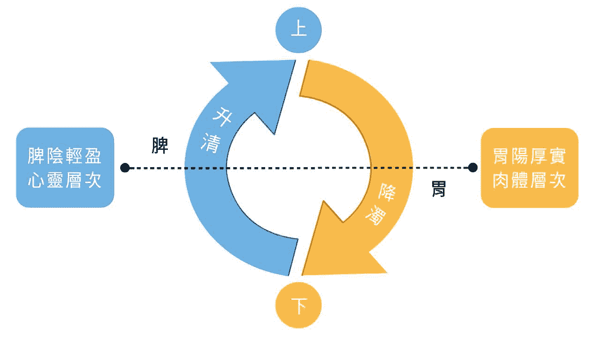

 中医师不传之祕：如何照顾这个重要又辛苦的篓子呢？

#### 如何照顾这个重要又辛苦的篓子呢？

每次跟中医师们介绍脾经经筋的篓子，大家都很兴奋，觉得奇妙又有趣味，但…接着问题就来了！我曾问跟诊医师：「有没有提升及稳固脾经这个篓子的方法呢？」

当场考倒大家！

我也一直思索，经脉篇中提过，脾经经脉在胸腹部位的弯曲路线为「慈母线」，脾经经筋在胸腹部形成的篓子是「游子衣」，慈母线提供养分给游子衣，游子衣也保护慈母线，相得益彰，所以照护游子衣的方法一定要回到慈母线去寻找。

一次搭长途火车，睡睡醒醒，沿途都在动脑想这个问题。突然一个颇为陌生的穴位浮现脑海：「大包」！

大包穴是脾之大络，过去讲授经络课时，因为没有特别思考这条络脉，所以都是轻轻带过，知道有它就好。也许时机成熟了，「大包」自己蹦了出来，让我不得不好好面对！一路推想越来越兴奋，却也感到惭愧，古人早就将奥妙显现在此大络中，我却如此轻忽，真是有愧先贤的苦心。

人体有十五条络脉，包覆全身

#### 人体有十五条络脉，包覆全身

读者或许疑惑：前面不是才介绍过脾经络脉公孙穴，怎么这里又出现大包这个络穴？

这就是人体的奥妙处。《内经》说明络脉与经脉的差别：「经脉十二者，伏行分肉之间，深而不见。……诸脉之浮而常见者，皆络脉也。……诸络脉皆不能经大节之间，必行绝道而出入，复合于皮中，其会皆见于外。」络脉走在人体较表层处，浮现于外，肉眼看得见。

人体有十五条络脉，包含十二经络系统的络脉，加上督脉、任脉以及脾之大络。

十二经络系统的络脉主要交会相表里经脉，加强彼此联系，是经脉间的内部连线，可视为络脉的小系统。

任督二脉属于奇经八脉，督脉为阳脉之海，主要分布在人体的背面，任脉为阴脉之海，主要分布在人体的正面，任督二脉统理人体所有的阴经与阳经，其络脉也依循这样的分布规律。这种跨越十二经脉的连结系统，属于络脉的大系统。

精细的人体看到身体被很厉害的任督二脉络脉保护得很周全，非常欣慰，正准备高枕无忧时，一抬手，突然感受到腋下到胸胁处空荡荡，赫然发现，络脉的大系统只包覆人体的正面与背面，人体的侧面竟然没有络脉包覆，这可是人体维安的大漏洞！

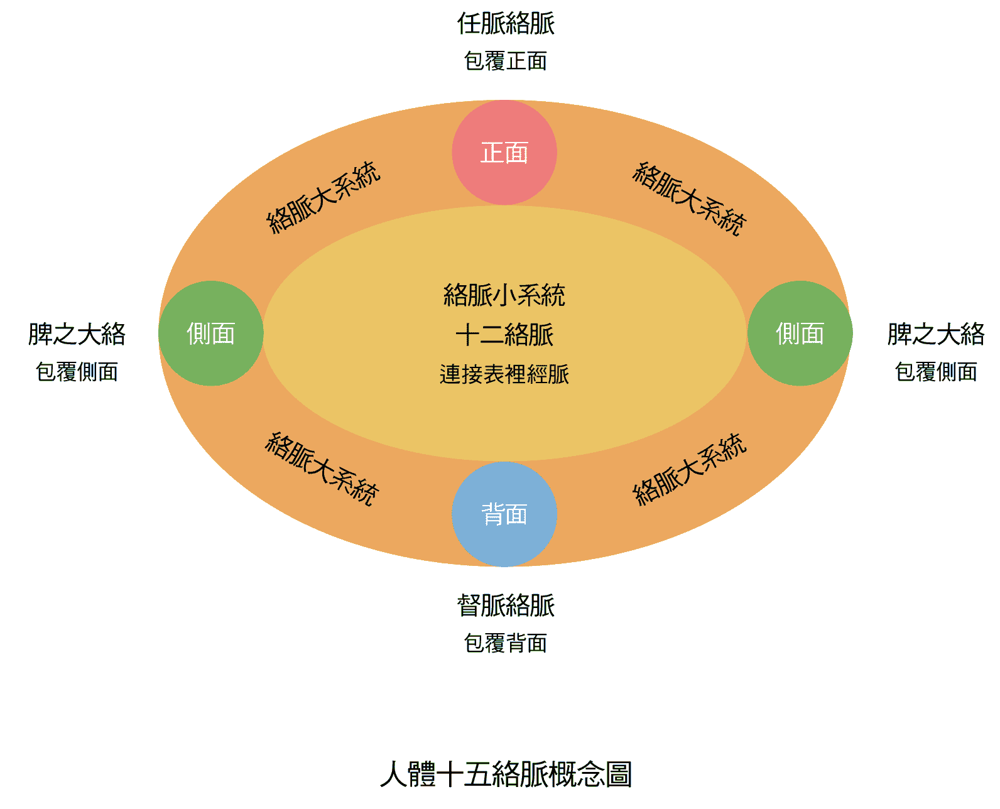

聪明的人体再次检视身体，一眼看见强大无比的脾经系统，无论从经络循行或脏腑功能，都足以承担包覆人体侧面之重责大任。但因脾经已有公孙穴这条络脉，故另外拣选位于胸胁处的大包穴成立络脉大系统，且为了与公孙穴络脉有所区别，特别称为「脾之大络」，点出本络脉「来自于脾经，但功能强大更甚于脾经」的意涵。(详细内容后文介绍)

提升及稳固脾经篓子的脾之大络――大包穴

#### 提升及稳固脾经篓子的脾之大络──大包穴

脾经共有 21 个穴位，大包穴是最后一穴。《内经》说：「脾之大络，名曰大包，出渊液下三寸，布胸胁。实则身尽痛，虚则百节尽皆纵，此脉若罗络之血者，皆取之脾之大络脉也。」

我们就依据《内经》内容来认识大包穴：

1.从穴名分析

「大」可以解释为范围大或力量大，「包」是包裹或包容，合起来就是大范围且强力的包裹包容，您看！这不就是脾脏这位人体之母与经筋的特质吗？

我们也找到一个名称及功用都可以跟大包穴比拟的中药「升麻」，从药名可知具有「升提」效果，善于引清阳之气上升，是「升阳举陷」的药，可以治疗气虚下陷导致的久泻脱肛、崩漏下血等，常跟黄耆配搭，加强升提效果，刚好又呼应前述黄耆的功用。

2.从所在位置分析

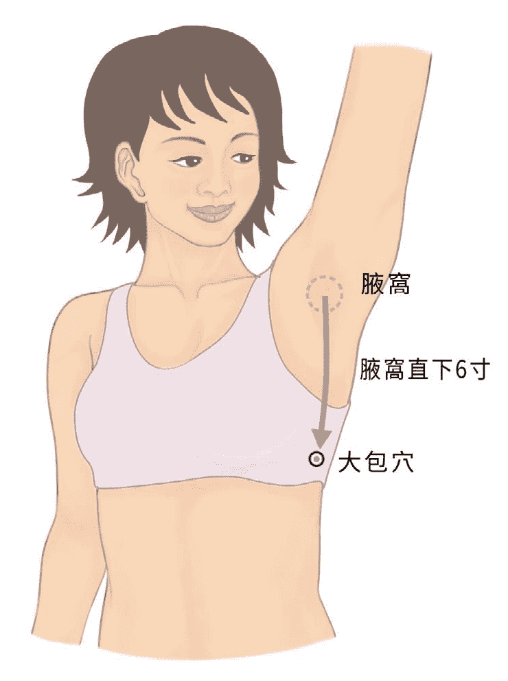

大包穴在渊腋穴下三寸，位在腋窝垂直向下的腋中线上，约当第 6-7 肋间隙。乳头在 4-5 肋间，所以本穴大概是女性乳房下缘与腋中线的交会处。经常熬夜或过劳的人，这个位置会变得肿肿硬硬，按压下去感觉不太舒服。

依据《内经》原文：「脾之大络，名曰大包，出渊液下三寸，布胸胁」，大包是脾之大络，所以它不仅是一个穴位，更代表一个遍布在胸胁处的网络系统。

原文后面提到：「此脉若罗络之血者，皆取之脾之大络脉」，古代医家认为脾之大络的功能是「总统阴阳诸络，由脾之能灌溉五脏」，本条大络能包罗所有络脉的血液，所以可以治疗相关病变，这与之前介绍过现代医学所认知的脾脏功能相似。临床常看到气血瘀阻的病人，胸部会出现细小的血络网，甚至向两侧延伸到胁肋处。

3.从症状分析

「实则身尽痛，虚则百节尽皆纵。」中医认为痛证多因气血不通，本大络统理所有的络脉，一旦脾之大络气血阻滞，影响范围变大，全身都会出现疼痛之症。

只要连结脾经经筋特色，马上就可以了解，当脾气虚甚而中气下陷时，经筋无力升提，体内的脏器下坠，无法正常运作；脾主肌肉，脾气虚甚，不仅无法生肌长肉，原有的肌肉也会逐渐消瘦，全身关节失去营养的补充与肌肉的固摄力，当然会出现松垮无力的情况，常见于重大疾病末期，病人全身的组织器官及四肢百骸严重营养不良的危证。《内经》在这里连用两个「尽」字，特别强调全面性且强大的影响。

大包的故事还没结束！我们接续讨论二个问题。

4.人体设立脾之大络的其他思考

总论中提过，经脉四大系统中，多数都是配合十二经脉，所以有十二经别及十二经筋，唯有络脉是十五络。多出来的三络，分别是任脉、督脉及脾之大络。这三条络脉不像其他十二条络脉发自四肢，而是发自躯干，任脉发自身体前侧，督脉发自身体后侧，脾之大络发自身体侧面，共同形成一个「跨经络」的络脉大系统。

奇经八脉的任脉总管全身所有的阴经，督脉总管全身所有的阳经，所以为任督二脉特别设置络脉有其必要性，可以统理全身的阴阳经。

脾之大络位于身体的侧面，刚好可补足任督二络所未涵盖之处。但既然要在人体侧面加强一络脉，为什么不选择主要分布在身体的侧面肝胆经呢？

肝胆好兄弟，能力强，工作也很认真，可惜没有脾经那个与生俱来的篓子优势。肝胆经系统形成的是 2D 的面形分布，而脾经经筋却已进化到 3D 的立体结构，而且还能托住全身器官，维持在固定的位置。胜负此时便自然分晓了！

5.脾之大络选择大包穴的其他思考

俗语说：好戏才压轴。

脾之大络选择大包穴，除了它刚好位于胸胁处的条件外，也与脾经经脉循行由下而上，经筋从阴器开始向上形成篓子的特性有关。

请想象一下，当我们要用双手提起一个篓子，施力点通常在篓子的两侧，这样手臂的力量才会均匀。人体很聪明，早就知道这个道理，因此，在身体的两侧处也设置了两个施力点，那就是位于胸胁处的大包穴。

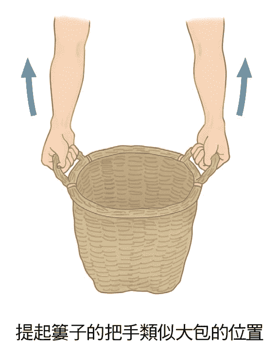

大包身为脾经 21 穴中的最后一穴，一施力就能顺势将脾经气血一并向上提升，这是多么精巧又有效率的人体工学啊！临床上我们会在病人的大包穴贴灸帮助提升脾气。一般人平日可用手掌外侧俗称「手刀」的部位来搓揉大包穴区，行气活血以自我保健。

读到这里，大家应能了解我感到惭愧的原因吧！谢谢那趟火车漫漫行，就如英谚所云：Better late than never. 虽然理解大包晚了点，总比浑然不知的好。稍感安慰。

小结

脾的四个主要作用：运化，升清，统血生血及祛湿，都与脾经的篓子有关。这条经筋提供向上托起和悬吊缓冲的力量，脾气才能持续【运化】精微物质及【祛湿】，才能【升清】将精微物质向上输送，固定器官组织；才能托住血管【统血】，让血液不会溢出。

脾母为了照顾身体所有器官组织，必须勤奋不懈，时时与地心引力对抗，避免下流，这就是「天行健，自强不息」的展现。

脾经经筋的篓子承担胸腹腔所有器官组织的重量，且将其稳稳地托住，宛如母亲呵护孩子般的温柔，避免损伤，这就是「地势坤，厚德载物」的展现。

脾母所兼具的「天行健，自强不息」与「地势坤，厚德载物」特质，以及给予人们的幸福感，让我们成为「妈宝」，都必须仰赖经筋的篓子──它的重要性由此可知！

足太阴之筋──病候

### 足太阴之筋──病候

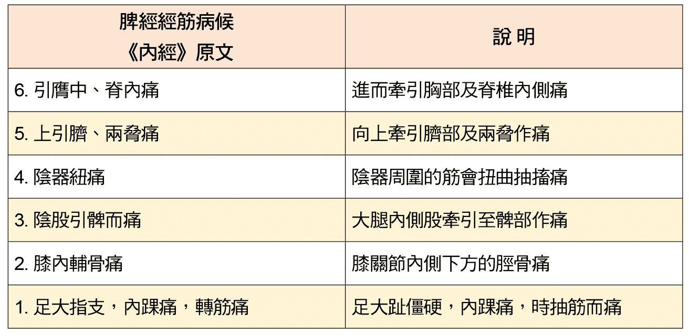

脾经经筋病候部位与经筋循行部位完全相符。其症状是典型的循行所过部位「不通则痛」所引起的各种抽筋和痛症，比较特别的是，有些疼痛会沿着经筋牵引至其他部位，如「阴股引髀而痛」、「阴器纽痛，上引脐两胁痛，引膺中脊内痛」等，表示疼痛范围较大，符合脾经「大包」的特质。

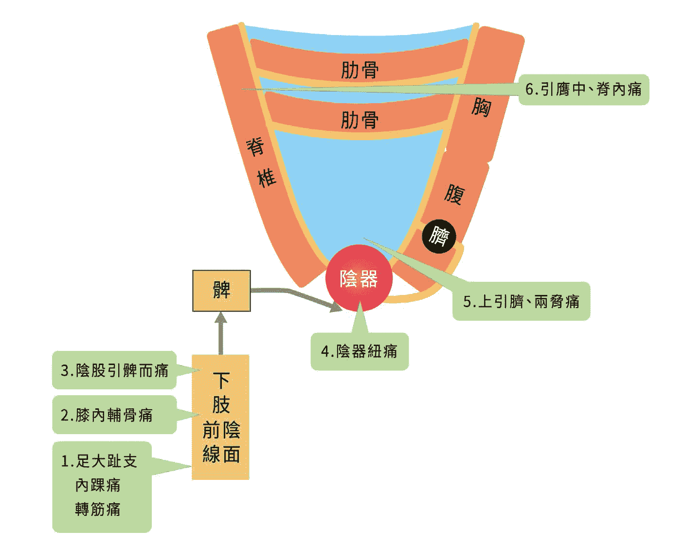

 中医师不传之祕：
痛经病人在脾经经筋有明显的异常结构

#### 痛经病人在脾经经筋有明显的异常结构

病候中「阴股引髀而痛，阴器纽痛」，类似女性月经的痛经症状。从髀到阴器这段路线，就是所谓的鼠蹊或腹股沟，临床上发现，许多长期且严重痛经的病人，这段路线会变得非常宽大肿硬，亦即鼠蹊部位会从凹沟结构变成山丘结构，连带同侧髂骨和下腹也变肿，用手压腹部，病人痛到缩肚子甚至会尖叫。许多病人会说，没想到自己下腹部竟然变得这么肿这么痛。这个异常结构如果没有调整，痛经很难有所改善。

其实腹股沟的肿硬会出现在许多妇科病，甚至骨盆腔的妇癌，可以算是这些疾病的前哨站。女性朋友们平日可按压腹股沟和下腹部自我检查，若有不明肿硬或疼痛，务必赶紧就医。

中医在处理这个异常结构的首选经络，当然是脾经，也会配合胆经和胃经。

在卫教方面，出现这类结构的病友，通常坐姿不良很爱翘脚，建议不要再翘脚，可揉按脾经的三阴交、阴陵泉和血海穴，或敲打胆经，都是不错的自我保健方法。

由于脾经系统涵括消化系统和妇科系统，一些喜欢喝冷饮、吃香喝辣的女性也会出现这类结构。另外有些妇科疾病会与消化疾病混淆，卵巢癌就是一例。

卵巢癌被称为「女性最沉默的杀手」，早期几乎没有相关症状，一位卵巢癌患者说，身体从来没有不舒服的情况，去做体检才赫然发现，感到难以置信的错愕！确实，半数以上的卵巢癌患者，初期可能没有什么症状，若有，都是以肠胃症状为主，如下腹胀痛、恶心呕吐、食欲不佳等，甚至月经也很正常，所以通常会在肠胃科诊治，直到病情持续加重，发现是卵巢癌时通常已经是末期。

以上这类情况，可以到中医科就诊，中医师可从这些异常症状和身体结构的变化，及早发现并做诊断治疗。

 中医师不传之祕：脾经经筋可以调整脊椎

#### 脾经经筋可以调整脊椎

前面提到，身体一旦出现结构异常，要治疗由此延伸而出的病症，还需从调整结构下手，这就是俗语「解铃还须系铃人」，病怎么来，就让它怎么去吧！

调整身体结构，一般认为是伤科医师、推拿师或整脊师的专长。其实，中医的经络系统提供另一个调整身体结构的利器。

前面内容强调脾经经筋循行在胸肋骨和脊椎的内侧面，加上病候「引膺中、脊内痛」，临床上也会应用在治疗脊椎向前滑脱的情况。许多长期搬运重物的人，如农夫或搬家公司员工，腰椎都会往腹部陷入，腰部会有明显的凹陷，当年纪大了之后，严重的腰背痠痛，久治难愈。

脾经经筋因为走在腰椎的内侧，这就是将腰椎向后推回原位的施力点。只要在脾经找出反应区，配合相关经络，再以精细的针灸手法，可以逐步改善腰椎滑脱的结构，而缓解腰部痠痛。

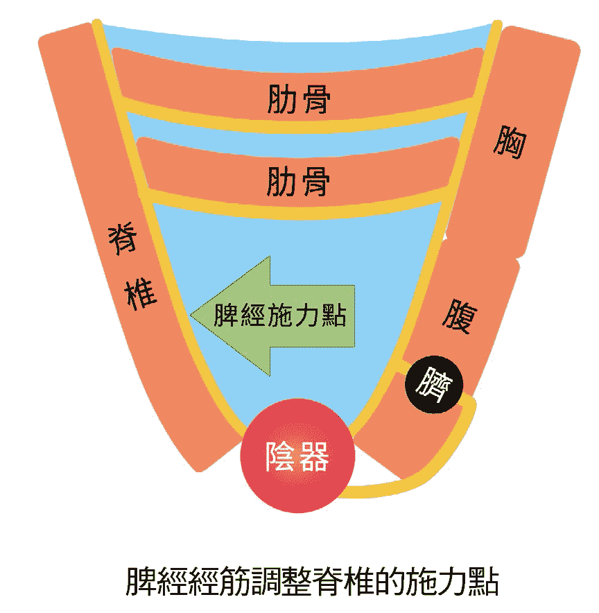

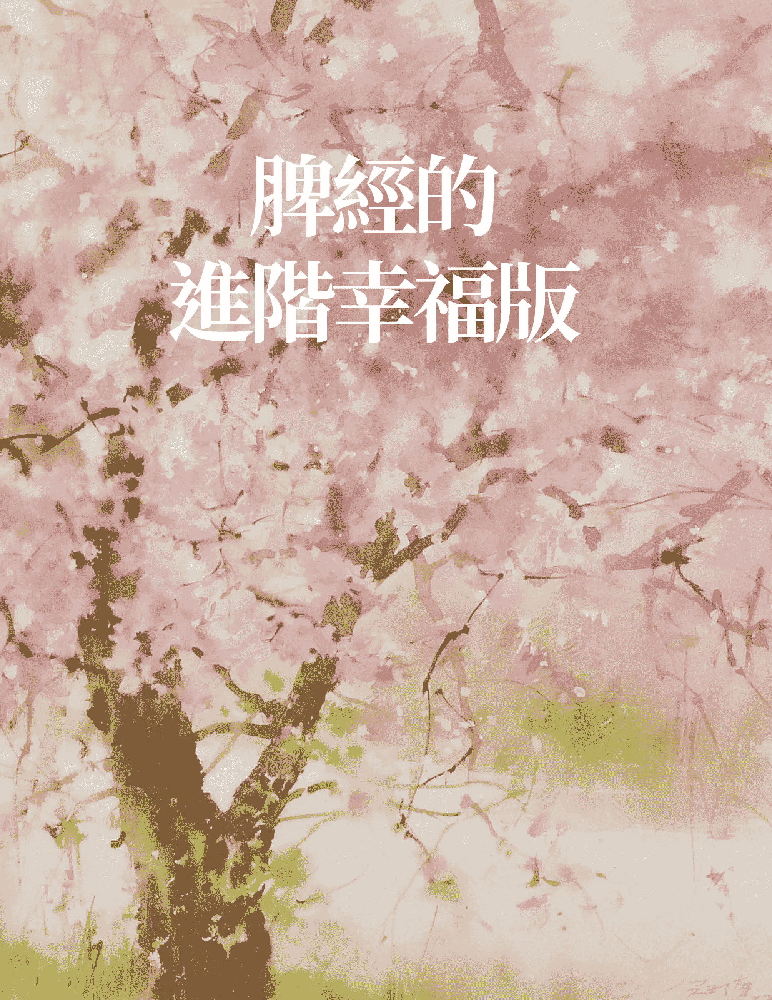

# 脾经的进阶幸福版

脾经实在太精彩，让人意犹未尽，所以加入四篇【进阶幸福版】以飨读者，增添阅读的满足感！

一、神秘的【带脉】现身！与脾经共同守护女性的经带胎产

#### 一、神秘的【带脉】现身！与脾经共同守护女性的经带胎产

脾经是女性一生的守护神，对于女性「经、带、胎、产」四大生理功能有重要影响。除了脾经本身功能外，还需结合奇经八脉系统中的带脉，才能完功。

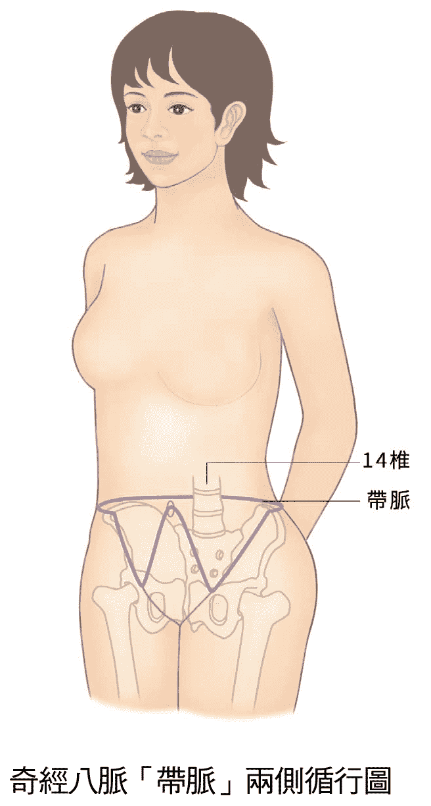

什么是【带脉】？

带脉是全身唯一一条横向经脉，从腰部绕身一周，犹如束带，约束所有经脉，所以称为带脉，英文译为 Belt Channel。

带脉循行有多种讲法，在此融合各家说法：

《内经》说「足少阴之正，至膕中，别走太阳而合，上至肾，当十四椎，出属带脉。」所以带脉从腰部的十四椎（即第二及第三腰椎之间）穿出来，经过腰胁部位，借用胆经的带脉穴、五枢穴和维道穴三穴后，抵达肚脐。两侧合并，呈现英文字母Ｗ的型态，在腰腹部环绕身体一圈。

带脉从十四椎穿出的部位与肾有关

由于肾脏位于后腰部，中医说「腰为肾之府」，腰部主要由肾管理，十四椎下正是命门穴所在处，当带脉发生病变，尤其是被寒湿邪气入侵时，腰部会非常痠痛沉重，古人形容这种沉重感宛如「身带五千钱」，古时候都是用铜钱，五千钱的重量……可想而知，应该很可怕！

带脉与女性的带下功能有关

带下是指女性阴道内正常的分泌物，如果分泌物的质、量、色泽、味道出现异常，例如量多、黏稠、色黄、味道腥臭等，就称「带下病」，俗称「白带」，但其实带下有很多种颜色，白带只是统称而已。古时候还用「带下医」来称呼专门从事妇科的医师。中医说「无湿不成带」，湿气是带下病的主要病因，脾主祛湿，带下病自然就跟脾的除湿力有关。

如果把Ｗ型态的带脉放到脾经的篓子结构上（见下图），会发现带脉位在脾经蓝色的篓子结构中，宛如脾经篓子的另一条缝合线，协助脾经向上升提的力量。

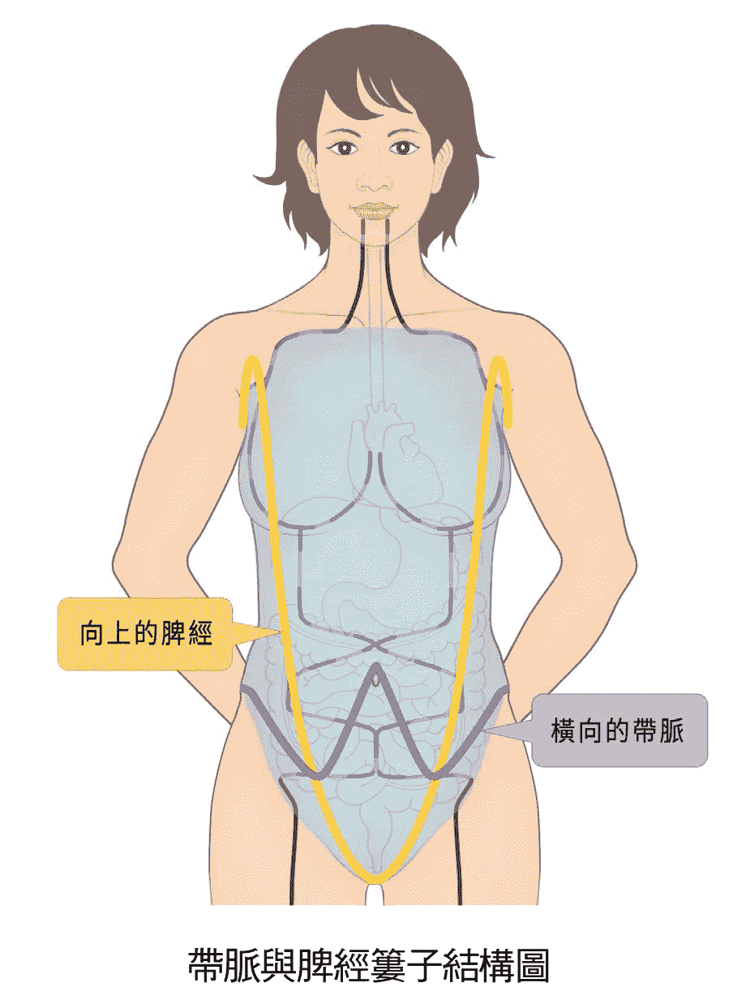

由于脾经跟带脉在腰腹部关系密切，腰腹部正是泌尿生殖系统的重要区域。带脉功能正常有助于脾的升清，脾能升清就能祛湿，所以要维持带下的质量色味正常，脾经须与带脉通力合作。

除了带下之外，女性的经、胎、产三种特质，跟脾经篓子的盛纳和降出功能有关，也与带脉的约束能力有关。

女性的生理结构具有孕育胎儿的能力。「子宫」顾名思义就是孩子的宫殿，中医称为「胞宫」，通常还包括卵巢和输卵管等。每个月子宫会为了孕育新生命做准备，一旦怀孕（或称「妊娠」），胎儿就在准妈妈体内的子宫里慢慢成长茁壮，历经 40 周左右，胎儿成熟了，就会从母体分娩而出，开始独立呼吸。

如果当月没有受孕，子宫为了孕育胎儿而增厚的内膜就会剥落，变成经血由阴道排出体外，就是月经。

一般而言，怀孕期间不会有月经，有月经通常表示未怀孕。

有趣的是，月经与妊娠看似相反的两件事，在某些机转上却很类似。譬如它们的舞台都在子宫，都有着酝酿期及排出期。月经需等候一个月（所以才称为月经呀！），确定未怀孕，就从阴道排出经血；妊娠需等候十个月，待孩子成熟，就从阴道分娩而出。

无论月经或胎产，在酝酿期间都需安然地在子宫里等候时机成熟。这个稳固安定在子宫的力量，主要来自脾的向上升清，以及带脉从腰腹部横向的约束力协助。

如果带脉无力，脾就得自己承担这么大的工作量。万一脾气也不足，就会出现月经提早来，经血滴滴答答不停，或出现大量出血的崩漏现象；孕妇容易出现胎动不安，时时欲滑胎的情形，此时必须赶紧安胎，否则就会流产。

到了排出期，脾经的篓子下口就会松开，带脉也会配合松绑，让经血或婴儿得以从子宫下降至阴道而滑出体外。带脉的松绑需与脾经篓子下口松开步调一致，而且必须和缓地配合身体的状况。如果两经无力而太快松开，在月经期间会导致经血巨量且无限制的流出，在分娩过程造成大量出血，中医称为「血崩」，严重者会导致休克或致命。

综合上述，横向的带脉与纵向的脾经，合作无间，共同维持女性经带胎产功能正常。

脾经篓子也有下降的力量

之前的篇章中，一直强调脾主升清的力量。看完这个段落，大家会发现，脾经的篓子还有下降的力量。没错！脾经络穴公孙穴通冲脉，就是非常擅于降逆气的穴位。

脾经的篓子结构是个上宽下窄，上下皆有出口的结构，类似民间的竹编鱼篓，而且它也使用类似带脉的绳子来固定，与人体的带脉有异曲同工之妙。

人体的气机本就有升有降，这里提到的下降，是特别针对篓子下口的约束机能而言。当篓子下口被束住，不该排出的便不会排出；当篓子下口被松开，该要排出的就能排出，而且排出者也不一定都是浊者，例如经血与婴儿。

曾有聪明的年轻医师，听到这里马上举一反三，询问：是谁负责调控脾经篓子下口的松紧状态？

从现代医学来说是激素的作用，但就中医来说，是肝、脾、肾三经，加上皆起于胞宫（内生殖系统）的奇经八脉中之任、冲、督三脉，古人称它们为「一源三歧」，都有所参与，其中最关键的调控者是肝脏与肾脏，脾脏在这份工作中，比较属于配合者。

脾经络穴公孙穴通冲脉，冲脉又称为「血海」及「十二经脉之海」，与女性生理也紧密相关，络脉篇已介绍，在此就不多论。

带脉与中年发福的体型有关

既然说到带脉，就跟大家解说中年以后常见的身材发福，型态有二：西洋梨型和苹果型。（见下页图）

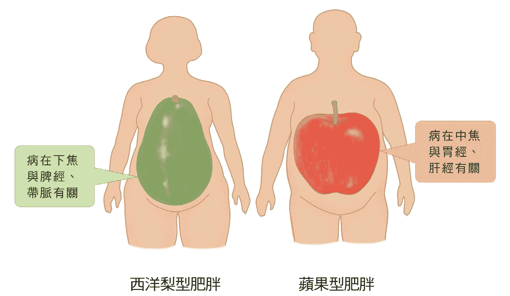

「西洋梨型肥胖」属于皮下脂肪型肥胖，也称为「外周性肥胖」，多见于女性，俗称「小腹人」。因为女性脂肪容易囤积在胸部、臀部、大腿，表现出臀部肥大，又称为「臀型肥胖」。

从中医角度来看，西洋梨型肥胖属于「痰湿蓄于下焦」，与脾经篓子向上升提和带脉横向约束无力有关，所以容易出现月经异常和下肢关节酸痛等疾病。

「苹果型肥胖」属于内脏脂肪型肥胖，也称为「向心性肥胖」，多见于男性，俗称「大肚腩」，在胃经篇中曾提过。因为男性脂肪容易堆积在腹部的内脏器官，特别是肠道、胰腺、肝脏、肾脏等，表现出肚子肿大，俗称「啤酒肚」，又称为「腹型肥胖」。

从中医角度来看，苹果型肥胖属于「痰湿阻于中焦」，与胃经和肝经代谢能力差有关。痰湿阻滞会严重影响腹部内许多重要器官与经络机能，现代医学研究证明此类肥胖有更高的风险罹患高血压和高胆固醇，会增加心脏病、糖尿病和中风的机率。台语也有「膨肚短命」的说法。

这两种肥胖，以通俗的语言来说，女性的变形重点在于腰部以下，由水蛇腰变成水桶腰；男性的变形重点在于腹部，由六块肌变成啤酒肚。对于中医师而言，只要知道是哪一型肥胖，就可从相关的经络脏腑着手治疗。

二、脾经慈母线和游子衣组合成的篓子结构，不侷限在胸腹部

#### 二、脾经慈母线和游子衣组合成的篓子结构，不侷限在胸腹部

一位中年女病友，长年上牙龈和下牙龈莫名的咬合异常紧绷。发病时，不仅牙关难以张开，甚至出现上牙与下牙之间左右摩擦，非常痛苦。平日面部肌肉也很紧硬，病人特别指出被紧绷的牙龈所牵引的紧硬部位，是从承浆到双侧大迎，再到下关，最后进入耳内（如左图）。乍听是位在胃经腮帮 U 形在线，仔细一看，竟类似本经篓子结构的边线（如右图的橘线）。

临床上，我们就以篓子概念施治，她面部的紧绷感也难得的随之舒缓。

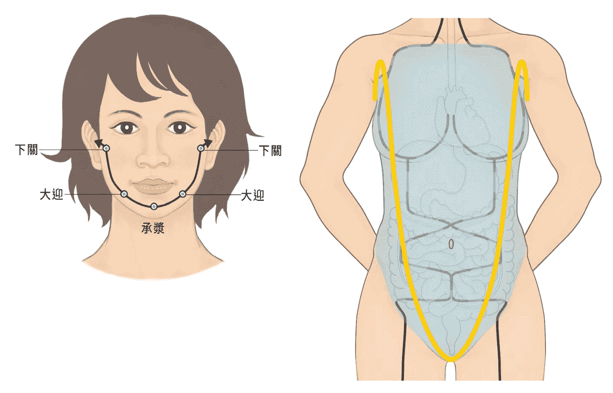

脾经篓子结构如果自我侷限在胸腹部，却想要提升人体前后上下左右的器官与组织，应该会鞭长莫及吧！

我想脾经的篓子结构既有实质的形体，也是一个气场，所以会存在人体许多部位，才能「就近」发挥人体的升清功能，例如眼睑的上提，如果升提力量不足，就容易出现眼睑下垂的现象。随着年纪增长，面部肌肉和乳房肌肉的下坠「走山」现象，都与脾经升清功能退化有关，平日保健或治疗时可运用脾经加以改善。

带脉只有腰部的那一条吗？
是否也像篓子概念一样可以延伸？

早年教授经络课时，即思考：带脉身为人体唯一的横向经脉，它只有腰部那一条吗？这样拥有足够的力量来横向约束诸经吗？

假设人体十二经脉是 12 根筷子，带脉象是将这些筷子形成筷子团绑在一起的橡皮筋，如下方示意图。

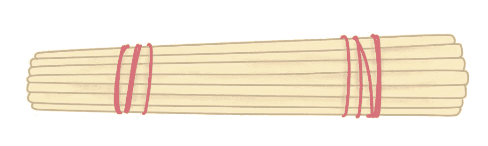

如果，只用一根橡皮筋是否足以将所有筷子束起来？经验中至少要用两条橡皮筋吧！分别绑在筷子团的上端和下端，如果中间再增加一条橡皮筋，应该会更牢固。

另外还有尺寸的考量。筷子的夹菜端通常比较细，用来约束的橡皮筋可以小条些，或可多绕几圈；而筷子的手握端通常比较粗，橡皮筋就须粗一点，才绑得住。

我们再以城市的商店来说明。人体的腹部及腰部是所有经脉都会通过的部位，腰腹部区包含的经脉数最多，就像都会区一样，人口众多，客户也多，所以带脉这家商店的旗舰店就座落于此，人体其余部位所通过的经脉较少，类似卫星城市，带脉商店在此设立小型的分店就足以应付了。但无论是旗舰店或分店，所提供的服务内容大致相同，差别只在规模大小而已。

从上述的生活经验可知，单单使用一条圆形的带脉，去约束纵行于全身的十二条经脉，恐怕力有未逮，个人认为带脉的概念宛如橡皮筋和分店一样，可分化出许多支脉，分布在人体诸多部位，群策群力，一起来约束诸脉。

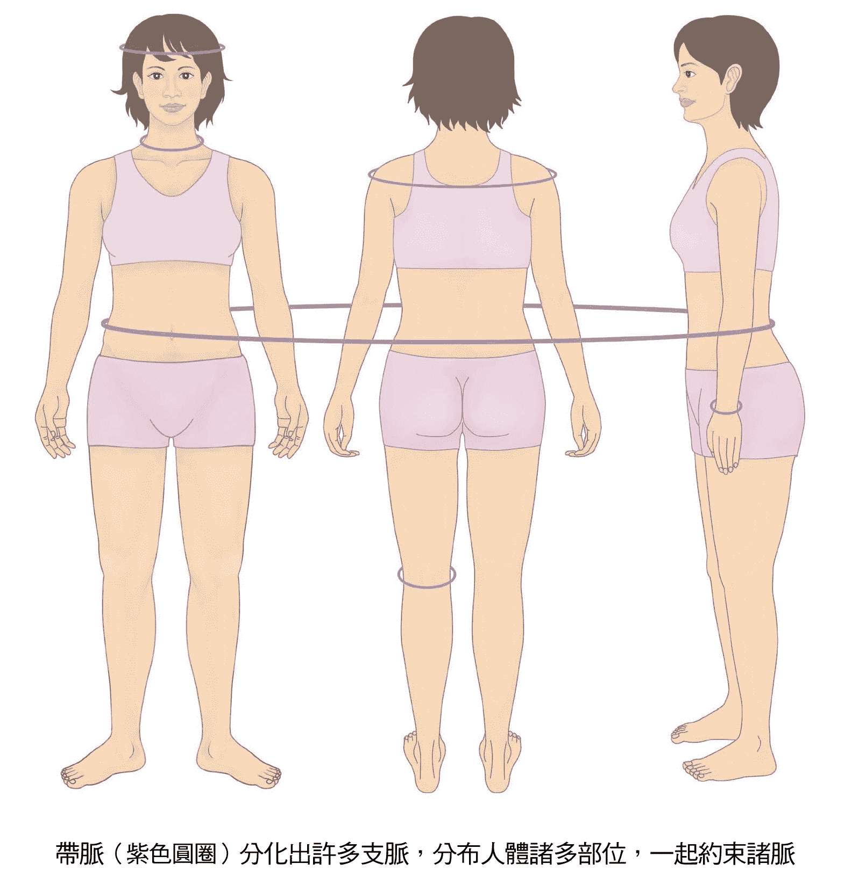

前面介绍过的鱼篓，在众多纵向的竹条之间，会加上几条横行的圆形束带以固定结构，这也是带脉的概念。

所以，临床上我们使用带脉「圆形」环绕人体的概念来治疗「圆形」的病症：例如伤风族群头部环绕一圈的头痛，老师族群喉咙及颈部一圈会有紧绷感，失眠族群围绕肩膀一圈的痠痛，计算机族群腕关节一圈的酸痛，阿嬷族群整圈膝盖的酸软无力等等，都能实时见效。人体真是奥妙啊！

三、脾经的母子组合是人体最佳「补破网」神器，有助于慢性、消瘦性疾病，加强改善整体病情

#### 三、脾经的母子组合是人体最佳「补破网」神器，有助于慢性、消瘦性疾病，加强改善整体病情

人体是一个完整的结构，如果因为外部伤害、手术、内部组织发炎溃烂等，都会直接侵袭人体的组织，破坏身体原有的完整性。从中医的角度来看，脾经经筋包覆在体腔内面的最外层，体腔内有脾经经脉通过，前述这些情况都可能导致脾经慈母线和游子衣的母子组合被割裂或穿孔。

脾经母子组合的篓子结构是人体营养吸收、保护和运输网，很像捕鱼网，一旦被破坏，就成了「破网」，当然影响脾脏所有的机能，包括运化、升清、统血和祛湿等，甚至会导致中气下陷，脏器也下坠等。这类病情通常颇为难治，逐渐迁延成为慢性疾病，加上营养转输障碍，气血生化无源，肌肉和四肢都会失养，身体持续消瘦，甚至变成纸片人。

在治疗这类疾病时，除了一般针对性治疗之外，还可加入改善脾经篓子的疗法，我称之为「补破网」，不但有助提升针对性疗法的疗效，还能巩固疗效，可谓一举两得。

如何补破网呢？

「破网」来自于脾经篓子结构受损，导致脾气因而严重下陷。个人经验可分两个步骤来补破网：

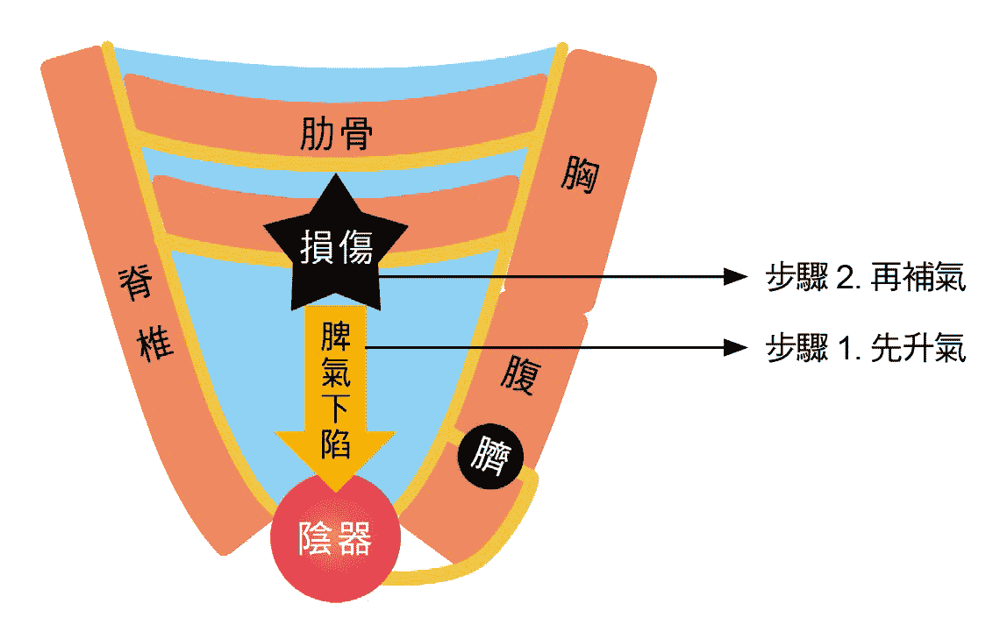

步骤 1：先升气。将破损下陷的篓子升提归位。选用脾经足部穴位为主，可针可灸。

步骤 2：再补气。在局部缝补破损的篓子以补脾气。选用脾经慈母在线的穴位为主，灸法为优。

脾经系统这条土性厚实、母性坚强的经络，是人体的「补破网」专家，只要是慢性病、消耗性疾病、重大疾病等，需要修复组织、补充营养者，脾经系统都是首选经络。

四、产后坐月子是修复脾经系统的重要时刻

#### 四、产后坐月子是修复脾经系统的重要时刻

既然脾经系统可以修复身体，又与女性身体特质的经带胎产如此密切相关，那生产完之后的「坐月子」，也与脾经有关吗？

胎产之后是否需要「坐月子」？

#### 胎产之后是否需要「坐月子」？

这个问题到了近代争论越来越多，因为西方国家没有这样的习俗，且现代人普遍都很忙碌，很难真正停下整整一个月不工作，加上现在大多是小家庭，比较没有人手帮忙做月子，导致坐月子的问题越来越朝两极化发展，有人觉得不需要坐月子；有人则发展出「月子中心」的商机，等级设备应有尽有。

在诊间这仍是病人和家属询问度很高的问题，表示人们心中还是存有疑虑的。

如果将「坐月子」定调为「调理生产之后的身体」，也许事情会简单许多。

我们先来看看政府如何看待产后调理吧！

随着时代演变，政府在法规上制定各类与生育相关假期，包括产检假、 产假、陪产假，及育婴留职停薪等，让妈妈可以调养，爸爸也有更多时间跟妈妈一起照护孩子。可见连政府都看到女性在胎产过程中的特殊需求，以及产后休养的必要性。

华人社会向来重视坐月子，也可从社会重视传宗接代的观念来理解，养儿育女是宗族大事，从准备怀孕到受孕、安胎，历经分娩及产后调理，这是一段漫长辛苦且具有危险性的历程，每个时刻都是产妇与胎儿生命的关口，如果分娩时没能顺利接生，或是产后新手妈妈与胎儿不慎染病，就很容易致命。

产后调理不仅让「带球走」十个月的辛苦妈咪休息调养，也能调理身心状态。调查指出东方女性比西方女性产后忧郁症的比率低，可能跟有产后调理的这个阶段有关。其实照顾好妈妈，也是照顾好新生儿。过去发展中的年代，婴儿初期的营养来源是母亲的乳汁，妈妈健康，孩子才会强壮。此外，照顾好母亲的身体，还可为怀下一胎做准备。

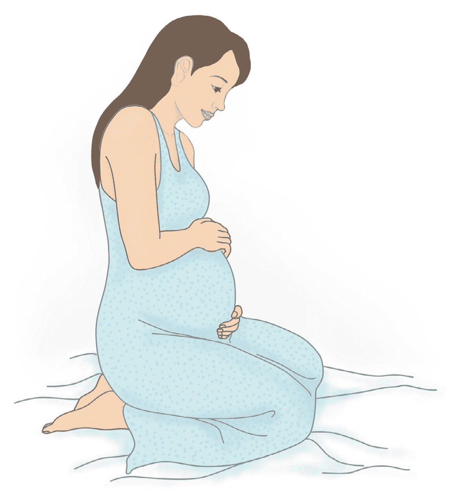

早期社会在医疗条件、饮食、居家等外在环境较为匮乏的情况下，只好转而强调和规范产妇个人的饮食、生活作息等内在状况。例如：要吃麻油鸡祛除身体寒气，不能洗头洗澡免得受寒，不要流泪以免伤害视力等等。

产妇也要开始适应升格成为「妈妈」的新身份，怀孕期间胎儿在妈妈肚子中，随时都跟着妈妈一起活动，现在则要学习与一个独立的生命体相处，他有自己的个性与需求，不再配合母亲等情况。因此「坐月子」是女性生产后，身体、心理及家族地位的转变过程。

从中医角度来看，「坐月子」就是修复脾经系统的重要时刻。因为脾经与女性的经带胎产关系密切，凭借母亲的脾经经脉所提供的养分，以及脾经篓子结构所提供的升提、固定与缓冲作用，胎儿才能在妈妈的子宫安然成长。一旦胎儿成熟了，脾经系统自然向下松开，加上其他脏腑经络的协力，将胎儿从产道推挤出来，一个独立的新生命就来到人间了！

在怀胎的十个月中，脾经系统提供最珍贵的养分，全方位的滋养、防护、固护胎儿。脾经系统承担如此繁重的工作量，过程中难免有所损伤，刚好藉生产出清「胎儿」后，赶紧整理及修复组织。

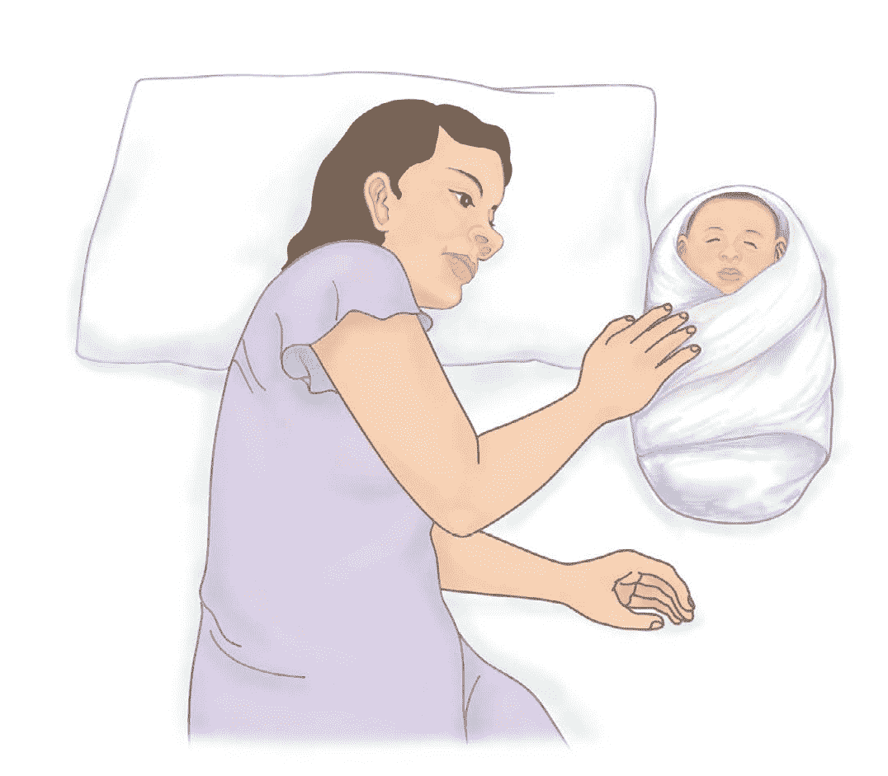

试举一个通俗的例子来说明。大家都有住旅馆的经验吧！一般入住时间在下午 3 点左右，迁出时间大约上午 11 点左右。从 11am 到 3pm 这四个小时是旅馆人员打扫房间、清除垃圾、恢复原状的时间。同理，若将旅馆房间换成产妇的身体，被小小胎儿房客住了十个月，退房后总该清理修复一下吧！这就是「坐月子」的概念。

由于生产是女性「经带胎产」特质中很重要的部分，月子做得好，脾经系统得到休养与修复，「经带」就维持正常，还能提高未来「胎产」的成功机率，生出健康活泼的孩子。

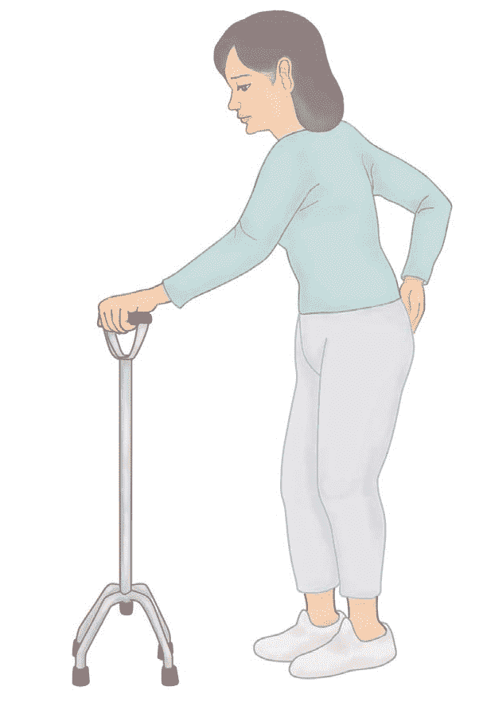

反之，月子没做好，百病丛生。例如没注意保暖，受风着凉，让风寒进入子宫，「经带胎产」往后就容易紊乱；进入头部会导致长期头痛；寒邪侵入脾经，脾主四肢与肌肉，容易出现关节痠痛变形、腰痠背痛等，这都属于「月内风」的现象。门诊中只要遇到六十岁以上的女病人，四肢关节严重痠痛，遇寒加重，十之八九都有月子期间早碰冷水的情况。

又因为脾主思，许多妈妈在面对新的生命与新的生活，容易产生过度焦虑的现象，通称「产后忧郁症」，需要赶紧处理，以免埋下未来「忧郁症」的病根。

上述这些情况，都可透过脾经系统来改善。

流产妇女更加需要坐月子！

#### 流产妇女更加需要坐月子！

「坐月子」除了一般产妇需要之外，流产妇女更加需要。为什么呢？

我常用水果解释：正常足月的分娩就像「瓜熟蒂落」，水果成熟了，蒂头自然会脱落与母树分开，对于水果和母树都无损。流产宛如「瓜未熟，蒂未落」，水果还没成熟，硬将它从树上拔下来，不但损及蒂头，还会导致母树树皮受伤。所以流产是脾经篓子被迫向下拉扯，未成熟的胚胎也被迫剥离，这种情况对于母体的损伤更甚于足月产，当然更需要坐月子休养。

只是社会上对流产并没有这样的观念，许多年轻女性流产之后，不仅没有休养，反而很快就回到工作岗位。直到出现头晕目眩，心悸疲倦，腰痠背痛，月经失调，甚至不孕等状况前来就医，经中医师诊察后才知缘由。

政府法规有「流产假」，请女性朋友们善用来爱护身体。

安胎也是中医师的专长！

#### 安胎也是中医师的专长！

很多人不知道中医师也会安胎，而且安胎期间不必卧床，可以正常生活照常工作。临床上照护过许多孕妇，承接各类「变化球」，我称之为「送子鸟任务」，幸好都能达标，完成任务。

「送子鸟任务」包括：从不孕到怀孕的「包生」任务，怀孕以后到产前这段期间的「安胎」任务，包含各式各样的突发症状，如感冒、拉肚子、皮肤痒、便秘、腹胀、吃不下、腰痠、水肿，甚至扭到腰或脚踝，还有到了预产期却没动静的「催生」任务，以及产后体质调养，为下一胎做准备等。

过程中遇过许多趣事，像孕妇诉说胎儿在肚子里「乱躺」，只要胎儿够大，通常会在腹部表层看到或摸到肢体的方位，当我们行针时，随着针气推动，可以看到或摸到胎儿肢体的移位，妈妈随之惊呼「他转身了」，不舒服的症状当场缓解。

也曾碰过预产期到了，胎儿仍「赖皮不退房」的情况，我们会采用传统中孕妇不可用的穴位来催生。经过中医催生的妈妈，到医院后生产过程非常顺利，产后身体恢复快，甚至有产后一小时就亲自打电话来报喜的妈妈，声音宏亮，完全没有倦态。有趣的是经过我们安胎出生的婴儿，第一次到诊间听到我的声音，还会一直看着我，彷彿要把在妈妈肚子里听到的声音，跟现实环境下听到的声音比对在一起，且特别愿意跟我们亲近，真的很温馨。

至于中医如何安胎？个人经验是以针灸搭配药物，更多时候仅用针灸就足够了。由于孕妇和胎儿对针刺的敏感度极高，气机变化很快，针灸常采用「三不多」策略：

针数不多，最好五针以内。

刺激量不多，温柔行针，忌讳强力催气，时时检查脉象变化。

留针时间不多，十分钟左右，若留针时间太长易产生变证。

小时候只要问妈妈：「我从哪里来？」她的答案总是：「水沟旁边捡到的」。幼小的心灵听了很伤心，经过水沟旁常会特别看一眼，有没有其他小孩等着被捡回家。长大后跟朋友同学聊天，才发现我并非特例，原来大家都是从水沟边、垃圾桶、公园里……捡回来的。我想在早年性教育还很封闭的社会里，不少父母确实很难跟孩子解说生命从何而来。

我个人很喜欢「送子鸟」的图像，据说欧洲人认为未出生的孩子会躺在水池、沼泽等水域，等候欧洲白鹳将他们的灵魂送给期待中的父母，所以欧洲白鹳被称为「送子鸟」，这也算解释了为何我们小时候都会在水沟边被捡回家！

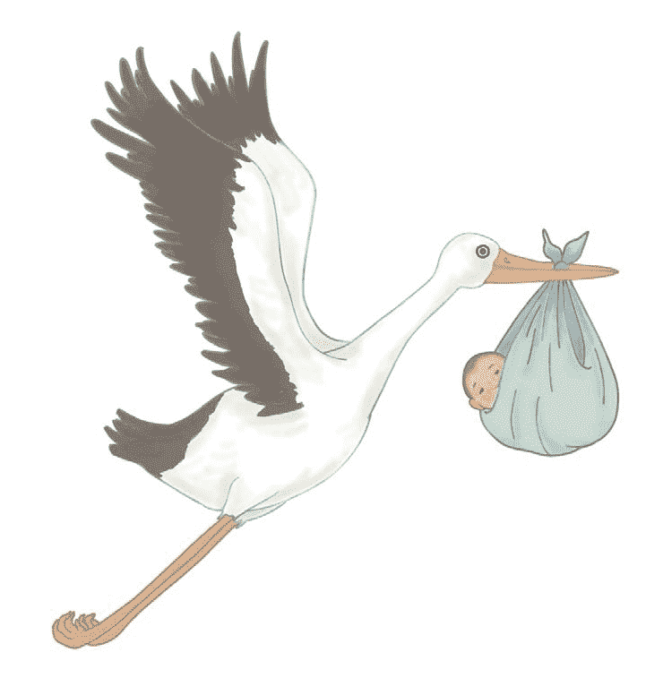

印度诗人泰戈尔的诗［出生］，妈妈以无限柔情回答孩子询问自己从哪里来――

孩子对妈妈提问题：

「我是哪儿来的——你是从哪儿把我捡来的？」

妈妈把孩子搂在怀里，笑着回答，眼含泪水，

「你是我的希望，藏在我的心里……」

另一首泰戈尔的［责备］，我在年轻时读到这首诗，被这份浓浓的爱给感动，也与大家分享。

为什么你眼里有了眼泪，我的孩子？

他们真是可怕，常常无谓地责备你！

你写字时墨水沾污了你的手和脸——这就是他们所以骂你龌龊的缘故么？

呵，呸！他们也敢因为圆圆的月儿用墨水涂了脸，便骂它龌龊么？

他们总要为了每一件小事去责备你，我的孩子。他们总是无谓地寻人错处。

你游戏时扯破了你的衣服——这就是他们说你不整洁的缘故么？

呵，呸！秋之晨从它的破碎的云衣中露出微笑。那末，他们要叫它什么呢？

他们对你说什么话，尽管可以不去理睬他，我的孩子。

他们把你做错的事长长地记了一笔帐。

谁都知道你是十分喜欢糖果的——这就是他们所以称你做贪婪的缘故么？

呵，呸！我们是喜欢你的，那末，他们要叫我们什么呢？

希望女人们认识脾经之后，要让自己成为幸福的妈妈，不只自己快乐，也不要再跟孩子说「你是从石头里、垃圾堆里捡来的」，要让孩子感受到满满的被守护的爱，就像我们被身体的母亲拥抱、也被大地的母亲呵护一般。若是爱的能量不足或过当都会造成伤害，身心皆然。

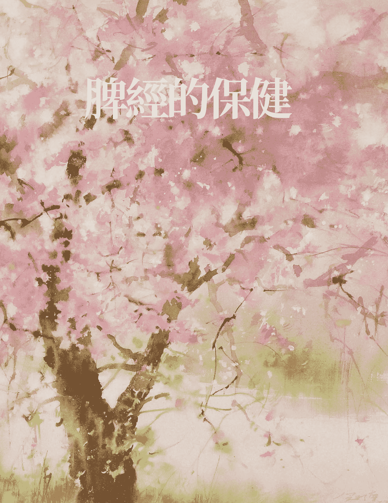

# 脾经的保健

脾经宛如家中默默操持的母亲，把家里打理得非常舒适，我们身在其中，享受着母亲的付出与照拂，直到有一天，母亲无法照应家务时，才会深深感受到她的存在和重要性。而身体的脾经也是如此，脾经在体内维持的运化功能，让我们享受它所提供的舒适安全的生活，并没有特别的感觉，如果有一天感受到了，那就表示脾经系统出问题了。

脾经是人体的妈妈，具有「大包」的特性，将身体主要组织器官包覆且安置在她的篓子里，固定脏器，缓和冲击，还能提供免疫防御力。脾的运化、升清、统血生血、祛湿等功能，与胃共同承担气血生化之源与后天之本的重任，是非常重要的脏腑。另外，脾脏也与人体重要的气、血、水三种物质的生成及代谢功能有关。

既然脾经时时刻刻照顾着我们，我们也应该时时刻刻照顾好脾经，维持健康的脾经系统，才能拥有健康的生活本钱。

脾经的自我保健运动

#### 脾经的自我保健运动

● 深呼吸，藉由肺的宣发肃降功能提升脾气

肺经与脾经从人体上下守护人体，合作关系密切，在前面章节曾介绍过，肺经象是华盖大伞，从上而下保护人体；脾经则像篓子，由下而上托住身体的重要体腔。所以最简单又有效的脾经自我保健之法，就是每天练习全身的吐纳深呼吸。

肺主气，司呼吸。吸气时掌心朝上，放在腰腹部，吸气时手掌跟着向上提至胸口；吐气时翻掌，掌心朝下，跟着吐气的节奏向下放回腰腹部。吐纳动作建议缓慢，腰腿部可以配合吸气挺身，吐气下蹲，每天至少 20 下，以深呼吸及手臂提降的辅助。借由肺的宣发肃降功能，协助脾气上升，伸展篓子，并加强篓子的稳定度。

● 按揉脾经，与身体进行温柔对话

在下肢部位：最简单的方式就是顺着脾经在小腿和大腿部循行的部位按摩，小腿内侧的脾经路径，按摩时常会有疼痛感，或发现有气结肿块，尤以女性居多（建议别只顾外表涂抹化妆品，也要对内照顾美丽的自己），只要常常推按就可改善。

按揉脾经时，还可以搭配按摩精油来进行会更舒服，选择花朵系列的精油尤佳，若再冲一杯花茶或柑橘茶，透过触觉、嗅觉、味觉一起温柔地来照顾脾经，效果加倍。容易水肿的体质，记得适时将腿部抬高，避免湿气停留在小腿处。

在胸腹部：一定要注意保暖，尤其不要让腰腹部受凉。此外肺脾两经在胸部的【中府穴】交会，平常可以多加按揉。

胸腹部还有一个非常重要的部位，就是乳房。乳房是女性的第二性征，是女性身体中最外凸、最容易被看见，也最能呈现女人味及母性的部位。一如植物的花朵与果实，乳房也是母亲给予孩子生命乳汁的来源，是自然界赋予人类最丰足珍贵的赏赐。

脾经经脉系统胸部循行路线正好围绕在乳房内侧与外侧，亦即围绕包覆乳房。男性没有隆起的乳房，平坦的胸大肌也被脾经所围绕，就等同于乳房的意思。

一般女性除非为了检查乳房，通常羞于触摸自己的乳房，男性会抚触心爱女子的乳房，应该也很少去碰触自己的胸大肌吧！

在了解脾经的母性特质后，无论女性或男性，是否具有母亲身分，都一样可以爱自己呀！ 你会发现，唯有正视和接纳自己的身体，才懂得珍爱自己。所以从现在起，就将「掌握乳房」作为珍爱自己的养分吧！

男女都要学的「掌握乳房」按摩法

请打开双手手掌，手掌托住同侧乳房，拇指放在乳房外侧，其余四指按在乳房下方及内侧，手指稍微用力，以爱护情人般的心念与力道，轻轻挤压乳房，感受她们所蕴含的生命力，同时将掌心的温暖传送给乳房，轻轻对她说：「谢谢妳一直照顾我，呵护我。我爱妳！」

脾母跟母亲一样耳根子软，对于儿女的甜言蜜语完全无法抵挡，给脾母灌上爱的迷汤，她也会回注给我们爱的能量。藉由掌心与乳房接触，让身体内爱的能量开始流动。此时这份能量会在体内温柔地蔓延，而且逐渐增加力量，就让自己的身体变成爱的电池吧！

男性读者就以乳头为中心点，将双掌贴在胸大肌上，其余动作都与前面一样。

脾经总论介绍过，脾脏是心脏爱的能量来源，只有当脾的电池充饱时，才具有珍惜自己和爱护别人的能力。所以记得时时「掌握」自己的乳房，也可以用同样的方式掌握爱人的乳房或胸大肌，让对方感受到来自你爱的能量，一定会让感情加温。

脾经常用保健穴位

#### 脾经常用保健穴位

脾经共有 21 个穴位，分布在下肢及胸腹部。

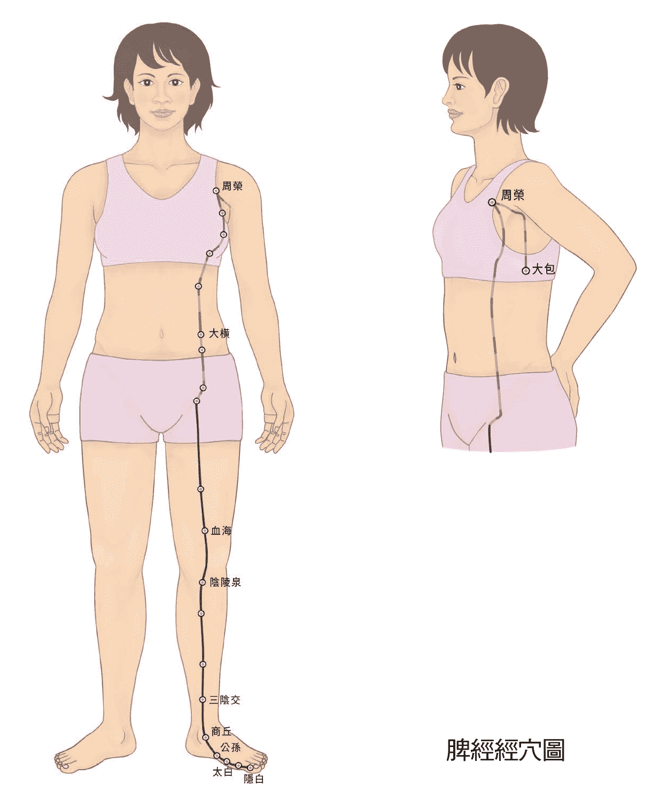

依据经脉篇脾经脏腑好缘关系图和下肢穴位图的架构，介绍六个常用保健穴位。（见下页图）

隐白穴（SP1）：脾经第一个穴位，位于足大趾末稍内侧，趾甲角的外缘。

胃经最后循行到足趾，主干线到自己的厉兑穴，一条分支到足大趾交给脾经的隐白穴。本穴身为胃脾两经的交会部位，兼具了两经功能，加上脾经又从胃流注入心，心主神志，让本穴具有良好的安神作用，与厉兑穴合用，镇静安神力量更强，可用灸法治疗频做恶梦，心神不宁，所以本穴也是「捕梦网」。

隐白穴为脾经的井穴，除了具备井穴都有的开窍醒神功能之外，也有属于自己经脉的功能。较特别的是脾主统血，心主血主脉，让本穴除了安神之外，艾灸本穴还能健脾统血以止血，例如胃出血，或月经期间经血过多，或行经时间拖很长，中医称为「崩漏」，灸隐白穴是临床常用的治法， 效果不错。如果手边没有艾粒，可以用点燃的香烟头（不能有火焰以免烫伤！）来灸本穴。

太白穴（SP3）：位于足部内侧缘的足弓部位，大趾本节（第一跖趾关节）后下方赤白肉际凹陷处。

太白穴兼有好几个身分，它同时是脾经的原穴、输穴、土穴。

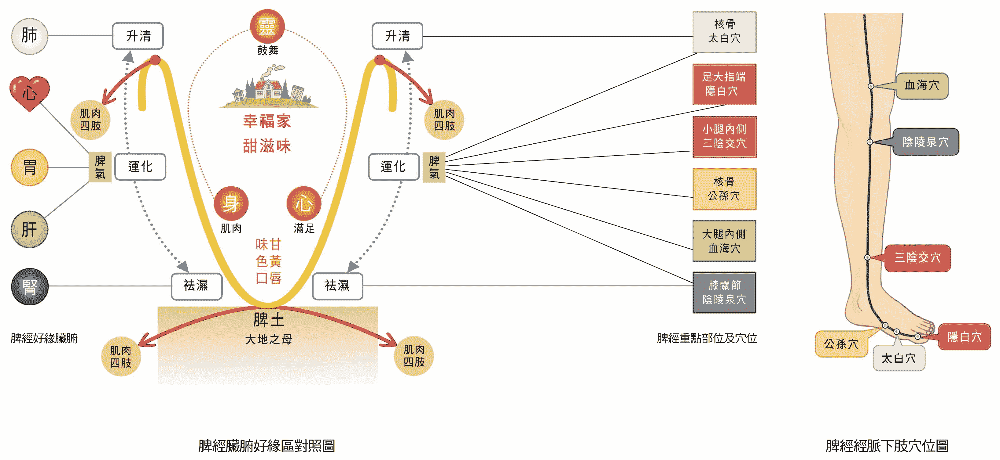

脾经的原穴：善于治疗脾脏疾病，是「脾脏功能」的指挥中心，还能 hold 住脾主升清的力量，改善脾之大络大包穴附近的肿胀疼痛，这就等同透过篓子的提把来改善篓子上提的机能。

属于输穴：依据「输主体重节痛」的特性，善于治疗身体的沉重感，关节及肌肉的疼痛。

土经的土穴：脾属土，太白穴又是脾经所有穴位中土性最强者，可以健脾燥湿，开脾土，是加强「脾气—脾土—脾湿三部曲」的最佳穴位，类似中药的白朮，更可安胎。除了健脾祛湿、促进食欲之外，还可改善贪吃甜食所形成的痰饮。太白穴也是拇趾外翻的部位，常常牵连至咽喉也有卡痰感。

近代中医师常用白朮治疗腰痛，其实太白穴也能治疗腰痛，治病原理可从脾经经络来探究。太白穴具有很强的健脾燥湿及升清功能，加上脾经经筋又内着于脊，所以本穴就跟白朮一样，可以治疗痰饮、湿气停滞所引起的腰背部痠痛。

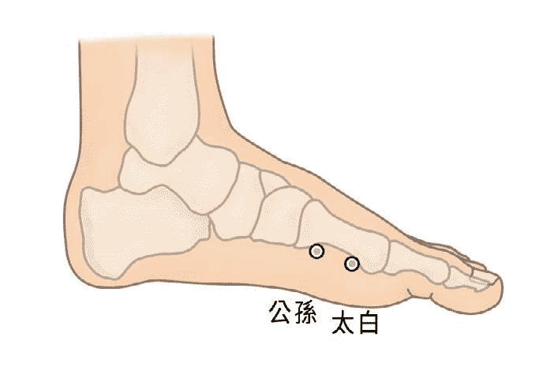

我们可从分析白朮与太白穴治疗腰痛了解，经络是非常简单扼要的线索，只要掌握循行所过部位，就能快速诊治疾病，所以掌握经络就等同掌握诊断治疗疾病的钥匙与捷径。

公孙穴（SP4）：位于足部内侧缘的足弓部位，第一跖骨基底前下方凹陷处。脚的跖骨相当于手的掌骨，太白穴与本穴就位在第一跖骨的前后两端。

公孙穴是络穴，也是八脉八法穴之一，通冲脉，因此具有调和脾胃及肠道，开心宽胸，善于降逆气，调理妇科，有助于胎产的功用。（可参阅络脉篇）

* * *

公孙穴取穴法提醒

公孙穴所在位置并不偏僻，但若取穴手法错误，就会偏到肾经。因为脚的跖骨虽然等同于手的掌骨，但是足大趾不像手拇指可以独立张开，第一跖骨不明显，不太容易找到这个穴位，经常看到一些年轻医师会「错过」本穴而用了肾经的穴位。

该如何找呢？

建议拇指以 45 度沿着第一跖骨边缘，向脚踝推行，遇到的第一个阻碍物就是第一跖骨的基底部，公孙穴就在基底部的前方。

如果用手指平贴在足弓处，通常感受不到基底部，就会一路顺畅，滑到比较粗大的舟状骨下面属于肾经的然谷穴。要小心！

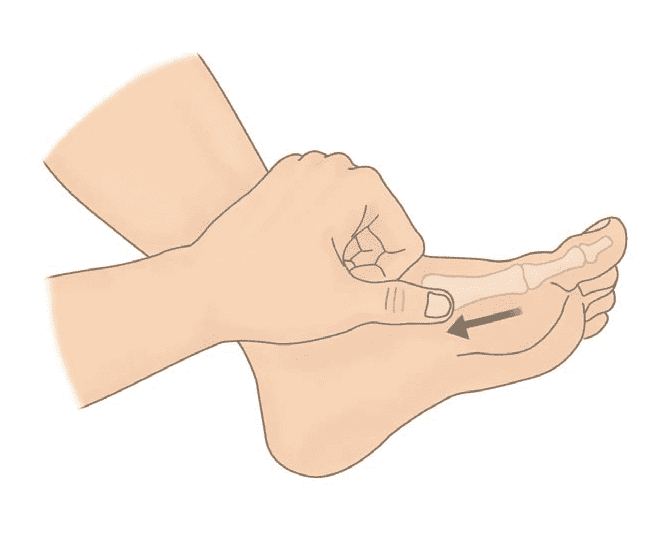

* * *

三阴交穴（SP6）：位于小腿内侧，足内踝尖上三寸，约为手指 2-5 指合并的横幅宽度，在胫骨内侧缘后方凹陷处。

三阴交穴具有脾脏生血化血及心脏主血主脉的功能，善于补血养血，是妇科要穴，调理一切生殖系统疾病，类似「四物汤」。详情请参阅经筋篇。

阴陵泉穴（SP9）：位于小腿内侧，膝关节下方，胫骨内侧髁（胫骨上端，膨起部位）的后下方凹陷处。

阴陵泉为合穴，五行属水，善于调节脾经经络系统循行部位的病变，是「脾经系统」的指挥中心，类似茯苓的特质，兼具脾脏以土治水及肾脏以水主水的功能，能健脾渗湿、通利小便，治疗水湿停滞疾病，包括肠胃疾病、妇科、带下病和下肢水肿等。

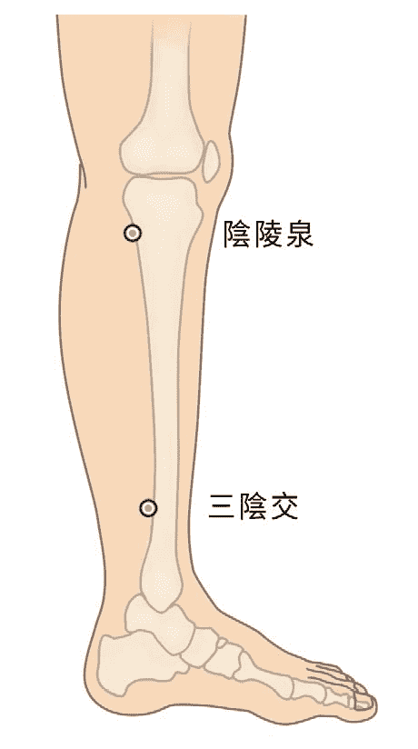

阴陵泉也具有茯苓治疗水湿循着脾经经脉上逆至胸胁，影响心肺运作，导致心神不安、心悸、咳逆等症状的功能。

另外，依据人体的对位关系，阴陵泉对应肺经的中府、云门穴附近，可以协助肺经疏通气机、开胸理气，改善呼吸机能。

血海穴（SP10）：位于大腿内侧，髌底内侧端上二寸，当股四头肌内侧头隆起处。简便取穴法为：以取左侧血海穴为例，患者屈膝，医者以右手掌心按在患者的左膝髌骨上缘，2-5 指在膝关节外侧向上伸直，拇指在膝关节内侧约呈 45 度斜置，拇指尖下方就是血海穴。

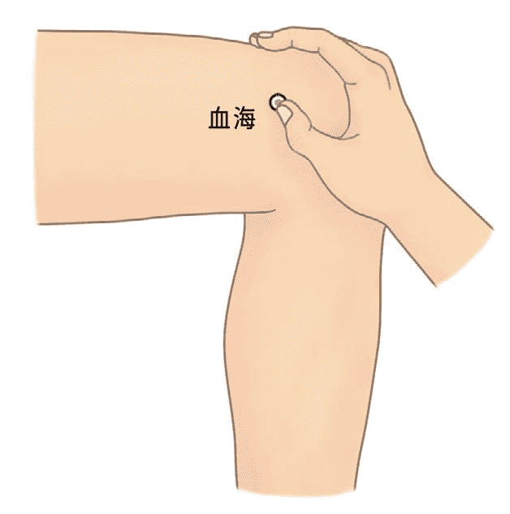

血海穴顾名思义与血的疾病有关，兼具有肝脏疏泄条达气机的功能，善于行气活血止痛，类似「桃红四物汤」，能治疗气血瘀滞所导致的各类疾病。

桃红四物汤就是补血的四物汤加上活血的桃仁红花，聪明的读者可能发现，三阴交等同四物汤，加上活血能力就变成了血海穴，对吗？也可以这么想，但是中药是身外物，可在汤头里面加加减减，穴位在人体上，没法加减，必要时就得两穴合用，加强疗效。

血海穴可以治疗皮肤痒

血海穴行气活血的特质，还能改善皮肤搔痒症状。很特别吧！这是植基于中医的理论。中医治疗皮肤痒的疾病有二个很重要的理论。

第一个理论是「诸痛痒疮，皆属于心」，其原理会在《卷四》心经介绍。心主血，痒病与心有关，当然也与血有关。脾经的下接经正好是心经。

第二个理论是「治风先治血，血行风自灭」。当皮肤出现痒症时，通常会在全身四处游走发作，这个特质类似风四处流动，因此将它归纳为与风邪有关的疾病。

综合以上所述可以了解：痒病虽来自于风邪，但与血病有更深的关联，所以若要根本治疗痒病，就须从血分着手。能养血活血的桃红四物汤或血海穴都善于治疗皮肤疾病，尤其是皮肤干痒，容易脱屑者更合用。

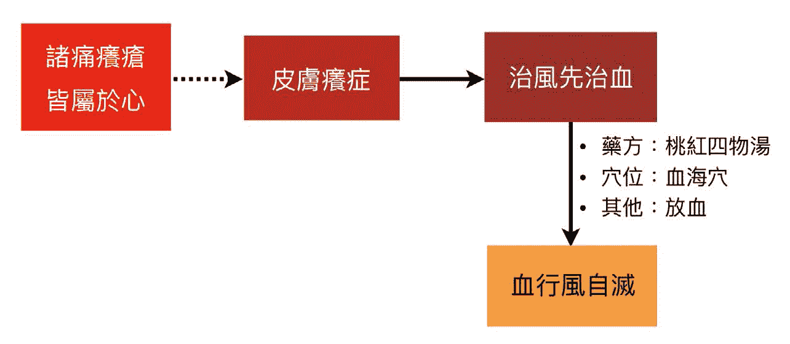

临床上我们也应用上述原则，采用放血的方法，导引出瘀积在皮肤里的血热，加快治疗的效率。

依据中医理论，有皮肤病的人尽量不要吃燥热油腻的食物，及会「外发」的食物，例如竹笋、花生、茄子、南瓜等，要多吃蔬果，少熬夜，好好跟医师配合，才能跟皮肤痒说再见。

 中医师不传之祕：脾经隐藏版好用穴位

除了上述六个穴位之外，脾经还有隐藏版的功能与穴位。

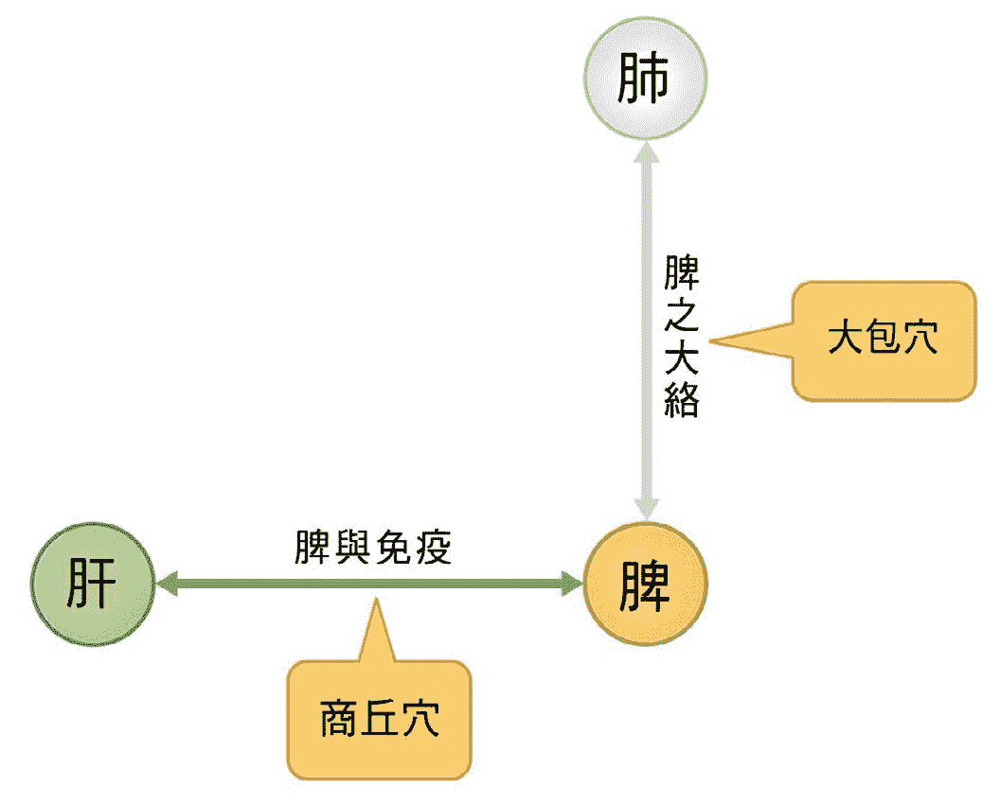

隐藏版一、脾之大络：大包穴

之前介绍过，大包穴属于脾之大络，它在胁肋部位形成「胁肋大包区」，可以视为脾经篓子结构的把手，是脾主升清的主要施力点，也是诊治部位。

脾脏功能异常的人，大包区会有肿胀压痛现象，但因脾母的耐受力很强，大包区也很沉默，主动去触摸才会发现它的变化。

大包区位于胁肋，平日可用手掌尺侧，即俗称「手刀」的部位来搓揉大包穴以疏散气血，强化脾脏功能。治疗方面，因为不好施针，可用灸法，或选用远端的太白穴，必要时还可加上商丘穴。

隐藏版二、 调节脾脏与免疫机能：商丘穴

在经脉篇介绍过，现代医学的脾为免疫器官，其功能涵括在中医的脾脏功能之中，商丘穴依据五行属金以及对应关节部位的特性，可以改善淋巴系统，为脾经强化防卫连线，并治疗淋巴相关病症。

此外，商丘穴还是一个有趣的穴位。

因它很容易出现肿胀现象，临床上只要看到这种现象，都会先下针再说。因为商丘穴会肿，代表脾经系统必然有所阻滞，但因商丘穴管理淋巴系统，遍布全身，范围很大，难以详细寻求病位，直接下针虽然类似散弹打鸟概念，但确实有一定疗效。

其次，商丘穴位于太白穴及阴陵泉穴之间，就成为两个穴位的「加速器」。例如与太白穴合用，可明显加强太白穴改善脾脏的功能；与阴陵泉穴合用，可加快阴陵泉穴疏通脾经气血的能力。简单的说，只要加上商丘穴就能让疗效加倍。

商丘穴独用可调节淋巴系统，与其他穴位合用则能发挥一加一大于二的疗效，可以经常按揉来保健。但因它位在内踝上方，活动时很容易扭伤，或者久站后气血堆积，出现肿硬现象，而牵连影响脾经功能。若有这类情况发生，要赶紧治疗，以免病情由脚踝扩大到脾经。

贯穿女性一生的脾经穴位

#### 贯穿女性一生的脾经穴位

女性四大生理特质「经带胎产」，也可以直接按揉这些穴位自我保健：

调理月经：三阴交穴、血海穴等。崩漏可以加灸隐白穴。

治疗带下：太白穴、阴陵泉穴等。

促进怀孕及顺利分娩：公孙穴等。请记得孕妇禁揉三阴交穴！

脾经是贯穿女性一生重要经络，其中的三阴交、阴陵泉和血海更是关键穴位，我简称为「三陵海」，是女性美丽青春的宝典。

以下将脾经穴位与女性一生各个阶段的生理特质绘成下表。这些部位都适合自行按摩保健，可逆龄回春喔。

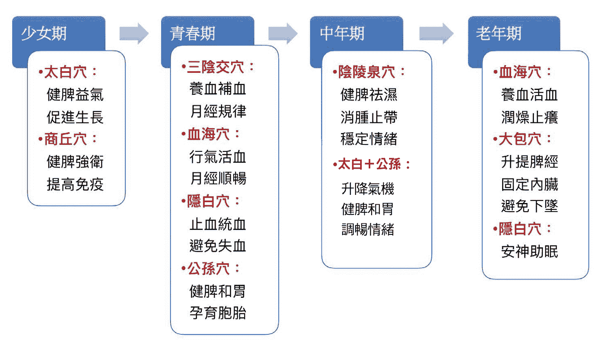

 中医师不传之祕：妇科病人的面部望诊

前文提到，脾经是贯穿女性一生重要经络，依据「经之所过，必致其病」的原理，妇科问题也可从脾经循行所过部位观察，现以面部口唇部位为例来说明。

《内经》面部望诊中，上唇至鼻部之间的「人中」部位属于膀胱及子处（骨盆腔），人中两旁部位，相学称为「仙库」及「食仓」、「禄仓」，可视为人中的延伸，我称为「人中区」。

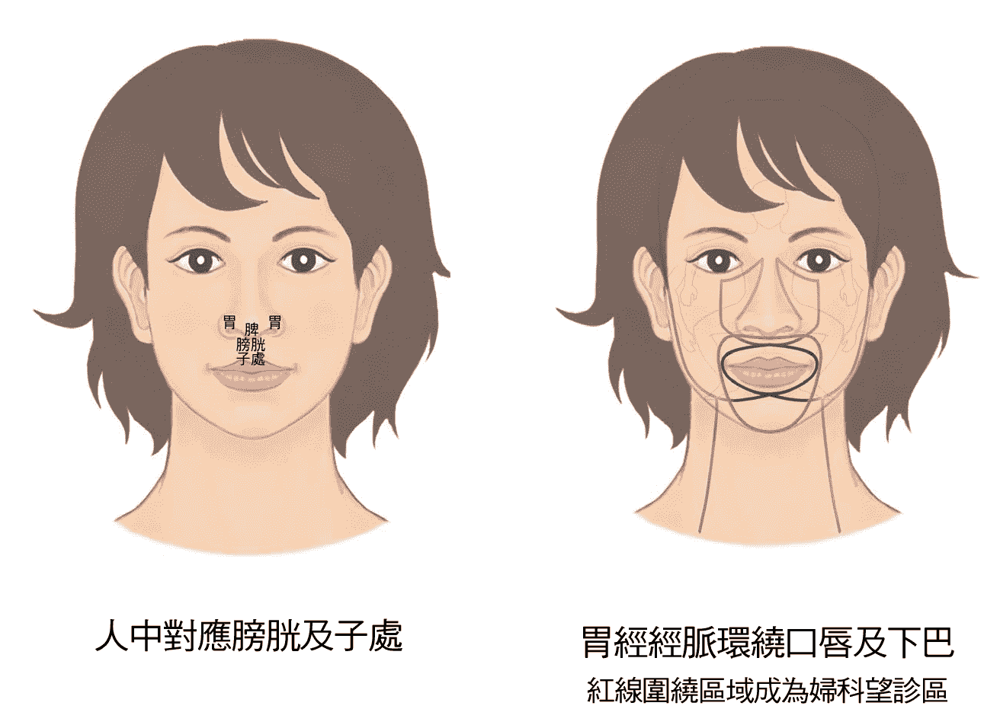

女性的阴部是个开口，为人体最下方的开口，嘴巴是最上方的开口，在人体对位关系上，人体上方与下方的开口相对应，嘴巴就成为阴部的反应区。加上脾开窍于口，相表里的胃经也环绕口唇，包括下巴，这些部位就成为妇科望诊区，临床上非常好用。

简单举例如下：

【人中】：妇科出现异常者，人中会出现凹点；动过妇科手术者，人中会出现纵向线条；子宫气血循环不良者，人中区会出现褐色斑点。

【环唇】：子宫偏寒者，环绕嘴唇一周会出现青白色。子宫气血瘀滞者，环绕嘴唇色暗且肿。

【唇堤】：下唇的下缘称为「唇堤」，子宫明显瘀滞者，唇堤也会肿起。

【下巴】：下巴红肿，甚至长痘痘者，表示骨盆腔有湿热，容易出现黄色的分泌物。

门诊时，我们会卫教病人回家对着镜子自我观察。随着病情的转变，这些望诊区也会跟着改变，病人可以随时掌握身体状况以自我诊断。一旦发现异常，建议赶紧就医。（早年跟随林源泉老师学习望诊，获益良多。读者若有兴趣，请参阅林源泉老师的望诊系列书籍。）

总 结

脾经系统实质上只与胃和心连结，我们也可将脾经主要穴位与脾胃心三个脏腑相对照，比较容易掌握各穴位的特性。见下图。

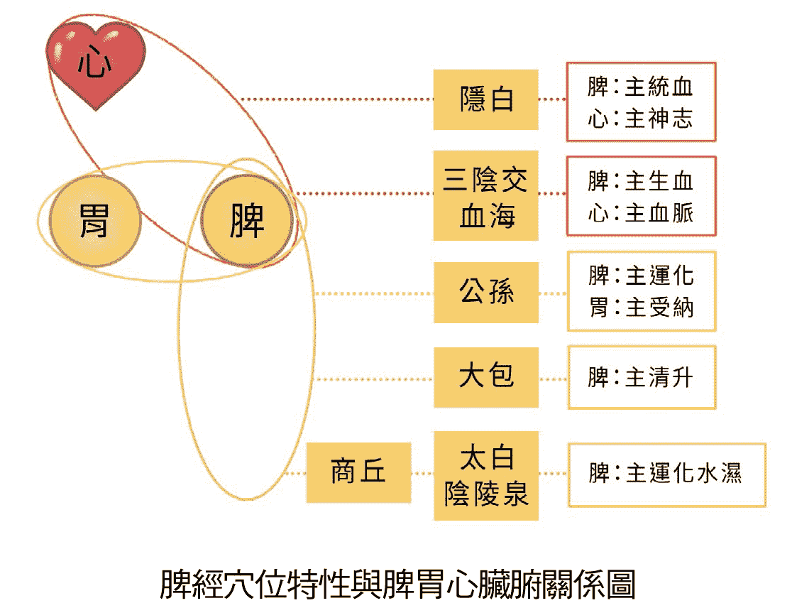

每次演讲或授课后，总有民众追着我问：日常的保健要怎么做？大家总希望有一帖强效珍贵的方子，然后病人什么都不用做就立即药到病除。我是很务实又诚实的医师，还是奉劝大家：老天已经透过经络，把最佳战友与最强修复系统都交到我们手上了，从认识经络来照顾自己，真的是最经济又最贴心的保健良方！

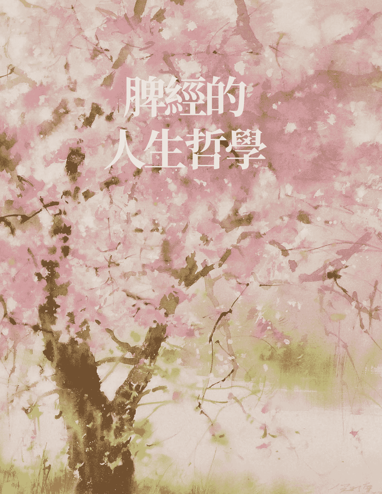

# 脾经的人生哲学

自我提升，幸福知足的人生哲学

#### 自我提升，幸福知足的人生哲学

2018 年第 90 届奥斯卡金像奖，高龄八十的资深演员珍．芳达（Jane Fonda）以优雅的身形和自信的气质吸引全场的目光。她分享了保有优雅的秘诀，就是「心灵要爬楼梯」！她认为人到中年之后，不是衰退，反而是爬楼梯向上的过程。朝向智慧、圆满与真实的精神提升，以获得心灵充实和内心平静，创造出全新的人生。

珍．芳达这番人到中老年后「心灵要爬楼梯」的提醒，不正是「脾经」的优雅哲学吗！

我开玩笑跟学生说，未来可能的话，会跟珍．芳达女士恭喜她保有健康的脾经系统，让脾的升清功能和篓子结构，可以持续协助她的身心灵向上提升。

面对自己的人生，我们有着很大的选择权！没错，就是〔选择权〕。虽然可能没有办法抵抗身体的老化，但却能决定面对自己的态度，也就是生活的态度。我在诊间常遇到病人才刚步入中年，就不断咳声叹气叨念着「我已经老了……」，老年人则多半碎念着「我没用了……」，这样的心念不只是「下楼梯」，更甚者是「溜滑梯」了，除了加速身心的衰老，对于自己未来的人生毫无助益。

我们来到世间走一回的过程中，身体里面的母亲「脾经系统」，分分秒秒都在陪伴及守护着我们，这就是可以选择自己人生道路的向上动力！千万不要忘了。

《内经》说：「脾胃者，仓廪之官，五味出焉。」仓廪包括粮食和薪俸，在现实世界里是维持生活的重要物质。对于身体而言，仓廪代表所有组织器官维持正常生理机能所需的营养物质。对于心灵而言，仓廪代表着丰富与满足感。

脾胃就是身心灵富足感的重要来源。

人人都有幸福 DNA：
脾经是体内永远的妈妈，我们是永远的「妈宝」

#### 人人都有幸福 DNA：脾经是体内永远的妈妈，我们是永远的「妈宝」

每个生命之始都与母亲相依偎，母爱是生命最早的安全感来源，饱满的爱给予孩子充足的安全感，让他能勇于面对人生的各种挑战。这样的观点在近代心理分析的论述中，已屡屡被印证。

但中医更进一步看见了这股爱的能量，象征母亲的呵护与保卫的力量，不只依赖外界的给予，也能在每个人自身的体内找到，这就是脾经。在自己的身体里面，脾经就是我们终生的母亲。我们在脾经经络系统中以大篇幅介绍了慈母线和游子衣的重要性，脾气是守护幸福的动力来源，脾气维持脾的运化、升清，身体才能正常运作，而身心灵安顿，爱的能量饱满才能拥有一箩筐的幸福！所以每个人身体里与生俱来都具有幸福的 DNA 呀！有了脾母终生的照顾与陪伴，我们人人都是永远的「妈宝」！

脾经形成的篓子既是幸福箩筐，也是生命的安全网，对于情绪问题也能提供不错的调节。我曾在《卷二》大肠经篇章介绍不少大肠癌病人的情绪垃圾满了，无处可倒，造成身心疾病。若能善用心灵经络概念，就可利用脾属土的特质来帮忙，大地承载万物，所以脾的篓子也能作为情绪垃圾的消化桶。加上五味中脾属甘，甜味糖分也能刺激大脑制造血清素，让我们放松快乐一点。这些都是可以善加运用的脾经功夫。

所以，当心情郁闷无处可倒时，不妨找个金黄色系的小桶，对着它倾吐生活中所有的不快、愤怒等情绪，然后以水漱口，吐到桶子里。边说边吐，等心情舒畅之后，再将桶内的水倒入马桶冲掉，也可以洒在地上，让它回归大地。脾经的力量宛如大地，含蓄包容，相信她能懂你的，最后再吃颗糖鼓舞自己一下吧！

* * *

母亲最后的眼神～跟父母亲和解吧！

#### 母亲最后的眼神∼跟父母亲和解吧！

我跟母亲长期都处于大大小小的争执中，总觉得妈妈比较爱哥哥，无论我有多好的表现，总难获得妈妈的赞赏。

长大后慢慢了解，母亲是个拙于言词跟表达感情的人，也是被传统思想紧紧束缚的妇女，她曾经坦白跟我说，儿子就是妈妈老后未来的倚靠，所以一定要对儿子好一点，不然以后怎么办呢？无论我怎么跟她说，我也可以照顾你啊〜妈妈总是轻轻笑说：「憨囡仔，哪有人依靠女儿的！」

这份紧张关系，一直延续到母亲将要离世的时候。

那是个夏天的周六上午，明亮的阳光洒进病房，妈妈的头部宛如笼罩在天使光中。病房很安静，只有我们两人，母亲已经多日未张开眼，我坐在床边握着她的手，昏迷多时的母亲突然缓缓张开眼睛，散发出我从未见过，温暖清亮充满母爱的眼神，定定的看着我，面部表情很柔和，嘴角似乎还带着浅浅微笑，大约五秒钟，眼睛又慢慢地阖上。

剎那间，我才了解母亲在人生最后的阶段，还惦记着要告诉自己的孩子：她一直都很爱我，不要再苦恼伤心。泪眼盈眶的我感受到妈妈的心意，也知道她这一世的任务完成了。果然从那一刻起，妈妈再没睁开眼睛，几天后安详的离世。

母亲是个平凡的人，对于我们却很重要，我相信每一个母亲都一样。很感谢她在生命的最后阶段，以母亲的爱与智慧，给予我未来的人生路途中，继续前进的能量跟勇气！

许多父母在成长过程中可能没有被好好爱过，转换成父母亲身份之后，也没人教导该如何胜任，所以不知道如何去表达爱，怎么去关照和教育孩子。当我们逐渐长大，有能力也有智慧时，可以试着体谅他们、善解他们，有时还可以引导他们，与他们和解吧！

临床上看到许多家庭故事，问题也会来自长辈，建议身为老一辈的父母，参考胃经篇章最后提到的，人老之后要戒之在得，随着家中人口结构变化，不要掌控孩子，不要紧抓权力或威权，而要懂得适时放手，调整个性和观念，彼此各退一步，就会有充满爱的温暖流动。

* * *

心是爱的实现，脾是心爱的能量来源；
脾的能量不够，小心变成情绪勒索者！

#### 心是爱的实现，脾是心爱的能量来源；脾的能量不够，小心变成情绪勒索者！

脾经的经筋由肚脐处进入腹腔，脐带是婴儿与母亲的连结，脐带也与「期待」同音，代表母亲对于肚里新生命的期待，母亲爱的灌注，陪伴我们一生一世。脾经本身就充满饱足的关爱与能量，无需外求，所以母亲节除了感谢生我们的母亲之外，也跟一直在体内健运不休的脾母说声谢谢吧！

脾经的下接经是心经，胃负责受纳腐熟水谷，所吸收的精微物质由脾输送至全身，当然也会透过经络系统输送给最需要营养的君主之官心脏！心主血脉与神志，心脏能获得多少营养来维持身体和心理的稳定和谐，完全取决于脾胃，尤其脾脏具备的勤奋特质，时时刻刻都在运转的运化功能更是关键。脾脏运送的营养物质越充足，心脏就越有足够的能力来维持身心健康。

我们常说「心爱」，表示心脏与爱有关。透过脾经与心经的连接关系，让我们了解，心把对于人事物的爱意表现于外，是爱的实现，而脾提供的营养则是心能够展现爱的能量来源。

如果「脾」爱的能量够饱满，「心」也会跟着饱满，才有能力给予爱，展现出正常之爱的关系。如果「脾」爱的能量先匮乏，「心」爱的能量也会跟着匮乏，此时就容易出现假爱之名，行勒索掌控之实。这样的例子在现实社会经常看到，不少人内心的爱有缺口，渴望爱，却不懂如何去饱满它，反而将自己的匮乏转而对身边人的情绪／爱的勒索，结果经常是两败俱伤。

一如脾经总论中说过的「脾的幸福感，就是爱的力量」，经络系统切切实实告诉我们，唯有学会爱自己，让自己的爱饱满，才有能力去爱别人！

脾经系统与女性生殖器官密切相关，女性生殖器官能与爱人亲密结合，也能孕育爱的结晶（孩子），可以视为是「爱的器官」，因此脾经与女性爱的能量特别有关。临床上遇到罹患妇科癌症，如子宫颈癌、子宫内膜癌、卵巢癌病人，常有爱的能量阻塞情况，例如囿于现实条件无法跟相爱的人结合，或被迫牺牲自己的感情与孕育孩子的机会去成全家族的期望等，这些都会让女性的爱情和母性的爱无法舒展，「爱的器官」被压抑，无法使用，只好选择自我毁灭一途，令人唏嘘。

在此特别提醒女性读者，人身难得，生命无比珍贵，请多多关爱自己。唯有自己的身心灵饱满之后，才有能力呵护周边的人，成为他人生命中一道温暖，充满爱的光，而不是一把需索爱的刀。

既然提到爱，也是要对好脾气又母性十足的脾提出叮咛：妳的优点也可能是最大的弱点，慈悲包容也记得要有智慧，「悲智双运」才能避免当滥好人，而不会被他人予取予求，切记切记！

回归自己：You Raise Me Up 你鼓舞着我

#### 回归自己：You Raise Me Up 你鼓舞着我

随着生活的紧张忙碌，人情世事纷扰变化，人的心思跟着混乱，孤独感慢慢侵蚀内心，我们逐渐遗忘属于自己的幸福箩筐，以致身心疾病层出不穷。

每个人都会面临生离死别，伤痛难免，但请回归己身，参考本书保健篇中，「掌握」乳房，感受来自脾母无限的关爱与接纳。

2017 年女作家林奕含自杀，年轻生命的殒落，特别令人不舍。

我总想如果每个人都能回归自己，时时观照自己的脾经，体察到无论外在世界如何变化，脾经总是陪伴着我们，诚如一首英文歌 You raise me up 虽然是一首圣歌，也可作为脾主升清的歌曲：

When I am down, and, oh my soul, so weary;

当我心情低落时，我的灵魂感到非常疲惫

When troubles come, and my heart burdened be;

当烦恼接踵而来时，我的心无比沉重

Then, I am still and wait here in the silence,

此时， 我会在寂静中等候

Until you come and sit awhile with me.

直到你到来，与我小坐片刻

You raise me up, so I can stand on mountains;

你鼓舞着我，让我可以攀上群山峻岭

You raise me up, to walk on stormy seas;

你鼓舞着我，让我能横渡狂风暴雨的海洋

I am strong, when I am on your shoulders;

当我倚靠在你的肩膀时，我变得坚强

You raise me up, to more than I can be……

你鼓舞着我，让我能超越自己……

脾经这股向上的力量，一如歌中所说，能帮助自己脱离负面情绪的泥淖，变得坚强勇敢。无论面对多大的人生试炼，再苦再艰难的考验，身心灵遭受的损伤，善于补破网的脾经都能修复，时时刻刻陪伴、托护着你，让你知道人生还是很温暖、充满希望的，绝不会让你坠落！

没有一个人是孤单的，记得要连结大地与众人

#### 没有一个人是孤单的，记得要连结大地与众人

其实，没有一个人的人生是十全十美的！真的。

也许你年少时没有得到期望的家庭温暖，或随着年龄增长家庭遭遇变故，突然成了中年孤儿，甚或老年时成为独居老人等等，人生难免要面对爱人的离去、亲人的缺席、沟通的冲突、人情的冷暖、被背叛的锥心痛楚……等，脾主思，这些人生历练，很容易导致过度思虑让人陷入忧郁的深渊。美国致力于推广爱的教育的里欧．巴士卡力（Leo Buscaglia）博士曾说：Worry never robs tomorrow of its sorrow, it only saps today of its joy. （忧虑从不剥夺明天的愁苦，它只会耗尽今天的喜乐。）

说得真好！我们真的很幸运，无论外在世界如何变动，都还有「脾母」永远爱着你、陪伴着你。请静下心来，体察身体里这位终生不离不弃的母亲，她时时陪伴我们，呵护我们，支持我们。

人类是历经近四十亿年的演化精品，也是与大宇宙相对应的小宇宙，每个人都与更大的整体相连，就像每棵树的树根都会在地下与其他树根相连，同样地，没有人是孤单的，除非自己切断了那条连线。

网络上流传：「花若盛开，蝴蝶自来。人若精彩，天自安排。」很美丽的说法。只要愿意敞开自己，有正向的思维，自然就能吸引更多帮助你的力量，这就是吸引力法则。

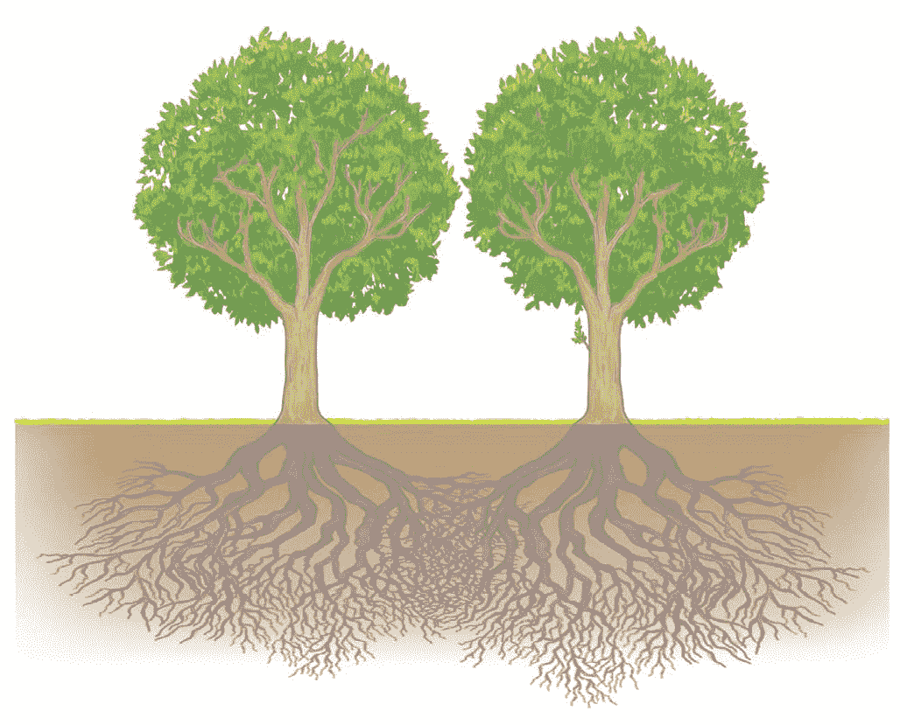

再继续欣赏［西雅图酋长宣言］中有关人与大地的亲密连结，以及尊重土地的提醒吧！

We know the sap which courses through the trees as we know the blood that courses through our veins. We are part of the earth and it is part of us. The perfumed flowers are our sisters. The bear, the deer, the great eagle, these are our brothers. The rocky crests, the dew in the meadow, the body heat of the pony, and man all belong to the same family.

我们可以感受到树干里流动的树液，一如感受到自己身体内流动的血液。我们属于大自然的一部分，大自然也是我们生命的一部分。香味四溢的鲜花是我们的姊妹，熊、鹿、鹰是我们的兄弟。晃动的鸡冠、草地的露水、小马的体温，都和人类属于同一个家庭。

If we sell you our land, remember that the air is precious to us, that the air shares its spirit with all the life that it supports. The wind that gave our grandfather his first breath also received his last sigh. The wind also gives our children the spirit of life. So if we sell our land, you must keep it apart and sacred, as a place where man can go to taste the wind that is sweetened by the meadow flowers.

如果我们将土地卖给您，勿忘空气是我们的珍宝，因为它分享活力给所有它所护持的生命。风给予我们先祖生命之初与生命最后的气息，也给予我们的子孙生命的勇气。因此，在土地卖给您之后，你必须保留它的独立性和圣洁，让人们可以前去欣赏品尝飘散在风中的甜美花香。

Will you teach your children what we have taught our children? That the earth is our mother? What befalls the earth befalls all the sons of the earth.

过去我们如此教育我们子孙：「大地是我们的母亲，会降临到大地上的一切，也会发生在它的子孙身上。」您愿意将这个智慧也告诉您的子孙吗？

This we know: the Earth does not belong to man, man belongs to the Earth. All things are connected like the blood that unites us all. Man did not weave the web of life, he is merely a strand in it. Whatever he does to the web, he does to himself.

我们早就知道：人类不拥有大地，人类是属于大地的。所有生物都互相连结，密不可分，成为生命之网，就像人类体内的血液连结所有组织一样。但人类并不是这个生命之网的编织者，只是其中的一条线而已。当人类试图去改变生命之网的所有作为，都会报应到自己身上。

As we are part of the land, you too are part of the land. This Earth is precious to us. It is also precious to you.

你和我们一样都属于这片大地。这片大地对我们而言是非常珍贵的，对你们而言，也是如此！

人类本就属于大地，生命来自于大地，大地的能量是饱满的，让我们回归大地，与大地和好，脚踏实地，从大地汲取能量，多接触大自然，以安顿身心。

同时也要照顾自己内在的脾母，跟自己和好，注意饮食和保暖，调节情绪，脾母健康了，我们也跟着安好。在妈妈的眼中，自己的孩子永远是她的宝贝。脾母自强不息的提供我们生活的能量，厚德载物的接纳所有的是非与成败，没有评断，只有无尽的包容。请赶紧回到脾母的怀抱吧！与脾母一起守护幸福，给自己的人生装入满满的甜滋味吧！

* * *

脾胃合婚测字隐藏版

在本书序曲中，我说了一个脾胃合婚测字的故事，其实故事还没完，这隐藏版现在终于现身，也是这算命仙送给脾小姐的结婚礼物。

算命仙很喜欢脾小姐，决定加码送她一个测字，请脾写下自己最喜欢的一个字。不料胃先生马上说：「我知道！因为我的关系，她肯定最喜欢这个字。」胃先生毫不考虑写下田字。

算命仙看了田字一眼，抬头看看脾小姐，「这是你想的字吗？」。没想到脾小姐拿起笔，在旁边写下「思」和「男」字，胃先生有些惊讶。

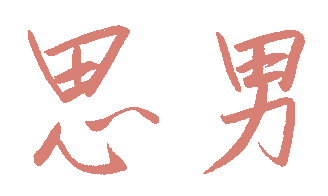

算命仙笑着缓缓解释：「脾小姐真是喜欢田字，思与男也都有田字在上头，代表妳喜欢土地和大自然，很好！跟妳的人格特质也相符。但在田字下面加上个心就变成【思】，妳是容易多想的人，心思很细腻，但思字的【心】却碰不到田字，一颗心像气球一样虚虚浮浮的，遇到事情会很焦虑，一直想啊想的，容易钻牛角尖。」脾小姐彷彿心事被看穿了，边听边点头称是，连忙问：「那我要怎么改变呢？」算命仙没有直接回答，自顾自的继续说：「你们看，【男】字也是田在上面，但是下面是力，力可以跟田连在一起，表示有力承担，而且很踏实，这就能破解脾小姐的思虑病了。」胃先生马上开心指着自己说：「我是男生啊！这不就是在说我吗？哈哈！」算命仙笑说：「也可以这么说啦！所以才说你们是好姻缘。脾小姐心思细，容易想太多、想不开，如果能多带脾小姐去接触土地，感受大地的能量，就能避免钻牛角尖的情况。」算命仙看脾小姐听得似懂非懂，于是拿起双色笔写下了右边三个字──

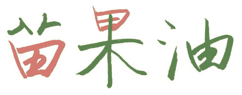

「只要你走进田里，亲手种下树苗，慢慢的就会自己向下扎根、向上长出果实。当树木越长越高大，枝叶茂密，一眼望去就会看到一片绿油油的生命力。你就会发现自己漂浮的心可以安住了，生命有根，人就不会感到空虚。」话一说完，算命仙接着又写了一个字【里】。

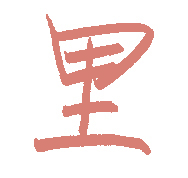

「【田】有四宫格，涵括东西南北四个方位，宇宙天地都在里面，所以就代表甚么都有的【全有】也是【饱满】的概念！我想这也是脾小姐潜意识里会喜欢田字的原因之一。当我们把田与土字合体就变成【里】，东方人认为有土斯有财，来自土地的丰饶收成，让人们聚集在一起而成为乡里。对你们两人而言，就是共组幸福家庭的意思。祝福你们！」

脾胃听了非常欢喜受用，起身牵手道谢，热情的胃经立即表示，「那我们的婚礼，就在户外开阔美丽的大地上进行吧！」脾小姐听了很欢喜，因为亲近大自然是她最自在的时刻。

* * *

第一组经络团队：肺经、大肠经、胃经、脾经，标志生命前期发展过程的生理机能

#### 第一组经络团队的重要性

肺大胃脾四条经络是十二经络系统中的前四经，曾在《经络解密．卷一》的经络启航总论中详细说明，第一组的这四条经是备餐团队，必须为后续第二组聚餐团队中最为耗能的心、肾两脏，提供重要的物质基础。因此肺大胃脾这四经，涵括了生命前期发展过程中，各项重要生理机能，包括呼吸、进食及繁衍，以维持个人生存及种族延续。

这四条经络若以身体一日工作流程来看，人们在肺经时刻甦醒，在大肠经时刻排空肠道，接着在胃经旺时，吃进一天之中最为重要的「早餐」，然后由脾经整装待发，运送给君主之官「心脏」。

肺大胃脾四条经络从凌晨三点到上午十一点，这晨间八小时为身体储备了最重要的营养，也是一天之中最具生产力的时段，难怪大家会说「一日之计在于晨」，这个道理中医早就了然于心。

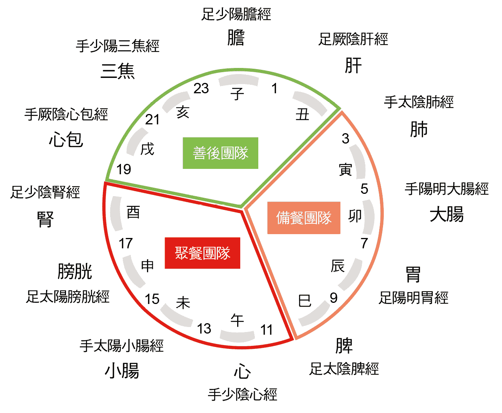

本团队中的大肠经与胃经都让身体强健，是企图心旺盛的大胃王组合，而身为本团队的首发与最后经络，肺与脾都跟关爱有关：肺是寅始、魄力与勇气，具有开创性；脾是温柔、包容与满足，具有幸福感。让我们带着这份身心和谐感，继续前进到身心的君主国度──卷四的心经与小肠经。