# 经络解密卷5

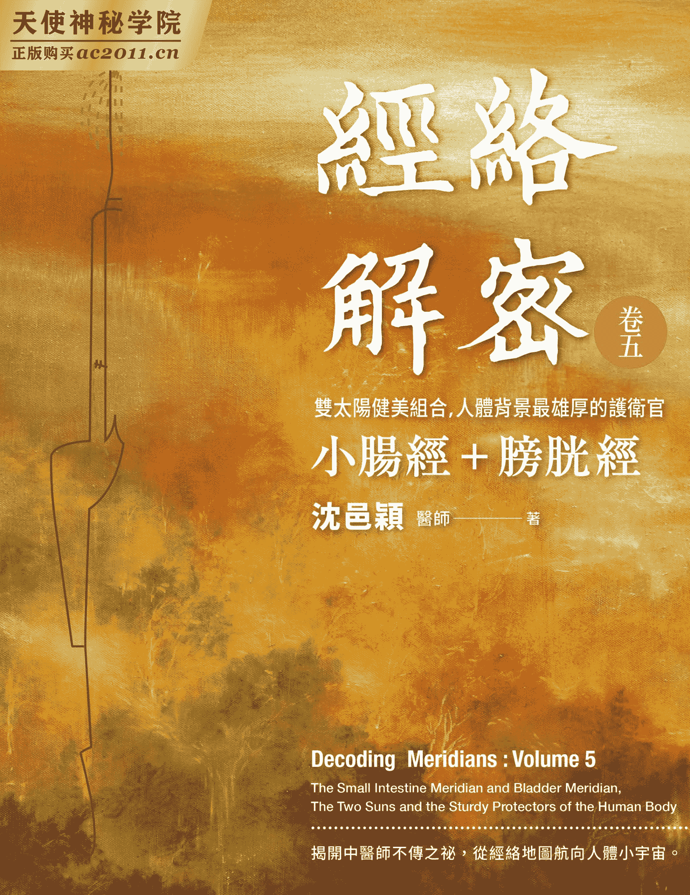

鼻旁路线也是小肠与心的反应区

小肠经头面部解密 1：头面部循行特色与其为心的耳目有关

小肠经的双 V 循行路线与《卷四》心经经脉、经别有关连

小肠经头面部解密 2：脸部回春的秘密──向上提拉肌肉

小肠经头面部解密 3：颧骨的健康学和面相学

颧髎穴位置及针法

手太阳小肠经──病候

1.循行所过的肢体部位：上肢循行部位的疼痛和面颊、下颔的肿胀疼痛

2.头面五官科：以耳目病为主，耳病是重点

3.小肠经主液之所生病

中医师不传之祕：肩胛骨对于人体的影响

中医师不传之祕：胸痹与小肠经的关系

中医师不传之祕：太阳经主表证的特色

二、手太阳之正（经别）

肩腋心肠线

小肠经别在胸腹部的隐形道路

中医师不传之祕：「胞脉」意涵和相关病证

1.「胞」的定义

2.「胞」的病变反应区

3.与「胞」相关的病证：分为血病与水病两大类

4.与「胞脉」相关的病证～「倒经」

中医师不传之祕：症瘕积聚与妇科的关系

中医对于「症瘕积聚」的概念

肠覃及石瘕

三、手太阳之别（络脉）

小肠络脉──循行特色

支正络肩髃

小肠络脉──病候

中医师不传之祕：支正穴的秘密

四、手太阳之筋（经筋）

小肠经筋──循行特色

上肢部（路线 1-4）

头面部（路线 5-7）

小肠经筋解密：本经筋在头部及五官的循行意义

小肠经筋──病候

小肠经四大系统循行特色

保护心脏的禁卫军

刚柔并济的花木兰特质

中医师不传之祕：乳突外张的临床意义

中医师不传之祕：「落枕」的中医临床概念

中医师不传之祕：小肠经筋隐藏人体头颈及手臂旋转的关键

中医师不传之祕：养老穴善于处理身体旋转与老化问题

小肠经的保健

一、平日的照护

二、小肠经常用保健穴位

重要穴位及主治功能

1.疏通龙骨和肩背的后溪穴

2.唤醒小肠经主液的腕骨穴

3.防老回春和控制旋转的养老穴

4.善于提拉和松颈肩的颧髎穴

多穴合作疗效更佳

1.改善胸背痛和胸痹的支正穴＋肩臑天

2.乳腺一条通的少泽穴和前谷穴＋肩臑天

小肠经的人生哲学

一、小肠腑功能教导我们的人生哲学

受盛之官：受纳包容，丰盈饱满

泌别清浊：理性分析，悲智双运

化物出焉：忍耐待时，温婉含蓄

二、小肠经循行教导我们的人生哲学

太阳特质：温暖热情，无私给予

手刀、肩脉、心之耳目及旋转结构: 文武兼备，外刚内柔

膀胱经总论

假如我们还是一只鳄鱼⋯⋯

一、膀胱腑的特色：州都之官

1.中医称膀胱为「水腑」

2.膀胱藏津液与气化， 功能失常易有频尿、尿失禁问题

3.膀胱气化所司，还包括汗液

4.膀胱在面部对应位置为「人中」

二、膀胱经系统特色：人体最长的经络

1.为什么这么厉害的经络成为足太阳膀胱经？

2.「足太阳经」的威力

全面包覆背部，主一身之表，护卫全身

为诸阳之气

与肺经共管皮毛和卫气

3.足太阳膀胱经循行特色

面部五官特别重视眼睛与鼻子

从头顶入络脑部，与神智有关

腰背部有五脏六腑及任督二脉的背俞穴

膀胱经主筋之所生病

4.足太阳膀胱经系统的重要性

三、膀胱经的合作关系

膀胱与肾：表里配合关系

膀胱与肺：护表与津液关系

膀胱与三焦：水道、毫毛腠理及原气关系

膀胱与肺肾三焦：气机与津液

膀胱与心：主表关系

膀胱与小肠：同名经与泌别清浊关系

膀胱经四大系统循行简图

膀胱经四大系统

一、膀胱足太阳之脉（经脉）

足太阳膀胱经脉──循行特色

1.头面部的「启动卫气」路线

1-1 起于目内眦，上额，交巅

1-2 其支者，从巅至耳上角

1-3 其直者，从巅入络脑＆1-4 还出别下项

「巅」的部位及「从巅入络脑」

还出别下项，循肩髆

解密：膀胱经头面部循行的其他奥秘

2.腰背部的「脏腑黄金路线」

膀胱经腰背部循行的三项特色

特色一、腰背部分为「内侧」与「外侧」两条路线

特色二、在腰部另外分出「体腔内部路线」

特色三、从臀部到下肢又分「膀胱经本线」与「膀胱经侧线」

膀胱经脉三大循行特色: 成就膀胱经对于人体的四大贡献

贡献一：主一身之表，与肺经共同防御人体

贡献二：藏有五脏六腑和相关的背俞穴

精彩的五脏六腑俞穴

与脏腑背俞穴并列的穴位，可加强相对应的脏腑功能

脏腑背俞穴的定位

脏腑背俞穴的分区特色

贡献三：腰部的重大任务：护肾为本

贡献四：臀部的重大任务：传宗接代

3.下肢部的「高手如云」路线

大腿部位：从臀部到膕窝分为 「膀胱经本线」与「膀胱经侧线」

小腿及足背部位：单线且外偏的路线

足太阳膀胱经脉──病候

二、足太阳之正（经别）

膀胱经别──循行特色：胱肾心别线

新增-膀胱与心脏的关系

加强-肾脏与心脏的关系

三、足太阳之别（络脉）

膀胱络脉──循行特色

膀胱络脉──病候

中医师不传之祕： 膀胱经络穴飞阳穴是治疗鼻病的专穴

中医师不传之祕： 麻黄是肺经与膀胱经共同代表药

中医师不传之祕：膀胱经与夜尿的关系

四、足太阳之筋（经筋）

膀胱经筋──循行特色

1.下肢部

2.腰背部

脊项线

肩上线

腋下线

3.头面部

舌本线

完骨頄线

鼻眼线

中医师不传之祕：鼻眼线暗藏的特色

1.目上纲特色

2.頄部特色

3.鼻眼线与口的关系

中医师不传之祕： 膀胱经脉病候主筋所生病与经筋的关系

解密：膀胱经筋头面部循行特色

1.大面积包覆膀胱经脉头面部循行

2.弯曲蜿蜒分布至面部

膀胱经筋──病候

膀胱经四大系统总结

膀胱经的保健

一、膀胱经平日保健法：与太阳同行

二、中医师不怕治嗽，读者也可以自保

三、膀胱经常用保健穴位

头面部疾病配穴

眼病远近配穴

鼻病远近配穴

颈项腰背部疾病配穴

颈项病远近配穴

腰背病远近配穴

背俞穴疼痛可取该脏腑的经穴治疗

慢性腰痛容易在第四、五腰椎之间出现血络

四、膀胱经系统与好友脏腑系统的相关用穴

膀胱经的人生哲学

附录：膀胱经背俞穴之部位及排列顺序与临床诊治意义

# 十二经络中的双太阳：
手太阳小肠经与足太阳膀胱经

## 双太阳为心肾两脏专属的护卫官

手太阳小肠经与足太阳膀胱经都是太阳经，属于手足同名经的兄弟经络，其循行部位和功能有相似之处，也保有各自的特色，两者相辅相成，成为人体背部重要的经络系统。

小肠经与膀胱经都属于十二经络循行的第二团队「聚餐团队」成员，介于心经与肾经之间，为聚餐团队第二及第三条经络，分别旺于未时和申时，也就是下午 1 点到 5 点之间。

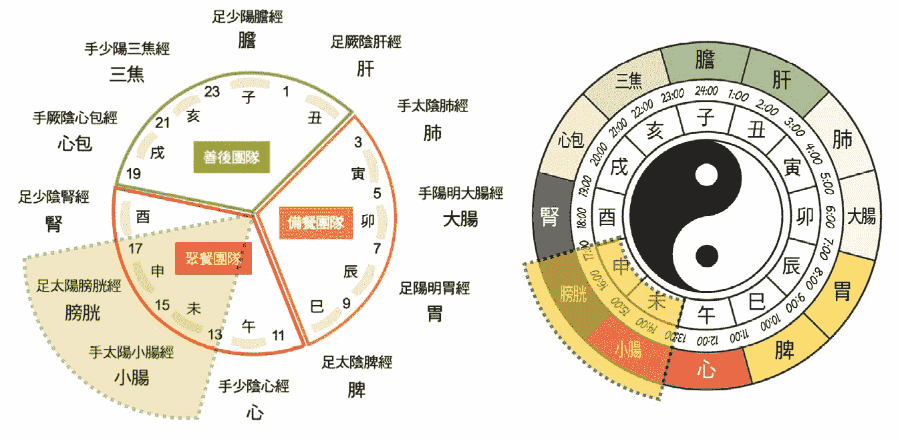

太阳经与少阴经为表里经，因此手太阳小肠经配手少阴心经，足太阳膀胱经配足少阴肾经，双太阳经系统是心肾两脏专属的护卫官，躯干的分布重点都在于保护心脏与肾脏。太阳经主要循行人体阳面后线，涵盖面部、头项，上肢、肩背和下肢。肩背部循行重点在守护心与肾，头面部循行于眼睛与耳朵附近，成为心肾的耳目。

## 双太阳健美组合

小肠与膀胱两腑在功能上有相似处，如小肠为受盛之官，膀胱为州都之官，都与津液代谢有关。而小肠的泌别清浊，膀胱主一身之表及为诸阳主气，则另有特色，后文会详细介绍。

双太阳经脉系统也各有特色，如小肠经系统与防御和美丽有关，因此我称它为「花木兰」经络，还与肢体的旋转活动相关；膀胱经系统是非常健壮阳刚的防御系统，个人推论其经络分布仍保有爬虫类的特质，因此称之为「鳄鱼」经络，与肢体的屈伸活动特别相关。结合手足太阳两经的特色就成为现代人最梦寐以求的「健美组合」。

## 人体背景最雄厚的护卫官

小肠配合心脏五行属火，膀胱配合肾脏五行属水，水火相异的特质，并不影响这对手足同名经兄弟之间的感情。两经分布在身体和上下肢的背面，心肾深藏人体深处也偏于背部。

中医经典《伤寒论》指出少阴病最多死证，亦即若未处理好属于手足少阴的心肾问题容易致命。因此双太阳经就以背部为主要部位来保护重要的心肾两脏，并协助其维持生理功能：

小肠经为了保护心脏，强力分布在肩背部，膀胱经为了保护肾脏（肾主骨主髓，脑为髓海），强力分布在脑部和腰背部，成为人体循行最长也是穴位最多的经络系统。手太阳经与足太阳经宛如太阳般地守护人体，成为人体背景最雄厚的护卫官。

*由于《内经》原文有关眼睛眼外角部位的说法有「目锐眦」及「目外眦」，为了便于说明，原文仍保持《内经》，其他部分主要采用「眼外角」。

# 《经络解密》导言

#### 为什么我们需要认识人体经络？

中医发现这个精妙的人体连结系统，因为有着如纺织物的网络状态，就称之为「经络」，是维持生命的重要系统。中医经典《黄帝内经》中强调，经络深深影响一个人的生老病死四大环节，如果经络照顾得当，就可以健康长寿。

十二经脉是脏腑运送气血至全身的重要通路，人体的组织器官从而得到充分的营养，身体自然健康。反之，如果经脉阻塞气血无法送达，与这条经络所连结的脏腑与躯干四肢，就会失去营养而产生不适或疾病，中医称为「不通则痛」。因此想要健康，经脉务必要畅通，「通则不痛」，组织器官得到营养，痛感自然就解除了。

经脉除了与一般人有关之外，它更是中医师习医的核心基础，而且学无止境，未来医疗能力的高下取决于经络的了解和应用，值得穷毕生之力去研修，去探讨。

#### 为何用对穴位，就能产生神奇的疗效？

穴位在经络系统上，是经脉里面的气血输注到体表的部位。

穴位就象是经络列车的停靠站，每条经络都跟铁道沿线一样，满布着大大小小的穴位，它们的功能主要来自所属的经络系统。不同的经络系统互相支援，互补互助守护着人体。

认识经络与穴位，也是认识人体小宇宙的金钥，治疗疾病不能只是头痛医头，脚痛医脚，要找到病根病因，善用经络特性，从正确的穴位下手，自然能产生好的疗效。

#### 经络四大系统好像有点复杂，该如何理解？

经络系统是人体运行的设计杰作，有许多奥秘等着我们去挖掘探索。但许多中医初学者却一听到经络四大系统就皱眉头了，担心自己读不懂。我在《经络解密》系列书中以现代智能型手机来作比喻，经络系统就跟手机传输线一样！人体内在脏腑好像手机，经络系统就像传输线，人体的四肢末梢则像传输线的插头端。

#### 书中的经络图有何不同意义？循行是单侧，还是对称呢？

在这套书中，每条经络系统都有三种图来说明，分别是：人形图、循行简图、经穴图。

1.经络人形图：标示经络在人体的循行路线，简称「经络图」。经络系统同时存在人体两侧，但为了便于观看，将经脉、经别及络脉绘制在人体的左侧，黑色为经脉，蓝色为经别，绿色为络脉；经筋则以蓝色色块标示在人体右侧。

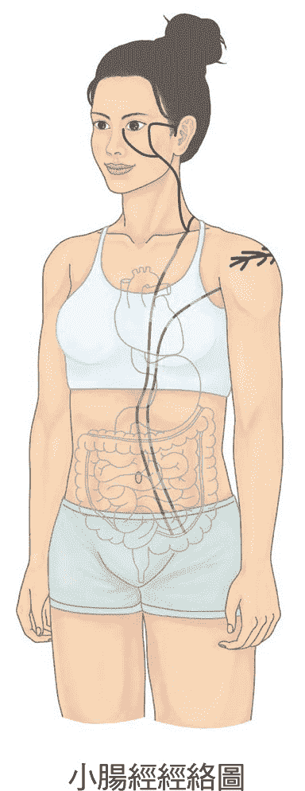

2.经络循行简图：将经络循行以色块及线条表现，比较容易掌握要诀。因为长得很像捷运路线图，简称为「捷运图」。捷运图的颜色及形状都有经过特殊思考喔！包含脏腑本身所属的颜色，四肢颜色较淡，躯干颜色较深。经筋部分，凡是结聚的部位，都会再用黑线框起来。

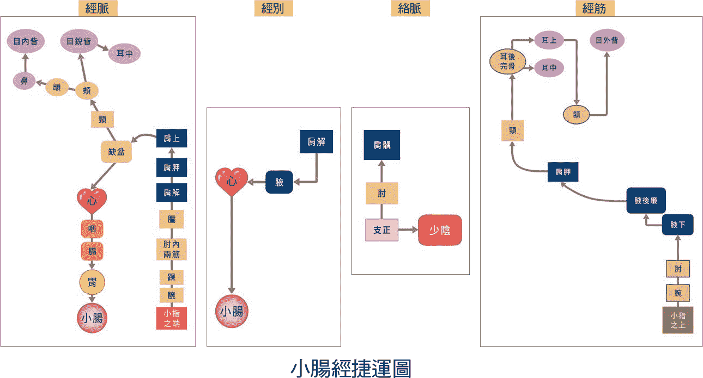

3.经穴图：将属于本条经脉的穴位连结而成。

穴位是人体珍贵气血输注的部位，聪明的人体会将宝贵资源做最佳分配。身体重要部位会有许多经脉通过，但不一定每条经脉都会有穴位。例如，大肠经脉虽然通过腹部和胸部，却没有穴位，而是将所有穴位分布在肩臂和头面部，胸腹部就由老大哥胃经经脉去分配，以免资源重复。

所以，经穴图通常比经脉图简单，对于学习者而言也较为容易掌握。但若要了解穴位的功能及应用，还是需要回到经脉系统，经穴图只是方便法门而已。

#### 「解密」与「中医师不传之祕」有何不同？

♼ 解密：较为深入的内容说明，适合有中医基础，或对于中医有进一步兴趣的读者。

 中医师不传之祕：偏向中医专业内容，适合有较深的中医基础，或者从事中医与相关医疗的读者。一般读者若觉得较为艰深，可以略读或越过。

# 外刚内柔的花木兰

花木兰代父从军的故事在华人世界家喻户晓，甚至连迪斯尼动画都改编制作成电影。在木兰诗中是这么描述的――

唧唧复唧唧，木兰当户织。不闻机杼声，惟闻女叹息。问女何所思？问女何所忆？「女亦无所思，女亦无所忆。昨夜见军帖，可汗大点兵；军书十二卷，卷卷有爷名。阿爷无大儿，木兰无长兄，愿为市鞍马，从此替爷征。」

原来是可汗要点兵出征，但花家无长兄，所以孝顺的木兰就想女扮男装，代替老父去报到从军。

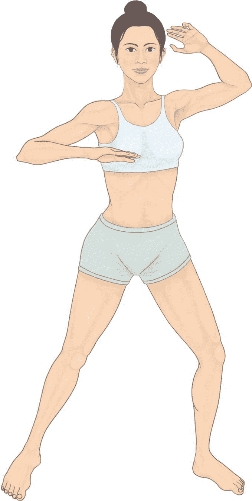

花木兰虽是女性，但智勇双全，战场表现很不错，战事结束，她不在乎能否得到赏识晋阶，一心只想要回到家乡。当木兰一进家门立刻直奔闺房，木兰诗中非常生动地描述：「脱我战时袍，着我旧时裳。当窗理云鬓，对镜贴花黄。」完全是一个黄花大闺女的心思与动作，「出门看伙伴，伙伴皆惊惶:『同行十二年，不知木兰是女郎。』」从军十二载，袍泽伙伴们却不知木兰是女儿身呀！

这么戏剧性的故事，难怪令后世津津乐道，改编创作持续不断。

经常在诊间带年轻中医师认识小肠经时，我总会先说说花木兰的故事，他们常常一脸困惑，倒不是我突发雅兴，而是想让大家先试着理解小肠经刚柔并济的特质，既有一身好武功，也不失其细腻温婉的性格。经络在人体运行，若把它当地图死背，那真是太小看了这奥妙又伟大的生命系统，经络是动态的运行，各自独立分工有其性格，彼此间又互相连结支援，构成一套充满智慧的人体循环。

经络不在遥远的天边，就在你我身上。

## 一、小肠腑的特色

中医所认知的小肠包括现代医学所说的小肠功能，但是又超过这个范畴。从现代医学来说，小肠是人体消化系统中的一部分，上方接胃，下方接大肠，是食物消化与吸收的主要器官。小肠也是人体最大的器官，分为十二指肠、空肠和回肠三部分，总长度约 6 至 7 公尺，一方面为了容纳自己的长度，另方面增加吸收面积和时间，小肠迂回得好像迷宫，堆栈在腹腔里，食物可以在小肠内停留 3～8 小时，人体八成以上的消化、吸收工作就是在这段弯弯曲曲、缓慢蠕动的管道内进行，而让大部分的营养物质都能在小肠中吸收。

小肠吸收营养的特质就是透过这「长而慢」的特性而完成。

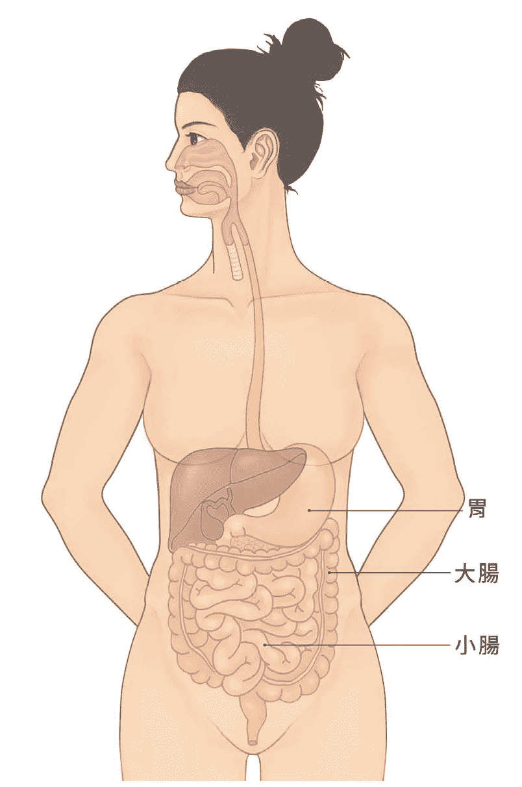

中医与西医对于小肠消化吸收食物水饮的看法基本是一致的。从脏腑观点来看小肠特质，首先它属于六腑之一，六腑主传化物而不藏，也主通降。其次《内经》说「小肠者，受盛之官，化物出焉」，特别以「受盛」与「化物」生动说明小肠消化吸收的特性。

《内经》：「心合小肠，小肠者，受盛之府。」

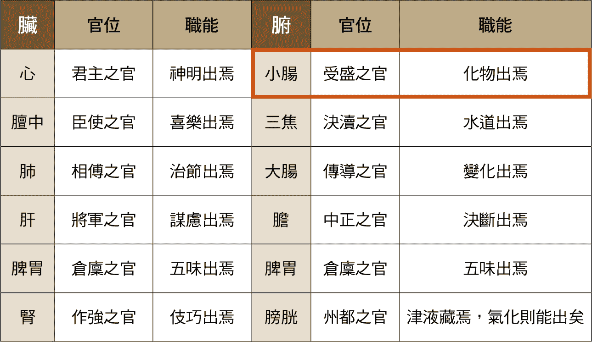

### 1.小肠是受盛之官

当我们进餐时，胃会持续将初步消化的食物和水饮送到小肠，由于小肠「长而慢」的特性，工作又不断「挤进来」，所有的食物就必须「排队」等候带位，才能进行下一个步骤。

中医也认知到小肠接纳胃初步消化的食饮，让它们在小肠内停留较长时间，以便进一步消化吸收。在「排队等候」的过程中，小肠就像盛装食物和水饮的容器，如饭碗或锅子。小肠这个接受与盛满的特质，中医称为「受盛」。

### 2.小肠经功能：化物出焉

食物在小肠中进行缓慢精细的消化之后，聪明的小肠知道食物不同的特质，人体能够吸收应用的部分也不同，就将之区分为「清」与「浊」两大类，分别运送到合适的工作站再行处理，中医称此功能为「泌别清浊」或「分清别浊」。

#### 【泌别清浊】

###### ● 清者：人体需要，来自水谷精微营养者

1.精微：一般都交给肺，转化为血，如《内经》：「中焦亦并胃中，出上焦之后，此所受气者，泌糟粕，蒸津液，化其精微，上注于肺脉，乃化而为血，以奉生身，莫贵于此，故独得行于经隧，命曰营气。」

另外，由于心经与小肠经为表里经，心与小肠之间有着密切的连线。心身为君主之官，专主血主脉，需要最好的营养物质。所以个人猜测，心脏会透过心经及小肠经向小肠直接收取最营养的精微物质以供己用，这也可视为「御膳房」的别径。

2.水液：交给脾脏，透过脾的升清散精作用送达全身。

###### ● 浊者：人体不需要，应予排出体外者

1.固体：无用的糟粕，送至大肠，通过大肠的气化，形成粪便。

2.液体：无用的水液，经由肾与膀胱的气化，形成尿液。

小肠「泌别清浊」的「泌」字尤富深意。《说文解字》曰：「泌，侠流也。」段玉裁注曰：「侠流者，轻快之流，如侠士然。」孔颖达疏曰：「泌者，泉水涓流不已，乃至广大。」据此，「泌」指轻快的水流，一如涌出的泉水，从涓流至于广大。可见小肠的泌别清浊功能与水液的分流特别相关。脾主运化水湿，所以小肠将吸收的水液交给脾脏散布至全身。后文会说明小肠与脾脏的连结关系。

中医将小肠这个能够变化食饮原来型态，且能分辨这些食饮经过消化之后的特质，让清者先行回收向上，浊者继续变化下走，最后排出体外的功能称为「化物出焉」，亦即让清浊各司其所，各有归属。小肠由于具有泌别清浊、产生化物的任务，从而培养出特有的思考分辨能力，这项能力与人体的营养物质吸收以及大小便的形成都有密切关系，若小肠的思辨功能失常，无法泌别清浊，就会出现营养不良、大便稀薄、小便短少等病理现象。

#### 【小肠主液】功能之一：利小便以实大便

小肠主液，一旦泌别清浊失常就会出现水液代谢异常，一如前述的大便稀薄与小便短少，聪明的中医师发现小肠调节大小便水液的这个秘密，临床就采「利小便以实大便」之法来治疗大便稀软甚至腹泻的情形。怎么说呢？

善于思考的小肠会将水液送往前阴的尿道变成小便，送往后阴的肛门变成大便的一部分。正常生理状态下，大便会软硬合宜且成形，小便会顺畅，如果身体机能异常，像急性肠胃炎导致小肠泌别清浊功能失衡，多数水液流往后阴而出现大便稀软甚至水泻不止，与此同时，流往前阴的水液变少，小便也跟着减少。

临床治疗时，中医师就会借用小肠主液的能力，使用能通利小便的中药如茯苓、泽泻或针灸等，协助小肠将偏走大肠的水液「泌回」尿道变成小便，大肠的水液变少了，大便就会逐渐成形，这就是中医「利小便以实大便」的意涵。

#### 【小肠主液】功能之二：濡养组织器官与关节

小肠所主的液分为两种，一种是人体不需要，随着糟粕进入大肠及膀胱排出体外，另一种是被人体吸收的营养物质，它可以融入血中成为血液的一部分，也可以进入特定的组织器官发挥功效。

水谷精微包含津与液，大肠主津，质地较为清稀，分布在人体表层的腠理；小肠主液，性质比较稠厚，分布在人体较深的组织，以滋养重要器官与四肢关节。《内经》对于「液」的功能有许多精彩的论述，如：

● 谷入气满，淖泽注于骨，骨属屈伸，泄泽补益脑髓，皮肤润泽，是谓液。

● 液者，所以灌精，濡空窍者也。

● 液脱者，骨属屈伸不利，色夭，脑髓消，胫痠，耳数鸣。

● 五谷之津液，和合而为膏者，内渗入于骨空，补益脑髓，而下流于阴股。阴阳不和则使液溢而下流于阴，髓液皆减而下，下过度则虚，虚故腰背痛而胫痠。

我们可以将「液」想成人体关节和皮肤的润滑油、脑髓的补充液和空窍的滋养液等，这就难怪液会比津浓稠，营养成分也比较高。当液大量脱亡时，例如严重营养不良或持续腹泻，就会出现关节活动不利，面色苍白，脑袋空洞感，记忆及思考力下降，小腿痠软及耳鸣等状况。

小肠主液的特性也反映在小肠经穴位名称，许多都跟水有关，如：少泽穴、后溪穴、小海穴等。

#####  中医师不传之祕：痛风与小肠的关系

「痛风」为现代人常见的风湿免疫性疾病，现代医学认为痛风的原因是日常饮食加上个人遗传因素，致使尿酸代谢异常，血液中的尿酸持续增高，随着血液瘀积于关节、肾脏、心脏等部位，一旦尿酸结晶析出，沉淀在关节、肌腱和周围组织，就会引发红、肿、热、痛的发炎症状，因此又称为「代谢性关节炎」。

中医自古即有「痛风」之名，取其疼痛剧烈且来得快，宛如一阵风，又有「白虎历节」之名。古代医家依据《内经》所说：「风寒湿三气杂至，合而为痹也。其风气胜者为【行痹】，寒气胜者为【痛痹】，湿气胜者为【着痹】也。」认为多属「痛痹」。临床上本病为内外因相合为病，内因多与素体痰湿阻滞有关，外因则与长期饮食厚味有关，病机特征为湿热痰瘀，浊毒内蕴，流注关节，痹阻筋脉，气血瘀滞难行，致使关节肌肉剧烈疼痛、红热肿胀、活动不利等，若湿热痰浊凝结于局部则关节变形，甚至形成痛风石。

#### 痛风与小肠有何关系？

痛风除了有「不通则痛」的痛证之外，还有痛风石沉积于局部，现代医家朱良春先生将本病命名为「浊瘀痹」，「浊」字精准点出本病的特色。

回归《内经》病机十九条之中，「诸湿肿满，皆属于脾。诸痛痒疮，皆属于心。诸病肤肿，疼酸惊骇，皆属于火。」指出本病的湿热邪气和痛证与心脾两脏有关，痛风经常发作于大拇趾关节内侧，此处正是脾经所过之处；「诸转反戾，水液浑浊，皆属于热。诸病水液，澄澈清冷，皆属于寒。」指出清澈的水液性质偏寒，混浊的水液性质偏热，痛风的湿热痰瘀正与「浑浊」有关。这很像煲汤熬膏的过程，当体内的水液夹有杂质时，历经体内邪热煎灼，有形杂质逐渐凝固，水液会逐渐出现浑浊黏稠的现象，导致气血循环阻滞越来越严重，无法通关过节，只好沉积于关节，最后结晶成为痛风石。

由前面论述来看，本病除了与湿浊停滞有关之外，还与「水液浑浊」有关，这个异常现象理应归咎于小肠「泌别清浊」失常而清浊不分，不仅未能将湿浊及时排出体外，还让它在体内持续四处流窜，藉机与其他邪气相合为患，最后瘀阻于关节而产生痹痛变形的情况。

临床治疗思考上，心主热，脾主湿，符合本证湿热邪气为病的特质，心脾两脏也都与小肠有连结关系，但因中医重视五脏功能，故历代较少看到小肠经用药，多以入心脾的药物来清利湿热，兼以概括小肠的功能。但在针灸方面，小肠经就有自己的舞台。古人说「无湿不成疸」，痛风前提也是痰湿为患，《内经》说「五藏有疾，当取之十二原」，小肠经的原穴「腕骨穴」，不仅能恢复小肠泌别清浊之能，且善于清利湿热，是为历代治疗黄疸的要穴，当然也可用来治疗痛风的湿浊停滞。另外，本病还存有水液浑浊停滞的「浊瘀痹」特性，此时可配合三焦经，因其遍布人体，不仅是人体水谷、津液及元气的道路，且能清利垢腻，两经合用，功效显著。

## 二、小肠经系统特色

小肠经属于手太阳经，循行主要分布于上肢阳面后线，抵达本经热爱的肩部，再从肩部发出两条经脉：一条向下进入体腔，以连结心胃和小肠等相关脏腑；另一条向上行循着颈部至头面，以连结眼鼻耳等重要官窍。

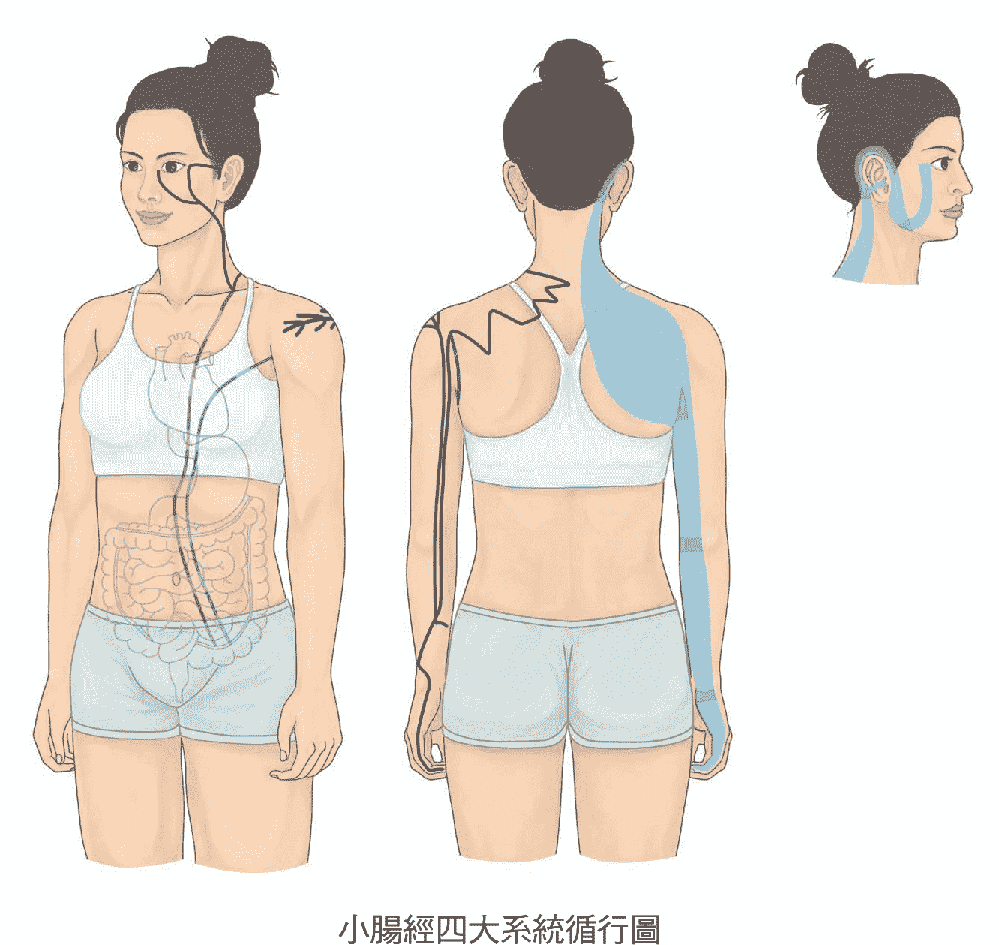

### 1.小肠经古称「肩脉」

在《卷二》大胃王中曾介绍过，目前最早的中医书《足臂十一脉灸经》（简称《足臂本》）、《阴阳十一脉灸经》（简称《阴阳本》）中，多数经脉名称跟《内经・灵枢》的经脉都有连贯性，唯有《阴阳本》对于手三阳经的命名不同。

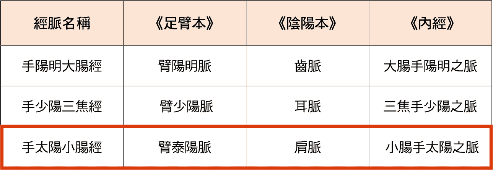

在《阴阳本》中，小肠经被称为「肩脉」，推想而知，它的循行重点一定是分布在肩部。《内经》面部对应脏腑关系中「颧者，肩也」，颧骨是小肠经在面部的重要循行部位，正呼应小肠经「肩脉」的概念。

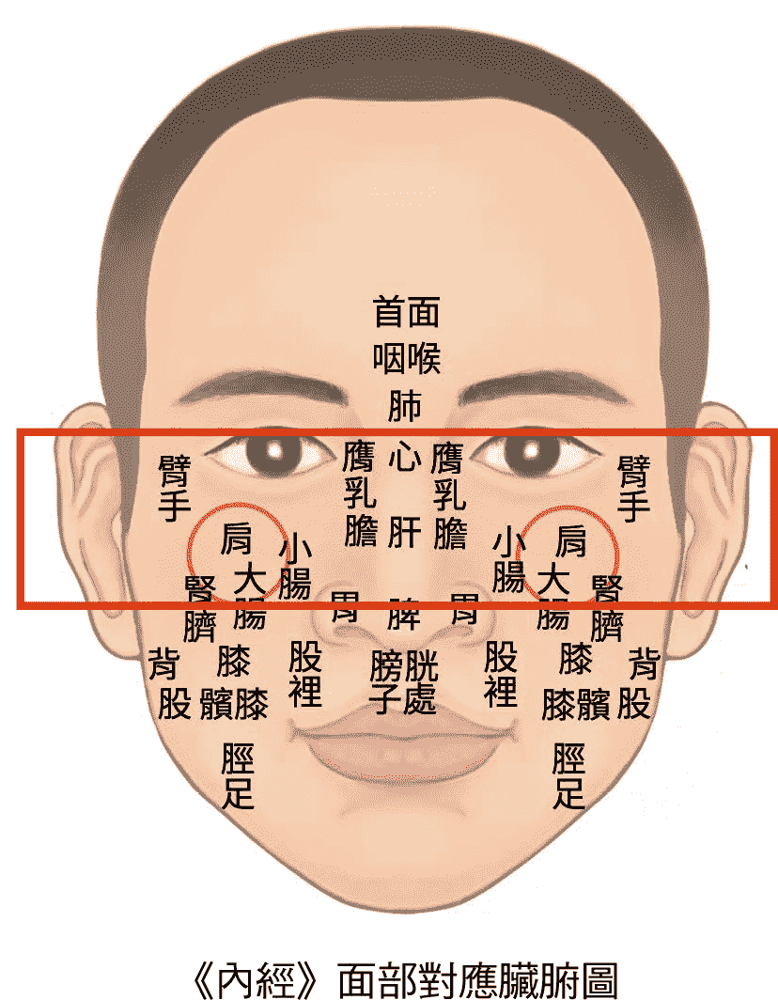

大家也可以思考一下：

大肠经系统也是分布在肩膀，成为最有承担的经络，它与小肠经这条「肩脉」有何异同呢？

手少阳三焦经在《阴阳本》称为「耳脉」，有趣的是，小肠经病证中，最重要的却是「耳病」，怎么会这样？

小肠经的穴位名称，也透露本经身为肩脉及善治耳病的特色，例如在肩部有「肩贞穴」、「肩外俞穴」、「肩中俞穴」等，在面部颧骨旁边有「颧髎穴」，本经最后一个穴位是位于耳朵前方的「听宫穴」，顾名思义，一定擅长治疗听力问题。

以上这些特色将会在后面篇章一一详述。

### 2.太阳主一身之表，护卫君主

依据中医理论，太阳经主一身之表，宛如太阳守护万物一般，是人体抵御外邪的重要保护系统。小肠经属于太阳经，可以抵御外来的风寒邪气入侵人体。

依据现代医学，小肠黏膜形成许多环形皱褶和绒毛突入肠腔，绒毛内部有毛细血管网、毛细淋巴管等组织，小肠内的营养物质和水液会通过肠黏膜上皮细胞，最后进入血液和淋巴系统。小肠也是人体最大的淋巴库，含有大量的免疫细胞，这些淋巴组织在免疫防御与肿瘤细胞扩散中都具有重要作用。

小肠经还具有实质防御功能，例如本经循行在手臂的尺侧，就是俗称「手刀」的位置，当人体面对外来的攻击，不经思索就会伸出手刀来抵挡，以保护重要的躯干和头部。

心经与小肠经为表里经，关系密切，心的五行属火，旺于午时，小肠的五行也属火，旺时跟在心经之后，成为心经背后的支持力量。心为君主之官，需要特殊的防护，手太阳小肠经功力虽没有太阳家族大哥足太阳膀胱经那么强大，但同属太阳家族，能力还是不容小觑，尤其小肠经特别加强分布在肩背部成为上背部坚实的护卫组织，在心脏后方默默守护其安全，宛如成功男人背后那位伟大女性的角色，让心脏能全心全意去完成维持生命、安定神志的重要任务，小肠经因而获得心脏青睐，钦点成为君主之官的贴身护卫。

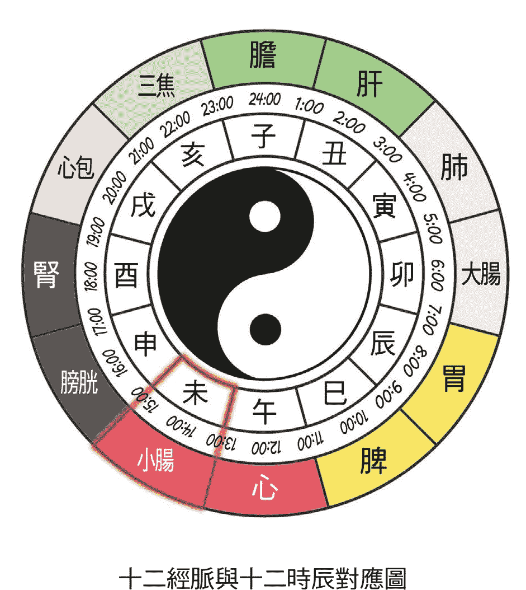

## 三、小肠经的合作关系

小肠与其他脏腑经络的关系，除了为了完成受盛化物和泌别清浊的工作之外，还有一些秘密任务喔。

### 小肠与心的关系～从属护卫

#### 1.小肠经是护主心切的禁卫军

小肠与心为相表里的脏腑关系，经脉相通，心的五行属火，小肠的五行也属火。心为君主之官，决定一个人的生死，至为重要，需要严谨的保护，小肠就是心脏贴身的护卫。下面以现代流行用语「硬件」和「软件」来说明小肠的护卫功能。

###### ● 硬件护卫

小肠经脉系统循行在四肢和头面部分属于硬件，具有「坚实护卫」、「专任耳目」两个独特功能：

「坚实护卫」：心经篇中介绍过心肌梗塞先兆部位，包括手臂尺侧、肩膀及后背，其实都属于小肠经循行所过部位。

小肠经古称「肩脉」，可谓名副其实，因小肠经的四大系统都连结到肩部，包括肩关节、肩胛骨及肩膀。小肠经在肩部形成强而有力的结构，提供心脏背后坚实的保护。另一方面因为它跟心脏关系密切，小肠经也会透露出心脏的情况。临床上，中医师可以从肩部来诊治心脏病。

「专任耳目」：小肠经在面部循行的重点就是眼睛和耳朵，合起来刚好是「耳目」。俗语说的「耳目」，意思包括侦查收集情报的人和亲信之人。位居深宫的君王心脏，凭借忠良可靠的亲信小肠经，以眼睛和耳朵收集外界的信息来做决策（详见经脉及经筋），小肠成为心脏专属的「耳目」。

###### ● 软件护卫

小肠经脉系统循行在胸腹部，让小肠具有受盛化物功能属于软件，得以为心脏君主提供二项专许特卖服务：

「养分直送」：小肠是营养吸收最主要的部位，又跟心脏关系密切，所以部分的营养物质不交给脾，而是直接输送给心脏（详见经脉及经别）。

「代谢纾压」：心脏身为君主之官，时时刻刻须要面对处理诸多事务，长期操劳难免会出现情绪低落、工作失误或力有未逮之处，当然也想要有放松的机会。居于深宫的君主心脏，这类心绪杂事很难向宫中大臣：如肺这位运筹帷幄的宰相，脾这位勤奋不知休息为何物的妈妈启齿，只能跟自己的耳目小肠分享并加以改善，尤其当心脏持续面临自己无法解决的难题时，变证丛出，就需要小肠帮忙，例如心火过旺，身体就将心火移送到小肠以减缓心脏压力，此时会出现偏红色、热度高的尿液，中医称此现象为「心火下移小肠」；心火也可以经由小肠经反映在体表上（详见络脉），呈现为皮肤病变。透过诊察这些病症，中医师就可以诊断出心脏问题，从病本论治。

在《卷二》介绍过「腹脑」概念。近代研究发现肠道的神经系统有一亿个以上的神经细胞，仅次于大脑，故又称为「第二大脑」，小肠也属于腹脑的一部分。因此腹部肠道不仅是消化器官，也是具有丰富神经细胞、内分泌等的特殊组织，会影响脑部思考、情绪及诸多复杂疾病。心主神志，时时维持喜怒忧思悲恐惊各种情绪之间的平衡，而善于泌别清浊，具有思考分辨能力的小肠，当然也能为心脏分忧解难。因此小肠就成为心脏代谢与纾压的管道，协助心脏维持身心的平衡。

#### 2.与心同行的好妇友

《卷四》心经介绍过心经经脉有一条支脉「胞脉」，属于心而络于胞宫。这条胞脉其实也将小肠经包覆在内，让小肠经参与妇科功能。手太阳小肠经及手少阴心经专责调节胞脉的经血，向上输送至心脏所在的胸部变化为乳汁，向下输送至小肠所在的下腹变化为月经。若胞脉运行失常就会影响女性的乳汁分泌及月经周期，因此小肠经与心经同行成为守护妇女的好朋友。

综合以上说明，小肠对于心脏的功能，在古代就像君王的禁卫军，现代就是总统身边的贴身侍卫。小肠象是位忠心护主的武林高手，平日深藏不露。当心脏这位君王住在宫中，小肠就外出搜罗各地名产（水谷精微），也会到民间收集民情或到敌营去收集军情，回报给君王做决策；当君王外出时，就随侍在旁边护驾，必要时也会为君王挡刀枪子弹。当君王想要舒展筋骨，操练身体时，小肠就是最好的练武对象，让君王得以发泄多余的精力，另一方面也能帮君王纾解心理压力，平衡情绪。可见要成为君王身边的红人必须文武俱全，小肠经正是最佳人选。

### 胃—小肠—大肠的关系～吸收血津液一条龙

#### 1.小肠与胃的关系～营养再吸收

小肠经脉络心脏之后抵达胃部，最后再属小肠。《内经》将大小肠功能都归胃管辖，胃为水谷之海，小肠与胃关系主要在营养吸收。小肠除了承接来自胃的食糜加以消化吸收之外，还将下合穴「下巨虚」放置在胃经，向胃输诚的味道相当浓厚。

#### 2.小肠与大肠的关系～津液及糟粕

小肠将无用的糟粕下输至大肠，经过大肠传导变化之后，排出体外。

胃―小肠―大肠的营养吸收关系宛如上菜顺序，涵盖了食物进人体到出人体的整套流程：

*   胃主受纳腐熟水谷，为仓廪之官，五味出焉──让食物五味先出，以挑起食欲；
*   小肠为受盛之官，泌别清浊，化物出焉──将最精致化物送上桌，以利享用；
*   大肠为传导之官，变化出焉──为了环保，让食材物尽其用，将可用部位再经厨师巧手变化成较为粗食的菜肴，其余作为厨余。

小肠「化」物出焉，大肠变「化」出焉，可见都与食物转化的关系密切相关。

#### 3.小肠与大肠协助人体气血运行

《难经》则指出大小肠的另一个特色：「小肠者心之府，大肠者肺之府。....小肠谓赤肠，大肠谓白肠。」心主血属红色，所以小肠为赤肠；肺主气属白色，所以大肠为白肠。大肠与小肠共同协助心肺推动人体气血的运行。

胃主血之所生病，大肠小肠主津液之所生病。由于胃主管大小肠功能，亦即主导人体血及津液的来源。由此证明，好好吃饭，吃对时间，吃对食物，是维持人体健康的重要法则。

### 小肠与膀胱的关系～水务及防御

小肠经与膀胱经都是太阳经，也就是手足同名经。手足同名经在头面交接，经气本来就能相通。加上两者的背俞穴和募穴都位于相邻的位置，如小肠俞在十八椎下，膀胱俞在十九椎下（详情参阅膀胱经）；小肠募穴是脐下三寸的关元穴，膀胱募穴是脐下四寸的中极穴。如此相近的关系，功能上就能互相支援。小肠主液，膀胱为州都之官，都与水液代谢有关，小肠的泌别清浊功能，会将无用的水液转输到肾与膀胱气化，变成小便排出体外。因此小肠与膀胱成为代谢水液的最佳伙伴。

另外，《内经》指出太阳主一身之表，是人体抵御外邪的第一道门户。身为太阳经的小肠经与膀胱经合作无间，全然包覆背部，成为人体最坚实的防护墙，也是「背景」最雄厚的经络。

### 小肠与脾的关系～水精输送

前面介绍过，脾主运化水湿，小肠会将吸收的水液透过脾的升清散精作用送达全身。但小肠经系统并未连结至脾，水液如何运送给脾呢？

首先，《卷三》脾经介绍过，中医的脾脏概念包括现代医学的脾脏与胰脏。从现代医学来看，十二指肠包裹胰脏头部，小肠多数的消化酶都由胰脏生成，通过胰管进入小肠，协助小肠完成消化任务。小肠与中医的脾脏系统有连结关系。

其次，从中医来看，脾经系统也为脾脏与小肠建立两条连结道路。

「脾经经脉」：从鼠蹊向上，弯曲向中线靠拢，交会于下腹部任脉的中极穴和关元穴。关元穴是小肠募穴，募穴是脏腑之气汇聚于胸腹部之处，通常与该脏腑在体内的实质部位相对应，因此关元穴就是小肠之气与小肠腑在腹部的对应区域。脾经经脉交会关元穴，也与小肠建立连结关系。

「脾经络脉」：有条别脉入络肠与胃，络脉病证有因厥气上逆而出现霍乱之证。中医的霍乱与现代的霍乱不完全相同，中医认为「霍乱」来自于清浊相干，乱于肠胃所致。小肠善于分别清浊，一旦功能失调就会出现清浊混乱相干的情形。由此可推论，脾经络脉有入络小肠。

小肠与脾脏之间的实质连结，具有两种功能。

其一透过脾经系统连结，让小肠得以将来自饮食中珍贵的水液输送至脾。临床上，脾主湿失常的泄泻部分与小肠泌别清浊异常有关，前文运用茯苓利小便以实大便，可视为脾脏与小肠共治之法。

其二脾经系统特有的篓子结构与妇科的经带胎产密切相关，小肠经和心经也跟妇科有关，透过这层连结，让心脾和小肠共同成为妇科系统的守护者。

小肠受盛化物和泌别清浊，让清者上行和浊者下行的功能，临床上常呈现为脾主升清，胃主降浊的功能，加上胃掌管小肠的消化吸收功能，低调的小肠只能默默工作，将主要的功劳交给脾与胃去展现。

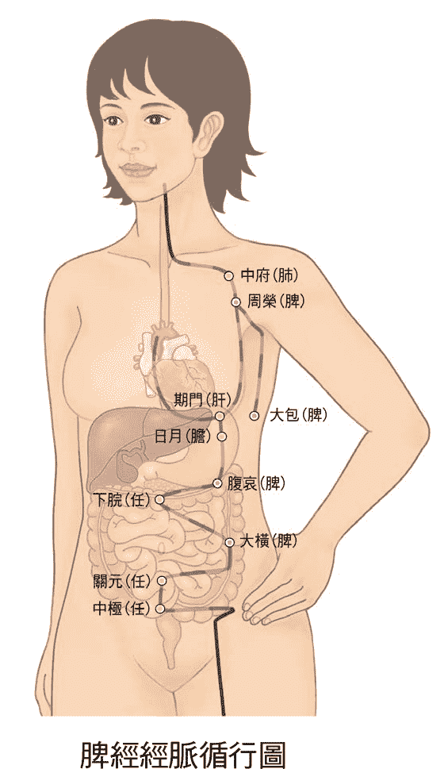

### 小肠与肾的关系～隐性关系

从中医来看，由于小肠与肾之间没有明显的经络连结关系，致使历代医家在阐述小肠透过肾与膀胱气化，将无用水液转化成尿液这个过程时，总无法将两者的结构关系说清楚。

从现代医学来看，从小肠到直肠有扇形般展开的「肠系膜」，过去认为肠系膜的功能在于将大小肠固定在腹腔内，自从 2012 年爱尔兰柯飞（Calvin Coffey）教授提出肠系膜是连续且完整的独立器官研究报告之后，医学界逐渐接受肠系膜是一个器官，其功能还有待进一步的研究，说不定会跟中医理论相通！

肠系膜属于小肠的部分称为「小肠系膜」，起于后腹壁第二腰椎左侧，最后止于右髂关节前方。第二腰椎中医称为十四椎，肾经经脉「贯脊」，肾经经别「上至肾，当十四椎，出属带脉」，肾经经筋「循膂内挟脊」，可见小肠系膜连结在后腹壁处正属于肾经系统，因此《内经》指出小肠病变也会出现腰脊症状，如：

● 小肠胀者，少腹胀，引腰而痛。

● 小肠病者，小腹痛，腰脊控睪而痛。

● 手太阳厥逆，耳聋泣出，项不可以顾，腰不可以俛仰。

小肠透过小肠系膜与肾建立了在结构上隐而不显（藏在后腹壁），但功能却极为重要的秘密关系。

人体最珍贵的物质就是气血，宛如身体的财富。从气血的吸收与储存方式来看，小肠默默吸收营养，是低调的后天型富豪（小肠属胃管辖，胃为后天之本），肾本身就藏有肾精，人体多余的养分也会转化成肾精送给肾储存，是低调的先天型富豪（肾为先天之本）。两者都很低调，因此呈现出隐蔽但重要的连结关系。

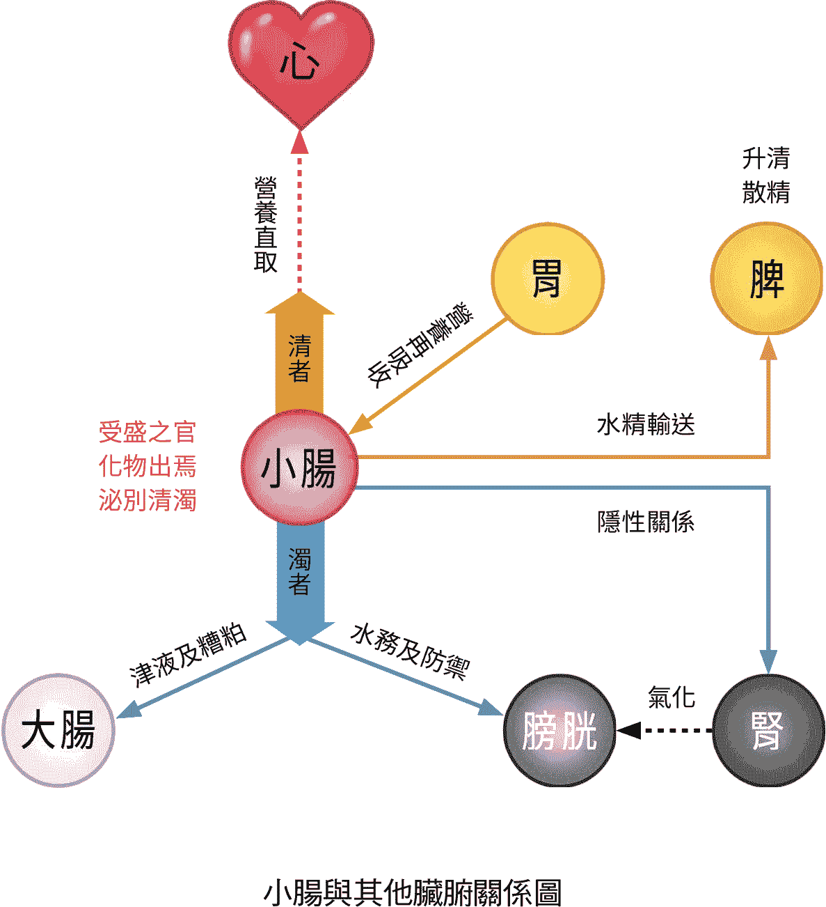

###### 小肠经四大系统循行简图(捷运图)

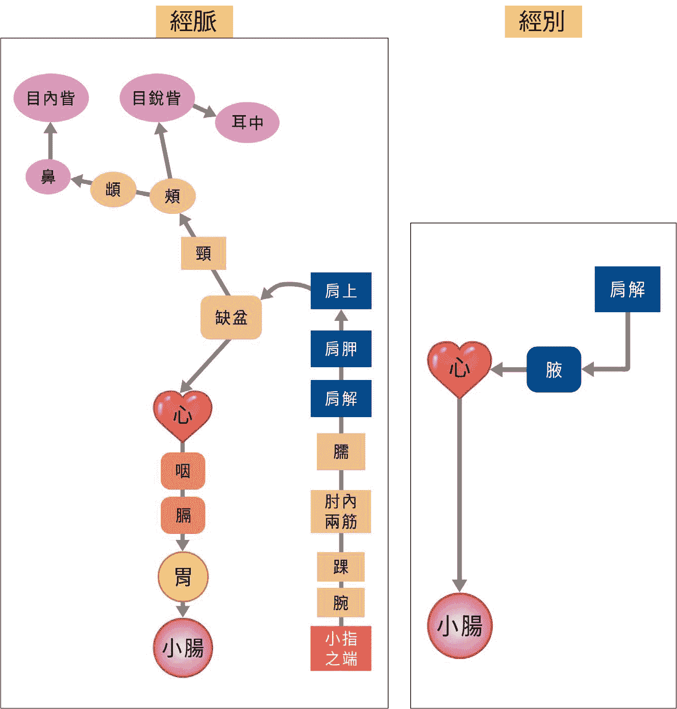

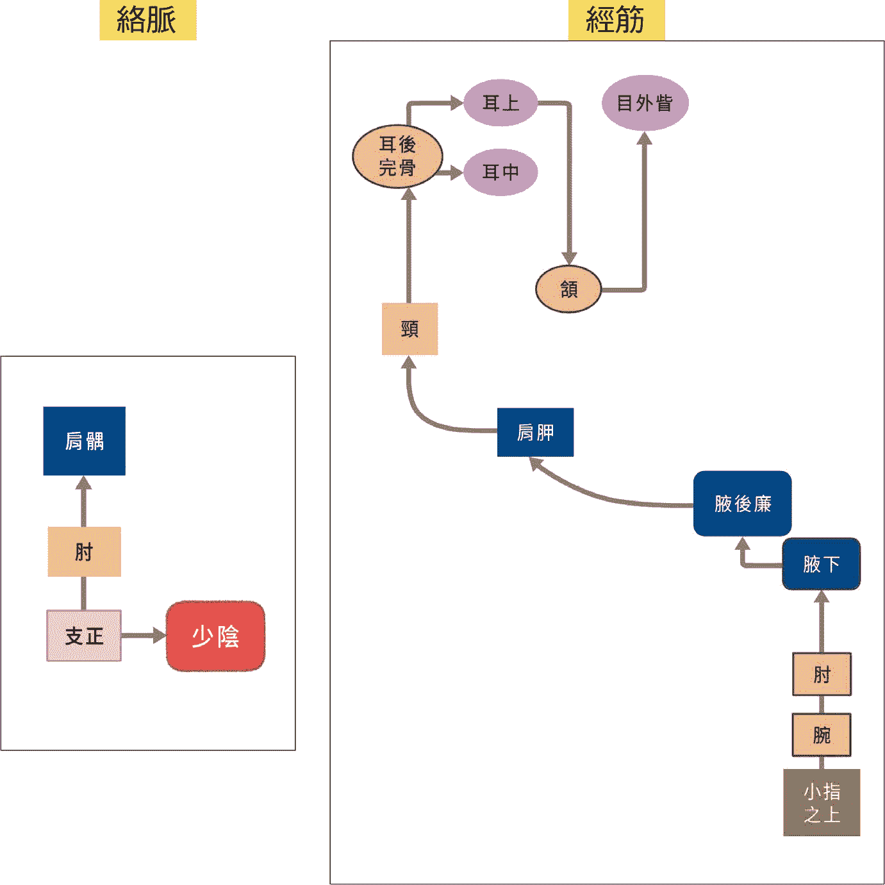

# 一、小肠手太阳之脉（经脉）

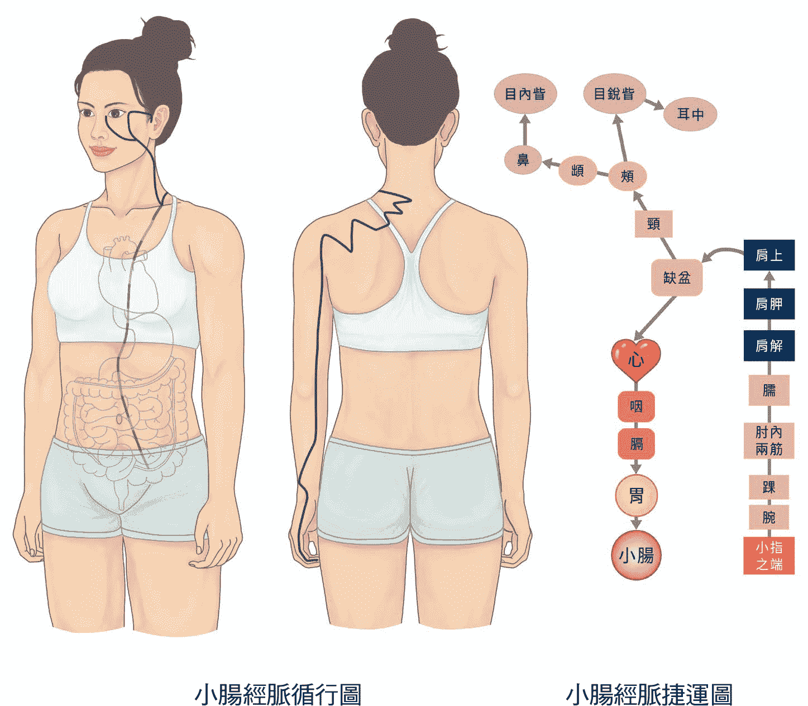

## 手太阳小肠经──循行特色

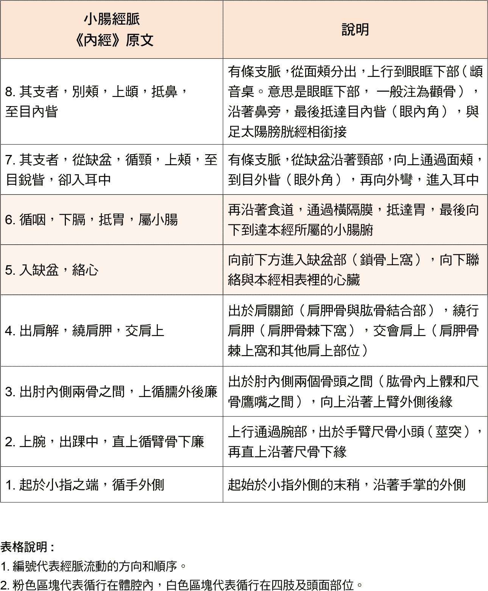

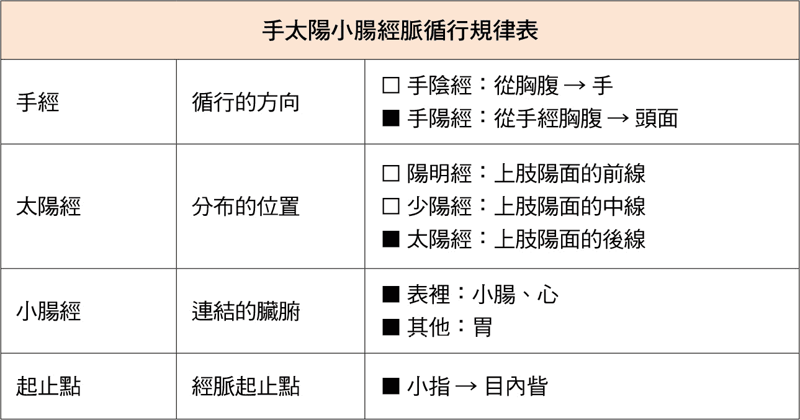

### 文武兼备的小肠经

总论介绍过，小肠经脉是文武兼备的禁卫军，这个特质也表现在经脉循行上。例如：

文的方面：循行于面部五官，善于观察和收集资料，连结心脏、胃及小肠，吸收养分，滋养全身组织器官，成为「有内涵」的人。

武的方面：循行从手臂外侧连结至肩膀及肩胛骨，成为格斗及护身的最佳「武器」，当然也可用来保护心脏。

小肠经脉属于阳经，主要分布在人体较为浅层的部位。循行路线可分路线 1～4 的上肢部，路线 5～6 的胸腹部和路线 7～8 的头面部三部分。手足各有六条经脉，但手指和足趾只有五个，所以有些经脉会共享指（趾）头，如本经即与心经共享小指。路线 1～3 从小指到上臂都与心经只隔一条筋，路线 4 盘绕在肩关节、肩胛骨及肩膀处，成为心脏后面的铁卫兵，由此可见小肠经贴身守卫心经的严谨程度。

上肢部：分布在手臂阳面后侧（尺侧），然后大范围的绕行在肩部的肩关节、肩胛骨和肩膀上方，符合本经脉早期被称为「肩脉」的特质。（路线 1～4）

胸腹部：从缺盆进入胸部，络心，下膈，进入腹部，抵胃，最后连属于小肠，完成小肠与心之间表里经的属络关系。（路线 5～6）

头面部：从缺盆向上通过颈部到面颊，由此分出两条支脉：一条支脉偏行外侧，连结眼外角，再转入耳中；另一条支脉偏行内侧，经过颧骨，沿着鼻旁，连结到眼内角。小肠经脉因此成为十二经脉系统中唯一同时连结眼睛内外角的经脉。（路线 7～8）

从上述循行特色来看，本经脉可以简称为「小眼肩」专线。其中，「小」代表手小指和小肠，「眼」代表眼睛的内外角，「肩」代表肩部结构，本经从上方及后方保护心脏，也属于太阳经分布于背部的特质。

#### 1.上肢部的「手刀」路线

本经脉上肢部循行于手臂的阳面后侧，称为手臂的「尺侧」，有三处都循行在两骨之间的关节处。

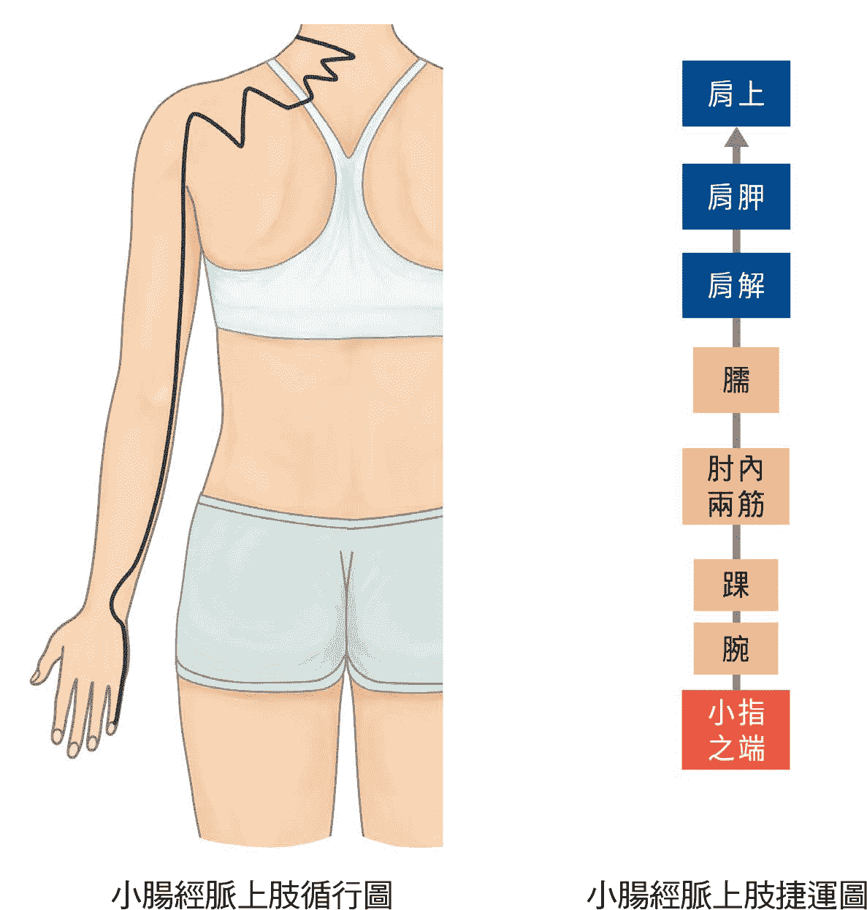

###### ● 第一个关节处：「上踝中」

本经脉起自小指外侧末梢，沿着手掌外侧，即第五掌骨外侧下缘上行，通过腕关节。「上踝中」看似一路顺行的路线，却因有一个「养老穴」而出现变化。

###### 弯曲而行，擅于控制旋转的「养老穴」

「养老穴」是本经脉的㕁穴，位于尺骨小头（茎突）近端桡侧凹陷处。手臂背面外侧靠近腕关节处（近端），有一个圆形突起称为「尺骨小头」。当我们转动手腕时，尺骨小头也会跟着旋转滑动。若做一个手心向上的翻掌动作（旋后），尺骨小头靠近拇指那一侧（桡侧）会出现一个凹窝，养老穴正位于这个凹陷处。前人认为《内经》会使用「出踝中」，是因为此处结构与下肢的足踝类似，也可以大幅度转动。因此本经脉经过腕关节之后，沿着尺骨小头，从尺侧绕进来，转向桡侧，通过凹陷处之后，再向上向外转到尺骨下缘，再循尺骨与尺侧腕屈肌之间的路线直直上行到达肘关节。养老穴正位于这条弯曲的路线，赋予它擅于控制旋转的特性。经筋篇会再细述。

###### ● 第二个关节处：「出肘内侧两骨之间」

本经脉沿着手臂尺侧继续上行，通过肘关节尺侧，肱骨内上髁和尺骨鹰嘴之间，这里有一个小肠经的合穴「小海穴」，尺神经通过此处，敲到会有刺麻感。

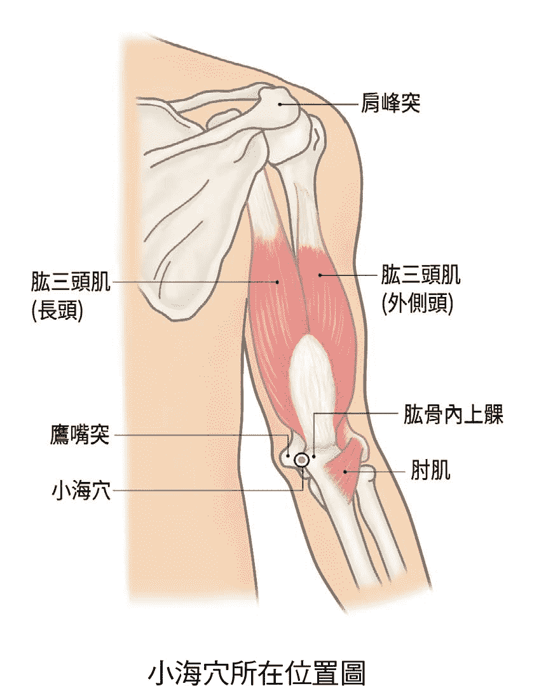

###### 「后溪穴」连结小肠经和督脉

督脉主要循行在人体背面中线，贯穿脊椎，入属于脑，当督脉发生病变时，会出现「脊强反折」或「脊强而厥」，就是脊椎非常僵硬的情况。小肠经属于太阳经，循行至肩背与项背，虽然没有直接到脊椎，却与其他阳经交会于督脉的大椎穴，加上与足太阳膀胱经同名经的关系，从而与督脉建立经气相通的关系。

依据现代全息对应理论，第五掌骨跟第二掌骨（可参阅《卷二》p.130）一样都是全身的全息反应区，另一个全息理论则指出从腕关节至肘关节小肠经所经部位为脊柱反应区（资料来源：刘立公、顾杰着《急病针灸典籍通览》上肢部一级及二级全息元）。中医传统理论早就提出这样的见解，在奇经八脉的八脉八法交会穴中，后溪穴通督脉。

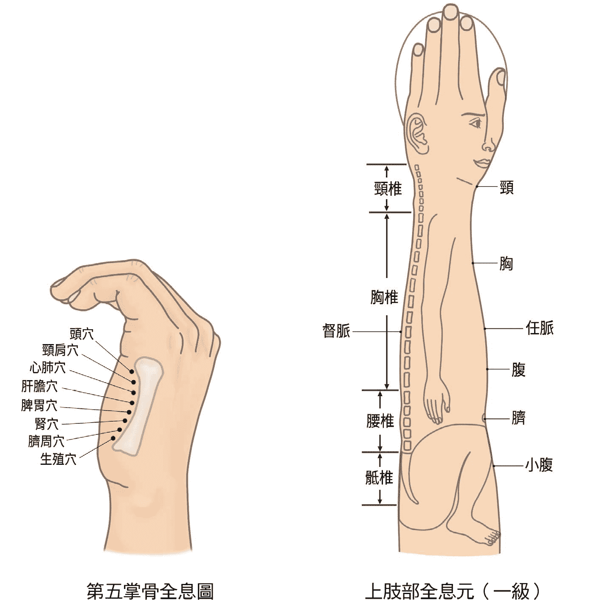

后溪穴透过这些连结关系通督脉，因此能以四两拨千斤之势，凡是督脉病变都可用后溪穴来治疗，与第五掌骨全息和上肢部全息元理论相呼应。

###### ● 第三个关节处：「出肩解，绕肩胛，交肩上」

小肠经脉从肘关节尺侧沿着上臂后缘继续上行，出于肩关节，绕行肩胛棘（或称肩胛冈）及棘下窝（或称冈下窝），并在棘上窝（或称冈上窝）和肩上交会膀胱经及督脉穴位。参酌本经在此部位的穴位分布，本经脉从肩膀后侧上行，行经腋后部，通过肩关节，包覆全部的肩胛骨，向上沿着肩上的斜方肌，与膀胱经交会于大杼穴及附分穴，然后到达肩颈交接处，与诸阳经交会于督脉大椎穴。

小肠经从「腋后—肩关节—肩胛骨—肩膀—颈部」循行都是蜿蜒路线，以扩大范围，大面积的涵盖心脏后方及上方，成为保护心脏的坚实结构。

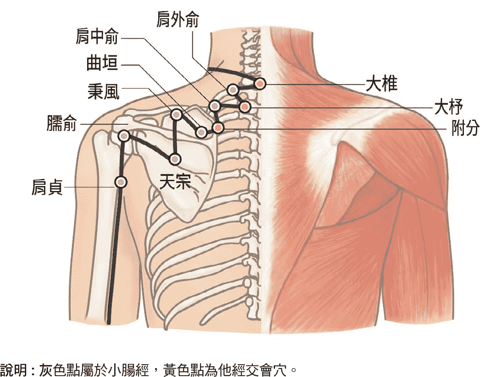

此区非常贴近心脏部位，肩胛骨就位于心脏后方，位于肩胛骨外边的肩贞穴、臑俞穴，以及位于棘下窝中央凹陷处的天宗穴，都是临床上从肩背部诊治心脏疾病的区域，当心脏有问题时容易出现僵硬紧绷现象，可以直接给予按揉或针灸治疗。

在此须特别注意！由于本区位于上背部，若针刺不当容易导致气胸，在此提醒中医师们，针刺肩贞穴及臑俞穴时，针尖尽量朝向手臂；病人体位姿势改变时须跟着调整下针位置，例如病人采趴位，手臂外展时，天宗穴也会跟着肩胛骨向外偏移，针刺前务必以手确认肩胛骨位置再下针。

###### 小肠经上肢部解密：重点在肩胛骨，属于心脏保护结构

小肠经脉从手臂外侧连结至肩膀及肩胛骨，成为上半身用来格斗及护身的最佳「武器」。

练过武术的人都知道，手臂的外侧或尺侧俗称「手刀」，是用来格斗及抵挡他人肢体侵袭的常用部位，为自我保护机制。即使没练过武术，一旦遭遇攻击时，基于动物本能，下意识的抬起手臂外侧，即是小肠经所经之处，以保护自身，尤其是护住头部。

一般所说的肩膀包括肩关节，即含前面的锁骨、侧面的肱骨和后面的肩胛骨，小肠经脉是十二经脉唯一通过此区：肩解（肩关节后侧）—肩胛骨—肩上（锁骨上方），不仅从肩关节的后方攀爬到前面，且特别加强肩胛骨部位。肩关节是人体运动范围最大而又最灵活的关节，生活中大大小小的事都用得到它，此外，它也是人体中唯一被用来背负东西的部位。俗语就借用这个特性，以「肩负重任」来比喻担纲重要的任务。意思再一转，当我们称赞一个人有责任感，愿意承担责任，就会说这个人「有肩膀」、「有担当」，是可以信靠的人。

小肠经脉在上肢部的循行重点是肩胛骨，它是上背部最强大的骨骼，除了与大肠经一起「肩负重任」，扮演吃重的角色外，也是从背部保护心脏的重要结构。经筋篇会详加讨论。

* * *

#### 2.胸腹部的「御膳房」路线

小肠经脉由肩部向下进入缺盆，联络位于胸部的心脏，再沿着食道，穿过横膈，先抵达胃，最后再属于小肠。这路径看来简单，其实藏着很丰富的内容。

首先，所连结的脏腑：小肠─胃─心之间构成了一套完美的系统，这在总论部分已有说明，主要是食物的消化与营养吸收。

其次，所经的道路与终点：手三阳经都进入胸腹腔，虽然没有专属的穴位，但会与胸腹部的经脉交会，例如本经在腹部与任脉的上脘穴和中脘穴交会。有趣的是，胃经也在腹部交会上脘穴及中脘穴，中脘穴还是胃的募穴，让小肠与胃的密切关系再添一桩。

小肠经的募穴为任脉脐下三寸的关元穴，通常募穴与实质脏腑所在位置相近，所以关元穴应是本经经脉在腹部的终点，这样的涵盖范围已经足以包含所有小肠。关元穴也是任脉重要穴位，更是足三阴经的交会穴，与人体的生殖泌尿系统有关，尤其与妇科息息相关，这部分将在经别篇详述。

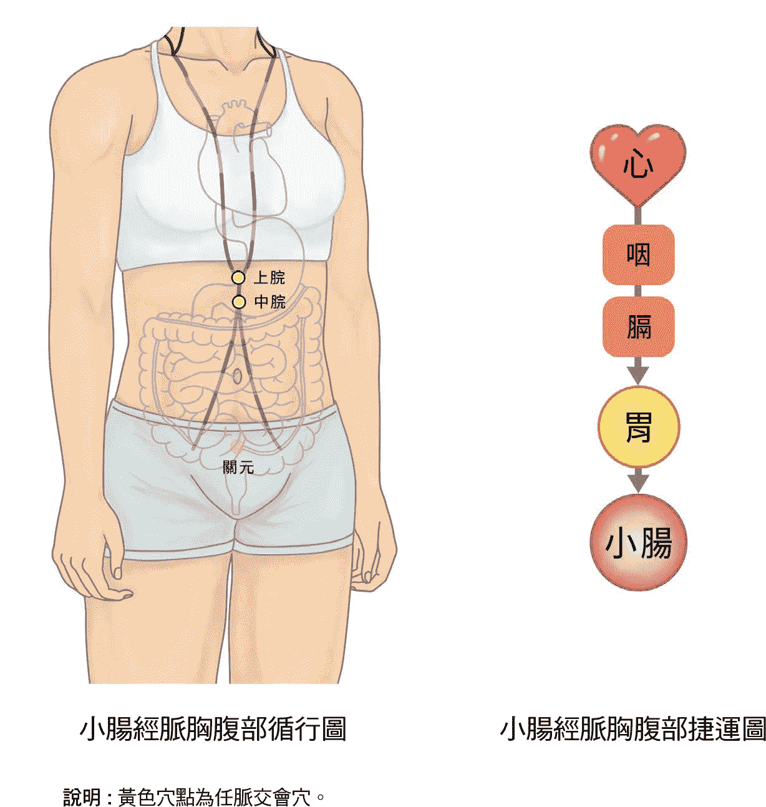

###### ● 竹叶的功效与小肠经特质的关系

本经连结心与胃，小肠身为两者的部属，当然能协助调节心胃功能。由于小肠泌别清浊，主液所生病，若心火过旺，出现心烦、口干舌燥，心脏为了自救，会将心火循着经脉系统下移给小肠，出现小便短赤症状，此时可用「导赤散」，协助小肠将心火从小便排出；若胃火亢盛，除了出现严重的口干舌燥外，还有疲倦失眠、身热多汗、呕逆等症状，表示胃火已经干扰到心，可用「竹叶石膏汤」清热益气和胃，且透过小肠协助将心胃火气从小便排出。

导赤散及竹叶石膏汤均使用竹叶。竹叶味甘淡，性偏寒，归入心、胃、小肠经，与小肠经循行所经的脏腑一模一样；它善于清热除烦、通利小便，小肠五行属火，主液所生病，竹叶的功效与小肠特质完全相符。可见竹叶是小肠经的代表用药。

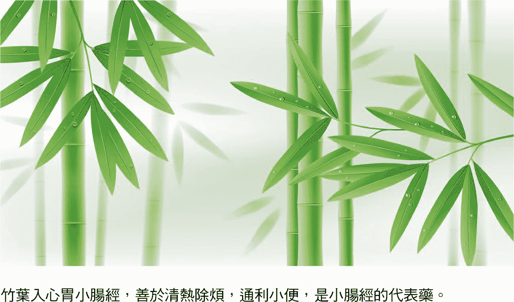

###### 小肠经胸腹部解密：主要与营养的吸收和输送有关

小肠经脉由上而下，从缺盆向下络心，循着食道，穿过膈肌到胃，最后抵达小肠，主要就是连结心─胃─小肠。

在总论中提到，小肠可以为心脏这位君王提供养分直送的特殊服务，小肠的受盛及化物功能，就是接纳胃送进来初步消化的食糜，进行缓慢且精细的吸收工作，所以小肠是人体营养吸收最主要的部位。

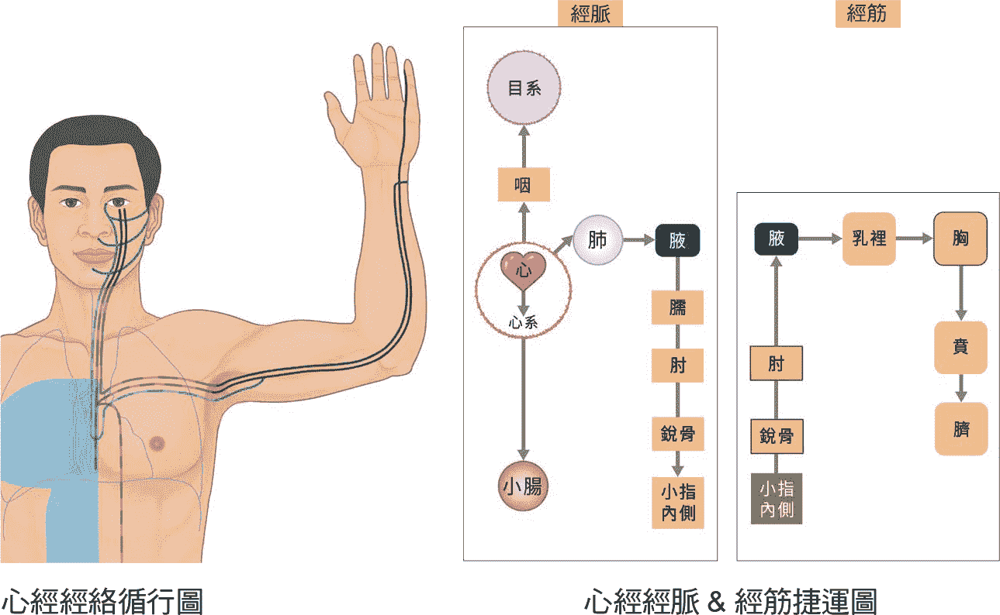

小肠与心脏相表里，是心的忠实部属，保留了一部分的水谷精微物质经由胃输送给心脏，而非全然传送给脾。此外心经也直接连结小肠，直取营养，以确保质量与缩短汲取时间。这段路线也可看做胃与心脏之间「御膳房之路」的延伸。

这条养分直送路线对于心脏相当重要。在《卷四》心经系统中曾说明，心经将保卫头面五官的责任交给它的禁卫军小肠经，自己专责保护胸腹部，因为对于心经系统来说，最重要的部位是肺—心—小肠「心腹专线」，而小肠经的胸腹路线刚好与它重叠，所以心经经筋干脆以「胸—贲—脐」这条伏梁路线同时保护心和小肠的胸腹部位。

另一方面，由于小肠经从心而下，通过胃才到小肠，小肠的消化功能就被心和胃这两个老板管辖，加强控管精微物质的质量。胃身为小肠的大哥，还居中帮忙协调心和小肠，缓冲来自心脏的情绪压力，避免直接影响小肠的吸收功能。

实际的人体器官，胃下连小肠，两者不仅实质连结，胃主血之所生病，小肠主液之所生病，血与液互相转化，对于维持人体营养和女性妇科机能尤其重要。

* * *

#### 3.头面部的「耳目」路线

小肠经脉从缺盆上行，沿着颈部到达面颊。面部循行就以面颊为中心，分出外线和内线两条支脉：

外线：从面颊直接向上到眼外角，再转向外下方，进入耳中；

内线：从面颊横向通过颧骨下缘，再转向上，沿着鼻旁，抵达眼内角。

这两条路线与眼睛连起来刚好是一个倒三角形，其中所夹者为颧骨，颧骨与面部五官机能有密切关系。此外，总论介绍过本经古称「肩脉」，《内经》面部脏腑对应关系中，颧骨对应肩部，颧骨因而成为小肠经在面部最重要的肩部反应区。

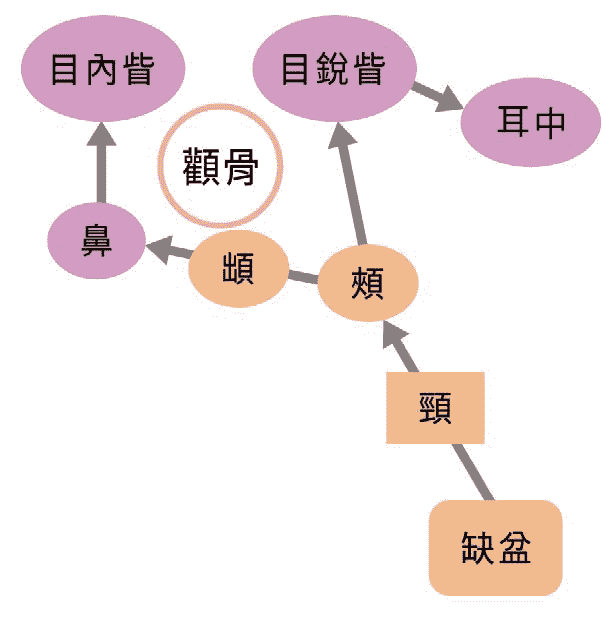

###### ● 颈部和面部四穴：天窗穴、天容穴、颧髎穴、听宫穴，个个身手不凡

由于本经属于太阳经，循行偏在阳面后侧，颈部「天窗穴」和「天容穴」分别位在胸锁乳突肌（sternocleidomastoid muscle，简称 SCM）的后缘与前缘。胸锁乳突肌是影响头部转动的重要肌肉，小肠经筋结在耳后乳突（中医称为「完骨」），可见本经与胸锁乳突肌的活动有密切关联，这部分细节将在经筋篇介绍。

面部「颧髎穴」位于颧骨下方，除了治疗小肠经面部五官疾病外，颧骨对应肩部，因此本穴还是治疗顽固型颈肩紧硬的好穴位。「听宫穴」是本经最后一个穴位，位于耳屏（耳朵与面颊交接的小软骨）前方的中央，为本经脉进入耳中的门户。

耳屏前方有三个穴位，从上而下，分别是三焦经的耳门穴、小肠经的听宫穴和胆经的听会穴（分享个人简单记忆口诀【门宫会─焦小胆】）。耳屏顾名思义就是耳朵的屏障，这三个穴位宛如耳前三卫兵，从其所在位置和穴名来看，「听宫穴」位于正前方，听「宫」比听「会」有力量，所以应是三穴的核心，藉此也可推论小肠经与听力的特别关系。

### 鼻旁路线也是小肠与心的反应区

听宫穴是本经面部最后一个穴位，但本经脉并不止于此处，反而从面颊再分出一条支脉，绕过颧骨下方，再转向上走在鼻部与颧骨之间，最后抵达眼内角，交棒给足太阳膀胱经。心经经别也通过鼻部与颧骨之间合于目内眦，《卷四》介绍本区为心脏功能反应区，加上小肠经，本区就扩大成为心与小肠功能的反应区。

本经在面部重要部位都与其他经脉穴位交会，如在目外眦交会胆经的瞳子穴，耳前上方交会三焦经的和髎穴，目内眦交会膀胱经的睛明穴，此穴也是手足太阳经的交棒点。

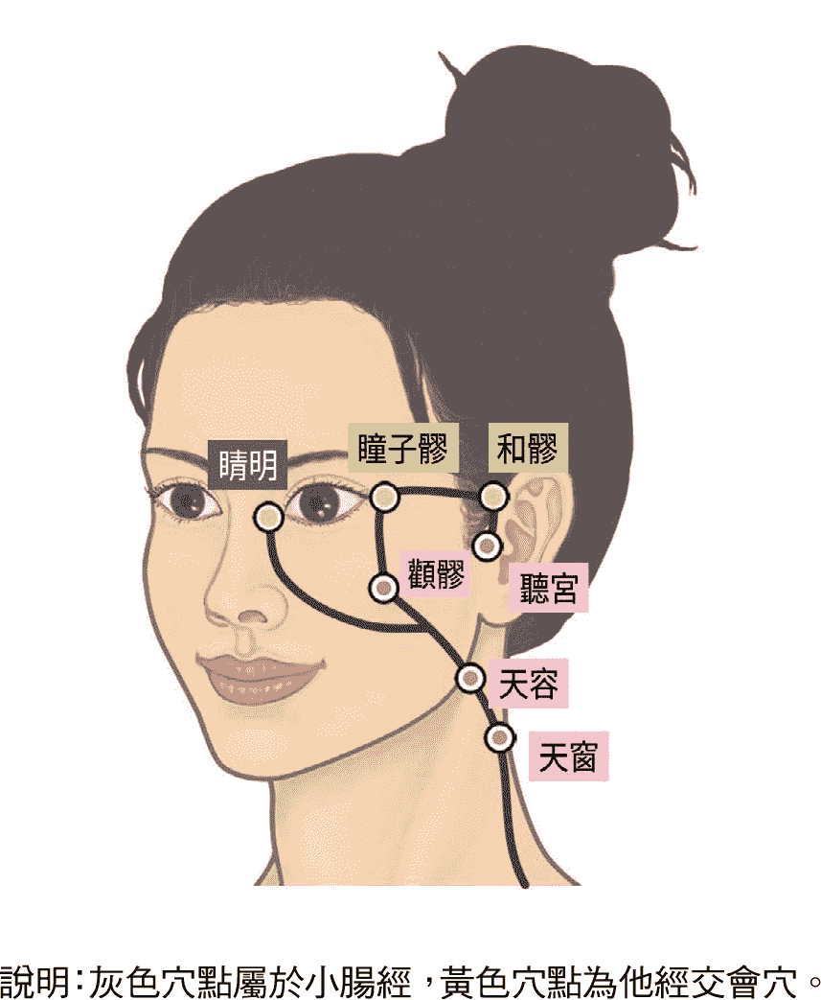

###### 小肠经头面部解密 1：头面部循行特色与其为心的耳目有关

小肠经在面部循行，呈现出两个 V 形：

第一个 V：以颧骨为中心，内线走到目内眦，外线走到目外眦。主要连结目内外眦。

第二个 V：从天容穴向上，沿着第一个 V 的外线，到目外眦向外弯向耳朵，止于听宫穴。主要是围绕耳朵前面。

本书总论中提过，小肠是心的「耳目」，不只为心建构宽广的联络网，成为心的眼线收集信息，也能提早嗅出危机线索。

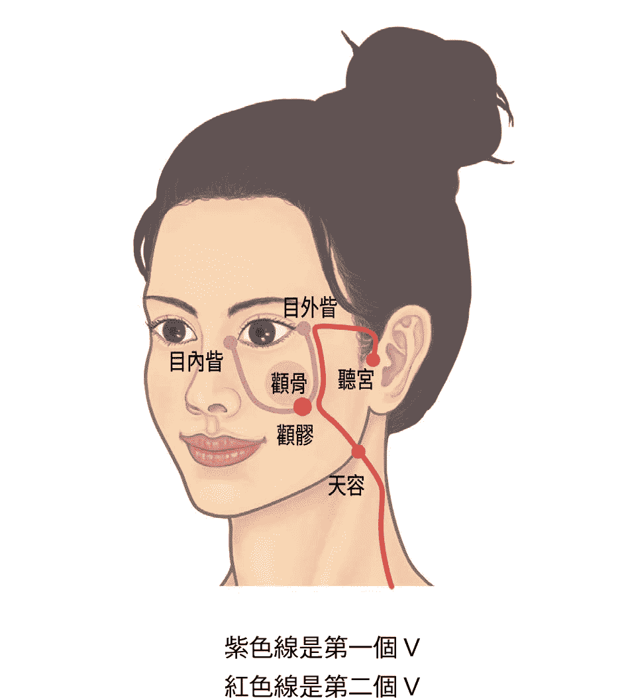

###### 小肠经的双Ｖ循行路线与《卷四》心经经脉、经别有关连

心经经脉主要连接目系，也就是眼睛深层的软组织，跟视觉及感受有关；心经经别到目内眦，与泪水分泌有关。此外，心经系统没有循行到耳朵，但心却寄窍于耳，所以整个心经系统都与耳目有关。

小肠经面部分布区域也以眼目为主，只是位置比较表浅，例如眼内角通称「眼头」，眼外角通称「眼尾」，俗话说「看头看尾」，正是环视周边环境，提高警戒之意，小肠经就像眼睛两边的卫兵随时保护眼睛，眼头眼尾又宛如雷达般帮助眼睛扩大收集信息，远处的影像闪过眼角，马上就被小肠经抓住，传送给心来做决策。小肠经的听宫穴则守护在耳道的入口处，既能保护耳朵，又能多方收听信息提供给心。小肠经就具有这样的能耐，才有资格成为心的眼目呀！

###### 小肠经头面部解密 2：脸部回春的秘密──向上提拉肌肉

小肠经的 V 形路线还有一个重要秘密！它们都经过颧骨的两侧，可见颧骨对于小肠经而言是很重要的部位。从现代解剖学来看，颧骨附近有数条面部表情肌群附着，这些肌群都有助于面部肌肉向外、向上方提拉！

爱美是人的天性，「青春永驻」的愿望从来没有退烧过，近代由于整型手术的进步与普及，人们已经不满足于仅用保养品护肤，纷纷选择微整型的方式来调整面部结构，以对抗地心引力和岁月（情绪、身心压力等）的痕迹。以现在正夯的「苹果肌」来说吧！苹果肌是从韩国流行到亚洲，韩国人认为有苹果肌的女性，非富即贵，是通往豪门的好命肌，女性同胞当然趋之若鹜。

###### 苹果肌的秘密

苹果肌在眼睛下方 2 公分处呈倒三角状的组织，微笑或做表情时会因为脸部肌肉的挤压而稍稍隆起，看起来就像圆润有光泽的苹果才得名，所以「苹果肌」又称「笑肌」。真正的苹果肌既不是肌肉也不是骨头，而是颧骨前方的脂肪组织，只有在笑的时候才会出现鼓起的形状。

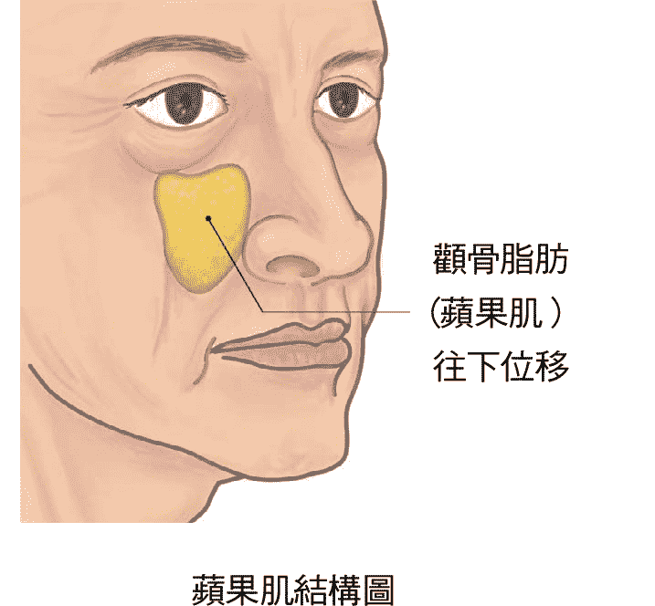

苹果肌位于鼻部和颧骨之间的区块，它撑住了颧骨，让表情肌能安住在正常的位置，保持年轻面容。苹果肌是脂肪组织，当周边肌肉随着年龄老化而逐渐无力下垂时，它的脂肪也跟着逐渐萎缩且向下位移，颧骨上的表情肌顺势向内缩，附近肌肉出现向中及向下松垂的「走山」现象，法令纹加深，皱纹变多，老相就出来了。由此可见「青春永驻」的关键点在于保持苹果肌。

从经络分布来看，苹果肌所在的区域正是小肠经所经之路，许多美容师的面部按摩手法也都顺着小肠经 V 字形操作，英雄所见略同，中医师当然也可以透过刺激小肠经来做面部 SPA。

小肠经面部经脉走向是由下而上，本身即具有向上提拉的力量，当然可以对抗地心引力。小肠与心相表里，心之华在面，心经经别分布在整个面部，刺激小肠经也能刺激心经，有助于血液循环，让面部内外皆美，延长面部「保存期限」。所以要向上提拉面部肌肉，常保青春，小肠经才是王道！

读者们可以试着站在镜子前，以双手的食指中指按在「颧髎穴」，向上拉提面肌看看，是不是脸颊的肌肉都向外向上提拉，法令纹也变浅了，看起来更加年轻貌美呢？而且好处还不只如此，这动作还能顺道提拉眼尾，因为眼尾部位也是小肠经的涵盖处。

有些报导也推荐胃经的「下关穴」作为美容按摩用，可惜下关穴位置偏在面部外侧，能提拉的肌肉有限，加上位在颧弓的下面，提拉力量被压在它上方的颧弓所抵销，效果就比不上颧髎穴。

小肠经的这个提拉力量还有利于心脏机能，临床上见到许多心脏病患者，左侧面肌比右侧无力且下垂，左侧颈肩偏紧。所以，常常按摩提拉面部小肠经的穴位，当然也有助于强化心脏囉！健康又美丽，一举两得，用中医来美容很棒吧！

由于小肠经脉连结颈肩与头面五官，因此颈肩对于五官有重大影响，颈肩过度僵硬会影响视力或听力，反过来说，眼睛及耳朵的疾病，如青光眼、耳鸣等，也会造成颈肩紧硬。时间久了，颈肩僵硬与视力听力问题互为因果，治疗时必须一起着手。位于面部的颧髎穴，不仅可以就近治疗五官疾病，加上善于处理颈肩问题，也可以解开颈肩僵硬，因果并治，一举两得。

###### 小肠经头面部解密 3：颧骨的健康学和面相学

颧骨是鼻子两侧的高骨，《内经》提到「颧者，肩也」，颧骨对应肩膀。从身体结构来看，位于面部两侧颧骨也对应到身体两侧的肩膀。两者之间会互相透露讯息，例如肩膀僵硬、血液循环不良的人，颧骨上的筋膜会变紧变硬，颧骨附近容易出现暗色斑点；反之，颧骨上的黑斑变多，表示最近经常熬夜，导致颈肩僵硬痠痛，气血循环不良！

有趣的是，在相学里颧骨还代表个性与权力，不仅主导一个人的行事风格，还与社会地位、人际关系和承担力有关，这个说法跟肩膀延伸出来的「担当」类似，再度印证颧骨与肩膀的关系。这个面相学的说法，也常被做为选择工作伙伴和人生伴侣的参考。

###### 颧髎穴位置及针法

「髎」是骨头的空隙处，「颧髎」顾名思义就是颧骨的空隙处。本穴位于颧骨的下方，从外眼角向下画一条直线，颧骨下缘画一条横线，两线交会区有一个空隙凹陷处正是本穴，按下去有明显酸胀感。

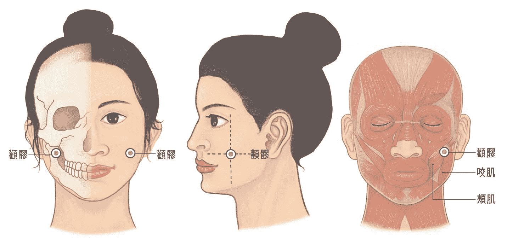

颧髎穴位于咬肌的起始部，当颈肩肌肉紧绷时，颧髎穴与咬肌也会紧硬，张口时咬肌会很酸，睡觉时还会咬牙。平日保健建议多多张口以松开面颊肌肉，再配合揉按颧髎穴。

医师治疗方面，因为面部肌肉很薄，若在颧髎穴垂直进针，深度很浅，功效也不大。建议以 45 度针入咬肌之中，松开咬肌，方能解开颈肩僵硬的状况。

有许多经络都抵达面部，它们各有贡献。例如面部肌肉的丰厚度，决定是否「膨皮」或面黄肌瘦，这部分都跟胃经、大肠经有关，因为阳明主面，也主肌肉。「心之华在面」，心经经别出于面，管理面部的黏膜、神经、血管等等，跟面部的表情和肌肉的灵活度有关。至于面部的脂肪，包括苹果肌，则由胆经负责，小肠经提供面部肌肉向上的支撑力量。

自古以来，人们重视容貌的美丽与细腻表现，了解这些面部经络的分布与关系，不只让医师可以适时帮助病人，也让一般爱美的民众能够自己动手保养自己的面容。

* * *

## 手太阳小肠经──病候

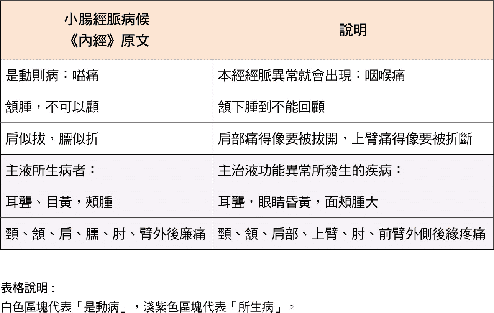

小肠经脉的病候可以分为三类：

###### 1.循行所过的肢体部位：上肢循行部位的疼痛和面颊、下颔的肿胀疼痛

原文「嗌痛，颔肿，不可以顾，肩似拔，臑似折」的用词比其他经络病候强烈（只有膀胱经可与之比拟），强调局部肿胀痠痛程度非常厉害，而且还严重影响活动，如喉咙与下颔（下巴下方的软肉区）异常肿胀，导致头部无法转动回顾；肩膀痛到好像被一直拉扯将被拔掉的感觉，上臂痛得像要折断一般，这类疼痛令人焦躁不安，甚至还会令人发狂。

个人对于「肩似拔」这三字特别有感。一位从事家庭美发的女老板满脸愁容来看诊，由于长期低头帮客人洗头、剪发，左侧肩膀非常痠痛，晚上痛到无法入睡， 白天体力不济还得工作，情绪越来越低落，甚至还冲动地想拿刀子把肩膀砍掉，看看会不会从此就不再痛了！我听完悚然一惊，想起小肠经病候「肩似拔」，才发现原来这三个字，不仅形容痛到好像要被拔掉的程度，甚至还有痛到想把肩膀砍掉的冲动，如此深刻疼痛和跌宕情绪，中医以「肩似拔」来描述，非常精准到位。

面对这类严重的疼痛，中医如何处理呢？个人临床上面对这类情况都是严阵以待，努力找出真正病因来治本，配上调节气机及结构来治标，标本共治，就能逐渐缓解。之后的中医师不传之祕将分享我们的临床经验。

###### 2.头面五官科：以耳目病为主，耳病是重点

前面介绍过，小肠是心的耳目，而本经病候以耳病为重点。由于小肠主营养吸收，小肠经主液之所生病，所以病候中耳聋与目黄通常与营养吸收不良和水液代谢失常有关。

小肠吸收营养不良，无法透过相关经络上送面部清窍时，除了出现耳聋目黄之外，头部还有空洞感，甚至眩晕，容易疲倦、心悸、腹胀、胃口不好等，加强营养补给及休息后可以稍微改善。

###### 3.小肠经主液之所生病

总论提到小肠受盛胃初步消化的食饮，进行再消化和营养吸收。小肠对于水液有独特的泌别清浊、分类代谢能力，能将清的水回收体内，浊的水排出体外。所以小肠经的病候就与水液代谢失常有关。

心的五行属火，小肠所分类管理的水液可用来平衡心火，让心火从小便排出。小肠经行于面部，所管理的水液也可用来滋润头面部的官窍。当小肠水液代谢不良，如水液停滞，眼睛就会湿湿黏黏，眼屎增多；若水液排出过多，眼睛就会干涩畏光。无论眼睛湿黏或干涩都会影响视力，而出现「目黄」现象。目黄可分为他觉性目黄和自觉性目黄，详阅《卷二》大肠经脉病候篇。

#####  中医师不传之祕：肩胛骨对于人体的影响

小肠经脉循行上有二个重点结构，一为肩胛骨，二为颧骨，这两个部位相对应，又可以互相解套。

肩胛骨刚好位于小肠经脉循行的转折点，所以会受到胸腹部心—胃—小肠的影响，也会影响头面五官的功能。

#### 心—胃—小肠的问题会导致肩胛骨的严重痠痛

临床上看到许多肠胃功能差的病人，若兼小肠经气阻滞，肩膀尤其是肩胛骨都异常痠痛，久治难愈。

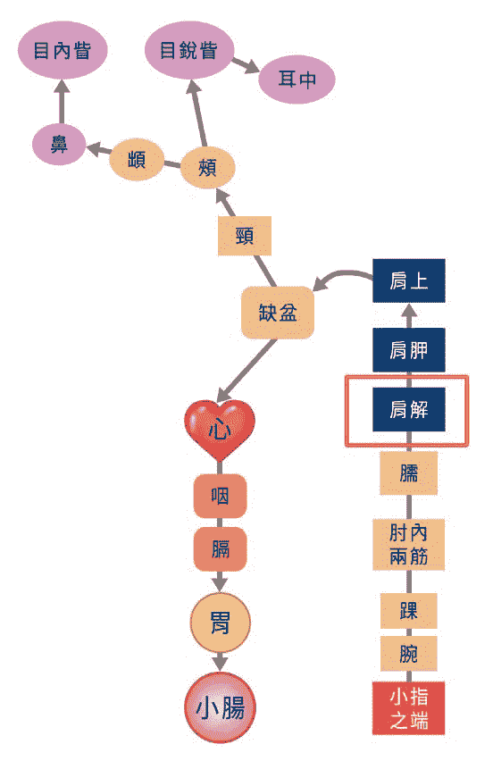

小肠与心脏的关系密切，当心脏有病时，小肠经经气也受影响，从肩胛骨牵连至腋下部位明显紧绷痠痛，尤其肩胛骨硬梆梆，推都推不动，手臂活动不利，病人还以为自己得了五十肩呢！这些完全符合病候中「肩似拔，臑似折」的情况。

所以，中医师可藉由肩膀的情况来判断肠胃与心脏功能，当然也可以着手改善心脏和肠胃功能来治疗肩颈痠痛。

#### 颈肩僵硬影响视力

以前在台北看诊时，曾开一个中医眼科特别门诊，专治眼科疾病。从累积的案例中发现，眼科病人的颈肩，尤其是肩胛骨非常僵硬，即使是先天性眼病的婴幼儿肩颈肌肉也很硬，可见这类颈肩僵硬跟工作压力没有关系，纯粹来自于眼睛相关的经络系统气血阻滞所致，这也符合小肠经循行于颈肩部的特性。此外膀胱经也连结了眼睛与颈肩部，对这两个部位的病症也有影响，这部分将在膀胱经内容中讨论。

临床上可透过检查颧部肌肉松紧度与观察皮肤色泽变化，来判断眼病的原因。例如常见溢泪的病人，由于小肠主液失常，体内水饮停蓄，颧部肌肉出现水肿现象，压之有凹痕，皮肤颜色偏黄暗；干眼症的病人则颧部肌肉紧绷，皮肤干燥，颜色偏暗沉等。

头面五官的经络系统互相连结，颈肩僵硬不仅影响眼睛，也会影响耳朵、鼻子等，个人诊治这些病证时，会将改善颈肩部气血循环列为要务之一。也因肩胛骨与颧骨这两个部位相对应，可以互相帮助，所以我们常会用颧髎穴来改善顽固的颈肩僵硬。

#####  中医师不传之祕：胸痹与小肠经的关系

小肠身为君主之官心脏的贴身护卫，小肠经脉特地循行于肩背部及胸腹部，给予心脏最高规格全面的防护。

《素问・金匮真言论》说「人身之阴阳，则背为阳，腹为阴。⋯⋯背为阳，阳中之阳，心也；背为阳，阳中之阴，肺也。」此处以背部和腹部来别阴阳，但胸部为心肺之宫城，所以此处的背应该包含胸部。心肺两经主要循行在胸部，因为属于阴经，没有直接循行至背部，而是透过相表里的大肠经和小肠经涵盖背部。

胸背部为人体之上焦，以心肺阳气为主。若上焦阳气不足，则下焦阴寒之气就会趁势上逆，盘据于胸部清阳之位，致使胸背阳气痹阻不通，出现「胸痹」之证。一如《金匮要略・胸痹心痛短气病脉证》所述：「夫脉当取太过不及，阳微阴弦，即胸痹而痛。所以然者，责其极虚也。今阳虚知在上焦，所以胸痹心痛者，以其阴弦故也。」并指出胸痹心痛之证。胸痹之证病情有轻重，轻者胸满，重者胸痛。

就病性来看，胸痛有轻重之别，轻者为喘息欬唾、胸背痛的「栝蒌薤白白酒汤证」，稍重者为不得卧、心痛彻背的「栝蒌薤白半夏汤证」，大加半夏以化痰降逆，到最重者为心痛彻背、背痛彻心的「乌头赤石脂圆证」，以附子、乌头和干姜等大辛大热之药通阳气，散阴寒。

就病位来看，随着阴寒邪气持续增长，胸中阳气逐渐消散，从栝蒌薤白白酒汤证的「胸背痛」，到栝蒌薤白半夏汤证的「不得卧、心痛彻背」，到最严重乌头赤石脂圆证的「心痛彻背、背痛彻心」，病情从胸痛变成心脏痛，加上越来越明显的背痛。小肠经脉循行于前胸与后背，还络心脏，与胸痹疼痛部位完全相符。另外，《内经》还说：「寒气客于冲脉，冲脉起于关元，随腹直上，寒气客则脉不通，脉不通则气因之，故喘动应手矣。」关元穴为小肠募穴，因此治疗胸痹可以使用心经和小肠经。

###### 临床上治疗经验分享：主要取用心经和小肠经。

● 病性：源于上焦阳气虚，选用心神正（神门穴＋支正穴）原络配穴外，还可加上心肾两经的荥火穴。若兼有寒气客于冲脉，出现明显的气逆喘促，可配通冲脉的公孙穴，加上脾肾两经的荥火穴。

● 病位：病位主要在胸与背，人体是立体结构，且时时处于动态中。内在病变会影响外在结构，外在结构异常也会影响内在疾病。因此胸背结构会呈现为「前—中—后」异常立体型态，且无法正常活动。治疗时从胸骨（前）—腋窝（中）—肩背（后）着手，解开胸廓结构，加上针刺肘关节以改善手臂和肩背的活动度。

1.胸骨：部分病人的胸骨上，尤其膻中穴附近会出现条索筋结，可以直接在条索的上方下针。

2.腋窝：腋窝肿硬者，可用心经极泉穴。（其实，小肠经别也通过腋窝）

3.肩背：可取小肠经腋后的肩贞穴、臑俞穴和肩胛骨的天宗穴以松开紧绷的背部，对侧的曲池穴松开大椎。

4.心脏后方：曾有心脏病人叙述「肩胛骨里面的心脏痛」，听起来很奇怪，但是参考《通玄指要赋》：「脊间心后痛，针中渚立痊。」选用对侧三焦经的中渚穴，痛感马上消失。肩胛骨里面的心脏痛其实就是「脊间心痛」。

5.肘臂：以心经少海穴解开上臂及肘关节的硬肿。

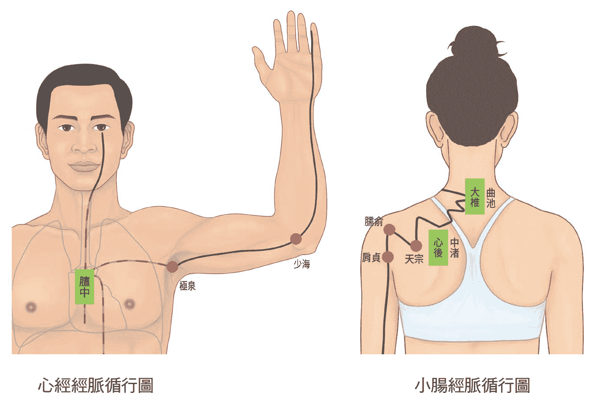

#####  中医师不传之祕：太阳经主表证的特色

人体的背部主要由小肠经和膀胱经覆盖，成为人体防御机制中很重要的经络系统。相对于腹部而言，背部属于外面，阳气充足，面积又大，有足够的能力保护身体，好像自然界的太阳一样，中医称它们为「太阳经」，负责维持一身的表气，防御外邪侵袭。

外在气候变化所产生的风寒暑湿燥火等六气，时时刻刻都围绕在人体的外层，尤其是背部区域，只要稍有不慎，它们就会趁虚而入，侵袭人体，感冒就是常见的例子。当身处于冷气房或在风大的地方，如果衣服穿得不够多，或没有特别避风，寒气就会侵入人体而出现流鼻水打喷嚏咳嗽等寒气束表现象。小肠经与膀胱经同属太阳经，包覆于人体背侧区域，因此中医在诊治感冒时，小肠经和膀胱经这两条太阳经是很重要的经络。

太阳经是人体外层的护卫，就像房子的外壳一样，是保护内脏的重要经络，太阳经原本的特质就比较坚硬，再加上承受风吹雨打，变得更为僵硬。当外在的风寒邪气反覆侵袭太阳经，导致气血严重阻滞时，就会产生剧烈的疼痛和肢体活动障碍，所以小肠经病候出现「肩似拔，臑似折」，膀胱经病候出现「冲头痛，目似脱，项如拔，脊痛，腰似折，髀不可以曲，膕如结，踹如裂」，这都代表筋膜肌肉异常紧硬的痛症。所以中医师在诊治这类痛症时，通常会将外在的风寒等邪气纳入考量，再调节气机和松解紧绷的结构，标本共治，以改善病情。

小肠经循行至头面五官、肩胛、心、胃和小肠。外在的邪气入侵时，会影响循行所过之处，如肩胛僵硬、心悸、食欲不振、消化不良、腹痛、鼻塞、耳痛、咽痛等症状，这些看似独立的症状，其实都来自同一个病因。譬如现代的「肠胃型感冒」，中医师早就知道治疗时只须针对主要病因处理，病情就会有所改善，这就是中医「治病求本」的精神。

我们还可参考《内经》：「凡十二经络脉者，皮之部也。是故百病之始生也，必先于皮毛，邪中之则腠理开，开则入客于络脉，留而不去，传入于经，留而不去，传入于府，廪于肠胃。」「夫邪之客于形也，必先舍于皮毛，留而不去，入舍于孙脉，留而不去，入舍于络脉，留而不去，入舍于经脉，内连五藏，散于肠胃，阴阳俱感，五藏乃伤。」外在邪气由表入里的过程中，肠胃是体内深层的防线，邪气一旦入侵体内，很容易进一步影响肠胃。由此可知，若肠胃机能健全，就能提供良好的防御外邪能力。

# 二、手太阳之正（经别）

小肠经别完全符合经别「加强相表里脏腑在体内连结」的特质，并简化小肠经脉胸腹部路线，成为心与小肠的直达车，除了营养直送之外，也利于心与小肠之间的「私人悄悄话」，如心火下移小肠，小肠传送耳目收集的讯息给心等。

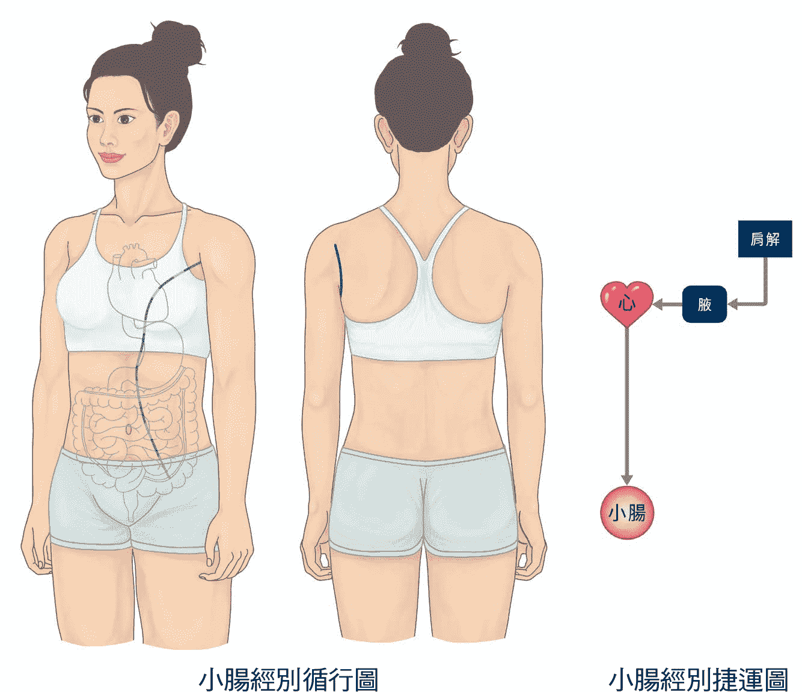

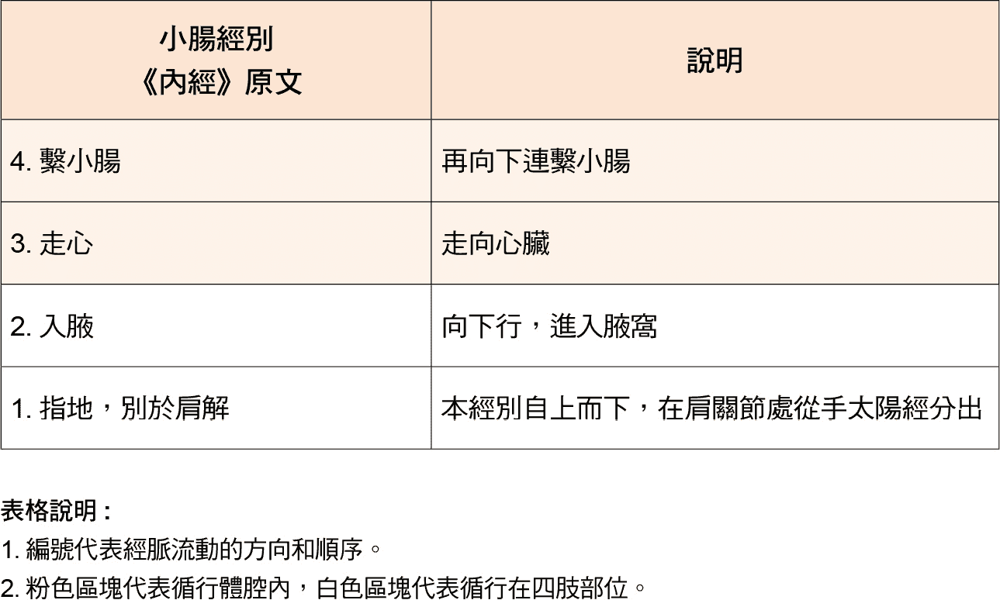

### 肩腋心肠线

本经别有四个重点位置，因此简称本经别为「肩腋心肠线」。

*   肩解：从背部的肩关节（肩解）分出来
*   腋：向下沿着腋部后侧，绕进腋窝，通过心经的极泉穴
*   心：再从腋下出来，横过胸部走向心脏
*   小肠：从心脏向下联系小肠

「肩腋心肠线」是一条营养直送路线，也点出肩部痠痛的部分原因来自心脏、肠胃功能失调等。反推肩腋部也能透露出心脏和小肠的情况。依据功能还可再细分：

「肩腋心线」：从肩解到心脏，强化肩腋为心脏功能反应区的特质。

「腋心肠线」：从腋到胸腹，文字很精简，内容却很丰富。参考心经路线，会发现小肠经别与心经经脉并行，且被心经经筋一起包覆。这是一条隐形路线，如此走向是为了维持人体重要的生理机能。

### 小肠经别在胸腹部的隐形道路

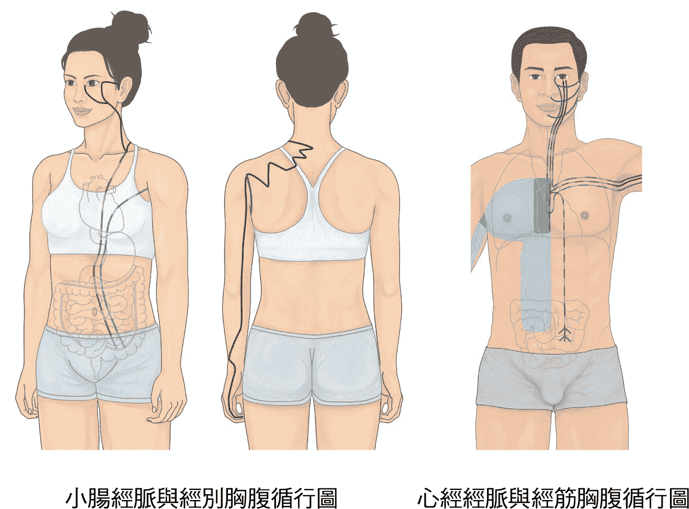

心经经脉与小肠经脉、经别在胸腹部并行。请参阅下表。

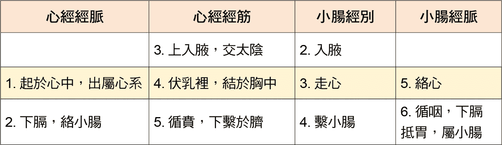

胸部的隐形路线：从腋出来，通过乳房区抵达心脏。心经经筋虽然「伏乳里」，但心经穴位并未特别治疗乳房，反而小肠经的许多穴位都能治疗乳房疾病。将在保健篇介绍。

腹部的隐形路线：从现代解剖可知小肠所在位置包含上腹部及下腹部，小肠经脉与经别所属的「小肠」部位，当然也涵盖这些部位。《卷四》心经介绍《内经》提到的：「月事不来者，胞脉闭也。胞脉者，属心而络于胞中。」心脏很重视传宗接代以保留优质的血脉血统，特地开展一条「胞脉」抵达胞宫（即子宫），以提供血液与养分。此胞脉还包含了小肠经系统，两者共同形成「胞脉」。从另一个角度来说，心经也可能搭乘小肠经的便车抵达胞宫，因为小肠募穴是位于肚脐以下三寸的关元穴，与子宫的位置非常接近。募穴为脏腑之气转输于胸腹部的位置，可见下腹部是小肠的重点部位。

总论介绍过小肠与脾脏之间有实质连结，心脾和小肠共同调节妇科功能。小肠经经筋循行未到胸腹部，从胸部到肚脐以上部位的保护之责交给心经经筋管理，肚脐以下部位则由脾经经筋负责。肚脐是一个人的生命之本，心经与脾经的经筋以肚脐为分野，分工合作，功效更强。同时，心脾两经的经筋都能反映小肠与胞脉的机能。心经经筋病候的内急和伏梁，无论是病性或病位皆与小肠经有关。

心经系统与小肠经系统共同形成「胞脉」，其功能也与两经特性有关，例如心主血主脉，负责血液的输送，小肠经主液之所生病，负责水液的输送。两经提供血与液的养分，上为乳汁，下为月水，维持正常妇科功能，从而形成妇科系统中特有的「血」与「水」特质。后文会详加介绍。

#####  中医师不传之祕：「胞脉」意涵和相关病证

#### 1.「胞」的定义

《内经》说「胞脉者，属心而络于胞中。」顾名思义就是联络「胞」的「脉」。《内经》另外有关「胞」的内容，如「脑、髓、骨、脉、胆、女子胞，此六者地气之所生也，皆藏于阴而象于地，故藏而不写，名曰奇恒之府。」此处的「女子胞」功能藏而不泻，且专属于女性所有，就是胞宫。

《说文解字》认为胞是「儿生裹也」，后世还有「腹中胎」，「胎之衣」的说法。成语也有「民胞物与」，俗语中的「胞兄胞姊」，「手足同胞」等。可见胞是子宫、胞胎或胎衣的代名词，也是妇女妊娠，传宗接代的重要组织。

另外，从胞的字形来看，月是肉的古字，月＋包即是包裹着肉的意思，人体内唯有子宫会包含着肉，所以胞可以视为子宫。

#### 2.「胞」的病变反应区

参酌《金匮要略》在妇人杂病篇所述：「妇人之病，因虚、积冷、结气，为诸经水断绝，至有历年，血寒积结胞门。寒伤经络⋯⋯痛在关元⋯⋯」本病因血寒积结胞门，损伤经络及多处病位，其中特别点出「痛在关元」。关元穴不仅是手三阴经的交会穴，也是小肠的募穴，可见，小肠经与胞宫有着密切关系，当胞宫出现病变时，会反应在关元穴，进而影响小肠经。

#### 3.与「胞」相关的病证：分为血病与水病两大类

妇科病证影响月经与妊娠，主要与血病有关：

《内经》：

「月事不来者， 胞脉闭也。」

「石瘕生于胞中，寒气客于子门，子门闭塞，气不得通，恶血当写不写，衃以留止，日以益大，状如怀子，月事不以时下，皆生于女子。」都出现月经不调。

《金匮要略》：

「妇人有漏下者，有半产后，因续下血都不绝者。有妊娠下血者，假令妊娠腹中痛，为胞阻，胶艾汤主之。」

「妇人怀妊，腹中痛，当归芍药散主之。」

「妇人宿有症病，经断未及三月，而得漏下不止，胎动在脐上者，为症痼害。妊娠六月动者，前三月经水利时，胎也；下血者，后断三月，衃也。所以血不止者，其症不去故也，当下其症，桂枝茯苓丸主之。」

「问曰：妇人年五十所，病下利，数十日不止，暮即发热，少腹里急，腹满，手掌烦热，唇口干燥，何也？师曰：此病属带下，何以故？曾经半产，瘀血在少腹不去。何以知之？其证唇口干燥，故知之。当以温经汤主之。」

以上病证皆因瘀血停滞导致下腹痛。当归芍药散是四物汤合五苓散的变化方，其与桂枝茯苓丸两方都是血分与水分共治的方剂，切合前面所述心经与小肠血与水的特色。

妇科影响膀胱小便功能，主要与水病有关:

《内经》：「胞移热于膀胱则癃、溺血。」

「五藏因肺热叶焦，发为痿躄，此之谓也。悲哀太甚则胞络绝，胞络绝则阳气内动，发则心下崩、数溲血也。」

无论是胞热或胞络绝，都会连累膀胱而出现水液代谢异常的状况。

《金匮》另有一个容易混淆的病证「转胞」：

「问曰：妇人病，饮食如故，烦热不得溺，而反倚息不得卧者，何也？师曰：此名转胞，不得溺也，以胞系了戾，故致此病，但利小便则愈，宜肾气丸主之。」

对于此处的「胞」，后世医家主要有两种见解――

部分医家认为此处的胞是指尿胞，病因下焦阳气不化所致，故以肾气丸温行下焦阳气则溺出病解。三国嵇康在《与山巨源绝交书》提到：「每常小便，而忍不起，令胞中略转，乃起耳。」因此后世以「转胞」暗指憋尿之意。

部分医家认为此处的胞是指胞宫，中医前辈以「转胞」做为妊娠小便不通的代称，病因妊娠后期，母体中气虚或胎儿过大而不能举胎，压迫膀胱，导致小便不通，多采用补气升举，转动胞胎来治疗。如《胎产心法》曰：「妊娠转胞，乃脐下急痛，小便不通。凡强忍小便，或尿急疾走，或饱食忍尿，或忍尿入房，使水气上逆，气逼于胞，故屈戾不得舒张所致，非小肠膀胱受病而利药所能利也，法当治其气则愈。」元代名医朱丹溪在《格致余论》记载接生妇手涂香油，自产户托起胚胎，使母亲可以排尿的特殊疗法。

古文中，「脬」（音：抛）专指膀胱，或称为「尿脬」，同时也有「脬」与「胞」互用的情况。个人浅见，《内经》中的「胞」主要指「胞宫」，部分内容指「尿脬」。后世可能以其具有容纳包裹之意，借用来说明膀胱，称为「尿胞」，或因「脬」与「胞」两字音与形相似而互用。因此《内经》的「胞痹者，少腹膀胱，按之内痛，若沃以汤，涩于小便，上为清涕。」此处的「胞」应通「脬」，属于膀胱病变。

除了上述血病与水病之外，《内经》还有一个后世称为「子瘖」的叙述：「黄帝问曰：人有重身，九月而瘖，此为何也？岐伯对曰：胞之络脉绝也。帝曰：何以言之？岐伯曰：胞络者系于肾，少阴之脉，贯肾系舌本，故不能言。帝曰：治之奈何？岐伯曰：无治也，当十月复。」脾经经筋所形成的篓子结构会特别内着于脊，是为了固定篓子结构，同理，胞胎系于肾也是为了固定于体内。怀孕后期，胎儿长大，压迫足少阴肾经，使得肾经经气无法循经上承至舌本而声哑难出的「子瘖」之证。此处的胞是「胞胎」之意。

#### 4.与「胞脉」相关的病证～「倒经」

由于心经系统与小肠经系统共同形成「胞脉」，《诸病源候论》指出：

正常生理功能「手太阳小肠之经也，为腑主表；手少阴心之经也，为脏主里。此二经共合，其经血上为乳汁，下为月水。」

异常病理状态「妇人月水不利者，由劳伤血气，致令体虚而受风冷，风冷客于胞内，损伤冲、任之脉，手太阳、少阴之经故也。 冲脉、任脉之海，皆起于胞内。」

可见「胞脉」深深影响女性的月经周期。临床上有一种与胞脉相关的异常月经现象，称为「倒经」或「逆经」。顾名思义，就是月经的经血没有向下顺行到胞宫，反而倒行或逆行到其他部位，由于此证经血常从鼻孔或口中流出，出现衄血（流鼻血）或吐血，所以又称为「经行吐衄」。一旦经血逆流向上，下行的经血量就会减少，甚至月经闭止不来。

历代医家多从肝胃血热气逆论治倒经，我们也可以试着从经络角度来分析。胞脉由心经与小肠经共同组成，经血沿着两经的循行路线，向上为乳汁，向下为月水。若胞脉功能失常，一如《内经》所说「今气上迫肺，心气不得下通，故月事不来也。 」气上迫肺导致心气不下，经血唯有上行，若冲逆过度，超越乳房部位，继续上行至面部，沿着心经与小肠经所经的喉咙而出现吐血，或经过鼻旁，加上受到「心肺有病，鼻为之不利」的影响而出现流鼻血现象。胞脉闭阻不下，月经无血可出，当然就出现闭经现象，治疗时，可从肺、心、小肠三条经络系统着手。

#####  中医师不传之祕：症瘕积聚与妇科的关系

前文介绍过，妇科以血病与水病为特质，尤其气血瘀滞影响最剧。气血瘀滞在妇科疾病会出现症瘕积聚现象。

#### 中医对于「症瘕积聚」的概念

症瘕积聚都是腹内有积块，出现或胀或痛的病证。

《内经》有关「积」的论述：

「百病之始生也，皆生于风雨寒暑凊湿喜怒....留而不出，传舍于肠胃之外，募原之间。留着于脉，稽留而不去，息而成积。⋯⋯积之始生，得寒乃生，厥乃成积。」

「寒气客于小肠膜原之间，络血之中，血泣不得注于大经，血气稽留不得行，故宿昔而成积矣。」

指出「积」的病位在小肠膜原之间，与小肠经系统有关，病因寒气而生，血气停滞久而成积。

《难经》增加积与聚两种病证的比较分析：

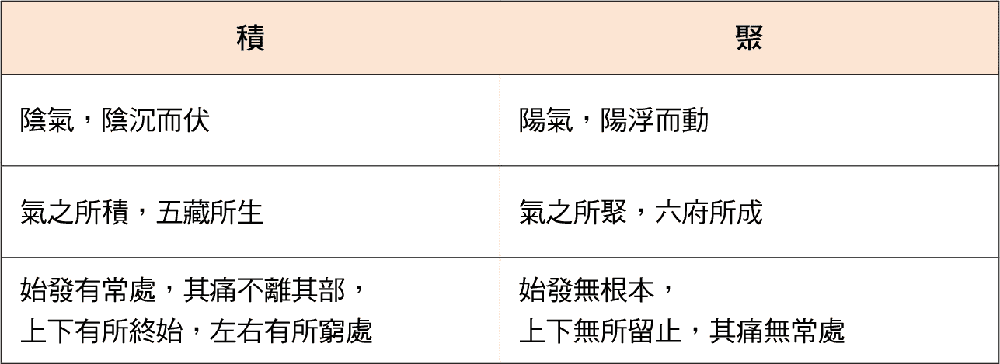

《金匮》也有类似的说明：「积者，脏病也，终不移；聚者，腑病也，发作有时，辗转痛移。」

积聚涵盖范围较广，症瘕常见于妇科疾病，尤指妇女下腹胞中有肿块，伴有胀痛甚或出血者，类似现代生殖系统的肿瘤、炎性包块等。《校注妇人良方》认为「妇人腹中瘀血者，由月经闭积，或产后瘀血未尽，或风寒滞瘀，久而不消，则为积聚症瘕矣。」病位当然就在胞宫的位置。

从名称上来看，症瘕的特质与积聚有相似之处，如：

症者征也，腹中肿块，按之应手，牢固不动，有病形可征验，与积同性质；

瘕者假也，腹中肿块，聚散无常，推之则动，按之则走，与聚同性质。

症和积皆有形，固定不移，痛有定处，病在脏，多属血病；

瘕和聚皆无形，聚散无常，痛无定处，病在腑，多属气病。

《金匮》也提到妇人症病的影响：「妇人宿有症病，经断未及三月，而得漏下不止，胎动在脐上者，为症痼害。⋯⋯所以血不止者，其症不去故也，当下其症，桂枝茯苓丸主之。」由于症这个痼疾，导致胎动不安、妊娠出血，若要止血安胎须从本而治，下其症痼则血可止。

桂枝茯苓丸正是结合心与小肠，血分与水分并治的完美处方。桂枝属于心经用药，可视为温通胞脉的代表药，入血分为主；茯苓归心肺脾肾经，功能利水渗湿，可做为调节小肠主液，泌别清浊的用药，入气分为主。

#### 肠覃及石瘕

《灵枢・水胀》还提到肠覃、石瘕之证。以下为对照表：

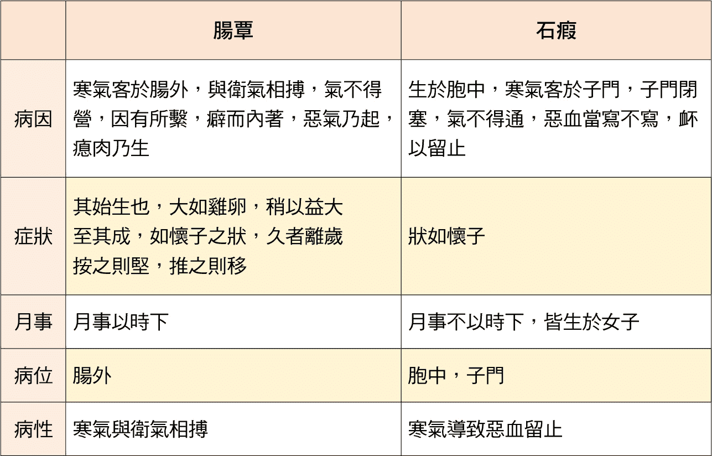

两者症状很类似，都有下腹部持续肿大，好像怀孕一般，但肠覃病在肠外，与妇科病无关，所以月经按时而行；石瘕病在胞宫，属于妇科病，气血阻滞，月经无法按时而来。《妇科心法》整理出鉴别重点：「肠覃石瘕气血分，寒客肠外客子门。二证俱如怀子状，辨在经行经不行。」

犹记早年学中医的时候，看到这两个病名时愣住了，好拗口的组合！后来理解先贤也是煞费苦心，为了凸显病症特色才会如此命名。

肠覃：寒气客于肠外与卫气相搏，肺主卫气，大肠与肺相表里，因此古人认为病位在大肠，个人认为也有可能如前所述「寒气客于小肠膜原之间」。由于寒气与卫气相搏，气机被牵系而阻滞，出现腹内硬块、消化不良的「癖」证，病在气分。「覃」有深广、蔓延的意思，指出肠外因恶气蔓延生的瘜肉，持续增大，所以称为「肠覃」。

石瘕：寒气客于子门，气不得通，恶血留止在胞宫之中，导致月经不行，当然也没有怀孕。「石」字可以直接理解如矿物般坚硬。从中医角度来看，任脉脐下二寸「石门穴」，古书一再提醒：「石门女子禁不可刺灸，令人绝子。」 民间也用「石女」来称呼先天无法进行性行为的女性，当然无法受孕。因此石字既可呈现腹部肿块的坚硬度，也能用来说明不孕的情况。本病使用「瘕」字，个人认为并非取其易散之意，而是来自《内经》「任脉为病，男子内结七疝，女子带下瘕聚。」古时「瘕」字也指妇女腹中结块病，本病正借用此意。

综合以上所论，肠覃与石瘕都属于妇科肿瘤疾病，前人认为肿块生于胞脉称为「肠覃」，近人认为类似妇女卵巢肿瘤；生于胞宫称为「石瘕」，类似子宫肿瘤。无论肿块生于胞脉或胞宫，在在显示心经与小肠经共同形成的胞脉都与妇科有特殊关联。小肠经面部重点部位「颧骨」，当然也会透露妇科状况，最常见下腹气血瘀滞的女性，其颧骨颜色较为暗沉，上有黑斑。

# 三、手太阳之别（络脉）

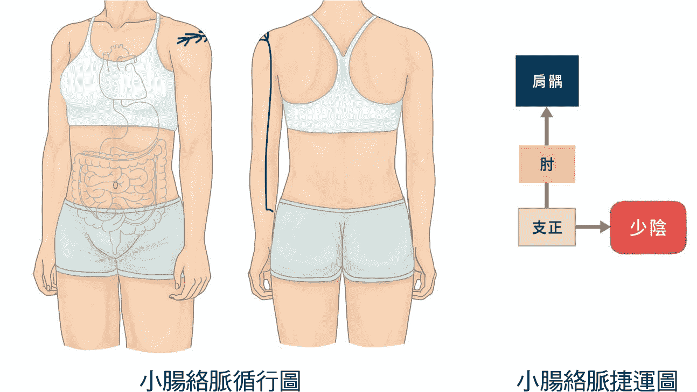

小肠络脉跟经别一样精简，由前臂的支正—肘—肩髃穴。

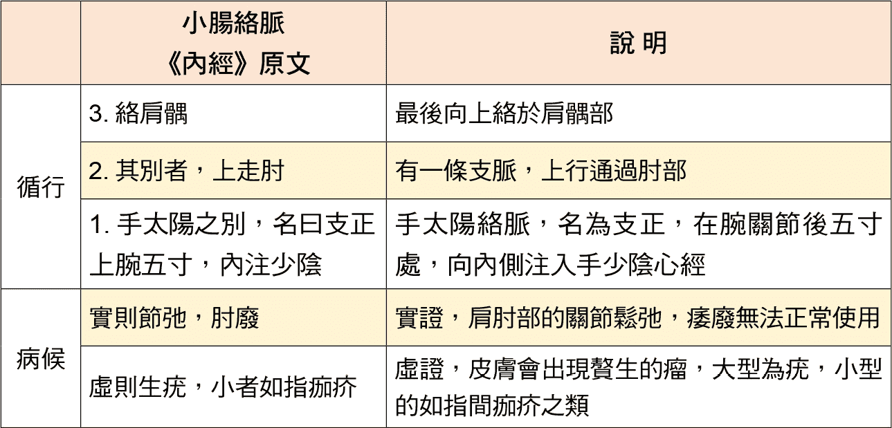

## 小肠络脉──循行特色

### 支正络肩髃

小肠络脉从肘上五寸处的支正穴分出，横跨尺侧腕屈肌，向内侧注入手少阴心经。并分出支脉向上通过肘关节，最后却不是停留在小肠经最重视的肩解或腋处，而是转向肩前的肩髃穴。为什么会突然转到大肠经呢？这正是本络脉特别之处。

要回答这个问题，须加入小肠经脉及经别一起研究。

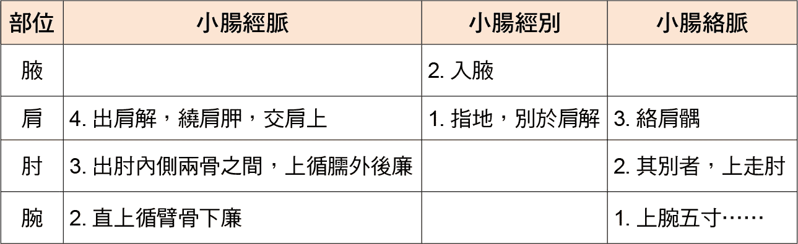

参考上表，可以清楚看出小肠经别与络脉的分工：经别加强小肠经脉的胸腹循行，络脉加强小肠经脉的肩臂循行。

若以肩关节为界：

通过其上方为「经脉」，含手臂阳面及胸腹部，是为【主线】；

通过其下方为「经别」，穿过腋—心—小肠，是为【内线】；

通过其前方为「络脉」，仅在手臂阳面，是为【外线】。

肩膀部位是小肠经的热门部位，主线小肠经脉从手臂后方由下向上包覆，内线经别从肩关节向下到腋后，绕过腋下（可视为肩关节的下方）到胸前。既然肩关节的后方及下方已有充足的连结，承担加强肩臂循行任务的外线络脉当然要另辟蹊径。

肩关节是人体活动量及活动角度都很大的关节，为了协助稳定关节，有四条小肌肉连结肩胛骨和肱骨，共同组成「旋转肌群」或「肩袖」，细节将在经筋篇介绍。其中棘上肌起于肩胛骨棘上窝，穿过肩峰下方，止于肱骨大结节上方，亦即肩髃穴附近，与本络脉在肩部的循行很类似。但回归中医的络脉理论，通常不会选择有被挤压风险的部位，所以本络脉似乎不是透过这条路线连结肩髃穴，极有可能是从肩胛骨经腋后向肩关节的前上方跨越，包络肩关节的后面—侧面—前面，最后结络在肩前最重要的肩髃穴。

由于「髃」字即为「肩前」之意，故此处的肩髃狭义是指小肠经的肩髃穴，广义可指肩前部位。原文用「络」字表示不是一条线，而是片状的联系，亦即由后侧网络至前侧，将肩关节的阳面（包括前、中、后侧）包裹在一起。如此一来，整个肩关节就全被小肠经系统包覆。

小肠经古称肩脉，主要为了保护心脏，才将肩膀紧紧抓住，如：

*   肩膀的后上方—由正经及经筋负责
*   肩膀的后下方—由经别负责
*   肩膀的侧方及前方—由络脉负责

## 小肠络脉──病候

由于小肠络脉连结三条经络：小肠经、心经（内注少阴）和大肠经，它们连结在一起的作用可从病候中推论出来。

###### ● 循行所过的肩肘部位

无力松弛，导致无法活动。由于本络脉「络肩髃」，发生病变时会影响到肩关节的前、中、后侧，范围扩大了，病情益加严重。

###### ● 皮肤病变

《内经》说「诸痛痒疮皆属于心」，小肠是心的代谢管道，心火可以从小便排出，也会从皮肤透出，其中「虚则生疣，小者如指痂疥」。

疣：生长于体表的一种赘生物，又称「赘疣」，俗称「千日疮」。本病多发生于手背、手指或头面部，患部的赘生物起初小如黍米，大如黄豆，突出表面，表面粗糙，状如花蕊，颜色灰白或污黄，所以又称为「饭蕊」。疣的数目多少不定，一般无自觉症状，用力压按时略有痛感，碰伤或摩擦后容易出血。

痂：是创伤后已经结痂的皮肤或是疮疡的外壳。古文的痂与疥是同义字。

在小肠经别篇介绍过「肠覃」与「石瘕」属于妇科肿瘤，是体内的赘生物。本络脉的疣与痂属于皮肤的赘生物。「诸痛痒疮皆属于心」，加上小肠泌别清浊的功能失常，无法将代谢物排出体外时，就会循着经络系统阻滞于内线和外线，在体内和体外形成肿瘤、疣和痂等赘生物。

小肠经主液之病，善于清泻火气，走血脉，可以协助平衡心火，本经络穴「支正穴」就是小肠经首选穴。大肠经善于散风热，走皮毛，肩髃穴本身就是治疗皮肤病的有效穴位，两者合作，可以减轻心脏的压力，改善皮肤病症。

#####  中医师不传之祕：支正穴的秘密

#### 1.穴名的秘密

大肠经络穴偏历穴很有特色，本经络穴支正穴名也蕴含秘密：

支：络，持也。本络脉分支络向阳明经的肩髃穴，支持肩部结构系统；

正：联，护也。本络脉联结心经，心为君主之官，此为正途，以支脉来支持正脉，守护心脏长养正气。

本络脉连结大肠经的肩髃穴，上肢主要为心肺所管辖，上肢可视为心肺的延伸，所以与心肺相表里的大小肠经也在此处相合。

#### 2.取穴的秘密

由于支正穴横向手臂内侧注入心经，当出现病变时，从腕关节向上 5 寸，在尺骨下缘与尺侧腕屈肌之间会触摸到细细的横向条索，支正穴即在此处。

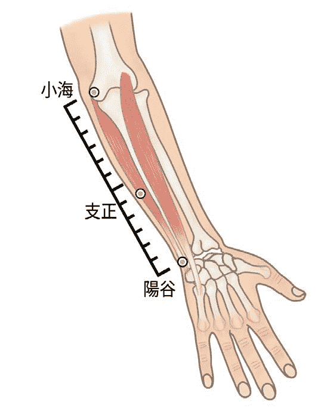

#### 3.配穴的秘密

支正穴是络穴，善于治疗心经与小肠经疾病，配合心经的原穴「神门」，就成为原络配穴「心神正」，类似苓桂朮甘汤的功效，尤其天气变化大，且夹寒湿，而影响心脏功能时，可以解表温里，祛湿利水，对于改善心脏功能特别有效。

支正穴也是诊断和治疗心脏病很好用的穴位，若敲打手臂外侧时，感到异常疼痛酸麻难耐，便是心脏病的警讯，要赶紧治疗。尤其因心阳不足产生的水肿、肩背沉重痠痛更为有效，所以平日可敲打按揉手臂外侧以保养心脏。

# 四、手太阳之筋（经筋）

## 小肠经筋──循行特色

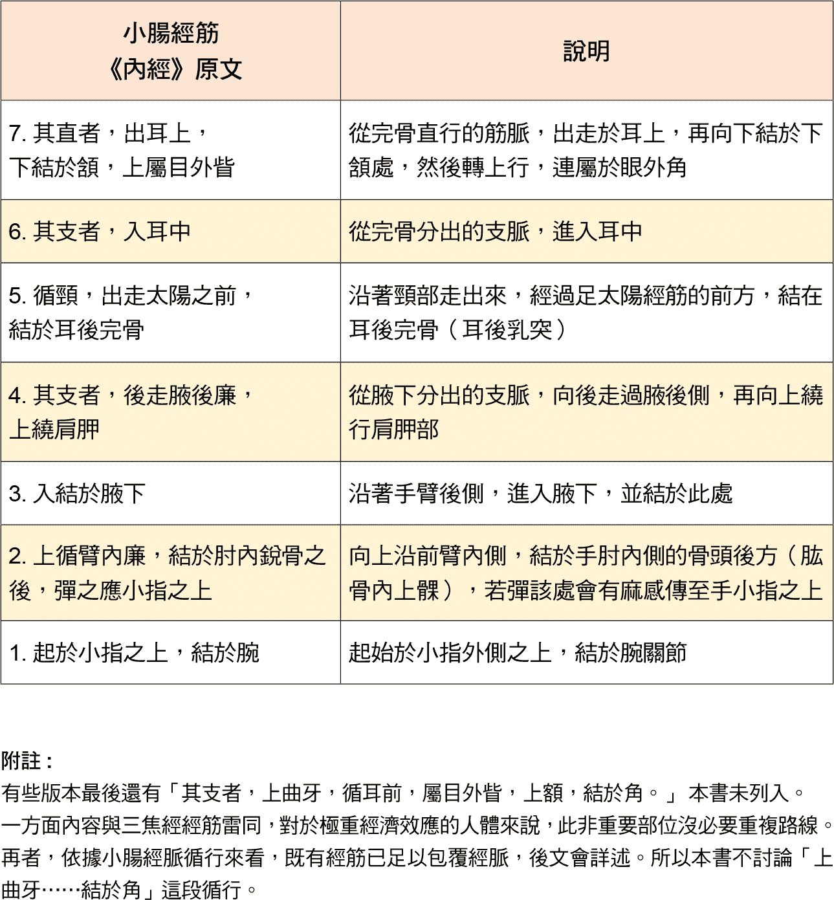

小肠经筋主要包覆小肠经脉循行所过的上肢部和头面部，至于胸腹部则交由心经和脾经经筋保护。

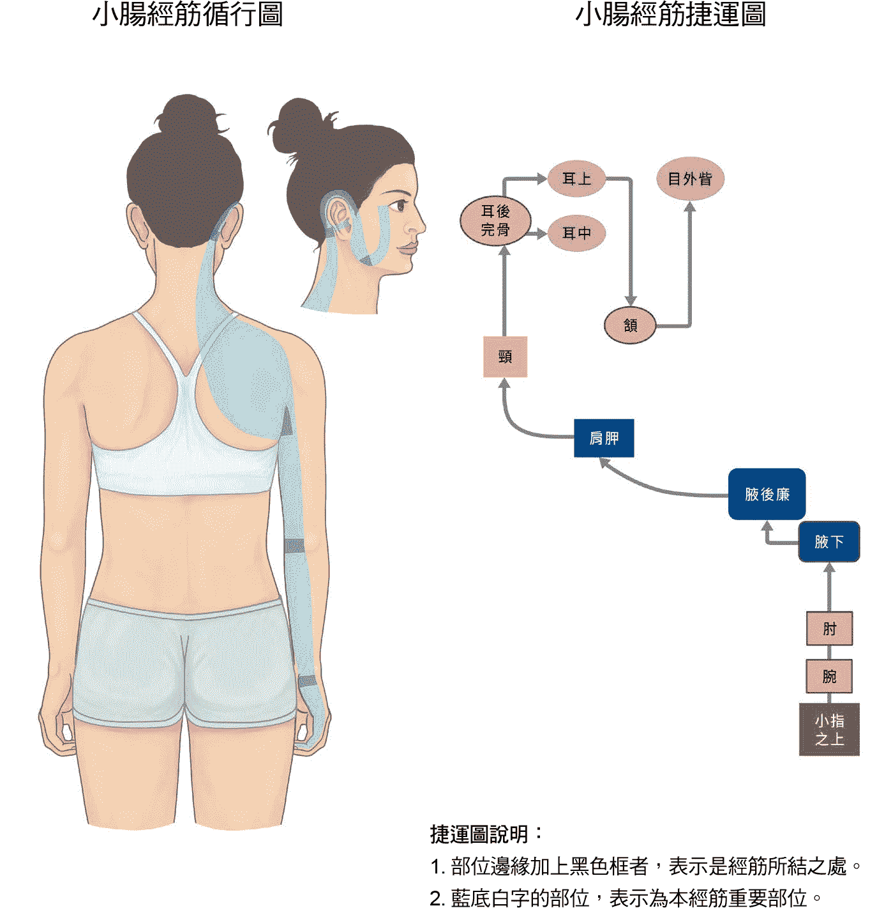

### 上肢部（路线 1-4）

本经筋从小指外侧经由手臂至肩胛这段循行部位大致与经脉一致，比较特别的是从腋下到耳后完骨这段路线，涵括了小肠经前面三个系统在肩腋部位不同的路线，使它成为一体。例如：

本经经脉：循着上臂外后侧，经腋后廉，向上绕行肩膀，再跨越肩膀到前胸，进入缺盆；

本经经别：从肩关节向下经过腋后廉，进入腋窝；

本经络脉：从手肘上行，经过腋后廉，络于肩关节前方的肩髃穴。

综合来看，小肠经所经部位除了肩膀之外，还包含腋后部位，本经经筋就涵盖这些部位。

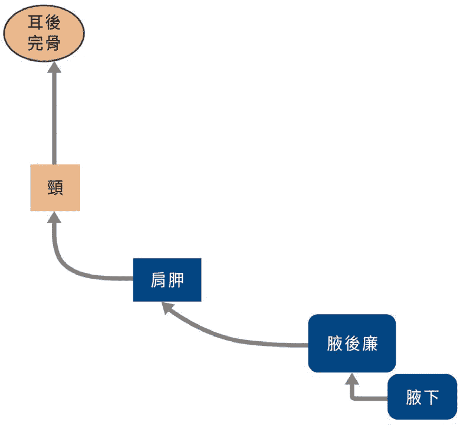

本经筋所经过的肩腋部位，有四条肌肉围绕肩关节，包括棘上肌、棘下肌、肩胛下肌和小圆肌，它们连结肩胛骨和肱骨大结节，共同组成「旋转肌群」或「肩袖」(rotator cuff)，在肩关节大范围活动时，协助肩关节韧带以及肱骨的稳定。

棘上肌位于肩胛骨棘上方，从肩胛骨穿过肩峰下面到肱骨大结节。由于本经络脉络于肩峰与肱骨大结节之间的肩髃穴，因此本经经筋也可能会循着棘上肌到肩髃穴，到达此处与本经络脉交会，提供保护，并加强肩关节的稳定性。

另外，位于小圆肌下侧的大圆肌也连结肩胛骨和肱骨，它的下缘正是背阔肌的上缘。大圆肌与背阔肌都经过腋下，因此，大圆肌不仅属于肩膀肌群，也成为腋后廉和腋下肌群的一部分。

本经筋从肩胛部位继续上行，循着颈部结于耳后完骨。耳后完骨现代称为「乳突」或「颞骨乳突」（mastoid process），是从颞骨乳突部的底面突出的圆锥形突出，这个部位对于小肠经有重要意义，后文会详述。

小肠经筋上肢部，具有保护小肠经脉和从后背及肩部保护心脏的重要功用，成为心脏后方最强的保卫，也是人体上背部的护卫结构。

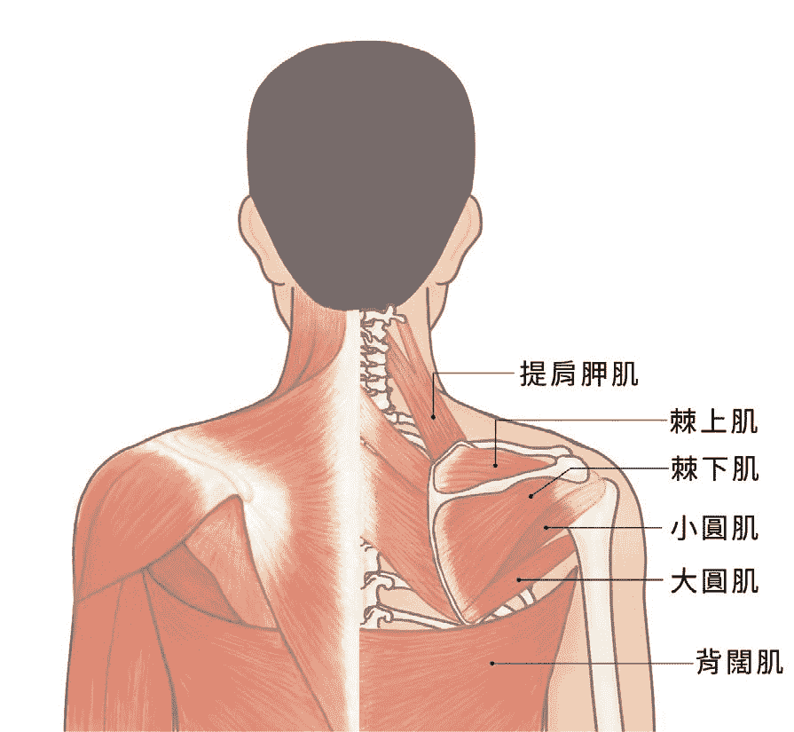

在心经篇章中讨论过心脏病的先兆部位，包括肩部、颈部及腋区，这些区域都是小肠经筋循行部位，所以小肠经筋会反映出心脏问题，平日多拉筋或按揉，也是减轻心脏负担，保护心脏的好方法。

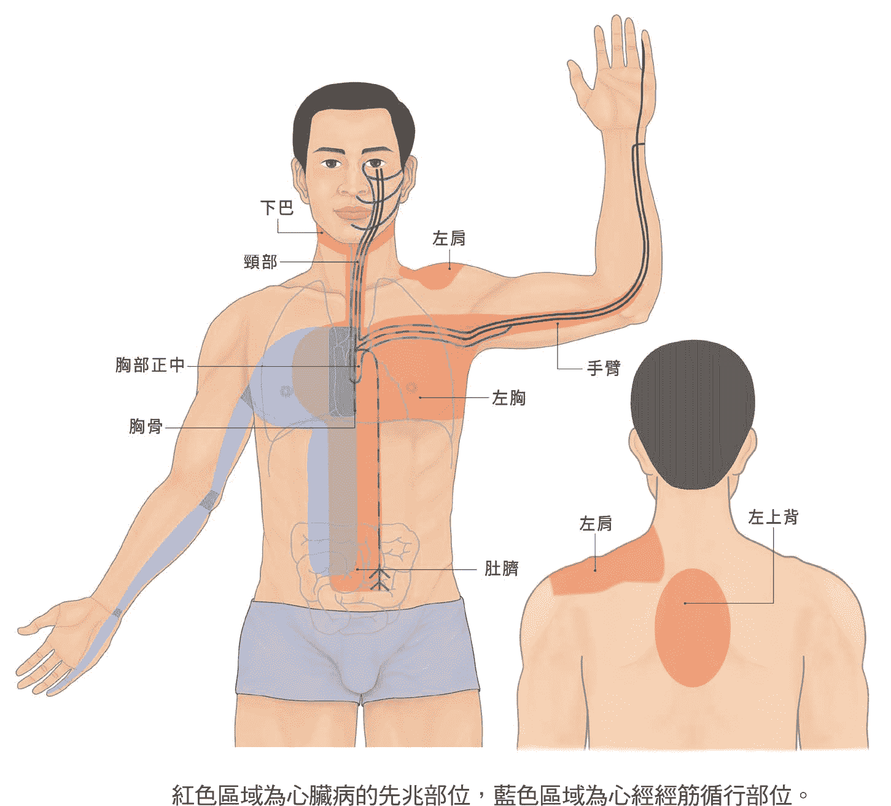

手三阳经都从手臂向上循到肩颈部位，横向交会于脊柱上的大椎穴。大肠经从肩关节前方行经肩膀部位，具有咬紧牙关，一肩挑起的特质，小肠经从肩关节后方遍行于肩胛骨，三焦经位于大小肠经之间的区域。大肠经筋涵盖锁骨上方，小肠经筋涵盖整个肩膀，不愧为「肩脉」。

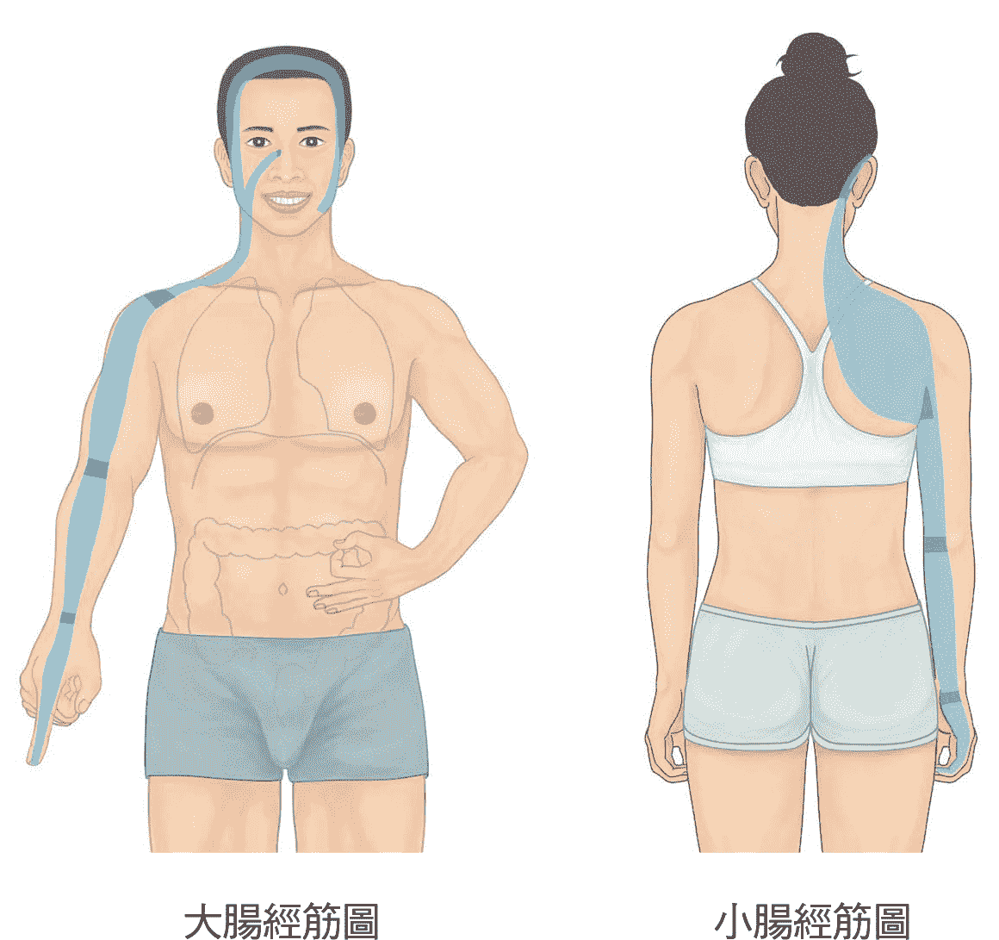

### 头面部（路线 5-7）

颈部是小肠经筋进入头面五官的重要通道，从此上行到耳后完骨，即现代解剖「乳突」部位（路线 5），再分出两条路线：

支脉：直行的路线，从完骨向前上方进入耳中。（路线 6）

直脉：弯曲的路线，从完骨循耳后，走到耳朵上方，再向下沿着耳朵前方结于下颔，再转弯向上，连属于目外眦。（路线 7）

小肠经筋主要包覆经脉「循颈，上颊，至目锐眦，却入耳中」路线，以耳目部位为主。小肠经脉从前面的眼外角转至耳前再进入耳中，经筋支脉则从后面的耳后完骨进入耳中，两者都进入耳中，但方向相反。经筋直脉从耳上转下行，通过本经最后一个穴位「听宫穴」，再次证明小肠经系统对于耳朵的重视，本经筋继续下行，结在下颔的天容穴，从此转向上行，沿着小肠经脉路线到颧骨外侧的颧髎穴，直行向上，最后抵达目外眦（眼外角）。

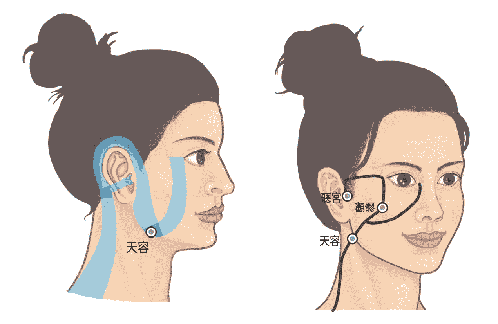

###### 小肠经筋解密：本经筋在头部及五官的循行意义

###### 保护耳朵及协助拉提面肌

小肠经四大系统中，只有经脉和经筋抵达头面部，经脉的重点在眼睛，经筋的重点在耳朵，所以本经筋包覆的部位偏于面部的外侧及后侧，主要在于维持耳朵的功能，同时也协助经脉拉提面部肌肉，让人耳聪目明，常保青春。

###### 耳后完骨会反应出头面五官及肩颈的情况

从小肠经脉中可以看出，头面五官和肩胛骨是最重要的两个部位，而在经筋系统中，耳后完骨正好介于这两个部位之间，因此耳后完骨会反应出头面五官与肩颈部位的状况。

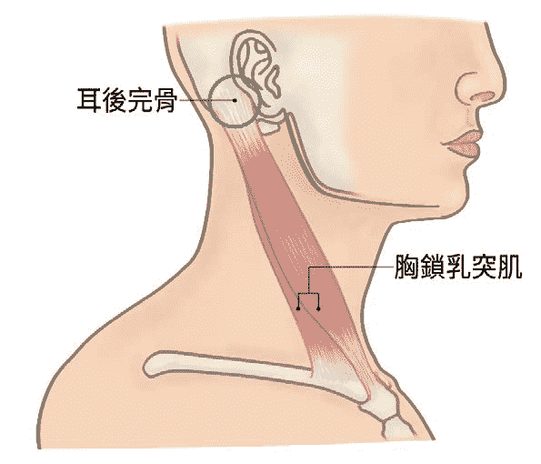

先跟大家简单介绍耳后完骨的结构特色。「耳后完骨」即现代解剖学的「乳突」，位于耳朵后下方的骨性圆锥形突起，在体表上可以触摸得到。

乳突透过它在耳内的相关结构与中耳腔相通。一旦发生中耳炎，发炎物质进入乳突，就会造成耳后肿痛且有发烧的乳突炎。若当时并未全然痊愈，或迁延日久才痊愈，乳突就会变得肿紧且硬。

另方面，乳突也是头部转动重要肌群「胸锁乳突肌」的连接止点。胸锁乳突肌是连接乳突和胸骨、锁骨的肌肉，它的功能是在头部不动时帮助维持头部稳定，而在头部活动时，单侧收缩将头转向对侧，两侧同时收缩时就能仰头。现代人因为长时间固定一个姿势工作或生活，颈肩僵硬，胸锁乳突肌长期紧绷难以放松，很容易出现颈肩痠痛或者反覆「落枕」，导致头、颈、肩部活动不利，尤其向一侧扭转时明显受限。出现这种情况的病人，他的乳突也会变得肿紧且硬。

综合上述，中耳炎或是头颈肩酸痛都会导致乳突变得紧肿硬，也就是说，乳突能反应头面五官及颈肩的情况，就此论点来说，现代解剖的乳突概念与中医的耳后完骨是不谋而合的。

* * *

## 小肠经筋──病候

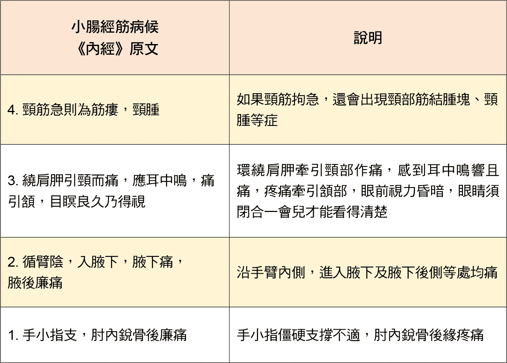

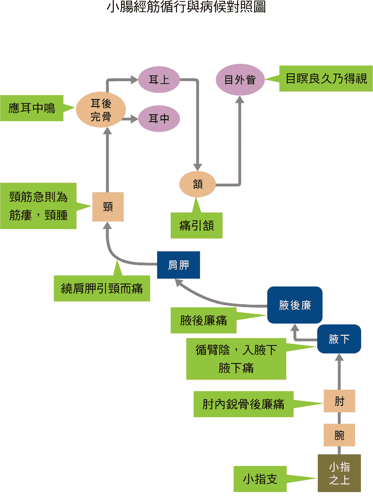

小肠经筋病候与经筋循行一致，与小肠经脉病候也有相似处，可以互相参酌。症状比较如下表：

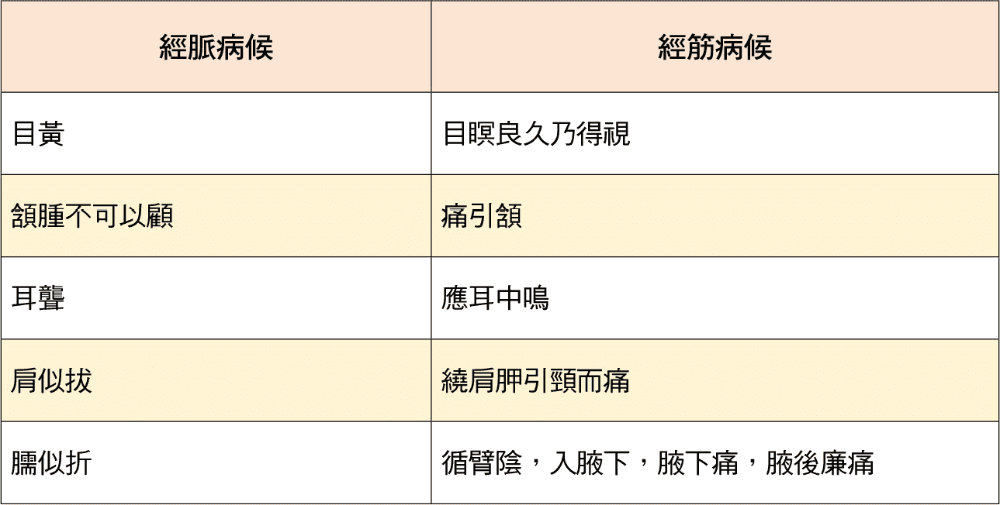

另外，从上表还可看出本经筋病候有两个特色：

较强的痛感：参酌经脉「肩似拔，臑似折」的激烈痠痛，本经筋在肩部与手臂的痛感也可能达到类似程度。

部位相牵连：本经筋病候用词很特别。如「循臂阴，入腋下，腋下痛」的「循」字，指出痛感会循着上臂阴面进到腋下，另如「绕肩胛引颈而痛，应耳中鸣，痛引颔，目瞑良久乃得视」，这里用了二个「引」字，表示疼痛部位之间互相牵拉，不是单点痛，而是大面积的疼痛，还会影响耳目的功能。

这项特质可能与心脏有关，因为小肠是心的护卫，也会反映心脏问题，心脏一旦有了病变，常出现从小指到肩背的片状麻木或疼痛，久了之后阻滞气血运行，心之华在面，头面清窍失于濡养，就会出现耳鸣、目昏黄的现象。

临床上许多心脏病的患者出现腋下、腋后及肩胛骨肿硬紧痛。这些部位的问题可配合局部取穴治疗，如腋下肿可取心经极泉穴，腋后筋紧可取小肠经肩贞穴和臑俞穴，肩胛骨肿紧可取天宗穴。

门诊时常跟有着紧绷肩胛骨的病人说：「翅膀硬囉，可惜不能飞，因为这么僵硬的肩胛骨是心脏病的征兆，可要注意喔。」

## 小肠经四大系统循行特色

### 保护心脏的禁卫军

小肠经脉当然是主角，其余三大系统都以经脉为蓝本而各有所侧重，例如小肠经别主要循行在经脉的胸腹部位，小肠络脉主要循行在经脉的上肢部位，小肠经筋除了大面积包覆前面三大系统在上肢和肩背部位之外，还加强头面部的照顾，让小肠经系统无后顾之忧，能以最佳能力去保护重要的心脏。

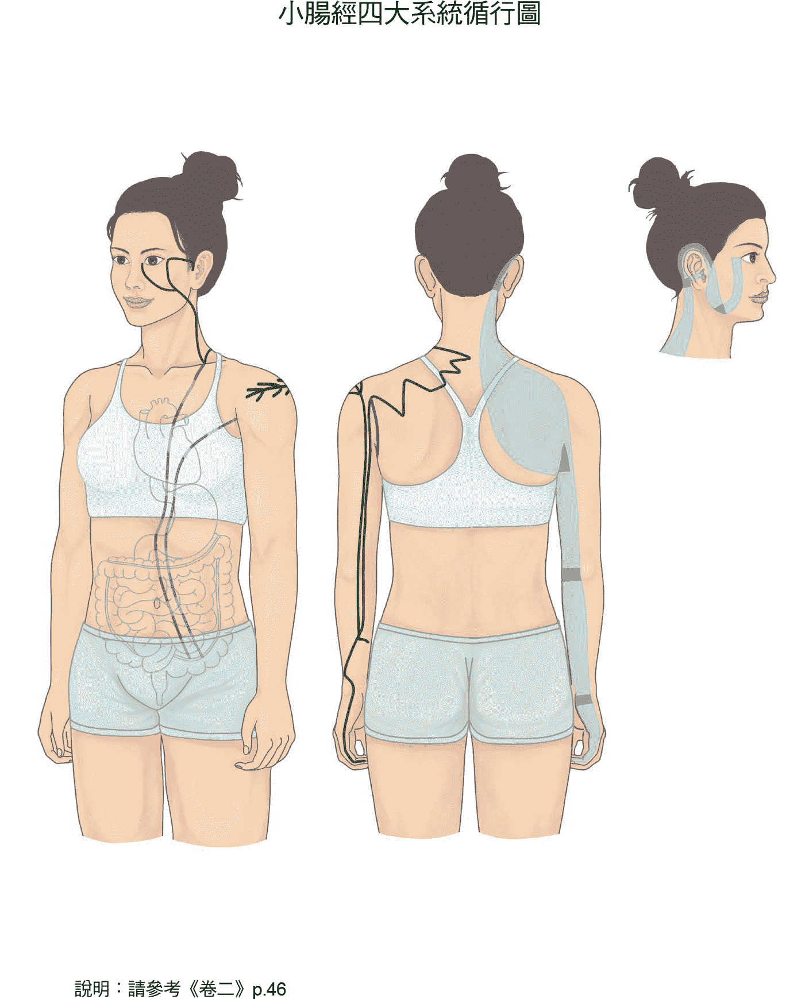

### 刚柔并济的花木兰特质

孝顺的花木兰代父从军，从战场上活着回家，脱下军服，马上回复女儿身。可见花木兰骨子里就有男子的豪气，而且性格也颇为坚毅。若非如此，可能早在军营的操练中就被识破，后果不堪设想。我们可以推论，花木兰是个外刚内柔的女性，不仅胆识过人，手脚利落，还具有女性的温柔细腻。

现在，试着把小肠及小肠经转变为外刚内柔的花木兰。

外刚：担任心君的禁卫军，尤其从心脏的后面守护，不禁令人想起一首流行歌曲《在你背影守候》，真是挺贴切的。

内柔：身为受盛之官，小肠不仅受盛食饮，兼有「包容」，承受心的压力和代谢物，再加以转化，从小便或皮肤而出。

除此之外，小肠经还有二个隐藏的特色：

● 与人体的旋转结构有关。这个概念可以延伸为「婉转」的特质。

● 与人体结构的老化有关。随着年纪的增长，身体难免出现老化痕迹，对于女性来说，最讨厌面对的就是松垮的肌肤，总是不经意地便泄露了年龄！小肠经其实是一条「回春」经络，可以维持面肌的弹性，常保容光焕发。

「婉转」和「回春」这二项特质，完全符合花木兰的女性特质。尤其本经的「养老穴」，单从穴名就能猜出它跟人体的老化有关（养老穴的治疗运用，见篇后中医师不传之秘）。木兰返家之后，恢复女装，承担起照顾年迈父母的责任，是为「养老」。

所以，小肠经能美容回春、护卫心脏与改善老化，是不是很「花木兰」呢？

曾有年轻医师听闻故事后，好奇问道：「花木兰⋯⋯长得算漂亮吗？」

我笑说：「不知道耶！但是我相信每一个人身体内都有一位文武兼备的花木兰，她的美与丑决定在你如何照顾她！」

#####  中医师不传之祕：乳突外张的临床意义

门诊时常发现许多病人都有乳突肿紧硬的情况，这种情形普及到连医师们也是其中一员喔！

乳突异常肿紧硬的情况我们称为「乳突外张」，因它有明显向外侧突起的型态， 肉眼不易察觉，透过触摸才会发现。乳突严重外突者，我们戏称「伞蜥蜴」，以强调乳突外张的夸张程度。

前面说过，乳突外张的原因与中耳炎和头颈肩肌肉长期僵硬有关。临床也观察到，只要出现乳突外张，同侧的头部也很紧硬，这就表示头部的压力很大。

导致头部压力大的原因，除了前述两种外，有些症状也会影响，如长期鼻塞、眼睛胀痛、慢性头痛、睡眠障碍、耳鸣等。简单说，上述这些症状，一方面是五官气机阻塞，如鼻塞、眼胀、耳鸣等，头部压力像压力锅一样持续上升，另方面情绪压力引起的睡眠障碍，或头部局部气血不通的慢性头痛，都会造成头部肌肉紧绷，成为头部的压力来源。若压力持续增加，头部也会持续肿胀，牵连乳突也跟着外张了。它们的关系如下图所示。

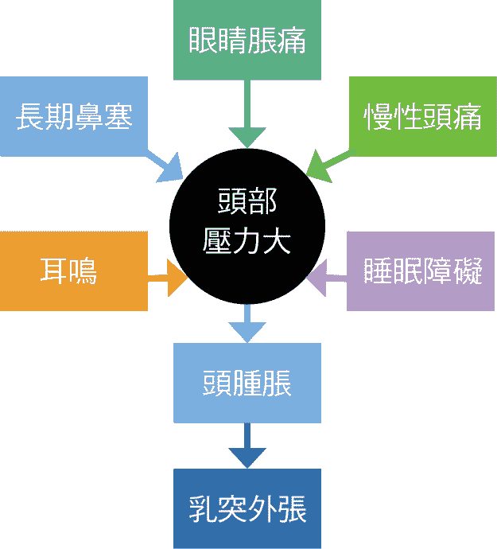

乳突外张除了会引起颈肩酸痛之外，我们也归纳出「乳突外张常见于头面五官科病变」的经验，这些症状跟本经筋病候「腋后廉痛，绕肩胛引颈而痛，应耳中鸣，痛引颔，目瞑良久乃得视」相合，而且乳突外张与头面五官科病变之间，时间久了也会互为因果，加重病情。例如，长期耳鸣的病人会出现乳突外张的现象，而乳突持续外张反过来也会加重耳鸣的情况。现代医学研究也发现胸锁乳突肌病变会造成严重的偏头痛和耳鸣。急性耳中风患者几乎同侧的乳突也都是紧硬外张。门诊时只要病人有头面部五官科病变或睡眠障碍等，都会将乳突纳入检查，一旦发现异常，赶紧予以治疗，会有意想不到的效果。

#####  中医师不传之祕：「落枕」的中医临床概念

俗称的「落枕」是指颈部肌群，包括斜方肌、胸锁乳突肌与提肩胛肌等，由于急性拉伤，而出现急性痉挛与发炎的现象。会被称为「落枕」，是因为通常都在早上醒来时，赫然发现一边的颈肩部肌肉疼痛、僵硬，无法顺利转动头部，早期人们以为是晚上睡觉时，头部从枕头滑落，因为姿势不良导致颈部拉伤，普遍认为是「没睡好」的后遗症。

中医认为人体的筋膜都需要津液的滋润，胸锁乳突肌当然也不例外。

依据观察病人跟自己的落枕经验（别忘了，医师也是个凡人哪！），我们发现一些共同特性：

首先，都有颈肩部长期痠痛僵硬的病史，然后再加入以下的诱发因素：

1.  长期缺水：不喜欢喝水，或是喝水之后就去上厕所，这常见于中老年人。
2.  水分流失：如汗出过多，小便频繁，或者腹泻等。
3.  火气偏大：如习惯熬夜，吃香喝辣，喝酒，抽菸等。
4.  姿势不良：如低头族群，枕头过高或过低，睡觉时身体卷缩成一团等。
5.  筋膜紧缩：如长期喜欢裸睡，冷气直吹，冬天颈肩部被风寒入侵等。

以上这些因素，宛如压倒骆驼的最后一根稻草，让原本已经僵硬的筋膜，在一夜之间拉伤而发炎。所以要降低落枕发生的机率，除了藉由中医治疗之外，改善前面五项因素也是必要的。

#####  中医师不传之祕：
小肠经筋隐藏人体头颈及手臂旋转的关键

小肠经络系统有三段循行的特殊结构与人体头颈及手臂的旋转活动有关：

1.  在肩胛骨通过旋转肌群，与颈肩和肱骨活动有关。（前已讨论）
2.  在耳后完骨，跟头颈部旋转有关。（前已讨论）
3.  在手背桡骨与尺骨间的关节，尺骨小头附近，与手臂旋前／旋后动作有关。

首先介绍手臂的旋转功能，再说明这个动作跟小肠经的关系。

前臂是指肘关节到腕关节之间的手臂，由靠近拇指侧的桡骨与靠近小指侧的尺骨共同组成。由于前臂是生活功能需求很高的部位，如扭转毛巾等这类旋转动作必须用到的部位，因此桡骨与尺骨上下端之间都有关节，让桡骨可以环绕尺骨做 140°～160°的回旋运动。

当桡骨下端旋转到尺骨的前方时称「旋前」，就是手掌朝下，这时桡骨与尺骨交叉；与此相反的运动称「旋后」，就是手掌朝上，这时桡骨与尺骨并列。旋前与旋后的动作，合起来就是俗称的「翻掌」动作。前臂的旋前和旋后运动，大大增加手部的活动范围，提升了人类生活的技能。

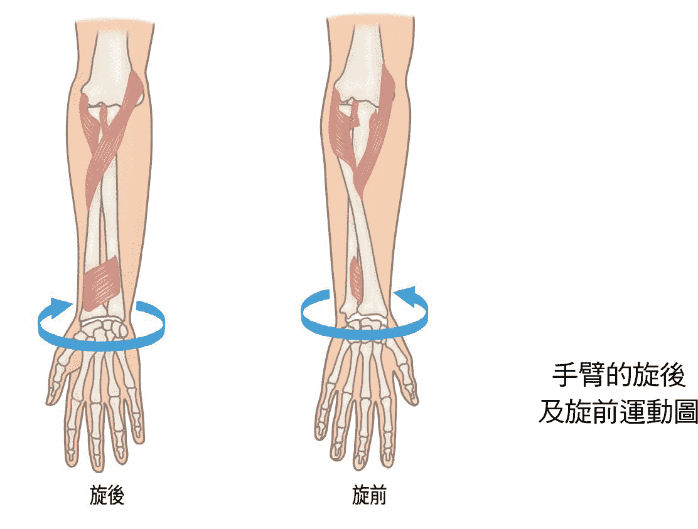

小肠经筋起自小指外侧缘，沿着手掌外侧向上，经过手背腕关节外上方的突起，解剖学称为「尺骨小头」或「尺骨茎突」，位于前臂旋转施力点附近，属于前臂旋转的结构之一。尺骨小头靠近桡侧有一凹陷处，中医称为「养老穴」。养老穴介于桡骨与尺骨之间，隐身在骨缝之中，取穴时须旋转手臂才能找到，我们藉此推论，养老穴具有调节旋转的能力，用于临床治疗果然有效。

以上就是小肠经筋循行路在线，隐藏着与头颈部旋转（耳后完骨）和手臂旋转（养老穴）有关的特殊结构。

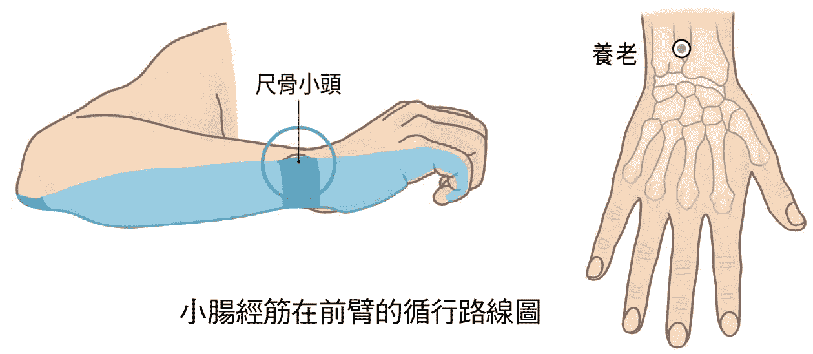

#####  中医师不传之祕：
养老穴善于处理身体旋转与老化问题

#### 养老穴改善身体旋转与晕眩问题

小肠经循行路在线有三个与旋转有关的结构，如果这些旋转功能出现问题时，中医有没有改善的方法呢？当然有啊！

由于养老穴所在位置的特殊性，我们常应用养老穴来治疗身体的旋转问题，包括：

1.旋转不利：指本来该能转动的部位，出现转动不顺畅的现象，像落枕时颈部卡住而无法转头、颈肩僵硬难以转动、腰部扭伤而无法转身等等。除了小肠经系统经过这些部位之外，耳后完骨（乳突）位在耳后能让头部旋转的位置，与手部养老穴位在手臂旋转的位置类似，所以养老穴就成为治疗急性腰扭伤和落枕的有效穴。周左宇老师传有「养老透间使」治疗急性腰扭伤的宝贵经验。还有如经脉病候「肩似拔，臑似折」这类严重的肩颈及上臂疼痛，难以活动者，也可选用本穴治疗。

2.旋转过利：指旋转的频率过快，例如令人困扰的眩晕。病人通常不会发现自己身体有问题，反而觉得是外面的世界在快速转动，这就是不该旋转的地方，却出现天旋地转的现象。跟大家分享我个人的亲身经历。几年前因为赶时间去演讲，来不及用餐，演讲中多喝了主办单位提供的茶水，结束后突然眼前天旋地转，无法行走。此时脑中一直在想有什么穴位可以马上止晕呢？灵光一闪，想到位于桡尺骨之间的养老穴，马上以拇指用力掐穴，眩晕竟然在 1～2 分钟左右停止了。此后，依此概念广泛用在眩晕的病人身上，也建议病人平日自行按压便能改善。

既然谈到眩晕，也可以从耳部的结构与特质来讨论。

人体的平衡系统最主要是内耳的前庭系统，还有视觉、关节肌肉内的接受器等等，接受外界刺激，通过前庭神经，传到脑部来调节管理。眩晕许多时候是由于内耳疾病所引发，例如常见的梅尼尔氏病，就是与内耳的淋巴液代谢失常有关。

小肠经系统在面部包覆耳朵，加上经脉主液之所生病，无论从病位上或病性上，都与梅尼尔氏病有关，因此小肠经也就具有改善眩晕的能力。

旋转过利除了眩晕之外，临床上还见过病人在行走时，两侧肩膀不自主的晃动，很像庙会的七爷八爷，走起路来双肩夸张的前后摇晃。有趣的是，病人通常不会感觉有异常，甚至还说自己从小就是这样走路的。检查病人的肩膀肌群常常偏于无力，治疗时除了增强肩膀肌力之外，还可加上养老穴来控制肩膀旋转过利的情况。

#### 养老穴也能改善老化

养老穴顾名思义就是与「老化」有关，但不侷限于年龄上的老迈，加上小肠经与心经与妇科疾病有关，现代人因为不恰当的饮食和生活方式，身体都提早老化，所以只要出现下列现象都能用养老穴来治疗：

*   肠胃道的吸收代谢能力下降。
*   体内水分不足，皮肤干燥，容易长疮，大小便不顺畅。
*   心脏机能变弱，容易胸背闷痛；颈肩僵硬，深层痠痛。
*   身体旋转灵活度变差，变成老骨头，容易落枕、闪到腰。
*   听觉与视觉功能退化，耳不聪，甚至耳鸣。
*   目不明，怕风怕光，常流眼油，甚至眩晕。
*   面部肌肉失去弹性，干瘪，下坠等等。

一般而言，原穴善于治疗五脏六腑疾病，通常都是该条经络的代表穴。本经原穴为腕骨穴，治疗本经疾病效果极佳，当然是代表穴。而养老穴不仅善于治疗老化疾病和旋转问题，加上身为本经㕁穴，善于治疗本经的急性病症，例如经脉病候中的「肩似拔，臑似折」等，所以养老穴也可视为小肠经的代表穴之一。

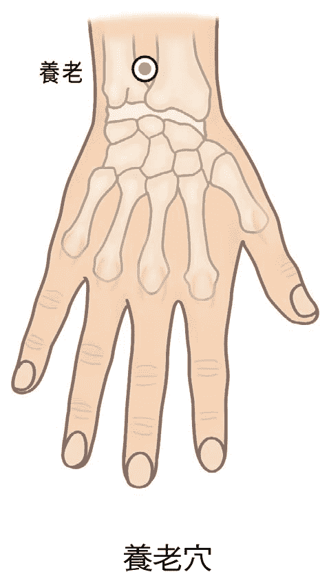

养老穴针刺效果很好，但痛感也强，如果医师施术不当，会造成病人深刻的痛感和恐惧，这个经验源于自己早期试针养老透间使时的惨剧。

由于本穴埋在关节之中，缝隙狭小，不容易找到，传统取穴法建议采用屈肘前臂旋后，掌心转向胸口的立掌姿势，尺骨小头桡侧缝隙会增大，养老穴就在其中。重点在于整个针刺过程，手掌必须维持固定姿势，不能翻转。

我当初就是轻轻转动手掌，导致桡尺骨交叉，正好将针夹住，那时真是进退维谷，稍微转动手掌都痛彻心扉，更别想要将针取出。无计可施之下，只好咬着牙慢慢转动手腕，趁着针下稍微松动时赶紧将针拔出来。此后为了避免悲剧重演，都会让病人将掌心朝下，安稳放在身上或床上，然后在尺骨小头桡侧，稍微向上朝肘关节方向约一寸左右，找到那个凹陷处下针，疗效也不错。

## 一、平日的照护

小肠经的功能极多，照护方式当然也非常多元，以下列出四个方向提供给大家参考。

### 营养吸收：吃对时间，吃对食物

小肠负责食物营养的吸收及代谢，加上身为「聚餐团队」一员，持续为心、肾这两个重要器官提供养分，责任相当重大。

从十二经络的时辰来看，每条经络在关键时刻都有他们特别重要的任务：胃经旺于辰时（上午 7～9 点）胃一边消化吸收早餐的营养，同时也将食糜下传给小肠做更细致的消化吸收。小肠经旺于未时（下午 1～3 点)，此时已经用完午餐，小肠除了接收胃传来的早餐外，还要承接即将到来的午餐。许多人可能不知道，水果蔬菜在胃里的消化时间大约 20～40 分钟，坚果谷类则需至少 90 分钟，动物性蛋白质最难消化，牛、羊、猪肉通常要花上三小时的消化时间。

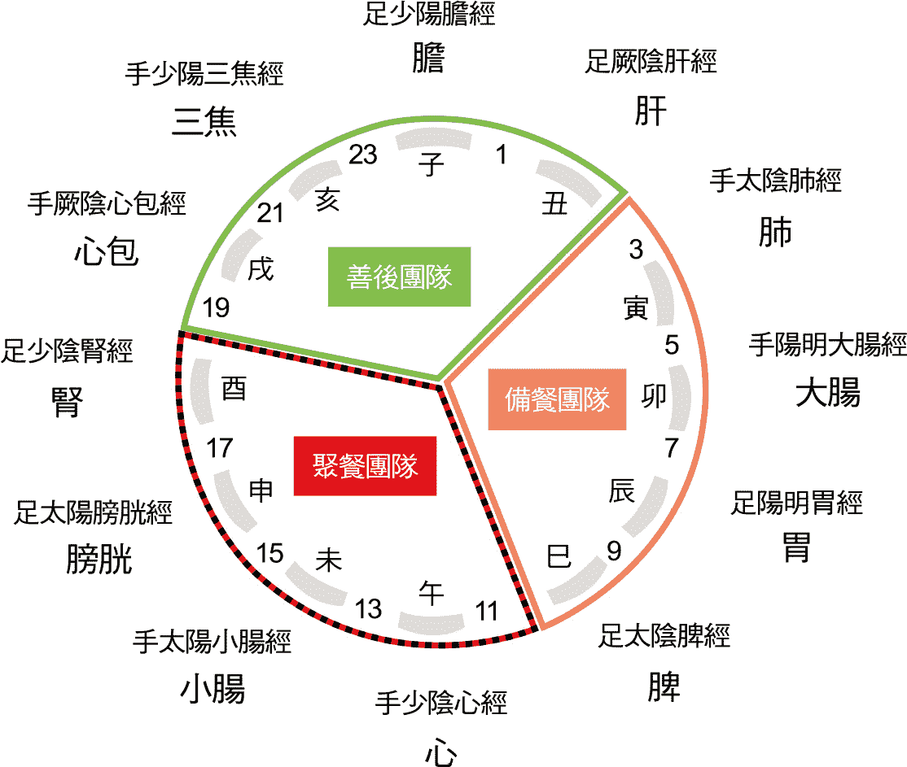

因此从早餐开始到午餐，胃肠都很忙碌，尤其小肠功能在下午 1～3 点这个时段最为活跃，是它大展身手的时刻，发挥「受盛化物，泌别清浊」的良能。

所以千万不要忽略要「吃对时间」，午餐尽量在午时完成，还有在餐与餐之间，少吃零食点心，让小肠能够全心工作。

### 顾好妇科：饮食均衡，下腹避风寒

胞脉入于胞宫，提供胞宫充足的养分以转化成乳汁和月经。

许多女性为了爱美，拚命减肥而过度节食，导致营养失调，甚至经血不足而闭经。这对后续的人生影响很大，月经失调之后，除了不容易受孕之外，还会出现面容枯槁、严重掉发、乳房及臀部缩小且下坠等提早老化的现象，若不加紧改善，随着年纪增长，记忆力、视力、听力都会快速退化，产生骨质疏松，心脏衰弱等现象，不仅不美，还老化得更快！最好的身体状态应是「健美」，健康＋美丽=健美，才是真正有魅力！「健美」来自均衡饮食和持续运动，千万不要用了错误方法减肥，以免得不偿失。

中医认为许多妇科问题来自于子宫受寒，让风冷长期客于胞中，轻者月经失调，重者症瘕积聚（妇科肿瘤），所以一定要保护下腹免于风寒入侵。可参阅《卷三》脾经保健篇。

### 灵活肩脉：敲打按揉，拉筋伸展

肩颈痠痛是现代人常见的文明病，也是许多电视健康节目与专栏中常见的保健主题，常有中医师、复健师等提供许多按摩、拉筋以及运动方法，都是一般民众可以多多接触学习的。

然而大家一定要注意这些常见的痠痛部位，大多为小肠经的包覆区域，包括腋区、肩关节、肩胛骨和肩膀部位等，这些部位一旦有筋骨紧绷，气血循环不佳的情况时，不仅会在局部出现严重痛感，更重要的警讯还可能是心脏机能、视力和听力的问题，绝对不能轻忽。

因此在平日可以沿着小肠经循行的部位，例如手臂、肩腋等路线，多多敲打按揉、拉筋伸展，松开紧绷的肩膀，维持肩腋区的灵活，同时也能照护心脏，让人耳聪目明。

### 润滑旋转：持续运转，保持灵活

小肠经另一特色就是与身体几个旋转结构有关，包括腕关节、胸锁乳突肌和肩部旋转肌群等，这些结构就像齿轮须要常常运转，才不会生锈而转不动，如同「滚石不生苔」的概念。

所以可以加强小肠经的这三个旋转结构，透过适当的转动运动，保持灵活度。例如左右旋转腕关节、转动肩关节、以及将头部缓慢转到一侧，停留一下，再慢慢转向另一侧。这些动作看似三个独立的运动，但其实却是强化了小肠经系统，所以只要持续做，不仅能改善局部灵活度，也能循着小肠经系统同时改善其他旋转结构，提高相关内脏及五官的功能。

## 二、小肠经常用保健穴位

小肠经共有 19 个穴位，分布在上肢、肩背及头面部。

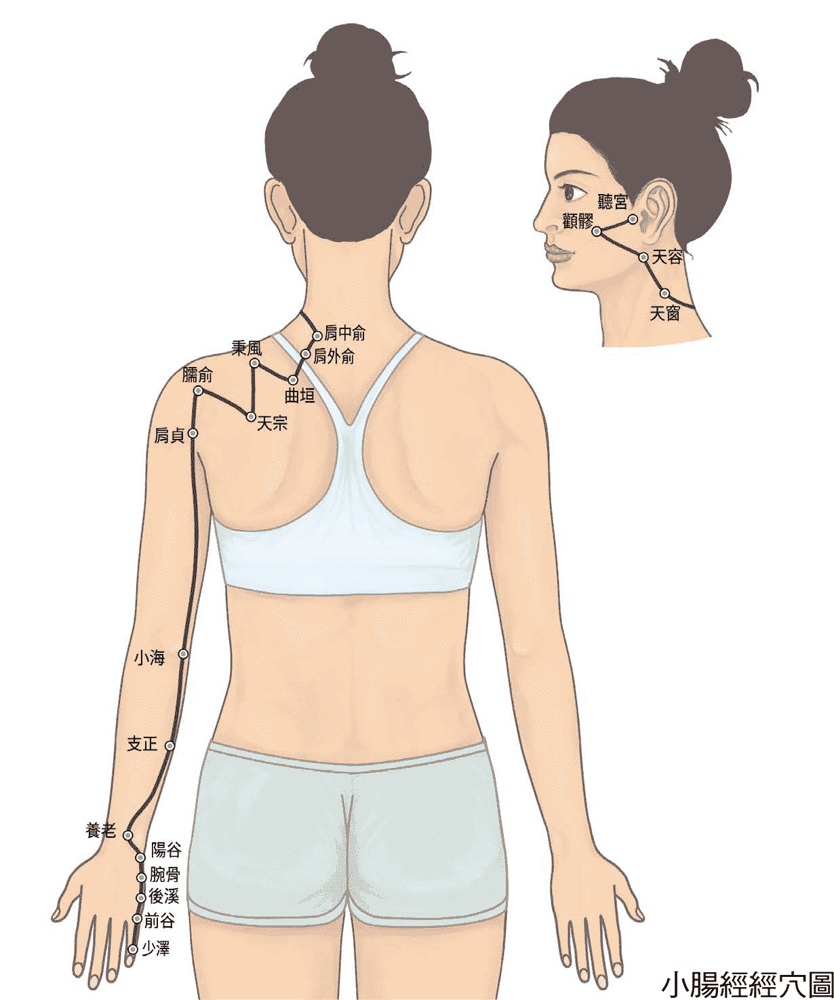

本经穴位分布极有特色，包括：

1.从手指到腕关节附近有六个穴位（少泽穴到养老穴），几乎每个关节上下部位都有，密集度为手经之冠。可见手掌外侧这个手刀的「力道」之大，也难怪第五掌骨会成为全息反应区。

2.其中有四个穴位的穴名：少泽、前谷、后溪和阳谷都跟「水湿」以及「水的流动」有关。譬如从少泽增大为前谷，水流有了大小之别；通过关节处，变为后溪，水流有前后层次；到腕关节水聚而成为阳谷，呈现出小肠属于太阳经的阳性特质，这些都与小肠主液特质相符，也表示此区穴位善于治疗水液疾病。

3.肩背部有七个穴位（肩贞穴到肩中俞穴），占了本经穴位将近一半，其中肩贞、肩外俞和肩中俞，都有「肩」字，体现出小肠经身为肩脉的特质，当然就善于治疗肩部的疾病。

### 重要穴位及主治功能

#### 1.疏通龙骨和肩背的后溪穴（SI3）

位于手掌尺侧，取穴时微握拳，在第 5 掌指关节之后，远侧掌横纹的尽头，赤白肉际处。简单说，顺着掌心的感情线向外延伸到第 5 掌指关节的下方处。

后溪穴是输穴，五行属木，输穴主治体重节痛，所以本穴善于治疗小肠经所经部位疼痛之证。

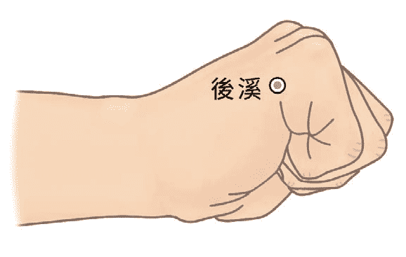

前文介绍过，在奇经八脉的八脉八法中，后溪穴通督脉。督脉主要循行在人体背面，尤其穿过俗称「龙骨」的脊椎，还通于脑部。当督脉发生病变，出现脊椎僵硬时，可取用后溪穴治疗。一般的肩颈僵硬也可按摩此穴，可以视为肩脉在手部的代表穴。

督脉调节所有阳经的气血，能总督一身之阳经，因此称为「阳脉之海」。这么厉害的经络，竟然会被区区小肠经的后溪穴以四两拨千斤之力来拨动，由此可见小肠经所蕴含的潜力。这份潜力除了来自小肠本身具有吸收营养的超能力，提供人体制作重要气血的原料之外，还可能来自与其相表里的君主之官心脏、手足同名经的足太阳膀胱经，以及存有隐性关系的肾经。

奇经八脉是督脉、任脉、冲脉、带脉、阴维脉、阳维脉、阴蹻脉、阳蹻脉的总称。它们与十二正经不同，既不直属脏腑，又无表里配合关系，「别道奇行」，故称「奇经」。奇经八脉中的督脉、任脉和冲脉皆起于胞中，同出会阴，然后分道扬镳，走出各自的循行路线，古人称为「一源三岐」，意思是胞中与会阴是三条分行经脉共同源头。此处的胞主要指生殖系统，女性为胞宫，男性为精室，其实就是男性生殖器官。冲任二脉主管生殖系统，督脉因为「一源三岐」，也与生殖系统有关。前面提到小肠经与妇科关系密切，后溪穴又通督脉，因此本穴也可作为调节妇科的要穴。

#### 2.唤醒小肠经主液的腕骨穴（SI4)

位于手掌尺侧，第 5 掌骨基底部的赤白肉际。腕骨穴为原穴，可以全面性调节手太阳小肠经机能，包括疏散外在的太阳经邪气，清泻内在的小肠湿热，更能治疗小肠经循行所过部位的病候，因此个人认为它具有唤醒小肠经的特殊能力。

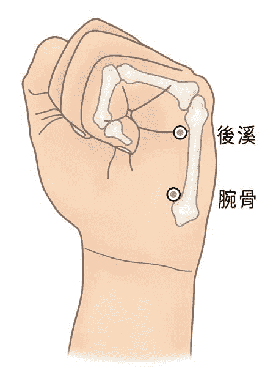

古人说「腕骨治黄」，历代都是治疗黄疸的要穴。中医认为「无湿不成疸」，加上小肠经属火，可见本穴善于清利湿热，治疗黄色鲜明的阳黄。本穴治黄的机转与中药的茵陈蒿类似，如：《神农本草经》记载本药主治风寒湿热邪气，热结黄疸；更详细的记载如《名医别录》，本药主治「通身发黄，小便不利，除头热，去伏瘕。久服面白悦。」完全符合小肠主泌别清浊，小肠经上行头面，以及治疗妇科带下和症瘕积聚的特质。本穴可以视为小肠主液的代表穴。

有关本穴的取法，多数书籍注明在第 5 掌骨基底与钩骨之间，但若参考其他位于掌骨及跖骨穴位的分布规律，如脾经的太白穴（原穴）与公孙穴位于第一跖骨的前方与后方，膀胱经的京骨穴（原穴）与束骨穴位于第五跖骨的后方与前方等，加上个人临床的针感与疗效，通常会选择第 5 掌骨基底部下针。

#### 3.防老回春和控制旋转的养老穴（SI6）

养老穴为㕁穴，善于治疗急性病症，加上穴名和所在部位，还善于治疗老化相关疾病以及身体旋转障碍。本穴可视为本经回春和旋转的代表穴。（参阅经筋篇）

后溪穴和养老穴都善于治疗肢体疾病，差别在于：

后溪穴通督脉，督脉是纵行的经脉，多数属于纵向疾病；

养老穴位于旋转处，善于治疗旋转问题，多数属于横向疾病。

两穴功效一纵一横，临床配搭使用，转动肢体的效果更好。

#### 4.善于提拉和松颈肩的颧髎穴（SI18）

经脉篇介绍颧髎穴善于提拉面部肌肉，让面部回春，配合养老穴，效果加倍；颧髎穴也善于改善顽固的颈肩僵硬、视力和听力，还可配合后溪穴，加强纵向肌群的放松，也可以配合养老穴，加强提高视力听力，改善左右转动功能。本穴可视为本经五官和肩脉在面部的代表穴。

### 多穴合作疗效更佳

#### 1.改善胸背痛和胸痹的支正穴＋肩臑天

支正穴（SI7）是本经络穴，位于前臂尺侧，腕背横纹上 5 寸处，介于尺侧腕屈肌与尺骨之间，在尺骨下缘。

「肩臑天」则是肩贞穴、臑俞穴及天宗穴合用的简称。

肩贞穴（SI9）位于肩关节后下方，腋后纹头上 1 寸。

臑俞穴（SI10）位于肩部腋后纹头直上，肩胛冈下缘凹陷处。肩贞与臑俞两穴中间隔着三角肌，当颈肩异常僵硬时，两穴之间的肌肉也会变得肿硬。

天宗穴（SI11）位于肩胛骨棘下窝中央的凹陷处，在棘下缘与肩胛骨下角的等分在线， 当上中 1/3 交点处，约与第 4 胸椎相平。

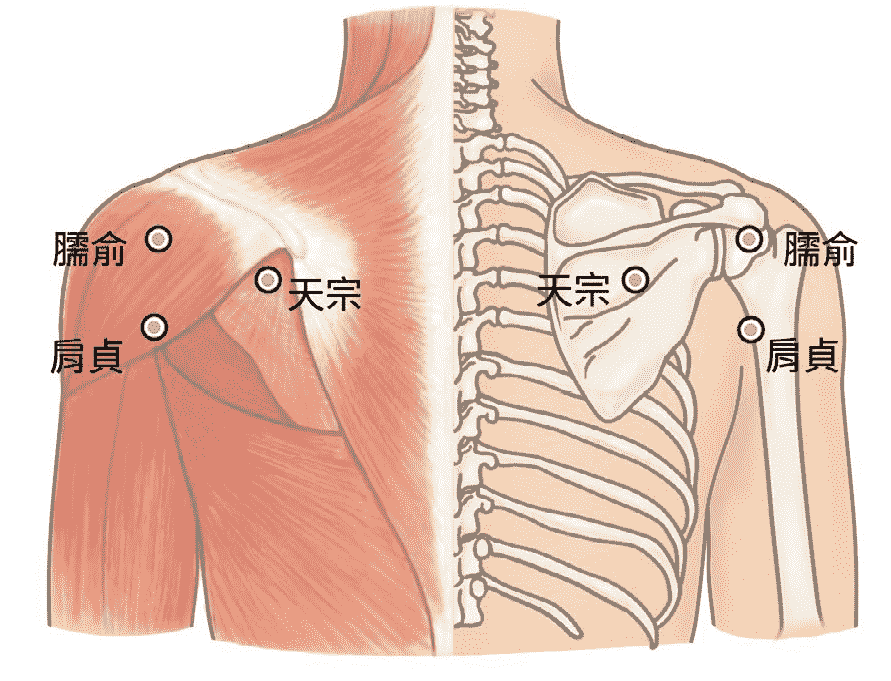

前文介绍「胸痹」有心痛彻背，背痛彻心症状，支正穴为本经络穴，通于心经，可以配合心经原穴神门穴，成为心神正组合，予以按揉可以强心活血，从心胸论治；肩臑天三穴位于肩背，予以按揉或敲打可以协助心脏行气活血，并直接改善肩背紧硬，通行气血，从后背论治。两组穴位合用，可视为小肠经治疗胸痹的代表穴。

【注意】：为了安全，医者行针时务必小心，以避免发生气胸。

1.针刺肩贞穴、臑俞穴：针尖不要朝向肩胛骨，也不要过度深刺，稍微朝向手臂较为安全。

2.针刺天宗穴：要注意体位，身体趴下时，肩胛骨会向外延展，下针处须要左手揣切，确认正确穴位位置再下针，以免不慎刺到胸腔导致气胸。

#### 2.乳腺一条通的少泽穴和前谷穴＋肩臑天

小肠经与心经都与女性的乳汁分泌有关，本经经别也行经乳房。小肠经系统通过前胸及后背，中间所挟者除了心脏之外，当然也包括乳房，所以本经就有二个手掌穴位和三个肩背穴位，可以治疗乳房及乳汁分泌疾病。

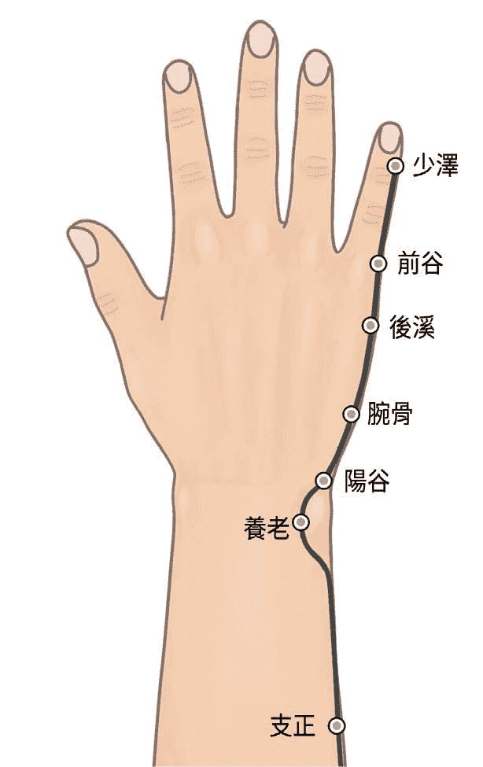

手掌穴位：距离乳房较远，属于远端穴位。

少泽穴（SI1）位于小指末端尺侧，距指甲角 1 分处。为井穴，五行属金。

前谷穴 (SI2) 位于小指本节前凹陷处。为荥穴，五行属水。

两穴透过小肠经从前方疏通乳房气血。少泽穴适合放血，以行气破血，疏通经络，尤其针对乳房炎症以及局部明显肿胀疼痛者，特别有效。

肩背穴位：距离乳房较近，属于近端穴位。肩臑天三穴邻近腋部和胸部，乳房的气机可经由小肠经转输于此区域，临床也观察到乳房有疾病者在肩背部、尤其肩胛骨出现肿硬现象。肩臑天三穴透过小肠经从后方疏通乳房气血，既能从病位角度来松开肩背，又可从病性角度来疏通小肠经气血，三穴协力效果益彰。

## 一、小肠腑功能教导我们的人生哲学

小肠身为「受盛之官」，采用「泌别清浊」方式，转变来自胃的饮食水榖食糜而「化物出焉」。

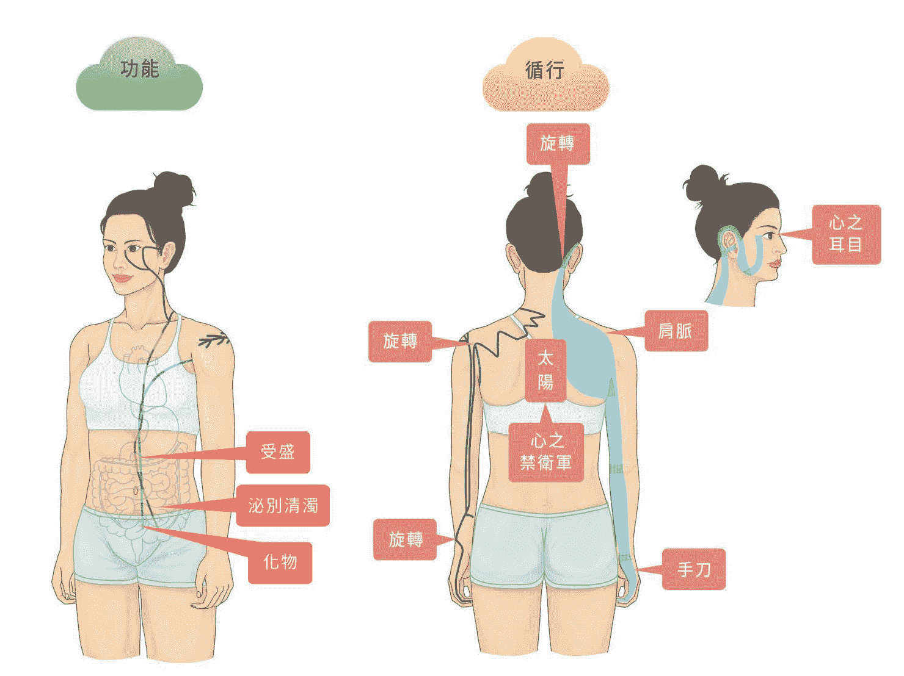

### 受盛之官：受纳包容，丰盈饱满

小肠接受来自胃的食糜，就像我们都须接受来自四面八方的挑战。如何面对无法推卸的责任，还能有所学习与成长，最重要的在于保有如阳光般的明朗心态（小肠属太阳）。受盛既有容纳又有兴旺之意，如果能转动心念，以欢喜心（心主喜）来受纳包容，无论多么艰难幽暗的境遇都能照见生命的温暖（小肠五行属火），而拥有丰盈饱满的人生。

### 泌别清浊：理性分析，悲智双运

小肠的「泌别」能力来自其所独有、客观理性的思辨分析天赋，让我们能分辨是非(清浊)，采取得宜的行动，不会同流合污。换个角度来说，若小肠过度「泌别」就容易产生强烈的分别心，面对事物只有清与浊、白与黑，没有灰色的中间地带。

门诊时曾经遇到一位中年女性患者，其手臂的小肠经比较紧硬，也出现一系列小肠经症状，诊察时忍不住问她在面对事情时，是否是非分明，不喜欢有灰色地带？病人很惊讶的回答「是！」这种黑白分明的个性常会出现偏执现象，成为人际关系的杀手。

依据小肠接受来自胃初步消化的各类食糜的精神，小肠是先包容万物之后再展开泌别清浊的分辨工作，因此生命态度也能如小肠般具有「悲智双运」，一方面以思辨智慧来协助慈悲柔软的心脏(心脏与小肠为相表里脏腑)，让爱心不会轻易陷入滥情或烂好人的窘境，另一方面也能包容不同的见解，不会过度黑白分明而损及人际关系。

### 化物出焉：忍耐待时，温婉含蓄

小肠受盛万物，其弯曲绵长的肠道忍受各种食物的味道与型态，透过泌别清浊「提炼变化」出营养物质供人体使用，开展美丽人生。生命也是如此。记得自己年轻时在职场上不如意，数度想离职。某日跟一位大姐聊起心声，感谢大姐以一句俗语「戏棚下站久就是你的！」提点我将眼光和胸襟放远，面对一时的磨难要沉得住气，等候时机，蓄势而发，就能架构出属于自己的舞台。多年后回首过去，深深体会曲折或磨难不是坏事，就像人见人爱的珍珠，源自于蚌受到刺激或异物入侵后，自身细胞快速地分裂增殖，包围异物，分泌珍珠质，最后形成珍珠。面对充满喜怒哀乐、曲折迂回的人生，历经时间的考验才能走出属于自己的道路。

另外，小肠受盛蜿蜒的特质让我们有更多时间去思考与沉淀，加上心主神志，开窍于舌，面对世事万物更需要温婉含蓄，深思熟虑，以免出口伤人。相对来说，大肠直来直往的直肠子特质，加上与其相表里的肺主气、藏魄，自有一种快人快语的爽快感，两者截然不同。

## 二、小肠经循行教导我们的人生哲学

### 太阳特质：温暖热情，无私给予

心属火，为人体的太阳，提供人体珍贵的阳气。小肠经属于太阳经，循行在人体背部，提供心脏最忠贞厚实的保护，成为心之禁卫军，也像俗语说:「成功的男人背后都有一位伟大的女人」，成功男人就如心脏，伟大的女人当然就是小肠经囉！小肠经是心脏的幕后英雄，同时具有太阳般温暖热情、无私给予的特质，例如小肠经影响的经血，向上变化为乳汁，用来哺育另一个生命体。

### 手刀、肩脉、心之耳目及旋转结构:
文武兼备，外刚内柔

小肠经循行经过的部位有着「刚柔并济」的特质。例如: 手刀可以用来对外的格斗或防卫，肩膀用来对内在事务的承担，而小肠也是心的耳目，温婉且有智慧的小肠能为心脏过滤及分析信息。旋转结构则提示我们，身段柔软可以扭转乾坤，事事都能有所变化与转圜等。

小肠经古称肩脉，肩膀宛如人的翅膀，只要我们愿意敞开心胸，也可以乘着小肠的翅膀，翱向自由的天际。这些都是文武兼备、外刚内柔的小肠经给予我们思考的人生哲学。

最后，以美国女歌手 Bette Midler 所唱的「Wind beneath my wings 我翼下的风」作为小肠经的代表歌，除了呈现小肠经身为心脏的幕后英雄特质外，也提醒我们，对于在生命中照顾过我们的贵人们要记得感恩。

It must have been cold there in my shadow

生活在我的阴影之下一定很冷吧

To never have sunlight on your face

你的脸庞很久没有出现阳光般的光彩

You were content to let me shine , that's your way

你总是甘愿让我表现，你一直如此

You always walk a step behind

你总是在我身后紧紧跟随

So I was the one with all the glory

让我一人独享所有的荣耀

While you were the one with all the strength

其实你才是具有所有力量的人

A beautiful face without a name for so long

拥有美丽的脸庞却一直默默无名

A beautiful smile to hide the pain

用甜美的笑容掩饰了痛苦

Did you ever know that you're my hero?

你可知道你是我心中的英雄？

And everything I would like to be?

是我想要学习的一切？

I can fly higher than an eagle

如今，我可以展翅飞得比苍鹰更高

'Cause you are the wind beneath my wings

都因为你是我翼下的风

It might have appeared to go unnoticed

从外在也许看不出这一切的关联

But I've got it all here in my heart

但我早已了然于心

I want you to know I know the truth

我要你知道我明白真相

( of course I know it )

（我当然明白）

I would be nothing without you

没有了你，我什么都不是

Did you ever know that you're my hero?

你可知道你是我心中的英雄？

You're everything I wish I could be

是我希望学习的一切？

I could fly higher than an eagle

如今，我可以展翅飞得比苍鹰更高

'Cause you are the wind beneath my wings

都因为你是我翼下的风

Did I ever tell you you're my hero?

我可曾告诉过你，你是我心中的英雄？

You're everything, everything I wish I could be

你是我所想成为的一切？

Oh , and I , I can fly higher than an eagle

如今，我可以展翅飞得比苍鹰更高

'Cause you are the wind beneath my wings

都因为你是我翼下的风

Oh , the wind beneath my wings

我翼下的风啊！

You , you , you , you are the wind beneath my wings

你是我翼下的风

Fly , fly , fly away. You let me fly so high

飞起来，你让我能展翅高飞

Oh , you , you , you , the wind beneath my wings

你是我翼下的风

Oh , you , you , you , the wind beneath my wings

你是我翼下的风

Fly , fly , fly high against the sky

飞啊！高高冲向天际

So high I almost touch the sky

高得让我几乎可以手抚蓝天

Thank you , thank you

谢谢你，谢谢你⋯⋯

Thank God for you , the wind beneath my wings

感谢上苍让你成为翼下的风

# 假如我们还是一只鳄鱼⋯⋯

记得开始学经络时，最怕念到膀胱经和胆经，因为这两条经络的路线既长且又复杂。这次为了写书，跟膀胱经再度见面。面对这条经络在头面部的盘绕，左思右想，查了一些资料，突然发现：如果将人类进化历程倒转，当我们还是一只鳄鱼的话，那就能发现膀胱经的循行路线有其必然性了。

《卷一》肺经中，我们曾从演化角度探讨，膀胱经与肺经在生理功能上有密切的合作关系，刚好也能以演化的角度来说明。

门诊时，有时检查病人后跟他说：「膀胱经很紧喔！」病人常会很疑惑地说：「可是我的膀胱很好耶！」此时，我们就会来一节「膀胱经经络课」。

承接前面介绍过的经络，大家应该会发现，中医所说的五脏六腑观念都超过现代医学解剖的范围，膀胱经也不例外，甚至超出更多！

# 一、膀胱腑的特色：州都之官

泌尿系统是人体重要的代谢系统，包括左右两侧的肾脏和输尿管，膀胱、括约肌及尿道等。泌尿系统主要负责尿液的产生、运送、储存与排泄。

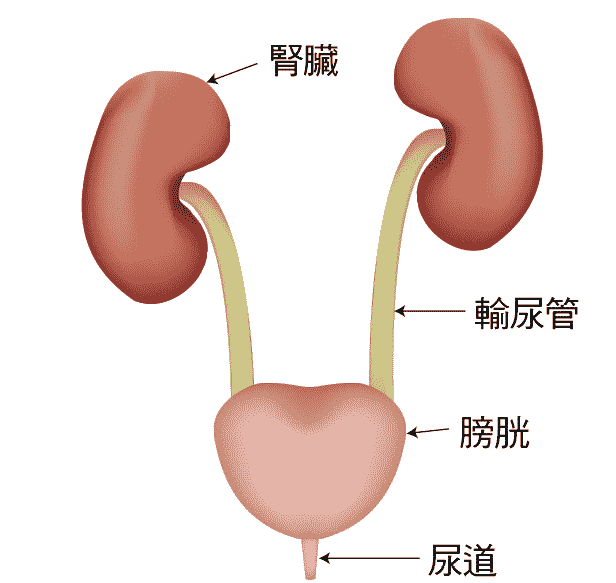

### 中西医对膀胱具体结构的认知大致相同

中医所认知的膀胱结构及功能，与现代医学的认知大致相同，但涵盖更广。

膀胱是储存和排泄小便的囊状器官，接受肾脏过滤体液之后所形成的尿液，暂时贮存在膀胱内；当尿液充足欲排尿时，膀胱壁括约肌会收缩，出口处括约肌会放松，让小便经输尿管由尿道排出体外。

膀胱的前面为耻骨联合，男性的膀胱位于摄护腺上方，后面是直肠。女性的膀胱后面为阴道及子宫，最后是直肠。

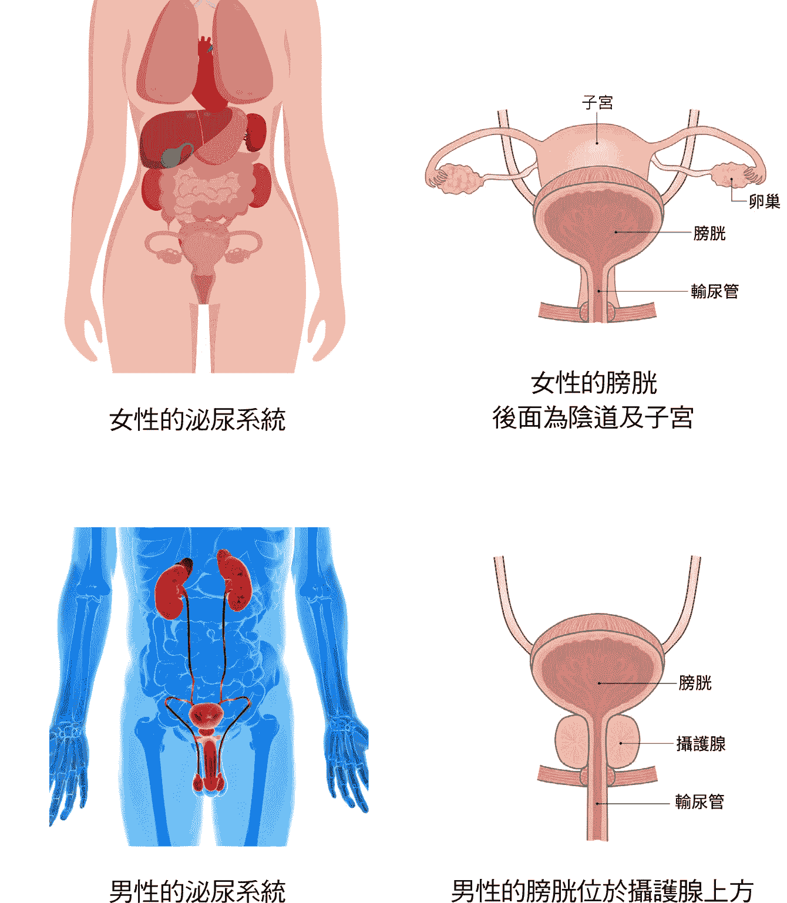

## 1.中医称膀胱为「水腑」

膀胱古称为「脬」，属于六腑之一，与肾脏相表里。五行属水，五色属黑。《内经》论及功能特色：「膀胱者，州都之官，津液藏焉，气化则能出。」

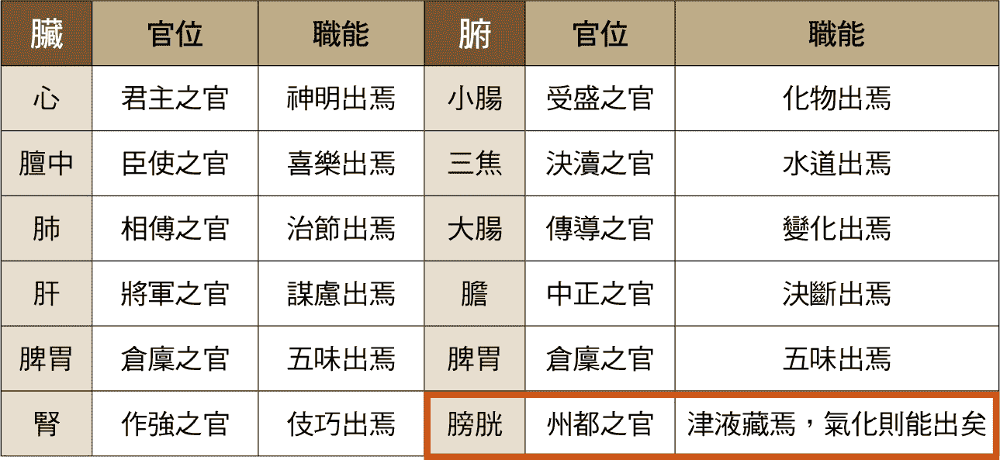

### 州都之官，津液藏焉，气化则能出

《内经》对于膀胱功能最动态的叙述为「饮入于胃，游溢精气，上输于脾，脾气散精，上归于肺，通调水道，下输膀胱，水精四布，五经并行。」水饮进入胃，经过脾与肺的作用，通调水道下输到膀胱，让水精可以敷布至全身。可见中医对于膀胱的见解，不仅是排尿器官，还有更重要的功能与意义。

###### 《内经》说膀胱是「州都之官」，「州都」是什么意思呢？

「州」是指建筑在河边，且有城墙可以防御洪水的城市；「都」为建造君主宗庙的重要城市，有比较多的居民聚集在一起生活。

「州都」合起来是指建筑在河边且有城墙防洪的重要城市，而且人口众多。据此，古医家就说「膀胱为下焦之下泽，津液所聚，故曰州都。」膀胱为水腑，五行属水，成为津液的聚集处。水液在膀胱有所停留，等待进一步处理，即是「津液藏焉」之意。因此膀胱具有类似小肠泌别清浊之功能，对于水液既能「贮存」又能「排出」。这与现代医学认知的膀胱是贮尿器官，功能为暂存和排泄小便的概念一致。

津液是来自饮食水谷的珍贵物质，人类凭此维生，当然要将津液运用到极致，膀胱这个州都之官负有管理津液之重责，让津液有所贮藏，不可轻易消耗。贮存在膀胱内的水液，都在等待膀胱与肾等脏腑的蒸腾气化功能，若为可再利用之水则回收到体内成为津液，无用之水则转化为尿液暂存，等待有足够的尿量时再一起排出体外，这即是「气化则能出焉」之意。

膀胱身为六腑成员， 腑以通为顺，泻而不藏，膀胱的「藏津液」是为了「气化而出」，所以仍符合六腑泻而不藏的特质。

* * *

现代医学对于尿液的生成与转化有其理论，传统中医则有「气化」理论。气化功能很像炉火，它将水液煮开，比较轻扬的水蒸气回收体内再利用，剩下比较沉浊的水液则转化成尿液。

如前所述，日常饮食之中，水饮进入到胃，通过脾与肺的作用，下输到膀胱，膀胱透过体内的气化功能将水液转化成津液「输出」至全身，让「水精四布，五经并行」，成为身体极为重要的营养资源，膀胱之功实不可没。

## 2.膀胱藏津液与气化，
功能失常易有频尿、尿失禁问题

膀胱主藏津液与气化功能，若功能失常，将会严重影响生活质量，危害健康。

膀胱的气化功能失常，在周遭一些年长者身上常会看见，尤其冬天气候严寒时节，体温相对偏低，膀胱与肾没有充足的热能来气化蒸腾水液，因此会出现频尿，小便透明且量多的情况，长辈们说这是因为「膀胱冷」的关系，其实是中医常说的「肾阳虚」，气化功能不足所致。

若是藏津液功能失常又会如何？当膀胱不再暂存水液，水液一旦输送到膀胱，既不分辨能否再利用，也不等候完整的气化功能，马上转化成尿液直接排出体外，就会出现严重频尿，甚至尿失禁或尿崩的状况，整个人都会虚脱，因此《内经》说「水泉不止者，是膀胱不藏也。得守者生，失守者死。」也可以再想象一下，如果人们时时刻刻都要去小解，怎么会有时间和体力去创造与发展文明呢？

再如《卷二》大肠经总论(p.19)介绍过，自古以来中医就认为二便严重失常是危急症。《内经》中，黄帝询问老师岐伯如何以疾病的虚实来决定死生，岐伯回说：「 五实死，五虚死。 」

五实为脉盛，皮热，腹胀，前后不通，闷瞀，都属于死证。

五虚为脉细，皮寒，气少，泄利前后，饮食不入，也都属于死证。

「前后不通」及「泄利前后」都是大小便严重失调的状况，「前后不通」是大小便都难出，使得体内无法排除邪气，气机阻滞，所以称为实证；「泄利前后」是小便失禁，大便泄泻，当然无法留住营养物质，正气流失，所以称为虚证。无论是邪气不出或营养难留，显示人体气机严重异常，都是病情危急的现象。其中小便异常都与膀胱功能失调有关，《内经》说「膀胱不利为癃，不约为遗溺」，指出膀胱失去通利功能就会出现小便不顺畅，甚则闭阻难出；膀胱失去约束功能就会出现小便失禁。

所以不要小看膀胱肩负的尿液贮藏和排泄功能，这可是人体极为重要的生命代谢系统。

## 3.膀胱气化所司，还包括汗液

由膀胱气化所出者，除了津液、尿液之外，还有汗液。尿液与汗液有密切关系，日常生活中常有这样的经验：夏天汗出量多，小便量就会减少；冬天汗出量少，小便量就会增多。汗液与尿液都是人体排出体外的津液，差别只在排出的管道不同而已。《内经》也有类似的说法：「肾合三焦膀胱，三焦膀胱者，腠理毫毛其应。」「天暑衣厚则腠理开，故汗出……天寒则腠理闭，气湿不行，水下留于膀胱，则为溺与气。」肾与膀胱专责管理尿道与排出尿液，还同时管理皮肤表面的纹理和毛孔，所以也能影响汗液的排泄，可见汗液与尿液同源。《卷四》心经篇章提到「汗为心之液」，汗液的排出由心脏这位君主之官管理，膀胱则具有将水液转化成汗液这项专业技术，因此得到心君的特许授权，执行从腠理毫毛排出汗液这项任务。

我们将在后面篇章以《伤寒论》常用的麻黄来说明膀胱气化出尿液与汗液的功能。

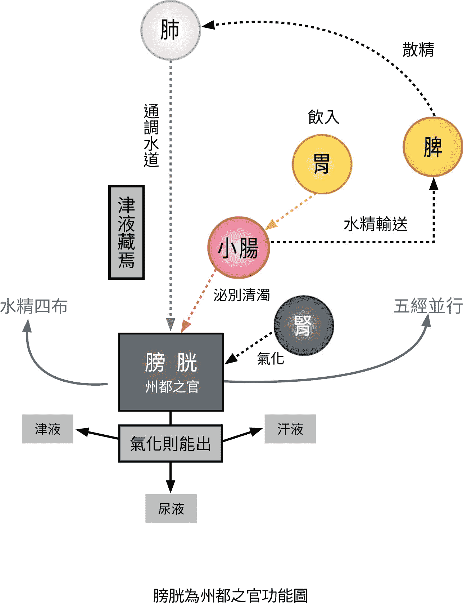

## 4.膀胱在面部对应位置为「人中」

《内经》指出膀胱在面部对应位置为「面王以下者，膀胱子处也」。

「面王」就是鼻头中央肉肉的位置，因为是面部最高处，宛如国王位居高位，所以称为「面王」，也称为「鼻准头」，主要是脾脏功能反应区。在鼻头与上唇之间的部位，呈现水沟状，现代依据所在位置称为「鼻唇沟」，一般称为「人中」或「人中沟」，是膀胱和男女生殖器（子处）功能的反应区。

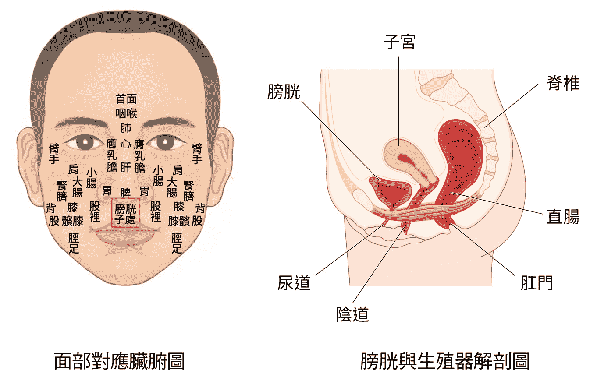

《内经》还说明相关部位出现异常时所代表的症状，如「男子色在于面王，为小腹痛；下为卵痛；其圜直为茎痛，高为本，下为首，狐疝㿉阴之属也。女子在于面王，为膀胱子处之病，散为痛，搏为聚，方员左右，各如其色形。」《内经》于此段落着重在泌尿生殖系统疾病，参酌人体的部位，既然面王（鼻头）以下是膀胱子处，面王当然就位于膀胱之上，对应到小腹。

当鼻头出现异常颜色，如暗沉或斑点时，男性易有小腹痛；男性外生殖系统包括阴茎及阴囊，可以从外而见，阴茎还兼具泌尿与生殖功能，所以当鼻唇沟出现异常时，代表阴茎及阴囊功能也有异常，且病变部位还呈现「逆对关系」，亦即鼻唇沟上方靠近鼻部为阴囊痛，以下部位为阴茎痛，越向下靠近上唇就代表阴茎越上面的部位。相对于女性而言，外生殖器并不明显，所以广泛代表膀胱和生殖器疾病。

由此可见膀胱与生殖系统密切相关，中医掌握了这层关连，自古就常用灸膀胱经最后一个穴位「至阴穴」转胎，以调整胎位不正，临床上我们累积不少经验，效果真的不错。

# 二、膀胱经系统特色：人体最长的经络

在此先跟读者说明，因为本经络系统功能强大，后文中常会提到它的名字，无论是称为太阳经、足太阳经或膀胱经，都是指「足太阳膀胱经」之意。

膀胱经属于足太阳经，主要分布于头面部、躯干和下肢阳面后线，以多线条、大面积的包覆方式，涵盖整个腰背部以及下肢后侧。

膀胱经也是人体最长的经络系统，真的是从头走到脚，例如经脉自眼头开始，向上经过头顶，再向后分布人体的后侧，直到足小趾外侧为止。膀胱经穴位也是最多的，共有 67 穴，尤其在腰背部分布得绵绵密密，这样的分布当然有它的道理，后文将会说明。

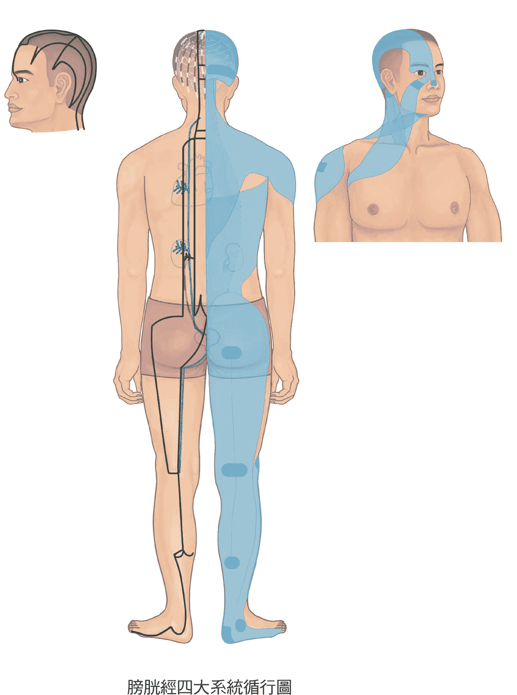

## 1.为什么这么厉害的经络成为足太阳膀胱经？

平心而论，六腑之中，膀胱并不是很厉害的腑，为何太阳经这么厉害的经络会属于膀胱？

个人推论，答案可能是「肾脏内举不避亲！」

依据中医理论，人体脏腑概念是以五脏为主，六腑为配合者，例如大肠与小肠都分布在腹部，比较接近下肢，理论上应该归属足经，但因为大小肠与肺心两脏相表里，嫁鸡随鸡，大小肠嫁给心肺则随心肺，就跟着心肺经成为手经。

心脏与肾脏皆位于人体偏后面的位置，都属于少阴经，循行在人体阴面后线。心脏为君主之官，攸关生命，因此心脏所居的胸部就很像台湾北部地区，人多热闹，有来自四面八方的经络系统共同包覆，提供坚实的防护。

肾脏为先天之本，蕴藏人体珍贵的真阴真阳以照护五脏六腑。真阴真阳宛如家里珍藏的富裕祖产，俗语说「财不露白」，当然要藏在身体隐密处确保安全，肾脏就是真阴真阳的保险箱，自然也位于身体的深处。肾脏与膀胱腑为表里脏腑，膀胱虽然位居下腹前方，但为了配合肾脏，膀胱的经络系统就特意循行于身体后方。人体背部很像台湾的花东地区，地广人稀，主要为膀胱经络系统通过，足太阳经也循行于人体阳面后线。膀胱一心一意在保护肾脏，肾脏也内举不避亲，刻意提升膀胱的效能与地位，膀胱经就此发展出存有五脏六腑背俞穴和大面积包覆的强人策略。

另一方面，从五脏在人体的部位来说，肺位置最高，肾位置最低，两者合作无间。除了在呼吸功能方面，肺主吸气，肾主纳气之外，还与人体气机与津液有关：肺为水之上源，通调水道，将水液下输膀胱；肾主水主气化，肾脏将气化的津液输送到膀胱，肺肾输送至膀胱的津液，再透过膀胱经「水精四布，五经并行」敷布至全身。膀胱经如此认真地为肺肾服务，加上膀胱经在鼻部与开窍于鼻的肺脏连结，在腰背部与肾脏连结，理应归入肺脏或肾脏家族，但因肺肾属阴脏，都有自己的阴经系统，所以就由膀胱背负起管理膀胱经这个重责大任。

## 2.「足太阳经」的威力

依据人体经络分布规律，阳面的后侧属于太阳经。古字的「太」通「大」，太阳就是大阳，又称为巨阳，如太阳般普照大地，提供热能。手太阳小肠经为小太阳，足太阳膀胱经为大太阳，功能更为巨大，主一身之表，护卫全身。

### 全面包覆背部，主一身之表，护卫全身

大家还记得《卷二》足阳明经筋「上腹而布」，全面包覆胸腹部的豪迈吗？足太阳经在人体后侧的分布也是豪情万千，全然包覆人体后侧。这种全面性的包覆，我们可以回想小时候玩躲猫猫时，通常藏身蹲在某个角落，会将身体向腹部蜷缩，背部朝上，以免被别人发现。其实这也是人类蛮荒时期，躲在石头或树丛之后，避免被野兽或敌人发现的自我保护姿势。为什么呢？

因为人体重要的器官组织多数在正面，非常的脆弱，背部则有强大的骨骼及肌群，比较禁得起外力的冲击。所以当我们承受外力或要撞击别人时，虽然身体的正面和背面都很重要，但两害相权取其轻，身体自然会出现保护机制，将正面弓缩起来，以背部来保护自己或者撞击对方。

生活中，当外出突然碰到大雨又没带雨具时，我们是不是不经思索就将身体正面缩起来，而让背部去承受风雨？保护背部主要的经络正是足太阳经。

人体就像一栋房子，人体背面就是房子的后墙，足太阳经分布在人体背面，恰似一堵坚实无比的防风墙，挡住来自于外在环境，如风寒暑湿燥火等邪气的挑战与侵袭，以保护体内重要的组织器官。足太阳经坚固的特质，如同鳄鱼背部坚硬的保护层，因此中医说「太阳主一身之表」，太阳经就是人体外层最坚强的保护层。

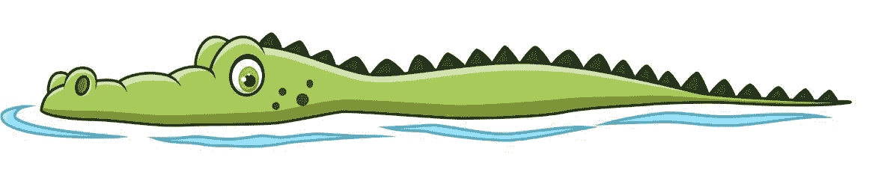

《内经》还提到「太阳为开，阳明为阖，少阳为枢。」依据字义来看，「太阳为开」就是太阳经具有敞开气机的功能，这也呼应「太阳主一身之表」的概念。太阳经是人体的防护墙，而且这堵墙还装有「窗户」即「毛孔」（后文会介绍），平日风寒邪气比较多的时候，例如冬天或感冒流行期，太阳经会将毛孔（窗户）紧闭，避免邪气入侵，万一被风邪入侵时，则会打开毛孔（窗户）将之逐出体外。所以「太阳主表」具有「无病防卫」与「有病驱邪」的双重功能。

### 为诸阳之气

《内经》说「巨阳者，诸阳之属也，其脉连于风府，故为诸阳主气。」指出足太阳经是人体面积最大的经络系统，行于一身之表，为人体对外防卫的藩篱，太阳经因此成为六阳经之长，统摄诸阳，加上其经脉交会督脉的风府穴，督脉为阳脉之海，藉此交会关系，太阳经就能主持人体所有阳经之气，当然也包括最有防御能力的卫气。另外，足太阳经也交会督脉的大椎穴，大椎穴是诸阳经所会之处，太阳经因此还能提供阳气给其他阳经。

或许大家会问太阳经的阳气从何而来？一部分是来自食物的营养，一部分是来自太阳的热能。我常开玩笑说，走在太阳底下就是在晒膀胱经，当背部被太阳晒得暖烘烘时，其他阳经也会得到滋养，全身感到无比的温暖舒畅。自然界最懂得享受阳光的阳气与热能的莫过于动物们，尤其是家中的毛小孩，总是在暖阳下呼呼大睡。这也算是太阳为诸阳主气的一个应用吧！

### 与肺经共管皮毛和卫气

前面介绍过，膀胱气化所出者，除了津液、尿液之外，还有汗液，一如前面《内经》所述「天暑衣厚则腠理开，故汗出⋯⋯天寒则腠理闭，气湿不行，水下留于膀胱，则为溺与气。」

有关汗液，《内经》说「腠理发泄，汗出溱溱，是谓津。」所以排汗与腠理有关。什么是腠理？中医所说的腠理，主要是指皮肤、肌肉及脏腑之间的纹理，平时最容易看到的腠理就是位于皮肤上细细的、形成许多小格子的纹路，上面还有毫毛汗孔。腠理的疏密会影响汗孔的开合与汗液的排泄：若腠理疏松则汗孔打开而出汗，腠理致密则汗孔闭合而无汗。

腠理的疏密则是受到卫气的调节，《内经》说：「清阳发腠理」，「卫气者，所以温分肉，充皮肤，肥腠理，司开合者也。」「卫气和，则分肉解利，皮肤调柔，腠理致密矣。」清阳就是卫气，卫气充足则肌肉与皮肤得到濡养，腠理致密，外邪不易入侵。因此卫气正常，。腠理功能也正常，就能妥善管理汗孔的开合。

腠理与皮肤毫毛都是人体最外层的组织，属于一身之表的实质结构，也是外邪入侵人体的第一道防线。《内经》这方面的论述很多，如「卫气不营，邪气居之」，「虚邪中人也，始于皮肤，皮肤缓则腠理开，开则邪气从毛发入，入则抵深」，「虚邪之中人也，洒淅动形，起毫毛而发腠理」，「百病之始生也，必先于皮毛，邪中之则腠理开，开则入客于络脉」，「百疾之始期也，必生于风雨寒暑，循毫毛而入腠理」等，都指出毫毛腠理是邪气进入身体的门户，如果卫气虚损，无法滋养分肉、皮肤和腠理，导致这些组织疏松无力，身体的防御力因而下降，外在的邪气就会趁机从皮肤毫毛进入腠理，导致腠理开泄，犹如家中门户洞开，邪气趁虚入侵，出现自汗恶风的感冒现象，如果不赶紧治疗，邪气再深入体内就会百病丛生。

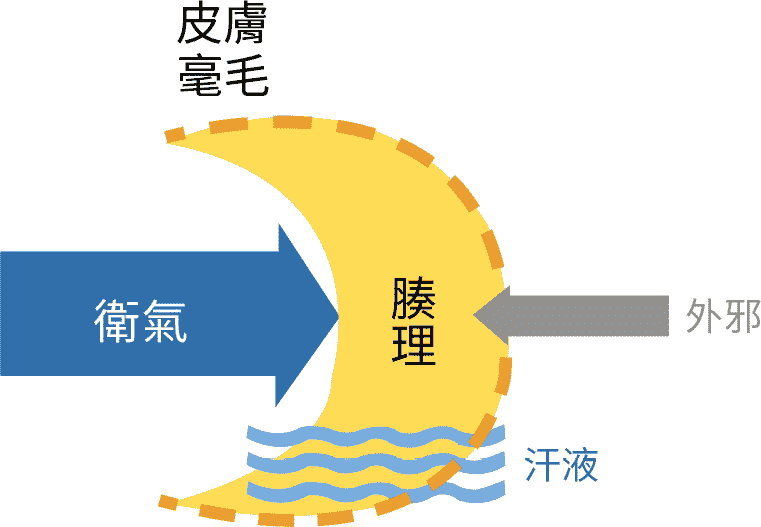

毫毛与腠理不仅与排汗及防御机能有关，《内经》还提示说「三焦膀胱者，腠理毫毛其应」，透过观察一个人的毫毛腠理组织，也能推测其三焦与膀胱的形态，例如「密理厚皮者，三焦膀胱厚；粗理薄皮者，三焦膀胱薄；疏腠理者，三焦膀胱缓。」这正是中医能够观察人体外部组织以了解内在脏腑的状态「由外而知内」的秘密。

太阳经与《卷一》介绍过的肺经都主一身之表，《内经》说「伤寒一日，巨阳受之，头项痛，腰脊强。」也都与卫气的运行敷布有关，所以足太阳膀胱经就和肺经共同管理体表的毫毛腠理和卫气。

## 3.足太阳膀胱经循行特色

足太阳膀胱经的循行特色可从爬虫类角度来看，参考下图两只鳄鱼：左侧为浅水区中的鳄鱼姿势，四足着地，背部在上；右侧为深水区的鳄鱼姿势，下肢下垂或踩地，身体直立，头部在上。

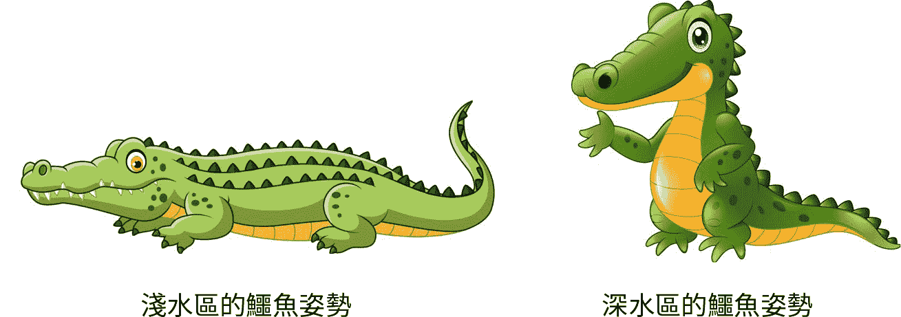

四足着地时的鳄鱼，从面部经脑部至躯干下肢，几乎成一平面，人类如果将四肢趴地，也会有类似的姿势。人类因为使用两足站立，身体类似于在深水区的鳄鱼姿势，头面部与背部不在同一平面，出现转角。随着演化，人类的颚部明显内缩，鼻子与眼睛的距离拉近，以致于从头顶到鼻子会呈现接近直角的角度。

观察趴行的鳄鱼姿势，其背部朝天，天者太阳也，难怪背部的经脉会称为太阳经，太阳经布于体表（背部为表，腹部为里），坚硬的结构成为护卫身体的重要防线。

再从身体结构比重来看，鳄鱼的头面部和上肢比较轻，腰背、尾巴及下肢比较重，人类也是如此，观看爬行中的幼儿就可以看出上半身较轻巧，下半身较厚重的特质，膀胱经系统亦有此特性。本经主要分布到头项、腰背及下肢，经筋系统还保留许多鳄鱼时代的身体特色，不仅包覆肩关节（是六条足经中唯一循行肩部者），且延伸到人体正面，这与爬虫类的觅食、防卫及逃生机能有关，经筋篇会详述。

手足太阳经都循行至头面，在肢体上也有分工：

小肠经属于手太阳经，所以连结到上肢、上背部及肩胛骨；

膀胱经属于足太阳经，所以连结到下肢、全部腰背及髋骨。

### 面部五官特别重视眼睛与鼻子

太阳经也具有太阳明亮的特色，因此手足太阳经都循行至眼睛，让眼前光明得以看见万物，此外，膀胱经筋还结于鼻部。为什么走在人体背面的膀胱经会如此重视面部的眼睛与鼻子？

这又要从鳄鱼身上学习了。可参阅下图，藏身水中只露出头面部的鳄鱼。当鳄鱼要猎食时，身藏水里，只须露出鼻子眼睛看清位置，静静接近猎物，趁其不备就可以饱餐一顿。当鳄鱼面对敌人时，无论是要游开逃离或是前进攻击，这样的姿势也是最省力最快速的。

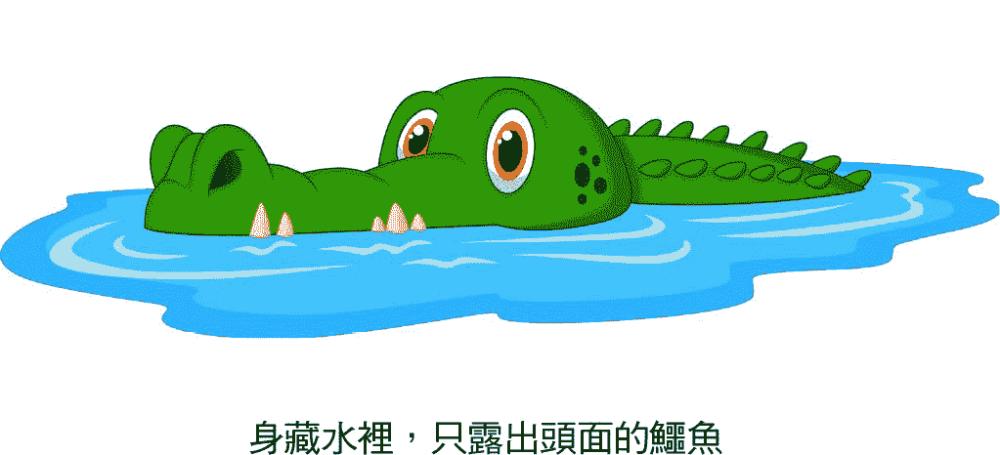

回归到人体来看，视觉与嗅觉是人类生存必须的能力，太阳经与人体的防御系统有关，透过视觉与嗅觉收集的讯息，提供心脏君主之官及大脑做出各项决策。

前面介绍过，膀胱经与肺经有特别密切的合作关系，包括水液代谢、主一身皮毛和卫气等，两经在眼睛及鼻子也都有密切的合作关系。

在眼睛方面，《卷一》介绍过肺主一身之气，当然包括卫气在内。我们在平旦甦醒张开眼睛的同时，就开启了人体卫气的保护机制。《内经》说「阳气出于目，目张则气上行于头，循项下足太阳，循背下至小指之端。」当我们张开眼睛时，阳气就从眼睛而出，太阳经循行至眼睛，成为最先「被唤醒」的阳经，配合肺经启动卫气。

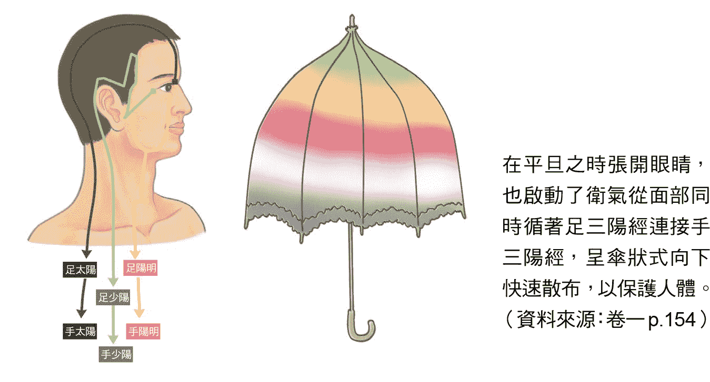

在鼻子方面，肺主管呼吸，开窍于鼻并主一身的皮毛，肺得以透过鼻子与毛孔来宣发／肃降气机，达到主一身之气的机能。膀胱经也很有情义的循行至鼻部来相挺，络穴飞扬穴还是治疗鼻病的特效穴。

另外，由于膀胱经连结鼻部和膀胱，《内经》提到面部望诊：「鼻孔外张，膀胱泄漏。」鼻翼过度外张的人，容易出现膀胱无法藏津液而漏尿的现象。临床上常见于过敏性鼻炎的小朋友，因为长期鼻塞，只好用力呼吸，导致鼻翼外张，鼻孔变大，也会出现夜间尿床的情况。此时只要治好鼻炎，尿床也会改善。我常跟家长解释这个原理，大家都赞叹中医理论真的非常奇妙！

### 从头顶入络脑部，与神智有关

本经脉从巅顶入络于脑部，是十二经脉系统中唯一进入脑部者。由于肾主骨主髓，脑部充满脑髓，中医称之为「髓海」。肾经属于阴经，阴经原则上不上头面，肾经就透过膀胱经进入脑部，维持脑部主管神智功能的正常。所以膀胱经这条有鳄鱼特色的经络，也是会思考的喔！如果脑部受损，就会沿着膀胱经所过部位出现病变，脑中风就是典型例子。后文会介绍。

### 腰背部有五脏六腑及任督二脉的背俞穴

膀胱经系统以大面积，全面包覆腰背部，提供人体完备的保护，让每个人都拥有雄厚的「背景」。最特别的是，五脏六腑以及任督二脉都将其精气转输于背部膀胱经的穴位，中医称这些特殊穴位为「背俞穴」，与之前介绍过的「募穴」性质类似，只是背俞穴全部位在膀胱经的腰背部位。为了方便辨识，这些背俞穴皆冠上所属脏腑的名字，就像家族姓氏一样，如心的背俞穴称为「心俞穴」，膀胱的背俞穴称为「膀胱俞穴」，督脉的背俞穴称为「督俞穴」，任脉的背俞穴有两个，分别是「气海俞穴」及「关元俞穴」，以呼应任脉位于下腹部重要的两个穴位「气海穴」和「关元穴」。这些背俞穴都有特殊功能，宛如五脏六腑的保险箱及信箱，也可看作深藏体内的脏腑，在膀胱经背俞穴上各自开了属于自己的天窗，接受暖阳照射的日光浴。

### 膀胱经主筋之所生病

依据中医理论肝主筋，但膀胱经却主筋之所生病，胆经主骨之所生病，这可跌破不少中医学生的眼镜！该如何理解呢？若以爬虫类的身形来思考，就会得到答案。细节将在经脉篇中说明。

## 4.足太阳膀胱经系统的重要性

膀胱身为州都之官，主管津液的气化、贮藏与排出，是人体水液代谢最后的阶段，扮演非常关键性的角色。

膀胱经主一身之表与皮毛，又为诸阳主气与卫气，是人体很重要的防御系统。为了保护人体，膀胱经循行从头到脚，为全身最长、分布最广的经络。它包覆身体前面的五官还入络脑部，让我们耳聪目明，智慧饱满；包覆身体后面的腰背与下肢，又透过五脏六腑的背俞穴与五脏六腑相连结，让我们「背景雄厚」，不但可从背部调控脏腑功能，还能抵抗外邪且身手矫健。

膀胱经身为太阳经，主气化，五行属于水，符合生命所需三元素：阳光、空气、水。这么厉害的经络，当然要尊称为「太阳」或「巨阳」囉！

膀胱经在十二经络的排列属性上，为聚餐团队的第三条经络， 旺于申时下午三到五点，五点之后交接给与心脏一样耗能的肾脏。

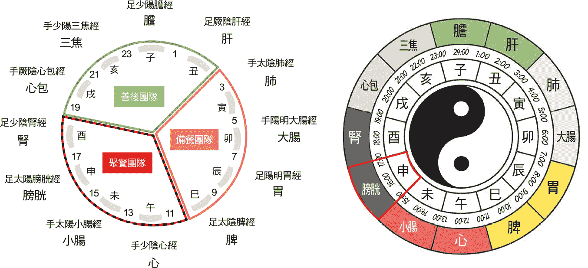

# 三、膀胱经的合作关系

厉害的膀胱经表面上是只健壮的鳄鱼，内心却很温柔，名列爱家一族，默默陪伴肾经，站在身后保护身体这个家园。有着太阳般热情的太阳经也乐于与大家分享阳光、空气与水等珍贵资源，因此人缘佳，好友群也不少。

### 膀胱与肾：表里配合关系

《内经》说「肾合膀胱，膀胱者津液之府也。」膀胱与肾相表里，主要都是膀胱配合肾经，例如为肾循行于身后、入络脑。

在生理功能方面，肾主水，主气化，由膀胱执行水液代谢任务，成为津液之府；肾为先天之本，为了供给五脏六腑珍贵的真阴真阳，肾经特别循行于身体正面以连结重要脏腑，膀胱经则在腰背部设有脏腑的背俞穴，让肾可以时时掌握身体状况；肾主脑髓，搭着膀胱经的便车进入脑部，主管中枢神经系统（CNS），膀胱经则循行于背部，主管周边神经系统（PNS） 等。肾与膀胱两者合作，维持重要生理功能。

在病理上，肾病也会影响膀胱，如《内经》说「肾欬不已，则膀胱受之，膀胱欬状，欬而遗溺。」相关内容会在后文及《卷六》肾经详述。

### 膀胱与肺：护表与津液关系

前面章节介绍过，本经与肺经共管皮毛和卫气，并且一起完成水液代谢。有趣的是，肺与膀胱两者在某些病候上互相「承让」，如：肺开窍于鼻，膀胱经循行经过鼻部，其病候有鼽衄，却未见于肺经病候；肺通调水道下输膀胱，膀胱为州都之官，可以气化津液，让津液出焉，在肺经经脉病候中有小便异常现象，反而膀胱经没有相关论述。可见肺与膀胱之间存有某种默契，中医师临床常用的麻黄是最能呈现两者默契的中药。

麻黄归入肺经与膀胱经，中医早期的药书《神农本草经》说本药「主中风，伤寒头痛，温疟，发表出汗，去邪热气，止咳逆上气，除寒热，破症坚积聚。」指出麻黄能发汗解表及止咳。后世医家累积诸多经验之后，将麻黄功用浓缩成【发汗、利尿、平喘】六个字三项功能，这些功能都是膀胱经与肺经合作的成果，如透过皮毛发汗以解表证，透过膀胱利尿以消水肿，透过宣降肺气以平喘咳等，此外还能通鼻窍、透疹止痒，与两经功能完全相符。

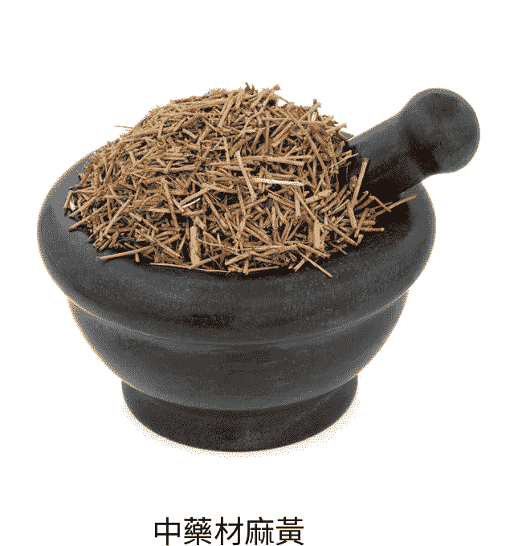

### 膀胱与三焦：水道、毫毛腠理及原气关系

三焦腑是中医难解的谜题，有关它的精确位置，连《难经》都说「三焦也⋯⋯有名而无形。」后世医家因此争论不休，详细论述请参阅《卷七》与三焦经。

有关三焦的功能倒是很明确，《内经》说：「三焦者，中渎之府也，水道出焉，属膀胱，是孤之府也」，「三焦膀胱者，腠理毫毛其应」。《难经》说「三焦者，水谷之道路，气之所终始也」。

肺通调水道下输膀胱的【水道】，依据以上经文所述应该是三焦，其功能隶属膀胱管辖。三焦与膀胱除了连结成水液代谢系统之外，还包括毫毛与腠理这些体表组织，共同为防御外在邪气而努力。另外《难经》指出：「三焦也，有原气之别焉，主持诸气」，「三焦者，原气之别使也，主通行三气，经历于五藏六府」，三焦与原气有关，原气是藏于脐下肾间的动气，三焦协助肾经与膀胱经将原气输送至五脏六腑，以维持生命机能。

### 膀胱与肺肾三焦：气机与津液

前面介绍过肺肾两脏在呼吸、水液等方面合作无间，两者都算是膀胱的老板，膀胱幸好有三焦一起完成长官交办的任务。

### 膀胱与心：主表关系

膀胱经别连结了膀胱—肾—心，成为一个从上到下，从里而外的防护系统。

《卷四》心经介绍过心部于表，而膀胱主一身之表，就人体经济学来看，面对如此厉害的膀胱经，君主之官的心脏当然要亲自管控，桂枝正是心经与膀胱经的代表药。详文请参考《卷四》。

### 膀胱与小肠：同名经与泌别清浊关系

膀胱与小肠同为太阳经，都循行于人体阳面后侧以护卫人体。膀胱所主的津液来源，一部分来自肺，一部分来自小肠。小肠泌别清浊之后，将浊者下送至膀胱做最后的吸收与排泄。

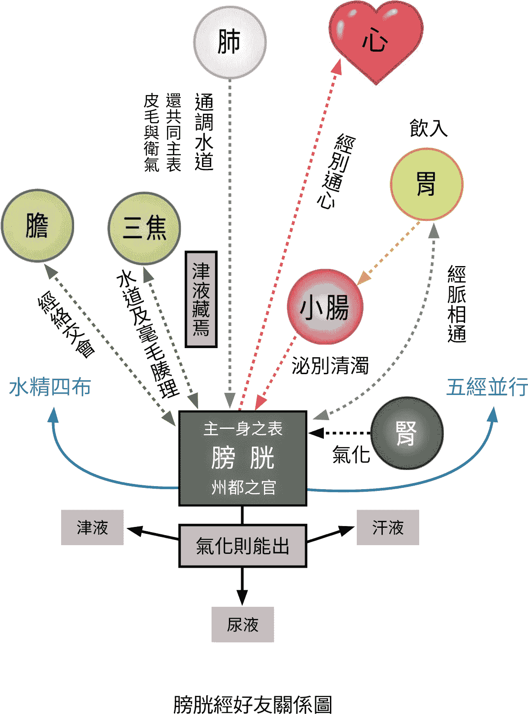

###### 膀胱经四大系统循行简图（捷运图）

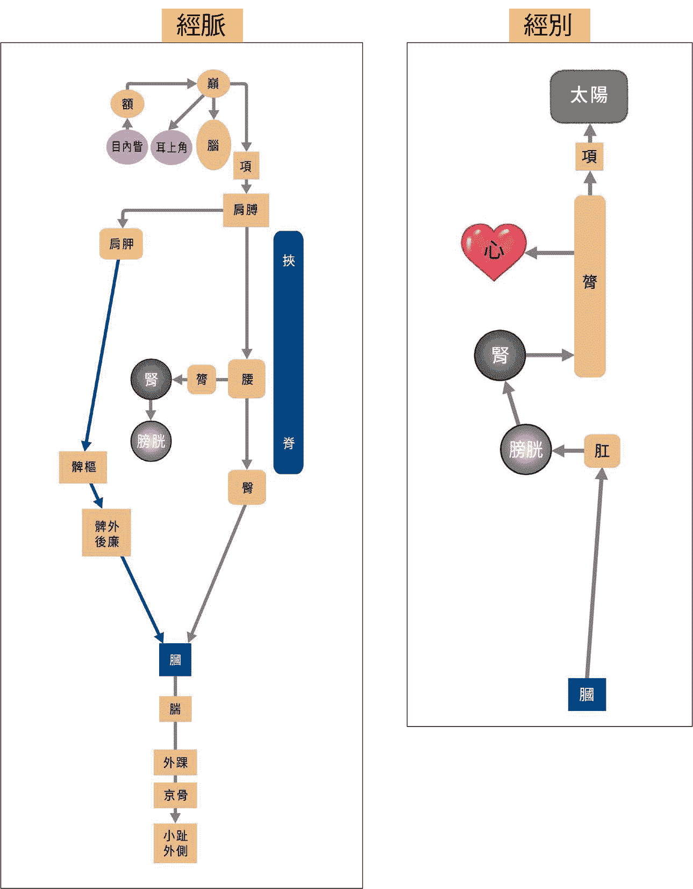

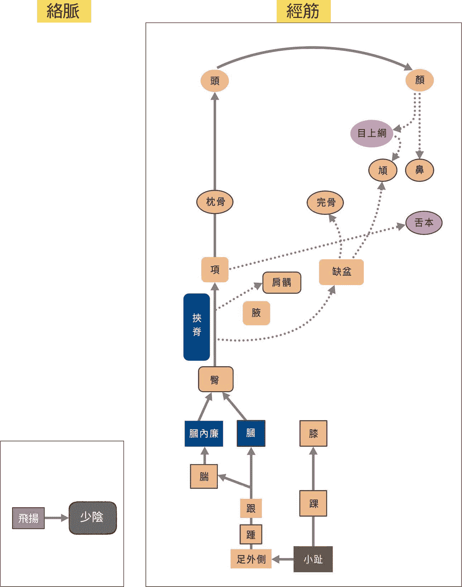

# 一、膀胱足太阳之脉（经脉）

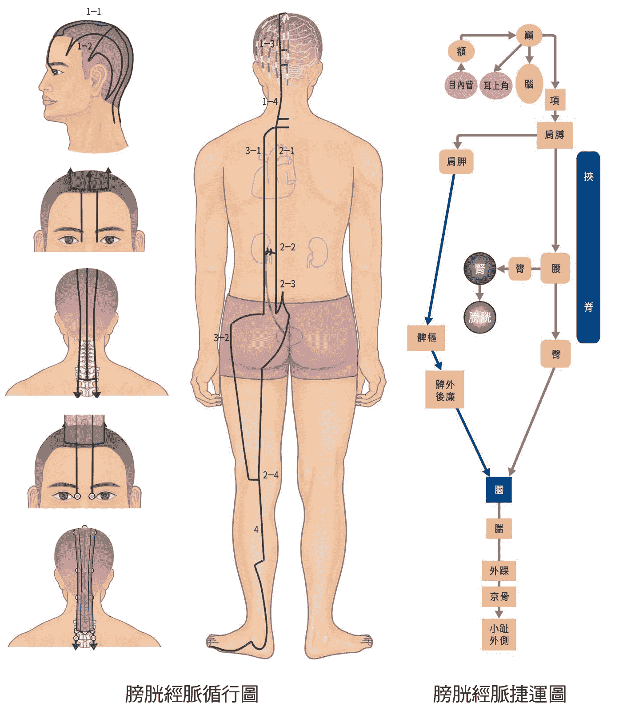

## 足太阳膀胱经脉──循行特色

本经脉宛如子弹列车、车速快、总距离长，站与站的间距也较长，多条经脉形成复合路线，涵盖面积广。

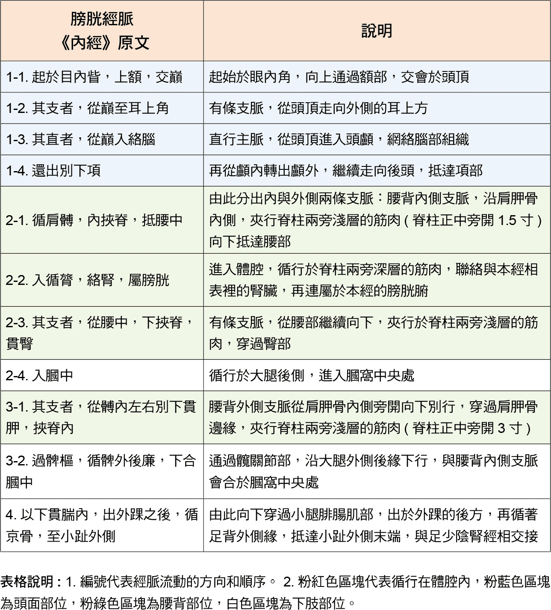

足太阳膀胱经是人体最长的经脉，名副其实「从头到脚」路线，起于目内眦（眼内角），止于足小趾外侧。主要分布在身体阳面的后侧，包括头部、腰背第一、二条线，下肢后侧的部位等。

膀胱经脉循行路线可分为三个部分：路线 1 的头面部，路线 2-3 的腰背部和路线 4 的下肢部。

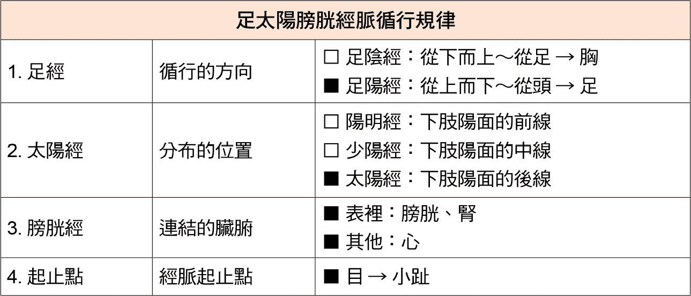

## 1.头面部的「启动卫气」路线

本经脉以巅顶为中心点，衔接前、后、外、内四条路线，巅顶类似于头发集中绑在头顶的包包头「发髻」，四条路线就像四周被揪向头顶的头发。若将头部两侧经脉合看，除了进入头颅的内线外，循行于头颅外的前线、后线及侧线呈现出十字型态。另一方面，本条经脉也与《卷一》肺经所介绍，当人体甦醒时启动卫气，卫气以大阳伞型态敷布全身有关，所以称为「启动卫气」路线。

「启动卫气」路线，连接头面五官与脑部。四条路线分别为：

● 前线：在目内眦承接小肠经脉，向上经过额头再交会于巅。参考胃经经脉「起于鼻之交頞中，旁纳太阳之脉」，可知本经有抵鼻部，尤其是鼻根部。（路线 1-1）

● 外线：从巅连线至外侧的耳上角。（路线 1-2）

● 内线：从巅深入头颅之内，网络所有脑组织。（路线 1-3）

● 后线：从脑部浅出，循行后头，向下连接脖子后面的项后大筋。这两大筋由斜方肌组成，中暑时常在此处刮痧。（路线 1-4）

### 连成一线的交会穴，强化膀胱经护卫人体的力量

本路线的原文叙述很精简，但加上与其他经脉所交会的穴位之后，就能显现太阳经的威猛。厉害的膀胱经与两条旗鼓相当的经脉交会，一是「阳脉之海」的督脉，二是好朋友足少阳胆经：

● 与督脉有六个交会穴：神庭穴、百会穴、脑户穴、风府穴、大椎穴、陶道穴等，分布在头项正中线；

● 与胆经有七个交会穴：曲鬓穴、率谷穴、浮白穴、头窍阴穴、完骨穴、头临泣穴、环跳穴等。除了环跳穴在臀部，其余六穴都分布在侧头及环绕耳朵外围处。

膀胱经本身的循行加上与督脉和胆经在头项部的十二个交会穴，而且这些交会穴都连成一线，让本经在此部位形成一个特殊宽广厚实的经脉区，大大强化了膀胱经护卫人体的力量。

#### 1-1 起于目内眦，上额，交巅

膀胱经起于目内眦，在此与小老弟小肠经交接之后，沿着额头上行，交于头顶巅部。依据原文来看，路线似乎很直，但加上交会穴之后，情况就不同了。更有趣的是，为何使用「交巅」，而不是「抵巅」或「至巅」？后文会说明。

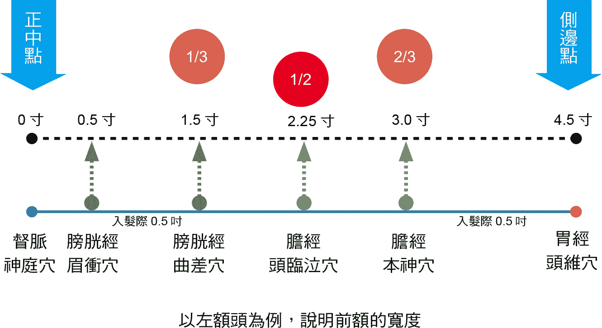

为了理解额部循行及穴位分布，依据中医「同身寸」原则，单侧前额宽度为 4.5 寸，请参阅上图，以左额头为例。

前额宽度以进入发际 0.5 寸的穴位为计算基准，因为前额穴位主要从这里开始向后排列，前额的内外两端分别为督脉神庭穴和胃经头维穴。督脉循行在人体阳面正中线，督脉神庭穴为前额正中点，额头外侧发角的胃经头维穴为侧边点，因此神庭穴到头维穴所形成的单侧前额连线宽度为 4.5 寸。

经络分布方面，前额为进入脑部的门户，是很重要的部位，除了督脉直接贯穿之外，膀胱经与胆经两条经脉也加强涵盖范围。膀胱经比较接近督脉而较偏内侧，胆经则偏外侧。

穴位分布方面，从前额正中点的神庭穴向外旁开 0.5 寸为膀胱经眉冲穴，神庭穴向外旁开 1.5 寸（1/3）为膀胱经曲差穴，所以膀胱经分布在前额连线的内 1/3 区块；胆经头临泣穴位于神庭穴及头维穴中点处（1/2），神庭穴旁开 3 寸（内 2/3 或外 1/3）为胆经本神穴，所以胆经分布在前额连线中间到外 1/3 区块。

了解前额尺寸和经脉与穴位分布后，开始介绍本经循行。膀胱经在头部本就有循行路线：起于目内眦的睛明穴，向上到眉头的攒竹穴，直上通过额头进入发际 0.5 寸的眉冲穴（神庭穴旁开 0.5 寸）。从睛明穴—攒竹穴—眉冲穴为一直线，「眉冲穴」穴如其名，位于眉头向上冲的位置。本经从眉冲穴水平横开分出两条路线：

● 膀胱线：眉冲穴向外旁开 1 寸连接本经曲差穴（神庭穴旁开 1.5 寸），穴名也点出本穴为膀胱经旁开有弯曲偏差的穴位，此后就循着这条路线继续上行到头顶。

● 督脉线：眉冲穴向内旁开 0.5 寸交会督脉神庭穴，再沿着督脉向上抵达巅顶，交会百会穴。

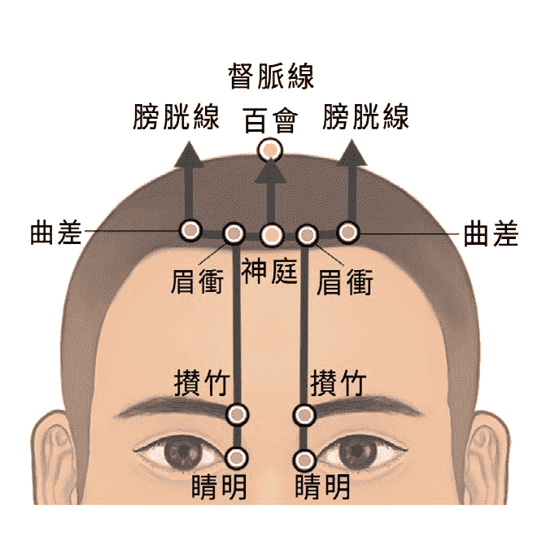

膀胱经抵达入发际 0.5 寸的眉冲穴之后，伸出一条横向支脉与督脉线相连，膀胱线与督脉线因而共同形成一个区块，涵盖前额内 1/3 的范围，请参考下页图黄线所画出的区域。若将两侧路线合并，更能看出其涵盖范围。据此推论，「起于目内眦，上额，交巅」不是一条直线，而是一个区块。

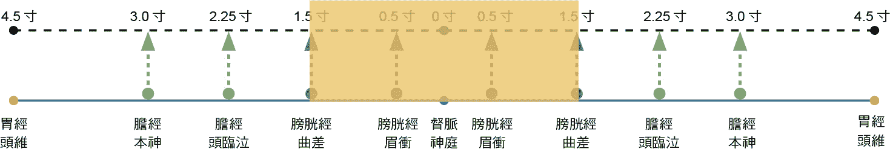

#### 1-2 其支者，从巅至耳上角

这条支脉原文写得更精简：从巅顶分出一条支脉到耳上角。与前文相同，加上其与胆经的交会穴后，内容便丰富了。问题是膀胱经与胆经在头部有六个交会穴，路线不一，要怎么跟这些穴位交会呢？我思考了很久，后来想到本经经筋「其支者，为目上纲」，膀胱经一定有循行到前额才能成为「目上纲」，所以将此支脉分为「耳上角内圈」及「耳上角外圈」，便可说明交会胆经的方式。

● 耳上角内圈：如下页图橘线。从巅顶连向侧头，交会胆经围绕在绕在外耳廓内圈的曲鬓穴、率谷穴、浮白穴、头窍阴穴、完骨穴等五穴。

● 耳上角外圈：如下页图黄线。从完骨穴继续沿着胆经路线走过侧头及前头，经过本神穴及前额正中的阳白穴，最后交会头临泣穴。相较于耳上角内圈路线，本路线可视为环绕在外耳廓的外圈。

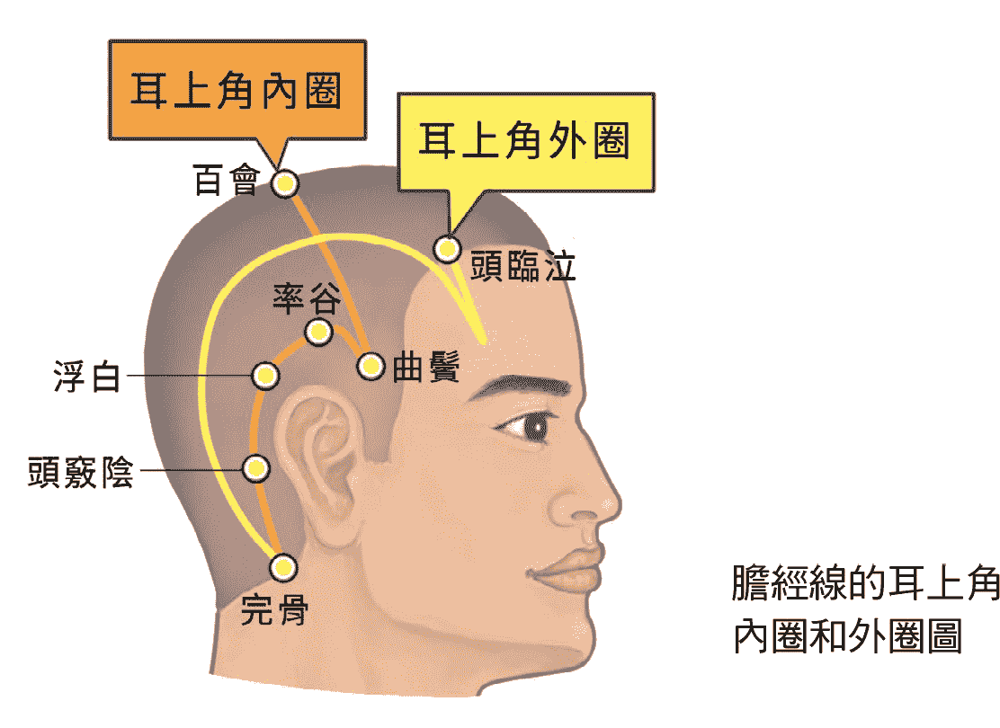

膀胱经透过这条路线连结督脉与胆经，着重在与胆经同行以加强保护头部外侧及耳朵。这条围绕在耳朵上角的路线可称为「胆经线」。

#### 1-3 其直者，从巅入络脑&1-4 还出别下项（循肩髆）

本经直行经脉到达巅顶之后，先进入脑部，网络所有脑部组织，再穿出脑部别行，向下走到项部。「循肩髆」这段循行理论上不属于头面部，但其实是头项部循行的延伸，所以在此一并介绍。膀胱经属于太阳经，循行重点在人体阳面后侧，所以本条直脉是重要的转折点，从此以后的膀胱经主要循行在太阳经的部位。

一如前面的路线，看似简单的循行，加入交会穴后功能加强。本经脉在后头及肩膀处与督脉有四个交会穴：脑户穴、风府穴、大椎穴、陶道穴。为了便于说明，将本直脉分为「颅内线」和「颅外线」，请参阅下图。

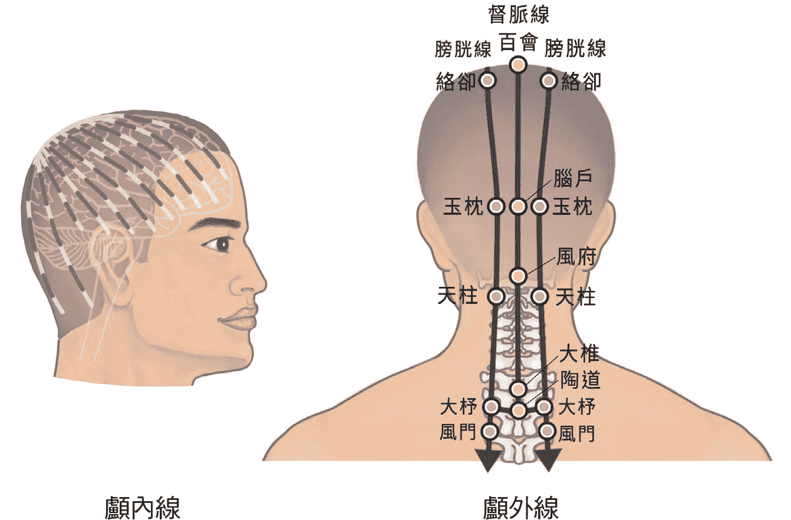

颅内线：进入头颅内部的路线。膀胱经在前额分出膀胱线和督脉线，两线循着自己的路线抵达巅顶，之后分别进入脑部，网络脑部组织。

颅外线：循行于头颅外部的路线。膀胱线和督脉线分别从颅内转出到颅外，继续走向后头，抵达项背部。

前面说过，膀胱经这条循行于头面部的「启动卫气」路线与《卷一》肺经启动卫气这个大阳伞非常类似。（参阅下图）人在平旦之时张开眼睛，同时启动了卫气从面部循着足三阳经连接手三阳经，呈伞状式向下快速散布，以保护人体。

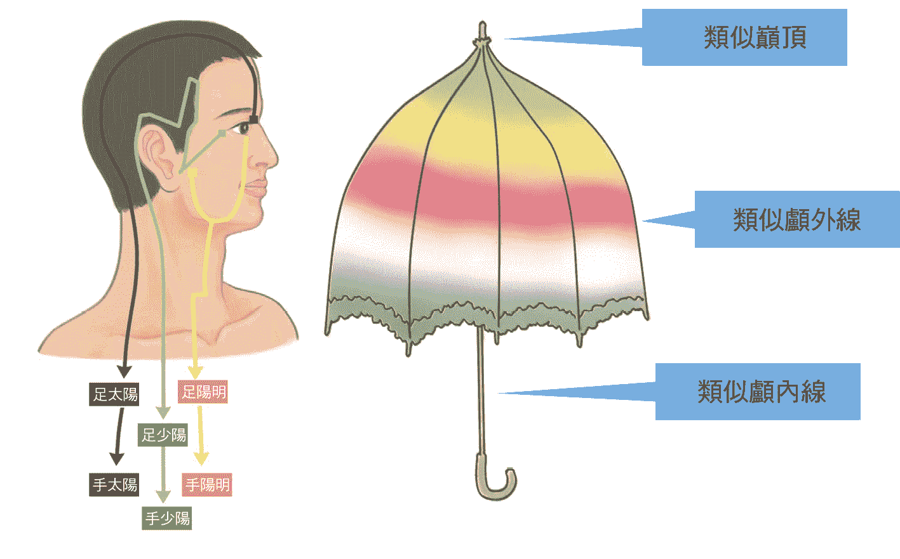

头部的巅顶类似卫气大阳伞顶端的伞尖，颅内线宛如伞柄，颅外线遍布头面部与项背部，如同伞面覆盖头面部一样。颅外线也如伞面有纵行线和横行线，属于纵行线的膀胱线和督脉线都通过巅顶，属于横行线的胆经线也起于巅顶，可见本经在头面路线的重点正是巅顶部位。

###### ● 「巅」的部位及「从巅入络脑」

参酌「从巅入络脑，还出别下项」原文，无论颅内线或颅外线，膀胱线与督脉线都是两条独立平行的路线。既然双线并行通过巅顶，「巅」可能不是一个点，而是由多个点的连线所围成的一个面，如此才符合「上额，交巅」的说法。

一般而言「巅」为头部最高处，也就是头顶处，因此有「巅顶」之说。从督脉线来看，「百会穴」位于头部最高点，是公认巅顶的代表穴，因此「从巅入络脑」基本上可由百会穴进入脑内；从膀胱线来看，在最高点没有穴位，最邻近的穴位有二：通天穴与络却穴，两穴位置可参考下表。

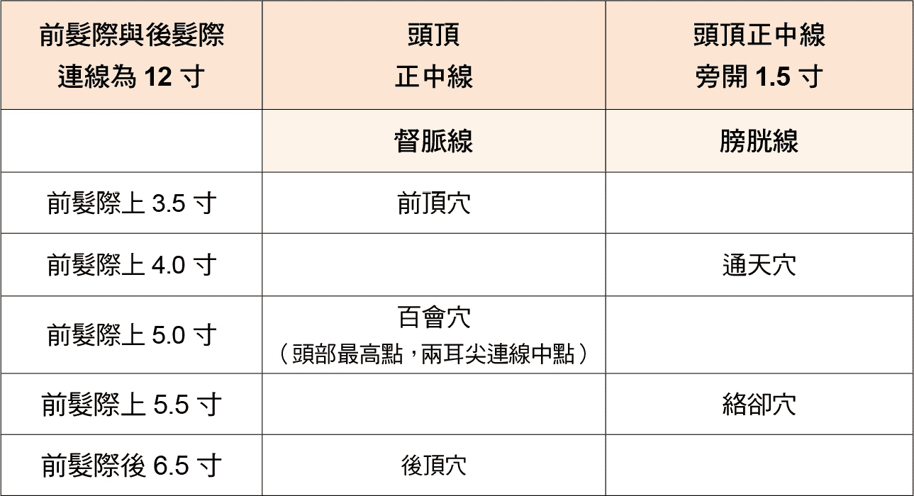

中医认为头顶为天，足底为地，「通天穴」顾名思义为「气能通达至头顶」，古人因此认为通天穴能与百会穴交会；「络却穴」兼有「网络」和「还却」双重意义，正与膀胱经「入络脑」的网络概念，「还出别下项」有进有出之意相符。通天穴与络却穴，无论所在部位或穴名特色都符合原文所述内容，由此推论，膀胱线自通天穴「从巅入脑」，络却穴是「络脑」和「还出」的部位，换言之，膀胱线的入络脑循行，通天穴是入口，络却穴是出口。

再进一步思考：颅外线仍有膀胱线和督脉线两线，既然膀胱线在头顶有出入口，督脉线是否也有出入口？理论上应该有，否则有进无出，就没有循行于颅外的督脉线。最邻近百会穴的两个穴位：「前顶穴」位在百会穴前 1.5 寸，「后顶穴」位在百会穴后 1.5 寸，参酌膀胱经的前顶穴和络却穴的特质，推论督脉线的入络脑循行，前顶穴是入口，后顶穴是出口。

我们将膀胱线两侧的通天穴与络却穴，督脉线的前顶穴与后顶穴连起来，这六个进出脑部的穴位会形成一个椭圆形区块，而百会穴就位在中央处。这个椭圆形区域应是「巅」的真实样貌，由于膀胱线与督脉线都通过这里，经气在此交会，所以才有「交巅」的说法。

位于中心点的百会穴功能为何呢？如果把脑部想象成一个藏有许多宝藏的洞穴，围绕在百会穴周围的六个穴位就是宝藏区的出入口，百会穴正是宝藏的反应区。「百会穴」一如穴名为「百脉之会」，挟着督脉「阳脉之海」的强大威力，最能全面性的网络脑组织，脑部功能也会反映在百会穴。周围六穴既是进出颅内的通道，也是该穴的护卫，因而这个椭圆形区域可以称为「百会区」。

后世医家常使用百会穴及其周围穴位来治疗各类脑病，安定神志，让耳聪且目明，最著名者为位于百会穴前后左右各 1 寸处的穴位组，一共有四个穴，称为「四神聪」。若将四穴串连起来，有一个小形的「百会区」，由此证明百会区通脑安神的强大功能。

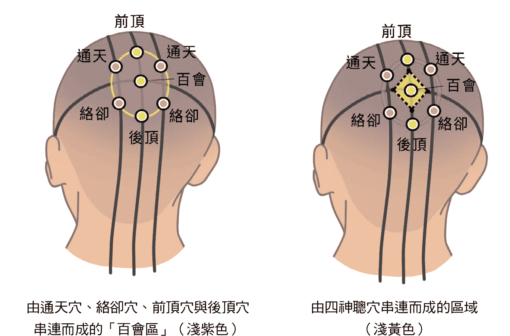

###### ● 还出别下项，循肩髆

颅外线的膀胱线与督脉线从百会区转向后头，都循着自己的路线继续前进：

督脉线：交会于督脉两个位于枕骨附近的「脑户穴」和「风府穴」，再向下沿着项部到诸阳之会的「大椎穴」（第七颈椎棘突与第一胸椎棘突之间），最后交会于大椎穴下一椎的「陶道穴」（第一胸椎棘突下）。大椎穴可视为颈项部位的终点，陶道穴可视为上背部的起点。

膀胱线：在通天穴之后抵达百会区，转向后头，衔接络却穴，继续下走到项部及上背。

膀胱经脉在前额横向连结督脉，然后两经并行。督脉与膀胱经并行的情况最后止于陶道穴，自此之后两条经脉各自前进，各奔前程，再无交会。陶道穴做为膀胱线与督脉线交会的终点，一定有其特殊功能。

从头部至腰背部，膀胱经与督脉保持固定距离并排走。膀胱经上背部的大杼穴与陶道穴等高，参酌前额的眉冲穴与神庭穴也等高，眉冲穴发出横线连结督脉神庭穴的情况，推想位于督脉外侧的大杼穴也比照办理，向内侧发出一条横线连到陶道穴，将两侧大杼穴与中间的陶道穴连在一起，跟前额的横向连结线条一致。

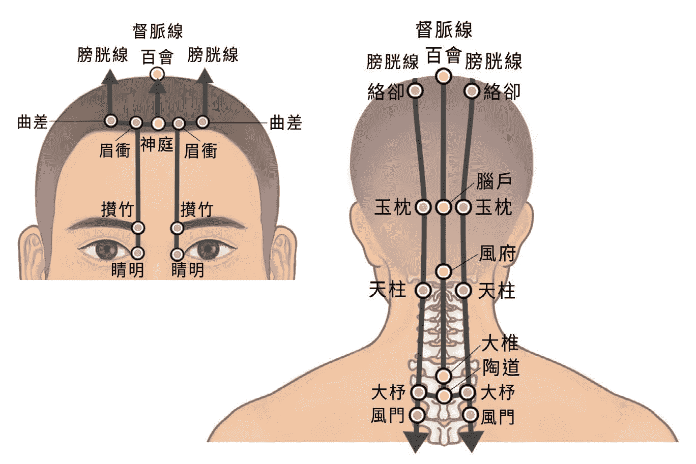

这种交会方式让膀胱线与督脉线得以携手，将前额到上背部连结形成一个上下左右密合的方形区域，请参阅上图。如此一来，阳气旺盛的膀胱经与督脉在头部上方共同形成一个完全封闭的方形区域，提供最坚强而且滴水不漏的防护网。

##### ♼ 解密：膀胱经头面部循行的其他奥秘

膀胱经在头面部的循行文字精简，但意涵丰富。除了前面介绍的内容之外，还有其他许多奥秘。

#### 膀胱经与督脉交会的特色

首先讨论膀胱经与督脉交会的特色。古人说「头为诸阳之会」，因为手三阳经脉从手部走到头部，止于头部；足三阳经脉起于头部，从头部走到足部；手足六阳经脉都在头面部交接，因此头部就成为所有阳脉所会之处，故称「头为诸阳之会」。手足六阳经之中，足太阳经正大光明的从头部正面以大面积方式涵盖头脑部位，太阳又是阳气最旺者，所以，头部主要循行及提供保护的经脉系统是膀胱经。

膀胱经也在头部与督脉有多个交会穴，以强化保护功能。但是为何膀胱经不像脾经经脉在腹部与交会穴连结而形成弯曲的循行路线，反而维持膀胱线与督脉线的平行路线？

这是因为头部是非常重要的部位，本来就需要特殊的保护。膀胱经在头部有自己的循行路线，加上与督脉的交会穴，说明了属于「巨阳」的膀胱经与「阳脉之海」的督脉，联手共同守护头部的决心与行动，所以实力超强的膀胱经无须离开自己的路线去连结督脉交会穴，只要坚守自己的循行路线，同时拉出另一条路线与督脉同行，就足以在头部及项部形成绝无仅有、强而有力的保护区块。

膀胱经与督脉在头部四个交会穴都有结构上的指标性意义，如神庭穴位于前额，百会穴位于巅顶，脑户穴接近脑部枕骨大孔，代表脑部之终，风府穴位于第一颈椎之上，代表项部之始，《内经》说「巨阳者，诸阳之属也，其脉连于风府」，可见风府穴与膀胱经关系非常密切。以上四穴都位于头部重要结构之处。

#### 膀胱经拥有两条路线的原因

膀胱经是否因为属于太阳，摇身变成身体的权贵，所以有特权拥有两条路线？

其实不是膀胱经拥有特权，而是因为膀胱经这条经络系统要守护住整个脑部和背部，一夫当关，确实护卫人体，当然需要多条路线才能完全涵盖，因此才成为背景雄厚的经络系统。这就像管辖区域扩大，岗哨驻点也会增加一样的道理。

#### 膀胱经与督脉并行的另一奥秘

由于许多经络循行图都是平面图，容易让人误以为经络是一条一条的线条。其实不然！每条经脉都是运行气血的通道，2D 的线条怎么可能运送气血？唯有 3D 立体结构的通道，就像吸管或水管一样，才能运送物质。

《卷二》胃经篇章介绍过周左宇老师与足三里的故事(p.188)，周老师说了一段话影响我至深：「胃经那么粗，足三里也很大，怎么扎都可以！」我才发现原来每条经脉粗细不一，都是依据经脉所分布的位置以及所载运的气血量而定，三条足阳经因为分布在体腔和下肢，绝对是最宽最粗的。

督脉为「阳脉之海」，其宽度当然不亚于足阳经。足太阳膀胱经与督脉就像两个壮汉，当它们在头部和项部并行时，头项部体积不大，两条经脉一定会比邻而行，也唯有如此，两条经脉才能在独立运行的同时还能有交会穴。

如果加入这项思考，前面的图形应该会变成以下的图形。其中，灰色为膀胱线，紫色为督脉线，左右相合，就是个「三贴」结构：两侧膀胱经紧贴着位于中间的督脉。三贴的目的是为了在前额到上背部建立一个完整强壮严密且无空隙的包覆区，用以保卫重要的脑部与颈项。

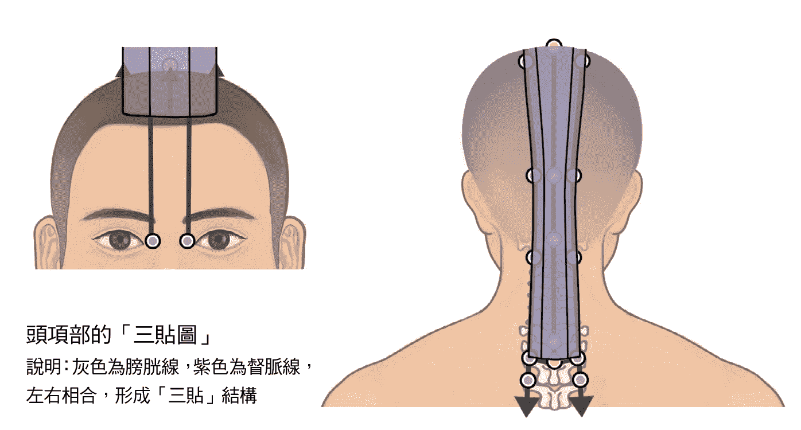

头部这个包覆区很坚固也很耗费能量，依据人体经济学，这个保护区总该有个边界吧！确实有的。督脉在额头的第一个穴位是神庭穴，膀胱经与之交会，从此开始与督脉建立连结关系；项部也是重要组织，保护区最好盖过整个项部较能全面防护，督脉在上背部的第一个穴位是陶道穴，也是膀胱经与之交会的最后一穴。膀胱线与督脉线有始有终，最终形成一个覆盖头部、脑部及颈项的保护区域。

过了陶道穴之后，背部的宽度明显增加，膀胱经无法再与督脉「三贴」，膀胱经就在背部开展出两条经脉，加上厚实坚固的经筋系统加以保护，此时督脉只要专心通行于脊椎即可。膀胱经与督脉的合与分可是经过缜密思考，由此可见人体很会精打细算的喔！

## 2.腰背部的「脏腑黄金路线」

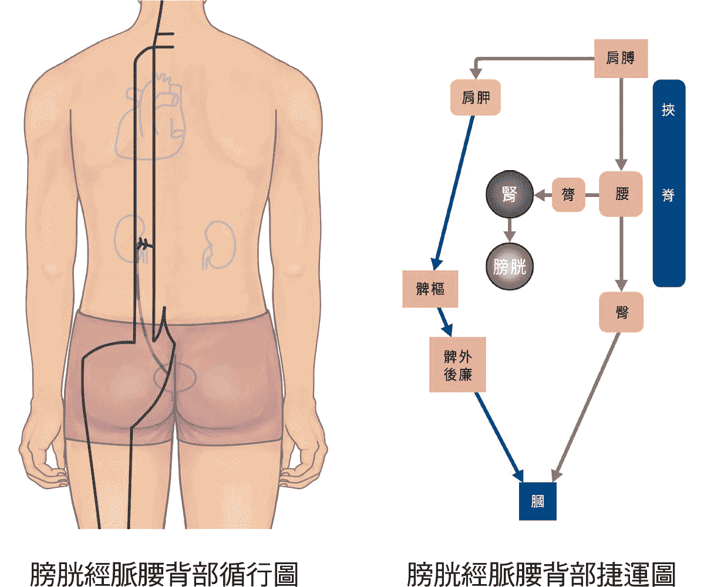

本经腰背部循行沿着属于脊椎的胸椎、腰椎、骶骨（sacrum，腰部下方三角形的骨头，又称「荐椎」或「仙骨」，台语称为「尻川头」或「尻仓头」）和尾骨两侧，主要分布于脊椎与肩胛骨内侧缘之间的区域。从肩胛骨内侧分出路线 2 的内侧支脉与路线 3 的外侧支脉：

路线 2 的腰背内侧支脉比较靠近脊椎，从胸椎一路到尾骨，经过臀部、大腿后侧，最后进入膝关节后侧的膕窝中央。特别的是在腰部横向穿入脊椎深层肌肉，进入体腔连结肾与膀胱。

路线 3 的腰背外侧支脉比较靠近肩胛骨，从胸椎到骶骨，然后转偏外侧，交会胆经的环跳穴，通过髋关节，沿着大腿外侧后缘下行，与路线 2 会合于膕窝中央。

本区循行从肩膊处开始分为两线并行，到了膝关节后侧的膕窝，再合并成一线。

由于本部位衔接来自项部的经脉，秉持头面部多条经脉的特色，腰背部也有多条循行路线，但意义稍有不同。

头面部的面积不大，却是维持人体生命与生活机能的关键部位，因此采用多路线以大量涵盖的保护，并加强彼此功能的联系；腰背部身为人体的后花园，是防御外邪侵袭及外力从后面偷袭的重要保卫部队，但其面积大而平坦，单条经脉无法全然承担此重责大任，俗语说「打虎还得亲兄弟」，所以采取双线并行以提供大量涵盖的保护，同时本部位还特别藏着五脏六腑的背俞穴，是维持和调节脏腑机能的重要部位，双线并行，可以加强相对应的脏腑功能。

### 膀胱经腰背部循行的三项特色

#### 特色一、腰背部分为「内侧」与「外侧」两条路线

本区循行从上背部的肩膊处分出路线 2 的「腰背内侧支脉」与路线 3 的「腰背外侧支脉」，这两条支脉主要循行在脊椎与肩胛骨内侧缘之间。依据中医「同身寸」原则，两侧肩胛骨内缘之间的距离为 6 寸，中点是脊椎（督脉通过），因此从脊椎到肩胛骨内侧缘的距离为 3 寸，请参阅下图。

膀胱经夹行于脊椎两旁浅层的筋肉，内侧支脉循行于脊椎正中旁开 1.5 寸，外侧支脉循行于脊椎正中旁开 3 寸。

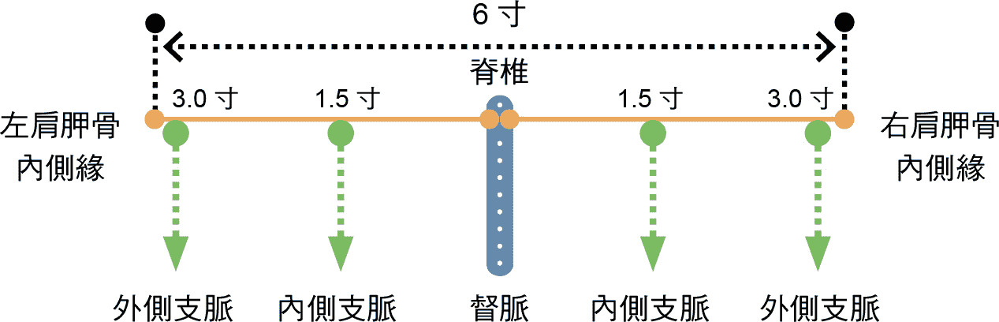

#### 特色二、在腰部另外分出「体腔内部路线」

腰背内侧支脉从肩部行于脊椎正中旁开 1.5 寸的浅层筋肉下行抵达腰部（路线 2-1），然后「入循膂，络肾，属膀胱」(路线 2-2)，亦即循行到腰部第二腰椎棘突下旁开 1.5 寸处，经脉横向转入体腔，穿过脊椎深层的筋肉（膂），联络与本经相表里的肾脏，再向下连属于本经的膀胱腑，这就是本经唯一的体腔内部路线。

内侧支脉在腰部有三条路线：第一条从上背部循着浅层肌肉下行而来，第二条横向穿过深层肌肉进入体腔，第三条再从腰部继续循着浅层肌肉下行。其中，第一条与第三条为循行于体表的路线，第二条为循行于体内的路线，因此腰部（尤其是第二腰椎下旁开 1.5 寸处）就成为本区重要的转运站，详情参阅捷运图。

腰背外侧支脉并没有体内路线，只是循行于脊椎正中旁开 3 寸的浅层筋肉，直接下行至大腿外侧的体表路线。

#### 特色三、从臀部到下肢又分「膀胱经本线」与「膀胱经侧线」

腰背内侧支脉从腰部继续下行，穿过臀部，循行于大腿后侧，最后进入膕窝中央处（路线 2-3、2-4）。这条路线完全走在人体后侧，符合太阳经循行于人体后线的特质，因此称为「膀胱经本线」。

腰背外侧支脉从肩膊到腰背部也走在人体后侧（路线 3-1），但到了臀部转偏外侧，通过外侧的髋关节，再经大腿外侧后缘（路线 3-2），这条路线已经偏离膀胱经的后线特质，属于足太阳经与足少阳经共管区域，因此称为「膀胱经侧线」，最后与「膀胱经本线」合于膕窝中央处。将会在下肢部讨论。

以上可知，本经在腰背部循行以双线并行来涵盖肩胛骨内侧缘与脊椎之间的区域，肩胛骨及其外侧区域则由手太阳小肠经所包覆，手足太阳经携手完全包覆人体背部，正符合太阳分布于人体背面的规律。

### 膀胱经脉三大循行特色:
成就膀胱经对于人体的四大贡献

*   主一身之表，与肺经共同防御人体
*   藏有五脏六腑和相关的背俞穴
*   腰部的重大任务：护肾为本
*   臀部的重大任务：传宗接代

#### 贡献一：主一身之表，与肺经共同防御人体

总论介绍过，《内经》说「伤寒一日，巨阳受之，头项痛，腰脊强。」膀胱经大面积涵盖在腰背部（也包括头项）这个人体最大的阳面，直接抵挡外来邪气的侵袭，成为体表的第一道防线，所以当邪气入侵时会出现「头项痛，腰脊强」这些膀胱经循行所过部位的病候。肺经也主一身之表，与膀胱经共同管理人体卫气的敷布（参阅《卷一》肺经），因此本经与肺经联手成为人体重要的防御机制。

强壮的膀胱经宛如人体的城墙，责任重大，当然也需要被照顾，平日务必要注意背部的保暖，帮助膀胱经抵御外邪，才不会让邪气轻易入侵导致百病丛生。

#### 贡献二：藏有五脏六腑和相关的背俞穴

膀胱经为人体最长的经络，也拥有最多的穴位，高达 67 穴，其中从上背部到臀部就有 39 穴，这些穴位可视为本经在人体背部防御城墙上的每一个关口，而且都派有重兵驻守。请参阅下页膀胱经背部穴位图。

###### ● 精彩的五脏六腑俞穴

不知各位有没有发现，这些背部穴位名称常常出现「俞」字？「俞」通「腧」也通「输」。中医古代典籍常见这些字互用，它们都代表「穴位」之意，这三个字在本经都以「输」字来发音。只是背部穴位的「俞」，前面常配有五脏六腑的名字，如心俞、脾俞等，这是在其他经络穴位很罕见的现象。为何会如此呢？

我常开玩笑说膀胱经是「背景雄厚」的经络，简单的说，因为本经一方面循行路线最长，穴位最多，符合「雄厚」之实；包覆在背部主要区域，符合「背景」之名。

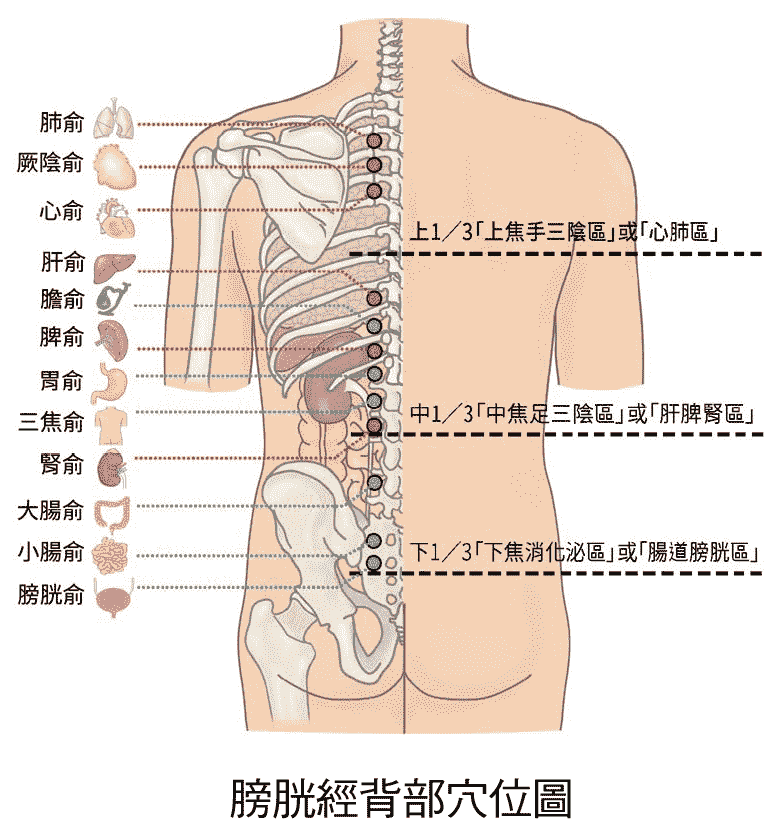

从另一角度来说，人体五脏六腑除了肾脏之外，都位于前面的胸腹部，这就像商场的店家，都会朝向人潮最多的马路敞开迎接来客，而店里深处通常库存货品以便随时补货，重要的财物也会藏在这里，以免被外人轻易窥探或取得，同时也会在后门加装安全锁或警铃，避免有心人士趁隙钻入，造成人身安全以及财务上的损失。

五脏六腑就像这些店家一样，位于人体正面以便对外营业，发挥自身功能，至于人体后面则另有玄机，譬如在人体深层设有特殊机制，以期能发挥三项功能：一是调动气血以补虚泻实，就像商店补货或出清库存一样；二是储藏气血，就像藏有重要的财物一般；三是保护脏腑，不要轻易受伤害，就像警铃或防盗锁具备的防卫功能。

而这个特殊机制就是「背俞穴」！

聪明的五脏六腑选择在功能强大的太阳经「腰背内侧支脉」，接近自己脏腑的位置，设立专属于自己脏腑的穴位。同时为了好辨识，除了心包的背俞穴称为「厥阴俞」穴之外，其他穴位都加上脏腑的名字，例如心俞就属于心脏，功能与心脏有关；脾俞就属于脾脏，功能跟脾脏有关。中医统称这些脏腑俞穴为「背俞穴」。

以中医专业说法，背俞穴为「五脏六腑之气转输于背腰部的腧穴」，在小肠经篇章介绍过「募穴」，募穴是「五脏六腑之气汇聚于胸腹部的腧穴」，都是内在脏腑将其精气透露于体表的特定部位，其中俞穴位于背部，特质属阳，募穴位于胸腹部，特质属阴。俞穴与募穴都是内在脏腑精气的呈现部位，所以都能用来诊断脏腑功能以及治疗疾病，两穴并用有着「阴阳属性相合」及「人体前后部位相对应」的效果，因此传统针灸配穴法中就有「俞募配穴法」，是历代医家爱用的治疗方法之一。

背俞穴其实是脏腑位置与功能的缩小版，可借「信箱」及现代手机进一步说明其概念。小小的背俞穴如同五脏六腑设在膀胱经上的信箱，可以透过按压予以刺激，类似投递信件给收件者一样，提供讯息给脏腑以加强功能，就如按压心俞就能给予心脏适当的推动力。

低调的背俞穴也类似现代手机，手机未启动时，正面只见一片平滑的表面，此现象与人体背部相同。一旦启动手机，按压上面的功能键就能启动相关活动，人体的背俞穴也是如此，只要刺激穴位，就能影响与其相关的脏腑功能。

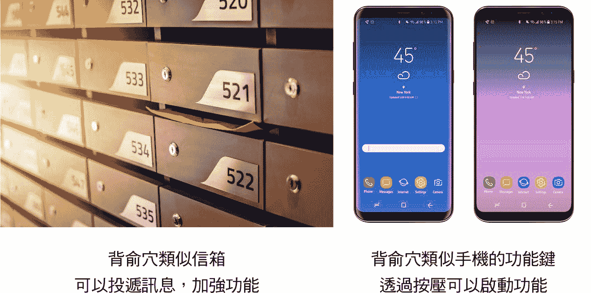

但人体终究是超级精密的组织，远胜于信箱或手机，背俞穴不仅被动的接受刺激而已，也会主动反应脏腑功能的异常现象。换句话说，背俞穴兼具诊断与治疗的双向机能，既能反应脏腑状况，让医师做为诊断的参考，并能透过此穴调节脏腑气血，以达治疗目标。

再者从背部属于太阳经角度来看，《内经》说「巨阳者，诸阳之属也，其脉连于风府，故为诸阳主气也」，足太阳膀胱经可以为诸阳主气，调节全身阳气。「阴阳和谐」是人体生存之道，脏腑功能本来就非常需要阳气来推动，但是五脏六腑几乎都位于阴面的胸腹部，因此精明的脏腑就在最能晒到太阳，吸收阳光最多的背部设置一个穴位，成为自己的窗口，以便吸收大自然阳气以补充自身的阳气。古人曾说晒肚子是在晒肚里的书籍典墨，中医则说晒背部是在补充脏腑的阳气，可见多晒太阳准没错。

最后从与膀胱经相表里的肾经角度来看，肾脏藏有人体最珍贵的「精气」，必要时会输送给其他脏腑组织器官使用。肾脏透过膀胱经背俞穴，一方面随时侦测五脏六腑的功能，了解现况和需求，另方面经由背俞穴将精气输送到位，既迅速又便利。

###### ● 与脏腑背俞穴并列的穴位，可加强相对应的脏腑功能

人体有五脏六腑，再加上心包成为 12 个脏腑，总共 12 个背俞穴。前面说膀胱经腰背部有 39 个穴位，其他的 27 个穴位具有什么特色呢？

前面介绍过，本经背部经脉分布规律为：中间是脊椎，为督脉所过；向外旁开 1.5 寸是「腰背内侧支脉」，五脏六腑背俞穴皆位于此支脉上；向外旁开 3.0 寸是「腰背外侧支脉」，上面也有许多穴位。

督脉及内侧／外侧支脉上的穴位分布及名称都有深意。简言之，这三条经脉以腰背内侧支脉上五脏六腑背俞穴为中心，其余两经上的穴位都与脏腑背俞穴并排，位于外侧「腰背外侧支脉」的穴位名称，透露出与其相对应脏腑所藏的神志功能为主，位于内侧「督脉」的穴位名称则多着重于脏腑功能，例如：

● 心藏神，外侧支脉与心俞并排者为「神堂」穴，督脉与其并列者为「神道」穴，都符合心主神志的功能；

● 肝藏魂，外侧支脉与肝俞并排者为「魂门」穴，督脉与其并列者为「筋缩」穴，与肝藏魂，又主筋相符；

● 脾藏意，外侧支脉与脾俞并排者为「意舍」穴，与脾藏意相符；

● 肾藏志，外侧支脉与肾俞并排者为「志室」穴，督脉与其并列者为「命门」穴，与肾藏志，又主命门之火相符。

临床上可取此并列的穴位治疗，譬如治疗肾病，可取命门、肾俞和志室三穴合用，效果加倍。

###### ● 脏腑背俞穴的定位

中医对于背部穴位所在位置的传统算法，是从胸椎数到骶骨（个人习惯称「荐椎」）共 21 椎，包括了 12 节胸椎、5 节腰椎，和 5 节荐椎合成的荐骨，但中医在数荐椎时是以荐骨上四对荐后孔为准，所以荐椎为 4 节，加总起来才会是 21 椎。

督脉穴位位于脊椎棘突下凹陷处，临床常作为取穴的参考位置。膀胱经腰背内侧支脉穴位在督脉所在之处旁开 1.5 寸处，但在荐椎处另有 4 对位于荐后孔的穴位，通称「八髎穴」，位置比较靠近中线，与其他穴位位置不同，腰背外侧支脉穴位则位于脊椎正中旁开 3 寸处。

为了方便记忆脏腑背俞穴的位置，下面提供结合椎数的口诀：

第一大杼二风门，三椎肺俞四厥阴，心五督六膈俞七，九肝十胆仔细分。

十一脾俞十二胃，十三三焦十四肾，十五气海六大肠，七八关元小肠分。

十九膀胱廿中膂，二十一椎白环俞。

现将相关穴位位置整理如下表，并将脏腑背俞穴以红色标示，较易看出排列顺序大致符合实质脏腑的位置，以及彼此之间的关系。

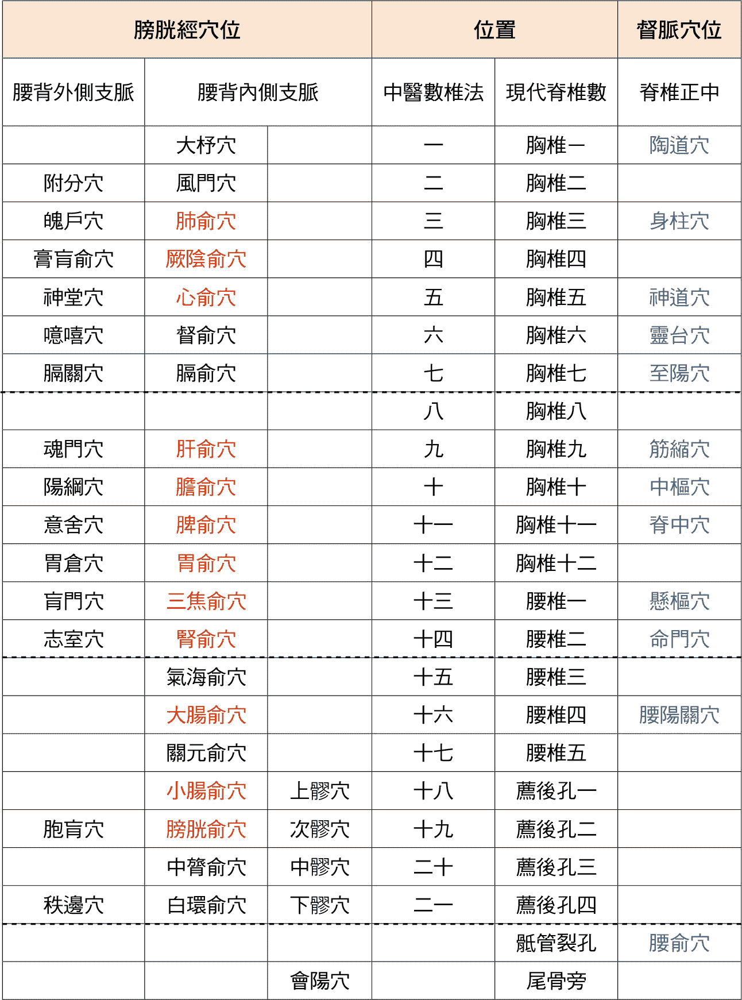

###### ● 脏腑背俞穴的分区特色

背部与腰部共 21 椎，穴位可分为三区探讨，请参阅下图。

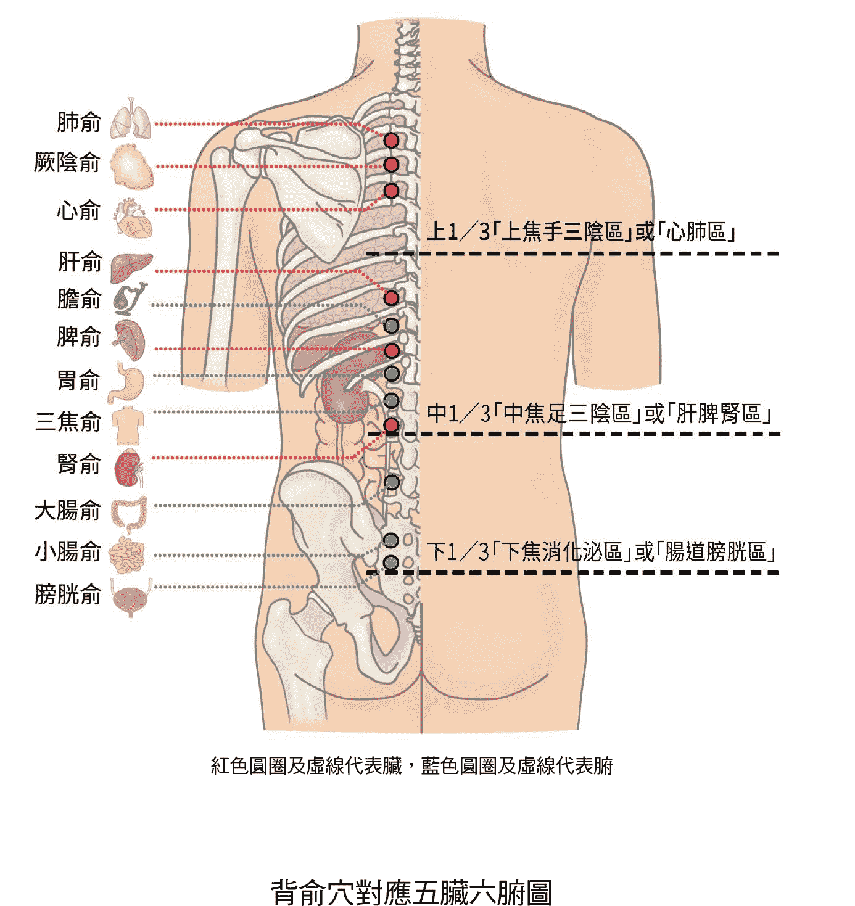

● 1-7 椎属于上 1/3 部位：主要背俞穴为肺俞、厥阴俞与心俞，与手三阴经所连属的肺脏、心包与心脏相同，故此区可视为「上焦手三阴区」或「心肺区」。另外，由于本经直接通过膏肓部位，还有「膏肓穴」，所以也是临床上常用来补劳损、复体能的特殊部位。现代人常于此区出现疼痛现象，俗称「膏肓痛」，由于「心肺区」深层为心肺所在的胸廓，针刺此区时，若操作不当很容易导致气胸，《卷二》大肠经介绍过，大肠经经筋通过膏肓区，可选用远端的大肠经穴位手三里穴来改善膏肓痛症状，安全又有效。

● 8-14 椎属于中 1/3 部位：主要背俞穴为肝、胆、脾、胃、三焦与肾俞，包括足三阴经所连属脾脏、肝脏和肾脏，故此区可视为「中焦足三阴区」或「肝脾肾区」。

● 15-21 椎属于下 1/3 部位：主要背俞穴为大肠、小肠与膀胱俞，以消化与泌尿系统为主，也跟小肠「泌别清浊」之后，水液与糟粕的排出有关，故此区可视为「下焦消化泌尿区」或「肠道膀胱区」。

此外，膀胱经背俞穴的排列顺序富含许多中医重要的法则和逻辑。有兴趣的读者可参阅本书附录的论文［膀胱经背俞穴的临床意义］。个人有关这篇论文的初步想法与初稿在十几年前已然成形，但好事多磨， 后来幸运地由心思与手写工夫都犀利的陈怡真医师撰写完成，十年总算磨得一剑，内容非常精彩，不可不读。

本经在背部循行如此精彩，而且非常符合经济效益，就像现代大厦楼下都设有一排信箱（背俞穴），邮差在此能将所有信件投掷完毕，不必像过去老旧公寓，得每层楼按铃送件。人体也是如此，五脏六腑在膀胱经设立如此集中的「服务窗口」，真的超级「便民」，加上腰背部一片平坦，很适合应用按摩、拔罐、刮痧，以及夏天的三伏贴，透过这些简单的方法就能同时疏通五脏六腑背俞穴，调节全身脏腑机能，当然事半功倍。

#### 贡献三：腰部的重大任务：护肾为本

路线 2-2 入循膂，络肾，属膀胱为本经唯一的「体腔内部路线」。参酌前面穴位图及背俞穴特性分析，这条体腔内路线极有可能是从 14 椎的肾俞穴特地转向穿越深层肌肉，进入体腔，连结肾与膀胱。

依据现代解剖概念，肾脏大致位于第 12 胸椎至第 3 腰椎（即中医的 12 椎到 15 椎）之间，因为右侧有肝脏，右肾的位置比左肾低，膀胱则位于骨盆之内。请参阅下页图。

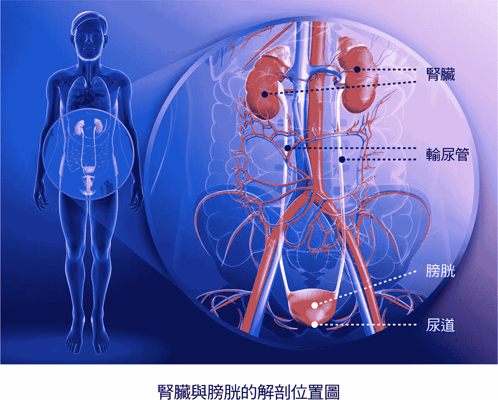

据此推论，体腔内部路线从背部肾俞穴进入体腔，连络相表里的肾脏之后，经过输尿管，再下行连属自己的膀胱腑及尿道，如此就完成连结整体泌尿系统的任务。

本经在腰部的循行很像图钉，浅层肌群类似图钉上方的圆圈，固定在体表；体腔内部路线类似图钉下方的尖针，进入体内连结脏腑。

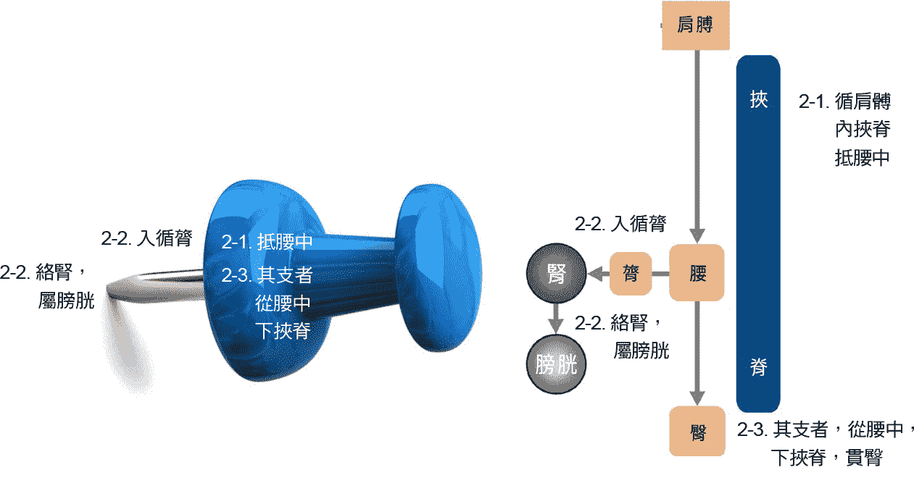

本经「尖针」所刺入的部位为 14 椎下方，与此对应的是督脉「命门穴」，膀胱经是「肾俞穴」，顾名思义都以肾脏为核心，可见 14 椎是肾脏重要的反应区，而膀胱经自己的背俞穴「膀胱俞穴」则位于接近膀胱实质位置的 19 椎下。

本经内侧支脉虽然在腰部转入体腔，但从原文「抵腰中，入循膂」和「其支者，从腰中，下挟脊」可看出本经在 14 椎的浅层肌群循行路线，并未被体腔路线中断，仍无缝接轨的形成一条连线。

上述内容说明膀胱经的体腔内部路线主要连结相表里脏腑，膀胱经体表路线则以连线形式通过腰中以保护体腔内部路线，当然也包含保护肾脏的功能。在肾经经脉系统中，「足少阴之正，至膕中，别走太阳而合，上至肾，当十四椎出属带脉」，肾经经别在 14 椎从肾脏分出带脉，环绕身体一圈，再度印证 14 椎是肾脏功能反应区之外，此处为带脉所出部位，对于人体纵行经脉的管理具有极为重要功能，详情参阅《卷三》脾经和《卷六》肾经。

#### 贡献四：臀部的重大任务：传宗接代

依据本经循行来看，臀部有二条路线，一条是从腰背内侧支脉延伸而来「2-3 其支者，从腰中，下挟脊，贯臀」，另一条是从腰背外侧支脉延伸而来「3-2 过髀枢，循髀外后廉」。然而参酌经穴图会发现，本经在臀部有三条路线，除了前面所述之外，增加的路线是通过荐椎荐后孔的八髎穴，继续向下连结尾骨旁边的合阳穴，再向下经过大腿后侧正中线，最后进入膕中。

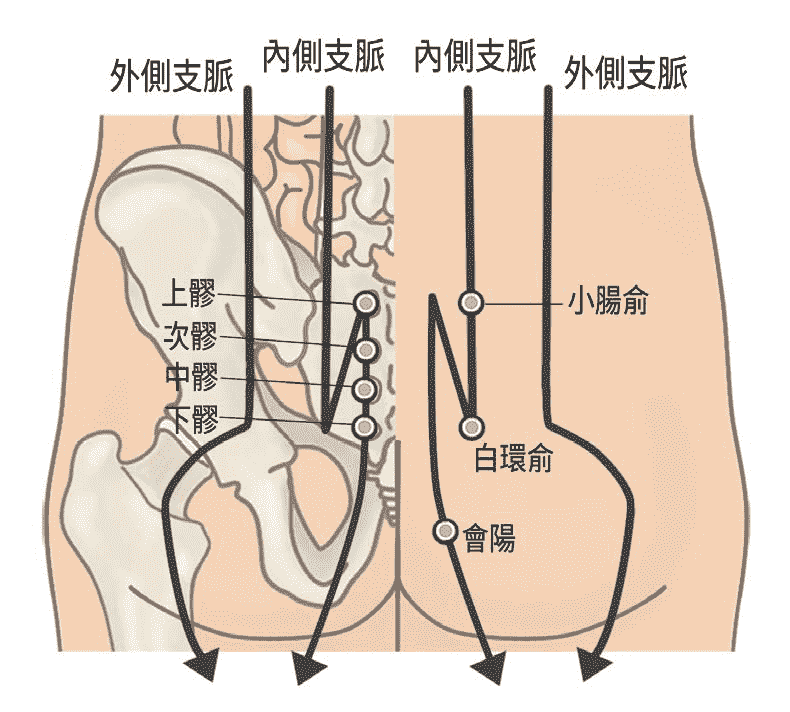

可见腰背内侧支脉不是从 21 椎的白环俞直接穿过臀部到下肢，而是转向更内侧，另辟一条与 18 椎小肠俞～21 椎白环俞平行的路线，这条路线主要为了经过荐椎的八髎穴和尾骨旁的合阳穴。

荐椎和尾骨是组成骨盆的骨性结构之一，但重视经济效能的人体，为何要在骨盆后方转弯，增加一条路线呢？

原因一，前面介绍过，膀胱经在腰部特别保护与其相表里的肾脏。膀胱经自己的膀胱腑位于骨盆之内，对自己人更该予以强大保护，荐椎和尾骨正是骨盆后方坚固的防护结构，所以除了原有通过「膀胱俞」穴路线之外，再加上一条路线。若将两侧路线合并来看，膀胱所在位置后方就有四条路线，足以呈现膀胱经对于自家人的保护诚意。

原因二，骨盆对于人体有重要意义，因为骨盆里面有重要的肠道组织、生殖和泌尿器官，攸关自身生命及传宗接代任务，而且骨盆结构也会影响身体组织及气血的平衡。既然骨盆如此重要，循行于人体背部的膀胱经也当仁不让从骨盆后方给予特殊的保护。

## 3.下肢部的「高手如云」路线

本经在下肢部主要循行于阳面后侧，从大腿后侧经过膝关节后方的膕窝中央处，穿过小腿肌肉中央，循着阿基里斯腱（又称「跟腱」）外侧下行，走在外踝后方，再沿着足背外侧缘，最后抵达小趾外侧末端，与足少阴肾经相交接。

本区分为「大腿部位」和「小腿及足背部位」说明。

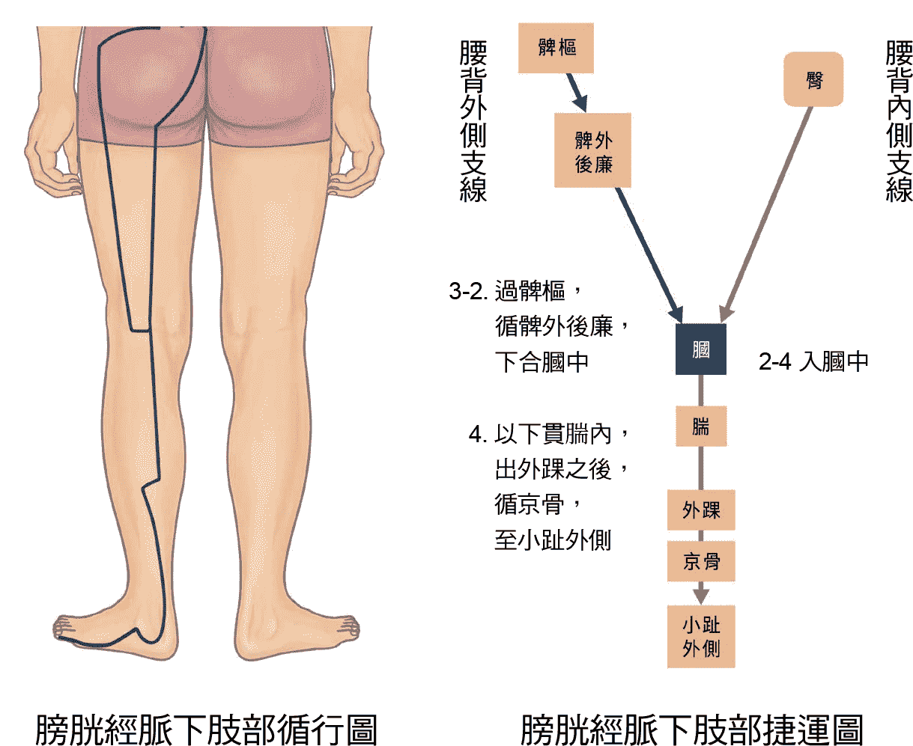

### 大腿部位：从臀部到膕窝分为
「膀胱经本线」与「膀胱经侧线」

大腿的实体结构衔接自臀部，大腿后侧面积也一样宽大，加上具有承担身体重量的责任，因此承接来自臀部的两条经脉：

● 腰背内侧支脉从腰部下行，穿过臀部，循行于大腿后侧，最后进入膕窝中央处。这条路线走在人体后侧，完全符合太阳经循行于人体后线的特质，因此称为「膀胱经本线」。（路线 2-3 其支者，从腰中，下挟脊，贯臀 。2-4 入膕中）

● 腰背外侧支脉从肩膊到腰背部也走在人体后侧，但到臀部转偏外侧，通过外侧的髋关节，再经大腿外侧后缘，这条路线已经偏离膀胱经的后线特质，属于足太阳经与足少阳经共管区域，因此称为「膀胱经侧线」。（路线 3-1 其支者，从髆内左右别下贯胛，挟脊内。3-2 过髀枢。循髀外后廉，下合膕中）

「膀胱经本线」与「膀胱经侧线」最后在膕窝中央的委中穴会合。

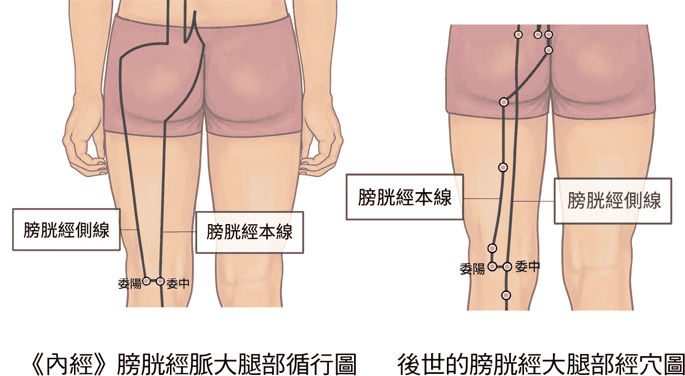

这里出现一个疑点，依据《内经》原文说法所画出的循行图如上页左图，膀胱经本线通过大腿中央，直接抵达委中穴，膀胱经侧线通过大腿偏外侧，在膕窝处向内转，抵达委中穴。有些后世依据穴位顺序所画的经穴图如右图，膀胱经本线从大腿中央逐渐偏向外侧，在膕窝处向内转，会合于委中穴，膀胱经侧线通过大腿偏内侧，直接抵达委中穴。

个人认为右图的经穴顺序不符《内经》说法。原因有二：

第一，膀胱经在膕窝有两个穴位，一是位于膕窝中央的「委中穴」，属于本经的合穴。另一是位于膕窝外侧的「委阳穴」，是三焦的下合穴。三焦经是手少阳经，胆经是足少阳经，三焦经与胆经是手足同名经，就像兄弟一般，关系非常密切。

从《内经》循行内文，可看出两条支脉汇入膕中的路线：

膀胱经主线循行于大腿后侧中央，到了膝关节处「路线 2-4 入膕中」，可见主线直接进入膕中的委中穴；

膀胱经侧线衔接自外侧支脉，外侧支脉在臀部交会胆经的环跳穴，然后交棒给膀胱经侧线，后续路线都偏于胆经，到了膝关节处「路线 3-2⋯⋯下合膕中」。委阳穴就位于偏外侧的位置，可见侧线先连结偏外侧的委阳穴，再转弯向内合入膕中的委中穴。因此无论就同名经或循行部位考量，膀胱经侧线应先连结位于外侧的委阳穴，再并入中央的委中穴。

本经外侧支脉在臀部交会胆经的环跳穴，是本经在躯干部位唯一交会穴，从而也让环跳穴成为兼治少阳与太阳疾病的穴位，依据前述说法，位于膀胱经侧线的委阳穴也成为兼治太阳与少阳疾病的穴位，本经在足部还有一个兼治太阳与少阳疾病的穴位「金门穴」，囿于篇幅，无法详细介绍。

第二，《内经》说「合治内府」，指出每条经脉的合穴都能治疗所述脏腑的疾病，这个法则对于隶属于六腑的阳经尤其重要，内「府」狭义来说是指「六腑」，膀胱经合穴正是位于膕窝中央的委中穴。膀胱经本线衔接自腰背内侧支脉，这条既然是膀胱经的主干，理应直接连结属于本经合穴的委中穴。

### 小腿及足背部位：单线且外偏的路线

● 单线：本部位循行承接来自大腿的两条经脉，在膝关节后侧膕窝中央的委中穴会合成为一条经脉，然后沿着小腿后侧下行，穿过小腿后侧的腓肠肌（俗称小腿肚），一路下行到外踝的后方，再沿着脚背的外侧缘，最后抵达小趾外侧末端，与足少阴肾经相交接。（路线 4 以下贯腨内，出外踝之后，循京骨，至小趾外侧）

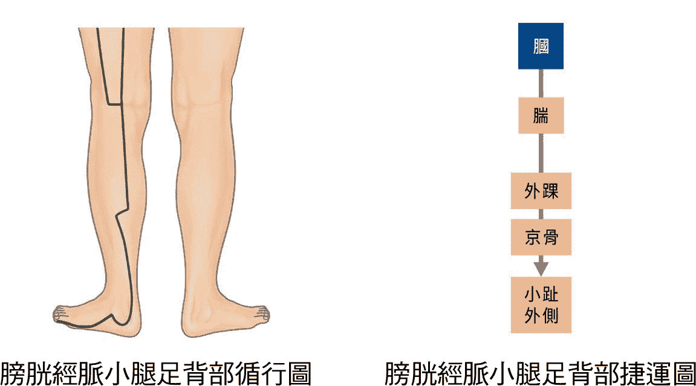

● 外偏的路线：本经自大腿到小腿肌肉都循行于后侧中线，但从阿基里斯腱开始转偏外侧，为何如此走向？原因有三：

1.阿基里斯腱是由小腿后侧的腓肠肌和比目鱼肌向下融合成为坚强有力的肌腱，最后连接到跟骨后侧，所以又称为「跟腱」，但此肌腱不限于脚跟。人体的经脉系统通常不会直接走在肌腱上，因为肌腱的坚硬特质不利经脉通过，更有碍气血的输送，因此经脉多行走于肌腱的旁边，方便经脉运送气血。故本经虽然通过小腿肌群的中央，当继续向下遇到阿基里斯腱时，不会直接通过阿基里斯腱的中央，而选择经过肌腱的旁边。

2.阿基里斯腱是人体后侧强大的肌腱组织，通过的经脉也比较多，因此旁边就有两条经脉通过，内侧是足少阴肾经，外侧是足太阳膀胱经，这符合少阴经与太阳经分布在人体后线的规律。《卷四》心经介绍位于尺侧腕屈肌的神门穴可以治疗足跟痛，正是依据足少阴肾经和足太阳膀胱经夹行足跟的循行特色。

3.本经在腰臀部、大腿和小腿肌肉丰厚的部位都可以直接走在后侧中央，但是当接下来的小腿下半部及脚部组织越来越缩小，同时还有其他经脉也共享着这片小小区域时，本经势必要有所收敛，故行于后侧偏外处，最后抵达最外侧的足小趾。

基于上述三个原因，本经通过小腿肌肉中央之后，就稍微转向外侧，沿着阿基里斯腱的外缘，通过外踝的后方，再循着足背外侧缘，抵达小趾外侧末端，最后与足少阴肾经相交接。

本经下肢部从臀部下缘的承扶穴到足小趾末梢的至阴穴共有 18 穴，主要分布在小腿（9 穴）和足背（6 穴）。

小腿从委中穴到承山穴这段路线都走在小腿中央，小腿后侧肌群是腓肠肌和位于其下的比目鱼肌所共同组成的小腿三头肌，是维持人体直立的重要肌肉之一，与人体站、走、跑、跳等各类活动都有重要关联。本经贯穿腓肠肌（路线 4 以下贯腨内），光是腓肠肌由上而下就有三个穴位（合阳穴到承山穴），可见其重要性，也呼应了病候篇中「主筋之所生病」。

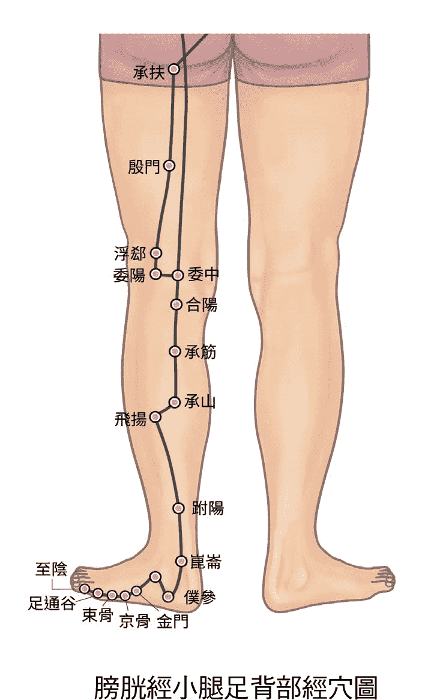

从承山穴沿着腓肠肌下缘向外侧下行，与阿基里斯腱外侧交会处就是本经的络穴飞扬穴，经过跗阳穴再沿着跟腱外侧下行，通过跟腱与外踝尖之间，跟骨上缘的崑仑穴，向下到跟骨凹陷处的仆参穴，从此转为足背区，从申脉穴到至阴穴，短短范围竟有六个穴位，是十二经脉之中，单一经脉穴位分布密度最高者，而且每个穴位都深藏功夫，高手如云，例如申脉穴是奇经八脉交会穴法中阳蹻脉的交会穴，可以调整躯体两侧张力的不平衡，至阴穴为本经最后一个穴位，是历代调整胎位不正，可以转胎的特殊穴位。

整体而言，人体最长的膀胱经很有特色，例如：

1.本经循行真的是「从头到脚」，为中医「头痛医脚，脚痛医头」治法提供坚实的结构基础，因此头面部穴位与足部穴位可以互相治疗，如位于眉头的攒竹穴可以治腰痛，位于足背的京骨穴可以治眼病。

2.背部整齐排列的脏腑背俞穴，是五脏六腑的窗口，也是诊断治疗的入口，只要在背部施以治疗手法就能调整五脏六腑疾病，真的非常经济实惠。

3.位于膕窝的委中穴为中医四总穴「腰背委中求」，擅于治疗腰背疾病，加上太阳经的阳气聚集于此，本穴又称为「血㕁」，即血气深集之处，自古就有在此处拍痧出血以活血通络，透散邪热的经验，对治中暑特别有效，可配合肘窝一起拍痧，效果加倍。

4.膀胱经上的穴位当然能治疗局部病症，如位于眼内眦的睛明穴可治眼病，位于腰部的肾俞穴可治腰痛，若能以局部穴位配合远端的穴位疗效更佳，如睛明穴加上京骨穴合治眼疾，肾俞穴加上攒竹穴或委中穴合治腰痛等。

经络循行路线长，家族成员庞大，个个身怀绝技的膀胱经，治疗疾病完全可以不假外人，由自家人同心协力即可达成目标，也难怪膀胱经系统一直是专业中医师和民俗疗法从业人员喜欢应用的经络，因为只要在头部、腰背及小腿施治，就能达到全身治疗的效果。

## 足太阳膀胱经脉──病候

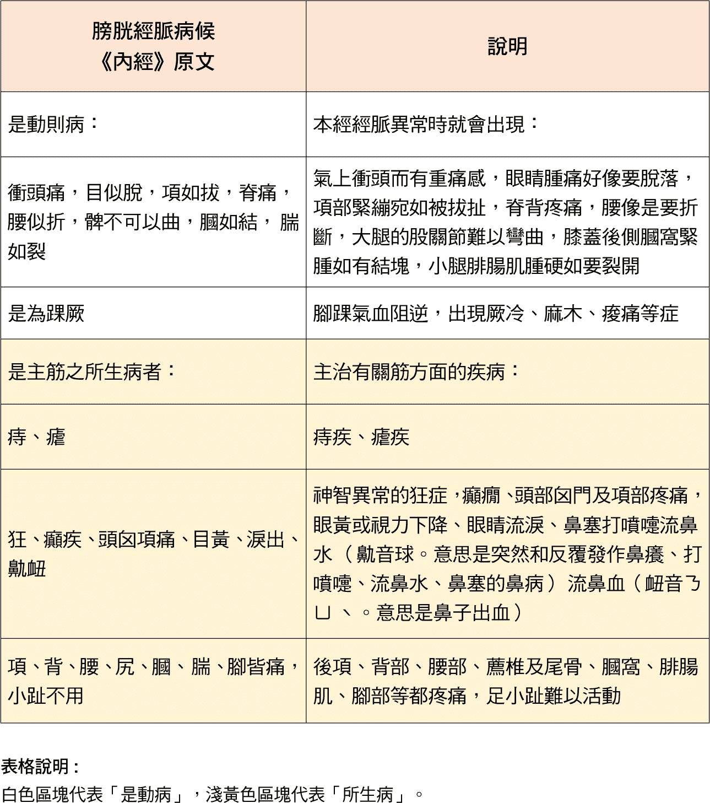

膀胱经脉病候都与循行部位有关，具有二个特色：

第一、疼痛强度及肢体筋肉紧硬程度为十二经脉之最。

第二、特殊的主筋之所生病。

关于第一项特色「疼痛强度及肢体筋肉紧硬程度」，以下依据病位分为二类：

● 头面五官病：是动病以强烈疼痛为主，单独看冲头痛这种剧烈头痛，类似颅内压升高、脑血管病变或脑瘤等症状，但若加上眼睛肿痛到好像要脱落的「目似脱」，则也可能是眼压高所致。无论颅内压或眼压异常，都与膀胱经入络脑，以及膀胱与肾主管水液功能异常有关。

所生病的痛感较缓，多以功能失调为主。例如精神异常的狂躁、癫症，头囟及项部疼痛，五官病候的眼白发黄或视力下降（在《卷二》大肠经篇章有说明）、流目油、鼻塞、打喷嚏、流鼻水或流鼻血等，这些病候都与循行所过部位功能异常有关。

● 肢体病：是动病从其使用字眼来看，如：项如「拔」，腰似「折」，膕如「结」，腨如「裂」等，小肠经脉病候也有「肩似拔，臑似折」，病情与本经相似，可见手足太阳经为人体所承担之重责，因为这些都是局部筋脉出现严重拘急或肿紧等异常结构，此类结构除了产生剧烈疼痛外，还有躯体被严重纠结、扭曲、活动度明显侷限，才会有好似被拔起、被折断、变成结块以及快要爆裂的感觉。

所生病从项、背、腰、尻、膕、腨、脚皆痛，小趾不灵活，相对于是动病，其症状缓和多了，比较是一般性的疼痛及灵活度差。

本经病候还有痔疾和疟疾，痔疾与本经经别「别入于肛」有关，经别篇会介绍。疟疾的特质与少阳经关系密切，且留到胆经再讨论。

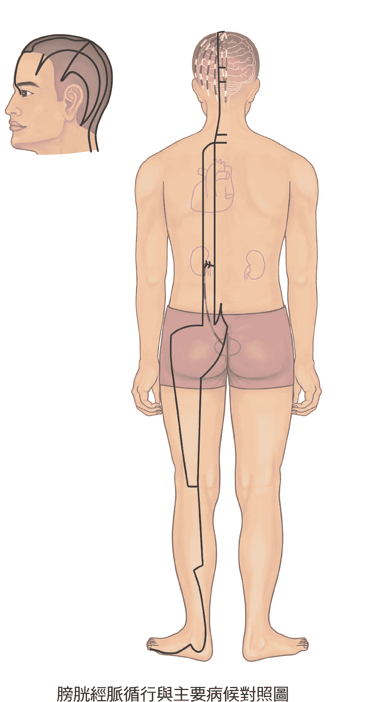

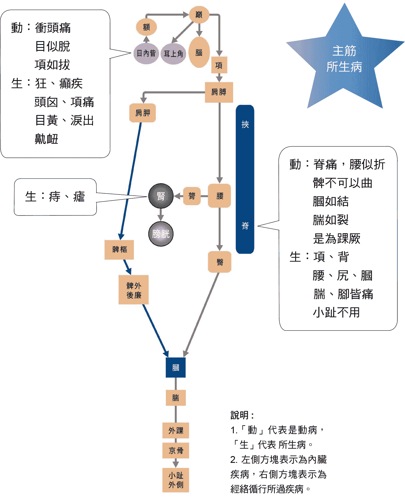

关于第二项特色「特殊的主筋之所生病」，看到「筋」很容易联想到「肝胆主筋」中医理论，可是在十二经络系统中，胆经病候不主筋，却主骨之所生病。刚开始学中医，读到这里还以为是误植，查看其他书籍之后，确定本经确实主筋之所生病。

明朝大医家张介宾先生解释说：「周身筋脉唯足太阳为多为巨。其下者结于踵，结于腨，结于膕，结于臀。其上者，挟腰脊，络肩项，上头为目上纲，下结于頄。故凡为挛、为弛、为反张戴眼之类，皆足太阳之水亏，而主筋所生病者。」足太阳经筋最长，分布最广，足太阳与足少阴相表里而属水，水亏则经筋失养，容易出现『筋』病。

上述内容有两个重点：

1.膀胱经经筋分布在身体筋脉的数量最多，型态也比较巨大。

2.当身体筋膜出现挛急或松弛的异常张力时，多与膀胱和肾主水功能异常有关，水不足导致膀胱经经筋失去濡养，才会出现筋病。

由于本经主筋之所生病与经筋循行关系密切，将在经筋篇介绍。

# 二、足太阳之正（经别）

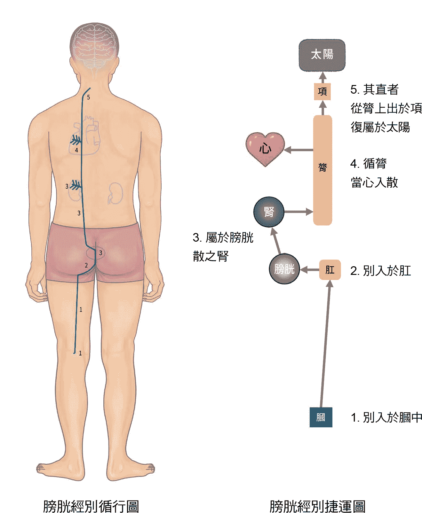

## 膀胱经别──循行特色：胱肾心别线

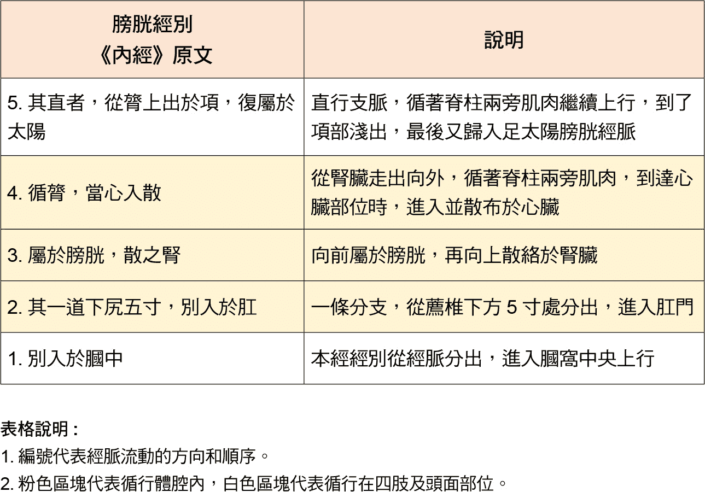

本经别循行有两大特色：1.浅出又深入，2.连结三脏腑，可简称为「胱肾心别线」。

1.「浅出又深入」：首先进入膕窝中央上行。第一深入点：进入肛门，向前入到膀胱，再上到肾脏；第一浅出点：从肾脏浅出到膂；第二深入点：循膂向上到了心脏区域，就转而进入分布于心脏；第二浅出点：从心脏浅出到膂，循膂向上出于项部，最后合入膀胱经脉。

2.「连结三脏腑」：本经别两个深入点是为了连结肛门及重要脏腑。第一深入点连结肛门、膀胱和肾脏，第二深入点连结心脏。

#### 第一深入点连结肛门、膀胱和肾脏，产生「泄殖腔」特殊功能

本经别「下尻五寸，别入于肛」循行让膀胱经掌控前阴与后阴，当然也可管理大便和小便。膀胱经别掌管前后二阴的特质，也与「泄殖腔」有关。

前后二阴包括前阴的尿道和生殖道、后阴的肛门，都是身体对外的出口。自然界中某些动物的直肠末端较大，因此尿道和性腺就开口在肠道，形成了一个消化、排尿、生殖功能三者共享的小腔，称为「泄殖腔」，顾名思义就是排泄与生殖共享的小腔，兼具了尿道、肠道及生殖道功能。人类在胚胎时期也有原始的胚胎泄殖腔，发育过程中就慢慢的分化出前阴与后阴。

膀胱经别保留了泄殖腔的结构与功能，这个特色也反映在膀胱经穴位主治特色上，除了维持小便功能之外，位于小腿肚的承山穴还可治疗便秘，位于小足趾末梢的至阴穴可以调整胎位不正，这些能力都与本经别循行「别入于肛」有关。

本经别循行先到膀胱再到肾，虽与经脉方向相反，仍能加强表里脏腑的连结关系。肾脏主管人体的骨和髓，脑为髓海，当然也归肾所管。但肾经系统并未进入脑部，而是透过膀胱经别在项部合入膀胱经脉，如此一来，就可以搭膀胱经的便车入络脑去管理脑部机能。

肾经经脉从肾连膀胱，本经别从膀胱连肾，「肾胱双向道路」都通过人体下阴部，也就是过去「泄殖腔」所在处。因此本经经脉连结膀胱与肾跟排尿功能有关，本经别连结肛门跟排便功能有关，也为「肾司二阴及二便」建立经络连线。此部分于《卷六》肾经说明。

#### 第二深入点再连结心脏，在膀胱与肾原有关系中再加入心，对于维持人体生命机能有重要意义

###### ● 新增-膀胱与心脏的关系

足三阳经的经别都连至心脏，以便心脏可从远端管理其功能。本经经别与心脏建立新的连线，从人体经济学角度来说，膀胱经这条「背景雄厚」的经络系统，透过本经别连结心，让君主之官的心脏拥有直通背部的特权，不仅能直接管理膀胱经，更能享有膀胱经的资源。例如：

● 膀胱经与卫阳之气有关，可加强「心部于表」的人体防御机制。

膀胱经为诸阳主气，也主管卫气的敷布。心为人体之太阳，「心部于表」主导人体防御机制，虽然心脏能量十足，但日常生活中经常损耗，因此也须依靠足太阳经提供旺盛的卫阳之气。

《伤寒论》中指出风寒邪气侵袭人体，首先出现病证为「太阳之为病，脉浮，头项强痛而恶寒。」中医称为「太阳提纲证」。其中「脉浮」，代表邪气还在体表，膀胱经主一身之表；「头项强痛而恶寒」则是说明头项正是膀胱经所过部位，寒主收引，寒邪入侵膀胱经，导致头项肌肉出现僵硬疼痛症状；膀胱经为诸阳主气，阳气被寒气抑遏，故有恶寒现象。可见「太阳提纲证」的病性与病位完全与膀胱经相符。

在《卷四》心经介绍过《伤寒论》天下第一方「桂枝汤」的祖方为桂枝甘草汤，呈现「心部于表」的特质。桂枝归心、肺、膀胱经，配合甘草，仅仅两味药就成为温补心脏阳气，提供人体防御病邪能力的重要组合，由此可见经方组方的厉害之处，而桂枝正是心经与膀胱经联手防御外邪的代表药。

● 心主管五脏六腑机能，膀胱经背部并排的脏腑背俞穴，让心脏便于管理，可以事半功倍。

● 心之华在面，心经在面部主要连结目内眦和目系，膀胱经起于目内眦又入络脑，两经协力，加强对于眼睛的滋养与管理。

● 膀胱经入络脑，心主神志，透过膀胱经抵达脑部，更有效管理神志。本经经脉病候的狂癫疾病，也与心主神志失常有关。

● 排尿功能方面，膀胱是在肾脏的指挥下管理排尿，肾阳足则能气化水液成为尿液。透过本经经别与心的连结，心主神志对于排尿也有影响。大家都有情绪影响小便的经验吧！临床上遇到许多中老年妇女，常出现尿急、尿频、夜尿、急迫性尿失禁等现代称为「膀胱过动症」症状，多数患者都有情绪容易紧张、心神不安的个性特质，中医治疗时会加强安定神志以改善症状。

膀胱与心脏之间还有通经关系，五门十变法中的「丁壬合化木」就是心与膀胱相通。有兴趣的读者可参阅《医道精要》（橡实出版）。

###### ● 加强-肾脏与心脏的关系

《卷四》心经介绍过心与肾之间有着非常特殊的关系，如互相对立的上下关系、水火关系等，互相合作的心肾相交关系等。人体为了维持心与肾的功能，在人体的前面和后面都建立连线：人体前线为肾经经脉「从肺出，络心，注胸中」，人体后线为膀胱经别直接连结肾脏与心脏，如此严密的设计也仅存在攸关生存的心脏与肾脏之间。

心与肾的关系若能「心肾相交」则可维持人体正常生理机能，若「心肾不交」则百病丛生，最常见的就是失眠。临床上许多失眠患者都兼有头部及颈项肌肉僵硬，这种状况源于本经经别连结心肾之外，还连结膂和项部，所以头部及颈项肌肉异常反过来也会影响心肾的关系而出现睡眠障碍。

本经经别连结心肾方式也非常特别：【散】之肾，当心入【散】。此处的「散」字有散布之意，也就是说本经别不是以单点方式连结，而是大面积、全面性的散布方式连结心肾两脏，目的是为了从人体背部提供心肾两脏周全的保护，并确保膀胱经所输送的阳气能直接送货到府，维持心肾功能正常。这种连结方式不仅展现出膀胱经的霸气与能力，并串连了聚餐团队主要成员，以呈现人体对于心肾两脏的重视。

本经别从背部进入三个脏腑的位置，刚好都位于经脉篇脏腑背俞穴分区特色的上中下三区内：

● 当心入散：在第五椎的心俞穴，位于上 1/3「心肺区」；

● 散之肾：在第十四椎的肾俞穴，位于中 1/3「肝脾肾区」；

● 属于膀胱：在第十九椎的膀胱俞穴，位于下 1/3「肠道膀胱区」。

只要掌握这三个进入脏腑的背俞穴就能掌控全部的背俞穴，膀胱经别真的很聪明，也具有「公平」和「平衡」的概念喔！

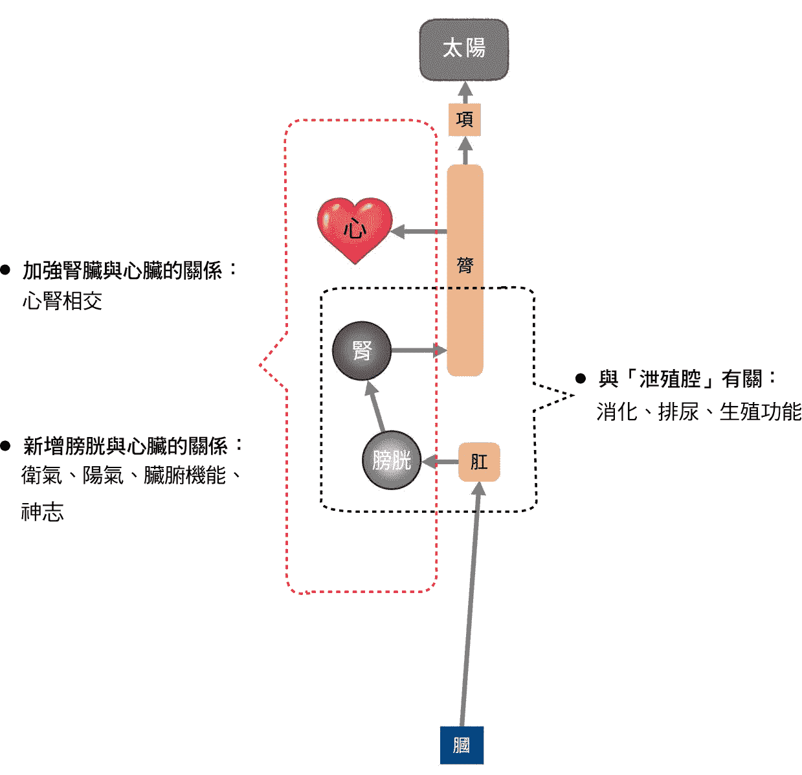

# 三、足太阳之别（络脉）

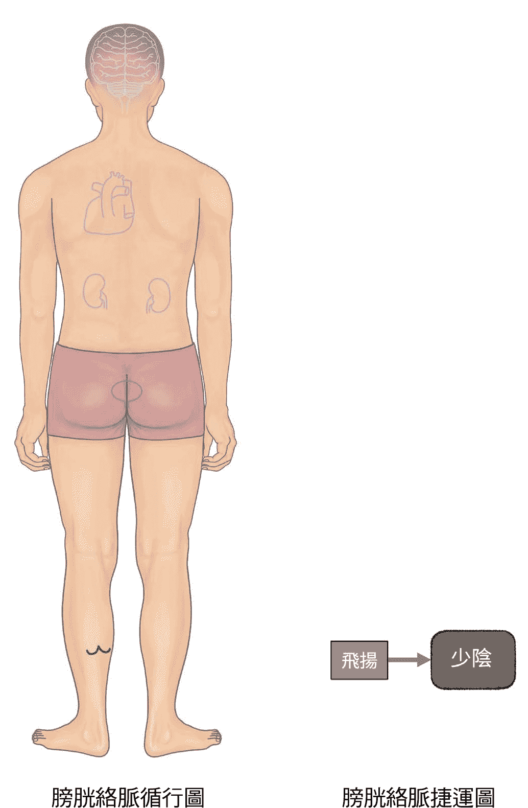

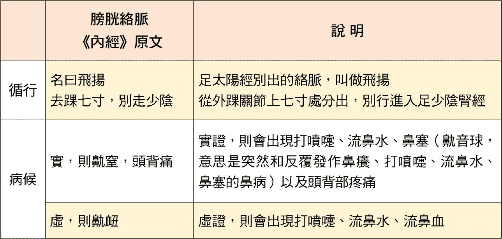

## 膀胱络脉──循行特色

本经络脉是超级「省话一哥」，且是十二络脉系统中循行内容最少的。何以如此？

这个情况跟社会上名门望族的现象类似。这些望族的权势和财富众所皆知，家族成员在交际场合只要说出姓氏，不必多说，大家马上将之与家族势力联想在一起。本经络脉正是如此。膀胱经家族的庞大势力在经脉和经筋中已充分展现，本经络脉只需轻轻的「四两拨千斤」，立刻与家族势力相牵连。

依据中医理论，络脉功能在于加强相表里经脉的连结关系。本络脉就在小腿外侧外踝向上７寸，承山外下方 1 寸，阿基里斯腱与腓肠肌交会处外侧的飞扬穴分出，向内连结位于小腿内侧的足少阴肾经。

刚开始撰写本系列书时，因为每条经络的难度不同，无法按着经络循行顺序写作。我先从较易入门的手经着手，手经的络脉循行依据原文推衍即可。膀胱经络脉是当时写的第一条足经络脉，原本很开心地顺着手经络脉逻辑推论，写着写着却突然卡关！

前后思量，发现足经络脉在连结相表里经脉时还有人体结构上的考量。相表里经脉通常位在四肢的相对位置，譬如太阴经与阳明经分别位在阴面与阳面的前线，厥阴与少阳分别位在阴面与阳面的中线，少阴与太阳分别位在阴面与阳面的后线。

再参考《内经》的说法，经脉多循行于人体深部，为纵行路线，络脉多分布在人体较浅的部位，为横向分布。络脉从络穴出发去连接对面的表里经，依据络脉多分布在较浅部位的规律，不太可能直接穿过肌肉层到对面，反而比较可能通过表面的肌群到对侧，这样既符合络脉的循行特性，又顾及络脉高度安全的需求。

络脉这条绕行的路线，看似比直接穿越到对面远了些，有点不符经济效益。其实不然！因为「凡走过必留下痕迹」，络脉这些横向而浅层的道路，经过的范围更广、连结更多的经脉与部位，反而凝聚更大的效力！有关络脉的循行可参阅《卷二》胃经络脉篇。

回归《内经》理论及人体结构，膀胱经络脉循行「去踝七寸，别走少阴」，应该不会采取直接穿过腓肠肌的方式连结肾经，最可能的方式就如胃经络脉一样，绕过小腿后侧肌群，再连结肾经，我称此为「走后门」路线。

「走后门」好处多多。首先，保护络脉免于损伤。小腿肌群是活动频繁的肌肉，若直接穿越很容易损伤。

其次，本络脉选择以Ｗ型走向，与经脉方向相反，从飞扬穴开始沿着腓肠肌向上经过承山穴，再向下转行于内侧，在阿基里斯腱与腓肠肌交会处内侧缘连结肾经经脉。小腿后侧的肌群主要有腓肠肌和比目鱼肌，合称「小腿三头肌」，承山穴位于小腿制高点，控制小腿三头肌的活动，本络脉反向经过承山穴再到小腿内侧，让膀胱经得以全面控制小腿三头肌的外侧、中央与内侧肌群，本经经筋还在小腿部位特地分出两条支脉来涵盖保护。

本络脉与肾经的交会点，临床上我们常用来治疗肾经与膀胱经两经疾病，是好用的穴位，但没有穴名，因其位置与飞扬穴正相对又偏于内侧，我们称之为「内飞扬穴」。

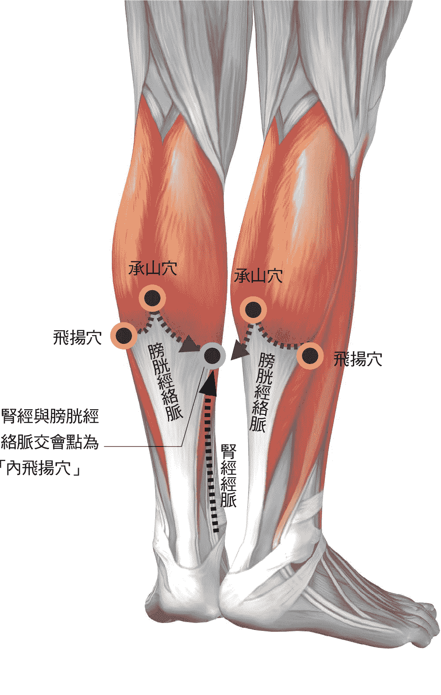

## 膀胱络脉──病候

本络脉病候以头面症状为主，然而无论是头背痛和鼻病，都是膀胱经脉所生病部分病候的浓缩版。透过络脉的连结，不仅加强了膀胱经本身的头背疾病和鼻病关系，还加入了肾脏主水及小便的特质。因此本经络脉有三个特色：一、来自膀胱经本身特色，二、来自表里经肾经的特色，三、藉由鼻病呈现与肺经相关特色。

膀胱络脉三项常见病候：

1.头背痛：除了本经之外，肺经经脉病候的气盛有余或气虚都有肩背痛。肺经与膀胱经都主一身之表，也与卫气敷布全身有关，因此头背痛及肩背痛都隐含着与卫表之气功能异常有关。

2.鼻病：十二经脉病候中，鼽窒和鼽衄代表所有鼻部疾病。 「鼽」是突然和反覆发作的鼻子痒、打喷嚏、流鼻水、鼻塞等症状， 类似现代的过敏性鼻炎。鼽窒强调鼻塞，鼽衄则还流鼻血，都是过敏性鼻炎兼有的症状。实证多因风寒阻滞经脉，因此出现气血不通的头背痛以及鼻过敏和鼻塞等症。虚证多因久病或自身卫气不足，气虚不能摄血，因此出现鼻过敏和流鼻血等症。

「鼽窒」出现在本经络脉病候，「鼽衄」出现在大肠经、胃经、膀胱经脉与络脉病候中，这三条经络系统循行都经过鼻部。膀胱经系统病候重复出现鼻病，可见本经对于鼻部的重要性。

除了经络系统的连结关系外，还有肺开窍于鼻，司呼吸，主一身之气，膀胱经也透过鼻部与肺经系统建立密切关系。

3.小便异常：此症状未见于病候，但从功能上来说，膀胱是泌尿器官，与尿液的气化和排出有关，一旦功能失常，必然会出现小便异常。

膀胱的泌尿功能还需要其他脏腑的协力才能完成。例如肺为水之上源，通调水道，下输膀胱，肺经经脉病候有「小便数而欠」及「溺色变」，络脉有「小便遗数」；肾为水府，掌管全身水液气化，肾经络脉病候实证有小便难出的「闭癃」。

膀胱络脉与肺肾功能有关，也将前述三类症状连在一起。临床上鼻病患者，成年者常兼有头痛、肩背痛，小朋友则兼有尿床情况。

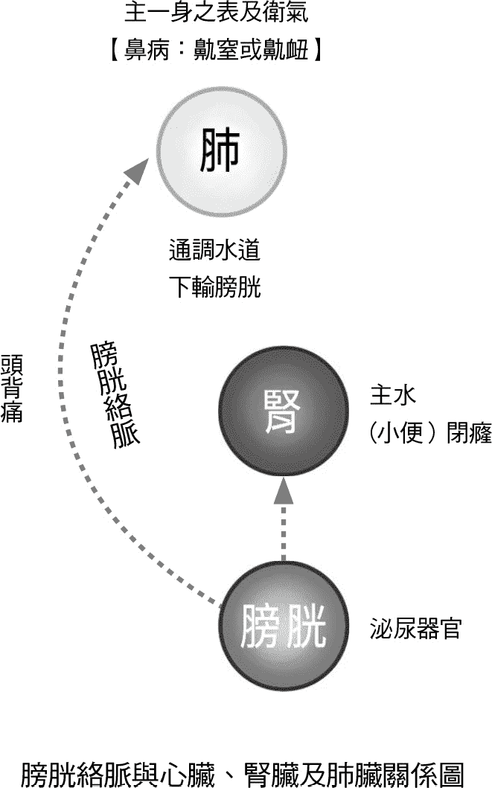

从另一方面来说，由于膀胱经脉连结鼻部和膀胱，《内经》提到面部望诊：「鼻孔外张，膀胱漏泄。」鼻翼过度外张的人，容易出现膀胱无法藏津液而漏尿的现象。为何会出现这种情况呢？我们临床上观察鼻病患者，因长期鼻塞只得用力呼吸，导致鼻翼外张、鼻孔变大，还兼有小便异常现象，确实验证《内经》理论。

曾有一位小学高年级男生来就诊，刚开始父母亲只提到孩子有严重过敏性鼻炎，鼻塞导致头痛影响学习。随着鼻部症状逐渐改善，爸爸才偷偷询问「中医有没有办法治疗尿床？」原来孩子从小就会尿床，即将升入国中还没改善，为此非常担忧。我马上跟家长解释这个原理，强调只要加强治好鼻炎，尿床也会改善。后续疗程果然将鼻病和尿床同时改善，家长非常赞叹中医理论的奇妙！后文将会介绍原理。

临床也治疗被西医诊断为「注意力不足过动症」(ADHD)的孩子，他们常兼有过敏性鼻炎或慢性鼻窦炎，以及头痛昏沉的现象，类似本络脉病候。《卷四》心经总论介绍过「心肺有病，鼻为之不利」，本经经别也散入于心，膀胱经与心肺都有关，心肺功能不佳当然会影响鼻子功能；四对鼻窦位于头颅，其中额窦正位于膀胱经脉所过部位，加上膀胱经脉入络脑，与嗅觉和情绪都有关。

现在的孩童较少在户外活动，长时间都待在室内，精力无法发泄，汗出不畅，毛孔容易阻塞，体温调节功能差，都很怕热，喜欢躲在冷气间及喝冷饮，符合中医所说的「形寒饮冷伤肺」，当然容易鼻塞。长期鼻塞的孩子心肺功能差，呼吸不顺畅，容易疲倦，加上头脑胀痛昏沉，情绪当然烦躁难安，记忆力和专注力变差，所以才会频频想起身来活动！身为大人的我们，若能设身处地为孩子着想，体会他们的感受，理解孩子的难处，也许就不会急着将孩子贴上「过动儿」的标签，可以尝试给孩子不同的治疗机会，譬如可让中医师从病本角度来加以治疗。

#####  中医师不传之祕：
膀胱经络穴飞阳穴是治疗鼻病的专穴

本经络脉循行精简，只在小腿部连结肾经，而在病候中透露本络脉对于鼻病的重要性，这是为了呈现「飞扬穴为鼻病专穴」。

在膀胱经络四大系统之中，只有经脉和经筋循行抵达鼻部，有关鼻病病候出现在经脉和络脉，可见经脉是有关鼻部循行和病候最完整的系统。请参阅下表。

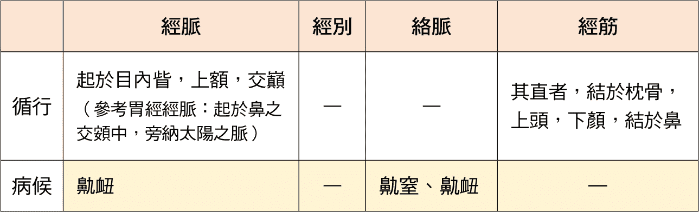

虽然经筋病候与鼻病无关，但膀胱经的经脉和经筋在面部循行都与现代解剖的鼻窦相当接近。

人体有四对鼻窦位于头颅与颜面骨之内，鼻腔周围充满空气的四对空腔，均开口通往鼻腔内，主要功能是保持鼻腔的湿润并过滤空气。

四对鼻窦都与膀胱经相对应，请参阅下表。鼻部成为膀胱经循行的一大重点。

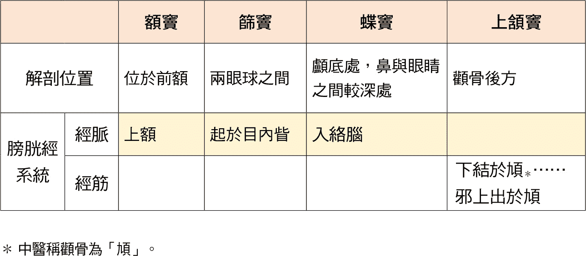

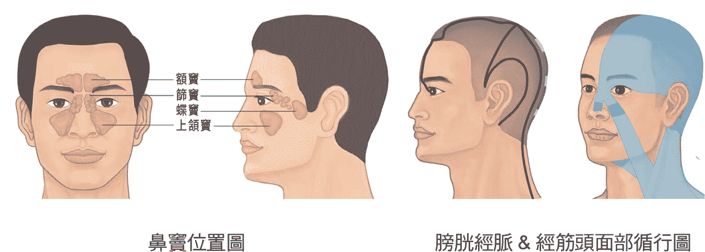

总论介绍过，膀胱经系统保留人类演化过程中历经爬虫类的身体结构，所以透过鳄鱼更能理解膀胱经对于鼻部的重视。膀胱经系统以头面五官和背部为主，从现代人类结构来看，头面部与背部呈直角关系；从鳄鱼结构来看，其长长扁扁的头面五官部位与身体背部几乎成一直线，鼻子位置最远且非常突出。对于循行「从头到脚」的膀胱经而言，要保护头面部，当然要从最远的鼻子开始。

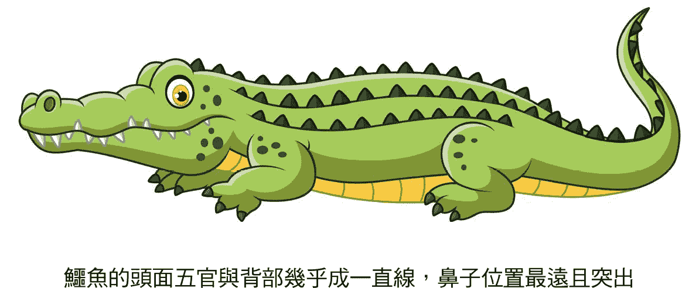

本络脉的飞扬穴因此成为鼻病专穴。临床常使用原络配穴法，配合相表里的肾经原穴太溪穴，既可通鼻窍又可收鼻水，对于鼻塞且严重流鼻水者立即见效。

《卷一》肺经总论介绍过，原核生物是最原始的生物，如细菌和蓝绿藻等，都是在温暖的水中发生，所以有 「生命来自水」一说。身为首发经络的肺，似乎记载了生命起源于水，并适应水中生活，在水中呼吸的历程，由此推知肺具有水液代谢的能力。肺主皮毛及卫气，又开窍于鼻，与膀胱经特质完全相符，因此膀胱经特别重视鼻部。膀胱与肾相表里，功能又与肺相呼应，再加上本经经别「当心入散」，连结君主之官，强大的膀胱经因此就有三个厉害老板：心、肺与肾三脏，彼此关系如下图。

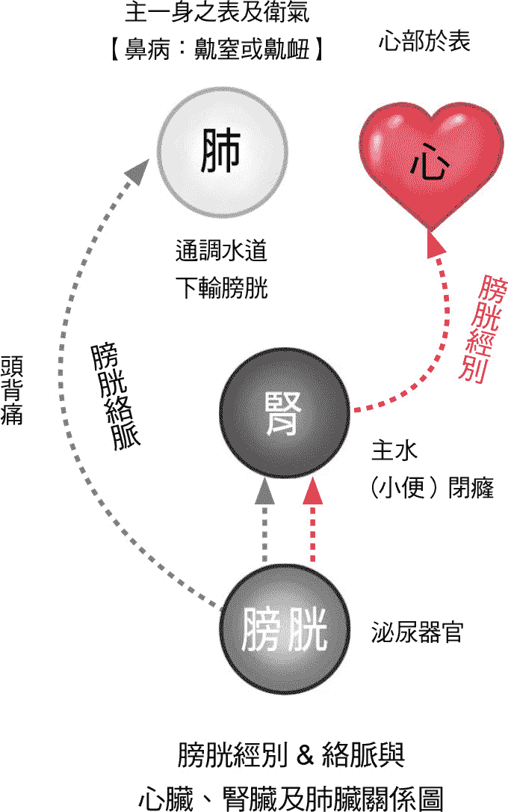

#####  中医师不传之祕：
麻黄是肺经与膀胱经共同代表药

有关麻黄特色，典籍中有精彩论述，如：

《神农本草经》「主治中风伤寒头痛，温疟，发表出汗，去邪热气，止咳逆上气，除寒热，破症坚积聚。」

《汤液本草》：「麻黄入足太阳、手少阴，能泄卫实发汗，及伤寒无汗，咳嗽。……麻黄治卫实之药，桂枝治卫虚之药，桂枝、麻黄虽为太阳经药，其实荣卫药也。以其在太阳地分，故曰太阳也。本病者即荣卫，肺主卫，心主荣为血，乃肺、心所主，故麻黄为手太阴之剂，桂枝为手少阴之剂。故伤风、伤寒而嗽者，用麻黄、桂枝，即汤液之源也。」

《本草纲目》：「麻黄乃治肺经之专药，故治肺病多用之。」

《本草经疏》：「手太阴之药，入足太阳经，兼走手少阴、阳明，轻可去实，故疗伤寒，为解肌第一。」

依据现代中药学，麻黄归入肺经与膀胱经，具有发汗解表、宣肺平喘、利水消肿、通鼻窍、透疹止痒的功效。

《汤液本草》指出桂枝与麻黄虽为太阳经药，其实是荣卫药，麻黄治卫实之证，桂枝治卫虚之证。桂枝和麻黄皆入膀胱经，膀胱经主一身之表，敷布卫阳，保护人体。不同的是，桂枝主入心经，温通心阳及营血，呈现「心部于表」特色，是心经与膀胱经共同代表药。麻黄主入肺经，宣散肺气及卫气，呈现肺「主一身之气」及「通调水道」特色。另外，肺主皮毛及开窍于鼻，鼻部通气顺畅，毛细孔也会打开，中医常用善于开毛孔的麻黄治疗皮肤病和鼻病，因此麻黄成为肺经专药，从其主治表现来看，也可视为肺经与膀胱经共同代表药，请参阅下图。

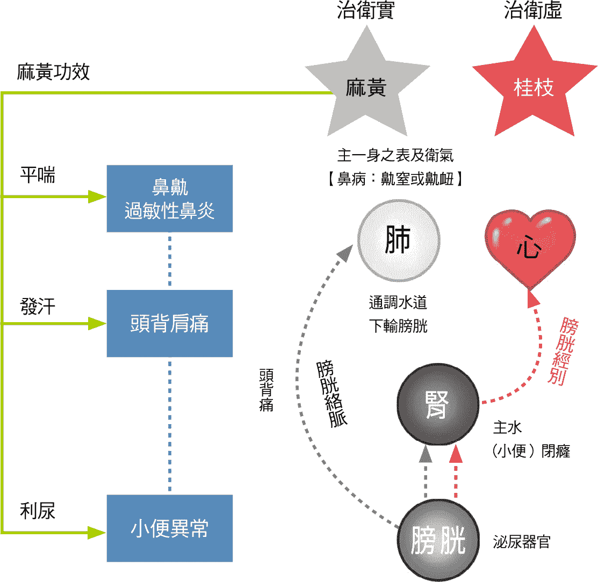

麻黄既然身为肺经与膀胱经共同代表药，其主治也是针对肺经和膀胱经共同病变，如麻黄善于发汗解表，可治头背肩痛及透疹止痒；宣肺平喘通鼻窍，可治鼻鼽鼻衄之症；利水可治水肿，利尿则能治小便异常等。

麻黄汤组方中，麻黄配杏仁以宣降肺气开卫气，配上桂枝甘草汤以温通心阳和营血，呈现「心部于表」特色，加强卫表之能，四药合用兼顾心肺营卫气血，成为《神农本草经》所述「主治中风伤寒头痛，发表出汗，去邪热气，止咳逆上气」重要方剂。

#####  中医师不传之祕：膀胱经与夜尿的关系

日本汉方书《汉方处方解说》（矢数道明着）介绍麻黄汤时，提到《金匮要略》条文「救卒死、客忤死，还魂汤主之。」还魂汤就是麻黄汤，日本医家临床确实用来挽救猝死。作者另外提到五岁以上的小孩夜尿症，使用麻黄汤治疗效果良好，应用指征之一是患儿「时常睡得很迷糊，不容易叫醒」。他认为主要效能可能在于麻黄，因为麻黄素有类似肾上腺素作用，服用后不会睡得迷糊，想要小便时便会醒来起身去解尿，这样便不会有尿床的情况。

汉方这段叙述非常有意思，与传统中医概念不大相同。

《伤寒论》中，麻黄汤透过发汗解表，宣肺平喘，主治太阳病寒伤营，出现头痛发热，身疼腰痛，骨节疼痛，恶风恶寒，体痛，呕逆，脉阴阳倶紧，无汗而喘等症状。

身为麻黄汤主药的麻黄，参酌前面所述，其主治都与《伤寒论》用法类似，却未提到与醒神或夜尿有关。自《名医别录》始有「泄邪恶气」记载，说明麻黄除了发表止咳外，还能泄邪恶气，当然可以开窍醒神，符合还魂汤的功能，醒神功能也能让熟睡中的孩子醒来去小解。

《金匮要略》中还有一条与小便异常有关的内容：「男子黄，小便自利，当与虚劳小建中汤。」由于本文出现在《黄疸病脉证并治》，传统中医多注重于讨论面黄之人如何从小便来辨虚实，若小便不利则为湿热停蓄的黄疸实证，宜使用清利湿热方剂治疗；若小便自利则无湿热邪气，当属于虚劳所致面色痿黄的虚证，宜使用小建中汤补中气，调荣卫。

日本汉医还特别讨论「小便自利」，他们认为本证属于极度疲劳之人，除了有小建中汤【虚劳里急】相关证候之外，还兼小便频繁，甚至夜尿之症。

个人参考汉方所述，临床上应用两方治疗尿床，效果都很好！只是麻黄汤与小建中汤治尿床之鉴别点为何？

其实，中医能治疗夜尿的方剂非常多，我会特别注意这两个药方是因为两方系以麻黄汤及桂枝汤（小建中汤是桂枝汤加重芍药和饴糖）为底方，此二方是《伤寒论》太阳病的主方，都与足太阳膀胱经有关，桂枝麻黄皆入足太阳经，差别在于：从营卫气血来看，麻黄主治卫气偏实之证，桂枝主治营血偏虚之证。

麻黄汤治证偏实证，患者体格较为强壮，一上床倒头就睡，睡得很熟，有尿意也醒不过来，导致尿床，本人却毫无知觉。前述过敏性鼻炎兼尿床的小学男童属于此类。

小建中汤治证偏虚证，患者体格较虚弱，体力差，容易疲倦，面色偏黄，胃口不佳，睡眠较浅，多梦，有尿意时会醒来，但由于膀胱机能较弱，通常来不及去上厕所，只好尿在床上。而且此类患者不一定都在夜间尿床，有时在白天也会有频尿、尿急甚至尿失禁的状况。

临床上也遇过类似麻黄汤证的「偷懒型」夜尿者，睡眠质量不错，有尿意时会醒过来，只是因为天气冷或懒得下床，一直忍着等到憋不住时只好尿在床上。这类患者前述两方皆无效，使用道德劝说或让他自己洗床单、晒被单可能更有效。

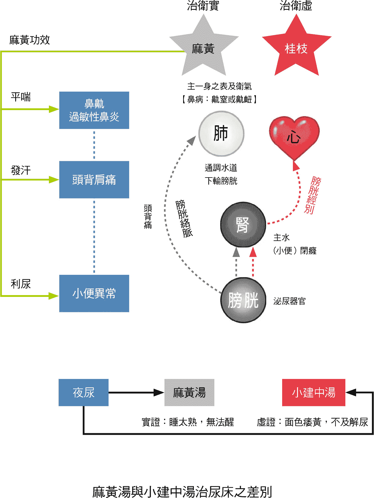

# 四、足太阳之筋（经筋）

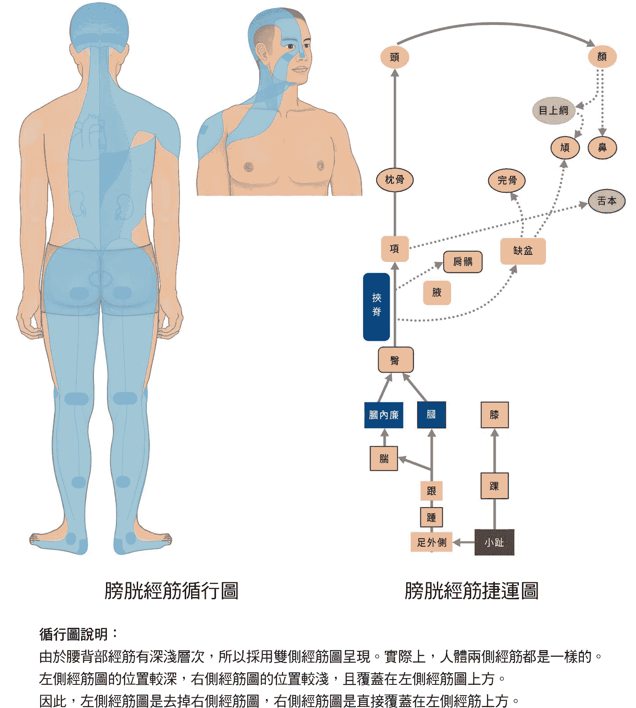

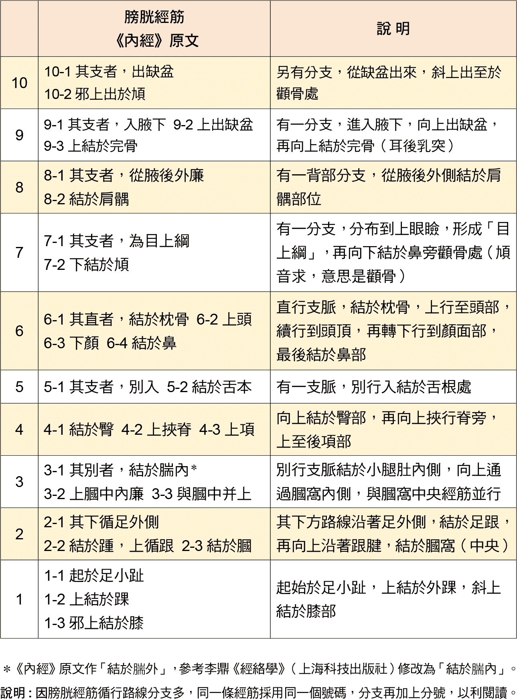

为了便于阅读，以下为加上分支号码的循行图和捷运图。

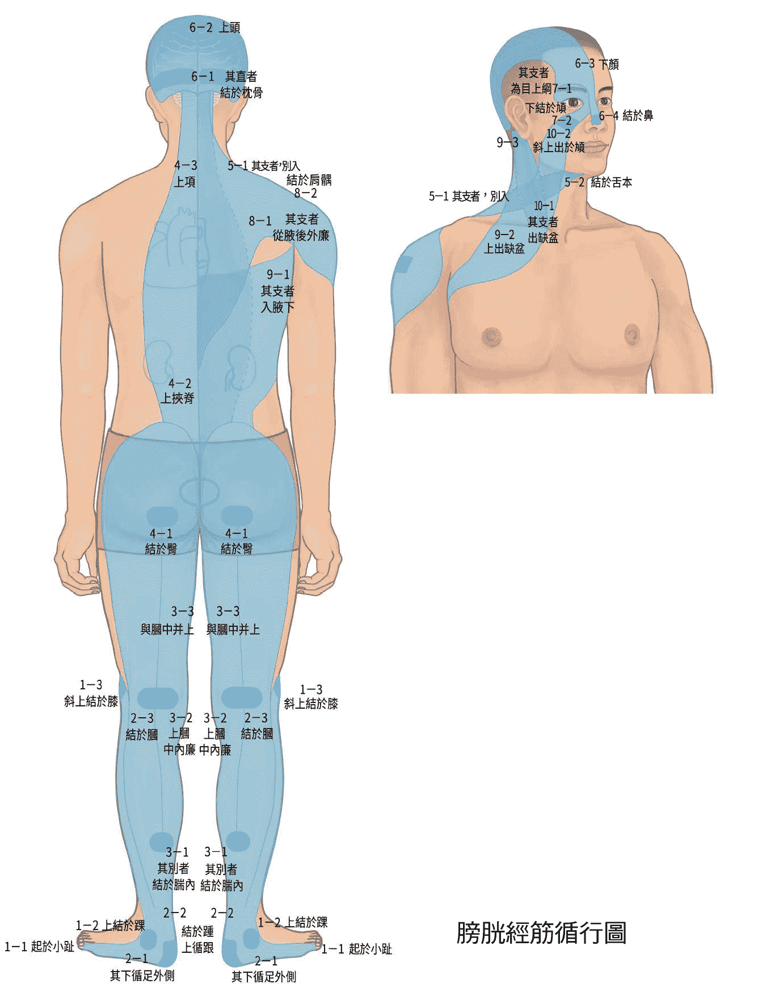

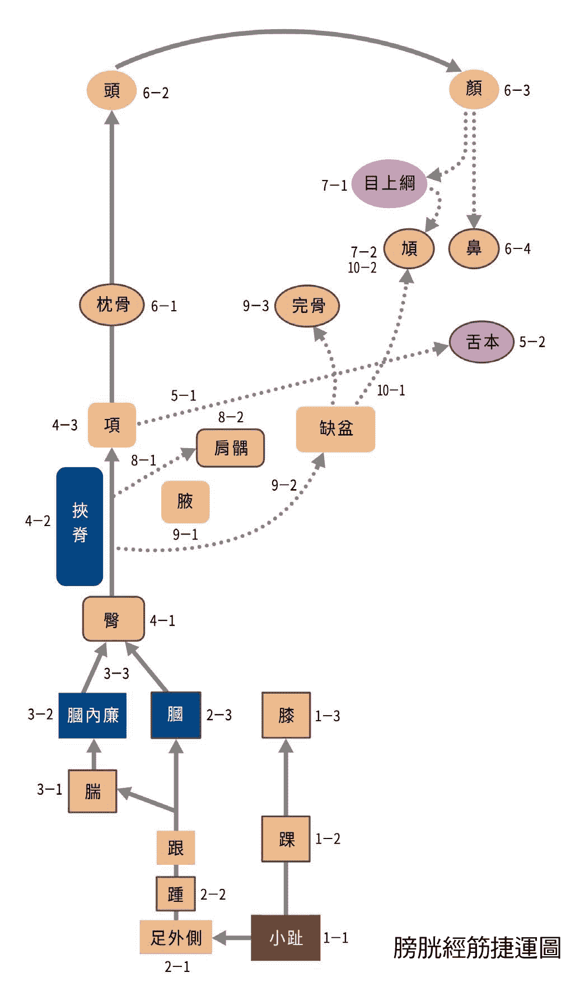

## 膀胱经筋──循行特色

足三阳经筋包括足太阳经筋、足阳明经筋和足少阳经筋，是负责包覆人体的主要经筋系统，为了确保能面面俱到，此三条经筋有两个共同特色：都有许多分支且大面积的包覆。

身为背景雄厚的经络系统，膀胱经筋一出手就是豪门作风，将人体背部一口气全包了！这种包覆方式与《卷二》胃经经筋「上腹而布」有异曲同工之妙，后文会说明。

本经筋分为三部分：下肢部、腰背部和头面部。此三部位经筋不仅有多条分支，且还延长扩展自己的经筋与周边组织相连结。

下肢部：路线 1-3。经筋分为小腿三条，大腿二条，臀部一条。

腰背部：路线 4、8 和 9 的前半段。经筋分为三条，除了循行于腰背部之外，还通过肩关节的上方与下方。

头面部：路线 5、6、7、9 的后半段和 10。经筋共有五条。

膀胱经筋为何要分出这么多路线？前文介绍过，背部属于人体的阳面，是身体重要的防御部位，膀胱经正是此部位的主要防护者。为了达成全面防护目标，位于背面的经筋一定要稳固而且密不通风。且人体是立体结构，要让膀胱经筋系统稳定，除了本身路线外，还要与其他相关组织相连结，因此才分出许多条经筋。

## 1.下肢部

本经筋涵盖下肢后侧全部肌群，与膀胱经脉循行范围相符，经筋分布也跟肌肉解剖结构类似。小腿后侧有小腿三头肌，主要是腓肠肌及比目鱼肌，大腿后侧主要有股二头肌、半腱肌和半膜肌，故本经筋出现 3-2-1 条分支特色：小腿部三条，大腿部二条，臀部一条。请参阅下图。

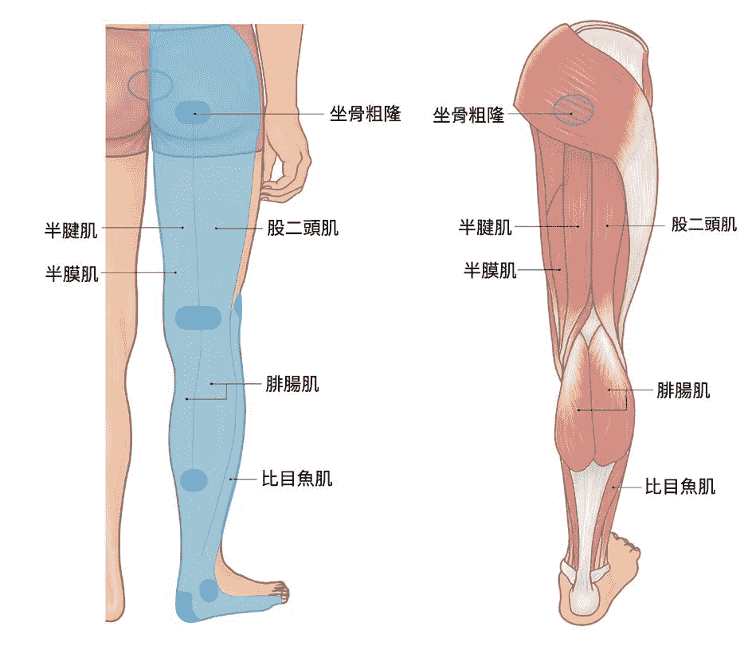

### 足背部及小腿部

本部位经筋依其分布的相对位置，参考小腿三头肌解剖结构，分为路线 1 的外线、路线 2 的中线和路线 3 的内线。

小腿后侧部位的三条支脉，刚好与小腿三头肌相似。小腿三头肌为小腿后侧肌群，主要由位于浅层的腓肠肌及较深的比目鱼肌构成。腓肠肌及比目鱼肌三个头在小腿合成膨隆的肌群，俗称「小腿肚」，中医称为「腨」，再向下继续延伸为跟腱，最后止于跟骨结节。小腿三头肌与小腿、膝关节及踝关节活动有关。

前文介绍过，人体是立体结构，要让膀胱经筋系统稳定，除了本身路线之外，还要在两侧部位加强，膀胱经的内侧为足少阴肾经，外侧为足少阳胆经。聪明的人体做了漂亮分工：

中线为主干线包覆膀胱经脉，外线负责向外连结胆经系统，内线负责向内连结肾经系统。三条经筋通力合作，完成全面包覆且维持稳固的目标。这个概念也贯穿在整个膀胱经筋系统。

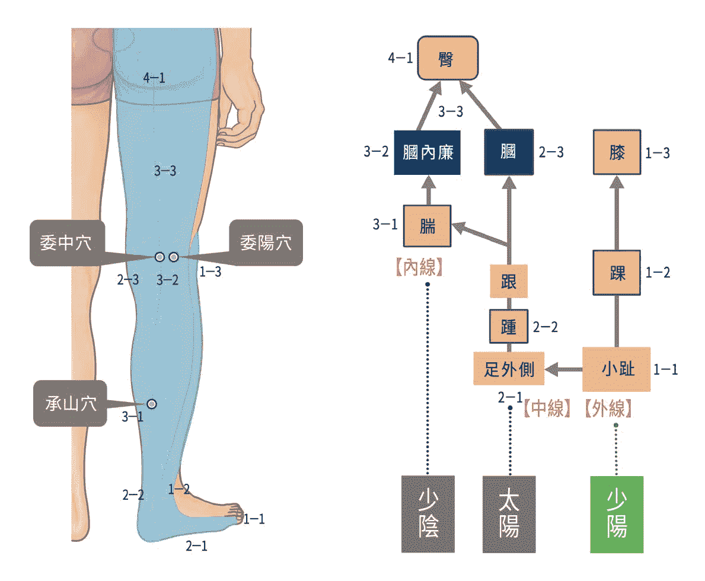

以下详细说明三条经筋路线及特色：

外线：起于足小趾外侧，向上结于外踝，再斜向上结于膝部外侧（路线 1）。

本经筋外侧的路线属于膀胱经筋，再向上结在外踝则属于太阳经与少阳经共管区域。脚跟后方没有包到的部位则由路线 2 负责。如此一来，膀胱经筋就包覆整个足部外侧及后侧区域。

本路线偏行于小腿侧面，膀胱经脉未经过此处。从外踝向上连结膝部的这条小腿路线，与位于腓肠肌外侧的比目鱼肌类似。以经络角度来看，从小趾—足踝—膝关节外侧这段经筋接近胆经，可视为膀胱经与胆经之间的连结路线。

中线：从大趾外侧沿着足部外侧，向后结于足跟骨，再向上循着跟腱，结在膕窝中央（路线 2）。本经筋范围与腓肠肌外侧肌肉类似。

内线：从小腿分出来（路线 3）结在小腿肚，再向上经过膕窝内侧，与中线（路线 2）并行，向上到大腿。本经筋范围与腓肠肌内侧肌肉类似。

由于本经经脉在小腿部位循行于两侧腓肠肌中间，即位于本段经筋的中线和内线之间，所以中线与内线都可视为膀胱经的主线。这两条经筋从腓肠肌腹与跟腱交会的「承山穴」分行，到了膕窝处以委中穴为中心，「中线」分布在委中穴与委阳穴之间，「内线」分布在委中穴与肾经阴谷穴之间。

位于小腿肚下方的承山穴是小腿抽筋之后肌肉肿结好发处，因此非常善于缓解小腿肚抽筋，平时多按压，可减少抽筋频率。

除此之外，内线经筋还包覆了小腿内侧，亦即将肾经经筋一起涵盖。从何而知？肾经经筋在足部「结于踵，与太阳之筋合」，肾经经筋从足跟到膝盖内侧之间的经筋与膀胱经相合。肾经经筋属于阴经系统，矜持的肾经不可能延伸到后面与膀胱经筋相合，理应是膀胱经筋向前延伸，将肾经经筋一并包覆，此段经筋可视为膀胱经与肾经之间的连结路线。

由于肾经经筋循行于跟腱内侧，此处还有比目鱼肌。据此推论，本条经筋不仅涵盖腓肠肌内侧，还包括比目鱼肌内侧。

本部位全然包覆小腿三头肌，不仅显现膀胱经大面积涵盖的特质，也成为小腿后侧坚实的防护系统。

### 大腿部

本部位经筋衔接自膕窝上来的两条支脉：从中线膕中上行者，类似股二头肌结构，称为「大腿中线」；从内线膕内廉上行者，类似半腱肌与半膜肌结构，称为「大腿内线」。两条经筋最后一起结在臀部坐骨结节（或称坐骨粗隆）。

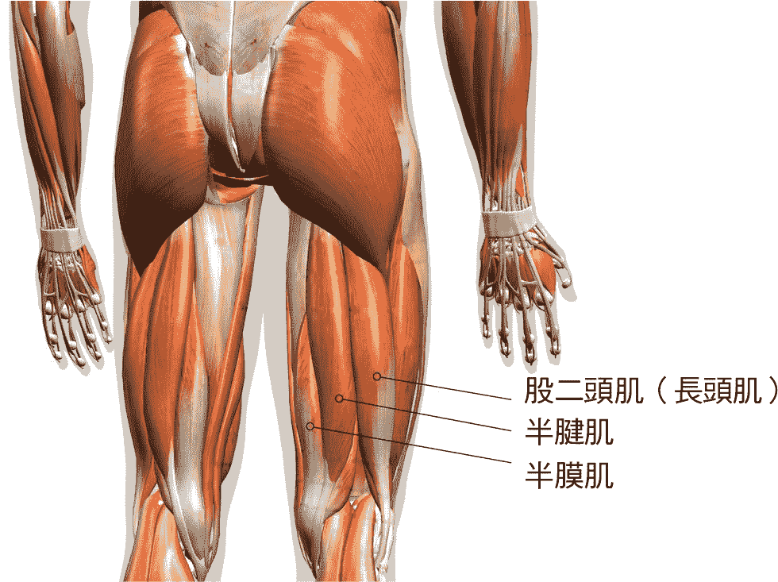

大腿部经筋最后结在坐骨结节。在解剖上，大腿后侧肌群起于坐骨结节的肌肉有三条：半膜肌、半腱肌和股二头肌，此三条肌肉合称为「膕绳肌」，可以维持膝关节稳定性。因此，衔接内线膕窝上行者应该涵盖半膜肌和半腱肌。怎么说呢？

小腿内线偏向肾经，肾经膝关节的穴位「阴谷穴」位于半膜肌与半腱肌之间。膀胱经负责循行于人体后侧，依据其喜欢全面保护肾经的概念，在此处也会一起包覆属于肾经的半膜肌。

股二头肌的长头和半腱肌都起于骨盆的坐骨结节，也是本经筋结于臀部之处。坐骨结节是坐下时与椅子接触的部位，正常人须用力才会摸到，过瘦的人很容易触及。许多腰背及下肢疼痛的病人，当大腿抬高到 90 度，在臀部下方的坐骨结节会出现肿块，这是筋膜变得僵硬所致，不是骨头变大，病情严重者无法久坐。中医治疗此症多会从膀胱经着手，效果不错。

参酌膀胱经脉在大腿后侧的循行路线，「膀胱经本线」循行于股二头肌与半腱肌之间，亦即位于大腿内线与大腿中线之间；「膀胱经侧线」循行于股二头肌外缘，亦即大腿中线外侧。

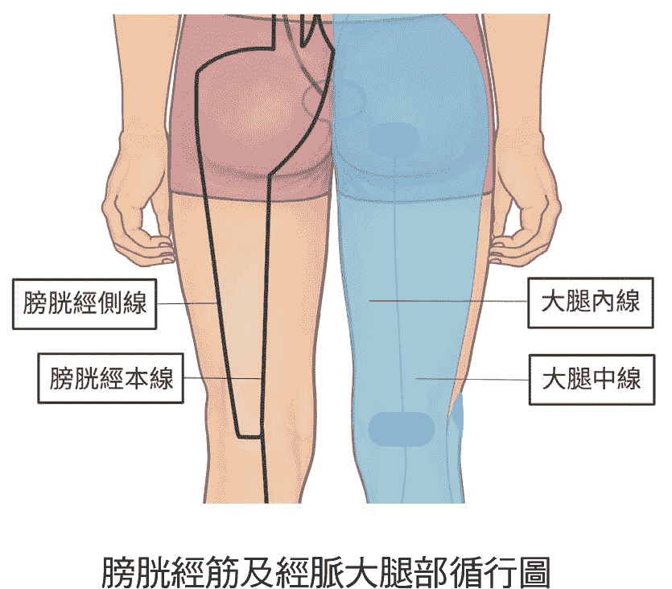

## 2.腰背部

本区经筋从臀部上行，依据循行部位分为三条，其分布也与解剖类似。

*   路线 4 的脊项线：从臀部向上挟脊，最后上达头项。与竖脊肌群类似。
*   路线 8 的肩上线：从路线 4 发出一条支脉，自腋窝后侧向上经过肩膀，结在肩前的肩髃穴。与斜方肌类似。
*   路线 9 的腋下线：路线 9 分为人体后面路线与前面路线。

后面路线是从路线 4 发出支脉，穿过腋下，转到胸前，此为腋下线，其循行与阔背肌类似。前面路线将于头面部介绍。

腰背部三条经筋比较特别的是分布有主次之别和深浅层次。以下详细说明。

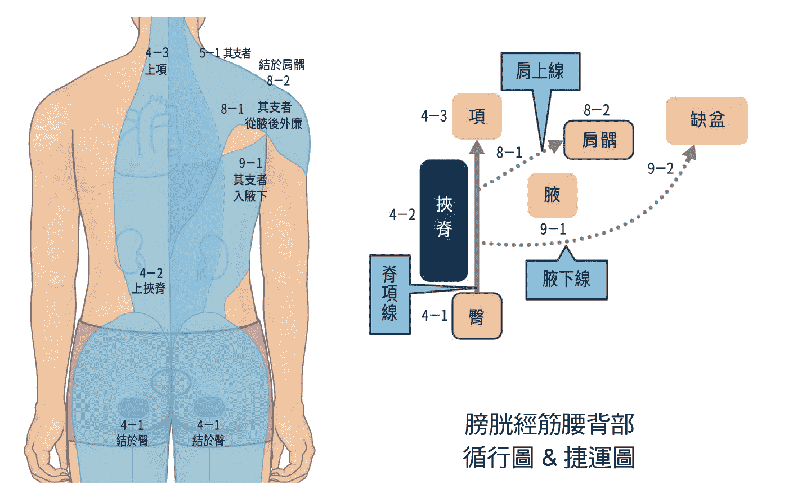

### 脊项线

从臀部向上挟行在脊椎两侧，最后上达头项（路线 4）。

本部位经筋原文「上结于臀，上挟脊，上项」言简意赅，和胃经经筋原文「聚于阴器，上腹而布，至缺盆而结」有异曲同工之妙，妙在哪里呢？就是「大面积」的包覆！胃经经筋从腹部—缺盆直接包覆整个胸腹部，膀胱经筋从臀—脊—项部也很爽快，一口气包覆整个腰背头部。虽然原文字数不多，一切尽在不言中！

本条经筋是膀胱经系统重要的保护层，因为它全然包覆膀胱经在背部的两条经脉，包括五脏六腑的背俞穴在内，这也是人体保卫脏腑的重要机制之一。

本经筋从臀部上行夹脊到项部，覆盖脊椎与肩胛骨之间区域，不仅涵盖膀胱经脉在背部所有循行范围，此区域还与解剖学的竖脊肌群分布大致相合。

竖脊肌群是以其功能命名，顾名思义就是能竖立脊椎的肌肉，是人类站立直行活动很重要的肌肉。本肌群部位沿着脊椎旁边，从腰部的尾骨荐椎骨延伸到后头枕骨。由三条肌肉共同组成：内侧最接近脊椎的是「棘肌」，中间为「最长肌」，外侧为「髂肋肌」。

竖脊肌群与脊项线分布颇为相似。例如竖脊肌群有三条肌肉，中医师也常在腰背部三条路线施针治病，两者互相对应：

脊椎旁开 0.5 寸为经外奇穴「华佗夹脊穴」，其下深层肌肉为棘肌；脊椎旁开 1.5 寸为五脏六腑背俞穴所在的「腰背内侧支脉」，其下深层肌肉为最长肌；脊椎旁开 3 寸为「腰背外侧支脉」，其下深层肌肉为髂肋肌。

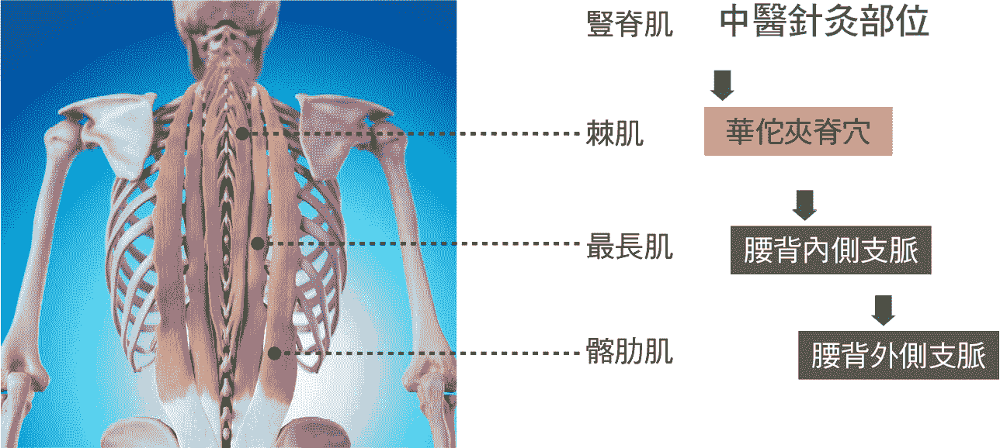

### 肩上线

从脊项线发出支脉，自腋窝后侧向上结在肩前的肩髃穴（路线 8）。本区循行与解剖学的斜方肌分布大致相合。斜方肌是以其型态命名，顾名思义是由左右两侧肌肉所形成的斜方型四边形，也很像菱形。单侧斜方肌呈三角形，连结头项部、腰背部、肩部和肩胛骨，是将头部和肩部向后拉的背部肌肉，也是活动肩胛骨的重要肌群。

斜方肌与肩上线类似，从脊椎发出，经过腋窝后上方，向上经过肩关节，连接肩部。斜方肌上束纤维止于锁骨外侧三分之一处，肩上线结于肩髃穴，两者位置非常接近。

### 腋下线

从脊项线发出支脉，穿过腋下进入前胸。（路线 9 的后面路线）。腋下线循行与解剖学的阔背肌（或背阔肌）大致相符。阔背肌也是以型态命名，就是背部最宽阔的肌肉。单侧阔背肌呈三角形，连结骨盆、腰背部、肋骨和上臂的肱骨。由于本条肌肉连结到上臂，因此与手臂活动有密切关系，如手臂向外伸展、内旋、内收、向下和下后拉等。

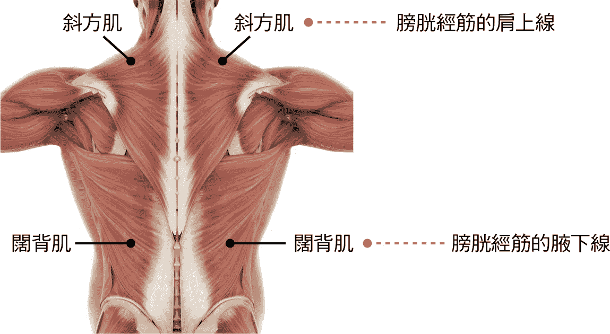

阔背肌与腋下线类似，从脊椎发出，穿过腋下。差别在于：阔背肌止于肱骨，腋下线则继续向上出缺盆，结在完骨。

从经筋分布来看，肩上线通过肩关节上方，腋下线通过肩关节下方，两条经筋将肩关节稳稳包住，这个范围已经超出膀胱经脉的分布区域，对人体有重大影响。

从解剖结构来看，竖脊肌群位置较为深层，其上为斜方肌和阔背肌，此二肌是背部浅层重要的肌群，与头项腰背部和上肢活动有关，分布位置若以肩胛骨为分野，斜方肌位在肩胛骨的上缘，阔背肌位在肩胛骨下缘，它的上内侧部还被斜方肌遮盖。斜方肌和阔背肌合作，全面包覆肩胛骨以外的头项腰背部位，这也与膀胱经筋系统在腰背部分布相符。肩胛骨部位就留给小肠经筋系统去照顾。

本经腰背部经筋分布的目的，首先当然是保护膀胱经脉，其次督脉循行于背部中央的脊柱，由于奇经八脉都没有自己的经筋系统，督脉就必须拜托循行于背部脊柱旁边的膀胱经筋一起纳入照顾。膀胱经筋脊项线「上夹脊，上项」，只照顾自己的经脉，所以再增加两条支脉「肩上线」和「腋下线」，双侧经筋合并，类似阔背肌和斜方肌，就能完全包覆脊柱，保护循行于其中的督脉。

最后由于经筋涵盖范围超过膀胱经脉，膀胱经脉只分布在腰背部，经筋还包覆肩关节上下部位，由此可见功能强大的膀胱经系统全面防护人体背部的力量，同时也协助维持上肢的活动。遗憾的是，万一膀胱经系统出现病变时，不仅连累经脉所过的腰背和下肢，上肢也会跟着受影响，此现象常见于半身不遂的中风病人，肢体单侧的上肢和下肢活动不利。这其实是经脉病候篇中「主筋之所生病」的展现，详细内容后文会说明。

参酌前述背部肌肉结构，膀胱经腰背部三条经筋分布也有深浅层次，可参阅膀胱经筋与解剖结构对照图表。

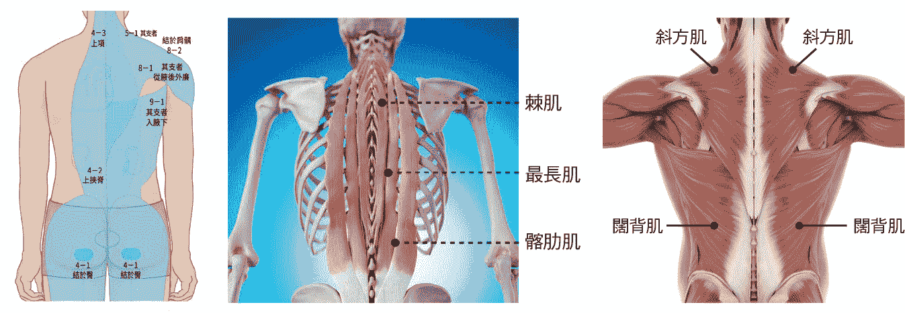

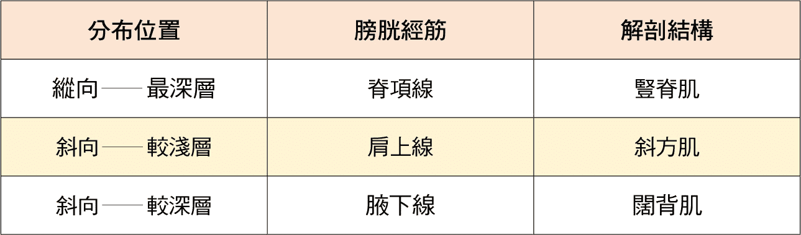

依据「越重要的部位，越多经络系统分布」原则，三条经筋共同涵盖部位一定是最重要部位。古代医家也发现经络及结构分布有深浅，脊项线位于肩上线与腋下线的深处，脊项线直接涵盖华佗夹脊穴、膀胱经的两条经脉，可见位于背部中央、纵向分布的脊项线是腰背部经筋重点部位。肩上线与腋下线覆盖在脊项在线方，三条经筋重覆包覆区域正是华佗夹脊穴和膀胱经脉所在处，聪明的人体特别提供三层保护结构，以确保经脉的安全。

这三层经筋层次也是临床中医师在腰背部施针治疗时会逐一通过的层次，即肩上线（斜方肌）→腋下线（阔背肌）→ 脊项线（竖脊肌）→ 经脉。由于阔背肌分布从第七胸椎到第五腰椎之间，上背部仅有肩上线和脊项线两层经筋，不像中背部和腰部有三层经筋，因此古人才会提醒「胸背薄如饼」，施针要特别小心，以免针刺过深导致气胸。

###### 腰背部的三条经筋分布与人体背部肌肉组织大致相符，这可不是巧合！

中医和西医所看都是同一个人体，二千多年前《黄帝内经》时代与今日看到的人体并没多大变化，所以经筋系统会与人体结构相合不仅不是意外，更是必然。

回归到中医理论，人体最主要也最强大的经筋系统就属足三阳经筋，其中胃经经筋包覆正面，胆经经筋包覆侧面，膀胱经筋包覆后面，这三个经筋系统须各自承担一个部位的防护，是以「一夫当关，万夫莫敌」之势来保护所属的人体部位，其涵盖范围就要够大，而且必须密不通风，不能有漏洞。

这也是我在撰写经络书过程中常常反覆修稿的地方，因为一般经络图在绘制经筋时，多以中医原文为蓝本，其涵盖面积都不大。开始时我也跟着如此撰写和绘图，后来重新思考经筋系统的特色，既要连结筋肉组织和关节以维持正常活动，更要包覆人体确保安全，透过全身经筋系统共同合作，其涵盖面积必须够宽广且天衣无缝，同时，重要部位也要有多条经筋重叠保护，如胸部的心肺区。

* * *

## 3.头面部

头面部经筋都来自脊项线转到前面。依据循行部位大致分为下方、中间、上方三条路线，并以其分布部位命名。

● 位于下方，路线 5 的舌本线：从项部经过颈部，结在舌根部。

● 位于中间，路线 9 与 10 的完骨頄线：以缺盆为中心，包含两条经筋。

主干为路线 9 的后段，衔接后背的腋下线，转到前胸，从缺盆出来，结在耳后的完骨。

分支为路线 10，从缺盆分出来，连到鼻旁的颧骨。

● 位于上方，路线 6 与 7 的鼻眼线：以颜部为中心，包含两条经筋。

主干为路线 6，沿着头部向上直行结于枕骨，通过头顶再转向前面，结在鼻部。

分支为路线 7，从颜面分出，分布在眼睛上方，再向下结在鼻旁的颧骨。

这下中上三条路线共同发自脊项部的经筋，进入颜面，包覆眼睛、鼻子、耳朵和舌下等官窍，可见膀胱经系统虽然主要分布在背部，仍透过经筋扩大版图，积极发挥强大防护能力以保护重要的头面五官。

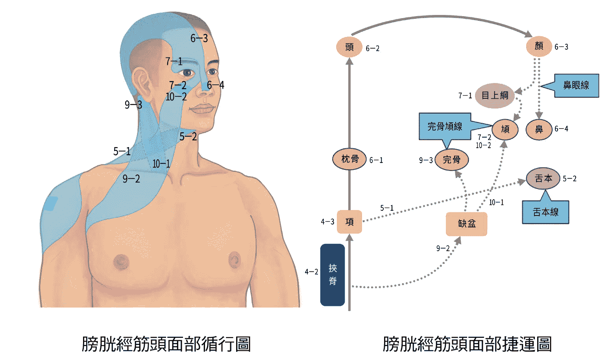

头面部经筋循行文字精简，与解剖图相对照，分布与下肢部和腰背部经筋一样，与人体解剖结构有许多相似处及可能性，分布也都有主次之别和深浅层次。下页为人体头面肌肉结构与膀胱经筋头面部循行对照图。

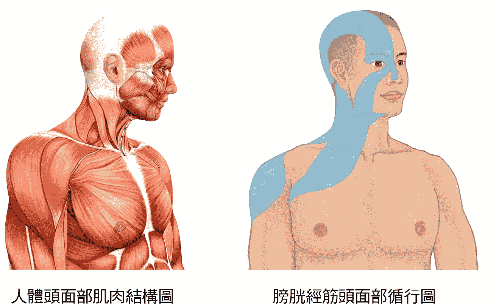

### 舌本线

分布在头面下方，从项部开始，经过颈部，向前结在舌根处（路线 5）。在头面肌肉结构中，颈阔肌和舌骨肌群与本经筋路线有类似分布。

颈阔肌与舌骨肌群都是位于人体浅表的肌肉，颈阔肌顾名思义就是分布在下巴、颈肩和胸部；舌骨肌群以舌骨为中心，分为舌骨上肌群和舌骨下肌群，连接下巴、肩胛骨与胸骨。下页左图可见颈阔肌和舌骨肌群，中间图将颈阔肌切去，更清楚见到舌骨肌群，右图为舌本线经筋图。

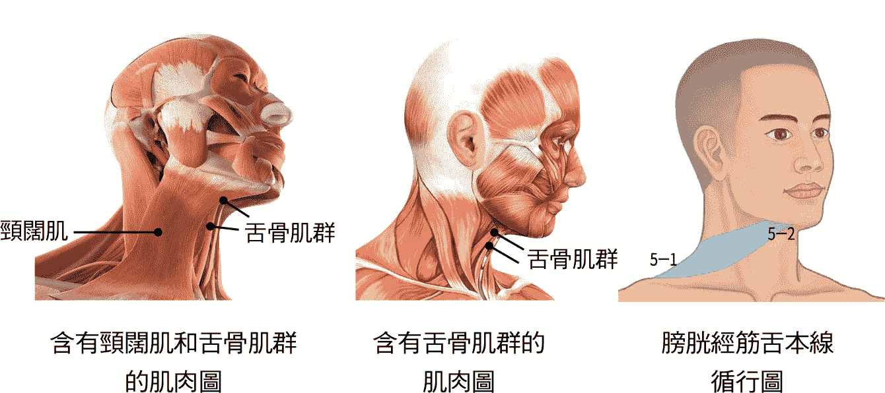

为何推测这两组肌群与舌下线有关？

主要是从本路线「别入」两字来推论。「别入」说法表示不是直接从项部连到舌根，而是进入某个组织或通道再到达舌根。参考以上肌肉图，颈阔肌位在舌骨肌群上面，本经采取「别入」方式，比较可能是穿过颈阔肌下方，而不是直接越过颈阔肌表面。依此推论，本路线「别入」是从项部别入通过颈阔肌下方，再结于舌骨肌群。这条经筋与下巴活动有关。

### 完骨頄线

分布在头面部中间，以路线 9 为主干，在缺盆处延伸出路线 10。

路线 9 经过腋下转到前胸，向上穿出缺盆，再上行结在耳后完骨。路线 10 为从缺盆分出的路线，斜向上行，最后出于鼻旁的颧骨。

在头面肌肉结构中，颈阔肌、嚼肌和胸锁乳突肌与本经筋路线有类似分布。

嚼肌（或咬肌）连结下颔骨和颧骨，从名称即可知与咬合和咀嚼功能有关。胸锁乳突肌是连结胸部的胸骨、锁骨与耳后乳突的肌群，与旋转和弯曲头部功能有关。颈阔肌前已介绍，分布在胸锁乳突肌的上方。

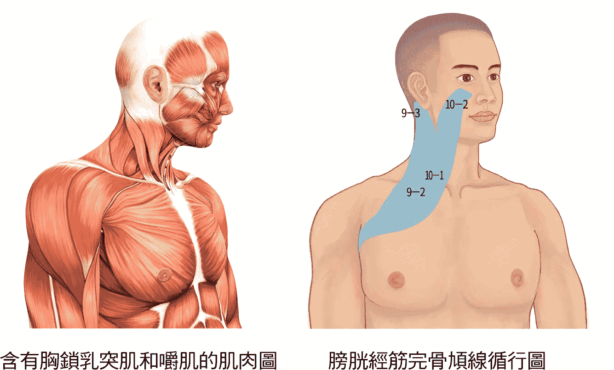

为何推测这三组肌群与完骨頄线有关？

从解剖结构来看，中医的缺盆类似现代的锁骨上窝。完骨頄线从腋下转到前胸，穿出缺盆，结在耳后完骨的路线，可能相关的解剖结构是从阔背肌到达前胸，从锁骨上窝穿出到浅层肌肉，再分出两条路线：路线 9 结于乳突，与胸锁乳突肌的分布相似；路线 10 出于颧骨，参考解剖结构，极有可能循着颈阔肌到达下巴，再连结嚼肌。

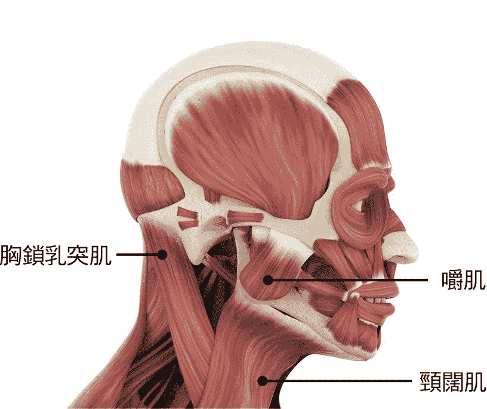

依据以上推论，完骨頄线以缺盆为基础，分别向前上方和后上方发出两条经筋，都连结在骨性结构上，如缺盆下方（锁骨与胸骨）、頄骨（颧骨）和完骨（乳突），形成大 V 型态。

另外，完骨頄线分布也有深浅层次之别，如路线 9 结于完骨，类似胸锁乳突肌，位于较深层处；路线 10 出于頄，类似颈阔肌加上嚼肌，位于最浅层；前文介绍过的路线 5 结于舌本也通过此区域，经由颈阔肌下方到舌骨肌群，位于最深层。

完骨頄线除了与头颈肩部活动有关外，在面部的分布刚好在耳朵的前后位置，可见另一重点在于保护耳朵。

### 鼻眼线

分布在头面部上方，以路线 6 为主干，在颜部延伸出路线 7。

路线 6 直接衔接脊项线，向上结于枕骨处，继续直行，到达头顶之后，转向前头的颜面处，再向下结在鼻部。路线 7 从颜面处分出，横向分布在眼睛上方成为「目上纲」，包括上眼睑和上睫毛，再向下结在鼻旁的颧骨。

在头面肌肉结构中，枕额肌、眼轮匝肌、提上睑肌、鼻肌和颧骨肌群与本经筋路线有类似分布。请参考下图。

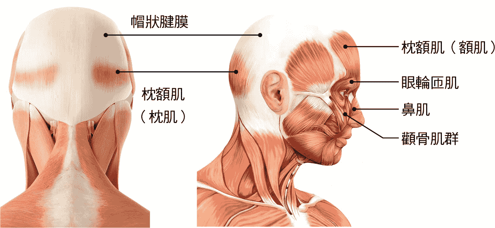

枕额肌为覆盖在颅骨上的长条形肌肉，分为三部分：位于后枕部称为「枕肌」，位于前额部称为「额肌」，中间依靠「帽状腱膜」连结成一整块肌肉。简单说，枕额肌顾名思义就是连接后枕和前额的肌肉，枕肌和额肌很像分居两地的牛郎和织女，位于中间宽宽扁扁像帽子的腱膜宛如鹊桥联系两端。枕额肌与上挑眉毛和前后移动头皮有关。

眼皮里面有两种肌肉，一种是同心圆状的眼轮匝肌，位在较浅层的位置，围绕眼睛外周，形成眼皮的主要肌肉，另一种是长条形的提上睑肌，位在较深层的位置（提上睑肌就是上提上眼睑的肌肉。本书未附图，有兴趣的读者可另行查阅）。这两条肌肉控制眼皮的开阖，当眼轮匝肌收缩时眼皮就会闭合，当提上睑肌收缩时眼皮就会张开。

鼻肌顾名思义就是包覆鼻部的肌肉。

颧骨肌群包括颧大肌和颧小肌，连接颧骨和嘴巴周围的口轮匝肌，是主要的笑肌，可让嘴角上扬，展露笑容。

以上这些肌肉都属于颜面表情肌，能将喜怒哀乐等情绪表现在面部，深深影响人类的社交关系。

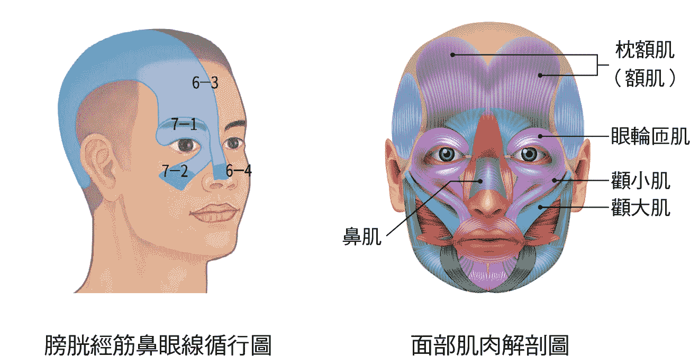

为何推测这些肌群与鼻眼线有关？

从解剖结构来看，路线 6 从枕骨通过头顶到颜部，与枕额肌的分布相似，本经筋向下结在鼻部，似应结在鼻肌。路线 7 从颜面到上眼睑成为「目上纲」，与眼轮匝肌和提上眼睑肌的分布类似，本经筋再向下结在鼻旁的颧骨，可能连结到颧大肌和颧小肌。

枕肌部分连结到乳突，额肌部分连接到眼轮匝肌和鼻根部，都与头面部经筋的结构有关。

#####  中医师不传之祕：鼻眼线暗藏的特色

#### 1.目上纲特色

包括上眼睑和睫毛，即现代女性涂眼影和画眼线的地方。

《卷二》胃经经筋循行「上颈，上挟口，合于頄。下结于鼻，上合于太阳。太阳为目上纲，阳明为目下纲。」胆经经筋「结于目外眦，为外维。」可见足三阳经筋全然包覆眼睛周围。其中，膀胱经筋包覆上眼睑是为「目上纲」，控制上眼睑的活动；胃经经筋包覆下眼睑是为「目下纲」，分布在下眼睑及睫毛，控制下眼睑的活动，膀胱经筋和胃经经筋协同管理眼睑的开阖。胆经包覆在目外眦是为「外维」。

足三阳经筋包覆眼周，依据眼睛血络出现的方向可诊断目痛所属经络，《内经》说「诊目痛，赤脉从上下者，太阳病；从下上者，阳明病；从外走内者，少阳病。」完全符合足三阳经筋的走向。

眼睛周围有四个边，上下及外三边都有经筋包覆，内边的目内眦由哪条经筋包覆？

膀胱经脉与胃经经脉交会于目内眦的睛明穴，膀胱经筋由上而下为目上纲，胃经经筋由下而上为目下纲，两条经筋各有所司。依据膀胱经筋路线 7「为目上纲，下结于頄」，分布不仅止于上眼睑，从眼睛向下到颧骨，理应经过目内眦，再沿着鼻旁到颧骨，再加上胃经经筋「下结于鼻，上合于太阳」，由此推论目内眦是由膀胱经筋和胃经经筋共同包覆。对照人体结构，膀胱经筋和胃经经筋与眼轮匝肌上下缘和内侧缘型态相似，胆经经筋与眼轮匝肌外侧缘型态相似，三条经筋合起来就形成类似眼轮匝肌的结构。

另外，由于眼轮匝肌和提上睑肌控制眼皮的开阖，《卷一》肺经介绍过，膀胱经与早上睡醒，睁开眼睛时的卫气敷布有关，这就是膀胱经筋包含眼轮匝肌和提上睑肌的原因之一。

#### 2.頄部特色

頄即颧骨，是面部最强壮的骨头，足三阳经筋都连结到頄，膀胱经筋还特别由缺盆向上及从眼睛向下连结颧骨，可见足三阳经不仅特别照顾眼睛，也对颧骨疼爱有加。

小肠经重视颧骨，为何足三阳经也重视颧骨？

颧骨在面部五官的中间位置，足三阳经筋是面部最强大的经筋系统，提供面部及五官最坚实的保护。颧骨宛如面部固定用的桩子，足三阳经筋附着于颧骨正是为了「固桩」，以固定经筋结构，确保完成防护头面五官的重要使命。

#### 3.鼻眼线与口的关系

鼻眼线连结到颧骨，颧骨位于嘴巴上方，舌本线分布在嘴巴下方，因此鼻眼线和舌本线可以控制口部活动，就像腰背部的肩上线与腋下线分布在肩节上下部位以控制肩关节活动一样。

鼻眼线与口的关系从爬虫类动物型态来看更为清楚。若以鳄鱼形象来看，鼻子与舌根是上下对位，中间就是口部。试想我们勇猛地去控制鳄鱼头部，最安全的方式应是同时握住鼻子跟舌根处，这样鳄鱼的嘴巴就被封住了。

鼻眼线和舌本线循行补充了本经经筋原文未提到的口腔部位，如此一来，膀胱经头面部经筋就能全面包覆头面五官，也体现其保护头面五官的强大行动力。

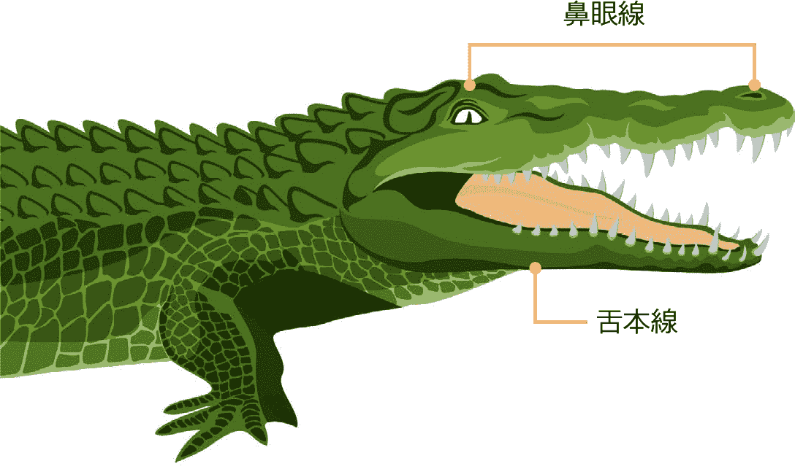

#####  中医师不传之祕：
膀胱经脉病候主筋所生病与经筋的关系

膀胱经筋从小趾外侧开始，沿着人体后侧上行到后头部，一路如入无人之境，全都涵盖。由于涵盖面积过大，膀胱经筋也特别加强附着在相关的肌群上，以确保经筋的稳定性和涵盖度。

膀胱经筋系统也是人体后侧最重要的防护系统，人体背部宽广且平坦，膀胱经筋所包覆的范围理应很宽广，唯有如此，才能成为「巨阳」守护人体。但《内经》相关原文文字古奥精简，无法一窥全貌。

撰写《卷二》胃经胸腹部经筋时，原文说「聚于阴器，上腹而布，至缺盆而结」，细细推敲，既然阳明经筋负责包覆人体正面，理论上应该扩大为全面包覆人体正面的经筋系统。

同理，膀胱经筋系统也该以大面积包覆型态呈现，经与解剖图相对照，赫然发现本经筋与人体解剖结构有许多相似处，整理如下表。

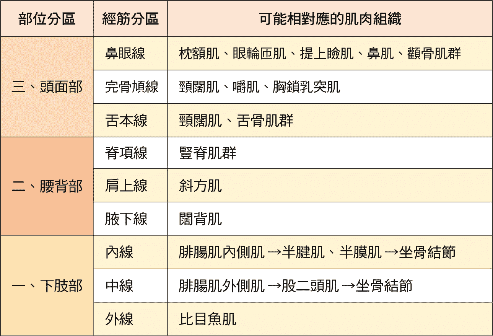

由上表可看出，膀胱经筋所对应的肌群都是平日活动频繁的组织，与膀胱经脉病候出现「主筋所生病」似乎有特殊关系。

中医认为肢体有五种型态称为「五体」，由浅而深为：皮、脉、肉、筋、骨。五体由五脏所统理，如肺主皮，心主脉，脾主肉，肝主筋，肾主骨。膀胱与肾相表里，理论上应主骨所生病，然而《内经》指出膀胱经脉病候「主筋所生病」，胆经经脉病候「主骨所生病」。何以如此？这就是经络奇妙之处。

传统中医将筋称为筋膜，现代医学中代表肌腱、韧带和筋膜。《内经》说「久行伤筋」，可见筋属于活动组织，如俗语以「血筋」来说明「血管」，因为血管会搏动，所以用「筋」字来表示。从这个角度来看，膀胱经系统所过处为人体频繁活动的部位，如下肢和腰背等，皆由大面积的肌肉及筋膜组成，以利于大量且大范围的活动，头面部表情肌分布很复杂，更是随时牵动不停。

膀胱经系统所过的「筋」为全身最大、面积最广、影响最全面，一旦该系统出现病变，就会出现「冲头痛，目似脱，项如拔，脊痛，腰似折，髀不可以曲，膕如结， 腨如裂」这些严重病证。

膀胱经入络脑，膀胱经脉循行于头面、腰背和下肢，经筋还夹行于肩关节上下方，倘若发生脑血管病变的中风证而出现半身不遂症状，如手足拘挛、言蹇、口喎等，皆与膀胱经系统循行有关。

再从鳄鱼角度来看，鳄鱼的身体重心在下半身及背部，都分布有强壮的肌肉与筋膜，是鳄鱼活动时主要会运用的组织，这些组织都为膀胱经所过。人体最强壮的肌肉与筋膜组织也在下半身和腰背部，因此膀胱经脉病候「主筋所生病」，系指膀胱经系统所过之筋膜系统出现病变，因为这些筋膜对于人体活动影响至巨，所以《内经》提醒我们要从膀胱经着手治疗。

另外，由于膀胱经筋循行于颈项部和头面五官，在经脉病候中有「目似脱，项如拔⋯⋯目黄、泪出、鼽衄」等相关病候。个人临床观察，颈肩僵硬的人容易有视力及各类眼睛疾病，而且不分年龄、性别、职业等，甚至有先天性眼疾的婴幼儿，同侧的颈肩也变得僵硬，程度不输大人。

由此可见，「经之所过，必致其病」，透过治疗，可治其病。临床遇有一案例，一位中年女性严重右头痛，病发从眼眶内部上缘开始痛，向上沿着头皮到后脑。这是典型的膀胱经头痛，经选用膀胱经的穴位，如束骨穴和崑仑穴下针，马上改善。这也正是学习经络系统最重要的收获。

##### ♼ 解密：膀胱经筋头面部循行特色

#### 1.大面积包覆膀胱经脉头面部循行

左下图为膀胱经脉头面部循行范围，右图为经筋循行范围。可看出本经筋全然包覆经脉，提供完全的保护。

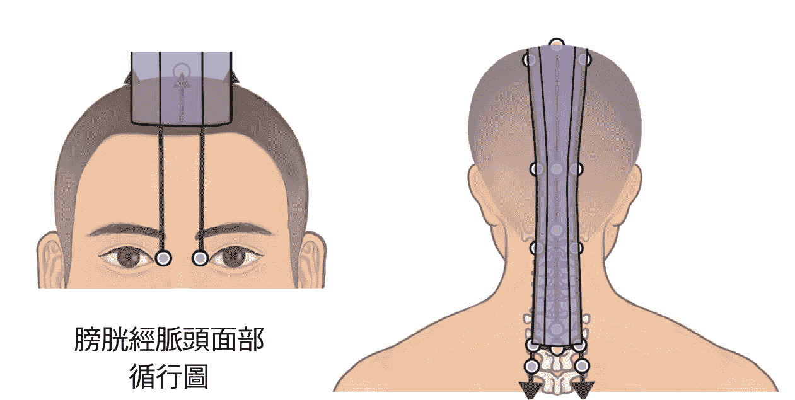

#### 2.弯曲蜿蜒分布至面部

本经筋在面部循行范围远远超过经脉，如前所述，主要加强保护面部五官。

比较值得探讨的是，头面部三条经筋皆来自背部脊项线，连接到前头、颈部及胸部，再转而上行至面部，分布到五官周围。相较于本经其他系统，这些路线比较曲折，而且还固定在骨性结构上，如：完骨、頄等，除了可以固定经筋之外，本区经筋刚好从上下、前后、左右扣住头部，稳住头部，让头部不会轻易被外力所移动而造成无谓的伤害，给予头面部五官全然且坚强的防护。

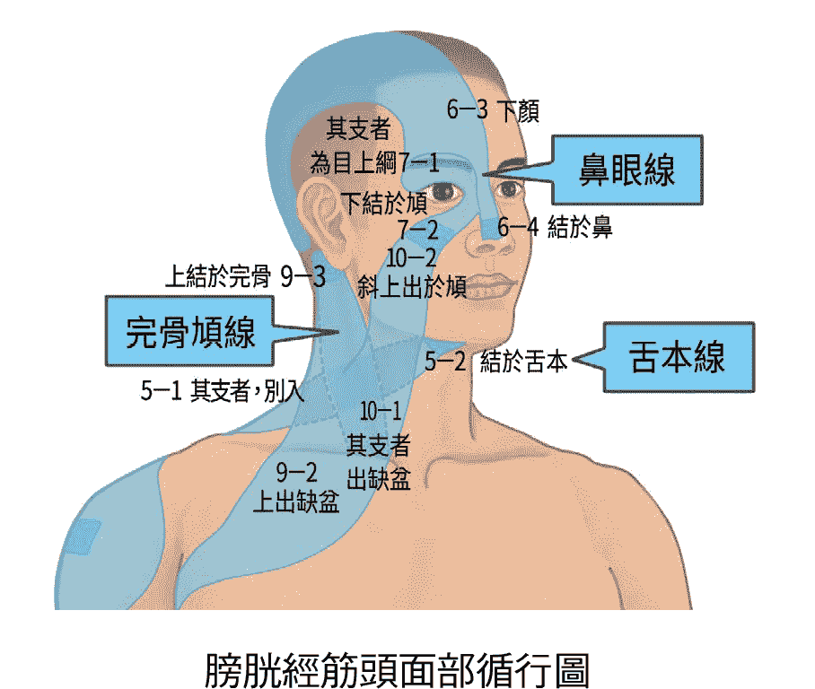

另外，目内眦到鼻旁的部位是热门区域，许多经络系统纷纷通过此处。其中最重要者为心经经别也通过此部位，《卷四》介绍此区为心脏功能在面部的反应区。膀胱经别在背部「当心入散」连结心脏，在面部又以经筋系统加强保护心经经别。心为君主之官，膀胱经系统对于心脏的忠诚度令人赞叹！

虽说头面部弯曲的经筋是为了涵盖五官，但若将此路线置于鳄鱼身上，这些路线就直接且顺畅多了，而且本经筋在头面部所形成的上下、前后、左右连结结构，不仅可以稳住头部，还与进食需求有关。鳄鱼常用的猎食方式是使用坚强有力的下颚紧紧地咬住猎物，旋转身体来撕裂猎物身上的肌肉。膀胱头面部与腰背部经筋结合，可让头部灵活，能随着身体一起翻转，也让口腔更加有力。（参考下图）对照头面部经筋在人类头面的弯曲路线，和在鳄鱼头面部所呈现较为直行的路线，由此推测出膀胱经系统记录人类演化过程中历经爬虫类的过程，所以才会说膀胱经是一条「鳄鱼经」。

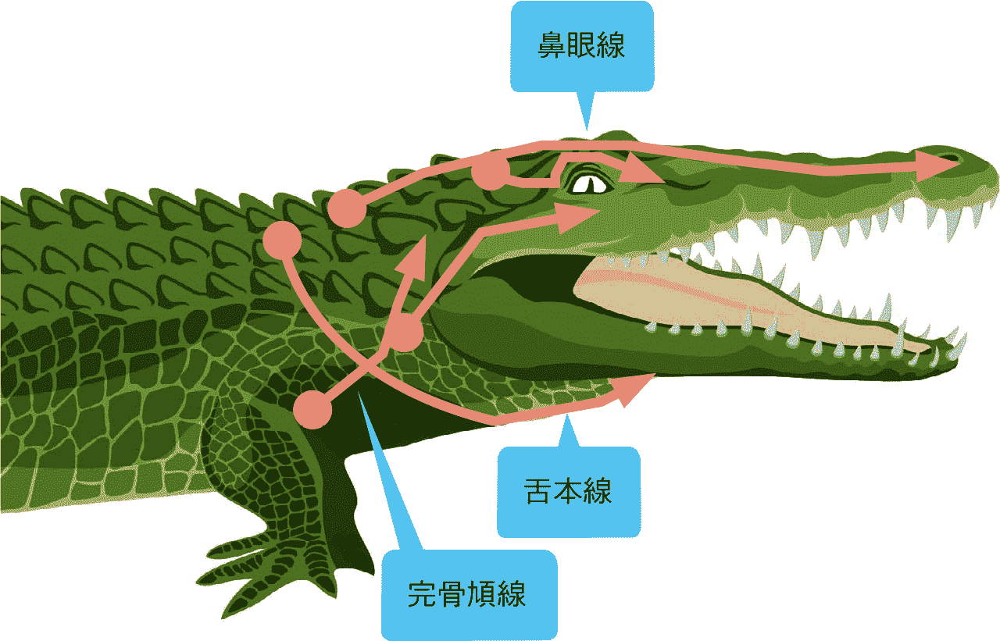

## 膀胱经筋──病候

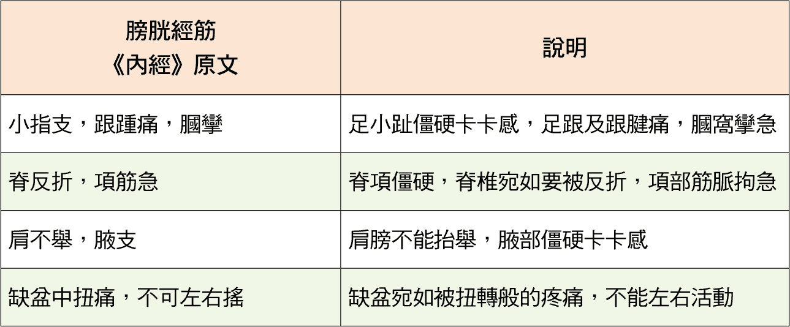

本经筋病候着重在下肢及躯干部位。以上症状都跟「筋」病有关，由于经筋紧绷，导致相关部位活动不利。多数症状都与经脉病候类似，唯独「肩不举，腋支，缺盆中扭痛」特别属于经筋所过部位疾病，也常见于中风病人。

## 膀胱经四大系统总结

膀胱经四大系统是一个非常强大的经络系统。

#### 【经脉】

以经脉系统为核心，从头面部向上循行到巅顶，入络脑，再浅出下项部，一路从腰背到大腿、小腿后侧，最后止于小趾末梢。这条「顶天立地」的经脉是人体防御风寒暑湿等邪气入侵的主要保护系统，当邪气入侵时，本经循行所经过部位就容易出现严重的疼痛和肢体活动不利的现象。

#### 【经别】

经别系统特别连结心、肾两脏，为十二经络系统聚餐团队的两个主人做了良好的沟通，也让心肾共管膀胱经系统。经别还别入后阴的肛门，再属于膀胱，膀胱包括前阴的尿道，膀胱经也因此成为可以治疗前后二阴的经络。

#### 【络脉】

络脉系统内容虽然简约，也特别将络穴飞扬穴定位成「鼻病专穴」，成为临床应用的指征。

#### 【经筋】

本经经筋系统一如胃经经筋系统，以「铺天盖地」之势包覆，除了全面涵盖前面三个系统之外，还增加下肢部、上肢部和头面部的循行部位：

● 下肢小腿部：涵盖范围包括位于内侧的肾经以及位于外侧的胆经。

● 上肢部：本经经脉并未循行至上肢，但本经筋系统增加包覆在肩部的上缘与下缘。

● 头面部：本经经脉起于目内眦，之后向上到头部，但本经筋系统还增加在此区的循行，如包覆在口腔的上下部位，耳后到前面部位等。

从前面论述可以看出，膀胱经筋是 12 经筋系统中与现代解剖结构最契合者。个人猜想，古代医家也发现了人体肌肉结构层次，所以才会使用不同的段落来论述不同的结构。个人的体会是古代医家与现代医学看到的都是同样的人体，只是使用的语言不同，只要细细琢磨，就能理解中医前辈们努力使用当时的语言来纪录人体结构特色的用心。

从功能性来看，本经经筋系统如此大范围的包覆，首先当然是为了全面保护人体背面，包括重要的脑部和脏腑背俞穴。其次，膀胱经系统是人体重要的防御系统，本经筋系统正是第一道安全防线，让我们在面对外在刺激或危机时，可由头面部的眼耳鼻提供多方位危险讯息给心脏（君主之官）来评估情势，决定「面对或逃跑」。一旦策略底定，手足立即配合，完成守护自身性命的每一场战役。这应是经筋系统扩大涵盖范围的重要考量之一。

膀胱经筋系统扩大涵盖范围有生理上的需要，可是一旦膀胱经出现病变时，也会影响所涵盖的范围，如中风疾病会出现一侧肢体瘫痪，包括上肢和下肢，甚则颜面下方的肌肉瘫痪等，这些都是本经经筋循行所过部位。

## 一、膀胱经平日保健法：与太阳同行

近年有部韩国电影《与神同行》非常热门，在此借用「与太阳同行」作为膀胱经保健的主要原则。

太阳是万物热能的来源，有了阳光，万物才能生长。膀胱经为人体的太阳，具有太阳般重要功能。膀胱经不仅是防御外在邪气入侵的重要保护系统，还在背部安置了五脏六腑的俞穴，让脏腑得以承受自然界的温暖阳光，以推动脏腑机能。膀胱经也是肾脏珍藏的肾精之重要运输通路：当脏腑功能严重失调需要肾精滋养时，膀胱经即刻成为宅急便，直接输送肾精至所需要的脏腑；反之，当脏腑气血有余裕时，膀胱经也迅速将这些气血回收，送给肾脏转为肾精储存。如此一来一往，让人体先天资源与后天资源互相支援、相互补充，是维持脏腑机能运作很重要的机制。

以上膀胱经所担任的各项任务都需要充足的阳气方能推动，因此拥有足够的阳气让膀胱经得以持续发挥太阳般的功能，就是「与太阳同行」的要旨。

### 饮食节制，勿让寒湿之气侵入膀胱经

膀胱经既是太阳也是处理体内寒水之腑，处理寒水非常需要阳气，因此膀胱经的阳火与寒水之间的水火关系需要平衡。膀胱经还为诸经主气，阳气当然要非常充足，所以日常饮食不要过于寒凉，以免寒湿之气进入膀胱经，不仅连累膀胱腑和相表里的肾脏，影响排尿功能，还会损及膀胱经背部的五脏六腑俞穴，拖累脏腑而百病丛生。

### 膀胱经循行所经部位，首重保暖与疏通气血

#### 头面颈项部防护

膀胱经筋几乎涵盖头面和颈项部位，这些部位通常都裸露在外，容易被外在风寒所侵袭，因此须注意防护。我经常搭乘火车，在车上向来是帽子＋口罩＋围巾一应俱全，随身携带，不敢松懈。此外也要特别注意家中老人的保暖，老人家阳气日衰，稍有风寒入侵，极有可能造成身体难以负荷之重症。

日常生活当中也有「与太阳同行」的保健法，如洗头后尽量吹干，别让风寒湿留在头皮，会形成俗称「头风」的陈年痼疾。个人年轻时不喜欢吹风机的噪音，常常不吹头发，年过四十之后，头风果然如期大驾光临，费了好大力气才改善。

头面颈项保暖，不仅能预防外邪侵袭，还能让肌肉放松，气血运行顺畅，有助于头面五官功能，此外还与睡眠有关喔！

#### 腰背部防护

由于膀胱经背部藏有脏腑俞穴，天气变化时，穿上背心可以防护前后心（前心及后背），也是保护膀胱经的好方法。

能吃能睡是福气，因此睡眠是重要的人生大事。想象我们是一只「躺」下来以背部接触床铺的鳄鱼，平日强韧的背部为我们抵挡风雨，夜间请给予温柔的肤慰，让背部这个铁甲武士可以暂时卸甲，放松肌肉，安然入眠休息。

当我们躺下时，头项部接触枕头，腰背部接触床铺，枕头与床铺的软硬度要能与身体配合，身体才能放松。

###### ● 建议一：不要直接睡在地板上或在地板上铺层薄被就寝

台湾气候潮湿，湿气霉气都残留在地板下，夜间属阴，地上寒气上升，夹着地板原有的湿霉之气形成寒湿邪气，刚好从背部膀胱经直接入侵身体。「地板族」常常整夜翻来覆去，醒来全身肌肉僵硬，关节痠痛，部分原因就在这里。年轻人对此感觉不明显，中老年人就不要逞能了，或可使用床架、床垫，与地板有个安全距离，以防寒湿之气入侵！

这也是我个人的经验，年轻时怎么睡都没事，年纪增长深深感受地气的可怕，后来乖乖买个床架，早上起床时就是一尾活龙。

###### ● 建议二：使用高度适当的枕头

许多人以为高枕会无忧，其实枕头高度过高反而影响睡眠。

从人体后面来看：高枕会拉开头部与肩膀的距离，这种过度牵拉头颈部肌肉的现象，长期下来会让头项肩颈肌肉变得僵硬，反而不易熟睡。

从人体前面来看：高枕会让头部前倾，下巴往胸口处下扣，刚好压住气管而影响呼吸。许多人半夜莫名醒过来，如果不是为了上厕所，那就是身体在喊救命。因为气管被下巴扣住，容易打呼，也会导致呼吸不利，严重者还会导致呼吸中止。此时身体会将我们「吵醒」，换个姿势，让呼吸能继续。

###### ● 建议三：注意床垫的舒适度

有人喜欢硬床，有人喜欢软垫，都很好。重点在于当天气变冷时，我们通常会换上厚被让身体暖和，却忘了辛苦的膀胱经也需要保暖。建议秋冬换季之际，不仅要更换厚被，也要在床垫上加一层暖被或毯子。因为床垫直接与膀胱经接触，膀胱经主一身之表及卫阳，冬天时加了垫被，背部不会受寒，唯有背部保暖，膀胱经的阳气才能顺利敷布，避免寒气入侵，全身当然也会暖呼呼，既有益健康更能助好眠。

###### 失眠总是在不断的换枕头中熬过，与其如此，不如换颗头吧！

每次在诊间，帮失眠患者检查完头部之后，会顺口问病人：「不好睡，常常在换枕头喔？」

病人也很无奈地说：「对呀！床头一堆枕头，没有一个好睡的！」然后我会半开玩笑的跟病人说：「总是在换枕头，不如换颗头吧！」

有幽默感的病人，表情总是先露出困惑，然后「噗」的一声笑出来！

然后...我们就启动「换头」机制啦！

话说中医治失眠，除了「安神」之外，还有不少法宝。

现代人不仅精神紧张，全身肌肉也非常僵硬，连睡觉时都还没法放松，我称之为「全身硬梆梆」的失眠。通常肌肉僵硬，最易表现在头部和后颈部（项部），因为背部的肌肉主要属于足太阳膀胱经。前面介绍过，膀胱经就是一条鳄鱼经。这条经络连结眼睛，向上通过前额—头顶—后头—项部—背部，然后一路到腰部，下肢背面，最后到小趾头外侧。因为这样的连结关系，一旦腰背部肌肉僵硬，一定会牵连后头和项部也跟着紧绷。睡觉时，因为全身僵硬无法放松，就会在床上不断翻滚，希望找到较好的姿势，若无助于睡眠，便开始怀疑是枕头的问题，便落入不断「换枕头」的循环中。

岂知，根本就是自己的头在作怪？！

临床上，我常会在这类病友头上检查到一些特殊状况，如像经常翻修的马路，头壳也是凹凸不平，甚至还会凸起如牛羊角的「头角」，项部则硬如铁棍。这么僵硬的头项，怎么可能躺得平？睡得着？

其实，早在《金匮要略》的酸枣仁汤中，仲景先生就运用【川芎】这味药提示我们，头项气血循环会影响睡眠。

面对这类状况，可选择以下穴位按揉保健：

1.肝经【太冲穴】以养血活血柔筋。

2.配合五门十变法「丁壬合化木」的【心胱通】，选用神门穴、京骨穴或崑仑穴。

3.再取专治头项僵硬痠痛的【列缺穴】。

4.最后在「头部紧绷处」加强按揉，可以加上【印堂穴】以安定心神。

经过这样的按压治疗后，通常头部和项部肌肉能够松缓下来，成为有弹性的头项，而获得一夜好眠。

之后回诊，病人都很开心的说：「我好睡多了，终于不必再买枕头！」

* * *

#### 下肢部防护

许多老人家抱怨夜间小腿抽筋，一旦听从医嘱，穿上袜子就明显改善了。为何如此好用？

因为夜间天地之气偏寒，睡觉时寒气会从裸露于外的身体部位入侵而影响人体。尤其熟睡时翻身，脚部很容易裸露在外，寒气就从足底循着膀胱经与肾经进入人体，这两条经络刚好夹行在小腿肌肉腓肠肌的内外侧，中医说「寒主收引」就是「热胀冷缩」的概念，寒气会让肌肉收缩，导致抽筋。所以只要给予充分的保护，平日多揉按承山穴，搭配长度及于脚踝的长裤，就可以舒服睡个好觉了。

以上保健法，都是「与太阳同行」生活的展现。

所以，善待膀胱经，正是善待自我的防卫系统！

## 二、中医师不怕治嗽，读者也可以自保

俗语说：「土水怕抓漏，医生怕治嗽」，意思是从事建筑土水工作的很怕处理房子漏水，医师则怕治疗病人咳嗽，可见房屋漏水跟病人咳嗽都是难治之症。

「医生怕治嗽」确实让年轻医师有心理障碍。记得自己刚开始当医师时，遇到长期或严重咳喘的病人也都存有一股敬畏之心，一定详加诊查，不轻易下手治疗。后来历经两个案例，才掌握治疗这类病症的方法。

头一例是陪儿子来看病的妈妈，一直没说自己的病情，直到孩子身体改善，才怯生生问：「中医可以治喘吗？」原来妈妈长年喘促，动则喘甚，久治不愈。检查发现她胸口的胸骨角位置很肿，推测也许跟长期气喘有关，决定从此着手治疗，病人很惊讶呼吸马上变得顺畅。（本故事的中医理论在《卷七》心包经）

另一案例是经人介绍来就诊的中年女性，已经咳了将近一年，非常痛苦。病人一进诊间就咳不停，检查发现背部肌肉很肿很紧，当下决定在背部拔罐。罐子才一接触皮肤，马上出现暗红色痧点，表示气血瘀滞现象，随即在颜色最深的痧点处点刺放血，加上拔罐，加强放血。治疗完毕之后，咳嗽症状明显改善。

为何在背部拔罐或放血可以治疗长期咳喘呢？

答案就在膀胱经的脏腑背俞穴。

### 脏腑背俞穴是防治「五藏六府，皆令人咳」的好部位

膀胱经背部脏腑俞穴宛如民间的「结市」概念。早期网络购物还没成形时，同类实体店铺常比邻相连，形成一条有特色的街道，就像家具一条街几乎都是家具店，一次就能购足所需。膀胱经背部脏腑俞穴也有类似的功能，称为「脏腑一条街」当之无愧。

《内经》提到「五藏六府，皆令人咳，非独肺也。」首先，咳嗽属于呼吸道疾病，主要与肺有关，因肺主皮毛，是外邪入侵的第一道防线，外邪透过皮毛进入肺脏就会引发咳嗽。

其次，由于人体脏腑经络皆相联通，功能互相影响。咳嗽初期与肺脏功能失调有关，若没及时治愈，第一道防线失守，邪气持续入侵，就会连累其他脏腑，出现咳嗽附加脏腑功能失调的情形。临床上最常见的是咳嗽持续加剧 2~3 周后，一咳就会牵引两侧肋骨疼痛，不敢呼吸，难以转身，有人还因此肋骨骨折。由于肝经分布在胁肋区域，中医称这种咳为「肝咳」，治疗时除了治肺还须兼治肝。

同理可推，其他脏腑也会出现类似情况。肺经连结胃，咳嗽期间若未注意饮食，食物饮品的寒气也会循着经络导致肺寒而加重咳嗽现象。因此《内经》有「五藏六府，皆令人咳」这种精辟论述，历代以来为临床医师治嗽的明灯。

我们依循《内经》这项指导原则，治愈许多久咳甚至喘促的病人。印象最深的是一位八十多岁的婆婆，咳嗽数十年，常诱发气喘住院，病情反覆，持续加重，西医束手无策，后来经人介绍来看中医。

就诊时，远远就听到响亮的咳嗽声，婆婆家人随侍身边，一位搀扶伴行，一位捧着卫生纸以便随时吐痰之用，据说每次出门会用掉 2~3 包卫生纸。经过中医治疗后，咳嗽及喘症明显改善，走道上也较少听到咳嗽声。婆婆说过去从来不知道也不相信中医可以治疗这么严重的咳喘，早知道就该来看中医，可以少受些罪。

另一案例是五十多岁的男性，从小爱吃甜食，咽喉卡痰严重，每天吐痰上千次，久治不愈，诊治后咳痰次数锐减，病人很欢喜，直叹中医真的好厉害。

其实只要理解《内经》「五藏六府，皆令人咳」深意，便能体会为何咳嗽这么难治的原因，既然五脏六腑都会受到牵连，当然要将五脏六腑一并治疗才能全面制伏咳嗽。

膀胱经一方面主表，可以治疗表邪侵袭所引起的咳嗽，另方面脏腑背俞穴形成密集的「脏腑一条街」，只要在此给予适当治疗，就能全面调节脏腑功能。

依据过去的经验，面对这类病况时，只要病人身体状况许可，首次治疗都先在背部拔罐，若出现暗红色痧点，表示气血瘀滞，可以放血；若出现淡紫色痕迹，表示寒气内聚，可以加上艾灸。此外再配合常规治疗，譬如针刺肺经，开立中药，提醒注意饮食生活起居等细节。随着每次治疗，病情宛如「开门送客」般的持续减轻。

读者们可以依据《内经》理论，加强背部保暖，如在背部施以按摩、刮痧、拔罐、热敷、冲热水澡等，可以预防感冒。若是已经出现咳嗽流鼻水等症状，照顾背部也许不能全然治愈感冒，但对改善病情也有助益。这也是自古以来，民间疗法喜欢在背部按摩保健的原理，不仅有助于强健膀胱经提高免疫力，同时照顾到所有脏腑以自我保健，再度体现「与太阳同行」的好处。

## 三、膀胱经常用保健穴位

膀胱经共有 67 个穴位，分布在头面部，人体后侧的颈项、腰背和下肢部位。是循行最长、分布最广、穴位最多的经络系统。

膀胱经拥有这么多穴位，堪称人体大富豪。这些穴位依据所在部位，大致可分为：头项面部 10 穴，腰背部 39 穴，大腿 3 穴，小腿（含膕窝）15 穴。

膀胱经穴位功能符合中医「上病下治，下病上治」原则，如小腿部穴位可治头面疾病，头面穴位可治腰腿疾病等。临床上，中医师常将患处的近端穴位配合远端穴位合用，治疗效果更佳。

### 头面部疾病配穴

#### 眼病远近配穴

近穴：攒竹穴（BL2）：位于面部眉头前端一个小凹陷处，压下处有明显痠胀感，当眶上切迹处。

本穴位在眉头，此处眉毛宛如细竹向上长。皱眉时，两侧眉头的眉毛好像细竹攒集在一起，所以称为攒竹穴。此穴为膀胱经第二穴，镇守在眉眼之处，位于目内眦的睛明穴与前额发际的眉冲穴之间，加上本经系统经过鼻部，所以能通治头面五官疾病，如头痛、眼病和鼻病等。个人使用攒竹穴的经验很有趣，每次只要在自己的攒竹穴点刺放血，都会突发严重鼻痒，且猛打喷嚏。

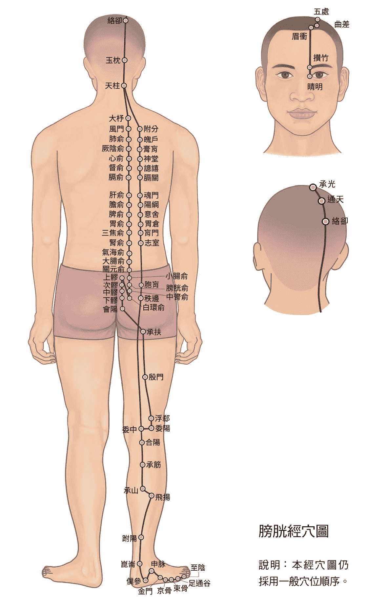

此外，由于膀胱经循行至腰背部，针刺本穴或放血可以治疗急性腰扭伤，此乃「下病上治」的应用。

远穴：京骨穴（BL64）：位于足部外侧，俗称「脚刀」的位置，第 5 跖骨粗隆下方赤白肉际处。

本穴是膀胱经的原穴，原穴擅长治疗脏腑疾病，所以本穴善于治疗膀胱腑疾病，如小便异常等，也能治疗膀胱经各种疾病。

个人临床经验，许多眼疾病友，尤其是属于气血阻滞型疾病，如房水阻滞的青光眼等，京骨穴都偏肿，肿胀程度与眼病成正比，因此京骨穴就成为我们临床上眼科疾病远端的反应区和治疗区。

#### 鼻病远近配穴

近穴：通天穴（BL7）：位于百会穴斜前方，头部前发际正中直上 4 寸，旁开 1.5 寸处。本穴顾名思义就是能「通天气」，以自然界来说，天高高在上；以人体来说，头部位置最高，是为天；以五脏功能来说，肺脏位置最高，肺开窍于鼻，司呼吸，肺能通天气。因此通天穴善于治疗「天气不通」的疾病，如头部气血阻滞等，更善于通鼻窍，治疗鼻病。

远穴：飞扬穴（BL58）：位于小腿后面，腓骨后缘，从外踝尖与跟腱水平连线之中点直上 7 寸，也可以从外踝后方沿着阿基里斯腱外侧缘向上约 7 寸处，到达与腓肠肌下缘的交界处就是本穴。

本穴是膀胱经络穴，络穴皆可治疗相表里经络的疾病，因此本穴可以同治膀胱经与肾经疾病，例如小便异常，头项腰腿疾病等。特别的是，本穴是鼻病的专穴，可以治疗各类实证或虚证的鼻病。临床上我们应用原络配穴「肾溪飞」，以肾经的太溪穴来收鼻水，本经的飞阳穴来通鼻窍，常能立即见效。

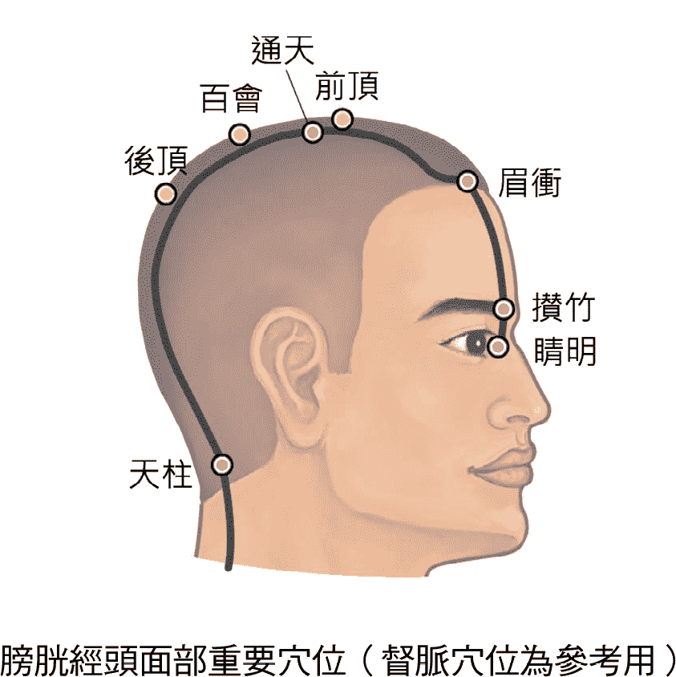

###### 两个与眼病有关的故事

故事一、用力蹬脚跟影响视力：一位中年病友回诊时告知医师近期视力下降，追查原因是病友近日在公园认真运动，持续的用力垫起脚跟再向下蹬。殊不知膀胱经系统循行连结眼睛和脚跟，持续蹬脚跟的动作，循着膀胱经而影响眼睛。经医师提醒之后不再做此运动，视力也跟着改善。

故事二、过度练甩手功出现视网膜剥离：一位中老年高度近视病友，经人推荐勤练甩手功。开始时，病人感觉练完很轻松，就自行延长甩手时间持续一个小时以上。某日突然视力模糊，眼前出现闪光，眼科检查是视网膜剥离。为何会如此？

由于膀胱经脉起于目内眦，膀胱经筋环绕肩关节并连接到眼睛上方。过度甩手，反覆牵扯膀胱经系统，进而影响眼睛。中医认为「邪之所凑，其气必虚」，病人本身为高度近视患者，是许多眼病如视网膜剥离、飞蚊症、青光眼的高危险群，眼睛本来就有「内虚」的前提，加上密集牵拉膀胱经，才会导致视网膜病变。

眼睛是精密的器官，平日受到许多脏腑和经络系统严密保护，尤其是心经、膀胱经与肝经等。若已有眼睛疾患，平日要小心照顾与眼睛相关的脏腑经络系统，应避免情绪压力、长期熬夜、用眼过度和不当的运动，才不会祸及眼睛，让人生由彩色变成黑白。

* * *

### 颈项腰背部疾病配穴

#### 颈项病远近配穴

近穴：天柱穴（BL10）：位于头颅下缘，斜方肌外侧缘的凹陷处，当督脉旁开 1.3 寸。低头时，斜方肌外侧缘的凹陷会更明显。

天柱穴是膀胱经在头面部的最后一穴，作用也如其名，宛如擎天一柱般的撑住整个头颅，可以治疗各类头面疾病。应用本穴就能在局部直接治疗颈项疾病。

远穴：束骨穴（BL65）：位于足部外侧俗称「脚刀」的位置，足小趾本节（第 5 跖趾关节）后方赤白肉际凹陷处。参阅下图。

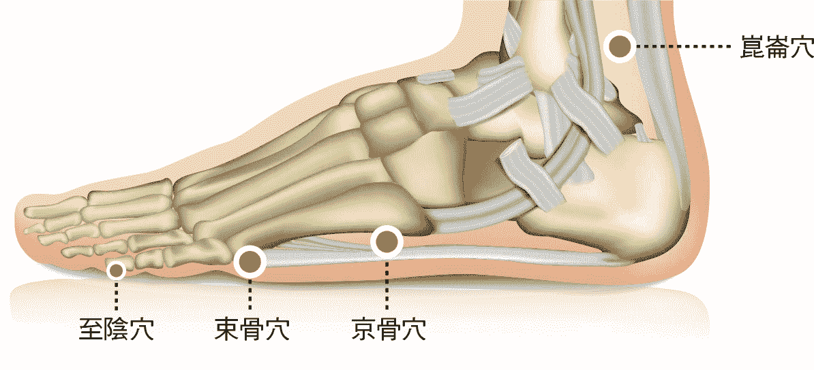

简单的说，束骨穴与京骨穴正位在第 5 跖骨的前后端，这种分布很像脾经太白穴和公孙穴也位于第 1 跖骨的前后端。

束骨穴是膀胱经的输穴，「输主体重节痛」，因此善于治疗膀胱经循行所过部位的肢体关节疼痛。周左宇老师临床治疗肩颈项背痠痛的经验配穴「三天三骨症」中，束骨穴的临床应用效果很好。（请参阅《医道精要》）历代医家也有「项强多恶风，束骨相连于天柱」（百证赋）的治疗经验。

#### 腰背病远近配穴

本区常用的近穴有二个：

近穴 1：肾俞穴（BL23）：位于腰部第二腰椎棘突下（督脉的命门穴）旁开 1.5 寸处，约与肋弓缘下端相平。

中医认为「腰为肾之府」，腰部疾病多与肾有关，也会在肾俞出现病理反应，如肿硬或疼痛等，因此肾俞穴是历代医家常用治腰背痛的效穴。

近穴 2：大肠俞穴（BL25）：腰部第四腰椎棘突下（督脉的腰阳关穴）旁开 1.5 寸处，约与髂嵴最高点相平。髂嵴就是腰部侧边最高的骨头，也是系皮带时，撑住皮带的地方。

大肠俞穴刚好位于腰椎最容易出现病变的第四与第五腰椎之间的旁边位置，只要牵涉到腰椎病变，多数都会在大肠俞附近出现疼痛现象。

远穴：委中穴（BL40）：位于膝关节后面膕窝横纹的中点，当股二头肌腱与半腱肌腱之间凹陷处。委中穴位在膝关节后侧活动频繁的位置，功能强大，具有三项特质：

第一特质：膀胱经的合穴：「合治内府」，是治疗膀胱腑疾病的重要穴位，与原穴京骨穴合用更佳。

第二特质：中医四总穴说「腰背委中求」：自古以来就是治疗腰背疼痛的特效穴。急性腰扭伤在委中穴点刺放血，可以马上舒缓疼痛，改善活动。

第三特质：本穴又称为「血㕁」，即血液深集处：可以治疗深层气血瘀滞之证。例如民间习惯在肘窝和膕窝拍痧以行气活血改善痠痛，或透散暑热以治疗中暑。肘窝与膕窝都是活动频繁，气血容易阻滞之处。肘窝主要是心包经的曲泽穴所在处，心包经主脉之所生病；膕窝为委中穴所在处，委中穴为血㕁，两处都藏有能大通气血的穴位，在此二处拍痧能够刺激穴位，加速血液循环。但要提醒大家，拍痧要适可而止，过度反而有害身体。

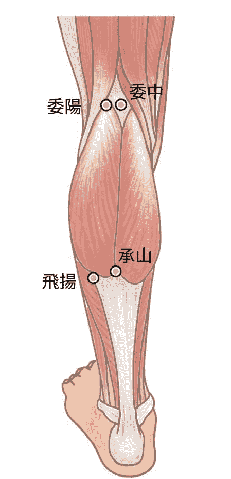

###### 背俞穴疼痛可取该脏腑的经穴治疗

膀胱经上的脏腑背俞穴都是脏腑之气转输于背部的地方，例如大肠俞是大肠之气转输于背部之处。经络系统主要是内连脏腑和外络肢节，再以大肠为例，大肠经连结大肠和手臂。因此大肠就拥有背俞穴和大肠经两个系统，此二系统的共同核心是大肠。依据这样的连结关系推论，大肠经的穴位可以治疗大肠俞的问题。

要选何穴来治疗呢？

《内经》提到「肘所独热者，腰以上热。手所独热者，腰以下热。」可见肘部对应腰部，位于肘关节的曲池穴应是恰当选择。我们依据此思路，常选用曲池穴做为手部远端配穴，治疗腰部痠痛。

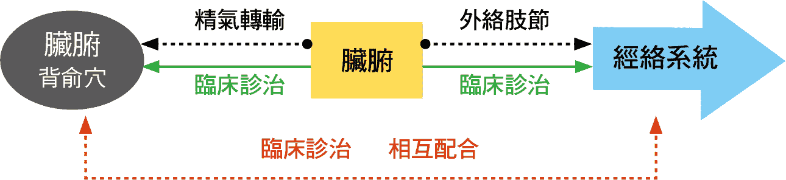

这个思路也可以应用在其他背俞穴，例如心经神门穴可改善背部心俞穴疼痛。

###### 慢性腰痛容易在第四、五腰椎（L4-L5）之间出现血络

L4-L5 之间以及荐椎，由于与腰背部的施力点有关，常发生大大小小的损伤，因此这二区容易出现暗色血络，导致痠痛缠绵难愈，腰部活动不利，加上荐椎上的八髎穴与生殖系统特别相关，中医师可以在此刺络放血治疗，一般民众或可拔罐、按摩、热敷，都能改善气血循环。

本区除了上述远近配穴之外，本经在腰背部布有密密麻麻 39 个穴位，平日自我保健可以依据个人需要，选择上焦心肺区、中焦肝脾肾区或下焦肠道膀胱区，予以适当的按摩、热敷等。如果能够全区照护，功效更为全面。

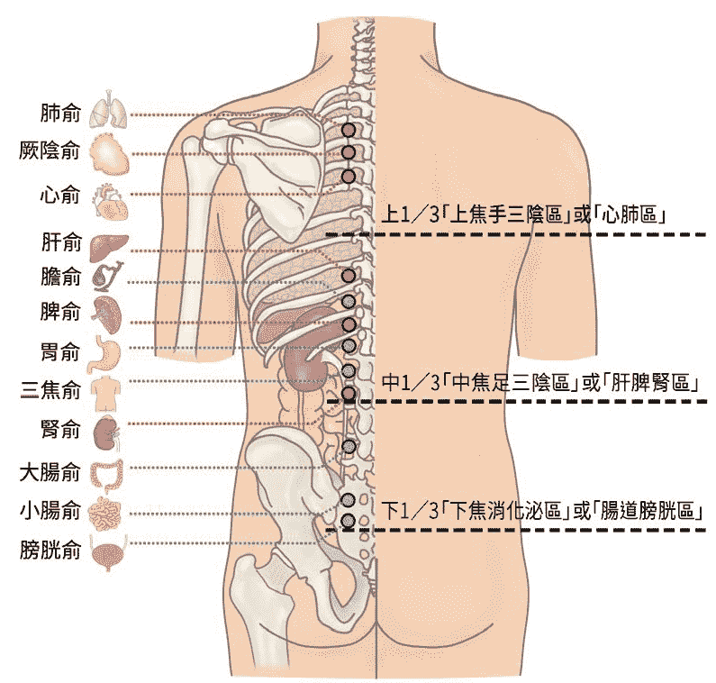

* * *

## 四、膀胱经系统与好友脏腑系统的相关用穴

#### 膀胱与肺

皆主一身之表，崑仑穴（ BL60）属经火穴，善于解表，既可透散膀胱经与肺经热邪，也可疏散寒邪。位于足外踝的后方，外踝尖与跟腱之间的凹陷处。

另外，肺开窍于鼻，飞扬穴专治鼻病，可配合通天穴和肺经穴位加强疗效。

#### 膀胱与心

膀胱经别通于心，心主血，委中穴为血郄，能同时疏通膀胱经与心经的气血。

#### 膀胱与胃

周左宇老师曾有应用崑仑穴治疗腹泻的经验。个人推测，膀胱经络系统连结前阴与后阴，崑仑穴属火，火能暖土，膀胱主水，类似中医「利小便以实大便」五苓散的概念。我曾以此请教老师，老师微笑但未正面回答，就成了千古之谜。

本经经别别入肛门，承山穴（BL57)也有改善便秘功能。承山穴在小腿后面正中在线，当膕窝的委中穴到脚跟的崑仑穴连线中点，位于腓肠肌内侧与外侧肌腹的中间，用力伸直小腿或上提足跟时呈现 W 型态，本穴位于中间的凹陷处。

#### 膀胱与肾

膀胱与肾为表里经，飞扬穴是本经络穴，擅长治疗两经之病。除了飞扬穴之外，至阴穴也与肾经有关。至阴穴（BL67）是膀胱经最后一个穴位，位于小趾末梢，膀胱经于此交接给肾经。肾经起自涌泉穴，从太阳经「至阴穴」到少阴经「涌泉穴」这段经络，既是人体脏腑经络气血的转折，从明亮的太阳处转至最阴之处，经过阴阳消长，气血就从深处如泉涌般，开始新的循环。

从另一个角度来说，肾司二阴，膀胱经又连结二阴，女性的前阴兼具泌尿与生殖功能。胎儿在母体长大成熟之际，将从母亲身体至阴处（包括子宫与阴道）涌出，来到人间，因此「至阴穴」到「涌泉穴」这段路，可以视为新生命诞生的过程。胎儿的胎位决定产程顺利与否，甚至影响母婴两人的生命，极为重要。能将胎位转正的部位就在母体的子宫，所以至阴穴就成为转动胎位的要穴，一旦胎位转正了，胎儿就能伴着羊水从母体顺产出。

#### 膀胱与三焦

在水液代谢功能方面，肺与膀胱都有重责，《内经》说「脾气散精，上归于肺，通调水道，下输膀胱。」但肺位在上焦，膀胱位在下焦，如何完成使命？肺与膀胱如此「远距」爱情，当然需要勤快的「媒婆」来帮忙媒合（通调水道）。

这位媒婆正是三焦。

三焦遍布体腔，既是原气的别使也是水谷的道路，具有这样的特质方能成为肺与膀胱之间通调水液的道路。手三阳经在足阳经都设有一个下合穴，以此与足阳经合作，加强其功能。譬如胃掌管大肠与小肠功能，大肠经与小肠经的下合穴就放在胃经上。而三焦经的下合穴放在膀胱经上，即是委中穴外侧的委阳穴（BL39）。

总论介绍过，水饮进入到胃，通过脾与肺的作用，通调水道下输膀胱，膀胱为州都之官，水液经过气化之后，让水精敷布至全身。三焦既是原气别使，有助于水液的气化，还遍布体腔成为水谷道路，有助于水精的敷布。膀胱经非常需要三焦经这个全方位的帮手，三焦经也看上膀胱经从头到脚，顶天立地的经络分布，加上背部藏有五脏六腑俞穴的豪门气质，两经一拍即合，共同完成人体水液气化和输布全身的功能。

#### 膀胱与胆

膀胱经与胆经在经络循行上有许多关联，这部分在后续胆经篇详细介绍，此处先就胆经擅长治疗筋病的部分与膀胱经的对应举例。

中医有「八会」的说法，其中「筋会阳陵」，意指胆经的阳陵泉穴擅长治疗筋膜疾病，因此只要是筋膜疾病，就首选阳陵泉穴，这是历代中医师总结临床经验流传下来的珍贵智慧。膀胱经也有善于治疗筋病的穴位，就是前面介绍的承山穴，位于腓肠肌肌腹形成的「人」字形顶点，这个位置决定其擅长治疗小腿抽筋的特殊功能，因为小腿抽筋大部分发生在腓肠肌，因此出现小腿抽筋状况时，直接按压承山穴便能立即改善。承山穴这项特质，就是与胆经「筋会阳陵」的概念相通。

许多人都有小腿抽筋的恐怖经验，尤其在睡梦中突然发生，根本痛得无法动弹，遑论起身伸手按压承山穴。在此介绍另一个能提供神救援的穴位，就是「人中穴」。人中穴位于鼻唇沟正中上 1/3 处，下方为牙龈，可以食指指尖略向上方，朝向鼻部用力掐压，感觉非常痠胀才会有效，同时慢慢活动抽筋的脚，便会逐渐缓解。许多人按压 1/2 处是错误位置，而且平压刺激效果也不足。

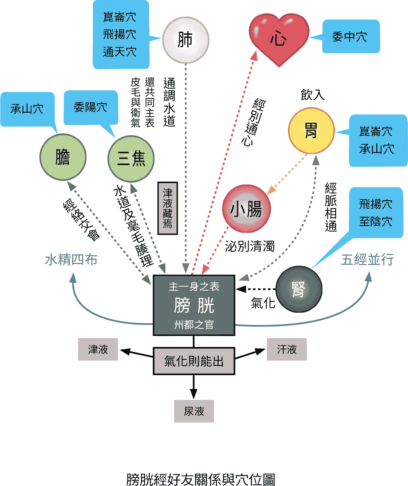

## 最重要的护卫力量是低调又强大的守护

膀胱经系统为全身循行路线最长者，从头面开始，向上到达巅顶，转向后头，一路从项背腰腿到脚部外侧的小趾头，完全符合「顶天立地」的说法。本经也是十二经络中穴位最多的一条经络，其中在腰背部还独藏五脏六腑的背俞穴。默默守护在身体背后的膀胱经竟蕴藏如此重要的俞穴，由此一窥本经不争锋头，低调中奢华的强大特质，方能长久稳占人体背后这片广大部位。

## 生命学习是在变化中不断的调节平衡与实践

膀胱经系统面临许多矛盾，也反映出我们身处于尘世之中，心主 EQ 和肾主 IQ，面对复杂纷乱的内外环境，须时时刻刻自我调节的现象。例如膀胱的表里经是肾经，肾脏五行属水，五色主黑，膀胱一方面跟随着肾经的特色，但其经别却连结到心，让膀胱兼具心脏的太阳特质，心的五行属火，因此本经阳气旺盛，能为诸阳主气。膀胱经居中协助心与肾，维持水火共济，让热情与理智平衡，这正是现代社会所需的生存本能。

膀胱经系统还有其他的矛盾现象，但这些现象不是负面的限制，反而像一股让人迎风扶摇直上的力量，一如孟子说的「生于忧患，死于安乐」，生命的考验让人成长且坚强。身为人体最强大的膀胱经，当然无惧于这些挑战！

### 安心接纳及等候转变

膀胱这位州都之官对于津液的藏与出也是一种矛盾现象。转换成人生历程来看，津液的储藏代表着接纳现状，储备实力，等候良机；气化排出津液代表一旦时运来临就能转变，脱颖而出！俗语说「机会不会敲两次门」，机会只给准备好的人。

膀胱这位州都之官提醒我们：安心等候时机，默默厚植实力，一旦机会来临，自能一飞冲天，实现梦想！

### 面对生命各阶段试炼，勿忘绚烂时展现自我，
沉潜时成就他人

本经从眼睛开始，历经头面部、腰背、大腿等部位大面积的双线条分布，通过膕窝之后，开始收敛，最后走到最偏僻的足小趾外侧做为结尾。对照人生历程，宛如由绚烂到平静，印度诗圣泰戈尔也有类似诗句「生如夏花之绚烂，死如秋叶之静美」。再从穴名来看，太阳经从「睛明穴」开始，最后到「至阴穴」，从「日月合明」的明亮到「阴之至极」的幽暗，似乎提示我们要坦然接受这样的人生历程。

其实膀胱经的循行是人体从头面到达巅顶之后，转向后头，循行于项背腰腿，直至小趾。诚如人生在光彩绚烂之时可以充分展现自我，一旦到达人生巅峰之后，就要有心理准备，因为没有永远的巨星，此时应该让出舞台，转向幕后，成人之美，一如膀胱经无私的提供背部让脏腑俞穴进驻，隐身于后，以自己过去的经验，协助后进，默默成就他人。透过别人的成功，更显得自己经验的可贵处。这条由绚烂转向沉潜的人生路途，让自己的生命更丰富。

另一方面，生命也会帮自己找到另一个舞台。膀胱经最后在「至阴穴」之后交接肾经「涌泉穴」。肾脏所藏的肾阴肾阳代表接收自祖先的先天之本，也是我们传给后代子孙的先天之本，因此从「至阴穴」转到「涌泉穴」，代表生命如泉水从地底涌出般的重新开始。膀胱经告诉我们，生命会盛极而衰，也会衰极而盛，一如自然界的春夏秋冬，四季变化，如环无端，没有永恒的秋冬，只要心能安住，自能等到生命春天的来临。

### 坚持理念之时，除了横眉挺腰，
也要刚柔并济，不随波逐流

膀胱经属水色黑，却有阳光般的明亮温暖特质，一如莲花出淤泥而不染，膀胱经也有着自己的坚持。

二十世纪文学作家鲁迅在一首诗中写到：「横眉冷对千夫指，俯首甘为孺子牛。」年轻时看到用词如此犀利对比的诗句，非常震撼，眼前也超有画面。一个人为了坚持理念，可以无惧昂首冷看他人的批评，而当面对自己心爱的孩子时，却愿意低头弯腰，成为孩子坐骑玩乐的老牛。两句诗完全点出人性中的刚与柔。

中医认为眉毛宛如植物，有着与肝脏相似的向上条达特质，同时膀胱经循行经过眉头攒竹穴，经筋系统涵盖眉毛，膀胱经系统通过整个头项腰背。就经络来看，横眉与俯首部位都属膀胱经系统所过，所以「横眉冷对千夫指，俯首甘为孺子牛」也可视为膀胱经不随波逐流，刚柔并济的人生哲学。

现代社会人际关系既紧密又复杂，尤其网络世界的霸凌层出不穷，若要坚持理念需要更多勇气，除了要有「虽千万人，吾往矣」敢于冲锋陷阵，坚毅的将军之官肝脏外，还需加上太阳般特质的膀胱经前来助阵，防护一身之表免于流言蜚语侵扰，主持诸阳之气以维持阳光般的正向心情与思考，就能挺直腰杆，迎向风雨，不轻易屈服。但膀胱经可不是一昧蛮勇喔！膀胱经脉主筋之所生病，主要与身体的屈伸活动有关，这也提示我们，大丈夫能屈能伸，识时务者为俊杰。

## 腰背身形反映身心状态，
莫忘展现太阳力量，挺直腰杆面对未来

膀胱经系统的特色之一是循行于整个背部，撰写本条经络系统时，我总想起中学课本中朱自清描写父亲背影的文章，当年曾深深感动。只是为何一片平坦的「背影」会令人感动？从膀胱经的角度来看，没有嘴巴的背影却能以自己的方式默默承担及诉说。

膀胱经连结心脏与肾脏、头脑与腰背下肢，也主筋之所生病，背部又藏有脏腑俞穴，这些条件让背部结构会透露出一个人的身心状态，当心情雀跃或身体健康时，整个腰背部直挺，行走步态轻盈稳健，充满自信；当心情低落或身体孱弱时，整个腰背部弯曲，行走步态沉重拖延，充满悲伤。岁月会在身体留下痕迹，再加上生命历程不顺遂，都会加重腰背下肢的疲象，踽踽独行的孤寂背影，望之鼻酸。

若从太极图来看，这世界没有绝对的黑或白，即使在最黑暗的时刻，阳光已经开始慢慢洒进来了。

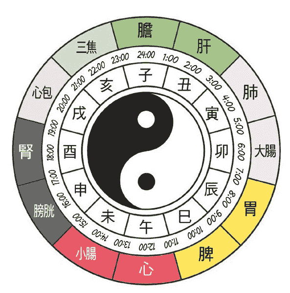

人生难免遭遇困顿，请不要忘记膀胱经所具有的太阳特质。面对磨难时，只要启动膀胱经：张开眼睛，深深呼吸，抬头挺胸，挺直腰杆，顶天立地，就能重新燃起心中的火苗（莫忘膀胱经别通于心），以智慧面对挑战，找到人生出路。

若再延伸，位于心经与肾经之间的小肠经与膀胱经这两条手足太阳经，提示我们，无论面对多么难搞的 EQ 人际关系或 IQ 学习历程，生命中都有着两颗太阳相伴，莫忘保持太阳般的正向、温暖特质，这是面对内外环境剧变的重要法宝。

我很喜欢潘越云唱的《守着阳光守着你》，歌曲中那份来自阳光的信守力量，陪我走过青春，走过异乡。现在，献给充满阳光的您！

让我执起你的手

在等待的岁月中

我已经学会了不绝望

守候着你

我便守候住一身的阳光

梦境 会成为过去

一如黑夜要躲藏

我仍是那最早起的明星

守着朝阳

朝阳下你灿烂的甦醒

什么样的信约 可以等候三世

什么样的记忆 可以永不遗忘

什么样的思念 可以不怕沧桑

什么样的日子 可以让你不再流泪

让我不再心伤

###### 附录：膀胱经背俞穴之部位及排列顺序与临床诊治意义

陈怡真 1 吴欣洁 1 高欣华 2 陈艺文 2 沈邑颖 2

1 花莲慈济医院中医部　2 关山慈济医院中医科

通讯作者： 沈邑颖｜电话：089-814880 转 530｜地址：台东县关山镇和平路 125-5 号｜E-mail： north820@gmail.com

摘要

目的：将膀胱经背俞穴的部位及排列顺序和脏腑生理病理及临床诊疗进行结合，揭示其与中医生理病理及各类通经关系高度相关的概念。

方法：对古代典籍及现代文献中有关膀胱经背俞穴的部位及主治作用论述进行收集整理与分析，探讨与归纳膀胱经背俞穴之部位及排列顺序与临床诊治意义。

结果：膀胱经背俞穴的部位安排，分为上中下三部，分别司循环呼吸的心肺功能区；司消化作用的肝胆脾胃功能区; 司泌尿生殖的肾膀胱功能区。膀胱经背俞穴排列顺序，涵盖中医基础理论的五行生克关系及各类通经法则，包含表里经、手足同名经、俞募配穴，也包含源自于内经的五门十变法和脏腑通治法之概念。

结论：背俞穴的精细巧妙排列，加强了中医理论中的经络基础，补充阐释经络及穴位治疗之中医诊疗思路。背俞穴为脏腑之气转注于背的腧穴，是经气运输的通路，也是联系身体内外的枢纽，故能反映人体内脏生理、病理的变化，以作为诊断的依据，也可用于治疗各类脏腑急重症与慢性病，有直接且快捷的疗效，因此常被广泛应用于临床。若能理解背俞穴之部位及排列顺序与脏腑生理病理间的涵义，将能够更提升临床诊断与治疗水平。本文针对膀胱经背俞穴排列顺序的诊疗意义进行初探及初步结论，其所含的相关意义仍需更多专家先辈的参与，及应用更先进严谨的研究方法来加以探讨。

关键词：膀胱经 背俞穴 通经概念 五门十变 脏腑通治

一、前言

（一）背俞穴历史源流[1,2]

背俞穴属特定穴之一，是脏腑之经气转输于腰背部的俞穴。五脏六腑的背俞穴均位于背部足太阳膀胱经第一侧线上，首见于《灵枢．背腧》其明确记载膈俞以及肺、心、肝、脾、肾五脏背俞穴的名称及定位。《素问．气府论》提出「五脏之俞各五，六腑之俞各六」，但未列出穴名及定位。直至晋．王叔和《脉经》补入胆俞、胃俞、大肠俞、小肠俞和膀胱俞五腑背俞穴，才明确了肺俞、肾俞、肝俞、心俞、脾俞、大肠俞、膀胱俞、胆俞、小肠俞、胃俞等十个背俞穴的名称和位置。此后，晋．皇甫谧《针灸甲乙经》补入了三焦俞及其定位，唐．孙思邈《备急千金要方》又补充了厥阴俞，至此十二背俞穴始而完备。

（二）背俞穴诊治功能[2,3]

内经中有多篇关于背俞穴主治的描述，《灵枢．五邪》记载「邪在肺，则病皮肤痛，寒热，上气喘，汗出，咳动肩背。取之膺中外俞，背三节五脏之傍」。《灵枢．癫狂》记载「厥逆腹胀满，肠鸣，胸满不得息，取之下胸二胁，咳而动手者，与背俞以手按之立快者是也」。《灵枢．杂病》记载「心痛，当九节刺之，按已刺按之，立已；不已，上下求之，得之立已」。《素问．奇病论》记载「胆虚气上溢，而口为之苦，治之以胆募俞」。《素问·长刺节论》记载「迫脏刺背，背俞也」。从内经的描述中可知，各类脏腑急重症与慢性病，取用背俞穴有直接且快捷的疗效，而除了其治疗意义外，背俞穴亦可做为临床诊断的重要依据，《难经．六十七难》曰：「阴病行阳，俞在阳」即说明五脏有病多反应在背俞穴，某背俞穴找到反应点，可做为诊断某脏有疾的参考。张景岳《类经七卷．经络类十一》中指出：「五脏居于腹中，其脉气俱出于背之足太阳经，是为五脏之俞」。背俞穴为经气运输的通路，是联系身体内外的枢纽，故能反映人体内脏生理、病理的变化，以作为诊断的依据，也可用于治疗各类脏腑疾病，有直接且快捷的疗效，因此常被广泛应用于临床。

背俞穴之功效机理常受各界研究讨论，然而对于背俞穴之排列顺序意义却鲜少被提及。本文目的即藉由分析古代典籍及现代相关文献，对膀胱经背俞穴的部位分布排列顺序和脏腑生理病理及临床诊疗进行结合，揭示其包含的许多中医生理病理及通经关系的概念。

二、材料

透过计算机检索中国期刊全文数据库 1995 至 2015 期间与膀胱经背俞穴部位分布及主治作用相关之文献，及中医古籍中相关论述。

三、方法

对古代典籍及现代文献中有关膀胱经背俞穴的部位分布及主治作用论述进行收集整理与分析，探讨与归纳膀胱经背俞穴之部位分布及排列顺序，揭示其中的主治规律以及其包含的各类通经概念。

四、结果

膀胱经背俞穴的部位安排，可分为上中下三部，分别为司循环呼吸的心肺功能区；司消化作用的肝胆脾胃功能区；司泌尿生殖的肾膀胱功能区。膀胱经背俞穴的排列顺序，涵盖中医基础理论的五行生克关系及各类通经法则，包含表里经、手足同名经、俞募配穴，也包含源自于内经的五门十变法和脏腑通治法之概念。背俞穴的精细巧妙排列，加强了中医理论中的经络基础，背俞穴之部位及排列顺序与脏腑生理病理特性高度相关，具有诊断与治疗意义，将详细讨论如下。

五、讨论

在本节中，将依膀胱经背俞穴的部位分布及排列顺序两大主轴，详细讨论其与脏腑生理病理和经络通经概念高度相关之临床诊治意义。

（一） 膀胱经背俞穴的部位分布[2,4,5,6,7,8,9]

在现代解剖学中，调理内脏功能之内脏神经中的交感神经就由脊神经的内脏传出纤维等组成，于脊柱两侧组成交感干，分布于心肌，胃，肠平滑肌，脾，胰，肝，肾等，调理内脏器官功能[4]。各脏腑器官与其相应神经节段请参考下表一[5]。

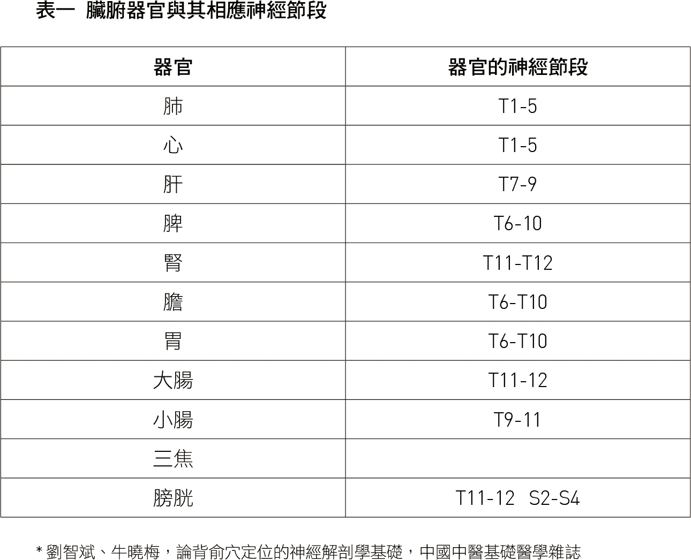

从背俞穴的位置看，背俞穴与其相应的脏腑位置相邻近，且与该脏腑在体表的投影相接近，且背俞穴与交感干，交脊联系点关系非常密切，交感干与交脊联系点的体表投影线与膀胱经背部内侧线俞穴总重合率为 80%。背俞穴的分布规律与脊神经节段性分布特点大致吻合[2]。滑伯仁曾说：阴阳经络，气相互贯，脏腑腹背，气相通应。在背部俞穴中，五脏背俞穴的分布与内脏的关系最为明显。肺俞，心俞，肝俞，脾俞，肾俞五个背俞穴所处位置的或上或下，与相关内脏的所在部位是对应的[6]。因此，若将人体脏腑依解剖位置及功能，分成上中下三大区块，上区块即位于胸腔，属于主循环呼吸的心肺区；中区块为腹腔，属于主消化作用的肝胆脾胃区；下区块为骨盆腔，属于主泌尿生殖的肾膀胱区；而膀胱经背俞穴之排列方式，也遵循此规律，其与脏腑生理病理关系，分别详述如下：

1.司循环呼吸的心肺功能区：膀胱经上背部俞穴，对应上焦心肺区，其功能特点主要与心、肺之功能作用有关，其包含五个穴位，即胸椎第二、三、四、五、六脊棘下，旁开 1.5 寸，分别为风门、肺俞、厥阴俞、心俞、督俞五穴，其主治与伤风咳嗽、气喘胸闷、心痛惊悸等有关。《素问．灵兰秘典论》：「心者君主之官，神明出焉；肺者相傅之官，治节出焉。」人之一身，皆气血之所循行，肺位于胸腔，在人体脏腑中位置最高，故又称为华盖，协助心推动以及调节气血的运行。《灵枢．营卫生会》也因此提出「上焦如雾」，描述心肺从高处输布气血的作用。《素问．刺禁论》说明「鬲肓之上，中有父母」。《难经．三十二难》更明示：「心者血，肺者气，血为荣，气为卫，相随上下，谓之荣卫，通行经络，营周于外，故令心肺在膈上也。」心为阳，父也，肺为阴，母也，肺主于气，心主于血，其荣卫于身，故为父母位居于膈上。因此心、肺转输于背部膀胱经的肺俞、心俞，亦位于背俞穴之最高位。而心俞之上的厥阴俞，为心包之转输，《内经》比喻心包为心之宫城，具有保护心脏，代心受邪之功，其背俞穴即位于心俞之上。《温热论》：「温邪上受，首先犯肺，逆传心包」，风寒暑湿燥火六淫之邪，多先侵犯主一身之表的肺，厥阴俞身负隔绝来自肺俞的外邪侵入心脏的重要作用。督俞为督脉转输于背部之俞穴，而督脉为阳脉之海。心督主阳，与阳气的散发有关，而心主火，需要许多阳气的补充以维持其功能。督俞正好位于心俞之下，源源不绝的提供阳气给予心俞。

2. 司消化作用的肝胆脾胃功能区：膀胱经中背部俞穴，对应中焦肝胆脾胃区，其包含五个穴位，皆与消化、吸收及输布水谷精微等功能有关，即胸椎第七、九、十、十一、十二脊棘下旁开 1.5 寸分别为膈俞、肝俞、胆俞、脾俞、胃俞。膈俞主治呕吐呃逆，与食物之受纳有关。膈俞对应至前方的横膈膜，为呼吸系统的天然屏障，直向经络均贯膈，是人体重要的经脉转运站。八会穴中「血会膈俞」，中焦化气取汁，奉心火而为血。五脏中「心主血」、「肝藏血」，《针灸大成》注解：「血病治此，盖上则心俞，心主血；下则肝俞，肝藏血；故膈俞为血会。」因此膈俞亦扮演着血液转运站。而肝胆脾胃俞，其排序含有「肝升胆降」与「脾升胃降」气机上升下降、脏上腑下的小周天概念。依中医基础理论，肝主疏泄，肝的疏泄功能正常时，全身气机疏通畅达，将有助于脾升胃降二者之间的协调，才能使水饮食物的消化运动正常进行。《灵枢．本输》曰：「胆者，中精之府」，指出胆腑内藏胆汁，参与饮食物的消化，是脾胃运化功能得以正常进行的重要条件，可见肝胆与中焦运化密切相关，因此其转输于背部之肝俞、胆俞亦应与脾胃运化相关。而再依序排列的即为脾俞、胃俞，脾胃俞本与脾胃功能相关。

3.司泌尿生殖的肾膀胱功能区: 膀胱经下背部俞穴，对应下焦肾胱区，其包含七个穴位，即腰椎第一、二、三、四、五脊棘下旁开 1.5 寸分别为三焦俞、肾俞、气海俞、大肠俞、关元俞；骶椎第一、二节下旁开 1.5 寸分别为小肠俞、膀胱俞。其中三焦俞、肾俞、大肠俞、小肠俞、膀胱俞，皆与水液代谢有关，例如三焦俞:《素问．灵兰秘典论》曰：「三焦者，决渎之官，水道出焉。」也就是说，三焦有疏通水道，运行水液的功能。肾俞：《素问．逆调论》曰：「肾者水脏，主津液」指出肾主水，有主持和调节人体津液代谢的作用。大肠俞：大肠生理功能主传化糟粕，即吸收饮食物糟粕中的残余水分并将糟粕排出，大肠经主「津」所生病，可见其与水液代谢密切相关。小肠俞：小肠生理功能主受盛和化物、泌别清浊，即指小肠消化饮食物后，将其泌别清浊为水谷精微和食物残渣，一则以吸收，其余送到大肠，吸收水谷精微的同时，也吸收了大量的水液，小肠经主「液」所生病，亦与水液代谢密切相关。膀胱俞：《素问．灵兰秘典论》曰：「膀胱者，州都之官，津液藏焉，气化则能出矣。」强调了膀胱贮尿排尿功能及其与水液代谢之关联。膀胱经下背部之三焦俞、肾俞、大肠俞、小肠俞、膀胱俞，皆与水液代谢有关，且尿液为津液所化，在肾的气化作用下形成尿液，下输膀胱，使得其亦与泌尿功能密切有关。

另一方面，肾俞、气海俞、关元俞皆与生殖功能有关，例如肾俞：《素问．六节脏象论》曰：「肾者主蛰，封藏之本，精之处也。」《素问．金匮真言论》曰：「夫精者，身之本也。」根据中医基础理论，肾藏精，精化气。肾气的主要生理功能是促进机体的生长发育和生殖。而气海俞与关元俞分别为任脉气海穴与关元穴，脉气转输于背部之俞穴，任脉总任阴脉之间的关系，调节阴经的气血，故又称为「阴脉之海」。另一方面任脉起于胞中，任含有「妊」之意，与妊娠有关，故称「任主胞胎」。其中气海穴为原气之海，主一身之气；关元穴为元阴元阳之关。据此，肾俞、气海俞、关元俞等膀胱经下背部的三个俞穴皆与生殖功能有关。整体来说，从第一腰椎至第二骶椎之背俞穴，与泌尿生殖功能相关，可归于下焦司泌尿生殖之肾胱区，正对于人体结构之骨盆腔功能。无论是水液代谢、泌尿生殖功能，肾俞扮演重要角色，体现《素问．脉要精微论》所述「腰者肾之府，转摇不能，肾将惫矣。」之内涵。

俞穴的主治特点和规律与其部位相关[7]。背俞穴主治除了与相应脏腑疾病，相表里脏腑疾病，相应脏腑所属的五官五体病相关外，背俞之间亦有纵向经气扩布的联系，故上下相邻的背俞穴，由于位置相近，经气相通，主治效能常有相同之处[8]。就如同上述所提到的器官神经节段分布（详见表格一），每一器官的神经节段都属区块性分布，包含上下相邻的交感干，例如膀胱的神经节段包含 T11-T12 及 S2-S4，呼应了各相邻的背俞穴其经气相同，主治效能相同，能加强彼此疗效。陶之理与任文庆（1995）观察「关元俞」「膀胱俞」传入神经元与膀胱传入神经元的节段性分布与联系，发现其二者的传入神经元节段相互重叠 9 个节段(L2-S5)，当针灸这两穴位时传入神经元将刺激传至脊髓并可经上行束至丘脑进行整合，对膀胱机能进行调整以达到治疗效果[9]。可见背俞穴与其脏腑及神经解剖学彼此高度相关。刘智斌与牛晓梅（2013）探讨背俞穴定位的神经解剖学基础，指出神经传导是针感效应发挥作用的解剖学基础，而神经系统的节段性支配及体表，内脏信息传递的会聚现象为背俞穴治疗脏腑疾病提供了解剖学上的支持，并提出华佗夹脊穴这种多点对一脏或一腑的取穴法更符合生理与病理上神经解剖学体表与脏腑的联系关系[5]。呼应了我们将背俞穴分成区块性来进行其主治功效探讨，利用邻近背俞穴的区块性搭配诊治方法，能够提高主治疗效。

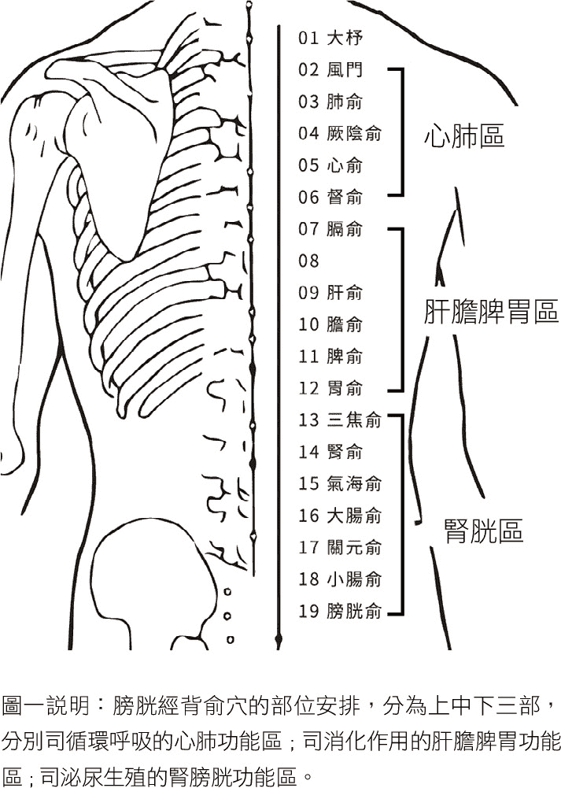

综上所述，膀胱经背俞穴的排列方式，确实与人体的结构及其功能表现高度相关，可将背俞穴对照人体脏腑解剖位置及功能，分成上中下三大区块(见图一)，在临床治疗时，若以区块性的角度进行诊疗，将可提高诊断及疗效的准确度及强度，可作为临床诊断或治疗的参考。

(二)膀胱经背俞穴的排列顺序

1.五行生克关系[10]：膈俞、肝俞、胆俞、脾俞、胃俞彼此相邻而居，肝胆俞位于膈俞之下，脾胃俞之上，与「土得木而达』的生理特色高度相关，提供了一旦肝疏泄功能异常出现「太过」与「不及」时，产生「木来克土」或「木不疏土」的可能管道。《素问．宝命全形论》记载了五行间相互克制的关系，其曰：「木得金而伐，火得水而灭，土得木而达，金得火而缺，水得土而绝，万物尽然，不可胜竭。」人体作为一个整体，五行中任何一个联系的失常，包括「太过」、「不及」均可导致疾病产生。其中关于「土得木而达」在生理上即说明，木能克土亦能疏土，土气的健运有赖肝气的疏泄条达。若肝疏泄功能异常，无以助脾之升散，影响于脾，脾气不升则飧泻，脾气不通则腹痛，而成为痛泻之证；若肝疏泄功能异常，无以助胃之降浊，胃气不降，反而上逆则嗳气、呃逆、恶心呕吐，胃气不通则脘腹胀痛。前者称为肝脾不和；后者称为肝胃不和，临床上可将此现象统称为「木土失和」[10]。

膈俞与肝俞，中间空隔第八胸椎。膈俞本穴内应横膈，故名膈俞。《灵枢．邪气脏腑病形》记载：「脾脉……微急为膈中，食饮入而还出…」。提出膈又有『噎膈』之意。《素问．至真要大论》：「太阳之复…心胃生寒，胸膈不利，心痛痞满。」说明胸膈不利，亦即胸与横膈部之滞塞堵闷，可能导致心痛痞满之症状。《诸病源候论．五膈气候》中记载：「患膈之为病，心下苦实满，意辄酢心，食不消，心下积结，牢在胃中，大小便不利。」根据上述文献摘录可知，膈俞本身能反应出五行中属『土』之部分。于《灵枢．本脏》中更记载了膈与肝之间的相互关联：「肝大则逼胃迫咽，迫咽则苦膈中，且胁下痛。」肝与膈之间亦能产生「木土失和」之情形，而在膀胱经背俞穴上，第七椎旁的膈俞与第九椎旁的肝俞正好中间空一椎而相邻，暗示者木过旺来克土，即会看到木土失和的情况发生。同样的，在第九、十胸椎脊棘下旁开 1.5 寸的肝俞、胆俞之后，紧邻的就是第十一、十二胸椎脊棘下旁开 1.5 寸的脾俞、胃俞，再次强调了木与土之间的密切关系。由此可知，膀胱经背俞穴的排列揭示了五行间相互克制的关系（见图二），可供临床诊断或治疗上的参考。

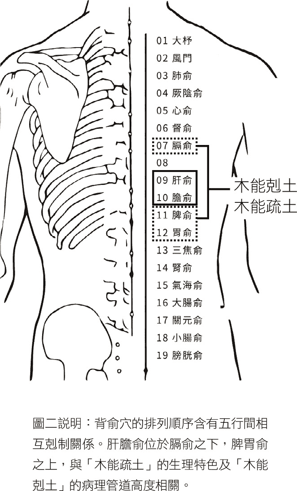

2.表里经关系：在背俞穴的排列顺序中，肝俞、胆俞相邻；脾俞、胃俞相邻，彼此为表里经关系。根据《灵枢．经脉》中的记载，十二经脉中互为表里的阴阳两经在四肢末端交接，阴经属脏络腑，阳经属腑络脏，说明了经络及脏腑之间表里络属的关系，成为历代通经概念中最被广为应用的通经法。在膀胱经背俞穴中，肝俞与胆俞紧邻一起，互相为表里关系。脾俞与胃俞紧邻一起，互相亦为表里关系（见图三）。膀胱经背俞穴排列方式中包含了表里经的通经概念于其中。

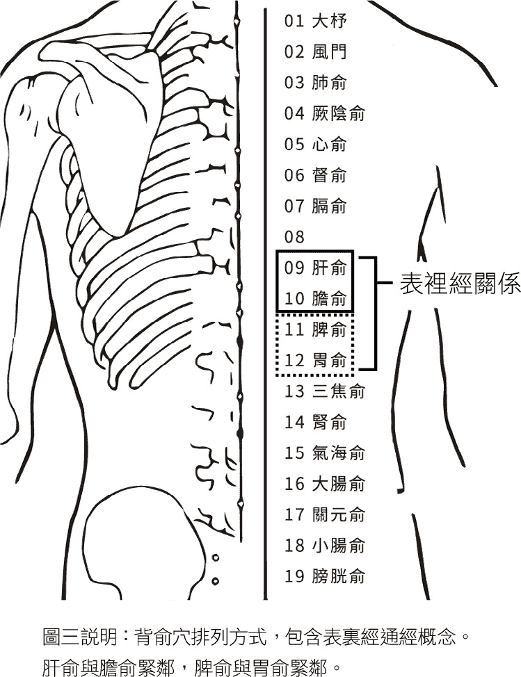

3.五门十变法通经关系[11]：在背俞穴的排列顺序中，胆俞、脾俞相邻，胃俞、肾俞相间，彼此为五门十变法通经关系。「五门十变法」源自于《内经》。《素问．天元纪大论篇》曰：「甲己之岁，土运统之。乙庚之岁，金运统之。丙辛之岁，水运统之。丁壬之岁，木运统之。戊癸之岁，火运统之。」此外，《素问．五运行大论篇》亦曰：「土主甲己，金主乙庚，水主丙辛，木主丁壬，火主戊癸。」五门十变法在中医上的运用，首先以天干配十个脏腑，再以对位法将两个脏腑配为一组，阴阳相合，刚柔相配，如表二[11]。

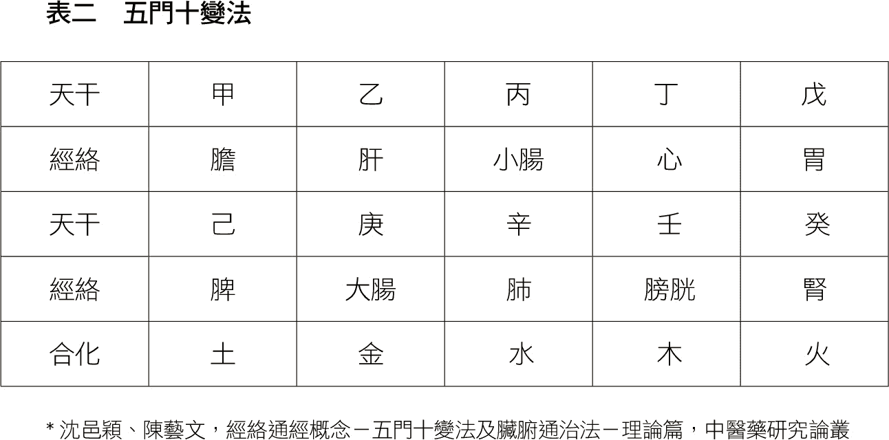

如表格第一栏所示，胆（甲）与脾（己）为相应的脏腑，透过五门十变法，二者经气相通。而在膀胱经背俞穴中，胆俞位于第十胸椎脊棘下旁开 1.5 寸，脾俞位于第十一胸椎脊棘下旁开 1.5 寸，两者正好紧邻而居（见图四）。而表格第五栏所示，胃（戊）与肾（癸）为相应的脏腑，胃俞及肾俞分别位于第十二、第十四胸椎脊棘下旁开 1.5 寸，中间间隔三焦俞，三焦属相火，为原气之别使，可强化「戊癸合化火」之依据。由此可知，膀胱经背俞穴排列方式中，亦包含了五门十变法的通经概念于其中。

4.脏腑别通法通经关系[11]：在背俞穴的排列顺序中，三焦俞、肾俞相邻，彼此为脏腑别通法通经关系。「脏腑通治法」理论源自于《内经》。《素问．阴阳离合论篇》曰：「是故三阳之离合也，太阳为开，阳明为阖，少阳为枢。」「是故三阴之离合也，太阴为开，厥阴为阖，少阴为枢。」脏腑通治法在中医上的运用，是「对位」概念的应用。属性为「开」的经络相对，即太阳配太阴；属性为「枢」的经络相对，即少阳配少阴；属性为「阖」的经络相对，即阳明配厥阴，然后再以手足经相配，如表三[11]。

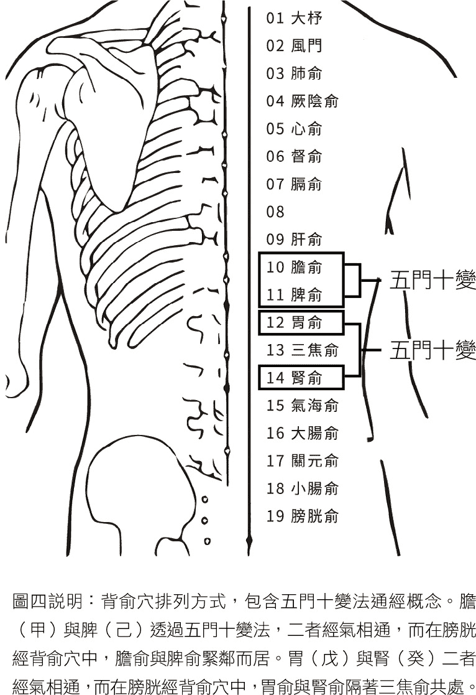

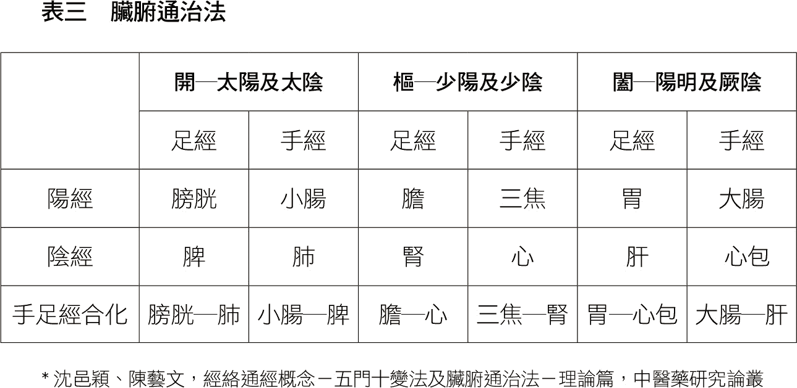

如表格中间栏所示，手少阳三焦经与足少阴肾经，透过脏腑通治法，两者经气相通，而在膀胱经背俞穴中，三焦俞位于第一腰椎脊棘下旁开 1.5 寸，肾俞位于第二腰椎脊棘下旁开 1.5 寸，两者正好紧邻而居（见图五）。依据中医基础理论，肾藏精，精化气，原气根源于肾，须通过三焦而运行于全身。即如《难经．六十六难》曰：「三焦者，原气之别使也」。《灵枢．经脉》曰：「三焦是主气所生病者。」说明人体的原气，是通过三焦而布散至人体五脏六腑，进而充斥于全身的，三焦俞与肾俞两者比邻而居，正好可提供肾中精气物质，藉由三焦运送于全身的良好通路。由以上论述可知，膀胱经背俞穴排列方式中，亦包含了脏腑通治法的通经概念于其中。

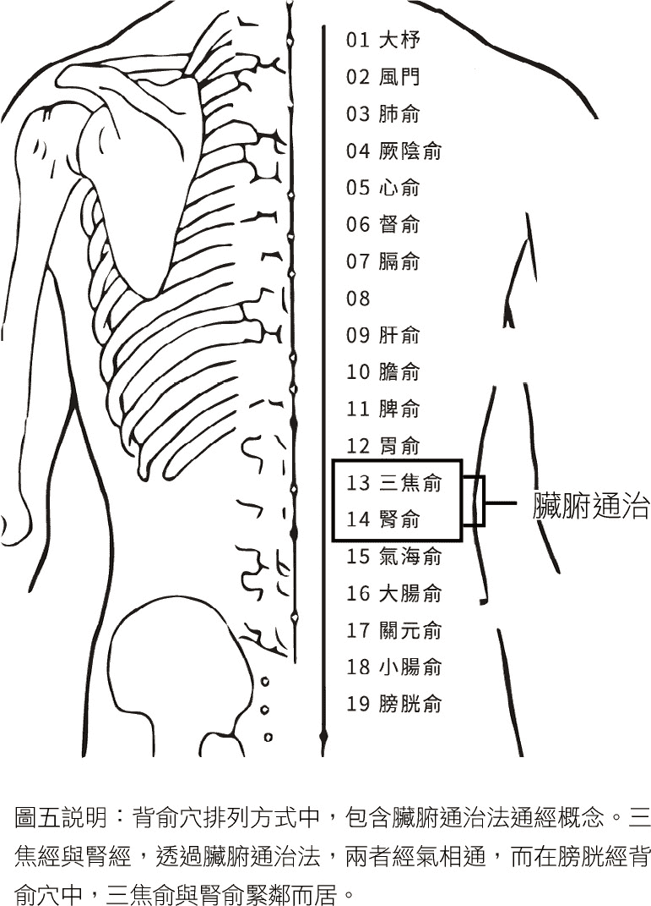

5.手足同名经通经关系：在背俞穴的排列顺序中，小肠俞、膀胱俞相邻，彼此为手足同名经通经关系。依中医基础理论「同气相求」的原则，以及经脉循行的交接，手足同名经在经气上是互相关联的。例如：手足阳明经在面部鼻翼旁相接，手足少阳经在目外眦旁相接，手足太阳经在目内眦相接等 （见图六）。

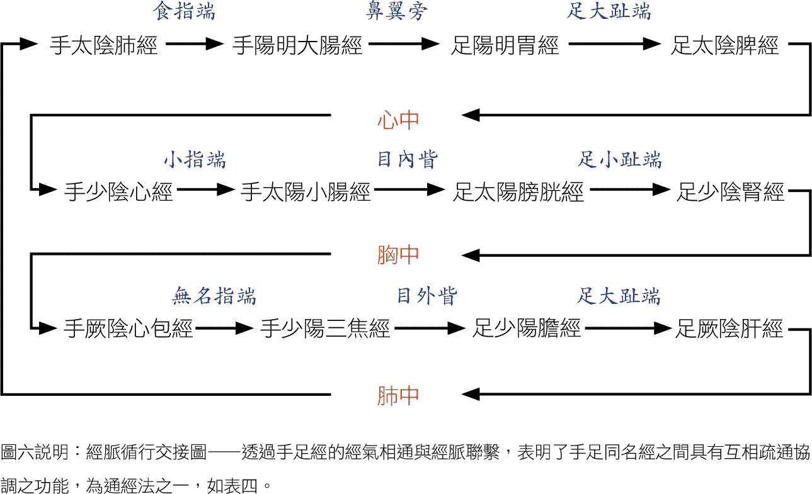

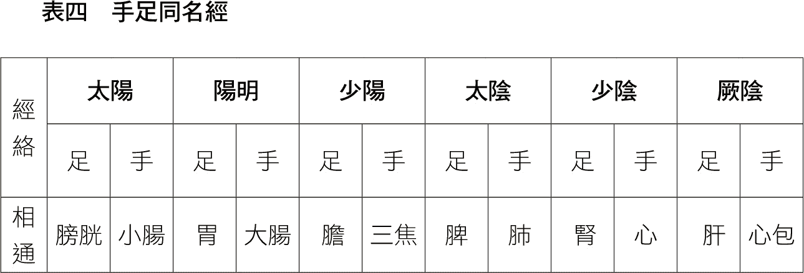

如表格第一栏所示，足太阳膀胱经与手太阳小肠经为手足同名经，二者经气相通，而在膀胱经背俞穴中，小肠俞位于第一骶椎脊棘下旁开 1.5 寸，膀胱俞位于第二骶椎脊棘下旁开 1.5 寸，两者紧邻而居（见图七），提示着膀胱经背俞穴排列方式中，亦包含了手足同名经的通经概念于其中。

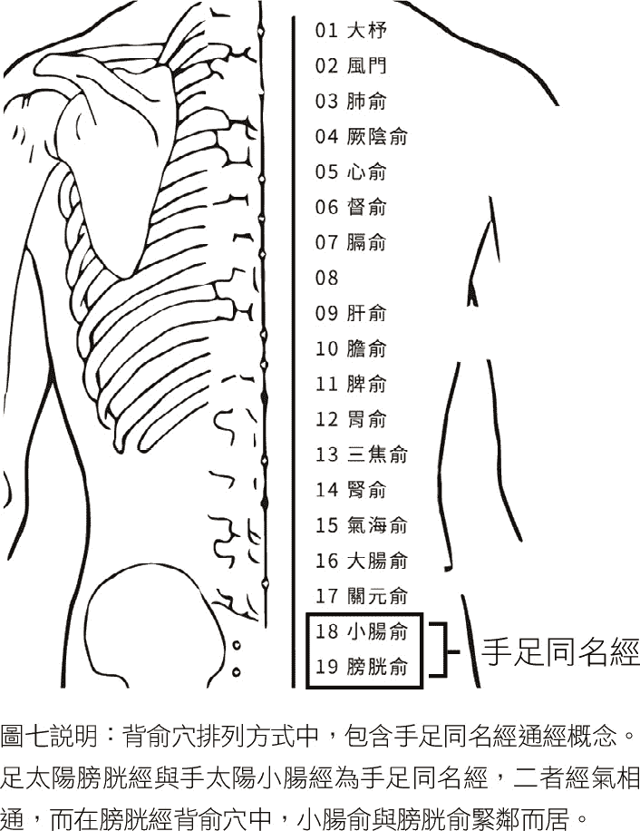

6.俞募穴关系[12]：在背俞穴的排列顺序中，关元俞、小肠俞相邻，彼此为手足同名经通经关系。俞穴是脏腑之经气转输于背部的腧穴，募穴是脏腑之经气结聚于胸腹部的腧穴，两者均在躯干部，多位于实质脏腑的附近，两者与其对应的脏腑在生理功能与病理变化方面有密切联系，临床多可配合使用，如表五。

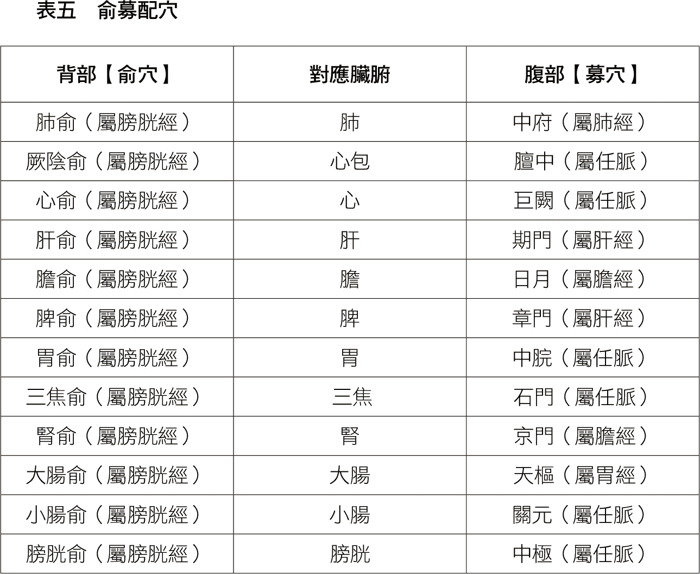

汤志刚（2014）指出，俞募穴生理上是五脏六腑之气转输和汇聚的处所，在病理上俞募穴是内脏和体表病气出入的部位。由于阴阳经络气相交贯，脏腑腹背气相通应，因此属于阴性的病症（脏病，寒证，虚证），可以取治位于阳分的背俞穴，属于阳性的病症（腑病，热病，实证）可以治疗与其相应的位于胸腹部的「募穴」。若同时针刺俞穴和募穴可使针感迅速到达脏腑，更好地调整脏腑经络气血功能。同时俞募二穴可相互诊察病症，所谓「审募而察俞，审俞而诊募」，作为协助诊断的一种方法[12]。

如表格中所示，小肠俞为小肠之背俞穴，小肠之募穴则为任脉关元穴，小肠俞与关元穴为一组俞募穴，而在膀胱经背俞穴中，关元俞位于第五腰椎脊下旁开 1.5 寸，小肠俞位于第一骶椎脊下旁开 1.5 寸，两者紧邻而居（见图八），提示着膀胱经背俞穴排列方式中，亦包含了俞募穴配穴的概念于其中。

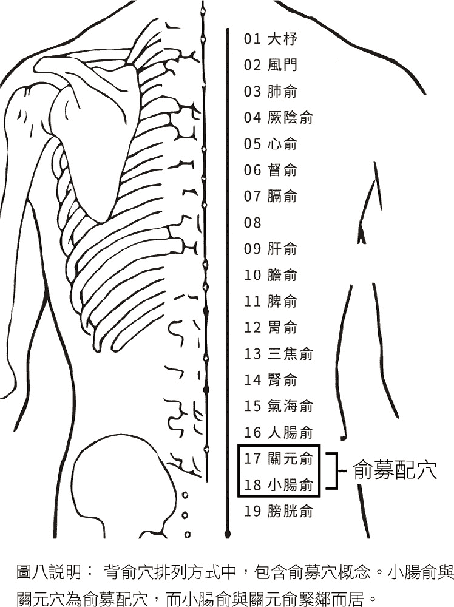

综上所述，背俞穴的排列方式，涵盖了大量的通经概念于其中，包含了一般常用之表里经、手足同名经、俞募配穴之间的联系外，也扩及五门十变法、脏腑通治法等更宽广的经络通经概念，能够补充中医理论中的经络基础，可更加扩大于临床应用思路与提升疗效。

刘立公（2004）对于古代文献中膀胱经及其俞穴主治进行统计报告发现，与其他各经相比，膀胱经行程最长，分布最广，又通过背俞穴与五脏六腑相连，故其作用最为广泛，可归纳为三类，其一为治疗膀胱经循行部位疾患，其二为治疗胸腹部脏腑器官病症，其三为补虚，散寒，清热，祛风。根据灵枢卫气：气在腹者，止之背俞，故膀胱经背俞穴可治疗胸腹腔内五脏六腑及相关器官的病症，也因为膀胱经背俞穴是脏腑之气输注之处，故其可调整脏腑的功能，从而起到补虚作用[13]。

根据《难经・第二十三难》：｢足三阳之脉从足至头，长八尺，六八四丈八尺。｣足三阳经是循行人体长度较长的经脉，而足三阳经中，又以足太阳膀胱经起于目内眦（睛明穴），向上交会于头顶部（百会穴）后，绕至人体背部一路向下循行至足部小趾外侧端（至阴穴），成为十二经脉中，循行路径最长之经脉。

十二正经中，头为诸阳之会，手三阳之脉从手走头，足三阳之脉从头走足，六条阳经皆可在头部相会之外，足厥阴肝经正经循行与督脉会于巅，其余五条阴经亦分别通过经别上达喉咙、舌咽、耳目、面项等与阳经经别相合上达头部（注 1）。奇经八脉中，督脉为阳脉之海，膀胱经背部经脉夹督脉而行，《奇经八脉考》：督脉会太阳于目内眦睛明穴｣。阳维脉用于维系全身阳经，《针灸甲乙经》：金门，阳维所别属也｣，阳维脉起于膀胱经金门穴。阳蹻脉与人体活动睡眠等有密切相关，亦起于膀胱经申脉穴。通过上述这些路径，膀胱经除可与其他十一条经脉相互连接沟通外，亦与奇经八脉中统领人体阳气之经脉密切相关，也因此有所谓「大阳」、「巨阳」｣之称，使其对于各脏腑经络有着特别重要的调节作用，也呼应了为何膀胱经需在其背部循行路径上，设置了沟通五脏六腑的背俞穴作为「中继站」。

何玲（2003）临床经验指出，背俞穴临床治疗以脏腑病为主，可兼治体窍其华之病变，其配穴方法多样，可表里相配，三焦相配，五行相配，俞原相配等以提高疗效[14]。若我们再结合刘智斌与牛晓梅（2013） 多点对一脏或一腑的取穴法，即可发现，背俞穴的排列方式本身，除了直观的脏腑投影位置对应关系外，其邻近背俞穴以区块性的方式呈现了五行生克关系，以及表里经、手足同名经、俞募配穴，五门十变法和脏腑通治法等，邻近背俞穴的区块性搭配诊治方法，将确实能够提高主治疗效。

总而言之，背俞穴的部位分布及精细巧妙的排列顺序（图九），加强了中医理论中的经络基础，补充阐释经络及穴位治疗之中医诊疗思路，而中医理论所重视的「整体观」，强调人体各组成部分，在结构上不可分割，在功能上相互协调制约，以及在病理上相互影响的概念，在背俞穴的安排上也清晰可见。于临床上，若能理解背俞穴排列顺序之揭示意义，能够更提升临床诊断与治疗水平。例如，透过背部俞穴之望诊或触诊，根据「有诸内必形诸外」之理论，对于病人疾病之辨证分析可产生辅助作用，增加临床进行脏腑辨证或经络辨证之精确度，而在治疗方面，在其相应部位，透过拔罐、血络放血、或适当的背俞穴搭配亦可成为良好的治疗法则之一。

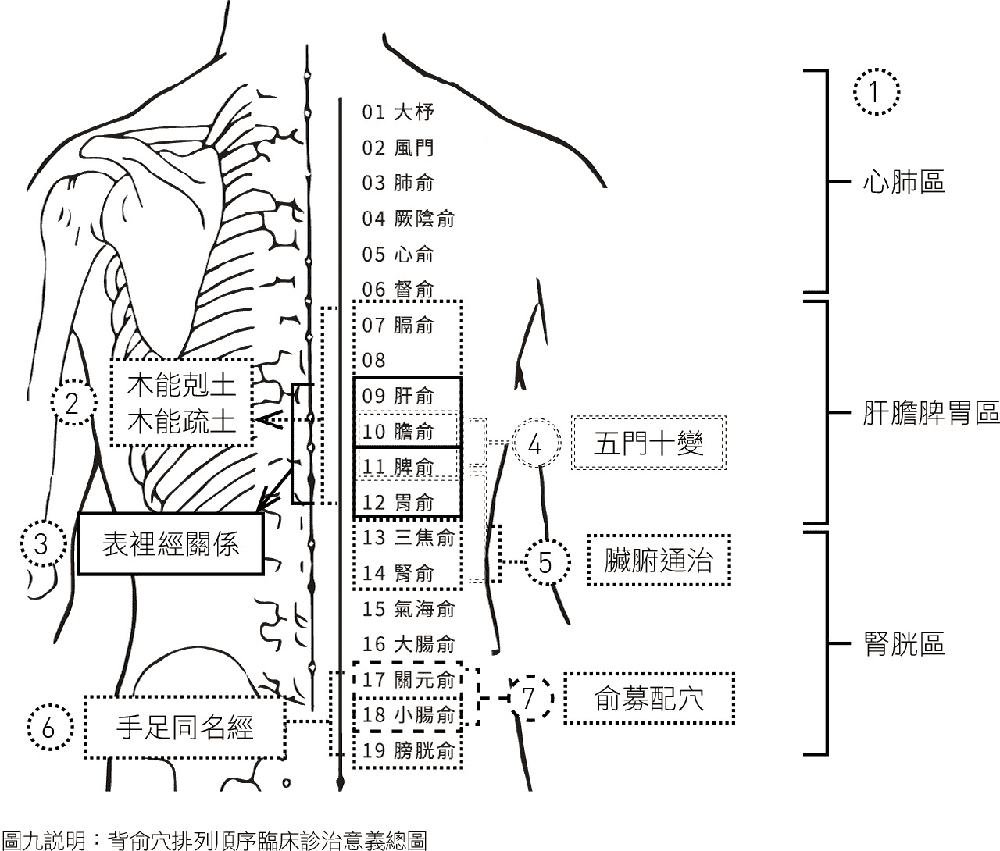

六、结论

膀胱经背俞穴的部位安排，除了分为上中下三部，分别司循环呼吸的心肺功能区 ; 司消化作用的肝胆脾胃功能区; 司泌尿生殖的肾膀胱功能区之外，其背俞穴排列顺序，亦涵盖中医基础理论的五行生克关系及表里经、手足同名经、俞募配穴、五门十变法和脏腑通治等各类通经法则。背俞穴的精细巧妙排列，加强了中医理论中的经络基础，背俞穴为脏腑之气转注于背的腧穴，是经气运输的通路，也是联系身体内外的枢纽，故能反映人体内脏生理、病理的变化，以作为诊断的依据，也可用于治疗各类脏腑急重症与慢性病，有直接且快捷的疗效，因此常被广泛应用于临床。若能理解背俞穴之部位及排列顺序与脏腑生理病理间的涵义，将能够更提升临床诊断与治疗水平。本文针对膀胱经背俞穴排列顺序的诊疗意义进行初探及初步结论，其所含的相关意义仍需更多专家先辈的参与，及应用更先进严谨的研究方法来加以探讨。

──原载《中华针灸医学会杂志》Vol.18 No.2 March 2016

七、参考文献

1.  苑家敏、锺兰，背俞穴概述，实用中医药杂志，2012，28（3）：236-237
2.  吴新贵、何源浩，背俞穴的主治作用及其机制，中国临床康复，2006，10（43）：170-182
3.  贾杰、赵京生，脏腑背俞主治与足太阳膀胱经之关系，中国针灸，2005，25（6）：414-416
4.  严健民，论足太阳膀胱经在经脉学说中的历史地位，中国中医基础医学杂志，2003，9（11）：57-59
5.  刘智斌、牛晓梅，论背俞穴定位的神经解剖学基础，中国中医基础医学杂志，2013，19（1）：83-85
6.  沈雪勇、倪秀冬，背部俞穴的分布与脏腑关系探讨，针灸临床杂志，1997，13（8）：1-2
7.  赵京生，另一种对称—论俞穴部位与主治关系的规律，中国针灸，2005，25（5）：366-368
8.  苏妆，背俞穴主治规律分析，医学综述，2008，14（13）：2076-2078
9.  陶之理、任文庆，「关元俞」、「膀胱俞」传入神经元与膀胱传入神经元的节段性分布与联系，针刺研究，1995，20（4）：17-20
10.  中医基础理论，上海科学技术出版社，1994：68。
11.  沈邑颖、陈艺文，经络通经概念－五门十变法及脏腑通治法－理论篇，中医药研究论丛，2008，11：22-36。
12.  汤志刚、杨继若、白晶梅、张瑞、李晖霞，敦煌灸经图背部俞穴取二寸三分与横向经脉，西部中医药，2014，27（12）：25-27。
13.  刘立公、顾杰、沈雪勇、李盛，古代文献中膀胱经及其俞穴主治的统计报告，上海针灸杂志，2004，23（12）：42-43。
14.  何玲，背俞穴临床应用方法探讨，陕西中医，2003，24（1）：62-63。

Explore the relationship and the clinical implication of the
Back-Shu points of the Bladder Channel

Yi-Chen Chen 1 , Hsin-Chieh Wu 1 , Hsin-Hwa Kao 2 , Yi-Wen Chen 2 , Yi-Ying Shen 2

1Department of Chinese Medicine, Buddhist Tzu Chi General Hospital, Hualien, Taiwan

2 Department of Chinese Medicine, Kuanshan Tzu Chi Hospital, Taitung, Taiwan

Abstract

Objective : To study on relation of Back-Shu points locations and orders with the Chinese medicine physiology, pathology, diagnosis and treatments.

Methods : Searched ancient books and the articles involving the Back-Shu points location and main symptoms. Analysis of the literature data to explain the characteristics of clinical treatment with the Back-Shu points locations and orders.

Results : The location of the Back-Shu points can divided into three parts, upper block, middle block and lower block which indicated the cardio-pulmonary function, the digestive function and genitourinary function. The order of the Back-Shu points reflected many Chinese medicine physiology, pathology and many kinds of ideas of the promotion of flow in meridians, such as, “Wu Mun Shie Bein”, “Zang Fu Tong Jih”, superficial inner meridians, the same name at hand and foot, “Shu-Mu point”et al.

Conclusion : The cleverly arranged Back-Shu points, can strengthen the foundation of traditional Chinese medicine meridian theory, explain the thinking process of Chinese medicine clinical practice. Back-Shu points transported the meridians qi, contacted the inner and outside of the body, it can reflect the physiological and pathological changes in human organs, as a basis for diagnosis, often widely used to treat severe acute and chronic diseases with direct and fast effect. If we can understand the implications of the order of Back-shu point more, we may able to enhance the clinical diagnosis and treatment levels. This paper was preliminary conclusion, the relevance of contains remains more expert participation and more advanced methods to be explored.

Key words: Bladder Channel, Back-Shu points, promotion of flow in meridians, Wu Mun Shie Bein, Zang Fu Tong Jih

* * *

图片来源

P69 Maisei Raman／Shutterstock.com

P166、p182、p186（左图）、p188、p274（下图）Teguh Mujiono／Shutterstock.com

P167 joshya／Shutterstock.com

P168（上左图）Andrii Bezvershenko／Shutterstock.com（下左图）goa novi／Shutterstock.com

P175（右图）Blamb／Shutterstock.com

P186（右图）Dreamcreation／Shutterstock.com

P194 marilyn barbone／Shutterstock.com

P230（左图）Vacancylizm／Shutterstock.com（右图）cobalt88／Shutterstock.com

P238 S K Chavan／Shutterstock.com

P239 valdis torms／Shutterstock.com

P268 design36／Shutterstock.com

P291 Hank Grebe／Shutterstock.com

P295 Sebastian Kaulitzki／Shutterstock.com

P296 Nerthuz／Shutterstock.com

P303、p305（左图）DeryaDraws／Shutterstock.com

P304（左图）Sebastian Kaulitzki／Shutterstock.com

P306 Nerthuz／Shutterstock.com

P307（左图）Sebastian Kaulitzki／Shutterstock.com

P309（右图）Tefi／Shutterstock.com

P312、p318 SaveJungle／Shutterstock.com

P326 Artram／Shutterstock.com

P340 medicalstocks／Shutterstock.com