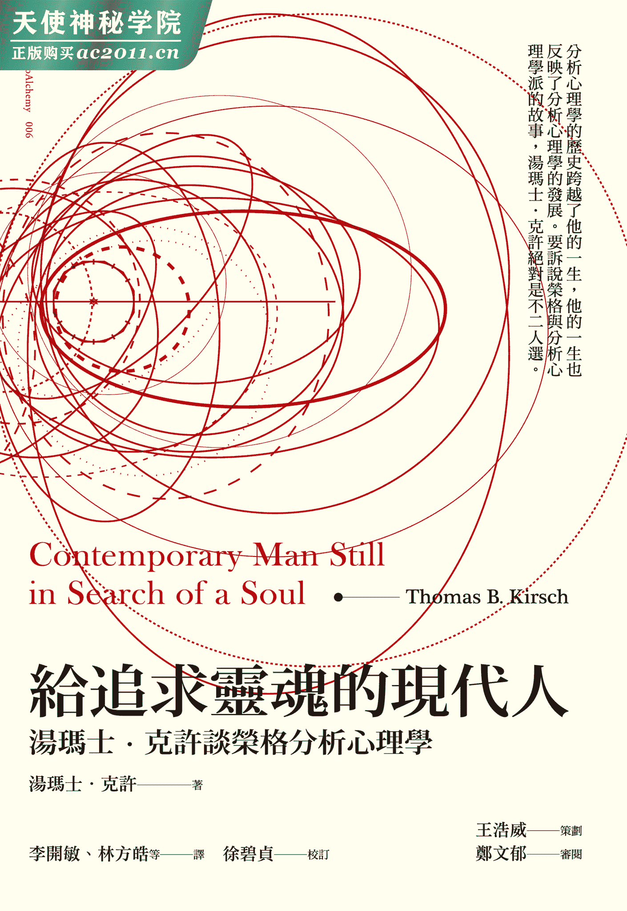
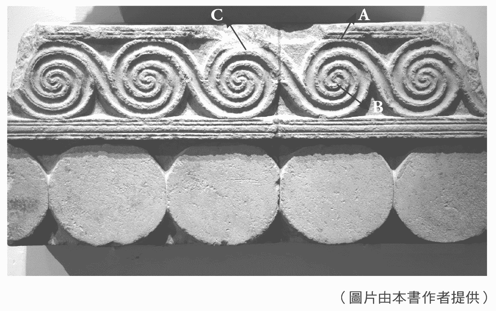
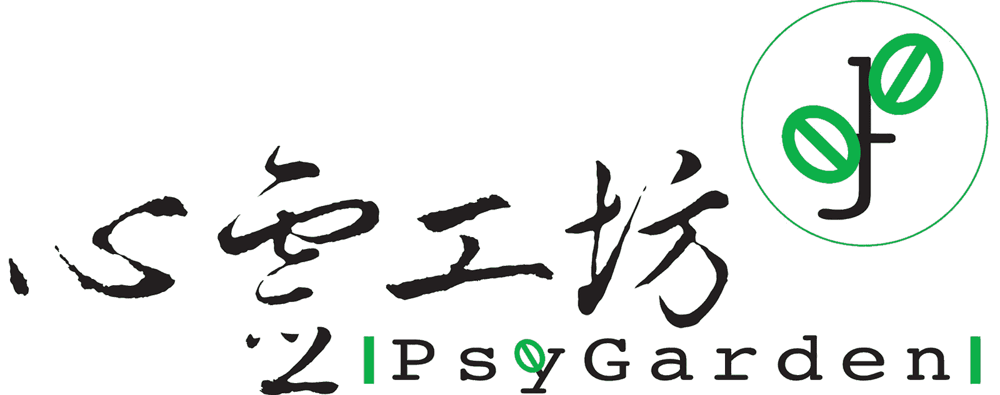

## 给追求灵魂的现代人────｜目次｜

1.  ｜作者序｜
2.  ｜辑一｜荣格其人
    1.  荣格其人及其神话
    2.  危险疗程
    3.  荣格与男性的关系
    4.  荣格与詹姆士・克许的通信
3.  ｜辑二｜传承
    1.  荣格的遗产
    2.  分析心理学的历史与起源
    3.  荣格学派德裔犹太人的流散
    4.  “荣格派”一词的反思
    5.  个人治疗在成为荣格分析师过程中的角色
    6.  培训过程中的分析
4.  ｜辑三｜追寻自性之道
    1.  荣格分析
    2.  为何“个体化”？
    3.  荣格与道
    4.  与汤玛士・克许谈荣格私人日记《红书》
5.  ｜结语｜荣格身后五十年

# 作者序

　　本书收录了过去四十五年来我在不同场合所发表的论文、讲稿及访谈，在我的职业生涯早期，关注的焦点在临床议题，诚如书中所收录，诸如梦境、治疗关系、心理类型与分析，以及一般分析历程等论文；而在生涯后半段，个人的兴趣则转向历史议题，因而本书也专章讨论荣格其人、分析心理学的历史及分析心理学与精神分析的关系等主题。部分收录的论文曾在美国境内及国际会议中发表，其余的则于在地的社群针对一般听众讲述，因此部分章节可能会显得较理论学术，但是仍有部分则相对通俗口语。我的写作风格公认是言简意赅、清晰易懂，因此我相信即便是偏学术讨论的篇章应该都不会造成读者阅读的困难。

　　我的双亲都曾在 1930 年代接受荣格的分析，而分析也成为我的家庭成长经验的主要氛围。我的父亲从 1942 年到 1988 年持续在家中开设研讨会，每周针对荣格的著述提出讨论。对于家中总是有荣格学人进出，自小就习以为常。对我来说这样的家庭环境是份福气也是个灾难。因着家中的研讨会，我得以认识许多与会的有趣人士，但是也因为家中的研讨会让我无法如同一般男孩般全心地参与我周遭的活动。同时，我的父母与病人的互动混杂着专业与个人关系，这在当时的时空背景下虽是常见的状况，但当我完成医学及精神医学训练后，我很清楚这种混杂的关系是会让我不自在的。因此，从我成为荣格分析师之后，我坚持将工作室与我的住家分开。此外，我的工作室入口与出口是分开的，我的病人们也能因此而错开，避免相互见面。但这并不表示我和我的病人没有任何社交接触，因为完全没有接触也是非自然状态，特别是有些经过我分析的病人后来也成为分析师，我们彼此成为同侪关系也是必然的。顺带一提的是，如果我在餐厅或电影院巧遇我的病人，我通常会等他们先跟我打招呼我才回应，对于在这种社交情境下与病人维持友好的言语互动，基本上我是持开放态度的。

　　之所以提到我的儿时经验，是因为书中的某些篇章反映了我所从事的荣格分析是不同于我的父母亲及第一代荣格分析师们。虽然我也采用辩证的形式深入与病人的工作，但是我仍保持一定的界线，我不认为我的父母会赞同这一点。我必须特此声明，这个从事分析及心理治疗工作的态度，是因为我需要将自己与第一代分析师区隔。我并不乐见自己总是被认定为第一代分析师的一员。

　　在我稍微懂事后，我才发现自己在相当年轻的时候就进入苏黎世圈。我在 1957 年开始在苏黎世接受荣格分析，其后又相继在 1958 年及 1960 年返回苏黎世接受进一步分析。在当时遇见了许多荣格身边的第一代分析师，而如今有这样第一手经验的人少之又少。经由我父亲的引介，我得以亲见荣格两回，过去多年来我并不觉得这有何特别意义，但是现今有这种第一手荣格经验的人真的不多了。能够见到荣格对我而言实际上是意义深远的，而我相信与荣格见面的经验也深深影响我成为荣格分析师的决定。不过，当时接受过荣格分析的人不胜枚举，相较之下我的经验就不值得多谈。如今则不可同日而语。

　　我向来对于历史及分析心理学的历史感到兴趣，而随着年岁渐增，我对于荣格其人也更感兴趣，这也说明了本书中所收录的数篇历史论述的缘起。

　　期望读者们会喜欢书中所收录横跨四十寒暑的文章，对于个人的论述能够以中文出版深感荣幸，也在此向孜孜不倦促成本书出版的王浩威医师、郑文郁心理师及心灵工坊总编辑王桂花致上谢意，另外也非常感谢协助翻译的台北荣格小组成员、协助校订的徐碧贞心理师、编辑徐嘉俊，以及协助行政事务的黄梅芳心理师。

*汤玛士・克许，2013 年 9 月*

## 荣格其人及其神话
（2005 年三月加拿大不列颠哥伦比亚大学的荣格周上发表）

　　荣格生于十九世纪末叶，逝于 1961 年六月六日。他是个兴趣极度广泛、非常复杂难解的人。过去很长一段时间，世人只知道他与佛洛伊德分庭抗礼。而今，他对无意识的探究才是他声誉所归。今日许多日常用语都是荣格首先提出，诸如情结、原型、人格面具、集体无意识、内倾、外倾、共时性等名词，要不是由荣格首先提出，就是受到荣格的重要影响。到目前为止，从各层面探讨荣格心理学及他私人生活的自传研究就有将近四十篇。事实上，他的亲近同僚玛莉・刘易斯・冯法兰兹（Marie Louise von Franz）就曾写了《荣格：其人及其神话》（*C.G. Jung: Man and his myth*）一书，书中虽然没有新的自传内容，但是却精准地呈现荣格思想的知性历史。

　　本文将综合讨论荣格个人史及他的理论思维。我会从荣格的观点，也会从一般人的观点谈神话。荣格所谓的神话意指古老且经典的故事，这些故事是世人用来解释自然世界并描述所属社会的心理模式。神话提供了一个放大病人无意识材料的模式，使病人可借由神话对于他们的生命及心理问题象征意涵有更宽广的理解。神话的另一个常见意涵则是“一个虚拟的、半真的说法，特别是用来建构意识形态的一部分”。荣格个人身上就有许多第二种意涵的神话。本文将聚焦于澄清对荣格的误解和关于荣格的“神话”。

　　荣格于 1875 年七月二十六日生于瑞士德语区靠近莱茵河畔的一个乡村凯斯威尔 （Kesswil）。他的父亲是瑞士改革教派的牧师，母亲则来自于灵媒背景的家族。荣格的祖父是德国一位著名的医学教授，因为政治因素迁移到瑞士巴塞尔（Basel）成为巴塞尔大学校长，荣格就是以他命名。荣格的近亲中有多位新教徒牧师，宗教是他教养中重要的一部分。他虽然和家人定期上教堂，不过他很早就对于他的宗教教养中所接触的上帝本质有所质疑。在荣格那本其实不是自传的《荣格自传：回忆．梦．省思》（*Memories, Dreams, Reflections*）一书中描述了一些这样的早期经验。在此书出版之前至少有两个人在荣格的同意之下尝试为他立传，但是最后都没有完成。阿妮拉・洁菲（Aniela Jaffe）在 1955 年担任荣格的秘书，在此之前她就和荣格有多年的合作经验，她计划撰写荣格的传记，荣格最后同意接受她的访谈。事实上，荣格自己写了传记的前三章，其余内容则是洁菲写后再交由荣格修订。目前在国会图书馆保存数个版本，版税一半分由阿妮拉・洁菲，另一半则成为荣格遗产。

　　荣格早年经验中有一个突发的意象，在这个意象里上帝在巴塞尔大教堂屋顶拉了一条大便。这个自发的意象带给荣格很大的困扰，但也打开了他和上帝本质以及一般宗教经验的对话。他很早就经验到上帝的阴影面。

　　荣格有一个小他九岁的妹妹，荣格晚年由她协助处理秘书事务。她终生单身，逝于 1935 年五月三十日。在求学阶段的荣格是个优秀的学生，高中毕业后进入巴塞尔大学，当时他以成为考古学家或研读医学为职志。

　　荣格的父亲逝于 1895 年，荣格自此成为母亲及妹妹的唯一支柱。他决定进入医学院，之后加入瑞士学生社团索芬吉亚（Zofingia）。这个学生社团已有七十五年的历史，每周的例行聚会固定会有一位社员发表演说，社员人数约一百至一百二十人，出席每周演讲的有近八十人。荣格在研讨会里非常活跃，当时认识他的人形容他绝顶聪明。荣格学生时期每年都会在社团演讲，演讲主题包括科学的限制、上帝的本质以及十九世纪的德国浪漫主义哲学家。他精通叔本华和康德的哲学，在学校那几年他也涉猎尼采的作品，尼采在荣格就读巴塞尔大学前不久曾担任过巴塞尔大学的教授。荣格当时的演讲内容都被保留了下来，而随着他名气渐增，这些演讲也出版了，并纳入荣格全集的附录。这样的事大概只会发生在瑞士吧！有趣的是，我们从中可发现荣格日后的工作和他早年学生时代的演讲主题的关联。荣格和佛洛伊德的关系可说是他人生的一个转向，不过却是个重要的转向。他和佛洛伊德的交往带领他暂时离开对哲学及对宗教的兴趣。后文将会详细说明。

　　从巴塞尔医学院毕业后，荣格到瑞士波克罗次立（Burghölzli）医院担任精神科住院医师。这是当时欧洲，也是全世界最重要的三所精神医疗院所之一。医院院长是尤金・布鲁勒（Eugen Bleuler）。布鲁勒首创“精神分裂”一词，荣格当时为他旗下精神科医师，很快地便成为布鲁勒的左右手，并且开始进行字词联想测验的量化研究。荣格重要的发现是，当把测试字词呈现给受试者，受试者被要求立即反应时，对于某些字句会卡住。重复测试发现受试者会卡在同样的字词上。荣格发现在卡住的同时受试者会有明显的生理变化，如肌电反应以及不规律的呼吸，他称这种卡住的反应为“情结”（complex）。这就是现今我们日常语言所用的“情结”一词的来源。这个字词联想实验让荣格在年轻时就打下名声。为了说明情结一词，荣格引用了佛洛伊德的学说里无意识概念和压抑的观点作为解释。荣格在波克罗次立医院一直待到 1909 年，之后他再也没有在精神医疗院所工作，也不再主动治疗精神科住院病人。然而基于他精神科医师的名声以及他和布鲁勒紧密的工作关系，他终生都受邀担任医院的谘询顾问。

　　荣格在波克罗次立医院工作近十年内还发生了其他三件重要的事。1903 年二月十四日，荣格和艾玛（Emma Rauschenbach）结婚。艾玛的家族是瑞士望族之一，拥有国际钟表公司（IWC），现在是一家大型瑞士企业集团旗下的子公司。婚后两人搬入波克罗次立医院的医师宿舍，直到 1909 年位于苏黎世的湖畔小屋落成才搬离。荣格在湖畔小屋居住直到他 1961 年过世。艾玛接受荣格的分析，后来也成为重要的荣格分析师，为许多前来苏黎世寻求分析的人提供分析。两人育有五个子女，包括四个女孩和一个男孩。

　　第二件事是 1902－1903 年，荣格花一个学期的时间到巴黎向早期深度心理治疗师皮耶．简纳（Pierre Janet）学习，简纳和佛洛伊德及精神分析都没有直接的关系，但荣格著作中许多法文名词都源自简纳的影响。

　　第三件事发生在 1904 年十月，荣格当时把关病人入院诊疗，一位处于歇斯底里精神病症的俄国籍犹太裔病人被送进医院，她的名字是萨宾娜．史碧尔埃（Sabina Spielrein）。多年来她在精神分析历史中只是一个注脚，然而过去二十五年来，我们得知许多有关她的事迹，也了解她在荣格和佛洛伊德生命中所扮演的关键角色。本文将不多谈她的生命细节，但在她住院的那几个月，荣格担任她的主治医师，在荣格的鼓励之下，她后来进入苏黎世医学院就读并成为一位医师。他们为对方深深吸引，贝努诺．贝特尔汉姆（Bruno Bettelheim）¹ 以及其他人都认为他们之间有性关系。史碧尔埃后来成为精神分析师，还加入佛洛伊德在维也纳的精神分析师圈。第一次世界大战末期她在佛洛伊德的建议下回到俄国，致力于在俄国创建精神分析团体。斯大林掌权时，精神分析被视为异端，史碧尔埃彻底失去了她的专业身分。她回到罗斯托夫（Rostov）后，在二次大战期间被纳粹杀害。在佛洛伊德与荣格决裂时，她是少数和二人同时通信的人之一。她的戏剧性故事被写成书、剧本，还拍成电影。

　　接着我们进入荣格和佛洛伊德相遇阶段。当时荣格赠送佛洛伊德他在字词联想测验方面的论文，佛洛伊德于 1907 年春天邀请荣格夫妇及荣格的学生路德维希．宾斯万格（Ludwig Binswanger）一起拜访他。荣格描述他们的第一次会面就谈了十三个小时。1953 年荣格在接受柯特．艾思勒（Kurt Eissler）为纽约佛洛伊德档案室所做的访谈中表示，他这一生中从未曾和任何人有这样的交心。在该次会面时，荣格夫妇二人察觉到佛洛伊德夫人并未参与任何心理学的讨论，反倒是佛洛伊德的小姨子米娜（Minna）与佛洛伊德的思想契合且积极参与谈话。荣格夫妇都注意到米娜深受佛洛伊德吸引，不过荣格在这次访谈中倒没有提到佛洛伊德和米娜确有一段情。

　　佛洛伊德和荣格有许多共同的兴趣而且看法一致，但是即便一刚开始荣格就对佛洛伊德对性欲的强调有所质疑，他仍将这质疑暂时搁置一旁，很快就成为精神分析运动的“王储”，即使佛洛伊德在维也纳的学生们不以为然。荣格成为国际精神分析学会第一任会长，以及《精神分析期刊》（*Jahrbuch fur Psychoanalyse*）主编。荣格还在许多精神医学研讨会上当着诋毁者的面捍卫精神分析。1909 年荣格和佛洛伊德分别接受了美国麻州伍思特市克拉布克大学（Clark University）的邀请，出席该校心理学系创系二十周年大会。佛洛伊德邀请他的朋友山铎．费伦奇（Sandor Ferenczi）一同前往，于是他们三位一同旅行了数周。在横渡大西洋的船上，佛洛伊德和荣格互相分析彼此的梦，抵达克拉布克大学前他们还一同游览了曼哈顿。结束了一系列演讲之后，他们应美国现代神经医学之父暨哈佛大学教授詹姆斯．普南（James Putnum）之邀，前往阿德兰黛克山区（Adirondacks）游览。荣格和威廉．詹姆斯（William James）见了两次面，他们相互对彼此的工作感到兴趣。荣格始终在著作中表达他受惠詹姆斯良多。在《荣格自传：回忆．梦．省思》一书中原本有专章讨论威廉．詹姆斯，后来被删掉了。我并不清楚为何会删掉这一章。

　　同时期，当荣格读到日内瓦治疗师西奥多．弗卢努瓦（Theodore Flournoy）的案例法兰克小姐时，他开始对神话及考古学感到兴趣。荣格从未见过这位病人，但是他在西奥多．弗卢努瓦的论文中读到法兰克小姐的幻想，为了了解她的幻想，他开始研究神话里类似的题材。起初佛洛伊德对他的努力仍然相当鼓励，但是一段时间之后佛洛伊德开始担忧荣格会偏离精神分析以及婴幼儿性心理的基本架构。在两人往返的信件中可以看到这些不同观点的讨论。接着发生了一件对两人关系造成巨大影响的事件。

　　当时存在分析学派创始人宾斯文格（Binswanger）罹患癌症，宾斯文格在瑞士东北部的克罗兹林根（Kreuzlingen）疗养院担任院长，佛洛伊德坐了几个小时的火车去看他，该地离苏黎世只有四十五分钟车程，但是佛洛伊德并没有事先联络荣格，也没有顺道去看荣格。不知道是否因为信件时间错过还是怎地，他们没有见到面，荣格对佛洛伊德的冷落深感受伤。在此同时他并未停止对神话的研究，他开始提出神话主题和性主题同等重要的假设。佛洛伊德无法接受此一论点，二人的信件往返逐渐冷却，不再有亲密的“你”（Du）的称呼，而是回到正式的“您”（Sie）了。到了 1913 年，两人的关系算是决裂了，他们最后一次见面是在 1913 年国际精神分析协会慕尼黑大会上，当时荣格仍得到百分之六十的会员投票再度连任会长。不过在 1914 年，他主动辞去了这职位。

　　这段期间有另一位重要的病人安东妮亚．吴尔芙（Antonia Wolff）进入了荣格的生命。她因丧父忧郁来见荣格。荣格立即看出她的天资禀赋并且写信告诉佛洛伊德。荣格邀请她和其他人一起参加 1911 年在威玛（Weimar）举行的精神分析研讨会，不久后两人就由治疗关系转变为私人关系。荣格的婚姻因此深陷危机，最后如何解决就不得而知了。我们只知道荣格的婚姻得以维持，而东妮．吴尔芙成为荣格家中常客。这样的安排持续吴尔芙的一生，她未婚，于 1953 年逝世于她出生时的同一栋房子。荣格有时和东妮一同旅行，不过大多数时间是和艾玛一同出游。接受荣格分析的人也都了然于心，三人关系对外公开没有隐瞒。1925 年到 1939 年间当荣格开始在苏黎世讲授英文课程时，艾玛会坐在他身旁，而东妮则坐在另一边。

　　和佛洛伊德的关系破裂后，荣格陷入深刻的混乱中。有一段时间虽然可以见病人，但他没办法持续他的研究。他在苏黎世湖畔沙滩上玩小石头，这似乎能释放他内在的心理压力。他梦到血流成河，漂浮着金发男子的尸体，尸体后面还有一个巨大的黑色圣甲虫。荣格明白尸体是有关太阳英雄神话的死亡妄想，圣甲虫则是复活或者重生的象征。当时荣格三十八岁，他将太阳英雄的死亡解释为他的意识信念已经派不上用场了。他认为圣甲虫象征无意识力量，意识的转化正要展开。还有一些人物出现在他的无意识中，例如：盲眼的沙乐美（Salome），以及各种拟人化的智慧老人，这些智者给他有关内在经验的重要讯息。其中最重要的人物是腓利门（Philemon），多年后荣格将他画在伯林根家中艾玛的画像之上。荣格说：“腓利门带给我重要的领悟，那就是心灵里有些东西不是我创造出来的，而是自己诞生出来，有自己的生命……我在幻想中和他对话，他说了一些我从未意识到的事情……有时对我来说他好像很真实，就像一个真正的人。”于是荣格不但有内在对话，还把他的无意识意象画了出来。他把这样的内在冥想历程称为积极想像。这样进行了几年，他彻头彻尾改变了。积极想像是一个非常特别的历程，自我（ego）淡出意识并对无意识意象开放。过程中意识和无意识之间产生内在对话，荣格认为个体需要真诚投入在这两个层次之间。当荣格首次以这样的方式经验到他的无意识时，他在西方心理学或灵性传统中几乎找不到和他探索内在历程相关的经验。相反地，他发现积极想像和东方的冥想活动相当接近。虽然荣格对东方冥想活动很有兴趣，但他仍戒慎恐惧，担心西方人可能会因此略过他们的个人无意识。而且，进行积极想像时，个人得以自由选择想要链接的意象是很重要的前提，这一点和东方不同，在东方的禅定冥想中主要是由师父决定特定的意象。自荣格那个时代以来，已经有许多冥想技巧引介到西方，其中有些是聚焦于大自然中特定意象的导引冥想。积极想像不是引导出来的，而是鼓励个体跟随心灵所提供的任何意象。从这个角度来说，积极想像需要更多的个人责任。荣格的著作和意象分别呈现在《黑册》（*Black Books*）和《红书》（*Red Book*）中，《红书》业已出版。

　　1913 到 1918 年间，荣格全神贯注在其深刻的内在经验。之后终其一生他定期会回到与内在意象对话的状态。正视内在无意识的过程改变了荣格，在这之后他开始撰写有关原始意象、从这些意象衍伸的原型意象，以及集体无意识等概念。自此之后，原型、集体无意识、人格面具、阴影、阿尼玛、阿尼姆斯、自性，以及个体化等概念，成为他的心理学的核心。而他深入无意识的经验也将他早年学生时代对哲学及宗教的兴趣再度链接在一起。他与自己无意识链接的经验使他远离了佛洛伊德和古典精神分析，他把自己的心理学称之为“分析心理学”。在发展分析心理学的时候，荣格用了许多和精神分析相同的名词，但是却赋予不同的意义，他所建构的意义都和原型概念相关。精神分析以及分析心理学都用自我、无意识、移情、投射这些名词，但是所指涉的意义又大不相同，这是很让人困惑的。

　　这段时期荣格的心理学发展出另一个重点，也就是他的心理类型理论。荣格在他精神分析时期就已经开始探讨心理类型理论，但是当他从无意识经验再起后，他又回到类型问题上。他对佛洛伊德、阿德勒以及他自己对人类心灵的看法如此南辕北辙很感兴趣。荣格发展出性格差异理论，分为内倾及外倾两类。他将佛洛伊德归类于外倾型，而他自己及阿德勒则为内倾型。我们每个人都介于这二类型之间，在不同的情境下我们会向外倾或者内倾调整，然而我们还是有天生的内倾或者外倾的偏好。除了外倾或者内倾的天生倾向外，我们还经由直觉、感官、思考和情感这四种功能去认识世界。直觉／感官轴是经由统觉产生的，因为它是知觉的，而不是思考性的。思考／情感轴则是理性的，二相对立，此强则彼弱。大部分人都很容易把思考视为理性的，但却不容易把情感也视为一个理性的功能。荣格用情感这个名词意指一个人喜欢或者不喜欢某件事或者某人，并没有什么情绪在里面，只是一个判断。如果出现许多情绪，表示无意识被触动了，并且产生很大的反应，此时就不再是理性的情感或者判断，而是涉及深层心灵层次的情结被触动。荣格认为我们都有一个主要的功能，同时会发展出另两个辅助功能，第四个功能则是处于无意识中的劣势功能，常带给我们很大的麻烦。我们通常可以从了解自己的劣势功能，进而找到优势功能或主要功能。迈尔斯・布里格斯（Myers Briggs）性格测验依据荣格的心理类型理论发展出，现在已经成为一个独立的庞大企业产品，也已经脱离荣格的分析心理学。类型测验在荣格学派中的运用并不广泛，目前只有旧金山荣格学院（C. G. Jung Institute of San Francisco）的约翰・毕比（John Beebe）以及伟恩・戴洛夫（Wayne Detloff）持续就此主题进行研究。类型理论对关系问题很有帮助，譬如一个内倾思考型和一个外倾情感型的人喜好的活动完全不同，内倾的人情愿待在家里读书，而外倾的人则想要外出社交。在荣格眼中两者都很正常，但这对伴侣的关系如何，就看他们如何协商这些经常发生的分歧情境了。

　　1919 年第一次世界大战结束到 1939 年第二次世界大战开始，这段期间是荣格实务工作最活跃的时期，也是他旅行最频繁的时期。在这二十年间，许多人从世界各地前来接受荣格的分析，参加他的课程，之后成为第一代荣格分析师。荣格很喜欢研讨会的授课方式，从 1923 到 1940 年间他持续在每个学年的星期三开授英文研讨会。当时的授课内容并未规划出版，因为荣格本人无暇汇整编辑，但现今已逐步出版。荣格在研讨会时较随意，他很有魅力和说服力，同时也固执已见，可能让与会者难以承受。研讨会主题包括：梦、尼采的《查拉图斯特拉如是说》、儿童的梦，以及在苏黎世理工学院从 1934 到 1941 年一系列的演讲。这些演讲针对工程系学生，以德文讲授，曾非正式地翻译成英文，正式翻译版近期才开始。

　　荣格在 1920 年代早期做的另外一件重要的事，就是在伯林根建造原始的塔楼。塔楼和相邻的建物至今都没有自来水和中央暖炉，荣格乐于在那儿过着十六世纪的生活。荣格后来陆续扩建原本的塔楼，今日，荣格的后人把塔楼当做度假屋，从湖里引水，用柴火烧水煮饭，并巡游外屋。

　　荣格对哲学、文学以及东方宗教一直保有高度兴趣。1920 年代他加入在德国大马士革的智慧学院（School of Wisdom），在那儿见到卫礼贤（Richard Wilhelm）。卫礼贤是驻地中国的传教士，当时刚从中国回到德国，他曾花许多年翻译《易经》。荣格对《易经》非常感兴趣，由于和卫礼贤的交情，他再度唤起了对《易经》的兴趣，并进而接触到中国的炼金术。卫礼贤邀请荣格对中国的炼金术书籍《太乙金华宗旨》撰写评论，荣格在书评中首次讨论曼陀罗的象征意象。从心理学角度讨论东方及西方关系的现代西方人中，荣格就算不是第一位，也称得上是先驱之一。荣格也因此有机会讨论共时性的概念，与西方的因果思维相较，东方，特别是中国文化会以两个不相干事件之间的巧合来解释某些现象。荣格以共时性来解释没有因果关联但却有意义关联的巧合。1930 年卫礼贤过世，荣格在他的告别式上演讲，他说自己这一生从卫礼贤身上学到的比从任何人身上学到的都多。考量荣格和佛洛伊德两人关系的重要性，荣格这句话更显深义。

　　荣格对中国炼金术的兴趣重燃他对西方炼金术的关注，从那时起直到他过世，他都在钻研中世纪炼金术的神秘，之后所有的著作都以炼金术为基础。荣格在西方炼金术中发现当代人梦境与希腊罗马神秘宗教间遗失的链接。中世纪的教会把炼金术视为一项灵性修为，它被容许是因为它与教会同样秉持着将金属炼成金的精神。荣格发现中世纪的冥想修行及意象和病人的无意识历程十分类似。就在荣格非常投入炼金术研究这段期间，他曾经短暂涉足外在世界不果，名声持续蒙尘。1920 年代晚期，一群非古典佛洛伊德学派的德国精神分析取向心理治疗师成立了德国医学心理治疗学会（The German Medical Psychotherapy Society）。虽然这些成员全都是德国人，但他们一年一度的研讨会吸引了世界各地的心理治疗师。荣格被推举为该学会荣誉副会长。1933 年希特勒掌权之后，此学会完全纳粹化了。以体态类型研究闻名的会长恩尼斯特．克来特舒默（Ernst Kretschmer）因政治理由辞职，回任他在杜宾根大学（University of Tubingen）的教职。身为副会长，荣格被要求接下会长职务。他勉强同意，条件是犹太人可以在已经纳粹化的德国组织外保留个别会员资格。在荣格的领导之下，这个学会改制为国际化组织，下设各国分会，让犹太人得以继续留在学会中。他在此国际学会就职演讲时谈到犹太人、亚利安人及中国人在国族以及文化特质上的差异。荣格认为犹太心理学依附于一个寄主文化（host culture）的演绎被视为是反犹太的，这项论述自此阴魂不散地跟随着他。他也持续以瑞士人的身分和纳粹团体工作了好几年，这也使他的名声受损。私底下他并不接受纳粹的主张，但是他从未公开发言表示反对，这让荣格的反犹太指控持续至今。我曾出版我的父亲和荣格自 1929 年起的通信集，在通信集中收录了许多与这个主题相关的讨论。身为犹太人，我的父亲需要澄清荣格在这方面的态度，才能在专业上和荣格继续共事。通信讨论后，我的父亲对荣格并非反犹太的立场感到满意，此后不时为荣格辩护。他们的通信繁长而详细，我希望借由这些通信可以澄清世人强烈的偏见。

　　这段时期荣格多次旅游，到美国好几次，接受哈佛和耶鲁大学的荣誉学位。他也到非洲心脏地带旅居六个月，研究原住民的梦。

　　二战期间荣格持续待在瑞士，因此和所有国际友人及学生失去联系。1944 年他在冰上跌倒引发肺部栓塞及心肌梗塞，差点死去。但是养病一年多后，他又重新接案，只是数量已大幅减少。1945 年起到 1961 年他去世为止，他几乎完全退休，但偶尔还是会接见他过去分析的个案以及学生。他好几次心脏病发作，一次比一次严重，限制了他的活力。1953 年东妮・吴尔芙因心脏病突然去世。荣格在 1944 年心脏病发作后就和她没有那么密切往来。荣格的妻子艾玛于 1955 年得了胃癌，不到六个月便过世。荣格于 1925 年在非洲旅途中认识的如思・贝里（Ruth Bailey）在艾玛去世后与荣格同住，阿妮拉・洁菲则担任他的私人秘书。他在精力允许之下持续写作，有关炼金术的大部分著作都是这个时期完成的。许多政府、个人及组织均授予他荣誉头衔，不过他最珍视的还是自己的内在时间。

　　荣格一生，甚至一直到现在，始终引发世人对他的强烈情感，无论是赞同或否定，他的名字很少引发中性的态度。当我们跳脱个人史，他的存在就具有“神话”的性质。就心理层面而言，他承接了自性的投射，从正面的角度，在他身上我们投射内在的先知、萨满（shaman）、魔法师以及疗愈者。负面来说，他被视为郎中、魔鬼、头脑不清的神秘主义者、花花公子、纳粹以及反犹太主义者。本文中我举出荣格生命中的重要事实，希望能够提供一个实在的观点，消除一些对荣格的投射。是否达成目的，就留给各位决定。

## 危险疗程
（发表于 2012 年三月十一日的旧金山荣格学院捐赠者活动中）

　　电影《危险疗程》（*A Dangerous Method*）在 2011 年十一月底陆续在全美及全球上映。我们这群心理分析专业人士心中满是焦虑，不知道到底佛洛伊德、荣格和萨宾娜．史碧尔埃三人间的故事在电影中如何呈现。预告片在影片上映前几个月就已经在网络上流传，从预告片中就知道影片情节肯定少不了性施虐与性受虐（sadomasochistic）的场景。由于预告片特别突显性爱情节，让我们更不敢设想荣格和佛洛伊德在片中将如何被描绘。或许因为我已经多次看过预告片，我可以把电影中的性爱情节单纯视为好莱坞式的戏剧效果，也才能着眼于影片中的其他内容。整体而言，这部电影对于荣格和佛洛伊德的角色演绎得相当不错。影片中的佛洛伊德口中总是含着雪茄，因而在理解上造成了些许障碍，不过佛洛伊德和荣格之间的权威议题却表达得相当生动，许多对话似乎直接取材自《荣格自传：回忆．梦．省思》一书。对比于佛洛伊德较狭隘地聚焦在性欲的思维，荣格对于各种一般心理现象的兴趣在电影中也中肯地呈现。两人在船上分享梦境的那一幕，也充分传达佛洛伊德因为不想冒着失去权威的危险而拒绝说出梦境联想的心境。

　　片中的奥图．格罗斯（Otto Gross）一角也处理得很好，是这部影片的一大亮点。奥图．格罗斯如何涉入荣格和佛洛伊德之间的生活向来被忽略，但电影中却充分传达他的影响力。格罗斯和荣格在 1908 年时彼此相互分析，荣格视格罗斯为孪生兄弟，格罗斯则解放了荣格的性压抑。格罗斯生前是个嬉皮，电影中他的死亡时间与实际时间相差了一年。

　　虽然大卫．柯能堡（David Kronenberg）和克里斯多夫．汉普顿（Christopher Hampton）² 引用了许多历史资料拍摄本片，但仍有几幕导演未加考究史实，也许这就是所谓的“文创免责权”或“艺术”吧。以下，我将依重要程度列出与事实不符的内容：

　　一、东妮．吴尔芙在影片中被指为半个犹太人，遗憾的是电影所述竟被其他学术文献视为“事实”而加以引用。事实上，吴尔芙来自于瑞士最上流社会的新教徒家庭，她的出身背景可追溯到十二、十三世纪瑞士邦联时期。她谨守瑞士保守价值观远甚于荣格。把她塑造成半个犹太人有什么好处呢？影片想借此暗示荣格终其一生都对犹太女性有种莫名的迷恋，而这样的安排也符合荣格曾经对犹太人所下的评论，这些评论让他被指控为反犹太纳粹，也顺理成章将他描写为一个表里不一、没有品德的角色。我的双亲都曾接受吴尔芙的分析，他们认为吴尔芙是一位杰出的分析师，但也是个非常道地的瑞士人。她一生为类风湿性关节炎所苦，首次发作时，我的父亲送她当时的新药可体松，但她拒绝尝试新的治疗方式。吴尔芙终其一生住在她出生、长大的那栋房子，多么瑞士人啊！

　　二、电影中描述萨宾娜．史碧尔埃是荣格一生之所爱，事实并非如此。史碧尔埃是荣格早期专业发展中重要的一份子，但在一次大战后，苏黎世的圈子里没有人认得她。当我第一次跟乔．韩德森（Joe Henderson）提到萨宾娜时，韩德森对她毫无印象。

　　三、影片描述荣格在和佛洛伊德决裂后精神崩溃，事实上也非如此。在与佛洛伊德决裂后，荣格经历了一段失去方向的生活。他担心自己会精神崩溃，但仍然维持家庭生活、专业实务工作，并且在瑞士厄堡（Chateux d'oex）服役，履行公民义务。

　　四、电影中描述的艾玛．荣格和真实的艾玛．荣格迥然有别。真实生活的艾玛本身就是一位非常具有影响力而且有威信的女性。当她的先生和佛洛伊德的关系陷入困境时，她主动写信给佛洛伊德。她绝不是电影中所塑造的娇柔懦弱的小媳妇。

　　电影的名称《危险疗程》取自约翰．克尔（John Kerr）于 1993 年所出版的同名书藉《危险疗程：心理学大师荣格、佛洛伊德，与她的故事》（*A Most Dangerous Method: The Story of Jung, Freud, and Sabina Spielrein*），全书六百多页，描写佛洛伊德、荣格和史碧尔埃三人的故事。书名和电影标题取自 1909 年威廉．詹姆斯与佛洛伊德和荣格在克拉布克大学会面后，写给他的好友西奥多．弗卢努瓦的信。詹姆斯写道：“我希望佛洛伊德和他的弟子们可以将他们的想法推展到极致，好让我们真正了解。他们厘清人性本质，但我必须承认佛洛伊德给我个人的印象是个脑袋固执的人。我没有办法将他梦的理论套用在我身上，显然的，运用‘象征’（symbolism）是最危险的疗程。”

　　我因缘际会听闻了许多关于萨宾娜．史碧尔埃和荣格的故事，一切始于 1977 年于罗马召开的第七届国际分析心理学会议。阿尔多．卡罗德努特（Aldo Carotenuto）教授是该次大会主要筹划者，会议相当成功。我因为是该届大会的主讲者，与卡罗德努特教授有许多互动。在研讨会结束时，他很自豪地宣布这是第一次有盈余的荣格研讨会。当时我也在国际分析心理学会的执行委员会，当所有的帐目核销时才发现，事实上那是亏损最多的研讨会。卡罗德努特教授是一个爱表现、喜欢出风头的人，他在还没收到日内瓦心理学会（Institute of psychology in Geneva）的核销信之前便作了这样的宣布，实在出人意表。

　　另一个耳闻萨宾娜轶事的机缘，则是在 1982 年春天贝努诺．贝特尔汉姆的讲座。贝特尔汉姆当天的演讲主题是“佛洛伊德的误译”（Mistranslations of Freud）。面对满场的听众，他对于佛洛伊德的误译只字未提，反倒是针对卡罗德努特的新书一一指正。这本书和史碧尔埃、佛洛伊德和荣格三人的通信有关，在当时根本还没有出版，听众当然也不可能有人读过这本书，这就是贝特尔汉姆的风格。他在那场演讲中坚决表示荣格与史碧尔埃搞婚外情，而且有性关系。在综合讨论时我询问他何以如此确定？他用非常权威的口吻回说他就是知道，在场的多数听众还为他的回答热烈地喝采，我当下明显觉得被羞辱了。直到演讲过后，几位听众上前告诉我，他们也曾在自己孩子的面前被贝特尔汉姆用类似的方式对待，我才放下这件事。卡罗德努特的书题名为《无法公开的对偶》（*The Secret Symmetry*），书中收录了佛洛伊德对史碧尔埃、史碧尔埃对荣格和史碧尔埃对佛洛伊德的信件往来，但是并没有荣格写给史碧尔埃的信件，因为荣格家人并没有公开这个部分。萨宾娜对于荣格“阿尼玛”的概念有多少贡献仍旧有些争议。佛洛伊德在《超越快乐原则》（*Beyond the Pleasure Principle*）书中提及萨宾娜，明确表示萨宾娜影响了他对死亡本能的看法。毫无疑问萨宾娜是儿童精神分析和精神分析理论发展的先驱，她留下三十篇以上的论文。

　　1983 年又召开了一场国际荣格研讨会，这次的地点在耶路撒冷。当时卡罗德努特的书已经出版，而且颇获好评。旧金山荣格学院的创始人之一乔．惠尔赖特（Jo Wheelwright）因此对卡罗德努特相当气愤。乔认为卡罗德努特写这本书的目的是为了提高自己的声望，卡罗德努特实际上也这么做，他宣称书本内容可以用在百老汇戏剧、音乐剧和电影上。乔的身高约 198 公分，远远超过约 170 公分高的卡罗德努特，两人较量绝对有得瞧。卡罗德努特当时企图为自己辩解，也充满防卫性地告诉我要出版这些史料。克里斯多夫．汉普顿（Christopher Hampton）所写的《谈话治疗》（*The Talking Cure*）这齣舞台剧，以及《危险疗程》这部电影就是卡罗德努特当年那本书的结果。

　　现在，我想谈谈萨宾娜．史碧尔埃的生平。她出生于苏俄顿河畔罗斯托夫³一个富裕、有教养的犹太家庭。她是一位优秀的音乐家，精通多国语言。在萨宾娜的成长过程中，父亲打她的屁股的经验唤起她的情欲。1904 年萨宾娜十九岁，她出现了如电影开始时所呈现的歇斯底里症状。1905 年春天，萨宾娜的病情已经好到可以开始就读苏黎世的医学院，同时协助荣格的研究工作。她是荣格第一个分析的病人。荣格和萨宾娜发展出强烈的情欲链接，但两人的关系中有多少是真实性爱关系，又有多少是精神层次，并没有清楚的史料记载。荣格与佛洛伊德的书信往来始于 1906 年，在 1974 年集结出版，其中有四十处提到史碧尔埃。两人书信之所以会大篇幅提到史碧尔埃，是因为荣格与史碧尔埃关系里发生的移情和反移情议题。一开始佛洛伊德还是非常支持荣格这位较年轻的同事，但是当史碧尔埃在 1911 年搬到维也纳，并且成为维也纳精神分析圈的一份子后，佛洛伊德的态度有了转变。史碧尔埃提报的论文结论如下：“物种自我存续的本能（instinct of self-preservation），是需要对等地将过去摧毁，这时新的事物才得以创立……这两种本能基本上是矛盾的……自我存续的本能让人得以存全，但与之相对的自我再造本能（instinct of self-reproduction）则在改变人后让他以新的面貌重生。”刚开始，佛洛伊德并不接受毁灭性本能的说法，但在之后出版的《超越快乐原则》中，他将萨宾娜的论述纳入注解，萨宾娜自此成为佛洛伊德真正的追随者。然而，在萨宾娜与佛洛伊德的通信里，她仍持续表明她对荣格的爱。这也让佛洛伊德大动肝火，他总是在回复萨宾娜时语带贬抑地提到“她的日尔曼英雄”。在此同时，有感于佛洛伊德与荣格有很多共通点，萨宾娜常鼓励荣格跟佛洛伊德言归于好。在 1909 到 1923 年间，萨宾娜与荣格及佛洛伊德同时保持联系。

　　1912 年萨宾娜嫁给来自罗斯托夫⁴的医师帕维尔．薛福特（Pavel Schefter），两人育有一女。为荣格生下“齐格菲”（Siegfried）⁵是萨宾娜早期的愿望，与薛福特生下一女对她而言想必是松了一口气。两人离婚后，薛福特回到罗斯托夫再婚，并生下第二个女儿。当时，史碧尔埃曾尝试在柏林执业，但苦无分析个案。萨宾娜向佛洛伊德求助，佛洛伊德也帮不上忙，她持续撰写有关儿童分析的论文，特别是和早期语言的意义相关的主题。她至少写下三十多篇的论文，着实是儿童分析的先驱。

　　鉴于萨宾娜无法在柏林开展她的儿童分析工作，一次大战后她便搬到苏黎世的洛桑，并成为日内瓦心理学会的一员。皮亚杰（Jean Piaget）在这个时期曾接受史碧尔埃的分析长达八个月，他们也讨论彼此对于儿童发展的观点。皮亚杰当时的生涯刚起步，在经过八个月每天精神分析后，两人对儿童发展的观点歧异日渐明显。史碧尔埃始终想回罗斯托夫，她在 1922 年写给佛洛伊德的信中提到这个愿望，佛洛伊德也建议她回罗斯托夫领导苏俄心理分析协会（Russian psychoanalytic society）的发展工作。她不负佛洛伊德所望，直到 1936 年，史碧尔埃始终都是苏俄精神分析协会的会员。即便苏俄的心理分析协会遭斯大林取缔，她仍坚持在罗斯托夫的公寓内陈设她的分析躺椅，我们无法得知在当时有多少人使用这个躺椅。后来她和前夫薛福特再续前缘，两人有了第二个女儿。薛福特在 1937 年因心脏病发过世，萨宾娜跟薛福特的第二任妻子协议共同抚养三个女儿，以防任何一位遭逢变故，至少还有另一位可以照顾三个孩子。

　　当纳粹势力于 1941 年伸入罗斯托夫时，薛福特的第二任妻子带着她的女儿尼娜（Nina）到乌拉尔山脉后方，而萨宾娜选择留在罗斯托夫。萨宾娜生命中最好的那几年一直是在德语系国家，因此她对德国人的信任感远超过苏联人，但这却带来不幸。她和她的两个女儿与其他犹太人一起被捕并被带进中央犹太教堂枪决。多年后教堂内设有纪念碑，追悼当时在那里被处决的犹太人，但几年前碑文被改了，致犹太人的字样拿掉了，取而代之的是“致俄罗斯公民”，只字未提犹太人。

　　萨宾娜．史碧尔埃的一生是个充满张力的悲剧故事，这个故事触及许多二十世纪的重大灾难。在萨宾娜生命的最终，她如同一张破碎的红绸，一个弯腰驼背的老妇人，然而当时她才不过五十八岁而已。她一生活出死神桑纳托斯（Thanatos）⁶的程度，体验了多少死亡的本能⁷，我们将永远无法得知。

## 荣格与男性的关系
（1997 年在柏克莱的一个心理分析社群发表的演说）

　　带着极大的荣幸，得以在此分享荣格及对荣格的不同反应。我的父母，身为洛杉矶荣格运动的创始人，经常造访圣地牙哥，自青少年开始我就经常跟他们一起前来。第一位从圣地牙哥来，接受荣格分析的是安妮塔．克格（Anita Krog），这大概是在五〇年代的事，那时在南加州的荣格社群非常的小，专业与社交的关系相互混杂。我个人很喜欢来到圣地牙哥，特别是当我与安妮塔及亨利．克格（Harry Krog）的儿子克里斯（Chris）成为好朋友后，我就自己南下造访。我一直都很喜欢圣地牙哥，这么多年来，这还是我第一次对这儿的荣格团体演讲。

　　我最初的想法是谈荣格与美国心理学及精神医学的关系，我也认为这应该会是一个非常具有学术性的讲题。然而，当我开始撰写讲稿时，思绪就一直停留在个人的层次，我猜可能是因为我对圣地牙哥地区姓桑福德的两户人家的记忆涌上心头，因此演讲主轴就变得比较像是有关荣格跟他身边的人的回忆。刚开始我认为应该谈跟荣格密切相关的男士和女士们，但从我开始构思讲稿及下笔撰写时，对男士的感觉比对女士更显突出。市面上已经有许多撰写荣格身旁女性的著作，那部分的荣格生活已受到足够的关注，当然也包括许多批评他对女性的作为。最常听到的说词就是荣格与男性相处有很大的困难，但他和女性的相处则容易多了。在五〇年代后期，我曾在苏黎世找了一位与荣格关系密切的男分析师进行分析，因此想跟大家分享我当时的印象。

　　荣格，分析心理学的创始人，是个充满魅力的心理思潮运动领导人，同时也是自二十世纪以降精神分析圈中倍受争议的人物。荣格一生的著作影响了各领域的人，如历史学家阿诺尔得．汤恩比（Arnold Toynbee）、诺贝尔奖得主暨量子力学创始者沃尔夫冈．包立（Wolfgang Pauli）及政治家劳伦斯．冯．波斯特（Laurens van der Post），其他族繁不及备载。接下来的内容也许不会像是影片《心意》（*Matter of Heart*）⁸般的精湛，但我提供我个人对这些人的观点及他们与荣格的关系。同时我也会提到电影《心意》中没有访问的人。

　　首先从荣格的外型开始谈起，他是个高大的人，身高约 195 公分，从照片中可见，他有着乡下人般的粗矿特质。荣格让人印象深刻的原因，除了他壮硕的外型外，还包括了人们投射在他身上的睿智与聪慧。我在二十岁出头时就见过他，当时他已八十多岁了，而我才刚开始接触他的著作，如：《寻求灵魂的现代人》（*Modern Man in Search of a Soul*）及《分析心理学两论》（*Two Essays on Analytical Psychology*）。我对荣格的认识来自于家人及父执辈友人口中所述，因而发展出一个极为正面且远超乎真实的投射形象。在 1958 年我曾经与荣格单独见面一小时，他以一句话就正中我对他强烈而正向的投射：“所以你想在我死前见我一面！”我早已忘记在这之后的对话，那句话着实打中我。其实当时我的分析师提醒我要带些荣格会觉得有兴趣的梦去见荣格，那时荣格正着手《飞碟》（*Flying Saucers*）的专书，我的分析师觉得我的二个梦可能与那个主题有关，荣格也可能会对它们有兴趣。我已经没有那些梦的纪录了，也完全想不起那些梦。但这件轶事多少可以让大家感受一下荣格晚年周遭的氛围。当时荣格身边的人都将个人的需求放在一旁，所有的一切都是以他为前提。以我当时所处的生涯阶段，我倒是非常感激能够有机会与荣格说上话，因此我一点也不在乎我是否有机会可说我个人的问题。三十年后我才发现原来我的分析师跟荣格在当时是没有互动的，事实上，他们已有多年都不曾讲过话。当时的我对于他们之间的问题一点也没有察觉，我甚至还以为他们两人关系良好。这并不是我第一次见到荣格，但却是我唯一一次跟他一对一共处。在 1955 年苏黎世督德大酒店（Grand Dolder hotel）荣格八十岁寿宴上，当时达官显要皆出席以表达对荣格的敬意，我也在会场上被引介给荣格。隔年，荣格的夫人艾玛死后，我和父亲前去拜访并在花园内茶叙，得以向他请教有关他的心理学的一些疑问。很明显的，这些会面加上家人期待及个人的分析经验，造就我成为荣格分析师。

　　我想从集体的层面谈谈荣格与组织的关系。不管荣格在哪，他总会被推上威权职位，但结局都不太好。他曾两次出任主席一职：分别是 1909－1913 年间的国际精神分析协会（International Psychoanalytic Association, IPA）及 1934－1940 年的国际医学心理治疗协会（The International Medical Association for Psychotherapy），但下场都不好。荣格是国际精神分析协会的第一任主席，最初他几乎被选为终身职，后来终身职概念没有成真，但他依然每年都被推选连任主席，甚至 1913 年他跟佛洛伊德彻底绝裂时都不例外。荣格在 1914 年四月从国际精神分析协会辞去主席一职，这让佛洛伊德及他的追随者都松了一口气，他们担心如果荣格接受任命，他们只得另觅他途，成立另一个新的协会。荣格的辞职让佛洛伊德在国际精神分析协会重建他的威望。而国际医学心理治疗协会则是另一个复杂的故事，容我稍后再提。

　　就与他自己的心理学相关的组织而言，荣格是 1961 年苏黎世的分析心理学社团成立的推手，但他从未实际参与行政管理或社团推展活动。事实上在 1920 年代早期，当马丁．布伯（Martin Buber）的追随者汉斯．楚柏（Hans Trueb）主导社团时，荣格有数年的时间退出社团活动。虽然荣格从未主持社团的聚会，但明显的他在社团事务上的意见都颇具份量。大家经常忘了，有超过三十年的时间，荣格社团是当时唯一可以让对荣格有兴趣的人聚在一起的正式组织。社团在伦敦、纽约、旧金山、洛杉矶等地相继成立，入社要求一百个小时的个人分析及一封分析师的推荐信。社团通常会附带大型的图书室，同时也会固定举办会议邀请讲者讲授与分析心理学相关的主题。

　　至于苏黎世的荣格学院（The C.G. Jung Institute of Zurich），荣格在学院的成立上扮演了重要角色，他对于课程教学及董事会（当时称为学术委员［Curatorium］）遴选都有明确的指示。他期望苏黎世的荣格学院依循欧洲大学的教学模式，学院学员必须通过各种学科的检测，例如：梦的解析、字词联想测验、神话、童话、精神病学、佛洛伊德等，同时毕业前需要完成论文。荣格希望董事会为终生职，如此一来董事就避开了当代政治情势的摆佈。学术委员会自成立后已运作了数十年，但最近这几年这个模式已经崩坏，学术委员会成员不愿退位，造成万年委员；而财务问题也将荣格学院分成两半，因此现在的苏黎世荣格学院问题重重。

　　荣格认为他对团体的不信任源自于他内倾型心理类型，而且他的情感功能也没有得到良好的发展。前述荣格与组织牵连的例子说明了荣格对这些组织强大的影响力。

　　前段的论述把我们带到另一个与荣格个性相关的主题，即他与男士间的关系。众所皆知的，荣格与女性关系融洽，或者该说过于融洽，但他与男士的关系就比较复杂。让我先从荣格的父亲开始，从《荣格自传：回忆．梦．省思》书中得知，荣格与他视为灵性贫瘠的父亲关系非常矛盾。他的父亲身为牧师却失去了信仰，对荣格而言他的父亲只是徒有形式，灵性上已死亡。荣格的父亲在荣格不到二十岁时过世，荣格也无缘处理他与父亲之间的议题。

　　丧父约十年后，荣格遇见佛洛伊德，这段关系起初非常正面良好，荣格也相信自己已经找到一个可以信任的父亲。姑且不谈佛洛伊德与荣格间的长篇历史，在荣格成了“王储”后，两人关系日益恶化，直至 1913 年两人完全断绝关系。目前已有许多人针对佛洛伊德与荣格间的关系提出个人的观点，但大部分的论述都把荣格描述成散佈佛洛伊德坏话、到处吐苦水的形象。最近一则的评论于 2006 年十二月二十四日发表在《纽约时报》上，文中针对荣格评论佛洛伊德的说词提供有力的证据。且让我以荣格这边的故事开头，当荣格在 1907 年第一次到维也纳拜访佛洛伊德时，佛洛伊德的小姨子米娜就对荣格吐露她与佛洛伊德的亲密关系。荣格当时并没有对外宣扬，一直到 1957 年接受纽顿神学院（Andover Newton Theological Seminary）的教授约翰．彼林斯基（John Billinsky）的访问，才提到这件事，并强调这确实是米娜在 1907 年告诉他的事。往后数年就有人据此论断荣格之所以说出这件事是基于对佛洛伊德残留的愤怒，而且这项指控毫无证据可言。同时，荣格自己则因为风流韵事而饱受批评多年，这合理地解释了荣格指控佛洛伊德的动机。最近，一位德国社会学家回到瑞士马若亚（Maloja）的旅馆，即佛洛伊德在 1898 年八月下榻之处，旅馆入宿登记簿上记录着佛洛伊德“女士”（Freud “und Frau”）登记入住。当时佛洛伊德与米娜就在那里，而且他在那写了明信片给他的太太。这项证据说服了像是彼得．盖伊（Peter Gay）这些死忠捍卫佛洛伊德的学者，他们开始相信佛洛伊德与米娜真有性关系，这是佛洛伊德派学者始终都不愿承认的一件事。这也让世人对于荣格接受彼林斯基访谈的内容产生新的观点。彼林斯基是个干练且严肃的学者与学究，势必不喜欢因为访问而尾随的恶名。至于为何荣格对彼林斯基谈到米娜与佛洛伊德的插曲则又是另一个问题。彼林斯基曾在苏黎世的荣格学院研究并且受分析，因此荣格应该非常了解彼林斯基这个人。米娜住在佛洛伊德家四十二年，由此看来，佛洛伊德可说是有两个太太。不管是真是假，都有必要从这个新信息来重新思考佛洛伊德与荣格的关系。多数人抱持的观点认为佛洛伊德研究性，却遵从一夫一妻；相对的，荣格研究灵性，却有多重性伴侣。最终佛洛伊德并不是荣格的正面父亲，而且似乎在关系初期荣格就察觉到佛洛伊德的阴影。荣格到底是如何看待他与佛洛伊德的处境无人知晓。我的猜测是，荣格对佛洛伊德与米娜的关系并不生气，真正让他生气的是佛洛伊德不愿意承认他与米娜的关系。当时的荣格因为受到他的病人奥图・格罗斯的鼓励而向往一夫多妻，荣格传记作家法兰克・麦可林（Frank McLynn）就认为，荣格的多伴侣阶段恰巧就发生在 1910 年他遇见东妮．吴尔芙之前。

　　在荣格还认同自己是精神分析师时，他与西奥多・弗卢努瓦及威廉・詹姆斯同样也保持正面的关系，两者对他而言都有正面的父亲形象。荣格诠释弗卢努瓦的案例并写成《无意识的心理学》（*Psychology of the Unconscious*）一书。荣格在 1909 年遇见威廉・詹姆斯，当时他和佛洛伊德两人造访麻州伍斯特的克拉布克大学，荣格和詹姆斯对宗教经验的本质有相似的看法，两人很快创建起密切情谊。詹姆斯于翌年过世，因此那是唯一一次的见面，但荣格在《心理类型》（*Psychological Types*）一书中，有专章讨论威廉・詹姆斯。

　　荣格自己身为人父则是另一个待探索的领域。据说在荣格家中必须保持安静好让“爸爸可以做重要的工作”。孩子们不常看到父亲，家中所有的事物全由艾玛张罗。荣格唯一的儿子法兰克曾经告诉我，如果他父亲能多鼓励他成为分析师就好了。法兰克后来成为建筑师，当他的父亲于 1961 年过世时，他返乡定居在父母的房子，并终其一生奉献给荣格遗作相关事务，包括将荣格的作品翻译成不同的语言、在影片制作中使用荣格的名字、未发表论文的出版事宜及许多其他涉及著作人格权的情况。法兰克于 1998 年过世，目前则由荣格家族的下一代继续负责相关事宜。按照瑞士的法规，当有人死亡，他的遗嘱可以在死后执行，或形成信托持续留存，直到信托者决定解除信托为止。荣格的情况则是在他死后成立信托，信托效用持续存在，信托的受益人则包括荣格的五个孩子。目前这个信托负责处理荣格著作人格权，这始终都是个费时的工作。

　　对许多寻求荣格分析，其后成为分析师的人而言，荣格是象征的父亲。首先，让我们探讨在苏黎世的几位男士们，包括：梅尔（C. A. Meier）、海因里希・费尔兹（Heinrich Fierz）及法兰玆・瑞克林（Franz Riklin）。海因里希・费尔兹及法兰玆・瑞克林都是荣格同事的孩子。因此，他们从小就认识荣格，当他们成为精神科医生时，顺理成章的就给荣格分析。虽然费尔兹及瑞克林都是精神科医生，但却有着非常不同的个性与态度。瑞克林为国际分析心理学会（International Association for Analytical Psychology, IAAP）早期

　　的主席及荣格学院的主席，他和荣格一直维持良好的关系。瑞克林也自豪身为瑞士军旅中的陆军上校，那是他身分认同的重要元素。费尔兹在瑞士迪尔克朗的拜洛渥疗养院（sanatorium Bellvue in Kreuzlingen）担任多年的精神科医生，对精神病（psychosis）的知识渊博，并曾以荣格心理学的角度写了一本关于精神病的书。费尔兹跟荣格也有正面的互动，他的母亲，琳达・费尔兹・大卫（Linda Fierz David）更是荣格身边重要的女士之一。她曾写了两本书，其中之一是《庞贝城里神秘的别庄》（*Villa of the Mysteries, Pompeii*），另一本则是《普力菲罗的梦》（*Dream of Poliphilo*），两本都被视为早期与荣格相关的经典文献。梅尔来自艾玛的故乡沙夫豪森（Schaufhausen），他们的家人彼此相识。梅尔在波克罗次立受训并曾接受荣格分析，他后来成为荣格的“王储”，是第一任荣格学院的主席、第一任国际分析心理学会的主席，当荣格从瑞士联邦理工学院（Eigenosse Technische Hochschul, ETH 犹如美国的 MIT）辞职时，他接任荣格的教授职。除此之外，他也是荣格担任国际医学心理治疗协会主席时的荣誉秘书。因此，在这三人中梅尔与荣格有着最亲近的关系，但梅尔在荣格生命最后十年与他分道扬镳，一般猜测造成两人分裂的事件可能发生在苏黎世湖，当时梅尔与荣格同舟游湖，荣格指示梅尔方向，梅尔当时生气地回应说如果荣格不喜欢他们要划向的方向，就应该自己划船。虽然此后两人的私交变得紧张，梅尔还是持续以其专业角色推广荣格心理学，他也写下了一系列有关荣格心理学的杰出教科书。相较于其他第一代荣格分析师，梅尔退出和荣格相关的活动，在现代并不若其他第一代荣格分析师广为人知，只能说这也许是成为王储的命运。荣格是佛洛伊德的王储，梅尔是荣格的王储，两个王储的下场都不太好。梅尔与荣格的纷争有时候也会被视为荣格与男性相处有困难的例证。从这段历史中我们可以看见，荣格挑选了非正式的继承人，梅尔也的确在不同的层面上继承荣格，但两人间却起了纷争并且无缘当面解决。我并不认为荣格应该承担全部的责任，因为梅尔本身也不是个容易相处的人。梅尔与荣格家族关系紧密，也许关系创建得太快太亲近了，无可避免的势必要分离。在我找荣格分析时，梅尔就是我的分析师，而当时我完全没有察觉两人的关系出现问题。

　　荣格与不住在苏黎世的同行男性的关系相对就比较容易些。其中一个重要的关系就是伦敦的贝恩斯（H. G. Baynes），他是荣格在二〇年代的个人助理。贝恩斯在伦敦与苏黎世两地间生活与工作，荣格于 1925 年到非洲的旅程也是他安排的。贝恩斯是位医师，同时也是早期的荣格分析师，1922 年他协助创建伦敦的分析心理学社团，终生忠于荣格。贝恩斯在 1927－1928 年的学术休假年中在湾区（Bay Area）待了一年，之后返回欧洲并定居在英国。他是英国荣格学派的创建者，逝世于 1943 年，继任者为麦可・福德罕（Michael Fordham）。麦可与荣格的关系大不相同。在分析师贝恩斯的建议下，福德罕前往苏黎世寻求荣格的分析，后来确切发生了什么我们并不清楚，但福德罕因为缺乏财力支援而没有留在苏黎世，他后来回到英格兰，接受希尔达・克许（Hilde Kirsch）分析，成了她的第一个病人。因此，不像荣格周遭其他人，福德罕并未接受荣格分析，反而接受新手的分析，虽然如此，他从分析中仍受益良多。在 1979 年时他告诉我，希尔达让他的生活完整，但他也说这不是“真的分析”，比较像心理治疗。我相信与希尔达的心理治疗经验拯救了他的生命，因为分析中正面母亲的经验帮助他往后与儿童的分析工作。但从另一个角度看，不像他同一代的人，他与荣格并没有直接的分析关系，虽然福德罕是荣格全集的英语编辑，也数次在专业及私人的场合中与荣格见面，但他从未与荣格直接工作这一事对他影响至深。同时，作为一个儿童精神科医生，他受到梅兰妮・克莱恩（Melanie Klein）及唐诺・温尼考特（Donald Winnicott）的影响，所以在早期，他的分析理论及临床分析工作就包含了许多精神分析的成分。他经常被质疑为何在工作中引用如此多的精神分析成分后，却仍要保持荣格派的身分，但福德罕始终忠于荣格及荣格派理想，即便古典荣格派对他高度质疑。我在 1994 年十一月，当他已届九十岁的生日时，和他见了一面，也清楚地感受到他对荣格派的忠诚。当时他邀请我太太珍和我一起到伦敦外的住所一同午餐，我们细谈他与荣格派的关系及忠诚度，他清楚地申明虽然他在与精神分析的长期接触上收获良多，但他是个道地的荣格派。

　　荣格与他专业上的儿子还有两个复杂的因子，其一常见于第一代分析师，不论是男性或女性。在二战期间，荣格与瑞士之外的分析师完全没有联系，因此，大概在 1940 年到 1945 年间，不仅仅只是男士，所有在瑞士之外的人都无法与荣格接触。这对某些与荣格有强烈的移情的人而言是极度困难的，也因此无法直接处理移情，造成了在抽象层面对荣格的过度理想化。

　　第二个同时影响男性与女性的因子，则与犹太裔的分析者特别相关。随着纳粹主义的兴起，艾利希．纽曼（Erich Neumann）在以色列特拉维夫（Tel Aviv）落脚、格哈德．阿德勒（Gerhard Adler）在伦敦、恩斯特．伯恩哈德（Ernst Bernhard） 在罗马、詹姆士与希尔达・克许则在洛杉矶。荣格在 1914 年被佛洛伊德指控为反犹太主义者，即便他在 1930 年参与国际医学心理治疗协会也没有让情况有太大改变。国际医学心理治疗协会最大的组成份子是德国纳粹，荣格不仅曾在这协会担任多年的主席，他在 1934 年发表的文章［心理治疗的现况］（The Current State of Psychotherapy），对亚利安人、犹太人与中国人心理学的比较，被许多人诠释为种族主义者与反犹太人主义者。在这篇文章里荣格提到犹太人因为长期流浪的历史，因而需要有一个寄主文化才能开展创新，亚利安人则因为相对较年轻，而有较高的心灵潜能。任何读到这篇文章的人都很容易朝反犹太主义的角度诠释，但我们必须记得荣格所处的时空背景，在当时犹太人已有将近二千年的历史是没有祖国的，荣格是从这个观点而论。荣格对于犹太人的未来是持开放态度的，他认为犹太人在 1930 年后定居巴勒斯坦（Palestine）可以改变他们长期以来流浪的心理，并进而对犹太人心灵产生真正的转变。这出自于我父亲与荣格间通信的内容，双方通信内文目前已出版成册。曾有几位犹太裔被分析者提醒荣格不要在那个时机谈这个议题，但他并没有采纳。当时世人对这篇文章几乎是一面倒的反对，他被公认为是种族主义者及反犹太人份子，直到七十年后的今日，这篇文章还是常被引用来佐证荣格的反犹太思想。我在世界各地发表荣格心理学相关文章，荣格及反犹太主义的问题总是会被提出，当提问的人稍具学识，这篇荣格的文章就会被提出以证明他们的论点。

　　面对荣格种族与民族理论的回应总是如此负面，荣格的犹太学生反倒是异常热衷挺身捍卫这些对荣格的反复攻击，因为他们与荣格的实际相处经验完全不是这么一回事。同时受到二战期间的分离与大屠杀后攻击言论渐增的双重影响，荣格的犹太学生不得不随时处在防卫状态。自此荣格背负的反犹太主义及纳粹同路人之名也变成了认定的事实。这使得许多人，包括精神分析师、历史学家及其他人漠视荣格及他的理论，更进一部将荣格边缘化。

　　自从在五〇、六〇年代得以接受正式荣格分析师训练后，开始有少数认同荣格对无意识看法的人克服环境中强烈的偏见并投身于分析心理志业。到了 1970 年代世道转向，迷幻剂革命打开了许多人的眼界并经历了原型心灵，荣格的学说开始受欢迎。在此同时，精神分析也开始发展新的自我理论，开始注意“互为主体性”（ Intersubjectivity）的概念，也从古典自我心理学（ego psychology）中松绑。此外，精神分析虽夸下豪语能治疗全世界，但受欢迎的程度也逐渐降低。虽然荣格心理学也渐失光彩，但在此同时，荣格在宗教现象及对心灵的兴趣让他与精神分析区隔。他不再被视为是从佛洛伊德离经叛道，荣格的分析心理学已经成为一门不同的理论，与精神分析既相关但又有所不同。

　　讨论荣格及他与男人们的关系把我们带远了，其实还有很多第一代的分析师也应该提到，像是旧金山的乔・韩德森及乔・惠尔赖特、洛杉矶的詹姆士・克许及特拉维夫的艾利希・纽曼。我略过不谈这些人是因为他们在接受荣格分析后都住得离荣格很远，只有在战后偶尔因访谈或学术讨论时见到他。不过，这描述对纽曼而言不完全正确，因为战后他每个夏天都会到苏黎世，并且是艾诺思（Eranos）⁹的固定讲者。同时，荣格还因为花太多时间和纽曼在一起，导致苏黎世的女性不太高兴。我认为纽曼与荣格的关系需要专章讨论。两人间的书信往来最近才在伦敦苏富比拍卖中售出，目前有人运作出版英文版的荣格／纽曼书信集。通信录的出版工作相对复杂，因为需要荣格与纽曼后裔及信中人物后裔的授权同意，我估计整个过程大概要三到四年的时间。

　　我在五十七年后提出前述与荣格相关的历史事件，探讨这些男性与荣格应对及荣格如何回应他们，这些都是相对未经研究的主题，我希望至少这篇文章能满足你们对荣格其人及其心理学的胃口。

## 荣格与詹姆士・克许的通信
（2011 年九月发表于洛杉矶荣格学院）

　　在 2005 年德州举办的国际荣格研究学院（International Academic Jungian Studies, IAJS）会议上，我把我认为最重要的关于荣格和犹太人及犹太教关系的信件内容提出报告。在随后的几年中，书信的计划规模增加了一倍，比先前的内容多出更多，2005 年德州会议后，我开始寻找一位熟悉荣格、荣格家族，并能说流利的英语和德语的编辑。安・莱玛士（Ann Lammers）脱颖而出，她刚完成荣格和维克多・怀特（Victor White）之间的信函往来编辑，时机可说完美。我不希望自己成为主要的编辑，因为我不想再一次深深地跌进我父母的心灵世界。正如我经常表明的，成长的过程中我无法选择我的父母，但往后人生如何安排我的专业，我是有选择的，而我不想被拉回到我原生家庭的心灵。安果真是一位极佳的编辑，过程中我们两人也合作无间。借由一丝不苟的研究，她找出很多关于我父亲的事，这些事我原先毫不知情，但透过这些新的发现也帮助我重新省思自己成长过程中某些极痛苦的经验。我和安发展出良好的默契来处理这些违反临床界线的敏感议题。安之前在编辑荣格和维克多・怀特之间的信函往来时得到数个基金会的补助，这次也延续运用这些关系编辑荣格和我父亲的书信往来。一对来自台湾科技业的夫妇，醉心于荣格心理学，慧眼看到了这项计划的价值并慷慨赞助，使这项计划得以完成。安也发现更多双方的往来信件，从初期荣格写给我父亲的四十四封，到后来往返共一百五十封，荣格写给我父亲的比我父亲回复的多了十封信。要在本文中全部浏览是不可能的，我想把信件分为以下几类讨论：

　　●荣格和犹太课题，包括反犹太主义

　　●临床课题，包括违反界线

　　●荣格机构课题，包括同事间的关系

　　●宗教──基督情结及其与犹太教和基督教的关系

### 荣格与犹太人的课题

　　荣格写给我父亲的一些信件已收录在 1973 年出版的两册信件文集中。还有更多的信件在 1980 年代初由洛杉矶荣格学院发行的 Psych Perspectives 期刊出版，当时由先父编译。从一个遗产管理者的观点而言，所有詹姆士・克许（James Kirsch）与荣格之间的重要通信都已出版，我的任务已了。然而，我个人对他们之间的通信仍感好奇，所以主动将他们所有往来的信件从原本的德文翻译成英文。这都仰仗我信任的秘书乌苏拉・埃利（Ursula Egli）女士过去三十多年的努力。埃利女士生于瑞士，目前定居于旧金山。当时我阅读手头上那些信件的英文翻译版时，深觉对荣格及分析心理学历史有兴趣的我辈而言，这些都是具有历史意义的重要文献。我在 2005 年于德州举行的 IAJS 会议中，曾发表荣格与我父亲对犹太人与反犹主义课题的对话，先父挑战荣格对犹太教、犹太心理学的言论，并想澄清荣格曾经投靠纳粹及反犹太的传闻。就我所知，这个对话是目前荣格唯一一次对自己的犹太观点公开做辩护。我猜想荣格与艾利希．纽曼及格哈德．阿德勒之间可能也有类似但深浅程度不同的对话，然而他们的信件还未公开。希望不久之后，特别是荣格与纽曼的信件能够出版。从荣格与克许的通信看来，反犹议题主导了前半部的通信，因此，该课题仍须再次讨论。仔细检视这些文件资料之后，我有不少新的发现及洞见。直到今日，在研究荣格和分析心理学时，这仍然是个具有争议性的课题。

　　让我简短地介绍先父詹姆士・以撒・克许（James Isaac Kirsch）的生平。他于 1901 年七月二十一日出生于危地马拉的危地马拉城，出自正统犹太商人家庭，虽然家庭遵循正统教规，但先父对家庭偏向物质主义持反对态度。他的母亲带着孩子们于 1907 年返回柏林，父亲则留在危地马拉市。他每两年与父亲相见，除了在第一次世界大战时中断了九年。先父几乎是在父亲缺席的环境下成长，而当他遇见荣格后，荣格就成为他日后生命中的父亲角色。在青少年期，他成了狂热的犹太复国主义者，并影响他在 1933 年纳粹兴起时移民巴勒斯坦。他于 1923 年毕业于海德堡医学院（Heidelberg Medical School），并在柏林开设私人精神医疗诊所。一开始，他从事佛洛伊德精神分析，两年后中止，并开始在柏林接受一位当时非正统的荣格分析师东尼・萨思曼（Toni Sussman）分析。1928 年，他写信给荣格，询问荣格是否能帮他做分析，就此展开他们三十二年的信件往来。我的母亲 1933 年找我的父亲做分析，当时她第一任丈夫因多发性硬化症病逝，留下她和两个小男孩。那时我的父亲眼见希特勒掌权，催促所有的犹太病人离开德国，而我母亲因为对我的父亲有着强烈的情欲移情，就随着他前往瑞士的阿斯科纳城参加第一届艾诺思会议，然后前往巴勒斯坦，她带着两个年幼的儿子与我父亲一家住在同一栋大楼里。我母亲在首届艾诺思会议上遇见荣格，当时她还是父亲的病人，曾写信给荣格，荣格为了不干扰她的分析，将他的回信寄给父亲转交，这封信也包含在所有的通信中。

　　我父亲对巴勒斯坦的情况忧心，与首任妻子夏娃离婚后带着我母亲及双方混合的家庭搬到伦敦。我父亲在伦敦成功开业并计划在那度过余生，他们也在伦敦生下我。然而，二次大战的风暴改变了一切。1940 年，在英伦战况最激烈的时候，我们一家前往美国，搭乘的船只在德国潜艇的攻击威胁下渡过滔天的北大西洋，落脚于洛杉矶，那是未来四十八年我父亲居住及执业之地。我的父亲曾是柏林荣格协会的创始会员，在特拉维夫独立开业；而在伦敦，他是分析心理学会（Society of Analytical Psychology, SAP）的创始会员；其后他与母亲都是洛杉矶荣格学院的创始会员。我父母与荣格及苏黎世都保持紧密深厚的联系，早期洛杉矶荣格学院都会强烈鼓励候选人花时间到苏黎世学习。我母亲于 1978 年因胰脏癌过世，父亲不久后娶了新来的秘书，那段婚姻失败收场，我父亲在 1989 年死于肺炎，享年八十八岁。

　　让我们从 1934 年五月七日，我父亲写给荣格的信谈起，那时我父亲住在特拉维夫，前一年夏天，他在艾诺思会议见过荣格，但荣格没有留时间给他。我可以想像父亲在艾诺思会议时处境不易，当时在他身边的有首任妻子夏娃及两个孩子，还有我母亲带着两个小男孩，我相信当时他与我母亲已有婚外情。他们全部一起离开德国前往陌生之地，然而每个人都感觉前程未卜，我可以想像当时荣格绝不愿在筹备第一届艾诺思会议时卷入是非！

　　*首先，我必须告诉你，在阿斯科纳及我所在的巴勒斯坦，我听到有关你发表的某些言论，其中显示你非犹太人之友。身处遥远之地，我无法证实你的发言；例如，你似乎说过犹太人在分析中不诚实。然后贝利（Bally）先生和其他的分析同僚来到此地，他公开说你公然与希特勒合作、接受他的款待，因此你是反犹份子……后果是，你在许多书店陈列的著作都消失了，而你的名字被列在杯葛名单上。*

　　*亲爱的博士，关于你反犹传闻并未平息。上周有人从德国写信给我，说你透过德国广播电台表达你对希特勒改革德国大学的赏识与认同。若这是真的，我就无法了解你这瑞士人了。请不要认为我信中语带攻击，我只是企图在这方面了解你，也希望你能宽容应许我这份想要理解的心情。此外，我也觉得在这件事上无法得到你的了解。*

　　在同一封信的后段，他这么写：

　　*关于犹太人，你写道：“犹太人……就人们所见，永远无法创造自己的文化形式，因为与犹太人发展相关的本能与才能都依存于一个或多或少已臻文明开化的主体族群。”听到你这样的说法让我错愕，即使只看这段论述的前因，我都觉得此言非也。你所写的对 Galuth 犹太人来说，确是属实。*

　　Galuth 是指放逐的犹太人，我父亲认为佛洛伊德心理学为其代表，但是荣格并不认同我父亲的诠释。

　　我要在这封信的此处暂时打住。荣格所提犹太人需要一个寄主文化的说法至今有各种诠释，有些对犹太人是正向的，有些则证实荣格是反犹的。我认为这在荣格对于“犹太心理学”的诠释及其对他的意义是个关键点。有关荣格在 1934 年所提“主体文化”（host culture）一词的意涵，直到今日仍是争执不休的议题。一方面看来，“主体”（德文是 Wirtsvolk）是个完全中性的名词，1927 到 1930 年间出版、现藏于佛洛伊德图书馆的四册德藉犹太人参考书*Judische Lexicon*中可以找到。就此而论，“主体”是个人类学的术语。纳粹党徒取此名词在生物学上的阴暗面，就变成了“寄生的”（parasitic）字意。对于纳粹党徒来说，犹太人寄生在亚利安文化之中且必须被灭除。荣格的“主体”到底意指为何，这让荣格的学生，不论赞成或反对他的，对如何理解“主体”一词都同感困惑。虽然不能确定，但我猜想荣格对此词的诠释应该是人类学而非纳粹的，否则我难以相信父亲能够接受荣格对犹太人的说法竟是以纳粹为本。希特勒在 1934 年掌权，而 Wirtsvolk 一词就是从那时开始被赋予全然纳粹党徒的定义。无论人们如何诠释荣格的文句，都无法得出让所有人满意的正确解释。我很感激约翰・毕比先生在 IAJS 官网上深入探讨此问题，并且说明在纳粹掌权之前，犹太人及非犹太人在一般德文中是如何使用“主体”一词。我父亲曾经斩钉截铁地说，当他在战后的 1947 年首次见到荣格时，荣格在见面时所做的第一件事就是为他在 1934 年的著作道歉，荣格显然不满他在 1934 年所写下的内容。

　　关于犹太人需要主体文化的部分，我父亲继续说道：“巴勒斯坦已经成为犹太民族的知识和精神的中心。在巴勒斯坦，除了犹太文化外没有其他的主体文化。”我父亲为这样的新犹太人自豪，并建议荣格应该亲自来看看当犹太人踏在自己的土地上所呈现的新面貌。

　　我父亲在信的结尾说道：“请原谅我这封信写得有些混乱，但却出自我心，你可以详细回复我吗？”

　　荣格在 1934 年五月二十六日详尽地回复父亲，该封信收录在早年出版的荣格信件集当中，所以多年来这都是公开的资料。荣格当时很高兴收到我父亲的信，而他也尽可能回复所有的问题。荣格否认我父亲提出的所有指控，事实上，荣格决定担任国际医学心理治疗学会的主席，主要是因为他不能弃处于不幸时刻的德国同事于不顾。他接着提出自己的观点，说明为何犹太人无法创造自身的文化：

　　*本观点是基于（一）历史事实，与（二）补充的事实，也就是犹太人在文化上的特殊贡献，通常最能显现在某个主体文化内，犹太文化经常成为所属主体文化的承载者或倡导者。此任务是如此独特和艰钜，让人几乎无法想像任何个别的犹太文化能够伴随兴起。由于巴勒斯坦目前呈现非常独特的情况，我谨慎地在文中插入“就人们所见”。我绝不会否认某些独特的现象可能在当地发生，然而我还不确知。我确信在这段话中没有任何反犹的意味。*

　　荣格说，他因论及犹太人与基督徒在心理学上的差异而被标签为反犹主义者。在此，他重述曾在《红书》中说过的，即犹太人对批评过于敏感：

　　*如此的敏感是病态的，几乎容不下任何讨论的空间。我无法了解，为何犹太人和所谓的基督徒一般，当别人对他表达意见时，为何不能接受这只是针对个人的评论？为何永远要假定这是对犹太人群体的谴责？*

　　荣格接着说，他与犹太裔病人和犹太裔同僚关系都很融洽。

　　在同一封信的后段，荣格说：“你对我的认识应该够深，你知道我如何依每个人个性差异而有不同的对待方式，我致力于将个人从集体状态中抽离以成为独特的个体。”然而荣格在信尾变得有点防卫：“我希望这些解释对你已经足够，否则，我必须提供人证，由他们来宣誓证明我所说的都是真实的。以司法的语言来说，这称为‘证据鉴定’。”

　　我们可以从以下几点讨论荣格的反应。

　　首先，当荣格说到犹太人在主体文化中扮演重要角色时，可以解读为（至少我是如此解读的）他对犹太人在欧洲国家扮演的角色的恭维。在美国，我想到的是音乐方面的代表人物，如厄文．柏林（Irving Berlin）、里奥纳多・伯恩斯坦（Leonard Bernstein）、爱若・柯普兰（Aaron Copland）以及其他许多立足犹太且深化美国价值的代表人物。但是荣格心里是否如此诠释，就不得而知了。然而，荣格对我父亲热情描述巴勒斯坦的现况采取开放的态度，表示或许会改变他对犹太文化的看法，这也显示当时的荣格对犹太的卡巴拉神秘主义（Kabbalah），以及犹太文化和宗教的其他面向并未有深刻的了解。

　　其次，荣格批评犹太人极容易只因自己是犹太人，就觉得遭受批评，而不从个体的层次去了解。这在少数族群中是常见的现象，他们极易感到受轻视，仅因他们是黑人、女性或同性恋者。

　　许多人好奇，荣格在此信中的论述为何能够让我父亲满意，使他终其一生觉得自己既被接受为一个犹太人，也被接受为一个个体。就当代的观点，荣格写的内容并无法让人信服，而且许多陈述似乎带有种族歧视。然而，我认为必须回顾欧洲在 1930 年代早期的状况。反犹主义蔓延欧洲，我父亲才听到有关荣格已成为纳粹党、与希特勒交谈并转向黑暗面的谣传，然后收到荣格的答复，有意识地否认他反犹，同时也表明没有成为反犹主义者的打算。即便我们可以读到荣格无意识中带有的种族歧视字句，当我父亲知道荣格并没加入纳粹并仍看重支持他，必已大为宽心。荣格尽其所能回复我父亲，而我父亲必然觉得荣格的回复解决了他心中的疑问。这让我得以解读父亲的行为，了解他为什么从那时起就成为忠心的荣格支持者，即便战后对荣格的诸多指控迎面而来也不为所动。身为德国犹太裔背景的荣格分析师，我也常因具有犹太人与荣格学者的双重身分而备受攻击。攻击言论来自我授课的世界各地，有时极度情绪化，但过去十年来已渐趋缓和。

### 临床课题

　　第一个课题涉及我父亲分析的一位年轻妇女，他向荣格寻求谘询。荣格的回应如下：

　　*这景象是相当令人不满且严重解离的，在此情况下，一般建议不宜太过积极地分析，建议你可做的是：让移情平缓地生成，并以同理心聆听。很显然，病人需要将你当作父亲，而你就应如此呈现自己，适切地扮演父亲，用训诫、斥责、关怀等等，展现父职。完全不要用技术分析，而是采取人性化的态度。病人需要在你提供的一致性、平和及安全感当中，统合她解离的人格。就当下，你定要静观其变，不要让太多的治疗介入。病人肯定会从你身上取其所需。若不矫正与父亲的关系，她无法将爱的问题导入正轨。她必须先与父亲和解，也就是在人的信任关系中达成。*

　　在今日，我们可能会将该病人归类于边缘型人格，而荣格直觉意识到该病人的脆弱，需要人性关怀先于任何分析诠释。我认为荣格对其他许多病人移情的处理方式，极类似他在此个案中对我父亲的建议方式。最佳的状况是让移情过程在幕后自然运行，而不需积极介入诠释。显然，此种作法并不适用于所有情况，但我认为荣格偏好以此法来做分析。

　　第二个临床实务的论述十分有趣，在 1934 年的一封信中，荣格和我父亲讨论对犹太人的态度，在信的结尾突然冒出这么一段：

　　*关于你的病人，的确她的梦境是由你诱发的。女性的心灵就如同等待种子的大地，这就是所谓的移情。较不自觉者永远接受较自觉者的心灵播种，因此在印度有上师（guru）。这是非常古老的真理，有些病人从接受我的治疗开始，他们梦境的形式就会改变。其深远的意涵是：我们的梦并不来自本身，而是来自我们自己与他人之间。*

　　对我而言，这段论述说出了当代精神分析最具影响力的人际取向学派（Inter-Relational School of Psychoanalysis）的精髓。同时，荣格藉其著作不断强调内在世界的真实。在这段话中，荣格强而有力地表达以辩证角度看待分析关系的重要性。但愿荣格曾进一步阐述此论点。

### 与同僚的关系

　　从早期开始，我的父亲对不够“荣格”的精神分析师和荣格学派的同侪都表达了严厉的评论。一般而言，父亲不看好精神分析师。但有趣的是，他与海德堡大学同期的佛洛姆（Erich Fromm）一直保持朋友与同僚关系，即便佛洛姆对荣格多所批评。

　　在信中，还有许多父亲对荣格同僚们严格评论的例子，包括乔兰德・雅各比（Jolande Jacobi）。两人曾在雅各比女士到洛杉矶授课时公开辩论。父亲不解为何荣格要支持她。信中描述荣格与我父亲在这件事上的互动，基本上，荣格认为我父亲该花些力气管好情绪。没错，雅各比女士难以相处且性格外倾，但这并不能成为我父亲发脾气的借口。

　　父亲有一次痛风发作正逢她到访，他认为就是因为对她发了脾气才痛风发作。不幸地，还有一些与其他同僚的复杂关系，其中包括布鲁诺・克洛佛（Bruno Klopfer），他是一位杰出的心理学家，当他从欧洲移民美国时，引入罗夏克墨渍测验（Rorschach）。

### 宗教──基督情结

　　在两人讨论的诸多课题底层是强烈的犹太人─基督徒的对话。父亲企图教授荣格犹太神学，我认为父亲对犹太神学不同面向的描述影响了荣格。然后在 1944 年，荣格提出自己的洞察，此后他对犹太心理学及犹太教的神秘元素都有更深的了解。

　　我应该用荣格与我父亲最后的通信做为此篇文章的结语。在荣格于 1960 年二月十二日写给我父亲的最后一封信中，警告父亲的自我膨胀以及认同基督的自性角色。父亲需要将自己从基督角色分离出来，否则就会陷溺在自我膨胀中。

　　*你的情况是如何面对人（Anthropos），因此，当你将自己塞满各式理由，譬如与妻子及其他人的关系，或是否应该去纽约还是留在洛杉矶等等，你就落入各种症状，步上错误的轨道，向下沉沦，往后退却，陷溺在自我膨胀的洪水里。*

　　荣格是唯一能够对我父亲说这样的话且让他听得进去的人。父亲回答：

　　*亲爱的教授，我衷心感谢你二月十二日的来信，它对我是极大的安慰，直指问题的核心！许多年前，你就提醒我注意自己的“拟神”（Godlikeness）倾向。*

　　我没有时间深入细节，但就如同在心理治疗时段的最后五分钟，已经切中了主要的问题。

　　这是非常不完整的信件摘要，许多相关的主题都未讨论，包括：共时性，荣格学派和当代政治及我的父亲与女性病人过度涉入的主要问题。在阅读信件同时，人们可以从圈内人的观点瞥见荣格生活的多重面向。本信件集涵盖二十世纪历史中动荡、混乱、充满重要改变的年代，至今仍然影响我们的生活。这段期间我的父亲身不由己地多次迁徙，而荣格则完全扎根于瑞士的土地上，包括他位于 228 Seestrasse, Kusnacht 的家，以及在伯林根苏黎世湖边的塔楼。父亲认同荣格，觉得他比任何人更了解荣格的工作，并将自己视为荣格在美国西岸的特使。这让许多人难以接受，包括他的家人。然而，阅读这些信后，让我了解荣格看到我父亲的可贵也看到他的困扰，他知道我的父亲需要受到关怀，而荣格在对先父的关怀上是始终如一的。这个重要的体认是最告慰可喜的，也让此信件集出版所费的时间和精力都值得了。

## 荣格的遗产
（2005 年四月，发表于北卡罗莱纳州教堂山〔Chapel Hill〕的荣格协会）

　　荣格的声誉在他生前和身后经历许多改变。而我则因为命运意外的安排加上所选择的职业，一生大多围绕着荣格心理学而发展。我父亲在 1929 年开始接受荣格分析，母亲则于 1935 年开始，他们两位从未在苏黎世长住，因此被分析的时数是间歇中断的，以现在的标准而言他们被分析的时数并不多，然而在荣格有生之年，他们始终与荣格保持密切的连系。我在出版社编辑安．莱玛士的协助下出版我父亲和荣格之间的通信，在双方将近七十七封信件的往返中，我的父亲和荣格深入讨论了许多关于宗教和临床的议题。

　　因为我的双亲都是第一代的荣格分析师，荣格这两个字在我的成长过程中不绝于耳；1950 年代正处于青少年时期的我，也开始询问我的父亲关于荣格其人其事。当时我的父亲告诉我，虽然眼前荣格的见解尚不广为人知，但在五十年后必将会得到广泛接纳。当时我内心对于父亲的看法颇不以为然，但如今我必须承认我的父亲眼光独到。1953 年我从洛杉矶的高中毕业后，我的父母带我去了一趟欧洲，特别造访瑞士。当时西欧的其他国家，如英国、法国、意大利仍处于战后复原期，相较之下瑞士则是较完整无损的。在瑞士期间，我和荣格社群的圈内人打过照面，发现他们身上散发着不同于洛杉矶的生活态度，特别是他们性格中那股奇特的内倾性让我深深为之着迷。

　　在进入主题前，我想先描述我对五〇年代深度心理学的印象。当时佛洛伊德的精神分析是主流，当时社会也普遍认知世界的弊病可透过精神分析加以解决。荣格的心理学，虽然对艺术家和创意人士来说充满意义，但在精神医学界和心理学界并不盛行。荣格被视为一个混沌的神秘主义者，他的心理学也不被当做科学看待。虽然名气很大，但他的名声主要来自于和佛洛伊德大唱反调。即便他所提出的术语已经是日常用语的一部分，大家对他的心理学认知仍然有限。

　　1955 年二月十四日，荣格登上了《时代杂志》的封面人物，当期主文对荣格心理学极为赞赏：无论是强调人类发展的潜能、无意识的创造价值、宗教的重要功能，或是认知荣格的观点融入你我日常语言中，多少都确认了我父母亲的专业认同。

　　1955 年当时，荣格已届耄耋之年，《时代杂志》的文章，打开了分析心理学后续的旺盛发展。当年七月苏黎世州政府在豪华的督德大酒店为荣格庆生，许多荣格的学生和瑞士的达官显要都出席这场寿宴。我正好因阑尾切除手术在苏黎世修养，当天我母亲偷偷地把我带进会客队伍中，我也借机和荣格短暂交谈。荣格很高兴我母亲将我带入会场，而我也对荣格留下非常正面的印象。

　　1955 年发生的第二件关键事件就是英国《分析心理学期刊》（*The Journal of Analytical Psychology*）创刊。因为麦可．福德罕的启发，这份英语专业期刊得以发行 。这份期刊也持续对分析心理学带来重要的影响，目前每年发行五期，在美国和英国均设有编辑部。

　　第三件关键事件则是国际分析心理学会（IAAP）的成立。学会为荣格分析师提供一个讨论平台，同时也是分析师认证的国际专业机构。在 IAAP 成立之时，只要是和荣格或是分析心理学沾得上边的人都自称为荣格学人。1948 年后也相继成立了好几个荣格学院，包括苏黎世、伦敦、纽约和洛杉矶等地，有鉴于各地的训练方式不尽相同，荣格圈内也开始出现制定专业规章的呼声。1958 年八月，在苏黎世举行的国际会议针对这个议题提供了论坛，许多荣格第一代的学生都在那次会议上发表论文，荣格也出席了开幕式和开幕酒会。第一届会议出席的分析师不超过一百人，荣格圈外的人则不得其门而入，排外色彩鲜明。此后国际会议每三年一次在不同的城市举行，如今国际会议参加人数约五百到一千人，除了分析师之外，分析师候选人以及分析师的重要他人都可以出席。目前 IAAP 已有超过二千名的专业会员，包括主要欧洲国家、美国、以色列、韩国、日本、澳洲、新西兰、南美国家、南非等国的专业学会，以及印度、中国等地的个人会员，分析心理学可说是迈向全球化了。这股风潮影响所及不仅止于专业的荣格分析师，还包括许多对荣格有兴趣的团体成立，例如：荣格之友、分析心理学社团、中心点（Centerpoint）社群，和其他未完成荣格专业训练的荣格取向治疗师。

　　在 IAAP 成立之前，荣格组织仅限于各式的分析心理学社团和少数的几个荣格学院。荣格分析师在哪落脚，社团也在当地形成。而成为社团会员的先决条件通常是至少五十小时的个人分析和一封分析师的推荐信。分析心理学社团在 1916 年肇始于苏黎世，1922 年伦敦社团接续成立，之后在巴黎、柏林、纽约、旧金山和洛杉矶等地相继成立，这些社团创建大型图书馆，并办理定期讲座探讨荣格心理学各式主题。艾玛．荣格是苏黎世社团第一任会长，其后由东妮．吴尔芙接续担任会长超过二十年。当时分析师和被分析者一起互动聚会，而且依据第一代分析师所言，当时社团内的聚会讨论热络，无处可比。自二次世界大战后就没有新的社团成立，虽然这些早期为链接荣格学人而成立的组织持续存在，但也逐渐退居幕后，不再是提供荣格学人讯息的主要来源。但是社团仍提供讨论平台的功能，让被分析者得以聚会讨论分析心理学相关主题。虽然荣格当时对于被分析者在社团的互动模式也深感兴趣，但是根据我早期参加在洛杉矶、旧金山和纽约等地的社团聚会经验，我可以肯定地说，这样的社交互动是非常奇怪且不自在的。

　　因为进入分析心理学社团的基本门槛是接受个人分析，如果该地区没有被认可的荣格分析师，社团是无法成立的。举例来说，直到 1960 年代后期，美国只有纽约、旧金山和洛杉矶三地有分析师。为了解决分析师不足的问题，博廷（Bertine）、哈丁（Harding）和曼尼（Mann）博士每个暑假都会到缅因海岸外的贝利岛长驻至少一个月，为来自美国和加拿大各地的人们提供个人分析。直到 1960 年代后期，才开始有从苏黎世荣格学院毕业的分析师陆续回到美国，将分析心理学扩展至东、西岸之外的其他地区。这股分析心理学的涓涓细流，逐渐汇入美国各地且快速成长。

　　当苏黎世模式的分析心理学社团不再成立后，对荣格心理学有兴趣的社群开始发展各式多样的团体。想加入团体，必须展现对学习荣格及分析心理学的兴趣，个人分析时数不再列为门槛。这是我对于这些社团成立缘起的理解，如果有误请不吝指正。

　　荣格的文集英文版得以正式发行必须归功于和梅隆（Mellons）的合约。1953 年最初规划先发行《心理学和炼金术》（*Psychology and Alchemy*）一书，其他二十多卷则随后逐年出版。荣格全集的发行由保罗和玛莉．梅隆设立的伯林根基金会（Bollingen Foundation）补助，基金会也以荣格的伯林根塔楼命名。由于基金会的经费支持让荣格全集得以采用高品质的纸张和大量的插图出版，同时还保持实惠的价格。英文译本由哈尔（R. F. C. Hull）翻译后经荣格审阅而出版，这套全集的出版提升人们对荣格心理学的兴趣。当伯林根基金会解散后，普林斯顿大学出版社接手全集的出版，价格也回归市场标准。有趣的是，身为作家的荣格反倒成为普林斯顿大学出版社的最大摇钱树之一。除了全集收录的论文外，还有许多荣格的资料尚未出版，尤其是他的讲座内容和书信。荣格留下大约二万封书信，目前仅出版约一千六百封。

　　第一次世界大战后，荣格的心理学已臻成熟，世界各地，尤其是英国和美国的人们带着个人发展相关的问题来见荣格。分析后的收获与助益，让他们萌生成为荣格分析师的想法。既然分析对他们有帮助，那么也许他们也可以借此帮助他人。这些人经过与荣格及东妮．吴尔芙的分析，也参加周三上午的晨间研讨会，开始觉得自己已经准备好成为荣格分析师。通常荣格会为经过他的心理学洗礼并准备好开业的人写一封推荐信，但是对于荣格何时或如何挑选写推荐信的对象，并没有清楚的记载。我知道有些人预期成为分析师却无缘得到推荐信而离开苏黎世，后来转向其他行业发展；有人从未预期成为荣格分析师，却意外地收到荣格的推荐信。我的母亲就是后者。当年她全职在家照料我时接到一通来自一位英国医师的电话，他因为荣格教授的建议而找我的母亲做分析，这对当时还是全职主妇的她来说是遥不可及的事，但却也因此打开了她的分析师执业生涯。荣格所看重的是个人接触无意识的方法，也因此他并不要求培训者接受正式教育，特别是对于女性分析师，因为当时女性进入大学接受正式教育是非常困难的。这种荣格分析师的培训模式持续到第二次世界大战后，一直到苏黎世荣格学院成立后才有新的模式出现。

　　在二次大战之前与战争期间就开始有人提出创建正式培训机构的想法，却因战争不得不搁置。战后，苏黎世和伦敦两地相继成立培训机构，但型态完全不同。苏黎世学院秉持欧洲大学的架构，提供许多课程和教学讲座，而伦敦的训练则为临床取向，着重个人分析与个案督导，教学式的讲座相对较不受重视。早期的苏黎世学院，因为拥有荣格坐镇及与荣格亲信分析师工作的优势，让苏黎世成为国际学生的首选。伦敦学院则主要吸引来自英国境内的医师和心理治疗师。

　　在 1960 和 1970 年代，两个学院在哲理上的冲突日益明显，当时伦敦小组被认为是“发展学派”，而苏黎世小组被认为是“古典学派”。在伦敦，分析指的是：至少每周三次疗程、使用躺椅、着重于早期童年经验和移情，但不常使用扩充技术（amplification）。而在苏黎世，分析通常是每周一次，着重在梦境诠释和扩充，但却较少诠释移情和童年经验。在伦敦许多成员和精神分析社群有密切的工作链接，也受精神分析的理念影响，而苏黎世的分析师大多和精神分析社群没有联系。这两个学院间的紧绷关系，在国际会议和分析心理期刊的专业文章中昭然若揭。但是多年下来，两派观点的紧绷已明显降低，一方面是因为精神分析界剧烈的变动影响了全球所有的荣格学派，另一方面荣格分析心理学也影响了精神分析。事实上，荣格早就预知精神分析的转变与发展，然而精神分析圈却拒绝承认荣格的贡献。

　　荣格的贡献不被承认着实令人沮丧，将荣格的名字与这些贡献扯上关联也不为精神分析师所乐见，但是在临床实务上荣格学人和精神分析师间相互滋长的状况在今日并不少见。在荣格和佛洛伊德分道扬镳早期，要佛洛伊德学派和荣格学派共处一室难如登天。两个阵营间的强烈敌意让合作成为难事。今时今日，虽然两个团体在理论和实务上仍有差异，但许多合作的例子在早五十年可谓前所未闻。

　　所有深度心理学派最为人所诟病的就是昂贵收费和耗费时间，自从治疗忧郁症和精神分裂症药物的崛起，让药物成为治疗精神疾病的标准指导原则。古典佛洛伊德式一周四至五次在躺椅上的精神分析，不再被认为是治疗的黄金准则；相较于以往，荣格学派分析师更关注于移情和治疗关系，也减少扩充法和积极想像的运用，因此在临床实务上，两者的差异减少了。但差异减少并不意味着两种理论是可以互换的，首先，精神分析或分析心理学现今的治疗方式多元，有许多不同理论和实务流派。前文中所提到的苏黎世“古典”和伦敦的“发展”取向间的分裂就是个多元的例子。虽然这两个学派间的张力大多已削弱，但它们对分析的态度及所著重的心灵层面不尽相同。基本上，所有荣格学派的心理分析都介于这道古典与发展连续性光谱间。同样的，精神分析也发展出许多不同的取向，古典佛洛伊德强调分析师是空白屏幕，好让退化的病人投射的分析仍然存在，但目前更普遍的精神分析方法则强调精神分析是一种相互参与的双向关系，亦即分析场境是受到分析师和病人、以及存在于两人之间的无意识场共构的。这样的态度与荣格的理念一致，在此我引用荣格在 1934 年九月二十九日写给我父亲的信件的最后一段话为证：“关于你的病人，她的梦境的确是由你诱发的。女性的心灵就如同等待种子的大地，这就是所谓的移情。较不自觉者永远接受较自觉者的心灵播种，因此在印度有上师（guru）。这是非常古老的真理，有些病人从接受我的治疗开始，他们梦境的形式就会改变。其深远的意涵是：我们的梦并不来自本身，而是来自我们自己与他人之间。”

　　这段话曾经在一场大型人际取向精神分析国际会议中被宣读。与会的精神分析师们对此深表赞同，也讶异于荣格早在 1934 年就写下这段话。我之所以引用这段话，首先，这显示荣格对分析本质直觉的领会。其次，这显示荣格的思想与现代精神分析理论一致。第三，这说明了荣格对精神分析领域的贡献被忽略。第四，就个人层面，我感兴趣的是这是写给我父亲的一段话。我并不认为我父亲在分析工作中曾全然将这段话列入考虑，他倾向于在分析中诠释无意识以及无意识对于病人主观心灵的指涉，并未对人际场域多加着墨。

　　这只是荣格与当代心理治疗及分析的观点密切相关的一例，另一个例证是荣格对于梦的观点，他对于梦的观点似乎和当前神经科学更为一致。我对于这个领域最新的研究并不熟悉，所以无法做更具体的说明，但这将会是未来有趣的研究方向。

　　荣格的著作与言行中备受批评的有两件事，众矢之的是 1930 年代他和纳粹的链接。因为我父亲和荣格在当时保持通信，我将以两人在那段期间的书信往来作为说明。

　　反犹太主义的问题已经存在两千年之久，本文中我将从佛洛伊德和荣格的关系开始谈起。佛洛伊德注意到荣格的原因在于荣格是首位对精神分析产生兴趣的非犹太人。在两人关系决裂后，荣格被佛洛伊德和众人指控为反犹太人士，他们指控荣格只是为了接触精神分析而暂时放弃偏见，最终他还是回归其反犹太的路线。接着让我将这些在 1914 年发表的论述快转到 1928 年德国医学心理治疗学会成立的时代，这个学会是由一群非古典佛洛伊德学派但对心理动力取向治疗感兴趣的医生所组成，当然也包含对荣格有兴趣的人，我的父亲于 1931 年加入，他一生都珍藏学会会员证，当时荣格是学会的荣誉主席。在 1933 年希特勒上台后，学会被纳粹接管，所有犹太裔的会员都被迫退出。纳粹化后的医学心理治疗学会由马西亚斯．戈林（Matthias Goering）担任会长，他是希特勒的亲信赫曼．戈林（Hermann Goering）的堂兄。马西亚斯是阿德勒学派的精神医学教授，同时也和纳粹党关系密切。学会前任主席恩尼斯特．克来特舒默（Ernest Kretschmer），以提出外胚型、中胚型、内胚型的体态研究理论而闻名，但因政治因素而辞任主席，回任杜宾根大学教职，直到 1961 年离职。恩尼斯特虽然不是犹太人，却时常被误认为犹太人。恩尼斯特离职后，荣格因为是荣誉主席，顺势被要求接任主席，荣格当时提出两个条件：第一，来自德国的犹太藉会员得以保持个别会员的资格；第二，学会转型为国际性组织，唯有如此，第一个条件才得以达成。在达成协议后， 荣格以主席的身分于 1934 年在德国巴德诺海姆（Bad Nauheim）的首届国际会议上发表演说。

　　演说的内容以“心理治疗的现况”为题出版并收录于荣格全集第十卷。荣格在文稿中提出令人遗憾的论述，他评论亚利安人和犹太人心理学的差异，指出亚利安文化相对而言是年轻的、有潜能的；与此相对，犹太人的心理学则较依赖寄主文化。他也将中国心理学与亚利安及犹太人心理学进行比较，并且指出三者之间的差异。荣格深受中国思想的影响，特别是透过与投入多年时间翻译《易经》的德国传教士卫礼贤的关系，两人的密切交情一直持续到卫礼贤 1930 年去世为止。荣格认为他在演说中想传达的是文化及国族间的比较，并未指涉种族的优劣好坏。然而，他却因此被指控为反犹太种族主义份子及非犹太人之友。我在各地讲述荣格，这个问题总是会在非荣格学人圈中被提出。1934 年当我父亲还居住在巴勒斯坦时，他写了封严正的信要求荣格为他所谈及的犹太人和犹太心理学的关系做说明，荣格在 1934 年五月二十六日回复。荣格的回复信件已被收录在荣格书信集中，简要说明如下：基本上，荣格解释他接受国际心理治疗协会主席的职务，在于他无法置德国犹太裔心理治疗师于困境不顾。他否认了所有的传闻，并认为只有视他为蠢蛋的人才会相信这些传言。他和希特勒没有关连，也没有在电台发表任何政治声明。他阐述犹太人无法创建自己文化型态的多样因素，其中之一就是犹太人从未有自己的家园，但是当时犹太人在巴勒斯坦首次拥有自己的土地的情况也让荣格对自己的论点保持开放态度。事实上，1930 年代的巴勒斯坦生活条件非常粗犷原始，疟疾之类的传染病非常普遍，我的父亲不喜欢那里的环境和政治情势，在 1935 年离开巴勒斯坦前往我的出生之地──英国。

　　详述这段历史是因为有感于世人妄下断语对荣格一生的著作成果所带来的负面影响，这些未经确认的评论让精神分析圈以及对分析感兴趣的人捐弃荣格。荣格私底下对许多人表达希望可以公开澄清他的立场，但却从未成真。因此，全球的荣格社群也只能持续正视这个躲不开的议题。

　　另一个让荣格困扰不已的是“花花公子”的评论。荣格在 1903 年结婚，他和艾玛两人就住在波克罗次立诊所，直到 1909 年湖边居所完成。之后两人长住在湖边的房子，直到艾玛和荣格分别在 1955 年和 1961 年相继去世。当荣格还在波克罗次立诊所时有个名叫萨宾娜．史碧尔埃的病人（她戏剧性的一生请见［危险疗程］一文），在治疗过程中，萨宾娜对荣格产生强烈的移情，荣格也对她发展出强烈的情感。这件事发生在心理分析发展初期，分析师对于移情和反移情的了解非常有限。萨宾娜在病情好转后进入医学院就读，后来也成为精神分析师，她希望和荣格有个孩子，但无法确证两人有实际的性关系或者这只是萨宾娜的幻想。贝努诺．贝特尔汉姆曾经对此发表论述，认为婚外情确有其事。无论实情为何，可确信的是两人间有深厚的感情，荣格也在写给佛洛伊德的信中曾提到这个很难处理的病人，并寻求佛洛伊德的督导。1911 年萨宾娜搬到维也纳，成为早期维也纳精神分析圈的一员，她持续与佛洛伊德和荣格维持书信往来，即便在 1913 年荣格与佛洛伊德决裂后的复杂时期，她是少数仍能同时和两人保有联系的人。

　　荣格在 1910 年开始治疗安东妮亚．吴尔芙，出身于瑞士商人世家的吴尔芙，因为丧父及忧郁症而寻求荣格治疗。荣格对于她的心理敏锐度印象深刻，并曾在给佛洛伊德的信件中提及吴尔芙。她在 1911 年跟随荣格及其他人参加在威玛举行的精神分析大会，对于两人是何时从专业关系转变成私人关系并未清楚记载，但推估是在 1912 年当荣格和佛洛伊德的关系破裂时，荣格开始转向内在，并与东妮．吴尔芙分享他的内在经验，从那时开始吴尔芙成为荣格生活中的一部分。两人的关系对外公开，艾玛也知情。事实上，吴尔芙固定在周日和荣格一家共进午餐，而周三午后则固定是荣格与吴尔芙共处的时段。她终身未婚，也未搬离过她从出生以来的住所。她是荣格在专业上的亲信同侪，许多寻求荣格分析的人，也会同时接受东妮．吴尔芙的分析。这种多重分析的模式从 1919 年开始持续到 1939 年二次世界大战爆发。艾玛、吴尔芙和荣格三人的共处关系对被荣格分析的人并非秘密，他们三人在关系中相互调适，也常会一起出席研讨会或社交场合。但这对荣格的孩子们来说却是难以接受的，他们的态度明显地是站在母亲那边。荣格从不曾鼓励其他人跟进仿效，但分析圈内有人曾尝试仿效这样的三角关系，成效不佳。也有传言指出荣格和其他女性关系匪浅，但是很难想像在这样的三角关系之后还有可能发展其他关系。荣格会鼓励前来分析的女性发展学识兴趣和心理意识，许多人因此成为荣格分析师，而且都是出色的第一代分析师。虽然这些女性分析师都对荣格发展出强烈爱的链接，但她们都不可能是荣格的性伴侣。

　　当人们开始对荣格的著作感兴趣时，这些历史事件给今天的我们带来哪些体会？这些年来精神分析的影响已逐渐衰退，虽然治疗圈仍有许多精神分析取向的治疗师，但佛洛伊德及他原初的理论对于现代人的心灵似乎是过时的。虽然世人不时将荣格与佛洛伊德混为一谈，同样视荣格的理论为过时的，他对个人宗教经验、灵性和无意识神圣面的兴趣却日益受到重视。当我们检视荣格研讨会、荣格相关组织、或是荣格学人撰写书籍的数量，在在都显示对于荣格观点的兴趣正持续增长，而荣格的学说与当前的生活也密切相关。荣格对集体无意识的探索吸引很多人的兴趣，但同时也引起那些不愿意与之有瓜葛的人强烈回避。提起荣格的名字很少引发中立的反应，因为他的定位是深入心灵的。

　　本文聚焦于讨论荣格作为一个精神科医师和精神分析师对于协助病患解决个人的问题所带来的影响。但不可忽略的，当人们阅读他关于炼金术、宗教、东方与西方、艺术、文学和许多其他领域的作品时，他的思想影响所及已远超出诊疗室。当不同种族、宗教和文化的冲突在你我生活周围层出不穷时，我们更期待世人对于无意识力量的影响能有更深入了解。当谈及这些情绪满载的议题时，荣格的学说更显意义深远。1958 年整个世界处在冷战高峰及核武威胁中，英国广播公司（BBC）对荣格的访谈就问到他对当前世界局势的看法，荣格回应：“世界悬于细丝，人类的未来取决于更深的自我体察。最大的威胁并非来自于外在自然，而是来自于欠缺对人类心灵的理解。”谨以这段话作结。

## 分析心理学的历史与起源
（发表于 2001 年十月在新墨西哥州圣塔菲〔Santa Fe〕举行的国家荣格分析师会议）

　　分析心理学的历史可以追溯到 1912 年，荣格首次在荣格全集第五集《心理转化之象征》（*Wandlungen und Symbole der Libido*）──之后翻译为《转化的象征》（*Symbols of Transformation*）一书中使用这个词汇。当时荣格仍是国际精神分析学会（IPA）的主席，虽然他与佛洛伊德冲突剧烈，但仍被视为佛洛伊德学派的精神分析师。在此书的后半部，荣格首次针对梦与神话作为集体心灵象征提出论述，也因此将他带离佛洛伊德和婴儿期性欲的理论架构。1914 年他辞去国际精神分析学会主席一职，随后经历一段严重混乱的转化历程。他在《荣格自传：回忆．梦．省思》一书中称此时期为“正视潜意识”的阶段，而这个阶段也一直持续到 1918 年（详见该书第六章）。

　　当荣格从内在危机重生后，分析心理学这门脱离精神分析但与之裙带相连的学派于焉诞生。由于荣格内倾的性格，加上他过去被视为台面上公开活跃的佛洛伊德学派，他对于为自己的理论组织专业学会总是兴趣缺缺。然而他的知名度随着他的著作以及在瑞士与国外的讲座而不断提升，寻求荣格分析与谘询的人从世界各地涌入，特别是来自英国和美国的慕名者。荣格从 1921 年开始以英语讲授一系列研讨会，并且持续到 1939 年。当时要成为荣格分析师的基本要求是：接受过荣格本人以及／或者他亲近的助手之一（主要是东妮．吴尔芙）的分析、出席研讨会、加上一封荣格的亲笔信件。因此在二次世界大战之前，瑞士、英国、美国、德国、法国、意大利、以及其他国家就已经有荣格分析师，而苏黎世、伦敦、纽约、柏林四地也已成立小型分析师专业团体。

　　在这些城市也成立了分析心理学社团（Ａnalytical Psychology Club），同时接纳分析师和被分析者成为会员。1916 年二月二十六日最先成立的苏黎世分析心理学社团第一次聚会，目的在于提供一个聚会场所，让对于原型象征和扩充梦的意象等议题有兴趣的会员，得以学习特定象征并聆听相关讲座。此外荣格也想了解一群接受过分析的人齐聚一堂会有什么效果，他们又将如何互动。在二次世界大战之前，人们有意在苏黎世成立一个以荣格为名的训练机构，但这项提案被战争打断，直到大战结束前都未能付诸实行。战争的连带影响则是将许多在欧洲工作和生活的犹太裔荣格分析师推散到世界各角落。艾利希．纽曼和茱莉亚．纽曼（Julia Neumann）在特拉维夫定居；詹姆士．克许和希尔达．克许在洛杉矶落脚；恩斯特．伯恩哈德逃到罗马；格哈德．阿德勒和赫拉．阿德勒（Hella Adler）则成为伦敦具有影响力的分析师，此外族繁不及备载。以上所提人士，都是他们新移民国家的荣格社群创始人。

　　经过多番敦促，1947 年荣格默许在苏黎世成立以他为名的机构。机构设立目标在于提供分析心理学与荣格分析的理论与实务训练。为达此目的，开设有临床精神医学、人类学、神话、比较宗教、童话、以及许多其他相关领域课程。1948 年苏黎世荣格学院成立，并在接下来二十年成为训练荣格分析师的世界龙头。其他训练机构也陆续在伦敦、纽约、洛杉矶、旧金山等地创办，但从课程和学员数量来看，苏黎世仍是主要核心，伦敦的重要性则紧追其后。

　　1955 年荣格八十岁生日时，为提供全球各地数量渐增的荣格分析师一个组织架构，国际分析心理学会（IAAP）在苏黎世成立，至此分析心理国际组织正式成立。学会主要任务之一是每隔三年召开一次国际会议，交流理论与临床观点、提供新的创见、并持续耕耘分析心理专业。第一次大会于 1958 年八月在苏黎世召开，约有一百二十位分析师从世界各地前来参与，荣格本人也出席开幕式及晚宴，整场会议聚焦在扩充原型的议题，同时仅限治疗师参与。

　　1962 年的第二次大会也在苏黎世举办，此时荣格已经过世。苏黎世学派和伦敦学派在第一次大会时的潜在冲突骤然浮上台面。伦敦学派分析师深受梅兰妮．克莱恩与其他佛洛伊德学派精神分析师的影响，他们变更传统苏黎世的工作模式，使用了躺椅，并将分析频率增加到一周四次，重点主要聚焦于分析移情和童年发展对于成年后心理功能的影响。这些改变明显不同于荣格本人及世界各地多数荣格分析师在临床上所应用的方法：传统上，荣格分析师与病人面对面坐着，分析重点放在梦境诠释，而较少着墨于移情，同时采用一周一到两次的频率。接下来的二十年，伦敦学派和苏黎世学派之间的对立冲突主导国际分析心理学大会及整个分析心理学界。分析心理学的主要能量放在两派间的拉扯，荣格嫡传的第一代分析师，在大会中报告传统方法中扩充原型梦境意象的个别做法；而伦敦学派则报告严重心理病理者在早期发展的困难。在分析心理发展初期，两派对立昭然若揭。

　　1980 年代中期，佛洛伊德学派的精神分析师也经历许多显著变革，包括寇哈特（Heinz Kohut）的自体心理学、及由米契尔（Stephen Mitchell）和班雅明（Jessica Benjamin）所领导的关系取向精神分析运动。而在荣格分析心理圈，随着分析师更加关注病人与分析师之间的界线，临床议题更趋多元，伦敦学派（发展取向）与苏黎世学派（传统取向）两者之间的距离也因此缩短了。此时，美国新训分析师大幅度增长，成为分析心理学界影响重大的第三股声音。1980 年的国际大会移师美国旧金山举办，1992 年则在芝加哥举行，这是国际分析心理学学会成立初期始料未及的发展。

　　精神分析在二十世纪中期达到巅峰，但在之后十年光彩渐减，治疗师们趋之若鹜梦想成为精神分析师的盛况不再。精神药物学的新发展迅速缓解病人的情绪困扰，分析也不再被视为治疗情绪疾患的黄金准则。但在此同时，分析心理学却持续在美国、英国和欧洲稳定成长茁壮。截至 1989 年国际分析心理学会已有两千位认证合格的荣格分析师。西欧各主要国家都已发展出国内专业团体并逐渐扩展。虽然在这些国家，重要的荣格中心都位于首都，不过其他主要城市也发展成立卫星机构。在意大利，因为政治和理论差异而同时拥有两个国内学会；而英国则有四个学会同时座落于伦敦。1989 年以后，大多数师从佛洛伊德或荣格的第一代分析师，都不再活跃或者已经离世，因此佛洛伊德学派和荣格学派分析师之间的互动也变得可能。双方阵营第一代的陈年战火得以减缓，但时至今日，差异与嫌隙仍然可见。荣格在 1930 年代与德国纳粹政权相关的专业与文化活动，依然是许多专业人士对于他的理论裹足不前的绊脚石。关于荣格是纳粹份子和激进反犹太者的谣言至今仍不断，但多数评论者并未考虑荣格与当时欧洲政局的复杂关系，对荣格的历史定位评论也就显得有失公允。许多荣格的犹太裔学生曾经在 1930 年代尝试为他平反，但他们的澄清并未能化解疑虑（James Kirsch, Samuels）。

　　1989 年对于全世界和分析心理学界来说，都是重要的一年。柏林墙倒塌了，东欧和苏联共产主义的崩解替这些国家带来许多转变，东欧人和苏联人开始展现学习分析心理学的强烈兴趣。过去他们受到共产体制的限制，对于西方精神分析和分析心理学的历史所知甚少。我们习以为常也熟知的精神分析内部冲突与发展，他们几乎完全不知道。当东西欧国家的接触快速成长，如何训练当地的人成为荣格分析师成了严肃课题。书籍和学术研讨会可以轻易处理，但如何安排他们接受个人分析和督导成为主要问题。虽然有几位荣格分析师迁居莫斯科一段时间提供分析和督导，但多数情况还是由西方国家分析师短期造访约一到两周，或是这些国家的学生自行前往德国或者苏黎世接受分析。

　　不得不提的是，一项大型而钜资的计划应运而生。在伦敦分析心理学会（SAP）简・维尼尔（Jan Wiener）与凯萨琳・克罗瑟（Catherine Crowther）的号召下，由国际分析心理学会和英国基金会募集而来的捐款，大笔资金协助在圣彼得堡和莫斯科受认可的分析师候选人接受定期督导和来回往返的分析。四个英国社群，共约有二十名荣格分析师自愿定期往返俄罗斯，替分析训练中的学员提供分析、督导和研讨会。2007 年在南非开普敦的国际分析心理学大会，俄罗斯荣格学会获准成立，共有十八位会员。短短七年，就达到这项可观成就。除此之外，过往铁幕下的其他东欧国家，也有许多人获得国际分析心理学会的个别会员资格，但截至目前这些国家都还未累积足够分析师人数以成立专业学会。

　　实际上，从 1970 年代开始，分析心理学开枝散叶遍及世界：南美洲的委内瑞拉、智利、乌拉圭和巴西等国；南非、韩国、日本、澳洲和新西兰相继成立荣格分析心理学专业团体，也都陆续成为国际分析心理学会编制下的正式训练学会。这说明了分析心理学的兴趣滋长确实已全球化了。

　　分析心理学界的现况又是如何？虽然显而易见许多国家对于分析心理学具有高度兴趣，但在各国的影响力却不尽相同。分析心理学由荣格创始于苏黎世，终其一生直到他 1961 年离世，苏黎世被视为荣格分析师的麦加圣地，是分析师训练的首选之地。伦敦的分析心理学会因为强调发展议题和移情等不同于传统的观点，也顺势成了另一个主要训练重镇。美国虽然从未有过统一的国家级荣格学会，却也发展出不同于传统荣格工作取向却各具特色的当地学会。非正式的北美荣格分析议会（Council of North American Societies of Jungian Analysts, CNASJA）于 1978 年成立，由北美各地学会代表组成，每年定期聚会一次。议会对于许多议题提出建议，但缺乏法定权力来执行决议。

　　几乎所有西欧国家都有国内组织，不少国家像是意大利、比利时、英国都有一个以上的国内学会。东欧正缓慢发展国内的专业团体，快速成长的区域包含南美洲和亚洲，当地对分析心理学兴趣高昂，荣格分析师却为数不多。在中国，从苏黎世荣格圈发展出来的沙游治疗，是当地心理师主要的兴趣所在，类似情况也可见于其他亚洲国家。国际分析心理学会作为认证荣格专业学会和个别精神分析师的国际组织，仍持续由西欧和美国人士所领导，其他地区的声音逐渐壮大，但目前还未达到关键影响的程度。

　　分析心理学的复杂发展历史由许多因素形塑而成。荣格两次短暂出任精神分析和心理治疗专业组织领导人，不论是身为国际精神分析学会（IPA）主席或国际医学心理治疗学会主席，对于他个人与其追随者的专业发展都带来负面影响。在这些尝试之后，他不再看重机构组织的生涯，因此即便当时需求广泛，以他为主的专业组织发展仍然缓慢。另一个重要因素是佛洛伊德与荣格之间的对立冲突，导致许多心理治疗师反对荣格，尤其是在佛洛伊德的理论对于专业领域影响如日中天之时。此外，荣格在纳粹时期与德国的关系，使许多犹太裔心理治疗师对他的著作敬谢不敏。最后一点，荣格对于非理性议题，如共时性的兴趣，吸引不少同好但也打退一帮专业人士。

　　从一个具有四十年实务工作经验者的角度而言，荣格和分析心理学的观点，在今时今日的社会益显重要。分析心理学对于当今世界上许多宗教和文化冲突可提供关键的影响力，荣格在其所属时代对于灵性危机的论述仍然适用于现代社会。虽然我们无缘与荣格直接联系，但经由他的著作和许多后继追随者，再加上不同国家和文化共创的专业训练，我们得以持续以充满创意的方式发展分析心理学。

## 荣格学派德裔犹太人的流散
（发表于《精神分析评论》〔*Psychoanalytic Review*〕89 号，2002 年十月）

　　众所周知，犹太人的流散对于精神分析在世界各处的传播有着深远的影响，但纳粹主义的兴起对于荣格心理学的传播影响深远，却甚少被提及。在开始谈论这个主题前，我要先申明本文不会涉猎的议题，包括：本篇文章将不谈荣格和纳粹的关系，也不直接讨论他对犹太人的态度，虽然这些议题在提到的个别人物中都会浮现。无庸置疑，在精神分析界提到荣格的名字时，荣格与反犹太主义总会被相提并论；但是在本文中我想聚焦在苏黎世外那些追随荣格的德国犹太裔学生们，他们同时也是传承荣格分析的关键人物。这段精神分析历史中，最讽刺的是与犹太文化重新链接并重启灵性的人竟然是荣格的德国犹太裔追随者；而精神分析的创始人佛洛伊德反倒疏离了传统犹太教，漠视人类灵性诉求的正面价值。纳粹上台后，除了被分析者的业余组织外，没有正式的荣格学院、没有专业社群，也没有培训机构与课程，只有寻求荣格分析的个人。当时，只要荣格觉得哪个人符合成为分析师的标准，他就会为他们提笔推荐并为之背书。在此附带提醒的是，我将不讨论那些在二次世界大战前寻求荣格分析的犹太人，那些幼年时就从欧洲大陆移民到其它国家或是从集中营存活下来、在二次世界大战后变成分析师的犹太人，都不是本文要探讨的对象。

　　谁是第一个被荣格分析的犹太裔个案，目前为止尚无定论。萨宾娜．史碧尔埃看似符合资格的第一人，但她是荣格成为精神分析师之前的病人。可以确定的是，有四位德国犹太裔病人，在二次大战爆发前接受荣格的分析，之后成为分析师。这四位德国犹太裔荣格分析师流散海外后也成为各地拓展荣格分析心理学的核心人物。当时哪些人见过荣格已不可考，但可确定的是我父亲詹姆士．克许在 1928 年开始接受荣格分析；当时他是个在柏林自行开业的年轻精神科医师，在那之前他曾接受二年佛洛伊德学派的精神分析。从 1929 年到 1933 年，他定期造访苏黎世，接受荣格和东妮．吴尔芙的分析。此外，我父亲也鼓励他当时的病人格哈德．阿德勒到苏黎世接受荣格和东妮．吴尔芙的分析。连带的，阿德勒的好朋友艾利希．纽曼也在 1933 年到苏黎世接受荣格一年的分析。另一个核心人物是恩斯特．伯恩哈德，他是一位精神科医师，当时已经接受奥图．费尼谢尔（Otto Fenichel）分析，因为面临灵性危机而求助于荣格。在这个柏林犹太人小圈子里，除了这四人之外，还有其他德国籍犹太裔人士接受荣格分析，但我仅聚焦讨论以上提及的四位，因为他们都是拓展苏黎世外荣格专业团体的核心人物。

　　首先，我从四人中最不为人知的恩斯特．伯恩哈德开始谈起。当时他正朝儿科医师之路迈进，因为灵性危机而开始在苏黎世接受荣格的分析，起初他定时往返于柏林和苏黎世，直到 1935 年永久离开柏林，二战期间被英国拒绝入境，转而定居于罗马，并在当地以荣格分析师的身份执业。在罗马时，伯恩哈德和爱德华多．魏斯（Eduardo Weiss）成为好友；魏斯是佛洛伊德的早期跟随者，也是意大利精神分析协会的创办人。他一度沮丧失意，也曾经寻求伯恩哈德的协助。虽然如此，魏斯并没有接受伯恩哈德正式的分析，反倒是他的妻子接受了伯恩哈德的分析。当魏斯夫妇移民到美国时，魏斯太太因为曾接受伯恩哈德的分析而在加州柏克莱以荣格分析为业，魏斯先生则在芝加哥开业。1937 年，伯恩哈德为意大利精神分析协会开辟一系列关于梦的诠释的讲座。当意大利的种族法生效后，伯恩哈德被迫在战争期间躲藏，因为和法西斯党员暨意大利中东和远东研究院院长朱赛佩．杜奇（Giuseppe Tucci）的友谊，得以获得保护，并以软禁于自家居所结束东躲西藏的日子。1944 年罗马被解放后，伯恩哈德立即恢复荣格分析师的执业，并成为意大利荣格学派的创始人，而后随着时间的推移，意大利发展出两个大型且取向略为不同的荣格学院；这两个学院的创办人都接受过伯恩哈德的分析。

　　格哈德．阿德勒于 1935 年移民到伦敦，他在柏林取得心理学博士学位，当他在德国时就已经发表荣格心理学的相关论文。当他抵达伦敦时，伦敦医学界的荣格分析师已自成一系，阿德勒则成为非医学圈荣格分析师的领导人。他写于 1948 年的《分析心理学研究》（*Studies in Analytical Psychology*）一书，至今仍是分析心理学基础教科书。同期的儿童精神科医师麦可．福德罕则是医学界荣格分析师的领导人。阿德勒和福德罕两人无论在理论背景和个性特质上皆大相迳庭：福德罕深受克莱恩和温尼考特的影响，而阿德勒在理论和临床观点上则接近古典荣格。两人最终分道扬镳，两个专业社群各自运作。关于这两派的分裂尚有许多可着墨之处，但不在这篇短文的讨论范围内。阿德勒和福德罕都是英文版荣格全集的编辑委员会成员。阿德勒曾经担任两届国际分析心理学会（IAAP）的主席，他也协同阿妮拉．洁菲编辑荣格书信集。他是英语系电台或电视节目中提出荣格观点的常座，于 1988 年离世。

　　艾利希．纽曼被公认为荣格最具创意的学生。1905 年出生在柏林的他，早期致力于研究哲学、心理学、犹太身分认同和诗作。他特别醉心于犹太教非正统的神秘论述。1933 年他在德国完成医学训练，其后他和妻子茱莉亚接受荣格一年的分析。身为拥护犹太复国主义的忠诚信徒，他和妻子定居于特拉维夫，直到纽曼和茱莉亚相继在 1960 年和 1985 年离世。起初，他们在当地组织非正式荣格心理学研究团体，于 1958 年开始带领以色列荣格分析师专业团体；该专业团体逐步发展成国际分析心理学会特许成立的团体会员。纽曼的儿子密查．纽曼（Micha Neumann）是个在以色列执业的佛洛伊德学派精神分析师，他依据荣格和他父亲之间的往返书信，曾经发表专文探讨“反犹太份子荣格”。因为篇幅有限在此将不回顾整篇文章。

　　从荣格和纽曼通信的摘录中，可发现纽曼曾经不断地恳求荣格投入对犹太教的研究，但成效甚微。同时，他希望荣格能更关注欧洲的政治，也遭到荣格的拒绝。荣格反倒是对于他在圣依纳爵．罗耀拉（St. Ignatius of Loyola）¹⁰灵性实践的研究多所关注。纽曼锲而不舍劝说，在水晶之夜¹¹希特勒对犹太人大范围逮捕囚禁后，纽曼再度请求荣格投入关注欧洲的政治局势，荣格始终没有采纳。

　　密查．纽曼在文中总结：在个人层面上，荣格和他父亲有着单纯温暖的同侪关系。事实上，纽曼的犹太教徒身分和荣格的基督教信仰并不影响两人的关系。荣格对于纽曼在巴勒斯坦的生活很感兴趣，并相信犹太人重返他们的土地与根源是对的。话虽如此，密查．纽曼仍无法原谅荣格在 1934 年对于犹太人和亚利安人心理学差异的公开声明。他在文章中总结，荣格在当时是反犹太份子，一直到二次大战后才有改变。

　　无庸置疑，四人当中我最了解的莫过于我的父亲詹姆士．克许的旅程，因此，我会花多一些篇幅讨论。如先前所言，我的父亲从 1928 年开始接受荣格和东妮．吴尔芙的分析。1930 年十月四日他在苏黎世分析心理学社团发表一场名为“现代心理学对当前犹太人问题的贡献”的演讲，这场讲座大受好评，引起广大回响，因此应邀在同一场合再次发表。荣格和他的亲近友好也都列席参加。讲座主要探讨近代犹太人从贫民窟解放后与接触西方欧洲文化的问题。我的父亲借由梦的讨论，呈现当时德国犹太人夹杂在贫民窟生活和融入现代两股张力中。除了讲座内容本身吸引目光外，让人眼睛为之一亮的是，在这特定的历史时刻，这个年轻的犹太裔精神科医师应邀在荣格和他的学生面前演讲。在此之后欧陆与德国所发生的事，也让这场讲座别具意义。

　　1933 年希特勒上台后，我父亲隔天立即申请移民巴勒斯坦，并在数月后离开柏林，同时也敦促身边的人赶快离开。他定居特拉维夫，并在那里以荣格分析师的身分执业。荣格对我父亲离开柏林表示不满，觉得当时的政情并不需要如此大动作撤离。荣格在 1934 年写给他德国同侪沃尔夫刚．克雷费尔德（Wolfgang Kranefeld）的信中批评我父亲是个“笨蛋”才会选择在那个时刻离开德国。跟随我父亲移居到特拉维夫的人中，有一位带着两个孩子的寡妇希尔达．西尔伯（Hilde Silber），她是我父亲的病人，同时对我父亲有强烈的情欲移情。众所周知，在早期心理治疗发展阶段，病人和分析师间的性关系是常见的，这就是一例。他们最终结婚了，而我就是这段关系的结果。我的双亲对于 1930 年间在巴勒斯坦的生活并不满意，因而对英国内政部提出移民申请。巧合的是，荣格当时刚在塔维史托克诊所（Tavistoc Clinic）发表一系列的讲座，英国内政部的承办人员也正巧听过那个讲座，因此，我的双亲获准入境英国。我的父亲在英国执业，直到 1940 年，当时局显示英国早晚也将被纳粹占领，我的父亲再度提出移民申请，这次则是投靠美国旧金山的亲戚。在此同时，我的母亲也开始以分析师身分执业，她的第一个病人是荣格转介的，那也是她分析师职业生涯的开始。

　　1940 年十月横跨北大西洋的航程惊险万分，我们的船被德国的 U 型潜艇多次攻击，事后回想，当时真的是运气好才能存活下来。我的父母原本计划在纽约执业，但那里的荣格分析师并不欢迎他们，他们转而拜访我父亲在旧金山的亲戚，途中停留洛杉矶。我父亲为洛杉矶吸引，因此决定举家定居洛杉矶。此后，他和我母亲成为洛杉矶荣格团体的创办人，并始终是荣格社群核心人物，两人分别于 1989 和 1978 年离世。

　　和许多从欧洲流亡者相似的故事情节也在我父母身上上演。我的父亲是在德国海德堡大学接受医学教育，他并没有美国的医生执照。虽然 1944 年他在纽约待了 7 个月并在那通过医生执照考试，但他仍需要在美国完成实习才能在加州执业。因为 1933 年发生奥图．费尼谢尔在加州实习时因心脏病过世的不幸事件，我父亲担心同样的事会发生在他身上，因此选择不实习，当然也不能在加州使用他的医生执照。后来在一位愤怒的病人告他无照行医后，他更不再提及他的医学学位。欠缺合法执照阻碍我父亲接下来的职业生涯，我父亲无法进入洛杉矶主流的心理和精神分析社群。佛洛伊德和荣格学派间的敌意，加上我父亲缺乏加州合法证照，共同促成了我父亲和他的学生被边缘化的命运。

　　我集中讨论这四位犹太裔荣格分析师，因为他们都是在意大利、英国、以色列及美国等海外新荣格专业团体的创办人，他们四位开疆辟土，为荣格学派传统的创办元老。他们在遭逢灵性危机时找到荣格，借由荣格找到面对灵性议题和犹太身份认同的方式。他们也都来自于柏林，都因为纳粹的崛起被迫离开德国。从许多方面来说，他们的故事和当时的许多精神分析师相似，但当时并未成立任何的荣格社群组织，犹太人对于分析心理学的影响远低于对精神分析界的影响。此外，这些人身兼荣格学者和犹太人双重身分，在二次世界大战后还必须捍卫荣格，使他免于被视为纳粹或是反犹太主义的攻击，真的是处在吃力不讨好的处境。除了这四位之外，当时还有许多其他流散海外的犹太人，如荣格晚年的私人秘书阿妮拉．洁菲，或是瑞夫卡．克鲁格（Rivkah Schaerf-Kluger）和思济．赫维兹（Sigi Hurwitz），他们都在 1930 年代接受荣格的分析，但是因为他们并未对分析心理学在世界的传播有同等的组织影响力，所以不列入本文讨论。犹太人的流散对于分析心理学的普及影响深远，但这段历史对分析心理师或是精神分析师而言却是相当陌生的。

## “荣格派”一词的反思
（发表于 2008 年国际荣格研究学院〔IAJS〕在苏黎世举办的研讨会）

　　“荣格派”（Jungian）一词的运用有些自由浮漤，好像只要有人提到这个词大家立刻就懂了似的。例如，我们可能会说某部电影或书籍是属于荣格派的。以我自己为例，不久前有人告诉我索尔．贝娄（Saul Bellow）的《院长的十二月》（*The Dean's December*）一书，带有炼金术的意味，身为荣格派的我应该会有兴趣。这本书是描述一位不满于芝加哥政情的芝加哥学院院长，拜访他在布加勒斯特（Bucharest）性命垂危的岳母。这本小说将芝加哥的腐败与布加勒斯特共产党员的腐化相提并论，的确令人惊艳。但是要说这部小说是炼金术或荣格派就有点言过其实。当我们用“荣格派”一词时我们是什么意思？对我而言，这是一辈子的疑问，我也将我最重要的著作以此为名：《荣格派》（*The Jungians*，中文版《荣格学派的历史》由心灵工坊出版）。

　　荣格派一词因为阅听者广泛而有了延伸的意义。荣格本人也是多面向的，因此当有人提及荣格派一词，很难了解其意指为何。让我简单地说明荣格所具有的不同面向。当他还是巴塞尔大学的学生时，他主要钻研哲学与宗教。后来，当他开始研读医学时，焦点转至自然科学，最终成为精神科医生与精神分析师。身为精神科医师，他仍然维持对考古学、人类学、哲学、宗教等文化主题的兴趣。之后他又在苏黎世波克罗次立医院精神科执业近十年，自此逐渐从神秘学、人类学、比较宗教等观点了解梦的意象与精神病。在 1914 年与佛洛伊德决裂后，他进入“正视潜意识”时期，他的兴趣转移至东方宗教、早期基督宗教、诺斯替宗教及哲学，最终将他带到炼金术的领域。晚年他的兴趣也从临床实务转至中世纪炼金术及相关领域，他最后二十年的著述都聚焦在中古世纪炼金术。荣格认为没有人可以为他立传，因为传记作家们都不具备这些领域的知识。尽管如此，目前为止已有将近四十部传记分别从不同观点讨论荣格的一生。

　　前述对荣格生平的简要速写是为了说明单靠荣格的传记来了解什么叫“荣格派”是多么的困难。只要在谘询室中使用荣格的分析方式就是荣格派吗？如果我们以荣格集体无意识、原型、共时性等观点分析文学、艺术、音乐或现代社会的某个面向，也可以称为荣格派吗？

　　荣格对于将使用他的方法治疗病人的分析师组织成社群并不感兴趣。他带领组织的经验都不太顺利，他曾经在两个组织中担任主席一职，无论是在国际精神分析协会或国际医学心理治疗协会走马上任的下场都很凄惨。前者，他被永久流放，后者，他则被指控为纳粹。在经历这两个组织后，荣格认为组织会限制个体性，而推崇集体性的下场就是扼杀灵性（spirit）。然而，当荣格的亲信在 1955 年组织了专业的分析心理学会时，荣格仍是乐见其成，并出席了 1958 年在苏黎世办理的第一届国际分析心理学会代表大会。该会也从一个只有约一百位初始会员的组织，发展到目前近三千人的组织。

　　另一方面，持续都有人将荣格的理论运用在学术及商业上。在学术圈中教导荣格及荣格派的理念始终都是极度困难的。在廿世纪时，拥护荣格意味着在专业上不思长进，通常也会被人认为是胡诌瞎说、故弄玄虚，荣格是被拒于学术殿堂外的。但有许多在艺术与文化上的知名人士均深受荣格的理念及他对无意识的看法所吸引，因此荣格的高人气来自非学术圈。身为学术人士，任何对荣格的兴趣只能被藏在台面下，一旦见光就有可能对职业生涯带来负面的影响。在学术环境中偶尔可以看见与荣格相关的课程，但基本上是不受鼓励的。但随着全球社群对心灵非理性层面的兴趣提升，荣格的著作在过去三十至四十年间变得越来越受欢迎。这样的改变也使得对分析心理学有兴趣的人可以因此获得教职，对荣格的兴趣可以大方地端上台面，不过基本上学术圈只是允许他们进入教学环境，仍然是不支持鼓励的。即便如此，仍有少数例外，英国艾塞克斯（Essex）精神分析研究中心提供分析心理学教授教职，德州农工大学（Texas A&M）提供荣格领域的教授教职，及其它学术单位的教授教职等，这些转变都让荣格派学人得以进入学术圈担任教职。事实上，能够指名道姓的多不胜数，这也证明了学术圈的改变。这些在学术圈的人通常被认为是荣格派的，他们对此称号也欣然接受。虽然被定位为荣格派，但并不表示他们对荣格全然接受。相反的，正因为是学术圈的人，他们反而更能以批判的态度阅读荣格，并且质疑荣格的理念对当今社会的适用性。这些学者自外于荣格分析师社群，因为他们并不受个人分析门槛的限制，即便大部分的人通常是有个人分析经验的。此外，他们也不涉足临床实务，虽然教授荣格学说势必会碰触到学生们带入课堂的个人议题。

　　近年来，在分析师的支持下，学术圈中成立了另一个荣格组织，国际荣格研究学会（International Association for Jungian studies），学会已臻国际化，有来自全世界各地的会员，并且定期办理代表大会。学会已成立十年以上，大部分的会员们都以荣格派自许。国际荣格研究会让我们看见来自不同领域的人运用荣格的著作诠释文化、电影、文学、剧作、历史等，他们称自己为荣格取向，而他们也自外于临床实务而独树一格。组织内的信件讨论及讯息交换反应热烈，因为任何人都可以加入该组织，因而讨论的层次深浅不一。

　　当然，也别忘了荣格在 1921 年的重要著作《心理类型》。迈尔斯和布里格斯（Myers and Briggs）两位心理学家以荣格的心理类型理论为基础而发展了一套量化的心理测量工具，虽然也有许多其他的心理衡鉴工具因应发展，但迈尔斯和布里格斯所研发的测验通过了时间的考验，目前已广泛运用于商业和学术界。可惜的是，这个测验在多数情况下已经失去了和荣格的链接，除了零星的几位荣格学人，如：珍妮和乔．惠尔赖特、约翰．毕比、约翰．乔安尼（John Giannini）等人仍持续将之与荣格理论结合运用。与“心理类型”相关的组织与荣格的链接微乎其微，大部份的成员多不认为自己是荣格派。

　　接着我想分享些个人的经验，我生长在一个父母双方都曾受荣格分析的家庭，几乎所有的成长经验都隔着一层荣格哈哈镜。从小，荣格的名字就不绝于耳，而我们也很早就发现此人此名在家中倍受尊崇，任何的批评都是不被允许的。多年后我才了解我的父母都陷入对荣格的强烈移情中，这也是为什么对于荣格一丁点的玩笑都开不得。另一方面，当时在二战期间，我的父母因战争而被与荣格切断联系，失联让荣格的形象变得比真实还巨大，那时的人要不归于非常荣格派，就会被归为Ｘ──不够荣格派。这段历史是洛杉矶四〇年代及五〇年代时，当荣格派运动在当地及其他少数地方才刚开始起步。在美国境内，特别是洛杉矶及纽约，荣格的声誉是颇受质疑的，这是保守的说法。二次大战后，当整个世界还在消化大屠杀的影响时，荣格因为在 1930 年代与纳粹的关连及反犹太份子的流言而饱受攻击，特别是在洛杉矶和纽约两地犹太裔精神分析社群群聚的区域，同时拥有犹太人和荣格派的身分，很容易被主流的佛洛伊德派犹太裔心理治疗社群边缘化。在当时，如果不是全然的“荣格派”就是跟荣格派毫无瓜葛，这对拥有其它经历但对荣格学说有兴趣的人并没有灰色地带的空间。即便在荣格分析师社群中，有些人也会被划分为不够荣格派的，这些人因为投入在积极想像及梦工作以探索内在意象的精力不足，或过于专注在适应集体中而被荣格社群边缘化。

　　因此在我上大学及医学院时，我并没有明确的想法要成为荣格分析师。对我来说，进入“对”的学校并得到正确的认证反而是更重要的。不想要重演我父母在洛杉矶的历史。我父亲在海德堡的医学学位不被接受，而我母亲没有受过高等教育，他们只能以荣格分析师的身分执业，也因此受到主流精神分析社群的边缘化对待。

　　我的家庭教育与家庭背景引领我进入精神医学，并于 1962 年在旧金山湾区接受荣格分析。在地理上，我与我的原生家庭离得够远，但还不至于远到不能接触。值得一提的是，在六〇年代初，精神分析一般被称为佛洛伊德分析。而且，在美国，尤其是在洛杉矶和纽约，荣格派和佛洛伊德派是几乎没有互动的。台面上可见都是荣格和佛洛伊德的嫡传弟子，但他们仍持续背负着荣格和佛洛伊德的个人冲突。佛洛伊德式精神分析在当时正是巅峰期，因此成为荣格派是要冒着无以维生的风险，这对许多刚开始执业生涯的年轻人而言是个艰难的选择。许多人曾向我表达他们相当着迷于荣格观点，但他们也清楚自己不能拿职业生涯开玩笑。曾经有人告诉我，我在精神医学前途无量，但进入荣格分析只会给我负面的影响。也就是说，我可以在精神医学学术领域上前途看好，但一旦我进入荣格分析圈，我就断了自己的机会。由于我的家庭背景，我得以承受失去学术生涯潜在声望的损失，因此我进入荣格分析圈，并接受荣格派培训，最终成为分析师。

　　在当时，所谓的“荣格派”意指身为一个家庭或社群的一份子，可以说第一代荣格派学人无论生活、呼吸，时时刻刻都和荣格有关。这已经不只是一个独立于个人生活的专业认同，而是一个真真切切的使命，充斥生活的每一面。我们这些第一代分析师的孩子在饭桌上不时会听到荣格派的名词，此起彼落，时而个人偶尔病人，他们的形象总是建构在荣格派的词汇上。虽然我们对这些术语的真正含义了解不多，但是，这些术语也自然而然地就在言谈中出现。家庭的社交生活围绕着我父母的分析患者，而教我游泳的人就是我母亲的一个病人，我的另外三个继手足对于这样的社交生活感到困难，通常都会避免这样的互动。我的处理方式则是尽可能在学校里融入美国的生活方式。当时，我对荣格并没有负面的态度，但我对任何与欧洲有关的事物都觉得反感。当然，现在的我后悔莫及，我其实可以轻松驾驭德语与英语的。因为我父母都在家工作，带朋友回家有时就变得很尴尬，特别是当病人就在饭厅候诊时。

　　我早年分析的梦中有时会出现荣格的意象。慢慢的，梦中的荣格不再是荣格这个人，相反的，我开始明白，荣格在我的梦里代表了无意识中的核心意象，他象征着个体化因子。在我梦中的荣格并不是他真实存在的样子，而是一个蓄着短发的年轻美国男性。这是我个人主观世界内的荣格，不是客观实体的荣格。我曾在荣格八十岁时见过他，而我梦中的荣格意象就是在我见到荣格之后的几年间出现。就在我开始吸纳梦中荣格的意象与意义时，荣格这个人也不再如此强烈地引起我的情绪反应。荣格变成了一个象征，强而有力的象征，对我对许多人都是如此。因此，提到荣格还是会群集强烈的反应，正反兼具。

　　当荣格经历“正视潜意识”的时期后，他将他的新创心理学命名为“分析心理学”，以便与精神分析做出区隔，但分析心理学一词在我们这个领域里也不曾在任何地区强势风行过。虽然有些分析师称自己为分析心理学家，但大多数还是偏好自称为荣格派，像是：荣格派精神分析师，或是在美国更普遍的称为荣格分析师。

　　为什么在荣格死后这么多年，即便有许多后起的贡献者，我们还持续被贴上“荣格派”的标签呢？我的假设是，作为一个专业工作者，我们仍然无法整合荣格的工作，在我们能够完整整合前，无意识上我们仍然是荣格派分析师，而非分析心理学家。当我早年进入精神医学时，佛洛伊德式分析这个名词远比今日还要常见，如今分析师普遍被称为精神分析师。六〇年代开始，自我心理学对美国精神分析带来重要影响，当时精神分析界最大的分歧在于直觉理论（instinct theory）与人际互动学派（interpersonal school）。从那时开始，精神分析就发展了许多分支学派，如：客体关系理论（Object-Relations Theory）与自我心理学（self psychology），而人际互动学派则成为主流理论。

　　在分析心理学界也因为理论与实务差异而发展出截然不同的模式。安德鲁．撒母耳（Andrew Samuel）在 1985 年的经典研究《荣格及后荣格派》（*Jung and the Post-Jungians*）为第一本正式定义这些不同取向的书籍。他的分类主要基于分析师在下列观点的偏重程度：原型理论、自性、移情及分析中的发展议题。简单来说，古典分析师会将注意力放在被分析者的原型主题，特别是自性（Self）；他们不着重移情现象，也不强调发展议题。相对的，所谓的“发展”派，则强调早期发展议题、着重移情的诠释；他们对原型及象征等词的运用，几乎完全不同于古典派。发展理论将“自性”一词的定义扩及前半生的原初自我（primal self）。发展派的荣格分析师深受精神分析的影响，特别是客体关系理论的克莱恩、比昂（W. R. Bion）、温尼考特等人。

　　当两派荣格分析师同时发表临床实务案例时，不得不让人揣想，究竟什么是荣格派的共同路线？古典派分析师在讨论梦时会以扩充技术强调意象与象征为疗愈的本质。发展派分析师则会提出幼时的意象与幻想，特别是对应于身体的感知，这也包括分析师身体的对应感知。对发展派而言，移情及对移情的解读是最重要的。

　　当这些分歧的临床实务论述首次在国际荣格派会议上呈现时，空中弥漫着一股巨大张力。但经过四十年的分歧对立，两边的态度都软化，也能尊重各自的立场。发展派荣格分析师对于荣格的无意识象征手法也开始感到兴趣，而许多古典派分析师也看见探索及理解发展议题的需要。双方阵营在分歧中也能各自安住。

　　但对于当代的你我而言，究竟什么是荣格派？1996 年当我阅读阿道夫．高根培格（Adolf Guggenbühl）递给瑞士分析心理学学会的文章时，我对此问题挣扎了很久。他的论点如下：

　　一、你我皆源自荣格。我们也许是读到他的著作，也许是深受荣格派学人的正面影响，也许在这些影响后选择心理治疗作为志业。起初我们对荣格的模式紧紧相随，稍后我们则可能对荣格的写作开始有些批判性的思维。因此，高根培格说，我们都有一个原初的、对荣格派的“历史认同”。接着，无论是我们自己的分析或我们的个人分析师可能多少都与荣格派的传统有关。我们若不是荣格的孙子就是他的曾孙，就好像所有的大家庭一样，除了源自相同的祖先外，我们几乎找不到相似点。让这个大家庭群聚在一起的是宗亲力比多（kinship libido），这仍不足以维持专业团体的凝聚力。因此我们看到许多专业性的分裂，但同时仍想隶属于这个大传统。

　　二、我们在意识形态上共有的认同。高根培格在此所指的是“超越的态度”，这并不是在讲荣格的超越功能，而是说明所有的荣格派基本上都相信在心理学的概念和理论之外还存在着另一种向度的真实。在荣格派的世界观中逻辑实证主义派不上用场，多数的荣格派学人对于心灵的暮光有种亲近感，多少有些个体化的概念；相较於单纯的理性态度，他们对心灵持有更宽广的视野。

　　三、高根培格的第三点论述则不容易解释清楚。他描述了三种影响荣格思想的原型模式，分别是：牧师／神学家、医生和萨满。要在荣格的著作找到牧师／神学家及医生的原型并非难事。而所谓的萨满原型则较重视狂喜，一种原始文化中通往超越经验的途径。在分析心理学中需要小心看待萨满经验，它常被用来作为避开个人情结的旁门左道，造成的结果就是个体的心灵膨胀及自认为具有超自然力量。但是，狂喜经验或者神圣体验可以成为分析过程中最具愈疗性的体验。荣格在 1945 年写给 P．W．马丁（P. W. Martin）的信中有一段最常被引用的话语：“事实上，接近神圣体验的手法才是真正的治疗，当个体获得神圣体验时，自然而然地就能从病症的诅咒中解放。”

　　高根培格的文章让我们理解，即便各派荣格分析师在理论态度与实务手法上分歧，仍然共同落在“荣格派”的框架下，但这仍然不足以回答基本的问题：为什么有些被认为是荣格派的，有的却不是？荣格穷尽一生想要试着厘清无意识所隐含的一种微妙且难以捉摸的特性。荣格对无意识的探索，受到许多西方哲学家的影响，可上溯自前苏格拉底之前的赫拉克利特（Heraclitus）和阿那克西曼德（Anaximander），也可以向下推衍到柏拉图和亚里斯多德，以及过去三百年以降的莱布尼茨（Leibnitz）、康德、叔本华等人。荣格所探究的好比是哲学先驱们针对心灵所提出的见解，如：柏拉图的理型或康德的本体（noumenal）和现象世界。当你我试着为之归纳下定论时，我们就失去了它的精髓，无意识象征中“不可道”的特质在我们试着定义时就消失了。当深层无意识被轻轻敲动时，可能是书，是音乐，是艺术，我们的直觉告诉我们那就是荣格派。

　　以这段话为本文作结并不很令人满意，但就如同其他的象征，“荣格派”一词 永远无法被完全地掌握和理解。此刻我们所能做的，也只有顺着它的意义盘旋绕行。

## 个人治疗在成为荣格分析师过程中的角色
（本文出于《心理治疗师的自我疗愈》〔*The Psychotherapist's own Psychotherapy*〕一书，2005 年牛津〔Oxford〕出版）

　　荣格是第一位认可培训中个人分析必要性的人，而且他在 1912 年与佛洛伊德共事时就提出这项观点。接受个人分析是成为荣格分析师的核心条件；本文的重点在于描述分析心理学中培训分析（training analysis）的发展并提出在执行培训分析时的相关议题。

### 培训分析的历史

　　在与佛洛伊德决裂后，荣格陷入了一段长期内倾（introversion）阶段，在这段期间他体验到许多意象与幻想，却无法以佛洛伊德的理论加以解释。起初他称之为“原初意象”（primordial images; Jung, 1961），后来则更名为“原型意像”（archetypal images）。荣格把这些体验写在《荣格自传：回忆．梦．省思》一书的［正视潜意识］（Confrontation with the Unconscious）一章中，原型意象既是他自我分析的核心内容，同时也成为他后续理论的基础（Jung, 1963）。荣格将无意识提高至集体层次，他相信无意识具有创造性潜能，扩大了佛洛伊德的视野，后者认为无意识仅是被压抑的婴儿期题材的贮藏室。在他的理论架构中，个人分析是分析师训练的核心。在 1946 年谈及培训分析时，荣格写道：“……想以心理治疗为业的人都应该先接受培训分析，但是，即便如此，仍不保证能对无意识有充分理解……要全然净空无意识是不可能的，因为无意识的创造潜能总是持续有新的产出。”（1946, 177）

　　在第一次世界大战结束后，来自世界各地，特别是英语系国家的民众开始寻求荣格的谘询与分析。由于分析的成果及对荣格的移情，让许多人萌生成为分析师的意念，原本只是为了满足个人的需求，却也顺势促成了新的专业从业者的诞生。除了提供分析之外，荣格也在学年间为被分析者开设英文研讨会，研讨会从 1939 年持续到第二次世界大战爆发，因战争中断后就不再办理，荣格也在 1944 年因心脏病而进入半退休状态。在 1920 到 1930 年代在苏黎世找荣格分析的人同时也会与第二个分析师进行分析，通常就是荣格的主要助理东妮・吴尔芙。惠尔赖特曾提到当时被分析者会把“大梦（big dreams）”带至荣格的分析，而东妮・吴尔芙则处理个人层次的内容（Wheelwright 1975）。这样的模式称为“多重分析”，亦即被分析者同时谘询超过一个以上的分析师。会说德语的被分析者，当时还可以参加荣格每周在苏黎世的瑞士联邦理工学院（ETH）所开授的讲座。

　　在一段可长可短的分析之后，被分析者可能就会收到来自荣格的亲笔信，认可被分析者依照荣格的模式从事分析工作；通常这些受训完的被分析者会回到自己的母国执业。关于荣格是如何评估被分析者够格接到认证信的条件从来就没有清楚的说明与记载。对某些人他会建议接受更多的教育，如：医学学位或心理学学位；有的人则不需要再教育就能成为分析师。就如同佛洛伊德早期的模式，即便没有学历证书，许多人仍然能在经历个人分析之后就成为分析师。

　　这个训练模式一直持续到 1948 年苏黎世荣格学院成立，打开了正规训练模式，也终止了那段与荣格或其助理进行个人分析的嫡传分析时期。在 1948 年后，个人分析加上学术性课程是荣格学院毕业的门槛。而这个训练模式也在 1955 年国际分析心理学会（IAAP）成立后成为世界各地荣格学院的标准。虽然如今各地训练模式因为机构在地发展而异，接受个人分析的要求仍然是训练的核心。在进入细节前，我想先讨论分析心理学的核心概念。

### 核心概念

　　**梦：**梦的工作至关重要，工作的重点在于梦中外显的内容。梦通常被视为“内在的戏剧（interior drama）”，是意识态度的补偿。梦的工作不仅是回溯起源（retrospective）──分析梦“来自何方”，也要分析梦“指向何处”（prospective），即梦境指引的潜在发展。

　　**心理类型：**影响荣格分析的重要因素就是两种态度：内倾（introversion）和外倾（extraversion），及四个功能：感觉（sensation）、直觉（intuition）、思考（thinking）与情感（feeling）。

　　**移情／反移情：**虽然这两个名词借自精神分析，但对分析心理学却有不同的意涵。移情是无意识的主导力量，它不仅意指从过去家人角色转移到分析师身上的投射，也含括未来发展潜能。

　　**互为辩证的关系：**被分析者与分析师平等地涉入分析关系中。荣格分析心理学视分析师个人的主观反应为疗程中必然存在的部分，而不仅仅是精神官能式的反移情。同样的，荣格分析师也不会将自己定位为“空白荧幕”。

　　**象征取向之于发展取向：**荣格分析心理学基本上可分为两个取向，发展取向将后佛洛伊德精神分析理论融入他们的工作中，而象征取向则秉持荣格一脉相承的工作模式及论述。大部分荣格学人的工作模式都落在这两个取向间。也因取向不同，工作模式互异──每周分析的次数、是否使用躺椅、对移情及反移情的分析、是否看重早期发展、对梦的诠释等都依个人的取向而异。

### 国际通用的训练规章

　　除了前述因理论与技术的差异而造成的分歧外，政治议题也造成了分析训练内涵的明显差异。例如在英国，克莱恩与英国客体关系理论对分析师训练影响深远。在美国，由于缺乏全国性的荣格组织，训练标准与其他国家有极大的不同。在美国，受 IAAP 认证的地区性学院只需遵照国际最低的基本标准，其余的标准则由地区机构自由设定。因此，美国各地的荣格学院对于发展理论或古典荣格理论与方法两者强调有广泛的差异。

　　另一个与分析师训练相关的重要议题就是“培训分析师”这个名称。主要的训练机构都明文设定“培训分析师”的类别，但我所受训的旧金山荣格学院却没有设立这样的类别。因为创办旧金山荣格学院的人相信“培训分析师”的分类会造成阶级问题，同时他们也希望分析师候选人能够自由选择个人分析师。然而，学院规定只有受学院认可五年以上且信誉良好的分析师才得以担任分析师候选人控管个案的督导。这个政策不仅对发展取向与古典荣格取向保持开放的态度，同时也避免了可能的对立分裂与紧张冲突。

　　另一个与训练相关的政治议题是个人分析师是否需要回避分析师候选人的申请及训练过程。从苏黎世荣格学院早期，个人分析师就积极涉入评选的过程（Hillman, 1962 a, 8），许多主要的学院也都持续采用这个模式。但在旧金山荣格学院，个人分析师是不被允许参与他分析对象的申请或评选过程。这样的规定免除了潜在的干扰因子，分析师候选人无需因为担心下一阶段的评选过程而在分析中有所保留，也让原本就复杂困难的分析得以不受影响而顺利进展。

　　而今，因为专业从业者对分析过程的界限议题及不当越界所造成的影响有所觉知，全世界的训练学院也因此改变其政策。回避政策的哲学在于保留每位候选人个人分析的隐私权，而评选委员会则是从研讨会带领人、督导、及个案控管分析师等处收集候选人的资料。

　　除了前述的考量之外，相对于一般的被分析者，分析师对于候选人的分析是不尽相同的。首先，当个人带着成为分析师的想法进入分析时，除了个人治疗的目的外，还包括有清楚的方向与目标。当个人找寻分析师是为了帮他自我实现成为分析师，自然而然形成对分析师的认同，但却也会勾起分析师或被分析者本身未解决的议题。相对于只想让症状获得缓解的人，候选人培训分析的目标显然是不同的。其次，在非训练的分析中，分析师与被分析者的关系会结束，但在培训分析中，分析师与候选人则会继续在他们所共同的专业世界里链接。我们可以从个体性与集体责任之间的张力来看待这个议题。从事候选人的培训分析必须尊重被分析者的个人表达，但同时也对荣格社群负有集体责任以确保社群所秉持的基本价值。每个分析师与所属的荣格专业社群都保有个人关系，而候选人也必须营造他或她与这个专业社群的个人关系。这些议题大多从个人培训分析萌生，但是否真的能够做到维持一个没有移情的独立关系则值得我们深思。

　　学术知识的学习帮助发展中的分析师有定向感，但个人分析则提供了候选人自身专业工作的模式。随着时间与经验的累积，新的分析师得以在个人专业生涯中不断发展个人独特的工作形态。

### 培训分析

　　从个人的经验中，我发现多数荣格分析师接受的分析时数都远超过毕业或授证规定。通常的要求是候选人在进入训练前至少有一百至二百小时的个人分析。同时，大多数的训练机构也要求候选人在训练期间持续接受分析。许多已完成训练的荣格分析师在遭逢人生变故时也会回锅做进一步的分析。事实上，分析师在人生叉路或翻转折点（nodal point）回头做分析的概念是广受支持的。佛洛伊德也相信分析师应该每五年就回头接受进一步的分析，尽管在当时分析通常比较短。早期荣格社群相对较小，会员彼此认识，许多分析师会找寻非荣格学派分析师进行分析。如今，精神分析与心理分析间互动及交流更胜往日，许多荣格分析师也较愿意从其他学派的语言及哲学来处理个人的议题。

　　通常我们会建议荣格分析训练的候选人拥有同时被男性与女性分析师分析的经验，或者与某种特定心理类型的分析师分析的经历，因为我们相信性别及心理类型会影响分析师与被分析者相互辩证的本质，而这对候选人的发展是有帮助的。这种同时看一个以上的分析师的模式可以追溯到“多重分析”的概念，我在 1976 年的论文中曾经深入探讨，而这个议题在荣格圈中也广受争论，一方面它冲淡并切割了移情，但另一方面，新的及有价值的内容也在多重分析中被召唤。今日，当我们对移情议题有更高的敏感度之际，多重分析的形式已式微。

　　福德罕对于荣格分析师个人分析时数的原理提出解释，他认为：对训练者而言，亲身体验精神病理状态的经验越多越好。事实上，他鼓励候选人在他们的培训分析中尽可能去经验这些精神病理状态，因为这些亲身经历可以帮助他们在日后成为分析师时有效面对这些议题。此外，训练者也可以在培训分析中学习辨识内在健康的、不需受分析的部分，并以此作为力量的来源（Fordham, 1972）。

### 个人分析与培训分析的限制

　　福德罕也曾提及：不管经历多长的分析工作，病人与分析师间始终存在一个无法解决的病理关系。这个问题也会影响培训分析。虽然对婴幼儿时期议题充份的阐释可以减少这个横亘于分析师与被分析者间无法解决的病理情结，然而，有些创伤经验虽然可被阐明，但却不必然会改变，这就是“负伤疗愈者”（wounded healer）的概念。

　　候选人未解决的情结会投射到他执业所属的当地学会上，某种程度而言，专业社群承接着个人原生家庭帷幕所透出的正面及负面光照，与此同时存在的是社群中许多个人会员间未曾完全解决的移情／反移情抗拒。这些问题普遍存在于每个学会里，不分哲学学派或分析方法。成员间未解决情结的深度与广度，远超过哲学理论的歧异，决定了专业团体的分合。

　　以追求内在成长及个人发展为职志是成为荣格分析师的必要条件。分析心理学身为一门专业同时也是精神分析学派，业已经历了许多演变，但不变的是接受个人分析始终是成为荣格分析师的核心条件。

## 培训过程中的分析
（本文出于 1982 年由莫瑞．史丹〔Murray Stein〕编辑之《荣格分析》〔Jungian Analysis〕一书）

　　荣格是第一位认可在培训中个人分析必要性的人，而且从他是佛洛伊德学派精神分析师时就提出这项观点。佛洛伊德也承认荣格这部分贡献的重要性，他说：“我认为苏黎世分析学派提供的最有价值的服务之一，即是他们对培训分析此一概念的重视，同时也落实于分析师训练的正式条件中：任何想成为执业分析师的人都必须要先经过合格分析师的分析。”（1912, 116）

　　因此，不论是对佛洛伊德或对荣格而言，早在一次大战前的心理分析发展初期，个人分析就是分析训练过程中的重要课题。荣格在后续的论述中也持续强调分析师的个人分析是训练的核心，但也承认其限制：“……想以心理治疗为业的人都应该先接受培训分析，但是，即便如此，仍不保证能对无意识有充分理解……要全然净空无意识是不可能的，因为无意识的创造潜能总是持续有新的产出。”（1946, 177）

　　在分析心理学领域，当正规训练机构尚未成立前，成为荣格分析师的管道是透过接受荣格及／或者他的助理的个人分析。第一代的分析师大多出于个人的需要而寻求分析，他们最初几乎没有想过要成为分析师。这些早期的分析师可说是因为经历分析的转化而成为实务工作者，我们可以将分析本身的转化面向看作成为分析师的个人召唤。

　　现今潜在分析师候选人在接受训练前，对于成为分析师的意涵都有初步的概念，也或多或少借由研讨会、公开讲座及工作坊等活动与分析社群有所接触。因此，他们对于专业社群多少也有些概念，虽然他们的认知混合了事实与想像的成份。自 1993 年后，对未来充满憧憬的分析师候选人大都不难发现，成为荣格学派分析师更是带着前所未有的声望（美国新闻与世界报导〔U.S. News and World Report〕，1992 年十二月七日，64-71）。相较于一个世代前，想要成为分析师首先要克服专业人士的集体非难，如今成为荣格分析师变成有声望，我希望分析师的个人使命感不会因而消失。

　　前述荣格对培训分析的论述，揭示了个人分析在分析师养成训练的重要性，但荣格并没有阐明何谓培训分析，也没有说明培训分析与治疗分析的差别。在与荣格相关的英文文献中，也只有两篇文章特别谈到培训分析（Fordham 1971）及荣格分析（Kirsch 1982）。我曾将培训分析定义如下：当个人开宗明义为了成为分析师而接受分析，谓之。通常接受分析的人最初都是带着些许受苦经验，而在某个机缘下决定成为分析师。

　　在接受训练前，分析师潜在候选人的分析实质上与其它的治疗分析无异。事实上，被分析者同时也是治疗师所带来的兴趣同质性议题和其他非治疗师的被分析者无异。可是一旦被分析者申请成为分析师候选人，分析工作就会大受影响。分析师是要鼓励还是不鼓励被分析者申请培训呢？如果分析师基于良知而鼓励被分析者申请，这个过程可以容易些。在这个状况下，分析师变成被分析者的盟友，对移情及反移情具有潜在影响力。有时候，还能发展出学徒关系，分析师候选人自此成为特定分析师的门徒。

　　但如果分析师认为被分析者不是个好的人选时，分析师是否应该告诉被分析者他并不适合成为分析师呢？当我觉得某人并不适合时，我不会鼓励我的被分析者申请训练。通常，这类被分析者最终也会发现当一个分析师并不是他或她真的想要的。而当我对于被分析者的适宜性并不是很确定的时候，我通常会鼓励他们提出申请，由训练机构的招生委员会进一步评估。

　　另一个跟培训分析有关的议题，即因应训练制度化后产生的培训分析师（training analysts）的称谓，这意谓着某些分析师比其他人更适合担任训练候选人的工作。的确，有些分析师无论是在人格魅力、智慧、成熟度、或权力情结等特质上相对较适合担任培训工作，然而，随之产生的训练阶级化架构却无法让人苟同。同时，当机构规模扩大，决定谁做培训分析师的政治层面就更显得晦暗难明，有时候被赋予训练分析师职位的人未必是最佳人选。最理想性的状况，是被分析者或候选人能够基于分析师的个人特质而自由选择他们自己的分析师，而不是被动接受机构指派的分析师，不论这些分析师条件有多具足。但自由选择仍然具有争议性，当受训者被赋予自由选择权，他们经常会挑选有着相同防卫结构的人，而没能解决他们的议题。前述两种模式各有优缺点。最后，只能说每个分析都是不完整的，你我都需要持续在分析或生活中处理内在议题。以多数分析社群的实际运作而言，候选人通常会从机构内几位主要的培训分析师中选择，造成少数分析师见多数候选人的状况。只能希望候选人的选择是基于分析师的心理威权而不是基于政治上的权力。如果被分析者必需更换分析师以顺应学院内的权力结构，将会是件令人遗憾的不幸。

　　在美国境内，各地的荣格学院对于是否有培训分析师的划分态度不一。旧金山荣格学院一开始就强烈反对培训分析师的划分，也让候选人有宽广的自由度选择个人分析师，但美国其他各地的分析社群则有培训分析师的类别。另一方面，旧金山荣格学院区分制管分析（control analysis）与督导分析（supervisory analyst）。为了适任“控管”候选人进行个案分析的工作，分析师清楚界定必须有五年以上良好信誉的成员担任。

　　不管分析师是否被称为培训分析师，全世界所有的荣格训练机构都将接受分析视为训练核心，但进行分析的核心历程为何则因学会而异。在过去的二十年来，分析心理学界的转变也为实务工作带来重大的影响。一方面，因为受到寇哈特、比昂、汤玛斯．奥格登（Thomas Ogden）及其他客体关系理论学家的影响，这种分析过程的重点放在分析频率──通常一周四次、运用躺椅、处理移情与反移情以及专注在无意识的个人童年议题。另一个分析取向则向荣格的原典靠拢──较不重视分析频率、面对面的安排、着重无意识题材的象征性诠释同时也较不强调移情。无论是哪个取向，大部分的荣格学派分析师都深受精神分析的客体关系理论及麦可．福德罕所创立的伦敦发展学派所影响。所有的训练机构都要求治疗师在提出分析师候选人申请前完成至少一百五十到二百小时不等的分析时数，唯有如此，这些未来的候选人才能决定是否应该走上分析师培训之路。而且，某些基本的内在情结也得以在实际训练前获得处理，以避免这些情结在训练阶段的行动化。不过无论事前准备得多么周详，行动化或多或少无法避免。当然也会碰到有些潜在候选人在训练之前就经历长时间且深入的分析，因此实际进入培训的候选人形形色色，没有单一标准。

　　虽然国际分析心理学会（IAAP）仅要求至少接受三百小时的分析以完成训练，但大部分的美国境内候选人实际上完成的时数远高于此。美国各地的荣格学院对于分析时数的要求不尽相同，但大部分学院都要求候选人在训练期间持续接受分析。这是个需要小心处理的议题，因为训练委员会可能站上评估候选人分析历程的位置，无可避免地将对分析过程造成干扰。

　　与此连带相关的议题就是个人分析师在评量候选人过程中所扮演的角色。早期在苏黎世的荣格学院，个人分析师是积极参与候选人的评量程序的（Hillman 1962a, 8）。除了旧金山荣格学院以外，纽约跟其他各地的荣格学院多采用苏黎世的模式。旧金山荣格学院是唯一将个人分析完全与训练历程明确划分的机构，主要的考量在于如果培训分析师也参与评选过程，这会让原本就困难重重的分析工作难上加难。假若培训分析师有权力评判候选人的训练成果，不难预期候选人会在分析过程中对可能不利的内容有所保留。精神分析学院的经验是：一旦培训分析师介入评估历程，候选人通常会保留某些个人资料以确保通过训练。只有当他们获取精神分析师的资格，不再承受被评估的压力之后，他们才能真正进入没有压力的治疗关系中。

　　这些年来，几乎所有的荣格学院，包括苏黎世与纽约在内都将培训分析与其他的训练过程分离。背后的哲学在于：不管训练成果如何，候选人的分析是私密的。因为对于界线及双重关系等议题的意识渐增，目前美国各地的学院都明确地划分个人培训分析与其他的训练过程。那种早期由一小群互通有无的人共同提供分析、研讨会及督导集中的模式已不复存在（我衷心期盼）。无论大小学院都能确实预防训练过程与个人分析相互干扰。评估候选人的任务则交由评选委员会负责，由委员会从研讨会带领者、个管督导及其他相关人士处获取候选人的资料。除此之外，许多的学院也会要求候选人提供书面个案报告或是撰写论文，借由这些各种不同的方式评估候选人的专业成长。

　　纵使排除了分析师在候选人的评估过程中有正式的影响力，候选人的分析仍然不同于一般的治疗分析。任何带着想成为分析师的想法而进入分析的人都有除了治疗之外的明确目标。接受分析最终是要帮他们成为荣格分析师，这是自我的目标，当然也就跟一般没有特定目标，只求痛苦得到治疗的被分析者是不同的。其次，在一般的治疗分析中，分析师和被分析者的关系有终止的一天；而在培训分析中，分析师和被分析者则在他们共享的专业世界持续相互链接。

　　因此，在培训分析的情况下，候选人无意识的内容经常受自我需求（ego demands）的影响，譬如必须寻求融入所属的专业社群及训练机构。培训分析师也同样面对这些自我需求的压力。有些候选人在分析时所处理的梦仅限于与个人无意识有关的内容，他们可能因此而担心自己的梦没有足够的原型材料，并进而怀疑自己作为荣格学派的身分。或者有些候选人强烈拒绝以荣格的方式分析个人议题，常见的抗拒现象有几种，包括：在分析中完全不讨论梦或其他无意识的材料，借此免掉了顺从集体期待的压力；又或是有些人在分析中呈现梦境但却抗拒接受梦的象征性意涵，最终的目的还是为了避免荣格学派的集体期待压力。

　　荣格分析处理的是灵启的原型（Henderson, Micklem）。被分析者在灵启阶段可能会抗拒所浮现的无意识材料。在这个灵启过程中分析师身为较年长的一方，容易被视为智慧老人或是成年礼的祭司。其次，分析师已早一步成为候选人希望进入的团体的一员，被分析者在通过入会的灵启过程中，必须面临严格的考验与坚强的试炼，这就如同是一种原型的情境，无论对个人分析师或培训机构而言，都背负着团体里长者或族灵的投射意涵。

　　冯法兰兹曾以萨满的灵启角度探讨分析师的使命。在原始部落，所谓的萨满的灵启指的是个人突破集体无意识，并进而能驾驭这个过程的经验，这个突破与驾驭的能力是萨满与病人最大的区别。冯法兰兹强调，分析师候选人在培训分析中必需要有这样的灵启经验，才得以成为一个有效的分析师。这种对灵启的视野也是荣格学派与佛洛伊德学派的差别。佛洛伊德学派视被分析者的阻抗仅为从父母亲内化而来的产物，现在投射在分析师及机构身上。但对荣格学派而言，阻抗除了个人早期经验的内化之外，也包括了引发集体无意识的萨满的灵启层次。

　　以外倾的角度而言，分析师的人格面具及候选人对分析师的专业及对区域训练机构的集体无意识态度都是候选人在培训分析时的重要议题。候选人可能会质疑为何所属机构学院有着特定的规范，或者只办理特定的研讨会，通常这些议题会在培训分析时浮现，但我个人的经验显示，这些质疑通常都代表着候选人抗拒处理的个人议题。虽然在分析过程中不能忽略表面的内容，但培训分析师也必须善加处理表面内容底下可能的阻抗议题。

　　另一个更深层的议题则牵涉到个体性与集体责任间的张力。培训分析师一方面必须尊重被分析者的自我表达，但另一分面，他们对荣格社群也负有集体责任，必须确保荣格分析实务工作的基本价值。候选人处于自我认同的深入探索状态，因此经常会质疑成为分析师的价值所在。结果培训分析师可能也会开始质疑分析本身的价值，常见的质疑如：毕竟分析只对少部分的人有帮助；有些人就是无法受惠于分析；分析根本就是奢华的享受等等。培训分析师必须对于自己的专业价值有足够的安全感才能承受候选人的各项质疑“试炼”。

　　更棘手的是，不论是分析师或候选人最终都必须领悟，除了透过分析，个人安全感及方向感是无法外求的；同时也没有人能预示个人转化是否会发生。所有的训练机构都强调他们对候选人个体性的尊重，同时他们也强调对荣格分析的意义与重要性所抱持的集体价值与态度。除了前述共识外，不同的学院对于其社群型态及分析历程各有所重，候选人必须学会接受他们不尽同意的细微差别。

　　更加复杂的是，大部份候选人在步入训练时仍在人生的上半场，虽然荣格心理学强调的转化通常在人生下半场，这个差别造成了候选人在个人的分析经验与荣格的理论及实务工作间的张力，也增加培训分析的难度。其次，从学院的角度而言，培训机构对于候选人在培训后的成熟与进展也会有所期许，一般会希望候选人在培训分析中能充份体验与无意识的真挚对话，并得以持续承诺投入分析训练，但现实未必尽如人意。

　　移情与反移情在各种分析关系都是个重要议题，而在培训分析中也较一般治疗分析更添复杂。培训分析师对候选人而言就如同是潜在的楷模，候选人在他们的分析经验中找到未来的工作模式。如果在分析关系中拥有正面移情，候选人会将分析师内化并学习以类似的风格从事分析实务工作。毕竟，除了培训分析师之外，还有谁的工作能让候选人如此感觉亲近且亲密？问题是，培训分析师的风格未必符合候选人的个人特质。即便有心，受限于心理类型及个性的差异，有些分析师的风格想学也学不来。例如：外倾思考型的候选人可能会对内倾情感型的分析师着迷，这种搭配也许可以提供很好的经验，但却是很糟的实务工作模范。另一方面，培训分析师如果硬是要将候选人引导到与其主要心理态度及取向不一致的方向，只是给自己找难题。同时这样的不一致也让分析师难以判断彼此态度的不同，究竟导因于心理类型或是来自于未解决的移情与反移情议题。

　　福德罕（1971）曾针对移情与反移情的病理核心提出洞见。分析心理学家们大多看重个体化的因素，但是当候选人的个体化历程与分析导师最神圣的教条抵触时，人类本性的阴影面就会浮现。因此，无论对培训分析师或候选人而言，如何处理关系中情结带来的僵局就至关重要，处理得不得当不仅影响个人，更影响个人所属的机构。如果在培训过程中真实的差异不被接受，当候选人成了合格的分析师后，就可能会激化训练机构内的分裂。因此，培训分析师可以是候选人的角色模范，也可能会是候选人反抗的对象。

　　在培训分析中，其他常见的心理议题还包括谘询室外的接触、同一个分析师下的“手足”相争及分析师的自我揭露抉择。虽然刚开始时，被分析者与分析师的关系局限在谘询室，但是当被分析者转变为候选人后情况就有所改变。自此之后，候选人开始会在分析时段外与分析师有所接触。多数的候选人在面对分析师转为研讨会带领者的身分时会有困难，最常见的反应是候选人觉得自己过度曝光，一种觉得在研讨会上持续被分析的感觉，同时也觉得内在的脆弱在众目睽睽下无处可藏。他们也可能感觉分析师在研讨会上直接对他们说话，但实际上分析师是对整个团体。不仅候选人在研讨会上对于角色的转换有困难，分析师也可能面临相同的难题。

　　“手足”相争的问题最常出现在当候选人在研讨会上与其他学生“共享”分析师时。在分析时段中，受训者完全拥有他的分析师，他可能因此幻想自己是分析师的唯一，是最特别的那一个。相反的在研讨会时，受训者会见到分析师的其他病人，在受训者想像的世界中，被拒绝或不受宠就会开始浮上台面。进一步的，研讨会上其他人怎么与分析师互动也可能成为议题，候选人希望自己的分析师在别人眼里是好的，移情的议题也就从谘询室延伸到其他范畴。

　　培训场域衍生的移情议题显示分析师与被分析者在治疗分析场域之外有更多的接触。候选人比一般的被分析者对分析师有更多的认识，也因此能“钩”到更多的投射。当代的培训分析师似乎面对更大的自我揭露诱惑，一方面试图确证被分析者的看法，一方面可能过早地将被分析者视为同僚。一旦同僚的态度进入分析场域后，对移情／反移情的关系也会带来影响。也许这样的诱惑也反映了身为分析师的孤独与寂寞感及分享个人经验的渴望。不过，随性不经意的态度可能会遮掩了深层未解决的问题。

　　对移情与反移情的重视让分析的时间得以延长，因为更多的无意识材料得以透过移情关系而加以诠释。在伦敦，当地的荣格分析师在执业时使用躺椅，加速了被分析者的退化移情，也唤起了更多婴幼儿期病理反应。这对受训者而言是助益良多的，因为他们可以实际感受自己在移情关系中的精神病理状态，这样的学习远胜于从教科书或临床讨论中所得。福德罕特别鼓励在培训分析中提供这类精神病理状态的经验（1971），他认为精神病理是导因于无意识冲突的量化变异而非质化变异。透过这些体验，期待候选人可以实际感受并转化自己的精神病理，进而帮助有相似问题的患者。同样的，受训者也可以从经验中学习辨识内在健康的、不需分析的部分。

　　与前述观点相近的建议是培训分析应该让候选人最大程度接触自己的情结，因此受训者应该经验一个以上的分析师，不同的分析师会依据在分析中的辩证关系而强调被分析者不同心灵的面向。但另一方面，持反对立场的人则认为与一个以上的分析师同时工作将会稀释分析的强度。双方观点的支持者都曾在训练研讨会上表达意见，会中的论述也已刊登在《分析心理学期刊》（Fordham 1962, 26; Plaut 1961, 98; Hillman 1962b, 20），我也曾针对双方的论述发表个人评论。

　　多重分析，亦即在培训期间见超过一位以上的分析师，长久以来是分析心理学圈中广为接受的模式。这可追溯至荣格的时期，他经常转介他的病人给另一位女性分析师，两人同时为病患进行分析（Wheelwright）。多重分析有两个主要优点，首先，如果是由男性与女性一同进行分析，将可启动心灵内在男性与女性两极元素。男性被分析者的阿尼玛与女性分析师接触的经验，是全然不同于接触男性分析师的阿尼玛。很显然的，性幻想也会因为分析师的性别不同而不同。

　　此外，见第二位分析师可以让被分析者经验不同心理类型的治疗师。如前所述，被分析者经常会与相似心理类型的分析师工作，在进行分析一段时间后，能够与相反类型及心理功能的分析师工作将会是重要的。因此在理论上，透过多重分析可对个人的心理类型及阿尼玛与阿尼姆斯有较宽广的意识。

　　持反对立场的人则认为多重分析会导致移情的“漏洞”。被分析者可能会将与第一个分析师工作的阻抗转移到其他分析师身上。分析师及被分析者可能表面上带着良好的意图处理另一个分析师接手或在分析工作中加入其他分析师的议题，却完全没有意识到这些举动只是为了逃避阻抗。因此，虽然多重分析是荣格时期常见的模式，如今却已不受推荐，主要是将移情“行动化”的风险过于庞大，令人难以捉摸。当然，大多的候选人在培训期间仍然会与一位以上的分析师工作，这种连续但非同时进行的多重分析是现今常见的模式，这样的安排也的确能扩大受训者的视野与意识。

　　这个议题让我们思考到控管分析师（control analyst）在培训分析中的功能。IAAP 要求每个候选人至少要接受认证的荣格分析师一百小时的个别控管督导。通常受训者在完成三或四个小时的病人分析之后会进行一小时的个管督导。有些学院要求超过一百个小时的个管督导，但不限于一位个管分析师。常见的模式是候选人会有一个主要的个管分析师，外加几位短期且具不同观点取向的分析师。个管分析师所处身分较特别，他或她不仅代表学院的信念价值，同时又是候选人的拥护者。此外，控管分析师对于候选人个人分析内容涉入深浅则因人因地而异，有多少反移情是交由控管分析师处理，又有多少是交给个人分析师处理，并没有清楚的界定。在个人分析师及控管分析师间产生的分裂移情是常发生的。担任督导的控管分析师必需要对自己的角色充满自信，避免扩权接任个人分析工作。同样的，控管分析师及个人分析师两者皆需相互尊重。不然，候选人会如同夹在双亲冲突间的孩子一样，必须在夹缝中求生存（国际心理分析教育联邦 1992 年研讨会［International Federation for Psychoanalytic Education］；1992）。此外，个管分析师并不受保密协定约束，他或她有责任将所观察到的候选人问题向评估委员会通报。可惜的是，与个管督导相关的议题在文献上并不受重视。

　　另一个重要的议题是候选人的分析如何终止。分析的终止本身就是个困难且复杂的议题。目前的共识是分析师需要持续、永远维持个人分析，因此常见的状况是分析师会在人生特定阶段重返原先的分析工作或是另寻分析师接续分析。福德罕曾经指出培训分析的终止端视下述情况：（一）病人的历史，过去分离的体验，及感受悲伤与感恩的能力；（二）当出现明显的移情时；（三）从一个或一系列的梦而来的线索；（四）因应新社群成员的现实状况；（五）对无意识中个体化历程的评估，以及（六）培训分析师出现反移情时。

　　福德罕强调病人与分析师间存在未解决的病理关系（pathological nexus），由病人和分析师间某些难以化约、无法完全分析的情结所构成。福德罕所指的是真实发生在分析师与被分析者两者身上的创伤情结，这虽然可以在分析中阐释，但是却未必会有所改变，这概念也等同于荣格所指的“负伤疗愈者”。福德罕同时也指出大部分的分析师因为投注于婴幼儿期的重建工作不足而忽略了对个人病理关系的充分阐释。个人认为对病理关系的阐释在培训分析中是非常重要的，因为它可能是唯一能帮助潜在分析师辨认出那些会对未来专业工作带来重大影响的自我创伤。

　　福德罕认为候选人的病理最常转置到其所属的地区学会，这就好比是地区性专业学会承接着会员们对家庭的投射。与此并存的还包括个别成员间永远无法解决的个人移情与反移情。这两方面的投射不时会激化爆发，最好的情况是地区学会具有足够的涵容力。但是当这未解决的病理关系过大时，就会变成病灶，进一步激化一个或多个成员从大团体中分裂，因而演变成培训分析师对原本充满憧憬的分析工作幻灭。

　　本文讨论了许多棘手的议题。候选人的个人分析是成为荣格分析师的核心经验，候选人与个人内在心灵的关系本是最个人及最主观的经验，但同时候选人也必须接受评选委员会公评。要如何同时兼顾保护分析中的个体化历程的个体性与创造性，同时又养成分析师呢？培训（training）这个字本身就隐含了情结的丛聚概念，因为每个分析师对候选人的分析该长怎样都有自己强烈的理念。我在本文中试着阐释候选人在训练过程必然面对的个人培训分析的复杂议题，虽然候选人在训练历程中要得到成功的分析并非易事，但出乎意料，它经常还是可行的。而对于不成功的例子，我们也是了然于心。个人分析是成为分析师的基本功，更需要我们善加保护，以避免受机构政治要求的荼毒。

## 荣格分析
（1974 年发表于洛杉矶荣格学院）

　　论述荣格分析的任务是有些复杂的，理由有二。首先，使用分析心理学专属的技术时并不排除一般的分析方法。其次，正如其他的治疗方式，荣格分析也在持续的转变。在说明这些困难后，接着让我们看看荣格自己的说法。

　　回溯到他最初的论述，荣格认为深度分析的过程是两人之间的个人历程。治疗师要抛开所有缺省的概念和技巧，让自己投入纯然辩证的过程。借由如此，治疗师不再只是把自己看成单纯的治疗媒介，而是一个参与个体发展历程的伙伴。换言之，医生投入分析的程度与病人相同，他同样是心理治疗历程中的一部分，也同样受到转化的影响。因此，分析师必须持续观察自己与病人的无意识。最终，分析能达到两端的个人平衡（personal equation），分析如果要成功，二人都必须要对过程敞开心胸。辩证过程中还涉及另一个因子──象征内容的多元意义。荣格曾对分析的还原（reductive）与合成（synthetic）解释过程（或称为诠释）加以区分。分析的还原观点认为个体的关注力──荣格把它形容为力比多（libido）──回流到婴儿期的回忆且固着于此，这与精神分析的观点是相同的。另一方面，合成的观点则声称人格某些能够成长的部分还只有雏形，这暗示着人格有成长与发展的潜能。在个别分析的情境里，经常很难判断应该回头使用分析的还原方式来诠释，还是用合成的态度来诠释。

　　在二〇年代晚期到三〇年代初期，荣格持续把自己的观点与佛洛伊德和阿德勒划分开来。他将分析的历程分为四个阶段：第一个阶段他称为告解（confession）或是宣泄（catharsis），个人对于无法接纳的素材需要有个出口，因而对治疗师“告解”，这种揭露的过程对病人而言是有疗效的。

　　第二阶段他称之为说明（elucidation）或诠释（interpretation），特别是对移情与婴儿期心理的诠释，这个阶段的工作是接近古典精神分析的，分析过程中探讨的是精神官能症的婴儿期根源以及其在分析过程中的行动化(acting out)。

　　分析的第三阶段他称之为教育，这是为了因应社会的期待、需求以及顺应特定学习方式与教育过程。在此阶段，分析师就如同是一位老师，引导病人找到新的适应方法，此阶段则近似于阿德勒学派的工作取向。

　　最后阶段，他称之为转化（transformation）或是个体化（individuation），在此阶段病人发现并发展出自己的独特性，这也是特属于荣格分析的阶段。

　　这些阶段的区分并不意谓着它们的发展要按照次序、相互不重叠，它们是彼此相互渗透、需要分析师依照特定病人与治疗情境的需要而转变的不同面向。因此，在临床实务上，这四个阶段是同时进行的，在分析不同的时间点，强调的重点会有所不同。如今随着分析的进展，我们希望专注于个人发展与个体化历程的比重能日益增加，而较少回溯至婴儿期根源的探讨。

　　由此可见，荣格除了自己的观点外，也囊括了其他学派的治疗观点，所以“荣格分析”包括了：童年经验的处理、存在的相遇（existential encounter）、适应的历程、应对机制（coping mechanism），以及任何源于病人心灵的产物。在荣格著作中，鲜少出现关于婴儿期心灵或是对权力意志（will to power）的讨论，因为他认为这些部分在佛洛伊德与阿德勒学说中已经得到充分的讨论，所以他致力于处理无意识中更为象征性的内容。因此，在阅读荣格的作品时，会觉得荣格对于象征过度着墨而鲜少强调治疗历程的其他面向。

　　既然我们要对荣格分析做三百六十度巡礼，就不妨进一步探索被分析者与分析师之间的关系。在荣格分析里，并不认为只要分析师有足够的训练，他的个人特质就不重要。分析是一种介于二人及彼此心灵的会心经验，它是意识的也是无意识的。荣格把治疗的个别面向称之为“个人平衡”，这是治疗疗效的必备因子。因此，诠释、瞭悟、原型象征的诠释都很好，但如果缺少两人之间真诚融洽的关系，分析是无法见效的。我目睹过许多案例，被分析者可以在理智上对自己有极聪慧的见解，但深层的情感却从未被触及，这表示分析还未真正开展。最初，荣格用人格类型来定义个人平衡。他认为相同心理类型的人一起工作应该会是最佳的组合。后来，他发现未必如此，所以他扩展了个人平衡的概念，让它包含二边参与者所有的人格特质。分析是非常个人的事，疗效的产生根本就是一种奥秘。从荣格谈论治疗较成熟的著作中可发现，他越来越不在意坚守规则与特定的技巧，而更有兴趣于个体的相遇。然而在治疗师训练里有一件事他始终认为是最重要的，就是分析师自己的个人分析。分析师必须经历完整的分析过程，好让他对自己的无意识开放，否则他／她可能会轻易地陷在被分析者的无意识情结中。即使在最好的情况下，这都可能会发生，也更突显治疗师与自己无意识链接的重要性。

　　治疗关系的辩证特性所导出的概念是分析师并非绝对的权威。理想的期待是借着治疗师的生活经验以及他与无意识的关系，他得以帮助被分析者处理问题。治疗师需要抛开他的缺省观点，不能假设他知道什么对病人是对的。如果分析师与病人用不同的世界观（Weltanschauung）看问题，这可能变得很困难。每个人对于所处的情境无意识中都有一套假设，个人不是从分析师，就是从被分析者的无意识寻找信号以打破僵局。有时候在发现解决之道之前，会经历一段混乱的时期，有时候会找不到答案。基本上，权威必须从分析的情境中发展出来，而不是外加的。

　　到目前为止，我们对分析关系的讨论还没提到移情这个字眼。移情这个词被广泛地使用在分析圈，但通常没有清楚的界定。在古典精神分析中，病人将原本对不同家庭成员的情感与幻想在此时此刻“转移”到分析师身上。当被分析者释放童年经验，并且充分发展移情精神官能症（transference neurosis）时，在被分析者身上很容易产生拉力，导致退化。分析的目标是要修通这些情感，并且对这些情感产生瞭悟，唯有如此病人才能得到帮助。除了婴儿期的观点之外，荣格主张移情还有另一个同等重要的特质，就是被分析者将自己尚未实现的面向投射在分析师身上。如果这些投射是正面的，分析师可能体现为超人或神话中类似神的特质；另一方面，病人也可能投射负面的、恶魔的、贪婪的特质到分析师身上。在有效的分析进程中，这些特质都必须要从分析师的身上卸下，重返病人的心灵，这些特质代表他自己还没有实现的潜能。

　　在移情发生的同时，也会有一个从分析师到病人的平行现象，称为反移情。反移情在辩证过程是不可或缺的一部分。但是反移情对分析可能具有破坏性，特别是当分析师自己尚未解决的情结被唤起而与病人共舞时。阿德勒将此现象称为“反投射”（counter-projection），以别于反移情。

　　当移情与反移情发生的同时，在分析中的两方得以发展出一种真实的关系。所谓的“真实”指的是双方关系奠基于意识上的理解而非无意识的缺省与投射。荣格的方法有别于传统精神分析或其他常见精神科治疗之处，在于荣格分析师试着以真实的面貌面对病人并且期待彼此真实的交流。这可以从谘询室内的座椅摆设看出来，大部分的荣格分析师使用椅子而不用躺椅。所有的反应都看得见，面对面接触持续存在。虽然没有明文禁止使用躺椅，但是使用椅子是惯例。不过躺椅对于某些退化病人的情感释放会有帮忙。随着分析的进展，但愿两人间关系的真实部分能逐渐增长，而移情和反移情的投射则会逐步减少。理想上，在正式的分析结束之时，病人的无意识应该大致都被分析师与被分析者共同分析过了，同时双方得以发展出一种“象征性的友谊”。当更平等的“施与受”产生时，留下的就仅是移情──反移情现象的核心。

　　现在，让我们讨论荣格分析与精神分析取向最主要的一项差异，也就是会谈的频率。精神分析鼓励每天治疗，如果可行的话。移情精神官能症因此得以充分发展，退化得以产生，病人的问题就可在分析时段中解决。荣格分析鼓励生活有各种各样的经验，这些经验有利于治疗。精神分析则倾向于暂时放下生活中的重要事件，直到内在冲突的婴儿期根源被解决后才处理。前述说法也许过于概括以及简化，不过就概略的理论观点而言，这仍是个有用的区别。

　　荣格分析常被贴标签的批评是方法太过理智化。持这种说法的人认为想要成为荣格分析师的人都必须对神话与象征非常娴熟，而分析就是对这些象征加以扩充。这种误解是可以理解的，因为当我们阅读荣格的作品时会发现他总是在谈无意识的象征。但我们必须记得荣格是探索无意识的先锋，他需要从象征的深入阐述来确认他的假设。再者，就一个内倾直觉思考型的人而言，他天生就偏好这一类的素材。从他的某些作品就可看出他关心心理治疗中的实际问题。事实上，从最近出版的荣格信件里就可以发现，他日常的实务工作都在处理这些议题。手边的议题应该是在分析那个小时当下所发生的事情，在某个时刻，对于梦中象征的扩充可能就非常重要，在另一个时刻，也许最重要的只是单纯说出梦境，或者是分析师与被分析者关系里正在发生的事，亦或者是某些具意义的外在生活事件。

　　另一个经常被问到的问题是“荣格分析要花多久的时间？”，这是个无法回答的问题，因为治疗的时程完全取决于个案的问题、分析是否真正开展、分析的深度，以及许多其他的因素。另一个稍微不同的问题是“一个人需要分析师实际存在多久？”，通常从无意识呈现的某些特定样貌可以看得出正式的分析已经到了尾声，其中一个典型的梦境是分析师出现在被分析者的家里，这意谓着被分析者能够照顾内心的家所发生的事。当被分析者内心带着分析师的意象时就不再需要继续治疗了。但这并不代表被分析者永远不再需要或不愿意再走进分析师的办公室，被分析者的心灵仍旧如潮起潮落，但这类的梦的意象显示问题已经得到某种程度的解决。分析结束不代表不再有问题，而是表明此人与自己的无意识题材保持接触，也能够努力面对，因而能够稳固地朝寻找个别自我（individual self）的道路前进。分析的目标不在于变成一个完全个体化的人，而是要了解成长、发展、冲突、两极的对立以及改变是一辈子的历程。此外，当被分析者进入新的发展或是旧症复发时，我们也鼓励他们回来进行一次或几次短期分析。当然，就像被分析者一样，分析师因为自己个人的发展，有时也会需要回头再分析。

　　分析暗示着创造与毁灭经常同时发生，其中一个经常使用的分析象征是围绕着中心的螺旋，个体持续绕行中心轴，每绕一次就到达不同的层次，每一次都会在既有的态度上增加一些不同或新的观点。另一个常见的意象则是剥洋葱，每剥一层就有一个新的观点，直到最后进入洋葱或问题的核心。

　　另一个贴近分析历程的象征则常见于希腊时期的墙面装饰。乔．韩德森曾针对其意义说明如下：

　　*图像中可看见一股浪头打上 A 点，之后这股律动下降退回到中心 B 点，在这之后再一次回到前进的方向，直到卷上 C 点形成另一股高峰。向后退的律动与向前进的律动相关，而这张图修正了在评估这种对立配对时的两个小错误。前进不等于后退，也不是后退的对立面。两者共构一个让整体前进的螺旋体。前进不尽然是正面的，后退也不尽然是负面的，两者的关联就如同离心运动被向心运动取代。前进带领整个螺旋体向前向上，而后退则重新定位螺旋体的中心，让律动看起来像自我收敛、自我复原及有创造力的行动。而新的前进力量从这个转化的中心或螺旋体的核心再度跃升。*

　　这是最能贴切表达分析历程的图像。

　　分析师到底花多少时间做荣格分析呢？这得看分析师目前所属的人生阶段。大部分的分析师倾向帮助年龄与经验与他们相仿或较轻的病人，所以当他们年纪渐长时，他们的病人年龄层也会增长。年纪较大的分析师，很可能处理的都是陷入中年危机的人与他们的个体化历程。然而，因为任何的深度分析都牵涉到全人，不管是分析师或被分析者，因此任何问题都以荣格取向用个别的方式处理，例如：被分析者也许会谈到他的婴儿期根源、梦里某个即将发生的意象，关于心理类型的疑问，或是处理分析师与被分析者当下的关系，这些全都可能在一小时的分析中发生。

　　目前为止，我们还没讨论关于应该要找同性或异性分析师的问题。无论是在早期或是当代的苏黎世，被分析者同时找男性与女性分析师进行分析是常见的。最好两个分析师正好是相反的心理类型。然而在多数情况下，我并不鼓励同时与两位分析师工作，因为这样的做法会让移情扩散开来。

　　但从另一个角度来看，在有限的时间与特定情境中，这种安排非常有用。一样的题材同时呈现给男性与女性分析师会引起非常不同的反应，而两者都是同等重要的。一个替代的方案是，被分析者在规律的会谈外，可就特定问题找另一位不同性别的分析师谈一段时间。例如，一位女性的被分析者可能发现在怀孕期间以及之后找女分析师作短期的分析很有帮助，之后再返回她原来的男性分析师。当然，被分析者也可以在整个分析历程中只找一位分析师。要如何做取决于个人。

　　有人可能会问，荣格分析的目的是什么？在《心理学与炼金术》一书中荣格非常简要地讨论到分析的目标：

　　*分析的历程在于朝着某一目标或终点的发展中进行意识与无意识之间的辩证对话，辩证过程中所带有的困惑本质是我多年来关注的焦点。心理治疗可以在发展的任何阶段结束，不用也不必然要感觉到目标已经被达成。典型与暂时的结束可能发生在：一、在得到一个好的建议之后；二、在做了一个虽然不完全，但多多少少令人满意的告解之后；三、在了解先前某些无意识中重要的内容，并进而带动生活与行动之后；四、经过一番努力得以与童年心灵适度的分离之后；五、对困难或不寻常的情境成功发展出一个新而理性的适应模式之后；六、在恼人的精神官能症消失之后；七、在生命中出现某些正面的转变之后，例如：考试、订婚、结婚、离婚、转职等；八、找到自己的方式重回最初的信仰或皈依之后；以及最后，九、创建一套务实的人生哲学之后（一种在古典概念上的“哲学”）。*

　　荣格接着以非常有趣的口吻说道：有许多病人跟医生的工作虽然表面上结束了，不过离分析历程的终点却还远得很。当许多个案能持续地投入自我与无意识的辩证性对话时，他们在正式分析结束之后能经历更大的改变。

　　以上所列的目标虽然简单，却含括了心理治疗实务工作中可见的细微差异。简单的方式就是从九种可能的结局来讨论。结局一和二：建议或是告解，相当于危机干预模式或是行为矫正的方法。结局三和四：婴儿期的心灵与某些无意识内容被带进意识当中，这两点特别与精神分析对于分析目标的观点相接轨。结局五、六、七：无论是理性的适应模式、症状的消失，或是正向的转变，都是所有心理治疗历程的共同目标，荣格分析当然也不例外。结局八：回到教会或信仰，这虽然是荣格在三〇年代末期所提出的，仍然适用于当代。虽然荣格对于组织化的宗教有所批评，他仍认同在某些情况下教会还是相当有帮助。结局九：务实的人生哲学，其实就是一种对个体化历程的描述。

　　有趣的是，荣格在他的论述中只提过一次症状的移除。症状的本质是多变的。某些个案带着特定的症状而来，这些症状在治疗初期就会消失，通常这些人会继续做多年的深度分析。在某种意义上，症状本身就好像是进入分析历程的入场券。另一方面，也有些个案尽管他们的人格结构产生了重大转变，但早期的症状却依旧存在。在这种情况中，症状扮演着鞭策者的角色，驱策此人持续这个历程。无论是哪一种情况，症状是来自无意识的信号，告诉我们心灵出问题了。荣格分析师通常并不专注于症状本身，不过既然我们倾向讲求实效，在某些情况下我们可以直接针对症状处理。荣格说精神官能症与症状是一种假性痛苦，换句话说，症状是深层无意识冲突的表象。

　　谈了这么多，到底荣格分析的特色是什么？我个人的观点认为，荣格分析就是强调无意识心灵的真实性。这既不是一个装着被压抑、不被接纳的婴儿期愿望的废纸箱，也不只是有创造潜能的来源。无意识存在被我们经验为两极对立的巨大动能。被分析者认可无意识的真实性，而分析师则催化把象征带进意识的整合过程。过程中存在着自我与无意识之间不断转变的关系，而分析可以帮助这两者保持适当的链接。距离太近时，无意识会让个体感到不堪负荷；如果链接太远了，个体会切断与其内在的链接。理想的情况是，来自于无意识的各种象征得以被吸收到自我意识中，进而产生一个整合自我意识与无意识的新观点。此时，自我就不再是人格的中心，同时自我得以接触到客观心灵的主要原型，也就是自性。

　　荣格分析的第二个特色在于对人格类型的认可与看重。也就是说，荣格分析一种看重个别差异的心理学，在这个观点下各种模式都被视为同等重要。因此，一个内倾的人会以一个相对向内的方式来经验以及分析他所属的世界。同样地，外倾的人对于分析与世界的经验则多半是外在的，也更容易以投射的方式来经验无意识。最重要的是，即使这两种模式迥然不同，但却同样有价值。当一个人得以经历更多的思考、情感、直觉和感官功能上的差异，他对分析的经验也将变得更有个别性。

　　最后，必须要再次强调，分析的过程是非常个人的，唯有被分析者与分析师之间彼此信任，一切才有可能。

## 为何“个体化”？
（1999 年发表于西雅图荣格协会）

　　本文的主题“个体化”，是荣格学派诸多概念中我曾发誓绝不讲授的主题之一。你们可能接着想问：“为什么不谈呢？”毕竟，我大半辈子浸淫在荣格领域，个体化这一概念不知听了也读了多少年。而且，我正处在人生后半期，理当沿着自己的个体化旅程前行。然而，眼见许多荣格的概念遭人漤用，从我的观点来看应该说是被人误解，“个体化”正是我认为最常被严重漤用的词汇。个体化这个词本身听起来格调甚高，太多人援引这个词，是为了以“个体化”之名，行世上最离经叛道的事。各式各样的行为都在个体化之名下得以合理化，这让我深感困扰。这就是为何我对谈论这个主题感到不自在。此外，一旦谈到个体化，我好像就必须公然地评断谁已经个体化、谁又还没；哪些因素构成个体化、而哪些又不算。一方面，我对于做出这类评判感到浑身不自在，但又必须这样；一旦我需要做出此种判断，我内在心灵自大膨胀的危险将随之而来。我得冒着风险告诉其他人如何进行个体化、什么是适当的个体化而什么又不是。在谈论个体化的同时，我要避免只认同于特定一种个体化的途径，这中间的界线是非常微细的。显然其中之一的危险在于，一个人不小心就会成为大师能够指引别人步上个体化途径。这种状况太常见了，就如同受困在锡拉岩礁（Scylla）与卡力布狄斯大漩涡（Charybidis）之间（编按：意指进退维谷）。因此“个体化”这个主题让我极端不自在，我对于任何把我视为拥有高深智慧的大师的想法感到浑身不自在。然而，另一方面来说，我多年研究这个主题，不仅在我个人的生活中实践，也带着我的分析个案在生活中实践个体化，为什么我不能谈谈自身经验？公开演讲的要求让我不得不将存在心灵背景多年的观念重新整理，我仍或多或少踌躇着是否该发表。因此从我的前言大概就可以看出我对谈论个体化这个主题的犹豫与矛盾。

　　我想先谈谈我个人的历史，我的双亲都曾接受荣格的分析，荣格隐隐约约影响他们生活中的每一件事。我父亲在 1929 年开始接受分析，在接下来的数年间多次往返柏林与苏黎世。我的母亲在 1935 年与我的父亲在一起时就开始接受荣格分析。他们两人持续与荣格保持联系直到他 1961 年逝世，而在哈尔的荣格全集官方译文出炉前，我父亲就已经将许多荣格的著作翻译成英文。我父亲与荣格之间的书信往来总计一百五十封，目前也已出版。对于荣格圈的人而言，他们之间的通信可以提供有趣的第一手资料，特别是针对某些迄今仍充满争议的主题，例如：荣格与纳粹的关系、反犹太主义、宗教问题及其他。在我的童年阶段，我父亲固定主持傍晚的周会，讨论荣格心理学相关主题或是着手将荣格德语新作翻译成英语。个体化这个词对当时的我而言是耳熟能详的，只要一说到这个词总带着一股神圣感，甚至到了今天，“个体化”这个词仍会勾起我复杂的感受。你可以说这是“我的荣格父亲与母亲情结”的一部分，那些我理应在过去分析中处理的。另一方面，就经验上而言，“个体化”这个词对我富有相当重要的意义。

　　我相信历史，所以让我们稍微回到精神分析与分析心理学的历史看看“个体化”这个词最初的面貌。我所指的是 1920 年代中期到 1950 年代中期的那段历史。在那几十年之中，荣格与佛洛伊德之间的差异是非常明显的。佛洛伊德的婴儿期性欲理论是当时的主流理论，俄狄浦斯情结占有霸权，每周四到五次的分析司空见惯。而荣格经由他与佛洛伊德分道扬镳之后的个人经验，打开另一个全然不同的无意识层面，到达原初意象的层次。他将他的发现写在一系列《黑册》上，之后再用中世纪时的书写体誊写在他命名为“新书”（Liber Novus）和“第二册”（Liber Secundus）的大部头皮革《红书》上。配合着每一篇内在对话，他同时绘制一系列图画建构出《红书》的主要内容。《黑册》中也涵盖了他与内在人物腓利门的深入对话，以及命名为“死者七讲”（Seven Sermons to the Dead），也就是与“阿布拉克萨斯”（Abraxas）的诺斯替（Gnostic）短语，这两部分都不属于荣格原版《红书》，但已被纳入新版发行的《红书》中。“正视潜意识”则是荣格个体化历程的开始。这本书是家族私藏，在出版之前荣格家族之外的人看过的并不多。《红书》的出版既是艺术上的也是财务上的成功，引起世界各界高度的兴趣。我倒是好奇荣格自己会怎么看待他的私人日记被翻译成多国语言并在全世界发行。我想他不会喜欢这样的事，但这却是我们所期待的；而且从正面角度来看，红书的出版重新唤起世人对真实荣格的兴趣。

　　过去荣格被排除在精神分析圈外，他的著作不被阅读也蒙受谩骂。在艺术界与文化圈中，他则带有某种权威，并且稳定有访客寻求他的分析。想要与荣格见上一面，大概需要等候至少一年才能列入荣格的行程表。荣格在 1921 年出版的《心理类型》一书中，曾经定义“个体化”这个词。事实上，这本书在 1923 年由荣格的首席助理贝恩斯初次翻译为英文时，英文版的副标题就是“个体化历程”（The Process of Individuation）。在这本书中，荣格对于个体化首次提出明确的描述。

　　荣格内在幻想的时间相当短暂，所有的幻想发生在 1913 年十一月至 1914 年四月之间。但另一方面，接下来几年中他致力于研究这些幻想，并且花费相当多的时间作画。就在这段时期，他画出他的第一张曼陀罗，后来则断断续续出现直到 1928 年为止。在梵文中曼陀罗意味着“圆”，在宗教修行与心理学领域中，曼陀罗指的是圆形图像，以素描、油画、雕塑或舞蹈等形式呈现。我们能在藏传佛教发现这类造型结构，曼陀罗也出现在苦行僧修道院（Dervish monasteries）圆形舞中。作为一种心理现象，曼陀罗则在梦中、在冲突状态下以及在某些精神分裂症个案中自发显现。通常曼陀罗包含四位一体（quaternity）或是四的倍数，以十字架、星状、四边形、八边形等形式呈现。在炼金术里，则以“化圆为方”（quadraturacirculi）的形式呈现。在 1928 年荣格收到卫礼贤所译关于中国炼丹术的文章（编按：即《太乙金华宗旨》），他发现他的曼陀罗与中国炼丹术极为相似，这使他从孤独感中解脱，他自此开始研究炼金术并持续整个后半生涯。荣格表示他晚期所有观点、假说和观察都来自于他“正视潜意识”时期的经验，他形容所有晚期的作品都是那段时期经验的吸收。

　　荣格如何定义个体化？根据《心理类型》一书，他首先定义个体化是分化的历程，目的在于发展个体人格。其次，个体化的历程应当明确导引出更深刻、更普世的团结一致，而非与世隔绝。在个体化成为发展目标之前，必须先透过教育的调适完成集体常规的最低要求。再者，因为个体化代表与常规的分离与分化以建构独特性，个体化本身或多或少与集体常规有所对立，但在分化前心灵仍需有内在先验（a priori）的基础。最后，个体化实际上等于是在原本的认同状态发展出意识感，因此它代表着丰富意识层面的心理生活。

　　我再一次强调，佛洛伊德与荣格的生命处于截然不同的途径。荣格的兴趣在于超验（transcendence）的范畴，主要包括他关于个体化历程的研究，这些内容无法从早期精神分析着重临床人格的方法延伸而来。一般认为荣格的思想主要受到佛洛伊德的影响，某方面来讲这是对的。但另一方面，荣格与佛洛伊德的背景大不相同，他浸淫在哲学与神学研究之中。事实上，荣格的精神分析认同时期应该说是从他自己的途径上偏离，而当他与佛洛伊德决裂之后，他才得以回归自己的道路。其中一个主要影响是 1902－1903 年与心理学家简纳同在巴黎，另一个长远影响则源于日内瓦知名的心理学家弗卢努瓦。此外，美国心理学家威廉・詹姆斯也让荣格深感敬佩，荣格与詹姆斯在 1909 年相遇，当时佛洛伊德与荣格受邀前往克拉布克大学接受荣誉学位。荣格把《心理类型》的其中一章献给詹姆斯。你我应该谨记，当时人类潜能运动的概念尚未成形，因此关于贯穿生命周期的人类发展潜能的想法尚未浮现。一直要到 1950 年代晚期艾力克森（Erickson）的《儿童与社会》（*Childhood and Society*）一书出版，书中他首次提出基因表现型的发展必须搭配特定生命阶段；马斯洛（Maslow）的高峰经验则一直到 1960 年代才提出。所以在当时，一方面我们有精神分析和心理治疗专论早期发展议题；而另一方面，荣格则谈论生命的终极课题，他谈论个体化历程、后半生的宗教议题或死亡的意义等等。荣格的确偏离他所属的时代，但是，我们也许能更公允地说荣格是走在时代的前端。

　　接着简短说明荣格对于人生发展的描述。他把人类生命周期分为两部分，前半部是自我的发展，后半部则牵涉到终极意义的问题。我将进一步说明，因为前述的分类正中个体化概念。在生命的前半段，个体从无意识，尤其是母亲的无意识当中发展出来，而以艾力克森的话来说，就是他／她发展出认同感，觉察个人在世上的定位也创建起家庭观。追求成就的志向以及在世上占有一席之地都属于认同感的一部分。套用佛洛伊德的说法，“工作”和“爱”两者是前半生的主要议题。接近三十五岁左右，个体开始隐隐约约意识到，这些不是生活在这个世界的全部，也开始觉察到其他价值。当年华老去，关于意义、目的和宗教或灵性相关的课题变得更为突显。荣格说，他所见过年纪在三十五岁以上的病人，精神官能症的背后无不带着宗教问题。在理想情况下，这个人的价值观开始转移，因此赚更多钱或攫取权力位置不再如同早期生命所看得那样重要。荣格发现许多被分析的病人都禁锢在这样的挣扎当中。他从与旧病患的工作经历中发现，年龄超过三十五岁的病患会经历一个非常特殊的过程，他称之为个体化历程。我们可以在荣格撰写的案例里发现个体化的例子，例如：他在《心理学与炼金术》中的案例就是典型的例子，另外［个体化历程］一文也是。《心理学与炼金术》当中的案例是位有名的核子科学家，他并未直接接受荣格治疗，而是接受一个事业刚起步的年轻女性治疗师，由荣格督导她的治疗工作。［个体化历程］当中描述的那位女士则是位早期在纽约执业的分析师。重点在这两个案例，或是其他更多案例都展现潜意识中非常特别的历程，这就是荣格所称个体化的历程，而这个历程只会发生在已经掌握前半生议题的人身上。个体化历程不是为了处于前半生的人所设，所以在五十年前，世人对于荣格分析是否适用于处在人生前半期的人们充满质疑。事实上，我知道许多年轻人的确被劝阻接受荣格分析，因为他们处于人生前半段，所以被告知荣格学派的工作不会有实质的帮助。可是在早期，仍有许多年轻人接受荣格学派分析，而且还是以荣格学派的方法处理前半生的议题。无论是透过梦境讨论、阿尼玛与阿尼姆斯、阴影或心理类型问题等，荣格学派分析对处在人生前半段的人仍然有益。然而，不可讳言早期荣格学派分析对中年以上相对较为成熟且有丰富幻想和梦境生活的人是充满吸引力的。我们会认为这些人必然会经历特殊的个体化历程，无意识中的自性象征以个别的方式显现。这正是个体化历程中曼陀罗象征涌现之处，接着我将更进一步探讨荣格所指的曼陀罗。

　　荣格认为曼陀罗对于个人心理具有功能上的重要性。在藏传佛教，曼陀罗具有仪式功能（yantra），其目的在于协助禅修与专注。在炼金术当中，曼陀罗代表将倾向于分裂的四大元素整合。对当代个体而言，曼陀罗发生在心灵解离或迷失方向之时，例如：处于神经官能症（neurosis）或其治疗时，这时人受到人类本质的对立面冲击因而迷失方向；又或是对精神分裂患者来说，当世界观因为受到无法理解的无意识内容入侵而混淆不清时。在这类为数不少的案例当中，透过创建起连系所有事物的中心点，或是将失序及矛盾无法调和的多重元素以相同轴心的排列方式聚合成圆型的意象，让个体心灵失调与混淆的状态得到补偿，正如荣格所述：“明显地这出于天生自我疗愈的企图（attempt at self healing），它并非起源于意识上的反思，而是从本能冲动而来。”（章节 708，第九册，第一期）。本能冲动是物种与生俱来的基础结构，是原型的重要层面。因此，尽管外观上呈现多种差异，曼陀罗具有基本的相似性，并不受限于时间与空间。

　　荣格接着说：“化圆为方是许多原型的基调（motif），这些原型的基本图型形成梦境或幻想的基本型态。它之所以特殊是因为从功能观点来看，它是其中最重要的图型，实际上它应被称为完整性原型（archetype of wholeness）……。”因此，曼陀罗对于数目“4”的强调，同时加上“4”这个数字在世界宗教与神话中意涵深远，使之成为个体心灵最重要的象征。荣格接着指出这个象征图形就是自性，相对于意识上的自我，自性包含心灵整体，而自我只是意识的参照点。

　　最后，荣格谈论这些意象对于个体心灵的疗愈价值。它们代表一个大胆的企图，意图将所见明显无法调和的对立面结合在一起，同时链接明显毫无希望的分裂，亦即超越功能概念所指、未知的第三者（tertium non datur）──或者是对立面的调和。超越功能（Transcendent Function）是荣格专属的假说，在精神分析中找不到近似的名词。尽管荣格许多其他词汇直接来自精神分析，却有截然不同的意义。荣格说，即便只是朝向超越功能的尝试就可能具有疗愈效果。但是，他也强烈警告任何人为的重复或是刻意摹仿曼陀罗的意象并无法产生助益。

　　关于曼陀罗此意义的阐述内容大多来自荣格在 1955 年提供给瑞士《你》（*Du magazine*）这本杂志编辑的内容；因为“曼陀罗”这个字在西欧和美国并不常见，荣格经常被问到关于这个字的意义。我们可以从荣格的画作中得知，在他经历自我分析的时期，发现曼陀罗的象征意涵对他何等重要。他数度觉得自己快要发疯，这些从他的无意识浮现的意象，让他觉得自己更加与世隔绝。虽然发现曼陀罗的象征意涵让他感觉较不孤单，不过直到接触卫礼贤在 1928 年送他的中国典籍《太乙金华宗旨》一书时，荣格方才理解他遗世独立的时期已经结束。《太乙金华宗旨》是本古老的炼金术文本，引领荣格进入炼金术的研究，他终其余生都是一位深具热忱的炼金术学生。他把现代人的个体化历程与炼金术中的文字与图画链接，或是与其他神秘难解的炼金原则如卡巴拉（Kabbalah）相比拟。当荣格找到自身经验与炼金术的联结后，他的孤独感消失无踪，几乎可以说他此后成了一位炼金术学者，这个身分认同比其他任何身分认同，如精神科医师或者分析师还更为显著。这并非表示荣格放弃其他的身分认同，只不过是要强调炼金术对他的重要性。

　　因为曼陀罗的象征意涵是荣格心灵理论与个体化观点的基础，我不得不交代有关曼陀罗象征意涵的基本理论。接着让我们回到荣格关于生命阶段的理论，了解曼陀罗的概念如何与发展的全貌结合。荣格对于发展的观点可以简化如下：婴儿或是孩童带着他／她个人与生具有的潜能，或可称为原型潜能（archetypal potential）来到世界；婴儿同时在意识及无意识层面与双亲互动，逐渐成长的个体也在这些经验中形成情结；个人前半生的课题在于发现他／她对外在世界，无论是工作或人际关系的认同感。在三十五岁左右，一个新的历程开始显现，自此之后根本的个人议题开始变得重要，自性开始凝聚，个体化历程也开始成型。经由梦的分析与积极想像，也就是荣格在正视潜意识时期发展的自我反思方法，各式各样代表自我的象征被聚合成类似曼陀罗的形式，并对个体产生疗效。他／她学习到以一种较不神经质也非集体的方式活出他／她的个人生活。这带有对个人命运的接纳，个人找到让生命活得有价值的内在意义。这是一种内倾的经验，从集体角度看来可能有点古怪，但这不造成问题，因为个人已经发现内在感或内在目的。

　　这正是我在 1950 年代末期第一次进入荣格分析时的体验。当时我才二十多岁，但我的家庭背景让我顺理成章地接受荣格学派分析。分析梦境似乎对我非常有帮助，而我的分析也非常具有实用价值，它帮助我在世上找到自己的定位。毕竟当时的我处在生命前半段，这些对我而言都是恰当的议题。然而，有许多人跟我分享他们的个体化经验，做了多少带着曼陀罗象征的梦等诸如此类的事。这意味着他们确实正在个体化历程中或是已经经过个体化历程，但这绝不代表他们已经“彻底”个体化，因为没有人能够完全个体化，但是显然的，他们正走在这条道路上。当时我年轻天真，满是信任，我相信他们，因为他们言之凿凿地陈述发生在他们身上的改变。对他们在心理层面能发展得这么深刻，我带着些许敬畏和羡慕。相较之下，当时的我仍泅泳在自己的情结之中，对自己人生充满疑惑。我多么希望能与我的无意识相遇，经历那些他们正在经历的事情。他们的分析工作中与当时的我最重要的差别是：他们的梦境和积极想像中有许多曼陀罗的意象，这代表着他们正在经历个体化的历程。

　　前段所述是 1962 年我来到旧金山时的心境。当时的我计划在此定居，成为精神科医师并最终成为荣格分析师。这两件事之后都成真了，我在旧金山湾区定居并且执业。我对于个体化历程以及分析心理学的看法，随着我自己的分析而逐渐改变，我变得较不在乎其他人在做什么。也就是说，我开始注意我自己内正在发生什么，也变得较不在乎什么“应该”要发生。究竟我梦中应该要出现曼陀罗或者不用？我的无意识产出如其所是，我对此毫无掌控能力。不论梦中是否出现特定的象征意象，我的梦对我个人来说都是极度深刻的。这一点发现极为重要，因为太常见到的状况是：人们阅读荣格，看到书中强而有力且意象丰富的梦境，相较之下，自己的梦就显得平淡无奇，他们可能因此想着，或许他们不应该见荣格分析师，因为这些普通的梦只是在浪费彼此的时间。在那个年代，被分析者习惯写下他们的梦境，并把副本带给分析师。我常听到被分析者说：“我今天没办法去见我的分析师，因为我没有做任何梦，不知道今天应该要说什么？”当然，每当我们谈论梦境和无意识，我们就在谈个体化历程，间接地也谈曼陀罗的象征意义。

　　我觉得有必要提醒你们，在 1960 年代早期成为荣格分析师的滋味为何。荣格当时无疑是被边缘化的，他被认为是在进行马拉松式的治疗，或是近似于依沙兰（Esalen）等地所从事如云雾飘渺般的工作。成为荣格学派立刻就被怀疑是人格古怪或是个怪胎。那些真正对荣格有兴趣的少数专业人士则感到他们走在边缘，必须强烈为自己的立场辩护。部分源于辩护自己的立场，他们经常发展出补偿性的优越感，宣称自己具有其他人尚未明白的高深知识。在某些圈子里，荣格被视为密教人物般对待，但倒不致于像理乍得・诺尔（Richard Noll）在他的著作《荣格崇拜》（*The Jung Cult*）当中所描写的那样。虽然荣格本人从来不希望变成一种宗教崇拜，可是环绕在他身旁的人倾向将他视为神人，以上种种因素让其他人认同荣格、模仿荣格。因此，在某些地区，荣格的个体化成为其他人个体化的典范。一般而言，理想情况是要成为内倾直觉型（introverted, intuitive），如果是女性则必须为情感型（feeling），若是男性则应当是思考型（thinking）。而当然，许多被荣格心理学吸引的人都是内倾直觉情感型或内倾直觉思考型。不过如果你是外倾感官型，你就必须要非常小心，因为你的心理特质并不如其他人般尊贵。乔・惠尔赖特经常到处宣称他是早期荣格学人中唯一外倾的人。许多早期的荣格学人质疑像是乔・惠尔赖特这种到处放话的外倾者，涉世那么深，能有什么深度？因此，如果想被视为真正的荣格学人，就需要采纳荣格派文化中明确的行事准则。个体化几乎变成内倾直觉情感型或思考型的同义词，因此个人该往哪个方向发展就非常清楚。召唤出曼陀罗的象征意涵无疑是早期荣格派认为个体化历程的重要因素。一旦被分析者梦中带有曼陀罗象征意象，就会有无限光荣感，因为这代表自性已经聚合，也意味着他们在个体化的正确道路上。

　　然而，改变接踵而来。1960 年代中期，来自伦敦的福德罕、苏黎世的朵拉・卡尔夫（Dora Kalff）、旧金山的罗达・凯洛格（Rhoda Kellogg）的研究都显示二到三岁的幼儿美术作品中都经常出现曼陀罗图象。福德罕发展出自我（self）在出生时的分化（deintegration）理论：透过婴幼儿观察的研究发现，在产后的最初阶段，小婴儿会有个体化的经验。卡尔夫在与儿童进行沙游中发现他们在沙盘中做出曼陀罗。凯洛格是位幼稚园老师和艺术家，她发现儿童在二到五岁时经常会以脸、太阳、月亮、和其他圆形意象的形式来画出曼陀罗，这是你我都知道的现象。所以这意味着这些幼儿也正经验个体化历程吗？绝非如此，但这的确意味着个体化理论必须有所修正以涵盖这些新发现。这些发现代表着自性（Self）在婴儿早期就聚合，我们也必需以新的角度看待自性的聚合。基于福德罕的研究成果，韩德森把婴儿时期召唤的自性称为原初自性（theprimary self），而聚合于中年的自性称为终极自性（the ultimate Self）。韩德森接着谈到前半生个体化经验与荣格讨论的后半生个体化之间的不同。例如在青春期，当宗教经验发生时就可能是一种深刻的自性体验；还有“坠入爱河”的经验，通常也和自性的召唤有关，同时也与阿尼玛或阿尼姆斯有关。因此，自性在出生时就出现，并且一生中都沿着自我──自性的轴线（ego-self axis）而发展：在生命的不同阶段，个体可能会更接近或更远离自性，这样的动态关系对于充分发展人类潜能是异常重要的。单独与原初自性（self）接触是不够的，自我（the ego）与原初自性（the self）的互动关系才是最重要的。荣格完全了解此现象，在 1957 年理乍得・艾文斯（Richard Evans）请荣格定义个体化时，他以橡子长成橡树为例，说明橡子开展成橡树就类似于个体化的历程，每颗橡子都有潜能，但并不代表每颗橡子都能成为橡树，同样的也并非每个人都会经历个体化历程，然而潜能就在其中。在此荣格举了与 2300 年前亚理斯多德所用的相同例子。荣格曾经见证曼陀罗般的意象出现在波克罗次立医院病房的病人身上，他了解到曼陀罗意象是这些病人们的核心意象，特别是当他们处在深度冲突的状态之下。如今当病人告知我他们梦中不时出现曼陀罗时，我知道该如何与之沟通。这是关于曼陀罗象征意义最为重要的领悟，仅仅拥有四重体（指曼陀罗）的经验是不够的，自我与原型内容的关系极为重要。我知道某些经历过整体圆满经验的人，他们心灵膨胀而且不知道该如何将这种经验带回日常生活中。在此我不希望暗喻大多数受分析者终结于自我膨胀的状态，但是暂时认同于完整性（wholeness）的原型或是自性（Self）的情况，比一般所认为的还要常见。

　　我个人仅有相当少数的病人经历荣格描述的某些个案的历程。我也不能说我自己在接受荣格嫡传分析师的分析后让我经历了荣格所说的个体化历程。当然这许多年来，有很多原型元素出现在我的梦中；的确，在我梦中有过四重体的象征意象和曼陀罗般的形象；我透过分析与之对话，然而我的个人历程并未如荣格所描述的状况。身为一个外倾性格者，我的个体化历程，或者该说是我的成熟化历程，走的是更为外向的途径。在我与世界各地其他分析师的意见交流中，我可断言我的经验并不特殊，许多分析师已经开始修正他们对于个体化的观点。将自性（Self）区分为原初自性和终极自性两者，对我来说合理多了。我们一定要记得个体化不是全然的内在经验，若总是以这种眼光看待，那就成了一种唯我独尊、与外在世界毫无关联的经验。荣格不会同意这就是个体化历程。在荣格著作《移情的心理学》（*Psychology of the Transference*）当中有一段话，似乎是为我做了最佳的结论，我希望引用这段话来为本文作结。

　　*个体化有两个主要面向，首先它是主观内在的整合历程，其次同样不可或缺的是外在客观关系创建的历程。两者缺一不可，但何穷何通，各有千秋。这种双重面向延伸出两种相对应的危险，第一种危险是病人将无意识分析所产生的灵性发展时机当成借口，用来躲避较深层的人类责任，或者偏好某种禁不起道德批判的灵性。第二种危险是物种的天择本能可能获得主控权，把关系拉回到适者生存的竞争层次。荷马史诗中锡拉岩礁（Scylla）与卡力布狄斯大漩涡（Charybdis）间狭窄的信道是这种进退维谷困境的最佳表征，而中古世纪基督宗教神秘主义与炼金术也都发现这种双重危险的特性。*

## 荣格与道
（发表于 1995 年由 Dolores E. Brien 主编的《圆桌评论》〔*Round Table Review*〕）

　　荣格与道家（Taoism）是个相当复杂的主题，因为荣格终其一生受到道家强烈的影响。道家对荣格的影响通常不被承认，因为荣格经常警告西方人不要全盘接收东方思想。然而，荣格依循许多欧陆思想家的传统，转向东方以获得对基督宗教和西方文明的新视野。也许可以这么说，荣格透过了他和东方思想尤其是和道家的相遇，提供了一个自我分析和自我批判的平台。从这个角度来看，影响荣格最深的人应该是卫礼贤，花了近一辈子的时间钻研中国古籍的基督教传教士。荣格和卫礼贤在 1920 年代相识并且成为挚友。当卫礼贤于 1930 年死于感染自中国的阿米巴脓肿（amoebic abscess）后，荣格声称卫礼贤对他的影响超过任何其他人。这项声明或许会让许多人感到意外，特别是那些理所当然以为佛洛伊德才是对荣格发展最具影响力的人。接下来我要介绍的是荣格与道家的对话，不过，我并没有要对道家进行客观的描述。而且，身为荣格的学生以及分析心理学的学习者，同时也是彻头彻尾的西方人，我对于道家的认识主要是透过阅读心理学相关资料。

　　讨论到荣格和道家的邂逅，让我们先介绍荣格与道家两者之间明显的相似处：（一）荣格重视原初的内在经验以及心灵世界的真实性；（二）他对于神圣经验的坚持胜过于教义和教条的信奉；（三）相信经由个人的努力能够获致自我转化的可能性；（四）最重要的一点，对于整体性的追求是以心灵中互补对立两极的创造性互动为基础。

　　接着从概论转入细节，让我们看看《荣格自传：回忆．梦．省思》当中荣格如何从道家的观点体验人生。在和佛洛伊德分裂之后，他经历了一段为期四至五年极度内倾的生活，除了家庭及执业外他几乎完全从外在世界抽离。这段时间他不是在苏黎世的湖边砌沙，就是为无意识意象作画，又或者他会和内在的向导，即从无意识而来须发皆白的灵性宗师腓利门对话。之后，荣格把这样的对话经验发展成一项特别的冥想技术“积极想像”，其目的在于让自我意识变得模煳淡出而能够与无意识创建起动态关系。关于这段时期，荣格如此写道：“是我一生中最重要的时期，每件基本的事都被决定了，所有的一切都从那里开始，稍后的细节只是对于无意识涌出材料的补充和厘清。它是与生命工作的原初素材（prima materia）。”荣格在那段时间的内在经验让他感觉遗世独立，所以他在接下来的几年努力寻找和他自身经验相类似的事物。他的梦境与体验最后把他引向炼金术，从那里他找到和他自身经验相比拟的根源概念。1928 年卫礼贤给了他一本古老道教文本《太乙金华宗旨》，这是荣格接触的第一本炼金术文本，从中他发现炼金术将成为他的内在经验以及无意识的客观研究之间的桥梁。1929 年出版的德文译本由荣格撰写评论，题为“欧洲的评论”，这篇评论也被认为是西方心理学家评述东方思想的首篇作品。虽然在那之后荣格把注意力转回到西方传统的炼金术，但是他从来没有失去对东方思想的兴趣。《太乙金华宗旨》成为支持他所研究的集体无意识原型（the archetypes of the collective unconscious）的关键性证据，并且帮助他确认他之前提出的观点“人类心灵拥有共同的基础得以超越文化以及意识的差异”是正确的（CW 13, p.11）。

　　从荣格的观点来看，《太乙金华宗旨》一书所传递的灵性宗旨在于心灵整合（psychic integration）的概念，亦即心灵中意识与无意识得以完美和解以臻均衡和谐的整体。道家思维中两极对立而又互补的概念和荣格的想法契合。中国的阳／阴二元论更“接近于真实”，它更充分恰当地表达出人格中的丰富完整性。“道乃正道……，中道，在两极之间，既超脱于两极外又在其中统合”（CW6, p.192）。荣格对于这个文本特别感兴趣，因为当时（1920 年代晚期）他极度关切以无意识为代价而换来过度发达的理性意识，而《太乙金华宗旨》一书中提供了阳与阴均衡发展的心灵模式。“道”的概念，卫礼贤翻译成“中庸之意”（meaning），强调了两极合而为一，一种“与存在的无意识法则合而为一”，因此代表完整性的意象（CW13, p.24）。

　　《太乙金华宗旨》不是一本哲学性的专论，而是一部冥想的文本，书中呈现自我在炼金术式的转化过程中所释出的意象与象征。荣格在这篇书评中首次使用曼陀罗作为整体的象征意象。在文本中并没有直接提及曼陀罗的象征性，但是荣格使用了循环的意象来模拟曼陀罗。这暗示了转化并不是线性的而是循环的。这种循环式的转化“在于引发人性本质中光明与黑暗两股力量，本身具有道德上的重要性”（CW, 39）。这种“环绕而行”（circumambulation）的概念成为荣格最喜欢用来描述自我探索（self-discovery）的方式，在此概念下自我被涵容于更大更广的自性中，自性是心灵生活的中心，同时也是边界。因此，《太乙金华宗旨》书中的意象与个人在治疗系统的发展是相同的。全文的宗旨在于获致心灵健康的法门，包含：无为，无为而为（action in inaction），让事物随顺本性的流动而自然如此。荣格及荣格学人们遵循这个法门，倾听从无意识而来的意象，让无意识与意识生活相互影响，进而创造出更广大的整体感。这是另一个以全新的观点将文本重新演绎后所得的重要原则。《太乙金华宗旨》让我们接受内在心灵力量的真实性，也相信“从心灵所得的与外在世界所得的有相同的效力，前者与后者一样真实”（CW13, p.75）。心灵现实与外在现实是一样的“真实”，而且两者同等的重要。

　　卫礼贤最让人印象深刻的作品是《易经》的翻译，“他的成功在于让这本汉学家以及多数现代中国人眼中所认为的荒诞符咒合集，以新的形式再次活过来”（CW15, pp.77）。卫礼贤为了翻译《易经》花了十年的准备功夫，其中被第一次世界大战打断，战后与一位年迈的中国学者劳乃宣¹²一起完成翻译工作，劳氏在翻译完成后随即去世。荣格原本就熟悉理雅各¹³所翻译的《易经》，曾经花了一整个夏天的时间验证书中内容，最后决定放弃。一直到他读过卫礼贤的译本之后，他才理解到《易经》在心理学上的重要性，并且体验到《易经》庞大的力量。鉴于《太乙金华宗旨》是出自于混杂宗教背景下的秘传文本，《易经》则起源于神话传说般的古代，并且包含中国三千年历史文化的精髓。儒家和道家的学说同源于《易经》。《易经》的书名常被翻译成“转变之书”（The Book of Changes），根据卫礼贤的说法，书名传达了个人及大众生活中典型的改变与转化，同时也代表了所有现象不断改变和无常的本质，变化来自于阳与阴的交互影响。整本书是由六个线条（爻）排列组合而成为“卦”（hexagrams），每个线条若不是连在一起的（阳爻）就是断开的（阴爻），总计有六十四个卦象。每一卦象中的每一爻都有特定的解释。借着使用中国的蓍草或者现代使用的三枚硬币，可以得出六十四卦当中的一卦。每一卦的卦象和卦辞通常被用来预测及占卜。卦辞本身并不是精准的预言或预测，主要是对事态发展的机率与潜在的情势提供建议，由占卜者将卦辞所得的讯息应用到他们所处的独特情境里。显而易见的，对话模式是解读《易经》的最佳方式。实际上，荣格建议使用者提出的问题要能够以“是”或“否”来回答。更重要的是，只有在问题很重要，同时所面临的情境看似无法解决的时候，才使用《易经》占卜。我自己也发现避免经常使用《易经》占卜反而能够提高卦辞对个人的意义。有些人会问卦问上瘾，无论大小事都依赖《易经》，这只会降低《易经》的整体价值。荣格将《易经》视为“智慧之书”并且对于它的哲学本质不做任何假设。他对待《易经》的方式就如同他对待无意识对话一样。荣格知道对于理性的西方读者而言，《易经》让人觉得怪怪的：“《易经》不提供事实，卦辞也非权威，但是对于爱好自我探索及所谓的智慧的人来说，这本书再合适不过了。对某甲来说心灵清明如白昼，对某乙而言心灵朦胧如薄暮，对某丙来说心灵晦暗如深夜。那些不喜欢《易经》的人不需要使用它，而那些反对《易经》的人也不需要确认它是否为真。”（CW11, p.1018）从 1950 年出版以来，《易经》译本已经卖出超过一百五十万本，多少人为之着迷。

　　荣格想必是清楚知道《易经》使用者很可能会把个人未觉察的无意识情结投射到《易经》的文字上，然而，他似乎并不特别担心这个可能性，因为卦辞一致的意义及实质帮助，让荣格认为投射理论并无法完全解释占卜结果。这暗示了某个更复杂的理论，也促使荣格和《易经》对话的时候采用更加理论性的形式。

　　荣格发现提问的问题与《易经》的回应间存在着相应关系，两者的相应并非以因果律为基础，而是两个事件之间的“有意义的巧合”。荣格在遇见卫礼贤之前就已经思考这个概念多年，但却始终谨慎避免在公开场合讨论这个有意义的巧合。显然的；结识卫礼贤给他带来很大的鼓舞。荣格在卫礼贤追思会的演讲当中第一次使用了“共时性”这个字眼。多年之后，他更正式的讨论这个概念并且视之为与因果律平行的另一个定律。他对“共时性”的定义是：“两个有意义并且同时发生但是并没有因果关联的事件”（SY, 36）。吸引荣格的不只是两个无关事件有意义同时发生，还包括两者在心理意义的一致模式。荣格指出这就如同当代的次原子物理学进展，波形与互连的概念远比古典物理学中不连续粒子的概念来得重要。

　　因此，对荣格而言，共时性解释了《易经》的意义性。荣格这样描述：“中国式的心灵并不在意掌握细节，而是把细节看作整体的一部分……并且从而把细节置于全宇宙的背景上──阴与阳的相互作用。”（SY, 49）

　　从以上简短的概要可以看出荣格的一生明显地受到道家思想的影响。实际上，他本身就可说是道家之流的人物。他和自然有强烈的链接，表现在他对于水、石头、山岳以及他在伯林根塔楼所体验到的与自然的关系；他拥有道家人物“随顺生命之流”的能力。在他自传的最后一段，极具说服力地写他深深感到“与万物、星球、动物、云朵、昼夜同是一家人”；他引用了老子的话：“俗人昭昭，我独昏昏”；他说：“我越是对自己感到不确定，我就越和万物有一种本为一体的感觉。事实上，那种长久以来把我和世界分离的疏离感已经转印到我的内在世界，同时向我展现出一种出乎预料的不熟悉感”（MDR）。在他人生的第八十五个年头，他最后写下的文字里，荣格与道家圣人们的观点合而为一。

## 与汤玛士・克许谈荣格私人日记《红书》
（发表于 2011 年纽约分析心理学会期刊《象限》〔Quadrant〕）

罗柏．韩得森（Robert S. Henderson）

　　*本文中克许医师谈到他对《红书》的理解，他提出《红书》的内容与荣格所写的《黑册》有许多不同处，并讨论荣格对于出版《红书》的犹豫。他也分享我们可以透过《红书》向荣格学习、他对《红书》着迷的地方、以及《红书》中甚少提及荣格外在生活的缘由。*

　　汤玛士・克许生于伦敦，是詹姆士和希尔达．克许夫妇的独生子，他也是洛杉矶荣格学院的共同创始人之一。他毕业于理德大学（Reed University）、耶鲁医学院（Yale School of Medicine）以及旧金山的荣格学院，他也是国际分析心理学会（IAAP）前主席。汤姆从 1967 年开始在帕拉．奥图（Palo Alto）私人执业，同时在史丹佛大学的精神医学系任教 25 年。

　　汤姆目前任教于旧金山荣格学院，他在世界各地心理学训练学程中授课，也发表了许多文章和书评。他在 2000 年出版《荣格学派的历史》一书，是第一本追溯分析心理学发展史的书，并且广获好评。汤姆和同为荣格分析师的夫人珍育有一女，名为苏姗娜，而汤姆在第一段婚姻里另有一个儿子，名为大卫。以下访谈在 2010 年初进行。

　　**韩得森（以下简称韩）**：什么是《红书》？

　　**汤玛士．克许（以下简称克）**：《红书》是荣格从 1913 年开始持续进行到 1918 年的工作，此后荣格也定期回顾整理直到 1928 年为止。1928 年卫礼贤寄给荣格一本关于中国炼金术的书《太乙金华宗旨》，书中提到的内容与荣格细心撰写《红书》时的经验相似。读了这本来自中国的书让荣格不再感到孤绝，也从此放下《红书》的工作。从荣格开始钻研《太乙金华宗旨》之后，他开始对西方炼金术感到兴趣，他的后半生则以研究彰显集体无意识的炼金术为首要工作。

　　值得注意的是，《红书》并不是荣格第一本写下幻想世界的著作，在共六部的《黑册》中，荣格首次写下从 1913 年十二月十二日到 1914 年四月十九日间的幻想世界与内在对话。这段时间里，内在对话并非以有意识或有计划的方式呈现，而是从他的内在状态中爆发出来。这股意象的力量迫使他不得不去理解其中意涵。

　　后来他把这段理解的过程称为积极想像，在积极想像的过程中自我逐渐淡出，但未完全消失，因此能开放看待无意识所发生的事，这也是《红书》中的文字和意象产生的方式。要注意的是，在《红书》中总会有个“我”（I）或自我（ego）立于显现的无意识素材前。尼采的查拉图斯特拉（Zarathustra）是荣格采用的雏型之一，但两者的不同处在于查拉图斯特拉并没有使用“我”，反之荣格在《红书》中则总是使用“我”。

　　在意象和对话浮现后，荣格订制一本真皮装订的巨大红皮书，他接着把这些材料以中世纪书法体誊写或画在羊皮纸上，一系列的曼陀罗也绘制在书中。他花了多年的时间，在夜里努力工作，终于完成《红书》，完成后荣格仅与家人及亲近的同事分享书中内容。

　　《黑册》和《红书》有许多不同处，《红书》的编辑索努・尚达塞尼（Sonu Shamdasani）在前言中一一列出歧异处。《红书》中少有无意识的直接素材，因为荣格已事先融会整理《黑册》的无意识素材后才誊写在红皮书上。

　　荣格并未完成《红书》，而他本人对于是否要出版《红书》也相当犹豫，他担忧《红书》的出版可能会伤及他的科学声誉。无论出版与否，他之后的人生从《红书》的工作转移至炼金术，此后炼金术研究成为他人生的第一要务。在正式出版前，有些图书馆中就已经有《红书》的未授权复印本，荣格家族考量正式授权版本远优于私人手中所握有的部分复印版，因而同意授权发行《红书》。编辑索努・尚达塞尼在正式授权版中加入“反躬自省”（Scrutinies）一篇，这是收录在《黑册》中但原版《红书》中并未收录的内在对话，“反躬自省”包含了荣格与腓利门的对话，他是荣格积极想像的主要人物。

　　因此《红书》的最后定版包含了中世纪书法体誊本、图像、索努・尚达塞尼深入的导读，以及《黑册》之“首册”（Liber Primus）、“第二册”（Liber Secundus）和“反躬自省”等内容。

　　**韩：**为何对荣格一知半解和穷尽一生研究荣格心理学的人都对《红书》有兴趣？

　　**克：**《红书》是一本私人日记，并且是内在及外在生活遭逢重大变故者的日记。在撰写《红书》之前荣格完成了他所追求的所有目标，他成为一位有名的精神科医师、精神分析师；他担任新成立的国际精神分析学会主席；他出版文章及书籍，同时拥有一个美满的家庭。但后来他与他的老师佛洛伊德闹翻；他爱上另一个女人使得婚姻陷入危机；自此陷入深深的迷失。他失去灵魂，而他需要找回他的灵魂。他内在深处不自主地涌现幻想，迫使他正视这些内在经验对个人平静的重要性。

　　因此，读者对《红书》感兴趣，可能是因为书中可找到荣格本人个体化的来源，同时阅读《红书》可以让人理解到荣格并不希望任何人模仿或追随他的路，而是期待每个人找到属于自己的个体化道路。

　　**韩：**当你省思《红书》时，你从荣格的阴影面学到什么？

　　**克：**我觉得这个问题非常难回答。我第一个反应是，正确说来这本书并非荣格的阴影，而应该说《红书》帮助荣格面对他的阴影。当你去看荣格还没完成《红书》前、年轻时的照片，那时他看起来固执、自负、严厉且眼睛看起来特别小。他写《红书》的经验，尤其是与红人（Red Man）相遇的经验，明显软化他先前的僵化。在此之前他很难感受到快乐及喜悦，但透过正视无意识，他找到让自己快乐及喜悦的方法。

　　我和其他许多读者一样，都觉得要持续不间断地阅读《红书》是一件困难的事，对我来说这困难来自《红书》使用的语言，荣格似乎是刻意固守独特的书写形式，但完全无法吸引我。除此之外，里面也有太多来自《新约圣经》的引述。从中我学到的荣格阴影面是，他与他的新教徒教养背景冲突远胜于我先前的了解。

　　我也注意到他在《红书》中并未谈及他外在生活中与女性的关系，几乎在荣格与无意识交锋的同时，东妮・吴尔芙走入他的生命，但我在《红书》中找不到任何相关的蛛丝马迹。技术上来说，这不仅是荣格阿尼玛的议题，更是阴影的议题。我发现我在阅读《红书》时，不时会想到这件事。

　　**韩：**不只在《红书》里，荣格在其他的著作中也都没有提到他的外在生活，你怎么看这件事？

　　**克：**这个问题总是跟着荣格，回答这个问题时我要提到荣格对于旅行的态度，因为旅行在他的外在生活中占有很大一部分。我们可以从六种不同的角度去看荣格写作中甚少提及外在生活的缘由。

　　第一，欧洲文化以及佛洛伊德精神分析的焦点都是外倾性的，而荣格的经验则以内倾为主，他为内倾经验发声的过程是重要但却也是相当孤独的。在荣格所处的时代中，内省观点一直是少数观点，但对他的个人发展历程却是至关重要的，《红书》从头到尾谈的就是这一点。

　　第二，荣格是典型的瑞士人，喜爱到遥远的地方旅行，然后再开心回到舒适的瑞士家乡。荣格显然喜爱旅行，他总是计划着远行，只有在一次大战期间以及年老后无法旅行。

　　第三，荣格喜欢美国人，也喜欢到美国旅行。这和佛洛伊德很不同，佛洛伊德只到过美国一次，且不特别喜爱美国；荣格则因为不同的原因多次造访美国。

　　第四，荣格可说是个探勘内在生命的人类学家，他对于其他文化的人如何照料内在生活感到好奇，集体无意识如何彰显于不同文化是荣格的研究主题。他的人类学方法以及论述招来批评，但他旅行的主要目的在于更了解无意识，而非四处观光。

　　第五，荣格在 1925 年长达六个月的非洲行，主要目的在于研究原始部落以及原始心灵。行程中他进入白人未曾进入的地方，关于这部分读者可参阅布雷克・布理森（Blake Burleson）所写的《荣格在非洲》（*Jung in Africa*）以得到进一步的了解。这次非洲行的另一目的是要去除他的欧洲心态，采纳其他的观点看待世界，他极度需要从西方及欧洲文化中短暂脱离。

　　第六，我不相信荣格是完全的内倾者。举例来说，《荣格自传：回忆．梦．省思》一书中，仍有许多章节未出版，关于西奥多・弗卢努瓦、威廉・詹姆斯、尤金・布鲁勒等人的章节至今都未出版。

　　在美国国会图书馆里有一份荣格在 1953 年谈论佛洛伊德的长篇访谈，已经在 2013 年发表，透过这篇访谈纪录可以了解荣格对于佛洛伊德的态度，以及两人深刻的关系。

　　荣格内倾的态度并不表示他看轻外倾的世界。在 1930 年代，荣格为瑞士国家科学研究院（The Swiss Federal Technical Intitute, ETH）提供一系列讲座，在这些讲座中他同时针对外倾及内倾的重要性提出说明，认为两种态度都是必要的。这些演讲内容目前由腓利门基金会计划出版。

　　我认为荣格不写他的外在生活，是因为他不认为他的外在生活是特别的，且他就像典型的瑞士人一样，想要保护自己的隐私，身为一个内倾者，他视内在经验为最重要的核心。

　　**韩：**身为一个外倾者，对于荣格花在《红书》上的诸多精力及他对内在世界的重视带给我许多启发。基于美国文化对外倾特质的重视，我猜很多人会惊讶于《红书》在美国畅销。对于《红书》大受欢迎，你有什么看法？

　　**克：**如你所言，诺顿出版社（Norton）在初版只印三千五百本，他们认为这样就供过于求。然而当 2009 年九月二十日《纽约时报周刊》刊出评论文章后，再版的订单就超过一万二千本。而目前已经发行第六刷，亦即已印出超过四万五千本了。同时，任何和《红书》有关的活动都吸引了一大群读者，索努在波特兰和洛杉矶的发表会挤满了人，在国会图书馆的座谈会入场券早就被预订一空。在英国与欧陆的反应不如美国热烈，其实在欧洲书也卖得很好，只不过没有如在美国般热卖，也没有多次再刷。

　　**韩：**所以，到底为何在美国如此流行？

　　**克：**首先，我认为我们每个人内在都有一些疯狂的部分，但是我们都不愿去面对。我想这是一种害怕无意识及害怕自身非理性的表现。荣格正视这些非理性面且在《红书》中转化成骇人的意象，只要想像一下小孩的肝脏被扯出的画面，就可以理解这是多么令人惊骇。在《红书》中荣格借由对话与来自黑暗面的冲动搏斗，并进而找到更加人性的出口。当《红书》中的红人挑战荣格的生活缺少喜悦，我们可以看到荣格在往后的人生中变得更柔软，不再是年轻时那个过度严肃、固执、严谨的荣格。

　　第二，我认为美国人对别人的私生活特别好奇，就这个层面来说，大家也对荣格的私人日记感到好奇。相较之下，欧洲人较重视隐私，他们也对于探索别人的故事兴趣缺缺。传记和自传在美国比在欧洲卖得好，这现象很有趣。

　　第三，荣格重新发现灵魂的经验，对当代许多寻找人生意义的人们充满吸引力。当荣格写下他的幻想时，正是理性时代后期。荣格从自己面对阴影的经验找到个人灵性意义正中现代人心。当代的人们对于人性的黑暗面已有更多的理解。

　　第四，在《荣格自传：回忆．梦．省思》一书中，荣格曾与他的女性面讨论他的艺术表达是否可被视为艺术。从书中美丽且复杂精细的图画中可看出，显然荣格是有艺术天分的，我想许多人对《红书》的兴趣来自于书中图画的吸引。诺顿出版社在复印这些图画和手稿时的确功不可没，这完全就是一本咖啡桌的展示书。从这个观点看来，我怀疑有多少人真正阅读了其中的文字。就我所知，许多从事荣格分析的同事们都只是蜻蜓点水地看了《红书》，很少人是真正有系统的研究《红书》。

　　**韩：**我发现我自己也是这样，并不真的阅读或研究《红书》，反而专注在书中的美丽图像。你觉得《红书》让你着迷的是什么？

　　**克：**让我最着迷的是我原本直觉上就已经知道、但在《红书》中得以更清楚呈现的，也就是宗教经验在荣格生命中所占的比重。荣格认为对他的父亲而言宗教和神已死，因此以科学的方法探索宗教经验的本质是荣格一生的中心课题。我们从《红书》中所见的可说是荣格的个人神圣（numinosum）经验，虽然当时他并不如此称呼他的经验。事实上，在荣格体验这些经验多年后，鲁道夫．奥图（Rudolf Otto）才写下了《论神圣》（*Idea of the Holy*）一书。当读者在书中看到荣格与“心灵中全能的他者”（wholly other）相遇时，应该可以轻易理解为什么我们用“神圣”这个词来描述。荣格在《红书》中相遇的角色个个迷人，特别是：红人及隐士，当然还有腓利门。但《红书》的另一部分就没那么迷人了，有些意象很混乱，就像是那个肝脏被扯出来的女孩。

　　对我来说，除了文字，书中的图画着实展现荣格的艺术天分，如我之前所提到的，荣格本人曾对此质疑，并在《荣格自传：回忆．梦．省思》一书中提到这些图像是属于心理学而非艺术。但是当我看到《红书》中的五十三幅画时，我有完全不同于荣格的感想，这些图画都是精心绘制的，除了心理意涵外，也清楚带有艺术意涵。

　　**韩：**随着《红书》出版，我们等于是拥有荣格的日记。你觉得荣格在留存日记这件事上教了我们什么？

　　**克：**我们大部分的人在日常中都过于注重外在生活，我们花了太少的时间深思内在发生了什么事情。透过写下梦境、内在想法及幻想，可以让我们放慢脚步并深入省视内在真实。荣格花了如此多时间以精致的绘画和中古书法描绘他的内在世界，我相信现今没有人能够有时间精力达到这种层次的内在工作。我从十七岁起就把我所有的梦境记录下来，这些札记就像是我的老朋友，而这些梦本身就是我曾经历过的真实。每当我早晨醒来却记不得梦时，无论梦境内容是否寓意深远我都觉得好像是失去了一个朋友。我认为荣格在《红书》中深刻的经验彰显了将内在影像铺陈于纸上的价值。写下内在经验不仅留住这些意象，同时也让我们有机会与之工作，若没能把这些梦和影像留下，很快的它们就消失得无影无踪了。

　　然而，我也要提出保留日记的阴影面，有些人习惯以手写日记代替真实生活体验。就如同生活中的每种经验，保留日记同样有其正反面的价值。

　　**韩：**访谈到此，此刻正是《红书》出版九个月后。汤姆，你身为荣格心理学的国际领导人，你的双亲认识荣格，而且你本人曾在三个场合中见过他，可说你站在一个特别的位置谈《红书》。从去年秋天开始，你也持续在广播及全国性的会议里谈到《红书》，汤姆，到目前为止你怎么看社会对《红书》的接受度？《红书》激起了哪些议题？

　　**克：**《红书》在世界各地广受欢迎是令人意外的事，在英国初刷三千五百本，到目前第六刷，卖出超过五万本，许多人试着了解个中缘由。除此以外，在德国也卖出一万本，而法文、日文、葡萄牙文、西班牙文以及其他语言的翻译版也正在进行中。荣格社群中的成员们都努力试着对此现象提出解释。

　　《红书》的读者群超出荣格圈是无庸置疑的，艺术圈人士也为这本书的艺术成就及荣格的艺术能力而着迷，而曼陀罗的意象也确实带有许多神圣特质捕捉住世人的想像心灵。

　　此外，《红书》的感染力也让人们想要加入这股风潮，这个影响同样带有正面及反面的意义。人们疯狂地想要加入这个潮流，就好像是中邪一样，无论这本书价格多么高昂，人们都被深深吸引。

　　因此，事实是没有人可以确切指出这本书的风潮到底从何而来，我只知道我只能摇头自问这到底是怎么一回事。

　　我们不能忘记一件事实，《红书》是属于荣格的内倾经验，他并不想与世界分享这些经验。早期他仍愿意与亲近的同事分享，但之后他几乎不这么做了。《红书》的体验是关乎内在的经验，就这样摊在世人面前是一件让人混乱不解的事。对我而言，《红书》的公开使用及贩售是一个很不舒服的经验。真的已经够了！我无法想像荣格会愿意把他的无意识经验像现在这样公诸于世。这只是我个人的观点，我相信可能不会有太多人同意我的观点。以如此外倾的方式公开这些高度内倾的经验，实在只是为了满足世人的好奇心。真的有必要好好考量这点。

　　在《红书》问世前，我曾对亲近的朋友和同事提到出版后可能激起的各种情绪和情结，荣格学人们对《红书》所赋予的奥妙玄意及神圣感受势必会唤起各种情结，事实证明的确如此。

　　我并没有将我自身被激起的情结排除在外，当我听到《红书》热销着实大吃一惊。我不知道我的双亲和早期荣格身边的分析师对这个情况会做何感想。我父亲当年想要多看几次《红书》却不可得。我相信乔・韩德森会乐于见到《红书》里的艺术作品和积极想像对话，但是我不认为乔对《红书》的兴趣如我父亲般强烈。韩德森并未对荣格产生强烈移情以致于把荣格当成伟大导师般看待，但对许多如同我父亲般的人来说，荣格是个强烈的移情对象，他们穷尽一切的努力希望能一瞥《红书》。不要忘记，《红书》中主要的幻想内容出现在相当短的时间内，从 1913 年九月到 1914 年四月，仅仅只有六个月。

　　如今，《红书》已是世界的一部分，不再是荣格身边少数亲近人士才得以见到的神秘内在对话。《红书》是荣格晚年工作及理论的来源，特别是集体无意识、原型、个体化等概念的来源。我们何其有幸可以亲近荣格晚年学说的本源。读《红书》是一个奇妙的经验，在这之后我对荣格更加敬重，也更清楚体悟身为一个荣格学人所代表的意义。

　　**韩：**由于《红书》是荣格的私人日记，且荣格身为一个内倾的瑞士人，你认为他会赞同以现在这样的形式出版吗？《红书》已经成为一本公众书籍了。

　　**克：**若要我去代表荣格发表对于《红书》出版的感言，我想是太冒昧了。我们每个人都可能将自己的幻想投射到荣格会怎么看待出版这件事上，我只能就我个人所知、所感来回答。

　　我们都知道荣格极度不愿意向众人展示《红书》。即使在 1929 年荣格曾让我父亲阅读《红书》，但当我父亲在 1954 年要求再次阅读《红书》时，荣格拒绝了。当时我父亲正着手一篇有关红人（The Red One）的文章，这个故事是杰克．伦敦（Jack London）在 1916 年他死前六个月写的。当时我父亲计划比较评论《红书》和红人，但荣格拒绝了。由此可见荣格晚年对于让他人看《红书》的态度已转变。

　　我同时也想到瑞士人重视隐私的特质，举例来说，当 1950 年代后期我在瑞士接受分析时，没有人会好奇提问谁被谁分析，如果真有人问起这个问题，那无疑是美国人问的！即使瑞士这几年已有所改变，但他们还是不喜欢揭露太多个人讯息。因此，即使有着精致的编排及印刷，我个人仍无法想像荣格会希望看见《红书》的出版，并以多种语言在世界各地公开贩售。以上只是我个人的观点，特别是当我看到书中某些极度私密的内容时，真的让我感到不自在。

　　无论我或其他人怎么想，《红书》已经出版了，同时也计划翻译成多种语言发行！书本的编辑相当精美，在学术上也贡献卓越。因此在最后的回应中，我们应该把荣格是否希望《红书》被出版这个问题放在一旁，没有人知道荣格在 2009 年《红书》发行时对于出版此书的看法为何，也许他会感到欣慰也不一定！所以，我们应该接受目前的情况。阅读《红书》，从《红书》中理解荣格及他晚年的理论，并且以之作为深入了解荣格心理学的资源。

## 结语：荣格身后五十年
（《荣格研究国际期刊》〔*International Journal of Jungian Studies*〕三卷二期，2011 年九月）

　　自荣格过世至今已五十寒暑，现今正是回顾荣格形象的好时机。对于一个从荣格生前就被归为荣格学派的人而言，要回顾这五十年内心真的五味杂陈。我的父母亲是亲受荣格分析的第一代荣格分析师，过去这些年来我看着他们把荣格理想化，也看着他们为荣格遭受批评而难过不平。自佛洛伊德过世后，荣格就成为二十世纪最负盛名的深度心理学者，但同时，一旦贴上荣格学者的标记就表示你在专业上会被边缘化。在 1962 年，也就是荣格去世的第二年，我开始接受精神科住院医师训练，也自诩为荣格学派一份子，一位指导教授悄悄提醒我，投入荣格学派的训练等于是在自毁前程。其实当时和我一起接受住院医师训练同期的许多医师也被荣格的想法所吸引，但他们害怕将来无以维生因而选择主流的精神分析训练。我因为看见我父母亲都执业有成，不虞收入，同时荣格分析对我的成熟发展真的助益良多，我也就没有因为教授的提醒而打退堂鼓。前面这段说明可以让读者对荣格去世前后，荣格社群在美国社会所处的氛围有些体会：投身荣格学派就表示可能被边缘化，可能会难以谋生，而如果你是精神科医师，就要有心理准备你一定不会被精神医学圈所接受。在英国或欧陆，加入荣格学派面对的困境会稍微小一点，但仍然会是一个很大的烙记。

　　荣格在 1961 年经历短暂病痛后于六月六日离世，享寿八十六岁。三天后，于六月九日在库斯那赫特（Kusnacht）的归正教会教堂（Reformed Protestant Church），亦即荣格家族所隶属的教会中举行丧礼，随即被安葬于家族墓园中。牧师汉斯．夏尔（Hans Schaer）是荣格的朋友，在对荣格的悼词中称他是个“异端”（a ‘heretic’）。荣格对诺斯替教派（Gnosticism）和中世纪炼金术的浓厚兴趣，致使夏尔牧师给了他这个称号。即便为教会牧师所不认可，荣格仍然希望能采行教会传统的丧礼，并与家人同葬。我提出这段轶事主要是为了平反理乍得．诺尔对荣格不实的指控，所谓的荣格创立邪教一说，及荣格丧礼也是邪教仪式的一部分等说法都是子虚乌有的。

　　虽然荣格晚年时期，佛洛伊德精神分析学派的影响力正如日中天，而美国和盟邦对抗苏联的冷战也正达颠峰，核灾的威胁盘桓在每个人的心中，而柏林墙也刚被筑起，东西分隔。在伯林根基金会的赞助下，荣格的全集作品英文翻译工作持续进展，而位在苏黎世的荣格学院也在 1948 年开始招生，有来自世界各地的三十名学生在此修习。同时间，伦敦也成立了分析心理学会（SAP），而在美国则有三个小型的荣格训练中心在纽约、旧金山、洛杉矶等地成立。其他国家，诸如：以色列、意大利、法国、德国、澳洲和新西兰也都有荣格分析师推展分析心理学。其后，国际分析心理学会（IAAP）在 1955 年成立，并于 1958 年八月在苏黎世举办第一届国际研讨会，荣格本人也参加了研讨会开幕及惜别餐宴。虽然荣格对集体潜意识以及心灵宗教面向的关注，吸引了一些艺术家、神学家、医师、心理学家和作家们对他的作品产生兴趣，然而，他的观点在学术圈并不被接受，在学术界也少有教授荣格的课程。他被认为是个“胡诌瞎掰的神秘主义者、反犹太者、也是花花公子”。佛洛伊德学派，尤其是在美国，对荣格始终存疑。做为一个荣格学者注定了被边缘化，如果再加上犹太人的身分，问题也就更复杂了。我身为犹太人怎么可以同时又是个荣格学者？我以我父母的经历作为辩护：早在 1930 年代我的父母亲就接受分析，当时正是荣格最可能反犹太的时候，但他们并没有这样的感觉。事实上，我的母亲表示在接受荣格分析的过程中，她反而能够更加深刻地和犹太人的身分链接。荣格与犹太，一如以往的始终都是我所致力的专业议题。目前手边已有许多关于这个议题的新资料，只能说荣格对犹太人和犹太教有非常复杂的反应。如果要继续谈这个主题的话，需要另外写上一整篇论文。

　　我的父母亲是逃离德国的难民，最后落脚洛杉矶，并创建荣格社群。身为荣格学者似乎还不够糟，更加麻烦的是他们两人都没有能在加州执业的证照。我的父亲在德国接受医学和精神医学训练，这在加州并未获得认可。我的母亲教育程度只到中学，是个非科班分析师；这是他们被边缘化的重要因素。从很小开始，我就被期许成为一个拥有执业证照的荣格分析师。换句话说，我得完成我父母未完成的生涯。成为一个荣格分析师对我而言行得通，而我已然执业四十三年。

　　透过我父母亲的安排，我在 1955 年到 1958 年间和荣格见了三次面，最后一次见面时，我和荣格有一小时的单独对话。荣格的温暖与直率让我印象深刻，也因此更加坚定成为荣格分析师。另外一次关键性的会面发生在 1958 年，在第一届国际研讨会后，我和父母在苏黎世与玛莉．刘易斯．冯法兰兹以及芭芭拉．汉娜（Barbara Hannah）一起吃晚餐。席间，他们对荣格在第一届国际研讨会中过于接受福德罕强调早期童年发展与移情的观点多所抱怨，同时无法理解荣格为什么不对福德罕的观点多抵制一点呢？五十年后的今天，我对他们这段对话的解释是，荣格一直对他自己的心理学有个宏伟的蓝图，他想要涵盖所有的心理学，而福德罕的想法是一种重要的观点，所以当然必需将其观点纳入其中。

　　在要进入精神医学训练时，我选择了旧金山湾区，因为湾区有着美国唯一将资深荣格分析师训练和一般精神医学训练整合为一的荣格学派训练计划，而且在此地荣格分析师得以跻身学术殿堂，和主流佛洛伊德精神分析师并驾齐驱。对我而言，能避免步上我父母及诸多荣格分析师所面对的边缘化窘境是极其重要的。在此之前，我已到过苏黎世荣格学院学习，也曾在纽约接受荣格分析，更见证父母亲在洛杉矶创建荣格社群。在这些地方，我都体会到荣格社群自视甚高又感到自卑，自认比大家优秀，又希望被大家接受的处境。在当时领导旧金山荣格学派的乔．惠尔赖特和乔．韩德森是两位受人敬重的医师，也受佛洛伊德精神分析社群所接受。走向主流是一种新的经验，但其他荣格社群则批评旧金山的荣格人为求获得归属而“出卖”自己。

　　我在 1960 年代早期接受精神医学训练时，两本荣格重要的著作出版，新书上架我就迫不及待地拜读。《荣格自传：回忆．梦．省思》英文版于 1963 年抢先发行，在精神分析主流界引起一阵骚动。佛洛姆（Erich Fromm）在《科学美国人》（*Scientific American*）的书评上称荣格是个“投机份子”，而温尼考特也在《国际精神分析期刊》上评论荣格童年时期患有精神病，但已然痊愈¹⁴。其后，《人及其象征》（*Man and his symbols*）在 1964 年出版，荣格于篇首的专文引介中表示，这本书是为普罗大众而写。这是荣格最后的文章作品，而有着精美插图的版本顺势成了咖啡桌上的畅销书。

　　读者们可能好奇我为什么大费周章谈我进入荣格学派训练的琐事。目的在于呈现荣格去世前后、荣格心理学在美国和瑞士的处境。在纽约和洛杉矶两地的训练课程仅限圈内人参加，而在旧金山的训练课程却被认为过于向医学模式靠拢。但别忘了当时的精神分析界几乎完全被医师出身的精神分析师所主导，非正统出身的执业者被视为次等。旧金山荣格学派当时是由医师主导，虽然他们开放心理师接受训练，表面上看起来跟当时典型的佛洛伊德精神分析机构相近。这样的定位意指旧金山的荣格分析师在和他们的被分析者互动时倾向“专业”角色，也少了私人关系的混淆。在此之前，荣格分析圈中专业和私人关系混杂不清。这种全然的专业观点对我而言是新的思维，但随着时间进展，也就习惯成自然了。

　　1962 年对分析心理学而言是关键性的一年，荣格在前一年辞世，而第二届国际研讨会再度在苏黎世举办。自 1958 年第一次国际研讨会以降的两派争议，拥护梅兰妮．克莱恩客体关系的伦敦学派和和浸淫在原型象征的扩充法中的苏黎世学派两派之争在 1962 年的研讨会场浮出台面。代表伦敦发展学派的缪瑞．杰克逊（Murray Jackson）发表他对运用象征的看法，而他的与谈人伊瑟．哈丁（Esther Harding）则训斥他对原型的意义缺乏理解。缪瑞．杰克逊旋即离开荣格专业圈、分析心理社群，并在专业生涯上转为克莱恩学派的分析师。这两种观点间的张力，在此后二十年的国际研讨会上持续发酵。直到 1983 年，以“象征 v.s.临床”（Symbolic Versus the Clinical）为主题的耶路撒冷研讨会，才得以端上台面。因着二十年来分析心理学界及精神分析学界内部的变化，与会人士也得以跳脱情绪化观点清晰论辩。荣格分析师对寇哈特的“自体心理学”（self-psychology）和“人际取向精神分析”（Interrelational Psychoanalysis）深感兴趣，也在其中找到共鸣。除了伦敦发展学派之外，许多荣格分析师对精神分析圈的发展也感兴趣。古典学派和发展学派之间的张力在此时已淡化，虽然这两派依然泾渭分明，但两种观点得以开展对话，未来也有更多对谈的空间。

　　曾在苏黎世荣格学院受训，并接续主导训练计划的詹姆斯．希尔曼（James Hillman）发展出分析心理学的第三股支流。希尔曼将其理论奠基在原型意象的研究上。他将自己提出的心理学定义为“原型心理学”（Archetypal Psychology），也因而在钻研文化图像的社群中不乏追随者。相较于心理动力和早期童年发展等议题，希尔曼对存在议题更加关切，但原型心理学从未发展成一支临床运用的学派。希尔曼是个出色的作家，他对“灵魂”（soul）本质及文化的观点持续影响着分析心理学界。

　　1960 年代晚期到 1970 年代早期是精神迷幻药物革命（psychedelic revolution）的时代，荣格的作品在此时成为一股潮流。许多人试图寻找能和他们服用 LSD 或类似药物时的经验相印证的论述，而荣格的著作贴近他们的经验。这份对荣格的认同感，引起一股成为荣格分析师的热潮，他的书也变得畅销。身为荣格人第一次不再感到边缘！这股荣格风在美国持续了大约二十年，之后虽然退流行，但他的书却持续畅销。《荣格自传：回忆．梦．省思》从 1963 年出版后销售量始终稳定持平；由荣格导读的《易经》¹⁵译本也是普林斯顿大学出版社（Princeton University Press）长销的书籍；而约瑟夫．坎伯（Joseph Campbell）在影音及平面媒体上一系列有关神话的作品，更让荣格家喻户晓，并扩大了他对普罗大众的影响力。

　　荣格分析师的专业组织──国际分析心理学会（IAAP）从 1955 年约一百名会员，逐步成长到 2011 年全球各地约有三千名会员。早年，苏黎世的荣格学院是所有想成为荣格分析师的麦加圣地；能接受荣格嫡传弟子的分析是一种吸引力。但显然，没那么多人有财力到苏黎世受训，因此，各地在地的训练机构纷纷发展。早期的训练机构大多是在欧洲发展起来，但也出现许多分裂的例子，在同一个国家中有两个，有时甚至三或四个训练机构是常见的。在大部分的国家，通常会有一个核心的国家级组织，配上几个分散于不同城市的卫星机构。通常这样的分裂出于理论观点的差异，但也经常是和不同山头大老间的个性冲突有关。国家级组织的一个特殊例外即是美国，美国没有统合的全国组织，但拥有几个独立的在地机构，这些分立的在地机构每年齐聚一堂进行非正式的会议，但却没有一个全国性的中央权威。在美国，每个荣格学院都由 IAAP 直接督管。

　　荣格去世后二十年间，荣格学派的思想中心是苏黎世。第一代荣格嫡传的分析师们，全力著述分析心理学，并着眼于特定原型意象的主题上。玛莉．刘易斯．冯法兰兹针对永恒少年原型（Puer Aeternus archetype）¹⁶所做的研究成为荣格学派训练课程的经典名著，就是个最佳的例子。冯法兰兹的研究中描绘了困滞在少年（puer）原型者的临床特征，她形容这种人困在“人生苦短症候群”（provisional life syndrome）而无法许下承诺，并引用圣修伯里（Antoine Saint- Exupery）的《小王子》来说明这种生命型态。

　　荣格心理学的核心能量慢慢转移到强调早期童年发展的英国，移情和反移情被视为分析历程中的核心价值。将移情关系行动化（acting out）是早期荣格分析师们最头痛的议题。虽然在苏黎世受训的分析师们也有谈到移情和反移情，但这些观念所受到的重视远不及在英国执业的多数分析师们。此外，分析中也更强调诊断和治疗的重要性。伦敦派的荣格分析师深受客体关系精神分析学派（object relations psychoanalysis）的影响，而客体关系的理论和实务已与荣格分析融为一体，如：使用躺椅、会谈的频率、对退化状态的描述以及对儿童时期的分析，都是发展取向荣格分析的指标。起初，非伦敦学界对这些想法有些排拒，但随着时间过去，这些也逐渐被认可为分析过程中的重要元素。

　　直到 1989 年，虽然巴西、委内瑞拉、以色列、澳大利亚和新西兰也有相关团体成立，荣格分析心理的专业发展仍在欧陆、英联邦以及北美这个主轴上。当柏林墙倒下，东欧与苏联的共产主义瓦解时，IAAP 得闻那里也有钻研荣格的地下团体。过去二十年来，在前捷克斯洛伐克（Czechoslovakia）、匈牙利、保加利亚、塞尔维亚（Serbia）、乌克兰、波兰和俄罗斯的不同城市中，包括圣彼得堡和莫斯科，纷纷成立研究团体。由简．维尼尔和凯萨琳．克罗瑟所召集一群来自英国的分析师，定期造访俄罗斯指导当地进行分析、督导和读书会。2007 年时已有足够的学员完成训练，因此在俄罗斯成立 IAAP 认可的分析心理学正式机构。

　　除了突围挺进东欧和俄罗斯之外，其他疆域也于焉开展。在亚洲，目前日本和南韩设有专业的学会。华人文化圈中有四个荣格学派活动的中心：上海、广州、香港、台北。大部分的南美洲国家现在都有兼容专业与圈外人士的荣格社群，而在巴西和委内瑞拉则有专业性的团体。

　　学术圈中也开始认定荣格是个重要且严谨的思想家，时至今日，以荣格学派的观点写书、写论文是可接受的。安德鲁．撒母耳（Andrew Samuels）和雷诺斯．帕帕杜普洛斯（Renos Papadopoulos）在英国艾塞克斯大学（University of Essex）有一席合聘教授职位（joint professorship），而大卫．罗森（David Rosen）在德州农工大学有一席讲座教授职位（endowed professorship）。撒母耳和帕帕杜普洛斯在 2001 年组织国际荣格研究学院（IAJS）贡献良多，学院提供对荣格的兴趣与日俱增的学者们一个交流讨论的平台。IAJS 也开放让分析师加入。从原本的小事业，到目前 IAJS 已经变成一个透过电子邮件群组、期刊、和众多研讨会来交流荣格思想的论坛。

　　荣格的《红书》得以在 2009 年十月七日出版是始料未及的。全书的内容是荣格在 1913 及 1914 年间“正视潜意识”时的内在对话与图画。这本内有五十三页全页彩图的书籍抓住了美国读者的想像力，即便书价不斐，这本书在美国已发行七刷，此书也将以日文、法文、和西班牙文出版。2010 年《红书》以德文同步出版，虽然在欧陆和英国并不像在美国般畅销，但销售量已远远超过原先的预期。这整个现象对出版商而言是个完全意外的惊喜，但也显示出大家对荣格心理学的高度兴趣。

　　现今世上已没有哪里可称为荣格分析心理学的单一焦点。苏黎世和伦敦仍旧是荣格学派思想活跃的中心，但荣格的影响遍及全世界。中国固定举办有关中华文化与荣格心理学的大型研讨会，东欧也有研讨会，南美有大型的分析心理学研讨会，还有许多在美国和加拿大举行的研讨会与工作坊，研讨会从不短缺。IAAP 每三年定期在世界各地举办研讨会，这是与荣格心理学最新思潮链接的入口。《分析心理学期刊》也针对分析心理学中许多不同的主题举办区域性的研讨会。截至 2011 年，这些区域性的研讨会都在欧洲和美国举行。而 2011 年五月首次在俄罗斯的圣彼得堡举办一场以祖先为主题的研讨会。IAJS 自 2001 年成立以来，致力于寄发电子邮件、发行期刊、固定举办研讨会，因而吸引了来自电影、文学、艺术、哲学、人类学、历史和宗教等领域的学者们。目前各种语文中聚焦于分析心理学的期刊有超过二十种以上，而且持续成长中。荣格不再屈身边缘！

　　如今，人们可从临床观点讨论荣格分析心理学，也可以从社会、文化与宗教的观点与分析心理学连接。因为分析师掌握着从原型到发展的全盘光谱，荣格式的分析在临床范畴的运用是无庸置疑的。对无意识的分析以及分析关系中的辩证本质都是临床实作的核心概念。但可惜的是，深层心理学这个领域优越不再，对很多人而言，佛洛伊德是个历史人物，且仅此而已。佛洛伊德式每周五次精神分析的治疗模式也越来越罕见。今日普罗大众寻找的是像药物或短期治疗般忽视无意识的快速法门。虽然荣格式的分析不同于精神分析，但却无可避免的和精神分析混为一谈。造成的结果就是现在越来越少人想做长期的荣格式分析。但另一方面，荣格深入无意识以及心灵宗教面向的研究，却又吸引许多新血接触他的理念。看看大众对他《红书》的反应就是个最佳的例子，有些作家甚至宣称二十一世纪是荣格的世纪。荣格此人仍是个充满争议的人物，然而在他身后五十年，他的观点也越来越贴近当代世界的病态不适及抑郁不安。

##### 给追求灵魂的现代人：
汤玛士・克许谈荣格分析心理学

* * *

原书名：The Contemporary Man Still in Search of a Soul

2019 年 06 月　电子版发行
2013 年 10 月　实体版初版第一刷发行

作者：汤玛士・克许（Thomas B. Kirsch）
译者：徐碧贞、林方皓、黄梅芳、郑惠如、李开敏、蔡汶芳、周嘉娸、汤志安、陈世勋、杨孟儒、陈俊霖

发行人：王浩威
发行所：心灵工坊文化事业股份有限公司
10684 台北市大安区信义路四段 53 巷 8 号 2 楼
电话：（02）2702-9186
传真：（02）2702-9286
www.psygarden.com.tw

Copyright© 2013 by Thomas B. Kirsch
Chinese translation copyright©2013 by PsyGarden Publishing Company
ALL RIGHT RESERVED

※本服务所提供之内容，未经合法授权不得擅自变更、发行、 公开播送、重制、改作、散布、转让、公开展示、公开传输或以任何方式提供他人使用。

EPUB3 制作：台湾漫读（BOOK☆WALKER）

* * *

1.  Bruno Bettelheim（1903－1990），奥地利出生的犹太人，擅长童话分析的儿童心理学家，曾被关在布衡瓦尔德（Buchenwald）集中营，被释放后前往美国，1990 年自杀身亡。关于贝特尔汉姆有许多争议传闻，一则是他在欧洲的专业训练是假造的。在他自杀身亡后，有许多跟他接触过的病人和学生也控诉他的许多言行。 ↩︎

2.  两位分别是《危险疗程》这部电影的导演与编剧。 ↩︎

3.  顿河畔罗斯托夫（Rostov on the Dom）是俄罗斯罗托夫州（Rostov Oblast）和南部邦联管区（Southern Federal District）首府。 ↩︎

4.  罗斯托夫位于俄罗斯西部雅罗斯拉夫尔州（Yaroslavl Oblast），也是该州的行政中心，为了和“顿河畔罗斯托夫”区别，习称为“大罗斯托夫”，是俄罗斯最古老的城市之一。 ↩︎

5.  瓦格纳（Richard Wagner）音乐剧“尼贝龙根指环”（Der Ring des Nibelungen）中的英雄。 ↩︎

6.  Thanatos 是希腊神话中的死神，罗马神话中的 Mors，他是睡神许普诺斯（Hypnos）的孪生兄弟，母亲为黑夜女神尼克斯（Nyx），桑纳托斯在诗歌中被称为“睡眠的兄长和黑夜的子嗣”。 ↩︎

7.  死亡的本能（death instinct），意指回到有生命之前的无机体状态的本能。 ↩︎

8.  由苏珊和乔治・瓦格纳（Susanne and George Wagner）制作的影集，他们访问了许多了解荣格并曾和荣格一起工作的第一代分析师，以纪录片的形式记录了二十四位分析师的全程访问。 ↩︎

9.  1933 年，第一次艾诺思年会在瑞士马乔雷湖（Lago Maggiore）岸的阿斯科纳（Ascona）举行，会议最初的灵感是东西方宗教、哲学与心理学的碰撞。多年以来，艾诺思的发展已经超出了它最初的设定而成为一个特殊聚会的场所，科学、人文、神话和心理学的思想都可以在这里自由交流，世界各地的一流学者都曾来到这个清幽的地方参加为期一周的讲座。荣格在艾诺思有过十四次演讲，1951 年的最后一篇论文是［论共时性］（On Synchronicity）。 ↩︎

10.  圣依纳爵．罗耀拉（1491－1556），罗马天主教册封之圣人，他在天主教内进行改革，以对抗由马丁．路德等人所领导的宗教改革。1534 年创立耶稣会，其著作《神操》（Spiritual Exercises）至今仍为耶稣会士的灵修准则。 ↩︎

11.  水晶之夜（德语：Reichskristallnacht），或译为“碎玻璃之夜”，是指 1938 年十一月九日至十日凌晨，纳粹党员与党卫队袭击德国全境犹太人的事件。咸认为这是有组织屠杀犹太人的开始。 ↩︎

12.  劳乃宣（1843－1921），同治十年（1871 年）进士。光绪二十七年（1901 年）任浙江求是大学堂总理；光绪三十四年（1908 年）升四品京堂候补，任宪政编查馆参议，政务处提调；宣统二年，钦选资政院硕学通儒议员；宣统三年（1911 年），任京师大学堂（北京大学前身）总监督，兼署学部副大臣及代理大臣。他还曾任资政院议员，清亡后曾与康有为等拥护张勋复辟，但坚不出仕，隐居涞水。民国十年（1921 年），病逝于曲阜，年七十九岁。 ↩︎

13.  James Legge（1815－1897），英国苏格兰汉学家，曾在香港主持英华书院。 ↩︎

14.  International Journal of Psychoanalysis, 1964, D.W. Winnicott. ↩︎

15.  I Ching or Book of Changes, translated by Richard Wilhelm, and foreword by C.G. Jung, 1950, Princeton University Press. ↩︎

16.  The Problem of the Puer Aeternus, by M. L. von Franz, 1970, reissued by Inner City Press, Toronto, 2000. ↩︎