# 美丽女人的芳香生活

天然芳香精油疗法在美容美体、调节情绪、提高机体免疫力、改善体质和预防疾病等方面的效果日益得到肯定。本书作者结合多年的按摩教学及实践经验，向读者详尽地介绍了植物精油的基本知识、现代芳香疗法的治疗体系及精油按摩技法的特点和操作程序。在内容上突出实用性和可操作性，以清晰的演示图片向您呈现芳香精油按摩技法的动作要领和操作步骤，同时配有演示光盘。
本书可供广大专业按摩技术人员参考，也可供都市白领观赏学习。

# 前言

## Foreword

精油是大自然对人类的丰厚赠礼，是植物中最精华的部分。它是通过水蒸气蒸馏法及溶剂提取等方法从植物的花、叶、茎、根或果实中提取的挥发性芳香物质。精油极易渗透入人的肌肤或挥发入空气中被人体所吸入，具有强化人体心理和生理机能的特殊功效，能对人体各系统以及器官组织产生调节作用，产生皮肤保养和改善身体健康的功效。在人体与芳香精油的奇妙互动中，人们能真实感受到人与自然天人合一的奇妙境界。

天然芳香精油疗法是以芳香精油为物质基础，以芳香疗法学为理论指导，配以特殊的器材、配品及手法，使芳香精油以不同的方式作用于人体，达到治疗疾病、美容、美体及养颜保健等目的的一种治疗方法。

本书作者结合多年的按摩教学及实践经验，详细查阅了大量资料，向读者较为详尽地介绍了植物精油的基本知识、现代芳香疗法的治疗方法以及精油按摩的技法特点和操作程序。在内容选择上突出实用性和可操作性，以清晰的图示呈现芳香精油按摩技法的动作要领和操作步骤，同时配有由具有多年经验的按摩师演示的疗法光盘。

本书编写及光盘制作过程中得到北京盲人按摩中专学校、北京健桥保健按摩中心、北京电化教育与网络中心领导和老师的大力支持，向华、马东、曾姣、李艳东等老师在光盘制作中做了大量的工作，在图片拍摄中得到王芝强、王雨尘、李艳东、刘丽娟、祝静、张晓佳的协助，在此致以诚挚的谢意。

本书适合广大专业按摩技术人员参考，也适合都市白领观赏学习。相信本书有助于读者通过植物精油的芬芳舒缓精神压力，调节机体功能，为您营造一份舒适、轻松、愉悦的芳香生活！

作者
2009年9月

# 第一篇
PART 1

# 珍贵的天然植物精华
与
时尚的现代芳香疗法

## 第一章
珍贵的天然植物精华——植物精油

### 芳香引语

经常能听到女人如花的赞叹和比喻，其实精油的品性更适合比喻女性，不同的采集部位、不同的气味、不同的质地赋予了精油不同的内涵，因而也呈现出精油不同的品相，犹如曹雪芹在《红楼梦》中刻画的女性那样有着千娇百媚气质不同的美丽个性！

精油又称植物精油、芳香精油、香熏精油、纯精油、香精油等，是通过蒸馏、压榨、溶剂提取等方法从植物的花、叶、果、茎、根等特定部位提取出来的具有挥发性和香气的植物液体，其蕴含的精华堪称植物的血液。1千克的玫瑰精油约需要6000千克的玫瑰花瓣；至少800万朵茉莉才能提取出1千克的茉莉精油，精油的珍贵可见一斑。

植物是怎样产生“精油”的呢？植物通过叶绿体，利用太阳释放出的光能，在植物体内进行一系列生物化学反应，制造出一种具有特殊能量的有机物质，这种有机物质就是精油。

通过光合作用，植物不仅为自己生产粮食，某些植物还能进一步把这些养分再制成具有挥发性质的芳香分子——精油，以抵抗病虫害，或是在森林大火时，使地上枝叶迅速燃烧以保存根部。这些芳香分子被储存于植物不同部位的腺囊体中，在高温下或挤压时即会被释放出来。

精油除了具有显著的美容美体、舒缓与振奋精神的功效外，对许多疾病的康复也很有帮助。在日常生活中使用，可以净化美化居室空气，同时也可以预防一些传染性疾病。

精油与一般化妆品有何区别？

1. 精油是纯天然植物，没有化妆品中常见的人工香料、色素及防腐剂等。
2. 精油渗透性好。它由毛细孔进入皮肤，3～5分钟可达真皮，10～20分钟进入血管淋巴系统，4～12小时内随着血液巡行人体一周。再经由呼吸、排汗、泌尿等途径完全排出体外。而一般化妆品只能作用于表皮，起到表面作用。
3. 精油进入人体内部，调节平衡人体的内分泌及内脏功能，是具有内调外控作用的保养品。
4. 精油具有调节心理和生理的协同作用。精油气体分子通过人体嗅觉作用于大脑边缘系统，从而舒缓人的情绪。

### 单元一 植物精油的种类与功效

#### 一、精油的分类

##### 按用途分类

精油按用途可分为纯精油、配制精油和气化精油。其中，纯精油全称百分之百纯天然植物精油，分为单方精油、复方精油、基础油(底油)三种，价格昂贵。最常见的精油种类，就是小瓶的纯精油。此外，也有将精油制成蜡烛，通过燃烧来释放香味，以及添加在肌肤保养品、沐浴品、香皂中的复方调和精油产品。还有一种芳香喷雾，既易携带又可随时使用。

- 单方精油：是由某一种植物或植物的某一部分萃取的植物精油，通常以该植物或植物部位名称命名，一般具有较浓郁的该植物气味，并且具有特定的功效。
- 复方精油：由多种植物精油根据其不同的特点和性质调配而成，主要用于人体潜在病灶的改善。通常要根据人体的具体症状，用适当剂量的多种单方精油加上基础油，进行特定的复方搭配才能达到预期的治疗保健效果。
- 基础油：是用来稀释单方精油的植物油，因为纯单方精油的刺激性非常强烈，直接擦在皮肤上，会造成伤害，所以在使用精油前，一定要先稀释精油。基础油是将各种植物的种子、果实经压榨后，第一次萃取的非挥发性油脂，可以作为皮肤保养用油，也是调配按摩油的基础油。实际上基础油本身就具有疗效，植物基础油是营养的良好来源。

##### 按味道分类

不同精油品种具有各自独特的气味，是其个性和特殊功效的重要标志。依据气味，精油可分为如下几类。

- 柑橘类：佛手柑，葡萄柚，柠檬，甜橙，马鞭草。
- 花香类：洋甘菊，天竺葵，茉莉，橙花，玫瑰。
- 草香类：薰衣草，薄荷，迷迭香，快乐鼠尾草，胡萝卜籽。
- 木质类：丝柏，尤加利，杜松，花梨木，茶树。
- 香料类：肉桂，月桂。
- 树脂类：安息香，乳香。
- 东方香调类：檀香，依兰。

##### 按精油挥发程度分类

不同的芳香精油，挥发性亦有不同，有些较活跃，有些较持久。但大致可分成高、中、低三类。其pH值为1～10不等，平均为7.7左右。

- 高度挥发油：挥发快，渗透快，具有刺激性。以提神为主，对急症有效。其挥发时间为20分钟之内。
- 中度挥发油：挥发中等，具镇定、稳定作用。其挥发时间在20～60分钟之间。
- 低度挥发油：挥发较前两者慢，与高、中度挥发油搭配，可平衡及抑制彼此的挥发性。具有镇定、安抚、松弛神经系统的作用。其挥发时间在1～4小时。

#### 三、精油的功效

精油的功效分成对生理和心理的影响：前者直接作用于身体器官，而后者透过香味调节，使情绪获得改善，进而逐渐对生理状况产生影响。心理上的效用不外乎舒缓与振奋精神，但确切功效难以确认，而且产生的结果容易因人而异。

精油对于生理上的作用，又可分为两种：一种是通过神经系统（也有可能是内分泌系统）起作用，另一种是直接作用在器官或皮肤上，这两种作用可能同时发生。

##### 精油的一般功效

不同种类的精油有不同的功效。对于下列疾病具有舒缓或减轻症状的功效：

- 神经系统与精神疾病
- 眼、耳、鼻、喉、口腔、齿疾病
- 呼吸系统疾病
- 血液循环系统疾病
- 消化系统疾病
- 内分泌、泌尿系统疾病
- 性病、免疫系统疾病
- 妇女疾病
- 肌肉、骨骼疾病
- 皮肤疾病

正因为精油对许多疾病都有帮助，有些国家已把芳香疗法纳入医疗范畴，配合药物治疗。

日常使用时，精油还可净化空气、消毒、杀菌，也可以让人免于感染一些传染性疾病，在预防保健方面极具价值。

##### 植物精油怎样进入人体发挥作用

##### 如何使用芳香精油

以柠檬精油的使用为例，介绍精油神奇的芳疗功效。
柠檬享有“全能精油”的美誉，它不仅可以增强神经系统及免疫系统功能，治疗咽喉痛、高血压、喉咙及口腔发炎等，同时也可以促进新陈代谢、消毒和健胃助消化。柠檬精油中富含维生素C，被誉为美白专家。它还具有平衡油脂分泌、治疗青春痘等油性皮肤症状及改善雀斑、软化瘢痕组织的功效，可令毛孔细腻、皮肤光洁，白得自然彻底。使用柠檬精油时注意不可以使其直接接触皮肤，需要用基础油稀释，若过度使用也会引起皮肤过敏，最好不要在白天使用。柠檬精油的具体妙用如下。

- 美白净化面部：将柠檬精油添加于挤出的护肤品中，如洁面乳、润肤乳或面膜等，每次添加1滴柠檬精油，可以均匀肤色，使肌肤白净亮丽，但必须晚间使用。
- 改善身体粗糙肌肤：在沐浴液或润体乳中加入1滴柠檬精油涂抹全身，在皮肤粗糙的地方重点按摩涂抹，如手肘、膝盖等，可以令全身的肌肤光滑洁白，并对风湿性关节炎有一定的效用。
- 美白牙齿、消除口腔异味：在200ml漱口水中加入2滴柠檬精油清洁口腔，可令口气清新、牙齿洁白，还可预防口腔疾病。
- 去除头皮屑、养护秀发：将柠檬精油2滴滴入盆中，将洗好的头发浸泡其中，5～10分钟后直接用毛巾擦干，不但可以减少头皮屑，还有护发、柔顺发丝的效果，同时令秀发充满柠檬清香。
- 食物佐料：煮米饭时加入1滴柠檬精油，可使煮出来的米饭晶莹透亮、香气逼人，还可以增强人的食欲；在煎鱼的最后，滴上1～2滴，不但可以去除腥味，还能使鱼肉更加鲜美。
- 缓解压力：将3～4滴柠檬精油滴于熏香灯或熏香炉内，其香味能帮助澄清思绪、缓解紧张或焦虑情绪。

### 单元二 精油的萃取、调配及保存收藏

#### 一、精油的萃取方式

精油的萃取方式与精油的品质、功效有着很大的关系。提取精油的方法不一样，价格也会有天壤之别。原则上是选择不破坏植物原始生命力的提取方法。

##### 蒸馏法

将原料放在大型瓦罐或石膏容器中，注满水后加热，随着蒸汽上升，并且通过放置在瓶口的棉布吸收精油，再挤压棉布将其收集在一个容器内。这样传统的蒸馏方法现在仍在使用。现代人也改以高压蒸汽的方式，将花朵或果实放在一个真空容器中，当含有植物油的蒸汽经过冷却系统时，精油的有效成分就可以轻易地与水分开。

##### 浸泡法

将花朵泡在热油中使细胞分解，使它们的香味释放于油中，之后再蒸馏取其芳香精油成分。

##### 萃取法

这种方式通常用于较难取得的花朵精油，如玫瑰、茉莉、橙花。将花朵或花瓣在盘中碾碎，再加上动物油脂，直到油脂吸收足够的芳香分子为止。这种方法提纯的精油品质纯正，也非常昂贵。

##### 压缩法

这是一种最简单的方法，就是将成熟的果子削皮，再挤出植物精油，如橘子、柠檬等。

#### 二、精油调配方法

精油调配时必须考虑疗效间的相容性，以及芳香挥发速度的快慢。调和香薰油时，挥发性属中度的成分多一点也无妨，但若挥发性属高度或低度，分量宜较少。而最适宜的复方精油配方，最好同时能包括三种不同挥发度的精油。
纯的植物精油直接接触皮肤，往往会因为浓度太高引发皮肤过敏，所以在使用或按摩的时候，必须使用稀释过的精油。用来稀释纯植物精油的物质，就是基础油（基础底油、基底油）。

##### 基础油

可以作为基础油的物质，必须是不易挥发且未经过化学提炼的植物油。可以作为皮肤保养用油，也是制作按摩油的基础油。例如，甜杏仁油、特级精纯橄榄油、蓖麻油、小麦胚芽油等，这类油脂无味，富含维生素D、维生素E与碘、钙、镁、脂肪酸等，可平衡与稳定精油，并协助精油迅速被吸收。而一般的食用油通常经过化学提炼，已经失去大量营养成分，不适合用作基础油。
常用的基础底油及功效如下。

- 甜杏仁油
  拉丁学名：*Prunus amygdalis var. Dulcis*
  主要产自地中海国家、黑海沿岸国家、美国加州等地。萃取部位为坚果，通过低温压榨萃取，其透明、淡黄色，有杏仁的香气。
  甜杏仁油是芳香保健师必备用油之一。内服、外用均可，用于按摩时可以100%的比例使用。具有柔润皮肤，预防老年斑，改善静脉曲张的作用，帮助改善瘙痒、红肿、干燥和发炎的皮肤，适合各种类型皮肤使用。可用于制作乳液、日霜、晚霜、手霜等各种身体护肤品。

- 芝麻油
  拉丁学名：*Sesamum indicum*
  主要产自中国、印度、巴基斯坦、希腊、南美等地，萃取部位为种子，通过低温压榨萃取，呈浅浅的黄色，有极微弱的芝麻味。
  芝麻在印度和中国很早就有大规模的栽种，是印度很重要的植物油。芝麻油不易变质。有机冷压的植物油，有强大吸附力，可让毛孔全部张开，是排毒的重要用油。其不仅能强化肌肤结构的完整性，还具有清除自由基的作用；涂抹芝麻油可温暖身体，缓和虚冷性腰痛和肩膀僵硬等症状。适合用于处理各种皮肤的干癣、湿疹、风湿、关节炎等症。按摩时以20%的比例使用。另外，芝麻油还是天然防晒剂，可过滤30%的紫外线。
  注意：市售的香油并非有机冷压的芝麻油，而是先炒又经高温榨取的，并不适合排毒。有神经性皮肤炎者勿用芝麻油。

- 橄榄油
  拉丁学名：*Olea europaea*
  主要产自意大利、西班牙、地中海沿岸等地。萃取部位为果实，通过冷压榨萃取，呈浅黄、浅绿色，有水果香。
  传统橄榄油萃取是用石磨磨得的，呈黄绿色。橄榄油的油质饱满，适合口服，可有效促进生命机能的绵延。橄榄油有很好的滋润功效，可滋润干燥肌肤、预防皱纹，对抑制发炎、发痒和预防妊娠纹也有很好的帮助；还可用于滋养头发、头皮，以及对敏感、龟裂皮肤的护理。橄榄油质地较黏稠，按摩时建议以10%的比例使用。

- 荷荷巴油
  拉丁学名：*Simmondsia chinensis*
  主要产自美洲、美国加州、墨西哥等。萃取部位为种子，萃取方法是低温压榨，浅黄色，无味。
  荷荷巴原产于墨西哥干燥的沙漠，具有高度的抗氧化、耐高温的能力，是一种十分长寿的植物油，保存期限可达到20年之久。
  荷荷巴具有平衡油脂分泌的作用，最适合制成各种皮肤、头发保养品。它内含抗炎物质，可作为抗风湿性关节炎及湿疹的底油，也可以用于处理青春痘。荷荷巴油具有较强的滋润性，因此是调制复方油的首选。好的浸泡油多会选用荷荷巴作为底油。注意荷荷巴油不能口服。

- 小麦胚芽油
  拉丁学名：*Triticum sativum*
  产自美国、加拿大、澳洲等地，采用高温压榨、真空萃取等方法提取，黄色或橘色。
  小麦胚芽油含非常丰富的维生素E和不饱和脂肪酸，是天然的抗氧化剂，对干燥、老化、粗糙皮肤有滋润作用，适于添加在身体乳霜、乳液及脸部的保湿产品中；它对皮肤过敏或轻微发炎也有所帮助。由于其质感黏稠厚重，按摩用量建议以5%～10%的比例使用。
  注意，如果小麦胚芽油呈橘红色，那么有可能是溶剂萃取的产品。冷压制造的小麦胚芽油呈现清澄的淡黄色。

###### 葡萄籽油

拉丁学名：*Vitis vinifera*
主要产自法国、意大利、地中海国家、智利等，萃取部位为种子，高温压榨萃取，透明至淡绿色，几乎没有香气。

生产葡萄酒的国家，大多分布于地中海内湾。葡萄籽中的油脂只有5%～20%，萃油量只有15%，非常低。

葡萄籽油清爽有延展性，具有净化作用，刺激性小，保湿效果高，可预防皮肤老化，适用于任何皮肤，可100%使用。

葡萄籽油含丰富天然维生素C及γ-亚麻油酸，具有极佳的美容功效，可抚平细纹，使肌肤保持弹性与光泽；促进皮肤再生、淡化瘢痕，对于创伤、烧烫伤、晒伤、湿疹和老化皮肤皆有极佳功效。

注意，大多市售的葡萄籽油是萃取自酿酒后处理过的残渣副产品。在生产过程中经过高温、溶剂、净化工艺，使得葡萄籽油完全丧失了本身的营养价值，并会产生反式脂肪酸。前述葡萄籽油的功效只针对真正冷压的葡萄籽油而言。

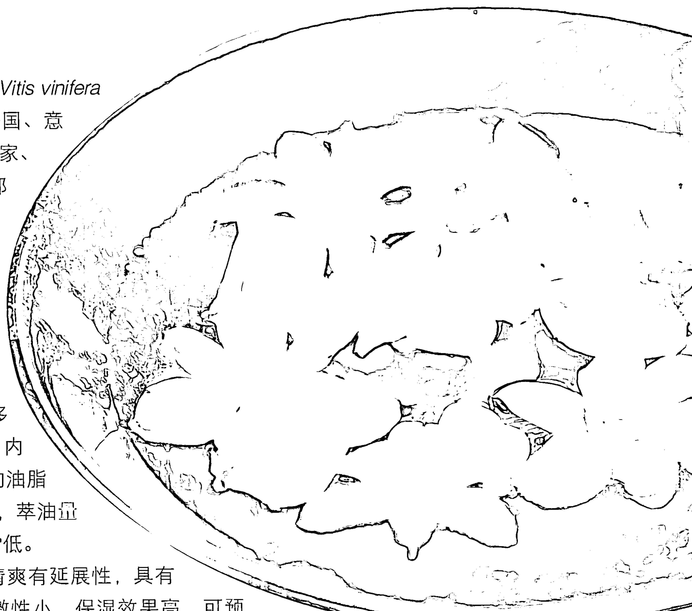

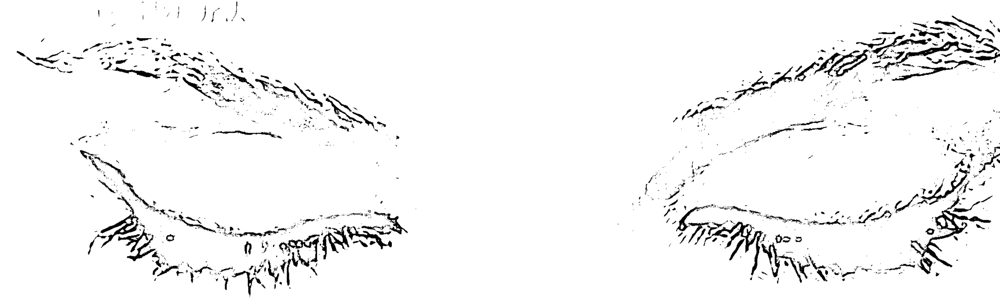

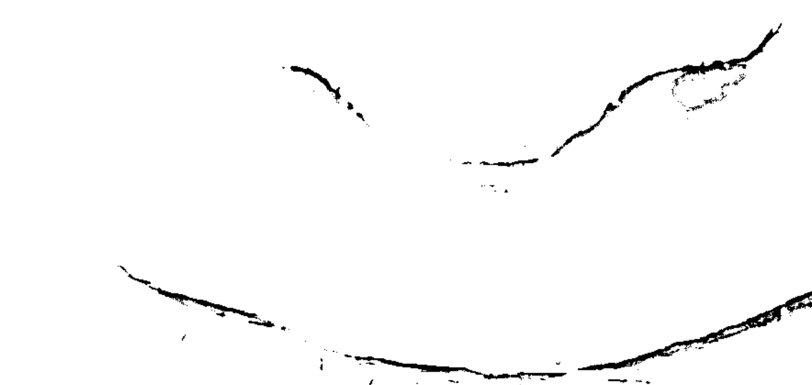

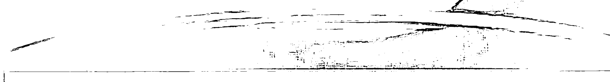

##### 2. 精油调配DIY

调和精油时需先准备1支5ml的茶匙，若为脸部按摩，大约用一两茶匙基底油即可，而身体按摩则约需6茶匙，再依所需的比例调和精油。

调和的比例，一般来说，精油浓度为0.5%～3%，脸部等较为敏感的部位或12岁以下儿童的按摩，浓度为0.5%～1%；严重的肌肉酸痛，可以用到3%。简单的计算方法：0.5%指的是1滴精油加2茶匙基底油，1%为1滴精油加上1茶匙基底油，2%为2滴精油加1茶匙基底油，以此类推。

自己在家中调配精油时，精油的百分含量一般不超过3%。具体的调配方法如下。

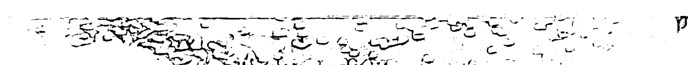

选择配方。根据要达到的疗效，参见相关精油配方，选择几种单方精油。
计算需用的单方精油总滴数。
计算方法如下。

百分含量：是指用基础油稀释后的单方精油百分比含量。1ml＝20滴。

精油的稀释调配比例包括常用量稀释、低量稀释和超低量稀释。

- ① 常用量稀释——2.5%（单方精油总量为2.5%，基础油为97.5%）。
基础油毫升数÷2＝可添加单方精油总滴数。
以调配20ml精油为例。
基础油：20ml甜杏仁油或荷荷巴油；
单方精油：薰衣草、茶树、佛手柑；
精油总数量：20ml基底油÷2＝10滴精油；
每种单方精油的滴数：薰衣草5滴＋茶树3滴＋佛手柑2滴＝10滴。

- ② 低量稀释——1%：适用于面部肌肤、敏感肌肤和怀孕期间。
基底油毫升数÷4＝可添加油总滴数。换算方式同上。

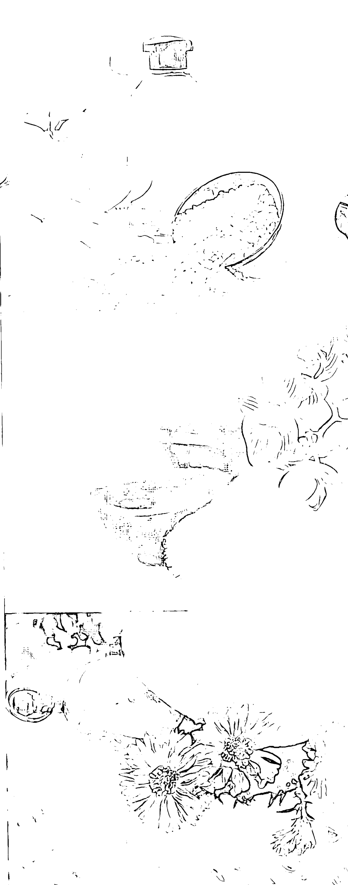

# 美丽女人的芳香生活
——精油芳香按摩疗法

- ③ 超低量稀释：适用于极敏感肌肤、儿童和婴儿。
每10ml基底油仅添加1滴精油，或单独使用基础油。

- ③ 将单方精油滴进基底油的深色瓶中，立即旋紧瓶盖，贴上标签，标明日期、精油名称和稀释量。

- ④ 使用前摇匀。
依个人需要，配合体质与生理变化，需随时调整基础油、纯植物精油的种类与比例，调配出适当的按摩油，利用按摩手法（指压、淋巴引流等），将植物精油渗透至身体内部，达到保健或治疗目的。

#### 三、收藏和保存

- 精油容易受到湿热、光线和空气等因素的影响，储存精油的容器必须是深色、有儿童安全瓶盖的玻璃瓶。
- 存放于阴凉处，避免日光照射，远离热源。
- 将瓶口直立向上放置，不用时将瓶盖拧紧。

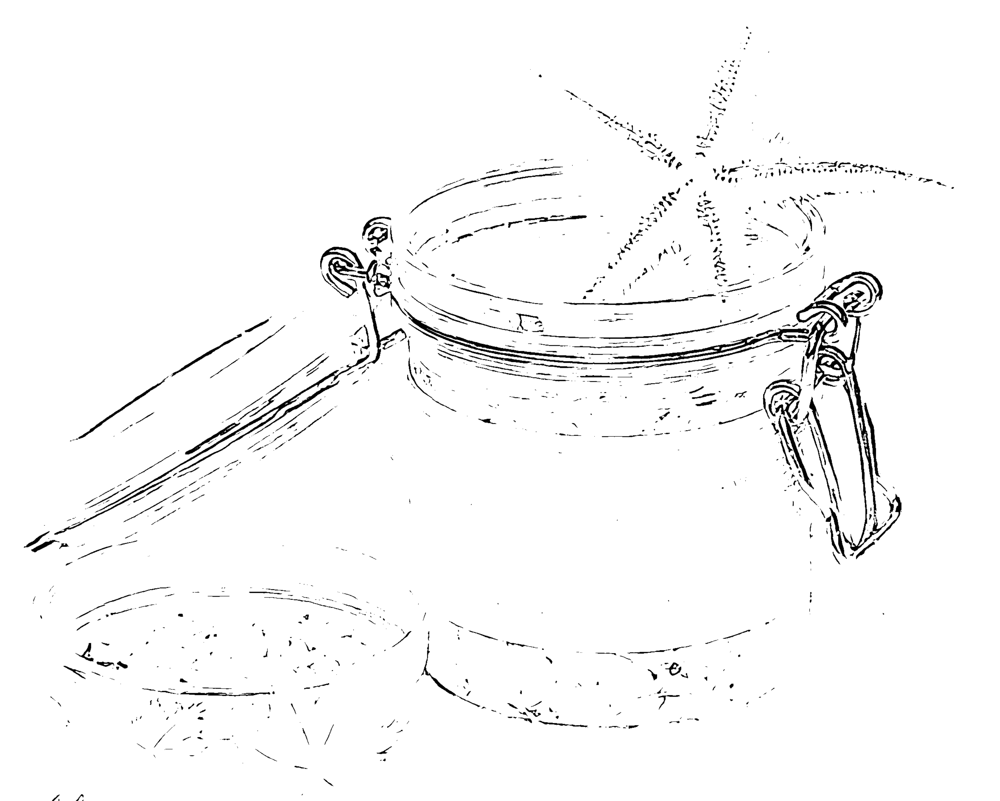

- 未开封的纯单方精油的保存期限较长，3～10年不等。
- 开封后的纯单方精油，如果储存良好，可约保存2年。
- 自己调配的复方精油最好一次用完。
- 精油在倒取后应立刻以面巾纸将瓶口擦干净，以免瓶口处出现氧化后的成分，缩短复方精油的保存寿命。
- 不能在没有用完的复方油瓶中再加上新调的精油，即使是配方完全相同也不行，因为这样会加速变质速度。

### 单元三 精油选购与时尚应用

#### 一、如何选购植物精油

消费者在选购适合自己使用的精油时，除通过嗅觉感受外，还要了解产品的品质。

- ① 100%纯植物精油通常会标示“100%”或“Pure Essential Oil”或“Natural Essential Oil”等字样；如果精油产品中只添加了少量的精油成分，那么产品名称只能以“Aromatherapy Oil”、“Aromatherapy Blend Essence”等名称来标示。
- ② 认准植物的拉丁名称，以避免与其他种类的植物精油混淆。
- ③ 产品清楚标明出产国，因为精油的品质可能因不同的生产国家而有所不同。植物种植的说明，如出自人工种植植物、野生植物等。
- ④ 标明植物萃取部位及萃取方式。
- ⑤ 标明精确的剂量（克或毫克）。
- ⑥ 对复方精油的配比以及添加物的说明及其混合比例。
- ⑦ 精油必须盛装在深色的玻璃瓶内，以防止阳光照射致使产品变质。

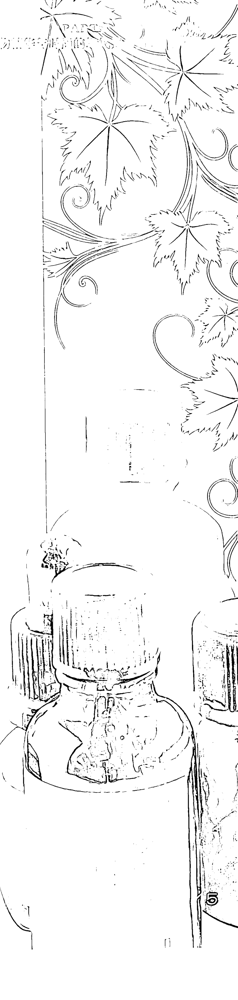

- ⑧ 非专业的一般消费者，最好不要买百分之百纯的精油，以免因使用不当而造成不适。消费者在使用已经因不同需要而调配好的复方精油时，会更方便和安全。

#### 二、香薰点缀时尚家居

##### （一）温馨家居的香薰助手

###### ❀ 香薰盆栽点缀家居

家中若有空间，可以种植一些香味较浓的花草，回家时清香扑鼻，可舒缓当天的压力和紧张情绪，令人心旷神怡。可在室内或家门口处放置数种香味各异的盆栽，如百里香、薰衣草、天竺葵、迷迭香等。

###### ❀ 干花香薰

若室内缺乏空间放置盆栽，或因日光不足或因缺乏时间打理，可悬挂干燥的香薰植物。一般以香馥草、檀香木等最为适宜，因为其气味清香，适宜放在室内。

###### ❀ 放置香薰瓶

可将香薰油注入有小孔的小陶瓷瓶内，然后放于家居的入口处，效果也甚佳。由于香薰油属浓缩品，应谨慎使用，必须考虑家人能否接受，注意香味是否过浓。如果过浓，非但无法达到舒缓情绪的效果，反而会因过浓的香味而引起头痛或不适。

另外，家庭中使用完毕的植物精油瓶子，也可以将瓶盖打开，放置于浴室、厕所或橱柜中，其香气仍可持续几个星期。

###### 香薰蜡烛、香草及陶灯

起居室或饭厅是家人共享天伦之处，更需要令其空气清新。如家中有吸烟者，空气浑浊，可在烟灰缸里放入一些细碎的迷迭香、柠檬草，以缓解空气中的异味。

- 陶灯 就是在陶制的小瓶内放入一些混合香熏料或数滴精油，再加一些水，并在陶瓶下置一灯泡，利用热气令其散发香气。
- 蜡烛 可将香熏蜡放入容器中，用餐时点燃，既有情调，又能促进食欲。
- 香草 可选用一些新鲜的薄荷、柠檬草、迷迭香、百里香、茴香等芳香植物插在花瓶或置于室内，则室内即有淡淡的幽香。

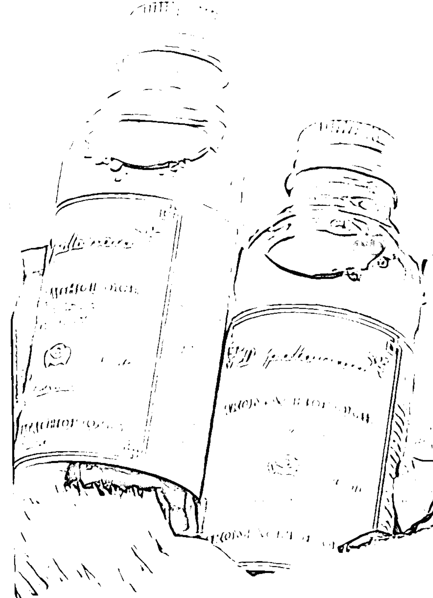

##### （二）温馨家居香薰策略

###### 卧室的香薰处理

- 香工瓶 可放置在床头柜上，选用不占空间又不易破碎的小陶瓶，内注薰衣草油数滴。最好采用未上釉的小陶瓶，因其能适当散发阵阵香味。香熏油的选择，除薰衣草外，橙花、佛手柑等都很适合。
- 香工枕 枕头的设计和大小需适合自身要求。枕内的填充物可按自己的喜好添加。如需要，可加上数滴精油。适合做香熏枕头的植物有玫瑰、薰衣草、柠檬、马鞭草、棕榈、迷迭香、鼠尾草、茴香、丁香等。香熏油中适合做香枕的有薰衣草、橙花、天竺葵、佛手柑等。为了令香枕的香味集中，起床后可将枕头置于棉被内或用睡衣包起来，晚上休息时，香气怡人。
- 香包 在衣柜内和衣架上挂一个香包，再滴上数滴香熏油，就可除异味，还可除虫。穿上散发着清香气味的衣服，也令人情绪高昂，快活而自信。一般来说，选用的香料应以清淡为宜，如柠檬草、薰衣草等，但在选用薰衣草时要注意，最好茎、叶一起使用，以缓和花朵的浓烈香味。

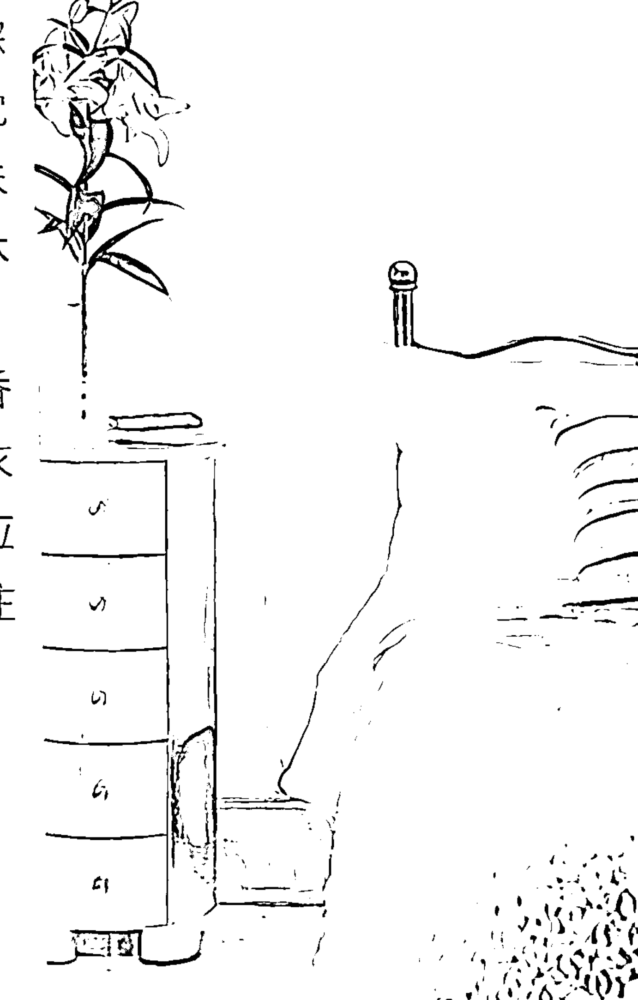

###### 2 书房的芳香处理

读书之乐，人人皆享受。但长时间的阅读，特别是书的油墨味，容易使人疲劳或精神不集中。不妨采用下列方法调节。

- 将松、杉、杜松、樟脑等香油加入一般底油内，定期擦拭书架的内外侧。
- 将一小枝天竺葵、薰衣草等夹在书里，翻阅时，就会送上阵阵香气，令您的阅读兴趣更浓。
- 在书桌上插一枝迷迭香，可改善因阅读过久而引起的头昏眼花。

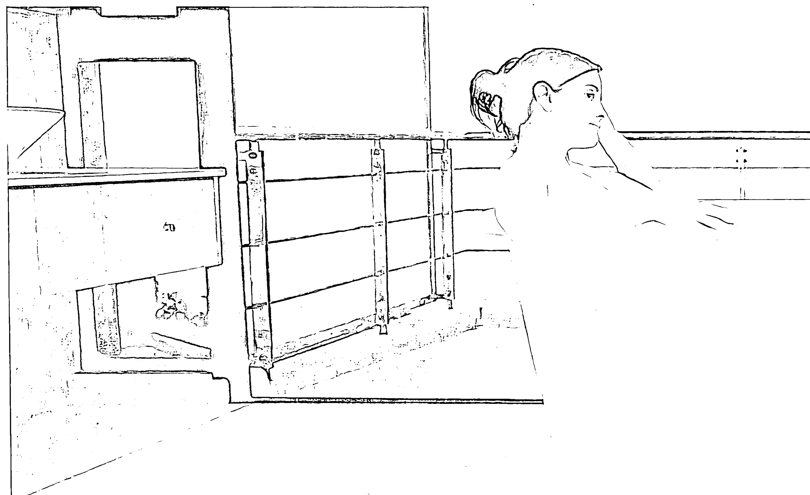

###### 3 洗手间的芳香处理

洗手间一般较潮湿，如加上异味，就会令人有不快的感觉。如进行香熏处理，洗手间就能香气袭人。

- 将薄荷、松树、杜松或尤加利等香熏油，滴入已加水的塑胶壶内，充分摇匀后，进行喷洒。如将容器内的水换成酒精，再滴入您喜欢的香料，用它来擦拭瓷砖，既能达到清洁污垢的作用，又可使空气清新、芳香。
- 放置香熏干花。如果浴室的通风设备良好，湿气不重，可选用针叶树的香熏干花，如杜松、松树、尤加利等，并滴上数滴同系的香油。不过，要记得随时添加香油。
- 将香料放入陶质小香熏瓶内，然后放置在洗脸架上。不过，要切记，选用的香料不宜太浓烈，应以清香为主。
- 焚香，常选用檀香。
- 芳香棉球，这是最简易的方法。在棉花球上滴上薄荷油，放入卫生纸的卷筒内，香味便会随着卷筒转动而散发。

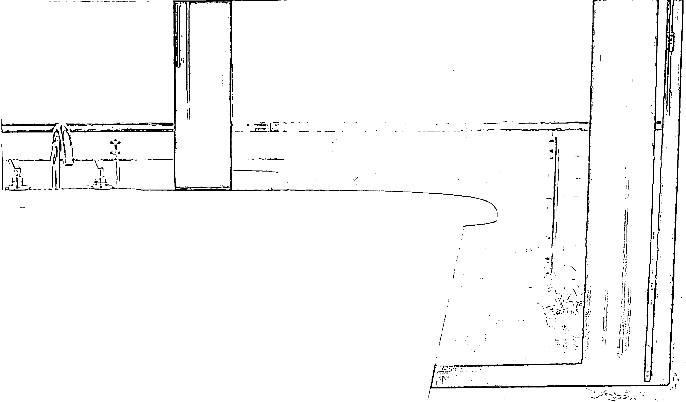

## 第二章
时尚的现代芳香疗法

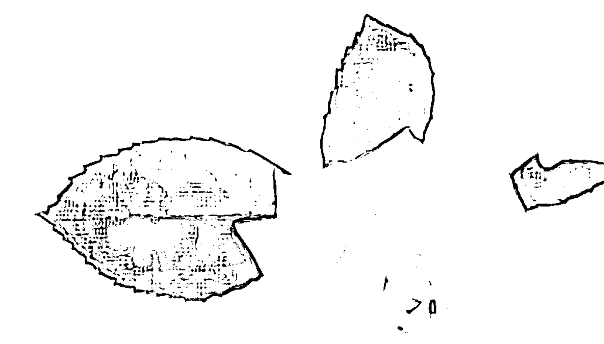

### 芳香引语

精油能够通过嗅觉进入身体，唤醒内心深处的美好记忆。缠绵如江南三月的流水、恬静的音乐、柔和的光线与芬芳的植物精油一起为您呈现了时尚的现代芳香疗法。因此，享受她，需要充分调动五官，通过人体的五大感观功能：视觉、嗅觉、听觉、味觉、触觉的感知来达到一种身、心、灵皆舒畅的感觉。

### 单元一 芳香疗法概述

#### 一、芳香疗法概念和原理

芳香疗法是由法语aroma（芳香）和therapy（疗法）两个名词衍变而来。其基本概念就是使用植物的芳香精油，激发人体与生俱来的治愈能力，维持身心两方面的健康。

芳香疗法甚至可以通过人体的视觉、触觉和嗅觉刺激大脑皮层，启迪思维，为人类提供精神上的慰藉，并解除心理和精神上的压力及疾病，使人树立积极的人生态度。

广义的“芳香SPA”，就是将植物芳香精油运用香熏、按摩和沐浴等方法，通过人体的嗅觉、味觉、触觉、视觉、听觉五大感觉功能，经由皮肤和呼吸系统吸收植物激素，调整身体内分泌，从而使人在生理和心理上进行调整，使身心恢复协调，消除忧郁、焦虑、烦闷、愤怒等情绪和疲惫感，达到一种身、心、灵皆舒畅的感觉，有人称其为“五感疗法”。

#### 二、芳香疗法起源与文化

芳香疗法始于古埃及。早在公元前，古埃及就已经开始使用香油香膏了。但是将其发扬光大的是希腊人和罗马人。爱美女神阿弗罗戴蒂的神庙中记载得最多，现代盛行的“SPA”，就是古希腊时代医疗浴池的意思。

在印度也有植物经典，最著名的是《吠陀经》，也是奠定印度传统医学的根本。

药草治病自古有之，而芳香疗法这一名词是从1928年法国的化学家鲁尼、莫旦斯、盖特佛塞出版了《芳香疗法》一书后才广为人知的。一次，盖特佛塞研发新产品时，不慎发生化学爆炸伤及手部，情急之下，他迅速把手伸进身边的一碗液体中，没想到，烧伤的手不那么疼痛了，水疱和伤口也减轻了许多。这碗液体，正是薰衣草油。由此他对各种植物精油产生兴趣，开始着手研究精油的治疗功能，写下了最早的《芳香疗法》专著，被称为近代“芳香疗法之父”。

玛格里特摩利夫人是第一位将芳香疗法与美容结合的人。20世纪50年代，玛格里特摩利夫人研读盖特佛塞有关精油的著作后，首次将精油用于美容，并将芳香疗法传入英国。20世纪70年代，雪利普赖斯使芳香疗法的运用有了更大的改变。雪利普赖斯认为，一位芳香疗法师应该懂得丰富的解剖学、生理学、病理学知识，熟知各种芳香疗法专用精油的化学成分和疗效，并且具有特殊物理疗法技术。

80年代，关于芳香疗法的书籍在日本登场后，当时一般人并不了解，直到“回归自然”的声浪高涨之后，人们才开始重新评估其价值。东南亚国家部分都市美容院才有了芳香疗法的尝试。

90年代以来，随着世界旅游业的发展，SPA、芳香疗法、精油按摩技术由西方进一步传入东南亚，并在我们的生活中活跃起来，同时融合了人类数千年来的文明智慧，加上医师和科学家的研究成果，为我们提供了有效而愉悦的选择，同时达到了平衡身、心、灵的整体效果。

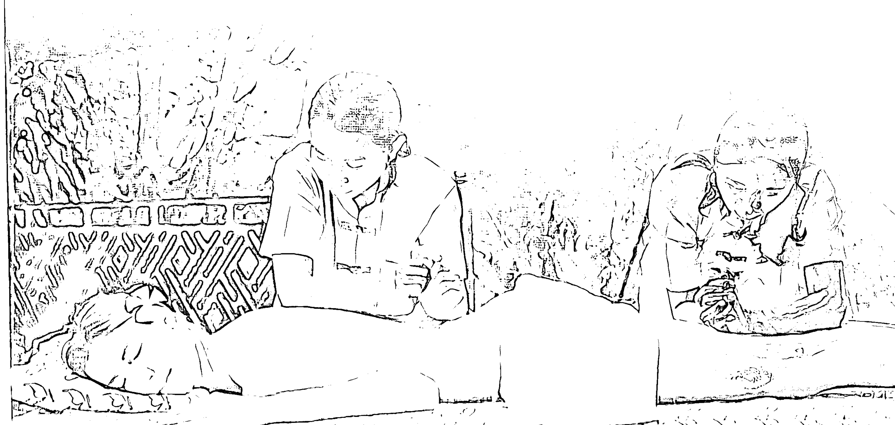

进入21世纪，芳香疗法除了美容、美体、减肥塑身之外，还将配合水疗、按摩疗法担负着保健治疗的功能，并将在数年内，成为人们预防保健、延年益寿的良方益友。

### 单元二 芳香疗法应用

芳香疗法即运用精油（单方或复方），依照不同的使用方式，如按摩、沐浴、吸入、蒸汽吸入、喷雾、皮肤保养、护发等，搭配使用剂量、使用部位与手法来调理身体及平衡精神、情绪或养生保健。最常用的芳香疗法是香薰、沐浴和按摩三种方式，也可将三者综合起来进行应用。

精油使用前需要对肌肤进行是否过敏的DIY测试。

初次使用植物精油者，特别是敏感性肌肤的人，需要进行肌肤测试。取一滴欲使用的精油，稀释后涂抹于耳后、手肘内侧或手腕内侧的敏感区域。停留24小时后，如果未发红或瘙痒，代表此种植物精油适合使用。

#### 一、芳香疗法的操作方法

##### 吸入式

主要是通过各种熏蒸和喷洒的方法，将精油分子散布于空气中，并通过呼吸系统进入人体，从而发挥作用。比如，清早起来，人感觉精神混沌，可将五六滴迷迭香油或尤加利油，滴在纸巾或毛巾上，靠近鼻子吸入，可令精神振奋，睡意全消。

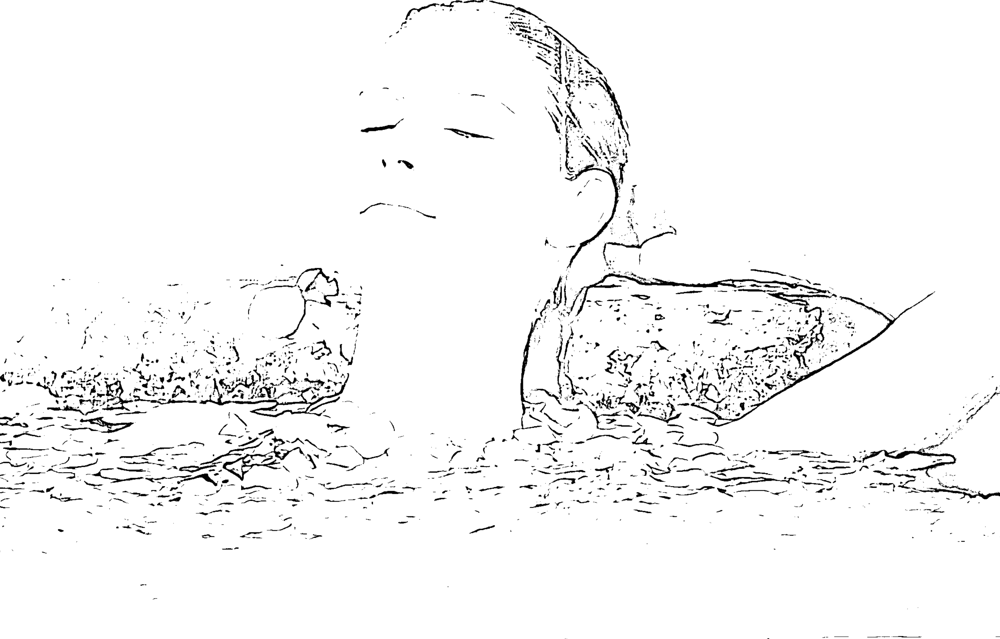

下面介绍吸入方式使用精油的具体操作法。

- 熏香炉或其他专门熏香器具
在熏香炉的容器内加入50%容量的温水，滴入1～6滴精油，点燃蜡烛或接通电源，保持水温。

- 灯泡或暖气系统
将1～2滴精油滴在干净的脱脂棉片上，放在灯泡或暖气系统的散热片上。

- 面纸或手帕
在干净的面纸或手帕上滴1滴精油，需要时用鼻子吸入。

- 吸入蒸汽
碗中倒入热水，滴入2～3滴精油，用毛巾包裹头和碗，脸距水面约25厘米，双眼闭上，用鼻子深深吸气，至少持续5分钟。

- 喷雾器或其他喷洒器具
取适量净水，蒸馏水最佳，按比例配制成5%～10%浓度的喷洒液，摇晃均匀后喷洒在空中、窗帘、墙壁、地板等处。注意不宜太浓，否则会引起不适。

##### 2. 水疗法——沐浴

沐浴是精油使用的主要方式之一，也称为水疗法，又称芳香SPA。下面介绍一下使用精油进行沐浴的具体方法。

- 泡澡
打开水龙头放好洗澡水，滴入1～6滴精油，关好浴室门。在水中至少泡10分钟。如感觉肌肉僵硬时可选择相应功效的精油泡澡。

- 淋浴
依照惯常方法淋浴，冲洗时，把2～3滴精油滴在毛巾上，擦拭身体，吸入香气。

- 坐浴
洗澡水放到臀部的高度即可，或用一个可以盘腿而坐的盆子，滴入1～2滴精油，以旋转的方式搅拌均匀即可。

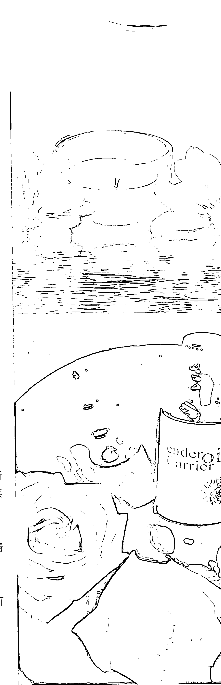

# 美丽女人的芳香生活
——精油芳香按摩疗法

- 手浴
在温水中滴入1～2滴精油，搅匀，把双手浸在温水中，约泡10分钟。
- 足浴
在温水中滴入2～4滴精油，搅匀，把双脚浸泡在水中，约泡20分钟。

### ☆ 芳香按摩

按摩是精油最重要也是最普遍的使用方法之一，可选择适宜功效的精油配方进行相应的脸部按摩及身体按摩。精油按摩已逐渐成为一个专门的职业领域，芳香保健师已成为一个职业工种被国家劳动和社会保障部批准，正式列入中国职业大典。本书将在后面重点介绍。

#### 二、常用植物精油疗效

| 品名 | 皮肤疗效 | 身体疗效 | 精神疗效 | 禁忌 |
| :--- | :--- | :--- | :--- | :--- |
| 罗勒 Basil | 收紧皮肤，改善阻塞皮肤，控制粉刺 | 用于头痛、感冒、咳嗽、消化不良 | 使感觉敏锐、精神集中，对抗沮丧 | 敏感皮肤、孕妇禁用 |
| 佛手柑 Bergamot | 改善油性皮肤、粉刺、湿疹、溃疡 | 用于消化不良，刺激食欲，改善肠胃 | 缓解焦虑、神经紧张、沮丧，安抚愤怒 | 日光浴前禁用 |
| 洋甘菊 Chamomile | 用于敏感、干燥易痒的皮肤，可增加弹性、消除浮肿 | 用于肌肉及神经痛、肠胃不适，增强免疫系统功能，消除浮肿 | 安抚焦虑、紧张、恐惧，使人放松、有助于失眠的治疗 | 怀孕初期禁用 |
| 鼠尾草 Clary Sage | 用于油性、发炎、松弛的皮肤，促进细胞再生 | 平衡激素，改善头痛，解除胀气 | 舒缓神经紧张，使心情开朗，有助于产后抑郁的缓解 | 孕妇、饮酒后禁用 |
| 尤加利 Eucalyptus | 改善阻塞皮肤，清洁细菌感染的皮肤 | 用于感冒、咳嗽、气喘、退烧、杀菌、疼痛 | 集中注意力，增加活力，使头脑冷静 | 高血压、癫痫患者禁用 |
| 天竺葵 Geranium | 均衡各类型皮肤，用于苍白、毛孔阻塞、油性的皮肤 | 调节激素，利尿，排毒，强化循环系统 | 舒解压力，平抚焦虑、沮丧，使心理平衡 | 敏感皮肤、孕妇禁用 |
| 西柚 Grapefruit | 用于油性、不洁的皮肤 | 为淋巴刺激剂，可减肥利尿 | 精神愉快，增强自信，对抗沮丧 | 日光浴前禁用 |
| 茉莉 Jasmine | 调理任何肤质，尤其是干燥、敏感、老化的皮肤 | 平衡激素，用于产后抑郁，还可增加精子 | 对抗沮丧，增强自信，恢复精力 | 孕妇禁用 |
| 薰衣草 Lavender | 适宜任何皮肤，用于灼伤、晒伤，使细胞再生，并有护发功能 | 降血压，治失眠，止痛，还可用于支气管炎、气喘，可止呕、驱虫 | 安定情绪，净化心灵，对抗沮丧、惊慌 |  |
| 柠檬 Lemon | 使皮肤美白，改善破裂微血管，净化油腻皮肤，除鸡眼 |  | 具有清新、开朗、澄清思绪的精神疗效 |  |
| 青柠 Lime | 用于油性、不洁、松弛的肌肤 | 用于退烧、咳嗽，加强免疫功能，助消化，治疗风湿痛 | 解除焦虑、沮丧，使人振奋 | 日光浴前禁用 |
| 茴香 Aniseed Oil | 可清洁、滋养皮肤，可预防皱纹的产生 | 对支气管炎等疾病有祛痰作用，可健胃，滋养肝、肾、脾 | 较少使用 | 孕妇、癫痫患者禁用 |

# 美丽女人的芳香生活
——精油芳香按摩方法

| 品名 | 皮肤疗效 | 身体疗效 | 精神疗效 | 禁忌 |
| :--- | :--- | :--- | :--- | :--- |
| 杜松果 Juniperberry | 适于油性皮肤，抑制油脂分泌，瘦身、去水肿效果明显 | 具解毒作用，对五脏和胃是良好的滋养剂 | 清新的香气能提神醒脑，振奋神经系统 | 孕妇、肾功能不全者禁用 |
| 迷迭香 Rosemary | 具有很强的收敛性 | 改善气喘、慢性支气管炎、消化不良、肠胃胀气、胃痛、感冒、肥胖、静脉曲张，需经稀释方可使用 | 是一种很好的兴奋剂，可提神并增强记忆力、减低压力 | 高血压、癫痫患者及孕妇禁用 |
| 檀香 Sandalwood | 适用于干性、缺水皮肤 | 可促进睡眠，增加免疫力，也是一种较好的催情剂 | 可稳定情绪 | 避免沮丧时使用 |
| 丝柏 Cypress | 适用于油性皮肤，可淡化停经期女性色斑 | 用于多汗、浮肿、经血过量、痔疮、风湿病、支气管炎、百日咳 | 用于神经衰弱、远离悲伤，有助安眠 | 孕妇、高血压患者禁用 |
| 玫瑰木 Rosewood | 适用于干性、敏感性皮肤，可促进细胞及组织再生，延缓肌肤老化 | 可改善呼吸道感染 | 稳定中枢神经系统，使人精神焕发 | |
| 肉桂 Cinnamon | 具有收敛、紧实作用，可用于皮肤松弛 | 温肾暖脾，祛寒，温经止痛。为强抗菌药，用于胃痛、腹泻、经痛、月经过少、白带、阳痿等症状 | 用于精疲力竭、虚弱、沮丧、神经衰弱 | 孕期禁用 |
| 乳香 Frankincense Oil | 可抗皮肤衰老及皱纹，助伤口愈合 | 活血行气，止痛生肌。治疗哮喘 | 有定惊镇静功效，助冥想 | |
| 香柏木 Cedarwood Oil | 用于油性皮肤，可使毛发重生 | 治疗支气管病及头皮问题 | 减轻压力 | |
| 马乔莲 Marjoram | 用于老人斑，可散瘀活血 | 用于肌肉痛、风湿、高血压、消化不良、便秘、痛经 | 安抚神经，舒缓压力，压制过度活跃 | 孕妇禁用 |
| 没药 Myrrh | 防止组织退化，治疗伤口溃烂、龟裂皮肤、防止老化 | 活血止痛，消肿生肌。用于感冒、口臭、痔疮、白带、念珠菌感染，增强免疫 | 抗沮丧、精神混乱，冷静情绪 | 孕妇禁用 |
| 香橙 Orange | 用于干燥皮肤，抗皱纹，促进发汗，促进皮肤排毒 | 用于腹泻、便秘、抗病毒感染、失眠、肌肉痛 | 鼓舞精神，减轻紧张压力 | 日光浴前禁用 |
| 广藿香 Patchouli | 用于干性、老化、粗糙的皮肤，助细胞再生、伤口结疤，减轻发炎 | 祛暑解表，化湿和中。用于节食导致的皮肤松弛、利尿、排汗过多、除臭、结疤 | 使人清醒，消除嗜睡 | |
| 薄荷 Peppermint | 可提神解郁，疏热解毒，能收缩微血管，软化皮肤，用于黑头粉刺、癣疥 | 用于感冒、气喘、脚痛、痛经、风湿 | 安抚愤怒、疲倦、沮丧情绪 | 孕妇、眼部四周禁用 |
| 橙叶 Petitgrain | 用于油性皮肤、粉刺、暗疮印及老化 | 镇静神经系统，解除肌肉痉挛，强化免疫功能，除臭、助消化 | 安抚低落情绪 | |
| 玫瑰 Rose | 适合各种皮肤类型 | 理气和血，疏肝解郁。调节月经，抗菌 | 平复哀伤、嫉妒，舒缓紧张，使女性积极开朗 | 孕妇禁用 |
| 洋苏草 Sage | 止血，用于毛孔粗大、暗疮印、湿疹、干癣、溃疡 | 调节月经、更年期，用于念珠菌感染、便秘、肥胖 | 增强记忆，镇静神经 | 孕妇、癫痫患者禁用 |
| 茶树 Tea Tree | 用于伤口化脓、灼伤、疮、晒伤、癣、头皮屑 | 用于感冒、黏膜炎、念珠菌感染、生殖器感染 | 使头脑清新，恢复活力，对抗沮丧 | |
| 百里香 Thyme Red | 用于脱发、疮、湿疹 | 用于感冒、咳嗽、喉痛、低血压、风湿、白带异常 | 强化神经，活化脑细胞，助记忆 | 孕妇、高血压患者禁用 |
| 伊兰伊兰 Ylang Ylang | 可平衡油脂分泌，用于护理头皮 | 平衡激素，抗沮丧，催情，降血压，镇静放松 | 放松神经系统，解除愤怒焦虑、震惊恐慌 | |
| 月桂 Bay | 用于出汗过多 | 用于支气管炎、伤风感冒，帮助消化和睡眠，缓解风湿痛 | 提神 | |
| 安息香 Benzoin | 可改善松弛老化肌肤 | 开窍辟秽，行气血。用于泌尿感染、支气管炎、咳嗽、感冒 | 提神 | |
| 甘菊 Chamomile | 舒缓抗敏，适合敏感、干燥且脱皮的皮肤 | 用于气喘、贫血、烧伤、腹泻、消化不良、痛经、风湿痛、牙痛 | 镇静，有助于失眠的治疗 | |
| 牛膝草 Hyssop | 皮肤疗效 | 用于支气管炎、咳嗽、感冒 | 镇静，使血压规律 | 孕妇禁用 |
| 印度薄荷 Patchouli | 止血，保养肌肤，用于湿疹、瘢痕，可消除浮肿 | | 消除压力和忧虑，提神，镇静 | |

#### 三、美丽容颜精油配方

##### 1. 美白肌肤

特定功效的精油分子可淡化肌肤表皮沉淀的黑色素，轻松达到美白及护肤双重效果。

- 柠檬3滴＋鼠尾草1滴＋玫瑰1滴＋小麦胚芽油10ml。
- 柠檬3滴＋鼠尾草1滴＋橙花1滴＋小麦胚芽油10ml。

油性皮肤可以使用芦荟油。

##### 2. 调理青春痘皮肤

具有调节皮脂分泌功能的精油，能适度调节激素分泌并净化肌肤，作用温和并消灭青春痘。

- 肉桂2滴＋檀香1滴＋茶树2滴＋荷荷巴油10ml。
- 依兰1滴＋鼠尾草2滴＋薰衣草2滴＋荷荷巴油10ml。

##### 3. 淡化黑眼圈

选用能活化肌肤生理机能的精油调整肤质，唤醒疲倦肌肤，消除黑眼圈，改善倦容。

- 乳香3滴＋天竺葵1滴＋玫瑰1滴＋葡萄籽油10ml。
- 洋甘菊3滴＋玫瑰2滴＋葡萄籽油10ml。

##### 4. 延缓衰老

可刺激肌肤微血管循环，满足对养分的需求，具有保湿、防护及预防老化的功效。

- 玫瑰3滴＋肉桂1滴＋茉莉1滴＋橄榄油或小麦胚芽油10ml。
- 乳香2滴＋肉桂1滴＋玫瑰1滴＋橄榄油或小麦胚芽油10ml。

##### 5. 收敛毛孔

具净化及收敛特性的精油可清除过剩皮脂，调节皮脂分泌。

- 丝柏2滴＋天竺葵2滴＋依兰1滴＋荷荷巴油10ml。
- 佛手柑3滴＋紫罗兰1滴＋玫瑰1滴＋荷荷巴油10ml。

##### 淡化抚平细纹

具再生作用的精油可促进新陈代谢、增强保水能力并提供适度滋润，可淡化抚平细纹。

- 乳香1滴＋玫瑰3滴＋伊兰1滴＋小麦胚芽油10ml。
- 檀香2滴＋玫瑰3滴＋葡萄籽油10ml。

##### 淡斑去痕

妊娠纹及肥胖者因松弛产生的橘皮组织，都可利用具有细胞再生作用的精油加速色素分解代谢，去除痕印，恢复美丽状态。

- 乳香5滴＋鼠尾草10滴＋橙花5滴＋柠檬10滴＋葡萄籽油30ml。
- 橙花4滴＋玫瑰3滴＋葡萄籽油30ml。

#### 四、各类皮肤保养精油配方

##### 油性皮肤

- 鼠尾草1滴＋薰衣草1滴＋佛手柑1滴＋杜松1滴＋10ml葡萄籽油。

##### 面疱皮肤

- 尤加利2滴＋柠檬1滴＋茶树2滴＋10ml葡萄籽油。

##### 油性或有青春痘的皮肤

- 柠檬草1滴＋松树2滴＋檀香2滴＋10ml葡萄籽油。

##### 干性皮肤

- 玫瑰1滴＋檀香1滴＋罗马洋甘菊1滴＋橙花1滴＋10ml荷荷巴油。
- 玫瑰2滴＋橙花2滴＋迷迭香1滴＋10ml荷荷巴油。
- 玫瑰2滴＋乳香2滴＋薰衣草1滴＋10ml荷荷巴油。

##### 敏感性皮肤

- 洋甘菊2滴＋薰衣草1滴＋橙花1滴＋10ml荷荷巴油。
- 洋甘菊2滴＋薰衣草1滴＋檀香1滴＋10ml甜杏仁油。
- 薰衣草2滴＋橙花2滴＋尤加利1滴＋10ml甜杏仁油。

##### 中性皮肤

- 薰衣草1滴＋佛手柑1滴＋茉莉2滴＋10ml甜杏仁油。
- 洋甘菊2滴＋橙花油2滴＋玫瑰1滴＋10ml甜杏仁油。

##### 7 缺水性皮肤

- 罗勒1滴＋迷迭香1滴＋香橙3滴＋10ml甜杏仁油。
- 罗勒1滴＋玫瑰4滴＋10ml甜杏仁油。

##### 8 皮肤其他症状

- 非常干燥脱皮皮肤 玫瑰＋檀香木＋洋甘菊。
- 过敏发痒皮肤 玫瑰＋薰衣草＋洋甘菊。
- 皮肤缺水老化 玫瑰＋橙花＋茉莉。
- 皮肤干燥但会出油 天竺葵＋薰衣草＋依兰。
- 皮肤缺水、肤色晦暗 玫瑰＋天竺葵。
- 微血管显性的皮肤 薰衣草＋洋甘菊＋茉莉。
- 暗疮粉刺皮肤 天竺葵＋薄荷＋尤加利＋乳香。
- 皮肤发炎 天竺葵＋佛手柑＋薰衣草＋乳香＋尤加利。
- 水肿皮肤 天竺葵＋橙花。

#### 五、身体美丽精油配方

##### 1 柔嫩体肤

使用具有柔嫩身体肌肤效果的精油浸浴或按摩，可光滑细嫩肌肤，远离干燥脱屑的烦恼。

- 乳香1滴＋檀香5滴＋玫瑰5滴＋伊兰2滴＋甜杏仁油30ml。
- 檀香3滴＋橙花3滴＋玫瑰3滴＋甜杏仁油30ml。

##### 2 减肥与塑身

使用具促进身体代谢功能的精油，通过按摩分解燃烧脂肪，达到窈窕目的。每日1次，连续4周，效果显著。

- 肉桂4滴＋丝柏6滴＋杜松10滴＋葡萄柚10滴＋甜杏仁油30ml。
- 柠檬10滴＋迷迭香10滴＋葡萄柚10滴＋甜杏仁油30ml。
- 薰衣草2滴＋迷迭香5滴＋茴香2滴＋杜松5滴＋小麦胚芽油20ml。
- 广藿香3滴＋杜松2滴＋茴香4滴＋小麦胚芽油20ml。
- 薰衣草3滴＋广藿香2滴＋檀香木4滴＋小麦胚芽油20ml。
- 柠檬香茅3滴＋柠檬2滴＋尤加利2滴＋迷迭香2滴＋小麦胚芽油20ml。
- 丝柏6滴＋迷迭香5滴＋小麦胚芽油20ml。
- 丝柏4滴＋杜松5滴＋小麦胚芽油20ml。
- 茴香3滴＋杜松2滴＋迷迭香2滴＋鼠尾草2滴＋小麦胚芽油20ml。

##### 排除积水与消除水肿

使用具有促进淋巴循环功效的精油，按摩水肿部位，并顺着淋巴流向推按，每日1次，连续4周，效果显著。

- 杜松2滴＋迷迭香4滴＋丝柏2滴＋小麦胚芽油20ml。
- 杜松4滴＋鼠尾草3滴＋迷迭香1滴＋小麦胚芽油20ml。

##### 去除产后妊娠纹

使用具有细胞再生作用的精油，以顺时针打圈的方式按摩腹部，每天按摩5～10分钟。

- 橙花5滴＋薰衣草4滴＋小麦胚芽油20ml。
- 乳香3滴＋薰衣草2滴＋柠檬香茅2滴＋丝柏1滴＋小麦胚芽油20ml。

##### 去除宿便、排解毒素

以推按手法按摩腹部。

- 香茅5滴＋迷迭香5滴＋葡萄籽油20ml。
- 薰衣草5滴＋迷迭香5滴＋葡萄籽油20ml。
- 香茅4滴＋茴香2滴＋迷迭香4滴＋葡萄籽油20ml。

#### 六、疑难杂症精油配方

| 症状 | 使用方法 | 基础油 | 调配精油 |
|---|---|---|---|
| 口臭 | 漱口 | 水 | 茶树+薰衣草+薄荷 |
| 耳痛 | 按摩 | 葡萄籽油 | 茶树+薰衣草 |
| 流行性感冒 | 熏香/泡澡/按摩 | 水 | 薰衣草+茶树+柠檬 |
| 偏头痛 | 按摩 | 荷荷巴油 | 薰衣草+迷迭香 |
| 头痛 | 按摩/吸入 | 荷荷巴油 | 薰衣草+天竺葵+柠檬 |
| 妊娠纹 | 按摩 | 荷荷巴油 | 乳香+薰衣草+广藿香 |
| 晒伤 | 按摩 | 葡萄籽油 | 薰衣草+檀香+薄荷 |
| 湿疹 | 按摩/盆浴 | 葡萄籽油 | 佛手柑+天竺葵+薰衣草+洋甘菊 |
| 喉炎 | 按摩 | 葡萄籽油 | 薰衣草+松针+快乐鼠尾草 |
| 牙疼 | 吸入/按摩 | 荷荷巴油 | 薰衣草+洋甘菊+薄荷 |
| 增强记忆 | 按摩 | 水 | 迷迭香+丝柏 |
| 脚癣 | 直接使用/按摩 | 葡萄籽油 | 茶树+柠檬+薰衣草 |
| 气喘 | 熏香/吸入 | 水 | 柠檬+葡萄柚+鼠尾草 |
| 支气管炎 | 按摩/吸入 | 葡萄籽油 | 柠檬+葡萄+尤加利 |
| 喉咙发炎 | 按摩/吸入 | 葡萄籽油 | 天竺葵+鼠尾草 |
| 咳嗽 | 香熏 | 水 | 天竺葵+茶树+薰衣草 |
| 感冒 | 按摩/熏香/吸入 | 水 | 薰衣草+迷迭香+尤加利 |
| 晕车、船、机 | 熏香/泡澡/吸入 | 水 | 薄荷+尤加利+百里香+柠檬 |
| 便秘 | 按摩 | 葡萄籽油 | 广藿香+肉豆蔻 |
| 肌肉酸痛 | 按摩 | 葡萄籽油 | 香茅+迷迭香+尤加利 |
| 痛风 | 按摩/冷敷 | 葡萄籽油 | 杜松+尤加利+薰衣草 |
| 风湿痛 | 按摩/热敷 | 葡萄籽油/水 | 薰衣草+迷迭香+杜松 |
| 关节炎痛 | 按摩/盆浴 | 葡萄籽油/水 | 薰衣草+迷迭香+杜松+乳香 |
| 扭伤 | 按摩/盆浴 | 葡萄籽油/水 | 姜+迷迭香+杜松 |
| 静脉曲张 | 按摩/盆浴 | 葡萄籽油 | 丝柏 |
| 高血压 | 按摩 | 荷荷巴油 | 伊兰 |
| 冻伤 | 按摩 | 葡萄籽油 | 薰衣草+天竺葵+迷迭香 |
| 焦虑 | 按摩/脚浴 | 水 | 薰衣草＋伊兰＋洋甘菊＋佛手柑 |
| 阳痿 | 熏香/盆浴 | 水 | 茉莉＋伊兰＋紫丁香 |
| 抑郁 | 熏香 | 水 | 橙花＋伊兰＋洋甘菊 |
| 情绪不稳 | 熏香 | 水 | 橙花＋伊兰＋乳香＋天竺葵 |
| 更年期综合征 | 熏香/盆浴 | 水 | 洋甘菊＋天竺葵 |
| 失眠 | 熏香 | 水 | 柠檬＋葡萄柚＋薰衣草 |
| 烫伤 | 熏香/直接涂抹 | 水/油 | 薰衣草，可大面积直接使用 |
| 蚊虫咬伤 | 直接涂抹 | 荷荷巴油 | 薰衣草＋茶树＋佛手柑 |
| 淤伤 | 按摩 | 葡萄籽油 | 薰衣草＋薄荷＋柠檬＋薄荷 |
| 瘢痕 | 按摩 | 玫瑰果油 | 丁香＋乳香 |
| 青春痘 | 按摩 | 荷荷巴油 | 薰衣草＋伊兰＋茶树 |
| 痛经 | 直接涂抹 | 荷荷巴油 | 鼠尾草＋杜松＋伊兰＋檀香 |
| 黑眼圈 | 湿敷 | 花水 | 天竺葵＋洋甘菊＋薰衣草 |
| 记忆力差 | 熏香 | 水 | 天竺葵＋薰衣草＋佛手柑 |
| 月经不调 | 按摩 | 荷荷巴油 | 玫瑰＋紫檀＋洋甘菊 |
| 淋巴排毒 | 按摩/盆浴 | 葡萄籽油 | 葡萄柚＋柠檬＋甜橙＋杜松 |

### 单元三 芳香疗法应用注意

#### 一、精油使用安全须知与禁忌

- ① 有些精油有明显的收缩血管等作用，因此孕妇、高血压患者、青光眼患者慎用。怀孕初期最好避免使用精油。癫痫、哮喘、活动性肺结核等患者禁止或限制使用精油。有些精油有发汗作用，体虚多汗者慎用。
- ② 柑橘类精油（佛手柑、柠檬）会导致皮肤对阳光紫外线过敏。因此，使用后8小时内请勿曝晒肌肤。
- ③ 精油不能取代药物。因此，使用后如症状未改善，请一定要看病就医。绝不可因使用精油而放弃原先已使用的药物。
- ④ 请按建议量使用。使用过量会导致反效果，甚至对身体造成过大负担。尤其是依兰、鼠尾草过量会引起睡意，酒后或开车时应避免使用。有些精油对中枢神经有强烈的兴奋或抑制作用，一定要注意控制用量。
- ⑤ 精油必须储存于密封完好且为深色的玻璃瓶内，并且放置于阴凉场所（22℃），避免阳光直射，以延长香精油寿命及确保香精油的疗效。避免使用塑料、易溶解或油彩表面的容器。稀释香精油时，请使用玻璃、不锈钢或陶瓷器。
- ⑥ 新生儿（2个星期内）不可使用香精油。2个星期后可将薰衣草1滴滴于浴盆内。12岁以下儿童所用精油必须稀释为成人使用量的1/4。12岁以上则为成人用量的1/2。请避免小孩直接碰触精油，以免误用而发生危险。

#### 二、单方精油的使用注意与禁忌

##### 佛手柑

柑橘类精油（佛手柑和柠檬）通常具有光敏性，使用后忌晒太阳。虽然它常被当作治疗皮肤问题的精油之一，但其光敏性不容忽视，即便是人造光源也要尽量避免，最好的方法就是晚上使用。尤其是佛手柑，其作用会持续好几天，所以不要直接加入水中泡澡。如果本身就有一些黑色素沉淀问题，如黑色瘤、老年人斑、黑斑、皮肤癌等，应低剂量使用。

##### 2. 葡萄柚

开瓶后，使用期限会缩短。另外涂抹葡萄柚后，不宜直接曝晒于阳光下，以免引起光敏反应。

##### 3. 柠檬

柑橘类精油有不易保存的特性。白天使用后若受到曝晒，会引起黑色素沉淀。低剂量使用才不会引起过敏。

##### 4. 橙花

橙花精油可以缓解紧张情绪，所以需要专注力的工作或学习请勿使用。

##### 5. 伊兰

应低剂量使用，剂量太高容易引起头昏、反胃。其对极敏感皮肤可产生刺激，发炎皮肤和湿疹最好不要用。

##### 6. 天竺葵

可能刺激皮肤，避免在皮肤上使用纯天竺葵精油；能调节激素，怀孕期间勿用。

##### 7. 薰衣草

低血压的人用了薰衣草精油后，会发生呆滞现象。它也是通经药，所以怀孕初期避免使用。

#### 二、精油的禁忌

🌹 玫瑰
是通经药，所以怀孕初期避免使用。

🌿 罗勒
怀孕期间勿用；勿泡澡过度刺激皮肤。

🌿 鼠尾草
具有毒性，且危险性较高，用量不当，易引起酒醉状态，导致中毒，出现严重头痛。本品镇静效果强烈，甚至会使注意力难以集中，最好不要在开车前使用，也不要在饮酒后使用。孕妇及低血压、癌症患者避免使用。

🌿 茴香
属于强效精油，过度使用会引发毒性，导致皮肤敏感。孕妇、儿童、癫痫患者避免使用。

🌿 马郁兰
在国外，儿童使用马郁兰精油要有医师处方。使用时间过长可能导致精神状态迟缓，怀孕期间避免使用。气喘者需小心使用，低血压者避免使用，不适于忧郁症患者。

🌿 薄荷
使用时必须稀释，不宜单独泡澡、涂抹全身，可使人全身发冷。晚上勿用，因为其易使睡眠习惯改变。本品能通经退乳，怀孕与哺乳期间避免使用。

##### 14 迷迭香
具高刺激性，不适合高血压及癫痫患者。怀孕期间避免使用。

##### 15 百里香
高血压、孕妇禁用。本品属于强劲精油，勿长期使用，以免中毒。

##### 16 乳香
孕期是否可用尚有争议。

##### 17 没药
孕妇避免使用，一般人也不可高剂量使用。

##### 18 肉桂
高剂量时易引起抽搐，肉桂皮精油不应使用在皮肤上，避免用其泡澡，最好以“吸入法”使用。稀释时浓度要非常低（1%），孕妇禁用。

##### 19 丁香
是一种非常强劲的精油，使用时务必小心。不适合以按摩的方式使用，因为它可能会刺激皮肤，应低剂量使用。孕妇避免使用，勿用其泡澡。只有100%的纯丁香精油才有医疗价值。

##### 20 姜
不宜直接涂在皮肤上或在皮肤上搓揉，也不宜直接加在热水中泡澡，因为它会让皮肤产生不良反应，严重时会起疹并长水疱。高剂量时，可能引起皮肤过敏、轻微的光毒反应。

##### 21 丝柏
可调节经期，避免怀孕期间使用；对静脉曲张颇具功效，应轻轻在患处周围擦拭。

##### 22. 尤加利
本品为强效精油，怀孕、高血压与癫痫患者避免使用，老人、儿童限制或小心使用；避免内服。

##### 23. 茶树
本品在皮肤的敏感部位可能引起刺激反应。

##### 24. 檀香
檀香的香气有极强的持续力，衣物清洗过后仍有香味残留。其催情效果众所皆知，所以请谨慎使用。避免沮丧时使用，因为其可能使情绪更为低落。

##### 25. 茉莉
剂量太高会让人感到沉重，使用剂量必须非常低，如2.5%即可，否则会干扰注意力。高度敏感皮肤避免使用。

##### 26. 洋甘菊
怀孕前4个月勿用本品。勿高浓度使用。伤口红肿应冷敷使用。

# 第2章
## 时尚香薰与传统按摩的完美结合——精油按摩疗法

## 第一章
## 了解精油按摩

### 芳香引语
自然界的植物精华与传统按摩技法结合产生了令人不可思议的独特功效，在技师柔软细腻、绵绵不断如潮水般的按摩手法中，您的筋骨会有被融化般的舒畅，它与众不同的高贵品质给予您无与伦比的灵性喜悦和浪漫气息，同时它还会带来自信、勇气和安全感。

### 单元一 精油按摩疗法简介

#### 一、什么是精油按摩疗法
按摩是我国传统的医疗和保健方法，具有疏通经络、调和气血、平衡阴阳、调理脏腑、活血化瘀、消肿止痛、扶正祛邪、延缓衰老等功效。当人体患病时，它能调动机体抗病能力，抵御病邪，使正盛邪退，解除疾苦，恢复健康；在人体无器质性损坏时，它能使机体内部正气旺盛，增强抵抗力，起到预防、保健作用。

时尚而具有独特治疗功效的芳香精油与传统独特的按摩技法结合，使精油按摩疗法具有多种元素，时尚、传统、健康、休闲，可以说是保健按摩领域中的一次重要拓展。精油运用于保健与护理上的方式非常多，而运用精油进行脸部与身体按摩则是最有效的方式之一。

所谓的精油按摩，是指运用基础油和植物精油调和好的按摩油，涂抹在身体某个部位，然后进行按摩的一种保健方法。精油分子十分微小，能够渗入肌肤，迅速进入人体的血液中。通过精油按摩身体，可以帮助机体充分有效地吸收精油有效成分，使精油的功效得到更好的发挥，一般可以达到放松心情、舒缓压力的疗效。同时，精油按摩还具有排毒、美容与减肥的功效。

在精油按摩的同时，按摩师的手直接接触您的皮肤，包括了身体与心灵的双重疗效，对于内分泌系统的调节和神经系统的舒缓具有其他按摩方法无法替代的优势。在按摩过程中吸入精油香气，直接传导到人体的血液中，因而对于脑部神经中枢有一定的影响作用。

精油按摩的功效如下。
- 1. 提神醒脑，缓解压力、神经衰弱、肌肉紧张、失眠和忧郁等亚健康状态。
- 2. 增强心肺功能，精油为体内细胞提供营养，促进机体新陈代谢，增进体内毒素排除。
- 3. 养颜美体，调整皮肤油脂分泌，光滑柔嫩肌肤，恢复细胞弹性，加速血液循环和新陈代谢，有效塑身。
- 4. 消毒杀菌，改善环境空气质量；精油成分进入人体后可清除体内废物，消灭病菌，提高机体免疫力。

通过长时间大量的实践探索和疗效观察，目前精油按摩疗法项目已日益成熟。根据不同需求，在精油调配、操作部位、操作技法、使用工具等方面的不同组合，形成了丰富而各具特色的精油按摩项目，如淋巴排毒疗法、养颜瘦身疗法、丰胸提臀、卵巢（腰肾）保养疗法、精油全身护理、精油刮痧疗法、热石精油按摩疗法等。下面将对这些项目的操作方法进行逐一介绍。

#### 二、精油按摩适合的人群
- 1. 适合脑力工作者，尤其是经济发达的现代都市人群。
- 2. 适合精力过盛、体虚、消化系统问题的人群，这类人群内分泌功能容易失调。
- 3. 适合运动量不足，易发胖、疲劳，对潮湿敏感，较慵懒的人群。

#### 三、精油按摩的禁忌证
- 1. 淋巴结发炎、淋巴肿瘤患者。
- 2. 各种原因引起的高烧患者。
- 3. 刚做完手术的患者。
- 4. 女性月经期第2～3天，因为淋巴排毒手法可以加速血液循环，会导致出血量增多。
- 5. 各种皮肤病患者，但干性皮肤炎症可以获得改善。

### 单元二 精油按摩的手法和注意事项

#### 一、精油按摩的部位及涂抹方法
（一）调配按摩精油
根据第一篇所讲述的精油调配方法和配方将精油用基础油加以稀释，其浓度为1%～1.5%。将其制成按摩油后，倒于手中，双手摩擦至温热。

（二）涂抹精油
先行清洁相应部位，然后涂抹精油。

##### 脸部按摩
在下巴、脸颊、鼻子、额头涂上按摩油，依序由内向外按摩（图1）。

##### 头部按摩
以指腹由太阳穴向头部按摩（图2）。

##### 手部按摩
涂按摩油，由手中心向旁推，手指螺旋状按摩（图3）。

##### 脚部按摩
涂按摩油，足趾螺旋状按摩，再向脚踝上方按摩（图4）。

##### 5 腿部按摩
整个腿部均匀涂上按摩油，由下向上按摩（图5）。

##### 6 腹部按摩
涂按摩油，顺时针方向按摩（图6）。

##### 7 背部按摩
涂按摩油，由腰部向上按摩到肩部，再由肩部向双侧胁肋部往下按摩，最后由腰部外侧向内按摩（图7）。

#### 二、精油按摩手法

##### （一）按摩的基本手法

###### 1 推法
分为拇指推法、多指推法及掌推法，可单手操作，亦可双手同时或交替操作，速度宜缓慢、贴伏（图8）。

###### 2 擦法
可分为小鱼际擦、大鱼际擦及掌擦法，速度宜快，令肌肤快速产生热量（图9）。

###### 3 摩法
可分为指摩法和掌摩法，手法频率较快，要求手法快慢、力度均匀（图10）。

###### 4. 揉法
可分为指揉法和掌揉法，要求力度渗透，可以有效地促进精油的渗透和吸收（图11）。

###### 5. 捏拿
运用虎口进行捏拿操作，可分正向捏拿和反向捏拿，操作时虎口用力要均匀（图12）。

###### 6. 抚摸
轻擦和轻摩结合的复合手法，具有很好的安抚效果，一般在开始和结束的时候使用（图13）。

##### （二）身体

###### 1. 头部
指尖蘸按摩油，用指头按摩整个头皮。头痛时，按摩颈底部周围，并向上按摩至头皮底部。手指要采用滑动的按摩动作，力道要强，以便让精油渗透到体内。

###### 2. 颈部
手法是小且强的画圈动作，以颈椎为中线分成两边，各自从颈底向上按摩到头皮底部，颈椎左右各成一个圈圈式的按摩动作。

###### 3. 肩部
使用滑动轻抚及揉捏的手法，利用大拇指和手掌，从肩膀到颈部，来回用力按摩。

###### 4. 背部
使用滑动轻抚及揉捏的手法，力道可强可弱，但千万不要在脊椎上按摩。从背面的腰部内侧开始，两手动作要连贯顺畅，向上按摩到肩，再往下按摩背部外侧。多次重复，时间越久，身体越感到轻松。

###### 5. 腹部
使用滑动轻抚的手法，自己按摩时，采用顺时针方向画圈动作，为他人按摩时，则为逆时针方向。

###### 6. 手臂
使用滑动轻抚及揉捏的手法，由下向上按摩至腋下。

###### 7. 腿部
使用滑动轻抚及揉捏的手法，由下向上按摩至大腿。

###### 8. 足部
按从脚趾到脚跟的方向按摩，大拇指置于脚面上，其余手指置于脚底下，重复按摩。

###### 9. 按摩前注意事项
- 1. 冲温水澡，不要泡热水澡，以免精油过度挥发。
- 2. 不要用除臭剂或身体芳香剂，否则会降低精油效果。
- 3. 避免暴饮暴食，以免消化系统活动加速，妨碍放松。
- 4. 若您正感冒或发烧，或患有某种严重病症，请暂时停止芳香疗法，待疾病缓解后，再接受芳香疗法。

###### 2. 按摩后注意事项
- 1. 疗程结束，请立即喝一杯温开水，平躺5分钟再起身。
- 2. 按摩后12小时内不要冲澡，以利肌肤吸收精油。
- 3. 按摩后当天，大量补充水分，以利代谢排毒。
- 4. 12小时内，避免喝酒，以利排毒。

## 第二章
## 经典精油芳香按摩法

### 芳香引语
世界上最美丽的服饰莫过于一身美丽的肌肤和一副凹凸有致的身材，细腻润泽的肌肤和玲珑曼妙的身形在视觉上可以传递美好、善良和愉悦的信息，更表明机体的青春活力。在精油细腻柔润的滋养下，在技师娴熟技法的调理下，您将会在舒适中收获美丽的肌肤和形体，在芳香中诠释身心合一的纯净。

### 单元一 淋巴排毒疗法

#### 一、淋巴排毒手法简介
淋巴引流是一种按摩方式。淋巴位于真皮层下方，淋巴引流方式比一般消除筋骨酸痛的指压更为轻柔，其利用平稳力道在穴位上按摩，再经由淋巴结将毒素排出体外。全身洗净后，选择薰衣草、杜松、柠檬草、天竺葵或迷迭香等精油，均匀涂抹在下半身，接着就可以开始进行淋巴排毒手法。

#### 二、淋巴排毒疗法效果和适用人群
通过高效的精油及专业的按摩手法，激活人体淋巴结，疏通淋巴管道，带走体内多余的水分及代谢废物和毒素，以消除浮肿、肢体酸痛、精神紧张、疲劳乏力等症状，改善血液循环，提高机体免疫水平，并能改善身体机能状态、睡眠状态，光泽肌肤。

淋巴排毒适用于以下人群：
工作压力大、生活不规律、饮食不合理、睡眠不足而导致的人体血液、淋巴液循环不良，体内毒素和废物过多，身体机能下降的亚健康人群。
这些人群具有身体肥胖、皮肤晦暗、毛孔阻塞、色斑、干燥缺水、面部生暗疮和易失眠、惊醒、疲倦，以及手脚冰凉、便秘、月经不调等症状。

当然淋巴排毒并不适用于所有的人。油性或暗疮皮肤，以及女性生理期、怀孕或哺乳期尽量不要进行淋巴排毒；癌症、感冒等患者也不适合；淋巴结被摘除的人群也不适合。

#### 三、淋巴排毒技法动作要领
淋巴排毒手法动作要求轻、柔、慢、贴，动作衔接匀和、连贯，少有停顿，并且所有的动作都是单方向推赶淋巴液，去重回轻。

#### 四、淋巴排毒的精油调配
按照第一篇芳香精油的调配方法进行精油调配，一般来说适合于淋巴排毒的精油有杜松、小茴香、鼠尾草、薰衣草、迷迭香、乳香等，以葡萄籽油作为基础油进行调配。每次选用单方精油3～4种，每种2～3滴，滴入20ml基础油中调和而成。

#### 五、身体淋巴排毒（操作手法见光盘）
在进行淋巴引流按摩前，芳香保健师双手必须保持干净、温暖、干燥，宾客脸上的化妆也必须完全卸干净。
选择安静舒适的环境，宾客采用舒适的姿势以放松肌肉，肌肉紧张会阻碍淋巴液的循环，所以施行按摩的场所要远离噪声，温度要适中、宜人。

##### （一）俯卧位

###### 下肢部
被按摩者俯卧位，双下肢略分开，足尖内收，足跟外分。暴露一侧下肢至大腿根部，另一侧盖好毛巾保暖。

####### ① 铺油
双手心打油后自足跟向上推至大腿根部，再向两侧分开自上向下拉至内外踝处，一手置于足背，一手置于足心，滑至足尖部，往返3～5次，将油铺匀。

####### ② 拳推足底
双手握空拳，以指间关节背侧自足趾至足跟交替压推足底5～6遍，点压涌泉穴5～6次，然后以拇指指腹推抚足底进行安抚（图1）。

####### ③ 按揉内外踝
单手虎口张开反复按揉足部内外踝反射区（图2）。

####### ④ 推小腿及大腿后侧
双手虎口张开呈人字，双手交替一前一后自足跟向上滑推至大腿根部，点按承扶穴，再分开向下轻轻带下，反复5～6遍；操作时，术者弓箭步，身体重心随手的移动而转移，用身体的重量压于手部，而不是只用上肢发力，否则，力度不够沉稳，也容易疲劳（图3）。

####### ⑤ 横向推拉小腿及大腿后侧
术者成马步，双手掌协调用力横向交替推拉，由下向上，至大腿根处顺带从小腿两侧轻轻滑下，往返5～6次。

####### ⑥ 虎口反向提拉
双手虎口张开反向扣握下肢后侧肌肉，自下而上拿揉提拉，至大腿根部，再沿下肢内外侧轻轻滑下（图4）。

####### ⑦ 走五线
五线分别是下肢后侧正中线（足太阳膀胱经路线）以及内外侧各相隔1厘米和2厘米的路线，双手拇指重叠自跟腱处向上推至大腿根部，外侧线推至环跳穴（图5）。

####### ⑧ 安抚手法
双手十指交叉掌推下肢后侧，至大腿根部后分至两侧轻轻滑下，反复5～6次。

###### 2. 背部
被按摩者俯卧位，上肢自然放于身体两侧，手心向上。

####### ① 展油并检查身体状态
术者站于被按摩者腰侧，手心打油，双手合掌向上掌推背部，至肩胛骨时推至双侧腋下，再从双侧肩部沿上肢滑至手心，轻轻带出，反复数遍，将油铺匀；同时可以检查被按摩者身体状况。

####### ② 单边推背部
双掌一前一后交替推单侧背部至肩胛部，沿肩胛骨边缘加强此动作至肩部，双掌重叠一起滑至腋窝处，轻轻带下，如此反复5～6次（图6）。

####### ③ 点压脊柱
双手拇指轻轻点压长强、环跳、腰眼穴3～4下，然后自下而上逐个点压脊椎两侧，点压脊椎时下压停顿3秒再轻轻放松，力度集中在拇指上，其余四指在两侧起辅助作用，借用身体重量，逐个点压至大椎穴为止，然后两手掌分推至肩部滑至腋下，从两侧轻轻带下（图7）。

####### ④ 拳推背部
双手握拳一前一后自下而上交替推至大椎穴，双手分开掌推至肩部滑至腋下，再由肩部沿上肢滑推至手心排出，反复5～6次（图8）。

####### ⑤ 斜推背部
双手交替一前一后从背部一侧斜推向另一侧，由下向上推至腋下排出，反复数遍（图9）。

####### ⑥ 背部横推肋间隙
双手掌沿肋骨走行方向由内向外交替推至腰侧，双手虎口向上推至腋窝，再沿上肢推至手心排出。

####### ⑦ 蝴蝶双飞
双手虎口相对夹挤背部肌肉使其向上弹起，动作要有弹性，要有节奏感，似蝴蝶双飞（图10）。

##### （二）仰卧位

###### 下肢部

- ① 展油
手心打油，双手掌自下而上推至大腿根部，再自上而下从两侧滑至足踝部，一手从下包绕足跟，一手扶足背，双手相对包住足部并从足尖滑出，将油铺匀。

- ② 指推足背、掌推下肢
从脚趾分开位置推起，拇指沿趾缝、跖骨间隙推至足背，反复5～6次，再用虎口掌推小腿前侧，在髌骨周围用拇指及大鱼际沿髌骨边缘至腘窝做环形推抹排毒5～7次（图13）；大腿用人字推法推至大腿根部，一手自外向上，一手自内向上重点加强（图14）。

- ③ 虎口反向提拉
双手虎口张开反向扣握下肢肌肉，自下而上拿揉提拉至大腿根部，再沿下肢内外侧轻轻滑下（图15）。

- ④ 虎口正向提拉
双手虎口张开并排拿揉下肢肌肉，自下而上拿揉提拉，推揉至大腿根部，再沿下肢内外侧轻轻滑下（图16）。

- ⑤ 屈膝点揉腓肠肌
令被按摩者一侧下肢屈膝，术者坐于床上，四指用力，轻轻压揉腓肠肌（图17）。

- ⑥ 安抚手法
双手掌自下而上从正面上推至大腿根部，再自上而下从两侧滑至足踝部，反复数遍。盖好毛巾，换另外一侧。

###### 2. 腹部

- ① 展油
双手掌环形推抹，并分推至腰眼部，反复数遍。

- ② 点按腹部腧穴
双手拇指并拢缓缓下压中极、关元穴，双手拇指同时点按天枢穴，然后双手掌配合在腹部顺时针打圈推摩（图18）。

- ③ 叠掌压腹
术者一手掌下压，另一手四指叠于其上进行加强，手掌顺时针转动。此手法力度较大，操作时要深沉和缓（图19）。

- ④ 空压腹部
术者单手空掌压于肚脐部，另一手扣于其上进行顺时针空压，有时可听到腹腔内的肠鸣音。

- ⑤ 安抚
双手掌配合在腹部推抹安抚，并点按子宫、中脘等穴。

###### 3. 上肢部

- ① 展油：手心打油，双手掌自下而上推至腋下，沿两侧滑下，反复数遍（图20）。
- ② 掌推前臂：双手掌环握被按摩者前臂，拇指在前，四指在后，自腕部推向肘部（图21）。
- ③ 虎口推上臂：使被按摩者上臂屈曲，一手扶肘部，一手以虎口自肘部推向腋下（图22）。
- ④ 推掌心：双手拇指沿掌骨间隙推揉掌心（图23）。
- ⑤ 推揉安抚：动作同展油。

###### 4. 肩颈部

- ① 展油
双手掌从胸骨正中由内向外横向拉至肩部，再从肩部滑向肩后部，后向上至颈项部，将油铺匀（图24）。

- ② 点压膻中
随顾客呼吸点压膻中、锁骨上下淋巴结等处，激活淋巴结。

- ③ 由一侧颈部拉向风池进行点压，再换另一侧，双手同时从颈项向下推至腋下（图25）。

#### 六、面部淋巴排毒

- ① 展油
将3～5ml精油在面部及颈部涂抹均匀。

- ② 激活胸部、颈部及面部淋巴结
双手虎口拿揉腋下，四指点揉胸骨上端，双手掌分推胸部至腋下淋巴结；双手四指点揉颈前部、颈后部、枕后、耳后淋巴结，以一手大鱼际从耳后推至腋下3～5遍，再换另一侧；以中指、无名指点揉腮腺淋巴结、颊淋巴结，双手拇指、示指、中指相对拿揉下颌淋巴结。

- ③ 引流淋巴液
顺淋巴管走向推赶淋巴液，共分六条线。

    - ① 额中至腮腺淋巴
    双手四指从额中推赶至腮腺淋巴结（图26）。

    - ② 眉骨至腮腺淋巴
    双手四指顺眉骨滑至腮腺淋巴结（图27）。

    - ③ 眼内角至太阳穴
    双手中指、无名指自眼内角沿眼眶下缘推至太阳穴（图28）。

    - ④ 眼内角至腮腺淋巴
    双手中指、无名指自眼内角沿颧骨方向推至腮腺淋巴结（图29）。

    - ⑤ 人中至颊淋巴
    双手中指、无名指自人中推至颊淋巴结（图30）。

    - ⑥ 下颌淋巴至耳后淋巴
    拇指和示指同时夹住下颌，推赶淋巴液至耳后淋巴结（图31）。

从额头开始，双手掌展开从额头开始经腮腺至颈部再至腋窝淋巴结，进行全脸毒素的排赶。

双手同时进行，再次激活腋下淋巴结，加强淋巴循环。

#### 七、淋巴排毒精油按摩的注意事项

当身体已有明显的水肿症状、感染皮肤病或正在做特殊的疾病治疗时，不能做淋巴引流按摩。

按摩时，若发现身体的淋巴结肿大或触摸时产生疼痛，应立即停止按摩。

由于淋巴组织位于皮肤极表层处，所以按摩淋巴的动作要缓慢，力道要适中，因为过重的力道会导致毛细血管受损。

每一次按摩频率约3秒钟，这正是符合淋巴脉管正常的收缩频率。

淋巴排毒由于能有效地排除体内的毒素及多余的水分，因此对于各种美肤美体问题均能得到有效的改善。

### 单元二 精油瘦身按摩疗法

精油瘦身按摩疗法适合于各种类型的肥胖人群，可根据身体各部分的脂肪堆积程度进行局部和全身调理。与目前市场上流行的抽脂、针灸、节食、药物等减肥疗法比较，精油瘦身按摩疗法没有痛苦，不改变饮食习惯，并可令人体曲线变得玲珑有致，深受人们的喜爱。

#### 一、精油瘦身按摩原理

##### 1. 改善循环系统、排除毒素

人体循环系统包括动脉、静脉和淋巴系统，其中动脉吸收氧气和养分，静脉可以排除二氧化碳及水分，而淋巴系统则能排除废弃物。动脉及静脉靠心脏进行运转，而淋巴必须依靠呼吸及运动方可流动，所以循环代谢不良时，很容易造成肥胖。

柠檬、葡萄柚、天竺葵精油是循环系统的绝佳补药，能使血液畅通，刺激淋巴腺，滋养组织细胞，帮助液体流动，达到排除废弃物的目的。

##### 2. 加速能量转换、消耗脂肪

体内必须要有大量的氧，才能燃烧脂肪。按摩主要是针对快速肌而言，因为快速肌耗氧性高，频率快，所以按摩时速度要快，方可达到减肥的效果。减肥精油中的葡萄柚成分可以通过刺激胆汁分泌，达到消耗脂肪的目的。天竺葵可以强化循环系统功能，使循环更畅通，并刺激淋巴系统，达到排除废弃物的目的。而姜精油则可以改善血液中过高的胆固醇，达到消耗脂肪之效果。肉桂可令循环系统畅通，以利能量之转换。

##### 3. 紧实肌肉、重塑完美身形

长期缺乏运动的人，机体肌纤维体积慢慢缩小，在其缩小过程中，包围在肌纤维外的肌纤维膜的韧度也开始松垮，以致皮肤松弛。迷迭香可使肌肤紧实，有弹性。罗勒可令肌肤光滑、细致，对下垂、松垮之肌肤，有紧实之功效。肉桂对肌肤有温和收敛的效果，能帮助松垮的肌肤达到紧实的目的，对全身肌肉有紧实调理效果。

#### 二、要求与注意事项

1. 精油瘦身按摩手法频率较快，力度要透达皮下组织，并以局部出现热辣感为佳。
2. 按摩后的皮肤有发红发热的感觉，注意避风寒。
3. 护理时避开经期，孕期、高血压、心脏病、癫痫病等患者禁用此法。
4. 瘦身期间应合理食用清淡饮食，加强运动量，以增加瘦身效果。

#### 三、精油调配

1. 改善循环精油配方
    - 橄榄油10ml＋柠檬精油3滴＋葡萄柚精油2滴＋天竺葵精油2滴。
2. 燃烧脂肪精油配方
    - 橄榄油15ml＋肉桂精油3滴＋姜精油1滴＋天竺葵精油2滴＋葡萄柚精油2滴。
    - 橄榄油15ml＋肉桂精油3滴＋茴香精油2滴＋杜松精油3滴。
3. 瘦身紧实精油配方
    - 橄榄油15ml＋迷迭香精油3滴＋罗勒精油2滴＋肉桂精油3滴。
    - 橄榄油15ml＋薰衣草精油2滴＋甜橙精油3滴＋杜松精油3滴。

在具体使用时根据个人的具体情况和减肥进程调配使用。

#### 四、腹部精油减肥按摩（操作手法见光盘）

按摩师双手掌在腹部顺时针推摩，将精油涂匀。

- ① 按压经脉法
两拇指重叠，以手下有脉搏跳动感和病人不感觉疼痛为宜，按压任脉及两侧胃经、脾经、肾经循行路线，往返3～5遍（图1）。

- ② 波浪式推压法
左手掌叠按于右手掌背上，右手掌指平贴腹部，用力向前推按，继而左掌用力向后压，一推一回，由上而下慢慢移动，似水中的浪花（图2）。

- ③ 摩腹法
双手掌叠按于腹部，以肚脐为中心顺时针方向旋转摩动50圈，使腹部有发热感及舒适感。以右手中指点按中脘穴、下脘穴、关元穴、两侧天枢穴，每穴持续压1分钟，以不痛为宜。点按天枢穴时，先点右侧后点左侧，重点为左侧，手指下有动脉搏动感，并觉两腰眼处发胀，有寒气循两腰眼下下行，松手时，又有一股热气下行至两足（图3）。

- ④ 提拉腰线，捏拿脂肪
双手掌自一侧腰部交替由下向上反复作提拉动作以加强腰线（图4），然后双手虎口交替捏拿腰部多余脂肪组织，以产生热辣感为度（图5）。

- ⑤ 推挤腹部脂肪
双手掌交替横向推挤腹部多余脂肪，反复数次，力度以产生热辣感为度，然后由脐上分推至腰下，再由两侧提拉至下腹部膀胱处（图6），以加强排水效果。

- ⑥ 结束操作
最后使用轻柔的推抹动作进行安抚，操作结束后可在腹部涂抹瘦身膏，用保鲜膜覆盖以加强瘦身效果。

#### 五、背腰部精油减肥按摩

被按摩者取俯卧位，按摩师双手掌在被按摩者背腰部涂抹瘦身精油。

- ① 直推背腰部
按摩师双手自被按摩者腰骶部直推至肩部，用力由轻至重，反复5～10遍。
- ② 指推腰背部
按摩师用拇指自下而上从腰骶部螺旋推至肩部5～10遍。
- ③ 提拿腰背部
按摩师双手自腰部拿至肩部8～10遍。
- ④ 点揉背俞穴
按摩师双手四指或肘尖点揉天宗及心、肝、脾、胃、肾、三焦等腧穴各半分钟。
- ⑤ 拨揉膀胱经
按摩师双手拇指或肘尖拨揉膀胱经各3～5遍。
- ⑥ 抓揉腰部肌肉
按摩师双手多指抓揉腰部两侧肌肉5～10遍。
- ⑦ 横搓背腰部
按摩师双手交替横搓背部至腰骶部5～10遍。

#### 六、臀部精油减肥按摩

被按摩者取俯卧位，按摩师双手掌在被按摩者臀部涂匀精油。

- ① 提拿臀部肌肉
按摩师双手提拿臀部肌肉10～20次。
- ② 捻臀部
按摩师用肘部捻臀部，以八髎穴和环跳穴部位为主，反复1～2分钟。
- ③ 叩击臀部
按摩师用空拳叩击臀部1～2分钟。
- ④ 点压穴位
按摩师用拇指或肘尖点压环跳1～2分钟。
- ⑤ 揉八髎穴
按摩师双掌重叠按揉八髎穴1～2分钟。
- ⑥ 搓八髎穴
按摩师用掌根搓八髎穴及臀1～2分钟。

#### 七、上肢精油减肥按摩

被按摩者取坐位，上肢涂抹精油。

- ① 拿揉上肢
按摩师单手拿揉上肢外侧、内侧各3～5遍。
- ② 指推上肢
按摩师拇指自腕关节螺旋推至肩关节3～5遍。
- ③ 按揉穴位
按摩师拇指按摩合谷、内关、手三里、曲池、天宗、肩井穴各1分钟。
- ④ 提拿肩部
按摩师双手提拿肩部至上臂5～10遍。

#### 八、下肢精油减肥按摩

被按摩者取仰卧位，下肢前侧推抹精油。

- ① 直推下肢前侧
按摩师掌根自踝上推至大腿根部，重点拿揉大腿内外侧5～10遍。
- ② 拿揉下肢前侧
按摩师双手自踝关节上方拿至大腿根部5～10遍。
- ③ 捏拿下肢前侧
按摩师双手虎口相对交替自髌骨内上缘捏拿大腿肌肉至腹股沟，自髌骨上正中线捏拿至髂嵴处，自髌骨外缘捏拿至大腿根部，各3～5遍。

被操作者取俯卧位，大腿后侧涂抹精油。

- ④ 拿揉下肢后侧
按摩师双手（或单手）拿揉下肢后侧1～2分钟。
- ⑤ 直推下肢后侧
按摩师用掌根或肘部自委中推至臀部5～10遍。
- ⑥ 捏拿大腿后侧
按摩师双手虎口相对交替自小腿捏拿至臀部。
- ⑦ 双拳推揉（或双手掌根推揉）大腿至臀部
按摩师双手握拳或掌根对挤，从腘窝至臀部边推边揉5～10遍。
- ⑧ 按压穴位
按摩师拇指或肘尖点按承扶、殷门、委中穴各半分钟。
- ⑨ 抱揉大腿后侧
按摩师双手抱揉下肢后侧5～10遍。

#### 九、面部颈部精油减肥按摩

可参照面部淋巴排毒的操作程序。

### 单元三 精油丰胸提臀疗法

#### 一、丰胸疗法原理

##### 胸部为何下垂

- ① 年龄增长或切除子宫、卵巢导致激素分泌不规律，卵巢机能紊乱与雌激素功能减退。
- ② 神经过度疲劳，结缔组织与脂肪组织减少。
- ③ 生育、哺乳后保养不当，胸罩穿着不当。
- ④ 沐浴时水温过高带走皮表水分，真皮弹力组织变化或不规律的饮食习惯。
- ⑤ 过度激烈运动，筋膜与腺被膜组织松弛。

##### 丰胸疗法的作用

通过精油天然活性成分的渗透，以及按摩手法对淋巴及血液循环的促进作用，可以将体内流到臀部及大腿部位的激素通过淋巴引流方式聚集到乳房，同时运用手法改善脂肪吸收，从而达到增大脂肪细胞的效果。
当然在此疗法过程中必须摄取适量的食物，如青椒、番茄、豆类、花生、薯、坚果等，要多喝牛奶，如木瓜牛奶，最好避免喝可乐、咖啡。

#### 二、丰胸疗法注意事项

- ① 丰胸疗法的最佳时间：从月经来的第11～13天为丰胸最佳时期，第18～24天为次佳时期，因为这10天影响胸部丰满的卵巢雌激素24小时是等量分泌的，也正是激发乳房脂肪囤积的最佳时机。
- ② 丰胸期间注意饮食结构，可多吃含胶原蛋白的食物，如肉皮、凤爪、猪蹄、坚果、黄油等。
- ③ 禁烟酒、刺激类食物，禁胆固醇类药物。
- ④ 戴合适的胸罩，定期做健胸运动。
- ⑤ 每天用温水喷射乳房后再用冷水，可增加乳房组织弹力及血管收缩，擦干后用适当的化妆水，再用丰满霜（油）做简单按摩。

#### 三、丰胸提臀按摩的精油调配

玫瑰、鼠尾草等精油是天然的丰胸产品，根据具体情况可以选用以下不同功效的丰胸配方。

##### 激活乳腺细胞增长

- 玫瑰2滴＋茴香4滴＋天竺葵3滴＋20ml甜杏仁。
- 玫瑰2滴＋依兰4滴＋佛手柑3滴＋20ml甜杏仁。

##### 胸部坚挺紧实

- 快乐鼠尾草＋天竺葵＋茴香＋柠檬香茅 ＋20ml 葡萄籽油。
- 快乐鼠尾草＋柠檬＋香茅＋茴香＋天竺葵 ＋20ml月见草油。

#### 四、丰胸按摩

##### 仰卧位操作

- ① 上油
手心打油，双手掌从胸骨向下轻推，沿两侧乳房外侧向上至腋下，滑至肩部上拉至耳后，反复数遍，将油铺匀（图1）。

- ② 点按腧穴，激活乳腺组织
双手拇指分别按揉缺盆、气户、库房、屋翳、膺窗、乳根、膻中、中府等穴，点穴后使用掌揉法进行放松，再重复按揉上述穴位（图2）。

- ③ 打八字
双手重叠以一手四指着力自膻中向下沿乳房边缘做横“8”字推抹，注意双侧乳腺外缘均由下向上推抹（图3）。

④ 提拉胸大肌
双手掌从单侧胸部外侧由下向上交替提拉胸大肌，反复5～6遍，然后换另外一侧（图4）。

⑤ 捧拉乳腺
双手掌小鱼际自下而上交替捧拉一侧乳房5～6遍，再换另一侧；操作时要自腹部开始，这样可使腹部多余脂肪转移至胸部（图5）。

⑥ 三指揉按乳腺
双手拇指、示指、中指在乳房边缘做揉按提的动作，刺激乳腺组织，再按揉时要着力于肋间隙处；然后提拉胸大肌韧带，并重复提拉胸大肌（图6）。

⑦ 指背按揉乳腺
双手掌近节指间关节屈曲，用双手四指第二指骨背面同时由外向内按揉乳房边缘，反复5～6遍，然后双手反手以示指桡侧由内向外推至乳腺下外侧，再向上在乳腺上外侧双手自外向内相对用力推挤后轻放，反复5～6遍（图7）。

⑧ 揉压乳晕
双手拇指同时轻轻揉压乳晕处2～3分钟，按压时避开乳头；然后使用推抹法进行安抚。

⑨ 弹拨乳腺
术者站于被按摩者侧面，双手四指交替自下而上轮指弹拨乳房2～3分钟，一侧做完后换另一侧。注意弹拨时要避开乳头（图8）。

###### ⑩ 上推乳腺
双手掌交替由外向内，由下向上推乳腺5～6遍，然后一手虎口向内上方固定托住乳房，另一手进行弹拨以促进精油的吸收；接着双手虎口张开上推乳腺，并用拇指点按渊腋、辄筋至天溪穴2～3分钟（图9）。

###### ⑪ 转移腹部脂肪
术者站于被按摩者头部，双手掌自腹部由下向上提拉数次，将腹部脂肪转移至胸部（图10）。

##### 坐位操作
顾客坐位，术者站于被按摩者身后。
转移背部脂肪：双手虎口张开，双手拇指沿脊柱两侧上推至肩胛骨，沿肩胛骨边缘向前推向乳房5～6遍，再以双掌沿肋间隙分推背部至乳腺5～6遍，以转移背部脂肪。

##### 立式操作
立式提拉乳房：让被按摩者背贴于术者身体，术者以双掌交替自下而上做立式提拉8～10遍结束。

#### 五、提臀按摩

##### 俯卧位操作

###### ① 疏通臀部经络
在手上倒适量按摩油均匀涂抹在臀部，术者双手拇指按压臀部膀胱经与胆经循行路线，由外向内、自下而上按压。力度由轻到重，深沉和缓，以受术者臀部感到酸胀温热为度。

###### ② 点按臀部腧穴
术者沿膀胱经、胆经循行路线重点按压环跳、居髎、承扶、殷门等穴（图11），每穴5～8秒，力度以受术者感到酸胀为度。

###### ③ 叩打臀部经脉
术者握拳由外向内呈环形叩打臀部，再沿膀胱经、胆经循行路线叩打大腿后侧及外侧，此时臀部及大腿部产生酸痛感（图12）。

###### ④ 紧实臀部肌肉
术者双手掌放在被按摩者臀部外侧，用力向内侧推挤，受术者则用力收缩臀肌，反复15次。左右交替进行，反复进行5分钟。然后掌揉臀部至皮肤发热为度（图13）。

###### ⑤
术者将手掌重叠，从被按摩者臀部最高处向四周做放射状推出，反复进行5分钟（图14）。

### 单元四 卵巢（腰肾）保养按摩疗法

#### 一、原理和功效
卵巢（腰肾）保养按摩疗法是通过高效的芳香精油舒缓精神压力，改善中枢系统的调节功能；再加上按摩技师在身体特定部位进行深入的按摩导入，加强精油成分的有效吸收，改善卵巢（腰肾）区域的血液循环，激发经脉的气血运行，提高卵巢（腰肾）功能，从而产生延缓衰老、振奋精神的功效。

#### 二、操作要求和注意事项
- ① 操作手法要求轻柔和缓，应根据个人体质调节手法力度，不得进行过强的刺激。
- ② 女性月经期不宜使用，易造成出血量过多。
- ③ 按摩当天不宜洗澡，不宜饮酒，注意保暖，不能吹风受凉。
- ④ 因为精油有一定的刺激作用，孕妇、癫痫和哮喘病人慎用此法。

#### 三、精油调配
一般说来，现在美容院卵巢（腰肾）保养所用的精油为玫瑰、天竺葵、依兰、迷迭香、鼠尾草、乳香、生姜等天然植物精华。这些精油具有平衡体内激素分泌、疏通机体血液和淋巴循环、调节女性月经的功效，可以根据个人的具体情况进行调配。

#### 四、按摩操作程序（操作见光盘）

##### 俯卧位：15～20分钟
术者站于受术者身体一侧进行操作。

- ① 展油
由腰部向上推至双侧肩部；分上、中、下段分别打圈3～5圈。

- ② 推揉督脉
双手拇指推揉督脉及脊柱两侧，重点加强腰肾区域的操作。

- ③ 推揉膀胱经
拇指点揉膀胱经第1、第2侧线（正中线旁开1.5寸及3寸），再用双手掌或四指指关节背侧反复推揉膀胱经，加强腰骶部操作。

- ④ 点按腧穴
点按风府、风池、大椎、肩井、天宗、肾俞、志室、八髎、环跳等穴（图1）。

- ⑤ 肾区排毒推揉
双手掌交替由内向外推腰骶部30～50下，同时顺带向上推抚胸背部，做完后，由下向上推至腋下；然后做另外一侧。

- ⑥ 肾区打圈推摩
先顺时针推摩30圈，再逆时针推摩30圈结束。

##### 仰卧位：10分钟

- ① 展油
双手掌环摩腹部，将精油铺匀。
- ② 腹部排毒
双手掌交替从一侧肋弓下缘推摩至对侧腹股沟10～20次，然后换做另一侧。
- ③ 腹部摩揉
沿腹部顺时针打圈推摩30遍。
- ④ 点穴
双手拇指点按膻中、水分、天枢、气海、关元、中极、气冲等穴（图2）。
- ⑤ 腹部按揉
双手掌以肚脐为中心按揉腹部，手法力度稍沉，以能带动皮下组织为宜。
- ⑥ 从腰部两侧向下腹部推摩
双手掌自双侧腰部向下腹部推摩并分抹至两侧腹股沟处。
- ⑦ 颤腹
双手掌搓热做腹部振颤1～2分钟，安抚1～2分钟结束操作。

### 单元五 精油全身按摩护理

#### 一、精油调配
全身护理时精油的选用非常灵活，可以根据第一篇精油调配的方法，选用适合身体状况的精油配方进行调配，可根据美容、排毒、腰肾护理目的进行灵活调配。

#### 二、操作程序（手法操作见光盘）

##### （一）俯卧位
术者站于受术者头侧。

###### 肩颈部

####### ① 展油
将精油在双手掌掌心打匀，由肩背部开始至腰背部将油铺匀。双掌由肩部向下推至腰骶，再从下向上回拉至肩部，回拉时呈波浪形，至肩部时手掌从肩前部包绕。

####### ② 拿揉颈项部
接上步，单手虎口自下向上拿揉颈项部3～5遍（图1）。

####### ③ 右侧肩胛部揉推
双手掌在肩胛部打圈推摩3～5遍，然后双手拇指交替推理肩胛骨脊柱边缘3～5遍（图2）。

####### ④ 上肢展油
双手掌打油，自肘部向肩及手掌方向分推，再向心合推至肘部，反复数遍（图3）。

####### ⑤ 右侧上臂部推揉
双手掌交替自肘部横推至腋下，双手虎口沿经脉路线推至肩部（图4）。

####### ⑥ 右侧前臂部推揉
双手掌交替自肘部推向腕部，沿经脉走行路线进行推揉（图5）。

####### ⑦ 右侧手部推揉
双手拇指顺掌侧大、小鱼际分推掌心，再用单手掌指骨间隙推摩手心至指尖（图6）。

然后进行另一侧肩胛部和上肢部操作。
术者站于受术者身体一侧进行下面的操作。

###### 背部

- ① 展油
由腰部向上推至双侧肩部，分上、中、下段分别打圈3～5圈。
- ② 背部单边推摩打圈
双手掌交替由上向下沿肩胛骨边缘拉抹3～5遍，然后叠掌自腰骶部沿脊柱一侧缓缓上推至肩胛部后双手掌自上而下交替推摩一侧背部，如此往返3～5遍；一侧做完换另一侧。
- ③ 推脊柱
拇指自下向上推脊柱两侧，往返操作2～3遍；再换双手掌上推脊柱两侧，返回时双手掌在背部做S形环摩，并加强腰骶部操作（图7）。
- ④ 推背部
双手掌、拳、指交替推背部膀胱经走行路线，先推单侧，然后双手掌同时推两侧（图8）。
- ⑤ 腰骶部打圈推揉
双手掌自腰骶部中心向两侧分推后回拉，呈圆形轨迹，然后用拇指在腰骶部肾俞、志室、腰眼、八髎穴处加强点压（图9）。
- ⑥ 背部整体推揉
由腰骶部向上推至肩，并向两侧分推，后拉回至腰，分肩部、胸背部、腰骶部三段分别打圈推揉，加强渗透效果，安抚结束。

###### 3 下肢后侧

- ① 展油
双手掌自腘窝分别向大腿、小腿方向推摩，再返回腘窝部，注意沿后侧、内侧、外侧三条线均匀推摩（图10）。
- ② 双手掌横向自足跟上推至大腿根部，再从两侧滑下，注意手法应去重回轻（图11）。
- ③ 双手虎口张开，以双手拇指交替推下肢后侧经络路线直至大腿根部（图12）。
- ④ 双手掌横向推摩捏拿大腿、小腿后侧，双手掌虎口张开一前一后由外向内横向捏拿推摩，往返3～5遍，以肌肉有被挤压的刺激感为度（图13）。
- ⑤ 双手拇指分推足心，再以掌推足心（图14）。

换做另一下肢。

## PART 2 第二篇

## 时尚香薰与传统按摩的完美结合——精油按摩疗法

##### （二）仰卧位

###### 下肢部

- ① 展油
双手掌将精油打匀，自膝关节向大腿、小腿两个方向推摩打油。
- ② 双手掌由膝盖向上推至大腿根部（图15），再从两侧滑下，往返3～5遍；叠掌在大腿根部压放气冲穴3～5遍（图16）。
- ③ 双手掌虎口相对由上向下横揉下肢前侧3～5遍（图17）。
- ④ 双掌对揉，横擦膝关节（图18），推揉膝部，向腘窝处分推3～5遍（图19）。
- ⑤ 双手掌横向自膝关节向下推小腿前侧3～5遍（图20）。
- ⑥ 双手掌虎口张开，交替推揉小腿前侧，重点推揉小腿内、外侧经脉循行路线（图21）。
- ⑦ 双手拇指推揉足背，分推足背，轻推足趾，轻捏足趾（图22）。

操作结束，换另一侧。

###### 2. 腹部

- ① 展油
由腹部分推至腰两侧并上托腰部，同时上油，反复3～5次。
- ② 双手掌交替顺时针环摩腹部，轻揉脐周，在左侧下腹部沿乙状结肠拐弯处加重推揉力度（图23）。
- ③ 提拉单侧腹部，双手掌由上向下交替推拉腹部，先做一侧，再做另一侧（图24）。
- ④ 摩腹，再分推腹部结束。

###### 3. 颈胸部

- ① 展油
双手掌自胸骨向两侧推抹，并包绕肩后，滑向颈项，点揉颈项风池穴。
- ② 分推胸部，后上推顶部至枕骨下并上提。拇指推锁骨下缘。双手指背关节背侧摩上胸部。
- ③ 提拉颈肩，点压风池
将被按摩者头部转向一侧，双手交替自一侧肩部向颈项部提拉10～20次，并点压风池穴1～2分钟，再将被按摩者头部转向另一侧操作。
- ④ 屈压活动颈部
将被按摩者头部抬起，术者以右手搭在顾客左肩，以前臂部托住被按摩者头部缓缓抬起，帮助被按摩者活动颈部3～5次，然后换做另一侧。

###### 4. 头部

洗手后开始。捋发，点按印堂、百会穴3～5次，分推前额。轻揉颞部，揉耳，多指揉头，侧转头部，揉枕后再揉全头。点压印堂至百会，轻捋前额。叠掌压额3～5次，轻抚发际结束。

### 单元六 精油刮痧美容疗法

刮痧疗法是指用边缘光滑的刮痧器具，在身体体表的相应部位，按顺序刮动，从而达到疏通经络，排除痧毒，保健治病的一种方法。经络刮痧这一传统中医自然疗法与植物精油结合后焕发出新的活力，形成中西合璧的精油刮痧美容疗法，并从中医保健范畴跃入生活美容范畴，成为当今美容院一大热门项目。

#### 一、精油刮痧美容功效

精油刮痧美容疗法是配合使用中医传统刮痧器具（由玉石或水牛角材料等制成）和西方香熏植物精油，沿人体特定的经络穴位走向，运用特殊技法，使全身或局部经络穴位在刮痧刺激下血脉运行畅通，从而达到活血化瘀、舒通经络、排出痧气、调整阴阳平衡的作用，同时芳香精油有效成分在刮拭的热效应下可迅速渗入细胞，激活细胞再生修复功能，加速代谢，从而达到排毒养颜、舒缓皱纹、活血除疮、抗氧美白、行气消斑的美肤保健效果。

#### 二、适合进行精油刮痧的皮肤问题

皮肤黑黄、色斑、皱纹、毛孔粗大、油脂分泌失调、暗疮等皮肤问题是人们常常遭遇的烦恼，精油刮痧是否能解除她们的烦恼呢？

##### 黄褐斑皮肤

黄褐斑皮肤多见于妊娠妇女及肝病患者，主要分布于额头、两颊、鼻翼等处。刮痧能加速色素分解，因而能起到美白淡斑的效果。
主要刮痧部位：背部、腹部、下肢。

##### 粉刺皮肤

粉刺多发于面部或背部，多因毛孔严重阻塞、细菌感染、毛囊发炎引起，通过精油刮痧，排出毒素，激活细胞修复功能，消炎去印。
主要刮痧部位：头颈部、背部、上肢、下肢。

##### 肤色晦暗

面色晦暗无光泽，多因面部经络气血运行不畅而致，同时也反映机体内在脏器功能不佳。经络刮痧可以有效疏通面部经络气血，改善面部气色，同时提高脏器功能。
主要刮痧部位：头颈部、背部、上下肢阳明经。

除以上皮肤问题外，雀斑、毛孔粗大、黑黄皮肤皆适合精油刮痧疗法。

#### 三、精油刮痧中常用的芳香精油及其功效

##### 1. 薰衣草

》美容疗效：促进细胞再生，净化皮肤，改善阻塞皮肤，平衡油脂分泌，美白，润泽发丝，改善瘢痕及晒伤皮肤。
》适合任何皮肤。

##### 2. 玫瑰

》美容功效：淡化细纹，保湿，促进细胞再生，美胸，消除黑眼圈，改善妊娠纹及瘢痕，美白皮肤。
》适合干性皮肤、敏感性皮肤、缺水皮肤。

##### 3. 茶树

》美容功效：杀菌，消炎，平衡面疱，收敛毛孔，平衡油脂分泌，去头皮屑。
》适合油性皮肤及粉刺皮肤。

#### 四、精油刮痧基本手法、程序和注意事项

##### 1. 基本手法

- ① 美容师手握刮痧板，治疗时厚的一面朝向手掌，保健时薄的一面朝向手掌。
- ② 颈、背、腹、上肢、下肢遵循由上向下的刮拭方向，胸部从内向外刮拭。
- ③ 刮痧板与刮拭方向保持45°～90°。
- ④ 骨骼、关节、肌肉丰满、点穴等部位要采用刮痧板的棱角进行点按刮拭。
- ⑤ 刮痧时应用力均匀，刮痧部位应尽量拉长。

##### 2. 面部刮痧的操作要点

- 用弧线型刮痧板的棱角点按面部穴位，再进行顺向或反向转动。
- 沿面部两颊经络轻盈刮拭。
- 刮痧板在眼周交替游离滑动。
- 刮痧板侧面和边缘在两侧脸颊部颤动。
- 用刮痧板的侧面和边缘在额头交替刮拭。

##### 程序

- ① 沐浴。
- ② 露出需刮部位，涂抹精油。
- ③ 按头颈部、背部（胸椎、腰椎）、胸部、腹部、上肢（内外两侧）、下肢（内外两侧）的顺序进行刮拭，四肢部位的刮拭要沿着经络循行路线进行。
- ④ 刮拭后用手掌在刮拭部位进行按摩，加速精油渗透，增强疗效。

##### 精油刮痧的注意事项

- ① 注意刮拭时间，每个部位一般为3～5分钟。
- ② 刮痧前应检查刮痧板是否已做过消毒处理。
- ③ 对于不出痧或较少出痧的客人，不要强求出痧。
- ④ 随时观察面色变化以防发生意外。
- ⑤ 孕妇的腹部、腰部及胸部禁刮。
- ⑥ 皮肤过敏者禁刮。
- ⑦ 面部刮痧以疏通经络、促进气血循环为目的，不必出痧，且刮拭时间宜短，用力宜轻。

由于精油刮痧属于经络按摩美容，顾客在经脉穴位按压或刮拭时会有酸胀感，随即便感觉很舒畅，整个身体倍感轻松。通常来讲，面部刮痧后皮肤有短暂的红润和发热现象，即刻会呈现出自然肤色，看上去健康自然。身体刮痧后背、颈部会出现明显的淤痕，这就是所谓的痧，几天后即能消失，不必担心。整个过程在香熏弥漫的幽静环境中进行，令人身心放松舒适。

## Xami人的芳香生活
——精油芳香疗法疗法

Fresh Mint Soap
Cleansing, Revitalizing
Mint essential oil helps to
invigorate the senses and
refresh the skin.

### 单元七 热石精油按摩疗法

#### 一、热石精油按摩疗法简介

取材天然、讲究身心合一的热石排毒疗法源于崇拜太阳的印第安人。热石精油按摩疗法是将植物精油、按摩调理与能量疗法相结合的一种保健疗法，可提供给人一种正面、积极的刺激，将身心失衡者的负面思维与情绪转为正面、积极和肯定，可放松精神，改善睡眠，放松肢体及增加能量，是一种经济、方便、有效而无副作用的缓解压力疗法。

#### 二、热石精油按摩疗法材料准备

##### 热石的准备

在保温炉中加纯净水，滴入精油，将热石浸泡其中，插上电源约加热20分钟（温度可根据顾客皮肤的承受能力而定，一般不超过70℃），温热后取出石头置于毛巾上。

##### 2. 热石的摆放

按摩师将温度约60℃的热石裹上一层复方精油，排成两排，客人平躺在热石上时，热石刚好位于脊椎的两侧，还可根据身体的能量点放置热石，如在颈椎、腹腔、双掌、脚趾缝处放置热石。

##### 3. 顾客准备

施术之前，先进行淋浴，毛孔通畅的皮肤能更好地吸收精油与热石的能量。也可以到红外线光波浴房或波动能量屋、太空舱坐10分钟，其红外线功能可以帮助打开毛孔，排出体内代谢废物。

#### 三、热石精油按摩疗法功效、原理和注意事项

##### 1. 原理

经科学研究发现，热石结合香熏所具有的强有力的能量转换，能精确排除身体毒素，促进人体血液循环，达到调理肌肤、放松精神、高效抗压等功效。通过技师手法和石头的配合做深层肌肉按摩滑动，刺激穴位，使精油迅速进入体内，促进淋巴和血液循环，加速新陈代谢。

##### 2. 注意事项

- ① 注意掌握热石的温度，以身体能够耐受为度，防止烫伤。
- ② 做完热石疗程之后，要比平常多喝1.5倍的水，以排除新陈代谢释放的废物。

#### 四、热石精油按摩疗法步骤

❀ 精油按摩

静躺在护理室内，灯光调至最柔和的状态，四周摆放绿色植物，耳边回荡着轻柔的乐声，给人一种回归自然的轻松感觉。按摩师将调配好的精油涂抹全身，沿着脊椎两侧，由下向上以淋巴排毒手法进行按摩，以舒通筋络。

❀ 热石按摩

按摩师手持热石头以深层肌肉按摩手法滑过肌肤时，顾客可感觉到温暖酥麻，原本紧绷酸痛的筋骨肌肉放松下来。这有助于释放压力、恢复元气、加速深度脂肪分解、提高代谢率。

❀ 加强穴位刺激

按摩师将温度适宜的热石按顺序摆放于背部脊椎两侧的穴位上，让热石吸收的精油成分随热量深入皮肤。给背部穴位一定的压力，持续约20分钟，可经矿石的温热传导，唤醒肌肤最深层的触动，活化怠惰细胞，强化体内血液循环，刺激引导人体最自然的养分供给，让肌肤呈现红润光彩。

❀ 滋润

做完按摩之后，可在皮肤上涂一些具有护肤、纤体、塑型效果的乳液，进一步滋润肌肤，收紧毛孔，紧致肌肤，使皮肤显得更加光滑柔润、有弹性。

❀ 净化

印第安人相信这种具有灵性的石头，会吸附人体内的负面能量，所以，疗程结束后，需将石头铺开使其相互净化。

## 第三章
家庭精油自我按摩

### 芳香引语

美丽的女人一定是一个会疼爱自己的女人，不管别人怎么看她，她都会相信自己是唯一的，是一个有价值、值得爱的人。从现在开始爱自己吧，美妙的芳香享受不只是属于专业的美容院，只要愿意，她随时可以陪伴在您身边！

### 单元一 自我淋巴排毒护理

#### 一、选用精油

参照专业淋巴排毒的精油配方，根据自己的喜好和身体状况进行调配，也可购买适用于淋巴排毒的复方精油。

#### 二、操作程序

- ① 腋下引流
在左手腋下窝凹陷处，以右手拇指外的四指指腹，连续轻轻按压7下，再换手重复相同动作（图1）。
- ② 腹部引流
左右手交叠（左手心压在右手背上）的姿势，自心脏下沿处，对腹腔做顺时针方向的圆形按摩轻推，动作宜缓慢且有节律，以平均每2秒1拍为最佳。亦可配合慢节奏抒情音乐按摩（图2）。
- ③ 脚背引流
在脚背第2、第3趾的连接处，用双手大拇指按压，并顺势向上滑动至脚背上缘，重复该动作3次（图3）。
- ④ 小腿部引流
双手以环状姿势扣住小腿，四指在前，拇指在后，由下向上滑至膝盖处，重复该动作5次（图4）。
- ⑤ 膝盖后部引流
双手呈环状由下向上扣住膝盖，手心朝上，四指在后、拇指在前，以四指轻压膝盖后方凹陷处，再顺势往上滑至大腿，同样重复该动作5次（图5）。
- ⑥ 大腿部引流
延续上一个动作，改由拇指施力，从膝盖上沿每隔2厘米处，轻按5秒后松手，再依次向上移动重复按压，直达鼠蹊部位，即腹股沟，为下腹部与双侧下肢连接的部位（图6）。

淋巴引流动作简单易学，可利用泡澡时间完成。冬天水温可稍高，夏天泡澡水温宜在38℃左右，并采用三段式泡法：先将膝盖以下部位浸入水中3分钟，再将腰部以下温热3分钟，然后再将身体浸入水中直到颈部，约10分钟。

### 单元二 香薰瘦脸法

#### 一、精油蒸脸

精油蒸脸的目的是使毛孔扩张，清除污垢，促进血液循环。这种蒸面清洁可使毛孔扩张，让抗衰老营养物质顺利渗入肌肤，加速皮肤中的污垢、油脂等的排出。1周1～2次即可。

##### 蒸面方法

将热水倒入水盆，加入1滴精油（可以用2种精油，各1滴），搅匀。用一块大毛巾将头部与冒着蒸汽的小水盆围住，形成一个筒状，（小心不要烫伤），或使用蒸脸器让蒸汽不断升到脸部，以不觉得烫为限度。蒸脸10～15分钟，然后用毛巾按在脸上，吸去水珠。蒸完脸，要趁皮肤吸收力强的时候进行营养调理与按摩。蒸脸最好在临睡前进行。

##### 蒸脸和香薰配方

在蒸脸的时候，加入具有独特治疗作用的精油，效果奇佳。不同肌肤类型的人，蒸面时选用的精油是不同的，搭配得当，可以改善肌肤。

- 》中性肌肤
玫瑰、薰衣草、檀香、天竺葵。
- 》干性肌肤
玫瑰、檀香、洋甘菊、薰衣草、天竺葵、茉莉、橙花。
- 》油性肌肤
葡萄柚、天竺葵、柠檬、茶树、檀香、佛手柑。
- 》混合性肌肤
薰衣草、橙花、依兰、天竺葵、广藿香、茉莉、玫瑰、檀香。
- 》敏感性肌肤
玫瑰、洋甘菊、薰衣草、茉莉、橙花。
- 》成熟型肌肤
玫瑰、檀香。
- 》毛孔易堵塞肌肤
橙花、西柚、迷迭香、天竺葵。
- 》充血阻塞肌肤
茶树、迷迭香、罗勒、橙花。
- 》浮肿肌肤
迷迭香。
- 》瘢痕肌肤
茉莉、薰衣草、橙花、广藿香、茶树。

注意：蒸脸虽能使毛孔扩张，清洁毛孔深层污物，促进血液循环，去除多余油脂，但蒸脸的时间和方式一定要正确，否则容易造成血管扩张、脸部潮红、皮肤干燥、毛孔粗大、皮肤过敏等皮肤病变，并破坏皮脂膜，加速细胞死亡，造成脸部维生素C、维生素E损失！

#### 三、精油按摩脸部护理

1.  按摩脸颊 将适量的精油倒在手心，两手轻贴以增加精油温度，并在脸上均匀分布。然后，中间三指并拢，沿下巴至太阳穴的路线由内而外向斜上方打圈，按摩8～10次。可以使脸部轮廓更清晰（图1）。
2.  按摩眼部 双手示指和无名指由内而外地打圈，按摩眼眶四周，连续做8～10次（图2）。
3.  按摩鼻翼 双手示指和无名指由内而外向斜上方打圈8～10次（图3）。
4.  按摩颈部 颈部肌肉如果松弛了，不但会出现大量皱纹，而且还会让您的下颌轮廓渐渐消失，脸会显得很胖。通常可以使用两种方法进行按摩：第一种是用右手自左侧锁骨慢慢轻推至左下颌，左手重复同样动作，两边各做8～10次。第二种比较复杂，沿着锁骨至下颌的方向，先用右手按住左侧颈部，然后中指和无名指把所按的皮肤撑开，同时左手在上面打圈，两侧交替做8～10次（图4）。

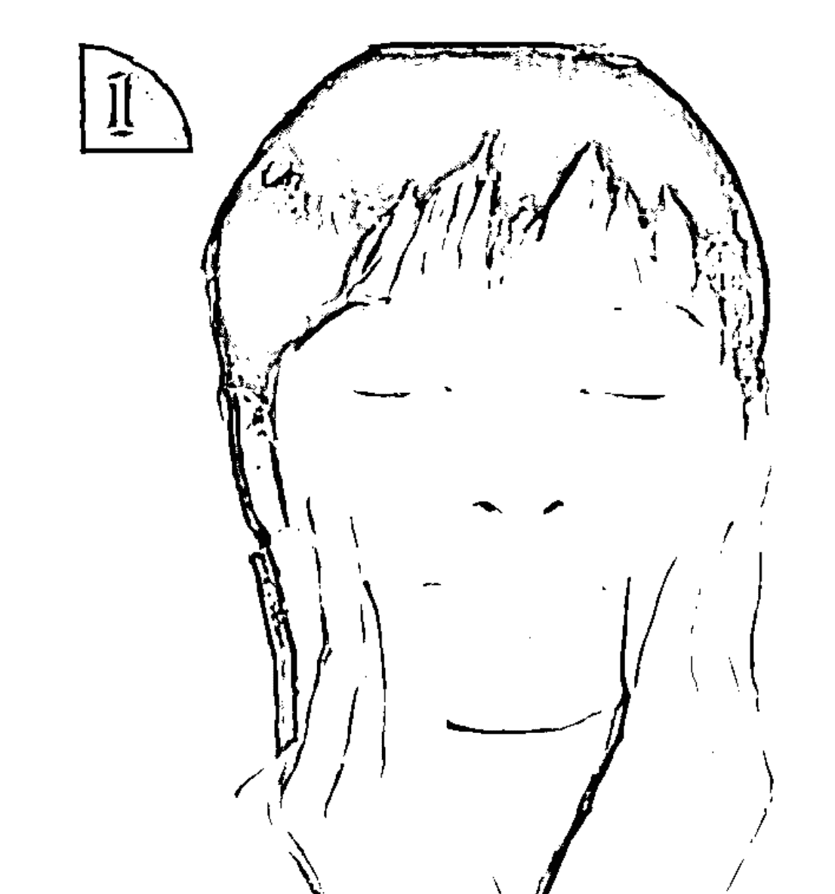

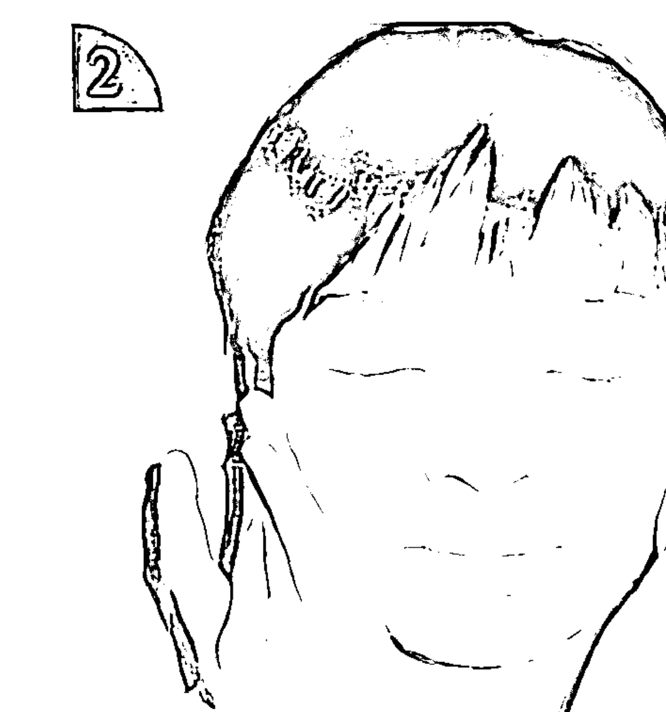

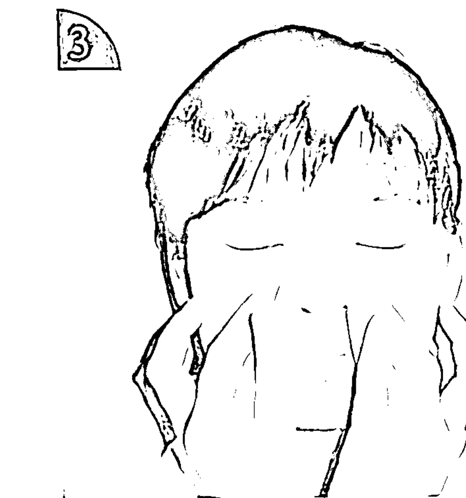

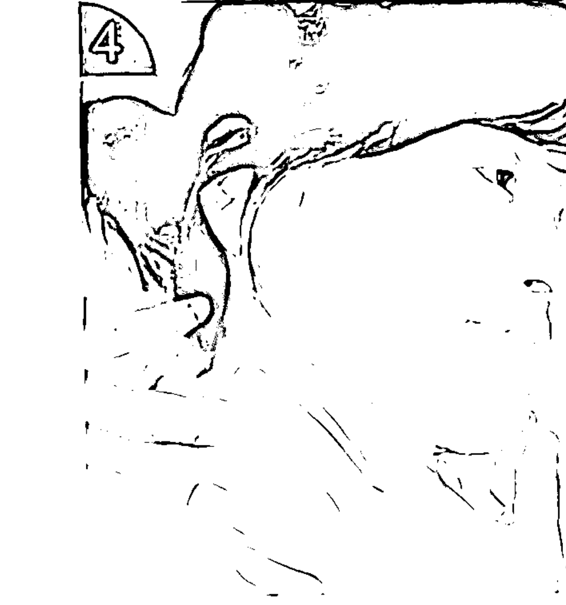

### 单元三 胸部精油自我按摩

完美胸部是女人心中永远的期待，通过精油按摩可以实现胸部塑形的目的。

#### 一、精油选用

参照专业丰胸按摩的精油配方，根据自己的喜好和身体状况进行调配，也可购买适用于丰胸按摩的复方精油。

#### 二、紧实胸部按摩手法

在手上倒少量调好的按摩油（或者直接滴在胸部），然后均匀涂抹在胸部。按摩过程中如果感到不够滋润，可随时再加少量按摩油。按摩手法可以分四步进行。

1.  虎口张开，从两侧胸部的外侧向中央推，以防胸部外扩，每侧30下。
2.  手保持同样的形状，从左胸开始。左手从外侧将左乳向中央推，推至中央后同时用右手从左乳下方将左乳向上推，要一直推到锁骨处。也就是两只手交错着推左乳。重复30次以后换右乳。
3.  手成罩子状，五指稍分开，稍稍弯曲，双手罩住乳房后从底部（不是下部）向乳头方向做提拉动作。重复20次。
4.  双手绕乳房做圆周形按摩，按摩至胸部精油全部吸收为止。

#### 三、点穴丰胸按摩手法

1.  以双手手指圈住整个乳房周围组织，每次停留3秒钟。指压时搭配以下穴位进行精油按摩，每次压5秒，1次进行5～6个回合。

    *   膻中穴：两乳头连线正中。
    *   乳根穴：两乳头下肋间隙，平第5肋间隙。
    *   天溪穴：乳头外2寸，平第4肋间隙。

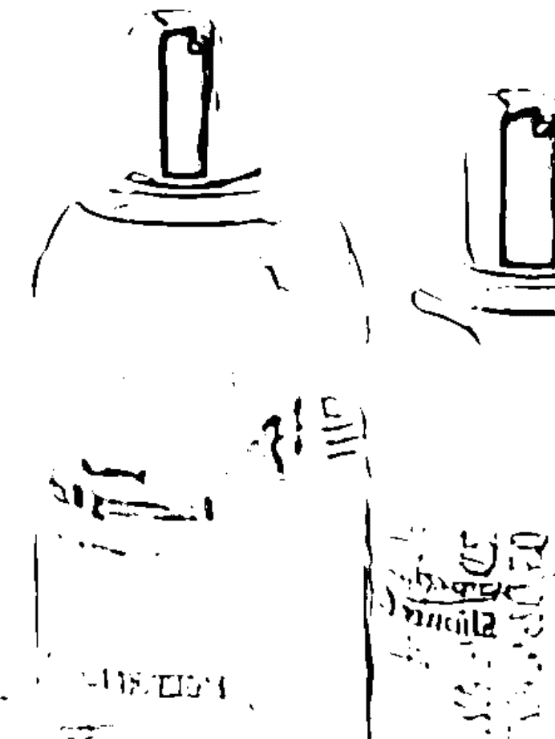

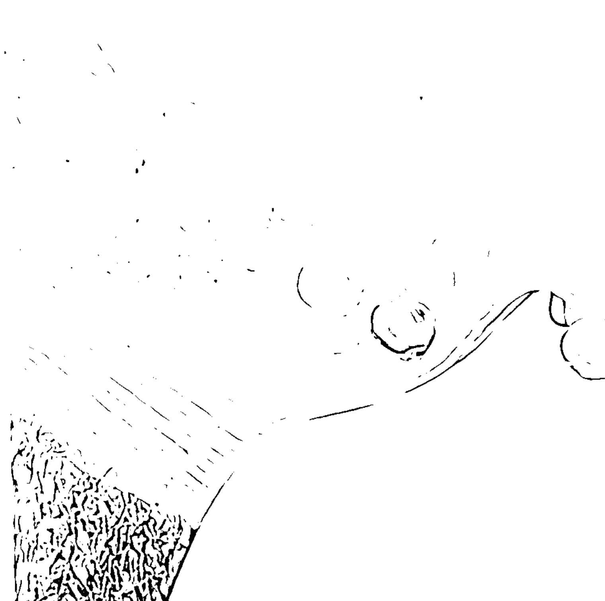

2.  双手张开，分别由乳沟处向下平行按压，直至乳房外围。
3.  在双乳间做横“8”字形按摩。

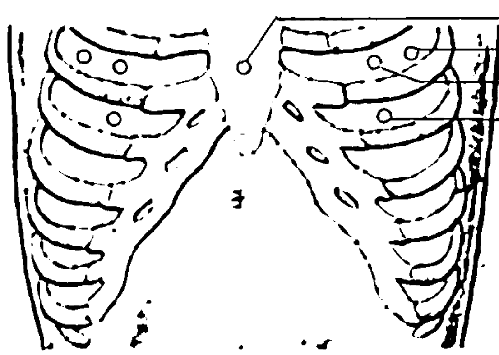

膻中：两乳头连线正中，平第4肋间隙
天溪：乳头外2寸，平第4肋间隙
乳中：乳头正中
乳根：乳头下一肋间，平第5肋间隙

胸部腧穴

#### 四、整理提拉按摩手法

1.  从乳房中心开始画圈，向上直到锁骨处。
2.  从乳房外缘开始，以画小圈方式做螺旋状按摩。
3.  两手掌轻轻抓住两边乳房，向上微微拉引，但是别太用力。

### 单元四 周身精油护理

精神紧张、身体疲劳是当今社会十分普遍的“文明病”，日久会导致体内激素分泌失衡而引发一系列症状。建议在闲暇的周末，在轻音乐的旋律中，调配好适合自己的芳香精油，尝试这一套行之有效的自我按摩疗法。

#### 一、精油选用

周身护理可灵活选用精油配方，可根据自己的喜好和身体状况选用适合的精油配方。可以在不同的心情下选用不同的配方，为自己营造温馨的芳香护理氛围。

#### 二、周身精油护理方法

##### 1. 沐浴

先在浴缸中放入活血通经的中药或相应的精油，浸泡15～20分钟。也可选择淋浴，沐浴时轻轻按摩胸部和背部，将适合自己的精油涂于施术部位。

##### 2. 按摩护理

1.  多指轻轻按揉额部，并用手指按揉眼角和太阳穴3～5分钟，可消除精神紧张性头晕、头痛及眼部酸困不适（图1）。
2.  两手搓热，手掌成勺状，扣压在睁开的双眼上，每次5分钟（图2）。
3.  梳头养神 双手五指分开置于前发际，由前向后梳理头皮，有助于缓解脑部疲劳，改善脑部血液循环（图3）。

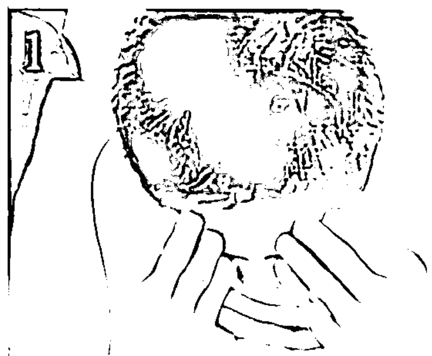

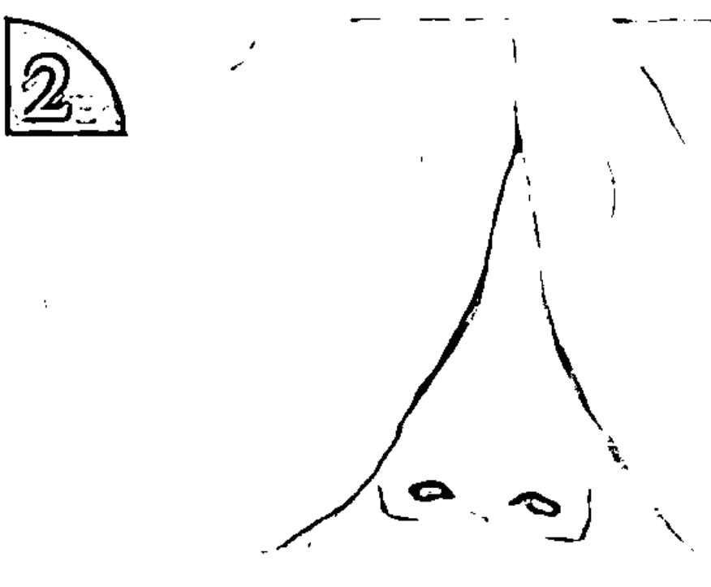

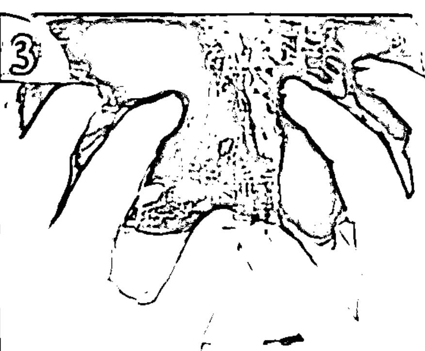

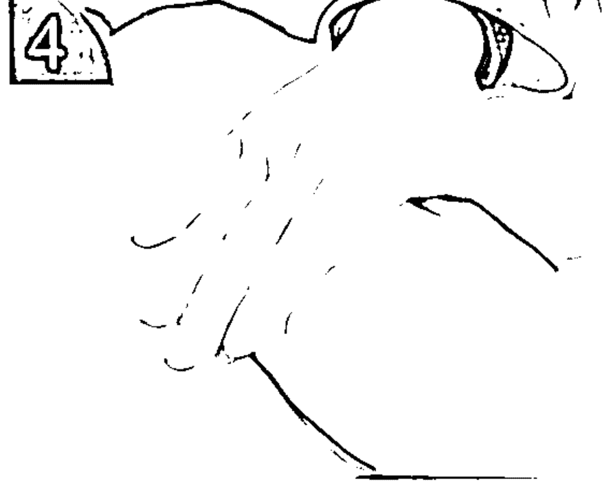

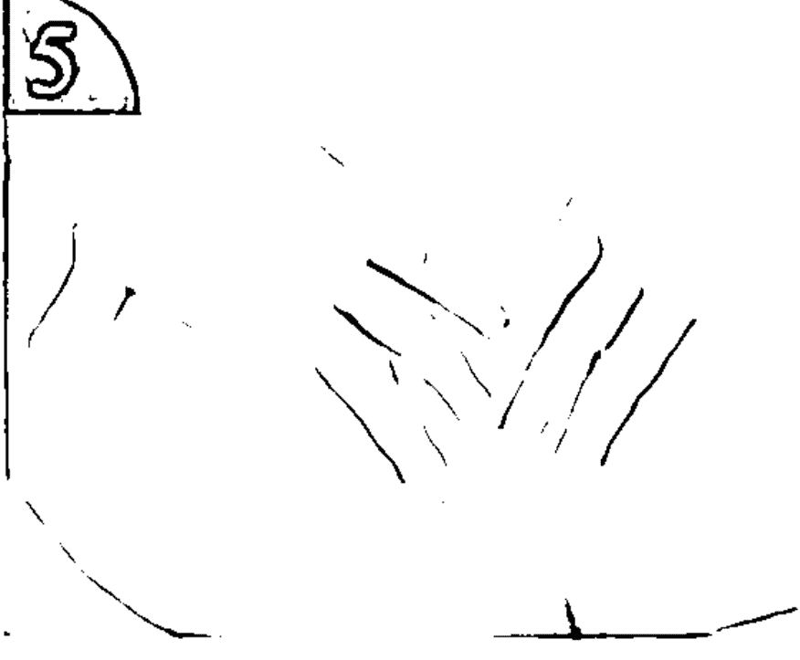

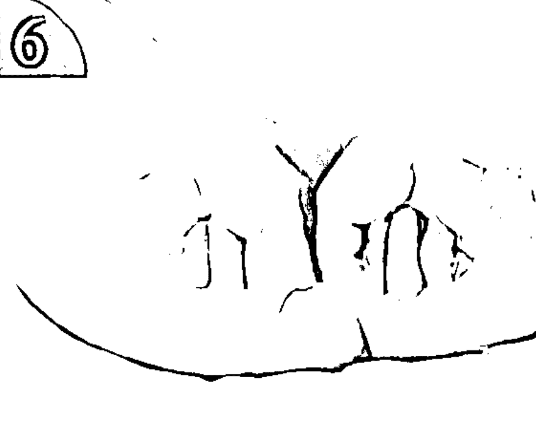

4.  摩腹健胃 双手掌顺时针摩揉腹部，至发热为度，可促进消化与吸收，可有效改善和治疗慢性胃肠功能紊乱（图4）。
5.  搓腰养肾 双手掌掌心或空拳置于腰部两侧，并快速擦动至腰部发热（图5，图6），可促进肾部血液循环，缓解劳损、各种损伤所致的腰痛。
6.  坐位 先用双拇指在双脚底由内而外、由上而下地揉按，按摩整个脚底，然后轻轻捶打小腿和大腿肌肉，重点捶打小腿外侧。

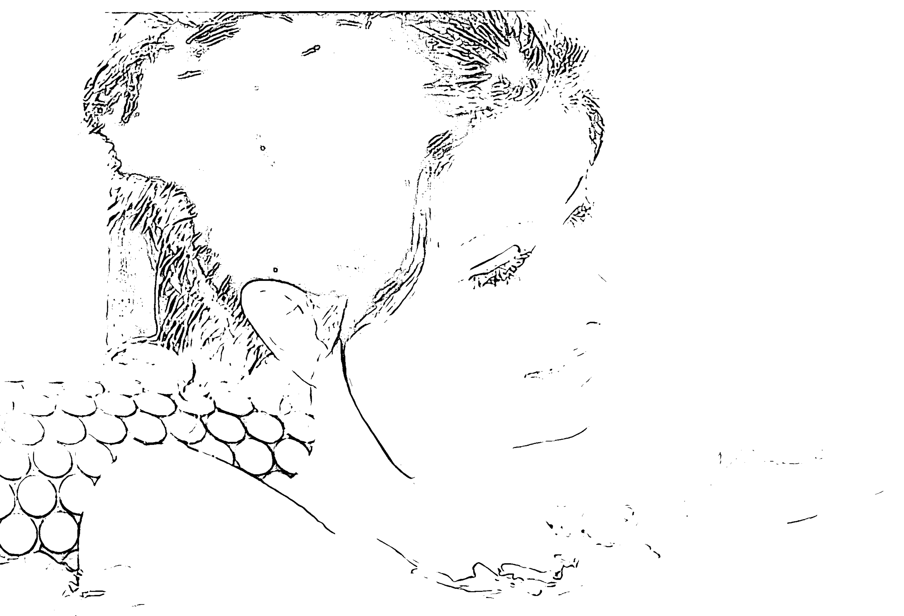

### 单元五 手、足精油护理

#### 一、手部精油护理

手部和足部一样，也是全身组织器官的缩影，按摩手部可有效改善全身血液循环，促进身体各组织器官的功能，从而达到保健养生的目的。

##### 家庭精油护手DIY配方

1.  成分 薰衣草1滴 +甜橙1滴 +甜杏仁油10ml。
2.  功效 补充手部水分、营养，嫩白手背肌肤，淡化手部细纹，软化硬皮，柔软手部肌肤，令指甲粉嫩光亮。
3.  使用方法
    *   晚上清洁手部后取5ml精油做手部按摩，每周2～3次。
    *   取2～3滴于护手霜中，混合后每天涂抹手部。

##### 手部按摩护理

将手在37～40℃温水（或者活血通经药物配成的药液）中浸泡10分钟，用毛巾轻轻擦干，将适合自己的精油均匀地涂于双手上，按摩步骤如下。

1.  先两手对搓至发热。
2.  拇、示指相对，依次由上而下推理指缝，以有酸胀感为佳，手指缝处为经脉循行路线，应重点进行按揉（图1）。本法不仅可以改善气血运行，还可有效改善面部气色，去除倦容和晦暗。
3.  拇指揉摩掌心劳宫穴，至发热为佳（图2）。
4.  掌心向上，以另一手拇指由近至远推手掌至指尖，手指为联系心、肺等重要器官的经脉所过之处，是非常重要的改善心脏功能的方法（图3）。

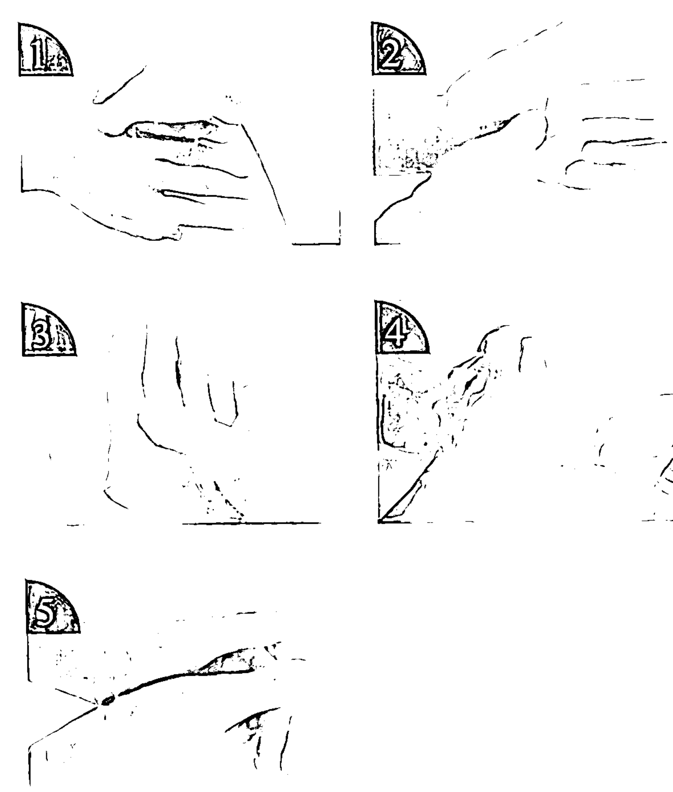

5.  轻轻叩打前臂至手部，先内侧，再外侧，可使手部经络气血更为通畅（图4）。
6.  五指张开，相互叉叩，至手部发热（图5）。

两手交替施术。按摩结束后，取精油调配好的护手霜涂于手部，可佩戴护手专用手套，效果更佳。

#### 二、足部精油护理

千里之行始于足下，其重要性被喻为人体的第二心脏。按摩足部可促进足部血液循环，改善全身各组织器官的功能状况，对许多慢性疾患具有较好的康复作用，同时不断提高身体健康水平。

##### 1. 足浴

祖国医学认为，人体的五脏六腑在足部都有相应的投影，是足三阴经的起始点，又是足三阳经的终止点，踝关节以下就有60多个穴位。如果经常用热水泡脚，可刺激足部穴位，增强血脉运行，调理脏腑，舒通经络，增强新陈代谢，从而达到强身健体、祛除病邪的目的。

足浴时，水的温度一般保持在40℃左右，水量以能淹过脚踝部为好，浸泡10～15分钟，在水中可以滴几滴茶树精油，再加2～3勺浴盐，对于脚气、汗脚会很有帮助，还可解除疲劳。另外，还可以针对性地选用一些药物进行足浴。

1.  感冒 感冒初起，临睡前用生姜煎水洗双脚，疗效显著。
2.  顽固性膝踝关节麻木痉挛 可用白果树叶适量，加入热水煎煮20分钟后，泡洗双脚，有辅助治疗作用。
3.  神经衰弱等症 将红花、川椒各5克，荷叶心8个，加入热水中泡洗双脚，对于神经衰弱、足部浮肿、尿频、眩晕等病有治疗效果。
4.  脚癣、脚汗过多 将山西老陈醋50ml、苦参30克、花椒15克放入热水中，洗脚2～3次见效，7次可收到理想的效果。此方对于甲癣、脚臭也有显著疗效。

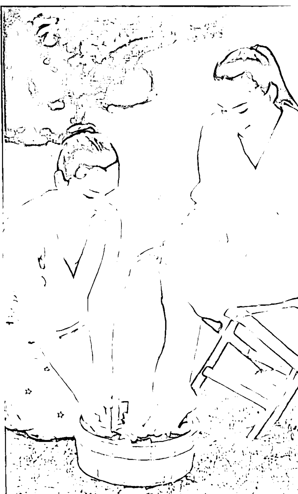

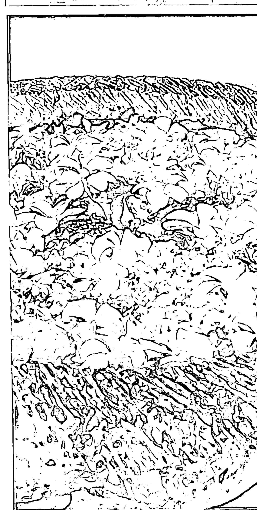

##### 2. 足部精油按摩护理

足浴后用毛巾轻轻擦干双足，再取适合自己的精油均匀涂于双足上，按摩步骤如下。

1.  先将精油均匀按摩至全足，并以手将足底搓热。
2.  双拇指按揉足心，足心为肾经涌泉穴所在之处，又是肾的足部反射区，是一个非常重要的保健穴位，可在此处进行重点按揉（图6）。
3.  仔细按揉每一个脚趾，大脚趾为人体头部反射区，其余四趾为眼、耳等重要器官的反射区，按揉脚趾具有非常好的清脑明目的功效（图7）。
4.  单手握拳，用指背关节由前向后刮足底20～30下，对消化系统有很好的保健作用（图8）。
5.  双手交替由足跟向足尖推揉足弓内侧20～30下（图9）。
6.  手握空拳叩击足底及足内侧（图10）。
7.  双手自内、外两侧由上而下握挤足部数遍（图11）。
8.  两手夹住足部并对搓，以发热为佳（图12）。
9.  双手十指相扣，在小腿前面胫骨两侧往返擦数遍，同时叩打小腿内外侧（图13）。

精油按摩以足部反射区理论为基础，关系到体内的组织和器官，在按摩过程中可饮用300～500ml茶水或清水以排出体内毒素。

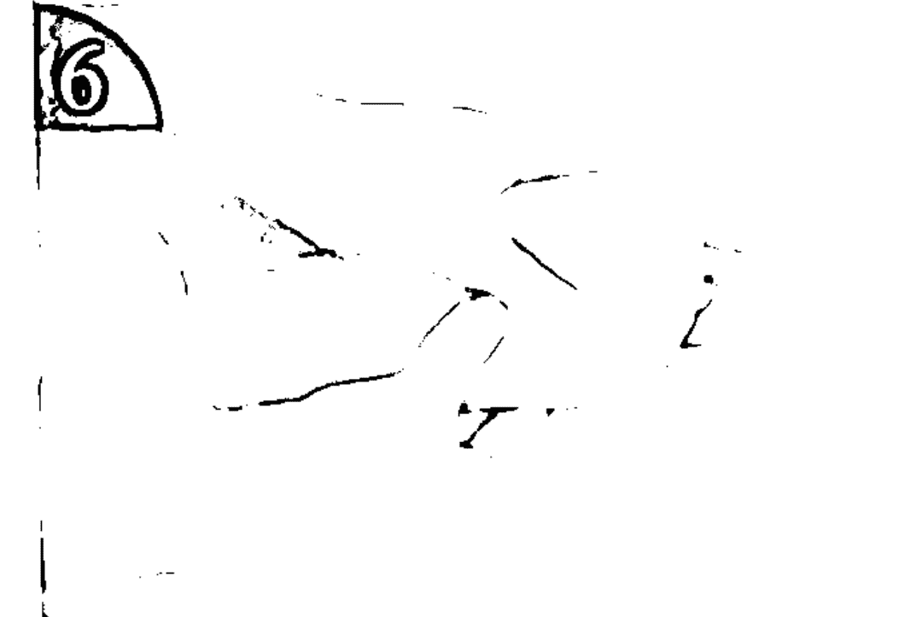

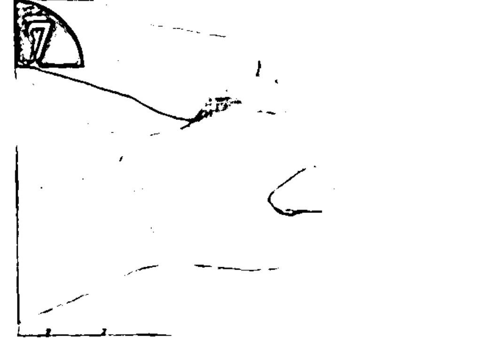

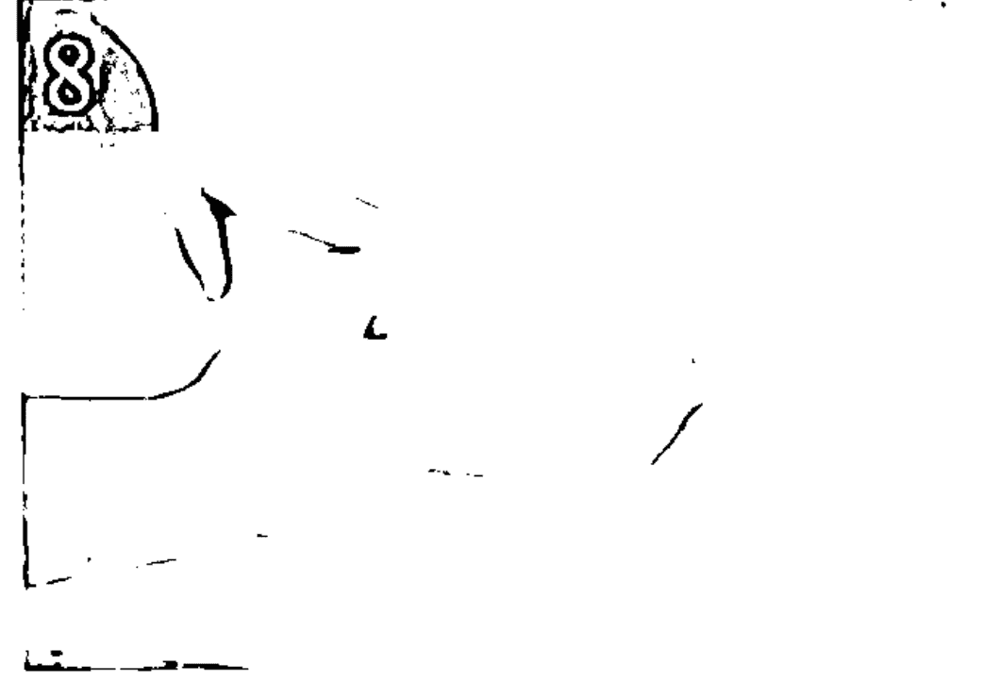

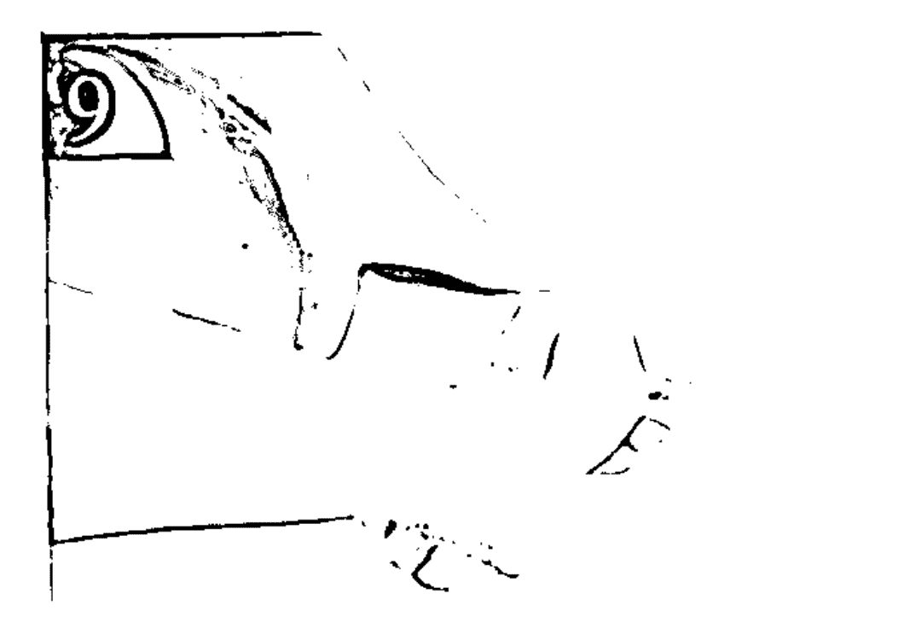

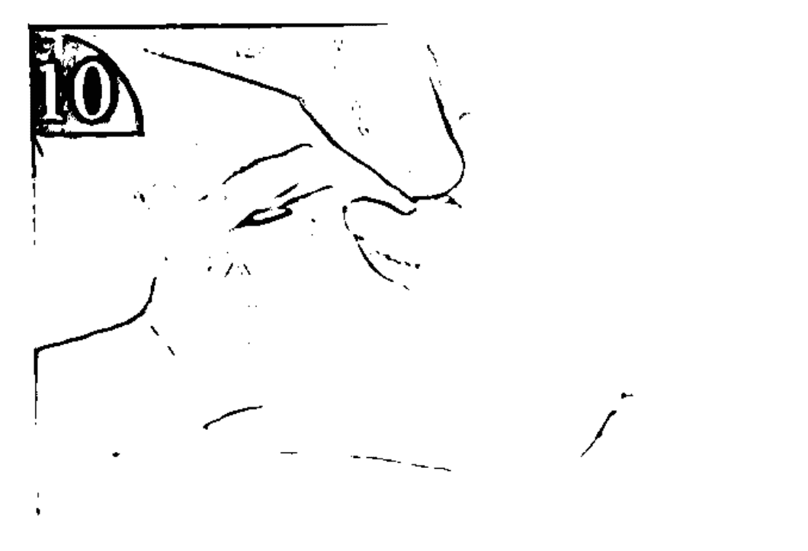

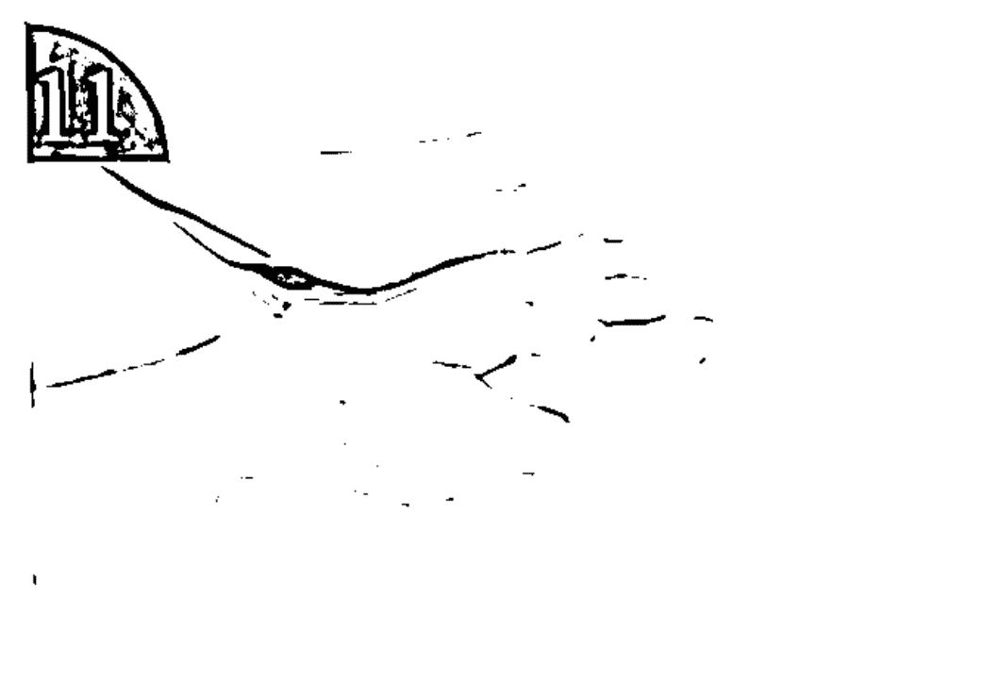

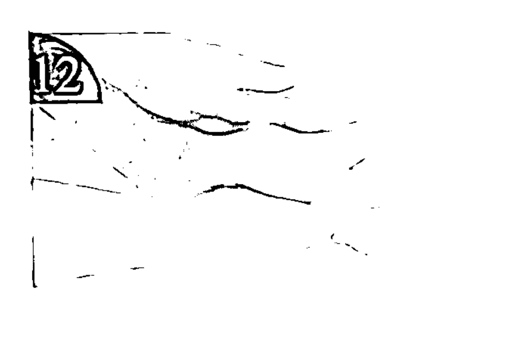

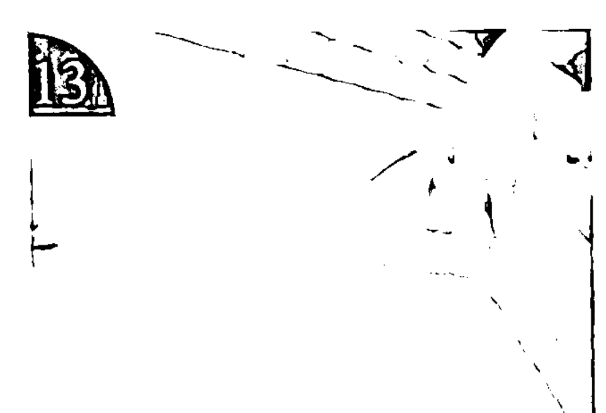

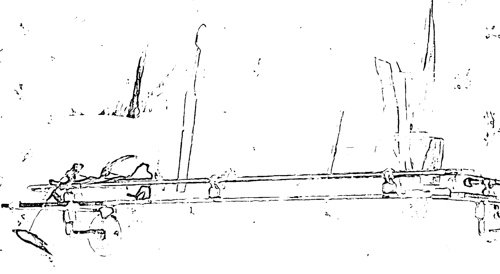

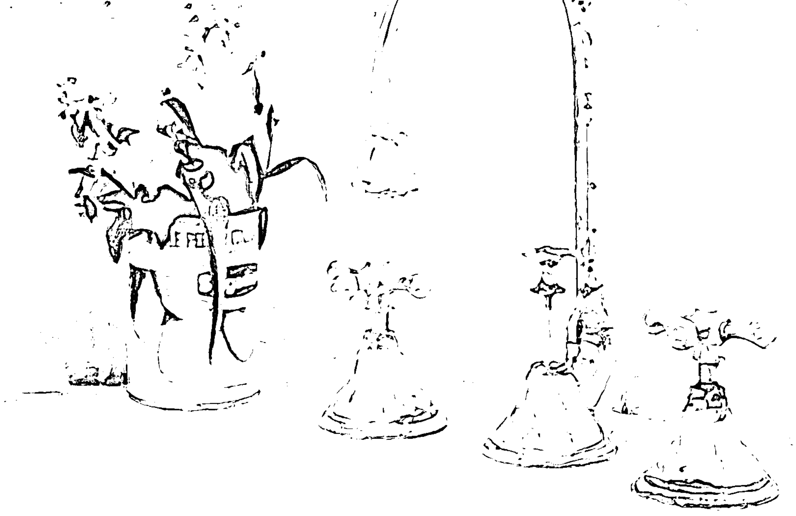

### 单元六 夫妻精油护理

如果夫妻之间的性生活不协调，女性多半会出现性冷淡，而男性大多会有不能持久、不举、阳痿等现象。精油有放松及催情的作用，所谓HOME SPA就是借泡澡、熏香、按摩等方法让身体放松。如果夫妻一起进行精油护理可以增加彼此间的亲密程度。

#### 一、精油配方

在如何选择适合自己的精油方面，专家解释，能缓解压力、增加情趣、具有催情效用的香味多半是从花中萃取的。但适合女性的精油与适合男性的精油又各有不同。

##### 适合女性的精油

适合女性的精油有天竺葵、玫瑰、佛手柑等。性冷淡的女性可以加少量依兰，有催情作用。其中，玫瑰为花后，是女性用油。

##### 适合男性的精油

适合男性的精油有茉莉、檀香、依兰、佛手柑等。依兰、佛手柑男女均适合应用。依兰香味特殊，男性比较喜欢，男性香水多有此成分；而佛手柑有扩散作用，可让所有的香味更浓郁。

上述精油可以用来熏香、泡澡及按摩，也可在夫妻约好的时间两人在家进行HOME SPA。正确的顺序是先点熏香，再放水共浴，接着帮对方按摩。可放松情绪，增加床第之间的和谐。

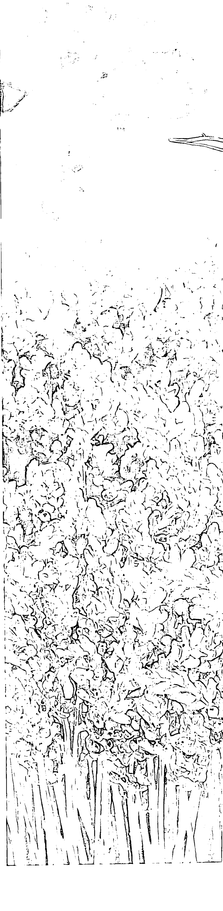

#### 二、沐浴

夫妻间可共浴以营造气氛，并滴加具有催情效果的精油，更能借香气以增加情调。

将上述精油滴在浴缸里，浓度可依个人的喜好来调配。不过依兰不要滴太多，以免头昏。玫瑰及天竺葵价格较高，也不要滴太多，约15滴即可。再加入一小匙鲜奶，水约放六七分满，其高度不要超过心脏位置，水温37～39℃。

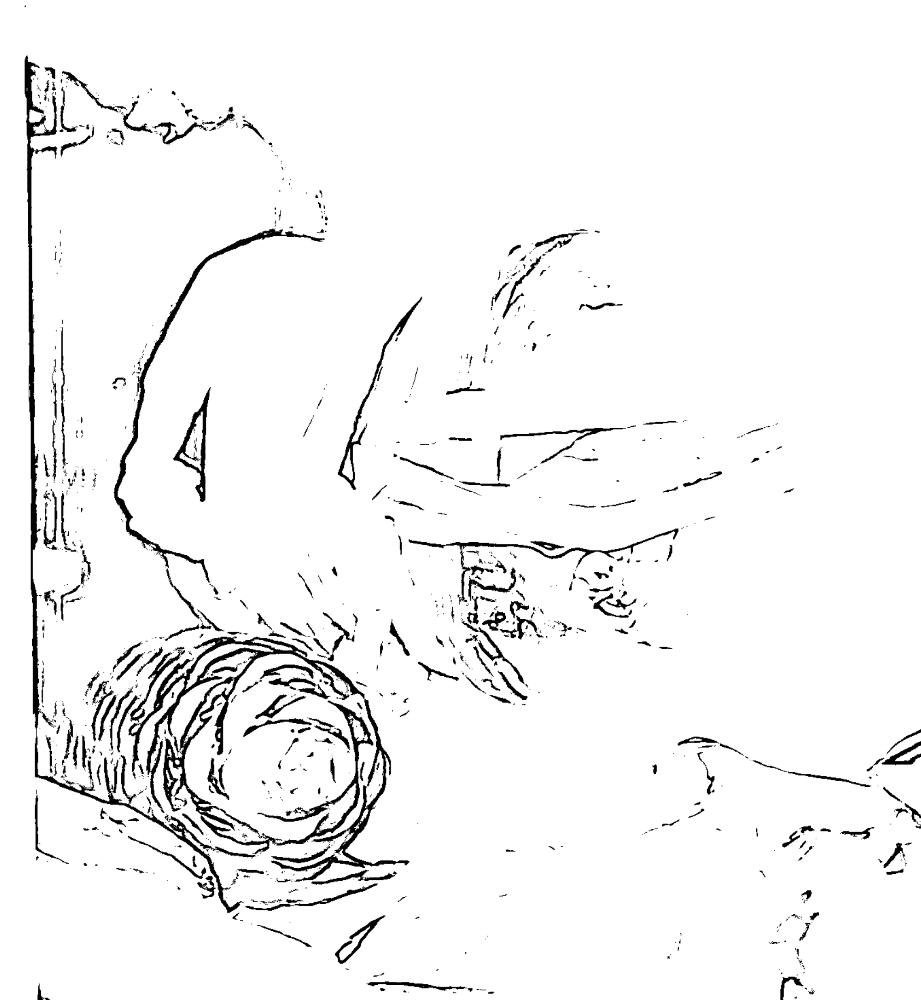

#### 三、按摩操作程序

1.  首先受术者取俯卧位，操作者用双手掌轻抚对方背部肌肤，后在手上蘸取调配好的精油涂抹其背部，根据具体情况可以坐在对方臀部或者跪坐在一侧进行操作，操作时身体前倾使双手前臂能够大范围抚摸整个后背，双手掌由腰骶部上推至颈肩部再顺势从胁肋两侧带下，如此循环往复数次，使精油在背上均匀散开并充分吸收，按摩时注意要有节奏感地重复按揉腰骶部位，重点搓揉脊柱两侧，这样可以较好地消除疲劳和精神压力。
2.  双手手掌由下背部向上背部逐渐游移按摩，至肩颈部改用虎口拿揉肩和脖颈部位，并重复加强此动作，此法用意在于促进全身特别是脑部血液循环，兴奋神经中枢。

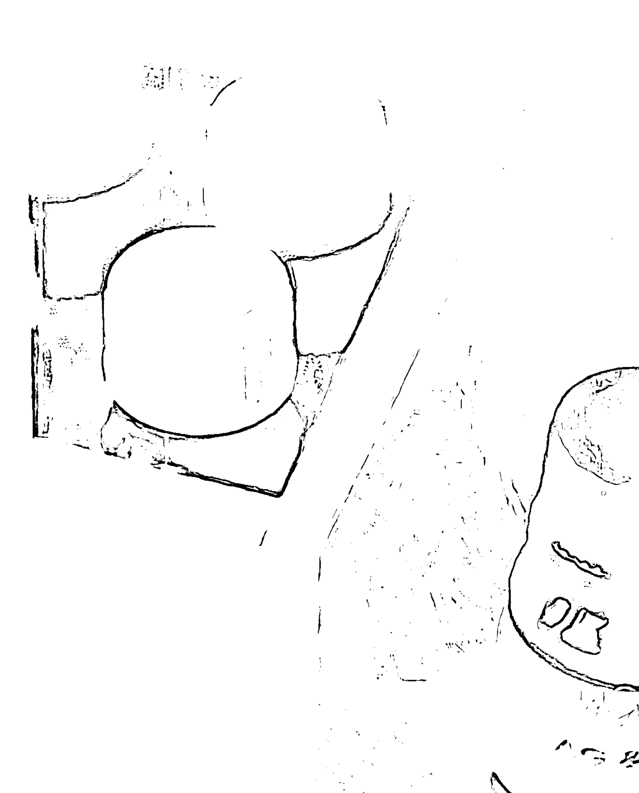

3.  双手掌从肩颈部移向手臂，反复推按下压对方整个手臂3～5遍，最后停留在对方手心，用手指按摩，这种按摩不仅会使对方产生舒适感，也是进行更深一层接触的开始。
4.  按摩对方双腿，按摩时两手同时操作一侧，做完后再换做另一侧；首先用双手掌大范围按摩整个臀部，逐渐增加力度，然后将对方小腿抬起放在自己身上，从脚踝一路推按至大腿、臀部。操作者也可以取坐位或立位用脚代替手操作，更增添效果。
5.  最后受术者翻身取仰卧位，操作者将对方头部放在自己大腿上，在其前胸与腹部涂抹精油，以双手掌轻轻在对方肩颈处及胸部四周来回抚摸，并可向下游移至腹部甚至耻骨处进行按揉，抚摸的同时应让按摩方式更多变化，以增加情趣，但要注意轻、缓、柔和的原则。

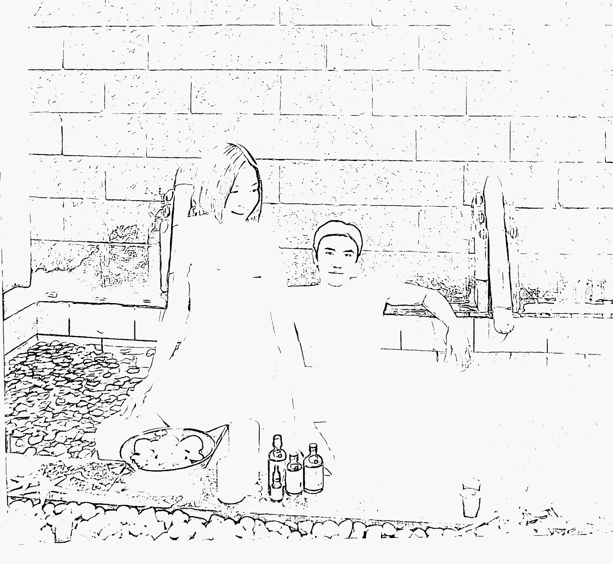

- 淋巴排毒 精油丰胸
- 卵巢保养 精油刮痧
- 香薰瘦脸 手足护理
- 精油瘦身 周身护理
