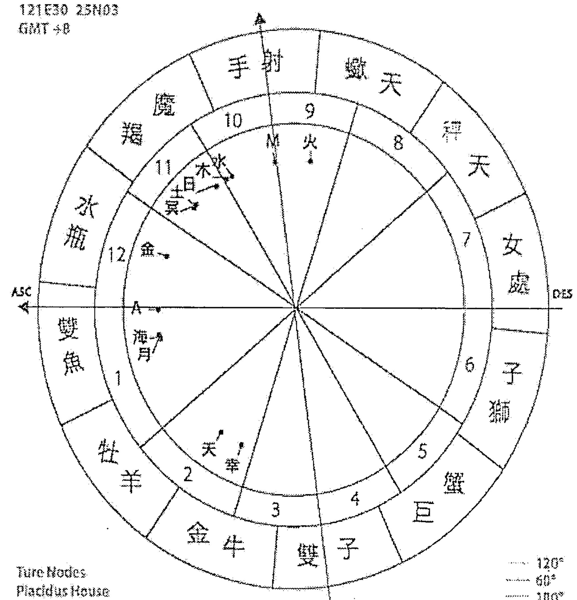
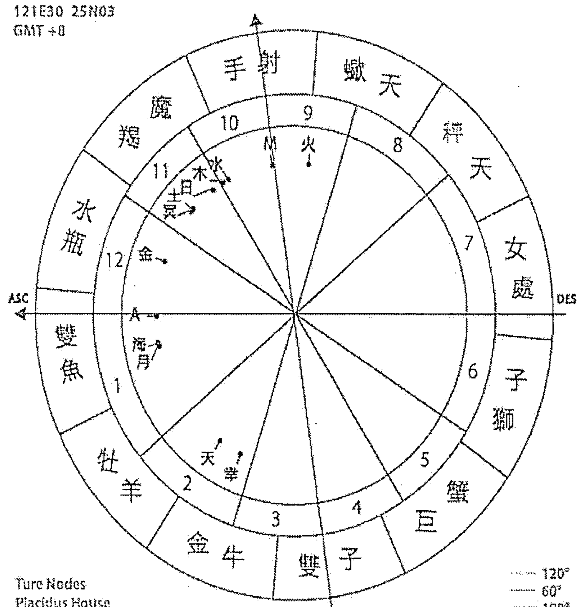
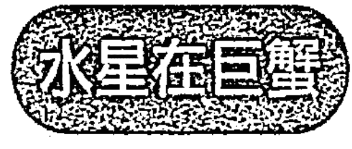
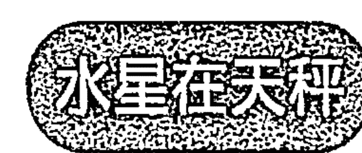
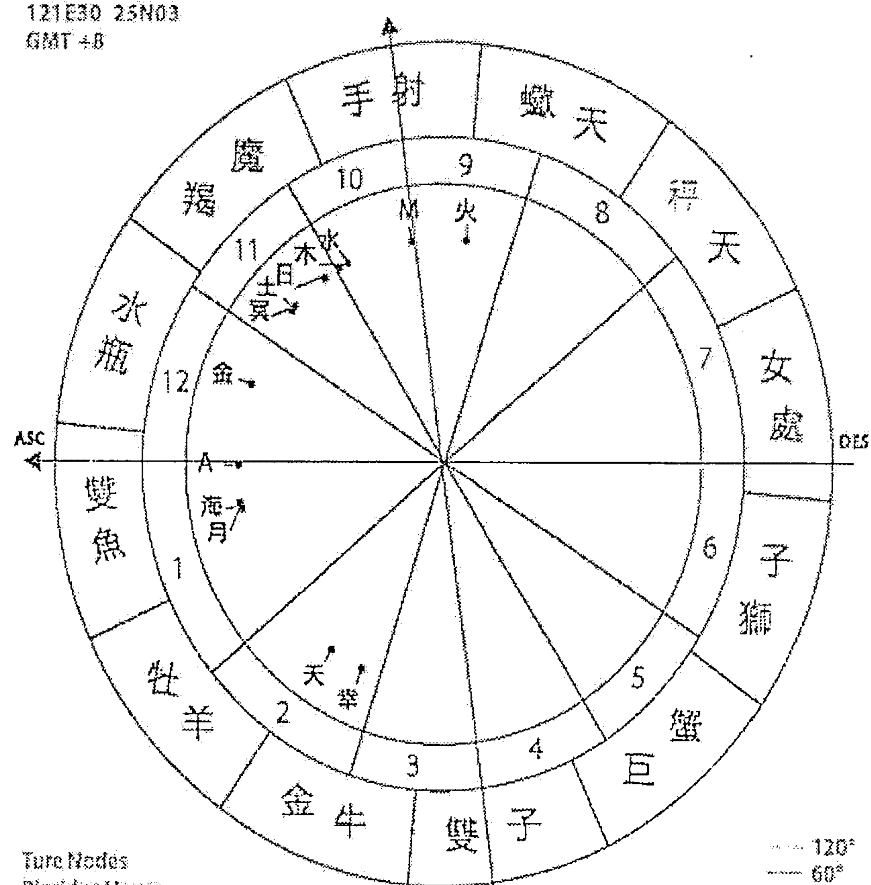
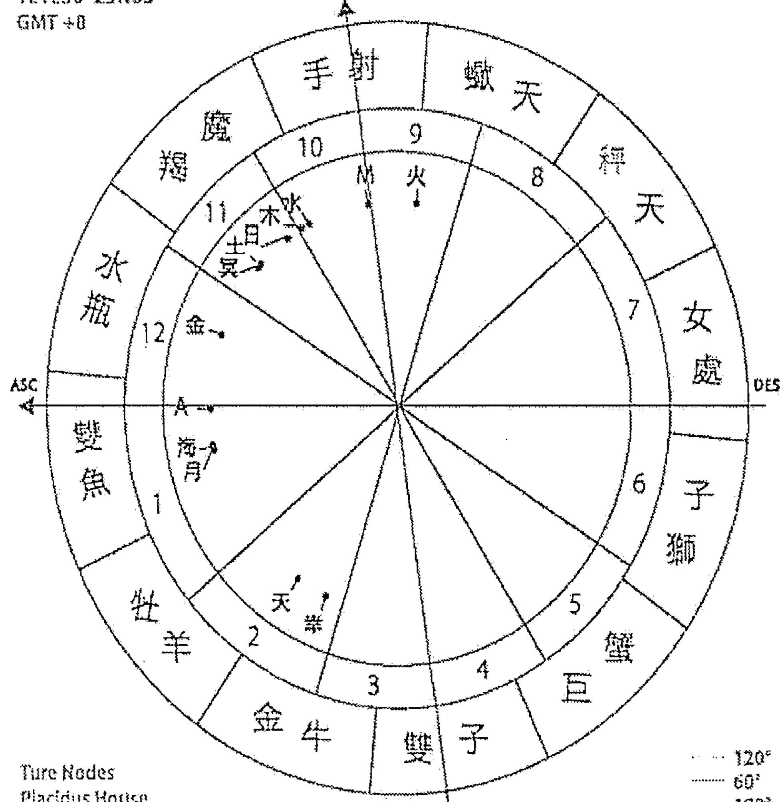
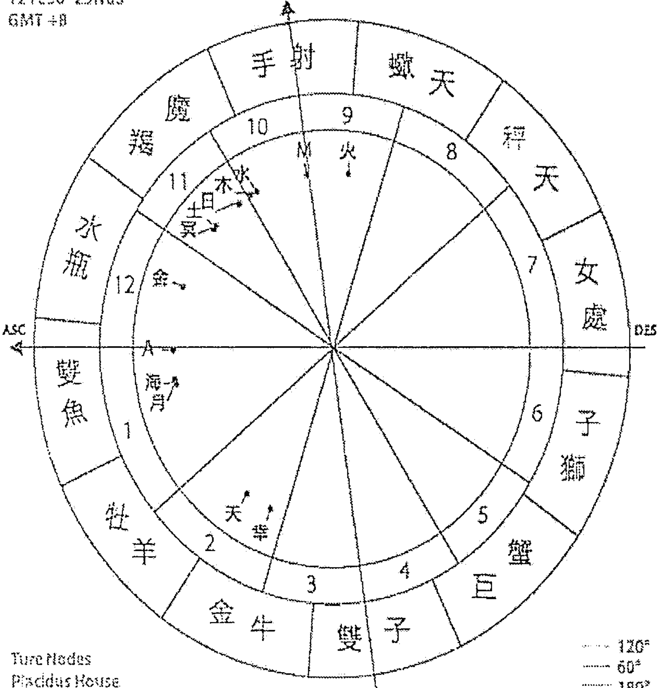
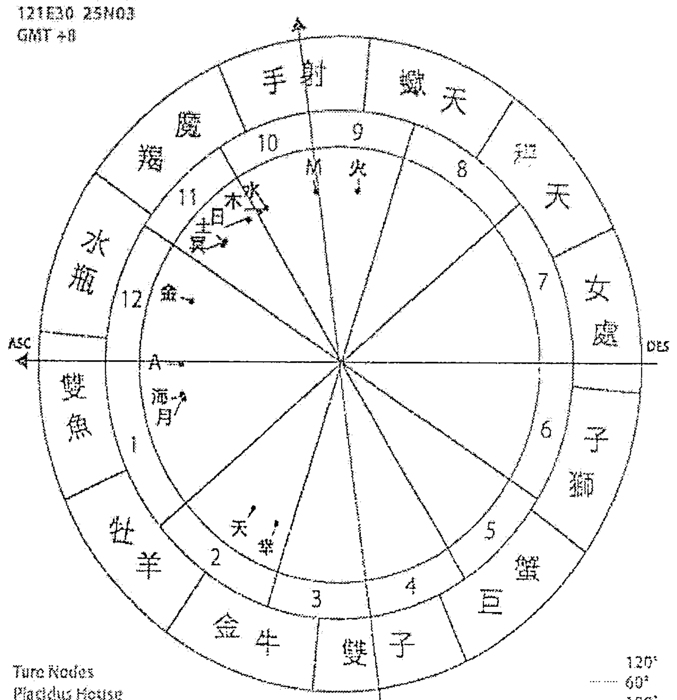
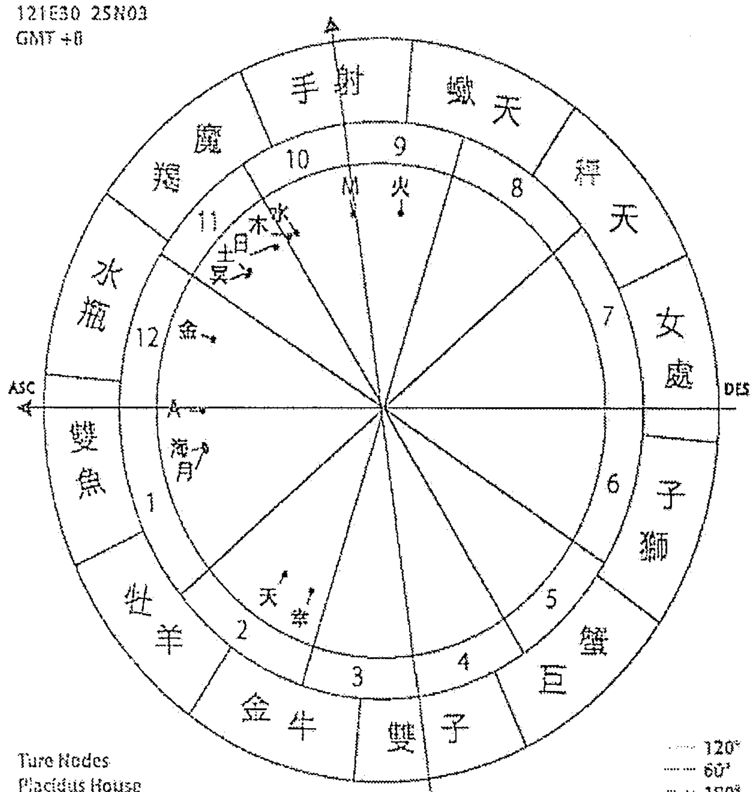

# ASTROLOGICAL GUIDE TO WORK

# 上班风水

# 职场风水

# 王用

## 占星工作指南

## 上生职场手册

## 编者的话

## 出版缘起

兴趣广泛、身份多元的知名文化人韩良露，除了大家熟知的作家、媒体人及文化推动者身份之外，她也是艺文圈中最受重视的占星学大师。二○○三年起她在金石堂金石书院（现龙颜讲堂）开设占星课程，由于口耳相传、好评不断，课程一直持续到二○一○年才划下休止符。

南瓜国际从二○一六年起，陆续将多年来数量庞大的上课录音及相关资料，整理成为系列书籍。

随着占星越来越受到大众重视，查询本命星图早已不再是难事，针对占星初学者，南瓜国际推出「Handbook」书系，从如何打出一张本命星图开始，一步一步教大家进入占星学的美妙世界。

## 序 工作对人生有益

在现代生活中，「工作」恐怕是每个人最关心的议题，主要原因在于现代人的工作时间都很长，即使下了班，脑子里头想的也常常都是工作。每年年底一定有很多人起心动念想着要不要跳槽，相较之下，大家虽然也会为爱情或婚姻烦恼，但它们不会像工作这么随时令人烦心。

想要探讨工作与职场生活的议题，首先可以观察六宫。六宫一般被视为工作宫与健康宫，它涵盖了所有维持生活运作的相关事物。其中最重要的当然是上班，上班不但提供了我们的金钱所需，它也是大部分人维系正常生活的动力——从一早因应上班时间而起床，在办公室里头跟同事相处，一直到下班后回家，这个周而复始的过程，让很多人的生活得以规律运作。以前听过很多人一旦退休在家，生活就失去了重心，反而失去了活力，由此可见六宫的规律对人的重要性。但六宫并不局限于工作，我们每天起床之后要刷牙洗脸，该做的家事要做，这些也都属于六宫范畴。

以平均分宫制来看，六宫工作宫会跟二宫金钱宫、十宫事业宫形成一百二十度和谐相，二宫中有星的人喜欢赚钱，六宫中有星的人喜欢工作，十宫中有星的人喜欢出名，这三件事情彼此和谐，可以彼此互助。六宫是每天日常生活要做的例行公事，十宫是站在众人目光下的事业舞台，本书将为大家仔细探讨六宫与十宫这两个宫位有星的生命情境，至于二宫金钱宫的议题，在前作《占星财富手册》已有详细描述，本书不再细谈。

此外，我们也为大家解析水星、智神星、木星与土星这四颗跟职场生活特别相关的行星。水星是个人的心智能力，智神星是我们与他人沟通时的心智能力，从一个人的水星落在的星座、宫位，可以看出这个人在心智沟通上有什么特质，适合从事什么性质的工作，而从智神星中，可以看出这个人在与人沟通时有什么样的特质，因而可以从智神星的星座、宫位，可以看出这个人适合怎样的职场环境。木星与土星是社会星，这两颗星也对职场生活很重要。木星是社会资源，从木星可以看出一个人在什么样的领域可以遇到贵人与好事，而土星代表了社会现实，从土星可以看出一个人在什么领域会受到现实的打击，进而对这些领域格外审慎、格外看重。

在六宫与十宫的职场互动中，我们领悟到社会责任对生活的重要，从水星与智神星中，可以看出个人思考模式与职场沟通模式会有的差异，从木星与土星中，我们藉由木星的社会资源而春风得意，又从土星的现实中找到人生之锚。整个星图的设计，让我们的人生朝着不同阶段不断的前进。

注 本文依据二○○七年相关课程录音整理而成。

## 目录

序 工作对人生有益

Chapter 1 教你看懂星图：行星、星座、宫位、相位

Chapter 2 水星星座的思考与表达能力

- 水星在牡羊
- 水星在金牛
- 水星在双子
- 水星在巨蟹
- 水星在狮子
- 水星在处女
- 水星在天秤
- 水星在天蝎
- 水星在人马
- 水星在摩羯
- 水星在宝瓶
- 水星在双鱼

Chapter 3 水星宫位的职业倾向

- 水星在一宫
- 水星在二宫
- 水星在三宫
- 水星在四宫
- 水星在五宫
- 水星在六宫
- 水星在七宫
- 水星在八宫
- 水星在九宫
- 水星在十宫
- 水星在十一宫
- 水星在十二宫

Chapter 4 智神星的职场生活

- 智神星在牡羊
- 智神星在金牛
- 智神星在双子
- 智神星在巨蟹
- 智神星在狮子
- 智神星在处女
- 智神星在天秤
- 智神星在天蝎
- 智神星在人马
- 智神星在摩羯
- 智神星在宝瓶
- 智神星在双鱼
- 智神星在一宫
- 智神星在二宫
- 智神星在三宫
- 智神星在四宫
- 智神星在五宫
- 智神星在六宫
- 智神星在七宫
- 智神星在八宫
- 智神星在九宫
- 智神星在十宫
- 智神星在十一宫
- 智神星在十二宫

## Chapter 5 维持生活正常运作的六宫

- 太阳在六宫
- 月亮在六宫
- 水星在六宫
- 金星在六宫
- 火星在六宫
- 木星在六宫
- 土星在六宫
- 天王星在六宫
- 海王星在六宫
- 冥王星在六宫

## Chapter 6 站在社会舞台上的十宫

- 太阳在十宫
- 月亮在十宫
- 水星在十宫
- 金星在十宫
- 火星在十宫
- 木星在十宫
- 土星在十宫
- 天王星在十宫
- 海王星在十宫
- 冥王星在十宫

## Chapter 7 社会带来的资源 —— 木星星座宫位

- 木星在牡羊
- 木星在金牛
- 木星在双子
- 木星在巨蟹
- 木星在狮子
- 木星在处女
- 木星在天秤
- 木星在天蝎
- 木星在人马
- 木星在摩羯
- 木星在宝瓶
- 木星在双鱼
- 木星在一宫
- 木星在二宫
- 木星在三宫
- 木星在四宫
- 木星在五宫
- 木星在六宫
- 木星在七宫
- 木星在八宫
- 木星在九宫
- 木星在十宫
- 木星在十一宫
- 木星在十二宫

## Chapter 8 社会带来的制約 —— 土星星座宫位

- 土星在牡羊
- 土星在金牛
- 土星在双子
- 土星在巨蟹
- 土星在狮子
- 土星在处女
- 土星在天秤
- 土星在天蝎
- 土星在人马
- 土星在摩羯
- 土星在宝瓶
- 土星在双鱼
- 土星在一宫
- 土星在二宫
- 土星在三宫
- 土星在四宫
- 土星在五宫
- 土星在六宫
- 土星在七宫
- 土星在八宫
- 土星在九宫
- 土星在十宫
- 土星在十一宫
- 土星在十二宫

## Chapter 1 教你看懂星图：行星、星座、宫位、相位

1 请进入占星之门，或直接以网址 astrolbo.com 进入首页

在首页右上角
登入 微信 脸书 选单 ▼
点选「选单 ▼」

2 进入输入出生资料页面

STEP1 请输入国历出生时间
西元 _____ 年 ___ 月 ___ 日

STEP2 请设定出生地点

ex.台湾 台北

3 当你填完资料之后，画面下方会有个下拉选单，点选「本命星盘」。

4 点选之后，就会进入本命星盘的页面。

- 星盘图片
- 行星位置
- 上升星座
- 星座比例

点开「星盘图片」的蓝色bar，就可以看到本命星图。

2020/01/01 10:00
121E30 25N03
GMT +8

True Nodes
Placidus House
Tropical, Geocentric

120°
60°
180°
90°

### 本命星图中的秘密

每一张本命星图都包含了星座、宫位、相位。

星座是行星展现能量的本质，宫位是行星会在怎样的领域展现能量，而相位是哪些行星之间会互相形成特定角度，进而有了对手戏，演出生命的情节。

如果用烧菜做比喻，行星落入星座就像是食材，食材是豆腐或是猪肉，这就是本质上的不同。宫位就像是烹调方式，要煮一个川味料理，或是糖醋口味，就会有不同的发挥。相位则是两个行星互相产生关联，香菇跟鸡一起煮成香菇鸡汤，或是凤梨跟虾做成凤梨虾球，这些都是不同的行星一起演出的情节。

当我们看行星落在什么星座，可先不看宫位与相位的红绿蓝线，看看「日」、「月」、「水」、「金」、「火」、「木」、「土」、「天」、「海」、「冥」对应到「牡羊」、「金牛」、「双子」……十二个星座中的哪一个星座。

十二星座的名称会随着各家翻译而略有不同，本书统一将「射手」统称为「人马」，魔羯统称为「摩羯」，水瓶统称为「宝瓶」。

●水星即水星，是太阳系中离太阳最近的行星，也是太阳系中最小的行星。水星的轨道周期为87.97天，是太阳系中公转最快的行星。

●火星是太阳系中第四颗行星，也是太阳系中第二小的行星。火星的轨道周期为687天，是太阳系中公转第二快的行星。

●金星是太阳系中第二颗行星，也是太阳系中第六大的行星。金星的轨道周期为224.7天，是太阳系中公转第三快的行星。

在占星学中，行星的位置和相对个人的性格和命运有着重要的影响。例如，水星代表思维和沟通，金星代表爱情和美感，火星代表行动和欲望。

### 本命星图中的宫位

所谓的「本命星图」，就是我们出生的时刻，从出生地点看到的星空。出生时往东方的地平线看过去的黄道坐标，称为「上升点」，俗称为「上升星座」。在出生之前，我们都是在宇宙中遨游的灵魂，当每个人诞生在地球上，出生时吸进地球的第一口气时，我们的灵魂就藉由上升点被钉在地球，展开了这辈子的生命旅程。

上升点是一宫的起点，它代表的是一个人来到这个世界的初始状态，它涵盖了一个人先天从父母接收到的基因，以及早年环境形塑出跟环境互动的基本态度，也就是这个人在最自然、放松状态时，会「像」什么样子。

从上升星座开始画出十二个宫位，十二个宫位分别代表了十二个不同的生命情境。

十二个宫位中有没有行星，代表这辈子当事人是否有缘去做相关的事。一个二宫金钱宫有很多行星的人，这辈子一定会有很多跟金钱有关的缘分；一个四宫家庭宫很多行星的人，这辈子一定会有很多跟家庭有关的缘分。

2020/01/01 10:00
121E30 25N03
GMT +8

True Nodes
Placidus House
Tropical, Geocentric

120°
60°
180°
90°

### 本命星图中的相位

所谓的相位，就是两颗（或两颗以上）的行星形成特定角度，最重要的四个相位为合相、九十度、一百二十度与一百八十度。当两颗行星产生相位时，这两颗行星的能量就会产生交互影响。合相会使这两颗行星力道加大。

一百二十度是和谐相，这个相位会让两颗行星的能量用和谐的方式互相帮助，容易激发出彼此的正面能量。

九十度跟一百八十度是负面相位。九十度带来冲突，一百八十度带来对立，这两个相位会引发出两颗行星彼此的负面能量，因此在本书中被称为「剋相」。

在占星之门中，一百二十度和谐相用绿线标示，九十度剋相用红线标示，一百八十度剋相用蓝线标示。在本书中，如果提到「好相位」，指的就是占星之门中的绿线，如果提到「坏相位」或「剋相」，指的就是占星之门的红线与蓝线。占星之门中将六十度画为浅蓝线，但六十度的力量比一百二十度小很多，因此在书中不予讨论，初学者亦可先暂时忽略浅蓝线，以免眼花撩乱。

2020/01/01 10:00
121E30 25N03
GMT +8

True Nodes
Placidus House
Tropical, Geocentric

120°
60°
180°
90°

很多人从大众媒体得到「牡羊座如何如何」、「摩羯座如何如何」的资讯，说的都是「太阳星座」。但每个人的本命星图都不是只有一颗太阳，它还包括了月亮、水星、金星、火星、木星、土星、天王星、海王星、冥王星。

大众媒体的「十二星座说」虽然简明易懂，问题是过于简化，会让人误以为全世界只有十二种人。但大家稍微用逻辑想一下，地球有七十亿人口，你的命运怎么可能跟其他十二分之一的人一样？

大家利用网站或各种软体，输入出生时间、地点而画出的星图，称为「本命星图」。

每个人的本命星图中，都有太阳、月亮、水星、金星、火星、木星、土星、天王星、海王星、冥王星这十颗主要行星。这十颗行星代表的是一个完整的太阳系。每个人一出生时，天上的星图分布，构成了这个人的本命星图，而这也意谓着每个人一出生时，就拥有了专属于自己的太阳系。当一个新生儿从妈妈肚子里生出来，都是一个全新的太阳系来到这个世界。

你的太阳在什么星座几度、月亮在什么星座几度、水星在什么星座几度……你的太阳在几宫、月亮在几宫、水星在几宫……

你的太阳、月亮有没有其他行星形成特定角度（也就是星图中各种颜色的连线），因而一起演出生命情节？

天上的星辰不断的移动，天上的太阳系每分每秒都不同，因此每个人的本命星图都不一样。也因此，每一个人都是独特的，每个人拥有的本命星图，就是每一个人独特的星空。

在研究星图前，让我们先了解十颗主要行星在占星学中的意义是什么。

### 太阳

太阳是一个人的主观自我意识，它是一个人认可的自我形象。一个人的太阳会随年龄而成熟，随着年龄发展，自我意识也会逐渐发展完成。很多妈妈常常觉得小孩到了青春期就像变了个人似的，原因在于一个人的自我意识通常是在青少年时期开始发展，也因为刚开始发展的自我意识不够圆融，所以青少年的太阳意识最为横冲直撞。

太阳是一种来自父亲形象的价值观认同。虽然每个的父亲都不同，每一个父亲也有着很多面向，但子女会随着自己太阳的状况而展现不同差异。例如一个太阳牡羊的人眼中的父亲会是一个勇敢、有冲劲的父亲；一个太阳双子眼中的父亲，会是一个很幽默风趣、很聪明的父亲，等到当事人长大以后，也会期许自己成为这样的人。

### 月亮

月亮代表一个人内在情绪的运作，它跟安全感有关，而这种安全感来自于童年时期母亲对待当事人的模式。也就是一个人眼中的妈妈是什么形象，将来长大以后，他就会对这种情感模式产生安全感，当他遇到了可以满足他们月亮安全感的人事物，就会感到内在情绪很安稳，其中包含了家庭观念、居家生活、金钱带来的安全感、理财方式。

月亮的内在情绪是一种很强大的驱动力，但也因为它是一种隐藏的情绪，它不像太阳这么可以从理性来分析。一个人也许在太阳的理性层面上想要这么做，但月亮的情绪未必也想要这么走。如果不从月亮来切入的话，就无法理解为何明明理智上觉得应该这么做，情绪上却会来扯后腿。

### 水星

水星代表的是心智思考与沟通能力，它跟太阳的不同，在于太阳是自我意识的呈现，而水星纯粹是一种客观的心智思考，并不包含主观的自我意识。一个人的数学能力、文字能力、口语表达，甚至抽象的哲学思考能力，这些都跟水星有关。

### 金星

很多人会将金星视为感情，火星视为性爱，但其实金星代表的是一个人的美学价值，它是一种用来讨人欢心的能量。从金星可以看得出一个人的美感品味，甚至一个人长得漂不漂亮，以及对感情与金钱的态度，都可以从金星看得出来。

### 火星

火星代表肉体活力。它是一种不经思考的本能反应，它是一种性能量。火星的性能量并不只是性爱，它是一种求生存的基本欲望。

太阳、月亮、水星、金星、火星，这五颗星在占星学中被称为「内行星」，也被称为「个人行星」，因为它们都跟个人的性格有关，也就是说，在任何国家或社会，都会有这些不同性格的人存在。

### 木星

木星是一颗吉星，一般人说的财运如何，可从星图中的木星看出端倪。木星代表的是社会资源，它不只是金钱，它还包含了学历、名气与贵人，这些都比单纯的金钱更让人受益。

### 土星

土星跟木星都是社會星，這兩顆行星都代表社會價值觀。木星帶來社會資源，土星帶來社會制約，一個人會因為哪些社會價值觀而感到約束與壓力，都跟土星有關。

### 天王星

天王星會帶來巨大的改變，也帶來巨大的突破。從本命星圖中的天王星可以看出當事人在哪些地方具有與眾不同的本領，有什麼特立獨行之處。

### 海王星

海王星是一顆靈性星，它是夢想，也可能只是幻想。從本命星圖中的海王星可以看出一個人怎麼樣的藝術、靈性。

海王星也代表消融與迷離，在星圖中，如果海王星跟其他行星形成相位，海王星就會消融這顆行星的現實力量，並且朝向靈性或自欺之路前進。

### 冥王星

冥王星是巨大的佔有欲，佔有欲的激情帶來毀滅與重生。

## Chapter 2

### 水星星座的思考與表達能力

在本命星圖十顆主要行星中，太陽、月亮、水星、金星、火星這五顆個人行星，它們分別代表了個人特質的一部分，水星代表的是一個人的思考與溝通能力。

一個人的水星會隨著落在不同的星座而展現出不同的特質，水星牡羊的人敢想敢講，水星金牛的人不說廢話，水星雙子的人善於辯論，水星巨蟹的人注重感情，水星獅子的人注重表達，水星處女的人思路謹慎，水星天秤的人注重和諧，水星天蠍的人善於刺探，水星人馬的人喜歡侃侃而談，水星摩羯的人長於組織動員，水星寶瓶的人思考前衛，水星雙魚的人言語動人。

當水星落在不同的星座，就會透露出一個人在思考上的特質，也會影響到這個人適合從事什麼類型的工作。

每一個人都必然有一個水星，水星必然會落在某一個星座。以左頁圖為例，這張圖的水星在摩羯座。趕快來查一下你的水星在什麼星座，看看它代表了什麼意義。

2020/01/01 10:00
121E30 25N03
GMT +8

True Nodes
Placidus House
Tropical, Geocentric

120°
60°
180°
90°

2020/01/01 10:00
121E30 25N03
GMT +8

True Nodes
Placidus House
Tropical, Geocentric

120°
60°
180°
90°

#### 水星在牡羊

水星在牡羊是一個很好的位置。

水星代表一個人的思考模式與溝通能力，當水星落在牡羊，會讓一個人在溝通上很有活力，很直接，而且充滿原創性。水星跟太陽的最大夾角只有二十八度，所以水星一定位於太陽前後一個星座的範圍內，如果水星跟太陽都在牡羊，當事人就會展現很強的牡羊能量，非常伶牙俐齒，除非水星又跟土星有九十度或一百八十度剋相。如果水星是跟其他行星形成九十度或一百八十度剋相，或許當事人講話會讓人感到盛氣凌人，但還是伶牙俐齒，不會因為水星受剋而變得不伶牙俐齒。

水星牡羊最適合當反對黨，因為他們是天生的反對黨。我認識不少水星牡羊從事社會運動，也有不少在反對黨中擔任重要職位。由於牡羊星座能量本身就是讓自己從宇宙中創生，一個人不管任何行星落在牡羊，都會透過這顆行星展現出牡羊勇於展現自我的星座能量，因此水星牡羊很敢說自己想說的話，而且很敢不顧社會的壓力，他們在思考與言語中都會展現出機警、機智、好辯論的特質。尤其如果當事人的太陽在金牛，水星卻在牡羊時特別明顯。因為太陽金牛的人個性很穩，但水星牡羊卻讓他們說起話或寫起文章時很犀利。我的好友胡因夢就是太陽金牛水星牡羊，如果看過她自傳就知道，裡面寫的很多隱私是一般人不會講給別人聽的秘密。我認識一個滿有名的媒體人，水星牡羊的她將多年前被性侵的故事寫出來出書，這也是一種自我療癒的過程，很多人可能只會跟心理醫師聊一聊，只有水星牡羊的人才會有勇氣將它公諸於世。

我有個水星牡羊的作家朋友，平常就以批評時政砲火猛烈聞名，大家可能不知道她曾經在人間副刊「三少四壯」專欄中，寫了一整年跟性經驗有關的文章——一般女作家就算比她性經驗更多，也不會想要公然寫出來。

星圖中只要有重要行星落在牡羊，當事人都有這種很敢講、很直接的特質，你可能很討厭他們的口無遮攔，但也不得不佩服他們的勇氣。不過話說回來，水星牡羊的勇敢，對外人來說或許很激勵人心，可是如果你是當事人的家人，水星牡羊什麼都跟外人講的習慣，可能會把你氣死。

#### 水星在金牛

水星代表的是一個人的溝通、思考、表達能力，當它落在不同星座，就會依據不同的星座特質來展現它的能量，其中有的星座能量很適合水星的溝通表達，有的星座能量不那麼適合。而保守的金牛星座，就不太適合水星的溝通。金牛星座講求的是實事求是，它是為了做事而存在的一個星座，因而水星金牛除非有木星或天王星有相位，否則他們都很討厭講廢話、講閒話，他們除非有重要的事情要講，否則很討厭開口，尤其討厭一直閒聊。水星金牛對為說話而說話沒興趣，他們最討厭打電話聊八卦，他們在講話時，一定必須要具有功能、具有目的，他們如果打電話，一定是為了實際的事情才會打。

不管水星金牛的相位如何，他們在人群中都不會是愛講話的大嘴巴。但他們也不至於完全沈默或害羞不講話，因為如果有必要講話，他們還是很能表達，他們只是討厭講廢話。

水星金牛的實際特質，顯現在他們不喜歡討論天馬行空的議題，包含哲學議題在內。水星金牛的人通常不會讓人覺得他們很聰明，原因在於他們或許腦子很聰明，卻不擅長用語言來表達自己的想法。他們對怎麼實際去解決問題很有想法，他們的聰明會展現在做事上。水星金牛的人甚至對知識的興趣也不大，這裡的知識，指的是象牙塔中的理論性知識，只要這件事跟現實應用無關，水星金牛的人就不太感興趣。

水星金牛的人不喜歡冒險，他們做事很小心、仔細，他們喜歡具象的事物，不喜歡抽象的概念，他們希望所有的概念都必須要能夠連接到現實。水星金牛的人觀念比較傳統、保守，除非水星受到其他相位影響，否則水星金牛的人不喜歡前衛思考。不只是因為他們對前衛思考不感興趣，更重要的是他們自己也很討厭講別人聽不懂的話—因為如果花了力氣去溝通，別人卻聽不懂，這對水星金牛的人來說，就是一種無用的溝通。水星金牛的價值觀就是「空談無益」，他們寧可好好的把事情做出來，也不要光說不練。

#### 水星在雙子

水星在雙子的人心智活動很快，他們永遠想要學習新東西。雙子跟資訊的流通有關，水星雙子的人經常想要掌握各種資料，他們會是一定程度的資訊焦慮者。如果今天有一份工作需要蒐集大量資料的話，水星雙子的人會非常勝任。

水星雙子的人不只喜歡蒐集資訊，也喜歡傳播消息，他們具有一種心智溝通上的花蝴蝶傾向。不過所謂的花蝴蝶，就是穿梭花叢間，每一朵花淺嘗輒止，他們不會想要鑽進一朵花裡面深入探索。

所以水星雙子的人如果當作家，他們會喜歡寫短篇而不喜歡寫長篇。他們討厭「小題大作」，喜歡「大題小作」，也就是說，他們沒興趣將一個小議題仔細爬梳而寫出個十萬字的大作，他們喜歡將很廣泛的議題，東討論一點，西討論一點，切成細細碎碎的小文章來發表。水星雙子的人對很多事情都略知一二，但他們不喜歡深入鑽研在某一個領域中。他們喜歡寫作，但討厭當學者。

水星雙子喜歡文字遊戲，這跟喜歡文字是不同的。像我雖然喜歡閱讀跟寫作，但是我對填字謎、成語接龍或數獨之類的遊戲一點興趣也沒有，而水星雙子喜歡的文字遊戲正是這類。

雙子跟雙手的技藝有關，水星雙子往往會有一雙巧手，他們有可能很會彈鋼琴、彈吉他，也可能很會編織。除此之外，他們也是特別喜歡玩心理遊戲、喜歡玩機智對答的人。

他們很喜歡閱讀，但未必喜歡閱讀深入的理論，也不像水星金牛喜歡閱讀有用的技能，水星雙子的人喜歡讀的是百科全書，通俗雜誌與報紙，他們一天可以看很多份雜誌、報紙，記很多媒體上登載的不重要的新聞。

水星雙子的人很適合從事通俗的大眾溝通工作。一本三四十萬字的人性的罪與罰議題，或許水星天蠍、水星人馬的人會感到很有興趣，可是水星雙子恐怕對這類的議題興趣缺缺，水星雙子喜歡的是大眾題材。例如創造出○○七情報員的小說家伊恩弗萊明（Ian Fleming），就是水星雙子。

如果就水星的功能，也就是心智、溝通、資料、學習來論，水星落在巨蟹是個不利的位置。因為巨蟹不擅長抽象思考，水星巨蟹的人面對抽象思考時會感到困難。所謂的抽象思考，並不只包含抽象的科學、哲學理論，還包含了他們沒有經歷過的歷史年代、沒去過的地理環境，他們都很難感同身受的去深入理解。原因在於巨蟹星座要探討的就是感同身受，水星巨蟹對於無法親自去感同身受的事物，就很難理解。

水星如果跟其他行星遇到剋相，都會造成一定程度上的學習、表達課題，但同樣的剋相，如果水星是在牡羊或寶瓶，或許這個人講話時語氣很衝（水星牡羊剋相），或者講的話讓人很難理解（水星寶瓶剋相），但至少不影響他們學習抽象議題的能力。而水星巨蟹的問題，就在於他們面對抽象議題時，從一開始就缺乏理解能力。水星巨蟹對一般人記不住的小事反而記得住，他們有可能會記住十幾年前看過的臉孔，尤其如果是身邊親密的人做過的事，他們就可能幾十年來的點點滴滴都記得牢。只要他們跟對方有情緒連結，對方不管多久前說了什麼話，他們都有可能記得。尤其巨蟹跟家庭有關，他們可能會記得童年家中的小東西有什麼故事，甚至連是在哪裡買的都記得。所以水星巨蟹絕對不是記性不好，事實上他們的記性非常好，舉凡物件、臉孔、言語、事件、聽過的音樂、看過的電影，只要這件事情是跟他們有過情感連結的，他們就可以記很久。

水星巨蟹在溝通上也會有一定程度的困難，因為他們相當主觀—這句話並沒有貶義，純粹是在描述巨蟹能量的特質。水星巨蟹的思考喜歡從自己的經驗、自己的情緒出發，如果他們覺得跟你投緣，你就會覺得他們很能聊，更重要的是他們很能傾聽，但如果他們覺得跟你不投緣，那就話不投機半句多了。

水星巨蟹的人對跟大眾溝通相關事物很敏感，但都必須是要跟巨蟹相關的實際的事物，例如食物、家具等等，他們了解大眾的想法，很適合去賣這些東西。雖然他們都不是口才便給的人，但他們的心思很細膩，他們比很多口才便給的人更知道你在想什麼，只是他們沒說出來罷了。

#### 水星在獅子

獅子的特質在於自我表達，而水星的功能是溝通，當水星落在獅子，雖然很利於當事人自我表達，但卻未必是在溝通，也因此，水星獅子的人長於自說自話，長於發表自己的高見，也長於給別人指導，他們有一點好為人師。

水星獅子的人在溝通方面很有活力，也很有趣，但從另一方面來說，水星獅子或許稱得上勵志，但不太容易很深刻。所以如果他們當老師，他們常常會是很受學生歡迎的老師，但未必會是鑽研很複雜的知識，或者是很深刻的老師。

獅子是一個大眾化的星座，它不會是象牙塔，水星獅子適合走大眾路線，不適合走嚴肅路線。水星獅子也可以做傳道人—泛指一切的傳道，不限於傳宗教的道—但他們都會是偏向鼓舞人心的陽光路線，傳的是大家都聽得懂的道，不會是很艱澀、大眾聽不懂的道。他們會用很戲劇化的方式來講話，講話的時候也很有巨星風采，但他們不會講得太深，因為只要講太深刻、太發人深省、太幽微，就不可能大眾化，而水星獅子最重要的特質，就是大眾化。

獅子座擅長用戲劇化的方式來展現能量，所以當然很適合從事演藝、戲劇相關工作。戲劇最重要的是要給人留下深刻的印象，戲劇中可以含有簡單的哲學，但不可能像寫論文一樣的冗長進行知識的辯證。所以水星獅子的人有能力將複雜的知識淺化，利用戲劇化的方式讓大眾理解，而不適合直接進行複雜的複雜的辯證。

獅子長於表演，卻不長於語言—大家可能會很大家可能會很詫異，獅子不是很活潑有趣，很喜歡表達自我嗎？但表達自我跟語言、文字辯證是兩回事。語言、文字辯證是一種抽象、客觀的能力，而獅子座擅長的其實是展現自我的想法，將自己的想法演出來，演給大眾看，而不是進行抽象的思考辯證。這跟腦袋是否聰明是兩回事。

水星獅子適合視覺、聽覺的跟大眾相關的溝通，他們也很善於將這些領域表達出來。在同樣的相位條件下，如果都是走音樂這一行，水星獅子就比較容易會投身於流行音樂界，並且很容易就會成為明星。如果走服裝業，他們也容易成為服裝產業的明星。

#### 水星在處女

水星處女的人記性很好，而且對細節、數字很敏銳。水星處女的人很重視邏輯，他們有可能像機器人一樣，做事情、想事情時都需要很有邏輯，而且講求流程嚴謹。對美國文學影響甚鉅的諾貝爾文學獎得主威廉福克納（William Faulkner）的水星就在處女，他以改稿次數很多而聞名，他一個句子的遣詞用字，可以改來改去改幾十次。很多以改稿而聞名、用字非常精煉的作家都是水星處女，例如《查泰萊夫人的情人》的作者勞倫斯（D.H. Lawrence）、《白鯨記》的作者梅爾維爾（Herman Melville）。

水星處女喜歡將知識有用化。並不是每一個水星都希望知識是有用的，例如水星雙子就不需要，水星雙子喜歡知識聽起來很有意思即可，有不有用一點都沒關係。也因此，水星處女會將水星的心智能量拿來解決問題，舉凡數字、電腦程式、會計、編輯，都是水星處女的強項。水星處女的心智具有很強的組織力，他們會是很好的會計、秘書人才，因為他們永遠會為大局著想，因此不管是幫別人做秘書，或幫自己做秘書，都可以做得很好。他們有能力去仔細分析一個行為中的細節，並且去推敲要怎麼一步一步的將它完成。

我有個太陽獅子、水星處女的朋友，我跟她一起合作一些工作上的事情時，發現她在太陽獅子的這一面有一點天真，但只要涉及到工作，她的水星處女就會跳出來把關。她的個性並不算精明，但是她的思考很精明，尤其擅長實際的事情，她總是能在第一時間就想到最實際的解決方法或流程。例如有一年我們一起做潤餅節，印了五百份邀請函，正要寄出時，她立刻想到，我們另外印了三千份DM，何不每一份邀請函中夾一份DM？我完全沒想到這件事，對我來說，邀請函是純粹邀請賓客來參加的通知，而DM是放在各個店家廣發的廣告，我沒想到兩者夾在一起，會有相輔相成的功效。這就是水星處女的強項，他們永遠可以在第一時間想到執行面上的最佳方案。

水星落在天秤是一個相當好的位置。

以天秤講求人我關係這件事來看，水星天秤要比太陽天秤、月亮天秤更好，因為水星本身就是一種理性的心智活動，水星落在天秤，意謂著當事人在心智理性上很重視他人的想法，講話很禮貌，但在性格上（太陽）或情緒上（月亮）並不見得會特別想要討好他人，這反而是一件好事。一個人的性格或情緒太過外交辭令，這個人就會有一點虛偽，但一個人如果只是在跟別人溝通上很有禮貌，很外交辭令，但性格或情緒都很真心，這其實會是一個更好的人。

天秤喜歡和諧的天性，會讓水星天秤的人在想事情時比較公平。水星天秤的人很適合做生意，因為他們有能力理解並客觀的看待買賣兩造的想法。做生意的人最怕只知道自己要賣東西，不知道買家想要的是什麼，而水星天秤的人很能理解買方想買什麼，也很能理解賣方想賣什麼。他們的心中有一把秤，可以衡量兩方的利益得失，更重要的是，他們有能力理解反對他們的人的想法。

水星天秤的人會有一定程度的音樂天分，水星跟聲音的表達有關，而天秤是一種格律，所以他們擅長的是比較偏向古典、具有較強格律特質的音樂。知名的爵士樂家約翰柯川（John Coltrane）的水星也在天秤，他的音樂風格也充滿了格律特質。水星天秤的人或許也可以當搖滾樂手，但他們都會有一點偏流行音樂，比較平和，比較沒辦法太過激烈。

水星天秤在溝通表達（包含了語言、聲音、文字）方面很精緻，《大亨小傳》的作者費茲傑羅（F. Scott Fitzgerald）的水星就在天秤，《大亨小傳》描述的是美國一九二○年代的紙醉金迷，透過水星天秤華美的文字，讓近百年來的讀者都沈醉不已。

水星天秤的人會盡可能的不要得罪人，除非水星又跟其他行星形成九十度或一百八十度的負面相位，否則他們會很喜歡跟別人溝通，很喜歡探知別人的意見。

#### 水星在天蠍

當水星的溝通、思考能力，落在深沈的天蠍，當事人就會擁有探索秘密的能力，他們對隱藏的內容有興趣，這輩子也會在思想方面接觸到較為黑暗的領域。

水星天蠍通常不會是愛講話的人，因為天蠍是一種很深沈而內斂的能量。如果說太陽天蠍的人會從父親或父權接觸到黑暗、複雜的關係，月亮天蠍的人會從母親那邊接觸到黑暗、複雜的關係，那麼水星天蠍的人，就常常會從兄弟姊妹那邊接觸到黑暗、複雜的關係。

水星天蠍的人會對生命中隱藏的事物很有感觸，很多水星天蠍的作家，都喜歡書寫死亡、背叛等等生命中的黑暗面，即使不當作家，水星天蠍的人也會對這類資訊特別敏銳。水星天蠍都不會是思考簡單的人，他們也很不容易相信他人。

水星一定是在太陽前後一個星座，或跟太陽同一個星座，水星天蠍的人太陽可能在天秤、天蠍、人馬。一般來說，太陽天秤的人都會是一個好好先生，但如果他的水星在天蠍，這個人就會同時具有深沈、複雜的特質，也比較不像一般的太陽天秤這麼好講話。

水星天蠍的人對政治、權力都會有比較有概念，他們也都會對玄學、心理學有興趣，他們喜歡這些比較複雜的人性議題。水星天蠍常常會從年輕時就接觸到很深刻的人性議題，有可能會跟死亡有關，也因此，他們在跟別人溝通時，都會有著深刻的穿透力。他們討厭跟別人泛泛而談，討厭跟別人講沒有內容的話，也討厭講場面話。在太陽天蠍與水星的三個可能性搭配（水星天秤、水星天蠍、水星人馬）中，水星天秤最好說話，因為他們會站在別人的立場去看事情。水星人馬的人雖然話多、講話心直口快，但講出來的話未必厲害。但如果是水星天蠍要罵人，可能只需要講一兩句，對方就招架不住了。此外，水星天蠍的人很敏銳，講假話根本騙不了他們，簡而言之，得罪水星天秤、水星人馬都沒關係—水星天秤不敢發作，水星人馬轉頭就忘—但千萬別得罪水星天蠍。

#### 水星在人馬

人馬跟雙子互為一百八十度，這兩個星座都跟溝通有關，差別在於雙子是一種近距離的溝通，而人馬是一種遠距離的傳教。我以前年輕時交過一任男朋友，我們在其他地方，例如金星、火星都很合得來，但我的水星在人馬，他的水星在雙子，我們兩個人的水星互為一百八十度，所以我強烈的感覺到我跟他的水星不只是合不來，根本就是一開口就會想吵架。有一次我問他最喜歡哪部電影，他答了一部很大眾化的電影，當年我是打算要做影展的電影少女，滿腦子都是新浪潮、新電影，於是他一言不合吵了起來。

水星人馬喜歡比較高等、深奧的心智活動。他們喜歡跟宗教、哲學、人類存在的意義、人生目標有關的心智思辨。一個作家如果水星落在人馬，他們都會喜歡探討一些人生的大議題。例如《巫士唐望》系列的作者卡斯塔尼達（Carlos Castaneda）、《黑暗之心》的作者康拉德（Joseph Conrad）、創造出「機器人學三大法則」的科幻小說家艾西莫夫（Isaac Asimov），他們的水星都在人馬。

#### 水星在人馬

水星人馬的人喜歡思考人生課題，更喜歡講話，他們天生具有一種傳道士的傾向。水星人馬講話很熱情，講話很好笑，但也容易過於誇大。例如導演伍迪艾倫（Woody Allen）的水星就在人馬，知名歌手法蘭克辛納屈（Frank Sinatra）也是水星人馬。

不過他們也常會有做事不專心，沒辦法太認真的問題。水星人馬的人都一定程度上會喜歡異國事物，尤其喜歡外國的宗教、外國的文化、外國的語言，也喜歡旅行。他們在表達自己的觀點與哲學時，會有狂熱傾向，他們都會是過度熱情，而不會是冷淡的人。

人馬都會具有一定程度的宗教情懷，水星人馬的人到中年以後，都一定會對宗教產生興趣。在我身邊的水星人馬，有的人在研究密宗，有的人在研究奧修，有的人在研究佛教，有的人在研究伊斯蘭教。而他們在年輕時，則都會有好辯傾向，他們喜歡高談闊論，爭論不休，而且講話很直接，因而很容易得罪人。

#### 水星在摩羯

由於水星只可能落在太陽前後一個星座，或跟太陽同一個星座，所以我們在學水星時，可以很自然的將人分為三種，藉由這三個排列組合，深入了解前後星座的特質。

以水星摩羯來看，太陽就只有可能是在人馬、摩羯跟寶瓶這三個可能。美國總統雷根（Ronald Reagan）是太陽寶瓶、水星摩羯，代表他的太陽主觀意識是開放的寶瓶，但是思考模式與講出來的話卻是保守的摩羯。他這個人本身有一點怪——一個電影明星跑去選總統，當然很奇怪——但他的水星摩羯具有政治敏銳度與謀略能力，所以不但選上總統，還當了八年。而海峽交流基金會董事長辜振甫是太陽摩羯，所以他有辦法遊走於政商之間，成為成功的紅頂商人。而他的水星在寶瓶，所以平常講話或思考都很心胸開放，講話也很幽默，不像太陽水星都在摩羯的人這麼嚴肅。

水星摩羯的人都會具有一定程度的企業或政治的謀略，他們在對政治或企業的眼光很準確，思想有一點保守。他們很會做計畫，很有決心。喜歡做事而不喜歡講廢話，即使他們的太陽是在熱情外向的人馬，只要水星落在摩羯，他們就會不喜歡講廢話。我身邊有幾個太陽人馬水星摩羯的朋友，他們跟所有的太陽人馬一樣，很喜歡旅行，對異國文化、異國宗教很感興趣，但是他們不喜歡講話，他們不會像是傳教士一般，將自己對異國文化的興趣侃侃而談。

水星摩羯的人長於組織、長於計畫，他們會去思考怎樣能將事情實際的做出來。當他們下定決心，就會秉持著十年磨一劍的精神，按部就班的將事情做出來。

如果說水星人馬的人對異國有興趣，水星摩羯的人則對政治有興趣，所以不管是從政，或者進大企業從商，他們的腦袋都會很清楚，對周圍的政治風向與政治操作很敏銳。水星摩羯的人在思想上都會有一點保守，即使太陽是在寶瓶也一樣。例如前面提到的雷根，雖然他的太陽在寶瓶，但是因為水星在摩羯，所以他在當政時，是以保守主義著稱。

#### 水星在寶瓶

水星寶瓶的人會跟眾人之間有很強烈的疏離感，他們想的、講的都跟大眾不同，他們都會有很強的心智能量，思想很前衛，喜歡非主流思考。例如科學家愛迪生（Thomas Edison）就是水星寶瓶。水星寶瓶的觀念都會比較領先時代，包含了政治的觀念、性愛的觀念、科學的觀念、兩性的意識，他們喜歡挑釁傳統，追求獨特的東西，不喜歡用傳統的態度來面對社會禮俗。他們喜歡在心智概念上反抗傳統、領先時代，他們很容易接觸到新觀念，也樂於跟別人分享新觀念。前面提到水星人馬也喜歡跟別人分享觀念，兩者的不同，在於水星人馬喜歡用類似傳教士的狂熱來宣導觀念，而水星寶瓶則是用客觀、疏離的方式來推廣觀念。

水星寶瓶的人都會自認有人道精神，崇尚自由、平等、博愛，覺得自己的思想比較前衛。水星寶瓶出了很多女性主義者與革命家，女性主義先鋒、現代藝術教母葛楚史坦（Gertrude Stein）就是太陽水星合相在寶瓶。

水星寶瓶的人，太陽只有可能會在摩羯、寶瓶跟雙魚。其中太陽跟水星都在寶瓶的人，當然會充滿寶瓶特質，因為他們的一致性很高，我認識一個太陽、水星都在寶瓶的人，他從幾十年前就投身於原住民運動，後來也擔任了半官方的原住民相關職位。

如果一個人太陽在摩羯、水星在寶瓶，他們就會先做出主流的考量（太陽摩羯），但又在主流中藏著非主流的顛覆思考（水星寶瓶），他們可能會在領導潮流的同時，私底下做一些反抗傳統的顛覆，例如前總統李登輝就是太陽摩羯、水星寶瓶。

如果一個人太陽雙魚、水星寶瓶，他們不會像太陽跟水星都在寶瓶那麼早表現出特立獨行的一面，太陽雙魚的這一面會讓他們很虛無，制住，他們擁有無邊無際的想像力。但這也會讓他們過度忽略現實，他們不太關心要付的帳單，也不關心生活上的秩序。

很多水星雙魚在日常生活中是無能的，我認識一個水星雙魚的職業婦女，她家中所有大小事，都是先生決定的，因為她沒有能力去管現實生活中的事。水星雙魚的人通常很不務實，我認識一個水星雙魚的企業家，他說他只會算一億以上的金額，不會算一般大眾生活中會正常進出的金額。一億以上的金額事實上已經不能算是金額，它是一種抽象的概念。一個人如果只懂一億以上的金額而不懂十萬以下，就會淪為紙上談兵，如果底下人要在帳目上做手腳，他們就很可能會吃大虧。

不過水星雙魚的不務實如果拿去藝術創作就很棒，以意識流筆風聞名的作家喬哀思（James Joyce）就是水星雙魚。意識流其實也可以說是「無意識流」，而水星雙魚的人最擅長將自己的思想從現實生活中抽離，再重新組合，所以他們都很有藝術天分。他們對於別人看不到的顏色、聽不到的聲音都很敏感，很多藝術家的水星都在雙魚，例如巴哈（Johann Sebastian Bach）、比莉哈樂黛（Billie Holiday）。很多水星雙魚的人也很容易受到宗教感悟，不過他們也很有可能會因為宗教而受到牽累，我認識一個水星雙魚，她就因為幫宗教團體募款帳目不清，後來不得不潛逃出國。也就是說，水星雙魚虛幻的想像力發揮在藝術方面很適合，但是發揮在宗教靈性上卻有可能會出問題，原因在於宗教，尤其是宗教組織，會牽涉到很多跟實際相關的事物，例如帳目，當水星雙魚的不務實遇上的現實法則，就會產生衝突。此外，水星雙魚的不肯面對現實，也容易讓他們在信仰宗教時，成為被利用的對象。

### 水星宮位的職業傾向

水星是一個人的思考、溝通能力，每個人都有水星，而水星必然會落在不同宮位，這代表每個人不管他的思考、溝通能力具有什麼樣的本質，他都會將自己的思考、溝通能力用在跟宮位相關的領域。

例如一個人如果水星在二宮金錢宮，這個人就會經常去思索、蒐集跟金錢有關的資訊；如果水星在四宮家庭宮，這個人就會經常去想、去講跟家庭有關的話題；如果水星在十一宮志同道合的公益之宮，當事人平常就會去思考、去傳播很多跟公益有關的事情。由此可見，如果能夠釐清水星在哪個宮位會帶來怎樣的思考、溝通模式，也會有助於一個人在選擇職業時當成參考。

以左頁圖為例，這張圖的水星在十宮。趕快來查一下你的水星在什麼宮位，看看它代表了什麼意義。

2020/01/01 10:00
121E30 25N03
GMT +8

True Nodes
Placidus House
Tropical, Geocentric

120°
60°
180°
90°

2020/01/01 10:00
121E30 25N03
GMT +0

True Nodes
Placidus House
Tropical, Geocentric

120°
60°
180°
90°

#### 水星在一宮

一宮是一個人的外在形象，當一個人的水星落在一宮，當事人都會很伶牙俐齒，很喜歡跟外界溝通，因此他們很適合做任何跟外界溝通的工作，例如業務員。

水星一宮的人從小對外界有著強烈的好奇心，他們一輩子都很喜歡問問題，喜歡收集資訊，而且有很強大的學習動力。即使水星有剋相，代表他們在學習的過程中會遇到一些挫折，但他們都會是很好奇、很擅長言語表達的人。也因為很擅長口語溝通，早年在學校中他們都會是表現傑出的小孩。

我認識不少作家的水星在一宮，他們最大的特色，就是伶牙俐齒——大家別以為作家都伶牙俐齒，有的作家的水星在四宮或十二宮，他們內在有很多被困住、說不出來的想法，必須透過文字來表達。這就跟水星一宮的伶牙俐齒有很大的不同。

像我的水星就在十二宮，雖然我日後當了作家，但其實我小時候有學習困難，功課也一直很差。因為我對學校的教科書毫無興趣，下課回家完全不寫作業，整包書包帶回家，連打開都不打開，隔天就整包書包又背去上學。也因此我的基礎教育很差，我之所以沒辦法電腦打字，原因就是我的注音學得很差。我並不是不會注音符號，但我打一個字得要想很久，沒辦法像一般人那樣可以很直覺的拆解出注音。結果衍生出一個問題——深的學問我很強，簡單的我都不會。

我妹妹良憶的水星就在一宮，所以她是典型從小成績就很好的人，長大以後也成為伶牙俐齒型的作家。我妹妹從四歲半就跟著我寄讀小學，但她一直成績非常好，以致於讀到小學四年級都沒人發現她沒有學籍，還好後來經過協調，讓她繼續往上讀，否則還得要從二年級重新來過。她從小就是好學生，大學聯考時，英文幾乎拿到滿分。她上大學時也認識很多考試成績非常好的同學，這些人很多也是水星一宮，當時有一個益智問答的電視節目，他們一起組團報名，後來拿到很好的名次。

#### 水星在二宮

水星二宮的人會利用知識來賺錢。我認識很多藝文記者，其中有一個人的水星在二宮，別的藝文記者可能在藝文線一做二三十年，但這個人不久後就被出版社挖走去當企劃——這也是一種用知識賺錢的工作，然後他升任管理職，之後又被一個更大的出版集團挖走，又因為他上面的四個大頭都跟總公司鬧翻走人，結果他就成為這間公司的總經理。原本他是記者、編輯、企劃宣傳等工作，每天的生活圍繞著文字，升任總經理之後，每天的生活都圍繞著財務報表打轉——這就是最標準的水星二宮會有的生活。這個朋友任職的總公司在香港，港商公司非常注重報表，這些報表可不是一般流水帳，它們有各式各樣的複雜的數字解讀方法。我這朋友非但沒有因此感到頭昏眼花或痛苦，甚至還發現自己有一點樂在其中。我跟他聊天時，發現他從原本的財報門外漢，到現在已經可以講得頭頭是道，他也同時發現之前四個大頭離開的原因——絕大部分的文化人都很不擅長數字，而港商特別注重數字與報表，難怪很難在港商公司中長久工作。我這個朋友一直在藝文圈工作，直到中年當上總經理後，水星二宮的特質才在生活中明顯展現出來。事實上大老闆也是看出他很具有數字天分，才因此提拔他當總經理。

另一個水星二宮的朋友原本是跑政治線的記者，先在報紙媒體，後來去電視台工作，後來當上一間很大的電視台的總經理。跟她同輩的記者這麼多，但像她這樣當上總經理，成天跟金錢數字打交道的人很少。原本她自己也不知道自己有這種才能，是在多年的職場生涯中慢慢發現的。儘管水星二宮的人可能每天都在跟金錢打交道，例如我那個當電視台總經理的朋友，一年操作的金額可能有幾十億，但未必代表他們賺很多錢或很有錢，不過他們日常生活中的心智，常常都會跟金錢有關，例如什麼錢要怎麼申報，到哪裡進貨會比較便宜，這些都是他們得做的事。他們未必會賺很多錢，但是他們得要管很多錢的進進出出。儘管做政治記者也是一種用知識賺錢的方法，但經過了二十年之後，她才發現，其實她最適合利用自己對財富的敏銳天分來賺錢。

#### 水星在三宮

水星落在三宮利於寫作、溝通、思考，水星三宮都會是聰明人——聰明的定義很多，有的是有智慧、有的是懂得研究、有的是長於邏輯思辨，而水星三宮的聰明是頭腦反應快。也因此，水星三宮的人長大以後都會有寫作的興趣，他們反應很快，很能夠立即反應他們的想法，因此他們很適合從事跟大眾媒體相關的工作。三宮也跟大眾媒體，包含網路有關，當一個人水星落在三宮，他們會很熱衷於在網路上跟人聊天，在網路時代，這是一個很重要的本領。

三宮代表的是初級教育，水星三宮的人在大學以前的基礎教育都會學得很好，他們從小就興趣廣泛，很喜歡學東西。如果水星相位不錯，他們學東西的速度會很快，尤其擅長學習跟溝通有關的知識。

三宮是手足之宮，而水星這顆星本身就跟兄弟姊妹有關，水星三宮的人往往小時候都會有非常聊得來的兄弟姊妹，即使是獨生子，他們也會在學校有非常談得來的親如手足的同學。不過隨著水星相位好壞，他們可能會有非常聊得來的手足，也可能會有吵翻天的手足——即使是吵翻天，也代表了他們跟手足之間的互動親密，只不過是透過吵架的方式來互動。

三宮也會由初級教育衍伸到長大以後如何面對媒體，以及如何處理近距離溝通。在傳統上，三宮也是鄰居之宮，現代人可能左鄰右舍都不認識，但大家都有一個好鄰居——就是網路。網路連結了全世界，是真正的天下若比鄰。以往三宮的大眾媒體，大家只能被動的接受少數的電視台提供的資訊，但現在早已進入了自媒體時代，透過手機，人人都可以是媒體，人人也都可以是鄰居，由此可見三宮的重要。

水星三宮的人適合從事跟編輯、報導有關的工作，他們言語中屢有機鋒，例如作家王爾德（Oscar Wilde）的水星就在三宮。而水星是一顆很知識性的行星，所以一般來說，水星三宮的人與其去做詩人，還不如去當記者，他們對於知識的傳播，可說是運筆如刀。不過這也會造成他們在溝通時太過注重心智的理性，有可能會理性十足，卻缺乏感性的感動。

#### 水星在四宮

四宮是家庭宮，當水星落在四宮，代表當事人水星的思考、溝通能力，都會發生在跟家庭有關的場域。他們很適合從事跟居家有關的學習、教育工作，也適合擔任居家設計之類的工作。

水星四宮都會出自一個重視教育的家庭，很多水星四宮的人出自於書香世家，從好幾代以前，整個家庭就充滿了書香氣息，他們可能家中以前當過官，也可能有不少家人投身於教育界。我認識一個水星四宮的人，她家從祖父開始，叔叔、伯伯、姑姑等等，大概有四十個當老師。她家每個親戚都好為人師，所以她這輩子最恨老師，她也討厭讀書，因為從小家裡每個人都在讀書。

另一個水星四宮的人小時候家裡開補習班，從小家裡充滿著來補習的學生。也有的水星四宮的父母都是文化人，小時候他的家中經常高朋滿座，大家在他們家裡談文論藝，宛如藝文沙龍。

也就是說，水星四宮的人，他們從小在家庭中，一定充滿了知識的、教育的、學術的追求。他們的家庭——尤其是父親——都會很重視小孩的教育。我認識一個水星四宮的人，他早年父親過世，母親改嫁，他的生父是一個文化人，很重視小孩的教育，後來母親又嫁給另一個文化人，同樣也很重視教育，所以不管是生父或繼父，都是很重視小孩教育的人。

水星四宮的人長大以後，也會樂於將家裡佈置成終生學習的場所，我有一個水星四宮的朋友，他是一個在家工作者，他的客廳就是他的工作室，我們一群朋友以前常常跑去他家吃吃喝喝看看電影，他家就像是個藝文講堂一樣。

水星四宮的核心意義就是「在家學習」。它會有幾個面向：首先水星跟手足有關，水星四宮的人往往手足之間的感情很緊密——很多人長大以後，可能只有逢年過節才會跟手足一起吃個飯——兄弟姊妹經常跑來他們家吃飯。再延伸開來，從前面的例子，我們也可以看出，水星四宮意謂著很多人在家裡進進出出，其中包括了手足，以及談文論藝的朋友，甚至也可能延伸成了學生與工作夥伴。

#### 水星在五宮

水星五宮的人擅長心智與語言的遊戲，他們如果將這種能力帶入工作中，會很適合從事相關工作。我有不少小說家朋友、詩人朋友的水星在五宮。

五宮是遊戲之宮，水星五宮意謂著當事人會將他們的水星能量，也就是語言、文字、思考、溝通能力，放在五宮的遊戲領域。我認識一個很重要的詩人，他的水星就在五宮，他以寫情詩見長。

五宮在傳統上被視為戀愛宮，五宮只要有行星，當事人這輩子都會比一般人有更多談戀愛的緣分——但水星五宮比較特殊，並不是說水星五宮的人不談戀愛，而是他們往往喜歡「談」戀愛，勝於「談戀愛」。前面提到水星五宮的詩人，他很懂得寫情詩，一般人可能會誤以為他平常也很有情趣，事實上並沒有。當一個人每天都在寫情詩，他哪會有時間說情話？當一個人每天都在寫戀愛小說，他哪會有時間談戀愛？水星五宮的人喜歡「分析」戀愛，但戀愛一經過分析，就不會如火如荼了。五宮可說是一種青少年心態，當水星落在五宮，代表水星會用理性去處理、分析五宮的激情，而五宮一旦失去了青少年的衝動，就激情不起來了。

水星五宮的人小時候都被鼓勵去玩很多跟心智有關的遊戲，諸如猜燈謎、猜字謎，更擅長玩紙牌與下棋，長大以後可能很會打麻將、打橋牌與撲克。五宮也是賭博之宮，賭博正是一種遊戲，它源自於小時候大家喜歡玩猜拳，你不知道這一把下去誰贏誰輸，這種心態長大以後就會進展成玩股票、玩期貨，而水星五宮的人正是這方面的行家。

我有一個水星五宮的親戚就是這樣，他終生都很熱衷於各式各樣的小遊戲，即使只有一個人，也常常看到拿著一副撲克牌，玩接龍玩到三更半夜。他一直到七八十歲，還經常跟朋友通宵達旦的打麻將，有一次打到心臟病發作送醫。好不容易出院以後，本來以為他不敢再這麼玩，沒想到他每個月還是會約一天跟朋友打上三天三夜，差別只在於每天晚上打到十點收工，隔天早上起床吃過早飯繼續打，而不再通宵打牌。像這種人如果從事娛樂業、遊戲業，一定會很有發展。

### 水星在六宮

六宮是工作宮，也是健康宮，它代表的是一個人維持生活運作的所有例行公事。大家每天要去上班，藉由上班來維持每天的生活；大家每天要飲食、運動，因為健康的身體才能讓生活運作；大家每天要刷牙、洗臉、做家事，因為這些事情不做，生活就無法順暢。以上這些都屬於六宮的範疇。

當一個人的水星落在六宮，代表當事人會把水星的心智、溝通能力，用在六宮維繫生活運作的範疇中。六宮代表的是工作領域，太陽六宮的人喜歡在工作領域中指揮別人，在工作領域中當班長；月亮六宮的人喜歡關懷同事的情感，喜歡在工作領域中擔任母親角色；而水星六宮的人可說是工作領域中的學藝股長，他們常常會擔任在工作團體中，每天催大家交日報表的人。

六宮也是健康之宮，水星在六宮的人都很喜歡健康新知，我常在想，《康健》之所以能夠成為這麼暢銷、長銷的雜誌，水星六宮的讀者們功不可沒。由此可見，水星六宮的人也很適合從事跟健康有關的行業。這並不是說水星六宮的人適合當醫生、護士，而是說水星六宮的人關心健康新知，又說得一口健康新知，尤其喜歡健康食物，所以他們很樂於去推銷健康新知，因此舉凡醫藥相關的推銷員、研究員，都很適合他們。

水星六宮如果有剋相，當事人的神經系統就會經常性的過度緊繃，他們容易精神衰弱，也容易生病。

水星六宮是很不愛玩的人。我有一個好朋友的水星在六宮，她是一個很有名的翻譯家，她每天早上醒來，就開始翻譯工作，平常除了演講、教學之外，她根本就不出門。雖然她以前是很有名的電影明星，但是她非常不愛玩，她過的根本就是苦行僧的生活。我是一個很喜歡去咖啡店喝咖啡的人，但她一點都不喜歡。水星六宮的人喜歡一對一的去幫助他人，他們喜歡為他人服務，他們會從為他人服務上得到水星的滿足感。水星六宮會用全年無休的方式去工作。

#### 水星在七宮

七宮是伴侶之宮，七宮的伴侶並不限於婚姻伴侶，它也會顯現在事業合作夥伴上。七宮一直被很多人視為夫妻宮，但其實它代表了所有的一對一的平等關係，例如作者與編輯之間是一對一關係，記者與受訪者之間是一對一關係，醫生與病人之間是一對一關係，諮商師與案主之間是一對一關係，業務員與客戶之間也是一對一關係。當一個人的水星落在七宮，就意謂著當事人這輩子有這樣的緣分，在一對一關係中，跟對方有很多的心智、言語上的交流。也因此他們很適合從事跟一對一關係、語言交流有關的工作，例如編輯、記者、諮商師、業務員。

水星七宮跟另一半的溝通，會隨著水星所在星座而展現不同的特質。如果水星落在牡羊，當事人跟夥伴之間就會用有話直說的方式溝通；如果落在金牛，雙方就會討論很多務實的事情；如果落在雙子，雙方就會聊很多八卦跟新鮮話題；如果落在巨蟹，雙方會聊很多跟情感有關的議題；如果落在獅子，雙方就會聊當下流行的事物；如果落在處女，雙方喜歡聊有用的知識；如果落在天秤，雙方喜歡站在對方立場講好話；如果落在天蠍，雙方喜歡刺探對方的秘密；如果落在人馬，雙方喜歡講哲學、講笑話；如果落在摩羯，雙方會想要聊事業；如果落在寶瓶，雙方會喜歡聊新觀念、新理念；如果落在雙魚，雙方喜歡聊往事，藉由往事來達成情感交流。

水星是一顆很中性的星，如果從婚姻伴侶來看，水星落在七宮的人，他們喜歡的是帶有中性氣質的伴侶。當一個人的水星落在七宮，他們這輩子的合夥緣分，都會跟水星代表的心智與溝通有關。也因此，他們很容易透過合作夥伴的緣分，去從事跟傳播、法律、教育有關的工作。水星落在七宮適合從事心智相關工作的邏輯，是基於合作夥伴的緣分。他們喜歡跟聰明的人在一起，他們喜歡跟合作夥伴有很多心智上的交流，因此他們很適合從事跟心智相關的工作，因為他們很容易跟與他們之間有心智互動的人結盟。

#### 水星在八宮

八宮代表的是他人的資源，當水星落在八宮，當事人就會用水星的心智、溝通能力，去探測別人的資源。八宮是性、金錢、權力之宮，當一個人的水星落在八宮，當事人就會有意願、有能力、有緣分去掌控他人之財，因此很適合去從事相關工作，例如共同基金的操盤手，就是水星八宮很適合的工作。

八宮中有行星的人或多或少都有操盤他人之財的能力，尤其是太陽、月亮、水星、金星、火星這五顆內行星在八宮，當事人會很明確的感知到自己對他人之財有天分。太陽八宮的人會用太陽的主觀意識去掌握他人之財；月亮八宮的人會用月亮的情緒去掌控他人之財；水星八宮的人很常於計算他人的資產；金星八宮的人能用愉悅的態度去換取他人之財；火星八宮的人則對他人之財具有一種本能的衝動。

他人的秘密，也是一種令人無法抗拒的八宮之財，水星八宮的人會忍不住想要主動窺視、研究別人的秘密，他們對別人壓抑的隱藏世界很有興趣。八宮是潛意識之宮，水星八宮如果受剋，他們的潛意識就常有可能為他們帶來困擾，他們經常會有精神、潛意識不穩定的問題，很容易焦慮、緊張。我有個朋友的水星在八宮，水星代表的是訊息傳導，所以跟神經系統有關。他的爸爸跟姊姊都因為末梢神經退化問題而過世，他自己多年來也深深為此困擾—不過這也是因為他的水星跟土星形成了度數緊密的九十度剋相，情況才會這麼嚴重，一般的水星受剋在八宮的情況並不會這麼嚴重。

水星八宮之所以適合當共同基金的操盤手，原因也在於水星八宮的人具有幫他人做財務報表的能力。二宮跟八宮都是金錢宮，差別在於二宮是個人的資產，八宮是他人的資產。水星二宮跟水星八宮都會做財務報表，但水星二宮不需要為他人負責，這也就是二宮之財與八宮之財的差別。

#### 水星在九宮

九宮是異國宮，九宮中有星的人，他們都會在不同程度上深受異國文化的吸引。水星是一個人的心智思考與溝通能力，水星在九宮的人，他們會對異國語言很容易上手，水星如果本身相位不錯的話，學兩種以上的外語不是難事。一個人如果水星在九宮，如果不多學一兩種外文，其實是有點可惜的，因為他們很有這方面的天分。如果能夠好好掌握，他們會很適合從事跟異國語言有關的工作—其中包含了翻譯、教育、國際貿易，也包含了出版與學院派的研究、教學工作。九宮是傳道之宮，而水星落在九宮的人，都具有傳道士的能力。九宮傳的道，除了可以是宗教，也可以是政治黨派、哲學思想，他們很容易成為各個領域的意見領袖。

水星落在九宮的人也很適合出國深造，尤其水星相位不錯的話，他們會很容易有異國的求學緣分。即使水星相位不好，他們還是會有出國受教育的緣分，只不過他們出國受教育的過程會比較辛苦。

九宮是高等教育之宮，三宮是基礎教育宮，這兩個宮位彼此一百八十度對立，代表九宮的高等教育跟三宮的基礎教育也是一百八十度對立。很多水星在九宮的人，他們小時候基礎教育學得亂七八糟，但高等教育卻學得很厲害。我認識一個水星、木星都在九宮的人，他小時候小學、中學的成績都不好，大學也考得不怎麼樣，但出國念書卻念得很順，一路拿到了博士，後來還去大學教書。由此可見，如果你或你的小孩九宮中有星，小時候成績不好也別放棄，很可能長大考研究所或出國以後忽然變得很會念書也說不定。

一個人如果九宮有行星，他們都會很適合念研究所拿學位，固然現代大家對出國留學已經不像以往這麼熱衷，但九宮有行星的人都會對異國語言有天分，而且喜歡深入鑽研、探索某些議題，所以寫論文對他們不是難事—這也是占星學說九宮有星的人適合出國留學的原因。即使當事人對出國留學沒興趣，他們在日常生活中依然會保有深入研究、發表意見的習慣。

#### 水星在十宮

當一個人的水星落在十宮，當事人就很適合在事業舞台將水星的心智、溝通能力展現出來，他們最適合站在社會舞台上當發言人。

九宮、十宮、十一宮都是大我範圍的社會舞台，水星落在這三個宮位時，會有不同的展現。九宮是高等心智之宮，水星九宮的人適合在高等學院裡教書，不過九宮是一種學術的象牙塔，水星九宮的人如果在學校裡教書，除非你是他的學生，否則一般社會大眾未必會知道這個人的大名。水星如果落在十宮，社會大眾就會比較容易看到這個人的水星表達。我們每天都會在媒體上看到很多名嘴、主持人、主播跟發言人，但很少看到大學教授。而如果一個人總是為了某些公益議題發聲，常常代表某個非營利組織或某個學會說話，這就會是水星在十一宮的狀況。但水星在十一宮的公益團體或學會也不會天天站在社會舞台，所以水星十一宮的人知名度也不會比水星十宮更高。也因為水星九宮的人談論的是高等心智話題，水星十一宮的人談論志同道合的公益話題，水星十二宮的人談論靈魂議題，而水星十宮的人經常談論的都是「正事」，都是一些跟現實最有關的話題，所以當然會在社會上受到最多關注。

水星十宮的人早年都會就跟母親或養育他們的人有頻繁互動，因此長大以後口齒伶俐。很多水星十宮的人從小會從母親那邊學到很多童謠或順口溜，我前陣子宴請一個朋友，酒酣耳熱興致高昂之際，他為大家表演了一段小時候從母親那邊學來的童謠，他的水星就在十宮。水星十宮意謂著從小當事人的母親就花了很多時間跟小孩講話，通常這樣的小孩長大以後比較會講話，一個人從小跟母親的互動模式，會衍生成長大以後跟社會的互動模式。

#### 水星在十一宮

十一宮是志同道合之宮，水星十一宮的人會對社會的進步的、多元的思想與組織特別感興趣。水星落在十一宮的人這輩子會交大量朋友，而且會跟這些朋友保持大量心智上的交流，他們會在朋友圈裡組織很多知性的活動。如果說水星十宮的人適合在政府或大公司中擔任發言人，水星十一宮的人則適合為公益團體發聲。

水星十一宮的人很喜歡各種未知的知識，尤其對社會議題有很大的興趣。十一宮是一個非營利的非主流之宮，水星十一宮的人有能力在朋友圈中組織一個非主流的黨派—當然這個黨派後來也可能會變成主流，但水星十一宮的人會在它還不是主流時，就開始成立、推動。

水星十一宮的人很看重知識上的志同道合，他們喜歡跟一大群人一起研究、推動某個理想主義的理念，有可能是環保、電影、神學、哲學，跟一群同學一起研究占星學，也是水星落在十一宮的人很適合去做的事。

水星也跟兄弟姊妹有關，很多人跟兄弟姊妹談不來，一年也見不到兩次，但是當一個人的水星落在十一宮，代表他們會跟兄弟姊妹之間有著志同道合的友誼。

水星代表的是心智活動，十一宮中有星的人都會有很多朋友，而水星十一宮特別指的是心智交流的朋友。相較之下，月亮在十一宮的人也會有很多朋友，但月亮十一宮是一種情感上的關係，月亮十一宮的人跟朋友之間會是一種像家人般的關係，而水星十一宮跟朋友之間，會像是一種讀書會的同學般的關係。水星十一宮看重的是朋友之間的理念、信仰，他們相信透過一群人的理念，可以促進社會的進步。由此可見，水星在十一宮的人很適合從事具有理念的知性工作，例如去《國家地理雜誌》工作，或者從事環保的報導工作，或者推動生機飲食，這些事情他們做起來不但得心應手，而且可以從工作中得到心智的滿足，他們在找工作時，應該去尋找比較前衛，而且跟社會裡面的進步價值相關的領域。

水星十一宮的人也適合從事研究工作或演講、教學，但最好是理念類型的工作，而且最好進入的是社會中比較新穎、比較不為人知的非主流領域。

#### 水星在十二宮

十二宮是輪迴業力之宮，任何行星落入十二宮，都必須要放棄世俗的利益，將行星的能量用於靈性的追求。十二宮是一個比較麻煩的宮位，水星落在其他宮位都有實際的用途，落在一宮的話，當事人愛講話，可以當推銷員；落在二宮具有金錢意識，很適合當會計；落在十宮很適合當大機構的發言人；落在十一宮則可以為公益理念發聲。唯有落在十二宮，水星不能發揮世俗功能，必須用來追求靈性。

水星落在十二宮如果相位不錯，代表當事人在過去世已經修習過很多跟靈性有關的功課，他們在覺察方面已經到達了一定程度，因此這輩子天生會對於輪迴功課有著熟悉感，水星十二宮如果是正面相位，就代表了他們這輩子選擇要將他們的水星溝通、心智思考能力，拿去用於十二宮的靈性修習，並將水星的靈性知識拿去教導他人。我的水星就在十二宮，我從一開始學占星就非常容易上手，因為我對它有一種前世的熟悉感，這些都是我過去世就已經學過的東西，它之所以會來到今生，是因為這輩子我的靈魂希望我的水星可以在靈性方面更上一層樓，也因此，它只適合拿來追求靈性，而不適合拿去追求功名利祿。

如果水星有剋相又落在十二宮，代表當事人在過去世曾經誤用水星的心智力量，導致他人受到傷害，因而這輩子會對使用心智這件事情有罪惡感，有靈魂的業債要還，他們的精神都不會很穩定。水星在十二宮又有嚴重剋相的人，容易陷入心智的困擾中，甚至有可能會有精神問題。

如果一個人的水星落在十二宮又有剋相，當事人就應該要避免置身於過度複雜的環境，包括工作環境與生活環境，以免水星的心智受到過度刺激。但他們也不適合獨自躲起來閉關，因為他們獨處時容易胡思亂想，反而會因為胡思亂想而讓心智陷入混亂。

他們最適合去清靜的修道場所「做工」而非「靈修」，例如去人事不複雜的教堂或廟裡打掃或煮飯給大家吃，做一些公益的服務，而不是去那邊打坐、閉關。這樣就既可以避免心智受到世俗過度刺激，又不至於因為獨處而陷入胡思亂想的困境。

## Chapter 4 智神星的職場生活

智神星是一顆小行星，小行星跟十顆主要行星的不同，在於主要行星描述出一個人整體生命的大方向，而小行星則描繪出一個人特定的面向。灶神星、穀神星、婚神星、智神星這四顆小行星，都在描繪跟人際關係有關的範疇，要講的都是「我與他人」之間的議題。灶神星要探討的是燃燒自己為他人服務；穀神星要探討的是親子、伴侶之間的身體、心理的養育關係；婚神星要探討伴侶關係中的心理、物質的佔有；而智神星要探討的正是工作環境中的同儕關係。

水星跟智神星都跟心智有關，兩者的差別，在於水星是個人的心智，而智神星則一定會牽涉到合作的對象。智神星是當事人在跟他人合作時，會有的一種思考模式。一個人可能水星在巨蟹，智神星在人馬，當事人在水星巨蟹的個人思維中，會比較保守、比較感性、比較內向，就算心裡不高興，也不會公開講出來；但智神星人馬的這一面卻會讓當事人在跟同事相處時很敢講，有話直說。

大家常常會發現，明明自己在私底下還滿能暢所欲言，可是在職場上卻無法順利表達自我，或者有的人私下明明很害羞，在職場上卻很強勢，這很可能就是水星與智神星落在不同星座、不同宮位而造成的差異。

從智神星落在什麼星座，可以看出這個人在工作時會展現出什麼樣的溝通模式，從智神星落在什麼宮位，可以看出這個人在什麼樣的宮位領域，會特別想要跟別人溝通、特別想要說服別人—而這些跟職場生活息息相關。

不過也因為智神星是一顆小行星，它並不像十顆主要行星會直接秀在星圖中，必須要開啟進階功能，才會看得到智神星的位置。

在下一個跨頁中，我們將為大家介紹如何使用進階功能找出自己的智神星落在什麼星座、宮位，進而藉由智神星來了解自己在職場環境中會有怎樣的溝通、思考模式。

### 1 開啟智神星占星之門的官方網站

在首頁右上角
登入 微信 臉書 選單 ▼
點選「選單 ▼」

### 2 進入輸入出生資料的頁面

STEP1 請輸入國曆出生時間
西元 _____ 年 ____月 ____日

STEP2 請設定出生地點
ex.台灣 台北

### 3 如果只是要查看行星運勢，將所有資料填妥之後，直接點選下方「開始了！請幫我運算查詢」按鈕即可，但智神星屬於小行星，所以必須先點選下方「▼ 顯示進階選項」。

### 4 經過上述設定之後，請點選下方「顯示星盤」按鈕，選取之後，將會出現以下選項：

- □ 顯示小行星（凱龍星、婚神星、智神星、灶神星與穀神星）
- □ 顯示次要相位
- □ 星盤圖形左上角不打印出生資訊
- □ 我輸入的出生時間為日光節約時間（夏令時）

請點選「□ 顯示小行星」之後，再點選下方「辛苦了！請按我送出查詢」按鈕。

### 5 就會進入本命星盤頁面選項：

- 星盤圖片
- 行星位置
- 上升星座
- 星座比例

點開「星盤圖片」的藍色bar，就可以看到包含小行星的本命星圖。

如果有勾選「□ 顯示小行星」選項，跳出來的圖就會多出幾個星，包括凱龍星（顯示為「凱」）、婚神星（顯示為「婚」）、智神星（顯示為「智」）、灶神星（顯示為「灶」）與穀神星（顯示為「穀」）。

### 6 穀神星、婚神星、智神星與灶神星

穀神星、婚神星、智神星與灶神星都跟人際關係有關。穀神星代表的是自幼受到的養育經驗，長大以後會影響到親密關係；婚神星是一種佔有慾，它會影響到婚姻關係；灶神星是一種無私的性能量展現；智神星則會牽涉到人際關係中的理性溝通，它跟工作溝通與合約簽訂很有關。

### 7 凱龍星

凱龍星代表的是當事人這輩子的創傷所在，凱龍星的創傷並不能治癒，但是透過對凱龍星的理解，我們得以跟創傷共處。

### 智神星在牡羊

智神星要探討的是一個人在合作關係中的心智思考模式，當它落在牡羊，當事人在職場關係中，就會一直想要當領頭羊——而這件事不利於團隊合作。

智神星牡羊在看待合作這件事時，喜歡從自己的角度出發，既不會從他人的角度來想，也不會從整個團隊的角度來思考。

智神星牡羊的長處是很直接、很大膽，而且在團隊中往往會提出很原創性的思考，但他們恐怕不會是一個太好的同事，因為他們不太有耐心，如果工作夥伴跟不上他們的思路，他們就會很不耐煩，脾氣也很差。

智神星平常並不會顯現出來，它通常會在人與人之間的心智活動——最常發生在職場生活——中表現出來，當一個人的太陽或水星跟智神星出現剋相，當事人就會感到很衝突，例如一個人的太陽如果在天秤，智神星卻在牡羊，他們就可能會平時明明是好好先生，工作時卻橫衝直撞。

### 智神星在金牛

智神星在金牛是一個很好的位置，因為金牛要講的是物質世界色聲香味觸的美好，而智神星則是工藝美學的展現，當智神星落在金牛，當事人就能夠直接用五感來建立他們與世界的關係。

在職場關係中，智神星金牛的人很重視實際，他們很討厭無意義的溝通，而且很討厭不切實際的幻想。今天如果有人在公司中提出一個根本做出來的案子，就算表面上看起來再漂亮，都不會通過智神星金牛這一關。智神星金牛的人也很關心環保議題，但他們關心的都會是食物中有什麼添加物這類實用領域。

智神星既然跟人與人之間的心智交流有關，它也會是選擇職業的一個重要參考，智神星金牛的人感官很靈敏，而且擅長工藝美學，他們可以在日常生活中的食衣住行中，找到最有質感的品味，他們自己家中的花瓶、桌布、沙發質料都很有品味，如果從事這類工作，也會如魚得水。

### 智神星在雙子

當一個人的智神星落在雙子，當事人就會將自己的心智能量，奉獻在跟雙子有關的領域。雙子的能量長於跟眾人溝通，智神星雙子是一個出很多媒體人的位置，遠超過水星雙子。原因在於水星雙子的人思想天馬行空，有很多辯證上的巧思，但他們不像智神星雙子的人這麼致力於要將雙子的�通用在實際領域。如果說水星雙子的人適合當小說家、散文家，那麼智神星雙子的人就擅長於各種媒體，因為這些才是最實用的溝通。

智神星很重視人與人之間的心智溝通，他們很在乎自己的語言是否能影響大眾，智神星雙子的人很懂得抓議題，他們很懂怎樣的話題可以最吸睛，他們很會演說與煽動人心，所以特別適合媒體工作。

智神星是智慧女神，也是療癒之神，智神星雙子的人有能力藉由文字的發表來療癒自己。當他們受到委屈時，透過文字、語言的發表，他們也可以得到療癒。

### 智神星在巨蟹

巨蟹跟家人有關，當一個人的智神星落在巨蟹，他們就會用很有邏輯、很實用的方式來處理家中的事情，並且會用將這種模式用在工作場合，為工作場合或工作夥伴提供家庭的保護。

從智神星的神話來看，智神星雅典娜是由宙斯的頭直接生出來的，因此智神星並沒有真正經歷過女性的養育經驗，所以她很擅長職場生活，卻對真正的家庭生活興趣不大。當智神星落在巨蟹，當事人就不會將大家熟知的巨蟹能量用在家庭場域，而是會將巨蟹的家人守護，變成理性、社會性的工作。

智神星巨蟹的人很擅長廚藝，但不見得是因為貪吃，甚至不是因為可以藉著食物來跟家人交流，而是因為他們在家沒辦法過很情緒化的生活，所以才會將巨蟹的安全感，轉移到做菜上，用食物去餵飽家人，來取代情緒的飽足。

智神星巨蟹的人適合從事任何跟家庭有關的工作，包含廚師、餐飲工作者，甚至可以擴及兒童之家、老人之家之類的工作。我的妹妹良憶是知名的飲食作家，她的智神星就在巨蟹。

### 智神星在獅子

與其說智神星獅子適合從事什麼行業，不如說智神星獅子不管從事什麼行業，都很容易成為那個領域中的明星。

獅子座具有戲劇化的特質，智神星獅子的人喜歡在工作中展現創意，把工作當成一場戀愛遊戲。西洋流行天后瑪丹娜跟日本文壇天后吉本芭娜娜都是智神星獅子，瑪丹娜不管是歌曲、音樂錄影帶或演唱會，都非常戲劇化，大家對她開創的內衣外穿風格，都很印象深刻。而吉本芭娜娜的小說題材也非常戲劇化，成名作《廚房》中，就有父親是變性人，又在酒吧上班的內容，而她本人的人生，也一直很受到讀者的關注。

### 智神星在處女

處女座的能量本質是精益求精，而非無中生有，智神星處女的人能夠在一個既定基礎上精益求精做到完美，所以他們會是精細插畫的插畫家，也可以是完美的瑜伽老師，但他們可能沒辦法畫出很原創的畫，或編出前所未見的舞蹈。

智神星是職場中的實用智慧，而處女要探討的是實際生活中的細節，當一個人的智神星在處女，他們就會在工作中用抽絲剝繭的方式去了解事務的原型，目標是不要出錯，所以他們很適合從事各式各樣的服務業，其中也包含食品營養、餐飲、秘書、室內設計。

智神星處女的人在職場中都會具有一種秘書的屬性，因為他們眼睛很尖，很希望工作能夠規律進行。我先生的智神星就在處女，他很喜歡幫我整理包包與書房，我的包包跟書房都經常很混亂，而將混亂變整齊，是他的人生重要樂趣，他的手很巧，家中的東西壞掉都是他在修，甚至連鐘錶壞了或花瓶破了都能修，由此可見智神星處女的巧手。

### 智神星在天秤

天秤講求黃金比例，其中包含了美感的黃金比例、生活的黃金比例，以及人際關係上的黃金比例。智神星在天秤的人會用正反兩面的方式來看世界，他們會把不同的事情連結在一起，重新組合，試圖找出最平衡的黃金比例，也因此智神星天秤的人很適合從事跟平衡感、美感有關的工作，包含服裝設計、室內設計、影像設計。

我的智神星就在天秤，我是一個能跟很多對立面交朋友的人。舉例來說，我有很多美食圈的朋友，他們抵死不碰生機飲食，我也有很多生機飲食圈的朋友，他們覺得吃美食根本是在殘害身體，而我不但兩邊都能做朋友，而且完全不是違心之論，我真的覺得吃美食有益心靈，而吃生機飲食也很美味。

我們常會發現，有的人本性並不是一個很客氣的人，但是會因為智神星天秤而在工作上很客氣，我就是這種人。上昇人馬、水星人馬的人向來有話直說，但由於智神星在天秤，所以完全無法在工作場所中跟人吵架，一旦跟同事不愉快，隔天我就會連班都沒辦法上。這就是智神星的特殊之處。

### 智神星在天蠍

天蠍往往和人性的黑暗面有關，因為天蠍想要的是人性中最深沈的佔有。智神星在面對人與人之間的關係時，他們無法像一般人一樣睜一隻眼、閉一隻眼過日子，他們一定會直指問題核心，即使是扯破臉、玉石俱焚也在所不惜。大部分人遇到這類相關問題都得混且混，但他們有勇氣去直接面對。

因此，智神星天蠍的人很適合從事心理治療或治療者的工作，他們對深層心理學、前世輪迴或夢的解析很有興趣，也很擅長跟深層的性有關的議題，我有個朋友在大學教書，他開的就是跟性、夢境有關的工作坊。

在職場上，智神星天蠍都會是眼睛容不下一粒沙子的同事，他們對事情有強烈的好惡，愛之欲其生、惡之欲其死，而且不會人云亦云，也不會被多數決說服。當然不是每個智神星天蠍的人都會將這一面表現出來，但他們骨子裡頭都有這一面，他們永遠會是職場中的戰士，他們很認真的看待工作中的關係，不會得過且過。

### 智神星在人馬

從神話來看，智神星雅典娜本來就是從宙斯的頭生出來，宙斯就是木星，而木星是人馬星座的主管星。智神星落在人馬是很好的位置，其實人馬本身有很多缺點，例如太粗枝大葉、不可靠、不實際，但智神星代表實用智慧，當智神星落在人馬，就可以用人馬的廣闊視野來將人馬的智慧落實。

也因為智神星人馬能夠結合實用智慧與理論智慧，所以他們很容易會是心智或技術層面發展得比較高的人。我認識兩個智神星人馬的作家，一個是佛法大師，多年榮獲出版界風雲人物，有三百萬人次聽過他的演講，另一個智神星人馬的作家則是深獲青少年喜愛的勵志短文作家。由此可見，智神星人馬不管是成為佛學大師，或者是寫勵志短文，他們都有機會在各個領域成為上師。

從好處來看，智神星人馬通常在技藝上與思想上優於一般人，也樂於指點別人，很能夠擔任職場中的講師角色，但從壞處來看，智神星人馬的人在職場中會有太喜歡好為人師、愛說教的毛病，雖然人馬的老師並不會讓同事感覺壓力很大，但不肯跟同事平起平坐的架子，還是會讓同事們感覺有點煩。

### 智神星在摩羯

當務實的智神星落在務實的摩羯，當事人在職場生活中就會很重視實際的成就，而職場本身又是一個很重視實際成就的領域，所以智神星落在摩羯是一個很好的位置。

摩羯最想要的是功成名就，智神星的原型是女戰神，智神星落在摩羯的人，都會是天生的領導者，他們渴望可以獲得事業上的成功，而且會視工作夥伴為最重要的人際關係，即使跟工作夥伴之間有一些意見上的磨擦，他們也會以完成工作為前提，而不會過度沈溺於職場間的意氣之爭，這樣的人當然會比較容易得到事業上的成功。

摩羯跟大企業、大組織有關，其中包含了政府機關。這是因為摩羯擅長打團體戰、組織戰，智神星摩羯的人很適合在龐大的組織中工作，因為他們對組織化、具象化的工作模式特別擅長。智神星摩羯最適合去名聲好的老字號大公司工作，不過話說回來，即使他們去新成立的公司上班，他們也有辦法將這間新公司打下很好的組織化基礎，將小公司慢慢拓展成大公司。

### 智神星在寶瓶

寶瓶跟高等心智有關，包括了人道的與社會的高等心智、高科技的高等心智，也包含心靈領域的高等心智，諸如新時代思潮與占星學，它們都跟寶瓶有關。當一個人的智神星落在寶瓶，他們在人與人之間的關係，尤其是在職場工作的心智交流上，就會很看重寶瓶價值。寶瓶除了高等心智之外，也很重視群體關係，當一個人的智神星落在寶瓶，他們就會很擅長群體工作，而不擅長——與其說不擅長，不如說不關心——一對一關係，這個特質雖然不利於親密關係，但是對工作關係來說，倒是一項優點。

寶瓶很注重價值理念，智神星寶瓶的人都會在跟別人知性交流時有很多理念上的交流，他們對人道主義、組織與活動有興趣，而且他們不光是心裡想，也會想要在生活中、工作中將他們的理念落實。智神星寶瓶都會是活在未來的人，他們都會超越當時的主流價值，具有很強的改革精神，而且會想要透過各種實質上的努力，將他們的理想付諸實踐。例如文化人詹宏志、郝明義，他們的智神星都在寶瓶。

### 智神星在雙魚

雙魚代表的是同情與靈性，智神星雙魚的人在人與人的心智交流上，相信可以將靈療與神秘世界的事物實用化。他們通常都會是很有信仰的人，但不會是那種純粹心靈上的信仰，他們通常會藉由實際的物品，例如符咒或加持過的水晶、法器來幫自己開運，而他們也會是熱衷於參加法會的人。

智神星雙魚因為相信宗教、靈性可以實際帶來生活的幫助，所以熱衷於靜坐、冥想，也很擅長電影、攝影這類鏡花水月的實用藝術，因而很適合從事這類工作。

他們在職場上會是那種渴望拯救別人的人，他們會有一種廖添丁情結，看到同事可憐兮兮的時候就會忽然起俠義之心，但也可能會因此變得是非不分，因為就算是同事做了不對的事，只要同事看起來很可憐，就會忍不住想要護著同事。但也因為這種廖添丁情結，他們總是經常性的會為他人付出太多，以致於覺得自己是犧牲者，所以雖然他們表面上是職場中的好好先生，可是他們的內心中往往有不少積怨。

### 智神星在一宮

當一個人的智神星落在一宮，就等於是將智神星掛在頭上，當事人會非常「像」智神星。智神星指的是智慧女神雅典娜，雅典娜是智慧之神、工藝之神、醫療之神，她也是一個女戰神。智神星一宮的人都會給人一種很能幹的形象，他們在處理公務上很幹練，很擅長職場技巧—他們就算是主管，都很可能會精通好幾種專業軟體，不會是只出一張嘴，其他都交辦給助理處理的人—大家在工作上遇到問題時，都會想要跟他們聊一聊，因為他們不但能提供建議，也能提供情緒上的療癒。更重要的是他們很有勇氣與是非，他們在工作上很有擔當，不會遇到問題就裹足不前。因而智神星一宮的人在職場上很受歡迎，如果相位不錯的話，會是很適合的主管人選。

不過智神星很重視理念，智神星一宮的人有可能充滿理念，也很被外界看重，但有可能會同時進行很多計畫卻無疾而終。他們有可能會是職場上被眾人看好的明日之星，卻做了一年就因為堅持理念而請辭，這就是智神星一宮可能會遇到的人生困境。

### 智神星在二宮

二宮是金錢宮，當智神星落在二宮，當事人就會在人與人的心智交流、職場生活中，跟他人有很多跟金錢有關的互動。

簡單來說，智神星在二宮的人在人際之間很看重金錢，他們可說是藉由金錢來穩固人際關係的人。我認識一個智神星二宮的男生，他很刻意的追求富家女，後來也順利的娶了富家女，另一個智神星二宮的人，他雖然婚姻生活不協調，但是離婚的話會對雙方家庭造成很多財產上的糾紛，所以因為財務考量而選擇不離婚，但雙方各自過各自的生活。而回到職場關係上，智神星二宮也會是在職場上很重視金錢的人，即使工作不順利，他們也有可能會因為錢的關係，而忍受一份不甚愉快的工作。

但從這個角度來看，智神星二宮在跟金錢有關的事情上特別精明，也特別有勇有謀，特別願意跟別人溝通，因此很適合從事跟金錢有關的工作。

### 智神星在三宮

三宮是近距離溝通之宮，它是街頭巷尾的八卦之宮。三宮在現代生活中很重要，因為它代表了大眾媒體，其中包含了網路。當一個人的智神星落在三宮，當事人就會將智神星的務實、療癒、智慧、交流，放在三宮的媒體互動中。智神星三宮的人有機會成為很好的媒體人，因為他們願意花很多的時間、精力，藉由語言與文字，跟他人產生互動。

我認識一個智神星三宮的編劇，他的智神星在獅子，又落在三宮，從智神星獅子的這一面來看，他很擅長寫非常奇詭、瑰麗的台詞，從智神星三宮來看，他從事編劇這一行，就是一個智神星三宮很好的職業選擇。

不過智神星三宮有會有一種用三宮的語言來取代真正溝通的毛病。像我認識的這個編劇，他重視語言的程度，遠勝過真正的人際溝通，跟他談過戀愛的人都覺得他喜歡「談」戀愛的程度，遠勝過真正的談戀愛。他創造出很多情書跟情詩，卻沒有真的放手去愛。不過話說回來，這種人雖然未必是好情人，卻會是一個很好的文字工作者。

### 智神星在四宮

四宮是家庭宮，凡是四宮有星的人，這輩子都會有緣分去做許多跟家庭有關的事情，但有緣分做家庭活動跟喜歡家庭活動是兩回事。智神星四宮的人會有很多跟家庭有關的人際關係或工作關係，但他們往往對家庭活動沒什麼興趣，甚至經常會為了工作而犧牲家庭生活。

美國最重要的電視名廚之一茱莉雅柴爾德（Julia Child）的智神星就在四宮。她原本是一個食譜作家，為了宣傳她的食譜而上了電視，結果一炮而紅，成為美國家喻戶曉的明星主廚。而她的貢獻不只是將法國菜帶進美國，更重要的是透過在電視上的實際烹飪教學，將法國美食帶進每個人的家中——這就是智神星四宮的將工作帶入家庭的最佳寫照。

不過也因為她在電視上大受歡迎，所以終生都為了要不斷的錄製烹飪節目而煩惱，雖然她也樂在其中，可是她也因此而犧牲掉不少家庭生活。

### 智神星在五宮

五宮是創造、遊戲之宮，很多人說五宮是戀愛宮、子女宮，這是因為戀愛就是一種遊戲，而子女就是一種創造。當負責人與人之間心智交流的智神星落在五宮，當事人就會很喜歡談戀愛，但這是一件很麻煩的事，因為一旦被他們追上手，情感熱度就會迅速冷卻。智神星五宮在情感方面事實上都是冷淡的人，卻會從事很多戀愛活動，為了證明自己很熱情。

智神星五宮的人也有可能會因為工作而犧牲掉自己跟小孩的關係，但他們卻處之泰然。我有一個智神星五宮的朋友，他小孩整個成長過程都在國外，他全程都沒有參與到，可是他覺得自己在台灣辛苦賺錢，這樣就夠了。

智神星在五宮的人當情人、當父母可能都有點麻煩，但用這樣的精神去工作卻很不錯。智神星五宮的人很適合從事幼教、娛樂、媒體業，他們愛玩卻又喜新厭舊，剛好可以不斷推陳出新，讓消費者不斷有新的驚喜。在職場中，他們會是熱情又有創意的同事，但不會跟同事有太多私交，這種精神反而很適合職場生活。

### 智神星在六宮

六宮是工作宮，它涵蓋了維持日常生活中規律運作的一切事物。我們每天都需要上班來維持生活，每天要刷牙、洗臉來維持外表儀態，每天都要做家事來維持生活舒適，這些都屬於六宮範疇。而智神星六宮的人，會將他們的心智能量，用在這些維持生活機能正常運作的領域。

智神星六宮有可能會是因為太注重自己的工作、太關心自己的同事，因而犧牲了親密關係的人，他們往往會跟工作夥伴的關係很緊密，卻對情人、親人很疏離。他們對工作很用心，因而沒有空也沒有興趣花太多時間在情人、親人上。這個問題雖然對親密關係很不利，卻對職場關係很有利，他們就是那種對家人沒空，但對同事很有空的人。

智神星六宮的人通常都會是能夠長時間工作的人，他們喜歡修補、處理、修正事物的細節，例如服裝設計師、髮型設計師，或者編輯，這些都是智神星六宮很適合的工作。

### 智神星在七宮

七宮是伴侶之宮，它包含了婚姻伴侶與工作夥伴，它泛指所有的一對一關係。很多工作都是一對一關係，不只是一起合開公司的合夥人，還包括了編輯與作者、記者與受訪者，還有業務員與客戶之間的關係。

智神星落在七宮，當事人都會過度在乎伴侶關係，我認識一個智神星在七宮的女生，她從大學時就暗戀一個班上的男同學，一路看著對方談戀愛、結婚、離婚，總算跟這個男生在一起結了婚。但其實這個男生並不真的愛她，之所以跟她結婚，主要是因為男生離婚之後無法擔任照顧小孩的職務，所以只好為了小孩找了個繼母。而這個智神星七宮的女生，雖然終究得到了婚姻，卻沒有得到愛情。不過智神星落在七宮未必很適合伴侶關係，但它對職場關係很有利，如果說智神星六宮是對家人沒空，對同事很有空，智神星七宮就是對家人沒空，對客戶很有空的人。一個業務員如果拿出智神星七宮的毅力，無怨無悔的對待他的客戶，當然會帶來很好的商業關係。

### 智神星在八宮

八宮也是合夥之宮，卻比七宮的夥伴關係複雜很多。七宮是一種基於理性的平等一對一關係，而八宮卻是性、金錢、權力的佔有，所以七宮理性所不能及的地方，都屬於八宮掌管。當智神星落在八宮，當事人在心智溝通上，就會跟他人有很強的糾葛，他們對他人的金錢與情感很感興趣，也會花很多的時間、精力放在這個領域。

智神星在八宮的人際關係都不簡單，我認識一個智神星八宮的導演，他就被合作二十年的製片人捲走公司所有的錢。但也因為他們這輩子在人與人之間的關係都不簡單，所以他們如果從事相關的知性工作，例如從事心理諮商之類的工作，就能提供他人很務實的協助。

基於對他人資產的興趣與掌控能力，智神星八宮的人也適合從事財務相關的工作，但因為智神星八宮的人不適合太過依賴合夥人，包含情感與金錢，自以為跟對方有口頭協約或共識、默契都行不通，一定得要基於實際的契約為前提。

### 智神星在九宮

九宮是異國與高等心智之宮，當一個人的智神星在九宮，他們就會終生想要追求高等知識，而且不只是抽象的高等知識，更會想要將自己對高等知識的興趣，轉化為找出自己信念的具體事務。我認識一個從柏克萊經濟系畢業的人，他後來選擇去念神學院，就是希望能夠透過實際的傳教，將自己的信念傳播給眾人。

九宮有行星的人都會有一定程度的喜歡傳道的傾向，其中有可能是異國新知、政治理念、哲學倫理、宗教與道德，智神星本來就是一顆跟心智交流有關的行星，而且它希望能夠藉由實際的方式將理念落實於生活中，所以他們很容易將生活中的重要人際關係化為師生關係，他們都會是好老師，也會是好學生。所以他們會很適合從事教學、傳道工作，也適合從事行銷工作，因為他們會用傳教士的精神，將自己相信的事物傳播給聽眾知道。

### 智神星在十宮

十宮是事業宮，智神星在十宮是一個對事業很有利的位置，因為當事人會很務實的利用心智溝通的力量，在十宮事業宮中闖出一番成就。

智神星在十宮的人都會很有緣在事業舞台上表現，但他們未必是一個很追求事業成就的人。像我的智神星就在十宮，我並不是一個很有事業心的人，但有很多的事業機會找上我，而我的先生太陽在十宮，他很有事業心，會主動去找很多的事業機會，也很看重事業上的表現。

不管智神星十宮的人是否有事業心，他們都常常會因為事業而忽視自己的一對一關係，他們對事業有空，但對家人或情人沒空。我也有這種毛病，雖然我毫無事業心，但只要事業找上門，就很容易很熱心的花很多時間精力在事業夥伴上，自然會排擠到跟親人相處的時間。以前我沒有發現這個問題，因為我跟我先生原本一直是工作夥伴，每天工作時都同進同出，後來我跟我先生不一起工作後，就發現我會因為工作而冷落先生，於是我盡可能在出席社交場合時都帶著先生一起去，問題就解決了。

### 智神星在十一宮

智神星是一對一的關係，但十一宮要探討的是群體關係，智神星十一宮的人有能力將十一宮的社交、公益領域視為職場，扮演好活動主辦人的角色，但如果要他們卸下工作身分，與大家同樂，他們就很難做到。

十一宮是志同道合的公益之宮，但智神星落在十一宮卻有一點不太適應。原因是十一宮是一個烏托邦式的理念之宮，但智神星要的是實際、可落實的工作，智神星十一宮的人絕對不會成為狂熱的社運份子或環保人士，但智神星十一宮的人反而因為很務實，因而很適合去從事這類工作。

智神星在十一宮的人很重視理念是否能夠落實，他們對脫離現實的口號沒有興趣，以致於經常感覺感到疏離，無法融入團體中。舉例來說，同樣以投身環保運動為例，智神星十一宮關心的一定會是如何透過協商而讓這件事合理的完成，客觀來說，這其實是比較務實、比較能成事的做法，但他們也很可能會因為這種務實的性格，而被周圍「更具理想性」的人批評，覺得智神星十一宮的人太容易跟現實妥協。

### 智神星在十二宮

十二宮是輪迴、靈異之宮，它是一個最不實際的宮位，而智神星是現實的心智交流，智神星永遠想要將事情具體化，讓它可以藉由實際的方式來跟他人溝通，甚至可以達到療癒他人、療癒自我的目標。當務實的智神星落入虛無的十二宮，當事人就會想要將靈性的主題組織化、商品化。

星座是能量的本質，宮位是實際會發生的生活領域，智神星落在雙魚與智神星落在十二宮，當事人都會對將靈性化為現實很感興趣，但如果说智神星雙魚很可能會是吃香灰的人，那麼智神星十二宮就有可能會是賣香灰的人。

大家不要覺得這種事情很市僧，因為透過實際物件來堅定自己的靈性，對很多人來說是很有幫助的，透過一種現實的物件來提醒自己的信仰，會比在一無所有的狀態下簡單很多。智神星十二宮的人很適合去從事宗教的護法，或者跟宗教有關的工作，比如去幫宗教組織拍影片，由於他們真心相信這些靈性的內容對人心有幫助，所以會比一般拍影片的人拍得更好。

## 維持生活正常運作的六宮

在經歷了好玩有趣的五宮之後，就到了嚴肅的六宮領域。一個人如果五宮有很多行星，這個人這輩子的生命設計就會有很多自我展現的機會，簡單來說，他們這輩子就會以「玩」為生命主題。一個人如果六宮有很多行星，當事人這輩子就會有各式各樣不得不做的勞務。

六宮是工作宮與健康宮，它要描述的是日常生活中的責任。六宮要探索的是個人的小齒輪要如何精益求精，當每一個小齒輪都達到完美，就可以跟別人或跟社會的大齒輪合作。

六宮有星的人對他人會特別有責任感，這裡的「他人」，不會是抽象的他人，而會是特定的人，例如同事、工作或生活上必須照顧的對象，也包含了自己的身體健康。他們對自己的身體的整合、工作的整合、生活的整合，都會有很強烈的責任感。

雖然不是每個人的六宮中都有星，例如左圖的六宮就沒有星，但每個人都遇到行運的行星進六宮，這個時候也都會遇到工作上、健康上的議題。

### 太陽在六宮

太陽是一個人追求的人生目標跟自我價值，當太陽落在六宮，當事人就會很注重工作倫理與工作紀律。當事人的太陽自我認同，會放在六宮的工作領域。這裡大家要特別留意的，是六宮代表了工作本身，而非工作帶來的社會地位。一個人如果六宮跟十宮中都有行星，又形成一百二十度和諧相，例如太陽在六宮工作宮，天王星在十宮事業宮，這個人會因為十宮天王星而變得很有名，但當事人的有名是因為十宮有一顆天王星而非因為六宮太陽，六宮的太陽等於只是在打工，透過六宮太陽對工作上的自我要求，讓它的十宮天王星更加閃耀，更加為世人所見。如果當事人只有六宮太陽而沒有十宮天王星，當事人還是會同樣的在六宮的工作領域非常努力，但他就不會享有十宮的社會名聲。

也就是說，太陽六宮的人是真的喜歡工作，而不是因為希望在社會上出人頭地而勤於工作。相較之下，如果一個人的太陽在十宮，但六宮沒有行星的話，他們就會是很希望能出人頭地，但不喜歡上班的人。他們可能其他相位還不錯，因而被擢升到一個很高的社會地位，但他們喜歡的是十宮的地位，如果缺乏六宮，他們喜歡職位，但還是不會喜歡工作。我認識一個太陽十宮而六宮沒有星的人，他擔任某個機構的高官，但幾乎很少去開會—如果他的六宮有星的話，他就會天天去開會。

一個人如果太陽落在六宮，十宮事業宮卻沒有行星，他們最適合從事幕僚、上班族之類的工作。他們很有責任感，喜歡讓自己很有效率—但不意謂著他們一定很有效率。如果太陽相位不好，他們可能很追求效率，卻適得其反。但這也顯現出他們真的很在乎效率。

太陽六宮的人可能每天工作時間很長，做事時也很有章法，但他們做事時未必會興致勃勃。相較之下，六宮沒有行星的我不是一個有效率的人，我做事情的時候都隨心所欲，沒有任何的標準流程，但我有個長處，我可能一天內雜亂無章的做了十件事，但做這十件事情時都很有活力。

### 月亮在六宮

月亮是情緒，六宮是服務，月亮六宮的人會透過實際的、工作上的服務，讓自己得到情緒上的滿足。但也因此，當事人的身體健康很容易受到工作影響。只要工作狀態不好，甚至是跟同事相處得不好，月亮六宮的人就容易生病，而他們的心情好壞，也很容易影響到他們的工作表現。

對月亮六宮的人來說，日常生活中的常規，能讓他們感到安心，也因此，他們通常會有一些生活中的小儀式。他們喜歡吃熟悉的東西，甚至可以每天吃一樣的東西也沒關係，因而容易偏食。

月亮六宮如果有剋相的話，他們就容易在工作時焦慮，所以如果你要找人幫你工作的話，太陽六宮會比月亮六宮的人要好。

月亮跟母親有關，一個人如果月亮落在六宮，意謂著當事人從小母親就很重視生活的常規與細節，衣服要怎麼穿，吃飯碗筷要怎麼擺，這些都會日積月累造成當事人在生活中的焦慮。月亮跟我們從童年養成的飲食習慣有關，因而月亮六宮的焦慮很容易反映在飲食失調。

月亮六宮的人多半不會貪食，他們比較常見的問題是厭食與偏食，我認識一些月亮六宮的人因為吃素而把身體吃出問題。

月亮六宮的人也喜歡扮演工作場合中的母親，他們喜歡把同事當家人。不過如果同事不領情，或者同事就是跟他們合不來的話，他們就會感到很受傷。也因此，太陽六宮的人如果跟同事處不來沒什麼關係，但月亮六宮如果跟同事處不來，他們就會無法工作。也因為月亮六宮的人在工作中比較情緒化，所以他們比較容易換工作。

月亮也跟食物有關，月亮六宮會是那種常常在辦公室中準備食物給同事吃的人，如果月亮相位不錯的話，他們會很適合從事餐飲或營養午餐之類的工作。能夠從事餐飲工作的人，必須具備很強的穩定性。

如果月亮六宮有剋相，當事人必須要小心來自母系的疾病，以及飲食失調，還有跟子宮、卵巢、荷爾蒙失調有關的問題。

### 水星在六宮

水星是一個人的心智活動與溝通能力，當水星落在六宮，當事人就會把水星的心智溝通放在六宮相關領域。

水星六宮的人通常都會很關心健康，我的好友胡因夢的水星就在六宮，她很勤於獲知各國各式各樣的保健新知，針灸花精不在話下，連刀療熏臍等等方法，也都是在媒體報出來之前，她早就已經嘗試過了。

水星六宮的人很重視健康，但是他們也可能反而因為重視健康而變得不健康，原因是他們可能會對健康有太多焦慮，也可能太熱衷於健康新知而不斷的嘗試各式各樣不見得適合自己的健康法。

水星六宮的人也喜歡研究心理學，但六宮是實用之宮，如果水星六宮的人關心心理學，他們關心的也會是偏向行為心理學之類的實用領域。「原始療法（Primal therapy）」是一種讓參加者回歸原始動物，藉由吶喊的方式來抒發壓力的心理治療法，這種療法的創始者亞瑟亞諾夫（Arthur Janov），他的水星就在六宮。這個由水星六宮的人發展出來的療法，最適合的對象也就是水星六宮的人。人的個性會影響人的行為，但反過來說，人的行為也會影響個性，水星六宮的人的壓力來自於想太多，他們很適合透過大吼大叫、什麼都不要想的方式來發洩心中過度的壓抑。

水星六宮的人對工作時的規律與嚴謹很要求，他們有能力從早到晚都在工作。例如胡因夢的主要工作是翻譯，她可以一早起床就開始翻，一直翻譯到晚上十二點才收工。她也對校對很認真，而我完全做不來校對。我寫一份稿子打好印出來之後，頂多看個一兩次就了不起了，但她一份稿子可以校到十幾次。所以無論寫得好不好，六宮就是一分耕耘一分收穫，她書中的錯字絕對比我的要少很多。

水星六宮的人很適合從事思考、溝通之類的工作，例如翻譯。水星六宮的人喜歡保持生活的規律，像胡因夢就是一個生活非常單純的人。除非有特別的活動或教課，否則她很少出門，就算約她出來吃東西，大概也就是那三四間店。但也因為她連吃東西都太規律，所以早年經常會因為偏食而營養失調。

### 金星在六宮

金星是情感之星，金星六宮的人喜歡跟工作相關的人發展出情感關係，很多會談辦公室戀愛的人，例如老闆跟秘書談戀愛，就是這種典型。

六宮有行星的人都會很講求效率，金星落在六宮，意謂著對當事人來說，最有工作效率的事，就是將工作夥伴變成你的另一半。從另一個角度來說，太愛工作的人其實很難有時間去談戀愛，就算是談戀愛，聊的話題也可能三句不離工作，除非對方是你的同事，否則戀愛很難談得下去。我有一個金星六宮的朋友，她年輕時是被譽為「第一美人」的電影明星，她雖然非常漂亮，但六宮很強的她並不是一個好玩有趣的人。很多人在剛認識她的時候，會被她的美貌吸引而跟她墜入情網，但很快戀情就會告終，因為這些被她吸引到的人都沒想到她這麼不愛玩。她是一個很聰明、很有學識、很美貌的女人，但她不是一個有趣的女人。

金星本來是拿來玩樂、應酬、享受的一顆星，但當它落入嚴肅的六宮，它就變得很實際。金星六宮的人喜歡健康、美容、健身，他們會將金星之美，用在六宮跟健康、效率、運作有關的領域。也因此，金星的玩樂、健身、愛漂亮、醫美、社交、吃喝玩樂，對一般人來說是娛樂，但對金星六宮的人來說，這些都是他們認真以對的工作，所以特別適合從事相關的行業。舉例來說，如果他們從事的是醫美工作，他們就會不只是上班時做醫美，下班之後，他們跟朋友應酬的話題也是醫美，這樣對他們的工作當然會非常有益。

金星六宮與水星六宮的不同，在於水星是知性議題，而金星與美有關。水星六宮的人喜歡跟健康有關的知識，而金星六宮則關注身體是不是夠美。也因此，金星六宮的人不太可能會放任讓自己身材發胖，對他們來說，身體發胖就代表效率變差，這是他們無法忍受的事。六宮有行星的人幾乎不太會因為太胖而出問題，他們的健康問題往往是太瘦。

### 火星在六宮

火星代表了一個人的本能衝動與肉體行動力，當火星落在六宮，當事人火星的活力，就會擺在六宮的正事上。六宮是正事，五宮是玩樂，我的火星落在五宮，之前有個單位請我去台南演講，我就跟我先生索性去台南玩了三天，這是火星六宮不會做的事。對火星六宮的人來說，如果他們去台南，一定是為了談公事，如果要繼續待三天，他們一定會努力的去談更多的公事，而不會乾脆在那邊玩三天。

當一個人火星落在六宮，又同時跟十宮的行星形成了一百二十度和諧相，他們在六宮付出的努力，就很容易登上十宮的社會舞台，被世人所看見。

火星代表一個人的肉體與性能量，火星六宮的人這輩子都需要面對健康議題。火星六宮的人都會過度工作，他們在工作領域中的競爭心很強，很在乎自己在工作上的表現。火星六宮可能會是最努力工作的人，但如果缺乏十宮的相位配合，他們就很可能會單純的在工作上打拚，卻未必會享有十宮的社會知名度。從十宮社會舞台的角度來看，我們可以看到幾種組合：不勞而獲（有十宮無六宮）、有勞有獲（有十宮也有六宮）、有勞無獲（有六宮無十宮）。六宮是一個維持生活有效率運作之宮，六宮有行星的人都一定會有一套他們的方式，來增進工作的效率、生活的效率、健康的效率。他們很在意生活的效率，也很在意自己在社會上是不是一個很有用的人。火星六宮意謂著不管這個人是有勞有獲或有勞無獲，他們都會是在工作上很拼命的打拚型的人。

六宮是工作宮，也是健康宮，火星六宮的人常常會因為過度工作而危害健康。我認識一個導演，他往往為了要剪出完美的鏡頭而加班到三更半夜，隔天又會為了彌補前一天的加班而一早就去運動，結果根本就沒有休息。火星六宮的問題，就在於他們忘了人不是機器，人不能一味的為了提高效率而不休息。

### 木星在六宮

木星是高等心智、價值觀與社會資源，木星六宮的人相信透過工作、透過服務他人，可以從中找到生命的高層意義，因此會去從事一些他們覺得比較重要的工作，他們無法純粹為了糊口而去做不認同的工作。

木星落在六宮的人會慎選工作，因為他們必須要從事令自己自傲的工作。木星是一種社會資源，它涵括了人脈與名聲，木星六宮的人喜歡從事的是會讓他們覺得有面子、有意義的工作，如果今天一份工作講出去會讓他們感到羞恥的話，他們就不會去從事這樣的工作。他們會在工作中自我淨化、自我調整，也很喜歡工作帶來的挑戰，他們喜歡透過工作跟社會產生連結。

木星六宮的人關心跟工作有關的教育、文化，也很關心健康新知，尤其對身體或心理的自助或勵志方面的議題很感興趣。

雖然木星是一顆吉星，但是當它落在六宮健康宮，尤其木星如果本身有剋相的話，它還是很有可能會帶來疾病—這也說明了六宮的健康宮必須要維持一種微妙的過猶不及的平衡，即使是木星這麼好的吉星，當它落入六宮中，還是會造成六宮的失衡，因而導致健康上的問題。木星是一顆膨脹之星，當它落入六宮，就會造成某些體內功能的過度膨脹，因而容易產生良性腫瘤—也還好木星是吉星，所以通常會產生的是良性而非惡性腫瘤。除此之外，像是脂肪肝、糖尿病這類跟「過度」意象相關的疾病，也跟木星六宮有關。

木星六宮的人重視生活中的各項細節，重視飲食療法、健身療法，他們也會喜歡各式各樣勵志、正向的心靈資訊。木星的本質就是傳教士，木星六宮的人都會具有一定程式的健康傳教士的特質，他們傳的教，就是健康教。我有個木星六宮的朋友，她經常會告訴我應該吃什麼健康食品對健康很好。從這裡我們也可以看到木星落在六宮的困境：健康食品就算真的對身體好，吃多了也會吃出問題，就如同木星雖然是吉星，但落入六宮健康宮，為了健康而努力過頭，結果也會導致不健康。

### 土星在六宮

土星落在六宮的人，過生活有如時鐘，每天什麼時候做什麼事，都有著詳細而嚴格的守則，他們對生活充滿了例行公事，也對組織、行政有著很強的注意力。這種特質往往會讓身邊的人很受不了，因為他們都會是對工作、對生活規律的完美主義者。

土星六宮的人永遠要很精確、很乾淨、很小心，到了別人跟他們相處時都覺得很困難的程度。土星六宮的人會在日常生活中創造出很多的規則，例如什麼東西不能吃，什麼東西要怎麼吃，什麼東西必須要跟什麼東西配著吃，很多有特殊飲食習慣的人土星在六宮。這種生活中各個層面的生活準則，讓他們彷彿陷在時鐘裡面，無法逃脫。

六宮中有任何行星，即使是吉星如木星，當它落在六宮，都有可能會因為過度膨脹而造成身體的問題，更何況土星是業力星，一個人的本命星圖中，如果土星落在六宮，當事人的身體一定健康不到哪裡。

土星六宮的人容易有慢性疲勞的問題，原因在於他們在工作上與生活上給自己太多的壓力，他們很容易因為工作壓力而感到很不快樂，結果造成惡性循環。每天早上都得要花很大的力氣爬下床，每天都得要花很大的力氣才能進公司，進了公司以後又常因為壓力太大而整天都很緊繃，下班回到家之後又無法放鬆，週而復始，身體就容易出問題。

所以土星六宮的人是最需要休假的人，最好是休一個長假，甚至最好出國休假，否則很可能人在休假，心卻在公司。但休假也只是治標，真正要治本，就要學著放下對工作的執著。土星六宮對工作很認真，這並不是壞事，但是因為過度認真而讓整個生活寸步難行，這就不必要了。

### 天王星在六宮

所有六宮有星的人都很注重工作，包含了天王星六宮，但天王星的無常、前衛、獨特，會讓當事人的工作方式變得很奇特，所以如果不了解他們的話，有可能會誤以為他們不重視工作。天王星六宮的人很難適應朝九晚五的工作，他們不是沒有生活、工作上的例行公事，但他們只能用自己的規律來應對工作、生活，無法適應別人規定的生活、工作準則。

我認識一個天王星六宮的電影導演，多年前他從美國回到台灣，進入中影上班，當年中影具有舉足輕重的地位，不但工作酬勞優渥，而且在總經理徐立功的鼓勵拍片政策下，在那邊工作超過一年，就有機會可以得到拍片機會。但這樣就得至少要熬過一年的朝九晚五，這個導演發現自己做不到，即使是這麼好的機會，他也不得不忍痛辭職。

天王星六宮的人在六宮的工作領域會充滿創意，但這種創意往往跟社會大眾的習慣有很大的差異。對天王星六宮的同事來說，如果無法配合天王星六宮的工作習慣，會比跟土星六宮的人當同事更痛苦。因為土星六宮的人雖然對同事很挑剔，但是都是符合常理的工作要求，不會像天王星六宮這麼不按牌理出牌。也就是說，土星的規律是大家都知道是怎麼一回事，但天王星的規律則只有當事人自己才知道。

天王星六宮的人會希望在工作上非常有彈性、非常有自主性，他們在工作不願也不能隨便聽命於別人。他們喜歡做不按牌理出牌、另類的工作。

天王星六宮的人對身體、健康，也有著不按牌理出牌的想法。六宮希望工作、生活都能夠更有效率，其中也包含了身體要能夠更有效率。當天王星落在六宮，意謂著當事人覺得自己身體是不夠完美的，所以需要藉由天王星的大刀闊斧、不按牌理出牌的方式，來讓身體更為有效率，變得更為完美。我認識一個天王星六宮的人，他為了躲避兵役，所以在當兵前一年增重了三四十公斤，讓體重超出服兵役的標準，等到所有的檢測都已經過關之後，又在一年內瘦下三四十公斤。

### 海王星在六宮

表面上海王星落在六宮的人看起來不愛工作，看起來是最不積極、最懶散的人，他們看起來很放鬆、很悠閒，好像很不喜歡跟同事競爭，但他們其實很在乎工作，只不過他們是用一種鴨子划水的態度來面對工作，表面看起來不在乎工作，但其實他們很在乎工作上的完美。

我有一個知名主持人朋友的海王星就在六宮。太陽雙魚的他看起來很溫和，很不喜歡在工作上跟別人競爭，但他是用一種很柔軟的方式來在乎工作上的表現。大家可能很難想到的是其實他也很注重健康，也很在乎身材——一個人只要六宮有星，他絕對不會不在乎健康與身材——有一次他來我家參加派對，那天他吃了很多鹽水鴨，但他都有把皮去掉，這樣可以降低很多脂肪的攝取。雖然這種減肥法也算有道理，但說起來也是一種海王星的虛妄，因為他大可以少吃一點，而不是吃很多鹽水鴨，但只要去了皮，就假裝沒有熱量。任何行星落入六宮，當事人都會有一定程度的喜歡鍛鍊自己的身體，除了海王星六宮。海王星六宮的人也很關心自己的身材，但是他們比較傾向於用一種不切實際的幻想來讓自己身材好，而不是乾脆每天去運動半小時。

海王星也是一顆困惑、迷惘之星，海王星六宮如果有剋相，他們就會是容易遭到誤診或被錯誤方式治療的人。我認識一個長輩，她的海王星在六宮，有一年在過年前她得了小感冒，去醫院看病，開了感冒藥，沒想到她對其中一種藥物強烈過敏，而這種機率非常低，結果她就因此過世了。

海王星六宮的人，在一定程度上相信身體的健康也是一種天意，所以他們會是「信仰療法」的支持者。所謂的信仰療法，指的是生病時需要虔誠禱告，靠著對健康的信心，可以讓身體加速恢復。

海王星是靈性之星，海王星六宮如果又跟十宮事業宮中的行星形成很好的相位，代表當事人可以在跟海王星相關的事物，例如藝術、演藝、宗教、靈性、心理治療相關的事物獲得成就，也容易被世人所看見。

### 冥王星在六宮

六宮中有行星的人都會在一定程度上很努力工作，其中冥王星與火星落在六宮可能是最努力工作的人。如果辦公室同事有人冥王星在六宮，這個人一定會是整個辦公室最拚的人。尤其如果冥王星又跟十宮中的行星形成一百二十度的好相位，這個人就會是很早就能爬上高位的人。

冥王星六宮的人在工作上有很大的企圖心，權力欲、競爭心也很強，他們很不能接受別人批評。除非你是一個很溫和、毫無競爭心的人，否則只要你跟冥王星六宮合作過，都會覺得跟他們一起工作很可怕。

冥王星是一顆權力欲之星，冥王星六宮的人在工作場域很容易跟別人產生權力衝突，也很容易威脅到權威，而他們本身也非常怕被別人威脅。如果說火星六宮的人容易在工作中跟別人吵架，冥王星六宮的人就容易在工作上跟別人爆發巨大衝突。當他們在職場上爬得越高，就越孤獨，因為他們無法跟同事們產生祥和共享的關係。如果冥王星有剋相，尤其是冥王星與太陽或火星或土星的九十度或一百八十度相位，當事人在職場上的競爭心都很強，經常會想要把同事拉下馬，想讓自己可以勝出。從這裡也可以看到，工作中的挫敗會讓冥王星六宮無法忍受，這會讓他們感到強烈的痛苦。但冥王星六宮的人這輩子卻註定一定會在工作領域有巨大起伏，原因在於冥王星代表毀滅與重生、失去再獲得，他們很有可能會在工作上有很大的權力欲，一路努力爬到很高的位置之後再重重摔下，又從頭重新開始。

冥王星跟性、金錢、權力有關，冥王星六宮的人也容易跟工作夥伴之間產生財務糾紛，而且往往會是很龐大的金錢糾紛，而不會是小錢問題。我認識一個冥王星六宮的電影導演，他就跟他的製片產生了好幾千萬的金錢糾紛。

當一個人的冥王星落入六宮，他們在生命中遇到的六宮領域的大起大落，目的是為了要讓他們從中反省六宮領域中工作效率、身體健康的意義。如果他們能夠從大破中大立，就能找到浴火重生的契機。

## Chapter 6

## 站在社会舞台上的主管

传统上十宫也常被称为「事业宫」，它跟六宫的不同，在于十宫是事业舞台而六宫不是。当一个人的十宫中有星，当事人就会将这颗星的能量放在社会舞台上，让众人看见。十宫中有星的人都有强烈的成就动机，他们都会希望自己能在社会上功成名就。

大家常有一个迷思，就是有成就的人都很爱工作，事实上这是两回事。假设一个人六宫跟十宫都有行星，他有可能先从一个邮局基层员工做起，一路慢慢爬，爬到邮局局长—爬到局长，就等于是爬到一个被众人看到的社会舞台，这就属于十宫领域。一个人如果十宫有星而六宫没星，他们就不会很爱工作，可是很容易出名。但这个世界上也有很多六宫很强但缺乏十宫的人，他们并不会站在社会舞台的聚光灯下让大家所见，可是他们在工作中是很坚实的中坚分子。

以左页图为例，这个人的水星跟木星都在十宫。不过并不是每个人的十宫中都会有星，但即使十宫没有星，也会在行运的星进入十宫时，遇到一些社会舞台上的变化。

2020/01/01 10:00
121E30 25N03
GMT +8

True Nodes
Placidus House
Tropical, Geocentric

120°
60°
180°
90°

121

2020/01/01 10:00
121E30 25N03
GMT +8

True Nodes
Placidus House
Tropical, Geocentric

120°
60°
180°
90°

122

### 太阳在十宫

太阳十宫的人从一出生开始，家人就把他看得很重要，长大以后，他们也很容易在社会上被视为重要的人来看待，成为重要的领袖人物或社会舞台上在各个层面的有权者。太阳十宫对争取功名利禄的驱策力很强，他们会一毕业就努力去找工作，在工作上很求表现，很理解想在社会往上爬时应该要注意什么。他们绝对不会毕了业在家鬼混，做事时也不会只拣最容易的做。

除非太阳跟其他行星形成九十度克相，尤其是太阳跟土星九十度，当事人会在被大众看到的过程中有阻力，但他们还是都会被人看到。如果太阳十宫相位不错（跟其他行星合相或有一百二十度和谐相），他们会更容易被人看到。

我认识一个有名的电视主持人，她的大名在台湾人人都知道。她的太阳落在狮子，太阳狮子的人很懂娱乐，也很有才艺，大家看到他们都很快乐，而这个太阳狮子十宫可说是娱乐圈的常青树，从小就是有名的童星，一直到年纪很大了都还在主持节目，也一直看起来很年轻。

### 月亮在十宫

月亮落在十宫的人非常具有成为名人的潜力，原因在于一个人得以成为名人，往往是因为他们需要别人给予情绪上的关注，如果一个人发自内心需要跟世界产生情绪上的关联，世人自然会跟他们产生情绪关联。

月亮十宫的人在群众中，就像回到母亲怀抱一样。一个人如果月亮落在十宫，当事人早年跟母亲的关系都会有一点冷淡，有可能是母亲的性格本来就比较冷淡，或者母亲忙于事业，因而跟当事人之间缺少较为亲密的关联，所以月亮十宫的人都会有一点被爱缺乏症。跟世界之间的紧密关系，可以让月亮十宫找回早年跟母亲之间失落的亲密关系。

月亮十宫面对群众的方式跟太阳十宫不同。太阳十宫在面对群众时，很理性也很要强；月亮十宫面对群众时会有一种情绪化的亲密感，尽管十宫是一个大我的世界舞台，他们面对着社会时，却像是一种很私人的关系。这种私人的亲昵感，会让群众牢牢记住他们。

### 水星在十宫

水星跟思想、研究、贸易、聪明才智、教学、媒体、广告、写作，所有这些跟心智直接相关的工作有关。水星十宫的人都会因为这些工作而得到社会的注意力。但水星不如月亮，我认识两个媒体人，一个水星在十宫，一个月亮在十宫。水星十宫的人是朋友圈中出了名的聪明、博学，他也主持了一个读书型的电视节目，但是对一般社会大众来说，他的大众知名度远远比不上月亮十宫。月亮十宫的人也是一个媒体人，她有出书、主持节目，而且大众对她的私生活很感兴趣，每隔一段时间就会有八卦媒体去报道她的私生活。由此可见，大众最有兴趣的是私生活话题，如果大众对你的私生活感兴趣，你就会是社会关注的名人。

一个水星十宫的人可能会是一个以知识闻名，在知识分子圈中有名的名人，但除非他闹出一个大绯闻，否则社会大众未必知道他是谁—但问题是除非他的月亮也落在十宫，否则他就算做了什么不伦之事，也未必会被大众得知。

### 金星在十宫

金星十宫的人很适合从事演艺行业。大家买票进场看戏，还没开演前，谁也不能确定喜不喜欢这齣戏，但可以确定的是喜不喜欢这些角色，如果观众们愿意为这些角色掏钱，这部戏就能取得商业上的成功。「让社会大众因为喜欢你而掏钱」，这就是金星十宫会有的生命情境。

十宫追求的是社会地位，它是最现实的宫。当太阳、水星落在十宫，太阳、水星都是现实感很重的行星，当事人靠着太阳的意志或水星的口才而得到社会关注很合理。月亮或金星落在十宫就比较复杂，当一个人的月亮或金星落在十宫，他们的情绪（月亮）或情感（金星）就会被现实化，当一个人情绪或情感太现实时，就容易遇到亲密关系的困难。也就是说，金星十宫的人很容易吸引到社会大众的目光，因而有多桃花，却不容易发展出很深入的亲密关系。他们的美是拿来让大众鼓掌用的，所以他们不会很轻易的陷在私人的情感关系中。

### 火星在十宫

火星代表肉体的本能，火星十宫会是那种一天能工作十几个小时的人，不管他们进入怎样的行业，他们就会想要或多或少的踩着别人往上爬—比较温和的火星双鱼，或许比较不会很明显的踩着别人往上爬，而如果是火星牡羊，他们就会不顾一切的往前冲了。从火星落在的星座，可以看出火星十宫的人是用什么方式来展现努力，所谓的竞争，未必都一定会张牙舞爪，但不管是用什么形式竞争，火星十宫都会是有野心的人。

尽管火星十宫的人都会有事业上的野心，但这并不意谓着他们会是好员工，六宫有行星的人才是喜欢当员工的人；火星十宫的人喜欢的是当老板，他们未必会对当员工有很强的兴趣。

火星十宫的人有很强的事业竞争心，没有竞争心的人做不好企业家，一个好的企业家并不会只是想着赚钱，他们最想要的是赢别人，想要赚得比别人多，想要赚别人赚不到的钱。这就是火星十宫的思考模式。

### 木星在十宫

木星是一颗社会星，也是一颗吉星，木星十宫的人很容易获得资源，他们容易跟大公司合作、容易获得名声，而且越注重名声就越有利。木星跟宗教、哲学、法律、商业、教育有关，木星十宫的人很容易得奖，他们从小就容易在学校拿到好成绩，也容易在学校得到各式奖项。

我认识一个木星在十宫的人，他因为很能干，所以当兵都还没当完，就被一间公司招募，成了这间公司的唯一员工。木星具有正面、积极、膨胀的特质，木星十宫的他很擅长经营公司，在他的带领之下，公司也慢慢变大。

这要归功于公司一开张的合作对象多半是国内的大厂商—大厂商的好处是不容易倒，也比较倾向于长期合作。有一次接了一间社会形象不好的建设公司的案子，那间公司的老板有一点黑道色彩；风评也不太好，结果那次收钱就收得很辛苦，他们此后就再也不接这种有争议的案子。

### 土星在十宫

土星是业力星，也是现实星，当土星落在十宫，当事人都会在十宫的事业舞台中吃很多苦头，但这并不意谓着他们不会成功。土星在十宫的人往往会因为努力而得到事业上的成就，但他们不快乐。

木星十宫的母亲常常会鼓励当事人，会给当事人很多资源，也不会严厉管教；土星十宫的母亲则从小不会鼓励当事人，而是会贬低他们，他们的母亲从小就会说他们做不到，而且不会给当事人很多资源。土星十宫的人从小会从母亲那边接收到很多传统价值观，他们很在乎社会地位与被社会认可的成功。

土星十宫的人在事业上经常是大器晚成，会在一定年纪之后开始功成名就，这也意谓着他们在年轻时期会遇到很多事业上的阻碍与限制。

### 天王星在十宫

天王星是一颗不按牌理出牌的星，而十宫是从一个人小时候的母亲关系，形塑出长大以后面对社会的态度。天王星十宫的人，小时候跟母亲比较没有缘分，在他们的眼中，母亲是前卫而疏离的形象。也因此，他们看待社会母体，也会用一种前卫而疏离的态度来跟社会母体相处。

天王星十宫的人往往无法适应一般的社会角色，无法胜任朝九晚五的工作，但也因此特别适合从事自由业。这是一体的两面，当一个人越不能接受社会既定角色，其实就越有能量来过着特立独行的生活。天王星十宫的人都应该要提醒自己，特立独行的社会形象跟过着颠沛流离的生活是两回事，十宫的社会舞台其实可以只是一个社会舞台上的形象。尤其在电脑网路发达的现代，朝九晚五早就不是什么必须严守的纪律了，天王星十宫的人大可以在网路上找到自己的乌托邦，而不需要忍受现实生活给他们的捆绑。

### 海王星在十宫

海王星十宫的人跟母亲之间都会有一种很梦幻而不现实的关系，当事人长大以后，也会跟社会舞台之间形成一种梦幻而不现实的关系。

海王星十宫的人很容易成为社会集体意识投射的理想化对象，他们很容易成为指标性的人物，因为海王星会引动出个人与社会之间的理想主义，例如美国总统甘迺迪（John Fitzgerald Kennedy）、影星李小龙、英国的黛安娜王妃，他们的海王星都在十宫。甘迺迪总统就职演说的名言，「不要问国家能为你做些什么，要问你能为国家做些什么」，这句话就是一种理想主义的展现。

海王星具有迷离的特质，海王星十宫的人除非从事灵性工作，否则他们都会有一种不知道自己志向在哪里的困扰，因为他们很难对现实的行业有认同感。他们往往既有工作又不像有工作，他们跟现实的社会舞台保持距离，就像他们跟母亲保持距离—母亲在那里，又好像不在那里；社会舞台在那里，又好像不在那里。

### 冥王星在十宫

冥王星具有强烈的激情与占有欲，而十宫是当事人小时候跟母亲相处的模式，延伸到长大以后跟社会相处的模式。冥王星十宫的人小时候跟母亲之间，都会有很多隐藏的情绪暗流，而这种跟母亲之间的暗流，长大以后就会投射到社会母体，他们跟社会之间都会有着强烈的激情。冥王星十宫的人具有强烈的成就动机，他们会强烈的希望自己能在社会舞台上出人头地。

冥王星十宫的人小时候母亲很可能生活遇到强大的危机，他们的母亲都会展现出浴火重生的求生欲，因此当事人长大之后，面对社会舞台，他们也会不断面临必须浴火重生、脱胎换骨的议题。

我有个冥王星十宫的朋友，他原本是一个很成功的企业家，后来致力于灵修。他对教占星学这件事很有兴趣，但对每次只教二三十人感到很不解，因为他认为一次教两三千人才能很快的让很多人因为学了占星而改变。这就是冥王星十宫的思考模式，他们永远希望能对社会上有很大的影响力。

## Chapter 7

## 社会带来的资源——木星星座宫位

木星跟土星都是社会星，从这两颗星可以看出一个人在社会上会遇到什么样的助力与阻力。

木星代表的是社会资源，社会资源不只是金钱，它还包括了人脉、名声、学历、正向的思考与鼓励。从一个人的木星落在什么星座，可以看得出这个人的社会资源具有什么样的本质，例如木星在牡羊的人做自己的话就可以广受社会喜好，而木星在摩羯的人很懂办公室政治，因而得以受益。木星也会随着落入不同宫位，而在实际的宫位情境中得到木星的好运，例如木星在一宫，当事人就会因为个性开朗而获得木星资源，落在三宫，当事人就容易在大众媒体领域遇到贵人贵事。

了解木星落在的星座与宫位，会对职业选择与职涯规划很有帮助。每个人都有一颗木星，木星必然落在某个星座、某个宫位，以左页图为例，这张图的木星落在摩羯、落在十宫。赶快来查一下你的木星在什么星座、宫位，看看它代表了什么意义。

133

2020/01/01 10:00
121E30 25N03
GMT +8

True Nodes
Placidus House
Tropical, Geocentric

120°
60°
180°
90°

134

2020/01/01 10:00
121E30 25N03
GMT +8

True Nodes
Placidus House
Tropical, Geocentric

120°
60°
180°
90°

135

### 木星在牡羊

牡羊星座长于做自己，而木星代表的是社会资源，木星牡羊的人越能特立独行，他们就越容易在社会舞台上展现光芒，也越容易因此得到社会资源。

虽然木星是一颗吉星，但它也会随着木星跟其他行星形成的是好相位或坏相位而有差异，好相位往往能为他们带来巨大的成功，坏相位会让他们没那么成功，但不管木星带来的成功是大是小，都会跟他们勇于做自己有关。

占星学优于励志书的原因，在于占星学是一门量身订做的学问。有的人会因为特立独行、努力做自己成功，有的人会因为自谦而成功，有的人会因为小心翼翼而成功。木星牡羊就会是那种致力于做自己而成功的人。木星牡羊的成功来自于自信，当他们相信自己，无视于社会观感时，反而容易得到社会资源。这群人尤其适合从事凸显个人独特性与冒险性的领域，越敢忠实做自己，越敢表达自我，越敢吹捧自己，越敢领先潮流，就越容易受惠。

### 木星在金牛

金牛代表了世界上的物质资源，木星金牛的人这辈子在物质资源上都会是比较幸运的人。即使木星跟其他行星形成了不好的相位，意谓着当事人这辈子有可能钱来了之后又会失去，但他们都会拥有一定程度的资源，而不会因为是克相就都没有资源。

木星代表了社会缘，一般来说，艺术家大多赚不了多少钱，但如果一个艺术家木星的相位不错，木星又落在金牛的话，他就有可能赚到很多钱。所以如果你有一个还没成名的画家朋友，他的木星在金牛的话，他的画会很值得收藏，因为他的作品有可能会变得很值钱。一个画家能不能赚大钱跟他的画作好不好是无关的，梵谷跟高更一辈子都很穷，塞尚一辈子也没有赚到什么钱—这些画家活着的时候都很穷，虽然画作后来都非常值钱，但都是让画商赚走，他们自己都没有享受到。但也有一些画家生前赚到钱，例如毕卡索、马蒂斯、米罗，而这几个画家的木星都在金牛。

### 木星在双子

木星在什么星座，代表当事人在跟星座相关的领域中容易出头。双子跟日常生活的沟通有关，包含了大众媒体、手机、网路。双子座跟人马座代表的学院派相反，它是一般生活上的资讯式甚至八卦式的沟通。如果纯以小说来看，双子型的小说会是比较大众取向的小说，而不会是深涩难懂的小说。例如《福尔摩斯》的作者柯南道尔（Conan Doyle），就是太阳双子，而很受欢迎的法国小说家巴尔札克（Honoré de Balzac）则是木星双子。

双子代表的是大众领域，它会是普罗大众可以接受的水准，而不会是高不可攀的象牙塔。木星的社会资源也包括得奖，木星双子的人很容易在大众传播媒体上获得成功，在美国被誉为新闻界的奥斯卡的普立兹奖，创办人约瑟夫普立兹（Joseph Pulitzer）的木星就在双子。

木星双子的人早年求学通常会比较顺利，长大后也适合在媒体业发展，他们也适合从事教育、文化的相关工作。

### 木星在巨蟹

巨蟹跟家庭有关，木星巨蟹的人通常都会出身于还不错的家庭。所谓还不错的家庭，未必是很有钱的家庭，但他们的家庭都很愿意将资源投注于当事人身上。即使木星巨蟹跟其他行星形成克相，也不代表的家庭不提供资源，但有可能会是原先家境不错，只是后来出了一点问题，因而无法提供当事人很好的资源，但至少他们的家庭环境还是具有一定的经济条件，家庭具有安全感，当事人会在社会上被视为好人家的子女。

木星巨蟹的人如果想要出国念书，他们的家庭通常会尽可能的让他们出国，毕业之后如果想要创业，他们的家庭也会尽可能给予协助。土星巨蟹则相反，土星巨蟹的人即使出生在富裕的家庭，他们也会肩负着继承家业的责任，往往没有办法想做什么就做什么—这还算是比较好的状况，大部分土星巨蟹的人都有家累很重的问题，他们很可能一生中得要花很多精力来养家。土星巨蟹有可能会诞生在令人羡慕的家庭，但往往因为家庭给他们很多限制，而没有办法做自己。

### 木星在狮子

狮子星座的能量在于展现自我，不管任何行星落在狮子，当事人都会希望用一种吸引大众目光、受大众欢迎的方式表现出来，其中又以木星落在狮子最为幸运，因此木星狮子出了很多各行各业中的明星。因为木星是社会星，木星狮子意谓着当事人的社会缘，容易让当事人成为众人注目的焦点。

木星狮子的人不管他们从事的是什么领域，最好都跟彰显自己、表现自己有关。不管他们从事什么行业，都容易在这个行业中脱颖而出。但也因此，木星狮子旁边的人很可能会不喜欢跟木星狮子合作，因为他们不太有办法跟别人团队合作。

木星狮子的人天生有一种领导风范，因此很适合担任领导职，尤其适合从事狮子相关领域的工作，例如娱乐圈。

一个人的木星在狮子，意谓着他们这辈子都会过着有点浮夸，有一点戏剧化的生活。

### 木星在处女

当事人这辈子会从处女相关领域中得利，其中包含了行政、助理、人资、后勤补给、服务、会计等等，乃至不包含前线作战的所有后勤业务，都属于他们擅长的领域。木星处女如果可以帮大公司做事，一直做到超级总管，他们会感到很快乐。

木星处女会在他们的工作领域中很认真尽责，很多木星处女的人长于数字、资料、会计、管理、法规。要注意的是木星处女擅长的是法规而非法律，因为法律涉及较大范围的法则与逻辑，而法规则是已经被规定好了的小范围的执行面。木星处女喜欢工作上与生活上的事情有实际结果，尤其喜欢可以用数字或其他方式被评量的成功。

他们很热爱工作，他们会用自己在工作上是否很有效率、工作是否成功来评断自己的人生是否有价值。他们可能是很有钱却不爱玩的人，也就是说，他们工作并不是为了要养活自己，他们是为了工作而工作，工作本身就能为他们带来乐趣。

### 木星在天秤

木星天秤的人这辈子在社会中的人际关系中享有幸运，他们很容易在社交领域中建立起良好的联盟，很容易跟别人建立起良好的合作关系。尤其木星跟商业关系有关，木星天秤往往这辈子在商业合伙关系中十分有利。

木星天秤的人不管是跟同性或異性都會處得不錯，不過都會是一種社交關係，而不是深入的情感關係，也不表示他們很適合當情人。木星是一種社會緣，木星天秤特別會顯現在當事人跟人脈、社交有關的領域，如果你跟木星天秤只是兄弟姊妹或情人的話，未必會感受得到他們在社會緣上的優勢。

木星天秤往往能夠遇到貴人，這些貴人能在對的時間點讓他們得到幫助。而木星天秤的人往往也會因為受到比較高的教育、行事作風比較正面，因而有機會遇到很多貴人，而他們終其一生都不缺乏社會仰慕者。木星天秤的人特別適合從事協調、行政、公關這類的工作，天秤本身具有均衡的美感能力，這種美感不僅限於美學上、音樂上、繪畫上的美感，也包含了生活上的、人際關係上的均衡美感，他們追求各式各樣的黃金比例。

### 木星在天蠍

天蠍跟隱藏性的事物有關，木星天蠍的人這輩子對隱藏性的神秘事物很有天分，有很多玄學家、占星學家、催眠大師的木星都在天蠍。木星天蠍的人也對人類的黑暗事物有興趣，其中也包含了控制他人的手段，曾任美國國務卿的國際政治學均勢大師季辛吉（Henry Kissinger）與蔣介石總統的木星都在天蠍。木星天蠍的人很適合去當調查記者，因為他們對他人隱藏的秘密很感興趣，而且很容易因此而受益，如果他們去做調查記者，或許有機會可以拿到普立茲獎也說不定。

天蠍座具有強大的性能量，木星天蠍的人往往可以展現強大的潛藏性能量而吸引大眾目光，例如貓王艾維斯普利斯萊（Elvis Presley）的木星就在天蠍。其實貓王並不能說是很帥的男人，但是他身上散發出一種難以形容的性感能量，這種性感的能量讓他的人生得到很大的好處。被譽為「懸疑電影大師」的導演希區考克（Alfred Hitchcock）木星也在天蠍，他的電影充滿懸疑、死亡，又喜歡選用金髮女郎，這些都很有天蠍特質。

### 木星在人馬

人馬代表的是對未知的新奇事物的探索，所以它經常會與異國文化有關。我認識一個木星人馬的老太太，很多人年紀大了就不會想出國，而她到了七十五歲還移民去美國。占星學有時候不蓋棺前難以論定，這個老太太一輩子幾乎沒什麼機會出國，不太看得出來她的木星在人馬，但她七十五歲移民美國，而且住得很習慣，很快就落地生根，甚至還在美國買好了墳地，打算以後就葬在美國，不回來台灣了。

木星人馬的人喜歡高深的知識、異國文化，也喜歡宗教，尤其是異國而非本土的宗教。也就是說，一個木星人馬的台灣人，他會對基督教有興趣，而一個木星人馬的德國人，他有可能會喜歡佛教。木星人馬也因為具有強烈的傳道者傾向，因而很適合從事教書、演講、出版、哲學等相關產業，他們也很適合當推銷員，因為他們會用傳道者般的熱情，把商品推銷給消費者。

### 木星在摩羯

摩羯在乎的是功成名就，木星摩羯的人這輩子從事跟老謀深算的事物有關的領域會很有利，尤其是利於從事政治與企業。

木星摩羯的人受益於主流價值，也相信主流價值，他們有能力在主流的權威體制中得到好處。木星摩羯天生具有管理能力，做事小心謹慎可靠，社會地位對他們來說很重要，他們也容易得到社會主流權威的認可，比較容易得到權力與榮耀。

不過也因為木星摩羯的人太想要成功，所以也有可能會為了追求成功而過度的不擇手段、過度權謀，或過度展現他們的企圖心。摩羯代表的是傳統價值，木星摩羯的人往往會因為他們尊重傳統，因而得到傳統價值的認可，進而比較容易取得成功，而且隨著年紀增長，越老越成功。木星摩羯的人通常會得到穩定性的成功，而非爆發性的成功。很多政治人物的木星都在摩羯，例如英國首相柴契爾夫人（Margaret Thatcher）、美國總統尼克森（Richard Nixon），連希特勒（Adolf Hitler）都是木星摩羯。

### 木星在寶瓶

木星寶瓶的社會機緣與利益，都會在跟寶瓶能量相關的事物中顯現，他們適合進入跟發明、科學、電子工程，或占星學這類領導時代潮流的領域，並在其中尋求知識的理解與實踐。

木星在寶瓶的人不受傳統限制，他們適合去發展各種前衛的關係，因為他們看待事情的角度與看法與眾不同。如果木星寶瓶中的配置不錯，而且本命星圖配置不算保守的話，他們就有機會在各種領域中做出新發明。

木星寶瓶的幸運來自於獨特的事物，固然他們生命中可能也有其他的倒楣處，但他們的幸運必然來自創新、來自發明、來自於不拘泥傳統—相較之下，木星摩羯的幸運來自於拘泥傳統、拘泥禮教，由此可以看到每個人的幸運，會隨著木星落在不同的位置而有很大的差異。發現鐳的諾貝爾得主瑪麗居禮（Marie Curie）、發明小兒麻痺疫苗的沙克（Jonas Salk），提出相對論的愛因斯坦（Albert Einstein）他們的木星都在寶瓶。

### 木星在雙魚

木星在雙魚的人往往會在跟雙魚相關的藝術、音樂、宗教、靈性領域中受益。木星雙魚的藝術家非常多，例如達文西（Leonardo da Vinci）、詩人艾倫坡（Edgar Allan Poe）、音樂家比莉哈樂黛，以及心理學家佛洛伊德（Sigmund Freud）、哲學家尼采（Friedrich Nietzsche）。

達文西的本命星圖配置非常巧妙，他的月亮（情緒）與木星（社會利益）在雙魚，而他的水星（溝通表達能力）在牡羊，所以他很敢言，很敢表現自我，而太陽跟金星則在最懂得物質世界之美的金牛。如果沒有月亮雙魚，達文西的內在情緒不會充滿感性；如果不是水星在牡羊，達文西不會將自己的情感表達出來；而木星雙魚則讓他的美學（太陽、金星金牛）、情感（月亮雙魚）得以獲得社會的認可，進而因為雙魚代表的藝術與靈性，得到社會利益。

我有一個木星雙魚的朋友，他是一間出版社的總編輯，他們這間出版社出了一本非常雙魚的書，也就是《西藏慾經》，木星雙魚會因為從事雙魚相關的事物而受益，《西藏慾經》的暢銷，讓這間出版社得以在書市屹立不搖。

### 木星在一宮

木星一宮意謂著當事人童年容易誕生在較為優渥的環境，他們有可能是獨生子，也有可能是家中最受寵的小孩，甚至有可能住在很大的房子裡或家中很有錢，從小家庭的資源與全家的注意力都在他們身上。

我認識一個木星一宮的朋友，她有好幾個兄弟姊妹，但只有她一個人被祖父母接去同住，獨享祖父母家的大房子與優渥的環境，大房子中只住了祖父母與一個未婚的姑姑，三個人一起來寵這個木星一宮的小孩。

木星落在一宮也會隨著木星落在什麼星座而有差異。木星一宮的人如果木星在獅子，獅子跟自我表達有關，木星獅子的人會因為自我表達而受益，而木星一宮的人從小就會被鼓勵自我表達，他們很可能小時候得很多獎狀，長大以後也同樣會用得獎狀的心態來驅使自己爭取好表現；木星一宮的人如果木星在人馬，他們小時候同樣很受寵，但不會有得獎狀的壓力，他們日子過得比較放任。但不管一個人木星落在哪一個星座，他們小時候都會是一個比較受寵、擁有比較多資源的小孩。

### 木星在二宮

木星跟教育、文化、銀行、旅行、政府、商業、法律、保險有關，木星二宮的人很適合從這些領域中獲利。木星具有擴張特質，木星二宮的人要小心賺來的錢別因為賭博或錯誤的投資而花掉。所以木星二宮的人必須謹記的是不要過度借貸，不要過度擴張信用。不過即使木星二宮的人把錢賠光，他們對金錢的態度還是很樂觀，也容易在下次運氣好的時候把錢賺回來。

木星是正面的社會價值觀，所以木星二宮越朝正面方向就越賺得到錢。很多以為人無橫財不富，這句話在木星二宮的人身上不適用。這也是我一向提醒大家的事—如果星圖狀況好，無論如何都會賺得到錢，何必為了貪心而去走偏鋒？反之亦然，如果星圖狀況不好，金錢不容易守住，那更應該行得正坐得端，否則用非法的方式取財，到時候一定會因此而出大問題。

木星二宮在金錢方面的幸運也來自樂觀的天性，即使木星在二宮相位不好，他們有可能會財來財又去，但只要木星落在二宮，木星都一定會展現出幸運的一面，其中的關鍵是能不能守得住。

### 木星在三宮

如果木星三宮的人相位不錯時，當事人這輩子念書都會念得很順，但如果木星跟其他行星形成剋相，他們就有可能小時候了了，大未必佳。不過不論木星三宮的相位好壞，當事人在基礎教育階段都會有優勢。

三宮也是手足宮，當一個人的木星落在三宮，也意謂著當事人的手足會是他們的貴人，他們的手足會提供他們很多幫助。一般來說，父母出錢讓兒女出國念書不稀奇，我認識一個朋友出國念書的錢是哥哥出的，他的木星就在三宮。木星三宮除了表示手足是貴人，也可能顯示出手足是社會名流，導演李崗的木星在三宮，他的貴人當然就是他的哥哥李安。兩個人都是導演，而李安的名氣比李崗大了很多，大家看到李崗就一定會想到他哥哥。這讓李崗常常有一種被哥哥比下去的感覺，儘管李崗自己也是一個很不錯的導演，也拿過不少獎，但他也因哥哥而得到了很多社會資源—木星的社會資源不僅限於錢，還包含了人脈與名望，木星三宮的人往往會因為手足有名望而受益。

### 木星在四宮

木星四宮的人往往成長在地方上有影響力的家庭，他們的父親也往往會是被地方看重，具有社會影響力的人。

木星四宮意謂著當事人出生於名門世家，父親對小孩都會寵愛、寬大。即使木星跟其他的行星形成負面相位，當事人的父親可能很溺愛小孩，但即使是剋相，木星四宮的父親都不會不寵小孩。木星四宮與太陽四宮的不同，在於太陽四宮的人，他們的父親會給小孩壓力，他們的父親很傑出，因而也會希望小孩能夠像他們一樣閃閃發光。而木星四宮的人的父親純粹提供當事人資源，他們並沒有要小孩一定要達成什麼目標。

木星具有擴張的特質，木星四宮的人小時候都不會住得很擁擠，也不會覺得家裡很窮，他們都會感到家中環境優渥。木星四宮的人小時候都會得到家中支持，尤其是跟木星有關的教育資源不會少，而且從家人的支持中，當事人會從小養成比較樂觀的性格，他們也會因為家中支持而有充足的自信去過想過的生活。

### 木星在五宮

五宮是桃花之宮，它跟戀愛、子女、創作與賭博有關。

五宮會顯現出一個人在青少年期間怎麼樣被看待，長大以後成為這樣的人。木星在五宮的人未必出生於大家庭，但他們的童年生活一定不寂寞，一定充滿了很多同僚，都會跟周圍的人有很多互動，所以他們對如何跟別人互動，有一種與生俱來的輕鬆，而這種輕鬆的態度，會讓周圍跟他們一起玩的玩伴們覺得很愉悅。也因此，木星在五宮的人會因為懂得玩而受益，他們特別適合去從事創作或娛樂業的相關工作。

二宮、五宮、八宮都跟投資有關，二宮是自己的錢，就算是買股票，也是拿著自己的錢去買股票，盈虧自負。八宮是他人的資產，也就是拿著別人的錢來錢滾錢。五宮稍微有一點不同，五宮的錢是一種遊戲，它最接近投機跟賭博。木星五宮的人對小賭怡情很感興趣，但如果木星跟其他行星形成剋相的話，他們就會太大膽、太好賭，所以得要特別小心別因為投機而破財。

### 木星在六宮

木星是一種社會緣，它既是金錢，也是人脈、學歷、名聲等等社會資源。當木星落在六宮工作宮，代表當事人很容易在工作場合中遇到很多貴人貴事—但這正是因為木星六宮的人非常看重他們的工作，他們完全無法跟自己不認同的人一起工作，也無法去做一份自己不認同的工作，也就是說，木星六宮的人從一開始就已經對自己的工作，包含了工作性質、工作環境與工作夥伴精挑嚴選，自然比較容易在工作中遇到貴人與貴事。

木星在六宮的人雖然不見得一定不會在工作上遇到小人，但通常不會遇到壞人，因為木星是一顆正向、樂觀的星，所以他們通常問題是出在過度樂觀跟粗心大意，他們比較不會遇到太多勾心鬥角的處境。

不過即使木星是一顆正向的吉星，還是有可能會出問題。木星六宮往往會在工作中遇到貴人，他們也都會是同事們的貴人，他們很樂於在工作上提供同事協助，因為他們對工作抱持著使命感，但長期下來，也可能會因此造成過勞的問題。

### 木星在七宮

七宮是伴侶宮，木星落在七宮是一個一般人都覺得不錯的位置，因為木星是吉星，不管木星的相位好壞，木星落在七宮，都意味著當事人會遇到一個貴人伴侶，差別在於如果木星相位好，伴侶提供的幫助會很實際；如果木星相位不好，當事人還是會遇到一個對自己很好的伴侶，只是對方能夠提供的好處，可能會不如預期，這個伴侶可能有心要對當事人好，卻能力不及，導致當事人空歡喜一場。

木星七宮也可能會反映在工作夥伴上，當事人很可能會遇到一個很好的合作夥伴，對方能夠提供充足的社會資源，其中包含了金錢、人脈與名聲，由此可見，木星七宮如果拿去用在工作夥伴上，它會比找個有錢人結婚更好。

木星七宮會在夥伴關係中遇到貴人，而這些貴人最重要的意義，其實是讓當事人這輩子可以藉由夥伴之利來提升自己，而不是靠著一個貴人，自己這輩子就完全不需要努力，這樣就浪費了木星七宮帶來的好運了。

### 木星在八宮

二宮跟八宮都跟錢有關，木星二宮的人跟自己的錢有緣分，木星八宮的人跟他人的錢有緣分，很多人可能會覺得木星八宮比木星二宮更幸運，但問題是木星二宮的錢靠自己賺，掌握在自己手上，木星八宮的錢要從別人那邊過來，搞不好要等很久也說不定。

木星八宮真正的好處，在於當事人對他人資源的靈敏。我有個朋友的小孩木星在八宮，從我在倫敦研究占星學時，她就開始從我這邊學一些占星學的知識，還自己上網找了很多相關資料，當時她才七八歲，非常早熟。她的父母是矽谷高科技精英，這個女兒將來可以繼承龐大的遺產自不待言，也因為父母是備受重視的高科技人才，所以她從小就被名校網羅，因為父母的地位而受到了非常好的教育。

木星八宮比木星二宮好的地方，也在於木星八宮的人對深層的智慧、人性的幽微很感興趣，而木星二宮未必，因為二宮僅限於個人財富，而八宮還涉及隱藏的智慧。

### 木星在九宮

不管木星九宮的人做什麼工作，他們終究都會對倫理、宗教、文化、教育、異國、哲學等相關事物有興趣，也會希望自己能對社會發揮正面的影響力。他們也都會喜歡旅行與異國文化，希望從中學習到更多人生道理，很追求生命的成長，對分享知識很有興趣。

不過如果木星跟其他行星形成剋相，當事人就有可能會在國外遇到法律、官司有關的問題。木星也跟教育有關，木星九宮的人都很適合從事教育工作，而且不限於教師，而涵蓋了所有的政治教育、社會教育等等領域。木星九宮的人喜歡說教，如果他們本身的工作就是一種說教的話，當然他們會覺得很愉快。

木星九宮的人本身未必很嚮往異國，也未必感覺到自己真的跟異國很有緣，但他們可能因為一些社會性的原因—例如他們公司因為一些原因將當事人外派到外國—結果去國外住了一陣子。由此可見，木星九宮的人最適合多多去考留學考試，適合去申請外調國外，前總統李登輝的木星就在九宮。

### 木星在十宮

木星十宮的人會因為從事一些能帶給他人樂觀與正向思考的工作，會讓他們更有名，進而帶動讓他們更有利。

### 木星在十一宮

木星代表的文化、教育、開放思想，以及相應的正面名聲與人脈放在十一宮很能發揮它的效應，也因此，木星十一宮的人在社會上很容易出名，很容易得到社會的認可，他們不需要太費力，就能成為眾人心中的好人。

十宮與十一宮都是社會舞台，木星十宮跟木星十一宮都容易讓當事人成為名人，兩者的不同，在於十一宮的舞台比十宮還大。十宮的事業宮是人在其位時很重要，一旦離開了十宮的職場，這個人很快的就會被大眾遺忘。可是十一宮奠基於志同道合，木星十一宮的人是對社會公益有興趣而非權勢，所以即使不在其位，他們的好名聲依然會讓世人難忘。

木星的社會資源也包含了人脈，木星十一宮的人容易認識具有影響力的人，而這些人會給當事人需要的資源，讓當事人比較容易成功，因此自己也成了一個有影響力的人，當事人自己也變成了一個可以去支持其他人的貴人。

### 木星在十二宮

十二宮是輪迴業力之宮，木星十二宮代表當事人過去世在靈性、智慧的學習上有到達一定程度，因而這輩子願意將木星的社會資源不求名（十宮）、不求利（二宮），而拿來追求十二宮的靈性發展。木星放在十二宮之外的任何一宮，都有其現實的好處，唯有落在十二宮，它帶來的不是現實利益，而是靈性方面的資源。

也就是說，木星十二宮的人經常會在生活中遇到一些突發的好運，而這些好運未必是他們努力爭取才有的，而是一種天上掉下來的好運。之所以會有宿命的好運，來自於他們過去世積了很多靈性之德，而這些德讓他們這輩子比較有餘裕去完成靈性功課。

木星十二宮代表當事人過去世曾經做過跟木星相關的工作，例如牧師或學者，他們有學問，但未必是在靈性上有進展，所以這輩子決定要透過木星十二宮的情境，讓自己在靈性上有更多的進展。

## Chapter 8

## 社會帶來的制約——土星星座宮位

木星與土星都是社會星，土星帶來的是跟社會有關的制約。一般人都愛木星而討厭土星，但土星代表的社會上的保守力量，比木星更為可長可久。木星只是一時的社會風潮，而真正想要在社會上屹立不搖，必須依靠土星。

土星就是現實法則，現實法則當然不可能很輕鬆，但藉由了解現實法則，才是真正能夠讓人在職場生活中存活下來的關鍵。從土星落在什麼星座，可以看出當事人從小會從哪一種議題中吃到苦頭——但也因為這輩子會在這個議題中吃苦頭，所以對這個議題的了解會比一般人更為透澈；而從土星落在什麼宮位，可以看出一個人會在哪個特定領域中遇到困境，也因為遇到很多困境，反而當事人可以在這個領域中堅忍不拔。

每個人都有一顆土星，土星必然落在某個星座、某個宮位，以左頁圖為例，這張圖的土星落在摩羯、落在十一宮。趕快來查一下你的土星在什麼星座、宮位，看看它代表了什麼意義。

### 土星在牡羊

牡羊星座要探討的就是敢做自己，木星牡羊的人會因為做自己而獲得成功，土星牡羊的人則會因為做自己而備受打壓。土星牡羊越是想要掙脫環境的束縛，越是想要做自己，他們就會受到越大的抑制。土星牡羊的人一生會有很多因為想要展現個人的獨特性而受到打壓的經驗，儘管有的人土星相位好，有的人土星相位不好，但即使土星相位好，土星牡羊的人也都會先受打壓，之後才成功，而不會完全不受打壓。

土星牡羊的人如果相位好，他們會有機會遇到比較大的好運，這個時候他們因為長年受到打壓而被訓練出來的能耐，就會在這個時候被眾人看見、肯定，因而獲得成功。即使他們獲得成功，也不是基於他們膽大，而是基於謹慎與長年的忍耐與磨練，他們的成功都不會是因為自信，而是媳婦終於熬成婆。

### 土星在金牛

金牛要探討的是物質世界的資源，而土星帶來現實的業力，土星金牛的人其實很愛錢，但他們很沒有財運。土星金牛的人從小就會感受到物資的缺乏，他們小時候會有一定程度的貧窮經驗，其中包含了當事人出生在很窮的家庭，也有可能家裡很有錢卻很吝嗇。

土星金牛的人不管土星相位好壞，他們都會是很吝嗇的人，對金錢有很強的匱乏感，即使後來有錢了，還是會一毛不拔。土星是業力星，土星金牛的人一方面在金錢方面小氣，另一方面也可能會遇到金錢方面的災難。土星金牛與生俱來就有強烈的貧窮恐懼，但他們越怕自己沒有錢，就越不容易賺到錢。

### 土星在金牛

土星金牛的人最想要得到的是物質世界帶來的安全感，但他們因為過度恐懼，所以反而容易因此過著匱乏的生活。因此要在物質世界的安全感跟恐懼感中取得平衡，會是他們這輩子最重要的課題。

### 土星在雙子

雙子跟教育有關，一個人的土星如果落在雙子，當事人早年的教育通常不會太順利。原因可能有很多，例如貧窮、住在不好的學區、遇到不合的老師等等，導致當事人學習得比較慢，而且早年會有言語遲緩的問題。

土星雙子如果相位不錯的話，他們會長於數據、長於技術、長於資訊—這些都不等同於語言，它們是在語言之下的更基礎的東西。愛因斯坦的土星在雙子，他小時候因為語言遲緩，被視為頭腦不好，但事實上他可能是被世人視為最聰明的腦袋之一。能夠想出相對論，可不是光靠著舌燦蓮花就做得到的。而要解釋相對論，靠的也不是舌燦蓮花，而是無數的數據與公式。相信大家都會背相對論的公式：E = mc²，它是一個公式，它不是一種人類的言語式的溝通，它沒有什麼可舌燦蓮花，這種溝通也可以說根本不是溝通，它用了一個算式來解決了一個世界上的道理，這就是土星雙子的厲害之處。

### 土星在巨蟹

巨蟹跟家庭有關，土星巨蟹的人遇到的家庭事務，都是沈重的負擔。對土星巨蟹的人來說，家庭並不溫暖，充滿了重責。例如伊莉莎白一世（Elizabeth I of England）的土星就在巨蟹，對她來說，家庭就是責任，她在登基前經歷驚險的家族惡鬥，上台之後也為了她的家族奉獻心力，終身未婚。土星巨蟹的人往往很難從家庭生活中得到真正的親密與溫暖，跟家人之間缺乏情感交流，他們跟家庭之間只有責任，缺乏溫情。其中包含了家人生病、死亡、離婚等等，讓當事人感受不到家庭溫暖。

但也因為土星巨蟹的人對家庭有責任感，所以他們也會適合從事相關的工作。我認識一個土星巨蟹的人開了一間包辦喜宴的公司—這正是一個將巨蟹的家庭生活土星化的例子。雖然喜宴是一件喜事，但辦喜宴的過程絕對不是一件容易事。多少的夫妻在辦喜宴的過程吵翻天，兩個家庭要合而為一，中間有多少的事情得要一一落實，這些艱困的工作，都在這個土星巨蟹的人生活中上演。

### 土星在獅子

土星是業力星，土星落在獅子，意謂著當事人這輩子在獅子代表的自我表達上，都會遇到很大的障礙。土星獅子的人會在自我表達上具有某種程度的罪惡感與內在恐懼，也許他們具有藝術天分，但羞於自我表達的天性，會讓他們很難展現自我。同樣是具有音樂天分，或許木星獅子的人可以當小提琴家，而土星獅子的人可能就適合當製作小提琴的師父。也就是說，土星獅子的人也有展現自己的天分，但他們展現的並不是自己，而是一種苦工跟粗活。

不過土星獅子並不意謂著當事人無法因為自我表達與創作而受益，當土星落在某一個星座，當事人就常常反而有機會在這個領域中，因為吃得苦中苦而終究獲得遲來的成功。土星獅子如果當創作者，他們一定不會很早就一炮而紅，在創作的過程中，也會不斷的遇到創作瓶頸，他們會一直對自己的要求很嚴格，常會因為對作品不滿意而不斷的修改而成功。例如貝多芬（Ludwig van Beethoven）的土星就在獅子。

### 土星在處女

土星處女的人喜歡承擔責任，如果一般人背的責任行李的規格是十公斤，土星處女的人會希望自己可以背一百公斤。

土星處女的人喜歡規律、照章行事，他們對具有實際作用的、符合社會常規、注重細節的事情有興趣，因此他們有能力去執行瑣碎的行政工作，甚至對此有一點樂此不疲—當然土星本身沒有什麼樂趣可言，所以倒也不能說是樂此不疲，而是一種不做不行的責任感，讓土星處女的人會為了讓組織、社會、任務得以執行而不斷努力。

也就是說，土星處女的人會用處女的注重細節、注重職業倫理的方式來遂行土星價值—被社會認可的成就。土星處女在工作上不要求樂趣，他們可以在最無趣的情況下去完成各式各樣的任務，甚至願意為了達成土星的目的而接受低收入與高工時。原因在於他們會認為只要自己夠努力，就終究能完成他們的社會使命，所以他們會是最受雇主滿意的員工。

### 土星在天秤

天秤嚮往的是黃金比例的境界，土星是業力星，對土星天秤的人來說，這輩子越重要的關係，越容易為他們帶來麻煩，一對一關係對他們來說簡直是宿命的考驗，他們很容易跟不對的人在一起，因為這就是土星的業力，跟他們連結越深的人，越會讓他們失望，越會帶來沮喪，越會讓他們的人生發展受限。從另一個角度來看，當一個人的土星落在天秤，意謂著他們這輩子必須要多多靠自己，因為他們很難靠著別人，別人不會是他們的貴人。

土星天秤一生中常常會遇到自己無法主導的人際關係，這些人際關係會帶給他們很大的重擔，他們常常會為重要的人際關係而付出很大的代價，而這些人際關係帶來的也多半是沮喪、煩惱而不是喜悅。

土星天秤的指標人物可能是「不愛江山愛美人」的溫莎公爵愛德華八世（Edward VIII of the United Kingdom），溫莎公爵可說為他的婚姻付出了巨大的代價，但事實上他結婚以後，婚姻生活並不如想像中的美好。

### 土星在天蠍

天蠍跟隱藏的事物與控制欲有關，其中包括了性。土星天蠍這輩子很容易遇到性壓抑、性無能與性冷感議題。他們跟別人也容易產生金錢議題，因為不管是性或金錢，他們這輩子都容易因為這些事情而吃苦頭。

土星天蠍的人通常不信任人性，他們對人與人之間的信任有一種扭曲的認知，他們的人際觀比較黑暗。但也因此，土星天蠍的人會有強烈的想要昇華的渴望。土星天蠍的人具有強烈的控制欲，這種控制欲有機會讓土星天蠍的人在政治、商業等很注重現實與具體成效的行業中獲得巨大成功。但土星也是業力星，土星天蠍的人也往往會在這些領域中因為過度的控制欲而受到損傷。

《第凡內早餐》的作者楚門卡波提（Truman Capote）就是土星天蠍，《第凡內早餐》正是一個講述拜金女的故事，而後來他的《冷血》（被拍成傳記電影《柯波帝：冷血告白》，榮獲奧斯卡最佳影片獎），更開創了「真實犯罪」的報導文學類型。

### 土星在人馬

人馬代表了高深知識，土星人馬的人很看重高深知識，但奇怪的是他們在追求學院派的高等教育上比較不利—事實上他們自己也並不熱衷於追求學院派的知識。土星人馬的特殊性，在於他們跟高等教育（也就是碩士、博士學位）比較沒有緣分，但他們跟高深的知識很有緣分。他們的高深知識，往往都是透過半自修的方式來獲得。

在我身邊有不少土星人馬，例如知名文化人詹宏志、作家唐諾等人，他們都沒有在學校念到碩士學位，但大家都公認他們有高深知識，算是重磅級的知識份子，但是沒有高等學位。其中也包含我，我的土星也在人馬。

相較之下，木星人馬的人如果想要去念個博士就容易得多。但木星人馬的人雖然比較容易拿到高等學位，但他們未必像土星人馬的人這麼在乎高等知識。土星人馬的人通常會覺得在生活中、在社會中學到的知識，會比在學院中學會的知識更重要，他們著迷的是真正知識的本質，而不是學位。

### 土星在摩羯

摩羯跟政治、大組織、權威有關，相較於木星摩羯容易因為政治而受益—例如「鐵娘子」柴契爾夫人就是木星摩羯—土星摩羯則容易因為政治而受苦。如果說木星摩羯的人在政治環境中如魚得水，土星摩羯的人就容易受制於政治而動彈不得。土星摩羯的人從早年就容易受到政治壓制，儘管如果土星的相位很好，他們可能爬了很久之後終於能夠獲得成功，但過程絕對非常辛苦，他們的成功每一分都來自努力，沒有任何一絲幸運的成分。

木星摩羯跟土星摩羯的人都很重視權位—或許土星摩羯的人因為得來不易，所以可能比木星摩羯更重視權位，但土星摩羯在追求權位的過程中，總是會不斷受到他人的挑戰。我認識一個在大學教書的博士，他在幾年內換了好幾所大學，原因是不管他在哪個學校教書，都會遇到跟他很不對頭的大敵人，讓他沒辦法繼續教下去。

### 土星在寶瓶

土星寶瓶的人往往非常重視自由、獨立，非常重視掙脫傳統，這會是他們人生中最重視的議題，但不管他們怎麼想要反傳統、想要前衛創新，但他們往往會受到外在環境很大的壓力，讓他們很不容易創新、前衛、獨立、自由，很容易受到社會主流的束縛。不管土星寶瓶的人多熱愛自由，多想要掙脫束縛，但他們往往終生無法脫離社會結構的壓制，他們身處的社會環境會讓他們感覺到很大的壓力。而他們也很容易對非主流理念過於堅持，因而成了基本教義派或激進主義者。

被稱為「原子彈之父」的奧本海默（Robert Oppenheimer）的土星就在寶瓶。原子彈當然是一種很前衛的東西，但是他參與的曼哈頓計劃，卻是一個高度政治化的項目，隨著廣島和長崎被原子彈轟炸，他也變成了一個飽受爭議的人物。尤其後來他因為擁有最先進的知識，因而終身被監聽、監控，以防止他跟共產黨有任何接觸，讓他很不自由。

### 土星在雙魚

土星雙魚對靈性有關的事物很感興趣，但他們很容易在靈性、藝術世界中受到干擾，也比較容易在藝術世界中感到悲觀，比較容易看到事情的黑暗面。他們常常會覺得自己是犧牲者，很多人在找他們的麻煩，因此很容易感到抑鬱。

雙魚跟藝術、靈性有關，土星雙魚的人都會有藝術的靈感，但受到土星的壓制，他們會很難將靈感順利的表達出來。土星雙魚需要依靠宗教或靈性作為生命的基石，但宗教、靈性也可以將他們壓得喘不過氣來，讓他們產生強烈的反抗心。土星雙魚的人需要有主動意願讓意識開放，否則他們會覺得雙魚應有的靈性會被現實壓力給控制住了。

木星雙魚與土星雙魚都對靈性很感興趣，但土星雙魚的人不像木星雙魚這麼容易得到靈性的啟悟，在靈性的探索上，土星雙魚的人會受到很大的限制。但也因為土星是現實星，土星雙魚的人靈性之路雖然走得艱辛，學到的靈性知識也會格外的扎實。

### 土星在一宮

一宮是個人形象之宮，當土星落在一宮，當事人就會比較不活潑，比較嚴肅。但也因為他們比較嚴肅的看待世界，所以很重然諾，這會對他們的工作很有利。土星一宮的人不輕易答應別人要做什麼事，但只要他們答應了，就會很負責的把事情完成。

一宮跟童年環境有關，由童年環境中形塑出一個人的外在樣貌。土星一宮的人通常出生於讓他們處處受限的家庭環境，這並不意謂著他們出生於窮困家庭。土星一宮的人很可能小時候家境不窮，但父母很小氣。

土星一宮的人面對外在環境很笨拙，他們並不是很善於交朋友的人，但是他們很忠實可靠，也通常比較有耐心、比較穩定、比較嚴肅、比較理性。他們彷彿活在高牆中，卻很在乎別人看待他們的眼光，不過他們越在乎別人怎麼看他們，就越難討別人歡心。

### 土星在二宮

土星二宮的人在金錢方面會過著有如清教徒般的生活，他們對金錢的運用，有其嚴格的規範。也因為他們對金錢非常小心謹慎，如果土星相位不錯的話，他們會適合從事跟金錢有關的工作—至少他們不會信口開河，讓客戶去買一些一下子就泡沫化的金融商品。

土星二宮的人對擁有物很難放手，但土星是業力星，土星二宮意謂著當事人必須在二宮的資源方面會遇到一些重大的挫折，要讓他們從中學習到一些教訓—不管再怎麼節儉，物質都有可能從手中消失。不過也因為土星二宮的人生性節儉，雖然他們容易在行運剋到土星時會有大破財，但平常他們不會破財。因此如果本命土星相位不錯，他們的破財通常是因為某些不可抗拒的因素，而不是粗心大意或愛亂花錢。也還好因為他們平常都很節儉，所以這輩子到了最後，都還是會被他們省出一筆錢，不過這也是土星二宮一輩子犧牲享受而換來的錢。

### 土星在三宮

三宮是手足之宮，它描述了一個人童年跟兄弟姊妹之間的相處，延伸到長大以後跟周圍環境的互動，包含了跟鄰居的互動，以及跟大眾媒體（包含網路）的互動。土星三宮的人話雖不多，但他們很有機會成為大眾媒體、網路媒體中的權威人士。土星具有現實性與權威性，土星三宮的人話都很少，但每句話都很重要。

土星三宮的人也不太會閒談，不太會跟別人聊天鬼扯，但很多土星三宮的人有能力跟別人深度對談。我認識一個詩人兼出版社總編輯，他最特別的地方，是他從來不參加新書發表會、座談會，也不接受訪問。這件事很少見，因為新書發表會、座談會跟採訪是讓新書曝光的最佳機會，就算是不主持、不發言，也應該要去站台對自己的作者表示支持，這就是土星三宮帶來的社交障礙。三宮也跟寫作有關，土星三宮的他既然無法跟別人閒談，寫作的量也很少，所以不寫小說而寫詩。

### 土星在四宮

四宮是家庭宮，當一個人的土星落在四宮，他們都會或多或少會受到一些家庭創傷，但他們也會是對家庭最盡責的人。

四宮也常顯現在跟房子有關的事物上，我有個土星四宮的朋友，他的土星相位不錯，所以他做營造工程做得很好。營造工程是一種很辛苦的工作，需要很務實、穩定的人才能去做，土星四宮的他剛好很能發揮長才。

土星四宮的人越到晚年越離居，不但自己不出門，也不跟親戚往來，過著一成不變的生活，這種安穩生活對他們來說，反而很安心。

不過土星四宮的人跟房子沒什麼緣分，所以即使有錢，也很難從炒房賺到錢，如果土星相位不好，就算為家人盡了很多努力，到最後房地產還是不會留給他們。土星四宮的人沒什麼房地產緣，所以買房地產時，用配偶或小孩的名義去買，或許會比較好。

### 土星在五宮

五宮是創造之宮，一般來說，它跟戀愛、子女、創作、賭博有關，這些都是創造，也都是玩樂。土星五宮往往會是缺乏桃花的人，因為他們在五宮的創造領域中很拘謹，所以他們在跟別人互動時，缺乏青春少年的氣息。

五宮也是創作之宮，土星五宮的人往往有很強烈的創作欲望，但他們常常會陷入創作瓶頸，覺得自己做不到。一個人在本命星圖中，很可能水星的相位很好（擅長寫作）或金星相位很好（擅長美感），他們可能創作的能量很充足，但如果土星落在五宮，他們就常常會遇到一邊創作一邊質疑自己，讓自己陷入瓶頸而無法持續的創作。這是因為土星五宮年輕時身處於一個不鼓勵創作的環境，讓他們養成了一種無法順暢表達自我的行為模式。但這不表示他們無法從事創作工作，他們其實會因為很看重創作，對創作很有責任感而去從事創作工作，只是創作過程中壓力很大。

### 土星在六宮

六宮是工作宮，也是健康宮。六宮的核心意義是讓生活得以順暢運作，人需要工作才能讓生活運作，人的身體要健康，生活才能順利運作，而一個人如果土星落在六宮，他們就會像人形時鐘一樣，幾點幾分一定得要做著例行公事，過著非常死板的生活，充滿了各種生活中的潔癖，永遠要很精確、很乾淨、很不好相處，往往讓身邊的人很受不了。例如很多土星六宮的人會有許多嚴格的飲食守則—很多東西不能吃、什麼時間一定只能吃什麼、吃什麼東西一定要配什麼……很多有這些守則的人的土星落在六宮。

土星六宮的人也會是很認真的好員工，但身邊的同事們通常都不太喜歡他們，因為他們通常會是辦公室中很認真卻也很僵化的人，而其他同事未必都想要像他們這麼認真。土星是現實星，土星六宮的人會在現實生活中彷彿強迫症一樣的反覆、精準的去執行既定的生活典範，用這種態度來工作，當然可以做得很完美，但也會惹人討厭。而如果用這種態度來面對身體，日積月累下來就容易累積出健康問題。

### 土星在七宮

七宮是合夥關係宮，土星七宮的人這輩子在合夥關係中，包含了婚姻關係與事業上的合夥伴侶，都會有很困難的課要做。

土星是業力星，土星七宮的人這輩子會遇到一個或數個跟他過去世有重要關係的人，對方可能在過去世跟當事人就是夫妻，也可能在過去世有著某些糾葛，這輩子需要用成為人生伴侶的方式來學習靈魂的功課。土星七宮的人會在伴侶關係中受大很大的限制，他們必須要為另一半完成一些實際的責任。

土星的現實、冷酷，有時候也會顯現在土星七宮的人喜歡跟年紀比較大、比較嚴肅、比較冷漠、不好相處或比較有社會地位的人結盟。七宮代表的是一對一關係，包含事業夥伴。土星七宮的人這輩子都會有緣跟權威人士（土星）合作，跟權威人士合作固然都比較辛苦，但他們也會因為跟權威人士合作，因而得到保障。

### 土星在八宮

八宮是他人資源之宮，八宮中有行星的人都對他人的資源有興趣，但土星這顆業力星，會讓當事人在運用他人之財上吃很多現實的苦頭。

如果土星相位不錯，土星八宮的人可以從事管理他人之財的工作，土星的現實與緊縮特質，會讓他們小心翼翼的管理他人之財，但如果土星相位不好，他們還是會很謹慎的管理他人之財，但有可能會遇到一些紛爭，例如稅務紛爭。土星八宮的人有可能會遇到稅務糾紛，是因為他們對他人的錢，甚至對國家的錢都有強烈的佔有欲，想要將別人的錢當成自己的錢來用—更麻煩的是土星代表業力，土星八宮的人在運用他人的錢時並不太幸運。把別人的錢當自己的錢來用的人很多，土星八宮的問題是他們常常會在用別人的錢時遇到倒楣事，因此土星八宮的人特別不適合去玩股票，也不適合鑽漏洞節稅。

唯有對利益與佔有欲放手，才能讓土星八宮的功課釋懷。

### 土星在九宮

九宮是異國之宮，土星九宮的人都會跟異國、異文化有著奇妙的業力牽扯。九宮是異國宮，也是高等心智與哲學之宮，土星九宮的人往往會因為異國或高等心智而遇到現實生活的挫折，但這也證明了他們很看重這類事情，他們會將九宮領域的異國、高等心智，當成生命中的重要基石。

九宮的高等心智往往會反映在高等教育上，土星九宮的人有機會成為高等教育領域中的權威，但他們往往會因為過度嚴肅，而被視為古板、頑固型的權威。當然並不是每個土星在九宮的人都有能力或緣分從事高等教育的工作，九宮是象牙塔之宮，也是宗教之宮，九宮有星的人都會對傳教有興趣，它並不僅限於宗教，政治、教育也都是一種信仰，而土星九宮的人也適合這些工作，他們能在這類工作中展現出權威，但也要小心，別因為太權威而被認為是老古板。

### 土星在十宮

十宮是事業宮，土星十宮的人都會很看重自己是否能在事業舞台上功成名就，他們終其一生都會努力想要出人頭地，但過程都會很艱辛。也因為他們是用很艱困的方式爬上頂峰，他們往往都會是那種讓員工壓力很大，很不討員工喜歡的老闆。

十宮往往跟當事人小時候跟母親之間的相處有關。一個人的土星落在十宮，往往意味著當事人小時候母親可能遇到一些生活上的困難，也可能母親本來應該要有一些社會上的成就，卻因為身為人母而不得不放棄。因此土星十宮的人，小時候母親都會對他們很嚴格要求，希望他們可以符合社會的要求。我有個土星十宮的朋友，小時候他的媽媽會在冰箱上貼一張評分表，紀錄他整個禮拜的各項表現：早上有沒有準時起床、房間有沒有整理乾淨、有沒有寫好功課、考試考得好不好，讓他覺得從小好像是在軍營中長大。

### 土星在十一宮

十一宮是志同道合的公益之宮，土星是所有行星落入十一宮中，最嚴密、最有結構、最有現實感的一顆行星。土星十一宮的人也喜歡志同道合的公益理念，只不過他們可能只需要三個志同道合的朋友就夠了，不需要像木星十一宮那樣知交滿天下。土星十一宮把十一宮領域的志同道合、進步思想看得很重，並且會將他們認定的價值視為責任與使命，因而傾其一生去努力實踐，甚至可以為了認定的理念而成為革命實踐者。

土星是一個囚牢，土星二宮（金錢宮）的人終身省吃儉用，金錢就是他們的囚籠；土星十宮（事業宮）的人終身追求事業成就，事業就是他們的囚籠。而對土星十一宮的人來說，十一宮的志業與高等心智，就是他們的囚籠。十一宮是革命之宮，它的核心意義就是要對抗社會結構（十宮）的僵化，而土星十一宮的人往往會用一種僵化的方式來搞革命。

但也因為土星的現實感，土星十一宮的人會成為很好的公益推動者，只是他們要提醒自己，不要因為太嚴肅而讓志同道合的朋友覺得討厭。

### 土星在十二宮

十二宮是業力輪迴之宮，土星在十二宮如果相位不錯，代表當事人在過去世曾經是擁有權威的人，他們的靈魂在這一世投胎前，體認到人世間的權威其實是有限的，所以他們願意將土星帶來的權威，投注於靈性的進展，這輩子他們願意放棄土星的現實利益與權威。任何行星落入十二宮，都意謂著這顆行星的能量必須讓位給靈性，以土星而論，土星具有的現實性與權威性，放在二宮金錢宮可以拿來省錢，放在十宮事業宮可以拿來追求權位，但如果放在十二宮，土星就會失去它在人世間的控制力。

土星是一顆最現實的行星，把土星放在最不現實的十二宮，意謂著當事人這輩子的土星，必須要在十二宮的非現實領域，完成一個難度很高的功課。土星十二宮的人都會有很強烈的靈性需求，我的土星就在十二宮，我在接觸占星學之後，就發現它是我這輩子的責任，願意為推廣靈性學習而付出實際的努力。

## 版權資訊

Handbook 03

## 占星戰場手冊

作者/韓良露

撰述委員/宋偉祥、李幸宜、曾睦美、繆沛倫、韓沁林、羅美華

特約主編/繆沛倫

美術設計/蔡怡欣、Bear工作室

創辦人/朱全斌

董事長/施俊宇

營運長/李長軒

編輯出版/南瓜國際有限公司

地址：106 台北市大安區忠孝東路四段325號9樓

客服電話：（02）2795-3656

傳真：（02）2795-4100

總經銷/紅螞蟻圖書有限公司

地址：114 台北市內湖區舊宗路二段121巷19號

電話：（02）2795-3656

傳真：（02）2795-4100

網址/www.e-redant.com/

ISBN 978-986-99379-2-4

EISBN 978-986-99379-3-1

初版一刷 2021年4月15日

EPUB3.0初版 2021年4月

定價300 元

版權所有·翻印必究 Printed in Taiwan

（如有缺頁或破損，請寄回更換）

網址/韓良露生命占星學院

https://www.facebook.com/LuluAstrology