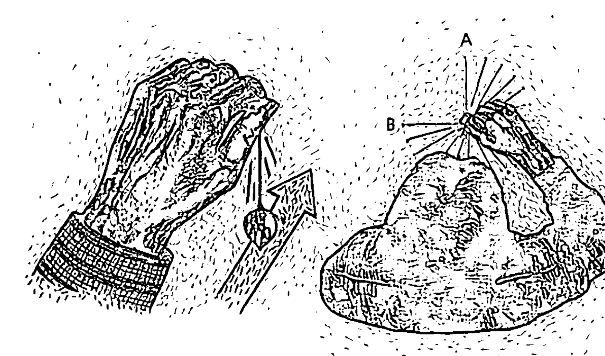
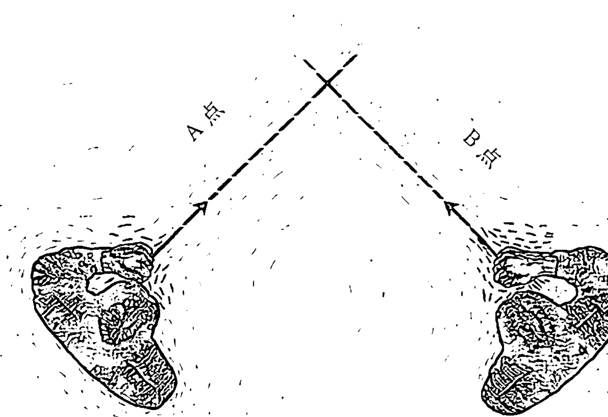
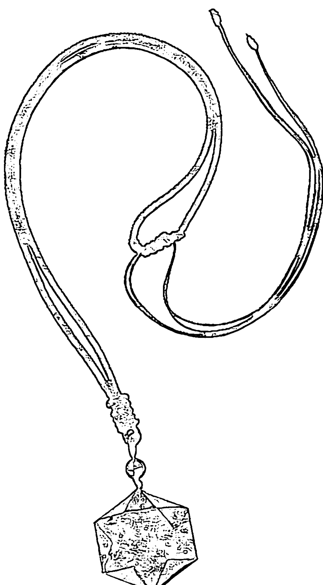
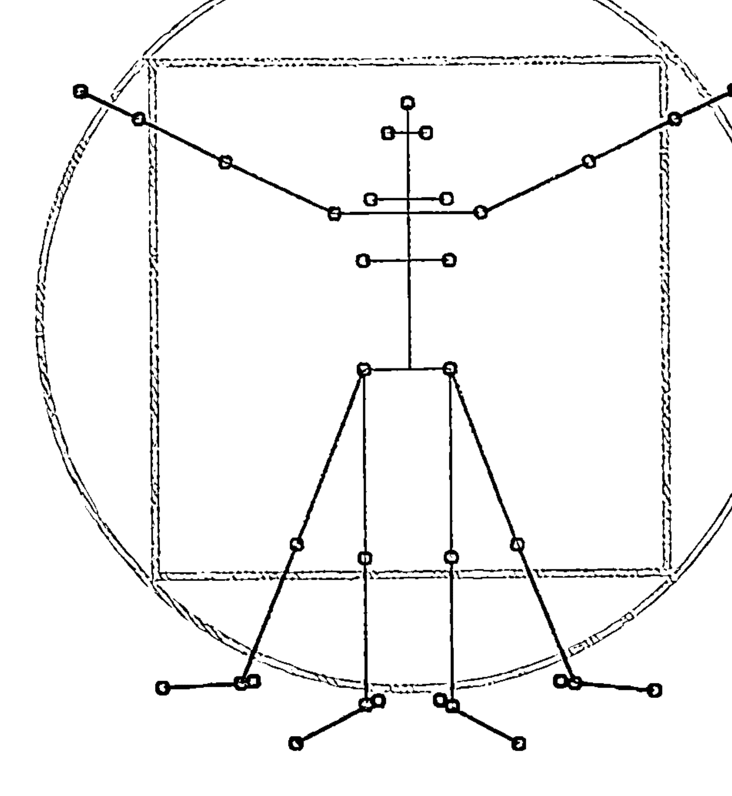
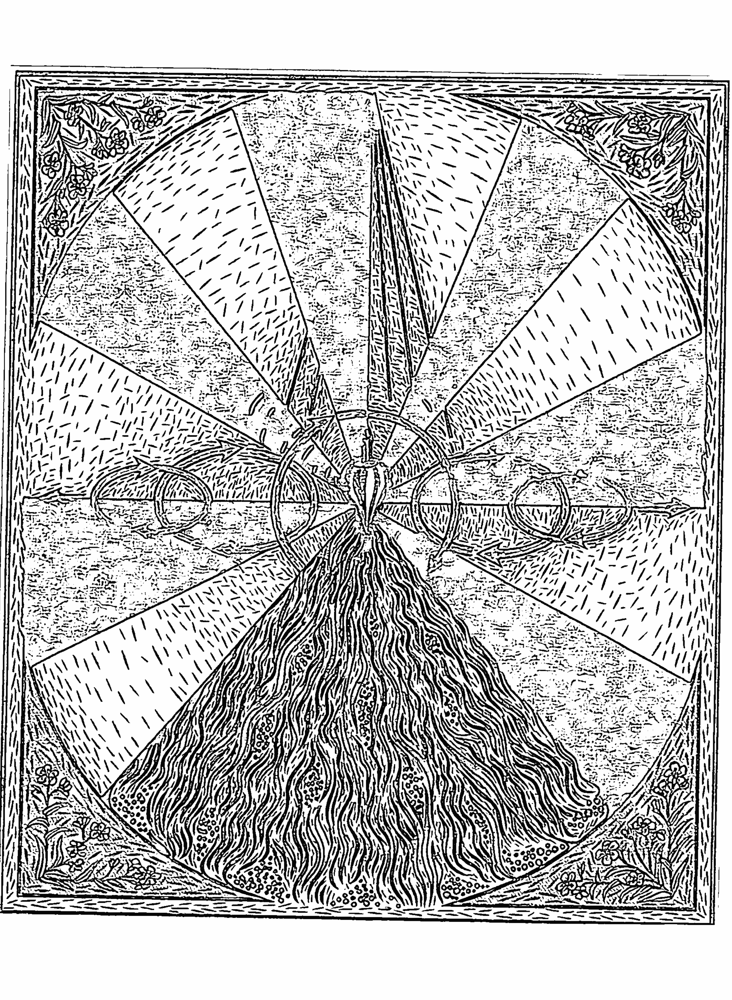
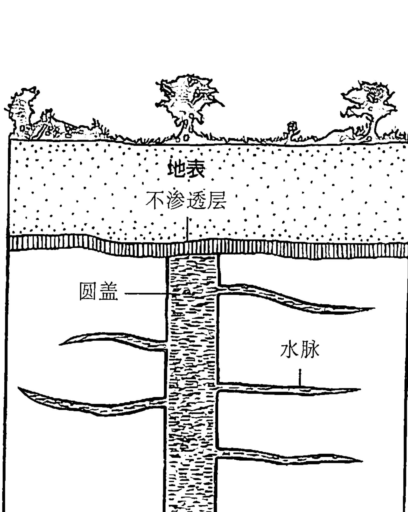
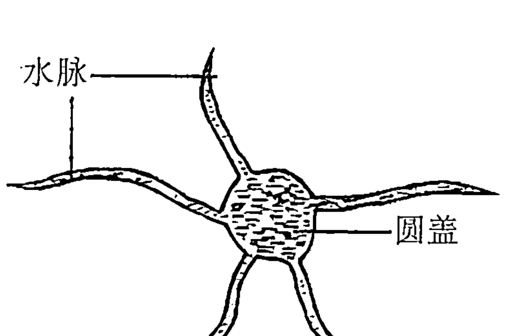

# 能量灵摆占卜手册

## 前言

占卜是一门科学的艺术。这项工具主要是用在人类的逻辑分析与直觉力之间，作为衔接两种能力的桥梁。现今有许多人都在寻找取得两者平衡的方法，也就是如何多使用一点直觉力。用灵摆来占卜，是一个简单又自然的解决之道。让我来解释一下什么是占卜：诠释一个灵摆的摆荡（或振动）动作，以解答我们提出的问题，就称为占卜。这意味着运用你的直觉，或其他人称作的“探测”，求得灵摆的回应。

过去15年来，有关占卜的各种可能性的用途大幅地扩展了。占卜从探测哪里可以找到最近的引水源开始，已经走了很长的一条路。目前坊间有不少关于占卜的书籍。有些占卜书属于进阶读物，对于初学者来说太过深奥。有些占卜书写的不好，或只专注于探测水源的主题。而这本书是专为刚觉察到占卜这门古老艺术的潜在价值的读者而写的。

这本书假设你从未接触过占卜，因此提供了种种练习方法，帮助你成为占卜能手。在何种情况下才会运作；许多实作图表，包括一些结合占星学的新占卜方法，可以让你对自己有更多的探索发现；如何制作与使用其他种类的占卜工具；关于占卜与科学的讨论，以及可靠的参考资料，提供给你有关占卜的其他书籍与相关组织。

当你一边阅读时，请尽量就书里所提供的全部练习进行实作。不要对自己说：“我要先读完这本书的内容，之后再来做练习。”如果你用这样的方式阅读这本书，就没有把握住我要求的重点。如果你已经照着书做了各种练习，当读完这本书时，你将拥有一个新方法，可以让你在意识层面上把直觉能力带入各种实际的决策过程中。欢迎你进入灵摆占卜这个美妙的新旧世界。

## 第一章
什么是占卜

首先要说的是，占卜除了是协寻失物的一种好工具之外，它也是让我们人类的理性与直觉两个面向保持平衡的一种方法。占卜是探索潜意识的工具，为问题寻求解答的一种方法，尤其是那些无法透过理性思考过程或使用科学方法论就能得到答案的问题。不过，理性思考过程也是占卜过程的一部分！

所以，我们现在就来谈谈占卜，或有些人称为“探测”的这件事情吧。首先，占卜与探测这两个词并没有区别，它们指的是同一件事。英国和美国的占卜学会都致力于探讨占卜、探测的可能性的完整系谱。在这本书里，我们将使用占卜一词，因为这个词最常被拿来形容以灵摆（或其他装置）为主的方法。你也可以轻松地加入探测一词。

一旦学会“是”与“否”这两种灵摆的讯号或答案，你的直觉就可以用它来和你沟通。在尝试探索这个现象究竟是什么之前，我们先来看看左脑与右脑的议题，以及“知”的方法，这方面我们会以灵知派——基督教发展初期的一个异端——来讨论，该教派的哲学有助于理解占卜过程。我相信直觉与占卜是同一件事，而占卜一定会促使你去练习自己的直觉能力。我们将看到占卜的几种可能的解释方式，包括使用雷达模拟，以及和全息图作一比较。

### 练习占卜

我们将在本书里进行各种占卜练习。

这些练习将以红字呈现，如同这段话，为的是提醒你：你要做的不只是阅读这段文字而已。

若想从这本书得到收获，需要你积极地参与。你无法透过阅读来学会占卜方法，而需要实际地进行占卜才行。本书附有一个称为灵摆的占卜工具，它是一个圆锥形的黄铜坠子，一端系着一条金属链子。

让我们进入第一项占卜练习，并使用这个神奇的小工具。我们要从找出3个不同的灵摆回应。首先是“探查位置”，这是一个“我已经准备好了”的位置。

用大拇指与食指握住系有灵摆坠子的线，手心朝下。让你的手和坠子之间留有大约5厘米长的线。如果你想要比较舒适的话，可以把手肘靠在桌面上。

探查位置是你将在本书学会的其他占卜操作方法的起始位置。在使用灵摆时，并没有所谓的标准反应。每个人的探查位置不一定相同。通常，探查位置有两种反应：要不是一点反应也没有（灵摆静止地垂挂在空中，一动也不动），要不就是对着你前后摆动。这两种反应都是可以接受的探查位置。

如图所示，握住你的灵摆。对它说：“让我看到我的探查位置。我想知道我的探查位置。”

用手握住你的灵摆，如图所示。

这个练习最棒之处在于，你的第一次占卜尝试绝对是成功的，即使灵摆一动也不动！

现在来看什么是“是”。同样的，关于“是”的回应并没有通用的标准。不过，多数的占卜师发现，它可能有两种回应方式：假如你采用的探查位置是完全静止的，得到“是”的回应呈前后摆动，就像是你点头说“是”；也有人得到“是”的回应是顺时针摆动。你可以决定任何一种回应方式。

手握住灵摆，放在你的探查位置，问以下问题：“当春天青草刚冒出来的时候，它们是不是绿色的？”当然了，你一定知道答案为“是”，所以留心观察灵摆从探查位置如何开始偏移。你也可以说：“让我看到‘是’，让我看到‘是’。”

如果灵摆似乎没有任何动静，那么你就让它动吧！我建议你让它往顺时针方向摆动。在你这么做的时候，对自己念道（或者自我觉察程度不够强的话，就大声地说出来）：“这是‘是’，这是‘正’，这是‘阳’，这是‘是’。”

现在让我们来找什么是“否”。如果你的灵摆对于“是”的回应是前后摆动，或许你将发现“否”的位置是左右摆动的情况，就像你摇摇头代表否一样。另一方面，如果你的“是”为顺时针方向，或许将发现“否”则是逆时针方向。试着透过以下练习来找出灵摆对于“否”的回应方式。

握住灵摆，处于探查位置，问以下的问题：“雪是绿色的吗？”还是一样，你知道这个问题的答案是“否”，所以观察灵摆从探查位置如何朝“不是”的方向摆动。那个方向就是给予你“否”的回应。

至于有人的灵摆完全没有任何反应，那并没有关系。许多初学者让灵摆以自己的方式运作时（至少那是当事人在第一次体验到灵摆摆动时会有的感受），都会遇到困难。所以我建议你把灵摆往逆时针方向摆动，同时对自己说：“这是‘否’，这是‘接受性的’，这是‘阴’，这是‘否’。”

如果接下来这一周，你每天都做几次这项练习，就能建立起灵摆占卜的技巧。有件事情正在发生：你在与自己的潜意识沟通，并设立一组密码。至于密码是什么一点也不重要，重要的是你有一组密码了。到目前为止，你已经有3个可辨识的不同讯号：探查位置、是、否。你要对自己承诺，接下来这一周每天都会做一次这三项练习。这些练习真的能帮助你发展成为一位占卜师。

### 左脑与右脑

我们习惯把历史看成是一连串的结果与事件。我们被教导要理性分析，追随秩序，反刍“正确的”答案；当然我们也会辩驳说，有少数老师似乎也有兴趣强化我们的直觉与感受面向。

过去十至十五年之间，已经有不少讨论左脑与右脑的著作问世。左脑似乎主司我们身体的右半部，以及我们的分析与线性思考能力。如果你中风了，造成身体右半部瘫痪，那么你可能无法说话——说话能力是一种线性活动，英语里主词要在动词之前，动词又要在直接受词之前。右脑则主司身体左半部，而且这区域似乎是主观的、直觉的能力以及主宰整体运作的能力。我们依赖右脑来认出他人。我们并不是看着某人的鼻子、嘴唇、眼睛及头发，然后说：“噢，是你啊，杰克！”认出一个人并不是线性的功能。我们看的是对方的整个脸，才认出他是谁。据说，右脑也主司我们的直觉能力。尽管近年有研究指出“左脑是理性、右脑是直觉”的这种论述太过于简化，但就本书的目的而言，这个比喻仍然是很有帮助的。

我们的理性面向被喂养得很好——甚至喂得太饱了；然而，我们大部分人的直觉、主观面向却是不足的。我们的学校、工作、政府似乎并不重视人类的这一个面向。这就好像闭上一只眼睛行走生命之旅一样。许多人正在觉醒中，他们明白要有真正的圆满，就必须探索人类这些属于直觉、主观的面向。占卜这项技术对此非常有帮助。

当一个人在直觉上知道某件事，这必然无法透过任何理性过程来证实。当一个人知道神的存在，他并没有办法透过嗅觉、味觉、视觉、听觉或触觉去认知神，因为这种认知并非来自于身体的五感。这里说的“知道”，讲的是人类的直觉面向，而非理性的面向。占卜，就是一种直觉认识法。

如之前所描述的，占卜也是一门科学的艺术。或许你听过水源探测或水源占卜，迄今它们依然是这门古老形式占卜术的一个重要领域。善于占卜的人，必须同时擅长科学（解读为理性的）与艺术（解读为直觉的）。首先，你要能提出对的问题。例如，如果有朋友需要一口新的水井，你不能只是到他们的屋子，然后问：“离这里最近的水源在哪里？”

你可能侦测到水源在地下210米的深处，该处每小时会喷出近60升的水量，尝起来还有点硫磺味，而且每年4-9月是枯水期。所以与其问：“离这里最近的水源在哪里？”不如改成这样的问题：“我必须自己凿一口井，所以，不超过地下6米深、整年都要能每分钟至少汲取19升左右的水量，而且是离这里最近的可搬运的饮用水在哪里？”这样的问法就对了。这就是占卜艺术的“科学”面向——问了对的问题。

接着是直觉的面向。我们这部分的大脑，可以不用推论就立即心领神会。不知怎的，你必须要暂时关闭左脑的分析面向，同时开启直觉的面向，如此一来你才能感知到答案。占卜用的工具就能提供给你最好的答案，而令人觉得神奇的是，在一位称职的占卜师手中，占卜工具往往运用得很顺畅。一位好的水源巫士——一些占卜师如此称呼他们——成功率大约有85%-90%！

为什么我要如此地强调直觉呢？我觉得我们生活在一个强调理性思维就能解决所有问题的世界里。许多人也这么深信不移。但有趣的是，我们生活的世界似乎并不是这样运作的。从阿基米德(Archimedes)坐在澡盆内突然发现有某种重力，然后跳起来大叫道：“我懂了！”到现代社会里最成功的商人，都是靠着预感行事。研究告诉我们，在理性、线性思考的西方人类发展过程中，直觉一直扮演着重要的角色。

爱因斯坦(Albert Einstein)是另外一个绝佳的范例。他的思考方式就是属于创造力爆发型。路德·艾森哈特(Luther Eiscnheart)所有，他是爱因斯坦在普林斯顿大学时期的数学教授。附带一提，爱因斯坦在小学时期的数学成绩并不优异，因为他以跳跃式的创造力来思考。艾森哈特教授的任务就是创造可以连接爱因斯坦跳跃式创造力的公式与方程式。

我们也可以把占卜法当成一种显然是非理性的跳跃。它为那些理性工具无法（或者至少要花上很长一段时间）找到解答的问题提供了答案。水源占卜师无法看见、碰触、嗅闻、听到或尝出位于地底下的水源脉，但就是能找得到它。占卜法带领我们跳脱理性思维，但或许最重要的是，占卜法并不要求你丢掉理性的想法。它并非是一个在理性和直觉之间2选1的议题。占卜法同时需要这两种能力。你需要问出对的问题（使用左脑），再让你的直觉面（使用右脑）寻找到答案。而且，你想得出来的任何东西都可以用到占卜；你只受自己的想象力所局限。除了地下水源脉之外，人们在今日也使用占卜来探测油脉、矿脉、宝藏、失踪人口、健康、地球能量，以及其他各种目标物等，涵盖了可见和不可见的事物。

许多时候，人们占卜并不是要去求取具体的物质目标，而是为了寻找是或否的答案，占卜的问题可以从“这个梨子熟了吗？”，到“就我目前的生命来说，这是正面的方向吗？”等。本书所要谈论的重点就是在这个层面上的占卜——我们要如何透过占卜来解答与自身生命特别相关且重要的问题。

### 占卜是如何运作的

我知道你一定迫不及待地想问这个问题。最诚实的回答就是，我们真的不知道，但有几个相关的理论。第一个理论与雷达有关。在寻找地底下的水源脉时，也许就像雷达一样，占卜师释放出要寻找这个目标物的某种讯号。当探测到目标物时，这个讯号就会被传送回来给占卜师，同时让占卜工具移动。另一种可能则是，或许水源脉本身就会散发出某种讯号，而被占卜师接收到了。

但是，雷达探测或许来自地底下的讯号，要如何解释“就我目前的生命来说，这是正面的方向吗？”这类以“是或否”回应的占卜提问呢？而水源占卜师要如何找到一个水源脉，能提供每分钟生产19升左右的水量，还要整年都能生产？至少就我们目前的理解而言，雷达是无法对此提供解释的。雷达可以监视并侦测既有的物体，但无法探测未来或回溯过去。雷达并不知道一个水源脉在过去曾生产过多少的水量，也不知道它在未来将有多少水量。所以，雷达要不是不属于占卜运作的方式，不然就只是占卜运作几种方式的其中之一而已。

有关占卜如何运作的问题，有一个可能的解释就是利用全息图。在1981年，伦敦生物化学家鲁匝·薛卓可 (Rupert Sheldrake) 写了《新的生命科学》(A New Science of Life) 一书。他在这本书中提出一种观看实相的旧／新方法。他提供一种以全息图为基础的概念，取代了三度空间或线性观看实相的方式。全息图的看法提供给我们一种全然不同的观点来想这个问题：“什么是实相？”

举例来说，与一张普通摄影的底片不同，一张香蕉的全息底片看起来就像有人丢了一把小卵石到池塘里一样——是一连串中央往外扩散的形状。如果你把一张传统底片撕掉一角，接着冲洗相片，将只会看到相片——譬如香蕉影像——的一小部分；然而，如果你把一张全息图底片的一角撕掉，接着放在一束同调光（雷射光束）底下，还是会看到整个香蕉

## 什么是占卜

的影像——或许不是很清晰，却还是完整的影像。

或许整个宇宙就像一张全息图底片，每个人都是这张底片的一小部分。我们内在都有这张底片的完整影像。如果神是内在的，而且神是无所不知的（全知/感知），那么我们当然可以找到这个问题的答案：“这个水源脉是整年流动的吗？”

如果我们是整个宇宙全息图的一部分，那么只要探索自己的内在，就可以找到问题的答案。许多有冥想经验的人会告诉你，这个说法是很有道理的。根据全息图的模型，在我们人类中的任何一处，都是全息图的一小部分，它收录着我们可能提出的各种问题的所有解答。有些人称之为寂静的微小声音。

因此，根据全息图的模型，占卜所寻求的答案其实存在于每位占卜师的内在。另一方面，雷达则是外在的。有些讯号是由我们内在发射出来，而当它找到外在的目标物时，就会反弹回来给我们。另外还有一种可能的解释，认为占卜会带我们去“天上的一间大图书馆”——类似印度教的阿卡沙秘录（Akashic Record）——在这个地方，记载着一切发生过的事情。这还是属于外在的。

灵摆是我们开启直觉面的一种工具。为了使灵摆运作，我们必须同时使用自己的理性面与直觉面。灵知派能够使用感知的直觉方式，而占卜则可以让直觉面向为今日的我们所用。那么占卜是如何运作的呢？真正的答案或许就在上述的各种解释里。我们真的不知道。在不同时候，为了各式各样的理由，占卜似乎是以多样的方式，并在截然不同的层次上运作。我们已经比较了占卜的行动和雷达、全息图等其他几种媒介，但从实用的角度来看，占卜是如何运作的这个问题，最终是无关紧要的；重点是占卜行得通——至少在大部分时候都是如此。这听起来并不是非常可靠，但重要的是记得：我们的理性面也不总是百分之百地正确。然而，只要我们的理性与直觉两个面向一起运作，就能大幅地增加我们找到最好解答的机会。这本小书的目的，就是运用我们的直觉，让感知的那一面（直觉上的知道），比现在有更多经常运作的机会。

## 第一章

让我们再次来做这项简单的灵摆练习。用你的拇指与食指握住灵摆，并且说：“让我看到我的探查位置。”

一旦你找到探查位置，接着说：“让我看到‘是’。”观察灵摆的回应，“这是‘是’，这是‘正’，这是‘阳’，这是‘是’。”

现在接着试试：“让我看到‘否’。”然后，“这是‘否’，这是‘接受性的’，这是‘阴’，这是‘否’。”

恭喜！你已经在成为占卜师的路途上了。

请记得要持续练习。有时候我会要求你放下这本书，去搜集一些东西以进行另一项练习。当你阅读这本书时，无论如何请尽可能地跟着练习。当你能跟随练习亲自实作，后面的章节对你而言将会更有意义。

——黑曜石六芒星灵摆吊坠

## 第二章 启动你的灵摆

关于占卜，没有所谓人人都适用的正确方法，但对你来说，正确的方法只有一种：当你学习占卜时，就会找到一种你最顺手的方式。本书有许多不同的建议，我相信你会逐一地去尝试，但到头来，只有你能决定哪一种占卜法最适合你自己。举例来说，你要用哪一只手握灵摆呢？请注意，到目前为止，我都没有建议你用哪一只手去握灵摆！但你自然而然地就感知（直觉上的知道）自己要用哪一只手最好。持续使用你一开始就惯用的那一只手。当你进行灵摆练习时，记得让自己放松。不要太努力地想得到你认为一定是最精确的回应。

接下来我们要进行的是灵摆练习，灵摆要告诉我们的答案是“也许”，或是我们问错了问题时灵摆会有的回应。一旦你学会“是”“否”以及“也许”这3种回应后，玩一下“20道问题”或“动物、蔬菜及矿物”等儿童游戏，可以增进你获得灵摆回应的技巧。

操作各种占卜时，“调频”（tuning in）是占卜师需要培养的最重要的技能之一。虽然没有放诸四海皆准的调频方法，但我在这里提供一个步骤，可以帮助你专注于手边要占卜的议题。接下来有几个使用铜板的占卜实用练习，以及浅论为什么占卜无法永远灵验。此外，灵摆也能为你指引方向。本章会以几项练习当作结尾，我们将会使用“前端”（leading-edge）的概念以及“三角检定法”（triangulation）来找出某一标的物的位置。

### ① “也许”的回应

到目前为止，你一直在练习灵摆对“探查位置”“是”“否”的回应。现在让我们来练习第四种。它是回应“你问问题的方向错误了”，或是“这个问题没有意义”，或再说得更简单一点，就是“也许/错误的问题”的回应。从你最终想发现什么真相的角度来看，并非你所问的每一个问题都有意义。如果你走错方向了，灵摆会以这种“也许/错误的问题”的回应方式来让你知道。

手指握住你的灵摆，处在探查位置。大多数占卜师都发现，“也许/错误的问题”的回应是在来回摆荡和左右摆荡之间的一半位置——约45°角。你亲自试试看吧！

问你的灵摆：“让我看看我的‘也许/错误的问题’的回应是什么。”如果灵摆似乎不想振动，就让它往45°角的位置来回移动，或是朝时针10:30向4:30的位置移动，或是朝时针1:30向7:30的位置移动。

“也许/错误的问题”的回应有两条路径，都会横跨中心点，并且距探查位置45°角的方向。大部分人会发现他们的是“也许/错误的问题”的回应紧跟着其中一条路径。参见图示。

你现在有四种不同的灵摆回应了。有了这些基本动向，任何你想象得到的问题都可以获得答案了。你可以利用古老游戏的技巧，例如“20道问题”（它是动物吗？它是矿物、或是植物吗？它比面包盒还大吗？它是在我们的厨房里吗？它是在起居室里吗？等等问题），就可以透过占卜找出这些问题的答案。

不过，还是有一些陷阱存在。而初学者与经验老到的占卜师之间，差别就在于初学者总是落入这些圈套里。我先前提过，问对问题很重要。当你在形成问题时，尽量确定它只能被带往一个方向。你的潜意识往往把事情看得非常表面（记得我先前的举例：“离这里最近的水源在哪里？”），所以你要先想好问题，提出的问题要尽可能地清楚。如果你一开始没有问对问题，那么之后也就得不到正确的答案。道理就是这么简单。

### ① 调频

接下来是调频。这就像是打开收音机，调到正确的频率一样。我使用四个准备步骤或问题来调频。分别是：我陈述我想做的事，同时希望得到“是”的回应；接着询问3个简单却相当重要的问题：“我有能力问了吗？”“我可以问了吗？”以及“我准备好了吗？”

“我有能力问了吗？”是关于我有没有具备获得问题正确解答的占卜技巧的征询。（你或许记得刚去上学的小朋友老是举手发问：“老师，我能不能去上厕所？”老师会回答：“当然‘能’去啊，可是你必须要在写完测验后，才‘可以’去喔！”）在这个阶段，你可能已经具备必要的技巧，可以帮朋友找出遗失在房内某处的戒指，但你可能还无法占卜出关于未来的事情——这又被称为“及时占卜”。“我有能力问了吗？”将会让你知道自己是不是已经具备了必要的占卜技术。

“我可以问了吗？”则是与征求许可有关。这在目前或许看不出关联性，但有些熟练的占卜师所参与的事情，是会令初学者遇上种种困难的。涉入神秘学或使用灵摆去对无法解释的现象寻求解答，有经验、有能力的占卜师能够运用得宜，却可能令初学者误入歧途。因此，在占卜这类问题之前，先征求许可，是很明智的举动。

在其中也可能有业力的影响。业力（Karma）是每个人的善恶果报，以及因而要去学习的功课。你可能很想占卜这期乐透会开出哪些号码或是猜中赛马名次，不过一旦你使用你的占卜/直觉技能去增加物质层面的好处，可能会在业报或其他层面上产生负面的影响。“我可以问了吗？”这个问题，可以帮助你远离一些对你没有正面帮助的地方。

那么，当你问到“我可以问了吗？”，是在征求谁的许可呢？对于这个问题，有好几个可能的答案，而所有的答案都像上述“占卜的回答是从哪里来的？”的回答一样无力。我自己的感想是，我们每个人都有一位指导灵在照看着我们，类似夏威夷人胡那（Huna）信仰中的较高自我（higherself，一位可以完全信任的父亲/母亲），或是荣格（Carl Jung）的大我（self）概念。无论如何，似乎有一股把我们的最高利益放在心中的更高层次力量，就在某处看顾着我们。“我可以问了吗？”这个问题，正是给予这股力量直接和我们交谈的机会，帮助我们维持明智的行动。

占卜在疗愈的领域，也已经被证实是一个重要的工具。使用灵摆进行疗愈时，征求许可是一个必要条件。没有什么比以下这种情况更烦人或打扰人的了：当你去参加一场占卜研习时，有人匆忙地向你走来，在尚未征求同意的情况下，就贸然开始占卜你的气场，或是告诉你有什么问题。这种利用通灵能力侵犯他人隐私的行为，就是不应该做的事。这些人往往一学会新的东西后，就迫不及待地想向其他人展现他们“知道”什么（注意，我使用“知道”，而不是“感知”一词，因为这些人显然还没学到直觉力）。总之，征求许可是非常重要的。

所以，我们已经问了：“这是我想做的事。我有能力问了吗？我可以问了吗？”至于最后一个调频的问题就是：“我准备好了吗？”为了得到一个恰当的答案，我是不是已经完成一切必要的准备工作？我是不是还有其他为了调频而必须去做的事？假设你到目前为止都得到正面的回应，就在此刻，你就真的可以提出问题了。

可是，假使你问的这四个问题有得到“否”的回应呢？答案很简单。如果你信赖整个占卜流程，当你得到一个“否”的回应，却继续问下去，就不能相信你所得到的答案。所以你必须从头开始。等一两分钟后再问，而且问的方式要稍微有点不同。如果这四个调频步骤，有其中一个得到的回应为“否”，就用不同的主题来占卜另一个完全不同的问题，稍后再回到一开始你想问的问题。

在阅读这本书时，你能使用占卜法最有意义的方式，就是对书中所读到的任何流程或观念提出质疑。1960年代晚期，当我准备成为老师时，我读过最重要的一本书就是尼尔·波斯曼（Neil Postman）与查尔斯·韦格纳（Charles Weingartner）合著的《教学作为一种颠覆式的活动》。书名所提到的颠覆式活动，是指让中小学的学生去独立思考。这确实是颠覆的，当你想到今日许多学校的主要目标是要教导学童整齐地坐好，保持安静，同时讲出老师想听到的答案。在那样的氛围下，思考确实是一种颠覆式的活动。

让我们试着来做一项练习，由你自己决定这些调频步骤的相关性。此处要占卜的问题就是：“席格在本书提出的调频四步骤，此刻对我来说，是有用的方法吗？”

握住灵摆，让它处于探查位置。

对灵摆说，你想问一个关于调频四步骤的问题：“这是我想做的事。我想知道，这四个步骤，现在对我来说，是否有帮助？”

“我有能力问了吗？” 我是不是拥有足够的占卜技术来做这件事？

“我可以问了吗？” 我是否获得许可？再次，或许在这里它是一个无关的问题，却是整个流程的一部分。

“我准备好了吗？”

（假设你的每个问题都得到了“是”的回应。）“席格在本书提出的调频四步骤，此刻对我来说，是有用的方法吗？”

所以，你得到的回应是什么呢？我相信多数的读者在第一次就会得到“是”的回应。世界各地有许多占卜师使用与这四个步骤类似的调频流程。万一你在这项练习过程中，某个步骤得到了“否”的回应，你可以等到阅读本书更多篇幅之后再试一次。请注意我们在问这些问题时使用了“此刻”的字眼：也许现在的你并不需要这个调频的流程；也许此刻的你很有信心能得到精确的回应。

### ① 三枚硬币的练习

现在我们来进行第一项真正的占卜练习。你需要准备3枚硬币——两枚相同面额（甚至连发行日期也相同）的硬币，第3枚则是要不同面额的。

放了两枚相同面额的硬币，让它们彼此之间相隔一个手掌宽的距离，然后握住你的灵摆，让它处在两枚硬币中间的探查位置。从容地让灵摆在两枚硬币之间开始摆动。一开始只让它微幅摆动，然后观察它的摆动幅度逐渐变大。这就好像灵摆的尖端要去接近每一枚硬币似的。你能感觉这两枚硬币的相似性，也能够感觉灵摆和每一枚硬币之间的吸引力。

现在拿掉其中一枚硬币，用不同面额的第3枚硬币取代它。不同于原先朝两枚相同硬币摆动的情况，你的灵摆要不是在开始（顺时针或逆时针）转圆圈，就是在硬币之间左右摆动，或是出现其他的摆动情况，但就是和原先在两枚相同面额的硬币之间摆动的情况不一样。

左：注意灵摆的情况，它好像同时受到彼此相似的两枚硬币所吸引。
右：使用两枚面额不同的硬币，灵摆会受到排斥，并且在两枚硬币的中间微幅摆动。

针对这种反应多实验几次。你可以用不同模式来排列硬币。当你把3枚面额相同的硬币排成三角形时——每枚硬币之间的距离都是一个手掌宽——你的灵摆会有什么反应呢？

你可能想用3枚面额相同的硬币，但其中只有两枚的发行日期相同，做上述练习。把硬币放在桌上，日期的那面朝下，随机移动一下灵摆。在看不到日期那面的情况下，选出两枚硬币，然后用灵摆占卜，之后再看看它们的发行日期是相同或不同。

### ① 掷硬币的练习

你需要找一位朋友协助你进行这项练习。这项练习其实有点颠覆性，可以说是让别人对占卜产生兴趣的好方法。你需要准备一枚够大的硬币、灵摆、一支笔或铅笔，以及一张记录占卜结果的纸。

对自己说，我想占卜看看，掷出的硬币是呈正面（头像）或是反面（金额）。“我有能力问了吗？我可以问了吗？我准备好了吗？”

把硬币放在桌上，正面朝上，然后手握灵摆，拿在硬币上方。灵摆将从探查位置往“是”的回应摆动。现在把硬币翻面，并观察灵摆如何往“否”的回应摆动。（这些回应也可能是相反的——都没有关系。）

请朋友帮忙掷出硬币，并在纸上记录下结果是正面或反面。当朋友记录结果时，你就问灵摆，掷出的是正面或反面。如果是正面，你的灵摆将呈现“是”的回应；如果是反面，灵摆就会呈现“否”的回应。向朋友说出你得到的灵摆回应，同时请他记录下来。练习10次。请朋友在做完所有的练习之前，不要指出你的占卜对不对。

所以，你做得如何呢？每次练习都有5成的概率会是对的，所以就算你没有占卜力，10次中还是有5次会是对的。如果你对的次数超过5次以上，那就太棒了。如果你得到5次以下的结果，在统计上还是有意义的。

这里真正的重点是与犯错有关。占卜师——尤其是初学者——会犯许多错误。这就像学骑脚踏车一样，没有人不曾跌跤。这是学习过程的一部分。但对学骑脚踏车的人来说，跌倒了，重要的就是立刻骑上去再试一次。此外，身而为人的最佳定义就是：我们都是不完美的。（要是我们知道自已是完美的，我们就不会在这个星球上了。）因此，还是一样，就长远来看，我相信没有哪位占卜师会有百分之百的准确。

所以，如果你在掷硬币的练习上做得不好，就再试一试。坚持下去！甚至可以让你帮你掷硬币的朋友，换手由他来试一试灵摆！

### 情绪的影响

并非每一位占卜师都擅长所有的占卜法。别因为你在健康的领域里是一位好的占卜师，就意味着你也擅长于水源占卜。健康占卜和水源占卜需要不同的技巧。所以，掷硬币法或许并不适合你。但你能做什么来增加成功的机会呢？有两件事，你可以试试看。首先，尽管你对掷硬币的结果并没有投入太多的情绪，许多占卜者还是在提出问题及灵摆显示答案之间的短暂时刻“迷失”了。我说的“迷失”，是指有些占卜师在那个时刻分心了，而且自己想着答案或试着猜想答案。如果你这样做，得到的答案就不是可信的。请再掷一次硬币看看。

或许用不同的实例可以更清楚地说明这一点。例如，当你的哥哥得了重病，而你怀疑他罹患的是癌症。你得到哥哥的许可后为他占卜，并且通过了“这是我想做的事，我有能力问了吗？我可以问了吗？我准备好了吗？”的调频流程，接着来到关键问题：“我的哥哥是不是罹患了癌症？”

当然你希望灵摆的答案为“否”。也许，当你在等待答案的关键时刻，在潜意识里告诉自己：“我希望答案为‘否’，亲爱的神，让答案出现‘否’吧。”

在这种情况下，我保证你得到的答案就会是“否”。占卜的答案是来自我们的潜意识，而潜意识如此渴望取悦我们，以至于给了我们想听到的答案。

当问题牵涉到你熟悉且所爱的人时，任何形式的探测永远都是困难的。我在算塔罗牌时，发现为完全不认识的陌生人解读，总是比为朋友解读来得容易。

这里的重点是，你真正想要的是真相。当你问道：“我的哥哥是不是罹患了癌症？”我确信你想知道的是真相。所以你要如何区分“想得到某一特定答案的情绪需求”以及“真实的答案”呢？《圣经》给了我们一条线索：“你们若不回转，变成小孩子的样式，断不能进天国。”在提出问题之后，你必须关闭左脑，抛开在那个时刻会造成困惑的一切想法与需求。因此，在提出问题后，试着采纳一种孩童般天真期待的态度，对自己说：“我不晓得答案会是什么。我不晓得答案会是什么。”不断地这样想，直到灵摆给予回应为止。如果你只想着不晓得答案会是什么，就没有时间对你的潜意识提供任何想要的特定答案。用自己对特定答案的主观欲望来影响灵摆，是非常容易发生的。

显然，你在掷硬币的练习上，不会像问哥哥是否罹患了癌症的问题一样，涉入了同样程度的情绪，但也许当你发现掷了4次硬币结果都是正面时，左脑就会说：“该是出现反面的时候了。”

每掷一枚硬币就有5成的概率是正面。一丝小小的声音都会引你走入歧途。这都是一样的情况——你的期待正故意地影响结果。

如果你发现自己有这些想法，可以让朋友来掷硬币，而你在占卜时，对自己说：“我不晓得答案会是什么。我不晓得答案会是什么。”另外一个增加猜中硬币正反面正确性的方法是问自己：“这是真的吗？”显然你想知道这个问题的正确答案。而且我发现当我问这个问题时，很容易就把所有无关的外来想法从心中排除了，以便让我保持专注。所以如果你最初的问题得到的回应为“是”，而“这是真的吗？”的问题却得到了“否”的回应，那么针对你最初问题的正确答案即为“否”。这个方法可以给你的潜意识再一次对你说出真相的机会。

重述要点，当你想使用灵摆提出“是”或“否”的问题时，我建议你使用以下的占卜流程：

- 1. 在心中形成你的问题。想好问题，无论答案是从哪里来的，你的问题都要从字面上来理解。当你准备好后，就拿起灵摆。
- 2. 这是我想做的事。
- 3. 我有能力问了吗？
- 4. 我可以问了吗？
- 5. 我准备好了吗？
- 6. 陈述问题。
- 7. 我不晓得答案会是什么。我不晓得答案会是什么。
- 8. 答案。
- 9. 这是真的吗？
- 10. 回到步骤6。（每次占卜的开始都是从步骤1-5，但不必每道问题都重复这些步骤。）

使用以上的流程，将增加你获得有用的“精确”答案的机会。而这也是一位好的占卜师要使用的操作步骤。占卜师会投入许多时间，确保在提出对的问题之前，先以一种清楚的方式来调频与检查结果。

## 前端的概念

另外一种使用灵摆的方法与“前端”有关。“前端”这个专有名词，是指遵循灵摆离开你向外摆荡至最远处时所指出的方向。譬如，当你在树林里迷路了，而你最关心的是要找到你的车子。你请灵摆确认了探查位置，并提出问题：“我想知道我的汽车的位置。我有能力问了吗？我可以问了吗？我准备好了吗？”现在再次回到探查位置。如果你的探查位置是属于静止型，灵摆将开始前后地摆动。观察灵摆往你身体相反的方向所摆去的最远位置。这个位置就称为前端。

在灵摆摆动了大约15-20次的期间里，前端也会带着你绕圈圈。如果你的探查位置是属于前后摆动型，再次观察前端一开始往你身体相反方向摆去的灵摆尾端（前后摆动的“前部”）。除非你是直接面向你的车子，否则灵摆会前后摆动，前端开始朝着顺时针或逆时针摆动。当前端的摆动到达一个顶点后，灵摆只是前后地摆动，它指向的方位就是车子的所在。如果，在某些情况下，汽车在你后方，前端将持续转动（90°）直到它指向车子。（如果你的探查位置是静止型，而且目标是在你后方，灵摆一开始将会摇摆不定，可是接着前端开始移往某个方向或另一个方向，直到指向目标为止。）

从 A 点开始让灵摆前后摆动。振幅的“前”缘就称为摆动的前端。观察灵摆前端往这个或那个方向摆动，直到横向运动停止为止，而且前端似乎也坚持指向 B 点。

## 启动你的灵摆

### 第三章

用这些问题来试试前端的概念：“距离我最近的电源插座在哪里？我有能力问了吗？我可以问了吗？我准备好了吗？”观察一下前端，当它停止并且“坚守住”一个方向时，插座就在那里！

## ① 三角检定法

占卜师会使用三角检定法来确定物体的位置。使用前端，再加上三角检定法，就能节省许多时间。

请一位朋友在房间里把某个东西藏起来，例如：一支铅笔。你问道“铅笔在哪里？”（请注意，你在这里不必再经过“我有能力问了吗？我可以问了吗？我准备好了吗？”的调频步骤，因为你为了这次占卜已经做过了这些步骤。我假设你是在插座练习之后，接着做这项练习。）跟随前端，找出方向，从你自己出发沿着灵摆前端指示的方向，画出一条假想线。你可以感知（直觉上的知道）它是在这条线上某处，但在哪里呢？

现在走到房间的其他地方，远离原来所在的位置，然后问同样的问题：“现在，我的朋友所藏的铅笔是在什么方向？”把线画出来，而在这条线与第一条线的交汇处，应该就会找到铅笔。这个方法就称为三角检定法，而且当你从3个不同的方位来锁定目标时，作为双重检查的方法会更加好用。三角（角度）检定法节省我们相当多的时间，一些杰出的占卜师都会使用这个方法。

从 A 点问目标物在哪里。观察前端，并沿着这个方向假想地画出一条线。走到 B 点并重复同样的流程。两条假想线所交汇之处的 C 点，就是要找的目标物所在。

## 启动你的灵摆

### 第二章

在一些时刻，你会想在一个不太熟悉的地方尝试这项练习，譬如在朋友的家里。家家户户都有扫帚和簸箕等打扫工具，但他们会把它们放在哪里呢？有些人是收在厨房的储物间，有些人则是放在前门玄关旁边的壁橱内，你绝对无法确定它们在哪里。试着挑一位对占卜没有负面看法而且不会怀疑占卜的朋友。在初期的占卜实验阶段，怀疑论者的环境对你并没有帮助——以后再与怀疑论者交手。1932年，德国物理学家和哲学家沃纳·海森堡（Werner Heisenberg），因为他的研究有助于量子力学而获颁诺贝尔物理学奖。他的研究中有一个著名的“海森堡测不准原理”（Heisenberg Uncertainty Principle）：他证明观察者本身也是过程的一部分，而且能影响实验结果。他用“互动”一词来描述观察者和被观察者间的关系。海森堡已经告诉我们，没有所谓的完全客观的观察者，能完全自外于被观察者的情况。因此，在选择朋友进行占卜实验时，需特别留心。找一位对你的占卜邀约有同理心的朋友，而不是持怀疑态度的人，或者更糟的是一个反对灵知派思想的人。当你的朋友身为占卜的观察者时，就是置身于包含你在内占卜流程的一部分。问问你的灵摆要找哪位朋友。

进入朋友家的客厅后，花些时间向朋友解释你的计划。谈谈占卜以及你的进展。拿出灵摆，花些时间集中精神在你即将要做的事情上。记住，这并非派对游戏，你要做的是发展占卜技巧。让灵摆从探查位置开始。“我想寻找在这间屋子里的扫帚和簸箕。我有能力问了吗？我可以问了吗？我准备好了吗？”当这3个问题都得到“是”的回应后，接着问：“我想感知到这间屋子里离我最近的扫帚和簸箕在哪里。”（房子里可能有一组以上的扫帚和簸箕。）

当灵摆开始前后摆动时，观察前端位置。当它停下来后，问道：“这是真的吗？”如果它说“是”，就继续沿着三角检定所画出来的线，走到房子内的其他地方，再占卜一次。你可能必须进行三角检定及沿着前端好几次，以清楚目标物的真正位置，但当你最后真的找到它们时，你可能让自己及朋友感到惊喜。

像这样的练习进行得很顺利时，确实会令人感到兴奋，我也相信你的练习会往这个方向发展；可是如果进行得不顺利的话，记得：我们还在起步阶段。坚持下去，并继续练习。

对占卜师而言，调频过程是非常重要的。从“这是我想做的事”开始，一直到“这是真的吗？”结束，这10个步骤会非常有帮助。灵摆能够清楚显示使用前端的概念得到的方向，你也必须学会这个技术，才能操作下一章将谈到的图表。

记得至少持续一个星期，每天都要练习几次“探查位置”“是”“否”、“也许／错误的问题”。在你进入下一个章节之前，也要再做一次。

### 第三章

——蓝砂石六芒星灵摆吊坠

## 占卜的应用

### 第三章

有许多占卜师在一开始做灵摆占卜时就很成功，但在一段时间之后，却越来越少使用占卜，然后就完全停止。这里的秘诀是刚好相反，看看能否找到越来越多让你使用占卜的方式，练习属于你的直觉。有各种方式可以让你在家里成功地进行占卜。例如：当你遗失东西时，灵摆就能派上用场。灵摆占卜并不是总是顺利，因为你必须谨慎地问了对的问题，但结果有时会让你大吃一惊。你可能还记得我在草坪上使用灵摆帮我的妻子找回订婚戒指的经验。

我们将从发展一套灵摆记号开始。这些灵摆记号指出，你何时正在接近目标物、何时正在目标物的上方，以及一些实作练习。我们将探索人们如何使用灵摆来寻找一些东西，并且提供关于地图占卜的一些诀窍。接下来，我们将考察占卜与营养的潜力，以及找出你对哪些食物过敏。直接处理情绪的花精疗法，对你来说可能是一种新方法，但用花精占卜将会开启新的可能性。

当你遗失某件东西，而假设你确定它就在房子里，你该怎么处理？拿出灵摆，当然了！使用前端技术，让灵摆告诉你失物的方向，并且在你朝向该方向前进时，显示你何时正在接近目标物，以及你是不是就在目标物上方，甚至让你知道是否已经越过了失物。许多占卜师发现，寻求方向与位置是一个相当有用的技巧，可以不断进步，直到完善。这里有一个让你实践的练习。

把一枚铜板放在你前面的桌上。花一点时间调频。运用前端技术，请灵摆为你呈现这枚铜板的方向。（我知道你看得见铜板，请假装看不见它。）

无论你使用的探查位置是什么，请从它开始，让手沿着前端与灵摆摆动幅度向你显示的假想线而移动。当你接近铜板这个目标物时，灵摆将开始摆荡出一个椭圆形。当你的手往目标物前进时，大拇指与食指会沿着椭圆形的主轴线而移动。当你再更近一点时，椭圆形将变得越来越圆，直到灵摆直接处于目标物上方时，刚好摆动成一个完美的圆形。当你的手超过铜板的位置，灵摆的路径将再次变成椭圆形，而且当你离目标物越远，椭圆的形状就会越扁，直到灵摆摆动幅度变成前后或静止型的探查位置为止。

现在用一本书来当目标物，把它放在房间另一端的地板上。就像前面你做过的以铜板为目标物的练习一样，但这次请站起来。你将遇到的主要差别在于，当灵摆摆动首次形成椭圆形状时，离目标物的距离将比较远。在桌面上进行时的距离是以厘米来衡量的；当你使用整个身体时，距离会变成一米到一米半。请现在进行这项练习。你可能觉得站着做有点奇怪，但当灵摆振动时，请不要迟疑，否则会发现自己完全来不及反应。请务必留意你的一举一动，缺乏相当的专注力就会勉强做出反应。

请注意，到目前为止，我并没有说，灵摆是朝顺时针或逆时针方向转动的。就以上这项练习来说，转动的方向并没有差别。它既可以顺时针摆动也可以逆时针摆动，而且两者同样有效。

现在你已具备寻找的技巧，可以找到你所能想到的任何东西。我认识的一位木工就是使用铅锤灵摆来占卜在房子内墙的立柱。也许你现在可以找找遗失的戒指或珠宝首饰。请注意：当你接近一个目标物时，灵摆从探查位置开始移动；离目标物更近一点时，灵摆的摆动会呈现一个椭圆形；当你就在目标正上方时，摆动会呈现圆形；而当你移动超出目标物时，灵摆就会回到椭圆形，最后则是回到探查位置。你的灵摆可能呈现顺时针或逆时针方向摆动。东西坏掉了或完全停摆，而你却找不出原因，此时就可以使用灵摆来找出是哪个部分出了差错。我听说一位加拿大的占卜师利用占卜找出汽车引擎中的具体毛病，也有人使用灵摆占卜找出一台计算机主机坏掉的部分。

房屋地图的占卜也是非常有效的方法。如果你在家中遗失一件物品，就画一张房子的平面图，仿佛是从屋顶往下透视屋内般。在调频问题之后，问灵摆：“我在寻找的东西是不是在屋子里？”如果答案为“是”的话，就像使用世界地图的占卜方式，用你画的房屋平面图来进行占卜。接着再走到房子的那一区，并且使用三角检定法找出失物。

## 占卜食物与过敏源

弗蕾蒂还有一份关于各种食品化学添加剂的清单。占卜能够指出你要避免的食品添加剂。从正面来看，弗蕾蒂有一份有益食物的附录清单，包括对健康有益的必需的维他命与矿物质。让直觉成为你的引导，并结合理性思维。例如，你知道某些维生素，像维生素 A 与维生素 D 并不适合大量服用。

你可以列一份食物清单，自行占卜，或是制作扇形图，不同区块列为不同的食物种类。你要问什么问题，由你自己决定。只是要确定你心中有一个明确的问题。

请不要受限于这本书所提供的占卜图。凡是你想得到的各种与选择有关的事物，都可以制作占卜图，甚至还可以占卜你接下来的假期要去哪里呢！

## ① 花精疗法

尽管灵摆有助于物质层次的饮食占卜，或帮助你找出过敏物质，但在处理情绪层次时，其价值也是无可估量的。处理比较无法理解的情绪，譬如愤怒、恐惧或悲伤时，其中一个方法就是花精疗法。某些花朵的精华，已经被发现对处理情绪问题有相当大的帮助。

让我用一个例子来说明。譬如你想记录自己做的梦，却有记忆梦境方面的困难，那么，“勿忘我”(Forget Me Not)这种花在这方面相当有效，有时候在花园里就可以找到一大丛。它看起来就像杂草一样，有一朵朵浅蓝色的小花。如果中午时分采花，然后把它放在一个盛满清水的水晶杯里，再静置在太阳下几个小时，花朵的精华就会透过阳光而被吸收。

假设你刚好有某些花精，你可能已经意识到，在用这些占星图占卜时，有某些未解决的情绪都浮现出来了。请试着用一或两个关键词来综合描述这些感受。

现在写下你手边所有花精的名字，并且用灵摆来占卜。在调频之后，说：“当我握着灵摆的手正移到目前对我最有帮助的花精名字的正上方时，请显示‘是’。”

“勿忘我”花精在记忆一个人的名字、一场重要约会以及前述记忆梦境等方面非常有用。越来越多人开始记录他们的梦境，以自己进行或与他人合作的方式，尝试理解梦境所代表的意义。由于梦的诠释最终是做梦者的责任，在诠释梦境时并没有所谓的正确方式。

无论你如何使用灵摆，占卜可以用直觉的诠释来帮助你。如果你正在考虑一个理论，即梦中的某一个物体或象征是代表另外一种东西，就用灵摆占卜一下。你一直在研究其中一个梦境里的某个特定角色，那么你对这个角色的考察够不够仔细呢？可以问一下灵摆。每一步诠释都必须做决定，而占卜可以强化这些决定的直觉过程。

## 水源占卜

如果你在学校学过化学，知道水是许多化学流程中的副产品。其中一个基本化学反应是：酸（盐酸）加碱（氢氧化钠），会变成盐（这里指的是海盐或氯化钠）和水。（HCl+NaOH=NaCl+H₂O）。化学反应在我们这个星球内部持续发生，地心岩浆为这些化学结合物加上火的动力。水的副产品转化为蒸汽，快速地离开地热。当蒸汽扩张时，找到地壳或地幔中的裂缝或地峡，而且透过来自地底的压力，水就会冷却并且往地表前进，有时候便产生冒泡的矿泉或强大的间歇喷泉。

让寻找“良好水脉”的水源占卜师感兴趣的是尚未到达地表的初生水。初生水还未成为地下水位的一部分。越接近地下水位的水越会被人类污染，但初生水尚未曝露在污染源上。

美国占卜师学会总部所在的佛蒙特州，水源占卜师找的是地表以下15-76米的初生水脉。一般认为，任何超出地下121米，就是浪费时间。然而，有些成功占出水井的例子却超出这个深度。最好的凿井地点是两条饮用水脉的十字交会点，在两条水脉相交之间，将释放出一年到头每分钟19升的水量。我用“相交”一词，并不是指两条水脉在地下的深度相同，水脉的深度通常都是不同的。从相交处开凿时，贯穿的是在不同深度上的两条水脉。如果你谨慎地在水脉的十字交会点或两条水脉的相交处上开凿，找到水源的机会就会加倍。

如果，诚如我所深信，要能找到初生水脉的交会点这件事将变得很重要的话，要怎么样才能学会自己占卜水源？当然，最好的方式就是花点时间跟随一位合格的占卜师，或是参加水源占卜学校所开授的课程。

你养猫吗？你的猫在屋子里有没有一、两个喜欢的地方？猫喜欢的地点往往标示着初生水。我有一晚在一位朋友家的客房留宿。他的猫坚持要睡在床的右下角落。隔天早晨我占卜后就发现了原因，原来这只猫受到吸引之处，正是这间房子地底下方两条原水的水脉交汇处。这些相交处似乎不只是让猫超级开心而已！

许多关于水与水源点的观察，都认为这些地点的上方是植物喜欢生长、动物喜欢聚集的地方，这个看法最早由谜样的英国占卜师盖·安德伍 (Guy Underwood) 提出。他在20世纪中期，投入多年时间踏遍英国各个乡野，将发现写成《过去的模式》(The Pattern of the Past) 一书。自从他的这本书出版以来，许多占卜师都纷纷证实这种连结。

或许你知道某个地方有自然涌泉出现在地表上。或是，你可能注意到有些动物、植物留在地表上的证据，可能指出该处有地下水脉。虽然这个水脉不一定是初生水，但能够让你进行以下练习。

如果你住处附近有任何地方或现象符合上述所描述的情况，前往该处，拿出灵摆，在重要的圣地做好调频动作：“这是我想做的事。我有能力问了吗？我可以问了吗？我准备好了吗？”接着问自己：“有没有一个水脉或圆盖是符合我正在寻找的目标物？（你可以加入特定的植物名称、动物的迹象、或是神圣点，替代前面这一句话中的“目标物”一词。）如果灵摆给你的回答为“是”，就继续问，“这是不是真的？”如果回答仍为“是”，继续进行下面的操作。

在原水的水脉处走个几遍，感觉一下。尝试走离目标物远一点，是否还会发现相同数目的水脉呢？

你能不能追踪其中一条呢？直接站在这条水脉的上方，拿着灵摆，处于探查位置，问道：“上游是在什么方向？”

你的前端将带你到达那个方向。当你走入那个方向时，持续观察前端。当水脉转弯时，前端就会转弯。你也可以用这个方式跟着地下水管走。

## 寻找饮用水

你要占卜的是从一个圆盖出来的水脉。从圆盖出来的水脉数量永远是奇数。最好寻找一个有两条奇数水脉且彼此（在不同深度）交汇的地方。两条水脉交汇在地表上看起来像是一个 X 形，但其中一条可能比另一条更接近地表。

现在要测定深度。让灵摆处于探查位置，问道：“距离那条较高的水脉顶点，是不是超过15米呢？”如果灵摆说“是”，再问：“是不是超过30米？”如果灵摆说“是”，再问：“46米？”一直到灵摆说“否”。

所以，你感知（直觉上的知道）它的深度是介于地底30-46米之间。请注意我在第2、第3个问题省略“距离水脉顶点……米”，以及第3个问题“是不是超过……”，以及只问：“46米？”。

这是占卜的简略法。有时候问了许多类似的问题，占卜师会简化问句以节省时间。前述询问水脉所在位置的深度的脉络中，“46米？”是指“两条初生水的水脉交汇处离较高的那条水脉顶点是不是超过46米？”较高的水脉是介于地表以下约30-46米深处。

使用同样的技术，能够找出两条水脉较深的那一条离地表的深度。你凿井的钻子必须击得比这个深度再深一点点。

水源占卜师一定也要能够测定屋主能从这口井里得到每分钟的潜在水量。你可以同样使用我们在探测深度时所用的技术：“是不是大于/小于……”开始一、二、三……升，问到十时，继续往上，但数字改成十进位，直到得到“否”的回答。然后再以个位数来测，如同我们最后测明确深度数字的例子。你也可以使用0至100占卜图。

加油吧。如同所有的占卜活动，水源占卜师并不是每次都能成功。你也一样。但如果你能培养这项技能，让自己至少达到85%的概率能找到干净的饮用水，那么就像其他优秀的水源占卜师一样，能够提供一项很有价值的服务，特别是在接下来的50年期间。

右图：初生水或原水从地心深处沿着地幔（称为圆盖）的垂直裂缝往上移动。当圆盖中的水接近不渗透层时，就从圆盖边的小裂缝以水脉形式流出来。

下图：从占卜师的角度来看，圆盖和其水脉看起来就像一只蜘蛛。

## 其他的实用建议

身为占卜师，你能寻找并且找到任何你能想到的东西。在美国，许多市政当局都固定使用 L 形杖（在第五章会提到的另一种占卜工具）来找地下水管或电缆线。有趣的是，通常市政当局并不认为这是占卜。他们解释，他们的一些雇员似乎能够相当成功地“运作” L 形杖。重要的是，在地下水管管线图已经遗失的城市部分地区寻找时，L 形杖是有效的工具。你可以通过灵摆，使用地图占卜来试问一件事。

有些占卜师在探勘水晶、矿石或化石时，使用灵摆。我有时也用灵摆来看一个会议或工作坊会有多少人参加。要不要用灵摆看看你的玉米什么时候会煮得刚刚好？

当你在林子里散步时，不妨试着用灵摆占卜来寻找动物或鸟类。或者你可以在一个林地的深潭边占卜鳟鱼。

你知道里面有一条大鳟鱼。第一步是最重要的。所以这条大鱼在哪里？你可以在鱼池边使用鱼饵作为灵摆，用它的前端来显示要钓那条大鱼时，钓鱼线要抛掷出去的明确方向。

我有几位朋友都很善于用占卜找出地下水管的裂缝或堵塞处。他们一开始会先画出管线图，再沿着管线来找裂缝或堵塞处。你可以在接下来的练习中试一试。

找一个家附近的地下水管。以灵摆使用前端的方法，找出运行方向。然后问灵摆，管线中的接合处，或是两个不同管子连接在一起的地方。拿着灵摆让它处于探查位置，沿着管线行走。每一次接近管子的接合处，灵摆会从探查位置变成顺时针方向转圈。当灵摆的摆动变成一个完整的圆形时，你将被指引到水管的接合处。你可以为占卜结果做出一张图，当你在任何时候需要再检查水管时，它就可以派上用场了。

寻找管线的裂缝或堵塞处，就和寻找管线的接合处一样，是相同的过程。

## 占卜的应用

程。当你能够透过占卜来告诉水管工人要挖凿哪里以及凿多深，就能节省许多金钱。

## 第四章
### 结论

最后这一章以占卜为整体，谈谈各种相关主题，我们尚未讨论的是：这门古老艺术的历史、占卜的科学分类、占卜与科学的关系。我也会提出一些你可能有兴趣探索的进阶方向，包括无形的念相 (thought form) 世界，以及针对非物质世界的无工具占卜法。

### 占卜的历史

占卜的起源可回溯至模糊的远古时期。片段证据指出有好几个人宣称发明了占卜。有人说非洲阿尔及利亚南部塔西里洞穴 (Tassili Caves) 的壁画是最早的证据。这些洞穴内有人形图画，完成时间可溯及公元前6000年。其中一个人形握有一支叉形的棍子，呈现出我们所称的探查位置。传说约在公元前2000年，中国的虞帝不只是一位占卜师，还率领了一支远征队到东方探险，并且旅行穿越现今美国西部以及墨西哥西海岸地区！

有关古代占卜艺术的最佳数据源或许是在《圣经》里找到的一条参考（常为占卜师所引用）。在穿越西奈山的流亡过程中，追随摩西进入沙漠的人，他们的谷物、水果与饮水都用光了，而且都缺乏休息。上帝告诉摩西（今称为通灵）：“你拿着杖去，和你的哥哥亚伦召聚会众，在他们眼前吩咐盘石发出水来。”

所以摩西和亚伦就召集会众，摩西站着对他们说：“你们这些叛徒听着：难道我们要从这盘石中给你们取水吗？摩西说完了就举起手来，用杖击打了盘石两下，水就源源地涌出来……”（《民数记》20：8-11）就如上帝第一次提到，此处的“杖”似乎不只是一支辅佐走路的工具，它显然是一根非常特别的木头。摩西在埃及时相当有效地使用这根木杖对付法老王。像这样的事件我们通常称为“奇迹”。《韦伯斯特辞典》(Webster's Dictionary) 对“奇迹”的其中一个定义是：“在物理世界中的一个事件或结果偏离了自然法则。”我们若使用现代科学对自然法则的界定，占卜就是一种奇迹，而摩西就是一位占卜师。

与占卜有关的近代历史证据，是中世纪及文艺复兴时期的搜捕与烧死女巫的事件。这个时期最后一位被处死的女巫，是在1728年清教主义的苏格兰地区。全欧洲的原住民当时使用占卜作为疗愈自己与他人的工具。水源占卜师幸免于难。这些人探测水源的能力在当时非常受到重视，所以并未遭遇镇压。但凡是使用占卜来疗愈或作为个人灵修工具的人，则受到残酷镇压。女性主义研究者如莫妮卡·史卓 (Monica Sjoo) 与史达侯克 (Starhawk) 指出，在这段期间里有900万人的死亡要归咎于教会与宗教法庭。布里斯托大学的英国历史学家不同意这个数字，认为死亡人数比较接近6万人。也许只有6万人死亡，但结果都一样——直觉的意识在欧洲受到严厉打压，而包括占卜在内的古老方法，也以900万人死亡的结果告终。

《探测之手》(The Divining Hand) 的作者克里斯·伯德 (Chris Bird) 认为，占卜历史始于17世纪中期，第一位占卜师是法国的马汀·迪伯特里欧 (Martine de Bertereau)，他运用占卜方式成功地找出150座以上的矿脉，得来的报酬却是终生监禁。这个故事让我们看到，占卜的受益者是科学而非占卜师！占卜技术多年来一直被科学机器使用于探勘许多金属元素。就像水源占卜师一样，欧洲的金属占卜师也变得相当有用，以至于教会也无法打压他们。

当我在1960年代第一次加入美国占卜师学会时，出席年会的与会者平均是65岁的男性。现在有比较多的女性加入了。即使在早期男性主导期间，也已经有几位女性在占卜领域拥有一席之地，其中一位是伊夫林·潘柔丝 (Evelyn Penrose)。伊夫林出生于英格兰的康瓦尔 (Cornwall)，来自于占卜世家，后来搬到加拿大，并在1931年被英属哥伦比亚政府聘为水源览矿物占卜师。她有9成的占卜成功率，在旱灾期间，为农夫及牧场经营者找到水的故事不胜枚举。潘柔丝在加拿大的成就并没有让她满意，于是1940年代晚期到了澳洲新南韦尔斯，协助受旱灾影响的农夫及牧场经营者寻找水源，贡献颇大。

1910和1930年代，欧洲出现了各式各样的学会，其中一个是英国占卜师学会。在美国，一直到1958年才有一群水源占卜师在佛蒙特州的丹夫利 (Danville) 会集。他们后来成立了美国占卜师学会，此后有了各种聚集与会议活动，并在美国各地举行区域会议。

我们用来描述这门古老艺术的专门用语反映出它的起源，也就是当时如何使用占卜。占卜师又被称为“先知”(diviner)，他们通过对占卜的运用，建立起某种与神性的连结。占卜师有时被称为“水源女巫”(water witch)。这个名字清楚显示出占卜的出身。它是来自于巫术传统、女神传统，以及我们传承中的女性、直觉的面向。

### 占卜与科学

当我们回顾文献可以清楚看到，对占卜进行科学考察，结果成功的寥寥无几。1906年，朱里欧司·魏斯艾莫 (Juius Wertheimer) 教授做了一项如今公认为对占卜师进行检测的古老标准科学检测法。他在占卜师面前的地上放3根水管；每根水管都连接一个水源，问道：“哪一条水管现在有水通过？”就和随后的其他类似检验一样，（连非常称职的）占卜师都失败了。

英国占卜师学会的前会长马利李对自己的占卜技术相当有信心，便同意参与1970年代初期的检测，看占卜师能否找出第2次世界大战期间埋在伦敦北部的未爆弹。结果马利李和他的占卜同僚的运气实在很差。

比尔·利瓦伊斯 (Bill Lewis) 是来自韦尔斯的占卜名家，在英国颇负盛名，我很荣幸曾经在他的家乡艾伯加文尼 (Abergavenny) 和他共事。当他和保罗·迪弗瑞斯 (Paul Delvereux) 在牛津北部的罗莱特巨石圈 (Rollright Stone Circle) 进行 "龙计划" (The Dragon Project) 时，谈起圣地的辐射能，比尔拿出灵摆来占卜，指向在巨石圈内的一圈苜蓿草。他告诉保罗，那里就是辐射增生之处。由于在这个地点有两个盖格计数器 (geiger counter)——其中一台是比尔所有——他们立即动手检查并且得到了证实！然而，当比尔被要求接受电子版的标准3根水管程序检测时，结果也是运气不好——他用25个电子电路来做，得要回答哪一个电路开骰，哪一个关闭。

法兰·费里利 (Fran Farrelly) 是美国占卜师学会的理事，来自佛罗里达州，是一位备受尊崇的占卜师。她是受到高度尊敬的美国女性占卜师。法兰曾为加州满罗公园 (Meenlo Park) 的史丹瑶国际研究 (Stanford Research International) 工作。这个机构最为人所知的就是遥视 (remote viewing) 领域，用占卜方式探索未知的地方或事件。尽管许多人都能够相当正确地“看见”某个景象，更大多数人无法知道那个景象是在何处。

法兰觉得也许占卜师能够使用地图占卜技术来找出方位，因此执行一系列称为“预测搜寻”(Project Search)的实验，使用《美国占卜师学会文摘》(ASD Digest)的各页篇幅，请占卜师在地图上找出各种物体的所在位置。

结果不太吸引人。例如：在第2次实验时，她要会员在一张佛罗里达的圣彼得堡地图上找出某个地点，是两位老女士住屋相连的住处。在一张400个方格（20×20）的透明图上，202位占卜师中只有3位找出两位女士住屋的确切方位。

虽然有些实验结果比其他来得好，整体而言，所有这类检测显示，占卜师所获得的成果还比不上靠运气来决定。

为什么所有这些非常能干的占卜师会冒着毁坏个人声誉的风险，尝试用科学方式来证明占卜的效用？除非他们感知（直觉上的知道）自己过去已经有成功、正面的占卜结果。

然而，当人们从科学角度来考察占卜时，屡屡发现占卜似乎是无效的。不过也有些例外情况。萨柏·哈瓦里克 (Zaboj V Harvalik) 博士是阿肯萨斯大学物理学教授，后来也是维吉妮亚州亚历山德拉市 (Alexandria) 美国陆军先进概念材料机构的顾问，就是一个特例。多年来，哈瓦里克博士的实验结果都刊登发表在《美国占卜师学会文摘》，许多实验都是在他位于维吉妮亚州洛登 (Lorton) 的自家后院完成的。长话短说，他能够藉由把某种频率置入地下的方式来创造出电磁场。他发现，实验对象中有九成以上的人能够侦测出不到半个伽玛 的变化。其中德国占卜师威而汉·波尔 (Wilhelm De Boer)，能够侦测到比地球上较低电磁场域还要低了10亿倍的磁场变化！不幸的是，哈瓦里克博士的研究只是以科学方法来检测占卜师中极其少数实验里的一小部分而已。这是一个特例。

我的硕士学位是“神圣空间”，这是一门跨领域的学科，我研究宗教改革之前的历史期间，在世界各地的神圣圈地如何被建构出来。这些圣地在外貌上有各式各样的变化。比较一下埃及的金字塔、巴黎东边的哥德式查特 (CHartres) 大教堂、巨石阵 (Stonehenge)、北美雕像丘如美国俄亥俄州亚当斯郡的蛇丘，以及柬埔寨的吴哥窟。尽管它们看起来彼此差异很大，这些圣地共享某些有趣的相似性。它们都是被建造在力量中心上；建造时使用某种几何学原理，称为神圣几何；而圣地都面向一个重要的天体事件。最后这一点涉及古代天文学的研究，称为考古天文学。

力量中心、神圣几何与考古天文学等3个共同因素扮演着强化的角色，与焚香、唱诵、鼓声以及其他灵修活动一起运作，大幅提升了我们直觉面向的觉察可能性。就像是一把精美打造的小提琴，虽然一切作为都是为了要强化“声音”，但在圣地的这个例子里，受到强化的并非声音，而是灵性意识。

科学实验室是一种完全不同的空间。它的建造是要强化理性与逻辑，而不是直觉的面向。一切做法都是为了去除主观，以及任何可能出现的无法预测的反应。所以占卜师在这种环境里表现不好，一点也不足为奇。当直觉能力完全听任于理性力量并受其控制时，我们可以合理地假设占卜无法顺利进行。

在我看来，要在完全受到操控的科学实验中进行占卜，感觉就像构成半个太极图中的“网球”一样，成为光海中的黑点。占卜师就是这个小黑点，完全被科学之光笼罩，而且与他的黑暗直觉面分离开来。没错，我们是有可能在这些条件下让直觉运作，但不太可能发生。

让占卜师的直觉面能够运作的理想环境是神圣空间，也就是比尔·利瓦伊斯发现的具有辐射的苜蓿草地之处。而科学实验室与神圣空间是对立的。

或许我们可以提出一个较好的问法：“为什么我们在直觉上地‘知道’对现实世界有用的占卜技术，在使用科学方法说服他人占卜的效度时，突然间就消失不见？”

科学方法的基本信念之一是可重复的一致性。我应该设计出一种实验，让地球上的其他人在相同设备与程序下，也会得出同样的结果。然而占卜是这样运作的，占卜无法永远百分之百正确，也并非永远都能重复。

我和“预测搜寻”的执行长法兰聊到她的一系列实验。她除了对结果感到失望之外，并说：“我不认为现阶段占卜师能符合科学方法的标准。当带进可重复性的议题时尤其如此。”

我相信你已经发现，对占卜师最大的阻碍就是占卜师。身为个体，我们的期待、需求以及我们带进占卜经验中特定层次的意识，都会影响占卜的结果。以量子力学为例，沃纳·海森堡在测不准原理中谈到我们无法把观察者与实验分开。这个看法充分解释，优秀占卜师在面对一个冷漠客观的或稍带反灵知派态度的科学观察者时的失败表现。观察者的确与实验互动，不幸的是，并非实验的所有部分都是一起运作的。

这个两难有部分是来自于现实，20世纪的人们已经放弃了自己去界定终极实相的权利，这对科学家而言是个事实。科学家已经变成20世纪的神职人员。在某些人看来，科学家界定实相。如果你尝不到、看不到、摸不到、闻不到、听不到，或无法在刻度盘上移动指针，它就不存在。如果科学家说它不是这样，它就不是这样。

要探索我们的直觉，以及荣格所称的潜意识或原型之地，还有占卜，需要一个完全不同的探究途径，它不否定科学的效度，而是同时追求科学与直觉。我们追求的不只是以左脑为主的人类分析能力，还有直觉的、创造的、灵性的、扩展式的右脑活动。

曾经协助世界各地原住民，让他们拥有个人层次的直觉与灵修经验的各项技术，已经被压制了1000年。在占卜领域，我们都还是婴儿。目前的发展阶段，我们让科学家用科学检测来考察大部分的占卜师，这就像是把奥运的裁判标准用在评判9岁女孩在骑马学校第一年的表现一样。占卜这门艺术在20世纪仍然处于婴儿期。

占卜是一种技能，并不反科学。事实上，它要求以理性途径来发展出正确的问题，这是任何科学家都同意的。然而，现在该是科学家采取另一种途径的时候，而且与其对优秀占卜师进行实验，不如双方一起合作。这种科学与直觉的结合，主观与客观的结合，将能产生最好的结果。

### 念相与占卜

思想具有形式。

请你自己来测试这个概念。拿出你最喜爱的占卜装置，用手指在自己面前不远处画出一条“想象的”线。依着那条线来占卜，仿佛寻找一条水脉一样。占卜的响应会是完全相同的。

有关思想的力量最简单的一个例子就是，与倾听真相相比，当占卜师更有兴趣获得某一个特定答案的时候，在此情况下，占卜师自己的念相成为阻碍。我们先前在书中好几处已经讨论过这个情况。想要得到某个答案的想法，导致你得到了那个答案。

念相可以用许多不同方式被创造出来。在美国每，9月，有八九百人聚集在佛蒙特州的丹夫利，参加美国占卜师学会的年会。多数户外活动都在丹夫利的葛林镇 (Town Green) 进行。多年来，数以千计的占卜师已在这个地方占过水源。

占卜不是永远都正确的。许多初学者在学习时，都是占卜到并不存在的水脉。所以我相信许多占卜师最后都把自己的念相植入葛林镇，无论他们是否确实找到了地下水脉。尽管葛林镇拥有好几条真的地下水脉，但此地现在充满各种由占卜师的念相所植入的假想水脉，但他们却以为它们是真的水脉。

愤怒会创造出非常强烈的念相。譬如你和伴侣吵架后决定和好，却发现自己置身在当时争吵的地方，愤怒就像一片乌云般停留在那里，而这份情绪能量将阻碍你想和好的努力。点燃新鲜干燥的鼠尾草，以烟熏房间的四个角落，同时集中意图清理房间里所有的负面能量，将有助于移除愤怒的念相，使房间成为一个比较宜人的地方。

对哑剧演员来说，念相是非常真实的。我的朋友罗伯·梅民 (Rob Mermin) 是马歇·马叟 (Marcel Marceau) 的学生，就是透过自己的经验发现念相的“实相”。有一次，当他在空无一物的舞台上，用自己的身体动作创造出一个房间，并继续在那个房间内表演。在想都没想的情况下，他不小心地直接走向一面他创造出来的“墙”，然后就被弹回身后的舞台边缘！

念相能持续存在很长一段时间。有一次，我在英格兰中部，追随一条草地线（圣地排列成的一直线），它行经亚伯劳，是在德贝夏的伯思敦附近一个巨石建造的卧式石圈，也是著名的草地线中心。（没有证据显示这些石头曾经直立过。）我追随的这条草地线并没有一条能量线与它并行。在据称穿越亚伯劳的30多条草地线中（有人宣称有更多条），我只发现4条能量线。

但回到那条明确的直线。我在亚伯劳东南方的瓦特沃克(Altwark)找到一处墓室。这座墓室的主要轴线直接朝向亚伯劳，而我在那里找不到一条能量线。我想知道是否能占卜出建造者让墓室与卧式石圈呈一直线的意图，果然我找到一条一米宽往西南方向的直线，通向亚伯劳。实际上，你可以说我是在占卜一条有4000年历史的念相。

你可以尝试一项练习，请朋友对着房间某处发出一个念相。你的朋友必须要做好准备集中心神，接下来一旦他发出念相，就不要乱想。这个念相可以是任何事情，从一个数字到一幅复杂的彩色影像都可以。当朋友告诉你念相就在那里时，请尝试去占卜它。如果你够细心的话，甚至可以占卜出念相的形状。是一个金字塔吗？一个方块？一个场域？其他形状？看看你是否能够用你的双手“感觉”它。

我建议你占卜念相完毕后，务必要擦拭掉。方式很简单，就用双手来回擦拭，仿佛在擦黑板一样。这个动作让你把意图专注在移除你刚创造出来的念相。否则当你尝试再占卜其他东西时，就会遭遇到这个念相。

思想，我们心灵发射出来的东西，就像你现在双手拿着的这本书一样真实。我已经投射出一个念相，以及一个真正的三角形，在附件的世界地图占卜图的其中一个方格内。你能不能找到它？这个念相形成的三角形以及对应的三角形形成了一个大卫星。你能不能占卜出这整个星形？

### 无工具占卜法

有些占卜师并不使用灵摆或 Y 形杖之类的工具，甚至也不用占卜图。他们占卜时不用任何工具，所以被称为无工具占卜师。一方面，他们发展出来的方式是手边永远都有工具，只不过这个工具是内在的。这个现象开启的主题领域已经超出这本书的范围。然而，如果你想尝试的话，以下练习将是提出开始这个方向的简易方式。

阅读下一段文字之后，就把这本书放在一边，试试这项练习。你知不知道你做梦是哪个屏幕？这个屏幕就在你双眼上方。在你的屏幕上，试着看见灵摆处在探查位置。然后看着它移向“是”，再移动到“否”。

如果你让眼睛保持张开的状态，但稍微失焦，可能比较容易“看见”这个移动。不要直视着任何东西，而是去“看着”灵摆。我的“是”是顺时针方向，而“否”是逆时针。我想象牡羊座符号就在双眼上方，并且看着两只角交会之处最底部的位置。我提出问题后，如果发现自己双眼朝右上方看，答案就为“是”，朝左上方就为“否”。这里的技巧在于让意识保持一种想从这个过程中找出特定答案的欲望。留意你自己想要某个特定答案的需求，同时确认这个需求不会干扰真相。

目前，身为西方教育的产物，有许多人似乎都发现他们的生命中少了某样东西。在我们追求真相的时候，理性方法并非永远都有效，而且越来越多的人都在谈论新的直觉认识法。本书只是一个开始。如果你发现灵摆是有用的，劝你再多认识一下这个变化万千的解决问题的装置。

灵摆以及本书所提到的其他工具，能协助你发展直觉。它们能帮助你在自己的道路上迈向你的真相。占卜当然不是唯一的方式，它不像有些道途会宣称自己就是唯一的；然而，有越来越多的人发现，占卜在他们生活中是一个平衡而且有用的工具。我希望你将成为我们的一员。