# 脉轮全书

# 再版序

从我第一次发现“脉轮”（chakra）这个词到现在，已经过去二十五年了。那时候我还很少能在图书馆的卡片目录和索引中找到这个词，但是今天已经有不计其数的参考文献和大量的新时代（New Age）著作在探讨它，更别说那些以脉轮为装饰的音叉、彩烛、香薰、T恤等各种日常用品。“脉轮”这个概念已在人类的集体潜意识中苏醒。有人把这一潮流的兴起归功于本书的出版，我当然感到十分荣幸，然而我更相信这本书是社会文化渴求身心整合和圆满境界的产物。简言之，脉轮的时代已经来临。

当前我们进入了第三个千禧年，正处于人类发展史上前所未有的时代。历史教科书向我们展示，我们用于建构生活的各种体系都会对人类的集体现实产生莫大的影响力。这一认识促使我们必须奋起去革新那些体系，使其更明智地为我们服务。在通过人类历史上这个特别的关卡时，我们必须能够架起一座连接过去和未来的桥梁，不只要创造出能够适应新现实的模型，还需不断更新旧的模型，让它们在急速变迁的文化中得以留存。脉轮体系（the Chakra System）如果想在21世纪发挥它的意义，必须在葆有那些早已存在的基本框架的同时，发展出必要的弹性，以适应现代生活的需要。古人创建了这套深奥的体系，我们必须把它的智慧与当代有关大自然、人类身体和心灵的讯息结合起来，创造出一套更为有效的系统。

当我首次把“落地”（grounding）等概念引入脉轮理论，并提出“意识向下的能流”（a downward current of consciousness）这类想法时，一些人表示出了质疑。过去大多数对于脉轮的诠释都集中在要超越我们的物质现实，并将物质现实描述成低劣和堕落的；我们被告知生命就是受苦，而超越是唯一的解药。如果生命是受苦而超越是解脱，这一逻辑岂不暗示了超越与生命本身就是对立的？我在书中严重质疑这一说法。

我不相信我们必须牺牲掉对生命的热情和生命本身带给我们的娱乐，才能达成所谓的灵性进化。我也从不把灵性看作世俗存在的对立面，或者灵性成长需要强力控制和抑制我们与生俱来的生物本能，也即生命本身。我相信这些因应过去时代的控制范式（control paradigm）而形成的观念，并不能应对当前这个时代的挑战。今日需要的是整合而非控制。

从20世纪80年代初我第一次写完这本书到现在，人类的集体范式已经发生了巨大改变。人们越来越重视唤醒身体能量，肯定大地所具有的神圣属性，也认识到物质本身蕴含的灵性价值（spiritual value）。我们已经认识到压抑自然力会带来不快乐和阴影能量（shadow energies），忽视身体会导致疾病，贬低大地会造成生态危机，而压抑性欲则会增加强奸和乱伦。

现在是时候重拾我们所丢失的这一切，把它们整合到新的领域里来。弥合东方与西方、灵性与物质、心智与肉体之间的分裂，已成为无论是个人成长还是文化发展上的当务之急。正如玛莉安·伍德曼（Marion Woodman）①

> ① 译者注：玛莉安·伍德曼（1928-），加拿大神秘主义作家、女权运动者。早年在苏黎世的荣格研究所受训，写有多部关于女性身体和心理研究的著作。

所说：“没有灵魂的物质是行尸走肉，没有物质的灵魂是鬼怪幽灵。”①两者描述的皆是一种死亡状态。

脉轮概念由谭崔哲学（Tantric philosophies）衍生而来。谭崔是一种编织的哲学体系，它用很多根不同的丝线编织出现实这幅繁复而精妙的锦缎。谭崔既肯定了生命的价值，也推崇灵性的意义。它将灵性和物质都拉回到源头的一体性，认为两者仍作为整体处于螺旋式的进化之中。

现在我们终于有能力将古代知识与现代文明融合在一起，编织出一幅呈现意识进化之旅的精美地图。本书就是这样一张地图，指导你如何使用脉轮。我想将来还会有更多作者写出更多关于这一主题的书籍，不过目前这本书的内容已经代表了我的最新观点。

那么这个版本和以前有什么不一样呢？首先，它包含了更多谭崔的教诲，因为我有了更充裕的时间来研究谭崔，并尽可能用不那么玄奥的西方语言来表达。其次，我也修订和减少了一些内容，因为有不少读者告诉我，他们被之前那个版本的厚度吓到了。被删减的是一些我二十多岁时很看重的政治修辞，现在我已四十好几，虽然还持有灵性政治观点（spiritual politics），但已更倾向于让系统本身来说话。最后，书中涉及的一些科学知识也更新了，因为即使是物质现实的模型，也在快速地变化当中。

我试图保持此书原有的形而上学色彩，以跟我后来写的《七重之旅：透过脉轮整合身心灵》（The Sevenfold Journey: Reclaiming Mind, Body, and Spirit through the Chakras）有所区别。与赛琳娜·维加合著的《七重之旅》是一本实践脉轮理论的练习手册，介绍了一些日常可用的身心练习，告诉你如何透过脉轮来支持个人成长。我的第三本书《东方身体与西方心智：心理学和通往本我的脉轮系统》（*Eastern Body, Western Mind: Psychology and the Chakra System as a Path to the Self*）则着重于讨论脉轮心理学、进化历程及受到创伤与摧残后如何疗愈，它把西方心理学、身体疗愈和东方脉轮系统统合在了一起。

现在你手上的这本书描述了脉轮系统背后的形而上学理论基础。脉轮不仅仅是人体能量汇聚的中心，也是理解深奥宇宙法则的一张地图。这些法则层层嵌套彼此交织，汇聚成具有超验意义的现实图景。脉轮所体现的意识层次为进入这些图景打开了入口。由于这些图景层层嵌套在一起，少了其中任何一个层面，都无法在理论或实践上保持完整。因此，我不相信我们被赋予七个脉轮的目的是剔除那三个所谓的低阶脉轮①。

> ① 译者注：所谓三个低阶脉轮即掌管生存、生殖和力量的下三轮：海底轮、生殖轮、太阳轮。

这本书兼顾内外现实，视脉轮系统为深奥的灵性成长修行体系，也是支撑我们的更宏大的神圣蓝图结构的一部分。如果我们真的是按照上帝形象所创造出来的，那我相信我们在自然界发现的那些神圣构造，正是我们内在身心结构的参照物。内外世界的桥梁一旦接通，两者就会合为一体，内在的成长也就不会再与外在的事功背道而驰。本书使用了许多科学模型和现代隐喻来诠释那些古老的智慧。

谭崔学者和昆达利尼（Kundalini）大师通常会认为，经由昆达利尼经验见证到的脉轮与被视为“个人成长系统”的西方脉轮模型，是有区别的。有些人甚至觉得，两者的鸿沟如此之大，相互也没什么有意义的联系，甚而是彼此否定的。我认为两者之间毫无疑问有差异，比如第六脉轮的透视功能就与昆达利尼觉醒经验中看到的内在大光明景象有差异，但两者也并非毫不相干，我认为它们是有关联性的。

我坚信通过理解脉轮的本质，进行相关的练习以及运用观想、静坐等方式，可以净化我们的脉轮，为灵性成长打开路径——它比昆达利尼觉醒引发的躁乱更小。我也相信将脉轮系统西方化是把它介绍给西方头脑（Western mind）的重要一步，也是适应当下生存语境的恰当之举，并不与其传统对立或违背。它会为西方人体验脉轮提供指导文本。

也有许多人说，脉轮是精微身（subtle body）的能量漩涡，与肉身以及从脊柱发出的中枢神经节没有什么关系，而且灵性觉醒也并非是一种肉体经验。我认为灵性觉醒虽然不完全是肉体层面的经验，但也并不意味着肉身就要被否定，任何一个见证或体验过昆达利尼觉醒经验的人都不能否认那些生理感觉或自发动作（kriyas）中蕴含的肉体成分。我相信这类观点都是所谓灵肉分离的明证，而这一点实在是我们需要从中觉醒的一个基本幻象。

有一位印度男子参加了我的一期工作坊，告诉我他千里迢迢来美国就是为了学习脉轮知识，因为在印度这套东西被搞得很神秘，成了“秘传知识”（secret knowledge），禁止向有家庭或工作的人传授。我把脉轮“落地”理解为可以让更多人有机会接触这门学问，尽管东方上师也许会警告这样做很危险，但在我二十五年的教学生涯中，我发现有关脉轮的常识改变了很多人的生命，并且没有通常会伴随昆达利尼出现的那些危险和莫名症状。这么做并没有削弱脉轮系统的灵性根基，反而使之推广扩大化了。

阅读这本书需要花费你一些时间，有许多地方需要你进行深思。请让脉轮系统成为你观察认识人生与世界的透镜吧。这趟旅程丰富多彩，当你走在自己的道路上，灵魂的彩虹桥（the Rainbow Bridge of the Soul）自会为你开启！

1998 年 12 月

# 初版序

有一天我坐在羊皮毯子上进行深度冥想时，经验了一场奇遇。当时我正安静而清醒地数息，忽然发现自己出体了——我看见另一个我在盘腿静坐，很快我就意识到自己看见的是谁了（虽然她看上去有点老），并且还有一本书掉落到她的膝头。书坠落时，我也受到震动回到身体里，我低头阅读那本书的标题：脉轮系统，作者 A. 朱迪斯·穆尔（A. Judith Mull）（我当时的名字）。

那是 1975 年，不久前我才第一次接触到“脉轮”这个词，而它很显然一下子就扎根在我心里了。我停止打坐，起身去找那段文章——是拉姆·达斯（Ram Dass）①书里的一段，几乎是直接翻到了那页。我把那个段落反复读了几遍，感到有一种能量在体内升起——在很深的内在搅动——就像一个侦探发现了重要线索的那种感觉。我感到有一些新的东西开始孕育生长了，有一天我会把它们写出来。

> ① 见拉姆·达斯的著作《唯有舞蹈》（The Only Dance There Is）。

那时候离“脉轮”一词出现在书籍索引和图书馆卡片目录上还隔着数年时间。由于资讯相当匮乏，我不得不（其实也是幸运的）通过自己的亲身体验和其他人的审查认证——我教授他们瑜伽和身体工作（bodywork）——来构建自己的理论体系。没过多久，一切我看到的东西：颜色、事件、行为、日子，似乎都陷入了“七”这个整齐划一的模式里。但我还找不到什么实际讯息能跟我的理论联系上。

我放弃了，搬去乡下，开始热心于学习“仪式魔法”（ritual magic），主要就是运用地、水、火、风这四种元素。我继续打坐，逐渐发展我的理论，人也在不断成长，但仍然没有找到用以描述脉轮的那套语言体系。相反，我发现自己开始用绘画的方式画出脉轮，这一视觉化过程帮助我以非线性的方式继续我的思考。

两年后我被迫重返文明社会，发现“脉轮”这个词的使用频率已经大大提高了。我加入了一个意识研究团体，重新回到学校上学，同时继续我的身体工作。我也接受了所谓的“灵视”训练，发现其他一些人也看到了某些相同的景象，我的观察被确认了。带着新的灵视经验，我打算开始写书。

过去十年中，我通过身体工作、读心术、心理咨询和教学，接触到了数百位案主，从他们身上逐渐发展出脉轮理论。我也广泛钻研梵文、量子物理学、神智学、魔法、生理学、心理学等，再加上我自己的个人体验，终于整合出一套贯穿古今的理论体系。在这个过程中，无论我的工作还是我自己都经历了很多场蜕变。

今天，十一年后，我终于结束了孕育，无论完善与否，这个小宝贝都决定要出生了。我感觉自己生了七胞胎——众多的推力，漫长的辛劳，然而一旦开始就再也停不下来。

这七个被称为脉轮的小宝贝，每一位都值得为其单独写本书。我给他们起了英语名字：生存（survival）、性（sex）、力量（power）、爱（love）、沟通（communication）、灵视（clairvoyance）和智慧（wisdom）。他们也有其他名字，最经常是用数字（1，2，3，4，5，6，7）来指代。在这本书里他们就像一家人，是一个整体，工作和成长都在一起。书中这些章节不可能尽述诸如性、力量或其他任何一个主题的全部意涵，但是借由他们彼此之间的联系，你可以追索这棵独特家族树的枝干。它的根系深植大地，枝叶伸向天空。

这本书为所谓的灵性主题提供了实践指南。“灵性主题”一般被认为是不切实际和难以亲近的，本书试图修正这样的看法，向大家展示灵性是如何渗透在我们生活的方方面面。我相信只有当它具有可操作性时，人们才会更加理解和珍视其灵性本质。一件事，人们想要去做会比应该去做获得的成就更大。

目前我们到了这样一个时代：数以亿计的人生活在核灾难的阴影下；无论女人还是男人，夜晚都不敢出门上街；人内心的疏离感和迷茫感从未像今天这样高涨；在这种情况下，灵性其实已经变成了一件非常实际的事。探究我们日常存在的基础要素，寻求理解和方向感，以及无可逃遁的意识驱力，都迫使我们必须对自身的灵性本质做出决定性的评价。一直以来，过分的实用主义和科学主义使我们很难经由信任来接受事物，西方人也因此失去了和灵性世界的接触，无法体会到那种合一感，而古老的智慧系统又受限于语言和文化差异而对西方人来说太过陌生。

这本书试图正视今日我们对于身心灵的全方位需求。书中既有知识分子所需的理论知识、预言家所需的技巧、灵性追求者所需的冥想，也有活化身体所需的训练。希望它能满足每个读者的需求，而其实用性不会掩盖此书更为重要的精神本质。

为满足西方头脑（包括我自己的）的需求，书中也提供了一些科学理论，尽管我自己并没有科学背景。我发现人们私下的生活其实并不需要这些科学理论，比如我自己第一次发现脉轮的时候就全凭直觉，后来才逐步加入理性思考。我希望读者也能用这种态度研读此书。

我的文字叙述是线性和理性的，但脉轮引发的意识状态发生在不同层面，因此我尝试以多种方式来表达。为满足偏于理性的心智，我运用了具体的科学隐喻、意识研究领域流行的范例以及现代治疗技巧来呈现脉轮理论。这些知识性内容目的在于传递信息，激发读者思考。

为唤醒理性之外的另一部分大脑，书中也包含了一些冥想引导、身体练习、美术插图及私人的奇闻逸事，希望使整个脉轮系统显得生机勃勃。这是较为有趣的一部分内容，也把我手头的素材与直觉的体验融为一体。

冥想这部分内容希望大家慢慢阅读，去体会其中的诗意。我把每段冥想前的放松引导词都去掉了，理由很简单，这些文字读来太无聊，会削弱本书的文学力量。不过如果你打算自己做冥想，或者在团体中运用冥想，我强烈建议要花时间放松身体，把自己准备好，再慢慢进入冥想状态。建议以第二章的深度冥想练习及大地禅定（grounding meditation）做铺垫，或者也可以运用你自己的技巧。卢埃林出版社录制了针对每个脉轮冥想用的背景音乐，都可以用上。

身体练习具有一定难度，虽然其中大部分练习一般人都可以做。有少数动作，如倒立或轮式（chakrasana）①适合那些身体比较柔软或锻炼过的人做。必须强调的是，进行书中这些身体练习时，必须十分缓慢且小心，不要推压和拉扯肌肉，也不要强迫身体停留在令你感到疼痛或不舒服的姿势里。假如你练着练着发觉不舒服，请立即停止！

> ① 原注：这两个动作再版都没有收入。

# 第一部分
脉轮系统探秘

## 生命之轮

时间是——
爱是——
死亡是——
生命之轮上的一环，
生命之轮运转，
我们全都被束缚其上。

于是哲人说了：
看啊，把你束缚在那轮上的，
是你自造的业；
那轮为你量身打造；
当圆轮运转，
生命之轮运转，
我们全都被束缚其上。

哲人又说了：
了悟我们皆为一体
了悟圆轮是你自己制造，
你亲手打造了生命之轮，
我们全都被束缚其上。

哲人继续说：
想要从那轮上下来，
就要了悟你是一，
接受所有你造作的，
把自己从圆轮上解放。
生命之轮由你制造，
我们全都被束缚其上。

哲人自己从那轮上下来了，
他成为一，
不朽的神，
走下圆轮，
走出幻象，
了悟了一为何制造出圆轮，
而一会变成多，
变成我们，
我们全都被束缚其上。

时间是——
爱是——
死亡是——
生命之轮上的一环
生命之轮运转
我们全都被束缚其上

> ——保罗·埃德温·齐默①（Paul Edwin Zimmer, 1981, 授权引用）

① 译者注：保罗·埃德温·齐默（1943-1997），美国诗人、作家。

# 第一章
生命之轮运转了

> 我们是圆圈中的圆圈……
没有起始，也没有结束。①

从数千光年外巨大的螺旋星系，到一粒沙中数亿盘旋纷飞的原子，宇宙是由旋转的能量圆轮构成的。花朵、树干、行星和人类——每一样都由内部运转不息的小圆轮组成，运行于绕着特定轨道旋转的地球之上。圆轮作为构造大自然的基石，流转于一切生命存有之中（图 1-1、图 1-2）。

在我们每个人的内在核心，也有七个像轮子一样运转的能量中心，我们称之为脉轮。脉轮是巨大生命力的漩涡交汇点，每个脉轮都反映了一个对我们生命至关重要的意识面向。这七个脉轮组合在一起，形成一套深奥的整合机制，统合了我们的身心灵。作为一套完整的体系，脉轮为我们个人的成长和地球的进化提供了有力的工具。

脉轮也是接受、吸纳和传递生命能量的组织中心。我们的脉轮就是生命的核心，它形成一张大网，协调运作着我们复杂的身心系统。从本能行为到有意识的谋划策略，从情绪到艺术创造，脉轮掌管着我们的生命、爱欲、学习和启蒙。脉轮的七种振动形态构成了一座神秘的彩虹桥，联结着天堂和地狱、心智和肉体、灵性和物质、过去和将来。当我们被这个喧嚣的时代弄得头晕目眩时，脉轮就好像螺旋进化带上的齿轮一样，推动我们朝向人类未开发的意识领域和无限的生命潜能迈进。

如果身体是一辆承载意识的车子，脉轮就是它的车轮，载着这辆车通过生命中的各种考验、磨难与转变。为使车子能够顺利行驶，我们需要一本行车指南和一份地图，告诉我们应该如何开着这辆车探索世界。

这本书就是意识之旅的地图，你可以把它当作脉轮系统的使用指南。像其他地图一样，这份地图并不是要告诉你该往哪里去，而是帮助你去到你想去的地方。全书的重点在于整合影响我们生命的七种脉轮的功能。

手边有了这份地图，我们就可以开始这场激动人心的旅程了。像所有旅行一样，我们在开始之前也需要做一些准备工作，收集一些背景资料，例如相关的心理学知识、脉轮系统的历史沿革，对脉轮本质进行深入学习以及弄懂它们所代表的相关能量；然后我们才能上路，沿着脊柱一个接一个脉轮去向上攀爬。

我们身上的每个脉轮都是物质与意识联结路径中的一环。因此，这趟旅程会遇见我们生活的各个层面，从身体和本能意识的肉体层面，到与社会互动的人际交往层面，甚至到更为抽象的超个人意识领域。当所有脉轮被了解、打开和整合之后，我们就会弥平物质和灵性之间的鸿沟，领悟到我们自身就是联结天地的彩虹桥。

在目前这个支离破碎的世界里，身与心是分离的，文明与大地是脱节的，物质与灵性是相悖的。我们都有一种深深的渴望，想找到一个能够整合这一切的系统。这个系统可以统合我们的身心，并在不否认日常生活与世俗现实的情形下，引领我们进到新的更大的领域。我相信脉轮恰好提供了这样一个系统，我们离不开它，脉轮的时代已经来临。

## 走近脉轮

> 系统：1. 以合理、有序的方式完整地展现基本事实或原则，或把复杂的思想、概念融合为一个连贯的整体。
——《韦氏新大学辞典》（Webster's New Collegiate Dictionary）

想象你走进了一间图书馆，地板上到处堆叠着厚厚的书，寻找任何一本你想要的书，都要经过漫长而乏味的检索过程，而且还可能一无所获。遇到这种情形，你可能会抱怨这座图书馆真是不可思议的效率低下。

在缺乏一套检索系统的前提下，想要探索我们的意识王国，也会出现上述情形。我们大脑的神经元回路可以容纳无限的思想，而由此呈现出的意识状态会比任何一间图书馆的所有藏书都多得多。在今天这种快节奏的生活中，如果没有一套行之有效的信息拣选系统，我们几乎无法获得想要的资讯。

我们已经有许多系统存在了，但仍不足以应付日益变化的文化潮流。例如西格蒙德·弗洛伊德（Sigmund Freud）①把人类的心灵划分为本我（id）、自我（ego）和超我（superego），并以这个简单的系统来研究人类的行为，为20世纪早期的心理治疗奠定了基础。但是这一模型今天已显得相当匮乏，因为它几乎没有涉及身体，也较少谈到人的超意识状态（transcendent states of awareness）。

在“人类潜能运动”（the human potential movement）的潮流下，很明显我们需要一些新的系统。心理诊所现在也接受那些有通灵体验的人来做咨询，因为有一大群人都经历了不寻常的灵性能量的自发觉醒过程。我们发现自己几乎每天都会遇见一连串新事物：生物反馈疗法（Biofeedback）、体光摄影术（Kirlian photography）、针刺疗法（acupuncture）、顺势疗法（homeopathy）、印度医学（Ayurvedic medicine）、草药学（herbology）以及新时代那些形形色色的灵性、语言、身体疗法等。这些疗愈方法的规模每一年都在扩大，以至于我们今天在身心疗愈、意识提升、宗教信仰和生活方式上面临了太多选择，相关的信息铺天盖地而来。这一领域确实开放了，未来也依旧会保持开放，而我们需要在这团混乱中找到自己的秩序和判断力。这也是系统的价值所在，它给了我们一套系统化的方法去处理这些复杂的问题。

建立一套系统，合乎逻辑的方法是要对一些持续的模式进行观察，而这些模式我们的祖先早就描述过了。它们包含在各种神话和隐喻之中，代代流传，好像休眠的种子一样，等待在合适的条件下发芽长大。今天，当我们在这个急速变化的时代寻找新方向时，也许是时候对这些古老系统进行存档整理，拂去它们的灰尘，给它们升级换代，以适应现代社会的需要。当我们这么做之前，必须先检视这套系统的源头和演变过程，并给予其古老根基以应有的敬意。

① 译者注：西格蒙德·弗洛伊德（1856-1939），犹太人，奥地利心理学家，精神分析学创始人。提出“潜意识”、“自我”、“本我”、“超我”、“俄狄浦斯情结”、“利比多”（Libido）、“心理防卫机制”等概念，如今其理论的大部分细节已被心理学界抛弃，但其理论框架和研究方式深深影响了后来的心理学发展，而且对哲学、美学、社会学、文学、流行文化等都有深刻的影响。著有《梦的解析》《精神分析引论》《图腾与禁忌》等。

### 脉轮的历史

脉轮作为意识的原型组成部分最终在人类集体认知里占领一席之地，并且前所未有地涌现出大批著述和相关资料，这实在是一件非常美妙的事情。然而，在脉轮这个概念家喻户晓的同时，也出现了很多混淆视听和彼此矛盾的信息。我觉得认识到脉轮这个概念源自古老传统是一件非常重要的事，可惜许多新时代导师鲜少在此方向探索。以下简要介绍脉轮系统的历史沿革，有兴趣了解脉轮起源的读者不妨一看（没兴趣的读者请直接跳到下一章）。

脉轮无疑是和瑜伽的学问与实践联系在一起的。瑜伽（yoga）这个词意味着“结合”（yoke），是一整套哲学和修行体系，用来联结消亡的小我和神圣的纯粹意识。瑜伽的起源及早期的脉轮概念要追溯到吠陀经典①（Vedas），吠陀是“知识”的意思，是一系列赞美诗，也是印度最古老的文字典籍。它的内容来自雅利安文化中更古老的口述传统。据信，身为印欧部落一支的雅利安人大约在公元前两千年左右入侵印度大陆，并在那里定居下来②。

据说雅利安人当时驾着一种二轮战车进入印度大陆，脉轮的原始含义“轮子”（wheel），指的就是入侵的雅利安人所乘的战车轮子（梵文中，正确的拼法是“cakra”，因为发音与教堂“church”的“ch”类似，所以在英语中被改成“chakra”）。这个词也是太阳的隐喻，巨大的轮子滚过天空，就像掌管雅利安人战车的转轮王（cakravartin）燃烧的战车轮子。轮子也指向永恒的时间之轮，称为“时轮”（kalacakra）。从这个意义上讲，轮子也代表了天体之间的平衡和秩序。此外，脉轮还有一个延伸含义，指谭崔信徒的密修圈。

传说转轮王的身前有一圈灿烂的金光，好像耶稣头上的光晕，不过这些旋转的光圈位于他的身体前方。（也许是他们的第三轮过于发达？）转轮王的诞生预示着一个新的时代——人类第三脉轮的时代开启了。（参见第十二章“进化论的视角”）也有传说毗湿奴神（Vishnu）③降临地球的时候，他的四只手里分别拿着法轮、莲花、神杵和法螺④。这也许暗示着脉轮可以成为像铁饼一样的武器。

> ①《阿闼婆吠陀经》（Atharva Veda）里提到过脉轮和能量流的概念。
② 乔治·福伊尔施泰因（Georg Feuerstein）在《香巴拉瑜伽大辞典》（The Shambhala Encyclopedia of Yoga）里反驳了雅利安人入侵的理论，而把吠陀经的年代追溯至公元前三千或四千年。他认为肤色较浅的雅利安人是印度大陆的原住民，因为他们跟古印度河流域文明有很多相似之处。
③ 译者注：毗湿奴（Vishnu），印度教三相神之一。梵天主管“创造”、湿婆主掌“毁灭”，而毗湿奴是“维护”之神。毗湿奴最早出现在《梨俱吠陀》，其特色是三步就能走遍世界，象征太阳于上午、中午、下午的人格化。毗湿奴的坐骑为迦楼罗，妻子是吉祥天女，最为常见的形象是蓝色皮肤，四支手臂，坐于莲花之上。毗湿奴作为保护者和维持者拥有许多化身，印度教的毗湿奴派（Vaishnavism）专门供奉他，全印度有一千多座庙宇。
④ 见特洛伊·威尔逊·奥根（Troy Wilson Organ）著作《印度教》（Hinduism），第183页。

《吠陀经》之后有《奥义书》（*Upanishads*），这是师徒相授的一种智慧教诲。公元前 600 年左右产生的《瑜伽奥义书》（*Yoga Upanishads*）和公元前 200 年左右出现的《帕坦伽利瑜伽经》（*Yoga Sutras of Patanjali*）中，都提到脉轮是意识的灵量中心。帕坦伽利的《瑜伽经》传授了瑜伽传统的八部功法①，但其中的观点相当二元论，它认为人的本性和灵性是分离的，只有通过禁欲苦修，弃绝人的自然本能，才能走上开悟之路。

在非二元论的谭崔传统里，脉轮和昆达利尼都是瑜伽哲学的组成部分。谭崔融合了印度传统里的许多灵性教诲，在公元 6 到 7 世纪开始大行其道，可以说是对之前二元论哲学的一种反叛。谭崔认为我们要安住于这个世界，而不是弃世修行。在西方，谭崔通常被看作是一种教导性爱的传统。谭崔的确把性爱看作是神圣的，并且认为身体是容纳意识的庙宇，但这些教导只是广博的谭崔哲学中极小的一部分内容。谭崔事实上包含了许多哈他瑜伽（*Hatha Yoga*）和昆达利尼瑜伽的修行方法，也有崇拜神灵的部分，尤其是崇拜印度教的女神，它的教诲重点是如何整合宇宙力量。

谭崔的梵文是“*tantra*”，字面意思是“织布机”，表示要把一些分散的丝线编织成一块完整的挂毯。脉轮系统由谭崔传统而来，也是要把两极对立的精神与物质、心智与肉体、男人和女人、天空和大地这些具有多种哲学意涵，有些甚至可追溯到吠陀之前口述传统的概念，整合到一个哲学系统中。

传到西方的主要脉轮文献，出自 1919 年英国人阿瑟·阿瓦隆（*Arthur Avalon*）出版的一本关于谭崔的书《灵蛇的力量》（*The Serpent Power*）②。其中的内容来自 1577 年印度一位梵文学者撰写的《Sat-Cakra-Nirupana》和 10 世纪的《Padaka-Pancaka》，它们对脉轮中心进行了描述，并介绍了一些相关的修行方法。还有一本 11 世纪的典籍叫《Gorakshashatakam》，介绍有关脉轮冥想的指导方法。这些文献都是今日我们了解脉轮理论的基础。

这些传统告诉我们，有七个基础脉轮③存在于人体的精微身之中，并贯穿了整个肉身。精微身是与我们的肉身叠加在一起的非物质的心灵体。用电磁力场测试，会发现这一心灵体存在于所有活着的生命身上。体光摄影术已经拍摄证实，植物和动物都具有精微身。精微身的外显就是灵光（aura），它由一些柔和的光芒组成了纺锤的样子，包裹在肉身周围。在瑜伽心理学中，精微身又被细分为五层，每一层都各有奥妙，称之为“俱舍”（koshas）④。精微身的核心是一些旋转的圆盘，也就是脉轮。脉轮好像人体灵光的发电机，灵光本身是由脉轮产生的能量与外部世界影响彼此交汇形成的。

借助现代生理学，我们会看到七个脉轮位于脊柱放射出去的七个主要神经节上。（图 1-3）一些古代典籍中提到另外两个次要脉轮，分别是位于第三眼上方的 soma 轮，和包含着天界劫波树（kalpataru）⑤的 Anandakanda 莲花。有些密传系统认为有九或十二个脉轮 ⑥，而另一些修行体系，如藏传佛教，认为只有五个脉轮 ⑦。由于脉轮只是能量漩涡的一种文字指称，因此说它数量是多是少并不重要。无论如何，原始的七个脉轮形成了一套深奥精密的系统，经由中枢神经节合理地分布于人体之中，把我们的物质存在与更高深的非物质领域联结在一起。想要掌握这七个脉轮的奥秘，可能要耗费一生时间。我建议大家在探索更艰深复杂且超越肉身的系统之前，先要好好研究这七个与身体相关的能量中心。

许多对脉轮的诠释，建议我们要超越下层脉轮，扩展上层脉轮。我不同意这种论调，也不相信这会是谭崔教义的目的。事实上，这类观点的产生有其历史背景。那时候所有主要的父权宗教（patriarchal religions）都鼓吹精神的重要性远远超过物质，并由此否定世俗生活也存在灵性。仔细阅读谭崔文献就会发现，其中并无任何暗示贬抑下层脉轮而推崇上层脉轮的说法。脉轮之间不仅彼此包裹，层层向上超越，并且上一层脉轮是包含和建立在下一层脉轮基础上的。下层脉轮为我们的灵性成长夯实了基础，就如同大树的树根一样，根系向下扎得越深，树干才会向上长得越高大。拔起树根绝不会帮助树长高，后果恰恰相反。有关这些内容将在下一章里有详细论述。

> ① 瑜伽八部功法是：外在行为控制（*yamas*，持戒）、内在行为控制（*niyamas*，精进）、瑜伽体位法（*asana*）、生命能控制法（*pranayama*，呼吸）、感官之收摄（*pratyahara*，摄心）、心灵集中（*dharana*）、禅定（*dhyana*）和三摩地（*samadhi*）。
② 见阿瑟·阿瓦隆著作《灵蛇的力量：谭崔和能量瑜伽的秘密》（*The Serpent Power: The Secrets of Tantric and Shaktic Yoga*）。
③《灵蛇的力量》中只列出六个能量中心，再加上顶轮（头顶上的千瓣莲花）。
④ 五俱舍是：身俱舍（annamayakosha）、气俱舍（pranamayakosha）、意俱舍（manamayakosha）、识俱舍（vijnanamayakosha）和喜俱舍（anandamayakosha）。
⑤ 译者注：劫波树，梵文为 kalpataru，又称如意树，是帝释天所居喜林园中之树名。劫波，即时间之义。六波罗蜜经三曰：“喜林园苑游止无期，波利质多及劫波树，白玉软石更无坐时。”金刚顶经四曰：“如诸劫树，能与种种衣服严身资具。”劫波树能应时产生一切所需之物，如衣服、庄严之饰物、日常用具等，也有说法称可从此树的花开花谢测知昼夜时间。在印度有长者将香花、璎珞等宝物挂于树上，普施大众的风习，用以悬挂宝物之树也称劫波树或宝树。
⑥ 见乔治·福伊尔施泰因（Georg Feuerstein）《香巴拉瑜伽大辞典》（The Shambhala Encyclopedia of Yoga），第 68-69 页。九个脉轮的描述则见于 Pandit Rajmani Tigunait 博士的《夏克蒂：谭崔中的力量，一种学术方法》（Honesdale, PA: Himalayan Institute, 1998），第 111 页。
⑦ 第一、二脉轮合并为一个能量中心，第六、七脉轮也合并为一个能量中心，总共就是五个脉轮。

### 其他文化系统

除了印度教文献，其他许多形而上学传统也用“七”这个数字来划分人、自然或物质界。例如神智学派（The Theosophists）认为是七道宇宙射线创造了世界，并且伴有七条进化之路。基督教则有七天创世之说，以及七圣礼（seven sacraments）①、七封印（seven seals）②、七天使（seven angels）③、

> ① 译者注：七圣礼，又叫七圣事，是基督教传达神圣恩典的仪式。包括：洗礼（又称浸礼，Baptism）目的是为了洗去原罪；坚信礼（又称圣膏，Chrismation/ Confirmation）将圣神完全赐予受礼者；圣餐（又称圣体，Eucharist），当信徒领受圣餐时，他们乃是直接领受耶稣的身体及血；神职授任礼（又称圣秩，Ordination）能消除许多罪过，使人执行圣职，能够将天父赐予的恩宠普及其他信徒；忏悔礼（又称告解，Confession/Penance）指向神父表白所做的善功罪过而祈祷祝福忏悔；膏油礼（又称病者涂油，Anointing of the sick）消除各种可以宽恕的和致命的罪过；婚礼（Matrimony/Sacramental marriage）指男女双方结合所行之礼，神父亦为见证。这些圣事多数从使徒时期就被使用，但婚姻圣礼直到中世纪才被承认。
> ② 译者注：《圣经·启示录》中的七个封印指：第一印骑白马，指敌基督；第二印红马，指战争；第三印黑马，指饥荒；第四印灰色马，指瘟疫死亡；第五印是基督徒被杀殉道；第六印是基督降临空中，圣徒被提，三批人的三种不同反应；第七印是天使吹七号，开始七碗审判。
> ③ 译者注：七大天使是圣经中提到的七位创造天使，代表礼拜一到礼拜日，分别是：米迦勒（Michael，上帝的首席战士，天界天使团的领导者，在最后审判时引导人走向“彼岸”，并审判人死后的命运，右手剑左手秤是米迦勒的标准形象）、拉贵尔（Raguel，意为“上帝的复仇者”“神之友”，其常务为大地之天使，第二天或第四天的守护者）、拉斐尔（Raphael，治愈天使，治疗的不仅是人的身体，还包括人的信仰。他是伊甸生命之树的守护者，代表物为炽天使的炎之剑）、加百列（Gabriel，是与生命过程相关的天使，如受胎报知、复活、慈悲、启示乃至于死等，也是守护伊甸园的智天使们的领导者，防止撒旦的入侵）、乌列尔（Auriel，掌管地狱之火的天使，在最后审判的时候开启负责地狱之门，手持火焰之剑在地狱执行以永远的火焚烧罪孽深重的人等苦刑）、沙利叶（Sariel，保护人的灵魂不受罪的玷污，同时也是掌管月亮的天使）、米达伦（Metatron，天使之王，神的书记，在天界中负责教导死去孩子们的灵魂）、雷米尔（Remiel，引导受审判后忠诚的灵魂复活的工作。其特技为统辖神的幻视，所谓人们的梦、幻觉都属于其中）。

七美德（seven virtues）①、七宗罪（seven deadly sin）②。《启示录》第一章第十六节里有一句话，“他右手中拿着七星”（And He had in His right hand seven stars）③，可能指的就是七个脉轮。卡罗琳·梅斯（Carolyne Myss）④也曾把基督教里的七圣礼和七个脉轮联系在一起⑤。

卡巴拉生命之树（The kabbalistic Tree of Life）⑥也是一套研究人的行为和意识的系统，它的七个水平切面分布于三个垂直柱子和十个质点（Sephiroth）⑦之上。像脉轮系统一样，这棵生命之树也在描述从人间通往天堂的路径，两者虽没有准确契合，却有很多重要的相似之处，都描绘了从物质朝向更高意识进化的旅程⑧。把卡巴拉生命之树和脉轮系统相互比照，会找到那十个质点在人体上的对应位置，很显然这两种出自同一源头的修行体系可以融合在一起。（图 1-4）

“七”这个数字经常可以在神话和宗教之外找到：例如彩虹有七种颜色，全音阶有七个音符，一星期有七天；人成长的过程也以七年为一个周期：七岁之前是童年，十四岁进入青春期，二十一岁成人；而占星学上的第一次土星回归发生在二十八岁左右。阿瑟·杨（Arthur Young）在《自反宇宙》（*The Reflexive Universe*）一书中描述了进化的七个阶段①；甚至根据原子量编排的元素周期表里也可以看见“七”的规律②。

许多文化都会谈及人的能量中心或意识层次，这些说法与脉轮学说有相似之处，虽然它们不一定都是七个中心。从“一阴一阳之谓道”衍生出的中国易经占卜体系，每个卦象都有六爻。中国人认为人体内的六对脏腑经络与金木水火土“五行”具有对应关系。在霍皮印第安人（The Hopi Indians）的文化里，也谈及人体的能量中心，藏传文化也一样。

毋庸置疑，一定有一个东西是理解这些神话和数据巧合的关键。在某处一定摆放着一张意识探险的宇宙地图。这些线索散落于不同的年代，却遍及全球。现在难道不该把这些碎片拼接起来，带领我们走出这个困境重重的时代？

幸运的是有越来越多的研究支持和验证了脉轮系统以及与之相应的昆达利尼现象的存在 ①。我希望能在这本书里把这一切都讲明白。不过，我更倾向于你能通过自己的亲身体验来确证脉轮系统的存在，其次才是让那些科学数据说服你。在脉轮体验中，科学除了能给你一些智识上的验证外，其实没有多大实用价值。因为脉轮终究是一种内在的主观体验。了解脉轮系统只是第一步，真正的挑战在于如何体验到它们 ②。

为了能充分了解这门古老且经过了现代化洗礼的学问，我建议读者暂时搁置那些悬而不决的疑虑，安心踏上这趟个人体验的神秘旅程，从自己的内在来判断脉轮系统所传达的真理。毕竟，阅读此书和去读一本冒险小说或爱情故事并无多大差别，你甚至可以把两者结合起来，把它当成既是一本旅行在自己意识领域内的冒险小说，又是你的内在自我与周遭宇宙之间的爱情故事。

### 脉轮如何运作

了解了脉轮系统的历史，现在让我们更深入地认识脉轮，探索为何它会对我们的身心造成如此重要的影响。

之前提到过，脉轮这个词在梵文中的意思是“轮子”（wheel）或“圆盘”（disk），代表身心的交汇点。脉轮也被叫作莲花，绽放的花瓣象征着脉轮的打开。在印度文化里，出淤泥而不染的美丽莲花具有神圣的意味，象征着我们要从原始的存在进化为全然绽放的意识之光，而根植于大地的底层脉轮进化到顶轮时，“千瓣莲花”（thousand-petaled lotus）就会绽放。像莲花一样，脉轮也有“花瓣”，并且每个脉轮的花瓣数目不一样。从底层第一个脉轮到顶轮，花瓣数分别为：四瓣、六瓣、十瓣、十二瓣、十六瓣、两瓣和一千瓣（图 1-5）。像花朵一样，脉轮会绽放或闭合，凋零或萌芽，端看我们内在的意识状态为何。

脉轮是联结不同次元之间的通道。某一次元的活动如情绪和想法，会透过脉轮和另一次元，例如与我们的肉身联结并相互作用。这些交互作用也发生在我们和他人的互动中，由此影响到我们的外在现实和行为。

举例而言，恐惧这种情绪与第一脉轮有关。恐惧会以各种方式影响到我们的身体，比如胃部会感到不适，呼吸会变得急促，声音和手也会颤抖。这些身体反应暴露了我们面对外部世界缺乏信心，由此会吸引到别人以负向的方式对待我们，从而更加深了我们的恐惧。恐惧常常根源于未解决的童年经验，并在成年以后继续影响着我们的行为。而对相关的脉轮进行工作，会帮助我们从老旧的身心习性及行为模式中解放出来。

全部脉轮组成了我们身体里的一根垂直气柱，叫作“中脉”（sushumna）①。中脉是连接脉轮及各个次元（图 1-6），并把这些能量加以整合的中心管道。你可以把中脉想成“高速公路”，各种能量在其上流动，就好像制造商要通过柏油公路把产品运送到消费者手中一样。我们可以说，中脉从“制造商”，也即纯粹的意识（神圣心灵、上帝、女神、大能、大自然等）那里把心灵能量运送给消费者，也就是生活在地球上的具有心灵与肉身的我们。而脉轮可以看作是沿着这条高速公路分布的中心城市，每个脉轮都负责制造某样产品。或者你也可以把脉轮看作是我们身体殿堂里的神圣密室，负责把重要的意识能量输送到身体各个部分。

能量除了在中脉里运行，或围绕着中脉运行之外，也会去到许多支岔路。这些路就好像中国人说的经络腧穴，以及印度教徒在精微身里发现的成千上万条精微能量管道：气脉（*nadis*）（图 1-7）。我们可以把气脉想象成电话线、燃气管道或者河床，不同类型的能量在特定的管道中运行，然后流经同一个能量漩涡。

如果你想体验一下脉轮的感觉，下面这个简单的练习可以帮助你打开手部的脉轮，体验能量的感觉：

- 向前伸出两只胳膊，与地面平行，手肘伸直。
- 一只手掌向上，一只手掌向下，快速的开合手掌十二下或者更多。
- 翻转手掌，重复这个过程。这会帮助你打开手部的脉轮。
- 去感受那股能量，把两只手打开，从相距两英尺之处，再慢慢靠拢。
- 当两手之间的距离在四英寸时，你会感到一个细微的能量球，像一个磁场悬浮你的两掌之间。如果细细感觉，你会发现这团能量在旋转。

过一会儿这种感觉会慢慢消退。但重复上述开合手掌的过程，你会再度感应到那团能量。

在肉体层面，脉轮对应着神经节，那里会有高度活跃的神经传导活动。脉轮也跟内分泌系统的腺体相对应（图 1-8），但同时脉轮又是独立于神经节或腺体的，因为它并非肉身里的某个器官或部位，而是存在于精微身之中。

脉轮对我们肉体的影响力非常强大，任何有过昆达利尼经验的人都可以证实这一点。我相信是脉轮塑造了我们肉身的体态与行为，就如同心智影响了我们的情绪一样。比如过度发达的第三轮会呈现出鼓胀的腹部；受到抑制的第五轮会塑造出紧绷的肩膀，或造成咽喉痛；而与海底轮联结不好的话，双腿会比较细弱，膝盖也容易出问题。一个人的脊柱是否挺直，也与脉轮的打开程度有关，举例而言，由于脊柱弯曲或身体/情绪支撑不住而导致的胸部下陷，便可能使心轮受到影响；甚至我们的肉身形态也受到前世行为业力的影响，并在这一世继续轮回下去。

在形而上学的术语中，脉轮就是“漩涡”（vortex）（图 1-9）。脉轮像车轮一样旋转，以吸引或排斥的活动维持一个类似漩涡那样的特定界面。在这个特定的振动频率上，脉轮会把自己所遇之物吸纳进来，经过加工处理后再传导出去。

脉轮是对我们的心智和肉体进行编程的象征模型。这套模型掌管着我们的行为方式。就像计算机程序一样，脉轮引导着能量流经整个身体，而这些能量里携带着各种信息。我们可以将每个脉轮（字面意思是“圆盘”）视为掌管我们生命元素的电脑磁盘，它决定了从我们的生存模式到性行为模式等生命中所思所感的方方面面。

脉轮从身体的核心输出能量，同时吸纳转化从外界进入核心的能量。从这个角度，我再一次要把脉轮定义为接受、转化和传递生命能量的核心角色。我们产出什么样的能量取决于我们接受了什么样的能量，因此有必要在脉轮层面做工作，清理那些老旧的、功能失调的或负面的程序模式，因为这些都是能量管道中的障碍。

脉轮中的能量很大一部分来自我们日复一日生活中形成的一些重复性模式，而我们自己就是这些行为的制造者。这些行为和习惯会在我们周围制造出一个场域，而对这些能量进行编程的指令，来自于我们的父母和文化、我们的体型和出生环境，甚或前世带来的一些讯息也非常重要。那些有灵视能力的人在观察脉轮时，往往能够看到这些模式，他们会据此提供一些非常有价值的洞见，来帮助觉察我们的行为模式。像星盘一样，脉轮也会透露出我们的人格倾向，但这些并非不可改变。了解自己的倾向会提醒我们哪些地方需要觉察，哪些地方需要提升。

透过参与外部世界的活动，脉轮内部的模式一般会保持不变，这就形成了“业”（karma）的概念——业是经由我们的行为形成的固有模式，或者也可以叫作因果法则。我们常常会陷入某种模式里，也可以说是“卡”在了脉轮里。我们被这种循环困住，卡在某个层面无法超脱，包括一段关系、一份工作、一种习惯，更经常是一种思维模式。卡住常常是某个脉轮功能发展过度或不足造成的。我们的工作就是要清理脉轮中这些老旧、失衡的模式，并对其后续产生的行为发生积极正面的影响，从而把我们的生命能量提升到更高的层次。

脉轮联结着七种基本意识层面。当我们经验到脉轮的打开，也会对这七种意识状态有更深入的了解。这些状态可以用以下的关键词概括，但要记住这些词只是对每一层复杂意识状态的极为简化的概括（可参见50页至51页对应列表）。后面的章节会对每个脉轮详加解释。脉轮也有一些对应元素，这些元素对我们理解脉轮的特质至关重要。

- 第一脉轮：位于脊柱底端，联结“生存”（survival），元素是“土”（earth）。
- 第二脉轮：位于下腹部，联结“情绪和性”（emotions and sexuality），元素是“水”（water）。
- 第三脉轮：位于太阳神经丛，联结“个人力量、意志和自尊”（personal power, will and self-esteem），元素是“火”（fire）。
- 第四脉轮：位于胸骨上方，联结“爱”（love），元素是“风（空气）”（air）。
- 第五脉轮：位于咽喉，联结“沟通和创造”（communication and creativity），元素是“声”（sound）①。
- 第六脉轮：位于前额中心，联结“灵视、直觉和想象力”（clairvoyance, intuition and imagination），元素是“光”（light）。
- 第七脉轮：位于头顶，联结“知识、理解和超意识”（knowledge, understanding and transcendent consciousness），元素是“意”（thought）。

脉轮可以是开放的，也可以是封闭的；可能活跃过度②，也可能功能不足；或者介于两者间的任何一种状态。这些状态也许导致了一个人终生所表现出的基本的人格特质，也可能为了应对现实而时刻进行变化。受创的脉轮无法轻易改变其固有状态，可能卡在某种开放或封闭的情况下，这时候它就需要疗愈，揭露或移除那些阻碍着它的东西。假如脉轮卡在一种封闭状态里，它就无法在那个特定层面产生或接受能量，例如爱和沟通的能量。如果脉轮卡在开放或过度活跃的状态，它就倾向于把所有能量聚拢到这个层面，比如利用一切条件去强化他的个人权力欲或性需求，即使有别的更恰当的行为他也可能弃之不顾。封闭的脉轮会习惯性地回避某种能量，而过度开放的脉轮会习惯性地执著于某种能量。

一个人在特定层次上接触到的能量的质和量，取决于相应脉轮的开合程度，或者如何在恰当的时机下控制脉轮的开合。这决定了我们能否在特定层面掌控我们的行为，并有效地处理一些复杂情况。

举个例子，一个人如果第三轮过度紧缩（代表个人力量），他就会害怕对抗；而另一个第三轮更开放的人，或许会经由对抗获得成长。一个第二轮（代表性能量）很打开的人，可能游走于多个性伴侣之间；而此脉轮关闭的人即使感受到了性欲，也可能回避或压抑。喉轮过于活跃的人可能讲起话来滔滔不绝而没有真正在听，相反喉轮关闭的人甚至无法把话说出口。

有一些特定的练习被设计用来开启、释放和加强每个脉轮的力量。但我们首先要把脉轮系统视为一个整体，了解了这一点，就可以透过各种方式去探索脉轮在每个层面的运作。我们可以做如下练习：

- 把注意力集中在身体某个部位，仔细记录下那里的感受和反应。
- 理解脉轮运作的哲学意涵，同时加以实践。
- 检视日常生活与每个脉轮的对应互动情况。

在这样的练习中，可以透过与特定层面对应的身心活动来进入脉轮，改变其中的能量运作。

举例而言，要了解你的第二脉轮（性欲）的运作状况，可以先把注意力放在那个部位（腹部与生殖器部位），感受那里的能量是流动的、活跃的、痛苦的、紧缩的，还是放松的？生理状态给了我们很多线索去了解内在的运作过程。下一步就是了解这个特定脉轮的意义和功能。对你来讲，情绪和性欲有什么意义呢？它们对你的价值何在？你在这些议题上设计了哪些程序模式？然后你可以去反思生活中你与情绪和性欲这两股能量的互动状态怎样，是你想要的吗？施与受之间平衡吗？这些能量运作起来毫不费力，还是受制于恐惧和焦虑？

① 译者注：七美德即七种高尚的德行：谦卑、宽容、耐心、勤勉、慷慨、节制、贞洁。基督教认为，美德不是个人行为的果子，而是圣灵在人心里做工而结出来的果子，人应当先信靠上帝，然后美德就会自然而然慢慢地结出来。
② 译者注：七宗罪是人类恶行的分类，分别是傲慢、嫉妒、愤怒、懒惰、贪婪、暴食及色欲。
③ 译者注：《启示录》第一章里谈到基督的异象，说“他的头与发皆白，如白羊毛，如雪；眼目如同火焰；脚好像在炉中锻炼光明的铜；声音如同众水的声音。他右手拿着七星，从他口中出来一把两刃的利剑；面貌如同烈日放光”。
④ 译者注：卡罗琳·梅斯（1952- ），美国作家，神秘主义者。写有多部占据《纽约时报》排行榜的身心灵畅销书。
⑤ 参见卡罗琳·梅斯著作《慧眼视心灵》（Anatomy of the Spirit）。
⑥ 译者注：卡巴拉生命之树是一种犹太教哲学，用来描述通往神的路径，以及神从无中创造世界的方式。有人认为卡巴拉生命之树相当于《旧约全书·创世记》中提及的生命之树：“耶和华 神在东方的伊甸，栽了一个园子，把他所造的人放在那里。耶和华神使各样的树从地上长起来，能悦人的眼目，也好作食物。园子中间又有生命树，和知善恶树。”卡巴拉生命之树由 10 个质点和 22 条路径组成。
⑦ 译者注：质点（Sephirot 或 Sephiroth），是卡巴拉思想中的十种属性。透过这些质点，无限彰显自身，又接连不断地创造物质领域以及一连串更高的形而上学领域。质点与人的身体结构有对应联系，每个质点下都潜藏着一种心理推动力。
⑧ 更多脉轮系统与十个质点的比对，请参见《慧眼视心灵》一书。

① 见阿瑟·杨著作《自反宇宙》（*The Reflexive Universe*）。
② 译者注：元素周期表将元素按照相对原子质量由小到大依次排列，并将化学性质相似的元素放在一个纵列，共有 118 种元素，7 个周期，16 个族。每一个横行叫作一个周期，每一个纵行叫作一个族。7 个周期又可分成短周期（1、2、3）、长周期（4、5、6）和不完全周期（7）。

图 1-4 卡巴拉生命之树，上面有十个质点（圆圈），21 条线路（连接圆圈），三个垂直支柱和七层水平面。

① 见罗莎琳·布鲁耶（Rosalyn L.Bruyere）著作《光之轮：脉轮研究》（Wheels of Light: A Study of the Chakras）。
② 更多关于体验脉轮的方法，如瑜伽体位、日常练习、静坐冥想、功课和仪式，参见作者与维加合著的《七重之旅：透过脉轮整合身心灵》（The Sevenfold Journey: Reclaiming Mind, Body, and Spirit through the Chakras）一书。

① 译者注：瑜伽系统认为人有中脉、左脉、右脉三条上下贯穿的能量管道。其中，中脉是我们的副交感神经系统（para-sympathetic nervous system），是自主的神经系统，无法通过人为的方法来控制它。左右两脉是我们的交感神经系统（sympathetic nervous system），可以通过人为的方法来刺激或控制。在左边，人会联结上集体潜意识（collective sub-consciousness），代表过去的力量，一切过去的、已死的和在进化过程中被淘汰的事物都在这里；在右边，会联结上集体超意识（collective supra-consciousness），代表将来的力量，一切好宰制他人的力量都在这里。而中脉联结到的是集体的无意识（collective unconsciousness），即宇宙无形无象的整体能量，代表的是现在，即当下此刻。

图 1-5 七朵莲花代表七个脉轮

图 1-6 中脉、左脉和右脉

原注：有些文献认为，左脉和右脉是在脉轮与脉轮间的空隙处交汇的，有些则认为两者交汇于脉轮之中。也有人认为左右脉结束或开始于左右两边的鼻孔。

图 1-7 古印度教气脉和脉轮图

026 脉轮全书

图 1-8 脉轮一般与内分泌腺体的对应关系（有些系统把第六、七脉轮对应的腺体进行互换，认为松果体对应第七脉轮，而脑垂体对应第六脉轮）。

① 传统上，只有五个元素与脉轮联结，从下到上分别是：土、水、火、风和以太。第五脉轮对应“声”，是我自己对脉轮系统进行的现代化发明，我还以“光”和“意”为元素对应最上面的两个脉轮。

② 关于过度或不足更多的解释，请参见作者的书《东方身体与西方心智》（Eastern Body, Western Mind）。

你可以通过做以下任一项练习来提升第二脉轮的健康：

- 做放松、打开或刺激身体骶骨部位的运动。
- 在与此相关的图像、颜色、声音、神祇或元素上做工作。比如大量喝水、接近溪流、游泳等，所有这些活动都涉及水的运行、流动和净化，与水元素进行联结。
- 在你对性欲和情绪的感受与价值观上做工作，把这些新的洞见带入人际互动之中。

上述所有或任何一项工作都可以影响你在情绪和性欲这个问题上发生转变。

身与心是无法分离的，两者都在支配和影响着彼此，也互为了解对方的管道。七个主要脉轮也是无法分离的，其中任何一个脉轮的功能发生阻塞，都会影响上下其他的脉轮。比如你也许在个人力量（第三轮）方面有一些困扰，原因可能出在沟通能力（第五轮）的阻碍上；反过来也一样，第五轮沟通能力出问题，可能是第三轮个人力量匮乏造成的；又或者真正的原因可能出在心轮（第四轮），心轮的问题隐藏得很深，却在别的脉轮层面呈现出来。把脉轮视为一个完整的理论体系（该点之前强调过），然后把这些理解应用于自己内在独一无二的脉轮系统中，学习去辨别其中的禅机妙用，根据自己的目标进行自我完善，这些过程将在后续每个脉轮的介绍章节中详细展开。

脉轮同时在许多层面运作，因此也提供了许多进入脉轮的管道。在肉身层面，脉轮会对应身体的特定部位，会让你经验到胃部痉挛、喉头哽咽、心怦怦直跳以及性的高潮感受。在肉身层面与脉轮工作，可以诊断疾病，有时甚至能治愈疾病。

脉轮也与各种形态的行为对应。例如工作是第一脉轮的活动，与生存有关；与音乐有关的活动，跟第五脉轮的声音和沟通能量有关；做梦，是一种内视功能，与第六脉轮的活动有关。

在时间维度上，脉轮描述了个人成长与文明发展的周期。脉轮从我们的童年时代就逐渐开启，首当其冲是海底轮，它掌管着生命的头一年，然后随着我们的成熟，往上的脉轮也一层层打开，直到我们进入成年期①。作为成年人，我们可能在不同阶段聚焦于不同的脉轮，如创造财富、探索性欲、发展个人的力量、关系、创造力或灵性探索等。

从人类进化角度来说，脉轮体现了一定时期内全球主要的意识范式。原始人类主要活在第一脉轮阶段，那时候文明的主要议题是生存，而农业和航海标志着第二脉轮时代开启。过去一千年里，我相信人类正在穿越第三脉轮时代，基本的议题是力量和能量。此后人类会过渡到第四脉轮阶段，爱与同情成为时代的主旋律。然而每一次转变都不会是平顺或突发的，我们会在历史长河中很清楚地看到这些演化过程（详见第12章）。

在心智层面，脉轮也对应着不同的意识模型，即我们的信念系统。我们透过它们来体验和创造自身的世界。从这个角度讲，脉轮确确实实是我们人生轨迹的程序员。较低层面的脉轮包含着肉体生存、性行为和行动的讯息，而较高层面的脉轮则把我们带入更意识化的状态，探索与灵性和意义相关的更深入的信念系统。有时候我们也会被某种程序锁定，用一种固化不变的方式与周遭世界互动，例如有人会从第三轮出发，把任何情境都视为对自己个人力量的挑战；也有人需要不断地和诸如健康、金钱这类生存议题战斗，那是因为他的第一脉轮出现了状况；而一个活在幻象世界中的人，则可能卡在了第六脉轮。

由此可见，脉轮是多么的复杂，它折射出意识在各个层面的运作状况，真可说是无价之宝。作为一套完整的体系，它帮我们更深入地了解人类这个物种的能量动力。

> ① 关于脉轮在童年发展阶段的更多细节请参见作者的书《东方身体与西方心智》(Eastern Body, Western Mind)。

### 湿婆和夏克蒂

> 没有力量就没有力量的掌管者，没有力量的掌管者就没有力量。
力量的掌管者是湿婆，力量是夏克蒂，宇宙之母。没有夏克蒂就没有湿婆，没有湿婆也不会有夏克蒂 ①。

在印度教的神话里，宇宙是由湿婆和夏克蒂两位神祇联合创立的。湿婆是男性法则，被视为一股纯粹的未显化的意识。他代表极乐（bliss），被描绘成一种无形的存在，是深度冥想的境界。湿婆也被看作是一股未被激活的神圣潜能，因为他独立于任何具体形态，只是纯然的意识（pure consciousness）。有时候他也被看作是“破坏的神”，因为他经常借由毁灭具体之物来显露意识的能量。据信湿婆是顶轮最大的力量源泉 ②。

与这股未激活的意识相对应的夏克蒂，乃是一种女性的力量，是生命的给予者。她是整个造物和宇宙之母。她在创造世界的同时，也制造了“玛雅”（*maya*）——被认为是一种幻象。在早期的梵文里，玛雅代表魔幻、艺术、智慧和非凡的力量①。玛雅是宇宙显化的结果，是神圣创造力的情人，是意识的投影而并非意识本身。有一种说法是，当业力成熟，夏克蒂会开始渴望创造，然后被自己的玛雅幻象遮蔽②。

“*shak*”这个字根的意思是“拥有力量”或“有能力”③。夏克蒂是形成生命的至关重要的能量，通过与夏克蒂结合，湿婆的意识开始下降，并赋予宇宙（夏克蒂）以神圣意识。在人间，女人想生出孩子，必须要有男人的精子播种。同样的，夏克蒂创生宇宙，也必须要有来自湿婆的意识种子。

两位神祇都有一股驱力朝向彼此移动。夏克蒂从大地向上升，被描绘为“人类灵魂里对神圣的渴望”；湿婆从天空往下降，具有“神圣恩典不可抗拒的吸引力”或神恩的显化④。他们永远彼此拥抱，不断交媾，谁也离不开谁。它们永恒不变的关系创造出现象和灵性两个世界。

我们每个人的身体里都有湿婆和夏克蒂。经由特定法则，将这两股能量整合在一起，才能冲破玛雅的面具而觉醒，领悟到意识就存在于所谓的幻象之中。当这种境界出现时，我们才能活出玛雅的古老寓意，即掌握艺术、智慧和创造的力量。

① 见莫尼尔·威廉斯爵士（Sir Monier Monier-Williams）编撰的《梵英大辞典》（*Sanskrit-English Dictionary*），第 811 页。
② 见丽泽勒·雷蒙德（Lizelle Raymond）著作《夏克蒂：一种灵性体验》（*Shakti—A Spiritual Experience*）。
③ 见约翰·怀特（John White）编辑的《昆达利尼——进化和开悟》（*Kundalini, Evolution, and Enlightenment*, Anchor Books, 1979），第 27 页，拉玛大师（Swami Rama）的《昆达利尼觉醒》（*The Awakening of Kundalini*）一文。
④ 见邱德利（Haridas Chaudhuri）的《昆达利尼的心理生理学》（*The Psychophysiology of Kundalini*）一文，出处同注③，第 61 页。

### 解脱与显化

意识有两个孪生面向，解脱（*mukti*）或无形的面向，指向纯粹的意识——极乐；宇宙或有形的面向则是沉迷于享乐（*bhukti*）世界。灵性修习的一个基本原则是要同时达到解脱和享乐①。

湿婆和夏克蒂也代表我们脉轮中的两股能量——一个上升，一个下降②（图 1-10）。下降的能量，我称之为“显化的能流”（*the current of manifestation*），其源头是纯粹的意识。纯粹的意识透过一层层脉轮达致显化，且每往下降一层，能量就越来越稠密。举个例子，我们要创作一出舞台剧，首先要有一个构思或想法（第七脉轮）；接着这些心念会形成一连串场景（第六脉轮）；然后我们需要和人沟通，创作故事剧本（第五脉轮）；随着想法逐渐成型，其他人也参与进来，我们由此进入了关系，和他人一起来实现想法（第四脉轮）；我们把自己的意志和能量（第三脉轮）注入排练动作，把所有的创意与身体表现力结合起来（第二脉轮）；最后把一台真正的舞台剧（第一脉轮）展示在观众面前。在这个过程中，我们把头脑中产生的抽象概念，经由层层脉轮的运作，变成了具体而微的现实。这就是意识显化的路径，整个过程被生命的享受或享乐所带动。

另一股能量我称之为“解脱的能流”（*the current of liberation*），它帮助我们从现象界的局限中出离，进入一个更自由、广阔、涵容一切的存在状态。在这条路径上，能量从物质中被释放出来，然后变得越来越轻。在通过各个层面向上提升的过程中，能量会扩展、变形，最后成为纯粹的无限状态；也即土会失去其硬度，变为水，水会变为火，火会变为鼓胀的风、振动的音、放射的光以及抽象的意。

解脱这条路通常是脉轮修习所强调的，因为它带来了个性的解放。通过这条路径，停滞的、紧缩的能量慢慢获得了更大的自由度，也把我们从过去老旧和受限的习性中解放出来，使我们脱离玛雅的幻象。正是经由解脱的能流，我们得以从物质世界的局限中脱身，在一个更为抽象的层面上获得了观照宇宙人生的宏大视野。解脱之路的每一步都需经过物质和意识重构，以产生一种更富效率的结合，继而融入我们存在的源头。然而解脱之路的动力却源于下层脉轮，也即我们的根基、勇气、需求和欲望。

显化的能流虽然遭受了很多偏见，但这股力量是非常重要的，因为它使我们的生命得以显化。向下的每一步都是充满创造力的行为，意识要采取行动做出选择，朝向极限，并允许自由受到限制。通过这些自我设限，抽象的意识获得一个容器，然后在这个容器里浓缩成为固体。在向下的流动中，每一个脉轮都可以被看成是宇宙能量的“冷凝器”（condensers）。

为了显化，我们必须自我设限，制造出界限，变得明确具体，定义结构和形式。就好比为了写作这本书，我必须对我的生活进行规划，对其他活动加以限制，好腾出足够的时间来完成。同样的，我们承担工作、养育孩子、完成学业，或者创造任何有形之物，均需要接受限制。

向上解脱的能流带给我们兴奋、活力和新奇感，向下显化的能流则带来平静、感恩和踏实。完成这两条路径需要所有的脉轮保持开启和活力状态。只有解脱而没有限制，会让我们变得含混、散乱和迷惑；我们也许有精彩的主意，知识渊博，却无法使之化为有形的成果。另一方面，只有限制而没有解脱，则会让人感到窒息与乏味；我们会陷入重复性的模式，执著于安全感，害怕改变。总之，为了真正整合我们自己，上下两股能流都需要保持开放和活跃。

我们可以把脉轮看作是身体里的房间，两种力量在此处以不同的方式交汇融合。每个脉轮中的解脱与显化的能流平衡比例都不一样；越往下，显化的能流越占据主导，而越往上的脉轮，受到解脱能流的影响越大。这种基本的两极对立性是我们了解脉轮如何作为一个整体来运作的关键因素。

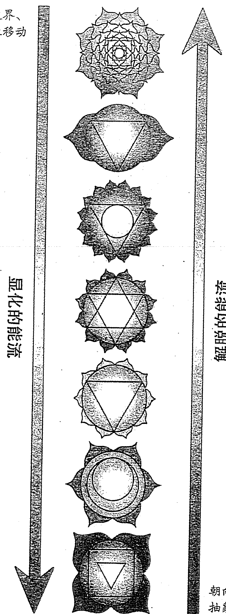

### 三种属性

在印度教神话中，宇宙是由一种原初的造化势能“普拉克提”(prakrti)①演化而来的。普拉克提相当于西方炼金术里“第一元素”(prima materia)的概念。普拉克提有三种“属性”或“特质”，它们创造出我们所经验到的一切。这三种属性以西方概念来说，就是物质、能量和意识。

第一种属性叫“惰性”(tamas)，代表物质、团块或沉重静止的状态。这是普拉克提最密实的形态。第二种属性叫“变性”(rajas)，代表能量的运作、力量，克服了惰性状态。这是普拉克提处于积极活跃、变迁的状态。第三种属性称为“悦性”（sattva），意味着心灵、智能或意识，这是普拉克提抽象形态的显现。三种属性可以被描述为：惰性，磁力；变性，动态力；悦性，两者之间的平衡力量。悦性掌管因果界，变性掌管精微界，惰性则主宰了物质界。

在宇宙不断创生的过程中，这三种属性交织在一起，形成了我们所经验到的各种次元和存在状态。为维持基本的平衡状态，三种属性需经由不断的流动达致平衡。有时候惰性也许会起主导作用，创造出许多物质。有时候变性起主导作用，带来很多能量。当悦性处于支配地位时，主要会带来心智或灵性上的体验。不管怎么说，三种属性始终保持在自己的本质里，就像三股头发编成一根辫子，每股头发都是独立的，但三股交织在一起，就编出一条辫子来。

三种属性的总量据信是保持不变的，这与今日物理学界提出的能量守恒定律一致。就好像我们可以改变辫子里每股头发的比例，但整根辫子的大小保持不变。

脉轮由上述三种属性以不同的比重配比而成。这三种属性就是基本的、统一的原始物质的精髓，它们一起组成了宇宙的舞蹈，分开来又自成篇章。属性描绘了宇宙舞蹈的步调，借着研究它们之间的关联，我们也许能学会这些舞步，自己也加入这场舞蹈。

在接下来的章节里，物质、能量和意识这几个词会频繁出现。它们概括了生命所有面向中的固有本性——即三大属性的特质。而这三者并非是各自独立的，也不可能单独存在，必然是几种成分按照不同的比例混杂在一起。事实上，除非是在知识的框架下，否则根本不可能把三者区分开。能量、物质和意识总是交织在一起，塑造出我们人所经验到的这个世界，就如同惰性、变性、悦性三种属性结合起来形成了宇宙万有。

脉轮是由这三者按不同比例组成的。物质（惰性）掌管着下层脉轮，能量（变性）掌管着中层脉轮，而意识（悦性）则掌管着高层脉轮。但是三者也都会在每个生物体和每层脉轮中存在。均衡这三者之间的关系，能为我们的身心灵带来平衡。

> ① 译者注：在印度教神话里，真实的自我来自宇宙的纯意识普鲁夏（Purusa），它拥有至善的美德，是无所不知的本体，但不具创造的力量，故无法有任何显示。在这个永恒无限的意识里存有一股可操控的能量，称为普拉克提（Prakrti），它是创造万物的力量，因为它的存在，人与动物、植物和物质才能创造、维持和毁灭，宇宙才得以变化万千，森罗万象。二者就如同黑与白、阴与阳一般，无法分割。

### 脉轮和昆达利尼

> 她的光辉如极光闪电，
她的低语如群蜂嗡鸣，
她写下韵律优美的诗篇，
在一呼一吸中维持万物生机，
在莲花座的空隙间绚烂夺目如虹霓。

——Sat-Chakra-Nirupana ①

当夏克蒂驻留于海底轮时，她开始休息。她在这里变为一条盘绕的灵蛇（也就是昆达利尼—夏克蒂），绕着湿婆灵根（Shiva lingam）转了三周半。以这种方式，她固守住物质的潜能、原始女性的创生力量以及人类意识中的进化驱力。在大部分人身体里，这股能量处于休眠状态，灵蛇栖息在脊柱的底端安静地沉睡。她的名字来自于梵文kundala，意思就是“盘旋”。

一旦被唤醒，这位女神就从卷曲盘旋的姿态中伸展开来，穿过一个又一个脉轮向上爬升，直到抵达头顶的顶轮。她想在顶轮找到降于肉身的湿婆神，与之幽会。她穿越每一个脉轮时，会把觉醒的能量带到那里。事实上，有人相信只有昆达利尼—夏克蒂才能打开脉轮。如果她能够完成这趟旅程，顺利抵达顶轮，就会与她的伴侣湿婆神，也即神圣意识汇合，其结果就是带来开悟或至乐。

昆达利尼瑜伽是一种古老的、秘传的修炼体系，其目的就是唤醒昆达利尼—夏克蒂的能量，并将这股能量沿着脊柱向上提升。这种修行方法一般要由受过训练的导师指导，并需花费数年时间去静坐冥想或练习特定的瑜伽动作。然而，有很多踏上别的灵性道路的人，甚至根本没有进入灵性修持的人，也会体验到一些自发的灵性觉醒经验，其中一些就是真正的昆达利尼觉醒。因此，了解这股神秘而强大的力量很有必要。

昆达利尼运行的路线有好多条。大部分是从脚部或者脊椎底部开始，然后一直上行至头顶。在运行的过程中，常常伴随着身体的颤抖或强烈的热感，有些人也会经验到从头部下行或从中间部位向外扩散的强烈的身体活性反应。有时候昆达利尼的征候会在几秒钟内发生，然后就消失了，相隔数小时或数年之后再来一次；有时候这种觉醒征候会持续好几周、几个月甚至好几年。

一般来说昆达利尼是一种独特而强烈的灵性体验，会带来意识的深刻转化。这个转化可能让人变得警觉机敏，头脑里出现突如其来的洞见、发展出灵视的能力，听到某些声音，感到失重浑身轻飘飘，身体内部自行净化，或者体验到无可比拟的极乐。

然而，昆达利尼体验并不总是让人愉快的。当这股能量穿越脉轮时，很多人的世俗生活会发生极大的困难。在昆达利尼突破阻碍的过程中，有些人出现失眠症状，或者对与下层脉轮有关的能量运作变得厌恶，例如对食物和性失去兴趣（也有人在昆达利尼觉醒后变得性欲勃勃）。有人透过这位灵蛇女神的眼睛重新审视自己的人生后，变得极为沮丧和恐惧。因为她是一股疗愈的力量，绝非一只温柔小猫，她要把幻象的面纱从你的庸常现实上撕扯下来。那些经验到自发的昆达利尼觉醒而身边没有灵性老师指导的人，可以去一些咨询机构寻找经验丰富的治疗师，他们一般会理解这股灵性的力量，不会把你判定为疯子或精神病①。

蛇作为一种原型象征，出现在世界各地的文化里，代表开悟、不朽及通向神的道路。在《创世记》里，蛇引诱亚当和夏娃偷吃了智慧树上的果子，这个象征寓意着昆达利尼开始启动，它产生出根植于物质世界（以苹果为象征）的、对于理解神性永无止息的渴望。在埃及文化里，法老王冠上第三眼的位置有蛇的符号，代表法老王的神圣本质，但是否也意味着上升的昆达利尼呢？在今天这个时代，双蛇缠绕在疗愈之杖上的墨丘利节杖（caduceus）②（图 1-11）仍是现代医学的象征。墨丘利节杖很明显地效仿了左脉和右脉围绕中脉彼此缠绕的景象，而两相交汇处就是脉轮所在的位置。双蛇缠绕也是 DNA 双螺旋结构的象征，而 DNA 携带着最基本的生命信息。

昆达利尼是普世性的概念，是一股非常有力的觉醒的力量，也非常狡黠和难以预测。跟这条蛇厮混在一起，可能要承受强烈的痛苦、混乱，甚至被世人看成是精神错乱者。昆达利尼也许会伴随着正面的经验（上文提到过的）而来，也许完全不会。打开脉轮就像打开监狱的牢房一样，昆达利尼会释放所有脉轮里隐藏的东西，扩张我们的知觉能力，那些最初导致脉轮闭合的创伤或受虐体验也随之全部出笼。

昆达利尼的确会带来深刻的意识状态，但其结果可能造成体验者难以忍受这个“无明”的尘世。昆达利尼也许不会支持我们当前这些范式，也许会与我们的生活环境和身体状况相悖，并且这些差异会给我们带来很大的不适感，但最终我们无法避免。昆达利尼是一股基本的疗愈力量，当我们没有准备好释放身心中积攒的那些紧张和能量杂质时，它会给我们造成痛苦。学习开启脉轮会帮助扫清昆达利尼运行的路径，减少不适和痛苦。

理论上，昆达利尼产生的能量会帮助我们打开头顶的顶轮。但由于

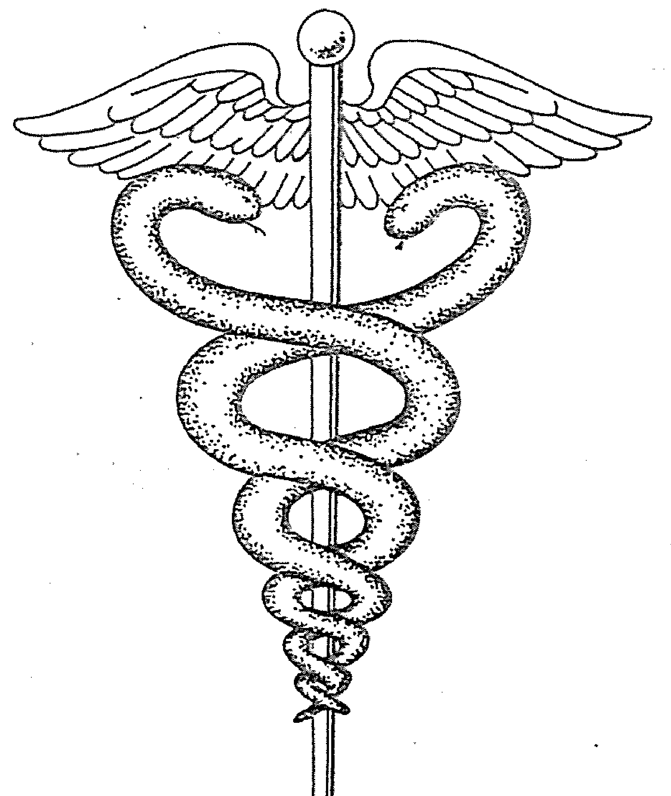

① 见美国加州整合学院开设的 Spiritual emergence networkkundalini research network。
② 译者注：墨丘利（Mercurius）是罗马神话中为众神传递信息的使者，相对应于希腊神话的赫耳墨斯（Hermes）。他的形象一般是头戴一顶插有双翅的帽子，脚穿飞行鞋，手握魔杖，行走如飞。他是医界、旅行者、商人和小偷的保护神，西方药店经常用他的缠绕两条蛇的手杖作为标志。墨丘利手中的节杖两条蛇交错盘绕，用它来拯救冥界的死者，引导灵魂往返于地狱之间，被后世看作具有治病救人、起死回生的神效，因此成为医界的神圣标志。

① 见 Sat-Chakra-Nirupana 诗篇十和十一，英译引自阿瑟·阿瓦隆（Arthur Avalon）所著《灵蛇的力量》（The Serpent Power）。

脉轮里那些阻塞物会卡住我们脊柱的能量，因此顶轮也是最难到达之处。传统上认为开悟是在顶轮发生的，但我相信开悟需要所有脉轮配合起来，协调一致，再加上自我觉察，才能带来开悟体验。对许多人来说，他们的开悟体验往往来自把顶层脉轮的意识向下带入具体问题的觉知中，而不是相反。

当我们深度放松，并觉知所有脉轮的运作时，能量就会自然而然地运行至高层脉轮。迫使能量向上提升，常常会带来紧张、压力及“出神”的感觉，或者对于周遭和我们不一致的事物神经过敏。其结果就是造成我们与这个世界的疏离，而我认为这种疏离恰恰是不开悟的表征（许多人在研讨会中来找我，兴奋地告诉我他们第七脉轮的开悟体验，然而他们却缺少细微的敏感度，没有觉察到自己正粗鲁地打断了别人的谈话，或者对自己这副肉身完全疏于照顾）。

谈到脉轮不可能不提及昆达利尼，然而提升昆达利尼的能量并不是本书的重点。昆达利尼也并不一定是最好或最容易的觉醒方式，就好比开车穿过一堵石头墙，并不一定是到达下个街区的捷径。有些时候我们确实需要强大的力量来摧毁这些坚硬的堡垒，但我自己宁愿选择一种更自然、安全和愉悦的方式。我们可以选择一条风光旖旎的路线旅行，顺便好好地享受沿途风景和目的地。

这本书既不支持也不批判那些用以唤醒昆达利尼的修行方法。迷幻药LSD就是一种快速瞥见高层超意识世界的方法，它不一定能让你停留在那个境界，却可以给你带来一些正向的、永久性的改变。昆达利尼具有不可预知性，通常它带来的体验更深刻，也更难达成。但是昆达利尼并不是服食迷幻药的结果，而是我们生命能量重组所激发出来的现象。对任何真诚地想要寻求更高意识的人来说，昆达利尼绝对是一种独一无二的、极为宝贵的体验。

我们现在面临的痛苦来自我们的恐惧，以及昆达利尼在抵达目的地之前必须燃烧掉的那些不洁的The request was rejected because it was considered high risk

元音声：单词 rope 里的 [o]

轮瓣：四瓣

塔罗牌：钱币

质点：王国 (malkuth)

行星：土星，地球

金属：铅

食物：蛋白质，肉类

对应动词：我拥有

瑜伽：哈他瑜伽

草药：香柏

矿物质：天然磁石，红宝石，石榴石，血石

属性：惰性

动物：大象，牛，公牛

莲花象征：四瓣红色花瓣，黄色正方形，倒三角，湿婆灵根——昆达利尼围着它绕了三周半，白象，八个冲外的箭头，bija（见种子音）之上的梵童子和达基尼空行母 (Dakini，夏克蒂的化身)

印度教神祇：梵天 (Brahma)①、空行母、迦尼萨 (Ganesha，象神)②、俱毗罗（Kubera，财神），乌玛（Uma，雪山神女），拉克什米（Lakshmi，吉祥天女），帕莉斯尼（Prisni，母牛神）

> ① 译者注：梵天，是印度教的创造之神，与毗湿奴、湿婆并称三主神。他的坐骑为孔雀（或天鹅），配偶为智慧女神辩才天女，故梵天也常被认为是智慧之神。梵天的传统形象是四颗头、四张脸以及四只手臂，口中不断地诵读《吠陀经》。佛教也将梵天吸纳为护法神之一，在南传佛教的东南亚，尤其泰国得到很大发挥，华人称之为四面佛，据说有保佑人间富贵吉祥的功能。
> ② 译者注：象神迦尼萨，也称印度象头神，是印度神话和民间百姓中知名度最高、最受崇拜的智慧、财富之神。一般认为他是湿婆神与雪山女神之子。他的形象为象头人身、四臂，手拿两种法器——螺与索。

其他神祇：盖娅（Gaia，希腊神话中的大地女神），德墨忒耳（Demeter，掌农业、结婚、丰饶之女神），珀尔塞福涅（Persephone，宙斯之女，被冥王劫持娶作冥后），爱尔达（Erda，北欧神话中的地母），厄里斯克革（Ereshkigal，古苏美神话中的地府女神），阿娜特（Anat，迦南的爱情女神、女战神），赛立德温（Ceridwen，凯尔特神话中的女巫），盖布（Geb，古埃及神话中的大地之神与生育之神），冥王哈迪斯（Hades），普伊尔（Pwyll，凯尔特神话中的迪韦德王子），杜木茨（Dumuzi，巴比伦诸神之一，苏美尔的农业和春天之神），塔穆兹（Tammuz，巴比伦神话中的生育之神），阿特拉斯（Atlas，希腊神话中的大力神）

大天使：希望天使乌列尔（Auriel）

主要运作力：重力

## 海底轮（MULADHARA）——根轮

> 意识躁动，梵天聚集，
> 凝结成物，物造生命，
> 命出心灵，世界成型。
> ——剃发奥义书（Mundaka Upanishad，1.1.8）

我们沿着脊柱向上攀升的旅程，始于脊柱的底端，也即第一脉轮。它是我们整个系统的根基——所有其他脉轮依此而建，因此这一轮至关重要。第一脉轮与“土”元素有关，也与所有固化和世俗之物有关，例如我们的身体、健康、生存问题以及拥有的物质、金钱，我们专注并实现个人需求的能力。第一脉轮是意识最终形式的显化，是稳固而切实有形的。正如活着和维持健康是我们生而为人的需求，接受限制和纪律对意识的显化也是必不可少的。

在这个系统中，“土”元素代表了形态与坚固性，是物质最密实的状态，也是脉轮光谱中最为“低下”的一层。在可见光谱中，它显示为振动的深红色。这是最初始的颜色，也是波长最长、振动频率最低的颜色。

这一轮的梵文名是 *Muladhara*（海底轮），意思是“根部的支持”。坐骨神经从骶神经丛发出，贯穿双腿，是人体内最粗大的末梢神经（大约有拇指粗细），它的作用相当于神经系统的根系（图 2-1）。腿和脚为我们提供了行走的能力，使我们能从大地和周遭环境获取维持生存所需的物资。我们的双腿踏实于大地之上，把我们的神经系统与代表第一脉轮的“土”元素相连。我们以动态化的方式回应重力，这股地心引力不断地把我们向下拉，而正是这股力量把我们和这个星球联结在一起，使我们扎根于物质的存在之中。

这个脉轮中心被描绘为一朵四瓣的莲花，中间有个正方形（图 2-2）。我们可以把四瓣看成是物质世界的四个方向或四根廊柱，而正方形在很多系统中被用来指代物质世界。在卡巴拉生命之树中，第一脉轮与“王国”（Malkuth）有关，因此四瓣也暗示物质王国的四元素。

在这个正方形中，还有一个小的倒三角，连接着中脉的管道。它代表海底轮向下联结大地的力量。倒三角之内有一条昆达利尼灵蛇，盘绕着头朝上的湿婆灵根。海底轮是昆达利尼的家园和休憩之所。倒三角下方是一头长着七根象牙的大象，名字叫爱罗婆多（Airavata，因陀罗坐骑），它代表着这一脉轮滞重的物质特性，以及对应着七个脉轮的七条解脱之路。我们也可以把象头神迦尼萨和这个脉轮联系起来。象头神脚踏实地，大腹便便，对自己的肉身充满愉悦。正方形之内的其他神祇还包括长有五张脸、能降伏恐惧的梵天童子，以及夏克蒂在此次元显化的空行母，她手持长矛、剑、钵和骷髅头。正方形的中心是种子音Lam的象征，据说此音包涵了海底轮的精华。进行海底轮冥想时，可以把上述图像和声音运用起来。

在人体里，第一脉轮位于脊椎的底端，更准确地说，位于肛门和生殖器之间的会阴处。它对应着脊椎的尾椎部分，以及尾骨神经节和下腰椎，这些神经节是从下腰椎延伸出来的（图 2-3）。此处的脉轮联结着坚实的物质属性，因此也对应着人体中最坚实的部分，如骨头、大肠（让固体物质通过）和整个肉身。还有一些次要脉轮分布于膝盖和脚部，它们把有关行动的讯息从地面向上传送到脊柱。这些次要脉轮附属于第一和第二脉轮，是整个身体接地的门户。

我们已经描述过脉轮是一连串能量的漩涡，而漩涡在第一个脉轮最密实，其本质是惰性的、休眠和不动的。

如果你要在澎湃的水流中过河，会发现很难走过去，因为流水的冲击力太大了。如果很多条这样水流从四面八方向你这个中心点冲过来，你就寸步难行。这些力量会形成一个场域，如同固体一样密实。海底轮就有这种密度。

从身体层面来看，这种密实是无法穿越的，但是从更高的非物质的心智层面来看，就是另一回事了。我们知道原子里大部分空间是空的。我们可以透过玻璃看到物体，尽管玻璃很坚硬。我们也可以透过墙壁听到声音。我们还可以运用智力发明出仪器，由此看穿物质是固体的幻象。

然而，正是这样的固态物质建造了我们所能感知的一致实相（consensus reality）。如果没有这种相对稳固不变的物质根基，我们的生命将会异常艰难。想象一下如果每次你回到家，房子的外观和地理位置都改变了，或者你的孩子每天的成长发育会变得让你认不出来，你得有多困惑！

在我们目前的进化层次中，物质是无可否认且非常必要的现实。我们无法从物质中脱离，因为我们自身就由它打造。没有肉身我们会死，而否定肉身就是提前去死。同样的，我们也无法否认与我们赖以生存的地球的联结，它支撑着我们未来的发展。忽视我们的根基，就是把自己建立在摇摇欲坠的基石上，而海底轮的目的是要夯实我们的根基。

海底轮的意识主要是关注肉身的存活，掌管着我们“战斗或逃跑”的本能反应。忽视这个脉轮或它的世俗元素，会威胁到我们的生存，不论是个人的还是集体的。在我们进展到其他脉轮之前，如果不去平衡海底轮的能量，我们的成长就会丧失根基，变得无法落地，缺乏真实成长所需要的稳定性。

当我们的生存受到威胁，我们会经验到恐惧，恐惧正是隐藏在第一脉轮中的恶魔。它会抵消掉此脉轮理应带来的安全感和保障。莫名的恐惧总是第一脉轮功能失调的表征，而面对我们的恐惧会帮助第一脉轮觉醒。

在许多不同流派的灵性哲学中，有一种共同的信念，那就是我们是被困在了肉身之中，等待着从此桎梏中解放。这种信念无疑贬损了肉身，把灵肉看成是分离的，它拒绝去亲近由数万亿细胞组成的这具肉身中深藏的美丽与智慧。

物质世界会成为陷阱，是因为我们把它当成了陷阱。一旦我们了解它在更大结构中扮演的角色，它就会迅速成为我们的朋友。当我们沿着脊柱向上攀爬，我们会对物质在其他层面的显化有更多、更深入的了解，我们将体会到生命的神圣性和安全感确实是以物质为根基的。

### 落地

朝向高层意识的“解脱的能流”一向和脉轮系统联系在一起。但直到如今，我们鲜少提及那股引导我们能量向下运行深入大地的“显化的能流”。它经常被看作是缺少灵性的，不值得我们关注和浪费时间。太多的灵性教诲都忽视了“落地”（grounding）的重要性。

“落地”是伴随着大地的边缘、边界和限制，与地球母亲动态联结的过程。落地让我们全然真实地活着，就在此时此地接受来自大地的那股活力，生机勃勃地活着。虽然从力学上讲，我们双脚迈出的每一步都在接触大地，但如果我们切断了来自腿和脚的感觉，这种联结就是空洞的。落地意味着下层脉轮保持开放状态，与地心引力协同一致，且下沉进入我们这副肉身工具的最深处。

不落地，我们会变得不稳定，失去核心，丧失控制，脱离现实，沉浸在幻想的世界里做白日梦。我们失去了控制、拥有或掌握事物的能力。自然本能所赋予我们的兴奋、充盈之气会消散、稀释，无法生效。当我们丧失了根基，我们的注意力会从当下离，看上去似乎“不在现场”(not all here)。在这种状态下，我们会感觉无力，陷入恶性循环，越来越无法停留在当下。

我们落地的锚，即是我们的根，也是这一脉轮被命名为“海底轮”的原因所在。透过我们的根，我们能获得滋养、力量、稳定性和成长。缺少这样的联结，我们就会和大自然，和我们的生物源头分离。源头一旦被切断，我们就会失去方向。许多人无法找到自己真正的人生道路，就因为无法找到自己的根基。有时候他们忙于向上仰望，却拒绝向下看，而下面才是用双脚走出的、真实的人生之路。

我们的根基源于我们一些本能的情感，这些情感是基于过去的记忆、种族、文化传承以及我们无可摧毁的存在本质所形成的一些反应模式。荣格把其归为集体无意识（collective unconscious）的领域，这个广袤强大的领域涵盖了我们的遗传本能和进化驱力。当我们回归了自己的根基，就会更明白我们是谁，并且从这个本能的领域里汲取巨大的智慧。

当我们能够落地，我们会变得谦卑，贴近大地。我们领受恩宠，简单度日，持守宁静、坚定和清明的生活态度。我们会在日常生活的压力中磨砺自己，而我们基本的生命活力因此得到强化。

倚靠着大地，我们不会坠落，内在获得了安全保障。而我们的意识也只有通过落地才能完成显化。第一脉轮是梦想变成现实的关键。从各种奇思妙想到对物质世界复杂的需求，地球是我们信念的试炼场。有了根基、物质和有效路径，我们才能找到显化之途。有了根基，我们才能承受这所有的一切。

在今日的都市化世界里，几乎没有人能自然地落地了。我们的语言和文化价值观无不在反映“高（上）”比“低（下）”优越。例如我们说“高度”赞誉、重要性“高”过、兴“高”采烈、积极向“上”等。在社会和经济层面，脑力工作被认为是高于体力劳动的。而我们人体自然的生理过程，如排泄、性交、生产、母乳喂养，或者裸体，经常被看作是不洁的，只能在私下进行，并且往往还带着负罪感。维护身体健康这项重任被交给了医生这样的精英阶层，而否定了我们的身体本来就拥有的自我疗愈潜力。我们在商业、政府和组织化宗教里建立起的结构是等级分明、自上而下的，“上”常常以所谓“崇高的理由”控制甚至践踏“下”，役使“下”为“上”服务。

我们与大地失去联结，也就失去了与所有生命之间错综复杂的联结。我们自己的生命也变成由局部而非整体来掌握，而局部意味着孤立、碎片化和失联。忽视我们的根基也几乎毫无疑问要面临社会医疗保健危机和生态灾难。

在疏离与“失根”（ungrounded）的文化中，多数价值观是不喜欢肉体和肉体带来的欢愉的，于是痛苦日渐累积。我们的身体在一整天面对电脑或开车后，会受到伤害。竞争的压力和快速的生活节奏无法给予它喘息和更新的时间，也无法让它处理和释放创伤。具有讽刺意味的是，身体上的痛苦越累积，我们就越会拒绝落地，因为落地意味着“接触”，而接触就要去感受那些痛苦。这是我们身心整合的第一步，如此才能开始疗愈。

当我们变得越来越机械化和都市化的时候，我们与大地母亲和大自然的联结就变得越来越弱，与健康和自我价值感的联结也越来越弱。我们的力量转移到上半身，而上半身的力量是薄弱的，必须不断去维护。因为我们把自己看作是分离的，结果我们的力量就用于了操控而非联结。我们失去了与动物本能的联结，也就失去了本能所具有的力量、恩典与平静。当我们能够从身体来感受自我，就比较不需要透过膨胀的小我来确定自己。大地是我们的家园，它熟悉、安全、可靠，拥有自己的力量。

落地意味着限制。上层脉轮的心智能量可以无边无际，下层脉轮的范围则要狭窄得多。就好比语言是有限的，却也因此使我们的思绪变得清晰明确。我可以举出世上有一千种东西，是无法放进一座大房子里的，因为我们在物质世界会受到更多的限制。而脉轮每向下一层，就变得越单纯、明确，却也受到越多的限制。

尽管某些人会害怕，受限却是创造的一个重要法则。就如同如果我们不对自己的行为加以限制，人生将一事无成。同样的，如果我在敲下这些手稿时，不对我脑中的思绪加以限制，那我也写不出这本书来。限制远非是消极负面的，相反，限制会创造出一种容器，允许我们的能量凝结成物。想要显化，我们必须自愿接受限制。落地就是对自然限制的心平气和地接纳。对意识的发展而言，落地与任何冥想或能量提升的修炼同等重要。在不朽的《易经》里有这样一段话：

> 限制带来成功……无限并不适用于人。如果无限来临，人的生命会消融于无边无际的虚空中。为了变得强大，人生需要承担由责任而来的限制，并对此甘之如饴。
> ——第六十卦节卦（卫礼贤 / 贝恩斯版《易经》）①

> ① 译者注：原文为：节，亨。……不节若，则嗟若，无咎。安节，亨。甘节，吉，往有尚。

落地也是一股简化的能量。事实上，我们把意识带入肉身只能存在于一种时间和空间中，即此时此地。相反，我们的思想却可以在时空之外四处漫游。我们可以想象明年暑期去山里度假，甚至能看到和感受到那里温暖的阳光，但我们的身体此刻仍坐在桌前，面前有一堆账单，窗外白雪皑皑。如果我们花费太多时间幻想，也许就永远完不成工作腾出时间去度假。因此是时候回到现实中来，脚踏实地地工作，满足我们的生存所需了。

人体是一个可微调的接收器，能够接收和传送各种各样的能量。像任何一架立体声收音机一样，我们必须先插上电源，才能接收各种调频。落地就是人体与大地母亲及外部世界接通电源的过程，我们使自己成为管道，接收围绕在我们周遭的巨大的生命能量。

避雷针通过把超额电压传导入地而保护建筑物，同样的，落地可以保护我们的身体，避免因日常生活的压力而“超负荷”运转。通过与大地联结，我们把压力振动输送到更大的、能够处理这类能量的“身体”里。举个例子，小孩子在听到巨大噪音时，会把头埋在妈妈的肩膀上，从某种意义上说，就是把他感受到的能量传送入妈妈的身体。

测量显示，当一个人站在地面上，他身上的静电也会接入地面。地球周围有一个静电场，这个谐振频率大约在 7.5 赫兹 ①。近年来，伊扎克·班托夫提出，人体也有一个由心脏、细胞和体液振动组成的“微动场”（micromotion），他推算频率约在 6.8 至 7.5 赫兹。也就是说，我们身体的自然振动与地球是同频的。当我们走路或躺在地上时，我们的身体会联结这个巨大的球体，也会更深地融入这种共振中。

> ① 见伊扎克·班托夫（Itzhak Bentov）著作《走在狂荡的钟摆上》（*Stalking the Wild Pendulum*），第 53 页。

落地也是处理压力的方法。能量下行的管道给予我们释放压力的出口，保护我们的心灵免于超负荷。物质世界是如此安全而稳定，我们可以从喜爱的椅子、一顿美餐或熟悉的环境中去寻找那种平静而安全的感觉，而这种稳定感会帮助我们向上提升。当我们的身体感到安全，受到很好的滋养，并且保持健康，我们的意识也更容易流动到其他层面。

脉轮会过滤环境中的能量。由于其旋转模式有固定的振频，只有匹配的振动才被允许进入意识的内在核心，剩下的就退入背景板中，很快被我们的意识遗忘（而潜意识经常会记得清清楚楚）。当周围环境中有太多的摩擦性能量，脉轮就会关闭，以保护精微体不受这些腐蚀性能量的侵入。超负荷的脉轮很难再打开，而落地是释放这些过度紧张的一个办法。

透过静定，落地带来净化。我们的每个行为都会引发反应，在这种恶性循环中，如果能“静止”自己对某些行为的反应，我们就走出了“业”，得以中断这个由“行”产生“识”的循环。如同把一杯脏水放置足够时间，沉渣会落入杯底，而水得到了净化。

许多人遇到困难是因为他们的上层脉轮过于开放，而下层脉轮不够稳定，无法建立保护屏障来处理从周遭搜集到的心灵能量。在最极端的情况下，这会导致严重的心智错乱，例如精神疾病。一个精神病患者是无法与他自己的根基和一致现实产生联结的。通过落地的练习，心灵重负能够得到一定程度的释放，给病患带来稳定性，来中和过度敏感。即使最简单的身体触摸也能帮助一个身处极度痛苦中的人落地。身体运动和手工活儿也会有帮助。在本章末尾或《七重之旅》①一书中会介绍一些落地练习。

> ① 见作者和维加合著的《七重之旅：透过脉轮整合身心灵》(The Sevenfold Journey: Reclaiming Mind, Body, and Spirit through the Chakras)，里面有许多关于脉轮发展的练习和修行。

落地就如照相机镜头对焦，镜头与实物的影像重叠为一。当我们的星芒体（astral body）①与肉体紧密相连时，我们对物质世界的觉知就会变得敏锐而清晰。而我们完全落地，别人从旁观察我们，也会体验到一种动态的清明感——这种能量弥漫在我们的眼睛和身体四周，无论这个人是否真的见过“灵光”（aura）②。

> ① 译者注：西方人智医学主张人是由物质体（Physical Body）、以太体（Etheric Body）、星芒体（Astral Body）、自我意识体（I Organization）和精神导向（Spirit Orientation）这五层能量体组成的。星芒体也叫情绪体，掌管人的情绪能量。
> ② 译者注：一般认为，灵光是一种围绕在人身上的独特气场，其中包含关于此人的本质信息。灵光的电磁能量以蛋型环绕着身体，颜色有红、橙、黄、绿等许多种，会随着人的念头、情绪、空间环境、气候等发生改变。

在这种“有根”的状态下，我们会更容易做决定，对未来的担忧也会减少。我们会享受当下这一刻，而不畏惧接受新的境遇和挑战。这种状态不但不会妨碍意识的扩展，反而会提升它。

落地为我们的生命带来根基，就像一个人如果想要进医学院，在本科时代就要学习一些自然科学；而一个打算创业的人，应该先从前辈那里讨教经验，同时找到资金支持。第一脉轮是我们从事所有生命活动的根基，身体就是我们创造出的周遭世界的缩影。我们所做的身体工作以及我们所建造的根基，对后续的成功至关重要。

对许多人而言，工作本身就是落地活动。工作除了为我们提供基本的生存所需——金钱之外，按照常规时间表从事某项职业，也为我们的生活提供了基本框架。日常例行的工作虽然有时候是件苦差事，但我们却能从这种限制里受惠，因为它打造了一个基础，透过专注和重复，能量得以聚集而显化。假如我们陷入连续不断地变动中，我们的生活就如## 生存

第一脉轮的意识是面向生存的。它里面的程序是要保护我们的身体健康和维持日常所需。这种功能源于我们的本能层面，主要和饥饿、恐惧、休息、温暖和庇护有关。

生存需求会唤醒我们的意识。生存面临威胁会刺激肾上腺，爆发出额外的能量以应对战斗或逃跑的需要。当身体被激发，意识也会随之提升。生存挑战要求我们快速地思考和行动，找到新的解决方案。我们的意识会自动自发地专注于生存处境，而其他时候鲜少能做到如此。

加强第一脉轮的能量，我们首先要以一种健康和直接的方式满足生存所需，使我们的意识不至于被生存需要控制住。因为忽视这些需求，我们就会不断地被拉回生存意识中，无法向上走。

在我们的集体无意识底层，我们有那种与大地、天空、四季和动物紧密相连的记忆。这种联结对于我们的生存是不可或缺的，也是我们最初智力发展的基础，因为那时候我们也会像今天被我们吃掉的动物一样，被别的动物所猎杀。我们是维生系统内的一环，生存几乎就是全部的关注焦点所在。

现在的情况大不相同了。我们的生存所需都来自间接途径。食物来自商店，保暖问题只需墙上一个按钮（空调）就可解决。我们不需要再在夜间保持警醒，守护食物不被饥饿的野兽夺走（除非这头动物是家庭成员）。我们不再因不懂如何点火而不得不让火堆一直燃烧。现在我们需要担心的是车子会不会在上班路上抛锚，有没有足够的钱来支付水电费，或者出城时家里会不会发生盗窃案。

然而，生存本能仍然被保留下来。当我们失业、染病或被赶出住处无家可归时，都会让第一脉轮过度操劳。发生这种情况时，我们会感到恐慌。求生能量充斥全身，但也许我们并不知道该如何应对。身体所预备的逃跑或战斗模式并非解决之道，我们需要带着觉知回归根基。

当海底轮被危险和紧迫情况激活后，它的反应很像电脑在软盘上搜寻信息。海底轮这个软盘上储存了我们所有的求生信息，身体的操作系统会把这些信息导入头脑意识的关注范围。

而身体的反应是即时的。脊柱通过双腿联结大地，肾上腺涌入血流，心跳加快以增加血液供给，同时感官被大大激活。我们沉睡的意识觉醒了，这是意识加强的开端，而盘绕潜伏在海底轮中的昆达利尼也会开始上升。

在求生不是紧迫要求的状态下，海底轮会维持无意识地运作。它的例行公事是检索内外环境，确保一切井然有序，情况有利于生物体的存活发展。当危险出现时，海底轮中预先编制的程序就会接管人体，确保我们的意识处于身体需求的支配之下。

一旦海底轮接管状况，我们就几乎无法干预它的运作过程而不伤害身体。好比如如果我们不好好休息，病情就会加重，直到我们不得不躺倒休息为止。如果我们的收入受到威胁，或者突然从自己家里被赶出来，我们的意识就会一直被这些问题所占据，直到解决它们为止。如同地心引力一样，我们只有接受海底轮这些反应，并学习与之共处。

那些被健康问题和持续的经济危机困扰的人，皆受制于第一脉轮。那些未解决的冲突，不管是身体上的、间接的或是心理上的，都会把我们的意识困在这个层次。我们通常会感到不安、恐慌，而这些情绪也许会蔓延到生命的其他领域，即使在那个领域我们丝毫没有必要这样感觉。只要这些问题不解决，我们的意识就难以提升到更高的层次。本章末尾会罗列一些针对落地和第一脉轮的练习，不过最重要的还是了解意识在此脉轮的意涵，即“存在于此的权利”（the right to be here）。

如果这是你的经验，请问问自己，是什么让你不想停留在这里？你需要得到谁的批准，才能关爱自己？是什么让你恐惧落地，变得稳定，站立在自己的脚上？谁要为你的生存负责？你有多少想法是不切实际的幻梦，无法在周遭世界实现？你童年时生存环境如何？谁照顾你？为了存活，你付出了什么样的代价？你和自己的身体有联结吗？你倾听过它的声音，满足了它的需求吗？你是否有权存在于此处，占据这个空间，占有你的生存所需？

把生存维持在一个舒适的状况下，需要掌握一项能力：拥有，也即把物质吸引、容纳、保存到你身边的能力。存在和拥有是第一脉轮的权利。

拥有的能力是一种后天习得的技巧。有些人生于富豪之家，他们被养育成总是在生活中期待富足。去商店买最好牌子的商品，去餐馆点最昂贵的食物，对他们来说是再自然不过的事，也很容易维持在这个层面，即使经济状况已捉襟见肘。因为对财富的期待会更容易创造出财富。

大多数人没有这么幸运。我们都是在匮乏的观念中长大的，买一件新衣服会让我们惴惴不安，接受一份愉快但薪水较少的工作会给我们带来恐慌，而有机会放一天假我们也会觉得有点不踏实。我们要尽可能地物尽其用，绝不冒奢侈的风险。我们不允许自己享受奢侈品，如果这么做就会觉得罪恶和担心。这些都是没有能力去“拥有”，第一脉轮的编程基础是匮乏而非富足。

发展我们“拥有”的能力，首先要增加“自我价值感”。反过来，允许自己拥有更多，也会实实在在地增加我们的自我价值感。从金钱、爱、自己的时间、休息或享乐的角度，可以客观评估一下我们允许自己拥有的能力。一位我认识的老师曾告诉我，她从来不给自己买新袜子，她会给丈夫买，然后穿丈夫替换下来的旧袜子！很明显，她花了钱，自己却无法从中受益。有些人会发现自己很容易花钱买奢侈品，却很难花时间让自己来放松。还有一些人很难接受爱和快乐。仔细检视我们允许自己拥有的东西，我们就会自嘲，因为看到了本来可以拥有和允许自己拥有之间的鸿沟。不知何故，关爱自己被认为是自私或邪恶的，然而，不爱自己，只会导致我们在其他领域或其他人身上索取补偿。

为了全然地存在于此处，我们必须维护自己，肯定自己在这个世界上的位置，确保我们的生存权利。我们需要把“拥有”的能力提升到足够的高度，来满足一切我们所需。如果我的潜意识说：“不，我不值得拥有。”我们的意识心就会制造出额外的障碍，阻止我们去拥有。

我们最终的生存根基是地球本身。不幸的是，地球在这个时代自己也面临着生存问题。生态崩溃的威胁、核灾难、干净的空气与水资源的匮乏，都在有意无意间影响着我们的生存感受。进入新纪元并非意味着可以把过去这些对大地母亲的伤害抛之脑后，新愿景和旧创伤必须整合在一起。只要我们还忽略地球，大地母亲就会一再将我们拉回原地，拉回此时此地，直到恢复了受到威胁的生态平衡为止。

从文化层面来说，我们所有人都还处于生存状态。当我们转向大地，与它深入接触，会不可避免地感受到攸关我们未来生存的地球母亲的恐慌感。如同个人生存受到威胁时，我们的意识会被强化；地球的生态受到威胁，这个星球的意识也会被强化。人往往需要经历危机，才能觉醒。

如果我们想要到达上层脉轮的灵性层次，就必须看到物质存在之中的灵性面向。我们赖以生存的这个星球就是明证，它是物质所表达出的美、和谐与灵性的极致。理解了这一点，我们就更能发展和表达出我们作为物质存在的美好一面。

处于生存层面是一种提示，要我们觉醒，提升自己的意识，检视我们的根基：我们的落地情况、我们的身体和地球母亲的状况。这也是第一脉轮的宗旨所在。它是我们开始的地方，也是旅程尽头的安息处。

#### 身体

> 身体之内是神圣的河流，里面有日月，有朝圣之所。我还从未遇见一座庙宇，像我的身体这样充满极乐。
——多哈证道歌（Saraha Doha）①

正如房子是我们身体的家，身体也是我们灵魂的家。我们的意识可以神游千里，但终其一生仍需安住在这具血肉之躯里。我们的身体也许会在一生中发生巨大的变化，却始终是我们唯一的生命家园。随着肉身与外部世界不断互动，我们形成了自己的小宇宙。

掌握第一脉轮的任务就是最终了解和疗愈身体。学会接受我们的身体，感觉它，肯定它的价值，爱它——这些都是我们要面临的挑战。第一脉轮的语言是“形式”（form），身体就是我们个人形式的物质表达。当我们借由观察、触摸、运动或内在感受来检视这具肉身时，我们就学会了身体诉说的语言，发现了自己更深层的部分。

每个脉轮都会带给我们不同层次的信息。身体是接受这些信息的“计算机硬件”，也是我们内在所有数据和编程的“影印本”。印刻在这架血肉和骨架上的，是我们的痛苦和欢乐。编码在神经脉冲里的，是我们的需求、习性、记忆和天分。基因之内是我们祖先的谱系，细胞之内有我们所食之物。心脏跳动着我们生命的节奏，血肉里则映现了我们的日常活动。

要了解身体，我们必须先成为它，成为它的痛苦、喜悦、恐惧和欢乐。把灵性存在看作是与肉体分离的，只会切断我们和大地、根基、家园的联结。我们不再完整，变得分裂，与身体所传递的信息隔离。

但这并不意味着否定某些哲学所说的：“你不是你的身体，你是比身体更大之物。”相反，它强化了这类观点。我们是我们的身体，只有透过这种了解，我们才能成为比身体更大之物。我们变得扎根，安住于当下，联结内在发生的一切。借由身体这个载体，我们更全然地体验我们的灵性和情感面向。

我们的身体是由数以万亿的小细胞组成的。某种奇迹的力量把这些小细胞组织成复合的整体。像重力场一样，第一脉轮把物质和能量吸纳进来，然后由不同层次的意识把它们组织成一个协同运作的整体。接纳身体就是接纳这个核心的整合机制，它把我们不同的部分统合为一。它是我们灵魂的容器。

我们的身体表达着我们的生命。假如我们的肩膀感到沉重，那是身体在告诉你，你承载了太多负担。假如你感到膝盖不能支撑，那是身体在告诉你，你人生中拥有的支持不够，或者缺乏灵活性。假如我们的胃部慢性疼痛，那表示生活中有些东西你已无法忍受。

我常常要求那些开始身体工作的案主做一项练习，以“我是……或我感觉……”开头，写下身体每一部分的陈述。假如他们说他们的脖子抽筋了，就写下“我抽筋了”。假如他们的膝盖感觉虚弱，就写下“我感觉虚弱”。然后我把所有这些陈述都读出来，而并不指出哪个句子来自身体的哪个部分。结果会发现这些陈述正是此时此刻他对自己整个生活的感受①。

肯定我们的身体就要认同它。假如我的胸部在痛，等于承认我的心在痛。要巩固海底轮，必须达成与身体的和解，如此我们才能平和地安住于这幅肉身中。第一脉轮使我们对身体产生了认同，也给予我们生而为人的基石。

自我滋养是关爱身体的关键。需要休息时就休息，吃得好，锻炼身体，带给身体快感，都有助于第一脉轮保持快乐。按摩、热水澡、高品质的食物、快乐的身体运动都是滋养自己、疗愈身心分裂的办法。身心分裂是意识高于物质的思维产物。假如身和心成为相互对抗的两极，我们就永远无法整合为一体。反之，透过身体，我们才能在物质世界里体验到心灵。

吃——把固体物质摄入我们的身体，是第一脉轮的活动。它使我们落地，滋养我们，维持我们的肉身结构。透过食物，我们把大地（第一脉轮元素）结出的果实带入体内。要研究我们作为物质存在的部分，必须研究我们的肉身是由什么构成的。我们消化的食物是转化为能量的物质，因此吃进去的食物会影响能量的输出。为第一脉轮打下健康基础的第一步，是要吃干净而富有营养的食物。

对有些人来说，这意味着只吃从当地农场出产的最纯净和最新鲜的食物。但对大多数人而言，这种做法不切实际。对食物如此纯净的要求，会让那些生活在典型都市环境中的人挨饿。我们最多只能对吃进去的食物保持觉知，避免过度加工的、富含精糖的食物以及实际上没有任何营养的所谓“垃圾食品”。这些都是增强第一脉轮和保持身体健康的第一步，但是只吃来自健康食品商店的食物仍然可能导致营养不良，因为天然食物并不意味着均衡饮食。均衡饮食比食物纯净更重要。

人类营养需求这个问题太过错综复杂，无法在此尽述。阅读相关书籍会对第一脉轮有所帮助。让人震惊的是，有太多人根本不把吃东西当回事，虽然它是我们生活中一项如此基本的功能。假如我们要使用这副肉身九十年，却根本不参考人体使用手册，毫无疑问有一天身体会垮掉。

#### 食物和脉轮

我们的文明和意识继续着无可避免地演变，很自然的，我们的身体状态也会跟着演变。当身体发生变化，饮食习惯也随之改变。那些想通过食物达成开悟的人，可能会发现这是一条极为缓慢和艰难的路。

其实，适当的饮食会扩展我们的意识，但这份食谱无法适用于所有人。一个人应该根据自己的需求、目标和体型，选择适合自己的食物。假如你体重 220 磅，每天在建筑工地干体力活儿，那你需要的食物跟一个坐在办公室、体重 99 磅的秘书小姐肯定不一样。通常为了培养敏锐的感受力，把意识提升到更高层次，我们会建议吃素，但素食并不适用于每个人，在营养均衡不能保证的情况下，素食甚至对人体有害。

在营养成分之外，食物也会有一些基本的振动频率。家人用爱心烹调的食物，就比那些痛恨自己工作的快餐店厨师准备的食物，对人体有益得多。不同种类的食物有着不同的振动频率，也对应着不同的脉轮层次：

##### 第一脉轮：肉类和蛋白质

吃肉补肉，肉类可能是你吃到的最具身体导向的食物了。肉类比其他食物需要更长的消化时间，因而会在消化道停留更久。由于这个原因，肉类占据着下半身的能量，往往限制或控制了能量朝上层脉轮流动。对落地而言，肉类和蛋白质是很好的食物，但是吃多了会造成身体昏沉、有惰性。另一方面，如果一个人感到虚弱、迷惑，与身体和物质世界失去联结，那么好好吃一顿肉会帮助他落地。

但是落地并非一定要吃肉。蛋白质才是对第一脉轮的组织架构最重要的元素。含有适当蛋白质的素食也能提供足够的“基础食物”，来愉悦第一脉轮。吃点豆腐、豆类、坚果、蛋类和奶制品①，对摄取蛋白质是很重要的。

##### 第二脉轮：流质食物

第二脉轮与水元素有关，因此也指向流质食物。流质食物比固体食物更快地通过身体，可以帮助身体净化，防止肾脏超载累积毒素。果汁和花草茶能够帮助清洁体内垃圾。我们要保持健康，必须吃足够的流质食物。

##### 第三脉轮：淀粉类食物

淀粉类食物很容易转化成能量，与第三脉轮的“火”元素有关。来自全谷物而非精加工面粉的淀粉，更容易被身体缓慢但彻底地吸收。能很快吸收的食物，比如单糖和兴奋剂，也能给身体供给能量，但是长期食用会损害第三脉轮的健康。对“能量食物”上瘾的人，是第三脉轮失衡的表征，嗜糖成瘾就是例子。

##### 第四脉轮：蔬菜

蔬菜是光合作用的产物，是我们人体无法制造的东西。蔬菜捕捉了太阳光的生命力，同时均衡了土壤、空气、火（太阳）和水这些元素。蔬菜是宇宙和地球达成自然平衡过程中的产物，映现了心轮的平衡属性。在中国文化中，蔬菜既非阴也非阳，代表了心轮平衡、中立的特性。

##### 第五脉轮：水果

水果被认为处于食物链的顶端，因为它成熟时会掉落在地上，不需要杀死植物或动物来获得食物。水果富含维生素 C 和自然糖分。它们通过消化系统的速度最快，可以让能量自由地流动到上层脉轮。

##### 第六和第七脉轮

为这两个脉轮推荐食物很困难，因为它们与身体的新陈代谢过程无关，而联结的是意识状态。像大麻和迷幻药这类能改变意识的物质会对这两个脉轮造成影响，有时影响是好的，有时则有害。就食物而言，断食也会对这两个脉轮造成影响。

注意：要知道，仅仅摄入肉类并不会让人自动落地，吃纯素也不会打开原本封闭的心轮。我们的目的是维持脉轮的平衡，而个人饮食的均衡有助于此。上述所言只是提供一些指导，以改善原本不平衡的状态。好比一个人蔬菜吃得少，在饮食上会不利于心轮的振动。而缺乏蛋白质的人也许会感到飘忽，不能落地。

身体是靠能量来运作的，并非食物，尽管多数能量需要从食物中摄取。你会发现，来自其他脉轮的能量，如爱、力量或高层意识状态，往往会降低我们对食物的需求。

#### 物质

> 物质世界也许只是幻象，却是一个如此精巧而井然有序的幻象。
——安诺德·朱迪斯

我们已经描述过每个脉轮都是某种形式的漩涡流——能量旋转交叉的十字路口。这些能量以直线运动开始（直线向量），穿过没有摩擦力的虚空。在脉轮系统中，我们称之为向下的显化运动和向上的解脱运动，就像一个是能量的凝结，一个是能量的扩张；一个是向心运动——向内移动，朝向中心和自身，一个是离心运动——远离中心。当这两股力量彼此交汇时，就遇到了两极对立的能量，由此产生圆周运动或漩涡流，创造出脉轮。

想象把一只球拴在一根绳子上旋转甩动，绳子代表了限制——类似于重力的向心力。如果把绳子的长度缩短，球运行的轨道会变小，速度会加快，同时也离中心更近。由这只旋转的球体创造出来的场域会越来越密实，直到看上去似乎是实心的，就像转动的螺旋桨一样。缩短绳子的作用类似于增加重力场。物体的质量越大，重力场就越强，吸引其他物质的能力也越强。

当足够多的相同能量聚集在一起，形成群聚效应，显化就发生了，物质由此成形。这种情况随处可见，从溪流奔入大海到志趣相同的人在同一目标下结合。当能量越来越聚集，显化就变得越来越鲜明，然后再吸引更多的能量流向它——正反馈形成向心流漩涡。聚焦的中心类似印度教所说的“明点”(bindu)①，一个无穷小量的源点，却扮演着显化的种子的角色。

脉轮底端的能量从上而下穿越了六个层次，每经过一层，能量就变得越稠密，因此到达第一脉轮的能量是最密实的，而向上分散的能量在第一脉轮几乎是不发展的。第一脉轮的能量强调的是向内移动，而几乎不向外移动，因此我们就有许多向心力把能量锁定在特定位置上，从而创造出我们看到的外在物质世界。

因此，所谓物质化，就是中心的吸引力把相同的能量聚集在一起，从而创造出物质实体。这个核心结构把那些回应着这种内聚力的能量吸引过来。钱生钱就是如此——你越有钱，也就越容易赚到钱——尤其是财富达到某种临界点的时候。正方形吸引正方形，因为他们能嵌入中央结构，如同房屋和网格街道的设计一样。

地心引力是第一脉轮的基本法则，因为引力将意识和能量凝结为物质实体。不论是物质或是金钱，我们拥有的越多，吸引到的也会越多。这一法则既能让我们落地，带来安全感和实体显化，又困住了我们，使我们的意识局限于有限的形式。一件事物的质量变得越大越密实，就越变得迟缓和惰性，也越难以改变。好比你拥有一座大房子，里面塞满了各种物件，搬家就变得很困难。

> ① 译者注：明点，原意是点的意思，其阴性名词为 bindi，印度妇女在额上常画上的圆点就称为 bindi。在瑜伽中，明点被认为是一种生命力的精华，明点与气构成了精微身。无上瑜伽续认为，人类身中存在着两个明点，红色明点代表血，由母亲而来，白色明点代表精子，由父亲而来。藏传佛教也接受这个观念。

> ① 译者注：《多哈证道歌》是印度八十四大成就者之一萨罗哈尊者（又名萨绕哈、沙拉哈巴）的开示。他培养了龙树菩萨等诸多弟子，其开示被译为藏文广为流传。

> ① 关于这项练习的详细情况，请参见作者和维加合著的《七重之旅》(The Sevenfold Journey)，第71-72页。

> ① 那些把蛋奶视为动物副产品的素食者，也许会否认这些食物的必要性。在此争论的并非不靠这些食物能不能存活，而是它们是否对落地有益。素食超过了一定时间就不是一种落地的饮食方式，虽然它可能对净化是好的。

物质领域相对是固定不变的。然而，构成我们感知到的固体物质的原子，其内部空间却几乎是空荡荡的！假如我们把微小的原子放大 1000 亿倍，它的高度和宽度可以变得像一个足球场那么大，而我们肉眼可见的原子核也只有西红柿籽那么大，绕着原子核做圆周运动的电子就更小了，只有病毒那么大。想象这些电子/病毒在足球场一样大的空间里绕着只有西红柿籽那么大的原子核旋转，而在原子核和电子之间什么都没有，完全是一片虚空。然而通过这些运动，却让我们产生了物质坚实的幻象。

事实上，物理学家描述的电子（和光子）是能量的扩散场，在仪器的观测下，它们以离散粒子的方式存在着。在观测中，扩散场由于意识的作用，而溃散成了离散粒子。用爱因斯坦的话说：

> 我们可以把物质看作是由密实的场域组成的空间……在新物理学中，场域和物质是不相容的，因为场域才是唯一的真实 ①。

爱因斯坦证明了物质是浓缩的能量。当能量变得高度浓缩时，就会扭曲时空的结构，创造出物理学家所称的“重力井”（gravity well）。物体的质量越大，重力井就越深，对其他物体的吸引力就越大。

印度教徒认为物质世界是由玛雅或幻象构成的。本世纪物理学的发展已经戳穿了物质坚实性这个幻象的面纱。在巨大的粒子加速器的帮助下，物理学家能够探测亚原子王国，发现的事实动摇了牛顿物理世界的观念（甚至原子核的粒子坚固性也是一个幻象，因为它们是由名为夸克的点状实体构成的，大小与电子差不多）。最奇怪的是，这些发现让早期的科学观点漏洞百出，却与东方宗教中的许多信仰不谋而合。现在科学和宗教都指向一种结论，那就是宇宙是由各个不同层面的能量和意识交互作用而形成的动态的存在。如果说我们所经验到的世界背后有一个共同的场域，那就是我们借以感知世界的意识本身①。

① 引自 M. 卡佩克（M.Capek）著作《当代物理学的哲学影响》（*The Philosophical Impact of Contemporary Physics*），第 319 页。

### 第一脉轮练习

#### 落地的冥想

找一张舒适的椅子，脊背挺直坐下，双脚稳稳地落于地面。深呼吸，呼吸时感受身体的扩张与收缩。感受你的腿、脚和脚下的地板。感受这种接触是牢靠的。感受座下的椅子，感受身体的重量，感受地心引力如何自然而然地把你向下拉，轻松自然又充满抚慰。

把注意力放到脚上。轻轻地把脚压向地面，感受双腿融入大地之中。注意不要让这股压力造成腿部肌肉的紧绷，而是感受有一股精微的能量之流从第一脉轮流入大地。试着让上半身的能量也通过这股能流与大地联结。

当你把注意力转向身体的重量时，你会逐渐感受到脊椎骨底端蕴含着一个重力中心。感受你的身体现在安住于这个中心点，专注在这个点上，好像它是一个锚，把你稳固下来。当你感觉到锚定于此点时，就开始整合身体的其他部分来落地。

> ① 有关东方神秘主义与西方科学更深入的探讨，请参见弗里乔夫·卡帕（Fritjof Capra）著作《物理学之道》（The Tao of Physics）。

把注意力转到躯体，集中精神在身体的中央管道。这个管道不是脊柱，因为脊柱靠近身体的背面，而是指与我们的重心保持一致的内在的核心部分。

花一些时间调整你的头部、喉咙、心脏、胃部和腹部，使这些脉轮与第一脉轮对齐。深呼吸，让这些对齐的脉轮轻轻地安住下来，保持平衡。

现在我们建立了垂直的能量柱。想象这根柱子是一条粗大的绳子——最好是深红色的绳子，从你的头顶垂落下来，穿过你的身体中央，直直贯穿了你的座椅和地板之间的空间，而接入地面。花点时间确定这根绳子从你第一脉轮的锚定点穿了过去，不只接触地面，还深入地底。如果可以的话，观想它进入了地球的核心——让地心引力把这根绳子拉向地球的核心。

花一些时间检查这个过程，确保每一步都做到了：脚轻轻地踩在地面上，脉轮对齐，一根红色的能量柱把我们向下拉，感受地心引力很和谐地让我们扎根，我们的肉体和精微体被紧紧锚定在一起。

慢慢地前后左右晃动你的身体，绕着第一脉轮的锚定点做圆周运动。注意，脊柱底端的这个点是不动的，而是你的身体围绕着它在晃动。即使在晃动中，身体也要保持落地。这项练习可以帮助身体熟悉此项技巧。

让多余的紧张感从身体排解出，流入大地。保持双脚轻轻踩压地面，然后恢复到静止状态。

#### 瑜伽体位

下面是一些哈他瑜伽的练习，着重刺激和释放海底轮中的能量：

##### 膝到胸变式

这个姿势最简单的版本就是平躺下来，双膝弯曲，双脚放于地板上，离臀部大约两英尺（约六十公分）的距离。

一只脚留在地板上，另一只腿的膝盖朝向胸部弯曲，手臂抱住膝盖以下的胫骨（图 2-4）。

深呼吸，吐气时拉紧膝盖。想象你脊柱底端的能量团打开并扩张。深度地放松你的腹股沟，感觉第一脉轮扩张到腿与身体的交接处。保持肩膀放松，整个脊柱平放在地板上。

换另一条腿重复相同动作。

两条腿做完后，可以双臂环抱住两条腿，膝盖弯曲，向胸部靠近。

##### 桥式

这个姿势需要让双腿牢牢地接触地面，而脊柱保持与地面的动态接触。

平躺下来，手臂打直放在身体两侧，手掌向下。弯曲膝盖，两脚保持平行，双脚与臀部同宽，脚后跟顶住手指。

下一步，双脚撑住地面，脊柱一节节向上抬升，好像珠链上的珍珠一颗颗被顶起，直到用脚和上部脊柱撑起整个身体（如果能做到，请双手相扣于脊背下方，推高胸部，收紧双肩）。理想的情况是，从肩膀到膝盖可以形成一个平面（图 2-5）。

感受在这个姿势下腿和脚给你的支撑。感受脊柱和它们的联结，并由此获得能量。深呼吸，在这个姿势下至少完成三次深呼吸。

把脊柱放回地面，一节节放下来，放松臀部、腿和脚。保持膝盖弯曲，准备重复这个过程，或者双腿平放于地面，感受下层脉轮的放松。

图 2-4 膝到胸式变式

图 2-5 桥式

##### 半蝗虫式和蝗虫式

脸朝下趴在地板上，手臂放在身体两侧，手掌碰触大腿的前面。
膝盖打直，右腿沿着地面向外伸展，这个姿势维持得越久越好。
压低右脚，同时右腿向上抬几英寸（图 2-6）。感受第一脉轮在努力
实现这个姿势。
过一会儿（取决于你的体力），放下腿，然后换另一条腿重复动作。
如果这个姿势对你来讲很容易，就去做蝗虫式吧。同时抬起双
腿，重复上述过程（图 2-7）。

图2-6 半蝗虫式

图2-7 蝗虫式

##### 头碰膝式

身体坐直，双腿向前伸（支撑式，Dandasana），弯曲右膝，右脚贴近左侧腹股沟。

骨盆抬离腹股沟，胸部抬高，胸骨转向伸长的左腿。吸气（图2-8）。

吐气时，臀部和上半身弯下来，手臂前伸，够住左脚，背部尽可能放平。这个动作会拉伸你的腿筋和膝盖后方，也能延展脊柱。

在舒适和紧绷之间保持平衡，停在两者的边缘，深呼吸，每次呼气，将这个姿势再下沉一点。保持15到20秒，或者尽可能在舒适的情况下延长时间。

坐起来吸气，抬高背部。然后换另一条腿重复这个过程。

图 2-8 头碰膝式

##### 深度放松

这项哈他瑜伽的练习也叫作“意识放松”，本质是身体每部分逐一落地和放松。可以把引导词录成磁带，或请人以柔缓、催眠的声音为你读出来，当然也可以按照自己的节奏练习，不要任何指令。

让自己很舒服地平躺下来，注意保暖，因为在这个练习中身体会因放松而感到寒冷，也许你需要一条轻薄的毯子。

开始深呼吸，整个静心过程中，呼吸的节奏要保持舒缓、稳定。

将左腿抬离地面几英寸，屏住呼吸几秒钟，绷紧腿上的每一条肌肉。然后大呼一口气，把肌肉放松下来，让左腿靠自然重力沉沉地落于地面。轻轻晃动左腿，落地，顺其自然。右腿重复同样的动作：绷紧、屏住呼吸，然后自然落地。

举起右手臂，握拳，使劲绷紧所有肌肉。松开来。然后换左手臂：举起、绷紧、撑住、放松。

左右滚动头部，伸展脖子上的肌肉。头微微抬离地面，撑住、绷紧、放松。

皱起鼻子，撅起嘴唇，双眼一起睁闭开合。撑住、绷紧、放松。然后张开嘴，伸出舌头，拉长面部，撑住，绷紧、放松。

用心去感应身体的每一部分，检查它们是否真正的放松了。从脚趾开始，双脚、脚踝、小腿、膝盖和大腿，一一去感受。检查臀部是否放松了，然后是你的胃部、胸部，吸气、吐气，再吸气、吐气，呼吸缓慢而深沉。检查你的脖子是否也放松了，你的嘴巴、舌头、脸颊和额头。

现在觉知自己的整个身体，平静地吸气、吐气、吸气、吐气，深深地放松。觉察你的念头，让它们毫不费力地自由来去。如果你希望身体状况有所改变，现在是最好的时机给出无声的指令或肯定。这些都要是正向的，比如你说“我会很强壮”，而非“我不会虚弱”。

当你准备好回来时，首先动动你的手指和脚趾，然后动动腿和手臂。睁开眼睛，焕然一新地回到这个世界。

#### 运动锻炼

几乎所有与大地接触的运动都有落地效用，而第一步是要把能量传输到脚部。下面这些生物能量运动可以很好地达到这一目的：

采用很舒服的姿势站好，手臂放在身体两侧。抬起脚后跟，用脚趾撑住身体，同时弯曲膝盖，身体落下时重心回到脚后跟。想象你正一下下砸入地板。手臂随着身体的起落而举起、放下，这样有助于能量向下流淌。多重复几次这个动作，会是很好的暖身练习。

##### 基本的落地姿势

身体站直，脚部与胯部同宽或略宽。两脚微微站成内八字，脚跟之间的距离略大于脚趾。屈膝，膝盖在脚前方一点点。

身体向地面下压，仿佛你正用双脚使力，将脚下的两块地毯分开。感受这个动作给你下半身带来的坚实和力量感。

保持这个姿势几分钟，想象在艰难的情景里你也在尽力维持自己的落地性。

如果要给双腿注入能量，请吸气，屈膝，呼气，然后慢慢地站直双腿，但不要完全打直。重复这个动作几次。注意不要让膝盖紧绷，那会切断落地能量的循环流动。

##### 大象式

这项练习是设计用来给双腿注入更多能量。

两脚平行站好，脚部与胯部同宽或更宽一点。弯腰，微微屈膝，手掌接触地面。如果这样做有困难，双手可向前移动一些（图 2-9A）。

吸气，屈膝大约 45 度。呼气，挺直膝盖直到双腿几乎完全打直，注意不要紧绷膝盖（图 2-9B）。

重复这个练习，直到感受到一股振动或流淌的能量在你的双腿里流动。一般来说，正确地练习几分钟，就会有这样的感觉。

慢慢起身，脊柱弯曲，腹部放松，直到站直为止。练习过程中的呼吸务必充分而深长，嘴巴可以自然地发出任何声音。

动一动膝盖，甩甩腿，舒服地站立，感受练习带来的效果。

有需要就常常练习。

##### 双脚朝天

这也是一项生物能量练习。

平躺在地上，举起双腿，膝盖不要弯曲，但也不要完全打直。

两腿朝天上顶，脚部弯曲，脚趾朝向头部。脚后跟要向上顶（图 2-10）。

图 2-9 大象式

图 2-10 双脚朝天

100 脉轮全书

如果发现脚顶到某个位置，会发生颤抖，就停留在那个姿势里，让抖动持续，这会活化你的腿部和臀部能量。

##### 日常的落地练习

###### 跺脚

这项练习在早上起床后做最好。做完后如有可能，可以在按摩棒、网球或伴侣的帮助下，做一个脚部按摩。

先用一只脚踏地，然后再换另一只脚。这会帮助打开我们脚部的脉轮，联结我们脚下的坚实的能量。

###### 跳上跳下

这个练习会帮助我们联结大地，既反抗了地心引力，又随顺地沉入其中，由此活化了双腿的能量。这项练习最好能在土地上做，而不是在路面或坚硬的地板上做，因为在这些物体上跳上跳下会给腿带来冲击。

假装你就是个小孩子，正在跳上跳下，一切都很轻松，身体变得非常松弛。每次跳跃时要跟着屈膝，然后再落地。

###### 踢腿

踢腿能释放腿部的压力，只要不是去踢那些坚硬之物。

躺在床上，有节奏地踢腿。屈膝踢腿和双腿打直踢腿，两种练习方式都可以尝试。

### 慢跑

慢跑会活化脚部、腿部和身体的能量，加快新陈代谢，增加呼吸频率。

在户外的泥土地上慢跑是一项美妙的落地运动。

###### 乘车

在城市环境中，这是一项有趣的落地运动。

乘坐公车和地铁时，请站直身体，不要依附任何东西。弯曲膝盖，重心放低，保持平衡。觉知你的重心在哪儿。

###### 休息

很少有人提到，只是放慢脚步，坐在椅子里，放松，无所事事，就能带来极大的好处。这是今日美国最流行的落地修行。

###### 按摩

任何形式的按摩都有助于消除紧张，重新使身心得到联结。脚部按摩尤其有助于落地。

###### 吃

许多人会通过吃来落地，因为这的确有效。但是，过度饱食会使人失去与身体的联结，不利于落地。

###### 睡觉

睡眠会给身体带来休息和静止。睡觉是一天结束时的落地方式，可以为第二天新生能量。祝好梦！

### 第一脉轮推荐阅读书目

安诺德·朱迪斯与赛琳娜·维加合著的《七重之旅：透过重整身心灵》(The Sevenfold Journey: Reclaiming Mind, Body, and Spirit through the Chakra. Freedom, CA: The Crossing Press, 1993)

弗里乔夫·卡帕 (Fritjof Capra)《物理学之道》(The Tao of Physics, New York, NY: Bantam Books, 1975)

珍·库奇 (Jean Couch)《跑步者的瑜伽书》(The Runner's Yoga Book, Berkeley, CA: Rodmell Press, 1992)

埃尔森·哈斯 (Elson Haa)《如何保持健康与营养》(Staying Healthy with Nutrition, Berkeley, CA: Celestial Arts, 1992)

斯坦利·凯莱曼 (Stanley Keleman)《人之根基：性、自我和生存》(The Human Ground: Sexuality, Self and Survival, Berkeley CA: Center Press, 1975)

斯坦利·凯莱曼 (Stanley Keleman)《你的身体有话说》(Your Body Speaks its Mind, Berkeley CA: Center Press, 1975)

诺曼·迈尔森 (Norman Myers) 主编《盖娅：行星管理地图集》(Gaia: An Atlas of Planet Management, New york, NY: Anchor Books, 1984)

乔治·赛森 (Geroge Session)《深层生态学》(Deep Ecology, Salt Lake City, UT: Peregrine Smith Books, 1985)

# 第二脉轮元素

- 水
- 变化
- 极性
- 运动
- 喜乐
- 情绪
- 性欲
- 滋养
- 超感应力

# 第三章
第二脉轮：水

## 开启的冥想

安静地躺下来，平安地、充满活力地安住于大地之上。大地是静止的、稳固的、如如不动的。你也是安静的，但在一呼一吸的潮起潮落间，你的体内有能量在运转。那是一种交换，从内到外，从外到内，你成为联结两个世界的管道，交换的管道。

当你的胸部鼓起时，空气进入了你的鼻腔、喉咙和肺。它起起伏伏，如同波浪均匀而优雅地拍打堤岸。来来回回，虚虚实实，进进出出。

在你的体内，心脏跳动，血液流淌，生命之河联结了体内每个细胞。血液向外舒张，血液又流回心房。你体内的细胞扩张又收缩，不断再生、死亡。来回动动手指，感受神经脉冲在手臂里传导。继续呼吸……吸气……吐气……吸气……吐气……

在小腹的深处，去觉察那股温暖的、橙色的光芒。这道光进入骨盆，进入腹部，进入生殖器。橙色的光芒如小溪般流入你的双腿，再向上流经你的大腿、腹部，继续向上流经背部，滋养你的整个身体。

你活着。你是一道波动。你内在的一切都不是真正静止的。你周遭的一切也一样。万事万物每时每刻都在流动之中。每个声音，每道光，每一口呼吸，都是震荡，来来回回，不断运行、摆动、流淌。不断变化的能流，每一刻都与上一刻不同。当你完成这个冥想时，你和世界也会变得不同。

你的体内有一条变异之河。找到那股在体内和思维中流淌着的精微之流，感受它正在上升、下降、摆荡、穿越。跟随这股能流，给它加油鼓劲，消除你感到的任何紧张，为它的运行移除障碍。借由外在的动作，你可以扩展这股流动。你可以坐在椅子上前后晃动身体，创造出有节奏的律动。让这股律动逐渐增强，直到你想起身——哪怕手里正拿着这本书，站起身四处走动，摆动身体，以臀部为轴心晃动身体，膝盖弯曲，保持这股能流均匀而平稳……记得脚部是你的根基。你摇摇晃晃，来来回回……上上下下……进进出出……向外扩张，然而总是会回到你的核心中来。

仿佛随着流水运行，有时缓慢如大江，有时欢快如春溪，有时平静如湖面，有时澎湃如怒海波涛。举起一只手臂，想象流水向下经由它，感受这股湿漉漉的液体流过你的后背、臀部，直到脚趾。

想象这股水流来自天际，它爱抚着群山，汇成溪流，形成各种湖泊。想象水流如下雨般包裹着你，爱抚你的身体，流经你的骨盆和双腿，一直流入脚下松软的大地。你雨滴一般毫不费力地从天空降落到地上。

当思绪从心中涌出，你化为千万滴水，水滴成川，潮汐在体内壮大、运行，从地球之巅奔流而下，在沃野、峡谷中蜿蜒流淌。

你在大海的潮涨潮落中更新，在月亮的阴晴圆缺里舞蹈，直到合一。

你浩瀚深邃的海洋涨满了生命。你的激情向外张扬，洒落在堤岸上，然后再度飞溅回你的身体里。你啜饮周遭发生的一切变动，随着生命的起伏，把它们纳入你的体内。吸进……呼出……你在呼吸。

在这深广的起伏中，你伸手触摸，找到自己的身体。那些感受经由皮肤流进你的手里。你的手指拂过身体的曲线，跟随它的律动，感受摇曳生姿，性感妩媚。你的内在有情绪升起——激荡、渴望、流淌、沸腾。它们延伸、碰触、飞升，成为律动、波浪、水流，进进出出。

你独自一人，但四周有生命环绕。他们一样起伏流淌，在变化、碰触和渴望。你朝向他们移动，你想加入他们，你渴望合一，融入，向着新生之物迈进。你的手渴望碰触，去拉近生命之海，感受另一个生命的潮汐与自己合二为一。

你的肚子鼓起，性欲觉醒，你渴望触摸，超越自己。你找到了你的“另一半”，你们如此迥异又如此相似。你们探索彼此，相互融合。这股能量在你体内越来越强，它提升你，表达你，爱抚你。你的激情膨胀，如海浪拍打堤岸。你心满意足。水流起起伏伏，滋养着你，净化着你，疗愈着你，伴随着每一份渴望，每一股律动，每一口呼吸。在合一的狂喜中，你与自己合一，与他人合一，你舞蹈，飞升，降落，休憩。

你就是水啊，是所有形式的本质，却无形无相。你是一切流动的起点，你就是流动本身。你是那感受，也是那行动，是把他人搂入怀中的拥抱。

在这条生命之流的旅程中，让我们结伴而行，融入彼此的灵魂吧。让我们一起流向大海。

## 第二脉轮象征与对应元素

梵文名：Svadhisthana
意义：甜蜜
位置：下腹，生殖器，子宫
元素：水
功能：渴望，欢娱，性欲，生殖
内在状态：感受
外在状态：液体
腺体：卵巢，睾丸
功能失调：阳痿，性冷淡，子宫、膀胱或肾脏问题，下背部僵硬
颜色：橙色
感官：味觉
种子音：Vam
元音声：[Oo]
属性：惰性
质点：基础（Yesod）
天体：月亮
金属：锡
食物：流质
对应动词：我感受
瑜伽：谭崔
草药：鸢尾根，栀子花，达米阿那叶（一种壮阳剂）
矿物质：玛瑙，月长石，珊瑚
轮瓣：六瓣
动物：魔羯鱼，鱼，海洋生物
印度教神祇：因陀罗（Indra，印度教的主神，掌管雷雨），伐楼拿（Varuna, 印度教中掌管法律、秩序的神祇），毗湿奴（Vishnu），女神瑞基尼（Rakini, 夏克蒂在第二脉轮的名字）

其他神祇：黛安娜（Diana, 罗马神话中的月亮女神和狩猎女神），耶玛雅（Jemaya, 海洋女神），提亚玛特（Tiamat, 巴比伦神话中的混沌母神），玛丽夫人（Mari, 巴斯克民族崇拜的大女神, 掌管死亡再生、四季轮回），科文提纳（Coventina, 古罗马神话中的水神, 对她的信仰曾盛行于不列颠等地区），波塞冬（Poseidon, 希腊神话中的海神），里尔（Lir, 凯尔特神话中的海神），盖尼米得（Ganymede, 希腊神话中特洛伊的一位王子, 以美貌著称, 宙斯因为喜爱他将他带走做神的斟酒者），狄俄尼索斯（Dionysius, 希腊神话中的酒神），潘神（Pan, 希腊神话中司羊群和牧羊人的神）

大天使：守护伊甸园的智天使加百列（Gabriel）

主要运作力：异性相吸

### 改变的层次

> 我们常常以为，完成了对“一”的研究，也会彻底了解“二”，因为二就是一加一啊。可是我们忘记了，这个“加”也需要去探索。
——爱丁顿爵士（A.Eddington）①②

① 见爱丁顿爵士《物理学的本质》（The Nature of Physics），引自（美）理查德·M. 雷斯塔克（Richard M. Restak）《大脑：最后的疆界》（In The Brain, The Final Frontier, Warner Books, 1979）一书，第 35 页。

② 译者注：亚瑟·斯坦利·爱丁顿爵士（Sir Arthur Stanley Eddington, 1882-1944），英国天体物理学家、数学家，是第一个向英语世界宣讲爱因斯坦“相对论”的科学家。自然界密实（非中空）物体的发光强度极限被命名为“爱丁顿极限”。

我们向上探索脉轮的旅程是从最下面开始的——进入地底，进入静止和凝固之中。我们已经对身体和落地，以及与第一脉轮有关的事物有所了解。现在我们进入了一个全新的维度，也即当“一”遇见另一个“一”时，它们会变成“二”。

在这个层面，我们最初的一体演变为二元性。点成为线，获得方向，“一”被一分为二。我们从“土”元素进入“水”元素，固体变为液体，静止开始运动，有形变为无形。我们获得了某种程度的自由，但是复杂程度也相应增加。

我们的意识从“感受合一”变为“实现差异”。现在我们对自身的理解也必然要纳入对他人的觉知。与他人联结的渴望升起，随之情感和性欲也蠢蠢欲动。我们渴望合一，克服孤立，能伸出手去碰触他人，并从中获得成长。这就是第二脉轮所掌管的意识——全部都在促成改变。

改变是意识的基本要素。改变命令我们关注，唤醒注意力，引发怀疑。好比突然的噪音会把我们从昏昏欲睡中唤醒。白昼长短的变化促使我们去研究地球在天空中的运行。没有改变，我们的心智会变得僵滞。没有改变，就不会有成长、移动，也不会有生命的存在。意识在改变中壮大。

在中国哲学里，《易经》是一个充满智慧的、具有预测功能的系统。它的基础就是“变异”的概念——阴阳两股能量不断交互作用。阴和阳代表了女人和男人、大地和天空、接受和创造，而改变是这两股能量在保持某种平衡状态下持续互动产生的（图 3-1）。

第二脉轮的意识就像《易经》里的阴阳概念，是两种极性能量的双人舞。在上层脉轮，我们可以超越二元对立的意识层次，但是在第二脉轮，二元对立成为运动变异的驱动力。从我们原初的一体性中升起的二元对立需要寻求合一，因此造成了异性相吸。借由彼此的吸引力，对立的两极创造出移动。如果我们想从坚固的基底一路向上提升，进入变幻无穷的意识层面，就必须有某种运动来引发这个过程。

这些运动就是第二脉轮在所有脉轮系统中的意义，它与第一脉轮的静止状态正好相反。第一脉轮致力于维持和创造结构，第二脉轮的目的是放手并创造流动。流动使得一件事物与另一件事物能够积极地建立起联结，这就是点和线的差异所在。

移动存在于宇宙的每个已知部分，也是所有能量、物质和意识的基本特性。没有移动，宇宙就是静态的、僵化的，时间也会停止，也就没有场域去创造坚实物质的幻象，而我们只能体验到虚无。迪奥·福琼（Dion Fortune）①说：

> 抽象之中是纯粹的流动，由此创建了宇宙。这些流动最终引发了相反的力量，而形成了闭锁的原子运动。原子运动是一切显化成形的基础①。

① 译者注：迪奥·福琼（1890-1946），英国近代著名的玄学家、作家、灵媒。写过一些超自然的著作，如《神秘的喀巴拉》等。

我们都是这个持续不断流动过程中的一部分，这些流动同时贯穿于许多层面。我们不但穿越物质空间，也穿越感受、时间（从这一刻到下一刻）和意识（念念相续）。我们穿越变动中的世界，一个一刻不停改变着的世界。（流动是生命力量的重要组成部分，是生与死、生机勃勃与死气沉沉的区别所在。）岩石不会动，而人是动的。让我们随着生命第二脉轮的元素“水”一起流淌吧，探索它是如何为我们带来行动、快乐、变化和成长的。

## 生殖轮（SVADHISTHANA）——水之轮

> 可以断言，世上所有伟大之物都是凭借激情成就的。
——黑格尔②

第二脉轮位于下腹部的肚脐和生殖器之间，也包含此两点之间的所有身体区域（图 3-2）。它对应着骶神经丛（the sacral plexus），这个神经丛连接着坐骨神经，是身体运动的中枢。因此，生殖轮也常被叫作“生命的基座”（seat of life）。有些人认为这一脉轮与中国武术中的丹田 [Hara point] 有关，不过我认为丹田位于第二脉轮和第三脉轮之间的区域。

① 迪奥·福琼所著《宇宙学说》（The Cosmic Doctrine），第 55 页。
② 语出黑格尔，引自杰克·霍弗（Jack Hofer）所著 Total Sensuality（NY: Grosset&Dunlap, 1978），第 87 页。

有些人认为第二脉轮位于脾脏之上，但是这样一来，第二脉轮的位置就与其他脉轮不在同一条直线上了。严格说来，我找不到确凿证据去支持一些具有灵视功能的人所看到的脾脏位置上存在的主要脉轮。在男性解剖学上，生殖器的位置与第一脉轮非常接近，也因此第一脉轮和第二脉轮的位置差别不那么明显，这很容易造成混淆。但是在女性的身体解剖中，子宫很明显位于第二脉轮的位置，因此第二脉轮更容易被视为是与第一脉轮分离的能量中心，而男性就不那么容易区分。所以，很可能上述理论（主要来自 20 世纪初的神智学）是建立在男性身体上的，并且受到那个时代性压抑价值观的影响，而抑制了第二脉轮的功能。脾脏的确对情绪的变化很敏感，但不该与在此讨论的第二脉轮混为一谈。

第二脉轮的元素是水，对应了身体里所有与水有关的功能：血液循环、排尿、性行为和生殖；同时也对应了所有水的特性，如流动、不定性、液态与随顺。

这一脉轮是性欲的中心，也掌管着情绪、感觉、欢乐、行动和滋养。在生命之树中，第二脉轮对应“基础”（Yesod），属于水和月亮的领域，相关的天体也是月亮，它以二元的节奏韵律牵引着海水涨落。

在梵文中，这个脉轮被叫作 *Svadhisthana*，通常译为“自己的居所”，字根“sva”的意思是“自己的”①；另一个字根“svad”的意思则是“品味甘甜”或“品尝快乐、享受或喜悦”①。当一株植物把根深深地扎入大地，并得到良好的浇灌时，它结出的果子就会甘甜。同样的，打开第二脉轮，意味着快快乐乐地去品尝欢愉所带来的琼浆玉液。

① 见莫尼尔-威廉斯（Monier-Williams）编撰的《梵英大辞典》（*Sanskrit-English Dictionary*），第 1274 页以下。

生殖轮的谭崔象征符号有六瓣，颜色一般是红色（朱砂红），并且脉轮之内还有两朵莲花（图 3-3）。中间那朵莲花的底部闪耀着一轮新月，里面雄踞着一只叫“魔羯鱼”（makara）的动物，这种动物像鳄鱼一样长着一条卷曲的尾巴，让人想起盘旋的昆达利尼。它是一种水生动物，据说代表了强烈的欲望和情感，必须好好驾驭这些欲望和情感才能最终穿越它们。我认为魔羯鱼代表了人类潜意识深处的动物本能。

第一章提到，脉轮被一种非物质性的管道联结在一起，这条运行于身体中央的管道称之为“中脉”，旁边还有左脉（Ida）和右脉（Pingala），控制着阴阳两股能量。它们以 8 字型围绕着中脉交缠在每一层脉轮上。此外，人体内还有成千上万条精微的能量管道，称之为“气脉”，梵文叫“流动的水”②。左脉和右脉分别代表了月亮和太阳的面向。

① 见莫尼尔 - 威廉斯（Monier-Williams）编撰的《梵英大辞典》（Sanskrit-English Dictionary），第 1279 页。
② 同注①，第 526 页。

在大脑层面对这些能量管道实施特定的刺激，比如鼻孔交替呼吸法（nadi shodhana），可以轮流刺激大脑皮层的左右半球。研究显示，大脑左右半球各自掌管的思维模式截然不同，需要两者结合才能达致平衡理解。身体右半边是由左半脑掌管的，负责语言表达和理性思考。身体左半边由右半脑掌管，这一侧的大脑更具直觉和创造力。

男神：毗湿奴

女神：夏克蒂化身瑞基尼

左脉和右脉在第一脉轮交汇，在第六脉轮再次交汇。左右半脑之间的平衡是第六脉轮的“灵视”功能得以开启的必要条件。两条气脉围绕着第二脉轮，在其上下方汇合（图 3-4）。为了能从这两股能量中均等获益，必须尊崇这场双人舞的二元极性，避免走极端，偏离中心。

气脉的运行和流动有助于脉轮的旋转（图 3-5）。举个例子，当能量从右脉向上流动至右鼻孔时，会产生一个有方向性的绕行于脉轮四周的能流；与此同时，还有另一股相反的能流向下穿越脉轮的另一侧，流经左脉。这两股能量以相反的方向运行，引发了脉轮的旋转。左右二脉在脉轮之间交汇，使得每个脉轮旋转的方向与毗邻的上下脉轮相反，如此，各个脉轮就可以如齿轮般咬合在一起，使精微能量沿着脊柱上下蜿蜒流动。

阴阳概念也适用于脉轮本身。第一脉轮是阳，代表开始，是我们的根基，也是一个奇数。第二脉轮是阴，包含了更多的女性特质，如接纳、情感和滋养。新生命的孕育位于生殖轮（子宫），显然也是一种女性特质。水具有接纳的属性，它随行就势，改变自身的形状，选取阻力最小的路径流淌，在流动中获得力量和动能。

第二脉轮也与月亮有关。如同月亮会牵引潮汐涨落，我们的欲望和情绪也在能量的海洋里起起伏伏。月亮主宰了无意识、神秘、不可见、黑暗和女性的次元。这赋予第二脉轮不同寻常的力量，尤其当我们从存在的深处向外移动，想在外部世界带来改变时。

### 快乐原则

> 每个完美行为都伴随着快乐。那份快乐会告诉你，这就是你应该做的。
——安德烈·纪德（Andre Gide）①②

离苦得乐是人类和所有生命的共同本能，弗洛伊德称之为“快乐原则”（pleasure principle）。像生存本能一样，快乐原则是与生俱来的一种生物模式，并与第一脉轮掌管的生存本能密切相关。痛苦是生物体遭到威胁的指标，而快乐一般表明生存环境安全，我们可以把注意力转移到其他事物上。

然而，快乐原则的范围远远超出了单纯的生存领域，许多令我们快乐的事物对生存并没有直接的帮助，有些情况下甚至还可能对生存有害。例如我们把金钱浪费在无意义的事物或活动上，或者摄入毒品。这些活动会耗尽我们的资源，包括身体健康和银行支票。在另一些情形下，快乐能使我们更深入地进入身体这座圣殿，感受到圆满，为力量、爱的能力、创造力和专注冥想打下根基，而这些都是上层脉轮的功能。

相对于第二脉轮的二元性，快乐也是一把双刃剑，很容易使我们困在这个脉轮里面。困境既来自于逃避快乐，也来自于耽溺快乐。每个脉轮的平衡来自于向特定能量敞开，又不被这些能量过度粘附。

① 引自杰克·霍弗（Jack Hofer）所著 *Total Sensuality*（NY: Grosset&Dunlap, 1978），第111页。
② 译者注：安德烈·纪德（André Paul Guillaume Gide, 1869–1951），法国作家，1947年诺贝尔文学奖得主。他的作品描绘了严谨道德约束下的自由和赋权，笔意所及包括在不背叛个人价值的同时，拥抱个人的性别本质。著有小说《伊萨贝尔》《背德者》《田园交响曲》等，及自传《如果一粒麦子不死》。

快乐和情绪感受都由大脑下方名为“边缘系统”（limbic system）的区域来处理。边缘系统控制着下丘脑，下丘脑掌握着激素水平，以及神经系统的自主（非自愿）调节功能，如心率、血压和呼吸。因此，舒缓地刺激这个大脑部位，确实有助于调节和放松荷尔蒙的分泌和运作①，有时候甚至可以帮助我们活得更健康和长寿②。

有人提出，人类的大脑皮层（意识思维的中心）与边缘系统的分裂导致了现代人的自我毁灭和暴力倾向③。大脑皮层和边缘系统的联结则会使我们的行为变得优雅、慈悲，因为身和心之间并没有一个“监督者”来评判这些行为和冲动，“监督者”只会导致行为的过度控制或笨拙怪异。动物身上就没有这种分裂。

快乐邀请我们去扩展，而痛苦一般会使我们退缩。假如我们想从有形的物质世界进入无形无相的意识王国，快乐也许就是这条路径的垫脚石。快乐会使意识在神经系统中漫游，同时向外伸出手去联结他人。快乐也会带来臣服，这是灵性觉醒的必经之路。

快乐的感受可以帮助身心之间建立起更好的联结。透过快乐，我们学习放松，释放紧张。神经脉冲得以自由地在生物体内流窜，而不会受到抑制。这些脉冲会渐渐创造出一种规律且节奏一致的模式，来抚慰整个神经系统。

① 见布洛姆菲尔德（Bloomfield）《超绝静坐：内在觉醒与克服压力》（Transcendental meditation: Discovering Inner Awareness and Overcoming Stress），第78-82页。
② 见特蕾莎·克伦肖博士（Theresa Crenshaw, M. D.）《爱欲炼金术：性欲如何影响关系》（The Alchemy of Love and Lust: How Our Sex Hormones Influence Our Relationships），第276页以下。
③ 同注①，第43-45页。

快乐也让我们能和感官协调一致。佛教和印度教的信仰系统强调快乐和感官会引人误入歧途——感官会阻碍我们认识实相。然而，感官恰恰是意识扩展的结果，其目的是寻求了解。如果感官真的剥夺了我们对实相的认知，那么变成瞎子、聋子，丧失味觉，岂不更好？这是明觉呢，还是无知无觉？更加精微层面的感官能够带领我们去看见内在的次元，而压抑和钝化感官无法达到这一目的。超感官知觉只是感官最精微的面向。我们要怎么才能变得敏感？正如阿伦·瓦特（Alan Watts）①说的：禁欲主义的精神恰恰是病态的象征，是需要被疗愈的对象②。

对各个意识层面来说，感官都是一个有价值的信息来源。它提供的原始数据，最终形成信息，被大脑存储和分析。漠视身体感官会切断我们与有价值的感受和情绪之间的联结，而恰恰是这些感受和情绪扮演着向大脑输送信息，并推动生理和心理能量在全身运作的角色。感官是我们感受和情绪的基石，没有它，我们的生命就是死气沉沉和支离破碎的。

快乐和感官是第二脉轮的基本特征。如果欲望是行动的种子，那快乐就是欲望的根基，而感官是快乐的媒介。无论是身体健康、灵性复苏，还是个人和文明的疗愈，快乐都是一项必不可少的因素。

不幸的是，我们一直被教导要谨防快乐，它是一个危险的诱惑，会把我们带离正途。我们也被教导要压抑对快乐的需求，如此导致压抑我们自然的身体冲动，继而造成身心的分裂。我们不轻易允许自己去享受哪怕是最简单的快乐，比如多睡一会，悠闲地散散步，或者穿舒适的衣服。这种种严厉的评判都来自于头脑，而鲜少源自身体，其结果是带来强烈的情绪上的反动。

① 译者注：阿伦·瓦特（Alan Wilson Watts, 1915-1973），英国哲学家、作家，向西方人引介东方哲学的先锋，一生写有二十多种著作，主题包括生命的本质、禅宗精神、自然美学等。

② 引自约翰·埃尔伍德（John Welwood）的《心灵挑战》（Challenge of the Heart）一书，第201页。

### 情绪

情绪（emotion，源自拉丁文 movere “移动”，e 是 “向外” 意思）透过身体来促进意识的进化。当我们夸张地表现情绪时，我们是通过身体把潜意识的能量移动到意识之中。这一意识的流动过程会给身体充电，净化并疗愈身体。这也是我们生命力的运作过程，透过它我们才能发生改变。现在我们要回到第二脉轮的基本要素：行动和改变。

对还不会说话的孩子来说，情绪表达是他们唯一能说出和理解的语言——也是孩子表达自己内在状态的唯一手段。当这些情绪能够被照顾者识别，孩子就会慢慢形成合理的情感认同。这种情感认同给予我们在日后生活中识别不同情绪的能力，包括自己的，也包括他人的情绪。

情绪天生是和行动联系在一起的。我们会借由限制行动而压抑情绪，而行动又往往会释放掉那些造成慢性紧张的情绪抑制。我们最基本的情绪就是远离痛苦，获得快乐。情绪对于苦和乐总是会有很复杂却很本能的反应。它们始于无意识，透过行动得以进入意识层面。冻结情绪意味着我们会限制自己的行动能力。这样一来，情绪就仍然停留在无意识层面，这也意味着我们觉察不到它，但这些无意识的情绪会给我们的生活造成严重破坏。从无意识引发的行为动机常常会使人陷入困境。

压抑情绪是需要能量的，因此释放情绪就是在释放紧张（如果方法得当的话）。松弛会给身心制造出一个和谐的流动，这会在更深层面带给我们快乐，允许我们和他人有更深入的联结。

压抑原始的快乐会造成纵欲，最终使快乐变为痛苦。痛苦是我们驶入错误方向的路标。压抑快乐也会对身体造成剥夺，从而在意识层面创造出比身体实际需要更多的需求（或补偿）。只有透过满足和解决身体的需要，我们的意识才能安全地进化到更宽广的层面。印度教里的爱神（Eros）伽摩（Kama）①说：“瑜伽士崇拜爱神，因为只要取悦了他，凭一己之力，他就可以把心灵从欲望中解救出来。”②

快乐和情绪是欲望的根源。有了欲望，我们才有行动。有了行动，我们才会改变，意识也会因此而壮大。这就是第二脉轮的本质和作用。

### 性欲

> 性欲，乃灵性原始的种子和胚芽，是最先存在的……先知观照己心，发现有无相生。
——梨俱吠陀（Rg Veda，10.129.4）

> 欲望，即爱神伽摩（Kama）或“爱”，当它被看成终极之物时，它会变得危险。事实上，伽摩只是开始。当我们在伽摩的滋养下心满意足，关于爱的正确知识才会升起。
——Rasakadamvakalika③

① 译者注：爱神伽摩（Kama）是印度神话众神中最英俊的一个，相当于希腊、罗马神话中的丘比特。他骑着一只鹦鹉，手持一张用甘蔗制成的弓，弓弦是一排嗡嗡的蜜蜂，用它放射爱欲之箭，谁被他的箭射中，就会在心中燃起熊熊的爱情之火。
② 见阿兰·丹尼罗（Alain Danielou）所著《印度的神灵》（The Gods of India），第313页。
③ 见尼克·道格拉斯（Nik Douglas）与佩妮·斯林格（Penny Slinger）合著《性的秘密》（Sexual Secrets），第169页。

性，是欢庆差异的神圣合一仪式，是生命力的扩张，也是平衡、复原、更新和繁殖的舞蹈。它是新生命孕育的温床，从某种意义上也是生命未来的希望。它推动和疗愈了我们的生命力量，其深沉的脉动贯穿了所有生命体。

性能量是一种生命力，然而在我们生活的文化中，性能量不是被压抑，就是被剥削。我们的孩子可以在电视屏幕上看到无数的谋杀和犯罪镜头，但是任何有关裸体或性行为的内容却被删得一干二净。努力工作和向上爬是备受社会推崇（也造成压力）的价值观，而享受生命中简简单单的快乐却被认为是懒惰、没出息和自我放纵的。然而，人对于快乐的需求总会冒出来，有些人就通过一些负面的出口，例如酒精、药物（药物松动了文化禁忌）、性上瘾、暴力、强奸和粗鄙的色情读物来宣泄。每年用来打压人性能量的宣传广告花费何止成千上万。当这些重要和天然之物从我们的生命中被剥夺时，鸿沟的填补就必须借由控制手段完成。被拿走的东西反过头来向我们鸡零狗碎地贩售，我们的生命也因此变得支离破碎。

詹姆斯·普雷斯科特（James Prescott）在研究了许多文化中性压抑与暴力发生率之间的关系后发现，性禁忌越是严苛的文化，其暴虐性越强；相反，对性的宽容度越高，犯罪率也会越低①。对我们的身体和文明的健康而言，性能量都是一项需要去理解和维护的重要内容。

性能量也是一项与脉轮和昆达利尼有关的重要因素。许多迹象表明，高层意识和性能量密切相关，不过具体如何相关，各派理论却众说纷纭。

① 见《未来》（the Futurist）杂志刊载的詹姆斯·普雷斯科特的《身体享乐与暴力起源》（Body Pleasure and the Origins of Violence）一文。

在瑜伽哲学里，一百滴明点（*bindu*，明点有时被认为与精液有关）升华时，会萃取出一滴元气（*ojas*，神圣意识）。因此，许多严肃的瑜伽修习及大多数有关脉轮的先入为主的偏见，都认为禁欲是把明点转化为元气的方法。由于这种信仰在许多神秘教派中盛行，值得花时间从正反两方面去检视它。

像大多数宗教的历史一样，早期的印度教是一种崇尚获得更好物质享受的神秘体系，如收获更多的农作物，猎取更肥美的动物。这一体系在仪式上最终发展出大规模的动物献祭。很可能这也导致了文化习俗中的某种反动。耆那教以及其他一些教派，建立起一套非主流的价值体系，认为人不应该杀生——连植物也包括在内；但显然没有杀生，生命也不可能存在，这些人最后就变成了“以极端苦行闻名的奉行独身主义的云游僧团”，有些人甚至连衣服和食物都摒弃了①。而弃绝这些的目的是为了免于业报，最终获得解脱。印度教中的其他分支也奉行禁欲主义，视其为一种内在的自我献祭的方式。早前这种献祭是在拜火仪式中表达的，以此提升一个人的“苦修”或点燃内在之火的能力。这股内在热流被认为是魔幻宗教力量的象征，其价值远高于那些被摒弃的世俗享乐②。最终，牺牲快乐代替了人或动物的牺牲。

在印度，一个人的家庭生活和他的灵性生活一般会安排在不同的人生阶段。性行为会生出需要抚养的孩子，从而改变一个人的灵性道路，把他推向家庭生活。一般人不会回避这个过程，但是对那些已经选择僧侣生涯的人来说，家庭生活确实会造成妨碍，因而性是需要避免的。

① 见玛格丽特·斯图特里与詹姆斯·斯图特里（Margaret and James Stutley）合编的《哈珀印度教词典》（*Harper's Dictionary of Hinduism*），第 123 页。
② 同注①，第 300 页。

禁欲，作为通向开悟的道路，通常是建立在男性生理结构基础上的。对纯素食和饥一顿饱一顿的男人来说，保存精液也许会保存身体的机能，但是女性的情况就完全不同了。

性能量在印度教神话中随处可见，湿婆神受到广泛崇拜，并且是以他的阳具来代表的。湿婆灵根作为一种象征符号，遍布全印度的土地。克里希那神（Krishna）①也以其连续不断的爱情冒险而闻名于世。湿婆和夏克蒂永远在做爱。如果对神灵而言，性是神圣的，对凡人来说为什么就不是呢？

一些研究显示，性行为中产生的化学反应可能会导致昆达利尼的升起，并开启人的心灵能力。经常与第六脉轮联系在一起的松果体富含一种血清物的衍生素，叫作褪黑激素。这种激素很容易转化为一种叫作10-甲氧基哈马兰（10 methoxyharmalan）的化合物，具有致幻和灵视的潜在作用②。松果体中含有感光器（photo-receptors），我们稍后会在第六脉轮一章讨论，到时就会明白光和灵视经验在这一意识层次中扮演了重要角色。

有证据表明，在哺乳动物中，褪黑激素和松果体通常会抑制男女性腺的分泌。反之，性荷尔蒙例如睾丸素、雌激素和黄体酮，也会抑制褪黑激素的分泌①。因此，增加性行为刺激了性荷尔蒙的分泌，会对开启“第三眼”脉轮产生不利的影响，而上层脉轮过分活跃也会影响性冲动。

> ① 译者注：克里希纳（Shri Krishna）是印度主神之一，梵文意译为“黑天”。据《薄伽梵往世书》记载，克里希纳幼年时是个可爱的牧童，手持横笛，常和牧牛女嬉戏，一再把凶暴国王（他的舅舅）派来的妖魔杀死；后与其兄大力罗摩进城，杀死国王，救出被囚禁的父母；长大后，他夺回爱他而被迫嫁给别人的女子。这些英雄业绩受到湿婆的尊敬，承认他是宇宙大神。《薄伽梵歌》把他称为“最高的宇宙精神”。黑天的形象在印度的民间文学、绘画、音乐等艺术中经常出现。
② 见菲利普·兰斯基（Philip Lansky）《神经化学与昆达利尼觉醒》（Neurochemistry and the Awakening of Kundalini），收录于约翰·怀特（John White）编辑的《昆达利尼，进化和开悟》（Kundalini, Evolution and Enlightenment, NY: Anchor Books, 1979），第296-297页。

不幸的是，关于昆达利尼和心灵能力的研究仍然很有限，缺少足够的证据形成确凿结论。是什么导致了这些化学变化？幻觉状态是褪黑激素代谢分解的结果吗？还有没有别的引发方式？过度强调脉轮光谱中的某一边，会不会削弱相对一边的能量？虽然证据还不足以得出推论，但其中的含义值得我们注意。

正确的情形下禁欲能够帮助我们打开意识状态的通道，提升中脉的能量。然而，必须强调，如果没有受过引导这股能量的相关技巧训练——无论是透过瑜伽、武术还是简单的静坐——可能都不会带来太大的益处，相反还会引发身心的焦虑和紧张。不熟悉这些技巧的人应该找个已经有这方面经验的老师学习。

禁欲可以帮助一个人打破旧有、有害的模式和习性。但是性能量如果没有以性行为表达，就会寻找别的出口。瑜伽士相信，这股能量会绕过性轮，沿着脊柱向上爬升至上层脉轮。对修习哈他瑜伽或昆达利尼瑜伽且能量管道已经打开并能掌控这股能量的人来说，此一说法大体正确。然而，对于这些年我遇到的数不清的初学者和学生来说，我没见过哪个人因为禁欲会变得比那些拥有健康性生活的人更高明、更快乐或更能调整好自己②。

> ① 见菲利普·兰斯基（Philip Lansky）《神经化学与昆达利尼觉醒》（*Neurochemistry and the Awakening of Kundalini*），收录于约翰·怀特（John White）编辑的《昆达利尼，进化和开悟》（*Kundalini, Evolution and Enlightenment*, NY: Anchor Books, 1979），第 296 页。
② 这其中不包括上师们（Gurus）。与一般西方人相比，他们已经达到了完全不同的意识层次。但是也有许多上师的不当行为逾越了性界限，说明其禁欲修行是有缺陷的。参见乔·克雷默（Joel Kramer）与戴安娜·阿尔斯塔德（Diana Alstad）合著《上师档案：专制权力的面具》（*The Guru Papers: Masks of Authoritarian Power*）。

压抑性能量经常导致生命力的萎缩，也剥夺了我们从亲密关系中学习并体验至乐的权利。

如果禁欲被用来打开早前闭锁的能量管道，那就没有必要一直保持禁欲状态。一旦这些管道被打开，不论有没有性行为，它们都会保持畅通。一般禁欲只是用来打破一些老旧模式，就好比禁食可以改善过去不良的饮食习惯。

然而，即使在适当情况下，禁欲也并非总是有益于个人成长的。例如有些人的习性是在自己和他人之间筑起一道高墙，对他们而言，性关系可能是最能够启发他们的事了。一段亲密关系（牵涉到的不止是第二脉轮）可以是一个深刻成长的动力。我们透过与他人的联结，会扩展自己的生命体验，因为我们在自己身体里感受到的体验是非常个人性的，但是当我们沿着脉轮向上攀爬，界限就会越来越模糊，“我们是一体”的领悟会越来越强烈。通向开悟之路就是要打破自以为孤立的幻觉，而禁欲会强化孤立感，性行为则会消融人我之间的边界。

禁欲所带来的利弊是同等的。骶骨是我们情绪感受的中心，也是身体运动的启动点，会带给我们活力和幸福的感觉。性能量受挫会引发后背痛、腿抽筋、肾脏问题、血液循环不良和臀部僵硬 ①。骶骨的僵硬也会导致膝盖问题，使身体重心偏离重力中轴线。这种僵硬会慢慢遍及全身，生命乏味枯燥的感觉随之而起。而改变这种模式常常很困难，因为要打开心能量中心，常常需要面对那些深埋于心底的痛苦情绪。

脉轮渐进的开启与关闭，是与现实交互作用产生的结果。正如我们无法运起一个躺在地板上的篮球，第二脉轮关闭的人往往很难找到性伴侣来帮助他们开启脉轮，而第二脉轮打开的人也许会吸引多到自己难以招架的性伴侣。唯一的解决之道是要以渐进而轻柔的方式开启和关闭第二脉轮。

拒绝身体亲密和性能量的释放，也是拒绝我们身体所能享受到的最大的快乐。这会违背我们的生物快乐原则。拒绝这样的快乐，也会切断驻留于下层脉轮的比较精微的情绪和感受，从而与我们的根基、一体感以及内在的满足和平静切断联系。

威廉·赖希（Wilhelm Reich）在研究人体生物电流时发现，性行为对这股能流流及全身至关重要。赖希认为，只有透过性高潮，生物电流才能完成人体的“完全循环”，“完全循环会带来全身的兴奋感，带来自我满足”①。他进一步发现，阻塞的性能量会导致焦虑，而这些焦虑主要停留于心脏与横膈膜一带。

> 生殖器部位出现刺激会带来欢愉，而在心血管系统出现的刺激会带来焦虑……性快感和焦虑是刺激扩散的两个相反方向②。

在心脏和横膈膜地带产生的焦虑，有点类似于昆达利尼觉醒的初期，奔涌至第三和第四脉轮引起的感觉。至于这种感觉到底是焦虑呈现，还是昆达利尼能量通过脉轮的反应，是见仁见智的事，只能基于个人的体验来判断。一个人要达至灵性的成熟，或是想掌握心灵的能力，需要做大量工作去处理性力或禁欲所带来影响，两种行为都会带来意识的扩张体验。

① 这来自于作者二十年从事个人和团体治疗和教学的经验。

① 见威廉·赖希《性高潮的功能》（*The Function of the Orgasm*），第84页。
② 同注①，第110页。

本书的理论认为，人体的每个脉轮都需要开放和活化，健康的能量要在整个身心中流动。性能量是消解也是欢庆我们的差异性，是身体的疗愈师、心灵的起搏器、生命的推动力。性能量是生命的水车，其下转动大地，其上调剂燥火。没有它，我们根本不会在这个世界上。

### 谭崔

> 性的结合是一种吉祥瑜伽，通过享受所有感官带来的欢愉来释放天性。这就是解脱之道。
——kaularahasya①

我们一定记得，之前提过脉轮系统源自谭崔哲学。谭崔教义是对帕坦伽利《瑜伽经》中二元论以及其他一些禁欲主张的反叛。在它的教导中，身体是神圣的，感官可以带来开悟、狂喜和至乐。因为这个原因，西方人经常以为谭崔就是性爱修习，其实谭崔哲学的视野极为深广，是许多瑜伽教义和印度哲学的集大成者，性结合只是其中很小的一部分内容。

谭崔哲学是崇拜多神的，包括之前提过的湿婆和夏克蒂，据说两位神祇的结合能带来无上喜乐。借由将对立互补的元素融为一体，如男人和女人、精神和物质、光明和黑暗、自我和他人，我们得以跳脱二元论桎梏，进入整体性的哲学。谭崔寻求拥抱、接纳而非拒绝、排斥，不过其目标仍是意识的解放，从而进入最高的领悟。

谭崔 “tantra” 一词来自梵文字根 “tan”，意思是 “伸展”。谭崔字面的意思是 “织网或织布机” ①。这个梵文字眼也有 “本质”“基本原则” 或 “教义” 的含义。同样的字根还出现在有关家庭和生育的梵文中，如 tanaya，意思是 “延续家族”；tanus，意思是 “身体的” ②。

因此，谭崔也象征着编织 “存在” 潜藏的基本构造。透过伸展和探手触摸，我们遭遇也创造着这个神圣构造。湿婆和夏克蒂，一个代表纯粹意识，一个代表意识的显化，两者不断交媾，成为神圣的织线。当我们允许这些神性透过我们运作时，编织便大功告成。

二元论的看法经常被认为是痛苦和异化的根源。谭崔就是重新联合二元性的神圣舞蹈——将分离的再度修复为一体，其结果是我们和自己，和伴侣，和周遭宇宙合一的狂喜体验。

一对伴侣发生性行为时的能量交流，远远超过生殖器官之间的交媾。当伴侣面对面，他们所有的脉轮都相互对齐了，然后借由性兴奋的强烈程度，每个脉轮都振动得更加剧烈，两个肉身之间的能量交换大大加强，最后在所有层面交融为一体。性行为中的能量可以聚焦在肉体、心灵或心轮层面，伴侣彼此可以进行选择。

性的符号充斥了印度艺术和神话。古代印度人狂热地崇拜湿婆灵根，无论他有没有一个女神优尼（yoni，女性生殖器象征）相伴。女性被当作解脱的神圣工具而受到尊崇，而男性才是那个开悟的人。

① 见尼克·道格拉斯（Nik Douglas）与佩妮·斯林格（Penny Slinger）合著《性的秘密》（Sexual Secrets）。

① 玛格丽特·斯图特里与詹姆斯·斯图特里（Margaret and James Stutley）合编的《哈珀印度教词典》（Harper's Dictionary of Hinduism），第 298 页。
② 见莫尼尔-威廉斯（Monier-Williams）编撰的《梵英大辞典》（Sanskrit-English Dictionary），第 435 页。

图 3-6  印度雕塑中的谭崔符号

到底女人是已经开悟了，还是根本不列入开悟的考虑范围，我们不得而知。但在今日社会中，通常是男人进入寺庙，引领灵性生活，正如大多数开悟的大师和灵性导师也是男性一样。常常也是这些男性上师规定，禁欲和苦行是追求灵性的道路，没有合格的老师指导解脱就不可能发生。当然偶尔也会有一些女性或 Tantrika（修密者）会被视为上师。

然而，女神虽然不是至高无上，却也是必不可少的。有一种说法：夏克蒂完成湿婆所有的物质需要，没有肉身的湿婆是纯粹意识的本质，必须要有夏克蒂的创造力支持才行。另一种说法是：没有夏克蒂，爱侣只是一架行尸走肉①。由于湿婆和夏克蒂活在我们每个人之内，修习谭崔的伴侣可以扮演其中任一角色。

谭崔的目的与其他任何流派的瑜伽相同，那就是从有限意识中获得解脱，最常见的方法是提升中脉的能量。与另外一个灵魂结合带来的超越体验能够导致意识状态的改变，更容易进入到高层意识境界。

大多数谭崔修习都是想利用性能量来唤醒女神昆达利尼，把她导入中脉。但如果没有接受过开启和唤醒脉轮的事先指导和训练，如静坐或瑜伽，一个新手是无法达到这种解脱境界的。如同禁欲一样，只有了解了心灵修持的路径，这种体验才能带来超越。但是也有很多例子是没有上师指导，自然就在谭崔性行为中发生了觉醒。不论这种觉醒是昆达利尼引动的，或者仅仅是两性合一带来的狂喜状态，总之谭崔性行为是任何人都可以实践的一种宗教体验。

谭崔相信，男人和女人的身体都是值得礼拜的神圣庙宇。这意味着身体需要被净化，保持健康，同时带给它性的欢愉。谭崔信徒需要规律地练习瑜伽体位和呼吸法，保持正确的饮食习惯，同时学习心灵修持之道。当然伴侣也需要对身体保持同样的敬重，否则能量真正的合一就不可能实现。

正确地修习谭崔艺术会创造出一个神秘小孩，这是解脱的载体，透过它可以获得神通（siddhis）。这个小孩并非物质的存在，却会被我们注入最高层的神圣能量。这个神秘小孩就是心灵的“灵光体”，它从更高次元向我们源源不断地补充能量。灵光体可以运用在一些特殊情景下，如疗愈、执行某项任务或者自我保护。从这个角度讲，西方人的“魔力性爱”（sex magic）修炼与谭崔非常类似，都是以神性穿透彼此的肉身，当合一发生的时候，就会赋予接受者超自然的力量。

> ① 见丽泽勒·雷蒙德（Lizelle Rymond）《夏克蒂：一种灵性体验》（Shakti-A Spiritual Experience）。

### 滋养

> 要想变得温柔、慈爱和富有同情心，人必须从出生的那一刻起，在生命的早期，就被温柔地爱过和关怀过。
——阿什利·蒙塔古（Ashley Montagu）①

滋养是性行为的最终结果，也是身、心、灵的根本需求。滋养意味着照顾、能量供给、爱和触摸。滋养也是母性能量的本质，是我们生命最原始的对至乐、温暖和安全的体验。

简单的触摸对于人体机能的健康运作至关重要。皮肤可以看作是神经系统的外层，也是我们身体的疆界。透过触摸，疆界轻柔的打开，允许我们与他人连接，体验到合一与亲密。

① 见阿什利·蒙塔古《触摸》（Touching），第 208 页。

许他人渗透进来，我们整个的内在系统会因此得到强化和刺激。

实验室中对老鼠的研究显示，在食物和触摸都被剥夺的情况下，小老鼠会优先选择触摸，而不是食物。当同等条件下，那些得到较多触摸的老鼠会比那些被冷漠对待的同伴，更快地学习和成长①。

在人类身上，获得过充分触摸和母爱的孩子，长大以后会比得不到这些的孩子情绪更稳定。缺少触摸，身心之间的重要联结可能一直停留在未发展阶段②。

滋养能刺激大脑边缘系统，帮助控制生长激素的产生，也会舒缓由自主神经系统控制的心跳和呼吸速率。

刺激本身是提高婴儿智力和促进成长的要素。愉悦的刺激能够给予婴儿在成长过程中所需的稳定感和信任感。

触摸不止对婴儿会产生深刻的影响。情绪的满足和圆满感——无论是经由滋养、快乐还是性能量释放而来的——对所有生物体都有安抚效用。

学习与他人工作的第一步，就是增强我们内在的力量。如此，我们才能获得进一步的成长、和谐与平静。一个简单的伸手碰触他人的举动，会带来安抚效应，体现出第二脉轮的疗愈功能，那等于在说：“我们在这里。”我们允许自己超越孤立，摆脱自我，感受与他人的联结，而联结对于我们能在这个星球上和谐共处是如此重要。压抑第二脉轮会引起严重的身心失衡，会抑制而非增强意识扩展的流动。

每个人都可以为他人带来滋养，每个人也都需要他人的滋养。就像给饥渴的植物浇水，我们用生命中无限的喜悦和奥秘去回应生命的流动、运动和生命之舞。透过这样的举动，生命能量才得以保存与更新。

> ① 见阿什利·蒙塔古（Ashley Montagu）《触摸》（Touching），第 12 页以下。
> ② 同注①，第 208 页。

### 超感应力

超感应力是属于第二脉轮的一种心灵感应，也是更高层意识的初级显现，是对他人更为敏锐的觉知力的发展结果。

超感应力是感知他人情绪的能力，也叫作“移情”（empathy）。像之前讨论过的感受一样，这些“感应”未必会被大脑的认知力识别出来，它更像我们体验到的某些精微情绪。我们会忽略自己的一些情绪，许多具有超感应力的人也会辨识不清哪些情绪是从他人身上接受而来的，但他们的身体和行为却能对此做出回应。有些人能够辨识这些情绪，却不知道情绪的源头在自身之外的他人。

母亲与孩子的那份心灵感应是最常见的一种超感应现象。一个孩子在学校里，离开母亲身边，如果孩子突然陷入某种困境，母亲会有某种感应。虽然在意识层面母亲也许分辨不出这种不安的来源，却无疑受到了影响。也有一些人在社交场合会出现超感应能力，他们进入一个派对，会立刻感应到在场朋友的情绪和期望。他们可能会以某种方式去回应这些期待，也可能因为无心接收到别人的情绪，而体验到突然的情绪变化。一般这种人会回避人群和社交场合。

大多数人都拥有某种程度的超感应力。那些具有灵视、疗愈天分或其他上层脉轮特质的人身上通常更会发生这种现象。但是如果上层脉轮的开放度还不足以辨识到这些心灵现象，那么超感应力通常会带来一些不愉快的影响。他们的注意力会不断被外界事物吸走，从而偏离自己的中心。有些人会受到他人负面能量的影响，甚至盖过了自己的心灵能量。接着就会产生困惑，尤其会对自己某些行为动机感到不解：“我不知道自己为什么要这么做，我并不想这么做的”，“跟莎莉交谈让我感到很沮丧，我也不知道为什么会这样”，而这些感受通常是别人的情绪或心念。

超感应力是获取宝贵信息的来源，有助于心灵能量的发展。在有意识的觉知下，这种能力会带来帮助而非伤害。许多拥有此项能力的人会在心灵上受到周边无意识信息的狂轰滥炸，对他们而言，“落地”是最重要的训练。“落地”可以把我们的注意力带回身体的中心，帮助我们分辨出这些能量从哪儿来。然后，下一步就是揭示这些现象，搞清楚你和他人情绪需求的差别，有意识地屏蔽那些不想要的广播噪音。许多具有超感应力的人总感觉被迫要去回应从他人那里接收到的需求，但如果能对这些信息加以筛选辨识，这种回应就可以变成一种自主的选择，而非被迫的义务。

对他人和对自己的感知，需要保持平衡。如果缺乏良好的观照，两者就会失衡。只有从我们自己的内在出发，才能做出判断。

## 第二脉轮练习

开启第二脉轮的练习包括臀部和下腹部的运动。有些仅仅针对开启脉轮，有些是刺激和活化这片区域的能量。

这项练习需要全部身体的参与，需要触摸和滋养，例如按摩和性行为。简单的自我滋养活动如长时间的泡热水澡、淋浴或游泳（跟水有关），都不该被忽视。滋养自己是接受或给予他人滋养的第一步。

### 水的冥想

#### 第一步

水能净化内在和外在。准备一大杯水，安静地坐下来喝水。感受它流入你的内在。感受那份清凉、湿润。感受它进入你的胃里。想象它流经你的全身——你的静脉、肌肉、消化系统。把手指在水里蘸湿，按摩脸颊，感受那种凉爽、清新的特质。

#### 第二步

下一步是净化自己。这是一种水的仪式，从头到脚都要参与，并且享受整个过程。你可以利用喷头、浴缸、湖泊、溪流或者热水浴池，但确保周围是清洁的，我们很难在肮脏的环境中感受清洁。

如果你选择的是淋浴或泡澡，可以挑选你喜欢的毛巾、肥皂和浴液，把它们放在旁边。如果你选择溪流，可以找一块光滑、平坦的地方，躺下来把身体晾干。如果选择了热水浴池，请在洗完后为自己安排一些私密的时间。

当你浸泡在水里时，照顾身体的每个部分，告诉它们：“现在我的手干净了，我的脚也干净了，我的脸也干净了……”与水融为一体。做完清洁后，观想水把那些你在生活里不想要的东西都带走了。如果你是在自然环境中，可以把一样东西（不会造成污染）丢到水里，代表那些负面能量被丢掉了。如果你身处都市，可以把一些水象征性地倒进马桶或下水道。

当你在浴缸里休息，被水环绕时，想想你生命中经历的那些起起落落，把自己看作是那些行为模式的工具。如果退步抽身，从另一个角度看待自己，你留意到一生的行为中有哪些模式？

想一想这一刻你要摆脱的事——习惯、癖好或恐惧，看着它们从你的“接地线”（grounding cord）流出身体，像水流入大海。想象雨水落下，新鲜的水注入河流，为它补给。

然后想一想你希望进入自己生活的事情——新的模式、人或事件。想象水从你的头上倾泻而下，把祝福送给你。感受你把那些祝福吸入体内，让它流遍全身。

耶玛雅（Yemaya）是非洲的海洋女神，伟大的母亲。“把她想象为一个高大美丽的女人，带来光明也带来黑暗，能够滋养也能够毁灭，晶莹剔透又深沉神秘。”① 她是滋养者、安慰者、疗愈者，是肚腹孕育涵容一切生命的母亲。当你坐在浴缸里时，想象你自己正在这位女神的子宫里，即将诞生。问问她，你诞生的目的是什么？请求她，让你的诞生过程平稳而轻松。接受她的滋养，将其吸入体内，并把这份滋养与他人分享。为你的出生感谢她！

穿上干净的衣服。再喝一杯水，安静地喝水，想象水循环的本质，想象你如何融入这些循环。可能的话，尽快抽时间去拜访大片的水域（湖泊、溪流等）。

> ① 见露易莎·泰什（Luisah Teish）著作《欢宴》（Jambalaya），第 118 页。

### 女神式

平躺下来，放松，尤其是双腿、骨盆和下背部。弯曲膝盖，让脚靠近臀部。

慢慢地把膝盖张开，用腿的重量来拉伸大腿内侧（图 3-7）。试着放松，别拉伸过度让腿感到不舒服。保持在这个姿势两分钟或者更长。

合并膝盖。做这个动作要非常缓慢、平稳，深呼吸，记得放松。这个练习可以让你触碰到自己在性行为过程中的脆弱感。矛盾的是，你必须了解这种脆弱，才能完全开放自己。

由这个姿势，你慢慢张开与合拢双腿，张开时吸气，合拢时呼出。这可能会在骨盆和双腿间产生一种振动。

### 骨盆摆动 1

平躺下来，双腿弯曲，慢慢随着每次呼吸上下摆动骨盆。充分吸气到胸腔和腹部（图 3-8），然后充分地吐气。每次吐气结束，双脚微微用力把骨盆推离地面，腰背部则向下贴住地面（图 3-9）。

### 骨盆摆动 2

在柔软的地方比如床垫上进行骨盆摆动 1 的后续练习，这次要更快地上下摆动骨盆，尽可能使出最大力气（图 3-8，3-9）。自然地发出声音，这会帮助你释放卡住的能量。

### 臀部画圈

站姿，膝盖微弯，骨盆前倾，直接落在身体重力中心轴上。保持膝盖弯曲灵活，小幅度转动骨盆，然后大弧度画圈（图 3-10）。头和脚保持不动，只骨盆运动。尽可能流畅地转动骨盆。

### 剪式打腿动作

这个练习有助于活化骨盆的能量，并且能把这股能量导向上层脉轮。这也是强力提升昆达利尼的经典方法。重要的是不要紧绷肌肉，避免拉伤肌肉，与身体保持协调。

平躺放松。抬起双腿，离地约 6-12 英尺，打开双腿。合并双腿，然后向外踢开（图 3-11），五次之后，我估计你会想休息。休息之后，把双腿举高（膝盖打直），与地面垂直，然后分开，再合并，放下。重复动作直到累了。举起双腿时吸气，放下双腿时呼气。

### 用骨盆行走

你看过爵士舞者吗？这种走路方式类似爵士舞。膝盖弯曲，保持骨盆的灵活，重心放低走路，夸张的摆动胯部。这样走你有什么感觉？身体的感受怎样？允许整个身体随着步调自由地摆动。

### 情绪释放

许多练习都会运用呼吸、按摩和各种体位来表达和释放情绪。这些练习非常有效，应该在有经验的治疗师指导下完成。赖希身体工作（Reichian bodywork）、生物能疗法（bioenergetics）及重生疗法（rebirthing）是其中的三种方法。感兴趣的话，可以找书或治疗师来了解更多细节。不过，很重要的是要记住这些练习中产生的任何情绪都应该被观照——也就是清理掉。大哭、大叫、踢腿或只是请人拥抱你，都是可以接受和鼓励的方法，有助于疏通堵塞在对应脉轮的能量。最好找可以共修的朋友一起做这个练习，对方能提供给你所需的滋养。

图 3-7 女神式

图 3-8 骨盆摆动 1

图 3-9 骨盆摆动 2

图 3-10 臀部画圈

图 3-11 剪式打腿动作

144 脉轮全书

## 第二脉轮推荐阅读书目

- 玛尔戈·安纳德（Anand, Margo）《使人迷醉的性艺术：西方情人的神圣性欲之路》（*The Art of Sexual Ecstasy: the Path of Sacred Sexuality for Western Lovers*, LA: J.P. Tarcher/Putnam, 1989）
- 艾伦·巴斯（Ellen Bass），劳拉·戴维斯（Laura Davis）《疗愈的勇气：性虐待女性重生指南》（*The Courage to Heal: A Guide for Women Survivors of Sexual Abuse*. NY: Harper&Row, 1988）
- 尼克·道格拉斯（Nik Douglas），戴佩妮·什林格（Penny Slinger）《性的秘密》（*Sexual Secrets*: NY: Destiny Books, 1979）
- 理安·艾斯勒（Eisler, Riane）《神圣的欢爱》（*Sacred Pleasure*. SF: Harper&Row, 1995）
- 乔治·福伊尔施泰因（Feuerstein, Georg）《谭崔：狂喜之路》（*Tantra: The Path of Ecstasy*. Boston, MA: Shambhala, 1998）
- 丹尼尔·戈尔曼（Daniel Goleman）《情商》（*Emotional Intelligence*. NY: Bantam, 1995）
- 提摩太·L·桑德斯（Timothy L Sanders）《男性幸存者：童年性虐待疗愈的十二步》（*Male Survivors: 12 Step Recovery Program for Survivors of Childhood Sexual Abuse*. Freedom, CA: The Crossing Press, 1991）

# 第三脉轮元素

- 火
- 力量
- 自主权
- 意志
- 能量
- 新陈代谢
- 科技
- 转化
- 自尊

# 第四章 第三脉轮：火

## 开启的冥想

心如止水，却感到内心越来越温暖。独自一人，却感到身旁有人陪伴。想挣脱束缚，获得自由。渴望温暖，也渴望光明。形体之内是虚空，生命之内是寂静，意识之内是觉醒。

从静止处，我们开始行动。慢慢地伸出双手，扩张，呼吸，伸展，流动。在肉身之内，我们唤醒生命。生命的火花来自我们与他人、过去与未来、已知和未知的撞击中。

舞动起来，喜乐之歌流贯全身，生命之火燃尽痛苦与恐惧。感受那股快乐的温暖融化了紧张，升降和移动、疗愈和抚慰、温暖与清凉在体内脉动、增长。

在无止境的流动中，我们召唤“自我”，唤它苏醒，去经历另一场旅行，朝着太阳、火焰、温暖和蜕变飞奔。我们透过意志召唤“自我”，它也做出回应。

我们抵达了太阳，召唤那金色的光芒、生命的光芒、创造的光芒、意识的光芒、火焰的光芒……召唤火焰在体内燃烧，把激情锻铸成力量。有了力量，才能在黑暗中战斗，左突右冲，明白冲突本是我们的一部分，是我们力量的一部分，也是我们恐惧的一部分。我们大笑起来，弃械投降，融入黑暗，成为整体，更加壮大。在光明与黑暗的廊柱中绕行，尊重它们两者……站在崭新而光辉的土地上。这里热闹非凡，充满生机，星光闪烁，耀目的光流反射着太阳。

火花攫取了我们目光，我们转向它的光辉。它舞动，跳跃，所到之处，皆被联结和点燃。它碰触到我们内在的某样东西，激发力量、意志和行动。它四处飞散，也点燃其他的引线，其他的火苗……火焰迸发，火光明亮……最终，一切都归于寂灭。

我们获得提升，我们被点亮，我们大笑庆贺。身体随着上升的暖流开始摇晃，炽热的火舌在体内窜动，扩张，收缩，越来越壮大，但它总归要回到内在的源头。现在，身体燃烧起来，辐射光和热，意志和力量。能量在我们体内搏动，从上到下，从左到右，四面八方奔突流窜，转化了内在，改变了外在，我们的腹部充满欢乐。

感受这股能量在你体内深处流动，伴随着你的生命之火燃烧。感受它窜入地底，直入地心，到达那融化滚烫的地球之心。感受它又返回地面，带着地下的热能，流经你的双腿、骨盆、肚子，流贯全身的每一处——你的胳膊、手掌、胸部、颈部和头。

然后它冲出体外，与其他火花联结，与那丝丝缕缕的能量、他人的生命之火合二为一。感受它也联结着你内在的思绪，你神经原不断地迸发火花，能量如丝线，交织成网，牵一发而动全身，在跳动的火焰中起起伏伏，伴随着每一个动作燃烧。

现在你在一个重要的能量交叉的十字路口，融合，集结，炸裂，放射。扩大你的觉知，向着内在，也向着外在。编织一张能量之网，像一团火那样越燃越旺，也越来越明亮。能量毫不费力地、轻松地、安静地流贯全身。你和内外的能量合二为一。

想一想你领悟这股能量的时刻，那种联结、活力、重要性和力量。想一想如太阳般温暖的能量流遍你的全身。感受它们，感受身体放射出这些能量的目的，与它们的威严共舞，与它们的力量合唱。

在这个活力四射的炽热的世界里，你是周遭那股能流的管道。你向它敞开，与它一起燃烧，啜饮它的滋味，同时传递它的能量……轻松、毫不费力、心甘情愿、充满喜悦。

你的能量攀上高峰又折返回来，滋养内在之火，那熔火之心；滋养你的身体，默默地充电，准备在你召唤时，再度出发。

火焰高燃，煤堆炽热。身体在兴奋中深深放松。微笑浮现唇边，双手充满力量。再次回到轻柔的呼吸……吸气，呼气……吸气，呼气……再吸气，呼气。

心满意足，安心休息。

## 第三脉轮象征和对应元素

- 梵文名：Manipura
- 意义：晶莹之玉
- 位置：肚脐到太阳神经丛
- 元素：火
- 外在形态：等离子体
- 功能：意志，力量，自信
- 内在状态：欢笑，喜悦，愤怒
- 腺体：胰腺，肾上腺
- 其他身体部位：消化系统，肌肉
- 功能失调：溃疡，糖尿病，低血糖，消化系统紊乱
- 颜色：黄色
- 种子音：Ram
- 元音声：单词 father 里的 [ ah ]
- 轮瓣：十瓣
- 塔罗牌：权杖
- 质点：荣耀（Hod），胜利（Netzach）
- 天体：火星，太阳
- 金属：铁
- 食物：淀粉质
- 对应动词：我能
- 草药：血竭①，檀香木，藏红花，麝香，肉桂，姜
- 矿物质：琥珀，黄玉，黄水晶，金红针水晶
- 动物：公羊
- 感官：视觉
- 属性：变性（Rajas）
- 莲花象征：十瓣蓝色莲花，倒三角里印度教里太阳的十字记号（svastikas），底下是一只奔跑的公羊。
- 印度教神祇：阿格尼（Agni，印度神话中的火神），苏利亚（Surya，太阳神），楼陀罗（Rudra，印度神话中司风暴、狩猎、死亡和自然界之神），拉基尼（Lakini，女神夏克蒂的化身）
- 其他神祇：布里吉特（Brigit，家庭与生育的守护者），雅典娜（Athene，智慧与技艺的女神），赫利俄斯（Helios，太阳神），阿波罗（Apollo，太阳神），天照大神（Amaterasu，日本神话传说中的太阳女神），贝勒努斯（Belenos，凯尔特神话中的太阳神），阿匹斯（Apis，埃及的一种圣牛），拉（Ra，古埃及人崇拜的太阳神）
- 大天使：天使长米迦勒（Michael）
- 主要运作力：燃烧

> ① 译者注：血竭，药名。又名海蜡、麒麟血、木血竭等，是棕榈科植物麒麟竭果实和藤茎中的树脂。具有活血散瘀、定痛、止血生肌的功效。

### 生命之轮燃烧

> 那像火一样在我们体内流淌的生命是什么？到底是什么？生命像滚烫的铁水一样，随时准备倾倒。你选择好了模具，生命却将它烧掉。
> ——《摩诃婆罗多》（Mahabharata）①

从土到水，再到火！我们的舞蹈继续进行，变得激情四射。我们重拾了身体，穿越了情绪，现在渴望找到意志、目标和行动力。我们的勇气在壮大，感受到力量从肚腹内升起，由我们的愿景下降，从心里喜悦地散发出来。现在我们进入第三脉轮，从前两个脉轮结合的层次上升，拥抱由上层脉轮下降的意识进化之流。

在这里，火元素点亮了意识之光。我们从无意识的肉体层面进入了灵与肉令人兴奋的结合，由此产生了由意志掌控的行动。随着这一能量的激活，我们的行动也导向了更高的目标。

让我们回顾一下前两个脉轮是如何结合把我们带向新层次的。第一脉轮带给我们可靠、稳定、专注和形式，让我们体验到统一。由此根基出发，我们进入第二脉轮去体验差异、改变和行动，拥抱二元性，发现差别、选择、情绪和欲望所带来的激情。我们超越了生存本能而渴望快乐，渴望与他人合二为一。

当我们把物质和行动放在一起，我们发现它们会创造出第三种状态：能量。就如摩擦两根棍子，它们会擦出火花，点燃火苗；在物理世界，我们把这叫作燃烧；在身体层面，它就是新陈代谢；在心理层面，热情的火花点燃了力量和意志；在行为层面，它是行动！

这就是我们的第三脉轮，它的目标是转化。如同火把物质转化为光和热一样，第三脉轮把被动的土和水转化为动态的能量和力量。土和水是被动的，它们向下流动，受制于地心引力，遵循阻力最小的路径。而火，恰恰相反，它向上跳动，烧尽形式，把物质的原始能量带入新的次元：光与热。

如果我们要向上通过七个脉轮，必须用意志之火推动整个行动。透过意志，我们从固定的模式中解脱出来，产生新的行动。我们的意志会引领我们离开阻力最小的道路，摆脱成瘾的习惯，不再活在别人的期待中。透过意志，我们敢于面对困难，迎接挑战，朝向新事物。当我们采取行动时，我们就开始转化，而转化的第一步是要打破旧的模式。

也因此，第三脉轮的最初任务是要克服惰性。在物理层面，惰性是指一件物体倾向于停留在它目前的状态里（或动态或静态），除非有其他

> ① 见威廉·布克（William Buck）译《摩诃婆罗多》（Mahabharata），第 49 页。

力量介入，才会改变。在第三脉轮里，意志结合了静和动的力量，结合了土和水，让彼此相互塑造。高尔夫球杆击中静止的球，那股动能让球飞出；捕手戴着手套静止不动，让飞行的球停住。我们的意志也这样子结合了动与不动，引领行动，塑造我们的世界。

最难的部分是开始。一旦点着火，燃烧就容易了，只需在一旁煽风加柴即可。一旦我们开始了一项事物，以回报作为动力，就可以保持生产力。一旦我们克服了惰性，达到能量比较容易生成的那个点，第三脉轮就开始发挥作用了，这时候不需费多少努力和意志就可以产生出力量。

一个移动的物体，当它与别的物体碰撞时，会产生热能。热能反过来又会激发运动，导致新的结合的发生。粒子碰撞，结合，物质状态改变，分子和其他分子联结，固态变为液态，液态变为气态，面粉和鸡蛋做成蛋糕。火是这一切转化的力量，它摧毁形式，释放能量。

太阳是蜕变之火的主要例子，甚至可以称之为大宇宙的第三脉轮。太阳和其他星星最初都是一团弥漫的氢气（里面含有比较重的元素）。现在的理论认为，临近的超新星（supernova）冲击波击中了氢云，导致它自我崩塌，由此产生出成千上万个漩涡，每一个漩涡的重力场都强到足以吸纳生成太阳系所需的物质。当形成我们太阳系的氢气漩涡崩塌时会经由内部的摩擦产生热能，最终热能和重力的结合使太阳光芒四射。

太阳透过核聚变产生热和光。它的热能如此之高，导致氢原子核有足够的力量克服相互排斥的电荷，而相互推进，融合为质量小一些的氦核（helium nuclei）。质量的差异又转变为纯粹的能量，产生更多的热能与运动，如此这般永远作用下去。核聚变要求足够强大的重力场作为容器，创建出足够的密度，好让这个自我生成（self-generating）的过程维持下去。再一次，我们看到重力，也就是第一脉轮的力量，如何引发了第二脉轮的运动，然后生成了第三脉轮的能量，而这个能量使整个循环得以运作。

脉轮是底层意识统一场域里彼此相互依存的界面，其运作是无法割裂的，只能从知识层面加以区分。同样的，我们也无法割裂能量和运动、能量和物质之间的关系。物质、运动和能量是物理世界中三个无法分割的特质。身体里的下三脉轮也代表了这种三位一体的基本原则，调节着我们的肉身和所有物质的关系。它们一起跳出了因果之舞，赋予我们行动的能量。少了能量的补给，我们就会丧失力量。但是能量单独是无法形成力量的，它必须被导引。

意识向下的能流把这些能量导入目标。智能产生了意图，而意图会塑造我们的意志，指引我们的行动。以这种方式，向下的能流赋予我们形式，而向上的能流带给我们能量。只有当两者结合时，我们才有力量。

进入这个脉轮，就要拥抱身体能量和意识智能整合后所产生的内在力量，如此我们才能有效地完成转化。

### 太阳轮——晶莹之玉

> 太阳轮如初升之日。眼观鼻鼻观心对着它静坐冥想，世界为之震动。
——《牧牛尊者百论》(Gorakshashatakam)，十世纪著作

第三脉轮在身体里位于太阳神经丛、肾上腺之上。当我们紧张时，我们会在那个地方察觉到不安，而紧张也意味着第三脉轮失去了信心和力量。那是一种浮动的感觉，把我们的能量向上拉拔，而非向下扎根，但同时也刺激和唤醒我们，让我们变得高度敏锐。当我们扎根时，这些刺激会让我们感到有力量和振作；反之则会升起一种骚动而缺乏方向感的能量。

就像太阳神经丛这个名字所暗示的，这是一个燃烧的、太阳般的脉轮，带给我们光、温暖、能量和力量。这片区域从胸部下方一直延伸到肚脐，因此也叫作“脐轮”（navel chakra，图 4-1）。一般认为我们与力量的联结来自从肚脐发源的气脉（灵性的能流）。肚脐是我们出生前所有滋养和能量的源泉，因此毫不奇怪灵性的通道会从这里发源，并沿着这条线路建立布网。

火对应的特性是燃烧，因此第三脉轮也掌管了新陈代谢，负责把代谢的能量调节和分配到全身。它燃烧物质（食物）化为能量（动能和热能），因此消化系统是整个新陈代谢中很重要的一部分，也是第三脉轮是否健康的晴雨表。一些疾病如糖尿病、低血糖或胃溃疡等，都跟第三脉轮有直接关系。

新陈代谢的关键是风/空气（air），也就是第四脉轮的元素。没有风/空气，火无法燃烧，细胞无法代谢①。当我们的呼吸不畅时，新陈代谢会受到阻碍。当我们没有空间呼吸，我们的力量会受到限制。同样的，当我们运用力量时缺少慈悲（第四脉轮），我们就会冒着制造长期伤害和压迫的风险。

> ① 细胞新陈代谢的核心过程是释放出氢原子，然后透过化合作用转移给氧原子，两者结合形成水。能量以 ATP 的形式（三磷酸腺苷）储存在细胞里，需要不断供给氧才能把低级的磷酸盐形式 ADP（腺苷二磷酸）转化为高能量的 ATP。当我们的肌肉开始做工时，我们会用到第三个磷酸基，必须需要氧原子才能再度合成 ATP。有意思的是，与第三脉轮有关的氢原子（太阳里含氢原子）和与第四脉轮有关（呼吸）氧原子，它们通过化合作用释放和代谢水，而水恰恰是第二脉轮的元素。这一化学过程恰恰表达出向下的意识能流通过脉轮下降凝结的过程。

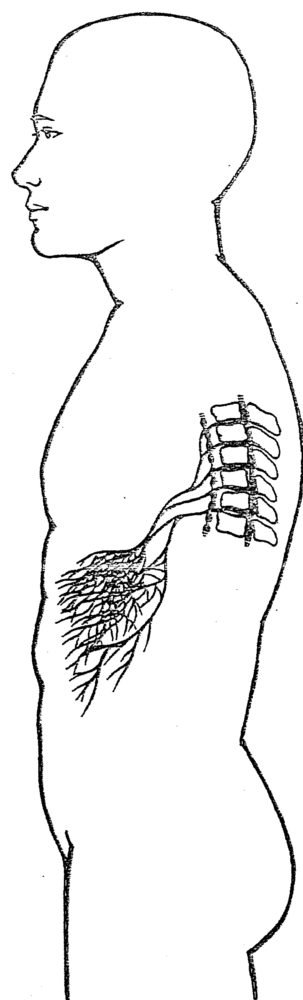

156 脉轮全书

我们可以用很多种方法评估第三轮的健康程度。在身体层面，我们可以检查太阳神经丛区域的构造，紧张而坚硬的胃、啤酒肚或塌陷的横膈膜都是第三脉轮不平衡的指标。也可以通过观察和感受自己的身体来探索这个能量中心，例如围绕这个中心的体形怎么样？比一般人收缩还是扩张？大肚子也许暗示着对于权力、支配和掌控的过度需求，或者只是简单的想要占据空间的自我中心需求；而虚弱塌陷的第三脉轮则意味着害怕掌握权力，自我退缩，不愿突显自己。一般体重超重也是第三脉轮功能失调的表现，意味着身体无法适当地将物质（食物）代谢为能量①。

你也可以从火元素的角度分析自己。你经常很冷漠吗？你喜欢喝热饮还是凉饮？你喜不喜欢热辣的食物？你容易出汗、发烧和发冷吗？你是急性子、精力充沛的，还是慢吞吞、无精打采的？这些迹象都可以表明我们体内的火气是过大还是不足。

在梵文中，这一脉轮又叫作 *Manipura*，意思是“晶莹之玉”，因为它像太阳一样闪烁着光辉，是一个发光发热的能量中心。它的象征物是十瓣莲花，里面有一个倒三角，三角形周边有三个T形的卍字符号（svastikas，印度教里火的象征，跟纳粹的符号不要搞混。图 4-2）②。我们操控环境的力量一部分跟手的能力有关，我们用十个手指来拓展周遭的世界，因此，“十”也代表新循环的开始，是我们进入“变性”（rajas）经验崭新意识的开端。

> ① 这也与第一脉轮需要额外的体重来落地有关。正常落地的管道也许被堵塞了，或者第二脉轮功能不足，抑制了性方面的感受或进一步发展。
> ② 尽管表面上看起来并没有直接的关联性，但有意思的是，纳粹的标志的确代表了人类历史上最丑恶的滥用权力的力量。

男神：毗湿奴
女神：拉基尼

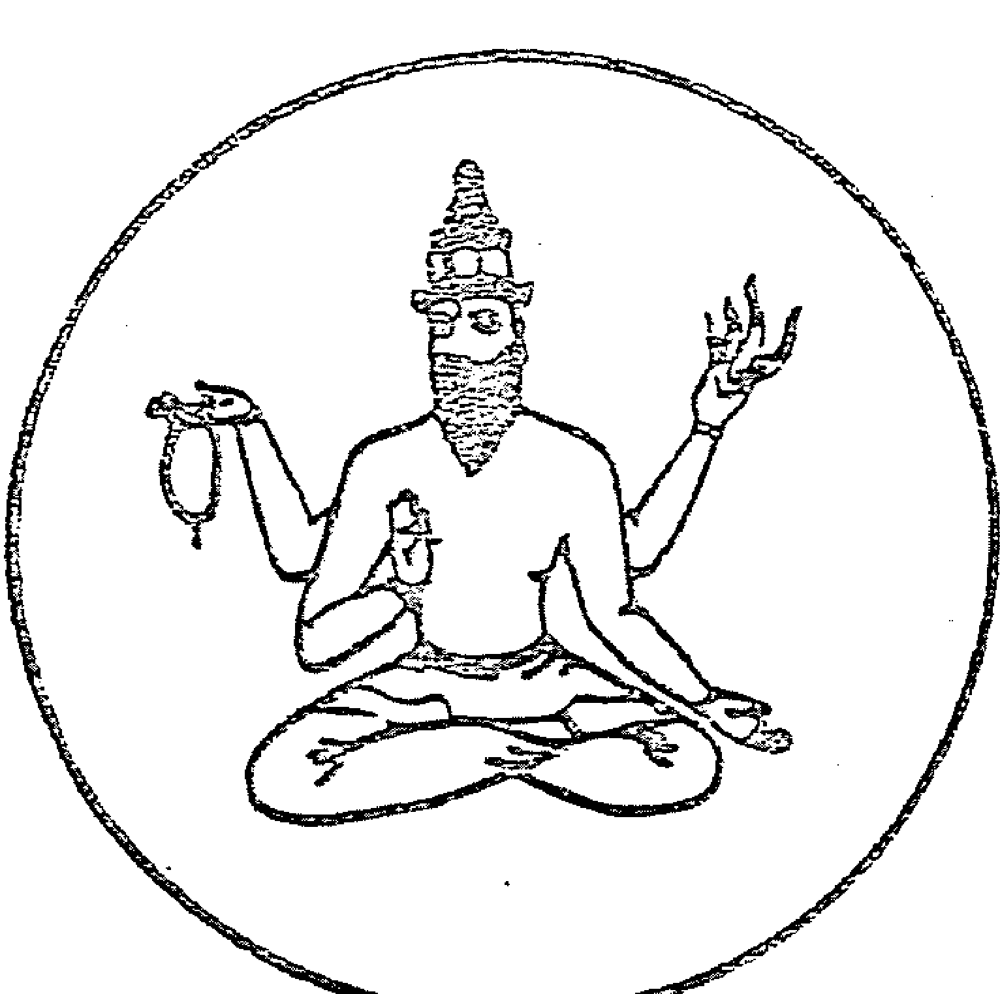

莲花里有一只公羊，它是一种非常有力量、充满活力的动物，一般与印度教的火神阿格尼（Agni）联系在一起。这个脉轮本身的神祇是毗湿奴神和他的伴侣、夏克蒂的化身女神拉基尼（Lakini）。她长着三面四臂，具有除怖赐福的神力。莲花里面的种子音是 Ram。冥想这朵莲花据说能带来创造和毁灭世界的力量①。

火是生命的火花，点燃我们的意志去行动。火也是湿婆和夏克蒂之间的火花，是两极之间的力量。体内的火让我们保持温暖、活力和充沛的精力，使我们本身成为转化者。人类需要温暖，也能给予温暖。第三脉轮的力量就是生命、活力和联结的力量——而非控制和操纵的冰冷力量。我们体内的能量和火反映了我们结合周遭事物的能力，因为火就是一个结合与燃烧的过程。

火向外辐射光和热，因此第三脉轮是阳性和积极主动的。当我们感到恐惧或无力，我们就会退缩，变成消极被动和阴性的。我们会限制自己的一举一动，会用一部分自我去控制另外一部分。当我们锁住了自己的力量，不去表达时，我们会退避三舍，看上去冷漠而自制。

这样的控制需要能量来维持，而不会产生能量，最终我们会消耗殆尽。我们对行动的天然的热情会降低，反而需要去制造能量来完成计划，比如需要咖啡或者甜食的刺激，而这些只是短时间内让我们感到精神，最终却会耗尽我们的活力。

当我们从生命中退缩，就会变成一个封闭的系统。我们的表达会转向自己，经常对自己愤怒或自我批判，然后更加耗损自己。火需要燃料才能燃烧，在一个封闭的系统里，火最终会燃烧殆尽。只有与世界保持动态的交互，我们才有行动力，能够与人联结，这些会给我们的生命带来火焰和热情。

> ①《Sat-Chakra-Nirupana》第 21 篇，引自阿瑟·阿瓦隆（Arthur Avalon）《灵蛇的力量》（The Serpent power），第 369 页。

打破恐惧和退缩的系统需要重新用爱和接纳与自我联结。假如我们与前两个脉轮（身体与根基、热情与欢愉）联结不好，我们就无法为生命提供燃料。欲望会带给我们热情，使生命更有动力。

如果不爱自己，不给自己呼吸、探索和犯错的空间，我们就无法为火的燃烧提供空气。而如果我们不能与灵性联结，也就没有火花来点燃火，所有的燃料都没有了用处。如果不能回到自己的中心，我们就以为权力是外来的，无法感受到内在的力量。

我们体内的力量端赖我们联结、融合与汲取周遭一切来滋养自己的能力，并对权力泰然处之，对自身保持基本的自信。这个脉轮也与自尊有关，自尊赋予意志以力量感。当我们的意志能产生效用时，自尊便会提升。这样我们就能更好地把人生导向我们所热爱的、能点燃激情、带来挑战并让我们焕然一新的道路，而这一切都需要第三脉轮的整合与发展。

### 力量

> 开放系统中的力量不是我们可以占有的财产，我们只能对它的运作过程保持敞开。

——乔安娜·梅西（Joanna Macy）①

> ① 见乔安娜·罗杰斯·梅西（Joanna Rogers Macy）《核时代的绝望与个人权力》（Despair and Personal Power in the Nuclear Age），第31页。

我们已经说过，权力是具有导向性的能量。那么，个人的权力又是怎么样的呢？在为了促进社会合作而教导无力感的文化教育系统中，我们要怎样去发展和维持个人的力量？在有创造力的思想家被视为敏感分子遭到排斥而随大流却一再被肯定强化的社会里，会发生什么样的状况？许多父母训练孩子要顺服和循规蹈矩，但即便顺从也需要我们的个人意志合作才行。

社会合作当然是必要的，但如果是透过掌控来达成，那就称不上是“合作”了，因为这样的合作中没有了渴望、活力，也没有第三脉轮的“火焰”，而只是服从，只会压抑和削弱我们的意志和力量，伤害我们的自尊。

要在第三脉轮的层次发展和疗愈自己，我们必须重新认识和反省所谓“力量”的概念。如果是一方支配另一方的力量，通常称之为“控制权”。相反，我们应该发展出的是整合的力量，也即“内在的力量”，这种力量可以联结生命的各个层面。当我们想到力量时，我们可以把它看作是动词，而非名词，因为力量只有在“做”中才能存在，在推动变革或革新观念的过程中存在。我们要用“行动权”取代“控制权”。

在这个时代，我相信我们正集体经历着第三脉轮的后期阶段（见 12 章进化论的观点）。现如今力量和能量的概念已变得相当复杂多变。透过科技、大众传媒、组织化的政府、核武器和垄断企业，我们学会以少数来控制多数。极少数人为数以亿计的人做出决定。一架飞机就能摧毁一座城市。一通电话，也许这个星球上的大部分生命都会灰飞烟灭。力量、控制、能源和政治权力的议题是我们这个时代的主题。我们从铁质矛头进化到核弹头花费了漫长的时光，但是以权力来控制和支配的痼疾依然存在。

为了穿越这个脉轮进入心轮层面，我们需要重新定义“力量”的概念，从提升力量、赋予力量和强化力量的角度来改变。力量的结构必须是确保而非威胁我们这个物种和自然资源的存续，必须加强而非破坏人与人之间信任合作的能力。个人的力量与社会文化的力量需要同时加强，而不是以其中一方为代价去支撑另一方。怎么实现这些改变呢？

今日占据主流的世界观仍在强调分离。我们的科学以还原论的方式看待自然——物质可以不断被分割为更小的单位。西方医学把人体视为一组单独生病的零件的组合体，而不把身心当作整体来对待。我们把人、国家、土地、文化和种族也看作是分离的、孤立的建筑模块，可以透过控制来计算、执行和协调，而非让自然秩序来掌管这一切。

“控制力”需要不断努力和警惕。人们被迫服从，不断被恐吓，最终变得小心翼翼。因为权位从来都不会稳固，需要更多更大的防御。我们逾越界限，消耗内部资源，从其他地方窃取财富，以为他们跟我们是分离的。从我们病态的观点来看，这么做会增加我们的力量，其实只是用增加支配力的方式增加了“控制力”而已。

从脉轮系统的角度看，力量是整合与联结的结果，而非战斗和支配的产物。每个脉轮的出现，首先是与下面脉轮结合的结果，然后被向下的意识能流激发而活化，向下的能流赋予我们对每个层面的理解力。因此，力量来自统合与完整，绝非分离。

任何团体或组织的真正力量都取决于它是否能团结一致，是否有能力整合及协调内在的力量。我们这个星球的力量也取决于我们结合多样性，以及从整体中创新的能力。进化，就像透过脉轮前进一样，是一个不断重组达致更有效率运作层次的过程——但是要整合先前发展出的一切。把关注点放在差异性上，会导致两极对立、分离和异化，而聚焦于整合则会带给我们力量。

当世界被一群陌生人统治的时候，我们只能透过电视机来冷眼旁观。当我们的声音太弱小而根本无人聆听时，异化疏离的感觉就会越来越强烈。这些都会导致个人很容易就被控制，很轻易就被操纵去服务于某些更大的团体，而这些团体承诺会归还我们丧失已久的权力——以零敲碎打的方式。透过参与使人异化的工作，我们得到了获得一份薪水的自由。我们参与得越深，允诺的回报就越大，但事实上，我们只会变得越来越异化。

因为被异化，我们丧失了内在力量的概念——联结、统一和融合的能力。而失去内在的力量，我们会变得停滞不前，丧失热情、意志和渴望。我们在一个机器化的世界里变成机器人，失去了自主权，丧失了创新的欲望，卡在下层脉轮的重复模式里，无法解脱，寻获自由。我们需要信心来冒险进入未知，而没有强大的第三轮，就无法抵达新的层次，只能停留在原地，死守着安全感，一成不变。

尽管汽车保险杠上也许贴着“颠覆主流”的广告语，但事实上我们仍活在“顺服范式”里。在这个范式中，顺服者比支配者的数目广大得多。我们从很小就被教导，要放弃自己的意志去服从他人，首先是父母，然后是学校老师、神职人员、老板、军队和政府官员。很显然，某种程度的服从对社会合作分工是必要的，但是在这个过程中，许多人跟自己的内在意志失去了联结，最后发现自己无力抵抗那些酒精、毒品和破坏性行为。

在顺服范式中，力量被置于我们自身之外。如果我们从外在寻找力量，寻求别人的指引，就会发现自己落入了被他人同情，甚或被牺牲的境地。缺乏内在力量，我们会一直不断地寻求刺激、兴奋感和外在活动，害怕自己慢下来，去感受到内在的那份空虚。我们投入活动来寻求别人的认可，希望被看见，强化小我，而不是以自身的能力去服务更大的整体。没有目标的力量只是过眼云烟，有时甚至是危险的。

力量要仰仗能量，就如同生存要依赖物质、性行为要依赖身体运动一样。英文“力量”（power），来自于拉丁文“podere”，意思是“有能力”。这与夏克蒂 Shakti 的字根“shak”（有能力）是一个意思。夏克蒂形成了我们最根本的能量场，由湿婆的火花点燃并赋予形式。

电必须靠电线引导，才能为我们所用。生命能量也必须经由意识引导，力量才能在真正意义上为我们所用。我们的细胞代谢和产生能量的过程几乎不受意识支配，然而要拥有力量，必须要有自觉意识。我们必须了解事物之间的关系，能够感受和吸收新的资讯，调整行动以获得最大效应。我们必须有能力创造和想象此时此地之外发生的事。我们必须要有知识、能力和逻辑推理能力。

力量同样也要仰仗上层脉轮的支持，但并非是以下层脉轮为代价。当我们越来越成长，深入了解意识和灵性世界，会发现我们对力量的概念也会随之进化。这样的进化来自于每个人的内在，来自于我们的核心、根基和胆识，也来自于我们的视野、创造力和智力。我们的未来由此创造。

### 意志

> 我估价意志的力量，是看它能忍受多少反抗、痛苦和折磨，并懂得如何转败为胜。

——尼采 ①

> ① 见尼采（Friedrich Neitzsche）《权力意志》（The Will to Power），下卷，第 326 页笔记（1888 年出版，1967 年英译本）。

你如何让事情发生呢？是坐着不动，只是怀抱热切的期望？还是等着环境改变，一切水到渠成？假如你想做出有效的改变，这些都不靠谱。要想改变，需要运用意志来突破。

意志是有意识地控制变化。第二脉轮开启了二元性，我们现在面临着选择，需要意志来做出决定。

意志是我们克服下层脉轮惰性的手段，也是点燃我们内在力量的必要火花。它是心智和行动结合的产物，是欲望有意识的方向——透过它我们创造未来。缺乏意志的人不会拥有个人的力量。意志是第三脉轮发展的关键。

我们都在生命的不同关隘经历过一些不愉快的事情。如果停留在第二脉轮的情绪层面，我们也许会觉得自己是个受害者。而作为一个受害者，我们会感到无能为力。感受这种无力和痛苦是非常重要的一步，它会引导我们去碰触自己真正的需求，为意志供给燃料。

来到第三脉轮，要求我们放弃把自己视为受害者的观念，意识到持久的变化只能来自于我们自身的努力。假如我们责怪他人，我们提升的唯一希望就放在了他人的改变上——而这是我们无法控制的。只有当我们负起自己的责任，改变就成了我们自身意志所能掌控之物。由此我们才能摆脱受害者的处境，获得真正的疗愈。

这并非否定受害者的存在，我们的文明中确实存在许多巨大的不公正，也不是鼓吹新时代那套信仰，所谓我们自己就是现实的唯一创造者，与他人无涉①；相反，意志是领悟到我们可以把每一次挑战都当作唤醒我们最高潜能的机会。这不是要否认之前的经历，而是包容和接纳它们，视其为通向未来的跳板。虽然我们没办法永远掌控发生在我们身上的事情，却可以选择如何来对待它们。

> ① 我们也许创造了自己的现实，却是与六十亿人在一个共同场域里创造的。我们的现实并非孤立的，而是嵌入了一个更大的结构中，从而受到了特定的限制与挑战。

意志的首要任务是克服惰性。前面提到过，休息或运动状态都会有惰性，单纯的嗜睡或懒惰就是休息状态的惰性。可是一旦我们站起来行动，我们的肌肉就处于氧化状态，心脏会泵送血液，输送更多能量。举个例子，慢跑者声称他们在跑步的日子会感觉更有能量，尽管慢跑实际上是消耗能量的。通过产生动能（momentum），能量会吸引能量——这正是意志开启的运作过程。我们也可能发现自己会被某些逃避的事物黏缠不放，在这种情况下，可以运用“静定”来达成改变，也即拒绝成为运作的一部分——遇事知止。

在卡巴拉生命之树上，意志是第三层力量和形式的有意识的结合的产物，与荣耀和胜利有关。胜利带来光芒四射的美，也就是能量；而荣耀则是一种更智能的状态，代表智慧与形式。这些都是上层和下层能在第三脉轮交汇的结果。有了智谋和战略，意志会发挥更大的效力，由此避免我们单纯靠蛮力做事而浪费掉的能量。我们要学会更聪明地行事，而非一味辛苦努力，才会更有效率。

力量和形式在太阳轮结合起来，彼此都进化到了更高、更有效率的层次。一旦第三脉轮的火焰被点燃，火就比较容易一直烧下去。一旦理解之光破晓，迈向更深理解的路径就被照亮。当昆达利尼爬升至这个脉轮，她的能量会变得更为明显。她所点燃的火焰烧掉了无明、业障和肉身的杂质。昆达利尼在第三脉轮才真正开始燃烧！

养成意志的第一步是要认识到这原本就是我们拥有的东西，而且一直在我们体内良好运作着。看看你的周遭，你所见的一切都是用你的意志创造出来的，包括你穿的衣服、你住的房子、你交的朋友。无力感不是因为缺乏意志，而是没有觉知和联结到在我们无意识里运作着的意志。

感知不到意志力是常有的事。一天之中有多少次，你看着你的工作会叹气或发牢骚说：“我必须得做它。”我们告诉自己必须去上班，必须去洗碗，必须去干这个那个差事，或者必须花更多时间跟孩子待在一起。把这些状况看成是一连串枯燥的义务，而非我们主动的选择，会让人变得消极。我不是非得去工作，但我选择去做是因为我喜欢这份薪水，或者我喜欢遵守这份契约，这种态度上的微妙变化会帮助我们与意志重新交好，结成同盟。

谈到意志，往往会想到意志和真实意志之间的区别。假如你去做别人吩咐你做的事情，而不是自己真的想去做，那你依然行使了你的意志，但是在内心深处，这并非你的真实意志，你将自己的意志交付给了别人。想要把意志拿回来，必须明白是我们选择去做这些，然后要检视这个选择背后的理由。是想取悦别人，还是害怕后果？难道是与自己失去了联结？如何来处理这些问题？

只有回答了这些问题，才能真正看清我们的意志在为什么服务。是为了让自己看起来良善吗？是为了讨人喜欢吗？为维护和平吗？为避免责任吗？还是不想出风头？一旦我们认清了意志为谁服务，就必须要问它可能背叛了谁。看起来良善，背叛了你的真实需要吗？维持和平，是不是逃避了你必须去面对的负面情况？取悦他人，是否降低了你的自尊呢？有意识地觉知这些影响，等于给了自己选择的权利。

真实的意志要求和自我进行深入沟通，信任你的决断力，愿意冒险的同时也能承担冒险的责任。如果我们敢于背道而驰，行驶自己的真实意志，就要冒着被批评、嘲笑甚至抛弃的风险。这是很让人害怕的，尤其是你的家庭环境大量培养出一种顺从模式。但是只有敢于运用自己的意志，才能诞生出更强大的自我。透过这股力量，意志会进一步发展起来。意识就像肌肉，不锻炼是不行的。而像所有锻炼一样，当我们怀着明智的态度去练习时，它会反过来更好地为我们服务。

真实意志可以被看作是更高的神圣意志在个人层面的表达，它源于我们与更大之物的协调一致。真实意志超越了个人的小我，而去拥抱更高的目标。它并非为了奖赏而行动，而是为了行动本身的“正当性”。阿莱斯特·克劳利（Aleister Crowley）①说：“真实意志，不以目的为满足，也不是出自对结果的欲求，它在每一方面都是完美的。”②因此，如果我们能从小我对结果的欲望中解脱出来，经由意志而来的行动自会带领我们走向自己的命运。而命运并非保证我们不再受苦，却可以引发第三脉轮的参与，点燃我们存在的核心。

检视和运用高层意志是一项敏感工作。我认识很多人，他们只是把高层意志当作逃避自我意志的一个概念。他们视力量为身外之物，“在这种情况下宇宙希望我怎么做？为什么不给我启示？”做每个决定之前，都要无数次地摸牌占卜，或者无休止地从别人那里征询意见。他们把自己的力量交付给了别人，让别人来替他们做决定，诸如灵媒、老师、治疗师、上师等。其实，寻求指引往往是明智的，但我们有时也会借此逃避自己的责任。也许更好的扪心自问是：“我能为这个社会贡献什么？怎么才能做到最好的服务？”内在力量是向周遭力量敞开的。这些力量一旦接上头，我们的意志就能很优雅地为我们的目的服务。

一旦了知了自己的意志，就会回到更实际的层面——如何更有效地运用它。首先我们必须确保自己是落地的，不落地的话，我们就无法充电，无法拥有那股周流全身的解脱的能流的力量。我们会很容易被摆布，经常去回应他人的意志。“智力意志”的外衣覆蔽了身体的内在渴望，这很容易从我们内在对话中经常出现的“应该”“必须”等字眼中发现。自律是很重要的，但自律更应出自“想要”（want）而非“应该”（should），如此我们的身体和心灵才能协调一致。

像力量一样，意志也经常与纪律、控制和操控联系在一起，例如运用意志去节食、完成学业或某项计划。虽然纪律对成就大多数事情至关重要，但如果它不是来自身心内在的共识，也仍然是控制的一种表现。靠着纪律我此刻才能坐在这儿编辑这本书，但是我的意志和渴望跟目的是结合在一起的。我发现最需要编辑的部分往往是每天到了写作时间我要求自己坐下来写的内容，而非文思泉涌写出的东西。这些内容是缺乏力量的，因为意志和渴望如果不能达成一致，我们就会丧失热情和行动的动力，也会消解我们行使意志所需的力量。

为了让意志能够投入，我们必须与自己的渴望联结。假如我们都不知道自己要什么，又如何能去发挥自己的意志呢？然而沉迷于自己的欲望也会使我们困在下层脉轮，而抑制欲望会封锁意志的力量。当一个人感到被剥夺、不被爱或者工作过度时，他们更容易变得操控。当我们放松、快乐，与真实的自我保持联结时，意志就会繁茂兴旺。

不过，意志也并非总是跟每个欲望协调一致。你也许渴望一块巧克力蛋糕，但你更强的意志会拒绝它，因为你想减肥。你也许不想接手某项特殊任务，但你的意志会心平气和地去完成。我们的确在为欲望效力，但也可以从长远的眼光来选择那些最重要的欲望。

在此纪律是最重要的。纪律“discipline”一词源于“disciple”，意思是“学徒”，愿意做什么人或事的学生。这就面临一个奇怪的悖论：我们的意志必须屈从于能够实现这项意志的某种结构或形式，并在纪律的约束下，去超越某些感受层面的东西，比如我们可能不想在某一天去静坐冥想，或者不想工作，但是当我们的意志瞄定于某个更大的目标，这类感受便可以忽略不计。以这种方式，第三脉轮虽然从第二脉轮的情感导向中获得了动力，却也能够超越单纯的情感取向。

对意志的了解，包括意志无限的、不断变换的选择，来自于一种更深层次的目标感。这个目标源自我们在这个世界的自我定位，我们是谁？我们爱什么又恨什么？我们的天分何在？每个人都有一个目标，我们的终极意志是为了圆满这个目标。这个目标会帮助我们区分“意志”（will）和“一时兴起”（whim）之间的区别，因为两者经常容易混淆。一时的心血来潮是短暂的，而意志会服务于更大的目的。我们需要检视我们行为的长期影响，以及这些行为在更大目标中的作用，思考长远的因果关系。我们的力量会随着我们的目标感壮大，因为目标给予方向，把单纯的能量转化为更有效率的力量。

如果我们对目标不是很明确，就很难知晓在给定情况下我们的意志是什么。意识的任务是准确地评估我们是谁，而意志效力的目标就蕴含在这个奥秘中。一旦我们了悟了自己的意志，力量就会随之发展。我们经常使用的力量其实仅仅是认识到我们确实有力量而已。这个理解会透过运用和体验力量而得到巩固，其最终结果就是获得信心。

所有的脉轮都具有正负两种特质。个人意志的滥用会把我们困在这个层次，尤其是当个人意志与更宏大的宇宙意志无法协调一致时，因为个人意志其实是宇宙意志的一部分。一个聪明敏感的人必须觉察到，何时他的意志会变成有害的支配和过度的掌控。（如果他自己没有意识到，势必有人会提醒他！）运作第三脉轮需要意志力，但要超越这个层次必须有能力在适当的时候放下个人意志。一个真正有力量的人不会有掌控的需求。

当个人意志和神圣意志合二为一，接下来的关键就是去遵循这份意志行事。而当个人意志与更大意志冲突时，同样关键的是去觉察其中的分歧。再度引用克劳利的话：“当一个人意识层面的意志和他的真实意志相违背时，他的所作所为就是在浪费他的力量，也不用期盼他会对周遭的人事物施加有效的影响。”① 这时候我们需要去重新检视个人意志的动机，否则就可能发现有数不清的障碍挡在前路上，每一步都走得异常艰难。尽管许多路都是困难重重的，但是适合我们的道路会与那股能流和谐一致，路上的艰难会变得容易忍受。我们智能的任务就是找出这条正确的道路，意志的任务则是遵循这条路走下去。

### 自尊

> 要让一个人知道他的价值，并把身外之物踩在脚下。
——爱默生②

第三脉轮的属性是力量、意志、活力和自律，而这一切最终都要建立在自尊的基础上。当我们拥有高度自尊时，会变得自信、果断、积极主动、有纪律，对生活怀有热情。相反，当自尊低落时，我们会充满疑惑，自我谴责，像拦沙坝阻挡河流一样，内在缺乏把一件事情做成的心理动力。如果有太多这样的拦沙坝，最终我们会丧失能量，保持在惰性状态中。而一旦发现自己陷于惰性的泥沼，自我怀疑和批判就会找上门来，由此导致恶性循环。

然后，羞耻的心魔会进入第三轮，甚至接管这里。羞耻是自尊的对立物，它会瓦解身体的中间地带，剥夺这一区域的能量。从根基而来的能量流被它截断，从顶部而来的精神能量过度夸大，最终导致能量无法向外流动，开始攻击自我。

自尊源于对自我的现实感，最初来自于对这幅肉身的自我认同，因为肉身给了我们边缘和界限。其次，自尊源于对第二脉轮的情绪认同，情绪使自我经验蕴含生机，让我们保持快乐并与他人联结。再次，自尊源于试错，无论成败都敢于冒险，然后透过这些错误和冒险来认清自己的能力。透过自律，我们磨练技能，由此形成自尊的基础。

我们的自我概念在与他人的互动中变得明晰。如果获得别人的爱和接纳（第四脉轮），同时感觉到自己也可以给予的话，我们就会更爱和接纳自己。透过沟通，我们得到别人如何看待我们的真实反馈，也能够把自我的本质传达出去。最终经由上两个脉轮，我们得以超越个人元素，使自我与更大的源头联结。

自尊形成了良好的基础，帮助我们打开心，与他人维持良好的关系。如果下层脉轮完成了它们的任务，我们的伴侣就不必要费力来为我们制造安全感、解读我们的感受或支撑我们的自我。我们可以全然地进入爱的欢愉经验中。

### 打破无力感

> 限制是显化的第一律则，因此也是力量的第一律则。
——迪奥·福琼①

力量，就像身体上的每条肌肉，必须有意识地去发展。有一句耳熟能详的话叫：“知识就是力量。”的确，大多数无力感都是无知的结果，不知道如何有效地展开行动，而无知的原因也许仅仅是缺乏觉知或专注力。加强我们的觉知自然就会增加我们的力量感，因此像静坐冥想这类练习是非常有用的。当能量沿着脊柱向上提升，能量会穿过第三脉轮，自然而然我们就会感受到力量。然而，仅仅靠静坐冥想不够。以下介绍一些与发展第三脉轮有关的简单概念，以及一些用来打开这一能量中心的身体练习。

### 打破惯性

做点不一样的事情。假如你是无精打采的，就动起来。假如你有点亢奋，不妨安静下来。打破枯燥重复的模式，选择一项挑战。克服困难会增加勇气和信心。沉溺于安全感很少能培养出力量。放弃安全感，你的力量脉轮才能更快地觉醒。

### 避免否定

那些不了解你处境的人有时给出的批评，可能伤害大过帮助，尤其如果你是一个很敏感的人，也许会把这些批评放在心上。当我们面对一些全新而不确定的情况时，这些否定会瞬间瓦解力量，使一个敏感的人望而却步。记住爱因斯坦说的那句话：“新观念所遭遇到的最大反对力量来自那些误解它的人。”

### 循环与阻碍

确保你的能量是在一个完整的循环中运行——送出的能量要有管道回来。确保这些能量不会被困住、打断、消解或变得支离破碎。要利用第二脉轮的能流和动力来点燃意志的火苗。

### 努力与抗争

努力和抗争，两者都会让人感到疲惫，耗损我们的能量。两者都是我们的力量没有和谐流动的表征。当你发现自己正竭尽全力地做一件事时，请先停下来思考一下你正在做什么，想象你可以毫不费力地、得心应手地、充满享受地去做这件事。问问自己，为什么你如此热衷于做它？为什么要付出这么多努力？顺畅的运作缺乏了哪些要素？

如果你一直在与某些力量抗争，我也建议你停下来，问问自己，为什么这股力量会在此时此刻显化在你的生活里？抗争通常是一种恐惧，源于力量的反面。那么你到底在害怕些什么呢？想象如果停止抗争，会发生什么？少一些努力或抗争，意志会如何保护你？

### 打破依附

被引导朝向未显化之物的能量，是一种“套牢”、困住或无用的能量。如果经过了一定努力，事情还是没有起色，不如就放手吧。当你不再沉迷于某事，你所感受到的能量反而会让人振奋愉悦。你释放得越多，能量就越少摩擦；你变得越轻盈，就越朝向灵性移动，而远离了物质层面。但是小心不要走得太远了，因为地球是个能量的显化场，力量缺乏了稳固性会变得过于分散。

### 关注

关注聚焦能量。需要关注时，就要集中注意力。把注意力放在自己身上。给予关注的同时也接受别人的关注，觉察关注会去向哪儿？关注去哪儿，剩余的能量也会追随到哪儿。

### 落地

必须有能力把注意力安住在此时此地，如此才能呈现力量。落地会把我们带回当下，进入我们的身体，能量得以巩固和聚焦。尽管我们已经向上攀升，超越了第一脉轮，但依然有必要进行这个简单练习。

### 愤怒

以安全和有效的方式释放被锁住的愤怒，有时会帮助打开闭锁的第三脉轮。释放愤怒，最好配合落地练习一起来做，这是利用你体内自身能量带来转化的一个好办法——即使无法改变你的处境，至少也会改变你的心态。被锁住的力量往往源自被锁住的愤怒。愤怒其实是一股有效的、净化的力量，它来之不易，应该被明智地使用。不值得用愤怒去伤害我们所爱的人，我们可以在自身之内与这股能量工作。

### 增长知识

知识就是力量，因此学习得越多，能做的就越多，理论上犯的错就越少。在任何情况下，学习都有助于增强我们的力量。

### 爱

爱是把我们联结在一起的统合的力量。爱会激励我们，赋予我们前行的勇气。爱也是愉悦的、净化的、激励的、疗愈的能量，是来自上层脉轮的、滋养第三轮的能量。爱给予我们肯定、联结和目标。爱增强自尊，点燃意志。

### 大笑

把事情看得太严肃会使我们丧失与自己力量的联结。如果在某个处境下还能大笑，就说明我们有力量应付它。在事情看起来糟透了的时候，不妨自嘲一下。

### 照顾好自己

如果你不照顾自己，谁能照顾你呢？你比任何人都更了解自己的意愿和需求。如果你能照顾好自己，就会降低从外面寻求照顾的需求。而需求常常和力量是成反比的。

### 赋予力量的冥想

想一想你感受到无力或受害的时刻，回到那时候，去感受那份恐惧、伤害和愤怒。感受自己在那一阶段还是个孩子、青少年或成人……让你的身体去表达那一刻的感受。你怎么走路的？怎么看待自己？怎么说话的？

花点时间抽离画面，隔着一段距离检视，好像自己是个旁观者。看看你是否可以同情自己，接受自己，不带批判。如果可以做到，下一步看看你是否能自嘲，是否对这种凄美、悲苦和严肃感到好笑。

接下来，回到那个场景，以不同的结果重演事件，想象你做了某些事改变了情景：发火、反击、逃跑、大笑、坚定不移——只要是充满力量的行动都行。如果你想找帮手、神灵或朋友，也悉听尊便。你可以采取任何手段来扭转局势。

当你解决了这个问题，不妨自我恭维一番，感受那份完整和满足感，试着把这份感觉带回现实生活中来。

然后，问问自己，你是否为目前的生活处境而指责任何人？你把多少力量浪费在这上面？为了重拾自己的力量，在一张纸上写下他们的名字，然后烧掉，说：“我让你自由，不再为我的人生和失败承担责任，现在我会扛起属于自己的责任。”当你取回能量时，你也获得了自己的力量。

## 第三脉轮练习

### 喷火式呼吸

这是一种快速的横膈膜呼吸法，用来清除体内的毒素，提升内在之火，激发向上的能流。

坐直，背部挺直，两腿放松，保持舒服的姿势。

运用腹部的肌肉，猛地吸张横膈膜，快速用鼻子呼吸，嘴巴闭着。

当你放松腹部后，空气会自然地进入鼻子和胸腔使你吸气，无需用力就能呼吸。

然后再次吸张横膈膜，放松，再次吸气和吐气。

当这个过程很轻松就能完成时，快速重复，来几次快速而连续的呼气。五十次左右为一小节，结束时来一次深长的呼吸。开始时可以练习三小节或更多。过些时候可以根据自己的感受来调整。腹部肌肉适应之后，可以增加呼吸次数，同时提高速度。

### 慢跑

跑步是密集的高能量身体运动，可以促进心跳，增加肺活量，加快周身的血液循环。在所有身体充电的方法中，慢跑可能是最好的克服惰性的全身锻炼方式。

### 仰卧起坐

听起来像美式运动而非瑜伽练习，但普通的仰卧起坐确实可以锻炼第三脉轮的肌肉，帮助调整消化器官。

平躺，膝盖弯曲，双脚平行，把手在脖子后面交握。

绷紧腹部肌肉，头向上抬离地面几英寸，然后吐气。你不需要坐得很高。抬高几英寸就可以达到锻炼肌肉的效果。

头放下去的时候吸气，向上用力时吐气。尽可能多地重复，随着时间增加次数。

### 伐木式

与第三脉轮有关的声音是大声喊“啊”（ah）。喊的同时伴随这个练习，是释放愤怒的好办法。

双脚稳稳地抓住地面，站好，脚跟相距两英尺左右。双手交握，双臂一起举过头顶，背稍微向后弯（图 4-3）。

双手向下放时嘴里发出“啊”，整个上半身向下甩，手穿过两腿中间（图 4-3）。这个动作要流畅和迅速，尽可能把力量和力气都使出来。

一小节练习 5 到 10 次，感受能量爆破，充满你的上半身。

### 弓式

腹部朝下平躺，双手放在两边，放松。深呼吸，向上屈膝，用手够住脚踝（如果手抓不住脚踝，可以用带子连接手和脚）。

吸气时抬头，骶骨向下压，背部成拱形，胸部抬起，拉住脚踝。两个胳膊向后拉伸肩膀，腹部保持平衡（图 4-4），深呼吸。

让手在这个奇怪的姿势中维持身体的弧度，全身其他部分尽可能放松。

### 挺腹

从坐姿开始，两脚向前伸直，手掌放在臀部两侧。

骨盆向上顶，一直顶到头和脚形成微微的弧度，尤其要把太阳神经丛向上推顶（图 4-5）。
慢慢放松，回到坐姿。

### 船式（抱膝式）

不经过练习很难维持这个姿势，这个小动作可以收腹，发展平衡和自制。

平躺，腿和脚举高（膝盖尽量打直），整个身体向上抬起，呈 V 字型（图 4-6）。尽量保持这个姿势，然后放松。
更简单的版本是，一次举起一条腿，把脚靠在墙上，如此可以帮你锻炼腹部肌肉，收紧还不够强壮的大腿肌肉。

### 化身太阳

胳膊在激活力量的过程中扮演了重要角色，因为胳膊可以和这个世界取得真实的联结。通过胳膊我们做事，而“做”就是第三脉轮的全部含义。这个练习的力道在于它同时包含了观想和身体动作，可以把能量从心轮和太阳神经丛输送到胳膊和手掌。

站直，手臂举过头顶，两脚与肩同宽。
深呼吸，尽量向上拉伸你的手臂和手指，然后慢慢地朝身体两侧放下，手掌朝下，胳膊尽可能向外伸张（图 4-7）。
手臂放下到一半时，感受你好像在推动某种无形的力量。当你这么做时，想象自己就是太阳的中心，你的胳膊画出了圆周。感受那股推动的力量，把它想成是你正要突破的某些障碍。感受你的手

> ① 译者注：阿莱斯特·克劳利（1875-1947），英国神秘学家、诗人、瑜珈修行者。最重要的一部作品是名为《律法书》（The Book of the Law）的神秘学著作，据说是一个叫“埃华斯”（Aiwass）的秘界灵体向他传授的。书分三小章，揭露出人类进入新纪元的新律则，但出版不久就被保守派宗教势力视为“禁书”。
② 见阿莱斯特·克劳利《律法书》（The Book of the Law），第44篇，第22、23页。
① 见阿莱斯特·克劳利（Aleister Crowley）《魔法理论与应用》（Magick in Theory and Practice），第15章。
② 参见爱默生（Ralph Waldo Emerson）散文《谈自立》（Self-Reliance）。
① 迪奥·福琼（Dion Fortune）《宇宙学说》（The Cosmic Doctrine），第 112 页。

## 第三脉轮推荐阅读书目

罗伯特·阿沙吉欧利（Roberto Assagioli）《意志的表现》（*The Act of Will*. NY: Pengium Books, 1974）

阿莱斯特·克劳利（Aleister Crowley）《魔法理论与应用》（*Magick in Theory and Practice*. NY: Dover Publications, 1976）

梅丽塔·丹宁（Melita Denning），奥斯本·菲利浦（Osborne Phillips）《心理防御和幸福》（*Psychic Self-defense and Well-being*. St. Paul, MN: Llewellyn Publications, 1980）

乔安娜·罗杰斯·梅西（Joanna Rogers Macy）《核时代的绝望与个人权力》（*Despair and Personal Power in the Nuclear Age*. PA: New Society Publishers, 1983）

罗洛·梅博士（Rollo May Ph.D.）《爱与意志》（*Love and Will*, NY: W.W.Norton, 1969）

斯塔霍克（Starhawk.）《挑战真相：与权力、权威和神秘相遇》（*Truth of Dare: Encounters with Power, Authority, and Mystery*. San Francisco, CA: Harper&Row, 1987）

# 第四脉轮元素

- 爱
- 风（空气）
- 呼吸
- 平衡
- 关系
- 亲和力
- 合一
- 疗愈

# 第五章 第四脉轮：爱

## 开启的冥想

我们都由爱打造。
灵性在激情的波涛中点燃，向下，
进入我们的母亲……母亲……母亲……
爱在召唤，进入地球的核心，
如同父亲进入母亲那样。
深入子宫，在土与水打造的温暖、黑暗的子宫中爬行。
那是爱的子宫。
安全、幽黑、摇篮、寂静。
我们长大。
黑暗之中唯一的声音是生命之音，
爱之音，心跳的声音，
咚……咚……咚……咚……①

> ① 鼓声一般对心脏节律有帮助。

倾听你的心跳。
心跳把生命、空气和呼吸带入身体的每一个细胞，更新你。
沐浴在空气中、宇宙中、呼吸中、生命中。
去感受你生命的核心，用双手拥抱她。
感受她的渴望、哭泣、爱恋、希望和疗愈。
感受她在你之内，与你同岁，
从你在子宫里存在的那一刻起就开始跳动，
一直长长远远地陪伴你。

永远跳动，永不止息。
永远跳动，永不止息。
永远跳动，永不止息。
永远跳动，永不止息。
你爱你那颗心吗？

深呼吸，吸进空气……
如此轻柔、深沉而充满智慧。
随着你的呼吸，灵性进入你的心，
碰触你，感动你，蜕变你。
深深地、如饥似渴地啜饮。
感恩那颗接纳的心。

乘着火焰的波浪，喜悦地飞向天空，
超越土，超越水，超越火，进入风。

我们伸出双手，展翅高飞，乘风起航。
我们在风里颠簸，在风里呼喊：
心在哪里？心在哪里？
我们的家在哪里？

在心跳里翱翔，深入那个声音。
飞向地面，缓缓降落，
安静下来，更深沉地聆听，寂静就是那个声音。
温柔地伸出手，心是如此脆弱。
轻轻地碰触，心会有些害怕。
打开双手，向着内在之爱，
去联结，去碰触，去疗愈。
请现在就献上爱吧，请允许进入我们的心。

深深地聆听内在，那寂静之声。
Anahata, Anahata, Anahata, Anahata
进入那声音，那呼吸，那疗愈之风。
吸气……吐气……吸气……吐气……吸气……吐气……
吸进新鲜的，吐出陈旧的，
每一口呼吸都是更新。

你的心为何哭泣？
你的心渴望什么？
你的心从哪里得到平静？

放飞心的希望和梦想吧，
乘着改变的翅膀高飞，
乘着爱的翅膀回归，
你的成就会超越你的梦想。

你并不孤单。
你的呼喊获得一千颗心的回应。
如果你去听，你会听到：
咚……咚……咚……咚……

每个人的存在深处都能找到那颗心。
你周遭的每个地方都能找到那颗心。
我们在自己的内心深处找到那颗心。
每一次我们碰触，碰触到的只有心。

每个人的内心深处都是爱，
等待酿成蜜酒。
随着一呼一吸，放飞你的爱吧，
爱自会抵达远方，碰触你所爱之人的内在之心，
听他们呼吸，吸气……呼气……吸气……呼气……

他们像你一样欢笑、哭泣、玩耍，
日复一日从不间断。
感受那颗心与你的心如此一致：

希望、疗愈、呼吸、感受。
没有击打、对抗，
只有爱与欢喜。
每一颗心都加入了爱之舞蹈，
那是结合天与地的舞蹈，
是把我们每个人联结在一起的舞蹈。
和平的种子埋藏在我们的心底，
等待甜美的滋长。
乘着蜕变的翅膀飞翔吧，
在内心深处我们呼喊：
Anahata, Anahata, Anahata, Anahata
爱之音。

## 第四脉轮象征和对应物

梵文名：Anahata
意义：开放
位置：心脏
元素：风
外在形态：气体
功能：爱
内在状态：慈悲，爱
腺体：胸腺
其他身体部位：肺，心脏，心包，胳膊，手
功能失调：哮喘，高血压，心脏病，肺病
颜色：绿色
种子音：Yam
元音声：单词 play 里的 [ Ay ]
轮瓣：十二瓣
塔罗牌：宝剑
质点：美丽 ( Tiphareth )
天体：金星
金属：铜
对应动词：我爱
感官：触摸
瑜伽：奉爱瑜伽
草药：薰衣草，茉莉，鸢尾根，蓍草，马郁兰，绣线菊
矿物质：翡翠，碧玺，玉，蔷薇石英
属性：变性 ( Rajas ) 或悦性 ( Sattva )
动物：羚羊，鸟，鸽子
莲花象征：十二瓣莲花，内藏一个六角星。中间是种子音 “yam” 的象征符号，里面是倒三角，内有湿婆灵根。神祇是依思瓦拉 ( Isvara, 统合之神 ) 和夏克蒂的化身女神卡基尼 ( Kakini )。六角星的下方是一只羚羊，代表自由。
印度教神祇：毗湿奴，吉祥天女拉克希米 ( Lakshmi, 象征财富和幸运的女神，毗湿奴神的妻子 )，克里希那 ( Krishna )，依思瓦拉 ( Isvara, 大自在天 )，爱神伽摩 ( Kama )，风神伐尤 ( Vayu )，阿底提 ( Aditi, 印度最古老的女神之一 )，广延天女 ( Urvasi )
其他神祇：阿佛洛狄特 ( Aphrodite, 司爱与美之女神 )，弗蕾亚 ( Freyja, 美貌女神 )，牧神潘 ( Pan )，爱神厄洛斯 ( Eros )，迪安·凯西特（Dian Cecht，医术之神，以药草及魔术医病疗伤），玛特（Maat，真理正义之神），阿斯克勒庇俄斯（Asclepius，医术之神），伊希斯（Isis，古埃及的丰饶女神），埃俄罗斯（Aeolus，希腊神话中的风神），休（Shu，埃及神话中的空气之神、天空的化身；还有基督，虽然不是神祇，但也代表心轮的能量）
大天使：治愈天使拉斐尔（Raphael）
主要运作力：平衡

### 系统之心

> 爱最先诞生。神明不及你，精灵不及你，人也无法企及你。无论天地多辽阔，海洋多深远，火焰多高扬，你更伟大，爱！风不及你，火不及你，太阳不及你，月亮也不行。你最伟大，爱！
——《阿闼婆吠陀》（Atharva Veda，9.2.19）

现在我们的意志之火已经被点燃，可以去掌握我们的生活，烧毁前行路上最棘手的障碍物。那么，接下来就可以让火焰稍稍平息一些。当火焰变成微温的余烬，我们来到了内在温暖而净化的核心，准备去拥抱下一个层次的意识。

从活跃、火红的太阳轮，我们闯入一个全新的、不同的领域。从肉身和显化的国度，我们悄悄踏进了灵性王国。从聚焦于自我、欲望和行动的层面，我们开始去拥抱更大的次元，让小我在庞大的关系之网中跳舞。我们超越了自我，朝着更宏大、深广、强有力的方向成长。我们飞向天空，在空中扩展自己。

现在来到脉轮系统的中心点——心轮。即使在我们的语言中，“心”也代表了事物的中心、本质和真理内核，有句话说“直指本心”（to go to the heart of the matter）。心轮是我们灵性的中心、核心，是联结上、下、内、外能量的地方，这一脉轮的任务是整合和平衡我们存在的各种面向。

心轮是爱的中心。就像灵性和物质的结合一样，湿婆和夏克蒂也在心轮结合，随着他们永恒的创造之舞，爱向外辐射至一切存有，赋予他们永生，让宇宙得以延续。这两位神祇以保护神毗湿奴和吉祥天女的形象出现，他们掌管了生命的中间地带，带给我们稳定和延续性。我们可以把他们的爱看作是“结合”的力量，是所有生命共有的基石。

在心轮这个层次体验到的爱，不同于第二脉轮的性欲或激情之爱。性欲之爱是有具体对象的——激情被眼前某个特定的人点燃。第四脉轮的爱是独立于外在刺激的，是一种内在体验到的存在状态。这种爱由内向外发散，带给所有进入这个场域的人、事、物以爱和慈悲。它是一份神圣的存有，带有同理心的联结，并非是需要或欲望的延伸。透过意志的力量，我们的需求已经被满足或超越了，然后爱才会从这种无欲无求的深度安详中涌现出来，从带着喜悦的全然接纳中浮现出来，从内心的和谐一致中散发出来。与第二脉轮改变的本质和短暂的激情不同，来自心轮的爱具有持久的特质，它永恒不变。

### 心轮（ANAHATA）——静止中心点

心轮的象征是一圈十二瓣莲花，围绕着两个相交三角形组成的六角星（图5-1）。两个三角代表灵性下降进入身体，物质上升与灵性相遇。这个象征也叫大卫之星（Star of David），代表神圣的婚姻：男性和女性相互渗透达到平衡。它是开放的心轮散发出的光辉之星。六角星可以看作是与其他六个脉轮的联结，因为它们都在心轮这里整合在一起。

在身体层面，这个脉轮与心神经丛相连（图 5-2），掌管心脏、肺和胸腺。每个脉轮都可以看作是一个旋转的能量磁盘，整个身心也可以看成是一个脉轮。如果我们从顶轮沿着一条路径向下通过每个旋转的能量中心，会发现心脏就是这个螺旋的终点——即是中心，也是目的地（图 5-3）。在这里我们会发现暴风眼，狂风暴雨之中的平静地带。心脏就是那平静的核心。

这个脉轮的梵文名叫 *Anahata*，意思是“两物没有碰撞却发出声音”，也意味着“不受打击”“不受伤害”和“清新可人”。当这个脉轮从过去陈旧的悲伤中解放出来时，它的开放就是天真、清新和光彩夺目。第三轮的战斗状态需要被第四轮的接纳特质所取代，因为如果第三轮完成了它的任务，那任何处境对我们而言，都会变得更容易接纳。

第四脉轮的元素是风（空气），是密度最小的物质元素。风通常和知识以及广阔与生机勃勃的事物联系在一起。风代表了自由，像飞翔的小鸟一般。风也代表开放和清新，是一间房子通风良好的必要条件。风还代表轻盈、单纯和柔软。当我们坠入爱河，会感觉自己飘飘然仿佛漫步在云端。风也暗示着广阔无边，而唯有放手才能达成这一点。当我们太粘着于所爱之人，会使对方感到窒息，好像剥夺了他们的空气一样。当我们想有“自由呼吸的空间”时，会谈到需要“空间”这类话。

风作为物质的气态，不同于之前我们讨论过的元素。风会平均散布到任何它所占据的空间里（除非这个气体比我们的大气明显轻或重）。水会停留在碗底，土会保持刚性和稳固，火会向上移动但永远依附于燃料，风则会扩散，香的燃烧会慢慢把气味散布到整个空间。风有一种平衡、平静和平等的特质。同样，心轮反映了一种爱的淡定，对万事万物的复杂关系都能慈悲以对。

最后，风代表了呼吸，透过这一至关重要的过程，我们的细胞才能保持活力。印度教徒把呼吸称之为普拉纳（*prana*），字根 *pra* 是第一的意思，*na* 指单位。在瑜伽哲学中，普拉纳指一种生命能量，这种生命能量被我们吸进身体，成为构成一切生命的基本单位。这股能量也代表了物质世界和精神世界的接触面。精神如果想影响身体，可以透过控制呼吸来达成。普拉纳是身心之间的重要联结，如同心轮是上下脉轮的整合者一样。

打开心轮需要结合技巧和了悟。首先，我们要学习从关系的角度去看待世界：是什么原因导致事物进入联结，并保持与他者的联结。当然，这其中也包括了我们与他人和周遭世界的关系。

心需要理解和平衡练习——身与心、内在和外在、自我和他人、给予和接受。打开心需要超越小我，允许自己臣服于更大的力量。最后，打开心轮需要了解和控制呼吸，因为呼吸是身体和心灵蜕变的工具。

下面我们会讨论到心轮的每一个面向，希望能解开你心的束缚，带给你平静。《奥义书》说：

> 当所有的心结解开，即使我们生而为人，也可以转凡为圣。这就是整部经典的要义。①

① 见《卡塔奥义书》(Katha Upanishad, *The Upanishads*, Max Muller译, 11.6.15, NY: Dover Publications, 1962)。

### 爱

> 爱是宇宙核心成形过程中把每个意识单位联结在一起的吸引力。
——德日进（Teilhard de Chardin）①

在所有英语单词中，爱（Love）这四个字母，恐怕是含义最丰富也最难以捉摸的字眼。爱，是每个灵魂的本质，是掌管我们生命的珍宝。怎样寻得它？怎样呵护它？怎样分享它？还有一个超越语言表达的问题：“爱，究竟是什么？”

爱就像力量，是我们每个人都想要和需要的。很少人会觉得他们拥有的爱足够了。多数人都生活在爱的匮乏恐惧中。几乎没有人理解到底什么是爱。我们都在寻求爱，一旦寻获，爱就变成了我们生活的测量仪。到底这股神秘的力量是什么呢？为什么它会在我们的人生中拥有如此强大的力量？

爱是统合的力量——它把事物吸引到一起，使它们之间保持某种关联。在这种合一中，我们得以碰触到下面那个潜藏着的更大的整体，让孤立的自我和大我保持联系。就像孩子要确知父母日复一日在那里，才能培养出安全感；约束的力量要把事物统合得够久，才能进化出模式，形成比较深刻和凝聚的状态。爱允许改变和自由，但其核心仍是保持一致性。

进入第四脉轮，我们会超越自我意识，放松自我设定的边界，融入爱的狂喜。邀请爱最好的方式莫过于先去给予爱。爱是每个人都想要也需要的，我们倾向于靠近那些我们欣赏和感觉安全的人。要给别人提供这种安全感和接纳度，需要培养出一个繁茂的爱之场域。提供爱的能量，无论是通过言语赞美、同理认可或是身体的滋养，这些能量最终会回到我们自己身上来。而追求金钱和权力的人往往只通过一种方法来得到爱，那就是得到他人的赞美或肯定，因为直接寻求认可能回避掉我们在寻求爱的道路上遭遇的失败和挫折。

爱和赞赏是一个人成长的基石，它提升了人的自我接纳能力——而这对自爱是非常关键的一步。年幼的孩子，透过父母对其行为的赞赏或不赞赏，受到制约和教导，由此形成了关于“我是谁”的第一个概念：“哎呀，看看萨莉做的这些，很有创造力不是吗？”这会形成一个正向的反馈系统。假如我告诉你，今天你看上去好漂亮，你会感觉很愉快，很可能也会找些好话来赞美我，让我也觉得快乐。如此这般下去，彼此之间会觉得越来越舒服，互相能够欣赏。

但也有很多事情会减少人与人之间爱的能量的流动。过度依恋某个人就会减少与其他人之间的能量互动。嫉妒也会减少爱的流动，它把爱限制在了狭窄的范围内。恐同症（对同性恋非理性的恐惧、歧视或偏见）、年龄歧视或种族主义都会限制爱。“你不能跟他接触——他是同性恋”，“她年纪太大了”，“他们不合适（肤色、身形或背景）”，任何一种分别都会破坏我们对万物一体、彼此依存的理解，而这份理解对心轮是不可或缺的。假如我们把爱视为无限的，那么接近她只能透过富足而非匮乏，我们会发现真正的爱是生生不息的。

开启心轮扩大了一个人分享爱的能量范围。不同背景的人比相似背景的人更能激发彼此的成长。我们越能相互理解，我们爱的能力就会越茁壮。心轮感知的世界是一体的，而非分离的。

克制爱通常会减少爱的接收，这是一个恶性循环。“我不觉得约翰喜欢我，假如我告诉他我是多么爱慕他，他说不定会觉得我很傻。”而同时，约翰也许正想着你是多么冷漠和疏离。打破这个循环，需要从心轮层面去消除一些人际障碍。从第三脉轮赋予的力量中，率先迈出第一步就会比较容易。

拒绝是人类最基本的恐惧之一。这一点也不奇怪，因为保持我们内在核心的健康如此重要，而拒绝会威胁到内在的平衡和自我接纳感。如果心轮是整合者，那拒绝会导致我们分崩离析，导致我们正向的回馈系统短路，转而不爱自己，开始自毁。我们感受不到联结，被切断、分裂，变得孤立。对某些人而言，没有爱地活着比冒险开放、分享和失败更容易。

这种恐惧对理解心轮是必要的。恐惧是一种防护装置，帮助平衡输入和输出的能量。它是心轮精微能量的看门人。然而，看护是把双刃剑。脉轮中能量的输入和输出是同步增减的，门户关得越紧，能量流动受到的限制越多。这种限制不光抑制了能量管道和外界的联系，也同时局限了上下脉轮之间的能量流动，导致身心之间疏离。最终，心轮的能量消耗殆尽，我们被隔绝在独自一人的世界里。

学会爱需要很多层面的能量，需要所有脉轮共同运作来创造和维持爱。我们必须能够感受、沟通，拥有自主权和力量，能够观看和理解，最重要的能够放松，让爱自然发生。心轮是阴性的。有时候最深刻的爱无非是让一切事物都保持原本的样子。

爱是风的扩张与平衡，是东方的黎明、鸽子的优雅、和平的精神。爱是围绕着我们的场域。透过爱，我们找到自己的中心、核心、力量，以及对生命的热情。

爱不是去获得联结，而是看到我们本就联结在错综复杂的生命之网里。爱是对“没有边界”的了悟——我们都由相同之物打造，在同一星球上与时推移，怀抱着相同的问题、希望和恐惧。爱无关乎肤色、年龄、性别、相貌或财富，爱是在核心里紧紧相连。

爱更是一种与灵性联结的深刻体验，是被超越我们自身的高层意识所碰触、感动和启发的经验。爱是与深刻、根本的真理相联结，这个真理贯穿所有生命，把一切存有联结在一起。爱使凡俗成圣——因此它也是照顾和保护。当我们失去与一切生命的联结感时，也就丧失了神圣，不再关心和保护那些滋养我们的万事万物。

我们就是爱。我们是爱的生命力，爱的表达，爱的显化和爱的容器。透过爱，我们成长、超越、战胜，为更深入地成长学会臣服；我们更新、消减，然后再度焕然一新。爱是永恒和安定的力量。爱赐福于生命之轮，让一切生命得以运转。

## 关系与平衡

> 真正了解一个人，不是看他在极端压力下如何反应，而是看他或她坠入爱河时如何自苦。
——阿尔多·卡罗德努特（Aldo Carotenuto）①

在第四脉轮的层面，我们踏出了下层脉轮的小循环，能以全局的视野观察它们如何运作。心轮莲花里的神祇是大自在天，他是统合之神，代表三种基本属性（惰性、变性和悦性）的相互依存。他也代表了三种属性的平衡，而这种平衡有时会被认为是幻象，因为它们永远在流动中。从分离到一体的移动，首先要求进入关系当中。

让我们回顾一下到目前为止建立起的脉轮结构，看看在下层脉轮中，关系是如何运作的。第一脉轮代表了分离、明确和稳固的物体。这些物体的大小从亚原子粒子（如果它们也可以叫作物质的话）到星球、行星都包括在内。在第二脉轮中，我们观察这些物体如何运动，也即有一股力量会作用于它们。在第三脉轮，我们看到这些物体如何借由运动相互碰撞、改变结构、起火燃烧和释放能量。然后我们看到，一切事物都在这些循环中，结合起来形成了更大的结构。

这些循环只有在特定关系中才能维持。如果相隔太远，彼此毫无关联，两极就不会相吸。同样的，也并不是所有燃料都能点燃火焰。有一股更大的能量维持着子程序的运作，这就是第四脉轮的力量，我们称之为“爱”。这股力量延续着关系的永恒舞蹈，使较小的结构得以维持各自的子程序，保证我们一直运作下去。例如对身体的爱，驱动我们去照料自己的物质需求；在家庭中，爱把家人联结在一起，使他们得以开展人生，养育孩子；对团体而言，对共同目标的爱联结了彼此，让他们完成任务；而对学习的爱则驱使我们买书和上学。是爱把我们留在了关系中。

这股神秘的力量充满悖论。它既有吸引力，又有放射力。我们坠入爱河的同时，也会被爱的体验所提升。爱不带限制地把我们绑定在一起，它既要亲密也要距离。爱的本质是平衡，这份均衡感驻留在我们每个人的核心中。

由于我们较小的模式和周期一再重复，它们会被心智感知到，并透过意志加以调节，保证这些循环延续下去。我们若从关系的角度看待它们，看到的会是彼此之间的空间，而非事物本身。世界就是一块环环相扣的拼图。

每个脉轮之间都有差别，第三脉轮和第四脉轮的主要差异在于觉知。生物体透过创造和重复模式，开始有了自我意识。我们下层脉轮的活动也会影响和产生意识。我们根据本能和情绪行动，从错误中学习。当学到的东西越来越复杂，被作为概念、记忆和逻辑储存在更高的能量中心之后，它们会再度下降为意识，来影响我们的行动。

关系是物质和信息之间的接口，在联结两者之间的所有层面都扮演着角色。事实上，一切信息都可以看作是对关系的觉知。关系的模式赋予我们概念，形成我们思想、沟通和感知的基础结构，也是界定“我们是谁”的基石。第四脉轮的意识层次觉知到的世界是一个错综复杂的关系网，由爱的力量把这一切统合在一起。

一旦我们看透物体和其行为都是关系，我们就开始能感知到这些关系中蕴含的完美、平衡与永恒的本质。举个例子，观察行星时，我们看到的是关系无止境的循环，关系完美的协调和平衡——行星在轨道中运行，与太阳的拉力达成平衡，且永远重复着这样的模式。我们看到每颗星星挂在天空中的固定位置，虽然它一直在运行和闪烁。每一片草叶都守护着属于自己的地盘，虽然它每年都会枯死，然后重生。

当我们以这种方式感知模式时，我们会看到所有持久模式都是其内部动态平衡的产物。我们会发现生命中的每个元素都被编织进了更宏大的模式里，并且都有属于自己的位置。由此我们会找到自己与周遭环境之间互动的那个平衡点。这个点是整体不可缺少的一部分，赋予曼陀罗以凝聚力，由中心向外散发。当我们了解到周遭关系是如此完美时，就会召唤心轮开放。

在我们的人际关系中，这些原则同样适用。当关系能保持总体的平衡，这份关系就会维持长久。当伴侣一方或双方感到关系已经失去平衡且没有能力再恢复时，关系就会结束。这种状况可能是施与受的不平衡，或是基本生命力量的不平衡，也可能是灵性、金钱、性、权力、家务、养育孩子、沟通或任何与关系相关元素的不平衡。必须记住，平衡是动态而非静止的，它会随着时间不停地变动。关系要想维持，整体之中必须包含基本对等的力量。

内在平衡给予我们最佳状态去维持与他人关系的平衡。内在平衡让我们得以感知并进入曼陀罗有序结构中所蕴含的均衡性，而这种均衡是开放和稳定的基点。无论是身体还是心灵，或是任何单一的脉轮都无法达成这种均衡，唯有以圆满的心轮作为存在的核心才能完成。

当意志有意识地调节并满足了我们的需求时，我们的心灵就比较能进入对关系的理解，找到自己适当的位置。从这个位置出发，我们所有的关系，从开始到结束，都能跟更大的模式调和一致。最均衡、最优雅的关系才能最长久。较为短暂的关系则是创造更大模式的垫脚石。

对于完美的领悟，打开了心轮的接受力。

每个脉轮都通过与能量的中心轴——中脉——对齐而接受能量。如果我们无法和自己保持平衡，脉轮就会脱离正位，如同脊柱错位一样。不幸的是，没有“脉轮矫正师”帮我们复位，我们必须自己上阵。

心轮作为个人曼陀罗的正中心，如果脱离位置太远，会带来巨大的伤害和损失。心轮的不平衡会导致整个系统失衡。因为不光上下脉轮需要平衡，我们的身与心、内在和外在、自我和超越都需要平衡。为了去爱，我们必须某种程度地超越自我中心，消泯分离感，允许自己去体验更大的一体感。为了这份一体感，我们必须放弃一些个体性。

一体感是解脱的能流带来的，我们从中体验到自由和爱的兴奋感——一体、超越、神圣，多少有点特殊意识状态。脱离爱，我们又回到了渺小的位置，变回凡俗的自己，感到孤单和分离，从爱的恩宠和田园诗般的感受中跌落。也因此，我们会执著于维持爱的状态。

爱虽然让人兴奋，但风险是很容易丧失自己的根基。为了维护爱，我们需要根基来滋养爱，让爱生根。我们必须保持一部分的个人自我才能做到——热情和意志是从这部分自我中涌现出来的。如果我们太过超越自我的独立状态，就无法全然地呈现自己。如同火焰和燃料分离之后，火烧完就会坠地一样。我们打破了平衡，无法再为身边的关系提供燃料。当我们丧失了自我，失去了自己的中心，也就和自己的心失去了联结，和我们所爱之人的关系就会错位。用D·H·劳伦斯的话说：“……如果一个人完全屈从于另一个人，会造成不可收拾的混乱。你必须平衡爱和个体性，事实上，两者都要有所牺牲。”

活在平衡里，就是活在优雅、敏锐和温柔的状态里。爱是持久的，由爱所行之事也会持久。反之，丧失平衡的事物不会长久。只有我们内在平衡，才有望去平衡世界。

要维持平衡，必须觉知自己的所有面向。这样的觉知不是用头脑在仓库里盘货，而必须来自于我们的核心，也即心的动态体验。只要赋予心一定的自由度，心自会去组织和达成这种平衡。

最后，心轮需要在输入和输出之间达成平衡。正如呼吸中的呼气和吸气是对等的一样，我们的能量必须得到补充，才能保证给予。如果调控得当，能量会源源不断地供给每个脉轮，爱会因为给予而繁茂。然而，也有太多人因为给予太多、丧失根基或在能量耗尽时仍然付出，而导致脉轮无法对位。一直以来，我们被教导自私是不好的——想平衡自己的施与受是不对的，然而，改变了自身的平衡性，也会改变周遭曼陀罗的均衡性。不断透支会耗尽我们的资源，直到我们无力给予，这种反弹一点都不可爱。

为达成万物之间的平衡，我们必须冲破“善”与“恶”之间的二元对立，既不用清教徒式的良善来禁锢自己，也不能太自私自利而变得邪恶。真正的爱是从一个中心流动到另一个中心，并允许每个中心都以自己独特的方式舞蹈。心轮是阴性的脉轮，它面临的一项挑战是用“放手”来取代“做”或“行动”。只有这样，我们才能真正理解事物的本来面目。

爱并不是依附于某个对象，而是和自己协调一致。肯·迪切沃（Ken Dychtwald）①在长时间的斋戒和冥想爱这个主题之后，这样形容：

> 爱是了悟到我们皆为这碗地球汤中的一小勺，而地球又是更大的宇宙汤中的一小勺。觉知这份美丽而充满活力的关系，并由衷生出的感激，就是爱。爱不是寻求来的，是觉知到的。爱不是发明的，是要去发现的②。

爱是健康的生命之间的天然联系。我们只需相信，爱时时刻刻萦绕在我们周围，爱存在于万事万物之中，然后就会在内心里找到那份爱。

### 亲和力

亲和力（Affinity）是个用在化学中的名词，描述一种物质进入另一种物质，且与之结合的倾向。这种现象的发生是因为物质内在的原子结构是匹配的。

亲和力的结果是结合。两个具有亲和力的物质相遇后会结合，并形成一种永久的联结。相吸是因为彼此都有对方所欠缺的东西，所以从简单层面讲，这是对立方以互相吸引来寻求自身的某种平衡。

人与人之间的结合也跟化学吸引力相似，我们往往称之为“化学作用”。我们也许不知道为什么会被某个人吸引，但那种感受就在那儿，并且常常是不可抗拒的。

最常见的情况是，吸引我们的这个人，他或她的能量场里有一些我们想要和需要的东西。如果足够幸运，我们也有他或她想要的能量，这时候联结就发生了，并且会延续这种亲密的感觉。由于心轮是平衡的中心，由这里生发的爱是最适合的。爱最初的天然倾向就是要把我们和其他生命融合在一起，并保持能量的均衡。

这种均衡可以从脉轮角度分析。我们会感觉到一种不用言辞的广告：“白人男性，32岁，上层脉轮的觉知占主导，寻求一位落地的女士，确保能提起昆达利尼的能量”；或者“黑人女性，极富创造力，寻找温柔体贴的第二脉轮伴侣”。这些广告虽然没有用文字登在报纸上，却会在派对中暗自散播开来。我们每遇见一个人，第六感就会帮我们挑选甄别。

这并不是说只有互补的人之间才有吸引力。很多时候，我们发现有人可以跟我们分享看法，也会带来彼此吸引的感觉——找到可以理解自己的人会带给我们获得认可的平静感。我们向外发射的能量找到了与之匹配的回应。再次强调，脉轮无论是开放还是封闭，都一直在寻求平衡。平衡并非建立在二元对立的基础上，而是生物体寻求提升，展开下一阶段发展的需要（参见第十一章脉轮和关系）。

亲和力最重要的因素不是我们对别人产生的化学吸引力，而是我们内在各个组成部分之间的亲密关系。当内在拥有这份亲和力时，我们就会散发出爱、接纳和喜悦的振动，而这份能量也会允许和鼓励他人从他自己的内在去体验这份亲密感。

许多人的头脑和身体在不断打架，“你太胖了”“更努力一点啊，这个计划做完你才能休息”“你说你饿是什么意思，一个小时前我才刚喂过你”。许多人用这种严苛、强硬的态度控制他们的身体。

而身体也会反过来跟头脑作战，就像惯坏的孩子不断要求关注，“喂我”“我太累了”。身体像孩子一样，不能被宠坏，但是要给予它一定的滋养和支持，确保能满足它的基本所需。

自我接纳是实践无条件的爱的第一步。这并不是说我们放弃了想要变得更好的打算，而是我们对自己的自爱是不以未来或想象中自己变得更好为条件的。当这份接纳在心轮中发生时，我们也会变得更容易接纳别人，包括他的缺点和一切，一种出自心轮的无条件的爱。有了这份对自我的接纳和慈悲，个人的改变就容易得多了。

亲和力也可以被看作是一种振动的特质。当我们变得亲和时，我们感受到的那份和谐会弥散在我们所有的言行中，如同谐波共振中的音调。我们向外散发爱，因为我们的内在创造出了凝聚的核心，这核心又反过来和谐周遭的一切。

心脏里的每个细胞都在不停地搏动。如果把心脏解剖了，每个细胞还是会独自连续地搏动。如果把这些细胞跟其他心脏细胞放在一起（放在显微镜的载物玻璃片上），这些细胞会调整它们的跳动节奏，进入一种有节奏的共振状态（在第五脉轮会讨论到）。通过与心跳调频，我们也和自己生物体的核心节奏及外在世界的节奏达成共振。

那么，一个人要如何产生这种亲和感呢？花点时间跟自己安静地说说话吧。你所需要的只不过是时不时回到自己。在读完这些文字后，就请花点时间闭上眼睛，深呼吸，跟自己的身体打打招呼。看看身体是否也对你做出呼应。然后开始对话。有什么办法可以更好地善待自己吗？身体哪个部分需要你的关注？哪部分不需要你这么控制它？你对待自己是否像对别人一样？是时候开个宴会，表达一下你对身体的感谢了吧？或者再安静地坐一会儿，多倾听一会儿？

人多力量大，但这些力量必须联合在一起才行。我们由许多不同的部件构成，力量也存在于各部件的协调统一之中。只有这样，我们才能有效地施予别人。如果所有部分都能调频到与核心——心轮共振，它们会自动协调一致，进入一种自然的亲和状态。

### 疗愈

> 无论是有意识的或是无意识的，所有存在都有自我疗愈和疗愈他者的能力。这是一种与生俱来的本能，存在于昆虫、鸟类、兽类和人类身上。所有生命都会以各种不同的方式找到适合于自己的药物，用来疗愈自身和彼此。
——苏菲·伊那亚特·可汗（Sufi Inayat Khan）①

疗愈就是恢复完整。如果心轮是整合和统领者，那它也理所当然是疗愈的中心。事实上，爱就是最终的疗愈力量。

当我们攀升至心轮，我们会遇到手臂。站直，手臂向两侧伸展开，身体会形成一个十字型，四个点交会的中心就是心轮（图 5-4）。如同双腿联结的是第一脉轮，两只手臂是中间脉轮（第三、四、五脉轮）的组成部分。手臂里的“阴性”通道包含了中医 14 条经络里的 3 条。这些经络分别对应着心脏、肺和心包（包覆心脏的薄膜）（图 5-5）。很明显，这些经络都与心轮有关，它们从这个中心把能量向下传送给双臂和手掌。

能量从心向外流动到手的管道，我称之为疗愈管道。疗愈能量会经由这条管道到达别人身上。手上有一些次要脉轮，它是身心敏锐的延伸器官，比身体大多数部位都拥有更多的神经接收器。双手既可以创造也可以接收，跟眼睛和耳朵一样，是接收信息的感觉器官。双手也是感知和控制精神能量非常宝贵的工具（打开手部脉轮的练习参见第25页）。

疗愈就是恢复生物体或环境的平衡。据信，所有疾病，不论是细菌、外伤还是压力导致的，都是“不平衡”的结果。不平衡会造成生物体瓦解，破坏自然共振的亲和力。

打开心轮，发展出对周遭人事物的同情、联结和理解，自然就会产生疗愈的冲动。领悟到我们皆是一体的，会像菩萨那样，明白众生仍在受苦，个体无法解脱（菩萨已经证悟却不涅槃，他会留下来教导众生，直到其他人也跟上）。我们也要像菩萨一样，在个人精进的道路上花费时间来疗愈别人。这会在灵性魅力与保持身处物质世界的需求之间带来平衡。

帮助他人也源于单纯的同情心。同情恰是心轮的核心特质。透过对他人不加评判的同情，我们会忍不住伸出援手。我们对万事万物平衡性的看法会凸显任何的不平衡与不和谐，就像把墙上的画扶正那么自然。

一个人不必是专业的疗愈师、医生或具有超自然的力量，才能开启疗愈的管道。帮助老妇人过马路、抚慰哭泣的人或者拍拍疲惫的肩膀，都是心轮疗愈能量的有效表达。

许多人在疗愈中忘记了平衡的训诫。你可以把他们叫作爱管闲事的人。想妥善疗愈一个人，首先必须与自己的能量达成平衡，这可能不符合疗愈者所谓的“正确”观念。然而，一个真正的疗愈师必须能够在接收对方信息的同时扎根于自己的能量，并允许对方创造出自己的平衡。因为我们的心轮开启和均衡时，我们的存在本身就会散发出爱和喜悦。这份爱便是真正疗愈的核心。

### 呼吸——生命之心

> 如果你的呼吸受到任何方式的限制，那你的生命也是如此。
——迈克·格兰特·怀特（Michael Grant White）①

正常人每天呼吸 18000 次到 20000 次②，平均吸入 5000 加仑的空气。以重量来算，这些空气是我们摄入饮食量的 35 倍。我们可以数周不吃饭，几天不喝水，几小时不保暖（在极寒条件下），但只能几分钟没有空气。（我们能多久不起念头？）

呼吸，跟风元素有关，也是开启心轮的关键。风是体内传布最快的元素，不像食物需要数小时甚至几天来消化。吸入的每一口气会立即进入血液流动。氧气必须不间断地供给每个细胞，否则细胞很快就会死亡。身体因此发展出了完整和精密的运输系统，把氧气运送到身体每个部位。这就是由心脏主控的循环系统，每一次呼吸都会滋养和供给这个系统。

呼吸的重要性不是三言两语就能说清楚的。除了维持基本的生命功能外，呼吸也是转化我们自己的最有力的工具之一。呼吸可以帮我们燃烧掉毒素，释放隐藏的情绪，改变身体结构和意识状态。没有呼吸，我们就不能讲话，因为空气是声音背后的力量。没有氧气，我们就没法代谢食物，头脑也会停止运转。呼吸是赋予生命、疗愈和净化的能量来源，其作用却被我们严重低估了。

可惜一般人的呼吸都不太深。一对正常肺叶可以容纳一公升空气，而一般人每口呼吸只吸入半公升甚至更少的空气。你可以自己确认一下，先正常呼吸，然后再努力吸气，看看能吸进多少。这么做时，留意深呼吸的感觉，感受胸腔哪些部位会发紧，哪些部位憋闷，给这些地方轻轻做做按摩。透过按摩胸背及情绪释放，有助于加深呼吸。

大部分智力活动因为不怎么消耗体力，会导致呼吸轻浅，最后变成习惯。经常恐惧、焦虑、抑郁、吸烟或只是空气污染，都会导致习惯性的呼吸不足。这种习惯一旦形成，会减缓新陈代谢，降低身体能量，从而在体内累积毒素，然后形成一种持续循环。当新陈代谢迟缓时，我们会变得懒洋洋，过度依赖便利方式，例如以车代步，摄入兴奋剂提神，或者靠吸烟①来刺激胸腔（结果适得其反）。所有上述举动都不会帮助呼吸。

大脑同样要仰赖不间断的氧气供给。当身体休息时，四分之一的氧气是被大脑用掉的，虽然大脑只占身体重量的 1/15②。屏住呼吸，看看你能维持多久清醒状态。

呼吸是身体里少数几个同时能自主和非自主控制的功能。当我们恐惧时，呼吸会不由自主地收缩——这是残存的生存本能，屏住呼吸有助于我们不被危险动物侦测到。同时，我们也可以透过强制地深呼吸来战胜恐惧，释放整个身体中的紧张感。

透过自主呼吸的练习，有意识地加强肺活量，我们会逐渐养成深呼吸的习惯。深呼吸的确能改变身体构造，而一旦改变，身体就会渴望增

① 我发现吸烟给人一种心轮有能量的假象，但吸烟往往是出自一种空虚感的需要。当然吸烟不会去除这种空虚，只是帮人应付它罢了。

② 参见艾萨克·阿西莫夫 (Isaac Asimov)《人类大脑的容量和功能》(The Human Brain: Its Capacities and Functions)。

① 见阿尔多·卡罗德努特《厄洛斯和悲怆：爱的阴影与苦痛》（*Eros and Pathos: Shades of Love and Suffering*, Toronto: inner city books, 1989），第 54 页。

① 译者注：肯·迪切沃博士（1950- ）美国著名心理学家、老年问题专家，《老人潮》（Age Wave）《老人的力量》（Age Power）等畅销书的作者。
② 见肯·迪切沃（Ken Dychtwald）《身与心》（Body-Mind），第149页。

① 见苏菲·伊那亚特·可汗《灵性疗愈的发展》（*The Development of Spiritual Healing*），第 89 页。

① 迈克·格兰特·怀特，一位杰出的呼吸教练专家。引自他的网页：www.breathing.com。
② 见拉玛大师（Swami Rama）、鲁道夫·巴伦坦（Rudolph Ballentine, M.D.）、阿兰·海默斯（Alan Hymes, M.D.）合著《呼吸科学实用指南》（Science of Breath, a Practical Guide），第 59 页。

加氧气供给。这是一个进化也是疗愈过程。

印度教徒相信呼吸是身心之间的门户。整个瑜伽体系是建立在“调息”（*pranayama*）的呼吸技巧上的。调息可以扩展意识，净化身体。当我们的思虑安静下来，呼吸会变得平缓，一种抚慰和疗愈的振动会传遍全身。透过控制呼吸，心灵也会变得平静。呼吸的气流不断进出身体，形成一种动态的、流动的能量场域，这个场域不断填充你的身体，然后再度无形无相地回到外部世界中去。

调息的技巧是设计用来滋养灵魂和身体中的灵性管道的，例如主要的气脉和针灸经络。这些管道透过呼吸充满能量，提升整个生物体的精微振动。瑜伽行者可以分辨出肉体能量（*sthula prana*，只在肉身中流动的呼吸）和灵妙能量（*sukshma prana*，呼吸造成的精微能量运动）之间的区别。重要的是在做呼吸练习时，要关注正在发生的精微流动。我们可以透过观想和运用体位，将这股能量引向特定区域或脉轮。

#### 呼吸练习

有各式各样不同的调息练习。如果你真对这项强有力的工具感兴趣，可以阅读一些瑜伽著作，里面罗列的调息练习此处无法尽述，下面介绍一些基本方法：

##### 深呼吸或完整呼吸

这项练习跟听上去一样简单。以舒服的姿势坐下来，观照你的呼吸，尽可能完全地呼气、吸气。深呼吸让空气进入你的腹腔、你的胸腔，最后是你的肩膀和喉咙。然后反转顺序吐气。重复数次。

##### 火呼吸

这是快速的横膈膜呼吸法，用腹部肌肉迅速连续的起伏，创造出快速短促的呼吸。更完整的描述见第三脉轮练习。

##### 交替式鼻孔呼吸

这是一种有技巧的、缓慢的呼吸，主要作用于中枢神经系统，能带来深度的放松和睡眠。用右手把右侧鼻孔盖上，用左侧鼻孔深深地吸气。完全吸气之后，把左侧鼻孔盖上，用右侧鼻孔呼气。气呼尽之后，再用右侧鼻孔吸气，左侧鼻孔呼气。总之，用鼻孔交替呼气、吸气、呼气、吸气。每一侧鼻孔至少呼吸二十次以上。这项练习会带来意识的深刻改变。

##### 收束法（Bandhas）

“Bandhas”的意思是锁住，调息中的收束法是屏住呼吸，把气封锁在身体某个部位。有三种基本的收束法：收颌、收腹和收肛，把呼吸保留在身体的这三个主要区域。

收颌（jalandhara-bandha）把能量输送到头部，刺激甲状腺和喉轮。充分吸气，收缩喉咙，头朝胸部低下，保持背部挺直。尽可能屏住呼吸，但不要勉强，因为如果做得不对，会让你感觉头晕。

收腹（uddiyana-bandha）要站着做，有助于按摩体内消化器官，净化身体。充分吸气，深深地吐气。吐完气屏住呼吸，尽可能收缩胃部和腹部，注意不要吸气。只要感觉好就尽可能坚持。然后慢慢吸气，放松腹部的肌肉。

收肛（mulabandha）能锻炼根轮。吸气后屏住呼吸，收紧会阴和肛门括约肌。这样会刺激沉睡的昆达利尼。

## 第四脉轮练习

### 扩胸

把手放在背后，两手交握，两臂向外翻转，胳膊肘打直。这会把你的肩膀向后拉，使胸部突出。深呼吸，头向后扬，以胳膊为动力，转动躯体，放松紧张的肌肉。持续深呼吸（图 5-6）。

想加码打开胸部肌肉，可以拿一条皮带、毛巾或领带，举过头顶，和胳膊成三角形。保持手肘打直，胳膊向后拉伸，保持皮带带来的张力。如果手肘无法打直，两手抓皮带的位置可以分开一些。如果不能充分感觉到那股张力，两手就靠近一些。

### 眼镜蛇式

这是一项瑜伽练习，适合早上一睁眼醒来做。它主要作用于上胸椎，可以帮助改善胸部塌陷造成的驼背。

肚子贴地平躺，手臂弯曲，手掌放在肩膀两侧。不要用手臂支撑，慢慢抬起你的头、肩膀、背部，在舒适的情况下尽可能向上抬。然后放松。再次尽可能抬高，用胳膊把自己推高一点。手肘不要完全打直，主要打开胸部，保持肩膀下垂放松，头部抬高。扩展胃和胸部，深呼吸然后放松。随你喜欢重复这项练习（图 5-7）。

### 鱼式

一种瑜伽体位法，用来扩展胸腔。平躺在地板上，两腿伸直，贴住地面。两手放在臀部之下，手掌朝下，手肘下压，抬高胸部，脖子向后弓，头部接触地面。深呼吸，尽可能坚持，然后放松。再次深呼吸（图 5-8）。

（如果这个动作对你太难，可以在肩胛骨下面垫个枕头，身体向后弓，放松上脊柱。）

### 风车式

我们小时候都做过这个动作。站直，手臂向两侧伸开，来回扭动身体。这会把能量从身体向下传送到手臂和手掌，同时放松胸部和腹部的肌肉。

### 手臂画圈

这个练习刺激上臂和上背肌肉。手臂向外伸展，以同方向画小圆圈，然后越画越大。接下来反方向重复动作。你也可以假装自己是在拍动翅膀飞翔（对应风元素）。做的同时，深深地呼吸（图 5-9）。

### 打开手部脉轮

心轮的能量常常要透过双手来传递，第一章里介绍的打开手部脉轮的练习也适用于此处。

### 冥想

#### 劫波树——许愿树

（这项练习要很小心，你所祈求的很可能成真）

心轮之下是一朵小的八瓣莲花（the Anandakanda Lotus），里面有因陀罗天宫里的“天界许愿树”，称为劫波树（Kalpataru）。这棵树的前方有一座宝石装饰的祭坛，据说掌管了我们内心最深沉的渴望——不是我们以为自己想要的，而是灵魂最深的渴望。有人相信，如果我们真的在这棵树下许愿，说出我们的愿望，许愿树所兑现的会比我们期望的更多，会带领我们从轮回中解脱（moksa）。

舒服地躺下来，花点时间让自己落地，回归中心，放松肌肉。确保自己处在安全、舒适的环境里。

深呼吸，吸气……呼气……吸气……呼气……吸气……再呼气……觉知自己的心跳，倾听它的节奏，想象心脏的每一次搏动，通过复杂的动脉和静脉网络，把血液输送到全身。想象你心脏上面的血管是一棵树的树枝，而下面的血管是根系，充满了生命。随着氧气的路径，从心脏输出，进入胸部、肩膀，下行至手臂、背部，到达腹部、双腿、膝盖和脚。然后返回，流经整个身体回家，回到核心——心脏。每一滴流经心脏的血，透过呼吸、空气和生命得到更新，重新回归。

你的心脏是棵神圣的树。生命之网是它的枝杈，伸展到全身，然后延伸到外部世界。这棵树的树干就是你，你的核心，你的存在，你的自我。从核心向下扎根，那是树的根基。根会帮我们找到食物和水，支持并赋予我们物质实体。从核心伸出的枝丫和叶子，就是心的愿望。它们收集阳光和空气，帮助你成长。枝头开花结果，然后掉到地上，叶落归根，好让你继续成长。一切所展现的，都是要回归源头。

在这棵树的前方，有一座装满宝石的祭坛。进行献祭，可能是你想舍弃的，例如一个坏的习惯；也可能是你想奉献的——你的创造力、忠诚和疗愈力。献祭是应允你愿望的交换的一种象征。

然后，吸气到你的心轮，感受它的疼痛和喜悦，感受灵魂最深处的渴望。不要去特别限定这些渴望，就去感受它的本质。感受逐渐增强，吸气进入，感受这股渴望流经你的全身，向外脉动，收缩，再次向外脉动。让这股渴望充满整棵树的枝干。

当这棵树被你内心深沉的渴望充满时，想象一只鸟飞到树上。它飞进树冠的中心，左右摆动着小脑袋，仔细聆听你的渴望。与停留在你心里的这只小鸟交流一会。让它尽可能靠近你的心（不是脑），让你的心把愿望诉说给它。这愿望出自热切的向往。如果这个过程中出现了任何画面，很好，但不要特地去想象。当你完成这一切，吻别这只小鸟，温柔地放飞它，让它去完成这个工作。放手，然后忘掉它。鸟儿会带着你的愿望去到力天使那里，他们会用对所有人最好的方式实现它。

### 感恩仪式

跟你感觉贴心且彼此熟识的朋友围成一个圈，或是坐在跟你有深刻联结的朋友和爱人对面。

如果你有神秘主义倾向，不妨做一个结界，确保这段时间和空间不受打扰，落地并回到中心，深呼吸和放松。

看着这个圈，看进彼此的眼睛，一次和一个人对视。想想这些人在你生命中的价值——你们共有的经验、磨砺和快乐。从他们的角度思考问题：他们的挣扎、恐惧和喜悦。可以多花些时间，闭上眼睛，进入内在。

从圈子的东边开始，请那个位置的人坐到圈子中央来。所有人一起温柔地喊他的名字三到四次。然后顺时针，从那个人原来位置的左侧开始，每个人轮流花点时间对圈子中央的人进行赞美和感恩。“我真的很感谢那天你帮我把汽车发动起来。”“感谢你总是听我倾诉。”“喜欢你逗我笑。”不要做任何评价、批评或建议。喜欢的话，可以拥抱和送礼物。

一圈人感谢完之后，圈子中央的人喊出下一个人的名字，然后回到原来位置。下一个人进入圈子中央，大家再喊他的名字，感谢他。重复这个过程，直到圈子中的每个人都坐过中央的位置。最后用吟唱，分享食物和饮料来结束。需要的话可以放点音乐，当然还有彼此拥抱。

### 同理心练习

这个练习对那些在特定议题上出现问题的伴侣有帮助。做的时候，把自己想象成对方，从始至终都从他或她的角度来叙述整个故事。设身处地地问自己，你叙述的是否都对，有没有遗漏什么重要情节。然后变换角色，让对方从你的角度再把故事讲一遍。

### 慈悲冥想

这个冥想可以一个人做（靠想象），也可以和团体一起做，或者最好在拥挤的地方如公车站、餐馆或公园长椅上做。

找地方舒服地坐下来，放松。闭上眼睛，回到中心，开始深呼吸。吸气进入你的腹腔，下到你的脚，进入地心深处。融入心跳的节奏，感受那股韵律在你全身脉动。吸气到心轮，感受它对自己无条件的接纳，它对你的爱。呼气。

睁开眼睛四处看看。凝视你可以清楚看到的每个人，一次看到一位，看进他们的眼睛，聆听他们的声音，观察他们的行为（如果你是独自一人，就想象你认识或经常看到的人）。运用呼吸让气在周身循环，看每一个人都不带判断、批评、厌恶或欲望。只是看着他，把注意力聚焦于他的心轮。看看身体是如何围绕着这颗心塑造自己——想象心的期盼和梦想，埋藏的悲伤和恐惧。让你的心慢慢对那个人生出慈悲。吸入那份慈悲，感受它，但不要执着。然后随着每一口呼吸，把那份慈悲呼出去。

不要说话，也不要动，想象一束能量流从你的心流进他们的心。把你的爱给他们，然后释放掉。不要执著于这份联结，或者让自己去担负任何责任。放开联结，转移到下一个人。

当你感觉足够了，闭上眼睛，回到自己的中心。以同样的方式感受自己的心。也给予自己慈悲和爱。吸气，让这份感受深入，然后放松。

## 第四脉轮推荐阅读书目

- 唐娜·法尔希（Farhi, Donna）《呼吸之书：透过基本的呼吸重拾活力和健康》（*The Breathing Book: Vitality and Good Health through Essential Breath Work*. NY: Henry Holt, 1996）
- 盖伊·亨德里克斯（Hendricks, Gay）《有意识的呼吸：有助于健康、释放压力和自我超越的呼吸练习》（*Conscious Breathing: Breathwork for Health, Stress Release, and Personal Mastery*. NY: Bantam, 1995）
- 盖伊·亨德里克斯博士和凯瑟琳·亨德里克斯博士（Hendricks, Gay, Ph.D. and Kathlyn Hendricks, Ph.D.）《醒着的爱：共同承诺的旅程》（*Conscious Loving: The Journey to Co-commitment*. NY: Bantam, 1990）
- 哈尔·斯通博士和温克尔曼（Stone, Hal, Ph.D. and Sidra Winkelman, Ph.D.）《拥抱彼此：作为老师、疗愈师和导师的关系》（*Embracing Each Other: Relationships as Teacher, Healer and Guide*. Mill Valley, CA: Nataraj Publishing, 1989）
- 约翰·威尔伍德（Welwood, John）《心的挑战》（*Challenge of the Heart*, Boston, MA: Shambhala, 1985）

# 第五脉轮元素

- 以太
- 声音
- 振动
- 沟通
- 咒语（真言）
- 心灵感应
- 创造力
- 媒体

# 第六章 第五脉轮：声

## 开启的冥想

创始之前，一切黑暗，一切虚空。
宇宙之面，深沉未显，
没有真实脸孔，只有无尽虚空。
没有光、声、运动、生命，也没有时间。
一切皆无。
宇宙还未创生，甚至也未孕育。
没有任何形式孕育出来或能承担孕育之责。
黑暗在空中降临己身，
发现真是一无所有，
孤独、幽暗、尚未诞生、尚未彰显，寂静无声。
你能想象这寂静吗？空无的寂静？
你能安静地聆听这寂静吗？
你能在自己之内听到这寂静吗？

深呼吸，慢慢地，把寂静吸入肺叶，
感受你的喉咙随之扩张，
倾听那空无和寂静，
倾听你体内的寂静之声。
慢慢吸入空虚，深沉平静地呼吸。
在无边的静止中，黑暗降临，
空无知晓那份孤独，
孤独会渴望；渴望他人，
在渴望中，一串涟漪荡过虚空之海，
荡漾，再荡漾，
直到空虚被诞生填满。

创生之初，那至高无上的并未显露真容，
他成为振动，也在振动中遇见自己。
那振动是一个声音，所有声音都出自他。
出自梵天第一次放射，
出自妙音天女永恒的回答。
在他们的结合中，声音涌现，传遍虚空，
众音合一，一声众音。
声音成为车轮，
在生命之舞中不断旋转，
永远歌唱，永不停止。

如果聆听，你现在就能听见，
那声音是你的呼吸，你的心跳，
是风，是水，是树，是天空，
是你脑海中的每一个思绪。
万物从一个声音中浮现，
又回归另一个声音，
那声音是：
AUM....Aaa-ooo-uuu-mmmmmmmmm.....Aum。

此刻你在心中默念这个声音，
让它随着你的呼吸增强，
让这神圣之音冲破你，乘风飞翔，
增强的韵律，深沉的振动，从内心深处升起。
吟诵这创造一切的声音吧，
转动你的脉轮之音。
现在这声音愈来愈响亮，加入其他的声音，继续吟唱，
现在这节奏愈来愈深沉，把万物编织进神圣的舞蹈，
韵律激荡，音声高扬，生命之舞，回音袅袅。
声音连成字句，字句奏出乐曲，
乘着生命的车轮滚滚向前，
引领着我们的生命之旅向那灵性最深处进发。
吟诵你的内在之音吧。
这是我们启程的地方。
从静默、呼吸、身体，进入虚空之中。

听，黑暗中自有回声，
恐惧痛苦已被摧毁，
梵天是最初的振动，妙音天女是那流动，
声音统合了我们的愿景，融合所知的一切，
不久寂静将再度降临，伴随着原始的回音，
净化一切振动，
就是那深奥真理的回声。

## 第五脉轮象征和对应物

- 梵文名：Visuddha
- 意义：净化
- 位置：喉咙
- 元素：声
- 功能：沟通，创造
- 内在状态：将创意转化为符号
- 外在表现：振动
- 腺体：甲状腺，副甲状腺
- 其他身体部位：脖子，肩膀，手臂，手掌
- 功能失调：咽喉痛，脖子发僵（斜颈），感冒，甲状腺问题，听力问题
- 颜色：天蓝色
- 感观：听觉
- 种子音：Ham
- 元音声：单词 sleep 里的 [ ee ]
- 轮瓣：十六瓣，所有的梵音元音
- 质点：权力（Geburah），慈悲（Chesed）
- 天体：水星
- 金属：水银
- 食物：水果
- 对应动词：我表达
- 瑜伽：真言瑜伽
- 草药：乳香，安息香，肉豆蔻皮
- 矿物质：绿松石，海蓝宝石，天青石
- 动物：大象，公牛，狮子
- 属性：变性（Rajas）

莲花象征：倒三角形里有一个白色的圆圈，代表满月。圆圈里有一只白象，象背之上是Bija的象征ham。莲花里的神祇是湿婆神的化身沙达希瓦（Sadasiva），他长着三眼、五面、十臂，坐在一头白色的公牛背上，身披老虎皮，头戴蛇形花环。女神则是湿婆的配偶高莉明妃（Gauri），她被视为谷物女神。高莉（Gauri）也是一组女神的通称，包括乌玛（Uma）、帕尔瓦蒂（Parvati，雪山女神）、兰帕（Rambha）、托塔拉（Totala）和特里普拉（Tripura）。

印度教神祇：恒河女神（Ganga，与净化有关），萨茹阿斯瓦蒂（Sarasvati，妙音天女）

其他神祇：赫耳墨斯（Hermes，希腊神话人物），缪斯女神（Muses），阿波罗（Apollo），布里吉特（Brigit，家庭与生育的守护女神），塞莎特（Seshat，埃及智慧女神，掌管书写），奈普（Nabu，巴比伦智慧之神）

主要运作力：共振

### 意识的门户

声音、节奏、振动、言语……这些事物强有力地掌控了我们的生活，而我们也视之为理所当然。我们日复一日地运用它们，回应它们，创造它们，更新它们。我们自己就是那一段段节奏韵律的主题，永不停息地编织着经验之网。从新生儿的第一声啼哭到交响乐的盛大合奏，我们始终沉浸于无穷无尽的沟通之网中。

沟通是让生命运作联结的法则。从活细胞 DNA 中的编码信息到口传或书写的文字，从联结身心的神经脉冲到各大陆共享的广播电波，沟通也是协调所有生命的法则，更是意识进行自我扩张从一处延伸至另一处的工具。

沟通在我们的身体里至关重要。没有脑波和肌肉组织之间的电子沟通，我们就无法行动。没有荷尔蒙和细胞之间的化学沟通，我们就不会成长，也不会有周期变化的体征和抵抗疾病的免疫力。如果 DNA 没有沟通遗传信息的能力，生命也根本不会存在。

就像身体细胞聚合在一起形成生物体一样，我们的文明也同样仰赖沟通来联结彼此，达成协调不同文化的复杂任务。我们的沟通网络就是文化的神经系统，把我们统合在一起。

第五脉轮是沟通的中心，透过声音、振动、自我表达和创造力来沟通。这是意识的领域，意识主宰、创造、传递和接收沟通，无论是在我们体内，还是在人与人之间。这也是活跃的创造中心，能够将旧思想合成为新观念。它的属性包括听闻、表达、书写、唱诵、心电感应，以及所有的艺术创造——尤其是与声音和语言有关的艺术创造。

沟通是通过符号来传递和接受信息的过程。无论是口头或书面的语言、音乐曲调、预示征兆或进入大脑的电脉冲，第五脉轮负责把这些符号转化为信息。沟通的符号性质是进入内在层面必不可少的关键，有了符号这个手段，我们才能用更有效的方式——大脑无限的储藏能力——来描绘这个世界。我们可以在行事之前，先去讨论它；用简洁的方式吸收和储存资讯；将思想合成为具体图像，再将这些图像保存为思想——这一切皆是用符号来表征我们感知到的内容。

当攀升至第五脉轮，我们离物质世界又远了一步。沟通是超越物质世界的第一个层次，也使我们得以超越肉身的一般限制。好比我们可以打电话到纽约，不必亲身跑去，一个电话只需几分钟时间，花费也很少，就可以轻易地跨越时空的间隔，好像过了一趟马路那么简单容易。我们也可以把声音录在磁带上，阅读过世者的日记，或通过 DNA 来解读古代化石密码。这一切都是透过符号来诠释完成的。

之前提到，下层脉轮是高度个人化的。举例而言，我们的身体以皮肤为界限和他人区隔开来，是非常单独的个体。可是当我们抵达了纯粹意识的领域，尤其是第七脉轮，就不可能再画出这种意识的边界，然后说：“这是我的，那是你的。”信息和念头如同我们的呼吸一样，形成一个环绕在我们身边的不可见的场域，我们从中汲取自己所需，在这个场域里没有分隔。事实上，我们每向上一步，界限和隔离就会减少，距离“一体”就更近。透过意识相互联结的能力，我们最终抵达了万物合一之境。

沟通是一种联结行为，是上层脉轮的统合原则。假如我对一群人发表演讲，谈的是“疗愈”这个主题，那我就正在用某些观点来统合他们的意识——即使只是短暂的统合。由于沟通发生了，当这些观众离开场域时，都会分享同一个主题的信息。如果我就这个话题多讲几场，那么分享这一主题的小团体就会壮大。原本有分歧的思想在沟通之后开始分沟通也是一种扩展自己、超越局限性的方法。透过沟通，你脑子里的想法会到我脑子里来。比如你从未去过中国，但是通过阅读、电影、图像和对话，你仍然可以对中国的风土人情和自然美景有所了解。沟通在统合的同时，也在扩展，使我们的世界变得更为广大丰富。这种扩展正是向上意识能流的模式。

在脉轮向下的能流中，我们朝向限制和显化。透过命名的过程，我们使思想成型并变得具体。命名就是透过画出界限的方式，确立“是这样，不是那样”而使意识聚焦。给一件事物命名就是去厘清它，设定边界，详细说明。命名给我们的思想带来了结构和意义。

沟通塑造了我们的现实，创造了我们的未来。如果我对你说：“请给我拿一杯水。”我就创造出了手捧一杯水的未来。如果我说：“请让我一个人待会儿。”我就创造出了没有你而独自一人的未来。从总统演讲和公司董事会议，到夫妻吵架和孩子的睡前故事，沟通时时刻刻在创造着这个世界。

很显然沟通可以从脉轮光谱的两个方向来引导意识。沟通也被视作是介于抽象的心念和显化的实物之间的符号体系。它把我们的想法构建为可控的物质层振动，然后又在物质层面显化为现实。语言成为意识的工具，透过这个工具，意识可以掌管和组织周遭世界，包括我们自己。因此，第五脉轮是身心之间沟通的门户，它虽不像心轮那样占据了平衡的中枢，却反映出火的变革属性，是不同次元之间能量转化的媒介。

本章会从实践和理论两个层面来探索沟通。我们会从振动法则、声音、咒语、语言、心电感应、创造力和媒体等角度来了解第五脉轮莲花瓣的意义。

### 喉轮——净化者

> 哦，女神，妙音天女！
请常驻在我的话语里，
请常驻在我的舌尖上。
哦，圣母，完美诗篇的赐予者。
——斯瓦米·希瓦南达·茹阿妲（Swami Sivananda Radha）①

掌管沟通的脉轮一般也被称为喉轮，它位于脖子和肩膀这个区域，颜色是明亮的天蓝色，与第六脉轮的靛蓝色相对应。它有十六瓣莲花，包含了梵文里所有的元音字母。在梵文中，元音通常是精神的代表，而辅音则代表了比较坚实的物质。

这朵莲花被称为“Visuddha”，意为“净化”。它暗示了两件事：1. 要成功地抵达和开启第五脉轮，身体必须达到某种程度的净化。上层脉轮的精微面向需要更高的敏感度，身体净化为我们打开了通向精微次元的管道。2. 声音，作为一种振动和力量，存在于万事万物之中，具有净化的特性。声音影响了物质的细胞结构，可以协调自身或周遭不和谐频率。稍后我们会对这些法则加以详细说明。

在这个脉轮中，我们再次见到象神爱罗婆多（Airavata），一只长有许多根象牙的白象。它位于倒三角之内的圆圈里，代表言语的显化。神祇是沙达希瓦（Sadasiva，湿婆的化身，也称为般遮南纳，Pancanana，长有五面）和女神高莉（Gauri，此称号意为公正、黄色和杰出）。高莉也是一组女神的通称，包括了乌玛（Uma）、帕尔瓦蒂（Parvati，雪山女神）、兰帕（Rambha）、托塔拉（Totala）和特里普拉（Tripura）①。这个脉轮的每个神祇都有五副面孔（图 6-1）。

① 见斯瓦米·希瓦南达·茹阿妲《为西方人准备的昆达利尼瑜伽》（Kundalini Yoga for the West），第231页。

与第五脉轮有关的元素是以太，又叫阿卡夏（Akasha）或精神。在第五脉轮中，我们的意识已经完善到可以去感知精微的振动场域，即以太界。精微物质的振动场域既是我们的思想、情绪和肉身状态的因，也是果。

在现代超个人心理学研究的启蒙下，很少有人能否认存在某种无法用现实法则来解释的现象世界，这个世界经常在我们的生活里发生作用。例如千里眼、心电感应沟通以及远程疗愈等，它们都是超凡能力所显化的一些现象。克里安照相术（Kirlian photography）② 可以透过影像记录生物周边的隐形场域，而这些场域会反映出生物的健康或疾病状况。理查德·格伯博士（Richard Gerber, M.D.）在他那本开创性的著作《振动医学》（Vibrational Medicine）中描述了以太体（the etheric body）的组织法则在现实中如何维持和支持了肉体的成长③。疾病首先在以太体层面显现，然后才在肉身组织中显化出来。同样的，针对精微身的治疗方法如针灸、顺势疗法和灵疗（psychic healing）等，确实会带来疗愈效果。

以太这种元素代表了振动的世界，是活着的生命体所散发出来的能量，也是我们经验到的那些灵光、声音以及心灵接收到的低声耳语，我们坚固的现实世界正包含在其中。

> ① 见玛格丽特·斯图特里与詹姆斯·斯图特里（Margaret and James Stutley）合编的《哈珀印度教词典》（Harper's Dictionary of Hinduism），第 96 页。
② 译者注：克里安照相术，又叫体光摄影术。由前苏联工程师克里安于 1937 年无意中发现。这是一种基于电晕放电现象的摄影技术，在高压电下，各种有机物和无机物都会在感光乳胶上感光，产生辉光环绕的现象。神秘学上常用这种摄影术来佐证灵魂不灭。
③ 见理查德·格伯《振动医学》，第 302 页。

男神：沙达希瓦（Sadasiva）

女神：高莉（Gauri）

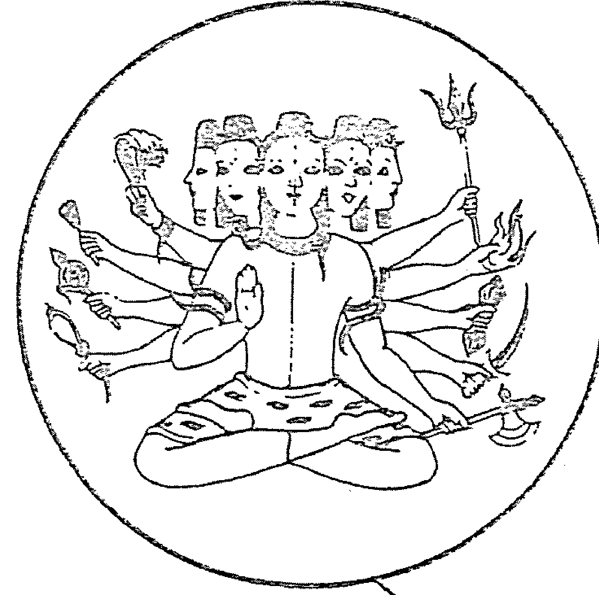

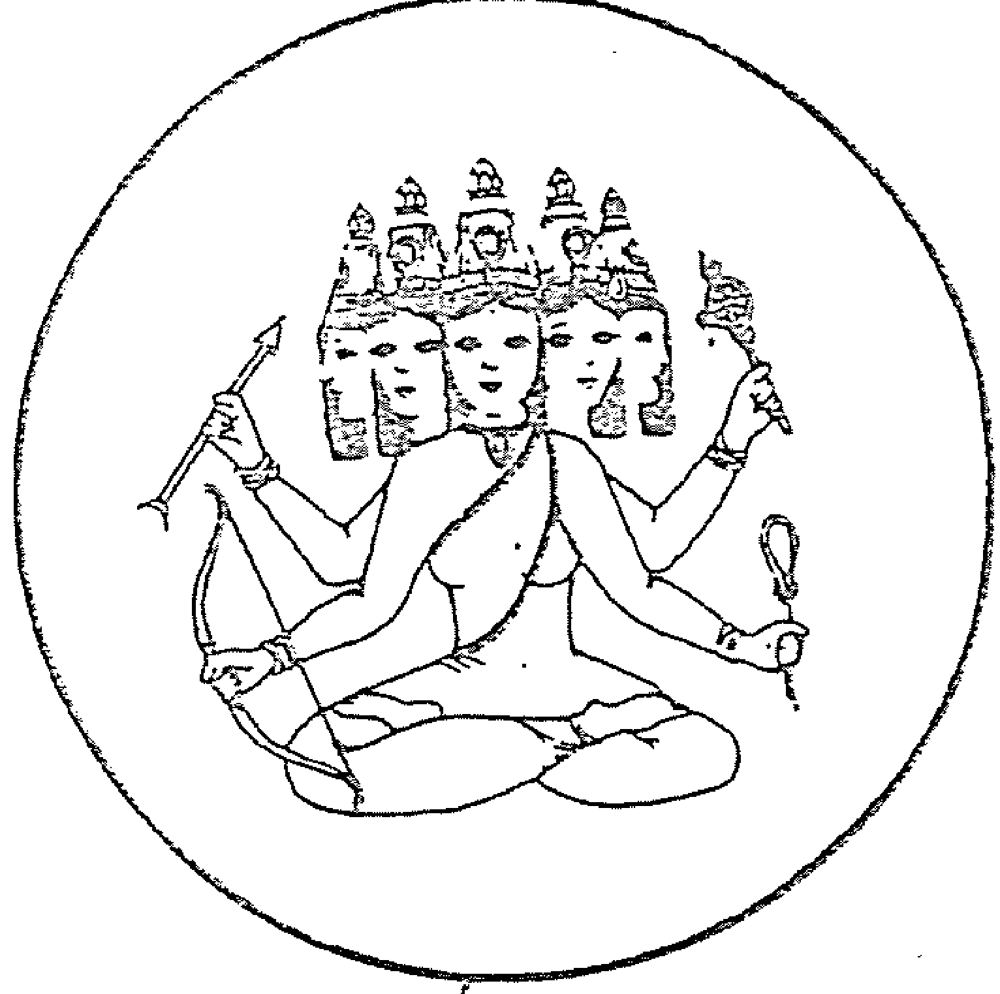

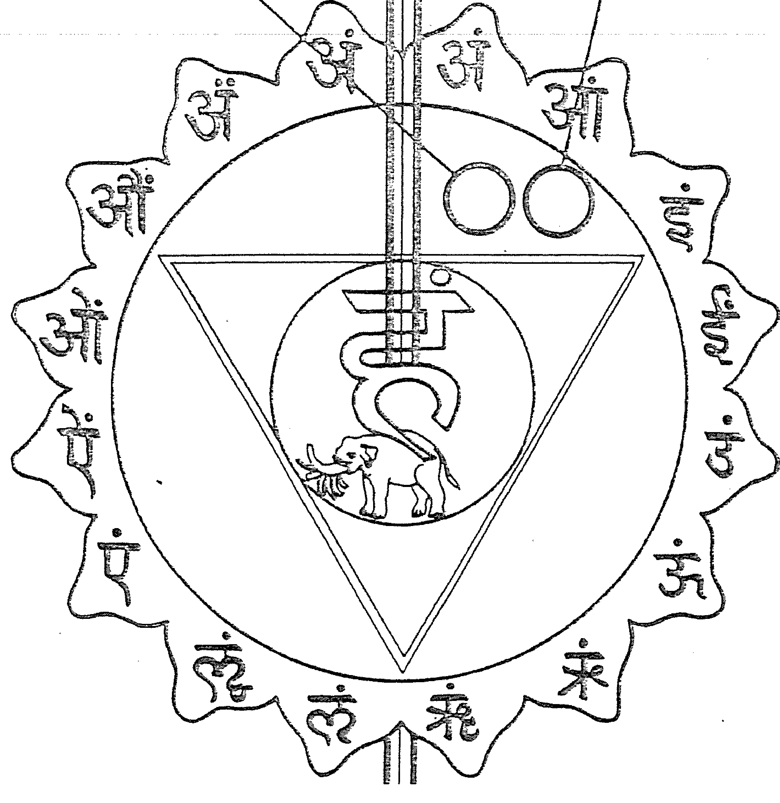

图 6-1 喉轮

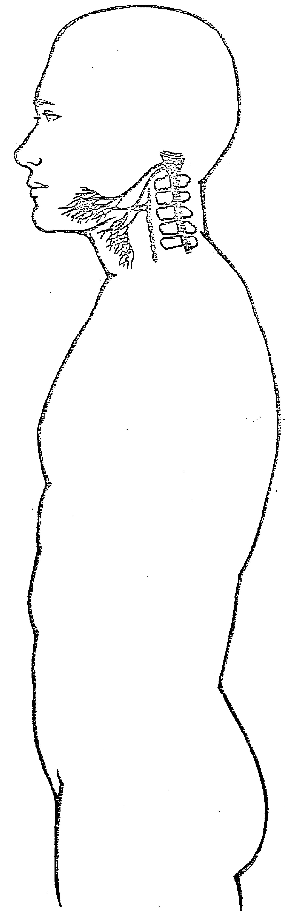

图 6-2 第五脉轮

240 脉轮全书

大多数形而上系统给宇宙设定了四个组成元素：地、水、火、风，如果要往上加第五个元素，那就是以太或灵性（spirit）。有些系统称之为“空”（space），是一种超越地水火风的非物质性的元素。在这些系统中，地水火风四种元素用以描述物质世界，而剩下的那个无可解释的非物质世界则留给了灵性。

根据经典说法，第五脉轮是七个脉轮中最后一个与元素有联系的脉轮，由此往上的上三轮组成了精神世界。在我的诠释系统中，我把声音与这个脉轮联系在一起，因为声音代表了无形的振动领域，且声音的运作方式与振动非常类似。阿瑟·阿瓦隆在《灵蛇的力量》这本书里写道：“声音，透过以太的方式存在。”① 我把光和意分别指派给第六和第七脉轮，它们是更为精微的振动现象。

### 精微的振动王国

万物都是原子的聚合。原子起舞，它们的舞步制造出声响。舞蹈的节奏改变，舞步的声音也随之改变。每个原子永恒地唱着自己的歌，歌声每时每刻都在创造着密集而精微的形态。

> ① 见《灵蛇的力量》（The Serpent Power），第 71 页，阿瑟·阿瓦隆（Arthur Avalon）对于五行元素（bhutas）的讨论。他引用了《哈他瑜伽灯论》（Hatha-yoga-pradipika）里的话：“无论听到什么样的声音，都是夏克蒂……只要有以太，就会有声音。”见《灵蛇的力量》，第 99 页。

> ——弗里乔夫·卡帕（Fritjof Capra）①

以太是那种遍布宇宙的、包罗万象的、统一的精微振动场。任何振动，无论是声音的波长或者舞动的粒子，都与其他振动相联结，所有这些振动都在相互影响。进入第五脉轮需要把我们的意识调频到与周遭精微振动场一致的程度。

举个熟悉的例子：汽车。我们的汽车是由引擎来发动的，引擎由众多零件组成，如活塞和阀片、液化气和汽油、点火的火花塞以及压缩空气（前四种元素）。错综复杂的时间配合让这些零部件以精确的关系共同运作。然而，当我们打开引擎盖时，我们看到的只有振动，因为我们看不见内部发动机的小零件，只能从宏观视野来观察。开动的引擎就像振动的金属块，发出嗡嗡的轰鸣声。我们能从它的声音判断车子是否运转良好。如果声音出现异常，那就是在告诉我们出问题了。

同样的，我们也可以用这种方式感知一个人或环境的整体振动，即便我们并不知道具体情况，却可以判断出有什么地方不对劲，因为振动中就包含了所有层面的能量。我们在第五脉轮开始学习完善意识状态，学会去感知那些精微振动所传递的信息。以太领域是一种振动的蓝图，里面标记了我们所有的身体组织、器官、情感、行为、体验、记忆和思想。

即使最坚实的物质也在不断地高速振动。事实上，正是这些连续的振动才使得我们把本质虚空的物质感受为坚实的场域。原子的粒子运动范围非常小，更像是一种振动或振荡，以大约 10^15 赫兹（赫兹是每秒的周期运动次数）的速率振动着 ①。振动存在于所有形式的物质、能量和意识中，连最基本的单位也不例外。

> ① 见弗里乔夫·卡帕《物理学之道》（The Tao of Physics, NY: Bantam Books, 1975），第 229 页。

振动是一种韵律的显化。迪奥·福琼在《宇宙学说》这本书里把振动描述为“一个层面的韵律对另一层面的冲击” ②。当我们沿着脉轮光谱攀升时，每一个层面的振动频率都比下面一层更高、更快，也更有效。例如光比声的振动频率快（大约是 40 倍振幅），意比光的振动又精微一层。我们的意识在肉身中振动，振动的能量影响了运行，运行又会去影响物质。

十九世纪，有一位叫恩斯特·克拉德尼（Ernst Chladni）的科学家通过实验证明了振动如何影响物质。恩斯特把沙子放在固定的钢板上，然后用松香擦过的小提琴弓摩擦钢板边缘。他发现钢板上的振动会使沙粒舞动成美丽的曼陀罗图案。而振动频率改变，沙粒形成的图案也会改变（图 6-3）。如果琴弓拉出的是一种简单的频率，音箱上的沙盘也会产生类似的图案。

这是声音影响物质的一个明显例子——一个层面的韵律影响了另一层面的物质。声音制造出的图案并非是随机的，而是像曼陀罗的设计那样，围绕着一个中心点呈几何排列，很像我们的脉轮图案。我们不禁要问，声音对微小的细胞、原子结构或无形的以太场域，又会产生什么样的效果。

后续的实验显示出，声波投射到不同的媒介，如水、粉末、糊状物或油里，所产生的图案竟然与在自然界发现的图案模型惊人地相似，如螺旋星云、胚胎细胞的分裂图或人眼的虹膜与瞳孔。对这类现象的研究称之为“音流学”（Cymatics），主要是由瑞典科学家汉斯·珍妮（Hans Jenny）发展出来的①。

> ① 见伊扎克·班托夫（Itzhak Bentov）《走在狂荡的钟摆上》（*Stalking the Wild Pendulum*），第 68 页。
② 见迪奥·福琼（Dion Fortune）《宇宙学说》（*The Cosmic Doctrine*），第 57 页。

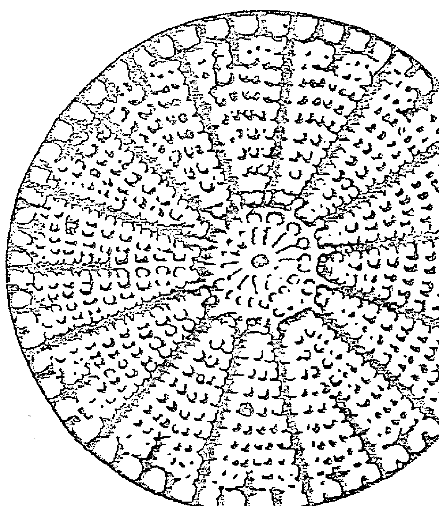

硅藻细菌（放大600倍）

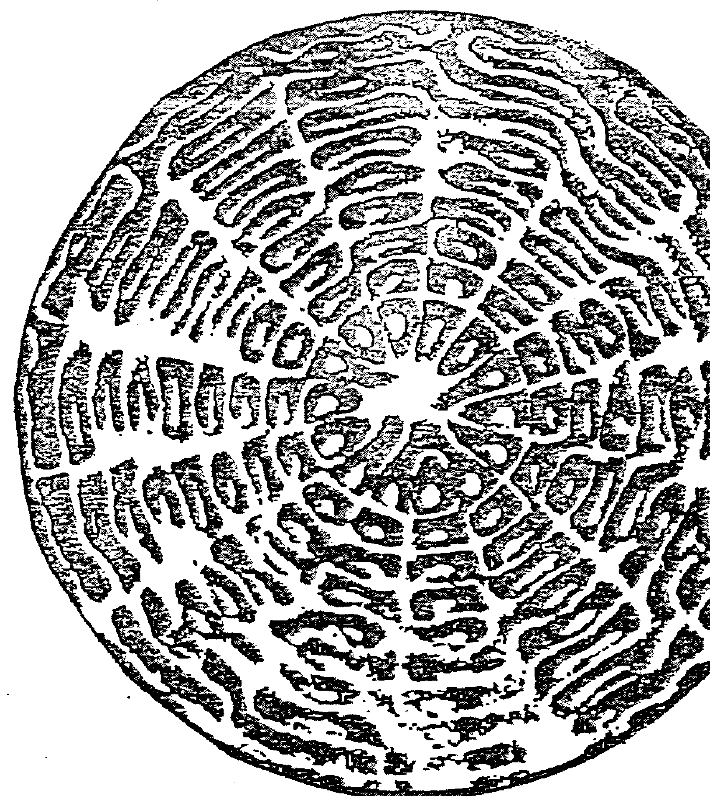

在特定振动频率下形成的克拉德尼沙盘图

图 6-3

印度教徒相信，穿越各层次密度的振动都来自于创造者梵天（Brahma），而叭咔力（Vaikhari）②，听得见的声音，是基本的放射能量，物质由此被创造出来。事实上，印度教的经典里记载着：“OM（唵），整个世界就是这个音节。由此，梵天合一。”③ 尽管印度教与基督教在许多方面都截然不同，但没有人能否认这句话与圣经《约翰一书》里那段话是多么相似：“太初有音流，此音流与上帝同在，此音流就是上帝。”④ 两者都描述神发出的声音如何创造并显化为世界。

所有振动都有特定的韵律，也即一种穿越时空、固定而重复的模式。这些带有韵律的模式正是我们意识根深蒂固的功能。四季的变换、日夜的交替、月圆月缺、女人的月经、呼吸的运动以及我们永不停歇的心跳，都是例子。没有生命能逃离这些韵律。韵律，正如改变一样，是一切生命和意识的基本特质。

第五脉轮的运作会使一个人觉知到振动层面发生的事。我们会对别人说话的语气做出反应，而非内容。越是抽象的次元对我们意识所施加的影响，越比粗大的行为层面精微的多，虽然两者的作用都同样深刻。

> ① 关于这一现象的视觉盛宴，请看视频《音流学：声音的疗愈力》（*Cymatics: The Healing Nature of Sound*，MACRO media 发行）。
② 译者注：Vaikhari 在梵文中是“发声（speaking）的力量”，代表最粗重的、可以听得见、已经成形的声音。此外还有如 Madhyama，是已经成形的、但是没有发出来的声音，像是内心的对话、观念等；Pashyanti 是更精细的内在波动，好像看到日出时的感动等。
③ 见帕特里克·奥里弗尔（Patrick Olivelle）《早期奥义书：注释与译文》（*The Early Upanishads: Annotated Text and Translation*），引自《曼都卡奥义书》（*Mandukya Upanishad*, NY: Oxford University Press, 1998），第 475 页。
④ 圣经《约翰一书》，詹姆士国王钦定版。

遗憾的是绝大多数人并不能觉知到自己在这个层面的活动和反应。

甚至我们的认知，无论透过哪种感官得来的认知，也都是感知韵律的功能的体现，听见声音和看见光亮只是其中两种。神经纤维把信息传递给大脑的机制也是透过能量有节奏地脉动完成的。从我们诞生时母亲子宫的第一下收缩，到离开人世呼出的最后一口气，我们的整个生命都在和着韵律跳舞。如同拉姆·达斯（Ram Dass）所说的“生命只有舞蹈”。

乔治·莱昂纳德（George Leonard）在他那本杰作《沉默的脉动》（*The Silent Pulse*）里这样定义韵律：“以固定频率的演奏对抗时间的矩阵。”①他认为韵律的首要任务乃是整合系统里各个不同的组成部分。生命就像一曲交响乐章，里面有弦乐器、铜管乐器、木管乐器和打击乐器，只有透过韵律的联结力量，这些乐器才能协同一致奏出乐章。韵律就是整个系统的心跳。

我们中有多少人生命中缺乏的就是这种共振的韵律，缺乏那将我们存在的核心与宇宙的心跳联结在一起的韵律。匮乏的结果是我们与自己及这个世界都无法协调一致，我们的生命中缺少了协调性、凝聚力和优雅。

韵律也像脉轮模式一样，倾向于自我延续。如果一个人以一种心平气和、全神贯注的心态开始每一天的生活，他会发现自己和外界的互动也会变得更平和与专注。相反，如果一个人每日在高峰时间开车上班，又做着一种高压、快节奏的工作，那他每天都会卷入到各种不同类型的振动中。这些韵律会在细胞层面上影响一个人，也必然会影响到他的思想、行为和情绪。当一天的工作结束，在交通高峰期开车回到家中，他无可避免地会把这种频率带入他的家庭生活、饮食习惯，以及与他人的互动当中。通常伴侣和孩子会受到这些频率的轰炸，并在有意无意中感到受刺激或被激怒。他们也许会在同一振动层面上回应这些频率，从而使局面更加恶化。如果心跳是我们内在韵律的指挥家，难怪有许多高层管理人员都患有心力衰竭。

> ① 见乔治·莱昂纳德《沉默的脉动》，第 10 页。

身心之中携带的这些振动使我们彼此影响，也与周遭世界相互影响。我们不太关注这些振动——因为这个层面是很精微的，难以指出或描绘——但仍然深受其影响。很少有人能有意识地去调和这些振动，其实有一些任何人都能学会和运用的简单技巧和原则，可以帮助人做到这一点。它们会大大帮助我们发展出个人意识，并增加我们身边人的幸福感。

### 共振

> 无论我们多么不完美，在每个人的内心中，都存在一个完美韵律的缄默脉动，一个复杂的波形和共振，它是绝对个人化、独一无二的。它把我们和宇宙万物联结在一起。碰触到那个脉动，能够转化我们个人的生命体验，并多多少少改变周遭的世界。
——乔治·莱昂纳德①

所有声音都可以描述为波形（wave-forms），也即特定频率的振动。韵律同步（rhythm entrainment）称之为共振或共鸣，指的是频率相似的波形相互锁定，两道波以完全一致的频率振动。最终形成的波是两个原始波的结合，频率还跟以前相同，但振幅加大了（图 6-4）。振幅是从波峰到波谷的距离。在声波中，振幅加大意味着能量和音量增大，就像放大的音乐一样。换句话说，当波形处于共振状态，其力量和深度都增加了。

拜访一家售卖老爷钟的商店，就会明白这个道理。假设我们走进店里，发现所有钟都没上发条，但店家保证这些钟都能走。他给每个钟上上发条，设置好钟摆运动。一开始，这些滴滴答答一秒一秒走着的钟摆彼此并不一致，有可能差了半秒或四分之一秒。但是随着时间的流逝，我们会注意到滴答声越来越少，不久所有的钟摆都以相同的节奏来回摆动。他们的韵律已经同步化。

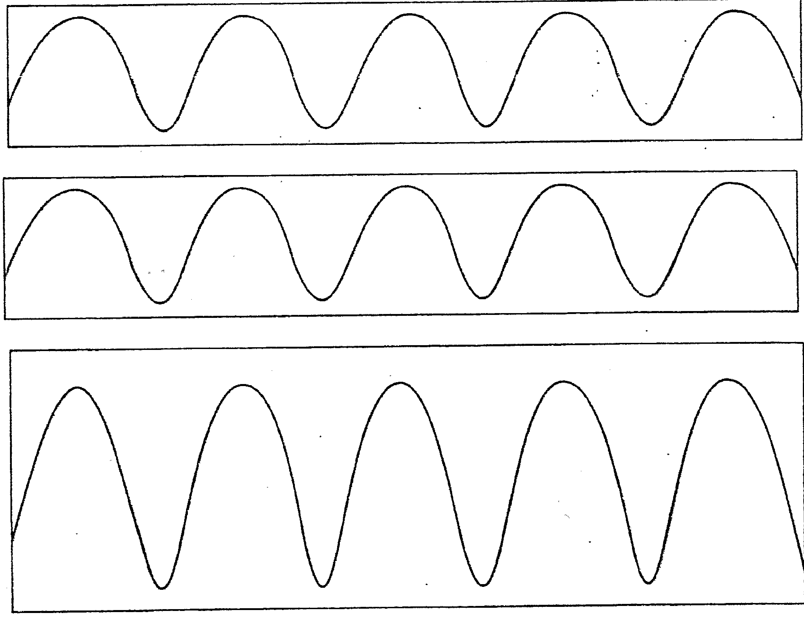

图 6-4 相长干涉的声波

两种振动如果频率足够接近，最终一定会同步。举个例子，合唱团表演时会把尾调拖得足够长，好让所有声音达到共振。如果你的耳朵受过训练，你可以听出这些脉动中微妙的节拍。当声音停止时，清晰的回声还在观众席上回响。声波互相锁定，创造出令人愉悦的共振。

当一道波触发另一道处于静止状态的波时，韵律同步原则也会发生。举个例子，两人的小提琴都要调到标准音高，我只需把两个琴摆在一起，然后在我的琴上拉 D 弦，就可以设定你的琴 D 弦的振动。这也是电视遥控器的使用原理。我们按下按钮，就会激活几英尺外的电视机。

相似的波会锁定彼此，创造出共振。频率不同的波则会制造出不和谐音。例如笛子的纯音是连贯的正弦波，因而能融入其他笛声。公车的噪音则是许多不协调音混杂的结果。

住在同一屋檐下的人，彼此的精微振动会逐渐趋同。我们一直都知道一种现象，女人们共同生活得久了，可能月经时间都会一样。一对老夫妻的相貌会变得相似，说话的声调都可能一样。在文化上，我们会逐渐和邻居、朋友和同行保持同步。我们受到周遭环境的影响，不只是视觉、心理、生理因素（广告、社会压力、空气污染等）的影响，更深的、内在的潜意识层面也会受到影响。

超绝静坐协会（TM）有一套据此原则建构出的静心哲学。他们相信透过真言（咒语）冥想创造出的脑波会对非静坐者的世界产生正面影响。静坐的人越多，韵律同步就越可能发生。他们把这项假设在美国乔治亚州的亚特兰大市进行了试验，静坐者在每晚固定时间一起冥想，结果显示那个时间段该市的犯罪率明显减少①。

所有的言语都是韵律。这意味着人与人之间的对话也会受到韵律同步原则的影响。波士顿大学医学院的威廉·S. 康登博士（Dr. William S. Condon）在其著作里论证了言语暗示的作用。

康登博士为了解对话过程中的细微之处，拍摄了大量对话的录像，然后逐帧（1/48秒）分析这些影像。他把简单的字词分解成基本单位（如“sound”这个词是 s-ah-oo-nnn-d），每个音都持续几秒。他发现听的人和说的人的肢体动作，在对话中刚好与声音同步。这些肢体动作可能是挑挑眉、歪歪头或动动手指。每一组新声音出现时，都会发生一组新动作。最惊人的是，听的人肢体动作跟说的人是同步的，而不是延迟反应。康登博士得出结论：

> 听者的动作精确回应了说者的言语。很明显这是某种同步化，即使以 1/48 秒为单位，也没有表现出明显的滞后……这显然是人类沟通的普遍特性，也可能是一般动物行为的特性。沟通就像跳舞，每个人做着复杂而相同的动作，很奇怪大家是如此一致，即使素不相识的人也会展现出这种共时性……②

康登博士描述说，信息的内容只有在同步发生后才会浮现出来，如果达不到同步这个点，信息常常会被误解。20 世纪 60 年代，乔治·莱昂纳德（George Leonard）①

> ① 见亚瑟·阿伦（Arthur Aron）的论文，可在美国爱荷华州的玛赫西国际大学（Maharishi International University, Fairfield, Iowa）的科学研究中心查询到。
② 见威廉·S. 康登的文章《残障儿童对声音的多重响应》（Multiple Response to Sound in Dysfunctional Children），刊载于 Journal of Autism and Schizophrenia 5: 1(1975), 第 43 页。

### 咒语（真言）

> 万物的精华是土。土的精华是水。水的精华是植物。植物的精华是人。人的精华是言语。言语的精华是吠陀（veda）——神圣知识。吠陀的精华是娑摩吠陀①（Sama-Veda，话语、音调、声音）。娑摩吠陀的精华是 OM。
——《歌者奥义书》（Chandogya Upanishad）

克拉德尼盘和韵律同步原则向我们展示了声波能够影响并且确实影响了物质。由此类推，声波影响意识也就不足为奇了。

冥想和唱诵中会用到神圣之音“咒语”（mantra），其背后的基本奥秘就在于此。Mantra 这个词源自“man”，意思是“心”，“tra”的意思是“保护”和“工具”。因此，咒语是保护我们的心不陷入无意义的思想和行为的工具。咒语会让心念专注和平静，它的振动，就像某个人摇动你的肩膀把你从睡梦中唤醒的那种振动②。咒语会把我们的心从无明的沉睡状态中唤醒。

如同某个特定振动会在克拉德尼盘上创造出沙子的曼陀罗图案，一个简单的咒语如 OM，会把我们散乱的心智和情绪变得优雅而凝聚。你不必从知识上了解咒语的意义或象征，也能够感受到它的影响。声音的韵律会作用于你的潜意识层面，渗透进你内在的韵律中。事实上，咒语的神奇力量之一，就是让我们不再去思考意义，因为那时我们已经超越了支离破碎的意识心，而能够去感知潜在的一体性。

然而，如果意义配合特定的声音，比如每天对自己重复肯定句“我是爱”，这种重复的节奏会帮助我们把意义注入意识中。

早晨起来大声诵念几分钟咒语，它会一整天在我们心里无声地回荡。咒语的振动能量、意向和意义会给我们的心留下烙印。随着每一次回荡，咒语会在身心里施展神奇的魔术，创造出更大的秩序与和谐，我们的行为可能因之出现新的韵律，以配合咒语来起舞。如果选择快速诵念咒语，可以用来产生能量和克服惰性。如果平和缓慢地诵念咒语，有助于我们在一整天放松和平静。

### 脉轮种子音

印度教的形而上学理论认为，宇宙的万事万物都由声音组成。每样事物里都有一个能量模型的符号表征，也就是我们说的“种子音”（seed sound），梵文为“bija”（种子）咒语。咒语被设计用来让唱诵者融入与事物种子音的共振中。透过掌握种子音，一个人可以知晓事物的本质，从而具备了创造、破坏或改变事物的能力。哈兹拉特·伊那亚特·可汗（Hazrat Inayat Khan）①说：“知晓声音秘密的人，也知晓了整个宇宙的奥秘。”②

每个脉轮都有与之相关的种子音，据说里面包含了此脉轮的本质和秘密。每个脉轮也有与之相关的元素，据说种子音通向了这些元素的特性。每个脉轮种子音如下：

| 脉轮 | 元素与名称 | 种子音 |
|---|---|---|
| 第一脉轮 | 土，Muladhara | LAM |
| 第二脉轮 | 水，Swadhisthana | VAM |
| 第三脉轮 | 火，Manipura | RAM |
| 第四脉轮 | 风，Anahata | YAM（或SAM） |
| 第五脉轮 | 声，Visuddha | HAM |
| 第六脉轮 | Ajna（光） | OM |
| 第七脉轮 | Sahasrara（意） | 没有 |

每个种子音里的 M，据说代表了宇宙的物质和母性面向；A 则代表了父亲和非物质面向。L（Lam，土）是沉重的闭口音，Ham（以太）里的 H 则是轻柔的气音。R（Ram）是充满能量的火的声音。除种子音外，每个脉轮也有特定数目的轮瓣，都以梵文字母进行了命名。通常来说，辅音反映了世界坚实的物质面向，元音代表了灵性或以太面向。第五脉轮的代表是元音，轮瓣的命名也是元音。据说这些字母掌握在卡莉（Kali）①女神之手，她的名字意思是“时间”。卡莉代表了印度教女神中的破坏面向，她通过移除轮瓣上的字母、删除声音和言语来破坏这个世界②。声音是万物的本质，没有了它，一切都不复存在。

我们并非周遭不和谐振动的无助受害者，我们可以通过发出自己的振动来改善状况。唱诵咒语就是控制自己振动的方式之一，也可以引导身心在根本的以太界面去发展修复。

下面列出一些常用的咒语及其效用。这些只是强有力的咒语能量中极其微小的一部分。咒语的重要性在其韵律和整体振动。它是一种内在的体验，尝试的时候，感觉一下哪个咒语对你比较有用。但是咒语必须经过一段时间，才能充分发挥效力，因此请持咒一周或一个月之后，再来考量其真实益处。

- OM 或 AUM (嗡或唵)：伟大初音。宇宙就是从它之中孕育出来的，它是众音之音。（对基督徒而言，AMEN “阿门” 与 AUM 很像。）
- OM AH HUM (嗡啊吽)：这三个音力量很强大，可以用于举行仪式或冥想前净化氛围；或给献祭的物品注入灵性。
- OM MANI PADME HUM (嗡嘛呢叭咪吽)：莲花宝石驻于内在。MANI PADME 代表莲花中的宝石，也即佛法中的根本智慧，神圣本质。HUM 表示个人的有限性包含于无限的实相之中。HUM 统合了个体和宇宙。
- GATE GATE PARAGATE PARASAM GATE BODHI SWAHA (揭谛揭谛，波罗揭谛，波罗僧揭谛，菩提萨婆诃)：心经咒语。
- I AM THAT I AM (我即我所是)：这句英文用来统合个体和宇宙。
- OM NAMA SHIVAYA (嗡南嘛湿婆耶)：奉湿婆之名。许多咒语都在呼唤神祇的名字，这是其中之一。任何男神或女神的名字都可以用来创造咒语。
- ISIS, ASTARTE, DIANA, HECATE, DEMETER, KALI-INANNA (伊希斯，阿施塔特，黛安娜，赫卡特，得墨忒尔，卡莉-伊南娜)：这是一连串异教女神的名字唱诵，出自查理·墨菲 (Charlie Murphy) 的唱片《燃烧时代》。女神后面也可以加上男神的名字：NEPTUNE, OSIRIS, MERLIN, MANANON, HELIOS, SHIVA-HORNED ONE（尼普顿，欧西里斯，梅林，玛纳能，赫利俄斯，湿婆 - 角神）。
- THE EARTH, THE WATER, THE FIRE, AND THE AIR—RETURN, RETURN, RETURN, RETURN（土，水，火，风——回来，回来，回来，回来）：与上述女神咒语一样，这是一种赞颂四元素的仪式性唱诵。

全世界不同的文化和信仰中有成千上万种唱诵和咒语。有些在音调和韵律上很相似，有些则完全不同。咒语最深刻的价值取决于我们投入了多少，如何把这些声音运用在每日的冥想、工作和思考中。如果许多人运用同一种咒语，这些声音就会在精微层面共振，使咒语变得越来越强有力。每次我们使用咒语，都会跟它的振波更同步。

虽然有些咒语使用了上百年，具有特定效果，但你仍然可以创造出属于自己的咒语。以持咒来自我肯定，会产生强大的力量，因为任何的语言、文字都有其内在的结构。例如“我会是强壮的”（I will be strong）这句话，包含了我们想要寻求的力量；但只要改动几个字，变成“我是强壮的”（I am strong），就比之前那句话更有力量。因此，我们必须审慎选择咒语来创造想要的效果。在大多数神秘教派中，咒语是秘传的。它的力量非常精微，不敏感或不知情的人通常感觉不到。只有透过体验，才能知晓咒语的力量。咒语的运用技巧是极为简单的复诵，而它的好处任何一个真诚的追寻者都会感受到。咒语是人类开启内在和谐奥秘的钥匙。

### 元音和脉轮

每个脉轮的种子音只有辅音不同，而元音都是相同的（除了第六脉轮）。我发现让脉轮共振更有效的方法是运用不同的元音。研究显示，不同的系统在元音的选择和念法上会有差别，但下面列出的是最通用的念法。自己诵念这些声音就是最好的验证，你可以体验一下哪个音会跟哪个脉轮有共振。放手去试验，与你的脉轮产生共鸣的声音也许会有些微的差别。

这些声音用在默诵咒语或静心冥想中，也会有同等（如果不是更强的话）效果。选择你最想做练习的脉轮，运用相应的元音来唤醒它。

- 海底轮： [o] (om)
- 生殖轮： [u] (cool)
- 太阳轮： [a] (father)
- 心轮： [e] (play)
- 喉轮： [i] (seed)
- 眉心轮： mm
- 顶轮： [ng] (sing)，或只是静默

### 心电感应

> 掌握的要领永远是静默，在所有层面的静默，因为在静默中我们才能识别振动，识别它才能撷取它。
——室利·阿罗频多（Sri Aurobindo）①

心电感应是穿越时空的沟通艺术，运用的不是我们“正常”的五种感官。只有极少数人擅长这种沟通形式，它是我们在潜意识层面对事物做出的反应。如果第五轮发展完备，这种能力并非遥不可及。

当我们学会精进我们的脉轮，平和我们的心智，安静我们的思想，意识的触角就会变得越来越平滑。我们的振动会变得更稳定，感知力会越直接。在这种状态下，觉知我们能量场里的精微振动涟漪就变得很容易。当生活中那些比较粗糙的振动不再形成干扰时，心电感应在静默沟通层面就会显露出来。

做个类比，如果你身处嘈杂的派对中，每个人都在说话，音乐声音很大，大家正跳着舞，你必须提高音量才能跟同伴对话。如果你的同伴忽然因为某个神秘理由，开始放低声音，对你轻声细语，你肯定什么都听不见，必须到一个安静的房间，那里没有什么干扰，你们的沟通才能继续。

心电感应可以被定义为“听到他人心灵低语的艺术”。要做到这一点，我们的内在必须非常安静。大多数人生性就喜欢在自己的脑海里开派对，总是自言自语或在大脑里播放录音带。这些絮絮不休的诉说会钝化第五脉轮的接收能力。我们习惯用超越声音限制的科技装备来传递信息，却不习惯接听来自以太界的精微骚动，这些精微信息会把我们带到超越时空的沟通层面。

为什么要进入这个层面呢？难道显而易见的、实体的沟通不是更精准、具体，很少出错和损失信息吗？如果你发出一个心电感应的信息，怎么能保证它会被接收到？或接收得正确？

意识并非是一个言语表达的过程。为了沟通，我们必须把意识转译为象征结构，然而为了接收信息，需要再把象征结构还原为意识。尽管这一过程似乎是同步发生的，但我们还是把意识从比较纯粹的形式降级了。任何语言学家都知道，沟通的精华往往会在转译中被曲解。

从这个角度看，心电感应沟通比言语沟通更精准直接，因为言语沟通经常包含了许多谎言和遗漏。

虽然很少人真正具有心电感应沟通的能力，但几乎没有人没体验过它。例如两人同时想说一件事，发现电话占线是因为对方正在给你打电话；当家人遇到危险时，你虽不知情，心里却感到丝丝不安。这些都是经常发生在我们生活中的心电感应的例子。

以太是粗大振动和精微振动之间的连接场域，透过感知这个场域里的变化，沟通就发生了。然而，心电感应沟通是更精微的振动，只有当粗大的振动安静下来时，它才能被感知到。心电感应是两个或更多心灵进入韵律同步状态的结果，一方的振动模式会引发另一方相似的振动。韵律同步会增加波幅，波幅越大越有力量，也更容易被接听到。

不管怎么解释，心电感应沟通的例子显示出，我们在以太界有一种精神上的联结，这种联结使信息得以在非物质层面发生交换。当信息变得越来越稠密时，它们就开始显化，先被一个人的心智识别出来，接着被第二人接收和认出，最终心念变得越来越密实，直到成真。古话说“心想事成”就是这个道理。

不管我们是信息的发出者还是接收者，毫无疑问存在着某种媒介，透过这个媒介我们得以进入心智能量汇聚的振动场域。通过精进修炼脉轮，关注包围并创造了我们的振动世界，我们会找到一条路径进入大一统的意识次元。我们越接近上层脉轮，也就越接近宇宙意识，宇宙意识超越了导致分离的物理时空限制。不是要去创造这种意识，而是静下来聆听它，因为它早就在那里了，而我们也一直在其中扮演着角色。我们可以选择用更觉知的方式演好自己。

### 创造力

沟通是一个创造的过程。我们越是精通这门艺术，沟通的过程就变得越有创意。孩子最开始学说话的时候，只会模仿父母的话语。但是很快他们就了解到特定话语带来的效果，开始自己摸索实验。随着词汇量的增加，孩子拥有越来越多的元素来发挥他的创造力。他开始运用字词、声音和动作来创造他的现实——他的余生都会这样做。

虽然很多人把创造力跟第二脉轮（我们在此创造出了孩子）联系在一起，我却认为创造力最终是一种表达形式，与第五脉轮相关。子宫里创造生命的行为并非意识的活动过程，因为我们无法决定是制造手指还是脚趾，长蓝眼睛还是棕色眼睛。虽然第二脉轮的情感状态会激发创造冲动，但仍然需要第三脉轮的意志①和上层脉轮的抽象意识才能使创造成型。

艺术永远存在于文化的边缘地带。无论是视觉的、听觉的、动觉的、戏剧的或者文学的，艺术恰恰以其不受管制、不服从的特性得以抵达广阔的未知领域。艺术所展示出的创意和观念会直接作用于人的意识，且是大脑的整个层面。

用媒体研究专家马歇尔·麦克卢汉（Marshall McLuhan）的话说：

> 我很好奇，如果艺术的真实样貌忽然被看见，会发生什么事。换句话说，艺术包含了如何重组我们心灵的信息，使我们的能力得以扩张，来预测下一波风潮……艺术家永远投身于书写未来历史的细节中，因为他是唯一觉知到当下本质的人①。

艺术形式一般比任何的沟通形式都抽象。艺术留下想象的空间，邀请意识中最具创意的部分来参与。说得越少，听到的也许就越多。因为我们越靠近意识的抽象层面，理所当然就越需要用更抽象的沟通手段来表达。

创造的过程是一个发现内在的过程。创造一件艺术品时，我们向宇宙奥秘敞开了自己，成为灵性讯息的管道，学习比人类舌头更通用的语言。

创造的过程也是非常精微的。制式的、大一统的生活无法培育艺术，只会对艺术造成危害。创造力释放出我们内在的力量，正如语言“从不确定的状态中释放出未知，使大脑得以知晓”②。

目前出现了很多以创造力来疗愈身心的方法，如视觉艺术、心理剧、运动、舞蹈和具有安神效果的音乐等。我们借助这些手段进入身心更深层、更健康的次元，释放出内在累积的挫折感，这些挫折使我们的一体性变得支离破碎。

21 世纪的生存和健康议题需要更多的创新力和灵活性，而创造是解决问题的关键。我们必须尊重自己和彼此的创造力，尊重使创造得以发生的内在过程。

---

**脚注：**

① 译者注：娑摩吠陀（Sama-Veda，Sama 是典礼的圣歌，veda 是知识）是四大吠陀经的第二部，乃一部歌咏集，为婆罗门僧祭酒时所唱的歌词。汉译名称为赞颂明论。
② 见阿瑟·阿瓦隆（Arthur Avalon）《灵蛇的力量》（The Serpent Power），第 97 页。
① 译者注：哈兹拉特·伊那亚特·可汗（1882-1927），出生于印度的瓦多达拉，苏菲派哲学家、音乐家、神秘主义者，国际苏菲教团创办人。
② 见哈兹拉特·伊那亚特·可汗（Hazrat Inayat Khan）《苏菲的讯息》（The Sufi Message）卷二（London: Barrie and Rockcliff, 2nd ed.1972）。
① 译者注：卡莉女神（Kali）是印度教里代表毁灭和创造、出生和死亡的女神，又称“时母”。
② 见阿瑟·阿瓦隆（Arthur Avalon）《灵蛇的力量》（The Serpent Power），第 100 页。
① 引自沙特普雷（Satprem.）《室利·阿罗频多，意识的冒险》(Sri Aurobindo or The Adventure of Consciousness)，第71页。
① 有些人如埃德加·凯西（Edgar Cayce）和卡罗琳·梅斯（Carolyn Myss），认为意志与第五脉轮相关。我却认为意志是更早出现的东西，否则我们根本到达不了第五脉轮的层次，并且这样划分会彻底把沟通排除于脉轮系统之外。我们可以在这个脉轮表达自己的意志，但内在的力量和意志最初都是从静默中来的。
① 见马歇尔·麦克卢汉（Marshall McLuhan）《理解媒介》（Understanding Media），第 70-71 页。
② 见玛丽莲·弗格森（Marilyn Ferguson）《宝瓶同谋》（The Aquarian Conspiracy），第 80 页。

### 媒体

电视、广播、报纸，以及其他形式的公共沟通都可以看作是第五脉轮的文化表达，发挥着联结所有人的神经系统的作用。如果沟通是传递知识和理解，那我们集体潜意识中的内容，无论好坏，都会受到媒体的强烈影响和掌控。无论是被迫围观政客的私生活，从电视里看到数不清的谋杀案，还是耳闻有关环境的真实数据，媒体把公众注意力引向了特定话题，而这些话题被认为是公众意识所关注的。媒体引领了我们的注意力，而注意力去到哪儿，剩余的能量也会跟随去到哪里。如果媒体感觉暴力比性爱更适合孩子观看，它也就为我们全体设定了文化价值观。

媒体是我们促成文化变迁的最强有力的手段。媒体还是强有力的反馈系统，让我们看到自己真实的样貌——我们的美好和无知。当年在越战过程中，有关战争的新闻图片让人们了解到越战的暴行，从而催生了反战运动。媒体让我们了解到地球生态的现状、其他地区人的生活境遇，同时也把全球的大脑连线在一起。

媒体也向我们展示了存在的不同方式。电影制造出的虚拟现实如此逼真，为我们的想象力灌注了新的可能性。媒体表达创造力，在集体潜意识的深处使我们彼此沟通。媒体也是文化转型的前沿，它把幕后的革新者带到镁光灯下，使他们的声音为大众所知。

掌握媒体的人必须正直，这是很重要的一件事。如果媒体是我们的文化神经系统，对活出的集体现实最具影响力，那我们必须避免媒体受到愚蠢的垃圾信息、耸人听闻的八卦以及宣传和谎言的污染。否则我们就有受到集体操控的危险，而操控媒体的人实际上比绝大多数我们投票选出来的代表都享有更大的权力。正如第五脉轮梵文名字 *Vissudha* 的意思是净化，集体的第五脉轮必须跟启蒙全人类的真理一起共振，才能发挥净化作用。

## 第五脉轮练习

### 猜谜游戏

花一小时跟某人待在一起，完全保持静默，只用肢体沟通。选择有挑战性的事情来做，留意你沟通所使用的方式，如身体姿势、手势、拉扯、眼神等。留意这种沟通可能会在快结束时变得容易起来。留意哪些内容的沟通特别困难。这项练习会帮助两人或更多人之间进行沟通。

### 禁语

倾听很重要，却是沟通中常常被忽略的要素。瑜伽行者往往会长时间禁语，以净化他们的声音振动，进入更精微的层面。透过禁语，一个人可以开启其他沟通管道，也即高层意识的沟通。一开始可以禁语几小时，然后一整天或更长。

### 录音

在日常谈话中把自己的声音录下来。看看你讲了多少，听了多少，是否打断别人的话，还是结结巴巴在讲？留意你说话的语调。如果你不认识这个人，凭直觉你从他的声音中能听出什么？

### 转动颈部

颈部是躯体上最狭窄的部分。大部分时间它的作用是过滤头脑和身体之间大量的能流。这会很容易造成颈部的紧张和僵硬。想对第五脉轮做工，放松颈部是非常重要的第一步。

抬起头，慢慢转动头部，做圆周运动，同时拉伸脖子。停在任何你感到紧绷或不舒服的地方，用手指按摩这个地方。停一会儿直到放松，然后继续转动。顺时针和逆时针都做一做（图 6-6）。

### 抬头

这项练习会刺激甲状腺，锻炼颈部。

平躺下来，放松。慢慢抬头，保持肩部贴着地面，抬头直到你可以看见自己的脚趾（图 6-7）。维持这个姿势一会儿，直到你感到能量流进了颈部。

### 肩立式

要使这个姿势做起来比较容易，可以先拿一块毯子或毛巾（2-3 英寸厚）垫在你平躺的后背下面。躺下来头接触地面，背的上半部枕在毯子上。

平躺下来，胳膊放在身体两侧，放松。曲膝，腿向胸部抬高，背部呈圆弧形。

臀部抬起时，弯曲手肘，用手掌根来支撑腰部。

慢慢向上打直双腿，用胳膊支撑身体，在舒服的状态下尽可能维持这个姿势（图6-8）。

### 犁式

如果肩立式成功了，也许你会想尝试犁式。

回到肩立式的姿势。放下双腿，越过头部，脚接触地面，膝盖尽可能打直（图6-9）。

如果身体不够柔软，可以拿张椅子放在头后面，把脚放在椅子上。

### 鱼式

这项练习往往接着肩立式或犁式，可以让颈部和后背同时放松，也有助于打开胸腔，刺激甲状腺。

平躺。手放在臀部两侧，有手肘支撑起上半身，胸部向天花板抬高，颈部向后弯，直到头碰触地面（图6-10）。

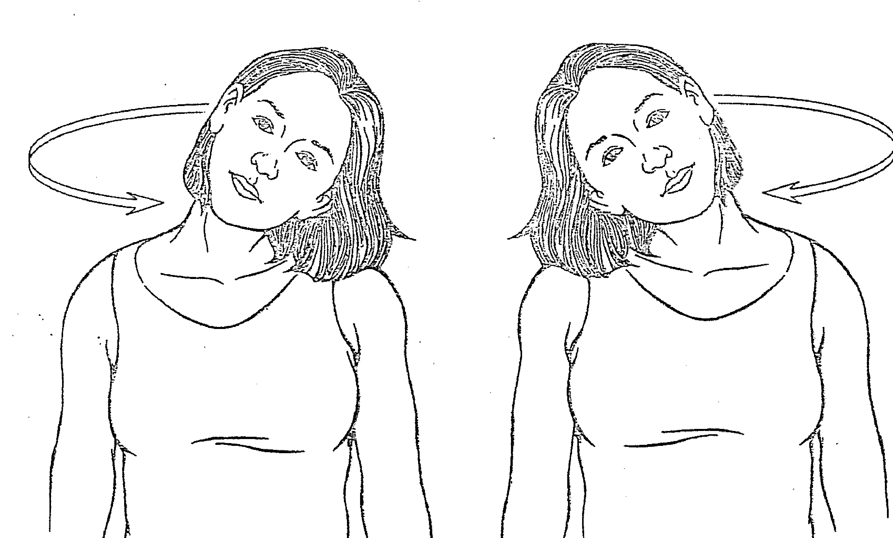

图 6-6 转动颈部

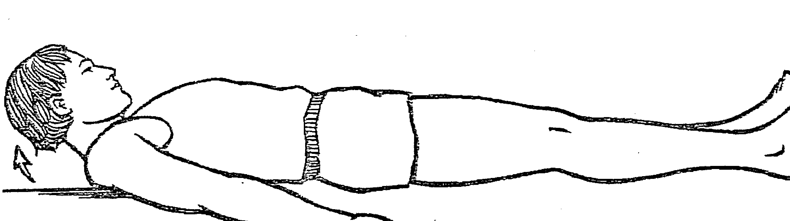

图 6-7 抬头

268 脉轮全书

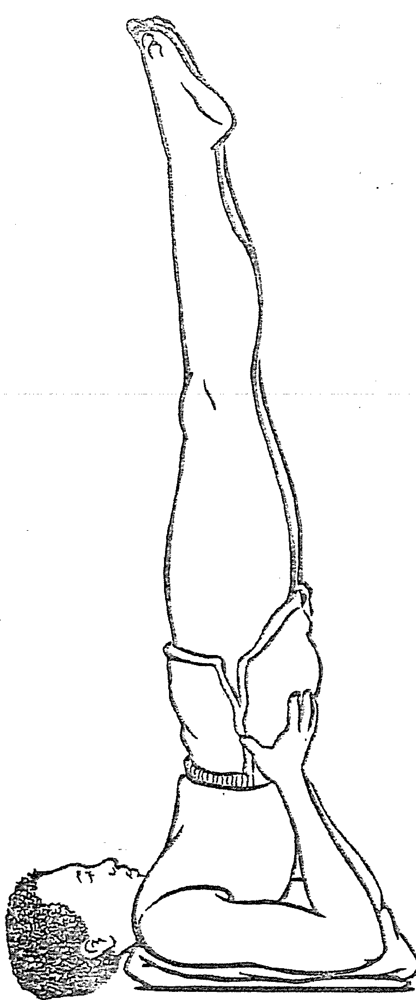

图 6-8 肩立式

第六章 第五脉轮: 声 269

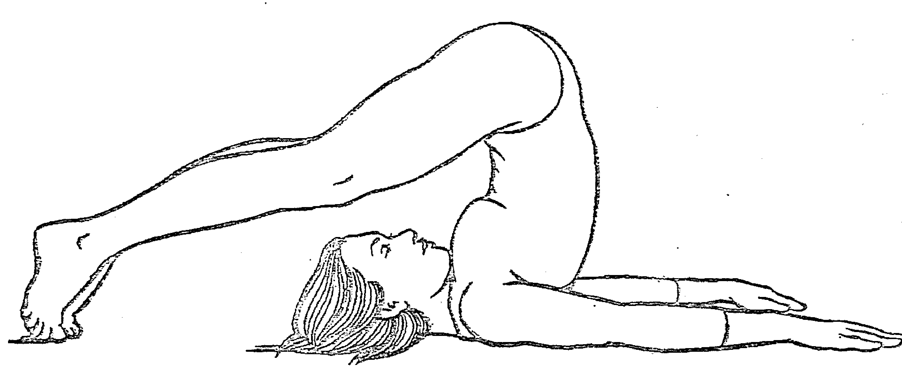

图6-9 犁式

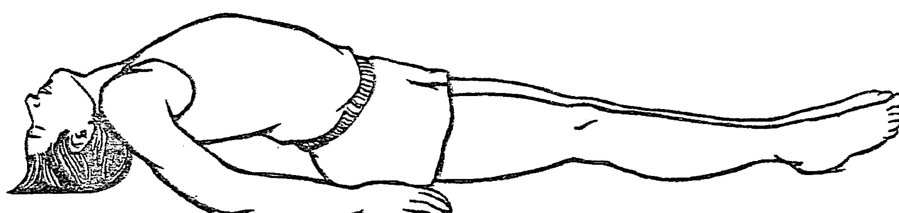

图6-10 鱼式

## 第五脉轮推荐阅读书目

凯·加德纳（Gardner, Kay）《倾听内在：以音乐为药》（*Sounding the Inner Landscape: Music as Medicine*. Stonington, ME: Caduceus Publications, 1990）

乔伊·加德纳-戈登（Gardner-Gordon, Joy）《疗愈之声》（*The Healing Voice*. freedom.CA: the Crossing Press, 1993）

理查德·格伯博士（Gerber, Richard, M.D.）《振动医学》（*Vibrational Medicine*. Santa Fe, NM: Bear&Co., 1998）

彼特·麦克·哈梅尔（Peter Michael），《通过音乐找到自我》（*Through Music to the Self*. Boulder, CO: shambhala, 1979）

乔治·莱昂纳德（Leonard, George）《沉默的脉动》（*The Silent Pulse*. NY: E.P.Dutton, 1978）

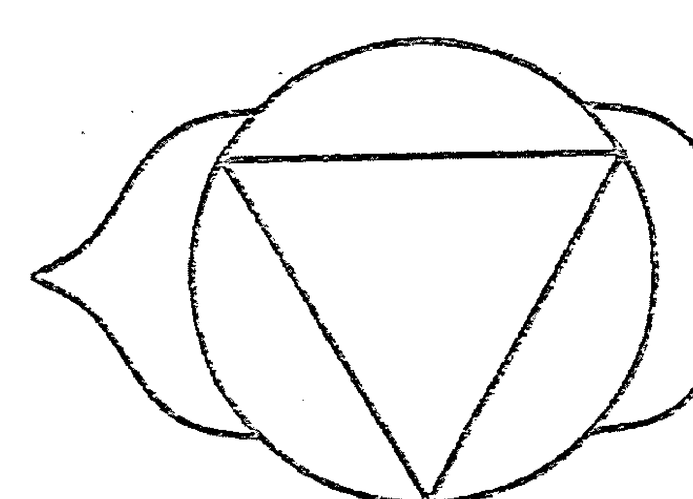

# 第六脉轮元素

- 光
- 颜色
- 看见
- 直觉
- 形象化
- 想象力
- 灵视
- 视觉

# 第七章
## 第六脉轮：光

## 开启的冥想

只有黑暗。双眼紧闭，躺着如同睡着。
没有梦，漠然于周遭的一切，
漂浮在虚空之海，享受黑暗的摇篮——
无视、无知、全然平静。
缓慢地呼吸，吸气，吐气，再吸气，吐气，
伸展和放松身体，安住在温暖而平静的黑暗里。
我们回家了，安全了。
沉潜入内在，感受，倾听，存在，
但是看不见。
成为这片黑暗——全知，又无知，空无且自由。
让黑暗洗涤你，抚慰你。
清空头脑，进入无限之虚无，黑暗的子宫——我们梦想的发源地。

在黑暗中的某处，听到声音——
一个遥远的音符、低语、骚动之音。
感受到微风拂过脸颊，暖意流过肩膀，
一股拉力升起、流动、跟随，却不知要去哪儿。
我们的身体既不能看，也不能动，还在黑暗中停留。
身体召唤我们给予方向、智慧和引导。
身体召唤智能、记忆、净化和光。
恐惧于无知带来的黑暗与安逸，我们听从召唤。
我们倾听身体的召唤，我们的心渴求答案，向外追寻。
渴望看见，渴望知晓，渴望立刻见证周遭的奇迹。
光明赋予我们识别的能力，指引我们求知的步伐，
填补我们空虚的心灵，赐予安全与平静。
打开心灵，睁开双眼，四处张望。
影像倾流而出，如万花筒般千变万化，在内部翻滚。
重重叠叠的影像，永无止境地交织在一起。
颜色、形状和形态映现了周遭的空间，反射进内在，
以心灵清晰可见的方式记录着生命。
心打开，接纳。
太丰盛了，光也为之目眩。
我们召唤黑暗来庇佑，调和光明，将图像定格为意义。
黑暗温柔地降临，与光明手牵手。
限定、荫蔽、交织、排序。
光明现在也变得轻柔了。
彩虹、疗愈、抚慰、启蒙，随意而来。

活泼的黄色、疗愈的绿色、抚慰的蓝色、浓烈的紫色，所有生命都光芒四射。

形状和本质向我们揭晓，我们得以观看并知晓。

希望看到什么呢？

内心的幻影又是什么呢？

光会给我们带来什么呢？

千阳之美，孤月之美。

我们引领生命的模式，感知一切真理。

轻柔地乘着光之翼，花瓣在暗夜中飞舞。

抵达世界的边缘，事物即将到来，日子一去不返。

全息矩阵之网逃离时间疆域，

万象皆存留于心的影像里。

红色和黄色，绿色和蓝色，交织成各种色调。

形状和样式，已被揭晓，没有什么能够隐瞒。

从内在之眼，看见真理，消除疑虑。

敞开心，观察、等待，智慧之眼编织命运。

光明照亮我们的道路，内在之光把夜晚变为白昼。

尽管黑暗必将复返，却不再担忧，

因已学会结合黑暗与光明，让影像来界定，

暗与亮，夜与昼。

在我们之内，光照亮道路。

## 第六脉轮象征和对应物

梵文名：Ajna
意义：感知，命令
位置：额头中心，略高于眼
元素：光
基本形式：影像
功能：观看，直觉
腺体：松果体
其他身体部位：眼睛
功能失调：失明，头痛，噩梦，眼睛疲劳，视力模糊
颜色：靛蓝色
种子音：Om
元音声：[m] Mmmm（不是真正的母音）
轮瓣：两瓣
质点：理解（Binah），智慧（Chokmah）
天体：木星，海王星
金属：银
食物：致幻剂
对应动词：我看见
瑜伽：幻轮瑜伽
草药：艾蒿，八角，金合欢，藏红花
矿物质：青金石，石英，星彩蓝宝石
动物：猫头鹰
属性：悦性（Sattva）
莲花象征：两瓣莲花围绕一个圆，中间是一个金色的倒三角，包含着男性生殖器和种子音OM。神祇是夏克蒂的化身空行母哈基尼（Hakini），她长有六面六臂，坐在一朵白莲花上。在她之上是一轮新月和明点（Bindu dot），以及湿婆的化身闪电。

印度教神祇：夏克蒂的化身哈基尼（Hakini），湿婆的化身帕拉马西瓦（Paramasiva），克里希那（Krishna）

其他神祇：忒弥斯女神（Themis，掌管法律、裁判），赫卡特（Hecate，司夜和冥界的女神），度母（Tara），伊希斯（Isis，古埃及的丰饶女神），伊里斯（Iris，希腊神话中的彩虹女神），墨菲斯（Morpheus，睡神），贝勒努斯（Belenos，凯尔特神话中的太阳神），太阳神阿波罗（Apollo）

### 带翅膀的观察者

> 想象力比知识更重要。
——爱因斯坦

从时间之初，黑暗和光明就交织在一起，赐予我们意识最伟大的礼物之一——观看的能力。无论是多少光年之外闪烁的群星，还是自家后院里绽放的花朵，这份视觉大礼让我们目睹造物的美丽，见证宇宙的神奇。观看赋予我们一种能力，能够瞬间吸收周围的海量信息。形状和形式浓缩成光波，在我们的内在绘制出周遭世界的蓝图。在梦境里，无意识涌现出的图像把我们和灵魂联结在一起。凭着直觉，我们穿越各种情景，积累智慧来度过艰难时刻。

这份观看的礼物——向内看和向外看——是第六脉轮的本质和功能。透过观看，我们拥有了内化外在世界的手段，并以符号语言来外化内心的世界。借由对空间关系的感知，我们建构出对过去的记忆和对未来的想象。由此，这个脉轮超越了时间。

第六脉轮也叫作“眉心轮”，位于前额后方、头部的中心处——与眼睛的位置平行或略高，因人而异。它联结的是第三眼，悬浮于两个肉眼之间，是掌管心灵感应的以太体器官。肉眼是大脑感知的工具，第三眼是第六脉轮通灵的工具。这个脉轮本身包含了内在呈现图像的屏幕以及庞大的视觉记忆存储库，并以此构建我们视觉化思考的过程。第三眼所看到的景象是超越物质世界的，带来更多的内在洞见。就像从字里行间领悟言外之意一样，第三眼把我们导入更深的理解层次。

这个脉轮的梵文名叫 *ajna*，原始意义是“感知”，后来也有“指挥、统摄”的意思。这说明了第六脉轮的两个特质——透过感知接收图像，然后形成内在图景指挥我们的现实运作，也即通常所说的“创造性的观想”（creative visualization）。如果我们在心中保持一个意象，就会增加它在现实世界中具象成形的可能性。这个意象就像一扇彩色玻璃窗，意识之光照射穿过它，直至显化为现实。如果没有干扰，显化出的形式就是我们所观想的，如同没有家具挡在中间，彩色玻璃会如实地投射影像。但在现实中，我们的观想并不总能显化出来，一个重要原因是意识在下降显化的过程中会遇到干扰，干扰可能来自个人的处境，也可能是无意识中的恐惧，或者仅仅是因为我们的观想不够清晰具象化。

在我们沿着中脉向上攀升的过程中，脉瓣的数目一直稳定增加，但是到了眉心轮突然只剩下两瓣①（图 7-1）。关于这两个轮瓣的意义有很多解释：1. 有两种现实：显化的和未显化的；2. 交织的气脉，左脉和右脉交汇于此；3. 两只肉眼环绕于第三眼周围。两个轮瓣也像一对翅膀，象征了这个脉轮超越时间和空间的能力，可以将我们内在的灵性带向更高远辽阔之境。有意思的是，如果把墨丘利节杖跟脉轮和气脉比较，会发现第六脉轮正好位于节杖上两个翅膀的位置。还有一种解释是，两个轮瓣围绕一个圆圈类似眼白，眼白被虹膜围绕。

与这个脉轮有关的元素是光。透过对光的感知，我们才能获取周遭世界的信息。我们能看到多少，取决于这个脉轮的开放和发展程度，也包括正常视力的敏锐度。视觉和心灵能力的范围，从对物质世界有着极其敏锐观察力的人延伸到那些具有特殊心灵感应天分的人，后者可以看到灵光、脉轮、星光层的细节，以及预知未来（看到未来发生的事件），具有千里眼（看到另外一个地方发生的事）功能。

眉心轮不像前五个脉轮位于躯体上，它的位置在头部，因此它的本质与其他脉轮相比，更偏向精神化。我们的视觉感知必须先转化为其他形式，如语言、行动或情绪，才能跟他人分享。当我们变得更精神化时，就能抛下时空的束缚，进入超越个人的次元。

每个脉轮都对应一个腺体，第六脉轮对应的是松果体，一个极为微小的锥形腺体（10 × 6mm），位于头部的几何中心，几乎与眼睛平行（图 7-2）。很可能这个腺体一度也位于靠近头顶的地方，因为一些爬行类动物的腺体就在那个位置，形成感光知觉器官，像另一只眼睛①。

松果体有时也被称为“灵魂的居所”，它是身体的测光表，把光的变化转译为荷尔蒙信息，然后通过神经自律系统传递给身体。超过一百种身体功能的日常节律都会受到光照的影响 ①。人在七岁松果体的发育会达到顶峰，因此松果体也被认为是影响性腺成熟的腺体 ②。在胚胎学上，松果体源自第三眼，而第三眼在胚胎早期就开始发育，后来却退化了 ③。这个腺体对于神经系统具有安神作用，切除它会引起动物发作癫痫。

褪黑激素是一种与色素细胞有关的荷尔蒙，由松果体分泌。据说褪黑激素的产生与光对眼睛的照射有关，即使只是极为微弱的光 ④。由于松果体有助于睡眠，因此今天受到广泛研究。据信它也会强化我们的免疫系统，减少压力和延缓衰老 ⑤。随着年龄的增长，褪黑激素的分泌会减少。研究发现，抑郁症患者的褪黑激素水平低于正常值，而人在躁狂状态下，褪黑激素的水平会高于正常值 ⑥。

因为松果体刚好位于脑垂体上方，有些人就把松果体与第七脉轮联系起来，认为脑垂体与第六脉轮有关。我强烈认为，因为脑垂体是控制其他腺体的主腺（master gland），那它联结的应该是主宰的顶轮，而松果体是一个感光器官，显然应该和第六脉轮联结。

我们的文化在第六脉轮层面上的不成熟状态，是否与松果体的萎缩有关呢？这个腺体的神秘功能目前还处于休眠状态，是否在等待某种灵性和文化来唤醒呢？研究显示，光对于植物和哺乳类动物的健康和行为确实会发生影响①，是否松果体在光与身体的化学作用之间扮演了某种秘密角色呢？

还没有足够证据证明这一点。褪黑激素有助于睡眠，增加梦境，与内视（inner vision）现象有某种关联。褪黑激素的化学成分类似于引发幻象的一些原生植物（native plants），这种成分能够循环合成具有潜在致幻作用的10-甲氧基哈马兰（10-methoxyhar-malan）。有些影响精神的毒品如LSD（麦角酸二乙胺）②，会增加褪黑激素的合成③。或许在更进化的人身上，松果体里真的含有某些能引发内视现象的化学成分。目前褪黑激素已经作为助睡药物广泛应用于人们的日常生活，观察长期使用它会对松果体或我们的精神敏感度产生什么样的影响，应该是一件很有意思的事。

① 李德彼特（Leadbeater）主张眉心轮有 96 瓣，是所有下层脉轮轮瓣总数的两倍 2×（4+6+10+12+16）=96。见 C.W. 李德彼特《脉轮》（*The Chakras*），第 14 页。

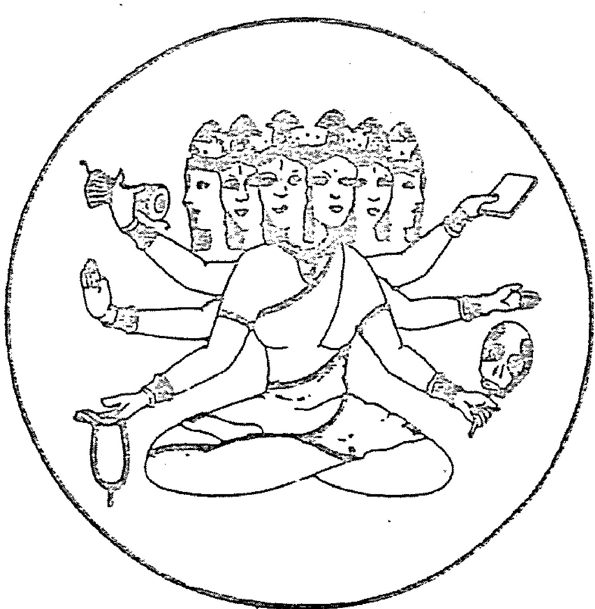

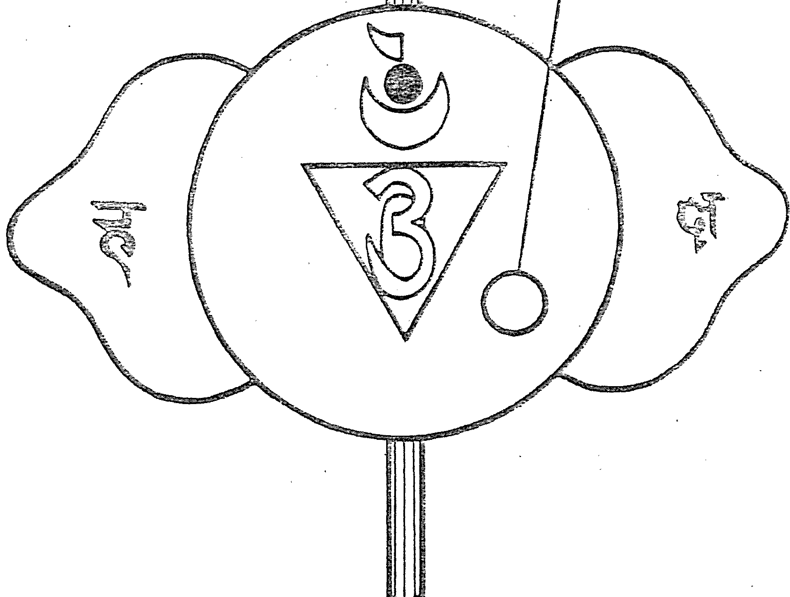

图7-1 眉心轮

第七章 第六脉轮: 光 279

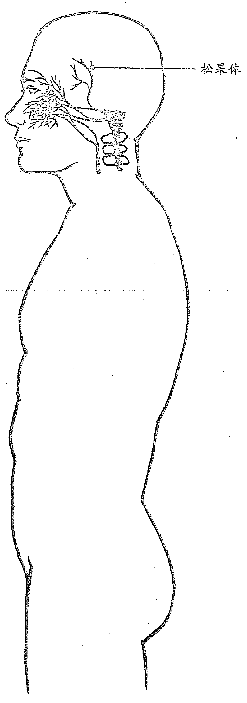

图 7-2 第六脉轮

第七章 第六脉轮：光 281

① 见《大美百科全书》（*Encyclopedia Americana*），松果体条目。

① 见雅各布·利伯曼（Jacob Lieberman）《光：未来之药》（*Light, Medicine of the Future*），第 32 页。
② 见《大美百科全书》（*Encyclopedia Americana*），松果体条目。松果体可避免性征过早成熟。
③ 见亚瑟·C. 盖顿（Arthur C. Guyton）《医用生理学》（*Textbook of Medical Physiology*），第 884 页。
④ 同注①，第 32 页。
⑤ 见阿兰·E·路易斯（Alan E Lewis）和达拉斯·克劳艾特（Dallas Clouatre）博士《褪黑素和生物钟》（*Melatonin and Biological Clock*），第 7-8 页。
⑥ 同注⑤，第 16 页。

① 见约翰·N. 奥特（John N.Ott）《健康和光》（*Health and Light*）。
② 译者注：LSD，来自德文Lysergsäure-diäthylamid的简写，中文叫“麦角酸二乙胺”，是一种强烈的半人工致幻剂。它在1938年由一位瑞士化学家艾伯特·霍夫曼博士第一次合成出来。5年后，霍夫曼在一次意外接触中透过皮肤吸收了微量LSD而发现它具有转换精神状态的效果。LSD的一次典型剂量只有100微克，仅相当于一粒沙子重量的十分之一，却能造成人6到12小时的感官、感觉、记忆和自我意识的强烈变化。精神病学家后来用它使自己得到对精神分裂症的亲身体验，也把LSD用于精神病治疗中。据说冷战时期情报部门曾将LSD用在审问和心理控制上。在20世纪60年代的嬉皮运动中，LSD被认为具有激发精神成长的潜力而被大众娱乐化。由于LSD与反文化的关系越来越密切，1967年它被美国政府禁止。今天在英国、澳洲、新西兰和大部分欧洲国家，LSD都是非法的。
③ 见阿兰·E·路易斯（Alan E Lewis）和达拉斯·克劳艾特（Dallas Clouatre）博士《褪黑素和生物钟》（*Melatonin and Biological Clock*），第23页。

## 光

> 你的眼睛若亮了，全身就光明。
——《马太福音》6:22

在第五脉轮的意识层次，我们体验到振动的基本表现形式。到了第六脉轮，我们会遭遇比“声”更高、更快的振动，两类振动的特性是不同的。电磁光谱包括了可见光部分，也有大量的不可见光部分，如紫外线、广播、X射线和微波等。光是能直接被意识觉知到的形式，“声”的传达则要透过空气分子的波状振动。光也是更精微的振动能量，是原子和分子系统进行能级转换时辐射出来的产物。从现实意义上说，光是原子和分子的声音，而“声”是更大（物质）结构的产物①。

可见光由称为“光子”（photons）的波包组成。在不同的观察方法下，光子会表现出波动性或粒子性。光是波状的，所以我们之前探讨的关于声波的一些原则也同样适用于光波，比如波形是连贯一致的。就像不同频率的声音会带来不同的音高，不同频率的光也会造成不同的颜色。由于光也是粒子性的，我们可以把它看作是独立的能包（packets）或光子，每个都包含了我们看得见的信息。

光比任何我们讨论过的元素的运行速度都要快得多。强风的速度可以达到每小时200英里以上，声速达到每小时720英里，但都远远被光抛到后面，光每秒运行186000英里，是目前已知的物质现象中速度最快的①。所以，再一次，我们超越了时空的物理限制，来到一个新的次元，极速的光扭曲和超越了我们的时间感。事实上，如果一个人以光速旅行，时间是静止的。对第六脉轮来说，这一点尤为重要，因为喉轮超越了空间，眉心轮则超越了时间。我们看到天空中的一颗星星，距离我们数千万光年之遥，它可能已经变成新星（nova）②消失了，但爆发所产生的光还没有到达我们的眼睛。

光是电磁能。光子虽然没有质量，却可以产生电流撞击金属，被称为“光电效应”。光子撞击金属，会置换金属中的电子而产生电流。光电效应中有意思的状况是，低频率的光如红光，不管强度多大，都没有足够的能量来产生电流；而较高频率的光如蓝光和紫光，产生的电流会随着光的强度而发生改变。

这意味着在光的非物质次元中，量远远不及质重要，质则取决于频率，也就是我们体验到的颜色。因此，任何针对光的研究，都需要来一场色彩旅行。

① 引自斯蒂芬妮·索恩雷特奈博士（Stephanie Sonnleitner, Ph.D.）的私人谈话。
① 有一种假设的亚原子粒子，称为“超光速粒子”，据说比光速要快，而且无法减慢为光速。
② 译者注：新星是激变变星的一类，是由吸积在白矮星表面的氢造成的剧烈的核子爆炸现象。这类星通常原本都很暗，难以发现，爆发时突然增亮，被认为是新产生的恒星，因此而得名。目前在银河系中已发现超过200颗新星。

### 颜色

> 颜色如容貌，随情绪而变。
——毕加索①

我们透过颜色来感知光。颜色让体验变得生动，也丰富了感知的深度，是我们所视之物的有机组成部分。颜色由不同波长的光的频率制造出来，较暖的颜色（如红色、橘色和黄色）跟较冷的颜色（如绿色、蓝色和紫色）相比，光的频率较低，光子的能量也较少（暖色和冷色是以人的主观感受来界定的，并不代表光的实际能量）。

光是由原子中的电子在激发（excitation）和退激发（de-excitation）过程中产生的。电子从一个能量状态跃入另一个能量状态时，会丧失或捕获一些能量，每一次跳跃被称为“量子跃迁”（quantum jump）。像跳楼梯一样，量子跃迁伴随着能量的不连续跳跃。当一个电子跳入更高层级时，它必须吸收一定的能量；而当它再次朝向原子核跌落时，能量就会释放为光子。电子跌落两个层级要比跌落一个层级释放出更多的能量，光子也释放出更高频率的光，即上层脉轮显现出的蓝色和紫色。

颜色具有非常明确的心理效应。红色，在生理上会刺激心脏和神经系统，也经常跟进攻和原始能量联系在一起——愤怒、血液、事情的开端。蓝色与之相反，跟和平、宁静的能量联系在一起，对大多数人都会产生安定效用。即使波长超过可见光谱的颜色也会对我们的健康和心智状态产生影响，举个例子，荧光——不包含看不见的紫外线，已经证实会对植物和动物的健康产生负面影响①。相比之下，包含完整光谱的全日光，在某些情况下会帮助治疗关节炎、癌症和其他一些疾病②。

如果考虑到我们的大部分信息来自于视觉形式，而这些视觉信息又是通过颜色感知到的，那么光在频率上的细微变化必然会对我们的心智和肉体产生很大影响。

如果声波可以影响精微能量的物理排列，那颜色作为高于声波八度的能量形式，也会以同样方式影响物质。基于这个原因，颜色被用于疗愈，且效果惊人。最新的研究显示，某些颜色对于身体里特定的酶可以产生五百倍的刺激效果③。色彩疗愈在20世纪初就被一些治疗师发现了（这种事之前在医学界是被耻笑的）。以下这段话引自一位精通色彩疗愈的执业医师：

> 近六年来，我一直密切留意颜色对于恢复身体功能的影响。老实说，在医院和私人诊所积累了37年的行医和手术经验后，我发现颜色疗愈比起任何治疗手段或其他所有方法的集合，都更具快速和精准的疗效，而且给患者带来的压力更小。在很多案例中，当传统的治疗失败后，运用颜色来疗愈却恢复了身体的机能。扭伤、擦伤和各种创伤，在没有其他治疗的情况下，都对颜色产生了反应。心脏病变、哮喘、花粉热、肺炎、眼睛发炎、角膜溃疡、青光眼和白内障等，都通过颜色治疗，病状得到缓解①。

19世纪前后，已经有人写作和记录下关于色彩疗愈的各种理论。色彩疗愈在很多案例中发挥效用，比如在某种颜色的彩色玻璃下晒日光浴，或者把水装在带有颜色的杯子里，放在太阳底下晒，然后喝掉。蓝光治疗已经证实可以永久性地缓解坐骨神经痛和炎症。在一个案例中，患者的症状11年来从未好转，但在接受了一星期的色彩疗愈后，病情缓解了，而且再未复发②。在其他案例中，黄光用来安定心神，红光可以对抗身体疲劳，金色光和橙色光对糖尿病会有帮助③。如果疾病开始于精微层面，治病难道不也应该从精微层面开始吗？比如运用颜色，尤其是结合了正面观想的色彩疗愈。

脉轮的颜色遵循了光谱的逻辑顺序，最下层的脉轮联结频率最低的光，也就是红色；其余的脉轮也和光谱一一对应。颜色似乎是脉轮最通用也最合理的对应系统了，但并非是唯一的系统，也不应与灵视者看到的脉轮颜色或谭崔文献中描述的颜色搞混。有些灵视研究，如瓦莱丽·亨特（Valerie Hunt）①主持的研究，完全亲眼证实了“彩虹”系统的存在。以下引用一段话：

> 脉轮经常对应着形而上学文本里描述的颜色：昆达利尼——红色，下腹部——橘色，脾脏——黄色，心脏——绿色，喉咙——蓝色，第三眼——紫色，头顶——白色。某个脉轮的活跃似乎会激发另一个脉轮的活动，而心轮一向是最活跃的②。

此外，雅各布·利伯曼博士在研究中发现，当一个人不接受某种颜色时，几乎可以百分百确定身体中与这个颜色有关的脉轮正承受着压力、疾病或某些伤害③。

根据彩虹光谱，脉轮的颜色（根据现代系统）如下：

- 第一脉轮：红
- 第二脉轮：橙
- 第三脉轮：黄
- 第四脉轮：绿
- 第五脉轮：蓝
- 第六脉轮：靛
- 第七脉轮：紫

不同的谭崔文献对脉轮的描述也不尽相同，有的说第一脉轮是黄色，第二脉轮是白色，第三脉轮是红色，第四脉轮是烟灰色，第五脉轮是蓝色，第六和第七脉轮则是超越了色彩的光辉灿烂。也许随着我们的进化，脉轮的振动频率也在变化，因此现在的脉轮颜色更符合彩虹光谱里的纯色。

运用灵视功能来观察脉轮，也不太可能看到彩虹光谱里的颜色，因为那都是最佳的颜色状态，必须在脉轮充分发展和净化后才能呈现出来。在瓦莱丽·亨特的研究中，受试者在数周密集的罗尔夫治疗（rolfing therapy）过程中接受观察，发现直到治疗结束时才会出现比较清晰的脉轮颜色①。而根据我自己的经验，一般在每个脉轮都会看到各种颜色，这些颜色在脉轮的里里外外交织缠绕，形成与个体生命有关的图案和意象。

与色彩联结可以帮助你静坐冥想或记忆事物，并进入自己的脉轮，更多地了解它们。首先，觉察一下我们周围都是些什么颜色——我们的衣服或家居装饰，从这个角度来阅读自己的脉轮。你是否总会选择紫色和蓝色？或者倾向于活力四射的红色和橘色？你喜欢暗色还是亮色？有些禁欲独身的僧侣穿着跟第二脉轮对应的藏红色或淡橙色长袍，难道只是巧合吗？

其次，我们可以选择颜色来补助感觉最弱的脉轮。有好长一段时间，我觉知到自己的灵光场里缺少黄色，而这一点也得到许多见过我的朋友和灵媒的证实。与此同时，我的新陈代谢出了问题，出现了许多与第三脉轮有关的问题，比如低能量状态、无力感等。我发现佩戴黄宝石和穿黄色的衣服对我会有帮助，而其他人也能感受到我的进步。颜色确实可以在精微层面帮助我们的个人能量系统恢复平衡。

颜色也可以运用在观想中来进行自我疗愈。上面提到的那段黑暗日子里，我会静坐观想自己的灵光是明亮的黄色，太阳金灿灿的光辉照耀着我，而我向外投射出去的颜色会慢慢在我身边显化。赛琳娜·维加和我举办脉轮工作时，我们鼓励学员穿上与当天研究的脉轮相对应颜色的衣服，这样就可以沉浸在那个脉轮的振动光谱中。如同每个脉轮都联结了不同的声音，颜色也是与脉轮联结的一种表达形式。

### 全息理论

> 在因陀罗的天宫里，宝珠串结成网，一颗宝珠的光辉映现出整个珠网。同样的，这世上不存在单独之物。每件事都反映了全体。
——印度教经典①

光和视觉作用是如何与我们的感知体验联系在一起的？为什么那么多神秘主义者声称他们在静坐冥想时看到了光的图案，即使眼睛是闭上的？为什么梦里的影像看起来那样真实？是什么东西建构了我们的记忆？

上述问题的最合理答案来自神经科学家卡尔·普里布兰（Karl Pribram）①，他把心智模型视为一种全息图像（hologram）。全息图像是由两道交叉的激光束组成的三维（3D）影像。这就像把两个小石子丢到池塘里的不同位置，然后迅速把湖水冷冻，石子在水中激起的涟漪以冰的形态被永久保留下来。交叉的光束也是这样被记录在全息板上的。

在全息图像的创建过程中，激光器发射出的光经由物体反射出去，记录在感光板上。感光板也会吸收另一道与之同频的光，称为“参照光束”，这道光是直接从光源打到感光板上的。检视感光板，会看到明暗光线交错形成的漩涡模式，这是两道光交叉形成的编码信息，就好像唱片上的凹槽是声道的编码一样。

稍后，与原始光线同频的参照光线将感光板“重演”时，物体的全息图像就以3D的形式诡异地出现在你眼前。你可以从侧面移动全息图像，这时会看到物体的侧面，好像那个物体真的在这儿一样，但实际上那只是光，你的手可以穿越的光。

全息图像有许多不可思议的地方。一是信息以“无所不在”的方式存储在感光板上；换句话说，如果感光板碎成一片片，任何一片记录的都是整个图像，但因为尺寸变小了，所以会缺少许多细节。二是这些信息是非空间性的（nonspatial），运用不同的激光频率可以把许多全息图像叠加在一个空间或者一张感光板上。卡尔·普里布兰的理论认为，大脑自身的功能就像一个全息图像，不断去诠释不同脑波之间的干涉图样（interference patterns）。这与之前认为的每一小片信息都储存在特定区域的大脑模型完全不同。这一理论撼动了物理学和生理学的基础，造成意识研究的范式转移（paradigm shift），其理论分支也扩展到我们对心智和周遭世界的理解。卡尔·普里布兰的理论与我们对眉心轮的理解有关，让我们看看它是如何发展的：

普里布兰在1946年与卡尔·拉什利（Karl Lashley）合作，第一次在老鼠和猴子身上进行大脑研究。他解剖了很多大脑，寻找叫作“印记”（engram）的神秘的基本记忆单位。那个时代许多人都认为，记忆储存在大脑的各种神经细胞里，切除某些大脑组织可以消除特定记忆。

然而，事实正好相反。他们发现记忆似乎是无所不在地储存在大脑里，非常类似感光板上储存的全息信息。当组织切除后，记忆只是变得模糊了，并未消失。这也解释了为什么大脑受到严重损伤后，记忆还能被保留下来；为什么大脑可以存储一生的记忆；为什么某些特定的关联或“参照光束”往往会触发记忆。

当我们看见一个物体，光会把它转化成大脑里的神经频率模式。大脑充满了大约一百三十亿个神经元，而这些神经元之间可能存在的联结则数以兆亿。科学家此前看重神经元本身对大脑活动的重要性，现在则开始重视神经元之间的联结。尽管实际细胞展现出的是一种断断续续的反射动作，但神经末梢之间的联结整体来看却呈现出了波浪般的特质。用普里布兰自己的话说：“如果你查看一系列串联在一起的神经末梢，你会发现它们组成了波阵面（wavefront），一道波从这边来，另一道波从那边来，两者交汇，于是突然之间你得到了干涉图样”①。

当脉冲在大脑中行进时，波动创造出我们经验到的记忆和感受。这些感受以编码的波阵面频率储存在大脑里，可以被适当的刺激激活，而引发原始波动形式。这就解释了为什么我们可以认出一张熟悉的面孔，即使这张脸跟上次见到时看上去已不大一样了。这也可以解释为什么提到玫瑰会让你想起特定的气味，而提到蛇则会引起恐惧，虽然当时并没有特定的威胁存在。

我们对于周遭世界的感知，似乎是大脑里的神经全息图像的重新建构。这适用于语言、思想，以及包括视觉信息在内的所有感觉。用普里布兰的话说：“心智并不位于某个地方，我们拥有的是具有全息图像功能的机械装置。这个装置会生产出种种意象，而我们感觉这些意象存在于机械装置之外的某个地方。”②

这个模型也暗示每个人的大脑都包含了访问所有信息的能力，即使是不同时间维度的信息。这也解释了许多超乎正常记忆和感知功能之外的事，比如遥视（千里眼）、灵视、神秘异象和预知能力等。

与普里布兰全息大脑理论同时出现的还有理论物理学家大卫·波姆（David Bohm）提出的模式。这个模式认为，宇宙自身也许就是一种全息图像③。他用的字眼是“全息磁场”（holoflux），因为全息图像是静态的，不适用于充满运动和变化的宇宙。

根据波姆的理论，宇宙被某种宇宙介质整个的包裹或延展，就像把蛋白包裹进蛋糕面糊似的。这种包裹具有无限的干扰能力，赋予我们以全息大脑体验到的形式和能量。由此而论，大脑本身也是更大全息图像的一部分，因此蕴含了有关整体的信息。我们以全息的方式感知着这个世界，这个世界本身又是更大的全息图像，我们只是其中的一小部分，而这一小部分也可以反映全体。

如果这是真的，如果内在和外在世界两者都映现出完整的造物，那身为部分的我们就包含了全体的信息，周遭万物也是如此。不光可以从一粒沙中窥见宇宙，每个人的心智里也都包含了由更伟大智能编码的信息，只等着合适的参照光束来触发意象。也许这就是为什么上师可以引发夏克提帕特（shaktipat，灵力）①，而同理共振会改变意识的状态。

如果内在和外在世界都以全息方式来运作，那我们要问：两者之间有差别吗？我们自己也是全息图像吗？能否慢慢溶解自己创造出的小我疆界，去拥抱宇宙更大的存在？能否把个人意识融入更大的全息图像中？如果全息图像的每个碎片都包含了全体信息——尽管不够清晰，这就是每次新信息碎片嵌入意识拼图中，我们会感觉自己更清明的原因吗？当我们成长并扩展了认知能力，能否把事物越来越看作是相互渗透的能量网络或是一张图像？

这些问题此刻还没有确定的答案。不容置疑的是，“外在”确实影响着我们。

① 引自肯·威尔伯（Ken Wilber）编撰的《全息范式及其悖论》（*The Holographic Paradigm and Other Paradoxes*），第25页。
① 译者注：卡尔·普里布兰（1919- ），美国斯坦福大学心理学和神经病学教授，大脑边缘系统研究专家，发展出大脑认知功能的完整模型。
① 见卡尔·普里布兰访谈，刊于《大泛杂志》（Omni Magazine, October, 1982），第170页。
② 同注①，第172页。
③ 见《包裹与延展的宇宙：对话大卫·波姆》（The Enfolding-Unfolding Universe: A Conversation with David Bohm），访谈人雷内·韦伯（Renee Weber），出自肯·威尔伯编撰的《全息范式及其悖论》，第44-104页。
① 译者注：夏克提帕特是灵性能量的直接传输，通常是师父把能量直接传给弟子或在场的人，激活他们的内在能量和灵性。一般会引起不自觉的生理和心理反应，比如哭、笑、混乱的呼吸、振动、发抖和庆祝等。

① 引自《对话毕加索》（Conversations avec Picasso），刊于《艺术纪实》（Cahiers d'Art, vol. 10, No 10 paris, 1935）。英译见阿尔弗雷德·H. 巴尔（Alfred H.Barr）《毕加索：五十年艺术之旅》（Picasso, Fifty Years of his Art）。
① 见约翰·N. 奥特 (John N.Ott)《颜色和光对植物、动物和人的影响》(Color and Light: Their Effects on Plants, Animals, and People)，刊于《生物社会学研究》杂志 (Journal of Biosocial Research, 7, part 1, 1985)。
② 见约翰·N. 奥特 (John N.Ott)《健康和光》(Health and Light)，第70页以下。
③ 见 K. 马丁内克 (K. Martinek) 和 I.V. 贝雷辛 (I. V. Berezin)《Artificial Light—Sensitive Enzymatic Systems as Chemical Amplifiers of Weak Light Signals》(Phtochemistry and Biology 29, March 1979, 637–650)。雅各布·利伯曼 (Jacob Lieberman) 在《光：未来之药》(Light, Medicine of the Future) 第9页引用了上述观点。
① 见凯特·W. 鲍尔温（Kate W. Baldwin）在《大西洋医学杂志》（*The Atlantic Medical Journal*, April, 1927）发表的文章。琳达·克拉克（Linda Clark）在《古老的色彩疗愈艺术》（*The Ancient Art of Color Therapy*）一书的第18-19页引用了该段落。
② 见爱德华·W. 巴比特（Edward W. Babbitt）《光与色彩原理》（*The Principles of Light and Color*），第40页。
③ 见琳达·克拉克《古老的色彩疗愈艺术》，第112页。
① 译者注：瓦莱丽·亨特（1916-2014），美国科学家，生物能研究领域的先锋。她的研究向科学界证实了能量干扰与人的疾病和情绪之间存在因果关系。
② 见瓦莱丽·亨特博士《神经肌肉、能量场和情绪的整合研究》（A Study of Structural Integration from Neuromuscular, Energy Field, and Emotional Approaches），发表于罗莎琳·布鲁耶（Rosalyn Bruyere）《光之轮：脉轮研究》（Wheels of Light: A Study of the Chakras, CA: Bon Productions, 1989）一书，第197页往下。
③ 见雅各布·利伯曼（Jacob Lieberman）《光：未来之药》（Light, Medicine of the Future），第189页。
① 见瓦莱丽·亨特博士《神经肌肉、能量场和情绪的整合研究》（A Study of Structural Integration from Neuromuscular, Energy Field, and Emotional Approaches），发表于罗莎琳·布鲁耶（Rosalyn Bruyere）《光之轮：脉轮研究》（Wheels of Light: A Study of the Chakras CA: Bon Productions, 1989）一书，第197页往下。

了我们的感受、思想和记忆，并会转化为“内在”。而我们也确实有一个内在结构，其蕴含的能量高于和超越了外在。这个内在结构是否也影响了外在？我们心智中的全息图像投射出去，是否能在物质界显化成形？卡尔·普里布兰是这样认为的，他说：

> 我们不仅建构了对世界的感知，也将这些感觉投射出去建构了世界。我们能制造桌子、自行车和乐器，是因为我们能想象出它们①。

这一原则也最好地诠释了眉心轮的功能——去感知，去命令指挥——心灵从外在世界接受意象的同时，也把意象投射进外在世界。

### 观看

> 我们所见的一切都是我们观想出来的。我们不是用眼睛而是用灵魂在看②。

对看得见的人来说，90%的信息都来自于透过眼睛的看——远远超过其他器官或者感知手段。我们大部分记忆和思考过程是以视觉信息来编码的。当然也因人而异，有些人会更倾向于视觉导向。虽然对这个世界的视觉体验经常是受限的，甚至受了误导，但毫无疑问视觉经验是我们意识最根本且最重要的层次。

视觉信息可以定义为沟通空间关系的模式，获得它并不需要实质接触（比如碰触）。这些关系描绘出了事物的形貌，诸如大小、形式、颜色、亮度、位置、运动和行为等。

肉眼透过视网膜反射光来看东西。聚焦的工作由角膜完成，角膜把大片的光浓缩、倒转在视网膜上。视网膜由视杆和视锥（rods and cones）细胞组成，两者会受到不同强度的光的刺激。光线击中这些细胞时会发生化学反应，然后引发神经脉冲，神经脉冲又以电脉冲形式沿着视神经交叉系统传导至大脑皮层，但真正的光并没有进入大脑。

所以，真正在看的不是我们的眼睛，而是我们的心。眼睛只是把外界信息转录到内心世界的聚焦镜头。大脑真正接收的并不是光线的光子，而是编码的电子脉冲。脑和心把这些经由视神经传导来的电子脉冲解读为有意义的模式。这就是学习的能力。研究发现，那些生下来就看不见的人，日后若经过手术恢复了视力，他们最先感知到的只有光，必须很努力去学习才能把这些感知转化为有意义的影像①。

必须牢记一点，我们感知到的不是物质而是光。当我们看着周遭的世界，会以为自己看到了物体，但事实上真正看到的只是物体反射的光——看到的不是事物的实相，而是它们之间的空间和周围的空间，我们并没有看进真实的物体。如果我们看到红色，那是因为这个物体吸收了红光之外的所有频率；我们靠触摸确定它的存在，但我们的手只是在空荡荡的空间里移动，同样未能碰触到真正的物体，只是在边缘游走罢了。那感觉就像碰触到了虚空里有质感的边界。从这个角度讲，物质可以被视为某种形式的无人地带——这个世界我们是无法进入的，除非变成薄片——只有借助显微镜或透明玻璃和水晶，物质才能被光所穿透。因此，我们其实是透过“空”来体验这个世界的。

### 灵视（天眼通）

> 想要观看，就不能站在画面中间。
——室利·阿罗频多 ①

意识在第六脉轮最重要的功能是发展出了通灵能力。通灵的感官不只有视觉，也包括第五脉轮的天耳通（clairaudience），第二脉轮的超感应力（clairsentience）。天眼通看到的信息不受时间限制，比此前探讨的那些通灵能力涵盖的范围要大得多。

“灵视”（clairvoyance）这个词的意思是清晰地看见。这种看见不因物质世界的混沌而变得昏乱，因为物质世界通常用时间和空间限制了我们的感官。“清晰”和“看见”两个字眼相当精准地描述了灵视的过程：看到关系，而非事件；把世界看成一个整体，用心灵清晰而直接地感知想要的信息。我们内在拥有越多的清明，就越能看到周遭世界的精微特质。

“看见”（see）比“看”（look）隐含了更深刻的感知。以卡洛斯·卡斯塔尼达（Carlos Castaneda）①的《巫士唐望》系列为例，当卡斯塔尼达注视一个人时，他看到的只是形体、面部表情和衣服，当他学会“看见”时，他感知到一个蛋形的光圈围绕在这个人的身体周围——一种相互交织的能量网，我们称之为“灵光”。当唐望看到他的兄弟死去时，陷入了深深的悲伤，然而一旦改变观看模式，就会领悟到，生命是经由死亡进入到一个更伟大的过程，人可以从死亡中学些什么。

看是看见的行为，但看见则是把意象内化为体悟的过程。举个例子，一般说“我看见了”，意思是某人接收了一小部分信息，并将其纳入整体之中。正如每一个全息图像都反映了事物的全貌，每一个我们看到的新事物也会被立即纳入整体意识中，带给我们更为清晰的内在图像。

我们是如何做到这一点的呢？根据普里布兰的全息模型，我们的心/脑作用就像一个舞台，视觉影像在此上演。一旦给予适当的提示（全息照相的参考光束），这些影像就会出现在舞台上。但演员是谁呢？演员去哪儿了呢？

其实，演员就是幻灯片，以全息的方式存储颜色、形状、声音和触觉模式。我们的大脑里并没有转盘式存储器来保存完整和独立的图像；相反，大脑的某部分会产生出诸如红色、温暖、快速或安静等元素，这些元素以独特的方式结合在一起，创造出我们所看到的影像。

我们可以把第三眼看作是脑海里的荧幕，幻灯片被投射在这块荧幕上观看。如果你闭上眼回忆一下自己的第一辆汽车，你可能会看到车子的颜色、车内的装饰，也许还会看见车身一边的小凹痕。在心灵之眼中，你看见自己走到汽车边上，这时候你可以选择去看车头，也可以选择去看车尾，这些影像如同全息的3D效果一样真实。可是真正的车子并不在那儿，关于车的影像可以独立于车子存在。只要集中注意力，影像就会恢复。

在心灵之眼中，你可以看到你想看的影像。如果我问你，你的伴侣头发是什么颜色，你可以运用心智检索那个幻灯片，观看它，然后告诉我答案。我们的记忆也是全息的。

你能创造出跟你想要拥有的车子同样逼真的图像吗？你能想象出它的颜色、款式和车牌吗？你能看到自己正开着它，奔驰在乡间的小路上吗？你能感受到方向盘就握在你手中吗？

这辆车也许永远不会属于你，因此你的观想只能叫作想象，即便它在你的记忆里如此逼真。然而，如果你中了彩票，一辆刚刚你观想过的车子出现在面前，那你的观想就可以看作是“预视”了——灵视的一种形式。两者结果不同，但过程是一样的。透过培养观想和想象的能力，我们也同时培养了灵视能力。

灵视是一种观想的可视化过程。灵视可以按照要求，有系统地调用和召唤出相关信息，不论这些信息之前是否被知道。我们的心智可以运用自制的参照光束来提出问题，然后从全息的记忆库里检索出预先未知的数据。举个例子，你可以让自己看着周围人的心轮，然后提一个问题，比如，这些人的健康和关系状况如何？这个问题就变成了参照光线，在全息图案中“点亮”了与之相关的信息片段。

我曾说过，第六脉轮是超越时间的。我们不需要把信息局限在过去知道的事情上，也可以从未来调取信息。唯一的区别是，我们是积极创造出参考光束来产生图像，还是等待未来某个点周围环境将图像召唤出来。引用小说家玛丽安·齐默·布雷德利（Marion Zimmer Bradley）①的话说：“我并不能决定我笔下故事的走向，我只是偷窥未来，写下已经发生的事。”②

几乎没有人相信他们可以看到正常认知范围之外的事物，看到那些他们从未耳闻或目睹的事物。没有人被禁止看这些信息，也没有人详加解释这些信息，因此大多数人甚至根本想不到去寻找它们。要想看到某些事物，我们必须知道朝哪儿去看以及如何去看。我们要在事物可能出现之处去寻找，需要了解事情发生背后的基本规律，图书馆的十进制系统就是最好的例子，要在不熟悉的杂货店找到合适的物品也一样。你在商店里观察，留意它的总体布局，了解你要找的商品属于什么类别，然后将两幅心灵图像综合在一起，前往货架近距离搜寻。瞧！对照检索图像击中了目标，你看见货品正好放置在你脑海里预先设定的位置上。

捕捉心灵信息也是如此。如果你想回忆起谁在派对上跟你讲了个笑话，可以先回顾一下派对上有哪些人，你跟谁有过私下交谈……在此过程中，你心里不断想着这个笑话，等着正确数据就位。当正确的记忆被击中，那幅图像会“点亮”你的脑海——具有其他图像所没有的清晰度。在这个过程中你可能检索了数以千计的数据，不断排序和解码，直到看到了吻合的片段为止。

一旦知道去哪里寻找资料，还必须知道如何去找。有多少次你找东西的时候，知道它放在那儿了，可是怎么也找不到？有多少次东西就在眼前，可是你看不到？有多少次你访问记忆库，却找不出明明就存储在里面的信息？

捕捉记忆是找到正确编码（正确的参照光），把全息图像带回生活的过程。如同电脑存储的资料必须接受正确的指令才能找到一样，我们的心相资料库也只有透过恰当的心相指令才能开启。

灵视能力的发展要靠“视觉荧幕”的发展，以及创造出能从荧幕获取信息的井然有序的系统。如果我们不能给幻灯片贴好标签分门别类，也就无法知道我们要看的到底是什么。所谓观想能力的培养，就是有能力在心智荧幕上创建、检索和放映图像。一旦具备这种能力，“看见”很大程度上就取决于你是否能提出正确的问题。

我们并不是受限于自己的全息幻灯片的，如果全息模型有效，我们就能进入由无穷多的脑波模式创造出的无穷多的图像。只需找到那个正确的“参照光束”，就能召唤出这些图像。

许多人从学习塔罗牌、手相或占星入手，以它们提供的信息作为参照光束。塔罗牌本身包含了许多种意象，解读的人也会提供另一组意象，在这些信息中，哪些是最重要的？哪些能够“点亮”你的心灵？信息波在哪里交叉会变得最强？

要想运用灵视能力来观察事物，我们不仅需要一个检索数据的参照点，还需要一个可以检视这些信息的空白荧幕。这需要练习、耐心，以及安静、开放的心灵。透过冥想清空心里的画面，会帮助一个人更好地看清心相。学会集中注意力，做到一心不乱，会使我们看得更深，也看得更多。对灵视来说，一颗清明而宁静的心是无可取代的。

这些细微的差别如此精微，以至于人们很容易就会否定或忽略它们。如同我们活在这个嘈杂世界中，听不见心灵感应的低声吟唱，如果我们期待影像涂上霓虹灯的色彩，那我们也看不见以太领域里那些精微的能量骚动。以下是我和学习灵视的学生之间的一场经典对话：

作者：你见过灵光吗？

学生：没有，没见过。

作者：你曾经观察过吗？

学生：试过，但我看不见身体周围的颜色。

作者：当你想看灵光时，你看见了什么？

学生：我只看见身体，还有身边后方的房间里的东西。

作者：你要能看进去，而不只是看。闭上你的眼睛，去感受灵光，告诉我，你感觉它是什么颜色。

学生：我感到的就是黑暗，没有颜色，我猜心轮上面有一点点金黄色，但我不确定是否真的看见了。我想可能在腿上看到了一点红色，尤其是右腿上，但我不确定。

作者：我以为你看不到灵光呢。

学生：我是看不到啊，真的，只有闭上眼睛才有一点感觉。这些都是我的想象，不是吗？

作者：不知道。为什么你不自己去检验一下呢，问问这个人他的感觉，看看这些感受跟呈现出的颜色是否吻合。主动去测试一下。

第三个人：今天我在阳光下跑步，我很喜欢跑步，但是被树根绊倒了，摔了一跤。我的膝盖有点被撞到了，现在还很痛。我想与这有关。

（得到验证！）

学生：哇！我真的看见了！对呀，你的膝盖周围是红色的。（胆怯的）你是不是头也撞到啦？

第三个人：是啊，是撞到了，不过不要紧。

作者：你怎么知道的？

学生：我不是真的看见，只是觉得他的头看上去有点疼，不过没有颜色——我只是感觉。

作者：看起来是疼的，不过你没有看见。好，现在去感受另一个人。

学生：（眼睛半闭）我看见他头部周围有绿色，喉咙部位是蓝色，胃部没什么颜色，不过手上有许多光。

作者：你还认为自己看不见灵光吗？

无论通灵者的这种看见是巧合还是欺诈，都不是重点，因为这场对话并不出自成熟的灵视者，只是初学者的尝试。灵视的学习过程开始于学习去留意那些你已经看到的东西，然后通过验证去强化精微的感知力。最好的验证方法就是发问！越多去测试我们的感知，就越多了解我们的能力，越多信任我们的强项，发展自己的弱项。这个世界被物理视觉狂轰滥炸，却对内在的意象一无所知，因此验证是至关重要的。

验证过程很重要的一点，是要允许自己犯错——犯错也是学习。错误不表示你一定就错了，或者你没有通灵能力，而是要你利用这些反馈继续修炼：仔细查看你自以为看到的东西，寻找其中是否有正确的痕迹，找找看你用心灵之眼看到的东西和客观存在的事物之间是否有联系。通常人们对错误的反应是：“该死！我第一下就想到了答案，可是被我否定了。”除非你根本是盲目的瞎猜，否则真诚的觉知中总会有那么一点点真相。

灵视，其实是看见事物内在的关系——把部分镶嵌入整体。当我们能找出问题（参照光束）与符合我们所寻找信息之间的交叉点或干涉图样时，灵视就会发生。对位的影像力量使它有别于其他无数种可能的答案。透过冥想、观想和训练，可以发展出这份能力，来觉知我们所寻求的信息和其他无数种可能性之间的精微差别。

## 第六脉轮练习

### 瑜伽眼睛运动

这项练习可以强化注意力，让双眼精神集中，也有益于改善视觉疲劳，提高视力，缓解因大量案头工作或过度阅读造成的一般性疲劳。

以冥想姿势坐好，脊背挺直。闭上眼睛，让自己沉浸在黑暗中。把注意力放在两眼之间的位置，头部的中心点，感受那里的黑暗，让自己沐浴在那份安宁的平静中。

当你感觉回到自己的中心时，睁开眼睛直视前方，慢慢向上看，向天空转动眼球，但头不要动。然后再沿直线向下看，能看多低看多低，头仍然不要动。重复再向上看，再向下看，然后回到平视位置，闭上眼睛，回到黑暗中。

再次睁开眼睛，集中精神。重复上述动作，这次从一边的眼角看到另一边的眼角。先从右上角向左下角看两次，再从左上角朝右下角看两次。做完后闭上眼睛，回到黑暗中。

再次重复。从最远的右方看向最远的左方，练习完两次后闭上眼睛回到黑暗中。最后一次，眼珠从中间位置向上转半个圆圈，再向下转半个圆圈，然后像钟表指针一样绕整个圆圈，尽可能地转动眼球，顺时针和逆时针都要转。

闭上眼睛。迅速地摩擦两只手掌，直到手变得温热为止。当感觉热度足够了，把手掌贴在眼睑上，让眼睛沐浴在温暖和黑暗中（图 7-3）。热度消退时，慢慢地轻抚眼睑，按摩前额和脸颊。由此你能进入更深层的冥想，或者回到外面的世界。

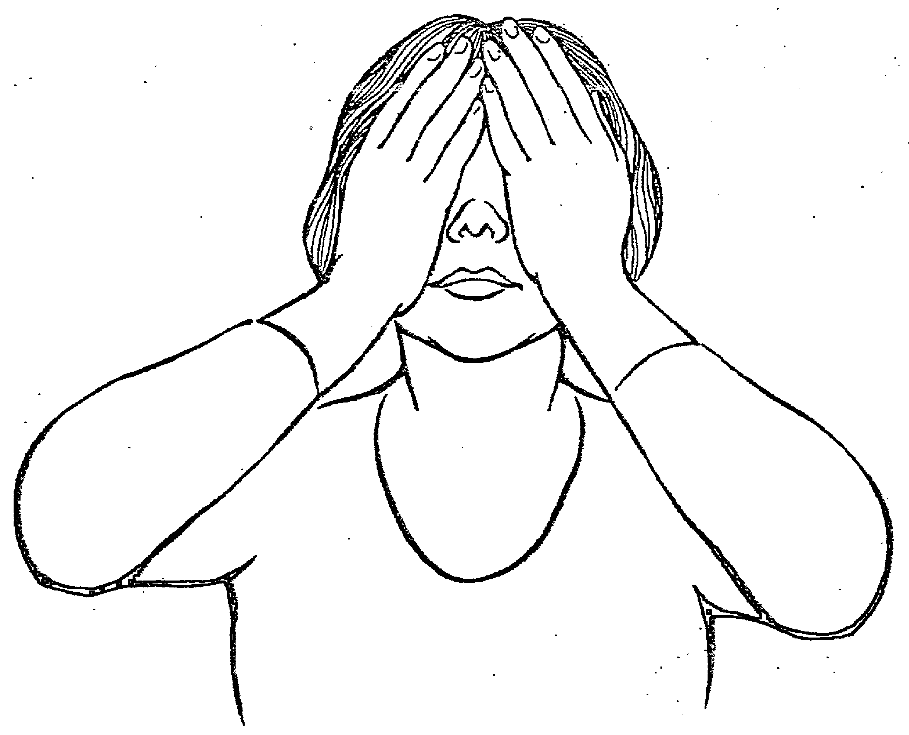

### 色彩冥想

这是一个简单的观想，可以疗愈和净化脉轮，发展出内在之眼创造和感知色彩的能力。

用冥想的姿势坐着。让能量落地且归于中心。

当你完全落地时，想象一团明亮的白光，悬浮在你的头顶，从这团白光里你可以汲取任何一种颜色。

第一种颜色是红色，把红色拉下来，透过顶轮沿着整个脊柱向下流淌，让明亮的红色充满整个海底轮，让红色在那里停留一会儿。注意你身体的感觉。你的身体喜欢红色吗？感到充满能量还是不舒服？

接着，回到顶轮的上空，把橙色的光从那团白光中拉下来。橙光流经整个身体，感受这个颜色对你的影响。把它带向第二脉轮，让明亮的橙色的光充满你的腹部。

再次回到顶轮，把金黄色的光拉下来，灌注进身体，直达第三脉轮。想象温暖的金黄色光芒从太阳神经丛流淌出来，流遍身体的每一个角落，充满且温暖着你。由于第三脉轮与身体能量分布有关，所以这些光芒对点燃你的内在之火十分重要。

现在来到心轮，颜色是绿色。感觉这个颜色正冲刷着你，带着爱和善意围绕着你。你看见一团温暖的翡翠般的光芒萦绕在你心上。

接下来，从白色光团中找到蓝色，把它拉进你喉轮的位置。让它抚慰你的喉咙，放松你的手臂和肩膀。感觉蓝色光线扩展至喉咙四周，与身边的一切都在进行沟通。

然后，来到第三眼，通常你会看到深沉的靛蓝色。感受这个颜色的清凉冲刷着你的第三眼，让它清洗掉那些外来的图像，净化和抚平内在的荧屏。

最后，顶轮看上去会是明亮的紫色光芒。感受这些紫色的光涌入顶轮，赋予每个脉轮能量，同时平衡所有脉轮。

检查一遍所有脉轮，看看它们是否留住了这些光。检视自己的身体，能否看出身体就是一道连续的彩虹。当你检查身体时，留意哪种颜色的光最强大也最明亮，留意不同颜色带给你的感受——哪种颜色最能滋养你或给予你能量。你最喜欢的颜色可能代表你此时最需要的能量，而你最没有感觉的颜色通常代表你回避的领域，或者那个脉轮可能有问题。苍白或褪色的颜色，代表虚弱的区域；强烈的颜色，代表有力和稳固的区域。在自己的内在与这些颜色做游戏，直到你感到它们平衡为止。这会帮助你平衡自己的灵光状态。

### 快照

如果你通常看不到灵光，这是一项非常简单的帮你去感知别人灵光的练习，也有助于你提高视觉观察能力。

让你观察的对象直接站在你面前，距离大概 6 到 10 英尺远。闭上眼睛，清空你的心智屏幕。等待，直到你感觉落地和集中注意力，没有特别的思绪或画面浮现在你的脑海中。

快速睁开眼睛，然后再闭上——跟眨眼相反，眨眼是闭上再睁开——对你面前的这个人迅速一瞥，形成一瞬间的冻结照片，并把这个画面印刻在心里。保持这个画面，检视它。你注意到什么特征？你是否看到了一幅残像留影？或是围绕着身体的光环？是否有特定的颜色或身体的姿态浮现出来？当这幅意象消退时，再次快速睁开眼睛然后闭上，加强你对观察对象的影像。看看你能从这幅残像中看到多少细节。哪一部分最先褪色？哪些特征能保持更久？这些会告诉你对方灵光的强项和弱项。

### 冥想

对强化第三眼最有用的练习就是静坐冥想。把注意力集中在头部中心或两道眉毛之间。对颜色和形状的观想也可以加上，或者仅仅只是集中精神去清空心智屏幕，直到它清洁，一片空白。

一旦屏幕空白了，可以观想你想知道的问题答案。举个例子，如果你想了解某人的健康状况，可以观想他身体的影像，黑色和白色会显示出他健康或生病的部位。发挥创造力，为你的问题找到视觉隐喻。这个方法的限制只可能来自你对自己想象力的限制，我们把这个能量中枢打开得越多，想象力就延展得越多。

有一个方法可以感知我们对某个决定的感受如何，你可以提出问题，然后用简单的“YES”或“NO”来回答。观想两种答案，把“YES”放在内在屏幕的一边，“NO”放在另一边；然后想象有一个指针向上方指着，数到三，让指针指向最合适的答案。不要试图去控制指针，让它自己选择要去哪一边，结果也许会让你大吃一惊！

---
**脚注：**
① 见卡尔·普里布兰访谈，刊于《大泛杂志》(Omni Magazine, October, 1982)，第139页。这与鲁伯特·谢尔瑞克 (Rupert Sheldrake) 的“形态发生场理论”(theory of morphogenetic fields) 类似。
② 见麦克·塞缪尔 (Mike Samuels)《心眼看世界》(Seeing with the Mind's Eye)，第18章。
① 见麦克·塞缪尔（Mike Samuels）《心眼看世界》（Seeing with the Mind's Eye），第57-59页。
① 见沙特普雷《室利·阿罗频多，意识的冒险》。
① 译者注：卡洛斯·卡斯塔尼达（1925-1998），秘鲁裔美国人类学家，因唐望系列图书而在美国获得崇高声誉。1973年3月《时代》周刊用长达万余字的封面文章来报道卡斯塔尼达和他的作品。《巫士唐望》系列主要讲述了它跟随印第安老人唐望学习巫术的过程，包括服用一些能够致幻的植物草药，帮他打开“知觉之门”，让他看到另外一个世界。
① 译者注：玛丽安·齐默·布雷德利（1930-1999），美国小说家、科幻作家，代表作品包括《阿瓦隆迷雾》（The Mists of Avalon）系列和《黑暗之极》（Darkover）系列。她是将女性主义引入幻想文学的先锋，2000年被授予世界奇幻奖之终身成就奖，以此表达美国幻想文学界对这位女作家的追思。
② 引自玛丽安·齐默·布雷德利的私人谈话。

注意：成功的观想能力依靠不断的运用和实践，如同我们的肌肉力量一样。养成一种习惯，在接电话之前，想象会是谁给你打电话；早上上班时，觉知你上班过程的每一步动作，就好像你是站在自己的身体外观察自己一样；重建你对童年卧室、玩伴或初恋情人的记忆。在开始做一件事之前，先去观想你已经完成了它，看看这样是否会让你做事更容易。例如，观想你的支票登记簿上的数额增加了，观想你遇见了一个陌生人。

观想是主动的做梦。你做得越多，越鲜活逼真，你心灵的造梦能力就越强。观想练习的机会是无限的，一旦形成习惯，它就会自然而然地发展出来。

## 第六脉轮推荐阅读书目

- 琳达·克拉克（Linda Clark）《古老的色彩疗愈艺术》（*The Ancient Art of Color Therapy*. NY, Pocket Books, 1975）
- 约翰·弗里德兰德（John Friedlander）和歌莉娅·海姆希尔（Gloria Hemsher）《通灵基础》（*Basic Psychic Development*, Ork Beach, ME: Samuel Weiser, Inc, 1998）
- 夏克蒂·高文（Shakti Gawain）《创造性观想》（*Creative Visualization*, CA: Whatever Publishing, 1978）
- 雅各布·利伯曼博士（Jacob Lieberman）《光：未来之药》（*Light, Medicine of the Future*. Santa Fe, NM: Bear&Co, 1991）
- 迈克·塞缪尔和南希·塞缪尔（Samuels and Samuels）《用心灵之眼看》（*Seeing with the Mind's Eye*. NY: Random House, 1976）
- 艾米·华莱士（Amy Wallance）和比尔·亨金（Bill Henkin）《通灵治疗》（*the Psychic Healing Book*, Wingbow Press, 1981）
- 肯·威尔伯（Ken Wilber）编纂的《全息范式及其悖论》（*The Holographic Paradigm and other Paradoxes*. Boston, MA: Shambhala, 1982）

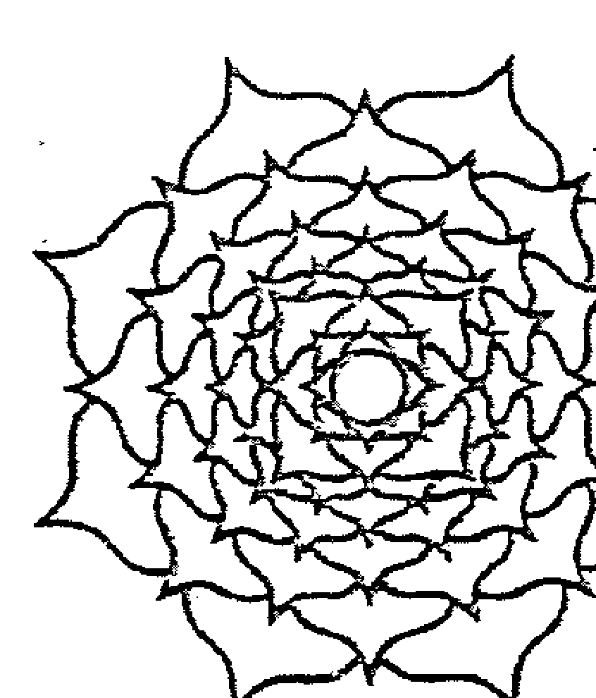

# 第七脉轮元素

- 意识
- 思想
- 信息
- 知道
- 理解
- 超越
- 内蕴
- 冥想

# 第八章 第七脉轮：意

## 开启的冥想

你已经踏上了旅程。
碰触，品尝，看到，也听到了。
你爱过又失去，再去爱。
你学习，成长，抵达终点时，毫发无伤。
现在，你已接近目的地，快回家了。
只剩下最后一步。那是最大的一步，也是最小的一步。
说它大，是因为它能带我们去到最远的地方。
说它小，是因为我们其实早就在那里了。
只剩下一扇门需要开启，
门后包藏了所有的关键。
钥匙就在你手中，可是你看不见，
因为那不是一样东西，也不是一条道路，
那是奥秘。

回顾一下走过的路吧。

记得肉体触摸大地的感觉，

记得流动的运行和力量，

记得心里吟唱的爱之歌，

记得铭刻在脑海里的所有记忆。

是谁，在记得？

是谁，走过旅途？

是你的身体吗？

什么在指引你？

什么在成长？

什么是你经历过的？

谁拿着那把隐形的钥匙，并未上锁的钥匙？

答案是钥匙本身，

所有的智慧都在你的心里，并无一物外于你。

王国就在你面前，在你体内，围绕着你，在你之内。

所有的心都只是一颗心，包容在同一片海洋里，

联结、融合、智慧、神圣。

那也是诸神的宝座，创造的原型，无限的浩瀚，一眼望不到头的莲花瓣，

莲花一路盛开旖旎，通往地球。

我们在意识中找到它，

超越形象，超越音声，超越光明，超越空间，超越时间。

意念流动，

上下，左右，前后，内外，
无所不在。
水滴入海，心灵之歌永驻。
我们转完了圆，图案完整。
我们是心念的创造者，也是心念的受造者。
心念从哪里升起呢？
它休憩时去往何处呢？
谁在感知它？
在内心深处，
有一个处所通向它。
爬过布满繁星的天空，
解开物质密实的线头，
遥远的天幕之外，
天父绘制了星流，
那耀眼的图案已被看到，
心念化暗夜为白昼，
联结、缠绕、编织着智慧之网。
古老的图案，流动和变化。
吉祥湿婆，睡眠之主，用冥想带我们沉潜，
找到内在的古老智慧，
找到开始与结束的圣地。
我们要回来了，带着所学，
知晓神就住在我们里面，
怀着无比的荣耀，活出神，
手持意念之匙，奥秘将要被揭晓，

大门通往超越之境，
那里神圣而安详，
我们从未离开。

## 第七脉轮象征及对应物

- 梵文名：Sahasrara
- 意义：千瓣
- 位置：头顶
- 元素：意
- 表现：信息
- 个人功能：了悟
- 腺体：脑垂体
- 其他身体部位：大脑皮层，中枢神经系统
- 功能失调：抑郁，疏离，迷茫，无聊，冷漠，丧失学习能力
- 颜色：紫色到白色
- 种子音：无
- 元音声：[ng]（不是真正的母音）
- 轮瓣：有人说是960瓣，有人说是1000瓣。对印度教徒来说，数字中有1和0，比如100、1000或10000，都代表无限。因此，千瓣莲花成了这个脉轮的象征。960是前五个脉轮相加（4+6+10+12+16），乘以第六脉轮的2瓣，再乘以10得到的数字。
- 质点：王冠（Kether）
- 天体：天王星
- 金属：黄金
- 食物：无，断食
- 对应动词：去了悟
- 瑜伽：智瑜伽，静坐冥想
- 草药：莲花，雷公根
- 属性：悦性（Sattva）
- 矿物质：紫水晶，钻石

莲花象征：顶轮之内是满月，没有月兔的影子，光辉地悬挂于明朗的夜空。月亮缤纷的光芒，湿润清凉如甘露。满月里有一个亮如闪电的三角形，三角形里闪耀的即是所有天神秘密守护的“太虚”（Great Void）①。有人说那里的莲花瓣是朝上的，向着天堂。古代的典籍却说，它们花头朝下，悬挂着骷髅头。花瓣据说是光泽的白色。

印度教神祇：湿婆，阿玛－卡拉（Ama-Kala，夏克蒂化身），伐楼拿（Varuna，印度教中的天神，掌管法律、秩序）

其他神祇：宙斯（Zeus），阿拉（Allah），努特（Nut，阿拉伯天神），恩基（Enki，水神和智慧神），伊南娜（Inanna，苏美神话中的“天之女主人”），欧丁（Odin，北欧神话中的主神），米密尔（Mimir，北欧神话里守卫智慧之泉的巨人），恩诺亚（Ennoia，希腊神话中掌管思想、学问的女神）

> ① 见《Sat-cakra-Nirupana》第 41 篇，阿瑟·阿瓦隆（Auther Avalon）英译，引自《灵蛇的力量》（The Serpent Power）第 428 页。

### 千瓣莲花

> 宇宙是我们所想的样子，这就是奥秘所在。
——约翰·伍兹 (John Woods) ①

终于，我们到达了七重之旅的山顶，爬上那朵盛开于头顶的千瓣莲花。我们在这里找到了无限深奥的宇宙意识的宝座，即第七脉轮或顶轮。这个脉轮把我们与神圣智慧联结在一起，是一切显化的源头。透过它，我们获得了悟，发现意义。它是我们解脱能流的最后一关，是终极解脱所在。

如同国王的王冠象征着王国的秩序，顶轮也代表了生命的主宰法则——在这里你将了悟万物潜在的秩序和意义。它是无所不在的意识，浸透我们所有的思考、推理和行为模式。觉知安住于一切生命之中，这就是存在的本质。在无意识层面，它是身体的智慧；在意识层面，它是我们的智能和信念系统；在超意识层面，它是神圣的觉性。

在梵文中，顶轮叫做 Sahasrara，意为千瓣，代表莲花无限展开的花瓣。我曾有幸一瞥这个脉轮的样貌，它极为复杂、美丽，几乎使人目眩。它的花瓣一边开放一边分叉，层层垒叠在一起，彼此无限镶嵌，如同向日葵低垂的花头，把了悟的甘露洒向众生。每一瓣美奂绝伦的花瓣都是智慧的容器——敏感的、有意识的、能够对外界做出应答、具有无限的潜力。这个场域十分精微，最细小的意念都会让花瓣之海泛起涟漪，像风吹过草地。在终极的宁静中，莲花深处的宝石会散发出闪耀的光芒。
目睹这个奇迹对我个人来说，意义深远。

当我们到达顶轮的层面，灵魂的种子已经从大地萌芽，向上生长，
穿越水、火、风、声、光等元素，终于抵达源头——意识本身，透过“意”
这个元素来体验生命。每一层脉轮都带给我们不同程度的觉知和自由。
现在顶轮从无限的觉知中绽放盛开，它的千瓣如同触须，伸向更高的
次元。

这个脉轮在瑜伽哲学中被认为是开悟之轮，其终极的意识状态是
超越人的理性、感知和这个受限的世界的。瑜伽修习建议我们要摄心
(pratyahara)，意识处于绝对无波动的宁静中，才能觉知到终极状态。但
是谭崔哲学则把感官体验看作是通向开悟的门户。脉轮哲学认同两者，
智能的激荡带给我们讯息，而向内收摄身心才能把这些信息转化为终极
智慧。因此，我们的千瓣莲花必须把根系深深地扎入大地，才能盛放
如虹。

这个脉轮的元素是“意”，“意”是极为独特和不可测的东西，也是
周遭更大意识场域的最原始和最赤裸的呈现。顶轮的功能是了悟——正
如其他脉轮的功能是观看、言说、爱、实践、感觉和拥有。透过顶轮，
我们得到无穷无尽的信息，然后透过其他脉轮的运作识别这些信息，并
将其转化为实体显化出来。

第七脉轮与我们“心”的体验有关，尤其是有觉知地去运用心。心
是意识这出戏的舞台，既能上演喜剧，也能上演悲剧；既可以让人兴奋，
也可能乏味无聊。我们都是有幸能观赏这出大戏的观众，只不过有时候
太过于认同戏中的角色，而忘记了这只是一出戏。

通过观赏心念演出的大戏，我们的心灵把体验内化为意义，建构出
自己的信念系统。这些信念成为建构现实生活的主程序。也因此，顶轮变成了主脉轮，掌管主导内分泌系统的腺体，即脑垂体。

从生理学角度看，顶轮与大脑有关，尤其是高级脑区或大脑皮层。人类神奇的大脑包含了大约一百三十亿个的神经细胞，而这些细胞之间形成的联结数量多过了全宇宙的星星①。这真是一个了不起的奇观。大脑作为意识的工具，其潜力几乎是无限的。我们的身体里有大约一亿个感觉接收器，十万亿个神经突触，这使得我们的心对内部环境的敏感度比对外在世界高十万倍②。因此，我们实际上是从自己的身心内部真正接受和吸收了大部分知识。

我们从内在进入到一个没有时间、没有空间也无法定位的次元。如果每个脉轮都代表了一种细微而快速的振动次元，那么上升至顶轮时，那里的波动速度是无穷大的，也没有波长，因此是无处不在的。所以，终极的意识状态也是无所不在的。它把世界压缩到一个不占用任何物理时空的系统里，也因此我们的头脑拥有了无限存储资讯的能力。换句话说，整个世界放进了我们的脑海里。

这个内在处所就是意识的宝座，是显化能流的发源地。所有的创造行动都开始于概念。我们在实践之前，一定是先构思了某个想法，让这个想法从心灵发端，然后向下通过脉轮显化出来。以观念界定出模式，再以显化的能量填充内容，赋予形式，而模式本身就隐含了秩序。对印度教徒来说，秩序乃是宇宙实相的根基。如果我们仔细观察自然界和宇宙天体，会被创造出这些精妙绝伦的秩序的智慧惊得目瞪口呆。

模式（pattern）与父亲（pater）这个词有关。父亲播种（DNA），种子里蕴含的信息或模式激发出创造。当一个模式被充分接受之后，观念就开始运作。然后孕育者，也就是母亲，赋予模式以物质形态（也即DNA的另一半）。母亲（mother）这个词源于“mater”，是英语单词物质（matter）的同源词。要使事物成型，必须物质化地显现出来，必须被“母亲孕育”。因此，湿婆提供了形式或模式，宇宙之母夏克蒂提供了原始能量来显化形式。

我们或许以为意识是看不见的，但其实只需要看看四周——城市的结构、屋里的家具或书架上的书籍——就会发现，意识呈现在难以置信的多样性的形式之中。假如想知道意识长什么样子，只需看看这个世界——无论是自然界还是人造的世界，会发现这就是意识的样貌和表达。意识是模式的场域，万物从此涌出。

那么，什么是“高层意识”呢？高层意识是觉知到更高层或更深刻的秩序——即更具包容性的秩序。高层意识有时候也被叫作宇宙意识，指的是觉知到宇宙或天上的秩序。下层脉轮被数以百万计的有关物质世界的信息和因果循环填满，宇宙意识则延伸至遥远的星系，对终极真理敞开。宇宙意识是对“元模式”（meta-patterns）的认知，元模式包容了井然有序存在的宇宙体系的总原则。从这个层面我们下降到较低层面的秩序，了解到那些结构和功能都是元模式的子项罢了。

我们在顶轮的层面更加远离物质世界，也脱离了时空的限制。从这个意义上讲，顶轮拥有最大的多功能性，涵盖了所有其他脉轮的视野，也因此成为解脱的所在。我们在心念里可以从古代的石器时代跳跃到对未来前景的展望，可以想象正站在自家后院，或者忽然就神游到了太虚，
这一切都在一瞬间发生。我们可以创造、破坏、学习和成长——这些都源于内在，无需外在的动作或改变。

有人说顶轮是灵魂的安住之所，是永恒的无量世界的见证，生生世世与我们同在。也有人说，湿婆的神圣火光从顶轮这个位置进入我们的身体，带给我们智慧。顶轮是一切觉知的主宰者，是通往内在世界和超越世界的门户，是包容万有的无量圆周。不管怎么描述它，我们必须记住，顶轮的视野远超语言所能表达，它只能去体验。

## 意识

> 宇宙力量就是宇宙意识。这是探索者发现的实相。当他在内在触及这股意识之流时，他可以转换到宇宙实相的任一层面，任一点，去觉知和了悟这股意识，甚至可以施加影响。因为到处都是相同的意识流，只不过处于不同的振动模式罢了。

——沙特普雷论室利·阿罗频多 ①②

① 见沙特普雷《室利·阿罗频多，意识的冒险》，第 64 页。
② 译者注：室利·阿罗频多（Sri Aurobindo Ghose，1872-1950），又叫“晓莲大师”。印度哲学家、教育家、民族主义者，诗人。Aurobindo 意为“一种晨间开放的莲花”。印度人称之为“圣哲”，与圣雄甘地、圣诗泰戈尔通称“三圣”。室利·阿罗频多早年在英国求学，后回到北印度，参与争取殖民自治运动，做过公务员和报刊编辑。之后，转而研究哲学、神秘主义及瑜伽。著有《神圣人生论》《人类循环》《印度文化的基础》《最后的诗篇》等。室利·阿罗频多综合印度吠檀多各派的哲学理论以及西方唯心主义哲学观点，建立了“整体吠檀多”理论体系，宣称宇宙是由“现象世界”和“超越世界”两个世界所组成，“超越世界”是由“现象世界”演化而来，即由物质进化到生命，由生命进化到心，再由心进化到“超心”。一切都源自无上的梵，然后降为超心，超心降为心，心降为生命。世界是梵于无限的时间与空间的分布，而个人是梵于时间与空间中的集中。

每一个脉轮都是意识在不同现实层面的显化，“土”元素层面是最密实的，第七脉轮与之相反，是尚未显化的纯粹意识，在瑜伽哲学里被称作“神我”（purusha）。在第七脉轮我们必须问：究竟什么样的东西被称为意识？意识的目的是什么？该如何开发它？

这的确都是一些大问题，并且从一开始就被无数男男女女追问着。要进入最终的次元——即心智、觉知、思想、智能和信息的次元，必须要去探究——提问的能力恰恰是意识本身的显现——我们追寻的目标到底是什么。

当我们问自己“谁做主”时，必须向内去看，去观照内在涌现的那些意识。只抱怨意识的内容，而不探究谁出产了这些意识，是没有用的。想发生改变，必须找到那个做主的人商量。有人把他称之为“见证者”，也即神秘自我中一直存在的意识本身（an aware being）。有能力见证我们的意识活动，才能开始探索意识王国的神秘。

意识现象是一个奇迹，意识的能力我们都有——但是看不见，摸不着，也无法测量或掌握，却是我们得以存活的根本要素。它巨大的能力调节着我们的肉身，使我们能演奏音乐、说多种语言、画画、朗诵诗歌、记住电话号码、欣赏落日、揭开谜题、体验欢愉、爱、渴望、行动和看见——意识的能力无穷无尽，无与伦比。当我们把注意力真正转向这个奇迹，就会进入那无尽绽放的莲花瓣中，即自我的真正源头。

自我维持着我们的记忆库和信念系统，也一直在更新数据，同时把这些信息整合为连贯的意义。追寻意义是意识的驱动力，要去探寻所有体验背后的潜在统一性。当我们活出自己的人生意义时，我们会成为那更大结构的一部分。缺乏意义的事物是无法跟任何东西匹配的。意义是联结的工具，带领我们靠近“一体”。意义也把个人和宇宙联系在一起，
这就是瑜伽的真义所在。我相信追寻意义就是顶轮最基本的驱动力，所有生命经验的意义将在三摩地（samādhi）①的境界中豁然开朗。

从日常经验到神秘体验，对意义的追寻隐藏于一切心智活动的背后。如果老板对你发脾气，也许你会纳闷，这怎么回事？她今天很不顺利吗？我做错了什么吗？她对我期望过高了吗，还是我根本就入错行了？当人们遭遇意外、疾病或碰上好事时，会透过探寻意义来整合经验。作为一名治疗师，我每天都会听到案主生命中发生的故事，然后他们一遍又一遍地问我，这究竟有什么意义？

一旦我们辨认出这些境况的意义所在，就会更懂得该做什么，怎么去做，并学会顺着流走。这赋予生命基本的运作模式，并把我们与包罗万象的秩序联结在一起，而那个秩序会把剩余的体验统合为完整的一体性。

意识是一股力量，与悦性（sattva）有关，是一体性、秩序和组织的力量。意识是设计和模式，也是智慧。从纵横交错的脑波到分子结构、建筑物和城市，意识成为万事万物固有的秩序准则。存在本身就是意识组织化的漩涡。

开掘意识的伟大场域会导致它下降，附着在现有结构上，变成信息。信息是可以被感知到的秩序，这种秩序构成了自我运作的模式。心念的每个活动都是遵循这个秩序的过程。我们作为意识的容器，与生俱来的禀赋就是要表达这些信息，运用它，显化它。终极的表达就是物质，这也是最受限的形式。因为这份限制，意识在显化之后，又想从物质的束缚里解放出来，重回它的源头——非物质形式的源头，在那里玩它无穷无尽千变万化的游戏。因此，意识的本质既是显化也是解脱，是湿婆与夏克蒂永恒的舞蹈。

> ① 译者注：梵文 Samādhi（三摩地），意译为“等持、正心行处、心一境性”，是佛教术语，指专注于所缘境，进入心不散乱的状态，又被译为“止”“定”。最早出自《奥义书》《瑜伽经》中，是传统印度教修行方式之一，八支瑜伽的第八支。后为佛教所吸收，将持戒、禅定、智慧三者合称为三无漏学，汉传佛教经常将它译为禅定。

### 意识的类型

> 我们体内那股想要寻求真理、不断进步的力量并非来自心灵，而是背后某种运用着心灵的东西。

——室利·阿罗频多①

觉知意味着注意力的聚焦。你也许会在我睡着的时候跟我说话，但是我毫无觉知，因为我的注意力聚焦在别的地方。开车时窗外景色不断变换，但它们进入不了我的觉知，也许下次看见还觉得陌生。开启觉知必须留意我们的注意力去了哪里，然后才可以扩展或聚焦它。

生活中的每时每刻都有大量资讯包围着我们。为了使用这些资讯，我们必须把注意力聚焦在少部分内容上。好比阅读这本书时，你得把注意力放在书上，远离其他干扰，比如交通状况、小孩吵闹或者邻座的闲谈等。

顶轮的意识可以被粗略分为两种类型：一种是向下流动到注意力的所在之处，成为具体的信息，帮助显化；另一种是扩展流动到更为抽象的层面。第一种意识类型以物质世界、关系和具体自我为导向，其结果

① 见沙特普雷《室利·阿罗频多，意识的冒险》，第30页。

就是注意力的窄化。这类意识活跃于思考、逻辑、学习和储存资讯的活动中，是认知意识（Cognitive Consciousness）。我们可以把它看作是顶轮的下层焦点，负责把有限的细节整合进更大的架构。

第二种类型的意识，我称之为“超越意识”（Transcendent Consciousness）。它所对接的领域超越了这个世界的人事物，其对象没有具体目标，也不去觉知和指涉个人的小我，没有认知意识模式里那种因逻辑和比较所带来的大幅度波动。相反，超越意识遨游于元意识（meta-awareness）的海洋中，平等地拥抱万事万物而并不聚焦于任一特定目标。之所以如此，是因为它丢弃了所谓“意识的对象”，变得空灵而自由。

认知意识要求觉知聚焦在有限且特定的事物上，以逻辑秩序来分类和组合。超越意识则开启了认知之外的觉知，因为要感知高层秩序，就要与细碎具体之物保持距离。吊诡的是，开启超越认知的觉知反倒扩大了觉知聚焦的范围。心智一旦清空，那些保留下来的东西反而变得清晰可见，如同看着一个人孤独地站在雪地上，当然比在人群熙攘的大街上找出他的面孔更容易。

### 信息

> 空间 / 时间不只是物理世界的主要坐标，也是意识为了秩序井然地安排资讯，而调用的组织原则。
——罗伯特·杨（Robert Jahn）①

① 引自 mind-being 研究基金会刊物《Reporter》（1982年8月号，cupertino, CA），第5页。

透过体验，每个人都在心智中建立起自己的信息矩阵。从第一眼看到母亲的面孔到完成博士论文或其他，我们的一生都试图从周遭所见所感中拼凑出某种秩序感。每一条我们接收到的信息都被纳入这个矩阵，使它变得越来越复杂。随着这种复杂，它发展出一种倾向，即定期重组自己，找到更高层级的秩序来简化整个系统。这就是我们熟悉的那种反应：“啊哈（原来是这样）！”当这些资讯片段归位时，新的完整性被感知到，我们常常会有种小开悟的感觉。真正的开悟是对更大整体的连续觉知。在全息范式里，每一小片新资讯的加入都会让基本图像变得越来越清晰。

信息矩阵的结构是由我们从体验中获得的意义建构出来的，然后这个结构会变成我们的信念系统和生活的秩序准则。我们都是秩序的一部分，并且会根据矩阵来整理遭遇的一切，使内在和外在经验保持一致性。假如我的信念系统说，女人是低贱的，那我就会在行为层面展现出这一点，甚至找人来佐证这个信念。假如我相信今天就是我的幸运日，那我也许会在今天做出一些正向行为。

信念系统由我们从经验中获得的各种意义构成。如果一再失败，我们就会告诉自己，这说明你傻——最终就真得相信自己是愚蠢的。信念系统也会组成矩阵，所有信息都汇集于此。如果我给你一点反馈，你会根据自己的知识背景筛选这些信息，然后加入自己的信念系统，也许你会说：“哦，我做什么都不对”或者“我没法让你高兴”，但这只是你从自己的信念系统得出的感受，拥有另一种完全不同信念系统的人，也许会得出完全不同的结论。

意义和信念之间的关系如此牢固，以至于有任何一点不符合内在信念模型的蛛丝马迹，我们就会发出“我不相信你”的慨叹，然后把整个资讯弃之一边。如果我跟大家说，我看见一个外星人（实际上我还没见过），大部分人都不会相信，因为他们缺乏这类经验的信息矩阵，但如果我把这句话告诉参加 UFO 研讨会的人，他们也许真得会信我，或者赋予这句话完全不同的意义。

这是心智的陷阱之一。如果对任何不符合我们内在信念模型的信息都予以拒绝，那我们该如何接收新信息，并扩展意识呢？但如果置内在信念模型于不顾，又该如何去辨别真假，或组织整理我们每时每刻接收到的海量信息呢？

最好的答案潜藏在冥想之中，因为这项练习能够让心智除旧布新，抛却那些过时的信念和无用信息，重拾个体模型与潜在现实的一致性。冥想就像整理你的电脑硬盘，不会破坏系统，却会腾出更多空间用于载入和运行新资讯。冥想也会开启我们顶轮更大的觉知力，避免淹没或迷失在无限的信息海洋里。它帮助我们持守自己的核心，即自我之内的那个信息组织矩阵。

### 下载信息

超心理学研究、前世回溯和其他一些研究证实，有一些心智活动是独立于大脑之外的。在某些前世回溯案例中，人们会忆起一些能够经过客观验证的事实。比如他们会很精确地描述一座从未见过的房子，说此生从未学过的外语，或者谈一些之后可以从新闻报道、信件或书籍中找到记录的事件。既然人的身体/硬盘已经完全更新了，很显然有些信息是储存在大脑之外的。

所有这些信息暗示了有某种信息场域独立于感知者之外，如同无线电波独立于收音机之外，或者不管你有没有电脑，互联网都一样存在。

身体拥有令人惊叹的神经系统和反应能力，是信息的接收器，就像电脑可以从互联网上下载和接收资讯一样。

这个场域在物质世界中是无形的，却真实存在，且会诱发某些结果，如同不可见的磁场会使金属屑形成一定的形状。这也是为什么较高的次元常被叫作“因果层”（causal planes）。当我们调频到正确的频率，便可以接收到这些信息，进入因果层。

生物学家鲁伯特·谢尔瑞克（Rupert Sheldrake）发明了一个词，可以部分描述这种现象，叫作“形态发生场”（morphogenetic fields），其中的词根“形态”（morphe），意思是形成、发生和成形。该理论假设，宇宙的运作并非依据不变的律则，而是基于“习惯”——通过长时间重复某些事件创造出的模式；这些习惯不断重复，会在高层次元创建出一种场域，从而增加了事件落入这些模式的可能性。形态发生场包含了事物和行为的特征，也许可以解释大部分生物本能是如何运作的。

举个例子，兔子的形态发生场是由现在及过去存在的绝对数量的兔子创造出来的。一旦创造出来，任何一种像兔子的东西都会被定义为兔子。同样的，如果你走进一间五金店，说你想要一件带把手的、可以钉钉子的工具，老板十有八九会说，“锤子”符合你的要求——因为许多锤子之前就存在了；而现在钉枪更普及了，也许老板会给你推荐钉枪，但在二十年前不太可能，因为那时候钉枪还没有普及。

形态发生场从属于意识和显化之间的关系，它在两个世界里形成双向联结。场域的形成端赖于有形世界发生的事件，并且这些事件要一再重复，形成习惯。然而，场域一旦建成，会反过来支配物质世界的未来形式，其顺从的倾向随着场域力量的变化而变。谢尔瑞克说：

如果已经存在的习惯具有压倒性的影响力，新的场域就不太可能建立起来。可能发生的状况是，较高层级的场域会把较低层级的习惯整合进来，形成新的综合场域……进化的结果不是改变基本习性，而是采纳基本习性，由此建立起越来越复杂的模型①。

举个例子，体重超重的人，虽然减了 50 磅，却有一种无法遏制的想吃东西的欲望，直到又把这 50 磅吃回来了才消停。你没有注意到吗？那些胖人大部分时间总是倾向于维持那样的体重，不管他们是在节食还是在大吃大喝，因为身体的形态发生场想要维持熟悉的体型。除非进入潜意识的层面，用“想瘦”这个想法来减肥才会比较有效果，因为它改变了形成身体场域的因果关系。

当某种信念被数量庞大的人群持守时，它的场域力量就很强，会减少反对派信仰的生存机会。男权信仰创造出的场域就是最好的例子，因为在过去数千年中，这种信念已经完全灌注在我们文明的方方面面，为男人提供了巨大的好处，让他们能够实现更多的成就。而当更多的女人透过女性主义找到她们的力量时，另外一个场域就开始生成了。它会给我们的文化信念系统带来改变，但这个场域的建成需要很长很长的时间，需要许许多多男人女人的共同参与。随着时间的流逝及场域变得越来越强大，下一代的男人和女人就会比较容易去活出新的信念系统。

思想就好像身体和建筑一样，是一种结构。它的细节或许时时刻刻都在变化，但整体的结构矩阵在给定时间内仍或多或少地维持着原貌——尤其当这是多数人的思想观念时。如果我们希望改变自己的意识，必须深入意识产生的场域，寻找其中包藏着的更高层的秩序，然后才能改变我们的思想矩阵，以及它在物质世界中的显化模式。这是一个自我意识进化的过程，只有踏上意识之旅才能实现。

> ① 见鲁伯特·谢尔瑞克《形态发生场：大自然的习惯》(Morphogenetic Fields: Nature's Habits)，刊载于《ReVision》(1982 年秋季号，vol 5, No.2)，第 34 页。

### 超越与内蕴

> 当深埋的意识从成千上万个心智、生命和物理振动中解脱出来，才会有喜乐的存在。
——室利·阿罗频多①

顶轮是有限与无限、凡俗和神圣、短暂和永恒的交汇点。通过这扇门，我们的扩展就超越了小我和时空限制，体验到最初的一体感和至乐。也是透过顶轮，神圣意识进入身体，下降，为所有脉轮带来觉知，赋予我们运转周遭世界的能量。

我已经描述过，两股能流创造了两种不同类型的意识状态：认知和超越。此外，这两股能流也产生出两种不同又互补的灵性状态：超越和内蕴（the transcendent and the immanent）。再次强调，上升的能流把我们带向解脱，下降的能流带来显化的力量。真正有关整体性的理论必须兼备两者。

一旦我们穿越了七个脉轮的意识层次，我们就逐渐超越了限制、短视、表象、痛苦和磨难。这也是大多数东方修行体系最强调的方向。瑜伽修行与哲学可以帮助我们打开通向宇宙意识的大门。人们相信，痛苦和磨难是因为错误认同了有限世界的虚幻本质，而无法理解终极实相的无限性。执著于有限性是我们灵性成长的阻碍，“我执”也因此成为顶轮的首要心魔。

超越意识的最大特征是“空”。只有放掉我执，才能进入“空”。超越意识带领我们超凡入圣，进入一体性的辽阔之中。在那个境界里，观察者同时也是参与者，自我和世界没有分隔，也没有时间感。如同空杯子才能被注满，空无的心灵才能成为顺畅的管道，体验到那个超越的境界。

超越意识把人从幻象的陷阱中解脱出来，让人进入至乐和自由的境界。自我通常会产生执著，以维持自我的独特感和安全性。但这种自我只是受限的小我，与底层的一体感是分离的，而我们的本质都由这份一体感打造。

意识下降能流拥有的神圣了悟为我们带来内蕴。内蕴是内在的神圣觉知，超越则是外在的神圣觉知。内蕴赋予我们智慧、启蒙、灵感、光辉、力量、联结以及最终的显化。真正的自我认识乃是领悟到超越和内蕴是互补的，内在和外在世界是不灭的一体。

解脱能流带给我们解脱或莫克提（*mukti*），下降的能流给我们带来享乐或布提（*bhukti*），正如阿瑟·阿瓦隆在《灵蛇的力量》（关于脉轮的谭崔文献中最严谨的翻译版本）这本书里说的：

> 夏克蒂—谭崔的主要原则之一是透过修持（*sadhana*）带来解脱和享乐。自我在享乐中认同了世界的灵魂①。

① 见阿瑟·阿瓦隆（Arthur Avalon）《灵蛇的力量》（*The Serpent Power*），第 38 页。

海底轮是昆达利尼升起的源头，也是把根深深扎入大地的通道。顶轮则是一切显化的源头和超越的门户。超越和内蕴并不相互排斥，它们代表了意识的基本振动——从顶轮吸入和呼出。顶轮是人类生命的出口和入口。

### 冥想：莲花之匙

> 亲爱的，祈愿你的头脑空空如也，这样你的心才能无限嬉戏。
——古老的梵文谚语

要想发展第七脉轮，没有比静心冥想更伟大的修行了。透过冥想，意识才能认识到它自己。冥想能滋养灵性，正如吃饭和休息滋养了我们的身体一样。

有数不清的冥想技巧，你可以调节呼吸，可以唱诵真言，可以观想颜色、形象或神祇，可以通过脉轮练习转移能量，可以有觉知地走路或运动，可以联结脑波仪器，或者只是温柔地盯着前方看。所有这些形式的冥想都具有一个共同点——提升、安抚和协调身心的能量振动，清空心智习以为常的混乱。

我们理所当然地认为自己需要洗澡、打扫房间和洗衣服。如果不这么做，就会觉得不舒服，更别说会成为社会和他人评判的对象。然而，心灵和思想也是需要清洁的，甚至更甚于身体，因为心智的工作时间更长，接触的层面也更广，并且还操控着我们的生命运作系统。没有人会想用前一天的脏碟子吃晚餐吧，但是用昨天混乱的思维来处理今天遇到的新问题，我们就觉得无所谓。难怪我们会感觉疲惫、困惑和无知呢。

冥想是目的也是手段。我们通过冥想会变得更清明、更振作，身体也会更协调。心，作为不可须臾离也的总指挥，理应受到最好的对待。

第七脉轮存在于内在次元，冥想是打开内在次元大门的钥匙。透过冥想，我们可以有系统地调理外在世界，同时也培养出对内在世界的敏锐度。经由这种敏锐，才能进入联结万事万物的“奇点”（singularity），体验到“我”即是自身所有体验形成的漩涡，而漩涡的中心是了悟。

通过协调身体、呼吸和意念，可以对齐所有脉轮，感知万事万物的一体本质。但这并非是与物质现实对齐一致，而是与内在的能量原型协调一致，与我们在每个脉轮里发现的潜在一体性保持灵性上的融合。

但是冥想究竟在做什么呢？冥想带来的生理效应、心理状态和显著的效果，又是什么呢？这种什么都不干的奇怪修行为什么如此珍贵呢？

由玛赫西尊者（Maharishi Mahesh Yogi）①教导的超绝静坐曾在西方风靡一时，使我们能从众多修习者的体验中系统地去研究静坐冥想对身心造成的影响。由“超绝静坐协会”指导的冥想，要求每天两次，每次进行二十分钟的简单练习，你只需安静地坐着，内在诵持老师传授的真言就可以了。没有奇怪的姿势、呼吸法或饮食推荐，使得这套修行方法很容易学习和研究。

这些研究里最值得注意的，是脑电图（EEG）测量出来的脑波模式。在常规清醒意识状态下，脑波是随机和散乱的，最常处在 β 频率，大脑两个半球可能产生不同的波长，前脑后脑的波长差异可能更大。

然而，静坐冥想会很明显地改变这种状态。从冥想一开始，受测者的脑波就显示出 α 波（代表大脑放松状态）增加，α 波从后脑开始，向前脑移动。几分钟后，α 波大幅度增加。前后脑的脑波趋于同步，左右脑也一样。这种共振持续下去，在许多人脑中开始出现 θ 波（比 α 波更深沉）——尤其在那些经常修习静坐的人身上更常见。在段位最高的静坐者身上，α 波会频繁地出现在日常的清醒状态下，振幅也更大。这些人冥想时，θ 波出现得更普遍，甚至 θ 波也会出现在日常的清醒状态中①。

冥想也具有生理效应。氧气的摄入量减少了 16-18%，心跳减慢 25%，血压也随之下降，这些活动都由神经自律系统控制（无意识的控制过程）②。如此会造成身体进入深度的休息状态——比睡眠还要深层。这样的休息会使意识在清醒时更加警觉。

有趣的是，虽然静坐者确实进入了深度休息状态，但他的注意力和觉知力不但没有减弱，反而增强了。研究显示，周期性地针对尚未修习静坐的人发出声音，脑波显示他会逐渐适应这种噪音，大脑反应越来越少直至对声音完全关闭。而修习静坐者的反应完全相反，他在静坐过程中，每一次针对这种声音的反应都是新鲜的③。因此，当身体层面的活动减少时，心智反而会从身体的限制中解放出来，更自由地去扩展觉知的视野。

有人认为，冥想会减少对大脑皮层和大脑边缘系统的刺激，并经由脑波共振来弥合新旧脑之间的分裂①。这种分裂被认为是情感疏离和精神分裂症的肇因。精神分裂是人类独有的困境，动物基本上不会出现这种状况。大脑左右半球之间更好地协调，也有助于增强认知和觉知的能力。

那么冥想对心理的影响呢？研究发现，除了普遍感受到放松、内在平静、幸福感增强之外，静坐者的学业表现也有进步，对工作的满意度增加，工作效率提高，药物（包括处方药和消遣性药物）的使用量减少，反应也变快了②。所有这些收获都来自于坐着不动，什么也不做。

面对这些证据，很难否认冥想给人带来的巨大收益。谁不想变得更健康，心情更好，表现更出色呢？而得到这一切，只需去做不花一分钱也不要任何设备的冥想练习，并且随时随地在哪儿都可以做！但是为什么很少有人会花时间去做冥想呢？为什么做冥想的人发现很难如他们期望的那样经常练习呢？

我们已经谈过节奏、共振和形态发生场，以及三者如何倾向于维持它们的惯性。在一个振动层面主要导向下三轮、物质价值更被看重的世界里，我们很难找到时间、理由，甚至激起自己的欲望去逃离物质世界，进入一个完全不同的层面——尤其这个层面获得的回报是如此主观。我们“应该”静坐冥想的想法，与成千上万个其他“应该”混杂在一起，每天对我们进行狂轰滥炸，结果就是这个应该修习冥想的想法让我们觉得厌烦。

真正的冥想是一种心灵状态，是毫不费力的。一旦体验到几次这种冥想状态，它就开始创造出一种自我延续的韵律和自己的形态发生场，并对我们周遭的振动发生影响。然后它就成为生活中不可或缺的一部分，无论是在意识清醒状态、睡眠状态还是其他任何活动中，它都跟我们待在一起。这时候冥想就成为一种乐趣，而非纪律。但是到达这个境界之前，我只能去描述冥想带来的效应，希望这足以点燃大家的好奇心，至少它的性价比很合适啊！

> ① 见布洛姆菲尔德（Bloomfield）等著《超绝静坐：内在觉醒与克服压力》（Transcendental Meditation: Discovering Inner Awareness and Overcoming Stress），第 75 页。
② 同注①，附录。
③ 同注①，第 66 页。
① 见布洛姆菲尔德（Bloomfield）等著《超绝静坐：内在觉醒与克服压力》（Transcendental Meditation: Discovering Inner Awareness and Overcoming Stress），第78页。
② 同注①，附录。

### 冥想技巧

现在来谈谈冥想技巧。有多少修习静坐冥想的人，就有多少种冥想技巧。我建议不妨每种都试一下，根据体验为自己找到最合适的方法，然后坚持一段时间。因为冥想练习只有经过一定时间才会显现出最大效果。

重要的是找到一个安静、舒适、不会被打扰的环境去练习。确保衣服不会对你造成束缚，你不会感到太热或太冷，噪音干扰也要降到最低。冥想一般空着肠胃练习比较好，虽然强烈的饥饿感也会让人分心。

大多数冥想需要舒服地坐着，脊柱保持挺直，但不要紧张。可以坐在椅子上，也可以双腿交叉坐在地上——单盘、双盘都可以（图 8-1），或者简单的印度式也行。采取坐姿是因为身体可以不怎么费力维持这种姿势，然后会放松下来，但也不能太舒服了，否则你会想睡觉。此外，挺直的后背能让所有脉轮对齐，能量沿着中脉上下传送会更容易。

在单盘姿势中，你可以做很多事情：跟随着自己的呼气、吸气，和这个节奏融合；看着曼陀罗、烛火或其他视觉参照物；或者只是简单地观照自己的念头来来去去，但不要跟随它们，也不去阻断或评判它们。将自我和念头分离，会帮助你进入超意识状态。

你可以运用超绝静坐的技巧，在心里持咒，把心专注于咒语带来的周流全身的振动上——持咒可以协调能量振动。你也可以观察自己的情绪状态，达到不为所动的超然状态。还可以观想各种颜色在你的脉轮里运行。或者你就花点时间问问自己：谁在冥想？这是一种禅宗的修行方法，把注意力集中在一些吊诡的所谓“公案”上。“公案”缺乏逻辑性，可以让心摆脱智性倾向。如“单手击掌声音如何”就是一则典型的禅宗公案，另一则公案是“看父母未生我之前，什么是我本来面目”。公案不是要你去找答案，而是让问题打破你日常思考的逻辑模式，来感知更宏大之物。

各种冥想技巧都有一个共同点，那就是让你把心专注于一件事情上。平时在意识清醒的状态下，我们的心会攀援在许多事物上，时时刻刻都在发生变化。心一境性（one-pointedness of mind）就是冥想的目标。种技巧——不论是透过声音、物体还是公案——都是设计用来让心聚焦的，让心从日常积习已久的意识混乱状态中解脱出来。

很难把这些方法放在一起做比较，或者做出任何价值判断。不同的冥想会以不同的方式影响人。重点不在技巧，而在你能够熟练运用。无论什么技巧，长年累月的重复和专注，一定会收获效果。因为冥想是一种训练，就像任何一种训练一样，只有透过不断的练习，才能变得容易。

### 开悟——终于回家了

> 涅槃在我的解脱意识中只是自我认识的开始，是全然圆满的第一步，既非唯一可能的真实成就，也非最后达到的巅峰。
——室利·阿罗频多①

开悟不是一件事，而是一个过程。一件事是可以达成的，而过程就是事物本身。假如开悟是一件事的话，说“我找到开悟了”就是自相矛盾的话，因为自我和寻找是分不开的。在了悟的境界中，我们会发现自己从未失落过。

就像爱是一个很难描述的概念，却是自然的、健康的人本质的一部分，开悟也可以被看作是一种自然状态，但同样难以描述。开悟通过“无为”而非“有为”来达成。我们的心智阻碍了开悟，就如屋顶挡住了阳光照射一般。

但是说我们已然开悟，并不意味着努力去追求开悟会一无所获。悟境虽存在于我们之内，但并不是原封不动的。因为在超越境界里，总会有更深刻、更高层的状态存在，也有更多需要去探索的东西。当我们能从安住当下的状态中开始探索，一定会收获些什么。

许多人以为开悟是一种全然知晓所有答案的状态，其实可以把它看作是终于知道了问题所在。体验超越境界的过程，会给我们带来一种敬畏和赞叹的感觉。答案就在那里，问题才是过程。

对脉轮系统来说，当所有脉轮的路径完整时，开悟才能发生。这不仅仅是打开顶轮或中脉上的其他脉轮，而是体验到了万事万物的一体性，并且把自我与这种体验整合为一。只有联结了自我，开悟才能发生。开悟是“成为”的过程。

所以，当我们真的抵达终点时，会发现这只是一个起点罢了。除此之外，终点还有别的存在理由吗？

① 见沙特普雷《室利·阿罗频多，意识的冒险》，第 153 页。

## 第七脉轮练习

### 跟随你的思绪

躺着或以舒服的冥想姿势坐下。运用对你最有效的冥想技巧，让心变得平和安静。

慢慢把注意力放在头脑里来回闪现的念头上。挑选一个念头，问自己，它从哪儿来？在它之前的念头是什么？追溯这个念头的起源，它也许是多年前发生的某件事，或目前压在你心上的事。然后回到这个念头的源头，回到每个心念的源头，最后你抵达了没有缘起的某种无限的源头。

返回念头之海，再捡起其中一个，重复上述过程，回到更深更深的过去。看看你有多少念头起源于同一个源头——你目前生活中正在面对的某项议题，某个过去的老师，或者你与无限所联结的某个地方。

追溯一些念头的起源后，开始观察你念头的来来去去，不去跟随它们。允许念头升起，既不拒绝它，也不黏着它。让它们折返所来之处，直到几乎没有念头升起，而你也返回了源头。只要你感到舒适，就尽可能停留在那个状态里，然后慢慢回到平常的意识状态。

### 阿卡夏记录①之旅

跟随引导词。

舒服地躺在地板上，脸朝上，头和脖子放松，慢慢放松身体的每一个部位。让地板支撑着你，放松你的腿……后背……胃部……肩膀和手臂。双手握拳，然后放松。绷直脚趾，然后放松，伸展每个脚趾头。慢慢地把注意力放在呼吸上……吸气，呼气……再吸气，呼气……让身体轻盈地安住在地板上，把每一条肌肉的紧张都释放掉。

当你觉察呼吸时，也要对念头保持观照。观察它们如何缓慢而曲折地掠过你的心灵，毫不费力地在你心灵之眼的屏幕上演意象。当你观照这些念头时，也觉察到了一些你想知道的信息，一些埋藏在你心灵深处的问题。也许是关于爱人、目前困境或前世的信息。花点时间专注于你的问题，弄清楚你到底想知道什么。

当你的问题清晰了，就让它离开你的头脑。适当的时间它会回来找你。

你放松地躺在地板上，想象你的身体变得越来越轻盈。你肉身的固体物质渐渐变轻，你体验到一种旋转的感觉，像上升的雾。你飞起来，旋转，进入这团雾，无形无相。终于这团雾开始成形，你感觉到一道通往上面的旋转楼梯。你随着楼梯越升越高，也变得越来越坚定。每一步都在通向自己的宿命，每一步都带领你接近想知道的答案。

楼梯变宽了，你来到一座庞大的建筑物前，建筑物高到一眼望不到头。有一扇大门，你毫不费力地推开，进去，看见更多的楼梯、长廊和许多开着门的房间。你站在大厅里提出问题，听见回音在整个建筑物里回荡。问题又回到了你身上。

开始走动，聆听问题的回音，跟着最响亮清晰的声音走。跟随自己的脚步，不管它将你带向哪里，一边走一边重复问题。最终你发现自己到达了一个房间，留意房间的大门和屋里的家具摆设。门口写着什么字吗？家具是什么颜色的？是哪个时代的样式呢？

你左顾右盼，留意到一个巨大的放满书籍的书架。查看这座图书馆，看看哪本书从架子上凸出来，向你招手。找到那本写有你名字的书，或许这个名字不是你这一世用的，但是写着这个名字的书会毫不费力地落到你手上。复述一遍你的问题，打开书，随意翻到一页，读出上面的字句。停下来揣摩它的意思。然后翻到新的一页，浏览。对周遭所有的信息保持敞开——充满书的房间、整栋建筑无处不在的古老智慧，把它们统统吸纳进心里。别去分析它们，顺其自然。

然后，当你准备好了，把书还回书架，知道自己随时可以再找到它。慢慢地转身，离开房间，走回到处都敞着房间大门的门廊。回到大厅，穿过高耸的门柱，走出大门。边走边思索你在这里看到的不可思议的一切。各种图案如浪花般起伏，打着转儿，有你能够想象出的所有颜色、形状和韵律。当你进入大气层，身体逐渐沉重起来。慢慢地你越降越低，滑入大地的次元，舒服地躺在地板上休息。检查一下你从这趟旅程中带回了什么。当你准备好时，可以再次返回那个房间。

注意：你找到的那些信息的真正涵义并不总是鲜明的。在分享之前，也许要花一些时间（可能要花好些天）仔细思索和回味。

① 译者注：阿卡夏记录，也译作阿克西记录。梵语 Akashic 一词，意为“天空覆盖之下”“空间”或“以太”，是一种储存在以太的、非物理层次的数据库。阿卡夏记录在西方晚近的新纪元运动中相当流行，被认为是存在于一切造物之前的不可知的信息集合体。人、动物、植物或是矿物等信息都被编码存入其中，只有少数进入超验状态的人才能捕捉到。

## 第七脉轮推荐阅读书目

沙普特雷（Satprem）《室利·阿罗频多，意识的冒险》（*Sri Aurobindo or The Adventure of Consciousness*, NY: Harper & Row, 1968）

布洛姆菲尔德（Bloomfield）等《超绝静坐：发现内心，克服压力》（*Transcendental Meditation: Discovering Inner Awareness and Overcoming Stress*, NY: Delacorte Press, 1975）

乔治·福伊尔施泰因（Georg Feuerstein）《一体或超越：新兴全球文明的古老教训》（*Wholeness or Transcendence: Ancient Lessons for the Emerging Global Civilization*. NY: Larson Publications, 1992）

乔·卡巴金（Jon Kabat-Zinn）《正念：身心安顿的禅修之道》①（*Wherever You Go, There You Are*. NY: Hyperion, 1994，教你把心念安住在当下的一本书）

劳伦斯·乐山（Lawrence Le shan）《如何静坐冥想》（*How to Meditate*. NY: Bantam, 1974，书里介绍了很多关于冥想的技巧和常见问题）

铃木俊隆②（Suzuki, D.T. Shunryu）《禅者的初心》（*Zen Mind, Beginner's Mind*. NY: Weatherhill, 1979）

查尔斯·塔特（Charles Tart）《意识状态》（*States of Consciousness*, NY: E.P.Dutton, 1975）

约翰·怀特（John White）等《意识前沿》（*Frontiers of Consciousness*.NY: Julian Press, 1974，本书辑录了有关意识研究的各种论文）

> ① 译者注：此书全名为 *Wherever You Go, There You Are: Mindfulness Meditation in Everyday Life*。大陆版译为《正念：身心安顿的禅修之道》（海南出版社，2009年5月）。台版译为《当下：繁华盛开》（心灵工坊，2008年3月）
② 译者注：铃木俊隆（Shunryu Suzuki），13世纪日本曹洞宗初祖道元禅师的法脉传人。1961年在美国旧金山建立极具规模的塔撒加拉山僧院和旧金山禅院，此举带动美国本土开始广设禅修中心，并影响日本禅宗在美国的传播，进而大放异彩。《禅者的初心》大陆版由海南出版社2010年6月出版。

# 第三部分
融会贯通

# 第九章
回归之旅

> 宇宙力量就是宇宙意识。这是寻道者的发现。当他接触到自身的意识能流时，就可以切换到宇宙实相的任何一个次元，到达任何一点，觉知同时了悟那里的意识，甚至影响它，因为不论在何处都是同样的意识能流，只是振动形态不同而已。

——沙特普雷论阿罗频多

我们沿着脉轮能量柱走完了向上的能流之旅，但是这趟旅程并未结束。我们攀上灵性山峦之巅，获得从这个角度才能拥有的视野，现在的挑战在于再度返回山脚，将新的领悟运用到周遭世界和生活中。我们已经把下层脉轮的能量带入了意识，现在需要把高层意识带回给下层脉轮。

纯粹意识，透过中脉从超意识次元的广大场域进入个人的领域，在向下穿越脉轮的过程中不断凝聚，直至落入显化的层次。攀爬到顶端拥抱湿婆之后，夏克蒂通过脉轮下降，先进入心智和感觉的次元，再进入有限物质的五元素；当她抵达最后的大地层面时，已无事可做，只好休息，蜷缩为盘绕的昆达利尼 - 夏克蒂①。

脉轮在向上的旅程中作为踏脚石带领我们朝向解脱，每一步都带给我们更多的自由，来超越有限的形式、重复的习性和对世俗的依恋。每一步也同时扩展了我们的意识和视野。在向下的能流中，脉轮成为意识力量的“冷凝器”，组织意识在每个层级转化交流，其作用类似收集雨水的池塘。雨水从天而降，流经山脉注入大海，哪里有凹处，就可以收集雨水来使用。脉轮像池塘一样，是精微身中收集神圣意识的容器。神圣意识因凝聚而变得稠密，最终显化为物质。如果某个脉轮堵塞了，它收集能量的能力就会受限。

就好像光谱的两端差异虽然巨大，却是一体的。从天降落的雨水，原本是一团云气，是统一的水气场域。当雨降落到地面，碎裂为数百万条微小的水流，再汇集为数千条小溪，数百条小河，数十条大河，最后进入辽阔的海洋。雨水再度进入统一的场域，直至化为水蒸气又回到天空。下降的每一步都创造出更宏大也更粗糙的事物，然而却朝向简单和单一的方向演进。

因此，我们是从纯粹意识，也即最高的、完整的、无波动、无次元的场域，开始了这趟下降之旅。纯粹意识超越了起伏不定的分别意识，完全的平顺，没有任何涟漪或波澜。然而，一旦意识开始下降，就会出现向外波动的涟漪，如同虚空之中出现了一滴微笑的觉知。这个涟漪就是意识最初的聚焦，是万物存在的第一道曙光。

当我们集中注意力，意识的涟漪就向外扩散，在时空场域里形成微细的波动。这个波动不是孤立的，会刺激产生其他波动，从而衍生出更多的波。当这些波彼此交叉，就形成了干涉图样，导致以太界域的意识放射越来越密集。我们在第六脉轮讨论过全息理论，就是干涉图样的范例。波的每一道交汇，都会吸引意识的节点（node）。

这是第六脉轮的层次。原始的信息有了意象，让意识可以辨认和重新认识。意识开始自我喂养，在感知到这个图像后，会对之做出反应或加以改变。信息在这个阶段开始显化，但还不是成型的思想。

当心灵聚焦于这些意象时，就会创造出更多的涟漪，更多意识能够辨认和反应的干涉图样，使得这个场域越来越密实。现在波的数量相当多了，彼此交叉，构成场域。这个场域里充满各种不同频率的涟漪，相似的频率会互相调和，产生共振，加大振幅。

到了第五脉轮，意识再度自我折叠。重复的意象因为特定的振动而被命名。名字相当于一道函数波，能把想法从一个人传递给另一个人。在干涉场域里，名字可以区分和描述差异，画出边界，使各种意象更为清晰和显著。

当我们给某物命名时，是在关系的世界中定义了它。进入第四脉轮，我们在命名的事物中找到秩序。有波动就有干涉，有事物就有关系。而关系必须平衡，事物才能继续显化。

现在到达第三脉轮，开始进入身体的物质层面。涟漪越来越密实和有序，我们运用意志来指挥原始能量，使其按照我们的意愿呈现形式和形态。这创造出充满生命能量的场域，引导和维持原始物质的形式与意愿保持一致。生命能量把身体聚合在一起，爱把关系维持在一起，思想则引起共鸣，激发热情。

然后，我们来到复杂与组织化的界面，接近了地心引力。能量和意志把散漫的物质统合在一起，使分散的能量更为密实。密实到一定程度，就创造出自己的重力场，接下来的一切会自动发生。原始能量被早前设定好的思维模式分割，重力拉扯着组织化场域弯曲了时空的架构，把质量聚合在一起造成不断变化的运动。运动想要寻求差异的平衡，重拾组成部分的完整性，回归原初的一体。

最后透过这股重力，涟漪与干涉融合产生质量，我们带着体积和重量感来到了物质实体世界，回归地球，回到这个漂浮在宇宙星海里的小小星球上。

把向下的能流与向上的能流放在一起对比，会发现一些很有趣的事，原来双方的模式是一样的，光谱两端惊人地相似。

我们从第一脉轮的原初一体性，移动到第二脉轮的差异世界。由差异又进入第三脉轮的选择和决断，然后进入时间与空间的三维世界，第四脉轮充满了精确安排的关系。

同样的，第七轮也具有原初一体性，即无分别的意识状态。一旦那个意识产生轻微的涟漪，一体性就破碎了，差异被创造出来。在思想命名的过程中，我们的意志得到锻炼，创造力得以施展。这股创造力再将各种不同的元素组织成精确的关系模式。

在光谱世界的物理一端，我们拥有分子和原子组成的实体。但是当我们近距离观察它们的时候，发现原子其实就是能量场域，包含能量节点以及节点之间空荡荡的广大空间。而观察次原子粒子时，我们发现它们更像波，是思维模式变化的概率。

在光谱另一端的以太领域，我们拥有意识。意识的终极状态没有分界性，是超越时空之外的存在，里面充满了微细的涟漪波动，看起来也像波，是思维模式变化的概率。

我们是否误以为昆达利尼是条衔尾蛇？灵蛇用牙齿衔住自己的尾巴？

印度教徒认为，终极实相就是秩序。事物并不真实，行为也是虚幻的，只有神圣的秩序描绘出了玛雅的线条，而玛雅就是我们经验到的现象世界。这股秩序是一种组织力，渗透于万事万物中。谭崔教义把它称为“湿婆的头发”，这些头发编纂了阿卡夏档案。阿卡夏档案属于非物质的灵性世界，湿婆则是意识的男性原则，头发代表意识发散出的最初、最赤裸的思想。由此形成的差异就是夏克蒂，是他者，是女性。结合她，世界得以创造，舞蹈开始上演，永不终结。

所以，我们发现，结束就是开始。我们不是沿着直线在旅行，而是陷入了相互贯穿和渗透的路线。这个旅程没有终点，只有过程。

探讨完下降能流的理论层面，现在可以将它运用在日常生活里。

我们从原始信息开始，也就是大脑里散漫的念头。这些念头活跃于后脑——会收集其他念头来自我强化。静坐冥想能使心念更专注，在冥想中，一些念头很容易抓住我们的注意力，甚至演变成想法。当我们专注于这个想法，意象开始在心灵之眼成形。我们可能会幻想，做白日梦，想象与这个想法有关之事。当我们这么做时，意象就开始有了形状、形式和颜色，散漫的念头开始固化，但离显化还有很长的路。

假如我们的想法是盖一座房子，可以先观想这所房子的大小、形状和颜色，想象自己在门前散步，在厨房里做饭。当我们以想象装饰这个想法时，各种各样的念头就聚集到第六脉轮。然后，随着意象的具体化，可以把这个想法跟别人沟通（第五脉轮）。我们开始描述房子的大小和形状，甚至可以画草图，进一步具象化。接着，我们要把这个想法带入关系（第四脉轮）中。不是随便在哪儿都可以盖房子，必须买一块地，而这块地属于某个社区，有些规则需要遵守。我们还要和建筑师、建筑商、规划专员和信贷专员联系。为了让一件事物显化出来，必须和已经存在的其他事物建立关联。

我们不可能只凭观想和沟通就把想法变成现实，还必须运用意志（第三脉轮）。意志引导着原始能量，把财力、物力和人力汇集到某个特定的目标下。这一过程需要能量，在意识的引导下，重复的模式和有意识的行动透过身体的新陈代谢获得了能量。当我们注入能量，想法就开始在物质层面成形。我们移动物体（第二脉轮），如工具和建筑材料，把它们整合起来，直至最终显化为一座完工的房子，坐落于大地之上（第一脉轮），这时候一切才完成了。就像夏克蒂休憩在第一脉轮一样，我们在这所房子里栖息，享受自己意识显化的成果。

经由意识下降的能流，大量关于房屋设计的念头逐渐演化为一座独立的建筑物，透过许多图像、对话、关系、行动、移动和物质而建造完成。显化合众为一，积沙成塔。当然，这座房子只是其中之一，更多房子都是经由同样的过程被建造出来的。

显化要求我们的思想变得密实和坚固，越是经常思考一件事，就越可能让它变成现实。但是我在第一脉轮也说过，显化还要求我们接受限制，包括大量的重复。例如我会弹奏一首钢琴曲，是因为我练习过许多次；我能说一种语言，是因为这些字句我重复得足够多；我最频繁见面的人，也是跟我关系最深的人。

向下的能流由重复的模式建构，因此会越来越稠密。如果不接受限制或重复，就无法显化。向上的能流则把我们从乏味无聊的重复中解放出来，允许我们去体验新鲜事物。

向上的旅程拓展了视野，带来新的洞见和领悟。夏克蒂在接近爱人湿婆的过程中，赋予生命以活力，她是如此狂野和热烈。向下的旅程则充满着恩典，教导我们湿婆国度的智慧和秩序。向上能流带来超越，向下能流带来内蕴，两条管道共同搭建出彩虹桥——联结天堂与地球、凡俗与神圣的桥梁。只有这两股能量彼此碰撞，才能创造出脉轮的漩涡。

现在我们跳着解脱与显化、自由与享乐的舞蹈，这是形成人类生命体验的极性之舞。

# 第十章
脉轮的交互作用

现在我们已经详细考察过每个脉轮，系统终于完整了。接下来，要以整体观来检视自己，看看不同部分如何相互影响，包括我们与自己内在和与他人的关系。这一章将会概述脉轮之间的相互作用，例如脉轮相对的优势和劣势，人际关系中脉轮的互动，文化中脉轮的模式等。这些信息有助于我们把系统的各个碎片统合为一体，以整体观来了解脉轮之间是如何相互渗透与整合的。

作为一套具有综合性的生物心理能量系统的组成部分，脉轮并不是单独运作的，它更像一架庞大机器上的车轮或齿轮——这架机器当然就是我们的身与心。研究轮子的目的，是懂得如何安装它，了解每个零件的位置，出问题时会维修。

有一点怎么强调也不为过，那就是如果要运用脉轮系统，不论是用于疗愈、个人成长或医学诊断，必须把它作为一个整体来考量。诊断一个人第三脉轮功能失调，而不考虑其他脉轮在其人格结构中扮演的角色，结论就一定有问题。因为系统中任一部分堵塞，都会影响其余。这就好像一出舞台剧的导演犯了错，你却换掉了女主角。

脉轮系统的基本理论是要达成平衡。理想状态下，能量流经所有脉轮，不偏向也不回避任一脉轮。因为系统某一端如果不平衡，一定会造成另一端的失衡。

不过，人格特质也会在某种程度上支配脉轮。好比艺术家可能是高度视觉性的，歌唱家则倾向于第五脉轮。这些差异是个体化的自然表现，不应该干涉，甚至可以强化差异，前提是不损害其他脉轮。

考量任何一套脉轮系统，首先要知道每个人都有自己的能量系统，有其特定的喜好和（能量）流量。我们不应该期待半英尺粗的铜管能承受住六英尺粗的主水管线喷涌出的流水。所以，不妨放弃任何标准脉轮的想法，脉轮没有“应该”怎样，也无法拿不同人的脉轮来做精确比较。我们不能自以为真正了解脉轮的运作方式。

只能在个人系统内去比较脉轮。一开始，可以先透过了解一个人的习惯、渴望、梦想和活动范围，来感受他的喜好和能流状况。在此过程中，模式可能会自动浮现出来。好比有人也许习惯性地压抑自己的情绪，有人不断用超出能量负荷的活动消耗自己，有人会逃避物质世界而强迫自己留在灵性领域，也有人对任何无法在物质世界看到的事物都不以为然。

当这些模式浮现，阻碍也就变得更清楚了。阻碍可能是某个脉轮封闭了，无法或害怕处理特定层面的能量，也可能是某个脉轮太过活跃，所有的注意力和活动都不断被它吸引，而牺牲了其他层面。

举个例子，桑迪的第三脉轮能量很弱。她很容易感到害怕，对许多东西心怀恐惧，受困于自卑情结。因为这些障碍，她很害羞，朋友很少，薪水不高，经常生病。第三脉轮也会影响到其他脉轮，比如第四轮（掌管爱和友谊）和第一轮（掌管生存）。她的治疗方案在于和自己的身体建立良好的关系，当健康改善时，就能给予她更坚实的身心基础来建立自尊和个人力量感。

弗兰克的第三脉轮也有阻碍，但问题相反。他行事霸道，经常掌控，总是寻求新刺激，很享受支配别人。他对权力的这份需求，导致他很难平等地和人相处。他几乎没有朋友，工作也陷入困境，喝酒损害了身体健康。两个例子都跟第三脉轮的影响有关，但弗兰克的问题卡在情绪层面（第二轮），必须先在这个层面疗愈，才能更有效地与其他脉轮工作。而桑迪需要落地。由此可见，考量一个人的脉轮并没有特定之规，必须运用直觉来评估其整体人格方能做出判断。

分析脉轮最好的办法是先分析自己的能量系统，反省自己的优缺点以及需要改变的地方。以下这些问题有助于你了解自己的脉轮能量分布状况。请诚实地回答问题，也可以咨询朋友的观点。

## 脉轮自测表

尽可能回答每个问题：

+   N= 从不
S= 很少
O= 经常
A= 总是

+   P= 糟糕
F= 尚可
G= 良好
E= 非常好

N 或 P 得 1 分，S 或 F 得 2 分，O 或 G 得 3 分，A 或 E 得 4 分。比较每个脉轮加起来的总分。

### 第一脉轮：土、生存、落地

| 问 题 | 答案 | 得分 |
| --- | --- | --- |
| 你经常去树林、公园散步吗？或者经常以其他方式接触大自然吗？ | N S O A | |
| 你经常做运动吗？（健身、瑜伽等） | N S O A | |
| 你如何评估自己的身体健康状况？ | P F G E | |
| 你与金钱及工作的关系如何？ | P F G E | |
| 你认为自己脚踏实地吗？ | N S O A | |
| 你爱悦自己的身体吗？ | N S O A | |
| 你觉得自己在这里有立足之地吗？ | N S O A | |
| 总分 | | |

### 第二脉轮：水、情绪、性欲

| 问 题 | 答案 | 得分 |
| --- | --- | --- |
| 你如何评估自己感受和表达情绪的能力？ | P F G E | |
| 你如何评估自己的性生活？ | P F G E | |
| 你会把多少时间放在享受生活的单纯乐趣上？ | N S O A | |
| 你如何评估你身体的灵活性？ | P F G E | |
| 你如何评估你情绪的灵活性？ | P F G E | |
| 你和他人之间的施与受平衡吗？ | N S O A | |
| 你对自己的感受和性欲有罪恶感吗？ | A O S N | |
| 总分 | | |

356 脉轮全书

### 第三脉轮：火、力量、意志

| 问 题 | 答案 | 得分 |
| --- | --- | --- |
| 你如何评估自己的整体能量水平？ | P F G E | |
| 你如何评估自己的新陈代谢/消化能力？ | P F G E | |
| 你能完成自己着手去做的事情吗？ | N S O A | |
| 你是否觉得有自信？ | N S O A | |
| 你对自己跟周围人不一样（如果必须不一样的话），是否觉得自在？ | N S O A | |
| 你会受到别人的胁迫吗？ | A O S N | |
| 你值得信赖吗？ | N S O A | |
| 总分 | | |

### 第四脉轮：风、爱、关系

| 问 题 | 答案 | 得分 |
| --- | --- | --- |
| 你爱自己吗？ | N S O A | |
| 你有过成功的、长期的关系吗？ | N S O A | |
| 你能否接受别人本来的样子？ | N S O A | |
| 你是否觉得自己和周遭世界联结在一起？ | N S O A | |
| 你的心里是否积攒了许多悲伤？ | A O S N | |
| 你对那些犯错和陷于困境的人有同情心吗？ | N S O A | |
| 你会原谅别人过去对你的伤害吗？ | N S O A | |
| 总分 | | |

### 第五脉轮：声、沟通、创造力

| 问 题 | 答案 | 得分 |
| --- | --- | --- |
| 你是个好的倾听者吗？ | N S O A | |
| 你能够以别人理解的方式表达你的想法吗？ | N S O A | |
| 你会诚实地说出真相，并且在必要时会直言不讳吗？ | N S O A | |
| 你的生活充满创意吗？（不限于艺术形式，而是任何方面的创造力，比如摆设餐桌，给朋友写信等） | N S O A | |
| 你从事某种艺术创作（绘画、舞蹈、唱歌等）吗？ | N S O A | |
| 你拥有富于磁性的嗓音吗？ | N S O A | |
| 你觉得与自己的生命“同步”吗？ | N S O A | |
| 总分 | | |

### 第六脉轮：光，直觉，观看

| 问 题 | 答案 | 得分 |
| --- | --- | --- |
| 你是否能注意到周围环境那些精微的视觉细节？ | N S O A | |
| 你会有（而且能记住）生动的梦境吗？ | N S O A | |
| 你有过神秘体验（包括精准的直觉、看见灵光、预见到未来发生的事等）吗？ | N S O A | |
| 你能否想象出新的可能性来解决问题？ | N S O A | |
| 你能否领悟你人生中的神话主题（更大图景）？ | N S O A | |
| 你如何评估自己的观想能力？ | P F G E | |
| 你是否有引导你人生的个人愿景？ | N S O A | |
| 总分 | | |

### 第七脉轮：意、觉知、智慧、智能

| 问 题 | 答案 | 得分 |
| --- | --- | --- |
| 你做静心冥想吗？ | N S O A | |
| 你是否感到自己与某个更高或更大的力量、神、女神、精灵有所联结？ | N S O A | |
| 你能很容易地解决和摆脱对人、事、物的执著吗？ | N S O A | |
| 你是否喜欢阅读和吸收新的资讯？ | N S O A | |
| 你是否能快速而容易地学习东西？ | N S O A | |
| 你的人生是否有超越个人满足之外的重要意义？ | N S O A | |
| 你是否思想开明，能接受其他思想或存在方式？ | N S O A | |
| 总分 | | |

得分在 22-28 之间，表示你有非常强壮的脉轮。16-12 分表示虚弱的脉轮。13-21 分是一般人的平均值，但仍有提升的空间。不管总分多少，分数的分布状态很重要。比较一下不同脉轮的得分，除了最强和最弱的脉轮，是否呈现出了某种分布模式，比如上层脉轮加起来得分比下层脉轮要高，或者较高的分数出现在了上层或中层脉轮？这个模式与你对自身的觉察是否吻合？

### 分布状态分析

能量在脉轮系统中有两种流动方式：垂直流动，能量上下流动联结所有脉轮；水平流动，能量进出每个脉轮，与外部世界产生交互作用。垂直管道是能量的基本源头，水平流动则是源头的表达。

垂直管道掌管着天空与大地、意识与物质之间的两极流动。为了使管道保持通畅，两端的脉轮必须都打开，才能联结到原始能量的源头。

如果第一脉轮闭锁，向上解脱的能流也是堵塞的。宇宙能量也许可以进入顶轮，却没有来自下半身的拉力使这股能量向下显化。表现出来就是一个人想法可能很多，创造力和觉知力也够，但是很难把计划付诸实践，或者缺乏管理自己生活的控制力。他的意识里都是些粗略的想法或幻想，但因为缺乏实际方案，无法开花结果。

另一方面，如果顶轮闭锁而第一脉轮打开，问题会相反。来自大地的能量因为缺乏向上的拉力而无法表达。就像一个人在舞会中坐看傻等，没有舞伴邀约。这个人也许非常实际，目标明确且经济无忧，但是缺乏创造力、希望和梦想，也觉察不到生命的精微层面。他步履沉重，无法起舞，并且要改变这种状况很难，因为习惯已经固定了。这样的人与解脱的能流切断了联系，从而导致缺乏显化新事物的能力，只能执著于现有的安全感。

当然这是两个极端的例子，多数情况不会如此，而是大地能量和宇宙能量有一个占主导地位。那些能达到完美平衡的人，只是例外。所以分析脉轮的第一步是确认两股能量中谁占主导。

上升和下降的能流都可能受到某个脉轮失衡的影响。如果一个人第二脉轮闭锁，而把焦点放在了宇宙能量上，那他的大部分脉轮仍能获得很好的滋养，但是第一脉轮会发生严重匮乏。打开第一脉轮，让大地的能量向上升，同时平衡下降的宇宙能量，可以缓解第二脉轮的问题。但实际上，如果第一脉轮闭合了，宇宙能量也很难过滤下到第二脉轮。

如果一个偏向物质能量的人第二脉轮闭锁，很可能身材臃肿，因为上面五个脉轮与源头的第一脉轮切断了联系。治疗这种人，重点要放在打开顶轮（这很困难），或者直接在第二脉轮做工，让能量得以提升。这个例子也显示出，为什么“性”对于物质倾向的人如此重要。除了身体刺激，性行为也会把能量传递到身体各个部位。缺少了性，身体会营养不良。

中间脉轮也可以从垂直能流的角度来分析。第五脉轮如果堵塞，会导致精神倾向的人无法表达创造力和沟通创意；而物质倾向者在与人沟通时，他的表达会比较没有内容，缺乏知识或创造力的支撑。

第三脉轮如果堵塞，物质倾向人可能会拥有无法掌控的力量，那是一种断断续续的、迟钝不敏感的力量。精神倾向的人则可能拥有很多内在的力量，却无法在现实世界实现，因为他缺乏信心来处理具体事物。

当心轮堵塞，来自两端的能量也就都堵塞了，身心交流被切断，需要重新建立联结才能打开。而且如果一端堵塞，能量必须从其他脉轮寻找平衡，这取决于向上或向下的能流哪个占优势。

每个脉轮都是大地母亲和宇宙能量动态结合的产物。两者所占的比例决定了脉轮如何表达自己，这种表达包括水平管道在内。在水平管道层面，能量从中枢以球状的分支发散出去，每个分支都会带走中枢的能量，包括宇宙和物质能量，用于和外界互动；然后，它也会在互动中吸收外面的能流，再带回中枢，与源头的能量融合在一起。

大地导向的第五脉轮可能会走向雕塑、舞蹈或戏剧表演，精神导向的第五脉轮则倾向于写作和语言表达。大地导向的第三脉轮会对科学技术感兴趣，精神导向的第三脉轮则会朝行政职能发展。

以这种方式，每个脉轮都在固守自己的模式。科技界的人遇到的人多数都和科技界而非政界有关。舞者会因为碰到其他舞者，而更努力地保持自己的身材。作家则因为与其他作家进行思想碰撞，激励自己去读更多的书。

我在性别与脉轮能量分布之间只看到很小的对应关系，而且我相信更多是出于文化而非生理因素。一般男性的情绪中枢（物质领域的核心脉轮）会堵塞，这种堵塞会把他推向精神领域，脱离开肉体。女人一般被赋予了维护物质领域的职责，如家务、烹饪和养育孩子（生孩子更不用说）等，因此是倾向于下层脉轮的。大部分两性之间的不平衡都围绕着第二脉轮（掌管情绪和性欲），其结果就是我们会过度重视“性”，因为能量想要去平衡。拒绝情绪释放的男人更看重性行为，把“性”作为重新与身体联结的手段。而女人因为这一点常常感觉受压迫，因此倾向于关闭性能量，在情绪领域进行报复。

随着两性之间越来越平等，这些模式也会跟着改变。其实模式并非一成不变，常常有很多例外。比如许多女性会把大量时间花在精神层面的追求上，而男人需要外出到物质世界去工作。许多女人对灵性追求越来越感兴趣，能够以直觉的方式表达自己，而男人一般追求具体的目标，喜欢谈论实实在在、眼见为实的事物。如前所述，这些都不是固定之规。

脉轮交互中有一个重要的通用模式是螺旋形。我们在心轮那一章提到过，整个身心可以被看作是从心脏发出的螺旋。如果螺旋最初的向外运动是朝向第五脉轮，那么它的终点会在第一脉轮。如果螺旋最初朝向第三脉轮，那它的终点在顶轮。无论怎样运动，螺旋会把第三和第五脉轮、第二和第六脉轮、第一和第七脉轮联结在一起。

从上述组合不难看出，个人力量的增长（第三脉轮）可以加强沟通的能力（第五脉轮），而有效的沟通也会反过来加强个人力量。调节情绪（第二脉轮）可以增强一个人的心灵和直觉能力（第六脉轮），反过来情绪也会受到心灵捕捉到的潜意识信息的强烈影响。而第一和第七脉轮是基本对立的两极，它们共舞创造出了整个脉轮光谱。

透彻分析一个人的灵性本质、身体问题或整体人格，应该包含所有的脉轮面向。再次强调，理解和运用这套复杂系统的原则，是要把脉轮视为一个整体来考量，同时用上你自己所有的脉轮功能去分析它。

# 第十一章
## 脉轮和关系

脉轮在与外部世界互动的同时，也不断与其他人的脉轮发生交互作用。不管是街头遇到的路人，还是有长期亲密关系的伴侣，你的每个脉轮都会对对方的能量模式做出反应。学会从脉轮层面去了解正在发生的状况，将有助于了解我们与他人的关系及互动模式。

人际互动有两条基本原则：一是能量倾向于自我平衡，换句话说，就是异性相吸；一个在潜意识层面受精神能量支配的人，会在无意识里受到由身体能量主宰的人的吸引。尽管他们在意识层面寻找的是与自己同类型的伴侣，但往往是差异性而非同质性才能让关系长久，因为差异是成长的资粮。我们经常会遇到一些看上去很不登对的伴侣，纳闷儿他们一开始是怎么在一起的，又是怎么维持下去的。

第二条原则是能量模式倾向于延续，也即精神导向的伴侣会置留在精神领域，而物质导向的人会支持彼此的物质追求。

于是就有了两种互动类型——对立的倾向于平衡，同质的倾向于延续。两人的关系可能像图 11-1 显示的那样，圆圈越大表示脉轮越开放，圆圈越小代表闭锁的脉轮。图中 B 的主要导向在上层脉轮，心轮是大开的，但是直觉能力（第六脉轮）没有很好的发展，可能是因为不够落地（根轮），或第二脉轮的情绪缺乏流动。而 A 是很落地的，性能量和情绪能量很开放，直觉力也很好，但其他脉轮较为封闭，处于一种低自信、低自尊的状态。在实际生活中，这两人的关系非常平衡，上三轮的开放状态带来了高度的智性沟通和学习交流。A 从伴侣那里接收到的信息会激发她去表达自己的心灵能量，也许还会唤醒伴侣这方面的特质。在男女关系中，女人被男人带动，从厚重的大地向上提升，把修习的重点放在上层脉轮；而男人会被女人的大地能量和彼此的性关系引导，进入物质的领域；其结果就是心轮的平衡，双方在心的层面打开。

如果这对伴侣的关系出了问题，将会在第三脉轮，因为两人的太阳轮都不够开放，而彼此的能量交汇又在这个中枢很活跃。如果他们不把能量用于平衡心轮，而是聚焦在太阳轮上，那么彼此的权力斗争很可能会导致两人关系疏远。

图 11-2 显示的是另一种情况。这里的两个人很相似，两人都是上层脉轮和心轮开放，但物质领域的脉轮是倾向于闭锁的。双方可能有高度的心灵沟通，大量分享知识，心的联结感很强。然而，不幸的是，他们会在落实伴侣关系上发生困难，因为两人都不够落地，无法将关系带入现实世界。当女人想要透过性行为来确定这份关系时，男人的权力意识可能会不允许。双方都没有足够的、来自下层脉轮的支持能量来克服这种模式的惯性，其结果就是两人很可能保持一种强烈而亲爱的柏拉图式的精神恋爱。

脉轮主要透过在各自振动层面产生的共振来联结。因此，如果一个人的心轮非常开放，而她的伴侣心轮是比较封闭的，那么她的开放也许可以帮助打开伴侣的封闭脉轮。相反的情况也会发生，只不过例子较少。

开放的脉轮如果在接近的层面上找不到对应，可能会在别处寻找出口。一个人的系统如果倾向于下层脉轮的能量，就可能把对方上层脉轮的能量吸纳过来，从而导致对方感觉到这些能量中心关闭了。

还有一种可能性是在相同层面上，开放的脉轮会支配对方闭锁的脉轮。比如约翰的第五脉轮是开放的，保罗的第五脉轮是封闭的，因此都是约翰在讲话，而保罗越来越沉默；或者比尔的第三脉轮开放，玛丽的这个区域相对封闭，两人相处会加强玛丽的无力感，如果比尔能敏锐地觉察到这个问题，玛丽就能向他学习，使两人的关系逐渐达到平衡。如果我们能觉察到关系之中的动力，就能更好地避免陷阱。

两人之间关系的组合是无穷无尽的。如果你想检视一段关系，可以画一张图，标明在你的感觉中，双方哪些脉轮最开放，哪些脉轮又最封闭。透过敏锐的观察，大部分信息会越来越清楚。脉轮成了解读两人关系的隐喻。

### 文化——众人的关系

如果一段关系中的两人可以产生多种不同的互动模式，那么当我们把文化作为一个整体来考量时，又会发生什么呢？我们内在的脉轮系统是否也受到了文化大系统的影响？

答案显然是肯定的。如果一个人能够在某个层面上激发或削弱另一个人的能量，那么好几人在一起，彼此的影响力会更大。因此，文化在我们的脉轮状态上扮演了重要角色，无论是正向还是负向。

目前的西方文化看似导向了下三轮，重点都放在了金钱、性和权力上面，似乎需要变得更加“灵性”。但事实上，正是因为下三轮的神圣性受到否定，才导致我们会执着于下三轮的阴影面上。

因为当我们过度执著于某些特定层面，就表示这个层面有些基本的东西还没有得到圆满。

当我们和大地联结的神圣性被否定时，取而代之的就是物质主义，金钱成为获取安全感的手段——更大的房子、更好的车子、更多的薪水。我们亵渎了这个星球，所以对物质的执著只会加深，最终把我们带离源头，走得越来越远。就像垃圾食物一样，物质主义无法满足第一脉轮，只会创造出更为强烈的饥渴感。同样的，如果我们不照顾自己的身体，最终我们会生病，从而全副精力都会被健康问题所占据。过度强调第一脉轮反而是因为缺乏大地能量的滋养，不懂得敬畏自然。西方的物质主义可以看成是失去与大地母亲联结之后的文化补偿现象。

在第二脉轮里，性爱的神圣性遭到公开否定；与此同时，“性”却被用来大量做广告。那些所谓能让我们变得“更加性感”的商品，每年的销售额数以亿计，而我们获得的承诺只是性的吸引力会带来满足感，而不是透过性行为本身，或是从长期的两性关系中获得满足。否定性欲的阴影面的表现就是强奸、猥亵儿童、性骚扰、色情读物、性成瘾以及公众对政客性丑闻的八卦沉迷。我们对性的执著恰恰反映出这个层面的不圆满。

在第三脉轮里，权力和能量的议题影响了每个人的生活。权力被集中在少数人手里，多数人只能为自己的受害牺牲和无能为力哭哭鼻子。权力被看作是独立于自我之外的某样东西，可以随着财富或性吸引力的增加而加强。你必须按照游戏规则来玩，直到身居高位者允许你加入或参与到规则的制定中。正如第四章说过的，权力的模式往往倾向于“权力的控制”而非“权力的共享”，在多数情况下，顺从获得奖赏，个性化则不被鼓励。我们最大的公共投资就是军队，这个系统的设计只有一个目的：必要时透过暴力和威吓来行使权力和控制力。

在爱的议题上比较没有文化冲突，一般我们都同意，爱基本上是一个生命中最重要的东西。然而，爱的实践却往往不够理想。我们用大量的金钱购进新型轰炸机，而任由一些无家可归的人睡在城市的大马路上。种族主义、性别歧视、年龄歧视、宗教不宽容以及各种偏见侵蚀了人们的爱心和慈悲心，而爱和慈悲恰恰是心轮的本质。爱被窄化为异性成年人之间短暂的浪漫之事，但即便这样的关系也充满了痛苦、挫折和心碎。离婚率不断攀升，破碎的家庭比比皆是。

第五脉轮在文化层面是非常开放的。各种形态的大众传播把每个人都联结到文化母体上，时刻在为我们提供着海量信息。但正如我说过的，媒体也用暴力和炒作污染了人们的思想。我们的日常生活饱受噪音的污染，无论是电话、车辆、飞机还是工业噪音。我们没有给予这个脉轮应有的关注，也不关心我们到底在广播电视上播出了什么内容，又给我们的文化神经系统喂食了怎样的信息。

第六和第七脉轮的灵性领域才刚刚开启。灵性书籍比过去拥有更大的市场销量。人们正在学习运用直觉，也会向心理学家寻求建议。越来越多的人透过他们个人的修行来探索宗教的多元性，整合东方和西方、古代智慧与现代科技。这方面的信息比以往任何时候都丰富，也更容易取得。

不过上层脉轮要获得文化层面的认可，还有很长的路要走。目前我们这个社会，经商的人远远多于修习静坐冥想的人；通灵经常被怀疑是欺诈；灵性往往遭遇犬儒主义，或被那些认为非基督教修行是“堕落”的人评判。我们的重点仍放在滞重的下层脉轮，整个文化的氛围很难让人去修行静坐，或者找时间从事创造性活动。我们的语言中几乎没有什么字眼来描述通灵现象，而所谓的“灵性之人”常常发现自己受到误解。人类的文化仍然苦于灵性的匮乏。

不同的文化也强调不同的脉轮。举例来说，印度文化强调精神追求，不重视个人权力的发展和物质主义。印度以“上层脉轮”的取向闻名，许多人去那里寻求灵性教诲，却对其物质上的贫困感到分外震惊。

由于文化扮演着如此重要的作用，那些渴望开辟新领域的人需要找到气味相投的同修道友，才能在学习成长中找到支持和力量。

每个人都必然会受到周遭文化的影响，这也帮助我们认识到，我们可以用自己的心智反过来影响周围环境。每一次提升或扩展自身的意识，都对人类的整体文化做出了贡献。每一次找到同道，便增加了这种贡献。每一场对话都是对整体完形的贡献。

理解我们自身的脉轮和周遭文化洪流之间的关系，有助于探索整个人类历史的意识进化趋势。当我们了解了过去发生的事，就能更好地预见未来可能发生什么，也更清楚我们在其中扮演的角色。

# 第十二章 进化论的视角

在所有脉轮系统给出的启示中，也许最让人兴奋的莫过于进化论的观点。由于脉轮系统代表了宇宙的组织法则，因此毫不奇怪这套深奥的方程式也同样适用于文化及个人的发展。脉轮系统不但完美地反映了人的心理发展历程，西方的社会文化历史也遵循其自下而上的演进轨迹。以这套系统来观察当前千年一次的社会大变革，会发现它再度为人类集体进化之旅提供了一副精妙的蓝图，仍在向我们提出那些最古老的问题：我们身处何处？我们怎么到这儿来的？我们要到哪里去？

第一个问题，我们身处何处？最好的回答是借用隐喻。任何跟得上当前潮流的人大概都会同意，我们目前身处全球性大规模的转化之中，这种转化就像一个集体的“成年”仪式——类似青少年由儿童变为成人的部落仪式。从脉轮系统的角度看，今日面临的挑战是要穿越与转化属火的第三脉轮，烧掉旧有之物，照亮未来之路。第三脉轮代表的主要价值观是权力与意志、能量与进攻、自我与自主，这些能量必须被整合、转化和超越，进入下一个层次，也即第四脉轮所代表的和平、平衡、慈悲与爱。可以把这个过程看作是通向“成年的心”的集体仪式。

为了避免使这套说辞听起来像是流行于 20 世纪 60 年代的乌托邦理想，现在我们检视一下过去三千年历史的进化时间轴，来解决第二个问题：我们怎么到这儿来的？同时也给出线索去回答第三个也是最重要的问题：我们要到哪里去？这些问题的答案会赋予我们这个时代所亟需的全球化视野。

那么，我们是怎么到这儿来的呢？

## 第一脉轮：土和生存

在第一脉轮里，元素“土”和“生存”的本能联系在一起，形成整个脉轮系统的根基。在个人层面上，我们必须先保障生存，才能进化到下一个层面。如同个人生存要依靠和大地的联结一样，集体的生存也是如此——依赖于整个生物圈的健康，我们应该好好地把生态系统视为未来发展的根基。当我们重拾个人肉身的神圣性时，大地也会变成这个星球文明的神圣肉身、人类集体的第一脉轮。

回想一下第一脉轮的梵文名字 *Muladhara*，“根”的意思。我们根源于过去，源于 *religio*（拉丁文“宗教”的意思），源于和自己重新联结。根带领我们回归核心法则，回归单纯和一体性。旧石器时代的祖先生活贴近大地，生存之网紧紧围绕着大地。他们追捕猎物，采集植物，住在洞穴里，有时在地表到处游牧，很容易受到老天爷阴晴不定的情绪和大地沧海桑田变迁的伤害。

大地如同子宫，是生命的源头和诞育我们的母亲，也是人的起点和根基。大地以她的自然力和神秘感，成为旧石器时代人类社会的核心信仰，被我们的祖先作为生命女神来膜拜。大地是生命的给予者，也是生命的回收者。大地母亲是生产者，也是更新者，更是生存本身。大自然是生命起源的原始模板、生命成型的基石，也是我们存在的根基。

在贬低肉身和大地的文化价值观之下，人类的过去被否认了，与根源的联系被切断了。这么做不但阻碍了生存，也削弱了我们超越生存层面的能力。意识的进化方向看似是沿着脉轮向上发展的，但就如植物一样，只有把根深深地扎入大地，才能向上长高。我们的成长必须在两个方向同时进行——向上朝向多变的未来，向下扎根于质朴的过去。

我们不可能否定过去的根，否认和大地母亲的联结，与此同时还想拥有人类的未来。难怪会兴起那些潮流，想要重拾古人与大地的灵性联结，呼唤旧石器时代的大地女神，推崇直接把人与神话底层意识联结在一起的原始修行。把大地看作是灵性的中心，而与之重新联结，会对即将发生的大规模集体转化，发挥稳定的影响力。它不是束缚，而是发展的保障。正如玛莉安·伍德曼（Marion Woodman）所说：“如果我们不能重拾物质内在的神圣性，这个星球就注定要毁灭。” ①

当我们还是婴儿的时候，要依附于母亲才能存活。婴儿的场域可以想象成一个以母亲为中心的圆圈。他只能在离中心不远处活动才能活下去。荣格派作家加雷斯·希尔（Gareth Hill）把这一特征描述为静态—阴性（Static Feminine），是静态、动态、阳性、阴性辩证形成的四种状态之一 ②。静态阴性的象征符号是圆圈中间一个点，很像孩子赖以为生的母亲的乳房。圆圈是我们离开中心点四处活动而仍能生存下去的界限。随着我们成长，这个界限也在不断扩大。

正如婴儿离不开母亲，婴儿期的文化也完全离不开大自然母亲。她是全能的中心，掌管了所有的生存体验。作为大地母亲的子民，我们被她光明与黑暗、温暖与严寒、湿润与干燥的韵律所支配。她是全能的好母亲和坏母亲，带给我们赏赐和毁灭。我们的灵性根基就蕴藏于赖以为生的这个伟大星球的内在神圣性之中。

## 第二脉轮：水和性欲

生物体一旦能够保障存活，下一步会转向快乐和性欲的满足。第二脉轮与“水”元素有关，代表朝向欢愉的驱动力。我们透过感官来扩展个人世界与情绪王国，通过性行为开展两性游戏。

第二脉轮的文明阶段的开始，以大冰河期（公元前 10000-8000 年前）结束时发生的气候大变迁为标志。这个全球性的春天配合了农业的兴起，航海时代的开端，最终发展出了灌溉技术——这一切都是水元素的面向。从占星学上说，这是巨蟹座的时代，巨蟹是重要的水象星座。多产富饶的潜在主题支配了新石器时代，这也符合“水”元素的生殖特征。经过了七千年的稳定发展，人类从五百万增加到了一亿①。人口的显著增长带来挑战，进一步刺激人类意识和文化的发展。

农业的发展缓解了生存需求，给予更多人口稳定的支持。由此创造出文化的巨大繁荣，如艺术、宗教、贸易、建筑和早期的书写形式等。由于伟大母亲的原型依然是新石器时代的主导法则，因此这一时期仍以“静态阴性”为特征，尽管新的元素已开始蠢蠢欲动。

当多产富饶受到膜拜时，生育也备受尊崇。随着孩子的出生，男性和女性人口大量增长，两性崇拜不可避免地发展起来。伟大母亲的原型神话中逐渐出现另一个副本：儿子/情人。当这个原型变得越来越显著，神话中两性的地位开始变得不平等。就像妈妈和孩子的不平等一样，男女的不平等也变得越来越明显。男人在旧石器时代被赋予猎人的殊荣，但在农业社会这种角色日渐式微，因为这时候的重点是生育。关于这个世代的性别政治状况及随后没落的原因有很多种猜测，无论是理安·艾斯勒（Raine Eisler）①提出的，这是一个两性平等的社会②；还是某些女权主义者认为的，这是母权制的黄金时代；考古研究表明，这一时期缺少防御工事和作战物资的迹象，是一个和平繁荣和笃信宗教的社区发展时代③。

然而，不均衡的状况不会长期维持下去，不论是遭受了北部草原游牧民族的暴力入侵（玛丽亚·金普塔斯提出的观点④），或是文明内部的逐渐演变；总之，神话中儿子/情人的意象，以及作为自然主宰者的伟大母亲，逐渐被父神战士所取代，最终导致了女神文明被充满统治力和攻击性的父权文明替代。人类在这些暴力和混乱的变动中迎来目前身处的时代，也即第三脉轮的黎明。

## 第三脉轮：火和意志

第三脉轮联结的元素是火，它以力量的出现为标志。当意识唤醒了个人的自主性，发展出个人意志时，力量就随之而起。自由意志是相对较新的元素，刚刚被引入这场进化大戏中。动物是无法拥有火的，也无法像人类那样转化自身及外在环境。自由意志使我们得以突破受过去宰制的被动习性，开创出新的方向。自由意志对开天辟地至关重要，它是一切变革的前导，推动了文明的演进。

在儿童成长过程中，这一阶段以开始学习克制冲动为标志。孩子要学会减少他的本能冲动行为，发展出更为社会所接受的行为。这种掌控也唤醒了个人自主性的潜力，并界定出个人现实的同步需求。此阶段出现在“可怕的两岁”这一胡作非为的年龄。

在文明的演进上，这一阶段以不再深深绑定于大自然的循环周期为标志。通过逐步复杂化的工具，人开始超越大自然强加的限制。目前还不清楚石器时代有多少人能拥有他们的自主性，不受团体要求的限制；不过，有过农业经验的人都知道，种地是如何把一个人绑定在了大自然的更替周期和喜怒无常中。我猜想技术能力的增强使摆脱自然的限制成为可能，反过来也唤醒了自由意志的潜力。不幸的是，有些早于他人认识到此点的个人和部落，开始把他们新发现的意志用于控制和支配那些弱于他们或自我意识尚未觉醒的人身上。

接下来的几千年里，不断上涨的男性力量压制了曾占主导的大地母亲的圣秘（numinosity）力量，发展出具有侵略性的文明，并一直延续到今天。一个必须认真考虑的问题是，用什么力量来取代那些早前存在的原始宗教符号？有什么能和给予生命的无与伦比的女神力量相提并论吗？

死亡是唯一能够与生命并驾齐驱的力量。因此，对死亡的恐惧演变成文明和行为的主要驱动力。只出现在女性身上的生育奇迹，被称为男神“意志创造”的产物。于是，未来被认为是从头脑中建构出来的，而非出自身体；我们对未来充满了恐惧，严重缺乏信任。男性原型为了获得优势，不断通过控制、战争和英雄行为来证明他与女性力量是平等的。

从新石器时代和平的女神文明转变为太阳神崇拜的侵略性文明，始于北方草原游牧民族的入侵，时间大概在公元前4300年左右①。在接下来的三千年里，经过一连串的入侵战争和随之而来的叛乱，铁器时代开始建立（时间约为公元前1500年左右）。女神世界逐渐成为一种失落的地下文明，取而代之的是以力量、控制和战争为典型特征的文明。铁器时代与占星学上的白羊座相呼应，白羊座是火象星座，而火是第三脉轮的象征。这个转变可能与用火来锻造金属、制造工具和战争武器有关。金属工具为生存竞争提供了优势，掌握这一工具的人可以凌驾于他人之上，也进一步刺激出人类战略思维的能力。少花钱多办事，增加产出，需要一个更具有协调力和控制力的神权政治结构，来负责存储物资、分配谷物、交易商品或管理水源等。武器成为一种文明控制另一种文明的工具。

第三脉轮也预示了个人主义的诞生，其神话主题就是英雄的追寻之旅——目标是杀死恶龙的老把戏（瓦解过去的无意识），找到个人的力量。

个人主义的觉醒需要借助英雄的行为、技术赋予的超越的自由，以及以进攻为基础的生存模式。从众神那里盗火的普罗米修斯是这个时代关键的神话人物。

要理解这一脉轮及其对应的时代，最重要的一件事是，无论好坏，它通常拒绝与前两个脉轮有关的价值——土和水。实际上，如果没有充足的土和水，火是无法燃烧的。否定我们潜在的根基绝非健康成长之路，它反映了一种不成熟、初步的尝试，想要把被动的、受制于低层脉轮的集体潜意识导向一个新的方向。

对新兴的父权体系来说，这意味着排斥和压制之前在新石器时代占主导地位的价值观，也即前两个脉轮的价值观——土地、性欲、情感、女人、社群和合作的神圣性；并在本质上走向了这些价值观的对立面。如此一来，和平的大地女神被雷霆万钧的天父所取代，生育的神奇被死亡的恐惧压倒，性欲的神圣本质被污名化，分级控制代替了合作的伙伴关系。随着这些变化，生命的基本秩序——人类发展出意识之初就被设定的秩序，可能有几十万年的历史——崩溃了。

在印度教神话中，这可以类比为禁欲的修行路径，帕坦伽利的《瑜伽经》就是例子，其目标是将意识从物质的围困中分离，从而达到解脱。大多数父权崇拜的宗教所强调的方向都是向上，向往天堂和贬低大地。事实上，这种强调在当时也许是必要的，能够使注意力不再执著于日常俗事，意识到还有其他层次的现实存在。打开宇宙中另一个极性的舞蹈，有助于拓展我们的眼界和选择；两极力量的相互作用，对产生力量是必不可少的条件。

第三脉轮的时代以“动态阳性”为特征，象征符号是圆圈上面加个箭头——也是男性和火星的象征符号，代表进攻的能量。箭头以直线方式从代表女性能量的静态圆圈伸出，指出了一个新方向。然而在新方向建立之前，那些主宰意识结构的习惯风俗往往先被摧毁。

从父权至上的铁器时代到科技和工业革命兴起，再经过世界大战和无数其他暴力冲突，到现在这个宇宙飞船和电脑科技创生的时代，第三脉轮所代表的侵略、科技和政治权力至今主宰着我们。权力和能源问题，以及对他人过度的控制和支配，仍是当今时事的首要议题。对能源的不断需求导致全球资源过度开发，带来严重的地球生态问题。重拾受父母、学校、老板和政府掌控的个人意志，成为许多戒瘾团体的努力方向。这些团体在一定程度上改善了当前主导范式下受害者的处境。“赋权（Empowerment）”作为当今流行的心理学名词，用来对治“受害躁狂”心态，这种心态已成为眼下疗愈运动的重点。

攻击和暴力主宰了眼下的报纸、娱乐圈和政治。通过核战争把人类历史烧为焦炭的可能性，尽管较冷战时代有所下降，但仍是一个潜在威胁。与此同时，我们的时代之“火”也点燃了新的科技、新的意识管道，脱节失序的个体在这碗加热升温的地球汤里剧烈运动，并且运动会越来越加速，最终生命会彼此聚合在一起，朝向下一个阶段的大规模转化进发。

个人主义、意志、科技和“赋权”的发展是创造出全球意识的关键步骤。个人主义带来了多元化及推陈出新的可能性，分离的感觉唤醒了个人意志，这些都对我们成为积极进化的合作者非常必要，我们无法再像过去那样停留在被动接受者的角色。土和水在地心引力的作用下向下运动，火则向上运行，带领我们抵达上层脉轮，集体朝向全球意识的拓展。大约五十万年以前，也许就是透过掌握火，人类的意识开始觉醒。而在当今这个时代，科技之火也许会唤醒或毁灭全人类的意识，我们在千年一次的转变中必须面对这些不确定性。不过，在继续进发之前，还有一个世代必须检视，那就是人类第一次尝试进入心轮的基督教时代。

## 第四脉轮：爱和平衡

第四脉轮在原始谭崔图解中，被描绘为两个交叉的三角形——倒三角代表灵性下降进入物质，正三角代表物质消融进入灵性。在心轮的层面，对立的两者达到了完美的平衡。事实上，平衡是心轮的核心特质。

尽管我们仍挣扎于第三脉轮的权力和控制议题，但我相信基督教的兴起最初就是试图进入第四脉轮。它的哲学重点（尽管实践中往往失败）是爱、一体性、宽恕以及个人意志向更高力量的臣服。更高力量就是天父，他仍然携带着愤怒雷神的特质，但也具备了温和慈爱的一面。天父的独子基督的诞生，象征了凡圣的结合，而这也是第四脉轮“中点”所代表的意义。

基督教的不幸在于无法真正反映宗教的平衡性。它在强烈的父权制时代出现，当时的主导范式仍建立于否定下层脉轮的基石上，也因此否定了女性、野性、大地、性欲和个人责任的神圣价值。基督教稳定了当时居主导地位的“动态阳性”意识，在发展初期对于旧秩序的拒绝导致社会动荡，造成许多不同派系相互交战，彼此竞争。

这种稳定性把“动态阳性”转化为“静态阴性”意识，其象征符号是十字架，重点是透过法律和秩序带来稳定。最初对某部分天性的否定现在变成了教条规范——不再只是对旧秩序的一种反叛，而变成一种价值永久凌驾于另一种之上，比如光明是好的，黑暗是邪恶的；男人是有

---
**脚注：**
① 引自玛莉安·伍德曼有声书《推开石头》（Rolling Away the Stone, Boulder, Co: Sounds True Recording, 1989）。
② 文中使用的术语：静态阴性（static feminine）、动态阳性（dynamic masculine）、静态阳性（static masculine）、动态阴性（dynamic feminine），来自荣格派分析师、伯克利教授加雷斯·希尔的著作《男人和女人：灵魂元素的自然流淌》（Masculine and Feminine: The natural Flow of Elements in the Psyche, Boston, MA: Shambhala, 1982）。
① 埃里克·扬奇（Erich Jantsch）《自我组织的宇宙》（*Self-Organizing Universe*, NY: Pergamom Press, 1980），第 137 页。
① 译者注：理安·艾斯勒（Riane Tennenhaus Eisler, 1931- ），美国学者、作家，妇女儿童权益保护专家、国际伙伴关系研究中心创始人。写有多部畅销书，如《平等权利手册》《圣杯与剑》和《神圣的欢爱》。
② 见理安·艾斯勒《圣杯与剑：我们的历史与未来》（*The Chalice and the Blade: Our History, Our Future*, San Francisco, CA: Harper&Row, 1987）。
③ 见玛丽亚·金普塔斯（Marija Gimbutas）《女神文明》（*The Civilization of the Goddess*, CA: Harper San Francisco, 1991）。
④ 同注③。
① 见理安·艾斯勒（Riane Eisler）《圣杯与剑：我们的历史与未来》（*The Chalice and the Blade: Our History, Our Future*），第44页以下。

力的，女人是软弱的；地上是短暂的、可牺牲的，天堂则是永恒而完美的。这些概念也许只造成了外在稳定的幻象，代价则是内在的强烈压抑。一旦系统露出破绽，压抑的能量就会倾泻而出。正因如此，爱、平衡和宽恕等这些基督教的美好品德，在十字军东征、宗教审判、烧死女巫等历史事件中完全败退，甚至在今天这个时代，有些比较极端的基督教派仍在恶意妖魔化文明的差异。基督教对性欲的压抑，制造出它的阴暗面——强奸和乱伦；而对大地神圣性的否定则造就了物质主义，其结果就是猖獗的生态破坏。

尽管如此，基督教时代仍是相对稳定的，它允许了另一种文化滋长壮大，那就是科技和意识的发展。我们在这个时期制造出印刷机、电话、广播、电视和电脑，这一切都开启了沟通的可能性，是任何一种形式的全球化出现的先决条件。事实上，工业革命把占据主导地位的男性带离家庭，要求他们每日去工作，而第一次允许女性主义死灰复燃——男人外出上班，女人得以较长时间脱离男人的掌控，彼此相互交流，开始认识到自己是谁。这个过程经历了好几代人，最终导致20世纪60年代出现了以追求意识提升为己任的家庭主妇团体，女性逐渐获得到了受教育和工作的机会，这是任何男女平权的必要条件。

真正达成心轮的平衡，需要把来自下层脉轮的原欲“力比多”（Libido）与上层脉轮的意识觉察，平等地融合在一起。换句话说，完整性需要高层的意识、视野和交流，需要把个人意志、情绪和原始本能整合在一起，并彼此达成平衡。我相信真正心轮的觉醒不会在基督教时代发生，因为我们还没有能力去熟练运用上层脉轮，加之对下层脉轮的态度是否定的，最终创造出的是一个失衡的系统。

有鉴于此，现在我们就来检视一下上层脉轮的发展成就，了解这些之后，创造出一个平衡且完整的心轮文化才有可能。

## 第五脉轮：声和沟通

第五脉轮代表意义的符号表征，也即我们所知的沟通，是意识扩展的重要工具。沟通可以被视为进化的粘合剂，推动生命不断朝向更复杂的形态演化。从DNA的复制指令到早期动物求偶的叫声，从人类语言的出现、书写、印刷、广播电视到现在的互联网，每一次沟通上的跨越都是意识进化的跨越，每一次都增加了信息快速传播的能力，每一步都朝向建立全球意识。

透过花样翻新的沟通，我们适应、学习、改变和创造，不断朝伟大的意识靠近。早在半个多世纪以前，德日进（Pierre Teilhard de Chardin）①就以“智慧圈”（noosphere）②指称全球意识网络的建立。现在我们称其为“全球脑”（global brain），这个大脑正在成形。智慧圈可以被看作是意识的器官，类似于全球的大脑皮层，现在已经成长到摆脱地球盖娅母亲的程度。互联网是全球脑最清晰的标志，容纳了全部的沟通网络。这的确是进化的一大飞跃。正如印刷术开阔了个人意识一样，互联网强有力地推动了全球意识的进化。

> ① 译者注：德日进（1881-1955），法国哲学家、神学家、古生物学家、耶稣会教士。德日进认为“宇宙是一种进化”“从无生命到出现生物”“从生命到出现人的精神”等，是一个持续不断的完整的“进化现象”。“进化朝着精神发展”，呈现一种“社会化”和“全球化”的发展运动。著有《人的现象》《人的未来》和《神的氛围》等。
> ② 见德日进《人的现象》（*The Phenomenon of Man*, NY: Harper&Brothers, 1959），第 200 页以下。

## 第六脉轮：光和直觉

一幅画胜过千言万语。在第六脉轮，我们描绘信息的方法从纸上文字的线性表达，或穿越时间的声音节选，跃进为空间中的整体意象呈现。我的话语只能按照序列传送给你，一次一个字，而图像会立即以整体性的方式进入你的眼帘。透过电脑科技，数学方程式现在可以用移动的图像表达，揭示出原先隐藏于一堆书面等式中的动态过程，使得我们对混沌、复杂及系统行为有了更深刻的理解。全球互联网上的页面，除了文字之外，现在也包括了图像和动画。影带和CD分享了书籍市场，为我们吸收资讯提供了更快速和全脑参与的方式。电视新闻以震撼性的画面冲击人们的眼球，让我们得以超越时空的限制，更直接地了解事件真相，甚至是正在发生中的现实。电视广告中，图像就是广告词，因为观众可以按下遥控器上的“静音”按钮把声音关掉，而广告制作者必须考虑到这一点，学会用图像传达内容。

在灵性领域，灵视东山再起。新时代集市里摆摊的通灵人，可以凭直觉读出你不曾察觉到的生命模式，并给出建议。成千上万人运用创造性观想的技巧来引导意识显化。在某些领域，直觉甚至被承认是科学探索的要素之一。一个很流行的灵性练习是追寻“愿景”，因为生命如果没有愿景，又如何来引导我们的生活呢？

传送图像的能力的确是领先语言沟通的一大步，相当于沟通技术的进步。运用图像，可以在较短时间传递更多信息，信息也更明确，比较不会模棱两可。图像化思维是右脑的功能，可以平衡左脑的逻辑认知功能。过去几个世纪以来，一直是左脑支配着人类的集体潜意识。

## 第七脉轮：意和意识

在文化层面，第七脉轮代表整个人类知识智慧的创造和运作，以及信息和意识自身在这个星球的组织结构。全球脑拥有无限庞大的、还未完全展露的信息和意识网络，这不恰恰就是集体千瓣莲花的隐喻？每一瓣莲花都是与庞大意识矩阵联结的碎片。

在理性层面，第七脉轮以知识和信息的增加扩散为标志。在神秘主义层面，是人类对灵性成长和意识扩展越来越有兴趣。瑜伽和冥想的盛行、超个人心理学研究、改变意识状态的药物及意识研究本身，都揭示出意识就是人类下一个前沿研究领域。改变大脑共振波频率引发冥想状态的大脑仪器被设计出来，并且越来越复杂和受欢迎。信息高速公路的建立使得意识能以光速传播全球。电脑作为第一项不只延展了我们的身体也扩展了我们的意识的工具，带领我们超越人类的极限，发展出无比庞大的记忆库、计算能力和创造力。正如美国前副总统阿尔·戈尔（Al Gore）在《濒临失衡的地球》（Earth in the Balance）中指出的，我们拥有如此多的信息，已经达到了无法确知和弄懂它们的程度——成堆的数据储存在电脑光盘里，却没有人评估。进入新千年之际，人类已经淹没在信息的汪洋大海中，意识的理解能力不堪重负。

意识的发展必须扎根于身体和大地，它源于我们的生物学现实。意识携带的那些神话结构、价值观和方向，塑造了我们的现实世界。意识的智慧当然是这个时代最重要的东西。我们到底想要什么样的意识操作系统呢？在有能力回答这个问题之前，还需要继续进化吗？

当然，随着意识的进化，范式结构也会改变。透过互联网传播的信息，很可能激发全球变革，也可能引发暴力和侵略，只要看看那些污染网络的暴力电影和媒体炒作就知道。这些信息必须基于事实和愿景、感受和理解，才能体现第四脉轮的平衡特质。新的神话需要一体性的范式，能够包含和整合人类所遭遇到的每个层面的问题。现在可以问最后一个问题了：

### 我们要到哪里去？

来到心轮时代，表示我们会再度爱上这个世界。我们的行为将出自爱而非罪咎，出自奉献而非义务。我们要学会以心轮来和世界互动，而不是太阳轮。为了觉醒和迎接心轮时代，整个时代的推动力需要平衡两极，整合多元。

我们还从来没有一套流行的神话系统，其原型是男人和女人以平等、成熟和有力量的姿态来彼此联结。我们经验过充满母性的大地女神及衍生而来的儿子/情人原型，与之互补的父神及臣服于父亲的女儿/妻子原型，现在则要准备好去整合与平衡两种原型要素，如此才能拥抱真正成熟的男人和女人，让他们以平等的力量彼此共舞，最终脱离乱伦原型，让下一代自由地绽放他们与生俱来的生命特质。圣婚中诞生的“圣童”（Divine Child）原型，也许就是我们的未来。

不过，在心轮时代，男人与女人并非唯一需要平衡的要素，心智与身体、个人和集体、自由和责任、光明和阴影、进步和保守、工作和享乐，都努力想要在整体性的范式中达成平衡。只要我们还认为一方的价值高于另一方，人类的文化就会陷入失衡。

这个时代的特征将会是“动态阴性”（Dynamic Feminine），是静态与动态、男性与女性四个组合中的最后一个。动态阴性以螺旋形为符号，从中心的静态阳性十字开始，无限向外推进，重新整合分裂对立的上与下、左与右，恢复为一个圆圈。动态阴性的特征是创造、混沌与热情。要让灵性带领我们进入狂喜，而不是用头脑来界定灵性。我们需要拥有让人体验到狂喜的宗教，而非教条化的宗教。动态阴性旨在联结而非分裂，当它的螺旋化为圆形时，它就把内在和外在、个人和集体、上和下、左和右、身和心联结为不可分割的动态整体。

必须强调的是，无论是个人还是集体的脉轮系统，从一个脉轮攀升至另一个脉轮，并不是要我们去否定之前的脉轮，而是要与之结合为一体。重新把肉身看作是个人的圣殿，承认地球是生命神圣性的展现。给予女性原型以同等重要的地位，并非意味着就要否定神圣男性，而是要开始去纠正过去3000到5000年里天国的父神加之于人的种种不平等。解决种族和性别的社会不平等，解决工作与享乐、神圣与凡俗、进步与保守、个人和集体之间的不平等，就是接近心轮平衡属性的过程。平衡不是拒绝任何事，而是整合所有事，包括光明面和阴影面在内。

在荣格理论中，“四”完成了四位一体（quaternity），带来了稳定的平衡，合为原初的“一”。在第四轮，第三轮时代的英雄追寻之旅现在进入了下一个重要阶段——回家。我们需要重新整合科技实力和地球需要，带着从第三脉轮的英雄行径中收获的果实，来造福我们奋力进化的星球文明。人类拥有了反思意识，开始觉知我们自身及一路走来的历程。

这也是进入宝瓶时代的黎明。宝瓶座是风向星座，标志着心轮时代的到来。这一时代强调的是人道主义、同情、自我反省、整合和疗愈。当真正的平衡达成后，内在与外在的和平会一起降临。

1969年，太空科技超越了地球边界，我们得以从太空中一瞥这个孤独的蓝色星球全貌——它是一个统一体。当宇航员和摄影机带着他们从英雄之旅中采集到的照片返回地球时，盖娅女神第一次透过人类的眼睛看见了她自己。那一时期，也即意识狂飙突进的20世纪60年代，我们触摸到了人类进化的转折点。这是回家之旅的开端，是全球意识觉醒的曙光，也是人类第一次集体觉知到我们都是地球这个整体中的一分子。

与星球意识的微弱曙光同时出现的是心理学的流行。越来越多的人开始接受治疗，进行深度自我反省。同一时期，詹姆斯·洛夫洛克（James Lovelock）形成了盖娅假说（Gaia Hypothesis）①，认为地球是一个庞大的生命体。这一时期，迷幻药也开启了人的意识，使人体验到一切生命在本质上是相互联结的。而新的量子物理学、混沌理论和耗散结构理论也开始对主流科学发挥影响力，打破了还原论和决定论占主导的旧的科学主义范式。也是在20世纪60年代，瑜伽等以意识为导向的理论和修行方法开始在西方大行其道。许多人参与和投入到这场潮流中来，虽然最后放弃了，却也体验了一把新范式的基本原则，即爱、和平与平衡的神圣原则。

宝瓶时代开启于20世纪60年代，在新的千年我们必须让宝瓶时代稳稳扎根于这个星球的现实，并成为其中自觉的参与者，一起推动星球意识的进化，领悟到我们都是地球生命体的一分子，所谓英雄的成就其实是回家——回归星球本身。“成年仪式”的结果是要形成新的身份认同。

> ① 译者注：盖娅假说（Gaia Hypothesis）是由英国科学家詹姆斯·洛夫洛克（James Lovelock）在1972年提出的一个假说：“地球整个表面，包括所有生命，构成一个自我调节的整体，这就是我所说的盖娅。”詹姆斯·洛夫洛克20世纪60年代受聘于美国国家航空航天局，通过分析大气情况来探寻行星上出现生命的可能性。他提出正是由于生命的出现，从过去到现在，地球表面、大气和海洋的理化环境才变得舒适宜人。这一假说和传统观点完全对立，传统观点认为生命在不断适应地球环境，同时生命和地球的演变是独立进行的。盖娅假设认为，地球就是最大的有机体，包括生命、空气、海洋和岩石在内的整个存有共同作用，才产生并调节了生命得以继续存续的环境。

新的进化秩序必须包含和结合所有的意识层次。盖娅这个神话概念为我们提供了新的身份认同，也就是成为整个地球有机体的参与者。本杰明·富兰克林曾说，他最大的成就是发明了“美国人”（American）这个词。当时这块土地上居住着法国人、英国人、德国人、荷兰人、印第安人和其他人种，“美国人”以人们居住的这片土地为共同概念来一统多样性。现在，“盖娅生命”（Gaian）这个词也为我们提供了新的认同，不光是不同种族和性别的人类，也包括了不同物种的植物、动物，都共同分享着地球这个统一体。

观察自然界得到的海量资讯可以帮助我们和盖娅建立更和谐的关系。我们也可以运用不断发展的科技与自然环境达成和谐与平衡。重拾身体和身体的感受，对保持健康、增强个人力量非常重要。同样的，重拾被专制文化价值观否定的个人意志，并把这种意志用于爱、同情和平衡，而不是英雄主义和宰制支配，才能为我们带来心轮的曙光和期待已久的和平与疗愈。全球沟通，信息网络，灵性融入日常生活以及可持续发展的未来愿景，这些上层脉轮的特质需要带人居中的心轮，来促成变革的发生。

这是个变化剧烈、充满无限可能性、令人兴奋的时代。因为未来的不确定性，追寻、愿景和沟通才变得如此重要。在这场进化大戏中，我们既是观众和演员，也是编剧本身。我们都是未来进化的共同参与者。

# 第十三章 培养孩子的健康之轮

希望孩子有更美好的未来，就不要在养育的过程中给他们造成创伤和虐待他们。很多人都被童年的问题困扰，长大后必须奋力疗愈才得解脱。虐待行为往往发生在善良却无知的父母手上，他们中的很多人这么做不过是在回应自己未曾疗愈的创伤，他们从上一代承接了这些创伤。事实上，很多创伤会透过家族和文化延续好多代。对于经历了艰难疗愈旅程的人，可以理解他们会不惜一切代价避免类似悲剧在自己的孩子身上重演。

今天的孩子需要智慧的引导来支持他们的成长及身心灵整合。找到一种适合孩子的灵性典范是很困难的，因为这个典范必须能正视和解决孩子在不同生命阶段的发展问题。学校培养孩子的心智，却压抑了身体要跑要玩的自然冲动。丹尼尔·高曼（Daniel Goleman）在他那本畅销书《情商》（Emotional Intelligence）里阐明，情绪的教育和成熟必须先于智力发展。有些孩子长大后完全跟宗教绝缘，是因为他们小时候被逼迫坐在教堂长凳上，或者阅读那些超出他们智力理解范围的书籍，以致长大以后完全对灵性事物失去兴趣。有些孩子在养育过程中完全忽视身体，其结果就是长大以后遭受各种疾病的困扰。还有一些人认为自己缺乏必要的智商，而避开大学和其他智性工作，只是因为做孩子的时候接受的任务超出了他们那个年龄范围的承担能力。

脉轮系统以身体里七个像轮子一样的能量中心为基础，为一个人在童年阶段的发展培养提供了深刻的洞见。这个系统展示出脉轮是如何从下到上循序渐进发展的，如同一个孩子从出生到成年的成熟过程。我个人的成长研讨会就以脉轮为教导基础，并以此疗愈了许多成年人的过往创伤经历，帮助他们化解当前生命中的困境。我经常被台下为人父母者问一个问题，“我有一个孩子，目前就在这个年纪，我该做些什么来支持他”。

这些问题已经超出了简单的避免虐待孩子这类议题，而指向了如何培育造就出理想的人类。我们必须全方位支持孩子的各类体验，无论是身体的、情绪的还是灵性的，并要以适合孩子当前发展程度的方式来支持他们。

以下对脉轮和童年发展阶段的对应关系做出一些简单介绍，也给父母提了一些意见和建议，告诉他们该如何支持孩子生命中这些重要领域的发展。

## 第一脉轮：子宫到1岁

### 促进身体发展

这一阶段能做的最重要的事，是帮助你的孩子完全发展他的身体。频繁地触摸他、拥抱他、照料他，并关注他的生理需求，怎么强调也不过分。你的触摸肯定了孩子的身体，你的拥抱教会他拥抱自己。你跟孩子玩耍会帮助他发展运动协调性。你玩他的小手小脚，给他玩具让他抓，洗澡时跟他戏水，都在帮助刺激他的运动发育。建立安全舒适且适当的环境，提供适龄的玩具，有助于孩子以正向方式与外部世界联结。

### 允许依恋和联结，建立信任感

孩子唯一的安全感来自于对主要照顾他的人的依恋。对母亲（父亲也行，如果他是主要的照顾者）来说，最重要的一件事是要在孩子建立根基的第一年里尽可能陪伴他。这意味着当孩子哭的时候，要把他抱起来，经常拥抱他，搂抱他，跟他说话，保护他远离噪音、饥饿、寒冷和不舒适。当他饿的时候就喂他，而不是按照时间表去喂。有些父母不太允许孩子形成这样的依恋，因为孩子的自然需求会对他们造成负担，但是这种依恋将有助于孩子在日后变得更加独立。

婴儿时期照料者持续在场，将有助于化解孩子在信任和不信任中抉择的困境，帮助孩子建立希望和信心。知道父母总是在那里，会让孩子放松地去进行需要的成长，而不是变得紧张和过度戒备。

### 妥当的日托

如果母亲在孩子成长的第一年中必须工作而不能跟孩子待在一起，就会置孩子于不利的处境中。不幸的是，经济状况往往使得母亲别无选择。父母能做的最好的事就是尽可能地提供健康的育婴环境，确保孩子得到需要的照顾。寻找日托时，确保孩子能得到经常且恰当的触摸，随饿随吃，有成年人在适合的环境中给予照顾，这些都是父母必须留意的几件事。花一些时间在日间托儿所跟孩子待在一起，直到他适应环境为止，这对孩子会有帮助。家庭日托和把保姆请到家里来，更能给孩子提供比较连续和具有一致性的照顾。除此之外，母亲需要知道的是，晚上父母在家时，孩子需要得到额外的照顾、触摸和母婴联结的练习。这对单身妈妈或职业女性来说，有些负荷过重，因为一天工作下来她们常常筋疲力尽。但是第一年花时间照料孩子从长远来看是有回报的，孩子会变得比较沉静和健康，日后对母亲的需索也会比较少。

安全感来自于安全的环境。静静地待在家里，远离喧闹的噪音、尖锐的物体，小心不要从床上掉下来，感到温暖而不是寒冷，不会有成年人和兄弟姐妹的暴力对待；这些对孩子建立安全感都非常重要。记住，对婴儿来说，周围的养育环境就是他的自我。养育环境对孩子建立起他们是谁的认知，有着首要的影响。

当一个孩子身处不熟悉的环境时，例如商店、公园、医生的诊所或朋友家，父母就是孩子的安全岛。在这种环境下，请理解你的孩子会比较缺乏安全感，需要你一次又一次来抚慰才能放心。

### 健康的营养

按照计划表喂食，虽然对父母来说比较方便，却会阻碍孩子建立起自己的节奏，也不能教会孩子这个世界对你的需求是会有回应的。母乳喂养已经被证实对孩子的身体和情绪发展更为有利，因为母乳中包含了重要的抗体，并且哺乳的体验会使孩子和母亲透过身体的亲密建立联结。但是研究也显示，母亲在喂孩子时的情绪状态，比用乳房亲自哺乳或是用奶瓶喂奶更重要。怀着爱意用奶瓶喂奶，比心怀怨恨用乳房喂对孩子更好。对母亲来说，健康的喂养要避免有害物质流入母乳，比如毒品和酒精。当孩子能开始吃食物时，健康的营养对孩子养成一个健康的身体相当重要。

如果你能成功应付好这个阶段，就会为孩子打下一个健康的根基，使他日后有力量面对生命中的众多挑战。他会对自己的身体和切切实实地活着有感觉，对世界会满足他的需求抱有乐观和希望。

## 第二脉轮：6到18个月

### 允许分离和依恋

你的孩子现在处于婴儿期，身体的成长使他发展出越来越多的肢体动作，开始想要跟父母分离。因为这对他而言是个惊吓，所以他会来来回回重复这个过程——离开，回头去看一切是否安全。有时候他反而会更依恋父母，这也是正常现象。重要的是同时支持两者——提供安全的环境鼓励他探索，鼓励他跟父母分离，同时当他需要确保安心时，为孩子提供爱与温暖。

### 提供开发感官的环境

孩子会透过感官来探索世界，这是现阶段最主要的体验模式。营造一个富有色彩和声音的世界，提供有趣的玩具，玩耍时触摸他让他高兴，确保四周环境安全可供探索；这些都对孩子很重要。你的声音和注意力也是孩子感官经验的重要组成部分。

### 支持孩子透过行动来探索

孩子现阶段想要动，但现在还不是把他放在游戏围栏里玩耍的时机。如果必须使用围栏，最好是短时间使用。可以找一个安全的地方让孩子

### 反映情绪

你的孩子现在正在学习他的情绪语言。如果你想培养他的情感素质，就要像镜子一样映照他的情绪。对他的哭泣、愤怒、恐惧、需求或困惑做出回应。不要因为他的情绪而否定他或惩罚他——他还无法控制自己如何去感受。用语言让他知道，例如“你现在看上去很悲伤”“你害怕了？要不要妈妈来拉着你的手”等等。尽管他还不能流利地说话，却可以通过听话来理解语言。他会了解到他的感受有个名称，甚至不用语言他也能和人沟通，表达他的需求和愿望。

觉察你自己的情绪需求和状态，以及家里的情绪场域。孩子会承接我们的愤怒和恐惧，担忧和快乐。尽可能照顾好自己的需求，不要把自己未解决的情绪投射到无辜的孩子身上。创造出一个正能量环境。

## 第三脉轮：1 岁半到 3 岁

### 支持孩子的自主性和任性

当孩子开始与你分离，要去欢庆他的独立。试着支持孩子任性的做法，也许这很难，但要尽可能为他提供选择。“你想要脆谷乐吗？”“不要。”“你想吃玉米片吗？”“不要。”这样的对话最后会把你搞得非常恼火。你可以问他：“你是想要脆谷乐、玉米片还是麦片粥？”你也可以拿出两件合适的衣服让他自己挑，给他机会选择。要给孩子创造条件让他感到率性而为是适当和安全的。

### 鼓励自尊

自我认同是在这个阶段形成的，要对孩子的小小成绩感到开心，使她觉得获得了你的赞赏。要支持孩子发展出独立性，但不要拒绝她。如果你给孩子一些任务而她成功地完成了，她会发展出自信心。适龄的拼图和玩具，小小的家务工作，比如把玩具放进整理箱，或捡起动物玩偶，都有助于培养她基本的自信心。假如她坚持要做一些超出能力范围的事情，比如系鞋带，那就帮助她完成。不管怎么样，当她笨拙地尝试去做一些简单的事情时，不要批评她或让她觉得受挫。耐心一点，这些耐心从长远来看最终会有回报。

### 成功的如厕训练

当孩子准备好进行如厕训练时，她会表现出来让你知道。她会对厕所和大人在浴室里的活动感兴趣。她可能会告诉你她尿湿了或者拒绝你给她换尿布。她可以更长时间保持尿布的干燥。孩子一岁半到两岁，括约肌才有能力控制大小便。也许不用等到三岁，她就能一整夜不用尿布。如果你能等到正确的时间训练她，她会对学到如厕这种大人的新行为感到自豪，而不是徒劳地用意志去控制自己。
对成功行为的奖赏要比对错误行为的惩罚好，惩罚会给孩子带来耻辱感。除了拥抱、鼓掌和言语赞美，也可以找到其他方式来奖赏孩子。

### 适当的纪律

支持孩子的自主性和意志力的同时，显然你也不能放弃控制，需要有适当的限制和坚定的执行力。孩子还不能理解复杂的推理，但可以听懂简单的因果阐述，比如“小心狗咬，别碰”，这个句子孩子能听懂。严厉的惩罚只会教出攻击性行为，导致羞耻感。收回爱会使第三和第四脉轮发展不协调，激发孩子的不安全感以及对认可的需求。

可以试着把孩子的注意力转移到适当的事情上去。如果你把遥控器从他的嘴里拿出来，他大哭，不要去吼他。给他一些别的东西来抓，帮他脱离危险情景。在短时间里给予孩子坚定明确且前后一致的纪律限制，比如训练他一个人在房间里再多待几分钟；这样做比对他生气或收回爱更见成效。在这一阶段，孩子对父母的认可非常敏感，必要的时候父母要表现出不认可的是他的行为，而不是他本身。

## 第四脉轮：4到7岁

### 留意关系模式

这个阶段孩子需要透过认同和模仿来学习扮演社会角色。父母的认同让孩子觉得，即使父母不在场，他们也会一直跟他在一起，这意味着孩子已经把父母的行为内化为他自己的一部分。如果你是愤怒和有攻击性的，也就是在教导孩子，他与自己及别人相处时，也可以是愤怒和有攻击性的。当他长大到对周围的关系开始有觉知时，你要提供一种平衡且有爱的关系模式，来供他观察学习，并内化为他自己的一部分。

### 培养同情心和道德行为

认同父母的同时，也奠定了孩子道德行为的基础。向他解释为什么有些事情你要做而有些事情你不做。“我们要拿点饼干给史密斯太太，因为她独自一人生活，这么做会让她感觉良好。”“看宝宝多喜欢你跟她笑。”“我们餐前不吃糖果，因为吃了就没有肚子留给长骨头和肌肉需要的食物了。”

也要留意你对待性别的行为模式。对于男人和女人，小心不要陷入过度的性别歧视或狭隘的解释。对待儿子、女儿，要给予平等的爱、责任和尊重。让孩子认清行为可以接受的尺度。让女儿意识到一个有力量的女人是什么样的，让儿子认识到表现出柔软的情感并不损害他的男子气概。

### 解释关系

你的儿子正试图去理解，为什么他观察到的每件事都与其他事物是有关系的。你把这其中的联系解释得越清楚，他就感觉越安全。“我们要把拼图收纳好，才不会把那些小要件搞丢。”“给车子加油，这样车就能载着我们去到要去的地方，就像食物给我们提供能量，让我们可以到处跑一样。”“妈妈必须要去上班，那样才能赚钱买食物啊。”

规律的生活作息很重要。如果作息被打乱，要解释原因。比如“我们今天不能去公园玩了，因为玛丽姑姑要来拜访。”

### 支持孩子的同伴关系

你的孩子现在可以在父母的监督下跟同龄孩子交朋友。如果他没在上学，想办法让他可以和别的孩子相处。假如他上学了，问问他跟小朋友的交往情况。找机会在学校之外培养孩子们的友谊。

## 第五脉轮：7 到 12 岁

### 支持沟通

孩子现在拥有了坚实的语言基础。帮助他运用语言，跟他长时间聊天，探讨世界的本质。鼓励他提问题，并花些时间认真回答这些问题。问他能够谈论的问题，关于他自己、他的感受和他的朋友。做一个专注的倾听者。

这个阶段认知学习的任务量是很大的。学校是学习知识和培养自信心的主要场所。对孩子的学习内容要表现出兴趣，帮助他完成家庭作业。多向他提出问题，提供学校之外的资讯，跟他分享你的所知所想。参与学校活动，养成孩子良好的学习习惯，对孩子好的行为进行奖励。

### 激发创造力

成功是培养才能的最大推动力。为孩子提供他可以通过辛勤努力去创造一些东西的表达机会，例如美术用品、乐器、手工艺和舞蹈课。鼓励孩子做事情时找到创新的办法，来培养他的创造思维，即使只是摆餐桌这样的琐事。教他怎样使用工具，透过阅读、看电影、听音乐会和看戏来激发他的创造潜力。

当孩子向你展示他创作的作品时，一定要赞赏他，即使这个作品看上去一团糟。这会让他明白他的创造是有价值的，支持他对自身创造力的认同。

把他的画作向其他人展示，贴在冰箱门上，邀请奶奶去学校看表演。

### 探索更宽广的世界

带孩子去新的地方探索，例如博物馆、街头集市、动物园。去度假旅行，去山里露营。探索生命的不同可能性，鼓励她扩展视野。

## 第六脉轮：青春期

### 支持自我身份感的形成

青春期的孩子正在寻求他们的自我身份感。这时候不要去控制那些无伤大雅的小细节，比如头发、穿着或听音乐等无害行为。尊重他的个人表达。鼓励他独立思考，多向他提问，而不是给出答案。与其跟孩子说你在他这个年纪做了什么，不如问如果他自己当了父亲，他会跟自己的儿子说些什么。

在习惯于成年人的自我身份感之前，他可能会经历多次角色改变。对那些你不喜欢的尝试，不要担心。强烈的反对会使他的叛逆期持续更长时间。

### 支持独立自主

允许孩子有更多他自己的生活。鼓励他赚钱，承担更多的生活责任，比如自己买衣服，有自己的交通工具，从事一些创造性活动。要能允许他犯错。如果他能信任自己，就能更负责地行事。

### 设定清晰边界

青少年必须觉知到清晰的界限。这时候他们已经能进行复杂的推理了，很重要的是让他学会思考界限背后的原因，甚至可以让他想法子处理这些限制。举个例子，我儿子在他高中第一学期的英文成绩是“F”，成绩一出，他立刻丧失了看电视和玩电脑的权利，直到下次成绩出来为止。六个礼拜后，离他下次成绩单出来还有四星期，他跑来问我，能否恢复一些权利，因为他从英语老师那儿拿到了证明，证明这段时间他学得很好、很努力。他采取主动，把老师写的一张便条拿给我看，上面说他现在是“A”等表现。于是我奖励他的进步，在试行的基础上恢复了他的部分权利。

## 第七脉轮：成年早期及以后

第七脉轮的塑造过程贯穿了整个童年。当你的儿子或女儿真的来到第七脉轮的阶段，他就是他自己了，父母的影响微乎其微。但还有一些基本原则可以奉行：

### 鼓励提问

提问，而不是给出答案。如果你的家庭是提问和探讨各种价值观的安全场所，你的孩子就会学习独立思考。如果他被教导说，父母支持他思考自己面临的问题，并且学会找到不同的解决方案，那他的思路就会变得开阔。跟他进行一些智性的讨论，询问他的观点，让他觉得花时间思考是值得的。

### 提供多样化的灵性选择

灵性不应该强加在孩子身上。更好的方式是教导他有意识地觉知自己的行为举动。当他对灵性表示出兴趣时，跟他分享你的所知所想。除了让孩子接触你的信仰外，也给予他接触其他宗教和选择的机会，这样会使他的灵性更为厚重。向孩子解释为什么你们选择了这种宗教，也允许孩子去探索其他文化和敬拜仪式。如果你的信仰最适合他，他自会回来，并且会信奉得更为坚定，因为他有过别的选择机会。如果他选择了其他的他认为更圆满的信仰，那可能真是一个明智的选择，而非叛逆行为。

### 提供教育机会

学习是我们滋养第七脉轮并更新整个操作系统的方式。不管用什么方式，支持你的孩子学习，无论他参加的是社区大学、周末工作坊、喜马拉雅山的长途跋涉，还是自学课程。教导孩子从经验中发现教训，询问他从不同的活动中学到了什么。

### 放手

现在年轻人是时候离家了，支持和庆祝他的独立。拉着他不放手或强行把他推出门外，都没有好处。作为父母，要收回对孩子的控制和依恋，年轻人自然会走向他自己的世界。

# 结论

孩子透过脉轮长大时，并不会立刻成熟并超越对前一个脉轮的需求。终其一生，孩子都需要透过身体来表达情感，但并不是只活在第一和第二脉轮阶段。他们需要持续的认可来加强自尊，需要父母能跟他们对话，需要参与到家庭会议和社会活动中来。

对父母来说，没有任何理由让孩子卷入两性行为、肉体上的疼痛或羞辱性的批判中。当这些状况发生时，立即寻求帮助。可以找当地的父母支持团体或自己的治疗师。打破循环，不要让虐待继续下去。

孩子需要爱和关注、耐心和认可，需要鼓励而不是打击。他们要成为成年人社会的一分子，要用他们的个性来改造社会，最好是以身心灵和谐的方式进行。孩子是未来的神圣礼物，是人类的希望。

（更多关于孩子发展阶段的资讯，请参看本书作者的《东方身体与西方心智》一书）

# 梵文词汇

- **Aditi**: 阿底提。吠陀经中的无限女神。
- **Agni**: 阿格尼。印度教中的火神。
- **Ahimsā**: 不杀生。
- **Airāvata**: 爱罗婆多。四牙白象，从翻腾的大海中浮出。海底轮和喉轮动物。象神把从尘世汲取的水洒向云端。
- **Ājñā**: 知道、感知、指挥。第六脉轮的名称。
- **Ākāsha**: 阿卡夏档案。以太、空间、空无；所有生命和事件印记的存档处。
- **Anāhata**: 两物没有碰撞却发出声音。第四脉轮的名称。
- **Ānandakanda lotus**: 八瓣小莲花，位于第三和第四脉轮之间的中脉上。包含了一座祭坛和一棵“天界许愿树”。冥想这朵莲花据说能带来解脱（moksa）。
- **Āsana**: 维持舒服的姿势或体势，专指哈他瑜伽体位法。
- **Ātman**: 灵魂，自我，永恒法则。
- **Avidyā**: 无明，缺乏认识或理解。
- **Bhakti yoga**: 奉爱瑜伽。献身或服务他人，通常是上师。
- **Bhukti**: 至乐。高层意识下降进入底层脉轮会带来至乐。
- **Bīja mantra**: 种子音。每个脉轮中心都由一个字母来代表。据信可由此碰触和掌握脉轮的核心本质。
- **Bindu**: 明点。1. 特定字母上的小点，代表“mmm”的发音；2. 神秘的基本粒子，无穷下的单子，物质由此被创造出来；3. 一滴精液。
- **Brahma**: 大梵，妙音天女（Sarasvati）的伴侣。向心力和离心力的平衡者。
- **Brahma chakra**: 1. 梵天之轮，即宇宙；2. 某个魔法阵的名字。
- **Chakra**: 1. 接收、吸收和表达生命能量的中枢；2. 人体七个能量中心；3. 圆盘一样的能量漩涡，不同界面交汇的结果；4. 战车的车轮；5. 铁饼，毗湿奴最喜欢的武器；6. 神的转轮；7. 时轮；8. 律法与天界秩序之轮；9. 谭崔仪式，男女交错组成的圆圈。
- **Chakrāsana**: 轮式（下腰）。中级瑜伽式，能同时打开所有脉轮的正面。
- **Chakravāla**: 铁围山。九座神山围绕着世界，中央叫须弥山。
- **Chakravartin**: 转轮圣王。统治者、国王、超人。源自吠陀时代早期及前吠陀和前雅利安时代。有一位无所不能的君主，据说他行进时，前面会有一圈太阳光。转轮圣王以业力之轮的轮毂和推动者自居。他也是宇宙中心的统治者。当他圆满自己的使命时，收到了七样象征性的礼物，法轮是其中之一。
- **Chakreśvara**: 法轮王。铁饼武器的主人，毗湿奴的称号之一。
- **Dākini**: 达基尼。夏克蒂四个化身之一，与海底轮元素“土”联结。
- **Devī**: 女神统称。
- **Deva**: 男神统称，也代表天界力量。
- **Dharma**: 法。1. 神圣的宇宙秩序；2. 道德和宗教义务，社会习俗，伦理规则；3. 遵守宗教义务的行为。
- **Dhyāna**: 冥想，默祷。
- **Ganesha (or Ganapati)**: 象头神迦尼萨。移除障碍的神。生性善良。与和平、富饶联系在一起。
- **Gaurī**: 明妃高莉。黄色、聪慧的。喉轮女神之名，湿婆和伐楼拿的伴侣。有时她是丰饶女神，与原始的水元素相连；有时化身圣牛。也是一组女神名字的统称，包括乌玛（Uma）、帕尔瓦蒂（Parvati，雪山女神）、兰帕（Rambha）、托塔拉（Totala）和特里普拉（Tripura）。
- **Gunas**: 属性。万物都包含着三种属性：惰性，变性，悦性。
- **Guru**: 上师。宗教上的老师，尤其是能给你启蒙的老师。
- **Hākini**: 哈基尼。夏克蒂在眉心轮的化身。
- **Ham**: 喉轮的种子音。
- **Hanuman**: 哈努曼。聪明的猴神。
- **Hatha yoga**: 哈他瑜伽。以训练身体为主的瑜伽。
- **Idā**: 左脉。人体三条主脉之一，代表阴性和女性的能量。与恒河联系在一起。颜色为黄色。
- **Indra**: 因陀罗。印度教天神之一。掌管雨水和疗愈的神，经常骑一头公牛。
- **Īśvara**: 大自在天。心轮的神祇，代表统合。字面意思为“主”，最接近一神教的神，但并不是说他很重要。
- **Jaina**: 耆那教。后吠陀时代被视为异端的教派，主要提倡禁欲苦行和保护生命（不杀生），从业中获得解脱。哲学精华有三点：正信、正知、正行。
- **Jīva**: 个人的灵魂或精神，体现为生命力，与 Ātman 相对。是灵魂更宇宙性和灵性的存在。
- **Jñāna yoga**: 智瑜伽。透过知识获得解脱的瑜伽。
- **Kākini**: 卡基尼。夏克蒂在第四脉轮的化身。
- **Kali**: 卡莉。干瘪老丑的女神，可怕的母亲，最具力量毁灭者，湿婆的伴侣。她也是永恒时间的象征。颜色是黑色（永远的暗夜），张着大嘴，吐着舌头，长有四臂，拿着武器和一颗血淋淋的人头。她是一个无知和无节制的破坏者。
- **Kalpataru**: 劫波树。位于心轮下方八瓣小莲花中的天界许愿树。
- **Kāma**: 爱神伽摩。1. 爱、渴望、色欲——一切存在的原始动力；2. 爱欲之神。在湿婆冥想时诱惑他，被盛怒的湿婆剥夺了形体。爱侣在交媾时爱神伽摩会盘旋于他们的上方。
- **Karma, karman**: 业。行为。因果循环，个人受制于过去和当前行为的影响。
- **Karma-yoga**: 业瑜伽。透过正确的行为获得解脱的一种瑜伽修行。
- **Kundalinī**: 昆达利尼。1. 灵蛇女神在海底轮蜷曲盘绕了三圈半，一旦觉醒，她就沿着中脉向上攀升，穿越每个脉轮；2. 联结和活化脉轮的激活能量；3. 某种觉醒，以灵魂能量的提升为征兆。
- **Kundala**: 盘绕。
- **Lākinī**: 拉基尼。夏克蒂在第三轮的化身。
- **Lakshmī**: 吉祥天女，代表财富和美丽的母神。毗湿奴的伴侣。无所不在的保护神。
- **Lam**: 海底轮的种子音。
- **Lingam**: 灵根。阴茎符号，经常与湿婆联系在一起。生殖力量的象征，但据说湿婆从来没有在性行为中射过精。男性潜在力量的象征。
- **Mandala**: 曼陀罗。帮助静心冥想的圆形几何图案。
- **Manipūra**: 字面意思为“晶莹之玉”。第三轮的名字，位于太阳神经丛。
- **Mantra**: 咒语。字面意思是“思想的工具”，表示神圣的字词、用语或声音，在冥想或仪式中被无声或出声地复诵。
- **Māyā**: 玛雅。幻象。人格化的女神。魔力、超自然的力量，伟大的技艺。
- **Māhashakti**: 字面意思是母性的力量，持续振动力量的原始能量场。
- **Moksa (Mukti)**: 释放、解脱。去除执著才能解脱，也可以向劫波树许愿。
- **Mudrā**: 手印。双手摆的特定姿势，有时用于冥想。
- **Mūlādhāra**: 海底轮。第一脉轮，位于脊柱根部，联结土元素，意思是根基的支持。
- **Nadīs**: 气脉。精微身中的精神能量管道。字根“nad”意思是运行或流动。
- **Ojas**: 元气。从明点萃取出的至乐蜜糖。
- **Padma**: 莲花。脉轮的另一名称。
- **Para śabda**: 寂静之声，思想形态，先于可听闻的声音之前存在。
- **Pingalā**: 右脉。三条主要气脉之一。代表男性或阳性能量。与亚穆纳河（the Yamuna river）联系在一起。颜色是红色。
- **Prakṛti**: 普拉克提。原始物质的本质，具有积极和消极两面。是显化的基本元素，也是纯粹意识（purusa）的对应女性面向。
- **Prāṇa**: 气。生命的气息。最初的单位。生命的五种风（the pranas），宇宙运行的力量。
- **Prāṇayama**: 调息。控制和练习呼吸的修行，目的是净化和灵性开悟。
- **Pūjā**: 礼拜。对神表达敬意和献祭的仪式。
- **Puruṣa**: 纯粹意识。男性原则，创造的、主动的和精神的。相对的意识是普拉克提。两者创生了世界。
- **Rajas**: 变性。与原始能量联结的属性，运动、改变，火的属性。
- **Rākini**: 瑞基尼。夏克蒂在第二脉轮的化身。
- **Raṃ**: 太阳轮的种子音。
- **Rudra**: 楼陀罗。湿婆的另一个名字。比较黑暗暴虐的神。与打雷、闪电、暴风雨、牲畜和生育力联结在一起。
- **Sahasrāra**: 字面意思是“千倍”，顶轮的名称，千瓣莲花。
- **Śakti (Shakti)**: 夏克蒂。神圣的力量或能量。女神，与湿婆相对。她是万事万物不断变化的活动法则。有许多形式和名字，在下层脉轮的化身是：达基尼、瑞基尼、拉基尼和卡基尼。
- **Samādhi**: 三摩地。开悟状态或狂喜。
- **Saṃsāra**: 生死轮回。
- **Sarasvatī**: 妙音天女。字面意思为“江河女神”。64种艺术的保护神，写作和演说之母。纯洁的象征。梵天的伴侣。
- **Sattva**: 悦性。最轻的属性。与思想、灵性和平衡联结在一起。
- **Siddhis**: 神通。瑜伽修习到一定程度或昆达利尼觉醒时，据说会获得这种神奇力量。
- **Śiva (Shiva)**: 湿婆。印度男性主神之一。与抽象无形的思想和灵性面向联结在一起。名字意思为“吉祥”。被想象为燃烧的白光、闪电、林伽、睡神、破坏者。

# 参考书目

- ◎庞迪特·阿查亚（Pundit Acharya）《呼吸、睡眠、心与生活》（*Breath, Sleep, the Heart and Life*, Clearlake, CA: Dawn Horse Press, 1975）。读之心情愉悦，告诉你轻松生活的好处。
- ◎荷西与米里亚姆·阿古力斯（Arguelles, Jose and Miriam）《曼陀罗》（*Mandala*, Boston, MA: Shambhala, 1972）。以简单易懂的方式介绍神秘主义。
- ◎艾萨克·阿西莫夫（Isaac Asimov）《人类大脑的容量和功能》（*The Human Brain: Its Capacities and Functions*, New York: Mentor Books, 1964）。
- ◎罗伯特·阿沙吉欧利（Roberto Assagioli, M.D.）《意志的表现》（*The Act of Will*, New York: Penguin Books, 1974）。对培养第三脉轮的意志力大有帮助。
- ◎阿瑟·阿瓦隆（Arthur Avalon）《灵蛇的力量》（*The Serpent Power*, New York: Dover Publications, 1974）。脉轮经典之作，翻译了主要的谭崔文献，包含大量梵文学术内容。
- ◎爱德华·D·巴比特（Edward D.Babbitt）《光与色彩原理》（*The Principles of Light and Color*, New York: Citadel Press, 1980）。以半古体风格书写，包含了大量有趣信息。
- ◎道格拉斯·贝克（Dr.Douglas Baker）《古代智慧的七大支柱》（*The Seven Pillars of Ancient Wisdom*）卷六《人类起源》（*Anthropogeny*, “Little Elephant” Essendon, England, 1975）。有关七道光和进化的神智学著作。
- ◎道格拉斯·贝克（Dr.Douglas Baker）《开启第三眼》（*The Opening of the Third Eye*, York Beach, ME: Weiser, 1997）。灵视的神智学观点。
- ◎鲁道夫·巴伦坦（Rudolph Ballentine, M.D.）《饮食与营养》（*Diet and Nutrition*, Honesdale, PA: Himalayan International Institute, 1978）。
- ◎理查德·班德勒，约翰·格林德（Richard Bandler and John Grinder）《出神入化：催眠的最高境界》（*Trance-formations: Neuro-Linguistic Programming and the Structure of Hypnosis*, Moab, UT: Real People Press, 1981）。神经语言程式学（NLP）著作。
- ◎哈兹拉特·伊那亚特·可汗（Hazrat Inayat Khan）《苏菲的讯息》（*The Sufi Message*）卷二（London, Barrie and Rockliff. 1972）。
- ◎伊扎克·班托夫（Itzhak Bentov）《走在狂荡的钟摆上》（*Stalking the Wild Pendulum*, New York: Bantam Edition, 1979）。关于“意识力学”的著作。
- ◎劳伦斯·布莱尔（Lawrence Blair）《视觉韵律》（*Rhythms of Vison*, New York: Schocken Books, 1976）。有关物理学和形而上学的迷人之旅。
- ◎布劳恩，琼斯（Blawyn and Jones）《身心灵脉轮训练》（*Chakra Workout for Body, Mind, and Spirit*, St.Paul: Llewellyn, 1996）。包括一系列修复精微能量的练习，但与脉轮没有太大关系。
- ◎约翰·布洛菲尔德（John Blofeld）《咒语：圣言的力量》（*Mantras: Sacred Words of Power*, New York: E.P.Dutton, 1977）。佛教学者介绍的咒语。
- ◎布洛姆菲尔德（Bloomfield）等《超绝静坐：内在觉醒与克服压力》（*Transcendental Meditation: Discovering Inner Awareness and Overcoming Stress*, New York: Declacorte Press, 1975）。关于静坐及其益处的入门书。
- ◎威廉·布克（William Buck）译《摩诃婆罗多》（*Mahabharata*, Berkeley: University of California Press, 1973）。印度史诗。
- ◎理查德·伯顿（Sir Richard F. Burton）译《爱经》（*The Kama Sutra of Vatsyayana*, New York: E.P.Dutton, 1962）。包含详细的谭崔性爱仪式。
- ◎威廉·布鲁乔伊（William Brughjoy, M.D.）《快乐之道》（*Joy's Way*, Los Angeles, CA: J.P. Tarcher, 1979）。一位医生提升自己灵性和疗愈力的故事，包括他对脉轮的发现和描述。
- ◎罗莎琳·布鲁耶（Rosalyn Bruyere）《光之轮：脉轮、灵光和身体疗愈能量》（*Wheels of Light: Chakras, Auras, and the Healing Energy of the Body*, Vol I.Arcadia, CA: Bon Productions, 1994）。汇集大量有关脉轮的科学和哲学知识。
- ◎弗里乔夫·卡帕（Fritjof Capra）《物理学之道》（*The Tao of Physics*, New York: Bantam Books, 1975）。物理学和东方形而上学经典之作。
- ◎琳达·克拉克（Linda Clark）《古老的色彩疗愈艺术》（*The Ancient Art of Color Therapy*, New York: Pocket Books, 1975）。色彩疗愈教科书。
- ◎《科里尔百科全书》（*Collier's Encyclopedia*, New York: MacMillan, 1981）。
- ◎特蕾莎·L. 克伦肖（Theresa L. Crenshaw, M.D.）《爱欲炼金术》（*The Alchemy of Love and Lust*, New York: Pocket Books, 1996）。研究荷尔蒙如何主宰了我们的生活和性欲。
- ◎阿莱斯特·克劳利（Aleister Crowley）《律法书》（*The Book of the Law*, O.T.O. Grand Lodge, 1978）。
- ◎阿莱斯特·克劳利（Aleister Crowley）《瑜伽八论》（*Eight Lectures on Yoga*, York Beach, ME: Weiser, 1974）。
- ◎阿莱斯特·克劳利（Aleister Crowley）《魔法理论与应用》（*Magick in Theory and Practice*, New York: Dover Publications, 1976）。
- ◎阿莱斯特·克劳利（Aleister Crowley）《魔法没有眼泪》（*Magick Without Tears*, St. Paul, MN: Llewellyn, 1976）。我避免对他的书做评论，多数人不是喜欢他就是讨厌他。如果你喜欢他，不妨多看他的著作。
- ◎斯科特·坎宁安（Scott Cunningham）《水晶、宝石和金属的魔力》（*Crystal, Gem, and Metal Magic*, St. Paul, MN: Llewellyn, 1987）。
- ◎斯科特·坎宁安（Scott Cunningham）《香，油和酒》（*Incense, Oils, and Brews*, St. Paul, MN: Llewellyn, 1997）。
- ◎斯科特·坎宁安（Scott Cunningham）《神奇草药百科全书》（*Cunningham's Encyclopedia of Magical Herbs*, St.Paul, MN: Llewellyn, 1985）。整合了与脉轮及相关元素有关的草药和石头。
- ◎阿兰·丹尼罗（Alain Danielou）《印度的神灵》（*The Gods of India*, VT: Inner Traditions, 1985）。关于印度众神的详实之作，缺少女神方面的内容。
- ◎米科尔·戴维斯，厄尔·莱恩（Mikol Davis and Earle Lane）《生命之虹》（*Rainbows of Life*, New York: Harper Colophon Books, 1978）。有关克里安照相术和生物气场的著作。
- ◎拉姆·达斯（Ram Dass）《唯有舞蹈》（*The Only Dance There Is*, New York: Anchor Press, 1974）。我在这本书里第一次读到“脉轮”这个词。
- ◎爱德华·德波诺（Edward DeBono）《横向思维》（*Lateral Thinking*, Harper and Row, 1970）。教你如何改变思维方式解放创造力。
- ◎雅克·德朗热（Jacques Delangre）《自我按摩回春术》（*Do-in: The Ancient Art of Rejuvenation Through Self Massage*, Magalia, CA: Happiness Press, 1970）。一种简单的照顾身体的方法。
- ◎尼克·道格拉斯，佩妮·斯林格（Nik Douglas and Penny Slinger）《性的秘密》（*Sexual Secrets*, New York: Destiny Books, 1979）。介绍给西方人看的谭崔入门书，图文并茂。
- ◎肯·迪切沃（Ken Dychtwald）《身与心》（*Body-Mind*, New York: Jove Publications, 1977）。以脉轮整合身心灵的力作。
- ◎安斯理·T·恩布里（Ainslie T. Embree）《印度的传统》（*The Hindu Tradition*, New York: Vintage Books, 1972）。博学之作，文笔优美。
- ◎约翰·埃文斯（John Evans）《身心与电磁学》（*Mind, Body and Electromagnetism*, Shaftesbury, Dorset: Element Books, 1986）。心理生理学著作，探讨人体气场、能量概念、意识、振动和形态发生场等。
- ◎朱利尔斯·埃沃拉（Julius Evola）《瑜伽的力量：谭崔、夏克蒂与密法》（*The Yoga of Power: Tantra, Shakti, and the Secret Way*, U.S.ed.VT: Inner Traditions, 1992）。有关密传谭崔哲学及其修行的学术著作。
- ◎玛丽莲·弗格森（Marilyn Ferguson）《宝瓶同谋》（*The Aquarian Conspiracy*, Los Angeles, CA: J.P. Tarcher, 1980）。改变文化思想潮流的力作。
- ◎乔治·福伊尔施泰因（Georg Feuerstein）《谭崔：狂喜之路》（*Tantra: The Path of Ecstasy*, Boston, MA: Shambhala, 1998）。有关印度谭崔哲学的著作。
- ◎乔治·福伊尔施泰因（Georg Feuerstein）《香巴拉瑜伽大辞典》（*The Shambhala Encyclopedia of Yoga*, Boston: Shambhala, 1997）。介绍了众多瑜伽词汇和术语。
- ◎迪奥·福琼（Dion Fortune）《宇宙学说》（*The Cosmic Doctrine*, York Beach, ME: Weiser Publications, 1976）。精神食粮，充满形而上学的智慧。
- ◎迪奥·福琼（Dion Fortune）《神秘的卡巴拉》（*The Mystical Qabalah*, New York: Alta Gaia Books, 1979）。关于卡巴拉的易读之作。
- ◎大卫·霍可利（David Frawley）《谭崔瑜伽与智慧女神》（*Tantra Yoga and the Wisdom Goddesses*, Salt Lake City: Passage Press, 1994）。涉及传统和现代的谭崔教义，印度女神是其重点。
- ◎迈克·里德·加赫（Michael Reed Gach）《指压瑜伽》（*Acu-Yoga*, Briarcliff Manor, NY: Japan Publications, 1981）。介绍许多刺激脉轮和经络的练习。
- ◎乔伊·加德纳（Joy Gardner）《色彩和水晶的脉轮之旅》（*Color and Crystals: A Journey through the Chakras*, Freedom, CA: The Crossing Press, 1988）。水晶工作者的方便指南。
- ◎夏克蒂·高文（Shakti Gawain）《创造性观想》（*Creative Visualization*, CA: Whatever publishing, 1978）。运用观想达成心愿的经典之作。
- ◎理查德·格伯博士（Richard Gerber, M.D.）《振动医学：自我疗愈的新选择》（*Vibrational Medicine: New Choices for Healing Ourselves*, Santa Fe, NM: Bear and Co., 1998）。如何运用精微振动能量来疗愈。
- ◎邦妮·格林韦尔（Bonnie Greenwell Ph.D.）《能量转化：昆达利尼觉醒指南》（*Energies of Transformation: A Guide to the Kundalini Process*, Saratoga, CA: Shakti River Press, 1990）。介绍昆达利尼觉醒经过，有过拙火自发觉醒经验的人和治疗师可以看。
- ◎B.Z.戈尔德贝尔格（B.Z. Goldberg）《圣火》（*The Sacred Fire*, New York: Citadel Press, 1974）。性与仪式、宗教和人类行为的历史，绝版。
- ◎亚瑟·C.盖顿（Arthur C.Guyton, M.D.）《医用生理学》（*Textbook of Medical Physiology*, Philadelphia: W.B. Saunders Co., 1971）。
- ◎史蒂文·哈尔彭（Steven Halpern）《调整人之乐器》（*Tuning the Human Instrument*, Belmont, CA: Spectrum Research Institute, 1978）。探索音乐和意识。
- ◎彼特·迈克·哈梅尔（Peter Michael Hamel）《通过音乐找到自我》（*Through Music to the Self*, Boston, MA: Shambhala, 1976）。更多关于音乐和意识的探讨，比《调整人之乐器》（*Tuning the Human Instrument*）更学术化。
- ◎查尔斯·汉普登·特纳（Charles Hampden-Turner）《心灵地图》（*Maps of the Mind*, New York: Collier Books, 1981）。图文并茂，介绍心智的运作过程。
- ◎克里斯多夫·希尔斯（Christopher Hills）《能量、物质和形式》（*Energy, Matter and Form*, Boulder Creek, CA: University of the Trees Press, 1977），给一些心灵现象在物质世界找到对应状况并加以解释。
- ◎克里斯多夫·希尔斯（Christopher Hills）《核进化：发现彩虹身》（*Nuclear Evolution: Discovery of the Rainbow Body*, Boulder Creek, CA: University of the Trees Press, 1977）。希尔斯关于脉轮、进化和形而上学的鸿篇巨制，值得一读。
- ◎芭芭拉·马克思·胡巴德（Barbara Marx Hubbard）《进化之旅》（*The Evolutionary Journey*, San Francisco, CA: Evolutionary Press, 1982）。未来学家的早期之作。
- ◎罗兰·亨特（Roland Hunt）《色彩疗愈七密法》（*The Seven Keys to Color Healing*, London: C.W.Daniel Company, Ltd., London, 1971）。色彩疗愈入门书。

# 参考文献

+   ◎ 罗伯特·扬 (Robert Jahn)《心灵通讯的基础》(Foundation fo Mind-Being Newsletterm, Reporter, August 1982. Cupertino, CA )

+   ◎ 里克·杰罗 (Rick Jarow)《做你所爱：勇气、承诺和事业》(Creating the Work You Love: Courage, Commitment and Career, VT: Destiny Books, 1995 )。从脉轮角度进行事业咨询，教你如何在工作中保持脉轮愉快。

+   ◎ 汉斯·珍妮 (Hans Jenny)《音流学》(Cymatics, New York: Shocken Books, 1975 )。已绝版。可看视频《音流学：声音的疗愈力》(Cymatics: The Healing Nature of Sound, MACRO media 发行, P.O.Box 279, Epping, NH03042, 1986 )。

+   ◎ 查尔斯·约翰斯顿 (Charles Johnston)《帕坦伽利瑜伽经》(The Yoga Sutras of Patanjali, Albuquerque: Brotherhood of Life, 1983 )。瑜伽经典之作。

+   ◎ 安诺德·朱迪斯 (Anodea Judith)《东方身体与西方心智：心理学和通往本我的脉轮系统》(Eastern Body, Western Mind: psychology and the Chakra System as a Path to the Self, Berkeley, CA: Celestial Arts, 1996 )。西方心理学和脉轮哲学融合。

+   ◎ 安诺德·朱迪斯，赛琳娜·维加 (Anodea Judith and Selena Vega)《七重之旅：透过脉轮重整身心灵》(The Sevenfold Journey: Reclaiming Mind, Body, and Spirit through the Chakras, Freedom, CA: The Crossing Press, 1993 )。开启脉轮的练习、仪式和修行手册。

+   ◎ 卡尔·荣格 (Carl Gustav Jung)《昆达利尼瑜伽心理学》(The Psychology of Kundalini Yoga, Sonu Shamdasani, ed. Princeton, NJ: Princeton University Press, 1996 )。荣格关于西方心理学和脉轮的演讲。

+   ◎ 苏菲·伊那亚特·可汗 (Sufi Inayat Kahn)《灵性疗愈》(The Development of Spiritual Healing, Geneva Switzerland: Sufi Publishing Company, 1961 )。探讨疗愈本质的小书。

+   ◎ 肯·凯斯 (Ken Keyes)《高层意识手册》(Handbook to Higher Consciousness, Mary, KY: Living Love Center, 1975)。关于脉轮意识简明扼要却精准的观点。

+   ◎ 萝瑞尔·伊丽莎白·凯斯 (Laurel Elizabeth Keyes)《声音的创造力》(*Toning: The Creative Power of the Voice*, Marina del Rey, CA: Devorss and Company, 1978)。唱歌与唱诵对灵性带来的好处。

+   ◎ 达摩·辛格·卡尔萨 (Dharma Singh Khalsa, M.D.)《大脑寿命》(*Brain Longevity*, New York: Warner Books, 1997)。化学物质如何影响大脑并维持大脑运作。

+   ◎ 弗朗西斯·金 (Frances King)《为西方人准备的谭崔书》(*Tantra for Westerners*. Rochester, VT: Destiny Books, 1986)。探讨谭崔教义，把东方修行和西方魔法传统结合在一起。

+   ◎ 乔·克雷默，戴安娜·阿尔斯塔德 (Joel Kramer and Diana Alstad)《上师档案：专制权力的面具》(*The Guru Papers: Masks of Authoritarian Power*, Berkeley, CA: Frog, Ltd., 1993)。

+   ◎ 戈皮·克里希那 (Gopi Krishna)《昆达利尼：人类进化的能量》(*Kundalini: The Evolutionary Energy In Man*, Boston: Shambhala, 1971)。昆达利尼觉醒给一位瑜伽行者带来的挑战与收获。

+   ◎ C.W. 李德彼特 (C.W.Leadbeater)《脉轮》(*The Chakras*, Wheaton, IL: Quest, 1974)。西方世界有关脉轮的经典之作，很长时间也是唯一的著作。

+   ◎ C.W. 李德彼特 (C.W.Leadbeater)《有形和无形的人》(*Man, Visible and Invisible*, Wheaton, IL: Quest, 1971)。关于人体灵光的著作。

+   ◎ 乔治·莱昂纳德 (George Leonard)《沉默的脉动》(*The silent Pulse*. NY: E.P.Dutton, 1978)。探讨第五脉轮和共振的好书。

+   ◎ 阿兰·E·路易斯，达拉斯·克劳艾特 (Alan E Lewis and Dallas Clouatre)《褪黑素和生物钟》(*Melatonin and biological clock*, New Canaan, CT: Keats Publishing, Inc., 1996)。

+   ◎ 杰夫·洛夫 (Jeff Love)《量子上帝》(*The Quantum Gods*. York Beach, ME: Weiser, 1976)。

+   ◎ 亚历山大·洛温 (Alexander Lowen)《身体的背叛》(*The Betrayal of the Body*, New York: Collier Books, 1967)。探讨身心关系的好书。

+   ◎ 亚历山大·洛温 (Alexander Lowen)《生物能疗法》(*Bioenergetics*. New York: Penguin Books, 1975)。生物能疗愈入门之作。

+   ◎ 亚历山大·洛温，莱斯利 (Alexander Lowen and Leslie)《健康之路》(*the Way to Vibrant Health*, NY: Harper Colophon, 1997)。生物能练习手册，推荐给想要锻炼下层脉轮的读者，虽然书里没有提到脉轮概念。绝版。

+   ◎ MacDonnell, Arthur Anthony《实用梵文字典》(*A Practical Sanskrit Dictionary*. New York: Oxford University Press, 1954)。

+   ◎ 乔安娜·罗杰斯·梅西 (Joanna Rogers Macy)《核时代的绝望与个人权力》(*Despair and personal power in the nuclear age*. PA: New society publishers, 1983)。包含大量团体和个人都可以运用的冥想和练习，与当前世界局势息息相关。

+   ◎ 马歇尔·麦克卢汉 (Marshall McLuhan)《理解媒介》(*Understanding Media*, New York: Mentor Book, 1964)。那个时代的经典之作。

+   ◎ 富兰克林·美林-沃尔夫 (Franklin Merrill-Wolfe)《无对象的意识哲学》(*The Philosophy of Consciousness Without an Object*, New York: Julian Press, 1973)。标题说明一切，废话连篇。

+   ◎ 杰弗里·米什拉夫 (Jeffrey Mishlove)《意识的根基》(*The Roots of Consciousness*, New York: Random House, 1975)。从古到今关于意识研究的力作。

+   ◎ 莫尼尔-威廉姆斯 (Monier-Williams)《梵英大辞典》(*Sanskrit English Dictionary*, New Delhi: Munshiram Manoharlal Publishers, 1976)。

+   ◎ 阿什利·蒙塔古 (Ashley Montagu)《触摸》(*Touching*, New York: Harper and Row, 1971)。人与人之间需要触摸，这本书告诉你如何触摸。

+   ◎ 艾杰特·莫可吉 (Ajit Mookerjee)《昆达利尼：内在能量的觉醒》(*Kundalini, the Arousal of Inner Energy*, VT: Destiny Books, 1982)。介绍昆达利尼的入门小书，图文并茂。

+   ◎ 艾杰特·莫可吉 (Ajit Mookerjee)《谭崔之道》(*The Tantric Way*, Boston, MA: New York Graphic Society, 1997)。把谭崔哲学中的艺术、科学和仪式融为一体。

+   ◎ 藤原浩本山 (Hiroshi Motoyama)《脉轮理论》(*Theories of the Chakras*, Wheaton, IL: Theosophical Publishing House, 1981)。从禁欲观点探讨脉轮，包含了谭崔文献中的脉轮内容。

+   ◎ 穆塔那达 (Swami Muktananda)《意识的游戏》(*Play of Consciousness*, San Francisco, CA: Harper and Row, 1978)。一位上师昆达利尼觉醒的故事。

+   ◎ 马克斯·穆勒 (Max F. Muller) 译《奥义书》(*The Upanishads*, New York: Dover Publications, 1962)。

+   ◎ 乔尼·芒福德 (Jonn Mumford)《脉轮与昆达利尼》(*A Chakra and Kundalini Workbook*, St.Paul, MN: Llewellyn, 1994)。让气脉流经脉轮的生理心理技巧。

+   ◎ 卡罗琳·梅斯 (Caroline Myss)《慧眼视心灵》(*Anatomy of the Spirit: The Seven Stages of Power and Healing*, New York: Harmony Books, 1996)。比较卡巴拉、基督教圣礼和脉轮系统。

+   ◎ 冲正弘 (Masahiro Oki)《冲道瑜伽自我疗愈法》(*Healing Yourself through Okido Yoga*, Briarcliff Manor, NY: Japan Publications, 1977)。有益于脊柱和脉轮的瑜伽练习方法。

+   ◎ 特洛伊·威尔逊·奥根 (Troy Wilson Organ)《印度教》(*Hinduism*, New York: Barron Educational Series, 1974)。介绍印度教的简明易懂之作。

+   ◎ 约翰·奥特 (John Ott)《健康和光》(*Health and Light*, New York: Pocket Books, 1973)。作者透过研究光对动植物的影响发现和疗愈自己，值得一读。

+   ◎ 内奥米·奥扎尼克 (Naomi Ozaniec)《脉轮元素》(*The Elements of the Chakras*. Shaftesbury, Dorset: Element Books, 1990)。对脉轮有简单介绍。

+   ◎ 路易斯·吉纳维芙·保尔森 (Lewis Genevieve Paulson)《昆达利尼和脉轮实用手册》(*Kundalini and the Chakras: A Practical Manual*, St.Paul, MN: Llewellyn, 1991)。对脉轮做工的技术指南。

+   ◎ 保罗·皮奇 (Paul Peitsch)《Shufflebrain》(Boston, MA: Houghton Mifflin, 1981)。对较低等动物进行脑移植试验的结果支持了全息理论。

+   ◎ 约翰·皮尔瑞克斯 (John Pierrakos)《核心能量》(*Core Energetics*, Mendocino, CA: Life Rhythm Publication, 1987)。关于生物能理论、身体防护和脉轮。

+   ◎ 詹姆斯·普雷斯科特 (James Prescott)《身体享乐与暴力起源》(*Body Pleasure and the Origins of Violence*, The Futurist IX, no.2 April 1975, p.64-75)。探讨性宽容与减少暴力之间的关系。

+   ◎ 卡尔·普里布兰 (Karl Pribram) 访谈，《大泛杂志》(*Omni Magazine*, October, 1982)。

+   ◎ 斯瓦米·希瓦南达·茹阿妲 (Swami Sivananda Radha)《为西方人准备的昆达利尼瑜伽》(*Kundalini Yoga for the West*, Palo Alto, CA: Timeless Books, 1996)。针对脉轮的思考和问题，包含图表和图解。

+   ◎ 萨瓦帕利·拉达克里希南, 查尔斯·A·摩尔 (Sarvepalli Radhakrishnan and Charles A.Moore)《印度哲学资料大全》(*A Sourcebook in Indian Philosophy*, Princeton, NJ: Princeton University Press, 1957)。印度重要哲学典籍的英译和评论。

+   ◎ 奥修 (Shree Bhagwan Rajneesh)《冥想: 狂喜的艺术》(*Meditation: The Art of Ecstasy*, New York: Harper and Row, 1976)。作者是位激进的印度上师。

+   ◎ 拉玛大师, 鲁道夫·巴伦坦, 阿兰·海默斯 (Swami Rama, Rudolph Ballantine, M.D. and Alan Hymes, M.D.)《呼吸科学实用指南》(*Science of Breath: a Practical Guide*, Honesdale, PA: Himalayan International Institute, 1979)。关于呼吸的医学和瑜伽知识。

+   ◎ 拉玛大师, 鲁道夫·巴伦坦, 斯瓦米·阿加雅 (Swami Rama, Rudolph Ballantine, M.D. and Swami Ajaya, M.D.)《瑜伽与心理治疗》(*Yoga and Psychotherapy: The Evolution of Consciousness*, Honesdale, PA: Himalayan International Institute, 1976)。东西方心理学的融合。

+   ◎ 丽泽勒·雷蒙德 (Lizelle Raymond)《夏克蒂：一种灵性体验》(*Shakti: A Spiritual Experience*. New York: A.E.Knopf, 1974)。关于女神夏克蒂的感人之作。

+   ◎ 威廉·赖希 (Wilhelm Reich)《性高潮的功能》(*The Function of the Orgasm*, New York: World Publications, 1942)。赖希最畅销的一本书，也是赖希的经典之作。

+   ◎ 瓦桑特·G·瑞 (Vasant G.Rele)《神秘的昆达利尼》(*The Mysterious Kundalini*, Bombay: Taraporevala Sons and Company, 1970)。探讨昆达利尼瑜伽和灵性结构的著作。

+   ◎ 彼得·伦德尔 (Peter Rendel)《脉轮简介》(*Introduction to the Chakras*, London: Aquarian Press, 1979)。一本介绍脉轮的 96 页的小书。

+   ◎ 理查德·M·雷斯塔克 (Richard M.Restak, M.D.)《大脑：最后的边界》(*The Brain, The Last Frontier*, New York: Warner Books, 1979)。一位医生写的关于大脑神奇功能的书。

+   ◎ 鲍勃·桑普尔 (Bob Samples)《隐喻思维》(*The Metaphoric Mind*, Boston: Addison-Wesley, 1976)。有许多可爱的图片，适合右脑阅读。

+   ◎ 迈克·塞缪尔 (Mike Samuels)《心眼看世界》(*Seeing with the Mind's Eye*, New York: Random House, 1976)。探索观想技巧的好书。

+   ◎ 李·萨内拉 (Lee Sanella, M.D.)《昆达利尼经验》(*The Kundalini Experience*, Lower Lake, CA: Integral Publishing, 1987)。从医生角度看昆达利尼经验。

+   ◎ 李·萨内拉 (Lee Sanella, M.D.)《昆达利尼，精神病还是超验性？》(*Kundalini, Psychosis or Transcendence?* San Francisco, CA: H.S.Dakin Company, 1978)。探讨非经典的昆达利尼理论。

+   ◎ 沙特普雷 (Setprem)《室利·阿罗频多，意识的冒险》(*Sir Aurobindo, or the Adventure of Consciousness*, New York: Harper and Row, 1968)。总结室利·阿罗频多教导的杰出著作。

+   ◎ 玛丽·斯科特 (Mary Scott)《物质世界的昆达利尼》(*Kundalini in the Physical World*, London: Routledge and Kegan Paul, 1983)。把昆达利尼看作是大地的力量。

+   ◎ 约翰·塞尔比 (John Selby)《昆达利尼觉醒：脉轮激活和灵性成长的温柔向导》(*Kundalini Awakening: A Gentle Guide to Chakra Activation and Spiritual Growth*, New York: Bantam Books, 1992)。大量资料来自本书《生命之轮》。

+   ◎ 鲁伯特·谢尔瑞克 (Rupert Sheldrake)《新生命科学》(*A New Science of Life*, Los Angeles, CA: J.P.Tarcher, 1981)。本书作者为“形态发生场”理论的提出者，这本书是他为生物学家写的，门外汉读起来可能会吃力。

+   ◎ 凯斯·舍伍德 (Keith Sherwood)《脉轮疗愈》(*Chakra Therapy*, St.Paul, MN: Llewellyn, 1988)。初学者指南，把心理学和形而上学融合在一起。

+   ◎ 莉莲·锡尔博 (Lillian Silburn)《昆达利尼：深层能量》(*Kundalini: Energy of the Depths*, Albany, NY: SUNY Press, 1988)。秘传的昆达利尼修行。

+   ◎ 华莱士·斯莱特 (Wallance Slater)《胜王瑜伽》(*Raja Yoga*, Wheaton, IL: Quest Book, 1975)。一系列瑜伽教程。

+   ◎ 斯塔霍克 (Starhawk)《梦见黑暗》(*Dreaming the Dark*, Boston: Beacon Press, 1982)。重拾我们的力量改变世界，这本书带给我很多灵感。

+   ◎ 斯塔霍克 (Starhawk)《螺旋舞蹈》(*The Spiral Dance*, San Francisco, CA: Harper and Row, 1979)。包含了女神信仰和魔法元素。

+   ◎ 克劳德·斯坦纳 (Claude Steiner)《人的生活模式》(*Scripts People Live*, New York: Grove Press, 1975)。心理学著作，包含一些实用理论。

+   ◎ 玛格丽特·斯图特里与詹姆斯·斯图特里 (Margaret and James Stutley)《哈珀印度教词典》(*Harper's Dictionary of Hinduism*, New York: Harper and Row, 1977)。几乎涵盖了印度教所有重要概念。

+   ◎ 迈克·塔波特 (Michael Talbot)《神秘主义与新兴物理学》(*Mysticism and the New Physics*, New York: Bantam Books, 1981)。探讨量子物理学与神秘主义之间的联系。

# 参考文献

New Physics, New York: Bantam Books, 1980)。关于此类主题我读到的最清晰有趣的书，比《物理之道》更详实。

- ◎大卫·坦斯利（David V. Tansley）《脉轮与能量场探测术》（Chakras, Rays and Radionics, London: C.W.Daniel Company, 1984）。
- ◎查尔斯·塔特（Charles Tart）《意识状态》（States of Consciousness, New York: E.P.Dutton, 1975）。意识状态改变的科学记录。
- ◎德日进（Pierre Teilhard de Chardin）《请听我解释》（Let Me Explain, New York: Harper and Row, 1970）。人类进化的启迪之作。
- ◎路易莎·泰什（Luisah Teish）《欢宴》（Jambalaya, San Francisco, CA: Harper and Row, 1985）。有关约鲁巴宗教的著作，作者是位女祭司。
- ◎塔尚仁波切（Tarthang Tulku）《琴奈放松疗法》（Kum Nye Relaxation, Berkeley, CA: Dharma Publishing, 1978）。不练瑜伽但是想放松身体的人可以读。
- ◎塔尚仁波切（Tarthang Tulku）《时间、空间与知识》（Time, Space and Knowledge, Berkeley, CA: Dharma Publishing, 1977）。激励你去思考这三个词。
- ◎简·瓦伦尼（Jean Varenne）《瑜伽和印度传统》（Yoga and the Hindu Tradition, Chicago: University of Chicago Press, 1976）。清晰阐明了瑜伽哲学和印度形而上学理论。
- ◎斯瓦米·维诗努帝文南达（Swami Vishnudevananda）《瑜伽大全》（The Complete Illustrated Book of Yoga, New York: Pocket Books, 1960）。文图并茂介绍各种瑜伽体位法。
- ◎玛丽-路易丝·弗兰丝（Marie-Louise Von Franz）《时间、节奏和静止》（Time, Rhythm and Repose, New York: Thames and Hudson, 1978）。很可爱的一本书。
- ◎罗杰·沃尔什（Roger Walsh, M.D.）《生龙活虎》（Staying Alive, Boston, MA: New Science Library, 1984）。探讨当今世界局势与文化演进的书。
- ◎廖·华特森（Lyall Watson）《浮生》（Lifetide, New York: Bantam Books, 1977）。透过一位生物学家的心灵，遨游于生命的各个旅程。
- ◎安比卡·沃特斯（Ambika Wauters）《脉轮及其原型》（*Chakras and their Archetypes*, Freedom, CA: Crossing Press, 1997）。每个脉轮都对应了一个正面原型和一个负面原型。
- ◎约翰·埃尔伍德（John Welwood）《心灵挑战》（*Challenge of the Heart*, Boston, MA: Shambhala, 1985）。收录多篇谈爱的文章，值得一读。
- ◎约翰·怀特（John White）编《高层意识状态》（*The Highest State of Consciousness*, New York: Anchor Books, 1972）。探讨超个人心理学和神秘宗教的论文集。
- ◎约翰·怀特（John White）《昆达利尼，进化和开悟》（*Kundalini, Evolution and Enlightenment*, New York: Anchor Books, 1979）。包含了许多昆达利尼理论，但不侧重于实修。
- ◎露丝·怀特（Ruth White）《对你的脉轮做工》（*Working with your Chakras: A Physical, Emotional, and Spiritual Approach*, York Beach, ME: Weiser, 1993）。一位英国灵媒对脉轮的观点。
- ◎肯·威尔伯（Ken Wilber）《梵我合一：人类演化的超个人视角》（*The Atman Project: A Transpersonal View of Human Development*, Wheaton, IL: Quest Books, 1980）。探索人类演化的超个人模式，其中包括脉轮系统。
- ◎肯·威尔伯（Ken Wilber）编纂《全息范式及其悖论》（*The Holographic Paradigm and Other Paradoxes*, Boston, MA: Shambhala, 1982）。关于全息理论的优秀之作。
- ◎卫礼贤/贝恩斯（Wilhelm-Baynes）译《易经》（*I Ching*, Princeton: Princeton University Press, 1950）。
- ◎托马斯·W·沃尔夫（Thomas W. Wolfe）《太阳升起：昆达利尼觉醒在西方》（*And the Sun Is Up: Kundalini Rises in the West*, Red Hook, NY: Academy Hill Press, 1978）。记录一位昆达利尼觉醒者与生物反馈仪的互动过程。
- ◎丁·E·伍尔德里奇（Dean E. Wooldridge）《大脑的机制》（*The Machinery of the Brain*, New York: McGraw Hill, 1963）。有点过时，但仍值得一读。
- ◎ W.B. 叶芝 (W.B. Yeats) 译《十大奥义书》(The Ten Principle Upanishads, 1937; 再版, New York: MacMillan, 1965)。
- ◎ 阿瑟·杨 (Arthur Young)《自反宇宙》(The Reflexive Universe, New York: Delacorte Press, 1976)。谈到很多有关意识和现实的模型。
- ◎ 海里希·齐默 (Heinrich Zimmer)《印度哲学》(The Philosophies of India, Princeton, NJ: Princeton University Press, 1974)。概述印度各流派文化的杰出之作。