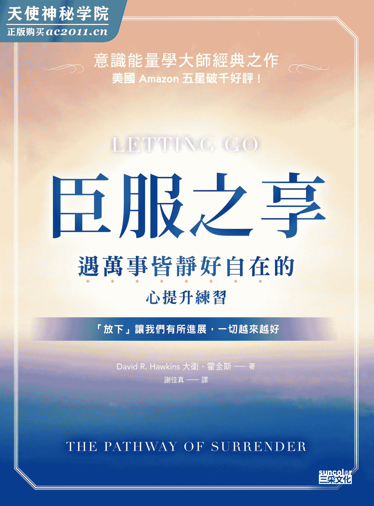

# 臣服之享：遇万事皆静好自在的心提升练习

# 【推荐序】
向伟大的灵魂致敬

这本书所谈的机制，可以解锁我们与生俱来的能力，感受到快乐、成功、健康、幸福感、直觉、无条件的爱、美、平和及创造力。这些状态与能力人人都有，与外在情境及个人特质无关，也不是受惠于任何宗教系统的信仰。内在的平和不是任何团体或系统的专利，而是人类本有的心灵状态。所有伟大导师、智者、圣人的共通教诲是：“天国在你之内。”而霍金斯博士经常说的是：“你所追寻的，与你自己的高我毫无二致。”

既然内在的平和是人类固有的，是我们真实本质的核心，为何会如此难以企及呢？既然我们被赋予了快乐，那所有的不快乐又是哪来的呢？如果天国就在我们之内，为何我们每每都有“置身地狱”之感？我们如何摆脱烂泥般的焦躁、不安，如何让迈向内在平和的路途能够走得顺一点、快一点，不要慢得像蜗牛爬坡一样？人类何其幸运，生来就拥有平和、快乐、喜悦、爱及成功等天性特质，但又何其不幸，总有大量的愤怒、绝望、悲伤、自大、嫉妒、焦虑及日常的小评判来搅局，淹没了我们本有的内在静默。我们真的可以甩开这些烂泥，重十自由吗？能在流动的喜悦中跳舞吗？可以一视同仁地去爱众生吗？可以活在伟大的高我中，完全展现所有的潜能吗？可以成为这个世界上散播恩典与美的管道吗？

霍金斯博士在本书中提供一条途径，指引我们去发现苦苦追寻却求而不得的自由。这条称为“臣服”的道路，透过放下的技巧，能推动我们继续前进。乍听之下，这似乎颠覆了我们的直觉，但霍金斯博士以其临床及个人的经验，证明了臣服是生命得以圆满的一条最可靠的途径。

我们之中有许多人在成长的过程中，被教导不论是世俗或灵性方面的成就，靠的都是一步一脚印，咬紧牙关撑过来的刻苦努力。这些观点，以及西方文化中那些基督教义的道德观，都在告诉我们，想要成功就必须肯吃苦、够勤快，还要愿意下功夫，也就是“一分耕耘，一分收获”。然而，付出吃奶的力气，挨了这么多苦，又得到什么呢？我们感受到了深刻的平静吗？没有。我们的内心依然愧疚不安，依然禁不起批评，依然想要获得肯定，依然还有不断升腾的怒气。

既然你正在读这本书，那么想必刻苦那一套的大道理已经耗尽你的心力了。或许你已经意识到，越是用力地朝着目标前进，就越是身心俱疲。你可能会纳闷：“难道没有轻松点的好方法吗？”那么问问自己，是否愿意松开紧握的绳索？如果善用臣服机制，不再走刻苦费力的老路，又会怎样？

在此分享我个人的经验谈。受过高等教育的我，尽管事业成功，却饱受身体及情绪的困扰，几乎试遍了所有自我成长的方法，却总是不见起色，已到了濒临崩溃的边缘。后来，我意外地认识了大卫．霍金斯博士，也读了他的著作，从此催化了出乎意料的惊人疗愈效果。

一开始，我也心存疑虑。毕竟我探索过各种门派的灵性、哲学及宗教法门，不是无济于事，就是只有一时的效果。因此，在面对霍金斯博士的著作时，我是这样想的：“八成也是一样的结果。”但我内在那个一丝不苟的追寻者说：“我要研究看看，反正也没什么好损失的。”于是，我翻开了《心灵能量：藏在身体里的大智慧》（Power VS. Force）。看完后，我豁然开朗：“我已经脱胎换骨，跟刚拿起这本书时的状态不一样了。”那是二◯◯三年。如今事隔多年，那催化剂一般的效应依然在我人生的各个领域发挥作用。

坦白说，我之所以相信霍金斯博士的论述，是因为我的身心灵全都出现了正面的改变。这些亲身经历不容我否认：我彻底戒除了一个屡战屡败的瘾头；我对宠物毛屑、野葛、霉菌及花粉的过敏症缓解了；我放下了心中多年的怨怼，能够从经历过的人生伤痛看见隐藏其中的礼物；我减轻了几乎伴随我一辈子的恐惧及焦虑症，职涯及私生活再也不必受到限制；我解决了好几个与自我接纳及人生目标有关的内在冲突。这些生理性及非生理性的重大突破，不仅是我自己有感觉，身边的人也都注意到了我的实质转变。他们问我：“你的转变是怎么发生的？”现在，如果再遇到同样的问题，我会请他们去读一读《臣服之享》这本书。在这本书中，霍金斯博士把我在阅读他旧作时所经历的内在变化过程，都详实地写出来了。

《臣服之享》提供我们一条前往自在人生的路线，任何愿意踏上这趟旅程的人都可以使用。参照书中提到的几个大原则去实践，你的人生将会大大改观。这些原则不难理解，也不难施行。它们不用花你半毛钱，也不要你做一些特殊的打扮，更不用远道跑到国外。踏上这趟旅程的首要条件，是你愿意放下对目前人生经验的依恋与执着。

诚如霍金斯博士解释的，小我会紧抓着熟悉的事物不放，不管它们会带来多少痛苦，或是一无用处。更吊诡的是，小我其实很享受悲惨落魄的生活，乐得与所有负面状态共处，包括觉得自己没价值、不中用、喜欢批判别人和自己、自我膨胀、认为自己永远都是对的、悲伤过去、恐惧未来、舔舐伤口、渴求安心的保障，以及索求爱而不是付出爱。

请你想像一下另一种新人生：成功得来全不费功夫、不再愤恨不平、常怀感恩、灵感不断、充满爱及喜悦、有问题总能找到双赢的解决办法、活得快乐、经常发挥创意……你愿意拥有吗？霍金斯博士告诉我们，不幸福的人多半是因为他们认定自己不可能得到幸福：“天底下哪有这么好的事”、“这种好事永远轮不到我”。

霍金斯博士是快乐的化身、无限喜乐的化身，以及平和的化身，更是值得我们仰望跟随的恩典。他之所以会写这本书，是因为他亲身体验到臣服机制的威力。阅读这样的一本书，亲炙这样一位无拘无束的灵魂，可以给我们带来催化的力量与希望，启动自己的内在旅程。因此，尽管小我在一旁冷嘲热讽、喋喋不休，我们还是要跟紧高我的脚步。一开始，我们可能会从霍金斯博士等意识先锋、导师、智者身上听到高我召唤的声音，然后，当我们也体验到真相、疗愈、扩展之后，就会听到来自自己内在的召唤。“老师与学生的高我，没有上下优劣之分。”霍金斯博士说道。

这本书，写出了真相。身为认真、严谨的追寻者，对于许多现代的灵性著述，我只能以浅薄二字来形容，因此我也针对这本书的内容做了几次审查与检视。作者的言论是否来自他本人真实的证悟？答案是“没错”。透过连续几年的访谈，我有了密切观察霍金斯博士的机会，从而确认了他在意识上领先群伦的超前状态。在本书中，他提醒我们一条意识法则：高振动能量（例如爱）可以影响低振动能量（例如恐惧）。这是因为所有人都透过能量互相链接，也因此每次在他身边，我都能感受到深刻的平静与爱，从而确定这条法则为真。诚如他在本书中的解释，每个人随时都能从层次较高的能量状态获得好处。

不论人生走到了哪一步，本书都会指点你“下一步”该怎么走。霍金斯博士所论述的臣服机制，整趟探索内在的旅程都能适用：从放下童年时积压的怨憎，到最后小我的臣服。因此，不论是追求成功的专业人士，或是有情绪困扰及身体病痛的患者，或是致力于开悟的求道者，这本书都同样有用。他建议每个人都可采取一个重要行动：承认在人生境遇中会出现各种负面感受，并且愿意不带批判地去正视这些感受。超越主体与客体的非二元性高等觉知，是我们可以攀登的终极目标。但坚持二元性的“小我”却经常要求我们去跟他人分个高下，我们该怎么处理这种情况？

霍金斯博士在之前的十部著作中提到，在开悟的非二元状态下，会出现珍贵的本初觉性或原始觉知（pristine awareness，众生本来就具足的觉性）。就像他多次在讲座开始前打趣所说的：“我们都是从终点上路。”的确，他在讲座上及著作中，已经详尽说明当人类的内在演化到达颠峰之后，意识会呈现这种最高的觉知状态。

在他晚年所出版的这本书中，他要带领着我们回归到共同的起点：承认小我的存在。我们必须从自己目前的位置启程，才能抵达目的地！如果我们打算从这里前往，却欺骗自己说会从目的地附近上路，并不会让我们快一点抵达。幻想目标与我们的距离没有那么远，其实才会拖长旅程。正如他在本书所说的，除了鼓起勇气，还要对自己诚实，才能看见小我的真面目。只有承认我们继承了人性的阴暗面，才有可能臣服，解除负面的束缚。我们先要有意愿去承认并接纳这一部分的人类经验，因为只有接纳后，才能超越——而霍金斯博士会替我们指路。

此外，这也是一本实用的操作手册，因为霍金斯博士所阐释的技巧可以让我们超越小我、突破重围，得到我们渴求的自由。根据霍金斯博士的说法，这种自由与纯粹的快乐，是我们“与生俱来的权利”。他数十年的临床诊疗经验，也给了许多人鼓舞与启发。在一个个真实案例中，我们看到臣服的力量几乎能够落实在所有生活领域：人际关系、健康情况、职场、休闲活动、灵性觉醒、家庭生活、性爱、情绪疗愈，以及成瘾戒断。

我们学到要解决问题，答案都要往内找。一一放下那些会阻挡我们找到答案的内在障碍，高我便能大放光芒，照亮通往平和的道路。其他灵性导师也强调，要解决个人困境与集体冲突，唯一的正解是培养内在的平和：“先解除内部武装，再解除外部武装。”（达赖喇嘛）；“想改变世界，先改变自己。”（甘地）道理昭然若揭。我们都是整体的一分子，因此疗愈自己，也是在疗愈世界。从能量层次来看，每个人的意识都会链接到集体意识，因此个人疗愈会促成集体疗愈。从科学及临床应用上来了解这条法则的人，霍金斯博士或许是第一位。关键在于：改变自己，就能改变世界。当我们的内心充满了爱，就会促成外界的疗愈。就像水涨船高的道理，个人无条件的爱可以拉所有众生一把。

大卫．霍金斯博士是闻名世界的作家、精神科医师、临床医师、灵性导师及意识研究员。除了不平凡的一生，他珍贵的著作及研究也闪耀着慈悲的光芒，帮助读者卸下人生的各种痛苦，对人类的进化贡献良多。

开悟是一种充满喜乐、幸福感的圆融状态，一旦进入这种境界，没有人会想要离开。而当我们在全然臣服于自己对神、对人类同胞的爱之后，就会开始分享自己所得到的恩典。因此，霍金斯博士花了很多心力写了这本书跟读者分享，这是臣服发挥作用的结果。我们会在这本书的其中一章看到，唯有全然臣服，才能重十个人意识去履行尘世责任。此外，霍金斯博士在写书时也没有离开天人合一的开悟状态，因此不可避免地要面对无法用文字语言表达的挑战。我注意到他书中有时会出现文法不符惯例的情形，例如“我们的生命”（our life），真实地反映出他正处于灵性状态之下，把所有的生命视为一体。霍金斯博士愿意重新投入逻辑与语言的世界，跟我们分享“意识地图”来协助我们，也完成自己的天命，足可见他对全人类的无私之爱。他所指出的解脱之道，让我们有机会得到解脱。

感谢霍金斯博士，送给我们全然臣服的大礼。

法兰．葛蕾丝（Fran Grace）博士

加州雷德兰兹大学（University of Redlands）宗教学教授

冥思生活学院（Institute for Contemplative Life）创始院长

二◯一二年六月

# 【前言】
臣服：全方位的疗愈机制

在多年的临床精神医疗工作中，我的主要目标是为人类形形色色的痛苦，找出最有效的解决方法。为此，从医学、心理学、精神医学、精神分析、行为技术、生物回馈、针灸、营养学到脑化学，我都有所涉猎。除了这些临床疗法，我也开始研究哲学系统、形而上学、大量的全人保健技术、自我成长的课程、灵修门派、冥想技巧，以及其他拓展个人觉知的方法。

探索了这么多的领域后，我发现臣服机制是一个实际可行且确实有益的工具。对于这个重要的发现，我认为有必要写一本书来跟世人分享，同时也把临床治疗及个人经验所观察到的情况记录下来。

先前我出版过的十本著作，主要焦点都放在觉知及开悟的高阶状态。多年来，讲堂及讲座上很多学员提出的问题，披露了开悟的一些日常障碍。一个务实又有用的回应方式，就是分享一个能让他们成功克服这些障碍的技巧，例如：如何在失去、挫败、压力与危机下，处理人生的浮沉与波折？如何从负面情绪解脱，以免波及到健康、人际关系及工作？如何处理所有不想要的感受及情绪？现在你手上这本书，就是我给出的答案，提供一个能释放负面感觉并重十自在的简单又有效方法。

放下与臣服的技巧是移除障碍与执着的一套实用工具，也可以称之为“臣服机制”。臣服的效果是有科学证据的，相关解释已纳入本书的其中一章。研究显示，臣服技巧对于缓解压力造成的生理反应，效果超越过现有的许多其他方法。

将坊间各种减压及提高意识的方法大致研究一番后，臣服机制脱颖而出，因为操作简单、效率高、有临床成效、没有模棱两可的概念，而且成果立竿见影。由于臣服技巧实在太过简单，以至于真正的益处很容易被误判。简而言之，臣服可以帮我们解决情绪依附的问题。这验证了每一位智者的观察，亦即执着是受苦的首要因素。

心智及心智所产生的想法，是由感受驱动的，而每个感受都是由成千上万个想法累积而成的衍生物。多数人终其一生，都在压抑及逃离自己的感受，被压抑的能量会一天天累积，再借由身心症、生理失调、情绪问题以及人际互动的一些脱序行为发泄出来。积压的感受会阻碍灵性成长及觉知能力，也会妨碍各个生活领域的成功。

因此，臣服技巧的好处可以从几个面向来说明：

## 消除生理上的病痛

清除被压抑的情绪对健康有益，可以减少溢流到自律神经系统的能量，以及疏通经络能量系统（可用简单的肌肉测试来验证）。因此，一个随时臣服的人，身体的病痛及身心症都会改善，甚至完全康复。身体的病理过程会全面反转，让生理机能恢复到最佳状态。

## 将行为导正回来

由于焦虑与负面情绪不断减轻，渐渐就不必再借助药物、酒、娱乐、过度睡眠来逃避。于是，体力、精力、气色、幸福感的程度都会改善，各方面的机能都更有效率且不费力地运作。

## 人际关系的提升

释放负面感受后，正面感受会持续增加，人际关系短期内就能全面改善。我们更有能力去爱，发生冲突的频率下降，而且工作表现越来越好。铲除负面障碍后，更容易达到职业目标，由愧罪感引发的自毁行为则会日益减少。我们会更信任直觉，不再一面倒向理性；会更关注个人成长，往往还会发掘出以往不知道的创造力及灵能，这是因为压抑负面情绪的人，这些方面的能力必然会受损。依赖会破坏所有的人际关系，因此相当重要的一点是，臣服于负面情绪后，依赖程度会不断减轻。依赖往往隐含着大量的痛苦，甚至会以最可怕的暴力与自杀行为来表达。一旦依赖程度变轻，带有敌意的挑衅行为也会随之变少。至于那些负面感受，则会由接纳及爱取而代之。

## 意识／觉知／灵性的深层体验

持续练习臣服，就会打开我们内在更深层次的领域。放下负面情绪，意味着可以体验到越来越多的快乐、满足感、平静及喜悦。我们会变得更有觉知，也更容易链接上内在更高层次的自我——高我。对于灵性导师的教诲，我们更能融会贯通，成为我们个人的经验。逐渐的，我们不会再自我设限，也终于认清自己的真实身分。放下，是达成灵性目标最有用的方法之一。

不管是谁，如果能在日常生活中做到臣服，就可以在潜移默化中实现以上所有目标。负面情绪消失后不再生起，取而代之的是正面的感觉与情绪，所闻所见以及所感受的生活体验都是快乐的。

以上这些信息，旨在鼓励读者去练习臣服的技巧，以便亲身经历这些值回票价的惊喜体验。

大卫．霍金斯博士

灵性研究院创始院长

二◯一二年六月

某日沉思时，心智说话了：

“我们究竟是哪里出了错？”

“幸福怎么不乖乖留下来呢？”

“答案在何处？”

“如何处理人类的困境？”

“是我疯了，还是这个世界疯了？”

任何问题的解决方案似乎都只是暂时的权宜之计，因为这些解决方案都将引来下一波的问题。

“人类的脑子只能像仓鼠磙轮那样无望地原地兜圈子吗？”

“每个人都活得迷迷煳煳、不明不白？”

“神知道祂在做什么吗？”

“上帝死了吗？”

心智只能无可奈何地喋喋不休：“有谁可以告诉我答案？”

## 为了找到答案，你拐了多少弯？

别担心——每个人都跟你一样无助，也跟你有同样的渴望。有的人看似一副不在乎的样子，他们会说：“不晓得大家干嘛大惊小怪的，我觉得人生再简单不过了。”他们畏惧人生，怕到连看都不敢多看一眼！

那专家呢？专家的困惑要更复杂一些，他们会以厉害的术语进行包装，搭配精巧的思维架构，然后把缺省的信念体系努力套用到你身上。这样做，似乎可以奏效一阵子，但不久后你又会被打回原形。

以往我们仰赖社会组织来解套，但那个时代已经远去了，现在没有人会再相信社会组织了。现在的监督团体还比社会组织多呢，比如医院就受到一层又一层政府单位的监督。于是，没人有空去管病人，病人就在这些混乱中被遗忘了。看看医院的走道，那里没有医生，也没有护士，因为他们都在办公室里处理文书报告。整个医疗现场，完全没有人味。

你说：“但是，总有知道答案的专家吧？”在心情沮丧时，你会去看医生或精神科医师、分析师、社工或占星师。你信教、钻研哲学、参加埃哈德培训课程（Erhard Seminars Training）1，或运用情绪释放技巧（EFT）在身上敲敲打打。你平衡脉轮、接受反射疗法、埋耳针、做虹膜检测，或用光与水晶来疗愈自己。

你可能尝试过冥想、唱诵咒语、喝绿茶、参加五旬节教会、做火呼吸 2、说一些没有人能懂的神言神语。或是回归中心、学习神经语言程序学（NLP）3、追求自我实现、努力做观想、研读心理学、参加荣格心理分析团体、做罗夫结构整合疗法（Rolfing）、吃迷幻药物、找灵媒、慢跑、跳爵士健美操、灌肠、注意饮食养生、做有氧运动或倒吊、配戴灵性饰品。你寻求更多的洞见，用各种仪器来测量生理回馈指标，尝试完形疗法 4。

你可能也做过顺势疗法、整嵴、物理治疗，还做了肌肉动力学的测验，找出自己属于九型人格的哪一型。或是调整经络、参加提升自觉的团体、吞镇静剂、注射贺尔蒙、补充矿盐、平衡体内的矿物质、祈祷、恳求及乞求。你学习灵体出离、吃素或只吃甘蓝菜、尝试长寿饮食、吃有机食物、不吃基因改造的任何食物。或是造访萨满巫医、做汗屋仪式、吃中药、尝试针灸、做指压或针压、改造风水。你跑去印度寻访新的上师，脱掉衣服在恒河游泳；你凝视太阳、剃光头、用手取食、洗冷水，把自己搞得脏兮兮。

你吟唱部落歌谣、做催眠回溯前世；发出原始的嘶吼、揍枕头出气、练习费登奎斯方法 5、加入夫妇恳谈团体、上教会、抄写肯定语、制作愿景板。你还可能做过重生疗法、卜卦、算塔罗牌、禅修、上更多的课程及工作坊、看更多书、做人际沟通分析、做瑜伽。你接触神秘学、修习魔法，还去造访夏威夷的卡胡纳（kahuna）巫医，在萨满之旅时坐在金字塔底下，阅读诺斯特拉达姆斯（Nostradamus）6 预言集，对未来有了最坏的打算。

你去静修、采行断食、摄取氨基酸、买负离子机，或是参加神秘学派，学习用秘密的握手方式来打暗号。你练习声音疗愈，尝试色彩能量疗法，听潜意识录音带，吃号称可以补脑的酶、吞抗忧郁剂、进行花精疗法、做 spa、泡温泉，还研究来自十万八千里外的奇怪发酵食品，使用异国食材做料理。你去西藏找圣者，跟陌生人牵起手围成一圈一起嗨。你禁欲，披上黄色的长袍，加入异端宗教。

你尝试各种各样的心理疗法，吞服所谓的仙丹妙药，订阅大量的期刊；采用普里特金（Pritikin）低油饮食法、葡萄柚饮食法。你怀抱新时代（New Age）的思维、做环保、拯救地球、看手相、判读气场、戴水晶、算印度的占星命盘、找附体通灵的灵媒。你接受性治疗，尝试双修瑜伽，接受来自某圣者的祝福，加入匿名团体，前往法国的圣母显灵地卢尔德（Lourdes），穿脚底按摩拖鞋，或是光脚接地气。你养气，吐出陈腐的负面气息，用银针做针灸，也尝蛇胆、练习脉轮呼吸、清理气场，在埃及的大金字塔冥想。

你说，你跟朋友几乎把前述方法都试过一轮了。哎，人类！真是够神奇的了！可悲、滑稽，却又如此高贵！如此百折不挠！是什么在驱策我们不断地寻找答案？是痛苦？还是希望？当然，事情没有这么简单。

我们凭着直觉，知道终极答案就在某处。我们在漆黑的小径跌跌撞撞，走进死巷与绝境；我们被剥夺、被控制，经历了幻灭与厌倦，而我们还是不死心地一试再试。

我们的误区在哪里？为什么迟迟找不到答案？

我们得不到答案，是因为不了解问题的症结在哪里。

也许是答案简单得出乎意料，以至于我们看不出来。

也许答案不在“外面”，所以我们找不到。

也许是我们的信念系统太繁杂，遮蔽一目了然的真相。

从古至今，鲜少有人能做得到明心见性，体验到人类苦难的终极解答。他们是如何进入那个境界的？有什么诀窍？为什么我们体会不来他们的教诲？难不成这真的是一趟无望之旅吗？我们这些凡夫俗子怎么办呢？

许多人踏上灵性道路，却没有几个人能够走到底，彻底了悟终极真相。怎么会这样？我们恪守仪轨与教条，到头来仍然是一次又一次的失败！即便灵修有些成果，小我也很快就会冒出来捣乱，让我们自鸣得意，想着自己找到了答案。噢，老天，帮助我们远离那些自称无所不知的人吧！帮助我们远离那些自诩为正义之士的人吧！帮助我们远离那些把善行挂在嘴边的人吧！

## 感到困惑吗？恭喜你！

困惑，是我们获得救赎的一线生机。还知道困惑的人，就还有指望。所以，守护好你的困惑。自始至终，困惑都是你最好的朋友，是抵御别人塞给你答案的铜墙铁壁，是防范让别人的观点强暴你的最佳武器。如果你感到困惑，代表你仍然是自由之身。这本书就是为困惑的你所写的。

这本书在谈什么？答案是：它要谈的是一个简单的方法，你学着学着，内心会越来越雪亮，不再让问题困住自己。解脱的办法不是找到答案，而是把造成困扰的原因抹除。古圣先贤的境界不再遥不可及，解答就在我们之内，一寻便得。臣服的机制很简单，而且真相本来就不证自明，在日常生活中你经常就能够有所体悟。这本书里没有教条，没有任何的信念系统。所有一切都是你的亲身验证，所以你不可能被误导。臣服不是创建在任何教义之上，它遵循的只是几句格言：“认识自己”、“真理必叫你们得以自由”，以及“天国在你之内”。臣服适用于愤世嫉俗者、实用主义者、宗教狂热者以及无神论者，适合各个年龄层及各种文化背景，适合追求灵性成长的人，也适合不重视灵性生活的人。

因为臣服机制是你自己的，谁都不能夺走，绝对不会有幻灭的危险。你会亲自发掘什么是真实的，而什么只是心智程序或信念系统。在这一趟旅程中，你的健康会升级，你可以付出更少的心力变得更成功、更快乐，还能够付出真爱。朋友会察觉到你的变化，而且这些变化是永久的。你不会攀上“高峰”后就开始往下坠，你会发现自己的心里长驻着一位自动化的好老师。

最终，你会发现深藏于内的那个高我，潜意识一直都知道“高我”的存在。当你找到“高我”，就能明白古圣先贤所要传递的道理。你将会了解那些道理，因为真理不证自明，而且就在你自己之内。

这本书在撰写期间，始终都以读者诸君为念。下笔如行云流水，流畅不费力。书中没有要你刻意学习或背诵的道理，你会越读越轻松，越淋漓畅快。一页页读下去，就能随着内容自然而然地体验到了自由。你会觉得身上的千斤重担不见了，不管做什么事都更能乐在其中，而且发现生活中处处有惊喜！你将会渐入佳境，所有事情都会越来越好！

你可能会有所怀疑，没关系。我们都曾因为轻信别人信誓旦旦的说法而吃亏，所以你想怎样怀疑都无妨。说真的，避免一头热的轻信才是明智的，否则日后可能会令我们大失所望。因此，与其一头热，静静观察对你更有利。

天底下会有不劳而获的事吗？有的，绝对有。那就是你的自由。然而，你早把自由抛诸脑后，不晓得从何体验了。你已经拥有的东西，何必另外求取。自由不是什么新玩意儿，也不在你之外。自由原本就属于你，只需要你去重新唤醒、重新发现。自由的本质，会让它自己慢慢浮现出来。

分享这个方法，其目的是要帮你触及到自己内在的感受与经验。此外，本书还有你的心智会想一探究竟的有益内容。臣服的过程会自动展开，因为想要离苦得乐，是人心的本性。

* * *

## 自由自在的人生状态

臣服就像内在的压力突然解除，也像卸下重担。随之而来的感觉，是顿时松了一口气，心情明亮起来，更快乐、更自由。这是心智的实际机制，每个人都不时会有这样的经验。

以下是一个好例子。你跟人起了剧烈的争执，觉得怒火中烧，但一个刹那间，你却觉得这整件事莫名其妙、荒唐又离谱。于是，你笑了出来。压力就这样缓解了。你战胜了生气、恐惧以及被攻击的感觉，顿时感到自在又愉悦。

想想看，要是不管何时何地何事，你都能做到这样的臣服，该有多好。你可以永远自在逍遥，不会一次次地感觉自己被逼到绝境。臣服技巧就是这么一回事：要主动地、经常性地、心甘情愿地臣服。如此一来，你就不再是个受害者，可以掌控自己的心情，不再任凭外在世界宰割，也不再对自己的反应无能为力。这也实践了佛陀的根本教诲，消融那因不由自主的反应所产生的压力。

我们都囤积了大量的负面情绪、态度及信念，并把它们背负在身上。这些累积下来的压力令我们苦不堪言，也是许多病痛及问题的根源。我们双手一摊，辩称这就是“人生”。我们寻求并动用不计其数的手段来逃避，终其一生，都在闪避恐惧造成的内在动荡及步步进逼的愁苦。每个人的自尊，无时无刻不在承受着内外的夹攻。

仔细检视人类的生命，便会看出人生的本质是一场绞尽脑汁的漫长挣扎，以试图逃避内在的恐惧，以及投射到外界的期望。摆脱掉内在恐惧的短暂愉悦，不时穿插在我们的人生之中，但恐惧没有离去，依旧在那里等着我们自投罗网。我们畏惧去查看内心的真实感受，害怕它们太过负面，若是再深入一点就会被压垮。我们缺少有意识的机制去主动处理这些感受，因此不能放任这些感受浮上心头，除了害怕及提防，可说是束手无策。既然不敢面对，等这些感受日积月累之后，我们就会开始暗自希望能够一死百了，早日从痛苦中解脱。折磨我们的，不是念头或事实，而是伴随而来的感受。念头本身不会造成痛苦，痛苦的源头是随着念头而起的感受！

感受引发了压力，而压力累积之后又会产生念头。光是一个感受，经过一段时间后就会引发成千上万个念头。比如想起一段早年的痛苦回忆，或是一个始终不能见光的悔恨。瞧瞧在漫漫时光里，有多少念头是由这一件往事引发的。然而，要是我们能向底下的痛苦感受臣服，那些念头马上会化为乌有，我们也会把那一桩事件慢慢淡忘。

这样的观察，与科学研究的结论一致。一九八一年，葛雷（W. Gray）与拉维莱特（P. LaViolette）的科学理论整合了心理学与神经生理学，他们所做的研究证明所有的想法与记忆都可根据感觉基调（feeling tone）来分组。与这些想法相关联的各种不同程度的感受，会被归档到记忆库里。因此，一旦消弭或释放某一个感受，我们就能从所有相关的念头中解脱出来。

懂得如何臣服、如何放下，真的是妙用无穷，你可以在任何时间、任何地点，在一眨眼间放下所有感受，而且这一招屡试不爽，不费吹灰之力。

那么，何谓臣服状态？这是指在某个领域没有负面的情绪，创造力与自发性就能在没有内在冲突的抵制或干预下显现出来。当我们从内在的冲突及期待中解脱出来后，就能带给生命中的其他人最大的自由。这让我们体验到宇宙的一个基本特质，那就是：在任何情况下，做最好的安排。或许这听起来很哲学，但当我们真的做到后，却能从亲身的体验知道，事实就是如此。

## 别让负面感受与情绪囚禁了你的心智

我们处置感受的方式，主要分成三种：压抑、表达及逃避。以下逐一探讨。

一、压抑与潜抑。这两种做法是处理情绪最普遍的方式，也就是将感觉压制下来、置之不理。潜抑（repression）是指当事人不自觉地把情绪深深地压入潜意识，而压抑则是有意识的自我控制过程。当我们不想为了难受的情绪及感受伤神，或是不晓得应该怎么处置时，就会这样做。我们透过这样的忍让，好尽力照常过日子。在社会风俗与家庭教养的熏陶下，我们在内心创建起这两种有意识及无意识的程序，据此筛检出要压抑或潜抑的感受及情绪。被压抑下来的感受会累积成压力，进而引发情绪波动、暴躁易怒、颈背部的肌肉紧绷、头痛、痉挛、月经异常、结肠炎、消化不良、失眠、高血压、过敏及其他的身体症状。

我们会潜抑某种感受，是因为对那种感受太内疚或太恐惧，以至于不想在意识层次去感觉它。只要那种感受蠢蠢欲动，就会被立刻推送到潜意识，并且受到种种管制，以维持潜抑状态，不被我们察觉。

心智会以各种机制来潜抑感受，其中最广为人知的手段大概是否认与投射。否认与投射往往同时出现，相生相成。情绪上的重大障碍及很多不成熟的表现，大都是因为否认而起。否认通常会伴随投射作用，投射是因为内疚与恐惧而将自己的过错、缺点、不被认可的欲望等归咎到外界或周遭的人身上，以保护自己。我们会压抑这些冲动或感受，否认自己心里有那些不好的东西，不去感受它们。我们所体验到的那些感觉，仿佛是来自“别人”身上。把“别人”变成敌人后，心智就会开始寻找可以强化投射作用的正当理由。人物、地点、制度、食物、气候条件、星象、社会环境、命运、神、运气、魔鬼、外国人、种族、政治对手及我们之外的事物，都可能成为我们怪罪的对象。投射作用是这个世界目前的主要机制，所有的战争、冲突、内乱，祸首都是它。我们甚至鼓吹要怨恨敌人，才是“好国民”。我们牺牲别人来维护自己的自尊，最后，造成社会分崩离析。一切的攻击、暴力、挑衅，以及各种形式的社会破坏，其背后的机制都是投射。

二、表达。在这个机制下，个人的感受及情绪得以化为言语或以肢体语言宣泄出来，或是在层出不穷的示威抗议活动中用行动宣示。将负面的情绪及感受表达出来，内在的压力就能够获得足够的释放，剩下的情绪就压得下去了。这一点非常重要，因为在当今社会中，许多人相信当他们将情绪、感受表达出来后，就能够从中解脱。但是，事实却恰恰相反。首先，当我们表达时，往往会把那种感受或情绪渲染开来，给它更大的能量。其次，情绪的表达，还会把残存的感受压抑在我们觉知不到之处。

在压抑与表达之间如何平衡因人而异，要看幼年的教养、当前的文化规范及媒体等因素。表达自我如今蔚为潮流，但这是因为误解了佛洛伊德与精神分析学派的研究。佛洛伊德指出，压抑是精神官能症的起因，表达才会被误认为是解决之道。这样的误解，成了折腾别人来放纵自己情绪的挡箭牌。在正统的精神分析学派中，佛洛伊德所说的，其实是指被压抑的冲动或感受必须被抵销、升华、社会化，并把能量引导到爱、工作及创造力的正途上。

如果把负面情绪发泄到别人身上，别人会觉得受到攻击，而被迫去选择压抑、表达或逃避；因此，表达负面情绪所造成的结果，就是恶化及破坏人际关系。更好的做法是为自己的情绪负起责任，主动消化及化解。如此一来，我们所表达的，就只剩下正面的感受了。

三、逃避。逃避是利用其他令人分心的事物，来闪躲自己的感受与情绪。逃避是娱乐业与制酒业的生存命脉，也是工作狂选择的老路。逃避主义与闪避内在觉知，是社会认可的机制。有无限多的消遣方式可供我们闪躲内在的自我，阻挡内在的感受窜出来，而我们会日渐依赖这些消遣，最后，便对许多消遣上瘾。

人们不管不顾地保持在无知无觉的状态，稍微观察一下，就会注意到很多人常常一进门就打开电视，仿佛梦游般走动，时时刻刻都在接收大量的信息并据此行事。他们畏惧面对自己，连一时半刻的独处都受不了。于是，总有应接不暇的活动，包括没完没了的社交、谈话聊天、发简讯、阅读、听音乐、工作、旅游、观光、购物、大吃大喝、赌博、看电影、吞药、吸毒，以及参加鸡尾酒会。

前述的逃避方式，许多都暗藏风险、充满压力、徒劳无功，并且会消耗越来越多的精力。压抑情绪及感受会造成压力，而这些压力会不断攀高，必须靠大量精力才能持续镇压。我们的觉知会不断流失，成长会停顿下来，创意、精力会折损，对待别人也会流于表面工夫，失去真实的兴趣。此外，灵性成长也会中断，迟早发展出身心不适、疾病、提早老化，甚至造成英年早逝的遗憾。然而，如果将压抑的感受投射出去，却会酿成社会问题与乱象，助长目前社会上麻木、自私、无情的风气。逃避最严重的效应，是你不能出自真心地去爱、去信任他人，沦落到情感孤立与自我厌恶的地步。

反之，如果我们放下某个感受，会如何呢？答案是，感受背后的能量会立即释出，实际的效果就是解除压力。当我们懂得放下与臣服，累积的压力水准会开始下降。每个人都知道，放下之后，马上就感到通体畅快，生理状态也会跟着改变，气色、呼吸、脉搏、血压、肌肉紧绷度、胃肠机能、血液生化物质，都会出现可以测量到的改善。内在重获自由的状态下，所有的生理机能与器官大致上都会朝着正常与健康的方向移动，例如肌力增加、视力改善，而且对世界及自己的看法也会大为改观。我们会更快乐、更有爱，也更亲切随和。

## 把感受硬压下来，会有哪些麻烦？

压力一向是被大量关注的一大议题，但很少人真正理解压力的基本特质。据说，比起以前，现在的我们更容易感受到压力。形成压力的根本原因是什么？当然不会是外来因素，这些因素只不过是被称为投射作用的那个机制所呈现出来的一些例子。我们以为压力是“别人”或“外部事务”加诸给我们的，但事实上，我们所体验到的，仅仅是内在情绪压力的冰山一角而已。正是这些被压抑、表达不出来的感受，让我们扛不住外来的压力。

“压力”的真正源头来自我们的内在，而不是人们一厢情愿所认定的外在。例如，一个人有多容易凭着恐惧行事，要看这个人在受到刺激时，会触动多少内在的恐惧而定。内在的恐惧越多，看待这个世界的目光就越容易变得谨小慎微。满怀恐惧的人，眼中所见的世界是可怕的；而满怀愤怒的人，眼中所见的世界则充斥着挫败与令人一肚子火的乱象。至于抱着愧罪感的人，触目所及是个诱惑及罪愆横流的世界。我们内在是什么，就会把世界渲染成什么。如果我们能够放下愧疚，就能得见清白；但背负沉重愧罪感的人，只会看见邪恶。以上的基本原则，就是我们都会把焦点放在被自己压抑的东西上面。

压抑情绪所累积的压力会带来焦虑。压力会寻找出口，因此外在事件只是导火线，它触发了我们有意无意压抑下来的感受。这些被阻断的感受所蓄积的能量，会从自律神经系统重新冒出来，导致生理性的病变而开始启动致病过程。负面的感受及情绪可以令身体的肌力立刻流失五◯％，同时限缩生理上及心理上的眼界。焦虑、紧绷的心理状态，是我们对诱发因素或刺激的一种情绪反应，这样的心理状态取决于我们的信念系统，以及与信念系统相关的情绪压力。因此，焦虑的根源不是外部刺激，而是我们的情绪反应。越是臣服，越不容易有压力，也越不容易焦虑不安。无形压力所导致的伤害，是个人情绪造成的结果。科学研究证实，臣服可以有效降低身体对压力的反应（参见第十四章）。

许多现行的纾压方式，往往忽略了核心关键。那些方法一味地试图缓解压力造成的后续效应，而不去解决造成压力的根本原因，不然就只是聚焦于外在事件（这就像发烧一样，光急着退烧而不治疗引起发烧的感染）。以肌肉紧绷来说，就是焦虑、恐惧、愤怒及愧疚的后果。学习放松肌肉的技巧，效益只是杯水车薪，倒不如移除肌肉紧绷的根本原因——化解压抑的愤怒、恐惧、愧疚等等负面感受，效果反而好得多。

## 你的情绪能量场决定了人生事件簿

心智喜欢将事情合理化，情愿向我们隐瞒引发情绪的真正症结，再透过投射机制来印证事情确实如自己所料。它怪罪外来的事件或怪罪别人，让自己产生这些负面感受，认为千错万错都是“他”或“它”的错，自己则是无助又无辜的受害者。“他害我好生气”、“他搞得我好沮丧”、“它吓死我了”、“世界局势就是我焦虑不安的原因”……但，真相正好相反。

压抑的感受和情绪会自己寻找出口，把外在事件当成宣泄的引爆装置及借口。我们就像伺机排出蒸气的压力锅，引爆装置已经准备就绪，随时都可引爆。在精神医学上，这种心理防卫机制称为转移或替代作用（displacement）：我们之所以生气，是因为外在事件“害”我们生气。但如果懂得臣服，就能释出囤积的怒气，任何人事物就很难会再“害”我们发火，事实上，甚至连生气都不可能。同理，其他的负面感受一旦放下，就再也伤害不到我们。

由于社会上的社交制约，我们甚至被要求压抑正面的情绪及感受。压抑的爱会造成像心脏病发作一样的心脏损伤；这样的爱一旦重新浮现，就会化为对宠物的溺爱，以及各种形式的偶像崇拜。真正的爱不带一丝一毫的恐惧，其特性是不执着、不依附；相反的，恐惧失去则会强化不适当的执着与占有欲，例如对女友缺乏安全感的男人，醋劲会很大。

压抑感受所造成的压力迟早会超出一个人的忍受极限，导致心智开始在“外”惹是生非，作为宣泄出口，找到转移目标来替代自己。因此，压抑大量悲伤的人，会在生活中不自觉地制造悲伤事件；恐惧的人会促使可怕的经历发生；愤怒的人去哪里都会遇到令人生气的情境；而心性高傲的人则会经常受到折辱。诚如耶稣基督所说：“为什么看见你弟兄眼中有刺，却不想自己眼中有梁木呢？”（《马太福音》第七章第三节）所有的大师都指点我们应该向内看。

宇宙万物都在振动，振动频率越高，就越强大。情绪是一种能量，因此也有它自己的振动频率。情绪的振动频率会影响身体的能量场，出现可以看到、感觉到、测量到的效应。透过特殊的克里安摄影术（Kirlian photography）所拍摄的动态影像，比如研究超心理学的赛尔玛．摩斯（Thelma Moss）博士所拍摄的作品，能够看到能量场的颜色与大小会伴随情绪起伏而急剧变化。能量场也称为“气场”，有的人凭着天生的能力或后天学习，也能看见气场频率的振动。气场的颜色、大小，会与情绪连动。肌肉测试也证明了能量会跟着情绪一起变换，因为身体的肌肉会立即回应正向与负向的刺激。由此可知，我们基本的情绪状态会以频率方式自动发送至宇宙。

心智没有范围、没有大小，也不受制于空间；因此，心智可以透过振动的能量，将本身的基本状态无远弗届地传输出去。这表示一直以来，我们都在无意间透过情绪状态及思绪去影响他人；而其他人可以接收并解读这些情绪模式及相关的思维形态，比如远在十万八千里外的灵媒。这个理论可以用实验来呈现，在先进的量子物理领域中，关于这方面的科学原理一向都是大家感兴趣的主题。

由于情绪会发射出一个振动能量场，因此也会影响到我们周遭的人，并决定他们是否会离去或留下来。在精神层次上，生活事件会逐渐受到压抑情绪的影响。据此，愤怒会吸引来让你愤怒的念头。精神宇宙（psychic universe）的基本原则是“物以类聚”，因此“爱会助长爱”，所以能够把多数负面能量放下的人，会吸引充满爱的念头、充满爱的事件、充满爱的人，以及充满爱的宠物。这种现象解释了很多聪明人想不通的《圣经》经文及俗谚，比如“富者越富，贫者越贫”、“凡有的，还要加给他”等等。原则上，意识荒漠的人，会将贫困的情境带进生命中；而意识丰盈的人，则会把富足带进生命里。

在振动的能量层次上，所有众生都是相链接的，因此周遭的一切生命形态都会接收到我们的基本情绪状态，并做出反应。我们都知道，动物可以在一瞬间就得知某人的基本情绪状态；而实验证明，连细菌的生长也会受到人类情绪的影响，至于植物对人类的情绪状态，也出现可以测量到的反应。

## 开始踏上臣服之旅

谈到跟感受或情绪有关的臣服，就是指允许感受或情绪浮现，并跟它们共处，不要试图去改变或强做任何处置。这意味着，你要单纯地让感受存在，专注让感受背后的能量释放出来。首先，允许自己拥有那种感受，不要去抗拒或发泄，也不要恐惧、谴责或说教。这表示你要放下评断，明白那只是一种感受。臣服的技巧，就是与任何感受同在，臣服于它，不要妄想用任何方式或努力去调整感受。放下想要拒抗这种情绪或感受的渴望，因为正是抗拒才会让感受一直盘桓不去。当你放弃抗拒，不再去试图调整感受，它便会自动转换为下一种感受，同时你会觉得轻松一些。没有受到任何抗拒的感受会散逸无踪，而感受背后的能量也会一并消退。

启动臣服机制后，就会注意到因为这种感受而生起的害怕与愧疚；一般来说，这会让你心生抗拒。要让感受更容易冒出来，方法是不要去质疑自己为何会有那样的感受，也不要随着你的感受起舞。对恐惧情绪感到害怕，正是这样的经典例子。先放下你对自己为何会产生那种感受的恐惧或愧疚，然后再进入那个感受之中。

放下并臣服于感受，忽略掉你当下的所有念头。把焦点放在感受本身，别管那些念头在说什么。只要念头一起就会没完没了，它们会自我强化，衍生更多的念头出来；念头仅仅是你的大脑在为已经存在的感受寻找合理的解释。你之所以会产生那样的感受或情绪，真正的原因是那个感受背后已有囤积的压力，而在那个当下，压力会强行让那个感觉浮现出来。不管是念头或外在发生的事件，都只是心智编造的借口而已。

等我们对臣服更上手后，就会注意到所有的负面情绪或感受，都会牵连到与生存相关的基本恐惧，而所有的感受，也仅仅是心智所认定的一种必要的求生程序。臣服的技巧会一步步消融这些程序，在消融的过程中，感受背后的动机也会逐渐清晰起来。

臣服意味着对任何事物都不带有强烈的情绪：“有也好，没有也无妨。”当我们不再执着，就能重获自由。对于外在事物，你可以尽情享受，但即便生活中缺少了它，你照样觉得快乐。如此一来，你渐渐就不会再依赖身外之物。这些原则与佛陀不执着的根本教诲是一致的，也跟耶稣基督的基本教义相通：“活在世间，但不属于它。”

有时会在臣服于一个感受后，发现它又卷土重来。原因在于，你还有尚未放下的残余部分。终其一生，我们都在堆积这些感受，其中有许多被压抑的能量必须冒出来，好让我们去正视它们。一旦做到臣服，会立刻感觉到整个人更轻松更愉快，简直就像“高潮”一样。

持续不断地放下、臣服，就有可能长久活在自由状态下。感受会来来去去，迟早你会领悟到那些感受不是你，而真正的“你”只是那些感受的见证者。从此，你不再把那些感受当成自己。那个在观察及觉知发生什么事的“你”，始终都没有改变过。你慢慢察觉到那个始终如一的内在见证者，也开始认同更高层次的意识。你渐渐更靠近那个见证者，并慢慢远离那个体验者。你离真正的自我越来越近，开始看清自己一直都被感受摆布、愚弄，而误以为自己是情绪的受害者。现在你已经明白，关于自己的那些事都不是真的；它们都是由小我创造出来的，凡是心智误判为求生必备的程序，小我都会照单全收。

放下与臣服的成果会来得出乎意料地快速且细微，产生的效应却非常大。我们往往会不知不觉地做到放下与臣服，等朋友告诉我们时，才晓得自己已经改变了。这种现象的其中一个原因是：彻底放下某个事物时，该事物就会从我们的意识中消失。既然我们根本不会想到它，当然不会意识到它不存在了。对意识正在逐渐成长的人来说，这是常见的现象。我们没有察觉到自己铲了多少煤炭，因为我们始终看着的是铲子上的煤炭，于是没有意识到那堆煤炭已经变矮很多了。最早注意到我们变化的，是身边的亲朋好友。

许多人会画图表来追踪自己的进展，这确实可以帮助我们克服用“这个方法没有用”的借口来表达抗拒。有一种普遍的现象是，有些人明明收获满满却往往宣称：“这一点用都没有。”我们必须时时自我提醒，自己在开始臣服之前的旧模样。

## 是哪个“你”在怂恿你放弃改变？

放下负面感受会摧毁小我，因此小我会全程抵制。这可能会导致我们去质疑臣服的技巧、忘了要臣服、突然爆发逃避行为，或是透过表达情绪及借题发挥来宣泄。解决之道是：凡是在臣服过程中冒出来的任何感受或情绪，只要不断臣服及放下。允许抗拒存在，但不要去对抗、排斥那些抗拒的感受。

你是自由的。你不是非放下不可，没有人逼你。去探究一下抗拒背后的恐惧，对于臣服的过程，你在害怕什么？你愿意放下那些莫名的恐惧吗？持续放下每一个生起的恐惧，抗拒便会消融无踪。

别忘了，我们要放下的是所有长期奴役我们、令我们沦为受害者的程序。这些程序会蒙住我们的眼睛，让我们无法看见自己的真实身分。当小我的地盘慢慢缩水时，它会耍把戏来煳弄我们。一旦我们开始臣服及放下，小我的力量会不断减弱，离它的大限之期就不远了。小我的把戏之一，就是让我们对臣服的机制丧失正确的觉知，例如：莫名地判定臣服的技巧没有效、一切还是老样子、对臣服产生怀疑，或是提醒我们臣服太难做到了。要记得，出现以上的现象，反而是大有进展的迹象！这意味着，小我知道我们拿了刀要做个了断，还我们的自由之身，而它的阵地在流失中。小我不是我们的朋友，它就像科幻片《电子世界争霸战》（Tron）中那套“中央控制程序”，要我们持续地被它的程序所奴役。

放下与臣服是我们天生本具的能力，不是什么新玩意儿，也不假外求。这不是什么深奥的教导，也不是某个人的点子或信念系统。我们运用的是内在的天性，它会让我们更自由、更快乐。当你臣服时，不要叨念着那些技巧不放，这对你一点都没有助益。你只管去做就是了。你终究会发现，所有的念头都是抗拒。念头是心智制造出来的，用来阻挡我们去体验事物的真相。当我们持续放下、臣服，假以时日，就会开始体悟到实际的情况是什么，并对自己的念头一笑置之。念头是虚妄、荒诞的假想，蒙蔽了真相。跟那些念头较真，会让我们永无宁日，然后有一天我们将会发现自己仍然在原地打转。念头就像鱼缸里的金鱼，而“真正的我”是水。真正的我是各个念头之间的空间，更精确来说，是所有念头之下那一片静默的觉知场域。

我们都曾经有过这样的经验：因为太过投入某事，而忘了时间的流逝。这时的心智是静默的，对我们全心全意在做的事，不加抵拒，而且做起来毫不费力。我们满心欢喜，或许还不由自主地哼着歌。尽管很忙，我们却做得毫无压力、非常放松。这时你会突然顿悟：“我根本不需要那些念头。”念头就像鱼饵，如果我们吞下诱饵，就上钩了。所以，最好不要去咬饵，而且我们也不需要它们。

有个在我们之内、但我们却觉知不到的真相：“所有我需要知道的事，我早已知晓了。”

吊诡的是，对臣服的其中一种抗拒，原因却是臣服技巧的效力太强大了。当生活不尽如人意，被不愉快的情绪团团包围时，放下、臣服是最自然不过的做法。然而，很多人会在突破重围、岁月安好时，觉得不再需要臣服了。这是不对的，不论再怎么称心如意，都有你尚未臣服、放下的事，此时的你更应该善用自己较佳的状态，再接再厉，让一切好上加好。放下与臣服会累积一定的动能，有了动能，要继续维持就更简单了。我们的情绪越扬升，就越容易做到放下及臣服。那是往下挖掘的好时机，趁这个机会去一层层放下情绪低落时不想处理的那些被压抑许久的“陈年垃圾”。永远都有冒出头的负面情绪，需要你放下及臣服。差别只在于，当我们感觉良好时，那些情绪会更细微。

有时候，你会觉得被某个情绪困住而走不出来，此时你只要向它臣服就好。允许那个情绪存在，不要心生抗拒。如果它没有消退，可以试着去拆解它，一次只放下一小片。

另一个可能发生的障碍，是你会害怕一旦放下对某件事物的渴望后，就再也无法得到它。此时，重新检视一下那些常见的信念往往会有帮助，然后从一开始就放下那些信念。这些信念可能包括：（一）只有透过下苦工、努力及自我牺牲，才有资格拥有它。（二）受苦是有益的。（三）我们不能不劳而获。（四）越是简单的事越没有价值。放下以上这些对臣服技巧的心理障碍，你才能享受臣服的过程，毫不费力地乐在其中。

人类的情绪具备许多复杂的心理特征，并往往涉及到大量的神话符码及元素，其中也引发了很多的讨论及争议。各种流派的心理疗法应运而生，各有各的目标及做法。简单、纯粹是真理的特征之一，在此要介绍一种简单、可行、禁得起考验的情绪地图，不仅可以从主观的个人经验来加以印证，也能透过客观的测试来验证。

## 求生存，所有恐惧的根本原因

不论研究的是哪一种心理特征，都会发现求生存是人类凌驾一切的首要目标。每个人都想保障自己能够活下来，让自己所认同的群体（例如家族、所爱的人或国家）能够代代传承，一直维系命脉。人类的基本恐惧之一，是害怕丧失体验的能力。因此，人类重视肉身的存续，相信这副躯体就是自己，先要有身体，才能体验到自己是存在于世的。人类深信自己是分离的个体而且是有限的，所以才会因为匮乏感而产生压力。人类最普遍的做法是以身外之物来满足自己的需求，由于无法靠自己来得到满足，因此会觉得自己是脆弱的。

于是，心智形成了一种求生存的机制，而其主要的求生管道是情绪。前面提过，先有情绪才有念头，而到最后，情绪就成为念头的简化表达方式。几千个或甚至几百万个念头，都可以用单一的情绪来代替。情绪比心智过程更基本、更原始。理智是心智用来实现情绪目标的工具，当理智上场时，通常完全意识不到或觉知不到底下的潜在情绪。一旦潜在的情绪被遗忘或忽略，使得人们无法体验到时，就不会察觉到自己行动的真正原因，并且会编造出各种看似合理的理由。事实上，对于为何要做正在做的事，人们经常是懵懵懂懂的。

有一个简单的办法可以意识到任何行动背后的潜在情绪目标，那就是提出这样的问题：“为了什么？”每蹦出一个答案，你还要再问下去：“为了什么？”如此不断往下探究，一路问到潜在的情绪显露出来为止。举个例子，有一位男士想要添置一辆新的凯迪拉克，他的心智搬出各种头头是道的理由，但逻辑上却都说不通。所以他问自己：“我为什么非要凯迪拉克不可？”他自己回答：“这样才能彰显出身分地位，获得肯定及尊重，这是一介平民证明自己成功的最好证明。”接着他又问：“我为什么要拥有这个身分地位？”答案或许是：“得到别人的尊敬与认可。”再继续问：“我为什么要得到别人的尊敬与认可？”“因为这给我安全感。”再接再厉：“我为什么需要安全感？”“这样我才会快乐。”反复询问“为了什么？”就能挖掘出最底层的答案：这位男士觉得自己没有安全感、不快乐、缺乏成就感。每一个行动或渴望，都可以揭露出我们的基本目的是为了实现某种感受，而共通的唯一目的就是消除恐惧、获得快乐。情绪会链接到我们认定可以确保生命安全的事物，但未必是真正有益的事物。事实上，情绪本身就会导致根本的恐惧，驱使每个人无时无刻不在寻求安全感。

## 在情绪量表与意识地图上，你落在哪个位置？

为求简单明了，我们使用的情绪量表与意识等级是相对应的。关于意识等级的说明与其科学依据、用途，可参见《心灵能量：藏在身体里的大智慧》一书。

简单来说，万事万物都会发散能量，而且能量非正即负。凭着直觉，我们可以分辨出正面的人（友善、真诚、体贴）与负面的人（贪婪、狡诈、令人讨厌）有何不同。德蕾莎修女的能量，明显与希特勒不一样；而多数人的能量等级则落在他们两人之间。音乐、地点、书籍、动物、意图以及所有的生命都会散发能量，可以据此“测定”其本质及真实程度。

物以类聚、同类相吸，这是因为驻留在每个“意识等级”的能量都不同。意识地图（见附录一）以线性的对数来呈现非线性的能量领域，每一个意识等级（或称为吸引子模式）是依据能量大小换算成对数标度，数值从 1 至 1000。完全开悟的等级（1000）位于意识地图的最顶端，是人类可以成就的最高层次，耶稣基督、佛陀、奎师那的能量都位于此。羞耻等级（20）位于意识地图的底端，能量振动频率接近死亡，代表勉强活着。

勇气等级（200）是正负能量一个关键的分界点。勇气是正直、真诚、有力、具备适应力的能量，低于勇气的意识等级是破坏性的，而高于勇气等级则是对生命有利。简单的肌肉测试可以看出其中的差别：负面刺激（低于 200）会马上削弱肌力，而施予正面刺激（高于 200）则会瞬间强化肌肉。真正的“心灵力”（power）会强化肌肉，而振动频率低于 200 的“压力”（force）则会令人衰弱。位于勇气上面的等级，会吸引别人主动靠近，因为我们会带给他们能量（或心灵力），对他们心怀善意。在勇气以下的等级，会让人避之唯恐不及，因为我们会从他们那里索取能量（或心灵力），企图利用他们来满足我们在物质或情感上的需求。

以下，我们会介绍意识地图的几个基本等级，并按能量高低（由高至低）来排序：

平和（600）：平和、宁静的体验是完美、极乐、不费力与合一。这是超越分离、超越理性的非二元状态，就如《圣经．腓立比书》所说的状态：“超乎各种意想的平安。”这个等级被称为觉照与开悟，是人类相当罕见的意识等级。

喜悦（540）：不论面对任何情况，也不论别人做了什么，都会维持无条件且不变的爱。即便一再陷入困境也抱持永久的乐观态度及慈悲，在他们看来，整个世界与万物都是笼罩在美与爱之中；而造化是如此完美，不证自明。这个振动层次很接近合一与大我，位于这个等级的人圆融具足，对众生慈悲、极具耐心、待人如己，也关心他人的福祉。

爱（500）：这是一种宽容、滋养、扶持的存在方式。它不是来自心智的爱，而是由心散发出来，着重的是一个基本情境，而不是细节。它关心的是整体，不是枝微末节。在此，觉察力取代了个人的眼界，因此没有缺省立场，能够从一切存在的事物中看见事物本身的价值及值得被爱之处。

理性（400）：理性是人类有别于其他动物的一个特质。这是从抽象角度来看待事情的能力，可以构思、客观、概念化、当机立断并修正决定。理性的庞大效用是解决问题，许多科学、哲学、医学及理则学的科学家及思想家都属于这个等级。

接纳（350）：接纳的能量具有宽容、放松、和谐、弹性等特质，不会心生任何抗拒。“生命很美好，你我也很好，我们彼此链接在一起”。接纳，意味着接受生命本来的样子，不去特意形塑或改变。位于此意识等级的人不会去责怪他人，也不会抱怨人生。

意愿（310）：此意识能量会以正向态度来迎接人生的各种境遇，生存能力非常好。具有这种能量的人非常友善，乐于帮助他人，会主动寻找可以尽一己之力的机会。

中立（250）：位于此意识等级的人淡定从容，非常务实，对于结果会抱持超然的态度，相当程度上不会有情绪化的表现。“这样也好，那样也不错”，没有僵化的立场，不会固执己见，也不会与人发生争端。

勇气（200）：拥有这种能量的人会说：“我办得到。”他们坚忍不拔，对生活充满激情、生产力高、独立、努力充实自我，而且有能力把握机会去行动。

骄傲（175）：这个等级的人是完美主义者，他们会说：“我的做法才是最好的。”他们非常积极，注重成果，渴望获得肯定，想要与众不同，自认为高人一等：“比……优秀”。

愤怒（150）：这种情绪能量会以蛮力、威胁及攻击来压抑恐惧的根源。这个意识等级的人个性暴躁、反复无常，经常一副苦大仇深的样子。他们喜欢“讨回公道”，经常把“等着瞧”挂在嘴边。

欲望（125）：永远都在追求回报，在获得及玩乐中打磙，身外之物是他们所关注的目标，而且贪得无厌，永不满足。他们说的是：“我一定要拥有这个”、“把我要的东西给我，现在就要”。

恐惧（100）：从这个等级能量来看世界，会觉得到处充满了危险与威胁。位于这个等级的人会闪闪躲躲、防备心重，整天都在为安全担心受怕。他们有很强的占有欲、嫉妒、烦躁、焦虑，时时都在提防戒备。

悲伤（75）：在这个能量等级的人，无助、绝望、失落、悔恨、消沉、抑郁、疏离、哀伤及自责，他们会说：“只要我能够……”。他们是别人口中的“窝囊废”、“鲁蛇”，对他们来说，整个世界都是灰色的，他们快撑不下去了。

冷漠（50）：这个能量等级所表现的特质是失去希望、装死、无所作为，往往成为别人的“负担”，经常会说“谁在乎啊？”或“我不行”，如果没有人拉一把，他们极有可能会潦倒穷困一生。

愧疚（30）：在这种能量场中，会想去惩罚他人及惩罚自己。这会导致自我排斥、受虐狂、懊悔自责、自毁，觉得一切“糟透了”或“都是我的错”。愧疚意识是许多身心疾病的根源，身上带有这种能量的人容易发生意外事故及自杀行为，也时常会把自我厌恶的情绪投射到别人身上，认为别人不怀好意。

羞耻（20）：这种情绪能量的特征是自惭形秽，比如“羞愧到抬不起头”。被羞耻能量包围的人，会自我放逐、自暴自弃，这是一种会严重摧残身心健康的状态，并导致残酷地对待自己及别人。

大致上，我们可以说意识等级越低，其能量的振动频率也低。这样的人能量低落、心灵力疲弱、生活条件恶劣、人际关系不良、过得不太富足、欠缺爱，身心健康也好不到哪里去。由于本身能量低落，因此容易遭受到索取型的人在各个层面上予取予求而被榨干。人们经常会对他们敬而远之，因此他们会发现自己身边都是相同意识等级的人（例如监狱中的犯人）。

放下负面的情绪及感受，就能逐渐往上移到勇气等级，并一路向上，越来越能发挥出正面能量带来的效益，越来越不费力地迈向成功及富足。我们往往乐于亲近这种人，说他们人格高尚、个性爽朗。他们会将生命能量分送出去，动物会主动亲近他们，养花莳草也得心应手，凡是他们所接触的人，生活都会得到正面的影响。在这个勇气等级，仍残留着一些负面感受及情绪，但拥有的正面能量已经足以处理它们，因为他们重新掌握了自己的力量，个人的适应能力也足以应付。要从底下的意识等级往上爬到更高的等级，最快的方法是真实对待自己及别人。

传统认为，意识等级与身体的能量中心（脉轮）有关。据说，一旦“拙火”1 能量在勇气等级（200）被唤醒，就会经由脉轮在身体内流动。这些能量中心可以使用一些临床技术及敏锐的电子仪器测量到，在意识地图上，各个脉轮的测定值如下：顶轮（600）、第三眼（525）、喉轮（350）、心轮（505）、太阳神经丛（275）、脐轮（275）、海底轮（200）。放下负面的情绪及感受，能量就会往更高的脉轮流动。比如说，如果你改掉经常发脾气（第二脉轮）的习性，能量会上升到第五脉轮，你就会摇身一变，成为别人口中宽容大度、心地善良的人。

这一套能量系统会直接作用在物质身体上，脉轮的能量是从称为“经络”的管道在整个能量体（energy body）中流动，能量体就像物质身体（肉身）的蓝图。每一条经络都与某一个脏腑器官有关，而每个器官又会对应到某种情绪。负面情绪会导致相关的经络失去平衡，例如抑郁、绝望、消沉等情绪与肝经有关，这些情绪会扰乱肝脏机能。任何负面感受都会伤害到相对应的脏腑器官，经年累月下来，器官就会产生病变而终至无法运作。

情绪状态越是低落，造成的负面影响越大，不仅自己的生活会遭殃，还会波及到周遭所有的人事物。情绪等级越进化，人生各个层面就越趋正面，同时还能让周遭的各种生命形式都从中受惠。一旦正视负面情绪，学会放下及臣服，能量等级就可往上移动，活得越来越自在，到了最后，所有的情绪及感受几乎都是正面的。

能量等级较低的情绪会限制我们，让我们看不见真正自我的实相。随着我们不断臣服，等级渐渐提升，在趋近意识地图的顶端时，便会开始出现新形态的体验。爬升到意识地图的最高等级后，真正的自我就会显现，进入各种程度的开悟。这里的重点在于：当我们上升的等级越高就越自由，这样的境界就是一般人所说的灵性觉知、直觉及意识的成长。放下负面情绪的人，都有这样的共通经验。他们的觉知程度不断进步，原本在较低意识等级无法看清或不可能体验到的事，在较高的意识等级都会变成昭然若揭。

## 方寸大乱怎么办？如何与情绪和解

科学研究的结果显示，所有的念头都会存放在心智的记忆库里，并按照相关的感受、情绪来精细归档。念头是依据情绪或感受的基调进行归档，而不是事实。因此，比起观察你的想法，观察你的感受更能迅速提高自我觉知。由于某个想法而引发的一种感受或情绪，接着可能会制造出千千万万个念头。因此，与其对着念头下功夫，不如去了解念头背后的潜在情绪是什么，这才是正确的处理方式，效益更大，也更节省时间。

如果是不熟悉情绪议题的人，我会建议他们先单纯观察自己的感受，不要光想着要马上解决问题。观察久了，渐渐就能拨云见日，看出情绪、感受与念头之间的关系。等你更熟悉之后，就可以小小地试验一下。比如某个念头频频出现，你可以单独拎出来检视，辨识这些想法链接的是什么情绪或感受。接着便可以针对这个情绪下功夫，首先接受它的存在，不抗拒、不谴责，允许它展露真实的样子，接着彻底清空感受背后的能量。过一段时间再去检视这些想法，便会看到它们的特质改变了。如果情绪已经彻底臣服、放下，相关的念头通常也会烟消云散，替换成一个可以快速总结这件事的新想法。

举个例子来说明。有个人在临出国之前，一直找不到护照。眼见出国的日子近了，他内心越来越慌乱，脑袋里有各种念头疯狂打转，想记起自己把护照放到哪里去了。他翻箱倒柜，试了各种心理技巧，但都徒劳无功。他责怪自己：“我蠢透了，怎么会把护照弄丢呢？现在重新办护照也来不及了。”要命的日子终于来了，他进退维谷：没有护照，就不能出国；而不能出国的后果堪虞，因为那不是单纯的旅游，而是出差洽公。最后，他想起了臣服的技巧。

他坐下来，问自己：“我一直忽略的基本感受是什么？”他讶异地发现，冒出来的答案竟然是悲伤；而悲伤的源头是他不愿与爱人分开。同时，他也发现到链接悲伤的另一个感受：害怕。他既害怕失去这段感情，也害怕出国期间感情变淡了。当他放下及臣服这两种感受后，突然就平静了下来。他做出结论，假如这段感情会因为他出国两周就拉警报，那根本不值得他维系；所以，出国不会危及到任何事。他的心安定下来，随即就记起了自己把护照放在哪里了。事实上，护照就放在一个理所当然的地方，但因为潜意识的阻碍，让他迟迟记不起来。当然，找不到护照而产生的千头万绪，以及担心无法出国造成的可能危害，最后都化解掉了。他的情绪状态，也从原先的沮丧转换为感恩与快乐。

把臣服应用在日常生活的情境，的确妙用无穷；而在人生陷入危机时，臣服更是可以拿来遏阻并大幅减轻痛苦的关键手段。人生危机往往会带来压倒性的一股情绪，还会往下调动一直被压抑的那些主要情绪。在这种情境下，问题不再是去辨识情绪，而是如何处理被情绪淹没的状况。

## 如何处理情绪危机？

对多数人来说，情绪危机是很伤脑筋的问题，所以有必要详细说明。除了让情绪自然流泻完之外，还有几个技巧可以帮你度过情绪灾难，而且速度会快上许多，成效也更好。前面提过，心智刻意用来处理情绪的常用机制，分别是压抑、表达与逃避。只有在没有明确的意图下使用这些机制时，它们才会造成危害。为了防止被情绪压垮，可以善用这些机制，但前提是：你是有意识地祭出了这些手段。如此操作的目的，是为了缓解排山倒海的情绪，以便把情绪拆解开来，再一片片放下、臣服（以下会说明过程）。在这种情况下，因为你是有意识地去推开当下的情绪，所以不会出现问题。当情绪来势汹汹时，你可以跟亲密的朋友或精神导师谈谈，帮助你降低情绪强度。仅仅是说出当下的感受，情绪背后的能量就会消散一些。如果是这种情况，即便你用上逃避的机制也没问题，例如出门社交，以便跟沮丧拉开距离，或者跟狗狗玩耍、看电视、看电影、演奏乐器、做爱，或是做任何你习惯在这种状况下会做的事。等到汹涌情绪的气势与强度都下降之后，接下来最好的做法是拆解它，把这一整团情绪拆解成许多情绪碎片，再一片片去臣服、放下，而不是试图一口气就解决问题以及由问题引发的情绪。

用以下的例子来进一步说明。有个人在公司服务多年之后突然失业，现在的他非常绝望，不知所措。使用前面所说的三种心理防卫机制，可以减轻部分的情绪。接着，他可以开始检视这份工作的一些细节。例如，一向都跟同事一起吃午餐的他，能否放下想在老地方跟同事吃饭的渴望？上班时，他总是使用同一个停车场，那么他能否放下想继续在那里停车的心情？他能否放下想搭同一部电梯的念头？他能否放下对办公桌的依恋？他能否放下对共事愉快的秘书及她亲切态度的怀念？他能否放下自己对那部工作用电脑的不舍？他能否放下每天见到老板的习惯？他能否放下对办公室背景噪音的熟悉感？

关于失业的这些小细节，乍看或许微不足道，但一一放下这些小事，目的是让心智可以进入臣服的模式。臣服模式会把我们提升到意识地图的勇气等级；一旦负面情绪获得应有的正视并一一处理，它们就会丧失威力。忽然之间，我们觉知到自己有了面对的勇气，并认可自己的那些感受，然后再去处置它们。在这些小地方一一臣服，主要事件就会变得不再那么紧迫逼人。会出现这种现象，原因在于：使用臣服机制去处理某种情绪时，我们同时也在对所有情绪臣服，这是因为所有情绪背后的潜在能量都是相通的。这是我在临床上的经验谈，你要亲自试一试才会相信。

操作完上述的四种方法（压抑、表达、逃避及小细节的臣服）之后，这时第五种方法就该上场了。每个来势汹汹的强烈情绪，其实都是由几股“子情绪”集结而成，因此我们可以拆解这个情绪复合体。比如前面提到的那位失业男子，原本绝望的强烈情绪令他无力招架；但是，当他开始臣服那些外围情绪，并有意识地以逃避、压抑及表达等方式来减轻被压垮的感受后，就觉知到自己也有愤怒的情绪。他看出愤怒是与自己的骄傲有关，他有许多的愤怒是以憎恨形式呈现，其中也包括自我否定——他把愤怒的矛头指向自己。此外，还有不少的恐惧。如此一来，这些相关的情绪，现在就能直接处理。比方说，他可以放下担心找不到新工作的恐惧。当他正视并臣服于这个恐惧后，突然之间，所有的可能选项开始出现了。不仅如此，当他放下骄傲，很快便明白自己原先担心的财务问题，其实没有那么严重。于是，被大卸八块的情绪复合体又拆解成了不同的情绪碎片，现在每个碎片的能量都降低了，于是可以逐一放下及臣服。

脱离被情绪压垮的状态后，便会记起还有部分的情绪遭到刻意压抑或逃避。现在，我们可以重新检视这些部分，阻断愁苦、潜意识的愧罪感或自尊低落等残余伤害。在一段时间或甚至几年之内，这个情绪复合体的碎片或许会重新浮现，但那些都已是可以随手处置、不足为惧的小碎片了。值得庆幸的是，我们已经带着觉知，平安度过最危急的情况了。

选择从情绪入手来进行危机处理，而不是从理智层面，会让危机逗留的时间大大缩短。以失业例子来说，从理智层面去排除失业危机，势必会诱发成千上万个新念头冒出来，编造各种假想的情境。这样的解决方式，会让你度过许多辗转反侧的夜晚，一遍遍地去回顾整个事件，让思绪无法安顿下来，结果只能是理不断剪还乱。底层情绪没有放下，念头就会源源不绝地冒出来。我们都曾见过有人在经历情绪危机后，许多年后仍然走不出来。情绪危机已经全面改写了他们的生活，他们不知道如何处理底层的情绪，以至于付出巨大的代价。

顺利化解人生危机的好处，不胜枚举。比如说，压抑的情绪会少很多。危机会迫使情绪浮上台面，有机会被我们消融，剩余的情绪库存量便锐减了。自尊与信心会提高，因为你会意识到不管人生会遇到什么变化，你都有能力全身而退，处理妥当。整体来说，你对未知人生的恐惧程度会下降、驾驭感增强，对别人的痛苦更有恻隐之心，更能协助别人度过类似的状况。吊诡的是，在人生危机结束后，通常会有一段长短不一的平静期，甚至有时是近似神秘经验的那种层次。在高度觉知的状态出现之前，通常必须要走过“灵魂黑夜”。

这种吊诡的情况，最广为人知的例子就是濒死经验。如今，许多这类的书籍都披露出相当程度的共通性。一旦面对过所有恐惧中最可怕的那一种——对死亡的惊惧，紧接而来的便是深刻的宁静、祥和、合一，以及从此对恐惧免疫。其中有不少人还出现超能力，他们可能突然有通灵感应、成为疗愈师，或是在灵性上有高度成长。他们经历三级跳的成长幅度，突然开发了新的潜能与天赋。由此可知，每一个人生危机，其核心都是意识上的一次揭示、一次更新、一次扩展、一次跃升，以及一个放下旧观点、迎接崭新人生的机会。

## 创建新的意义，帮你疗愈过去

审视自己的人生时，会看到以前的人生危机还有尚未化解的残余部分。对于过往，我们时不时会蹦出几个念头及感受，它们会左右我们的观点及判断；而且情况严重时，还会导致我们在某些生活领域丧失行为能力。这时，明智的做法是问问自己：“持续为过往付出代价，值得吗？”现在，我们已经具备几种处理这些残余情绪的机制，就可以往下深掘来处理它们。我们有能力去审视并放下这些残余情绪及感受，得到疗愈。这就必须说到另一种情绪疗愈的技巧，在解除重大的危机事件后，这种技巧的效果非常可观。那就是：将该事件放在不同的脉络下，换个角度去审视，然后采用不同的观点及原则，赋予事件不同的重要性与意义。

据说很多人活一辈子，大半时间都在懊悔过去、恐惧未来；因此，他们不能在当下体验到喜悦。许多人认定这就是人类的命运，只能“苦笑着忍耐”。有时，哲学家会趁机利用这种负面、悲观的倾向，发展出许多体系完整的虚无主义系统。长年累月下来，这些哲学家有的还闯出了名号；但显然的，他们只是痛苦情绪的受害者，没有能力去处理情绪，只会从理性上做出永无止境的论述。其中有些哲学家则倾注毕生之力，建构繁复的理性系统，但显然也只是为被压抑的情绪辩解而已。

处理尘封往事的最有效工具之一，是为它们重新建构不同的事件背景，目的就是赋予往事不同的意义。这样做，会让我们对昔日困境或创伤采取不同的态度，承认里面有隐藏的礼物。心理学界第一位肯定这个技巧的人，是奥地利犹太裔心理学家维克多．弗兰克（Viktor Frankl）。他在自己的名作《活出意义来》（Man’s Search for Meaning）解释过这个方法，并称之为“意义治疗法”（Logotherapy）。他的临床及个人经验证明，情绪事件及创伤事件如果能够被赋予新的意义，便会大为改观。弗兰克提起他在纳粹集中营的亲身经历，说自己后来将身心所遭受的痛苦，视为取得精神胜利的机会。“我们的一切都可能被夺走，唯一的例外是人类最后的自由——在任何情境下，我们都可以自由选择自己的态度，并决定要怎么做。”弗兰克为身历其境的恐怖重新建构了一个情境背景，为人类的心灵赋予了深远的意义。

再“悲惨”的人生经验，都暗藏着教诲。当我们发掘并承认隐藏版的礼物确实存在，疗愈就开始了。以前述的失业男子为例，当他在日后回顾过去时，或许会意识到那份工作限制了他的发展，因为上班日子总是千篇一律。坦白说，那份工作还让他得了胃溃疡。失业前，他只看到工作愉快的那一面。等到抽身出来，他才看到自己一直在生理上、精神上及情绪上付出代价。失业后，他敞开心胸，愿意去发掘自己的新能力与新才华；事实上，他真的开展了更有前途的新职涯。

因此，生活事件是我们成长、扩展、体验及发展的机会。有时，事后想想，会发现事件背后其实蕴含着一个潜意识的目的，就像是潜意识一定要让我们知道某件事很重要，尽管我们会因此受苦，但这是让我们经历到那件事的唯一方法。精神分析学家卡尔．荣格在毕生钻研心理学后，得到的结论之一就是：潜意识天生就有一股驱动力，会促使我们去追求完整、圆满以及真正的自我，并且会无所不用其极地达成这个目标，甚至不惜对意识心造成创伤。

荣格还说，潜意识中还有一个称为“阴影”（shadow）的个人层面。当我们不愿面对及接纳对自己的某些想法、感觉及观点时，它们就会被潜抑下去而变身为阴影。从正面意义来看待危机，其中一点就是危机往往可以让我们熟悉自己的阴影。我们会因此变得更人性化、更完整，明白自己与其他人没有太大的分别。所有我们认为“他人”才有的毛病，其实自己也有。因此，当意识到自身的阴影时，认可它、放下它，阴影就不会在潜意识中宰制我们。阴影一旦得到认可，便会失去力量。而我们需要做的，仅仅是认清自己有某些被禁止的冲动、念头及感受。然后，再用“那又怎样？”来处理即可。

所以，度过人生危机，会让我们更人性化、更慈悲，也更能接纳并了解自己与别人，不再紧抓着别人或自己的过错不放。处理情绪危机会带来更大的人生智慧，让我们终生受惠。对人生的恐惧，说穿了就是对情绪的恐惧。我们畏惧的不是事实，而是自己对事实所产生的情绪。一旦能够驾驭情绪，对人生的恐惧便会烟消云散。我们会对自己更有信心，会愿意承担更多风险，因为我们现在觉得自己能够处理情绪后果，不论那是什么情绪。恐惧让我们束手束脚，因此一旦能够驾驭恐惧，就表示以前会逃避的人生体验，现在全面解禁了。

所以说，成功处理失业危机的那个男人，再也不会经历相同的恐惧。于是，他的下一份工作会更有创造力，愿意冒必要的风险，让新工作更成功。他逐渐看清因为担心丢饭碗的恐惧，重创了他以往的表现，令他战战兢兢，赔上自己的尊严去迎合上司。

人生危机带来的好处之一，是对自己更有觉知。危机来临时，很多人会不知所措，不得不停止转移注意力的所有把戏，认真检视自己的生活处境，重新评估自己的信念、目标、价值观与人生方向。这是重新评估、放下愧罪感的机会，也是通盘改变心态的机会。在度过危机的过程中，会出现两个不得不去面对的极端。要怨恨那个人吗？还是原谅他？是打算以此为鉴，从这个经验中学习、成长，或是内心苦闷地满怀怨怼？是决定不计较别人与自己的缺失，或是怀恨对方，在心里一直攻击他们？当我们撤离熟悉的情境后，是要对未来惶惶惑惑，还是决定超脱这个危机，一劳永逸地驾驭问题？我们是要选择希望，还是继续灰心丧志？我们能否把危机的经验当成是学习如何分享的机会，还是要退缩回恐惧与苦涩的硬壳内？每一次的情绪体验，都是向上提升或向下沉沦的机会。我们要选择哪一个？这便是我们要面对的冲突。

我们有自由抉择的机会：紧紧抓住不愉快的情绪？或是选择放下？你可以检视一下紧抓不放，要付出哪些代价。你想要付出代价吗？还是愿意接纳自己的情绪？同样的，你也可以检视一下放下、臣服那些情绪有哪些好处。你所做的选择，决定了你的未来。你想要哪一种未来呢？是选择得到疗愈，或是选择带着伤痛行走人间？

做选择的时候，不妨看看继续沉溺在痛苦经验中，会带给你什么。你可以从中得到什么满足？你有多不甘愿解决事情？愤怒、憎恨、自怜自艾、怨念，这些情绪可能带来廉价的回报，小小地满足你内在的需求。千万不要假装问题并不存在，也不要抓住痛苦不放，虽然这的确会给我们一种怪异、扭曲的快感，借由惩罚来减轻愧罪感，绝对可以满足无意识的需求。我们当然可以自怨自怜，觉得处境很糟糕。但问题是：“你要维持这个样子多久呢？”

举个例子，有个人跟弟弟形同陌路长达二十三年。兄弟双方都不记得当初是因为什么事闹翻，但他们已经习惯了不往来。所以二十三年来，他们失去对方的陪伴、关爱、共同处理家务事的亲密无间，也失去了原本可以共享的所有经验与爱，这是他们付出的代价。后来这个人学会了臣服机制，开始放下与弟弟的嫌隙。忽然之间，他意识到了这些年来所失去的一切，然后哀伤地哭了出来。他原谅弟弟时，弟弟也出现了相同的反应，兄弟两人重修旧好。然后，其中一人勐然想起了当年兄弟闹翻的那件往事。当时他们会吵架，只是为了一双球鞋。一双球鞋，让他们付出疏离二十三年的代价！要不是哥哥学会了臣服及放下的技巧，两兄弟可能会带着相同的憎恨进坟墓。所以我要问的是：“我们准备受苦多久？我们何时才愿意放弃继续受苦？何时才能说够了？”

想要紧抱负面情绪不放的，是我们器量狭小的小我。这一部分的我性情刻薄、自私、计较、低劣、狡诈、信不过人、报复心重、动辄批评别人、贬抑别人、软弱、内疚、羞愧、自负。小我虽然能量薄弱，却会耗竭我们的精力，让我们自贬身分，不给自己应有的尊重。正是小鼻子小眼睛的那个自我——小我，造成我们厌弃自己，愧疚个没完没了，想要生病、想要自我惩罚，不让自己好过。你想要认可这一部分的自己吗？你要给这个部分的自己更多能量吗？你想要把自己当成那样的人吗？如果你眼中的自己就是这副德性，别人眼中的你也会是这副德性。

你怎么看自己，世界就怎么看你。你愿意承担这些后果吗？如果你认为自己鄙俗又器量狭小，就不太可能是公司下波加薪的人选之一。

拥抱小我的代价，也可透过肌肉测试来证明。做法相当简单：想着一个刻薄、自私的念头，然后让人对着你平举的手臂施压。看看测试结果如何。接着，心中想着一个完全相反的观点：想像自己慷慨大方、宽容、充满了爱，然后去体验这样的高我就存在于你之内。结果你会发现肌力立刻飚升，表示正向的生物能量奔涌而出。小鼻子小眼睛的小我，只会带来虚弱、生病、不适及死亡。这真的是你想要的吗？放下负面情绪，再与另一种健康的做法并用，你的内在转变会如虎添翼，而这个健康的做法，就是停止抗拒正面情绪。

## 这样做，你可以更坚强更快乐

放下负面情绪的必然结果，就是停止去抗拒正面的感受。宇宙中的万事万物都有正反两面，在心智上，每个负面情绪也存在着与其相对应的正面情绪；而这些情绪就介于小我与高我之间，但我们未必能够时时刻刻觉知得到。

有一个能让我们豁然开朗的好练习：坐下来，找出与目前正在经历的负面情绪完全相反的感受，并开始放下对那个正面感受的抗拒。比如说，有个朋友就快过生日了，想到要送礼物，你因为不舍得花钱而觉得不情不愿，于是一天拖过一天，直到日子逼近。与这种情绪相反的是宽恕与慷慨，你只要从内心去找出宽恕的感受，停止去抗拒它。当我们持续放下抗拒，不再排斥做一个宽容、慷慨的人，往往会讶异地察觉到，宽恕的感受源源不断地冒出来了。你会开始认出自己那部分天生的心理特质，它一直都愿意去包容、谅解他人，只是你迟迟不敢冒险踏出那一步。因为你以为这样的自己会看起来一副蠢样，以为心怀怨憎是在惩罚别人，但实际上，你是在压抑自己的爱。

一开始可能觉得宽容与慷慨是有针对性的，只有在面对亲朋好友时才会出现，但我们逐渐注意到，自己的个性中确实有这样的一面。持续放下对爱的抗拒，并察觉到存在于自己内在、那些与生俱来的特质时，就会想分享出去，借此来表达自己。于是，你放下过去、放下嫌隙、主动示好，还会想得到疗愈、抚平伤口、弥补错误、表达感恩，拉近与别人的距离，即使有可能被当成傻瓜看待。

这个练习的目的是要你从自己的内在，去找出那些伟大的天生特质。高我的特质会给你穿越障碍的勇气，会带你提升爱的等级，愿意去接纳别人的人性，感同身受地悲悯别人的痛苦。原谅别人，就是原谅自己，帮自己从愧罪感中解脱出来。放下负面情绪、选择去爱，所得到的报偿会让我们终生受惠。从真正的报偿里获益的人，其实是自己。因为我们更能够觉察到真正的自己是怎样的人，越来越不会因为痛苦而受伤。一旦我们慈悲地接受自己的人性、别人的人性，就不会再有含屈受辱的感受，因为谦卑就是高我的特质之一。

一旦认出自己是怎样的人，就会渴望去提升自己。你会选择靠近能够提升自我的人事物，人生从此出现了新意义与新情境。一旦真正的自爱、自尊与自重填补了我们内在缺乏自我价值的空虚，就不必再借由外界事物来求得满足，因为快乐源自我们的内在。于是我们恍然大悟，知晓快乐本来就无法外求，而再多的财富也不能抚平内在的贫乏。我们都听闻过，许多大沃尓沃即便腰缠万贯也不能填补内在的空虚，也会因为找不到内在价值而受苦。一旦我们触及了内在的高我、内在的伟大，以及内在的圆满与真正的幸福感，便超脱整个世界，淡然于尘俗之外。现在的我们是在享受世界，而不是任由世界宰制。我们不再受到外在世界的影响。

使用这些消融负面情绪的技巧，放下对正面情绪的抗拒，有一天我们就可能在一瞬之间觉知到自己真正的维度。一旦体验过那种觉知一次，将会永生难忘。此后，我们眼中的世界不再像以前一样，我们不再畏惧它。或许因为习惯使然，我们仍持续遵守世俗规范，但内在的偏执、脆弱及怀疑都不复存在了。表面上看来，我们似乎没有什么不一样，但内在已经截然不同了。带着觉知去处理情绪的最终结果，会让我们变得沉着、笃定、坚强，不再脆弱无助。我们的内在特质现在有如铜墙铁壁，百毒不侵、刀枪不入，让我们能够平衡、优雅地走完这一生。

* * *

冷漠（apathy）是一种淡漠无感、事不关己的情绪状态，这种看似没有喜怒哀乐等情绪的人，深信“我做不到、我不行”，觉得自己没有希望、无助，对本身的处境无能为力，也认为没人能帮上忙。与这种感受相关的想法，包括：“谁在乎啊？”、“这有什么用？”、“无聊”、“何必麻烦？”、“反正我不会是赢家”等等。《小熊维尼》卡通里那头闷闷不乐的驴子屹耳（Eeyore），就是一个经典的例子，他常说的是：“那好吧，反正也不好不坏。”这种冷漠的人可能有以下的防卫心理及表现：丧气、挫败、无助、冷酷、独来独往、放弃、自我孤立、疏离、退缩、与他人切断往来、孤寂、沮丧、心力枯竭、不得志、悲观、不在乎、缺乏幽默感、无意义、荒谬、无所谓、不可能、失败、太累、绝望、困惑、健忘、听天由命、为时已晚、太老了、太年轻了、呆板、宿命、负面、被遗弃的、没有用、迷惘、无知无觉、阴沉、厌倦。

从生物学来看，冷漠的目的是为了寻求帮助，但同时又觉得不可能获得帮助。这个世界上，有许多人都活在意识地图的“冷漠”这个等级。在他们看来，他们既无力满足自己的基本需求，又不可能从别处得到帮助。

一般人通常只会在某些生活领域表现得漠不关心，只有某些时刻才会对整个人生处境感到绝望，对所有一切无动于衷。冷漠代表缺少生命能量，如同死亡一般。在二次世界大战的伦敦大轰炸期间，就出现这种现象。当时婴幼儿被送进托儿所及英格兰的偏远安全地带，虽然他们在生理、营养及医疗上的需求都获得完善的照顾，却变得对外界越来越冷漠，身体也开始衰弱、没有胃口，夭折率明显偏高。学界发现，如果婴幼儿身边没有像母亲一样的角色，满足他们对被呵护、亲昵的需求，情感上就会变得冷漠。冷漠是一种情绪状态，而不是生理状态。缺少爱与关怀的婴幼儿，会丧失活下去的意志。

在一些贫困地区，也可以看到居民集体有这种漠然、没有希望的情绪状态。出现在电视新闻上的他们常常说的是：“要是社福支票没了，我们就只能饿肚子；我们没有指望了。”

在臣服技巧上，冷漠可能会以抗拒形式呈现，并显现为“反正又没用”、“有差吗？”、“我还没准备好”、“我没有任何感觉”、“我太忙了”、“我已经厌倦了放下”、“我被压垮了”、“我忘了”、“我太沮丧了”、“我困死了”之类的态度与想法。走出冷漠的方法是提醒自己莫忘初衷，我们的目标是提升自己，让自己更自由、更有效益、更快乐，然后放下对臣服技巧的抗拒。

## “我不行”与“我不要”

走出冷漠的另一个方法，是去看看摆脱冷漠的态度会得到什么好处。这个好处，或许是你不再为了面子而去掩盖自己真正的恐惧。人类是非常有能力的物种，所以绝大部分的“我不行”其实是“我不要”。躲在“我不行”或“我不要”背后的，多半是恐惧。因此，一旦有心去检视冷漠背后的真相，就会从冷漠等级提升到了恐惧等级。恐惧的能量状态要比冷漠来得高，至少恐惧会驱策我们去行动，而当我们付诸行动时，就可以又一次地放下恐惧，并把情绪能量提升到愤怒、骄傲或勇气等级，这些都比冷漠的能量状态要高。

以一个典型的人性问题为例，一步步来探讨臣服机制如何让我们得到自由。很多人都对公开演讲有心理障碍。在冷漠的能量等级做出回应时，我们会说：“哎，我哪能在大庭广众之下演讲，我绝对吃不消的。再说，没有人会想听我说话，我也没有值得说的事。”如果回想起自己的意图，就会明白冷漠、不在意，只是在掩饰恐惧。没错，一想到要上台演讲，我们的感觉其实是害怕，而不是绝望。这至少能让我们明白，真相不是我们不行或做不到，我们只是“害怕”罢了。

当恐惧浮现时，懂得臣服并放下，就会觉知到这样一个真相：这件让我们害怕的事，其实是我们渴望去做的。现在来检视一下这个意愿：原本被恐惧淹没的演讲意愿浮现了，过去几次放弃演讲机会的失败与沮丧情绪，让你不想错过这次演讲的心情更加强烈，于是你生起了不甘心的愤怒情绪。这时，你的情绪能量就从冷漠往上移动到了悲伤、欲望，然后升级到了愤怒。处于愤怒等级时，付诸行动的能量与能力都会增加不少。愤怒通常会以怨恨形式呈现，例如怨恨自己答应去演讲，才落得现在不去不行的窘境。

我们也会对自己的恐惧感到生气，过去的我们因为恐惧而阻碍了闯出一番成绩的脚步，现在生气的情绪会让我们决定要想想办法。我们的决定或许是去领取演讲训练班的报名表，一旦付诸行动，情绪能量就可往上升级到骄傲等级，因为我们终于能够面对恐惧去设法解决了。在去上演讲课的途中，我们可能又会生出更多的恐惧。当我们能够一再认出恐惧并放下、臣服，渐渐就会觉知到自己的内在蕴含着勇气，至少有能力去面对恐惧，并以行动来克服恐惧。

勇气等级蕴含着大量能量，这股能量会让我们放下残余的恐惧、愤怒与欲望，所以在演讲课程上到一半时，情绪能量级数会突然上升到接纳等级。接纳意味着摆脱抗拒、重十自由，以往的恐惧、冷漠及愤怒等情绪都是因为抗拒而起，而现在的我们开始拥有了快乐。接纳会带来自信——“我做得到”。在接纳等级，更能够觉知到别人的存在，因此在演讲训练班里，我们会察觉到其他学员的苦恼、痛苦及困窘，并开始关心他们。

一旦对别人起了慈悲心，自我意识会消失，而进入忘我无私的状态，于是平和、宁静的时刻就来临了。下课后，在返家途中，我们可以体验到内在充盈的满足感，觉得不仅自己成长了，也跟别人分享了成长的经历。在分享的过程中，我们暂时忘了自己，更关心的是别人快不快乐，也乐见其他学员的好表现。在这种状态下，我们迎来了具有转变能量的恩典，我们发现了恻隐之心，这是一种与他人息息相关的感觉，对他人的痛苦能够感同身受。当这个过程发展到极致时，我们的表现会迥异于往日：跟别人分享自己以前是如何害怕公开演讲、会采取什么步骤来克服恐惧、曾经获得的成功、自尊心提升，以及人际关系有了正面的转变。

许多自助团体的力量，就创建在这一整套过程中：他们透过分享内在的体验，从最低阶的情绪能量等级爬升到最高阶。一开始，似乎难以跨越或无力招架的关卡，最后都能一一克服，整个人从内到外更有活力、更幸福安乐。接着，提高的自尊心会溢流到生活中的其他领域，逐渐攀升的自信心也会带来更优渥的物质及更好的工作能力。到了这个层次，爱会让你去乐于分享、鼓舞他人，投入有建设性的活动而不是有害的活动。这时散发出来的能量是正向的，足以吸引别人，因此会一直得到正面的回馈。

在任何一个生活领域，如果体验过这种在情绪能量等级往上爬升的历程，就会开始意识到要以相同手段去解决其他领域的自我设限。所有的“我不行”，背后都只是“我不要”。“我不要”的意思，包括“我害怕这样做”、“我觉得这样很丢脸”，或“我太骄傲了，所以不能尝试，以免失败”。在这些恐惧背后，则是因为骄傲而对自己或对外在条件感到生气。承认并放下这些感受，可以让我们提升到勇气等级，有了勇气，最终就能接纳并获得内在的平静。

冷漠与抑郁，是我们接受并误信自己的渺小所付出的代价。一旦扮演受害者的角色，允许自己被洗脑，就会沦落至此。这是认同消极态度必须付出的代价。冷漠与抑郁，是抗拒内在的爱、勇敢及伟大特质所造成的结果，是允许自己或别人来认定我们一无用处的结果，也是从负面观点来看待自己的结果。事实上，这只是我们在无意间对自己所下的一个定义，而解决之道就是提高意识，让自己变得更有觉知。

“提高意识，让自己变得更有觉知”是什么意思？首先，它是指开始寻找关于自己的真相，不再盲目地允许自己被洗脑，不论洗脑的内容是来自外界或是来自心智的内在声音。它们会贬低我们，说我们没出息，锁定我们的脆弱与无助。要走出来，一定得扛起责任，承认是自己接受了这些负面评判，愿意去相信这一切。所以，解决之道就是开始质疑一切。

现在有很多种心智模型，最近的一种是电脑模拟。我们可以将心智的观念、想法、信念系统都视为程序。既然是程序，就可以被质疑、解除安装及还原；并用正面程序去取代负面程序，只要做出选择即可。不过，我们的小我会非常乐意去接收负面程序。

如果检视自己的想法从何而来，开始去分辨它们的源头，并停止去贴上“我的”（代表神圣不可侵犯）这个标签，就能察觉到自己可以更客观地检视这些想法，并看出这些想法的源头，往往是幼年时接受了来自父母、家庭及老师的教诲，或是捡十自玩伴、报纸、电影、电视、广播、教会、小说及感官自动输入所带来的信息。这一切都在不知不觉中发生，而不是我们有意识地去筛选。不仅如此，由于无意识、无知、单纯、天真，加上心智的本质，我们成了接收全世界大量负面垃圾的复合体。此外还得出一个结论，认为这些东西都可以套用在自己身上。当我们的意识变强，就能觉知到自己可以做出选择，开始停止把心智的所有念头当成权威并提出质疑，为自己厘清这些想法是否为真。

冷漠的情绪状态，跟“我不行”的信念息息相关。事实上，绝大部分的“我不行”都是“我不要”的伪装，但心智拒绝去倾听真相。心智之所以有如此反应，是因为“我不行”是掩盖其他感受的障眼法。想要觉知到那些感受与情绪，可以问问自己以下的假设性问题：“真相会不会是我不要，而不是我不行？假如我接受真相是‘我不要’，那将会面临什么状况？我对这些状况有什么感受？”

举个例子，假设你一直相信自己不会跳舞，你可以对自己说：“或许这是一种障眼法，底下的真相可能是我不想也不要跳舞。”想像自己学跳舞的过程，可以找出你对跳舞的真正感受。如此一来，与跳舞相关的真正感受会开始浮现，包括尴尬、自尊心、别扭、学习新技能需要付出很多心力、不想花必要的时间与精力去学跳舞等等。重新用“我不要”取代“我不行”，就能拆穿一切，然后再去放下那些感受。你将会看清一个事实：倘若你选择去学跳舞，表示你必须有意愿地放下骄傲。来看一看学跳舞的成本，然后问问自己：“我愿意继续付出这个代价吗？我愿意放下害怕不会成功的恐惧吗？我愿意放下抗拒，不再去计较要付出必要的努力吗？我愿意放下骄傲，允许自己做个笨拙的初学者吗？我能否放下自己的小气、吝啬，愿意支付学费、投入时间？”释放完这些相关的感受以后，便能清楚看到真正的原因是不愿意，而不是无能为力。

务必记住，我们是自由的，可以去正视并臣服于我们的感受与情绪，也可以选择不放下。检视“我不行”的真面目其实是“我不要”时，未必就一定要放下“我不行”的所有负面感受。我们可以自由地选择不放下，继续抓住这些负面感受不放，要抓住多久则全看自己的意思，没有任何法律规定我们必须放下。我们是自由的。然而，“我不要做某件事”，跟“我是受害者”或“我做不到”的认知，在自我概念（self-concept）上的差异是非常巨大的。例如，我们可以选择讨厌某个人，也可以选择责怪他人或责怪环境。但是，一旦变得更有觉知后，就会明白我们可以自由选择要采取什么态度好让自己处于较高阶的意识状态，朝向更大的心灵力量靠近。如此一来，就能主动驾驭局势，而不是成为被感觉或情绪宰制的无助受害者。

## 千错万错都是别人的错？

想要走出抑郁与冷漠，必须克服的主要障碍之一是指责他人。指责他人单单拎出来讲，就是一个完整的议题，好好研究会很有斩获。首先，指责他人能够坐收不少好处：把自己当个无辜者、名正言顺地沉浸在自怜自怨之中，还可以摇尾乞怜当个受害者以获取同情。

其中最大的好处，大概是做一个无辜的受害者，使坏作恶的都是别人。在媒体上可以一再看到这套把戏，争论不休、抹黑、人格谋杀、官司，上演着一齣又一齣指责、诿过的戏码。除了情绪上的回报，归咎他人有时还有可观的金钱效益；因此，扮演无辜的受害者是令人心动的诱惑，毕竟可能获得的金钱奖励让人心痒难耐。

许多年前，纽约市就有一桩著名的案例。当时，发生了一场公共运输意外，乘客从前车门下车后围聚在一起，提供姓名与地址等个人资料，以便日后领取赔偿金。围观的人群中有人很快就察觉到了这种情况，于是悄悄地从后车门上车，再从前车门下车，假装自己也是受伤的无辜乘客。这些人在发生车祸时根本不在车上，但他们也想要领赔偿金！

指责他人是世界上最厉害的借口。只要一搬出来，便可以毫无罪恶感地划地自保。但你迟早都会为此付出代价，那就是失去自由。此外，扮演受害者的角色会给你错误的自我认知，以为自己是弱小、脆弱、无助的，而这些认知是形成冷漠与抑郁的主要元素。

要摆脱指责、归咎他人的习性，第一步是明白我们手上握有选择权。同样经历过类似处境的其他人，可能选择的是宽恕、遗忘，用截然不同的方式来处理同一种情况。前面谈过维克多．弗兰克的例子，他选择原谅集中营的狱卒，在自己的悲惨遭遇中窥见了深藏其中的礼物。既然像弗兰克这样的人都能选择不怨天尤人，我们当然也可以选择同一条路。我们必须对自己诚实，意识到怨天尤人是自己选择的结果。这是事实，无论指责他人看起来多么有正当性。这不是对与错的问题，问题在于要为自己的意识负起责任，是我们做出选择去指责他人，而不是迫不得已，这是两种完全不同的情况。面对这种情况，心智通常会想：“好吧，如果不是别人或事情的错，那么错的一定是我。”其实，怪罪别人或怪罪自己都是不必要的。

指责、归咎的诱惑在幼年时期就已出现，天天都在教室、游戏场、家里与兄弟姊妹、同学、朋友一起演出。大大小小的法院诉讼及官司是现在社会的缩影，而指责、归咎就是其中的核心议题。实际上，指责、归咎只是我们允许心智去下载的一个负面程序，因为我们从来没有停下来质疑这样的心态。为什么某事一定是某人的“错”呢？为什么一开始要把“错误”的整套概念牵扯进来呢？为什么我们之中一定要有人犯错、使坏，或是出现过失呢？不是每个好主意，都有好的结果。不幸的事只是刚好发生了，就是这样而已。

要克服怨天尤人的心态，首先就是检视我们私底下是否享受自怜、怨恨、生气及自我开脱的感觉，或是从中得到满足，然后开始舍弃这些小小的好处。这一步，可以将我们从情绪的受害者，提升到成为这些情绪的拥有者。如果我们单纯地去认可并观察自己的情绪，开始去拆解它们，再一片片放下，就是有意识地做出选择。如此一来，便能从无助的泥沼中跨出了一大步。

这样做，可以帮助我们克服抗拒心理，为自己的负面程序及情绪负起责任，看出这些负面的东西都源自最狭隘的小我。这个小我的特性就是所思所想都偏向负面，因此在无意识下，我们会倾向认同小我所有自我设限的观点。但小我不是全部的自己，在小我之外，还有一个更宏大更超脱的高我。我们或许还没觉知到自己内在的这个高我，但即便体验不到，高我仍在那里。如果能够放下对高我的抗拒，便能开始意识到它、体验到它。因此，抑郁与冷漠的意识状态，是因为我们情愿拥抱小我及小我的信念系统，并且抗拒能够与负面情绪相抗衡的高我。

宇宙万物都具有旗鼓相当的正反两面，这是宇宙的本质之一。例如，电子的对应反物质是正电子（又称反电子），两者的质量一样、电性相反；每一股作用力都有一股大小相同、方向相反的反作用力；有阴就有阳，两者互补；有恐惧，就有同样多的勇气；有怨恨，就有爱；有怯懦，就有勇敢；有吝啬，就有慷慨。正因为人类的每种情绪都有正反两面，因此要摆脱负面情绪，一方面要愿意去正视并放下负面情绪，另一方面要同时放下抗拒，愿意去拥抱正面的扬升情绪。抑郁与冷漠是受到消极、负面影响的结果；那么，这在日常生活中是如何运作的呢？

回头来看看前面那个买生日礼物的例子。因为以往发生的一些事，让我们心怀怨憎，不想为对方的生日费心思，也不想出门买生日礼物，想到要为对方花钱更是气愤难平。我们的心智想出了各种理由：“我没空”、“我忘不了她有多恶毒”、“她应该先跟我道歉”……在这个例子中，有两件事在起作用：一是执着于自己的消极心态和小我，二是抗拒自己的积极心态和高我。想要走出冷漠，首先是认清“我不行”其实是“我不要”。检视“我不要”，便会察觉它是因为消极的心态与负面情绪而存在，当这些情绪生起时，可以承认它们、然后放下。与此同时，我们显然也在抗拒正面、积极的感受，因此我们可以逐一去检视爱、慷慨、宽恕等正面情绪。

我们可以坐下来，想像一下慷慨这种品质，不再抗拒它，然后试着去看看内心是否多少存在着这种品质？在这个例子中，要我们慷慨对待寿星，或许一开始会不情不愿。但我们逐渐看出，在意识之内本来就具备了慷慨这个品质。一旦不再抗拒，不再抵触慷慨的感觉，便会开始看到慷慨真的存在于我们之内，甚至在某些情况下，还会享受为别人付出的感觉。当我们开始回想起曾经真心地感谢过别人送自己礼物时，就会涌出正向的情绪。我们发现，自己确实一直都在压抑着宽恕的欲望，一旦放下对宽恕的抗拒，就会产生放下怨恨的意愿。如此一来，我们便停止了对小我的认同，清楚意识到自己内在有某种更伟大的东西。它始终都在那里，只是以前的我们看不到。

这个过程适用于所有的负面情况，能让我们对当前形势有不同的解读，并赋予现状不同的新意义，从无助的受害者提升为带着觉知去做选择的人。但是，这不表示我们必须赶紧出门去买生日礼物，而是意味着，我们已经意识到自己目前的立场，是出自于主动的选择。我们是完全自由的，行动上与选择上都拥有宽广的空间。这种意识状态，远远高于困在宿怨之中走不出来的无助受害者。

意识法则之一：只有当我们有意识地接受某个负面想法或信念时，才会受制于它；而我们可以自由选择不去采信这个负面信念。

这条法则要如何在日常生活中发挥作用呢？来看一个常见的例子。新闻媒体说失业率创历史新高，新闻主播也说：“没有任何工作机会。”这时，我们可以自由做出选择，拒绝相信这个负面的思维模式，告诉自己：“失业率跟我无关。”拒绝接受消极的负面信念，它就无法控制我们的生活。

以我个人的经验为例，即便是二次世界大战结束后的高失业率时期，要找到一份工作也不会有问题。事实上，甚至一个人还能同时做两份或三份工作，比如洗碗工、服务生、旅馆侍者、计程车司机、酒保、工厂工人、温室工人、洗窗工人等等。这是你接受：“失业是别人的事，跟我没有关系”、“有志者事竟成”等信念的必然结果。同时，这也跟放下身段、回归职场的意愿有关。

另一个例子是与流行性传染病有关的信念系统。几年前，在一次流感盛行期间，我针对十四位熟人进行密切的追踪观察。十四个人中有八人染病，六人没有。重点不是有八个人病倒，而是有六个人保持健康！在任何疫病流行期间，总会有人没有“中镖”。即使在经济大萧条时期，仍然有人致富，甚至变成百万富翁。在那个年代，贫困的念头“大行其道”，但这些人并不买帐，因此这个信念就无法套用在他们身上。被负面信念套牢至少需要两个步骤，第一步是相信它，第二步是用能量灌溉它。既然我们有能力让负面信念在生活中具体显化出来，我们的心智当然也有本事把正面信念化为现实。

## 主动出击，恢复自己真正的力量

主动释出负面情绪的一个惊人效应是：你会发现与负面情绪完全相反的另一面是存在的。我们的内在有另一个更为卓越的实相，可以称之为“内在的大我”（inner greatness）或“高我”，其力量远胜过负面、消极的那一面。当我们放下抱持负面立场的那些甜头后，会讶异地发现，正面情绪的力量也能带来正面的好处。比方说，当你不再指责他人后，就能体验到宽恕的良好感觉。

高我，可以说是高阶情绪的综合体，拥有几乎没有极限的能力。它可以创造工作机会，可以营造修复关系的情境，还可以制造谈恋爱、赚钱及疗愈身体的契机。一旦我们不再给负面程序权力及能量后，就能停止把自己的力量拱手交给别人，并且开始把流失的能量收回来。于是，我们的自尊会提升、创造力会恢复，还能开展正面的未来愿景，不再充满恐惧。

现在来做一个实验，挑一位你还在记恨的交恶对象。实验前先坐下来，然后告诉自己这只是一个实验，而这么做的目的是为了学习；也就是说，你要开始应用意识法则，并观察实验中会出现什么现象。首先，你要去辨识并承认从负面情绪中得到了哪些好处，然后逐一放下，在此同时，还要放下不愿疗愈这段关系的抗拒心态。你不必要真的去联络对方，因为这个实验是为你自己做的，与别人无关。

你检视自己的内在，问道：“这股怒气要遮盖什么？”在怒气底下，你应该会发现恐惧。除了恐惧，你还找到了嫉妒。你仔细梳理阻碍这段关系的复杂情绪，一一辨识出里面的所有成分，诸如竞争心态等等。然后同步做两件事：一是放下负面情绪，一是放下对正面情绪的抗拒，如此就能提高内在的能量，紧接着自尊会出现微妙的变化。你所需要做的，就是放下不愿让这段关系转好的抗拒心态，接着就坐下来静观其变。在这个实验中，要关心的是自己有没有收获，不用去在意对方是否会“收到”你的心意。你唯一的目的，是转移自己在这件事的立场，然后看看会发生怎样的变化。通常，接下来会发生非常值回票价的事，至于是什么事，则视情况而定。

导致冷漠的另一个原因，是旧创伤留下了尚未处理好的情绪。心智认定历史会重演，并将这样的心态投射到未来。一旦发现这种无意识的模式，可以选择重新检视这些纠结的情绪，拆解里面的所有成分，然后放下那些负面情绪，同时也放下抵触正向情绪出现的抗拒心态。如此一来，我们对未来的观点便会改变。我们可以原谅自己在被情绪压垮时不知所措，先前由于残余的情绪太过沉重，以至于丧失处理情绪的能力。我们的无意识心没有时间、没有过去与未来，因此任何时候都能选择去疗愈往事。当我们为了自己去疗愈情绪，造成创伤的往事就会开始出现不同意义，高我也会开始为往事创建新的故事背景。我们会看见隐藏其中的礼物。最后，我们会带着感恩的心去肯定这些往事提供我们机会，去从中学习、成长，并得到智慧。

离婚是造成情感创伤最常见的原因之一，随之而来的往往是痛苦与无法重新去爱人，无法开创新的情感关系。不甘愿放下、持续怨天尤人的心态，会让情感失能的状态持续下去，时间可能长达数年或甚至一辈子。

感觉到痛苦时，其实是我们的情绪体中还有尚未获得疗愈之处，如果能够发现原因并加以疗愈，将会带来数不尽的回报。面对造成痛苦的任何情境，务必问问自己：“我愿意付出多长时间的代价？最早的业力因果是什么？要怨天尤人到什么时候？有结束的一天吗？我还要执着多久？对于别人的过错（不论是真的错了或是自己想像的），我愿意付出多少牺牲？内疚够了吗？自我惩罚够了吗？什么时候我才要放下从自我惩罚得到的快感？刑期什么时候才能到头？”一旦认真检视，总会发现我们一直在惩罚自己的无知、单纯、天真，也为缺乏心性陶冶而受苦。

可以问问自己：“我学过情绪疗愈的技巧吗？念书时，学校开设过跟人类意识有关的课程吗？有没有人跟我讲过，我可以自由选择要把什么收进心智之内？有没有人教过我，可以拒绝接收所有的负面程序？有人跟我提到意识法则吗？”如果没有，为什么要因为自己天真地相信了某些事情而痛骂、责备自己呢？为什么不立刻停止责怪或惩罚自己呢？

我们的所作所为，都是当下认为最适当的。对于以前做过的事，我们可以这样说：“那时候觉得这样做似乎不错。”我们会在无意识下接受别人的程序，也会因为困惑、无知、单纯而相信了一些负面程序，然后任凭这些负面程序来掌控自己。但是，现在我们可以选择停下来。我们可以选择不同的方向，让自己变得更有觉知、更有意识、更负责，也更懂得区辨。我们可以拒绝呆坐着，像空白录音带一样，毫无选择地接收世界传递给自己的所有程序。这个世界自负狂妄，会倾尽一切手段利用我们的单纯，玩弄我们的渺小和恐惧。

一旦觉知到自己如何被操弄、被利用，怒气会噌噌地往上冲。因此，我们要准备好如何处理怒气，每个人都会生气，而且宁可生气，也不要无动于衷。生气时，我们会有很多能量，可以用来处理怒气、采取行动、改变心意，以及逆转形势。然后，轻轻松松地就从愤怒等级跃升到勇气等级。在勇气等级，我们可以正视及检验愤怒的情绪，观察一切是如何发生的。

我们开始意识到“小我”就列在自己的购买清单之中。在这样的探究中，偶然会撞见内在那个单纯无邪的自己。当我们再次发现到这样的自己时，便能放下许多的愧罪感。等到愧罪感消失了，自我惩罚的必要性随之跟着瓦解，于是我们立刻就能从冷漠和抑郁的泥淖中解放出来，并且选择重新认同自己，肯定自己的价值及珍贵。此外，我们还可以看出其他人跟我们一样，也正在被设定好的程序所摆布。他们同样认为，自己是在当下做出最合适的选择。我们没有必要再责怪别人或自己，完全可以舍弃怨天尤人的戏码，认清这是过时又无用的回应方式。

## 近朱者赤，慎选身边的人

要走出冷漠、抑郁以及由“我不行”的想法所主导的情况，还有一个非常有用的技巧——选择跟曾经解决过相同困扰的人来往。这正是自助团体能够发挥强大力量的原因之一。处于消极状态下，负面的思维模式会占用大量的能量，而削弱了正面思维模式的力道。振动频率高的人，不会被负面想法的能量困住，他们把大量的能量都给了正向的思维模式。仅仅是待在他们身边，就对我们有益。有些自助团体把这种效益称为“跟赢家打交道”，他们的能量可以滋养意识的灵性层次，正能量的传播会重新点燃我们潜藏的正向思考模式。自助团体将这种现象称为潜移默化，我们没必要知道这是如何发生的，只要知道这的确会发生。

这种现象很常见。例如，我们从小接受的训练都侧重在逻辑性的左脑，但有些人天生右脑就比较强。这种右脑人的特征是拥有敏锐的直觉、创意，可以用心电感应进行沟通，也能觉知到他人的善恶念头及能量振动，他们往往还能看见人体周围的生物能量场（气场）。待在拥有这种能力的人身边，也有可能跟他们共享这种能力。

有位科学家是理性、讲究逻辑的左脑人，连他这样的怀疑论者在跟看得见气场的人共处一室时，也能看见气场。当他们按照指示的步骤去做后，出乎意料的，他真的看见了人们的头部笼罩着一层光晕。其中有位男子的气场更像灵气外泄一样，从左耳处奔涌而出，但头部右侧却几乎什么都没有。为了确认这种现象不是自己的幻觉，科学家还特别询问一位看得见气场的人。她表示，她也看到了一个只出现於单侧的气场。

这种特殊的能力，只有身边有看得到气场的人才会出现；一旦离开测试的环境，身边没有看得到气场的人，这个能力就消失了。但是，即便过了几年，如果身边再出现看得到气场的人，这个能力会再回来。有一回，一位女心理学家前往一间以气场颜色变化来进行通灵诊断的诊所，突然之间，她不仅看得到气场，还看到了五彩斑斓的颜色，亲眼看到气场随着情绪的波动而变化。而且仅仅透过交谈，这个能力就突然冒出来了。

这意味着，当我们待在拥有某种能力的人身边时，透过那个人的气场，他的能力有可能转移给我们。简而言之，与他人相处时，受到的影响非正即负。选择跟同病相怜的人在一起，就不太可能克服自己的局限。

有一位前来谘询的离婚妇女，明显出现这种状况。她有反复发作的溃疡和偏头痛，一直好不了，因此询问自己是否要做精神治疗。她娓娓道出自己的故事，惨烈的离婚经验让她饱受折磨。她说，自己加入了一个女性主义团体，所有成员几乎清一色是痛苦、愤怒、痛恨男人的失婚妇女。她们一群人常常凑在一起，在负面情绪中相互取暖。但事实上，她们只会过得越来越悲惨，在极端的情绪失衡中吃力地试图重十自尊。

听完她的故事，厘清她的处境后，我建议她与其做精神治疗，不如先进行一个为期三个月的简单试验。如果无效，再来评估是否需要做精神治疗。这项试验是让她跟其他痛苦的离婚友人中断往来三个月，并且去结交那些重建美满感情的离婚妇女。

一开始，她很抗拒这个建议，说她与那种人没有任何共通点。后来她终于承认了两个基本事实：其一，与正向的人打好关系不用太费心力；其二，意识法则的“物以类聚”所言不虚，痛苦会带来痛苦，而爱会召唤爱。她问自己：“我从痛苦得到了什么？对我有任何正向的帮助吗？”随着时间流逝，她完全脱离了那个女性主义团体，并开始与更健康、更平衡的人创建良好的关系。

自从与快乐的人在一起之后，她才惊觉自己的内心有多负面。她开始觉察到自己会刻意维持负面的感觉，主动选择去拥抱负面的情绪，于是她一一检视负面心态所要付出的代价。最后，她的社交生活完全翻转，比以前更爱笑，也更快乐。她的偏头痛不见了，还打开了一段新感情，笑称这才是治疗溃疡的最佳解药。

发现自己处于冷漠的情绪状态，可以用自问自答的方式来找出冷漠背后的运作程序：“我想要证明什么？是证明人生烂透了？世界没救了？不是我的错？真正的爱根本不存在？不可能拥有幸福？我想要辩解什么？为了证明‘我才是对的’要付出多少代价？”当我们正视并放下这些问题所引发出来的感受后，答案自然会开始出现。

悲伤是大家共通的经验。悲伤时，会觉得事情太艰难；我做不到；没有人会爱我。我们还会这样想：“看看我浪费了这么多年”、“要是……就好了”。我们哀伤、失落、孤独、心碎、苦恼、失望、悲观、觉得被遗弃、痛苦、无助、绝望、念旧、阴郁、沮丧，既有热切的渴望，又有失去却无法挽回的懊悔。

失去信念、感情、能力、角色或对自己的希望，失去对整个人生的态度，以及对外部环境及制度的失望，都可能引发悲伤情绪。悲伤的人会觉得：“我永远走不出来；这太难了；我试过了，但完全无济于事。”这是一种对伤痛与苦难毫无招架之力的感觉，因此外在环境会带来更多的悲伤，这更强化了内在的感受，而把自己的悲伤合理化。悲伤带有哭求他人帮助的意味，因为我们对自己的感受无能为力，觉得别人或许能帮上忙。这跟冷漠形成明显的对比，因为冷漠的人觉得没有人能帮助他们。

## 允许悲伤，让情绪随着泪水流动

很多人都会刻意压抑悲伤，男性尤其如此，自古对男人就有“男儿有泪不轻弹”的刻板要求。压抑大量悲伤的人会害怕自己有一天承受不住，他们往往会说：“只要我一哭，就停不下来”、“这个世界满载着悲伤，我的人生是如此，亲朋好友的人生也是如此”、“人生就是个悲剧，只有不断的失望与破灭的希望”。很多身心症及健康问题，都跟压抑悲伤有关。

压抑悲伤无法让你走出来，但如果能允许悲伤浮现再消逝，便能迅速从悲伤往上攀升到接纳等级。不管你是因为失去什么而无法停止悲伤，都是因为不愿接受现状，也不肯让悲伤自动耗尽。一个情绪会久久不散，是因为你紧抱不放，不甘心放它走（比如歌词所描写的“让我哭到泪流成河”）。一旦相信自己有能力处理悲伤的事实，马上就来到了骄傲等级。“我做得到”、“我应付得来”的感觉，可以带来勇气。有了面对及放下内在感受的勇气，便可继续爬升到接纳等级，然后到达平和等级。当我们放下长年累月背负的悲伤，脚步会变轻盈，面貌会变年轻，而亲近的人也会注意到我们的表情改变了。

时间会冲淡悲伤，此一事实让我们有面对悲伤的勇气及意愿。如果能够不抗拒、全然对悲伤臣服，大约十到二十分钟后，悲伤会自动消散，然后停止一段长短不一的时间。每次一生起悲伤的情绪，只要臣服、放下，悲伤迟早会耗尽，我们要做的，就是允许自己去体验悲伤。只需要忍受沉重的悲伤十至二十分钟，悲伤就会逐渐消失不见。相反的，抗拒悲伤，悲伤便会绵绵不绝。强行压抑下来的悲伤，可以持续很多年。

我们往往会觉得悲伤是丢脸的、令人尴尬的，但面对悲伤时，首先要先承认它、接受它，并放下丢脸、尴尬等感受，尤其是男人。我们必须释出对悲伤的恐惧，不再害怕被悲伤淹没及压垮。一旦能够放下抗拒去体验真正的情绪、不加以抗拒，就能很快度过悲伤。一般来说，女性在面对悲伤时比男人更有经验及智慧，她们会说：“好好大哭一场，心里会好过一点。”许多男人在亲身体验到这句话说得没错后，都会大感惊讶。

根据经验，只要过去的悲伤被允许出现，剧烈的头痛几乎能出人意料地几乎立即缓解。当悲伤浮出表面，男人会说：“男子汉不流泪。”然而，一旦他们卸下阳刚自负的武装，随之而起的，便是害怕一旦哭出来就会一发不可收十。等到这种恐惧过去之后，他们会感到气恼，认为社会不该逼迫男人压抑自己的情绪，也气恼身为男人连表达真实的感受都身不由己。在度过并放下愤怒之后，才能抵达勇气等级，此时就能勇敢地允许自己必要时可以哭。释出悲伤情绪后，不仅头痛可以得到缓解，在抽抽噎噎过后还能得到深刻的平静。从此之后，就不用再逃避伤心往事了。

当一个男人允许悲伤生起，并释出被压抑的悲伤能量后，心情就能平静下来，并改变对男子气概的传统看法。他意识到自己的阳刚之气没有因为悲伤而有减损，反而变得更刚毅、更完整，而且现在的自己不仅能够碰触真实的感受，还有能力去处理个人的感受。于是，他成长为更值得信赖、更有能力、更面面俱到、更善解人意、更成熟、更有同情心、更有爱心的男人，对别人可以感同身受地去理解。

所有的悲伤与哀痛都因执着而起，之所以会产生执着及依恋，是因为我们的内心觉得自己不完整；因此，才会用外在的人事物、关系及概念来满足内在的需求。由于这些都是在无意识下用来填补内在需求的东西，因此被认定为“我的”。当我们给这些人事物越来越多的能量，这些人事物会从原本“我的”的所有权状态，转变为“自己”这个身分的实质延伸。于是，不管失去的是人或东西，给我们的感觉就像是失去了自己的一部分，或失去了我们情感资产的一个重要组成。经历过失去，相当于丧失了自己的部分特质，因为不管人或事物都代表了自己。对于外物投注的情感能量越多，失落感会越重，卸除执着状态的痛苦也越强烈。执着会造成依赖，一旦养成了依赖性，就会害怕失去。

每个人的内在有小孩、有家长，也有大人。悲伤生起时，你可以问问自己：“在我的内在，这种感受是来自小孩、家长或是大人？”比如说，内在的小孩很害怕宝贝狗狗会出事，他想要知道：“我该如何是好？”内在的大人也会感到悲伤，但他能够接受避免不了的事，因为猫咪和狗狗不会永生不死，所以内在的大人会很遗憾地接受生命短暂的事实。我们接受青春一去不回，接受感情无法维持一生一世，当然也接受我们养的宝贝狗狗总有一天会离开。

## 面对失去，要如何自处？

由于执着的特殊性质，在实际体验到失去之前的第一个状态，是害怕失去。要防堵这种失去的恐惧，方法一般有两种。一种是提高执着的依恋强度，努力地巩固及强化彼此之间的链接。这种做法是基于“链接越强，失去的可能性就越小”的迷思。然而，在人际关系上，正是这种手段导致分手或失去，占有欲太强的偏执只会让对方拼命挣扎，试图摆脱被施加在身上的束缚与控制。所谓“越是牵挂的事越是会成真”，所以害怕失去的恐惧，便吊诡地成为引发失去的机制。

第二种手段则是否认的心理机制，以俗话来说，就是“鸵鸟心态”。每天都会看到有人以各种方式去拒绝逃也逃不开的事，明明各种警讯纷纷出现，还是有人视而不见。于是，工作快保不住的人没有发现问题；婚姻濒临破灭的夫妻没有采取行动；罹患重病的人忽略所有症状，讳疾忌医；忽视社会问题的政客，希望问题能够自动消失；全国上下都对生死存亡的危机浑然不觉（例如九一一恐怖攻击事件）；开车上路的人忽略发动机异常的警讯。我们都有过悔不当初的经验，责怪自己忽略或小看出状况之前的各种危机征兆。

要处理失去的恐惧，就要检视外在的人事物对人生的作用。有哪些情感需求被满足了？当我们失去某个人或某件东西时，会生起什么情绪？失去是可以预见的，而且我们也有能力去处理伴随失落感而来的各种恐惧，方法是拆解这些人事物所代表的情绪复合体，然后逐一释放个别的情绪。

举个例子，你养了一只名叫“罗孚”的宠物狗，你们亲密作伴了许多年。显然的，现在老罗孚已上了年纪，你拒绝去想它的晚年，一想到它可能会死，你会很难受而不愿多想。一旦你察觉自己出现了这些迹象，就知道这些感觉都是警讯，你没有处理好自己的情绪状态。因此，你问自己：“罗孚在我的人生中有什么作用？它满足了我哪些情感需求？”答案是：爱、陪伴、忠心、消遣娱乐。“失去它，会让这些个人的情感需求再也无法被满足吗？”检视以上问题时，你承认失去的恐惧确实存在，而一旦你正视恐惧，它就没有那么可怕。当你释出这些恐惧后，便不必再动用否认的手段去欺骗自己说罗孚永远不会离开。

另一个与悲伤及哀痛相关的情绪是愤怒。失去重要的人事物时，往往会触动愤怒的感受，这种感受可能会投射到外界、社会或其他人身上，最后则是怪天怪地怪老天爷，要祂为所制定的宇宙法则负起责任。 你会气愤，是因为你先前就拒绝接受以下这个事实：你生命中所有的关系及财物都不是长久的。即便是我们最割舍不下的执着——血肉之躯，也迟早会消亡，这是人尽皆知的事实。

我们觉得，对自己很重要或有宽慰性质的依附关系是可以天长地久的。于是，当此一幻相受到威胁时，就会生气、怨憎、自怜，而这些感觉可能就是造成你长期受苦的原因。不管你再怎么努力，也改变不了世界的本质，于是产生了“无能为力的愤怒”。世事无常，一次重大的失去可能就会改变我们待人处世的立场。“失去”可以唤醒我们，让我们认清所有执着及一切关系的本质；或是相反的，“失去”可能又一次让我们否认昭然若揭的事实，不承认所有关系都是短暂的，而拼命地重新强化现有的情感链接，以弥补痛失所爱的遗憾。

要停止否认避免不了的失去，其中一环是看穿操控的企图。心智会幻想出各种防止失去的策略，手段可能是让自己变得“更好”或更卖力工作、更诚实、更不屈不挠、更忠诚。如果是虔诚的信徒，还可能透过起誓发愿来借此操纵神。在亲密关系中，分手或失去的恐惧可能演变成过度补偿的行为，比如另一半变得更守本分、付出更多爱、更关心备至，以此来避免关系破裂：一向漫不经心的丈夫忽然开始买礼物和送花，刻意去忽视问题的根本原因。

一旦否认的策略崩解，或者操纵的手段不管用，在恐惧过后就会打开抑郁、哀痛及悲伤的过程。这些情绪阶段，统统可以透过放下的技巧来快速度过，也就是向势必要面对的悲伤情绪臣服，不再去抗拒，让悲伤过程自然而然地走完。这样的你可能决定不再压抑悲伤，不再否认与抗拒，反而豁出去为老罗孚或失去的感情“大哭一场”。

悲伤多多少少会搀杂一些愧罪感。会产生愧罪感，在于这样的一个假设：会痛失某人某物是为了惩罚自己；或是设想自己当初如果能及时改变态度或行为，就不会失去。除非放下愧罪感，否则它可能会一再循环，用来助长怒气与忿忿不平。我们不肯正视、不曾消除的愤怒，可能会被投射到周遭其他人的身上，让他们成了替罪羊。也因此，投射到人际关系上的某种指责，可能在破坏关系后又加重了我们的失落感。

这种情形经常发生在失去子女的父母身上。根据调查，子女不幸亡故的夫妻，离婚率高达九◯％。怪罪是一种情绪投射，痛失所爱的人再面对另一次的痛失所爱（例如离婚、失去配偶），极可能引爆怪罪之火，让情况越演越烈。有一位四十岁的妇女，就是这一类反应的典型例子。她有二十年的美满婚姻，丈夫体贴、忠实。在她罹患白血症的小儿子过世时，她悲伤到无法接受，因此出现了愤怒反应。她的愤怒是以憎恨形式呈现，她恨医生、恨医院、恨上帝，也恨丈夫及其他的儿女。她的怒火一发不可收十，开始出现了威胁别人的暴力行为，甚至接二连三地惊动了警察。后来，孩子们害怕得离开了这个家，她的丈夫想尽各种办法帮她控制愤怒，最后却成了老婆的出气筒，有好几次还挨了打。后来，无计可施的丈夫也绝望地离开了。这鸡飞狗跳的情况，终于以离婚收场。失去家庭的这个女人在近五年之后，愤怒才消退，而她原本的生活已经被自己一手毁掉了，她必须重新站起来创建新的生活。

一旦我们能够把所有负面情绪都好好处理，做好臣服及放下的功夫，就能够真正松一口气，而先前的痛苦也会退散，因为我们已经走到了接纳等级。接纳与屈服不一样，因为在屈服状态下，仍然有未消化的残余情绪，其中也包括不甘心，而这会拖延我们承认事实的时间。屈服会说：“我不喜欢这样，但我只能忍耐。”

到了接纳的状态，已经完全消融对事实的抗拒，而其中一个明显的迹象就是平静、祥和。接受事实，就不会再苦苦挣扎，生命有了全新的开始。先前与负面情绪绑在一起的那些能量现在都释放出去了，可以用来灌注更健康的人格特质。此时，心智的创造力会找机会去创建新的生命情境，开发出更多成长与体验的可能选项，让你有一种重新活过的全新感觉。在此，我要介绍一个许多人使用过的著名教诲——十二步骤戒瘾团体的“宁静祈祷文”（Serenity Prayer）：

神啊，赐我平静的心，让我接受我不能改变的事，

赐我勇气，去改变我能改变的事，

赐我智慧，去辨别两者的差异。

伴随哀痛及失去而来的那些情绪如果置之不理，可能导致受困在那些情绪中挣脱不开，从而造成长期的抑郁以及处于否认的状态下（不承认挚爱已经离世）。愧罪感或是拒绝处理伴随失去而来的情绪，有可能会拖长悲伤反应，并造成实际的身体病痛（这种过程的运作机制，本书后面探讨身心关系的章节会进一步解释）。未能完全消融的情绪所压抑下来的能量，会透过身体的内分泌及神经系统重新浮现，造成能量失衡，破坏在经络中流动的生命能量，最后会形成各种脏器的病理变化。痛失所爱的人，死亡率远远高于一般人，尤其是在配偶死亡一、两年内的死亡率更高，这已经是广为人知的事实。

与悲伤有关的愧罪感，其中的一个源头是对亲人离世的愤怒。这种愤怒经常会被压抑下来，因为我们的意识心觉得这是不理性的。我们会设想并美化离世亲人的品德，而被夸大的品德又反过来加重自己的愧疚感：“我们怎能对如此美好的一个人生气呢？”我们也会怨天尤人，气愤有能力创造出宇宙的神灵，怎能允许这样的悲剧发生，但同时也会因为这样无端的怒气而生出罪恶感。

一位六十岁的妇人来求诊，她身上有好几种毛病，包括气喘、过敏、支气管炎、呼吸困难以及反复发作的肺炎。在治疗过程中，我发现她母亲在二十二年前离世，但不寻常的是，她说自己对母亲的死没有任何感觉。奇怪的是，身为子女的她，竟然没有亲自为母亲的坟墓订制墓碑。从她提供的信息可以看出她极度依赖母亲，而她对母亲的感情之所以充满矛盾，则是因为母亲不肯完全满足她的依附需求。

她否认的情绪太过强烈，光是处理这部分就花了几个月的时间。她气愤母亲的离开，这股怒气让她生出罪恶感，而罪恶感又引发了她强烈的否认。她的怒气转而向内，以疾病形式发泄在自己身上，这些病痛也反映出她的无助，透露出她想为母亲好好哭一场的愿望。丧母之痛的长久压抑，导致她一直觉得无法好好呼吸。她讨厌自己对母亲爱恨交织的感情，而她压抑下来的全部情绪则化为各式各样的生理不适（典型的身心症）。她开始面对迟来的哀痛，悲伤及痛失所爱的感觉也逐渐浮现出来。从这里就能清楚看出，她花了多大的力气来抗拒这些情绪，而这些抗拒又如何造成她的身体症状。后来，她接受了更进阶的专业训练，成为一名临终关怀的疗愈师。

## 情绪臣服，放下悲伤

从以上所描述的这个过程中，可以看出强烈的哀痛、失去以及可能随之而来的病理反应，都是可以事先防范的。只要我们早早就认清事实，趁着相关的情绪还不强烈时，就能在不会引爆极度痛苦的情况下做好情绪臣服。

我们已经明白哀痛与失落感的起因有二，其一是执着及依恋，其二是否认所有关系的本质都是短暂的。我们可以先检视自己的生活，辨识自己在哪些方面紧抓不放、太过执着，问问自己：“它们满足了我的哪些内在需求？万一失去了，我会有什么感觉？我可以如何平衡内在的情绪世界，以减轻我对外在事物的执着程度？”对外在事物越是执着，就越害怕失去，也更容易因为失去而不堪一击。可以问问自己为何觉得自己不完整。“为什么我觉得如此空虚，必须靠着依恋及依赖别人来寻求解决办法？”

我们可以开始检视自己内在的不成熟之处。精确来说，需要检视的是：“我在哪些地方得到爱，而不是付出爱？”有足够的爱，就不会因为悲伤与失去而受苦，也不必去索求依附。当我们正视并放下全部的负面感受，便从狭隘的小我毕业，意识到内在的高我，从而懂得从付出与爱人中得到喜悦。如此一来，就不再会因为失去而受苦。觉知到快乐的源头在我们之内，就能对外界的“失去”免疫。

仔细审视生活，可以看出自己究竟被哪些执着与逃避困住，它们每一个都可能是未来令我们痛苦不堪的源头。有些重要的问题更值得好好检视，例如所谓的退休症候群，就是没有正视这些重大问题的一个常见例子。传统妇女在完成养儿育女的责任之后，有些人会因为长大成人的孩子一个个离开家而出现空巢症候群；而男性方面的问题，则是退休、失业，或因为丧失某些身体机能而无法待在原来的工作岗位。此外，所谓的中年危机，则是多年来以否认来回避问题所累积下来的后果。我们往往缺乏勇气去正视不可避免的问题，也没能规画其他活动来满足同样的内在需求，主要包括自尊心、价值感、重要性、被需要，以及想要有所贡献、有生产力的心理需求。

认清不可避免的事必然会发生，早日未雨绸缪，就能在重大的悲伤与失去发生时，让难过的感受相对轻微一些。我们可以查看某些主要的人际关系，老老实实地加以检视。在这些人际关系中，有多大程度是为了满足我们自私的内在需求？有多大的程度是利用对方来为自己谋取利益？有多大程度，他们的存在作用只是让我们幸福？要找出答案，只需要问问自己：“如果离开我，他们才能得到最大的幸福，我会有什么感觉？”这个答案会揭露我们试图限制及操控对方的程度——这是偏执，不是爱。

两千多年前，佛陀就已观察到众生受苦的根源是欲望与执着，而人类历史也证明了佛陀的教诲。至于要如何解决这个难题呢？如我们所见，只有小我才会执着及依附外界事物。小我相信那些唬人的不适用程序，而我们也浑然不觉地让这些程序宰制。臣服的目标是卸除这些程序的能量，让它们无法再掌控我们；然后，我们便可以自由地扩展自己，进入更有觉知的高我。

这一部分的我也可以称为“大我”，大我付出爱而不是寻求爱，因此我们会觉知到自己随时随地都置身在无限的爱中。充满爱的人，会吸引及召唤爱的到来。

持续不断地放下负面情绪，是治愈当下痛苦的解药，也是在为未来的痛苦打预防针。信任会取代恐惧，伴随信任而来的，则是深刻的幸福感。当我们停止对小我人格的依附，转而仰赖高我（内在的神性）的指引，就能对失去的强大悲伤免疫。我们会向不朽的高我寻求保护，而不是去找小我寻求暂时的安慰。

我们都很熟悉恐惧的各种面貌，经历过无所适从的焦虑与恐慌，也曾经被吓到动弹不得，心脏蹦蹦跳。长期的恐惧形成焦虑，而焦虑发展到极致就是妄想症。轻微的恐惧只是令人不安，到了更强烈的恐惧，我们会害怕、小心翼翼、抵触、紧绷、害羞、说不出话、迷信、防卫、不信任、被威胁、没安全感、心惊胆战、多疑、胆怯、受困、有罪恶感；可能有严重的舞台恐惧症，害怕受苦、害怕活着、害怕去爱、害怕亲密、害怕被拒绝、害怕失败、害怕神灵、害怕地狱、害怕天谴、害怕贫穷、害怕被嘲笑、 害怕被批评、害怕受困、害怕不够格、害怕危险、害怕被反对、害怕无聊、害怕责任、害怕做决定、害怕权威、害怕受罚、害怕改变、害怕失去保障、害怕暴力、害怕失控、害怕自己的情绪、害怕被操控、害怕被发现、惧高、害怕性爱、害怕一个人、害怕背负责任，也害怕恐惧本身。

还有一个很多人都会忽略的恐惧根源：害怕被报复。这种恐惧，来自想要冲撞、出手反击及攻击的欲望。放下恐惧，便会发现在恐惧的背后，往往是对恐惧对象的愤怒。愿意放下恐惧、克服恐惧，可以让我们提升到下一个情绪等级，也就是愤怒。等到可以正视、臣服恐惧与愤怒交织的感觉，情绪能量立刻会提升到骄傲与勇气等级。

## 挑战公开演讲的恐惧

放下对恐惧本身的恐惧，是一个很棒的实验主题。当我们停止害怕恐惧本身，就会注意到恐惧只是一种感受。事实上，恐惧比抑郁好受得多。但出人意料的是，对一个严重抑郁的人来说，他们乐得欢迎恐惧回归，因为他们觉得恐惧比绝望好多了。

恐惧会自我强化，要了解这一点，先来看看另一条意识法则：越是牵挂的事，越是会成真。简单来说就是“想什么来什么”，因为我们会源源不绝地将能量灌输给自己紧抓不放的想法，导致这些想法会在生活里确实发生，而且会如何发生也跟自己的想法一致。所以，恐惧会产生恐惧的想法，而且越是把这些想法紧抓不放，就越容易在现实生活中经历自己恐惧的事，而这又反过来强化了恐惧。

当我还是个实习医生时，非常害怕公开说话。一想到要在同事面前报告病人的病情，就会惊恐到发不出声音。这样的恐惧，难免有一天会出问题。有一次，我必须在干部会议上说明某个病人的情况，当我照着稿子念病历时，说了几段后，就开始控制不了地颤抖，声音变得细不可闻，最后完全说不下去。挥之不去的恐惧终于成真了，当然，这件事更强化了我对演讲的恐惧及排斥。许多年后，“我不能在公开场合讲话；我实在不会演讲”的自限性信念依然束缚着我。对于需要演讲的场合，我一律敬谢不敏，到后来几乎没了自尊心、不参加活动，职业生涯也受到了严重的影响。

时间一年年过去，我的恐惧出现了一些些变化。现在我的信念系统是：“我不要演讲，因为我是个糟糕又无聊透顶的演讲人。”后来，我必须在一场公开会议中发表谈话，这是鼓起勇气面对恐惧的一个机会。当时我内在的对话是这样的：“最糟的状况会是什么？呃，大概是你可以再无趣一点。”然后我想起自己也听过很多场无趣的演讲，于是接受了这样的演讲其实很常见，即便讲得再烂也绝对不会是世界末日。就这样，我放下了恐惧背后的爱面子与自骄自负。最坏的情况，也不过就是我讲得还是很糟糕而已。

那个要命的日子终于来了。我早早写好了讲稿，只要照本宣科就行。当然，即席演讲要有趣得多，但是对于一个承认并接受自己有演讲恐惧症的人来说，早早备妥稿子才是最好的做法。站上讲台的那一刻，尽管我心里很害怕，最后还是呆板地念完稿子下台。事后，一些朋友说：“认真说起来，你演讲的内容很不错，但是老天，听起来真的很无聊啊。”但内在的我并不在乎，反而很高兴自己鼓起勇气接受现实，而且真的做到了。演讲无趣，这个事实并不重要；重要的是，我真的上台演讲了。既然克服了恐惧与限制，自尊心就提上去了，此后也不再对演讲活动避之唯恐不及。事实上，我甚至还有了一个演讲惯例，就是在每次开场前都先警告听众：“我知道我言语乏味，老实说，我可能会讲得很闷。”出乎意料的，他们听后都笑了。这代表他们也接受这个共通的人性，而我的恐惧也烟消云散了。

我发现，幽默感对于公开谈话非常重要。幽默感，可以打动听众，是链接听众人性的一个有效方法，可以发掘他们的同理心。在同理心中，你跟听众融为一体，他们会为你真心打气，而你也可以感受到他们的鼓励。你爱他们，因为他们缓解了你的恐惧、接纳你；而听众也爱你，因为你做了他们畏惧的事。于是，双方的情绪等级都提高了，便促成了一场分享式的公开演讲。你发现，当这种情况发生时，心智的反应非常有趣。

最后，在全然臣服的状态下，我不用再照本宣科地念稿子了。等同样的经验更丰富后，我演讲的表现开始有了起色，演讲邀约也陆续上门。因此，先前因为害怕公开谈话而受限的许多职业目标，都可以一一达成。甚至我还上了在全美播出的节目，包括热门的脱口秀。这样的我，从一个在实习医生面前念病史都有问题的人，后来却能在《芭芭拉．华特斯秀》（The Barbara Walter’s Show）节目中对着数百万观众发声，真的可以说是判若两人。

把自己从充满恐惧的限制中解放出来，发挥正常的表现能力，对每个人都裨益良多。因为这样的学习过程，会自动溢流到生活上的许多领域。你会变得更有能力、更自由、更快乐，内心也会感到平静。

## 如何疗愈恐惧

如我们所知，恐惧在社会中是如此普遍，以至于成为支配这个世界的主导情绪。在我从事临床诊疗的数十年间，恐惧也是好几千位病患的主导情绪。恐惧如此普遍，还有这么多不同的表现方式，就算用一本书来书写都不够一一细数。

恐惧关乎我们的生死存亡，因此得到心智的特别礼遇。对多数人来说，恐惧无所不在，他们的生活实际上是为了克服恐惧而创建的一大套代偿装置。光是这样还不够，媒体还要一遍遍地让我们目睹恐怖的情境，比如今天的晨间新闻：“恐怖分子扬言在我们的食物中下毒。”这样耸动的新闻标题很常见，仿佛要给心智更多的机会去掌控所有情绪中我们最畏惧的那一种。正如歌词所描述的：“我们害怕活着，也害怕死去，左右为难。”

当心智的所有代偿办法都失灵，恐惧就会溢流到意识层，成为明显的焦虑症或恐惧症，然后有人就会被贴上焦虑精神官能症的标签。值得注意的是，在美国，镇静剂烦宁（Valium）是最畅销的药物。

恐惧往往会恶化，因此恐惧症患者的典型状况就是恐惧往外扩展，开疆辟土，触及到越来越多的生活事项，从而越来越限缩他们的活动，严重时，甚至会全面瘫痪生活。一位名叫贝蒂的患者就是一个例子。

三十四岁的贝蒂，看起来比实际的年纪苍老许多，她形容消瘦、面色苍白。就诊时，她抱着一堆放着保健食品的纸袋，一共有五十六瓶之多，包括维生素、营养补充剂，以及好几袋的特殊食品。她一开始是细菌恐惧症，不久后觉得周遭所有东西都可能遭到细菌污染。她对自己的健康有诸多恐惧，害怕得到各种传染病，现在则进展到害怕得癌症。她相信读到和见到的一切可怕故事，以至于害怕绝大多数的食物，害怕呼吸的空气，也害怕阳光照射到皮肤上。她只穿白色衣物，因为害怕布料的染色剂有毒。

她去医院看诊时，从来不坐下，因为害怕椅子上有病菌。每次医生开处方笺时，她都会要求医生从处方笺的中段开始写，因为纸张上部可能有人碰过了。不仅如此，她还要亲自用戴着白色手套的手去撕下处方笺（她要求我不要去摸处方笺，害怕我的上一位患者跟我握手时，在我手上沾了什么病菌）。她请求我能否做电话诊疗，因为她前来就诊时，一路上都要提心吊胆。

在下周的电话诊疗时，她说自己不想起床。打电话时，她就躺在床上，现在她已经害怕到不敢出门了。她怕遇到抢劫犯、强暴犯，也怕呼吸到污染的空气。躺在床上的她，更害怕自己的状况会不断恶化，而这又加重了其他的恐惧，她害怕自己快疯了。她既害怕药物帮不了自己，又怕药物有副作用，更怕不吃药，病就不会好。接着，她告诉我，她担心吃药会噎死，因此现在不仅不吃处方药，连保健食品都不吃了。

她的恐惧瘫痪了所有一切，所有治疗手段都派不上用场。她不准我联络她的家人，怕家人知道她在看精神科医生，会认为她疯了。我束手无策，绞尽脑汁好几个礼拜，苦苦思索能怎么帮她。最后，我只能举白旗投降，放自己一马。这时的我体验到了臣服、放下的轻松感：“我什么都帮不了她，那就只剩一件我能做的事，就是爱她。”

那便是我的做法。我只是满怀着爱去想她，经常把带着爱的想法传送给她。打电话时，我给了她我所能付出的爱，经过几个月的“关爱疗法”，她恢复到可以出门看诊的程度。随着时间一天天过去，她的情况渐入佳境，尽管她没有从中领悟到任何道理，但恐惧程度已经开始在消退。她说，她非常害怕谈论心理层面的问题，因此在那几个月乃至随后几年的治疗中，我唯一做的事就是去爱她。

这个例子阐明了我在冷漠那章中谈到的一个概念：较高的振动频率（例如爱），可以用来疗愈较低的振动频率（例如恐惧，像这位患者一样）。爱可以抚慰人心，仅仅是把爱的能量投射出去，让身边的人也能被这股能量包围，就能平息对方的恐惧。关键不在于我们说或做了什么，事实上，我们的存在本身就具有疗愈效果。

在此，我们要学习的是另一条意识法则：爱可以疗愈恐惧。这是精神科医师杰瑞．詹保斯基（Jerry Jampolsky）一系列著作的主题，例如《心态疗愈经典》（Love is Letting Go of Fear）。这条意识法则，也是长岛曼哈塞城（Manhasset）心态诊疗中心（Attitudinal Healing Center）的治疗基础，我是这个中心的共同创办人及医疗顾问。所谓心态疗愈，是指让重症患者进行群体互动，在整个疗愈过程中放下恐惧，用爱来填补。

伟大的圣者与开悟的疗愈师，使用的都是这个疗愈机制，他们本身拥有疗愈能力，由爱散发出来的强烈振动可以疗愈身边的人。这种疗愈力是灵性疗愈的基础，能够透过充满爱的想法来传递。如我们所知，历史上不乏这种疗愈例子。近代历史上的德蕾莎修女，就以无条件的爱及她耀眼的存在疗愈了无数人，这是受到世人肯定的事迹。对不熟悉意识法则的人来说，这一类的疗愈无异于奇迹。但了解意识法则的人，就会知道这种现象很常见，而且是可预见的。高阶意识，本身就具有疗愈、转化及启发他人的能力。臣服机制的价值，就在于放下让爱无法流动的障碍，不断提高爱的能力，透过爱的能量来疗愈自己及别人。

这一类疗愈的唯一缺点是，要达到及维持疗愈效果往往要靠近治疗者身边，才能接触到强烈的爱能量。一旦病人离开治疗者，病痛就会卷土重来，除非病人本身学会如何提升自己的意识。

你或许会问：“如果说传送爱的想法就能治疗病痛，医院里哪来那么多的病人？他们的亲人也很爱他们，为何不能靠亲人的爱来治病呢？”答案是去检视他们亲人传递的是什么样的想法。当你检查那些想法，就会发现那里面主要是焦虑与恐惧，还有内疚和矛盾。

我们或许可以把爱想像成阳光，把负面想法想像成乌云，而高我、大我是太阳。我们所有的负面想法，以及怀疑、恐惧、愤怒、憎恨等情绪乌云，会遮蔽太阳发出的光芒，最后只剩下微弱的阳光透了出来。耶稣基督说过，只要有足够的信心，每个人都有疗愈潜力。圣人或是意识层次高的人，已经移除了那些遮天闭日的乌云，把太阳的疗愈力完整投射出去。也因此，如圣人一般的人物才会拥有那么大的吸引力，让许多人蜂拥而至。已故的印度圣者拉玛那．马哈希尊者（Sri Ramana Maharshi）生日时，就有两万五千人在燠热的大太阳底下挤得水泄不通为他庆祝、祈福。

当我们持续放下对恐惧的抗拒，允许自己臣服于恐惧，被恐惧束缚的能量便会释放出来，并转化为爱的能量，绽放出光芒。因此，无条件的爱，力量才会最大，而这种爱就是所有圣人的力量。无条件的爱也是为人父母的力量，在他们的羽翼下，孩子在成长的过程中学习如何爱人，这是重要且必要的家庭教养。根据佛洛伊德的观察，在成长的过程中，最幸运的事莫过于能成为母亲最宠爱的子女。

显然的，不是人人都有这样的好运气，能够在无条件的爱中长大，那么这些人又会如何呢？一般认为，没有体会过无条件的爱，一辈子都会带着创伤或觉得自己不完整。但，其实不然，因为这种爱是每个人与生俱来的。幼年时期得到关爱的人只是恐惧比较少，站在有利的起点上，如此而已。我们存在的本质、内在的爱，以及流经身体、赋予呼吸与思考能力的生命力，就足以赋予我们同样的能量振动等级。

检视自己时，可以看清一个事实：是我们自己允许大量的恐惧成为乌云，阻挡了我们去体验自己的真正本质。幸运的是，我们可以透过臣服机制，放下这些负面的乌云，重新发掘内在的爱。

重新发掘内在的爱，便能重新发掘出快乐的真正源头。

## 承认人性中的阴暗面

阻碍情绪发展的障碍之一，是对隐藏在潜意识内的东西感到恐惧；荣格把这个我们不愿意看到及拥有的区域称为“阴影”。他表示，除非正视并承认阴影，否则无法疗愈自己、获得完整。这意味着，在荣格所称的“集体无意识”中，埋藏着所有人心中最不愿承认的那一部分自己。他说，一般人宁愿将自己的阴影往外投射到世界，予以谴责，视为邪恶，并认为自己的问题就是跟世界上的邪恶对抗。但事实上，我们的问题不在于此，而是去承认自己有那些想法及冲动。承认了它们，它们就会安安分分，不会在潜意识中蠢蠢欲动。

害怕未知，其实是在害怕潜意识深处的东西。检视对未知的恐惧时，幽默感是个好助力。当我们正视阴影，予以承认，阴影就不再有任何力量。事实上，赋予阴影力量的，就是我们对这些想法与冲动的恐惧。一旦熟悉自己的阴暗面，就不再需要把恐惧投射到外界，于是恐惧会开始迅速退散。

为什么那些把焦点放在骚乱、暴行等形式的电视节目会大行其道、如此吸引人？这是因为在安全无虞的荧幕上所演出的内容，是我们心灵中被禁止的无意识幻想。一旦愿意从自己的心灵荧幕上，去观看同样的画面，瞧瞧那些影片的真实源头，这样的“娱乐”就会失去吸引力。当你承认阴影里有些什么玩意儿，对于犯罪、暴力及恐怖等灾难就不会感兴趣。

阻止我们去认识内在恐惧的其中一个障碍，是害怕别人的意见。寻求他人认可与肯定，一直都是我们心智虚妄的幻想。我们认同别人的意见，包括权威人士，将别人的意见与自己的意见整合，以为那是自己的见解。

在检视恐惧时，最好记住荣格把储存在阴影里的禁忌事项，视为集体无意识的一部分。集体无意识，指的是每个人都有这些想法与幻想。我们会赋予情绪不同的象征，在这一点上任何人都一样。每个人的内在都隐藏着对自己愚蠢、丑陋、不被爱及失败的恐惧。

无意识心是直接又粗鲁的。它以粗鄙的概念来思考，当它想到“杀掉流浪汉！”这个句子时，真的就是这样想的。下一次有人超你的车时，你可以深深看进自己的内心，如果对自己够诚实，对浮上心头的画面不加删剪的话，你会想对这个人做什么。你会想要把他逼下马路，不是吗？你会想粉碎他、把他推下悬崖，是这样没错吧？这就是无意识心的思考方式。

幽默感之所以有用，是因为当我们检视这些画面时，便会看出其中的可笑之处。这只是无意识处理画面的方式，没有什么好害怕的。出现这些画面，不表示你是个堕落的人，也不代表你是个潜在的罪犯。这只是意味着，你对自己够诚实，直接面对人类的动物性思维，因此没有必要去夸大、自我批判或忧心忡忡。无意识心是如此粗鄙，即便你的理智上的是菁英学校，你的无意识心仍留在丛林里，依旧在树上晃荡！检视你的阴暗面时，不是要你对自己吹毛求疵或谨小慎微，也不要信以为真，因为无意识心使用的符号就只是符号，而符号的本质是原始的。如果带着觉知去正视这些阴影，我们会从中得到力量，而不是受到限制。

我们必须动用大量的能量才能持续把阴影藏着，镇压住众多的恐惧。结果便是能量耗竭，在情绪层面上，这会以抑制我们爱的能力来呈现。

在意识界中，物以类聚是一个普世法则，所以恐惧会吸引恐惧，而爱会吸引爱。恐惧越多，在生活中招引来的可怕情况就越多。每一种恐惧都需要额外的能量来创建一个防护装置，直到最后，所有的能量都会被我们的重重防护措施吸干抹净。一旦愿意去正视恐惧，对恐惧下功夫，直到完全解放它，就能马上得到回馈。

每个人的内在，多多少少都储存着被压抑的恐惧。这些恐惧最后会多到溢出所有的生活领域，影响所有的遭遇，削减生活的喜悦，并反映在脸部的肌肉组织上，从而影响到我们的长相、体力，以及体内所有器官的健康。长期抓着恐惧不放，会渐渐压抑身体的免疫系统。透过肌肉测试，立刻就可证明只需一个恐惧的想法就能大幅削弱肌力，扰乱经络中的能量流往重要器官。尽管知道恐惧绝对会伤害感情、健康及幸福，我们却依然放不下恐惧。为什么？

在无意识心的设想中，恐惧能够让我们活命；这是因为恐惧与人类全套的生存机制链接在一起。因此我们会想，放下恐惧，便是放下主要防御机制，导致我们不堪一击。但真相恰好相反：恐惧会让我们对真正的危险视而不见。事实上，恐惧本身正是人体要面对的最大危险。恐惧与内疚，会造成生活的各个层面都无法正常运作。

我们不是只能靠恐惧来自保，爱有同样的防卫能力。难道照顾身体的理由只能是害怕生病和死亡，而不能单纯是因为对身体的重视与感激吗？难道照顾亲人，不是因为爱他们，而只是害怕失去他们吗？难道对陌生人温文有礼，不是因为在乎他们，而只是害怕失去他们对我们的好感吗？难道不能因为重视品质、在乎同事，而把份内的工作做好吗？难道善尽职责，不是因为在乎服务的对象，而只是因为害怕丢掉饭碗吗？难道合作不能让我们有更好的成果，只有充满恐惧的竞争才行？难道小心驾驶的动机，不是看重自己、关心自己的福祉、在乎爱我们的人，而只是害怕出车祸吗？在灵性层面，出于慈悲心去关怀他人，难道会输给因为害怕被上帝惩罚才去爱人吗？

## 放下愧罪感，从负面束缚中解脱

恐惧的其中一个形式，就是愧罪感。愧罪感总是跟犯错的感觉、潜在的惩罚（包括真实惩罚及想像的惩罚）形影不离，如果惩罚不是来自外界，就会透过自我惩罚的形式表现在情绪层面上。愧罪感会伴随着所有负面情绪出现，因此凡是恐惧所在之处，便是愧罪感所在之处。出现愧罪感时，如果当场做肌肉测试，会看到肌力瞬间变弱。你的大脑左右半球不再同步，所有的能量经络都失去平衡。因此，对生命来说，愧罪感是具有破坏性的。

既然愧罪感的杀伤力这么大，为什么还有这么多的赞美呢？为什么所谓的专家会认为有愧罪感是好事？例如，有位精神科医师在一篇杂志文章中宣称：“愧罪感对你有好处。”他随后以“适度的愧罪感”来修正他的说法。现在，就来探究一下愧罪感，看看是否同意他的看法。

过马路时，你会查看有没有左右来车。为什么你会这样做？小时候，大人告诉你乱闯马路是“坏行为”。所以，对一个尚未开发的心智来说，愧罪感取代了对现实的认知。愧罪感是学习而来的行为，目的非常实际：防止重蹈覆辙。九九％的愧罪感，跟现实没有丝毫关系。事实上，最虔敬、温顺、无害的人，经常满心愧疚。愧罪感说白了就是自我谴责，是对我们身为人类的价值与重要性的自我否定。

愧罪感就像恐惧一样普遍，不管我们做什么，都会觉得愧疚不安。一部分的心智说，我们应该去做其他的事。或者，不论当下在做什么事，都认为应该要做得“更好”：高尔夫球应该打得更好；应该看书而不是看电视；床上技巧应该更好；厨艺应该更好；应该跑得更快；应该长得更高、更强壮或更聪明；应该接受更多教育。在害怕活下去与害怕死亡之间，是对当下的愧疚。为了逃离愧罪感，我们会将它压抑下来，或投射到别人身上或是逃避，以便对自己的愧罪感浑然不觉。

但是把愧罪感压抑到底、浑然不觉，并不能解决问题。它会重新浮现出来，透过自我惩罚、意外、不幸、丢掉工作、失去感情、身体病痛、倦怠、筋疲力竭等形式表现出来，端视聪明的头脑会耍出什么花招，来让我们失去快乐与活力。

如果爱代表生命，那么愧罪感就代表死亡。愧罪感是小我的一部分，让我们宁可相信关于自己的那些负面想法。家人、朋友、邻居随便一句负面的话，一天的快乐马上消失无踪。愧罪感否定了我们与生俱来的单纯与良善，而身体的病痛不可能不带任何愧罪感而存在。

那么，为何我们会采信这种垃圾观念呢？因为我们太单纯吗？还是因为在成长的过程中，相信别人讲的是真话？即便是现在，我们是否仍然把别人的话当真？以前听信了一万个谎言，现在还愿意再为另外一万个谎言买单，不就是因为我们内在是如此天真吗？不就是太善良单纯，才让我们如此容易被消费吗？事实上，审视自己的心时，难道不是因为我们太单纯，才相信自己问心有愧吗？

由于内在的天真良善，我们才会对负面想法照单全收，允许那些想法扼杀我们的活力，摧毁了我们对真实自我的觉知，还把令人泄气的小我兜售给自己。天真良善的禀赋就像新生儿一样，既然新生儿无法自保，也没有区辨能力，就只能让自己像电脑一样去接受程序的设定，难道不是这样吗？

想看清这一点，就要提高自我觉知。我们都听过“意识觉醒”课程及扩展意识的周末工作坊，它们的作用何在？是学习某种复杂的公式吗？还是奉行某种神秘学主张？

这些与意识有关的课程，说到底就是以下这一个关键点：对于自己究竟要相信什么必须保持觉知，并知道自己每天都在接受些什么。让我们来看看自己接受了哪些程序，然后开始去质疑、拆解、放下。我们要觉醒，不再受到世界上的负面程序所剥削及奴役，这些程序的真面目，其实就是别人为了操控我们的不良企图，以便利用我们，榨取我们的金钱、服务、能量、忠诚，以及俘虏我们的心智。造成这些情况的机制，在电影《电子世界争霸战》中有精采的演绎，影片中的“中央控制”系统，便是以持续不断的程序设定来遂行奴役。

一旦看清自己是如何被程序摆布，就会明白我们就像是一部单纯的空白电脑，无条件地被下载程序。恍然大悟后，当然会生气；而比起逆来顺受、冷漠、抑郁、悲伤，生气是更好的现象！这表示我们开始主导自己的心智，而不是把它交给电视、报纸、杂志、邻居、地铁上的闲聊、女服务生偶然的一句批评，以及无用讯息的输入与输出。一旦明白收进心智记忆库的都是一些垃圾信息，恐惧就会大幅减少。我们会乐于让这些感觉浮现，看清它们的真实样貌，清除所有的垃圾，然后统统放下。

当我们审视内在，发现与生俱来的良善后，就会停止嫌弃、厌恶自己。我们会停止谴责自己，停止听信别人的批评，对于别人试图以各种手段来否定我们身为人的价值时，不会再买单。现在，该是重新掌握自己力量的时候了，不要再把力量交给每个路过的骗子，他们只会挑动我们的恐惧，骗走我们的钱，奴役我们去为他们的目标奋斗，靠我们的能量为生。现在我们已经具备了筛选的力量，因此要摆脱恐惧并不难。

我们担心要是踏上内在的探索之旅，将看到某些可怕又不堪的真相。在所有心智程序中，这是这个世界所设置的其中一个障碍，以防我们发现真正的真相。而这个被世界深藏起来的秘密，就是关于我们的真相。目的是什么？答案是：一旦发现真相，我们就自由了。从此以后，再也不会受到控制、操弄及利用，不会再失去力量，也不会被榨干、被奴役、被禁锢、被诋毁。因此，内在的探索之旅才会蒙上神秘面纱，充满不祥的氛围。

关于这趟旅程，真相是什么？真相是，当我们脚步向内，抛掉一个又一个的错觉、一个又一个的虚妄，以及一个又一个的负面程序，脚步会越来越轻盈，可以更容易地觉知到爱，人生也会变得更轻松自如、更不费力。

古往今来的每个大师都说要向内看，要去找出真相，这是因为跟我们有关的真相可以让我们得到解脱。如果向内看，只能找到引起内疚的东西、腐朽的东西、邪恶的东西，那么所有大师就不会如此建议。相反的，他们会叫我们尽一切力量避免向内看。我们会发现，这个世界称为“邪恶”的东西都在表面那薄薄的外层之上；而在这些“邪恶”的东西下面，存在着一个普世的大误解，真相是：我们不坏，只是无知。

对愧罪感的恐惧减轻后，与恐惧绑在一起的能量会跟着消减，如此我们便会注意到身体的病痛与症状开始消融。我们有能力重新去爱自己，在自尊心提高的同时，也开始有能力去爱别人。摆脱愧罪感以后，就能更新生命能量，在许多因为本身经验而改变信仰的人身上可以看到这种惊人变化。透过宽恕的机制，他们迅速从愧罪感中解脱，这正是无数重症病人得以重十健康的关键。重点不在于他们的宗教信仰，而是在于解除愧罪感以后，他们能够更新生命能量，重建身心健康的状态。

凡是涉及到自我疗愈及情绪健康的议题，多点疑虑是应该的。这会让我们对于所有愧罪感的传播者以及他们带来的不良影响，变得更加警觉。

问问自己，同样的动机与行动，我们的出发点能不能是爱而不是恐惧或愧疚？罪恶感不是我们没有拿刀刺伤邻居的唯一理由，难道不能是因为爱和关心邻居而拒绝去刺伤他吗？难道不能因为他就跟我们一样，天生良善，吃力地追求成长，跟我们一样也会犯错而体谅他吗？不论是什么宗教，出于爱及鼓励的教义，效果会输给用罪恶感及恐惧来加以约束的教条吗？还可以问问自己，到底为什么需要愧疚及罪恶感呢？从这种感觉可以捞到什么好处？我们真的笨到这种程度，只会因为愧罪感才遵守规矩、奉公守法？我们真的那么没有自觉吗？难道不能用同理心来取代愧罪感，让自己主动做出得体的行为吗？

检视这些问题，追查其源头，就会认清一点：黑暗的中世纪还没结束。宗教法庭只是换了一套更新、更幽微的残酷形式而已。我们就这样煳里煳涂地相信了目前主宰地球的这套负面系统，它所制造的愧疚及罪恶感，其实就是另一种形式的残酷，不是吗？我们允许别人替我们输入程序，设定自我折磨的方法，而我们可以看到，自己为了报复，也邀请他们去折磨自己。我们放任自己被愧罪感所控制，又反过来用同一套机制去试图剥削及控制他人。

当我们禁止自己去感受真正的自我时，就会憎恨正在那么做的人，禁止的程度有多强，憎恨的程度就有多强。憎恨的原因，是因为他们在我们无能为力的领域里充满活力。以下的故事披露了这个令人警醒的真相：有个男人沿着海边走时，遇到一位提着满满一桶螃蟹的渔夫。他对渔夫说：“你最好盖上盖子，不然螃蟹会跑掉。”老渔夫说：“没必要盖上盖子。你瞧，要是有一只螃蟹往上爬，想要逃出去，其他螃蟹就会伸出螯把它拉下来。所以我说，不必盖上盖子。”

当我们不断臣服、放下，越来越快乐自由时，便会看穿这个世界的本质就像那一桶螃蟹。于是，我们清楚地意识到这个世界已经负面到什么程度了。一旦觉知到以前的自己被推销了哪些信念，极有可能会感到气愤，强烈地想要从这些负面束缚中获得解脱。

从轻微的匮乏感到炽烈地渴求，都属于这个情绪范畴。欲望也会表现为贪婪、着迷、饥渴、羡慕、嫉妒、黏人、囤积、残忍、过度依恋、狂热、夸大、野心过大、自私、情欲、占有欲、控制、美化、无法满足、物欲。被欲望操控的人会说：“我从来没有满足过”、“永远不够”、“一定要有”，这种情绪的基本特质是驱动力。一旦我们受到欲望摆布，就没有自由可言。欲望控制、主宰、奴役我们，牵着我们的鼻子走。

在此，自由的关键，同样在于我们是否有觉知地选择去满足某个愿望，而不是盲目地被无意识的程序与信念系统所主导。

## 臣服，助你穿越过欲望的障碍

我们往往对匮乏与欲望的机制缺乏了解。下面这句话披露了主要的错误认知：“只有欲望才能让我如愿得到想要的东西；要是放下欲望，什么都得不到。”其实不然。欲望，尤其是强烈的欲望（例如渴求），往往才会阻碍我们得到自己想要的东西。

为什么会这样？真相是，凡是进入我们生命的，都是出于我们的选择。是我们的意图或决定，促成这样的结果。某个人事物进入我们的生命，与欲望无关。事实上，欲望是我们实现目标、得偿所愿的障碍。道理不难明白，因为当你出现某个欲望时，真正的意思是：“我没有。”也就是说，当你说自己想要某样东西时，言下之意就是那个东西还不是你的；而当你说那东西不是你的，便在你自己与那件东西之间，划出了一个精神上的距离。这个距离成为会消耗能量的障碍。

一旦全然臣服，“不可能”会立刻化为“可能”。这是因为“想要”的匮乏感会阻碍我们接收，同时产生害怕得不到的恐惧。欲望本质上就是一种否定的能量：不是请求就能得到。

这种实现目标的方法，与世界灌输给我们的老法子不一样。我们习惯把抱负与成功，跟勤奋及“新教徒道德观”等典型美德联系在一起。这些美德，包括自我牺牲、禁欲、努力奋斗、埋头苦干、勒紧裤带、全力以赴、刻苦耐劳。这样的观点听起来就很辛苦，不是吗？这些所谓的“美德”都脱不开苦苦挣扎，之所以需要挣扎，是因为我们用欲望挡住了自己的去路。

让我们来做个比较。意识程度较低时，想要实现目标会非常艰辛；至于意识程度较高时，则会因为承认及放下欲望，而处于较自由的状态。在这种自由状态下，我们所选择的事物会毫不费力地在现实生活中显化。放下渴求的情绪，只需要选定目标，然后满怀爱意去想像它，并允许它发生，就像它真的“已经”属于我们的了。

为什么是“已经”呢？在较低阶的意识状态下，宇宙充满了负面、否定、挫败及不甘愿，就像个恶劣又小气的家长。而在较高阶的意识状态下，我们所体验到的宇宙大不相同。它就像一个愿意付出、充满慈爱、无条件肯定我们的家长，只要提出请求，不论想要什么，它都会满足我们。如此一来，就创造出了两个截然不同的背景，赋予了宇宙不同的意义。

或许在别人眼中，这个世界既吝啬又充满敌意，但我们没理由为这种模式买单。若是采信这种观点，我们的生活就会变成那个样子。一旦放下欲望，就会开始看到自己所选择的东西就像变魔法一样，真的进入我们的生活中。心想事成的法则在此发挥了作用，例如在失业率居高不下的时候，有的人不仅没有失业，甚至还同时兼了两、三份差事。

第一次听到“放下欲望”这种观点时，可能会觉得这种世界观新颖得令人咋舌。既希望事实如此，又不免怀疑：“这在现实世界根本不可能发生。”从小接受“新教徒道德观”洗礼的人，实在难以相信这种理论。即便如此，也请把心胸打开，给它一个机会试试。以下，是放下欲望的一个过程。

首先，写下个人目标，随即放下对这些目标的欲望。虽然这听起来很矛盾，但还是要照着走：拟定目标，再放下对那些目标的欲望。例如，在纽约市拥有一间个人公寓是你想了好几年的目标，因为通勤会花很多时间，有时还得住旅馆。如果在纽约市有一间小小的公寓做为落脚处，会是经济实惠的解决方案。所以，你写下“纽约市小公寓”的目标。使用这一套实现目标的方法时，要填上所有的细节，即使是理智上认为不可能实现，也要写上去。于是，这一间理想的公寓现在有了各种细节：合理的价格；地点在第五大道的七十街区，紧邻中央公园入口；至少要在八楼或九楼以上；要位于大楼的背面，才能有效隔绝街道上的噪音；只需要一房一厅一卫。

隔天你上班时，同平常一样忙碌，你约诊了很多病人，还要开会、访视病人。在开会及看诊之余，你一遍遍确认想要一间纽约小公寓的感觉，然后放下。工作一天下来，买公寓的事已经被你忘到九霄云外了。到了下午四点半最后一位病人离开后，你突然有了开车去市区的冲动。虽然是尖峰时段，但车流相当顺畅，半个钟头就到了。车子平稳地行驶到七十三街及列星顿大道（Lexington）路口附近，驶向最近的一间房屋仲介。神奇的是，他们办公室前方正好还有一个停车位。你打趣地说要找一间第五大道的小公寓，仲介听到后，满脸惊讶地看过来说：“嘿，你运气真好！就在一个小时前，整条第五大道唯一要出租的公寓才开放招租，就在第七十六街，是后栋公寓的九楼，一房一厅一卫，租金很合理。刚刚粉刷过，随时都可以入住。”你们步行去看房子。它完全符合你列出的所有细节，于是你当场就签了租约！就是这样，将臣服技巧套用在明确的个人目标上，不出二十四小时，目标便实现了。那是几乎不可能找到的房子，却跟想像中一样地实现了，不费吹灰之力，而且没有产生任何的负面情绪。这是一次轻松又愉快的体验。

这不是偶一发生的事，而是常态，由于这个例子所涉及的欲望不多，无须费力便能够完全臣服。完全臣服意味着，找到中意的公寓固然很好，但没找到也没关系。由于是完全臣服的状态，“不可能”会转化为“可能”，这个可能性便易如反掌地迅速显化了。

我们当然可以质疑这个机制，然后回想一下自己曾经渴望得到的东西，后来靠着企图心、欲望、渴求，乃至着魔一般疯狂想要的心态，终于如愿以偿。心智说：“嗯，要是我当初放下了想要的欲望，那会怎样？要不是因为有欲望，我要怎么得到这些东西？”但真相是，没有经历焦虑（害怕得不到），没有耗费大量的能量，没有多次的尝试与碰壁，没有这么辛苦努力，我们的目标还是照样能实现。

“慢着！”心智说：“如果得来全不费功夫，岂不是就没有足以令人骄傲的成就感了？”没错，我们要放下的，还包括动用大量牺牲与吃苦换来的骄傲与自负。此外，我们也不该为实现目标所做的自我牺牲及所受的折磨而感伤。如果突然之间，我们几乎没怎么花力气就成功了，将会惹来他人的嫉妒，对于我们没有饱受煎熬与苦难，他们会感到忿忿不平。他们的心智相信一分耕耘一分收获，尝遍千辛万苦才是成功应付的代价。

想想看，如果不是有这样一个负面程序，我们怎会坚信成功一定要吃尽苦头？这种世界观及宇宙观不是很悲哀吗？

其他阻碍我们实现个人欲望的因素，当然少不了潜意识的愧罪感及小我。特别的是，潜意识只会让我们拥有自己认为该得的东西。我们越是执着于消极情绪及由此产生的小我形象，就越是觉得自己不配拥有，于是下意识地排斥轻松流向他人的富足。所以，俗话才会说：“贫者越贫，富者越富。”如果你低看了自己，认为自己只配过得苦哈哈，潜意识便会如你所愿，让你真的又穷又苦。当我们放开小我，重新肯定内心的良善单纯，当我们放下对慷慨、开放、信任、爱及信心的抗拒，潜意识会自动开始安排新的人生情境，让富足流进我们的生命。

## 重点不是你做了什么，而是你是什么样的人

走出冷漠、恐惧等低阶的意识状态后，便会进入“想要”的这种欲望状态。先前的“我不行”与不可能，现在都变得可能。意识层次及情绪能量等级的进展，是由最低等级到最高等级，是从“拥有”（havingness）到“作为”（doingness），再到“存在”（beingness）。对层次较低的意识来说，只有拥有的东西才算数，我们拥有的是自己想要的，珍惜的是自己所拥有的。正是我们所拥有的东西，赋予了我们在这个世界的价值及自我形象。

一旦向自己证明我们可以拥有，证明我们的基本需求可以得到满足，证明我们不仅有能力满足自己的需求，也有能力满足依赖我们的那些人的需求，心智就会开始对我们所做的事感兴趣。于是，我们接着进入另一个社会模式，在这个模式中，我们在世界上的所作所为是自身价值的基础，也是其他人评价我们的方式。我们在爱中前进，所作所为越来越不专注于自我服务，而是倾向于为他人服务。随着意识的成长，我们看出这种以爱为导向的服务，自动地满足了我们的需求（这不代表牺牲，服务不是牺牲）。最后，我们相信自己的需求会自动被宇宙满足，而我们的所有行动也几乎是自动自发地付出爱。

这时，做了什么便不再重要，重要的是我们是谁。我们已经向自己证明，可以拥有自己所需要的，只要有意愿，想做什么都可以。现在更重要的是，对自己及别人来说，我们的意义是什么。别人想跟我们往来，不是冲着我们拥有的东西，也不是因为我们做了什么或社会的标签，而是因为我们成为了什么样的人。我们所散发的特质，会让别人想要亲近，感受我们的存在。社会描述我们的方式变了，我们不再是拥有时髦公寓的人、有车子的人、收集了很多古玩的人，别人给我们贴上的标签也不再是某某公司总裁、某某组织的董事会成员。现在别人会说我们是很棒的人，是大家都想见上一面、一定要认识的人。在别人口中，我们成了一个充满魅力的人。

这种存在状态，在自助团体相当常见。在自助团体中，大家对其他成员在这个世界上做些什么、拥有什么，并不感兴趣。他们只关心我们是否达成了某个内在目标，例如诚实、开放、分享、有爱心、乐于助人、谦虚、真诚及拥有觉知。他们看重的，是存在的品质。

## 美化不失真，做个有魅力的人

魅力是一个值得花时间了解的议题，等你了解后，对于放下欲望便会如虎添翼。艾莉丝．贝利（Alice Bailey）在《魅力，一个世界性的问题》（Glamour: A World Problem, 1950）一书中，就入木三分地探讨了这个主题。

如果我们仔细检视一下想要的东西，就能分辨我们要的究竟是这件东西，还是它的氛围、色泽、光芒或吸引力，而这些都可以贴切地称为“魅力”。当我们能够辨识出某个东西的真面目，跟我们附加上去的魅力不一致，就会从幻觉中清醒过来。我们常会在目标实现以后大失所望，问题就在该目标与我们当初的设想不符。魅力意味着我们附加了感情上去，或者言过其实。我们对某件东西寄予厚望，使我们相信一旦到手后，就会神奇地更幸福、更心满意足。

这种现象在职场上经常出现。有人在职场上奋斗多年，目标是爬上总裁的位置或成为重要的人物。当他实现目标后，原本预期的满足及职位魅力，包括听话的员工、名车、漂亮的办公室、标签、头衔、豪宅等等都是虚的，根本弥补不了他在现实中为了保住该职位所花的心力，以及感受到的痛苦。他想像自己会得到不少的赞赏，却发现人在高处不胜寒，他所面对的是高层的残酷、竞争、嫉妒、无止尽的拍马逢迎、不老实的操控手法，以及对手偏执的攻击。他发现自己体力不济，没有余力再去经营自己的私生活，于是严重影响到了他的家庭与夫妻感情。妻子埋怨他累到无法满足性生活，也做不了好爸爸，甚至累到无法享受他最喜爱的休闲活动。

传统上，女人对于社交地位的追求，情况也相去不远。例如，女人会想像如果穿上某某设计师的名牌服饰去晚宴亮相，必然会赢得大家的注目、吹捧及欣赏，在社交上取得一席之地。于是她砸下重金，费尽心机买来了洋装，经过多次来来回回的试穿与修改。结果呢？晚宴上只要有人批评她的衣服，一句话就毁了一切。邀请她跳舞的人不会比平时多，在晚宴上也没有得到更多的注目。甚至那些在场的女人还对她抱持敌意及嫉妒，猜想她这一身行头大概要花上多少钱。在这一夜，她与男伴为了跟平时一样的理由吵架，两人回家途中几乎都不说话，一切都跟平常没两样。

至于在职场及政坛崭露头角的女人，她们在公领域上得到了渴求已久、被美化的高阶职位后，也以为自己会更有威望与尊严，但结果却是招来无数的批评、嫉妒与敌意，甚至是来自其他女人。达成目标后的体验，往往跟她们原先设想的不一样。社会仍然在批评女人的形象与打扮，而女人自己则可能因为内在的忧虑而痛苦不堪，担心自己在追求事业成就时会顾不上家人。“赢”有时会跟我们一厢情愿的想像不一样，不是那么痛快、自由、充满魅力。

对情感及情绪抱有期待，也有过度美化之嫌。我们会把兴奋、激动的情绪投射到会引发强烈感受的某个事件上（例如，久别重逢的聚会、第一次约会、当选班长），使得整件事情显得比实际上更重要。一旦事件过去后，生活恢复常态，失望的情绪就会浮现出来。

当然，说起美化就不能不提到广告。在此，我们会看到自成一格的美化方式。牛仔是男子汉的美化，芭蕾舞者是女人味的美化。男人通常会被性格特质所吸引，而不是品牌，因此牛仔代表经过美化的男人，粗犷、帅气、有胆识、有自制力。顾客有了投射心理，认为该产品可以带来这些他渴望的人格特质。

美化是活在幻想中，因此当我们要放下一个欲望，就必须卸除夸大、幻想及浪漫的色彩。一旦剥掉了美化的外壳，要放下欲望便容易多了。比方说，如果你放下对牛仔的浪漫幻想，那么模特儿在广告中拿的香烟或汉堡就会失去吸引力。事实上，我们会非常惊讶地一次次发现，欲望来自经过美化的幻想，从一开始便失之真实。这个世界要卖给我们的就是这种不真实，以便迎合一般人向往浪漫、美化的欲望。广告保证会让我们变得比实际上更重要，如此不诚实的美化就是虚妄。

来看看心智的反驳：“这些充满魅力的闪光点全都要放下吗？我一定得放下所预期的情绪满足及兴奋吗？”答案显然是“不必”。我们未必得完全放弃这些。一旦清楚自己选择的是什么，便可以轻易达成这些目标。我们可以直接拥有魅力，不必透过开某一款车子来得到虚假的魅力。我们可以放下小我，去拥抱高我，再把这种特质由内而外映照出来，魅力根本就不假外求，我们可以变得有趣又迷人，让大家迫不及待地想要认识我们，只要有心去选择做这样的人，并且放下想变成这个样子的欲望（欲望是障碍）。我们可以直接拥有想要的，不必绕道去相信那些会带来挫败与失望的骗人承诺。

要成为风趣迷人、大家都想结交的人，方法很简单：想像自己成为这样的人，并臣服于所有的负面情绪、放下阻碍。然后，一切我们该有的东西、该做的事，都会自动到位。这是因为，存在的层次，跟拥有、行动的层次不一样，存在的力量与能量是最大的。一旦我们设定了优先顺序，存在就会自动整合及组织好我们的行动。“念念不忘必有回响，越是牵挂的事越是会成真”是常见的体验，可见这种机制是确实存在且有效的。

## 内在的真实声音是有力量的

这不是一个哲学立场，而是可以从经验得到印证。简单做个试验，就可以看到结果。由于心智喜欢把功劳归功于其他方面，不愿意承认意识的力量，因此不妨在日志上写下真心想要实现的目标及后续的进展，方便日后查证。为什么？因为我们得耗上一阵子，才会相信目标之所以实现，确实是凭我们自己的力量。

以下是一个否认内在力量的有趣例子。有个人急于求职，慌到六神无主，我跟他说明臣服的技巧，指导他如何应用在求职上。他是个虔诚的教徒，于是我建议他忘掉找工作这回事，把一切交付给上帝去安排，也就是放下想要找到工作的急切渴望，把心打开去迎接任何的可能性。一周后，他告诉我：“那一天我放下想要找工作的所有念头，但什么都没发生。然后，我姊夫打了长途电话过来，现在我要去他的公司上班了。若不是我姊夫，我绝对找不到工作，幸好我没有等着上帝帮我安排！”

这个例子清楚披露了心智的倾向。真相当然是他先臣服了，才会吸引他的姊夫打电话过来。他想要找到工作的迫切渴望，反而阻止了目标的实现。当他放下求职的执念，工作很快就在二十四小时之内找上他。如果心智习惯去否定我们自己的力量，只会把力量投射到外面，这就是为什么我们会评价自己软弱无力。我们不是没有力量，只是把力量投射到外部压力上了。我们都是强大的存在，只是对自己的力量浑然不觉，还因为愧罪感及自觉渺小而否认了这股力量，将它投射到别人身上。

我们这一生的大部分遭遇，都来自以往某个时候所做的决定，这个决定可能是有意识的，也可能是无意识的。既然如此，想知道自己曾经做过什么决定便非常简单，只要检视生活现状再倒推回去即可。

举一位求诊的女患者为例。根据她的说法，她是因为“感情一再受挫”来寻求治疗，她的每一段感情都谈得不怎么愉快，一直都有被利用及被亏待的感觉，也因此她心怀怨怼、自怨自怜；而症结当然就出现在她的开场白中：“我的感情一再受挫。”

我们不承认心智的力量，因此看不到昭然若揭的事实。太奇怪了，我们怎会如此无知无觉？明明知道答案在哪里的这个女患者，却选择视而不见。心智非常强大，如果把一个念头搁在心上念念不忘，比如“我的感情一再受挫”，与美好的感情大概会一辈子无缘了。无意识精灵只会唯命是从，不能自己作主，于是它会确保每一段感情都以失败告终。

不要忘了，她还会从令人失望的恋爱史中得到一些小“甜头”，例如她会沉溺在自怜、憎恨、羡慕、嫉妒等情绪之中，还有让小我吃到饱的许多快感。如果我们检视自己的小我，会看出以上这些情绪正是投小我之所好。生活悲苦、运气很背、经验惨烈、受到别人苛待，这些自我感觉都能让小我如鱼得水。但是，如果我们听信这一套套的程序，就会付出惨重的代价。

以下的推演显然是正确的。既然心智单凭一个决定，便有充足的力量让我们在生活中遭遇负面情境，那么反过来，心智也可以将同一股力量用在相反方向，促成美好的事。我们都可以重新选择，而这一回，我们要做出正向、积极的选择。卸载生命的旧程序，而卸除旧程序的第一步，就是舍弃从负面给的甜头中捞取快感。

关于欲望的这一组情绪，最贴切的描述是：“自私”。光是提起这两个字，愧罪感便立即建起了抗拒的围墙。我们会因为自私而感到愧疚，然后就开始陷入两难困境：要做到这个世界教我们的事，就得纵容自己的自私，然而，这个世界却反过来谴责我们的自私。为了检视这个议题，我们先约法三章，不要责怪自己的自私，也不要放任自己陷入深深的愧疚中。说穿了，愧罪感不就这么一回事吗？它算是一种自我放纵。

所以，检视“自私”这两个字时，可以把它看成是在描述我们集体的动机与小我的运作模式。小我的运作模式是心智固有的天性，由于我们的单纯而允许自己去接受程序，现在我们决定要反过来卸载程序，就像电脑的“解除安装”指令一样。

放下自私不是因为愧罪感，不是因为它是一种“罪”，不是因为“错了”。所有这一类的动机，都来自低层次的意识与自我批判。我们之所以要放下自私，是因为自私不切实际、行不通、代价太高、消耗太多能量，并延误目标的实现，把我们想要的东西往后拖延。小我基于它的特质而制造出愧罪感，再发挥它的功力让愧罪感一出现就无法消除；也就是说，愧罪感让我们努力去追求目标并获得成功，但又因为成功而有愧罪感。这场愧罪感的游戏，我们怎么玩都赢不了。唯一的解决之道，就是放下愧罪感。

心智想要让我们以为有愧罪感是好事，这个到处贩卖愧罪感的头号贩子当然会大力鼓吹愧罪感。问问自己哪样更重要？是感到愧疚，还是变得更好？如果有人欠我们钱，我们会希望对方为此愧疚，还是希望他还钱？如果我们感觉到愧疚，那么至少应该是出于自主的选择，而不是煳里煳涂地被愧疚宰制。

从小写的自私（selfish）转向大写的自私（Selfish），意味着脱离小我，开始进入大我（高我）。我们会从虚弱走向有力量，从自我厌恶、褊狭走向爱与和谐，从冲突走向安逸，以及从挫折走向成就。

总结来说，与其因为自私与欲望而采取行动，不如去想像一下自己希望生活中能发生什么事，以及如何轻松省力地完成心愿。要做到这一点，方法是宣告我们的意图、去接纳、去做出决定，以及带着觉知去做选择。

从怒不可遏到微愠，愤怒之火可大可小，按程度来分包括：复仇、愤慨、义愤、暴怒、嫉妒、记恨、怨憎、讨厌、蔑视、怒气、争辩、敌意、讽刺、不耐、挫败、消极、否定、好斗、暴力、嫌恶、恶毒、叛逆、暴躁的行为、焦虑不安、凌辱、粗暴、生闷气、闷闷不乐、绷着脸、执拗。在每天的电视新闻中，都可以看到程度不一的各种愤怒表现。

臣服的过程有可能会引发愤怒的情绪，生气自己必须放下向来重视的感觉，也气自己害怕失去；生气自己所出现的感受，也气自己无法让感觉立即消失。

愤怒蕴含着充沛的能量，因此被惹恼或发火时，其实精神可能大振。在情绪处理上，人们学到的诀窍之一，是从冷漠与悲伤的等级迅速攀升到愤怒等级，又从愤怒等级跃升到骄傲等级，再升级到勇气等级。愤怒的能量，足以让我们展开行动，也因此有了全世界的各种实际作为。例如，当世界上的穷人被欲望所激发，对自己的匮乏感到愤怒时，这种愤怒的能量会驱使他们采取必要的行动，来实现对更好生活的梦想。

看看媒体不断报导的暴力，就能知道人们压抑了多少怒气。观众看着荧幕上殴打、枪击、刺伤、私刑、杀害等各种“坏家伙”的消息与画面，间接也释放了自己的愤怒。

一般而言，我们会为了生气而愧疚，愧疚到必须一口咬定是招惹我们的人“错了”，好为自己的怒气合理化。鲜少有人会为了自己的怒气负起责任，老老实实地说：“我生气是因为一肚子火。”

## 将愤怒能量用在正途上

人们经常会压抑愤怒、挑衅及内在的敌意，认为这一类的感觉很讨厌、不体面，甚至认为生气是不道德的，是灵性上的退步。他们不明白被压抑下来的怒气仍然带着能量，不去承认或化解，日后会危害身心健康及个人的全面发展。愤怒背后的意图是负面的，即使没有表达出来，照样会招致不良的后果。

有个好方法是正面看待愤怒的能量，用它来点燃我们的企图心，启动有益的行动。比如你对老板不满，心怀怨恨，认为他从来不会主动去肯定员工的能力或努力。但你知道，直接表达愤怒及不满是不明智的，很有可能会丢掉工作，或至少会让老板持续地讨厌你，如果只是被刁难，那还算是运气不错了。为了自己好，倒不如善用愤怒的能量，激励你提出新的企画案，然后做得可圈可点，来证明自己是对的。愤怒的能量能带着你向上提升，脱离不愉快的情境。此外，这股能量还可拿来创造新的工作机会，或是寻找更优质的工作、组织工会来改善工作环境，或是投入任何你觉得有助于个人目标的事。

在人际关系上，也存在相同的机会。愤怒能够刺激我们改善沟通技巧、学习人际关系的课程，或是参加自我成长的工作坊。愤怒可以鼓舞我们再一次奉献力量，做出目标更明确的努力，实际拿出更优异的表现。于是，引发愤怒的事情，带来的是重新投注心力的结果。愤怒可以启发我们探究自己的内心，透过接纳而消弭一切负面的感觉。我们要做的是接受它，而不是对它生气。

## 愤怒的另一个来源

愤怒有许多不同的来源，先前已经提过，林林总总的各种愤怒都与恐惧有关，一旦放下恐惧，愤怒便化为乌有。另一个愤怒的来源是骄傲，尤其是称为自大的那一种。骄傲往往会喂养并延长愤怒。

骄傲的其中一个源头，则跟自我牺牲有关。如果我们与别人的关系，是透过牺牲的形式来跟小我挂钩，假以时日必定会忿忿不平，这是因为对方通常不会察觉到我们所做的牺牲，所以不太可能满足我们的期待。

典型的传统婚姻生活便是这一类的例子。妻子操劳家务一整天，打扫房子、照顾花草、重新布置家具，竭尽所能地把家里打点得干净又舒适。等到丈夫回家后，不但没有半句夸奖，甚至根本没有注意到妻子的付出。他工作了一天，累坏了，心里还在想着工作上的考验与麻烦。他脑子里想的是自己的各种牺牲：气呼呼的顾客、塞在车阵里的痛苦、动不动发脾气的老板，以及追赶各种期限的压力。在他想着为妻小所做的一切努力及所面对的各种艰辛时，妻子的怨气也在攀升，她气丈夫没有肯定自己的付出，开始在心里重温自己这一天所做的种种牺牲。她大可跟朋友出门午餐、把那本心爱的书读完或坐下来看喜欢的电视节目，但她选择为丈夫做牛做马，但丈夫对她努力的成果却只字不提。夫妻两人都感到生气、委屈和挫败，他们内心的愤怒腾腾往上升，并表现在冷淡的行为上面，一整个晚上都在看电视来逃避彼此，然后满怀心事地上床睡觉。以上是典型的美国居家生活场景，正因为这太过平常，才有学习的价值；我们可以抽丝剥茧，揭开这一对夫妻的关系是如何恶化的。

当我们想要、渴望和坚持从另一个人那里得到某种东西时，对方就会觉得有压力。因此，他们会无意识地反抗。在上述的例子中，夫妻双方都在寻求对方的肯定。他们想要被肯定、渴望被肯定，却阻断了彼此肯定的机会。双方都感觉到压力，进而本能地抗拒。抗拒是因为有了压力，而压力是来自我们觉得对方是在否定自己的选择。这就是一种情绪勒索。无意识的公式是：“满足我的要求，不然我就用退缩、发火、绷着脸、生闷气和怨恨来惩罚你。”没有人喜欢被情绪勒索的感觉。我们都知道，一旦察觉到某人想要我们的称赞时，我们会心生抵触，于是在有意无意间抗拒对方。

当驱策的动力是自我牺牲时，就是在向对方施压。即便别人在胁迫之下肯定了我们，我们也高兴不起来。强求而来的称赞无法令人满足。这时，一部分的怒气来自我们对自我牺牲的骄傲。我们对自己为他人所做的事怀有一种微妙的虚荣心，一旦我们的“牺牲”没有得到肯定时，对自己的表现越是自豪，越容易发怒。

要抵销这股怒气，方法是承认并放下骄傲，放下我们想用自怜自怨来换取快感的欲望，把我们为别人所做的事视为礼物。如此一来，我们会感受到慷慨的喜悦，这便是我们的回报。

## 处理人际关系的解药

维系感情的关键秘诀之一是肯定对方。别人对待我们的一切行为，永远暗藏着一份礼物。即使乍看之下很负面的行为，也不是全无好处。往往这个所谓的“好处”是一个讯号，提醒我们要变得更有觉知。比如有人骂我们“笨蛋”，当下的自然反应当然是生气。我们可以有意识地去使用愤怒的能量：“这个人在要求我去深入了解什么情况？”扪心自问，或许会察觉到：自己太自我中心了；没有关照到别人；没有给予他们肯定；没有意识到双方的关系变了。

如果不断执行以上的流程，会觉知到生活中所遇到的每个人都是一面镜子。他们映照出来的，是我们未能在内心承认的东西；他们正在强迫我们去检视自己必须正视的需求。我们需要消融的，是小我的哪一个特质？这意味着，必须不断放下骄傲，才能解开愤怒的情绪，感恩日常生活中有源源不绝的自我成长机会。

要做到这些，就要抗拒诱惑，不要一味地认定自己或别人是“错的”。如果检视内在的小我，会看清一点：认定自己或别人“错了”，是小我最热中的活动之一。这是因为小我不知道想要实现目标，还有更好的办法。它看不见另一条出路，不晓得我们可以自由地选择去改变现状。

我们会逼自己摆脱不愉快的处境，其中一个手段是认定自己或整个情况“错了”。比如说，除了选择换一个更好的工作之外，小我还会认定现在这份工作、老板或同事“错了”。既然我们看见的是错误的部分，整个情况就变得更难以忍受，因此不得不去改变它。如果一开始就选择另谋高就，那就省事多了。然而，我们往往会在义务及愧罪感的驱使下，不肯走这条简单的出路。也就是说，由于我们在某种情况下得到了好处，所以会因转身离开而感到内疚。因此，无意识便巧妙地创造出这一套“错误”机制，逼我们走出死胡同。这种情形经常发生在人际关系中，为了替离开找借口，我们必须让自己觉得是对方“错了”。诉诸这种错误机制，只不过是在否认自己有选择的自由罢了。

愤怒的一个来源，是我们对他人表达的爱没有获得肯定。这里所说的爱，是指日常生活中一些有爱的简单行为，比如体贴、体谅、礼貌的行为举止、鼓励及给予。当别人没有对我们所付出的感情给予足够的肯定，一场内心的对话常常可以持续很多年。如果我们是这样，别人也必然如此。因此，生活里总有人克制不住地在心里腹诽我们，只因为不懂得欣赏他们所付出的感情。

真诚地肯定别人对我们的善意，就可以抵销、杜绝所有的愤怒，像这样的肯定非常可贵。这意味着，我们愿意去肯定别人跟自己的所有沟通。比方说，朋友打电话过来，要感谢对方的来电。这样做会让对方感觉到满足与完整，觉得跟我们的关系很稳固。这就是在肯定他们在我们生命中的价值，结果就是皆大欢喜。

凭着这个简单的肯定机制，只要几天功夫，就可能改变一个人的人际关系。这样的肯定不见得要表现出来，可以在内心进行。审视自己的人际关系时，可以问问自己：“在我时常接触的那些人中，有哪些地方我没有把‘肯定’做好？”

现在选一个经常挑我们毛病的人，然后在心里开始检讨自己在哪些方面没有好好肯定对方，这样做非常重要。因为我们将会放下对这个人的所有负面感觉，认可对方的好，肯定他对我们的价值。他们的价值或许很简单，例如不时给我们刺激，好让我们的情绪有所成长及发展。唠叨的另一半、不满的邻居，都是在设法跟我们沟通。在这一类的情况中，几乎对方都会觉得我们小看了他们对我们人生的贡献。一旦自身的价值获得我们肯定，对方的不满及唠叨便会停息。

## 小心，不要让期待变成情绪勒索

不再拿自己的期待向别人施压，就会创造出一个空间，让对方可以自动给出正向的回应。我们可以做个预防性的举措，将为别人做的事从牺牲的层次升级为爱的礼物，以事先抵销掉怨憎。然后，再肯定自己所采取的这个行动，并放下期待，以消融他人的抗拒。

一项简单的实验就可阐明这种变化。有个人从墨西哥带回了两件新衬衫，款式跟他平日的衣着风格大相迳庭。在他决定穿新衣服的那一天，察觉到自己带着一股期待，对自己勇于尝新也感到微微的骄傲。他选择保留这种心理状态，也就是说，他是有意识地决定不使用臣服技巧来放下骄傲。他想试试结果会如何，瞧瞧别人的反应。当天，他得意洋洋地穿着新衬衫，果然没半个人谈到他的新行头，尽管这与他一向的风格截然不同。那件衬衫非常醒目，他却没收到一句评语。他回家后，笑着想起企业家罗勃．林格（Robert Ringer）对这一类情况的贴切比喻：“男女理论”（男生想要女生时，女生对男生兴趣缺缺。当男生对女生失去兴趣后，女生反而开始想要那个男生了）。

隔天早上，他决定穿另一件新衬衫，但这一回他放下他的自负以及想吸引人注意的期待。他臣服于自己勇于尝新的小小骄傲，肯定所有朋友的爱，也肯定他们对他的幸福人生很重要。他做完放下的整个过程后，对于穿新衬衫一事已经彻底臣服了。他之所以知道自己已经彻底臣服，是因为不管朋友们有没有注意到他的新衬衫，他都无所谓了。然后，那一天却忽然变成了“新衬衫之日”！他遇见的人几乎都会聊一下这件新衬衫，询问他在哪里买的，吸睛程度完全不同上一次。这个实验幽默地凸显出了一件事：当我们不再坚持，就会得到我们想要的！

别人对我们的期待是一种情绪勒索。当他们要求我们提供某种情绪“商品”时，我们会感觉到自己的抗拒。看看我们与他人的相处情形，可以帮助自己摆脱这种情绪勒索，然后就可放下想操控他人情绪的意图。

另一个预防愤怒的方法是从内心做出决定，从此不再接受小我及他人的否定。这个决定可以用一个坚定的声明来表示：“我再也不接受自己或别人的否定。”除了做出声明，还可以跟以下的习惯搭配使用：肯定自己与别人内心所有的积极面。如此一来，人际关系将会迅速改观，因为可能引发愤怒的根源都被斩断了。

## 长期怀恨的心苦人

未被辨识出来的长期愤怒与怨恨会以抑郁形式，在我们的生命中重新出现，成为一种把矛头指向自己的愤怒。如果这些情绪被压抑得更深，进入潜意识中，便可能以身心症的形式再度浮现。偏头痛、关节炎及高血压，都是长期压抑愤怒的常见例子。若是能够学会放下内在的愤怒，这些症状通常会缓解。例如，在一项研究中，受试者在接受放下负面情绪的指导之前和之后量了两次血压，结果发现在放下长年累积的情绪压力后，每位受试者的血压（包括收缩压及舒张压）都下降了。史丹佛大学的“宽恕研究计划”（Forgiveness Project）也证明，消除愤怒与怨恨对心脏健康有益。这项研究的受试者，是在爱尔兰新教徒与天主教徒的暴力冲突中失去孩子的父母，他们学习如何放下对“敌人”的怨气，测量数据显示，他们的心脏健康及体力都比之前改善了不少。宽恕疗愈了他们的心，而他们的心脏也真的变强了。如前所述，使用肌肉测试可以立即验证愤怒与怨恨会削弱身体、情绪及能量的流动，也会让左右脑半球不再同步。愤怒杀死的是愤怒的人，而不是所谓的“敌人”。

心智乐于让我们认为有所谓“合理的愤怒”，也就是俗称的义愤。如果我们检视义愤，会看出来义愤的两大支柱是虚荣与骄傲。“我们永远是对的，错的都是别人”，我们乐于这样想，也从中得到了短暂而廉价的小小满足。然而，肌肉测试证明这么做，只会折损整体的身心平衡。长期心怀愤怒与怨憎，迟早会付出病痛与减寿的代价。拿这个代价来交换自己认定的小小满足，值得吗？

我们在这些状况下所愿意支付的代价，有时会高得惊人。假设情况是我们借钱给某人，对方却一毛未还，于是我们为此一直怀恨在心，每次见到对方都不给好脸色，也尽可能不跟对方说话。如果我们对自己够诚实，应该会看出来自己对“我永远是对的，错的是别人”的状态非常满意。事实上，我们爱死了那种感觉，老实说有一部分的我们甚至不希望对方还钱，否则就无法继续享受对方做错事的私密快感了。这个数百美元借款的例子，情况正是如此。债主在内心决定对自己诚实，承认他从“我永远是对的，错的是别人”的想法中得到了所有的小小满足，接着再把小我的快感一一放下。显而易见的，是小我的快感在阻止对方还钱。债主持续臣服，终至完全放下这件事，并且改变了想法，将这一笔债务视为礼物。无疑的，对方的确需要这笔钱，所以何不干脆把这笔钱当成礼物，放下对方应该还钱的期待呢？现在，债主不再怀恨在心，而是充满了感恩，感激自己有机会在人类同胞急需用钱之际伸出援手。结果，不出四十八小时，他收到了一张债款全额的邮寄支票，外加一封对于延误还钱的道歉函。

这一类的经验非常多，可见所有人都在精神层次链接在一起。我们心里对另一个人所抱持的态度，会迫使他们采取与我们相对应的防卫立场。因此，我们不是盲目地宽恕与遗忘，而是有智慧地承认情绪的真实情况。所有的情绪都会以能量振动的方式往外辐射到空间中，人与人之间的内在活动就是由这些振动能量的组态决定的。振动的能量以及相关的念相（thought form，思想形式），会创造出别人可以读取的纪录。

对大多数的女性来说，应该会认为这是很平常的日常经验，不足为怪，在人类的社会里，直觉敏锐正是女性的特质；如果换成是男性，应该都会对这种经验讶异不已，因为男性多属于左脑型的人，欣赏的是理性与逻辑而不是直觉，直觉是右脑的特色。

当我们持续放下负面的情绪与想法，促成内在情绪的疗愈，左右脑的机能会更趋近平衡。男性当然也拥有直觉力，一旦他们察觉到自己的直觉力出现了，往往会很惊喜。当理性与逻辑完全派不上用场，只能靠直觉瞬间“判读”情况时，其实是一种新奇又令人满足的体验。理想的情况是靠直觉形成一个可行的假设，然后再用理性和逻辑来加以检验。当然，这么做会抵销因为误解与误判而生起的愤怒，从而增加我们对情绪的熟练掌握。

另一个消除愤怒的方法更简单：除去愤怒的意愿。一般来说，这个意愿代表我们决定找出更好的方法，停止仰赖愤怒，上升到勇气与接纳的情绪等级。这个意愿会开始启动化解愤怒的过程。习武的人很清楚愤怒会暴露弱点与脆弱；愤怒是对手可以利用的工具，而且是我们亲手奉上的。从肌肉测试，可以看出为何事实是如此：怒气一上来，便会失去一半的肌力，以至于在肉搏战中错失获胜的关键瞬间。

社会上的主流看法，认为暴躁易怒是男性的“阳刚”特质，我们都曾经听过有人得意地描述自己如何“叫那个家伙磙蛋”。可以问问自己：“谁还需要敌人？生活中的负面影响已经够多了，用不着多添一个敌人，不是吗？”尤其是当我们正视这样的一个事实：所有情绪都会在宇宙中产生振动的能量，所以针对敌人产生跟他们有关的负面念相，再被这样的负面能量包围有何意义呢？何必往内心囤积消极与怨恨，拼命把它们当敌人呢？或许，回顾个人经历时，会发现化敌为友所付出的努力，会为我们带来满足感及后续的回馈。在大多数情况下，事实会证明这样做对我们的生活有积极的好处。还没翻到生命之书的下一章之前，我们永远不知道谁会成为朋友。

我们必须意识到自己在不知不觉间成了“不公不义的收藏家”。媒体报导充满了这一类的长期愤怒，我们也在国际关系中看到“不公不义”的现象：将其他国家塑造为“错误的一方”，是各国的主要目标。我们下意识地相信“收集不公不义”是“正常的”的程序，这种习惯性的模式具有破坏力，会弱化我们。相反的，放下的技巧则让我们不必去记住别人如何“错待”我们，于是可以把被释放出来的时间与注意力，用于欣赏周遭的美与机会。

愤怒是束缚，让我们失去了自由。它将我们和另一个人捆绑在一起，让他留在我们的生命中。我们受困在这样的负面模式里，直到放下愤怒的能量，放下我们从合理的义愤、委屈、报复心所得到的小小快感。虽然在我们生命中出现的人可能会来来去去，但他们都具备了相同的特质，都会挑动我们的愤怒与怨恨。这种事会接二连三发生，直到我们终于处理好了内在的愤怒为止。然后，拥有那种特质的人突然从我们的生命中消失了。因此，愤怒或许会迫使某个人在现实中疏远我们，但在精神上，愤怒会让他们更紧密地与我们捆绑在一起，直到我们彻底放下愤怒与怨恨。

化解愤怒会带来诸多好处，包括：可以自由去体验舒适自在的情绪、感恩得到成长与疗愈的机会、无条件地彼此关心、改善健康，以及拥有更多的生命能量。凭着这些突破，我们会升级到更有效率且不费力的内在自由状态。

通俗来说，骄傲常常被认为是“好事”。但仔细检视后，便会看出骄傲跟我们目前探讨过的所有负面感受一样，是没有爱的。因此，骄傲本质上是具有破坏性的。骄傲可能的表现形式，包括是高估、否认、扮演烈士、固执己见、自大、自夸、趾高气扬、高高在上、傲慢、自以为是、势利、自我中心、自满、目中无人、沾沾自喜、仗势欺人、怀有成见、偏执、伪善、轻蔑、自私、不肯原谅、被宠坏、死板、屈尊俯就、武断，以及用带有偏见的方式将人归类。

智识上的骄傲会造成无知，灵性上的骄傲则是妨碍灵性成长的主要绊脚石。宗教上的骄傲是自以为正义，自诩“走在唯一的正道上”，所有的宗教战争、门派之争与宗教法庭之类的惨事都由此而起。最恶劣的是宗教上的骄傲，自认为有权杀害与自己信仰不同的人。

对我们所有人来说，“我知道答案”的骄傲感会阻碍成长及发展。有趣的是，心智自私的那一面，会选择牺牲整个人的其他部分来保全它自己。为了守住骄傲，人们宁愿放弃肉身的生命或做出部分牺牲，也不愿承认自己的错误（例如宗教战争及十字军东征）。男人骄傲地接受了社会所认同的程序，认为他们应该是阳刚的、有男子气概的，使得大部分的男人在情绪及心理上的发展都受到了阻碍。如今有些女人也加入了沙文主义的行列，导致问题更加复杂，也让两性战争更趋激烈。

## 不要误把骄傲当自尊

骄傲的人时时刻刻都在防备，因为自负与否认都不堪一击。反之，谦虚的人不会觉得受辱，他们已经放下了骄傲，所以对脆弱免疫了；取而代之的，是内在的安全感与自尊。很多人试图以骄傲代替真正的自尊，但在骄傲消融之前，真正的自尊并不会出现。自我膨胀不会为内在带来力量，反而会增加我们的脆弱，提高自己的恐惧程度。在骄傲的状态下，我们不断挥霍能量，忙着捍卫自己的生活方式、工作、邻里、服饰、汽车的年份及车款、祖先、国家、政治及宗教信仰。我们不厌其烦地关注表象、其他人的想法，很容易因为别人的看法而受到打击。

一旦消除骄傲及自我膨胀之后，取而代之的便是内在的安定感。当我们觉得没有必要去保护自己的形象时，他人的批评与攻击便会减少并停止。当我们放下需要被肯定或想证明自己是对的这些心理需求时，别人便不会再来挑战我们。

于是，在此要提到意识的另一条基本法则：防卫招致攻击。检视骄傲的本质，让我们得以放下骄傲，不再把骄傲当作宝。我们会看见骄傲的真面目是软弱。“骄兵必败”的格言是正确的。骄傲是薄冰，绝对无法取代出自勇气、接纳、平和，如磐石一样的真实力量。

那么，有“健康的”骄傲吗？我们说健康的骄傲，指的是自尊，也就是觉知到自己真正的价值在哪里。内在觉知所携带的能量，与骄傲的能量完全不同。一个对自己的真正价值有自觉的人，不会处处防备。一旦带着觉知去触及到我们如实存在的真相，认识内在自我的本质，了解它的单纯、伟大及人类心灵的高贵，就不再需要骄傲的外壳了。只要我们对自己是什么了然于心，这样的自我认知便已足够。凡是我们真正知晓的，永远都不需要去捍卫，这跟我们这一章讨论的骄傲能量不一样。

来看看我们接受了哪些类型的骄傲程序，它们能否禁得起检验呢？对家族的骄傲、对国家的骄傲、对成就的骄傲，都是信手拈来的典型例子。骄傲真的是人类最崇高的情感吗？既然骄傲的特质是防卫，此一事实就证明它不是。当我们以自己所拥有的东西为傲，或是以自己所认同的组织为傲，就会觉得有义务去保护、捍卫它们。以自己的点子和观点为傲，则会造成永无休止的纷争、冲突及痛苦。

爱是一种比骄傲更高境界的情感状态。如果我们爱以上所说的所有东西（家庭、国家及成就），就表示这些东西在我们心目中的价值无庸置疑，也就不用采取守势。当真正的认可与知晓取代了观点（观点是骄傲的一部分），便没有争执的余地。我们对某件事物纯粹的爱与欣赏，就是一个颠扑不破的坚定立场。

相反的，骄傲的立足之地是脆弱的，意味着还有一些疑虑有待厘清及确认，原本所坚守的，很轻易就会被唱反调的人戳破。当所有的疑虑都被移除后，观点与骄傲就会荡然无存。此外，骄傲也隐含着歉意，仿佛你引以为傲的东西缺乏足够的价值，是站不住脚的。值得我们去爱、去尊敬的东西，根本不需要为它辩解，而骄傲往往留有辩解的空间，对于引以为傲的东西是否真的有价值是存疑的。

真心爱上某样东西，从而逐渐与它合为一体，是因为我们看到它内在的完美。事实上，它的“不完美”也是完美的一部分，毕竟我们见到的宇宙万物都还在变化（becoming）的过程中。变化意味着正在朝着完美靠近，这是完美的一环。因此，含苞待放的花不是不完美的花，不需要捍卫；相反的，开花过程精确地遵守了宇宙法则。同理，这个星球上的每个人都在开展、成长、学习，反映出相同的完美。可以这样说，进化过程的逐步推展，正是遵循宇宙法则的精确行动。

如上所述，骄傲的弊病之一是立场不够稳定，这样的弱点会招致攻击。因此在社会上，我们可以见到骄傲的人招来了批评，而他们的脆弱也证明了“骄兵必败”的道理。在《圣经》中，有了崇高地位的路西法，因为骄傲的弱点而堕落成为撒旦。

## 懂得真正的谦卑，就不会有受辱的恐惧

因为愧罪感而强制去压抑骄傲，是行不通的。把骄傲的能量贴上“有罪”的标签，然后将它压抑到心底隐藏起来，或是假装我们不骄傲，全都无济于事。这样做，只是让这股能量巧妙地新瓶装旧酒，成为所谓的灵性骄傲。

骄傲的人会让身边的人感到不自在，也因此骄傲会阻碍沟通及爱的表达。当有人对自己的成就沾沾自喜时，我们还是会爱他们，但我们是包容对方的骄傲，而不是爱他们的骄傲。

把骄傲视为灵性上的罪而产生愧罪感，只会把骄傲锁进心底深处，这不是解决问题的方法。真正的解脱之道，就只是去检视骄傲的真实本质，然后放下。一旦我们认清骄傲的真正面目，骄傲就成了一种容易放下及臣服的情绪。首先，可以问问自己：“骄傲的目的是什么？它给了我什么好处？为什么我要追求骄傲？它在哪方面补偿了我？我必须对自己的真实本质有什么认识，才能够放下骄傲而不会有失落感？”答案显而易见。内心越自卑，越想要填补自己不够格、不重要或没价值的内在感受，于是就会以骄傲的情绪来撑场面。

越是放下负面的情绪，越不用去倚靠骄傲来支撑；而真正支撑我们的，是这个世界称为“谦卑”的那个特质。对我们主观的感受来说，谦卑会带来平静。真正的谦卑，完全不同于“把谦卑挂在嘴上”或是“故作谦虚”，这种矛盾的情绪在公众人物身上相当常见。故作谦虚是假装贬低自己，想借由他人之口来肯定自己的成就，这是因为他太过骄傲，以至于不好意思自吹自擂。

自称谦卑的人体验不到真正的谦卑，因为谦卑不是一种情绪。真正谦卑的人是不会被羞辱的，他们对羞辱已经免疫了，也不觉得需要辩驳。他们没有弱点，因此真正的谦卑不会受到别人的致命攻击。相反的，真正谦卑的人会把别人批评的话，视为对方内在的问题。假如有人说：“你以为自己很厉害，对吧？”真正谦卑的人会看穿对方有嫉妒的毛病，而这个问题打一开始就是虚的。不用觉得被冒犯，也没有必要随之起舞。相反的，如果是骄傲的人会把这个问句视为一种侮辱，他们会为此难过或出言反击，有时甚至会诉诸暴力。

## 喜悦与感恩，比骄傲更高阶的驱动力

骄傲有时会被视为追求成就的动力，那么有没有比骄傲层次更高的动力来驱策我们呢？其中一个答案是喜悦。把喜悦当成是成功的报偿，不是很好吗？何必选择骄傲呢？骄傲携带着希望获得别人肯定的欲望，要是一直等不到肯定，就会生气或失望。相反的，如果我们实现某个目标的原因，是出于对完成目标的愉悦、享受及喜爱，以及随之而来的喜悦，就不会因为别人的反应而难过。

当我们看出自己的选择与行为是为了能够赢得别人的各种反应后，就知道我们为何那么容易痛苦。这包括言谈举止、表达、穿衣风格、个人物品的选择、车子的品牌、住家的类型、居住的地方、我们或子女就读的学校，以及购买的商品牌子等等。事实上，只要看看目前的社会，便会知道骄傲的程度高得离谱。例如，许多衣服及个人用品的商标都高调地亮在外头，虽然目前耙子及铲子一类的工具还没有出现这种现象，但说不定哪天就有了！搞不好有一天我们真的会拿着印了设计师名字的耙子及铲子，炫耀地走来走去。

于是，这凸显出骄傲的另一个弊病：增加被剥削的机会。骄傲让别人可以易如反掌地摆布我们：为了追求这种不合情理的时尚，而掏出大把钞票。我们被剥削成这样，却还骄傲得不得了，这样的现状实在荒谬可笑。在某些圈子，夸耀自己如何为身外物撒大钱，代表的是身分地位。然而，当我们移除这些身外物的光环后，或许就会笑说那些人有多愚蠢了。他们要不是容易被唬得团团转，就是太过天真、不明事理。

势利是最俗不可耐的一种骄傲。卖弄、炫耀真的能打动人心吗？其实是不能。我们所看到的反应是一种迷恋。人们从表面上的风光得到快感，但实际上，对方心里不会有真正的敬意，因为他们知道真相是什么。满足于卖弄及炫耀的人，谁都不会对他留下好印象。

这种行为模式，可以在有次造访加拿大豪宅的行程中看得一清二楚：一路上，那个有钱屋主隐晦地透露出许多物品的价位。在这趟行程中，我们也看到了好几个营养不良的混血孩童，在塞满谷物的大谷仓附近玩耍，而谷仓之所以堆满了谷物，就是蓄意造成短缺来哄抬价格。当这位富人谈到他的财产时，我脑中浮现的是那些瘦弱孩子的身影。他的财富不但不让人羡慕，反而让人为他的价值观感到悲哀，怜悯他因为自我价值的缺乏，不得不以如此可悲的表面工夫来弥补。

难道这意味着，我们不能从昂贵的财物中获得乐趣吗？当然不是。我们现在说的是骄傲，坐拥金山银山不是问题，问题在于我们对拥有的财富感到骄傲，产生了占有欲，并且沾沾自喜。正是这种骄傲的心态，给了恐惧空间，所以这个加拿大沃尓沃也安装了一套价值不菲的防盗系统。就像其他的负面情绪，骄傲也会引发愧罪感，而愧罪感会引发恐惧，恐惧表示有失去的风险。因此这也意味着，骄傲的人很难拥有内心的平静。

与骄傲的占有欲相反的状态，是朴实。朴实不是一无所有的贫困，而是一种心态。例如，有个人的身价高达数百万美元，名下有大量的房产与财物，但她的为人却是简单朴实。她的财物只是反映出这个世界为她带来了什么，而她则在这些财物中看出了它们的美好并从中获得喜悦。因此，从来没有人批评她，也没有人嫉妒她。

重要的不是拥有什么，而是如何拥有、如何在意识上去定位它们，以及这些东西对我们的意义。顺带一提，上述这位女士没有在家中安装任何防盗设备，也没有饲养看门犬。事实上，当别人好心提醒她时，她还说：“如果有人真的需要那些东西，就给他们吧！”她家里从来没有遭过小偷，这跟她愿意分享的事实是一致的；而她不怕失窃，也跟她对自己的财产不骄不奢有关。

占有欲与执着是骄傲带来的后果。执着可能会在日后引发痛苦，毕竟它对失去存在着恐惧，万一真的失去了，我们便又回到冷漠、抑郁及悲伤的情绪等级。假如我们对拥有车子感到骄傲，然后有一天车子被偷走了，我们一定会很懊恼、痛苦及煎熬。相反的，如果我们在情感上，对拥有这辆车子不是那么在乎，只是单纯去享受这辆车子的美好、便利与精良，并对自己能够拥有它心存感恩，那么失去车子时，只会有些许的失望而不是痛苦。

人类心智对冠上所有格“我的”的所有事物会产生自豪感，这实在相当有趣又奇特。对最微不足道的东西却有高得夸张的骄傲，只要看出当中的可笑之处，就不难放下骄傲。

讽刺的是，有些人很难抵抗的不是势利，而是反势利。他们会以抢“便宜货”及平价商店的战利品为荣，认为花大钱买东西的人是待宰的肥羊，他们会暗自腹诽：“笨蛋的钱很快就飞了。”对这群平价商店的势利眼来说，能够拿到惊人的折扣价才是身分地位的象征。事实上，他们时常互相较劲，看谁能找到最便宜的东西。原本挂在平价商店里一件不值什么钱的衣服，在变成“我的”以后就突然被附加上了庞大的价值。这样的变化实在很妙。

在东西前面冠上所有格“我的”，最怕的就是对自己的物主身分感到骄傲，而让我们觉得有必要去捍卫所有贴上“我的”标签的东西。我们可以放下占有欲，用以降低自己的脆弱程度；与其使用“我的”，不如改说量词“一个”，例如不是“我的”衬衫，而是“一件”衬衫。于是，我们将会注意到，如果将自己的意见视为“一个”看法，而不是“我的”看法，我们对这个意见的感受就完全不一样了。为什么会为了自己的看法而大动肝火呢？只因为我们觉得那是“我的”，假如能够单纯地把它当成“一个”看法，就不会脆弱到轻易地被骄傲挑动怒气了。

## 你的看法只是一个意见，不是非如此不可的“高见”

让我们认真地来检视一下所谓的“看法”，就会明白看法多如牛毛。街上的每一个人，对成千上万个主题有成千上万个看法，而且看法说变就变，轻易地随着一时的流行、广告及时尚起舞。今天“当道”的看法，可能明天就“落伍”了；今天早上的看法，到了下午就成了明日黄花。可以问问自己：“如此随意地认同这些一闪而逝的念头，宣告那是‘我的’，就不怕露出不堪一击的弱点吗？”每个人对每件事都有各自的看法，那又如何？看穿“看法”的真正特质后，就不会再赋予它们那么重的价值。回顾一下人生，便会看到我们所犯的每一个错，背后都有一个看法。

想法、点子、信念都是我们的看法，如果能够放在不同的背景下来看，就不会那么容易受到打击。我们可以将它们看成是自己喜欢或不喜欢的观点，如此而已。有的想法令人愉快，所以我们喜欢，但仅仅因为今天喜欢这些想法，不代表就一定要拼死捍卫，为它们开战。对我们有用的概念，我们便喜欢它，并且乐在其中。当然，等到这个概念不再让我们愉快，我们就会很干脆地舍弃。检视自己的看法时，便能看出从一开始，就是我们的情绪在赋予它们价值。

与其为自己的想法感到骄傲，为何不单纯地喜爱它们就好？为何不只是因为某个概念之美或具备启发人心的特质或因为实用，而单纯地喜爱它呢？如果能够这样看待自己的想法，就没有必要再因为“我是对的”而骄傲。如果对于自己的好恶也抱持这样的立场，就不会再动不动跟人舌战。比如说，如果自己有喜爱的作曲家，根本没有必要去捍卫他的作品。我们或许会希望另一半有相同的喜好，但假如对方不喜欢我们所珍视或享受的东西，自己顶多就是感觉有点失望罢了。

如果能试着这样做，就会发现别人不再攻击我们的好恶及观念。我们不会急着辩护，而是会感激对方能够理解我们的喜好，不再批评或攻击我们，或者顶多就是开个玩笑或是揶揄几句。没有骄傲，就没有攻击。

这种应对模式，对政治、宗教等领域是很有价值的战略。纵观人类的历史，关于政治、宗教的议题很容易引发争端，以至于在彬彬有礼的上流社会中，大家都会巧妙地避开这些话题。我们会发现，单纯出于爱的宗教信仰，不会受到攻击。但是，假如我们对自己信奉的宗教满怀骄傲，就必须完全避开相关的话题，否则几句话就会引发怒火，因为愤怒是骄傲的副产品。真心重视某件东西时，会将之高高抬起而不是贬低它，让它沦落为挑动口舌之争的靶子。

对于真正珍视及尊敬的东西，会得到我们充满敬意的护持。如果告诉别人，我们做某件事是因为乐在其中，别人就没有置喙的余地，不是吗？如果暗示自己做某件事是因为那样做才正确，立刻就会看到别人浮现怒意，因为他们对于怎样做才正确也有自己的看法。

价值观纯属个人偏好。我们抱持这些价值观，是因为喜欢及享受，能从中获得乐趣。从这个角度来看待自己的价值观，就可以平心静气地去拥有它们。

骄傲之所以会招来攻击，原因在于暗示自己“比别人好”，这是骄傲重要的特质之一。许多人对自己的饮食之道骄傲，时常争辩什么饮食与营养学的观点才正确，甚至会逼迫亲友采取相同的饮食，吹捧自己的饮食习惯在道德或健康上的优越性。相反的，有的人遵循相同的饮食只是因为自己高兴，觉得采行起来身心舒畅，或是符合他们精神或灵性上的某些要求。因此，他们从来不会跟别人为了饮食而唇枪舌剑，因为他们没有什么是需要辩解的。如果有人说，他们奉行某种饮食是因为喜欢那样吃，我们哪有置喙的余地，不是吗？相反的，如果他们暗示自己的饮食之道才是正确的，暗指我们的饮食方式错了，言下之意就是在说他们比我们优秀，这不招人讨厌都说不过去。

不对自己的看法骄傲，才能自由改变看法。我们往往会愚昧地对某个看法傲慢起来，甚至不得不去做自己根本不想做的事，就此困在里面而无法脱身！每每想要改变心意，或是换个方向前进时，都会被我们骄傲的立场困住了。

于是，接下来就要说到我们会抗拒放下骄傲的原因之一，便是骄傲本身。会抱持傲慢的立场，一个潜在的问题就是恐惧。我们害怕要是在某件事上改变立场，便会破坏别人对自己的看法。

我们之所以要对自己的看法谦逊，其中一个原因是看法是会变的：对某个主题或情况的了解越深入，看法也会随着改变。乍看之下事情似乎是如何如何，但在认真钻研过后，常常会发现其实不是那么一回事。这种情况当然会令人懊恼，尤其是政治人物，因为他们经常会根据表面或想像的事实来许下承诺。等他们掌权之后，才察觉事情与原先的想像相差十万八千里，有些问题实际上复杂多了，而有些情况其实是社会上好几股强大势力交互影响的结果。政治人物唯一可以给我们的承诺，是在深入了解每件事情后，善用他们最佳的判断力去追求所有人的利益。

生命像这样不断进化，才是我们所有人唯一能够给自己的承诺，而这种自我认知能够保护我们，让自己免于幻想破灭。这便是禅修所谓的“初心”，“开阔的心胸”能够给我们一个安全的立足之地。当我们把心打开去接纳，便是承认自己无法掌握所有的事实真相，而是愿意依据事态的发展随时修改看法。如此一来，就不会为了捍卫必然会失败的事而困在痛苦之中。

即便是在我们认为完全基于事实、有可观察到的数据为基础的领域，例如科学领域，也是如此。事实上，科学的本质是在验证假设，因此科学观点会不断改变。外行人大概会很讶异，因为科学界的见解也会受到潮流、来来去去的热门议题、典范误区 1、政治压力等因素的影响。以精神病学的领域来说，营养、血液化学成分、脑功能与精神疾病之间的关联，在过去并不是流行的研究项目，浸淫在这个领域的科学家与临床医师属于“边缘”族群。随着时间推移，事实证明这个领域具有研究的价值，主流的科学见解才跟着转向。几个重大的发现，让我们得知营养与脑功能息息相关，而利用这些基本发现来提供产品的许多产业也应运而生。如今，这门学科已广被接受并受到尊重，临床医师与科学家都可以名正言顺地在这个领域内进行研究，成为“热门”族群之一。由此可知，骄傲会阻碍科学的进展（地球暖化理论也是如此）。

骄傲让我们看不见许多对自己有益的事，对骄傲的心智来说，接受那些事等于暗示自己错了。内在力量越是强大就越有弹性，可以敞开胸怀去接受一切有益的事物。骄傲还会阻挠我们看见昭然若揭的真相，有成千上万的人因为骄傲而放弃了健康与生命。有毒瘾及酗酒的人会因为骄傲而否认（否认是骄傲的特质之一），终至迈向死亡，他们往往会说：“有问题的是别人，不是我！”此外，骄傲还会防碍我们认识自己的局限，去接受克服这些局限的必要帮助。骄傲，孤立了我们。

一旦放下骄傲，助力就会进入生命之中，协助处理那些伤透脑筋的问题。要验证这个说法的真伪，可以挑出一个遭遇到难题的领域，彻底放下相关的所有骄傲。当我们这么做时，出乎意料的事便会开始发生。放下骄傲会打开一扇大门，接受对我们最有帮助的所有事物。你愿意放下骄傲及优越感吗？等你愿意放下骄傲所建造的虚假安全感后，就能体验到随着勇气、自我接纳及喜悦而来的真正安全感。

* * *

勇气的特质是知道并感觉到“我可以”，这是一种正向、积极的状态，觉得自己有把握、有技巧、有资格、有能力、有活力、有爱并且能奉献，对生活充满热情。我们有能力幽默、活跃、自信，而且洞悉一切。在这种状态下，我们感觉不偏不倚、平衡、有弹性、快乐、独立，以及自给自足。我们可以别出心裁、有创造力、心胸开放。勇气中携带着大量的能量、行动力、放下、韧性、机敏、愉快，可以“出面相挺”，能够自动自发。具备勇气的人，对这个世界是有影响力的。

## 放下的勇气，让你逐步克服恐惧

对于臣服机制来说，勇气这个情绪能量等级大有作用。有勇气时，我们知道：“我可以直视自己的感受”、“我再也不必害怕自己的感受”、“我有能力处理”、“我可以负起责任”、“我愿意承担风险，放下旧的见解，探索新的观点”、“我愿意快乐起来，与别人分享我的经验”，以及“我体验到自己是有意愿也有能力的”。

光是肯定自己有勇气去正视并处理自己的感受，就能轻易地从较低阶的任一情绪能量等级跃升到勇气等级。仅仅是愿意正视并处理自己的感受，就能增强我们的自尊。比方说，如果我们有某种恐惧，又不愿去正视它，就会觉得力量被削弱、自尊心下降。如果愿意正视恐惧、审视恐惧，并承认恐惧的存在，看出恐惧是如何限制了我们的生活，然后开始臣服及放下恐惧，不论恐惧是否消失，我们的自尊都将会提升。

我们都知道，面对恐惧需要勇气。我们支持、鼓励那些可以面对恐惧，并勇于采取行动去处理恐惧的人。这样的勇气是一种高贵的品质，使人真正伟大。勇者会不顾自己的所有负面程序，不顾自己的所有恐惧，在生命中勇往直前，即便不确定事情或状况是否会好转。由此可知，勇气会提升我们的自尊，并带来别人的尊重，也让我们不再需要觉得羞愧。

来看看以下这个例子。有个人患有惧高症，他花了几年时间努力去克服这个跟了他大半辈子的恐惧，虽然状况改善了不少，但仍然无法完全摆脱。当他跟朋友去大峡谷玩时，发现自己的惧高毛病还是很明显。一开始，他站在离悬崖约六英尺的地方，以前的他可能会远离崖边至少一条街的距离。现在他迟疑地站在那里，朋友拉着他的手，说道：“来，跟我一起往前走到悬崖边。”于是，他走过去了。他不断臣服恐惧、放下恐惧，一直往前走，发现自己真的可以站在悬崖边上。当然，他必须承认，自己还是浑身不自在。当他们离开崖边时，朋友赞许地望着他：“嘿，至少你办到了！我知道这需要很大的勇气。”尽管他没有彻底克服恐惧，但他超越了自己内在的一项障碍，已经赢得了自己及别人的尊敬。

有了这些突破的经验以后，对恐惧的观感会开始转变，也不再因为恐惧而觉得羞耻。我们不再允许恐惧去否定自己的真正价值，而这会增强内在的力量及自我肯定。等到时机成熟，需要勇气去克服的底层恐惧就会消散，让我们进入接纳的情绪等级。

## 自己先有力量，才能给别人力量

在勇气这个情绪能量等级上，重点在于行动力。我们已经知道，有能力满足自己与别人的需求，也知道如果自己肯努力，就能得到想要的东西。因此，处于勇气等级的人，是这个世界的实干家。我们都知道，只有自己已经拥有的东西才能给予、付出，因此只有至少爬升到勇气等级的人才可以支持及鼓励他人。这是因为他们既有能力去付出，也有能力去接收，这种自然发生的施与受是平衡的。

到目前为止，我们在意识地图上谈过的情绪能量等级，主要都跟获取有关。现在，到了勇气这个等级，携带的力量与能量都比较大，因此开始有能力为别人付出，不再只把别人当成搬救兵、求救及寻找支援的管道。处于勇气的状态下，会觉知到自己内在的力量、强大及自我价值。我们知道自己有能力改变世界，而不仅仅是从这个世界获取什么。此外，因为内在自信心的提高，对安全感的关注及需求也会大幅下降；所关注的重点不再是别人拥有什么，而是别人在做什么、会成为什么。

有了勇气，便有承担风险的意愿，可以放下以往的安全保障，并且愿意去追求成长、从新经验中获益。这也跟愿意认错、但不陷入愧疚及自责的能力有关。自我价值感不会因为关注的是我们需要改善的领域而有所消减，因此就可以把能量、时间、精力都用来改善自己。

到了这个情绪能量等级，我们对意图及目标的声明会更加有力，而预想的成果多半会实现。我们雄心勃勃、创造力大增，这是因为自身的精力不用再为了维系身心的生存而疲于奔命。我们变得更有弹性、更灵活，愿意换个角度来看待事情，改写它们的意义及背景，也愿意承担典范转移会有的风险。

典范（paradigm）指的是一个完整的世界观，只有我们认为可能的事物才会被纳入，因此自然会受到限制。当我们看待事物的旧观点受到挑战后，世界观便会开始伸展及扩张。过去认为不可能的事变成可能，并最终成为一个被我们所体验的新实相。我们有能力向内审视自己，检查自己的信念系统，提出问题，并寻求新的解答。在勇气这个等级，我们愿意采取自我成长的行动，学习觉察的技巧，冒险踏上向内走的旅程，追寻真正的自我及内在的实相。我们愿意处于不确定的状态，愿意走过困惑及沮丧，因为在这些暂时的不安及不舒服之下，我们有长远的卓越目标。在勇气这个能量等级运作的心智会这样说：“我应付得来”、“我们挺得过去”、“事情会搞定”、“我们会度过难关”、“一切总会过去”。

如果为处于勇气状态的人做肌肉测试，这些拥有“我应付得来”认知的人，其测试结果将会呈现变强的反应，对挑战一直维持着有力的状态。尽管负面的想法或能量（例如日光灯和人工甜味剂）仍然会削弱肌力，但生物能量场会比低阶的负面情绪更加强大。由于勇气辐射出来的能量场更有力量、更有韧性，因此生活上不太可能会被身体病痛长期折磨。或许还有一些源自较低意识层次的慢性病痛会残留下来，但通常都不太稳定。处于勇气等级，整体而言是一种强大、幸福的感觉。

## 有勇气的人懂得真正的付出

这个情绪等级的人，体现了工作、享受及爱并重的生活形态。他们没有过大的野心，也不是“工作狂”，但必要时，他们有能力去付出相当可观的能量。由于走到勇气等级的人已经放下了相当多的负面情绪，因此会想要去爱、去创建正向的人际关系，而他们也有能力去爱。现在，这些事与求生存的努力同样重要。例如，他们需要在职场上有安全感，但也能在工作上关心他人的福祉。这个情绪等级的人对工作的期许，通常是想要一份有意义的工作，可以为世界尽点棉薄之力，而不只是求一份薪水。个人成长对他们很重要，处于勇气等级的人都有这样的觉知：我们的生命对身边的人不是带来正面的影响，就是负面的影响。

意识层次较低的人都是自我主义者，非常关心自己能获取什么好处，不太会在能量及思维上考量到自己对他人的影响。而往上走到勇气等级，不会再只认同小我。这个世界不再被视为只会剥削及惩罚小孩的恶劣父母，而是把世界视为挑战，可以带来成长与发展的机会，带给我们新的体验。因此，勇气等级的特质是乐观，觉得凭着正确的信息、教育、方向，大多数的问题迟早都会圆满解决。

较低的情绪等级会限制意识，让我们很少去展现个人关怀，但往上到了勇气等级，社会议题会变得重要，于是我们会把能量用来帮助解决社会问题，以及帮助不幸的人。因此，我们有可能变得慷慨，不只是金钱方面，心态上也一样。我们会因为推动理念、支持别人的努力而获得快乐，这种能量会创造出新的工作、生意、产业，以及政治和科学领域的解决方案。教育变得更重要，但未必只限于学校教育。

在勇气等级会开始出现实质的觉察力，意识到自己有选择的自由和能力。我们不再只能当个受害者，已经能够得到心理、情感及精神上的自由。于是，位于这个情绪等级的人不再那么死板，还因为灵活、对他人的关怀及真诚去付出爱，能够成为好父母、好老板、好员工和好公民。

我们有能力设身处地为他人着想、在乎别人的感受，以及关心别人的整体福祉。尽管仍然不时会出现等级较低的负面情绪，但它们不会成为主导或决定我们生活方式的影响因素；也就是说，即便我们吓坏了，也不会就此逃避不去做。

在这个情绪等级的人是社会的中流砥柱，跟利益众生有关的事，都可以找他们帮忙。他们愿意承担责任，是可以仰仗的可靠人选。位于这个情绪等级的人，具备社会良知及人道精神。愧罪感一向是我们做出道德决策的基础，但上升到勇气等级时，愧罪感会退居二线，谋求别人的福祉才是首要之务。

俗话说“成功孕育成功”，说的正是勇气这个情绪等级。良好的表现带来了正面回馈，而正面回馈增强了信心，于是允许自己更深入去探索自我、探索世界。尽管依然需要努力才能达成目标，但比起低阶的情绪等级显然要省力多了。由于得到的回报变大，而付出的心力又比克服恐惧要少得多，因此我们会更加满足及感恩。这时的我们不仅有更大的能力去寻求帮助，而且更能够善用助力、从中获益。

到了这个等级，才有可能出现真正的灵性觉知。由于走出了自我主义，放下对小我的认同，因此可以体验到较高频的能量并扩展觉知。在较低阶的情绪等级，神在我们心中会沾染上那些低阶的负面情绪色彩。因此，在“冷漠”这个情绪等级，即使没有完全断绝与神的关系，两者之间的关系也是绝望的。在“悲伤”等级，人们会觉得自己不可能得到神的帮助。在“愧疚”等级，被罪恶感压垮的人觉得自己不配与神有任何关系，等来的只可能是惩罚而不是爱。在“恐惧”等级，恐惧的能量可能会非常大，以至于无法面对与神相关的问题，因此相关议题会被挡在意识之外，并认为神是可怕的，会惩罚、报复、嫉妒及愤怒。在“愤怒”等级，神被视为剥削、专横、反复无常及一事无成。在“骄傲”等级，会对自己所属的宗教或灵性立场很自负，其特征是僵化、缺乏弹性、不宽容、排他、偏执、搞小圈圈，以及在宗教议题上针锋相对。

在勇气等级，我们愿意为自己的宗教或灵性立场负起责任。意识提升后，常常会步上灵性道路，叩问宗教或灵性的真理确实可以使人真正觉醒。这可能会让我们重申自己的立场，只不过这一次是有了崭新的观点，而且是出于自主选择的观点。如此一来，改变就有可能发生，这种变化或许是缓慢的、渐进的，但也可能突如其来。在这个情绪能量等级，意识觉醒了，认识到我们的信念与观点都是自主选择的结果，而不再像过去那样盲目地下载程序。我们会寻求意义，所针对的可能是道德及人道主义层面，而不是某个正式宗教派别。我们还会探索自己在社会功能及在世界上的角色，不只是关心自己生命的价值，也想了解自己对别人的价值。

荣格曾经说过，健康的人格是在工作、玩乐、爱及灵性等方面取得平衡，而灵性是人格的一个层面，可以定义为寻求意义与价值。这些探索会带来内心的沮丧与不安，但也会带来接纳与平静的时刻。我们会遇到某些直觉时刻，一瞬间就能了然于心，这样的时刻会召唤我们持续探索，在实体的物质世界之外、在这个世界上不断变化的现象之外，是否还存在着别的事物。

在勇气等级的意识，很适合用于检视并放下更多的负面情绪。在这个等级的人，有能量、能力、自信及意愿去获取专门的知识，执行必要的学习步骤。在这个等级的人，会产生自我精进的欲望，明白自己有可能提升到更好的心智状态。上升到勇气等级的人，知道自己没有必要去忍受负面情绪所带来的痛苦和折磨，也没有必要放任负面情绪干扰自己对生活的满意程度。

有了勇气，我们不再愿意为消极及负面的情绪付出代价，也会关切自己的负面感觉是如何影响了亲朋好友的福祉。大多数已经学会放下及臣服的人，会持续使用这个技巧，直到他们达到这个意识层次。在这个意识层次上，主要的生活问题都已在控制之中。他们在职场上的表现非常成功，自己也感到满意；物质需求也获得满足；人际关系上的大困扰都已排除；他们会有意识地不再去体验身心的痛苦，对自己在某些领域的成长与发展都感到满意。

在心满意足之后，很多人往往想要停止使用臣服及放下的技巧，只在事态紧急或在负面情绪再次让他们痛苦时，才不得不把臣服技巧再拿出来使用。然而，臣服技巧的效果不只如此。只要随时做到臣服，效益只会越来越多。

持续臣服会带来不断的细微变化，尤其是在爱人的能力方面，觉知力会变得更为细腻。爱来自更高的层次，先前我们就把爱的发散比拟为阳光的能量，并且注意到，移除负面的乌云之后，不管是这一股爱的能量，或是我们接受爱并将爱发送出去的能力，都会持续增强。

在勇气等级的我们，爱的能力变得更强也更稳定了，可以用来支持并鼓舞别人，给他们积极、有建设性的力量。我们帮助其他人发展，并欣慰地看着他们成长、变得更快乐。我们内在的这种能力会持续增强，当这股力量越来越强大，不仅能让自己获得回报，也对其他人有好处。

我们可以用勇气来巩固自己对成长的欲望，让自己超越现状，因为在这个情绪等级，我们已经开始意识到，内在存在着某种我们至今未曾发现的东西。之所以会有这样的感觉，是因为有时候会突然体验到完美的静默与平和，我们会变得通透，有更高的领悟力，对美的敏锐度也会提高。

我们发现自己是透过音乐（而不是因为音乐本身）体验到了心智突然沉静下来的那一刻，就在那静默的一刻，我们意识到一个更宽广的维度。或许就是那么一闪而逝的瞬间，感觉到自己与其他人毫无隔阂地合为一体，仿佛原本就是一个完整的个体。

在这些时刻，我们穿越了障蔽，直抵真实的内在高我。对这些时刻的记忆，会让我们永生难忘。当这样的时刻首次出现时，我们几乎不知道那意味着什么。我们以为那是意外、巧合，只会偶然发生，并将这样的美好感受归因于外在事件，例如美丽的日落、一段昂扬的交响乐，或是一个饱含着爱意的姿态。但是当我们继续探究下去，就会发现外在情境只是一个让事情得以发生的管道，而不是主要原因。外在情境让一向喋喋不休的心智可以静默下来，让我们可以有一时半刻的时间去体验心智以外的东西，暂时抽离心智不断播放的感官感觉、情感、想法、情绪及回忆。

在时间似乎静止下来的这些时刻，我们窥见了所有的可能性。这些时刻非常值回票价，是会珍惜一辈子的经验。当这些时刻降临，我们会体验到某种令人印象深刻的东西。超越这个世界与心智的纷纷扰扰之外，是否存在着一种静默？一个永远守候着我们的宁静、平和的国度？

走到接纳这个情绪能量等级，会体验到和谐的美好感受，生活似乎过得很平顺，让我们觉得稳定又安全。在为别人服务时，丝毫没有自我牺牲的感觉。这个能量等级的通常感受是：“我很好”、“你很好”、“没事”。处在这个等级的人有归属感、链接感、圆满、爱、理解和被理解、关怀、温暖，以及自我价值感。这种状态下所产生的稳定感，我们允许自己变得柔软、温和、自然、喜悦，觉得“好相处”而放松下来，可以自在地做自己。

## 泰然自若的核心本质

在接纳状态下，一切都不需要改变，因为它们原本就是完美的、美丽的。这个世界值得你乐在其中，对人慈悲，也对众生慈悲。在这种状态下，我们会自动自发地滋养及支持别人，全然不觉得自己有任何牺牲。由于内在的安全感与富足感，我们会变得慷慨、不吝于付出、不期望回报，也不计较自己的功劳，比如我们不会说：“这是我为你做的。”处在接纳的状态下，会真心地爱朋友而不是挑剔，尽管他们有缺点，我们也乐得忽略，依旧愿意爱他们。

接纳的能量包容一切，会觉得每个人其实都在尽力而为，眼中看见的是所有生命都在朝着完美进化，而我们随时都与宇宙及意识的法则同步。

在这种状态下，我们开始真正了解爱。在接纳等级体验到的爱是一种稳定的状态，是一种永久的人际关系。我们认为爱的源头就在自己之内，从自己的天性往外发散，并把别人也纳入其中。相反的，在欲望状态下，我们说的是自己“置身在爱中”，因为我们觉得幸福与爱的源头是在自身之外。如果是能量层次较低的欲望，我们会渴望被爱，仿佛爱是某种要“得到”的东西。但是在接纳这个等级，爱是自然而然地从核心本质散发出来的，因为已经放下了许多会阻断我们去觉知爱的障碍。

爱是我们的内在天性，一旦阻断爱的障碍被移除，爱就会自动出现。这便是伟大的导师们所说的“真正的内在本质”，是我们真正的面貌，也就是高我。高我的目标是超越我执（小我），我执是由全部的负面感受、负面程序、负面思绪所构成，所以要超越我执，才能够体验到内在的核心本质。

有许多途径可以让我们进入接纳状态，这是通往下一个颠峰状态（爱与平和的意识层次）的最后一道门户。对许多已经修持臣服一段时间的人来说，这个终极目标会越来越凌驾于其他的所有目标。我们的终极目标是停驻在无条件的爱里面，停驻在泰然自若的平和之中，这比其他一切成就都重要得多。

## 接纳才能体验真正的和谐

在接纳等级，我们感知别人的方式已经发生了重大的改变，不再手忙脚乱地被恐惧所蒙蔽，变得可以觉察到自己、邻居、朋友、家人的内在纯真。伟大的导师们曾经说过，我们在某个人身上或在社会上所看见的负面部分，其实都是出自盲目、无知及无意识。一旦感知到别人内在的纯真，也会觉察到自己内在的纯真。我们的一切作为，都只是因为当下的自己不知道有更好的方法。如果在事发当时知道有更好的方法，我们就会选择那样做。我们说：“当时这个办法看起来很不错。”我们可以看出别人也一样盲目，于是可以忽略他们的性格缺陷，看见他们内在那个纯真的小孩。

一旦看见自己的纯真，便能够去认同他人，于是孤单、压力等感觉便会消失无踪。即使是最鲁莽、明显恶劣的行径，我们照样能看见那些行为背后的纯真；同时看进别人的内心，看见的是一头不知如何是好、受到惊吓的动物。我们也觉知到，要是被逼急了，那头困兽必然会发动攻击，张嘴咬人。由于对方意识不到我们的和平意图，所以只会狂暴地出击。

进入接纳状态，才有可能原谅自己的过去，也原谅别人的过去，以及疗愈过往的憎恨。我们也有可能从怨恨已久的往事中，看见隐藏其中的礼物——包括往事可能具有的业力意义。在这个情绪能量等级，当我们回顾前尘旧事时，便有可能开创出不同的解读脉络，进而疗愈过往伤痛。最后，等到圆满完成接纳等级之后，对未来不再感到恐惧时，就可以升级到更上一层的爱与平和等级。此时，理性与逻辑变成了实现这个潜力的工具。

接纳等级的另一个特质，是我们不再关心好与坏的道德评判。什么行得通、什么行不通，会变得一清二楚。我们很容易就能看出什么具破坏性，而什么是最好的选项，并且不再断定任何事物是“邪恶的”。愧疚及罪恶感会消失，对别人及自己的所有批判也会跟着一起消失。然后，我们明白了这句话的意义：“不要论断人，免得你们被论断。”1

在接纳状态下，我们放下了内在那个贩卖愧疚及罪恶感的贩子，他们连人类最基本的人性都要吹毛求疵。我们可以拥有物质上的享受，既不用背负着道德问题，也不会无法控制地一味沉溺。我们接受别人南辕北辙的信念与行为，因为他们也有自己建构出来的一套自认为合理的人生观与道德观。一旦能看见每个人的纯真，便可以实际做到“爱人如己”，由此可见，臣服让我们得以实现一个崇高的目标，甚至不需要刻意地去做。

接纳等级的两大特征是无私与服务，这是因为我们放下了创造出小我的那些负面情绪，因此不再认同小我，从而体验到了内在的和谐与宁静，这是高我的特质。由于我们卸载了负面程序，更多的创造力、灵感与直觉就会涌现出来。

因为笃定个人的需求必然会得到满足，所以人际关系会发生转变，现在的我们会把注意力放在对方的福祉与快乐之上。这是因为到了这个等级，其实已经不再需要依赖他人，也不再觉得必须从对方身上“得到”什么。我们能够用爱去接纳对方，在这样的关系中，微小的不完美不再被放大来看，而是会直接被忽略。

处于接纳状态下，比较不会忙着去“做点什么”，而是越来越重视生命本身的品质，而我们关怀对方、爱对方的内在能力也会日趋完善。尽管负面感受仍不时会浮现，但频率会越来越低，处理起来也更得心应手。大致而言，到了现在这个阶段，日常生活的运作会非常容易，既不费力，也不用花心思，几乎都是在自然而然的状态下完成。

## 好还可以更好，为自己的意识状态负责

这个状态的特点是为自己的意识负起责任，而且往往会对各种形式的冥想产生兴趣。灵性与道德议题变得更加重要，比方说，如果我们有虔诚的信仰，可能会主动去参加静修，或是根据个人喜好为灵性或慈善活动尽一份心力。

我们眼中的世界是和谐的，若是有任何不和谐之处，会意识到那是自己内在冲突的投射。在这个能量等级，可以觉察到一切负面情绪都是自己的问题，不再试图从外在寻求解决方法。

现在的我们，对于提升自己的意识与自我觉知会非常认真看待，并把焦点放在精进及磨练意识及觉知的品质。走到这个等级，可能会开始对哲学、科学研究及灵性典籍感到兴趣，看看它们如何探索人类心智和精神的最高潜能。我们越来越重视自己会变成什么样子，而不是自己拥有什么、做些什么。在这个等级，所接受的挑战是实现自己最大的潜能，并且去支持及培养别人的潜能与梦想。

在接纳状态下进行肌肉测试，会呈现强而有力的反应；并在相当程度上，可以对日光灯、人造纤维、人工甜味剂等负面影响免疫，这些东西都会削弱身体的振动。现在的我们也会认真照顾自己的身心健康，在各个层面改善自己。健康问题通常被认为是心理、情绪或精神层面出了状况，我们会主动寻求相关资源来解决各层面的问题，而这时的我们也具备了自我疗愈的力量。

到了这个等级，可以自由地活在当下。一旦能够坦然接受自己的真实本性，这个世界与整个宇宙都会反映出来，于是就不会再为了过去懊悔，也不再畏惧未来。只要疗愈了过去，对未来的恐惧就不复存在。这是因为意识状态通常是以小我为中心，而小我往往会把过去投射到未来，如果我们认为过去是负面的，那么投射到想像中的未来时，未来就会令人畏惧。放下了愧疚、恐惧、愤怒及骄傲等低层次的情绪能量，等于减轻了过去的重量，也清除了未来的乌云。我们乐观地面对今天，为能活着而心存感恩，同时也了解昨天已经过去，明天尚未到来，我们唯一拥有的是今天。

总之，接纳这个情绪能量等级是我们都渴望达到的，因为接纳让我们能够从许多人生问题中找到自由，体验到满足与快乐。

* * *

走到爱这个能量等级，整个人会变得真挚、慷慨、有教养、情感丰富、坚定、宽宏大量。爱的特质是保护、合作、振奋人心、全面、宽厚、温暖、感激、欣赏、谦虚、完整、愿景、动机纯洁及甜蜜。

爱是一种存在方式。当我们移除了阻挡爱的障碍，散发出来的能量便是爱。爱不仅是一种情感或一个念头，更是一种生命状态。当我们走上臣服之路，最后会成为爱。爱的存在方式就像这样：“我可以给你什么帮助？我怎样才能安慰你？你破产时，我如何把钱借给你？我要如何帮你找工作？在你承受重大的丧亲之恸时，我要如何抚慰你？”爱是我们照亮世界的方式。

## 日常生活中的爱

每个人都有机会善待一切生命，为世间的美好与和谐贡献一己之力，支持高尚、珍贵的人文精神。尽情奉献给生命的，终会回流到自己身上，因为我们都属于生命的一部分。就像水面上的涟漪，每一份礼物都会回到赠予者手中。给别人的肯定，实际上就是在肯定自己。

一旦愿意付出爱，很快就会发现自己早就被爱所包围，只是在此之前，我们不晓得如何去获得爱而已。爱其实无处不在，我们只需要意识到爱就在那里。

爱有许多不同的表达方式。小男孩记住父亲教他的短诗，过了八十年仍然琅琅上口。海军水手在狂风巨浪中，一个人连着三天不吃不喝、不眠不休地握紧着船舵，因为舰上的弟兄们都在晕船。医生关爱每名病患，暗中为他们祈祷。母亲帮腹泻的幼子清洗脏裤子，一边安抚着：“宝贝，这不是你的错，拉肚子本来就忍不住。”妻子天天早起，帮丈夫煮一杯他喜爱的咖啡。狗狗守在门前，主人一进门就摇起尾巴。小猫咪打呼噜、鸟儿欢鸣……

通常一谈到爱，多数人想到的是“浪漫”的爱，也就是“亲爱的”、“甜心”的那一种。但浪漫的爱只是人类生命的一小部分，除了两个人之间的浪漫爱情，生活中还有许许多多不同类型的爱：对宠物的爱、对亲友的爱、对自由的爱、对目标的爱、对国家的爱，以及奉献之爱、创造之爱、美德之爱、热忱之爱、宽恕之爱、接纳之爱、激励之爱、欣赏之爱、良善之爱、人际关系之爱、群体之爱（例如戒酒无名会）、欣羡之爱、尊敬之爱、英勇之爱、伙伴之爱（朋友、同学、同船的船员或队友）、友谊之爱、忠诚之爱、喜欢之爱、珍惜之爱、自我牺牲的母性之爱，以及奉献之爱等等。

就像流行歌曲的歌词：“爱，多么绚丽辉煌。”从经验来看，这句歌词正确无误。当我们放下对爱的所有抗拒，放下阻断爱的负面感受，这个世界便会散发出爱的绚丽辉煌。在爱这个情绪能量等级，爱的绚丽辉煌不再隐遁于我们眼前。

## 爱的疗愈力，改变你的人生

爱可以促成疗愈，转变人生。我们可以从一则真实故事，看到爱如何改变人生。有一位猎鸭人因为目睹了一场爱的行动，从此改变了他自己。有一天他出门猎鸭，这是他常做的休闲活动。他照着平时的经验，见到一只飞起来的鸭子马上就开枪，鸭子受重伤后坠地。突然间，他惊讶地看到一只母鸭飞到了受伤的公鸭身旁，展开翅膀覆盖住伴侣，保护好它。亲眼见到母鸭奋不顾身的爱，猎人的心改变了，从此他再也无法打猎。

一旦你变得有爱心，有些事就绝对再也做不了；而且有一些事只有在爱的能量场中，你才会去做。不仅如此，有人愿意为你做的事，不一定也会愿意为别人做。爱让奇迹成为可能，但我们无须贴上“奇迹”的标签，因为爱本身就具备转化的效果。

有时候，最好不要跟人说你爱他们，这可能会吓到对方，以为你别有居心，或是对他们有所求。坦白说，有些人害怕爱，对爱有疑虑，所以当你爱着这样的人时，请不要直接告诉他们。爱是一种存在方式，会转化你周遭的一切，这是爱的能量往外绽放的效应。这是自动发生的，我们不必“做”什么，也不必给它冠上任何名称。爱是一种能量，会默默地转化每一种情况。

这意味着，满心怨恨的人在我们身边时，会突然变得愿意原谅别人。我们可以看到对方在我们眼前的转变，他们会放下愤怒，或许还会说：“好吧，也没必要跟他发那么大的脾气……他还小，不懂事。”他们会找借口为对方辩解，而不是攻击他。爱给了我们力量，也会给我们身边的人力量，于是我们做到了原本做不到的事。

宽恕是爱的一个面向，让我们可以从恩典的观点，来看待人生的大小事件。我们会宽恕自己在懵懵懂懂时犯下的过错，这能让我们将小我（我执）视为可爱的小泰迪熊。泰迪熊并不“坏”，我们不会讨厌或斥责它。我们疼爱它，接受它本来的样子：这是一只不懂事的可爱小动物。透过接纳与爱，我们超越了自己那些小鼻子小眼睛的不足部分，接受并爱它们，因为小我只是“受到限制”，不是“坏”。

在爱的能量场中，我们被爱环绕，心也充满了感恩。我们感恩自己的生命，感恩生命中的所有奇迹。我们感恩小狗与小猫，因为它们代表爱。我们感恩别人的每一个善举，感恩他们的真情、关怀及体贴。

最后，我们变成了爱，所做的每件事，所说的每句话，所做的每个动作，都蕴含着爱的能量。不论是对着一群听众说话，或是摸摸小狗，爱的能量都会被感觉出来。我们想分享心中的所有经验与感悟，把它们好好放在心里，让所有生命也都能感受得到。我们祈祷身边的每个人、每条生命，都能在内心体验到无限的爱。对周遭万物来说，我们的生命就是祝福。同样的，我们也承认，其他人及我们身边的动物，对我们来说也是礼物。

爱发自内心。当我们与相爱的人在一起，会接收到爱的能量。对我们来说，来自挚爱、宠物、朋友的爱，全都是神圣的爱。晚上就寝时，我们感谢自己这一整天都被爱包围。因为爱，每一个瞬间才可能存在。因为爱，才可能写出这本书。

在爱的状态下，我们每天早上醒来，都感谢自己又得到了一天的生命，并努力让周围的人生活得更好。因为有爱，所有事情只会变得越来越好：鸡蛋煎得更好，鸭子获救，猫咪有人喂食，收容所的狗狗被人带回家领养。我们将自己的爱分享给周遭一切，包括各种形式的生命：猫咪、狗狗及其他人，也就是众生。没错，坏人也不例外。如果逮捕坏人进行看管是我们的责任，我们就要设法让他的生活过得去。我们会说：“抱歉，我必须用枪指着你的头，这是我的职责。”尽量做到宽容、和善，对谁都一视同仁。

越是去爱，越能够爱。爱是无限的，而爱会衍生更多的爱。因此精神科医师建议养宠物，狗狗的爱会扩展饲主心中的爱，而爱能延年益寿。事实上，研究结果显示，养狗能让主人多活十年！想想看，为了养生保健，我们试过的那些千奇百怪的运动、饮食方法与其他的养生法，而寿命也才多出了那么一点点，但只要养狗，就能增加十年的寿命！这是因为爱有强大的同化作用 1。爱能增加脑内啡，这是一种促进生命力的贺尔蒙。养狗之所以能够多活十年，是因为宠物会催化爱的能量，而爱的能量会疗愈我们，让我们延长寿命。

在适当条件下，爱的能量有能力疗愈身体。在生理层面上，由于心理状态积极又正向，身体的病痛经常会自行痊愈。有些疾病在没有刻意照顾下会自动康复，而那些没能治愈的疾病，通常也可以透过意识技巧来缓解。至于一直不见起色的痼疾，则被认为是业力所致，或者具有象征性或灵性上的意义。整体而言，在爱的状态下，我们对身体的觉知会减少，因为现在身体可以自行运作，照顾好自己。我们不再认为自己只是一具血肉之躯，也不再只从肉体层次来处理健康问题。除非我们基于某个原因而特别去关注身体，否则有时甚至完全不会觉知到身体的存在。

直觉的体悟逐渐取代了“思考”，于是思考开始消失。随着时间推移，“思考”及其心智过程，将会被自发性的直观“知晓”取代。我们会直接跳过逻辑思考这一过程，之所以如此，是因为在最高层次的振动下，宇宙中的万事万物都是互相链接的。我们的理解会以“启示”的形式从这个互相链接的场域推展开来，这种知晓是全面性的，没有局限。

由于我们的内在已经安静了下来，因此可以在非言语的层次感知到别人的想法及感受。也就是说，与他人进行非言语的沟通变得可行，并且稀松平常。我们不再体验到负面情绪，因为小我已经被超越了，由更宽广的高我所吸收。于是，情绪就被转化了，比如说，因为失去所产生的情绪不再是悲恸，而是暂时的失望或遗憾。

## 无条件的爱，能量何其强大

持续臣服，会体验到无条件的爱（测定的能量值为 540），此一状态相当罕见，大约只有万分之四的人可以到达这个层次。这种能量会创造奇迹，具有以下的特质：包容一切、非选择性、转型、无限的、不费力的、辐射性的、虔敬的、圣洁的、瀰散的、慈悲的，以及无私。无条件的爱会表现出：内心喜乐、信心、欣喜、耐心、恻隐之心、坚毅、精华、美好、共时性、完美、臣服、狂喜、远见及心胸开放。我们不再把个人的自我视为启动因果的一个因子，透过共时性的作用，所有一切都会毫不费力地发生。

喜悦源自于我们内心的主观体验，其力量是主观的，源头永远在内，不假外求。因此，这股能量的运转不会耗竭。我们可以在点着烛火的小教堂，狂喜地整夜跳舞，仿佛是生命的源头在舞动着我们。在这种状态下，所有存在的完美与令人震撼的美好，会像发光体一样闪耀，在灵性能量的灌注下，转化发生了：从感官的知觉到灵视力，从线性到非线性，从有限到无限。尽管处于高振动状态（爱的能量测定值为 500），我们仍然可以履行俗世事务，但可能会离开一般的商业化世界，放弃我们原本的社会环境与职业。

在这种状态下，神奇的事情很常发生，随时都有可能遇到所谓的“超自然”现象，无法以理智、逻辑或因果来解释。显而易见的，没有任何人在施展奇迹，事情就在条件齐备的时候自行发生了。意识到这些现象是来自超越个人自我的礼物，就不会再养出一个灵性“小我”，明白我们只是爱的管道，并不是爱的源头。我们知道所有灵性上的进展都是恩典，不是个人努力的结果，也因此，对于能达到现在这种状态只会心存感恩，而不是感到骄傲自满。当我们放下所有疑虑、所有信念系统、所有认知、所有立场、所有见解及所有执着，臣服的过程就会不断深耕。我们越来越愿意放下执着，甚至连妙不可言的狂喜状态也不依恋。

出于谦逊，我们放下对他人的所有意见。在某种程度上，除了本人，任何人都不能帮助其他人完全改变自己。爱知道这个真相，因此没有任何缺省立场。爱会放大别人的优点，而不是缺点。爱对生命的所有表达形式，都只会把焦点放在良善上面。无条件的爱不期待别人的回报，心里充满了爱，就不会限制或要求别人必须做些什么，才能换取我们的爱。不管他们是什么样子，我们都爱他们，即便面目可憎、惹人讨厌也一样！我们替罪犯感到遗憾，因为他们认为犯罪生活是自己最好的选择。

当爱是无条件时，就不会执着、期待、暗藏企图，或斤斤计较谁付出更多。不论自己如何，不论别人如何，我们的爱一律没有条件。我们付出爱，不带任何索求，也没有任何条件。在付出当下，我们不期待任何回报，因为我们已经放下了在有意无意之间对另一个人的所有期望。

爱照亮了他人的本质，进而照亮了他们值得爱的地方。这是因为爱打开了心扉，不是透过感官去知道，而是心的觉察。心智会有千百种想法，它会思考、会争辩，而心一直洞悉一切。因此，即便人们犯了错，我们也会爱他们。同样一件事，心智告诉我们的是这样，而心说的是那样。心智会挑剔、否决，但心在任何情况下都在爱。心不会对外在状况设定条件，只有心智才会那么做。真正的爱没有任何要求。

能够不带条件去爱，主要的关键是愿意宽恕。有了宽恕，事件中的人物便可以在重新建构的背景下，成为一个只是“被困住”的人，而不是“坏人”或不值得被爱的人。因为谦卑，我们愿意放下对往事的旧看法，祈求奇迹出现，让我们能看见事态或某个人的真相，并检视自己为何紧抱着旧观点不放，是否从中得到了什么好处，然后再一一放下那些好处，比如自怜、我是对的、我是被冤枉的，或是从怨恨中获得快感。

最终，我们连宽恕的想法都会放下。宽恕某个人，这意味着我们依然认为对方“错了”，所以才需要被宽恕。真正的臣服，意味着我们要完全放弃这种观点。一旦全面放下自己的认知，放下所有的批判，整个情况便会改观，我们会看出对方的可爱之处。因为所有的评判其实都是对自我的评判，于是我们就在这个过程中释放了自己。

能够做到无条件去爱，我们就会爱每个人、每件事，即便面对的是希特勒。我们会把他看作是一个被负能量操控的人，于是愿意原谅他，毕竟他对发生在自己身上的事无能为力。他被邪恶主宰了，但我们不会因此就憎恨邪恶，而是觉得哀伤，怜悯人们被这样的负能量压垮。希特勒做了他认为出于荣誉不得不做的事，这就是当时的时空背景，他被那个时代流行的理想和信念所俘虏了。于是，即便是希特勒，我们也看见了他真诚的奉献——他认为自己的所有作为都是在为世人服务。二次大战的神风特攻队，同样做了他们认为应该为国家做的事。即使他们蓄意用炸弹无情轰炸，也没有必要憎恨他们，而是尊重他们愿意为国捐躯的情操。我们可以看出每个违反爱的法则的人，其实是某些信念或时代压力的受害者。

## 一切都是一体，我们与万事万物相联系

当这种状态持续发展下去，便会改写整个生命的意义，我们开始觉知到万事万物的内在本质，不会只看到表面的形体。这种感知的变化，让我们能看见天地万物之美。爱的经验超越时间，没有过去也没有未来。在爱的最高振动中，可以看到个人与宇宙并没有分隔，我们会经历自己与万物合一的美好体验。在万物合一的状态之下，所能感知到的实相更为宽广，超越了我们在这个世界上的所有感官能力，只能以深不可测来形容。

当内在发生转变，我们的生活方式在旁人看来，未必有所不同。然而，尽管习惯与行为看似相同，却不再是不由自主或迫于无奈。一旦想要停止、调整或改变，我们都不会像以往那样勉强、不自在。不过，生活方式也确实可能一夕翻转，包括职业的重大改变，这是因为我们内在的价值观变了，因此兴趣与视野也扩大了。既然现在我们连接到一个更大的维度，或许可以透过静思、冥想、艺术、音乐、阅读、写作、教学及参与灵性团体，让自己更能沉浸在其中。

这时，臣服会更自动自发且持续不辍。我们越来越频繁地进入内在的美与静默，而且停留的时间也越来越长。这种经验是一种高层次的境界，但奇怪的是，这些“入定”时刻可能会紧随着内在剧烈的混乱与挣扎而来。一些强烈的内在运作之所以发生，是因为我们再也无法忍受负面情绪。当意识提高、觉知力变强，便可以更深入探求，去处理藏在意识最深层的课题。这些课题有可能跟身分认同或自我概念有关，而且还是最根本的源头所在。

如下面的例子所示，在长时间的持续臣服之后，可能出现巨大的宁静与平和。当你停留在喜悦状态下时，有可能到了某个时间点会遇到某件事而心神开始骚动，例如你跟别人发生过的一次冲突，这件事被深埋已久，但现在却浮现出来了。以往你很难去正视这个冲突事件，也一直回避去重新体验，然而，正是在这种精神能量极高的状态下，这个内在冲突才被允许浮现出来，让你走完全部的过程，并一劳永逸地解决。这股能量足足流动了十天，源源不绝，处理方式是随时都向冲突臣服、放下，不试着以任何方式改变它。在此期间，这个内在冲突看似没有止息的一天；但根据以往执行臣服机制的经验，任何感觉都不会滞留不去，迟早都能释放出去，只要持续放下即可。

遇到以上的情况时，可以暂时搬进树林里的小木屋，远离会令你分神的事物，可以强化臣服过程。然后你发现，那次冲突盘根错节的源头会更深入，而更痛苦的感觉也会全面爆发。你的内心会十分混乱、绝望，有时精神上会苦不堪言。但千万不要放弃，不要让任何障碍来干扰这个过程的推动。最后，你好不容易才进到了谷底，一股排山倒海的黑暗绝望迎面而来。即便如此，通透的你知道一切都会好起来，因为你所认同的不是绝望的情绪，而是臣服本身。

到了最后阶段，对绝望的一切抗拒都已全然放下，释放得干净彻底。然后一切戛然而止，那些不知所措、几乎承受不住的种种绝望情绪，都在瞬间消失得无影无踪。取而代之的，是深广到无法言喻的平静与祥和，它是如此无边无际，出奇强大、无懈可击。你正经历一种深刻的内在静默，对时间的所有感知都停止了。没了“时间”，只剩下你对世间万象的觉知。这样的体验会持续到第二天，事实上，体验还会变得更加强烈。

接着，你带着好奇心重返这个花花世界，想看看在这种意识状态下，你的日常生活会是什么样子。你发现到，即便走在纽约繁华的第五大道，你的感受同样沉静、和谐与平和。这种无所不在的平和与静默，似乎就在这个充斥着混乱、噪音及困惑的城市表象之下，就像是透过这样强大的力量，这个城市的一切才得以发生，并聚合成一个连续体。静默的核心拥有无限的力量，显然就是这股力量抵销并平衡这个城市的所有负面能量。外在如此，内在亦如是，同一股内聚的力量也抵销并平衡了人格的负面能量。要是不出手干预，负面能量足以毁掉一个人与他的身体。

前面章节我们曾经提过，较低等级的情绪与人体几个低阶的能量中心（称为脉轮）所累积的能量有关。一旦意识提升，放下负面情绪后，这股能量往往会上升到较高的能量中心，也因此到了爱的等级，能量会上升到心轮位置。当爱升华至无条件的爱，你会永远充盈着喜悦，个人层次的爱也会让位给普世之爱。一般而言，对于已经走到爱这个能量等级的人，我们会以“心胸宽大”、“宅心仁厚”来形容他们，这些用语表明了他们所在乎及关注的事物，已经从个人生活转移到如何去爱人。当关注层次升级后，所有感知也会全面发生变化，他们的关注点完全跟陷入负面情绪的人不一样。

举例来说，一个心智还停留在较低状态的人，看到街角站着一位穿着随便的老人，会一眼就认为他是“流浪汉”。贴上这样的标签后，各种负面念头就会纷至沓来：“他可能是个危险人物，我要离他远一点”、“他是我们纳税人的负担，八成还在领救济金”、“警察应该大力扫荡这些游民”、“应该把这种人关进监狱，不然就关在精神病院”……

相反的，一个处于爱这个能量等级的人或许会认为这个老人很有趣，他饱经沧桑的脸刻画的是许许多多的人生经验及智慧。他看起来更像有个自由的灵魂，已经摆脱红尘俗事，进化到单纯的存在状态，不再汲汲营营地去做什么及拥有什么。

在纽约的第五大道，我确实见过这样的一个老人，当时他正处于全然的静默状态。这位老先生走在人行道上，一眼就看出了我内在也处于同样的静默状态，于是他对我全然敞开。他睁大着双眼，什么都没有隐藏，他的灵魂开放又自由，可以任人解读。显然的，他已经意识到了真正的内在高我，并完全处于宁静、平和的境界中。事实上，他是将这个城市凝聚在一起的那股强大、积极力量之一，与其他人一起用爱来守护这个城市。

在那一瞥中，我们共享着一体性——超越时间的一体性。尽管素昧平生，但我们的灵魂是相通的，彼此共鸣。我们的能量合一，在那一刻一起为抵销这个城市的负能量而努力。在我们全无遮掩的凝视中，达到了宇宙合一的状态。在这种全然静默的一体性中，反映出来的是一种无限的能量，足以抵销纽约市当下的全部负能量，因为这一股共享的力量是无限的。若是少了抗衡的力量，纽约市将会自我毁灭。爱就是一种静默、压倒性的、无限的意识状态，就在那发人深省的一刻，我的个人经验印证了另一条意识法则：爱是宇宙的终极法则（这句话的能量测定值为 750）。

* * *

到达平和与宁静的情绪能量等级，不再有冲突，也没有负能量，只有一种包容一切的爱。在此，可以体验到完整、永恒、圆满、静默及满足。内在是平静、光明的，充满着一体性及合一感，还有全然的自由。这是一种不可动摇的平静状态，所有行动都变得毫不费力、自发性及和谐，而行动的成果则是充满了爱。处于这个能量等级，对宇宙的感知会全面改观，对我们与宇宙的关系也会有完全不同的认知。内在的高我胜出，超越个人的小我，也超越小我的所有感觉、信念、身分认同及关注。所有的追寻者都在追求这样的终极状态，不论他们是宗教家、人道主义者，甚至是完全与灵性或哲学不相干的人。

## 宁静致远，一种无远弗届的影响力

我们都有过深刻的宁静时刻，时间与世界似乎突然间停下来了，我们触及到了无限。近年来，出版了不少谈论濒死经验的书，在各种情境中，有过濒死经验的人，灵魂重新回到了肉身之中。这段经历从此改变了他们的人生，成为永生难忘的经验。他们对世界的看法，以及他们活在世上的意义，都发生相当可观的变化。

在电影《失落的地平线》（Lost Horizon）中，男主角在见识过香格里拉以后，虽然后来又重回到这个世界，但他看待世界的角度已经截然不同了。他愿意不计代价地回到香格里拉，重新过着世外桃源那种宁静平和、岁月安好的日子。一旦体验过这种滋味，就不再是世界的受害者，我们不会再像从前那样容易被世界影响，因为我们窥见过世界的真相，看见真正的自己。

随着不断臣服，我们会开始体验到这些宁静、平和的状态，而且发生频率会越来越高。有时，这些状态会非常深入，延续的时间也会逐渐拉长。当乌云散去，阳光普照，我们会发现宁静、平和才是我们一直以来追求的真相。而臣服机制，揭开了我们存在的真实本质。

当一个人处于宁静、平和的状态下，肌肉测试的结果为强，而且不论是精神、情感或肉体，遇到任何情况都不会再变弱。我们不再认为这具血肉之躯就是自己，不过身体上的毛病与失调未必能够康复，因为对我们来说，这具血肉之躯不再有重要的意义，不会再像从前那样关注它。

内心的宁静、平和状态会带来强大的力量，一个全然宁静、平和的能量场是无懈可击的。达到这种境界的人，不再被恐吓、控制、操纵，也不再会无意识地被设定程序。此外，这个世界的任何威胁也不再能撼动我们，于是我们能够掌控好世俗的生活。一旦宁静、平和的状态趋于稳定之后，就不可能再有寻常的人类痛苦，因为脆弱的基础已经完全被消除了。

## 以心传心，不需文字与言语

我们以“开悟”来描述抵达宁静、平和状态的人，说他们沐浴于恩典之中。神秘主义者、智者、圣人及具有神通的人，都曾经描述过这个状态或是超越这个状态的各种开悟境界。

与进入开悟境界的人待在一起，即便是不言不语也能从中获益。传统上，这种人都是德行高深的灵性导师、圣人或智者。求道者为了亲炙这样的能量场，即便长途跋涉也不以为苦。不管是信徒或求道者，都能在无声无息中接收到灵性导师的高频能量，这种自发性的能量传输方式被称为“传无心”、“加持”或“灌顶”。宁静、平和的状态会从导师或圣人的能量场自动散发出去，昔日当佛陀在众弟子面前拈花微笑时，就是象征这种能量的传递。如果能够亲自见到散发这种能量的大师，我们绝对不会跟原来一样。对我们最有益的事，莫过于随侍在大师身边，因为在这种宁静与臣服的状态下，可以接收到能量的高频振动。这种开悟状态的默传（silent transmission），是一种不用文字言语的能量传输现象。在上师气场内的振动发挥了载波作用，让我们能够了解言语背后的意义。但促成催化效果的元素是能量波，而不是言语。上师或圣人的能量，可以经由默传渗透进我们的气场、大脑功能以及我们的整体存在。

正是这种向外传递的平静能量，人类才得以生存。如果没有这种能量的制衡，人类早已覆灭。这就是为什么，我们的内在进化会对全人类有益。一旦我们的内在达到爱与宁静的高阶境界，我们的存在便成了这个世界的救赎。

## 向终极实相臣服

这个能量等级的特点是无欲无求，不再需要去渴求任何东西，因为生活所需要的所有一切都会自发性地显化，不用刻意去追求或付出努力。在这个能量等级，心里的念头会强而有力，往往会迅速显化，而且这种共时性现象会持续发生。因果机制与宇宙的运作会清清楚楚地展现出来，因为现在的我们已经见证了实相的基础。

这些高层次的意识状态通常会出乎意料地自动出现，而且往往会反复出现，维持的时间也越来越长。一旦有过这样的经验，我们的意图会自动地想要让这种状态永远持续下去。

下文描述了这种状态如何发生，发生时又是什么感觉。这是在持续臣服三年半之后发生的事。

那是一个寒冷的冬日。连续十一天，我都在前所未有的意识层次上臣服，即便在做心理分析时，我都不曾到达这种境界。这跟小我求生存的基本需求，以及小我的自我认同有关；同时也跟我们如何体验自己的存在，以及渴望去体验自己的存在状态有关。

日子一天天过去，臣服的过程似乎没有尽头。于是，一个疑虑浮现了：“这是我在妄想做到不可能的事吗？”显而易见的，这个疑虑本身是一种防卫机制，于是我舍弃了这个疑虑，继续进行深度的臣服。

然后，在那个阴雨连绵的寒冷周日午后，我走进一家餐厅，独自坐在一桌，突然间，这个世界神奇地转变了。我的内在涌现了一种深刻的平和及静默感，而且出乎想像的广阔无边。这个经验超越了时间，事实上，时间在此已经毫无意义，空间的存在方式也跟平常所见不同。现在，所有事物都是相链接的，全都同属於单一的生命，而同一个高我则透过所有的生命形式来表达它自己。此时的我，对这具肉身完全没有认同感，不再对它感兴趣，也包括餐厅里其他的血肉之躯。所有的情绪与事件相互联系在一起，而这些现象之所以会发生，是因为每件事物都自发性地依据其内在本质显化出来，尽情展现其潜能。这是一种坚如磐石、不可动摇的静默。显然，真正的高我是无形的，无始也无终，我们只是因为认同自己生而为人，才暂时对自己的身体与故事产生了认同感。

在此之前，我竟然会认为自己是一个与他人分离的独立个体，拥有一条有始有终的有限生命，这样的想法奇怪又荒谬。现在，我完全不再觉得自己是分离的个体，而“我”这个代名词消失了，也变得毫无意义。取而代之的，是身为万有的觉知。这样的觉知始终都在，永远都在。真正的存在是超越时间的，肉身待在地球的时间只有一刹那，在如此短暂的片刻中，超越时间的真正存在因为小我的遮蔽而被遗忘了。为什么会这样呢？原来，我们曾经起心动念，有个一厢情愿的想法，想体验一下身为一个分离个体的滋味，于是这个心愿显化了，我们拥有了个人身分以及一具血肉之躯。

万物内在的相互链接其实相当明显，这是佛陀与现代的高等理论物理学所描述的全像宇宙，两者都同意这是宇宙的固有特质。既然万物已臻完美，也就无欲无求，无从创造也无所变化。存在（Beingness）的核心本质是唯一的，所有生命都是由此而来。所以，此一存在就是生命的源头，但奇怪的是，它不是生命存在的原因。

我们对这样的觉知并不陌生，仿佛人们始终都知道最后一定会踏上回家之路。在此状态下，既没有情绪，也没有感官知觉。虽然感官的功能仍然存在，但已经跟个人无关，我们也不再在乎了。

在此做一个小实验：我持续想着一个念头，看看会发生什么事。结果是，在物质世界几乎立刻就能看到显化成果。比如说，我心里想着奶油或咖啡，完全没有开口，服务生马上就能正确无误地把东西送过来。似乎彼此之间的交流，完全没有开口的必要。在静默的这个高阶意识层次，可以与任何人做心与心的沟通。

那天傍晚，我的身体开车去参加会议，没有人发现我有什么不同。每个人看起来都精神奕奕，眼睛绽放出源自高我（我们每个人的高我都是同一个）的生命力。我的身体正在跟别人交谈，自然地进行寻常的对话，行为举止也跟平日没两样。当时，我的身体就像一具承载着业力的发条玩具，靠着习惯的模式与程序在运作，完全不用分神去关照。身体似乎知道自己要做什么，而且做得非常确实又自然。所有对话与互动都只是当成一种现象在旁观，不用刻意去引导。我们曾经以为身体内有个小我，是小我启动了身体的所有行动，这种想法现在看起来就是一种怪异的自大与自负。因为身体实际上是听命于宇宙的，从来都不是谁在启动身体的行动。种种现象都是心智的振动，不是各自独立的存在或实相。只有这种一体性是确实存在的。

第二天下午，一个念头冒了出来。既然通往实相的道路已经被揭示，那就有可能再回到个人的意识中。就像房间里的空气感受不到房间里的东西一样，也没有一个“我”在感受“我的存在”。在那个空间里，没有一个“我”在感受“我就是我”。要回归到个人意识，就意味着必须做决定。事实上，是那个决定在自行运作，毕竟没有一个“我”可以去做决定。当你想要体验个别的我，这个欲望就会自行重新填充能量。放下的选项是存在的，但是记忆会提醒你，你在这个世界还有未竟之事。当身为“我”的感官回归后，你只是在见证这些选择，而不是主动去选择。当回归的过程启动后，你可以允许这个过程继续执行，或是放下它。由于我允许它继续执行，所以回归过程得以进行下去。第二天的破晓时分，我完成了回归，但现在的我对个人身分的认知已经不同了，因为我已经知道高我的真相。尽管我接受了回归这个选项，再度以个人身分去承担体验生命的责任，但我不再接受生命是独立存在的信念，这个信念也就失去了它宰制的力量。事实上，由于这是我有意识的选择，因此我必须承担完全的责任。根据我的亲身经验，这一切都是自动发生的。

曾经，上述的意识状态被视为神秘学的范畴。但是现在，探索这些状态所得到的信息，已经被视为先进的科学，尤其是跟量子力学及高能量次原子粒子有关的物理学分支。研究显示，次原子粒子跟一般概念所说的实物不一样，事实上，次原子粒子是作为能量频率的结果而发生的事件。现在，科学界假设有一种超越时空的频率。在许多实验中，数量惊人的研究证明大脑的认知方式，是对频率的模式进行精巧而繁复的数学分析。这些研究成果带来了所谓的全像式模型理论，宣称宇宙万物彼此相链接，其中也包括人类的心智。在全像图中，每一部分皆能反映出整体，因此每一个心智都有反映全宇宙的能力。意识与科学之间的关系，构成了一个迅速成长的研究领域，从雨后春笋般的众多出版作品便可见端倪，例如《全像式模型理论》（The Holographic Paradigm）、《整体性与隐缠序》（Wholeness and the Implicate Order）、《物理学之道》（The Tao of Physics）、《跳舞的物理大师们》（The Dancing Wu-Li Masters）、《心灵的宇宙》（Mindful Universe）、《精神能量学》（Psychoenergetic Science），以及许多散见于专业期刊的同类型文章。

这些研究人员中的佼佼者，是史丹佛大学的神经科学家卡尔．普里布拉姆（Karl Pribram），以及伦敦大学已故物理学家大卫．玻姆（David Bohm）。他们的理论可以概括为：我们的大脑透过解读来自另一个维度的频率，以数学方式建构具体的实相。由此可知，大脑是在解读一个全像宇宙的全像图。

有趣的是，被称为左脑活动的产物——高等理论物理学，现在却需要一个新脉络才能够理解。而惯用左脑的科学人所推演出来的新脉络，则与右脑发达的神秘主义者所见证到的实相互相吻合。所以说，不管选择从哪一侧开始爬山，最后都会抵达同一个地点：山顶。

通往山顶的第三条路，是臣服机制。因此，每个人都有机会验证实相的终极本质，也就是向神秘主义者及物理学家所揭示的那个实相。我们可以预见随着每一次臣服，都会在山路上又往前踏出一步。我们有些人会一步步爬升，看到有美丽的风景就选择停下来。有的人则会继续往上爬，还有人则是不亲自爬到峰顶绝不罢休。只不过到了那个时候，已经没有一个单独的个体来验证任何东西了，因为那时身为一个人的概念已经被彻底放下了。

## 你的抗压性如何？你是压力易感性体质吗？

虽然每个人都可能达到宁静、平和的高层次意识状态，但真正能做到的，却没有多少人。对大多数人来说，内在经验的一大特征就是持续不断的压力。在当今社会上，造成身心失调的压力大都来自心理层面。我们对压力的反应取决于“压力易感性”（stress proneness），如同前文指出的，这是我们压抑情绪所累积出来的直接后果。臣服并放下的情绪压力越多，压力易感性便会越低，越不容易染上与压力相关的疾病。

多数人的主要压力很多时候不是来自外部刺激，而是自己内在压抑的情绪所造成。这些压抑的情绪变成主要的压力源，以至于即便外在环境平静无波，我们依然承受着长期的内在压力之苦。

我们可以观察到，外部的压力因子只是压垮骆驼的最后一根稻草。主要的压力负荷，我们随时都背在身上。社会施加给我们的心理程序包罗万象，让多数人连放松心情、享受假期都成问题（愧罪感说我们“应该”做别的事）。如果没能立即放松下来，就会感觉到失望。为了避免面对内在自我的痛苦，我们会无休止地追求“好玩”的活动。不少忙碌的高阶主管在度假时，会暗自盼望早日回到工作岗位。表面上，他们或许会抱怨工作量太大，但当他们回到习惯的工作状态后，真实的感觉却是“终于恢复正常了”。

压抑情绪的效应，再加上诱发压力的因素，是大部分身心疾病的病根。所有的病痛都包括情绪因素或心理因素，因此，移除内在的压力因子，就有可能逆转致病过程。这就解释了为何每天都会有奇迹康复的真实案例：那些病情沉重、可能丧命的病患，在操作情绪—精神技巧之后都恢复健康了。其中许多治愈案例，都是在试过所有医疗方法宣告失败后才发生的。其中一个原因是，在进入“我们已经无能为力”的阶段后，病人不得不放弃治疗，转而去寻求并接受病痛真正的根本性质与原因。

承认并释放压抑的情绪，可以逐渐减轻个人的压力易感性，从而降低跟压力相关的问题及病痛。大多数学习臣服技巧并实际操作的人，都注意到身体的健康情况及精神状态持续在改善中。

## 从医学来看压力如何戕害身体

当我们感知到会危害人身安全或破坏身体平衡的威胁时，不管威胁是真实的或想像的，都会产生压力。这些刺激（压力源）来自内在或外在，可能是生理方面，也可能是精神或情绪方面。关于身体对压力的生理反应，心理学家汉斯．薛利（Hans Selye）博士与华特．坎农（Walter Cannon）博士做了基础的研究。薛利提出了“一般适应症候群”（general adaptation syndrome）的理论，说明身体对于压力的反应可以分为三个阶段：首先是警觉反应，第二阶段是抗拒，假如压力源持续存在，可能就会进入第三阶段的衰竭症候群。

警觉反应发生的路径是大脑皮层→下视丘（下脑）→肾上腺→血液（皮质醇和肾上腺素）。压力会让大脑释出贺尔蒙，刺激身体的交感神经系统。接着，肾上腺素进入身体的全部器官，让器官做好战斗或逃跑的准备。许多人，尤其是在大城市生活的人，由于大小挑战不断，已经学会靠肾上腺素飚高的“快感”过活。竞争激烈的生存威胁会让肾上腺素一直流动，处于兴奋状态；等到了周末或放假时，往往因为突然松懈下来而觉得沮丧。这意味着，他们对兴奋及异常的刺激上瘾了，已经习惯由高浓度皮质醇所带来的半亢奋快感。

如果持续暴露在压力刺激下，会进入第二阶段的抗拒期，身体会慢慢调适，试图恢复恒定状态。这会涉及到贺尔蒙的变化、新陈代谢的变化，以及矿物质的平衡。由于体内有钠，加上滞留在组织中的水，有些高阶主管从周一起脚踝可能会开始水肿，到了周五晚上会频频小解，并因为皮质醇浓度骤降，而抱怨情绪变得低落。皮质醇除了会带来某种程度的亢奋效应，还有麻醉效果；因此，在皮质醇分泌量下降的失落期，也就是周末或放假日时，一些在刺激的工作天里没有的生理症状就会冒出来，他们可能会埋怨周末时这里酸、那里痛。

第三阶段是衰竭。如果压力一直没有消退，超过身体调适机制的负荷，那些调适机制迟早会失灵。肾上腺素衰竭的状态会延续下去；身体的防御力被削弱，无力反制压力的效应；免疫系统受到抑制；身体器官因为长期接触压力贺尔蒙，开始出现病理变化。以上种种加上身体的能量储备已经耗尽，终于累积成疾病，最后便是有机体的死亡。

在急性的警觉反应期间，胃的活动暂停，消化停止，胃壁的供血量减少。随着压力持续下去，神经系统的失衡与贺尔蒙的变化，导致胃酸过多、消化酶过量生产。飚高的消化酶与盐酸作用于虚弱的肠胃壁上，引发溃疡，这就是压力性溃疡。若是压力持久不退，溃疡便可能出血或穿孔而酿成医疗灾难。不过，对长期异常压力的反应，有人可能是无法制造盐酸或酶，而导致慢性消化不良及营养不良。

除了胃肠道，心血管系统也会对压力产生警觉反应。随着压力长期存在，心脏、血管及肾脏都可能受损，从而导致中风、高血压、心脏病，这些全都是美国人的主要死因。

## 能量及经络系统对压力的反应

人体有三种神经系统：（一）可受意识控制的随意神经网络，主要分布于随意肌。（二）非随意神经系统（或称自律神经系统，包括交感神经与副交感神经两类），通常不受意识控制，自动调节身体的器官与生理机能，例如心跳、血液流动及输送、消化、身体的化学作用。（三）经络系统，可以将生物能输送到整个身体与内部脏腑。东方医学及人民对第三种系统非常熟悉，但西方医学对这个领域还相当陌生。

在经络系统中，生命能量透过无形的能量蓝图输送到整个身体。这幅无形的能量蓝图把人体分为十二条主要的能量信道，在所有信道上都有针灸使用的穴位。这十二条信道有许多分支通往身体各个器官系统，当流经穴位的能量输送发生异常时，同属一条经络的器官就会出现功能紊乱，最后发展为疾病。

这种至关紧要的生物能，就是生命之流，对压力很敏感，反应十分快速。生活中总有各种各样的波动因素，影响着我们的感知、想法及感觉模式，也因此，这种生物能时时刻刻都在发生反应，相对来说，使用常规手段来测量身体的医学反应，明显要慢得多了。一个转瞬即逝的念头可能会带来情绪上的痛苦，但量血压或脉搏时却测不到任何变化；相反的，生物能系统却会立即反应并飞快出现各种变化，用科学、心理及临床方法都能观察得到。

人体经络能量系统的整体平衡，由胸腺负责调节。生物能系统透过胸腺，与身体的免疫系统紧密联系。长期压力会削弱身体的免疫系统、抑制胸腺，造成生物能系统失衡。强化胸腺的功能，或是服用对胸腺有益的营养补充品，有助于让生物能系统重十平衡。约翰．戴蒙（John Diamond）博士所著的《行为肌肉动力学》（Behavioral Kinesiology）与《生命能量》（Life Energy），对此有深入的说明。

## 缓解压力的有效方法

一九八◯年代，利贝斯金德（J. Liebeskind）与沙维特（Y. Shavit）在加州大学洛杉矶分校所进行的研究，进一步厘清压力、免疫系统及癌症之间的关系，研究结果显示，间歇性压力会影响脑内啡（有“大脑鸦片”之称）的释出。当人体免疫反应良好时会释出脑内啡，而脑内啡是所谓的抗癌“杀手”细胞，会攻击并杀死正在成长的新生肿瘤细胞。然而，间歇性的压力刺激会抑制免疫系统，导致脑内啡的分泌量减少，无法发挥“杀死”癌细胞的功能。

两人的研究发表在《科学》杂志，文中指出：“我们的研究结果支持以下论点：中枢神经系统透过调节免疫功能，相当程度地控制了疾病的发生与发展。”该报告还说，无助感会让抗癌杀手细胞活性减少、肿瘤加快生长。动物也跟人类一样，抑郁时会降低免疫反应，而无助感的程度，则跟我们对压力事件有多少控制力有关。这些研究发现，有助于解释为什么抑郁及无助感会与癌症扯上关系。后续研究也确认了在动物与人类身上，压力反应都是身体病痛的主要先决条件。

压力对免疫系统的整体影响，会造成身体产生自体抗体（autoantibody），从而导致身体免疫系统无法正常运作。如果能够阻断这些自体抗体，免疫功能就会回复正常。由此可知，被阻断的免疫系统是可逆的。例如，巴黎的巴斯德研究院（Pasteur Institute）研究出了一种用于注射的波格莫茨氏血清（Bogomoletz serum），可以重新活化免疫系统。这个疗法有个特别的名称——免疫生物制剂回春疗法（Immuno-Biologic-Rejuvenation treatment, I.B.R.），连续三天注射少量的血清，可以迅速重新启动免疫系统。

想重新启动对健康有益的身体反应，也可使用非医疗的手段，例如冥想，对于减轻压力及抑郁就很有帮助。有一个针对大学生的研究发现，冥想可以减轻他们的发炎应激反应，从而缓解抑郁。该研究发现，老老实实做完六周冥想的学生，免疫系统的功能获得了改善。另一方面，对照组的学生只接受了关于压力的相关知识，但没有参与真正的冥想，后来发现他们的生理或精神状态不是只有改善一点点，就是完全没有改善。

一九八◯年代，我曾经担任过一些研究计划的临床顾问，这些未曾发表的研究报告显示，比起单纯使用医疗手段，用心灵技巧来减缓压力的效果要好得多。像渐进式放松法（progressive relaxation）之类的医学手段，确实可以有效减压；但是，如果有意识地使用心灵技巧，改善心律及血压的效果会更明显，也更持久。

对懂得运用心灵技巧的人来说，这些科学研究的结果并不令人意外。臣服及放下便是一种从内在着手的心灵技巧，而且适用于任一种压力情况。实际应用过放下技巧的人表示，他们更能调适压力，因为他们学会在负面情绪刚生起时就选择放下，于是能够更平静地面对艰难的处境。

## 肌肉动力学的原理

肌肉动力学（Kinesiology）又称肌肉测试，想要研究心智与身体的直接关系，这是一门相当有价值的学科。比起以往，如今基本的测试过程有更多的人知道，也有很多相关的信息，非常方便学习。临床诊断时，医师也会使用肌肉动力学的方法，来测试经络系统的平衡，以及生物能系统的整体运作情况。

肌肉动力学是以肌肉测试为主，从身体肌肉组织的迅速弱化来得知生物能量锐减。凡是进入生物能量系统气场内部或附近的任何负面能量，都会引发这种反应。刺激源可以是实质的，例如人工甜味剂、日光灯、加工食品、人造纤维、重金属或饶舌音乐的某些节奏。但最容易让我们理解的显著刺激源是负面想法或情绪，这会让肌力瞬间弱化。一个负面想法或感受，就能立即削弱身体，让身体的能量流动失去平衡。

由于肌肉测试可以非常精准又戏剧化地展示身心之间的关联，值得花点心力去了解测试的流程，亲自体验一下。因此，我们将会更详细地介绍测试过程，这真的非常简单，只需要两个人就可以做。需要注意的是，受测者与施测者都必须先检测过意识地图的能量等级，两人都要超越过勇气等级（测定值 200），才能得出准确的答案（见附录二）；也就是说，唯有致力于追求真相的人，才测得出真相。

## 如何做肌肉测试？

受测者站着，向身侧平举一只手臂，与肩同高。第二人是负责测试的人（施测者）。施测者用两根手指很快地按压受测者的手腕背面几秒钟，感觉一下肌肉强度。当施测者向下压时，受测者要抵抗往下压的全部力道。进行这个步骤时，为了保持绝对的客观，施测者绝对不能微笑、谈话，现场也要保持安静，不能播放音乐。最好让受测者看不带任何正负面属性的中性物体，例如一片空白的墙壁或是闭上眼睛。试上几回，施测者便会大致知道受测者的肌肉强度。

进行肌肉测试时，只需请受测者想一个不愉快的情况，或是想一个讨厌的人。当受测者保持着那个不愉快的念头时，施测者要再一次向下压几秒钟，以测出受测者手臂力量的强度，这时受测者的手臂仍是平举的。与此同时，他同样要全力抵抗往下压的力道。这时便会看到，三角肌的力量突然明显变弱，测试所得的结果，显示肌肉强度大约会减少五◯％。

现在，请受测者想着所爱的人，再检测一次。结果显示，肌肉强度立刻变强了。这是很戏剧化的现象，值得亲自体验，实际见证。这个测试可以重复做，请受测者将各种负面物品以另一只手握住，或放在嘴里，或是搁在头顶上或太阳神经丛上。例如测试时，可以请受测者看着日光灯或电视广告，或是分别听古典乐与重金属、饶舌音乐，吃自己做的面包与机器制作的面包，吃糖与蜂蜜，摸人造纤维与棉布、毛料或丝绸，吃垃圾食品与有机健康食物，吃合成维他命 C 与有机的玫瑰果维他命 C，来比较一下肌肉测试的结果。多做几个不同的测试，比如试试无糖汽水、香烟、香皂、心爱的读物与时常接触的其他物品，瞧瞧分别会有什么反应。

把各种物品、想法及情绪的影响都试上一轮后，很快就能看出，宇宙万物都有各自的振动频率，而这些振动频率分别有使人变强或变弱的效果。比方说，为了证明人工甜味剂等负能量食品的削弱效果，不一定要把食品放进嘴里，放在另一只手上或头顶上，也会出现相同的削弱效果。

当一个人使用臣服机制来放下负面情绪，上述的肌肉测试结果便会由弱转强。负面想法或负面的信念系统在放下及臣服之后，就不再有力量来消耗我们的能量。

以下是意识的一条基本法则：心智想什么，我们就服从什么。我们所相信的东西，身体会做出回应。如果相信某种物质对我们有害，肌肉测试的结果通常是让我们变弱。相反的，当另一个人相信同样的东西对健康有益时，测试结果则为强。因此，什么东西会让我们有压力，大致来说是相当主观的。对于无意识的信念系统及有意识的信念系统，肌肉测试都有用。肌肉测试往往会揭露一个人无意识的感觉或想法，根本与他们自己所认定的事实完全相反。比方说，一个人可能自以为想要获得疗愈，但潜意识却依恋生病的好处。一个简单的肌肉测试，便可以揭露真相。

## 意识、压力及疾病的交互关系

正如我们所见，压力易感性及耐受性，与意识地图的情绪等级有直接关系。意识层次或情绪能量等级越高，越不会随着压力反应起舞。我们可以从一桩日常生活的小事，来说明不同的意识及能量等级对压力的反应程度。

比方说，我们刚把车子停好了，要开门下车时，停在前方的车子在倒车时不巧撞上了我们的车子，把保险杆与挡泥板都撞凹了。面对这种情境，以下是不同的情绪能量等级可能会说的话：

羞耻：“太尴尬了，我开车技术烂透了，连好好停车都不会。我一直都是个没用的人。”

愧疚：“这是我自找的，我太笨了，应该把车子停像样一点。”

冷漠：“有什么用？我老是遇到这种事。我看八成领不到保险理赔，跟那个家伙谈也没用。他会告我的。生活真是遭透了。”

悲伤：“现在车子毁了，一切都回不去了。生活是残酷的，这次我的荷包大概要大失血了。”

恐惧：“这家伙八成很火大，我怕他会揍我，也害怕跟他吵起来。他十之八九会一状告上法庭。我想，车子再也不可能回复原貌了，修车的人每次只会坑我的钱。保险公司大概也不会理我，只有我一个人倒大楣背了黑锅。”

欲望：“我可以狠狠捞一笔。我想我可以捧着脖子假装受伤，我妹夫是律师，我们要打官司，告到这个白痴惨败。我要拿最高的估价单去和解，然后到便宜的车行修车。”

愤怒：“该死的笨蛋！我看应该给这家伙一个教训，揍他鼻子一拳都是活该。我会让他在法庭上一败涂地，让他吃尽苦头。我热血沸腾，气得发抖，恨不得杀了这个混帐！”

骄傲：“开车要看路啊，笨蛋！天啊！这个世界上到处都是这种无能的白痴！他竟然敢弄坏我的新车！他算老几啊？他大概只买了廉价的车险；谢天谢地，我的车险是最高的。”

勇气：“好吧，我们两个都有保险。我就写一下资料，好好处理。虽然有点麻烦，但我应付得来。我来跟肇事驾驶谈一谈，不用上法庭解决。”

中立：“活在世上，这种事难免。想想看，一年要开个两万英里的路，不可能没有偶发的小事故。”

意愿：“我要怎样才能让这个人冷静下来？他不用为这件事那么沮丧，我们只要互相留一下必要的保险资料就行了。”

接纳：“情况可能更糟，至少没有人受伤。就只是花钱而已，保险公司会处理的。我想对方一定很懊恼，这很自然，有情绪也是没办法的。感谢上帝，幸好我不是宇宙的主宰。这只是一桩小事故而已。”

理性：“实际一点，我想尽快解决这件事，才能去处理今天要做的事。怎么做才能最快解决我们的问题？”

爱：“希望对方不要太沮丧，我要让他平静下来。（对另一位驾驶说）‘放轻松，没事的。我们都有保险。我知道这是什么状况，我以前遇过一样的事。只是凹了一小块，一天就能修好。别担心——如果你不愿意，我们不会报警的。这应该可以算在自付额内，不会闹到要提高保费。没什么好沮丧的。’”（一手搭着对方的肩膀一边安抚，发挥人类的同胞情操。）

平和：“这可真巧，我的保险杆本来就会嘎嘎响，反正是要修的，还有挡泥板也早就有点凹陷了。所以，现在我可以免费修车了。‘嘿，你不是乔治的姊夫吗？我正好要找你呢。我有一笔很棒的生意，想请你帮我处理一下，对我们两人都有好处。你看起来是替我们做这事的好人选。不如去喝杯咖啡，好好详谈？对了，这是我的保险卡。咦，我们的保险公司还是同一间呢，真是太巧了。一切都有最好的安排。没问题。’”（哼着歌与新朋友一起离开，把汽车擦撞的事故忘在脑后了。）

以上例子说明了这本书一直在探讨的内容。正是内在的想法，创造出了压力反应。一直以来被压抑的情绪决定了我们的信念系统，也决定了我们对自己与别人的观感。而这些，反过来创造出现实世界的大小事件，然后我们又转过头来责怪：“都是这些事，害我们做出这样那样的反应。”这是一个自我强化的幻相系统。开悟的智者所说的“我们都活在幻相中”，就是这个意思。我们所经历的一切，都是我们的想法、感觉及信念投射到外界所致。我们所投射出去的，创造了我们见到的实相。

大部分的人都经历过这些不同层次的意识，但总的来说，其中有某几个层次的意识是我们会长期驻留的。多数人脑中所想的，都是各种或隐或现的求生存方式，因此他们才会主要反映出恐惧、愤怒等情绪，以及想要获取利益的欲望。他们还不知道在所有求生存的工具中，最强大的一种是充满爱的状态。

有趣的是，如同我们在前面章节所说的，养一只宠物狗可以增加人类十年寿命。对另一条生命的爱、疼惜、关怀，以及因为养狗而得到的陪伴，缓解了压力的负面效应。爱会促进脑内啡的分泌与生命能量，为容易产生压力的生活带来了一帖疗愈止痛的良药。

## 心智力量为何如此强大？

首先，我们要了解一条基本真理：身体服从心智。因此，身体往往会把心智所相信的东西显化出来。我们对自己的信念或许有意识，但也可能毫无自觉。上面所说的“身体服从心智”可以扩充为下面这一条意识法则：心智想什么，我们就服从什么。任何事物之所以能支配我们，唯一的原因就是我们给予它们信念，让它们产生了力量。此处所说的“力量”，指的是能量与相信的意愿。

看一下意识地图（见附录一），很容易就能看出为何心智会比身体强大。理性（测定值 400）有它自己的信念与既定观念，其能量场比肉身（测定值 200）的能量场要强大许多。所以，不论是有意识或无意识的信念，身体都会把心智所抱持的信念展现出来。

对负面信念的接受程度，取决于我们原有的负面程度。比如，正向的心智会拒绝接受负面信念，并爽快地判断出那不是真实的。一个已被公认的负面观点，没有人会相信或接受。但我们都知道，要让一个本来就充满愧罪感的人自我谴责，或是让一个满心恐惧的人害怕某种疾病，却是易如反掌的事。

例如“感冒会传染”的想法就是个好例子。充满愧疚、恐惧、对意识法则无知的人，会接纳“每个人都会感冒”的念头。不自觉的愧罪感，会让一个人无意识地觉得自己“活该”感冒。身体会服从心智的信念，认为感冒是病毒造成的，而病毒的传染力非常强。因此，由心智信念所操控的身体就显化出了感冒。一旦人们释出愧疚与恐惧底下的负能量后，心智就不再恐惧地相信“感冒会传染，所以我会跟其他人一样生病”。

这是疾病背后的动态变化。生命能量系统的能量流会因为心智而发生变化，被压抑的能量会溢流到自律神经系统，而这便是我们为何会生病的机制。

思维之所以强大，是因为它的振动频率高。每一个想法都有如实质，有其能量模式。我们给一个念头越多能量，它便有越多力量来具体显化。这就是健康教育的矛盾之处：健康教育强化了恐惧的念头，赋予恐惧可观的力量，所以我们才会说媒体的扇风点火创造出了流行病（例如猪流感）。创建在恐惧之上的健康风险“警告”，实际上是在架构一个心理环境，让我们所恐惧的那件事情发生。

在我们的物质身体之外包覆着一个能量体，其形状与身体大致相当，而运作模式则是能量操控着身体，这种控制是发生在意念或意图层次。同样的，研究次原子的高等量子物理学也证明，观察会影响高能量的次原子粒子。

心智力量可以支配身体，已经被临床研究证实。例如在一项研究中，一群妇女被告知她们会施打一种贺尔蒙针剂，让生理期提早两周报到。但事实上，她们注射的只是生理食盐水的安慰剂。即便如此，超过七◯％的受试者却出现经前各种生理与心理的不适症状。

在多重人格障碍者身上，也可以清楚看见这一条意识法则。以前认为多重人格是相当罕见的情形，如今相对来说更为常见，也因此研究者越来越多。研究显示，同一具身体的不同人格各有不同的具体表现，包括脑电图的脑波、惯用手、疼痛阈值、肤电反应、智商、生理期、优势脑（左脑型人或右脑型人）、语言能力、口音及视力等等。例如相信自己有过敏体质的人格出现时，身体会出现过敏反应；一旦换了另一个人格，过敏反应就消失了。或者是，某一个人格需要戴眼镜，但另一个人格视力正常。这些不同人格，在眼压及其他生理的测量数值上，也出现显著的差异。

正常人在接受催眠时，以上这些生理现象也会发生变化。只要几个简单的催眠提示，就可以让患者的过敏症状出现或消失。催眠时，如果下达对玫瑰过敏的指示，等病人脱离催眠状态后，一看到医生桌子上摆着一瓶玫瑰，即使那是人造花，他们也会开始打喷嚏。

诺贝尔奖得主约翰．埃克斯（John Eccles）经过毕生的钻研后，指出科学界与医学界一向相信大脑是心智的起源，但真相显然恰恰相反。心智控制大脑，大脑的作用只是个接收站（类似收音机），而想法就像无线电波。

大脑就像无线电接收装置，是一个转换器，用以接收思想形式，然后再转译为神经机能与记忆储存。比如不久前，人们还相信肌肉的自主动作来自大脑的运动皮质，但是现在根据埃克斯的发现，在大脑运动皮质旁边的运动辅助区，记录到了移动的意图。由此可知，大脑是由心智的意图所启动的，而不是反过来。

有许多研究拍摄了人在冥想状态下的大脑影像，从这些研究也能看到相同的情况。例如，精神病学教授理查．戴维森（Richard Davidson）于二◯◯◯年代在威斯康星大学麦迪逊校区所进行的研究，证实慈悲与爱的冥想练习，会促进左前额叶皮质（与快乐等正面情绪及记忆相关）产生高强度的谐振γ波（这是扩展觉知、机敏及洞见的迹象）。心智的意念具有改变大脑活动与神经构造的力量。

我们受制于各种无意识及有意识的信念，这些信念会作用在我们的身上，发挥影响力。这包括我们相信各种食物、过敏原、更年期、经期紊乱、感染以及其他与特定信念相关的疾病会对自己造成什么影响，还要再加上压抑的负面情绪所形成的压力易感性。

在《周六评论》（Saturday Review）担任三十年主编的诺曼．卡森斯（Norman Cousins）亲身证明了此一法则，他靠着大笑方式治愈了恶疾。他写下《笑退病魔》（Anatomy of an Illness）一书，描述自己使用高剂量维他命Ｃ，以及观赏马克思兄弟（Marx brothers）的电影来逗笑自己，治愈了令他行动不便的关节炎疾病。他发现大笑的麻醉效果，可以帮他止痛两小时。大笑是一种放下的方法，卡森斯借由大笑不断释放积压的情绪压力，消除负面的想法，让他的内在出现了正向的有益变化，终至康复。

## 是哪些信念让你容易生病？

我们可以检视以下的问题，查明自己的致病倾向：

*   我是否担心自己的健康情形，经常恐惧地想着自己不知会出什么事？
*   听到有新的流行病时，是否暗自害怕、激动，或觉得危险？
*   我是不是经常花时间检查身体、阅读与疾病相关的信息，并对电视报导的疾病感到害怕？
*   我会时常关注名人生病的消息吗？
*   我相信环境与食物中暗藏许多风险吗？我相信食品添加物有毒性，会导致疾病吗？
*   我相信某些疾病是“我们的家族遗传”吗？
*   我会停下来或是想停下来（却不敢）看车祸的伤者吗？
*   我喜欢看与医院相关的电视节目吗？
*   我喜欢看有殴打、吼叫、拳打脚踢、杀人、虐待、犯罪情节及其他暴力形式的电视节目吗？
*   我是充满愧罪感的人吗？
*   我是否很愤怒？
*   我应该谴责别人的行为吗？我动不动就评判别人？
*   我是否心怀愤恨？
*   我觉得自己被困住了，毫无希望？
*   我会跟自己说“不管有什么流行病，我八成逃不掉”吗？
*   我只关心能否得到某些财物、能否取得身分地位，而不关心人际关系的品质？
*   我是否买了一堆保险，还在担心不够？

总之，要改变身体，就要改变想法与感受。我们必须放下消极的想法与负面的信念系统，摆脱负面情绪的压力，以免再灌注它们能量。所有来自外界与自己信念系统中的负面程序，我们都必须卸载。

看看那些害怕食物、化学物质及环境物质的人，便可以看到恐惧的负面程序对人的杀伤力。每一天都有新的东西或化学物质被宣布是有害的，永远恐惧不完。我们越是恐惧，就会越快接受程序，然后身体便会据此做出回应。对物质、食物、空气、能量及各种刺激的恐惧，快让人成了一个环境偏执狂了。有些人极度恐惧外界的一切，以至于他们的世界越缩越小，恐惧越来越多。有些人甚至向恐惧屈服，想要逃离这个世界，活在人造的泡沫防护罩里，成为自己心智的受害者。

这种事可能发生在一个理智的人身上，甚至是医师身上。一开始，是花粉、猪草、马皮屑、狗毛、猫毛、灰尘、羽毛、羊毛、巧克力、乾酪、坚果（这些都认为是过敏源），后来糖也加入了（高血糖症），还有食品添加物（癌症）、蛋与乳制品（胆固醇）以及内脏（痛风）。接着，被列入“有害”清单的是食用色素、糖精、咖啡因、色素、铝、人造纤维、噪音、日光灯、杀虫剂、体香剂、高温烹调的食物、水中的矿物质、水中的氯、尼古丁、二手烟、石化产品、汽车废气、正离子、低频电压振动、酸性食物、农药、有籽的食物。

世界大幅缩水，没有可以安全食用的食物，没有能够安全穿戴的东西，没有能够安全呼吸的空气。身体一大堆的过敏症及疾病，都证明事实就是如此。出门吃饭成了往日时光的乐趣，因为菜单上能吃的食物只剩下生菜莴苣（当然要彻底洗干净），而拿起餐厅的餐具时，绝对要先戴上白色手套！

幸运的是，知晓一个核心真相以后，就破解了这整个模式。“越是牵挂的事，越是会成真”，也包括无意识的信念。罪魁祸首不是这个世界，而是心智。所有的负面程序与充满恐惧的制约都存在于心智之中，而我们的身体会服从心智。这一条意识法则逆转了高涨的妄想症与疑心病。当每一个内在信念都受到检视并臣服时，所有负面的身体反应、疾病和症状都会消失。也就是说，造成过敏反应的不是野葛的叶子，而是心智认为野葛是过敏原的信念。当心智放下它的程序，身体的反应就会一扫而空。

做肌肉测试时，会出现完全相反的反应模式。原本造成肌力变弱的东西，不再有任何影响。整体的压力易感性明显大幅下滑，以至于身体对很多被认为是负面刺激的东西（例如日光灯、人工甜味剂），不会再有任何肌力变弱的反应。

## 臣服与其他技巧的比较

正如我们所见，内在压力是对刺激的一个回应。压力源实际上是被我们所压抑的情绪能量，而情绪能量反映的是那些层次较低的意识。因此，如果想要消除并预防压力，务必要改变意识层次，也就是改变我们的所思所想。一般对治压力的方法，与医学界的治疗方式差不多。不过，他们试图解决的是疾病造成的身体损伤，而不是处理疾病的内在根源。

比如说，探讨压力的研讨会通常包括以下主题：

*   芳香疗法
*   锻鍊身体工作坊
*   用针灸纾缓压力
*   生物回馈
*   整嵴治疗
*   压力管理
*   营养
*   健身及运动
*   顺势疗法
*   自我暗示放松训练
*   身心灵全人疗法
*   按摩疗法
*   盐水漂浮舱
*   牙科平衡（dental balance）
*   以肢体动作纾压的技巧

从以上可以看出，一般做法都只是在处理压力症候群所造成的结果与损伤，完全不碰根本的起因。此外，这些做法都涉及到相对复杂且耗时的步骤，无法在压力发生当下实时应用。

举个例子，假设你正在演讲或讲课。人就在现场，为了排解当下的压力，你在演讲中途突然停下来做呼吸练习、进入催眠状态、帮自己针灸、连接上生物回馈仪器，这些是不是太不切实际了？你跟家人吵得不可开交时，漂浮舱又能有多方便使用？

再说，这些做法都只能短暂见效、耗时、通常所费不赀，开始时还会兴冲冲地试上一阵子，但过没多久热情便会消退，毕竟基本上来说，这些都不是真正的改变。你对世界的根本观点依然如故，相同的情绪压力还在那里，你的个性还是老样子，生活环境没有改变，意识层次没有异动。你的心理状态跟原来一模一样，所以你还是维持原来的期待，而生活也一成不变地过下去。

意识不改变，压力就不会真正减少。你所做的，只是在改善压力造成的后果而已。所有这些事后的技巧与疗法确实有帮助，通常可以缓解当下的状态，让我们感觉舒服一点，可惜没能触及到问题的根源。一个人可以把这些技巧照单全收，全试过一遍，但压力还是很容易找上门。以我的经验，要处理与压力相关的慢性病，有意识地使用臣服机制会有效得多。由于我们排除的是根本的情绪因素，因此在没有额外治疗的情况下，身体病痛也会开始得到疗愈。

在放下负面的想法与感受后，依然无法根除的顽疾相当罕见，那可能涉及了业力之类的未知因素。在这种情况下，要放下想改变或控制生命经验的欲望，耐心等待我们内在对病根与疾病的意义有进一步的理解。当一个人放下想要康复的心理需求、放下想要疗愈的欲望，便完成了深度的臣服。一旦解决了病痛的三个层面（身、心、灵），并放下对最终结果的执着，放下想要康复的期盼，就能以平和的状态面对当下的处境。内在全然臣服于如是（what is），随之而来的就是宁静、平和的心境了。

## 臣服，让低能量情绪升华到高能量情绪

放下负面情绪最明显可见的效果，就是情绪与心理上的双重成长，从而解决往往积存已久的问题。当我们移除内在的障碍，开始体验成果，亲自见识过消除障碍后的强大效应后，会觉得日子过得开心又满足。于是很快会发现，过去信以为真的那些自我设限的想法与负面信念，只不过是负面情绪累积的结果。一旦放下那些感觉，思维模式便从“我不行”变成“我可以”，然后再变成“我乐意去做”。接着，新生活全面开展，以往感到别扭或使不上力的地方，可能会变得毫不费力，而且活得欢乐有活力。

有个聪明、事业有成的中年人就经历过这样的过程。这个社会菁英分子不会跳舞，但是他想跳舞想得都快发狂了，也上过不少舞蹈课。每一回，他都全身僵硬、七手八脚，跳得尴尬又局促不安。他凭着钢铁般的意志力，有时确实能踩出点舞步，但从来不觉得乐在其中，也总是放不开手脚。他的动作非常造作刻意，这样不自在的体验，让他得不到满足，也对他的自尊没有帮助。

在他练习过臣服机制大约一年后，他携伴去参加了一场派对。女伴缠着要他起身去跳舞，他回答：“你明知道我不会跳舞。”对方恳求道：“来嘛，跳跳看。”她坚持不懈地说：“忘了你的脚，只要看着我，跟着我的动作就好了。”他不情愿地应下了，一边持续放下抗拒与焦虑的感觉。

在舞池中，他完全放开了。那一瞬间，他内心的感受升级了，从原本的冷漠跃升为爱，他惊奇地发现自己忽然能够翩翩起舞了，这是他梦寐以求的！他赫然领悟到“我能做到”，于是整个情绪状态从爱变成喜悦，甚至达到了狂喜。他由衷的快乐传递给了每个人，朋友们停下来欣赏他的舞姿。就在一个瞬间，他从高度喜悦进入到与舞伴合而为一的状态。然后，他从女伴的眼中看到了自己的高我，意识到在每个人的小我背后，其实只有一个共通的高我。他与她心灵相通，因此在她跳出每一个动作之前，他就知道她要跳什么了。他们配合得天衣无缝，仿佛两人已经共舞了很多年。他几乎要控制不住自己的喜悦了，舞蹈变得如行云流水，完全是不假思索、不费力地自动进行着。他们跳得越久，他就感到越有精神。

这个高峰经验改变了这个男人的人生。那一夜，他返家后又跳了舞。自由风格的迪斯可向来是他望而生畏的，因为没有可供记忆的固定形式，跳这种舞必须随兴、自由自在，而这正是他先前特别感受不到的。那一晚在家时，他放迪斯可音乐，自己跳了好几个钟头。他看着镜中的自己，身体的臣服与内在的自由感令他着迷不已。

突然间，他清楚记起了一段前世。前世的他是个优秀舞者，而现在，他开始记起那一世的几位老师给他的具体指导。当他遵循那些指导时，效果好极了！他发现自己内在有一条垂直的平衡重心，他开始完美地绕着那个重心旋转，动作轻松自如，他成了这段舞蹈的见证者，不再有任何“我”的感觉，只剩下喜悦与舞蹈本身。刹那间，他明白了苏非派回旋舞的根本原理 1，他们之所以能够不停旋转，不会有头晕或疲倦等意识状态，是因为来自于对个人自我的臣服。

这个男子在舞池上的突破经验，自动转移到许多原本停滞不前的生活领域。先前受到局限的地方，现在飞快扩展。这些变化看在他的亲朋好友眼中非常明显，而他们的正向回馈助长了他的自尊，也令他持续放下负面的情绪与想法，不再让它们阻碍他在生活中体验喜悦。

我之所以提到这则经验谈，有以下几个原因。首先，可以透过它来说明前面章节讨论过的意识层次与情绪能量等级，长达五十年的时间，这名男子在跳舞这个领域都处于最低等级，一直抱持的都是“我不行”的信念。由于这个信念的自我设限，降低了他的自尊，导致他有意识地逃避跳舞。许多年下来，对于必须要跳舞的社交活动他一律谢绝。他很气自己有这样的短板，也气别人试图拉他去跳舞。就在几秒到几分钟的时间里，他经历整个意识地图的每一种情绪，一路直升到顶峰。在那个当下，高阶意识突然出现了，带来了非常高等级的灵性觉知。随着高阶意识而来的，是理解并释出灵通的能力（心电感应式的沟通、共时性，以及前世记忆）。于是生活中，他的行为改变了，而这一股动能也移除了无数个障碍与限制，为他带来了正向的社交回应，而正向回馈则进一步加强已经启动的成长动机。

练习臣服机制的人，情绪成长的速度跟年龄无关，而是取决于他们是否持续放下负面的感受。从青少年到八十几岁的人，臣服带来的效益是一样的。

被压抑的情绪必须靠能量镇压，才有办法藏在台面下。要镇压这些情绪，一定会消耗能量。如果能够放下这些情绪，就可以释出原本用来压制负面情绪的能量，转而善加利用。学会放下及臣服之后，就能把能量用在创造力、自我成长、工作表现及人际关系上面，提高这些活动的品质与乐趣。除非卸载跟自己作对的负面程序，否则多数人都会一而再地耗尽能量，生活品质就不可能好到哪里去。

## 解决问题，有更省时省力的方法

使用臣服机制来解决问题，每每效果惊人。重要的是，要先好好理解所有的过程，因为它跟世俗的办法非常不一样。这个方法想要轻松见效，必须做到：不寻求答案，而且要放下问题背后的情绪。一旦我们臣服、不抗拒问题背后的情绪后，就可以放下因为这个问题所生起的任何情绪及感受。等到终于全面放下每一个相关的感受，答案便会在那里等着我们，完全不必费心去找。想想看，这么做是何等简单又容易，相形之下，心智解决问题的方式通常耗时又拖泥带水，非常没有效率。心智往往会不停息地去寻找答案，翻来覆去地研究一个可能的解答后，又举棋不定地换成其他的可能解答。心智迟迟无法做出决定，其原因在于它看错地方、找错了方向。

在此举一个日常例子，来说明臣服系统是如何运作的。假设你跟另一半要去看电影，但选片子时意见不合。先检视一下你对这个处境的感觉是什么？假设你找到的感受是生气、失望与不满，尤其是气恼两人共处的浪漫时光太少，今晚好不容易才有这样卿卿我我的机会。当你从内心接受这个事实，认清自己其实是想要两个人甜蜜地窝在一起，就能恍然大悟你根本不是想看电影，而是想跟另一半好好待在一起。但也有可能是相反的情况，你可能会发现，在想看电影的这件事情底下，你真正的感觉是恐惧：你不想跟另一半待一整晚，不想跟对方亲近。你看出来了，自己累积了一些不愉快的感觉。你的心里有怨，所以放弃想要改变的想法，放任那种心情存在。心里有怨气是正常的，当你不再抵抗心里生起的怨气，愧罪感便会减轻。你可以向另一半承认自己在生气，当这样的对话展开后，对方同样也把他的感受厘清了。于是，两个人都觉得松了一口气，也更亲密了，接着你可能会说：“别看电影了，就待在家里，做爱或在月光下散散步吧！”

这个方法适用于所有的决策。先理清潜在的感觉之后，做出的决定会更切合实际且明智。想想有多少次我们改变主意，为过去的决定后悔莫及。这是因为在那个决定的背后，有未经辨识、未经化解的感受。等我们执行了所做的决定之后，藏在下面的感觉就会改变。这时，从新的感受来看待事情，就会觉得原先的决定错了。这种情况屡见不鲜，以至于大多数的人都害怕做决定，毕竟以前做错决定的频率太高了。

善用臣服机制来解决问题，往往能快如闪电地解决纠结已久的问题。你可以试看看它的工作绩效如何，挑几个拖了很久的问题，先停止寻找答案。然后检视形成这个问题的潜在感受是什么；一旦放下那个感受，答案便会自动浮现。

## 臣服，让你的人生有了更多机会

我们有许多活动与执着，都创建在恐惧与愤怒、愧疚与骄傲的基础上。当我们放下任何生活领域的负面感受，情绪能量等级便可提升至勇气。在勇气这个往上跃升的临界等级，生命会开始转变。或者，如果我们选择的是继续从事相同的活动，动机也会不同，于是体验便会跟以前不同。至少情绪上的回报是不一样的，我们可能不再是聊感安慰，而是真切地感觉到喜悦。我们或许会发现自己投入的活动虽然跟以前一样，但现在是真的乐在其中，而不是出于责任或义务。我们做某件事是因为想做，而不是别无选择。当然这样一来，我们需要动用的能量绝对是少得多了。

我们会愉快地发现，自己爱的能力远远超乎想像。我们越能放下，就变得越有爱，并把越来越多的时间花在喜欢的事情上面，或者跟我们越来越爱的人在一起。就这样，我们的生活改头换面，自己也焕然一新，别人给我们的回应也不一样了。我们放松、快乐、随和，别人会受到吸引而来，因为在我们身边，他们感到舒服和愉快。突然之间，服务生与计程车司机莫名其妙地变得殷勤有礼，而我们还会纳闷：“这个世界怎么不一样了？”答案正是：“因为你变了！”

放下负面的情绪和想法，就能拥有自己的力量。这会自动发生。幸福就在那里，而现在挡住幸福的所有障碍都被移除了，还散发着欢喜的光芒。现在我们遇到的每个人，都会受到我们良好的影响。爱是最强大的情绪能量振动，为了爱，人们会不遗余力地去做一些无论给多少钱都不会做的事。

移除负面的障碍与“我不行”以后，全新的生活领域就会向我们敞开。成功来自于从事自己最喜欢的事，但大多数人都被他们自以为非做不可的事情绑住了。一旦解除限制，就会释出全新的创造力与表达能力。

来看看一位年轻女子的例子。她拥有音乐天赋，但不得不向钱低头，大半时候都从事无趣的工作。她最喜欢做的事，就是独自在家时演奏乐器，这是她私底下的一个爱好。她没有什么自信，很少当着别人的面演奏，连好朋友也没有听过。当她开始放下内在的自我设限，放下所有会阻碍她表达的低能量感受后，能力与自信迅速提升，开始可以在公开聚会中演奏。她的才华受到好评，创建了忙碌的音乐事业。她制作了一张非常成功的专业唱片，并减少了兼职时间，将更多的时间与精力用来培植蒸蒸日上的音乐事业，这给她带来巨大的喜悦与满足。尽管她是商场上的菜鸟，但在她开始朝着专业走后，不出一年就在全美创建了知名度，之后她的作品还打进欧洲市场。她开心地发现，做自己最爱的工作不仅让她功成名就，还活得越来越快乐，每天都精力充沛。事业上的成功，也扩展到了她的其他生活领域，身边的人都见证了她的大变身。

另一个例子是一名中年的工程师，他一向讨厌诗歌，也没有创作的本事。后来他学会放下负面的感受与情绪，赫然发现自己居然写起了俳句。在此之后，仿佛打开了创作的闸门，他能够毫不费力地大量创作俳句，后来还开发出自动书写的能力 2。

还有一个例子是一名六十岁的妇女，她不顾有一份全职的工作，仍然决定返回大学读书。最后，她陆续修完了学士、硕士及博士学位，成为一名肩负着重责大任的高阶主管。

一旦放下“我不行”的想法后，生活便能快速扩展，这一类的真实例子不胜枚举。现实生活中最明显的改变，就是长期存在的困境突然就解决了。

吊诡的是，这样的突破与扩展可能会改变原有的平衡，让亲朋好友惶惑不安。我们以前出于约束、恐惧、愧疚或责任感而做的事，可能说不干就不干了。新的意识层次改变了我们的感知，打开了我们的新眼界。许多驱策动机可能一夕之间就失去了意义，例如金钱、名气、尊严、地位、威望、权力、野心、竞争、对安全感的需求等等。取而代之的，是爱、合作、满足感、自由、创意的表达方式、意识扩展、理解及灵性觉知等新动机。此时的我们往往会更仰赖直觉与感受，而不是思考、理智与逻辑。一向阳刚的人可能会发现自己阴柔的一面，反之亦然。僵化的模式会让位给弹性，而安全感与保障会变得不如自我探索重要。个人生活有了新动力，因此果敢行动取代了一成不变的生活模式。

关于臣服及放下的机制，还有一个令人惊讶的观察结果：重大的改变可能会来得非常快。你奉行一辈子的模式可能会骤然消失，长期存在的压抑可以在几分钟、几小时或几天之内就放下。快速的变化，则会带来更多的活力。放下所有负面想法及负面情绪所释出的生命能量，现在可以流入正向的态度、想法与感受，因此个人的力量会逐步增强，想法也变得更切合实际且有效。现在的你事半功倍，可以更省力地去做更多事。剥除疑虑、恐惧及约束之后，意图会变得更强大。随着负面想法与负面情绪的消失，所释出的新动能会让原本不可能的梦想，变成可以实现的目标。

## 排解心理问题：臣服与其他心理治疗的比较

一般而言，臣服的速度往往比心理治疗快上许多。臣服通常更能够解放人心，促进意识与觉知的成长。不过，心理治疗的设计更适合用来解释潜在的模式。因此，我觉得两者并用更能相得益彰。臣服机制可以催化及加快心理治疗的效果，让成效更快更好。心理治疗或许更能够满足心智，因为心理治疗是以言语进行的，关注的是行为背后的“为什么”。然而，这也是心理治疗的局限。在很多情况下，心理治疗唯一的真正斩获只限于智识上的洞见，很难穿透到情绪层面，而且通常让求助者很痛苦，最后连碰都不能碰。相反的，臣服机制着眼的是当下这一刻“有什么”情绪，跟理智无关。一旦消除“有什么”，“为什么”就变得显而易见了。分析造成抑郁的原因是一回事，而放下对这种感受的抗拒，完全进入到深度的绝望中又是另一回事。允许自己全然去感受那种滋味，然后逐一放下每一种感受、每一个念头，以及放下你能从中得到的每一个小小的“甜头”，你便自由了。不用去追究“为什么”抑郁，也能摆脱你在抑郁“什么”。

臣服与放下，其目标远远超越心理治疗。放手与臣服的终极目标是全然的自由，而心理治疗的目标是重新调整自我，使之达到比较健康的平衡状态。这两套系统，是立基于不同的现实模型，心理治疗的目的，是用更满意的治疗方案来取代不合用的方案；相反的，臣服及放下的目的，是在消除精神与情绪上的限制，让心智不受制约，终至超越心智本身，进入爱与平和的高意识状态。

做心理治疗需要心理医师，要借重他们的训练与技巧，还要仰赖医病双方都能采纳的心理学理论。科学研究发现，心理治疗的成果与心理医师的学派、训练或技巧都没有关系；反之，医病双方的互动、病人想要好转的渴望、病人对自己的信心以及对医师的信心，才会影响到治疗结果。由此可知，治疗的成败也包括心理治疗未曾察觉到的心理因素。

使用臣服及放下机制，不存在患者的角色，也不仰赖另一个人或任何理论。神经官能症的模式在得到承认、撤除及消失后，其根源会自动浮现。官能症的根源，往往位于心理治疗触及不到的潜意识深处。除了极少数的全人理论（例如荣格学派的心理分析、超个人心理学），绝大部分的心理治疗可能创建在对整体心智的有限理解之上。一般而言，它们只针对小我部分大作文章，对于决定、驱动及控制心智的强大力量则忽略不管，也无法理解。既然大部分心理治疗的目的，是在创建一个适应力更强的小我，自然就不会去设想小我之外还有什么东西。

相反的，臣服与放下的目的是在消融小我。小我充满了恐惧与自我设限，在放下小我之后，内在的高我便会显现出来，因为强大的东西永远遮掩不了。许多心理治疗对高我缺乏真正的认识，因此，对现实本身是盲目的。如果单就治疗效果来看，心理治疗就像四轮马车，而臣服与放下的机制则像太空船。当心理治疗还在慢吞吞地刺探一个有限的区块时，臣服已经遥遥领先地进入全新的维度了。

臣服与放下机制还有一个独特的优势：每放下一种负面情绪，其他负面情绪背后的能量会一起释放出来，因此会不断出现全面的效应。比方说，有一位受过良好教育的成功人士一直都有严重的惧高症，在他学习如何使用臣服机制的当下，生活中还充满着各种亟待解决的问题。在学会臣服之后，他所针对的都是生活中的重大问题，当他一一放下这些负面的感受与恐惧后，却一直没能刻意去放下他怕了一辈子的惧高症。有一次，他遇到了必须站在屋顶上的一个突发情况，当时他才惊讶地发现自己的惧高程度已经大幅下降了。他开心地走到屋顶外缘坐了下来，双脚晃荡在屋檐外。现在，他可以爬上梯子，在屋顶上待一个钟头，完全不会感到不适。这说明消除一个恐惧，所有的不特定恐惧都会跟着降低程度。

心理治疗的目标是改善身心状态，但是臣服与放下的作用，却是解开造成一切精神疾病的根本原因。臣服与放下是针对所有适应不良的感觉与行为，破除其基本结构。心理治疗寻求的是改善精神状态的平衡，而臣服与放下，则是全面清除精神上的所有困扰。

在大部分的心理治疗架构中，存在着一个极大的限制：心理医师必须遵循这个世界的观点，对什么是健康且运作良好的小我有固定的定义。在这个模型下，一个健康的病人会被认为，他也必须跟这个社会及心理医师一样去接受同一套错觉与限制。相反的，臣服机制的目的，是超越这个世界的错觉，抵达错觉背后的终极真理——了悟自性（Self-Realization），以及发现心智的根源，也就是所有想法与感受的源头。

臣服与放下的目标是消除一切身心痛苦的根源。这听起来似乎很激进、吓人，事实也如此！说到底，所有的负面情绪与感受都来自同一个源头。一旦消除足够多的负面情绪，此根源便会显露出来。当此一根源也被放下后，我们就不会再认同它，小我便会瓦解。于是，痛苦的源头就丧失了它的力量基础。

每个人能够囤积的负面情绪是有一定上限的，当某种情绪背后的压力被释放后，该情绪便不再出现。比如说，不间断地放下恐惧，一段时间后恐惧最终会被清空。此后，便很难或几乎不可能会再感到恐惧。只有受到非常大的刺激，才能引发恐惧的情绪。最后，已经放下大量恐惧的人，必须很努力才能找出自己哪里还残存着恐惧。当恐惧的能量释放出来后，愤怒也会跟着慢慢消散，甚至面对剧烈的挑衅也激不起一丝愤怒。一个没有恐惧和愤怒的人，可以说随时随地都能感觉到爱，他会以爱的方式去接纳遇到的人、发生的事，以及人世间的变迁与浮沉。

臣服的目标是超越。心理治疗中认为健康的一些行为，从全然自由的观点来看，是无法接受的。例如，心理治疗或许会认为轻微的恐惧、愤怒、骄傲是必要的，主张这些情绪都是属于可以接受的心理运作范围，甚至还说是“健康”的。但我们已经知道，这些能量等级较低的情绪状态还是有破坏力，认真来说是不能接受的——更何况靠着臣服的力量，就可彻底超越这些状态。在“可接受的心理运作范围”之外，还有更宏大的天命在等着我们，那就是完全的自由。

* * *

即便放下、臣服看起来操作简单又容易，但最终的效果却极其强大。随手做个小小的臣服，有时人生就会大大改观。不妨想像这就像船上的舵，如果把罗盘精准地转动一度，不会看到有什么不同，但当这艘船在海上航行一小时又一小时、一天又一天，罗盘上仅仅一度的转向，就会偏离原先的航线很远，抵达截然不同的地方。

在这一章中要探讨多数人都很关心的健康、财富及幸福感，看看把臣服机制用在这些生活领域的效果。我们会检视这些领域，是因为大部分的人都有这些方面的实际经验，我们要比较一下如果一直臣服下去，生活上会有什么改变。观察别人的实践成果，我们会看到他们的生活有一目了然的差别；换成自己，也同样会有这些日渐明显的转变。有时，你不会意识到这些变化，因此不妨列一份目标清单，有了斩获便立刻记上一笔，这样一来，你会保持觉知，知道自己的进展。采取这个自我觉知的必要步骤，可以绕过心智的一个怪癖。当我们使用某个技巧来改善生活，而生活也真的好转时，此时心智的怪癖往往会发作，让我们忽视或否认该技巧的贡献。这就像心智的小我是个非常自负的家伙，不愿承认功劳是别人的。

心智否定内在进展的这个怪癖，有时令人捧腹。比如有一个人困在同一个职位二十三年，他操练臣服技巧不到两个月，突然升职为副总裁，一年后成了公司的总裁。当被问到是否满意这项内在技巧的修习成果时，他的心智却全盘否定臣服的效益，说能有这样的成果完全是因为“商业模式的异动”。此外，他跟老婆的感情升温了，而心智再次宣称那是有外在原因的：“我老婆的态度总算改了。”他跟儿子的关系也改善了，心智又闪躲内在的蜕变，说这是因为儿子长大了。

在以下的讨论中，我们会看到要从一个状态进入更高的状态，其实并不难。如果觉得“难”，也只是我们以当下的观点所下的判断罢了。务必要记住，当我们一直臣服，观点也会跟着改变。我们的目标会自动升级，现在看似不可能的事，在练习放下技巧一阵子后，看法会完全改观。

我们还会注意到，当心智拿高阶与低阶的生命状态来比较时，有时候会对高阶的生命状态表现出特别的抵制。心智会开始吹毛求疵，企图挽回面子，嘲笑高阶的生命状态；正是这种态度在妨碍我们进入高阶的生命状态。解读这些讯息是很难得的机会，因为它们会一语道破我们的障碍，明确指出为何当下不可能实现这些目标。一旦抗拒、批评及贬抑的念头生起时，我们就可以开始臣服，一边解读一边放下。把握好这个良机，可以分辨是哪些内在障碍正在阻挠我们去实现目标。波哥（Pogo）1 说得好：“我们已经认出敌人的身分了，敌人就是我们自己。”

身为一名有数十年临床经验的专业心理治疗师及精神科医师，我认为大部分的人都做不到这些高层次的精神生活。但是，学习如何实际使用臣服机制，以及观察数以百计的亲人、朋友、病人如何改变他们的生活，就会彻底推翻原先的观点。现在，高层次的精神生活有如自动发生般地简单易行，每个人都做得到，而且经常是在短得惊人的时间内做到。事实上，这种程度的成功与幸福，乍看之下远在天边，但等你读完这本书后，就已经进入一个更高的层次了。你可以从一开始便告诉自己，这些高阶的精神生活不仅有可能，更是与生俱来的权利。这是你的自然状态，只是从出生以来，心智就下载了许多程序，以致剥夺了这种状态。

在继续读下去之前，建议你先安静坐下来，在心里做出一个决定：停止去抗拒高层次的生活。这意味着你要下定决心，不再否定更高层次的自己，并决定凡是遇到会破坏快乐、成功、健康、接纳、爱及平和的障碍，都要全部放下。如此，前置准备作业就算完成了，你已经为整个阅读体验创建了一个会自动展开的环境。

## 健康：清除愧罪感是排除身体病痛的良药

一般人关注的都是身体，包括身体的机能、表现、外观及生存，满脑袋所烦恼及畏惧的是身体的病痛、精神上的痛苦、疾病及死亡。因此心智会用尽一切手段来捍卫身体，这导致了对饮食、体重、运动及环境健康的过度关切。这样的内在紧绷每天都不能松懈下来，等到一天结束后，往往觉得自己像一个受害者，整个人被掏空，没有精力、疲惫不堪。

把心思全放在身体上的后果，就是自我意识过剩，对自己过度关注。就觉知来说，身体是一个非常突出的存在，心智会随时注意身体在做什么、在什么地点、做了什么动作、身体的生存、别人对这具身体的态度与认可，以及身体的外观与行为。

在这所有的关注背后，都隐藏着一个无意识的等式：“我就是身体，身体就是我”。这是非常自我设限的意识层次。事实上，在精神世界里，这被称为“无意识状态”。因为这是在一种极度狭隘的觉知下所衍生出来的虚妄身分认同，宛如戴上了罩眼布一样。打个比方来说，这就像鼻子上冒出了一颗痘痘，就以为全世界都绕着这颗青春痘打转一样，一整天都在想着这颗该死的痘子。

这种对身体的过度关注非常消耗能量，这是我们首先要意识到的。心智持续地被灌入无数种跟身体有关的信念系统，包括身体需要什么、什么有益身体以及身体的无限弱点，导致了我们时时刻刻都在忙着各种保健措施，追逐健康食品的风潮，检查食品标签上是否有会毒害身体的成分，害怕靠近抽烟的人，害怕灰尘、花粉及一切据说会污染环境的物质。我们以各种反制的手段，执意排除一切“危险”。

从先前的讨论中，我们知道身体最大的弱点就是：它只是心智的产物，因为身体会依据想法做出回应。我们前面看过多重人格的例子，用以说明身体会在每个瞬间反映出特定人格与心智的信念。

一旦开始放下这所有恐惧，卸载这些信念系统，重新认可我们真正的自我是无限的，不会受到任何限制，便可以提升我们的健康状态及生命能量。有个非常有用的短语可以将这整个概念输进自己的心智中，就是对自己说：“我是无限的存在，不会受制于。”可以在空白处填入心智认为会危害我们的疾病或物质。

只要放下对身体五花八门的恐惧、忧虑及信念，身体的病痛会开始自动解决，而且会觉得更有活力、更自由。在完全臣服的状态下，几乎不会意识到身体的存在。身体只出现在觉知的边陲地带，再也不是心心念念的对象。身体的运作变得轻松顺畅，不用再刻意去关注。

臣服的人什么都能吃，什么地方都能去，摆脱了对污染物、环境污染、吹风、细菌、电磁频率、地毯、烟雾、灰尘、动物皮屑、野葛、花粉或食用色素的恐惧。我们对身体的认知改变了，现在身体更像是傀儡或宠物。这种认知上的转变是从“我是身体”变成“我有一具身体”。

我们会越来越清楚地看出，不是身体在体验它自己，而是心智在体验身体。没了心智，根本感觉不到身体。手臂不能体验到自己是手臂，只有心智可以。当然，这就是麻醉的基础。心智沉睡时，身体便没有感觉。于是我们慢慢领悟到，事实上身体是没有任何感觉的，只有心智才有这种功能。

这是很重要的一个意识转变，现在的关注点不是身体，也不是如何保护好身体。注意力的焦点现在转移到了心智，这才是真正力量的所在之处。当我们切换想法、感觉与观点，就会察觉到身体也在顺应这些变化。我们已经能看穿，别人根本不是在回应我们的身体，而是在回应我们的内在态度、能量状态及觉知层次。总有一天，我们会恍然大悟，这个世界的每个人、每件事，都在回应我们的意识层次、意图以及我们对他人的内在感觉。于是，我们明白德蕾莎修女、达赖喇嘛及圣雄甘地等品格高尚的人，为何如此充满了个人魅力。我们明白，他们之所以受到世人喜爱不是因为外貌，而是内在散发出爱与平和。当关注的焦点从肉身层次转移到意识层次，很快便会看到成效。

持续不断地放下负面情绪与负面态度，意味着相关的愧罪感也在随时消融。当心智卸下沉重的愧罪感，通常就不会再吸引疾病上身。我们的潜意识认为，愧罪感需要以生病等形式来施以惩罚，让身心遭受痛苦，这是心智最常使用的自我报复手段。自我报复的形式，可能是意外、感冒、流感、关节炎，以及心智所发明出来的任何疾病。由于电视等媒体的宣传，这些疾病可能以流行病的形式出现。当公众人物公开谈论某种恶疾，罹患那种病的人数会骤然增加。当潜意识逮到一个疾病时，会拿它来跟我们算帐。因此，我们需要随时释放内在的愧罪感，一步步减少需要结算的旧帐。因此，一个没有负面心态及愧罪感的人，通常疾病与痛苦也比较不会找上门。

疗愈可能会来得很突然。举个例子，有个杂志发行人罹患了严重的多发性硬化症，已经没有康复的希望，医生也判定她是个绝症病人。就在此时，她因缘际会地看到了《奇迹课程》的一本“学员手册”，于是开始自修起消融愧罪感的技巧。她自订的课程架构是每天冥思短短的一课课文，在三百六十五天读完，透过宽恕的机制开始去拆解所有的愧疚与憎恨。她随时都在原谅及放下负面情绪，就这么消除了她内在的所有愧罪感，然后多发性硬化症就奇迹式地自动逆转了。在撰写本书期间，她已经康复多年，整个人容光焕发，活得幸福又快乐。

由此可知，释放愧疚、罪恶感及其他负面情绪，并放下对身心安康状态的抗拒，身心健康通常是会自动发生的结果。透过臣服机制，所有疾病都能瓦解，重十健康。

前面提过，少数案例会由于业力等不明原因，导致疾病或身体孱弱的状态始终没有好转。持续臣服会带来内在的深层疗愈，因此即使身体看似仍受到限制，在其他人眼中可能视之为“悲剧”，但本人却安之若素，由内在散发出可以提振他人的幸福感。这种人因为深度臣服而放下了自怜与愧疚，放下了对生命情境的抗拒。他们的眼界已经超越了以往，不再认为身上的疾病是破坏个人幸福的障碍，反而把病痛视为祝福他人的一种载体。近年来，此一现象的代表人物，包括已故的教宗若望保禄二世，他认为自己罹患无法治愈的帕金森氏症是一个灵性上的机会，让他能与世人合而为一，甚至为其他人承担痛苦。

## 财富：内在感觉富足就会真的带来富足

这是一个重要的议题，不仅因为财富会非常直接地影响生活，也因为财富可以快速又简单地揭开我们对金钱的感觉、想法及态度。对于灌满了自我设限、负面想法及负面情绪的心智而言，金钱确实是个“问题”。钱会带来永无止境的担忧与焦虑、失去希望与绝望，或是导致虚荣、骄傲、自大、苛刻、羡慕与嫉妒。在这些负面状态中，最坏的结果是产生经济拮据、匮乏和被剥夺等感受。在这方面，由恐惧与限制所产生的“我不行”，往往让当事人干脆完全回避跟金钱有关的问题，自暴自弃地认为自己低落的社经地位是“逃不掉的”。

一旦这么认定后，潜意识会认为这是我们应得的，而真的把它带给我们。比如说，如果认为自己渺小、受到限制、吝啬（来自累积的愧罪感），潜意识就会将这些经济状况带进我们真实的生活。检视金钱所代表的诸多意义，就会发现自己对金钱的态度。比如说，数目可观的金钱，可能代表了安全感、权力、魅力、性吸引力、成功的竞争、自我价值，以及我们对他人、对世界的价值。

以下是一个很有用的练习。先准备好笔和纸，写上“金钱”的大标题，然后下面开始描述金钱在生活各方面的真正意义。接着写下与每一个生活领域相对应的感觉，并开始放下每一个负面感受与负面态度。这么做时，我们会惊讶地发现金钱本身并不是最根本的问题，远比金钱更重要的，是我们希望从花钱得到的情绪满足。

假设我们发现自己之所以渴望钱，目标之一是希望能受到尊重与重视。得知这一点以后，我们才会晓得自己想要的并不是金钱本身，而是自尊以及内在价值感。我们将会明白，钱只是达成其他目标的工具，实际上，我们要的根本不是钱，而是认为金钱可以让自己提高自尊及得到尊重。我们也会赫然发现，原本以为必须透过金钱才能达成的目标，其实能够直接实现。内在越是自尊自重，越不需要别人的认同。意识到这一点，金钱在生活各方面就会有不同的意义。现在，金钱成了一种辅助更高目标的工具，而不是最终的目标。

没有意识到金钱会引发什么情绪，就会让金钱对我们为所欲为。我们对金钱的无意识信念及所有相关程序，都在掌控我们。这就像坐拥金山银山的人，会继续累积更多的金山银山。钱似乎永远不够，怎么会这样呢？这是因为，他们从来没有停下来去好好检视金钱对他们的真正意义。如果我们着魔地追逐金钱或其他财富象征，那是因为我们内在的自我价值感太卑微了，才需要用大量的金钱来填补。内在的不安全感如此强烈，再多的金钱都填不满。或者可以说，我们内在觉得自己越渺小，就必须累积越多的权力、金钱和魅力，以此来设法弥补内在的渺小。

处于臣服状态时，就能从内在的渺小、不安全感及自卑中解脱出来，于是金钱只是实现世俗目标的工具而已。我们内在是安稳的、有安全感的，知道自己永远都是富足、不虞匮乏的，总能在有需求时得到需要的东西，这是因为我们感到圆满，内在充盈着成就感及满足感。于是金钱成了愉悦的泉源，而不是焦虑的源头。

在某种程度上，我们甚至可能对金钱漠不关心。当我们需要一笔钱做某件事时，钱似乎总会神奇地冒出来。我们不会对这种情形大惊小怪，因为我们与自己的力量泉源是相链接的。当我们把交托给金钱的力量收回来，并认出那是自己的力量后，就不会再为钱伤神，也不会再需要积聚大量的金钱。一旦我们握有制造黄金的配方，就不用在肩膀上扛着一袋黄金，还要随时提防他人的觊觎。

当然，过度累积金钱的问题，在于人们总是害怕失去金钱。有一位身价五千万美元的男士因为生意疏失而损失一千万，看着他简直要精神崩溃的样子，实在悲哀又好笑。这位男士真的是惊慌失措，因为他很害怕只有四千万美元要如何在这个世界活下去。内心贫困的人会不停在物质上追求财富，犹如荒漠的心中会生出一种完全自私的态度，或是出现与贫困相对应的自负与虚妄的骄傲。

使用放下技巧的人经常会突然变得富足。曾经苦哈哈的演员，如今在好莱坞当主角；一贫如洗的剧作家，变成百老汇一部畅销剧作的制作人。吊诡的是，有些人对金钱的态度，已经淡漠到舍弃大笔钱财，过起简朴的生活。他们对金钱兴趣缺缺，因为他们已经可以驾驭金钱了。以往要透过金钱才能得到的内在满足，现在他们已经直接就能获得了，所以内在的快乐并不需要仰赖外在的财富。在这种内心自由的状态下，人是独立于外在世界的，不会再被外界左右。这是因为他们已经超脱了所能驾驭的事物了。

## 快乐不是追求来的，而是自发性的

关于整体幸福感的几个重要议题，我们已经谈过了健康与财富，现在要进一步锁定内在的情感世界，这才是我们真正生活的所在。毕竟追求健康与财富，就是因为我们假设拥有它们才会带来快乐——而某种程度来说，这也没有说错。然而，快乐是可以直接体验到的，而且不用创建在健康或财富的基础上，两者是相对独立的。

让我们客观地来看看一般人对快乐的看法。首先，快乐极其脆弱。偶然听到的一句话、一句批评、别人紧锁的眉头、被突然超车，都足以在一瞬间摧毁我们的快乐。失业的威胁、不被信任的感觉、医生不乐观的评估、粗鲁无礼的计程车司机，也可以毁掉许多人的一天。为什么我们的快乐如此不堪一击，连再寻常不过的事都能“毁掉”一整天？

在分析情绪的章节中，我们已经看到了原因。由于负面的情绪、想法、态度，加上动辄评判他人，以至于我们常常觉得自己跟别人是独立的个体，彼此之间是疏离的。内在的孤单与分离感，让我们对人际关系产生了依附与执着，而凡是会动摇到这种依附与执着关系的任何威胁，都会挑起我们的恐惧、愤怒及嫉妒。这种内在的负面性，造成了许多常见的信念，例如：“你孤独地出生，孤独地死去。”事实上，没有比这更偏离真相的想法了。近年来，市面上出现了一些探讨濒死经验的书籍，就如书中所披露的，人活着时经常感到孤寂，但当死亡那一刻，感觉到的却是一种绝对的一体性与链接感。

依附、执着、依赖及内在的小我，都可能让我们觉得脆弱且处处受限。愧罪感让我们不待见内在的想法与感觉，这些都会投射到外界，以至于外在世界看起来是如此可怕。这些恐惧会被放在心上，于是可怕的事件便真的被带进现实生活中，成为我们真正的经验。恐惧会造成长期的愤怒，让我们动不动就攻击别人，心里的情绪不时乱成一团。周期性的沮丧和情绪低落，带来了痛苦与折磨。小我的心智认为每个人都是分离的个体，它会嫉妒看起来更快乐、更成功、感情更美满、身体更健康、人脉更广阔的其他人。很快的，由于内在没能厘清自己的目标，所产生的困惑导致了自怜、嫉妒及进一步的怨憎。于是，自我谴责便不断地投射到外界，并以招来别人谴责的形式呈现出来，而这又让自己更觉得愧疚与渺小。

对有些人来说，唯一的出路是浮夸、偏执、苛刻、傲慢与愤怒，并表现为冷酷、霸道、残暴、不把别人的感觉当一回事。往往，他们会找借口替自己的麻木不仁开脱，例如：“我是个有话直说的直肠子。”或是：“我生性坦率，我是怎么看你的，你都会知道。”这些论点都是在掩饰他们的迟钝，或许更精确来说是粗鲁无礼或笨拙不善交际。低落的自尊心会导致对自己及对他人的批评，时时刻刻都在竞争、比较、分析、鄙视、推论、怀疑，以及幻想着要报复。当这一切机制统统失灵后，便会再一次地陷入到冷漠、绝望及受害者的角色中。在这种状态下，我们有太多必须隐藏的自我，于是就变得越来越孤僻。我们的行为导致了与他人的疏离，又因为高估生活中那些看似很顺利的方面，而就此失去了平衡。

由于这种内在的混乱，使得一般人必须随时保持在无意识状态。可以看看心智为了维持这种无意识状态，耍出了什么花招：早晨一起床，马上就打开收音机或电视，好让心智立刻转移注意力，不去关注自己内心的喋喋不休。然而，即便有这些额外的消遣，想法与感受照样会时不时就浮上心头，直到心智展开这一天的工作，被各种汲汲营营的计划或是娱乐占据为止。心智开始忙着关注身体，包括盥洗、喷香水、化妆、使用体香剂、挑选今天要穿的衣服。如何穿搭衣服又带出了这一整天的主要安排，开始把自己塞进这一天的忙碌行程：预约、电话、杂事、社交活动、家庭责任与电子邮件。在上班路上或外出活动中，你忙着跟同事聊天、在车上听广播、打手机、传简讯、在地铁上看早报。抵达目的地后，随即处理这一天的外在事务：公事、交易、协议、安排、担忧、操控，永无止境地追求主导权，而生存恐惧一直如影随形。所有这一切的动机，都是为了获得某种程度的意义与安全感，并透过各种手段来增强自尊及确保自我价值。

直到某个外在事件发生，突然间我们不得不停下来，才会真的意识到这一切是如此忙乱。然后，我们便会面对内在的空虚。于是，为了逃避空虚的感觉，我们不停地啃小说、看杂志、看电视、看电影、浏览网站，或是不断参加派对、喝酒及追求其他娱乐。只要不用去面对内在的空虚感，我们往往什么都肯做。

这些活动本身完全没有问题，我们要检视的是意识状态、觉知状态，以及自己对这些活动乐此不疲的立场，了解自己是以什么态度投入其中，又从中得到了什么体验。在内在自由的状态下，一模一样的活动与体验会出现截然不同的意义。

同样的活动，动机可能完全不一样，包括追求快乐、追求自我价值感，以及追求完整。而相同的目标，未必要经由竞争才能达到，自我实现也是一个方法。在人际关系上，可以用分享爱来取代嫉妒、竞争及获得肯定。当我们的起心动念不是负面的、消极的，就能享受到令人满足的人际关系，因为我们的初衷是去爱人，而不是去依附他人。我们可以允许对方自由，不嫉妒，也不会施予威胁。我们已经找到了内在的圆满，所以不会成为被别人操控的受害者。

当负面的想法、情绪及态度被清除之后，我们重新拥有了以前交托给外界的力量。这个世界有很多东西的吸引力，很大程度是来自我们对它们的美化。于是，就产生了一个自我反省的问题：“我真的想要这么多钱吗？还是，我只是被自己赋予金钱的魅惑力给吸引了？我想要从博士、律师、牧师等头衔得到什么？是随之而来的责任和事务吗？还是我附加在这些名称上的魅力与尊严？我真的喜欢那个人吗？还是我爱上的只是自己投射到对方的魅力？”

放下得越多，外在事物就对我们越没有吸引力。外在世界越是褪色，就越不能左右我们。当我们不再受到经过美化的魅力所影响，就不会再受到它的操弄。对媒体、政治及社会舞台那些操弄人心的程序设计师们，我们再也不会无力招架。此外，寻求他人认可的内在需求，也不会再牵制我们。

我们开始爱上他人的真实样貌，而不是因为对方能替我们做些什么。我们不再需要剥削别人，也不再需要赢得别人的认同。我们的愧罪感逐渐减少，而自尊持续上升。现在，我们的人际关系是创建在诚信之上，不再是情绪勒索的受害者。随之而来的必然结果是，我们不再试图用情绪压力去勒索别人。这是因为现在的关系是奠定在诚实的基础上，它们存在于一个更高的意识层次并发挥作用，使得我们不再害怕孤单及疏离感。一个臣服的人不再需要他人来成就自我，他们是因为爱、因为乐在其中，才选择与别人在一起。对他人的体恤、对人性的谅解，可以改变生活及所有的人际关系。

## 内在的自由才是真自由

如果一个人能持续臣服，他的生活会变成什么样子？他可能做到些什么？

在臣服状态下，我们不再依赖外界来得到满足，因为内心已经找到了快乐的泉源。我们跟人分享快乐，因此在人际关系中，臣服的人能够扶持别人、鼓舞别人，有同情心、耐心及包容心。臣服的人可以自在地欣赏别人的价值与才能，懂得考虑别人的感受。我们不再追求权力，也不再一口咬定自己的观点才是对的。我们会自然而然地不带任何批判，真心支持别人的成长、学习、体验以及实现自己的潜力。我们亲切、随和、有教养，对待别人永远抱持着接纳的心态。我们会觉得放松、充满生命力与活力，不再认为自己是为了别人在牺牲奉献，或是为了别人而“放弃”某些东西；相反的，我们认为自己是带着爱在服务别人与世界，并将生命事件视为机会，而不是挑战。我们的性格温和、心胸开放，愿意不间断地放下与臣服，好让内在的揭示过程一直持续下去。

随着不断放下与臣服，内在也一直在蜕变。于是我们感恩、愉悦，对自己的目标坚定不移。我们活在当下，不会满脑子想着过去或未来。由于投射到外界的力量已经收回来了，所以我们学会信任，不再处处设防，并感觉自己是如此强大无所畏惧，从而感受到内在的宁静与平和。

在开始臣服之前，我们所认同的是“我是身体”，而持续臣服之后，便能清楚地看出“我是体验身体的心智，不是身体”。假以时日，当我们放下的信念更多之后，就会觉知到：“我不是心智，而是在见证及体验心智、情绪与身体。”

透过内在的观察，可以发现不管外界发生什么，不管身体、情绪及心智经历什么，内在都有某种始终如一、恒久不变的东西。这样的觉知，会带我们进入完全自由的状态。内在的高我现身了，这种觉知的静默状态就在所有动作、活动、声音、感觉及想法底下，这是一个没有时间的更高维度。一旦认同了这种觉知，自然就会升华到平和、静默、深刻的开悟境界。我们意识到，这就是自己始终在寻寻觅觅却浑然不觉的东西，而我们已经在迷宫中迷失太久了。我们误以为自己就是忙碌生活里所有外在现象的总合，包括身体及身体的体验、义务、工作、头衔、活动、问题及感受。但现在，我们已经明白自己是超越时间的空间，各种现象都在这个空间里发生。我们不是荧幕上闪烁的画面，而是荧幕本身——不带批判地见证生命大戏的持续演出，没有起点也没有终点，只有无限的潜能。对真实本质的这些体悟，是在为终极开悟（Ultimate Realization）奠定基础，而终极开悟就是辨识出我们所本具的神性意识。

* * *

由于对爱和安全感的基本渴望，所以人际关系才会迅速唤起我们内心深处的感受。因此不论一段关系是好是坏，都是极其珍贵的。在情绪解放的过程中，所有感受都同样珍贵。务必提醒自己，所有感受都是程序；也就是说，感受是学习而来的反应，通常有其目的。那个目的，与试图影响另一个人的观感有直接关系，好借此操纵对方对我们的感觉，来实现自己的内在目标。

以下来看看常见的一些情绪反应，研究它们的真正目的。情绪反应与爱无关，因为爱是一种与他人合而为一的状态，不仅是一种来来去去的情绪。世人所认知的爱，主要被理解为依附、依赖及占有欲。

## 让人吃不完苦的负面感受

我们将会看到，所有对他人的情绪都包含着这样一种基本信念，亦即我们本身是不完整的，因此才把别人当作是实现某个目标的工具。虽然我们可能无法随心所欲地影响他人，但还是会幻想并期盼着去利用别人。我们还发现在人际关系中的体验，很多事只发生在自己的想像中。以下先从最负面的情绪下手，我们将会发现那些情绪的潜在目的是什么，以及对方可能的反应。

### 愤怒

我们将从最负面的情绪开始讨论，包括讨厌、恶意、气愤、盛怒、报复及暴力等感受。显而易见的，此处的潜在幻想是消灭、驱逐、杀害、摧毁、伤害、恐吓及惊吓。对方的可能反应则是避开我们、反过来讨厌我们，然后反击。比较温和的愤怒形式是批评、挑剔、怨憎、生闷气、烦躁，以及对别人的负面评价。我们之所以会有情绪，目的就是惩罚别人、让他们感到抱歉、试图逼迫别人改变他们的感觉或行为、让他们吃苦、扳回一城、贬低并看轻别人。当然，这会让对方反过来也以批评、怨憎及闪躲等方式来做出回应。

要处理这些情况，必须明白几乎每个人都有这些幻想。鸵鸟心态、想着别人很坏或自己有罪，都无济于事。我们必须上升到勇气的能量等级，正视最不堪的感受，承认那是生而为人的生存条件之一，并且记住，我们唯一要负责的事，便是如何处置自己的情绪。显然，这些负面情绪对内在自我是极大的负荷。光是这一点，就有必要检视这些感受，并一一放下。

看看在人际关系上的所有感受，我们现在又发现了一条意识法则：我们的感受和想法，不论有没有表现出来，都会影响到对方，也会影响到我们之间的关系。现阶段，我们不讨论这条法则的机制从何而来，但目前高等量子物理学已经在进行相关的研究，特别是研究高能量次原子粒子以及它们与想法、思维模式的关系。

在个人经验中，可以凭直觉印证这条意识法则是否为真。比如有人在生我们的气，即使对方一个字都没说，我们通常也会知情。当我们感应到了对方压抑下来的气愤时，或许会问：“出什么事了吗？”就算对方回答“没事”，我们仍然会察觉到气愤及沮丧的能量。

发现我们跟别人会在能量层面上交流，多少会令人惊慌，但任何人都可以从内在的探究中得知这是事实。对他人的态度不论有没有表达出来，都会影响他们对我们的感受与态度。一般来说，女人的直觉一向比男人敏锐，也更能够察觉到别人了解她们的想法与感受。说到底，灵媒也不过是直觉上的专家罢了。

刚发现这个事实时，我们可能会疑神疑鬼。在成长过程中，几乎每个人都会被告知自己的想法与感觉是属于个人的，与别人无关，而每个人的心智都是各自独立的，情绪只会发生在身体之内。一旦开始研究这个领域，我们就会发现自己对他人所抱持的感觉，往往会从对方的态度反射回到自己身上；而当我们在内心改变对他们的态度时，他们的态度也会跟着突然转变。我们一直在无意识地影响着别人，因为我们的情绪是个泄密者。等到我们的直觉更敏锐，就会对自己之前的天真哑然失笑。而且，如果进一步研究灵媒与超心理学的世界，就会发现专业的灵媒即使人在地球的另一端，也可以读取我们的想法与感受。

要克服这种初期的疑神疑鬼，只有一个解决办法，那就是从清理自己的行为做起。要找出自己需要清理哪些行为非常简单，只要看看你不希望别人知道你的哪些事情，然后再一一放下就对了！

透过观察，可以清楚看出这些强烈的负面情绪会反弹回到我们身上，深深影响我们的人际关系。对方只是将我们投射过去的东西，反射回来给我们。内心充满怨憎的人，会发现他们活在一个可憎的世界里，四处都是讨厌他们的人。在他们心目中，外在情境与世界是可憎的。他们没能明白这样的处境，都是自己一手造成的。

我们暗自希望自己的怒气可以惩罚对方，让对方痛苦。但事实上，我们只是让他们有理由反击我们而已。我们必须提心吊胆地提防着他们的报复，忍受自己不自觉的愧疚及罪恶感，而这样的情绪往往会造成身体的病痛。我们会发现，所有的愤怒与怨憎都来自于自己的观点，也就是来自我们对某件事情的解读。一旦清除掉内在的感受，改变对事情的看法，我们往往会很讶异地发现宽恕心蓦然生起，双方的关系突然就转变了，即便从表面看起来，我们的言行并没有表达出内在的这种变化。

当我们的意图是克服怨憎时，这种情况会频繁发生。《奇迹课程》便是创建在这样的过程：愿意以不同角度去看待并抱持宽恕的意愿，改变对某件事的观点。耶稣说宽恕具有神奇的力量，正是这个意思。

有趣的是，耶稣劝诫我们要祝福仇敌、要爱他们，这也是有科学根据的。在能量层次上，越是低阶的情绪，振动频率就越低，力量越小。因此，当我们处于气愤、厌恶、暴力、内疚、嫉妒或其他负面情绪时，精神层次就容易被他人侵犯。相反的，宽恕、感恩、爱拥有更高频率的能量振动，当然力量也大得多。当我们从低阶能量模式切换成高阶后，会在能量层次上建构出一个防护罩，不再让他人的能量乘虚而入。比如说，在气愤当下，我们很容易因为对方回敬的怒气而耗损自己的能量。吊诡的是，如果真心想要影响别人，最好的方式就是去爱他们。那么，他们对我们的愤怒就会回到自己身上，动不了我们一根汗毛！《法句经》说：“在于世界中，从非怨止怨，唯以忍止怨；此古圣常法。”恨不能止恨，唯爱能止恨，佛陀要传递的就是这样的智慧。

### 自我惩罚的愧罪感

下一个“沉重”的负面情绪是愧罪感。愧罪感的潜在目的，是透过自我惩罚来平息、减轻及逃避惩罚，进而借此原谅自己。其中最重要的一个目的，是想要引来对方的惩罚，再加上自我惩罚。这不是一个有意识的愿望，而是愧罪感的无意识目的。稍微探究一下便能轻松验证，哪一天如果我们觉得愧对某人，可以留意双方下一次见面时的情况。几乎不可避免的，对方一定会戳破我们的心事。假设我们为迟到而感到愧疚，这样的愧疚情绪往往会引来对方的批评回应。由于心怀愧疚，我们给自己招来了别人的百般挑剔与贬抑；我们低落的自尊，借由别人对我们生活方式的否定而回到自己身上。

如果自认为渺小、没有价值，就会刺激别人以这样的形式来回应我们，他们在言谈中往往会显示出我们的渺小、一无价值。如果自己认为只配得上吃面包皮，就只会得到面包皮。《圣经》说“贫者越贫，富者越富”，正是这个道理。不只是钱财，任何层面的贫穷统统都来自内在的贫穷，同理，外在的富裕来自内在的富裕。想让别人停止挑剔、攻击，答案是开始放下自己的愧罪感，以及放下会造成愧罪感的所有感觉。

为了弄清楚情绪在人际关系中的角色，有个非常快速的学习方式：假设别人已经摸透了我们内在的想法与感觉。如果能做到，应该不容易出错，因为他们确实能凭着直觉知道我们的想法与感觉，即便他们不是随时都这么敏锐。他们回应我们的方式，仿佛对我们内在的真实感受一清二楚。整段关系的走向，就像对方察觉到我们内在真正的感受一样。如果还幻想着没有人知道我们真正的想法与感受，不妨看看狗狗识破我们的速度有多快！难道人类的感应能力还不如狗狗吗？既然狗狗可以迅速读懂我们的心思，可见我们周遭的人也能凭直觉接收到相同的振动。

### 冷漠与悲伤

冷漠、悲伤、抑郁、忧愁、自怜、忧郁、绝望、无助等感受，都来自“我不行”的内在程序。其共通目的就是博取同情、赢回来、获得支持、让别人感到抱歉，或是得到帮助。这些感觉对别人会有什么影响？即便一开始他们或许会伸出援手，但终究会变成怜悯，最后则是开始闪躲。为何闪躲？那是因为我们正在向对方索取大量的能量。我们自己找上门，企图吸干他人。结果就如同下面这句俗话：“当你笑，世界跟着你笑；当你哭，只有你一个人在哭。”听起来是不是很无情？可惜的是，这几句话往往是真的。

一直沉浸在悲伤中，会让人敬而远之。除非对方的灵性层次很高，可以不费力地保有慈悲心，否则他们会开始讨厌或怨恨你的悲伤。长期的悲伤会让人未老先衰、疲惫及耗损能量，唯有鼓起勇气，允许悲伤在适当情境下生起，并愿意臣服及放下，让悲伤离去，才能走出悲伤。

### 恐惧

恐惧的感觉，不论是紧张、焦虑、害羞、自我意识过剩、谨小慎微、退缩或不信任，其目的都是逃离想像的威胁，并在内心与自己恐惧的情境或人拉开距离。吊诡的是，如同先前指出的，由于恐惧的能量太过强大，当我们把恐惧的对象搁在心上时，就会在现实生活中显化出来，就像对自己下诅咒一样。恐惧的能量会让内心聚焦在那些可能发生的负面事情上面，而这样的聚焦足以将最恐惧的事情凝聚成形，显现出来。

因此在人际关系中，恐惧意味着把自己的力量拱手交给别人，让他们可以做出我们害怕的事。解决方法就是去看看最坏的可能情况，看看它们会激发出什么感觉，然后再一一消融。就像其他情绪一样，恐惧也可以拆解开来，像拼图一样一片片地卸除下来。比方说，假设我们害怕别人无情的言语攻击，可以问问自己：“最坏的情况是什么？”在这个问题上，我们看到恐惧的源头是骄傲。当我们辨识并放下骄傲后，恐惧就会自动瓦解。同样的，出现在人际关系中的恐惧，加以拆解后，可能会觉知到我们所害怕的，其实是发现到自己心存怨气，或是担心对方会针对我们的怨气而挟怨报复。一旦消融了那股怨气，恐惧自然会消失。

缺乏安全感的人，在人际关系中容易嫉妒、黏人、占有欲强及依恋，这样的人反而很容易带来挫败感。会产生这些感觉，其目的是束缚并牢牢占有对方，借由防堵失去对方的可能性来获取安全感，有时候还会因为害怕失去对方，而想要惩罚他。同样的，这些态度往往会让内心的恐惧想法具体显化。现在，依赖与占有欲的能量让对方感觉到了压力，他的内在冲动就是为了恢复自由而逃跑、抽身、摆脱我们，做出我们最害怕的这些事，而这样的态度会更刺激我们的控制欲。凭着直觉，对方会接收到我们想控制他们的能量讯息，当然他们的直接反应就是抗拒。要排除这样的抗拒，唯一办法是放下想要支配他人的渴望。这意味着，当内心恐惧生起时，我们要学会放下。

### 骄傲

在我们的社会中，往往会纵容骄傲表现出来的行为，包括完美主义、整洁、守时、可靠、良好的人格、洁癖、工作狂、旺盛的企图心、成功、道德优越感及礼貌。而重度的骄傲，则会表现为傲慢自大、目空一切、虚荣、自鸣得意及成见；在灵性方面，则是大义凛然地杀害“非信徒”。对他人产生这些感觉，其潜在的情绪目的是赢得他人的欣赏、避免遭受批评或排挤、获得接纳、成为重要人物，进而克服自己内在的无价值感。遗憾的是，这些感觉作用在别人身上，反而会招来对方的嫉妒、竞争，甚至是厌恶或觉得可以轻易地利用你。如果仔细检视一下骄傲，会发现骄傲经常被当作真正自尊的替代品。

关于骄傲，还有一个相当有趣的现象。许多人会将人际关系的一些反应，也带进他们跟神的关系之中。我们往往下意识地认为，神会为我们做出某种回应：“神会为我感到难过”、“神会报复我”、“神会惩罚我”、“神对我很满意”、“神会眷顾我”。

当我们不骄不馁、拥有足够的自尊时，就会激发起内在的谦逊与感恩，因此就不需要从他人或上帝那里得到赞扬。不再渴望博取他人的喜爱，就会发现自己已经受到喜爱了；不再迎合他人或试图控制他人来认同我们，就会发现他人确实尊重我们。借由求和、奉承、顺从、自卑及被动等形式来贬低自己，都是小我在讨好别人，好让他们能够善待自己来达到我们的目的。假谦卑只是嘴巴上跟别人说：“我只是个小人物，这样对我就很好了。”当然，别人会立刻照办。

显而易见，以上的所有情绪都是在操纵他人，只会破坏真实的人际关系。这些情绪会折损我们的自尊，全都不堪一击。因此，尽管在骄傲这个情绪能量等级，我们可能会感觉良好、觉得有安全感，但基本上，骄傲还是脆弱的，因此总会与防备心形影不离。每当我们觉得缺乏安全感时，骄傲就会自我膨胀。只要别人一句无心之语或轻轻挑高眉毛，便能轻易打击到虚有其表的骄傲。

## 世代传承的人生处境

所有负面情绪的本质都是恐惧，不是害怕因为自己或别人而让我们失去尊严，就是害怕无法生存、失去安全感。大部分的负面情绪都会伴随负面的价值判断，因而它们会被压抑或是被投射出去。压抑、投射都是破坏性的行为模式，会在人际关系上持续制造压力，令关系恶化。

我们假装没有人知道自己内心深处的真实感受，真的是这样吗？在精神及直觉层次，所有人都是相链接的；所以，别人能读取并知道你真正的感受。你可能没有意识到这一点，但透过别人对待你的态度，可以揭露他们的确知道你心里是如何看待他们的。

比方说，你在职场上的所有外在表现都堪称典范，你会问：“为什么每次升迁或受到赞扬的都是别人，不是我？”答案就在你的内心，它偷藏着你对老板、对工作的真正感觉。你以为老板没有接收到你内在的嫉妒、批判及怨憎？我可以肯定地告诉你，你身边的人都能察觉到你内在真正的感受，以及跟这些感受串连在一起的想法。而你对他们的想法，很可能跟他们对你的想法差不多。一旦明白这个原则，生活上的许多事情就说得通了。你可以问问自己：“假如我是对方，可以分毫不差地掌握了我内心真正的感受与想法，我会作何反应？”你的答案，通常可以说明对方为何会有那些行为。或许，你没能获得升迁，是因为在不用说出口的能量层次上，老板知道你对他不以为然，知道你讨厌同事，还知道你心里正在七嘴八舌地想争取认同及肯定。

在找出自己的负面情绪之前，最好记住这些情绪不能代表真正的自我——高我，而是人类世代传承下来的程序。没有人能够幸免，意识地图上从最高阶到最低阶的人，内在都有或曾经有过一个小我。即便是那些难得一见的开悟者，在他们开悟之前，也都曾经有过小我。这是生而为人的处境。想要诚实地观察自己的感受，必须抱持着不批判的客观态度。

首先，我们要觉知到内在实际上发生了什么事，才能着手处理。每当放下一种情绪，就会有更高等级的情绪来递补。辨识并承认某种情绪的存在，唯一目的就是瓦解它。臣服意味着，我们愿意松开及放下某种情绪或感受，允许自己单纯地体验它，不去改变它。当初就是因为抗拒，才会让那种情绪盘桓在心里。

或许你会以为某些负面情绪，是你不可或缺的一部分。但加以检视后，你会发现这只是错觉。高等级的情绪所携带的力量要强大多了，也更能满足你的需求。

问问自己：“我愿意为挚爱做些什么？”我们会立刻知道自己几乎什么都肯做。为了爱，我们简直可以上刀山下油锅。那么，现在比较一下我们愿意为恫吓自己的人做什么。我们会看到自己的不甘愿，能不做就不做。恫吓我们的人，表面上似乎捞到了一时的好处，实际上却失去了一切，不是吗？他们的胜利是表面的、暂时的，甚至不是真的——只是看起来是他们赢了而已。最后，局面翻转，恫吓我们的人终会自食恶果。从负面情绪获得的好处是短暂的，也不真实。真正的快乐来自双赢的局面，在有人输有人赢的局面中，代价是仇恨与自卑。在这一切的背后，我们既愚弄不了自己，也唬不过别人。当我们偷偷打算剥削、利用别人时，对方永远都知情。

如果某种情绪很难松手放下，可以检视一下该情绪的意图是什么，会有点帮助。它的目的是什么？是为了对别人造成什么效果？他们可能会有什么反应？那真的是我们要的吗？假如今天是我们生命的最后一天，我们真的想要那样吗？好吧，我们确实可以把今天当成人生的最后一天，因为这是我们旧人生的最后一天，从此我们不再抓着所有的冲突、焦虑及恐惧不放。那些负面情绪，便是我们紧抱前尘往事不放的代价。

从已经内化的所有程序中放下被压抑的负面情绪时，会自动地以更高等级的情绪递补。我们会觉得更轻松、更快乐，身边的人也有一样的感觉。以下就来看看那些高等级的情绪有哪些，并检视它们会如何影响别人对我们的感觉与态度。

## 正面情绪的体验及收获

勇气、意愿、自信、能力、“做得到”、热情、幽默、才干、自给自足、创意，这些都是更高阶的情绪与感受，其目的是：有效的行动、运作与成就。至于别人会给予的回应，则是合作、勇气、尊重，以及跟我们待在一起的意愿。此外，由于我们提高了对方的自尊，他们会更喜欢我们的陪伴。检视这一切时，会发现负面情绪曾经阻碍了这些高阶感受浮现出来，等到我们愿意放下这些负面情绪时，高阶感受便可毫不费力地实现我们真正的目标与目的，这样的回报是不是很美好？

当我们在接纳、享受、亲切、温厚、轻柔、信赖、内在真理及信心的层次上运作时，会期待别人给我们以下的回应：爱、享受、愉悦、和谐、平和、理解与分享，而我们所接收到的反应确实也是接纳、满足、快乐、合得来，以及觉得被理解。付出爱，别人会自动用爱来回应。很显然的，无论我们与对方是在什么场合打交道，比如职场、社交场合、个人生活或简单的日常业务互动，双方一致的感受将带来成功的合作。

### 链接感，让高层次的交流成为可能

当内在的感受是平和、宁静、静默、开放及朴实时，对他人的影响便是他们的觉知会跟着一起提高，而且更能够体验到自由、完美、完整，以及跟我们合而为一的感觉。在相互的关系中会产生链接感，他们会认同我们，对我们有更深刻的理解，会觉得双方相处起来更融洽。于是他们自然希望能跟我们多相处，因为这会让他们感到完整、被认可及满足，并且会对自己的真实自我有更多认识。当他们看到我们或想到我们时，心里是愉快的。他们的回应会是爱，并庆幸有我们。在这样的关系中，目标会自然而然、毫不费力地达成。由于我们没有任何负面的心态，也没有任何隐瞒，这样开放、坦率的态度会让别人也放下一切防备。因为不再有愧疚或恐惧需要遮掩，所以双方都能非常清楚地意识到心灵上的相通与链接。

在这个层次上，所谓的心电感应会时常发生。当我们能与他人完全和谐相处，便没有任何想藏匿或捍卫的想法或感受。因为对方的反应也是相似的，所以毫不费力就能知道他们在想什么，以及他们随时的情绪状态。我们全然接受了自己与他人的人性，因此看到对方一时生起嫉妒等负面的情绪反应时，会轻易地原谅他们。我们明白那是很正常且自然的反应，也知道对方同样感觉得到我们一闪而过的怨憎。不过，他们会选择忽视它，照样接受及理解我们的人性和处境。他们能够理解在某些情况下，我们一时半刻可能无法释怀，但终究会放下这些情绪。那些跟我们分享爱与接纳的人，会包容地看待双方的人性。无论表面上有什么情绪，我们仍然觉知到爱、接纳及彼此之间的和谐，同时也跟这个世界和睦共处。

任何人都能达到这种层次的交流，即便是没有密切往来的人也一样。通常，我们会先在朋友身上体验到这种心意相通的交流，毕竟与朋友坦率交流的风险，比亲密家人要来得低一些。在世人的人生体验中，另一个时常会出现这种高层次交流的情况是跟旧爱相处。旧爱之间有更多的了解，也不担心会伤害到彼此的感情，于是就有可能发展出没有任何隐瞒的纯粹友情，双方可以真正敞开心胸、诚实、正直地进行沟通。对于分居或离婚的伴侣来说，这种交流方式也不是不常见。在鸡飞狗跳的关系平息下来之后，两人很容易就可相处融洽，甚至成为多年的莫逆之交。

### 正面的情绪与感受，可以发挥多大的效应？

显而易见的，高阶的意识状态对人际关系的影响非常大，因为有一条意识法则是物以类聚。我们的内在状态确实会传递出去，即使没有待在我们身边，也能把正向影响传递给他人。情绪就是一种能量，而所有的能量都在振动。我们就像发送站与接收站，持有的负面情绪越少，越能觉知到别人对自己的真实看法。越是付出爱，越会发现自己被爱所包围。以高阶情绪来取代负面情绪，是许多奇迹会发生的原因。持续臣服，奇迹会更频繁发生。

随着我们不断臣服，生活变得越来越轻松，内在的幸福及快乐不断增加，越来越不需要仰赖外在世界的体验，对他人的需求与期待也变少了。我们不再“向外”寻求，不再幻想别人给予快乐，也不再向别人索取，而是寻找付出的机会。现在是别人想要亲近我们，而不是躲开。在英国文学家狄更斯（Charles Dickens）的小说《小气财神》（A Christmas Carol）中，主人翁史古基最后体会到付出比索取更快乐。这种脱胎换骨的喜乐，每个人都能品尝得到。

荣格曾经提到所谓的“共时性”（synchronicity）现象，是指从逻辑来看毫不相干的几件事情同时发生的情况，也可以称之为同步性（simultaneity）。当我们越是臣服，这一类的体验会越频繁。以下是一个持续练习臣服技巧大约一年的高阶主管，他的亲身经验可以用来说明此一现象。

我是一家小企业的董事长，员工大约有五十个人。我们提拔了一位很有潜力的年轻人，让他管理公司的一个部门。没想到，这个人非常不成熟，公司为他做了那么多，他却不知感恩，不愿意跟团队合作，反而变得浮夸、苛刻，还疑神疑鬼。他宣称要闯进下一次的董事会议，提出他疯狂的指控与要求。尽管我们可以轻易驳倒他的全部指控，但感觉上，处理起来会很棘手。有好几天，他浑身充满了怨恨，一直在威胁我们。到了董事会开会的那天（开会时间是下午一点），我开车行驶在林荫大道上，气愤地想着他的事。突然间，我放下了，对他的所作所为完全臣服。然后，我在他的身上看到的是一个吓坏的孩子，于是我开始向他传送爱。我所有的焦虑都消失了，感觉自己对他生出了一股怜悯。我看看手表，那时是中午十二点三十分。我走进办公室时，秘书说那个人临时改变心意，表示他不会去董事会议闹事了。我问秘书那个年轻人到我办公室的时间，她说因为董事会议的时间快到了，所以她特别留意了时间，那个年轻人到办公室的确切时间是中午十二点三十二分。

### 放下期待，无所求才能无所不有

当我们为了得到想要的东西而给别人施加压力时，别人自然会心生抗拒，毕竟我们是在向他们施压。我们越是咄咄逼人，别人反抗得越是剧烈。即便他们可能会因为恐惧而向我们的要求低头，但心里一定不肯接受，日后，我们终究会失去已经获得的好处。这种抗拒每个人都会有。我们可以觉知到这种无意识的抗拒，然后找到借口与似是而非的解释来逃避。

前面提到罗勃．林格在他的著作《威吓致胜》（Winning Through Intimidation）中，将这种情形称之为“男女理论”（男孩遇见女孩，当女孩察觉到男孩喜欢她时，男孩很难追到手。反之，如果男孩决定不追了，女孩反而想要他，而男孩会表现得很冷淡）。如果用此一现象来解释推销阻力，一个解决办法是明白我们的责任是尽力而为，而不是试图操控结果。另一个办法是臣服，放下我们对别人的期望，放下以期盼与欲望的形式施加在对方身上的压力。然后，对方就会有软化态度的精神空间，甚至在行动上会主动配合我们的心意，实现我们一开始就想要的结果。

举个例子来说明这种能量流动的变化：有位男士在离婚时就使用了放下的技巧。夫妻两人在划分所属财物时，起了剧烈的口角。凡是丈夫想要的东西，妻子只会一个劲地说“不给”。在争执中，他慢慢放下自己的渴望，对想要的那件东西不再执着，不管妻子是不是会把东西给他，他都无所谓。他在心里先割舍了那件东西，就在下一瞬间，妻子突然松口，不仅答应把东西给他，还提议帮他打包及运送。

以上说明了我们可以用一种非常简单、做起来却绝对优雅的方法来厘清人际关系。首先，看看在一个特定的情境下，你心里对另一方有什么感觉。然后，假设对方知道你真实的想法与感受。现在易地而处，你的反应会是什么？你会发现，假如你是他，你八成也会采取相同的回应方式。目标是放下当时的所有情绪，直到你能对这件事情产生一些正向的想法及感觉，从而给双方一个可以转圜的空间。当你进入这个正向的空间后，再想想如果你是对方，而且知道你心里有了这些新感觉，这时你的反应又会是什么？在现实中，对方很可能会跟你想像的一样，改变了他的行为。虽然时间上可能会延迟一些，但如果你能继续观察下去，情势极有可能会发生变化。即便没有，你也不会再为同一件事情烦心。有时，“回报”会拒绝出现，但我们可以说：“这是宇宙欠我的，时机到了就会出现。”事实上，知道有时候做好事未必有好报，仍然愿意去做，也是人之所以伟大的原因之一。

想法及情绪的影响力，用这个世界的惯用语言来说就是“因果法则”，或“付出什么就得到什么”、“要怎么收获，先怎么栽”。由于时间上的落差，往往看不出来因果法则的运作。比如有个朋友跟你借了两百元，却食言没有如期还钱。你愤愤不平一年多，为了一口怨气而躲开他，但自己又因为怀恨在心而有罪恶感，于是整个人的情绪就更不对劲了。最后，在这整件事情里，唯一备受折磨的人显然是记恨的你，而记恨的代价是失去了心灵平静，于是你开始有了放下的意愿。到了这时候，要放下怨憎的情绪就容易多了，借钱不还的那个人最后得到了你的原谅。至于这两百元，就被你重新定义为一个缺钱的人所需要的借款。没几个月，你意外遇到了这个人，对方冷不防说道：“我一直记挂着还欠你钱。来，两百元还给你。”你根本没开口，对方就结清了债务。

对他人的期盼或怨憎，会阻碍我们从对方身上接收想要的东西。一个成效卓著的做法，是在双方进入一个特定的情境之前，便预先放下对他人的期待。事实上，情绪是一种非常微妙的意图，它试图将我们的意志强加在别人身上，而别人则会下意识地抗拒。

想要促进良好的人际关系，一个好方法是满怀爱去想像最美满的结果。务必确保双方都能从中获益，也就是创建一个双赢的关系。放下所有的负面情绪，只观想美好的画面。当我们觉得不管结果如何都无所谓时，就知道自己确实臣服了；能实现固然很好，不能实现也没关系。因此，臣服不代表是消极的，反而是一种正向、积极的方式。

当我们臣服时，就没有时间的压力；之所以会觉得挫败、沮丧，往往是因为我们想要当下就能拥有某个东西或做到某件事，而不愿顺其自然地等到瓜熟蒂落。耐心，是伴随着放下而来的附加效应，而我们都知道有耐心的人是多么随和。注意，沉得住气的人，最后通常会如愿以偿。

抗拒放下的一个原因，是误认为如果放下了我们的渴求与期望，就得不到想要的东西。我们害怕要是没有一直强势索求，就可能会失去。依照心智的想法，想得到某件东西，就要努力去追求。但其实，如果好好想一想，就会发现事情之所以会发生，是因为我们做出了决定，而会做这样的选择则是因为我们的意图。我们得到的，是这些选择带来的结果，即使是无意识的选择也一样，而不是因为我们的渴望与索求。当我们放下欲望带来的压力，就可以神智清明地做出更明智的选择与决定。

我们往往认为对事态的良好掌控能带来快乐，而让我们心烦意乱的是事实。但实际上，真正让我们心烦意乱的，是我们对这些事实所产生的感受与想法。事实本身是中立的，是我们赋予事实力量，这跟我们接受或不接受的态度，以及我们的感受有关。如果被一个感受困住了，那是因为我们仍然暗自相信这个感受可以帮我们做些什么。

### 性关系，臣服让你有比高潮更美妙的体验

由于各种类型的性爱影片相当氾漤，加上性爱经验不再像从前那样闭塞，使得很多人都认为自己在性方面已经解放了。但这种解放主要还是停留在智识上，而不是行为；情感上、经验上及感官上的限制依然很多。所有的体验都发生在意识层次，当然性经验也一样，因此性解放的程度也取决于我们内在的觉知及自由程度有多高。

越是放下对性事的感受，就能更清楚地看出我们的性经验如何被绑手绑脚。当我们对性彻底臣服时，就像从原本二次元的体验提升到了三次元。诚如一位女性所形容的：“那就像我以前只听到小提琴的声音，而现在大提琴加进来了，接着是长笛和其他乐器，所以我现在的体验是充分且全面的。”

臣服会让我们更自由自在地表达，从而促进情感上的愉悦程度，除此之外，臣服也会改变感官经验。对大部分的人来说，尤其是男性，性兴奋与性高潮的欢愉主要是来自生殖器的感觉。当一个人变得更自由后，高潮部位会往外扩大到整个骨盆与腹部、双腿与双臂，最后是整个身体。往往在达到这个程度后会有一段高原期 1，接着出其不意地，高潮部位会勐然扩散到身体之外，仿佛是身体的外围空间达到了高潮，而不是人在高潮。到最后，高潮完全没有疆界，可以扩展到无穷无尽，没有特定的核心或部位。仿佛个别的人已经不存在了，是高潮在体验它自己。

想要让性高潮达到这样的扩展程度，便要意识到面部的紧蹙与屏息都是因为害怕失控而企图限缩性体验。如果换成缓慢、深沉的呼吸，并且面带笑容而不是蹙起眉头，就能意识到自己的恐惧，从而放下恐惧。

性失去了强制性。自由不只是放纵的自由，同时也意味着不做爱或不高潮的自由。当我们臣服了，就不会被想要达到性高潮的欲望所驱使。于是性的体验与觉知就不会再受到限制，因为心智不再聚焦于高潮本身。一旦不再被性高潮的欲望所主宰，就能体验灵性文献中所描述的“谭崔性爱”2 的美妙之处。西方人多少都有这方面的知识或亲自尝试过，不过不少人后来都放弃了，因为他们采用后通常的结果是更压抑，而不是更自由。

我们越是自由，越会被爱所驱动，而不是单纯为了满足欲望。当性行为的初衷从渴求与饥渴转变为分享欢愉与幸福时，性关系的本质就会出现重大的变化，与另一个人的亲密关系将会变得更全面、更愉悦，并且更能拥有和谐的性生活，凭着直觉去满足双方的做爱喜好。以下是一对伴侣的现身说法：

我们仿佛只是在见证自己身体的行为，只要一个人有了欲望或幻想，另一人就会自然而然，甚至连想都不用想地主动配合去采取行动，就像是彼此心灵相通一样。我们坦诚面对内心的某些幻想，不用去顾忌另一人的可能反应。此外，做爱的频率更高，做爱方式也更变化多端。以前我们会固定选在周五及周六晚上，而现在可能会连续好几天都做爱，有时则是好几个礼拜都不做爱。每一次的性事都是新鲜的，不再是千篇一律。不可思议的是，性爱过程还越来越美妙。每一次高潮似乎都比上一次更销魂，但因为做爱过程通常已经够令人沉醉了，所以不会刻意追求高潮。有高潮也好，没有高潮也没关系。在一起的亲密感非常令人满足，没有约束，自由自在，结果反而是其次了。

另一名男士也表示：

以前我一直没有意识到，性爱主导了我的亲密关系。我真的有强迫症，老是害怕错过任何一个做爱机会，只要有机会享乐，我绝不放过。现在我的做爱招式更是信手拈来；事实上，现在的我是无招胜有招。做爱就是做爱，它就是很开心地发生了。但没有机会做爱时，我连想都不会多想。以前，我总是满脑子都是性，而女人通常都会对我说“不”。但现在，当我不再那么在乎时，反而是她们常常主动提起，或是在我开口时说“好”。而且，我发现自己更关心她们，而不是只在乎自己爽而已。过去，我真的只是利用女人来满足自己的欲望，而她们总能凭直觉就识破我。现在的我是爱她们，真心在乎她们的福祉与幸福，即便只是一面之缘。我不用再撒谎了，真是轻松啊。

从以上的例子，可以清楚看出意识从匮乏到富足的变化。当我们只在乎自己，一心想从性爱中得到情感或生理上的欢愉时，就可能会感到气愤、挫败与失落。当我们越有爱，就越能够接收到别人的付出，并发现自己被爱所包围，随时都有体会情爱的机会。以下是一位女性分享的经验：

以前我的体重一直都超标，长得也不好看，总是对自己很不满意。凡是跟性感沾上边的女人都是我嫉妒的厌恶对象，当然我也怨恨过男人，因为他们会躲着我。我自怜自怨，甚至去看了心理医生，但是后来我发现，那个心理医生喜欢的是年轻漂亮的女病人，对我总是敷衍了事，于是我再也不去了。我试过各种自助方法，总算克服了自怜与抑郁的心态，也找到了一份更好的工作。即便如此，男人还是对我兴趣缺缺，不管是性或谈感情，我都是个失败者。

后来，她使用臣服机制去解决对自己及对亲密关系的所有负面情绪；她允许那些感觉浮现，然后逐一放下。此后，她不再渴求别人的关注与接纳，不再害怕自我表达、被回绝，或甚至不再害怕被人深深爱上，而隐藏在所有这些感受之下的真正心声是：“我不值得被爱；怎么可能会有人爱我？”她放下这些感觉后，不到一周便约会去了。她解释道：

我兴奋到连吃东西的胃口都没了。我们玩得很开心，忽然间我发现到了一个关键：我是在付出爱，而不是在寻求爱。这下子，我的人生整个翻转了。我不再绝望地渴求别人的关注与爱，我知道自己有能力去付出爱。当我走进房间时，我看到的是寂寞、渴望爱的一群男人，他们看起来就跟以前的我一样，所以我知道他们的心情，知道要跟他们说什么，以及如何好好表现。我设身处地去跟他们交谈，看着他们的心慢慢融化。以前的我会把他们吓跑，因为我太饥渴了。知道了吗？饥渴！那就是我以前的问题。现在我觉得很满足，而我也把这份满足与学到的心得分享出去。我的社交生活如鱼得水，都没空停下来吃东西了。不到一年，不用刻意节食，我就瘦了三十五磅。我只是对食物没了兴趣，我想那是因为现在我得到的满足，对我真的意义重大。或许我对这样的新变化有一点疯狂，但我相信，很快我就会安分下来。现在，我认识了一位非常有趣的男人。

所以说，性反映出我们的整个意识状态。只要放下恐惧与自我设限，性生活便会扩展，变得令人满意，却又不是幸福的必要条件。自由与创造力取代了强迫与限制，性成为另一种更能尽情表达、意识更扩展的生命元素。愉悦的心灵交流、非言语的理解，取代了原本只追求释放压力、追求性爱欢愉及自我膨胀的狭隘目标，这些都是以自我为中心的动机。诚如上文那个女子所说的，关键在于我们意识到，当我们是付出而不是索取时，自己的所有需求便会自动得到满足。有个人说得好：“我听采行这个技巧的朋友聊过很多个人问题，但他们没有一个人有找不到爱人的困扰。”

* * *

## 情绪、感受与能力

想法决定了我们可以展现多少才华与能力，也决定了我们成败的质与量。然而，究竟是什么决定并影响我们的思维方向呢？正如我们所见，是情绪及感受在决定及产生想法，而这些想法则决定了我们努力的结果是成功或失败。情绪及感受，是主导我们扩展或限缩才能、能力及行动的关键。

一般来说，关于外在世界的事务，我们有满脑子的知识，也受到良好的训练。然而，对于内在世界，也就是情绪与感受的世界，我们有时却很无知，没有受到应有的训练。既然是情绪与感受决定了想法，而内心的想法又决定了结果，因此厘清感受与能力释放之间的关系非常重要，这样才能让行动得以成功。

为了总结并简化我们对意识地图及情绪量表的所有讨论，可以暂时将所有感受分成负面或正面两大类，当然，伴随感觉而来的想法也要分为负面或正面。

## 关于工作的负面情绪与感受

既然是“负面”，当然不会是愉快的，范围从轻微不适到痛苦，程度不一而足。这些情绪与感受会启动一种思维过程，形成“我不行”与“我们不行”的想法，不管面对的是什么事件、状况或困扰。当我们不喜欢自己所看到的、听到的、想到的或记忆中的情况，负面情绪及感受便油然而生。对于不喜欢的东西，我们会以气愤、悲伤、焦虑之类的情绪表现出来。处理这些令人不快的感受，惯常方式是压抑下来，也因此，我们以为这些情绪与感受是思维过程中必不可少的环节。之所以出现这样的误解，是因为我们会透过想法来消化自己不喜欢的情绪。但是，压抑并不会让负面情绪消失；相反的，它们会以负面想法重新浮现。任何情况或事件都不带有正面或负面的属性，是我们当下的反应给它们定了性。负面感受在得到正视与消融后，事态便会快速转变，从根本无解，变成可以轻松摆平、可行或甚至是助益匪浅。

在职场上，阻碍成功的一个主要负面情绪是嫉妒。嫉妒的潜在驱动力是见到别人领先时，会触发我们的不安全感。这不单单是看到别人的成就而嫉妒，而是别人的成就挑起了我们的匮乏感或不足感。嫉妒会引发的感觉就像这样：“也许我没有达到我应有的成就”、“也许我做不到自己想要的成就”，或者是“也许没人会欣赏或注意到我的成就”。

嫉妒令人痛苦，因为它会让我们觉得不如别人。于是，当别人的成功无意中激发我们这种情绪时，我们往往会讨厌或憎恨那个人。我们的这股怨气，会在不自觉中助长了对运气的无限渴望，而好运气当然轮不到我们，因为渴求会赶跑我们想要的运气。

这个过程会不断循环，对工作越是不满意就越不快乐，然后日渐跟同事疏远，并可能产生“每个人都在跟我作对”的信念。家人可能会厌倦我们不停在埋怨工作；而好不容易下了班的我们，可能会为了逃避而坐下来开始不停地看电视，或是大吃大喝、睡大觉，甚至是吸毒或酗酒。

如何才能走出嫉妒与不满的恶性循环？答案就像先前所说的：向内走。嫉妒心一起，我们始终都在看着别人，评价他们的成就，拿自己跟他们比较。在电影《火战车》（Chariots of Fire）中，我们看到了这样做的代价：影片中的一位跑者在比赛时，转头去看对手跑到哪里了，当他的目光从终点线移开，拿自己跟另一位跑者做比较的那一瞬间，就注定输掉了比赛。在这场比赛胜出的人，只是单纯地喜欢跑步，他全力以赴地跑步不是为了“击败”别人。他不拿自己跟其他跑者比较，只是尽力跑出最好的成绩，因为他热爱的是跑步，不是排名。

当我们凝视内在，会发现阻碍自己成功的潜在情绪是什么，它们包括竞争、自我怀疑、不安全感、信心不足，以及想获得肯定的渴望。我们愿意正视这些感受吗？一旦正视这些感受，就能一眼看出它们在扯我们后腿。这些感受会耗竭我们的努力，阻碍我们在这个世界取得成功。自我怀疑，挡住了我们所要寻求的认可。

一旦意识到负面情绪会让我们赔上幸福与成功，我们就会愿意放下它们，也放下从中得到的那些小甜头。比如说，抱怨别人害得我们不能成功时，我们会从中得到一些廉价的快感；向别人吐苦水时，则能博得别人的同情。这些甜头，现在我们都愿意一一放下。只要放下自己的不足感，就会发现对别人的嫉妒消失了。我们变得像《火战车》里赢得比赛的那个跑者一样，热爱自己所做的事，为自己与他人的成功而高兴，还有无限的精力可以在这个世界脱颖而出。

## 关于工作的正面情绪与感受

“正面”二字意味着，这些情绪与感受是令人愉快的，包括喜悦、快乐、幸福及安全感等等。它们会启动一种思维过程，形成“我可以”与“我们可以”的想法，不管面对的是什么事件、状况或问题。

正面感受会自然流动，而负面感受则会停滞不动。我们不需要做任何事来获得正面感受，因为它们本来就是我们自然状态的一部分。正向的内在状态始终都在，只是被压抑的负面感受掩盖了。

当乌云散去，阳光就能普照。放下负面情绪，随之而来的便是正面的心智状态，它会自动释出我们的能力、创意、才华及智慧。放下负面情绪，可以解放灵感，好点子源源不绝。例如，有一位得奖的百老汇音乐剧制作人，就将成功的那部作品归功于使用臣服机制来释出负面情绪。作家、艺术家、音乐家在辨识出自我设限的负面信念，又一一放下后，往往会灵感迸发。科学家也描述过相同的经验，他们突然就“知道”什么配方可以治疗疾病。创造出天才的能量场一直都在那里，等我们一驱散负面的乌云，就会立刻跟它链接上。

## 感受对决策的影响

我们可以将意识层次简化为三种主要的状态：惰性（inert）、活跃（energetic）与平和（peaceful）。这三种状态与决策过程有关。第一个状态是惰性，反映的是冷漠、悲伤及恐惧的情绪能量等级。这些感受会干扰我们专注当下的情境，把注意力放在“我不知道”、“我不确定”、“我可能办不到”等消极念头上。我们持续钻牛角尖，无用的念头反复循环，让我们暂时无法看清当前的整体局势与可能性。

当这些负面想法与感受四处流动时，我们很难做出任何决定。有时我们会选择暂时拖延，等感觉好一点再说。有时我们照样做出决定，选择自认为可以解决问题或摆平事情的办法。遗憾的是，这种状态下所做的决定是无法持续的，因为这个决定是创建在情绪状态上，等到情绪一变，决定也会跟着改变。这样的不安全感、矛盾及困惑，会让身边的人对我们失去信心。套用“垃圾进，垃圾出”这句电脑的习惯用语，负面的情绪状态就是“垃圾进”，而由此所做成的决定必然也是同一个水准。

第二种状态是“活跃”，等级高于惰性。这种状态下的情绪，包括欲望、愤怒与骄傲。与前一种“惰性”状态相比，这些感受比较不会干扰注意力，因为我们会允许一些正面的想法流过脑海，与负面感受交融。这是“拼命三郎”的状态。尽管能够做出一些成绩，却因为正负面的想法及点子混杂并存，使得表现并不稳定。诸如野心、欲望、“证明自己”之类的负面情绪，往往会鞭策着拼命三郎向前冲，有时他们会在不得不的情况下或一时冲动而做出决定。

这个意识层次的特征，是把个人的自我利益当作主要的激励来源。于是，许多决定都不能持久，因为它们是创建在输赢而不是双赢的情境之下。只有在做决定之前，也将其他当事人的感受与福祉纳入考量，才可能做出双赢的决定。

套用脉轮的用语，我们会说这个意识层次的人是受到“太阳神经丛”（第三脉轮）的驱动。这意味着，他们追求的是成功与主宰世界。但他们非常自我中心，做什么事都是为了自己，不太在乎他人或世界的福祉。由于所做的决定主要是对自己有利，因此他们的成功也仅限于个人利益。把跟世界有关的好处都看成是次要的，因此其结果也就谈不上伟大。

第三种意识层次是等级最高的平和状态，是创建在勇气、接纳及爱的正面感受之上。由于这些感受太正向了，完全不会造成干扰，我们得以全然专注在当下，仔细观察所有的相关细节。因为内心平和、静默，灵感会带来可以解决问题的好点子。在这个状态下，心智无忧无虑，因此它的沟通与专注力不会受到任何损害。在这种状态下去解决问题，会把双赢当出发点。由于人人都可受惠，每个人都会尽一己之力，成功也由众人共享。这种做法常常会带来伟大的贡献，所有为全社会带来深远影响的计划，都具备了这种特质。在这个意识层次上，我们发现当每个人的需求都得到满足时，自己的需求也会自动满足。不受阻碍与限制的心智会创造性地找出解决方案，兼顾每个人的利益，没有人蒙受损失。

如果检视某个情境后，声称不可能有双赢的解决方案，我们就应该警觉，明白自己的内在尚有一些未臣服的情绪与感受正在阻碍一个完美的解决方案出现。请牢记一个原则，在我们对当下的形势全然臣服时，“不可能”会立刻成为“可能”。

## 让所有人受惠的行销能力

行销是许多行业不可或缺的一环，销售的项目可能是产品、点子或个人服务，行销能力攸关一家公司的存续，值得我们花时间探讨它跟三种基本意识层次之间的关系。

层次最低的惰性意识状态，其主导情绪是冷漠、悲伤及恐惧，行销能力显然也最低。处于这种状态下的行销人员，通常在听到潜在客户说“目前我对产品没兴趣”后，立刻会陷入负面想法的泥淖中，而以“他们不要我的产品”之类的念头来批评、打击自己。行销工作本来就容易遭到拒绝，行销人员或许会想要暂时逃避这些感受，去喝杯咖啡休息一下，或是与其他员工聊聊。但无论怎么排解，负面情绪还是会损耗他们的注意力，削弱他们想出好点子的能力。低落的自尊也令他们容易气馁，进而产生对失败的预期心理。一旦存着失败的念头，销售时便会导致失败。这时候，要正视及放下这些负面情绪，所带来的好处会让他们进展到下一个意识层次。

下一个意识层次是活跃状态，其根本情绪包括欲望、愤怒及骄傲，携带着更多的活力与动力，也因此更能专注在工作上。不过，这些感受与情绪都带点锲而不舍的味道，可能会有过度的口头表达，习惯花很多时间游说潜在的顾客，而不是去倾听顾客怎么说。这可能导致过早敲定交易、将顾客逼得太紧，而造成行销问题。尽管如此，在这个意识层次仍然有可能达成销售目标，因为有更多的能量可供调用。对这个意识层次来说，通往成功的障碍是对自己的利益过度重视，以及“我赢他们输”的潜在观点。这种追逐私利的动机，会被潜在顾客的直觉捕捉到而产生抗拒。拥有这个意识层次的人，其典型想法大致是：“我要让他们掏出钞票，才能抽取优渥的佣金。”

最高阶的意识层次是平和状态，以勇气、接纳及爱的感受为基础，有最高的专注力。拥有这个意识层次的行销人员能够认真聆听别人说话，并以买方利益为重，而不是卖方利益。由于心智处在平和又有创造力的状态下，他们永远不缺开创业绩的好点子，也知道如何将问题转化为解决方案。这个意识层次的人常会把顾客变成朋友，而且潜在的顾客通常会“一试成主顾”。达到这个层次，达成业绩目标是必然的，因为心智所抱持的信念是创建双赢的积极局面，笃定可以做出业绩又能兼顾顾客利益。

向看似无解的情况臣服，形势往往会迅速好转。有位在画廊工作的销售人员，就有过这样的经验。她连续几周都没有做成一笔生意，业绩非常差。她试过观想、正向思考、预售技巧及抄写肯定语等好几种意识技巧，也勤于练习，但统统没有用。深受打击的她，挫折感不断累积，一直觉得“自己不行”。最后，她死马当活马医，把所有情绪都放下，彻底释出她累积很久的感受。她的内心突然自由了，不必再拼死拼活地往前冲。就在压力、情绪紧绷消散的那天早晨，她心情平静地到画廊上班，开工不到一个小时，便卖出了两个雕像复制品，而雕像的名字就是“放下”。

许多企业的管理阶层都有类似的突破经验。比如美国一家赫赫有名的会计事务所，有位合伙人就因为臣服机制而带来成功，最后离开了事务所，四处与别人分享自己的方法，他认为这是自己学过最受用无穷的技巧。他打算把这个技巧介绍给许多大企业，其中就包括一家规模名列前茅的保险公司。他从中发现，学习这项技巧不出六个月，保险业务员的业绩比对照组增加了三三％。他的结论是：在这个世界要成功，专注力不可或缺；也就是说，一次只处理一件事情，并且不能受到其他思绪或感受的干扰。

聚焦在正向思考的心智，所产生的心灵力量足以让正向想法在纷纷扰扰的世界上有最大机会显化成真。世界上最成功的人，是随时把所有关系人的最高利益放在心上的人，而这些关系人也包括他们自己。他们知道每个问题都有一个双赢的解决方案，他们会跟自己和平共处，因而可以支持他人发挥潜力、追求成功。他们会从事自己喜欢的工作，因而能够持续得到灵感，创造力不间断。快乐不是他们追求来的，而是做自己喜欢的工作所带来的附加好处。他们的成就感是来自对他人的生活做出贡献，包括家人、朋友、社群及全世界。

自我疗愈是一个很热门的议题，身为医生的我，有很多相关的个人经验在讲堂上、演讲时或工作坊被分享了一遍又一遍。很多人对自我疗愈的故事总是百听不厌，因此这一章要讨论的重点就是康复与疗愈，从中可以进一步说明本书一直在谈论的原则与技巧要如何实际应用在日常生活之中。

生活经验与临床观察证实，大部分病痛都可以用以下的某些原则来治愈。除非涉及到强大的业力，否则很多疾病是可以被逆转的。

吊诡的是，在那些已经丧失所有希望的重症患者身上，自我疗愈经常会发生得很突兀，病情好转的速度令人惊讶，而且往往有最好的结果。或许这是因为当事人终于愿意放下了，于是对所有发生在身上的事都觉得“合情合理”。他们已经做好了准备，愿意从更广阔的角度来改变对事情的看法，也就是物理学家托马斯．孔恩（Thomas Kuhn）所说的“典范转移”1。有时，一个人要经历长期的病痛、精神上的痛苦、肉体的不适及面对死亡的恐惧后，才会愿意放下自己珍视的信念，打开心胸接受临床的实际真相。

## 启动自我疗愈过程的基本原则

在这一章，会详述一位医师这一生中从许多身体病痛中获得疗愈的细节。我们会列出几个促成自我疗愈过程的基本原则，并同时回顾先前我们已经介绍过的内容，整合成一份完整的经验谈。以下就从基本的运作概念说起：

*   每个想法都有如实质，具备各自的能量及频率形式。
*   心智透过想法及感受来控制身体，因此要疗愈身体，就必须改变想法与感受。
*   心里所想的，往往会透过身体表达出来。
*   身体不是真正的自我，而是像一具被心智操控的木偶。
*   无意识的信念可以显化为身体上的病痛，即便你不记得这些潜在的信念。
*   疾病往往源自压抑的负面情绪，以及一个让疾病显现出来的想法（也就是说，你之所以会得某种病，是因为你在有意无意间选择了这种疾病，而不是其他疾病）。
*   被压抑的感受会产生种种想法，一旦放下某种感受，它所引发的几千个乃至上百万个念头就会消失。
*   尽管可以消除某个信念，拒绝再以能量喂养，但试图改变想法通常只是浪费时间而已。
*   所谓臣服，是允许某个情绪或感受存在，不加以谴责及批判，也不抗拒。我们只是看着它、观察它、感觉它，而不试图去改变它。当我们愿意松开、放下某个情绪或感受时，它就会在适当时候耗尽。
*   强烈的情绪可能会反复出现，这表示内在仍有尚未被认可及放下的残余情绪。
*   想要臣服及放下某个情绪，有时必须先处理由该情绪所引发的感受（例如，“我不该有这种情绪”所引发的愧罪感）。
*   为了放下某个感受，有时必须先正视并放下从中取得的甜头（例如，愤怒带来的快感，或以受害者之姿得到的同情）。
*   感受不是真正的自我，而是来来去去的程序；真正的自我是始终如一的。因此，不要再把一时的感受当成自己。
*   不要去管你的想法，直接忽视它。想法只不过是把你的内在感受不断合理化的说词而已。
*   不论生活中发生什么事，在负面情绪生起时要坚决持续放下。
*   与其抓住负面感受不放，拥抱自由更令人向往。
*   负面情绪生起时，选择臣服而不是表达。
*   放下对正面情绪的抗拒与怀疑。
*   放下负面感受；分享负面感受。
*   做完臣服及放下之后，注意心里会升起一种微妙的轻松感。
*   放下欲望不代表你得不到想要的，它的作用反而是清除障碍，好让事情得以发生。
*   想要拥有渴望的东西，可以多接近拥有这些东西的人，亲炙他们的气场，透过“渗透作用”来实现愿望。
*   所谓“物以类聚”，要多跟有心扩展自己的意识、进行自我疗愈的人在一起。
*   要意识到你的内在状态不是秘密，随时都在往外传递讯息。你身旁的人都能凭直觉感应到你真实的感受与想法，即便你没有说出来。
*   坚持必有回报。有些症状或疾病可能很快消失，但如果是长期病痛或许要经过数月或数年才能康复。
*   放下对臣服机制的抗拒，用它开始新的一天；并在一天结束时，花点时间把这一天残余的所有负面感受都放下。
*   心智想什么，我们就服从什么。如果你经常有意识或无意识地把一些负面想法或负面信念套用在身上，它们就会操控你。
*   不要再给任何的生理疾患冠上病名或贴上标签，因为一个标签代表的是一整套程序。放下实际的感受，也就是感觉本身。事实上，我们感觉不到疾病，因为疾病是心智的一种抽象概念。以“气喘”为例，单纯地观察身体的感觉，问问自己“我实际上的感觉是什么？”会有帮助，答案可能是“胸闷、喘、咳嗽”。“我吸不到足够的空气”只是心智产生的一个恐惧念头、一个概念，以及一个称为“气喘”的程序，不是我们真正的体验。实际上，我们真正体验到的，是喉咙或胸部的紧绷或收缩。同样的道理，也适用于“溃疡”或任何身体病症。我们不可能感觉到“溃疡”，我们所能感觉到的，是一股股的灼热感或刺痛感。“溃疡”这个病名是一个标签、一个程序，一旦我们用这两个字来为本身的体验贴上标签，便认同了“溃疡”的一整套程序。甚至“痛”这个字也是一个程序，我们真正感觉到的是某一种身体感受。当我们放下标签，不再为各种生理感觉冠上名字或贴标签，自我疗愈的过程会进展得更快。
*   我们的感觉也是如此。与其为种种感觉贴上各种名字或标签，不如单纯地去感受它们，释放它们背后的能量。不必为某个感觉贴上“恐惧”二字的标签，也能觉知到它的能量并消融它。

## 疗愈奇迹就发生在我身上

以上述这位医师来说，他身上大大小小的病痛实在多到无法胜数，不可能全部记住，讲课时还必须列在索引卡片上来提醒自己。以下这些，都是他在五十岁时深受困扰的毛病：

*   慢性偏头痛：频繁发生
*   耳咽管阻塞：耳朵疼痛
*   近视与散光：医嘱是配戴三焦镜片
*   鼻窦炎；鼻涕倒流；过敏
*   各种皮肤炎
*   痛风：严重到必须在后车厢放拐杖备用及限制饮食
*   胆固醇：限制饮食
*   慢性十二指肠溃疡：反复发作逾二十年，药物治疗无效
*   胰脏炎：因为反复性溃疡而间歇性发作
*   胃炎：胃酸过多、间歇性幽门痉挛，因此需进一步限制饮食
*   结肠炎：反复发作
*   憩室炎：症状类似阑尾炎，有时会出血，需住院及输血
*   胃肠道下端的常见毛病：需手术治疗
*   颈椎关节炎：第四颈椎移位
*   下背痛：需要整嵴治疗
*   雷诺氏症候群（或称振动性白指症）：指尖因末梢循环障碍而失去触觉，严重时会造成组织坏疽
*   中年症候群：手脚冰冷；体力及性欲下降；情绪低落
*   嵴椎底部的藏毛囊肿：只能手术切除
*   支气管炎与慢性咳嗽：偏头痛加剧；椎关节疼痛；下背部症候群恶化
*   对野葛过敏：皮肤每年都会长疹子，严重时需住院
*   香港脚：相信旅馆房间地板会传染香港脚而导致
*   头皮屑：相信理发店的不洁用具会传染头皮屑而导致
*   肋软骨炎（提策氏症候群）：一种罕见疾病，肋骨与胸骨的关节胀痛
*   口腔与牙龈问题：牙根周边的骨质流失；医生建议动手术治疗牙龈问题
*   全身能量失衡：肌肉测试显示全部能量系统都失衡，每一条经络的测试结果都呈现弱反应

如今看来，这样的身体居然还能活在世上并照常运作，实在令人难以置信。由于每一种毛病都需要限制饮食，因此有段时间只剩下莴苣和胡萝卜是“安全”食物，结果就是体重足足少了二十五磅（约十一公斤），整个人看起来瘦弱又憔悴。后来有朋友透露，当时他们甚至打睹那样的身体还能活多久，多数人的预估是顶多活到五十三岁。

一个内在问题是：这样一位成功、受过高等教育的专业人士，在这个世界发挥他的创造力，过着均衡的生活，做过彻底的精神分析，也体验过许多种治疗及康复方法，身体为何还有那么多毛病？当然，他的工作量非常大，但是闲暇时，他会做运动锻鍊身体，也会从事木工、石工及建筑设计等创造性活动来平衡生活。不仅如此，他每天上班前及下班后都会做静心冥想两小时，也尝试过自我催眠、长寿饮食、反射疗法、虹膜检测、极性疗法、肯定语、星光体投射、群体深度疗愈、放松等等保健养生方法。

试遍各种技巧，参加过各种群体，做过各种疗愈，却依旧一身病痛，如此莫名其妙的矛盾现象该如何解释？此外，即便身体一堆毛病，还有长年累月的疼痛，他却能在这个世界上活得好好的，为什么？答案似乎是：坚定的意志力。意志力让他穿越一切障碍，有充足的力量排除让他无法生存下去的所有干扰（主要是负面感受）。有了这样强大的意志力，当某种感受被压抑时，就会一直被压抑下去。

理论上，科学是客观的，这意味着不能带有任何情绪。要在临床与科学上落实这样的理想状态，就需要压抑感受。以实际的临床经验来说，每天要面对重症患者及患者家属似乎没有尽头的深切痛苦，医疗工作者必须强力镇压所有的负面感受，特别是对别人的痛苦能够感同身受的人，他们所感受到的情绪更是强烈。压抑这些来自生活各层面的感受会造成压力，而当压力节节上升，就会促成各种各样的生理病痛。

后来有一天，他接触了臣服机制与《奇迹课程》，并把这些技巧应用在日常生活中。由于工作繁忙，他没有多余的时间去尝试其他新技巧，也幸好，《奇迹课程》的“学员手册”只要求学员一天只要冥思一课或一句话；而这个技巧的力量在于运用宽恕机制来减轻愧罪感。至于臣服机制这种内修功夫，则是在一天中的任何时间都能进行。这两项技巧可以并用，在每天的日常生活中同时进行。

一旦心智知道如何减轻内在的压力，就像打开潘朵拉的盒子，会开始让所有垃圾都浮现出来！以往被忽视的想法与感受，以往因为繁忙生活无暇处理的东西，现在都回来了。这就像解压缩档一样，所有过程都会自动展开。

紧接着，我们会发现每个负面的感受或想法都跟愧罪感有关，而愧罪感无所不在，时时刻刻都在被压抑下来。因此，根本没有单纯的愤怒，所有的愤怒都跟愧罪感纠缠不清。每一次当我们起了批评某人的念头，都会伴随着愧罪感。心智无时无刻不在评判、挑剔这个世界及所有人事物，也因此，我们的愧罪感源源不绝。愧罪感会衍生负面感受，负面感受会衍生愧罪感，正是这样的致命组合拖着我们往下沉沦，造成如此多的病痛与不快乐。愧罪感无处不在，不管正在做什么，心里某个角落都会告诉我们“应该”去做别的事。我们一天天地携带着如此大量的愧罪感，以至于久到再也辨识不出它们，而且愧罪感还会莫名地被心智投射到周遭的世界。这就是为什么大部分的人都需要一个“敌人”——一个可以供他们投射内在愧罪感的对象。这也是暴君获取权力的方法，他们懂得操弄人们的愧罪感，为那些愧罪感找到一个令人满意的靶子。

此外，还有蔑视感受及情绪的普遍现象。当某种感受生起时，我们会愤怒，觉得自己就像个“受害者”。对左脑型的人来说，感受及情绪是不恰当的，违反了理性及逻辑。更糟的是男性的沙文主义，认为只有女人、孩童、艺术家一类的人才会动不动就控制不住情绪。他们“理智地”认为感受只是临床分析的一种问题，当感受从内心生起就会被贴上标签，分类归档后束之高阁。

刚开始使用臣服技巧时，会经历一段逆反期：你会厌恶各种感受，并对处理感受感到畏惧，甚至认为经历这些感受是丢脸的。由于我们对理性的强烈认同，因此有必要先改变对自我的概念。不论喜欢与否，都必须承认每个人都是有想法、有各种感受的有机体，一味地否认这个真相是行不通的。

使用臣服技巧一段时间后，可能会出现各种不同的感受，这是正常的。以臣服技巧来说，唯一的出路就是认可这些感受并一一放下。当身体状态开始好转，臣服会变得更容易执行。尽管一开始要面对自己内心的真实感受可能不容易，但黑暗的隧道尽头一直都有光，那是你的希望。

在练习臣服技巧几天后，这位医生胃肠道末端的毛病康复了，也取消了原定的手术。练习几个月之后，许多存在多年、甚至数十年的病痛，强度及发作频率都开始减少，尤其是偏头痛已经很少发作。除了下背痛消失之外，身体也变得更轻松、更强壮了。

然后，一场出乎意料的危机引发了剧烈的情绪压力。憩室炎卷土重来，造成严重的出血。于是，他的内心做出重大的决定：“不成功便成仁，臣服只有这两种结局。”所以这一次，他没有就医接受输血，而是选择全然臣服。他承认腹部传来的所有感受，不加以抗拒，也没有为那些感受贴上任何名字或标签。此时，没有任何想法、没有一言一语，而是与所有感受、痉挛、疼痛合为一体。不论感受如何剧烈，都不抵抗；他如履薄冰地全面承认并放下身体与心里的感觉，持续了整整四个小时。四个小时后，血止住了、痉挛停止了，憩室炎不再作怪。后来，虽然有一些轻微的小复发，但每一回都以同样的方式安然度过。最后，憩室炎完全康复了。臣服机制通过了一次严峻的考验，对于这个所有治疗都无法治愈的症状，它彻底成功了。其他的身体毛病，也都在持续臣服期间一个个消失。

随着时间推移，“知晓”的经验取代了思考。知晓以截然不同的形式出现，它一直都在那里等着我们去辨识。有一天早晨醒来时，他“知晓”野葛的过敏症已经消失了。同时，他也知晓“野葛”的名称与标签代表的是一个程序及信念系统；总之，他“知晓”从此以后自己对野葛免疫，即使去触摸或把玩都没事，甚至他还把野葛种在花盆里，带在身上去接受节目采访。那一次的受访主题是：“意识在自我疗愈中的力量”。

另一次的“知晓”经验，是杀虫剂过敏。一直以来，他都对杀虫剂有严重的过敏反应，每一次接触都会引发剧烈的偏头痛。但是那一天，他突然“知晓”自己对杀虫剂已经免疫了。于是他走进一间刚刚喷洒过杀虫剂的屋子，深深地吸了好几口气，结果不但完全没有不良反应，内心还涌出了一种充满喜悦的自由感，能够自由自在地体验心灵的力量，是何等美妙啊！显然，在那一刻，只有心里的想法能够宰制身体。人生在世，没有必要被这个世界奴役，也不用当个受害者。

对于胆固醇过高的长期信念，也发生同样的情况。在卸除这个信念和概念后，他开始重新摄取乳制品，发现自己完全没有不良反应。验血结果也证明，他体内不健康胆固醇的数值在逐渐下降！不仅如此，他的食物不耐症与过敏症都消失了。臣服一年后，他的乳糖不耐症也不药而愈。不过有一段时间，因为压力太大，这些症状曾经复发，尤其是在体力严重消耗下，同时摄取咖啡因及甜食的时候。

与此同时，严格限制饮食多年后，他开始恢复正常饮食，可以吃憩室炎患者不能吃的种籽食物，也可以吃溃疡及结肠炎患者不宜的所有食物，连焦糖圣代都解禁了。两年后，功能性低血糖症也消失了，所有曾经被禁止摄取的甜食终于完全解禁。

所谓的中年症候群也是一种信念系统，卸除及臣服这个信念系统后，手脚不再冰冷，疲惫、情绪低落及易怒的情况也不见了。他的体力增强，身体的耐受力可以说完全没有限制。

在明显的几个身体症状都解决了之后，他开始处理比较轻微的身体不适。首先是放下对藏毛囊肿的信念，六周内，这个症状消失了。以前他每一次搭飞机，耳咽管都会阻塞而造成右耳疼痛，练习臣服两年后，除了持续放下对耳咽管的想法与感觉，他还采用了观想技巧，想像耳咽管与右侧颞骨都回归正常的角度。这是他唯一并用观想技巧来治疗的毛病。两年后，这个毛病不见了，搭飞机时，耳咽管不再阻塞，也不再有偏头痛的困扰。

颈部疼痛的症状也在持续消退，已经可以跳舞了。他一边跳舞，一边放下对颈痛的所有抗拒，身体很快就自动摆出自我疗愈的姿势与动作，这是一种不可思议的感觉，仿佛身体内部有一位隐形的整嵴师在调校嵴椎一样。

随着疗愈过程的开展，身体末梢的血液循环也出现了变化，手脚不再冰冷，原本组织快坏死的振动性白指症开始自行逆转。指尖恢复弹性及血色，灼痛感消失，触觉也回来了。在此之前，手指已经麻木到连翻书都做不到的地步。

当这些严重病症都一一消失后，他把精力及时间用来检视更小的毛病。他一直都相信，头皮屑是在理发店被感染的，一旦放下这个信念，他的头皮屑消失了。另外，他也认为会得香港脚，是因为自己光脚走在旅馆房间地板。同样的，放下这个信念后，他也经历了类似的治愈过程。

有一年的感恩节，他有个机会测试臣服技巧用于处理急症的效果。当时他被一根大原木砸到左脚掌，弄断了脚掌前半部的骨头。他没有上医院打石膏，而是执行臣服技巧。到了圣诞节那一天，他已经可以如常跳舞了。后来又有一次，他的脚踝严重扭伤，同样的，在疼痛感生起时，他认可它、臣服它、放下它，扭伤脚踝在几分钟后自动痊愈了。

## 视力为何能自行回复正常？

有一天晚上，在课堂讲授臣服机制时，他提起以上全部的疗愈经验，有听众提问：“博士，既然你把所有病痛都治好了，怎么还戴着眼镜呢？难道视力不能用这套方法来治疗吗？”

“呃，我从来没有把戴眼镜当成是一种病症，我一直认为视力是身体结构缺陷。不过，既然你提出这一点，我就没有理由不理它。”

于是，他把眼镜拿下来，放进外套口袋。没错，当时他的视力已经衰退到要配三焦镜片了，不过等到当晚离开讲堂时，内在知晓告诉他，因为有足够的信心与信任，他的视力会自行疗愈。

那天晚上他开车回家时，一路都没有戴上眼镜。由于眼前一片模煳，他将车速放慢，把车灯照在道路的边缘。内在的知晓告诉他：“我们永远会看到需要看到的，而不是想要看到的。”接下来六周，他观察了非常多的东西，并从中了解到日常生活所谓的“看见”是如何运作的。这个运作系统涉及了无数的感觉，从好奇、竞争、对性的兴趣到追求智力刺激，不一而足；对于生存来说，只有五％的视觉是绝对必要的。

如果“只看得到必须看见的”这句话是真的，那么阅读报章杂志、看电视、看电影院就不存在了。显然的，大部分的视觉都是用来逃避现实的。他每一次开车出门时，就像脱线先生（Mr. Magoo）2 紧抓着方向盘。但相同的神秘现象却一再发生：一旦情况攸关生死，就会被看见。比如说，非看到不可的悬崖边缘，他一定会看见。他内心焦虑，但一直不断地放下恐惧。最后，到了第六周尾声，恐惧似乎消耗殆尽了，取而代之的是深度的臣服。“好吧，我只看见允许我看到的。”到了这个时候，其他由视觉所引发的感受，他已经能心甘情愿地放下了。

然后，由内在涌出了一股深邃的静默与平和感，他觉得自己与宇宙主宰者合为一体。就在那个瞬间，视力全面地完美回归，先前看不到、看不清的东西，现在突然变得清晰无比，包括路标、昏暗灯光下的小字、房间那头的东西，以及远方物体的细节。后来他去换驾照时，验光师说他的视力良好，不必再戴眼镜了。先前检查视力时，这还是一件遥不可及的事。

自从在全国各地讲述过这个经验后，不少人也成功地拿下眼镜，他们都见证了同样的“奇迹”。有趣的是，每个人都说自己花了大约六周的时间。其中一人在恢复视力后，决定继续戴上眼镜。问他为什么，他说妻子已经习惯看到他戴眼镜的帅模样了，所以他戴上了平光眼镜来取悦妻子。这么做纯粹是想让妻子开心，跟视力完全无关。

视力恢复正常的这些人一致同意：看见东西的是心智，不是眼球！最近的案例是一名女性，她在出生后不久就因为眼球严重变形而失明了。她听完如何恢复视力的那堂课之后，便开始了她的自我疗愈计划：针对视力练习臣服技巧。短短的两天内，她开始有了一点视力。下课后，她走过来说：“我知道你是对的，我们是透过心智在看东西，因为这是发生在我身上的事，我是在用心智看东西！”

要了解自我疗愈是如何发生的（其中有些跟奇迹无异），必须修正对身体的认知，同时也要重新认识疗愈机制及医疗手段如何发挥疗效。现在，我们已经发现身体有自我疗愈的能力，而持续臣服，可以启动这种内在疗愈力。

* * *

这一章的内容，主要是近年来在世界各地举办工作坊与讲座时的提问与回答逐字稿。考量到读者可能有的疑问，于是将臣服机制最常见、最多人问的问题也收录了进来。

## 宗教与灵性追寻

总有一些问题，问的是如何将臣服用在灵性目标、意识扩展及宗教信仰方面。这一类的问题，通常都能以一则共通的讯息作答。

放下及臣服的机制，与任何宗教或灵性途径都不冲突，也不否定任何哲学或形上学的立场。臣服机制不会得出任何专属的灵性教诲，反而提供了一个自我理解的机制，移除妨碍灵性进展的障碍。臣服与人文主义运动也没有任何冲突，因为所有的灵性道路与宗教都强调拓展爱的能力，而这正是臣服的核心精神。臣服会移除阻挠爱的障碍，爱己、爱人、爱神的能力都会扩大。

臣服也有助于实践世界各大宗教的基本教诲，这些教诲的核心目标是放下“小我”（也称为“我执”）。透过臣服机制，放下的技巧可以推动瓦解小我的目标。一旦小我被超越，内在真实的自我（即高我）就会绽放光芒。世上大部分的宗教也都曾经言简意赅地以其他字眼或文字描述过臣服现象，我们来看看一些常见的说法：

*   放手，交给神。
*   你们要休息，要知道我是神。
*   当你了解神，你的生命和意志都要归顺于祂。
*   如实臣服，因为神存在万物之中。

显然，放下消极、负面，是宗教与灵性道路一直在极力推动的方向。放下的过程主要是在感受及情绪方面，我们已经知道感受及情绪会深深影响想法与信念系统。大部分使用臣服机制的人认为，臣服帮他们实现了灵性与宗教的目标。至于没有刻意追求宗教或灵性目标的人，则说臣服可以增强爱的能力，大幅提升了他们的快乐及幸福感。

荣格指出，神是无意识的主要原型之一，无论喜欢与否，每个人对于神总存在着一个立场。即使是无神论者，神的概念也会挑动他们的感觉。所以，不管神是否存在，这个议题迟早都要面对。压抑我们对神的感觉，或觉得这个议题太沉重而有意识地回避，都不是令人满意的解决方法。不管是无神论者或信徒，放下的技巧都能帮助他们解决长期的内在冲突。

问：放下与罪（sin）的一整套概念有什么关系？

答：回顾一下我们一直在讨论的负面感受及情绪，然后使用宗教的用语来描述，便会发现我们讲了老半天的东西，正是所谓的“七宗罪”1。有鉴于臣服机制是放下这些罪的方法，所以释放我们对这些人性的偏执，显然能够让我们在个人生活中落实宗教的教诲。

问：我没有参加任何灵修团体，只是自己做些日常修持，这种技巧对我有用吗？

答：所有的灵性道路都立基于瓦解我执的方法，无一例外。我执涵盖了人类全部的负面程序，而臣服就是释放负面程序最上等的方法。因此，也是促成灵性领悟的最佳工具。

问：这种方法会不会干扰到我的信仰？

答：恰好相反。信仰的障碍是什么？你会发现，那些障碍是各种各样的负面心态与情绪。因此，放下这些负面东西，等于移除了信仰的障碍。

问：我不是信徒，但我确实对灵性感兴趣。这个方法对我有用吗？

答：臣服机制只是一个工具，你可以用来移除赚一百万的障碍，也可以用来移除开发灵性觉知的障碍。持续臣服的人通常会说在自己内在发现了某种类似爱的东西，这东西不依赖身体、情感、思绪及世界大事而存在。你几时听说过谁在发现这玩意儿后，变得不开心？

问：放下的技巧会不会跟灵性或宗教的教义抵触？

答：有一份关于这个主题的研究，发现放下负面情绪跟所有的灵性教义都不冲突。

问：我在多年前放弃了宗教信仰，因为它常让我充满了愧罪感，让我实在承受不了。练习放下技巧在这方面有什么效果？

答：根据我多年的临床观察，愧罪感是让人放弃信仰的最主要原因。其症结就在于，宗教设定的那些目标太遥不可及了。问问自己，为什么这些目标似乎难以做到？虽然我们认同自己应该像教义那样为人处事，但要落实到现实层面却往往窒碍难行，于是极大的落差就产生了愧罪感。试着放下浮现出来的所有负面感受，亲自去做了之后，再来看看你的心态产生了哪些变化。再次重申，放下是一个工具，可以用来帮助你人生任何领域的任何目标，至于要如何去运用它，则由你自己决定。一个不错的起点是放下你所有的愧罪感，因为愧罪感所营造的负面情绪环境会导致痛苦与疾病。

## 冥想与内在技巧

问：放下、臣服跟冥想技巧有任何关系吗？

答：几乎所有的冥想技巧，都是要头脑安静下来，这也是《诗篇》警句“你们要休息，要知道我是谁”所说的。被压抑下来的感受会不断产生想法，而这些想法就是我们在冥想时会分心的首要原因。正视被你压抑的那些感受，释出受困其中的能量，有助于你实现冥想的目标。藏在这整串思绪背后是哪种感受，找出它、臣服它，思绪自然能马上平息。

　　随时臣服，才能让心智进入静默状态。即便从事日常活动时都可以臣服，如此一来，冥想功力会进步很多。很多关于冥想的技巧，只有在冥想那几分钟或几小时内才会被用到。但臣服你要时时刻刻去做，假以时日就有可能达到高层次的意识状态。

问：我没有加入任何灵修团体，但我平日有使用肯定语与观想。放下的技巧对我有用吗？

答：放下技巧会让肯定语的威力更强大。肯定语是正向的宣言，然而不管有意或无意，我们多数时间的所思所想都跟肯定语背道而驰，这些负面程序会在无形中削弱肯定语的作用。你抄写肯定语时可以观察一下，你会发现心里正在嘀咕：“是没错啦，但……”就是这些嘀嘀咕咕限制了肯定语的力量，让肯定语的效果大打折扣。如果能把这些破坏肯定语的障碍放下，你会发现肯定语的效力会快速提升。

## 心理治疗

问：我在接受心理分析疗法。练习放下的技巧有帮助吗？是否会防碍我的分析？收费越来越高了呢。

答：研究过这个技巧的心理分析师已认同了放下的概念。很多心理医师、精神科医师及疗愈师都学过臣服技巧，并运用在工作上。他们的使用成果，目前只听到百分百的正面评价，因为要达成所谓的“修通”（working through）2，必须靠病人自己的能力去放下负面感受及自我设限的想法，这样治疗速度会快上很多。而精神科医师也发现，当他们在设法了解患者时，放下技巧真的很有用，而且还能够解决反移情作用（counter-transference）3 的问题。如果疗愈师知道如何正视并释放负面感受，执业期间就不会积压太多压力，免除压力带来的各种病痛。所以说，心理及精神医疗领域都认为这个技巧有辅助功效，可以提高疗效，带来令人满意的成果。

问：我目前参加了一个团体心理治疗小组，能跟臣服机制并用吗？

答：就跟个人心理治疗一样，如果个人能够臣服于内在的负面感受，对团体治疗也是有益的。

问：我是荣格派的心理分析师，我可以把这种方法用在工作上吗？

答：透过臣服，可以让自己从原型的效应解放出来。原型显然集结了各种信念和感受，所以跟程序没两样。当一个人以臣服机制来释放程序里的信念和感受，就会有力量去选择自己要的原型模式，不再无意识地被模式所控制。

## 酗酒与毒瘾

问：我参加了戒酒无名会，我想知道有没有戒酒无名会的成员从这个技巧受惠。

答：从大家普遍的经验来看，放下的技巧对戒酒会的十二步骤很有帮助，尤其是第三步骤。第三步骤是：“我们决定将意志和生命交付给我们所认识的神来照看。”很多戒酒会的成员都对这个步骤感到很挫败，因为缺少实际的做法。我们究竟要如何把意志与生命交付给神或某种更高的力量来照看呢？如果检视一下意志，可以看出它其实是欲望，而欲望与执着有关。臣服机制可以帮我们从执着中解放出来，跟第三步骤的用意几乎一样。臣服于神，意味着放下个人的意志。意志就是小我，也就是我执。

　　对酒精的执念是一种驱动力，是从执着而来的强迫性行为，这可以用臣服的方法来削弱、减轻。饮酒本身就是在逃避负面感受所造成的痛苦，如果能把负面感受放下，就可以降低逃避痛苦的心理需求。戒毒的道理亦同，使用毒品是在设法用高昂的情绪来取代低落的情绪。

　　虽然放下的技巧无法取代对自助团体或戒酒会的需求，但可以提高这些矫正计划的成功率，绝对可以跟所有以十二步骤为基础的自助团体并行不悖。

## 人际关系

问：我已经修行很多年了，我不明白怎么还会有负面情绪。

答：对于灵性有个很普遍的错觉，那就是充满爱的人绝对不会有负面感受，说得好像他们已经是天使了。对于自己还有负面感受，他们会感到愧疚及挫败，而这样一来又加重了他们的负面感受。他们必须明白，感受及情绪都是一时的，但想要进化的意图却始终都在。即便你有着像天使一样的意图，但你仍然是凡人，同样需要放下心中的愧罪感！慈悲地看待自己与生俱来的人性、神经系统以及大脑机能，你会更能够平静下来。有神圣的抱负，未必能让我们变成天使！

问：我有个很不负责任的同事，该做的事从来没做好，所以我一见他就讨厌。但是，讨厌他又让我有愧罪感。在这种情况下，我要怎么练习放下的技巧？

答：我们要观照并接受自己对某个状况的感受，再把清理那些感受当成第一要务，而不是被拉进那些情绪中。很多人认为在职场上应该把这些不好的感受压抑下来，但这样做并没有真正去面对问题，而且紧绷的气氛随时会恶化。以臣服的技巧去处理，可以走进自己的心去看看那些负面感受。让它们生起，不要压抑，也不要发泄。然后，把注意力从自己的感受转移到其他东西。就让感受安静地待着，等它自动离开。

问：你建议我们把注意力从负面感受移开，这跟压抑感受的差别在哪里？

答：压抑或潜抑是一种无意识的过程，所有负面的东西都被扫到潜意识之中，所以当事者不会觉知到，自然也没有加以处理。相反的，你转移注意力是出自本身的选择，让自己不要沉溺在负面情绪之中。你已经承认并接受那些感受是人性的一部分，而你选择让感受离开，好让较高层次的东西进来，例如平静、和谐或完成手上的工作。有些人或许会从事其他活动来转移注意力，比如改变家具的位置、拉开及拉上窗帘、上洗手间、喝杯咖啡等等。这些活动可以在短时间内，让我们从负面的状态转换为正面。

问：我明明经常在使用这个方法，但还是注意到有些感受似乎频繁出现。

答：负面感受经常会去而复返，这意味着你有必要花点时间好好观察这种反复模式。比如说，你处理负面情绪的方式，可能与父母、其他家人或风俗文化的模式一致。不同的文化背景，处理情绪及感受的方式可能会有很大的差异。所以，你必须去检查你的情绪反应有什么无意识的基本模式，然后再去释放它们。

问：如果对某个人或某个状况的负面感受老是挥之不去，现在我想尽力放下，应该怎么做？

答：有时候我们多多少少会被迫向某个情况臣服，然后假定这是业力使然。等我们对灵性有些研究后，会发现这确实是业力。也许我们苛待过不少人，现在正在偿还这些业力，让我们有机会去体验被别人苛待的感觉。有时候，向业力模式臣服，是唯一剩下的合理做法。我们未必要把业力当成是宗教教条来相信，也可以视为这只是人类互动的基本法则，也就是“种瓜得瓜，种豆得豆”。何况，大部分的人并非每时每刻都是圣人！

问：我是老师，有时候学生会惹我生气。为人师表，我想竭尽所能地帮助我的学生，因此我想要克服怒气，你建议我怎么做？

答：首先，接受你被惹恼的事实，生气是 OK 的。这是拥有人类意识的代价。让恼怒彻底生起，不要刻意忽略，也不要认定它是在找你麻烦。与其抗拒，不如邀请更多的恼怒生起。看穿它单纯是一种负面的能量。这样的观察，可以移除你的个人情绪。然后问问自己，愿意放下这股能量吗？经过这样的过程，这股能量通常就会消散。

问：我的婚姻很美满，但夫妻相处难免有心烦、挫折、意见分歧的时候。我要怎么处理对另一半的挫败感跟气恼呢？

答：就像前面所说，生气是 OK 的，这是人性的一部分。你要做的是，去熟悉对方正在处理的情绪及其表达风格。每个人的心态及偏好通常不一样，比如室温、音量、花钱方式，重点在于当你面对另一个人的偏好时，要放下批判，不要骄傲地认为自己的偏好“才是对的”。夫妻双方都要接受对方的个性，当然，有时候难免需要磨合一下。

问：有时看似微不足道的分歧往往会毁掉一段关系，因为我们不是想责怪对方，就是想要改变对方的行为。那么，如何才能相安无事呢？

答：首先，你要接受所有的关系都有起伏，面对人生百态你要幽默以待，尤其是冲突或矛盾发生时。你会希望对方快乐，因为知道当他们快乐时，你也会快乐。和谐的生活是彼此互相磨合而来的，要放下批判、责怪及控制别人，还有放下希望他们改变的期待。每个人都有自己的小毛病或癖好，试着列出你的癖好，会挺有意思的。你可以做出决定，从此以后不要把过多的注意力放在周围事物或人际关系的消极面。每个人对压力及分歧的耐受时间不一，而且不同年纪的忍耐程度也不一样。

问：父母在管教小孩时，要怎么处理自己的负面情绪？

答：对子女的行为可以容忍到什么程度，要看文化背景、性别、年龄、道德观及其他因素而定。对幼儿园小朋友可以宽容的事，对三年级的小朋友就不能放水了。父母必须放下对子女的期待，就像音乐家的孩子可能没有音乐天分或对音乐不感兴趣。父母的期许对孩子会造成无形的压力，引起孩子下意识地抗拒。在对孩子的教养上，父母要放下自己的期待及个人喜好。如果你是个台球高手，但偏偏你的孩子这方面的表现很差劲，你能放下自己的失望吗？

　　另一个常见的情况是过度管教。有时候，父母会误以为帮长大的孩子排除一切困难，是爱孩子的表现。但孩子到了一定的年纪后，对他们的爱更应该是一种“狠心的爱”，也就是放手让孩子收十自己的烂摊子，孩子才有机会发掘出自己内在的资源。

问：大幅度地放下愧罪感，不会导致淫乱漤交吗？

答：正好相反，淫乱漤交多数是因为本身有自尊低落、剥削及缺乏爱等问题。放下自私及负面情绪、关心对方、两个人相处时强烈的欢愉感、自尊心提升，这些都会改变一个人对感情的观点，而且爱的能力也会迅速扩展。很多漤交行为都是在试图克服无意识的恐惧，从淫乱的生活中获得慰藉。当恐惧等负面感受全都放下后，留下的空间就会由更成熟的感情关系递补。

问：我接受性功能治疗有一阵子了，这个治疗是以认知行为重训练为基础。请问这两者可以并用吗？

答：这两者没有不相容的问题。行为重训练的做法，是以正面程序取代负面程序。基本上，就是用“我可以”取代“我不行”，而这正是臣服技巧的核心精神。

问：臣服技巧可以用来治疗阳痿或性冷感吗？

答：臣服技巧不是某一特定毛病的解药，而是一种自我探究的技巧，可以快速打开觉知能力，去感受内在的情绪、想法及信念。性冷感和阳痿都是行为层面“我不行”的表达，而潜意识中的意思是“我不要”。两者都是在抗拒喜悦、爱、表达及活力，至于最普遍的原因就是压抑的罪恶感、恐惧与愤怒等情绪溢流到自律神经系统。阳痿和性冷感都是冲突的表现。练习臣服技巧的人通常会觉得性生活有了全面的改善，很多人说他们性压抑的问题消失了。同样的，也有人反映说，臣服技巧有效缓解了他们性浮漤及性成瘾的情况。

问：臣服机制在衰老过程中帮得上忙吗？

答：臣服会让人老得更优雅。上了年纪后，会大幅改变你的生活形态，随着视力、听力及行动力的衰退，你将会越来越依赖他人，以前你可以轻松搞定的事，老了却要靠别人帮忙。老化让人无奈又气恼，以前很有能力的你，突然就什么都做不成了。然而，一旦放下这些负面感受，就会看出老年人逐渐失去生活能力是有其用意的。这些状况是让你做好离开人世的准备，假如在某些生活领域中，你仍然是像“大明星”一样发光发热的人物，那么你将会舍不得离开这个世界，于是你离去的姿态就不可能优雅。衰老的过程给了你调适的时间，适应自己即将不久人世的事实，让你可以去做任何想在离开之前完成的灵性工作。

　　当你向衰老过程臣服，认同那只是生命的必经过程，便会安然接受老化。你会变得更有爱，感激别人给你的爱与关照。而当你心中充满了爱，便会看清很多人都在试着帮你。允许别人帮忙，就是一种爱的表现。很多人会想：“让别人来帮忙我过日子，那是自私。”其实，答案应该是慷慨才对，这代表你愿意跟别人分享你的生命。允许别人爱你，就是你送给别人的礼物。

## 臣服机制

问：怎样才能常常做到臣服呢？

答：想要更常使用臣服机制，时时维持在臣服状态，秘诀在于：你先要有这么做的意愿。这是第一步。你摆脱感受的意愿，一定要比留住感受的意愿强烈。有时候这跟记性有关，你可以使用某种提示卡来提醒自己。

　　另一个方法是养成习惯。比如以臣服来展开新的一天，就是个不错的做法，你可以先放下自己的期待，然后再放下你对那些期待的想法和感觉，并想像你希望这一天的生活是什么样子，把任何会破坏你这一天的所有负面想法都放下。然后在一天结束时，坐下来把你这一天的所有疏失或没时间照顾的事情一一放下。这称为“大扫除”，大部分的人会发现这样做之后睡得更好。

　　另一个方法是使用笔记本，记录你成功做到的过程。你可以设下一个“随时臣服”的目标，然后追踪记录你的成果。

　　还有一个方法是放下你对臣服的抗拒，当你展开新的一天时，重申你要在这一天放下一切负面意图，以及重申你有不臣服的自由。毕竟，臣服纯属个人选择。放下“非臣服不可”的念头，不要强迫自己，因为臣服跟“应该”完全沾不上边。

问：你认为我们抗拒臣服的最常见因素是什么？

答：我们往往认为如果紧紧抓住某种感觉，就会得到想要的。如果卡在一个感觉里出不来，一个有用的破解方法是问问自己：“紧抓住这个感觉不放，是想透过它来完成什么？”几乎每一次都会发现，答案就是：希望借此来影响别人，修正他们对待我们的行为与态度。倘若我们可以放下这样的幻想，就会愿意去放下那个感觉。

问：要是我随时随地都在臣服，岂不是会变得认命又消极？

答：其实不然，因为臣服会清除掉影响有效行动的障碍。消极、认命的人通常会自我压抑，而且看不出有其他解决方法。比方有人会说：“开会时，因为他把我惹恼了，我气得一句话都不想说。”问题很清楚了，这个人一言不发是因为很生气，按照他的思维，他唯一该做的情绪反应就是生气。然而，谈公事时发脾气并不是一个恰当的表现，所以他只好沉默以对。反过来想，如果他能放下生气的情绪，就可以自信且果断地说清楚自己的意见，没必要只能生闷气、不说话。

问：我接受过心理治疗，学会了表达愤怒，我觉得很有帮助。那么，现在我必须放弃这么做吗？

答：如果你仔细观察过愤怒，就会明白愤怒背后几乎都是恐惧。我们会生气，是因为觉得自己受到了威胁，而威胁会引发恐惧。恐惧代表我们觉得在眼前的形势中，立场是不对等的。从生物学的观点来看，愤怒就像膨胀自己来恫吓对手。愤怒来自软弱，而不是坚强。因此，臣服的人是凭着坚强在行动，而不是软弱。臣服的人在处理事情时，不必借助于怒火，何况愤怒是靠不住的。此外，愤怒的破坏力很强大，而且是愤怒在操纵你，不是你在掌控怒气。一个全然臣服的人如果很生气，他可以自由选择是否要表达出来，而不是不得不表达。愤怒，尤其是长期的愤怒，对身体的脏器有杀伤力，身心医学领域的研究显示，潜抑的愤怒跟高血压、关节炎及许多疾病有关。

问：你指出，臣服是心智一个自然的心理机制。既然如此，为什么还要特地学习臣服的方法？

答：臣服或放下是心智的自然机制，这是事实，但务必要记住，心智充满了互相冲突的动机。有一部分的心智想要消除某个感受所造成的压力，另一部分的心智所接受的程序则是相信抓住那个感受，就能像变魔法一样实现想要的结果。除非你能够带着觉知去认清真相，并且已经驾驭臣服的技巧，否则你会压不住内心的冲突，换它主掌大局。基本上，放下的技巧会赋予你做选择的力量，不被心智的倾向带着走。现在是你在驾驭心智，而不是被心智所掌控。这就像还给你自由，拥有自由做选择的能力。

问：我还是很难接受现实。你有什么建议？

答：从经验上来说，你要把注意力放在真正重要的事情上。天会出大太阳，也会下雨，你不能改变下雨的事实，但你可以穿上雨衣，务实一点去采取能够不被淋湿的必要行动。人生有很多我们不能改变的事，但你可以放下期待，或放下事情必须如你所愿去改变的心理需求。比方说，如果你多注意一下，可以发现这个世界几乎每天都有战争发生，想要平静看待这种事，就必须去接受发动战争是人类的天性之一，从古到今都是如此。纵观人类历史，有九七％的时间都在打仗。

问：我意识到自己这辈子，一直都被恐惧和不安全感推着走，但也正是这两股动力为我带来财富。要是我学会臣服，会影响到我的收入吗？

答：当较低阶的动机被放下之后，心智会自动以高阶的感受与动机来递补。享受赚钱的乐趣，而不是被恐惧牵着走，不好吗？你可以照样从事相同的活动，但这一回你是开开心心地去做，而且还会带给你许多种回报，不是只有在钱财方面。

问：没有愧罪感，大家会不会就不守规矩了？

答：就像之前所说的，出自于爱的关怀，会取代愧罪感造成的压抑。一般来说，当我们越有爱，对其他人及社会就越无害。关心他人的福祉，自己的福祉也会同时得到照顾。

问：我很健忘，你看我能学会这个技巧吗？

答：学习这个技巧，没有需要记住的东西。这只是一种放下的方法，到目前为止，还没听说谁学不会。

问：有时我觉得自己放下了，有时又不确定，实在很迷惘。问题出在哪里？

答：审视一下你对臣服过程的抗拒。你对自己执行臣服技巧的能力，是不是有负面的想法、疑虑或感受？让这些抗拒全数生起、接受，再放下。明确地设定你的意图，你想要的是变成一个更快乐、更有爱、更平静的人。

## 臣服的终极目标

问：你提到“深度臣服”是我们体验终极实相的方法，可以说说那是什么情况吗？

答：或许可以称之为“最后冲刺”。当你把臣服技巧毫无例外地应用在生活的各个领域，灵修的能量会渐渐稳固起来。你全神贯注，坚守同一个方法，打死不退。

　　有人会说：“我断断续续灵修三十年了，一切还是老样子。”他们在这儿冥想一下，在那儿祈祷一下，去参加工作坊，去听演讲或读本书，全都是兴之所至，偶一为之。这都无妨，因为你有很多俗事要忙，还在累积日后用得上的信息。

　　但到了某个时候，不管你修练的是什么，都得坚持到底，不开特例，追求真理将会变得凌驾一切。到了这时候，不是你在勉强自己，而是命运在拉着你前进；出于业力的承诺，让你选择了这个终极命运。到了那时候，假设你使用的是臣服技巧，那就表示一切都会在生起的那一刻就臣服及放下。它们全会发生在万分之一秒内——从出现、到达颠峰，然后离开。因此每个感觉、每个想法、每个欲望，都在达到颠峰时放下。这会变成连续不断的过程，没有止息。

　　前面提过，记得我在放下某个非常严重的执念时，连续十一天只是坐着，什么都不做，全都用来放下那个执念。关于该执念的每个想法、每个感觉及每个回忆，全都在生起时便臣服。痛失家人的哀伤，不只是因为当下所失去的那个人，还集结了生生世世所经历过的全部死亡能量。那次的臣服持续了十一天，日夜都在臣服，没有间断。最后，执念停止了、永久消除了。从此，我不再为这个执念受苦。

　　因此，认真的灵修是时时刻刻都愿意在遇到事情时立刻臣服。在想控制一切的想法生起时，愿意立刻臣服；想改变形势、让事情照着心意走的念头生起时，愿意立刻臣服。通常来说，对于实相本质的错觉，也必须放下。好或坏、值得或不值得，这些全都是心智的想法。现实中，有盛必有衰：艳阳当空，紧接着乌云就来了；雨水落下，禾草生长又死亡；股市涨涨跌跌；时代来了又走；人出生又离开。如果你处于这个循环里的某一个点，哭是没有用的，因为循环会自行完成循环。无论随着循环而来的是什么，一律臣服，总会过去的。当事情发生时，拒绝去改变它，而是选择跟它站在一起，合而为一，它便会消失。持续这么做，无论如何都不要停。

　　这意味着你不能随便在这里或那里破个例，也意味着你要持续不断地对每个人、每件事臣服。你藏起来的那一两件事，背后可能是一堆事，所以你才会抓住那一两件事不放。你讨厌的不只是某些人，他们背后还带着一大坨能量。所以，不能所有人都放下了，只有对你的岳母做不到。

　　总有一天，挡在“临在”4 之路前的所有一切都得臣服、放下。临在是如此明显、令人震撼，也如此势不可挡。临在深刻、全面、无所不包、绝对凌驾一切、具备全然转化的力量，因此绝不可能会被误认。当挡路的所有一切都放下之后，它就在那里，熠熠生辉。

　　现在就要承担起来，别拖延。开悟不是未来某一天才会发生的事，不是盘腿唱诵“唵”五十年后才能达到的境界。它就在这里，就在这一刻。你之所以没有体验到这种全然平和、超脱时间的状态，是因为你在抗拒它；而你抗拒它，是因为你试图操控这一刻。如果你放下试图操控当下的体验，如果你能像一首曲子一样不断臣服，你便活在这种永恒的颠峰状态。每个体验就像一个音符，当你听到音符的那个瞬间，它就已经在消散了。因此，每一刻都在随着它的出现而消失。放下对下一刻的期待，不要试图控制，不要试图抓住刚刚离开的那一刻。不要执着于刚刚发生的事，不要试图控制你认为将要发生的事。那么，你就会活在一个非时间、非事件的无限空间中。在那里，有妙不可言的无限平静。你回到家了。

* * *

# 【附录一】
意识地图

| 神性观点 | 生命观点 | 等级 | 对数 | 情绪 | 过程 |
| 大我 | 如是 | 开悟⇧ | 700-1000 | 妙不可言 | 纯粹意识 |
| 一切存在 | 完美 | 平和⇧ | 600 | 极乐 | 觉照光明 |
| 一体 | 完整 | 喜悦⇧ | 540 | 宁静 | 易容显光 |
| 爱 | 仁慈的 | 　爱⇧ | 500 | 崇敬 | 天启 |
| 有智慧的 | 有意义的 | 理性⇧ | 400 | 理解 | 抽象 |
| 仁慈的 | 和谐的 | 接纳⇧ | 350 | 宽恕 | 超越 |
| 启发性的 | 有希望的 | 意愿⇧ | 310 | 乐观 | 意图 |
| 赋能的 | 满足的 | 中立⇧ | 250 | 信任 | 释放 |
| 允许的 | 可行的 | 勇气⇧ | 200 | 肯定 | 赋能 |
| 冷漠的 | 苛求的 | 骄傲⇧ | 175 | 轻蔑 | 自夸 |
| 想报复的 | 对立的 | 愤怒⇧ | 150 | 仇恨 | 侵略 |
| 拒绝的 | 失望的 | 欲望⇧ | 125 | 渴求 | 奴役 |
| 惩罚的 | 惊骇的 | 恐惧⇧ | 100 | 焦虑 | 退缩 |
| 轻蔑的 | 悲剧的 | 悲伤⇧ | 75 | 懊悔 | 消沉 |
| 谴责的 | 无望的 | 冷漠⇧ | 50 | 绝望 | 上瘾 |
| 怀恨的 | 邪恶的 | 愧疚⇧ | 30 | 指责 | 破坏 |
| 鄙视的 | 悲惨的 | 羞耻⇧ | 20 | 耻辱 | 消灭 |

# 【附录二】
肌肉测试说明

## 基本信息

意识的能量场是无限的，现在将与人类意识对应的等级区分为 1 至 1000 的测定值（见附录一的意识地图）。这些不同的能量场反映并支配人类的意识。

宇宙万物都有各自的振动频率，或者说是永久停留在意识场中的微小能量场。因此，凡是曾经来过这个世界的人或生命，以及与之相关的点点滴滴，包括事物、想法、行为、感觉或态度，都会被永久记录下来，并可在当下或未来的任何时候检索。

## 肌肉测试的技巧

对某种具体刺激，肌肉测试的反应是简单的“是”或“不是”（否）。一般是请受测者将一条手臂平举，由施测者用两根手指轻轻地在手腕处施压。测试时，通常是让受测者用另一只手将待测物拿到太阳神经丛前面，而施测者在按压手腕时，要对受测者说“抵抗”。如果检测物对受测者有益，手臂肌肉会变强。相反的，如果无益或是有不良影响，手臂肌肉会变弱。这种反应短而快速。

提醒：除了留意动机与意图之外，施测者与受测者双方的能量等级都要超过 200，才能得到精准的测试结果。

根据线上讨论群组的经验，许多学习者的测试结果并不精准。进一步研究显示，在测定值为 200 时，仍有 30%的出错机率。检测小组的意识等级越高，结果越准确。测试时，最好以客观的超然态度，在提出陈述句之前，预先声明：“以至善之名，◯◯◯（待测物名称或题目）的测定为真，测定值大于 100、大于 200……”将数值持续往上提高，直到获得负面反应为止。“以至善之名”前缀词可以重建测试背景，有助于提高准确度，因为至善超越了自私的个人兴趣与动机。

多年来，这项测试都被认为是人体经络系统或免疫系统的局部反应。但是，后来的研究发现，这根本不是身体的局部反应，而是意识本身对某个物质或某句话的回应。凡是真实、有益、能滋养生命的，客观的意识场都会给予正向回应，这个意识场就存在于每一个活着的人身上。正向回应，是指身体的肌肉组织变强，还有一个相关的瞳孔反应（遇到虚假事物时，瞳孔会扩张；真实事物时，瞳孔会收缩），从磁振造影也可以看出大脑功能的变化（通常三角肌是肌肉测试的最佳指标肌，但其实身体任何部位的肌肉都可以）。

注意：在提出问题（以陈述句的形式）之前，务必要取得许可；也就是说，要先声明：“我获得许可去询问心里的问题。”（是／否）；或是“经过测定，这是最好的安排。”（是／否）

如果陈述句是假的或某个物质是有害的，肌肉对“抵抗”指令的反应会立刻变弱。这表示该刺激是负面的、不真实的、不利于生命的，或者答案为“否”。反应会来得快而短暂，接着身体会迅速回复到正常的肌力。

进行肌肉测试的方法有三种。本研究使用的是最普及的一种，需要人数为两个人：施测者与受测者。场地以安静为宜，没有背景音乐。受测者闭上眼睛，施测者必须将要问的问题调整为陈述句。接着，以肌肉反应来代表“是”或“否”，作为陈述句的答复。例如，询问“这匹马健康吗？”是不正确的措辞，要改为正确的陈述句问法：“这匹马很健康。”或反过来：“这匹马生病了。”

说出陈述句之后，施测者要伸出两根手指，以温和的力道按压受测者平举的手腕（手臂要平举与地面平行），同时告诉受测者：“抵抗。”受测者的手臂可能仍维持有力，代表答案为“是”，或是变得软弱无力，代表答案为“否”。所有问题的回应都是短而快速的。

第二种测试方法是 O 环测试，可以单人进行。同一只手的拇指与中指相抵，形成牢固的 O 形环，然后套住另一手的食指，看看食指能否拉开 O 形环。结果为“是”时，O 形环很难拉开；结果为“否”时，O 形环相对变弱，两者会有明显的差别。

第三种方法最简单，但跟其他两种方法一样，也需要一些练习。从及腰高的桌子上拿起一个重物，例如大部头的辞典或两块砖头。首先，心里要想着待检测物或是一句真实的陈述，然后再拿起重物。接着心里想着已知不实的事物或陈述句，做为对照。当你心里想的是真的时，能够轻松地拿起重物，而想的事物是虚假不实或错的时，拿起重物会较吃力。测试结果，可以用另外两种方法来验证。

## 特定等级的测定

测定值 200 的等级是正与负、真与伪、建设性与破坏性之间的分界点（见附录一的意识地图）。测定值高于 200 的任何事物或陈述句为真时，受测者的肌肉测试为强，而低于 200 的事物或陈述句的答案为否时，受测者的手臂肌肉会转弱。

过去或现在的任一事物都可以测试，包括图像、陈述、历史事件、人物，可以不用说出口。

## 数字测定值

陈述句问题举例：“拉玛那．马哈希的教诲测定值超过 700。”（是／否）；“希特勒的测定值超过 200”（是／否）；“在他二十岁时”（是／否）；“在他三十岁时”（是／否）；“在他过世时”（是／否）。

## 适用范围

肌肉测试不能用在预测未来；除此之外，没有其他的提问限制。意识没有时间及空间的限制；但请求询问许可时，有可能会被拒绝。所有当前发生的事与历史事件都可以问，所得出答案是客观的，不会受到施测者或受测者的信念所影响。比如说，原生质 1 会因为有害的刺激和肉体流血而退缩，这些都是受测物质的特性，是客观的。意识其实只知道真相，因为只有真相是实际存在的。意识不会回应虚假不实的东西，因为虚假之物不存在于实相中；意识也不会回应不正直或自私自利的问题。

精确来说，测试结果就像电源开关，不是“开”就是“没开”──也就是电力是否接通。这样的模拟相当微妙，但对于了解意识的本质却是不可或缺的认知。意识只能辨识出真相，不会对虚假之物产生任何反应。同样的，只有镜子前面有东西时，镜子中才会出现影像；假如镜子前面空无一物，就不可能有镜像。

## 能量等级的测定

要测定能量等级，先要有明确的参照量表。要检测出与附录一相同的数值，便必须把该表格设为参照量表，或是做出类似的陈述：“将人类意识设定为 1 至 1000 的几个等级，600 代表开悟，这个◯◯◯（待测物）测定值超过◯◯◯（某个数值）。”或是：“在意识量表上，200 代表真实的等级，而 500 是爱的等级，那么这句话的测定值超过了◯◯◯（具体的数值）。”

## 陈述的信息要明确

辨别真伪通常是大家最感兴趣的，因此陈述句必须说得非常清楚明确。措辞不要模棱两可，例如：“这是不是值得应征的好工作？”好的标准是什么？是薪水，还是工作环境？是升迁的机会，还是老板公私分明？

## 肌肉测试的精准度

熟悉肌肉测试以后，测试会越来越直指核心。正确问题会开始涌现出来，而且答案会出奇得精准。同一组施测者与受测者在合作一段时间后，其中一人或双方会发展惊人的准确度，有能力提出正中红心的问题，即便两人中有一方完全不知道要测试的主题是什么。比方施测者遗失了一件物品，第一问是：“我把东西忘在办公室了。”（答案：否）。“掉在车上。”（答案否）。忽然间，受测者就像亲眼看见东西一样，说道：“挂在洗手间的门后面。”（答案：是）。在这个实际发生的例子中，受测者完全不知道施测者曾经把车子停在加油站加油，并把外套忘在加油站的洗手间里。只要是获准询问的事，不论这件事发生在当下或过去的时空，不论地点在哪里，都能够透过测试来取得想要的信息（有时，在测试能否提出该问题时，会得到“否”的答案，可能是业力或其他不明原因）。借由交叉测试，可以轻易确认准确度。只要学会肌肉测试，可以立即取得的信息会比全世界的电脑与图书馆中的资料更丰富。因此，肌肉测试显然具有无限的可能性，潜力惊人。

## 肌肉测试的限制

唯有受测者本身的测定值在 200 以上、进行测试的意图是正直的，而且测定值超过 200，测试结果才会准确。对受测者的要求，是具备超然的客观性、追求的是真相，而不是主观意见。因此，企图证明某个观点，本身就不符合要求。大约有 10%的人由于未知原因，无法使用肌肉测试。有时候，夫妻会因为尚未发现的原因，无法担任彼此的受测者，可能必须找第三个人来当测试伙伴。

适合担任受测者的人，在心里想着喜爱的事物或某人时，手臂的肌肉是强大有力的；反之，想着负面事物时（恐惧、怨恨或愧疚等等），手臂肌肉会变弱。例如，想着邱吉尔时，肌肉的回应是变强；而想着宾拉登时，肌肉的回应则变弱。

偶尔，合适的受测者会给出矛盾的回应。这时候，通常敲一敲胸腺便可解决（握拳，面带微笑地在上胸骨敲三下，每次敲打时都要说“哈、哈、哈”，同时在心里想像所爱的人或事物）。敲打胸腺可以排除暂时的失衡现象。

失衡可能是因为最近和消极、负面的人相处，或是听重金属摇滚乐、看暴力的电视节目、玩暴力的电动游戏等等。负面的音乐能量会对人体的能量系统带来不良影响，这种影响会持续到音乐关掉半小时后才终止。此外，电视广告或背景音乐也是负能量的常见来源。

如前所述，这种辨别真伪的方法与能量等级测定都有严格的条件要求。由于这些限制，在《真与伪》（Truth vs. Falsehood）一书中特别提供了各个领域、多达七千项的测试项目，可以供读者参考。

## 肌肉测试的进一步说明

肌肉测试与个人意见或信念无关，这是意识场的统一回应，而不是针对个人的回应。测试时，不论是说出陈述句或默念，都会观察到同样的测试回应，可见测试结果是客观的。所以说，受测者不会受到问题影响，有时他们连问题是什么都不知道。要证明这一点，请做以下练习：

施测者在心里观想一个受测者不知道的画面，并且说：“我心里观想的画面是正面的。”（或“是真实的”，或“测定值在 200 以上”）受测者听到指令后，抵抗住被往下压的手腕。如果施测者心里想的是正面的画面（例如林肯、耶稣、德蕾莎修女），受测者的手臂肌肉会变强。如果施测者想的是虚假不实的陈述或负面的影像（例如宾拉登、希特勒），手臂肌肉会变弱。由于受测者不知道施测者心里想的是什么，因此测试结果不受个人信念的影响。

## 对肌肉测试的驳斥

怀疑论者（测定值 160）与犬儒主义者、无神论者，其测定值都在 200 以下，因为他们反映出未审先判的负面态度。相较之下，真正的探寻者要有开放的胸襟，以及不会对知识产生自负的诚实态度。驳斥肌肉测试所做的负面研究，测定值都低于 200（通常是 160），研究人员本身的测定值也一样。

一般人可能会感到意外的是，即使是声名显赫的教授，他们的测定值也可能低于 200，确实是有这样的情形。所以说，负面研究就是偏见的结果。举个例子，英国生物学家弗朗西斯．克里克（Francis Crick）的研究设计，让他发现了 DNA 双螺旋模型（测定值 440），但他最后的一项研究，目的是证明意识只是神经元活动的产物，测试值只有 135（他是个无神论者）。

研究者本人或研究设计有疏失，测定值都低于 200（通常是 160），这证实了他们所宣称的不实测试反而是正确的。他们应该得到负面的结果，而确实也如此，这吊诡地证实了肌肉测试可以侦测出公正与不公正之间的差异。

任何新发现都可能造成混乱，撼动大行其道的信念系统，因而被视为威胁。肯定灵性实相的意识研究，当然会遇到阻力，因为它实际上是跟小我的自恋本质直接对抗，挑战小我的统治权，而小我天生就是专横又固执的。

意识等级低于 200 的人，其理解力是由低阶心智（Lower Mind）所主导，低阶心智可以辨识事实，但无法了解“真相”一词的意义（它们常将本身的想法与外在的观察混为一谈），而真相引发的生理反应完全跟虚妄不一样。此外，透过声音分析、肢体语言研究、瞳孔反应、脑电图变化、呼吸与血压变化、肤电反应、探测术或甚至是测量气场范围的胡纳技巧（Huna technique），都可以知道真相是直观的，由直觉得知的。有人使用非常简单的技巧，直接把站立的身体当成灵摆使用（向前倾为“真”，向后倾为“伪”）。

从宏观的视界来看，普遍存在的一个原则是“谬误者不能证明真理为假”，就如同“黑暗不能证明光明为假”的道理一样。非线性不受制于线性的局限，而真理是超脱于逻辑之外的典范转移，因此是不可证明的，能够证明的只有在测定值为 400 之内的东西。意识的研究方法都位于能量测定值 600 的高阶等级，那是线性与非线性维度的分界处。

## 不一致的测试结果

随着时间推移或是不同的调查人员，可能会得出不同的测定值，原因如下：

一、情况、相关人物、时局、政策及态度随着时间改变了。

二、当人们把某件事记在脑子里时，往往会使用不同的感官模式，例如视觉、触觉、听觉或感觉。因此当你想起母亲时，可能想的是她的样子、她给人的感觉、她说话的口吻等等，或者提到亨利．福特时，你所得出的不同结果，可能是因为他代表不同的角色：父亲、实业家、对美国的影响或反犹太等等。

三、精确度会随着意识等级往上升而提高（测定值 400 以上最精确）。同一组测试伙伴执行同样的技巧，更可能得到一致的结果。等到测试经验更丰富以后，测试技能也会跟着改善。但如果无法抱持客观、超然的态度，测验结果当然不可能准确。穷究真相的决心与意图，必须凌驾于个人意见之上，不能企图利用肌肉测试来证明自己是“对的”。

## 最后备注

我们已经发现测定值低于 200 的人，肌肉测试是无效的，而直到不久之前，更进一步发现如果执行测试的人是无神论者，肌肉测试也会失灵。原因或许很简单：无神论者的能量等级低于 200。他们否定了真理与神性（全知），而在业力上，这直接剥夺了否定者的资格，这种情形就像恨否定爱的存在一样。

* * *

# 【作者介绍】

霍金斯博士是国际知名的灵性导师、作家、演讲人，专精的主题是高阶的灵性状态、意识研究，以及证悟高我就是人类觉醒的神性。

他出版的著作及录制的讲堂内容，因为本身的学经历背景，而普遍被视为相当珍贵且独一无二。霍金斯博士具备科学及临床医学背景，也亲身经历了非常高阶的灵性觉知状态，最后又能将这种不寻常的现象化为文字语言，解释得清楚又易于理解

在《心灵能量：藏在身体里的大智慧》、《真我之眼》（The Eye of the I, 2001）及《真我：实相与主观性》（I: Reality and Subjectivity, 2003）三部曲中，描述了从心智正常的自我状态过渡到被临在取代的过程，第一部曲甚至获得德蕾莎修女的赞誉，并翻译为世界上的各大语言。《真与伪：辨别的方法》（Truth vs. Falsehood: How to Tell the Difference, 2005）、《超越意识层》（Transcending the Levels of Consciousness, 2006）、《发现神的临在：修练非二元性》（Discovery of the Presence of God: Devotional Nonduality, 2007）、《实相、灵性与现代人》（Reality, Spirituality and Modern Man, 2008）则持续探索小我（我执）的表达及局限，以及如何超越这些限制。

在三部曲问世之前，霍金斯博士研究的是意识的本质，研究成果发表为博士论文《人类意识层的定性与定量分析暨校准》（Qualitative and Quantitative Analysis and Calibration of the Levels of Human Consciousness, 1995），将乍看之下毫不相干的科学及灵性领域衔接起来。霍金斯能够进行这项研究，要感谢一项重要的技术问世，这是人类史上首度出现的辨别真伪的方法。

《脑心公报》（Brain/Mind Bulletin）双月刊相当肯定这一份研究论文，认同其重要性，并以不少篇幅进行评论，后来这篇论文也在包括科学暨意识国际大会（International Conference on Science and Consciousness）、英格兰的牛津论坛（Oxford Forum）等海内外多个场合公开发表，均广受好评，现场听众有各种组织、灵性研讨会、教会团体、修女及僧侣等等。而在远东地区，霍金斯博士则被一致推举为“开悟之道的导师”。霍金斯博士观察到，许多属灵真理都缺乏阐述，长期遭到误解，有鉴于此，他每个月都会举办研讨会提供详细的解释。不过，这些解释因为过于冗长而不适合出书，因此只能以影片方式呈现，最后并留有问与答的时间，提供进一步的澄清。

他毕生的心血，就是将人类经验从意识进化的角度来重新定位，肯定心智与心灵都是内在神性的展现，而内在神性则是生命与存在的基础及活水源头。他的奉献精神可以用“荣耀归主”一句话来表达，这也是贯穿他作品的一贯态度。

## 生平简介

霍金斯博士是美国精神医学协会（American Psychiatric Association）及许多专业组织的终生会员，从一九五二年起开始成为精神医学的执业医师，也先后应邀在全美电视节目现身，包括《麦尼尔与李尔新闻时间》（MacNeil/Lehrer News Hour）、《芭芭拉．华特斯秀》、《今日秀》（The Today Show）、科学纪录片等等，并曾接受欧普拉．温芙蕾的专访。

霍金斯博士有许多科学及灵性的相关出版品、CD、DVD 及讲座系列，也与诺贝尔化学奖得主莱纳斯．鲍林（Linus Pauling）合作划时代的《分子矫正精神医学》（Orthomolecular Psychiatry）一书。

霍金斯博士在圣公会、天主教教区、修道院及其他宗教组织担任顾问多年，并应邀在各地讲学，包括牛津论坛、西敏寺、阿根廷大学、圣母大学（University of Notre Dame）、密歇根大学、福坦莫（Fordham）大学、哈佛大学，以及加州大学医学院年度兰茨堡讲座（Landsberg Lecture）。他也曾经出任国际政策顾问，协助化解长期的冲突，致力于排除破坏世界和平的重大威胁。

由于人道工作上的贡献，霍金斯博士于一九九五年受封为耶路撒冷圣约翰主权教团（Sovereign Order of the Hospitaller of St. John of Jerusalem）骑士，该教团于一◯七七年创立。

## 自传与作者提点

这本书所记述的真理是科学和客观的，但也像所有真理一样，都是从个人的亲身体验开始的。我这一生都处在持续的强烈觉知状态下，从幼年启蒙后，陆陆续续得到了方向的指引，一步步打开主观的领悟，终至化为这一系列的书籍。

三岁时，我突然产生了对“存在”（existence）的完整意识，这是对“我是”（I Am）意义一种无法以言语描述的了悟，随即我惊讶地意识到“我”或许根本不存在。这是刹那之间的顿悟，从无知无觉进入意识清明的觉知，在那一刻，个人自我（personal self）1 诞生了，而“是”与“不是”的二元性进入了我的主观觉知。

从孩提阶段到青春期，我一遍遍地关注存在的吊诡与自我实相的议题。个人自我有时会消融，回归到非个人层次的高我，而对于根本不存在的初始恐惧（对空无的根本恐惧），则重新出现。

一九三九年，我在威斯康星的郊区骑着脚踏车打工送报，在一个黑漆漆的冬夜，我在离家好几里的地方，受困在零下二十度的暴风雪中。脚踏车在冰雪上翻倒，狂风卷走了车篮里的报纸，四散到冰封的雪地上，衣服也被冻得僵硬，懊恼与疲惫的泪水涌了出来。我只能往雪堆的冰冻外壳挖出一个空间，爬进去躲开暴风雪。不久后，我不再冷得打哆嗦，甚至还涌出一股美妙的暖意，进入一种笔墨难以描述的平和状态。同时，感觉到了一片光明，有一种无穷无尽、无始无终的爱包围着我，跟我的核心本质毫无二致。我的觉知融入到周围无所不包的明亮状态，渐渐感觉不到自己的身体与周遭环境。心智静默下来；所有的思维止息，只存在一个超脱于时间与言语的无限临在（Infinite Presence），别无其他。

在体会过这种没有时间感的经验后，我突然察觉有人在摇我的膝盖；然后，我眼前出现了父亲焦急的脸孔。我万分不愿意返回身体，也不想面对回归身体后随之而来的所有一切，但顾虑到父亲的爱与痛苦，于是我的灵魂重新启动了身体。那时的我既不舍父亲的担心，同时也觉得死亡似乎是个荒谬可笑的概念。

这一次的主观经验我从来没有跟其他人说过，毕竟当时也缺乏那样的环境。除了宗教圣者的故事，哪里还听过其他人有什么灵性经验？但自从有了这一次开头，我开始觉得世人所认定的现实世界只是我们暂时的栖身之所，传统的宗教教义也变得不再重要。吊诡的是，我成了一个不可知论者。比起照亮一切存在的神性之光，传统宗教的神灵就显得黯淡失色多了。于是，我以灵性取代了信仰。

二次大战期间，我在扫雷艇服役，在危险的勤务中经常会与死亡擦肩而过，但我并不畏惧死亡，因为它已不再真实。战争结束后，我对心智的错综复杂深感兴趣，有心钻研精神医学，便念了医学院。负责训练我的心理分析医师，是哥伦比亚大学的教授，也是一个不可知论者，我们两人对宗教都不抱任何希望。心理分析的培训很顺利，我的事业也一帆风顺，成功随之而来。

然而，我未能就此在这个专业上安定下来。我罹患了致命的恶疾，而且药石罔效，撑到三十八岁时，我大概知道自己大限已近。我不在乎身体的状况如何，但精神上的焦虑却令人绝望。就在最后时刻，一个念头闪过了我的脑海：“万一神是真的存在呢？”于是我出声祈祷：“如果神是存在的，我请求祂现在来帮我。”不管有没有神，我都向祂臣服，然后我就失去了意识。醒来时，一个大蜕变已经发生了，我敬畏得说不出话。

我已经不是昨天的那个我了，再也没有个人自我或小我，只有一个无限的临在，其力量完全没有极限，所以是唯一的存在。这个临在取代了原本的“我”，而这个肉身及肉身的所有行动，则完全由无限临在的无限意志所操控。无限的一（Infinite Oneness）照亮了这个世界，展现在万物的无限美丽与完美中。

一天天过去，但这种静默的状态没有消失。我没了个人意志，无限临在以其无限强大却细腻的意志指引着肉身的行动。在这样的状态下，什么都无须思考，所有真理不证自明，既没必要概念化，也不可能概念化。同时这副血肉之躯的神经系统似乎承载了过多的能量，已经远远超过了神经回路原本的设计了。

要在这个世界如往常一样生活根本不可能，所有世俗的动机全部消失了，恐惧与焦虑也都不见了。我无欲无求，因为一切已完美。对我来说，名声、成功、金钱已毫无意义，朋友还劝我要务实一点，重新回去当医生，但我已没有这么做的世俗动机了。

这时的我，已经有能力觉察到人格之下隐藏的实相：情绪疾病的源头，在于人们相信人格就是自己。也因此，就像顺应天命般地我又恢复临床看诊，门诊规模也相当可观，求诊患者从全美各地纷涌而至，诊所里收容了两千名患者，有超过五十名疗愈师及其他工作人员，而且每一年都会新增一千名患者。如同前述，我有时也会上广播及电视节目。一九七三年，我的临床研究汇整成了《分子矫正精神医学》一书，这本书可以说领先时代十年，当时引发了一些骚动。

我的神经系统开始出现了另一个现象：有一股甜美的能量持续从嵴椎向上流入大脑，带来绵绵不绝的强烈愉悦感。生活里的大小事几乎都出现了共时性现象，完美、和谐地推展着，神奇事情一桩接着一桩。这个世界所谓的奇迹，其实是无限临在的杰作，而不是个人自我，“我”只是这些现象的见证者。所有发生的事，都是由层次更高的“我”来决定，这个高我比以前的我或想法都要深刻得多。

历史中那些超凡入圣的人，都在经历过这些状态后开始钻研灵性教导，包括佛陀、开悟的智者、黄檗禅师，以及近代的马哈希尊者和尼萨加达塔尊者（Nisargadatta Maharaj）。可知，这一类的经验并不是独一无二的，《薄伽梵歌》的内容我完全能读懂了，有时候，还会出现罗摩克里希那（Sri Ramakrishna）与基督教圣人所描写的那种狂喜经验。

在我眼中，世间众生都在发光，又精巧又美丽。所有生命都是个发光体，动静中各展其姿态。显而易见的，全人类都是由内在的爱所驱动，只是他们不自知罢了。世上有太多的人像梦游般活着，没能觉醒过来去意识到自己的真实身分。我周遭的人看起来都像在睡梦中，却又美得不可思议，我就像在跟每个人谈恋爱一样。

原本，我的习惯是早晚都要静心冥想一个小时，后来却不得不取消，因为狂喜的余韵会强劲到让我无法做事。静心冥想时，我会重温小时候躲在雪坑里的那种经验，而且越来越难抽离那种状态，回归到这个世界。当这种灵性之爱融入到观感中时，所有时间与空间的分界都消失了，万物都绽放出惊人的美丽光彩，即便在世人看来丑陋的地方，也只剩下永恒之美。

我在内在的静默中度过了许多年，临在的力量一直持续在增长。我的生命不再属于个人，也没了个人的意志。属于个人的那个“我”成了无限临在的工具，一举一动都顺从着无限临在的意志。置身于临在的氛围中，会觉得出奇平静。问我寻找答案的求道者，实际上是从自己的真我精炼出答案，因为每个人的真我跟我的真我是一样的，再说也没有大卫这个人了。同一个真我的光芒，从他们眼中绽放出来。

发生了许多不可思议的事情，我多年的痼疾康复了，视力也自行恢复正常，终于可以拿下戴了一辈子的眼镜。

偶尔，会有一股精妙的能量、一股无限的爱，突然从我的心口发射至灾祸现场。有一回，我开车走在公路上，这一股能量突然从我的胸口发射出去。等车子拐弯后，我才发现前面出了车祸，当时那辆翻覆的车子上，车轮还在打转呢！这股强劲的能量去势汹汹地涌向车子里的几个人，然后又自行停在他们身上。还有一次，我走在陌生城市的街头，同样的这股能量突然朝着前方而去，原来前面有人在打群架，我看着那群人纷纷后退、开始大笑，接着能量就停了下来。

在不可能的情况下，我的感知能力会毫无预兆地发生变化。有一次，我在长岛的罗斯曼餐厅（Rothmann’s）独自用餐时，临在突然变得强烈起来，直到平常各自独立分开的每件事、每一个人都融为一体为止。在这种无声无息的静默中，显然没有“事件”，也没有“事物”，其实什么都没“发生”，因为过去、现在及未来只是人类感知的产物，就像世人在面对生死课题时，误以为存在着一个独立的“我”一样。当受限的、虚假的自我融入到宇宙自我的真正源头时，就会出现一种难以言喻的感觉，就像是回到了家，从所有的痛苦中获得绝对的安宁和解脱。世人一切痛苦的根源，都出自于一个错觉：相信每个人都是一个个独立的个体。当一个人意识到自己就是宇宙，完整且与万物合一，永无止境，就不可能再受苦了。

我的患者来自世界各国，其中有些是最绝望的病人。他们行为怪异，痛苦地扭动着身体，裹着湿床单从远地转诊而来，希望治疗重度的精神疾病与无法矫正的严重心理障碍。他们之中有紧张型精神分裂症，还有很多人已经不言不语了好多年。但每个病人残疾的外表下，都闪耀着爱与美的核心本质，只是一般人看不见，以至于让病人以为这个世界上没有人爱他们。

有一天，一个无法说话的紧张型精神分裂症患者穿着约束衣被送了进来。她罹患严重的神经失调，站不起来，只能在地上痉挛扭动、翻白眼，她的头发纠结成团，衣服撕得破破烂烂，还发出粗嘎的声音。她家境良好，多年下来，已经看过了数不清的医师，见过世界各国的知名专家。她什么疗法都试过了，最后成了被放弃的无望病人。

有个简短的问题浮现在我的脑海：“神啊，祢要如何帮她？”然后我恍然大悟，她只需要被爱，仅此而已。她的眼睛透出内在自我的光芒，高我终于跟爱的本质链接上。一瞬间，她认出了自己真正是谁，从而得到疗愈；不论她身心发生过什么事，都已不再重要。

事实上，这种情形曾经发生在无数的病人身上。在世俗眼中，有些人康复了，而有些人没有，但临床上是否康复对病人来说都不再重要了。他们内在的煎熬已经结束，当他们感受到爱及内在的平静时，痛苦便止息了。这种现象只能透过以下的说法来解释：临在慈悲地重新建构了每个病人的实相，让他们得以在超越世俗与表象的层次上去体验疗愈。高我的内在平静超越了时间及身分，包裹着我们。

显然，一切的痛苦都是从小我（我执）而来，而不是神；这个真相正无声无息地传递到每个病人心中。有一位多年不言不语的紧张症患者，就有这样的心结。他的高我以意念告诉他：“你把小我对你做的事，怪罪到神灵头上了。”他省悟后从地上跳了起来，开口说话时把在场的护士都吓了一大跳。

医院的工作越来越吃重，终于超过了负荷。尽管已经扩建病房来容纳患者，但排队等待床位的名单却不断加长。一次只能为一位病人化解痛苦，这种精卫填海的效率实在令人感到挫败，看来应该还有其他方法，用于处理一般的心神不宁、精神困扰及人类的痛苦。

于是，就有了肌肉测试的研究，分析各种刺激所带来的生理反应，从中得到了惊人的发现。肌肉测试就像两个宇宙（物质世界及心灵世界）之间的“虫洞”——一个不同维度的接口。在物质世界上，到处都是与源头失去链接的沉睡者，但有个工具可以重建链接，也可以用来看出是否与更高的实相失去链接。所以，我把所有能想到的物质、想法及观念都拿来测试。这些测试是由我的学生与研究助理协助进行的，然后，我们有了一项重大的发现：所有受试者在接触到日光灯、杀虫剂及人工甜味剂等负面刺激时，肌肉都会疲软无力，但如果是有灵修、觉知程度较高的学生，肌肉不会像一般人那样变得无力。由此可知，有某种重要的决定性因素改变了他们的意识。他们显然意识到自己并不是只能任凭世界宰制，只有在他们的心智相信事实如此时，才会受制于这个世界。从这个角度来看，或许开悟的过程，也能提高人类对抗外界变化的生存能力，包括疾病在内。

高我的能力，让我们光是靠着观想就能够改变事实；每一次当爱取代了不爱，都会改变世界。将这股爱的力量聚焦在一个非常明确的目标上，人类的文明就能出现深刻的改变。只要一发生这种事，历史便会转弯，辟出新的路线。

现在看来，这些至关重要的洞见不仅可以传递给世人，还能够以无可辩驳的视觉化方式展示出来。人心非常容易受到蒙蔽，这始终是人类的大不幸；而人类无力辨别真假的必然结果，则产生了分歧与冲突。然而，解决这个困境的答案出现了，我们可以为意识重建一个新情境，赋予新的意义，让过去只能靠推演得到的结论变得可以解释。

在我决定离开纽约时，也同时舍弃了我在纽约市区的公寓及长岛的住家，以便投入更重要的事。我必须精进自己，才能成为完美的器皿。所以，有必要挥别纽约的一切，在一个小镇过起隐居生活，往后七年我都在那里静心冥想与学习。

在这段期间，妙不可言的狂喜状态经常会不请自来，后来，我不得不学习如何在感觉到神灵降临时（此时我的心智已经与外界脱节），仍然维持在这个世界的正常生活。因此，为了研究与写作，我必须全面停止灵修，好好关注这个有形的世界。读报纸、看电视，填补了我的信息缺口，让我知道谁是谁、世界大事，以及社会对话的现况。

对于真理不同寻常的主观体验一向是神秘主义者的领域，他们将灵性能量注入了集体意识之中，从而影响全人类。那是大多数人无法理解的事情，因此对大部分人也没有什么意义，只有其他的灵性追寻者才会感兴趣。有鉴于此，我开始把注意力移向一般人，因为平凡也是神性的一种表现。从日常生活中，也可以找到真实的自我，你所要做的，就是带着关怀与良善的心去生活。等时候到了，真相自然会显现。凡尘俗世也可以是天堂。

因此，在漫长的灵性之旅后，我重返最重要的工作岗位，好让更多人觉知到内在神性，即便多了解一点也是好的。

与神性对接是在静默中进行的，传递着一种平静安详的状态，那是万事万物得以存在、赖以体验的空间。神性至柔，却如磐石安稳有力，有了神性加持，一切恐惧都会消失。灵修中所体验到的喜乐发生在一个安静的层次，那是难以言喻的狂喜。当你处在狂喜状态，时间会失去意义，你不再忧虑、懊悔，也没有痛苦及期待。这样的喜悦永远不会枯竭，始终都在，没有开始也没有结束，没有失落、哀伤或欲望。没有什么需要做的事，因为一切已经具足。

一旦时间停止，所有的问题都不复存在，因为问题只是某种感知的产物。当与神性同在成为你主要的状态时，就不会再继续认同你的身体或心智。一旦心智安静下来，“我是”的念头就会消失，纯粹的觉知就会放射光芒，照亮你的过去、现在及未来，超越所有世界及所有宇宙，超越时间，因此没有开始也没有结束。

你们会想：“要如何达到这种觉知状态？”由于做法实在太简单，很少人会照着步骤去做。首先，你要有进入到那种状态的强烈欲望。然后，要有纪律，随时都带着始终如一的宽容与温柔来行事，无一例外。对万事万物慈悲，包括你自己及你的想法。接着，是具备暂时搁置欲望并随时放下个人意志的意愿。把每个想法、感觉、欲望、行为都交托给神，心智就会静默下来。一开始，心智会给出全套的说法及故事，接着是想法及概念。一旦能够放下想要认同这些念头的渴望，这些念头便不会衍生出繁复的细节，在细节尚未成形时会开始瓦解它。最后一步，就是把那些未成形念头所含有的能量再行转化。

时时刻刻，毫不松懈地保持专注力，这样的工夫可以在进行日常事务时，照样处于静心冥想的状态下，不用担心会分神。一开始，这似乎很难做到，但久而久之便能养成一种自发性、毫不费力的习惯。这个过程就像发射火箭，一开始，需要巨大的动力，在离开地球的重力场后就会越来越省力，最后完全凭着自己的动能在太空中移动。

突然间，毫无预兆地，你的觉知发生了变化，你能处于神圣的状态下，这是一种绝对不会被误认、包容一切的至高状态。当自我死亡时，可能会有片刻的恐惧生起，然后神圣的绝对性会激得你生出一阵阵的敬畏。这个突破令人震撼，比你以往经历过的一切都要强烈，绝对不是日常体验可以比拟的。神圣的爱会缓冲你的后劲，如果没有爱的支撑与护持，你可能会承受不住。

随之而来的是一阵恐惧，因为小我仍然不愿放手，害怕自己会归于虚无。相反的，没有了小我之后，它的位置便由统摄一切的高我递补。高我是万有（All），在完美展现自身本质的高我面前，凡事都无所遁形。随着非定域性的出现，会觉知到一个人可能是过去的一切，也可能是现在的一切，超越了身分及性别，甚至超越了人性本身。人永远不必再畏惧痛苦与死亡，从此以后，身体所发生的一切都是非物质的。灵性觉知到了一定的程度以后，身体的病痛便会痊愈或自动消失。但在这样的绝对状态下，对于肉身的关注都是多余的。因为肉身会照着原订计划走，最后回归它的来处。肉身是不重要的物质，我们不会受到它的影响——身体是“它”而不是“我”，就像房间里的家具一样，只是一件东西。然而，很多人还是把肉身当作“人”来看待，这看起来荒谬又可笑，但难就难在我们无法向毫无觉知的人解释这样的觉知状态。因此，最好的做法就是各安其位、各尽其事，至于社会失调的问题就交给神来处理。但是，当一个人在到达狂喜状态时很难掩饰，会吸引世人远道而来亲炙这样的气场，其中包括求道者、对灵性感到好奇的人，以及祈求奇迹降临的重症患者。我们都有可能成为这样一块磁铁，成为一道受欢迎的喜乐泉源。通常来说，达到这种境界的人也会想要与别人分享，善用这个状态来造福众人、利益众生。

伴随这种境界出现的是出神状态，一开始不会很稳定，有时也会有备受煎熬的时候。最煎熬的状况就是状态起伏很大，有时莫名其妙就离开出神状态。这种时候会经历到深沉的绝望，害怕自己被神性舍弃了。这些陷落的时刻，让这条路坎坷难行，需要坚决的意志才能穿越这些逆境。最后，终于清楚地知道一个人必须超越过这个层次，不能为了“失去恩典”而沉溺于痛苦之中。所以说，当你展开超越二元性的艰巨任务时，必须放下狂喜的荣耀，直到超越所有的对立与互相冲突的拉扯。但是，快乐地放弃小我的铁链是一回事，要放下狂喜的金链又是另一回事。后者的感觉就像背弃了上帝，接着便生起了一种前所未有的恐惧，这个最后的恐惧就是绝对孤独。

对小我来说，害怕自己不存在的恐惧相当强烈，它会在这种恐惧逼近时退缩。于是，为何要经历这些折磨及灵魂暗夜，其目的就清晰多了。这些折磨会如此难熬，是因为强烈的痛苦才能刺激一个人去奋力一搏。直到再也受不了在天堂与地狱之间徘徊，对于存在的欲望便不得不放下。只有跨出这一步，才能够超越万有与虚无之间的二元性，超越存在与虚无。这是内在修行的极致，是最艰难的阶段，也是分水岭，从这里开始，我们清楚地意识到只要超越了存在的错觉，就不会再走回头路了。这种决绝性会让人畏惧，以至于最后这道障碍似乎是个可怕的选择。

但事实上，这是小我的最后覆灭，是消融存在与不存在之间的最后一个二元性，也就是对身分的认同。当小我在宇宙神性之中瓦解，便再也没有残余的个人意识可以去做出选择。因此，这最后一步要算上帝的。

大卫．霍金斯

* * *

# 【参考书目】

Anonymous, A Course in Miracles. Huntington Station, New York: Foundation for Inner Peace. 1975.

Backster, C., Primary Perception. Anza, CA: White Rose Millennium. 2003.

Bailey, A., Glamour: A World Problem. New York: Lucis Publishing. 1950

Bohm, D., Wholeness and the Implicate Order. London: Routledge & Kegan Paul. 1980.

Brain/Mind Bulletin. Los Angeles, CA: Interface Press. 1980–1986.

Briggs, J., and Peat, F.D., Looking Glass Universe. New York: Simon & Schuster. 1984.

Briggs, J., Turbulent Mirror: An Illustrated Guide to Chaos Theory and the Science of Wholeness. New York: Harper & Row. 1989.

“Cancer United to Helplessness and Immune Suppression,” Brain/Mind Bulletin. June 21, 1982.

Capra, F., The Tao of Physics: An Exploration of the Parallels Between Modern Physics and Eastern Mysticism. New York: Bantam. 1976.

Cannon, W., Bodily Changes in Pain, Hunger, Fear and Rage. New York: D. Appleton Co. 1915.

Davidson, R., “Towards a Biology of Positive Affect and Compassion,” in Davidson, R., Harrington, A. (Eds.), Visions of Compassion. New York: Oxford University Press. 2002.

Deliman, T., Holistic Medicine, Harmony of Body, Mind, and Spirit. Reston, VA: Reston Publishers. 1982.

Diamond, J., Behavioral Kinesiology. New York: Harper & Row. 1979.

——, Your Body Doesn’t Lie. New York: Warner Books. 1979.

——, Life Energy: Using the Meridians to Unblock Hidden Power of Your Emotions. New York: Paragon House. 1998.

The Dhammapada: The Sayings of the Buddha. New York: Oxford University Press. 1987.

Dumitrescu, I., Kenyon, J., Electrographic Imaging in Medicine and Biology. Sudbury, Suffolk, U.K.: Neville Spearman Ltd. 1983.

Eadie, B. J., Embraced by the Light. Placerville, California: Gold Leaf Press. 1992.

“Early Stress Style Linked to Later Illness,” Brain/Mind Bulletin. June 22, 1981.

Eccles, J., Evolution of the Brain: Creation of the Self. Edinburgh, Scotland: Routledge. 1989.

Ferguson, M., The Aquarian Conspiracy: Personal and Social Transformation in the 1980s. New York: Tarcher. 1980.

Field, J., A Life of One’s Own. New York: Tarcher. [1934], 1981.

Frankl, V., Man’s Search for Meaning. Boston: Beacon Press. [1959], 2004.

Gray, W., LaViolette, P., “Feelings Code and Organize Thinking,” Brain/Mind Bulletin. October 5, 1981.

Hawkins, D. R., Archival Office Visit Series: “Stress”; “Health”; “Illness and Self-Healing”; “Handling Major Crises”; “Depression”; “Alcoholism”; “Spiritual First Aid”; “The Aging Process”; “The Map of Consciousness”; “Death and Dying”; “Pain and Suffering”; “Losing Weight”; “Worry, Fear and Anxiety”; “Drug Addiction and Alcoholism”; and “Sexuality.” Lectures in video and audio. Sedona, Arizona: Institute for Spiritual Research, 1986.

——, and Pauling, L., Orthomolecular Psychiatry. San Francisco: W.H. Freeman and Company. 1973.

——, Power vs. Force: Hidden Determinants of Human Behavior. Author’s Official Revised Edition. Sedona, AZ: Veritas Publishing. [1995] 2012.

“Healer Affects Growth of Bacterial Cultures,” Brain/Mind Bulletin. April 18, 1983.

James, W., The Varieties of Religious Experience. New York: Random House. 1929.

Jampolsky, J., Love is Letting Go of Fear. 25th Anniversary Edition. New York: Celestial Arts. 2004.

Jung, C. G., Collected Works. Princeton, New Jersey: Princeton University Press. 1979.

——, (R. F. Hull, trans.), Synchronicity as a Causal Connecting Principle. Bollington Series, Vol. 20. Princeton, New Jersey: Princeton University Press. 1973.

“Kirlian Photos Predict Cancer,” Brain/Mind Bulletin. May 7, 1984.

Krippner, S., Western Hemisphere Conference on Kirlian Photography. Garden City, New York. 1974.

Kübler-Ross, E., On Life after Death. New York: Celestial Arts. 1991.

Lamsa, G. (trans.), Holy Bible from Ancient Eastern Manuscripts. Philadelphia: A.J. Holmes Co. 1957.

Liebeskind, J., Shavit, Y., article on endorphins and cancer experiment at UCLA, in Science (223:188–190). 1980–1984.

Lloyd, V., Choose Freedom. Phoenix, AZ: Freedom Publications. 1983.

Luskin, F., Forgive for Good. San Francisco, CA: Harper One. 2003.

Maharaj, N., I Am That, Vols. I and II. Bombay, India: Cetana. 1973.

Matton, M., Jungian Psychology in Perspective. New York: Free Press. 1983.

Monroe, R., Journeys Out of the Body. Garden City, NY: Doubleday. 1977.

Moody, R., Life After Life. San Francisco: Harper One. 2001.

Moss, R., The I That is We: Awakening to Higher Energies Through Unconditional Love. Millbrae, CA: Celestial Arts. 1981.

“Multiple Personalities,” Brain/Mind Bulletin, (Vol. 8., No. 16). October 3, 1983.

Neal, M., To Heaven and Back: The True Story of a Doctor’s Extraordinary Walk with God. Copyright: Mary Neal, M.D. 2011.

Pace, T.W., Negi, L.T., Adame, D.D., Cole, S.P., Sivilli, T.I., Brown, T.D., Issa, M.J., Raison, C.L., “Effect of Compassion Meditation on Neuroendocrine, Innate Immune and Behavioral Responses to Psychosocial Stress.” Psychoneuroendocrinology, 34: 87–98\. 2009.

Sapolsky, R., in Lehrer, J., “Under Pressure: The Search for a Stress Vaccine,” Wired Magazine. August 2010.

Selye, H., The Stress of Life. New York: McGraw-Hill. 1956.

“Three Brains of Eve: EEG Data,” Science News, (Vol. 121., No. 22). May 29, 1982.

Tiller, W. Psychoenergetic Science: A Second Copernican-Scale Revolution. Walnut Creek, CA: Pavior Publishers. 2007.

Wilber, K. (ed.), The Holographic Paradigm and Other Paradoxes: Exploring the Leading Edge of Science. Boston: Shambhala. 1982.
