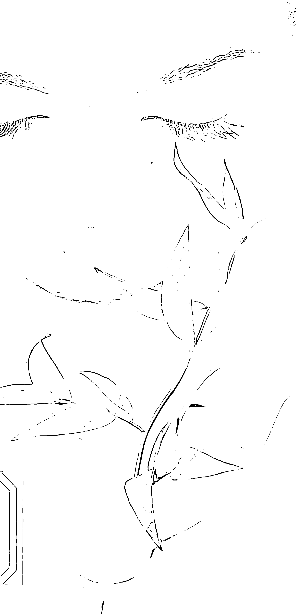

Aromatherapy
skincare
handbook

新观念芳疗丛书
New concept aromatherapy books

## 芳疗养生

养身静心的 45 例芳香疗法

温佑君 \ 张锡宗 著

♡ 中国友谊出版公司

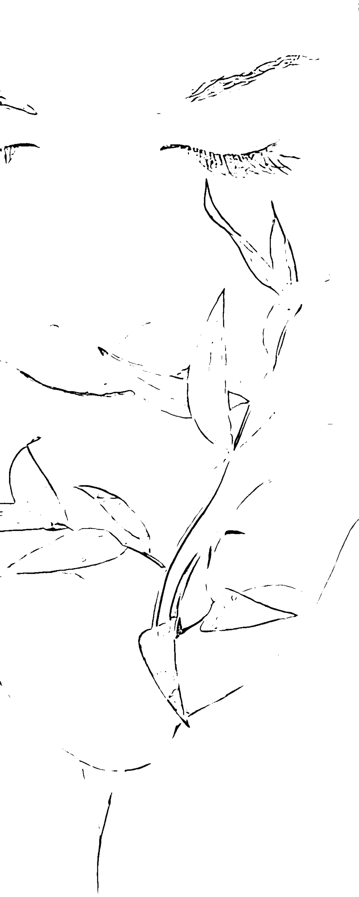

阅读芳疗专家温佑君的
“新观念芳疗”，
感受身体、心理、精油
之间的奥妙关系。

上架建议：女性/健康

定价：36.00 元

新观念芳疗丛书
New concept aromatherapy books

## 芳疗养生

养身静心的45例芳香疗法
温佑君\张锡宗 著

♡ 中国友谊出版公司

## 图书在版编目 (CIP) 数据

芳疗养生：养身静心的 45 例芳香疗法 / 温佑君，张锡宗著 .
—北京：中国友谊出版公司，2009.12
ISBN 978-7-5057-2642-0

I . ①芳… II . ①温…②张… III . ①香精油-保健-方法
IV . ① R161

中国版本图书馆 CIP 数据核字 (2009) 第 212794 号

书名 芳疗养生
作者 温佑君 张锡宗
出版 中国友谊出版公司
发行 中国友谊出版公司
经销 新华书店
印刷 北京三益印刷有限公司
规格 710×1000 毫米 16 开
10.75 印张 16 千字
版次 2009 年 12 月第 1 版
印次 2009 年 12 月第 1 次印刷
书号 ISBN 978-7-5057-2642-0
定价 36.00 元
地址 北京市朝阳区西坝河南里 17 号楼
邮编 100028
电话 (010) 64668676

版权登记号：01-2009-7256

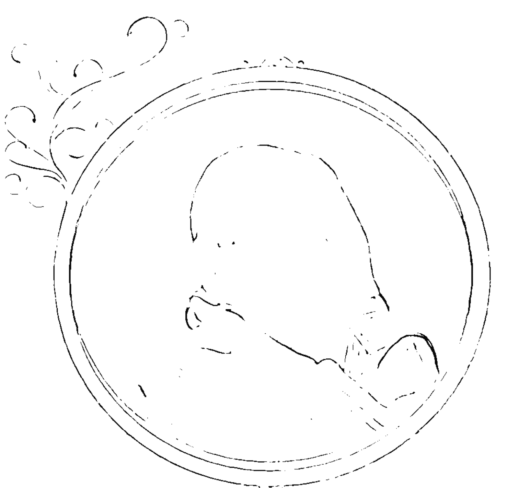

作者：温佑君

肯园香气私塾负责人，芳香疗法讲师、作者。

个人著作：

《香气与空间》《精油图鉴》（商周出版）等。

## 序

2009年5月，我受邀到北京做芳疗讲座，就在出发前两天，极少感冒的我突然开始狂咳。当时体能良好，并未着凉受寒，也没接触什么感染源，所以完全咳得莫名其妙。忧心忡忡的我赶紧用了许多止咳平喘的冷杉精油，咳嗽却只是愈演愈烈。就在搭机前一晚，我做了一个梦，梦见自己用犀利的言辞和一位哲学教授进行一场唇枪舌剑，梦醒后不禁哑然而笑。那趟旅程除了讲座以外，其他的邀约全都临时生变，还给我一种哑巴吃黄连的感觉。这个梦境提示了我，咳嗽是要给那些不吐不快的情绪一个出口。冷杉属的精油，不单对呼吸道有益，对于沟通也有帮助，它们特别能让人站在超越自我的高度掌握大局。于是我心平气和地启程，敞开心胸迎向未知，结果收获之大远超过预期，成了一次愉快的意外之旅。

这样有趣又饶富深意的用油经验，15年来在我的芳疗工作中俯拾皆是，有时来自学生与个案，有时来自亲友和自身。和其他养生之道相比，芳疗的舒适度与便利性更高，也更能因应现代社会的复杂性所带来的身心压力。不过大众对芳疗的了解仅止于一些商品化的信息，难以认真看待；而专业人士钻研所学不能自拔，又把芳疗的门槛拉得太高。有关精油与嗅觉的科学研究，尚处方兴未艾的阶段，传统中有关芳香药用植物的知识与经验，则多成断简残篇。所以，除去学术性的著作，一般芳疗书籍的内容“重复性”极高。当中国友谊出版公司表示有兴趣出版芳疗的入门套书时，我就期许自己用不同于过往的体例和素材，呈现一个“你所不知道的”芳疗世界。

决定了架构和方向以后，我找来得意门生一起分工合作，学生在台北分头撰述前半段的生理事实与心理背景，我在阿姆斯特丹独力编写后半段的经验、用法、小传、文献。多年前曾有出版社找我做芳疗入门书，我当时敬谢不敏，出版社的老板开玩笑说，“温老师只对史诗感兴趣，没时间应付小品”。如今，在“史诗”出了好几本之后，再来写这类“小品”，它们在我心目中的分量却更胜那些大部头教科书。因为“入门书”不能长江大河地通论，更需要字斟句酌、精挑细选，把这个领域中最精彩的一面呈现出来，其实挑战更多。希望读者在翻阅之际，能分享我们受精油滋养教化的幸福感，也能尝试在自己的生活中身体力行。

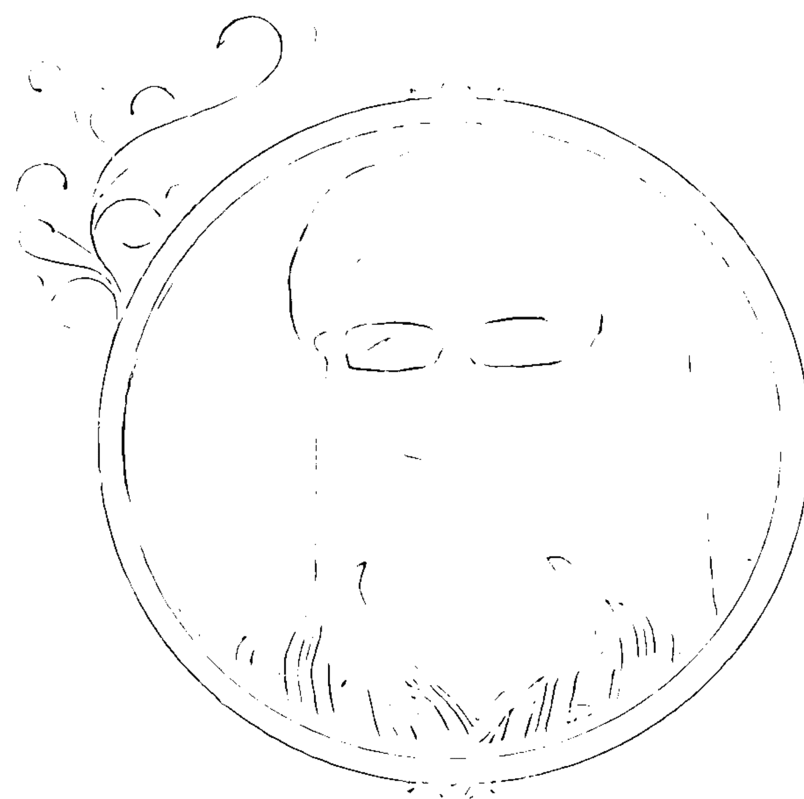

作者：张锡宗

中央大学物理学系毕，曾任编辑、录音师、意大利料理厨师、剧场工作者。
现任肯园教育训练、疗程研发与香气私塾专任讲师、学学文创约聘讲师
曾任经国管理学院妆品系兼任讲师、交大瑜伽社按摩课程指导老师

个人著作：

- 《在香氛中排毒按摩》（与杨涵云、杨秋玉合著）（圆神出版）
- 《香气与空间》（执笔）（商周出版）
- 《植物人格》（执笔）（商周出版）

专业认证：

- 德芳亚太研究发展协会 (FORUM ESSENZIA) 国际专业芳疗师认证
- 德国自然疗法协会 交互式整体脊椎治疗师认证
- 澳洲凯龙能量治疗学院 凯龙能量疗法一阶结业
- Hans de Back 颂钵工作坊结业

## 序

回顾以前在剧场工作的日子，印象最深的是去饰演一位肢体抽搐的幺弟，该角色在剧中被设定为“爱的勒索者”，会下意识用亲情压力、牢牢抓住家人，最后还像黑洞啃噬掉整个家庭。当年我排戏排得很辛苦，每天连续好几个小时，硬要去模仿肢体不由自主的颤抖，肉体与精神皆受到极度折磨与消耗。然而，真正重头戏是拖着疲惫躯壳回家后才上场。莫名的情绪失落突然狂袭而来，不是因为演不好的关系（我被导演誉为该戏的不败救星哩），是演得太好了，这才发现，原来人类的“身心联结”是这么直接！明知道不受控制的身体只是一种扮演，还是不敌它对心理情绪造成迅速又剧烈的影响。

后来有幸成为芳疗师，同样也环绕“身心牵系”为主题，更增添了芳香植物这强力的推手。虽说戏剧是现实人生的艺术呈现，但芳疗师更直贴一般生活，并有机会参与临床运用，深刻感受到身体、心理、精油之间的奥妙关系。当年那出戏正式演出之后，自个儿傻傻地突发奇想：既然肢体颤抖会直接让情绪变低落，那么来个反相思考，是不是可找到某种肢体动作，能让情绪变得快乐又满足呢？当年我没有明确的答案，但现在有了新的体悟，借由芳香植物与精油，让肢体与情绪一起获得疗愈与快乐吧！

## How to read this book
如何阅读本书

《芳疗养生》这本书，将身心问题分为 5 大类，“神经与免疫系统”“肌肉与骨骼系统”“消化与代谢系统”“呼吸与循环系统”“生殖与泌尿系统”，每一类中检选常见的病症成书 9 篇，每一篇内含 5 项条目：

1. 生理现象：简述病症的成因。
2. 心理背景：详述病症背后的心理状态。
3. 温老师的芳疗经验：针对此病症，特选的精油处方。
4. 建议用法：特选精油处方的最佳使用方式。
5. 精油小传：侧写配方中最关键的精油，加深读者印象，也可视为单方精油学习的数据库。

读者可逐页翻阅，或是从自己感兴趣的章节读起。

## 芳疗养身静心的十个先修问题

### 1 使用精油与吃西药、吃中药相较，在治疗哲学上有什么不一样？

西医属于“对抗疗法”，强调人类健康需要驱除所有致病因子，常以消灭或切除病灶的方式来进行治疗。中医和芳香疗法，属于“自然疗法”，抱持着“平衡与共生”的哲学，采取整体疗愈以及全人观点，并强调身心健康的自主责任，即“疗愈的钥匙掌握在自己手中”。未来的医疗趋势是针对“亚健康”族群，治未病尤重于治已病，便是自然疗法所擅长。

芳疗虽为自然疗法的一门，又有特别独到处，因为芳香分子极轻飘，很容易深入崎岖阴暗的通道（如鼻腔、生殖泌尿道），借由感官与大脑的连接，也能轻易飘进潜意识的大门，这是精油与中药最大不同处。倘若只把精油当成药物来运用，将错失能处理情绪的最大利器。

### 2 作为一种治疗方法，芳香疗法的优势与劣势在哪里？

芳香疗法是属于辅助疗法，并不能取代正常的医治，遇到任何症状，尤其是急性或剧烈时，仍需要专业医生的诊断与建议。但是芳疗的最大优势，是在“预防与保养”领域，芳香分子可透过嗅觉与大脑的运作，进而影响全身系统，同时平衡情绪。它最大特色是兼善身心与内外，从病因来着手，疗愈的幅员远大于症状处理，在过程中还能兼顾美感。精油还可融入日常生活，例如香水、净化喷雾、引梦、散发正面思考等。

### 3 为什么疾病都与心理状态有关，什么是“身心牵系”？

人体的细胞有神经传导物质的受体，可以相互沟通、传递讯息。换句话说情绪起伏也会影响神经、免疫、内分泌等系统的运作，因此人类的心理与生理是相互影响、紧密相连，即称为“身心牵系”。甚至我们可以大胆假设，几乎所有疾病，在某种程度上都是一种精神官能症，但这样说法并非把疾病全怪罪于情绪作祟，而是提醒读者在致病与痊愈的过程中，心理状态的确是很重要的因素。

### 4 当自己的心理状态正如书中所写，用油会改善吗？

临床观察发现，当患者孰知疾病与心理状态的相互联结时，很容易出现两种极端：一是过度批判自己，每当内心出现负面情绪时就自责，结果莫名的罪恶感越发深重，为人行事变得绑手绑脚。另一种是态度反复摇摆，有时逃避否认，有时承认自己就是这样，却无力摆脱阴霾，只能原地陷溺。这些都不是面对“身心牵系”的最佳态度，因为它不是用来草率或直接地对号入座，它比较像是一种试问句，边用油时边反问自己，逐渐开启自我对话与疗愈大门。

身体，像是人生的忠实纪录本，运用香气与触觉可以去开启它，然后阅读、眉批、改写等等，但这也是一本最艰涩又复杂的书，极度顽强也极度敏感，得像剥洋葱般，细细呵护、层层深入，才不会引发流泪与反弹。使用精油时，请抱着探索的好奇心吧！

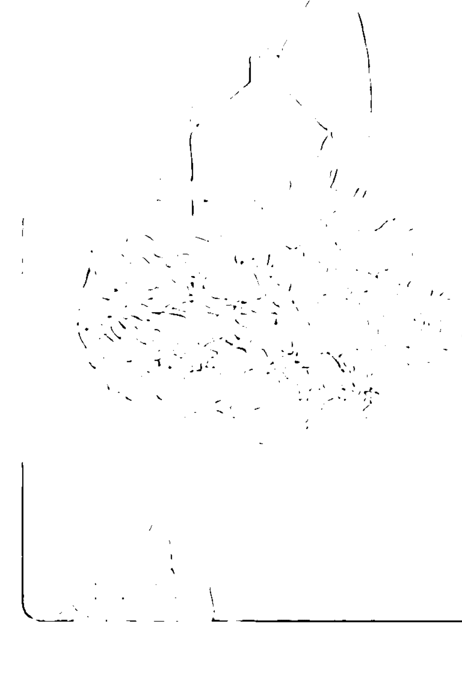

### 5 当我生病了，要使用精油处方多久时间才会看到效果？

有别于“对抗疗法”的效果立现。使用精油处方时，一方面要顺应身体修复所需的时间，另方面要尊重身体的自然韵律，并关联到被隐藏的病因核心，所以各类症状的疗愈期不一。例如消炎镇痛很快就见效，感染症状需时数天至数周，严重的皮肤问题需要数月，女性生殖问题可能要超过半年，过敏或全身性问题更需长期调养。以上的依据原则，是跟该器官组织的更新时间、以及病症累积的深浅久近有相关。此时，是否能确实遵守处方的使用频率、对疗愈抱持正确心态、坚定信念，将会非常关键！一旦想求速效就容易失却耐心，然后频换处方或断断续续地用，结果再怎么精准的处方也难见效。

### 6 每个人都可以使用芳香疗法来“治疗”吗？需不需要特殊资格？

与其说“治疗”，倒不如说芳香疗法是一种“生活态度”，更能符合其真谛。芳疗不是只使用精油而已，也要将精神融入生活之中，愿意去接触大自然、乐于拥抱人与世界、多聆听自己的内在声音、既是养身又能静心。
芳香植物是大自然送给人类的美好礼物，每个人都能亲近、无需任何资格，唯一要留意的是得慎选质量良好的精油、纯露、植物油，倘若使用人工混掺或来路不明的芳疗产品，不但对人体无益，也无法获得大地能量的支持与疗愈。

### 7 为了保健养生而天天使用精油，会不会过度依赖精油以至于效用渐渐递减？

精油不像一般药物容易引发“抗药性”，也不会“成瘾”，更无须担忧“累积毒性”等问题。很重要的是精油剂量要掌握得宜，并能遵守运用法则：（1）同一配方，使用三周后暂停一周（2）长期使用时适合低剂量，若急症要用“超高”剂量时，相同配方勿连续超过三天，之后可降低浓度或更换配方（3）调和成复方或使用多分子精油，远比单方少分子精油更适合长期保养用。

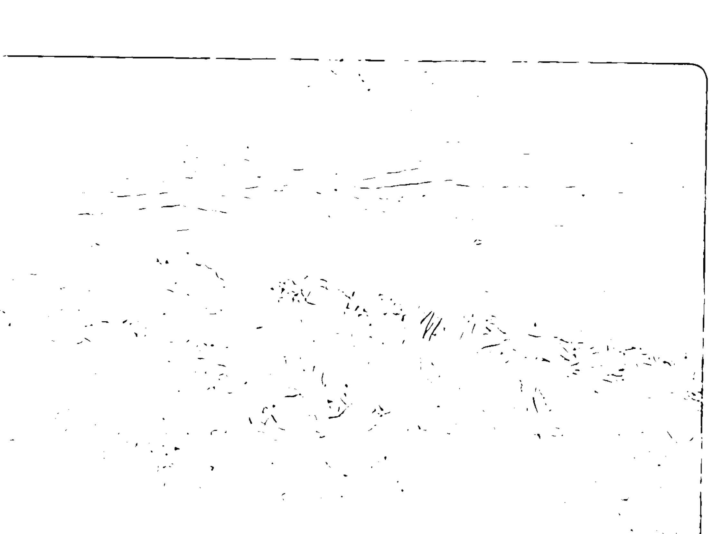

### 8 孕妇及幼儿、老人使用精油有什么禁忌？

（1）剂量方面：一般成人较无禁忌，使用浓度是依据部位和疾病来决定，通常是 3%～5%，脆弱皮肤（如脸部）或黏膜约 1%～3%，保护性佳的肌肤（头皮或脚底、手掌）可 5%～10%；未满一岁的婴儿则在 0.5%以下；满周岁的婴儿约 1%；3～7岁的幼儿约 1%～3%。老人的皮肤较脆弱，孕妇较敏感，精油浓度也要酌量降低。

（2）精油成分方面：本书中所记载的配方都经过安全性考虑，使用时无需担忧，但如果读者是自行调配精油处方，上述人士在使用酚类、酮类、醚类等芳香分子时，要酌量降低。

### 9 使用单方精油与复方精油（多种单方调和在一起）的差异在哪里？

从单方精油入手，方便我们掌握该芳香植物的性格，熟悉其身心疗愈力。但实际在芳疗运用时，通常是调配成复方，不仅功效强大且较安全、应用更多元、气味层次也较佳。

### 10 和其他芳疗百科书相比，精油小传里，为什么并没有列出这个精油的所有疗效？

一般药物的疗效通常是专一性，但精油能处理的身心症状极多元，端视使用者如何切入问题核心，故在临床上屡有新用法和新发现。本书是深入浅出的实用工具书，倘若详列该精油目前所知的全部疗效，对初学者来说容易混淆，对进阶者来说反而窄化视野。因此本书的特色，是结合引人入胜的文字、珍贵的考据数据、以及独思创见，让读者在随手翻阅的同时，不仅对该植物与精油产生兴趣与乐趣，并能快速掌握其最关键的疗愈力，加上附录最新“资料链接”，读者能逐步精进与吸收，定能全方位建构该精油的疗愈观，而不失偏颇。

## 目录 Contents

如何阅读本书
芳疗养身静心的十个先修问题

### 神经与免疫系统

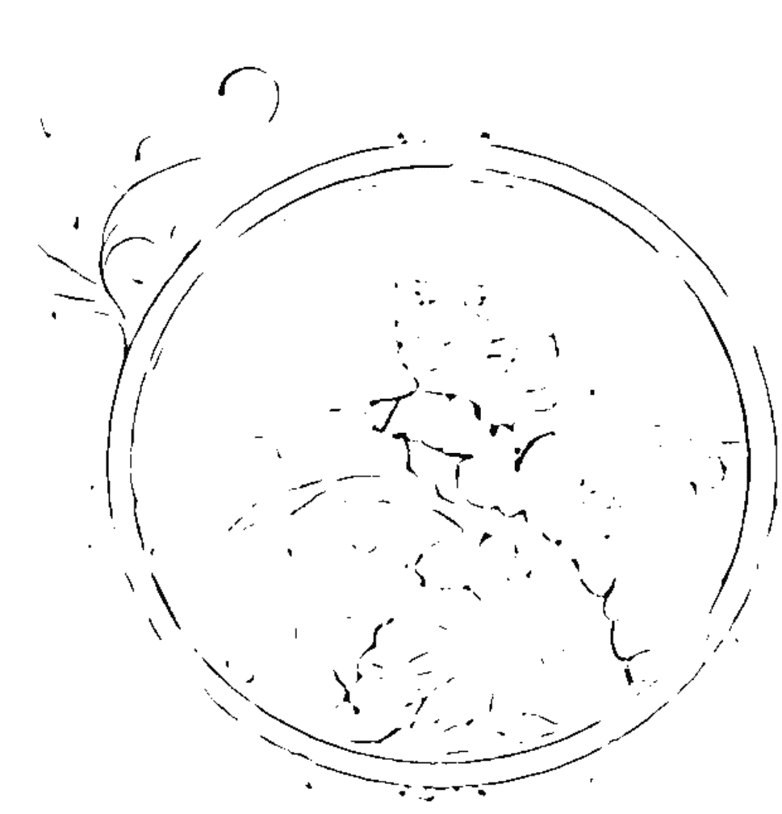

1. 头痛、偏头痛/2
2. 失眠、作息失调/5
3. 精神涣散、记忆力差/8
4. 躁郁、焦虑、歇斯底里/11
5. 沮丧、忧郁症/14
6. 慢性疲劳症候群/17
7. 过敏(气喘、花粉热、过敏性皮肤炎)/20
8. 疱疹、神经痛/23
9. 念珠菌感染/26

### 肌肉与骨骼系统

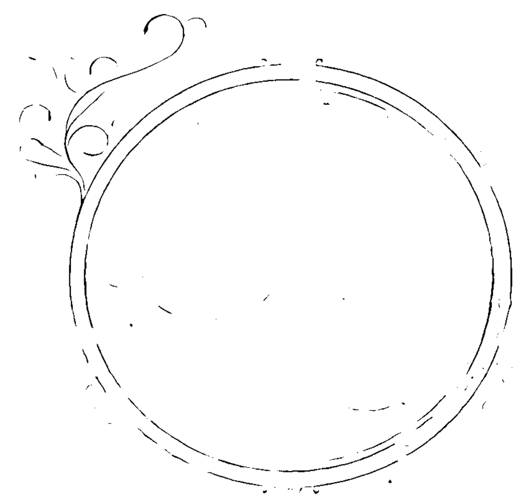

10. 骨关节炎、类风湿性关节炎/30
11. 肌肉酸痛、背痛/33
12. 黏液囊炎、拇指炎肿、腕隧道症候群/36
13. 抽筋、痉挛/39
14. 痛风/42
15. 坐骨神经痛/45
16. 运动伤害、扭伤、挫伤/48
17. 落枕、僵硬、气血不通/51
18. 骨质疏松/54

### 消化与代谢系统

19. 牙龈发炎、鹅口疮/58
20. 胃溃疡、胃炎、十二指肠溃疡/61
21. 消化不良、胃口差、胀气/64
22. 肠炎、腹泻、肠躁/67
23. 便秘、大肠息肉、肠漏症、排毒/70
24. 肝炎/73
25. 胆结石、胆绞痛/76
26. 糖尿病保养/79
27. 厌食、暴食、饮食无度/82

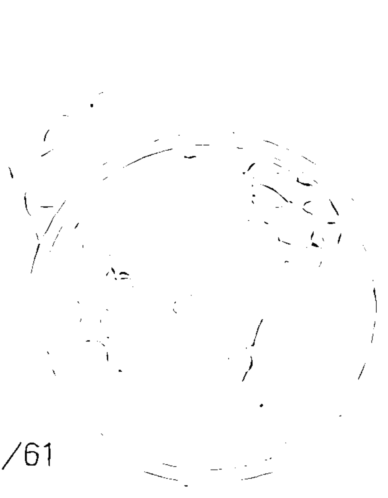

### 呼吸与循环系统

28. 感冒/86
29. 鼻炎、鼻窦炎/89
30. 支气管炎、肺炎/92
31. 喉咙痛、扁桃腺炎/95
32. 耳炎、耳鸣/98
33. 静脉曲张、痔疮/101
34. 重大手术愈后/104
35. 手脚冰冷、冻疮、雷诺氏症/107
36. 高血压、心悸/110

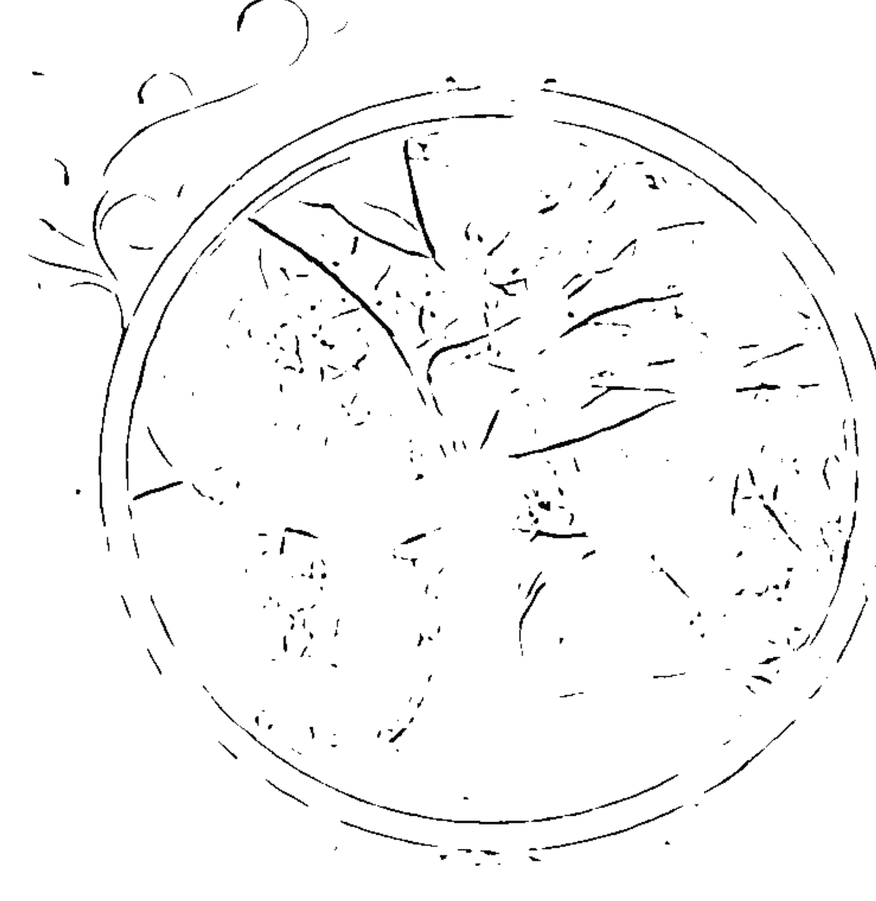

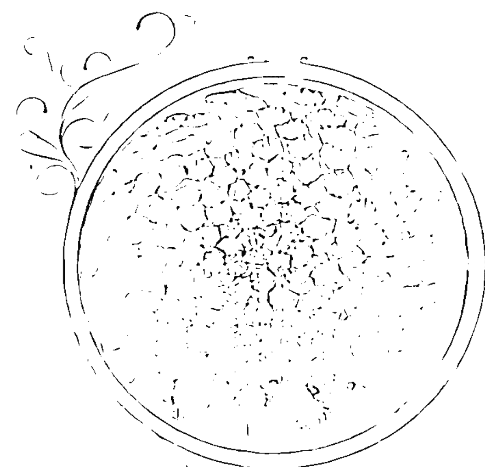

### 生殖与泌尿系统

37. 性机能障碍/114
38. 孕妇保养、怀孕症状处理/117
39. 经前症候群，更年期问题/120
40. 乳癌与其他女性肿瘤之愈后/123
41. 生殖区感染、分泌物与瘙痒/126
42. 膀胱炎/129
43. 经痛(子宫内膜异位、子宫肌瘤)/132
44. 子宫脱垂、坐月子、助产/135
45. 助孕/138

附录 精油的使用方式/141
芳疗养生 索引/144
植物油简表/149
植物科属快速索引/151
资料链接/156

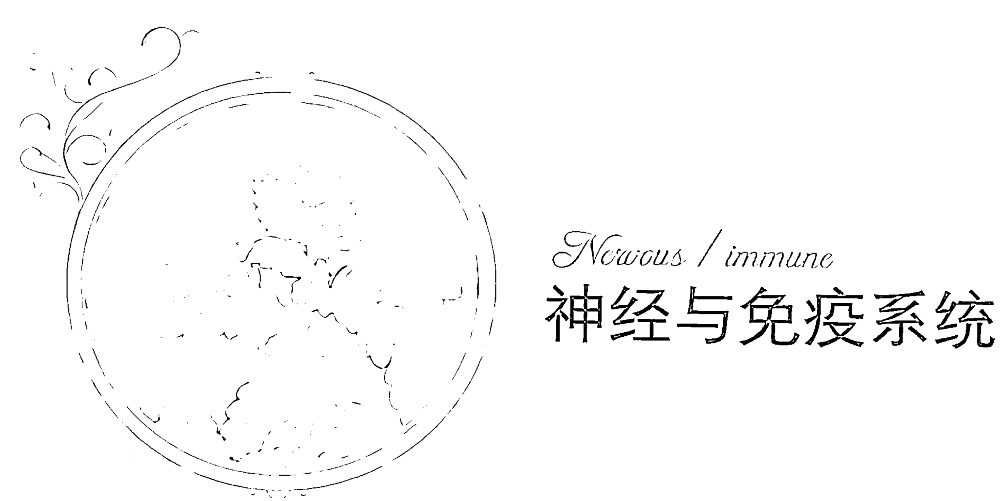

## 1 头痛、偏头痛

### 生理现象
Physiology

头痛是临床常见的一种症状，可能的病因很多，包括颅脑内成因（颅脑损伤、感染、病变，脑血管疾病）、颅脑外成因（眼耳鼻等五官疾病）、全身性成因（流感、伤寒等感染，中毒、贫血、中暑），但最常见是神经功能性的头痛（情绪激动、压力、紧张等）。

其实脑组织本身并没痛觉，是颅内外对疼痛敏感的血管、神经、脑膜、肌肉等，受刺激或牵拉而引起头痛的症状。故头皮、颈部肌肉的紧张、痉挛，或血管的扩张收缩，还有情绪问题、精神因素，甚至环境的影响，引起头痛的比例远大于颅内外病变。

偏头痛是种慢性反复发作的症状，疼痛不一定只偏一侧，但比起一般性头痛，经常来得突然、且较剧烈抽痛。典型偏头痛会有预兆期（颈内动脉收缩造成脑部血流减少，故眼冒金星、麻木无力等，持续约10余分钟），然后进入发作期（脑血管过度扩张而出现强烈的搏动性疼痛，严重时伴有恶心、呕吐），最后进入舒缓期（嗜睡，醒后症状全消失）。

### Psychology
心理背景

头部是身体的控制中心，代表理性的主宰者，但如果发生不满自己所为，或习惯自我批判的人，头痛似乎是反过来鞭打与指责发号施令的大头目。另外，过度重视头部，把颈下身体视为附属部位或执行工具的人士，容易让能量过度上窜，头重脚轻，若热敷肩颈或泡脚，让能量往下平衡，可减轻头痛。

颈部是躯干中最狭长的部位，这能提高活动灵活度，却也增大了脆弱性，任何讯息交流（神经或血管等）来到这里就像挤进狭窄的隧道，过度密集就容易塞车，故当人生出现过不去的困境，或胸襟、眼光变得狭隘时，容易紧绷颈部，造成头痛问题。

热血，常象征爱与情感的交流，偏头痛时颈部血管先收缩（血液进入大脑的通道变窄），脑部血管再过度扩张（大脑的血液量不足），呼应个案因为不习惯、或觉得自己不值得被爱，而拒绝别人的善意关爱，但其实内心极度渴望爱。

另外，偏头痛患者以女性居多，雌激素、神经传导物质、抽痛彼此之间的确有连接关系。

### Experience
温老师的芳疗经验

桃金娘科精油
丁香花苞、丁香枝干、丁香叶、多香果、香叶多香果

最佳选择：上述精油各2滴、加入10ml圣约翰草油，混合均匀。

第二选择：丁香花苞精油10滴，加入10ml橄榄油，混合均匀。

### 建议用法
Suggest Usage

涂抹疼痛部位，两小时一次。并大量饮用永久花或罗马洋甘菊纯露。以此剂量最多使用两天，第三天起就只能早晚使用一次，以免身体对油反应疲乏。

## 精油小传
Essential Oil Bio

### 丁香花苞
Eugenia caryophyllata

所有人看牙时，都闻过丁香，那个咖啡色带甜香的辣味液体，就是丁香精油的核心成分丁香酚。牙医用棉球沾了它，要我们用刚处理过的牙齿咬住，说也奇怪，酸疼的感觉很快就消散。这种止痛的本领也使丁香成为头痛时的依靠，因为头颈部血管的栓塞，是头痛与偏头痛的重要成因，而丁香凭着放松血管的作用，就把始作俑者排除了大半。丁香也是传统中药的常用方，凡膝腰发冷、胃宫发寒、吐泻溃疡，都会用到丁香。科学研究也证实，丁香能解除四氯化碳引起的肝毒性，在小鼠骨髓微核里表现抗突变的作用，抑制肿瘤、人类疱疹病毒、念珠菌生长。它还是抗氧化第一名的精油，简直就是个万灵丹。

荷兰人在印度尼西亚群岛垄断丁香贸易二百年，奠定了大国崛起的财力基础。今天丁香虽然“沦落”为平价精油，但谁能掌握这种芳香植物的知识，谁就有机会获得更巨大的财富——健康。《本草正》里说，丁香可治七情五郁。王安道则进一步解释说，“凡病之起，多由乎郁”。中国人显然早就洞悉了丁香的奥秘，能不能成为健康大国，就看大家有没有实践的毅力了。

## 2 失眠、作息失调

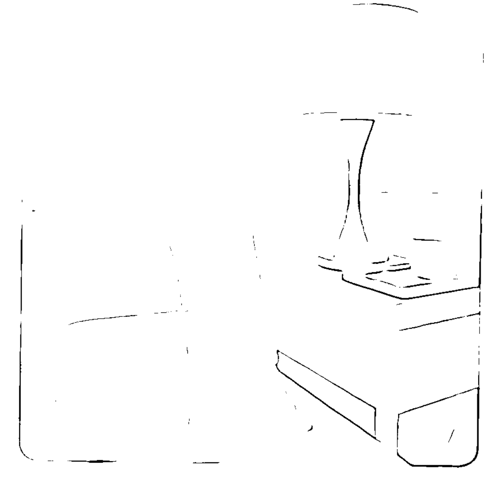

### 生理现象

失眠是睡眠障碍中最常见的一种表现。一般人入睡过程约 15 ~ 30 分钟，但失眠者常超过一个小时还无法入睡。另一种形式是睡眠短浅，常于凌晨醒来，之后难再入眠。偶尔有失眠经验是正常的，若连续三周感到睡眠不足，明显引起功能障碍，才视为失眠症。

引起失眠的原因很多，包括生理因素（疼痛、瘙痒等身体不适，或精神疾病、慢性病造成大脑功能紊乱），心理因素（情绪起伏、紧张焦虑、思虑过度），周遭环境（睡眠环境改变、时差），工作性质（经常昼夜轮班、或熬夜压力），生活习惯（过饱过饥，或食用茶、酒、咖啡等刺激性饮料、药物，让大脑过度兴奋）等。

作息失调是造成失眠的主因。作与息维持警醒与放松这两种不同状态，由大脑的醒觉中枢来控制，它受日光的影响极大，但现代文明发展后，电灯打破了昼夜的规律交替，并影响到人体的自然韵律。

### Psychology
心理背景

当面对人生的阴影、未知的恐惧，或感受到生存威胁、害怕只身迈向黑夜时，会造成失眠困扰。睡眠是不需学习就能自然发生，越想去控制它、或强迫自己入睡，反而越不得其门而入，唯一能做的是学习适时“放手”，愿意交出自我意识与主控权，而臣服于未知的黑暗中，愿意信任世界、信任他人、并信任自己。

神经传导讯息混乱会导致失眠，呼应现代人每日接收过多的讯息与刺激，让脑子一直在转、感官一直运作，无法把阳气收拢起来，生活中也越来越习惯重口味。这类人士得适时排空，回归平淡，懂得内敛。

作息失调者，常不能与时共进，无法在适当时间做适合的事，或者时效已过仍念念不忘，把自己停留在前一个时程中。另一种是太坚持自己的节奏，凡事要合自己的原则或逻辑，不愿随波逐流，对人对事都很执著与严厉，无法释怀放松。

### Experience
温老师的芳疗经验

杜鹃花科、败酱草科精油
髯花杜鹃、白珠树、印度缬草、缬草、穗甘松、中国甘松、格陵兰喇叭茶
最佳选择：上述精油各1滴，加入10ml雷公根浸泡油，混合均匀。
第二选择：格陵兰喇叭茶7滴，加入10ml冷压芝麻油，混合均匀。

### 建议用法
Suggest Usage

- 1. 预计睡前两小时，调油涂抹全身，泡热水澡10分钟。起身後，慢慢啜一杯加了三瓶盖格陵兰喇叭茶纯露的热水。
- 2. 泡澡后尽量不做消耗眼力与脑力的事情，准备上床前10分钟，再以调油慢慢涂抹小腿与脚底。

## 精油小传
Essential Oil Bio

### 格陵兰喇叭茶
*Ledum groenlandicum*

能改善睡眠质量的精油不少，每一种都有它的针对性，与其关心哪一种最有效，不如寻找最适合自己的那一种。格陵兰喇叭茶属于助眠精油中的极简主义派，治的自然是那些“心太满”的人。太满的状态除了齐家治国一肩双挑以外，还包括又要马儿好、又要马儿不吃草，以及不能一天不上网，以此类推。这种生长在冰天雪地、常要面对一无所有的小灌木，主要的工作就是教人放空。不过格陵兰喇叭茶并不说教，它只是把你的毒素清掉，透过肝脏专管药物代谢的细胞色素P450酶，让我们不必概括承受环境塞过来的林林总总。我的学生里面爱用格陵兰喇叭茶的颇多。

这种精油从皮革般的叶片萃取，同时含有严肃的桧烯和快乐的柠檬烯，也有很多自立自强的萜品烯四醇。加拿大西北的原住民阿他巴斯康族和极圈内的爱斯基摩人，都很喜欢嚼它的叶片或是冲水泡茶。那个气味里有一种恍惚，让人置身天地玄黄宇宙洪荒，于是你忘掉自己，忘掉念兹在兹，变成庄子梦里的蝴蝶一只。

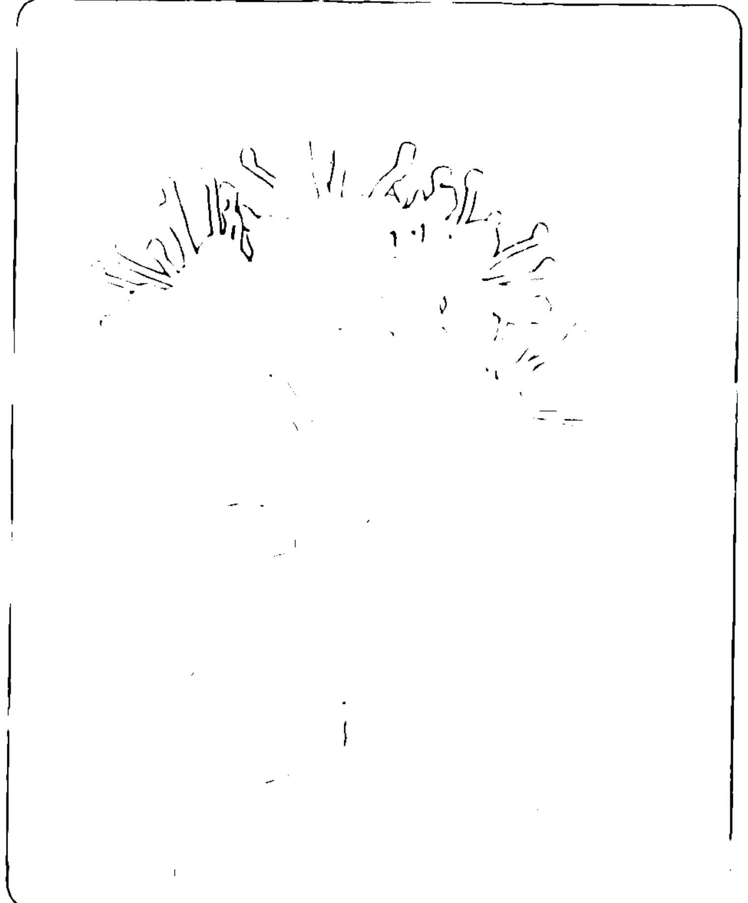

## 3. 精神涣散、记忆力差

### 生理现象

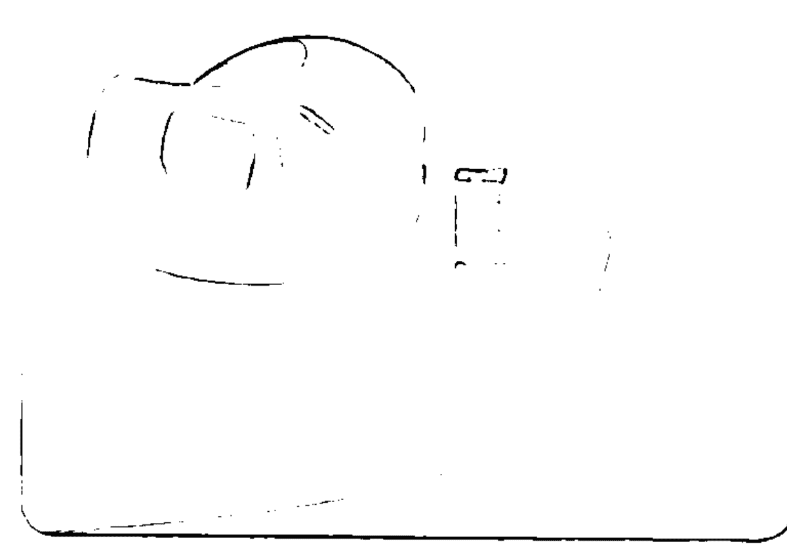

精神涣散是很常见的症状，甚至变成一种形容词，常加诸在满面倦容、性格敷衍潦草、或学习与工作效率不佳的人身上。精神不集中的起因很多，包括药物、器质性病变、精神压力等，也常伴随感官迟钝（视听觉）、体力不济、机能衰退的症状。

除了与脑神经系统的病变、饮食生活习惯、精神因素有极大关系外，记忆与情绪的联结也很深，临床发现记忆力衰退患者，经常是过往曾有不堪的阴影、或复杂的情绪困扰。芳香分子能释放情绪压力，并刺激大脑的记忆区块，顺利存取数据，因此，利脑是芳疗的主力疗效。

### Psychology
心理背景

精神涣散与身体的韵律节奏有关！季节交替时，若身体来不及跟上大自然韵律，容易情绪低落、恍神，相对地，不理会自己身体原本节奏，该休息时还硬要强打精神，终究会走上涣散一途。这类人士的生命中常缺少“留白”的力量，总被计划或念头填满着，即使无所事事，也是被空虚填满，并非真正的留白！

性格敷衍潦草的人，其实是心灵缺乏“厘清”的能力，无法区分轻重缓急，常把困难者摆在最后，或迟迟不愿面对最核心问题，结果让所有事物都密麻塞在脑海中，不得不处理时又囫囵吞枣地带过。这种逃避的习性，不仅无法意识到自我，看不清楚世事，更易让自我分裂成好多，一点点外界刺激即引起注意力转移，特别容易分心。

良好的记忆力，可协助人类正确做辨识、对比、连结，进而明白表面事物外的象征意涵，是创造新的思路很重要基础。记忆力衰退，常呼应个案不再尝试任何新的可能性，只看见眼前唯一一条人生道路，甚至也懒得走了干脆原地踏步。所以可反向操作，让个案学习新技艺、培养新嗜好，或做些体操、转转眼球等，常能激发出大脑的新思路，并重新找回“记忆”的意义。

### Experience
温老师的芳疗经验

唇形科薄荷属精油
胡椒薄荷、娜娜薄荷、美洲野薄荷、
绿薄荷、柠檬薄荷
最佳选择：上述精油各2滴，加入
10ml雷公根油，混合均匀。
第二选择：柠檬薄荷，10滴，加入
10ml红花籽油，混合均匀。

### 建议用法
Suggested Use

- 1. 随时以3滴调油涂抹太阳穴、耳翼、与胸口。
- 2. 睡前用8滴调油涂抹脊椎与脚底，还可用未加植物油的纯精油，8滴点扩香石摆放床头。

## 精油小传
Essential Oil Bio

### 柠檬薄荷
*Mentha citrata*

柠檬薄荷的俗名又称佛手柑薄荷，就成分来说，后者还比较正确。因为它种名里所谓的“柠檬味”，既非柠檬烯也非柠檬醛，而是沉香醇和乙酸沉香酯。事实上，它的化学结构跟薰衣草颇为接近，所以临床上用起来，很多人开始时都有“睡到爬不起来”的经验。这点跟薄荷属其他精油的作用似乎大相径庭，也让许多望文生义的使用者疑惑甚至抱怨（本想用它提神啊！）其实柠檬薄荷的作用机转，是先补身、后激励。要一个筋疲力尽的人强打精神，不眠不休地焚膏继晷，根本是有害健康的。所以柠檬薄荷先让人充分休息，消除疲劳以后精神自然会昂扬焕发。不过它的作用方式很有趣，如果前一晚睡不饱，一早起来用它，便不会显得精神萎靡；如果频打呵欠，用了柠檬薄荷也可以很快止住，可是到了夜里，它绝对让人睡得更沉，完全不可能熬夜。还有，若是几天不睡觉，或长期睡眠不足，而想靠它在白天硬撑，那也是办不到的。它的真正价值，是在帮助我们养精蓄锐，回归自然的生活节奏。

现代人有精神暴食症，不能停止上网搜寻或到处串联，搞得自己疲于奔命。一旦超过临界点，往往又反转成精神厌食症，对什么都提不起劲。这种时候闻到优雅而坚定的柠檬薄荷，特别会感觉安心，仿佛走进水墨画的留白，天塌下来也打不乱步伐。

## 4 躁郁、焦虑、歇斯底里

### 生理现象

焦虑，是一般人都会有的普遍感受，跟压力有极大相关，适量时有助高水平的表现。但若程度加剧且长期影响日常生活，则为焦虑症，涵盖范围有广泛性焦虑、畏惧症、恐慌症、强迫症。焦虑症的症状有轻有重，表现也不一，通常反应在生理上会有尿频、胃痛、心悸、抽搐、颤抖、胸闷、口干、冒冷汗、肌肉紧绷等现象，在心理上则容易发怒、害怕，觉得自己被周遭隔离。

躁郁，是一种在狂躁和忧郁之间循环的精神疾病症状，患者的情绪转换很快速或戏剧化，当处在郁期时，很类似忧郁症；当处在躁期时，则变得狂躁、大喜大怒、精力旺盛、严重失眠、夸张、多话、快速却片段的思考、判断力降低、出现不当的社交行为。

歇斯底里，毫无来由的狂暴情绪，无法控制自己的行为。常伴随痉挛、无力、恶心、呕吐等症状。

### Psychology
心理背景

这类人士通常个性较主观，甚至是过度自我，但并非白目型（把自己放很大而不管别人），反而是焦点型（把自己放很大因为别人都在看我），所以常自认为举止被放大审视，或总觉得活在旁人的阴影之下。

精神性疾病是跟神经传导物质有关，让体内的讯息无法正常传递，到底哪来这么多程咬金的干预呢？通常是源自于对生命的不信任，过度以意识去控制身心，让体内噪声太多，屡次漏接重要讯息。

歇斯底里，源于希腊文 hysteria（子宫），古人认为这些奇怪症状，是子宫在体内四处剧烈移动所导致，但子宫怎会乱移动？后辈又修正成子宫分泌物堆积的结果，现代则知道这是属于精神性疾病。但如果把子宫扩大诠释，它象征新生命。当身心被逼着接受新阶段时（如更年期、失恋等），体内的确受到剧烈震荡，这时需要稳定的大地能量、以及足够的适应期，帮助人们度过此阶段。

### Experience
温老师的芳疗经验

木犀科、鸢尾科、堇菜科、龙舌兰科、石蒜科、莲科精油、
鸢尾草、紫罗兰叶、晚香玉、水仙、青莲花、桂花

最佳选择：上述精油各 1 滴，加入 10ml 雷公根浸泡油，混合均匀。

第二选择：晚香玉原精 4 滴，加入 10ml 甜杏仁油，混合均匀。

### 建议用法
Suggested Usage

早晚涂抹胸口与太阳神经丛。夜间可以涂抹完再做热水半身浴或足浴 10 分钟。也可以随时轻抹一点在鼻翼与太阳穴。

## 精油小传
Essential Oil Bio

### 晚香玉
*Polianthes tuberosa*

晚香玉为什么又叫做夜来香呢？因为它油细胞里的精油与糖类聚成糖苷，以结合状态存在，所以这些芳香分子无法直接挥发出来。到了晚上，气温降低，湿度加大，油细胞中的水解酶活性增强，稳定的糖苷受到分解，精油转为游离状态存在，才释出了香气。这香气在格拉斯曾是最受看重的高级原料，调配成女性趋之若鹜的香水。如今晚香玉更是各大 Spa 最钟爱的切花素材，使那些空间弥漫着慵懒的异国情调。在印度和东南亚国家，它还是兼具药用价值与文化意涵的明星植物，婚礼和仪式少不了它，湿疹、失眠、膝盖扭伤也用得到它。但它的原精太珍贵，所以芳疗师一定是碰到重大精神状况才舍得加几滴。

有人用晚香玉比喻许地山笔下的“春桃”，认为她是不朽的女性典范，敢正视生活的黑暗，也敢追求幸福的芬芳。许地山甚至宣称，“人要懂得怎样爱女人，才能懂得怎样爱智慧。”春桃身上就充满着这种愈晚愈芬芳的生活智慧。所以，陷在谷底时，应该把鼻子埋进晚香玉里，因为它极有可能带你走过灵魂的暗夜迈向有一个黎明。

## 5 沮丧、忧郁症

### 生理现象
Physiology

沮丧时，我们觉得失落、哀伤、无助、失去活力。偶发的沮丧感是正常的，刚好让身心缓和一下，别老是往前猛冲。但如果长期陷入沮丧，会过度否定自己，无力去平衡一切，就会逐渐影响到日常生活。
忧郁症通常是数种因素交互作用而发生，包括家族病史、精神创伤、悲观性格、神经传导物质不平衡、大脑内发生实质变化等。症状是持续沮丧、焦躁易怒、体重大幅改变、精神不济、严重失眠或嗜睡、行动力减退、兴趣变得很少、无法集中注意力、经常感到绝望，甚至有自杀倾向。忧郁症也可能与其他情绪失调一起出现，包括季节性重大忧郁、产后忧郁症、躁郁症。

### Psychology
心理背景

情绪容易沮丧忧郁的人，通常体内累积了一大团“气”！怒气、闷气、怨气、或叹气。自毁倾向，与攻击他人，其实是一体两面，都对世界怀有暴力冲动。但因为强烈的罪恶感，才把矛头转向，改去攻击自己。也可能是长期往内压抑，个性变得内缩，最后，那些窄化空间改由孤寂感占据，逐渐对生命无力也无望。
另一种典型是内在理想与现实生活产生极大差异，却不知道如何释放内外不平衡所引发的情绪，所以慢慢失去兴趣，从漠然而茫然。这一切源自“拒绝负责”，害怕接受失败，不敢承担责任。如果猜测该事物会得不到认可，就极度避免参与，最后连自己的人生也不想参与了！
忧郁症患者，常渴望有“转化”能力，却又不相信自己真的有，因为不确定转化之后到底想要什么？就像日本奇幻小说中，主人翁遇到了专吃名字的妖怪后，逐渐遗忘一切事物的名字，连带背后意义也丧失，虽然人还好好的，却有如游魂。回头来看忧郁症的各式行为，正是身体对旁人发出最后的求救讯号！如果能协助忧郁患者找回一些意义、与转化力量，通常症状会逐渐好转。

### Experience
温老师的芳疗经验

芸香科柑橘属花叶精油
桔叶、苦橙叶、佛手柑叶、泰国青柠叶、柠檬叶、橙花
最佳选择：上述精油各 2 滴，加入 10ml 鳄梨油，混合均匀。
第二选择：桔叶精油 8 滴，加入 10ml 芝麻油，混合均匀。

### 建议用法
Suggested Usage

- 1. 每晚以 10 滴涂抹脊椎、腹部与脚底，再泡 10 分钟的热水半身浴。
- 2. 睡前用未调植物油的上述纯精油 10 滴扩香，也可将调油装在滚珠瓶内，随时涂抹腹部。

上下滑动，至生热后静置片刻，深呼吸三次。

## 精油小传
Essential Oil Bio

### 桔叶
Citrus reticulata Leaf oil (mandarin petitgrain)

根据法国化学家法兰贡与医师潘威尔在 1996 年出版的《精确的芳香疗法》一书，桔叶是精神官能症最佳的处方。因为它含有所有精油中最多的邻氨基苯甲酸甲酯，能替龇牙咧嘴的野猫把毛摸顺，也可以将热锅上的蚂蚁移到清凉的树荫下。精神官能症的临床表现很多样，从失眠到胃溃疡都有，因此桔叶的应用方向也非常广泛。一项研究显示，以色列桔叶精油的邻氨基苯甲酸甲酯（65.7%），较其他地方的比例都高 50%。

橘子的原产地在中国，而中国人总喜欢在过年时摆上一盆橘树，增添欢乐的气氛。除了色泽鲜亮、果形饱满，足以象征团圆，它甜润的气味更是安定神经的力量泉源。不过，中国人对桔叶尚未善加利用，而现代人又多为精神官能症所苦，此后应该可以透过芳香疗法，加深我们和橘子的缘分。

## ⑥慢性疲劳症候群

### 生理现象

疲劳是一种正常的主观性生理反应，经过适当休息即可消除，但如果个案主诉长期（6个月以上）持续性疲倦无力，无法因卧床休息而缓解，便归为慢性疲劳症候群。常伴随胸闷心悸、肌肉酸痛、神经衰弱、睡眠障碍、食欲不佳、精神不集中、健忘、易怒等疲劳症状。

在排除了疾病、药物副作用等影响后，大部分是不明原因，或应说它是多因性疾病，好发于青壮年的上班族、或身兼数职者如职业妇女。临床发现它跟无力的免疫细胞有关，常在身体遭受感染后发作。

### Psychology
心理背景

觉得承受的负担过重，尤其是为了符合别人的期望，而逼自己接受不得不做的任务时，身体的疲劳症状，刚好能让内心的抗拒与厌烦，找到一个避风港般的借口，让自己顺理成为心力交瘁的受害者，也可以躲掉“无力承担”的自责。

免疫系统虚弱，代表无力保护自己，但如果是长期性虚弱，则象征自我核心价值出现问题，可能丧失生存目标，或困惑于生命的意义何在？所以战未打，内心先缴械。这类人士需要被直接激励，才能发现自己拥有力量，并找回面对自我的勇气。

人类是团体动物，相互扶持才能在艰困的大自然中存活下来。但如果长期感到孤立无援，丧失别人的关心，或把自己拉起封锁线，拒绝接受别人的爱，这样形单影只的生活，内心感觉特别辛苦。无法在别人保护下得到充分休息，而让自己处在长期疲倦中。

### Experience
温老师的芳疗经验

松科云杉属精油
白云杉、蓝云杉、塞尔维亚云杉、硅卡云杉、挪威云杉、英格曼云杉、小伯兹云杉、红云杉
最佳选择：上述精油各 2 滴，加入 10ml 圣约翰草浸泡油，混合均匀。
第二选择：红云杉精油 10 滴，加入 10ml 向日葵油，混合均匀。

### 建议用法
Suggest Usage

- 1. 疲倦时每半小时涂抹一次按摩油，夜间则可涂抹全身后泡热水澡 10 分钟。
- 2. 平日多喝松树纯露，每一杯加一瓶盖纯露。

## 精油小传
Essential Oil Bio

### 红云杉
Picea rubens

新人接受芳疗师训练时，第一步就要学会保护自己的气场，因为付出型的工作特别容易让人耗弱。但只要疗程过后把黑云杉涂在上腹的太阳神经丛，丹田元气就能得到滋养。碰到灯管不亮或是轮胎爆胎的倒霉事时，必然要祭出黑云杉，事实上，我自己就常常使用黑云杉。红云杉和黑云杉是近亲，常在同一聚落唇齿相依，气味和作用也无分轩轾。它们的针叶能萃出超氧化酶（SOD），这种抗氧化的超级酵素一直是热门的营养补充品，灵芝和大蒜便以提高 SOD 而使人生龙活虎。另一个很需要红云杉的族群，就是甲状腺机能亢进患者，这些人总是过度燃烧自我，烧到油尽灯枯。如果迫于情势，非得要一个人当两个人用不可，把红云杉加进炉火中，起码也可以烧得久一点。

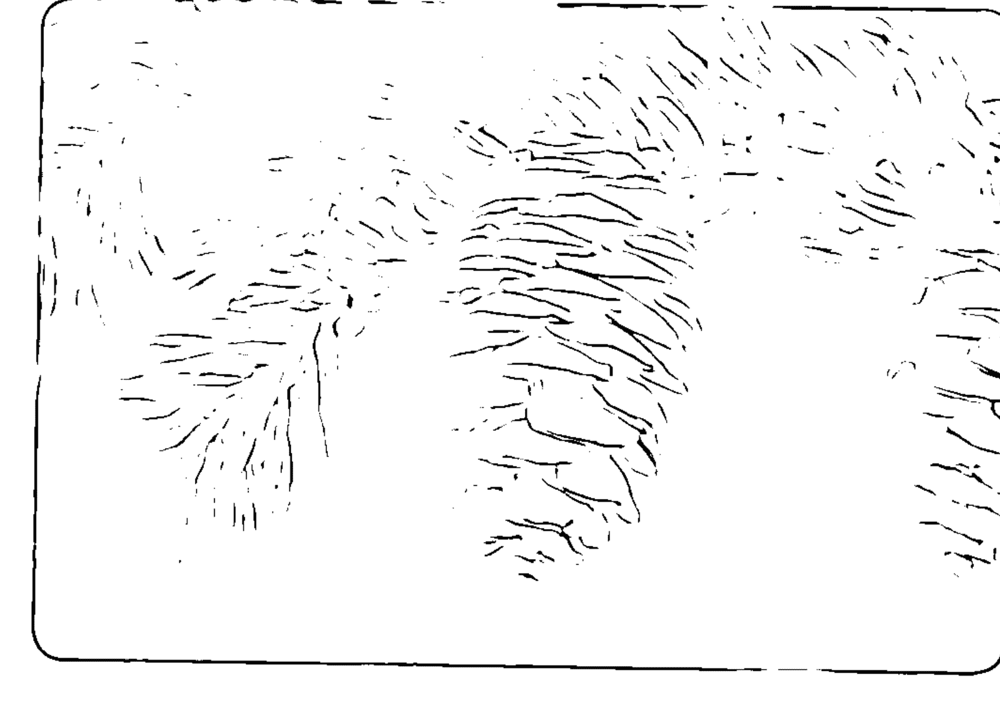

红云杉木料的音响效果绝佳，没有它就做不了顶级的吉他。1984 年洛杉矶奥运会开幕时，用了美国作曲家柯普兰写的《阿帕拉契之春》，以不谐和音与刺激性的旋律，表现美国年轻进取的精神。这首曲子也是红云杉之歌，原生于阿帕拉契山区的红云杉，气质憨厚，神情愉悦，带着它，我们就可以担起众人的期望，开垦出一个新世界。

## 7 过敏（气喘、花粉热、过敏性皮肤炎）

### 生理现象

过敏是人体免疫系统对外来物产生的过度反应。过敏原通常来自植物或真菌制造的蛋白质，例如花粉、尘螨、猫毛等，被人体解读为有害物质后，免疫系统的 B 细胞启动免疫球蛋白 IgE，增加肥大细胞，接着释放组织胺、前列腺素，让微血管扩张并变得通透，方便组织液流通与免疫细胞活动。也会引发平滑肌收缩、发痒等现象，好加速异物排出。所以过敏症状是皮肤发红、肿胀、眼睛痒、流泪、打喷嚏、流鼻涕、鼻塞、痉挛等，将造成气喘、花粉热、过敏性皮肤炎、肠胃不舒服等相关病症。

过敏是免疫系统发出警示灯，并非疾病本身，一味以药物压抑反应，就像打烂红绿灯，交通不会因此更顺畅，反而出现事故时叫不到人来管。所以较佳的作法是配合饮食与生活作息，全面性调整体质，让体内的讯息传导、免疫系统都能趋向稳定平衡。

### 心理背景

免疫系统过度活跃，制造太多反应讯息，呼应这类人士的内心也容易过度反应！源自充满恐惧与敌意的世界观，又怀疑自己的保卫能力，害怕被伤害，才会把外来者全视为可疑的敌人。从不信任、过度防卫，逐渐自我封闭、与世界孤立，看似过敏所害，却是呼应内心选择的结果。

过敏患者在生活上有较多禁忌，总刻意或无形地告诫旁人“我要避开过敏原”，代表内心渴望被特别呵护、与悉心对待。也唯有纯净洁白的环境才能与之匹配，偏偏大自然的本能特质包括繁衍、杂遢、阴湿、复杂、混乱。难怪引起过敏者害怕的东西，通常具有生命的原始驱动力！

过敏者多半外表温和，内心却常交战，不过在怪罪渺小的致敏物时，似乎能转移焦点、换来轻松。或许是潜藏的真正敌人太巨大了，只好专挑小的打击，好适时发泄情绪。随着过敏时体液外流（流鼻水、流泪），情绪也跟着释放！这其实是另一种控制狂，只选择自己能轻易掌握的事物，却永远无法摆脱阴影的纠缠。解脱之道是“多增加广度”，就像专家常建议过敏者要均衡摄取多样食物，别老吃那几样，其他生活模式也是如此，然后慢慢学会如何与不同势力和平共处。

### 温老师的芳疗经验

菊科精油
德国洋甘菊、罗马洋甘菊、菊花、
野洋甘菊、金盏菊
最佳选择：上述精油各1滴，加入
10ml金盏菊浸泡油，混合均匀。
第二选择：德国洋甘菊精油4滴，
加入10ml甜杏仁油，混合均匀。

### 建议用法

发作时每两小时在患部涂抹一次调油。日常保养则早晚涂抹在靠近心脏的胸口，以激励胸腺的免疫机转。

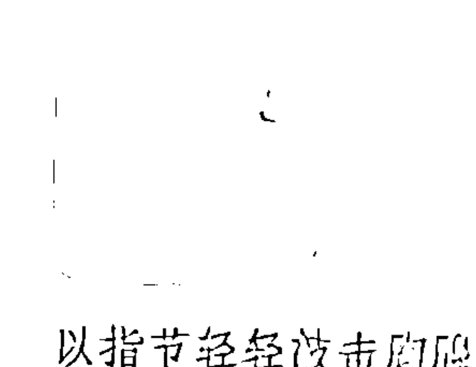

## 精油小传
Essential Oil Bio

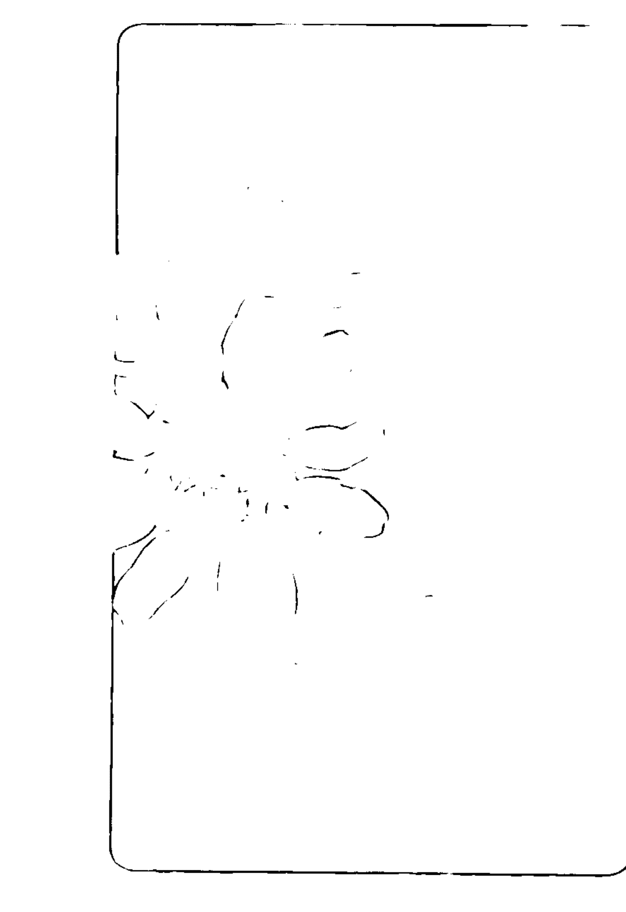

### 德国洋甘菊
Chamomilla recutita

德国洋甘菊家喻户晓，就连卡通片里的彼得兔和捷克鼹鼠，都会在生病时喝上一杯洋甘菊茶。对欧洲人来说，洋甘菊茶就等于我们的姜汤，虽然气味和口感有如天壤之别。德国洋甘菊的精油，甚至享有“仙丹”级地位，曝光率超高，出现在大大小小的医疗保健美容用品中。抗过敏是它的拿手，但不时也会传出德国洋甘菊引发过敏的新闻。根据德国洋甘菊的权威，斯洛伐克的伊凡萨拉蒙教授的说法，那是因为同时采收进来的杂草，也被送去一起蒸馏所致。以往都认为，这种精油的招牌成分母菊天蓝烃，就是神效的来源，但现在的共识是，α-没药醇及其氧化物，可能才是幕后的推手。

德国甘菊的花朵长得洁身自爱，精油也像穿着深蓝水手服的维也纳少年合唱团一样，专注和谐。愈来愈多的过敏儿，固然是环境污染的产物，但精神的刺激过多，也为身体的应接不暇埋下伏笔。而德甘稀释到0.05%时，会让人闻到春风拂面一般的祥和，所以不仅能在急难时相助，入睡前拿来祝祷，更可领受奇异恩典。

## 8 疱疹、神经痛

### 生理现象

单纯疱疹是由单纯疱疹病毒引起的传染病，经常会反复发作。第一型病毒好发于幼童，常在口唇、脸部有粟粒状水疱，也伴随发烧、咽喉炎、扁桃腺炎。第二型病毒则引起生殖器疱疹，主要是经由性行为传染，会造成分泌物增加、皮肤黏膜有局部溃疡、附近淋巴结肿大。

带状疱疹是由带状疱疹（水痘）病毒感染所引起，在水痘康复后会潜伏于宿主的神经结中，好躲避人体免疫系统的摧毁，等到宿主的免疫力降低时，病毒开始活化并沿着神经路径扩散，所以皮肤出现延一侧体表神经呈带状分布的水疱，俗称皮蛇。也会伴随局部神经痛，在皮疹消失后仍持续几个月。

神经痛的症状是局部感觉异常、有尖锐或烧灼感的疼痛、手足末梢如穿袜般麻感、也可能伴随痉挛。成因是神经发炎（带状疱疹），感染（梅毒），神经受压迫或损伤（椎间盘突出、肿瘤）等。

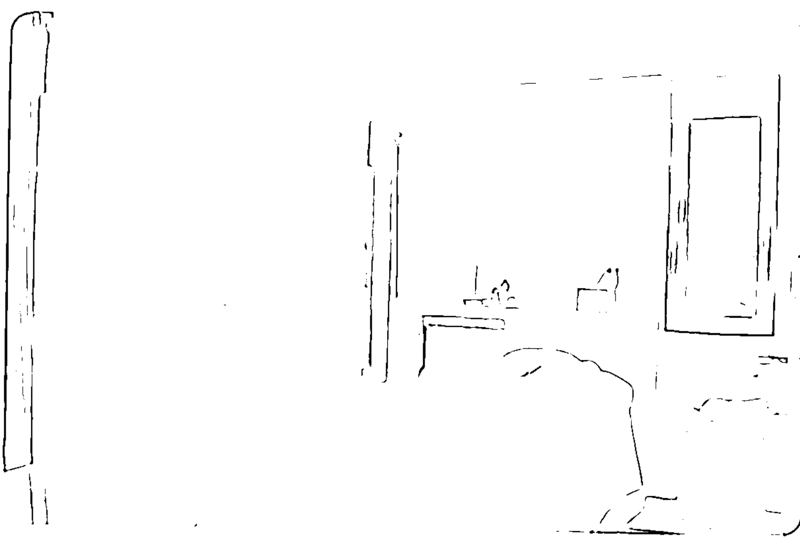

### 心理背景

疱疹常于累积的压力过大、负荷过重时发作，惨状的皮肤像是一种呐喊，希望旁人善待我！它也提醒习惯过度付出的人，多把焦点移回自己身上。有时候，溃烂的皮肤像是一种警告，别人不敢靠近，因此多了安全距离和缓冲空间，让患者从过重负担中解脱，有充裕时间从紧绷调回平静的状态。

潜伏在神经中的病毒，其实是一位心战喊话的高手！它很清楚宿主受到哪些情绪创伤，又被什么扭曲了身心。因为情绪与神经是最直接连接的，所以它很懂得火上加油的时机，尤其当宿主产生自卑、不安、或自我惩罚时，马上现身说起丧气话来，连带宿主体内的神经传导讯息都受到坏影响，最后变得很悲观。既然疱疹病毒是终身潜伏，又能拿它怎么办呢？对治之道，是宿主要放弃结果论，真正明白“过程远比结果来得重要”的道理，才能摧毁病毒的击心战术！

痛觉，是用来自我保护的警告系统，常关连到危险讯息，所以总会盖过其他感觉。止痛或许能暂时转移焦点，却没处理真正问题，长久下来还会越来越容易心生恐惧。解决之道，唯有去正面迎向，接收疼痛讯息，聆听背后要传达什么？

### 温老师的芳疗经验

大麻科、藤黄科、莎草科、毛茛科精油
蛇麻草、大麻、莎草、黑种草、圣约翰草

最佳选择：上述精油各4滴，加入10ml圣约翰草浸泡油，混合均匀。

第二选择：圣约翰草精油20滴，加入甜杏仁油，混合均匀。

### 建议用法
Suggest Usage

在患部涂抹调油，两小时一次。同时大量饮用圣约翰草纯露，一杯水加一瓶盖，一天喝8杯。

## 精油小传
Essential Oil Bio

### 圣约翰草
Hypericum perforatum

圣约翰草是植物界的百忧解，再不相信草药的西方人，碰到它也要乖乖拜倒。这是因为科学是现代人的宗教，无数的实验报告，以及满坑满谷的圣约翰草制剂，共同钦定了它抗忧郁的功效。研究人员普遍相信，贯叶金丝桃素能抑制血清素的再回收，是圣约翰草芝麻开门的暗号。但有个实验特意把这个成分排除在外，结果一样让人重现欢颜，可见所有成分的协同作用更为关键。同理，圣约翰草精油不含贯叶金丝桃素，凭着斯巴醇和 α－松油萜也足以拨云见日。我们还有用圣约翰草精油调整时差、处理疱疹与神经痛的经验。另外有一种色泽暗红的圣约翰草浸泡油，用法相当于植物油，南欧人笃信那是所有皮肤问题的解药。

其实圣约翰草并不需要科学主教的祝圣，只要没跟土地切断脐带，任谁都能对它的特性心领神会。这种小草的金色花朵永远都兴高采烈，叶片上还有许多窗明几净的油点，对着它冥想，很快就可以了解什么是“一沙一世界”。地中海地区的人们一直维持着吃橄榄油、擦圣约翰草油的传统，现在看来，真是值得生活。

## 9 念珠菌感染

### 生理现象

念珠菌是一种外表像酵母菌的霉菌，广泛存在于自然界中（包括人畜禽）。近八成人的身体上带有念珠菌，但平时念珠菌们与身体相安无事，只有当免疫系统机能下降、营养缺乏、年老体衰、或年幼抵抗力不足时，才伺机入侵。常感染于温暖潮湿的部位，如皮肤、口腔、肠道、膀胱、阴道黏膜等。而长期或不当使用抗生素、类固醇，干扰人体的微生物菌丛之生态平衡，也是增生念珠菌感染的最可能主因。

念珠菌感染最难控制的是如何预防“复发”。潮湿会助长念珠菌滋生，要保持患部干爽；也要适时控制体重；避免局部（股沟、腋下）密不透风、或过度摩擦导致表层皮肤损伤；及时治疗糖尿病、贫血等潜在性疾病；最重要是随时保持极佳免疫力，不让念珠菌有机可乘。

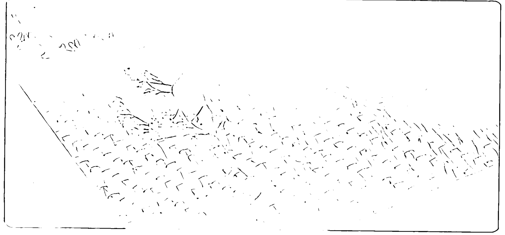

### 心理背景

或许是不喜欢被打扰的个性，总是担心被外来物侵袭，也习惯用逃避的模式对待自我，结果反而让恐惧的念头侵蚀内心。
念珠菌“不断复发”的特性，呼应这类人士的内心容易失去弹性、丧失稳定性，经常在两端中拉扯。其实，伺机性疾病是跟宿主在比“耐性”，看双方谁先变弱，所以感染发作时是绝佳的自我警讯，得知自身某些部分可能不平衡了，才让别的能量占地为王。
太倚赖抗生素来抑制外菌的行为，就像害怕内心那些复杂多变的念头会让自己失控，转而拼命用外在的规范去压抑它们，这似乎让“良善”一家独大，结果却是整体失衡或窄化。这类个案常无法接受多样性发展，或有过度执念的性格。滋生念珠菌的环境条件是密闭、闷湿、不流通，也呼应着让执念持续发酵下去的状态。

### 温老师的芳疗经验

菊科精油
利古里亚洋甘菊、薰衣草棉、艾菊、摩洛哥蓝艾菊、万寿菊、西洋蓍草
最佳选择：上述精油各2滴，加入10ml金盏菊浸泡油，混合均匀。
第二选择：银灰菊精油10滴，加入10ml昆士兰坚果油，混合均匀。

### 建议用法
Suggested Usage

早晚涂抹患部一次。感染情况严重时，可以每小时涂抹一次。另外可以多饮用银灰菊纯露，每天调20ml在1L水中喝完。

## 精油小传

### 熏衣草棉（又名银灰菊）

银灰菊的长相是标准版的菊类芳香植物，叶色灰白而触感轻柔。它软软的灰叶看起来像银色粗毛线打出来的辫子，根根挺立，衬着宛如MM巧克力的鲜黄花球，造型时髦，在庭园里像名模那么摆个Pose，立即让人嗅到生活品位。因为这独特的色调和触感，它常被称做“熏衣草棉”。但是对没亲眼见过它的人来说，这个俗名其实完全不知所云。它虽然是极受欢迎的观赏植物，但萃取出来的精油却乏人问津，因为酮类的分子有一股躲不掉的药味，不经说明，一般人只会跟驱虫联想在一起。驱虫确实也是银灰菊的药学属性之一，但它还能解决现代生活许多颇为迫切的问题，像是念珠菌感染、过度亢奋、起疹瘙痒、呼吸急促等等。

银灰菊的酮含量在40%左右，包括一种菊科植物特有的蒿酮，再加上大约20%的倍半萜醇如杜松醇，让它的抗念珠菌活性极为突出。能抗念珠菌的精油虽然不在少数，但念珠菌是个需要八年抗战的难缠敌人，仅用一两种油是没办法拖垮它的。因此，成分比较罕见的银灰菊，就很适合在轮番猛攻后踢那临门的一脚。

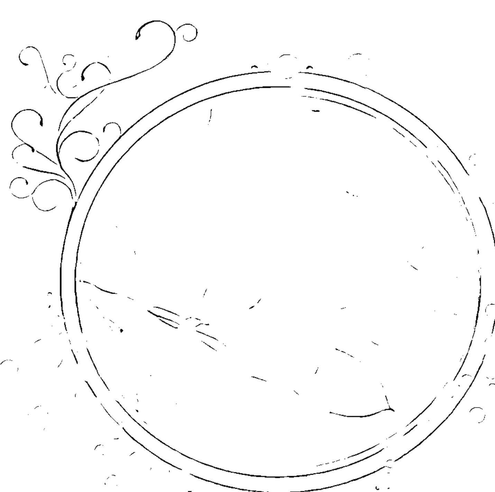

### 肌肉与骨骼系统

## 10 骨关节炎、类风湿性关节炎

### 生理现象

骨关节炎，俗称退化性关节炎，是最普遍发生的关节疾病。关节软骨能吸收振动、减少活动时的摩擦，如果软骨退化、磨损，会让缺乏软骨间隔的两块骨骼不断擦撞，造成剧烈疼痛、肿胀、发热、僵硬，引起行动不便。它通常好犯于负重关节以及指关节。特征是关节面狭窄、变形、形成骨刺、软骨下方硬化、退化性囊肿。

类风湿性关节炎，是一种以关节病变为主要的自体免疫疾病。致病成因复杂未明，免疫系统除了破坏骨骼及软组织，造成关节畸形、僵硬外，可能也会侵犯其他脏器组织，是属于全身性疾病。典型症状是同时有多处关节发炎，早晨起床时关节僵硬难以动弹，稍微活动后能减缓僵硬现象。发病年龄主要在 30 ～ 50 岁，女性发病率约为男性的三倍。

### 心理背景

关节部位同时含有三种不同属性：不动的硬骨骼、有条件动的软组织、自由度最大的关节液体，彼此合作可让动作流畅又有力。关节疾病与心理背景，同样分成这三大类：骨骼位居最核心，与稳定的支撑力有关；软组织是包裹的主体，与弹性或行动力有关；关节液体是中间介质，与身心毒素的堆积有关。

骨关节炎代表身心退化、行动力受阻。可能是面临突如其来的大改变，而担心害怕、裹足不前。也可能长期失去自主权、或不满被人利用，所以抗拒行动。

类风湿性关节炎患者，跟其他自体免疫疾病一样，常有完美主义倾向，容易过度批判自己。倘若积极好动、社交活跃，尚能转移自我攻击性，但内心苛责过强时，就直接反映在攻击关节上，逐渐变得僵硬，也被迫休息，然后开始了“僵化与自责”的恶性循环。若能坚持适度活动，通常能改善症状。

### 温老师的芳疗经验

松科松属精油
石松、旗杆松、矮松、黑松、滨海松、杰克松、红松、北美黄松、科西嘉黑松、白松
最佳选择：上述精油各2滴，加入10ml山金车浸泡油、混合均匀。
第二选择：科西嘉黑松精油20滴，加入10ml向日葵油，混合均匀。

### 建议用法
Suggest Usage

1. 每天早晚按摩发炎部位。疼痛较剧烈时，每两小时涂抹一次，并用毛巾热敷加速精油的作用。
2. 夜间涂油后最好让腿部浸泡于热水10分钟。平日还可多多饮用不同的松树纯露，一瓶盖对一杯水，每天最少喝4杯。

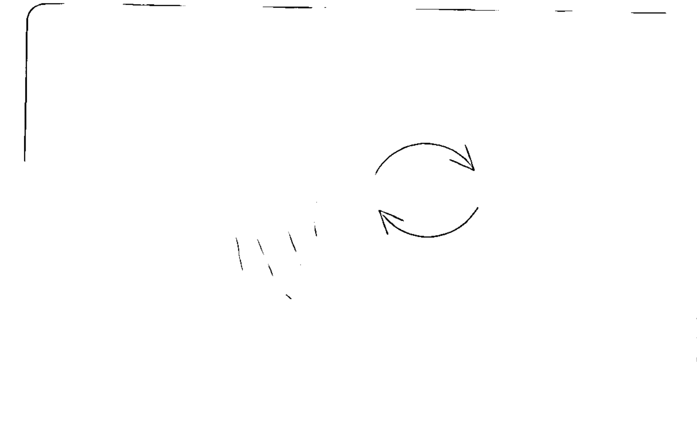

顺时针滑拨。

## 精油小传

### 科西嘉黑松

*Pinus nigra laricio*

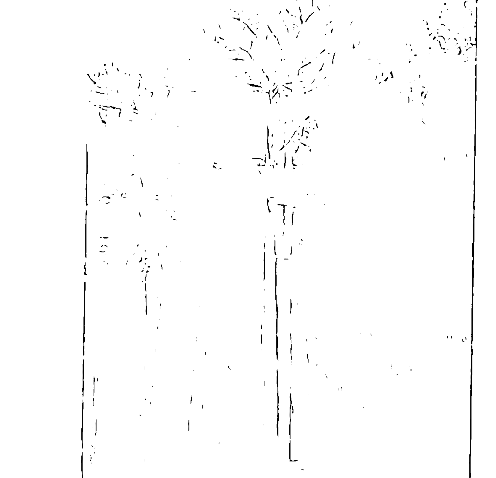

想要认识松科精油的特性，我们可以超越“种”的概念，而从“属”来掌握就好。因为松科的同属植物，在气味和作用上算是大同小异。以松属为例，它们的关键成分都是 α-松油萜，它能出动肾上腺这个消防队，来扑灭人体各处的发炎现象，特别是关节炎。α-松油萜另一个消炎的绝招，是靠着抑制核转录因子 -KB 而完成。近年来，科学家持续发现核转录因子 -KB 在癌症、发炎性肠道疾病、类风湿性关节炎与气喘等疾病中，扮演着枢纽的角色。既然 α-松油萜可以抑制它，处理这类问题时，松属精油必然能够提供最佳的后援。2007年，台湾的张元豪教授甚至以抑制核转录因子 -KB 的做法，让小鼠皮肤停止老化，间接证实了如滨海松之类精油的回春可能性。

科西嘉黑松和欧洲赤松十分接近，只不过前者树干较黑，而后者树干偏红。两位大哥都是松科家族有名的硬汉，外形粗犷，气味雄浑，习惯在烈日下生长，不耐遮阴，却也不畏冰雪。当成路树还能抵挡各种工业污染及马路分解产生的盐害。对于细皮嫩肉的奶油小生，和饱经风霜的老同志，科西嘉黑松和欧洲赤松都能给他们打上一剂强心针。

## 11 肌肉酸痛、背痛

### 生理现象

少运动的人，身体的有氧代谢能力较低，一旦激烈活动，肌肉血液供应不足，容易产生酸性物质（乳酸），又来不及代谢排出而累积，它们会刺激肌肉中的神经末梢，或是引起渗透压变化，水分渗入使肌肉膨胀，这些现象会导致肌肉疲劳、肿胀、僵硬、与酸痛感。但如果是运动后一至三天才发生的延迟性肌肉酸痛，和乳酸没有明显相关，是肌纤维损伤的缘故，由于突然剧烈运动，造成肌纤维轻微断裂。

背痛的成因复杂许多，包括神经、脊椎、椎间盘、软骨、肌肉组织、韧带等因素，都可能交互影响，引发背痛症状。不过患者有极高比例是因为姿势不良、长期缺乏运动，使得部分肌群太弱，局部肌肉又过度牵引，加上血液循环不良，形成了背痛。

### 心理背景

痛则不通、通则不痛！酸痛是一种“渴求”讯号，提醒主人该部位需要被关爱。酸痛像是放大镜，协助我们靠近并看清问题始末，让我们有机会停下来好好审视自己。但放大镜中的视野扩张反而遮住了周边，当主人企图自我逃避或自我处罚时，疼痛常是转移注意力的媒介、掩盖住最关键的问题。

身形与姿势，受到背部运作的影响最大。脊椎骨与肌肉组织的关系，就像桥梁的基柱与钢索，若能协力合作达到平衡，软物会变有力、硬物变有弹性，很轻松就可稳定支撑、又活动自如。但如果大脑中的身心蓝图出现认知失衡，例如自认胸腔区太脆弱，所以背部要强硬如龟壳，好保护前方，或是觉得世间太险恶，得戴着盔甲行走江湖。以上都将破坏隐形张力，逐渐浮现成为背痛。

上背部，位于心脏（象征爱）后方，故上背痛常代表爱的匮乏、或是爱意被迫隐藏；中背部，在本我轮（象征自我意志）后方，故中背痛常代表困在过去的我、或潜伏于罪恶感中。另外中背部也是心和欲的枢纽，若两者极端拉扯，也会呼应成中背痛问题；下背部，很贴近骨盆腔（象征基本需求、物质欲望），故下背痛常与金钱困扰或基本物质需求不满足有关。

### 温老师的芳疗经验

唇形科迷迭香属精油
马鞭草酮迷迭香、龙脑迷迭香、高地迷迭香、桉油醇迷迭香
最佳选择：上述精油各3滴，加入10ml山金车浸泡油，混合均匀。
第二选择：龙脑迷迭香精油12滴，加入10ml冷压芝麻油，混合均匀。

### 建议用法
Suggested Usage

1. 调油装在滚珠瓶内，随时涂抹。
2. 睡前两小时以10滴调油涂抹酸痛部位，然后做热水半身浴10分钟。

## 精油小传
Essential oil Bio

### 龙脑迷迭香
Rosmarinus officinalis, borneone

龙脑迷迭香是以樟脑与龙脑为核心成分的迷迭香，主要产地在伊比利亚半岛，无论个头、气味都很阳刚剽悍。这种迷迭香曾经伴随我翻译第一本芳疗书。当时还是手写卷稿，每天规律地写一个下午，结束时偶尔会手腕酸麻，我就用三四滴纯油直接涂抹手腕与腰部，最后“毫发无伤”地译完全书。西式的肉类烹调也常用迷迭香去腥保鲜，知名的“迷迭香春鸡”，主要就靠迷迭香让鸡肉保持弹性。周杰伦有一首歌叫《迷迭香》，唱的是男孩捧自己的心上人，比如“你随风飘扬的笑，有迷迭香的味道”。这样的女孩肯定很带劲，因为迷迭香一般的笑，绝不会甜蜜地让人醉倒，而是“朗朗如日月之入怀”。迷迭香的功能多得不胜凡举，不管是作用在肌肉、大脑、心脏、皮肤……都让人朝气蓬勃——如其名——海之朝露（rosemary 的拉丁文原义）。

我有个学生曾被大笔债务压得身形佝偻。后来她决心走出阴霾，一方面拼命打工增加收入，而且每天早上开店前必定先用迷迭香三滴拍打头脸（这种酮类的精油亲肤性高，局部直接涂抹并没有大问题）。一个月以后，她头也能抬了，腰杆也直了，对自己卸下重担的可能性信心十足。所以，迷迭香是个充满运动员精神的植物，用了这种精油，就有能量在人生的竞技场上跑完全程。

## 12 黏液囊炎、拇囊炎肿、腕隧道症候群

### 生理现象

黏液囊炎，疼痛感类似关节炎，但为关节之间的黏液囊产生发炎，而有红肿、灼热、压痛的症状。黏液囊内充满润滑液，能减少皮肤或肌腱与骨骼之间的摩擦，若受到巨大的创伤性压力与劳损、经常重复同一动作，则容易发炎，将导致囊中产生过多润滑液，妨碍原本功能。常发生在手肘、膝关节（俗称女仆膝症）。

拇囊炎肿则是因为脚的各关节和肌腱的受力不均，造成脚趾关节发炎、严重弯曲变形。不正确的走路姿势，常穿尖头高跟、或挤脚的鞋子，会让症状更恶化。

手上的正中神经在通过手腕时，会穿越由腕骨与韧带围成的“腕隧道”，如果神经受到横腕韧带的压迫，将造成疼痛、麻木的症状，严重时感觉丧失、肌肉萎缩、细微的手指动作会出现障碍。常好发于中年家庭主妇、手腕过度重复操作者。

### Psychology
心理背景

因过度使用而磨损身心，是黏液囊炎患者的通病。他们经常说服自己再多熬一下就会苦尽甘来，但如果没得到应有奖赏，可能逐渐心生“憎恨”，变成一种毒素泡在黏液囊内，慢慢侵蚀着关节。另外，黏液囊可减缓摩擦，也象征“圆融”的处世态度！关节骨磨损者，通常个性不懂变通，容易与人短兵交接；黏液囊肿大者，总期待能面面俱到，却徒增迷障，容易迷失自我。

拇囊炎肿，通常跟“立足点不稳”的主题有关。可能是期待被认可，所以硬把自己装入不适合的框架里，或企图融入某领域某阶级时，感到特别辛苦与费力。也可能原有地位被人介入而岌岌可危，亟欲证明自己的独立能力。以上皆是刻意表现某种外在形象，却远超过本身负荷，变形的脚仿佛正对着主人诉苦！

韧带原本具有稳定与保护的功能，但肥厚增生之后，反而去压痛神经、局限关节活动。腕隧道症候群患者，常有“过度保护”的心理，怕对方太脆弱、容易受伤，结果自己却变成最大的施压者。

### Experience
温老师的芳疗经验

桃金娘科精油
直干桉、史泰格尤加利、柠檬尤加利、薄荷尤加利、多苞叶尤加利、河岸红尤加利
最佳选择：上述精油各3滴，加入10ml山金车浸泡油，混合均匀。
第二选择：河岸红尤加利精油15滴，加入10ml芝麻油，混合均匀。

### 建议用法
Suggested Usage

疼痛发作时，一小时涂抹一次患部。疼痛过于剧烈时，还可加上热敷。如此使用两天后，就可减轻八成的症状，然后以早晚各涂抹一次保养即可。

## 精油小传
Essential Oil Bio

### 河岸红尤加利
Eucalyptus camaldulensis

提到桉树（尤加利），一般人总想到呼吸道问题，这是因为它的主要成分桉油醇，闻来清凉，能使细胞带氧。事实上，桉油醇（Cineole）在希腊文里的意思就是风的翅膀。但桉油醇的能耐远远超过感冒良药的范畴，临床上和实验里，它都展现了多元而深刻的疗愈效果，用在关节炎、黏液囊炎、念珠菌感染的皮肤炎和整形手术后的伤口愈合，都有令人满意的成绩。富含桉油醇的桉树有好几种，河岸红桉很接近大家最熟悉的蓝桉（蓝胶尤加利），但成分更为复杂。它的俗名得自于坚硬漂亮的红木，喜欢长在河岸旁，具有绝佳的水土保持作用。河岸红桉也是澳洲本地分布最广的一种桉树，尤其是在气候极端的澳洲内陆，有了河岸红桉的遮蔽，才保得人畜平安。

河岸红桉的生长极为神速，仿佛地心引力都拉不住。在湿地生长时，会大量吸取土壤的水分，足以让疟疾绝迹。这些直率爽利的特质，也可以从它的精油里找到。我认识一位家势显赫的日本教授，她的女儿后来决定移民澳洲，理由就是，那儿的“空气新鲜”，不“面倒”（日语，意指麻烦费事）。如果有一种精油能抗繁文缛节，那必然非河岸红桉莫属了。

## 13 抽筋、痉挛

### 生理现象
Physiology

肌肉痉挛，俗称抽筋，是指肌肉突然不由自主地强力收缩，导致疼痛、僵硬、出现功能障碍。最常发作部位是四肢的骨骼肌，例如小腿、大腿、脚趾、手。若是脏器的平滑肌发生痉挛，绞痛为其特征。

痉挛的发作成因，包括过度疲劳、血钙太低、电解质不平衡、寒冷或温差大、营养不良、缺乏维生素 C、或是急性感染、神经系统失调、肾功能障碍、糖尿病、循环不佳等。另外，小孩子在长个的巅峰期，骨骼成长快速，肌肉为了跟上，会在夜晚抽长，容易引起睡眠中抽筋，但它也可能是白天激烈活动所造成；中老年人、孕妇的抽筋，常是缺钙、局部循环不良而引起；运动时发生抽筋，可能是肌肉过劳、水分盐分流失、情绪紧张、姿势不当、暖身不足等原因。先确认是何处肌肉抽筋，再温和地反向牵引，或佐以热敷、轻力按摩。

### Psychology
心理背景

内心瞭望的方向、与实际行动的方向无法一致，将产生诸多迟疑，这心境就直接反映于肌肉打架上，屈曲和伸张同时僵持不下，久了则打乱原本和谐的韵律。因此，经常抽筋的人格类型除了“迟疑者”外，另一种是“坚持者”！体内的化学离子能否运作自如，也关系到阴阳能量的流畅性，即思绪能否自由穿梭。人生路上的风景都精彩，值得多方瞭望，无需独守一方。

肌肉痉挛也代表对某人事物的过度紧张，就像握拳太紧时总会轻微颤抖，不受自主控制。对外界反应敏锐时，可以增加身心的张力，但反应过度加强则变成紧张，容易退缩、害怕前进、得失心重。那么，张力与紧张要如何拿捏呢？适时松手！

神经深入到各个肌肉细胞，以脉冲刺激来传递回馈和讯息。倘若刺激受到干扰，或来不及反应，将逐渐失去同步性，即使原本是正确讯号，落拍或快转都可能变成噪声。经常抽筋的人，不妨反问自己这阵子是否遇到跟“同步性”有关的人生课题？

### Experience
温老师的芳疗经验

樟科精油
花梨木、山鸡椒、月桂、洋茴香罗文莎叶
最佳选择：上述精油各 4 滴，加入 10ml 圣约翰草浸泡油，混合均匀。
第二选择：月桂精油 20 滴，加入 10ml 圣约翰草浸泡油，混合均匀。

### 建议用法
Suggested Usage

疼痛发作时，每半小时涂抹患部。过三个小时之后，改为一小时涂抹一次。再过三小时后，改为两小时涂抹一次，直至睡眠时间。以这个用法处理抽筋或痉挛，以一天为限。
预防发作的保养，只需每天早晚各涂抹一次。

## 精油小传
Essential Oil Bio

### 月桂
*Laurus nobilis*

在西方超市购买红烧用的肉品，常会附上几片月桂叶给你。而南欧典型的庭园景观，也少不了不畏烈日的月桂树。这种小树的耐力，使它成为老骥伏枥、志在千里的担保，所以月桂叶精油也就特别擅长调理慢性病、退化病。它常出现在关节炎、风湿、肌肉萎缩的处方里，治疗身体僵硬、行动迟缓必然伴随的淋巴阻塞，也是它的强项。意大利传统用月桂治癫痫，已得到现代科学的映证。它属于多分子精油，化学结构复杂，最适合对付狡猾多变的病毒与打死不退的霉菌。因为多分子精油招数无穷，善于做持久战，微生物不容易对它们产生抵抗力。虽然常见的病菌也都是它的手下败将，但月桂精油极为温和，可谓老弱妇孺亲善用油。

月桂是欧洲药用植物当中文化意涵最丰富的一种。以月桂叶编成的头环，最早出现于古希腊祭祀神明的四大集会活动之一：献祭太阳神阿波罗的皮西安竞技会。自此之后，它便成为荣耀的化身，表扬运动员与诗人，尊崇帝王，代表学位，乃至为顶级产品背书。这些与星月争辉的光芒，是钢铁般意志的反射，就像久炖不烂的月桂叶，耐得了生命的熬煮，才成就了不凡。

## 14 痛风

### 生理现象
Physiology

因为体内嘌呤（有机化合物，在人体内氧化变成尿酸）代谢异常、或肾脏排出尿酸功能障碍，让血液中的尿酸过高导致尿酸盐结晶析出，沉积在关节处，造成急性关节发炎，称之为痛风。患部会红肿、发热、剧烈疼痛。好发于足部大拇趾、足背、踝、膝或腕关节，每次发作部位可能不同。患者主要是男性，但女性在停经后会增加发病率。

让体内尿酸过多的因素，包括遗传倾向、体质、摄取过量的高嘌呤食材、肥胖、激烈运动、缺乏酵素等。而让尿酸排泄变少的因素，包括肾疾、血压高、血酸中毒、药物（利尿、帕金森症用药）、饮酒过量、水分不足等。此外，过度劳累、受寒、精神压力也会诱发痛风。

尿酸结晶，又称痛风石，颜色灰，若以手术切开关节处则像石灰水流出。痛风石会让关节强直变形、脱位，或侵蚀关节的骨缘造成缺损。若痛风石沉积在肾脏，会影响肾功能。

### Psychology
心理背景

尿酸未能及时随尿液排出，累积在关节产生结晶，代表主人没能抓住适当时机！痛风患者对于时间管理，经常惯用“未来债”模式，将最急件解决就好，但经过日积月累下，无论事件再怎么充裕，到时候全变为急件，使得人生像打电玩，需要一直击倒怪兽，免得被吞噬。但拼命迎战迟早会 Game Over，也就是关节僵化、动弹不得的时候。

外面的坎坷路，多半有明确的攻防点，几番砥砺后，能让人磨亮，但体内的痛风石，就像是吞下沙砾，只能任由它随机磨损着弱处，却无力反击。痛风患者不妨思索一下，是否曾发生什么深刻事件，像被逼着用砂纸大力刷洗内里？

从行走可看出这人的行事风格！流动性不够的人，不足以带走沉疴，常感觉被绑腿束缚，人困在关节里。所谓“识时务者为俊杰”，已结束的就该好好挥别，若紧抓不放、或还想去支配，绑腿层层加上的结果，通常是换来二次伤害。

### Experience
温老师的芳疗经验

橄榄科精油
没药、红没药、墨西哥沉香、榄香脂、印度乳香、乳香
最佳选择：上述精油各 2 滴，加入 10ml 琼崖海棠油，混合均匀。
第二选择：没药精油 12 滴，加入 10ml 昆士兰坚果油，混合均匀。

### 建议用法
Suggested Usage

1. 早晚涂抹患部一次。状况严重时，可以每两小时涂抹一次。
2. 另外可以多饮用乳香纯露，每天调 20ml 在 1L 水中喝完。

## 精油小传

### 没药

《马可福音》15章23节：“拿没药调和的酒给耶稣，他却不受。”这是人类苦难最经典的象征，接下来，耶稣就被钉上十字架了。没药会出现在这个画面中，是因为它的精油拥有120多个消炎的倍半萜类。意大利佛罗伦萨大学和美国密西根大学的研究人员，还从中找到两种具有强烈镇痛作用的罕见倍半萜烯，与吗啡一样作用于中枢神经系统的阿片受体，却没有吗啡成瘾的副作用。伟大的文明都习于受苦，没药从阿拉伯传入中国后，便迅速成为常用的中药材，处理的范畴几乎上穷碧落下黄泉。现代科学也一一验证了中医用没药的经验，除了消炎止痛，还有抗肿瘤、愈合伤口、降血脂、保护肝脏、抗真菌等等。芳疗中的没药则是口腔问题专家，并有许多节制性欲和食欲的成功案例。

东非的索马里、埃塞俄比亚和阿拉伯半岛南部，有许多不同品种的没药，精油常是混合数种一起蒸馏而得。那片石灰岩上，天地不仁，短小粗壮的没药伸出多刺的树枝苦撑。在生命最萧索的时候，它终于流下棕红的泪。但那不是控诉，而是一种安慰——就算被这个世界百般辜负，起码还能保有自己。

## 15 坐骨神经痛

### 生理现象

坐骨神经痛，是多种原因引起坐骨神经分布区的阵发性疼痛。坐骨神经是人体最大的神经，有小指头般粗，它从腰椎第三四五节伸出，通过坐骨、臀部、大腿、小腿、脚踝、脚底。

根据病损部位分为两大类：“根性坐骨神经痛”，病因发生于椎管内，通常是腰椎间盘突出而压迫神经，疼痛以臀部、大腿为甚。“干性坐骨神经痛”，病因发生于椎管外，可能是髋关节炎、妊娠子宫压迫、盆腔内肿瘤、臀部外伤、糖尿病所引起，疼痛以小腿、踝足为甚。

坐骨神经痛通常是急性发作，先感到腰背部僵硬不适，然后疼痛有如刀割、烧灼感，自腰部放射至踝足。当腹压增高、咳嗽、打喷嚏、用力抬重物，都可能加剧疼痛。

### Psychology
心理背景

身心的联结关系虽然错综复杂，但可借由别的领域来模拟，我们运用物理学中动能与位能的变化，举例如下：

身体的位能低（放得下身段），可以提升心理的动能（满腔热血）。
身体过高的动能（忙不停、过度付出），或许源自心理的低位能（自卑情结）。

骨盆腔是人体动作的枢纽与启动源，发生剧痛时，会让身形变为臣服般的姿势，这可能是映照出地位的卑微，也可能是提醒自己要多顺应人事。

椎间盘突出，代表生活失去重心、或态度变偏颇，让原本能正常承受的负担，转为沉重不堪的负荷，就像扁担提歪了，得多出蛮力才能平衡。心境上若能自我归位，脊椎受力也较易复位。

或许你曾有过困窘的处境，而产生沟通障碍，容易对世事迷惘，也害怕旁人给的好意，因为分不清是伪善或真善。这种心境让身形缺乏安稳能量，呼应坐骨神经痛的站不直、坐不住。

### Experience
温老师的芳疗经验

树脂类、木质类精油
澳洲檀香、太平洋檀香、安息香、苦香树、圣檀木、白杨、古芸香脂、苏合香
最佳选择：上述精油各1滴，加入10ml山金车浸泡油，混合均匀。
第二选择：苏合香精油4滴，加入10ml芝麻油，混合均匀。

### 建议用法
Suggested Usage

疼痛时每半小时擦一次。配合深呼吸，停留片刻。再分别于尾椎左右两侧，以螺旋画圈方式上油，直至腰背。

## 精油小传
Essential Oil Bio

### 苏合香
*Liquidambar orientalis Mill.*

苏合香原产于小亚细亚南部，今天的重要产地仍在土耳其。它的近亲，同属金缕梅科枫香属的枫香树，则是台湾和中国南方的特产。苏合香和枫香都长着类似枫叶的掌状叶片，结出表面带刺的蒴果。更重要的是，它们都能流出芳香的树脂，而这树脂自古便是重要药材。《本草纲目》描述苏合香是：“气香窜，能通诸窍脏腑，故其功能辟一切不正之气。”有名的中药苏合香丸专治冠心病，及其他多种痛症，如腹痛、胁痛、阴缩疼痛、巅顶头痛、三叉神经痛等。从成分上分析，它是肉桂酸含量最高的树脂，肉桂酸又形成多种酯类，构成一个强力抗痉挛止痛的军团。但这类分子也有刺激性，所以消费者化妆品及非食品科学委员会(SCCNFP)建议欧盟把苏合香列入“留校察看”名单，保守看法是希望浓度不超过0.6%。

枫香是台北街头常见的行道树，身形潇洒，气质拓落，在高压电和汽车废气之间，为都市人预留一个出走的机会。把苏合香调淡以后，也能在它的香气中找到这样的空间。想当自由人，就意味着不能有太多恋栈。若是不能马上放手，至少可以闻闻苏合香，做一做心理准备。

## 16 运动伤害、扭伤、拉伤

### 生理现象

运动伤害，泛指运动时发生的大小伤害，造成明显的生理改变，如擦伤、挫伤、肌肉痉挛、骨折等，最常见的有：
- 扭伤：指韧带、关节囊发生损伤、撕裂。
- 拉伤：通常是肌肉本身的收缩不当，造成肌纤维或肌腱的损伤、断裂。
- 挫伤：指肌肉直接受到外来的暴力撞击，造成肌纤维断裂及出血，最常发生在大腿前方的股四头肌、小腿后方的腓肠肌、上臂的肱二头肌。

根据症状外观来分类，若是肌肉完全断裂，会出现凹陷而两端鼓起的变形现象。若是不完全断裂所造成间质性血肿，出血会沿着重力方向流动，造成他处也有淤血、紫斑，看来虽吓人但复原快。另外，不完全断裂造成肌肉内血肿，虽然出血量不多但积聚于肌膜内，压力增加会产生剧痛，复原也较慢。

### Psychology
心理背景

若对运动抱持其他企图，想要作为交换筹码，或过度寄予厚望，而忘了它原是一桩乐事，无法享受其中时，将容易招来运动伤害。
热闹开场时，上台的身段别忘了要优雅；曲终落幕时，转身下台的背影也要够漂亮！运动伤害呼应的心理成因，是一遇到机会就容易躁动不安、沉不住气，或是原本值得信赖的依靠突然抽离，让人顿失重心或被迫离场。这些扭伤拉伤虽会瞬间抽走人的信心，但也像天降的礼物，提醒自己记得调整身段。
拉伤，呼应当下生活像是多头马车，被多方拉扯中；扭伤，呼应主人被迫变换生命方向，受到挤压扭曲中；挫伤，则呼应直接遭受重击，突来的考验中。急性的运动伤害，会影响原本的肢体表达，逼得身体稍慢反应，却多了时间来自我省思。

### Experience
温老师的芳疗经验

唇形科薰衣草属精油
头状薰衣草、穗花薰衣草、甜醒目薰衣草、梅耶薰衣草、克什米尔薰衣草
最佳选择：上述精油各4滴，加入10ml山金车浸泡油，混合均匀。
第二选择：醒目薰衣草精油20滴，加入10ml甜杏仁油，混合均匀。

### 建议用法
Suggested Usage

按压足踝内侧，再沿后腿顺抚至臀部。

1. 在疼痛部分轻轻涂抹调油6滴，然后热敷10分钟。半小时进行一次，6次以后，可改为一小时使用一次，再使用三四次，症状便会明显减轻。
2. 一般扭伤挫伤产生发红肿大现象时，都强调不可热敷，只能冰敷。然而，在涂抹了精油以后，却是要用热敷加强精油的吸收，以产生更好的消炎效果。这一点我们有临床上的丰富经验应证，读者不必担心。

## 精油小传
Essential Oil Bio

### 醒目薰衣草
Lavandula hybrid

醒目薰衣草是源自普罗旺斯山区的杂交品种。因为身强体壮，萃油率高，种植面积早已大幅超越真正薰衣草，年产量约是真正薰衣草的5倍之多。一般印象中的紫色普罗旺斯，其实十之八九拍的都是醒目薰衣草。醒目薰衣草的长相与父亲穗花薰衣草一样挺拔，甜甜的气味则接近母亲真正薰衣草。而母子之间的差异在于，醒目薰衣草有10倍于真正薰衣草的樟脑，和5倍多的桉油醇，这使得儿子比娇美的妈妈平添几分飒爽。物不稀则不贵，所以醒目薰衣草的精油在许多芳疗或香水评论中被形容为“比较次等”。这种偏见对科学研究与临床经验是没有意义的。事实上，除了失眠，大概薰衣草能处理的，醒目薰衣草也毫不逊色。

我儿子两岁9个月的时候，带着他到法国南部度假。一日我们造访以薰衣草田衬着中古建物而闻名的圣诺克修道院，因为爸爸要在修道院里献唱泛音，这个不安分的小家伙只能在万蜂钻动的薰衣草花丛里捉迷藏。他跑着跑着摔了一跤，自己就嚷嚷要擦薰衣草（精油）。我跟他开玩笑说两旁都是醒目薰衣草，都可以擦，搞得他一头雾水，十分困惑。那个画面洋溢的幸福气味，芳疗师妈妈一辈子都不会忘记。

## 17 落枕、僵硬、气血不通

### 生理现象
Physiology

落枕是急性的颈部肌肉痉挛、僵直、紧绷、疼痛，而造成活动受限的症状。主要发生肌群是胸锁乳突肌、斜方肌、肩颈提肌。起因通常是长时间被牵拉，如伏案低头工作，造成肌肉劳损，又加上外在诱发因素，如睡眠姿势不良、枕头的条件不对，让颈部处在过伸或过曲的状态太久，导致痉挛发生。

僵硬是现代人的常见病！长期维持相同姿势，运动量大幅减少，身体动作不正确，加上工作或家庭的压力，让肌肉容易紧绷僵硬，活力降低。

气血是中医特有概念，主张血液循环是靠气的运行而流动，所以人体的生理运作全受气血的影响。例如运动伤害、慢性损伤，并非全是肌肉或神经的因素，有些也是气血不通而造成。遗传体质、饮食不当、生活作息失调以及内感（积郁情绪）外邪（疾病或意外伤害），都有可能让气血不通、气滞血阻，影响到经络运行、组织器官的运作。

### Psychology
心理背景

落枕让颈部活动受阻，无法眼观八方，但先前可能已遇上抬不起头、被逼着屈服的事件。或陷入固执偏见、缺乏弹性、单调死板、让人视野窄化的状态。

僵硬呼应的是“捍卫”心态，因为担心自己不够强硬，一直缠绕上拳击绷带，结果绑太多层反而作茧自缚，引得身体紧绷僵硬。

气血不通的心理成因有很多可讨论，其中现代人最常遇到的是“心理疲惫”，只想维持现况就好。歌德名著“浮士德”中两大主角，浮士德是对追求永不满足的人，梅菲斯特是永远抱持否定的鬼。两位签下赌约，浮士德自愿变成魔鬼的俘虏。当代人几乎同时是浮士德也是梅菲斯特，在永不满足与永远否定之间摆荡，却又经常“逗留”，自愿提前变为某人事物的俘虏！

### Experience
温老师的芳疗经验

菊科精油
窄叶永久花、头状永久花、苞叶永久花、露头永久花、光辉永久花、意大利永久花
最佳选择：上述精油各2滴，加入10ml山金车浸泡油，混合均匀。
第二选择：意大利永久花精油10滴，加入10ml小麦胚芽油，混合均匀。

### 建议用法
Suggest Usage

- 1. 疼痛时每一小时调油涂抹一次患部。一般情况则在早晚涂抹全身，夜间可以在涂油后泡水热澡10分钟。
- 2. 可固定饮用永久花纯露，每日三瓶盖加于800ml水中。

## 精油小传
Essential Oil Bio

### 意大利永久花
Helichrysum italicum

如果被流放到荒岛，只能带一瓶精油在身上，你会选择哪一种？英国人多半拿薰衣草，法国人极可能挑罗文莎叶，如果是我，我选永久花。这个问题真正想探究的，是万能精油的候选人。客观地看，这完全取决于个人的知识和经验，并没有标准答案。但我相信在认识和用过永久花之后，中国人都会把票投给永久花，因为这是通经络、活气血最有效的精油。永久花的多才多艺永远让人惊讶不已，从五十肩、网球肘、严重经痛、手术后的滞水胀气，到皮肤炎、免疫力低落……永久花一次又一次让我们见识到气血通畅带给身体的戏剧性转变。一般把它界定为去瘀精油，实在是太小看它了。

永久花的心灵疗效也极为神圣，几乎接近宗教的力量。特别是邂逅生离死别，痛苦到血液冻结时，这种精油独有的意大利酮，和超高比例的乙酸橙花酯（75%），可以让揪成一团的心，如莲花般一瓣一瓣敞开。在永久花的陪伴下，每个生命都有机会盼到柳暗花明，所以它也是临终观护的病患和家属最需要的一瓶精油。

## 18 骨质疏松

### 生理现象
Physiology

骨质疏松症好发于老年人与停经后妇女身上。人类在出生后，骨骼随着成长发育越来越强韧，在20岁左右骨质密度达到最高峰，之后骨质逐渐流失，使骨骼变得单薄、脆弱。虽然是自然老化的过程，但若骨骼强度太低，可能无法承受日常起居的动作压力，稍微外伤就发生骨折。

骨质疏松总是无声无息地进行，初期不会有任何疼痛或异样，容易被人忽略。往往是突发性骨折、或身体不适求医检查时才发现已经很严重了。此时症状是腰酸背痛、行动不便、关节变形、甚至驼背、变矮、引起呼吸困难。

年轻时要多存些骨本！可适时运动，尤其是负重或阻抗型运动，提供骨骼适当压力，会增加骨骼中矿物质含量。也要控制体重，摄取均衡营养，多补充钙质和维生素C、D，减少高盐高脂食物（会影响钙质吸收），少喝刺激性饮料等。

### Psychology
心理背景

骨骼是人体最深层的基本架构，象征人最根本的核心价值。骨骼也参与人体多项重要机能，如制造免疫细胞、储存与释放维生素等，它表面看来强硬不变，内里却是不停地生长与代谢。这意味人的核心价值虽是重要支撑，却不像铁律无法摇撼！骨骼疾病患者，常会安于惯性、死守原则，而遗忘了与时并进的更新力量。

行动让肌肉产生压力，会刺激骨骼细胞生长。地球的重力，让人稳若磐石，也让人举步维艰。不过在抗衡的过程，总会涌出更多新动机，并活出生命的重量来。骨质疏松者，身心的抗力逐渐流失，动机与行动力也下降，使得生命随着骨质一起由实入虚，变得脆弱、轻飘，有如失重状态。

人生面临重大转换期时，骨质常会发生变化，如怀孕生产、更年期。青春期又称“转骨”期，代表发育急速、骨骼抽长，同时也象征从儿童迈向成人阶段，开始作自己的主人。反推而论，任何阶段若遇到适应不良，可能骨质也会呼应而变，或产生心灵上的转骨痛。其实，世事变化远在发现以前就一直悄然进行了，就像骨质的悄悄流失。若能随时保持敏锐，不但适应困难较少发生，也无需害怕人生巨变。

### Experience
温老师的芳疗经验

姜科精油
豆蔻、大高良姜、姜、泰国姜参、白草果、芒果姜、姜黄
最佳选择：上述精油各3滴，加入10ml山金车浸泡油，混合均匀。
第二选择：姜精油20滴，加入10ml小麦胚芽油，混合均匀。

### 建议用法
Suggest Usage

每日早晚在腰背、臀部、膝盖、足踝，用调油按摩3分钟，按摩后可热敷。夜间最好于按摩全身后泡澡。

在大腿内侧扇形区域以大拇指滑按。

## 精油小传
Essential Oil Bio

### 姜
Zingiber officinale

芳疗处理大部分的问题，一般都有好几种解决方案，但在骨骼方面的疾病，就只有唯一但也是最好的一种选择——姜。我们见证过多起骨折案例，都在姜的照顾下以超前的进度痊愈。姜也能遏制骨质疏松的程度，如果加上具植物性雌激素效益的洋茴香，成效会更好。在林林总总的中药材里，西方人接受度最高的可能就属姜了，不但研究做得多，开发出来的产品更多，其中最受欢迎的便是一些退化性关节炎的药物。有的中医师会教患者拿姜片烘烤后贴在疼痛的膝盖，主要就是借重姜的挥发性成分。如果直接用姜的精油，不仅方便，也不会刺激皮肤，因为精油里并不含辛辣成分姜醇（姜辣素类），消炎止痛的效力却毫不逊色。

姜也是止吐最有效的精油，堪称晕车晕船、孕期害喜、化疗愈后的特效药。姜精油的成分与原植物不尽相同，所以不能完全以我们的传统观念归纳它，比方说，拿姜精油按摩，并不会让人发热冒汗。而姜精油的气味，也比姜汤来得清新俏皮。这个极具东方情调的香气，若和阿拉伯茉莉调在一起，必然让蝴蝶夫人更添魅力。

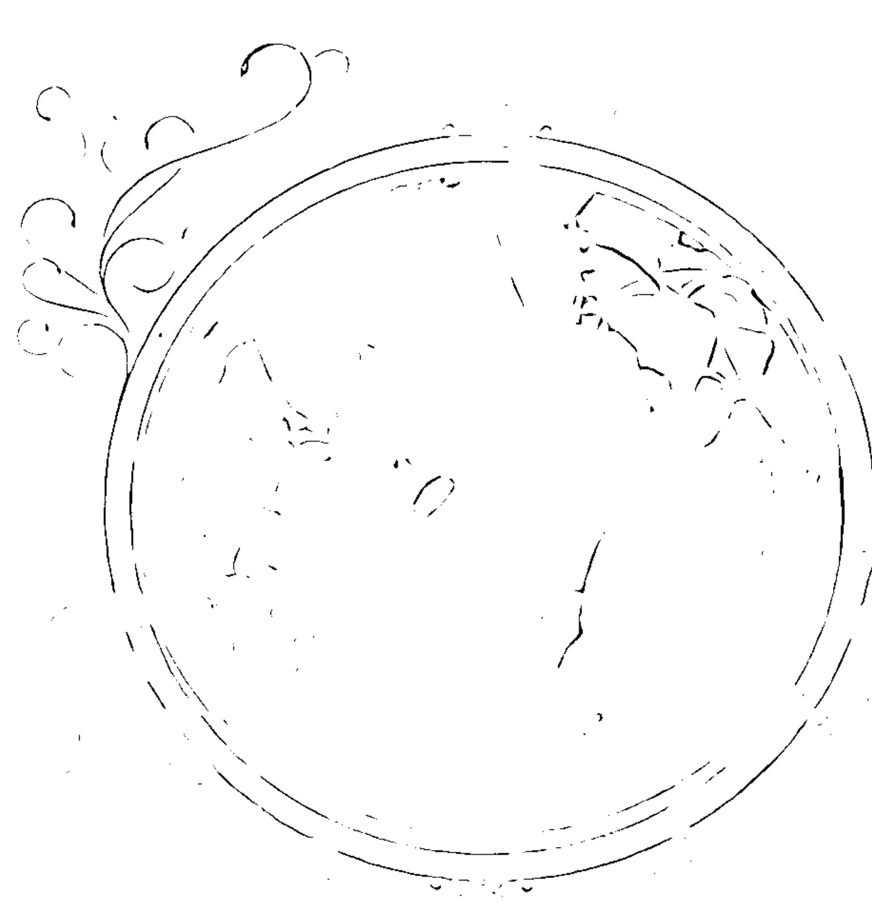

## Digestion / metabolism
消化与代谢系统

## 19 牙龈发炎、鹅口疮

### 生理现象
Physiology

积存在齿缝、齿龈间的牙垢，久而久之滋生细菌、累积毒素，牙龈就会发炎。这些异物会刺激牙龈充血、红肿、发炎，轻微时患者不易察觉，只在刷牙或大口咬水果时发现流血，严重时会剧痛、流脓。若放任不理，会恶化成牙周病，齿肉萎缩露出牙根，甚至牙齿松动。

咬合不良或磨牙习惯，也影响支持牙齿的组织，容易造成牙龈发炎。有时候睡眠不足、熬夜、火气大、饮食失衡，也会刺激牙龈红肿，让症状发作或恶化。

鹅口疮是新生儿常见症状，在口腔内、舌头上出现白色斑点、像奶垢的小颗粒，是口腔黏膜受到霉菌（常是白色念珠菌）感染。时常在大量服用抗生素、类固醇、或免疫力低落时出现。

### Psychology
心理背景

牙齿是撕咬食物的利器，带有攻击性与企图心的特质，但现代文明礼教总让攻击性被修饰或压抑下来，而牙龈是牙齿的基础，直接承受了牙齿“隐忍下来之攻击性”的折磨与交战，必然导致流血结果。部分人会移转成夜晚磨牙习惯。

若把“咀嚼”扩大诠释为身心养分的摄取，当出现障碍（咬不动），或不愉快的吸收（咬紧牙关和血吞），也易引发牙龈出血。

心理状态常导致对身体的错误认知，过度重视自我或要求完美的人，常会觉得头颅很重，需要后颈肌肉用力才挺得直，而让头颈相对位置错误，颞颚关节紧张，也易刺激牙龈充血。其实下颚是头颅的“外挂结构”，除了大口咬苹果这类动作外，正确且轻松的咀嚼，应是下牙床朝上颚靠近的咬合，而非上下颚同时动。

### Experience
温老师的芳疗经验

桃金娘科白千层属精油
沉香醇绿花白千层、绿花白千层、印度尼西亚白千层、茶树、沼泽茶树、鳞叶茶树、小河茶树、窄叶茶树、扫帚茶树、橙花叔醇绿花白千层
最佳选择：上述精油各2滴，加入10ml椰子油，混合均匀。
第二选择：绿花白千层精油20滴，加入10ml橄榄油，混合均匀。

### 建议用法
Suggest Usage

- 1. 牙龈发炎：早晚刷牙后在患部涂抹一次，每周一次口腔排毒，倒3ml上述调油在口中，含10分钟后吐掉。平日可以大量饮用绿花白千层纯露（每杯水加一瓶盖）。一般需要进行三个月的时间。
- 2. 鹅口疮：每两小时涂抹一次患部，还可以大量饮用绿花白千层纯露（每杯水加一瓶盖）。睡前倒3ml上述调油在口中，含10分钟后吐掉。三天左右即可好转。

## 精油小传
Essential Oil Bio

### 绿花白千层
*Melaleuca quinquenervia*

法国的芳疗名家潘威尔医生曾经提过，有的产科医生会在新生儿脚上涂抹纯的绿花白千层精油一滴。这个例子可以看出绿花白千层有多么温和，但拿来抗感染又是多么威猛。现代医药虽然发达，魔高一丈的病毒却总有办法丢出更难的习题。抗生素既管不到病毒，疫苗也常赶不上流行。幸好大自然里永远找得到答案，绿花白千层就是芝麻开门的宝藏。它含有非常特殊的抗病毒成分，像是绿花白千层醇、橙花叔醇和喇叭茶醇等，不论是流感、拉肚子、还是阴道疱疹，这种精油都能轻松应战。目前更有一些研究指出它的倍半萜醇也是抗肿瘤的重要资源，因此一些热带国家已经开始投入物力进行大规模栽种。

美国农业部把绿花白千层和白千层视为同一个品种，两者确实十分相像，但是绿花白千层因为少量的含硫分子，使它气味里多了几分初生之犊不畏虎的执拗。乍闻之下也许不那么讨喜，但它能让人回想起一种没有杂质的青春。凭着那股劲，什么灾难都只是一场磨炼吧。

## 20 胃溃疡、胃炎、十二指肠溃疡

### 生理现象
Physiology

“溃疡”是指开放的疮疡，发生于胃部称为“胃溃疡”，发生于小肠初段则称“十二指肠溃疡”。消化道溃疡可能导致出血、穿孔，造成腹腔感染（腹膜炎）。而结痂组织也可能阻碍食物通过消化道。这是一种反复发作性疾病，近年研究发现致病元凶是幽门杆菌，但也跟刺激性饮食、药物的毒害，还有强烈的精神压力有关。症状是上腹部绞痛、恶心、呕血、黑血便等。疼痛是来自胃酸刷洗溃疡处所致，食物可阻隔胃酸，进食后稍可舒缓疼痛，若胃中没食物时会更严重，故疼痛常在夜间发作。

胃炎是指胃黏膜的炎症。急性胃炎，可能是酗酒、刺激性食物、药物、过饱等造成，虽急性但通常是可逆的。慢性胃炎，是胃黏膜上皮反复受到损伤，却因黏膜的强大再生力，导致不可逆的胃腺体萎缩。

### Psychology
心理背景

消化道，如同呼吸道一样，是愿意接受外来物进入的系统，当内心越不害怕异议分子的夹杂，或相信自己有保卫能力时，也越不容易出现肠胃疾病。

“冲突”通常是戏剧里的推手，观看一连串的冲突如何被解决乃其精彩处。但如果现实生活中，过度害怕面对冲突，或期待活在祥和的象牙塔里，那么带有强烈攻击力的胃酸，就会失去准头，转而胡乱去摧残胃壁。这类人士通常有自我牺牲和心酸委屈的倾向，希望世界像是婴儿进食的流质一般，既柔软细致又营养丰富，对肠胃带来最少的压力！

自己分泌的胃酸，却反过来伤害自己，大力侵蚀胃壁。呼应胃疾患者通常不认同自我，仿佛希望把自己也逐渐消化掉。这时该反问内心，是否被什么念头侵蚀着，或生命被何种事物逐渐蚕食鲸吞？

### Experience
温老师的芳疗经验

半日花科、漆树科、胡椒科、肉豆蔻科
巴西胡椒、秘鲁胡椒、绿胡椒、肉豆蔻、岩玫瑰、熏陆香

最佳选择：上述精油各3滴，加入10ml圣约翰草浸泡油，混合均匀。

第二选择：熏陆香精油18滴，加入10ml橄榄油，混合均匀。

### 建议用法
Suggest Usage

- 1. 状况严重时，每两小时涂抹一次腹部。状况较轻微时，三餐后各涂抹一次。
- 2. 晨起空腹可以口服一小咖啡匙的南瓜籽油。

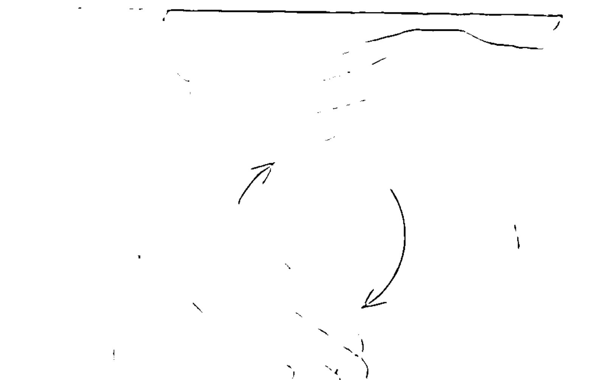

## 精油小传
Essential Oil Bio

### 熏陆香
*Pistacia lentiscus*

整个地中海气候区都能看到熏陆香，可是只有希腊奇欧岛的熏陆香能从大灌木晋身小树，也是唯一会流出珍贵树脂的品种，所以这几年学术界已为当地的熏陆香正名为奇欧熏陆香（Pistacia lentiscus L. var. Chia）。话虽如此，无论哪一种熏陆香，千百年来始终默默看守着人们的消化系统，是历史文献与民间习俗都高度肯定的健胃秘方。可惜近代合成药物的发达抢去了它的锋头，在芳疗界的名气也不算响亮。然而1998年英国诺丁汉大学在新英格兰医药期刊上发表研究报告，宣称熏陆香能杀死导致胃溃疡的幽门螺旋杆菌，从此聚光灯又重新打在熏陆香身上，俨然各种胃疾的克星转世。

我们在临床中，确实也看到熏陆香对胃部问题的卓越贡献，不过它倔强的身影，和嵚崎磊落的香气，更让人别有一番滋味在心头。人际关系就像“恶水上的大桥”，跨距拉不大，桥墩数量多，对水流阻力大，恶水来时就易垮。熏陆香是一种大跨距精油，帮我们抓到合宜的人我距离，本我轮所在的胃部才不会受创。

## 21 消化不良、胃口差、胀气

### 生理现象
Physiology

消化不良，通常是吃得太急、饮食过量，或是吃太多高脂肪食物、咖啡因与辛辣等刺激物，进食没多久后，便发生上腹部疼痛、饱胀、不舒服。不良的生活习惯（烟酒多、压力大、经常自行服用成药）也会加重消化不适的负担。

扣除了消化道构造的病变（溃疡、胃酸逆流食道、结石等）之后，这样的情形才可称为“消化不良症候群”。目前成因未明，有人认为是胃部蠕动不正常、造成排空速度过慢，也有人认为跟情绪、胃酸分泌过多、过敏食物、甚至消化道对痛觉太敏感有关系。西医的药物治疗是以“症状疗法”为主，就个案产生何种症状来处理。但如果长期在饮食过后产生不适，容易造成“胃口差”的习性。

胀气，是由于饮食习惯不佳（狼吞虎咽或一边聊天）、吃了易产气的食物、或肠胃道疾病、精神因素等，使得肠气累积或蠕动变慢所造成。

### Psychology
心理背景

消化道是一条精密的输送带，每部位都有其专属功能，会把食物逐渐从大化小、由繁化简。如果工厂老板贪心接了大量订单，而猛催生产线的速度，或者对该项产品压根没兴趣，而意兴阑珊地粗制滥造，结果不只是有产品出现瑕疵，连这条输送带都会卡死坏掉。消化不良患者，得多思索是否日常生活中出现了“不合胃口”的人事物，使得那一阵子的“化简”能力降低？或者被过度侵占了自我空间，正如同腹部的饱胀，而压迫到其他部位。

中国美学大师朱光潜，认为“美感，与现实生活之间，必须存在着一个适当的距离”。消化差的人通常生命中邂逅过多的贴身肉搏战，以致无法细嚼慢咽地品味人生，总忽略感官的细节之美。口腹之欲，是最原始的“生之悦”，不妨多聆听身体的感受，等到肚子真正饿时，才愉悦地进食，其他的身心领域也是如此对待，便能慢慢召唤回生命的美乐地。

中医把脾胃归入“土”元素的能量，大地能滋生万物，象征消化道的“转化”能力，但土元素也带有惰性因子，若走到负面就是迟滞与发酵，变成一摊烂泥。解决之道，别无他法，是重新升起身心的转化能力！

### Experience
温老师的芳疗经验

芸香科柑橘属果皮类精油
佛手柑、日本柚、粉红葡萄柚、克莱蒙橙、红柑
最佳选择：上述精油各4滴，加入10ml椰子油，混合均匀。
第二选择：粉红葡萄柚精油15滴，加入10ml芝麻油，混合均匀。

### 建议用法
Suggest Usage

- 1. 三餐饭后时，以调油4滴涂抹腹部。
- 2. 沐浴时，以调油10滴涂抹胸腹与背部，再以热水泡下半身10分钟。

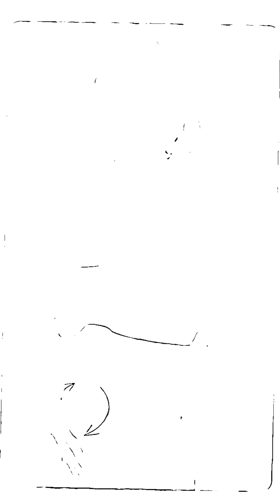

## 精油小传
Essential Oil Bio

### 粉红葡萄柚
Citrus paradisi

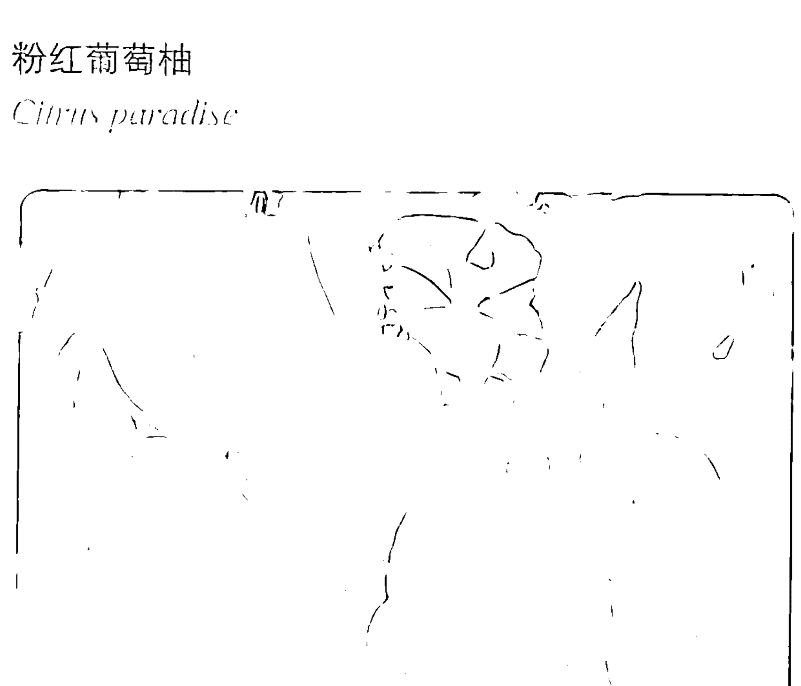

葡萄柚能调节过盛的食欲是众所周知的事实，粉红葡萄柚对促进排泄、舒解便秘尤其有帮助。以精油来说，粉红葡萄柚的气味比白葡萄柚甜美，安定神经的效果因此更显著。1989年，科学家发现葡萄柚汁与某些药物会起交互作用，后来证实，那是因为葡萄柚汁里的呋喃香豆素能抑制酵素，使它没办法加速药物在肠道内分解，以致药物在体内的含量过高。可能与葡萄柚汁产生过量药物副作用反应的药品包括：高血压治疗药物：felodipine、Plendil；艾滋病治疗药物：saquinavir、Invirase。葡萄柚精油的成分虽然并不等同于葡萄柚汁，但精油中也含有呋喃香豆素，所以使用那些药物的病患最好在服用药物两小时后才使用葡萄柚精油。

许多人最初被葡萄柚吸引，都是为了减肥。其实它还能用在克服时差、控制疱疹上。但葡萄柚最迷人的地方，还是它微笑着跟世界保持距离的气味。那个距离让人找到各有所爱的萝卜青菜，那抹微笑则构成一个和光同尘的画面。上帝丢给我们一个必须承受的人生，但又附赠了一颗葡萄柚，单凭这一点，我们还是要感恩的。

## 22 肠炎、腹泻、肠躁

### 生理现象
Physiology

肠道发炎分成急性与慢性。急性肠炎通常是吃了腐败、不洁食物所引起，症状是腹痛、腹泻、腹胀、恶心、呕吐等。若处理不完全，加上抵抗力弱，则会演变成慢性肠炎。部分人是对某些食物过敏，或消化机能障碍（如酵素不足），导致食物无法消化，细菌持续滞留在肠中而发炎。

腹泻通常是受到病毒、细菌、毒素的入侵，导致肠壁黏膜感染或损伤，扰乱了养分与水分的吸收，造成排便次数多、粪质稀疏。腹泻是一种人体的自然防卫机制，把病菌及毒素排出体外，以减少伤害。另外，药物、情绪、压力、肠胃长期功能失调也是成因。通常1～2天症状会自动消失，可多补充水分和电解质以避免脱水，并禁食刺激性食物。

肠躁，是患者的肠壁肌肉失去规律性收缩和放松，比正常人的肠道收缩要强且久，所以食物因肠内痉挛而太快或太慢通过肠道，造成绞痛、胀气、腹泻（或便秘）。除了药物滥用（抗生素、止泻剂、缓泻剂），它也是种身心官能症，受人格特质、紧张情绪、精神压力的影响大。女性发生率高出男性两三倍，尤其经期时加剧，故也跟荷尔蒙有关。

### Psychology
心理背景

肠道的位置，是最贴近印度脉轮（Chakra）理论中的第三个能量区——本我轮，掌管自我意志，也关系到自我评价。肠疾患者多半对自己会严厉分析与过度批评，也对外来人事物有诸多恐惧，想尽快代谢排出好远离它们。

肠道的世界，原本有它自己的时间与秩序，却极容易跟着主人的内心时钟而拨快或调慢，仿佛变成达利名画中扭曲的钟面与世界。这时唯有放慢身心的节奏，或多给自己时间去整合内外，才能让肠道的指针归位。

龙困浅滩时，可能先是恐慌焦虑、剧烈挣扎，未果则寄望别人能拉提一把，仍落空时只好逼自己放弃，转入暗黑世界里，发酵着怨念。不管是在真实生活中被拉缠着、或心理有陷溺原地的感受时，肠道也经历了上述的变化，而出现各式消化机能问题。

### Experience
温老师的芳疗经验

**豆科精油**

香脂木豆木、鹰爪豆、秘鲁香脂、吐鲁香脂、古巴香脂、零陵香豆、银合欢

最佳选择：上述精油各 2 滴，加入 10ml 雷公根浸泡油，混合均匀。

第二选择：零陵香豆原精 3ml，加入 60ml 甜杏仁油，隔水加热混合均匀。

### 建议用法
Suggested Usage

三餐饭后与睡前涂抹
腹部与脊椎。

## 精油小传
Essential Oil Bio

### 零陵香豆
Dipteryx odorata (Tonka Bean)

这种奇妙果实的黑色种子有 4 厘米长，浸泡酒精发酵后，便会在表面释出白色结晶。1820 年将结晶验明正身为“香豆素”，就因为那个种子名叫零陵香豆。结出此果的大树原生于南美洲北部，野生状态能长到十几层楼高，木质坚硬可做建材。然而气味如甜酒的种子，才是它青史留名的本色。这本色虽然经年不改其志，可是别人对它的评价却从笑脸转成哭脸又转成笑脸。因为最初发现香豆素能挽救心脏病，后来又指控它有毒性恐会致癌，近来则逐渐肯定它既抗肿瘤又调整情绪。我觉得真正有指标性的是亚马逊盆地的印第安人，既然他们亘古以来都懂得跟零陵香豆和平共处，现代人没道理不能蒙其利而避其害。

芳香疗法里的零陵香豆，主要是用于抗痉挛。凡胸闷腹痛、僵硬紧绷，都可以派上用场。比方说，一般人总认为肠胃不舒服定是吃了不干净的东西，其实大多数的生理痉挛，发源于心理紧张。这个时候，巧笑倩兮的零陵香豆，总能“一缕飘散”，带我们去到平日去不了的地方。

## 23.便秘、大肠息肉、肠漏症、排毒

### 生理现象

引起便秘的原因多是心因性，仅有 10% 是器质性异常。由于饮食、药物、作息、情绪等因素，或经常忽略便意，使得大肠功能下降而导致便秘。当废弃物无法顺利适时排泄，会造成体内毒素累积。

大肠息肉是大肠黏膜有不正常增生的隆起组织。增生型息肉大部分是良性，腺瘤型息肉则有可能演变成大肠直肠癌。当息肉大过 1 厘米或癌变时，会出现腹痛、出血、排便习惯改变等症状。建议要减少高脂肪或刺激性饮食，多摄取高纤维质的蔬果，并适度运动。

紧密排列的肠道绒毛，除了吸收功能外，也形成一道重要的阻隔屏障，会防止无用或有害的肠中废物（未消化的大分子、微生物、抗原等）渗透进入血液，但若肠道发炎或退化而变得通透，上述有害物质则会突破防线，只好直接送往肝脏去处理。当肠漏越严重，肝脏不堪负荷时，尚未处理掉的废物或病菌可能就进入全身循环，危害很广大。

### Psychology
心理背景

很多人有类似经验，面临新事物新环境（旅行、参军、换工作）时，很容易出现排便困难，因为心理的乱拍，也打乱了生理原有规律。这类人士比较缺乏弹性，不能随遇而安，故以节制、紧缩、或吝啬的态度来面对生命，包括消化道的最后关卡也是。

回到童年经验，当幼儿被训练学会控制大小便时，过程的好坏感受，也会影响长大后的肠道能否轻松自如。有别于一般动物对消化道进出口的自由权（想吃就吃、想放就放），人类的消化道在社会化过程时，也首当其冲受到情绪与压力的影响，莫名出现不该有的赘物（息肉）或破洞（肠漏）。

肠道的天然屏障，是有选择性的通透，能分清别浊、纳益排损。如果出现通透的障碍，反过来被敌军渗透时，也可反问自己生命中是否降低了明辨能力、或面临选择的两难？

### Experience
温老师的芳疗经验

**伞形科精油**
芹菜籽、胡萝卜籽、莳萝籽、芫荽籽、白松香
最佳选择：上述精油各3滴，加入10ml黑种草油，混合均匀。
第二选择：莳萝籽精油10滴，加入10ml芝麻油，混合均匀。

### 建议用法
Suggested Usage

- 1. 用以上调油涂抹肛门及尾椎，每小时一次。
- 2. 若是希望预防便秘，则可每天早晚涂抹腹部与腰部，夜晚还可以在涂抹后做热水臀浴10分钟。

## 精油小传
Essential Oil Story

### 莳萝籽
Anethum graveolens

犹太法典和圣经中都记载，当时的人用莳萝籽当税金缴纳，由此可以见它在日常生活里的重要性。罗马人承续这项传统，但主要是拿它来炫濯财富。莳萝为什么会享有这样的地位？作为香料，它让鱼鲜和腌渍品入口清爽，作为药草，它使胀气消失于无形。胀气的影响，在庄淑旗博士的《怎样生活不生气》里分析得极精辟：“不胀气就是肠道健康的基石，而肠道健康则是整体健康的保障。”从这个角度来看，古犹太人和罗马人真是明白什么才是有价值的资产。莳萝籽靠50%的藏茴香酮消胀气，而消胀气最出色的藏茴香，所含的藏茴香酮也不过就是50%～60%，两者的作用其实在伯仲之间。应用上，有莳萝草和莳萝籽的分别。莳萝草的酮含量低，是儿童用油的首选，莳萝籽则是暴饮暴食的现代人必修的功课。这种植物长相清秀，还带着一股哲学家的气味。仔细想想，我们现在过的日子不就是：“五色令人目盲，五音令人耳聋，五味令人口爽，驰骋畋猎令人心发狂。”如果负担不起涤荡身心的疗程，每天拿莳萝籽来正本清源一下，也算懂得养生了。

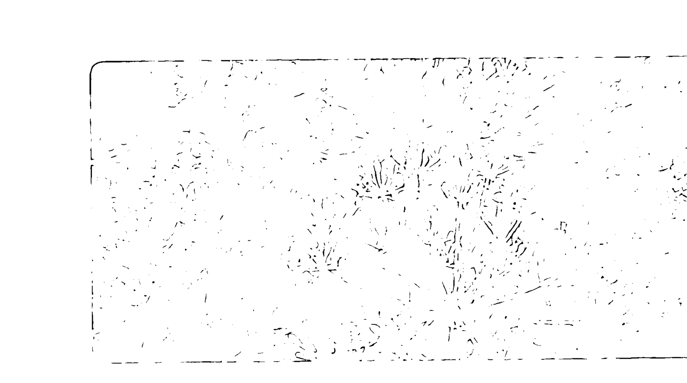

## 24小时

### Physiology 生理现象

肝脏是解毒与储存能量（肝醣）的器官，若受到病毒、毒素、药物、酒精等破坏，造成肝细胞损伤、变性、或发炎时，会让肝脏功能无法正常运作。

依据致病成因，分为病毒型、药物型、酒精型肝炎。以病毒型最常见，又分成ABCDE五型，其中B、C型肝炎带原者可能演变成慢性肝炎、肝硬化、肝癌，是不容忽视的隐形杀手。

肝脏是沉默的器官（病变时并无法立刻感知），除了猛爆性肝炎外，患者通常没有明显症状，但可能会有容易疲倦、无力感、食欲不振、恶心、低发烧、黄疸等症状。

### Psychology 心理背景

肝脏的英文“liver”，与生命“life”来自相同字源。肝脏被誉为维持生命机能的最重要器官，内部蕴含着强大能量，也常与人生意义、生命热情作象征联结。越是被负面情绪困扰、丧失生存目标、或脆弱绝望时，也越容易出现肝病问题。

肝细胞本身的活性极大，能让外来毒素失去活性，才可被代谢排出。但如果主人不懂得“节制”，包括生理上过量的酒与药、心理上的自大与欲望，都会让肝脏的负担变得太沉重，解毒能力变差，使得防御之门大开，间接影响到心血管、免疫、肾脏等机能。如何与瘾头、欲望、原始情绪达到和平共处，是肝病患者的重要课题。

中医认为“肝者，将军之官，谋虑出焉”。面对外来毒素与中伤，肝脏选择沉默以对，其实是“燕雀安知鸿鹄之志”啊！安静却辛勤地工作，刚勇又智慧地处理，只管分内事、不因琐事而焦躁暴跳，所谓“急怒最伤肝”！倘若主人也能学习到肝的本性，放宽胸襟与视野，彼此共鸣后，自然有副好心肝与美丽人生。

### Experience
温老师的芳疗经验

### 菊科精油

土木香、土木香根、岬角甘菊、岬角雪灌木、加拿大飞蓬、一枝黄花
最佳选择：上述精油各1滴，加入10ml椰子油，混合均匀。
第二选择：加拿大飞蓬精油5滴，加入10ml橄榄油，混合均匀。

### 建议用法
Suggest Usage

- 1. 每天早晚各涂抹一次于肝脏部位。涂后还可热敷5分钟。平日宜多喝永久花纯露，以30ml纯露 + 1000ml水，一天喝完。
- 2. 养肝需要持续使用3～6个月，以配合肝细胞再生的进程。

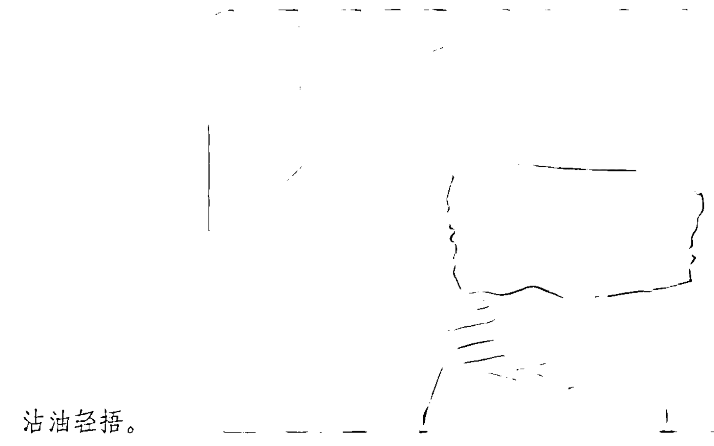

沾油轻拍。

## 精油小传
Essential Oil Bio

### 加拿大飞蓬
*Conyza Canadensis*

中国人都知道菊花清热降火、解毒养肝，事实上整个菊科的药草都有类似特质，加拿大飞蓬自然也不例外。它又叫小飞蓬，和一枝黄花一样原生于北美，也和一枝黄花一样被一般人当成杂草。但和甜美亮丽的一枝黄花不同的是，加拿大飞蓬长得确实像杂草。它的瘦果上披白色刚毛，容易随风飘散，有点像小型的蒲公英。中药拿它处理肝炎、肠炎、中耳炎、疮疖肿毒，欧洲的研究则发现它对脊椎关节炎和痛风有极高的医疗价值。在芳疗的领域里，一些具有正统医疗背景的专家，也不遗余力地推荐加拿大飞蓬来养肝，不过普通的芳疗师和一般消费者对它仍是闻所未闻。

菊科精油或许因为时常赴汤蹈火，很多气味都比较“苦”。加拿大飞蓬以它压倒性的柠檬烯配上雪松烯，却唱出轻快的音符。这个气味提醒人，乐观也是一种疗愈的力量。就算眼前一片黑暗，心中仍须有光。肝藏血，开窍于目，能养肝的加拿大飞蓬也能让我们看到另一个星球，一个自己会发光的星球。

## 25. 胆结石、胆绞痛

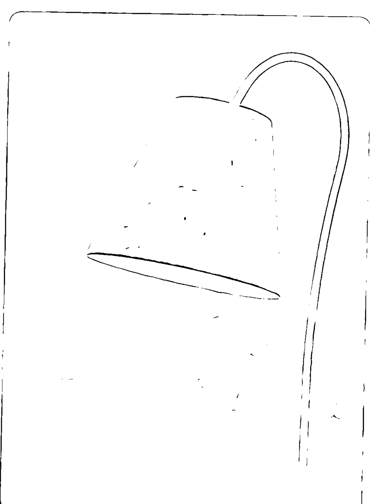

### 生理现象
Physiology

位于右腹部、肝脏后方的胆囊，储存着由肝脏制造的消化液——胆汁。它可协助小肠消化与吸收脂肪、特定维生素，但如果胆汁达到化学不平衡状态，就会变硬，形成颗粒、结石。

胆结石不一定产生胆绞痛，不少患者长期没明显症状，但因为间接影响胰腺的消化功能，上腹部易有饱闷感、或胃灼热感、消化不良等。

胆绞痛：常在饱食或吃高脂肪食物后3～6小时，或腹部受到震动（如骑车颠簸）而发作。先感到右上腹部有持续性钝痛，逐渐加剧至难以忍受的绞痛，甚至翻滚、猛汗、苍白、恶心呕吐等。疼痛发作通常只短暂数小时，之后因胆汁逆流进入血液，会出现尿黄、巩膜和皮肤发黄的黄疸现象。

### Psychology
心理背景

胆，常联结到胆识、勇气，并潜藏着攻击性。若无法正视此力量，压抑攻击性，任由能量停滞不流动，让液化的胆汁“封存”为固化的胆结石，仿佛胆识也被“固化”着。临床发现胆结石患者是女多于男（肾结石则相反），女性较易压抑此攻击性，相对地男性较易压抑关系（肾的意涵）。

味苦且色深的胆汁，常象征生命的苦痛。胆囊能浓缩胆汁，好更有效率消化脂肪。此“浓缩”能力，呼应人能否从生命中“萃炼”而出。但这两者都不是硬碰硬、或一味忍耐而已，它们同时也需要“软化”的力量，才能去芜存菁。

剧烈的胆绞痛，会痛到又喊又叫又翻滚，顾不得形象反能松绑掉平日的压抑。胆结石患者有时过度利他，却没得到应有回报，或者为了求和平而牺牲自己，造成长期累积了愤怒等情绪，加上固执或强充的性格，让担子始终放不下，一直耿耿于怀。这时很需要“富足”的力量，因为没匮乏的恐惧，不怕小损失、小伤害，故能勇于做自己，正视自己的追求，也敢适时拒绝他人。

### Experience
温老师的芳疗经验

**伞形科精油**
藏茴香、印度藏茴香、阿密茴、柴胡、防风草根、小茴香

**最佳选择：** 上述精油各2滴，加入10ml圣约翰草油，混合均匀。

**第二选择：** 阿密茴精油7滴，加入10ml小麦胚芽油，混合均匀。

### 建议用法
Suggest Usage

- 1. 疼痛时每1小时涂抹一次腹部。涂后以手心轻压腹部5分钟，并配合深呼吸。
- 2. 保养用每日早晚涂抹一次。

## 精油小传
Essential Oil Wiki

### 阿密茴
Ammi visnaga

阿密茴在埃及和阿拉伯文化中具有特殊地位，因为它能处理的心绞痛、肾绞痛、结石和气喘，都是危急或疼痛到“要命”的重大症状。现代医药虽然发达，对于阿密茴这种等级的传统药草还是非常重视，不过通常是以它的主要成分凯林与齿阿米素来制成药物，而非直接使用精油。含凯林的西药，有时也被拿来治白癜风（一种后天性皮肤色素脱失症），这是因为凯林除了能止痛抗痉挛，还能促进皮肤黑色素对日光的感应。而精油里所含的凯林与齿阿米素比例极小，所以拿来做舒缓之用。但我们可不能因而小看阿密茴精油，“上医治未病”，如果在日常保养中好好运用，就不必在猝不及防的情形下紧急抢救了。

原生于北非的阿密茴，长得极为雍容大度，在花艺的领域它叫“大阿米芹”，常为各种捧花或插花增添贵气。阿密茴硕大的花伞，极像欧洲宫廷舞会上缀满繁复蕾丝的蓬蓬裙。即使窗外已然雷雨交加，它们也能配合小步舞曲的节拍来个华丽的转身。因为，如果不对旦夕祸福耿耿于怀，自然也不会在意天有不测风云。

## 26 糖尿病保养

### 1. 生理现象
(Physiology)

淀粉类食物会转变成葡萄糖，提供身体热能。胰岛素是由胰脏分泌的一种内分泌激素，当这种激素不足时，葡萄糖无法进入人体细胞被利用，也不能储存，导致血液中葡萄糖浓度升高，多余的糖经过肾脏从尿中排出，称为糖尿病。

糖尿病Ⅰ型（先天型）是胰岛素分泌不足；Ⅱ型（成年型，占最多数，常于40岁后发病）是胰岛素的受体不良，接收利用率低；而妊娠型则多在产后复原。

糖尿病患者初期没有明显症状，通常是经医师检查才得知，但血糖逐渐升高后，会有三多一少的典型症状（多尿、多饮、多食，但体重减轻），常烦渴、饥饿、易疲倦。虽是终身疾病，适时补充胰岛素即可控制，更要谨慎的是严防多样性的并发症，它会造成心血管疾病、慢性肾衰竭，以及神经系统、微血管病变，导致性欲减退、视力障碍、伤口不易愈合（严重时需截肢）等。致病成因也多样，跟家族遗传、肥胖、高龄有关，也是著名的“生活习惯”病。

### Psychology
心理背景

“糖”的流失，仿佛“甜蜜”也从生活中流失，只能拥抱失落。这类人格渴望爱、缺乏关注，却不擅长正确地表达情绪，不知如何拿捏给与取，也不懂如何让爱与被爱能自由畅通、达到平衡。以致逐渐滋生“掌控欲”，但又不想被人发现其强硬，内外交战的结果，爱的空缺位置改被伤痛充满。

Ⅱ型糖尿病的受体不良，虽能分泌胰岛素，但接收能力差，只能眼睁睁地看着甜蜜的“幸福感”过门不入。就像酸葡萄心理（呼应患者体质易酸化），总是改口说这并非我想要的，以别种替代品的模式才能存活（呼应患者多使用代糖替代真糖），拥抱真糖反而易受伤害，也呼应其内心常以不是自己最想要的事物，来替代真正的想望。老二心态原是乐观的，但若夹杂着屈就感便辛苦了。

终身依赖胰岛素、接踵而来的并发症，都倾向喂养内心的“依赖性”，越来越觉得自己很虚弱，需要别人的强壮扶持，而熄灭了心中火苗。

### Experience
温老师的芳疗经验

**樟科精油**
罗文莎叶（桉油醇樟）、芳樟、樟树（本樟）、苏刚达（灰叶樟）、马达加斯加肉桂、中国肉桂、印度肉桂
最佳选择：上述精油各1滴，加入10ml琼崖海棠油，混合均匀。
第二选择：中国肉桂精油2滴，加入10ml向日葵油，混合均匀。

### 建议用法
Suggest Usage

轻轻拉伸脚趾。

- 1. 每日早晚涂抹腹部与脚底，睡前还可以在涂抹后做热水足浴10分钟。
- 2. 日常多饮用肉桂纯露。

## 精油小传
Essential Stories

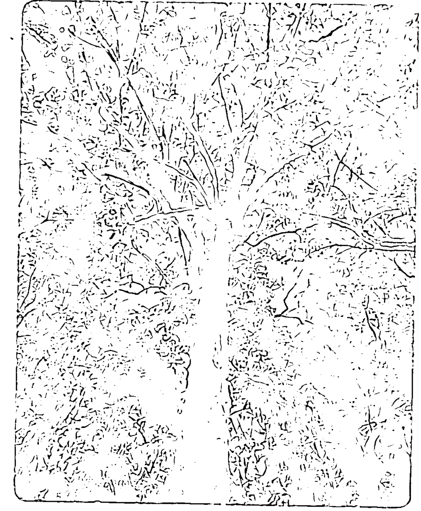

### 中国肉桂皮
Cinnamomum cassia bark

中国肉桂和锡兰肉桂的分别是，一个是屠龙刀，一个是倚天剑，中国肉桂浑厚，锡兰肉桂精锐。疗愈方向则基本相同，两者都强力抗感染、抗氧化，并且是公认的糖尿病克星。在中药里，中国肉桂是个大补品，被认为能引火归元，“救阳中之阳”。但是在芳疗的应用上，中国肉桂精油的刺激性几乎到了可以焚身的地步，所以一般的芳疗师不敢轻易尝试。其实这个问题靠稀释就能解决，如果浓度压到0.5%，多数人的皮肤都可以承受。我从事芳疗工作这十多年，碰过少数几例因为精油引起的接触性皮肤炎，都是没稀释的中国肉桂惹的祸，所以真的不能掉以轻心。

中国肉桂粗犷而雄猛，气味的画面有如《诗经·商颂》：“武王载旆，有虔秉钺，如火烈烈，则莫我敢曷。”在现今这个普遍雌性化的世界，中国肉桂也许不是那么时尚，但它毫不矫饰的面孔，对看腻了过度包装的心眼来说，可是充满了不可言喻的魅力。

## 27 厌食、暴食、饮食无度

### 生理现象
Physiology

厌食症，是一种进食障碍的精神疾病，近年有渐增趋势，常好发于年轻女性，尤其是发达国家的高收入家庭中。厌食症常伴随忧郁、焦虑的情绪，或出现完美、强迫的性格，对自我形象有不良评价。通常在压力事件之后逐渐发病，部分人会有暴食之后再催吐的行为。厌食会影响全身整体机能，如体重过轻、贫血、心律过缓、惧光畏寒、无月经、骨质疏松、皮肤黏膜易损伤等。研究发现患者身上的神经传导物质（尤其是血清素），也失去调节和平衡。

暴食症，患者的大量进食，跟生理上的饥饿无关，是因为内心的饥饿感和长期的不满足造成。它也有形象偏差、情绪不稳的现象，但厌食者体型偏瘦，暴食者则胖瘦皆有，年龄层也比厌食症要晚些。常会反复减重，又对食物成瘾，故一星期常有两次以上的定期暴食与清肠动作（泻药、催吐等）。

### Psychology
心理背景

太理想性格的青春期少女，明显感觉到生理起了变化，却害怕失去纯真形象，而厌恶这种肉体感官，极力想多拥抱性灵而舍避物质，拼命逃离肉体中食欲与性欲的本能。但禁欲的背后总常躲藏着贪婪，贪图更多人的爱与欢迎，而逼自己去迎合大众认可的价值观。

厌食者在内心嫌恶自己外，又常下意识地逃避，让旁人捉摸不着到底有无进食？如狡兔三窟般的诡计，乃源于没有安全感，自觉没有足够信赖的伙伴。当旁人很焦急地劝食，甚至强迫灌食时，激烈拒绝反成另一种爱的掠夺。

暴食者的内心有很多冲突与压抑，常在上瘾与罪恶之间拉扯，害怕诚实面对自我，又坚信唯有严厉与苦痛才能建立身心的秩序，因此才改用激烈手段去驱逐外来养分的“诱惑”，只徒留进食的形式行为，却没进食的实质滋养。

### Experience
温老师的芳疗经验

**唇形科精油**
牛膝草、广藿香、高地牛膝草、香蜂草、蜂香薄荷、猫薄荷、马郁兰
最佳选择：上述精油各 1 滴，加入 10ml 圣约翰草油，混合均匀。
第二选择：香蜂草 4 滴，加入 10ml 向日葵油，混合均匀。

### 建议用法
Suggested Usage

1. 睡前两小时用 8 滴按摩油涂抹脊椎与脚底，然后做热水足浴 10 分钟。
2. 调油装入滚珠瓶，不时涂抹胸口。

## 精油小传

### 香蜂草

能够让 16 世纪的一代怪杰帕拉萨索斯视为万灵丹的药草，一定具有某种超凡绝俗的魔力。这个医药界的马丁·路德，把香蜂草称做“赏心之乐”，除了来自临床的观察，可能更是他敏锐的神经系统在追求神秘学与炼金术时的亲身体验吧。香蜂草是出了名的强心剂，对那些易受惊吓、镇日烦忧的人特别有益。即使是因为神经衰弱，而逐渐演变出失眠、高血压、心悸、胃痛、胆结石，香蜂草也能像个贴心的朋友一样让人放松。我碰过一些擦什么都没效的过敏皮肤，就只有香蜂草能够安抚下来。但这种精油的天价，使它少有机会造福人群。好在有些产品会先用植物油予以调和，或加入其他同样含柠檬醛的精油，虽然不算原汁原味，起码让大家有机会一亲香蜂草芳泽。

除了帕拉萨索斯，香蜂草的信徒还有蜜蜂。事实上，香蜂草的属名 melissa 在希腊文里就是蜜蜂的意思。狂爱香蜂草的蜜蜂，比其他昆虫拥有更多与嗅觉相关的基因，能更细致并系统地辨别气味，也具备惊人的记忆力。如果蜜蜂能在香蜂草的刺激下，为它的世界找到更多甜蜜的秩序，也许和蜜蜂有 30% 相同大脑运作基因的我们，也可以在香蜂草的气味中寻获某种幸福的规律。

## Respiratory / circulation
呼吸与循环系统

## 28 感冒

### 生理现象

一般我们俗称的感冒并非一种独立病症，而是把多种症状统称为“感冒症候群”，包括喉咙痛、鼻塞、流鼻水、打喷嚏、咳嗽等症状。会引起感冒的病毒有上百种，目前只能就症状缓解、防止并发症，并没有专门的特效药。感冒的潜伏期约一至三天，第三四天症状达到高峰，之后逐渐缓和下来，但如果越发严重，且鼻涕变黄、耳朵有分泌物，则可能合并细菌感染，要尽速就医。通常感冒四至十天会痊愈，因为我们的身体会产生抗体，消灭感冒病毒。

流行性感冒与普通感冒不同，由流感病毒引起，是具有高度传染力的急性上呼吸道疾病，部分症状类似感冒，但更明显特征是全身性影响（一般感冒通常只影响呼吸系统），发高烧、畏寒、肌肉酸痛、虚弱疲劳，也可能有消化道的症状，呕吐、腹泻、腹痛等。流感来得快速且剧烈，要预防严重并发症。

### Psychology
心理背景

太多事同时发生、或过于沉闷无聊时，感冒最容易现身，它逼人重新安排行程的先后顺序！因此，忙过头而自乱阵脚时，感冒逼你放下并调慢节奏；暂时不想面对冲突时，感冒让旁人不敢靠近；太过颓废停滞时，感冒迫使你省思所求为何；内心混乱、沮丧时，感冒则令人安静、脑袋暂停。其实，无需疾病来提醒，多强化自我觉知也行！

感冒是极普遍的疾病，症状总与鼻子相关，浓重鼻音类似呜咽声，一把鼻涕一把泪的模样，格外引人怜惜，所以感冒的心理意涵，跟寻求“认同感”有关。再怎么不受重视的隐形人，出现上述特征时，大众总会主动表达关切：“你感冒啦？要多喝水、多休息！”感冒，既加速了体内的循环代谢，也缓解了原本的冷漠关系。

流感是现今防疫的重大议题。此种疾病的盛行，呼应现代人惯于群聚、追求风潮、喜欢集体行动。尤其是害怕被团体排斥、担心没被传播到重要讯息的人，更容易受到流感的威胁。

### Experience
温老师的芳疗经验

**唇形科精油**
希腊香薄荷、夏香薄荷、西班牙野马郁兰、希腊野马郁兰、摩洛哥野马郁兰
最佳选择：上述精油各 1 滴，加入 10ml 琼崖海棠油，混合均匀。
第二选择：摩洛哥野马郁兰 4 滴，加入 10ml 橄榄油，混合均匀。

### 建议用法
Suggested Usage

1. 刚出现感冒症候时，每半小时用 3 滴调油涂抹脊椎和胸口；过三个小时以后，改为两小时涂抹一次。同时要大量饮用野马郁兰纯露，每杯水加一瓶盖。
2. 睡前一小时涂抹全身后，泡半身的热水澡 10 分钟。睡前再用 3 滴涂抹脚底。这样下来，通常隔天即痊愈大半。
3. 如果用油时症状已拖了好几天，用法相同，但须持续三天。之后改为每天早晚使用一次，再用三天。6 天以后若完全不见改善，便应停用，另外寻求协助。

## 精油小传

### 摩洛哥野马郁兰

野马郁兰开花的时候非常精神，像是上世纪 60 年代的美国少女，扎着整齐的马尾，穿着剪裁合身的窄裙，神采奕奕。大部分的人都无法将这样亮丽的形象跟它芳疗界头号杀手的地位连在一起，而知道内情的，往往又过于戒慎恐惧，所以一般的芳疗师很少碰这种精油。由于抗感染作用实在太出色，它在各种药用植物或精油研究的国际会议上从不缺席，不管科学家拿它跟什么样的病菌硬碰硬，结果永远是野马郁兰大获全胜。它的秘密武器叫香荆芥酚，这个成分有可能刺激皮肤、黏膜与肝肾，但只要拿捏得宜，它就是医师的左右手。用油的王道是，没有危险精油，只有危险用法。事实上，再“危险”的精油，只要稀释到正确的剂量，都可以成为老少咸宜的良方。而且，香荆芥酚虽然抗菌力超强，可并不是玉石俱焚的恐怖分子，它能够激励我们的免疫系统，启动自愈机转，这是任何抗生素都做不到的事。

野马郁兰的气味宛如火药，能把埋头沙堆的鸵鸟给炸出来。习惯睁一只眼、闭一只眼的人，自然觉得它让人难受。可是在这个艰险的世道，没有一把傲骨，又怎能耐得了风霜？

## 鼻炎、鼻窦炎

### 生理现象

鼻腔黏膜的任何发炎，统称鼻炎。症状是鼻塞、流鼻涕、鼻内发痒、打喷嚏、嗅觉失灵、讲话鼻音、头胀痛。致病成因包括细菌或病毒的感染、过敏、自主神经失调、鼻腔黏膜或骨质萎缩等，导致不同种类的鼻炎。

过敏性鼻炎则是由遗传性过敏体质、外来过敏源引起，常随季节性增减症状。急性鼻炎多是病毒感染，若反复发作或治疗不当，则成慢性鼻炎，因为长期张口呼吸以及鼻腔分泌物的刺激，容易伴发咽喉部的慢性炎症。

鼻窦是指在脸部骨骼中充满气体的空腔，它有小管连接到鼻腔，若感冒、鼻炎、或鼻黏膜肿胀，让这些小管阻塞，鼻腔黏液会滞留在鼻窦内无法排出，久了容易化脓发炎，并影响黏膜与纤毛的功能，即为鼻窦炎。症状是持续鼻塞、流脓涕、畏寒发热、嗅觉减退、头痛头晕、精神不济。

### Psychology
心理背景

鼻子就像“隐藏的准星”！眼睛不容易聚焦看到鼻子的形状、只见隐约的阴影，但当我们活动头部、锁定目标、调整视野时，又经常依赖鼻子残影作为观察的基准点。从外貌结构来说，鼻子在脸部表情中是活动度最小，却是最深刻的，因为它能感觉到哭泣、大笑时的不同气流变化，仿佛情绪表达都环绕着它运作。这种“北极星”特质，让鼻子代表自我形象中心。能多肯定自己的人，通常较没鼻病问题。

鼻子同时是呼吸与感觉器官，非常直接地联结到存在与情绪。当受到威胁逼近、沟通管道受阻、或被亲近的人激怒，都容易鼻道内交战（发炎）。迟迟找不到解决门路，也呼应鼻病后的头部闷胀、思路受阻。

鼻窦的空腔功能，除了能温暖所吸入空气、增加声音共鸣外，可平衡头颅前方重量，并充当脸部受重击时的缓冲（像安全气囊），所以鼻窦具有“升华”与“缓和”的特质。鼻窦空间有点类似蒙德里安（Mondrian）的画作，大片色块的抽象组合空间，乍看或许空洞单调，细看则发现奥妙的流动与平衡。鼻窦炎患者可反问自己是否遇到某些人事物，让你直接受击、来不及缓冲？不妨从蒙德里安的大胆空间，找到让鼻腔与心灵空间一起升华的力量。

### Experience
温老师的芳疗经验

**菊科艾属精油**
苦艾、艾草、印蒿、阿法蒿、白蒿、南木蒿、龙艾
最佳选择：上述精油各 2 滴，加入 1ml 沙棘油和 9ml 胡桃油，混合均匀。
第二选择：南木蒿精油 10 滴，加入 10ml 甜杏仁油，混合均匀。

### 建议用法
Suggested Usage

早晚以棉花棒沾油涂抹鼻腔内侧。
症状严重时，可以两小时涂抹一次。

## 精油小传
Essential Oil Bio

### 南木蒿
Artemisia arborescens

艾属是菊科春黄菊族最大的一个属，喜爱生长在干燥地区，200 个品种里很多都是知名药草，而且都能萃取精油。南木蒿就是环地中海一带的珍贵品种，原产于摩洛哥。它的精油含有母菊天蓝烃，那个让德国洋甘菊名扬四海的蓝色抗敏成分。全世界含母菊天蓝烃最多的植物，就是移民到美国的南木蒿。至于摩洛哥土生土长的南木蒿，则是蓝色精油中含酮量最高的一种，包括令人闻之色变的侧柏酮。侧柏酮会干扰 γ-氨基丁酸的受体，高剂量恐怕导致呕吐流产，低剂量可能引发兴奋幻觉。但侧柏酮是对孪生兄弟，α-侧柏酮使坏，无端连累了南木蒿的 β-侧柏酮。所以南木蒿是个百分百的善男信女，绝非什么恐怖分子。

因为这些酮的存在，使南木蒿的灰白叶片柔若无骨，宛如情人的手指滑过脸颊。受创于人情浇薄与世态炎凉，皮肤如坐针毡或呼吸透不过气来，都应该接受南木蒿的安慰。这种毫无身段的药草，用它暮鼓晨钟的气味点化众生——无头又岂有头疼之苦。

## 支气管炎、肺炎

### 生理现象

支气管炎是肺部中型支气管的炎症。急性支气管炎，通常是病毒或细菌引起，由感冒感染到肺部，造成气管下黏液腺的分泌物增加，导致呼吸困难、咳嗽、脓痰、胸部顿痛，若伴发支气管痉挛，则哮喘、气急。慢性支气管炎是支气管黏膜长期受刺激而慢性发炎。症状是经常性咳嗽、咳痰、或伴有喘息，且每年累计三个月，持续两年以上，常有冬天严重夏天轻的特性。并发症是阻塞性肺气肿、支气管肺炎、肺原性心脏病。

肺炎的致病原因是厉害的细菌或病毒（肺炎双球菌、链球菌、葡萄球菌等）的入侵、本身免疫力降低、上呼吸道感染未处理好而蔓延，使得肺部的肺泡出现急性发炎，症状是发烧、呼吸短急、持续干咳、痰中有血丝、深呼吸或咳嗽时会胸痛，从胸腔 X 光检查会发现肺部出现浸润现象。因为病菌已经跑到肺气泡，身体很难阻止它进入血液循环，故容易引发败血症等严重并发症。

### Psychology
心理背景

呼吸时一进一出的空气交换，代表与世界的交流关系以及对待生命的态度。呼吸道问题，时常彰显人我之间出现冲突，或是接纳与付出无法达成平衡。另外，呼吸功法也常与灵性联结，若敲不开心灵大门，屡次受困于物质界，容易将厌恶世间的肤浅，移转成呼吸的短浅。

支气管位于呼吸道的中段，从构造来看，大信道逐渐迈向小分支，局部空间因为分化看似变小，但整体接触面积其实变大了（类似肠道绒毛的结构），无法知晓这道理时，容易因表面的局限而恐慌，故支气管炎的心理成因，是抗拒生存条件被窄化、与旁人意见分歧大、或经常感叹“俯仰由人”！

肺炎是呼吸道最底层的感染，代表对“存活”产生最深的质疑。或许潜藏着绝望、厌世的心态，或屡遭挫败而开始否定生命价值，也可能根本不想被疗愈，因为自觉现实世界太残酷，活得很累很辛苦。

### 温老师的芳疗经验

**松科冷杉属精油**
巨大冷杉、白冷杉、喜马拉雅冷杉、日本冷杉、太平洋银冷杉、落矶山冷杉、诺得曼冷杉、高贵冷杉
最佳选择：上述精油各 2 滴，加入 10ml 胡桃油，混合均匀。
第二选择：落矶山冷杉精油 16 滴，加入 10ml 向日葵油，混合均匀。

### 建议用法

1. 每天早晚按摩颈部与胸口。喘咳较剧烈时，每一小时涂抹一次。
2. 冷杉纯精油也可以随时拿来吸闻。夜间涂油后最好再泡热水澡 10 分钟。平日还可多多饮用不同的松树纯露，一瓶盖对一杯水，每天最少喝 4 杯。

## 精油小传

### 落矶山冷杉

如果没有冷杉，大部分的圣诞卡就会变成白纸。它之所以成为圣诞画面的中心，除了优雅的造型适合悬挂灯饰与堆放礼物，冷杉针叶散发的恬静香气，也很能烘托这个节日的温馨调性。虽然同为针叶树，松树的威武不能屈，到冷杉身上则转为贫贱不能移。因为冷杉中的松油萜拱手让位，由浅笑吟吟的柠檬烯与各种倍半萜烯，决定了它怡然自得的性格。不过法国药学界认为，不论是高踞 3650 公尺的落矶山冷杉，还是横跨半个北美洲的胶冷杉，不同类群的冷杉精油之所以都能解除乌烟瘴气充塞胸臆之苦，主要还是靠松油萜运作肾上腺。专攻玫瑰精油的德国化学家瓦布那，有一次就在国际芳疗会议上兴奋地提到，他受偏头痛和喘咳困扰多年，竟在搬到冷杉林附近并使用精油之后不药而愈。

另一个受教于冷杉的德国学者，是 20 世纪影响力极大的哲学家海德格尔。他的著作《林中路》，就是写于隐居托德瑙山之时。该地位居南德的黑森林，林中冷杉遍布。大诗人保罗 · 策兰去那里拜访他，两人便在冷杉林中漫步。策兰后来还赋诗“托特瑙山”，纪念这场心灵对谈。几十年后再展其诗其书，读者闻到冷杉的明心见性否？

## 31 喉咙痛、扁桃腺炎

### 生理现象

喉咙痛是很常见的“症状”，吞口水或说话时感到疼痛，可能由细菌或病毒引起，经常伴随感冒、或咽喉、上呼吸道感染出现。喉咙痛本身通常无害，等病程结束会自行痊愈。在喉咙疼痛之前，会先感觉到喉咙有轻微痒感，这是病兆初期的警讯，赶快多补充水分、注意保暖、把身体调养好，或许病症就此打住！

扁桃腺位于喉咙后方、咽峡侧壁，呈扁圆状、左右各一，由淋巴组织构成，能产生淋巴细胞和抗体。它是人体免疫系统的一部分，能保护呼吸道和消化道免受外来病菌入侵。扁桃腺发炎，常会合并咽喉、上呼吸道的感染，受抵抗力减弱、过度疲劳的影响。症状是喉咙疼痛、发冷发热、厌食、疲倦、颈部淋巴腺肿大、咽部发红、吞咽困难。

### Psychology
心理背景

喉咙是呼吸与消化的交会处，要吞咽或吐出，代表能自主选择要或不要。如果丧失选择权，或双向道不平衡，例如吞不下的情绪、吐不出的心意，则容易让喉咙承受剧烈冲击。不妨多思索，是真的选择变少？还是自断进出桥梁？或困惑于矛盾之中？

吞咽是不假思索就自然发生的，但喉咙痛时连吞口水都难受，仿佛逼自己时时去意识这动作及其背后意涵——是否太常隐忍、硬吞？喉咙被掐住般的窒息感、头部腔道的闷塞感，全都加乘放大这份感受。

扁桃腺是免疫系统的一员，能保护自我，分辨外来分子的善恶好坏。这部位出现问题，常象征现阶段尚在学习如何防卫，并呼应分不清外来指责是源自善意或迫害，而心生困扰，例如幼儿便容易扁桃腺炎。另外，也对应常怨叹表达能力差，无法维护自己权益的人。

### Experience
温老师的芳疗经验

**禾本科精油**
玫瑰草、柠檬香茅、爪哇香茅、锡兰香茅、岩兰草
最佳选择：上述精油各 2 滴，加入 10ml 大麻籽油，混合均匀。
第二选择：柠檬香茅精油 8 滴，加入 10ml 油菜籽油，混合均匀。

### 建议用法

1. 两小时涂抹一次喉咙。
2. 大量饮用柠檬香茅纯露，每小时三瓶盖加一杯水。

## 精油小传

### 柠檬香茅

富含柠檬醛的精油都是全能型球员，因为柠檬醛进可攻、退可守，各种微生物都不放在眼里，还有空替我们的免疫系统当拉拉队。另一方面，它影响神经传导，让人忘记昨天的胜负，明天又能不忘初心地期待上场。柠檬香茅里的柠檬醛高达 70%，它最可爱的贡献，就是确保我们拥有一个美好的假期——入深山野林而不惧蚊虫，长途跋涉而不会腿酸，品尝异国美食而不闹肚子，在机上与各方人士共处一室而不担心感染。这个旅行专用精油，原植物本是泰国菜的灵魂，为它的度假风情画又添上一笔。由于应用价值高，生产门槛低，更兼有水土保持作用，栽种柠檬香茅现在成了印度一些贫穷乡村的翻身机会。

柠檬香茅分为东印度与西印度两型，但气味分别不大，闻起来都像露齿而笑的罗纳尔迪尼奥。2006 年的世界杯，当众望所归的巴西队被法国队淘汰时，这位以魔幻脚法风靡全球的巴西球星，在场上不过歪个头，好像只是把雨伞落在公交车上。对巴西人来说，足球是超越胜负的东西，重要的是，踢球要开心才行！

## 32 耳炎、耳鸣

### 生理现象

急性中耳炎，常因为上呼吸道感染、鼓膜外伤，或急性传染病（猩红热）而诱发，让细菌入侵鼓室导致发炎，会伴随耳痛、耳鸣、发烧等症状。倘若治疗不完全或外伤，留下耳膜穿孔，则不断重复感染，形成慢性中耳炎，可能会耳漏、重听。

耳鸣来自耳朵和头部里面的噪音，而非外来的声响。若暴露在巨大音量中（鞭炮、演唱会喇叭太靠近耳朵），可能导致短暂耳鸣。但持续性耳鸣是一种症状，尤其是单侧耳鸣、越来越严重、伴随晕眩或听力减退时，很可能是几种危险疾病的前兆，例如突发性耳聋、中耳积水、鼻咽癌、听神经瘤、美尼尔氏症（不明原因的内淋巴水肿）、耳骨硬化症等。尽早确认病因与治疗，避免延误病情或造成听力永久受损。

### Psychology
心理背景

耳内感染，代表受到所听事物的影响很大！可能处于剧烈冲突的环境中（例如家庭争吵）、或旁人的批评“不中听”、接收到两极声浪而过度自责时，身体干脆自行关起耳朵，拒绝再聆听。

站在舞台上表演唱歌，如果耳麦坏掉，很容易走音落拍，因为听不到回馈，无法实时调整。我们耳朵除了接收外来音，还关系到监控自我会否表达失准。这对耳疾患者有两层含意，一是潜意识希望自己感官迟钝些，可能是个性固执、举止容易失当、或不喜欢被打扰，“听不太到”恰好成为合理的挡箭牌。另外是太少倾听自己声音，耳鸣则强迫由外向内集中，虽然也听见体内许多噪声，但焦点的确回到了自己身上。

两只耳朵的协同合作、能听音辨位，分出远近，这是呼应“筛选”能力。如果那阵子讯息过多，理不出头绪，分不出重点，或许就耳不聪目不明！另外，耳内构造兼任“平衡”功能。倘若同理心过强，导致不堪负荷，或是出现任何的适应困难，其实内心根本不想顺从，都会反映到耳道，无法再累受压力。

### Experience
温老师的芳疗经验

**柏科精油**
罗汉柏、美洲花柏、侧柏、日本扁柏、福建柏、澳洲蓝丝柏
最佳选择：上述精油各 3 滴，加入 10ml 金盏菊浸泡油，混合均匀。
第二选择：福建柏精油 20 滴，加入 10ml 小麦胚芽油，混合均匀。

### 建议用法
Suggested Usage

用棉花棒沾油，每小时涂抹一次耳朵内侧。第二天改为两小时一次，第三天开始则一天涂 6 次。以这个方法使用，一般三天后症状就明显减缓。

## 精油小传
Essential Oil Bio

### 福建柏
Fokienia hodginsii

中国话常将松柏相提并论，其实柏科和松科还是有相当的差异。以香气来看，柏科普遍要更为木讷寡言一些。但这不表示它们力道不够，只能说它们深藏不露，因为世界上最大、最高、和差一点就活最久的树木，都来自于柏科。在这一家谦谦君子里面，福建柏的儒将色彩使它略显刚猛。它有铠甲似的鳞叶，树干通直而英姿飒爽。木心提取的精油虽然带着几分文气，可是最大的特色就是能激励男性荷尔蒙。中药用福建柏的木片治疗噎膈胃寒气滞疼痛，也是借重它的阳性能量。虽然如此，在低剂量的情况下，福建柏的精油倒不会因而干扰女性荷尔蒙。它在中国已被列为国家二级保护树种，所以越南成为其精油的主要产地。

福建柏在香料市场上又名暹罗木，过去一直被视为老成持重的定香剂。但现在有愈来愈多的科学研究显示，许多“即之也温”的木质类精油，其实都藏有抗肿瘤或抗病毒的战斗力。福建柏因为富含橙花叔醇，也属于这类的明日之星。上乘的中国功夫，从来不需要张牙舞爪，福建柏显然深得个中三昧啊。

## 33 静脉曲张、痔疮

### 生理现象

动脉血流是经由心脏的驱动以及动脉弹性管壁的加压，但静脉回流则靠静脉瓣膜，以及肌肉运动产生的压力防止逆流。如果长时间维持相同姿势，或血管中有堵塞，将使静脉血流迟滞，久了会破坏静脉瓣膜，造成静脉压过高，导致静脉异常扩大、肿胀、或曲张，例如患者腿部皮肤下可见蓝红色、扭曲状的血管。常发生在需要久站的职业或孕妇。人体无法自行修复静脉瓣膜，这是不可逆的病症，首重预防，并防止恶化，如穿弹性袜、适度运动、改善循环、减压、配合饮食等。

痔疮是一种在肛门内黏膜下的静脉曲张，使得局部组织膨大而脱出。症状是排便疼痛、带血，肛门常瘙痒，解便时有肿块脱垂。成因是长期坐姿站姿工作，排便不顺或太用力解便，腹压高或怀孕，缺乏高纤维食物、过多刺激性饮食等。

### Psychology 心理背景

静脉血流的迟缓，也呼应内心的停滞，可反问自己是什么让你感到被局限？行事容易有头无尾吗？或哪些人事物正吸引着你、却又不得不排斥它们？

在消化道的最末端，尚拥有最后的吸收机会，接着就要舍得放下，才能顺利排出废物。如果太眷恋过往、后悔没能把握、吸收尚未完全时，残念就累积在这部位，痔疮患者的排便痛苦以及坐立难安，都呼应其性格是常觉得自己不够、还没准备好，或是陷溺在不喜欢的环境中、却无力跳脱。

有弹性的动脉，象征爱的给予，也呼应付出时的“弹性哲学”，衡量自己能力和他人真正需求，让付出是一种美好的分享，不是施舍，也不会过度耗损。相对地，有瓣膜的静脉，则象征爱的接纳，又呼应回收时的“珍惜哲学”，瓣膜是防止“不当回流、造成堆积”，它们就像断然拒绝他人好意，或收下后并不珍视、或只囤积却不付出，这些都是爱的浪费！

### Experience 温老师的芳疗经验

柏科精油
日本杉、刺桧、维吉尼亚雪松、德州雪松、杜松、丝柏
最佳选择：上述精油各2滴，加入10ml琼崖海棠油，混合均匀。
第二选择：丝柏精油10滴，加入10ml小麦胚芽油，混合均匀。

### 建议用法
Suggest Usage

- 1. 每日早晚涂抹患部。夜间涂抹后为患部做10分钟热水浴。
- 2. 症状引起疼痛时，可以每两小时涂抹一次。

## 精油小传
Essential Oil Bio

### 丝柏
Cupressus sempervirens

在梵高笔下极力扭动的丝柏，其实是南欧原野上最沉稳的画面。肃穆的气质，也使它经常出现在墓园和教堂四周。丝柏精油在芳疗里的响亮名声，同样来自于这种收敛的特性。有些作者因此主张，丝柏不宜跟永久花精油并用，因为专治淤血的永久花和以收敛见长的丝柏，摆在一起当然会打架。这种望文生义、想当然尔的推论，现在已被实验结果推翻。科学家发现，丝柏是以扩张微血管，促进血液循环的机转，来达到收敛水肿和静脉曲张的效果。事实上，有一个已申请专利的知名国际品牌保养品，就同时用了永久花与丝柏精油来改善蜡黄肤色。而我用这两种油处理花粉热，也没见过有什么反效果发生。尽信书不如无书，芳疗知识还是要建立在临床经验之上。

丝柏的用途很广，常见的还包括治疗尿床、狐臭、皮肤出油、百日咳、更年期的燥热等等。在心理方面，它能帮我们关掉日常生活的肥皂剧，隔绝八卦的噪音。而那些干扰引起的情绪起伏，当然也就会在丝柏知轻重、识大体的香气里化解。这种柏树标志着每个人都要面对的终线，在那条终线之前，还有谁愿意浪费生命呢！

## 34 重大手术愈后

### 生理现象

手术以外力方式进入人体组织内排除病变、改变结构、接合修复。术前经过详细的检查、评估与沟通。进行过程中，除了手术外，麻醉也是很重要的环节，关系到病人的安全与生命，部分人可能会对麻醉产生过敏或不适反应。
手术后，应该要让伤口愈合、预防感染、避免并发症，并进行营养补充及休息静养。之后再进行相关复健、定期追踪以及长程的调养与净化计划。

### Psychology 心理背景

虽然大脑明白手术是为了求取身体健康的必要行为，但身体不见得能正确接收到指令，所以当身体这个原本不见天日的密闭空间被迫打开时，一定受到剧烈的惊吓。细胞本身是有记忆的，对潜意识的联结，也比我们想象得更深。但如果手术前能多自我对话，告诉身体不要害怕，并预告接下来可能程序，请细胞们协力配合，通常会让手术进行更顺利，愈后情况也特别好。

愈后很重要观念是“归位”，让剧烈震荡的细胞组织们，早日回到原本岗位，执行正确机能，并重新建立体内的讯息网络以及保护屏障。除了补气养血外，也可多运用意念与肯定句，把关爱注入受伤部位，让能量流自由畅通。

麻醉本身很类似濒死体验，让人陷入昏迷一段时间，再逐渐苏醒活回来，接着面对一连串身体不适与伤口剧痛，这过程很贴近死亡恐惧。通常在鬼门关前走一遭的人会大彻大悟，人生观变得豁达，甚至全盘改变生活模式。手术患者虽没到那么深的体悟，但可就这多省思，毕竟重大疾病的发生，常与原有旧生活习惯有关，若要更长程的愈后良好，的确需要重新调整生活模式。

### Experience 温老师的芳疗经验

松科精油
大西洋雪松、喜马拉雅雪松、落叶松、加拿大铁杉、西部铁杉、道格拉斯杉

最佳选择：上述精油各2滴，加入10ml琼崖海棠油，混合均匀。
第二选择：加拿大铁杉精油10滴，加入10ml甜杏仁油，混合均匀。

### 建议用法
Suggested Usage

- 1. 把调油涂抹于肚脐上，然后用掌心握持丹田做几个深呼吸。一天进行4次。夜间可以再将调油涂抹全身，泡热水澡10分钟。

## 精油小传
Essential Oil Bio

### 加拿大铁杉
Tsuga Canadensis

加拿大铁杉是给隐士用的精油。就连它的香气，也比其他松科精油更为“安静”。这种树不流树脂，叶片精巧，球果长得循规蹈矩，就算成熟了，也只像皇室成员一样微微招手，任何季节看到它，都是把自己裹得密不透风。印第安人觉得低调的加拿大铁杉特别对味，不管什么毛病都爱用它，像是腹泻、肠绞痛、伤口流血、阴道分泌、风湿、关节炎，不一而足。标准用法是，把针叶捣碎，混合树液，做成各种敷剂，哪里痛就贴哪里。这种万灵丹式的用法，奏效的关键在于激励人体的自愈机转。患者如果没办法把注意力拉回内心深处，身体也就没机会闭关修行。因此，加拿大铁杉的主要任务，就是把我们从习惯的轮转中抽离出来。

接触了形形色色的疗愈方法、见证过各式各样的成功与“失败”之后，有经验的治疗师都会得到同样的结论：徒法不足以自行，没有任何一种疗法可以“强迫”人健康。真正能够生生不息的，是我们的自觉。就这一点来说，加拿大铁杉繁花落尽的气味，可能比什么抗病毒或抗肿瘤的作用，都更有疗愈力吧。

## 35 手脚冰冷、冻疮、雷诺氏症

### 生理现象

手脚冰冷与心血管系统有关。血液经由心脏送出，循环至全身，所携带的氧气被利用后，才能产生热能。若心脏衰弱、血液量不足、血管中有阻塞、神经系统失调，都会造成末梢冰冷。另外，体质虚、低血压、血糖过低、疲劳、长时间紧绷也会有影响。

冻疮最常于寒冬时发生在手足末梢及暴露部位（鼻、脸颊、耳廓），症状是局部皮肤冰冷，出现暗红或紫蓝色的斑块，按之柔软，严重时起水疱、溃烂。因为潮湿会加速体表的散热，故湿度大的地区于严冬时发生率高。预防方法是保持温暖与干燥、衣袜勿过紧，受冻部位也不宜迅速烘烤或浸泡热水。冻疮的发病诱因，可能是皮肤血管对寒冷敏感、或神经系统紊乱、遗传、营养不良、贫血、慢性病等。

雷诺氏症是末梢小动脉因受冷而痉挛，会阻碍血液流动，导致手足麻木或刺痛，肤色变苍白，没多久变绀紫。当痉挛停止，血液回流，又恢复血色，故跟动脉硬化造成血管阻塞的机转不同。它可分成两大类，若是原发性，原因未明，可能与体质、情绪有关。若是续发性，通常是肝炎、心肺疾病、自体免疫疾病所引起。

### Psychology 心理背景

从中心涌出的源泉，却抵达不了远程，到底发生了什么事？可能是路途崎岖、障碍多、被人偷接、漏水等，但更重要是源头的大小，这呼应主人对生命的态度，是否有足够的热情、真诚、喜悦。

付出庞大的心血，却任人糟蹋浪费，或是一味地牺牲奉献，却总得不到响应，这些状况都容易让人将下一秒的热血“刹车”！开始衡量起投资报酬率。情感上曾被重大伤害过，或常有“徒劳无功”感受的人，也容易手脚冰冷，代表内缩退避的心，害怕遭人拒绝，担心不受接纳。

雷诺氏症患者的手，会有三阶段的颜色变化，白、紫、红，分别是阻断、缺氧、复原，这过程经常发生，仿佛情感上的扼杀、呼救、重生，也反复轮回着。通常较害怕与世界接触！想对外伸手，又拼命把心意（连同血液）拉回，手色的戏剧化则反映了内心的交战过程。

### Experience 温老师的芳疗经验

伞形科精油
欧白芷根、海茴香、芫荽叶、平叶欧芹、皱叶欧芹、洋茴香、茴香、莳萝全株、圆叶当归、灰叶当归

最佳选择：上述精油各1滴，加入10ml小麦胚芽油，混合均匀。
第二选择：欧白芷精油5滴，加入10ml芝麻油，混合均匀。

### 建议用法
Suggest Usage

- 1. 早晚涂抹小腹、尾椎与脚底。
- 2. 夜间涂抹全身后做热水半身浴10分钟。
- 3. 平日多饮欧白芷纯露。

## 精油小传
Essential Oil Bio

### 欧白芷
Angelica archangelica

从12世纪起，北欧人就爱上了欧白芷，欧白芷宛如他们的人。活在冰天雪地的人们，最需要保持跟环境奋斗的热血和体力，欧白芷显然在这上头非常禁得起考验。依植物学的分类，欧白芷和中药的当归是一家亲，但从药学成分来看，圆叶当归才是当归的同道。2002年的欧洲药典里就注明，欧白芷的疗愈力主要来自各种香豆素，其中有些呋喃香豆素还能抑制胰脏肿瘤。但也是这些“见光死”的呋喃香豆素，弄得一般大众人心惶惶。呋喃香豆素有光敏性，可能让人晒黑或晒伤，但这都跟用量有关。根据2007年的研究，每天使用3滴以下的欧白芷，而且两小时内不自曝于烈日下，便大可不必杯弓蛇影。

或许我们还可以这样理解呋喃香豆素的光敏性：这是一种拥抱阳光的能力，一种迅速吸收光与热以蓄养阳气的能力。用了欧白芷，我们就不必害怕“起居如惊，神气乃浮”。欧白芷精油还可以激励正肾上腺素，所以我们在临床上都形容它是“补气第一”。

## 36 高血压、心悸

### Physiology 生理现象

在一天中不同时间测量，又排除影响血压的因素之后，成人的收缩压大于160毫米汞柱、舒张压大于95毫米汞柱，即为高血压。它是现代人常见的慢性病，与饮食、肥胖、生活习惯、情绪控制、遗传有关。常见症状是容易头痛、耳鸣、眼花、呼吸急促、肩颈酸痛僵硬。若长期持续性的血压升高，容易导致心脏、血管、肾脏、大脑功能受损，潜在危机是脑中风、动脉硬化、肾衰竭、视网膜病变等。

心悸时，我们会明显感觉到心脏跳动的不舒服现象，会惊慌不安且不由自主，心跳可能过快、过慢、或不规则。成因是贫血、甲状腺亢进、精神性疾病（焦虑、恐慌症）、更年期等，或与药物、咖啡因的刺激、过劳有关。若经常发生且合并猛汗、胸痛、晕眩等症状，极可能是心脏功能异常。

### Psychology 心理背景

血液的流力、与血管壁的阻力，交互平衡后产生了血压。故低血压是流力小，代表活力不足，高血压则是阻力大，可能是情绪太高涨、累积压抑未表，或属于激动性格、情绪起伏大，抑或爱得疯狂、极渴望拥有某些人事物、容易过度热衷。另外，带着情绪与人交流时，通常别人只看到迎面来的情绪，看不到真正的交流核心，沟通障碍者也容易高血压。

动脉中杂质多，让管径变窄，血压提升，象征加诸的束缚多，高血压患者常是掌控型（积极表现）、或害怕失控（消极表现）的人格。

他们习惯忙碌，行事总是全力以赴，这恰好能转移潜在的攻击性，不让自己被撕裂，但如果找不到更佳的抒困之道，迟早会从内部爆裂。
除非特别去探触，平日并不容易感觉到心跳与脉搏。心悸时心跳如海啸般席卷而来，似乎是身体强迫我们去聆听自己的心声。或许平常遗忘自我对话太久，而以如此剧烈的方式来提醒。

### Experience 温老师的芳疗经验

番荔枝科、牻牛儿科、兰科
波旁天竺葵、玫瑰天竺葵、大根老鹳草、香草、完全依兰
最佳选择：上述精油各2滴，加入山金车浸泡油，混合均匀。
第二选择：完全依兰精油8滴，加入冷压芝麻油，混合均匀。

### 建议用法
Suggested Usage

- 早晚以按摩油涂抹胸口、颈部和小腿。
- 夜里可以在涂油后以热水泡脚5分钟。
- 感觉极为不适时，可以每半小时擦一次。

深呼吸数次。

## 精油小传
Essential Oil Bio

昆曲里有一出《思凡》，演的就是依兰的故事。感觉“正青春被师傅削去了头发”的人，不管在什么年纪，都会觉得依兰贴心。很多望之俨然的道学先生，一旦与依兰交手，也是自动卸甲。依兰让我们重新回到身体的怀抱，不再任凭大脑跋扈，所以处理一些心因性的生理问题，依兰极有帮助。临床上，我看过许多甲状腺机能亢进与心悸的案例，靠它成功地化解危机。这些个案毫无例外的都很在意形象，习惯扮演本身的思想警察，自我要求到神经绷断为止。依兰其实还有大家意想不到的镇痛作用，因为它所含的苯甲酸苄酯在芳香分子里头拥有最大的抗痉挛效力，有些法国医生甚至拿它为癌末病患舒缓吗啡也束手的折磨。

所谓完全依兰，指的是每一蒸馏阶段所得精油之总合。因应香水业者对香气的偏好，制造商通常会提供不同时间萃出不同成分的依兰精油，并冠以特级、一级、二级的名目。但对芳疗来说，只有将帅是打不了仗的，车马炮缺一不可。而依兰挑战尺度的香气，其实也需要比较素朴的倍半萜烯，才不至流于浓妆艳抹。

### 完全依兰
Cananga odorata

## Reproduction / urology
生殖与泌尿系统

## 37 性机能障碍

### 生理现象

性机能障碍不仅影响伴侣间的亲密感、生活质量，也常给婚姻造成严重裂痕。而来自心理因素或是社会文化层面的影响，远远多过生理因素。

男子性功能的生理机转，是要整合血管和神经系统的作用才能完成，这两者功能又受到外在精神刺激以及内在荷尔蒙的调控。故造成性功能障碍的原因有老化、情绪压力、精神性疾病、荷尔蒙问题、心血管疾病、神经系统病变、药物影响、系统性疾病（糖尿病、高血压、慢性肾衰竭）、器质性异常（组织损伤或缺陷、前列腺切除术后）等。

女子的性功能障碍其实更常见，却易被忽略。其中很高比例是激不起性兴奋，然后是高潮障碍、阴道痉挛、性交疼痛、内心嫌恶等成因。研究也发现，伴侣中若男方有性功能障碍，过不久女方也容易失去性趣。

### Psychology 心理背景

因为被高度期待有好的表现，让内外的压力高涨，而使男女双方逐渐缺乏“生”之驱动力，也可能来自原生家庭的严格对待与高标准的要求，让人内心底层存在着不安，害怕受伤，自信心不足，也担心重蹈上一辈的覆辙。

害怕高潮者，源自于害怕失控的性格，觉得自己无法控制强大的能量源，担心会被利用、被压榨、甚至被摧毁。抱着对感官的错误认知，误以为一旦享乐纵欲就会坏事临头，也不相信能自我保护，故改用阻断的模式来对待，习惯后反而无法真切表达内心感受。

尚未正视自己身上的阴阳两股能量，也还没准备好成为伴侣的互补角色。伴侣关系，就像一场合拍的双人舞蹈，时进时退、游刃有余。不过，默契并非天生，是靠后天的培养。太担心尝试不当的人，反而易生摩擦，结果让关系两败俱伤。而对身体有不洁感的人，通常也不敢面对内心的阴暗处。

### Experience 温老师的芳疗经验

木犀科素馨属精油
印度茉莉、摩洛哥茉莉、埃及茉莉、阿拉伯茉莉
最佳选择：上述精油各1滴，加入10ml玫瑰籽油，混合均匀。
第二选择：阿拉伯茉莉原精4滴，加入10ml鳄梨油，混合均匀。

### 建议用法
Suggest Usage

- 早晚涂抹小腹与尾椎。约会前还可加强涂抹一次。

## 精油小传
Essential Oil Bio

### 阿拉伯茉莉
Jasminum sambac

张艺谋在他执导的申奥、申博宣传片中，都以江苏民谣《茉莉花》作背景音乐。但这种常在我们鼻翼与舌尖流转的香气，其实诞生于波斯，汉代才随着佛教从天竺传入，最后演变成象征中国的重要符号。这个品种因此得名阿拉伯茉莉，也叫中国茉莉。茉莉在中国不只是能增添生活情趣，更被充分发挥在养生保健上，中药用它的花来治疗腹胀、腹泻、头晕、耳痛、结膜炎、皮肤炎、跌打损伤，甚至妇人难产。有趣的是，这张洋洋洒洒的名单里，我们并未发现中国人一向关注的壮阳。可到了芳香疗法的领域，阿拉伯茉莉则俨然春心荡漾的最佳指标，而且男性对它的支持度比女性更高。

阿拉伯茉莉长在使人挥汗如雨的地界，却出落地纤尘不染，玉洁冰清。宋周密《乾淳岁时记》里写着：“禁中避暑，多御复古、选德等殿及翠寒堂纳凉，置茉莉、素馨等南花数百盆，于广庭鼓以风轮，清芬满殿。”由此可知，阿拉伯茉莉虽能催唤柔情蜜意，但并不等于意乱情迷。是那补而不躁的笃定，才织得出缱绻不绝的情网。

## 38 孕期关爱：怀孕症状及心理

### 生理现象

怀孕症状非常多元，可区分成几大类：体内荷尔蒙（内分泌系统）的大量变化；胎儿的发育空间逐渐影响体型；免疫系统的调整；神经系统与情绪的作用等。其中以内分泌的影响最广，包括害喜症状，恶心、呕吐，乳房有刺痛，容易疲倦，皮肤变化（色素沉淀、妊娠纹），性格变得敏感等。随着胎儿的负荷日益变重，孕妇容易腰酸背痛、下肢水肿、睡眠困扰、便秘、痔疮、频尿（因膀胱受到子宫压迫）、肠胃不舒服（腹压增加），同时要预防感染、安抚起伏不定的情绪等。如果能预先知晓各孕期的身心变化，受到伴侣家人的温暖支持，与妇产科医生的沟通良好又密切，并身处安全又舒适的环境中，会让怀孕不适症状降到最低。

### Psychology 心理背景

这些怀孕症状并非真的疾病，只是阶段性的过渡现象，但因为孕妇没有相关经验，对身心的冲击性极大，整个人都戒慎恐惧，变得敏感，加上荷尔蒙的影响，情绪容易低落或神经质。尤其总被周围人们的祝贺声、与喜悦气息包围，反而对比着内心无法宣泄的情绪，更加深“人海孤独”之感，加剧怀孕不适的症状。

怀孕时生理上产生了戏剧性变化（月经停止、体型改变），心理上何尝不是呢？不管是几岁怀孕，它是强烈宣告青春少女阶段的终止，并带有逼迫自己长大的压力。如果太眷恋过往曾被捧在手心呵护的感觉，潜意识去抗拒新的生命历程，会让不适应症状更明显。另外，偏向中性特质的女性，怀孕时体内大量的荷尔蒙变化，是逼自己去意识到强大的阴性能量，也会让身心的冲突加剧。但艰辛度过后，反而更上层楼，拥有融合的力量。

怀孕期的每一天，都是全新的一天！不但要承受另一个人强行进入自己的生命里，每天还要感受它逐渐扩张的压力。还来不及适应昨天的变化，马上今天又有新改变正在进行中，时时充满着全新挑战！怀孕过程中受挫、没感到被支持、或尚无明确的生命意义，转而担心自己是否值得被依赖，怀疑自己有否照顾的能力。怀孕症状越严重，代表越恐惧自己还没准备好。

### 温老师的芳疗经验

**桃金娘科精油**
绿香桃木、香桃木、高地松红梅、卡奴卡、柠檬细籽、柠檬香桃木

最佳选择：上述精油各1滴，加入10ml玫瑰籽油，混合均匀。
第二选择：柠檬细籽精油6滴，加入10ml鳄梨油，混合均匀。

### 建议用法

- 每天早晚涂抹阴道、腹部和胸口。
- 感觉反胃时可加强涂抹肚脐，腰酸水肿时可涂抹足踝和酸痛部位。

## 精油小传
Essential Oil Bio

许多人对怀孕期间用油戒慎恐惧，其实大多数的精油对孕妇都不具威胁性。但是孕妇的身心状况确实需要特别的关注，富含柠檬醛的精油就是她们最好的选择。除了气味不会冲撞孕妇敏感的嗅觉，富含柠檬醛的精油还可以提供各种保护。以原产于澳洲的柠檬细籽为例，它的香气因为多了些牻牛儿酯，使柠檬基调染上淡淡的花香。而孕妇因为外观变化很大，特别需要保持“自我感觉良好”，环绕着袅袅的柠檬细籽，心理压力通常都能减轻不少。它有时被称做柠檬茶树，其实抑制细菌和霉菌的能力都在茶树之上。孕妇容易感染，万一感冒或阴道瘙痒又不愿吃药，若能频繁地涂抹3%的柠檬细籽，就可以避开这类的两难。

柠檬细籽是一种小树，时常被修剪成灌木。柠檬味的叶片长得恬静秀丽，羞怯无语的白色小花最后会结成木鱼似的小蒴果。与其他以柠檬为名的精油相比，它的柠檬味更倾向于内省。有关孕期保养的信息满坑满谷，不过孕妇最需要的是跟内在联结的自信，而能够提升自觉的柠檬细籽，自然也能让准妈妈安心。

**柠檬细籽**
Leptospermum petersonii

## 39 经前症候群，更年期问题

### 生理现象

经前症候群是女性月经来潮前各种不适症状的统称。它是一种身心症，发生原因很复杂，跟体内荷尔蒙的变化有关，也受营养不均、压力、环境等因素影响。症状包括下腹与胸部肿胀、头颈背痛、疲倦无力、失眠、情绪低落、焦虑易怒、敏感沮丧、性欲降低、食欲增加、嗜吃甜食等。

更年期通常指“停经”之前的3～5年，此时卵巢逐渐退化，雌激素分泌大幅降低，因而产生更年期症状，包括热潮红、盗汗、心悸、焦虑、情绪起伏大、皮肤干燥、阴道干涩易受感染、骨质疏松等。卵巢功能受损的年轻女性也可能提早发生。

### 心理背景

子宫是孕育的宫殿，每月定期清扫干净并重新粉刷，为迎接宝宝诞生而欢欣地准备着。但如果厌恶这过程，无法真正认同性别角色，就会把每月的更新机会，视为失血衰弱的表现，自叹比男性来得艰苦，经前症候群乃是呼应这样心境。等到更年期，陪伴数十年的月经即将远离，心情又变成极端失落。女性的生理周期变化，的确比男性更戏剧性，这是波折或精彩？痛苦或重生？端视主人如何诠释。

月经来时表示受孕没成功，身体接收到“失败”指令，自然容易产生莫名挫折感，倘若硬要去对抗、或强加外来干预力量，经前症候群常会越严重。但也不是说就此放任情绪陷溺，而是提醒自己多顺应身体，尊重大自然的韵律，并懂得时时润泽自我。阴与阳，并非对立，也能合作，让被动同时是主动，关键在于能否有弹性！

不论前半生是喜悦或痛苦，来到更年期时，代表前一阶段的任务（维持基本生存）已经结束，将逐渐从物质面升华到灵性面，要放下照顾者的角色，回到自己的内在修炼。这过渡期是否顺利，端视能否“安于自己”！倘若产生太多纠葛情绪，例如想为前半生复仇（媳妇熬成婆的心态），或担心年华老去、丧失魅力与家庭地位、不再被人需要，都会让更年期症状更明显。盗汗、潮红，就像是把守不住的情绪，被一股脑儿宣泄出来！

### Experience 温老师的芳疗经验

**唇形科鼠尾草属精油**
三裂叶鼠尾草、快乐鼠尾草、小叶鼠尾草、狭长叶鼠尾草、薰衣鼠尾草

最佳选择：上述精油各2滴，加入10ml月见草油，混合均匀。
第二选择：鼠尾草精油7滴，加入10ml甜杏仁油，混合均匀。

### 建议用法
Suggested Usage

- 用以保养时，每日早晚用6滴调油涂抹阴道与小腹。
- 症候发作时，则每两小时用6滴调油涂抹阴道与小腹，可持续如此使用三天。另外还可以大量饮用鼠尾草纯露，每天8杯水，一杯水加入一瓶盖纯露。

从小腹（肚脐以下约三指处）上油并向上左右抚顺数次。

## 精油小传
Essential Oil Bio

#### 熏衣鼠尾草
Salvia lavandulifolia

鼠尾草属是唇形科中最庞大的一个属，差不多有900多个种，占了整个唇形科四分之一强。如果不特别注明，一般所谓的鼠尾草指的就是寻常鼠尾草，它的学名则称做药用鼠尾草（salvia officinalis）。其实鼠尾草属的其他品种多半也都具有药性，这个家族简直就像自然界的大药厂。除了族繁不及备载，鼠尾草的功能也很强大，近年来特别受关注的作用包括防治阿尔茨海默症、抗念珠菌、抗病毒，而传统上拿它来调经、瘦身、除痘、减缓运动伤害等应用方向，也还是很热门。寻常鼠尾草所含的侧柏酮毒性较高，属性与气味都很接近的另一品种“熏衣鼠尾草”（或称西班牙鼠尾草），则以樟脑和桉油醇为主要成分，所以使用起来比寻常鼠尾草要安全得多。

讲到紫色花海，大部分人都会联想到薰衣草，其实熏衣鼠尾草的紫花更鲜明也更柔美，这也是它种名的由来。如果在5月中来到法国南部或西班牙，就能领会这种鼠尾草的从容优雅。它的香气宛如大家闺秀般庄重自持，好像能领人走过生命中的峻岭与低谷，坚定地守住一整个大宅门。

## 40 乳癌与其他女性肿瘤之愈后

### 生理现象

乳癌是女性常见的恶性肿瘤，好发于青年及中年妇女，并渐有年轻化趋势。因为乳房位于体表，若能掌握正确的自我检查方法，是极有可能早期发现，有较多的治疗选择，并且有完全复原的机会。要多留意以下症状，乳房或腋下附近组织有肿块或变厚、乳房的大小形状改变、乳头有分泌物、肤色和触感产生变化（凹陷、皱褶）、乳房隐痛胀痛。

尤其是“高危险群”，即有肿瘤家族史、哺乳异常、终身未生育或高龄产妇、初经过早或停经过迟、长期使用荷尔蒙药物的人。

女性肿瘤，通常跟荷尔蒙失调有很大关系。不管治疗方式为何，手术切除或放射、化疗，最重要的是愈后的调理、复健、与预防并发症，包括患部的紧绷沾黏、淋巴水肿、感觉异常或幻觉痛、以及心理调适等。

### Psychology 心理背景

乳房是最外显的女性特质，也最容易被评论（形状、大小），不同时代对乳房之美，似乎会定下难以达到的标准，却常让女性感到被物化！当身体被品头论足时，仿佛女性的内在价值也被评论着。因此，拒绝社会不公义、反抗大众价值的妇女，潜意识容易自弃这块冲突部位，导致乳房缺乏爱的润泽而萎缩或病变。但其实，外界的风雨评断，都远不及自我评价对身体产生大影响，纵使别人将之降格为生养的工具，若自己心态正确，就能还原乳房的本质——滋养能力的表露与歌颂。

癌细胞是违反生命周期、想要永生的细胞，通常是被主人强烈的“残念”驱使着。而乳房除了象征女性与滋养能力，也很贴近心脏，是爱的象征，乳癌患者或许在爱的关系上曾有极大失落，或过度呵护他人却忘了呵护自己，让“爱之流”拥塞不动。

伸手触碰自己乳房的动作，其实很像拥抱着自己，又适度护卫着自己。因为相信自己有价值，相信自我能保护，故能与人真诚交流，又散发无尽魅力！

### Experience 温老师的芳疗经验

**木兰科、夹竹桃科、莲科**
白玉兰花、白玉兰叶、红花缅栀、粉红莲花、黄玉兰

最佳选择：上述精油各1滴，加入10ml沙棘油，混合均匀。
第二选择：粉红莲花原精2滴，加入10ml杏桃核仁油，混合均匀。

### 建议用法
Suggested Usage

早晚涂抹胸口、小腹与生殖泌尿道。

## 精油小传
Essential Oil Bio

#### 粉红莲花
Nelumbo nucifera

中国人都知道，莲子与莲藕有多少好处。学术研究也追随民间智慧，证实了莲子抗肿瘤、莲藕治失眠的功效。但其实莲花本身的疗愈力同样不容小觑，根据《中药大辞典》的记载，莲花具有活血止血、祛湿驱风的作用。还有一些古方也收录了莲花的各种临床功效，像是《日用本草》用于涩精气；《日华子本草》用于益颜色；《滇南本草》用于治妇人血逆昏迷；《本草再新》用于解热毒；《医方摘要》用于治吐血；《简便单方》用于治天疱疮等。另一个具有悠久医疗传统的民族，印度，更是把莲花视为圣药，而粉红莲花则是专门对治第二脉轮的不平衡，亦即性能量与生殖器官的问题。

莲花原精共有蓝莲花、粉红莲花、与白莲花这三种。气味上，粉红莲花最女性化，而且愈稀释愈柔美。印度人相信，莲花有一种超尘拔俗的力量，就像它出污泥而不染的生物特性。当身心承受巨大痛楚，甚至面临生死关头的时候，粉红莲花的气味或可化为小觉小乘，渡我们航过苦海之浮沉。

## 41 生殖区感染、分泌物与瘙痒

### 生理现象

阴道并非无菌，而是多种微生物达成平衡的生态系（最常见的良菌是乳酸杆菌），故健康的生殖道有自然的防御力，能抑制坏菌入侵。阴道的酸碱度通常小于pH4.5，过度用肥皂冲洗会让腔内的良菌死亡，造成有害细菌和霉菌滋生。

生殖道感染大致分几类：1. 滴虫型阴道炎，是由阴道毛滴虫引起，它生存力强，能长期寄生于男女生殖泌尿道内，传播方式是由间接传染或直接性接触，症状是分泌物多且泡沫状，瘙痒、性交痛。2. 霉菌性阴道炎，多由白色念珠菌引起，症状是瘙痒、灼热感、外阴红肿、分泌物多且块状。3. 细菌性阴道炎多半不瘙痒、但有鱼腥臭味。除了滴虫感染外，其他致病原因通常是腔内的菌种生态被破坏、酸碱值不平衡所致，尤其霉菌与细菌容易造成恐怖平衡，抑制其一就助长另一繁殖，让感染反复发作。

### Psychology 心理背景

生殖区蕴藏有丰沛的能量，但这宝库却常被缚上层层枷锁，如自我认同、关系冲突、社会价值、道德批判等，让复杂的情绪容易累积在生殖区域内。酸碱不平衡，意味体内的阴阳不平衡，尤其是伴侣关系的互动“距离”拿捏不易时。感染，其实是自己允许外来力量介入，源于不相信自己能处理。发病，反而迫使自己隔离出一个安全空间，好能独自去面对。

这也是一个需要“分享”生命的爱与热情之器官，但如果缺乏让能量顺利流通、以及融合身心灵的能力时，反而容易滥用性能量。排出味臭的分泌物，象征内心有些不被认可的念头、或负面情绪，同时需要被排除出来。故代表心灵急需一个能释放与发泄的窗口。

瘙痒，是一种钻入里面作怪的不舒服，造成浑身不对劲的程度，有时还胜过能正面迎击的不舒服。然而，痒的意义是时时提醒自己要多去关注该部位，好让累积的负面情绪有机会抒解，身体的痒仿佛是对自己棒喝“请保持心平气和”！可惜的是大部分人只关注如何让痒消失。

### Experience 温老师的芳疗经验

**唇形科罗勒属精油**
柠檬罗勒、神圣罗勒、甜罗勒、热带罗勒、辣罗勒

最佳选择：上述精油各1滴，加入10ml沙棘油，混合均匀。
第二选择：神圣罗勒3滴，加入10ml鳄梨油，混合均匀。

### 建议用法
Suggested Usage

把调油放置洗手间，每次上完厕所后就用3滴涂抹生殖泌尿区。晚间还可在涂抹以后做个5分钟的热水臀浴。

## 精油小传
Essential Oil Bio

#### 神圣罗勒
Ocimum sanctum

这种印度特产的罗勒，可以说是印度传统医疗阿输吠陀中最重要的一个药草了。医疗现代化的今天，我们也可以在印度的药房买到各种以神圣罗勒为主成分的成药，而它的干叶做成的茶包，更是极受欢迎的养生饮品。印度人拿它来处理的问题林林总总，小自感冒，大至多重性硬化症，简直无所不包。而且许多都已得到科学研究的证实，像是糖尿病的控制、阴道毛滴虫的抑制、对于平滑肌的止痛效果，强化免疫系统以抵抗压力等等。神圣罗勒不但有药学上的重要性，更是印度人精神生活的支柱，他们拿它贡神，也戴在自己身上净化灵魂，冥想活动与印度教的仪式都少不了它，所以被尊为神圣罗勒。

精油的主要成分是丁香酚与β－丁香油烃及丁香油烃氧化物。不过闻起来比丁香肃穆，也比一般酚类精油冷静。在骚动与纷乱的尘世中，我们需要不放弃投入的热力，还得保持有距离的清醒，而神圣罗勒的能量，或许就是帮助我们拿捏分寸最好的一把尺。

## 42 膀胱炎

### 生理现象

膀胱炎是泌尿道感染之一，乃由细菌入侵而引起炎症，可分成上泌尿道感染（输尿管炎和肾盂肾炎）、下泌尿道感染（膀胱炎和尿道炎）。正常情况下，整个泌尿道是无菌状态，故通常细菌是从尿道口入侵，再由下往上蔓延。而膀胱是唯一让尿液可以长时间滞留的地方，细菌有机会在此大量繁殖，故膀胱炎是在泌尿道感染中最常见者。主要症状是解尿疼痛、急尿、频尿、排尿困难、膀胱区压痛。若是上尿道感染，会再加上发热、反复性畏寒、腰部疼痛等症状。

女性的尿道较短且直、开口易污染，故膀胱炎的发生率远高过男性，并散布于各年龄层，尤其是少喝水、常憋尿的上班族。男性则多是幼儿、高龄者、前列腺肥大或结石患者。

### Psychology 心理背景

尿液先储存在膀胱，等待适当时机才释放，就像是我们原本要发泄的情绪，成熟的人会先缓和当下冲动，再选择合适时机去释放。但如果压抑过头，让压力太高张，反而引起大爆炸，使得情绪溃堤成灾。膀胱的感染与发炎，就如同情绪被大量繁殖。而频尿状态，则代表极力想排空负面情绪。

上厕所，除了解决生理需求外，也是一种带有双面意涵的行为。它既表达“我想要”，又具有强烈“中断性”。当会议陷入僵局，上个厕所总能中断停滞状态；但有时情况却相反，当我遇上极重要会议，偏偏想解手而中断。所以憋尿行为是企图去掌控一切，膀胱炎则是对“过度紧抓不放”的反扑，提醒主人要适时放下！排尿会痛也是呼应了主人仍处在对放下有痛苦、有挣扎的心理状态里。

尿液累积会让膀胱膨胀，肌肉逐渐紧张，但要尿液排空则需要肌肉放松。能缩能放才能完成整组流畅动作，这也呼应主人内心的弹性，以及人际关系、环境适应力。

### 温老师的芳疗经验

**芸香科精油**
圆叶布枯、印度花椒、竹叶花椒、阿米香树、椭圆叶布枯、咖喱叶（可因氏月橘）

最佳选择：上述精油各1滴，加入10ml椰子油，混合均匀。
第二选择：圆叶布枯精油3滴，加入10ml芝麻油，混合均匀。

### 建议用法

- 感觉排尿不顺时，每次排尿后以调油3滴涂抹小腹与会阴部位。
- 排尿已产生灼热感时，每两小时以调油3滴涂抹小腹与会阴部位，并大量饮用布枯茶，或以杜松纯露一瓶盖对一杯水，日饮8杯。
〔注：孕妇不宜使用。〕

## 精油小传
Essential Oil Bio

**圆叶布枯**
Agathosma betulina

布枯是南非最具代表性的药草，在全世界的药草中，可能也是治疗泌尿问题效果最突出的药草。如此卓越的贡献，却被传统芳疗界排除在外，例如IFA就将它列为危险和禁忌精油之首，主要是对成分及品种的理解比较片面的缘故。造成恐慌的是具有肝毒性的胡薄荷酮，但这个成分在圆叶布枯精油中只占2.4%～4.5%，而在椭圆叶布枯精油里则高达31.6%～73.2%。如果只选择圆叶布枯，并且维持较低的剂量，它并不比大家熟悉而含酮量超过50%的鼠尾草可怕。布枯在南非奎奎族文化中扮演重要的角色，对整个南非地区的人们来说，至今也仍是地位崇高的保健圣品。除了可改善膀胱、肾脏、与前列腺的不适，布枯还被用于痛风、伤口愈合与瘦身。

猛一闻圆叶布枯的精油，多半会让人退避三舍，因为它含有极特殊的布枯樟脑，以及一些罕见的含硫化合物。但若是稀释到2%，它立即就转化成好望角西部整片美好灌木的浓缩版。那里是世界的尽头，圆叶布枯的原乡。当人漂泊到无垠的荒野，他才能体会，生命是永不停歇的流动，没有什么是不能放下的。

## 43 经痛（子宫内膜异位、子宫肌瘤）

### 生理现象

子宫内膜异位，是指原本属于子宫里面的内膜组织，却生长在子宫以外的身体部位。若长在卵巢内则形成“巧克力囊肿”，若长在子宫肌肉层内则称为“子宫肌腺症”。这些散落各处的内膜组织细胞，都会响应荷尔蒙发出的讯号，随着卵巢分泌物有周期性变化。它们会发育增生、也会剥落出血，但它们被关在体内，不断累积，进而伤害附近的器官组织。目前致病成因未明，但也许跟经血逆流、由血液淋巴输送组织，或荷尔蒙和免疫系统的异常有关。典型症状是续发性的经痛、不孕、性交疼痛。

子宫肌瘤，是女性生殖器官最常见的一种良性肿瘤，好发于30～50岁，停经后则停止生长、自行萎缩。临床的症状表现，与肌瘤的生长部位有密切相关，远大过其数量或大小。常见症状是月经量过多、经期不规律、白带增多，较大的肌瘤会引起腹腰部疼痛、经痛、下腹有坠胀感。当肌瘤长出骨盆后，可在腹部摸到包块，若压迫到膀胱则频尿，若压迫到输尿管可能肾积水，若压迫到直肠会引起便秘，也可能阻碍受精卵着床，导致不孕。

### Psychology
心理背景

### Experience
温老师的芳疗经验

(1) 子宫代表温暖又安全的密室，也呼应自我拥有安身的空间。倘若这自我空间受到侵扰或受压，例如被重视的人轻忽、或觉得身为女人并没有喜悦，便容易产生子宫相关病变，企图把压力源转移、或扩大到附近部位。但如果核心问题没解决，这类症状极容易复发。

马鞭草科精油
爪哇马鞭草、白色马鞭草、重味过江藤、贞节树果、贞节树叶、马缨丹、柠檬马鞭草
最佳选择：上述精油各1滴，加入10ml琉璃苣种子油，混合均匀。
第二选择：贞节树果精油7滴，加入10ml月见草油，混合均匀。

(2) 随着女性潮汐起伏的内膜组织，散落到身体其他部位，仿佛珍贵又完整的夜明珠，碎裂散成一地，这些小碎片依然发光，但原本的珠圆玉润，却变成一双双黑夜中的小眼睛，慑人地监视着自己。内膜异位患者容易过度监控自我，常让负面情绪跟着起舞。

### 建议用法
Suggested Usage

- 1. 在专业芳疗师的咨询后，可每日早上口服3滴。未接受专业协助的情况下，不宜自行口服，可以早晚涂抹腹部，月经来的那一周停用。经前症候群或更年期症状在使用一个月后即可逐渐改善，子宫内膜异位与肌瘤通常要持续使用12～18个月。
- 2. 平日多饮用贞节树纯露与永久花纯露。

(3) 骨盆的形状像花朵，子宫是核心的子房，也象征创造力的温床，若创意受阻、或本身害怕改变，都会让这区的能量阻塞停滞。就身体结构来说，骨盆区是迈开步伐的枢纽，是勇于行动与变化的启动源。

## 精油小传
Essential Oil Bio

### 贞节树
Vitex Agnus-Castus

处理经痛成功率最高的药用植物，尤其是子宫内膜异位仿佛药石罔效的疼痛，非贞节树莫属。澳洲做过一项调查，比对自然疗法最常开出的处方，贞节树在诸多药草中拔得头筹，可见它的作用有多么突出。贞节树对女性机能能有这么大的影响，在于它有办法提升黄体酮以平衡雌激素。美国西岸的妇科医师约翰·李多年来把贞节树应用在更年期与经前症候群的妇女身上，并把临床经验写成两本畅销书，是贞节树的重要推手。虽然有关贞节树的各种研究仍方兴未艾，但在原产地的地中海周边国家，早就熟知它对荷尔蒙的影响。科学实验主要是揭露其机转（已知是直接作用于脑下腺），并开发它的潜能（例如抗癌）。

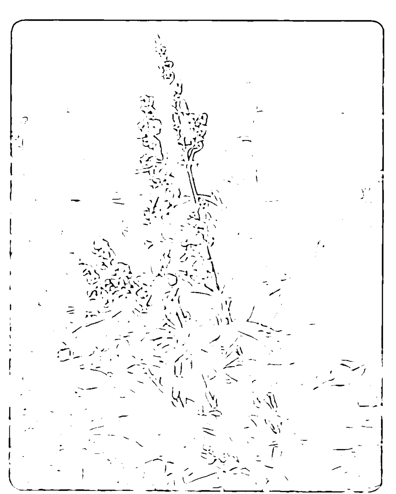

贞节树之所以贞节，在于低剂量时它会让泌乳素升高，进而降低性欲。这种高挑健挺的灌木，开着昂扬的紫花、结成的褐色浆果是主要萃取对象。一般制成锭片，但精油的疗效也毫不逊色。稳健的气味让人联想到中世纪僧侣的专注，是那样的一心一意，才为后来的文艺复兴储备了足够的能量。节约之美，莫过乎此。

## 4.4 子宫脱垂、坐月子、助产

### 生理现象

子宫脱垂，是指子宫由正常位置经阴道下降到子宫颈外口，乃因“骨盆松弛”使得组织韧带丧失原有的支持力。也常伴随生殖区其他器官（阴道、膀胱、尿道、直肠、小肠）的脱垂问题。造成子宫脱垂的原因有分娩损伤（骨盆伸张、组织过度牵引、产道损伤），或是肌肉、筋膜、韧带的张力降低（年老、生育频繁、体质虚弱、组织萎缩、过度劳动等原因），或腹压增加（由于慢性咳嗽、便秘、腹部肿瘤等）。

坐月子是东方人特有的传统概念。中医认为生产过程会耗气失血、身体骤虚，所以古早时代有一连串禁忌，以“隔离保护”的措施，严防疾病侵扰，并多休息静养。月子，呼应医学上指的“产褥期”，从分娩之后、到子宫胎盘剥离的创面要完全愈合，约需时6周。自然产需坐月子约30天，剖腹产或小产则40天。随着时代变迁，目前的坐月子观念，已变成产后整体的生活调养计划。

### Psychology 心理背景

子宫若象征女性最原始的核心，脱垂则代表一种完全放弃、撇手不理的心理状态。可多反问自己，是否发生什么事件让核心价值彻底瓦解？或哪些人事物让人产生无止境的下坠感？是被抛弃，被孤立？像颗球被抛来丢去，没有重心，而让身体自己生出极大的重量感，时时提醒主人？

分娩，是从原本的合体，一分为二的过程。除了新生命的诞生外，也呼应另一个自己（念头或情绪等），能否顺利脱离而独立，这时母体最重要的是与之好好告别，并愿意送上祝福，然后欣然放下。任何的不舍或抓取、掌控，都较容易让产程、产后发生调适不良。

子宫对于送旧迎新而花费的时间快慢，也象征主人内心“汰旧换新”的能力高低。身心越能放松，越不会变得松散！

### 温老师的芳疗经验

唇形科百里香属精油
牻牛儿醇百里香、龙脑百里香、柠檬百里香、薰陆香百里香、冬季百里香
最佳选择：上述精油各 2 滴，加入 10ml 黑种草油，混合均匀。
第二选择：牻牛儿醇百里香 10 滴，加入 10ml 冷压芝麻油，混合均匀。

### 建议用法

- 1. 助产：预产期前三天开始，每 4 小时用 5 滴涂抹于腹部与腰椎。
- 2. 临盆当日每半小时用 10 滴涂抹于腹部与腰椎。
- 3. 坐月子：每日三次用 5 滴涂抹于腹部和阴部。
- 4. 子宫脱垂：每日四次用 5 滴涂抹于腹部、阴部与腰椎。

> [注：我个人两次自然产都得到这些精油极大的帮助，很幸运遇到理解与支持的产科医生，让我自由用油不受限制。中国人坐月子禁忌多，可是并用精油完全不会与之冲突，效果也绝对不逊于传统的保养方法。]

## 精油小传
Essential Oil Bio

### 牻牛儿醇百里香
Thymus vulgaris, CT Geraniol

牻牛儿醇是一种甜美的芳香分子，这使得牻牛儿醇百里香闻起来多了一股花香。法国潘威尔医师有名的精油处方笺里，用于助产的都是富含牻牛儿醇的精油，例如牻牛儿醇百里香、玫瑰草和天竺葵。其实一般的百里香就有帮助子宫收缩的作用，所以牙买加传统里，产妇在产后会立即饮用百里香茶来排净胎盘。对于平滑肌的消炎止痛效果，使百里香一向就是腹痛、胸闷、乃至关节炎的良方。而牻牛儿醇百里香因为酚含量很少，所以对皮肤和肝肾的刺激性都要比一般的百里香低得多，基本上算是一种很安全的百里香。中年妇女的子宫脱垂需要较长时间来保养，用这种不刺激的百里香就没什么禁忌。

虽然气味不同，它和一般的百里香看起来并无分别，都是短小精悍，坚韧不拔。因此牻牛儿醇百里香的娇柔里，还藏着一种为母则强的保护力，与包容一切的弹性。在这个计划赶不上变化的时代里，没有这一点弹性，是很容易被摧折的。

## 4.5 不孕

### 生理现象

不孕症，医学定义是夫妻双方在正常的性行为下，没有采取避孕措施，经过一年以上仍未受孕者。故准确说是“不容易受孕”，而不是不能怀孕。

女性不孕的检查，包括排卵、输卵管能否畅通，子宫是否适合着床。而造成排卵异常的原因有卵巢病变、生殖器官提早老化、荷尔蒙分泌异常等。

男性不育的检查，主要是精液分析，观察精子的数量、质量、活动力，再辅以生理功能、病史追踪、内分泌等身体检查。

双方共同因素，包括心理调适、时机选择、精子在子宫颈黏液中的活动力等，过程较复杂。而男性的检查，比女性和双方的检查来得简单，故通常是最优先进行的初步筛检。

### Psychology 心理背景

孕育新生命是人体最具创造力的表现，但如果人生承受高度的压力，例如工作负荷、生存竞争、物质匮乏，甚至是传宗接代的压力，皆容易让体内的创造性能受阻。有些不孕案例，反而在领养小孩后没多久意外怀孕，便是压力解除了，双方的摩擦也不见了。

若对生育抱持“功利”观点，例如想用生小孩来挽回关系、巩固地位，或想借此来肯定自己的生命价值和意义，证明自己够资格拥有爱，本质纯净的大自然，仿佛感受到人类的企图心，无形中阻止不真诚动机的发生。不孕者总会自责“不完整”，但真正让他或她有缺憾的感受，通常是来自其他领域的挫败，而生育这鲜明标志只是其隐藏情绪的投射出口。

对于“复制另一个自我”怀有抗拒心，可能是不满自己或原生家庭，曾有童年创伤，会连接到过往不好记忆等；也可能自己内心还是个未成熟的小孩，本能排斥另一个小孩进入其生命中；或想逃避照顾者的考验，不愿承担责任与义务。

### Experience
温老师的芳疗经验

蔷薇科蔷薇属精油
波斯玫瑰、土耳其玫瑰、白玫瑰、保加利亚玫瑰
最佳选择：上述精油各1滴，加入10ml玫瑰籽油，混合均匀。
第二选择：保加利亚玫瑰精油4滴，加入10ml月见草油，混合均匀。

### 建议用法
Suggested Usage

- 1. 早晚涂抹小腹与足踝（脚底反射对应卵巢子宫区）。
- 2. 夜间同样涂抹以上部位后做热水半身浴10分钟。
- 3. 平日多饮玫瑰纯露。
- 4. 每日清晨可用上述纯精油加1滴于一茶匙冷压大豆油中口服。

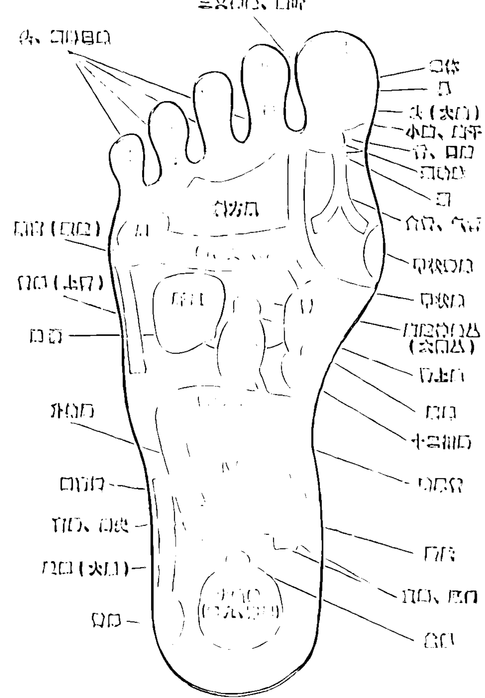

## 精油小传

### 保加利亚玫瑰

“玫瑰就是玫瑰！”(Rose is a rose is a rose is a rose)，这是美国女作家葛楚·史坦最脍炙人口的诗句，正可以代表玫瑰在芳香疗法里“不能赞一辞“的地位。人们对它的气味和疗效简直是五体投地，已被科学研究证实的作用计有抗老化、抗忧郁、抗艾滋、抗癫痫、养肝调经……无所不包，唯一还需要讨论的就只有品种和产地了。以功能来说，最受重视的品种是大马士革玫瑰，这是一种所谓的老玫瑰，有别于不断被杂交出来的新生代。它也是一种油玫瑰，纯粹是种了来萃取精油的，迥异于多数品种的“以色事人”。栽种地区以保加利亚最著名，因为334年的实作和102年的研究，使他们拥有一些产能最大的栽培种。

保加利亚的玫瑰田景色，并没有一般人想象的那种壮观花海。它的植株都在一公尺以上，掌心大的花朵在枝繁叶茂下“犹抱琵琶半遮面”。影影绰绰传来的香气，就像梅兰芳唱的昆曲《游园惊梦》，让我们和电影中的邱如白一样喘不过气来。大马士革玫瑰的婉约缠绵，真是写尽了终极的女性美。

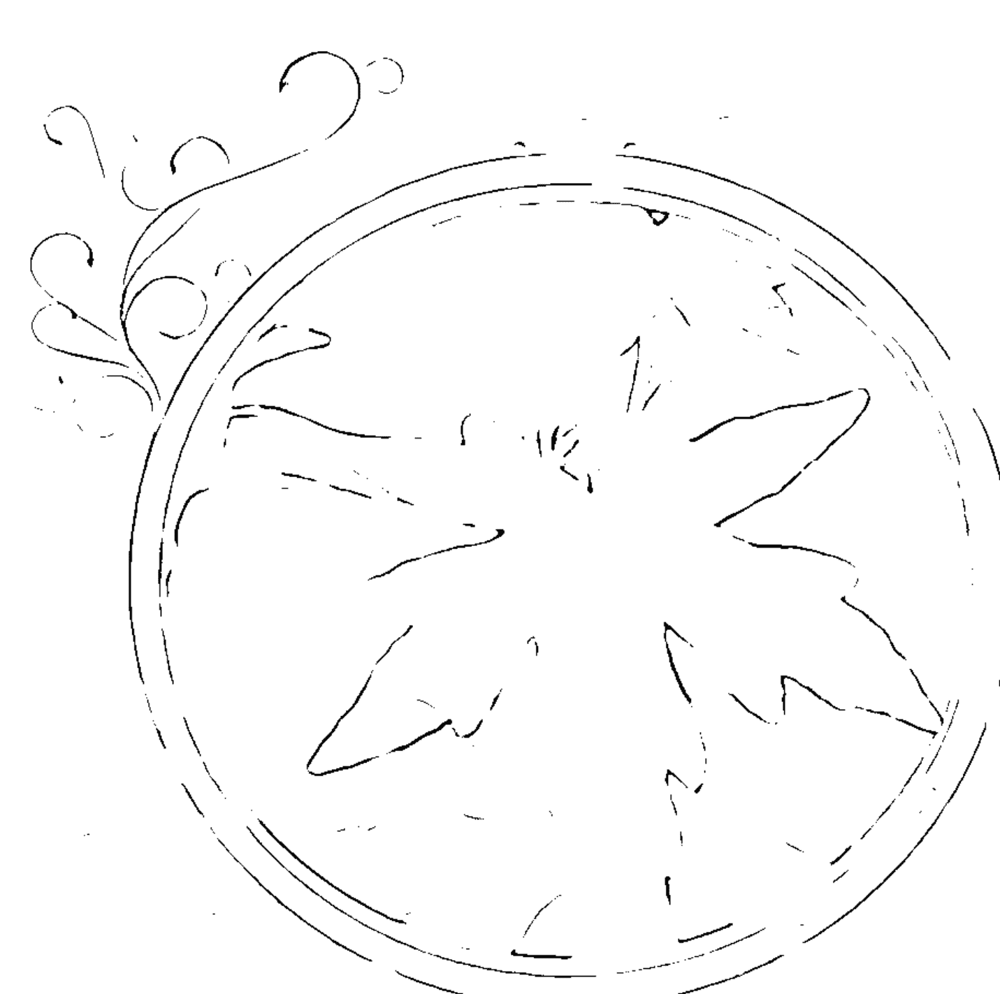

## 附录
精油的使用方式

精油 essential oil：
由芳香植物经由人工萃取方式出的各种精油，因为不同的化学结构组成，而有不同的香气与疗效。

| 使用方式 | 说明 | 建议比例 | 10ml | 30ml | 50ml |
| :--- | :--- | :--- | :--- | :--- | :--- |
| 调和涂抹肌肤 | 精油溶于油脂不溶于水，因此涂抹使用时，可将精油滴入含油的基剂内（以植物油最佳），涂抹身体各处，调配的浓度依照 1. 身体部位，2. 使用频率，3. 症状轻重，4. 精油的刺激性而有所不同，读者可参阅本书的配方来使用。 | 1% | 2滴 | 6滴 | 10滴 |
| | | 3% | 6滴 | 18滴 | 30滴 |
| | | 5% | 10滴 | 30滴 | 50滴 |
| | | 10% | 20滴 | 60滴 | 100滴 |
| 蒸汽熏香吸入 | 将精油扩散于空气中，常见的方式有滴于手帕、加热、水蒸、喷成雾等方式，透过鼻腔吸入进入人体。不同的扩香方式适用于不同的空间大小，可以照使用说明来选择。 | 床头 | 扩香石 1~3滴 |
| | | 房间 | 扩香石 3~5滴 |
| | | 客厅 | 扩香机 30滴 |
| | | 如果空间大或快速除臭杀菌，使用量需加大，效果才佳。 |

纯露 hydrosol：
纯露是蒸馏植物过程中，收集了芳香植物里水溶性的物质，是偏酸性的水溶液，可以直接使用在肌肤上，也可内服，疗效温和，和精油互相搭配使用，可增加疗愈力与变化性。要注意的是，很多厂商为了保存方便，并且只注重肌肤保养，会在纯露里添加防腐剂或是酒精、甘油等其他成分，这样的纯露仅能外用，不可口服。

| 使用方式 | 说明 |
| :--- | :--- |
| 直接湿敷 | 用纯露沾湿化妆棉或面膜纸之后，直接敷用于脸部或是身体上。 |
| 加水稀释后内服 | 平时保养时，以一茶匙加入一杯水来饮用，或是 30ml 纯露加入 1000ml 开水里，一天内喝完。 |

## 植物油 oil：

用植物的种子或果实冷压（70°F以下）榨成的油脂，涂抹在身上，能够维持肌肤健康，治疗皮肤病症，也是让精油安全、迅速地进入身体的媒介。不同的脂肪酸有不同的疗效与触感，可参照书中配方以及植物油简表来选用。

| 使用方式 | 说明 | 建议用量 |
| :--- | :--- | :--- |
| 调和涂抹肌肤 | 直接涂抹于身体肌肤上，或是调和精油之后涂抹。每种植物油的延展性与滋润度都略有不同。也可混合多种植物油使用。 | 脸部按摩：1ml 背部按摩：10ml 全身按摩：15ml 足部按摩：5ml |
| 直接口服 | 不饱和脂肪酸含量高的植物油，容易氧化，开封后要尽快食用完毕，避免经常接触空气而变质。 | 每日空腹口服一小匙（约2～5ml）慢慢地啜饮避免吞入空气，也可拌入饭、面或色拉内食用。 |

## 芳疗养生 索引

### 神经与免疫系统

| 序号 | 症状 | 中文名 | 英文名 | 拉丁名 | 功效 |
| :--- | :--- | :--- | :--- | :--- | :--- |
| 1 | 头痛、偏头痛 | 丁香花苞、丁香枝干、丁香叶、丁香花苞、多香果、香叶多香果 | Clove | Eugenia caryophyllata | 强力抗菌、止痛消炎、抗氧化、抑制肺泡、补强神经、舒缓抑郁 |
| 2 | 失眠、作息失调 | 翠花杜鹃、白珠树、印度缬草、缬草、岩甘松、中国甘松、格陵兰喇叭茶 | Labrador Tea | Ledum groenlandicum | 养肝排毒、抗痉挛、助眠、抗肿瘤、舒缓紧张、排除阴郁 |
| 3 | 精神涣散、记忆力差 | 柠檬薄荷、胡椒薄荷、绿薄荷、澳洲野薄荷、绿薄荷 | Lemonmint | Mentha citrata | 补身、激励腺体、抗痉挛、平复神经、消炎、强化生殖机能 |
| 4 | 厌倦、焦虑、歇斯底里 | 芳尼草、紫罗兰叶、晚香玉、水仙、铃兰花、桂花 | Tuberose | Polianthes tuberosa | 止痛消炎、治失眠、放松神经肌肉组织、利尿、有益呼吸与代谢 |
| 5 | 沮丧、忧郁症 | 橘叶、苦橙叶、佛手柑叶、泰国青柠叶、柠檬叶、莲花 | Petitgrain, mandarin | Citrus reticulata, leaf oil | 强力镇静、抗痉挛、助眠、安定神经、处理精神官能症 |
| 6 | 慢性疲劳症候群 | 白云杉、芒云杉、密尔顿亚云杉、硅卡云杉、挪威云杉、英格曼云杉、小冷杉云杉、红云杉 | Red Spruce | Picea rubens | 滋养补强、保护气场、调节内分泌、抗氧化、充满气力 |
| 7 | 过敏（气喘、花粉热、过敏性皮肤炎） | 德国洋甘菊、罗马洋甘菊、菊花、野洋甘菊、金盏菊 | German Chamomille | Chamomilla recutita | 抗过敏、促进伤口愈合、消炎、抗痉挛、有益消化与妇科机能 |
| 8 | 疱疹、神经痛 | 坨麻草、大麻、莎草、黑种草、圣约翰草 | St John's Wort | Hypericum perforatum | 消炎止痛、抗病毒、调节时差、抗忧郁症、拨云见日 |
| 9 | 念珠菌感染 | 利古里亚薰衣草、高地薰衣草（银灰菊）、艾菊、库洛可蓝艾菊、万寿菊、西洋耆草 | Santolina | Santolina chamaecyparissus | 抗菌抗病毒、消炎、处理发疹瘙痒、调节中枢神经、平衡情绪 |

### 肌肉与骨骼系统

| 序号 | 症状 | 中文名 | 英文名 | 拉丁名 | 功效 |
| :--- | :--- | :--- | :--- | :--- | :--- |
| 10 | 骨关节炎、类风湿性关节炎 | 石松、欧洲松、矮松、黑松、滨海松、杰克松、红松、北美黄松、科西嘉黑松、白松 | Pine laricio | Pinus nigra laricio | 处理关节炎及退化问题、消炎、改善肾上腺、抗老化、滋养补强 |
| 11 | 肌肉酸痛、背痛 | 马鞭草酮迷迭香、龙脑迷迭香、高地迷迭香、桉油醇迷迭香 | Thyme, borneol | Rosmarinus officinalis, borneone | 抗感染、调节免疫、强肝利胆、强化生殖机能、恢复弹性 |
| 12 | 急性发炎、扭伤发肿、静脉曲张 | 直干尤加利、史泰格尤加利、柠檬尤加利、药用尤加利、多苞叶尤加利、河岸红尤加利 | river red gum | Eucalyptus camaldulensis | 抗菌抗病毒、消炎止痛、促进伤口愈合、化痰祛痰 |
| 13 | 抽筋、痉挛 | 花梨木、山鸡椒、月桂、洋茴香罗文莎叶 | Bay | Laurus nobilis | 强力抗痉挛、止痛消炎、杀菌、改善淋巴阻塞、身心回春 |
| 14 | 痛风 | 没药、红没药、巴西没药、榄香脂、印度乳香、乳香 | Myrrh | Commiphora molmol | 消炎止痛、抗菌抗病毒、愈合伤口、抗肿瘤、调节过多的欲望 |
| 15 | 坐骨神经痛 | 澳洲檀香、太平洋没药、安息香、苦香树、圣拉木、白杨、古芸香脂、苏合香 | Styrax | Liquidambar orientalis Mill | 强力抗痉挛、强力止痛、调节心循环机能、通窍脏腑 |
| 16 | 运动伤害、扭伤、挫伤 | 头状薰衣草、穗花薰衣草、甜醒目薰衣草、克什米尔薰衣草 | Lavandin | Lavandula hybrid | 促进伤口愈合、舒缓肌肉痉挛、消炎止痛、化痰、镇静安抚 |
| 17 | 落枕、僵硬、气血不通 | 窄叶永久花、头状永久花、苞叶永久花、豆头永久花、光辉永久花、意大利永久花 | Immortelle | Helichrysum italicum | 强力的身心化瘀、气血通畅、抗痉挛、激励肝脏、走出伤痛 |
| 18 | 骨质疏松 | 豆蔻、大高良姜、姜、泰国姜黄、白草果、芒果姜、姜黄 | Ginger | Zingiber officinale | 补强关节与骨质、抗风湿、调节免疫、止痛止痒、养肝排毒 |

### 消化与代谢系统

| 序号 | 症状 | 中文名 | 英文名 | 拉丁名 | 功效 |
| :--- | :--- | :--- | :--- | :--- | :--- |
| 19 | 牙龈发炎、鹅口疮 | 沉香醇绿花白千层、绿花白千层、印度尼西亚白千层、茶树、沼泽茶树、绿叶茶树、小河茶树、窄叶茶树、扫帚茶树、柠檬茶树、醇绿花白千层 | Niaouli | Melaleuca quinquenervia | 抗菌抗病毒、鼓励肝脏细胞、抗肿瘤、预防放射疗法的皮肤损伤 |
| 20 | 胃溃疡、胃炎、十二指肠溃疡 | 巴西胡椒、伏尔胡椒、绿胡椒、肉豆蔻、岩玫瑰、乳香 | Mastic | Pistacia lentiscus | 促进愈合、消除静脉与淋巴管的阻塞、处理胃炎、鼻窦炎 |
| 21 | 消化不良、胃胀气、胃口差、胀气 | 佛手柑、日本柚子、粉红葡萄柚、克莱蒙橙、红柑 | Pink Grapefruit | Citrus paradise | 调节食欲、促消化、解便秘、抗菌、安定神经、调节时差 |
| 22 | 肠炎、腹泻、肠躁 | 香脂木豆木、扁豆、依兰香脂、吐鲁香脂、古巴香脂、安息香脂、银合欢 | Tonka | Dipteryx odorata | 强力抗痉挛、松弛心神、强心、畅通血液、抗肺结核、调节自律神经 |
| 23 | 便秘、大肠息肉、肠痉挛、排毒 | 芹菜籽、胡萝卜籽、莳萝籽、芫荽籽、白松香 | Dill | Anethum graveolens | 利胆、助消化、除胀气、抗凝血、消解黏液、养肾 |
| 24 | 肝炎 | 土木香、土木香根、印角甘劳、印角雪莲花、加拿大飞蓬、一枝黄花 | Canadian Horseweed | Conyza Canadensis | 养肝护肝、消炎、处理疱疹病毒、脊椎关节炎、痛风 |
| 25 | 胆结石、胆绞痛 | 茴香香、印度茴香、阿密茴、柴胡、防风草根、小茴香 | Khella | Ammi visnaga | 抗痉挛、能处理动脉硬化、气喘、心绞痛、肾绞痛、结石 |
| 26 | 肾脏病保养 | 罗文莎叶（桉油酚）、芳樟、檫树（木樟）、苏刚达（灰叶樟）、马达加斯加肉桂、中国肉桂、印度肉桂 | Cassia | Cinnamomum cassia, bark | 强力抗感染、抗氧化、降血脂、活化免疫机能、补身、驱风祛寒 |
| 27 | 厌食、忌食、饮食无度 | 牛膝草、广藿香、高地牛膝草、香蜂草、野香薄荷、猫薄荷、柠檬草、马郁兰 | Melissa | Melissa officinalis | 强心、降血压、安抚镇静、助眠、抗忧郁、抗过敏、溶解结石 |

### 呼吸与循环系统

| 序号 | 症状 | 常用精油 | 英文名 | 拉丁学名 | 功效 |
|---|---|---|---|---|---|
| 28 | 感冒 | 希腊香薄荷、夏季香薄荷、西班牙马郁兰、希腊马郁兰、摩洛哥马郁兰 | Morocco Oregano | Origanum compactum | 强力抗菌抗病毒、提升免疫机能、激励补身、消除疲劳 |
| 29 | 鼻炎、鼻窦炎 | 苦艾、艾草、印蒿、阿法蒿、白蒿、南木蒿、龙艾 | Southornwood | Artemisia arborescens | 抗过敏、抗组织胺、抗粘膜发炎、消除粘液、利胆 |
| 30 | 支气管炎、肺炎 | 巨大冷杉、白冷杉、喜马拉雅冷杉、日本冷杉、太平洋冷杉、落矶山冷杉、诺得及冷杉、高冷杉 | Fir, subalpino | Abies lasiocarpa | 抗菌、抗痉挛、抗粘膜发炎、激励肾上腺、处理子宫和关节痛 |
| 31 | 喉咙痛、扁桃腺炎 | 玫瑰草、柠檬香茅、爪哇香茅、锡兰香茅、岩兰草 | Lemongrass | Cymbopogon flexuosus | 抗菌抗病毒、抗寄生虫、防癌、处理消化及肝功能不良、肌肉酸痛 |
| 32 | 耳炎、耳鸣 | 罗汉柏、美洲花柏、侧柏、日本扁柏、福建柏、澳洲蓝丝柏 | Slam wood | Fokienia hodginsii | 补强神经、提振能量、激励男性荷尔蒙、处理气管疼痛 |
| 33 | 静脉曲张、痔疮 | 日本杉、刺桧、维吉尼亚雪松、德州雪松、杜松、丝柏 | Cypress | Cupressus sempervirens | 纾解静脉与淋巴淤积的毒素与废物、收敛、止咳、舒解肺脏充血 |
| 34 | 重大手术愈后 | 大西洋雪松、喜马拉雅雪松、落叶松、加拿大铁杉、西部铁杉、道格拉斯杉 | Canada Hemlock | Tsuga Canadensis | 激励人体自愈机制、处理风湿、关节炎、伤口、腹泻、肠胃绞痛 |
| 35 | 手脚冰冷、冻疮、雷诺氏症 | 欧白芷根、海茴香、芜荽叶、平叶欧芹、皱叶欧芹、洋茴香、茴香、莳萝全株、圆叶当归、灰叶当归 | Angelica | Angelica archangelica | 补气、抗凝血、助消化、除胀气、处理神经衰弱失眠 |
| 36 | 高血压、心悸 | 没药、乳香、玫瑰天竺葵、大根老鹳草、香茅、完全依兰 | Ylang Ylang | Cananga odorata | 抗痉挛、止痛、平衡神经、安定血压、平抚心悸、补肾壮阳 |

### 生殖与泌尿系统

| 序号 | 症状/用途 | 常用精油 | 英文名 | 拉丁学名 | 主要功效 |
| :--- | :--- | :--- | :--- | :--- | :--- |
| 37 | 性机能障碍 | 印度茉莉、摩洛哥茉莉、埃及茉莉、阿拉伯茉莉 | Arabian Jasmine | Jasminum sambac | 补强子宫与性机能、催情、抗沮丧、利神经、愈合伤口、改善体质 |
| 38 | 孕妇保养、怀孕症状处理 | 绿香桃木、香桃木、高地松红梅、卡奴卡、柠檬细籽、柠檬香桃木 | Lemon-scented Tea Tree | Leptospermum petersonii | 抗感染、消炎、镇静安抚、抗沮丧、助消化、抗痉挛 |
| 39 | 经前症候群、更年期间题 | 三裂叶鼠尾草、快乐鼠尾草、小叶鼠尾草、狭长叶鼠尾草、薰衣草鼠尾草 | Spanish sage | Salvia lavandulifolia | 抗菌抗病毒、调经、利胆、瘦身、除痘、缓解运动伤害 |
| 40 | 乳癌与其他女性肿瘤之愈后 | 白玉兰花、白玉兰叶、黄玉兰、红花细栀、汾红莲花 | Pink Lotus | Nelumbo nucifera | 活血止血、祛湿驱风、抗氧化、提升性欲、补强生殖机能 |
| 41 | 生殖区感染、分泌物与瘙痒 | 柠檬罗勒、神圣罗勒、甜罗勒、热带罗勒、辣罗勒 | Holy Basil | Ocimum sanctum | 抗菌抗病毒、抗微生物、止痛、调节神经、强化免疫 |
| 42 | 膀胱炎 | 四叶布枯、印度花椒、竹叶花椒、阿米香树、茄四叶布枯、茄空叶（可因氏月橘） | round leaf buchu | Agathosma betulina | 处理泌尿问题、驱风、伤口愈合、瘦身、改善肾脏和保护腺的不适 |
| 43 | 经痛（子宫内膜异位、子宫肌瘤） | 爪哇马鞭草、白色马鞭草、亚味过江藤、贞节树果、贞节树叶、马缨丹、柠檬马鞭草 | Vitex | Vitex Agnus-Castus | 调节女性机能问题、平衡荷尔蒙、促进母乳分泌、抗肿瘤 |
| 44 | 子宫脱垂、坐月子、助产 | 锻牛儿醇百里香、龙脑百里香、柠檬百里香、贞节百里香、冬百里香 | Thyme geraniol | Thymus vulgaris, OT Geraniol | 助产，帮助子宫收缩、排净胎盘、消炎镇痛、抗菌、促进循环 |
| 45 | 助孕 | 波斯玫瑰、土耳其玫瑰、白玫瑰、保加利亚玫瑰 | Bulgaria Rose | Rosa damascena, Bulgaria | 调经催情、补生殖之气、养肝利胆、抗焦虑忧郁、抗老化、收敛 |

## 植物油简表

| 序号 | 中文名 | 英文名 | 拉丁学名 | 特性 | 功效 |
| :--- | :--- | :--- | :--- | :--- | :--- |
| 1 | 月见草油 | evening primrose oil | Oenothera biennis | ○ ○ ○ ○ ○ | 富含 γ 亚麻油酸，调节前列腺素，平衡内分泌、消炎、预防过敏，牛皮癣、湿疹等皮肤问题 |
| 2 | 琉璃苣油 | borage oil | Borago officinalis | ○ ○ ○ ○ ○ | 富含 γ 亚麻油酸，调节前列腺素，平衡内分泌、消炎、预防过敏，牛皮癣、湿疹等皮肤问题 |
| 3 | 大豆油 | soybean oil | Glycine max | ○ ○ ○ ○ ○ | 富含维他命 A、B、E 以及卵磷脂、大豆异黄酮等女性荷尔蒙的前趋物 |
| 4 | 小麦胚芽油 | wheat germ oil | Triticum aestivum | ○ ○ ○ ○ ○ | 富含丰富维他命 E，抗氧化极佳，不易腐败，对早衰或老化的皮肤有帮助，带来滋润及生命力 |
| 5 | 印度楝树油 | neem oil | Azadirachta indica | ○ ○ ○ ○ × | 止痒、利尿、恢复肝功能。内含之苦楝素可以杀菌、杀霉菌、除虱蚤，是宠物必备用油 |
| 6 | 向日葵油 | sunflower oil | Helianthus annuus | ○ ○ ○ ○ ○ | 适合亲肤，亲肤性高，是按摩的良好基底油，能带来阳光正面的能量 |
| 7 | 杏桃仁油 | apricot kernel oil | Prunus armeniaca | ○ ○ ○ ○ △ | 油质清爽，质感细腻，适合蜡黄、脱皮、早熟老化、发炎干燥，失去女性魅力的肌肤，也适用于婴幼儿 |
| 8 | 沙棘油 | seabuckthorn oil | Hippophae rhamnoides | ○ ○ ○ ○ ○ | 富含 β 胡萝卜素，油色橙黄，涂抹须注意染色，强力抗氧化，抗自由基，抑制皮肤癌，促进伤口愈合及细胞再生 |
| 9 | 昆士兰坚果油 | macadamia nuts oil | macadamia integrifolia | ○ ○ ○ ○ ○ | 油质清淡不黏腻，延展性、渗透性及亲肤性高，适合油性及面疱皮肤 |

## 植物科属快速索引

| 植物所属科属 | 植物所属科属 | 植物所属科属 | 植物所属科属 | 植物所属科属 | 植物所属科属 | 植物所属科属 |
|---|---|---|---|---|---|---|
| 松科-1 | 石松、旗杆松、矮松、黑松、海松、杰克松、挪威松、巴塔哥尼亚松、科西嘉黑松、白松 | 净化磁场喷雾 | 白松 | 鱼尾纹、法令纹 | 深海松 | 风湿性关节炎、骨关节炎 | 科西嘉黑松 |
| 松科-2 | 巨大冷杉、科罗拉多冷杉、喜马拉雅冷杉、日本冷杉、太平洋银冷杉、落矶山冷杉、诺德曼冷杉、高黄冷杉 | 淡竹喷雾 | 巨大冷杉 | 化妆过度引起之暗沉 | 高黄冷杉 | 支气管炎、肺炎 | 落矶山冷杉 |
| 松科-3 | 白云杉、蓝云杉、密尔维亚云杉、硅卡云杉、挪威云杉、英格曼云杉、小琴兹云杉、红云杉 | 拒烟喷雾 | 挪威云杉 | 黑头粉刺 | 硅卡云杉 | 慢性疲劳、痤疮群 | 红云杉 |
| 松科-4 | 大西洋雪松、喜马拉雅雪松、落叶松、加拿大铁杉、西部铁杉、道格拉斯杉 | 衣柜香包 | 道格拉斯杉 | 落发、头皮屑 | 喜马拉雅雪松 | 重大手术愈后 | 加拿大铁杉 |
| 柏科-1 | 迦罗木、美洲花柏、闪柏、日本扁柏、纽西兰柏、澳洲蓝丝柏 | 鸡眼泡油膏 | 闪柏 | 富贵手 | 澳洲蓝丝柏 | 耳炎、耳鸣 | 福建柏 |
| 柏科-2 | 日本杉、刺桧、维吉尼亚雪松、德州雪松、杜松、丝柏 | 除臭圣粉 | 维吉尼亚雪松 | 汉脸 | 杜松 | 静脉曲张、痔疮 | 丝柏 |
| 桃金娘科-1 | 立干尤加利、史泰格尤加利、柠檬尤加利、薄荷尤加利、多苞叶尤加利、河岸红尤加利 | 户外活动喷雾 | 柠檬尤加利 | 修复烫伤发 | 多苞叶尤加利 | 膀胱炎、粘液囊炎、脾、膀胱发炎、脾、膀胱发炎 | 河岸红尤加利 |
| 桃金娘科-2 | 沉香、白千层、绿花白千层、印度尼西亚白千层、茶树、沼泽茶树、小河茶树、岩叶茶树、扫帚茶树、绿花白千层 | 烫伤伤止痛胶 | 茶树 | 凹凸不平 | 沼泽茶树 | 牙龈发炎、口疮 | 绿花白千层 |
| 桃金娘科-3 | 丁香花苞、丁香枝干、丁香叶、多香果、香叶多香果 | 敏感油膏 | 香叶多香果 | 角皮疣 | 多香果 | 头痛、偏头痛 | 丁香花苞 |
| 桃金娘科-4 | 绿香桃木、香桃木、丁地松红樟、卡奴卡、柠檬细籽、柠檬香桃木 | 小护士急救膏 | 柠檬香桃木 | 增长眉毛与睫 | 香桃木 | 怀孕症状处理 | 柠檬细籽 |
| 唇形科-1 | 薰衣鼠尾草、三裂叶鼠尾草、快乐鼠尾草、小叶鼠尾草、狭长叶鼠尾草 | 妈妈手软膏 | 快乐鼠尾草 | 闭口粉刺（溶） | 小叶鼠尾草 | 经前症候群、更年期问题 | 黑衣鼠尾草 |
| 唇形科-2 | 克什米尔薰衣草、头状薰衣草、薰衣草、甜醒回薰衣草、佛那那薰衣草 | 保湿凝胶 | 薰衣草 | 防晒 | 克什米尔薰衣草 | 运动伤害、扭伤、挫伤 | 尾目薰衣草 |
| 唇形科-3 | 柠檬薄荷、胡椒薄荷、短柄薄荷、美洲野薄荷、绿薄荷 | 绿土牙膏 | 绿薄荷 | 湿疹、控油 | 美国薄荷 | 精神涣散、记忆力差 | 柠檬薄荷 |
| 唇形科-4 | 特长罗勒、神圣罗勒、热带罗勒、柠檬罗勒 | 尺味香草膏 | 特长罗勒 | 指甲护理 | 热带罗勒 | 生殖区感染、分泌物与经痛 | 神圣罗勒 |
| 唇形科-5 | 牛儿醇百里香、龙脑百里香、柠檬百里香、宝陆香百里香、冬季百里香 | 抗感染喷雾 | 黑陆香百里香 | 油性发质 | 柠檬百里香 | 子宫脱垂、坐月子、助产 | 牛儿醇百里香 |
| 唇形科-6 | 希腊香薄荷、夏季香薄荷、西班牙野马郁兰、摩洛哥野马郁兰 | 眼部油精 | 西班牙野马郁兰 | 香港脚 | 冬季香薄荷 | 忌口 | 摩洛哥野马郁兰 |
| 唇形科-7 | 马郁兰、牛膝草、广藿香、背地牛膝草、香蜂草、柠檬香蜂草 | 助眠喷雾 | 马郁兰 | 发炎面疱 | 广藿香 | 厌食、暴食、饮食无度 | 香蜂草 |
| 唇形科-8 | 马鞭草回迷迭香、龙脑迷迭香、背地迷迭香、桉油醇迷迭香 | 宁愿防护油 | 桉油醇迷迭香 | 抗老化 | 马鞭草回迷迭香 | 肌肉酸痛、背痛 | 光脸迷迭香 |
| 伞形科-1 | 欧白芷根、毒茴香、芜荽叶、平叶欧芹、欧叶欧芹、洋茴香、莳萝全株、四叶当归、灰叶当归 | 便宜油精 | 四叶当归 | 美白 | 茴香 | 手脚冰冷、冻疮、雷诺氏症 | 欧白芷根 |
| 伞形科-2 | 芹菜籽、胡萝卜籽、莳萝籽、芜荽籽、白松香 | 防晒凝胶 | 胡萝卜籽 | 斑点 | 芹菜籽 | 便秘、大肠息肉、肠溃疡、痔疮 | 芹菜籽 |
| 伞形科-3 | 小茴香、藏茴香、印度藏茴香、阿密茴、柴胡、防风草根 | 感冒敷布 | 印度藏茴香 | 足部、手肘干 | 民苗香 | 胆结石、绞痛 | 阿密茴 |
| 唇形科-1 | 花梨木、山鸡椒、月桂、库西香罗文莎叶 | 温泉溶石剂 | 山鸡椒 | 淡化乳... | 花梨木 | 粘膜、湿疹 | 月桂 |
| 樟科-2 | 罗文莎叶 (桉叶醇)、芳樟、本樟、刚果 (灰叶樟)、马达加斯加肉桂皮、中国肉桂、印度肉桂 | 足部泡茶 | 马达加斯加肉桂 | 淡身 | 樟树 (本樟) | 尿道保养 | 中国肉桂 (皮) |
| 树脂 + 木质 | 没药、太平洋没药、安息香、苦香树、圣木、白杨、古芸香脂、苏合香 | 含胸静心法 | 圣木 | 红血丝 (微血管扩张) | 澳洲尤加利 | 坐骨神经痛 | 苏合香 |
| 橄榄科 | 乳香、没药、红没药、墨西哥没药、没药香脂、印度乳香 | 舒展眼肌 | 巴西没药 | 黑眼圈 | 乳香 | 痤疮 | 没药 |
| 伞形科 | 芹麻草、大麻、莎草、黑胡草、圣约草 | 网球肘敷布 | 黑胡草 | 眼袋 | 芹麻草 | 胃溃疡、胃炎、十二指肠溃疡 | 圣约草 |
| 漆树科 + 漆树科 + 他科 | 巴西胡椒、没药胡椒、绿胡椒、肉豆蔻、岩玫瑰 | 急救油膏 | 岩玫瑰 | 抗沙尘 | 巴西胡椒 | 疱疹、神经痛 | 蒸馏香 |
| 牡丹科 + 淡紫草科 | 牡丹皮、芳香白珠、印度没药、缬草、中国甘松、洛艮兰针叶茶 | 女性保养敷布 | 芳香白珠 | 干性发质 | 芳甘草 | 失眠、作恶梦 | 格陵兰针叶茶 |
| 豆科 | 香脂木豆木、爪哇豆、没药香脂、吐鲁香脂、古巴香脂、零陵香豆、银合欢 | 护手霜 | 香脂木豆木 | 闭口粉刺 (念合) | 银合欢 | 肠炎、腹泻、肠疾 | 零陵香豆 |
| 马鞭草科 | 爪哇马鞭草、白色马鞭草、马缨丹、贞节树果、贞节树叶、马缨丹、柠檬马鞭草 | 速愈敷布 | 爪哇马鞭草 | 足皮落屑 | 马缨丹 | 经痛 (子宫内膜异位、子宫肌瘤) | 黄连香果 |
| 姜科 | 豆蔻、大高良姜、姜、泰国姜参、白苹果、芒果姜、郁金 | 足踝扭伤敷布 | 泰国姜参 | 烫伤、烧烫伤 | 姜黄 | 肾脏虚弱 | 姜 |
| 花朵类-2 | 淡斯玫瑰、土耳其玫瑰、白玫瑰、保加利亚玫瑰 | 护唇膏 | 土耳其玫瑰 | 美白提亮 | 白玫瑰 | 勃起 | 保加利亚玫瑰 |
| | 印度茉莉、摩洛哥茉莉、埃及茉莉、阿拉伯茉莉、伯茉莉 | 深层滋养 | 摩洛哥茉莉 | 保湿 | 印度茉莉 | 性机能障碍 | 阿拉伯茉莉 |
| 花朵类-3 | 奇尼草、紫罗兰叶、晚香玉、水仙、莲花、桂花 | 紫罗兰叶 | 外油内干 | 桂花 | 抑郁、焦虑、皮肤敏感 | 晚香玉 |
| 花朵类-4 | 白玉兰、白玉兰叶、黄玉兰、红花缅栀、香草、完全依兰 | 黄玉兰 | 颈部护理 | 白玉兰 | 乳癌与其他女性准肿瘤之念后 | 粉红莲花 |
| 花朵类-5 | 波旁天竺葵、玫瑰天竺葵、大根老鹳草、香草、完全依兰 | 大根老鹳草 | 肤质细纹 | 波旁天竺葵 | 高血压、心悸 | 完全依兰 |
| 禾本科 | 玫瑰草、柠檬香茅、爪哇香茅、锡兰香茅、岩兰草 | 岩兰草 | 脸色苍白 | 玫瑰草 | 突咙痛、肩腕腺炎 | 柠檬香茅 |
| 菊科-1 | 利古里亚洋甘菊、衣草糊、艾菊、罗马洋甘菊、蓝艾菊、万寿菊、西洋蓍草 | 西洋蓍草 | 皮肤炎、湿疹 | 原洛牙蓝艾菊 | 念珠菌感染 | 薰衣草糊 |
| 菊科-2 | 德国洋甘菊、罗马洋甘菊、菊花、野洋甘菊、金盏菊 | 野洋甘菊 | 敏感性皮肤 | 金盏菊 | 过敏（气喘、花粉热、过敏性皮肤炎） | 德国洋甘菊 |
| 菊科-3 | 土木香、土木香根、印角甘菊、印角三叶木、加拿大飞蓬、一枝黄花 | 印角甘菊 | 净化排毒 | 一只黄花 | 肝炎 | 加拿大飞蓬 |
| 菊科-4 | 窄叶永久花、头状永久花、苞叶永久花、露头永久花、光辉永久花、意大利永久花 | 露头永久花 | 修复受损角质 | 苞叶永久花 | 落枕、白发、气血不通 | 意大利永久花 |
| 菊科-5 | 苦艾、艾草、印蒿、南法荷、白蒿、南木荷、龙艾 | 龙艾 | 去痘印 | 艾草 | 鼻窦炎 | 南木荷 |
| 芸香科-1 | 圆叶布枯、印度花楸、竹叶花椒、阿米香树、椭圆叶布枯、咖喱叶 | 印度花楸 | 橘皮组织 | 咖喱叶 | 膀胱炎 | 圆叶布枯 |
| 芸香科-2 | 佛手柑、日本柚子、伯红葡萄柚、克莱蒙橙、红柑 | 伯手柑 | 延缓纹 | 日本柚 | 消化不良、口臭、胀气 | 伯红葡萄柚 |
| 芸香科-3 | 桂花、橘叶、苦橙叶、佛手柑叶、泰国青柠叶、柠檬叶、柠檬 | 泰国青柠叶 | 收毛孔 | 苦橙叶 | 泪液、洗脚症 | 桔叶 |

## 资料链接

| 序号 | 研究内容 |
| :--- | :--- |
| 1 | 刺激性精油丁香酚对兔子动脉组织产生血管放松作用的机制研究 丁香酚保护胎鼠脑皮质神经细胞免受兴奋性毒性分子与氧化损伤研究 |
| 2 | 格陵兰喇叭茶的甲醇提取物之抗氧化、消炎和抗癌活性 由泰国黑胡果蝇翅防测试三种精油的抗基因突变作用 |
| 3 | 温带芳香植物精油的生物活性研究：抗菌、抗氧化、消炎及相关药学反应 普侯阴道栓剂用于未感染艾滋病之女性及其男伴的抗性交感染效果研究 |
| 4 | 晚香玉原精与其部分成分的抗霉菌作用研究 晚香玉花朵萃取物的愈合伤口效用研究 |
| 5 | 桔叶精油：圣地与西奈的芳香植物研究 植物资源的环境效应 ——四季桔叶挥发油抑菌效果实验 |
| 6 | 以电泳试验从红云杉、火炬松和欧洲赤松的针叶萃取超氧化歧化酶 (SOD) 红云杉和胶冷杉针叶延收西梭克山的海拔分布呈现之光谱反射率 |
| 7 | 单纯口服德国洋甘菊花朵萃取与并用抗过敏药剂对小鼠的止痒效果 德国洋甘菊与类固醇药物在疗愈伤口上的比较分析 (试管与活体实验) |
| 8 | 圣约翰草萃取物对人类巨细胞病毒在试管内的抗病毒活性研究 印度产圣约翰草的消炎止痛活性研究 |
| 9 | 银灰菊精油的抗白色念珠菌活性研究 银灰菊萃取的平抑中枢神经作用、消炎活性和抗胆碱诱导性研究 |
| 10 | 科西嘉黑松精油的成分差异研究 α-松油萜在人类单核性 THP-1 细胞中对核转录因子-KB 的抑制作用 |
| 11 | 迷迭香精油止痛作用与成分研究 迷迭香精油之血管平滑肌放松效果研究 |
| 12 | 河岸红桉叶片精油的桉油醇与 β-松油萜在鼠类身上之止痛作用 桉油醇在试管内对人类血液单核细胞抑制细胞因子生成和花生四烯酸代谢的作用研究 |
| 13 | 月桂叶精油的抗痉挛作用对抗戊四唑和电击诱发的癫痫研究 月桂叶精油的止痛与消炎作用研究 |
| 14 | 没药树脂中具生物活性的萜烯类和穆库尔没药固醇之消炎潜力研究 没药树脂中的抗菌萜烯成分研究 |
| 15 | 广东产苏合香对大鼠血液流变学的影响 苏合香成分桂皮酸抗血小板作用的研究 (二) |
| 16 | 吸入与口服醒目薰衣草精油的止痛、胃黏膜保护作用研究 醒目薰衣草精油的崭新抗血小板与抗血栓作用研究 |
| 17 | 永久花精油与玫瑰籽油用于重建手术或整形手术之功效 意大利永久花精油之萜烯类成分结构与其抗微生物活性研究 |
| 18 | 姜、欧尼草、丁香三种精油的免疫调节活性研究：经体液与细胞反应的证据 姜精油于动物实验中表现的消炎止痛活性 |
| 19 | 绿花白千层精油有助强化抗原特异性的细胞免疫及促进巨噬细胞生产细胞因子 不同来源的绿花白千层精油：对于经皮吸收雌激素的试管分析和影响 |
| 20 | 试管与活体实验愈陆香树脂萃取及其成分对抗幽门螺旋杆菌之活性 愈陆香在麻醉兔身上表现的抗血栓和降血脂活性 |
| 21 | 葡萄柚精油诱使人类血癌细胞凋亡之研究 葡萄柚精油气味的嗅觉刺激影响自主神经神经传导和血压之研究 |
| 22 | 零陵香豆具有抗癌潜力的成分研究 香豆素对老鼠前额叶皮质和海马回所产生的氨基酸层次之作用 |
| 23 | 莳萝种子萃取物对实验鼠的胃部刺激模式之功效研究 莳萝种子萃取物对大鼠回肠的抗痉挛作用 |
| 24 | 加拿大飞蓬萃取之消炎活性 加拿大飞蓬精油的化学成分及其变化 |
| 25 | 阿密茴果实做为钙离子通道阻断剂的药理模式研究 天然成分如阿密茴之凯林所制药物的生物药剂学性质研究 |
| 26 | 从第二型糖尿病到抗氧化作用：锡兰肉桂皮与中国肉桂皮的功能与安全性之系统评量 肉桂挥发油降血糖的实验研究 |
| 27 | 香蜂草对老鼠神经系统(活体)及十二指肠(试管)的生物活性研究 生物活性导向研究香蜂草在试管中对γ-氨基丁酸转氨酶的抑制作用 |
| 28 | 摩洛哥野马郁兰与丁香精油的抗菌机转以及其主要酚类成分对大肠杆菌及枯草杆菌的作用 摩洛哥野马郁兰精油及其成分的抗突变与致突变作用研究 |
| 29 | 南木蒿化学结构及其萃取液对大鼠离体平滑肌的作用研究 南木蒿精油的抗疱疹病毒活性与抑制它们在非洲绿猴肾细胞的侧向扩散 |
| 30 | 落矶山冷杉树皮裂口流出树脂的单萜烯成分因地理差异产生之变化研究 胶冷杉的抗肿瘤活性研究：可能机转为α-萜品烯诱发活性氧之生产 |
| 31 | 柠檬香茅精油的抗癌作用研究 柠檬香茅萃取物与青霉素、盘尼西林之类抗生素并用而增加抗菌力之研究 |
| 32 | 福建柏根部精油分析（使用气相色谱与13C的核磁共振波谱） 福建柏挥发油的化学成分及其生物活性研究 |
| 33 | 丝柏在试管内对两种人类逆转录病毒的抗病毒作用（艾滋病病毒和人类嗜T细胞病毒） 丝柏的抗凝血作用研究 |
| 34 | 加拿大铁杉精油研究 铁杉球芽之侵食带给加拿大铁杉萜烯类成分的时空演变特征 |
| 35 | 欧白芷之抗突变作用研究 萃取欧白芷根部之溶剂选择并比较其钙离子阻断作用 |
| 36 | 依兰精油经皮吸收后对人类之放松作用研究 十一种不同来源的精油在食物中用为抗氧化剂、抗自由基剂与抗菌剂研究 |
| 37 | 中药茉莉花的研究进展 十二种台湾传统药用植物的抗单纯疱疹病毒与抗腺病毒作用研究 |
| 38 | 柠檬醛、丁香酚、橙花叔醇和α-萜品醇使须癣毛癣菌超微结构变化的能力分析 新西兰药用植物精油的生物活性研究 |
| 39 | 试管内薰衣草尼草精油及其萜烯类成分抑制人类红血球之乙酰胆碱酯酶作用研究 薰衣草尼草用于老年痴呆之疗效：药理活动及先驱耐受性临床测试 |
| 40 | 莲花精油（萃自花粉）的抗微生物作用研究 莲花雄蕊的抗氧化成分研究 |
| 41 | 神圣罗勒精油与丁香酚之驱寄生虫作用研究 神圣罗勒精油对肠道细菌与念珠菌的抗微生物作用研究 |
| 42 | 圆叶布枯精油、椭圆叶布枯精油及其杂交种的化学结构 圆叶布枯与椭圆叶布枯精油对豚鼠离体肠的药理反应及抗微生物作用 |
| 43 | 孕期与哺乳期使用贞节树的安全性与效应 贞节树精油与更年期平衡的最新研究 |
| 44 | 百里香挥发油对小鼠微循环及家兔体外血栓形成的影响 百里香的抗伤害性镇痛作用研究 |
| 45 | 长时间吸入玫瑰香气在两个动物实验中展现的抗焦虑作用 大马士革玫瑰降低成年果蝇死亡率研究 |