# 芳香生活志

# Stephanie

# 芳香生活志

开启私密的心灵花园

臧芬远 著

东方出版中心

图书在版编目（CIP）数据
芳香生活志——开启私密的心灵花园/臧芬远著. —上海：东方出版中心，2007.7
ISBN 978-7-80186-694-3

I. 芳... II. 臧... III. 香精油—保健—基本知识 IV. R161 TQ654

中国版本图书馆CIP数据核字（2007）第077508号

# 芳香生活志
开启私密的心灵花园

作者：臧芬远
策划：万语文化
执行策划人：郑燕
特约编辑：郑燕
责任编辑：刘丽星
装帧设计：陈殿钊
出版发行：东方出版中心
地址：上海市仙霞路345号
电话：62417400
邮政编码：200336
经销：新华书店上海发行所
印刷：上海长阳印刷厂
开本：889×1194 1/32
字数：120千
印张：6.375（全彩）
版次：2007年7月第1版
2007年7月第1次印刷
ISBN 978-7-80186-694-3
定价：38.00元

版权所有，侵权必究。

植物的芳香对于人的身心能够产生一种神秘的力量。充分地享受这种香氛，利用这种力量，就是芳香疗法的真谛。这是一本介绍芳香疗法的本质，还原芳香生活美化容颜、肌肤，进而内在照顾心灵、精神的特性的书，也是作者Stephanie与芳香疗法邂逅并为之求索不止的芳香生活志。14年来，作者把美丽当成了自己的事业，亲赴英国学习芳香疗法并持续做临床研究，也曾为很多知名的美容品牌担任公关和顾问。书中，她诚恳而感恩地记录了自己在探索芳香疗法中的心得，介绍十种现代生活必备的精油，全面讲述了它们的使用历史、使用方法、功效，并与读者分享在生活方方面面使用精油的乐趣和心得；教你如何用精油开启私密的心灵花园，找回在现实困境中迷失的心、自尊和自爱。

在这个熙攘而充满心机的时代，这是一些多么有意思而不可思议的文字啊！感谢Stephanie给了我们她的心得，这些心得是可以雕刻时光的缕缕绢丝，也是足以造就出一个完美女性的珠玑隽语。

《中国女性·海外版》运营总监洪洋

Stephanie是我一位非常特别的朋友，她一直沉缅于那个充满灵性且神秘的芬芳世界里，她通晓植物们的秘密语言，我们每一位有幸窥见一斑的朋友都能受益匪浅，感受到她对于自然世界的独特理解和感知，让你情不自禁追随她，发掘生活中从未触碰过的柔软地带，获得静谧的喜悦，与愈加强韧的生命力。

《嘉人Marie Claire》美容总监张弛

# 目 录

芬芳致远——国际美容及芳香疗法师.专栏作家臧芬远 004

编辑手记 006

推荐序一：来自英国校长的祝福 008

推荐序二：活用芳香疗法，改善身心健康 012

推荐序三：散步的嗅觉，奔跑的爱 015

媒体朋友推荐语（一） 017

媒体朋友推荐语（二） 019

自 序：芳香之路，充满感恩——虔敬地献给慈悲的天父及我的父母 022

## 芳香精神

另类艺术——芳香疗法 029

与芬芳"香"遇——芳香疗法之旅 036

空气中曼妙的精灵——芳香植物精油 047

人生记录者——内敛的嗅觉 052

双手胜万言——抚触的力量 058

## 芳香精油

- Bergamot阳光般灿烂的佛手柑 067
- Chamomile静心悦纳的甘菊 073
- Clary Sage快乐飘扬的鼠尾草 079
- Cypress生生不息的丝柏 085
- Eucalyptus自由开阔的尤加利 091
- Geranium悠游于平衡木上的天竺葵 097
- Juniper Berry回归澄净的杜松 103
- Lavender拥抱抚慰的薰衣草 109
- Marjoram燃点温暖的马乔莲 115
- Rosemary士气昂扬的迷迭香 121

## 芳香生活

- 乘着芳香的翅膀——芳香精油生活家 129
- 承载芳香的小舟——植物基础油 142
- 恋恋香氛——让香水替你说话 147
- 无形胜有形——独门女人香 151
- 暗香流曳——办公室女性的芬芳魅力 155
- Home Sweet Home——浪漫一室香 159

## 芳香心灵

- 珍爱我心——守护私己的花园 167
- 疗愈之路——幽谷百合的天空 170
- 活出灿烂—— 快乐发电机 173
- 流向温暖—— 永恒的小太阳 179
- 隐形推手—— 牵引爱的费洛蒙 181
- 以心换心—— 植物的秘密生命灵动人生 185
- 聆听—— 用十四颗真心 188
- 去芜存菁—— 为美丽找个洁净的家 191

# 附 录

- （一）养生抗老新趋势—— "整合医学"之发展及应用 194
- （二）只循正统,其余免谈—— 一个芳香疗法师的芳香历程 197
- （三）Stephanie严选精油品牌 199
- （四）Stephanie的芳香食谱 200

# 后 记

第25季 202

# 芬芳致远——国际美容及芳香疗法师、
专栏作家臧芬远

出生于中国台北，1993年进入Elizabeth Arden伊莉莎白雅顿化妆品公司（台湾）工作，于美容领域努力耕耘迄今。因热爱美容及身心整合疗法，1998～1999年间赴英国The Raworth College进修，并获得美容及芳香疗法两项国际执照，同时成为国际芳香疗法协会（IFA）及英国美容及化妆品协会（The British Association of Beauty Therapy and Cosmetology）会员。

为使所学更完整，赴英期间还于巴哈中心（The Bach Centre）学习巴哈花精疗法（Bach Flower Remedies），并于此后数年陆续赴英、法两国进修印度Ayurvedic美容法与医用芳香疗法（Medical Aromatherapy）。

学成归国后，旋即进入台湾Borghese贝佳斯化妆品公司及Estee Lauder雅诗兰黛化妆品公司，负责疗程设计、SPA运营及培训工作，同时持续进行美容及芳疗临床研究。2002～2006年负责Elizabeth Arden（中国）教育训练及媒体公关工作，同时为《时尚Cosmo》、《嘉人Marie Claire》、《时尚芭莎Bazaar》及《瑞丽伊人风尚》及《周末画报》等多家主流媒体撰写美容及芳疗专栏文章。现任资生堂集团SUPREME AUPRES极致美肌专家（Skin Authority）。

欢迎来到Onlylady.com特约芳香顾问Stephanie的博客“芳香美人私塾”与她面对面交流：

http://blog.onlylady.com/stephanieT

> “当你一进入这个美丽的私塾，我知道我们即将成为芳香知己，一起遨游芳香和美容的天地。因为芳香，所以快乐；因为快乐，所以美丽。
2007年，你的生活和心灵即将春暖花开，因为你选择了Stephanie的芳香美人私塾！”

Stephanie

# 蝴蝶手记

植物的芳香对于人的身心能够产生一种神秘的力量。充分地享受这种香氛，利用这种力量，就是芳香疗法的真谛。但是国内目前对于芳香疗法的认识还很有限，大多集中在单纯利用精油达到护肤美容的功效上。其实，由于精油的独特气味与高渗透性，在很多西方国家它都被运用在心理治疗的医学领域，并且取得了显著的疗效。

现在呈现在你面前的，就是一本由专业的芳香疗法师写给大家的，介绍芳香疗法本质，还原芳香生活美化容颜、肌肤，进而内在照顾心灵、精神的特性的书，也是作者与芳香疗法邂逅后为之求索不止的芳香生活志。

作者分四个部分来记录自己在探索芳香疗法中的心得。“芳香精神”将带你进行一次芳香之旅，使你了解芳香疗法的渊源、实质和方法；“芳香精油”介绍10种现代生活必备的精油，全面讲述它们的使用历史、使用方法、功效，作者还与读者分享自己研究中的临床案例；“芳香生活”将和读者们分享在生活方方面面使用精油的乐趣和心得；“芳香心灵”同样包含了数个从不同的角度和方法来作辅助治疗的案例，与读者分享如何用精油开启私己的心灵花园，找回在现实困境中迷失的心、自尊和自爱。

感性而温馨的文字，再加上精心挑选的图片，最终编排成这样一本灵动、芬芳、一如作者本人的小书。愿读者与我们共享。

在寻找图片的过程中，我们得到了艾维庭美容身心会馆和拉古奇那地中海味觉馆的友情协助，在此一并表示感谢！

# 推荐序一：
来自英国校长的祝福
（英文原信）

Stephanie Tsang, the author of this book, worked most successfully in the cosmetic industry in Asia before visiting the United Kingdom to study Aromatherapy at the Raworth International College of Natural Medicine. She graduated in Aromatherapy with credits in the Raworth and ITEC examinations. She went on to study Nutrition, and Beauty Therapy at the College, and, with a great capacity for learning and passion for knowledge, she studied other complementary therapies at other institutions in the UK and France. This gave her the additional qualifications in Aromatherapy Product Blending; Medical Aromatherapy; Bach Flower Remedies; Ayurvedic Beauty Treatments; and Face Lift Massage. She is a member of the International Federation of Aromatherapists, and BABTAC.

Stephanie has continued her career as an Aromatherapy lecturer in two major institutions in Taiwan; as a training and a communications manager in China; and as a columnist and aromatherapy and beauty writer for top publications in China. It is therefore a natural and welcome progression for Stephanie to use her excellent training and considerable knowledge and experience in Complementary Medicine and Natural Health Care to write this book on Aromatherapy so as to take the valuable and strong message to the public.

Stephanie has made an important contribution in highlighting the values and benefits of the therapeutic use of Aromatherapy in China. Her presentation of the Spirit of Aromatherapy is a refreshing approach. The Case Studies with ten Essential Oils presents the use and benefits in a clear manner; and the Aromatherapy Life with Essential Oils expands the subject into the lifestyle opportunities in an easily understood way for everyone whether or not the reader has any knowledge of Aromatherapy. The presentation of the book with the illustrations and scented bookmark is appealing and another example of the freshness of the style.

Stephanie has my very best wishes and support with her first book, and I look forward to the future books that she is planning.

Maria Raworth-Ball,
SRN; ITEC; IFPA; RGG
Raworth College Co-Principal

# （译文）

本书作者Stephanie（臧芬远）在进入英国Raworth自然疗法学院学习芳香疗法之前，已拥有成功的美容事业。在Raworth College及ITEC（International Therapy Examination Council）国际执照的芳香疗法考试中，皆获得了优秀的成绩等级。她具有极大的学习能力与追求知识的热诚，所以在之后的数年中，她又陆续在Raworth攻读了营养及美容疗法，并分赴英国和法国不同的教育机构学习并获得了更多辅助疗法（complementary therapy）的资格认证，包括进阶精油调配、医学芳香疗法（Medical Aromatherapy）、巴哈花精疗法（Bach Flower Remedy）、印度Ayurvedic美容法及脸部紧致按摩法。她同时也获得了两项国际协会的会员资格：国际芳香疗法协会（IFA）及英国美容及化妆品协会（BABTAC）。

Stephanie曾在台湾两家辅助疗法教育机构担任芳疗讲师，在台湾及中国也拥有多年美容培训及媒体公关的资历，并为数家主流时尚媒体撰写美容及芳疗专栏。她具备了优异的培训技巧，在辅助医学及自然疗法的领域也积累了相当深厚的知识与经验，因此今天她著书向社会大众传递可贵、扎实的健康及芳香疗法的信息，是一件水到渠成并令人欣喜的事。

Stephanie在书中和中国读者们分享了芳香疗法的价值和功效，为芳香疗法在中国的发展做出了重要的贡献。“芳香精神”令人耳目一新；10种必备的精油搭配临床案例清晰地说明了精油的医疗效用；“芳香生活”则将精油扩大运用到生活的层面，不论读者过去对芳香疗法有没有概念，都可以轻松容易地了解并开始尝试芳香精油生活。书中还有精心设计的插图，让人赏心悦目，点出本书清新的风格。

我给予Stephanie第一本新书最大的祝福和支持，并期盼尽快看到她正在筹划中的其他的书。

Maria Raworth-Ball
SRN; ITEC; IFPA; RGG
Raworth College创始人暨校长

# 推薦序二：
活用芳香療法，改善身心健康

醫學知識隨著科技發展的突飛猛進，亦爆炸似地以每三年半增長一倍的速度快速增加。依美國抗老醫學會（Academy of American Anti-Aging Medicine，簡稱A4M）在21世紀初的估計：到公元2029年，將有8個3.5年，屆時醫學知識將增長為本世紀初的2^8倍，也就是256倍之多。許多當下我們棘手萬分的醫藥、健康問題到時候將會被順利解決。所以該協會（A4M）宣稱將朝公元2029年人類可活到150歲的目標邁進。

150歲！許多覺得自己能活到80歲就滿足的人會覺得那簡直是天方夜譚。問題是，不要覺得這輩子能有個幾千萬的財富就心滿意足，而應該有些計劃與準備：若有朝一日你有幾億的財富時該如何花？！如何安排與處理？！

只準備活80歲的人，到時候若醫藥科技進步到可讓人活到——不談150歲，就算120歲吧！你那時候是準備讓先進的醫療技術在你身上插滿管子，接上各種機器，躺在床上再多“苟活”40年呢，還是快快樂樂，遊山玩水，愉快地“享受”這多出來的40年人生呢！？

管它80歲、100歲、120歲……人類愈來愈長壽的趨勢已很明顯。我們該如何應對？非常簡單，如何“保持當下的最佳健康狀態”就是大家最重要的課題！

“健康”，簡單地說，就是“身、心與周遭環境和谐与平衡”的状态。可惜有些人过于偏重身体的健康，单从物质的角度将人由形态、功能、细胞、分子，再细化到基因、DNA（脱氧核糖核酸）等方面作出许多了不起的科学研究与进展，却往往忘了物质一再被细分的过程中会释放出原本凝聚于其中的光、热、电、磁、震颤、波动等生物能的信息。这也就是何以民间有许多如芳香疗法、音乐疗法、色彩疗法、花精疗法、静坐、冥想、意念疗法、瑜珈、太极、气功等，除调理“身”以外，更能改善人的情绪、心理等“心灵”状态的方法，而达到更完整意义上的健康。

芳香疗法，自植物的根、茎、叶、花，萃取出许多影响人类身、心健康的物质，利用其色、香、味，经由视觉、嗅觉、触觉（甚至内服），来调节并促进我们的中枢神经、自主神经及其所支配的各个内脏器官的功能。既可舒缓、平抑我们的情绪、心理，让人觉得轻松、愉悦，进而改善人际关系，增进工作效率；又可提升心血管循环、消化、内分泌、荷尔蒙，甚至免疫等系统的功能，有助身体的实质健康。

芳香疗法，有纾解、修补身心压力，并增进整体身心表现与功能之效；若能在专家指导下进行，对于身为整日忙碌、紧张、作息异常的现代人的我们，实在是有趣又能有效促进身心健康的良方。

好友芬远，是崔玖教授与我在台北“中华医药针灸科学研究基金会”所主办“整合医学”教育中特别邀请担任“芳香疗法”授课的专家老师。她既有扎实的训练与基础，又有丰富老到的实践经验。

上她的课，对芳香疗法的理论与实用，能有完整的了解与丰厚的收获。很高兴得知她要将她的所学作书与大家分享，特为文恭贺她，并祈望读者能通过她的书，多了解她与芳香疗法，并活用于改善、促进自己、家人、亲友及大家的身心健康。希望大家告诉大家！

林承箕 于台北
2006年11月29日

林承箕：心脏内科专科医师，美国自然医学会自然医学认证医师，法国顺势疗法认证医师。

## 推荐序三：
散步的嗅觉，奔跑的爱

欧洲的冬天，我喜欢去一家概念为“Selected Coffee. Selected Music”的咖啡店停留。素净的白和执著的红让店面充满了敞亮和温暖的因子。古典音乐和爵士乐的唱片被精致地排列在不同的墙区，端一杯咖啡，在音乐墙下站定，可以戴上耳机试听自己喜欢的唱片。听到妙处，转身看窗外的街景，灰色调的蒙太奇因为有了音乐的剪辑，变得富有情节起来。

在紧贴音乐墙的咖啡边桌上，摆满了Ear Book，这是店里推介的新创意书籍，意即可以用来聆听的书。Ear Book是一个系列，每一本都是一个视觉主题，配合这个主题，在书的扉页上，配有四张跟主题完全应景的音乐。在视觉、听觉、味觉及触觉的通感下，阅读这样的书怎能不是一种心灵的旅行？我被一本黑白摄影集《Eternal Peace》所感动，音乐宁静而纯净。创作者把镜头投射到那些跟宗教有关的雕塑身上，有庭院里的天使，有教堂里的圣母……那些澄明的定格，让人瞬间找到平衡。伊安.杰夫里在《摄影简史》的序言里说道，“单色带来的则是洞察，是纯化过的现实的幻想”。这本摄影集对纷繁现实的细枝末节进行剥离，一下找到安宁的内核。页码在翻越，旋律在穿行，唯独心独自喜悦，参阅到圣灵。

这种来自内心的欢喜，跟读Stephanie的关于芳香疗法的新书是一致的。

Stephanie中文名字“芬远”的深邃意境，如同一种生命的题眼，注定着她的事业将跟芳香疗法息息相关。在台湾经济不景气的时候，她毅然放弃稳定的工作，去英国研读芳香疗法的课程，那种为梦想起航的勇气难能可贵。她似乎一直在迁徙，像勤奋的候鸟，要飞到温暖的理想里去，在契合自己想象的世界里春暖花开！

所以，这本新书，应该是芬远迁徙的芳香志，点滴之间，诚恳而感恩地记录了自己在探索芳香疗法中的心得，同时也彰显了她悯人的慈悲和关爱的胸怀。而对于那些芳香疗法的爱好者和热爱探索自我的读者来说，这本书亦是芳香疗法界的Lonely Planet，可以安全而顺畅地进入到芳香疗法的世界。为了自爱或他爱，每个人都可以在这本书中找到平和的共鸣。

那就跟Stephanie一起，在她的书里，跟嗅觉一起散步，跟爱一起奔跑吧！

曹子在

曹子在：跨媒体制作人，自由创作者。著有《嫁个有钱人》、《荷尔蒙的出走》等书。

## 媒体朋友推荐语（一）

早就建议Stephanie做一本关于美容和健康方面的书，因为她的确太有这方面的天赋了，但她总说自己还不够“功力”而含笑谦谨。于是，我在“失望”和“嗔怪”的同时，经常独享她的一些精辟而充满灵气的建议，也由于如此，在Stephanie无私的帮助下，《中国女性》杂志给予了很多读者很多美好的生活方式。

现代的女性，在注重家庭和健康的同时，更多关注的是建立由内在而产生的气质与美丽，这个亘古不变的希望，在我们这个时代，达到了一个巅峰，而如何能获取到权威与健康的建议，是更为重要的。

Stephanie在书中提到：嗅闻清晨的空气，特别是雨后的清晨，可以锻炼嗅觉的敏锐度；别人对你的“香味记忆”是什么？你希望给别人什么“香味记忆”？注意自己吃的食物、喝的饮料、想的念头，并经常使用植物精油于全身，都会在体内累积香气，直接改变并形成你独有的“味道”。

还有“养身在动，养心在静。能量，智慧和疗愈是在宁静中启动的。” ……

在这个熙攘而充满心机的时代，这是一些多么有意思而不可思议的文字啊？！似乎带着人们在充满了大智慧的浩瀚森林里徜徉，也像牵着梦想在无垠夜空里自由地飞翔。一些心境得到了放松，一些伪善从此了无声息。

很欣赏Stephanie对细致的感觉与色彩的敏锐洞察力，她对爱的诠释，自然、恬静而富有激情；她的色彩感是用她美丽的眼睛塑造出来的：在几次轻松的对话中，她的片语间对色彩给予了仰慕的神情，我想这便是源于她对自然的爱和由这爱而迸发、原创的灵感吧。

感谢Stephanie给了我们她的心得，这些心得是可以雕刻时光的缕缕绢丝，也是足以造就出一个完美女性的珠玑隽语。

《中国妇女》外文期刊社、《中国女性》运营总监洪洋

## 媒体朋友推荐语（二）

Stephanie是我一位非常特别的朋友，读她的文字或是与之聊天，总能感觉到来自她内心世界的某种“超能力”——超级感性、超级睿智、超级浪漫……她一直沉缅于那个充满灵性且神秘的芬芳世界里，她通晓植物们的秘密语言，我们每一位有幸窥见一斑的朋友都能受益匪浅，感受到她对于自然世界的独特理解和感知，让你情不自禁追随她，发掘生活中从未触碰过的柔软地带，获得静谧的喜悦，与愈加强韧的生命力。

《嘉人Marie Claire》美容总监张弛

常常会想，如果有一天当所有记忆遗失，是怎样的境遇才会让它被再度唤起？走过的天桥、喝过的咖啡、爱过的人……很多时候，你很想珍惜，却总是不小心遗忘，其实记忆也会力不从心。但是嗅觉总能久远一些吧，没有了呼吸，也就失去了生命。当某种熟悉的味道峰回路转，会不会勾起你对往日的回忆，他身上的味道，现在若再闻到，你还心悸吗？

每个人都有他独特的气质和味道，“至真性情”——用这四个字来形容芬远，和她的这本新书，再合适不过了。而如果用一种味道来形容她，我想会是柑橘，在她身上久绕不散的温暖气息和一颗永远芬芳的心，将是陪伴着你和我徜徉在冬日里的幸福力量！

《瑞丽伊人风尚》美容编辑罗媛

Stephanie一直是《时尚Cosmo》杂志最受欢迎的美容专家之一，她的新书自然也备加令人期待。在《芳香生活志》中，她为我们打开了通往快乐闻香的大门，让我们意识到嗅觉的重要性远远超乎大家的想象。要知道美好的味道绝对是生活享受的一部分。为什么我们不从今天就开始营造属于自己的香味小世界呢？

《时尚Cosmo》美容总监&《时尚服饰美容》专刊
执行主编张骞文

把玩香薰技术如同传统中医把脉，需要经验的同时，更多几分人的灵性。我眼中的Stephanie，就是个充满灵性的多面手，她对所学香薰医疗和美容护理的严谨态度，对化妆品公关以人为本的热情工作，以及在时尚媒体专栏中独到的个人观点，让我们成为最好的朋友！

《时尚芭莎Bazaar》美容总监董刚

芬芳才是心灵的地标 —— 从Stephanie笔尖纵横流溢的，是一阵阵的芬芳，它们牵着我经过桥廊，经过原野，经过一切自然，这是她文字的力量。过往说心灵是用文字断代的，今时是Stephanie给了心灵另一种标记的方式，这便是芬芳！无论是初恋时的玫瑰，快乐时的鼠尾草，还是抚慰身心的空谷百合，书中捕捉到的每一种芬芳都能够带领心灵远离喧嚣与浮躁。也正是在Stephanie的文字感召下，我也开始感激芬芳，因为它之于身心的疗愈。

《时尚健康》美容总监卞丽娟

## 自 序：
芳香之路，充滿感恩——虔敬地獻給
慈悲的天父及我的父母

曾經為了自己極為纖細敏感、直覺活絡又容易感動落淚的個性而煩惱，但踏入芳香療法的領域後才領悟，這是上帝美妙的恩典，因為自己被賦予了一種必要的性情，去撫慰和理解那麼多憂傷無助的靈魂，在他們從破碎走向完整的艱辛路程中，做那根給他們一點點溫暖和希望的火柴，在傳遞溫暖的同時，也重新淨化照亮我自己的靈魂。

這就是一本關於“溫暖”的書。“心”獲得了足夠的溫暖，才有相對足夠的能力去承受這個日趨浮躁疏離又個人主義的世界加諸於我們的“冰冷”。時時省視、照護好自己的“心”是現代人開啟幸福和健康之門的鑰匙，也是需要用一生來學習修煉的重要課題。“心”像是一個銀器，放在空氣中會逐漸氧化變黑，需要經常拿出來擦拭才會發光發亮。芳香療法就像拭銀布，能讓心保持亮潔明媚；它的作用不僅止於抽象的香味，更是生活的良伴和心靈的良醫，可以幫助柔軟強硬的心、撫慰憂傷的心、平緩焦躁的心、疏解鬱結的心。生病的心造成生病的身體和靈魂，身、心、靈構成一個人的支柱，宛若支撐房子的鋼筋水泥，任何一角一旦變形或支解，主體輕則傾斜，重則分崩離析。

這本書要獻給我的父母。我的父親是一個熱愛花草動物，充滿慈悲心、好奇心、童心與絕妙創造力的生活家；我的母親是所有親友們心目中最好的心理咨询对象，因为她对人生的喜乐悲苦有着独到的理解与智慧，对人事物的直觉和分析也高度敏锐。他们为了孩子辛劳一生，让我们在花木扶疏、与众不同的环境中欢乐地成长并在潜移默化中净化心灵。1998年亚洲金融风暴之后，在台湾失业率最高的时候，尽管万分担心，他们仍然全力支持我辞去工作，赴英国学习当时还不太为人们所了解的芳香疗法和美容疗法。在异乡艰苦漫长的学习过程中，他们是我内心最重要的支撑力量。没有深爱我的父母，我的生命就没有爱人爱己的能量来源，他们赐予我最宝贵的资产就是温暖与爱心。

本书也寄予了我对很多人的感激。首先要特别感谢三位为我写序的人：林承箕医师，他是台湾非常有名望的心脏内科及整合医学医师，他的肯定是我莫大的荣幸；Maria Raworth-Ball女士是我英国芳疗学校的校长，感谢她在百忙中抽空写序鼓励我。Maria是一位高瞻远瞩的自然疗法教育家，她将近30年前创建的The Raworth College是英国历史最悠久的自然疗法学校，英国许多目前最顶尖的芳疗师都曾是她的学生，她本人也是国际芳疗协会（IFA）教育委员会的前任主席；充满艺术灵气的作家好友曹子在远自欧洲传送的祝福着实让我哭了许久，他的敏锐和温暖充分体现在他的字里行间，充满宽慰人心的同理心。

感谢所有中国媒体朋友们对我的信任与友谊，也因为他们最专业的创意和长期对我文笔的严格磨炼，我才能在今天以一个非专业作家的身份完成这本酝酿多年的书。这些挚友包括《嘉人Marie Claire》优秀的美容总监张弛（我第一个“伯乐”），《时尚Cosmo》主编徐巍及美容总监张骞文，《时尚芭莎Bazaar》主编苏芒及美容总监董刚，《时尚健康》主编孙雅君及美容总监卞丽娟，前《瑞丽伊人风尚》主编、现《安25ans》主编宋娟及《瑞丽伊人风尚》美容编辑罗媛妹妹，《中国女性》运营总监洪洋，《Vogue》美容编辑李曾怡，《Figaro》美容编辑崔阳，北京《精品购物指南》张桂平……太多人和太多的感念无法一一道尽。能和这么多出类拔萃的媒体人相互切磋是我的福气，我永铭于心！

在印第安语中，朋友的意思是“愿意背负我悲伤的人”，感谢上海好友陈怡琳及知名的台湾造型师谢丽君愿意陪伴我度过最悲伤黑暗的日子，让我在灵性上更往前迈一步。感激之情也要流向所有中国大陆和台湾的挚友们，多年来他们鞭策我尽快将所学成书，在耗神的写作过程又不断给予鼓励和祷告，让我始终为温暖所围绕。诚挚的友谊如同纯美的芳香疗法，能洗涤并升华灵魂。这本书是我的芳香起航之作，期盼未来能随帆传播更多悦人的芬芳气息。

因为分担，悲伤的泪水不会再将人淹没；因为分享，幸福的美好得以无限延展。祝愿人人都能不断自我修炼，成为懂得分担烦忧和分享温暖的人。

Stephanie 臧芬远 于上海
2007年4月

Stephanie
芳香生活志

## 芳香精神

Fragrance of the orange
flowering at last in June
wafts through the summer night.
The memory of scented sleeves
of someone long ago.

芳菲于六月将尽的橘之馨香，飘越仲夏夜色袭来，如故人熏香的衣袖，那沉埋久远的记忆。

诗人：Kokinshu / 翻译：臧声远

芳香疗法让人在沉静中审视身心灵，
在杂沓纷乱中学习潜心聆听辨识。
芳香疗法是我今生最美丽的邂逅。

## 另类艺术——芳香疗法

现在被称为另类疗法的治疗方法，在未来可能成为主流；而现在被称为主流的医学，在未来也可能成为另类疗法。

> ——英国查尔斯王子，于1984年“英国医学会”（British Medical Association）成立150周年纪念大会

查尔斯王子虽然贵为这个享誉国际的医学会的主席，但他这二十几年来大力推动另类疗法，并呼吁医生们在新世纪里应该敞开心胸，试着了解并融会另类疗法重视一个人“身心整合”的疗愈概念。我非常感佩查尔斯王子的先知卓见，正因为他的倡导，保守的英国人和英国医疗体系才能以最宽阔的胸怀接纳并尝试各类治疗方法，在身心整合医学上也比其他国家更先进发展。

时至今日，我们所处的生活环境、气候、压力、困境、疾病，乃至世界及地球，都已经和我们父辈当年所面对的截然不同了；为了生存，我们必须面对的巨大挑战、竞争和身心压力也达到史无前例的高峰。但是，这是最紧绷的年代，也是最美好的年代，因为随着智识和医学科技的进步，我们对造成疾病的身心因素越来越了解，也逐渐发现看西医吃药、打针、开刀并非治疗疾病的唯一途径，其实还有很多适合我们个人身心整体状况的选择，还有很多的路可以引领我们达到最佳的健康状态，唯一的要求是——我们必须具备开阔和勇敢的心胸来尝试并接受那另外一条路。

## 另类疗法一点也不另类，请称它辅助疗法

在这个以西医为主流的时代，所有不在西医范畴内的医疗方式皆被归类或贬低为“另类疗法”，包括中医和芳香疗法在内，但远自公元前5000年古埃及时代到一二百年前，现代医学观念尚未启蒙时，许多现在被列为另类疗法的治疗法，一直肩负着医疗和维护健康的重要使命，甚至是日常生活不可或缺的一部分，这包括药草治疗及香油/香膏治疗，根据英国最新的研究显示，印度古老的传统音乐甚至对心脏病的治疗都很有帮助。

西医对人类健康的伟大贡献是绝不容否定的，当发生人命关天的紧急事故（如车祸）或急性病症的时候，我们的确较难在第一时间内以中医或其他辅助疗法来进行抢救和医治，但对这类重大身体或精神创伤的后续身心调理、一些慢性病症或因长期身体与心理压力而引发的病症，辅助疗法提供了理想的治疗空间。所以能观照每个病人个别的病理和病因，量身设计最适合他的疗法组合，彼此相辅相成，就是最好的医疗方法，这也是整合医学的中心思想和未来医学的发展方向。

## 最美丽的身心辅助疗法——芳香疗法

“芳香疗法”就是使用从芳香植物萃取的高浓缩精华来养生、保健、预防疾病的治疗法，全面调理身、心、灵、气，创造幸福平衡的感受。香味只是芳香疗法的治疗渠道之一，更重要的是，每种植物皆含有数百种复杂精密的化学成分，它们造就了每种植物独一无二的特性，而当它们浓缩于小瓶中时，依旧蕴含了植物的生命力，透过呼吸与皮肤进入体内，在貌似无声无息中，精微地改善我们的情绪和健康。

芳香疗法是少数几个能被形容为有“创意”和“艺术美”的治疗方法，因为芳疗师除了必须透彻了解精油，并依人依时适当运用每种精油以作治疗，还须具备调配美好和谐香味的能力和天分。和针灸、指压、整脊等诸多辅助疗法不同的是，芳香疗法是通过激发一个人对某种香味的想象与联想，迅速诱导出愉悦、平静的感觉，或是纾解积藏的忧愤与躁虑，进而达到治疗效果。此愉悦平静的情绪能创造强大的治疗力量，这正符合现代医学界正在研究也普遍认同的现象：Psyco-neuro-immunology，它说明一个人的心理情绪状态、神经系统和免疫系统三者相互影响，息息相关。简单打个比方，心情低落时，免疫力就会下降，容易生病；紧张时会胃痛；压力大时会头痛；皮肤问题则更能直接反映出情绪的变化。同样的，以上所说的身体病症也会影响我们的心理和情绪。这个理论并不玄奥，中西方古典医学论述中都曾有具体阐述：

- 公元二世纪著名的希腊医生Galen指出，情感因素，如愤怒、欲望、恐惧等等，是疾病产生的重要因素。
- 中国《黄帝内经》提到“治病必先治神”
- 中国《妇人良方》提到“改易心志，用药扶持”的观念

任何表象的病症都可追溯出潜藏压抑的情绪源头，从根源着手才能获得疗愈的希望；换句话说，如果我们每天能用心观照情绪，就像保养肌肤那般悉心细致，很多疾病都可能会避免发生了。

## 心灵的依偎，身体的良医

芳香植物的化学分子极为细小且为脂溶性，能通过口、鼻、胃、肺及皮肤快速吸收。对皮肤的功效主要在于消炎镇定及促进细胞再生；作用于交感神经和平滑肌，能影响肠胃消化功能；作用于中枢神经系统，能振奋提升或镇定舒缓情绪；对于呼吸系统的功效尤为显著，可祛痰、舒缓气管痉挛现象（如干咳和气喘），并抑制细菌及滤过性病毒（如感冒）；对于提升免疫力，治疗肌肉酸痛、风湿性关节炎，调理生理周期及荷尔蒙等等，也都成效斐然。

芳香疗法通过香味（嗅觉）与植物的化学成分来滋养我们的身体、情绪和心灵，搭配充满关爱的按摩（触觉），柔和的灯光（视觉），宁静的音乐（听觉），舒缓的药草茶（味觉），让心轻扬，让身体放松，达到净空的境况，这是一个人最健康的状态。研究显示，只要能达到深度放松，即使时间再短暂，都能极强而有效地启动我们与生俱来的自我疗愈能力。

因芳香而喜悦，因喜悦而健康。每天只要挪出20～30分钟为自己安排一个洗涤身心的五感芳香体验，你的生活和身心灵将因平和、温暖而改观。

## 与芬芳“香”遇——芳香疗法之旅

田野里散发清新的青草香、甜美的莓果香；森林里传来湿润的青苔香、醇厚的树干香；风中飘散着迷人的花香和踏实的土香……这个世界始终充满了各式各样令人赞叹不已的香味，它们自然灵动地伴随着所有的生物一起演化，几乎和地球生成的历史一样久远。人类是大自然的一分子，所以如果说人类在初成形的过程中，芳香之气就已灌注融合在我们的五脏六腑和筋脉血骨里，是构成人体身心灵的一部分，其实一点也不夸大其词。

香水深深影响了每种文化和宗教。虽然“芳香疗法（Aromatherapy）”这个名词，以及植物精油的化学成分和功效是到20世纪才被具体研究和确立，但在此之前的数千年，世界各民族即早已大量使用植物香油于日常生活的方方面面，成为一种自然而然的习惯。比起现代人，他们对香氛的运用和对香氛影响力的观察、直觉和了解，绝对有过之而无不及。

### 敬天畏神的远古时代

人们经常聚集在祭祀仪式所使用的炉火旁，嗅闻木头与树脂燃烧时所散发的圣洁香味，他们相信此香味可驱除不幸的人心灵及身体中的恶魔。将各式珍贵稀有的香料献给众神，也是远古人们表达崇高敬畏的方式，他们把香料置于圣坛上燃烧，作为与众神沟通的桥梁，将心中的愿望借着烟熏告知天神，也期盼为香氛所取悦的众神能将美好的祝愿借着烟熏传送给我们。香水“perfume”这个字就是从拉丁字“perfumen”而来，也就是“through the smoke”（通过烟熏）。

远古人们认为燃香与香水能将精神和心灵提升到另一个更高的层次，若我们以科学的眼光来看，这样的想法决不是愚昧无知或迷信的，因为情绪和感觉会随着意识而改变，而这个改变的确是发生在大脑中掌管嗅觉和情绪的边缘系统（Limbic system）。德国科学家发现一个事实：最古老的香料之一，乳香（frankincense），含有一种称为氢化大麻醇（trahydro-cannabinole）的化学成分，这是一种可以影响心理和神经的物质，燃烧乳香时，这个成分就会被自然释放出来。

### 极致华丽的古埃及时代

古埃及人虽然普遍被视为香水或芳香疗法的始祖，但他们还不懂得用蒸馏法提炼精油来制作香水，他们使用的是植物香油，制造的方法是将芳香植物浸泡在植物油或动物油中，然后置于阳光下数星期，直到芳香植物完全浸透、香味溶于油中为止。古埃及人非常沉迷于繁复华丽的美的仪式，所以为了盛装这些香油，他们特别制造了各式设计高雅且富想象力的容器，这些我们都可以从古埃及的绘画中欣赏到。

古埃及人将香油充分运用在日常生活的每一方面，虽然他们尚不了解蒸馏法，但这一点也不妨碍他们成为一个了解香水无穷魅力的伟大民族。除了在宗教仪式上大量使用燃香和香水，他们平常也在身上涂抹香油，当作不可或缺的美容用品，同时亦可达到驱除魔蛊的医疗目的。他们还发明了华丽奢侈的沐浴艺术并十分了解它的好处。通常在沐浴之后是香油按摩，除了增添感官之乐，还可减轻疼痛、舒缓神经、恢复健康，这其实就是现代芳香疗法的理论基础，但古埃及人早在千年前就已经有这样智慧的发现了。古埃及男性参加晚宴时，会在门口接受花环并选择个人的香水，花瓣也会洒在宾客们的脚下，好让他们践踏在上面时能散发芳香的气息。埃及女王Cleopatra更是将香水运用到出神入化的极致境界，我在后面“恋恋香氛”一文中会详述。

从埃及木乃伊来看，古埃及人已非常了解植物精华超凡的防腐性，并将它们用作制造木乃伊的材料。天然香料如松木、香柏、没药、肉桂、杜松等等，除了具有神圣的意义外，还具有很强的防腐力。1922年考古学家在开启一座金字塔时，发现一罐香膏仍然散发着强烈的乳香的香味。

### 狂恋香氛的古希腊罗马

跟其他民族比起来，古希腊人非常热爱用香花来装饰头部，这也算是一种芳香心理学的表现。一位希腊医生Marestheus曾写了一篇关于花环/花冠的论文，说明经常佩戴或嗅闻某些花，会引起倦怠感，如水仙或百合；玫瑰、风信子、水果或辛香调则可振奋心灵。那个时候，雅典是香氛文化发展非常精致的城市，上百家的香氛店铺是人们进出最频繁、最容易碰到朋友的地方，史诗诗人荷马就说过：“沐浴和香氛是主人待客必备之物。”哲学家苏格拉底甚至还担心人们过度沉溺于香氛及它的巧饰，因为这样会让人无法辨识有汗味的奴隶和无汗味的自由人，一个人的气味竟然也可以体现出他的社会阶层。

古罗马人对香氛更是热爱到疯狂的地步。不论男女都热爱香水浴，特别是玫瑰花瓣浴，他们也喜爱把衣服浸泡在香水中，并在马和其他宠物身上洒香水。战士在作战前，也会在全身各部位涂抹不同香味的香油。狂爱香氛的暴君尼禄有一次为了宴会，光购买大批玫瑰就花了等值于现在二十几万美元的钱财，那次宴会的结果也令人啧啧称奇，因为为了香氛效果而不断从天花板上洒下的大量香水和玫瑰居然让一位宾客窒息而死！

罗马人的奢华宴会上常会准备一个特殊的香氛节目，就是让浸泡过香水的鸟儿在会场上高飞，让香味随着舞动的翅膀飘散到会场每个角落！桌布、窗帘及所有布饰都成为发香体自是不在话下，可是连奴隶和仆人都被安排为芳香的媒介就令人咋舌了。“传香女奴”全身喷洒昂贵的香水游走在宾客间，成为流动的传香机，如果宾客喜欢某种香味，还可把“传香女奴”拉近身边嗅闻一番。这个创意实在绝妙高超，一点也不逊于现代的香水行销人员。

古罗马人大概也是世界上最懂得泡澡艺术的民族，他们认为泡澡能净化身心，也相信矿泉中含有促进健康的成分，不过那时他们还不知道那就是矿物质。

### 药食同源的中国和印度

在中国和印度，宗教仪式、庙宇和住家里都普遍使用燃香，植物也被广泛地应用在药材、日常饮食以及常见于诗人的诗词中。

唐朝杨贵妃喜好花瓣浴是众所皆知的事；明末清初的大文学家李渔，在他的《闲情偶寄》一书中说道：“名花美女，气味相同，有国色者，必有天香……宝贵之家，则需花露。花露者，摘取花瓣入甑，酝酿而成者也……每于盥浴之后，挹取数匙入掌，拭体拍面而匀之……”

和中医拥有一样悠久历史的印度医学阿育吠陀（Ayurveda，又称生命吠陀），将人分为三种体质，不同体质的人在生活的方方面面都要做不同的选择，不同的饮食、生活习惯、运动、衣着，甚至不同的植物香油、按摩油，将一个人从根本上调整到健康平衡的状态。不同体质用的植物香油在味道上也有天壤之别，在治疗的同时，也起到提升心灵的作用。

### 技术突破的古阿拉伯

千万别低估了阿拉伯这个国家，没有它，现代香水的发展史将无法翻到今天这一页。罗马帝国瓦解后，一些罗马御医逃到阿拉伯并将香水的知识传到那儿。公元一千年波斯医生Avicenna发明了蒸馏法，这是植物精华萃取方法的重大突破。古阿拉伯人虽然对细菌并无了解，但他们相信香水和香油具有净化空气和预防疾病的功效，所以他们喜欢使用玫瑰水、檀香和樟脑来消毒他们的身体和衣服。

### 相对落后的古欧洲

十字军东征后将蒸馏法的技术带回欧洲，于是人们开始使用香水于身上和衣服上。女子走在路上时，还习惯随手拿着一束药草植物来预防疾病的传染，并遮掩街道上的恶臭。中古世纪的欧洲人习惯将芳香植物直接洒在地上，像薰衣草、百里香、甘菊等，人们走在上面时，这些植物就能散发出香气及杀菌的分子，同时还能防止跳蚤、虱子。

造成无数人死亡的黑死病蔓延整个欧洲时，据说只有每日与香水打交道的香水销售商能逃过一劫，而治疗黑死病的医生们也一天两次将自己整个身体浸泡于混合了精油和醋的水中，以防止自己受到感染。

### 西医渐露头角的17世纪末

人工合成的化学药物出现于17世纪末，草药疗法与植物精华渐渐受到打压，因为科学家们不相信药草的功效和科学性，因此药草在治疗上的角色慢慢被发展中的西医所取代，逐渐没落。到了19世纪，化学家开始将植物中的某些有效成分单独抽取出来制成药剂，如薄荷（Peppermint）中的薄荷脑（Menthol），这在药草学家的眼中是极不适当的，因为每种植物皆含有上百种的化学成分，在彼此巧妙的作用下才能保持平衡，单一抽取的成分容易产生副作用。

### 重现光明的20世纪

植物精华再次受到重视是20世纪的事了，而芳香疗法这个名词也是一位法国研究化妆品的科学家Gattefosse在1937年所创造的。他对精油的研究原本只限于肌肤保养方面，有一次他在做实验时，手不慎被灼伤，他马上顺手将手边的薰衣草精油滴在伤口处，竟意外发现疼痛马上舒缓了，且之后伤口愈合得很快很好，连疤痕都没有！他开始更深入地研究精油的用途，发现精油可透过肌肤进入全身血液循环，并和体内的化学物质产生交互影响，不但可以治疗肌肤问题，还可强化免疫力。

受到Gattefosse的启发，法国一位军医Dr. Jean Valnet对芳疗的医疗功效有了更进一步的研究，并使大众逐渐开始接受芳香疗法的概念。Dr. Valnet以第二次世界大战受伤的士兵为治疗对象，他的研究显示，植物精油可以成功治愈许多长期苦于精神疾病的患者，这些人因为长期服用抗抑郁药物，所以身体上通常也会出现许多药物的副作用，也就是说，植物精油一方面可以舒解精神情绪问题，另一方面可以同时改善负面情绪引起的生理病症。Dr. Valnet使用的方法是：用精油泡澡或擦拭身体，严格控制饮食，并口服精油或透过肌肤的上皮组织注射精油，最后这两种方法一般人绝对不可自行操作尝试，必须由专业医生来执行。

之后芳香疗法的临床实验愈来愈多。1920年两位意大利医生Gatti及Cajola对嗅闻精油与心理治疗的关系作了一个研究，他们的结论是：嗅觉与香味对中枢神经系统有巨大的影响，而且这完全出于反射动作。1970年米兰大学Rovesti教授用当地生产的一些精油，如佛手柑、柠檬、橘子来做实验，他发现芳香的气息可帮助病人释放那些压抑在心的记忆和情绪，它们对心理健康会造成很大的伤害。1950年Maury夫人提出了全新的“个人芳香处方”概念，也就是按照个人的身体与情绪状况来调配专属的精油，当这个人的身体与情绪有所转变时，个人的芳香处方也应立即作调整，这个突破性的概念获得了极大的反馈与肯定。

### 和谐于内，则健康于外，这是芳香疗法的年代

时至今日，社会愈来愈文明进步，生活却愈来愈紧张失序；物质满足愈来愈高，幸福快乐却愈来愈低。人们开始重新探索生命与生活的真正意义和目的，也重新发现芳香疗法对现代人的可贵之处。我们逐渐省悟：忙碌一天后，回到温暖馨香的家，拥抱我们的家人，做任何让我们全然放松快乐的事，或泡个芳香四溢的澡，打扫我们的心灵，滋养我们的身体，然后悠然入梦……这才是最真实美好的人生，也是芳香疗法的真谛。

## 空气中曼妙的精灵——芳香植物精油

精油（essential oil）是植物的灵魂所在，是玫瑰之所以一闻就是玫瑰而非橘子、松木或茴香的原因。使用精油就宛若将阳光、风、雨、土地荟萃于植物的精华和灵气输入身体和心灵。同样身为大自然的一分子，我们每个人的心中其实都有一株需要悉心呵护培育的小花，因此特别能领受植物精油微妙“导正”我们喜怒哀乐和健康的能量，让心中中小花活出与生俱来应有的灿烂样貌。

### 精油的个性

精油是从单一植物经过蒸馏法所获得的高浓度、高度芳香的混合物。也就是说玫瑰精油就是单从玫瑰萃取出来，不会是玫瑰和其他植物的混合萃取物。精油聚集在植物的油脂腺体（oil gland）中，此腺体分布在不同的部位，比如花瓣（茉莉）、叶子（尤加利）、草根（维提味草）、树干（香柏）、树心（檀香）、果皮（柠檬）、种子（茴香）和树脂（乳香）。不是每种植物的油脂腺体都多到足以萃取精油，也不是每种植物的气味都适合用于芳香疗法。在已知的3500种芳香植物中，大约只有200种能采集到精油同时又符合芳香的标准，所以油脂腺体越多的植物，它的精油越便宜，反之亦然，比如100千克的薰衣草可萃取3000毫升的精油，但100千克的玫瑰却只能萃取500毫升的精油，物以稀为贵，玫瑰精油为何如此昂贵就不难理解了。

虽被称为精“油”，但除了少数萃取自树脂的精油较粘稠，如安息香和没药等，其他精油的质感就像水一般，并不油腻，与一般含脂肪且分子较大不易挥发的植物油不一样，比如说葵花油、橄榄油、葡萄籽油等。因为精油的分子非常细小，挥发性极高，也极易渗透肌肤或吸入体内，所以即使滴在纸上也不会留下永久的油渍痕迹。它可完全融于油脂、酒精、蜡和蛋黄中，但只能部分溶于水和醋。

精油是植物的精神，它是纤细悠远的，需要沉静地凝聚才能将丰美的能量完全传输给我们，光线、高温，甚至喧闹振动都是侵扰它的因素。大多数的精油都是无色（薄荷），浅黄色（薰衣草），浅绿色（佛手柑），深棕色（维提味草）；有的精油颜色会随着时间变深，如广藿香；德国甘菊和西洋蓍草令人惊艳的宝蓝色是精油中的异数。

精油真可谓大自然最精巧的创造物，每种植物至少含上百种化学成分，比如玫瑰的化学成分至少有300种以上，但奇妙的是它们竟然都能完美地“和谐相处”，两种以上的精油混合在一起甚至可以激荡催化出更复杂的化学组合，创造巨大的相乘（非相加）力量。精密繁复的化学组合使每一种精油都具备了许多各异其趣的疗效，并赋予每种植物独一无二的香气，即使是最高档的人工合成香料与技术也永远无法100%仿造得出这浑然天成的气味，而且完全不可能捕捉到精油中所蕴藏的植物的灵气与生命力。如何判断精油的真伪？你的鼻子、你全身的感官知觉都会清楚地回答你！

### 精油的姿態

每種植物的個性與喜好一如它的香氣般獨一無二，它們有自己喜歡的氣候、環境、海拔和土壤，比如說：愈北方的松木愈好；薰衣草喜歡乾熱的夏季與海拔700～1400米的土地；生長在含鈣量較高的土壤的德國甘菊，其精油產量較高。每種植物也都有其獨特的生理時鐘，像大部分花類植物在溫暖乾燥的氣候及中午時分，所產的精油濃度最高，例外的是茉莉與玫瑰，前者的精油在午夜最豐沛，必須在破曉前完成採收並以最快的速度送至工廠萃取精油，以免精華成分流失；玫瑰精油則在清晨到中午前最佳，所以採收者必須緊緊把握這個時段。

### 小心使用，愉悅享受

純正的精油才能創造純粹的美感並發揮應有的療效。選購前要仔細查看瓶子是否是能蔽光的深色玻璃，瓶上標籤是否清楚註明了植物的拉丁學名、產地、過期日期、批號或當地認證字號，以及“Pure Essential Oil”的字樣（非Aromatherapy Oil或其他英文標識）。

因為精油高濃度的特性，使用前務必先稀釋於植物基礎油中，切不可直接抹於皮膚上，以免引起過敏情況，薰衣草和茶樹例外。另外，因為精油具高揮發性，所以使用後應立即將瓶蓋蓋好，愈常開開關關精油愈易氧化變質。若未經開封且注意存放的溫度與環境，大部分精油可存放2～3年，柑橘類精油的保存期限較短，約9個月。一經開封後，即使保存得很好，精油還是會一點點地揮發掉，應盡量在6～9個月內使用完。精油為易燃性，必須小心遠離火燭。

每種精油都有固定的安全用量，使用過量或隨便使用會危害健康。以薄荷為例，少量使用能舒緩頭痛與肌膚發癢現象，但使用過量反而會使肌膚更癢且頭痛噁心；少量使用馬鞭草能安定中樞神經，但用量過度則會使人變得遲鈍。所以由具有專業認證與執照的芳療師來做指導，才是學習精油知識最正統、最安全的途徑。

### Stephanie芳香Q & A

Q:敏感肌肤可用精油吗？
A:具过敏性体质或敏感肌肤者，应先做局部肌肤测试以保安全。这些人包括患有花粉症、食物过敏、过敏性鼻炎、湿疹、异位性皮肤炎、气喘者，对毛料或动物毛过敏，或家族遗传上述症状者，在使用某些精油或接触某一特定的化学成分，甚至某些植物基础油都有可能触发敏感，快的话在几秒内，慢则5～7天内发作。一旦使用某种精油过敏后，终生都可能会对该油过敏，不论用量多寡。

Q:我很喜欢薰衣草，可以天天使用吗？
A:长时间使用某一种精油（每天使用达三个月以上）也可能引发敏感。建议停用两个月后再使用。

Q:怀孕时身心压力很大，可以使用精油吗？
A:怀孕时肌肤变得较敏感且渗透性高，所以怀孕前三个月勿使用任何精油，之后若经医生诊断一切正常，可开始酌情使用，最好选择具有舒缓功效且个人较喜欢的香味，特别是柑橘(Mandarin)及薰衣草。切勿使用具有以下特性的精油：会促进经血流量、会刺激振奋神经系统、会刺激肝及肾脏的精油。

Q:小孩可以使用精油吗？
A:最好两岁以后再小量使用较安全。不过罗马甘菊是小孩子的经典精油，可在20ml甜杏仁油（月见草油更佳）中加1滴罗马甘菊，充分摇匀，每天在小孩沐浴后为他做轻柔的全身按摩；也可加2～3滴上述稀释过的油在水中，稍加拨开后为小孩沐浴。

## 人生记录者——内敛的嗅觉

在一次为台湾专业医护人员讲授的芳香疗法课中，我问在座学员最喜欢或不喜欢的味道及原因，只见大家抓耳挠腮，苦思冥想，这么简单的问题一时间居然没人回答得出。我随即在现场以柠檬精油熏香，大家好像顿时恢复记忆，纷纷议论道，“这让我想到一个好友家地板清新的味儿”，“这让我想到我妈妈和她最爱吃的柠檬派”……各种非平常理智分析所能得到的联想迅速排山倒海而来——这就是香味与嗅觉无远弗届的力量！

人生中很多的瞬间不能为冷静的大脑思考所捕捉，却不知不觉、不可思议、巨细靡遗地镌刻在我们的嗅觉里。知名的盲人作家海伦·凯勒曾说过，“嗅觉就像是无所不能的魔法师，能送我们越过数千里，穿过所有往日时光”。她的嗅觉不但弥补了眼睛的缺憾，甚至无限扩展了记忆。你一定听过辛晓琪唱的那首令人心碎的《味道》吧——淡淡烟草味如何勾起失恋女子对前男友无法释放的思念与悲伤。乘着香味和嗅觉的翅膀，昔日的回忆和感受可以飞越时空在弹指之间涌现于心头、眼前。

### 宏观的嗅觉

从上述课堂中的提问，你会发现香味可以穿透灵魂的最深处，嗅觉是最贴近心灵和感情的感官。研究显示，一个正常人的嗅觉平均可以分辨8000～10000种味道，也就是说，如果失去嗅觉，我们就会失去许多震撼心灵的回忆和感动，这或许能说明为何罹患阿兹海默症（AD，俗称老年痴呆症）的病人在失去记忆时，同时也会逐渐失去嗅觉。头脑的记忆是有限的，嗅觉的记忆却是恒久远，如果善加锻炼并运用嗅觉，我们的人生经验、感受和回忆将更丰富多彩。举例来说，一个没有嗅觉的人喝咖啡就好像在喝一杯苦水而已，因为喝咖啡最美好的情趣就在于它独特香醇的味道，以及它所带来的记忆与感受——或闲适或深沉，或是三五好友喝咖啡小聚时暖暖的幸福。

嗅觉是人类最早开发的感官，也是关乎生死存亡的重要本能，因为人类自古就凭借着嗅觉来发现敌人、觅得食物和配偶。即使到了现在，医生都还时常用鼻子（嗅闻）来判断疾病。而嗅觉不灵敏的人也常会置身于危险中而不自觉，比如屋内瓦斯泄漏、食物腐败等等。所有漂浮于空气中（世界）的气味和信息都会随着呼吸（嗅觉）迅速弥漫于我们的身体和血液中，带给我们各种生理或情绪反应，同时也把我们和“世界”巧妙地连接在一起——“世界”通过呼吸（嗅觉）穿越了我们的身体，“世界”存在我们的身体中，精微地认识我们、改变我们。你希望“吸纳”何种“世界”到自己身体里呢？学习调整自身和所处环境的气味，你体内的小宇宙将会有另一番面貌。

嗅觉的想象空间也是如此辽阔，有没有注意到气味并没有专用的形容词？我们只能“描述”气味给我们的感觉，因为它牵引的感情是如此细腻抽象。比如“像小婴儿、青少年、醉汉、亲爱的妈妈……身上的味道”，“令人心醉神迷、浪漫、恶心……的味道”，“像森林、海洋、铅笔、咖啡、油漆、雨后、新鞋、沐浴后、刚出炉的面包……的味道”，当别人这样描述一种气味时，你的想象力肯定马上就会开始启动，而且也不需旁人多加解说就能精准地揣摩出那个你并没有亲身接触的人事物吧！如果你能经常训练自己细致地描述出生活中的气味感受，你的心灵世界一定会变得更充实多彩且细腻敏锐。

## 嗅觉的地图

英国大文豪狄更斯儿时家境贫困，得靠粘贴瓶子标签来贴补家用，成年后他每当闻到糨糊的味道就不可避免地想到早年生活难以承受的痛苦；可是对某些人来说，糨糊的味儿却让他们想到童年时画画剪贴的快乐时光。由此可知，人们对“气味”的感觉是非常主观的，如果和个人负面的人生经历和记忆挂上勾，即使是公认最美好的气味（如玫瑰）也会变成最令人厌恶的味道——这就是“气味记忆”。“气味记忆”中的人事物经常是理性的脑子所无法触及甚至遗忘的，这个秘密就在于香味通过鼻神经可以快速直达脑部最神秘古老的区域——边缘系统（limbic system），它掌管一个人的情绪、记忆、知觉、创造力、饥渴、睡眠形态与性欲，并和统帅全身荷尔蒙的下视丘及脑下垂体密切连接。

一个气味从鼻子吸入后迅速地传到边缘系统，由它极速搜索与此气味相关的记忆匣，并判定它的感情及感觉属性，然后将此评断结果传至脑下垂体及下视丘，后二者即命令相关的荷尔蒙腺体分泌相应的荷尔蒙做出反应。比如，被判断为“美好”的气味记忆，其芳香分子就会刺激快乐激素的分泌，帮助减轻疼痛并创造愉悦的感觉；相反地，“讨厌”的气味就会刺激肾上腺素，使心跳和血液循环加快，造成压力、疲惫等等负面感觉。另外，E.E.G.测试仪的监测也显示，嗅闻植物精油后，右脑（主管创造力）和左脑（主管理智思考）的运作会趋近平衡，达到比较和谐的状态，人们在此状态下可以感受平静祥和的情绪。所以，如果懂得适当地运用香氛，我们将有机会更平衡地发展理性与感性，调整身体与心灵。

## 嗅觉的危机

随着文明的演进，始终无声无息、默默运作的嗅觉渐渐被其他感官知觉的张扬所遮蔽。我们的视觉为声光十色的影像所吸引，听觉为喧哗嘈杂的声音所笼罩，味觉为刺激辛辣的食物所诱惑，我们的心因为拥塞了各色奢华绚丽的信息而变得虚夸浮躁又贪婪。我们渴望沉静含蓄的嗅觉带进馨香之气，在我们的身体、心智和灵魂里温柔美妙地流转，精彩我们的生活，感动我们的生命！

让我们一起练习随时随地静下心来，闻闻环境的气味、事件的气味、你爱的人的气味，以及自己的气味！用嗅觉和气味来记录我们点点滴滴的心情和人生故事，这些被收纳在大脑记忆匣的气味将在漫漫人生旅途上，随时提醒我们曾经走过的路与陪我们走过每一段岁月的人事物，充满无限感念。

## Stephanie芬芳提示

- 嗅闻清晨的空气，特别是雨后的清晨，可以锻炼嗅觉的敏锐度。
- 别人对你的“香味记忆”是什么？你希望给别人什么“香味记忆”？注意自己吃的食物、喝的饮料、想的念头、心理的年龄，并经常使用植物精油于全身，都会在体内累积香气，直接改变并形成你独有的“味道”。

## 双手胜万言——抚触的力量

> 每日泡个芳香的澡再做芳香按摩是健康长寿之道。
> ——希波克拉底（西方医学之父）

学者专家均相信抚触是造就幸福感的重要媒介。可惜现代人生活忙碌，总是在网络上以文字寒暄见面，或靠几个表情动漫符号来表示自己的心情，听不到声音表达的关怀，更没有机会实质感受抚触或拥抱所传达的温暖。在我的小侄女两三岁时我就跟她有个秘密约定：“很久没见面的人，一见到面要先拥抱。”现在她已到了我不再抱得动的十岁了，看到我时仍然一如既往“跳”到我身上，让我抱着她转圈，然后两人开怀大笑，这种快乐满足和温暖的感受是出于人类的本能需求，所以纯粹、所以不关乎年纪。

一个充满温柔与体谅的拥抱或抚触的确可使心灵在瞬间轻盈飞扬，摆脱低迷的情绪。如果你曾经在心情低落时有过被人摸摸头、拍拍背或搂搂肩的经验，一定可以了解抚触所能发挥的舒缓、抚慰与肯定的奇妙作用，使我们感知自己并不孤单，并没有被背弃。我在英国求学的芳疗学校就贴有这样一张让我感动的标语：“每日得到一个拥抱才能生存下去”，医院早产儿的特殊照护方法完全可以印证这句话的真实性。研究指出，早产儿接受每日3次，每次15分钟宛若抚抱的轻柔抚摩，体重增加速度会比独自被放在保温箱的早产儿快47%，平均还可提早6天回到父母身边。

对于人与人之间愈来愈“无接触”的后遗症，现在流行的各式按摩或能起到弥补的作用。按摩和泡澡一直是芳香疗法最主要的运用方式，每个芳疗师都必须拥有一双“充满爱心”的手，将温暖与祝福通过按摩和芳香精油的能量传输给患者。按摩除了具有抚触的舒缓功效外，还可降低引发负面情绪的荷尔蒙的指数，放松紧绷的肌肉，平缓心跳及血压，刺激大脑分泌快乐激素“脑内啡”，使身体卸除压力，同时启动自我疗愈的本能。

按摩的好处不只是为被按摩者所独享，给予按摩者也可因为“被他人需要”的心理鼓励而获得同样的幸福感受。一个有趣的研究显示，与不养宠物的人相比，家里豢养宠物并喜欢经常抚摸它们的人血压较低，自我肯定较高，同时较少发生沮丧忧郁的情况，而被抚摸的宠物也明显较少患病。这些研究都证明了积极正向的抚触胜过千言万语，它使人觉得被接受及被关照，这也是自尊心与自我价值构筑的基础。

每天只要十分钟的背部按摩就可达到健康美丽又幸福快乐的状态。所以，何不给予自己亲爱的人一个温馨的芳香精油全身按摩，或充满柔情的脸部按摩，拉近彼此的心灵距离，分享幸福的滋味。若你担心不懂得任何按摩技术，没关系，你可以在掌心滴3～4滴薰衣草精油，双手搓揉后静静紧握对方的双脚一二分钟，之后再来个简单的脚底按摩，同样可让亲人享受美好愉悦的体验（特别是对老人家来说），因为脚底布满了敏锐的末梢神经，只要稍加刺激即可将快乐的信息迅速传至大脑。

对孕妇来说，侧躺后由准爸爸轻柔地绕着腹部及下背按摩，不仅可以舒缓怀孕造成的身心压力，帮助分娩过程顺利平安，准父母还可通过双手温柔的抚触来与腹中的胎儿沟通，这也算是一种良性的胎儿教育。自出生起即每日获得父母爱心按摩的小孩不仅比较健康乖顺，亲子间的感情也会特别浓厚。

## ✿ Stephanie用色彩增添按摩的能量 ✿

### ✿ 如果你偏爱红色……

【色彩个性】充满达成目标所需的活力与决心；友善，温暖又富冒险精神

【建议精油】黑胡椒，茉莉，玫瑰，百里香

### ✿ 如果你偏爱橘色……

【色彩个性】热心，活泼，外向，自信，易结交朋友，具有转化抽象想法为实际形式的能力

【建议精油】柑橘，香橙，松木，香柏，小豆蔻，肉桂

### ✿ 如果你偏爱黄色……

【色彩个性】机智，聪慧，积极正向，对生活充满激情

【建议精油】柠檬，葡萄柚，香茅，紫苏，小茴香，柠檬草

### ✿ 如果你偏爱绿色……

【色彩个性】轻松，随和，慷慨，喜爱小孩、动物，健康的生活形态与和谐的事物

【建议精油】尤加利，天竺葵，马鞭草，苦橙叶，佛手柑

### ✿ 如果你偏爱蓝色……

【色彩个性】敏锐直觉，敏感，忠诚，偏爱祥和宁静的生活，具有同理心并乐于倾听他人说话

【建议精油】德国甘菊，罗马甘菊，马乔莲，丝柏

### ☆ 如果你偏爱紫色……

【色彩个性】十分敏感，喜爱不断自我探索以求进步，对精神与心灵层面具有独到的领悟力

【建议精油】杜松，薰衣草，乳香，薄荷，檀香

## 芳香精油

悲戚低落时，植物精油是心灵的软垫
焦躁恐慌时，植物精油是情绪的慰藉
愤恨难解时，植物精油是灵魂的出口
犹疑不安时，植物精油是精神的定力
健康下滑时，植物精油是身体的良医

植物精油反射一个人的个性，照亮一个人的黑暗，
是漫漫人生忠诚温暖的良伴。

## Bergamot
阳光般灿烂的佛手柑

佛手柑的名字源于意大利北方小镇Bergamo，该地附近是最早种植佛手柑之处。拿破仑时代人们对佛手柑的热爱到达极点，不但将佛手柑稀释于酒精中，然后洒在手帕上随身携带，还把它与橙花、迷迭香混合调配成史上第一瓶最经典的古龙水。佛手柑也是伯爵茶的成分之一。

佛手柑是芳疗师必备并珍爱的精油。最近的研究发现它可有效平衡脑下垂体的活动，所以它最重要的功效一言以蔽之就是“向上提升心灵，向下放松身体”，也可以说因为心灵与情绪愉快轻盈地向上扬起，身体压力以及一些特别容易受情绪影响而反复发作的疾病因而得以间接疏解，这特质或许和它的果实长期浸润于丰沛的阳光中有关。我在英国及台湾做临床时曾使用佛手柑辅助治疗重度抑郁症患者，每周一至二次以稀释后的佛手柑复方精油做全身按摩，加上每日以同样的配方泡澡，抑郁症都成功得以改善。佛手柑的香味酸甜适中，非常舒畅怡人，它具有一种无形的力量，能照亮阴影，缓解内心的痛苦、焦躁、忧郁、悲泣与自我谴责，将被困滞束缚的灵魂向喜悦、平和与自信的方向牵引。

佛手柑对湿疹的疗效也颇佳。我的临床经验发现身心压力常是湿疹复发的重要因素，所以若想根治湿疹，必须学习调控情绪，开放心胸，不时提醒自己“我要让喜乐的感觉时时流动于心灵、身体与生活经验中”。同样也常受情绪影响而恶化的问题是痘痘与肌肤过度出油，可加6滴佛手柑于1/3脸盆热水中蒸脸5~10分钟，每周两次，然后取一次用量的乳液或凝胶，加入一滴佛手柑，均匀混合后抹于脸上。

佛手柑的杀菌力也很强，对带状疱疹及唇疱疹很有效，可不经稀释直接涂抹于患部。在疲惫或身体经受病毒侵袭时，如感冒，特别容易产生唇疱疹，可搭配一点尤加利精油一起使用，杀菌力及免疫力可进一步提高。佛手柑对于泌尿道感染的治疗也很可贵，包括膀胱炎与尿道炎，但若伴随发烧现象则应立即就医。

要特别注意的是佛手柑具有感光性，所以使用后切勿马上暴晒于阳光下，或可直接选择不含Bergatene成分的佛手柑精油，以免造成晒伤。

**佛手柑**
拉丁学名：Citrus Bergamia
萃取方法：冷榨法
萃取部位：接近成熟的果皮
产地：意大利、科特迪瓦

## Stephanie临床浮世绘

“忧郁得快死了！”Helen这样叙述道，她的形影沉重憔悴，目光空洞又泛着泪光。“这段感情经营得好艰辛，他嘴上总说我是他的唯一，但实际上却是蜜蜂蚂蚁沾惹不完，脚踏不知道几条船，所以随之而来的就是没日没夜无止境的争吵。他就是有本领能颠倒是非黑白，说谎还敢大言不惭地怒吼斥责我……长期折磨下来，我常感觉不到自己的呼吸，胸口总是隐隐作疼，胃时时痛到站不起来，没有食欲只想发呆……整个人四分五裂像要解体了，忘了快乐是什么滋味……”劣质的感情真能摧残人于无形。我给予她理解的拥抱，但她更需要的是灌注笑声与和谐到内心，照亮心灵的阴影。佛手柑正是帮助铲除黑暗情绪，注入阳光般能量的动力。

其实，我们所能拥有最美好的情人就是自己！我们辛苦的身体和心灵值得最大的关爱和取悦，当它们真正快乐满足了，你就将自然绽放耀眼的光芒与自信，吸引相同频率的人走向你，眷恋执迷于带给自己负面感受的人事物只会让自己向下沉沦，在幽暗深渊中苟延残喘，泯灭了应有的光辉与灵气。

## Stephanie芳香点睛

### 明媚之气，绝美之香

1. 佛手柑 x 3 + 橙花 x 1 + 薰衣草 x 2
2. 用于室内熏香，或混合于植物基础油10ml，取适量涂抹于全身

### 湿疹

1. 佛手柑 x 4 + 天竺葵 x 2（可与杜松精油交替使用）于温水中进行泡澡
2. 加2滴于5ml凝胶中，涂抹于患部
3. 加5滴于高达手腕的水中，将薄棉布浸于其中，拧干后湿敷患部，反复数次

### 膀胱炎，尿道炎，阴道痒

发病初期使用效果较好，可防止病菌向上蔓延。

1. 加3滴佛手柑于坐后可高达下腹部的温水，拨匀后进行坐浴10分钟，每日早晚各1次，最多不超过3次
2. 在高温消毒过的瓶中加入50ml蒸馏水及2~3滴佛手柑，均匀混合后冲洗患部，每日1次

## Chamomile
静心悦纳的甘菊

这种带着苹果味、貌似可爱小雏菊的植物已被人们使用超过2000年，是家喻户晓的传统药草。古埃及人将它献给太阳神Ra，并用来治疗间歇性发热及涂抹于全身；在英国，人们尊崇它为九种神圣药草之一，并献给圣母玛丽亚的母亲St. Anne；英王爱德华三世喜好用甘菊来熏香衣物；伊丽莎白一世时代的人燃烧甘菊来驱除家中邪恶秽浊之气；都铎王朝时代人们热衷开辟甘菊花园，一句励志箴言这样说道：“就像甘菊花圃，越是糟人践踏，甜美的香味也散布得越广。”甘菊的外表秀丽内在却坚实，所以在花语中代表“逆境中的耐心”，它又被称为“植物的医生”，因为生长在甘菊附近的植物经常长得特别健康。

甘菊是调理生理及压力问题最经典的药草，芳疗师不能缺少它。家里如果有小孩、有长期服用镇定剂、有情绪歇斯底里或皮肤问题者，更不能没有甘菊！用在芳疗上的品种是罗马甘菊（Roman Chamomile）及德国甘菊（German Chamomile），前者在治疗小孩及情绪问题方面可说是最佳的精油，后者在蒸馏过程中会产生一种新的化学成分“Chamazulene”，它有极佳的抗发炎功效并使德国甘菊的颜色变成特殊的蓝色。不过两种甘菊都有三个共同作用：舒缓、镇定、抗发炎。

甘菊对许多皮肤问题的治疗都非常宝贵，特别是敏感、过敏，发炎、起红疹块，干燥、脱皮的肌肤，比如湿疹、荨麻疹、脸颊红血丝及所有发痒的症状，可以用甘菊纯露（花露水）清洗、擦拭或湿敷患部，或在30ml的乳液或乳霜中混合3滴甘菊精油。若患部面积较广，在浴水中加5～6滴甘菊精油做泡澡是最简单的方法。每天多喝甘菊茶则可由内而外调养身体。其实，很多皮肤过敏和炎症都与下意识深藏的压力和负面的思虑有关，唯有从改善情绪着手才能真正找到疗愈的出口，甘菊正是这样一种兼顾里外最好的精油——放下心灵的石头、提升身体的免疫。

另外一些夹杂了情绪因素的生理问题，如胀气、腹痛、痛经、生理期前情绪和身体不适症状，以及更年期症状都可以用按摩、热敷、泡澡及饮用甘菊茶的四合一综合调理法来做治疗。德国甘菊独特的抗发炎及镇痛功效对急性症状十分可贵，比如肌肉拉伤或扭伤、风湿、痛风、急性关节炎、神经痛等等。

罗马甘菊是守护小孩成长的天使。小孩长牙疼痛时，可加一滴精油在一汤匙植物油里（约15ml），每天取适量轻柔按摩于面颊，同时也可喂他们喝淡甘菊茶，特别是在睡前。对于过动、爱哭、不睡觉、坏脾气的小孩，可将1滴精油稀释于10ml牛奶或植物油中，然后倒入浴水中洗澡（这也可改善尿布疹），或加1滴精油于20ml植物油（月见草油更佳），取适量做全身按摩，这一过程还可增进亲子间的感情。

头发又细又黄的人可加1～2滴甘菊精油于护发素中，在发间按摩并停留15～20分钟再以清水冲净，帮助头发恢复健康和韧性。

## Stephanie临床浮世绘

23岁的Sonya是一个半岁娃儿的妈，自从生了孩子后，她就不再有时间和朋友们相聚或拾起喜爱的画笔作画，这让她感到忧伤又疏离。作为一个年轻的新手妈妈，她每天只能紧张地看护孩子，几乎无法放松，所以肌肉每天都酸痛不已。她也常因先生每天待在家的时间太少，让她一人独自操持家务和带孩子而生气。她先生不断提起尽快再生个孩子，虽然她也很喜欢小孩，但因为头胎的生产过程不太顺利，所以这个提议让她非常烦恼甚至恐慌。“放轻松”是Sonya要学习的心态。安详宁静的甘菊能帮助她感觉被安全地包围。

让悬在半空中的心平静落地，它才能依着本能寻到一个人生存下去的模式。就像杯中的水和沙在摇晃的状态是浑浊的，一旦停止晃动，沙即沉淀，水即是水，回归清晰。Sonya 其实很爱她先生和孩子，只是初为人母的神经紧张（摇晃）让她的爱（水）变浑了，当她沉静下来就发现她的爱一直都在那儿，付出不再是值不值得的问题，而是心甘情愿且甘之如饴。

| 罗马甘菊 | 德国甘菊 |
| --- | --- |
| 拉丁学名: Anthemis nobilis | 拉丁学名: Matricaria chamomilla |
| 萃取方法: 蒸馏法 | 萃取方法: 蒸馏法 |
| 萃取部位: 花朵 | 萃取部位: 花朵 |
| 产地: 欧洲、美国 | 产地: 匈牙利、俄罗斯 |

## Stephanie芳香点滴

长期焦虑担忧，情绪起伏多变，暴躁易怒，失眠

1. 罗马甘菊 x 1 + 薰衣草 x 2 + 佛手柑 x 3，泡澡或加入植物基础油10ml，取适量涂抹于全身
2. 滴1滴罗马甘菊于枕头或睡衣上，有助舒缓情绪，放松入睡
3. 睡前喝一点罗马甘菊茶温暖身心，冬天时可加一点蜂蜜。次日早上可将茶包敷于眼上，舒缓眼压及眼中红血丝

关节肿胀发炎；肌肉扭伤（始发）

德国甘菊 x 2 + 迷迭香 x 3 + 薰衣草 x 3 + 冷水500ml，重复做冷敷

* 切记不可按摩

怀孕期间

罗马甘菊 x 1 + 薰衣草 x 2 + 柑橘 (Mandarin) x 2 + 植物基础油10ml，取适量按摩于腹部与背部，或用热敷的方式—— 你可以开始期待宝宝以后又乖又快乐！建议最好由准爸爸为准妈妈服务

## Clary Sage
快乐飘扬的鼠尾草

鼠尾草拉丁学名的意思是“保健，救护”（Salvia）及“艰困”（Sclarea）；欧洲中古世纪的药草学家称它为“明察秋毫的眼睛”；中国、波斯和部分欧洲国家有句古谚：“在花园种鼠尾草的人怎么可能衰老！”由此可知鼠尾草自古以来“治疗百病”美誉的来由。鼠尾草的医疗历史得远溯到公元前，古埃及人赞誉它治疗不孕症之效；古希腊和罗马人称鼠尾草为“神圣的药草”，相信它可以延年益寿，还将它分别献给他们的主神宙斯（Zeus）和丘比特（Jupiter），采摘时必须行礼如仪，被指派采收的人要备齐面包和酒作为供品，沐浴洁身后穿上白色短袖白袍，赤足采摘。在英国，印度茶和中国茶还未引进前，鼠尾草茶是最受人喜爱的茶。

“祥和快乐”就是鼠尾草能够带给21世纪人类最美好的礼物。它能提升幸福快乐的情绪，是最强的放松剂之一，对所有原由引起的压力、焦躁、忧郁，及其衍生而来的身体病症都能起到极佳的调理效果。我在台湾和英国的临床上都曾用鼠尾草成功地帮助了不少抑郁症患者。一位英国女患者是服用了将近20年抗抑郁药的重度抑郁症患者，她的病症源于她非常悲惨混乱的人生。在治疗的过程中，有一天她几乎是“跳”进我的诊疗室，告诉我她忽然觉得“非常快乐，不知道为什么，就是非常快乐！”我在惊讶之余不禁为她的进步掉下快乐的眼泪，这是芳疗师人生中最幸福的时刻。病后及产后虚弱忧郁的人也可善用鼠尾草。有人说鼠尾草是催情剂，这种说法太简化也太小看了这种千年药草的力量，与其说它是催情剂，不如说因为它能直接有力地缓解心中的困扰与烦忧（比如内、外在压力或缺乏自信），进而放松身体，以致间接改善了女人性冷感或男人生理障碍的问题，最后促使男女之间的关系更和谐。

鼠尾草舒缓的功力能延伸到像“抗痉挛”一样强而有力，特别是那些负面情绪夹杂在背后隐隐作怪的病症，包括气喘（前3名的精油）、咳嗽、喉痛、痛经、腹绞痛、肌肉抽筋及酸痛。鼠尾草是女人不可或缺的良伴，它含有植物雌激素，是很好的子宫调理剂，可运用在催经、调经、痛经、经前症候（如情绪不稳）。建议在生理周期的前两周使用，可以调整紊乱的生理周期并使卵巢、子宫得到保养。

鼠尾草让人宛若“躺在海边”——身心既向下放松，又向上飘扬，让人安详梦幻得想睡觉，这种感觉可以激发无限的想象力，非常适合从事创作的人。曾有一些不良的商人利用鼠尾草这种仿若“乌托邦”的特性，在Muscatel（一种白葡萄酒）里掺杂鼠尾草，这种酒会造成严重的酒醉和宿醉。植物学家Lobel曾很生动地记录喝了这种酒会让人“昏死地醉、愚蠢地醉、疯狂地醉”，所以在喝酒前后2～3小时内勿使用鼠尾草以免造成自己和别人的噩梦！鼠尾草也会诱使人做色彩缤纷的梦，这不是坏事，但对常受多梦困扰的人来说，应尽量避免在睡前使用鼠尾草，或少量使用较好。怀孕期间勿使用。

| 鼠尾草 | 拉丁学名：Salvia sclarea |
| --- | --- |
| | 萃取方法：蒸馏法 |
| | 萃取部位：花枝端及叶子 |
| | 产地：法国、俄罗斯 |

## Stephanie临床浮世绘

Annie 8岁丧父，12岁丧母。年幼脆弱无助又饱受接二连三震惊与悲痛的她，开始服用抗抑郁药长达20多年，她的人生也从此在重度抑郁及抗抑郁药副作用的影响下一团混乱不成样。16岁糊里糊涂地生下了儿子，因为不会教养孩子，英国政府将孩子强制带走交给养父母，并依规定从此不得再见面直至孩子年满18岁，由他自行决定是否愿意见生母。Annie 18年来一直活在深深的自责中，觉得像自己这样一个一无是处的人活着根本是个祸害，也极度担心即将满18岁的儿子不会选择和她这样潦倒颓丧的母亲见面。她的心境和人生观就和她的外形一样灰暗、压缩，仿若乌云般凝重。

每次治疗时我都会给她一个拥抱或紧握她的双手双脚，这举动总让她在痛哭中得到释放。“过去不是你的错，你很善良，值得获得和别人一样多的爱，”我不断敲开她的心锁。“但未来却是你不可旁贷的责任，你要好好对待自己。”鼠尾草可在这时扶她一把，打开窒闷紧缩的胸腔，强化“耗尽的气”，同时纾解“郁结的气”，活络直觉和感官，使身心清明澄净，直观事物的真貌。

正向思考与肯定句复诵练习也可帮助Annie坚强面对人生的困境并转变行为的模式：“我感觉快乐泡泡在体内轻盈地上升、上升，充满光明和美丽。随着生命变动的节奏而调整前进的步伐让我觉得很安全。”经过8次治疗，Annie说她终于感受到“清醒地”活着是什么滋味！从今而后她会努力看顾自己，有朝一日和儿子重逢时，她一定会让儿子以她为荣的！笼罩她大半生的乌云正渐渐散去……

## Stephanie芳香点睛

- 腹痛，消化不良
鼠尾草 x 1 + 马乔莲 x 2 + 甜橙 x 3 + 植物基础油10ml，取适量轻柔地按摩于胃及腹部3~4分钟，再以热毛巾在腹部做热敷

- 调理生理周期
鼠尾草 x 2 + 茴香 x 1 + 天竺葵 x 1 + 植物基础油10ml，在生理周期的前两星期，每晚取适量按摩于腹部

- 分娩
鼠尾草 x 2 + 薰衣草 x 4做室内熏香，可舒缓紧张焦躁的心情，有助生产过程顺利进行。若能加1滴茉莉精油更好

## ○ 生生不息的丝柏

这种散发尊贵气质与宁静安详之美的树木经常出现于塞尚和凡高的画中，它是地中海地区一道不会为人忽略的美丽风景。丝柏是古代文明国家所高度尊崇的燃香与药草。古埃及人用丝柏来制作雕刻精美的石棺，亚述人用它做焚香，西藏人至今仍用它做净化香。丝柏经常被种在墓园，它的拉丁学名“Sempevirens”即“永生”之意，因它是四季常绿植物，古埃及和罗马人都将它献给死神与冥界以永远纪念过世的人，并给予还在世的人凝聚和稳定的力量。

丝柏的主要特质就是“收敛”，简而言之，就是收敛过多的“液体”，如水肿、汗水（包括足部）、淤血、经血甚至偏油的肌肤，由此可了解丝柏是瘦身排毒疗程常用的精油。由于它带点柔和烟熏的木质香，加上收敛的功效，男士喜欢用它做须后水及体香剂。同样收敛的机理也可有效运用在痔疮与静脉曲张的治疗上。我父亲的小腿严重静脉曲张，像爬满了条条蓝色的小蛇，除了胀痛不堪，还有多处血管破裂，医生原本诊断需开刀治疗，我以丝柏为他连续按摩疏通三天即看到明显的改善。对于淤血来说，以1～2滴丝柏直接轻抹于患部，可加速血管的修复。丝柏也是治疗气喘及咳嗽不止最好的选择之一。

在临床上，我喜欢将丝柏“重生”的精微力量列入考虑，把受困于精神或身体痛苦而不可自拔的人向前推一把，迈过原本难以克服的极限的临界点，接受并展开新的人生旅程。怀孕前三个月勿使用。

| 丝柏 | 拉丁学名： | Cupressus sempervirens |
| --- | --- | --- |
| | 萃取方法： | 蒸馏法 |
| | 萃取部位： | 针叶及树枝 |
| | 产 地： | 地中海地区 |

## Stephanie临床浮世绘

被老公几近残暴无情地背弃一年了，但Lucy心中的伤口依旧淌着血，始终陷溺在悲伤和怨恨的深渊中不可自拔，看到、闻到、听到任何事物都有可能让她联想到前夫，而在那一刻她总是濒临崩溃地痛哭流涕。这一年她的生活混乱，除了满脑子“为什么”，她无法集中精神做任何事，智慧慢慢被愤恨给吞噬。

Lucy需要的是如浴火凤凰般转变和重生的勇气和力量，挥剑斩断过去，饶了别人也放了自己，就像分叉枯黄的长发，必须舍得将它剪短才能重新柔亮茂密。丝柏能给人一种凝聚和稳定的力量，给予“放手”（过去）的勇气及接受（改变）的能力，化解悔恨，点滴灌输乐观的心态，帮助我们走过悲伤的路程。

哀伤是“处理哀伤”的必经过程，但过度哀伤就是缺乏智慧的表现。忧愁和挫折淬炼出智慧，而智慧也用来解决忧愁和挫折。不堪回首的往事不能再伤害一个人，除非他放任别人将自己推到地狱，或不能克制地活在回忆中自我折磨，向下沉沦。未来不可知，哀愁之余莫忘明日太阳升起时，不论愿不愿意，我们都得自己起床，打开窗帘，然后面对阳光。

## ✿ Stephanie芳香点购 ✿

### ✿ 静脉曲张

丝柏 x 3 + 柠檬 x 2 + 薰衣草 x 2 + 植物基础油10ml，取适量抹于患部及其四周，然后两手轻柔向上按摩疏通患部两侧以及上方，切记勿直接按摩于患部

### ✿ 外痔

丝柏 x 2 + 杜松 x 1

1. 滴于坐后可高达下腹部的温水中，拨匀后坐于盆中10分钟，每日早晚各1次
2. 同样配方加入植物基础油10ml，按摩于腹部

### ✿ 油性肌肤

丝柏 x 1 + 尤加利 x 1 + 天竺葵 x 1 + 荷荷芭油10ml，脸部清洁后，取适量按摩于脸部1分钟，再以温热的毛巾覆盖脸部15秒，然后用毛巾将脸上的复方精油由下而上轻轻擦掉，最后再擦上含油量较低的乳液或凝胶。每周2次

### ✿ 足部出汗，异味

丝柏 x 5 + 茶树 x 3 + 粗盐一把，加入半盆热水中进行泡脚，直至水变温凉

## Eucalyptus
自由开阔的尤加利

尤加利是澳洲原住民传统的药用植物，用来治疗伤口、解热及抗发炎，病人坐在燃烧尤加利叶的火堆旁嗅闻。现今澳洲人在任何疾病出现征兆的第一时间仍会普遍使用尤加利，他们将尤加利叶置于炉上以小火慢煮一整天，利用散发出来的蒸汽作治疗，并净化空气预防传染。另外，烟熏干燥的尤加利叶也被用来治疗气喘及支气管炎。

由此可知尤加利的主要功效就是“治疗所有呼吸系统问题”，它可化解黏液，有祛痰作用，对感冒、咳嗽、鼻窦炎、喉咙发炎多痰等症状都可说是最佳选择。它对身体具有“凉镇”之效，是发烧症状的解热剂，换句话说，它是人们冬天的抗菌战士，夏天的“清凉”伙伴（包括身体降温与情绪镇定）。

尤加利具有提升免疫力的功效，因它的杀菌力极强，包括细菌、霉菌及滤过性病毒。研究发现，含有2%尤加利的室内喷雾即可消灭空气中70%的葡萄球菌！这也是SARS期间尤加利广受瞩目之因。所以经常在家以尤加利作熏香不仅可收芳香之效，还可净化空气，防止传染性疾病的侵袭或扩散，对于经常感冒或生病的人来说，可有效提升免疫力。

对于需要杀菌的油性肌肤、痘痘与发炎肌肤，以及痛风、风湿性关节炎与肌肉酸痛方面，尤加利也是被列为最优先考虑的精油之一。

尤加利的品种多达500种以上，用于医药及芳疗方面的品种主要是Eucalyptus globules（又称蓝胶尤加利），其他品种多用在工业方面及香水制造业。注意低剂量使用，特别是小孩。

| 项目 | 内容 |
| :--- | :--- |
| **尤加利** | 拉丁学名：Eucalyptus globules |
| | 萃取方法：蒸馏法 |
| | 萃取部位：叶子整株植物 |
| | 产地：欧洲南部、澳洲 |

## Stephanie临床浮世绘

“一接到她电话就想逃！”这是Linda的朋友们共同的心声。她总是牢骚满腹，不断抱怨这个事责怪那个人，仿佛全世界都对不起也不接纳她。花了许多钱咨询心理医生，但她也并不真心企图改善，好像只是为了发泄牢骚。这是典型的“自我影像”不佳。

个人主观的感知决定了我们对周遭世界的认知和对自己的理解。也就是说，“自我影像”左右了我们究竟看到了人事物的哪一面，以及如何看待他们与自己的关联，对于“自我影像”不良的人来说，这很容易导致看不清自己。比如，一个男孩自认没车没钱又内向，一定不会有女孩青睐他，所以不敢交女朋友；一个女孩从小被母亲挑剔外表，总相信自己很丑不得人爱，因此长期孤立自己怕被拒绝；一个员工抱怨全是因为自己不善交际所以在公司出不了头……不良的“自我影像”就像画地为牢，把自己贬抑、禁锢在自己的负面意识中，在被他人拒绝之前就已先自我拒绝，败给自己；也就是说，习惯先为未来的失败预设理由——通过否定自己或挑剔别人，事后再“对号入座”，以“印证”自己“果然”就是一个差劲的人。

“自我影像”差的人不是自我孤立，就是过度巴结别人或讽刺抱怨他人。

改善的关键就是停止自我挑剔并矫正自我批判。如果不能和自己从容共处，我们就会在无形中向别人和自己灌输“我是一个不值得被爱、不能被接受、丑陋的人，别打扰我！”的讯息；如果我们一直将生命和时间消耗在厌恶自己上，只会创造更多痛苦，甚至习惯依附于痛苦中自怨自艾、愤世嫉俗。事实上，每个人的身体里都潜藏着一朵独一无二的美丽花朵，卸除苛责的枷锁后，深埋于内的美丽才能自由绽放。我们不需要完美才能称得上美丽，也不需要被人人喜爱才能自我接纳。只有平心静气地接受我们身心的每一部分，并与自己结为亲密的好友，才能让我们成为真正坚强的人。

在重建“自我影像”的过程中，尤加利能帮助驱逐负面的情绪，打开心胸，给予我们“呼吸的空间”，重振精神。

## Stephanie芳疗点题

清净之气
尤加利 x 2 + 柠檬 x 3 + 薰衣草 x 3，做室内熏香

肌肉酸痛，头痛脑涨，身心疲惫
尤加利 x 2 + 迷迭香 x 2 + 薰衣草 x 2 + 植物基础油10ml，取适量抹于太阳穴或按摩于全身

感冒，呼吸道疾病，免疫力下降
尤加利 x 3 + 百里香 x 1 + 松木 x 1泡澡，或加入植物基础油10ml，取适量抹于全身，特别加强按摩颈部至胸腔部位

发烧
加4~5滴尤加利于1/3脸盆温冷水中，薄棉布浸湿后擦于全身数次。擦拭过程中注意保暖

风湿关节炎，痛风
尤加利 x 3 + 姜 x 1 + 薰衣草 x 4 + 500ml热水中，薄棉布浸湿后拧干，热敷于患部至棉布变凉，反复数次；也可将相同配方稀释于15ml植物基础油中（约1汤匙），每日取适量轻柔涂抹于患部数次

## Geranium
悠游于平衡木上的天竺葵

天竺葵发源于非洲南部，公元1690年被引进欧洲，现在广植于阿尔及利亚、埃及与摩洛哥。中古时代人们视它为一种保护的药草，一个古老的药草口诀就说道：“蛇不会经过长有天竺葵的地方。”天竺葵是象征爱情的花卉之一，被人们用来制作“爱的香包”。在欧美国家，开有粉白色美丽花朵的天竺葵经常被放在窗边或阳台上，因为它清甜的香味不仅能为居室及心灵带来舒缓愉悦的感受，还具有驱逐飞虫之效，所以市面上一些驱虫剂里常含有柑橘类、香茅及天竺葵。

天竺葵的味道有玫瑰的神韵，化学结构也与玫瑰相似，不过价格便宜得多，许多不良厂商因此常用天竺葵来“鱼目混珠”，冒充玫瑰精油。天竺葵具有平衡身体及心理的精微力量，它“平衡”的特色正说明了为何它是少数几种能和所有精油和谐调配在一起的精油之一，并给予调配好的精油一种柔和清新又带些微花香调的特质。对于偏油或偏干的肌肤，它能发挥“调正”的功效，平衡皮脂分泌，改善“两极化”的肤质，所以被普遍使用于护肤品中。对内分泌系统而言更显价值，它能刺激肾上腺皮质素的分泌。肾上腺皮质素宛若调节器，可以综合掌控体内其他荷尔蒙的平衡，包括男性及女性荷尔蒙。因此天竺葵对于更年期及所有因荷尔蒙波动而引起的身心症状都能有所帮助。天竺葵利尿及刺激淋巴循环的功效使它成为排毒瘦身、减轻全身水肿、消除橘皮组织及生理期前浮肿不适等种种症状的宠儿。

天竺葵清甜的气味及平衡的精微力量亦可作用于情绪的平衡上，让人感觉好似被保护、照顾，在温柔的环抱中渐渐由镇静走向平衡。在我的临床上，天竺葵对于湿疹也有相当的帮助，但它的品种多达700种，注意用于芳疗的品种是“Pelargonium graveolens”，勿用“Bourbon”品种，它对过敏体质者可能会引起敏感或皮肤炎。

## Stephanie临床浮世绘

Wendy秉性善良慷慨，总是将温暖带给周遭人，让每个人觉得自己是个有价值有用的人。在家里她也是善于倾听的好妈妈，全心付出，永远将自己放在第二位，是家人和朋友沉稳的依靠。可是有一天她忽然觉得自己的身心好像被掏空，开始感到疲惫了。长期全然的付出让她的爱被视为理所当然，被忽视甚至被遗忘，所有的人都向她索取温暖却没有人记得给她星星之火，她怕自己就要冷却耗竭了，也开始怀疑自己是不是一个不值得别人关爱的人。

施与受的关系恰似蓄水库，满溢的爱需要释放（施），就像水库必须调节泄洪以免泛滥成灾；而蓄水量（受）下降到标准线以下时，就会造成水荒，甚至因为能量不足而无法启动水力发电（能量）。施与受的不平衡经常体现在人生的方方面面，从身心灵、人际关系到工作，唯有时常审视关照心中蓄水库的状态——溃堤、枯竭还是平衡，我们才能发挥和谐致远的力量。天竺葵精油“平衡”的力量能协助Wendy重新寻回爱的平衡点。

| 天竺葵精油 | 拉丁学名: Pelargonium Graveolens |
| --- | --- |
| | 萃取方法: 蒸馏法 |
| | 萃取部位: 整棵植物 |
| | 产地: 埃及、留尼旺岛、俄罗斯 |

## ✿ Stephanie芳香点睛 ✿

- ✿ 平衡之气，绝美之香
天竺葵 x 2 + 薰衣草 x 2 + 佛手柑 x 2用于室内熏香，或混合于植物基础油10ml，涂抹于全身

- ✿ 湿疹
天竺葵 x 2 + 佛手柑 x 3（可酌情再加德国甘菊1滴）加入1/3脸盆冷水，浸泡患部10分钟，或以浸过此配方的薄棉布湿敷于患部，反复数次。若患部面积较大则以泡澡为宜

- ✿ 加5~6滴于泡澡水中，可缓解更年期及生理期前症候，改善情绪起伏及病后虚弱的身心

- ✿ 加数滴于香味渐淡的干燥花中，可增添愉悦的氛围并达到驱虫之效

## 回归澄净的杜松

杜松是最古老的药草植物之一，它具有崇高的精神含义，也被广泛应用于医疗与芳香制品中，所以各国有关它的记载很多。古埃及人在制造木乃伊时，会先用具有抗菌功能及圣洁意义的杜松油来涂抹尸体；古罗马人不论在家里或丧礼上都习惯燃烧杜松；古希腊人燃烧杜松树枝来抗击流行病，公元1870年天花大流行时，法国医院也大量燃烧杜松及迷迭香来作防御。藏族人至今仍将杜松运用于医疗及净化香的制作；美国印第安人在圣洁净化的仪式上会混合燃烧杜松枝子及其他药草；在中欧部分地区，人们在四月的最后三天会燃烧杜松以净化住所，驱逐暗藏的“邪恶势力”；英国人也相信燃烧杜松所产生的烟熏可以阻绝邪魔，家家户户在传统五朔节*时也会在大门口悬挂一串杜松子来抵御巫术魔法，而杜松子烹煮的药剂则可恢复失去的青春风采；在德国，以前人们视杜松为“生命之树”，杜松枝子会跟死者一起埋葬，以帮助他们的亡灵顺利抵达天堂；西伯利亚的巫师则习惯嗅闻杜松的熏烟来增进他们与神灵沟通的能力。

*五朔节：历史悠久的欧洲传统民间节日，每年5月1日举行，用以祭祀树神、谷物神，庆祝农业收获及春天的来临，祈祷神灵保佑。

杜松最主要的特质就是“排毒，利尿”。这两个功效加在一起使它成为风湿、关节炎、痛风、淋巴排毒、肌肉酸痛及瘦身疗程最重要的精油之一。由于具有净化、杀菌、调理及激活的功效，杜松有一种特殊的“亲生殖及泌尿系统”特性，所以它也是改善膀胱炎及尿道炎最好的选择之一。杜松还能刺激子宫肌肉，对于经量过少、经期不规律及停经前症状等等，可以起到很好的调理作用，不过杜松刺激子宫收缩的功效从另一角度来看，就是它也可能会引发流产，故怀孕期间勿用。

在临床上我曾成功地运用杜松在患有严重湿疹的病人身上，特别是那种工作及家庭压力大、整个人一眼望去好似背负了千斤重担般疲惫沉重、需要全身排毒疏泄的人。除了身体排毒，杜松在“心灵排毒”上一样富有力量，给予情绪濒临崩溃、枯竭、处于混乱状况的人一股净化支撑的力量，将堆积于心灵的“毒素”排空。病后修复中的病人最需要提升身体（免疫）和心理（强化）的能量，此时一定要将杜松列入考虑！另外，我还建议搬进新居之前的三天及之后的一周内，以杜松、迷迭香及薰衣草做室内熏香，这样既可净化空气，又可驱除屋内不正之气。

严重肾脏疾病患者勿用。自杜松子萃取的精油才具有最佳疗效，自松针及树枝萃取的品质较差，所以购买时请选择标明“Juniper Berry”的杜松精油。

## Stephanie临床浮世绘

Danny沉默地坐着，神情木然，周遭的气氛因为他忽然变得分外凝重迟缓。老半天他才吐出几句话：“我现在对什么都意兴阑珊，可能的话我连眼皮都不想抬起来。任何东西（甚至人）在眼前我都没有感觉，也没什么喜怒哀乐，生活太累了。”难怪正值壮年的他显得如此老态龙钟，原来他的心已经不合年龄地衰老了，这就好像引擎熄了火，车子如何得以发动？

永远像好奇、单纯少年的杜松能帮助人们卸除身心有形和无形的负担与不洁，拾回充满年轻、信心与真情的心。你愿意像老僧入定、闻风不动的老树，还是沐风浴露的小草，迎接跳跃的鸟儿和轻舞的蝴蝶，感受每个交会的光芒？敞开心胸吸纳百川，生命因而会变得宽广；聆听世界敏锐感动，心灵之花因而会永不凋零。

**杜松**

拉丁学名：Juniperus communis
萃取方法：蒸馏法
萃取部位：杜松子
产地：加拿大、欧洲

## Stephanie芳香点睛

### 室内芳香净化

- 1. 杜松 x 3 + 柠檬 x 7 + 温水，拖地板；或同样配方加入温热水30ml，倒入喷罐，用力摇匀后随时喷于室内各角落
- 2. 开灯前，滴1~2滴杜松于灯管或灯泡上，开灯后借灯管或灯泡的温度传送精油分子

### 心灵排毒修复

- 1. 杜松 x 2 + 葡萄柚 x 3 + 天竺葵 x 2，滴于浴缸中泡澡，或同样配方加入植物基础油10ml做全身按摩
- 2. 杜松 x 4 + 迷迭香 x 3，静坐冥想时做室内熏香

### 尿道炎

杜松 x 1 + 茶树 x 1，滴入坐后可高达下腹部的温水，拨匀后坐浴10分钟，每日早晚各1次，最多3次

## 拥抱抚慰的薰衣草

精油之母薰衣草一直是最受欢迎的万能精油，也是数千年来在所有药草典籍中从不缺席的少数精油之一。它是土生土长于地中海地区的植物，喜好海拔700～1400米又干又热的土地。每年从6月底到7月底、8月初薰衣草采收的季节，法国普罗旺斯几乎沉浸在紫色的薰衣草花浪和花香中，那真是动人心魄的画面！在它面前，你会不由自主地大口吸气，让大自然的灵气挹注全身。

薰衣草的拉丁学名“Lavare”为“洗涤”（沐浴、伤口、衣物）之意，因为从古罗马到土耳其和埃及，几百年来薰衣草的花和叶都被用来泡制芳香浴池的泡澡水，古罗马产婆在准备接生时也会用干燥压碎的薰衣草叶排成十字形放在燃烧着的煤炉上，让产房充满平安的薰衣草香。薰衣草常被洒在家里及教堂的地板上来防治流行疾病，并可避开“邪魔的眼睛”。薰衣草花露水是英国最传统的香水之一，12世纪时女修道院长Hildergarde曾在书中以一整个章节来赞扬薰衣草的功效——“帮助维持纯正的意志和德行”。伊丽莎白一世时代女人喜欢将薰衣草香包缝在裙子里；时至今日，人们仍习惯延续老祖母的方法，用薰衣草来熏香衣物、织品、手套、皮件并防止橱柜蠹虫，所以薰衣草的香味伴随着许多西方人长大，容易勾起他们对儿时和亲人的回忆。

薰衣草是挥发渗透最快速的精油，它的效用极广，可随身携带作为急救用品。薰衣草的主要功效就是“镇定、舒缓、平衡”心灵和身体，进而提升免疫力。舒缓高亢、躁郁、起伏的情绪，以及随之产生的失眠、高血压、头痛、晕眩症状，稳定气神进而平衡身心。“消炎、镇痛”再加上“促进细胞再生”的双重特质使薰衣草在治疗各种创伤时分外可贵，不论灼伤、晒伤、烫伤、脓肿、蚊虫叮咬，都可在意外发生的第一时间内使用薰衣草于患部，不需稀释，不仅能加速伤口的愈合，还可避免留下不美观的疤痕，这也是将薰衣草重新运用在现代芳疗的重要人物 —— 法国化学家Gattefosse于公元1937年在实验室受到灼伤时的亲身体会。消炎镇痛的功效也可运用于治疗风湿、关节炎及坐骨神经痛，可用局部热敷的方式。搭配迷迭香及马乔莲做按摩或泡澡可改善肌肉酸痛。

薰衣草能全方位地改善青春痘，杀菌，平衡油脂分泌，减少疤痕的形成，不需稀释直接涂抹于痘痘及周围肌肤以防止细菌感染，或加1～2滴于一次用量的乳液中抹于全脸。每天加5滴薰衣草和3滴茶树于1/2盆热水中泡脚，可改善香港脚。

## Stephanie临床浮世绘

薰衣草是最为人所知也最广为使用的精油，因其香味怡人又具有全方位的功效，所以芳疗师经常在配方中加些薰衣草，一方面使调和的香味更自然平衡，另一方面也可缓和较刺激的配方。

| 项目 | 内容 |
| :--- | :--- |
| **名称** | 薰衣草 |
| **拉丁学名** | Lavendula officinalis |
| **萃取方法** | 蒸馏法 |
| **萃取部位** | 花枝端 |
| **产地** | 法国 |

## ☆ Stephanie芳疗点 ☆

### ☆ 熏香衣物

- 1. 衣服洗净晾晒前，在水中加4～5滴薰衣草，拨匀后将衣服泡于其中5分钟
- 2. 在蒸汽熨斗中加3～4滴薰衣草熨烫衣服，衣服会自然飘香

### ☆ 驱除橱柜蠹虫

准备一些棉花球，在每个棉球上滴3滴薰衣草，塞于衣橱及抽屉各角落

### ☆ 晕车，晕船

直接涂抹1～2滴薰衣草于太阳穴及鼻下人中处，或滴3～4滴于手帕或面巾纸上随时嗅闻

### ☆ 头痛

- 1. 直接涂抹1～2滴薰衣草于太阳穴，轻柔按摩。
- 2. 加6滴薰衣草于500ml冷水中，薄棉布浸于其中，拧干后冷敷于额头及后颈，重复数次

### ☆ 呼吸道问题

- 1. 干咳：直接涂抹1～2滴薰衣草于喉咙（颈部皮肤）
- 2. 多痰/鼻窦炎：加2～3滴薰衣草于植物基础油10ml，取适量顺眼周骨头和鼻翼两侧按摩，可在穴位处加强指压

## 燃点温暖的马乔莲

马乔莲盛开于阳光普照的山坡，它的拉丁学名“Oreganum”即意味着“山的喜悦”。在古埃及时代它被献给主神Osiris；而在古希腊和罗马则视它为爱和荣誉的象征，婚礼中年轻的新人习惯被冠以马乔莲花圈。在英国，马乔莲被一束束地挂在牛奶棚上或放在一桶桶的牛奶间，以保持乳制品的新鲜，特别是在温暖潮湿或暴风雨的天气。它是英国女王伊丽莎白一世最爱的香味之一。

足够的“温暖”是启动健康身心的马达。“温暖、镇定”就是马乔莲最主要的特质，运用马乔莲时，要记得它可以同时温暖身体和心灵的特性，使疗效发挥双重的力量。马乔莲能舒缓交感神经（当身体处于紧张状态时，交感神经起着主要作用，它会使心跳加速，皮肤及内脏血管收缩，血压上升，胃肠蠕动减弱等）、增进副交感神经的功能（机能和交感神经完全相反），使动脉血管扩张，纾解心脏的紧缩压力，进而改善高血压、心脏疾病、失眠、头痛和偏头痛。同样地，由于微血管舒张，血液得以顺畅流通于各部位，温暖身体，因此而舒缓身体所承受的压力、疼痛与僵硬，同时促进体内废物的代谢。因此，马乔莲是颇具价值的全身调理精油。在我的临床上，经常将它用在全身肌肉酸痛、压力大、失眠严重又伴随情绪低落等现代综合文明病的病人身上。

马乔莲的温暖也适合抚慰忧伤孤独的人，帮助他们度过情感调适的阶段，比如正在经历痛失亲人、丧偶、离婚或失恋过程的人。马乔莲在这些时候可以帮助减低情绪的反应和身体的感觉（抑制情欲），这或许也是为何英国自13世纪起，终身不得结婚的修士在修道院中种植马乔莲的原因。

马乔莲温暖的特性运用在呼吸道问题上一样成效卓著，它是治疗气喘、感冒、咳嗽及支气管炎最好的精油之一。对于饱受生理期经痛折磨的女性，马乔莲会是其纾解身心实质痛苦的良伴。马乔莲也是传统烹调的香料，特别是用在烹制肉类和制作香肠、调味品、软性及酒精饮料（如苦艾酒）上。

注意：怀孕时不可使用。不可高剂量使用，否则人会变得失神糊涂。

## Stephanie临床浮世绘

David是我的英国病人，他在冷冻室工作，每天从晚上7点工作到早晨6点。尽管他过着日夜颠倒的生活，加上每日20支烟、30杯加糖的红茶及每天只吃一餐饭的生活模式，他坚信除了肌肉像石头般僵硬且不流汗以外，自己十分健康。第一次治疗时他就明白告知他不会也不要戒烟。他的脾气暴躁，吵架对吼是他对待同事和妻小的方式，也是发泄情绪的管道之一。

有鉴于他的工作环境和身体状况，“温暖、排毒”是首要的步骤，马乔莲就是最适合的精油。温暖带动了血液循环，加速排出堆积于体内的废物和毒素，身体经过数次如同“大扫除”般的治疗后，身心自然会舒畅清新，他也因此体验到“真正健康”的感觉，并从此完全配合我的治疗和意见。4次疗程结束后，David和他的妻女特地来向我致谢，他说因为头脑变得清楚、身体变得轻松，因此精神特别愉快，很奇妙地竟然一点都不想和家人及同事吵架了，而且他的确已戒掉大量烟和茶。他太太说：“这对他来说是个奇迹！”David向我保证会在一二个月内达到我对他的期望：每日不超过5支烟。

对待固执己见的人最好的方法就是先耐心地陪他一起“眼见为凭”，然后才能使他心悦诚服，了解自己的盲点。

**马乔莲**

拉丁学名：Origanum marjorana
萃取方法：蒸馏法
萃取部位：叶子及花朵
产地：欧洲中部及南部、埃及

## Stephanie芳香点睛

### 现代人综合征：肌肉酸痛，身心疲惫，失眠

马乔莲 x 2 + 薰衣草 x 2 + 佛手柑 x 2，泡澡。或加入植物基础油10ml，以顺时针方向按摩于脚跟、胸腹间及脊椎两侧

### 气喘，感冒，支气管炎

马乔莲 x 2 + 薰衣草 x 2 + 丝柏 x 2，泡澡或滴于一碗热水中（300ml）进行嗅闻（距离30厘米）。也可加入植物基础油10ml，从胸腔按摩至颈部

* 气喘患者勿用蒸汽嗅闻法

### 痛经

马乔莲 x 4 + 1/2 汤匙植物基础油，以顺时针方向按摩于腹部3分钟，再以湿热的毛巾湿敷于腹部至毛巾变温

## 士气昂扬的迷迭香

迷迭香，这种风靡东西方的小花被昵称为“海露”，是最古老的药草之一，也是公元1370年著名的回春护肤品“匈牙利皇后水”的主要成分之一。古埃及人在祭祀时将它用作净化香；而古希腊、罗马人将它视为神圣的植物，象征爱与死，使用在各种场合，不论是婚礼、宴会还是葬礼！时至今日，他们仍依循传统，在喜庆婚丧或任何需要立下圣洁誓言的场合，手执迷迭香花束。在西方人心目中，迷迭香几百年来都与“忠诚、友谊与恒久”画上等号。在英国伊丽莎白一世时代，人们将迷迭香花圈戴在颈部，以避免脑袋犯糊涂，或将干燥的迷迭香花包绕于右臂，使心灵常保轻松愉悦。

迷迭香是最受欧洲人喜爱的香草，人们将它放在厨房、储藏室、卧室及花园，花枝枯萎干燥后，可以放在抽屉和橱柜防止蠹虫，或放在枕头下避免做恶梦（特别是小孩），还可以燃烧它来熏香并净化空气，预防流行病的传染，法国的医院和教堂直到近代都还这样运用迷迭香。

由以上的描述你或许已可猜到迷迭香的杀菌力蛮强的，甚至常添加在护肤品、酒类及软性饮料中，作为天然防腐剂及抗氧化剂，传统上也常与肉类一起烹调，既可增添新鲜美味又可杀菌。迷迭香更重要的特质是“刺激中枢神经，调理肝胆”，这从它极富穿透力、令人为之一振的气味即可感受到，我常说迷迭香是现代白领不可或缺的好朋友，因为它可将辛劳白领的身心病症“一网打尽”，比如改善因神经功能下降而导致的嗅觉或语言表达能力减退，以及暂时性神经麻痹；刺激脑部活动，提神醒脑，解除记忆力减退、头脑迟钝、心智混沌、冷漠、犹豫与负面思考带来的困扰。希腊学生在准备考试时，常将迷迭香戴于头上以保持头脑的专注和清晰！

它也是极佳的心、肝、胆的调理剂，可以促进血液循环及胆汁分泌，缓解胆固醇过高及胆结石带来的不适症状，改善心悸、头昏及偏头痛。对于肌肉酸痛、僵硬、无力，它可起到镇痛、发热进而强化肌肉的效果。

迷迭香还有两个加惠许多人的重要功效是治疗鼻窦炎和刺激头皮、促进头发生长。饱受鼻病无法专心做事、头发稀疏及病后落发困扰者有福了。

怀孕期间及癫痫患者勿用迷迭香。高血压患者应低剂量小心使用。

## Stephanie临床浮世绘

Jeff 向来是个精力充沛、胸襟开阔的人，正是前途无可限量的青年才俊。他做事条理分明，喜欢挑战又懂得沟通管理之道，所以一路走来意气风发，10个月前还被赋予统帅市场与销售两大部门的重责大任。他鼓舞团队成功地往前冲刺，屡获佳绩，他背负的业绩指标与人生期许也就跟着一路飙升，从此更是没日没夜、没周末没休息地拼命。最近他发现自己先是开始出现行动迟缓、优柔寡断的状况，甚至有点无法辨清未来方向，然后慢慢变得越来越暴躁易怒、骂人口无遮拦惹人厌。忽然之间他感到身心都欲振乏力，就是不想工作了，他搞不清楚“这是在干吗？！”迷迭香正是Jeff需要的力量，帮助他头脑澄净，心智稳固，重拾创意与士气。

过量的工作和责任会提早扼杀了年轻活力的心。为灵魂安排一个自由的出口，心才不会枯萎。至美的人生不在光辉的瞬间爆发，而在持续地维持喜悦与平静的状态，从沉稳中攫取真正生生不息的力量。你愿意做一个铆足劲绽放最美娇颜随即迅速凋落的花朵，还是四时绽放的缤纷小花？这是你的人生，你的选择。

## ☆ Stephanie精油篇 ☆

### ☆ 舒肝理气

迷迭香 x 2 + 柠檬 x 2 + 玫瑰 x 1，泡澡或加入植物基础油10ml，取适量抹于胸腹间、胸部与太阳穴

### ☆ 鼻窦炎

迷迭香 x 1 + 马乔莲 x 1 + 紫苏 x 1 + 植物基础油15ml，取适量抹于额头、鼻子、鼻下及鼻翼两侧

### ☆ 促进头发生长

加2~3滴于洗发精中，均匀混合后洗发。也可加于护发素中，稍加按摩并于发间停留15分钟作深度调理，再以清水洗净

加1~2滴于手帕或面巾纸上，随时嗅闻，改善头痛、偏头痛、昏眩、心智疲惫现象

**迷迭香**

拉丁学名：Rosmarinus officinalis
萃取方法：蒸馏法
萃取部位：整株植物
产　　地：地中海沿岸

## 芳香生活

7:00 a.m.
澄净的清晨，薄荷漱口水让你神清气爽
10:00 a.m.
备战的工作，清甜甘菊茶镇定你的心神
3:00 p.m.
混沌的精神，柠檬喷雾为你重新上发条
9:00 p.m.
积存的压力，佛手柑泡澡层层纾解劳顿
10:00 p.m.
疲惫的身心，薰衣草身体乳液引你温柔入梦

芳香清新开启一天，芳香沉静结束一天。
芳香在生活的分分秒秒，
芳香的创意源源不绝，
芳香让我心平安喜乐。

## 乘着芳香的翅膀——芳香精油生活家

芳香，为贫乏的空间点亮缤纷灵动的色彩，为沉重的生活激荡快乐轻盈的分子；精油，为心灵注入活水，为健康把关。作为一个芳香精油生活家，你可以尽情挥洒想象力和实验精神，将大自然最纯美的精华带进生活的每个角落，为人生增添源源不绝的惊喜和感动。不过在你发挥生活家无限的香氛创意之前，必须先了解精油最基本的使用方法和原则，才能在安全的范围内淋漓尽致地展现芳香精油之美。

## 泡澡

- 通过呼吸（蒸汽）及皮肤（渗透）将芳香分子带入体内，改善身心不适症状
- 放松的乐趣；浪漫的情趣；情绪调理师；全身感官享受
- 帮助睡眠
- 纾解全身肌肉酸痛及其他病痛
- 滋养肌肤；改善面积较大的皮肤问题
- 为氯化消毒后的城市用水增添活性

### 芳香仪式

按照精油温和或强烈的程度，加4～6滴于水中并用手稍加拨开。为避免精油过早挥发，应在水接满、进入浴缸前再加入精油。较强的精油包括尤加利、柠檬、迷迭香、薄荷、茶树、百里香等，可先滴入一汤匙牛奶、蜂蜜、浴盐或基础油中稀释，再加入水中。较温和的精油包括薰衣草、玫瑰、天竺葵、橙花、洋甘菊等，可直接滴入水中。

## 泡澡

橡、薄荷、松木、百里香、迷迭香、茶树等，用量在4滴左右。

对于敏感性肌肤、干性肌肤及幼儿，应先将精油稀释于植物油或2～3匙全脂牛奶中，再加5～6滴于水中，幼儿用量在3滴左右。

较强的精油：2滴 + 半汤匙植物油 或3～4滴 + 1汤匙植物油。

较温和的精油：4滴 + 半汤匙植物油 或6～7滴 + 1汤匙植物油。

注：1汤匙约15毫升，半汤匙约8毫升。

## Stephanie的叮咛

- 泡澡时间宜在15～20分钟内。泡澡时可慢慢深呼吸，将芳香分子“嗅”入体内。
- 水温38℃以上：可加速排汗，适合感冒或欲排毒瘦身者。
- 水温29～34℃：此理想的温度可纾解身心的紧绷和压力，帮助睡眠。
- 糖尿病及心脏功能不佳者尽量勿泡澡，或以不盖过心脏高度的温水泡澡，时间宜在10～15分钟左右。
- 贫血或易晕眩者，泡澡后最好在浴缸边稍坐3分钟，待血液循环平顺后再站起来。

## 按摩

- 按摩的功效具累积性，和泡澡并列为最重要的芳香治疗法
- 精油中的有效化学分子通过皮肤进入体内，可以改善各种生理症状
- 促进血液循环，加速体内废物排出，维持身体的健康与活力
- 按摩手法搭配芳香的气息可抚慰情绪与身体所承受的紧张和压力

### 芳香仪式

12～15滴精油稀释于30ml植物基础油，充分摇匀后由下向上涂抹或按摩于全身。不喜欢油腻感觉者可将此稀释过的按摩油滴6～8滴于身体乳中，充分混合后抹于全身。

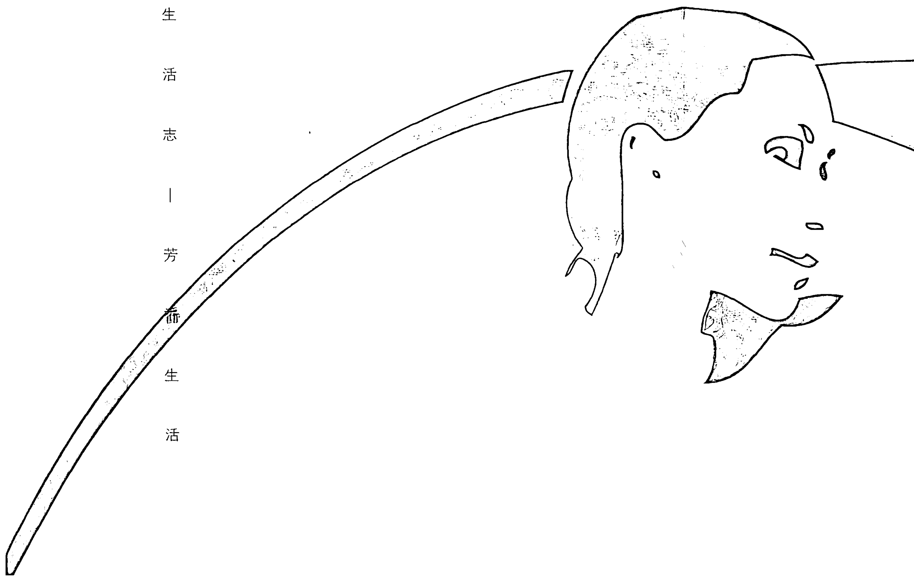

## ✿ Stephanie的叮咛 ✿

- ✿ 精油必须稀释于植物基础油后方可使用于肌肤，否则可能会造成肌肤过敏或灼伤。
- ✿ 勿空腹按摩，否则容易造成血糖血压降低；饭后1～2小时内也勿按摩，以免造成消化不良或胃、腹部绞痛。
- ✿ 感冒及发烧期间勿按摩，以免症状加剧。
- ✿ 糖尿病、高血压、癌症患者经医师许可后，才能进行全身或局部轻柔的按摩。
- ✿ 孕妇怀孕3个月后，经医师许可才能进行全身或局部轻柔的按摩。

## 足浴 / 手浴

- ☺ 改善手脚冰冷，促进血液循环
- ☺ 舒缓疲劳、浮肿、压力（效果可媲美全身泡澡）
- ☺ 改善手足局部皮肤、肌肉或关节问题，如湿疹、皮肤炎、香港脚、风湿关节炎

### 芳香仪式

足浴：在一盆高达脚踝的热水中滴5～6滴精油，浸泡15分钟左右。可加入一把粗盐或苹果醋，消解足部多汗异味及香港脚的困扰。泡脚时双手可同时由下往上向膝盖方向按摩小腿。

手浴：在一盆高达手腕的水中加4～5滴精油，浸泡10分钟。温热水适合改善血液循环；温冷水适合治疗皮肤炎症或干燥现象。加入一小茶匙蜂蜜或植物油于水中可使干燥肌肤变得柔润。泡手时可搭配手掌、指尖穴位按摩。

## Stephanie的叮咛

- 手/足浴后立即按干肌肤并抹上护手/护脚霜，滋润效果更明显。炎症肌肤将水按干即可。

## 坐浴

- 改善便秘、外痔
- 改善阴道炎、尿道炎、膀胱炎

### 芳香仪式

在较大的盆中装入坐后可高达下腹部的温水，加2～3滴精油，充分拨匀。

## Stephanie的叮咛

- 使用前须彻底洗净盆子。精油须少量使用，同时水温不可过高，以免破坏黏膜组织。
- 每日早晚各一次，最多三次。

## 熏香

- 营造所需的氛围；改善室内气味
- 净化空气；驱虫
- 调整情绪

### 芳香仪式

熏香炉中加8分满的温热水，点燃小蜡烛，视室内面积大小加4～10滴精油于水中。一般说来，10平方米的空间大约需要5～6滴精油。

## Stephanie的叮咛

- 熏香炉的材质以陶瓷、耐热玻璃或大理石为佳，以免破裂漏水或爆裂。炉面容量大一点，水较不易烧干，使用起来也相对安全。
- 小心放置于小孩碰触不到的地方。

## 蒸汽

- 改善鼻窦炎、气管炎、多痰、鼻塞等呼吸道问题
- 促进肌肤新陈代谢，清洁毛孔，调理肌肤

### 芳香仪式

水碗：在一碗热水中加6～8滴精油，置于室内自然飘香。沐浴时放在浴室，连同沐浴时的蒸汽将使芳香分子更饱满芬芳。

蒸脸：在1/3脸盆中加入接近沸点的热水及4～5滴精油，以大毛巾盖住整个头部及盆子，使蒸汽集中飘于脸部。闭上眼睛慢慢嗅闻，10～15分钟后以冷水洗脸收缩毛孔，然后做正常肌肤护理。一周一次即可。

呼吸道疾病：方法同上。嗅闻5～10分钟左右，每天2～3次。

## ✿ Stephanie的叮咛 ✿

- ✿ 脸部须离盆30厘米并闭上双眼，以免热蒸汽刺激肌肤、眼睛与鼻黏膜。
- ✿ 气喘患者勿采用此法，以免蒸汽诱发病症。

## 嗅闻

- ⚠ 紧急状况，如晕眩、晕车（船）、头痛、恶心、惊吓及情绪起伏较大时

### 芳香仪式

将1滴精油滴于掌心，稍加搓揉后，双手盖住鼻子缓缓深深嗅闻香气。
将4～6滴精油滴于面纸或手帕上，随时嗅闻。

## 湿敷

- 冷敷：适合新近发生的损伤，如扭伤、淤血、肿胀、发炎、头痛、发烧等
- 热敷：适合旧伤，如肌肉酸痛、牙痛、痛经、脓肿等

### 芳香仪式

热敷：在容器中装入500ml热水，水温为个体能承受的最高温度。加6~8滴精油于水中，再将一块薄棉布轻轻漂于水上，吸收精油及水分直至完全浸湿，然后拧干敷于患部。当热棉布变凉时，再重复以上的过程数次。

冷敷：方法与热敷相同，只不过将热水换成冷水，冰水更佳。当冷棉布变热时，再重复以上的过程数次。

## ✧ Stephanie的叮咛 ✧

✧ 在热棉布上覆盖一层保鲜膜可延长保暖时间，加强疗效。

## 喷雾

- 快速改善环境气味，营造所需的氛围
- 室内空气净化；驱虫

### 芳香仪式

在喷罐中加入20ml温热水及8～10滴精油，摇晃均匀后喷于空气。可在水中加一点点盐（约半茶匙）增加杀菌的效果。

## ✿ Stephanie的叮咛 ✿

- ✿ 勿直接喷于上了漆的物品上，以免油漆产生质变。
- ✿ 每次只制作一次使用的量，防止精油挥发或变质。

## 承载芳香的小舟——植物基础油

植物油不仅是稀释精油的媒介，它本身也富含维生素、矿物质及各类必需脂肪酸，不论内服或外用都能对皮肤及健康起到很大的帮助。植物油的种类繁多，价格不一，功效也相异，芳疗师通常会综合考虑一个人的肤质及健康问题来决定适合的植物基础油，一般说来会混合2～3种植物油以达到最好疗效。

### 甜杏油（Sweet Almond Oil）

萃取自甜杏的核仁，浅黄色，含蛋白质，维生素D、E，微量元素。
【适合肌肤】偏干性肌肤，易敏感及发痒肌肤
【价格】中

### 葡萄籽油（Grapeseed Oil）

延展性佳，是最广泛使用的基础油，也是少数不含胆固醇的油之一。未经精制提炼的葡萄籽油养分较高，但味道不佳；精制提炼的葡萄籽油呈现绿色，无味。
【适合肌肤】所有肤质
【价格】中低-中

### 荷荷芭油 (Jojoba Oil)

萃取自南美一种沙漠植物的豆子，在室温下呈黄色半固体状，无色无味，品质稳定不易酸败。Jojoba的化学结构与人体皮肤的皮脂相似，所以它的渗透力很高，是所有肌肤极佳的保湿剂，在按摩手法的带动下还可温和代谢出毛孔的脏污。它含有抗炎物质，适合用作风湿关节炎及皮肤炎的基础油。

【适合肌肤】所有肤质，包括油性和痘痘肌肤；湿疹，牛皮癣

【价格】高

### 杏桃核仁油 (Apricot Kernel Oil)

浅黄色，含油酸60%、亚麻仁油酸30%，维生素A、E。质地柔润，特别适合用于脸部护理。

【适合肌肤】敏感肌肤，初步老化肌肤

【价格】中-中高

### 酪梨油 (Avocado Oil)

萃取自果肉，深绿色（无色酪梨油为假的）。含丰富的必需脂肪酸，卵磷脂，β-胡萝卜素，维生素E。虽然质地较黏稠但渗透力很强。常应用于皮肤炎的治疗。

【适合肌肤】干性、缺水及老化肌肤，使肌肤柔嫩。

【价格】中高

### 椰子油（Coconut Oil）

萃取自干燥后的椰果。真正的椰子油在室温下呈现无色半固体状。虽然营养成分经过多次提炼后所剩无几，但椰子油的质地像丝般滑顺轻盈，适合用于脸部护理及婴幼儿护肤。敏感肌肤使用前要先做测试。
【适合肌肤】中性肌肤
【价格】中

### 月见草油（Evening Primrose Oil）

萃取自细小的花籽，含大量的亚麻仁油酸，对角质细胞的修复效果极佳，还可促进肌肤油水平衡。较易氧化，须小心保存。
【适合肌肤】干燥、脱皮及成熟肌肤；湿疹，牛皮癣，异位性皮肤炎
【价格】高

### 榛果油（Hazelnut Oil）

含必需脂肪酸，质地十分细腻，吸收渗透力强，且有收敛及保湿功效，特别适合用于脸部护理。
【适合肌肤】所有肤质，包括油性和痘痘肌肤
【价格】中高

### 橄榄油（Olive Oil）

萃取自未成熟的橄榄，Extra Virgin是最有价值的初榨油，呈黄绿色。含80 - 90%的油酸，对皮肤的滋润渗透力高，刺激性低。质地稍黏稠。

【适合肌肤】缺水肌肤；防止妊娠纹；皮肤发痒，淤血

【价格】中-中高

### 小麦胚芽油（Wheatgerm Oil）

棕橘色，味道较重，质地黏厚，须与其他基础油搭配少量使用。富含维生素E，具抗氧化/抗老化力，能渗透至肌肤较底层。对小麦制品过敏者勿用。

【适合肌肤】成熟肌肤，受光照伤害并老化的肌肤，妊娠纹，疤痕

【价格】中-中高

## Stephanie的叮咛

- 尽量选购冷压法及未经数次精制提炼的植物油，营养成分较能完整保留。
- 必需脂肪酸及维生素E含量愈高的植物油愈不容易氧化酸败。
- 过期的植物油会产生自由基破坏细胞，影响皮肤健康并造成老化，所以尽量小量购买植物油。
- 未用完的植物油可置于冰箱，约可保存9个月。刚取出时可能会暂时呈现混浊状，那是品质纯正的好现象。

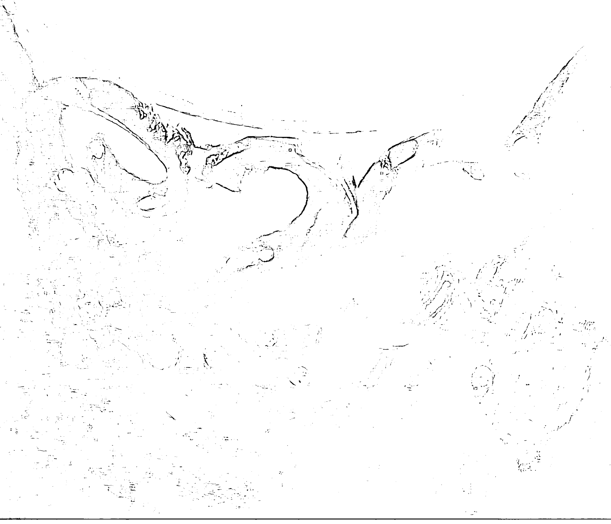

## 恋恋香氛——让香水替你说话

香炉围绕着她的王座。她使用含有15种植物的香水和香油来沐浴，用含有玫瑰、番红花、紫罗兰等16种珍贵香料调配的“Kyphi”香油球涂抹双手，用含有杏仁油、蜂蜜、肉桂、橙花、指甲花的乳液涂抹双脚。四周是布满玫瑰的罩网，地面覆盖一尺半的玫瑰花瓣。她将船帆浸满甜美的玫瑰水展开罗马外交之旅，在她的船队抵达罗马口岸前，就未见其人先闻其浓香，仿若随风送来的馥郁的名片，予人无法阻挡的吸引力。莎士比亚这样描述：“由驳船/一阵奇异而隐性的香水扣紧了感官/来自邻近的码头。”

这就是两千多年前埃及艳后Cleopatra迎接罗马大将马克·安东尼的动人气魄。她是香料最虔诚的信徒，没有任何女人能像她一样将香水的魅力发挥得如此淋漓尽致！她的外型绝非好莱坞标准下的美女模样，但她对香味虏获人心之术的了解却无人出其左右，使得拥有丰功伟业的古罗马恺撒大帝与其大将安东尼相继拜倒于其石榴裙下。她生前日日浸淫在贵重的香料中，死后仍以香布裹身，据说香气不散。

Cleopatra对香水的狂爱及出神入化的“香氛御人术”真是令人叹为观止，让我们对香水香料的运用大开眼界，了解它们摸不到看不到却广大无边的魔力，挑起我们一尝为快的欲望。不过，当时间推移到人与人近距离接触的21世纪，作为一个聪慧的现代女子，我们不只要散发幽然芬芳的气息，更要学会如何聪明、礼貌地使用香水来为自己加分。香氛最重要的目的应该是取悦自己，在令自己愉悦舒畅的香味的潜移默化下，牵引出潜藏的美丽光辉与气质，使自己更快乐、亮丽、自信，“魅惑男人”只不过是水到渠成的附加结果罢了。

## 独特的体香

若别人花3秒钟就能闻出你所使用的香水牌子，你觉得如何？在这凡事强调个人风格的年代，这可不是一个恭维喔。事实上，你可以成为自己的调香大师的！首先你必须了解香水的组成元素：前、中、后味。

【前味】是对香水的第一印象，香味较清新淡雅，宛若管弦乐中悠扬轻盈的笛声，一般约可维持10分钟，常用的成分是较易挥发的柑橘类，如佛手柑、柠檬、尤加利，及薄荷、薰衣草等；

【中味】是香水的核心味道，也是其真正精神所在，展现香水温暖与圆润饱满的风貌，约可维持1～2小时，玫瑰、香草、伊兰、迷迭香等是常用成分。

【后味】好似安稳沉静的大提琴，给予香水沉稳持久的力量，使香味不致过快挥发，常用成分是檀香、广藿香、乳香、香柏、茉莉等。

【制作方法】了解了香水的组成后，你就可以开始自己制作独特的香水了。在深色玻璃罐中加入伏特加酒5ml，滴入25滴精油，从后味开始加入，最后加入前味。前、中、后味的比例约为12:8:5。摇匀后倒入装满25ml蒸馏水的深色喷罐中，再摇匀。每天轻摇一次并置于阴凉处1~2星期，待香味成熟稳定后再使用。沐浴后或随时喷于全身及头发上（距离20~30厘米），也可先喷于梳子上再梳头发。这样，就可以拥有与众不同的独特体香了！

## ☆ Stephanie的香水点评 ☆

☆ 气味能强烈地影响一个人对人、事、物的评价和联想，比如添加了刺鼻的人工香料的沐浴乳，会给人品质不佳的印象和怀疑；添加了清新柠檬味儿的洗洁剂，会让人联想到光溜溜的碗盘。所以，你使用的香水就代表你！即使不言不语静默一旁，你身上所散发的香味仍能传达出你的性格、品味与心情，它会代替你说话，犹如个人的反射镜；换句话说，若能善用香氛，慎选适合特定时空和场合的香味，你就可以改变情绪，间接改善面容表情和仪态，甚至加强他人对你的认识和印象，也就是说，香氛可以帮助你塑造个人的风格与形象。

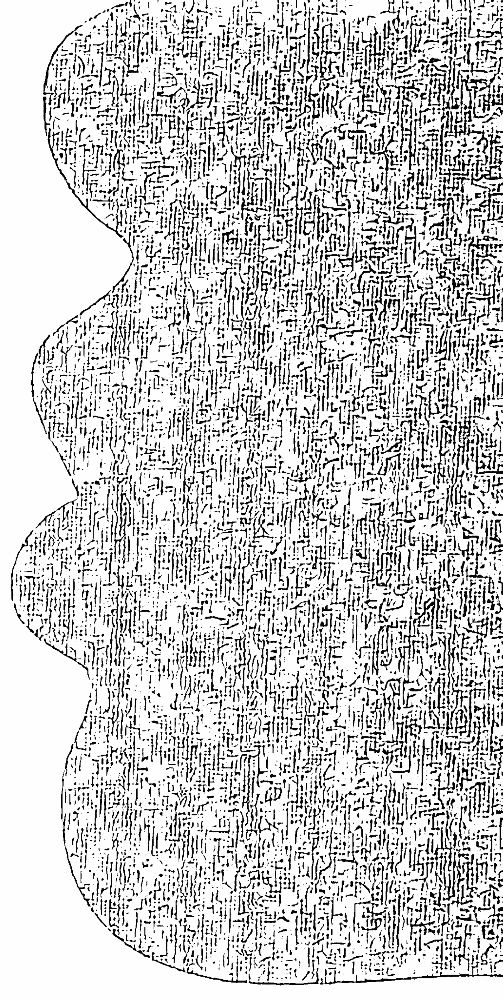

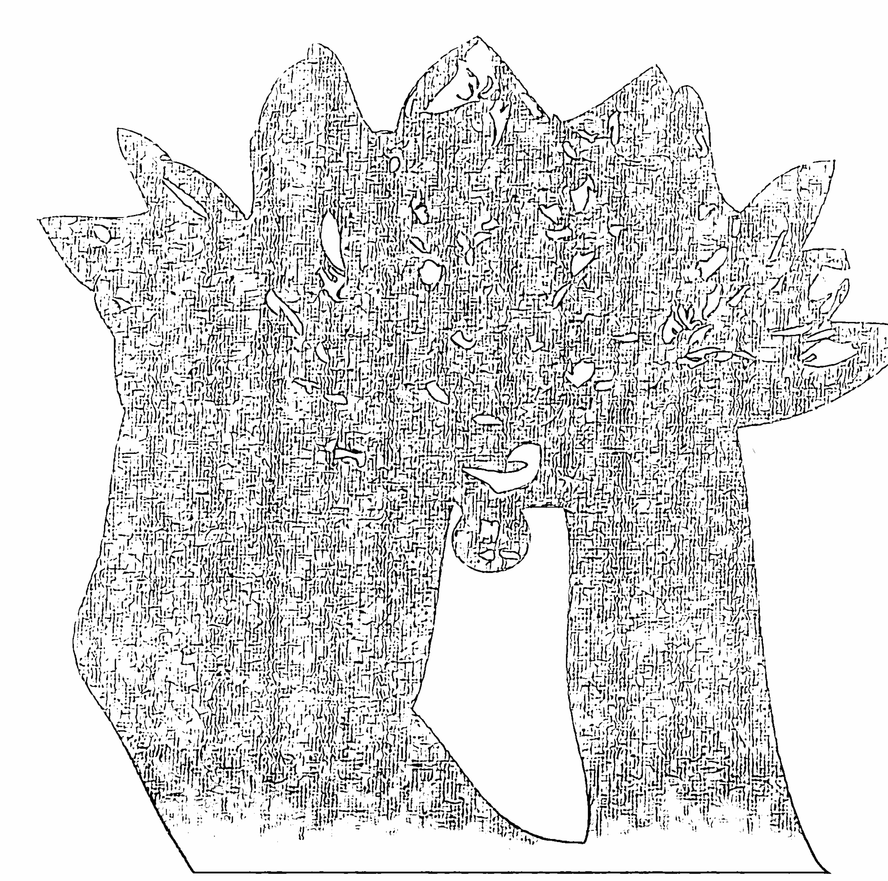

## 无形胜有形——独门女人香

“追寻美丽”一词经常很肤浅地与购买号称稀有、昂贵、神奇的保养品画上等号，让人觉得只要早晚勤抹一层层的护肤品，再点缀些许炫丽的彩妆，就获得了美丽的保证书和青春的通行证。保养品对美容的贡献不可抹煞，但一瓶3000元的面霜能遮掩或扫除郁结的心情在脸上留下的黯沉凝重和憔悴的神情吗？你一定有过这样的体验，当心情愉悦、态度平和时，脸上自然散发的闪亮光芒是任何彩妆都模拟创造不来的，也不是几个色斑或细纹所能遮蔽影响的，因为瑕不掩瑜。

芳香美容就是这样注重身体与心灵之间的交互影响，借助植物精油来同步调养皮肤与情绪，最后达到极致的健康美。现代社会人与人互动频繁，芳香美容法还能帮助加深他人对自己美好的整体印象。

将香氛融入日常的保养和生活中其实一点都不麻烦，放轻松来玩玩看！你一定会越来越爱香香美美的自己！

## Stephanie的芳香美女养成术

- ○ 闪亮的眼睛
静躺于清静的暗处，将腿垫高，敷上玫瑰眼贴膜15分钟，让大自然的纯露给予灵魂之窗温柔的洗礼。
【玫瑰眼贴膜制法】一把玫瑰花苞 + 沸水300ml，浸泡15分钟，待制剂凉后取出花苞，将玫瑰水浸透棉片、拧干并敷于整个眼部。剩余制剂可置于冰箱，在眼部疲惫浮肿时随时使用。

- ○ 清新的口气

在公众场合大嚼口香糖既不雅观又不合乎礼仪，小小举动会大大影响芳香美女的整体仪态。如果你希望拥有清新的口气，不妨试试芳香漱口水！

【芳香漱口水制法】于深色瓶中加入薄荷精油3滴 + 伏特加酒（或白兰地酒）10ml，摇匀。漱口前，倒出制剂3ml，再加冷开水50ml充分稀释后即可使用。

- ○ 光泽的脸庞

如果你觉得皮肤有时实在是干燥黯淡到擦任何保养品都无法改善，建议你每周做1～2次芳香美肤护理，皮肤会逐渐恢复柔润的光泽。

【Step1】将一把富含维生素E的燕麦稍稍研磨成较小的碎粒，加一点点冷水或花露水调和做去角质（必须看出颗粒和浓稠度）。去角质前脸部须先洗净。

【Step2】大碗中加入温热水，将三条透气的薄棉布浸于水中，其中两条拧干覆盖于脸上，一旦变凉则将上面那条棉布取下，重新置入水中，换上水中那条棉布。如此不断轮流更替最上层及水中的棉布数次。热敷后，立刻用精油做轻柔的脸部按摩两分钟（配方如下）。按摩后用面巾纸轻按脸部吸除多余的油脂，然后涂抹乳液/霜即可。

## ○ 芳香美肤精油配方

干性肌肤：甜杏仁油5ml + 玫瑰，橙花或乳香精油1滴。
中性肌肤：荷荷芭油5ml + 天竺葵精油2滴。
油性肌肤：荷荷芭油5ml + 薰衣草油2滴。

- ○ 缕缕飘香的衣服

与人擦肩而过时自然飘散一缕属于自己的独特幽香，不仅是礼仪，也是个人风格气质的显现，让人忍不住回眸。如果你喜欢留给经过身边的人一个芬芳的惊喜，或整天被心爱的味道所包覆，可以试试这样做：烫衣服时在蒸汽熨斗的水中加入2～3滴喜爱的精油，梦想就可轻松达到了！

- ○ 浓密芳香的秀发

飘散神秘暗香的秀发任谁都忍不住多看两眼！为秀发增添一点精油元素，不仅可以深度滋养头发，还可创造与众不同的天然芳香。

【精油护发素制法】取适量的护发素，加入一个蛋黄及2～3滴精油，充分搅拌后均匀涂抹于发间，停留15～20分钟。

- 发丝细黄者：罗马甘菊。
- 落发者：百里香或迷迭香。
- 希望头发浓密者：伊兰。

## Stephanie穿着香氛的艺术

- 香水的迷人之处在于它的隐隐约约，少即是多，切忌三尺外就让人打喷嚏发晕！
- 将香水使用于脉搏跳动处，如手腕、手肘内侧、耳后、膝盖后及脚踝。
- 胸前心脏跳动处可是聪明女人不可错过的秘密发香处！
- 发尾抹上些许香油既可护发又是头发香水，一举两得。

## ○ 至高无上的健美真理

睡得饱又睡得好胜过天天燕窝鱼翅与昂贵保养品。一日睡不好面有菜色，三日睡不好，在脸上涂油漆都掩饰不了老态。因为身体于夜间分泌生长激素，修复白天受损的细胞与心智，睡眠不足会使身体免疫力下降30%，并造成发炎老化。

纯水或蒸馏水10ml + 薰衣草2滴 + 马乔莲1滴 + 乳香1滴，装于喷罐中。睡前于床和枕头四周喷洒，给全身感官传递“睡觉喽”的舒缓讯息，诱发睡意。

## ✧ Stephanie的叮咛 ✧

现代社会握手机会增加，一双柔软芳香的手能帮助拉近彼此心的距离，所以记得随时为双手抹上细致芬芳的护手霜，让你的柔美从“手中”体现。

## 暗香流曳——办公室女性的芬芳魅力

香味的力量既强大又微妙。不论你喜不喜欢，有意识或无意识，它都会随着呼吸一道进入体内，在不知不觉中刺激大脑，影响脑电波，并在0.5秒内做出生理、心理及行为反应，这同时也决定了一个人对事物的想法、理解与记忆。

根据日本科学家的研究报告，在办公室空调管道中加入柠檬精油，所散发出来的香气会使工作人员的心思更敏捷，注意力提升，同时打字的错误率明显下降。由此观之，充分运用合适的香氛将有助于提升工作效率，对人事物的态度、判断与处理也会更正向圆融。

在香氛的温柔环抱与潜移默化下，一个人的姿态与气质也会在不知不觉中升华，逐步向着丰姿绰约的高EQ美女的境界迈进。所以，巧妙地运用香氛无远弗届的魔力不仅可使IQ增长，EQ加分，还能使你的职场形象散发令人难以言传的神秘魅力。

## Stephanie的办公室香氛秘方

## 品味代言人——芳香文具

让文具也能用香味诉说你的个性，加深他人的印象。

如果想给人留下明媚的印象，建议精油为佛手柑、柠檬、尤加利；如果想给人留下柔美的印象，建议精油为玫瑰、天竺葵、依兰；如果想给人留下沉稳的印象，建议精油为香柏、檀香、安息香。

- ○ 芳香名片／信纸／笔记本

“哇！你的名片好香喔！”对方说这话时，你与众不同的形象已随着香味锁进他大脑内的记忆区块了。滴1滴喜爱的精油于一张名片上，再将它混合放在名片盒／夹中，其他的名片将会被熏染同样香味。信纸、书签、书籍、笔记本、文具和皮夹都可这样芳香处理，增添使用时的美好心情。

- ○ 芳香墨水

于墨水中加入精油1～2滴，落笔时可“字字芳香”。

- ○ 芳香抽屉

在A4白纸的四角各滴1滴喜爱的精油，垫于抽屉下，使置于其上的物件散发缕缕芳香，同时还可防止蛀虫滋生。

- ○ 芳香电话

于湿棉球上滴2滴精油擦拭话筒，可以促进愉快的谈话心情，甚至使对方在电话那端同时感受你愉悦的情绪和微笑。将面巾纸折成小块，滴上1滴尤加利与2滴佛手柑，然后置于话筒挂放处，可使话筒保持芳香并达到杀菌的功效。

## 灵动的氛围——室内芳香

室内的香氛可以是你情绪与仪态的美容师。学习一下如何为周围的空间制造灵动的香氛吧。

- ○ 芳香灯泡

电灯未开启前，滴1滴精油于灯泡／灯管上，然后开启电源，热能可使精油迅速挥发。

- ○ 芳香地毯/桌子

将水与4滴精油加入1/3脸盆般容量的容器中，抹布浸湿后拧干进行擦拭，除了芳香，还可杀菌除虫。柠檬，佛手柑与尤加利较佳。木质桌面应避免直接接触精油以免木质变质。

- ○ 芳香喷雾

于喷罐中加入温水30ml与精油10～12滴，用力摇匀后随时喷于四周，改善工作时的心情与氛围。

- ○ 芳香木球/玻璃彩珠

加6～8滴喜爱的精油于20ml植物油中，再将数颗木球/玻璃彩珠浸于其中，充分浸透后取出置于玻璃器皿中自然风干，成为美观又芳香的装饰品。

## 芬芳发香体

想自己也成为芬芳的发香体吗？试试在一次用量的身体乳或质地细滑的椰子油中加入1～2滴精油，混合后涂抹于双手或身上。情绪紧张时以双手轻轻掩盖脸部，深呼吸嗅闻手中精油的芳香，可疏通窒碍的思绪，滋润肌肤、纾解压力双效合一。

【建议精油】薄荷1滴或薰衣草1滴 + 佛手柑1滴

## ☆ Stephanie的叮咛 ☆

- ☆ 将喜爱的香水在距头顶30厘米处喷一下，让芳香分子向下飘散于空中与发上，香味自然柔和！
- ☆ 最后别忘了摆盆绿意盎然的植物于桌上，为办公室注入活跃的生命气息！

## Home Sweet Home
——浪漫一室香

家是心灵的港口，甜蜜的依归。日间重重武装的自己，在家里卸下防备；度过烦忧的一天，在家里获得抚慰。家，使疲顿支离的精神重新统整，使躁动刚强的身心平缓柔软。用心美化家的过程，就形同为情绪大扫除，为心灵做美容，为美感和创意做训练。

在推开大门的一刹那，一家之主的个性立即跳脱于眼底。除了有形的家具与色彩外，室内隐隐散发的气息也是一个家独一无二且令人印象深刻的标志，它含蓄地点明了主人的心情与浅藏的内心世界，因为灵动的香氛会说话！此外，香味具有累积性，若经常在家使用香氛，芳香分子会自然常存于空气、家具和墙壁中，形成一股幽然的暗香。想要捕捉刻录自家的气味，除了以熏香炉熏香和做室内喷雾外，其实还有很多创意的点子。

## Stephanie个性居家氛围妙方

- ○ 第一印象——玄关
浪漫之气：在走道种植天竺葵，衣裙一碰触即会散发芳香，展现主人无上款待之情。
温馨之气：将落叶和松果置于竹篮中，可再滴些松木、香柏或杜松精油加重其香味。
清新之气：柑橘类，如葡萄柚、柠檬、香橙的叶片及果皮具有清爽的香味，将它们切成条状置于竹篮内，可在上面再加几滴柑橘类精油，效果更持久。

- ○ 分享之乐——客厅

将4～6滴精油均匀滴于湿抹布上，擦拭空调出风口与滤网，可起到消毒及借风传送香气的作用。柠檬、茶树和尤加利都不错。

将8～10滴精油滴于装有温水的水桶中，将拖把浸湿后拖地，将满室生香。柠檬及木质精油特别适合。

- ○ 私密时光——浴室

磁砖具有吸收香味的能力。购买一块磁砖，将精油滴于其上并置于浴室，可常保浴室清香（换句话说，沐浴用品的香味也会被磁砖吸收并影响浴室的味道）！

将色彩缤纷的干燥花置于竹篮或玻璃瓶中，既美观又芳香。香味渐淡时可加几滴精油增香。

在用完的精油瓶中加些许热水置于窗口，可自然飘香并防蚊虫。

- ○ 老饕之乐——厨房

将玫瑰花瓣与少量砂糖（可再加1～2滴玫瑰精油）放进锅内煮一会儿，其蒸汽可驱除食物残存的恶臭。

将精油滴在桌垫/杯垫上，或将香料叶如薄荷、薰衣草、迷迭香等缝入垫中，香味会随饮料或容器的热气而自然挥发。

冰块：将花瓣或药草叶片洗净，稍微撕成小块放到制冰盒中制作冰块，既赏心悦目又增添美味，还能达到保健功效。玫瑰、桂花、紫苏、茉莉、菊花、金银花都适合。

- ○ 一缕幽香——衣柜

精油滴于棉花球上塞入衣柜各角落，使衣物散发幽香。

以棉花缠卷衣架，滴上数滴精油，再以棉布包裹缝合，即成为既防虫又柔软芳香的衣架。

- ○ 由小观大——鞋柜

选择略带苦味的精油如百里香、薄荷等，滴于数个棉球上再放进纱布袋中，四边缝合，然后塞入鞋中，不仅可防止鞋臭熏染空气和鞋柜，穿鞋时还可为双足增添香气。

将石灰粉置于容器中，滴入几滴精油，均匀混合后置于鞋柜，可防止鞋柜和鞋子发潮发臭。

## ✿ Stephanie的叮咛 ✿

✿ 一个人每天至少有1/3以上的时间在家中，所以“人气”也是影响室内气味的要素（想想病房是不是充满病人的味儿）。用心让自己全身发肤香喷喷的吧！

## 芳香心灵

人生旅程跋山涉水、曲折颠簸，
但天在山中，好风光永远深藏于远山的转角处。
在绝处中逢生，
在困境中寻回心底最深沉的美丽和勇气。
在悲泣时，莫忘擦干眼泪后，
要勇敢“忘记背后，向着标竿直跑”！

## 珍爱我心——守护私己的花园

Brenda又在深夜打了一小时电话给我，这是她半年来第N次这样做，不分昼夜或我是否忙碌，每次总絮叨准备做这做那或一些风马牛不相及的事。我的感觉是她正处在极度躁郁混乱的状态。这次她开口就说，“其实过去这一年我老公有外遇了”。他不但把第三者带进他们夫妇俩辛勤开创十多年的公司，还将原属她这老板娘的职责渐渐转移给那个第三者。直到最后Brenda才突然发现于公于私她早已被架空。忧愤之余她努力地思索自己有何专长和喜好，足以让她脱离老公另拓新天地，但她发现自己竟然并没有什么专长，这让她非常惶恐忧郁。怎么会呢！Brenda可是我最精明干练的朋友之一呀！帮着先生东征西讨开拓业务，处理各种财务纠纷，还要带孩子侍奉公婆，怎可能十几年历练后反倒变成一个没自信没专长的弃妇呢？！

女人常常用心观察孩子每一步的成长和伴侣每一天的心情变化，家人的健康快乐里埋藏了女人无可度量的爱心和奉献。女人总是像个陀螺般在家人身边团团转，却把最差的时间留给自己，甚至操忙一天却没有一分钟属于自己，忘了滋养、审视自己的需要，忘了自己原本是谁、原来拥有什么，甚至都不清楚自己现在到底成了什么模样。在日复一日的忧劳摧磨下，却从别人的眼中读出自己多么令人厌烦，而他人这种厌烦又转化成对自我的厌恶和否定，以致心逐渐枯零，面容逐渐憔悴。

不论年龄和背景，每个女人都必须坚持拥有任何人都不可剥夺的平和独处的时间，养护身心，与自己和好，停止自我较劲，只做“像自己”或让自己打从心底开心的事，拒绝精神垃圾的入侵，并相信自己值得最好的对待。先学习关照自己，然后才能成为一个有尊严、有价值和不为人所操控的“人”；活成一个完整独立的“人”，才有足够的能量和坚定的勇气为人己创造真正的幸福。所以为了幸福和爱，你必须捍卫自己的私密花园！在你为幸福而努力时，植物精油可以温柔地陪你走一段路。

## Stephanie的自我滋养法

- ○ 浴室里
浴室是最私密的空间，不必担心有他人擅自闯入。淋浴水声可激活灵感，泡澡浴水可抛却烦忧。
将一汤匙海盐研磨成较小颗粒，加入一汤匙葡萄籽油或甜杏仁油，一滴茶树及薄荷精油，混和做全身去角质。
沐浴后取出全身用量的无香或香味较淡的身体乳，调和1滴安息香与2滴马乔莲，这是十分温暖身心的香调，可以让你带着馨香和微笑睡个温柔的好觉。

- ○ 一支蜡烛间
烛火具有抚慰人心的魔力。将蜡烛点燃一小段时间直到烛面上呈现融化状的蜡，然后小心谨慎地在融化的蜡中滴2~3滴喜爱的精油，让柔美的香味为疲惫的心神垫个温暖柔软的靠垫。注意：精油切勿直接接触及烛火。

- ○ 一杯花茶中

甘菊茶中加入少许蜂蜜，会散发出最舒缓的气味和温暖身心的力量。

- ○ 净心冥想中

澄净的头脑是乐观和智慧的基石。在小碗温水中加入1滴乳香（Frankincense）及杜松，稍稍拨开后再将薄棉布漂于水上直至浸透，拧干敷于前额，放松躺下。从1数到6，边数边做深呼吸；暂停呼吸数到4；从1数到8，边数边将气从嘴缓缓吐尽。重复5次。

## 疗愈之路——幽谷百合的天空

再次见到Susan已是4个月后，眼前这位淡定的女子让我感动又佩服，难以联想到几个月前因为接二连三遭逢工作重挫、感情背叛与生活变异而跌落谷底、形容憔悴又自我封闭的她。当时所有人都极度担心她会从此一蹶不振，没想到她竟如小草般，在狂风暴雨无情的侵袭下挺立过来。“是朋友送的一束百合花，还有你告诉我关于蓝天的包容力，给了我绝处逢生的启发，”她平静地说。“凝视着它们，我的心中忽然掠过一片百合花田的景象，即使身在谷底依然芬芳四溢，纯净又坚定，展现最美的身姿和芳香，因为这是天赋的使命和力量，环境再恶劣也没有人能夺取属于它们的袭人香气与顶上的一片天。”我强忍泪水为这个值得人珍爱的聪慧女子喝彩！因为遭遇的很多事并非她的错。从她娓娓道来的字句中，我仿若看见一片万里无云的蓝天，蓝得澄净人心。她笑说自己还有很长的自我治疗路程要走，现在每当过往的剧痛浮上心头，她真的会抬头仰望蓝天白云，深深吸口气，再将满腹辛酸“一吐为快”，因为蓝天一定会接纳她一个人装不下的泪水。

是的，我们走过的每一步路都有它的意义，每一步路都不是白费的，我们必须走到某个关键的一步才有可能发生必须要发生的改变——不论好或坏。这过程中所有的磨难都是为了等待转换一刻的来临，并为下一步作准备，就好像尘埃飞扬是打扫房子、使它窗明几净的必经过程一样。

人生是一条持续向前不停歇的单行道，朝着各自背负的生命课题与人生使命迈进。我们没有足够的时间和精力一边向前走又同时往后望，驮负着昨日的包袱在步履蹒跚中了无止境地消耗自己的生命力与健康。学习坚强地站起来直视痛苦和冲突所造成的阻断，想办法重新在阴郁的心头点亮光明，生命和成长的界限才得以延伸。这就好比病毒侵袭身体时，妥协或自欺欺人只会加重病情，甚至死亡。每战胜一次疾病，我们的身体、心灵和智慧都会更加迈向健康和成熟。

## 疗愈的蓝色

蓝色是氧气的属性，氧气笼罩着天空之父（精神）和大地之母（身体），而人类属于大自然的一部分，这提醒我们每个人都与生俱来就有精神和实体两种属性，时时以蓝色来关照二者是否处于健康状态，就像氧气之于万物一样必须。蓝色具有非常强的疗愈力，它所传递的忠实、和平、希望与关爱的能量可以“修补”破碎的心灵，启动身体本身的疗愈机能，纾解身心的伤痛，并帮助我们倾听来自直觉的信息。

- ○ 蓝色属性的精油
德国甘菊，罗马甘菊，马乔莲，迷迭香，丝柏，松木。

## Stephanie的蓝色冥想

养身在动，养心在静。能量、智慧和疗愈是在宁静中启动的。每天睡前让室内保持有微风并做这样的练习：选择一款蓝色属性的精油，加一滴于半汤匙基础油中，均匀混合后抹于太阳穴、鼻下、手腕内侧，同时进行室内熏香。闭上双眼，深深吸气，缓缓吐气，然后静心想象自己最爱的风景，想象自己在那儿漫步，细心感受那儿的天空、空气、小花、风及所有你爱的环节，然后反复告诉自己：“我一定要把自己照顾得很好，这是我不可旁贷的责任，我一定会越来越好！”——你感受到心中那一片蓝天了吗？

## 活出灿烂——快乐发电机

这是一个感官刺激随处流窜但人们却仍然极度渴求快乐的矛盾时代。

“他出差二星期了。每次他不在身边，我就感觉世界顿然失色，怎么也提不起劲来，”Eva神色黯然地说——她把快乐依附在男人身上。“忙了好几天的提案，老板居然翻了两下就搁在一边了，让我觉得备受侮辱。”Nina满脸怒容地说——她把快乐与成就感寄托于工作与别人的赞赏中。Cindy每周数次装扮艳丽地进出时尚Pub，她喜欢从强烈的音乐节奏和别人钦慕的眼光中找到认可的快乐，但认识她这么多年，我始终感觉不出她是个快乐的人。真正的快乐不需要也不能向外探寻，取决于外的快乐不能由自己掌控，所以常常会失控，使人失望，像坐过山车般忽上忽下让人不踏实。

没想到长相平凡身材娇小的好友Sara才是最有智慧的女人，有一天她忽然顿悟，决定让自己每天从头到脚都散发悦人悦己的“快乐分子”。于是她坚持早睡早起，在晨光中欢喜迎接新的一天，在宁谧舒缓的氛围中结束劳顿；每天留出时间静心地做瑜珈，并注意“究竟放了什么食物在身体里”；碰到烦恼学习面对它，处理它，然后平静地放下，绝不作茧自缚。她说这个选择让她“精、气、神的窍门好像顿开了，眼睛张得开，背也挺得直，每天觉得分外自在、清新又快活，看什么做什么都顺心”。一念之间的差别竟让她活得如此轻巧闪亮！人生的道路是可以选择的，因为选择而改变。

罗马神话中的维纳斯女神是西方传统对完美女人的标准，但她至高无上的美并不仅归因于其外貌，而是因为她有一股无以言喻的温暖与光芒由内而外地散发出来。一篇神话故事中提到，她乔装成一名老妇，但因为“眼中闪耀的光芒”还是泄露了自己的身份。许多人以为美丽是使人快乐和耀眼之因，但事实却是，没有快乐就没有经得起时间考验的美丽。在负面情绪的笼罩下，再漂亮的美女也会黯然失色。

其实，每个人的体内都有一个与生俱来的快乐发电机，不断制造快乐的能量，凭借这股能量我们得以健康、亮丽、乐观并充满冲劲；然而，身为身体主人的我们有一个不可旁贷的责任，那就是定时为它补充优质燃料，使它运转不息，也让我们因为这股由内涌现的快乐而发光发亮！

## Stephanie的快乐燃料

- ○ 乘着芳香精灵的翅膀飞到快乐的彼岸

植物精油是大自然最纯美悦人的珍宝，具有撼动身体与心灵的力量。每天让芳香分子吸纳身心的疲惫，并为肌肤带来新生的活力。

【建议精油】佛手柑，尤加利，薰衣草，马乔莲，柠檬。

【Step1】加6滴精油于装满水的浴缸中，进入浴缸前将精油拨匀。

【Step2】全身放松，深呼吸，细细想象和感受芳香分子正从鼻子扩散至肺、四肢、全身……在体内做温柔的按摩。

【Step3】将身体擦干，以同样的精油2～3滴混合于一次用量的植物油或身体乳中，轻柔和缓地自腿部朝心脏方向按摩于全身，给予辛劳的肌肤最丰华的享受。

- ○ 像个孩子般转圈圈

将所有的负面因子通通丢到音乐的旋律中！站起来转一个圈、两个圈——开怀地笑；三个圈——你的脑子开始分泌快乐激素了，脑中掌管情绪与记忆的区块也慢慢和快乐接上轨了……在舞动前可于空中喷洒稀释过的精油，给全身感官传递“动起来吧！”的积极讯息，因为“想动”和“不得不动”的运动效果差很多。

【动起来精油配方】纯水或蒸馏水10ml + 迷迭香1滴 + 尤加利1滴 + 佛手柑2滴，置于喷罐中，摇匀后喷于运动环境中。

- ○ 让自己水水的

压力好大。是不是感觉全身好像肿起来了？小心你的压力已诱使毒素在体内横行了！压力愈大时愈需多喝水，使血液流通顺畅，代谢保持正常，甚至给予身体能量，毒素自然无立足之地。

- ○ 踢掉恶习

抽烟、喝酒、熬夜会破坏身体组织，让人提前在40岁就面色发灰，皮肤干皱并病痛缠身，这样的你会快乐吗？

【建议精油】玫瑰精油，可辅助戒除恶习。

- ○ 为容颜挥洒光辉

身体是真正跟着我们一辈子的密友，所以关爱自己的外型与肌肤不是一件肤浅的事，把自己当情人般呵护对待可帮助我们更自尊、自信。自尊、自信是一个人快乐的基石，它也仿若一块吸引人向你靠拢的吸铁石。

每周脸部去角质1～2次，然后进行面膜护理。每个女性至少需拥有三种面膜，依肌肤的状况随时替换使用。营养面膜在肌肤呈现憔悴衰老现象时使用；保湿面膜在肌肤出现缺水细纹时使用；清洁面膜在肌肤出油晦暗时使用。

肌肤特别干燥黯沉时，可在3ml甜杏仁油或荷荷芭油中混合1～2滴薰衣草，轻柔地向上打圈按摩1分钟，再以温热的毛巾覆盖脸部15～20秒，然后用这条毛巾由下巴至额头将油脂轻轻拭去，然后抹上乳液或乳霜。

没有任何东西比扇子般的睫毛更能“打开”你的脸！以棉签沾取荷荷芭油或维生素E油轻刷于上下睫毛，每周2～3次，可以让你看起来更楚楚动人。

浓密光泽的秀发是女人味的重要表征之一。睡觉时在枕头上铺一条大丝巾，可避免头发粗糙打结。加1～2滴喜爱的精油在丝巾上还可帮助睡眠并使发丝散发香气。

## Stephanie的快乐点评

只要自己心里舒坦快活，哪儿都是天堂；只要心里存在忧愤恐惧，即使身在天堂也如地狱。“心”才是关键。若不细心呵护我们柔软的心，在工作、事业、家庭与感情重重压力下，它很容易变得压缩僵硬、麻木迟钝，逐渐丧失快乐的能力。

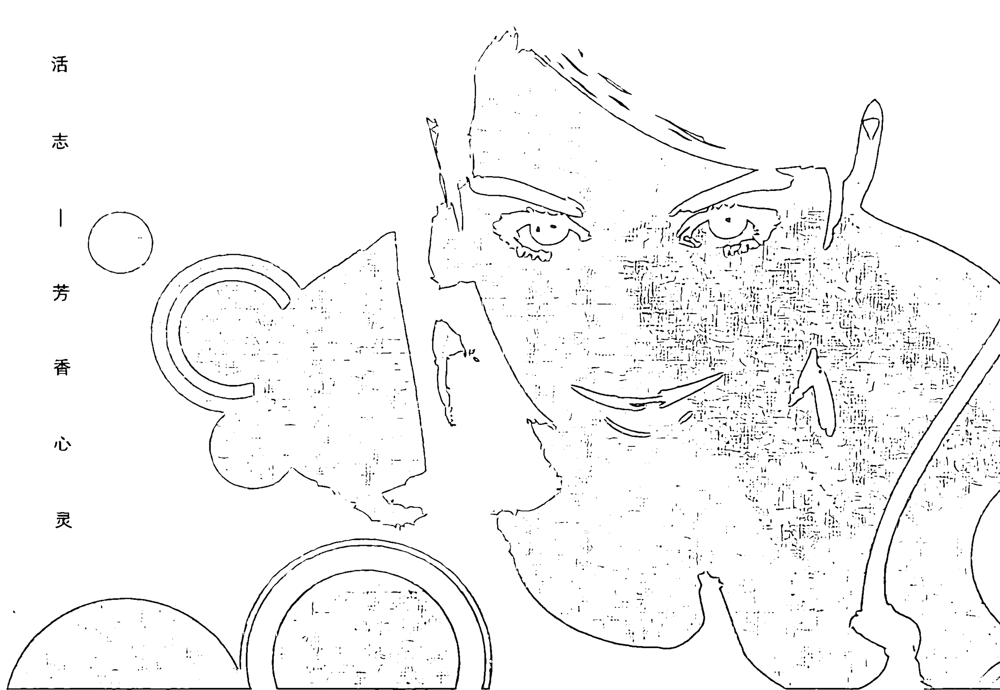

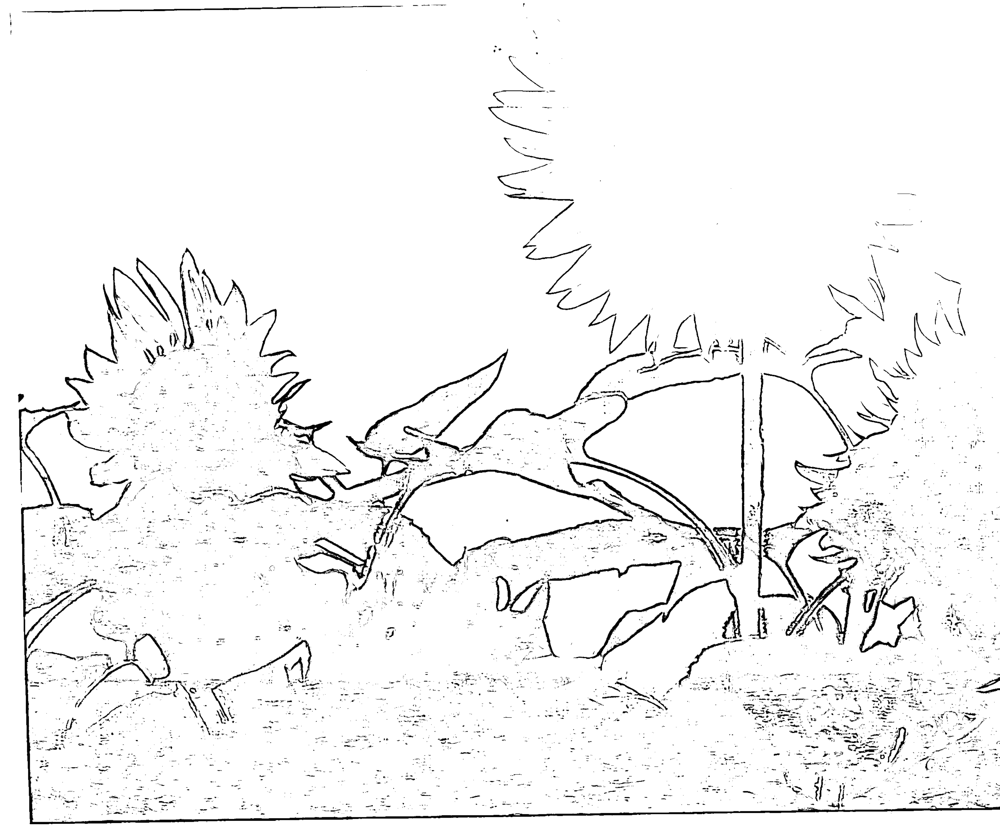

## 流向温暖——永恒的小太阳

小姐妹要结婚了，我在和煦的阳光下分享了这个喜讯和喜气，一股暖流刹时在身体里蔓延开来。不过在祝福之余，小姐妹的眼里出现了一抹不相宜的迷茫神色。她说其实她对自己很没自信，对男人在大环境中可能受到的各色诱惑也感到万分恐惧，她很担心自己是否能够永远抓住先生的心。看了许多女性杂志的“教战守则”，从虏获男人心的穿着打扮、举止形态到与男人斗智斗勇，让她越看心越慌，不知该往哪条路走，甚至觉得这些“精心设计”的“策略”都不是她要的，她只需要一份踏实正常的关系而已。说到此，小姐妹半开玩笑地问有没有什么“神香”可以帮助她。

现代人对爱和感情的态度太“轻”，今天喜欢了则聚，明天不喜欢了则散，没有耐心为爱多做一点努力和改变。“轻”的结果不是让人获得更多自由与爱的喜悦，而是狂躁不安，忘了自己是谁。“努力修炼自己做个温暖的人吧，”我建议她。“就像花朵植物总朝着阳光的方向生长，人们也自然而然会喜爱走向散发光和热的人。”我们总是将太多的时间和能量消耗在计较付出的爱有无回报与猜疑的恐慌中，削弱了光与热的温度和力量。“无条件的爱”是成为发热体的基本条件，但也需要学习和锻炼。首先必须练习“把心放下”，将计较与疑惧不安的心转而去感受生命和生活的点点滴滴：用爱心接触——真诚对待所有走进我们生命的人事物；用爱心走路——感觉身体律动的美丽；感谢五脏六腑、肌肉、关节给我们一生的支撑和“服务”；用爱心思考；用爱心说话；用爱心呼吸，唱歌，睡觉和吃饭……因为心中充满爱以及因爱而生的感激与满足，我们变得“轻松”了，也因此更能以平常心和宽容心来理解并接纳发生在我们生活中的人与事。切断内心的爱就如同断绝了光和热的能量来源；而用无条件的爱填满生命的每个空隙会帮助我们更坚实勇敢地拥抱“未知”，并成为他人心中不可替代的温暖倚靠。

## Stephanie的粉红处方

【色彩】粉红色。和代表“爱”的“心脏”脉轮有着强力的连接，能温暖和抚慰情绪，放松肌肉，促使“无条件的爱”流动，使“铁石心肠”变得柔软。

【粉红属性精油】玫瑰，花梨木，香蜂草，天竺葵，茉莉，依兰。

- 以粉红属性精油做足底或全身按摩、泡澡，为身体注入粉红色彩的力量。
- 浴室是身心排毒及放松的地方，装上粉色百叶窗或灯泡可强化爱的磁场。
- 将10～12滴粉红属性精油滴入30ml纯水或蒸馏水中，均匀摇晃混合。可喷于身上或四周空气中，提升自身爱的能量。

## 隐形推手——牵引爱的费洛蒙

风流倜傥的钻石王老五James终于宣布要结婚了，怀着巨大好奇心的众老友们在婚宴上看到新娘时，无不瞠目结舌，眼镜碎了一地，心中满是问号：太不般配了，新郎怎会这样视若珍宝地捧着她呢？难道只是因为缘分吗？？

你自己有没有这样的经验：有的人你一见如故，特别喜欢，有的人尽管也是好人，你却没来由地讨厌他。又或者有这样的经验：你正想着发短信给男友，他就正好打电话来了。生活中为何充满了这种直觉或默契？除了习惯和缘分，有无更科学的解释呢？

心理学家荣格（Jung）曾说：“两种性格的人相遇，仿若两种化学元素的碰撞：一旦有任何反应，必然是双方同时改变。”费洛蒙（pheromones）就是这样无形无味又无所不在的化学分子，它源于体内的类固醇，然后从汗腺、皮肤表层甚至每一片脱落的皮屑中散发出去。每一个释放出去的费洛蒙分子就像芯片，承载了有关你个人独一无二的重要信息和化学信号，包括你的欲望和动机。换句话说，来自你的以及别人的费洛蒙每天飘散在空中，它们在寻找着同类，一旦碰撞到了，就会开始释放所要传达的讯息给彼此，超越理智思考，直接影响脑部负责情绪的潜意识层。

费洛蒙最密集的部位在鼠蹊部、腋下及人中（上唇与鼻子之间）。莎士比亚时代流行一种寻找爱情的游戏，就是女孩将一块削了皮的苹果放在腋下吸取汗液，再将沾了自己汗水的苹果送给意中人，若对方喜欢这苹果的滋味（现在已知是含了费洛蒙），双方就会发展下去。哲学家沙特曾说：“当你嗅闻另一个人的身体时，其实是以口鼻呼吸，然后立即拥有整个身体，仿佛那是你最私密的一部分。”所以下次亲吻爱人时，请闭上双眼缓缓嗅闻他的人中部位，温柔感受他的费洛蒙气息，仿若将他的身心灵与你的融合在一起，你会发现，日子久了两人的心灵会越来越默契。

## 改善先天不良，精油助你一臂之力

虽然费洛蒙能使我们不由自主地注意到这个人（而非那个人），并从潜意识对他产生正面或负面的感觉，但这只能代表你对他的接受度起始点的高低，不保证能克服相继而来的理智（如现实条件与环境）和其他感官（如外型条件）得出的意见，所以除了保持健康以制造并传播正向的费洛蒙外，植物精油也具备辅助的能力，它一方面可以慢慢改善身体的气息，另一方面可以牵引出我们个性中美好的一面，而当身心处于合谐的状态时，我们各方面的表现都会更理想。细胞也是有记忆的，经常使用适合自己的精油，身体和心灵将会记得并蕴藏这香味，并持续由内而外散发美好而芬芳的信息——让植物精油为你的魅力加分吧！

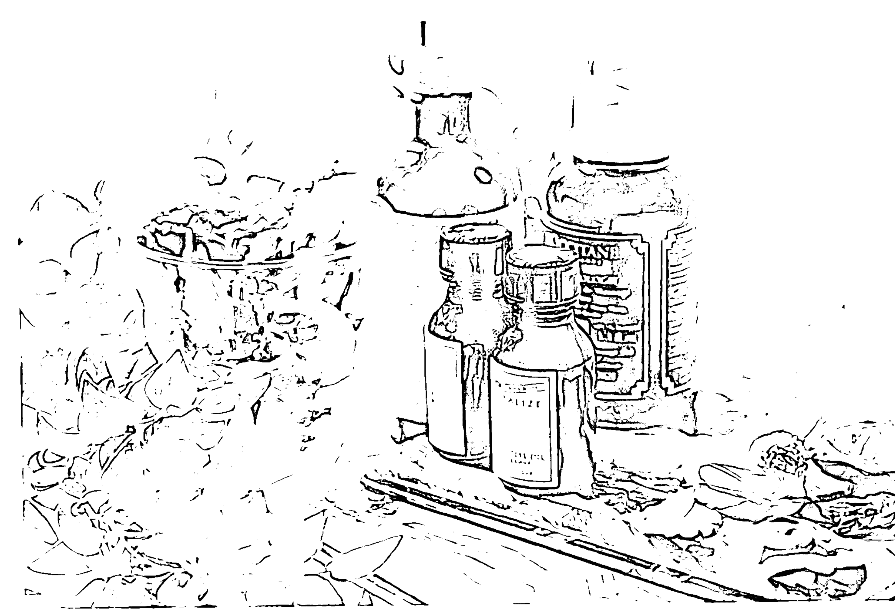

### 个性->建议精油

- 和平谦虚-> 根类，如白芷、姜、鸢尾根、缬草根、维提味草根
- 敏感害羞-> 种子类，如葛缕子、胡荽、小茴香、豆蔻
- 外向快乐-> 辛香类，如黑胡椒、肉桂、丁香
- 迷人浪漫-> 花朵类，如甘菊、茉莉、薰衣草、橙花、依兰、玫瑰
- 中庸真诚-> 水果类，如佛手柑、葡萄柚、莱姆
- 重精神面-> 树脂类，如乳香、没药、安息香

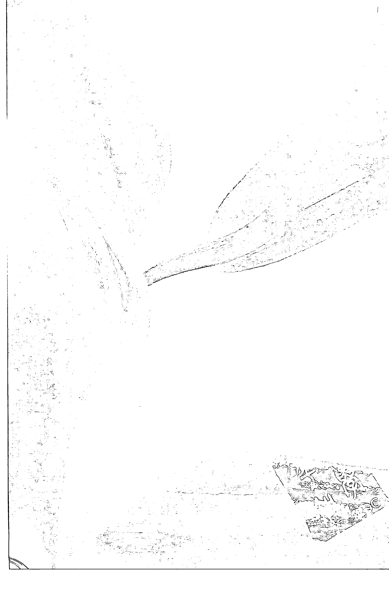

## 以心换心——植物的秘蜜生命灵动人生

尽管多数科学家仍不相信植物有灵魂、知觉和感情，但爱花草的人都相信植物会对悉心照顾它们的人表达最热切的感激，也会对虐待发出激烈的回应。它们怡然自得、和平沉静的气质会熏陶主人，主人的性情与心情也会潜移默化地改变植物。

美国知名的植物育种专家Burbank曾成功培育了无数令人赞叹的新品种水果和花卉，他观察到植物有二十几种人类无从辨识的知觉，所以他在育种时总是满怀爱心地跟植物说话沟通，相信它们能借着某种不可解的能力聆听并理解他的心意和愿望。他说：“爱的力量是一种微妙的滋养，能使一切植物长得更好，生出更多果实。”——人与人之间的互动不也如此吗？

我从小在植物的环抱中长大，那是我对世界最初的认识，也是我最初认识的世界，自然而然地觉得它们从来就是我生活和生命的一部分，深信守护我们的植物就是在抚慰我们的心灵。当原本幼嫩或枯萎的植物逐渐发出一个个嫩绿可爱的新芽时，我相信它们已经感受到了主人日日浇水施肥的用心专注和无限爱心，而它们的反馈就是带给主人纯粹的快乐、安详与幸福感。

科学家们陆续的研究也发现植物对环境具有精微的感应力，比如同样的农作物种植在同样条件的田地，中间以墙隔起来，一边每天放音乐，一边无音乐，结果前者的产量明显较高。更有趣的是音乐的种类也很关键，每天听摇滚乐的植物的根长得比听古典乐的稀疏且短，甚至逐渐枯死，可能是因为被吵得受不了了。所以养心在静，噪音泛滥对人的心灵一样具有杀伤力。唯有置身宁静中，我们被磨损的心神才能逐渐修复凝聚，慢慢回归平衡的中心点，最后在平静中找回被淹没的健康、智慧和本我。

我们一生中所有欢乐与悲伤的场合都少不了植物来作点缀，因为它们是善解人意的，予人精神上的洗涤与提升，所以与花草共处时是最欢愉自在的，也了无虚伪矫饰。为自己买盆小花吧，它会是你心灵混浊时的明矾，也会教导你学习爱人爱己如爱它。

## Stephanie用精油宝贝花草

- 让植物叶片饱满舒展的妙方：在喷罐中加入温冷水50ml，滴入柠檬草（Lemongrass）1滴，摇匀后喷洒于植物叶片上。
- 家里有顽皮的猫狗时：在喷罐中加入温热水30ml，滴入精油8～10滴，摇匀后喷于植物盆子四周，可防止猫狗靠近。薄荷、尤加利及百里香都适合。
- 对付蚂蚁：在棉花球上滴3～5滴薄荷或香茅（citronella）精油，塞于蚂蚁洞或蚂蚁出没较多处。
- 对付苍蝇、蚊子：将棉布条浸于温热水中，拧干后加精油5～6滴，系于树枝上。香茅、薰衣草或柠檬草皆可。
- 宝贝花草受霉菌侵害时：在喷罐中加入温冷水30ml，滴入精油2～3滴，摇匀后直接喷于长霉菌处。茶树、广藿香及肉桂皆可。

## 聆聽——用十四顆真心

随着网络科技的发达，世界以及人与人之间的时空距离瞬间缩短在键盘敲击间，但它却代替不了人们彼此接触时产生的“气”，这股“气”流转在一个充满理解的拥抱、深深关切的眼神及亲耳听到的一句真诚的“我了解你的感受”中。“凝神聆听”是最美丽的表情，也是我们能为他人做的最美好的事情之一，对方的情绪在我们静默专注的倾听中往往可以得到意想不到的安慰与纾解。我也有几位总是认真倾听我说话的好朋友，他们的耐心与爱心让我在人生风雨飘摇时依旧记得自己是一个幸福的人。

日本人说“聽”（繁体字）要用“十四颗心加上一个耳”，这真是一个十分精辟的解析，没有实际用到心和耳就够不上“听”，也听不出话的真伪虚实。英国诗人济慈（Keats）歌颂着“听得到的旋律是甜美的，但听不到的旋律更甜美”，耳朵听不到、听不出的就是要用心来听。用“十四颗心”来听，我们才能慢慢细细地品味人生抑扬顿挫的乐章，听出来自心灵深处的声音和呼唤，听出心情（比如心“碎”的声音）。又聋又瞎的人往往特别哀悼失去的听觉，正如知名的聋瞎作家海伦·凯勒所言：“失聪代表丧失了最重要的刺激，那就是——创造语言、使思绪奔腾、使我们与人类智慧结伴的声音”。如果不能静心听听风吹树叶宁谧的声音，不能专心听听心爱的人心里起伏的声音，不能欢心听听酒杯相碰祝福的声音……生命将会失去多少撼动人心的色彩啊！

## Stephanie这样聆听生活

- 睡前十分钟可依个人喜好选择盘腿而坐、轻松平躺床上或自然坐于椅上，闭眼调息，用心感受拂面的气流与“宁静的声音”。你的心从悄然流曳的空气中听出了什么？

【辅助精油】 1滴乳香或檀香 + 植物基础油5ml，涂抹于全身来调整身心状态，并以此香味作为桥梁来与“寂静之声”做连接。

- 醒后10分钟可以一样的姿势，仔细聆听清晨的声息。你的心从生机蓬勃的空气中听出了什么？

【辅助精油】 1滴鼠尾草或5滴柠檬 + 纯水10ml，均匀摇晃后喷于空中，使空气更清晰澄澈，帮助你“听闻”。

- 当你忽然觉得听力减退，甚至耳朵自动“关闭”时，请检视自己是不是正处于以下状况：
  - 听到太多伤痛、愤怒或令自己抓狂的事？
  - 你的另一半或父母较专制或喧吵不休？
  - 你觉得恐惧无安全感？你经常被告知自己是一个无价值、丑陋、没希望的人？
  - 你受够了负面的打击，只想切断和人的关系，缩进自己的世界寻求平和，“耳不听心不烦”？

【辅助精油】1滴香蜂草或松木 + 一次用量的植物基础油，抹于全身，或加8~10滴于浴缸中泡澡，或做室内熏香。给予心灵温柔坚定的支持。

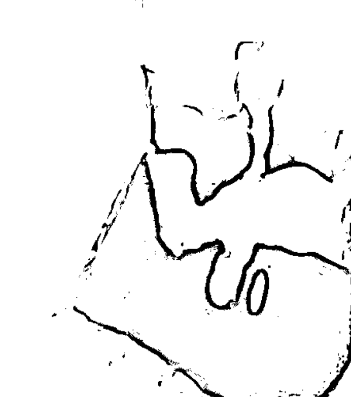

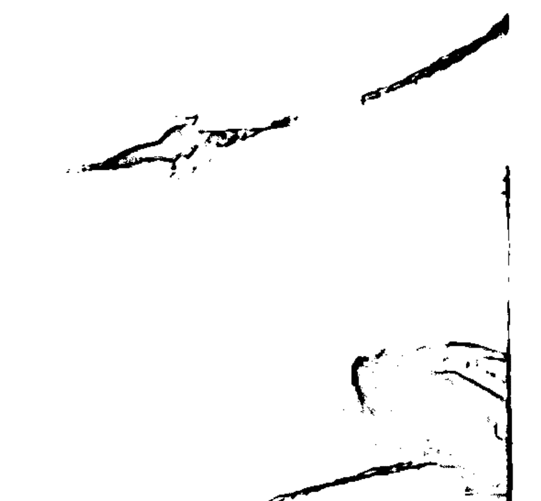

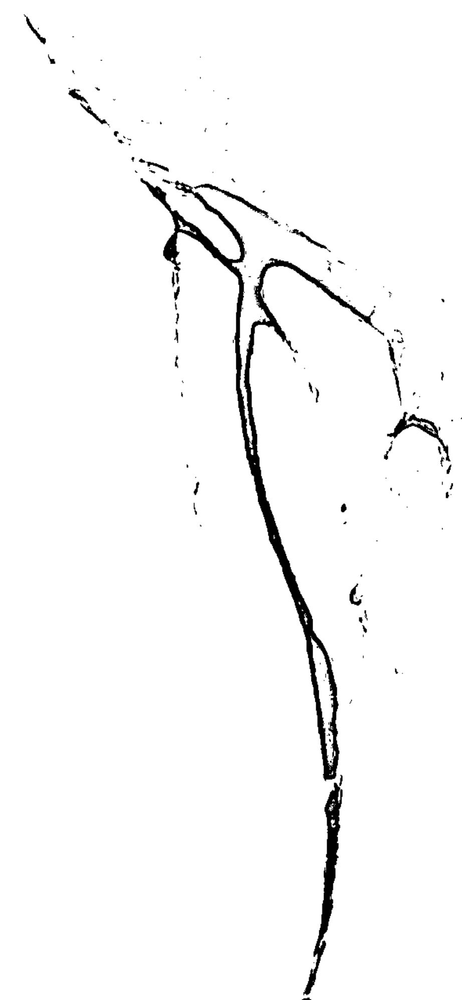

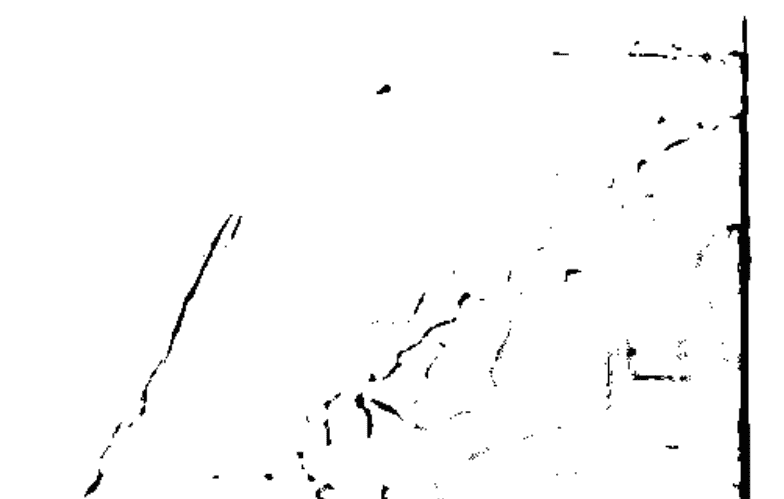

## 去芜存菁——为美丽找个洁净的家

公关事业一直红红火火的Rene，我有7年没见到了。万万没料到再次见到她竟然是在这样令人悲伤又尴尬的情况下。她悲痛欲绝地哭倒在沙发上，口中喃喃地述说前晚和男友决裂的事。我深深理解变质的爱会如何折磨人心，更了解负面情绪对健康和容颜迅速又强大的破坏力。望着瘦弱得缩成一团的灰色的她，我觉得自己的脸开始肿胀，身体发烧，脑袋也晕眩起来……

此刻Rene和我的体内正在被最可怕的毒素围攻，那就是负面情绪。所有有形的疾病和症状的背后，都潜藏着相对应的负面情绪和心理，它们犹如定时炸弹，潜伏不动只为了等待最适合的爆发时机，一旦爆发，就可能由内至外在瞬间击垮一个人。这个爆发时机可能是在压力大得让人心力交瘁时，在生活及饮食习惯乱无章法时，在睡眠不足或突然面对打击时。因为对分手毫无心理准备，突如其来的“惊恐毒素”让Rene面容憔悴、气色惨淡，在一夕之间丧失了一个女人全部的风采；而我，因为全神聆听她悲痛的泣诉，“沉重毒素”让我脸部到全身的肌肉都僵硬地向下垂，自己都觉得面貌逐渐变得扭曲晦暗。此番情景下，没有人会把我们两人和“美容时尚从业人员”联想在一起。

负面情绪是美容和健康的大敌，它们造成的憔悴气色和黯然神情，不是吃燕窝鱼翅就能彻底挽救的，更不用奢想用化妆品来遮掩修饰。唯一的应对方法就是积极疏泄，也就是作个身心大扫除。

春天是身心大扫除的最佳时机。当春天来临时，所有被雪藏和压抑的美丽都会被自然赋予足够的能量和勇气，从冬日的阴霾中挣脱、苏醒。春天的温暖和勃勃生机也能扫除身心隐藏和累积已久的毒素，然后点滴注入新生的舒畅喜悦。

## Stephanie这样净化身心

### ○美容排毒——干刷身体

干刷身体的好处多多。一方面可以去除身体肌肤老废角质，另一方面可以促进血液循环及新陈代谢，有助体内废物毒素的排除，从根本改善肌肤的状况。

【方法】每日洗澡前，用质地柔软的身体刷子，从小腿正面及背面开始向上刷，接着是大腿、腹部打圈刷，从脖子往下刷到前胸，从臀部向上刷到背部，从手指向上刷到肩膀及腋下。

### ○身体排毒——水的力量

泡澡是纾解压力、滋润身心最好的方法之一。在温热的水中，全身肌肉放松，血液流通，毛孔舒张，毒素无所遁形。水的包覆同时也会予人“被呵护、关爱”的温暖感觉。此外，水能纾压，压力越大，要喝越多的纯水，以保持血液畅通地流动，冲刷滞留体内的毒素。每日1200 - 1500毫升的饮水量是保持健康的法宝。

【方法】在浴缸的水中加4 - 5滴杜松精油或3滴杜松和3滴葡萄柚精油后泡澡。

### ○ 心灵排毒——温暖的能量

想哭就哭，长期压抑泪水和不良的情绪会让人致癌。当灰心、沮丧、忧伤来袭时，到室外浸润于阳光下，直到感觉内心充满温暖，血液重新活络为止。

【芳香治疗】以马乔莲或乳香精油做室内熏香，或滴于纸巾上嗅闻，可得到温暖的抚慰。

### ○ 饮食排毒——你吃的食物就是你

若你摄取了垃圾食物，你的身体就成了垃圾处理厂，废气毒素丛生，原本用来修复身体的能量也将被浪费于分解垃圾食物上。肌肤会因为垃圾食物而变得丑陋，心灵也会因为垃圾食物而沉重晦暗。

【建议食物】酸奶、深海鱼、未经盐渍的核果、籽类、五谷杂粮、橄榄油、水果醋。

### ○ 重整身心——拒绝烦恼

学习控制自己的情绪。防范负面情绪恣意入侵就要像防范病菌和敌人一样小心谨慎，特别是在睡前，记得“睡觉至上”，没有任何烦恼可以（或应该）在这个时候出现。

【芳香治疗】睡前在枕头上滴1～2滴香味沉静平稳的精油，如乳香、甘菊、马乔莲、柠檬草等，缓慢深呼吸数次，同时为细胞补充足够的、平静的氧气，以感谢身体的每个部位一天来的辛劳运作，然后脑子放空、身体放松，安心地入睡。你也可以在睡前回想今天让你最快乐的三件事，使全身细胞充满积极正面的能量。

## 附录

### （一）养生抗老新趋势——“整合医学”之发展及应用

当今已有愈来愈明显的趋势看到人类从传统主流的医学（Conventional Medicine，俗称西医）领域向外寻求解决个人及家人健康照护疑虑的答案及服务。西医在外伤及急症的处理方面的疗效是相当突出的；另类医学（Alternative Medicine）疗法在预防及治疗慢性病方面则有独到之处。许多非主流医学的治疗及效果日益被认知后，现已逐渐被融入西医的治疗服务体系，而形成整合医学（Integrative Medicine）：基于医生、病人的合伙关系而综合运用主流西医与另类、辅助性（Complementary）的疗法来刺激、促进个人身体内天生健康痊愈的潜能。它可以用来处理症状，提高生活的质量、健康与活力，促进治疗的效果，甚至治愈某些疾病。

起初，当代主流讲求实证论（Evidence-Based Medicine）的西方医学对较偏重经验论（Experience-Based Medicine）的许多传统医学之诊断、治疗的理论、方法及效果，因无从了解而不大接纳，姑以另类医学称之。医学院不教授，医院不提供服务，医疗保险亦不给付。

1986年美国国家卫生研究院（National Institute of Health; NIH）举办的一项调查显示，90%受访者对另类医学治疗感到满意。1990年统计全美国花费在背痛、焦虑、忧郁病症上的235亿美元之医疗费用中，另类医疗占137亿；另一项对1539位医师及研究者的电话访问中显示，约1/3的病人（1998年统计时达60%）曾接受过另类医疗。于是美国国会于1991年11月21日通过在美国国家卫生院下成立“另类医学办公室”（Office of Alternative Medicine; OAM）的议案。1993年成立的“辅助及另类医学科”于1998年升格为“辅助及另类医学中心”（National Center of Complementary and Alternative Medicine; NCCAM）。到1997年，全美统计有360亿～470亿美元是花费在另类辅助疗法上，其中120亿～200亿是病人自费支付给专业的医疗服务师。

2004年5月，美国健康统计局公布，2002年对31044位18岁以上的成人调查显示，74.6%的受访者曾接触另类辅助疗法，62.1%在过去12个月内接受过此类治疗。该医学中心研究经费由1993年的200万美元逐年增加至2003年的11380万美元，各医学研究中心资深教授纷纷投入研究，成果丰硕。全美125所医学院中76所有另类医学的授课，28所就直接开设以“整合医学”为名的课程。2003年5月26日至30日于日本京都召开的第26届世界内科医学会更将“另类医学”列入第三天下午的会议议程。

辅助及另类医学内容广泛，当前在国内医疗体系尚未被有系统的、正式的加以认知、印验、接纳、开发与推广，但在民间却早已被广大民众长时间接受及一再使用，如传统中医、针灸、整脊、按摩等。

摩、大肠水疗、果汁疗法、酵素疗法、营养医学、饮食疗法、药膳、静坐、冥想、催眠、瑜珈、音乐疗法、芳香疗法、色彩疗法、高热疗法、纯氧疗法、人体运动疗法、功能医学、螯合治疗、分子矫正医学、全细胞生物疗法、磁场疗法、环境医学、能量医学、生物能信息医学等等，皆已在欧洲及美、日等国有蓬勃的发展和相关医疗与研究机构的设立。

有鉴于以下原因：健康、长寿之需求与日俱增；医学朝整合发展之世界趋势日益明显；讲科学、依统计、重实证之主流医学或有分工过细、偏对抗治疗、少全人预防之观点而流于“治病不治人”的偏失；辅助及另类医学缺乏系统化的了解、整理与研究，架构、制度、理论不明，有发展失序之隐忧，因此整合“古老的医学与现代的医学、传统医学与主流医学、物理（生物能量）的医学与化学的医学、东方医学与西方医学、人的医学与天（环境）的医学、系统化的医学与全人化的医学、身心灵合一的医学”，充分发挥临床医学与预防医学之结合，以全面提升健康照顾的质量及功效，有赖关心健康的医界、学界、健康业界、政府及社会大众一起大力推动。

林承箕 医师

## (二) 只有正统，其余免谈——一个芳香疗法的芳香历程

优秀芳疗师的养成之路是漫长而艰辛的，因为芳香疗法既是最优美又是最严格的学问。

除了必须具备温暖和爱人、爱大自然的天性，敏锐的直觉及对生命和身、心、灵的好奇与探索，在智力（对疾病形成的推理和理解）、体力（按摩的体力和治疗的耐心）、创造力和美感（调配既有效又芳香迷人的配方）上也都必须非常下功夫琢磨。有了扎实又整合的学习，在判断疾病及治疗方式时才能有统合的思考。

若你想咨询芳疗师，务必问清楚他（她）是否受过以下完整的训练，并获得国际认可的执照或证书；若你想学习芳香疗法，请先坚定意志，安排充分的时间，接受以下所有的训练课程和身心挑战。

必须完成的训练时数：
450小时以上（不含临床实习）。

必须完成的专业课程：

- 1. 临床与身心整体芳香疗法 (Clinical & Holistic Aromatherapy)
- 2. 解剖生理学 (Anatomy & Physiology)
- 3. 药理学 (Pathology)
- 4. 瑞典式按摩 (Swedish Massage)
- 5. 中医基础理论与经络按摩 (Oriental Diagnosis & Massage)
- 6. 营养学 (Nutrition)
- 7. 咨询理论与技巧 (Counselling Skills & Theory)
- 8. 脚底反射疗法 (Reflexology)
- 9. 临床实习 (Case Studies)

## (三) Stephanie严选精油品牌

中国
Floralies法黎儿高等级精油
www.rosywoman.com

英国
Fleur Aromatherapy
Purple Flame Aromatics
Shirley Price
Robert Tisserand
Neal's Yard Remedies
Aqua Oleum

美国
Aroma Vera
Aroma Land

澳洲
In Essence

## (四) Stephanie的芳香食谱

这是一道非常容易制作的迷迭香菜肴，香草、大蒜、橄榄油的搭配形成一股美妙的香气。最好再配上一杯白葡萄酒（Sauvignon Blanc），滋味更佳！

### 准备材料

- 2个去骨的鸡腿
- 2瓣大蒜，切碎
- 1把新鲜百里香，从梗上取下嫩叶
- 2把新鲜迷迭香，切碎
- 1汤匙初榨橄榄油
- 1/2茶匙白胡椒及黑胡椒，磨碎
- 1茶匙帕马臣起司（Parmesan Cheese）作为最后摆饰（可选择性的）

### 腌鸡肉酱料

- 4瓣大蒜，与海盐一同磨碎（若没有海盐，食用盐也可），1汤匙初榨橄榄油
- 1茶匙切碎的新鲜迷迭香及百里香

### 烹调步骤

1. 在一个大碗中，放入腌鸡肉酱料，加入去骨鸡腿肉并确认鸡肉被酱料完全包围，腌制时间至少要1小时。
2. 在一个热的平底锅中，放入1汤匙初榨橄榄油。接下来将大蒜放入油中直到大蒜呈现金黄色，快速放入迷迭香及百里香过油后，即可捞出。
3. 此时的橄榄油已充满了大蒜及香草的香味，放入腌制好的鸡腿入油中煎至金黄褐色，约摸15分钟。将鸡肉放入盘中，最后加入炸香的大蒜、迷迭香和百里香，以及少许起司。

## 后记

### 第25季

看到一片天 映出表情
听到一阵风 带来色彩
走进一片海 触摸味道
离开一个梦 走进薄雾清晨
触摸每一个 时间中美妙的细节
不需要睁开 看着心的眼睛
阳光落在地 碰响和弦
季节不停歇 带走目光沉淀
第二十五季 停留在落日的身旁
让晚霞抹红 我的手 你的脸
感受一瞬间 停靠在浪漫季节

2006年秋天，也就是这本小书完成后不久，一个微风和缓的夜晚，我参加《安25ans》杂志举办的“慢品生活之美音乐会”，其中一首专为这本杂志谱写的歌曲“第25季”让我热泪盈眶，感动至今仍萦绕于心。原来，满心喜悦的一刻才是人生最真实和永恒的足迹。特拿来与读者分享，愿大家：
每天安排第25小时来品味生活，把心安顿；
永远拥有25岁时对人生美好的憧憬，和清新的活力与气息。

臧芬远

对于那些芳香疗法的爱好者和热爱探索自我的读者来说，这本书亦是芳香疗法界的Lonely Planet，可以安全而顺畅地进入到芳香疗法的世界。那就跟Stephanie一起，在她的书里，跟嗅觉一起散步，跟爱一起奔跑吧！

跨媒体制作人曹子在

Stephanie一直是《时尚Cosmo》杂志最受欢迎的美容专家之一……在《芳香生活志》中，她为我们打开了通往快乐闻香的大门，让我们意识到嗅觉的重要性远远超乎大家的想象。要知道美好的味道绝对是生活享受的一部分。为什么我们不从今天就开始营造属于自己的香味小世界呢？

《时尚Cosmo》美容总监张骞文

- 《中国女性》运营总监洪洋
- 《嘉人Marie Claire》美容总监张弛
- 《时尚Cosmo》美容总监张骞文
- 《时尚芭莎Bazaar》美容总监董刚
- 《时尚健康》美容总监卞丽娟
- 《瑞丽伊人风尚》美容编辑罗媛

等倾力推荐

ISBN: 978-7-80186-694-3
定价: 38.00元