# 芳香疗法基础

## 编写说明

本教材在全国高科技健产委芳香保健专业委员会（AHPC）提出的“弘扬中国传统芳香文化为基础，引进国外芳香领域先进的理念为原则”的教育方针指导下，以及在《芳香疗法基础》编委会全体芳香领域专家学者的共同努力下，以英国芳疗教育专家Angus Williamson先生提供的苏格兰芳疗学院的全套教材为蓝本，并参考福建中医学院原院长杜建教授多年来的芳疗研究成果编撰而成，是世界上第一套将芳香疗法与中国传统的医药学理论有机结合的创新型教材。本教材的出版将为培养合格的专业临床芳疗师提供保障。

蓝本教材是Angus Williamson先生多年从事芳疗教育经验积累的结晶，完全符合英国芳香疗法委员会制定的芳香疗法教育国家职业标准的要求。引入杜建教授多年来在中医芳疗理论和临床中的研究成果，彰显了本教材的专业特色，为适应中国现今芳疗界循序渐进的教学模式，夯实学生的专业理论知识，提升临床实践水平奠定了基础。

需要说明的是，本教材有些中医理论知识相对比较专深，但对读者建立完整的知识结构和开展芳香疗法却颇有帮助，原本设想用“附篇”的形式出现。现为了不影响内容结构的连贯性，仍然以“节”的形式来表达。不过，在该“节”打上了星号，且正文文字也作了适当改变，以示区别。

由于时间仓促及编者水平的局限，书中难免有疏漏和不足之处，敬请读者提出宝贵的意见和建议，我们将不断修正，使本教材日臻完善，更符合我国芳香疗法教学的需要，使广大读者受到裨益。另外，编委会也会根据教学的需要不断推出相关参考资料，敬请期待！

《芳香疗法基础》编委会
2009年8月

## 序言

在当前中国芳香疗法行业的发展中，教育培训是最重要的核心工作之一。因为改变、提升本行业的唯一出路，是提高芳香保健从业人员的专业素质水平，所以必须从教育的源头抓起。

本教材的突出特点是，将中国传统的医药学理论与芳香疗法有机结合，并在未病领域的研究、发展和实践中，探索了一条新思想、新方向的道路，完全符合中国特色的芳香疗法、芳香保健教育培训计划纲要精神。为使我国的芳香保健行业教育达到国际先进水平，全国高科技健产委芳香保健专业委员会（AHPC）与国际知名芳香疗法研究机构签署教育培训的长期合作协议，这一系列举措将使我国芳香保健行业从业人员技能水平与国际直接接轨。

在英国芳疗教育专家 Angus Williamson 先生的大力帮助下，全国高科技健产委芳香保健专业委员会（AHPC）以“全面提高芳香领域教材质量”为指导思想，在深入研究了世界各地在使用相关教材及教学参考书的基础上，又认真听取具有丰富教学实践经验的专业教师，以及工作在芳香领域各形象店第一线管理者和员工的建议，并通过广泛征求使用教材的师生意见的基础上，组织国内外芳疗教育领域的专家共同编写了《芳香疗法基础》教材。编写宗旨是：面向 21 世纪，积极开展对外交流，将芳香疗法教学推上一个新台阶。本教材根据芳疗教学实践的具体情况，结合学历教育与职业教育的特点，探索和尝试突破以往相关教材的编写框架，重在帮助学习者架构起正确的芳疗知识体系，加强理论与实际的联系，做到思想性、科学性与先进性的有机统一。

为了确保编写质量，Angus Williamson 先生提供了苏格兰芳疗学院的全套教材作为蓝本，全国高科技健产委芳香保健专业委员会（AHPC）成立了教材编写委员会，并在宋珂主任的主持下，先后召开多次会议，对教学大纲、编写提纲和教材内容进行了认真讨论和反复斟酌，力求使教材内容能充分体现专业业务培养的基本要求和教学质量测试的基本标准。

本书是第一本将中国传统的医药学理论与芳香疗法有机结合的专业芳香疗法教学教材，其循序渐进的教学模式，使学生在学习专业知识的同时，也在专业实践方面得到强化。我非常支持这种探索，衷心希望这套系列教材的陆续出版能为我国专业芳香疗法教育贡献一份力量，使芳疗教育的教材建设能够百花齐放，促进芳疗教学水平的提高及教学模式的改进，故乐为之序。

福建中医学院原院长、教授 杜建
2009年8月

## 第一章 绪论

### 第一节 芳香疗法简介及发展历史

人类使用芳香植物来预防、治疗疾病的历史由来已久。芳香疗法源于古埃及、中国等文明古国，进而盛行于希腊与罗马等欧洲国家，不过直到 1928 年“芳香疗法”(aromatherapy)这个名词才正式由法国化学家盖特弗塞博士提出，并被人们广泛运用。所谓芳香疗法，是指受过严格训练的芳疗师在综合考虑人的身体、心理和心灵深处的需求，以及生活形态、饮食习惯、人际关系等整体因素的基础上，以整体论为哲学指导，以萃取自芳香植物的精油为物质基础，以特殊的推拿方法为主要途径，在和缓、轻柔、唯美、优雅的氛围中，帮助人体恢复身体、心理、心灵健康的补充疗法。它可以预防和治疗人类疾病，改善人体的免疫力，维护人体健康，属于自然疗法的一种。芳香疗法重视人体自身的平衡调节能力即自愈功能，并以此为基础发挥治疗作用。现代社会充斥着各种压力，不论是身体、精神还是环境的压力都会影响人体的生理功能，使机体的平衡调节功能紊乱，从而产生各种不适，甚则出现疾病的临床特征。芳香疗法通过恢复和激活人体的自愈功能，帮助机体获得康复。

#### 一、中国芳香疗法源流与发展

##### (一) 先秦时期

已知最早的芳香剂应用可能是在中国。早在殷商甲骨文中就有熏燎、艾蒸和酿制香酒的记载，至周代就有佩戴香囊、沐浴兰汤的习俗。在先秦文献中，《山海经》记载薰草“佩之可以已疠”，马王堆汉墓出土一批香囊、药枕(图 1-1)、熏炉，内有辛夷、佩兰、茅香、花椒、肉桂等芳香类药物。这些都说明了当时即有用芳香药物防治疾病、辟秽消毒、清洁环境的风俗习惯。

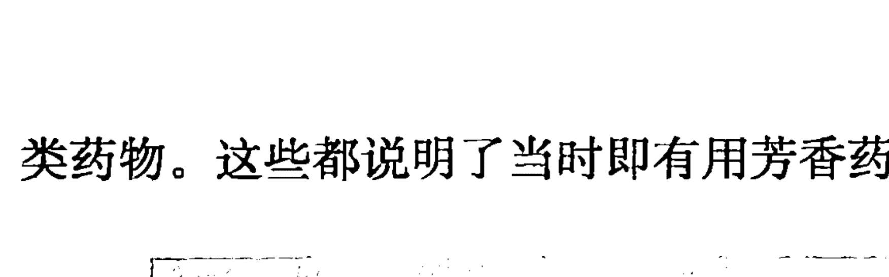

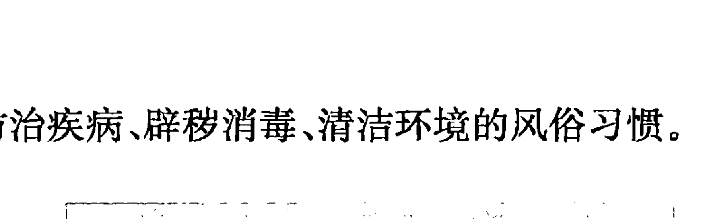

图 1-1 马王堆出土的有关香疗的器物

##### (二) 秦汉时期

从战国到秦汉，芳香疗法从实践逐渐上升为理论的初步探索，如《灵枢·寿天刚柔第六》记载，“用淳酒二十升，蜀椒一升，干姜一斤，桂心一斤，凡四种，皆㕮咀，渍酒中。用绵絮一斤，细白布四丈，并内酒中”，以熨寒痹。可见在秦汉医学实践中，即有用芳香药物外治的经验。

《神农本草经》集东汉以前药物学之大成，全书记载药物 365 种，其中有不少芳香药物，如“菖蒲，味辛温。主风寒湿痹，咳逆上气，开心孔，补五脏，通九窍，明耳目，出声音。久服轻身、不忘、不迷惑、延年”。由于《神农本草经》按四气五味阐述功能，较详细地著述了芳香中药的一般药物性质，为后世运用芳香药物提供了重要依据。

##### (三) 唐宋时期

唐代以来，芳香疗法有了进一步发展，如孙思邈《备急千金要方》指出，外感温热病可以传染，也可以预防。在“辟温”一节中所用方法多种多样，所选药物均以芳香药为主体，如用太乙流金散烟熏，用赤散搐鼻，用辟瘟杀鬼丸香佩，用粉身散作粉剂扑身，用桃枝洗方外浴，等等。

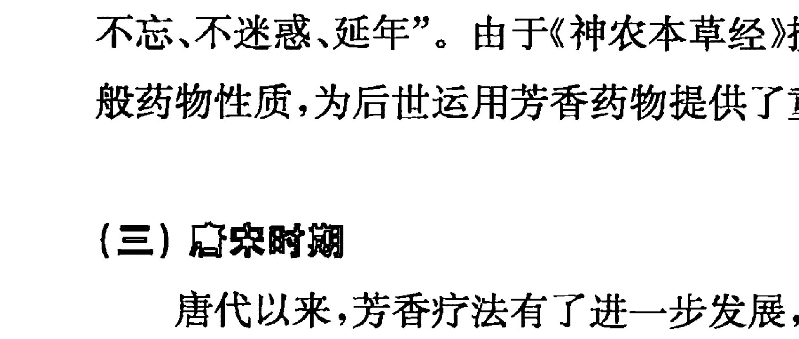

自先秦至唐的中医药实践中，始终贯穿着历代医家对芳香药物的关注、实践和药性分析，给后世以深远的影响。

宋代，芳香药物的中外交流达到了高峰，我国与印度、越南、阿拉伯等国友好往来，互赠礼物，其中含有大量的芳香药物。“海上丝绸之路”出现了专事海外运输贸易芳香药的“香舶”。《太平圣惠方》中以香药命名之方剂达 120 首，许多著名的方剂如苏合香丸、安息香丸、木香散、沉香散等均出自宋代。1974年8月，在福建泉州发现的南宋沉船中遗物丰富，计有14类、69项，其中香料药物占第一位，数量最大（图1-2）。香料药物中有降香、沉香、檀香、胡椒、槟榔、乳香、龙涎香、玳瑁等。其中香料木占出土遗物总数的绝对多数，未经脱水时其重量达2300多千克。

##### (四) 元、明、清时期

元代，在对外经济贸易中，芳香药物仍是主要的商品。明代，随着方药学的兴盛发展，芳香疗法的应用和研究有了长足的进步。如《普济方》中专列“诸汤香煎门”，收集97方，并详细记载方药组成、制作、用法等，较全面地总结了15世纪以来芳香疗法的经验。《本草纲目》更是广搜博采，丰富了芳香药物的记录，记载“香木”类35种、“芳草”类56种，除此之外，还介绍了涂法、擦法、敷法、扑法、吹法、含漱法、浴法等芳香疗法的给药方式。总之，自唐、宋、金、元至明，芳香疗法已积累了丰富的经验，为理论上的提高和研究新课题准备了基本条件。

清代，芳香疗法的研究与实践产生了质的飞跃，代表医家为杰出的外治大师吴师机。吴师机《理瀹骈文》对芳香疗法的作用机制、辨证论治、药物选择、用法用量、注意事项等作了系统的阐述，使芳香替代疗法有了完整的理论体系。

吴师机认为“凡病多从外入，故医有外治法，经文内取外取并列，未尝教人专用内治也”，从而提出了芳香疗法的理论依据。他还指出“外治之理，即内治之理；外治之药，亦即内治之药，所异者，法耳”。而且，凡属于内治的汤、剂、丸、散，无一不可以熬制成膏药；凡是服汤、丸能治愈的病症，也无一不可以改用外治法而收效。换句话说，外治与内治在病因、病机、辨证等医理上是相同的，故用药相同，所不同的只是给药方法、吸收途径而已。吴氏此说，为后世研究芳香疗法的作用机制奠定了理论基础。外治法制方遣药，常用生药、猛药、香药。吴师机指出“膏中用药味，必得通经走络、开窍透骨、拔病外出之品为引”，如麝香、木香、冰片、樟脑、苏合香、安息香、白胶香、乳香、没药、肉桂、花椒等。芳香药物的作用在于“率领群药开结行滞，直达病所，俾令攻决，无不如志，一归于气血流通，而病自己”。吴师机治病虽以膏药为主，然亦兼用他法，如敷、熨、涂、熏、浸、擦、搐、嚏、吹、吸、坐等外治法，从而拓宽了芳香疗法的给药途径。

在清代，芳香疗法得到进一步推广，如清皇宫医案记载了透脑闻药方、清脑闻药方、避瘟明目清上散、避暑香珠、清静香、避秽香等。除了医籍，从小说《红楼梦》中也能略知清代芳香疗法的普及，如香囊、香串、香瓶、香珠、熏炉等比比皆是，虽说《红楼梦》是小说，但素材来自现实，亦是日常生活之写照。

在中医学发展的历史长河中，芳香疗法随着经验的积累、理论的提高而不断发展完善，无形之中为现代芳香疗法的创新发展奠定了基础。

#### 二、国外芳香疗法源流与发展

##### (一) 印度

有关草药的经典著作是《印度草药学》(Ayurvedic)，成书于 3 000 年前。Ayurvedic 的意思是长寿的知识，源于梵语。A-yur — 生命；ve-da — 我知道。

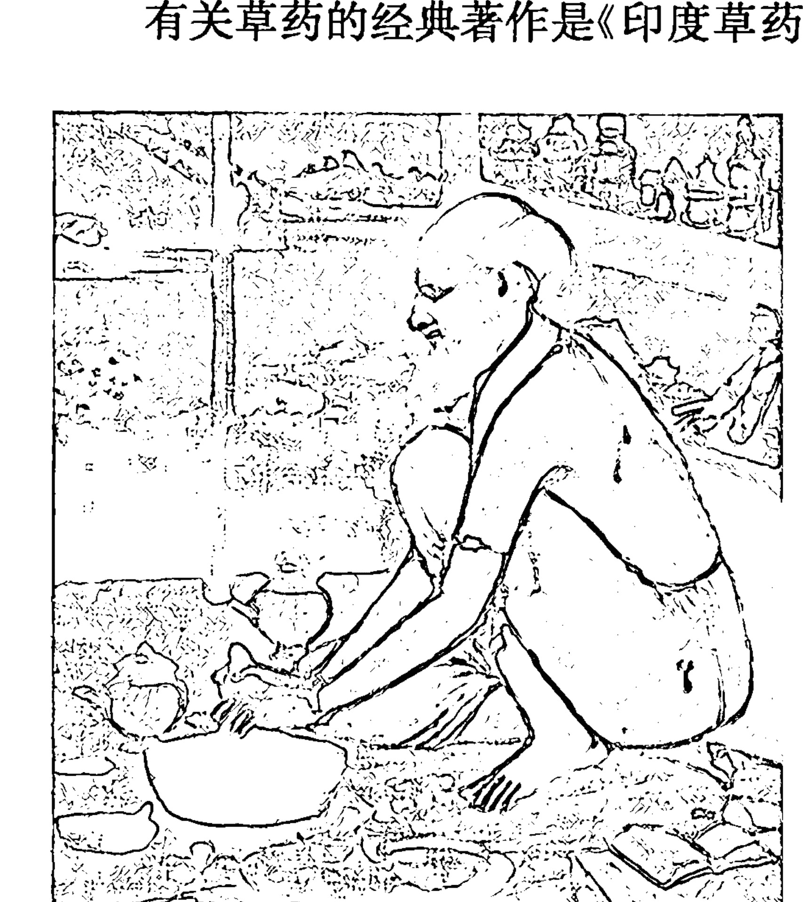

印度医学以植物药为基础(图 1-3)，医学理论紧密地与哲学信仰和生活方式联系在一起。

芳香推拿是医学疗法的一部分，同时也用于疾病的预防。在印度草药医学中，用到的一些草药和香料有葛缕子、小豆蔻、黑胡椒、姜、丁香、檀香、芦荟、安息香和大麻等。

印度草药学中记载的芳香推拿使用了檀香油，芦荟、玫瑰、茉莉花和岩兰草油被用于美容目的。一种称为 urguja 的美容膏中包含了檀香、芦荟、玫瑰和茉莉花，另一种含有岩兰草油的药膏被用于退热。

##### (二) 古埃及

有相当多的资料表明芳香疗法在古埃及得到了广泛应用(图 1-4)。

在古时候，和今天一样，香水是昂贵的日用品，主要用于寺庙和富裕的家庭。香水昂贵的原因有多个，比如低效的提取过程、香料原料供应的不足和昂贵的运输费用。主要的香料供应地是阿拉伯半岛南部、印度和中国。大多数的芳香剂采用浸渍工艺提取，不过据猜测，古埃及人已经理解并开始使用基本的蒸馏技术。有证据表明大约在公元前 2000 年，通过基本的蒸馏方法得到雪松香精。由于没有该工艺的文字记载保留下来，所以很可能蒸馏技术在当时还是一种只有神父才知道的神秘技艺。

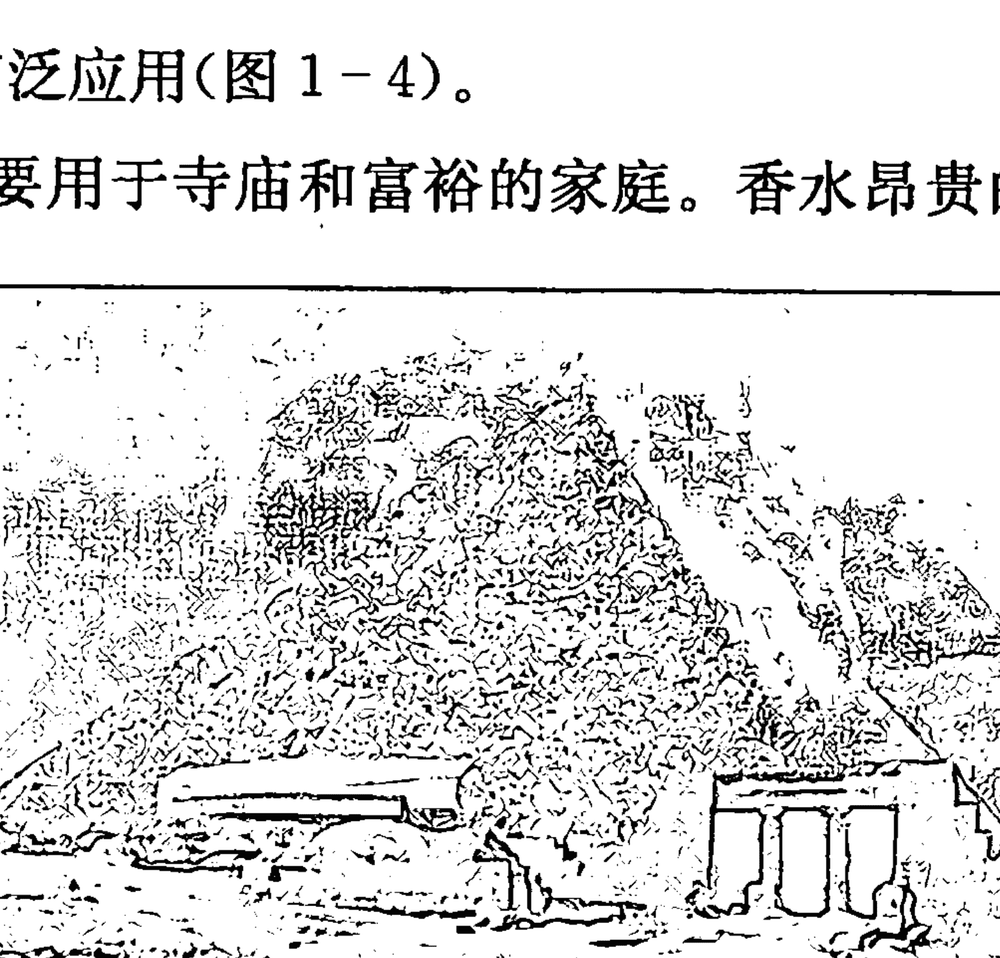

芳香油贸易繁盛一时，尤其是产于埃及的雪松、没药、丝柏等闻名于世。蒸馏可能直到约公元前4年才开始应用，因此在法老时期香水还不为人所知。

芳香剂对于埃及人的重要性是毫无疑问的。例如埃及的一位皇后哈特谢普苏特（Hatsheput）非常喜欢没药，以至于派遣了五艘船到索马里为她的寺庙运回没药的幼苗。大部分的文明古国都发展了药用植物，传统草药的历史甚至可以追溯到古埃及。尼罗河畔的人们发展了植物药学，他们写下了处方和方剂，使其可以在同行间交流，并将其传给后辈。

胡夫（公元前2800年）在纸莎草（最早的纸）上记载了芳香剂的医学用途和一些神奇的作用。在这个时期，埃及人已很熟悉乳香、丝柏、没药、雪松、肉桂、牛至、杜松、芫荽、菖蒲和苦杏仁等提取物的应用。

在公元前1700～前1300年，记录医学的纸莎草依然存在，其中许多文字记载已经被破译，然而，一些植物的鉴定已成为障碍。公元前1800年的原始文献指出，大约80%的药物来源于植物。

很明显，古埃及人不仅应用单味药，而且应用复方。他们内服草药，也将其用于推拿、熏蒸消毒、吸入和外敷。表1-1是古埃及的一些药物制剂的描述。

###### 表1-1 古埃及的一些药物制剂

| 病症 | 制剂及用法 |
|---|---|
| 头痛 | 用杜松、枯茗和乳香混合鹅油进行头皮按摩，或用莳萝的果实、泻根、芫荽及其他的药用植物混合驴油进行头皮按摩 |
| 四肢肿胀 | 用芹菜油膏涂患处 |
| 四肢痛 | 用含有肉桂和乳香膏剂的绷带包扎四肢 |
| 骨折 | 用含有芫荽、蜂蜜和发酵植物汁液的糊（剂）贴敷 |
| 疱疹 | 用蜂蜜、没药和芫荽治疗 |
| 神经颤搐 | 用爱神木熏蒸消毒，诱导发汗；接着进行面部推拿 |

古埃及人在寺庙中也大量使用焚香，焚香也被用于葬礼和宴会。香水“perfume”这个词就是来源于拉丁语，“per”是“through”（通过）的意思，“fumum”是“smoke”（烟气）的意思，也就是焚香的意思。

最有名的焚香是kyphi（后来被希腊和罗马人使用）。kyphi可能具有一种缓和的麻醉作用，应用广泛。根据希腊的历史学家Plutarch的描述，kyphi“能使人平静地进入睡眠状态，缓和焦虑，做好梦”。据说kyphi含有菖蒲、桂皮、肉桂、欧薄荷、香茅、黄连木、旋花、金雀花、杜松、洋槐、指甲花、莎草、松脂、没药和葡萄干。

在著名的“太阳之城”赫利奥波利斯（Heliopolis），在对太阳的礼拜仪式中，日出时烧树脂，日中烧没药，日落时烧 kyphi。尼罗河两岸的植物园里存贮了大量的药用植物，很多是从阿拉伯、印度、马来西亚和中国收集而来的。

法老 Thotmes 二世（公元前 1500 年）派遣一个探险队到叙利亚寻找新的药用植物，在卡尔奈克（Karnak）供奉 AMAN 神寺庙的墙上，以及后来杜唐卡蒙（Tutankhamun）（公元前 1347～前 1339 年）的墓上，都能够看到这些植物的画像。法老的墓也为我们提供了大量关于古埃及人应用芳香剂的信息，但几乎没有哪个墓能完整地保存下来。杜唐卡蒙的墓被盗过两次，第一次强盗们偷走了金子，第二次他们偷了藏在方解石罐子里的膏药。这些强盗们在打破的罐子上留下了清晰的指纹，他们掘开了用于存放香精油和油膏的雪花石膏罐，也发现了化妆品盒子。杜唐卡蒙的墓里保存有许多盛有芳香药膏的罐子，当 20 世纪 20 年代墓被打开时，仍然能闻到香气。检测发现，这些香水和香精含有乳香和多种甘松香。在同时期的另外一个墓里发现的油膏含有蔬菜油、铁和吗啡，这些吗啡经过 3 000 年的埋藏之后仍然具有药理活性。埃及人也将芳香剂用于制作木乃伊。最初先将人体的器官取出，对身体进行干燥以避免腐化。一般情况下，身体被埋在干燥的沙漠中，也可以用干燥的碳酸钠进行脱水干燥。干燥之后，身体用芳香油进行涂抹。经典的芳香油原料含有杜松、没药和肉桂，已得到考古的证明。在木乃伊的包裹物中还发现了迷迭香的细枝。

国王 Ramasses 二世（公元前 1290～前 1224 年）的木乃伊也涂抹了菊科植物精油，可能是一种甘菊油。甘菊油后来被科普特人（埃及基督徒）使用。

##### (三) 犹太人与《旧约》

犹太人在大约公元前 1240 年离开埃及，在古希伯来人的文献中提到了芳香剂（图 1-5），《旧约》中包含了许多有关用于圣膏的芳香剂、香料贸易、宗教目的及斋戒仪式的论述（表 1-2）。

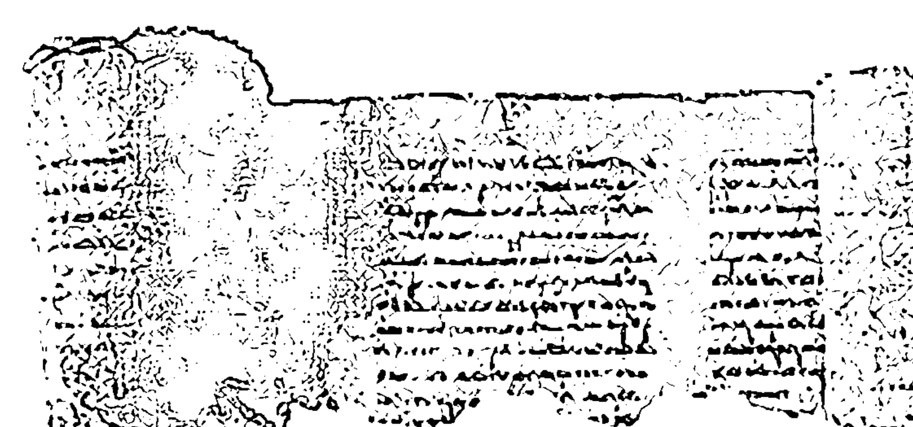

###### 表 1-2 《旧约》中有关芳香剂的论述

| 篇 章 | 论 述 内 容 |
| :--- | :--- |
| 出埃及记 30:23 | 摩西接到了圣膏的用法说明，圣膏中包含没药、甜肉桂、甜菖蒲 |
| 出埃及记 30:34 | 提到在神龛中使用白松香和乳香（可能是为了引导人进入冥思状态） |
| 民数记 19:18 | 提到在斋戒仪式中使用牛膝草 |
| 所罗门 3:6 | 从像燃着没药和乳香的冥冥中走来，带着商人所有香粉的人是谁呢 |

##### (四) 古希腊

在古希腊文明中，芳香剂的应用也很广泛。除了圣经，关于古希腊应用芳香剂的主要记载有：

- THEOPHRASTUS De odoribus;
- DIOSCORIDES De materia medica;
- PLINY THE ELDER Naturalis historia。

希腊的医生访问埃及后，带回了很多关于芳香疗法的知识。

在希腊医神埃斯科拉庇俄斯(Aesculapius)和希腊爱神阿佛洛狄忒(Aphrodite)的寺庙的大理石碑上，记载了药用香水的处方。Aeone是爱神Aphrodite的女仆，传说她将香水处方的知识从神传给了人类。megaleion是最著名的希腊香水之一，由megallus制出，不仅芬芳，而且有消炎和疗伤的作用(含有没药的成分)。

希波克拉底(公元前460～约前377年)，古希腊医师，医药之父，曾提到芳香浴和芳香按摩。希波克拉底使用了大约400种主要来自植物的药物。在雅典流行瘟疫期间(公元前430年)，他劝说居民在街道上燃香料来驱除瘟疫。

马瑞斯特斯(Marestheus)(一个希腊医生)注意到了香气的治疗特性，他观察到一些香气具有刺激、提神的作用，如玫瑰、风信子、藤叶；一些香气具有镇静作用，如百合、水仙、紫罗兰。

迪奥斯克里德斯(Dioscorides)写了一本关于草药的论文，其中包括芳香植物的应用(单味药和复合剂)，它的大部分内容事实上在最近几年已经被科学家和芳香疗法师们证实。

提奥夫拉斯图斯(Theophrastus)(尼禄时代罗马部队里的一名希腊医生)注意到芳香膏药的治疗作用(图1-6)。他观察到外用的香料对机体的内部产生了作用，呼吸也变得带有香气。

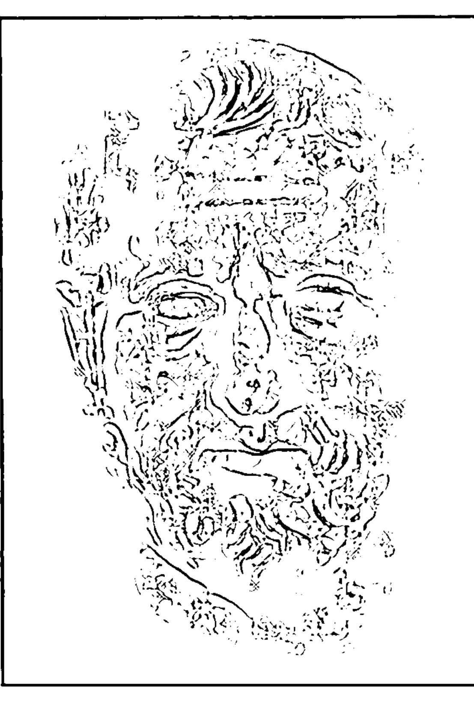

盖伦(Galen)(131～201年)是马可·奥里略欧斯(Marcus Aurelius)(罗马皇帝兼斯多葛派哲学家，121～180年)时期的一名医生，也是一名军医。他同样应用了许多植物药和芳香剂，并发明了“冷膏”，盖伦制剂至今仍被用于指一般的植物药膏。希波克拉底、迪奥斯克里德斯、盖伦等的著作由希腊语翻译成阿拉伯语和拉丁语。

图1-6 提奥夫拉斯图斯

##### (五) 罗马

罗马大量地使用香精和芳香剂。事实上，罗马的香料商是很多的，整个城镇都是香料店。有一个时期，在Capua，香料商店占据了整个商业街道。

罗马使用固体药膏、芳香油和粉状香料。药膏里含有铑——玫瑰香和水仙香。有名的香膏如表1-3。

###### 表1-3 古罗马使用的香膏

| 名称 | 组成 |
| :--- | :--- |
| Susinum | 由蜜、菖蒲、肉桂、没药和藏红花制得 |
| Nardinium | 由肉桂、闭鞘姜、小豆蔻、蜜蜂花、甘松香和没药制得 |

虽然这些香料很贵，但罗马人依然将其用于头发、身体、衣服、床、国旗和房屋的墙壁。不论在公共场合还是在家里，芳香油被用于洗浴之后的按摩。

罗马诗人奥维德(Ovid)，写了一本关于美容的书 *Medicamina Faciei*。然而，现在只有片段尚存。他在书中提出乳香、茴香、没药、玫瑰、蜜、鸢尾根和其他的组成成分可作为美容制品。

##### (六) 中东

在《新约》中有许多关于芳香剂的记载(表1-4)。

###### 表 1-4 《新约》中有关芳香剂的记载

| 篇 章 | 论 述 |
|---|---|
| 马太福音 2:1 | 圣子出生——来自三位智者的礼物——黄金、乳香和没药 |
| 马太福音 23:23 | 耶稣向众人讲解了芳香的价值，因为文士和伪君子似乎认为芳香剂高于法律、判决、同情和信仰 |
| 马克 14:3 | 逾越节期间，耶稣在伯大尼长大麻风的西门家里坐席的时候，有一个女人拿着一玉瓶甘松节香膏来，打破玉瓶，把香膏浇在耶稣的头上 |
| 约翰 12:3 | 就在最后的晚餐之前，玛丽用珍贵的甘松油膏擦摩耶稣的脚，用她的头发擦洗耶稣的脚，整个房间都弥漫着油膏的香气。耶稣将圣油涂在人们身上，利用其芳香来进行治疗 |
| 马克 15:23 | 在受刑时，耶稣被敬上一杯没药酒，他并没有喝。在罗马帝国时期，芳香品的贸易，尤其是香料和树脂，是很重要的经济贸易 |

罗马衰落之后，许多罗马医生逃到康士坦丁堡（现称 Istanbul，伊斯坦布尔），拜占庭帝国的人们也将芳香剂用做药品和香水。我们熟知的两位有名的阿拉伯医生是：阿布·巴尔·穆罕默德·印毕·沙卡历亚·欧—瑞奇（Abu Bahr Muhammad ibn Zakaria al Razi）（865～925 年），罗马衰落之后，他写了很多医书包括草药配方。

不过，阿布·阿里·欧—苏山·印毕·亚奔·阿拉·印毕·苏纳（Abu Ali ibn Sina）更有名，一般称他阿维森纳（Avicenna）（980～1037 年）。他 18 岁时就是一名知名医生，他学习了逻辑学、几何学、形而上学哲学（纯粹哲学）、哲学、天文学和占星术（图 1-7）。据说阿维森纳发明了水果饮食疗法和推拿中的肌肉牵引。阿维森纳被认为是第一个记录蒸馏过程的人。他写了将近 100 本书，在芳香剂制作中，提出首先对玫瑰和其他的花进行蒸馏，产生精油和花水。

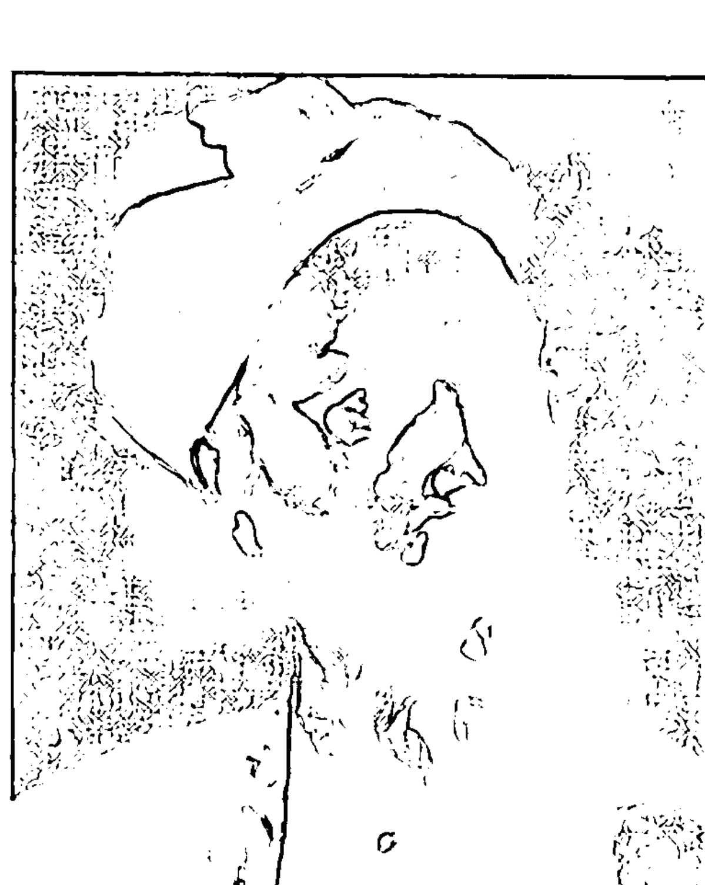

波斯人出口玫瑰花露到中国、印度和欧洲。到 12 世纪时，“阿拉伯香水”闻名于世。

阿维森纳著有《医学标准》，或“Al Q'anum”，在这本著作中他提到了肉桂、芫荽、丁香、安息香、莳萝、甘菊和欧薄荷等精油。

##### (七) 中古时代的欧洲

###### 10～13 世纪的欧洲

由于缺少资料记载（所以命名为黑暗世纪），关于芳香疗法所知不多，但可以确定的是那时仍然有使用草药的传统。

十字军东征的骑士们从东方带回了芳香和蒸馏工艺的知识。欧洲人开始对芳香植物进行蒸馏，如薰衣草、迷迭香、百里香等，这些都是原产于地中海国家，但随后很快开始在北部培育种植。

14世纪和15世纪，草药油浸剂（即芳香草药在油中加热）在欧洲闻名，英国人用拉丁文写成的手册描述了配方和治疗属性。例如，《一味草药》（作者未知）成书于15世纪，是第一部关于油浸剂的著作；《班克斯（Banckes'）草药》（1527年）也提到了油浸剂；特奈（Turner）（1551年）：英国植物学之父。

##### 14～16世纪

14～16世纪时，芳香油浸剂和芳香水被外用来治疗内部疾病。在欧洲，草药学家、化学家（炼丹家）和占星家（医生）根据植物和草药的热、冷、干、湿等性质将其分类：幽默欢快（气）、冷静镇定（水）、愤怒（火）、忧郁（土）。

##### 16世纪的德国

希罗宁姆斯·布伦瑞克（Hieronymus Braunschweig）是一名外科医生，也对蒸馏进行了描述。他的著作（1597年）提到了25种精油。在当时的德国，蒸馏方面取得了很多进步，精油被作为内外两用的药物。

##### 17世纪的英国

这个时期被认为是草药学的黄金时期。主要的著作包括：《乔斯顿》（Johnston）列举了4000种植物草药；《卡尔佩波》（Culpeper）也写了很多关于草药的事情。

尼可拉·卡尔佩波（Nicholas Culpeper）是最伟大也是最后一位占星家（医生）。当草药医学流行时，庸医和骗子也在泛滥，草药学和占星术很快就失去了他们在医疗中受尊敬的地位（图1-8）。

瘟疫是中世纪的祸端，人们认为有毒物质在空气中，故采用烟熏消毒的方法来杀毒。安息香、苏合香、乳香、芳香的根或木头都被拿来燃烧。

芳香剂是当时所知道的最好杀菌剂。虽然人们并没有杀菌剂的概念，但他们观察到和芳香剂密切接触的人，比如香水、手套和帽子制作者，好像对瘟疫具有免疫力。

在大瘟疫期间（黑色死亡），街道上点着火，松木或辛辣的木头被认为是最有效的。家里点着焚香、树胶和芬芳的蜡烛。圣保罗教区用硫黄、蛇麻子、胡椒和乳香来消毒。

到17世纪末，精油被广泛应用于医学。《西蒙处方集》（1696年）中包括了精油配制的药方。例如，一种治疗痉挛、麻木等的香膏包含了肉豆蔻（压榨的）、琥珀、玫瑰、肉桂、薰衣草、马郁兰、龙涎香、安息香、芸香、丁香、柠檬、麝猫香和麝香。

##### （八）18世纪的英国

米勒（Joseph Millar）的《草药》（1722年）提到了很多香精，其中的一些是药用制剂，如杜松和百里香。

林奈（Linnaeus）（瑞典植物学家）1751年出版了《植物哲学》（*Philosophia Botanica*）（图1-9）。

卫斯林（Withering）（1785年）出版了一本关于洋地黄医学属性的书。

不过，化学开始发展（帕拉塞尔苏斯，Paracelsus，1493～1541年，最初对化学医学产生兴趣），蒸馏作为化学合成药物手段的早期形式，被广泛应用。医学科学跳跃式向前发展，根据化学药物的标准对草药进行科学实验和药理过程分析导致很多草药被停用。

#### 三、当代的芳香疗法

在19世纪的英国，精油的科学研究取得了进展。在威廉·惠特拉（William Whitla）的一本草药著作（1882年）中，提到了22种根据药典配制的精油（包括甘菊、肉桂、杜松、薰衣草、柠檬、欧薄荷和迷迭香）。医学科学也进展得非常快，化学药物的应用不断提高，进而取代了草药的应用。逐渐地，精油在香料方面的应用超过了作为药物的应用，甚至草药学家也停止了使用精油。然而，在19世纪下半叶，随着香水工业的发展，精油工业开始成长和扩展。

值得注意的是，结核病（当时一种常见的病）发病率在法国南部的鲜花生产区比较低，精油加工者呼吸道感染相对较少。1887年，首次进行了精油抗菌属性的实验研究。

川姆贝兰（Chamberland）（1887年）、卡迪克（Cadeac）和米优尼（Meunier）（1888年）发表了关于肉桂、百里香、薰衣草、杜松、雪松对腺体等组织的抗微生物活性。尽管如此，精油仍在很大程度上不被医疗界认可。然而，香水工业继续发展，法国南部沿格拉斯(Grasse)地区成为种植和提取香料的中心。

化学家瑞内·莫里斯·盖特弗塞(René-Maurice Gattefossé)在格拉斯经营了一家公司。他最初的研究是关于精油的抗微生物性质(如美容膏中含有防腐剂和保养成分)。有一个故事，实际已成为传说，是关于盖特弗塞的：他在一次实验室小型爆炸中烧伤了手，就将手放在一个装满薰衣草精油的瓶子里，接着就发现烧伤很快就好了，而且没有瘢痕。盖特弗塞在1928年提出“芳香疗法”这个名词(图1-10)。他也意识到单一的精油成分达不到精油的整体疗效。

当时在法国，阿尔贝特·顾塞芬(Albert Couvreur)出版了一本有关精油在医疗中应用的书。世界各地的其他研究者也很活跃，如彭佛德(Penfold)在澳大利亚研究了茶树，盖提(Gatti)和赛尤拉(Cayola)在意大利研究了精油的心理治疗方面的属性。相关的研究在日本、美国、苏联和英国也有进行。

1938年，盖特弗塞的一个同事M·郭迪沙特(M. Godissart)在美国洛杉矶开了一家芳香疗法诊所。他治疗皮肤癌、坏疽、外伤，观察到薰衣草的抗毒素属性可以治疗黑蜘蛛咬伤。

二战使大多数科学研究中断，精油的研究也不例外。然而，一位法国军医珍·瓦奈特(Jean Valnet)对盖特弗塞的研究很感兴趣，继续研究了精油的一些应用属性。在战争期间，他用精油作为消毒剂来治疗外伤。战后，他继续使用精油，在1964年出版了芳香疗法一书。也因为如此，法国现在还有一些机构，医生可以在那里学习芳香疗法，有资格的医生还可以开精油处方。另一位对芳香疗法研究有贡献的是意大利的保罗·罗文第(Paolo Rovesti)——他的创造性研究是围绕佛手柑、柠檬和柑橘的属性，阐述了芳香疗法对焦虑和压抑状态的改善作用。

和瓦奈特同一时期的一位法国生化学家玛格丽特·莫利(Mme. Maury)，对药物和美容很感兴趣，对精油的治疗和美容作用进行了研究，并发展了外用精油进行推拿。1961年，她出版了《生命与青春的奥秘》一书，书中集中探讨了回春术，很多是参考了印度、中国和藏医学的理论。

由于玛格丽特·莫利的研究，使外用精油进行推拿变得流行起来，目前英国有数百个芳香疗法师。罗伯特·滴莎兰德(Robert Tisserand)在提高芳香疗法在英国的应用方面起了重要的作用。

20世纪80年代末90年代初英国曾一度增加了对芳香疗法的认识和需求。芳香疗法现在被应用到一些医院和个人诊所。在欧洲的主要国家，芳香医疗纳入医疗保险的适用范围，完全视作医疗的一门，足见其地位和作用。1998年，芳香治疗师资格作为国家认定的资格确定。在大学，芳香疗法已纳入正式教学课程。英国专业芳疗师协会致力于芳香疗法的普及推广、培养高水平的芳香治疗师。该协会创始人之一的Angus Williamson先生2000年应邀在我国福建中医学院开设芳香疗法学术讲座。此外，还在日本、我国台湾地区及亚洲其他各地开设临床芳疗师教学课程，专注于专业临床芳疗师的培养，他把芳香疗法在国外发展的信息带回古老的发源地——中国。

2000年，环太平洋芳香替代疗法协会与福建中医学院共同举办“国际芳香替代疗法学术研讨会”，来自英国、日本、美国、韩国的专家和中国同道们一起探讨芳香疗法的发展前景及作用机制。国家对芳香疗法也给予了前所未有的重视，经全国高科技健康产业工作委员会（国家科委、教委、中科院、建设部等九部委联合工作机构——全国高技术产业化协作组织中分管健康产业的工作委员会）审议，于2005年7月29日批准成立芳香保健专业委员会。其宗旨是：认真贯彻落实国家颁布的“十一五”发展规划的有关精神，积极在芳香保健领域里推动“发展高科技、实现产业化”的工作，为我国高科技健康产业的快速发展作出贡献。

全国芳香保健专业委员会面向全国开展本行业的人才和技术培训、产品研发，贯彻落实国家“职业标准”和职业资格准入制度，推动芳香保健师职业标准和芳香保健师职业培训标准的制订，联合国家有关部委进行市场的规范和整顿。发挥专业委员会的积极作用，制定中国芳香产品的国家标准，建立中国芳香产品的检测中心，为有关部委进行市场规范提供专业依据。

全国芳香保健专业委员会还将举办展览和国际学术交流活动，组织教学和岗位业务培训，在全国各地区设立工作指导中心，创办芳香（植物精油）生产基地和相关实体，发展会员，吸纳国内外优秀技术及产品，扶植促进芳香保健产业的发展。

### 第二节 芳香疗法的哲学基础

#### 一、整体论与还原论

##### (一) 整体论

单词holistic来源于希腊单词“holos”，意思是整体。单词healing（治疗）也来源于“holos”（完整，整体），从这一点上可以看出最初的“治疗”和“整体”之间的某些内在联系。

整体方法应用到医疗时，其意义已超越了疾病的症状，而将人作为一个整体进行治疗。一个整体治疗师在评价、诊断一个人时，必须考虑以下各因素。

- (1) 个体的身体状态：这包括机体的情况，如身体损伤、体力限度、身体各系统的功能状态，以及疾病、姿势、营养状况、生理应激和疲劳。
- (2) 个体的情感和精神状况：整体疗法师必须始终考虑到精神的压力、情感的创伤和需要，以及生活态度。
- (3) 个体所处的环境：如外部的影响、生活方式、情感幸福等。
- (4) 精神信仰因素：直接评价个体的精神健康状况是不可能的，因为它植根于人内心深处，不易把握。因此，常常通过个体的生活取向和目标来反映。在这样的背景下，尽管在某些方面，精神是和信仰系统结合在一起的，但它却不是宗教活动和崇拜的同义词。精神性指的是个体与某些事物的情感关系，这种关系可能是和上帝之间的，或是集体无意识，或是与宇宙之间，等等。

对宗教这个词进行仔细的琢磨可以帮我们理解什么是精神性，以及宗教的真实含义。宗教(religion)来源于两个拉丁词：re：回来，再一次；ligere：结合，联系。

以上四个因素都会对个体健康和幸福产生影响，精神因素的存在说明真正的健康并不仅仅是没有疾病。

整体作用大于各局部作用之和。整体治疗的目标是将各影响因素调节到一个平衡状态。

##### (二) 还原论

正统的医疗系统不是建立在整体论而是建立在还原论的哲学基础上。数学家、哲学家笛卡尔（1596～1650年）被称为现代哲学之父，发展了还原论系统(图1-11)。

还原论作为一种思维方式，将事物不断细分和简化。整体被分成若干组成元素，再对各组成元素进行详细分析。现代科学研究即按照这种思路，追寻证据和事实。

按照还原论方法开展的医学研究已经揭示了很多关于人体的规律。药物研究将重点放在药物的有效成分上，而不强调在自然界中和它相似的植物。

然而，正统的药物也是起源于自然产品，有的是起源于草药。如阿司匹林就是从诸如绣线菊属灌木和黑柳等植物中提取出来的，安非他明(苯异丙胺)等兴奋剂是来自麻黄素的植物碱；甾类药物也来自植物。不幸的是，大部分的合成化学药物，甚至从植物中分离出来的药物，常常有副作用，实际上药源性疾病是很常见的。

而且，大部分的正统医学医生往往更注重疾病的症状而不是病因。对疾病的解释也是按照还原论，指出细胞、化学或分子水平发生了什么，而不是从个人或社会经历方面去解释。一般地说，咨询非常简短（7～8分钟）；30%～70%的病例没有遵照医疗建议进行；医生们被培训得只注重疾病或身体的功能障碍，而不注重更广泛的社会、情感和文化因素。

现在，我们正在目睹人们对植物治疗属性（和其他替代疗法）的兴趣的复苏，芳香疗法在伴随着这种趋势发展。部分是因为对对抗医疗的不信任，而公布的一些悲剧增强了公众对于正统疗法伴随问题的认识。植物制剂的疗效还不能完全确定，植物药的研究还处于早期阶段。

给草药学带来不良声誉的古代草药学迷信之一是象形律，其统治着16～17世纪的医学思想。帕拉塞尔苏斯（Paracelsus）提出了象形律，象形律认为植物制剂的医疗属性能通过植物的自然属性诸如形状和颜色等表征出来。向来人们对帕拉塞尔苏斯褒贬不一，他被称为天才也被称为庸医。帕拉塞尔苏斯研究了植物和花的特征，将其与人体的不同部位联系起来，甚至植物的生活习性也能显示出其可能的用途。象形律的一些例子如下。

- (1) 某种兰花的块茎和人类的睾丸相似（希腊语中的Orchis意思就是睾丸），所以这种块茎被认为能刺激性欲——一对幼小的块茎可以带来男孩的出生，老的块茎可以带来女孩。
- (2) 有黄色汁液的草药被用于治疗黄疸。
- (3) 外形呈矛状的蒜和细香葱表明他们能驱除疾病。
- (4) 柳树生长在潮湿和阴冷的环境下——同样的条件下产生的风湿——所以柳树皮被用于治疗风湿疾病。
- (5) 獐耳细辛的肝脏形叶子被认为可以治疗肝脏疾病。
- (6) 疗肺草的斑点状叶子可治疗肺病。

今天我们将植物药所具有的药理学属性归因于它们的化学组成，用这些知识作为理解其作用模式的基础。

生物和生物化学中采用还原论方法，倾向于将植物分解到它的各组成化学成分来解释其作用，而忽略了植物的整体。这是一种机械论观点，是很不恰当的，整体功能要大于局部之和。

有机体中存在着某些方面的功能，这些功能并不是由独立的各组成部分构成的，而是在各部分的相互作用中产生的。

我们可以将这个概念应用到精油中：① 分离并界定各成分。② 评价每一个成分的各自属性。③ 发现精油的整体作用要优于它的各个部分。④ 协同作用存在于每一种精油中。

科学研究是重要而且有效的，它已经形成了我们当前对芳香疗法的基础知识。我们必须意识到，虽然仍有不足和局限，在很多情况下，正统的药物和治疗方法还是有价值、安全和有效的。

总而言之，还原论和整体论在治疗中都有很重要的地位。还原论让我们能够做出明智的决定，同时我们还需要对整体状况和整个人的更广泛的关注。

#### 二、补充疗法

##### (一) 补充疗法

补充疗法师承认正统医学的价值，正统医生们也开始承认替代疗法的巨大潜力。一般地说，补充疗法遵循整体原则，然而，在补充疗法的某些方面也会偶尔出现还原论的思想，如将一个人的疾病或不快归结为某条经络的能量流阻塞。

天然药物效力很强，因此要谨慎使用。但是，如果正确使用，一般不会出现问题或副作用。精油可以在很多层面上起作用，影响身体和情绪。

补充疗法比如反射疗法、自然疗法、草药治疗、顺势疗法和芳香疗法，被认为是刺激机体自身的治疗机制，帮助机体组织和系统返回到治疗作用可以发生的状态。

在补充疗法中，通常要调动患者参与他们自己的治疗过程。每个患者都是唯一的，因此必须因人制宜地进行治疗。

补充疗法是基于每个个体都具有自身修复能力、治疗来自个体内部这个原则的。痊愈是来自个体内部的，自我痊愈是每个个体保持健康的唯一的、最终的途径。补充疗法师和他们的工具，如草药、精油，只能辅助机体痊愈，治疗和治疗师只是简单的催化剂。如果个体希望康复或痊愈，他们必须也要审视一下他们的生活方式和态度。生病常常是一个选择改变自己的行为习惯的好机会。康复的过程包括形成一个积极的自我意识、对周围环境和关系的积极态度，对自己的健康负起责任。替代疗法师不必为患者的疾病或功能障碍负责，但要鼓励患者对自己负责。

芳香疗法师使用精油，在治疗患者时，这些精油不能简单地取代药物。例如，“用蓝桉树（油）治疗头痛，用茶树来治疗痤疮”的说法是错误的。

患者可以简单地服用阿司匹林来治疗头痛，使用抗生素来治疗痤疮，并达到一个好的结果。没有人问为什么患者会出现头痛或长痤疮。在作为一名芳香疗法师的工作中，会从还原论的思维和研究中得到很多知识，但一定不能忘记从整体论方法的角度看问题。

##### (二) 对补充疗法的反应

经过一个疗程之后，在少数情况下，患者（治疗师）可能感到有点不知所措。例如，芳香疗法或点压法可产生一个自然的“兴奋”，或者是治疗之后出现头痛。当身体里积蓄了过多毒素时，这种情况常常发生。头痛是内部清洁系统开始运转的一个简单标志，是一个有益过程开始的信号。

##### （三）赫氏康复规律

康斯坦丁·赫瑞，一位顺势疗法医生，提出的赫氏康复规律适用于大多数的补充疗法。该规律的主要内容是：① 症状由内而外消失。② 痊愈从上到下进行。③ 症状消失与其出现的顺序相反。

有时候，这些规律是明显的；在有些情况下，这些规律并不明显。这个康复定律可以解释为什么有些患者的症状在痊愈前会加重。慢性病要比急病花更久的时间才能痊愈。

### 第三节 芳香疗法中的常用术语英汉对照

| 英文 | 中文 | 英文 | 中文 |
|---|---|---|---|
| abortifacient | 堕胎性 | antitoxic | 解毒 |
| analgesic | 止痛 | antitussive | 镇咳，止咳 |
| anaphrodisiac | 抑制性欲 | antiviral | 抗病毒 |
| anodyne | 止痛药 | aperients | 通便 |
| anthelmintic | 驱（蠕）虫 | aperitif | 开胃 |
| antibacterial | 抗细菌 | aphrodisiac | 催情 |
| antibilious | 胆道疾病治疗药，抗胆病药，抗胆病的 | astringent | 收敛 |
| anticonvulsive | 抗惊厥 | bactericidal | 杀细菌 |
| antidepressant | 抗抑郁 | calmative | 镇静 |
| antifungal | 抗真菌 | carminative | 驱风、排气 |
| antimicrobial | 抗微生物 | cathartic | 导泻 |
| antiphlogistic | 消炎 | cephalic | 醒脑 |
| antipruritic | 止痒 | cholagogue | 利胆 |
| antipyretic | 退热 | cholecystokinetic | 促胆囊收缩 |
| antiscorbutic | 抗坏血病 | choleretic | 促胆汁分泌 |
| antiseptic | 防腐抗菌 | cicatrisant | 结痂 |
| antispasmodic | 解痉 | cordial | 强心，兴奋 |
| antisudorific | 止汗 | cytophylactic | 细胞防御 |
| | | cytotoxic | 细胞毒素，细胞溶解 |

| 英文 | 中文 | 英文 | 中文 |
|---|---|---|---|
| demulcent | 黏滑 | hypotensor | 降压剂 |
| depurative | 净化 | laxative | 缓泻的，轻泻的 |
| diaphoretic | 发汗，解表 | mucolytic | 黏液溶解的 |
| digestive | 助消化 | narcotic | 麻醉 |
| diuretic | 利尿 | nervine | 神经镇定 |
| emetic | 催吐 | prophylactic | 预防（性）的 |
| emmenagogue | 通经 | rubefacient | 发赤药 |
| eupeptic | 助消化 | sedative | 镇静 |
| expectorant | 祛痰 | stimulant | 兴奋 |
| febrifuge | 退热 | stomachic | 健胃 |
| fungicidal | 杀真菌 | styptic | 止血 |
| fungistatic | 抑制真菌 | sudorific | 发汗 |
| galactagogue | 催乳 | tonic | 补益，强壮 |
| haemostatic | 止血 | vasoconstrictor | 血管收缩 |
| hypertensor | 增压 | vasodilator | 血管舒张 |
| hypnotic agent | 催眠 | vermifuge | 驱肠虫 |
| hypoglyc anemia | 低血糖 | vulnerary | 疗创 |

### 第四节 中医的整体观念*

整体观念，是中医学关于人体自身的完整性及人与自然、社会环境的统一性的认识。整体观念认为，人体是一个由多层次结构构成的有机整体，构成人体的各个部分之间，各个脏腑形体官窍之间，结构上不可分割，功能上相互协调、相互为用，病理上相互影响。人生活在自然和社会环境中，人体的生理功能和病理变化，必然受到自然环境、社会条件的影响。人类在适应和改造自然与社会环境的斗争中维持着机体的生命活动。

整体观念是中国古代哲学思想和方法在中医学中的具体体现，是同源异构及普遍联系思维方法的具体表达，要求人们在观察、分析、认识和处理有关生命、健康和疾病等问题时，必须注重人体自身的完整性，以及人与自然社会环境之间的统一性和联系性。整体观念贯穿于中医学的生理、病理、诊法、辨证、养生、防治等各个方面，是中医学基础理论和临床实践的指导思想。

中医学的整体观念，主要体现于人体自身的整体性和人与自然、社会环境的统一性两个方面。

#### 一、人体是一个有机整体

人体是一个内外联系、自我调节和自我适应的有机整体。人体是由若干脏腑、形体、官窍组成的，而各个脏腑、形体和官窍各有不同的结构和功能，但它们不是孤立的、肢解的、彼此互不相关的，而是相互关联、相互制约和相互为用的。因此，各个脏腑形体官窍，实际上是人体整体结构的一部分；各个脏腑形体官窍的功能，实际上是整体功能的一部分。它们在生理上、病理上、诊治上都是密切联系的。

#### 二、人与自然环境的统一性

人类生活在自然界中，自然界存在着人类赖以生存的必要条件。大自然存在的阳光、空气、水、温度、磁场、引力、生物圈等，构成了人类赖以生存、繁衍的最佳环境。同时，自然环境的变化又可直接或间接地影响人体的生命活动。这种人与自然环境息息相关的认识，即是“天人一体”的整体观。

自然环境中的自然气候和地理环境，对人体的生理和病理产生着极大的影响。这也就决定了中医在疾病防治时要选择适宜的地理环境，充分利用大自然所提供的各种条件，并积极主动地适应和改造自然环境，以提高健康水平，预防疾病的发生。

#### 三、人与社会环境的统一性

人生活在纷纭复杂的社会环境中，其生命活动必然受到社会环境的影响。人与社会环境是统一的，相互联系的。

人不单是生物个体，而且是社会中的一员，具备社会属性。人体的生命活动，不仅受到自然环境变化的影响，而且受到社会环境变化的制约。政治、经济、文化、宗教、法律、婚姻、人际关系等社会因素，必然通过与人的信息交换影响着人体的各种生理、心理活动和病理变化，而人也在认识世界和改造世界的交流中，维持着生命活动的稳定、有序、平衡、协调，此即人与社会环境的统一性。

## 第二章 芳香疗法的治疗基础

### 第一节 压力与芳香疗法

#### 一、压力的来源

据估计，英国人产生的健康问题中，75%～90%与紧张有关。生活的任何领域都会产生压力与紧张。

##### （一）身体压力

- 1. 事故与创伤。
- 2. 营养不良——不健康的饮食习惯使机体不能正常运转、代谢及内分泌发生紊乱，最终导致体内毒素的累积。
- 3. 吸烟、过度饮酒、滥用药物。
- 4. 不正确的姿势——导致肌肉疼痛、内脏功能失调、血液循环问题等。
- 5. 遗传性疾病。
- 6. 感染。
- 7. 疲劳。

身体的压力也常和情绪或精神的压力混合在一起。

##### （二）精神压力

由于感情创伤、恐惧、人际关系、丧失自尊、家庭生活变故、工作问题、经济问题、考试及阶段测评、实现不足及过度实现、仇恨、嫉妒、挫折等引起的精神压力与不快。身体及精神的压力紧张等又同生活的环境密切相关。

##### （三）环境压力

一个典型的例子就是污染，呼吸的空气中含有大量的汽车尾气及工业废气，我们的食物及饮水中含有添加剂及污染物。除了污染之外，我们还要面对诸多的社会约束，如我们的外表、穿着、行为甚至饮食，都需要基本符合社会习俗，但这些习俗有时与个人的需要与愿望并不一致，也就造成了压力与紧张。以上三种压力并不能截然分开，身体、精神、环境造成的压力共同影响着我们。

#### 二、机体平衡调节

一般地说，身体自身具有一定的调节压力的能力。生活中存在压力是正常的，只要它们在身体调节的范围内就不会导致疾病。身体的平衡状态主要由神经系统和内分泌系统来调节和控制。压力会影响到这些系统，而芳香疗法及推拿能帮助恢复及维持人体内环境的稳定。压力影响内分泌系统的一个著名例子就是“或战或逃”反应（生物应付威胁时的生理反应）。

- （1）人在面对危险时，大脑（皮质边缘部位）开始紧张，交感神经系统兴奋。
- （2）人体内开始产生肾上腺素及去甲肾上腺素，心率增加，心输出量增加，气管扩张以纳入更多气体，贮存在肝内的葡萄糖释放；与此相反，体内的消耗过程受到抑制。
- （3）人的身体此时处于一种应战或逃走的状态。
- （4）随后逐渐放松并恢复到正常状态，也可能在应战中死亡！

在现代社会中，我们随时随地都面临着威胁，相应地肾上腺就持续不断地产生肾上腺素。面对诸多不文明和不道德（如用枪击毙一个魔鬼上司，或用轴栓敲打犯错误的丈夫）的社会问题，我们要么应战，要么逃走，这些都使肾上腺过度分泌而趋于枯竭。因此，我们需要寻找缓解压力的有效方法。

需要注意的是，由过度饮酒、吸烟、滥用药物、饮食不节等引起的严重身体问题，其根源仍在于精神痛苦。大多数情况下，人们会忽略身体发出的一些警告信号，而不知不觉地逐渐发展到精神紧张的不良循环中，疾病就是这样慢慢发展来的。后面的章节中将进一步说明芳香疗法在缓解压力中如何发挥作用。要记住的是，芳香疗法和推拿并不是去治疗疾病，而是要帮助机体恢复到平衡状态。在这种平衡状态下，身体可以进行自我治疗。同样要记住的是，你的患者必须学着去培养对自身的积极态度，并对个人健康负起责任。作为芳香治疗师，你必须处理的是压力和焦虑，严重的疾病必须由医务人员来治疗。

#### 三、与压力相关的疾病

压力导致健康问题的机制，详见图 2-1。

与压力有关的典型疾病有：

- 1. （1）高血压、休克、心脏病。
- 2. （2）消化系统问题：胃溃疡、便秘、肠易激综合征、溃疡性结肠炎。
- 3. （3）肝胆问题。
- 4. （4）呼吸问题：如哮喘。
- 5. （5）激素问题：如经前紧张。
- 6. （6）皮肤病：如湿疹、牛皮癣。
- 7. （7）肌肉问题：如痉挛、肌肉紧张。
- 8. （8）紧张性头痛。
- 9. （9）免疫系统问题：如易感染。
- 10. （10）慢性疲劳综合征。

作为芳香治疗师的你将会在工作中遇到这些常见问题。

### 第二节 皮肤与吸收

#### 一、皮肤的结构与功能

皮肤是人体最大的器官，覆盖了将近 1.5 平方米的体表。皮肤能及时反映出人体内部器官的情况，皮肤（它）的状态为判断一个人的整体健康状况提供了线索（图 2-2）。

皮肤的基本功能有：① 温度调节；② 感觉器官；③ 存储水分和脂肪（在真皮层）；④ 保护作用；⑤ 排泄作用。

皮肤不是完全防水的，许多脂溶性分子可通过皮肤，这也正是芳香推拿治疗所依据的属性。精油能通过皮肤；植物油能够被皮肤吸收。

精油具有脂溶性，能够通过富含脂质的细胞膜，推拿能加快吸收的速度。虽然大部分的芳香治疗都是基于皮肤的这种属性，但关于精油渗透性的问题仍存在争论。一些作者认为只有少量精油能渗入皮肤，而有些则宣称有证据证明外部使用精油后，能够在血液中检测到精油分子；另外有些研究者则认为，被皮肤吸收的精油已达到了临床有效量。

#### 二、精油的吸收

精油被吸收的数量和速度均取决于它们的化学组成。已被证明一些精油能够在皮肤内进行代谢，一旦这些精油被（皮肤）吸收，就认为它们进入了人体的正常代谢循环路线中。一些精油能够经皮肤排泄出来，通常是以汗液的形式。一般认为在芳香按摩疗法中，精油能够在 1 小时内被吸收，吸收的速度也依赖于皮肤的性状，质硬的皮肤渗透性不如柔软而薄的皮肤，湿和热也能一起加快吸收速度（比如淋浴或沐浴）。微细的粉再加上出汗，可增加吸收率。

在本书第八章第三节安全性中，将会讨论精油对皮肤的刺激及皮肤过敏等潜在危害，醛类含量高的精油有时会引起过敏体质人群的皮肤反应。

最近在美国开展的研究表明：有些芳香油搽在皮肤上后可以被很好地吸收，其中的研究对象包括苯甲基衍化物（如醋酸苄酯），它们都是被应用在香料工业中的化学试剂。在 24 小时内，应用剂量的 70%被皮肤吸收。

伦敦圣玛丽大学的毒理学系开展的研究表明，醋酸苄酯（在茉莉花纯油中发现）能够被人类皮肤快速吸收，大量存储在角质层中，皮下脂肪可以容纳一个这样的“储藏库”。

#### 三、经皮肤吸收路线

许多问题需要弄清楚，例如：① 大量的载体油是提高了还是阻碍了精油的吸收？② 哪些因素促进吸收？③ 精油分子如何穿过皮肤？

请记住以下几点：① 脂溶性分子（精油和载体油）易被皮肤吸收。② 物质通过皮肤的难易性，决定了该物质在体内的积聚及排出率，也决定了是否可以通过局部给药达到中毒剂量。③ 皮肤表皮是吸收的主要屏障。④ 如果表皮损伤或出现病症，吸收率会提高。⑤ 皮肤是新陈代谢的场所，一些分子在皮肤内进行生物转化。

##### 通透性

直到上个世纪初，人们普遍认为皮肤不具有渗透性。1904 年，科学家意识到皮肤可以渗透脂溶性物质，不能渗透水和水溶性盐类，后来发现是角质层不能渗透盐类和水。

手掌和脚掌的角质层相对较厚，但这些死细胞较厚的区域实际上对水和盐类具有通透性，不过这种通透性发生得比较迟缓。

##### 循环

一旦精油和载体油（脂溶性分子）穿过表皮层，就会被毛细血管中的血流运走。皮肤的血流速度通常较低，所以限制了体循环的吸收率。推拿大幅度提高了皮肤血流速度，因此提高了系统吸收率。精油和植物油是相对的小分子，渗透性最强的皮肤区域是手掌和脚掌皮肤、阴囊、前额、头皮和腋窝。毛囊和汗腺丰富的区域，其渗透性一般较高，因为分子可以将这些结构作为进入体内的入口。腹部、腿部和躯干的通透性相对较低。黏膜的通透性很高，但容易被刺激。

##### 黏度

黏度是指液体的黏稠度。考虑载体油的黏度要比考虑精油的更重要。黏度越高，吸收就越困难。脂肪如猪油、羊毛脂，实际上延缓了经皮吸收。不饱和度也会影响吸收，多不饱和分子结构要比单不饱和的更易吸收。吸收的机制是扩散，所以大分子通过皮肤的速度比较慢。载体油可以通过降低芳香油的挥发性而提高精油的经皮吸收。酯类（精油的组成成分）在有水的情况下也具有高吸收率，乙醇亦有这样的效果。

##### 温度

加热复方精油可更好地吸收进入循环系统。温暖的手、房间及就诊者处于温暖的状态都有利于精油的吸收（不能用灯照射）。这些条件也增加了芳香油的挥发，以及通过呼吸吸入的量。

##### 皮肤结构的变化

一些物质如脂溶剂、肥皂、去污剂和水可以提高皮肤的通透性，实际并没有损坏皮肤，只是暂时改变了角质层的运送性能。去污剂通过引起蛋白变性、膜扩展、孔形成、水结合能力丧失等途径，提高表皮的通透性。在使用了精油之后，如果将皮肤盖起来，精油进入血流的量会增加，但这一点对无挥发性的物质并没有影响。

##### 皮肤内的新陈代谢

皮肤中有特定的酶，能代谢精油和载体油，但皮肤会出现吸收饱和状态，使扩散量提高。

举例：皮肤中特定的酶能分解醋酸苄酯。

P450酶可以提高物质的水溶性，也参与药物代谢；皮肤P450酶还可以代谢精油，也会产生毒素。

举例：P450酶被认为可以将欧薄荷类精油的一些成分转化为毒性产物。

如果皮肤酶以这种方式发挥作用，一些正在服用某些药物的患者可能会以异常的方式代谢精油（表2-1）。

表2-1 某些药物对P450活性的影响

| 药物 | 对P450的影响 |
| :--- | :--- |
| 苯巴比妥（一种抗癫痫药） 心血平（降血脂药） | 提高P450活性 |
| 咪唑（抗真菌） 咖啡酸（咖啡） 肉豆蔻醚（肉豆蔻） 鞣酸（茶） | 降低P450活性 |

当在皮肤上使用精油时，完全没有精油进入血流是不可能。

#### 四、药物代谢动力学

在芳香疗法中，精油被基础油高度稀释后才被应用于皮肤。那么，为什么考虑精油的药代动力学是如此重要？因为皮肤对运载小的脂溶性分子进入机体非常有效，特别是辅以可以促进循环的按摩时，所以理解精油的代谢基础是重要的。当精油进入机体后，机体将其作为外来物质进行代谢，发生了多种转化，产生出更多种类的水溶性分子，水溶性分子比脂溶性分子更容易被排出。根据精油的分布方式、代谢等特点，认为精油与脂溶性药物的代谢行为相似的假设是有道理的。通常认为精油分子和所有的表面受体反应，一些精油被作为食物被细胞代谢，作为能量的一个小的来源，如柠檬醛。

##### 精油在身体中分布

- 1. 取决于组织成分的亲和力。
- 2. 脂溶性分子对脂质有亲和力。
- 3. 水溶性分子对血液有亲和力。
- 4. 血流量高的器官（肾上腺、肾、肌肉）也会接收到高剂量的水溶性分子。
- 5. 脂溶性分子（精油）可以到达中枢神经系统、肝脏，以较慢的速度到达肌肉，以更慢的速度到达脂肪组织。
- 6. 脂肪组织的功能像是一个存储器——精油达到一定浓度需要一段时间，但也会保持一段时间。
- 7. 由于脂肪组织的代谢率慢，在脂肪中的脂溶性分子可以保持一段时间而不发生改变。

##### 结合

- （1）血浆蛋白是一种脂溶性蛋白。
- （2）许多物质对血浆蛋白有亲和性。
- （3）与血浆蛋白的结合是可逆的。
- （4）含有羟酸基团的分子如酮、酯和醛，可以通过氢键与血浆蛋白结合。
- （5）如果一种精油与血浆蛋白结合，可以延长其在血液中存留的时间，减少进入身体里的量。
- （6）如果就诊者的血浆蛋白水平低（这种情况可能在肾、肝脏疾病中发生），要减少精油的用量，因为可与精油结合的血浆蛋白少了，精油的血中浓度会升高。

##### 精油的剂量

与药物治疗相比，在芳香疗法中用于身体的精油剂量非常小。

- （1）仅那些在代谢过程显著改变了酶活性或产生了高反应性化学物质的精油，表现出危害。
- （2）虚弱、年老、年幼和那些有肝肾疾病的人，处理外来分子的能力较差，包括对精油。注意监控他们发生的任何强烈的反应。
- （3）精油可能与处方药物之间产生反应，注意监控任何不正常的反应。

##### 生物转化

物质在体内的生化变化。生物转化可以导致：① 药理属性的丧失；② 无害化合物的激活。

肝脏是代谢外来物质的最重要的器官，皮肤、肾脏、肺、肠黏膜和神经组织，也可以代谢外来分子。

解毒作用——外来分子被转化为脂溶性更弱、水溶性更强的化学物质，以利于排出体外。转化反应——第一阶段：氧化、还原或水解。在第一阶段，分子被转化得水溶性更强。这些反应主要但不是全部发生在肝内。毒性精油的一些成分可以提高肝脏酶的活性（可能是致癌物质）。第二阶段：结合反应。分子结合成原子团，准备排出。肝脏在排出之前结合毒性分子（对乙酰氨基酚）。

##### 排泄

最重要的排泄器官是肾。因为精油具有挥发性，有一小部分也可以通过呼吸排出，血液中的精油在肾内过滤。萜类过滤得要比醇和醛慢。精油与血浆蛋白结合后将降低滤过率。如果精油没有生物转化，可能被肾小管重新吸收到血液中。

### 第三节 触按与推拿

#### 一、触按

推拿是一种古老的治疗方法，它能对身体产生很多有益的影响：① 刺激血液及淋巴循环；② 降低肌肉紧张；③ 缓解疼痛；④ 放松身心；⑤ 缓解压力；⑥ 降低血压；⑦ 提高能量水平；⑧ 提高免疫功能；⑨ 刺激处于抑制状态的器官；⑩ 提高睡眠质量。

现在认为接触这种刺激是维持机体健康的重要因素，对于婴儿（人类与动物）触摸是至关重要的（阅读——触摸：人类皮肤的重要性，A. Montague）。例如，刚刚出生的小动物需要被它们的妈妈舔舐（或以其他的方式刺激），否则就容易死去。人们认为通过对皮肤的刺激，可以刺激内分泌系统产生激素（包括生长激素），缺乏触摸会导致以后的情感和（或）行为障碍，仅仅进行触摸就可以起到缓解疼痛的作用。

#### 二、推拿的类型

芳香疗法师也将推拿作为一种引导精油进入身体的手段，治疗师通过双手的触摸可以发现就诊者身体的一些状况。比如，何处肌肉紧张，何处肌肉痉挛，或者何处有瘀血，等等。

- （1）瑞典式推拿：由瑞典林奈教授创建，是一种柔和的组织推拿，常使用的几种手法有轻抚法（effleurage）、揉捏法（petrissage）、揉压法（kneading）、震颤法（vibrations）、叩抚法（tapotement）。瑞典式推拿有助于促进循环和消散沉积的乳酸，是一种能让人非常放松的推拿类型，具有上述推拿的大部分功能。
- （2）指压推拿：这种按压穴位的治疗方法起源于东方，例如 Shiatsu（源于日本的指压按摩）。这种按摩方法的机制是通过调节气血阴阳，进而影响到经络中的能量流。在芳香疗法中，通常按压位于背部、头部和面部的穴位。
- （3）神经肌肉推拿：是一种主要使用手指和拇指的指腹进行的一种深入推拿。这种推拿形式应用于肌肉劳损和痉挛的情况下，也用于刺激支撑身体的脊柱两侧的神经。
- （4）手法淋巴排毒：是一种可产生静脉和淋巴管道中液体流动效果的泵样操作技巧。主要使用指尖和指腹部位。

### 第四节 气味与嗅觉

鼻子的主要功能是调节吸入空气的温度、湿度来保护肺。吸入的空气必须经过每个鼻孔中突起的鼻甲骨所形成的狭窄通道。这些鼻甲骨覆盖了一层管状细胞，这些管状细胞通过自身的膨胀和收缩来关闭或打开通道。有气味的物质必须以气体或蒸汽的形式存在，并且必须被空气携带入鼻腔，才能被闻到它的气味（图 2-3）。在鼻子里，气体被黏膜加温、加湿。在干燥的情况下，嗅觉会减退。气体在鼻腔内发生的是湍流，但气味分子是以扩散的方式到达嗅觉器官的。关于嗅觉过程的理论机制很多，但这个过程仍没有完全被理解。

#### 一、人类嗅觉系统

嗅觉器官由两层膜组成，它们是位于覆盖鼻中隔的黏膜。这些嗅黏膜位于鼻子的顶部，眼的后部，从而被很好地保护起来。这些嗅黏膜覆盖了邮票大小的一片区域，包含了 8 亿个神经末梢。黏膜上的纤毛犹如其头发一样，植根于黏液蛋白分泌物中，并覆盖着黏膜。

嗅黏膜中含有对神经纤维的支撑细胞和从纤维中发出的成簇的微绒毛。起初认为每个细胞上有 50 个感受器，但最近发现每个细胞有 1 000 个感受器（受体），最近又发现了这些受体的一个 DNA 密码。一般认为在人类的嗅上皮中至少有 5 千万个嗅觉感受器。

这些神经纤维被连接到嗅球，嗅神经是嗅球和大脑边缘系统的延续。

嗅毛具有选择性，一些嗅毛能检测到这一类分子，而另一些则检测到其他类型的分子。这个机制使人的气味检测能力最大化（图 2-4）。

最近的研究发现了一个种类的嗅觉感受器基因和细胞表层感受器（气味受体）。这些细胞不断地被更新，一个受体细胞的平均寿命为 28 天。

P450 蛋白酶（蛋白质催化剂）可能对我们的嗅觉很重要。P450 酶在皮肤及肝内代谢外来化学物质，它们也出现在鼻上皮中。这类酶能够将无气味的分子转化成有气味的分子，从而被我们嗅觉器官检测到。

除了气味受体，人类鼻子中的另外一个系统也常被认为与嗅觉过程有关，这个系统是三叉神经系。三叉神经是第 5 对颅神经的一部分，是触觉（感觉）系统，可以检测到辛辣刺激物质如氨水和醋酸。它是一个化学感应系统，对应于一个人在嗅盐时的反应，或者剥洋葱时的流泪反应。许多有气味的物质可同时被三叉神经和嗅觉系统所感受。也就是说，冲动既可以刺激嗅黏膜，也可以刺激皮肤，然后通过三叉神经传给大脑皮质。

嗅神经冲动以编码信号的形式与大脑的边缘系统直接相联系。大脑边缘系统正是我们产生情感的地方，气味具有心理效应，能在很大程度上影响我们的情绪和记忆力等。

#### 二、气味与嗅觉

气味能激发起比其他感觉更强烈的反应。对情感影响最强烈的是嗅觉，一个普通人能识别 1 万种气味，没有任何两个人对气味的反应完全相同（图 2-5）。

##### 婴儿期

胎儿的嗅觉系统在母体中七八个月时已经具有了一定功能。出生时，已完全发育成熟，新生儿及小婴儿对气味非常敏感，他们的嗅觉系统比成年人敏感得多。如婴儿能通过嗅觉分辨出自己的母亲。母亲的体味能使婴儿保持安静，所以对婴儿产生一种镇静效应。

鼻孔循环在大约 7 个月时形成，气流在两个鼻孔间交替。鼻孔循环的功能可能是防止受体疲劳。气味偏好通常在婴儿期形成，一些受欢迎的具有东方情调的气味，也常在强生婴儿爽身粉中应用。

##### 基因的关联

对于气味的偏好、厌恶及敏感度可能是由基因决定的。当我们饥饿时，我们的嗅觉会显得更加敏锐，不吸烟者比吸烟者的嗅觉更敏锐。事实证明：单侧优势手与单侧优势鼻有一定的相关性，盲人比常人的嗅觉更灵敏。

##### 气味对情绪的影响

研究表明，芳香剂有时候可以提高人的警觉性、注意力，有的还有镇静作用。气味能引发记忆，帮助人们回忆起感性事情（实），目前在耶鲁大学已开展相关的研究。

精油的精神治疗作用已经被证实，在芳香疗法中，精油的气味起了重要作用。

关于气味对情绪的影响，最近又有了新的研究进展。例如，在英国一个商场里使用了一种新的、人造的气味来影响人们的购物行为。在美国内华达州，供赌徒使用的自动售票机周围弥漫着芳香，可以使销售额平均提高 40%，因为香气使赌徒们更加放松，更勇于冒险。如果这项措施被推广，据估计内华达州的自动售票机每年可以增收 81.6 亿元人民币（7.5 亿英镑）。在英国，有一种产品的产生是基于人们的一个共识：没有什么比令人厌恶的气味更能扼杀热情了。在个人人身攻击中，一安瓿的恶臭液体就能使攻击者退回原地，因为那气味就是最厉害的反击（要对方买除臭剂就是报复的一部分）。

#### 三、嗅觉异常

嗅觉丧失是完全失去嗅觉，嗅觉减退是嗅觉功能的减弱。许多身体及病理因素导致了嗅觉异常，如鼻腔堵塞、维生素 A 的缺乏、内分泌紊乱、病毒性肝炎、头部损伤等。

在嗅觉减退和嗅觉丧失的患者中，常常发现他们锌和铜平衡失调了。有些嗅觉丧失的患者是由于 P450 酶的缺乏导致的，大部分的嗅觉缺失是基因型的。短暂性嗅觉丧失，是由于黏液、淤血或小创伤引起了鼻腔暂时性堵塞造成的，也可以是由于嗅觉疲劳造成的。嗅觉疲劳常常是由于长时间置身于某种特殊的气味中，太多的气味也可以导致短暂的嗅觉丧失。

永久性嗅觉丧失可能是由于嗅觉器官永久性损伤造成的，疾病会导致嗅觉丧失。有一种特殊的嗅觉丧失，患者只是不能闻到某一种特定的气味。颅脑受过伤的人有时会失去嗅觉，因为精细的神经纤维很容易受损（表 2-2）。尽管这种感觉模式并不属于嗅觉，然而这些人通常仍然可以在混合气味中分辨出欧薄荷脑、丁香酚，可能是因为三叉神经的原因。

表 2-2 有关嗅觉术语的英汉对照

| 英 文 | 中 文 |
|---|---|
| anosmia | 嗅觉丧失 |
| hyposmia | 嗅觉减退 |
| parosmia | 嗅觉倒错 |
| cacosmia | 恶臭 |
| hyperosmia | 嗅觉过敏 |
| hypogeusia | 味觉减退 |
| dysgeusia | 味觉功能异常 |

现代的生活方式使我们的嗅觉变得不敏锐，污染、烟尘、食物、空气清新剂、除臭剂等等就是造成这个现象的原因，甚至每一种疾病也有其特殊的气味。

表 2-3 某些疾病的特殊气味

| 疾 病 | 特 殊 气 味 |
|---|---|
| 糖尿病 | 呼出的气体和尿液有甜味 |
| 伤寒 | 酵母，类似面包酵母的味道 |
| 天花 | 恶臭 |
| 瘟疫 | 甜的，花香味（根据弗朗西斯·培根） |
| 黄热病 | 屠宰店的味道 |
| 精神分裂症 | 汗液中刺激性的气味 |

近 20 年来的研究主要集中在人体发出气味的腺体和相应引起的其他人的反应方面。一些芳香类固醇可以发挥人体外激素作用，影响判断力和情绪。

外激素是一种由种族中的雄性或雌性产生的挥发性物质，它能被携带到同族的其他成员或者不同族中，进而引起相应的反应，可能是通过神经内分泌系统和中枢神经系统的定向作用。

## 第三章 植物学基础

### 第一节 植物的分类

#### 一、分类原则

分类是将相似的事物归类在一起，这听上去很简单，但实际操作起来却并不容易。瑞典自然学家卡尔·林奈依据生物间的异同建立了以同源性为基础的现代分类系统，因此被誉为“生物分类学之父”。这正是对他从事分类学研究的肯定，同时他也建立了学名系统。

分类系统——主要分类范畴：

- 界
- 门，亚门
- 纲
- 目
- 科
- 属
- 种，亚种

每一个种的学名包括两个部分：第一部分是生物所归“属”的名字，第二部分是“种”的名字。有时译成拉丁语的部分作为学名的第三部分——这是亚种的名字，用于区分种的一个特别形式。

#### 二、植物界

植物界包括所有具有以下条件的有机物。

1. 含有叶绿素。
2. 不具有通过纤维收缩来移动的能力。
3. 由细胞构成，细胞又分化成各种组织。
4. 具有由辅助细胞构成的生殖器官。
5. 可以繁殖后代，半发育的胚能够在母体内得到保护并获得营养（表 3-1）。

表 3-1 植物界门类及特征

| 门 | 特征及分类 |
| :--- | :--- |
| 第一门：苔藓植物门（约有 23 000 种） | 苔藓、藓耳细辛属。没有木质组织，没有维管系统。 |
| 第二门：维管植物门（包含 211 000 种） | 有专门的水传导管道，形成维管系统。根据以下标准，不同的种类归为 4 个亚门：① 传导管道在维管系统中的解剖排列。② 有性繁殖的方法和结构。③ 植物生长模式。 |
| 裸蕨亚门 | 已知的种类仅 4 种，属于早期的植物类型。 |
| 石松亚门 | 石松，约 1 000 种。 |
| 楔叶类植物亚门 | 问荆、灯心草属（实际上含有很多二氧化硅）。只有一个属存在，问荆，木贼属，包含 25 种。 |
| 羽叶亚门 | 具有叶子，通常也有分支脉管，含 3 个纲：真蕨纲：蕨类植物；裸子植物纲：带气生茎的多年生植物——大部分的常绿树，包括松柏类植物；被子植物纲：开花植物，当今地球上最多的种类，大约有 200 000 种。 |

花是生殖器官，像球果，能产生种子并将种子撒播到新的地方。被子植物的种子由果实包被，果实由花演变而来。

这个纲可以被分为两个亚纲：双子叶植物和单子叶植物（表 3-2，图 3-2，表 3-3）。

表 3-2 被子植物概况

| 亚纲 | 双子叶植物 | 单子叶植物 |
|---|---|---|
| 种数量 | 约 150 000 种 | 约 50 000 种 |
| 植物举例 | 毛茛、金鱼草、康乃馨、木兰、罂粟、卷心菜、玫瑰、豌豆、猩猩木、棉花、仙人掌、蓝莓、欧薄荷、番茄、向日葵、榆树、橡树、枫木 | 百合、棕榈、兰花、鸢尾根、郁金香、苔草、洋葱、芦笋、草（玉米、小麦、稻、谷类） |

表 3-3 双子叶和单子叶植物比较

| 比较点 | 双子叶植物纲(木兰纲) | 单子叶植物纲(百合纲) |
|---|---|---|
| 胚 | 常具 2 片子叶(极少 1、3 或 4 片) | 仅含 1 片子叶(或有时胚不分化) |
| 主根 | 发达，多为植根系 | 不发达，常形成须根系 |
| 茎内维管束 | 常呈环状排列，具形成层 | 散生，无形成层 |
| 叶 | 常具网状脉 | 常具平行脉 |
| 花瓣 | 常 5 或 4 基数，极少 3 基数 | 常 3 基数，极少 4 基数，绝无 5 基数 |
| 花粉 | 常具 3 个萌发孔 | 常具单个萌发孔 |

#### 三、被子植物

##### 被子植物的结构

植株由根、茎、叶组成。

根将植物固定在土壤中，吸收水分和矿物质。水分和矿物质通过维管系统运送到茎和叶子。根也可用于存储养料，如胡萝卜。

茎长出叶子并支撑叶子伸展在阳光中，茎也可以产生花苞。茎在根和叶子之间起到连接作用。茎中的维管系统确保基本营养成分能在根和叶子之间快速传送。茎也用于存储营养成分，如鸢尾、剑兰和马铃薯的膨胀根状茎（图 3-3）。

叶子主要的功能是通过光合作用制造食物，光合作用发生在薄而平的浆叶中。在大部分的双子叶植物中，浆叶通过叶柄和茎相连。茎的维管系统作为叶脉延伸到叶柄，再到叶片中。维管也形成一个构架对叶子起到一定支撑作用。

被子植物的叶子呈单叶或是复叶，复叶如掌状或羽状（图 3-4）。

被子植物叶子通过变形来体现其他功能，如卷须、棘（图 3-5）。

有些植物有很大的变形叶柄，用于存储养料；另一些则用叶子充当无性繁殖的结构。

花包含了生殖和产生种子的器官。花结出果实，包被种子并辅助种子撒播。

##### 被子植物的生长

被子植物的生长模式非常不同。

多年生植物：生命周期超过 2 年。例如树、灌木和一些藤本植物，它们的中空木质茎在每一个生长季节都会长得更长更粗。许多年生植物每年都脱落叶子。有些多年生植物仅有软的草本茎。在温带气候中，地上部分在秋天会死掉，地下部分仍然活着，在来年春天重新生长。许多花和草都属于多年生草本植物。

二年生植物：在2年内完成生命周期。例如，胡萝卜于第一个春季在地面长出叶子，这些叶子到秋天就会枯死，但根和短茎存活下来。在第二年，茎向上长出新的小茎，开出能生成种子的花。待种子完全释放后，整株植物就死亡（图3-6）。

一年生植物：在一年中完成从发芽、生长、开花、结果到死亡全过程的植物。

### 第二节 植物的基本结构和生理

#### 一、植物组织

下面是存在于植物组织中的一些细胞类型。

1. 分生组织 主要功能是有丝分裂（图3-7）。
2. 成熟组织 细胞失去分裂能力（图3-8）。
   (1) 保护组织：覆盖于植物的体表，起保护作用。例如，根茎叶的表面。
   (2) 基本组织：具有中央液泡的大而薄的壁细胞，气体可以填充细胞间的空间，故又称薄壁组织。薄壁细胞由质体（色素体）供给，因此它们的作用是食物存储或光合作用。植物体各种器官都具有基本组织，如根、茎、叶、花、果实以及种子中都含有大量基本组织。
   (3) 机械组织：植物体内的支持组织。具有机械组织的植物体才能长得高大。
       1) 厚角组织：具有厚的次生壁，提供机械支撑作用，支撑力较弱，如在叶柄部位。
       2) 厚壁组织：支撑细胞的常见类型，存在于茎和叶脉，它们也是构成种子和果实外壳的唯一成分。支撑能力比厚角组织强，是主要的支持组织。
   (4) 输导组织：输导细胞是植物体内长距离输导水分和有机物的组织，其中输导水分的结构为管胞和导管，输导有机物的主要有筛管与伴胞。
   (5) 分泌结构：植物体中有一些细胞或一些特别的结构有分泌功能。这些细胞分泌的物质或是通过某种机制排到体外、细胞外，或是积累在细胞内。分泌物质十分复杂，从含糖较多的蜜汁到挥发油等各有不同。
3. 复合组织 植物体内由多种组织按一定的方式与规律结合，就构成了复合组织。维管组织就是复合组织，也是高等植物特有的组织。维管组织分木质部和韧皮部两部分。
   (1) 木质部：由几种细胞类型组成的混合组织，最重要的是构成木质部的导管和管胞。两种管道都是用于从根部向叶子输送水或矿物质。在木本植物中，老的木质部停止参与输送而只是增强树干的强度。从树的横断面上数它的年轮时，实际是在数木质部的圈数。
   (2) 韧皮部：韧皮部也是混合型组织，包含了具有穿孔末端的筛管细胞。这些细胞可以胞质联丝，从而将养分和激素输送到整个植物体。厚壁组织细胞使韧皮组织坚强有力。

#### 二、新陈代谢

新陈代谢是生物体和环境间及生物体内物质与能量的交换和转化。细胞的生存环境是细胞外液，细胞通过扩散和渗透与其生存环境进行物质交换。在新陈代谢中发生的物质转化是由于酶的存在，酶是由蛋白质组成的催化剂。大部分酶是蛋白质，但有些酶是 RNA。植物通过新陈代谢，从环境中摄取的无机分子在光合作用下转化为有机分子。

植物的新陈代谢可以分为两个阶段：合成代谢和分解代谢。

(1) 合成代谢：在合成代谢中，小的简单的分子被合成为大的复杂的分子。在生长、修复和繁殖的过程中需要合成代谢。
合成代谢需要：① 原料(小分子物质)。② 酶(启动新陈代谢反应)。③ 能量(由分解代谢过程中产生的能量提供)。

(2) 分解代谢：在分解代谢中，有机大分子(糖、氨基酸、脂肪酸和甘油)被分解为简单的小分子，并释放存储在大分子中的热量，这些热量用于合成代谢中。

大部分生物体内的主要燃料是葡萄糖。

一种称为腺苷三磷酸的化合物(ATP)是所有细胞耗能活动的直接热量来源，ATP 是一种将能量存储在其磷酸键(类似于汽车的电池)中的化合物。

#### 三、光合作用

每一种有机体的生命都依赖于物质和热量的稳定供给，光合作用是绿色植物进行的一系列生化反应。来自太阳的光能转化为化学能，用于产生糖，并最终产生植物体的全部物质。在光合作用中有两个截然不同的阶段——光反应和暗反应。

光合作用发生在特定的细胞器，即叶绿体中。每个光合作用细胞含有 50 个或更多的叶绿体。叶绿体中包含一种称为叶绿素的含镁化合物，正是叶绿素使植物呈现绿色。叶绿体在细胞中具有很高的组织机构，在高等植物中，叶绿体存在于嫩茎、嫩叶和未成熟的果实的薄壁细胞中(壁薄，大的，内含液泡和质体)。

叶子是植物真正的光合作用工厂。

(1) 光反应：① 叶绿素吸收太阳光；② 光能转化为化学能，并以 ATP 的形式存储起来；③ 水被分解为氢原子和氧分子；④ 释放出的氧气是大气中氧气的主要来源。

（2）暗反应：① ATP 供应热量；② 二氧化碳被合成为大分子——葡萄糖（碳水化合物）。

所以，这个过程常表达为：6CO₂ + 6H₂O + 光能 → C₆H₁₂O₆ + 6O₂

所以，植物可以通过将光能转化为化学能而供应自己的热量需求，产生有机分子来供应其在黑暗时间段里的热量。

（3）呼吸—交换—易位：光合作用发生于绿色植物细胞的叶绿体中，而呼吸作用则发生于另一种细胞器，称为线粒体。线粒体几乎存在于每个细胞中，它们是细胞的动力来源。在线粒体中，含有能氧化营养物质的酶。细胞的呼吸作用是在细胞体内将有机物质氧化的过程。

光合作用消耗二氧化碳，产生氧气。呼吸作用消耗氧气，产生二氧化碳。

分解代谢是在细胞呼吸过程中完成的，呼吸过程中所释放热量的 40%是来自 ATP 中以化学能形式存储起来的热量。与动物相比，植物的呼吸节律相对较慢，所以根茎部需要的气体交换量并不是很大。水分和氧气扩散到根毛或微小的开口（即皮孔），二氧化碳以同样的途径通过。

光合作用中叶子需要大量稳定的二氧化碳供给，同时释放等量的氧气，这个过程通过叶子表面的气孔来进行。气孔的开闭由保卫细胞中的压力变化来调节。

叶子也会通过蒸发和蒸腾作用（水通过气孔丢失）丢失水分。因此，植物需要一个有效的维管系统来保障水和营养物质在植物体内的运送，以满足其对养分和水分的需求。

植物体内物质的运输又称为易位，易位发生在一个由木质部和韧皮部组成的、被称为维管束的特殊输送管道里。易位需要 ATP 提供热量。

#### 四、排泄和激素

1. 排泄 因为分解代谢很慢，代谢废物积累也很慢，植物的排泄不存在太大的问题。并且，绿色植物在其合成代谢中会大量用到分解代谢过程的废物。水和二氧化碳由呼吸产生，并应用在光合作用中。氮化合物在动物的代谢中可能需要很多环节才能将其排泄，但在植物中，其可以被绿色植物的蛋白质合成过程加以利用。另外，植物的新陈代谢主要是基于碳水化合物而不是蛋白质，这会降低排泄的要求，因为碳水化合物新陈代谢的最终产物的毒性要比蛋白质代谢产生的含氮废物低得多。

陆生植物的代谢废物如盐和有机酸，都简单地存储在植物体内，或以晶体的形式存储，或在中央管道中被溶解。

2. 植物激素 植物不同于动物的地方在于其没有神经系统。植物通过化学协调剂——植物激素对环境产生反应性和协调性（图 3-9）。植物激素是在植物体内合成的微量有机物，能从产生部位运送到作用部位，在低浓度时对植物的生长发育具有显著的生理作用。目前我们关于植物激素的知识还相当少。

已知的一些植物激素如表 3-4。

表 3-4 目前已知的一些植物激素

| 名称 | 作用 |
|---|---|
| 植物生长素 | 刺激生长，果实生长，顶端优势，脱木质化作用，生根作用 |
| 赤霉素 | 生长刺激（特别是对茎部），根部生长，促开花，催芽，种子发芽 |
| 细胞激肽类 | 生长调节和生长素刺激有丝分裂，见于籽苗和快速有丝分裂；延缓植物老化；提高对温度骤降、病毒、除草剂和辐射的抵抗能力；包括基因活性 |
| 休眠素 | 诱导种子和芽休眠，加速老化植物体的脱木质化，以及基因活性 |
| 乙烯 | 通过改变细胞膜通透性，诱发果实成熟 |
| 成花素 | 诱导开花的物质 |
| 植物色素 | 可逆颜料，如 pr 和 pfr（帮助植物吸收光的化学物质），包括在不同明暗条件下的开花，也包括刺激和抑制发芽与生长 |

植物以不同的方式应对环境的变化，如它们对光线、光波、曝光时间的反应，对重力和温度的反应，所有这些反应都需要方法来检测外界环境的刺激（如植物色素和类胡萝卜素）。探测装置可能位于顶芽，或叶子，或其他地方。一旦检测到外部刺激，就需要一个通讯系统来使植物体的各部分以合适协调的方式作出反应，这些通讯系统由通过韧皮部运送的化学信号组成（如植物生长素、成花激素）。

### 第三节 中医对芳香植物的认识*

芳香植物的品种众多，每一种都有一定的功效，针对不同的病患需要选用不同的芳香植物来治疗，这就是因为它们各自具备特有的性味。芳香植物因其气味芳香自古以来就受到人们的注意。人们在日常生活中就留意这些芳香植物的功能与生长状况，发现了许多具有发散、走窜、开窍、辟秽、醒神等对人体有益的芳香植物。由于芳香植物是属于中草药中具有特殊香气成分的植物，因此从中医的角度出发，了解芳香植物的性能是必要的。在中医学里疾病有寒证、热证之分，药性也有寒、热的不同；病势有向上向下、在表在里的差异，药性也有升、浮、沉、降的区别；疾病发生部位在各个脏腑经络不同，药性也有归经的区分；等等。

#### 一、四气五味

1.  四气 就是寒、热、温、凉四种药性。寒凉和温热是对立的两种药性；寒和凉之间、热和温之间，是程度上的不同，也就是说药性相同，但在程度上有差别，温次于热、凉次于寒。药性的寒、热、温、凉，是药物作用于人体发生的反应归纳出来的，具有清热泻火、凉血解毒等作用的药物，性属寒凉；具有温里散寒、补火助阳、温经通络、回阳救逆等作用的药物，性属温热。
2.  五味 就是辛、甘、酸、苦、咸五种不同的滋味。它主要是由味觉器官辨别出来的，或是根据临床治疗中反映出来的效果而确定的。各种滋味的作用如下。
    (1) 辛：有发散、行气或润养等作用。一般发汗的药物与行气的药物，大多数有辛味；某些补养的药物，也有辛味。
    (2) 甘：有滋补、和中或缓急的作用。一般滋补性的药物及调和药性的药物，大多数有甘味。
    (3) 酸：有收敛、固涩等作用。一般带有酸味的药物，大都具有止汗、止渴等作用。
    (4) 苦：有泻火、燥湿、通泄、下降等作用。一般具有清热、燥湿、泻下和降逆作用的药物，大多数有苦味。
    (5) 咸：有软坚、散结或泻下等作用。一般能消散结块的药物和一部分泻下通便的药物，大多有咸味。

在五味以外，还有淡味、涩味。淡就是淡而无味，有渗湿、利尿作用，一般能够渗利水湿、通利小便的药物，大多数是淡味。涩味药物有收敛止汗、固精、止泻及止血等作用。由于淡味，没有特殊的滋味，所以一般将它和甘味并列，称“淡附于甘”；同时，涩味的作用和酸味的作用相同，因此，虽然有七种滋味，但习惯上仍称“五味”。

#### 二、升降浮沉

升降浮沉，就是药物作用于人体的四种趋向。它们的意义如下：

1.  升：就是上升、升提的意思，能治病势下陷的病证。
2.  降：就是下降、降逆的意思，能治病势上逆的病证。
3.  浮：就是轻浮、上行发散的意思，能治病位在表的病证。
4.  沉：就是重沉、下行泄利的意思，能治病位在里的病证。

归纳起来，凡升浮的药物，都能上行、向外，如升阳、发表、散寒、催吐等作用的药物，药性都是升浮的。凡沉降的药物，都能下行、向里，如清热、泻下、利水、收敛、平喘、止呃等作用的药物，药性都是沉降的。

#### 三、归经

归经，就是药物对于人体某些脏腑、经络有着特殊的作用。药物归经理论是以脏腑、经络理论为基础的。由于经络能够沟通人体的内外表里，所以一旦人体发生病变，体表的病症可以通过经络而影响内在的脏腑，脏腑的病变也可通过经络而反映到体表。例如，肺病常见咳嗽、气喘；肝病常见胁痛、抽搐等。在临床上，贝母、杏仁能止咳，就将其归入肺经；青皮、香附能治胁痛，将其归入肝经。由此可见，药物的归经也是人们长期从临床疗效观察中总结出来的。

#### 四、毒性

在古代医学文献中，药物的毒性所指范围非常广泛，一般将药物的偏性称为“毒”，西汉以前“毒药”是一切药物的总称。现在所说的毒性是指药物对机体的损害性。毒性与副作用不同，毒性对人体的危害性较大，甚至可危及生命。中药学对于有毒的药物，常根据其毒性强弱程度，标明“大毒”如巴豆、川乌，“有毒”如天南星、甘遂，或“小毒”如常山、吴茱萸。应用有毒的药物时，要根据患者的体质强弱和病情的轻重，适当选用和确定剂量，应用有大毒的药物更要特别慎重，严格控制剂量。

## 第四章 精油的来源与提取

### 第一节 植物精华和精油的概念

“精油”一词广泛应用于香水、香料工业，指来自天然的芳香族化合物。所有提取植物中芳香成分的方法都将会在提取过程中造成化学变化，因此，芳香植物提取物或精油的组成是不可能与其在植物活体中的完全一样。
请注意精油和芳香提取物并不是自然产物，但它们是源于自然的产品。

#### 一、植物精华

从芳香疗法师的观点来讲，植物精华是植物在被提取之前所产生的芳香化合物。植物精华由叶子、外壳（皮）、花瓣、树皮和根等部位的特殊的分泌细胞产生。植物精华可以存储在产生它的细胞里，或者通过导管存储在存储囊中：① 在叶毛中的存储管。② 在木质或树皮内植物纤维中的导管。③ 柑橘皮中的存储囊（图 4-1）。

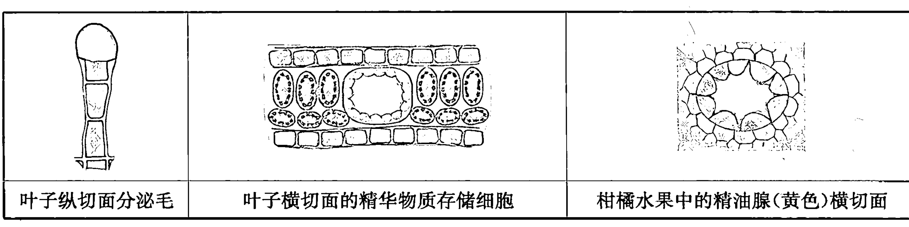

图 4-1 精华物质储存处

植物精华是使植物具有香气的物质，如花、草药和草的香气，以及香料的香味。然而在植物体内，当植物精华从一个部位转移到另一部位的时候，其组成成分会发生变化。影响植物精华组成成分的另一个因素是一天中所处的时间、季节、天气情况、土壤状况、气候、栽培方法和植物的年龄。

例如，当葛缕子生长时，即使是植物精华的主要化学成分也会发生变化，最主要的组成成分由 α 萜品烯变为对伞花烃，然后变成百里酚。幼小的尤加利树主要成分是蒎烯，2～3 年后由桉油酚取代。

谈到地域对植物精华成分的影响，欧薄荷油就是一个例子。中国品种的欧薄荷在印度的生长周期要比在中国（原产地）短。中国生长的欧薄荷含有 80% 的欧薄荷醇，在印度生长的只有 70%（注意：欧薄荷醇含量高的好）。同样的原因，产于保加利亚的玫瑰和斯里兰卡的肉桂品质通常要优于其他地区的。

植物中精华的含量从 0.01%～10% 或更多，因此，提取精油时，必须仔细选择一天中的时间、天气，以及一年中的月份，以便获得高的产量。

在脂腺分泌细胞中的植物精华的合成、转化和存储，由光合作用和光合作用产物的新陈代谢间的平衡来控制。挥发性的植物精华是有生物活性的次级代谢产物。一萜类和倍半萜在植物体与其周围环境的相互作用中起到了重要的作用，如他感作用物（植物毒素抑制剂）能吸引动物来充当传粉者和种子散播者（授粉和散播种子）、防御草食类动物、防御和破坏昆虫和真菌。

#### 二、精油

精油一词是指将一种植物作为原料，通过物理方法获得芳香的挥发性产品，再根据植物的名字和气味来命名。

##### 胶树脂

一些芳香植物原料适合溶剂提取，如树切口渗出的胶。这种芳香渗出物也被称为香胶。首次溶剂提取的残余物被称为松香脂，如安息香、乳香和没药。如果进行蒸馏，大部分的松香脂通过蒸馏产出精油，安息香例外。

##### 净油

溶剂提取有时产生固体蜡状的芳香植物提取物，这就是通常所说的浸膏，使用乙醇将净油从浸膏中提取出来，残留的蜡通常遗留在净油中。通过分子蒸馏净油可以被进一步提纯。

##### 其他定义

- 芳香油：精油。
- 酊（剂）：芳香植物的乙醇提取物，即用乙醇提取芳香植物后，再经过过滤制得。
- 香膏剂：芳香饱和冷吸脂肪。
- 浸渍：基于芳香植物提取物的过滤油。

### 第二节 植物精华的生物合成

在植物学术语中植物精华是由芳香植物分泌的，使其自身具有了特征性气味的挥发油。
植物精华是由位于不同器官（叶子、花——或花的一部分——果实、芽、茎、树皮、根、种子等）的特殊的腺细胞或细胞群、分泌导管、表面腺体或腺毛产生的。通常发生在某一个部位，如玫瑰花瓣、鸢尾根的根茎，或几个形态上相关的器官如花和果实。如果整个植物体都可以产生植物精华，那么通常不同部位产生精油的质量和成分是不同的。例如，苦橘可以产生 3 种精油：花产生橙花油，皮产生橙皮油，叶子和小枝产生橙叶油。
植物精华通常以小球的形式存在于植物细胞中。
在已知的约 250 000 种开花植物中，大约只有 2 000 种含有植物精华，归为 55～60 类，而且这些植物不一定都有联系，或同一族系。在药用方面，最重要的是：唇形科、芸香科、樟科、桃金娘科、伞形科、菊科、松科、橄榄科、胡椒科、柏科等。
大部分植物精华是萜类化合物，有些是苯酚的衍生物。一些植物将产生精华作为一种减少蒸腾作用的方式。在炎热的条件下，油的挥发使得叶子表层的防护层变得致密。防护层是紧挨固体表层的一层气体式液体，它们流动得要比远离表层的液体慢很多。气体防护层的宽度随风速的增大而变小，这是用控制调节叶子表面水分扩散率的因素之一。防护层的密度越高，其对水分扩散的抵抗力就越大。
一些植物精华可以驱除昆虫，还有一些植物精华对牧养动物有毒性，如苦槛蓝属。许多异株克生物质也是植物精华，如松油、樟脑油，是一种由植物产生的化学物质。
异株克生物质能抑制附近植物的生长，从而减小竞争。例如，松树产生一种物质，能杀死离母树太近的同种植物(图 4-2)。异株克生物质在植物的繁衍变化中起着重要作用。例如,在一片田地的繁衍接替中,起初的占优势草被一种一年生草取代了,因为后来的这种草产生了抑制它周围同种草生长的物质。

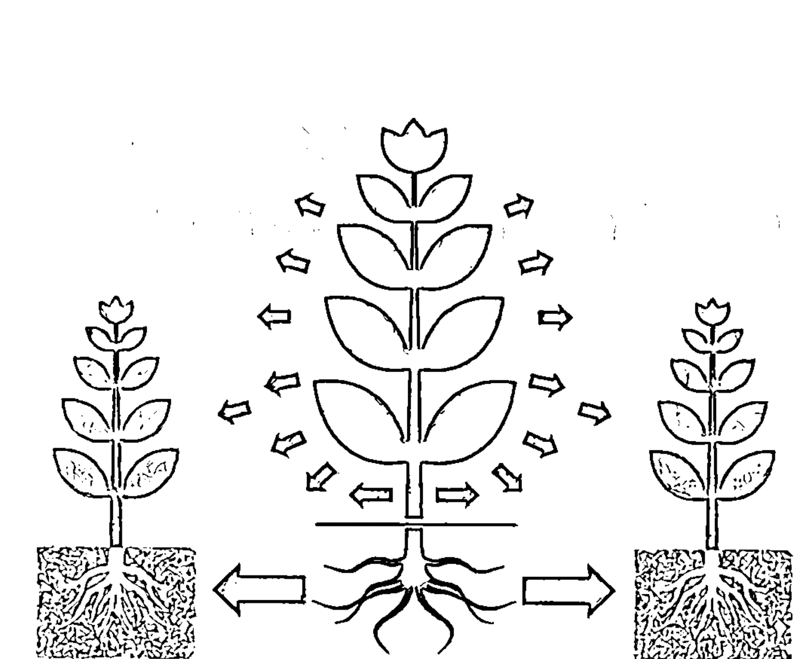

在干燥的气候中,挥发性萜类具有异株克生作用,例如像鼠尾草这样的灌木会释放出挥发油来抑制草本类植物的幼芽。在潮湿的区域,不同种的芳香酚类化合物也表现出这种植物间的异株克生作用。

一些植物精华可能是代谢产生的废物。

挥发性植物油可以被归为次级代谢产物,也就是说植物油并没有包括在细胞的基础代谢中。然而,次级代谢的产物取决于基础代谢,次级代谢中形成了很多复合物,其中有些决定了植物的特征性气味、刺激性、植物的颜色,有些决定了植物的食用性、药用属性及毒性。大部分次级代谢产物在植物中的作用还不是很清楚。应激复合物大多为次级代谢产物,它们是新陈代谢紊乱时产生的反应物的积累,如油树脂就是一种由应激复合物形成的病理渗出物。应激复合物还包括安息油、树脂、香豆素、二环倍半萜、类固醇。

挥发性植物油是具有生物活性的代谢产物。

生物合成是一系列的酶促反应,通过这一过程简单分子被合成为复杂分子。生物合成是耗能过程,它包括 3 个阶段: ① 从 CO₂、水等分子中制造出简单的原料分子。 ② 这些原料分子被转化为结构块,作为构造多种生物大分子的构造块(子单位)。 ③ 将这些作为组分的子单位合成为大分子(图 4-3)。

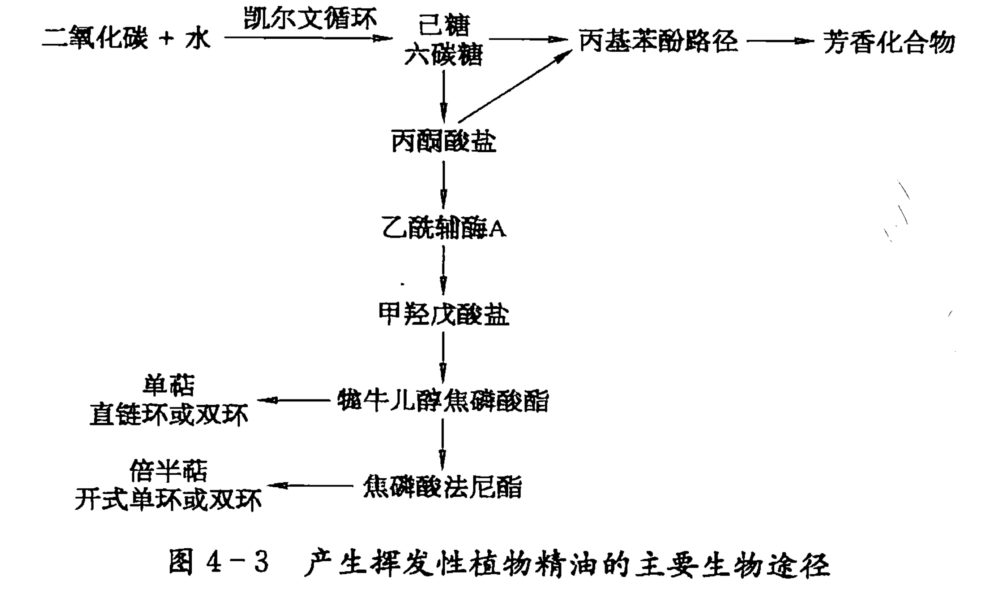

注意：丙基苯酚路径：酚类化合物合成的正常路线。这是几种路径中的一种，在这种路径中，芳香化合物从脂肪族的前体中形成。凯尔文循环（光合碳还原环）：光合作用，暗反应。

### 第三节 精油的提取

商业生产的精油有 200 多种，它们中的 50～100 种被用于芳香疗法。近来广泛研究以二氧化碳提取精油，该方法产生的精油质量较好。现在也使用生物技术生产精油，这些方法被美国的 Estee Lauder 发展，包括在能够促进精华物质形成的条件下培养产油细胞（图 4-4）。

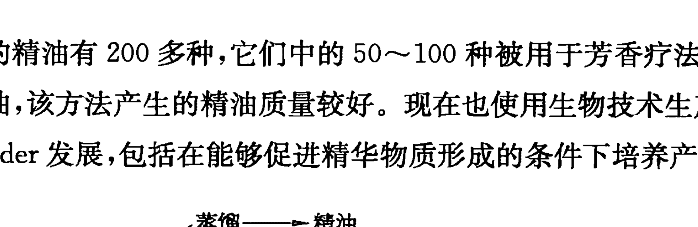

#### 一、精油的植物解剖学分布

精油的植物解剖学分布，详见表 4-1。

表 4-1 精油的植物解剖学分布

| 应用的植物部位 | 精油举例 | 应用的植物部位 | 精油举例 |
| :--- | :--- | :--- | :--- |
| 花 | 玫瑰、伊兰、橙花 | 根茎 | 姜 |
| 果实 | 杜松实 | 小根 | 岩兰草 |
| 果皮 | 柑橘、柠檬、佛手柑 | 叶 | 肉桂、广藿香、天竺葵、尤加利 |
| 种子 | 欧芹子、芜荽 | 渗出物 | 乳香、没药、安息香 |
| 叶和小枝 | 橙叶 | 针叶和锥体 | 松树 |
| 心材 | 檀香 | 花顶和叶 | 迷迭香、欧薄荷 |
| 树皮 | 肉桂 | 草 | 柠檬香茅 |

大部分的花、果实、叶、茎（脆弱的植物结构）必须在新鲜采摘时进行加工处理，所以很多情况下，精油的加工地点应靠近其原产地。另外一些从干燥的材料提取的精油，如丁香和广藿香、香料、种子、木材、根等，可以出口到其他的国家进行加工。需要说明的是环境问题，如干燥、旋风、政治变动（菲律宾的伊兰，南斯拉夫的杜松实，索马里的没药和乳香）等均影响了原料的产量、加工工艺、成本和供应等。

#### 二、常用的精油提取方法

##### 蒸馏

蒸馏是提炼精油时最常用的方法。这种工艺要求精油的属性：① 不溶于水。② 能随水蒸气挥发，这在蒸馏中是非常重要的。

1.  原料准备 柔软的结构如花、花瓣、叶等无需预处理，而硬的组织如木材、树胶、根、种子等需要在蒸馏前先削成薄片或磨成粉，因为产油细胞常被埋在植物组织的深部。
2.  蒸馏过程 将准备好的原料放入一个密闭的蒸馏器中，来自蒸汽发生器的蒸汽在压力作用下，通过该蒸馏器，这使得植物组织破裂，易挥发的组分被蒸汽带走。蒸馏器配套的出口管将蒸汽混合物导入一个带有外罩的 S 形冷凝管，夹层的冷却水会将蒸汽冷凝成液态（图 4-5）。

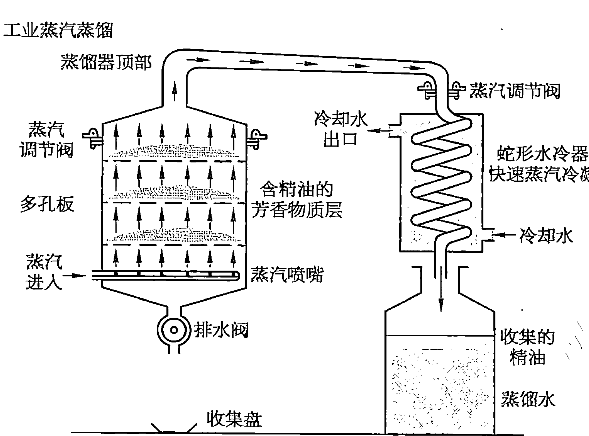

3.  分离 在正常条件下，精油不溶于水，并且两者的密度不同，将馏出物静置，或通过离心分离器使两种液体很快分层后再分离（图 4-6）。

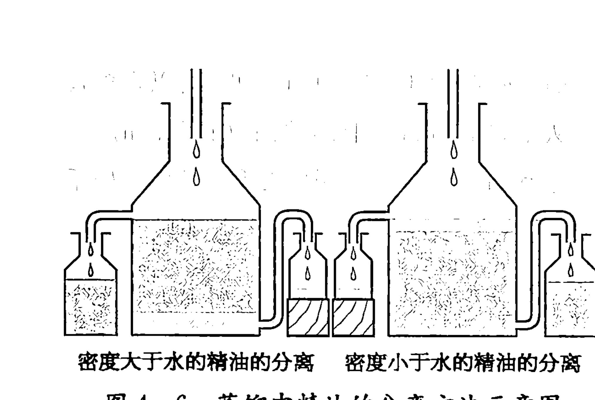

4.  过滤 分离出的精油通过过滤以移除其中其他的不溶性杂质。如果精油中含有残留的水，可以用无水硫酸钠干燥。蒸馏过程中产生的非挥发性物质可以通过对原油的二次蒸馏来去除，这就是精馏。

注意：花水是蒸馏过程的副产品。一些精油含有水溶性物质，这些物质在蒸馏过程中溶解于蒸馏水中，最终在接收器中获得的水就是花水，有些花水很香，如三角玫瑰花水、橘花水。

图中所示进入接收器中的液体是精油的蒸馏作用的馏出物，所以是精油和蒸馏水（其中含有一定比例的精油）。

##### 压榨

柑橘属精油是通过压榨获得的（然而柠檬油通常通过蒸馏制得，大部分的柑橘属精油不耐蒸馏高温），来自成熟或未成熟果实的外皮，有时使用整个果实压榨。

压榨从字面上讲就是机械挤压，整个果实被压榨，然后将油从果汁及果肉屑中分离出来，外皮能用机器来擦除，剥下来的外皮放入到离心器中，就可以产生油（外皮经机械摩擦后和水一起冲入离心分离器中，精油就会被分离出来）。

##### 浸渍

植物原料被压碎，与相应体积的乙醇混合。混合物置于密闭的容器中，直到溶于乙醇的成分溶解。将不溶于乙醇的固体过滤出来，剩余的乙醇和精油混合物便是酊。

1.  酊剂：酊剂被用于草药疗法和香水业，如没药的酊剂、香草和香豆酊剂。除了乙醇，也可以将粉碎的植物原料放入热的植物油中，这些植物油就作为精油的载体油。在热的条件下，一段时间之后这些油发生了变化（精油就会浓缩在一起），就可以再加入新鲜的植物原料。这个过程可以重复数次，最后产生的液体称为冷浸剂。
2.  冷浸剂：冷浸剂的一个例子是金盏草油——金盏草被提取到植物油中，产生的液体被用于推拿中。这种方法与旧式的提取方法——冷吸法相似。在冷吸法中，无气味的脂肪被用作载体。冷吸法是产生芳香脂——香膏剂的一种较烦琐的方法（图 4-7）。香膏剂属于乙醇提取物（香膏剂中的乙醇被蒸去后得到冷吸净油）。这种方法在二战前广泛应用于法国格拉斯（格拉斯，法国南部一城镇，因香水工业久负盛名）。

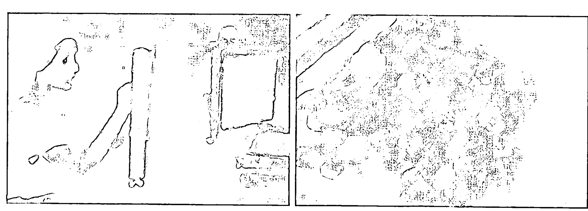

图 4-7 冷吸法(脂吸法)提取精油

##### 溶剂提取

一些精油会被高温的蒸汽或水破坏，所以不能用蒸馏的方法获取，如茉莉花精油就会被蒸馏蒸汽破坏。溶剂提取会产生一些不同于原成分的物质，因此，所产生的精油的气味也不同于原植物。

溶剂提取不能得到最终的精油，但可以得到一个浸膏或净油。溶剂提取的过程如图 4-8 所示。

溶剂提取的树脂或浸膏蜡状样物质，可以进一步提纯得到净油，石油醚是最常用到的溶剂。在溶剂提取过程中，植物原料（一般是花，如茉莉花、玫瑰花瓣）和溶剂混合在一起，花中的挥发油在不加热的情况下溶解在溶剂中。接着，溶剂通过蒸馏的形式被去除（沸点只有60℃），或在真空状态蒸发己烷，溶液的沸点总是高于挥发油的沸点，所以可以被分离出来。

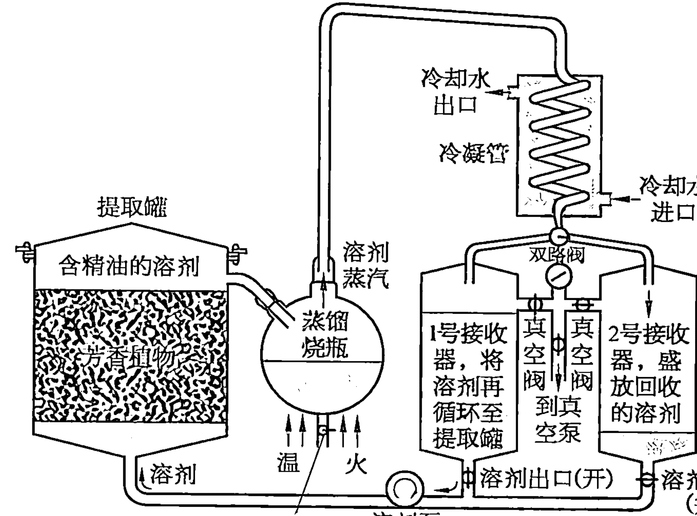

图 4-8 溶剂提取示意图

如果原料是花，溶液提纯后可能会得到蜡状凝固物，将其与乙醇混合，则挥发油溶解，蜡状物被留下，再对溶液进行过滤。这时，再通过真空蒸馏将乙醇移去，就只剩下净油了。

##### 超临界二氧化碳提取

在超临界二氧化碳提取过程中，二氧化碳气体在温度高于 40℃、压力在 200～300 个大气压下，可以被用于从多种原料中提取挥发性植物油。次临界二氧化碳（也就是说，低于 10℃，50～80 个大气压）只能提取某些挥发性植物成分。然而，超临界二氧化碳（也就是说，40～60℃，200～300 个大气压）是一种通用的溶剂，这种溶剂不留残余物，能比蒸汽蒸馏提取出基调更低或更高的香气，产生较少的不纯气味及萜，保护精油中易溶于水和热敏性的成分，如乙酸丁子香酚酯。不过，能承受这么大压力的装置是非常昂贵的，目前仅用于提取挥发油含量高的原料。在不远的将来，可能会在市场上见到更多的使用该方法提取的精油。

#### 三、精油提取量

精油提取量见表 4-2。

表 4-2 精油提取量

| 精油 | 产生 1 克精油所需原材料的量（千克） | 精油 | 产生 1 克精油所需原材料的量（千克） |
| :--- | :--- | :--- | :--- |
| 罗勒 | 2000 | 柠檬香茅 | 15 |
| 佛手柑 | 200 | 蜜橘 | 150 |
| 雪松 | 30 | 甜马郁兰 | 290 |
| 甘菊（罗马） | 100 | 没药 | 15 |
| 快乐鼠尾草 | 800 | 橙花油 | 1000 |
| 芫荽 | 140 | 广藿香 | 50 |
| 丝柏 | 150 | 黑胡椒 | 50 |
| 尤加利 | 90 | 欧薄荷 | 150 |
| 甜茴 | 20 | 玫瑰油 | 3500 |
| 乳香 | 12 | Rose de Mai（净油） | 400 |
| 波斯树脂 | 5 | 迷迭香 | 70 |
| 天竺葵 | 40 | 降香 | 100 |
| 姜 | 40 | 檀香 | 25 |
| 茉莉（净油） | 900 | 茶树 | 30 |
| 杜松实 | 100 | 红色百里香 | 100 |
| 薰衣草 | 145 | 岩兰草 | 100 |
| 柠檬 | 200 | 伊兰 | 100 |

#### 四、不同提取方法的影响

不同提取方法对植物精华成分的影响见表 4-3。

表 4-3 不同提取方法对植物精华成分的影响

| 提取方法 | 影响 |
| :--- | :--- |
| 蒸馏（暴露在热水和蒸汽中） | (1) 将一些精油的成分降解为不同气味的化合物 (2) 造成一些成分间发生反应 (3) 由于非挥发性植物成分的分解，造成出现了一些原本植物没有的芳香化合物，如甘菊精油中的甘菊环烃 |
| 压榨（暴露在空气、水、释放的植物酶和化学物质中） | 一些成分的构成发生变化，如一些萜类的部分氧化 |
| 溶剂提取（暴露在溶剂和乙醇中） | 一些成分和溶剂的化学反应导致具有不同香味的新化合物的形成 |

注：芳香植物所发出的蒸汽含有精油中不包含的成分。

## 第五章 有机化学基础

所有的物质都是由元素组成的。元素是利用通常的物理或化学方法不能再拆分的物质。最常见的元素是碳、氢、氧和氮，每一种元素都由原子组成——具有特征性的微粒。

### 原子

原子是保持元素化学属性的最小微粒。原子由原子核和电子构成，原子核位于原子的中心，由带正电荷的质子和不带电的中子组成；电子带负电荷沿着原子核的同心环轨道作圆周运动。

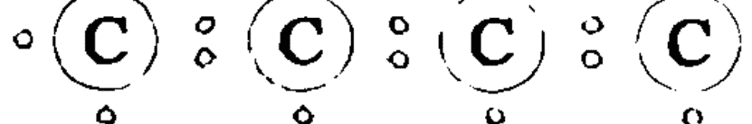

原子是电中性的。位于外层的电子参与和其他原子结合的化学反应中。原子以化学方法和其他原子结合，原子彼此结合后，就形成了分子，如两个氧原子结合形成一个氧分子。

不同的原子结合后，就形成了化合物。例如，两个氢原子和一个氧原子结合，就形成了一个水分子。水的分子式是：H₂O。

原子价表示一种元素的结合能力，由该原子可以结合的原子数量来衡量，通过结合形成稳定的分子。也就是说，外层电子达到饱和。

有机化学是关于含碳元素物质的化学。

### 碳原子

碳原子有 6 个核外电子，4 个成为价电子，可以和其他的原子结合。

### 键

碳通过与其他原子共用电子对形成键。碳原子之间可以通过共用电子对形成碳链。正因为如此，碳元素才能形成如此多的化合物。

原子以何种形式形成化合物，对该化合物的化学及物理属性都有很大的影响。

### 键的类型

键的类型见表 5-1。

表 5-1 键的类型

| 类型 | 举例 |
| :--- | :--- |
| 离子键 | 氯化钠，包含了一个转移的价电子 |
| 共价键 | 氢分子，包含了一个共用电子对 |
| 极性键 | 氯化氢，包含了一个不等价共用电子对 |

碳氢键在有机化合物中非常普遍，和碳碳键一样，是一个共价键。
碳原子(C)可以和其他原子形成四个键；氢原子(H)可以和其他原子形成一个键；氧原子(O)可以和其他原子形成两个键。在一个分子中，所有的键必须饱和。结构式表示出了分子中原子的排列方式。
虽然有机化学通常只包含了为数不多的元素，但每一种分子可以包含这些元素中的很多原子。相应地，分子式在有机化学中并不常用。
在这些结构式中，两个原子间的一个短的破折号代表了一对共用电子，也就是一个化学键。

分子式：H₂O
举例：水分子
结构式：H—O—H

每个包含了碳原子的结构式中，每个碳原子有四个键。

### 重键

原子间可以共用两个以上的电子。如果它们共用两个电子对，就形成了双键。

分子式：CO₂
举例：二氧化碳
结构式：O=C=O

如果它们共用三个电子对，就形成了三键。碳碳重键很普遍。
举例：—C≡C—
如果原子通过多于一对的电子结合在一起，键长会变短。

### 功能团

有机反应通常涉及共价键。功能团，又称官能团，是分子中的活性基团，也是决定有机化合物主要性质和反应的原子或原子团，用于分子的分类。

### 第一节 烃

#### 一、饱和烃

从结构上看，饱和烃是最简单的有机分子。“饱和”意思是分子中只有共价单键。烃（碳氢化合物）只有碳和氢两种元素。

分子式：CH₄

举例：甲烷（天然气）

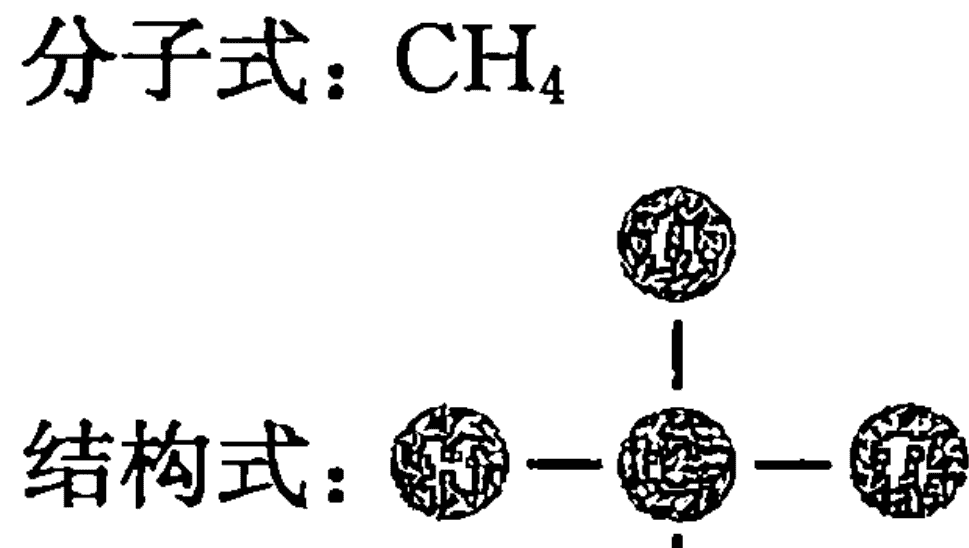

碳链可以被加长。

分子式：CH₃CH₂CH₂CH₃

举例：丁烷

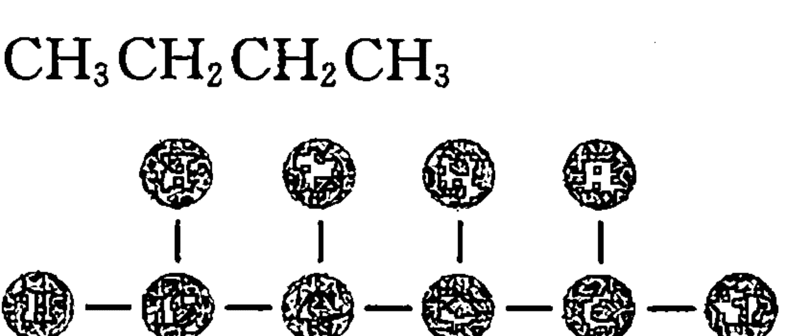

这些是正常的链烷烃，称为烷烃。

#### 二、不饱和烃

不饱和烃包含碳碳重键。

- 1. 碳碳双键 即烯烃。
- 2. 碳碳三键 即炔烃。

举例：乙烯 CH₂=CH₂

举例：乙炔 H—C≡C—H

- 3. 其他的不饱和烃 例如二烯和多烯。

以上结构碳原子连接成碳链，被称作脂肪族化合物。

另外一类碳氢化合物称为芳香烃，基于一种环状结构。

#### 三、芳香烃

芳香烃是一类高度不饱和但非常稳定的化合物，通常它们都有香味，但用有机化学的语言来讲，芳香不是指气味而是指环状结构。芳香族烃的母体化合物是苯。

分子式：C₆H₆

举例：苯 结构式：

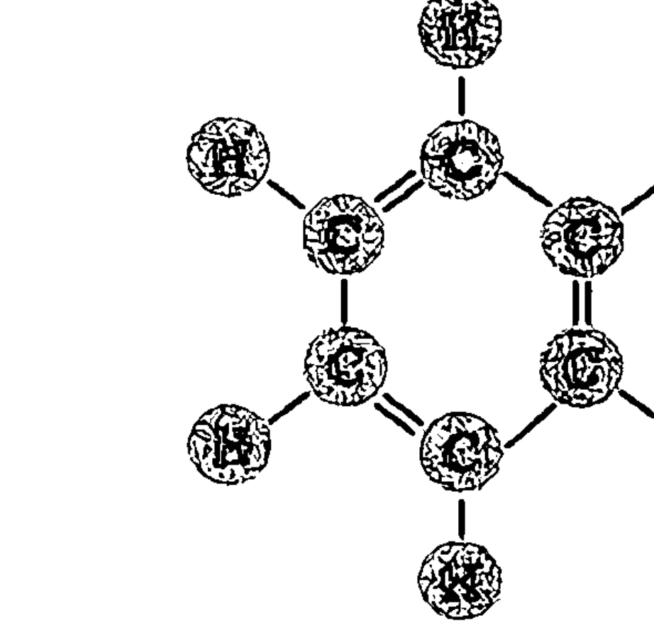

苯有一个环状的结构，分子式是一个凯库勒分子式，这是一个共振结构，双键快速地变换位置。分子是一个带有共振能量的杂环结构，通常表现为苯环。

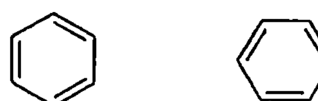

“置换”反应导致其他的原子结合到芳香环结构上，而芳香化合物是一种其结构与苯结构相关的化合物。

苯环间可以通过共用两个碳原子而实现融合。

举例：萘

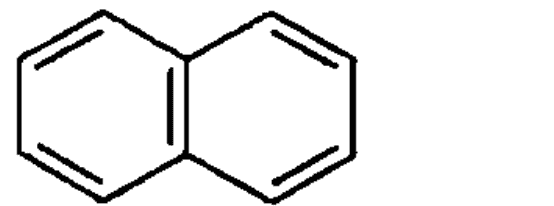

### 第二节 功能团

#### 醇和酚

如果功能团是羟基，化合物则为醇或酚。

#### 羟基

甲醇
（脂肪族的）

举例：

苯酚
（羟基链在芳香环上的结构）

#### 醚

醚或氧化物可以是脂肪族的、芳香族的，或混合的结构。

醚功能团

举例：

联苯醚

#### 醛和酮

如果功能团是羰基，化合物则为醛或酮。

羰基

如果羰基碳原子上的两个基团之一是氢原子，化合物就是醛。

醛基(—CHO)

酮基

伯醇氧化(脱氢)后形成醛。仲醇氧化(脱氢)后形成酮。以下是一些自然存在的羰基化合物的结构。仔细观察芳香族、脂肪族及混合结构，要能分辨出哪些是醛，哪些是酮。

安息香醛，苯甲醛（杏仁油）

肉桂醛（肉桂油）

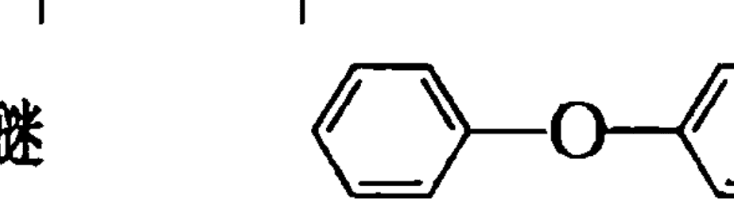

香草醛（香草子）

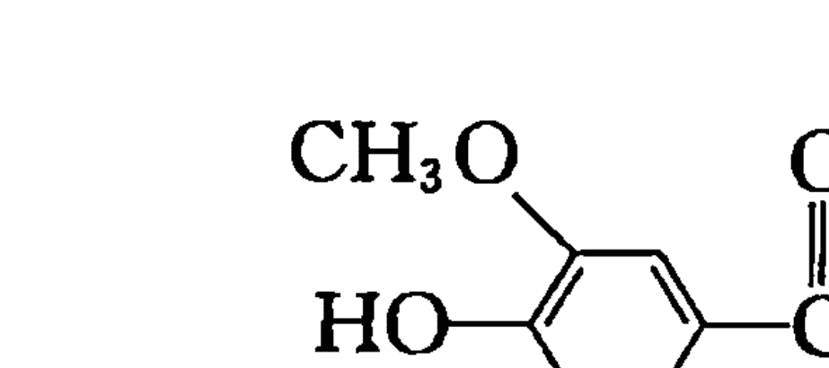

樟脑（樟脑，迷迭香油）

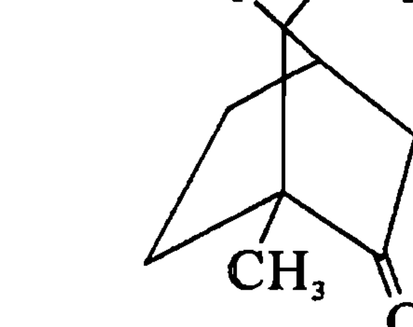

香茅醛

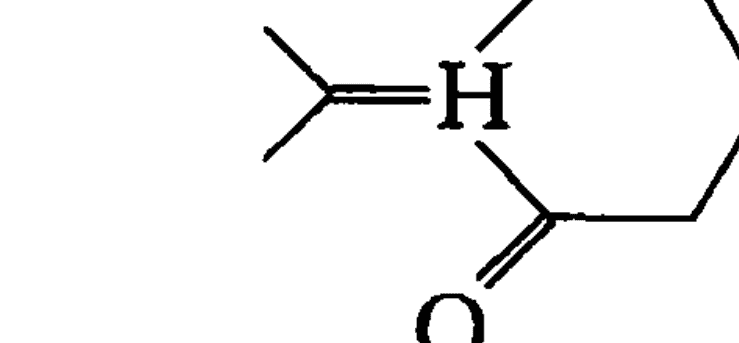

#### 酸类

如果出现羧基，化合物就被归为酸。

羧基

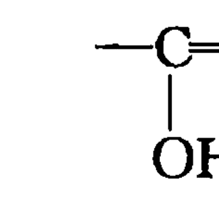

苯甲酸、安息香酸

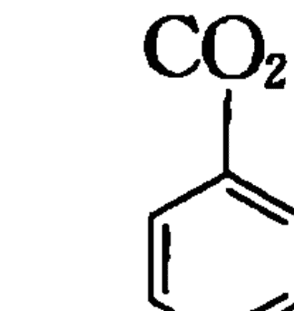

举例：

甲酸、蚁酸

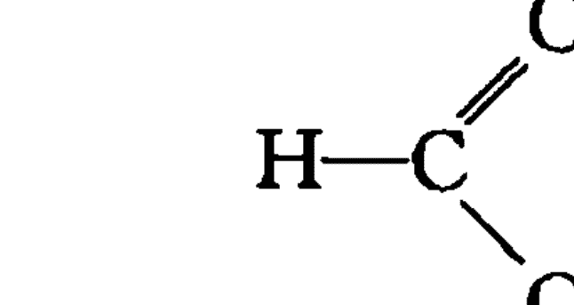

#### 酯

酸和醇结合形成酯。

酯功能团：

邻羟基苯甲酸甲酯（冬绿树油）

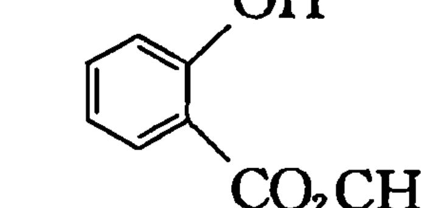

举例：

苯甲酸甲酯

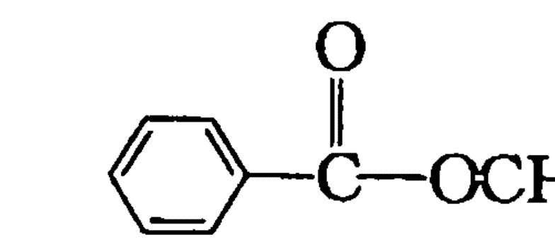

#### 双功能的化合物

这些化合物有两个或更多的功能团。

举例：酚酸，如水杨酸、柳酸、撒酸、羟基苯甲酸、邻苯酚甲酸

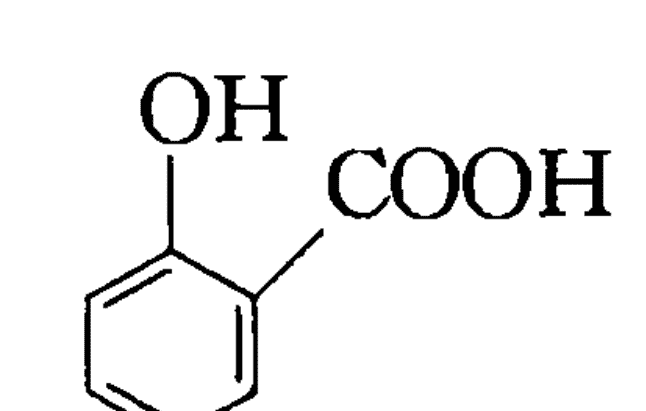

### 第三节 萜类

大部分天然存在的化合物结构比较复杂，通常有多个功能团。萜类是基于异戊二烯结构（五碳）的化合物。

异戊二烯

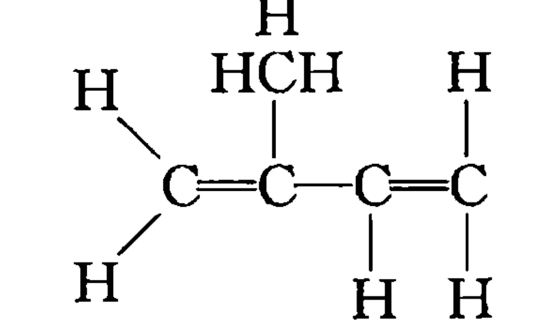

大部分挥发油是基于异戊二烯分子，异戊二烯可以通过多种方式进行结合而形成萜类，萜类包含了多个基本的五碳分子。

异戊二烯单元表示为：\(\text{Y}\)。这不但是一个开放的结构，其他的结构也可以挂在其上。

萜是从萜烯基中衍生出来的，是松节油的旧称。萜类是不饱和烃类。

单萜是由两个连接的异戊二烯单元构成，所以包含了 10 个碳原子。单萜的分子式是 C₁₀H₁₆。每 5 个连接的碳原子对应 8 个氢原子。

见于柑橘属水果，松叶（中药）和欧薄荷中

举例：柠檬烯

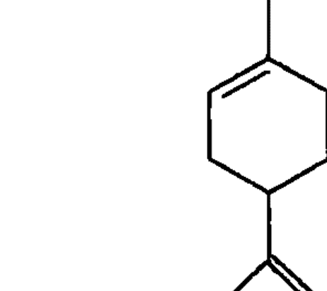

倍半萜由 3 个连接的异戊二烯单元构成，所以包含了 15 个碳原子；二萜类由 4 个连接的异戊二烯单元构成，所以包含了 20 个碳原子。

表 5-2 总结了萜的种类及其碳原子和组成。

表 5-2 萜的种类及其碳原子和组成

| 类异戊二烯 | 碳原子的数量 | 成分 |
| :--- | :--- | :--- |
| 一萜类 | 5×2 | 挥发油 |
| 倍半萜 | 5×3 | 挥发油 |
| 二萜类 | 5×4 | 树脂酸类 |
| 三萜类 | 5×6 | 皂苷、类胡萝卜素 |
| 多萜类 | 5×n | 橡胶 |

请注意植物挥发油中的萜类是小分子，通常只有 15 个碳原子。相比之下，橡胶乳有更大的 C₅ 单元的碳链，注意结构组织的差异。

然而，萜类化合物比萜更常见。萜类化合物是萜经过氧化过程形成的，在萜类化合物中，氧结合在碳氢结构中。这些含氧的衍生物比萜类碳氢化合物自身还要普遍。

萜氧化形成萜醇，萜醇氧化形成醛和酮，萜醛氧化形成酸，萜酸和醇反应形成酯类。

举例：欧薄荷醇 从柠檬烯（萜二烯-1,8）中衍生出来的一种饱和醇，是欧薄荷油的主要组成成分。它相应的酮，即欧薄荷酮也存在

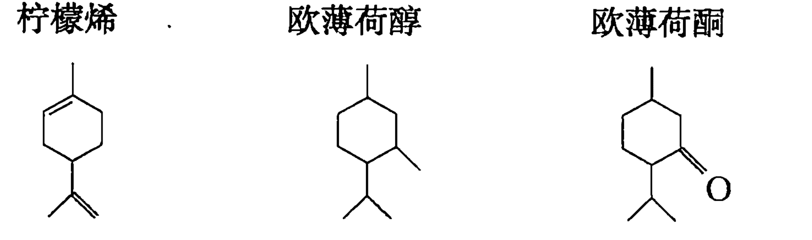

二环萜酮

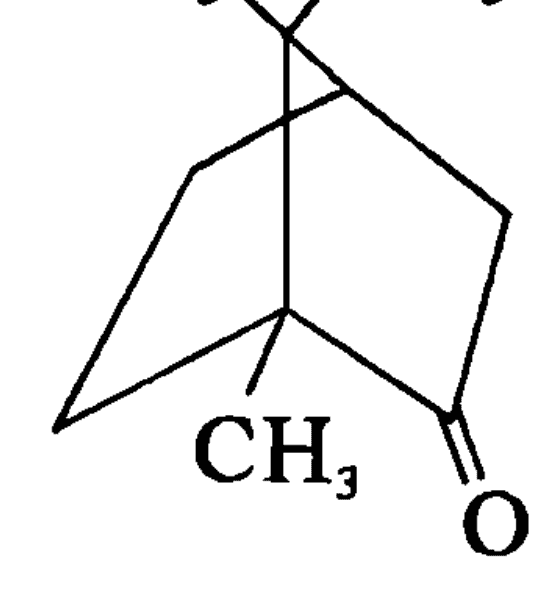

举例：樟脑

#### 苯丙烷衍化物

在精油中发现的很多化学物质并不是通过基于异戊二烯结构的萜类途径形成的，而是通过植物体内苯丙酸途径（三羟环己烷酸）基于苯环结构形成的。

这样的化学物质包括：苯酚、甲基二苯醚、香豆素、呋喃香豆素。

表 5-3 苯丙烷衍化物

| 化合物 | 结构及特性 |
| :--- | :--- |
| 丁香酚 |  |
| 茴香醚、苯甲醚 |  |
| 茴香醚（酚醚） | 见于茴香籽、八角茴香  |
| 香豆素 | 一种自然存在的氧杂环（内酯），具有割草时的气味 内酯  香豆素  |
| 大麻 | 大麻（印度大麻）中的活性成分是氧杂环，称为四氢大麻酚，对哮喘和高血压有治疗作用 |
| 佛手内酯 | 呋喃香豆素，特别见于佛手柑油中，也见于芸香科和伞形科中  |

## 第六章 精油的化学组成

要理解精油的属性及作用特点，有必要先了解精油的化学组成。
蒸汽蒸馏会影响植物中挥发性成分的化学组成，它们的化学成分是不溶于水的，而分子结构使它们能随水蒸气挥发。
精油分子大部分情况下由 15 个左右的碳原子组成，呈亲脂性。小分子及亲脂性这些特点使它们能通过皮肤和黏膜而被吸收，进入血管。
每一种精油都是由多种有机化合物混合而成的复杂物质。这些有机化合物中都有 C 和 H，有些还包括 O、N、S 等。精油的化学成分分为不同的类型，如碳氢化合物、碳氢氧化合物。
精油的化学组成分类：烃（碳氢化合物）和氧化烃。主要的成分是萜类和倍半萜，香味来自苯结构。
微量的化学成分常可以显著地影响精油的气味及药理属性，所以精油所具有的气味和属性是因为精油是有机化合物的复杂混合。
下面列举了精油成分的主要类别，包括例子和各类精油已知的药理学及治疗方面的属性。
精油成分的主要类别：① 单萜类；② 类单萜；③ 倍半萜；④ 类倍半萜；⑤ 苯丙烷衍化物。

### 第一节 萜及类萜

#### 一、单萜类

单萜类广泛见于精油中，一般它们对精油的气味没有显著的影响。单萜类是不饱和烃，所以易被氧化，也具有挥发性。单萜类是含有 10 个碳原子和 16 个氢原子的不饱和分子，分子式是 C₁₀H₁₆。环状和非环状的碳架结构普遍存在（表 6-1）。

表 6-1 单萜类化合物

| 化合物 | 常见精油 |
| :--- | :--- |
| 柠檬烯（环状） | 葛缕子、香菜、胡萝卜子、柠檬油、丝柏、茴香、姜、橙花油、欧薄荷油、迷迭香 |
| 桂叶烯（非环状） | 月桂树叶、快乐鼠尾草（鼠尾草属）、马鞭草 |
| α 蒎烯（二环） | 自然界最丰富的碳氢化合物。见于多种精油，如芫荽、莳萝、丝柏、蓝桉树、茴香、薰衣草、松树、迷迭香、茶树 |

属性：单萜类没有显著的药理学属性，可有诸如抗微生物、抗病毒（如柠檬烯、α 冬青油烯、γ 萜品烯）、止痛等作用。

危害：对皮肤和黏膜的潜在刺激性。对松类精油的研究显示，这种刺激性与自动氧化分子的存在有关，而不是萜类自身。

#### 二、类单萜

精油主要由单萜的衍生物——氧化类单萜组成。类单萜和单萜相比，不易被氧化，而且比单萜更能影响精油的气味。

功能团是决定分子的化学性质和药理属性的主要因素。单萜醇、醛、酮、酯、酚和氧化物常见于精油中。单萜醇、醛、酮和单萜烃之间结构上的相似性表明它们是通过同一条生物合成途径的微小变化而形成的。

##### 醇类

类单萜醇是精油的常见成分，由碳原子和羟基（—OH）组成，大多具有芳香（表 6-2）。

表 6-2 类单萜醇化合物

| 化合物 | 常见精油 |
| :--- | :--- |
| 芳樟醇 | 罗勒、佛手柑、快乐鼠尾草、芫荽、薰衣草、橙花油、肉豆蔻、橙叶、紫檀、伊兰等 |
| 香叶醇 | 佛手柑、芫荽、天竺葵、橙花油、玫瑰草、橙花、玫瑰等 |
| 香茅醇 | 香茅、天竺葵、姜、玫瑰、玫瑰草 |
| α 萜品醇 | 尤加利、茉莉油 |
| 萜品醇 | 佛手柑、快乐鼠尾草、天竺葵、橙花油、甜马郁兰、迷迭香等 |
| 萜品烯 | 黑胡椒、丝柏、杜松、马郁兰、茶树 |
| 龙脑（钓樟醇） | 芫荽、姜、薰衣草、肉豆蔻、松油、迷迭香、百里香 |
| 欧薄荷醇 | 欧薄荷和相关唇形科植物 |
| 香橙醇 | 佛手柑、柠檬草、橙花油、橙叶、紫檀 |

属性：① 抗微生物。② 抗病毒（香茅醇）。③ 激发热量。④ 利尿。
危害：通常无毒、无刺激。

##### 醛类

类单萜醛也是精油常见的组成成分。由 10 个碳原子和一个醛基（—CHO）组成。类单萜醛是蜜蜂花、柠檬草、香茅、尤加利精油的主要特征性成分，但也见于其他的精油中（表 6-3）。

表 6-3 类单萜醛类化合物

| 化合物 | 常见精油 |
| :--- | :--- |
| 柠檬醛 | 香茅、天竺葵、柠檬、柠檬草、蜜橘、甜橙、橙叶 |
| 香茅醛 | 香茅、尤加利、柠檬、柠檬香茅、蜜蜂花 |
| 水芹醛 | 香茅、天竺葵、姜、玫瑰、玫瑰草 |
| α 萜品醇 | 主要来自树的精油，如尤加利蓝龈、乳香、姜 |

属性：① 抗微生物。② 镇定。③ 抗炎。④ 降血压（有争议）。
危害：一些醛类与皮肤刺激和过敏有关。

##### 酮类

类单萜酮由 10 个碳原子和酮基组成。含有酮类是一些有严重危害性精油的特征，如鼠尾草、侧柏、唇萼欧薄荷和丝柏（表 6-4）。然而，并非所有的酮类都有毒性，有些含少量酮的精油也可用于治疗。

表 6-4 类单萜酮类化合物

| 化合物 | 常见精油 |
| :--- | :--- |
| 莪术酮 | 没药 |
| 樟脑 | 樟脑、迷迭香、鼠尾草 |
| 茴香酮（一个二环单萜类） | 茴香 |
| 长叶欧薄荷酮 | 唇萼欧薄荷 |
| 香根（草）酮 | 岩兰草 |
| 二氢万寿菊酮 | 万寿菊 |

属性：① 黏液溶解（提高黏液的流动性）。② 细胞防御。③ 镇静（小剂量）。④ 免疫促进剂。⑤ 抗真菌。
危害：一些酮类是很强的溶剂[如甲（基）乙（基）丁酮]，是水和类脂溶解性的 2 倍。有人提出一些酮能够穿过血脑屏障，而成为一些严重危害的根源，如诱发痉挛或癫痫。所以，一些精油如牛膝草、鼠尾草等必须谨慎使用，侧柏、唇萼欧薄荷则要完全避免使用（见安全性参考列表）。

##### 酯类

类单萜酯类由 10 个碳原子和酯功能团（—COOCH₃）组成，化合物中有大量的酯类（表 6-5）。

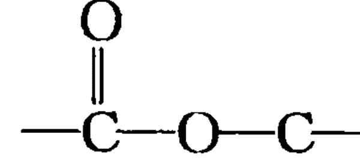

酯类常常带有水果的特有气味。虽然酯类不是精油的主要组成成分，但即使是微量的酯类，也能使精油具有它们特征性的气味。

表 6-5 类单萜酯类化合物

| 化学结构 | 常见精油 |
| :--- | :--- |
| 醋酸苄酯 | 茉莉净油、伊兰 |
| 苯甲酸甲酯 | 伊兰 |
| 水杨酸甲酯 | 冬青、伊兰 |
| 乙酸芳樟酯 | 佛手柑、鼠尾草属、茉莉精油、薰衣草、柠檬、橙花油 |
| 醋酸牻牛儿酯 | 鼠尾草、天竺葵、柠檬、玫瑰草油 |
| 乙酸冰片酯 | 罗勒、迷迭香、鼠尾草 |
| 醋酸欧薄荷酯 | 欧薄荷 |
| 当归酸和惕各酸酯 | 罗马甘菊 |

属性：① 镇静（对中枢神经系统施加直接的镇定作用）。② 解痉（很强的减轻痉挛作用）。③ 抗真菌。④ 抗炎（皮肤）。
危害：精油中含有无毒、无刺激的成分。

##### 酚类

苯酚包含苯环和羟基（—OH）（表 6-6）。

表 6-6 酚类化合物

| 化合物 | 常见精油 |
| :--- | :--- |
| 百里酚 | 百里香和其他的油 |
| 香芹酚 | 牛至、百里香 |

属性：① 显著的抗微生物作用（尤其是抗细菌）。② 强烈的兴奋作用。③ 免疫刺激。④ 强壮作用。

危害：苯酚对皮肤和黏膜有高度的刺激性，香芹酚有毒性，若大剂量使用会损害肝脏。因此每次使用苯酚时，都要将其稀释后与其他的无刺激性精油混合后使用。

##### 氧化物

氧化基团（表6-7）是：—C—O—C—。

表6-7 氧化物

| 化合物 | 常见精油 |
| :--- | :--- |
| 芳樟醇氧化物 | 牛膝草 |
| 桉油酚（桉油素） | 蓝桉树和其他的油如罗勒、薰衣草、迷迭香和鼠尾草等 |

属性：祛痰（很强烈）。
危害：暂未发现。

#### 三、倍半萜

倍半萜的英文名 Sesquiterpenes 的前缀“sesqui”是“一个半”的意思，单萜分子包含 10 个碳原子，倍半萜分子包含 15 个碳原子。倍半萜和单萜相比，不易被氧化，因此含有大量倍半萜的精油和主要含单萜的精油相比，不易变质。与单萜微弱的气味相比，很多倍半萜有很浓烈香味，这也是精油产生香味的重要原因。
从结构上讲，倍半萜的环很少见——它们是异戊二烯单元的复杂结合体（表6-8）。

表6-8 倍半萜化合物

| 化合物 | 常见精油 |
| :--- | :--- |
| 愈创蓝油烃和蓝香油烯 | 德国和罗马甘菊 |
| 杜松油烯 | 乳香、柠檬和广藿香 |
| 麝子油烯（非环状的倍半萜烯） | 甘菊、香茅、玫瑰和花油 |
| 丁子香烯 | 丁香、薰衣草和其他的油 |
| 雪松烯 | 雪松、杜松实 |

属性：① 抗炎（愈创蓝油烃和蓝香油烯）。② 镇静（β丁子香烯）。③ 抗病毒。④ 抗肿瘤（有争议）。⑤ 解痉。
危害：暂未发现。

#### 四、类倍半萜

类倍半萜(被氧化的倍半萜)有 15 个碳原子,由于分子的扩大,功能团——单萜的影响会减小。整个分子的独特性是决定其药理效应的重要因素(表 6-9)。
类倍半萜在精油中主要有醇、酯和内酯。

表 6-9 类倍半萜化合物

| 化合物(倍半萜醇) | 常见精油 | 属性 |
| :--- | :--- | :--- |
| 麝子油醇、麝香草醇 | 茉莉净油、柠檬香茅、玫瑰草油、罗马甘菊、玫瑰、伊兰 | 抑制菌剂(除臭剂)并且无刺激性 |
| α甜没药萜醇 | 德国甘菊 | 有很强烈的抗炎作用(注意: α甜没药萜醇的氧化物也有抗炎作用,但是不够强烈), 合成的α甜没药萜醇的异构体没有甘菊中的成分有效 |
| 雪松醇 | 雪松 | |
| 橙花叔醇 | 橙花油 | |
| 檀香醇 | 檀香 | |
| 姜醇 | 姜 | |
| 欧薄荷属的植物 | 广藿香 | |
| 胡萝卜醇 | 胡萝卜子 | |
| 岩兰草醇 | 岩兰草 | |

甘松香、檀香、广藿香、姜和岩兰草的油包含倍半萜和类倍半萜的主要属性,上面提到的醇是根据母体植物来命名的。至今还没有关于这些化合物和油的深入研究。
民间医药的原始资料表明抗炎作用是倍半萜和类倍半萜的共同属性,人们认为干松香油(正在被研究)有抗菌、抗原虫菌素、驱风剂的作用以及对中枢神经系统的作用,同时有扩张支气管的作用。类倍半萜的抗微生物作用和精油中其他的组分相比并不显著。
类倍半萜内酯包括: 母菊内酯: 蓝香油烯的前体。类倍半萜内酯最重要的来源是菊科,唯一常见的精油植物是甘菊。类倍半萜内酯是免疫刺激剂,促进噬菌作用,也可能有抗肿瘤作用。

### 第二节 苯丙烷衍生物

在植物中,这些化合物的形成途径和类萜化合物的形成途径不同,它们是由 Skikimic Acid 途径形成的,它们的结构和功能团影响药理属性(表 6-10)。

表 6-10 苯丙烷衍生物

| 化合物 | 常见精油 | 属性和危害 |
| :--- | :--- | :--- |
| **醛类** | | |
| 肉桂醛 | 桂皮油中的含量很高 | 是一种皮肤和黏膜的刺激剂 |
| 香草醛 | 安息香和其他的树脂中 | 不通过萜类合成途径的另一种醛 |
| **酚类** | | |
| 丁香酚 | 罗勒、黑胡椒、肉桂叶子和芽、丁香、丁香芽、肉豆蔻 | 大剂量的丁香酚可以引起严重的皮肤反应。含有丁香酚的精油是有效的抗微生物剂、抗菌剂和杀真菌剂,同时还有局部的麻醉作用(如口腔医学中用的丁香油),据报道丁香酚和丁子香烯(丁香)可以抑制癌变 |
| 胡椒酚甲醚 | 茴香、罗勒、龙艾 | |
| 黄樟醚 | 樟脑、黄樟 | |
| 肉豆蔻醚 | 肉豆蔻 | |
| 洋芹子油脑 | 欧芹籽 | |
| 茴香醚 | 茴香、酚醚 | |

所有的这些化合物都有甜香气味。

大多数含有丙基苯衍生物的精油可以在芳香疗法中安全有效地使用。将有毒性的醛(对皮肤有刺激性)、酚(潜在的惊厥和刺激)牢记在心是至关重要的,因其有潜在的危险要谨慎使用。

绝大多数含有丙基苯衍生物的精油似乎有一种特有的作用来影响神经系统,这种作用与其剂量和浓度有关。

#### 香豆素类

并不是所有的香豆素类都是苯酚,但为了简便起见,常将它们归为苯酚衍生物。香豆素类是氧杂环或者环状酯类,或者内酯。香豆素类只涉及一小部分化学物质,只有 1 000 种天然的香豆素被分离出来。香豆素不易挥发,因此在蒸馏过程中并不能轻松提取。虽然有时在一些蒸馏中得到的精油如薰衣草油含有微量的香豆素,但一般地说,它们都存在于压榨的柑橘精油中(表 6-11)。

表6-11 香豆素类化合物

| 化合物 | 常见精油 |
|---|---|
| 香豆素 | 薰衣草中微量 |
| 佛手柑脑(呋喃香豆素) | 佛手柑和其他的柠檬油 |
| 香柠檬油,香柑油 | 佛手柑和其他的柠檬油 |

属性和危害: 镇静,解痉,抗惊厥,降血压。呋喃香豆素有光毒作用。
注意: 另外还有一些值得注意的精油成分,微量存在或几乎不存在。

#### 酚醚(苯甲醚)

酚醚类化合物见表6-12。

表6-12 酚醚类化合物

| 化合物 | 常见精油 |
|---|---|
| 茴香烯 | 茴香籽和小茴香 |
| 丁子香酚甲醚 | 丁子香油 |
| 胡椒酚甲醚 | 茴香籽、罗勒和小茴香 |

人们认为这些化合物有解痉和镇静的功效。

#### 酸类

一小部分精油包含有机酸如安息香和伊兰中的安息香酸、安息香和松脂中的肉桂酸,一般认为酸有消炎和降血压的功效。

#### 二萜类

包含20个碳原子,精油中有二萜醇如表6-13。

表6-13 二萜类化合物

| 化合物 | 常见精油 |
|---|---|
| 快乐鼠尾草醇(一种二萜类醇) | 见于快乐鼠尾草 |
| 丹参酮 | 见于鼠尾草 |

二萜醇不易挥发,它们的结构类似人类的一些性激素,因此在治疗中对月经病效果好。

### 第三节 精油的化学组成

#### 一、主要类别总结

精油的主要类别见表 6-14。

表 6-14 精油的主要类别

| 有机物 | |
| :--- | :--- |
| 烃 | 大部分萜类 |
| 被氧化的烃类 | 萜类化合物 醇、醛、酯、酮、酚 |
| 其他 | 酸 氧化物 内酯 含硫复合物 含氮复合物 |

#### 二、主要类别列表

精油的分类及化合物见表 6-15。

表 6-15 精油的分类及化合物

| 分类 | 化合物 |
| :--- | :--- |
| 萜类 | 香橙烯、(甜)没药烯、杜松烯、樟脑萜、蒈烯、丁子香烯、雪松烯、蓝香油烯、胡椒烯、百里香素、二戊烯、榄香烯、麝子油烯、愈创蓝油烃、愈创木烯、罕没药烯、蛇麻烯、柠檬烯、香樟烯、桂叶烯、罗勒烯、水茴香萜、松油二环烯、桧萜、檀香萜、芹子烯、异松油烯、侧柏烯、姜倍半萜 |
| 醇 | 苯甲醇、龙脑、胡萝卜醇、雪松醇、香茅醇、麝子油醇、牦牛儿醇、薰衣草醇、芳樟醇、欧薄荷醇、香桃木烯醇、香橙醇、橙花叔醇、苦橙油醇、降广藿香醇、乳香醇、广藿香、苯乙醇、桧萜醇、丹参酮、檀香醇、快乐鼠尾草醇、松油醇、松油烯醇、库斯草醇、姜醇 |
| 醛 | 乙醛、安息香醛、苯甲醛、肉桂醛、柠檬醛、香茅醛、莳萝醛、橙花醛、紫苏醛、水芹醛、香草醛、醋酸苄酯、乙酸冰片酯、丁子香酯、醋酸牦牛儿酯、醋酸沉香酯、醋酸欧薄荷酯、邻氨基苯甲酸、甲酯、苯甲酸甲酯、茉莉甲酯、水杨酸甲酯、橙花醇乙酸酯、醋酸桧酯、醋酸萜油酯、醋酸库斯草酯 |
| 酮 | 苯乙酮[镇静催眠药]、樟脑、香芹酮、二氢焦、二氢万寿菊酮、茴香酮、葑酮(抗刺激药)、鸢尾酮、茉莉酮、三甲季氨基、甲基庚酮、甲基壬烷酮、松樟酮、长叶欧薄荷酮、万寿菊酮、侧柏酮、香根(草)酮 |
| 酚 | 茴香烯、芹菜脑、细辛醚、香芹酚、对丙烯基苯酚、胡椒酚、甲基丁香酚、肉豆蔻醚、藏红花酚、麝香草酚、百里酚 |
| 酸 | 土木香酸、(大)茴香酸、苯甲酸、安息香酸(防腐剂)、苯乙酸 |
| 氧化物 | 驱蛔脑、(甜)没药醇氧化物、(甜)没药烯氧化物、桉油酚、芳樟醇氧化物 |
| 内酯 | 土木香脑、麝子内酯、佛手素、香豆素、木香内酯 |
| 氮化合物 | 吲哚、氢氰酸(氰化物)、吡嗪酰胺 |
| 硫化合物 | 异硫氰酸丙烯酯、二烯丙基二硫化物、乙基苯、异硫氰酸盐 |

### 第四节 化学型

每一种精油都包含几百种不同类型的分子，即使化学组成发生很小的改变，精油的气味和品质都会改变。
“化学型”这个词是指一种精油的一个或多个主要成分比例的改变，可能有时一种成分会完全缺失，但一般是指成分浓度的变化。
例如，百里香(百里香属)就常被引用。我们发现 6 种不同的化学型，其中芳樟醇、牻牛儿醇、麝香草酚的浓度发生了变化。
产生化学型的自然原因：① 种内的遗传变异。② 植物的年龄。③ 季节。④ 气候。⑤ 土壤的质量。⑥ 光变化。

### 第五节 人工合成的精油

自然属性相同的精油是在制药工业中用化学方法合成(构造)的。自然属性相同的精油被广泛应用于香水业和食品调味剂。
自然属性相同的油不能被用于治疗，因为它们和从天然植物中提取的精油并不完全相同。
绝大部分精油的组成：① 主要成分的种类很少。② 有很多辅助成分。③ 微量的成分种类很多（经常是精油产生特征性气味的原因）。
因此，实际上构造（合成）一种与天然版本完全相同的混合物是不可能的。
大部分属性相似精油的纯度可达 96%。

## 第七章 精油的属性

精油是有机化学成分的复杂混合物。每一种都有其属性，这些属性取决于它的主要、次要和微量组分。微量组分不能忽略，因为它们可能是精油产生强烈气味的原因。例如，白松香油中的吡嗪酰胺，其在精油中的含量不到 0.1%，但却产生了浓郁的绿草样的特征性香气；硫代松油醇是葡萄柚中的微量组分，是已知的最主要的香气物质，1/1014的含量也可以被检测到。

在有些精油中，尚不明确哪种成分起了刺激感觉器的重要作用。例如，广藿香油的主要成分是广藿香醇，但它仅对香味产生微小的影响。有人认为 Norpatchoulenol 是产生香味的主要成分，但这一点尚未得到广泛认同。

精油的系列属性将被测定，这些属性包括香气的挥发性、外观、可燃性、抗菌性、脂溶性和协同作用。

### 第一节 物理与化学属性

#### 一、外观

检测一种精油的外观是初步质量检测的内容之一。黏(滞)性、颜色和透明度是其重要的特性。

- (1) 黏滞性：一些精油应该是很稠而黏滞的，如檀香、岩兰草、广藿香和黏稠的树脂状安息香(全部为低音符)。其他的精油黏滞性要低得多，如蜜橘、柠檬油，而黏稠的柠檬油则应该被淘汰掉。
- (2) 颜色：批次的不同也会产生颜色的差异。一些精油具有很强的特征性颜色。例如甘菊油是蓝色的，佛手柑油是绿色的；如果原料是未成熟的柠檬，则柠檬油是绿色的；如果原料成熟，则油是淡黄色。
- (3) 透明度：大部分精油，特别是流动的精油，是非常澄明的。但是，红色百里香精油例外，其含有非挥发性物质，在外观上呈云状。

#### 二、挥发性

(1) 挥发性：即蒸发，是指从液体到气体形式上的变化过程。升华是指固体不经过液体的形式，而直接转化为气体的过程。
精油具有易挥发性，也就是说，它们挥发得很快，但没有水或酒快。所以，精油不是极易挥发的。
可以对精油的挥发性进行比较：可以在恒定的环境中（特别是温度和相对湿度的恒定），用闻试纸的方法来进行检测。这个方法也可以用来测试精油在挥发时，其气味特点和强度的变化（表 7-1）。
挥发性指数（挥发率）的研究已在香水工业中进行，最有名的研究者是 Louis Appell 和 Poucher（战前）。

表 7-1 精油的挥发性

| 序号 | 精油 | 序号 | 精油 |
| :--- | :--- | :--- | :--- |
| 3 | 没药 | 20 | 快乐鼠尾草 |
| 4 | 蓝桉树、薰衣草 | 21 | 迷迭香 |
| 6 | 佛手柑 | 24 | 伊兰 |
| 8 | 雪松、玫瑰 | 29 | 天竺葵 |
| 9 | 欧薄荷 | 30 | 豆蔻 |
| 10 | 甘菊 | 40 | 牛膝草 |
| 14 | 罗勒、甜茴 | 43 | 茉莉、玫瑰(gallica) |
| 15 | 玫瑰(大马士革) | 50 | 橙花油 |
| 17 | 蜜蜂花 | 100 | 安息香、黑胡椒、丝柏、乳香、广藿香、檀香 |
| 18 | 马郁兰 | | |

表 7-2 序号与音符

| 序号 | 音符 |
| :--- | :--- |
| 1~14 | 高音符 |
| 15~60 | 中音符 |
| 61~100 | 低音符 |

(2) 香气音符：一种精油的蒸发率取决于其化学成分的挥发性，不同的化学成分具有不同的蒸发率，所以在蒸发的过程中气味的特征和强度都在变化。

例如，柠檬油富含单萜。单萜蒸发得非常快，而氧化成分蒸发得很慢。这些氧化成分具有很浓的香气，所以在精油的气味变得不能感知之前，会有很明显的香气。

19 世纪的一个香水调配者叫 Septimus Piesse，首次使用“音符”一词。他用“音符”的概念来调配香气，将调香比喻为作曲（表 7-2）。

香水调配者在调配香水的时候，使用了音乐作曲家使用的词汇。香水调配者指的是“和音”与“不调和音”；他们的原料架是一个“风琴”，每一个香气成分都是整个“乐曲”的一个“音符”。

在香料制造中，高音符是挥发性强的成分，主要形成香水的初香。香味的主要基调取决于中等挥发性的化学组成。香水的低音符部分取决于低挥发性的化合物。

可以举一个简单例子：将柠檬（高音符）、天竺葵（中音符）和广藿香（低音符）进行组合。记住随着每一种成分的蒸发，香味的特点在不断地变化。

在评价精油的香气时，头香是高音符，体香（中音符）在 15～30 分钟后出现。当体香消失时，就会注意到尾香。

精油和香气音符见表 7-3。

表 7-3 精油和香气音符

| 精油 | 音符 | 头香 | 体香 | 尾香 |
| :--- | :--- | :--- | :--- | :--- |
| 安息香 Benzoin | 低 | 甜 | 香脂味 | 香草味 |
| 佛手柑 Bergamot | 高 | 剧烈，橘味 | 橘味，草味 | 含蓄 |
| 黑胡椒 Black Pepper | 中或低 | 干，香辣，热，辛辣 | 丁香样的 | 甜，木质味 |
| 德国和罗马甘菊 Chamomile German and Roman | 中 | 水果味 | 草味，水果味 | 温和，草药味 |
| 雪松 Cedarwood | 中 | 木质味 | 木质香，香脂味 | 干，木质香 |
| 快乐鼠尾草 Clary Sage | 中 | 甜，草本 | 温和，草药味，坚果般的 | 温和，香脂样 |
| 芫荽 Coriander | 高 | 清淡，木质味，辛辣 | 香辣，木质香 | 香辣，树脂味 |
| 丝柏 Cypress | 低 | 松树味 | 树脂样香味 | 甜,树脂味 |
| 蓝桉树 Eucalyptus | 高 | 强烈,樟脑味 | 樟脑味 | 难以察觉 |
| 甜茴 Fennel (Sweet) | 高 | 甜,茴香味 | 香辣 | 甜 |
| 乳香 Frankincense | 中 | 辛辣,柠檬味 | 木质香,香辣 | 树脂味 |
| 白松香 Galbanum | 高 | 浓郁,青草味,松木味 | 青草味,木质香 | 木质香,树脂味 |
| 天竺葵 Geranium | 中 | 浓郁,玫瑰花香 | 青草味,花样 | 青草味,玫瑰,阴凉感 |
| 姜 Ginger | 高 | 热,辛辣,柠檬味 | 香辣,木质香 | 香辣 |
| 茉莉 Jasmine | 中 | 水果花香 | 浓郁,花香,草药味 | 花香,香辣,蜡味 |
| 杜松实 Juniperberry | 中 | 清新,树脂味 | 木质香,树脂味 | 甜,香脂味 |
| 薰衣草(法国) Lavender (French) | 高 | 清新,草药味,花香 | 草本,木质香,花香 | 难以察觉 |
| 柠檬 Lemon | 高 | 清爽,柑橘味 | 浓郁,柑橘味 | 难以察觉 |
| 柠檬草 Lemongrass | 高 | 浓郁,柠檬味,油味 | 柠檬味,青草味 | 青草味,油味 |
| 蜜橘 Mandarin | 高 | 温和,橘子味,花香味 | 香醇,橘子味 | 含蓄 |
| 马郁兰 Marjoram | 中 | 温和,草本,樟脑味 | 香辣,草本,木质香 | 温和,香辣 |
| 没药 Myrrh | 高 | 药味 | 香辣,香脂味 | 难以形容 |
| 橙花油 Neroli | 高 | 强烈,清淡 | 花样的,绿色 | 难以形容 |
| 广藿香 Patchouli | 低 | 甜,土(味),辛辣,浓郁 | 香辣,木质,香脂味,皮革味,土味,浓郁 | 土味,香辣,浓郁 |
| 欧薄荷 Peppermint | 高 | 强烈,欧薄荷味,清新,青草味 | 清新,欧薄荷味 | 欧薄荷味 |
| 玫瑰(净油) Rose (Absolute) | 中 | 花香,香辣,浓郁 | 甜,浓郁,花香,香辣 | 温和,花香 |
| 迷迭香 Rosemary | 中 | 强烈,草药味,药味,清新,树脂味 | 草药味,木质香 | 干燥,草药味 |
| 降香 Rosewood | 高 | 香料,花香,似樟脑的 | 清新,花香,香辣,木质的 | 花香,木质香 |
| 檀香 Sandalwood | 低 | 干,温暖,难以形容 | 甜,木质的,香脂味,脂肪样味道 | 甜,木质,香脂味,脂肪样味道 |
| 茶树 Tea Tree | 高 | 药味,木质香,花香,霉味 | 木质香,甜药味,青草味 | 香辣,难以形容 |
| 百里香(红) Thyme (Red) | 高 | 刺鼻的,草药味 | 草本,香辣 | 温和,香辣 |
| 岩兰草 Vetivert | 低 | 泥土味,树根味,烟味,柠檬味 | 浓郁,土味 | 浓郁,土味 |
| 伊兰 Ylang Ylang | 中 | 强烈,浓郁持久 | 花样,水果味 | 甜,花香 |

#### 三、气味浓烈度与溶解性

(1) 气味浓烈度: 表 7-4 中的数字在 1~10 的范围内, 10 表示气味最浓, 1 表示气味很淡。

表 7-4 各种精油的气味浓烈度

| 气味浓烈度 | 精油 |
|---|---|
| 4 | 安息香、佛手柑、雪松、芫荽、丝柏、葡萄柚、薰衣草、蜜橘、花梨木 |
| 5 | 快乐鼠尾草、杜松、柠檬、马郁兰、橙花、广藿香、檀香、岩兰草 |
| 6 | 甜茴、天竺葵、柠檬香茅、迷迭香、茶树、伊兰 |
| 7 | 罗勒、黑胡椒、乳香、姜、茉莉、没药、欧薄荷、玫瑰、百里香 |
| 8 | 尤加利 |
| 9 | 甘菊、波斯树脂 |

#### 四、可燃性

精油具有挥发性，也具有可燃性。但它们不像乙醇和醚那样易燃，它们没有低的“燃点”，它们的蒸气和空气在低温下不会形成易燃混合气体。

### 第二节 功能属性与副作用

#### 一、抗微生物的属性

所有的精油在一定程度上都具有抗微生物作用。简单地讲，它们都可以破坏和（或）阻止微生物的繁殖。微生物是很小的生命单位，但有些也会引起疾病（病原体）。微生物可分为四类：细菌、真菌、病毒和原生生物。抗微生物属性也可相应分为抗菌、抗真菌、抗病毒等。
精油的 pH 一般都小于 7，呈酸性。因为 pH 为 7 呈中性。酸性物质可以抑制细菌生长。精油也有氧化与还原电位，而氧化还原电位（势），代表了氧化还原之间的平衡状态。
例如，欧薄荷是一个氧化剂，所以是一个好的抗菌剂；丁香是一个还原剂（从分子中移除了氧原子），所以具有抗病毒和抗肿瘤的作用。关于抗微生物的属性已进行了大量的相关研究，很多研究还在继续。特别是关于精油作用的生化基础方面，仍需要开展更多的研究。

#### 二、抗氧化属性

一些精油也具有抗氧化属性，所以有可能被用于食品工业、农业、化妆品和药物制剂，尤其是自从近来合成的抗氧化剂成为关注的主题以来。抗氧化属性也是精油具有“回春”声誉的基础。

#### 三、治疗属性

精油的治疗属性为：刺激细胞活性与生长；刺激组织再生；促进皮肤的快速康复。

- 1. 刺激免疫系统，刺激白细胞的生成，促进吞噬作用。
- 2. 充血作用（提高局部血液循环，使之发红）。
- 3. 抗炎作用——一些精油显示出激发包括体液系统在内的二级生化过程，皮肤刺激效应也被包括在内。
- 4. 防腐和（或）消毒（尤其是对皮肤、肺、肠道和泌尿道）。
- 5. 杀虫剂和驱虫作用（微弱的杀虫作用）。
- 6. 解毒剂——通过汗液、肺、肠道和肾，促进代谢废物的排出。
- 7. 化痰。
- 8. 解痉。
- 9. 刺激消化腺的分泌（食欲刺激剂、促胆汁分泌物、排胆药、利胆剂、驱风剂）。
- 10. 刺激循环。
- 11. 利尿（有争议）。
- 12. 刺激激素分泌。

#### 四、不良副作用

以下是在过量使用某些精油中观察到的副作用。

- 1. 过敏——接触引起，可能是由于在加工和存储中产生了过氧化氢。
- 2. 光毒性和光敏性。
- 3. 坏死导致的严重肾脏损伤。
- 4. 麻醉——不可逆的非特异性组织损伤，中枢神经系统损伤。
- 5. 流产。
- 6. 肾毒性——肾脏损伤。
- 7. 肝毒性作用——肝损伤。
- 8. 致癌效应——一些精油（如菖蒲类和黄樟油）可以诱导实验动物的十二指肠肿瘤和肝癌。

#### 五、协同作用

经常会观察到两种或多种精油的配合具有比单一精油更强的效应，也会彼此提高效应。换句话讲，整体作用大于局部作用之和。
从选择和调配精油的角度看，协同作用是非常重要的。

### 第三节 精油和身体系统

关于精油治疗价值的很多信息是根据经验（实验或传闻）得出的，或者是没有对照的。研究文献的增加正在促进该领域理论框架的构建，以有助于人们理解精油的活性。虽然经验方法已对很多治疗师帮助很大，但我们必须意识到实验数据和科学方法的重要性。
芳疗师们坚持的主要理论是精油通过使人放松而起作用，毫无疑问这是很重要的一个因素，但这并不是全部答案。
芳香治疗可以触发机体内与神经系统相关的神经化学物质的形成和释放。这些化学物质，如去甲肾上腺素、5-羟色胺（激素）、内啡肽和脑磷脂是作用温和的欣快剂和镇痛药。一些精油影响自主神经系统，从而刺激肾上腺素和雌二醇的分泌。
已经发现精油对神经系统具有双向调节作用（使常态化），如精油根据个体的需要可以发挥兴奋或者镇静作用。
然而，许多问题有待解答，例如，精油如何发挥放松或兴奋作用？对情绪的影响是一般性影响吗？是否对神经系统有特定的影响？
回答这些问题的一种方法是观察精油主要成分的活性化学基团，评价精油结构和治疗作用之间的关系，如还原论方法。用这种方法建立一组对比，可以揭示这些主要基团与神经细胞和其他组织上受体的相互作用，与化学药物发挥作用的方式相似。我们知道精油可以通过细胞膜上的脂质部分进入细胞。
一种理论认为精油发挥作用的方式与麻醉影响神经功能的方式相似。它们也可以附在白细胞的细胞膜脂质层上，用这种方式帮助调节免疫功能，促进吞噬作用。
为了确定精油进入机体后的“命运”，需要进行进一步的研究。因为我们不知道精油在脂肪组织（神经、细胞膜和脂肪存储部位）可以存留多久；不知道这些精油是否会影响接下来的治疗；不知道机体在代谢它们的过程中形成了何种化合物。剂量也很重要。目前这些方面几乎没有数据可以形成一个指导方针。

药物代谢动力学是研究药物进入机体后代谢过程的科学。精油药代动力学的信息非常概略。我们知道精油从吸收到排除的途径是不同的——通常的途径是肺、尿液、皮肤。一些精油在代谢过程中发生了变化，一些保持不变。有时候精油会部分地进入脂肪贮藏所、肾和肝。

精油发挥作用的途径有：① 神经系统；② 内分泌系统；③ 直接作用于组织和器官。

#### 一、消化系统

一些精油（如丁香、薰衣草、欧薄荷和迷迭香）已被证明具有刺激唾液分泌的作用。一些精油可以增加胃和肠道的分泌功能，另一些可以刺激肝脏和胆囊的分泌功能。已证明可以影响胃的精油有当归、茴香、柑橘、欧薄荷和肉桂，影响胆囊（排胆作用）的精油有葛缕子、薰衣草和欧薄荷，利胆作用（促进胆汁分泌）常常与排胆作用成对出现。与利胆作用相关的化学成分是樟醇、樟脑、松油二环烯、欧薄荷醇和欧薄荷酮。

存在于丁香、肉桂和黑胡椒中的丁香酚可能具有抗胃酸的作用，最近的研究显示德国甘菊中的 α 甜没药萜醇对溃疡有保护作用。精油对平滑肌痉挛的缓解证明了其解痉作用，如肠道、胆囊。对消化系统具有解痉作用的精油有甘菊、葛缕子、茴香、柑橘、欧薄荷和肉桂。甘菊中的药用母菊具有强大的抗炎作用，内服含有药用母菊的制剂可以治疗胃炎和溃疡。

还发现了精油具有排气作用，尤其是罗勒、小茴香、大茴香、甘菊、芫荽、葛缕子和欧薄荷。这些精油常常见于内服的药物制剂中。以这种方式使用时，其排气作用主要是由于：① 局部刺激胃黏膜；② 反射性刺激胃壁细胞的分泌，以增进消化功能；③ 解痉作用和缓解胃肠胀气；④ 抗菌作用（对微生物）；⑤ 利胆作用。

一些精油（如肉桂、茴香、马郁兰和迷迭香）可以增加蠕动，具有缓泻作用，可能与神经系统的作用有关。

#### 二、心血管系统

一些精油和它们其中的化合物，具有循环刺激作用。这些作用通常在大剂量使用时发生。延髓对呼吸及心脏对循环的刺激可以反射性地发生（以往通过嗅盐的方法观察到这种效应）。许多强心制剂含有樟脑，但樟脑确实存在副作用。迷迭香油因为含有樟醇、乙酸龙脑酯、桉油酚、右旋樟脑，可用于刺激循环，薰衣草和欧薄荷也可以（特别是通过吸入作用）。

具有充血作用的精油，不仅是因为提高了局部血液循环，而且也影响到了内部器官和肌肉。局部皮肤刺激（最初的刺激，通过发红观察到）使化学物质形成，如缓激肽，可引起血管舒张。这种最初的皮肤刺激也引起了体液反应，可以通过抗炎效应、温度升高、疼痛缓解观察到。

发赤剂引起血液循环增加，用于治疗风湿病、背痛、坐骨神经痛、肌肉疼痛，以及运动损伤如扭伤、撞伤、压伤等。有效的发赤剂有蓝桉树油、杜松实、迷迭香、鼠尾草、百里香和安息香。

一些精油可以通过扩张或收缩血管及毛细血管而产生低或高血压。可能是中枢神经介导的自主反应。薰衣草和天竺葵油可以引起低动脉压。其他的精油如海索草、迷迭香、鼠尾草和百里香，可以通过刺激肾上腺分泌引起动脉压升高。

#### 三、淋巴系统

精油可以激发身体的防御机制，也是很好的预防剂（抵抗感染）。

精油可以刺激白细胞增多，促进白细胞的生成。薰衣草可能是最有效的刺激白细胞增多的精油之一；佛手柑和柠檬也很有效。Valnet 举出甘菊、柠檬和百里香能刺激白细胞增多。Okanishi 举出了松针、檀香和岩兰草。

精油也可以刺激巨噬细胞的吞噬作用。

#### 四、呼吸系统

具有抗菌作用的精油，如佛手柑油可以破坏白喉杆菌，蓝桉树油对呼吸道感染有帮助，特别是通过吸入的方式，效果更好。鼠尾草、百里香、肉桂也对呼吸道感染有效。已证明蓝桉树油具有体外抗流感病毒的作用。

已对快乐鼠尾草、茴香、欧薄荷、玫瑰和百里香的解痉作用进行了研究。鼠尾草和百里香可以明显提高肺活量，可能对肺部有直接的解痉作用。

一些精油是普通的呼吸兴奋药（刺激剂）如樟脑，迷迭香也用于此。

祛痰作用也是直接的。祛痰作用主要通过促进分泌（刺激黏膜分泌）和支气管解痉作用实现。呼吸道液体的体积和黏稠度可以测量。茴香被发现实质上具有促进分泌的作用。增加分泌是一种保护性反应，由气管和支气管黏膜直接引起。

一些研究者对蓝桉树和柠檬的祛痰作用进行了研究。研究指出小剂量和大剂量在功效上是相同的，大剂量可以引起黏膜炎症。以下精油具有确切的祛痰作用：大茴香、桉树、小茴香、松针、矮松、百里香、柠檬、甘菊、柑橘、薄荷、鼠尾草、肉桂。分离出的化合物如樟脑、欧薄荷醇也有祛痰作用，还有一些精油具有镇咳作用。

#### 五、泌尿系统

精油可以有效治疗金黄色葡萄球菌引起的泌尿道感染（如杜松实、鼠尾草、檀香、百里香）。
一些学者和研究者认为某些精油具有利尿属性，而另外一些则认为精油没有真正的利尿作用，而只是部分由肾脏排出。杜松实精油被报道能提高肾小球滤过作用和钾、钠、氯的分泌。不含松烯、主要含有松油二醇的杜松实提取物具有显著的利尿作用。
有人认为甘菊可以降低血尿水平。
檀香对因肾脏功能障碍引起的血尿有效。一些精油在溶解肾结石方面作用显著（如甘菊和天竺葵）。

#### 六、生殖系统

佛手柑（对淋病双球菌有效）和檀香对淋病等传染病有显著的治疗作用。
一些精油具有通经作用，但作用方式还不明确。毒性精油如欧薄荷类通过刺激胃肠道起作用，可能通过神经系统或间接影响激素发生效应。
一些毒性精油的堕胎效应可能是因为刺激了子宫，使骨盆中血管显著充盈，子宫痉挛，肝脏退化性变化。误用这些精油是致命的。含有侧柏酮的精油，特别是桧属桧烷和西洋侧柏，含有芹菜脑的精油具有堕胎效应，虽然这种效应仅在高剂量使用后才发生。
茉莉花和杜松具有助产作用，它们可能是刺激了催产素的产生，从而刺激了子宫收缩。
一些芳香剂有催欲剂的名声，通常被提到的如伊兰、快乐鼠尾草和茉莉。

#### 七、内分泌系统

精油能通过以下方式影响内分泌（激素）：① 刺激腺体，使内分泌常态化；② 模仿激素——准激素（植物激素）。
精油影响情绪，而情绪可以影响内分泌功能；精油也可影响神经系统，进而通过内分泌腺影响激素的生成。
已知天竺葵、罗勒、杜松实、迷迭香和鼠尾草等精油可以兴奋肾上腺皮质。

植物激素是结构与动物激素相似的植物化合物。植物精油可能对腺体分泌有影响。例如，含有雌二醇的蛇麻花会造成女性采集者的月经不调。大茴香、小茴香、蓝桉树的精油具有雌二醇的活性。茉莉似乎能发挥激素样作用，是目前乳腺肿胀方面的研究课题。丝柏精油也含有植物激素。

#### 八、神经系统

这个领域需要更多的研究，大部分关于精油与神经系统的证据是经验性的。
一些精油被归类为可导致惊厥的精油，对癫痫患者很危险。像快乐鼠尾草和薰衣草精油，被称为抗惊厥精油。
嗅觉和触觉的神经通路到达大脑边缘系统与神经束互连。这些通路与下丘脑和颞叶互连，下丘脑和颞叶区域与情绪反应有关，并非只与放松作用相关。
嗅觉刺激和感觉刺激的综合作用诱使中枢神经系统释放化学物质（肽），引起放松状态。这是一种身体而不是精神的放松。
自主神经系统受大脑影响，所以你所观察到的呼吸的交替、镇静、脉率的下降都是自主反应。但这些生理现象的发生是因为沿着初级嗅觉通路和初级感觉通路的一个中枢刺激，这个刺激再引起中枢神经的自主反应。
有学者研究马郁兰对自主神经系统的作用，也有研究显示薰衣草和蜜蜂花具有镇静作用。
仅仅气味就能对中枢神经系统产生显著的影响，这一点已经证实。

#### 九、药物的生理交互作用

精油可能与处方药物发生药理学交互作用，可能在药物受体的部位发生。
例如，具有降血压作用的精油可以提高降压药的作用吗？具有强刺激作用的精油影响处方安定剂或安眠药的作用吗？这些都有待于进一步的研究。

### 第四节 精油与情绪

精油单独可以对神经系统产生显著的影响已被证实。置身于香气中可以激发情绪。气味对情绪的影响是因为其刺激了大脑边缘系统。

许多精油具有兴奋和镇定的双重属性。精油的作用通常是，但不总是与剂量相关的。一些精油据说可以刺激大脑和（或）情绪，这些精油被称为醒脑油。

历史上芳香剂用作欣快剂、催情剂、醒脑剂、镇静剂和抗抑郁剂已是由来已久的传统了。20世纪20年代，医生Gatti和Cayola围绕“心理芳香疗法”进行了首次真正的研究。另一位意大利人Rovesti围绕这个主题发表了很多文章。另外一些有名的研究者包括Van Toller Buchbauer教授，他认为芳香疗法这个词仅应被用于通过吸入精油进行治疗的情形。

气味通过神经系统影响情绪和心理过程，进而影响免疫系统。情绪对身体的影响主要是通过自主神经系统，由自主神经系统调控的所有腺体因此而受影响。

我们的情绪和身体一直在相互作用。许多身体症状都有其情绪根源。很多症状都具有心理因素在其中，如结肠炎和哮喘。

薰衣草和快乐鼠尾草等精油具有镇定作用。这种对焦虑的镇定作用是由于精油刺激了神经递质——5-羟色胺和多巴胺前体的释放。

最近研究精油对中枢神经系统作用（警觉与睡眠）的Buchbauer所取得的进展表明，芳香化合物（冰片和异冰片）分子结构上的微小差异会造成精油是镇定还是刺激的属性差异。这表明分子与特定的受体发生了相互作用。

焦虑和抑郁是相反的情绪状态。有镇定作用的精油应被用于焦虑状态，有兴奋作用的精油可以改善抑郁状态。有时候很小的初始剂量具有兴奋作用，而增加剂量或重复使用会产生镇定作用。精油似乎是根据个体的需要而产生作用的。

表7-5是对神经系统作用的一个基本指导。

#### 表7-5 精油对神经系统的作用

| 对神经系统的作用 | 精油 |
| :--- | :--- |
| 缓解紧张、过度兴奋、焦虑状态 | 罗勒、天竺葵、橙花油、安息香、葡萄柚、玫瑰、佛手柑、茉莉、檀香、甘菊、薰衣草、岩兰草、丝柏、马郁兰、伊兰、乳香 |
| 缓解退怯、沮丧、淡漠状态 | 罗勒、葡萄柚、欧薄荷、佛手柑、茉莉、玫瑰、甘菊、薰衣草、檀香、乳香、橙花油、伊兰、天竺葵、广藿香 |
| 镇静作用 | 阿魏(气味难闻)、防风根油、甘菊、橙叶、蜜蜂花、缬草、橙花油 |
| 兴奋作用 | 白芷、小茴香、豆蔻、柠檬、肉桂、伊兰、丁香 |
| 缓解焦虑 | 佛手柑、橙花油、丝柏、防风根油、薰衣草、橙叶、酸柚、玫瑰、马郁兰、紫罗兰 |
| 缓解抑郁 | 茉莉、檀香、柠檬、马鞭草、柑橘、伊兰 |
| 镇定作用 | 薰衣草、橙花油、酸柚、檀香 |
| 兴奋作用 | 罗勒、缬草、茉莉、伊兰、玫瑰 |

注：这些精油可以缩短服用安定药小鼠的睡眠时间。

## 第八章 精油的毒性和禁忌证

精油的平均浓度比在天然植物中的含量高 70 倍，它们还可以浓缩到天然植物含量的 99 倍。

精油不能内服，除非有正规医生处方。如果要内服精油，无论多少，都应立即进行医疗监护。

大部分情况下，由精油造成的危害是由于其中的一种主要成分。精油造成的危害可分为 3 类：毒性、刺激性、致敏性。

1. 毒性 导致中毒的剂量。

毒药达到一定的水平可以致命，即致死剂量。精油的毒性用半数致死量来确定。半数致死量的值，用每千克体重多少克来表达，即杀死 50% 实验动物（一般是大鼠或小白鼠）的剂量。

大部分毒性精油会造成严重的肝、肾损伤。请记住一定剂量精油所造成的影响是与体重及个体的易损性相关的，如婴儿的致死量仅为成人致死量的 1/10。

一些毒性精油以非常小的剂量用于顺势疗法，如艾蒿用于瘿疣。

一些精油超量长期使用会导致慢性中毒和组织损伤。

2. 皮肤毒性 通过皮肤进入体内是否能使精油毒性降低尚未明确。人类和动物对精油的吸收是不同的。

如果毒性精油进入机体，无论是吞服还是皮肤应用，其影响是：

- (1) 与剂量有关。
- (2) 可能损害肝肾。
- (3) 可能引起堕胎。
- (4) 可能出现瘿疣。
- (5) 驱虫作用。

精油的毒性与其所含的毒性化学成分密切相关。然而，一些精油可能含有其他的化学成分，对其毒性有缓解作用。

### 第一节 毒性精油和毒性成分

已知的大多数毒性精油及其毒性成分，以及半数致死量见表8-1。

#### 表8-1 精油、毒性成分与半数致死量

| 精油 | 毒性成分 | 半数致死量(g/kg) |
|---|---|---|
| 波尔多 | 土荆艾油素 | 0.13 |
| 芥末 | 异硫氰酸丙烯酯 | 0.15 |
| 山葵 | 异硫氰酸丙烯酯 | 0.15(?) |
| 土荆芥 | 土荆艾油素 | 0.25 |
| 艾蒿 | 侧柏酮 | 0.37 |
| 欧薄荷油 | 长叶欧薄荷酮 | 0.4~0.8 |
| 侧柏 | 侧柏酮 | 0.83 |
| 菖蒲 | 细辛醚 | 0.84 |
| 苦艾 | 侧柏酮 | 0.96 |
| 苦杏仁 | 氢氰酸 | 0.96 |
| 艾菊 | 侧柏酮 | 1.15 |
| 芸香 | 甲基壬基甲酮 | (?) |
| 沙芬 | 乙酸桧酯 | (?) |
| 冬绿树 | 冬青油 | 1.2 |

注：波耳多叶、芥末和山葵的精油具有非常强的毒性。

#### 一、堕胎作用

关于精油及其堕胎属性的文献论据还非常少。最常见的广泛使用的堕胎精油是沙芬和欧薄荷类精油（一般用作草药浸剂）。
普遍认为堕胎作用是由精油的毒性引起的。堕胎性精油的作用通常是以下方式：
- (1) 胃肠刺激。
- (2) 腹部血管广泛充血。
- (3) 对子宫的直接作用。

所有具有堕胎作用的精油同时是一种强效的通经药，换而言之，它们会诱发月经。不是所有的通经的精油都有毒性，也不是所有的毒性精油都有通经作用。所以，似乎堕胎作用=毒性+通经性。

为了妊娠期的安全，孕妇禁止使用以下精油：艾蒿(Mugwort)、侧柏(Thuja)、黄樟(Sassafras)、芸香(Rue)、薄荷油(Pennyroyal)、艾菊(Tansy)、沙芬(Savin)。

以下精油孕妇慎用：印度藏茴香(Ajowan)、香薄荷(Savory)、牛膝草(Hyssop)、月桂树叶(Bay Leaf)、百里香(Thyme)、没药(Myrrh)、苦杏仁(Bitter Almond)、冬绿树(Wintergreen)、鼠尾草(Sage)、丁香叶(Clove Leaf)、罗勒(Basil)、龙艾(Tarragon)、薄荷(Cornmint)、白桦(Birch)、野百里香(Wild Thyme)、野生马郁兰(Marjoram, Wild)、布枯(Buchu)、苦艾(Wormwood)、Origanum 牛至、Clove Stem 丁香茎。

#### 二、皮肤毒性和刺激性

急性皮肤毒性，以下精油不适合皮肤给药：波耳多叶(Boldo Leaf)、肉桂(Cassia)、牛至(Origanum)、苦杏仁(Bitter Almond)、桂皮(Cinnamon Bark)、香薄荷(Savory)、葛缕子(Caraway)、丁香叶(Clove Leaf)、土荆芥(Wormseed)。

表皮刺激性：一种精油接触皮肤时，表皮刺激性是最常见的副作用。表皮刺激性通常表现为皮肤炎症，它是皮肤肥大细胞释放组胺的结果，这种反应通常是局部的，免疫系统不参与。

表皮刺激性的反应：

- (1) 在作用的部位有风团及螯刺感。
- (2) 大面积的荨麻疹(肿胀、疼痛)。
- (3) 荨麻疹及对支气管的刺激(哮喘反应)。
- (4) 荨麻疹及过敏反应(需要即刻治疗)。

#### 三、敏感性和致敏作用

过敏反应与其他的刺激反应不同，它涉及了免疫系统的 T 细胞和巨噬细胞。

导致过敏的异物必须具备：

- (1) 经皮肤吸收。
- (2) 被淋巴组织包裹。

#### 四、光敏作用

光敏精油是一种在紫外线照射下会引起皮肤反应的物质。

| 光毒性 | 使用精油时由于接触紫外线会引起皮肤反应，皮肤将变红或者会加深晒伤程度 |
| --- | --- |
| 光变应性 | 光照性皮炎是指对紫外线发生的过敏反应（无使用精油） |
| 光致癌 | 皮肤癌的发生与多次重复接触紫外线有关 |

具有光毒性的化学物质：呋喃香豆素类如佛手内酯（5-甲氧基补骨脂素）、甲氧呋豆素（8-甲氧基补骨脂素）。

在大多数具有光毒性的精油中，均可以发现少量的佛手内酯。

举例：佛手柑油含有0.39%佛手内酯，为了除去光毒性，佛手内酯的浓度必须降到0.001%。其他一些成分会加强或者抑制光毒反应。所有的柑橘属精油都可能存在着危害，即使有些没有光毒性（表8-2）。

##### 表8-2 具有光毒性和不具有光毒性的精油

| 光毒性精油 | 不含光毒性精油 |
| --- | --- |
| 当归根（Angelica root） | 佛手柑（不含佛手素）[Bergamot (bergapteneless)] |
| 佛手柑（压榨的）[Bergamot (expressed)] | 葡萄柚（压榨的）[Grapefruit (expressed)] |
| 小茴香（Cumin） | 柠檬（蒸馏的）[Lemon (distilled)] |
| 柠檬（压榨的）[Lemon (expressed)] | 莱姆（蒸馏的）[Lime (distilled)] |
| 莱姆（压榨的）[Lime (expressed)] | 柑橘（压榨的）[Orange, sweet (expressed)] |
| 防风根油（Opoponax） | 红橘（压榨的）[Tangerine (expressed)] |
| 苦柑橘（压榨的）[Orange, bitter (expressed)] | |
| 芸香（Rue） | |
| 马鞭草（Verbena） | |

注：佛手柑油：用于皮肤的唯一种类应是不含佛手内酯的，即FCF。

### 第二节 特异致敏剂交叉致敏作用

（1）特异致敏作用：这是一种对于未知致敏原的过敏反应，属于个别的反应，具有个体性，其发生与消失均无规律。
（2）交叉致敏作用：交叉致敏作用是指一种化学物质或者精油如果发生了原始过敏反应，那么在与这些物质相类似的大范围的物质上会发生交叉过敏反应。以下的油脂可能引起交叉反应：
松香脂×秘鲁香脂×安息香×松脂×胡椒薄荷；
月桂×木香×桂皮。
（3）涉及交叉反应的敏感因子：

| α 蒎烯 | 松脂、胡椒薄荷、松树、杜松实、迷迭香、胡萝卜子 |
| --- | --- |
| 1,8-萜二烯 | 松脂、胡椒薄荷、松树、杜松实、欧薄荷 |
| 水芹烯 | 松脂、胡椒薄荷、松树、茴香、蓝桉树、当归属秘鲁香脂和其他的香脂也涉及交叉致敏作用 |

### 第三节 安全性

芳香疗法安全指导方针是：

- （1）精油不可内服。
- （2）未稀释的精油不可大面积在皮肤上使用。
- （3）防止精油滴入眼睛。
- （4）在皮肤上使用应稀释：用于一般的推拿按摩，可以使用1%～5%浓度的精油。无毒的油脂用于局部给药时，浓度可以使用至10%。
- （5）在皮肤上的使用频率：用于全身推拿按摩，每周使用两次对于长期的治疗是足够的（一周一次通常也是足够的）。对于脸部使用或者小面积的使用，一天一次也是安全的。
- （6）咨询时要检查顾客的过敏情况和皮肤反应：对于一些患有皮炎湿疹，皮肤较敏感，或破损，或炎症皮肤，或者肤质异常的就诊者，在选择精油时要特别注意。
- （7）对于一些特别的就诊者而言，要避免使用具有潜在致敏性的精油。换而言之，就是有花粉热、过敏性鼻炎、湿疹、哮喘或其他过敏性疾病病史，以及有过敏家族史的就诊者要避免使用。
- （8）建议精油不要与其他药品混合使用，避免发生交叉过敏反应。
- （9）精油不要在腋窝使用，尤其是已经使用了止汗剂、滑石粉、除臭剂时。粉剂增加了出汗，从而增加了皮肤对化学成分的吸收，而且还存在着交叉致敏的可能性。
- （10）在下列任何一种活动前请不要使用精油：桑拿浴、蒸汽浴、日光浴。换而言之，在热和潮湿的情况下不要使用。在这些情况下皮肤的渗透性增强，副作用的发生率将增加。
- （11）在会引起大量汗出的剧烈运动或活动之前不要立即使用精油，汗液会引起油脂及芳香物吸收量增多继而导致刺激性、过敏或者交叉反应。
- （12）确认就诊者是否有皮肤癌、黑素瘤、老年斑、大量痣及雀斑的症状或者病史。如果存在任何一项，避免使用所有的柑橘果皮油。

以下建议将帮助治疗者避免自身过敏反应和（或）其他的副作用：

- （1）如果手将接触未稀释的精油，请使用外科一次性手套。
- （2）如果手上存有精油，请不要去触碰自己的脸或者颈部，因为脸与颈部的皮肤较为敏感。
- （3）在两个就诊者之间要彻底洗净手，避免有残余精油。
- （4）如果有必要，使用润手霜防止双手干裂。
- （5）双手如果有破裂或创口，要避免使用所有刺激的精油。
- （6）如果有遗传性过敏症，避免使用有香味的产品，尽量少接触防腐剂和羊毛脂，以防止过敏。
- （7）反复接触精油有时会引起头痛、恶心或者疲劳，应对措施有：保持治疗室通风；在就诊者之间保证空气新鲜；保持水分——喝足够的水。

### 第四节 安全参考列表

精油的各种毒性和禁忌证，也就是其安全性，可归纳为表8-3～表8-11。

#### 表8-3 毒性和（或）致癌的精油（禁止使用）

| 苦杏仁（Bitter Almond） | 艾蒿（Mugwort） | 艾菊（Tansy） |
| --- | --- | --- |
| 波耳多叶（Boldo Leaf） | 芥子（Mustard） | 侧柏（Thuja） |
| 菖蒲（Calamus） | 薄荷油（Pennyroyal） | 冬绿树（Wintergreen） |
| 樟脑（褐色）[Camphor (brown)] | 芸香（Rue） | 土荆芥（Wormseed） |
| 樟脑（黄色）[Camphor (yellow)] | 黄樟（Sassafras） | 苦艾（Wormwood） |
| 山葵（Horseradish） | 沙芬（Savin） | |

#### 表8-4 具有皮肤毒性、刺激性与致敏性精油（禁止使用）

| 波耳多叶（Boldo Leaf） | 丁香茎（Clove Stem） | 牛至（Origanum） |
| --- | --- | --- |
| 肉桂（Cassia） | 土木香（Elecampane） | 松树（矮株）[Pine (dwarf)] |
| 桂皮（Cinnamon Bark） | 茴香（苦）[Fennel (bitter)] | 香薄荷（Savory） |
| 丁香芽（Clove Bud） | 山葵（Horseradish） | 土荆芥（Wormseed） |
| 丁香叶（Clove Leaf） | 芥子（Mustard） | |

#### 表8-5 潜在致敏剂（慎用）

| 刺桧（Cade） | 茴香籽（Aniseed） |
| --- | --- |
| 香菜（皮肤毒性）[Caraway (dermal toxicity)] | 伊兰（Ylang Ylang） |

#### 表8-6 光敏剂（慎用）

| 当归根（Angelica Root）* | 莱姆（Lime） | 广藿香（Patchouli）* |
| --- | --- | --- |
| 佛手柑（Bergamot） | 蜜橘（Mandarin） | 芸香（Rue） |
| 小茴香（Cumin） | 防风根油（Opoponax） | 橘子（Tangerine）* |
| 葡萄柚（Grapefruit）* | 柑橘（Orange） | 马鞭草（Verbena） |
| 柠檬（Lemon） | | |

*注：潜在的光敏性=没有被证实/轻微的作用；不含佛手内酯的佛手柑无危险。

#### 表8-7 对于敏感肤质或易过敏个体的潜在致敏剂

| 大茴香（Aniseed） | 天竺葵（Geranium） | 松树（矮株）[Pine (dwarf)] |
| --- | --- | --- |
| 月桂树叶（Bay Leaf） | 姜（Ginger） | 松树（苏格兰）[Pine (Scotch)] |
| 安息香（Benzoin） | 茉莉（Jasmine） | 刺桧（Cade） |
| 伊兰（Ylang Ylang） | 香茅（Citronella） | |

#### 表8-8 通经剂（孕妇禁用）

| 印度藏茴香（Ajowan） | 丁香叶（Clove Leaf） | 牛至（Origanum） |
| --- | --- | --- |
| 罗勒（Basil） | 丁香茎（Clove Stem） | 鼠尾草（Sage） |
| 月桂树叶（Bay Leaf） | 薄荷（Cornmint） | 香薄荷（Savory） |
| 桦树（甜）[Birch (sweet)] | 牛膝草（Hyssop） | 龙艾（Tarragon） |
| 苦杏仁（Bitter Almond） | 马郁兰（Marjoram） | 百里香（Thyme） |
| 布枯（Buchu） | 没药（Myrrh） | |

#### 表8-9 对易感个体有潜在诱发痉挛作用的精油（癫痫患者禁用）

| 茴香（甜）[Fennel (sweet)] | 迷迭香（Rosemary）* |
| --- | --- |
| 牛膝草（Hyssop） | 鼠尾草（Sage） |

*注：最近有报道说迷迭香对癫痫症患者有益。总的来说，避免使用这些精油或者其他含较高酮类的精油是比较安全的。

#### 表8-10 具有灼伤或损害黏膜危害的精油

| 桦树（Birch） | 姜（Ginger） | 鼠尾草（Sage） |
| --- | --- | --- |
| 樟脑（Camphor） | 杜松实（Juniper） | 香薄荷（Savory） |
| 肉桂（Cassia） | 薄荷（Mints） | 艾菊（Tansy） |
| 桂皮（Cinnamon Bark） | 胡椒（Pepper） | 百里香（Thyme） |
| 丁香（Clove） | 西班牙甘椒（Pimento） | 松脂（Turpentine） |
| 桉树（Eucalyptus） | 迷迭香（Rosemary） | |

#### 表8-11 高浓度时会导致强烈的刺激和（或）重度灼伤的精油

| 白桦（Birch） | 丁香（Clove） | 胡椒（Pepper） |
| --- | --- | --- |
| 波耳多叶（Boldo） | 姜（Ginger） | 西班牙甘椒（Pimento） |
| 樟脑（Camphor） | 杜松实（Juniper） | 百里香（Thyme） |
| 肉桂（Cassia） | 薄荷（Mints） | 松脂（Turpentine） |
| 桂皮（Cinnamon Bark） | | |

## 第九章 常用精油

### 第一节 低音符

**黑胡椒**
英文名：Black Pepper
拉丁学名：*Piper nigrum*
植物科属：胡椒科。胡椒属

黑胡椒是多年生木质藤本植物，呈树状。开小白花，果实为浆果。

| 项目 | 描述 |
| :--- | :--- |
| 地理分布 | 原产于印度南部。栽种于印度尼西亚、马来西亚、中国、巴西和马达加斯加岛 |
| 精油主产地 | 新加坡是主要的商品中心。印度、印尼、中国、马达加斯加、欧洲和美国（从原料生产国家进口干燥的果实） |
| 精油的提取 | 将未成熟的浆果晾干，通过蒸馏压碎的黑胡椒籽提取精油 |
| 外观 | 浅绿或黄色或琥珀色流动液体 |
| 气味 | 低音符。浓郁、香辣、带胡椒味、干燥、有丁香样气味。尾香香辣、带木质味 |

主要化学成分：单萜类（70%～80%），如水芹烯、桂叶烯、桧萜、蒈烯、樟脑萜、侧柏烯、松油二环烯、柠檬烯；倍半萜类，如丁香烯、（甜）没药烯和氧化成分。

治疗属性：止痛、抗微生物（杀菌）、解痉、抗毒素、排气、止汗、助消化、利尿、解热、缓泻、发赤、刺激（循环）、补益（脾胃）。

| 适应证——身体方面 | 功效 |
| --- | --- |
| 肌肉疼痛 | 止痛、解痉 |
| 关节痛、神经痛、风湿痛、僵硬、扭伤、肌牵张过度 | 发赤、刺激循环 |
| 循环功能差、冻疮 | 刺激循环 |
| 消化问题 | |
| ——食欲差、反胃、消化不良 | 助消化、健胃 |
| ——胃弱、肠胃胀气 | 排气、解痉 |
| ——便秘 | 缓泻 |

| 适应证——精神和（或）情绪方面 | 功效 |
| --- | --- |
| 压力，无着落感 | 温煦、安抚、带来踏实感 |

禁忌证：除了非常敏感的皮肤，暂未发现其他禁忌证。

安全性：黑胡椒有发赤性质，所以高浓度时有刺激性，应低浓度缓和使用。除此之外，无毒性，无致敏性。

芳香疗法中精油调配：
1. 与木质香精油调配，如檀香、丁香花苞、肉桂叶、乳香、杜松实。
2. 与草药类精油调配，如薰衣草、迷迭香、罗勒、马郁兰、快乐鼠尾草、鼠尾草、百里香。
3. 与花类精油调配，如甘菊、玫瑰、天竺葵、伊兰。

#### 丝柏

英文名：Cypress
拉丁学名：*Cupressus sempervirens*
植物科属：柏科·柏属

丝柏为柏科高大常绿树。树形呈圆锥形，有纤细的茎、枝、叶。开小花，果实为松果。

| 项目 | 内容 |
| :--- | :--- |
| 地理分布 | 原产于地中海地区，法国科西嘉岛、意大利西西里（岛）、萨丁尼亚（岛）、西班牙、葡萄牙、摩洛哥、英格兰、巴尔干半岛 |
| 精油主产地 | 主产于法国，其次是西班牙、摩洛哥 |
| 精油的提取 | 蒸汽蒸馏新鲜枝叶，有时也用球果进行蒸馏 |
| 外观 | 淡黄色或浅橄榄绿色，流动黏滞液体 |
| 气味 | 低音符。樟脑样、树脂样、烟味、木质味、松柏类气味。尾香为香脂样 |
| 主要化学成分 | （大部分是萜类）α 蒎烯、γ-3-蒈烯、樟脑萜、柠檬烯、百里香素、枞油烯；桧萜醇、松油烯-4-醇 |
| 治疗属性 | 止痛、抗风湿、抗菌、止汗、解痉、收敛、除臭、利尿、刺激（循环）、补益（神经、循环、呼吸系统）、血管收缩 |

| 适应证——身体方面 | 功效 |
| :--- | :--- |
| 皮肤问题：如油性皮肤、虚肿、毛细血管破裂、皮肤发红 | 收敛、加强循环、收缩血管 |
| 多汗 | 收敛、止汗、除臭 |
| 循环问题：如循环功能差、静脉曲张、痔疮 | 加强循环、收敛、收缩血管 |
| 液体潴留、蜂窝织炎 | 加强循环、利尿 |
| 肌肉痉挛和风湿痛 | 解痉、抗风湿、加强循环、止痛 |
| 呼吸问题：如哮喘 | 改善呼吸、解痉、抗菌 |
| 月经过多和痛经，热潮红 | 收敛、解痉、止痛，收敛、收缩血管、止汗 |

| 适应证——精神和（或）情绪方面 | 功效 |
| --- | --- |
| 神经紧张、压力 | 补益神经系统 |

禁忌证：暂未发现。
安全性：无毒、无刺激、无致敏性。
芳香疗法中精油调配：气味持久。

1. 与木质精油调配，如雪松、松油、檀香，杜松实。
2. 与草药类精油调配，如薰衣草、快乐鼠尾草、马郁兰、迷迭香。
3. 与柑橘类精油，如柠檬、葡萄柚、酸柚、佛手柑、橙。
4. 与其他如天竺葵、安息香、蓝桉树。

#### 檀香

英文名：Sandalwood
拉丁学名：*Santalum album*
植物科属：檀香科·檀香属

檀香是高大的常绿树，高可达20～30米。外表面灰黄色或黄褐色，光滑细腻，枝条修长弯垂，叶为椭圆形，薄革质，花小而多。当树发育完全并且表现出自然死亡征兆时（18～30年），才能将其砍倒或连根拔出做雕刻或者提取精油。

地理分布：源于印度、印度尼西亚的山地（尤其是望加西地区）和我国台湾。
精油主产地：主要产于印度的马索里地区，那里因生产高质量的精油而闻名；欧洲和美国也进口原料生产少量的精油。
精油的提取：将树砍倒或连根拔起后，将枝条切掉丢弃，树干留在地上，待蚂蚁将树液吃完后，将成熟的根和心木晒干、粉碎，通过蒸馏方法提取出精油。

外观：略黏稠的淡黄色液体。

气味：低音符（没有高音符成分）。有微弱但持久的香脂味道、甜味、木质味、油腻黏滞的气味，有些也可能存在尿味。

主要化学成分：檀香醇（至少90%）、倍半萜（6%），如檀烯、檀香菇、姜黄烯、檀油醇、龙脑、檀香酮。

治疗属性：抗抑郁、消炎、抗菌（泌尿系统和肺）、解痉、收敛、杀菌、祛风、利尿、化痰、杀真菌、镇静、补益。

| 适应证——身体方面 | 功效 |
| --- | --- |
| 皮肤：痤疮、油性皮肤、真菌感染、皮肤刺激 | 杀菌、消炎、杀真菌、收敛 |
| 呼吸问题：如：哮喘、感染、支气管炎、充血、干咳、咽喉肿痛 | 肺部抗菌、镇痉、消炎、祛痰 |
| 泌尿道感染和液体潴留 | 抗菌、利尿 |
| 肌肉疼痛 | 解痉、消炎 |
| 失眠 | 镇静 |

| 适应证——精神和（或）情绪方面 | 功效 |
| --- | --- |
| 压抑、焦虑、神经紧张 | 抗抑郁、镇静 |

禁忌证：暂无记录。
安全性：无毒、无刺激、无致敏性。

芳香疗法中精油调配：
1. 可与茉莉、玫瑰、伊兰、天竺葵调配。
2. 可与丁香花苞、姜、黑胡椒、安息香、乳香、岩兰草、紫檀、广藿香调配。
3. 可与柑橘类精油如柠檬、佛手柑、蜜橘、酸柚等调配。

#### 广藿香

英文名：Patchouli
拉丁学名：*Pogostemon cablin*
植物科属：唇形科。广藿香属

广藿香是一种芳香的多年生草本植物，高1米，呈丛状分枝生长。茎长多毛、坚韧，叶子芳香。叶子被揉搓时会释放出特征性的广藿香香气。花白色略带淡紫色。

| 项目 | 内容 |
| :--- | :--- |
| 地理分布 | 原产于印度尼西亚和菲律宾。为了生产精油，亚洲热带地区、印度、中国、马来西亚、南非等地区广泛栽种 |
| 精油主产地 | 主要是印尼，欧洲（英国、法国）从进口的干叶子中提取 |
| 精油的提取 | 精油在前三对叶子中含量最高，当长出五对叶子时要进行第一次采摘。将剪下的叶子晒干，稍微发酵，用蒸汽蒸馏 |
| 外观 | 淡琥珀色，淡黄或绿色或黑褐色黏稠液体 |
| 气味 | 低音符。浓烈、甜、土味、香辣、浓厚、木质味，随着年数的增加而增强的香膏质味 |
| 主要化学成分 | 广藿香醇（达到40%）、异愈创木醇、广藿香烯、α愈创木烯、塞瑟尔烯、肉桂醛、安息香醛、丁香酚 |
| 治疗属性 | 抗抑郁、抗炎、抗微生物（病毒、细菌、真菌）、消炎、解毒、收敛、驱风、结痂、除臭、消化、利尿、解热、神经镇定、预防、神经兴奋（高浓度）、健胃、补益、镇静（小剂量） |

| 适应证——身体方面 | 功效 |
| --- | --- |
| 皮肤方面：痤疮、油性皮肤、毛孔粗大、皮肤皲裂、湿疹 | 杀菌、收敛、结痂 |
| 真菌感染：例如脚气 | 杀真菌、结痂、消炎、除臭 |
| 液体潴留、尿路感染 | 利尿、杀菌防腐 |
| 消化问题：例如消化不良、胃肠胀气 | 健胃、排气 |
| 压力 | 预防、补益 |

#### 岩兰草

英文名：Vetivert

拉丁学名：*Vetiveria zizanioides*

植物科属：禾本科・岩兰草属

岩兰草是一种野生的高大丛生的多年生草类，有香味、茎直、叶子细长。白色根系和小根深入地下，印度种植岩兰草来防止雨季土壤的流失，岩兰草可以在火山灰和沙土中生存，而且可以通过根系的分裂来繁殖。

| 地理分布 | 原产于印度、印尼、斯里兰卡。在留尼旺、菲律宾、科摩罗、日本、西非和南美也有栽种 |
| --- | --- |
| 精油主产地 | 在原产地如印尼、留尼旺、印度。欧洲通过进口原料，蒸馏生产部分精油 |
| 精油的提取 | 清洗并切碎根及小根，泡水，通过两轮蒸汽蒸馏得到精油 |
| 外观 | 棕黄色、琥珀色、或橄榄色黏滞液体 |
| 气味 | 低音符。气味持久、浓重、有泥土味、草根味、木质味、甜味。有些精油略带烟味和柠檬味。青草味表明取自不成熟的根。欧洲蒸馏的精油气味较好，多用于香水。印尼和留尼旺则生产价格低廉的精油 |
| 主要化学成分 | 岩兰草醇、岩石烯、岩兰酮及其他 |
| 治疗属性 | 抗菌、解痉、净化、雌激素作用、发赤、神经系统镇静、刺激血液循环及红细胞生成、补益 |

| 适应证——身体方面 | 功效 |
| --- | --- |
| 皮肤问题：如湿疹（在法国岩兰草用于治疗湿疹） | 抗菌 |
| 循环不畅 | 刺激血液循环 |
| 肌肉酸痛、风湿痛、肌肉僵硬 | 解痉、发赤、净化 |
| 乏力、压力引起的疾病、疲劳、精疲力竭 | 补益、促红细胞生成 |
| 失眠 | 神经镇静 |
| 经前期综合征、更年期综合征 | 雌激素样作用 |

| 适应证——精神和（或）情绪方面 | 功效 |
| --- | --- |
| 压抑、焦虑 | 神经镇静 |
| 精神分裂、脆弱、伤心、封闭、愤怒、情感淡漠、过于敏感、过于理智 | 镇静，安抚 |

**禁忌证** 无记录

**安全性** 无毒、无刺激、无致敏性

**芳香疗法中精油调配**

- 可与有木质和泥土味的精油调配，如檀香、广藿香
- 可与柑橘类精油如柠檬、佛手柑、蜜橘、橙、酸柚调配
- 可与薰衣草、快乐鼠尾草、天竺葵、甘菊、伊兰、玫瑰、茉莉、柠檬香茅、玫瑰草油混合调配
- 考虑到它强烈的气味，用时可将其稀释成更淡的溶液，建议每25毫升复方油中滴1滴（0.2%）

### 第二节 中音符

#### 一、菊科

##### 德国甘菊

英文名：German Chamomile

拉丁学名：*Matricaria recutita* (*Matricaria chamomilla*)

植物科属：菊科・母菊属

德国甘菊为一年生草本植物，茎有分枝，羽状叶子，雏菊样白花，香气浓郁，与罗马甘菊香气相似。植物学家们认为它不是真正的甘菊。

| 地理分布 | 原产于欧洲和亚洲西北部，澳大利亚和北美有移植，匈牙利和埃及有栽种。在欧洲夏季收割，埃及冬季收割 |
| --- | --- |
| 精油主产地 | 匈牙利、保加利亚、埃及、阿根廷 |
| 精油的提取 | 花晾干分级，次级的用于生产精油。提取方式为蒸汽蒸馏，也可以生产净油 |
| 外观 | 墨蓝色、略黏稠，久置后呈灰或绿色 |
| 气味 | 中音符，温暖的苹果样香味及青草味 |
| 主要化学成分 | α甜没药萜醇、蓝香油烯、麝子油烯、(甜)没药醇氧化物 |
| 治疗属性 | 止痛、抗炎、抗微生物(杀细菌、真菌)、解痉、排气、结痂、利胆、助消化、通经、解热、疏肝、镇静、刺激白细胞增多、健胃、发汗、疗创 |

| 适应证——身体方面 | 功效 |
| --- | --- |
| 皮肤问题：痤疮、皮炎、湿疹、炎性皮肤、敏感皮肤 | 杀菌、抗炎、结痂、疗创 |
| 免疫系统：易感染、慢性疲劳 | 刺激白细胞增多、杀菌、杀真菌 |
| 肌肉关节疼痛、炎症 | 止痛、解痉、抗炎 |
| 消化问题：消化不良、腹痛、结肠炎、肠胃胀气 | 健胃、助消化、解痉、排气、疏肝、利胆 |
| 月经问题：痛经、绝经 | 止痛、解痉、通经 |

| 适应证——精神和（或）情绪方面 | 功效 |
| --- | --- |
| 紧张、失眠 | 镇静 |

**禁忌证** 暂未发现

**安全性** 无毒性、无刺激性。与少数皮炎有关

**芳香疗法中精油调配**

- 可与罗马甘菊、玫瑰、橙花油、伊兰、茉莉调配
- 也可与薰衣草、天竺葵、马郁兰、快乐鼠尾草，广藿香、安息香、佛手柑、柠檬调配

##### 罗马甘菊

英文名：Roman Chamomile

拉丁学名：*Anthemis nobilis* (*Chamaemelum nobile*)

植物科属：菊科・黄春菊属

罗马甘菊(真正的甘菊)，是一种小的多年生草本植物，茎多分支，有绒毛，蔓生，羽状叶，雏菊样的白花。整个植株芳香浓郁，类似苹果香味。

**地理分布** 种植于英格兰、比利时、匈牙利、法国、意大利、美国、智利

**精油主产地** 匈牙利、法国、意大利、智利

| 精油的提取 | 对花进行水蒸气蒸馏，有时整个地上部分都用来提取精油 |
| --- | --- |
| 外观 | 淡蓝色到蓝绿色流体；暴露在日光或空气中，变成黄色或褐色；陈油呈淡黄色 |
| 气味 | 中音符，头香浓郁，水果味（苹果味）；体香甜而有草质味；尾香温暖带有草药味 |
| 主要化学成分 | 主要是当归酸（85%）、巴豆酸酯、蒎烯、麝香草醇（合欢醇）、蓝香油烯、松油酮、桉油酚等 |
| 治疗属性 | 止痛、缓解神经痛、消炎、防腐杀菌、解痉、驱风排气、利胆、结痂、助消化、通经、解热、疏肝、催眠、镇静、刺激白细胞增多、健胃、发汗、补益、疗创 |

| 适应证——身体方面 | 功效 |
| --- | --- |
| 皮肤问题：痤疮、皮炎、湿疹、炎症皮肤、敏感皮肤 | 防腐、杀菌、消炎、结痂、疗创 |
| 肌肉痛、痉挛、关节疼痛或炎症 | 止痛、消炎、解痉 |
| 神经痛，如坐骨神经痛 | 缓解神经痛 |
| 消化问题：消化不良、肠胃气胀、急腹痛 | 助消化、健胃、驱风、排气、解痉 |
| 肝及胆囊问题 | 疏肝、利胆 |
| 痛经、闭经、绝经、经前期紧张 | 解痉、止痛、通经 |
| 压力及免疫系统问题 | 刺激白细胞增多 |
| 偏头痛、头痛及神经痛 | 止痛、缓解神经痛 |

| 适应证——精神和（或）情绪方面 | 功效 |
| --- | --- |
| 失眠、压力、紧张 | 催眠、镇静 |

| 禁忌证 | 暂未发现 |
| --- | --- |
| 安全性 | 无毒无刺激（浓度可达4%），可能与某些个体的皮炎有关 |

**芳香疗法中精油调配**

- 可与草药类精油调配，如薰衣草、快乐鼠尾草、胡椒、欧薄荷、天竺葵
- 柑橘类精油如佛手柑、甜柑橘、蜜橘
- 也可与花香类精油如橙花、茉莉、玫瑰
- 可与香料类精油如黑胡椒、丁香、肉桂等调配

#### 二、唇形科

##### 马郁兰

英文名：Marjoram

拉丁学名：*Origanum marjorana* (*Marjorana hortensis*)

植物科属：唇形科・牛至属

马郁兰是多年生草本植物。在寒冷的气候中它常被认为是一年生植物，因为它不耐严冬。茎部多毛，叶片卵圆形，墨绿色，小白花成簇开放。整个植株都有香气。

| 地理分布 | 原产于地中海地区（葡萄牙）。广泛种植于法国、突尼斯、摩洛哥、埃及、保加利亚、匈牙利 |
| --- | --- |
| 精油主产地 | 法国、西班牙、埃及、匈牙利 |
| 精油的提取 | 干燥的开花植株叶子和花蕾通过水蒸气蒸馏提取 |
| 外观 | 无色或淡黄色或淡琥珀色的流动液体 |
| 气味 | 中音符。黏滞、樟脑样、香辣、木质、温暖的草本味道 |
| 主要化学成分 | 松油烯、松油醇、桧萜、芳樟醇、香芹酚、乙酸芳樟酯、罗勒烯、杜松烯、香叶醇乙酸酯、柠檬醛 |
| 治疗属性 | 止痛、抗菌（抗病毒、杀细菌、真菌）、解痉、排气、醒脑、助消化、利尿、通经、化痰、降压、缓泻、神经镇定、镇静、健胃、补益、舒张血管、疗创 |

| 适应证——身体方面 | 功效 |
| --- | --- |
| 循环问题：高血压、冻疮、末梢循环差 | 降压、血管舒张 |
| 肌肉疼痛 | 止痛、解痉 |
| 痛经、闭经 | 解痉、止痛、通经 |
| 呼吸问题：如哮喘、支气管炎、支气管感染、充血 | 解痉、抗病毒、抗菌、化痰 |
| 消化问题：如消化不良、急腹痛、肠胃胀气、便秘 | 助消化、健胃、解痉、排气、缓泻 |
| 偏头痛、头痛、失眠 | 缓解头痛，镇静 |

| 适应证——精神和（或）情绪方面 | 功效 |
| --- | --- |
| 神经紧张、压力、激动、焦虑 | 镇静、醒脑 |

**禁忌证** 一些作者认为马郁兰油不能用于妊娠。事实上，并没有有力证据和数据支持这个观点。在获得更多的信息之前，建议避免将马郁兰应用于妊娠前3个月

**安全性** 甜马郁兰无毒，无刺激，无致敏性

**芳香疗法中精油调配** 可与其他的草本和木本类精油调配，如快乐鼠尾草、鼠尾草、薰衣草、欧薄荷、百里香、迷迭香、罗勒、蓝桉树、松、茶树

##### 快乐鼠尾草

英文名：Clary sage

拉丁学名：*Salvia sclarea*

植物科属：唇形科・鼠尾草属

快乐鼠尾草是二年生草本植物，高3英尺。方茎，褐色，大叶，覆有绒毛。穗状花序旋成螺旋状。花苞大，呈紫色和白色。整个植株芳香浓郁。

**地理分布** 原产于欧洲南部。种植于俄国、美国、英国、中欧、摩洛哥（法国 Gattefossé 有大范围的栽培）

**精油主产地** 法国、匈牙利（精油被认为是上等的）、俄国

**精油的提取** 花和叶子通过水蒸气蒸馏提取精油

**外观** 无色或浅黄绿色的流动液体

**气味** 中音符。甜、温暖、草药味，带有烟味。尾香温暖，带有香脂味

**主要化学成分** 乙酸芳樟酯（75%）、芳樟醇、快乐鼠尾草醇、香叶醇、香叶醇乙酸酯、松油醇、松油二环烯、桂叶烯、水芹烯、樟脑萜

**治疗属性** 抗惊厥、抗抑郁、消炎、抗皮脂溢出、抗菌、解痉、收敛、杀菌、排气、结痂、除臭、助消化、通经、降压、神经镇定、镇静、补益、缓解子宫平滑肌紧张

| 适应证——身体方面 | 功效 |
| --- | --- |
| 皮肤问题：如痤疮、气色差、油性皮肤、头皮屑 | 防腐、抗菌、收敛、抗皮脂溢出，结痂、消炎 |
| 肌肉疼痛、痉挛 | 解痉 |
| 高血压 | 降压 |
| 月经问题：如痛经、闭经、月经前期紧张、绝经、分娩痛 | 解痉、通经、缓解子宫平滑肌紧张 |
| 消化问题：如急腹痛、消化不良、肠胃胀气、肠易激综合征、结肠炎 | 解痉、消炎、助消化、排气 |

| 适应证——精神和（或）情绪方面 | 功效 |
| --- | --- |
| 焦虑、紧张、压力、抑郁、分娩后抑郁、疲惫、恐惧 | 镇静、欣快作用和抗抑郁作用 |

**禁忌证** 暂未发现

**安全性** 无毒、无刺激、无致敏性

**芳香疗法中精油调配**

- 可以与草药类精油调配，如薰衣草、罗勒、马郁兰、欧薄荷、鼠尾草
- 也可与杜松实、甜茴、罗马甘菊、丁香花苞、天竺葵、乳香、檀香、雪松、松调配
- 也可以与柑橘类精油，如佛手柑、蜜橘、柠檬、葡萄柚等调配

##### 迷迭香

英文名：Rosemary

拉丁学名：*Rosmarinus officinalis*

植物科属：唇形科

迷迭香是多年生灌木，针形常绿叶，有刺，呈银绿色，有香味和轻微的樟脑样刺激性气味。小花呈浅蓝色。

| 地理分布 | 原产于地中海地区，现在在世界各地均有种植 |
| --- | --- |
| 精油主产地 | 主要在法国、西班牙、突尼斯、克罗地亚。法国的精油被认为质量最好 |
| 精油的提取 | 新鲜的花和叶子通过水蒸气蒸馏提取精油。有时也用干燥的叶子提取。在西班牙，整个地上部分被用于提取精油，油质量差，有强烈的樟脑样味道 |
| 外观 | 无色或淡黄色流动液体 |
| 气味 | 中音符。浓郁、草本样、清新、木质香味，带有薰衣草样味道。尾香木质味、干燥、草药味 |
| 主要化学成分 | α 蒎烯、β 蒎烯、樟脑萜、柠檬烯、桉油酚、樟醇（龙脑）、樟脑、丁香烯、芳樟醇、松油醇、辛酮、乙酸冰片酯 |
| 治疗属性 | 止痛、抗微生物、抗风湿、抗脂溢性皮炎、解痉、收敛、排气、醒脑、利胆、结痂、细胞防御、发汗、助消化、利尿、通经、杀真菌、治肝病、升压、神经镇静、杀虫、预防、兴奋、发赤、刺激（循环、肾上腺皮质、肝胆管）、健胃、发汗、补益、疗创 |

| 适应证——身体方面 | 功效 |
| --- | --- |
| 皮肤：痤疮、油性皮肤、气色差、脂溢性皮炎、头皮屑和头皮问题、脱发（压力） | 抗微生物、收敛、抗脂溢性皮炎、结痂、兴奋（循环）、疗创 |
| 循环：循环功能差、低血压 | 刺激（循环）、发赤、升压 |
| 肌肉疼痛、痉挛 | 止痛、发赤、解痉 |
| 关节痛、风湿痛 | 止痛、发赤、抗风湿 |
| 呼吸问题：哮喘、支气管炎 | 抗微生物（肺部抗菌）、解痉 |
| 消化问题：肝胆病、急腹痛、肠胃胀气（因酗酒引起的头痛等疾病） | 助消化、健胃、治肝病、兴奋（肝胆管）、利胆、促胆汁分泌、解痉、排气 |
| 闭经、痛经 | 通经、止痛、解痉 |
| 体液潴留 | 利尿、刺激循环 |
| 压力、疲惫、偏头痛、头痛、慢性疲劳 | 刺激（肾上腺皮质）、兴奋、预防、止痛、神经镇静、醒脑、补益 |

| 适应证——精神和（或）情绪方面 | 功效 |
| --- | --- |
| 精神疲倦、过度疲劳、压力、无生气 | 兴奋神经、醒脑、补益 |

**禁忌证** 一些资料认为迷迭香要避免用于妊娠，可能是其被归为通经和刺激剂中。但尚没有数据支持这一点，在获得支撑数据之前，避免用于妊娠前3个月，之后要谨慎使用。吸入法是安全的，在其安全性被确定之前，迷迭香应避免用于癫痫，因为含有酮

**安全性** 无毒、无刺激、无致敏性

**芳香疗法中精油调配**

- 可以与草药类精油调配，如薰衣草、百里香、鼠尾草、罗勒、欧薄荷、马郁兰
- 也可与天竺葵、柠檬草、白松香、杜松实、黑胡椒、蓝桉树调配
- 与柑橘类精油，如柠檬、葡萄柚、佛手柑、酸柚

#### 三、桃金娘科

##### 茶树

英文名：Tea Tree

拉丁学名：*Melaleuca alternifolia*

植物科属：桃金娘科・白千层属

茶树是生长迅速、小的白千层树，叶子狭窄、有绒毛、鲜绿色。正常情况下最高可达6米。

| 项目 | 内容 |
| --- | --- |
| 地理分布 | 原产于新威尔士南部（澳大利亚） |
| 精油主产地 | 新威尔士南部，特别是 Richmond 河流域，Lismore 镇 |
| 精油的提取 | 从树上取下树枝和叶子，大的枝条用专用的切削刀切成条状，通过蒸汽蒸馏方法提取精油 |
| 外观 | 清晰透明至浅黄色的流动液体 |
| 气味 | 中音符。清新、香辣、樟脑样、桉油样、稍微潮湿的气味 |
| 主要化学成分 | 萜品烯-4-醇（最低 30%）、桉油酚、松油二环烯（蒎烯）、松油烯、百里香素、倍半萜、倍半萜烯醇和其他的成分。4种仅见于茶树油的成分：绿花烯(1%)、β松油醇 (0.24%)、L松油醇(微量)、己酸丙烯酮 (微量) |
| 治疗属性 | 抗炎、抗微生物（杀细菌、抗真菌、抗病毒）、止痒、抗腐、结痂、发汗、化痰、免疫刺激、杀寄生虫、预防、疗创 |

| 适应证——身体方面 | 功效 |
| --- | --- |
| 皮肤：痤疮、油性皮肤、皮炎、疹、痒、脚气、癣、其他的皮肤感染（包括疥疮）以及昆虫咬伤、溃疡、疣、疱疹、鹅口疮、烧伤和晒伤、阴道感染、生殖泌尿系感染 | 抗腐、杀细菌、抗真菌、抗病毒、止痒、抗炎、抗寄生虫、疗创 |
| 呼吸道感染、哮喘、支气管炎、卡他症状、鼻窦炎 | 杀细菌、抗病毒、化痰、抗炎 |
| 免疫系统：易感染、虚弱 | 免疫刺激、预防、抗微生物 |

**禁忌证** 暂无记录

**安全性** 相对地无毒性，无刺激，无致敏性（口服毒性 1.9 g/kg）。如果接触纯精油，个别人可能会出现刺激或干燥症状。推荐稀释度为 1%

**芳香疗法中精油调配** 可与蓝桉树、迷迭香、马郁兰、欧薄荷、柠檬、佛手柑、酸柚、薰衣草、天竺葵、德国和罗马甘菊、松树、丁香花苞、肉桂叶、黑胡椒、姜相配使用

##### 丁香花苞

英文名：Clove Bud

拉丁学名：*Eugenia caryophyllata*

植物科属：桃金娘科・丁子香属

丁香为常绿乔木，外皮略带灰色，叶对生，鲜绿色，叶柄短，叶子大。揉搓后叶子有香味。花芳香浓烈，成顶生聚伞圆锥花序。在雨季开始时，绿色的长花蕾形成，长出玫瑰粉色花冠。当花冠凋谢时，花萼变为黄色，后为红色。每个花萼含有一个胚胎，从树上采摘收集；干燥后就是常见的丁香。

**地理分布** 原产于印度尼西亚。在菲律宾、摩鹿加群岛和马达加斯加岛有栽培

**精油主产地** 马达加斯加岛、桑吉巴（位于非洲）、印度尼西亚

**精油的提取** 干燥的丁香花苞用蒸汽蒸馏，以提取精油

**外观** 无色或黄色液体，随着时间变长颜色会变为暗

**气味** 中音符。甜、香辣、水果样的头香；温暖、香辣、木质样的体香和尾香

**主要化学成分** 丁香酚（60%～90%）、丁香烯、丁香酯、甲基正戊酮和其他成分

**治疗属性** 止痛、止吐、抗微生物（杀菌、抗病毒）、抗风湿、止神经痛、抗氧化、排气、抗刺激、化痰、杀幼虫、杀寄生虫、发赤、解痉、刺激（免疫、循环）、健胃

| 适应证——身体方面 | 功效 |
| --- | --- |
| 肌肉痉挛、关节痛、扭伤、关节炎、风湿病、坐骨神经痛、神经痛 | 止痛、解痉、抗风湿、止神经痛、抗刺激、发赤、刺激循环 |
| 循环功能差 | 刺激循环 |
| 虚弱、免疫力低、抗感染力差、感冒、流感 | 兴奋、杀菌、抗真菌、刺激免疫系统 |
| 呼吸问题：卡他症状、感染 | 化痰、抗菌、抗病毒、解痉 |
| 消化问题：恶心、急腹痛、消化不良、肠胃胀气 | 止吐、解痉、健胃、排气 |
| 皮肤感染和疥疮 | 抗菌、杀寄生虫 |

| 适应证——精神和（或）情绪方面 | 功效 |
| --- | --- |
| 精神和神经疲劳、记忆力差 | 兴奋 |

**禁忌证** 妊娠期、儿童、敏感皮肤

**安全性** 丁香花苞有微弱的口服毒性(2.7 g/kg)，由于含有丁香酚，也具有皮肤和黏膜刺激性。适度低浓度使用(如低于 1%)

**芳香疗法中精油调配**

- 与其他香料类精油调配，如肉桂叶、姜、黑胡椒、肉豆蔻
- 草药类精油例如快乐鼠尾草、马郁兰、薰衣草、罗勒
- 花类精油例如玫瑰、伊兰、天竺葵
- 也可与安息香、佛手柑、蜜橘、甜柑橘、玫瑰草搭配

#### 四、其他科

##### 天竺葵

英文名：Geranium

拉丁学名：*Pelargonium graveolens*

植物科属：牻牛儿苗科・天竺葵属

##### 香叶天竺葵

香叶天竺葵是多年生灌木，高可达1米，植株芳香，密被具光泽的柔毛，宽卵形叶子，先端尖，开粉色小花。天竺葵有700多种，主要的产油品种是 *P. graveolens*、*P. odoratissimum*、*P. radens* 和 *P. roseum*。

| 地理分布 | 原产于南非。在俄罗斯、埃及、肯尼亚、日本、美国、西班牙、意大利、留尼旺岛、中国有栽培 |
|---|---|
| 精油主产地 | 埃及、中国、留尼旺岛、俄罗斯、摩洛哥 |
| 精油的提取 | 叶子、茎和花通过蒸汽蒸馏方法提取。它有7年的产油期，若将收割后的植物晒干再发酵24小时，产油量将增加。如果遇到霜冻，即使是轻微的霜冻，精油的质量就会很差 |
| 外观 | 淡橄榄绿色的流动液体（依来源而不同） |
| 气味 | 中音符。浓郁、玫瑰香、草青味，尾香欧薄荷气息，带有玫瑰样甜味。气味由于品种、产地和采收时间的不同而异。晚采收的精油具有更浓的玫瑰香气。 |
| 主要化学成分 | 成分依品种、来源和采收时间不同而异。含香茅醇、香叶醇、芳樟醇、异欧薄荷烯、异欧薄荷酮、水芹烯、桧萜、柠檬烯、香叶醇和香茅醇的酯类，也有香橙醇、松油醇和苯基乙醇 |
| 治疗属性 | 抗抑郁、抗出血、抗炎、防腐、杀菌、收敛、结痂、除臭、利尿、杀真菌、肾上腺皮质刺激剂、补益、疗创 |

| 适应证——身体方面 | 功效 |
|---|---|
| 皮肤问题：如痤疮、油性皮肤、湿疹、真菌感染、毛细血管破裂、发红、擦伤 | 防腐抗菌、收敛、结痂、抗炎、疗创、杀真菌、抗出血 |
| 内分泌系统-月经前期综合征、绝经、经期不规律（子宫内膜异位） | 肾上腺皮质兴奋作用、抗出血、收敛 |
| 蜂窝织炎、液体潴留、循环功能差 | 利尿、收敛、补益 |
| 咽痛、扁桃腺炎、喉炎 | 杀菌、抗炎 |
| 长时期压力 | 肾上腺皮质兴奋作用 |

| 适应证——精神和（或）情绪方面 | 功效 |
|---|---|
| 抑郁、神经紧张、嗜睡 | 抗抑郁、振奋、兴奋作用 |

**禁忌证** 暂未发现，除了高度敏感性皮肤

**安全性** 无毒，正常情况下没有刺激和过敏现象。然而，有些人接触波旁天竺葵叶会引起皮炎；波旁天竺葵油会引起高敏个体的皮炎

**芳香疗法中精油调配**
1. 可以与草药精油调配，如罗勒、薰衣草、快乐鼠尾草、马郁兰、广藿香、欧薄荷、迷迭香、鼠尾草，百里香
2. 和所有柑橘类精油
3. 花类精油，如甘菊、玫瑰
4. 香料类精油，如黑胡椒、丁香芽、姜
5. 也可以和杜松实、丝柏、蓝桉树及檀香和雪松调配

##### 杜松实

英文名：Juniperberry
拉丁学名：*Juniperus communis*
植物科属：柏科·桧属

杜松是一种常绿灌木或小乔木。外皮红色或褐色，针叶轮生；蓝或绿色，坚硬锐利，开小花，结单生的松果，果实蓝黑色，共含6粒种子，未成熟的果实呈绿色。

**地理分布** 原产地在北半球，生长于斯堪的纳维亚（半岛）、西伯利亚、加拿大、北欧和亚洲北部

**精油主产地** 意大利、克罗埃西亚、法国、匈牙利、巴尔干半岛、加拿大

**精油的提取** 成熟果实干燥后，压碎，蒸馏萃取精油；也可以从发酵浆果中萃取精油。这些发酵浆果是杜松白兰地的剩余材料，这种精油被认为是劣质的。针叶和小枝节也可以通过蒸馏产生精油

**外观** 无色或淡绿色，或淡黄色流动液体。随着时间或与空气接触的程度，精油会变黑变浓

**气味** 中音符。清新，树脂味，尾香略带松脂味和木质香味。如果松脂气味很重，精油可能是掺杂了劣质品；来自针叶和小枝节的精油带有松脂气味

**主要化学成分** 松油二环烯（蒎烯）、桂叶烯、桧萜、丁（子）香烯、杜松烯、柠檬烯、百里香素、萜品烯、侧柏烯、樟脑萜、松油醇、樟脑

**治疗属性** 止痛、抗风湿、杀菌、解痉、抗毒素、收敛、排气、结痂、净化、利尿、通经、神经镇定、驱虫、发赤、镇静、健胃、止汗、补益、疗创

| 适应证——身体方面 | 功效 |
|---|---|
| 水液潴留、蜂窝织炎 | 利尿、净化、收敛、补益 |
| 痛风、关节痛（尿酸）、风湿 | 止痛、净化、抗毒素、抗风湿 |
| 肌肉疼痛、肌肉疲劳（乳酸） | 止痛、解痉、净化、发赤、补益 |
| 闭经、痛经 | 通经、解痉、止痛 |
| 泌尿道感染，如膀胱炎 | 抗菌、止痛、利尿 |
| 皮肤问题：如痤疮、湿疹（渗出液） | 抗菌、收敛、结痂、疗创 |

| 适应证——精神和（或）情绪方面 | 功效 |
|---|---|
| 焦虑、紧张、压力、大脑疲劳、记忆力差 | 镇静、补益 |

**禁忌证** 妊娠，因为其具有通经作用，可能会刺激子宫肌肉
肾脏疾病，因为其具有轻微的肾脏刺激作用

**安全性** 相对无毒性（8.0 g/kg 大鼠）但是可能有轻微的刺激性

**芳香疗法中精油调配**
1. 可与木质精油调配，如檀香精油、雪松精油、蓝桉树、丝柏、松树、冷杉针叶
2. 草药类精油，如薰衣草、迷迭香、鼠尾草、百里香、欧薄荷、甜茴、天竺葵
3. 所有的柑橘类精油，如柠檬、葡萄柚、蜜橘、佛手柑
4. 与香料类精油，如黑胡椒、丁香花苞

##### 伊兰

英文名：Ylang Ylang
拉丁学名：*Cananga odorata var. genuina*
植物科属：番荔枝科・香水树属

伊兰是一种高大的热带树，花单生，呈黄色、粉色或紫红色，一棵成年树一个花季可以产生20～30 kg花。

| 类别 | 描述 |
| :--- | :--- |
| 地理分布 | 源于印度尼西亚、菲律宾，在科摩罗岛有栽培 |
| 精油主产地 | 马达加斯加、留尼旺岛和科摩罗岛 |
| 精油的提取 | 蒸馏新鲜花朵提取精油，根据伊兰树的地理分布，共有4个等级的精油。在马尼拉，上等的精油是从完全绽放的黄色花朵中提取。在留尼旺，精油的提取被分成4轮，第一轮蒸馏得到特等伊兰，为上等，接下来的几轮依次得到第一、二、三等商业价值不是很高的精油。有时会将几轮合并起来得到全油 |
| 外观 | 淡黄色流体 |
| 气味 | 中音符。伊兰提取物：气味强烈，甘甜，花香味，微弱的药味。花香味或辛辣的气味，作为镇静剂，和茉莉的香味相似。若有很明显的奶油味，和丰富持久的头香则可判断品质较好。随着花香味的减弱，油味的增加，精油的品质逐渐降低 |
| 主要化学成分 | 伊兰提取物（第一轮蒸馏）富含氧化成分和酯类。含苯甲酸甲酯、水杨酸甲酯、对甲苯甲醚、醋酸苄酯、丁香酚、香叶醇、芳樟醇，萜类如α蒎烯、杜松烯。后几轮的提取中，氧化成分的比例减少，倍半萜烯的含量会增加（尤其是在第二轮中） |
| 治疗属性 | 抗抑郁、抗炎、抗菌、解痉、欣快、降血压、神经镇定、镇静、促进血液循环、强壮 |

| 适应证——身体方面 | 功效 |
|---|---|
| 皮肤和头皮：油性皮肤、痤疮、皮屑、脂溢性皮炎 | 抗菌、抗炎 |
| 循环不畅 | 刺激循环 |
| 肌肉疼痛 | 解痉、刺激循环 |
| 高血压、心悸、心动过速 | 降血压、镇定 |

| 适应证——精神和（或）情绪方面 | 功效 |
|---|---|
| 压抑、紧张、失眠、生气、恐惧、挫败感 | 抗抑郁、镇静、镇定、欣快 |

**禁忌证** 暂无记录

**安全性** 无毒无刺激。有可能发生过敏反应，因此易过敏的人应谨慎使用，或完全不用

**芳香疗法中精油调配**
1. 可与木质或香料类精油调配，如降香、岩兰草、檀香、黑胡椒、姜、乳香
2. 可与柑橘类精油如酸柚、柠檬、蜜橘、佛手柑调配
3. 和其他的如天竺葵、玫瑰草油、茉莉、杜松实和茶树调配

##### 雪松

英文名：Cedarwood
拉丁学名：*Cedrus atlantica*
植物科属：松科。雪松属

雪松是一种高大的多年生常绿树，高可达 40 多米，这种树木因含有挥发油而充满香气。

雪松可能起源于黎巴嫩和塞浦路斯。黎巴嫩的雪松很有名，它们被古埃及人看作上天奖赏的木材来建造庙宇，所罗门国王用这种木材建了耶路撒冷庙。

**地理分布** 原产于阿尔及利亚阿特拉斯(Atlas)山和摩洛哥

**精油主产地** 摩洛哥

**精油的提取** 芳香的木材中含有相对较多的精油。蒸馏废弃的木材、木条提取精油

**外观** 从黄色到琥珀色不等，稍有黏性

**气味** 中音符。木质味，温热，樟脑味的头香和体香。尾香木质味，干燥，香奇味持久

**主要化学成分** 大西洋(萜)酮、丁(子)香烯、雪松醇、杜松油烯

**治疗属性** 抗菌、抗皮脂分泌、收敛、刺激血液循环、补益、利尿、祛痰、黏液溶解、镇静

| 适应证——身体方面 | 功效 |
|---|---|
| 皮肤问题：瘙痒、油性皮肤、湿疹、真菌感染 | 抗菌、抗皮脂分泌、收敛、抗真菌 |
| 头皮问题：脂溢性皮炎、头皮屑、损伤性脱发 | 抗菌、抗皮脂分泌、刺激血液循环、补益、镇静 |
| 呼吸疾病：支气管炎、黏膜炎、充血、鼻窦炎 | 抗菌、祛痰、黏液溶解 |
| 泌尿疾病、膀胱炎 | 抗菌、利尿 |

| 适应证——精神和（或）情绪方面 | 功效 |
|---|---|
| 慢性精神紧张、焦虑、失眠、烦躁 | 镇静 |

**禁忌证** 许多资料表明雪松油在怀孕期间最好禁用

**安全性** 相对来说，无毒，无刺激，无致敏性

**芳香疗法中精油调配**
1. 与木质精油调配，如丝柏、檀香
2. 与花类精油如茉莉、橙花油、伊兰等调配
3. 与香料类精油如丁香花苞、肉桂叶、姜等调配
4. 与薰衣草、杜松实、佛手柑、乳香、安息香、岩兰草油等调配

##### 肉桂叶

英文名：Cinnamon Leaf
拉丁学名：*Cinnamomum zeylanicum*
植物科属：樟科·樟属

肉桂是常绿热带树，外皮厚，枝条绿色或橙黄色。叶子有辛辣味，质地韧，有光泽。开小白花，结蓝或白色浆果。

| 项目 | 内容 |
| :--- | :--- |
| 地理分布 | 原产于斯里兰卡、马达加斯加岛、科摩林角（位于印度极南端）、印度南部、印度支那半岛。在非洲、印度和牙买加有种植 |
| 精油主产地 | 斯里兰卡、马达加斯加岛 |
| 精油的提取 | 叶子和小枝通过蒸汽蒸馏 |
| 外观 | 黄褐色流动液体 |
| 气味 | 中音符。香辣味，体香像丁香，尾香温暖、香辣 |
| 主要化学成分 | 丁香酚（80%～90%）、肉桂醛（3%）、醋酸肉桂酯、乙酸丁香酚酯、安息香醛、安息香酸苯甲酯、芳樟醇、萜类如丁香烯 |
| 治疗属性 | 止痛、抗微生物、开胃、解痉、收敛、排气、助消化、通经、止血、杀虫、预防、刺激（循环、强心、免疫系统、肺）、健胃 |

| 适应证——身体方面 | 功效 |
| :--- | :--- |
| 肌肉和关节疼痛、循环功能差、风湿 | 解痉、刺激循环、止痛 |
| 免疫抑制、虚弱、免疫力低、疲劳、易感染 | 免疫促进、抗微生物 |
| 消化问题：如食欲差、厌食、急腹痛、消化不良、肠胃胀气 | 开胃、解痉、助消化、健胃、排气 |
| 皮肤感染——虱子、疥疮 | 杀寄生虫 |
| 分娩 | 刺激——刺激收缩 |

| 适应证——精神和（或）情绪方面 | 功效 |
|---|---|
| 疲惫、嗜睡、抑郁 | 补益、刺激、温煦、振奋 |

**禁忌证** 暂无记录

**安全性** 相对无毒、无刺激。但因含有苯酚和醛，应低浓度使用。因为它可能会刺激敏感皮肤。曾用 10%浓度进行实验，志愿者中没有出现刺激或过敏现象

**芳香疗法中精油调配**
1. 可与香辣和东方香味的精油调配，如丁香花苞、黑胡椒、乳香、广藿香、安息香
2. 也可与柑橘类如蜜橘、橙、柠檬、酸柚调配
3. 和花类精油如玫瑰、茉莉、天竺葵、伊兰、甘菊调配

##### 乳香

英文名：Frankincense
拉丁学名：*Boswellia carterii*, *Boswellia thurifera*
植物科属：橄榄科·乳香属

乳香树为落叶树，羽状复叶，花为白色或浅粉色。在索马里海岸，乳香的树几乎不需要土壤，看上去像长在岩石上，所产生的油性树脂，称为乳香树胶。在树皮上纵切，剥去树皮，汁液样的乳状物渗出，变硬形成黄色样的“眼泪”。刮下并收集这些硬的小球。采收季节从 5～9月，截至第一场暴雨。

**地理分布** 原产于红海地区，野生的长遍了非洲东北部

**精油主产地** 索马里、衣索比亚、也门是主要的树胶产地。然而，精油的主产地在欧洲

**精油的提取** 蒸汽蒸馏树脂生成精油。也会生成净油，主要用于香水业

**外观** 无色或淡黄色流动液体

**气味** 中音符。浓香脂味、柠檬样、清新、木质、香辣味。尾香甜而带有香脂味

**主要化学成分** 松油二环烯(蒎烯)、二戊烯、柠檬烯、侧柏烯、水芹烯、百里香素、桂叶烯、松油烯、醋酸辛酯、辛醇、乳香萜烯

**治疗属性** 抗炎、抗腐、收敛、结痂、细胞防御、利尿、通经、化痰、镇静、补益、子宫调理(可以缓解子宫平滑肌紧张，增加血液循环)、疗创

| 适应证——身体方面 | 功效 |
|---|---|
| 呼吸问题：如哮喘、支气管炎、支气管充血、鼻窦炎 | 解痉、抗炎、化痰、抗菌 |
| 皮肤问题：如痤疮、瘢痕、瑕疵、成熟皮肤 | 抗腐、收敛、结痂、细胞防御作用、疗创 |
| 通经、闭经 | 解痉、通经、子宫调理(可以缓解子宫平滑肌紧张，增加血液循环) |
| 膀胱炎和尿道感染 | 抗菌、利尿 |

| 适应证——精神和（或）情绪方面 | 功效 |
|---|---|
| 焦虑、紧张、压力 | 镇静 |
| 冥想 | 被认为可以减缓和加深呼吸，传统认为可以帮助切断与过去的联系 |

**禁忌证** 暂无记录

**安全性** 无毒、无致敏性、无刺激

**芳香疗法中精油调配**
1. 檀香、安息香、岩兰草、姜、黑胡椒、肉桂叶
2. 柑橘类如柠檬、甜橙、蜜橘
3. 也可与橙花油、玫瑰、天竺葵、薰衣草、柠檬香茅、伊兰、玫瑰草等调配

##### 茉莉

英文名：Jasmine
拉丁学名：*Jasminum officinale*, *Jasminum grandiflorum*
植物科属：木犀科·茉莉属

普通白色茉莉是一种常绿灌木，可以达到 3.6～6.0 米（12～20 英尺）高。叶子深绿，白色小花，芳香浓郁。*J. grandiflorum*、*the Spanish* 或 *Catalonian jasmine* 与普通白色茉莉很相似，但它们的分枝更短、花较大，花瓣下面为淡红色。

**地理分布**
*J. officinale* 原产于北印度和波斯，移植到欧洲
*J. grandiflorum* 原产于喜马拉雅山西北部，现在在欧洲有种植，特别是在戛纳和格拉斯，在那里它被嫁接到两年树龄的 *J. officinale* 上

**精油主产地**
浸膏产于意大利、法国、摩洛哥、埃及、中国、阿尔及利亚和土耳其，净油的主产地是法国

**精油的提取**
对新采摘花朵进行溶剂提取获得浸膏。在傍晚香气正浓时，或在日出花儿开放时采摘。净油是用乙醇对浸膏进行分离后得到的。原材料和劳动力的花费都很高，而产量却很低（0.2%浸膏，50%净油），所以茉莉净油价格相对较高

**外观**
赤褐色、稍黏稠的液体

**气味**
中音符。强烈、浓厚、温暖、水果花香味，带有动物香、蜜样的香味，尾香是蜡样的香辣味。如果水果香过浓，表明使用了廉价溶剂苯

**主要化学成分**
醋酸苄酯、丙酸苄酯、芳樟醇、氨基苯甲酸甲酯、苯甲醇、甲基茉莉酮、顺式茉莉酮、吲哚、丁香酚、麝香草醇和许多其他的化合物

**治疗属性**
止痛、抗抑郁、抗炎、解痉、抗腐、结瘢、欣快、化痰、催乳、助产、子宫收缩

| 适应证——身体方面 | 功效 |
|---|---|
| 皮肤问题：炎症、痤疮、皮炎 | 抗炎、抗腐、结瘢 |
| 子宫病症、痛经、分娩疼痛 | 子宫收缩、止痛、解痉、助产 |
| 乳房肿胀、泌乳问题 | 催乳 |
| 呼吸问题：支气管炎、哮喘、鼻窦炎、卡他症状、咳嗽、喉炎 | 化痰、解痉、抗炎、抗腐 |

| 适应证——精神和（或）情绪方面 | 功效 |
|---|---|
| 抑郁、分娩后抑郁、疲倦、情感淡漠、缺乏自信、焦虑、绝经、月经前紧张 | 抗抑郁、欣快 |

**禁忌证** 暂无记录

**安全性** 无毒、无刺激、通常没有致敏性。偶尔有过敏反应的报道

**芳香疗法中精油调配** 从香味的角度，可以与大部分其他的精油和净油搭配，可以与玫瑰、檀香、罗勒、快乐鼠尾草和所有的柑橘类精油很好地调配

##### 玫瑰

英文名：Rose

拉丁学名：*Rosa centifolia*

植物科属：蔷薇科·蔷薇属

玫瑰是见于温带的草本灌木。栽培的玫瑰超过 10 000 种。*R. centifolia*，即摩洛哥千叶玫瑰，花大而香甜，呈粉色或淡玫瑰红或紫色。这些品种和它们的变种引出了不计其数的玫瑰种类。

**地理分布** 栽培的玫瑰原产于波斯北部。R. centifolia 到处都有种植，但主要在普鲁旺斯、土耳其、突尼斯和埃及

**精油主产地** 浸膏、净油、精油主要来自摩洛哥。法国、意大利和中国也生产大量净油

**精油的提取** 一般情况下，R. centifolia 不产精油。新鲜的花瓣通过溶剂提取产生浸膏、浸膏再进一步生成净油。R. damascena（保加利亚玫瑰），一般通过蒸汽蒸馏产生精油或者叫玫瑰油。玫瑰水是有价值的副产品

**外观** 净油——橘黄色和黄褐色的黏稠液体

**气味** 中音符。甜、浓郁、玫瑰味、花香味、温暖、香辣

**主要化学成分** 苯乙醇（63%）、香茅醇（18%～22%）、香叶醇、橙花醇、麝香草醇（合欢醇）、丁香酚、硬脂脑（超过 300 种成分，很多是痕量成分）

**治疗属性** 抗抑郁、消炎、抗微生物（杀细菌、抗病毒）、解痉、收敛、利胆、结痂、清洁、通经、止血、治肝病、缓泻、麻醉、镇静、健胃、子宫调理（可以缓解子宫平滑肌紧张，增加血液循环）

| 适应证——身体方面 | 功效 |
|---|---|
| 皮肤问题：湿疹、过敏皮肤、（皮肤）发红、毛细血管破裂 | 消炎、收敛、杀菌、结痂、止血 |
| 女性生殖系统：月经前期紧张、绝经、痛经、闭经、子宫病症、经期延长 | 通经、子宫调理（可以缓解子宫平滑肌紧张，增加血液循环）、解痉、止血、收敛 |
| 呼吸问题：如哮喘、痉挛性咳嗽、鼻窦炎、枯草热 | 解痉、消炎 |
| 消化问题：肝及胆囊问题、便秘、痛性痉挛 | 疏肝、利胆、解痉、缓泻 |
| 失眠 | 镇静 |

| 适应证——精神和（或）情绪方面 | 功效 |
|---|---|
| 抑郁、焦虑 | 抗抑郁、镇静 |

### 第三节 高音符

#### 一、唇形科

薰衣草
英文名：Lavender
拉丁学名：Lavandula angustifolia (L. officinalis)
植物科属：唇形科·薰衣草属

窄叶薰衣草是一种小的常绿芳香灌木。叶呈淡绿色，窄细，呈线型，穗状花序，紫罗兰色。窄叶薰衣草是叶子比较窄小的普通薰衣草，它有许多变种，L. delphinensis 和 L. fragrans 是其两个亚种。

地理分布：原产于地中海地区和阿尔卑斯山下游，但在很多国家有栽培
精油主产地：主要是法国、西班牙、保加利亚、克罗地亚、英国
精油的提取：采用水蒸气蒸馏鲜花进行提取
外观：淡黄色流动液体
气味：高音符。带有水果味、草味、花香味、木质味和香脂味
尾香难以形容。气味取决于来源、生长条件、采收时的天气情况，因为这些因素会影响它们的化学组成

**主要化学成分**：乙酸芳樟酯(40%)、芳樟醇、薰衣草醇、乙酸薰衣草酯、松油醇、桉油酚、柠檬烯、罗勒烯、丁子香烯。海拔高的地区，精油所含的酯类比较高。销售时，其酯类含量是判断质量的主要指标

**治疗属性**：止痛、抗惊厥、抗抑郁、抗炎、抗微生物、抗风湿、防腐抗菌、解痉、抗毒素、驱风排气、醒脑、利胆、促胆汁分泌、结瘢、细胞防御、除臭、利尿、通经、降压、神经镇定、驱虫、发赤、镇静、兴奋、发汗、补益、疗创

| 适应证——身体方面 | 功效 |
|---|---|
| 皮肤问题：如痤疮、湿疹、皮炎、炎症（应急处理：烧伤、烫伤、咬伤、蜇伤、挫伤、晒伤）、虱子、疥疮 | 抗菌、抗炎、结瘢、细胞防御、疗创 |
| 循环系统：高血压 | 降压 |
| 肌肉疼痛、扭伤、风湿痛、坐骨神经痛、神经痛 | 止痛、解痉、发赤、神经镇定 |
| 呼吸问题：例如哮喘 | 解痉 |
| 泌尿道问题：感染 | 抗菌、利尿 |
| 闭经、月经前期紧张、痛经 | 通经、止痛、解痉 |
| 头痛、偏头痛、失眠、神经紧张 | 止痛、神经镇定、醒脑、镇静 |

| 适应证——精神和（或）情绪方面 | 功效 |
|---|---|
| 焦虑、激动 | 镇静 |
| 抑郁、迷乱 | 抗抑郁、醒脑 |

**禁忌证**：暂未发现

**安全性**：无毒、无刺激、无致敏性

**芳香疗法中精油调配**
- 可与草药类精油如罗勒、迷迭香、马郁兰、百里香、快乐鼠尾草、鼠尾草、胡椒欧薄荷、天竺葵、伊兰、德国及罗马甘菊、橙叶、玫瑰、橙花等调配
- 也可与柑橘类精油，特别是柠檬、佛手柑、酸柚等进行调配
- 也可与柠檬香茅、尤加利、杜松实、丝柏、黑胡椒、姜、丁香花苞等精油调配

鼠尾草
英文名：Sage, Common
拉丁学名：*Salvia officinalis*
植物科属：唇形科·鼠尾草属

鼠尾草为多年生常绿灌木，高约0.3米（1英尺）。树叶较大，呈椭圆形，叶子灰绿色，被覆绒毛，两侧有叶脉，表皮下有腺体。花轮生，紫色或深绿色。整个植株芳香浓郁。很多种鼠尾草可以用在烹饪和药物中，如红鼠尾草，白（或绿）鼠尾草。

| 项目 | 内容 |
|---|---|
| 地理分布 | 源于地中海地区的法国、西班牙、克罗地亚。因为它枝叶粗壮足以抵抗严冬的天气，在很多国家都有种植 |
| 精油主产地 | 主要在法国、克罗地亚 |
| 精油的提取 | 干叶子被蒸汽蒸馏后产生精油 |
| 外观 | 淡黄色的流体 |
| 气味 | 高音符。甘甜，有草味，像樟脑，温热辛辣。尾香缺失 |
| 主要化学成分 | 侧柏酮（42%）、桉油酚、龙脑、丹参酮、樟脑、丁子香烯、对伞花烃、乙酸冰片脂 |
| 治疗属性 | 抗炎、抗微生物、解痉、收敛、净化、助消化、利尿、通经、祛痰、退热、增压、黏液溶解、发赤、刺激（肾上腺皮质，血液循环，神经）、补益、疗创 |

| 适应证——身体方面 | 功效 |
|---|---|
| 肌肉酸痛、运动产生的疼痛、肌肉僵硬 | 解痉、刺激循环、发赤、净化 |
| 液体潴留、循环不畅、蜂窝织炎 | 利尿、刺激循环、净化 |
| 低血压、经前综合征、闭经、更年期综合征 | 升血压、调经、刺激肾上腺素皮质、止汗 |
| 呼吸问题：如哮喘、支气管炎、充血、鼻窦炎 | 解痉、祛痰、黏液溶解、抗炎 |
| 紧张、虚弱、倦怠 | 刺激肾上腺皮质 |

| 适应证——精神和（或）情绪方面 | 功效 |
|---|---|
| 疲劳、心理压力大 | 神经刺激、补益 |
| 抑郁、倦怠 | 振奋 |

**禁忌证**：不能用于孕妇和癫痫患者。其他人群也需要谨慎使用

**安全性**：*S. officinalis* 含有侧柏酮(2.6 g/kg)因此口服有毒，它也被认为是一种堕胎药。要选择性的应用，不要用于小孩和老人

**芳香疗法中精油调配**
- 和草药类精油调配，如薰衣草、鼠尾草、欧薄荷、甜茴、罗勒、百里香、马郁兰、迷迭香
- 可以与杜松实、丝柏、柠檬香茅、黑胡椒、柠檬、葡萄柚、天竺葵调配

罗勒
英文名：Basil
拉丁学名：*Ocimum basilicum*
植物科属：唇形科 · 罗勒属

一年生植物，带侧枝，叶子卵圆形，锯齿状。花轮生，黄白色或粉色。整个植株体密被细毛，带有香气。

| 项目 | 内容 |
|---|---|
| 地理分布 | 原产于亚洲、非洲。欧洲有栽培 |
| 精油主产地 | 法国、意大利、埃及 |
| 精油的提取 | 开花植株的地上部分用蒸汽蒸馏法提取。有时先将其晾干再进行提取 |
| 外观 | 无色至淡黄色流动液体。也可呈现绿色 |
| 气味 | 高音符。清淡、草味、樟脑样、甜香。尾香带有茴香味、温暖、有草药味 |
| 主要化学成分 | 芳樟醇(40%~45%)、胡椒酚甲醚(23%~24%)、甲基丁香酚、柠檬烯、香茅醇、桉油酚、乙酸冰片酯、罗勒烯 |

**治疗属性**：抗抑郁、抗菌、解痉、排气、醒脑、助消化、通经、化痰、解热、催乳、神经镇定、刺激肾上腺皮质、健胃、补益

| 适应证——身体方面 | 功效 |
|---|---|
| 压力、虚弱、疲劳 | 刺激肾上腺皮质、补益、预防 |
| 肌肉痉挛(特别是与神经紧张相关的) | 解痉 |
| 闭经、痛经、绝经、经前期紧张 | 通经、解痉、刺激肾上腺皮质 |
| 消化不良、急腹痛、肠胃气胀 | 助消化、健胃、排气、解痉 |
| 呼吸问题：感染、充血、哮喘 | 抗腐抗菌、化痰、解痉 |
| 授乳 | 催乳 |
| 头痛、偏头痛 | 醒脑 |

| 适应证——精神和（或）情绪方面 | 功效 |
|---|---|
| 精神疲劳、记忆力减退、注意力涣散 | 补益、醒脑 |

**禁忌证**：妊娠禁用

**安全性**：相对没有毒性和刺激性

**芳香疗法中精油调配**
- 与草本精油调配，如快乐鼠尾草、薰衣草、迷迭香、百里香
- 柑橘油类，如佛手柑、柠檬、酸柚、葡萄柚、橙叶、橙花油
- 天竺葵、尤加利（蓝娘）、黑胡椒、白松香

百里香
英文名：Thyme(Red)
拉丁学名：*Thymus vulgaris*
植物科属：唇形科・百里香属

百里香是多年生草本植物，带木质须根，茎多而硬，有分枝。叶子小而窄，椭圆形，灰或绿色，成对生长。分枝末端为轮生花序，呈淡紫或白色。植株芳香，有辣味。种植种类很多，作为香料使用或生产精油。

| 项目 | 内容 |
|---|---|
| 地理分布 | 原产于西班牙和地中海地区 |
| 精油主产地 | 主要在西班牙和法国、以色列、希腊、摩洛哥、阿尔及利亚 |
| 精油的提取 | 百里香应在干燥的天气里，花初开时收割。新鲜或半干的叶子和花朵通过蒸汽蒸馏提取精油。原始蒸馏出来的是红色的百里香，白色的百里香是精加工的产品，常常有掺假 |
| 外观 | 红色百里香精油：褐色或红褐色流体，由于非挥发性物质的存在，外观上常出现云雾状 白色百里香精油：浅黄色流体 |
| 气味 | 高音符。头香尖锐（穿透力强）、温暖、草药味；体香为草药味、香辣带有香膏质味；尾香温暖而香辣 |
| 主要化学成分 | 百里酚和香芹酚（达到 60%），百里香素、对伞花烃、樟醇、芳樟醇、樟脑萜、香叶醇、柠檬醛、侧柏醇 |
| 治疗属性 | 抗微生物（杀细菌、真菌、寄生虫）、抗菌（肠、肺、生殖-泌尿系统）、抗氧化剂、抗风湿、解痉、止咳、抗毒素、开胃、收敛、排气、结痂、利尿、通经、化痰、升压、神经镇定、预防、发赤、镇定、刺激（免疫、循环）、发汗、补益 |

| 适应证——身体方面 | 功效 |
|---|---|
| 压力：虚弱、易感染 | 刺激（免疫）、补益、抗菌、预防 |
| 呼吸问题和感染、咳嗽、卡他症状 | 抗菌（肺）、解痉、止咳、化痰 |
| 肌肉和关节痛、关节炎、风湿病、运动前肌紧张 | 抗风湿、解痉、发赤、刺激（循环） |
| 生殖泌尿问题和感染 | 抗微生物、抗菌（泌尿-生殖）、利尿、刺激（免疫） |
| 循环功能差、蜂窝织炎、水肿 | 刺激（循环）、发赤、补益、利尿 |

| 适应证——精神和（或）情绪方面 | 功效 |
|---|---|
| 抑郁、疲劳、焦虑 | 振奋、镇定 |

**禁忌证**：妊娠期禁用，因为含有苯酚

**安全性**：百里香和香芹酚化学型具有潜在的皮肤和黏膜刺激性，所以要低浓度适度使用。可能导致过敏

**芳香疗法中精油调配**
- 可与草本类精油调配，如薰衣草、迷迭香、马郁兰、罗勒、鼠尾草、快乐鼠尾草
- 也可与柑橘类精油如柠檬、佛手柑、葡萄柚调配
- 与蓝桉树、杜松实、松树、柠檬香茅、天竺葵调配

欧薄荷
英文名：Peppermint
拉丁学名：*Mentha piperita*
植物科属：唇形科・薄荷属

欧薄荷是多年生草本植物，高约1米。整个植株都有特征性的气味。有不同的种类，例如，*M. piperita v. officinalis* 为有绿色茎和叶子的白欧薄荷；*M. piperita v. vulgaris*，是有淡紫褐色茎和叶子的黑欧薄荷。
*M. piperita* 是 *M. viridis* 和 *M. aquatica* 的杂交品种，在大多数情况下生长旺盛。

地理分布：杂交品种来源于英国，被移植到整个欧洲和美国。世界各地均有种植。然而有证据表明，欧薄荷是古埃及人、古希腊人和罗马人培育的，这一点甚至在13世纪的冰岛药典中已有提及

精油主产地：美国、法国、英国（Mitcham 所产的精油在香水工业中被认为质量最优）

精油的提取：叶子和花

外观：淡黄色或黄绿色的流动液体

气味：高音符。浓烈、清新、欧薄荷味、青草味，尾香带有轻微的香膏质味

主要化学成分：薄荷醇、薄荷酮、醋酸薄荷酯、薄荷基异戊酸、柠檬烯、长叶薄荷酮、桉油酚、杜松烯、水芹烯

**治疗属性**：止痛、抗炎、抗微生物（抗菌、抗病毒）、消炎、止痒、解痉、收敛、排气、醒脑、利胆、通经、化痰、解热、疏肝、神经镇定、黏液溶解、刺激（神经）、健胃、血管收缩

| 适应证——身体方面 | 功效 |
|---|---|
| 呼吸问题：如支气管炎、鼻窦炎、充血、卡他、痉挛性咳嗽 | 抗微生物、抗炎、化痰、黏液溶解、解痉 |
| 循环问题：如静脉曲张 | 收敛、止痒 |
| 皮肤问题：如发痒、发红、毛细血管破裂 | 止痒、抗炎、血管收缩 |
| 肌肉痛、损伤 | 止痛、解痉、抗炎 |
| 消化问题：如消化不良、急腹痛、腹部绞痛、恶心、肠胃气胀、肠易激综合征、肝和胆囊问题 | 解痉、排气、健胃、利肝胆 |
| 偏头痛、头痛、神经痛 | 醒脑、止痛、神经镇定 |

| 适应证——精神和（或）情绪方面 | 功效 |
|---|---|
| 精神疲劳、注意力涣散 | 醒脑、补益（神经系统） |

**禁忌证**：暂无记录

**安全性**：低浓度的欧薄荷无毒性和刺激性。有致敏性，要谨慎使用

**芳香疗法中精油调配**
- 可与草本类精油调配，如薰衣草、迷迭香、百里香、罗勒、鼠尾草、马郁兰
- 柑橘精油类，如柠檬、葡萄柚、蜜橘、佛手柑、酸柚
- 可与天竺葵、安息香、杜松实、茶树、蓝桉树等精油调配

#### 二、芸香科

橙叶
英文名：Petitgrain
拉丁学名：*Citrus aurantium* v. *amara*
植物科属：芸香科 • 柑橘属

橙为常绿小乔木，枝叶密茂，叶色浓绿；花为白色，芳香；果实小，未成熟时，樱桃呈绿色。

| 项目 | 内容 |
|---|---|
| 地理分布 | 原产于远东，现种植于地中海、南美、美国、北非、埃及 |
| 精油主产地 | 主要为法国、巴拉圭、北非、意大利、西西里岛 |
| 精油的提取 | 精油通过蒸汽蒸馏从叶子和小枝条中萃取出来 |
| 外观 | 淡黄色流动液体 |
| 气味 | 高音符。清淡、清新，柑橘味、草药味、木质香味 |
| 主要化学成分 | 乙酸芳樟酯、醋酸牻牛儿酯、橙花醇、香叶醇、芳樟醇、松油醇、二戊烯、柠檬烯、松油二环烯、樟脑萜、氨基苯甲酸甲酯（酯含量 40%～80%） |
| 治疗属性 | 抗抑郁、抗菌、镇痉、抗炎、除臭、神经镇定、刺激（消化、神经）、强壮、镇静 |

| 适应证——身体方面 | 功效 |
|---|---|
| 皮肤痤疮、粉刺、过敏、发炎 | 抗菌、抗炎 |
| 消化系统：急腹痛、消化不良、肠胃气胀 | 镇痉、助消化 |
| 乏力、紧张、嗜睡 | 神经刺激、强壮 |
| 肌痉挛 | 解痉 |

| 适应证——精神和（或）情绪方面 | 功效 |
|---|---|
| 压抑、迷茫、焦虑、精神紧张 | 抗抑郁、强壮、清醒、镇静 |

**禁忌证**：暂无记录

**安全性**：无毒，无刺激，无过敏性

**芳香疗法中精油调配**
- 可与橙花油、苦橙、佛手柑、柠檬、葡萄柚、蜜橘调配
- 可与薰衣草、天竺葵、迷迭香、快乐鼠尾草、罗勒、玫瑰草油调配
- 可与安息香、乳香、丁香花苞、杜松实、罗马甘菊、德国甘菊、玫瑰、茉莉调配

佛手柑
英文名：Bergamot
拉丁学名：*Citrus bergamia* (*Citrus aurantium v. bergamia*)
植物科属：芸香科 • 柑橘属

佛手柑是小柑橘类植物，结小而圆的果实，绿色，成熟后变为黄色。

**地理分布**：原产于亚洲热带地区。意大利的卡拉布里亚区和象牙海岸、西非和南美有栽培

**精油主产地**：勒佐卡拉布里亚（意大利），南美、西非

**精油的提取**：冷压即将成熟果实的新鲜外皮获得精油

**外观**：黄色至绿褐色流动液体。时间久的精油可能呈现橄榄绿色。如果精油呈现亮绿色，要么是时间久，含有铜；要么是被人工调色

**气味**：高音符。头香新鲜、穿透力强，柑橘味；体香为略甜的草药味样，带有香脂味道；尾香含蓄

**主要化学成分**：已鉴定的化学成分超过 300 种。乙酸芳樟酯（30%～60%），芳樟醇（达到 22%），醇类（松油醇、松油烯-4-醇、香叶醇、香橙醇），醛（柠檬醛、香茅醛），萜类如柠檬烯、对伞花烃、松油二环烯（蒎烯）、（甜）没药烯

**治疗属性**：止痛、抗抑郁、止痒、抗菌（肺和尿道）、解痉、排气、助消化、利尿、解热、缓泻、发赤、兴奋、健胃、补益、疗创

| 适应证——身体方面 | 功效 |
|---|---|
| 身体疼痛、肌肉痉挛 | 止痛、解痉、发赤 |
| 呼吸问题：支气管炎 | 肺部抗菌作用 |
| 泌尿生殖问题：感染、膀胱炎 | 尿道抗菌、利尿、止痒、疗创 |
| 消化问题：食欲差、消化不良、肠胃胀气、便秘 | 助消化、健胃、排气、缓泻 |
| 皮肤问题：痤疮、皮炎、湿疹 | 抗菌、疗创 |

| 适应证——精神和（或）情绪方面 | 功效 |
|---|---|
| 焦虑、抑郁、压力 | 抗抑郁 |

**禁忌证**：佛手柑精油含有佛手内酯，一种光毒性化合物，通常浓度为 0.3%～0.4%。佛手内酯在室温下没有挥发性，对精油气味没有影响。暴露在太阳光下（或日光浴）佛手柑精油会引起刺激和色素沉着。建议在芳香疗法中使用不含佛手内酯的佛手柑精油，通常以佛手柑 F.C.F. 出售（不含呋喃氧杂萘邻酮）

**安全性**：佛手柑 F.C.F. 没有毒性和刺激性

**芳香疗法中精油调配**
- 可与草药类精油调配，如薰衣草、罗勒、快乐鼠尾草
- 花类精油，如茉莉、柑橘花、天竺葵、伊兰、罗马甘菊
- 柑橘类精油，如柠檬、酸柚、蜜橘、葡萄柚
- 也可与檀香、雪松、杜松实、丝柏、蓝桉树调配

蜜橘
英文名：Mandarin
拉丁学名：*Citrus reticulata*
植物科属：芸香科。柑橘属

蜜橘是一种小的常绿树，叶子平滑有光泽，花香。果实被称为蜜橘或红橘，由栽培的品种决定。红橘比蜜橘更大更圆，橘皮更黄。

| 项目 | 内容 |
|---|---|
| 地理分布 | 原产于中国南部。在 19 世纪传入欧洲，1854 年传到美国，在美国其被称为红橘 |
| 精油主产地 | 蜜橘：意大利(Calabria)、阿尔及利亚、塞浦路斯、希腊、中东、巴西 红橘：得克萨斯州、佛罗里达、加利福尼亚 |
| 精油提取 | 通过冷压水果外皮(黄色)的方法获得精油 |
| 外观 | 黄、橘黄或绿或褐色的流动液体 |
| 气味 | 高音符。甜、柑橘味、花样的醇香味、带有甜橙味；尾香含蓄(与蜜橘相比，红橘的体香更短) |
| 主要化学成分 | 柠檬烯、氨基苯甲酸甲酯、柠檬醛、香茅醛、香叶醇、芳樟醇、松油醇和其他成分 |
| 治疗属性 | 抗菌、抗抑郁、解痉、排气、助消化、利尿、缓泻、镇静、刺激(消化、淋巴)、补益 |

| 适应证——身体方面 | 功效 |
|---|---|
| 淋巴系统：液体潴留、水肿、皮肤充血浮肿 | 刺激(淋巴)、利尿 |
| 消化系统：消化不良、急腹痛、肠胃气胀、食欲不振、便秘 | 解痉、排气、刺激(消化)、缓泻 |

| 适应证——精神和（或）情绪方面 | 功效 |
|---|---|
| 失眠、紧张、神经过敏、不安 | 镇静 |
| 情绪性休克、悲伤、歇斯底里 | 镇静、抗抑郁、安抚 |

##### 葡萄柚

英文名：Grapefruit
拉丁学名：*Citrus paradisi*
植物科属：芸香科・柑橘属

*Citrus paradisi* 是 C. *maxima* 和 C. *sinensis* 的杂交体——它们有很多种杂交品种。葡萄柚是常绿树，可以长到 10 米高，其果实较大，呈黄色。

地理分布 原产于亚洲的热带地区、印度西部，现在美国的佛罗里达、加利福尼亚，巴西和以色列有栽培

精油主产地 主要在美国的佛罗里达、加利福尼亚及以色列。最早商业化生产是在 1933 年的佛罗里达

精油的提取 新鲜的果皮通过机械化的冷压来提取精油。果实被榨过汁之后，再通过蒸馏可以得到品质较次的油

外观 淡黄或淡绿色流体，冷却时会产生絮状沉淀

气味 高音符。气味清新，甜柑橘味；尾香微弱、含蓄；体香很强烈而且香甜

主要化学成分 主要是柠檬烯（90%）、杜松烯、橙花醛、香茅醛、香叶醇、各种脂类、香豆素类和呋喃并香豆素（0.001 2%）。

治疗属性 抗抑郁、抗菌、收敛、利尿、净化、刺激淋巴系统、助消化、补益

| 适应证——身体方面 | 功 效 |
| --- | --- |
| 淋巴系统：液体潴留、浮肿、蜂窝织炎 | 净化、刺激淋巴系统、利尿、收敛 |
| 皮肤问题：虚肿充血的皮肤、蜂窝织炎、痤疮、油性皮肤 | 收敛、刺激淋巴系统，抗菌 |
| 肌肉疲劳僵硬 | 补益、净化 |

| 适应证——精神和（或）情绪方面 | 功 效 |
| --- | --- |
| 压抑、紧张、疲劳、神经虚脱 | 抗抑郁、补益 |

**禁忌证** 无

**安全性** 无毒，无刺激，无致敏性，无光毒性，但是如果含有微量的呋喃并香豆素，就可能性具有弱的光毒性

**芳香疗法中精油调配**
1. 可与柑橘类精油调配
2. 草本精油如罗勒、迷迭香、快乐鼠尾草、甜茴、薰衣草、欧薄荷、百里香
3. 所有香辣精油
4. 可与天竺葵、玫瑰、橙花油、杜松实、丝柏、柠檬香茅和玫瑰草油

##### 橙花

英文名：Orange Blossom
拉丁学名：*Citrus aurantium*
植物科属：芸香科・柑橘属

橙为常绿小乔木，枝叶密茂，叶色浓绿，花为白色，芳香，结小果实。

**地理分布** 原产于远东、地中海、南美洲、美国(加利福尼亚)、北非、埃及

**精油主产地** 法国、摩洛哥、突尼斯、阿尔及利亚、埃及

**精油的提取** 橙花(净油)：新鲜采摘的花苞(5月和10月)在溶剂中提取，生成浸膏，浸膏再进一步处理生成净油
橙花油(精油)：新鲜采摘的花苞(即将盛开)进行蒸汽蒸馏，生成橙花油。蒸馏过程中的副产品是橙花水和橙花纯露

**外观** 净油：黑褐色或黄褐色，稍黏稠的液体。精油：浅黄色流动液体，随时间延长颜色会变暗

**气味** 高音符
净油：清新、温暖、花香味、香甜，带有苦橙和香辣样后味
精油：气味很有特点，香辣、苦、甜，浓烈而清新、花香味或柑橘类的特征性气味，青草味

**主要化学成分** 净油：氨基苯甲酸甲酯、吲哚、乙酸芳樟酯、苯乙醇、香叶醇乙酸酯、橙花醇、橙花醇乙酸酯、松油醇
精油：柠檬烯、芳樟醇、香叶酯、芳樟醇、橙花醇、苯乙醇、氨基苯甲酸甲酯、吲哚

**治疗属性** 抗抑郁、抗腐(杀细菌、抗真菌)、解痉、结痂、除臭、助消化、催眠、降压、神经镇定、增强(循环)

| 适应证——身体方面 | 功 效 |
| --- | --- |
| 皮肤问题：瘢痕、皮纹、过敏皮肤、痤疮、真菌感染 | 结痂、增强(循环)、杀菌、抗真菌 |
| 循环功能差、高血压、心悸 | 增强(循环)、降压、镇定 |
| 肌肉痉挛 | 解痉 |
| 消化问题：如痉挛、急腹痛、肠易激综合征 | 解痉、助消化 |

| 适应证——精神和（或）情绪方面 | 功 效 |
| --- | --- |
| 情绪性休克、恐慌、焦虑、神经过敏、抑郁 | 镇定、抗抑郁 |
| 失眠 | 镇定、催眠 |

禁忌证 暂无记录
安全性 无毒、无刺激、无致敏性
芳香疗法中精油调配 ① 柑橘类精油，如苦橙、甜橙、蜜橘、佛手柑、柠檬、葡萄柚、酸柚、橙叶油
② 德国及罗马甘菊、天竺葵、薰衣草、罗勒、快乐鼠尾草
③ 姜、肉桂叶、丁香花苞、黑胡椒
④ 安息香、乳香、没药、玫瑰、茉莉

##### 柠檬

英文名：Lemon
拉丁学名：*Citrus limon*, *Citrus limonum*
植物科属：芸香科・柑橘属

柠檬是一种小的分叉常绿树，叶片椭圆型，边缘有钝裂齿，枝少刺，开花时香气浓烈。单花腋生，有5个花瓣。内面白色，外面淡粉色。果实卵圆型，未成熟时为绿色，成熟后为黄色。栽培品种大约47种。*C. medica v. acida* 是酸柚，品种接近。

地理分布 原产于亚洲东印度，西班牙和葡萄牙可见到野生品种。柑橘属柠檬广泛被种植，特别是在意大利西西里（岛）、塞浦路斯、以色列、南北美洲
精油主产地 美国加利福尼亚、佛罗里达，意大利西西里岛，南非
精油的提取 冷榨果实的黄色外皮
外观 淡黄或黄绿色流动液体。机器压榨出的油常常颜色更深。时间长的油呈褐色
气味 高音符。头香清淡，清新，穿透力强，有柑橘味；体香水果味；尾香难以分辨
主要化学成分 柠檬烯（70%）、松油烯、水芹烯、松油二环烯（蒎烯）、冬青油烯（桧萜）、桂叶烯、柠檬醛、香茅醛、芳樟醇、香叶醇、辛醇、壬醇、香叶醇乙酸酯、乙酸芳樟酯、佛手柑油烯

治疗属性 抗抑郁、抗微生物（抗菌、杀菌）、抗风湿、解痉、抗毒素、收敛、排气、结痂、清洁、利尿、止血、降血压、发赤、刺激白细胞增多、刺激淋巴系统、补益

| 适应证——身体方面 | 功 效 |
| --- | --- |
| 皮肤问题：痤疮、油性皮肤 | 抗微生物、杀菌、收敛、结痂 |
| 循环问题：静脉曲张 | 收敛、补益 |
| 循环功能差 | 发赤 |
| 高血压 | 降血压 |
| 蜂窝织炎、组织充血 | 收敛、补益、清洁、利尿、淋巴刺激 |
| 虚弱、易感染 | 刺激白细胞增多、补益 |
| 肌肉痛、运动后疼痛 | 解痉、发赤、清洁 |
| 关节痛 | 抗风湿 |

| 适应证——精神和（或）情绪方面 | 功 效 |
| --- | --- |
| 焦虑、抑郁 | 抗抑郁、振奋 |

禁忌证 高度敏感个体的皮肤禁用

安全性 无毒；对敏感个体会造成刺激和过敏（不常见），由于含有呋喃并香豆素（0.003 2%）而有微弱的光毒性

芳香疗法中精油调配
1. 可与其他的柑橘类精油调配，如佛手柑、酸柚、蜜橘、葡萄柚
2. 可与天竺葵、甘菊、伊兰、玫瑰草、广藿香调配
3. 可与香料类精油调配，如姜、丁香花苞、黑胡椒
4. 可与草药类精油鼠尾草、百里香、薰衣草、罗勒、甜茴调配
5. 可与乳香、檀香、杜松实、丝柏等调配

#### 三、伞形科

##### 白松香

英文名：Galbanum
拉丁学名：*Ferula galbaniflua*
植物科属：伞形科・阿魏属

白松香是一种高大的多年生草本植物，叶小光亮，伞状花序。光滑的树干里有树脂导管，年长植物的汁液由导管分泌出来，在树干的基底部或根部切开获取。油性树脂在树的基底部变干变硬，形成白松香，有 Levant 型（软型）和 Persian 型（硬型）两种类型的树脂。

| 地理分布 | 原产于中东伊朗。在伊朗、阿富汗及黎巴嫩有栽种 |
| 精油主产地 | 伊朗，大多在欧洲和美国蒸馏得到 |
| 精油的提取 | Levant 型油性树脂通过水或蒸汽蒸馏提取精油。白松香的树脂也可以用来作为香水的定香剂 |
| 外观 | 无色到淡黄色流体 |
| 气味 | 高音符。头香有很强烈的青草味，刺鼻，松油味，木质味；尾香为木质味、香膏味，干燥 |
| 主要化学成分 | 萜类如 γ-3-蒈烯（10%~20%）、α-蒎烯、β-蒎烯、杜松烯、桂叶烯，少量的吡嗪酰胺（小于 0.1%），但这种成分却是它特征性气味产生的原因 |
| 治疗属性 | 止痛、抗炎、抗微生物、解痉、祛风、结痂、助消化、利尿、通经、祛痰、降血压、机体复原、强壮 |

| 适应证——身体方面 | 功效 |
| --- | --- |
| 皮肤疾病，如痤疮 | 抗微生物、抗炎、结痂 |
| 瘢痕组织，成熟皮肤 | 结痂、强壮 |
| 高血压 | 降血压 |
| 肌肉酸痛 | 止痛、解痉、强壮 |
| 呼吸疾病，如支气管炎、咳嗽、黏膜炎、鼻窦炎 | 抗微生物、解痉、祛痰、抗炎 |
| 机体应激、乏力 | 机体复原，补益 |

| 适应证——精神和（或）情绪方面 | 功 效 |
| --- | --- |
| 疲劳、注意力涣散、紧张、嗜睡 | 恢复活力、补益 |

**禁忌证** 无

**安全性** 无毒，无刺激，无致敏性

**芳香疗法中精油调配**
1. 可与其他“青草”味的精油调配
2. 可与草药精油如薰衣草、快乐鼠尾草、百里香、迷迭香、马郁兰、罗勒调配
3. 可与黑胡椒、松、杜松实、天竺葵、橙花油、柠檬油、柠檬香茅调配使用

##### 茴香

英文名：Fennel, Sweet

拉丁学名：*Foeniculum vulgare var. dulce*

植物科属：伞形科・茴香属

茴香是一种多年生草本植物，羽状叶，金黄色花，顶端形成 13～20 个伞状花序。种子有香味，甜茴也被叫作罗马茴香、法国茴香，或者花园茴香。请不要将其与苦茴香或一般茴香相混淆。

地理分布
苦茴香原产于地中海地区，现在全世界都有栽培。甜茴原产于马耳他，现在主要在法国，意大利和希腊有栽培

精油主产地
法国、意大利、法国

精油的提取
捣碎的种子通过蒸汽蒸馏提取精油，也可从整个植株提取精油

外观
无色或淡黄色流体

气味
高音符。（种子油）甜，辛辣，茴香气味

主要化学成分
茴香醚(50%～60%)、柠檬烯、桂叶烯、水芹烯、松油二环烯、对甲氧基苯甲酸、茴香醛、莰烯、胡椒酚甲醚

治疗属性
开胃、抗炎、抗微生物、解痉、祛风、净化、利尿、通经、祛痰、催乳、缓泻、雌激素作用、刺激血液循环、健胃

| 适应证——身体方面 | 功 效 |
| --- | --- |
| 痛经、闭经、经前综合征、更年期综合征 | 解痉、通经、雌激素作用 |
| 消化问题：如消化不良、肠胃胀气、食欲不佳、便秘 | 解痉、祛风、开胃、助消化、健胃、缓泻 |
| 血液循环不畅 | 刺激血液循环 |
| 液体潴留、蜂窝织炎 | 利尿、净化 |
| 肌肉酸痛、受伤 | 解痉、抗炎、刺激血液循环、净化 |
| 呼吸不畅、感染 | 祛痰、抗微生物、解痉 |

| 适应证——精神和（或）情绪方面 | 功 效 |
| --- | --- |
| 倦怠、嗜睡、疲劳 | 恢复精力、兴奋、补益 |

禁忌证
1. 不能用于癫痫病患者
2. 孕妇和哺乳期的妇女不能使用
3. 小孩，尤其是婴儿要谨慎使用
4. 考虑到其雌激素的效果，雌激素引起的乳腺癌患者和子宫内膜异位的患者不能使用

**安全性** 小剂量无刺激，无毒。大剂量时会产生麻醉效果。甜茴精油必须低浓度使用

**芳香疗法中精油调配** ① 与草药类精油调配较好，如鼠尾草、快乐鼠尾草、薰衣草、欧薄荷、迷迭香、百里香、罗勒
② 可与天竺葵、玫瑰、蓝桉树、黑胡椒、丝柏、杜松实等调配
③ 可与柑橘类精油如柠檬、蜜橘和葡萄柚调配

##### 芫荽

英文名：Coriander
拉丁学名：*Coriandrum sativum*
植物科属：伞形科・芫荽属

芫荽是一年生芳香植物，外观亮绿色，茎可高达1米，有分枝，羽状叶子，呈椭圆形或线形。花淡紫色，伞形花序。种子一成熟就脱落下来。

**地理分布** 原产于欧洲东南部，后在全世界栽培，主要在俄罗斯、德国和北非
**精油主产地** 俄国、波兰、匈牙利（比利时、摩洛哥、美国）
**精油的提取** 完全成熟的种子被压碎后，通过蒸汽蒸馏提取精油。提取率为0.8%~1.0%
**外观** 无色或淡黄色流体
**气味** 高音符。辛辣芳香，清淡，甘甜，木质香味，尾香辛辣，有香膏脂味
**主要化学成分** 芳樟醇（60%~80%）、龙脑、香叶醇和它的酯类、癸醛、二戊烯、柠檬烯、松油烯、百里香素、松油二环烯、水芹烯（微量酚醚，例如胡椒酚甲醚、肉豆蔻醚）；可能有樟脑（5%），含量取决于种子来源和成熟程度
**治疗属性** 止痛、抗微生物（细菌、真菌）、开胃、镇痉、净化、助消化、恢复活力、镇静

| 适应证——身体方面 | 功 效 |
|---|---|
| 消化问题：食欲差、急腹痛、消化不良 | 助消化、解痉 |
| 肌肉疼痛 | 止痛、解痉、净化 |
| 乏力、疲劳、虚脱 | 恢复活力、强壮 |

| 适应证——精神和（或）情绪方面 | 功 效 |
|---|---|
| 精神疲劳、压力、紧张 | 恢复活力、镇静 |

**禁忌证** 暂未发现

**安全性** 无毒，无刺激性，无致敏性

**芳香疗法中精油调配**
① 与香料类精油如姜、豆蔻、黑胡椒
② 与柑橘类精油如柠檬、葡萄柚、酸柚、欧薄荷、蜜橘、甜橙
③ 与薰衣草、天竺葵、快乐鼠尾草、檀香、玫瑰、茉莉、橙花油、橙叶油

#### 四、其他科

**蓝桉树**

英文名：Eucalyptus, Blue Gum

拉丁学名：*Eucalyptus globulus* var. *globulus*

植物科属：桃金娘科・桉属

蓝桉树是一种高大常绿树，高可达 90 米，被归为最高的树之一，生长迅速。幼龄树叶子蓝或绿色，卵圆形；长大后叶子为长而窄的披针形，黄或绿色，15～30 厘米长。这些叶子有皮状纹理，倾斜或垂直的，镶嵌着含有挥发油的腺体。乳白色花，或单生或簇生。

该属有 800 种,其中很多可以产精油,所以必须强调精油来自哪一种。

| 地理分布 | 原产于澳大利亚,最初在有害健康的沼泽地区种植,因为其具有抗菌防腐作用(“发热树”)。现在种植于西班牙、葡萄牙、巴西、南非、美国(加利福尼亚)、智利、中国、俄罗斯 |
| 精油主产地 | 中国、西班牙、葡萄牙、安迪斯山脉 |
| 精油的提取 | 蒸汽蒸馏嫩叶和茎 |
| 外观 | 无色或淡黄色的流动液体(年数久的呈黄色) |
| 气味 | 高音符。强烈、刺激、樟脑样气味 (桉油酚)、木质味。尾香难以分辨 |
| 主要化学成分 | 桉油酚(70%~85%)、松油二环烯(蒎烯)、柠檬烯、百里香素、水芹烯、松油烯、香橙烯;类单萜、类倍半萜、醛(组成非常复杂) |
| 治疗属性 | 止痛、抗卡他症状、抗炎、抗微生物(细菌、真菌、病毒)、止神经痛、抗寄生虫、抗风湿、抗腐、解痉、收敛、结痂、解充血、除臭、利尿、化痰、退热、免疫调节剂、预防、发赤、刺激、疗创(注意: Valnet 认为可抗糖尿病,具有降血糖属性) |

| 适应证——身体方面 | 功 效 |
| --- | --- |
| 呼吸问题: 包括所有的呼吸道感染、充血、卡他、鼻窦炎、鼻炎、支气管炎 | 抗微生物、抗卡他症状、缓解充血、化痰、止痛、抗炎 |
| 运动系统: 肌肉和关节疼痛、扭伤、风湿痛、类风湿性关节炎、坐骨神经痛 | 止痛、解痉、抗炎、发赤、抗风湿、免疫调节剂,止神经痛 |
| 免疫系统: 虚弱、压力、易感染 | 抗微生物 |
| 头痛和神经痛 | 止痛、止神经痛 |
| 泌尿系统问题: 泌尿道感染 | 利尿、抗微生物 |
| 皮肤细菌和真菌感染 | 抗微生物、抗真菌、收敛、结痂、疗创 |
| 糖尿病 | 抗糖尿病、降血糖 |

| 适应证——精神和 (或) 情绪方面 | 功 效 |
| --- | --- |
| 嗜眠、疲劳、压力 | 刺激 |

禁忌证 外用暂无禁忌证

安全性 外用无毒性，无刺激性（皮肤可用到 5% 的浓度），无致敏性。内服有毒；大剂量可以刺激肾脏，通过作用于髓质造成明显的中枢神经系统抑郁。口服毒性是 4.44 g/kg。以往死亡记录对应的（致死剂量）剂量从 3.5～21 ml 不等

芳香疗法中精油调配 ① 与草药类精油调配，如罗勒、薰衣草、迷迭香、马郁兰、快乐鼠尾草、鼠尾草、百里香
② 也可与雪松、松树、酸柚、杜松实、黑胡椒、丝柏、天竺葵、桃金娘等调配

##### 姜

英文名：Ginger
拉丁学名：*Zingiber officinale*
植物科属：姜科・姜属

姜是多年生草本植物，块根在地下一直蔓延增大。春天，长有窄叶的茎从根部穿出地面，叶子每年都凋亡，带有花芽的茎直接从根部长出，开白色或黄色带有香味的花。

地理分布 最早种植在南亚、印度，现在热带地区如非洲、西印度、牙买加、印度、中国、日本也有栽培

精油主产地 中国、印度、英国、美国

精油的提取 干燥新鲜的带皮根茎捣碎后通过蒸馏提取精油（经常出口晒干的根茎，用于提取精油）

外观 淡或深黄色，琥珀色或绿色流体，颜色取决于来源

气味 高音符。香辣，温暖，木质味、柠檬味、青草味；尾香香辣而有香膏脂的味道

主要化学成分 姜倍半萜、没药烯、姜黄烯、α蒎烯、樟脑萜、柠檬烯、水芹烯、姜油脂、姜酚、柠檬醛、香茅醇、龙脑

治疗属性 止痛、抗菌（杀菌）、解痉、止咳、开胃、祛风、醒神、祛痰、解热、缓泻、发赤、刺激、健胃、强壮

| 适应证——身体方面 | 功 效 |
|---|---|
| 肌肉关节疼痛、扭伤 | 止痛、解痉、发赤 |
| 肌肉疲劳 | 刺激、补益、发赤 |
| 呼吸问题：呼吸不畅、黏膜炎、鼻窦炎、咳嗽和咽喉炎、呼吸道感染 | 祛痰、止咳、抗菌 |
| 消化问题：食欲差、恶心；消化不良、胃痉挛；急腹痛、腹部绞痛、肠胃气胀；便秘和腹泻 | 开胃、健胃、解痉、止痛、祛风、缓泻、解痉 |
| 循环不畅 | 发赤、刺激、补益 |

| 适应证——精神和（或）情绪方面 | 功 效 |
|---|---|
| 神经性无力、虚脱、精神疲劳 | 醒脑、补益、刺激 |

禁忌证 由于具有潜在的致敏性，故避免用于高度过敏皮肤

安全性 浓度小于4%时无毒无刺激，轻微的光毒性。低浓度使用，在复方油中，浓度约1%

芳香疗法中精油调配
1. 与柑橘类精油调配，如柠檬、柑橘、蜜橘、佛手柑、酸柚
2. 木质精油如檀香、雪松
3. 香料类精油如黑胡椒、丁香花苞、肉桂
4. 也可与乳香、广藿香、柠檬香茅、玫瑰草油、玫瑰、天竺葵、橙叶油调配

##### 柠檬香茅

英文名：Lemongrass
拉丁学名：*Cymbopogon citratus* (West Indian)
植物科属：禾本科 · 香茅属

柠檬香茅是高大的多年生芳香草类，生长迅速，根与细根交错成网状，有几种不同品种，但以西印度和东印度品种为常见。

| 项目 | 内容 |
| :--- | :--- |
| 地理分布 | 柠檬香茅 *C. citratus* 原产于亚洲、斯里兰卡，在西印度群岛有栽培 *C. flexuosus* 原产于东印度，但主要在西印度种植 |
| 精油主产地 | 危地马拉、印度 |
| 精油的提取 | 蒸汽蒸馏新鲜或半干的草提取精油 |
| 外观 | 金黄色或琥珀色流体。东印度品种比西印度品种的颜色要浅 |
| 气味 | 高音符。强烈的柠檬味和草药味；尾香是草药味、油质感和泥土味。东印度品种比西印度品种的柠檬味浓 |
| 主要化学成分 | 柠檬醛（达到 85%）、桂叶烯、甲庚酮、双萜、芳樟醇、香叶醇、香橙醇、香茅醇、麝香草醇、丁子香粉。从 *C. flexuosus* 提取的精油柠檬醛的含量更高 |
| 治疗属性 | 止痛、抗抑郁、抗微生物（杀细菌、真菌）、退热、收敛、排气、除臭、助消化、催乳、杀虫、神经镇定、镇定、补益 |

| 适应证——身体方面 | 功 效 |
| :--- | :--- |
| 肌肉疼痛、肌肉紧张 | 止痛、神经镇定、补益 |
| 皮肤问题：油性皮肤、毛孔粗大、皮肤肤色差 | 收敛 |
| 痤疮、脚癣 | 杀细菌、杀真菌（和除臭） |
| 泌乳问题 | 催乳 |
| 消化问题：肠胃胀气、胃肠炎 | 助消化、排气、杀细菌和杀真菌 |
| 头痛、疲倦、虚弱 | 止痛、补益 |
| 焦虑和压力相关的身体症状 | 镇定 |

| 适应证——精神和（或）情绪方面 | 功 效 |
| :--- | :--- |
| 焦虑、压力 | 镇静 |
| 抑郁 | 抗抑郁、补益 |

**禁忌证** 皮肤刺激和对易感个体的潜在致敏性

**安全性** 无毒。选择性地低浓度使用

- **芳香疗法中精油调配**
  1. 与柠檬油、草本油调配，如薰衣草、罗勒、迷迭香、百里香
  2. 也可与蓝桉树、黑胡椒、丁香、肉桂、姜调配
  3. 可与广藿香、檀香、岩兰草等低音符精油调配
  4. 其气味很浓烈，所以使用时要小心

## 第十章 精油的存储和质量

### 第一节 精油的正确存储

精油必须以能够预防（或延缓）变质的方式处理和存储。最常见和最难处理的变质是由氧化过程造成的。

#### 氧化

不饱和分子如单萜类，在室温的条件下暴露在空气中时，能够结合氧原子。相应地，是那些富含萜类的精油，能够吸收大气中的氧气。所含的萜类被氧化，形成了过氧化萜的化合物。这些化合物会明显地改变精油的气味特性。另外，过氧化氢被释放出来，是很强的氧化剂，可以影响精油中其他的化学成分。一旦氧化过程开始，即不能停止也不能逆转，最终导致精油完全变质。

#### 其他类型的变质

- (1) 被其他的原料污染。
- (2) 和其他的原料发生化学反应。
- (3) 阳光诱导变质。
- (4) 温度诱导变质。

#### 精油的正确存储方法

1. 最大限度地降低在空气中的暴露
   (1) 容器顶部的空间控制为最低。
   (2) 根据需求量购买精油，购买时不要超出需求量太多。
   (3) 容器要盖紧，防止精油的挥发和空气的进入。

2. 存储精油的容器必须不能与精油发生反应
   (1) 少量精油可存储在玻璃瓶中。
   (2) 大量精油可用内部漆过铝的钢桶存储。
   (3) 避免使用塑料容器，因为一些塑料可能与精油发生化学反应。
   (4) 如果容器与精油发生了化学反应，精油的组成发生改变（精油就变质了），有时容器会出现变鼓或变软。

3. 避光保存
   (1) 光线具有光催化效应，导致和加速精油的变质。
   (2) 刷过漆的金属和棕色玻璃可以保护精油。

4. 低温保存
   (1) 这对富含单萜类的精油（柠檬油等柑橘类植物精油和草药精油）的保存至关重要。
   (2) 冰箱保存时，5℃是合适的储存温度。一般地说，温度每增加10℃，精油变质的概率就增加一倍；如果每降低10℃，变质的概率就会减半。
   (3) 檀香、广藿香、岩兰草油和安息香油可安全地保存在阴凉的室温下。

5. 防潮

总的来说，精油存储的条件为：① 避免接触空气；② 使用玻璃器皿；③ 避光保存；④ 低温保存；⑤ 防潮。

### 第二节 精油的质量

#### 一、质量保障

请参考前面的正确存储和处理精油的方法。新生产的精油只有按正确的要求处理，才能被较好地保存。

确保精油品质最好的方法就是从信誉好的供货商处购买。一个信誉好的供货商将会：

(1) 标明精油的常用名。
(2) 标明精油的植物学名。
(3) 标明精油的来源。
(4) 标明精油的批号。
(5) 标明精油的生产日期或保质期。
(6) 如果需要，标明精油的纯度鉴定。

有时候，即使是可靠的精油零售商也会被操守不好的生产者蒙骗，特别是使用掺杂物。例如，茶树油中可能掺杂桉油精；薰衣草油中可能掺杂合成的芳樟醇等。

现代分析技术如气液色谱法和高压液相色谱法，可用于鉴别精油中是否含有掺杂物，但并非适用于所有的情况。经高度训练的“鼻子”和该领域的专家通常能较准确地鉴别质量差异。

作为芳香疗法师，我们可以学习掌握使用细致的感觉器官，通过对新油与标准高质量油的比较后鉴别质量。

#### 二、质量控制过程

注意要点：

- (1) 不要同时去鉴定两种样品。同时闻多种气味会导致暂时性嗅觉丧失。
- (2) 定期更新标准（特别是柠檬油）。
- (3) 除了记录气味辨别标准手册中的气味以外，还要记录自己对一些气味的印象。
- (4) 有一个质量控制笔记本。

##### (一) 视觉检查

- (1) 参照标准比较新样品的黏滞性、颜色和透明度。
- (2) 使用带白色背景的充足光源。
- (3) 在玻璃棒或吸量管上悬一滴精油进行观察。
- (4) 寻找显著偏差。
- (5) 差异应该是很小的，但要记住，精油来源于自然，所以在不同批号的产品之间还是有差异存在的。

##### (二) 感官分析

这是一个非常主观的实验。气味的回忆性很差，所以总是要与标准比较。测试最好由两个人来做。

三角实验常用于检测芳香剂：

- (1) 在 3 根试纸条上写下精油的名字。两个标上字母“T”，代表测试样品，剩下的那个标上字母“S”，代表标准样品。
- (2) 将试纸条分别蘸相应的精油，深度相同（约 1 厘米）。
- (3) 3 根试纸条不能相互接触，隐藏他们的标签，以扇形方式展开，用示指和拇指捏住。
- (4) 快速交替地闻 3 个试纸，注意任何一个不同气味的试纸。如果有一个不同，将它移出并作标记。
- (5) 如果移出的是标准样品，就可能存在质量偏差。
- (6) 重复以上过程，如果标准样品再次被选出，就应该考虑测试样品不合格。记住有时会出现天然变异。
- (7) 气味测试在 1 小时之后应重复一次，8 小时后再重复一次（仍使用原来浸渍的试纸条），标出中调和后调的差异，最后作出“合格”或“不合格”结果。

随着时间的推移，质量控制记录本将成为一笔信息的财富（表 10-1）。

表 10-1 质量控制表（样表）

| 精油 | 数量 | 供应商 | 进货日期 | 黏滞性，颜色，透明度 | 气味 | 性能 |
| :--- | :--- | :--- | :--- | :--- | :--- | :--- |

##### （三）质量分析控制

工业和精油贸易中常用的一些技术（表 10-2）。

表 10-2 常用质量分析控制技术

| 项目 | 技术 |
| :--- | :--- |
| 比重（SG） | 通过对已知容量进行称重得到比重 |
| 屈光指数（RI） | 通过屈光计测量 |
| 气-液色谱法（GLC） | 将少量蒸汽分成单独的成分，这个仪器可以检测出这些成分，并通过一个记录器将含量用一系列的波峰来表示。一个气-液色谱轨迹可以用来分辨掺杂物和化学成分中的变化。结果需要细致专业的解释 |
| 质谱分析法 | 气-液色谱法可以与质谱分析法配对使用，质谱分析法可以将每个化学成分的分子分解为分子片段，推断分子结构，进行鉴定 |
| 红外线分光光度法 | 该法基于被测物质分子对红外线的吸收。结果是以能反应被测物质组成的光谱或曲线图的形式出现。每一种油都有特征性的红外光谱，就像指印。曲线图被称为红外光谱 |
| 化学测试 | 酸值，这种方法测试油中游离酸的比例。因为游离酸随着时间而增加，所以酸值可以显示精油的新鲜程度 |
| 高效液相色谱法（HPLC） | 一个相对新的技术；是气-液色谱法的高级版本 |
| 超临界液相色谱法 | 与高效液相色谱法（HPLC）原理相似，但更快，更精密 |

### 第三节 香水业常用术语

香气感知是非常主观性的。表 10-3 是常用于描述精油香气的术语。

表 10-3 常用术语

| 描 述 | 香气的典型例子 | 描 述 | 香气的典型例子 |
| :--- | :--- | :--- | :--- |
| 醛味 | 橘子皮 | 浓厚 | 广藿香 |
| 动物香 | 麝香 | 草药味 | 百里香、鼠尾草 |
| 茴香味 | 茴香籽 | 浓郁 | 玫瑰、伊兰 |
| 香脂味 | 安息香，修道院的焚香 | 清爽 | 橙花油、蜜橘 |
| 烟熏味 | 岩兰草 | 欧薄荷味 | 欧薄荷 |
| 樟脑味 | 樟脑 | 陈腐味 | 橡苔 |
| 柑橘味 | 柠檬 | 油味 | 柠檬香茅 |
| 松叶味 | 松树 | 有力，含蓄 | 柠檬油（后调） |
| 干燥味 | 黑胡椒 | 粉味 | 安息香、檀香（后调） |
| 花香味 | 茉莉、玫瑰、伊兰 | 浓厚 | 玫瑰 |
| 清新 | 降香、紫檀 | 刺鼻 | 佛手柑、柠檬香茅 |
| 水果香味 | 罗马甘菊 | 香辣味 | 乳香 |
| 霉味 | 茶树 | 甜味 | 甜茴、罗勒 |
| 绿草味 | 广藿香 | 木头味 | 雪松、檀香 |

## 第十一章 载体媒介

### 第一节 载体油

由于推拿的目的，必须将植物油和精油进行调配使用。

植物油要优于矿物油，我们通常会选择植物油而不是矿物油。植物油可以被皮肤很好地吸收，但矿物油的皮肤渗透性较差，会形成一道有效的皮肤屏障。

载体油也称基础油。任何没有气味的植物油都可以作为载体油，因为载体油起到的主要作用是：① 脂溶性精油的稀释剂；② 润滑。

然而，一些植物油具有治疗作用，特别要考虑皮肤状况，所以调配载体油时也需要仔细考虑。

#### 质量

如果可能的话，应该购买冷压而未精炼过的油。所有的载体油都可能被氧化而酸败，故应该小心存放和保管载体油（如盖紧盖子、阴凉、避光），不建议购买超过需求量太多的油。如果载体油出现酸败，就不能再用了。除了难闻的气味外，氧化过程还会产生自由基，它会导致皮肤的老化（它们会造成胶原纤维和弹性纤维的交联，而胶原纤维和弹性纤维可维持皮肤的结构和弹性）。

#### 植物油和皮肤

皮肤是一个动态器官，脱水和敏感的皮肤很常见。部分的原因是使用刺激性的面部产品，从而影响了皮肤的酸性外膜。酸性外膜是皮肤抵御外界物质和感染的屏障，是由脂肪、水和微小有机物组成的混合物。皮肤的 pH 一般为 5.5，即呈酸性。

优质的植物载体油呈中性或弱酸性，有助于保持健康的酸性外膜。植物油含有必需脂肪酸，这对维持健康是非常重要的，尤其是对维持皮肤的健康。

必需脂肪酸包括亚油酸和 γ 亚油酸，对维持人体结构和功能非常重要，也是激素的前体。

#### 化学

脂肪、油和蜡都属于天然类脂（化合）物。脂肪和油是酯类，脂肪是固体甘油酯，油是液体甘油酯（室温）。

常见于脂肪和油中的酸有：月桂酸、肉豆蔻酸、棕榈酸、硬脂酸。

### 第二节 用于身体推拿的载体油

通常用于身体推拿的较好的载体油有：葡萄籽油、桃仁油、杏仁油、大豆油、甜杏仁油。这些油都比较轻，容易被吸收，无味，在推拿中有很好的润滑作用。

1. 甜杏仁油：是最适合面部使用的，因为它很清淡，结构很精细。
2. 桃仁和杏仁油：稍微浓厚了些。
3. 椰子油：清爽的椰子油也可以使用，但它很容易被氧化。
4. 橄榄油：不用于芳香疗法中，因为它的气味很浓。
5. 麦芽油：是一种深黄色、浓而黏的油。不适合用于按摩，但在调配复方油时很有价值，因为它具有抗氧化性。也就是说，它可以对复方油起到保护作用，延缓氧化的发生。可以以 5%～25% 的水平进行添加调配。
6. 鳄梨油：呈绿色，浓厚。尽管如此，它具有很强的皮肤渗透性，可以加入到其他油中来提高整体的渗透性。可以以 5%～10% 的比例进行添加调配。和麦芽油一样，有益于干性皮肤。
7. 榛子油：是一种极好的载体油，因为其具有的很强的皮肤渗透性，但价格昂贵。可以以 10% 的水平进行添加调配，以提高渗透性。
8. 荷荷巴油：实际上是一种液态的蜡状物，具有极强的渗透力，适合用于面部和头皮。
9. 夜来香油：夜来香富含 γ 亚油酸，夜来香油中富含不饱和脂肪酸，主要的活性成分是顺-9，12-亚油酸，顺-6,9，12-亚麻酸。

夜来香油通常要被精炼和去味，因为它有很强的气味，也易被氧化。γ 亚油酸的含量约为 10%。人们对夜来香油和 γ 亚油酸进行了广泛的研究，发现了很多潜在的治疗性作用：① 可以降低血液凝固，促进血液循环（医院试验——在心脏外科手术后的患者身上的试验）。② 改善异位性湿疹。③ 改善干性皮肤。④ 减轻经前胸痛。⑤ 提高免疫应答能力。

夜来香油是一种很好的复方载体油添加剂，因为：① 减轻皮肤脱水。② 提高皮肤对紫外线的耐受力。③ 促进皮肤毛细血管的血流。

如果是干性皮肤，可以在面部按摩油中加入夜来香油；对于湿疹患者，也可以在复方油中加入夜来香油。由于其可以提高皮肤对紫外线的耐受力，所以可以在夏季的面部复方油中添加入夜来香油。

10. 琉璃苣油：也富含 γ 亚油酸，但价格昂贵。它是一种深绿色而且很厚重的三酰甘油，需要精炼。
11. 蔷薇果籽油：是一种富含必须脂肪酸的油，通常被称为玫瑰果油或玫瑰籽油。通过溶剂萃取来获得，医学研究和试验证明它对组织再生很有帮助。对复杂性红斑和伤疤及脱水多皱皮肤有良好的修复作用。

蔷薇果籽油含有 40%亚油酸，39%的亚麻酸。添加到用于干燥、皱纹和瘢痕皮肤的复方油中是有帮助的，但要小心使用，应该用其他的油来稀释。蔷薇果籽油不适合用于油性或痤疮皮肤，因为它会加重毛孔的堵塞。

12. 油浸剂：药草的油浸剂也可以加入植物油中作为载体油。如金盏花油、胡萝卜油、圣·约翰麦芽汁浸剂，都很容易获得而用于芳香疗法中。
13. 金盏花油：从金盏花中提取。实际上只能获得很少量的精油（0.02%）和水杨酸。金盏花浸剂是抗炎药、疗创药、利胆剂、刺激和发汗剂。它是一个很好的治疗剂，以复方的形式用于痤疮、湿疹、疹和足部护理。
14. 胡萝卜油：提取物中包含胡萝卜素、维生素 A、可溶性矿物盐。通常认为局部应用时，其具有治疗和止痛作用。维生素 A 和维生素原 A（β胡萝卜素）有益于干性皮肤。
15. 圣·约翰麦芽汁：圣·约翰麦芽汁（Hypericum perforatum）传统地被许多药草学家应用在很多情况中。局部使用于各种撞伤、挫伤，可以加快皮肤的愈合，减少炎症。

### 第三节 载体液、载体乳、载体膏和载体胶

载体液和膏不适合用于按摩。对顾客来讲，在两次芳香治疗之间的时间段，可以在家里使用精油。可以从有着良好声誉的芳香疗法师那里获得适合的产品。

重要的是产品中不能含有矿物油，因为其会妨碍吸收。一般会含有防腐剂如安息香酸（防腐剂）或安息香酸钠。这些是必要的，因为制剂中常常含有空气和水，易发生微生物降解作用。降解作用发生在植物油、水、自然蜡、乳化剂，也会发生在胶质物上。

只有在需要进行高水平的皮肤保护时，才会选用载体膏，载体液和载体乳要比膏稀一些。

胶是通过发酵过程来制作的，通常是水凝胶剂，可作为对痤疮等皮肤治疗的一个剂型。

### 第四节 空气和水

#### 空气

扩散在空气中的精油对情绪和我们的神经系统都会有很显著的影响，对空气传播性疾病的预防也很有帮助。空气治疗可以用于支气管炎、感冒、鼻窦充血或哮喘。达到这些目的的具体方法有：① 蜡烛燃烧炉——安静有效。② 喷雾扩散器——空气扩散的一个好方法。无热喷雾器是比较好的选择，因为加热可能会改变精油的组成。精油在室温下扩散是最好的方法。此外，喷雾器会造成精油分子的电离。

#### 水

水可以以一定的方式充当精油的载体：

| 蒸汽吸入 | 精油可以加入到热水中，随蒸汽吸入。这种方法可以用于治疗鼻窦炎、感冒、溃疡、咽喉疾病等。 |
| :--- | :--- |
| 面部蒸汽 | 主要用于美容和皮肤护理。将适量的精油加入蒸汽发生器中的水里。 |
| 热冷敷 | 热水或冷水，加入适量精油，可用于热冷敷。 |
| 沐浴 | 精油可以加入到洗澡水中，洗澡时避免使用刺激性的精油是很重要的。 |

## 第十二章 芳香疗法接诊的基本要求

### 第一节 就诊接待

#### 一、专业芳香疗法师

在这个部分中，我们应该考虑治疗环境，如芳疗师；环境；就诊者与芳疗师关系；安全和专业。

##### 个人形象

必须向就诊者表现出专业、自信和周到的态度。尽快和就诊者建立情感协调，获得就诊者的信任是重要的。
第一印象是很重要的，所以，必须穿戴装扮得体。
手和指甲必须保持清洁——当你要去洗手的时候要让就诊者知道。指甲必须修剪得短而整齐，避免有粗糙的皮肤、超出指尖的指甲、硬的表皮。
穿上职业制服有助于塑造出一位谦虚得体的芳疗师，这样可以使就诊者感觉到与芳疗师之间的微妙区别。

##### 注意

必须将 100%的注意力全部放在就诊者身上。仔细地听、观察，任何一个阶段都不能分散注意力。任何漫不经心的态度，就诊者都能够觉察出来。芳疗师积极体贴的态度在整个治疗过程中是非常重要的。

##### 放松

必须学会轻松自如地工作。当推拿时，注意姿势，使用身体的重力，确保双手是放松的。

情绪要放松。治疗师的紧张会被就诊者感觉到，其情绪状态会对治疗状态产生明显影响，不能把个人问题带到治疗过程中。

从身体上、情绪上、心理上、精神上等各方面弄清楚你是否适合成为一名芳疗师，这是你的职责。你的目的必须是积极的，这对于成为一名好的芳疗师来说，很细微但至关重要。

#### 二、专业治疗室

必须重视治疗室，以下几点是应该注意的：

- (1) 一个安静的、不容易被打扰的地方。
- (2) 就诊者的隐私——确保窗帘被安置好。
- (3) 干净整洁。
- (4) 洗手设施。
- (5) 温暖——没有冷气流。
- (6) 通风很重要。
- (7) 平和宁静的装饰格调。避免浓重刺激的色调——中性和粉色调比较好。

色彩对情绪会有微妙的影响，所以，最好选择有助于放松的颜色，如柔和的绿色、浅蓝绿色、蓝色、淡紫色，或者淡粉红色等。

- (1) 房间光线必须充足，保证你能很好地观察就诊者。头顶的灯或者聚光灯不能对着就诊者的眼睛。
- (2) 有一个容易清洁的工作台，用于调配精油、载体油和调和剂。
- (3) 容器要放在容易取放的地方，不用的时候要避光存放。
- (4) 配备一个结实的、易于清洗和消毒的治疗床。如果治疗床没有高度调节功能，你要为就诊者准备一个凳子以备用。
- (5) 清洁的毛巾（最少要有一条大浴巾和两条小手巾），治疗床罩，微孔毛巾，至少两个枕头或者软垫，一次性纸巾用于隔离和保证就诊者舒适。

为就诊者提供舒适的椅子，操作时还可用于就诊者放置衣物的相应位置。

#### 三、芳疗师与就诊者

尽快和就诊者建立良好的关系是很重要的。确定就诊者对芳香疗法的理解和她或他的期望。为了做到这一点，你要为未来的就诊者准备一个小册子记录他们给你提供的信息及你要提供给他们的，作为以后详细解释的基础，这样做可以帮你实现就诊者的期望。

必须让就诊者对治疗处于知情状态。你也必须能够解释芳香疗法的作用范围，在治疗中和治疗后可以达到什么状态。应该让就诊者意识到一直是安全的、被保密的。

你必须培养良好的交流和观察技能。通过最初的交流，你要明白就诊者为什么要接受芳香疗法，你要让就诊者放松。

下一个阶段是咨询，这对于你进行精油、治疗方法的选择和治疗计划的制定都是关键。再次强调，要让就诊者知情并参与进来。解释你选择精油的原因，描述芳疗的预期效果，包括对它功效的解释。

请就诊者签署会诊单，或者一个单独的同意单。解释清楚你的具体要求，把衣服脱掉只剩下内衣，摘掉珠宝饰品，头发扎在后面（如果需要），他们以何种方式躺或坐在推拿床上和（或）隔离（问题），让就诊者单独进行治疗的准备。

当你再次进入治疗室的时候，继续与就诊者交流，直至开始推拿。只要可能，就在安静中进行治疗。除非需要询问或回答你需要问的，通过接触来进行交流。在推拿的最后，慢慢地停下来，轻轻地告诉就诊者治疗结束了，你要去洗手。将治疗床的背部升高，确保就诊者可以很容易很舒服地下床。让就诊者独处以穿好衣服。

治疗后，给就诊者一杯水，建议就诊者在芳香疗法后多喝水。在这个阶段，你要保证就诊者能意识到治疗后可能出现的一些不适，如头痛、疲倦、鼻炎、尿频甚至肌肉痛等情况。

和就诊者强调治疗计划，使之也参与进来，如在两次治疗之间，在家里使用精油。

建议就诊者至少在芳香疗法后6个小时内避免过热，如桑拿、土耳其浴，要谨慎地建议就诊者在治疗当天避免强光或者日光浴。嗜酒者要避免在芳香疗法后立即饮酒。这些信息可以写在你的信息册子里或包里。

#### 四、安全与专业

要始终考虑到你个人的安全和名誉，千万不要将其置之不顾。应努力做到：

- (1) 不要同意单独会见异性就诊者。
- (2) 不要表现出可能被理解为轻浮的行为。
- (3) 在第三方在场的情况下对异性进行治疗；如果你要进行家访，要有一个同伴随行。
- (4) 如果就诊者有意表现出性欲行为，要立即中止治疗，解释后离开房间，且以后不要再为这个就诊者治疗。
- (5) 有时候，男性就诊者会出现勃起，这可能是因为：① 放松，压力的释放。② 刺激到了腰骶部的神经。这是一种无意的反应。不要在意这种反应，并避免腹部和大腿前中部的推拿。如果被要求，你应该能够用生理学术语向就诊者进行解释。

### 第二节 就诊咨询

#### 一、问诊

作为一个芳香疗法师，你将要和压力及压力相关问题打交道。所以咨询要设计得能反映出就诊者的压力状况及潜在的问题。
除了谨慎的询问之外，你必须培养起敏锐的观察技巧——观察非语言线索。用你自己观察到的来自就诊者的信息作出诊断，确定长期和短期目标及治疗计划。

##### 寻求治疗的主要原因

就诊者的期望是什么？主要问题集中在哪里？就诊者对问题的反应如何？压力对就诊者的影响有哪些？

##### 医疗情况

作为芳疗师，必须知道就诊者的医疗情况或其所接受过的任何主要外科手术。
建立就诊者的基本信息记录：名字、地址和电话号码。得到同意后，才能对就诊者进行治疗。

##### 处方药物治疗

就诊者必须告诉你当前或者既往的药物治疗情况。包括避孕药和激素替代治疗。

##### 变态反应

一定要问清就诊者是否有过敏情况。如果对坚果过敏，就要避免使用坚果油。一般的过敏反应包括皮肤刺激症状、鼻窦问题、鼻炎——将这些信息记录在咨询表的相应位置。是否有相关方面的家族过敏情况？

##### 皮肤

询问就诊者是否有或曾经有过任何皮肤问题，如痤疮、斑块、油性皮肤，湿疹、皮炎，银屑病、过敏性皮肤（对什么过敏）。就诊者的皮肤类型和面容外观，如油性、干性、混合性，面色苍白或面色红，毛细血管破裂，浮肿，太阳斑，等等。皮肤类型是选择基础油的依据。

##### 呼吸

就诊者是否抽烟，或者居住和（或）工作在抽烟的环境中？他或她是否易于出现支气管问题？如果是，是什么类型？是哮喘或者家族性哮喘？通常就诊者的职业会与其呼吸系统的问题有关，如理发师由于接触吹风机、尘埃、悬浮微粒等，而常常表现出呼吸系统的问题。

##### 头部

就诊者是否有头痛或者偏头痛？经常发生吗？严重程度如何？与生活习惯和饮食相关吗？就诊者是否有鼻窦问题？是否有充血、卡他症状、面神经痛？

##### 循环系统和淋巴系统

就诊者的血压正常吗？是否有循环问题的病史（包括静脉曲张），或者心脏问题？手和（或）足冷吗？外周循环差吗？生冻疮吗？就诊者有液体潴留、水肿、蜂窝织炎？如果是女性，是否与激素有关？

##### 生殖——泌尿

就诊者是否有肾或者膀胱疾病？他或她是否易于发生尿道感染，膀胱炎？

##### 消化

询问就诊者是否有消化方面的问题。一般和压力相关的问题是反酸，消化不良，胃溃疡。询问就诊者是否曾经有肝脏（如黄疸），或者胆囊问题。其他常见的功能不良（功能障碍）是胀气，肠胃气胀，便秘或腹泻，肠易激综合征。是否使用了缓泻药？询问是否与饮食、生活方式和压力有关。

##### 女性生殖和（或）内分泌

对于女性就诊者，有许多另外的注意事项。就诊者是否在绝经后期？如果是，要检查其是否有妇科疾病。如果就诊者在绝经期，要询问绝经对她的影响（如情绪不稳定、潮热、盗汗、体重增加）。如果就诊者在绝经期前，询问其月经周期，下次月经时间，月经期是否有不适或疼痛？就诊者是否有经前期综合征，如果存在，情况如何？诸如液体潴留、气胀、易怒、注意力不集中等。

##### 免疫

询问就诊者感冒、咽喉炎和感染的频次。记住，压力可以影响免疫系统，降低免疫力。

##### 肌肉——骨骼

询问身体酸痛情况，如颈部或肩膀肌肉紧张、背部问题、关节问题（如关节炎），是后天获得还是先天性问题？与姿势有什么关系？

##### 锻炼

就诊者的生活方式是久坐还是经常运动？是否进行锻炼？多长时间进行一次？是出于责任感还是为了娱乐？

##### 饮食

需要进行常规的询问。简要描述食物的类型，寻找危害，如过量饮茶或咖啡、酒精、盐、奶制品、巧克力或糕饼、脂肪食物、红肉。饮食习惯，如饮食不规律、夜间吃东西、安慰性饮食、食欲不佳。

就诊者是否服用维生素或食品添加物？是否喝足够的水？是不是不吃新鲜水果、蔬菜？就诊者的体重过重或过轻？

##### 睡觉

就诊者的睡眠情况如何？什么样的睡眠模式？

##### 紧张性刺激源

当前或近来就诊者的紧张性刺激源是什么？对此你要作一个一般性的了解。

##### 态度和（或）情绪状态

记住，就诊者有权看他或她的就诊记录，所以在你填写相关内容的时候一定要注意：就诊者的态度是积极的还是消极的？他或她是不是紧张、焦虑、疲倦、倦怠或抑郁？

##### 观察

姿势，步态，皮肤，触诊——充血区域，温度，纹理等。当推拿时你感觉怎么样？东方的诊断方法——非常有用的工具；在选择精油时非常有用。简单地记录各系统与压力相关的表现，如呼吸、肾、大肠等。

##### 操作诊断

回顾你的记录。将问题确定下来，如果可能，按重要性将其排列。

##### 精油使用指征

按照操作诊断的记录，就诊者的需要就变得很重要。例如，止痛剂、抗炎剂、镇静剂或者化痰剂、黏液溶解和帮助消化的精油等。
将精油及它们的属性列表牢记在心，从治疗作用及气味相容性角度进行选择与调配。

##### 治疗计划

- (1) 记录适合的基础油。
- (2) 记录用于推拿的复方油。
- (3) 记录推拿的顺序和集中推拿的部位。
- (4) 依据就诊者的生活方式，为其提出的建议或者在家中使用精油。
- (5) 记录长期及短期目标。
- (6) 就诊者接受治疗的频次和周期数，记录下你期望的最小值。
- (7) 请就诊者签字，这意味着就诊者同意就诊计划。

#### 二、芳香疗法治疗的禁忌证

##### 禁忌证

包括：血栓或栓子、恶性黑色素瘤、急性传染病、发热、脓疱、坏死状态、妊娠期中的不稳定或危险期。

#### 局部禁忌证

包括：外科手术，直到伤口愈合，新形成的瘢痕组织，青肿的皮肤，严重静脉曲张，骨折，感染的皮肤。

#### 慎用证

- (1) 严重血液循环障碍者，要有就诊者医生的书面同意书。
- (2) 使用干扰血液循环的药物者，如华法林（苄酮香豆素钠）、进行光疗法者，进行简单处理，并向就诊者医生寻求进一步的建议。
- (3) 使用类固醇药物者如强效的皮质激素（强的松龙），要征求医疗建议。

##### 注意

对于下列情况，要谨慎选择精油：妊娠、癫痫、过敏症、小婴儿（格外注意）、老人。

### 第三节 就诊记录

做好就诊者的记录及他们所接受治疗的记录是很有必要的。除了法律要求外，准确的就诊记录有很多用途：

- (1) 记录就诊者的原始状况。
- (2) 记录治疗过程。
- (3) 记录就诊者的改善过程。
- (4) 避免过量使用特种精油。

在进行病例研究的时候，就诊记录是非常重要的，你必须做到：

- (1) 这些记录的安全，他们是机密文件。
- (2) 保存5年。
- (3) 在不泄露就诊者隐私的情况下，以合适的方式处理掉这些文档。
- (4) 允许就诊者或医疗权威部门看到这些文档。

就诊记录中的重要信息包括：

个人信息：名字、地址、电话号码、出生日期、职业。

就诊者医生的名字、地址、电话号码。

身体状况，过敏情况，妊娠情况。
处方药。
咨询过程中透漏的信息。
你的观察及工作诊断。
治疗日期。
每次治疗选用精油、基础油、治疗或推拿的区域，推拿方法，就诊者对治疗的反应，改善情况。
家中使用精油的情况（如果有条件应用）。
对治疗的同意——就诊者签名。

### 第四节 中医体质学说*

体质学说是以中医理论为指导，研究正常人体体质的概念、形成、特征、类型、差异规律，以及其对疾病发生、发展、演变过程的影响，并以此指导对疾病进行诊断和防治的理论知识。其融生物学、医学、社会学和心理学于一体，既作为研究人体生命、健康和疾病问题的医学科学的一个重要组成部分，又是基础医学、临床医学中研究人类体质与疾病、健康关系的新的分支学科。

#### 一、体质的基本概念

体质是指人类个体在生命过程中，由遗传性和获得性因素所决定的表现在形态结构、生理功能和心理活动方面综合的相对稳定的特性。换言之，体质是人群及人群中的个体，禀受于先天，受后天影响，在其生长、发育和衰老过程中所形成的与自然、社会环境相适应的相对稳定的人体个性特征。

#### 二、体质的构成

人体正常生命活动是形与神的协调统一，“形神合一”或“形与神俱”是生命存在和健康的基本特征。健康，就是人体在形态结构、生理功能和精神心理方面的完好状态。故体质概念包括了形、神两方面的内容，一定的形态结构必然产生出相应的生理功能和心理特征；而良好的生理功能和心理特征是正常形态结构的反映，两者相互依存，相互影响，在体质的固有特征中综合地体现出来。

#### 三、影响体质的因素

人体体质特征取决于脏腑经络气血的强弱盛衰，因此，凡能影响脏腑经络、精气血津液功能活动的因素，均可影响体质。通常与体质相关的因素有：先天禀赋、年龄因素、性别差异、饮食因素、劳逸所伤、情志因素、地理因素、疾病针药及其他因素。体质禀赋于先天，受制于后天。先、后天多种因素构成影响体质的内外环境，在诸多因素的共同作用下，形成个体不同的体质特征。

#### 四、体质的分类

为了把握个体的体质差异规律及体质特征，有效地指导临床实践，就必须对纷繁的体质现象进行广泛的比较分析，然后予以甄别分类。理想的体质应是阴阳平和之质。但是，机体的精气阴阳在正常生理状态下，总是处于动态的消长变化之中，使正常体质出现偏阴或偏阳的状态。因而人体正常体质大致可分为阴阳平和质、偏阳质和偏阴质三种类型。

#### 五、体质学说的应用

体质与病因、发病、病机、辨证、治疗及养生预防均有密切的关系，体质学说在临床诊疗中具有重要的应用价值。中医学强调的“因人制宜”就是体质学说在临床应用方面的体现，是个性化诊疗思想的反映。通过体质能够说明个体对某些病因的易感性，阐释发病原理，解释病理变化，指导辨证治疗和养生。

### 第五节 中医预防与养生*

预防就是采取一定的措施，防止疾病的发生与发展。中医学历来注重预防，早在《内经》就提出了“治未病”的预防思想。《素问·四气调神大论》指出：“圣人不治已病治未病，不治已乱治未乱……夫病已成而后药之，乱已成而后治之，譬犹渴而穿井，斗而铸锥，不亦晚乎。”预防，对于健康人来说，可增强体质，预防疾病的发生；对于病者而言，可防止疾病的发展与传变。

养生，古称“摄生”、“道生”、“保生”，即调摄保养自身生命的意思。其意义在于通过各种调摄保养，增强自身的体质，提高正气，从而增强对外界环境的适应能力和抗御病邪的能力，减少或避免疾病的发生；或通过调摄保养，使自身体内阴阳平衡，身心处于一个最佳状态，从而延缓衰老的过程。因此，养生对于强身、防病、益寿均有着十分重要的意义。养生是中医预防医学的重要组成部分，养生与预防，两者在理论上常相互交融，在使用上常互为补充，相互为用。

预防的内容包括未病先防和既病防变两个方面。

#### 一、未病先防

未病先防，是指在未病之前采取各种措施，做好预防工作，以防止疾病的发生。疾病的发生，主要关系到邪正盛衰，正气不足是疾病发生的内在因素，邪气是发病的重要条件。因此，未病先防，就必须从增强人体正气和防止病邪侵害两方面入手。

##### 养生以增强正气

养生，主要是未病时的一种自身预防保健活动。从预防的角度看，可增强自身的体质，提高人体的正气，从而增强机体的抗病能力。《素问·上古天真论》所说的“上古之人，其知道者，法于阴阳，和于术数，食饮有节，起居有常，不妄作劳，故能形与神俱，而尽终其天年，度百岁乃去”，即是对养生基本原则的精辟论述。常用的养生方法有：顺应自然、养性调神、护肾保精、体魄锻炼、调摄饮食和针灸、推拿、药物调养。

##### 防止病邪侵害

邪气是导致疾病发生的重要条件，故未病先防除了养生以增强正气，提高抗病能力之外，还要注意避免病邪的侵害。《素问·上古天真论》说：“虚邪贼风，避之有时。”就是说要谨慎躲避外邪的侵害。事先使用某些药物，可提高机体的免疫功能，能有效地防止病邪的侵袭，如用板蓝根、大青叶预防流感、腮腺炎，用茵陈、贯众预防肝炎等，都是用之有效、简便易行的方法。

#### 二、既病防变

既病防变指的是在疾病发生的初始阶段，应力求做到早期诊断，早期治疗，以防止疾病的发展及传变。

##### 早期诊治

在疾病的过程中，由于邪正斗争的消长和疾病的发展，可能会出现由浅入深，由轻到重，由单纯到复杂的发展变化。早期诊治，其原因就在于疾病的初期，病位较浅，病情多轻，正气未衰，病较易治，因而传变较少。早期诊治的时机在于要掌握好不同疾病的发生、发展变化过程及其传变的规律，病初即能及时做出正确的诊断，从而进行及时有效和彻底的治疗。

##### 防止传变

防止传变，是指在掌握疾病的发生发展规律及其传变途径的基础上，早期诊断与治疗以防止疾病的发展。防止传变包括阻截病传途径与先安未受邪之地两个方面。疾病一般都有其一定的传变规律和途径，邪气侵犯人体后，根据其传变规律，早期诊治，阻截其病传途径，可以防止疾病的深化与恶化。先安未受邪之地，可以五行的生克乘侮规律、五脏的整体规律、经络相传规律等为指导，根据不同病变的传变规律，实施预见性治疗，当可控制其病情趋势。

## 第十三章 精油的选择和使用

### 第一节 精油的选择方法

#### 一、精油的正确选择

当为就诊者搭配选择精油时，我们必须将还原论的逻辑和整体论的原理最好地结合起来。我们对精油的选择取决于以下一些因素：① 身体状况和与压力有关的疾病；② 情感状况；③ 皮肤状况；④ 精油的协同作用；⑤ 创造一个平衡的香味，考虑高、中、低音符。

选择精油的第一个阶段围绕着对就诊者的咨询。这时一系列多种多样的小疾病如鼻窦炎、轻微的湿疹、儿时的哮喘、便秘，再加上工作压力以及与之相关的问题，都会暴露出来。

咨询并不能反映身体的不适，但是就诊者会因此意识到自己的压力，如失眠、倦怠、紧张、冷漠、焦虑，还有挫败感。通过谈话，观察肢体语言、姿态、皮肤等，我们就会知道就诊者需要什么。

对精油属性的了解是最重要的。随着工作和经验的积累，这些对精油的了解几乎会成为其第二天性。先列表表明就诊者情感及身体的需要，再根据此表列出所需的精油是很有帮助的。可能你会发现有些精油会在表中出现多次，这时你就可能需要从中做出选择。

在这个阶段，你必须做出安全和禁忌证方面的考虑。比如说，对怀孕的就诊者不能使用高效能的通经药；对癫痫患者不能使用含酮很高的精油；对敏感皮肤的就诊者不能使用潜在的皮肤刺激剂等。请对有关安全事宜的部分做全面的参考，对于不合适的精油要从列表中删除。

在这里，要考虑协同作用。比如说，如果你想调配精油来增强消炎作用的话，将甘菊和薰衣草精油混合。要牢记，永远要考虑就诊者当时的症状、潜在的压力及其性情。

总的来说，在植物学分类上同科的植物精油能较好地混合，如薰衣草和迷迭香。此外，拥有相同的化学属性，或具有共同成分的精油混合的较好，比如蓝桉树和迷迭香精油混合较好，因为它们都含有桉油酚。

尽管这不是一个固定持久的规则，但是如果你将主要含醛的精油与主要含酮或酚的精油混合，你则会得到一个不协调，并且没有协同作用的混合物（属性的冲突）。

最后，调配出一种能让人接受的香味是很重要的。最好能包括头香、体香和尾香，但这并不是绝对必要的，所以在挑选精油的时候要将香味的基调牢记在心。尾香是个很好的包含物，因此，它可以作为一个固定剂。

偶尔单一的精油也会被选用，但是大多数都会包含2种、3种、4种或者5种精油。如果你有30种精油，理论上你将会组合出1200多种精油的混合物。

选择的精油按比例调配也很重要。在这里，我们必须考虑气味的强度。有些精油的气味会完全破坏精油调配物，要谨慎使用。调配物也可能因为个人偏好而被弄得混浊不清。除了考虑比例，其他的因素如刺激皮肤的程度也要考虑在内。要将有潜在的刺激剂的浓度降低。

精油载体的选择也很重要。葡萄籽油和甜杏仁油（加5%的小麦胚芽油）是极好的选择，但是如果一个就诊者的皮肤有特殊的需要，你就可能要考虑加入一定比例的营养油，如鳄梨或者一种植物浸剂如金盏花油来治疗皮肤疾病。

为了帮助选择，治疗指数会出现在很多书中，请参考后文了解治疗指数。

将你所有的调配记录下来，用这些注解做一本你自己的复方大全。

#### 二、精油选择参考列表

##### 皮肤

| 皮肤类型 | 推荐精油 |
| :--- | :--- |
| 充血的皮肤 | 天竺葵、葡萄柚、薰衣草、柠檬、玫瑰、迷迭香、紫檀、伊兰 |
| 干或过敏性皮肤 | 甘菊、乳香、茉莉、薰衣草、紫檀、檀香 |
| 成熟的皮肤 | 快乐鼠尾草、乳香、白松香、天竺葵、茉莉、薰衣草、橙花油、玫瑰、紫檀、檀香 |

###### 油性皮肤

佛手柑、快乐鼠尾草、丝柏、天竺葵、茉莉、薰衣草、柠檬、柠檬香茅、广藿香、迷迭香、紫檀、檀香、茶树、伊兰

###### 瘢痕

乳香、白松香、薰衣草、橙花油、广藿香（蔷薇种子油、小麦胚芽油）

###### 质地差的皮肤

黑胡椒、天竺葵、葡萄柚、杜松实、柠檬香茅、马郁兰

###### 痤疮和斑

佛手柑、雪松、甘菊、快乐鼠尾草、天竺葵、薰衣草、柠檬、迷迭香、紫檀、檀香、茶树、伊兰

###### 皮炎

安息香、甘菊、天竺葵、杜松实、薰衣草、广藿香、迷迭香

###### 湿疹

佛手柑、雪松、甘菊、天竺葵、杜松实（如果是烂湿性湿疹）、薰衣草、广藿香、玫瑰、迷迭香（月见草油、金盏花）

###### 牛皮癣

佛手柑、甘菊、薰衣草、广藿香

###### 脚癣

甘菊、蓝桉树、茴香、薰衣草、没药、茶树

###### 冻疮

甘菊、薰衣草、马郁兰、黑胡椒

###### 汗脚或臭脚

丝柏、薰衣草、柠檬香茅、茶树、百里香

###### 脱发或紧张

雪松、葡萄柚、杜松实、薰衣草、迷迭香

##### 循环

###### 静脉曲张

丝柏、柠檬、橙花油

###### 排毒

甜茴、葡萄柚、杜松实

###### 脂肪团

黑胡椒、丝柏、甜茴、天竺葵、葡萄柚、杜松实、薰衣草、柠檬、迷迭香、百里香

###### 高血压

快乐鼠尾草、薰衣草、马郁兰、伊兰

###### 低血压

黑胡椒、芫荽、丝柏、蓝桉树、白松香、天竺葵、姜、柠檬、柠檬香茅、橙花油、玫瑰、迷迭香、百里香

###### 循环不畅

参考“低血压”

###### 心悸

橙花油、玫瑰、伊兰

###### 液体潴留

丝柏、甜茴、天竺葵、葡萄柚、杜松实、蜜橘、广藿香、迷迭香（迷迭香加天竺葵较好）

###### 痛风

安息香、芫荽、杜松实、迷迭香、百里香

##### 肌肉、关节

| 症状 | 推荐精油 |
| :--- | :--- |
| 常见的疼痛 | 罗勒、黑胡椒、甘菊、快乐鼠尾草、芫荽、蓝桉树、白松香、姜、薰衣草、柠檬香茅、马郁兰、迷迭香、百里香、岩兰草 |
| 关节炎 | 安息香、黑胡椒、甘菊、蓝桉树、姜、杜松实、柠檬、马郁兰、迷迭香、百里香、岩兰草 |
| 肌肉萎缩 | 黑胡椒、姜、葡萄柚、马郁兰、迷迭香、云香草 |
| 痛性痉挛 | 黑胡椒、芫荽、丝柏、葡萄柚、茉莉、薰衣草、马郁兰、迷迭香、百里香、岩兰草 |
| 风湿痛 | 罗勒、安息香、黑胡椒、甘菊、芫荽、丝柏、蓝桉树、甜茴、白松香、杜松实、薰衣草、柠檬、马郁兰、迷迭香、百里香、岩兰草 |
| 扭伤或拉伤 | 黑胡椒、甘菊、蓝桉树、姜、薰衣草、马郁兰、迷迭香、百里香、岩兰草 |

##### 呼吸

| 症状 | 推荐精油 |
| :--- | :--- |
| 哮喘 | 安息香、丝柏、蓝桉树、乳香、白松香、薰衣草、柠檬、马郁兰、欧薄荷、没药、玫瑰、迷迭香、茶树、百里香 |
| 支气管炎 | 罗勒、安息香、佛手柑、雪松、丝柏、蓝桉树、乳香、白松香、薰衣草、马郁兰、没药、檀香、迷迭香、茶树、百里香 |
| 黏膜炎 | 黑胡椒、香柏、蓝桉树、乳香、白松香、姜、茉莉、薰衣草、柠檬、欧薄荷、没药、檀香、茶树、百里香 |
| 咳嗽 | 罗勒、安息香、黑胡椒、雪松、快乐鼠尾草、蓝桉树、姜、马郁兰、没药、玫瑰、迷迭香、茶树 |
| 鼻窦炎 | 罗勒、蓝桉树、姜、薰衣草、柠檬、欧薄荷、迷迭香、茶树 |
| 咽喉痛 | 天竺葵、姜、薰衣草、檀香、百里香 |

##### 消化

| 症状 | 推荐精油 |
| :--- | :--- |
| 急腹痛 | 黑胡椒、甘菊、快乐鼠尾草、芫荽、茴香、姜、薰衣草、马郁兰、欧薄荷、橙花油、迷迭香 |

##### 泌尿

| 症状 | 推荐精油 |
| :--- | :--- |
| 膀胱炎 | 佛手柑、雪松、甘菊、蓝桉树、乳香、杜松实、薰衣草、檀香、茶树、百里香 |
| 尿道炎 | 佛手柑、茶树 |
| 瘙痒症 | 佛手柑、杜松实、薰衣草、没药、茶树 |
| 前列腺疾病 | 丝柏、蓝桉树、薰衣草、百里香 |

##### 生殖和（或）内分泌

| 症状 | 推荐精油 |
| :--- | :--- |
| 闭经或经期减少 | 罗勒、快乐鼠尾草、天竺葵、马郁兰、玫瑰 |
| 痛经 | 罗勒、甘菊、快乐鼠尾草、丝柏、茉莉、杜松实、薰衣草、马郁兰、玫瑰、迷迭香 |
| 月经过多 | 甘菊、丝柏、玫瑰 |
| 经前期综合征 | 罗勒、甘菊、天竺葵、薰衣草、马郁兰、橙花油 |
| 更年期综合征 | 丝柏、甜茴、天竺葵、茉莉、玫瑰 |
| 分娩痛 | 快乐鼠尾草、茉莉、薰衣草、玫瑰 |
| 马蹄病 | 佛手柑、天竺葵、没药、茶树、薰衣草 |

##### 免疫系统

| 症状 | 推荐精油 |
| :--- | :--- |
| 易感染或感冒，流感；慢性疲劳 | 罗勒、佛手柑、黑胡椒、芫荽、蓝桉树、乳香、姜、葡萄柚、杜松实、柠檬、马郁兰、迷迭香、紫檀、百里香、茶树 |

##### 精神与神经系统

| 症状 | 推荐精油 |
| :--- | :--- |
| 焦虑 | 罗勒、佛手柑、乳香、茉莉、杜松实、薰衣草、橙花油、广藿香、伊兰 |
| 压抑 | 佛手柑、快乐鼠尾草、葡萄柚、茉莉、薰衣草、橙花油、玫瑰、檀香、岩兰草、伊兰 |
| 头痛或偏头痛 | 罗勒、甘菊、芫荽、蓝桉树、薰衣草、橙花油、玫瑰、迷迭香、檀香、岩兰草 |
| 疲劳 | 罗勒、快乐鼠尾草、芫荽、蓝桉树、天竺葵、姜、葡萄柚、茉莉、柠檬香茅、广藿香、欧薄荷、迷迭香、百里香、岩兰草、伊兰 |
| 坐骨神经痛或神经痛 | 甘菊、蓝桉树、薰衣草、马郁兰、迷迭香 |
| 紧张 | 罗勒、佛手柑、雪松、甘菊、快乐鼠尾草、丝柏、乳香、白松香、天竺葵、茉莉、杜松实、薰衣草、柠檬香茅、蜜橘、马郁兰、广藿香、欧薄荷、橙花油、玫瑰、迷迭香、紫檀、檀香、百里香、岩兰草、伊兰 |
| 惊吓或心理创伤 | 薰衣草、橙花油 |
| 失眠 | 罗勒、甘菊、薰衣草、马郁兰、橙花油、玫瑰、檀香、岩兰草、伊兰 |

### 第二节 精油的调配和使用

#### 一、精油调配

确定了个体处方中使用哪些精油和基础油后，就要考虑浓度了。因为在经过局部应用后（辅助推拿或者没有），每个个体对精油吸收的剂量并没有精确的指导依据。所以，在确定精油浓度时，要考虑安全性和每种精油混合后潜在的皮肤刺激或损害性。

强烈建议每个学生必须建立一个最新安全参考剂量的数据文本。

对于全身推拿，3%～5%的浓度一般是安全的。如果就诊者的压力状况伴有身体表现，如肌肉紧张，可以考虑适当提高浓度。然而，如果就诊者是为了放松才进行芳香疗法，就不需要使用特定浓度的精油，1%～3%的浓度就可以了。对于儿童和老人，使用的精油浓度在 1%～2%。

##### 精油调配

当调配精油的时候：

- (1) 如果存在与基础油调配的纯精油与你皮肤接触的风险，要带一次性保护手套。
- (2) 尽量减少暴露在空气中的时间。
- (3) 用后立即盖好瓶盖。
- (4) 所有的测量器具、调和剂容器，或存储容器必须保持干净和完全干燥。
- (5) 所有的容器必须准确地贴好标签。

##### 体积

1% = 1 份精油配 99 份稀释液。例如，1 ml 精油对应 99 ml 基础油。

1 ml ≈ 20 滴精油，一滴精油大约为 0.05 ml。

注意：一滴的大小取决于滴管的大小和精油的黏度。

如果调配小量精油，用滴来计算则更快、更卫生和更准确；如果调配大容量的精油，使用一个小的量筒或一次性吸管会更容易、更准确。

##### 推拿时的用量

用于推拿的复方油的用量取决于：

- (1) 个体的体型，如高、矮、胖、瘦。
- (2) 个体的皮肤。
- (3) 所选基础油的类型。
- (4) 推拿的面积。

##### 全身推拿的参考量

女性：中低等身材用 10～12 ml 复方油；中高等身材用 12～14 ml 复方油。

男性：用英寸估算胸围尺寸，使用胸围尺寸一半数量的复方精油（毫升），例如，95 cm 的胸围需要用大约 19 ml 复方油。

##### 材料

除了精油和基础油，你还需要：

- 1. 50 ml 容量的有刻度的烧杯。
- 2. 5 ml 和 10 ml 的有刻度的量筒。
- 3. 一套大小合适的玻璃瓶。
- 4. 玻璃棒。
- 5. 无污染的清洁剂（用于清洁器具）。
- 6. 如果复方油要存储，须在瓶上贴标签。

##### 方法

- 1. 选择精油，基础油和浓度。
- 2. 参考容量表。
- 3. 将测好的精油加到烧杯中。
- 4. 加入需要的基础油。
- 5. 搅动或用玻璃棒混合。

##### 公式

表 13-1 给出了常用量的调配数字，使用 1% 浓度的复方油 10 ml，就可以调配出任何浓度，任何体积的复方精油。

表 13-1 精油浓度、体积与复方油的体积

| 精油的浓度 | 精油的体积 | 复方油的体积 |
| :--- | :--- | :--- |
| 1% | 2 滴 | 10 ml |
| | 3 滴 | 15 ml |
| | 5 滴 | 25 ml |
| | 6 滴 | 30 ml |
| | 10 滴 | 50 ml |
| | 20 滴 | 100 ml |
| 2% | 4 滴 | 10 ml |
| | 6 滴 | 15 ml |
| | 10 滴 | 25 ml |
| | 12 滴 | 30 ml |
| | 20 滴（1.0 ml） | 50 ml |
| | 40 滴（2.0 ml） | 100 ml |
| 3% | 6 滴 | 10 ml |
| | 9 滴 | 15 ml |
| | 15 滴 | 25 ml |
| | 18 滴 | 30 ml |
| | 30 滴（1.5 ml） | 50 ml |
| | 60 滴（3.0 ml） | 100 ml |
| 4% | 8 滴 | 10 ml |
| | 12 滴 | 15 ml |
| | 20 滴（1.0 ml） | 25 ml |
| | 24 滴 | 30 ml |
| | 40 滴（2.0 ml） | 50 ml |
| | 80 滴（4.0 ml） | 100 ml |
| 5% | 10 滴 | 10 ml |
| | 15 滴 | 15 ml |
| | 25 滴 | 25 ml |
| | 30 滴（1.5 ml） | 30 ml |
| | 50 滴（2.5 ml） | 50 ml |
| | 100 滴（5.0 ml） | 100 ml |

##### 标签要求

标签必须包括以下信息：

- 1. 你的名字和地址或联系方式。
- 2. 复方油组成成分。
- 3. 容积。
- 4. 就诊者姓名。
- 5. “仅外用”的字样。
- (6) 标注字样“用法如所示”（你必须向就诊者说明），或者“使用说明”。

##### 注意

对就诊者所使用的处方进行记录是你的职责，如保质期或生产日期。不要给就诊者不必要的复方油，因保存时间过久，会出现变质，并可能会造成皮肤问题。

#### 二、精油的使用方法

##### （一）沐浴

###### 浴用剂

主要考虑的是所选精油对皮肤的刺激性。

在加入沐浴水中之前，将所选的精油进行稀释是可取的方法。最好用不挥发油，然而，可以用植物表面活性剂来帮助精油在水中的扩散。

对大部分成人，每次沐浴加入 10 滴精油已足够。对儿童、体弱者或老人，2～5 滴无毒无刺激性精油就可以了。

你可以为就诊者准备已混合的沐浴油；要确保精油瓶子贴有正确的标签，还要指导就诊者正确使用混合物。

###### 沐浴油的参考配方

| 成分 | 比例 |
| :--- | :--- |
| 基础油，如甜杏仁油 | 70% |
| 基础油，如夜来香油 | 15% |
| 纯精油 | 10% |
| 植物性表面活性剂 | 5% |
| 总计 | 100% |

成人——加入到沐浴水中量——5 ml。

儿童——加入到沐浴水中量——1 ml。

芳香浴是在家中或者在两次临床芳香治疗之间使用精油最有效的可能方式之一。少量的精油将通过皮肤和肺被吸收。

##### （二）吸入法

- 1. 蒸汽吸入法
  - (1) 在一碗热水中加入 10 滴选用的精油，吸入其蒸汽。
  - (2) 适用症状：鼻窦充血、支气管充血和感冒。
- 2. 干性吸入
  - (1) 将选用的精油滴数滴到干净的干棉纱中（棉手帕、脱脂棉），吸入气体。
  - (2) 适用症状：干燥、干咳、鼻窦充血、影响情绪（通过大脑边缘系统）。
- 3. 蒸汽摩擦
  - (1) 将精油加入膏剂中（每 30 克用 30 滴，或者 5%），用于胸部。
  - (2) 适用症状：支气管充血、鼻窦充血、咳嗽、感冒和流感，影响情绪（通过大脑边缘系统）。

##### （三）敷

- 1. 热敷
  - (1) 盛一小碗热水，加入 4～6 滴合适的精油。用折叠整齐的干净棉布蘸入其中，拧出水，敷于不适的局部。当棉布冷却到了体温时，再重复前面过程。
  - (2) 用于肌肉痛、痛经、便秘。
- 2. 冷敷
  - (1) 用上述方法，仅将热水换为冷水和冰块。
  - (2) 适用症状：炎症、扭伤、劳损、头痛。

建议这些碗专门用来盛放精油，不要兼作他用。碗的材料不能与精油发生反应。

### 第三节 中药的配伍与使用*

#### 一、配伍

配伍，就是按照病情需要和药物性能，有选择地将两种以上的药物合在一起应用。由于药物与药物之间出现相互作用的关系，所以有些药物因协同作用而增进疗效，但是也有些药物却可能互相对抗而抵消、削弱原有的功效；有些药物因为相互配用而减轻或消除了毒性或副作用，但是也有些药物反而因为相互作用而使作用减弱或发生不利人体的作用等。前人把单味药的应用同药与药之间的配伍关系称为药物的“七情”。

- (1) 单行：就是单用一味药来治疗疾病。例如，用一味马齿苋治疗痢疾；独参汤单用一味人参大补元气、治疗虚脱等。
- (2) 相须：就是功用相类似的药物，配合应用后可以起到协同作用，加强了药物的疗效，如石膏、知母都能清热泻火，配合应用作用更强；大黄、芒硝都能泻下通便，配用后作用更为明显等。
- (3) 相使：就是用一种药物作为主药，配合其他药物来提高主药的功效。如脾虚水肿，用黄芪配合茯苓，可加强益气健脾利水的作用；胃火牙痛，用石膏清胃火，再配合牛膝引火下行，促使胃火牙痛更快地消除等。
- (4) 相畏：就是一种药物的毒性或其他有害作用能被另一种药抑制或消除。如生半夏有毒性，可以用生姜来消除它的毒性。
- (5) 相杀：就是一种药能消除另一种药物的毒性反应。如防风能解砒霜毒、绿豆能减轻巴豆毒性等。
- (6) 相恶：就是两种药配合应用以后，一种药可以减弱另一种药物的药效。如人参能大补元气，配合莱菔子同用，就会损失或减弱补气的功能等。
- (7) 相反：就是两种药物配合应用后，可能发生剧烈的副作用。

#### 二、用量

用量，就是中草药在临床上应用时的分量。一般包括重量（如若干两、若干钱）、数量（如几只、几片）、容量（如若干汤匙、若干毫升）等。中药的用量，直接影响它的疗效，在使用药物、确定剂量的时候，应该从下列三个方面来考虑。

##### 药物的性质

在使用一般药物的时候，对质地较轻或容易煎出的药物如花、叶之类，用量不宜过大；质重或不易煎出的药物如矿物、贝壳之类，用量应较大；新鲜的药物因含有水分，用量可较大些，干燥的应较少些。药性较弱、作用温和、药味较淡的药物，用量可稍重；药性较强，作用较烈，药味较浓的药，用量宜轻。在使用有毒药物的时候，用量宜小，视病情变化，再考虑逐渐增加；一旦病势已减，应逐渐减少或立即停服，以防中毒或产生副作用。

##### 剂型与配伍

在一般情况下，同样的药物，入汤剂比丸、散剂用量要大一些；在复方应用时比单味药用量要小一些，同一药在复方中作主药时较之作辅药时为重。

##### 年龄、体质及病情

成人和体质较强实的患者，用量可适当大些；儿童及体弱患者，剂量宜酌减，小儿5岁以下通常用成人量的1/4，5岁以上可按成人量减半用。又久病多虚或病情轻者，不宜用重剂；新病正气不虚或病情较重者，剂量可适当增加。

此外，在确定药物剂量时，还应考虑患者的职业、生活习惯、居住环境，以及季节、气候、地理环境等方面因素，做到因人、因时、因地制宜。

## 第十四章 推拿的基本理论

推拿对身体产生的作用可以归为两类，这两类作用之间存在一定程度的交叉，但是产生这些效应的机制尚不明确。

| 效应类型 | 说明 |
| :--- | :--- |
| 力学效应 | 例如，推拿可以直接影响到软组织、结缔组织，促进体液循环，促进肠内容物的移动，促进生化反应 |
| 反射效应 | 例如，刺激神经系统，提高反应性 |

作为一名芳疗师，必须非常清楚你要达到的目标是什么。除了知道禁忌证和就诊者的需要外，还必须理解这些经典动作的生理效应。以此为每一个就诊者设计出结构化的推拿路线。

### 第一节 推拿的治疗作用

推拿可以用于一般的身体放松，也可以用于肌肉骨骼系统的具体问题。

应用推拿有许多用途：

- (1) 缓解肌肉酸痛和僵直。
- (2) 竞赛或运动之前。
- (3) 竞赛或运动之后——迅速恢复。
- (4) 身体放松。
- (5) 减轻压力。
- (6) 消除疲劳。

#### 效应

推拿具有生理学和心理学上的作用。推拿方法的不同产生不同的效果，具体的推拿方法根据就诊者的要求进行选择。以下的身体系统都受到推拿的影响：

- (1) 皮肤。
- (2) 心血管系统。
- (3) 淋巴系统。
- (4) 运动系统。
- (5) 神经系统。
- (6) 消化系统。

所以，推拿可以：

- (1) 改善皮肤和结缔组织。
- (2) 促进局部血液循环。
- (3) 促进淋巴循环。
- (4) 促进组织中废物的排除。
- (5) 通过机械作用和神经系统来影响肌肉。
- (6) 镇静——从而提高睡眠质量、缓解精神紧张、减轻疲劳。
- (7) 刺激——从而提高能量和活力，使态度更积极，减轻疲劳。

### 第二节 经典手法

瑞典式推拿的动作可以归为六个主要大类：轻抚法、揉捏法、揉压法、摩擦法、震颤法、叩抚法。每种基本动作，通过改变速度、力度、节律、循环、方向等，又可以达到不同的效果。

#### 一、轻抚法

轻抚法是一种轻擦推拿运动，将全掌放在一个大的区域，或者将手指放在一个小的区域，如面部。

轻抚法一般在其他动作之前完成。缓慢而有节律的轻抚法有放松和安抚作用。敏快的轻抚法用于刺激某个区域。

推拿的方向应与静脉回流的方向一致（朝向心脏）或朝向主要的淋巴结群（如颈部、腋窝、腹股沟、腘部）。

尽可能多地让手接触推拿部位是非常重要的（也取决于推拿的部位），用力的方向是沿着静脉回流的方向进行，当手返回或连续运动的时候，是很轻的。

轻抚法的用途：

- (1) 促进静脉循环。
- (2) 促进淋巴循环。
- (3) 促进淋巴系统排除代谢废物。
- (4) 促进组织吸收来自血管中的营养物质和氧气。
- (5) 通过辅助组织的液体交换而降低液体潴留。
- (6) 放松。

#### 二、揉捏法

揉捏法适用于肌肉较多的身体部位，以一定的方式将肌肉提起，用指腹和拇指进行揉捏。缓慢而有节律的揉捏法具有放松作用；轻快的揉捏会刺激兴奋。将力量渗透入肌肉是很重要的，而不是单单从表面滑过。

揉捏法的其他变形手法包括“交替手”揉捏法，会在推拿的位置出现一个“S”形痕迹。

#### 三、揉压法

揉压法包括按压，用手掌按压组织（用手掌后方将组织挤压至组织后面的结构）。揉压法的变形包括手指和拇指捏法（适用于小面积的治疗或局部治疗），加强按压是双手叠加按压，以增强动作的深度。

揉压法的作用：

- (1) 促进静脉回流。
- (2) 挤压动作可以促进淋巴排毒。
- (3) 促进代谢废物的排除。

#### 四、摩擦法

摩擦法主要用到指端和拇指，在小面积上深入用力，由组织表面渗透到内部。摩擦法和搓揉法一样，是一种施压性动作。

摩擦法可以是环状或横状，可用于不同的部位，如神经、腱、韧带、肌肉、纤维和脂肪组织。

摩擦法的作用有：

- (1) 拨散纤维组织粘连。
- (2) 舒展紧张的瘢痕组织。
- (3) 辅助对脂肪组织的动员。
- (4) 长时间应用有麻醉效果。
- (5) 发红——促进局部循环。
- (6) 对某些关节和韧带有帮助。

#### 五、震颤法

震颤法是治疗师连续的细微震颤动作，震颤频率为每秒 5～15 次。用到指腹或整个手掌。轻微震颤具有放松功能，运用指腹的深度震颤具有刺激功能。震颤可以稳定在一个位置，也可以在震颤中移动手指，如沿着神经的方向进行。

震颤法的作用有：

- (1) 柔和的震颤可以缓解不适。
- (2) 强烈深入的震颤可以刺激神经和肌肉。
- (3) 局部刺激血液供应。
- (4) 局部刺激淋巴循环，辅助代谢废物的排除。

#### 六、叩抚法

叩抚法这个词用于描述双手有节律的同时或交替的叩击动作。叩击动作具有刺激兴奋作用，用于提高肌肉紧张度和血液供应。敏感的区域如面部，使用轻微的动作；大块肌肉或脂肪区，使用重的叩击动作。

叩抚法不用于高张力区域或肌肉痉挛部位。通常应谨慎使用此方法，使用过度会使就诊者不愉快。

课程中将介绍以下的叩抚法：

- (1) 劈——用手的尺侧缘——不是空手道的劈。
- (2) 捣（或敲打）——和劈相似，但手指弯曲，形成一个很松的拳头。
- (3) 杯吸法——将手变成半杯状。
- (4) 轻叩——使用指端。
- (5) 掌拍法——使用伸展的手指。

叩抚法的作用有：

- (1) 刺激神经和肌肉。
- (2) 刺激局部血液供应——充血。
- (3) 提高血液流动，特别是杯吸法。

注意：一个简单的全身和面部推拿顺序说明：这个顺序由许多常用的推拿动作组成。在你训练的阶段掌握这些是很重要的，学习动作次序也很必要。

### 第三节 推拿专业标准

#### 专业化

无论在工作中或工作外，治疗师代表着一种专业水平。达到专家水平需要一个长期的培训甚至更长期的练习。所以，要想成为一名专业治疗师，并没有捷径可走。所有的专业治疗师都将加入并从属于一个专业协会或组织，同时将遵守严格的道德规范和从业标准。这些问题将在你的培训过程中更深入学习。在培训的这个阶段，请考虑以下的指导方针。

- (1) 面对就诊者，要全神贯注。
- (2) 第一印象是很重要的。你必须衣着整洁得体。手和指甲必须干净（开始之前要洗手）；指甲必须修剪得很短，并且要磨光。一套干净的工作服有助于消除就诊者与治疗师之间的无形障碍，使你得到就诊者的接受。
- (3) 培养将你个人的兴趣与问题暂放在一边的艺术。
- (4) 不要将上一位就诊者的问题带到下一位就诊者身上来。
- (5) 和就诊者交流，但不要说闲言碎语。避免谈论宗教和政治话题。
- (6) 推拿的时候，尽量使就诊者安静地躺着。
- (7) 不要将情绪带到治疗中，如果需要可以给出好的建议。
- (8) 主要关注就诊者是否感到舒服和愉快。

#### 一个好的芳疗师的培养

- (1) 和你的就诊者建立移情关系(移情：心理咨询的术语，让就诊者感觉到你能充分理解她或他的问题)是很重要的。应记住推拿同时具有生理和心理上的功效。
- (2) 推拿应避免引起就诊者疼痛或不适。疼痛或不适是一个警告信号——可能是敏感区域上施压过度，也可能存在更特殊的需要进一步检查的原因。
- (3) 人体力学是很重要的。治疗师应站得尽可能离就诊者的推拿部位接近，站得太远会造成不必要的疲劳。
- (4) 靠身体重力来施压。
- (5) 要将就诊者盖好，只把正在被推拿的部分暴露出来，其他的部位都应该盖上，通常用毛巾盖好。
- (6) 用软垫或枕头将就诊者垫舒服。
- (7) 治疗过程中常用的物品如滑石粉、推拿膏、推拿油，应该放在可以随手拿到的地方。
- (8) 环境必须整洁，如装饰的格调、推拿床、毛巾、毛毯等。
- (9) 为就诊者的舒适着想，如温度、光线、隐私等。
- (10) 凡是你可以为就诊者做到的事，就不要要求就诊者自己去做。
- (11) 要一直倾听就诊者的需要，你要做的每件事都要征得就诊者的同意后再开始。

### 第四节 推拿禁忌证和慎用证

没有关于禁忌证的完整列表，禁忌证可以是整体的也可以是局部的。不确定是否可以做推拿时，就不要进行。推拿治疗师绝不能为必须由医院治疗的就诊者进行推拿。在任何有疑问的情况下，不要犹豫，参考医生的建议。

#### 一般禁忌证

- (1) 发热或高热。
- (2) 血液或淋巴系统的癌症——除非在医疗监护下，否则不能进行。
- (3) 急性感染疾病。
- (4) 传染性皮肤疾病。
- (5) 心血管疾病(除非有从业医生的建议)。
- (6) 血栓或栓子。
- (7) 任何需要医院治疗的症状。
- (8) 酒醉。

#### 局部禁忌证

- (1) 脓毒性病灶区域，如疖、痈。
- (2) 炎症区域。
- (3) 不明原因的疼痛或暗伤区域。
- (4) 急性炎症，如神经炎、皮炎、关节炎、损伤。
- (5) 未明确的肿块。
- (6) 骨质疏松的骨骼和佩吉特病(变形性骨炎)。
- (7) 严重水肿。
- (8) 严重的静脉曲张、静脉炎。
- (9) 疝气及其周围区域。
- (10) 月经过多者经期的腹部。
- (11) 怀孕期间的腹部，除非有医生的建议。

#### 慎用证

- (1) 特定的疾病，如糖尿病、严重哮喘，除非有医生的建议。
- (2) 慢性疲劳。
- (3) 任何正在由其他治疗师(正统医学或替代疗法)治疗的症状，除非达成共识。
- (4) 就诊者整体状况不确定的情况。

### 第五节 中医经络学说*

#### 一、经络的基本概念

经络，是经脉和络脉的总称，是运行全身气血、联络脏腑形体官窍、沟通上下内外、感应传导信息的通路系统，是人体结构的重要组成部分。

#### 二、经络系统的组成

人体的经络系统由经脉、络脉及其连属部分组成。经脉是经络系统的主干，主要有正经、经别和奇经三大类。正经有十二，故又称“十二正经”或“十二经脉”，包括手三阴经、足三阴经、手三阳经、足三阳经，是气血运行的主要通道。经别，是从十二经脉别出的重要分支，又称“十二经别”，具有加强十二经脉中相为表里的两条经脉的联系和补充十二正经的作用。奇经有八条，即督脉、任脉、冲脉、带脉、阴跷脉、阳跷脉、阴维脉、阳维脉，合称为“奇经八脉”。奇经具有统率、联络和调节十二经脉中气血的作用。

#### 三、十二经脉

十二经脉是经络系统的核心组成部分。经络系统的十二经别以及络脉等都是从十二经脉中分出，彼此联系，相互配合而协同发挥作用的。

##### 十二经脉名称

| | 阴经(属脏) | 阳经(属腑) | 循行部位 (阴经行内侧、阳经行外侧) |
|---|---|---|---|
| 手 | 太阴肺经 | 阳明大肠经 | 上肢 前缘 |
| | 厥阴心包经 | 少阳三焦经 | 上肢 中线 |
| | 少阴心经 | 太阳小肠经 | 上肢 后缘 |
| 足 | 太阴脾经 * | 阳明胃经 | 前缘 |
| | 厥阴肝经 * | 少阳胆经 | 下肢 中线 |
| | 少阴肾经 | 太阳膀胱经 | 后缘 |

* 在小腿下半部和足背部，肝经在前缘，脾经在中线。在内踝尖上八寸处交叉后，脾经在前缘，肝经在中线。

##### 十二经脉的分布规律

十二经脉在体内的分布虽有迂回曲折，交错出入的状况，但基本上是纵行的。除足阳明胃经外，阴经均行于四肢内侧或躯干的胸腹面，阳经均行于四肢外侧或躯干的背面。手经主要行于上肢，足经主要行于下肢。十二经脉在身体不同部位的分布特点如下。

1. 头面部的分布 手三阳经从手走头，足三阳经从头走足，手足六阳经均行经头面部，诸阳经在头面部的分布特点是：阳明经主要行于面部，其中足阳明经行于额部；少阳经主要行于侧头部；手太阳经主要行于面颊部，足太阳经行于头顶和头后部。阴经中手少阴心经、足厥阴肝经均上达目系，足厥阴肝经与督脉会于头顶部，足少阴肾经上抵舌根，足太阴脾经连舌本、散舌下，均行达头面之深部或巅顶。

2. 四肢部的分布 十二经脉在四肢的分布特点是：阴经行于内侧面，阳经行于外侧面。上肢内侧为太阴在前，厥阴在中，少阴在后；上肢外侧为阳明在前，少阳在中，太阳在后；下肢内侧，内踝尖上八寸以下为厥阴在前，太阴在中，少阴在后；内踝尖上八寸以上则太阴在前，厥阴在中，少阴在后；下肢外侧为阳明在前，少阳在中，太阳在后。

3. 躯干部的分布 十二经脉在躯干部的分布特点是：手三阴经均从胸部行于腋下，手三阳经行于肩部和肩胛部。足三阳经则阳明经行于前（胸腹面），太阳经行于后（背面），少阳经行于侧面。足三阴经均行于腹胸面。循行于腹胸面的经脉，自内向外依次为足少阴肾经、足阳明胃经、足太阴脾经和足厥阴肝经。

十二经脉循行于躯干胸腹面、背面及头面、四肢，均是左右对称地分布于人体两侧，每侧十二条。左右两侧经脉除特殊情况外（如手阳明大肠经在头面部走向对侧），一般不走向对侧。相为表里的阴阳两经在体内与脏腑相互属络，在四肢则行于内外相对应的部位，并在手足末端相交接。

#### 四、奇经八脉

奇经八脉，是督脉、任脉、冲脉、带脉、阴跷脉、阳跷脉、阴维脉、阳维脉的总称。奇经是与正经相对而言的，由于其分布不如十二经脉那样有规律，与五脏六腑没有直接的属络联系，相互之间也没有表里关系，有异于十二正经，故曰“奇经”。又因其数有八，故曰“奇经八脉”。奇经八脉是十二经脉之外的重要经脉，在经络系统中发挥着统率、联系、调节等作用，其功能主要是：密切十二经脉的联系，调节十二经脉气血；与某些脏腑如脑、髓、女子胞等奇恒之腑以及肾脏关系密切。

#### 五、经络的生理功能和应用

##### 经络的生理功能

以十二经脉为主体的经络系统，具有沟通联系、感应传导及运输、调节等基本功能。

1. 沟通联系作用 人体由脏腑、形体、官窍和经络构成。它们虽然各有不同的功能，但又共同组成了有机的整体活动。人体全身内外、上下、前后、左右之间的相互联系，脏腑、形体、官窍各种功能的协调统一，主要是依赖经络的沟通联系作用实现的。经络在人体内所发挥的沟通联系作用是多方位、多层次的，主要表现为：脏腑与体表的联系、脏腑与官窍之间的联系、脏腑之间的联系、经脉之间的联系。

2. 运输渗灌作用 经络运输渗灌气血的作用，体现为经脉作为运行气血的主要通道而具有运输气血的作用，以及络脉作为经脉的分支而具有布散和渗灌经脉气血到脏腑形体官窍及经络自身的作用。各脏腑形体官窍及经络自身，得到气血的充分濡养，则能发挥其各自的功能，机体强健，自能抵御外邪的侵袭。

3. 感应传导作用 感应传导，是指经络系统具有感应及传导针灸或其他刺激等各种信息的作用。如对经穴刺激引起的感应及传导，通常称为“得气”，即局部有酸、麻、胀的感觉及沿经脉走向传导，就是经络感应传导作用的体现。经络的感应传导作用，是通过运行于经络之中的经气对信息的感受负载作用而实现的。经气，是一身之气分布于经络者，具有感受、负载和传递信息的作用（是一身之气的中介作用的体现）。通过经气对信息的感受和负载作用，各种治疗刺激及信息可以随经气到达病所，起到调整疾病虚实的作用。

4. 调节作用 经络系统通过其沟通联系、运输渗灌气血作用及其经气的感受和负载信息的作用，对各脏腑形体官窍的功能活动进行调节，使人体复杂的生理功能相互协调，维持阴阳动态平衡状态。经络的调节作用可表现出“适应原样效应”，即原来亢奋的，可通过它的调节使之抑制；原来抑制的，又可通过它的调节而使之兴奋。这是一种良性的双向调节作用，在针灸、推拿等疗法中具有重要意义。

##### 经络学说的应用

经络学说不仅可以说明人体的生理功能，而且在阐释疾病病理变化，指导疾病诊断与治疗方面，也具有极为重要的价值。

1. 阐释病理变化 经络的功能正常，则联系调节、感应传导等功能正常，能运行气血，濡养脏腑组织，起着抗御外邪、保卫机体的作用。但在病理状态下，经络又是病邪传注的途径。通过经络，外邪可由表传里，体内病变可反映于外，脏腑病变可相互传变。

2. 指导疾病的诊断 经络循行起止有一定的部位，并属络相应脏腑，内脏的疾病可通过经络反映于相应的形体部位。根据经脉的循行部位和所属络脏腑的生理病理特点来分析各种临床表现，可推断疾病发生在何经、何脏、何腑，并且可根据症状的性质和先后次序来判断病情的轻重及发展趋势。

3. 指导疾病的治疗 经络学说被广泛用于指导临床各科疾病的治疗，是针灸、推拿及药物疗法的理论基础。利用经络的特性，用针灸、推拿等多种方式刺激腧穴，以达到调理经络气血及脏腑功能，扶正驱邪的治疗目的。中药口服和外用治疗，是以经络为通道，以气血为载体，通过经络的传输，到达病所而发挥治疗作用的。脏腑经络辨证论治方法、药物的四气五味理论及方剂的君臣佐使配伍，均与经络学说的关系十分密切。

#### 六、腧穴学说

##### 腧穴概念

腧穴，是脏腑经脉气血精华集中输注、渗灌的部位，是体表与脏腑器官及有关部位相联系的特殊区域。腧穴主要分布在经脉上，从属于经脉，通过经脉向内连属脏腑，人体生命运动最精华之气——“真气”在腧穴这一部位游行出入，既向外出，又向内入。因此，腧穴就具备了抵御疾病、反映病痛、传入疾病、感受刺激、传入信息等功能。

##### 作用原理

1. 输注气血 腧穴从属于经脉，通过经脉向内连属脏腑，是脏腑经络气血渗灌、转输、出入的特殊部位。《灵枢·九针十二原》说：“所言节者，神气之所游行出入也，非皮肉筋骨也。”说明腧穴是气血通行出入的部位，脏腑、经脉之气在腧穴这一部位游行、出入。

2. 反映病症 当人体内部发生病变时，内在的病理状态又可通过经脉腧穴反映于体表，因此腧穴部位的变化可以作为诊断疾病的依据。与经脉反映的病症不同，腧穴所反映的病症主要限于腧穴范围的压痛、酸楚、结节、肿胀、瘀血、丘疹、虚陷等现象。腧穴反映病症的作用近年有不少新发现，如呼吸系统病症多在中府、肺俞、孔最处出现反应；肝胆系统的病症多在肝俞、胆俞、胆囊等穴出现压痛等。

3. 防治疾病 腧穴不仅是气血输注的部位，也是邪气所客的处所。当人体正气亏虚、肌腠空疏时，邪气就会通过体表腧穴由表入里。腧穴输注气血向内传入的特性，又是腧穴之所以能够治疗疾病的基础。在腧穴部位施以针刺、温灸等时，各种刺激能过腧穴、经脉传入体内，从而激发人体的正气，协调平衡阴阳，达到预防和抗御疾病的目的。腧穴防治疾病的作用已被大量的临床和实验所证实。

## 第十五章 芳香疗法的推拿手法

芳香疗法推拿的目的是：

- (1) 引导精油进入皮肤。
- (2) 帮助精油渗透。
- (3) 放松。
- (4) 减轻压力。
- (5) 局部治疗。
- (6) 刺激机体器官功能。
- (7) 促进循环。
- (8) 促进淋巴流动，清理代谢废物。

包括推拿环节的芳香疗法是非常有强度的治疗，因为：

- (1) 就诊者置身于芳香分子的香气中，香味可以通过大脑边缘系统影响情绪。
- (2) 精油和芳香提取物的吸入对呼吸系统产生有益影响，通过吸入，少量芳香分子被吸收。
- (3) 精油分子通过皮肤进入身体，推拿可以提高精油的吸收。
- (4) 推拿所带来的所有生理、心理的益处可能是相互影响的。

### 芳香推拿

芳香推拿结合了瑞典式推拿、淋巴排毒技术和指压疗法。

1. 轻抚法 是一种轻擦式的运动，手或手指要放松，也可以施加压力，沿着静脉回流或朝着最近的淋巴结的方向运动。可以表浅或深入。轻抚法的作用如下：

- (1) 提高局部静脉血流。
- (2) 提高淋巴流。
- (3) 提高真皮下淋巴循环。
- (4) 深度摩抚可以因摩擦引起局部发热。发热和反射反应引起血管舒张，血管舒张提高微循环，增加组织中的液体交换。
- (5) 皮下组织的血液循环被刺激。
- (6) 反射反应导致微循环的提高。

2. 滑推和（或）轻擦运动 是用中指压在示指上进行滑推。这种运动可以用得比较表浅，起到放松作用；也可以加重力量，起到刺激作用。滑推和（或）轻擦法的作用如下：

- (1) 由于力学的和化学刺激及反射反应，使血管舒张。
- (2) 小动脉膨胀，皮下组织的血流增加，所以运送到组织的氧气和营养物质增加。
- (3) 组织压力提高，组织中的体液交换增加。
- (4) 组织弹性增加。
- (5) 有一定深度的轻擦法可以缓解疼痛。

### 揉捏和（或）揉压法

这些提、捏、压运动可用于不同的深度和速度。运用手、手指和拇指有节律地运动。揉捏法的功效有：

- (1) 机械性地压缩与释放组织可以辅助静脉流动。
- (2) 深度用力地揉捏会导致充血，这些机械和化学刺激引起了血管舒张及其益处，骨骼的血流量增加。
- (3) 组织的机械运用，组织弹性的提高，粘连度降低。
- (4) 止痛。

1. 摩擦法——环形摩擦 是用指头和大拇指进行小幅度，深入，且穿透力强的运动。其作用有：

- (1) 引起充血及相应的益处。
- (2) 生化效应，包括刺激肥大细胞产生组胺。组胺可引起血管舒张和提高毛细血管通透性。
- (3) 刺激细胞导致止痛化学物质和组织修复化学物质的产生，因为机体要维持内环境的稳定。
- (4) 提高组织的活动度。
- (5) 机械伸展有助于粘连伤疤组织的解除。

2. 淋巴引流 降低了淋巴滞留和组织浮肿。淋巴引流在静脉和淋巴系统中起了液体置换的作用，使间质中的液体以更高的比例进入到静脉毛细血管中。了解淋巴系统和身体表层的淋巴结构是重要的。

- (1) 淋巴：是一种与血浆的组成相似的液体。蛋白质含量通常低于血浆，因身体的不同部位而异。淋巴细胞是淋巴中主要的细胞类型，也存在粒细胞。淋巴含有纤维蛋白原，所以淋巴可以凝固。
- (2) 淋巴毛细管：始于组织，淋巴循环和血管系统一样不是“密闭”的。淋巴毛细管比毛细血管的渗透性更强，沿着管道淋巴流不断减少。淋巴也可以从淋巴管中出来到静脉毛细血管瓣。
- (3) 淋巴流：可以因呼吸、邻近动脉的搏动、肠的收缩、肌肉运动而受到刺激。用力和升温等方式可以加速淋巴流动。抑制淋巴液流动的因素有寒冷、腿部的静脉停滞、紧身服和久坐等生活方式。

淋巴系统的功能是从组织中带走如二氧化碳、乳酸、脂肪代谢物等代谢废物，也可以使组织免受刺激、水过量、细菌、细胞碎屑的影响。淋巴必须通过淋巴结（就像淋巴循环中的过滤站）。身体中有 600 多个淋巴结，大约 160 个位于颈部。在淋巴结，淋巴被过滤和浓缩。大约 40%的液体被毛细血管重新吸收。淋巴结可以存储不能被降解和移出的物质，如灰尘、颜料。

如果淋巴流淤滞，就会出现细胞代谢和代谢废物集聚（当代谢废物刺激神经时产生疼痛）和水肿或浮肿。

通过指压点刺激可以帮助释放压力和紧张，刺激能量流。一个好的芳香疗法推拿的重要影响因素有：

- (1) 良好的触诊技巧：一个好的芳香疗法师能应用触诊技巧和从触诊、望诊、就诊者移情中获得的信息来为个体进行推拿套路，这与为每个个体调配精油配方一样。
- (2) 良好的应用技能：要时刻意识到每一个动作将达到什么效果，以及在任何时刻：① 你的指压是否深入？或者是太过深入了？② 方向正确，如横过肌肉纤维，沿着肌肉纤维，沿着静脉流，朝着淋巴结等。③ 动作太快？或太慢？④ 在每个区域所用的时间是否足够长？⑤ 是否在一个区域用的时间过长而造成刺激？⑥ 动作是否有节奏和流畅？⑦ 是否恰当运用躯体力学，是否正确地使用体重？⑧ 就诊者对推拿反应如何？治疗师是否进行了相应的调整？

### 第一节 基本推拿手法

#### 一、腿后部

##### (一) 简介

| 复习解剖学 | 骨性标志 | 坐骨（结节） |
| --- | --- | --- |
| | | 内外踝尖 |
| | | 跟骨 |
| | 肌肉 | 腘绳肌腱 | 股二头肌 |
| | | | 半肌腱 |
| | | | 半肌膜 |
| | | 腓肠部 | 腓肠肌 |
| | | | 比目鱼肌 |
| | | 小腿三头肌 |
| | | 腓长肌和腓短肌 |
| | 腘窝，腘淋巴结 |

##### (二) 下肢腧穴

下肢腧穴见图 15-1。

**环跳：足少阳胆经**
[定位] 在股骨大转子最高点，与骶管裂孔连线的外 1/3 与内 2/3 交界处。
[主治] 腰腿痛、坐骨神经痛、下肢麻痹、瘫痪、麻木等。

**血海：足太阴脾经**
[定位] 屈膝，在大腿内侧，髌底内侧端上2寸，当股四头肌内侧头的隆起处。
[简便取穴法] 患者屈膝，医者以左手掌心按于患者右膝髌骨上缘，第2～5指向上伸直，拇指约呈45°斜置，拇指尖下是穴。对侧取法仿此。
[主治] 月经不调、崩漏、经闭、瘾疹、湿疹、丹毒。

**阴陵泉：足太阴脾经**
[定位] 在小腿内侧，当胫骨内侧髁后下方凹陷处。
[主治] 腹胀、泄泻、水肿、黄疸、小便不利或失禁、膝痛。

**委中：足太阳膀胱经**
[定位] 腘窝横纹之中点。
[主治] 急性胃炎、呕吐、腰腿痛、坐骨神经痛、关节炎、偏瘫、腰痛、牛皮癣等症。

**阳陵泉：足少阳胆经**
[定位] 屈膝，在腓骨小头前下方凹陷处。
[主治] 肝胆疾病、高血压、偏瘫、下肢麻木、疼痛等症。

**足三里：足阳明胃经**
[定位] 外膝眼下3寸，胫骨外侧约一横指。
[主治] 肝胃不和、恶心呕吐、胃痛、急性胃肠炎、关节炎、下肢麻痹、半身不遂等。

**三阴交：足太阴脾经**
[定位] 内踝尖直上3寸，在胫骨后缘。
[主治] 脾胃虚弱、肠鸣腹胀、大便溏泄、消化不良、月经不调、崩漏、带下、阴挺、经闭、不孕、难产、遗精、阳痿、阴茎痛、水肿、小便不利、遗尿、疝气、足痿、痹痛、脚气、失眠。

**涌泉：足少阴肾经**
[定位] 在足底部，卷足时足前部凹陷处，约当第2、3趾趾指缝纹头端与足跟连线的前1/3与后2/3交点上。
[主治] 头顶痛、头晕、眼花、咽喉痛、舌干、失音、小便不利、大便难、小儿惊风、足心热、癫疾、霍乱转筋、昏厥。

##### (三) 局部禁忌证和适应证

深静脉血栓——如果就诊者抱怨小腿肚(脚踝上3～4英寸)疼痛(这种疼痛的原因不能解释)，无肌肉损伤，无小腿三头肌损伤。如果就诊者有循环或心脏疾病，你就必须考虑到是不是深静脉血栓。请不要推拿，并建议就诊者咨询医生。

静脉曲张——取决于严重程度，严重的要避免或减轻对相应位置的压力。一般地说，大部分不严重的静脉曲张在经过合适的推拿后，都会有所改善。

推拿前准备如下：
- (1) 观察腿部——在治疗床上的体位、皮肤、血管、充血、脂肪团、瘀块、肌肉紧张度。
- (2) 只将腿部暴露进行推拿，从左腿开始，站在治疗床的左边——确保你的姿势和站立位置的正确。
- (3) 将枕头放在足踝下。
- (4) 敷油。

##### (四) 推拿步骤

- (1) 左手的全掌从跟骨推到至坐骨结节(经过腘窝时，力量稍减小)，右手的全掌从跟骨开始推至腘窝。左右手动作交替(当右手接近腘窝时，左手回到起始位)，形成一套连续的、有节律的摩擦手法。
- (2) 将就诊者的脚抬起与治疗床呈 45°。左手掌根从跟骨推至腘窝。
- (3) 芳疗师站在治疗床床尾，注意保持手与皮肤接触：① 芳疗师双手环抱就诊者的足部，双手拇指同时从跟骨推至腘窝（双手拇指用力）。② 芳疗师双手环抱就诊者的足部，双手拇指从脚后跟至腘窝作有节律的交替的揉捏动作。③ 双手五指并拢，置于小腿两侧，从跟骨到腘窝对腓肠肌作对称性的挤压动作。
- (4) 芳疗师回到治疗床的左边。右手置于脚踝处，左手手掌在大腿后外侧部作揉捏动作（大拇指翘起）；左手置于腘窝处，右手手掌在大腿后内侧部作揉捏动作（大拇指翘起）。
- (5) 双手手掌同时在小腿腓肠肌肌腹作揉捏动作（大拇指翘起）。揉捏要有规律性。
- (6) 双手指关节指骨交替直推小腿腓肠肌腹，从跟骨推到腘窝下部。双手指关节指骨交替直推大腿的侧肌群，从腘窝上部推到坐骨结节。动作要流畅连续，重复至少 12 次。注意：如果有血管疾病，用指尖而不用指关节。
- (7) 重复第一步 1～2 次。将就诊者暴露的腿用手巾盖好。
- (8) 在就诊者的右腿重复以上 7 个步骤。

#### 二、背部和颈部

##### (一) 简介

| 复习解剖学 | 骨性标志（骨关节） | 枕部 |
| --- | --- | --- |
| | | 第七棘突 |
| | | 胸曲 |
| | | 腰曲 |
| | | 骶骨 |
| | | 髂后上嵴 |
| | | 肩胛上缘和肩胛内侧缘 |
| | | 肩峰 |
| | 肌肉 | 斜方肌(上、中、下纤维) |
| | | 背阔肌 |
| | | 大圆肌 |
| | | 臀中肌 |
| | | 臀大肌 |
| | | 竖脊肌 |

##### (二) 背部腧穴

背部腧穴见图 15-2。

**大椎：督脉**
[定位] 在后正中线上，第 7 颈椎棘突下凹陷中。
[主治] 热病、疟疾、咳嗽、喘逆、骨蒸潮热、项强、肩背痛、腰脊强、角弓反张、小儿惊风、癫狂痫证、五劳虚损、七伤乏力、中暑、霍乱、呕吐、黄疸、风疹。

**命门：督脉**
[定位] 在腰部，当后正中线上，第 2 腰椎棘突下凹陷中。
[主治] 虚损腰痛、脊强反折、遗尿、尿频、泄泻、遗精、白浊、阳痿、早泄、赤白带下、胎屡坠、五劳七伤、头晕耳鸣、癫痫、惊恐、手足逆冷。

**腰阳关：督脉**
[定位] 在腰部，当后正中线上，第4腰椎棘突下凹陷中。
[主治] 腰骶疼痛、下肢痿痹、月经不调、赤白带下、遗精、阳痿、便血。

**肩井：足少阳胆经**
[定位] 在肩上，前直乳中，当大椎与肩峰端连线的中点上。
[主治] 肩背痹痛、手臂不举、颈项强痛、乳痈、中风、瘰疬、难产、诸虚百损。

**肺俞：足太阳膀胱经**
[定位] 在背部，当第3胸椎棘突下，旁开1.5寸。
[主治] 咳嗽、气喘、吐血、骨蒸、潮热、盗汗、鼻塞。

**心俞：足太阳膀胱经**
[定位] 在背部，当第5胸椎棘突下，旁开1.5寸。
[主治] 心痛、惊悸、咳嗽、吐血、失眠、健忘、盗汗、梦遗、癫痫。

**肝俞：足太阳膀胱经**
[定位] 在背部，当第9胸椎棘突下，旁开1.5寸。
[主治] 黄疸、胁痛、吐血、目赤、目眩、雀目、癫狂痫、脊背痛。

**胆俞：足太阳膀胱经**
[定位] 在背部，当第10胸椎棘突下，旁开1.5寸。
[主治] 黄疸、口苦、胁痛、肺痨、潮热。

**脾俞：足太阳膀胱经**
[定位] 在背部，当第11胸椎棘突下，旁开1.5寸。
[主治] 腹胀、黄疸、呕吐、泄泻、痢疾、便血、水肿、背痛。

**胃俞：足太阳膀胱经**
[定位] 在背部，当第12胸椎棘突下，旁开1.5寸。
[主治] 胸胁痛、胃脘痛、呕吐、腹胀、肠鸣。

**三焦俞：足太阳膀胱经**
[定位] 在腰部，当第1腰椎棘突下，旁开1.5寸。
[主治] 肠鸣、腹胀、呕吐、泄泻、痢疾、水肿、腰背强痛。

**肾俞：足太阳膀胱经**
[定位] 在腰部，当第2腰椎棘突下，旁开1.5寸。
[主治] 遗尿、遗精、阳痿、月经不调、白带、水肿、耳鸣、耳聋、腰痛。

**大肠俞：足太阳膀胱经**
[定位] 在腰部，当第4腰椎棘突下，旁开1.5寸。
[主治] 腹胀、泄泻、便秘、腰痛。

**小肠俞：足太阳膀胱经**
[定位] 在骶部，当骶正中嵴旁1.5寸，平第1骶后孔。
[主治] 遗精、遗尿、尿血、白带、小腹胀痛、泄泻、痢疾、疝气、腰腿疼。

**膀胱俞：足太阳膀胱经**
[定位] 在骶部，当骶正中嵴旁1.5寸，平第2骶后孔。
[主治] 小便不利、遗尿、泄泻、便秘、腰脊强痛。

**脊神经**
背部推拿时，你要花一些时间，沿着脊柱两侧的凹道推拿，很有放松作用。你可以沿着足太阳膀胱经上的穴位进行，会作用到调节全身各处的神经（头部除外，头部由颅神经调节）。

##### (三) 推拿前的准备

- (1) 就诊者俯卧位。
- (2) 露出背部至骶骨水平。
- (3) 目视观察，包括肌肉紧张度，脂肪组织的分布情况。
- (4) 检查皮肤纹理、斑、痣、色泽和温度。
- (5) 使就诊者处于舒适位置——如果有明显的脊柱前凸，在脚踝下和腹部下放置枕块；如果脊柱后凸，在胸部放置枕块。
- (6) 就诊者的头转向一侧，或者使用带有面部镂空的推拿床。
- (7) 使用精油。
- (8) 站在推拿床的左手侧；确保你的姿势是正确的。
- (9) 基本的背部轻抚法。

##### (四) 背部推拿步骤

站在推拿床的左手侧；确保你的姿势正确。

- (1) 双手全掌着力，沿脊柱两侧膀胱经从骶骨推至第 7 颈椎，再到三角肌止点处，然后沿腋前线轻轻回到骶骨。重复 3 次。
- (2) 双手全掌着力，沿脊柱两侧膀胱经从骶骨推至第 7 颈椎，再到三角肌止点处，再以“八”字形交叉按压返回，主要在肩胛骨、肋骨下部和髂嵴按压。重复 6 次。
- (3) 用右手的示指和中指沿脊柱的两侧膀胱经从骶骨轻推至第 7 颈椎。从第 7 颈椎到骶骨，双手拇指指腹着力，按压脊柱两侧的膀胱经凹道。两拇指间距大约 1 英寸（相当于 2.54 厘米）。当就诊者呼气时按压。先按压右侧凹道，再按压左侧凹道。
- (4) 用右手的示指和中指沿脊柱的两侧膀胱经从骶骨轻推至第 7 颈椎。从第 7 颈椎到骶骨，双手拇指指腹推脊柱两侧的膀胱经凹道。先推右侧凹道，再推左侧凹道。
- (5) 双手全掌着力，沿脊柱两侧膀胱经从骶骨推至第 7 颈椎，再到三角肌止点处。双手示指、中指指腹着力，从脊柱右侧的肩胛骨下角到肩峰，进行轻推运动。用力深而有节律。至少重复 12 次。在脊柱左侧重复。
- (6) 芳疗师右手的拇指、示指、中指放在骶骨处，形成一个三角形（或右手虎口张开放在骶骨处）。从左边开始，左手的环指、中指指腹着力。从肩胛骨下角水平沿肩胛内侧缘向上到肩胛上角作逆时针方向按揉。返回时绕三角肌轻推回到肩胛骨下角水平。在右侧肩胛重复此动作。
- (7) 双手全掌着力，沿脊柱两侧膀胱经从骶骨推至第 7 颈椎，再到三角肌止点处。双手手掌同时在两侧肩胛骨背面肌群作揉捏动作（大拇指翘起）。双手掌根揉捏肩部的斜方肌（大拇指翘起）。双手全掌着力，从肩胛下角推至第 7 颈椎数下。
- (8) 从身体的右边、腋窝水平开始，沿着背部向下，具体做法如下：用双手示指的桡侧面，挤压组织然后释放。一直做到臀部，到毛巾的边缘。在脊柱左侧重复。
- (9) 从右边开始，将双手五指分开放在脊柱棘突的右侧，然后用力向外侧推。沿背部向下，返回时手要保持接触所作用的部位。回到左侧，在左侧重复。
- (10) 芳疗师站在治疗床的左侧，面向推拿床的上部，手不要失去接触。双手全掌着力，在腰骶部作分推动作。返回时不要用力挤压。重复至少 6 次。
- (11) 双手的示、中、环指三指指腹着力，在臀中肌和臀大肌的上部作按揉。重复 3 次。
- (12) 在臀部的外侧缘进行“S”状的揉捏。先右侧再左侧。
- (13) 引流动作如下（扇形展开）。用伸展开的手指交替在臀部和下背（右侧）进行推法，并引至腹股沟淋巴结，在左侧重复。连续在整个背部作扇形的动作，从右侧开始，腰下引至腹股沟淋巴结，腰上引至腋窝淋巴结，每侧至少重复 6 次。

##### (五) 颈部推拿步骤

将右手沿脊柱从骶骨轻轻滑至上胸椎，并嘱就诊者把前额搭在双手的手背上。如果他或她愿意，将卷好的毛巾垫在前额下。

- (1) 将左手虎口撑开置于枕后隆突，将颈部固定，右手虎口撑开，自第 7 颈椎推捏至第 1 颈椎（力度较轻），再由第 1 颈椎推捏至第 7 颈椎（力度较重）。往返数次，压力引向淋巴方向。
- (2) 在颈部棘突两侧，双手的示、中、环指三指指腹着力，自风池穴从第 1 颈椎按揉至第 7 颈椎。
- (3) 以“S”形揉捏，斜方肌（肌肉）的上部和中部肌纤维：将双手轻轻搭在右侧颈部外侧缘，用拇指与示、中两指揉捏，左右手交替进行，自第 1 颈椎至第 7 颈椎，然后至肩外侧部。左侧同上。

芳疗师从床左缘移动到床头，注意手不能离开就诊者的头部。

- (4) 双手中指置于风池穴处，其余手指分开自然轻放于头部，在头部做有节律的按揉。注意手法操作过程中要吸定。移动双手，双手示指置于风府穴处，其余手指分开自然放于头部吸定，做按揉。慢慢移动手指，重复上述手法在头部做系统的按摩。

上述手法结束后，嘱就诊者将头部转向一侧或者将脸放入治疗床的脸孔中，使他或她的手臂和肩部充分放松。芳疗师的手始终与就诊者保持接触。

##### (六) 背部推拿

- (1) 双手全掌着力置于第 7 颈椎，沿脊柱两侧膀胱经推至骶骨，在骶部用大鱼际作分推，缓缓合推至骶骨；再将双手前臂紧贴于背部，沿脊柱两侧膀胱经回推至第 7 颈椎，绕肩胛骨推一圈，回到起始位。重复 3 次。
- (2) 双手叠放，右手全掌着力，置于左肩胛内侧缘，沿左肩胛骨绕推 8 圈；再以“8”字形推向右侧肩胛内侧缘，沿右肩胛骨绕推8圈；最后以“8”字形沿两侧肩胛骨绕推8次。再回至起始位。
- (3) 双手示指、中指指腹着力，从第7脊椎沿着肩胛骨内侧缘推到肩胛下角。先左侧再右侧。
- (4) 双手全掌着力，从第7颈椎开始渐渐推到腰部。左手三指沿脊柱轻推到腰部，并同时转到治疗床的左侧。
- (5) 引流动作如下（扇形展开）：连续在整个背部作扇形的动作，从右侧开始，腰下引至腹股沟淋巴结，腰上引至腋窝淋巴结。每侧至少重复6次。
- (6) 双手全掌着力，沿脊柱两侧膀胱经从骶骨推至第7颈椎，再到三角肌止点处，再以“8”字形交叉按压返回，主要在肩胛骨作按压、腰部作对挤，骶部作分推动作。
- (7) 双手全掌着力，沿脊柱两侧膀胱经从骶骨推至第7颈椎，再到三角肌止点处，再沿腋前线轻轻回到骶骨。

用一条浴巾横放在就诊者背部，让就诊者一手抓住浴巾的一端，令就诊者翻身。

##### (七) 脊柱和脊椎神经问题导致的功能障碍

脊柱和脊椎神经问题导致的功能障碍见表15-1。

表15-1 脊神经可能导致的功能障碍

| 脊椎和神经 | 接收神经纤维的区域 | 功能障碍 |
| :--- | :--- | :--- |
| 颈（脊神经）背根1 | 向头部供的血液、垂体、头皮、面骨、大脑、内耳和中耳、交感神经系统 | 头痛、紧张、失眠、头伤风、高血压、偏头痛、神经疾病、精神崩溃、健忘症、癫痫、小儿麻痹症、睡眠疾病、长期疲劳、晕眩 |
| 颈（脊神经）背根2 | 眼、视神经、听神经、窦、乳突骨、舌头、额头 | 窦疾病、过敏、内斜眼、聋、眼睛疾病、耳痛、晕、失明的几种情况 |
| 颈（脊神经）背根3 | 脸颊、外耳、脸骨、牙齿、三叉神经 | 神经痛、神经炎、痤疮、小脓疱、湿疹 |
| 颈（脊神经）背根4 | 鼻、嘴唇、嘴、咽鼓管 | 花粉症、黏膜炎、听觉困难、扁桃腺肥大 |
| 颈（脊神经）背根5 | 嗓音、颈腺、咽喉 | 喉炎、声嘶、咽喉疾病（如咽喉痛、扁桃体周脓肿）等 |
| 颈（脊神经）背根6 | 颈肌、肩膀、扁桃体 | 颈僵直、上胳膊痛、扁桃体炎、咳嗽 |
| 颈（脊神经）背根7 | 甲状腺、肩膀的囊、肘 | 黏液囊炎、感冒、甲状腺的疾病、甲状腺肿 |
| 胸廓1 | 肘下的手臂、手、手腕、手指、食管、气管 | 哮喘、咳嗽、呼吸困难、气短、下臂和手痛 |
| 胸廓2 | 心脏、包括瓣膜、冠状动脉 | 心脏功能疾病、部分胸痛 |
| 胸廓3 | 肺、支气管、胸膜、胸、乳房、乳头 | 支气管炎、胸膜炎、肺炎、充血、流行性感冒 |
| 胸廓4 | 胆囊和总胆管 | 胆囊状况、黄疸、带状疱疹 |
| 胸廓5 | 肝脏、腹腔丛、血液 | 肝脏疾病、发热、低血压、贫血、血液循环衰弱、关节炎 |
| 胸廓6 | 胃 | 胃病包括神经过敏、消化不良、胃灼热、胃弱 |
| 胸廓7 | 胰脏、胰岛、十二指肠 | 糖尿病、溃疡、胃炎 |
| 胸廓8 | 脾脏、隔膜 | 免疫反应衰弱、打嗝 |
| 胸廓9 | 肾上腺或者副肾 | 过敏反应、疹 |
| 胸廓10 | 肾 | 肾脏病变、动脉硬化、慢性疲劳、肾炎、肾盂肾炎 |
| 胸廓11 | 肾、子宫 | 皮肤疾病如痤疮、小脓疱、湿疹、疖、自身中毒 |
| 胸廓12 | 小肠、输卵管、淋巴循环 | 风湿病、胀痛、某些不育不孕症 |
| 腰廓1 | 大肠或者结肠、腹股沟环 | 便秘、大肠炎、痢疾、腹泻、肛裂或者脱肛 |
| 腰廓2 | 阑尾、腹部、大腿、盲肠 | 阑尾炎、痛性痉挛、呼吸困难、静脉曲张 |
| 腰廓3 | 生殖器、卵巢或者睾丸、子宫、膀胱、膝盖 | 膀胱疾病、月经疾病如疼痛的或者不规律的周期、流产、尿床、性无能、更年期症状、多种膝痛 |
| 腰廓4 | 前列腺、下背肌肉、坐骨神经 | 坐骨神经痛、腰痛、小便困难、疼痛、尿频、背痛 |
| 腰廓5 | 小腿、踝关节、脚、踝、弓形 | 腿部的循环不畅、踝关节肿胀、踝关节薄弱以及弓形、足寒、足弱、腿痛性痉挛 |
| 骶骨 | 髋骨、臀部 | 骶髂骨状况、脊柱弯曲 |
| 尾臀骨 | 直肠、肛门 | 痔或者痔疮、瘙痒症或者瘙痒、在脊柱尾部的脊髓丘脑束的疼痛 |

表15-1给出了一些关于椎骨、脊神经和它们引起的功能障碍，这些不能用作诊断技术。

#### 三、腹部

##### (一) 简介

| 复习解剖学 | 骨关节 | 肋软骨 |
|---|---|---|
| | | 髂前上棘 |
| | | 髂嵴 |
| | 器官 | 肝脏 |
| | | 胃，脾脏 |
| | | 小肠 |
| | | 大肠 | 盲肠 |
| | | | 升结肠 |
| | | | 横结肠 |
| | | | 降结肠 |
| | | | 乙状结肠曲 |
| | | 淋巴系统 | 腹股沟淋巴结 |

##### (二) 胸腹部腧穴

胸腹部腧穴见图 15-3。

**膻中：任脉**
[定位] 在胸部，当前正中线上，平第4肋间，两乳头连线的中点。
[主治] 咳嗽、气喘、咯唾脓血、胸痹心痛、心悸、心烦、产妇少乳、噎膈、鼓胀。

**中脘：任脉**
[定位] 在上腹部，前正中线上，当脐中上4寸。
[主治] 胃脘痛、腹胀、呕吐、呃逆、反胃、吞酸、纳呆、食不化、疳积、鼓胀、黄疸、肠鸣、泻痢、便秘、便血、胁下坚痛、虚劳吐血、哮喘、头痛、失眠、惊悸、怔忡、脏躁、癫狂、痫证、尸厥、惊风、产后血晕。

**气海：任脉**
[定位] 在下腹部，前正中线上，当脐中下1.5寸。
[主治] 绕脐腹痛、水肿鼓胀、脘腹胀满、水谷不化、大便不通、泻痢不禁、癃淋、遗尿、遗精、

#### 四、面部

##### (一) 简介

| 复习解剖学 | 骨和关节 | 枕骨部 |
| --- | --- | --- |
| | | 顶骨 |
| | | 颞骨 |
| | | 额骨 |
| | | 颧骨 |
| | | 上颌骨 |
| | | 下颌骨 |
| | | 眶上孔 |
| | | 眶下孔 |
| | | 颏孔 |
| | | 颞下颌关节 |
| | | 下颌关节突 |
| | | 锁骨 |
| | 肌肉 | 额肌 |
| | | 颞肌 |
| | | 咬肌 |
| | | 颊肌 |
| | | 眼轮匝肌 |
| | | 胸锁乳突肌 |
| | 淋巴结 | 见教学图 |

##### (二) 头部腧穴

头部腧穴见图 15-4。

###### 风府：督脉

[定位] 在项部，当后发际正中直上 1 寸，枕外隆凸直下，两侧斜方肌之间凹陷处。

[主治] 癫狂、痫证、癔病、中风不语、悲恐惊悸、半身不遂、眩晕、颈项强痛、咽喉肿痛、目痛、鼻出血。

###### 风池：足少阳胆经

[定位] 在项部，当枕骨之下，与风府相平，胸锁乳突肌与斜方肌上端之间的凹陷处。

[主治] 头痛、眩晕、颈项强痛、目赤痛、目泪出、鼻渊、鼻出血、耳聋、气闭、中风、口眼歪斜、疟疾、热病、感冒、气瘿。

###### 天柱：足太阳膀胱经

[定位] 在项部大筋（斜方肌）外缘之后发际凹陷中，约当后发际正中旁开 1.3 寸。

[主治] 头痛、项强、鼻塞、癫狂痫、肩背病、热病。

###### 哑门：督脉

[定位] 在项部，当后发际正中直上 0.5 寸，第 1 颈椎下。

[主治] 舌缓不语、音哑、头重、头痛、颈项强急、脊强反折、中风尸厥、癫狂、痫证、癔病、鼻出血、重舌、呕吐。

###### 百会：督脉

[定位] 在头部，当前发际正中直上 5 寸，或两耳尖连线中点处。

[主治] 头痛、眩晕、惊悸、健忘、尸厥、中风不语、癫狂、痫证、癔病、耳鸣、鼻塞、脱肛、痔疾、阴挺、泄泻。

###### 神庭：督脉

[定位] 在头部，当前发际正中直上 0.5 寸。

[主治] 头痛、眩晕、目赤肿痛、泪出、目翳、雀目、鼻渊、鼻出血、癫狂、痫证、角弓反张。

###### 印堂：经外奇穴

[定位] 在额部，当两眉头之中间。

[主治] 头痛、头晕、鼻渊、鼻出血、目赤肿痛、重舌、呕吐、产妇血晕、子痫、急慢惊风、不寐、颜面疔疮、三叉神经痛。

###### 太阳：经外奇穴

[定位] 在颞部，当眉梢与目外眦之间，向后约一横指的凹陷处。

[主治] 偏正头痛、目赤肿痛、目眩、目涩、牙痛、三叉神经痛。

###### 颊车：足阳明胃经

[定位] 在面颊部，下颌角前上方约一横指（中指），当咀嚼时咬肌隆起，按之凹陷处。

[主治] 口歪、齿痛、颊肿、口噤不语。

###### 颧髎：手太阳小肠经

[定位] 在面部，当目外眦直下，颧骨下缘凹陷处。

[主治] 口眼歪斜、眼睑瞤动、齿痛、颊肿。

###### 迎香：手阳明大肠经

[定位] 在鼻翼外缘中点旁，当鼻唇沟中间。

[主治] 鼻塞、鼻出血、口歪、面痒、胆道蛔虫症。

###### 地仓：足阳明胃经

[定位] 在面部，口角外侧，上直对瞳孔。

[主治] 口歪、流涎、眼睑瞤动。

###### 承浆：任脉

[定位] 在面部，当颏唇沟的正中凹陷处。

[主治] 口眼歪斜、唇紧、面肿、齿痛、齿衄、龈肿、流涎、口舌生疮、暴喑不言、消渴欲饮、小便不禁、癫痫。

##### (三) 应该考虑的因素

面部推拿的益处包括：放松、缓解头痛、缓解鼻窦充血、缓解面部肌肉紧张、减轻组织充血。

针对面部推拿的精油，可根据就诊者的需要分为减充血剂、头部用油，或抗焦虑剂、镇静剂、提神油。千万要避免在面部使用高浓度的发赤油，面部推拿一般是全身推拿的一个有机的组成部分。但是，如果身体用油不适合面部，或就诊者特殊的需要，你可以为面部选择不同的精油搭配。在推拿过程中，就诊者会明显地注意到调配的精油气味。

##### (四) 推拿前的准备

- (1) 在面部推拿前先洗手。
- (2) 观察——特别是对皮肤和轮廓。
- (3) 就诊者仰卧，背后的靠枕应稍微抬起，枕头放在其膝盖下。
- (4) 确保就诊者被很舒服和暖和的毛巾包起来，只有脸部、颈部和肩部露在外面。
- (5) 站在床头，将少量的精油涂在脸部、颈部和胸部的上方(到锁骨下方)。
- (6) 告诉就诊者专心呼吸，呼吸要深、慢，有节奏。

##### (五) 推拿步骤

- (1) 双手拇指放在锁骨上方，其他四指指尖相对放在锁骨下方，从锁骨切迹向外推到腋窝方向，重复 12 次。
- (2) 双手拇指放在锁骨上方，其他四指指尖相对放在锁骨下方，当就诊者呼气的时候，用手掌沿着锁骨向下按，当就诊者吸气时放开，重复 3 次。当就诊者呼气时，用手掌将就诊者的肩膀向下按压(压向床上)，吸气时放开，重复 3 次。当就诊者呼气时，用手掌推压他或她的肩膀到床脚的方向，吸气时放开，重复 3 次。
- (3) 双手四指屈曲，四指指间关节着力，按揉斜方肌，然后颈部两侧向上推到枕骨部，并向颈部施加轻微的牵引力。牵引颈部 20～30 秒。
- (4) 用双手托住头，先轻轻转向左边，回到中立位，再轻轻转向右侧。
- (5) 将就诊者的头转向右边，要右手牢固的托住她/他的头，再用左手的指腹按揉头皮。用拇指和示指分别在耳朵前方和后方按压——松开或者弧推交替进行，用示指和拇指对耳垂及耳屏进行揉捏。另一侧重复进行，最后将头转向中心位置。
- (6) 如下对穴位进行按压：
    - 风池（双侧）——中指指腹。
    - 天柱（双侧）——中指指腹。
    - 哑门——中指指腹。
    - 百会——两个拇指。
    - 神庭——两个拇指。
    - 印堂——加重的中指指腹。
    - 太阳（双侧）——中指指腹。
    就诊者呼气时施加压力，吸气时释放压力，每个穴位按 3 次。
- (7) 双手拇指指腹着力，分别从眉头、眉中和眉尾向上按压至前发际线。
    开天门（用双手拇指交替从眉头推至前发际线）
- (8) 双手拇指指腹着力，沿眉弓按压至眉尾，然后推至太阳。将额头分成三条侧线重复按压并推至太阳。用大鱼际推坎宫。
- (9) 双手示、中、环指的指腹着力，从鼻翼外缘沿颧骨，到下颌关节作按压。重复 3 次。用示、中、环指的指腹着力，从鼻翼外缘推到颧骨，再到下颌角。
- (10) 双手的中指指腹着力，在地仓穴（嘴角旁开 0.5 寸，向上直对瞳孔）按揉。
- (11) 双手示指和拇指指腹着力，沿着下颌骨从中心线到髁突进行揉捏，重复 3 次。
- (12) 双手的四指着力，沿上颚下的中心线推到髁突再到颈部淋巴结再到锁骨、肩部。重复 6 次。
- (13) 在下颌骨到颞下颌关节进行轻擦，然后用大鱼际轻抚额头，再到颞下颌关节。这种动作要持续并有节奏感，至少重复 6 次。
- (14) 双手的四指着力，从下颌骨下部和颈部淋巴结下部，紧接着用双手按压锁骨、肩部。然后将手指移向颈的背部，再滑下到枕骨部。右手一直保持接触，左手稍微用力放在额头，然后右手放在左手之上，按压半分钟。缓慢的先后将右手、左手抬离。

告诉就诊者治疗结束以及自己去洗手，请就诊者休息数分钟。

### 第二节 辅助推拿手法

#### 一、腿和脚的前面

##### (一) 简介

| 骨性标志 | 股骨头 |
| --- | --- |
| | 股骨髁 |
| | 髌 |
| | 胫骨粗隆 |
| | 腓骨头 |
| | 胫骨前缘 |
| | 内外踝尖 |
| | 跟骨 |
| | 距骨 |
| | 跖骨 |
| | 足弓 |
| 肌肉 | 四头肌 | 股四头肌 股外侧肌 股直肌 股中间肌 股内肌 |
| | | 髂胫带 |
| | | 内收肌 |
| | | 股四头肌腱 |
| | 胫骨前肌 |
| | 腓骨肌(长、短) |
| | 拇长伸肌 |
| | 腓肠肌 |
| 韧带 | 膝中后侧副韧带 |
| | 髌韧带 |
| 淋巴系统 | 腘淋巴结 |
| | 腹股沟淋巴结 |

##### (二) 必须考虑之事项

腿前部的推拿是非常广泛的。不可推拿的主要肌群是腘绳肌腱群。如果就诊者不能俯卧，进行腿前部的推拿是合适的，如孕妇。在实际操作中，可以使用以下环节的简略形式，如果后部已经推拿，就可以跳过腓肠肌和膝后部的推拿。足部推拿应在腿前部推拿之后。

##### (三) 腿前部和足部推拿顺序

- (1) 就诊者仰卧位，推拿床的后部稍微升起，枕头放在膝部下面。
- (2) 露出要推拿的腿部。
- (3) 使用合适的精油。

注意：复习瑞典式推拿部分，这个顺序是基于瑞典式推拿的。

| 部位 | 步骤1 | 步骤2 | 步骤3 | 步骤4 |
| :--- | :--- | :--- | :--- | :--- |
| 大腿前部 | 轻抚法 | 捏法 | “S”形揉捏运动 | 轻抚法 |
| 膝前部 | 轻抚法 | 围绕髌骨边缘的拇指摩擦 | 围绕关节的指捏法 | 轻抚法 |
| 膝后部 | 轻抚法 | | 指捏法 | 轻抚法 |
| 胫骨前部 | 轻抚法 | 捏法 | 交替的拇指捏法 | 轻抚法 |
| 腓肠肌 | 轻抚法 | 捏法 | 叩抚法(可选择) | 轻抚法 |

##### (四) 足部按摩

- (1) 用布覆盖腿部,仅露出足部。
- (2) 背面、后缘,轻抚法,拇指交替搓揉。
- (3) 跖肌,轻抚法,拇指搓揉。
- (4) 被动运动。

足部环行运动: 握稳足跟部,另一只手握住跖骨。在两个方向上环行(运动)足部。
足指环行运动: 握住跖骨,握住大踇趾,环行(运动),运动跖趾关节。在其他脚趾上重复这一运动。

伸展跖骨: 将拇指放在第 2、3 和 5 跖骨上面,手指放在后面,向跖面推拇指,将手指滑到足的边缘,重复数次。

淋巴泵: 用你内侧的手握住跟骨,将外侧手的示指放在后缘第 1、2 跖骨之间,拇指在跖肌侧,有节律地推展伸缩。

紧握旋转: 从足部内侧开始,用双手握住足部,手指在后缘,拇指在跖肌侧。近侧的手为锚,远侧的手移动足到外翻的位置。以这种方式扭并滑向脚趾,重复数次。

后缘和跖肌: 轻抚法。

#### 二、胳膊和手部

##### (一) 简介

| 骨 | 肩峰 |
| --- | --- |
| | 肱骨大小结节 |
| | 肱骨内上髁、肱骨外上髁 |
| | 肘突,鹰嘴 |
| | 桡骨茎突 |
| | 尺骨茎突 |
| | 腕骨 |
| 肌肉 | 三角肌 |
| | 肱二头肌(和腱)肱三头肌 |
| | 臂桡肌 |
| | 伸肌(群) |
| | 鱼际 |
| | 小鱼际隆起 |
| 淋巴结 | 腋窝 |

##### (二) 腿部和手部推拿顺序

- (1) 就诊者仰卧位,推拿床的后部稍稍升高。
- (2) 如果需要,枕头置于膝盖和头下。
- (3) 确保就诊者被盖好。
- (4) 仅露出要推拿的手臂。
- (5) 使用适当的精油。

注意: 复习瑞典式推拿部分,该次序是基于瑞典式推拿。

| 轻抚法 | 解剖学位置 | 内侧,从腕到腋窝 |
| --- | --- | --- |
| | | 外侧,从腕到肩峰,沿着三角肌到腋窝 |
| | 半旋前 | 从腕,经过三头肌,经过肩峰、三角肌到腋窝 |
| 捏法,搓揉 | 手掌揉搓三角肌、肱二头肌和肱三头肌,从肌肉起点到插入部分 | |
| 揉捏法 | 肱二头肌,肱三头肌,从肌肉起点到插入部分 | |
| 轻抚法 | 如上所述,整个手臂 | |
| 用手肘推开 | 用拇指和手指围着关节循环摩擦 | |
| 捏法 | 解剖学位置 | 前臂内侧,从肘到腕 |
| | | 前臂外侧 |
| 揉捏法 | 解剖学位置 | 前臂内侧,从肘到腕 |
| | | 前臂外侧,从肘到腕 |
| 轻抚法 | 如上所述,整个手臂 | |
| | 从前部到后部，拇指交替揉捏腕部 |
| 轻抚法 | 背侧和掌侧，包括手指 |
| | 拇指交替揉捏手背侧和掌侧，包括手指 |
| 手指牵引 | 掌指关节 |
| 轻抚法 | 如上所述，整个手臂 |

## 第十六章 开业与管理

### 第一节 职业道德

#### 一、道德规范

道德规范是一门关于行为对错的学科(Mosby's 治疗性推拿的基本原则)。
伦理标准是正确职业行为的指导方针。我们必须分析研究伦理学概念,将其扩展成专业概念和个人伦理学。必须考虑的基本范围包括:① 确定个人职业范围;② 确定服务对象的范围;③ 拒绝的权力;④ 公开;⑤ 知情同意书;⑥ 保密性;⑦ 不同性别间的礼貌;⑧ 就诊者的照顾与安慰;⑨ 尊重同事;⑩ 保险。

#### 二、个人与职业空间

我们需要界定和检查我们自己独特的个人的界限;分析我们自己的偏见、喜恶;与特定人群,如儿童、老人、残疾人、有某些疾病或习惯的人打交道,你会感到不舒服吗? 你必须很诚实地面对你自己,因为作为一个芳香疗法师,你要和人打交道,并且在治疗过程中不介入个人偏见。如果你感到不自在,就很难去接触一个人,你的客人将意识到你的不自在。如果花时间仔细考虑一下,每个人都会发现有挑战性的领域。

(1) 个人空间: 是非常重要的。如果某个人在没有被邀请的情况下进入你的个人空间,你感觉如何? 记住就诊者也有他或她的个人空间,只有在得到许可的情况下才能跨过边界。在一次芳香疗法要结束时,治疗师也要非常恰当地离开这个空间。

(2) 职业空间：是进行治疗的环境，必须保持专业信誉的条件。咨询与治疗室必须洁净，光源充足（不能用蜡烛，有失火的危险），良好的通风和优良的装修。洗手盆（热水和冷水）、杀菌香皂、干手设备必须便利。推拿床、椅子等必须结实、安全，保持干净，做好消毒。

#### 三、个人仪表

这是非常重要的，要考虑以下几点。

- (1) 吸烟——操作期间不要吸烟，不要在治疗室吸烟；来自治疗师或治疗环境中的烟味会让很多人反感。
- (2) 酒精（麻醉品）——在营业的12个小时内不要使用此类物品。避免过量饮用，因为那是不恰当也不专业的。治疗师带着酗酒的头痛来进行芳香治疗是不恰当、也不专业的。
- (3) 防止口气——营业期间不要食用会引起口气的食物（如大蒜）。对口腔卫生要有高的标准，不要在工作时间嚼口香糖。
- (4) 对个人卫生保持高标准：每天至少洗一次澡；使用合适的除臭剂，穿着整洁。
- (5) 不要让头发垂到脸部，或者碰到就诊者；长发必须整齐地扎好。
- (6) 要穿干净的熨整齐的职业装。虽然很多治疗师喜欢白色的，但也不需要一定是白色，不过必须是宽松得体的、棉质或吸收性材料。袖子要在肘上部，不能穿无袖的衣服。宽松得体的裤子，裙服和短裤尽量避免，如果一定要穿的话，应过膝盖。鞋子要舒适、干净，不能带高跟。最重要的是穿着不要显得性感，不要穿具有挑逗性的、透明的或紧身的服装。
- (7) 如果化妆，必须谨慎，避免浓妆。
- (8) 涂指甲油、戴珠宝会被认为不够专业，不要在操作时佩戴戒指、手镯和手表。
- (9) 手部护理是非常重要的。要特别注意修剪指甲的习惯，因为手是你最重要的工具。指甲要短，不要超过指尖，必须修剪整齐、光滑、清洁，避免甲刺和粗糙的角质层。手部皮肤必须仔细护理。做卫生，园艺等时要保护好你的手。避免皮肤变得坚硬、粗糙；在进行芳香疗法时，皮肤的任何破口都要包扎好。

#### 四、就诊隐私

##### 公开和拒绝的权利

公开是用来描述你作为治疗师不愿意为某个就诊者治疗的情形。你有权自由地选择你愿意接受和不愿意接受的就诊者。不过，如果你拒绝为某个人治疗，必须给出一个诚实的、合理

##### 知情同意

必须告知就诊者关于芳香疗法尽可能多的信息，治疗期间和治疗后可能出现的情况（如治疗性不适）。让就诊者知情是非常重要的，也是每一个治疗师的责任，因此，需要让就诊者给出进行治疗的同意意见。没有就诊者的同意，不要对其进行治疗。

##### 保密性

这是职业伦理中需要考虑的又一个很重要的问题。就诊者告诉治疗师的任何事情，都必须替其保密。违背这一点是非常不道德的，除非就诊者允许你与其他人讨论他们的秘密。

##### 异性礼仪

治疗师和就诊者之间任何形式的性关系都是不道德的。治疗师必须学会管理、控制，要会化解这种情况。如果某个就诊者作出一些特殊的表现，要保持你的专业状态，不要表现得暧昧或者让就诊者感到尴尬。如果某就诊者是故意的，应立刻终止治疗，并解释你的原因，不再为这个就诊者进行治疗。

##### 照顾安慰就诊者

治疗师必须意识到他或她的基本职责是面向就诊者，并运用他或她的技术尽全力为就诊者带来益处。顾客的舒适和安康要高于其他任何的要求。不要在你的治疗上作假，仅仅给予你有资格给予的治疗。如果治疗者表现出的症状超出了你的专业范围，你必须推荐其他的保健专业。和就诊者保持一个清晰而诚实的沟通，注意他们的进展，听他们的要求和对治疗的反应。要一直为就诊者做好记录。尊重你的顾客，提高你的倾听能力。要一直能根据就诊者的需要确定治疗。允许你的顾客保留隐私，让他们在安宁和隐秘的地方为治疗做好准备。

#### 五、尊重同事

如果一个就诊者正在接受一个芳香疗法师或治疗师的治疗，那么没有这位治疗师的许可，你不要接受其顾客。抢顾客是不道德的。如果一个同事确实向就诊者推荐你，不能收回扣或分摊费用。不要在就诊者或公共场合批评同事。要和其他的保健专业及替代疗法治疗师保持联系，并尊重他们的能力。和就诊者的医生时常联系是必要的。和理疗师、草药师、反射疗法师、推拿师、营养学家、同种疗法医师、针灸师建立联系是必要的，通常各种疗法的结合对就诊者会有很大的帮助。

#### 六、保险及法律要求

##### 保险和相关法律

专业芳香疗法师必须确保他们的治疗操作是在专业的赔偿保险、医疗事故和公众易出现事故保险的范围之内。在确定一个治疗计划时，你必须考虑你自己的培训标准、知识水平及操作的安全系数。要了解当地关于芳香疗法的相关法律。要有各种机构，如 I.S.P.A.、A.O.C.、B.C.M.A. 等的职业伦理准则及职业标准等，比较并认真学习它们。

##### 当地政府和法律要求

有些地方为了保护公众，要求推拿及其他相关疗法的执业要获得来自地方行政机关的营业许可证。联系当地委员会或当地的环境卫生组织，他们会告诉你营业是否需要一个许可证。

- (1) 禁用名称：是指非法使用一些你没有资格使用的特定头衔。例如，化学家、牙科医生、药剂师、护士、外科医生、医生、手足病医生、营养学家、助产士、眼镜师、放射线技师、理疗学家、医学化验员、职业治疗师、兽医、外科医生等。
- (2) 禁用功能：是指特定的医疗功能，没有获得资格的人是不能行使的。例如，牙科医学、产科学、兽医外科、性病的治疗等。某些疾病的治疗也不能做广告。例如，布赖特病、肾炎、运动失调、结核病、青光眼、糖尿病、癌症、卡他症状、癫痫、瘫痪等。
- (3) 16岁以下的儿童：是依法受保护的。没有为儿童提供充分的医疗帮助是父母或监护人的违法行为。芳香疗法师不要协助这种违法行为。建议芳香疗法师请父母或监护人签署基于以下几点的一个声明：

> 我已经被________告知根据法律我应该就我孩子________(孩子的名字)的健康问题咨询医生。

签字________（父母或监护人） 证人签字________

- (4) 行业描述法案：这一点对芳香疗法师很重要，因为我们必须明确我们的治疗，不能作出错误的声明，以下是主要的条款：① 任何关于治疗的属性、工具和本质所做出的错误的、误导性的及不准确的陈述都可能导致诉讼。② 任何有关所提供服务的错误陈述、误解或理解不准确都可能导致诉讼。
- (5) 专业方面的疏忽：是指因缺少应有的知识，或没有正确使用相应的知识或技能，或者是忽视了就诊者的喜好，从而导致了伤害和经济索赔的情况。对于一个合格的从业治疗师，有专业赔偿和（或）医疗事故保险是至关重要的，要在所接受的培训和能力范围内工作。

#### 七、芳香疗法的相关伦理

不要作诊断——任何时候都要记住你是一个芳香疗法师，而不是一个医生。例如，在工作中你会发现就诊者颈部或背部可能有问题，你可以问其是否有问题。在交谈中要一直很小心，不要诱导就诊者去想他或她的健康可能出了问题，而使其不安。不要害怕推荐就诊者去找他或她的治疗医生。

不要开处方——任何时候，芳香疗法师都不应该开药物处方。即使是为头痛症状也不要开阿司匹林，更好的做法是建议其多饮水；如果需要服药，就建议其去找治疗医生。

不要治疗特定的疾病——告诉就诊者，作为一个芳香疗法师，你将机体作为一个整体来进行治疗，而不是具体的特定疾病。让就诊者参与进来，向其解释芳香疗法可以改善疾病的症状。告诉就诊者，他们积极参与到治疗中可以对某些特殊的疾病有改善作用。

异性就诊者：安全性和声誉。一个合格的治疗师必须能以舒服、安全和专业的方式对男性和女性就诊者进行治疗。在治疗异性时要始终考虑到你的安全和声誉。

指导方针：

- (1) 如果在你自己家里，不要对异性进行治疗，除非是有其他人在场。如果在异性家里也同样要谨慎。一名男性就诊者事实上不会给女性治疗师造成什么问题，但是他可能会给他的朋友鼓吹他自己想象中的性爱，从而毁了她的名誉；或者女性就诊者会声称性骚扰而毁了男性治疗师的名誉。绝对不要拿你的个人安全和专业名声来冒险。
- (2) 决不要同意与异性进行单独见面，或者作任何可能被理解为调情的交流。
- (3) 如果发现异性就诊者故意作出有性倾向或调情的举动时，立即终止治疗，解释原因然后离开房间。

#### 八、专业指导

在英国，届时已有多家代表芳香疗法行业的协会和组织，每个组织都会出版一套职业标准，不管你加入哪个组织，都要阅读、理解并遵守这个组织的职业标准。

- (1) 任何时候，你的第一职责就是你的就诊者。当就诊者在你身边时，你必须将所有的注意力都放在他或她身上。为了就诊者的利益，你必须最大限度地发挥你的才能。就诊者的舒适和健康要优先于其他的要求。
- (2) 咨询、评估和治疗的实施必须征得就诊者的完全同意，如果是小孩或未成年人，要有父母或监护人的同意（书面同意）。
- (3) 在你的职业训练和资格范围内进行治疗。
- (4) 除非法律要求，在咨询期间或以后的治疗中获得的任何信息都不能泄露。
- (5) 不要同意对就诊者进行医疗诊断，或同意对其医疗状况进行治疗或提供疗法。
- (6) 不要对超过你专业治疗范围的疾病进行治疗。你必须建议就诊者咨询治疗医生。
- (7) 如果治疗医生推荐给你一个就诊者，必须谨慎地实行推荐医生给的指导，并且不能随便更改。
- (8) 在就诊者的医生没有同意的情况下，不要对需要医疗治疗的就诊者进行芳香治疗。
- (9) 在就诊者处于另外一名治疗师治疗的情况下，在没有征得他或她的同意前，不要给就诊者提供任何治疗、帮助或建议。
- (10) 决不能怂恿就诊者离开他或她的治疗师而成为你的顾客。
- (11) 在就诊者面前或公共场所，不要以书面或口头形式批评或暗示批评同事。
- (12) 不要为了自己的利益，故意地误导寻求建议或治疗的潜在就诊者。
- (13) 诊所必须维持一个具有专业信誉的环境条件。
- (14) 要一直保持高度的自身卫生，穿着合适的职业服装。
- (15) 专业信纸或名片必须符合标准，印有你的名字、资格、相关的专业活动、地址、电话号码和工作时间等。
- (16) 宣传你的专业服务时不能让人产生不信任感。
- (17) 要一直保持对职业的尊重和荣誉感，行为举止要使别人相信你的专业水平。
- (18) 所有的治疗师都必须具备充足的公共责任感和提供职业保险。

另外，工作时：① 你可以自主决定是否接受就诊者。② 将你的个人问题和兴趣放置一边。③ 不要将前一个就诊者的问题带到下一个就诊者身上。④ 不要闲言碎语。⑤ 不要感情用事。⑥ 不要让就诊者指挥她或他的治疗。⑦ 要一直采用专业手法。⑧ 工作时不要吃喝或抽烟。

注意：要尊重医学权威，尊重任何可能与你接触的治疗医生。

### 第二节 经营管理

#### 一、经营管理

你们中的许多人都希望一个成功的培训课程的完成能使自己将新获得的知识与技能应用到实际中来。有以下几种方式来实现这一点：

- (1) 在现有的治疗所获得一个职位，为其工作，获得一份固定的工资或佣金。
- (2) 将你的房子空出一间作为治疗室，在家工作。
- (3) 到就诊者家中提供治疗。
- (4) 自己营业，或者在已建立的治疗所内，或者建立自己的治疗所。

每个选项都有优劣。在做出选择之前必须仔细考虑。

然而，在选择之前，有一些问题需要回答，有几点要考虑：

- (1) 最重要的问题是你真的想将开展芳香疗法作为谋生的方式吗？
- (2) 你考虑过将要花在你所选择的职业上的时间吗？
- (3) 你得到家庭的完全支持了吗？
- (4) 你得到支撑你开业及前面几周生活的经济保障了吗？
- (5) 你考虑需要的设备及其花费了吗？
- (6) 你有使你的选择实现的意愿吗？

如果你是自雇，你要负责自己纳税，负责缴纳自己的保险；你的资金要承担风险；自负盈亏；自己决策并对自己的生意全面负责。

如果是受雇于别人，你的雇主会按照支付系统纳税，对你的保险负责，你的资金不用承担风险，你不用直接对盈亏负责，也不用对生意全面负责。

#### 二、做出选择

##### 受聘于人

这看上去是最简单的起步方式——申请一个工作，固定的职位，在每个周末领取一份工资。这种方式将使你能够开始得到锻炼，并提高技能，而不需要额外的花费。你在固定的时间内工作，但还不能说你已开始了真正的生意，最终你会感到你正在为别人的富裕而努力工作。实际上你将非常幸运地在你所在地区找到一个已开业但缺少一个芳香疗法师的治疗所。

##### 在家开业

这是一个合理而花费不高的选择。除了设备和调出一个空余的房间之外，没有更多额外的花费。你的顾客可以到你这里来，你可以根据你和家人的生活方式来预约时间。最初这看上去是个不错的起步方式，但在家里工作也有不足的地方。

- (1) 除非你有很大的房子，否则家人也要用到你固定的候诊室。
- (2) 你家里可能养了宠物——并非所有的就诊者都喜欢宠物。
- (3) 对就诊者来讲，家中的设置可能显得不够专业。
- (4) 你家中会有安全性的问题，例如，个人财产的盗窃，就诊者所付现金没有防护措施。
- (5) 令人遗憾的是，在家中也存在很高的人身攻击危险，或者攻击就诊者的控告。
- (6) 你要用你自己的电话，这可能对家人有干扰。
- (7) 你也要通知当地委员会你正在将你家里的财产用作商业用途。如果你将一个房间专门用来做生意，你就应该纳税，缴纳卖(租)财产的增值税。然而，你可以要求与房屋相关的费用。在家里工作是不错的，但也给家庭生活带来了不便和限制。

##### 流动服务

如果你有运输装置，这是另外一种不需要太多前期投入就可以开业的形式——做一些广告，等顾客来和你联系，你就可以行动了！流动开业也可以与在家中工作联系起来——你可以在一天中分出一部分时间用于家访。作为一个流动治疗师存在很多不足之处。

- (1) 你需要去陌生人的家里。
- (2) 你要将设备放在起居室里、卧室里和过道里。
- (3) 你可能需要在没有第三方在场的情况下为异性就诊者进行治疗。这可能存在一定的风险，就诊者控诉你或你控诉就诊者。
- (4) 工作设备受到限制。
- (5) 你也要考虑到你的服务覆盖的地区，可能你花在交通上的时间比实际治疗的时间还要长。考虑到交通的费用如燃料，你的收费是不同的。
- (6) 一些就诊者希望约在晚上，在他们下班后——所以，你就需要准备工作到比较晚。
- (7) 作为流动治疗，可能让你成为自己的老板，但是其花费要控制得很严格，因为其在时间和费用上的投入都很多。

##### 建立自己的治疗所

1. 在一个现有的诊所内 大部分的诊所是多功能的，提供多种治疗。如果你在已有的诊所中找到了一个房间，你必须有一个关于各方面的具有法律效应的列表文件。通常房间是配套出租的，对共用的接待台，缴纳相应的费用。看看是否已经有一些现有的顾客，还是要从头开始？其他的治疗师是否和你针对同样的顾客？考虑一下周边情况，是否支持另外的治疗？作为诊所的一部分，使你有机会与其他的治疗师交谈，拓展你的知识面和理解力。

2. 你自己的诊所 这可能是所有的决定中最难做出的一个，如果成功，这是职业成就感中最好的一个。规划是成功的关键。有许多因素需要考虑：

- (1) 你准备用多少钱来做这个事情？
- (2) 市场调查——在这个地区对你的服务是否有需求？
- (3) 这个区域是否支持你的营业？
- (4) 广告——在哪里以及如何做广告？当地报纸、印刷品、商店橱窗、当地广播？
- (5) 你准备自己一个人干吗？与另外的治疗师合作，在承担支出方面会有所帮助。
- (6) 如果你生病了怎么办？
- (7) 店面——你要买一个店吗？短期租赁吗？长期租赁吗？要一直关注法律通知。一旦开始，拥有自己的店面会对你有很多的要求，而不仅仅是时间。你必须做好充分准备。店面经营必须能支持所有的开支和你自己。

#### 三、管理操作、会计术语及纳税

如果你自己经营，就需要做好记录。你的会计人员需要登记以下信息：所有的收入；用在生意上的货款；所有生意的开支；资产项目；你自己取出的部分。

- (1) V.A.T. 是增值税，目前商品和服务征收 17.50%。如果你的生意超过了一定的水平（目前是 45 万人民币/年），你就要交付增值税。
- (2) 代码通告——一封来自国内税收的信，告知你的税务代码和收入总税额信息。
- (3) 收入总税额是基于个体情况累加起来的总额，它是免税的。
- (4) 社会保险是为了有保障的生活每年交付的费用，如失业补助金、疾病补助金、伤残补助金和退休金。
- (5) 净利润是你的收入扣除了开支之后剩下的钱。
- (6) 个人养老金——强烈建议你开始个人养老计划。

#### 四、开业

不管你选择了哪一种，都有一些基本的步骤要完成。对于建立自己的商业，有一些免费的帮助和机构，如当地的商业支持协会、培训和企业委员会，当地的成人教育、商会、银行、建房互助协会、地方当局的信托部门、中小商业咨询中心等。

| 计划 | 制定一个计划是首要的。计划可以分为几个部分 |
| --- | --- |
| 市场调查 | 进行市场调查，考察你的经营是否能进行 |
| 开支 | 房子和设备的准备及获得等 |
| 经常开支 | 租金、抵押、暖气、电、电话、清洁、洗衣等 |
| 消耗品 | 布、纸、推拿床、滑石粉和乳剂等 |
| 个人支取 | 你自己需要多少利润 |
| 广告 | 宣传材料、传单、报纸、价目表 |
| 专业服务 | 会计、律师 |

包括上述部分的商业计划应对第一年有一个规划。

开支——列出周或月开支，例如，租金一年可付 10 次，你要知道它们哪一天到期，将其列在你的商业计划中。通过增加这一栏，你就能做到对你 1 周、1 个月、3 个月、6 个月、1 年的支出心中有数。

收入——你必须仔细考虑你的收费，估计你在前几周的顾客数量，一直到第一年年底的最佳数量。这虽只是一个推测，但要在你的商业计划中计算。将你每周或每月的收入与相应的支出对照，你就能看出你的计划是否有效。这是资金流转的预测。征求你的会计对计划的同意。这个计划现在成了你军械库中的主要武器，要用它来从银行管理人那里获得启动贷款，或者是透支。

当和银行管理人讨论你的计划时，你必须展示出你的自信、专业。一份很好的商业计划和积极的态度会有助于让银行管理人相信你最终会成功。

在谈判任何法律契约之前，要咨询你的律师，并由他对你进行指导。

进一步要考虑的几点——如果你正在开始一个全新的生意，你必须确定你已经得到了当地委员会的允许，也要明确你符合所有的消防、健康、安全规程。征求相关部门的意见，他们总是乐于给出建议。

总之，你要明确：一个周全的商业计划、一名会计、一位律师、营销策略、必要的商业许可、钢铁般的意志、你家人的全力支持。

## 常用精油一览表

| 名称 | 特征 | 地理分布 | 精油产地 | 精油的提取 | 外观 | 气味 | 主要化学组成 | 适用证——身体(功效) | 适应证——精神或情绪方面(功效) | 禁忌证 | 安全性 |
|---|---|---|---|---|---|---|---|---|---|---|---|
| 德国甘菊 | 一年生草本植物，香气浓郁 | 原产于欧洲 | 匈牙利、保加利亚 | 将花晾干分级，次级的用于生产精油。提取方式为水蒸气蒸馏 | 呈蓝色，略黏稠 | 中音符，温暖的苹果样草味 | α(甜)没药醇、蓝香油烯 | ① 皮肤问题：痤疮、皮炎、湿疹、敏感皮肤(杀菌、抗炎、结痂、疗创) ② 消化问题：消化不良、急腹痛、结肠炎、胃肠胀气(健胃、助消化、解痉、排气、疏肝、利胆) | 紧张、失眠(镇静) | 无 | 无毒性、无刺激性，与少数皮炎有关 |
| 罗马甘菊 | 罗马甘菊是一种小多年生草本植物，整个植株浓郁芳香，类似苹果香味 | 种植于英格兰、比利时、匈牙利 | 匈牙利、法国 | 水蒸气蒸馏花朵提取精油 | 淡蓝色到蓝绿色流体 | 中音符 | 85%是当归酸酯，还有巴豆酸酯、蓝香油烯 | ① 皮肤问题：痤疮、皮炎、湿疹、皮肤发炎、皮肤过敏(防腐、杀菌、抗炎、结痂、疗创) ② 肌肉痛和痉挛，关节痛和炎症(止痛、消炎、解痉) ③ 神经痛：如坐骨神经痛(缓解神经痛) ④ 消化问题：消化不良、急腹痛、胃肠胀气(消化、健胃、排气、解痉) | 失眠、压力、紧张(催眠、镇静) | 无 | 无毒性和刺激性(浓度可高达4%)，可能与某些个体的皮炎有关 |

英文名：German Chamomile;拉丁学名：Matricaria recutita (M. chamomilla);植物科属：菊科·母菊属
注意：蓝香油烯是在蒸馏中产生的，并不存在于花中，它使精油呈现墨蓝色，所以又称为蓝甘菊精油。蓝香油烯与精油的抗炎作用有一定相关性；α(甜)没药醇也是一种抗炎成分，特别是对损伤性皮肤

英文名：Roman Chamomile;拉丁学名：Anthemis nobilis (Chamaemelum nobile);植物科属：菊科·黄春菊属

## 续表

| 名称 | 特征 | 地理分布 | 精油产地 | 精油的提取 | 外观 | 气味 | 主要化学组成 | 适用证——身体(功效) | 适用证——精神或情绪方面(功效) | 禁忌证 | 安全性 |
|---|---|---|---|---|---|---|---|---|---|---|---|
| 薰衣草 | 窄叶薰衣草是一种小常绿芳香灌木 | 原产于地中海地区和阿尔卑斯山下游，但在很多国家都有栽培 | 主要产于法国 | 水蒸气蒸馏鲜花提取精油 | 淡黄色液体 | 药草香 | 乙酸芳樟酯(40%)、芳樟醇 | ①皮肤问题：如痤疮、湿疹、皮炎、炎症(急救措施：烧伤、烫伤、咬伤、蜇伤、挫伤、晒伤)、虱子、疥疮(防腐、抗炎、结痂、细胞防御、疗创) ②肌肉疼痛、扭伤、风湿痛、坐骨神经痛、神经痛(止痛、解痉、发赤、神经镇静) | ①焦虑、激动(镇静) ②抑郁、迷乱(抗抑郁) | 无 | 无毒性、无刺激性、无致敏性 |
| 马郁兰 | 马郁兰是多年生草本植物，整个植株都有香气 | 原产于地中海地区、法国、埃及、匈牙利 | 法国、埃及、匈牙利 | 水蒸气蒸馏干燥带花植株的叶子和花蕾提取精油 | 无色，或淡黄色 | 中音符，黏滞，樟脑样气味 | 松油烯、芳樟醇、乙酸芳樟酯 | ①痛经、闭经(解痉、止痛、通经) ②呼吸问题：如哮喘、支气管炎、支气管感染、充血(解痉、抗病毒、抗菌、化痰) ③消化问题：如消化不良、急腹痛、胃肠胀气、便秘(助消化、健胃、解痉、排气、缓泻) | 神经紧张、压力、激动、焦虑(镇静) | | 甜马郁兰无毒性、无刺激性、无致敏性 |
| 佛手柑 | 佛手柑是小柑橘类植物，果实小而圆，绿色，成熟后变为黄色 | 种植于意大利的卡拉布里亚区 | 意大利(勒佐-卡拉布里亚) | 冷压即将成熟果实的新鲜外皮获得精油 | 黄色至绿褐色流动液体 | 药草香 | 乙酸芳樟酯(30%~60%)、芳樟醇(达到22%) | ①身体疼痛、肌肉痉挛(止痛、解痉、发赤) ②消化问题：食欲差、消化不良、胃肠胀气、便秘(助消化、健胃、排气、缓泻) | 焦虑、抑郁、压力(抗抑郁) | | 佛手柑F.C.F无毒性、无刺激性 |

英文名: Lavender;拉丁学名: Lavandula angustifolia (L. oficinalis);植物科属: 唇形科·薰衣草属

英文名: Marjoram;拉丁学名: Origanum marjorana (M. hortensis);植物科属: 唇形科·牛至属
注意: 一些学者认为马郁兰油不能用于妊娠。事实上，并没有证据和数据支持这个论述。在获得更多的信息之前，建议马郁兰避免应用于妊娠前3个月。关于马郁兰的名字和相关的种属差异还存在很多混淆，在购买马郁兰时，一定要弄明白所买的品种

英文名: Bergamot;拉丁学名: Citrus bergamia (C. aurantium v. bergamia);植物科属: 芸香科·柑橘属
注意: 佛手柑油含有佛手柑内酯，一种光毒性化合物，通常浓度为0.3%~0.4%。佛手柑内酯在室温下没有挥发性，对精油气味没有影响，见于果实的外皮中。暴露在太阳光下(或日光浴)，佛手柑精油会引起刺激和色素沉着。建议在芳香疗法中使用不含佛手柑内酯的佛手柑精油，通常以佛手柑F.C.F出售(不含呋喃香豆素邻酮)。含有佛手柑内酯的佛手柑精油可以用水蒸气蒸馏提纯，佛手柑内酯在蒸馏中不会随蒸汽出来，所以就分离出佛手柑F.C.F

## 续表

| 名称 | 特征 | 地理分布 | 精油产地 | 精油的提取 | 外观 | 气味 | 主要化学组成 | 适用证——身体(功效) | 适应证——精神或情绪方面(功效) | 禁忌证 | 安全性 |
|---|---|---|---|---|---|---|---|---|---|---|---|
| 快乐鼠尾草 | 快乐鼠尾草是二年生草本植物，整个植株芳香浓郁 | 原产于欧洲南部，法国Cattelosse有大范围的栽培 | 法国 | 花和叶子通过水蒸气蒸馏提取精油 | 无色 | 中音符香。甜、温暖、草药味 | 乙酸芳樟酯(75%)、芳樟醇、快乐鼠尾草醇 | ①皮肤问题：如痤疮、气色差、油性皮肤、头皮屑(防腐、抗菌、收敛、结痂、消炎) ②月经问题：如痛经、闭经、月经前紧张、绝经、分娩痛(解痉、通经、缓解子宫平滑肌紧张) ③消化问题：如急腹痛、消化不良、胃肠胀气、肠激惹综合征、结肠炎(解痉、消炎、助消化、排气) | 焦虑、紧张、压力、抑郁、分娩后抑郁、恐惧、恐惧(镇静、欣快作用和抗抑郁作用) | 无 | 无毒、无刺激、无致敏性 |
| 迷迭香 | 迷迭香是灌木状的多年生草本植物，轻微樟脑样香气 | 原产于地中海地区 | 主要在法国、西班牙 | 新鲜的花和叶子通过水蒸气蒸馏提取精油 | 无色 | 中音符 | α-蒎烯、β-蒎烯 | ①皮肤：痤疮、油性皮肤、气色差、脂溢性皮炎、头皮屑和头皮问题，脱皮(压力)[抗微生物、收敛、抗脂溢性皮炎、结痂、刺激(循环)、疗创] ②呼吸问题：哮喘、支气管炎 [抗微生物(肺部抗菌)、解痉] ③消化问题：急腹痛、肠胃胀气、因酗酒引起的头痛等疾病(助消化、健胃、疏肝、兴奋肝胆管、利胆、促胆汁分泌、解痉、排气) | 精神疲劳、过度疲劳、压力、嗜睡(兴奋神经、醒脑、补益) | | 无毒、无刺激、无致敏性 |
| 天竺葵 | 香叶天竺葵是多年生灌木 | 俄罗斯、埃及、留尼旺岛、中国 | 埃及、留尼旺岛、中国 | 叶子、茎和花通过蒸气蒸馏方法提取 | 淡橄榄绿色的流动液体 | 中音符 | 成分依品种、来源和采收时间的不同而不同。香茅醇、芳樟醇 | ①皮肤问题：如痤疮、油性皮肤、湿疹、真菌感染、毛细血管破裂、发红、擦伤(防腐抗菌、收敛、结痂、抗炎、疗创、杀菌、抗出血) ②内分泌问题：月经前综合征、绝经、经期不规律、子宫内膜异位(肾上腺皮质兴奋作用、抗出血、收敛) ③蜂窝织炎、液体潴留、循环功能差(利尿、收敛、补益) | 抑郁、神经紧张、嗜睡(抗抑郁、振奋、兴奋作用) | 无，除了高度敏感性皮肤 | 无毒，正常情况下没有刺激和过敏现象 |

英文名: Clary sage;拉丁学名: Salvia sclarea;植物科属: 唇形科·鼠尾草属

英文名: Rosemary;拉丁学名: Rosmarinus officinalis;植物科属: 唇形科
注意：一些资料认为迷迭香要避免用于妊娠，可能是其被归为通经和刺激剂中，但尚无数据表明。吸入法是安全的。在其安全性被确定之前，迷迭香应避免用于癫痫，因为含有酮

英文名: Geranium;拉丁学名: Pelargonium graveolens;植物科属: 牛儿苗科·天竺葵属
注意：有些人接触波旁天竺葵叶会引起皮炎；波旁天竺葵油会引起高敏个体的皮炎

## 续表

| 名称 | 特征 | 地理分布 | 精油产地 | 精油的提取 | 外观 | 气味 | 主要化学组成 | 适用证——身体(功效) | 适应证——精神或情绪方面(功效) | 禁忌证 | 安全性 |
|---|---|---|---|---|---|---|---|---|---|---|---|
| 杜松实 | 杜松是一种常绿灌木，开小花，结独生松果 | 杜松原产地在北半球。生长于斯堪的纳维亚(半岛)，西伯利亚，加拿大，北欧和亚洲北部 | 克罗埃西亚、匈牙利、加拿大 | 成熟果实晾干，压碎，蒸馏萃取精油 | 无色，或淡绿色 | 中音符。清新，树脂味，尾香略带松脂味和木质香味 | 松油二环烯 | ① 水液潴留、蜂窝织炎(利尿、净化、收敛、补益) ② 闭经、痛经(通经、解痉、止痛) ③ 泌尿道感染：如膀胱炎(抗菌、止痛、利尿) | | 妊娠，因其具有通经作用，可能会刺激子宫肌肉。肾脏疾病，因其具有轻微的肾脏刺激作用 | 相对没有毒性 (8.0 g/kg 大鼠) 但是可能有轻微的刺激性 |
| 黑胡椒 | 黑胡椒是多年生藤本植物，可长成树状 | 原产于印度南部。在印度尼西亚、马来西亚、中国有栽种 | 新加坡是主要的商品中心，印度、中国 | 未成熟的浆果采摘并晾干。精油通过蒸馏从压碎的黑胡椒子中提取 | 浅绿或黄色或琥珀色流动液体 | 低音符，浓郁，香辣，干燥，有丁香样气味 | 一萜类 (70%~80%)、倍半萜 | ① 肌肉疼痛(止痛、解痉) ② 关节痛、神经痛、风湿痛、僵硬、扭伤、肌牵张过度(发赤、刺激循环) ③ 循环功能差、冻疮(刺激循环) ④ 消化问题：食欲差、反胃、消化不良、胃弱、肠胃气胀、便秘(助消化、健胃、排气、解痉、缓泻) | 压力、浮躁(温暖、安抚) | 无，除了非常敏感的皮肤 | 黑胡椒有发赤性质，所以高浓度时有刺激性，应低浓度使用。除此外无毒性、无致敏性 |
| 丝柏 | 丝柏为柏科高大常绿树 | 地中海地区，法国、意大利、科西嘉岛、萨丁尼亚(岛)、西班牙(岛)、西里牙、葡萄牙、摩洛哥、英国、巴尔干半岛 | 法国 | 蒸汽蒸馏新鲜枝叶，有时也用球果 | 浅黄色或浅橄榄绿流动液体 | 低音符 | α-蒎烯 | ① 皮肤问题：如油性皮肤、虚胖、毛细血管破裂、皮肤发红(收敛、加强循环、收缩血管) ② 多汗(收敛、止汗、除臭) ③ 循环问题：如循环功能差、静脉曲张、痔疮(加强循环、收敛、收缩血管) ④ 月经过多和痛经，热潮红(收敛、解痉、止痛、收缩血管、止汗) | 神经紧张、压力 (缓解神经紧张及压力) | 无 | 无毒、无刺激、无致敏性 |

英文名: Juniperberry;拉丁学名: Juniperus communis;植物科属: 柏科·松属
注意: ① 由于杜松精油的化学成分中，一萜类含量很高，所以要冷藏，密封，避光。② 在桧属中，产精油的其他种类: 维吉尼亚种(红雪松, Pencil 雪松): 维吉尼亚雪松油。维吉尼亚雪松不应被用于高度敏感性个体,使用时应非常谨慎

英文名: Black Pepper;拉丁学名: Piper nigrum;植物科属: 胡椒科·胡椒属

英文名: Cypress;拉丁学名: Cupressus sempervirens;植物科属: 柏科·柏属

## 续表

| 名称 | 特征 | 地理分布 | 精油产地 | 精油的提取 | 外观 | 气味 | 主要化学组成 | 适用证——身体(功效) | 适应证——精神或情绪方面(功效) | 禁忌证 | 安全性 |
|---|---|---|---|---|---|---|---|---|---|---|---|
| 蓝桉树 | 蓝桉树为高大常绿树 | 原产于澳大利亚，中国和西班牙有栽培 | 中国、西班牙 | 蒸汽蒸馏嫩叶和茎来提取精油 | 无色或淡黄色的流动液体 | 高音符。强烈的、樟脑样的气味（桉油酚） | 桉油酚(70%~85%) | ① 呼吸问题：包括所有的呼吸道感染、充血、卡他症状、鼻窦炎、鼻炎、支气管炎(抗微生物、抗卡他症状、缓解充血、化痰、止痛、抗炎) ② 运动系统：肌肉和关节疼痛、扭伤、风湿痛、类风湿性关节炎、坐骨神经痛(止痛、解痉、抗炎、发赤、抗风湿、免疫调节剂、止神经痛) | 嗜睡、疲劳、压力(兴奋) | 外用无禁忌证 | 见“注意” |
| 柠檬 | 柠檬是一种小的分叉常绿树 | 原产于亚洲，西班牙和葡萄牙可见到野生品种。柠檬种植广泛，特别是在意大利、西西里岛（岛），塞浦路斯，以以色列，南北美洲 | 美国加利福尼亚、佛罗里达、意大利、以及西西里岛、南非 | 冷榨果实的黄色外皮 | 淡黄或黄绿色流动液体 | 高音符 | 柠檬烯 (70%) | ① 皮肤问题：痤疮、油性皮肤(抗微生物、杀菌、收敛、结瘢) ② 循环问题：静脉曲张(收敛、补益) ③ 蜂窝织炎、组织充血(收敛、补益、清洁、利尿、淋巴刺激) | 焦虑、抑郁(抗抑郁、振奋) | 高度敏感个体的皮肤禁用 | 无毒；对敏感个体会造成刺激和过敏（不常见）。由于含有呋喃并香豆素 (0.003 2%) 而有微弱的光毒性 |
| 橙叶 | 苦橙为常绿小乔木 | 远东、地中海 | 主要为法国、意大利、西西里岛 | 精油通过蒸汽蒸馏从叶子和小枝条中萃取 | 淡黄色能流动的液体 | 高音符 | 乙酸芳樟酯，酚含量 40%~80% | ① 消化系统：急腹痛、消化不良、肠胃气胀(镇痉、消化刺激) | | 无 | 无毒性、无刺激性、无致敏性 |

英文名: Eucalyptus, Blue Gum; 拉丁学名: Eucalyptus globulus var. globulus; 植物科属: 桃金娘科·桉属
注意: 外用无毒性，无刺激性(皮肤可用到5%的浓度)，无致敏性。内服有毒；大剂量可以刺激肾脏；通过作用于脑质造成明显的中枢神经系统抑制。口服毒性是 4.44 g/kg。死亡记录对应的(致死剂量)剂量从 3.5~21 ml 不等。用于芳香疗法的其他种类的蓝桉树油: 桉油酚在有治疗功能的精油占的比例很高,如① E. radiata (narrow leaved eucalyptus). ② E. smithii (gully gum). ③ E. citriodora (lemon scented eucalyptus)

英文名: Lemon; 拉丁学名: Citrus limon, C. limonum; 植物科属: 芸香科·柑橘属
注意: C. medica v. acida 和酸柚很接近

英文名: Petitgrain; 拉丁学名: Citrus aurantium v. amara; 植物科属: 芸香科·柑橘属

## 续表

| 名称 | 特征 | 地理分布 | 精油产地 | 精油的提取 | 外观 | 气味 | 主要化学组成 | 适用证——身体(功效) | 适应证——精神或情绪方面(功效) | 禁忌证 | 安全性 |
|---|---|---|---|---|---|---|---|---|---|---|---|
| 檀香 | 檀香是高大的常绿树，当树发育完全并且表现出自然死亡征兆(18~30年)，才能将其砍倒或连根拔出做雕刻或者提取精油 | 印度 | 主要产于印度的Mysore地区，那里因生产高质量的精油而闻名 | 当树被砍倒或连根拔起后，枝条被切掉丢弃，通常树干会留在地上，等蚂蚁将树液吃完后，成熟的根和心木将会被晒干，粉碎，然后精油就会通过冗长的蒸馏过程提取出来 | 稍黏稠的淡黄色液体 | 低音符，(没有茴香符)有微弱但持久的香味，甜味、木质味、油腻黏滑的气味。尿味也可能存在 | 檀香醇(至少90%) | ①皮肤：痤疮、油性皮肤、真菌感染、刺激(抗菌、杀菌、收敛、消炎、杀菌) ②呼吸问题：哮喘、感染、支气管炎、充血、干咳、咽喉肿痛(肺部抗菌、镇痉、消炎、祛痰) | 压抑、焦虑、神经紧张(抗抑郁、镇静) | 无 | 无毒性、无刺激性、无致敏性 |
| 伊兰 | 伊兰是一种高大的热带树，一棵成年树一个花季可以产出20~30 kg花 | 源于印度尼西亚、菲律宾、马来西亚、科摩罗岛有栽培 | 马达加斯加、留尼旺岛和科摩罗岛 | 蒸馏新鲜花朵提取精油 | 淡黄色液体 | 中音符。伊兰提取物：气味强烈，甘，花香，微弱的药味，辛辣的气味 | 伊兰提取物(第一轮蒸馏)富含氧化成分和酚类。苯甲酸甲酯、水杨酸甲酯、对甲苯甲酸甲酯、酚、酚酸苄酯、丁香酚、香叶醇、芳樟醇、萜类、如α-蒎烯、杜松烯。后几轮的精馏中，氧化成分的比例减少，倍半萜烯的含量会增加(尤其是在第二轮中) | 皮肤和头皮：油性皮肤、痤疮、皮屑、脂溢性皮炎(抗菌、抗炎) | 压抑、紧张、失眠、生气、恐惧、挫败感(抗抑郁、镇静、镇定、欣快) | 无 | 无毒无刺激。有可能发生过敏反应，因此易过敏的人应谨慎使用，或完全不用 |
| 芫荽 | 芫荽是一年生芳香植物，外现亮绿色 | 原产于欧洲东南部 | 俄国、波兰、匈牙利 | 完全成熟的种子被压碎后，通过蒸汽蒸馏提取精油 | 无色或淡黄色液体 | 高音符 | 芳樟醇(60%~80%) | ①消化问题：食欲差、急腹痛、消化不良(助消化、镇痉) ②乏力、疲劳、虚弱(恢复活力、强壮) | 精神疲劳、压力、紧张(恢复活力、镇静) | 无 | 无毒性、无刺激性、无致敏性 |

英文名: Sandalwood; 拉丁学名: Santalum album; 植物科属: 檀香科·檀香属

英文名: Ylang Ylang; 拉丁学名: Cananga odorata v. genuina; 植物科属: 番荔枝科·香水树属
注意: 根据伊兰树的地理分布, 共有四个等级的精油。在马尼拉, 上等的精油是从完全绽放的黄色花朵中提取。在留尼旺, 精油的提取被分成几轮, 第一轮蒸馏得到“伊兰提取物”, 为上等; 接下来的几轮依次得到第一、二、三等商业价值不是很高的精油; 有时, 会将几轮合并起来得到全油

英文名: Coriander; 拉丁学名: Coriandrum sativum; 植物科属: 伞形科·芫荽属

## 续表

| 名称 | 特征 | 地理分布 | 精油产地 | 精油的提取 | 外观 | 气味 | 主要化学组成 | 适用证——身体(功效) | 适应证——精神或情绪方面(功效) | 禁忌证 | 安全性 |
|---|---|---|---|---|---|---|---|---|---|---|---|
| 白松香 | 白松香是一种高大的多年生草本植物，叶小光亮，伞状花序。光滑的树干里有树脂导管，年长植物的汁液由导管分泌出来，在树干的基底部或根部切开获取。油性树脂在树的基底部变干变硬，形成白松香 | 中东、伊朗、土耳其 | 伊朗，大多在欧洲及美国 | Levant型油性树脂通过水或蒸汽蒸馏提取精油 | 无色到淡黄色流体 | 高音符。头香有很强烈的青草味 | 萜类如γ-3-蒈烯(10%~20%)，α-蒎烯，β-蒎烯 | ①皮肤疾病：如痤疮(抗微生物、抗炎、结痂) ②呼吸疾病：如支气管炎、咳嗽、黏膜炎、鼻窦炎(抗微生物、解痉、祛痰、抗炎) | 疲劳、注意力涣散、紧张、嗜睡(恢复活力、补益) | 无 | 无毒性、无刺激性、无致敏性 |
| 姜 | 姜是多年生草本植物，块根在地下一直蔓延增大 | 最早种植在南亚、印度，现在种植在热带地区，中国 | 中国、印度 | 干燥新鲜的带皮根茎捣碎后通过蒸馏提取精油 | 淡或深黄色 | 高音符 | 姜倍半萜 | ①肌肉关节疼痛、扭伤(止痛、解痉、发汗) ②肌肉疲劳(刺激、补益、发赤) ③呼吸问题：呼吸不畅、黏膜炎、鼻窦炎、咳嗽和咽喉炎、呼吸道感染(祛痰、止咳、抗菌) ④消化问题：食欲差、恶心、消化不良、胃痉挛、急腹痛、腹部绞痛、胃肠气胀、便秘和腹泻(开胃、健胃、解痉、止痛、祛风、缓泻、解痉) | | 由于具有潜在的致敏性，故避免用于高度敏感皮肤 | 浓度小于4%时无毒无刺激，轻度的光敏性。低浓度使用，在复方油中，浓度约1% |
| 雪松 | 雪松是一种高大的多年生常绿树 | 原产于阿尔及利亚阿特拉斯(Atlas)山和摩洛哥 | 摩洛哥 | 芳香的木材中含有多的精油。蒸馏废弃的木材、木条提取精油 | 从黄色到琥珀色不等 | 中音符，有樟脑味 | 大西洋(落)酮 | ①皮肤问题：瘙痒、油性皮肤、湿疹、真菌感染(抗菌、抗皮脂分泌、收敛、抗真菌) ②呼吸疾病：支气管炎、黏膜炎、充血、鼻窦炎(抗菌、祛痰、黏液溶解) ③泌尿疾病：膀胱炎(抗菌、利尿) | 慢性精神紧张、焦虑、失眠、烦躁(镇静) | 许多资料表明雪松油在怀孕期间最好禁用 | 相对来说，无毒、无刺激、无致敏性 |

## 续表

| 名称 | 特征 | 地理分布 | 精油产地 | 精油的提取 | 外观 | 气味 | 主要化学组成 | 适用证——身体(功效) | 适应证——精神或情绪方面(功效) | 禁忌证 | 安全性 |
|---|---|---|---|---|---|---|---|---|---|---|---|
| 广藿香 | 广藿香是一种芳香的多年生草本植物 | 印度尼西亚、菲律宾、印度、中国 | 主要是印度尼西亚 | 精油在前三对叶子中含量最高，当长出五对叶子时要进行第一次采摘。剪下的叶子太阴晒干，可以稍微发酵，然后蒸汽蒸馏 | 淡琥珀色，淡黄或绿色或黑褐色黏稠液体 | 低音符 | 广藿香醇 (达到 40%)、norpatchoulenol、刺蕊草醇、异愈创木醇、广藿香烯、α-bulnesene、α-愈创木烯、塞瑟尔烯、肉桂醛、安息香醛、丁香酚 | ① 皮肤问题：痤疮、油性皮肤、毛孔粗大、皮肤皲裂、湿疹 (杀菌、收敛、结痂) ② 真菌感染，如脚气 (杀真菌、结痂、消炎、除臭) ③ 消化问题：如消化不良、胃肠胀气 (健胃、排气) | ① 疲惫、虚弱、抑郁 (补益、预防、神经兴奋、抗抑郁) ② 焦虑 (镇定 (小剂量)) | 无 | 无毒性、无刺激性、无致敏性 |
| 岩兰草 | 岩兰草是一种高大的野生丛生的多年生草类，有香味 | 原产于印度、印尼、斯里兰卡。在留尼旺也有栽培 | 在原产地如印尼、留尼旺、印度。欧洲也进口原料通过蒸馏生产部分精油 | 清洗并剁碎根及小根，泡水，通过两轮蒸汽蒸馏得到精油 | 棕黄色 | 低音符。气味持久、浓重，有泥土味 | 岩兰草醇 | ① 皮肤问题：如湿疹 (抗菌) ② 肌肉酸痛、风湿痛、肌肉僵硬 (解痉、发汗、净化) ③ 乏力、压力引起的疾病、疲劳、精力竭 (补益、促红细胞生成) ④ 失眠 (神经镇静剂) ⑤ 月经前紧张、更年期综合征 (雌激素作用) | ① 压抑、焦虑 (神经镇静) ② 精神分裂、脆弱、伤心、封闭、愤怒、情感淡漠、过于敏感、过于理智 (镇静、安抚) | 无 | 无毒性、无刺激性、无致敏性 |
| 甜茴香 | 茴香是一种多年生的草本植物，请不要将其与苦茴香或一般茴香相混淆 | 甜茴香原产于马耳他。现在主要在法国、意大利和希腊有栽培 | 法国、意大利 | 捣碎的种子通过蒸汽蒸馏提取精油 | 无色或淡黄色流体 | 高音符 | 茴香醛 (50%~60%)，含有 18%~22% 的茴香脑 | ① 痛经、闭经、经前综合征、更年期综合征 (解痉、通经、雌激素作用) ② 消化问题：如消化不良、胃肠胀气、食欲不佳、便秘 (解痉、祛风、开胃酒、助消化、健胃、缓泻) ③ 液体潴留、蜂窝织炎 (利尿、净化) | 倦怠、嗜睡、疲劳 (恢复精力、兴奋、补益) | 不能用于癫痫患者。孕妇和哺乳期的妇女不能使用。小孩，尤其是婴儿要谨慎使用。考虑到其雌激素的效果，雌激素引起的乳腺癌患者和子宫内膜异位的患者不能使用 | 甜茴香精油必须低浓度使用 |

英文名: Patchouli;拉丁学名: Pogostemon cablin;植物科属: 唇形科·广藿香属
注意: 有刺激性气味，所以低浓度使用

英文名: Vetiver;拉丁学名: Vetiveria zizanoides;植物科属: 禾本科·岩兰草属
注意: 在印度，香草精油被称作宁静之油，不得不承认，它是最能使人放松的精油之一

英文名: Fennel, Sweet;拉丁学名: Foeniculum vulgare var. dulce;植物科属: 伞形科·茴香属
注意: 茴香中潜在的雌激素作用来自酚醚和茴香脑。苦茴香不能用在芳香疗法中因为它含有 18%~22% 的茴香脑，会引起皮肤过敏

## 续表

| 名称 | 特征 | 地理分布 | 精油产地 | 精油的提取 | 外观 | 气味 | 主要化学组成 | 适用证——身体(功效) | 适应证——精神或情绪方面(功效) | 禁忌证 | 安全性 |
|---|---|---|---|---|---|---|---|---|---|---|---|
| 葡萄柚 | *Citrus paradisi* 是 *C. maxima* 和 *C. sinensis* (甜橙)的杂交体，为常绿树 | 美国佛罗里达、加利福尼亚，以色列 | 美国佛罗里达、加利福尼亚，以色列 | 新鲜的果皮通过机械化的冷压榨来提取精油 | 淡黄或淡绿色流体 | 茴香符气味清新，甜，柑橘味 | 主要是柠檬烯(90%)，香豆素类和呋喃并香豆素。并含有微量的 thioterpineol(一种含硫的化合物，是已知的气味最强烈的物质之一) | ① 淋巴系统：液体潴留、浮肿、蜂窝织炎(净化、刺激淋巴系统、利尿、收敛) ② 皮肤问题：虚肿充血的皮肤、蜂窝织炎、皮肤粗糙-痤疮、油性皮肤(收敛、刺激淋巴系统、抗菌、收敛) | 压抑、紧张、疲劳、神经虚脱(抗抑郁、补益) | 无 | 无毒性、无刺激性、无致敏性、无光毒性，但是如果是含有微量的呋喃并香豆素，就可能具有弱的光毒性 |
| 鼠尾草 | 鼠尾草为多年生常绿灌木，高约0.3米 | 法国、西班牙 | 主要在法国、克罗地亚 | 蒸汽蒸馏干叶子以提取精油 | 淡黄色流体 | 茴香符 | 侧柏酮 (42%)，丹参酮 | ① 液体潴留、循环不畅、蜂窝织炎(解痉、循环激活、发赤、净化) ② 低血压、月经前不快症、闭经、更年期综合症(升血压、调节肾上腺皮质激素产生、止汗) | ① 疲劳、心理压力大(神经兴奋、强壮) ② 抑郁、倦怠(安抚) | 不能用于孕妇和癫痫患者。其他人群也需要谨慎使用 | 鼠尾草含有侧柏酮(2.6g/kg)因此对口腔有毒，它也是一种堕胎药。要选择性的应用，不要用于小孩和老人 |
| 罗勒 | 一年生植物，带侧枝，叶子卵圆形，锯齿状 | 原产于亚洲、非洲。欧洲有栽培 | 法国、意大利、埃及 | 开花植株的地上部分用蒸汽蒸馏法提取 | 无色至淡黄色流动液体 | 茴香符 | 芳樟醇 (40%~45%)、胡椒酚甲醚 (23%~24%) | ① 压力、虚弱、疲劳(刺激肾上腺皮质、补益、预防) ② 闭经、痛经、绝经、经前期紧张(通经、解痉、刺激肾上腺皮质) ③ 呼吸系统问题：感染、充血、哮喘(抗菌、化痰、解痉) | 精神疲劳、记忆力减退、注意力涣散(补益、醒脑) | 妊娠禁用 | 相对没有毒性和刺激性 |

## 芳香疗法基础

250

## 续表

| 名称 | 特征 | 地理分布 | 精油产地 | 精油的提取 | 外观 | 气味 | 主要化学组成 | 适用证——身体(功效) | 适应证——精神/情绪方面(功效) | 禁忌证 | 安全性 |
|---|---|---|---|---|---|---|---|---|---|---|---|
| 柠檬香茅 | 柠檬香茅是高大的多年生芳香草类 | 柠檬香茅 Cymbopogon citratus 原产于亚洲、斯里兰卡，在西印度群岛有栽培。C. flexuosus 原产于东印度，但主要在西印度种植 | 危地马拉、印度 | 蒸汽蒸馏新鲜或半干的草提取精油 | 金黄色或琥珀色液体 | 高音符，强烈的柠檬味 | 柠檬醛(达到85%)，从 C. flexuosus 提取的精油柠檬醛的含量更高 | ① 皮肤问题：油性皮肤、毛孔粗大、皮肤肤色差(收敛) ② 消化问题：肠胃气、胃肠炎(助消化、排气、杀菌和真菌) | ① 焦虑、压力(镇静) ② 抑郁(抗抑郁、补益) | 皮肤刺激和对敏感个体的潜在致敏性 | 无毒。选择性地低浓度使用 |
| 百里香 | 百里香是多年生草本植物。植株芳香，有辣味 | 原产于西班牙 | 主要在西班牙、法国、以色列 | 百里香应在干燥的天气里，花初开时收割。新鲜或半干的叶子和花朵通过蒸汽蒸馏提取精油。原始终蒸馏出来的是红色的百里香，白色的百里香是精加工的产品，常常有掺假 | 红色百里香精油：褐色或红褐色的流动液体，由于非挥发性物质的存在在外观上常出现云雾状。白色百里香精油：浅黄色的移动液体 | 高音符 | 百里酚和香芹酚(达到60%)，芳樟醇 | ① 压力：虚弱、易感染(刺激免疫、补益、预防) ② 呼吸问题：感染、咳嗽、卡他(抗菌、解痉、止咳、化痰) ③ 肌肉和关节痛、关节炎、风湿病、运动前肌紧张(抗风湿、解痉、发赤、刺激循环) ④ 生殖-泌尿问题：泌尿生殖感染(抗微生物、抗菌、利尿、刺激免疫) | 抑郁、疲劳、焦虑(振奋、镇定) | 妊娠期禁用，因为含有苯酚 | 百里香和香芹酚化学型具有潜在的皮肤刺激和黏膜刺激性，所以要低浓度使用。可能导致过敏 |
| 蜜橘 | 蜜橘是一种小的常绿树，叶子平滑有光泽，花香。果实被称为蜜橘或红橘，由栽培的品种决定 | 原产于中国南部 | 蜜橘：意大利(Calabria)；红橘：美国得克萨斯州、佛罗里达、加利福尼亚 | 通过冷压榨(机械)水果外皮(黄色)的方法获得精油 | 黄、橘黄色或绿色的流动液体 | 高音符 | 柠檬烯 | ① 淋巴系统：液体潴留、水肿、皮肤充血浮肿(刺激淋巴、利尿) ② 消化问题：消化不良、急腹痛、胃肠气胀、食欲不振、便秘(解痉、排气、刺激消化、缓泻) | ① 失眠、紧张、神经经过敏、不安(镇静) ② 情绪性休克、悲伤、歇斯底里(镇静、抗抑郁、安抚) | 无 | 无毒、无刺激、无致敏性(高度敏感的个体除外)。有极少且丑陋的呋喃并香豆素；所以在100%浓度时会有轻度的光毒性。光毒性还没有被证实 |

## 续表

| 名称 | 特征 | 地理分布 | 精油产地 | 精油的提取 | 外观 | 气味 | 主要化学组成 | 适用证——身体(功效) | 适应证——精神或情绪方面(功效) | 禁忌证 | 安全性 |
|---|---|---|---|---|---|---|---|---|---|---|---|
| 欧薄荷 | 欧薄荷是多年生草本植物，高约1米 | 杂交品种来源于英国，被移植到整个欧洲和美国。世界各地均有种植。然而有证据表明欧薄荷是古埃及人、古希腊人和罗马人培育的，这一点甚至在13世纪的冰岛药典中也被提及 | 美国、法国、英国、美国 (Mitcham) 所产的精油在香水工业中被认为质量最优 | 蒸汽蒸馏叶子和花提取精油 | 淡黄色或黄绿色的流动液体 | 高音符 | 欧薄荷醇 | ① 呼吸问题：如支气管炎、鼻窦炎、充血、卡他症状、痉挛性咳嗽(抗微生物、抗炎、化痰、黏液溶解、解痉) ② 皮肤问题：如发痒、发红、毛细血管破裂(止痒、抗炎、血管收缩) ③ 消化问题：如消化不良、急腹痛、腹部绞痛、恶心、胃肠气胀、过敏性肠综合征、肝和胆囊问题(解痉、排气、健胃、利肝胆) | 精神疲劳、注意力涣散(醒脑，补益(神经系统)) | 无 | 低浓度的欧薄荷无毒性和刺激性。有致敏性。所以要谨慎使用 |
| 茶树 | 茶树是生长迅速、小的白千层树 | 澳大利亚 | 新威尔士南部，特别是Richmond河流域，Lismore镇 | 从树上取下树枝和叶子，大的枝条用专用的切削刀切成条状。通过蒸汽蒸馏方法提取精油 | 清晰透明到浅黄色的流动液体 | 中音符 | 松油烯-4-醇 (最低30%)，四种仅见于茶树油的成分：绿花烯(1%)，β-松油醇(0.24%)，L-松油醇(微量)，和己酸丙烯酮(微量) | ① 皮肤：痤疮、油性皮肤、皮炎、疹、痒、脚气、其他的皮肤感染(包括疥疮)、昆虫咬伤、溃疡、烧伤、鹅口疮、烧伤和晒伤、阴道感染、生殖泌尿感染(抗腐、杀细菌、抗真菌、抗病毒、止痒、抗寄生虫、疗创) ② 免疫系统：易感染、虚弱(免疫刺激、预防、抗微生物) | 无 | 相对地无毒性、无刺激、无致敏性(口服毒性 1.9 g/kg)。如果接触纯精油，个别人可能会出现刺激或干燥症状。推荐稀释度为1% |
| 肉桂叶 | 肉桂是常绿热带树 | 斯里兰卡、马达加斯加、科摩林角(位于印度极南端)，印度南部、中南半岛 | 斯里兰卡、马达加斯加、科摩林角(位于印度极南端)，印度南部、中南半岛 | 叶子和小枝通过水蒸气蒸馏 | 黄褐色流动液体 | 中音符 | 丁香酚(80%~90%)，肉桂醛(3%) | ① 免疫抑制、虚弱、易感染、疲劳、易感染(免疫促进、预防、抗微生物) ② 消化问题：如食欲差、厌食、急腹痛、消化不良、肠胃胀气(开胃、解痉、助消化、健胃、排气) ③ 皮肤感染：虱子、疥疮 (杀寄生虫) | 疲惫、嗜睡、抑郁 (补益、刺激、温热、振奋) | 无 | 相对无毒、无刺激。但因含有苯酚和醛，应低浓度使用。因为它可能会刺激敏感皮肤。曾用10%浓度进行实验，志愿者中没有出现刺激或过敏现象 |

英文名: Peppermint;拉丁学名: Mentha piperita;植物科属: 唇形科·欧薄荷属
注意: 化学型: 留兰香(绿欧薄荷)可被用于芳香疗法。长叶欧薄荷: 欧薄荷油由于含有长叶欧薄荷酚而不能应用。野生欧薄荷: 欧薄荷油由于欧薄荷酚含量过高而不能应用。

英文名: Tea Tree;拉丁学名: Melaleuca alternifolia;植物科属: 唇形科·欧薄荷属
注意: 萜品烯-4-醇含量必须达到30%，按油酚含量小于15%，随着氧化的发生，萜品烯-4-醇的含量会降低。按油酚含量越高，味道越甜，一般南方的树比北方的树中含有更多萜品烯-4-醇，而萜品烯-4-醇被认为有愈合的功效。对于质量较好的精油，按油酚的最大含量不应超过4.5%

英文名: Cinnamon Leaf;拉丁学名: Cinnamomum zeylanicum;植物科属: 樟科·樟属
注意: 也常对肉桂新枝的内皮进行水蒸气蒸馏以获取肉桂皮精油。其主要的化学成分是肉桂醛(桂皮醛)(40%~50%)和丁香酚(4%~10%)。肉桂皮精油的味道很突出，温暖，甜，辣，花香味。尾香是带粉质感。然而，它具有皮肤毒性和刺激性及过敏性。在芳香疗法推荐中不能使用

## 续表

| 名称 | 特征 | 地理分布 | 精油产地 | 精油的提取 | 外观 | 气味 | 主要化学组成 | 适用证——身体(功效) | 适用证——精神或情绪方面(功效) | 禁忌证 | 安全性 |
|---|---|---|---|---|---|---|---|---|---|---|---|
| 丁香花苞 | 丁香为常绿乔木,外皮略带灰色 | 原产于印度尼西亚。在菲律宾、摩鹿加群岛和马达加斯加岛有栽培 | 马达加斯加岛、桑给巴尔(位于非洲)、印度尼西亚 | 干燥的丁香花苞用水蒸气蒸馏,以提取精油 | 无色 | 中音符 | 丁香酚 (60%~90%) | ①呼吸问题:卡他症状、感染(化痰、抗菌、抗病毒、解痉) ②消化问题:恶心、急腹痛、消化不良、肠胃肠气(止吐、解痉、健胃、排气) ③皮肤问题:感染和疥疮(抗菌、杀寄生虫) | | 妊娠期、儿童、敏感皮肤 | 丁香花苞有微弱的口服毒性(2.7 g/kg),由于含有丁香酚,也具有皮肤和粘膜刺激性。建议低浓度使用(例如低于1%) |
| 乳香 | 乳香树为落叶树,所产生的油性树脂,称为乳香树脂,采收季节从五月到九月,截至第一场暴风雨 | 非洲东北部 | 索马里、衣索比亚、也门是主要的树胶产地。然而精油的主产地在欧洲 | 蒸汽蒸馏树 脂生成精油 | 无色 | 中音符 | 松油二环烯, 乳香苗烯 | ①呼吸问题:如哮喘、支气管炎、支气管充血、鼻窦炎(解痉、抗炎、化痰、抗菌) ②皮肤问题:如痤疮、瘢痕、疤痕、成熟皮肤(抗菌、收敛、结痂、细胞防御作用、疗创) ③膀胱炎和尿道感染(抗菌、利尿) | | 无 | 无毒性, 无刺激性, 无致敏性 |
| 茉莉 | 普通白色茉莉是一种常绿灌木 | Jasmine officinale 原产于北印度和波斯,移植到欧洲。J. grandiflorum 原产于喜马拉雅山西北部,现在在欧洲有种植,特别是在Grasse | 浸膏产于意大利、法国、摩洛哥、埃及、中国、阿尔及利亚和土耳其,纯油的主产地是法国 | 对新采摘花 朵进行溶剂提 取获得浸膏 | | 中音符 | 醋酸苄酯、芳 樟醇 | ①皮肤:炎症、痤疮、皮炎(抗炎、抗菌、结瘢) ②子宫病症、痛经、分娩疼痛(子宫收缩、止痛、解痉、助产) | 很多用途,例如,抑郁、分娩后抑郁、疲倦、情感淡漠、缺乏自信、焦虑、绝经、月经前紧张(抗抑郁、欣快) | 无 | 无毒、无刺激性、通常没有致敏性,偶尔会有过敏反应的报道 |

## 续表

| 名称 | 特征 | 地理分布 | 精油产地 | 精油的提取 | 外观 | 气味 | 主要化学组成 | 适用证——身体(功效) | 适应证——精神或情绪方面(功效) | 禁忌证 | 安全性 |
|---|---|---|---|---|---|---|---|---|---|---|---|
| 橙花 | 橙为常绿小乔木 | 原产于远东，在地中海、南美洲、美国(加利福尼亚)、北非、埃及等也有出产 | 法国、摩洛哥、突尼斯、阿尔及利亚、埃及 | 橙花(净油)：新鲜采摘的花苞(5月和10月)在溶剂中提取，生成浸膏，浸膏再进一步处理生成净油。橙花油(精油)：新鲜采摘的花苞(即将盛开)进行蒸汽蒸馏，生成橙花油。蒸馏过程中的副产品是橙花纯露水和橙花纯露 | 净油：黑褐色或黄褐色，稍黏稠的液体。精油：浅黄色流动液体，随着时间颜色会更暗 | 高音符 | 净油：氨基苯甲酸甲酯、吲哚。精油：柠檬烯 | 皮肤：瘢痕、皮纹、过敏皮肤、痤疮、真菌感染(结痂、杀菌、抗真菌) | ① 情绪性休克、恐慌、焦虑、神经过敏、抑郁(镇定、抗抑郁) ② 失眠(镇定、催眠) | 无 | 无毒性、无刺激性、无致敏性 |
| 玫瑰 | 玫瑰是见于温带的草本灌木 | 波斯北部。Rosa centifolia 到处都有种植，但主要在普罗旺斯、土耳其和突尼斯、埃及 | 浸膏、净油、精油主要来自摩洛哥。法国、意大利和中国也生产大量净油 | 一般情况下，R. centifolia 不产精油。新鲜的花瓣通过溶剂提取产生浸膏，浸膏再进一步生成净油。R. damascena (保加利亚玫瑰)，一般通过蒸汽蒸馏产生精油或者叫玫瑰油。玫瑰水是有价值的副产品 | 净油——橘黄色或褐色的黏稠液体 | 中等音符，甜、浓郁、玫瑰味、花样的、温暖、香辣 | 苯乙醇 (63%) | ① 皮肤问题：湿疹、过敏皮肤、皮肤发红、毛细血管破裂(消炎、收敛、杀菌、止血) ② 女性生殖系统：月经前紧张、绝经、痛经、闭经、子宫病症、经期延长(通经、子宫调理(可以缓解子宫平滑肌紧张，增加血液循环)，解痉、止血、收敛) ③ 消化问题：肝、胆囊问题、便秘、痛性痉挛(疏肝、利胆、解痉、缓泻) | 抑郁、焦虑(抗抑郁、镇静) | 无 | 无毒性、无刺激性、无致敏性 |

英文名: Orange Blossom;拉丁学名: Citrus aurantium;植物科属: 芸香科·柑橘属
注意: 生产净油和精油是种植苦橙树的主要目的。10月采收的花其香气不如5月的,所以价格上也只有5月的一半。叶子和嫩枝产出橙叶油,带苦味的苦橙油从果实中获得。甜橙树(C. aurantium v. dulce)也开很香的花,有与苦橙花一样的花瓣,然而质量上较逊色,带掺杂于其真正的苦橙花油中

英文名: Rose;拉丁学名: Rosa centifolia;植物科属: 蔷薇科·蔷薇属

## 芳香疗法的学习方法

### 一、学习的方法

学习是一个对学生要求很高的过程，它是艰苦但又是必需的，在学习中没有捷径可走，但有效地学习和有效地利用时间却是非常重要的。学习是有技巧的，而这种技巧像任何其他技巧一样，通过不断练习才能掌握：制定学习目标——长期目标和短期目标；制订工作计划——制定一个时间表并坚持执行；自我约束。

#### (一) 学习技巧

##### 阅读

- 1. 如果你不理解一个单词，查字典并记下它的意思。
- 2. 将不断出现的生词列表反复记忆。
- 3. 快速阅读——先略读然后再精读。
- 4. 根据文章设计提出问题。
- 5. 将文章读三遍。
- 6. 停下来消化文章内容，休息。
- 7. 不断停下来回忆。
- 8. 对重要的知识点要做笔记。

##### 做笔记

- 1. 在听讲座时，不要试图记下每一句话——挑出提纲即可。
- 2. 对于那些重要内容，就在它的上面作标注。
- 3. 用缩写词。
- 4. 讲座后尽快地整理笔记。
- 5. 根据课文及注释，用自己的语言总结重点概念。
- 6. 笔记尽量做得简洁——使用标题、彩色标注等。

##### 记忆和回忆

- (1) 保持 20～40 分钟为一个学习周期。
- (2) 休息时就要完全放松大脑(5 分钟)。
- (3) 经常复习,在学习的数分钟之后复习,在第二天再复习,一周后、下一个月后、第六个月后再各复习一次。
- (4) 在复习的时候,快速浏览你的笔记并写出你所记住的,再结合课本进行核对。
- (5) 运用单词的关联和“牵引钩”——发挥想象。
- (6) 记忆术——使用押韵等作为辅助记忆。例如,可以使用取首字母的缩写和离合诗,用首字母或字母的组合;或者你正在回忆的单词等。如:
- (7) 利用带有标题或副标题的读书卡。
- (8) 在适当的情况下,可使用网状图。

| can | stratum corneum (角质层) |
|---|---|
| lucy's | stratum lucidum (透明层) |
| gran | stratum granulosum (颗粒层) |
| spin | stratum spinosum (棘层) |
| basins | stratum basale (基底层) |

##### 规划学习时间

- (1) 写下个人时间表。
- (2) 你必须学会组织自己的学习。
- (3) 必须每天都要挤出时间学习,哪怕只有 20 分钟。
- (4) 可以尝试找一个学习同伴进行有规律的学习。
- (5) 选择一个安静的地方学习,没有像电视、音乐等使你分心的东西。
- (6) 尽可能在同一个地方学习。
- (7) 学习时需要好的光线、温度和通风条件。
- (8) 不要老是在很松软舒适的椅子或床上学习——但是,可以睡前在床上做一下复习。
- (9) 明确你比较适合在一天中的哪个时间段学习(你是百灵鸟型的还是猫头鹰型的)。
- (10) 给每一单元的学习设定一个目标。
- (11) 不要犹豫不决或无故拖延。
- (12) 每次学习以温习开始,以复习结束。
- (13) 全神贯注。
- (14) 每小时至少休息 5 分钟。
- (15) 告诉周围的人别打扰你。

#### （二）考试技巧

- (1) 课程的第一天就开始学习。
- (2) 按照时间表学习，实现各个短期目标。
- (3) 至少在考前的一个月要准备一个复习时间表，并按该表复习。
- (4) 在考试前一天，仅仅复习一下，不要再学习任何新的东西了。
- (5) 在考试中，仔细审题，根据提问回答，不要离题。
- (6) 要始终注意试题的分值和答题空间，没有必要给一道5分的试题写一篇论文。

##### 学习卡举例

足部关节：
舟骨——滑液、球和臼。
运动——滑动和旋转。
内翻和旋后——胫骨前肌和趾长屈肌。
外翻和旋前——腓长肌、短的拇长伸肌、指（趾）长伸肌。

##### 网状图举例

见附图1：

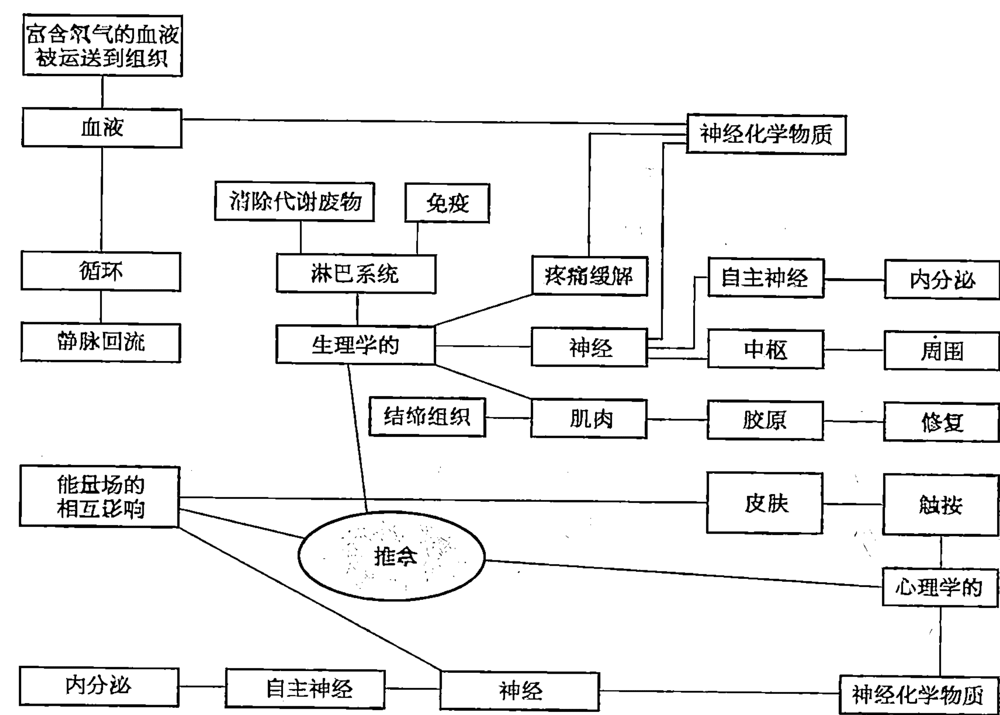

### 二、阅读书目列表

#### 生命和青春的秘密
作者：Marguerite Maury
出版社(者)：C. W. Daniels
这本书在很多方面都过时了，特别是微生物和生物化学方面。然而，由于书中给出了很多关于芳香剂在改变生命上的神奇力量的例子，因此，还是值得一读的。

#### GATTEFOSSÉ的芳香疗法
作者：René-Maurice Gattefossé
出版社(者)：C. W. Daniels

#### 芳香疗法的实践
作者：Jean Valnet
出版社(者)：C. W. Daniels
关于早期芳香疗法发展的优秀作品。

#### 芳香疗法手册
作者：Salvatore Battaglia
出版社(者)：The Perfect Potion (Aust) Pty Ltd.

#### 精油化学
作者：David G. Williams
出版社(者)：Micelle Press (1996 年)

#### 精油化学及生物活性
作者：Maria Lis-Balchin
出版社(者)：Amberwood Publishing Ltd. (1995 年)

#### 精油讲座笔记
作者：David Williams
出版社(者)：Eve Taylor (London) Ltd. (1989 年)

#### 精油百科全书
作者：Julia Lawless
出版社(者)：Element
迄今为止关于精油的最好的参考书，强烈推荐。

#### 面向卫生保健专业人员的芳香疗法
作者：Shirley Price & Len Price
出版社(者)：Churchill Livingston (1995 年)

#### 精油安全性：面向卫生保健专业人员的指导
作者：Robert Tisserand and Tony Balacs
出版社(者)：Churchill Livingston (1995 年)
强烈推荐。

#### 高级芳香疗法：精油治疗的科学
作者：Kurt Schnaubelt
出版社(者)：Healing Arts Press, Rochester, Vermont

#### 芳香疗法和推拿的载体油
作者：Len Price with Ian Smith and Shirley Price
出版社(者)：Riverhead

#### 新整体本草学
作者：David Hoffman
出版社(者)：Element Books
强烈推荐。

#### 现代本草
作者：Mrs. M. Grieve
出版社(者)：Dover Publications (1931 年)

#### 解剖与生理学习指导（与《人体生物学》六版配套）
作者：Sylvia S. Mader
出版社(者)：McGraw Hill Companies Inc.

#### 肌肉手册
作者：Paul Blakey
出版社(者)：Bibliotek Books Ltd.（1992 年）

#### 解剖与生理学原理（第八版）
作者：Tortora and Grabowski
出版社(者)：Harper Collins (1996 年)

#### 营养工作手册——最佳营养
作者：Patrick Holford
出版社(者)：I. O. N. Press

#### 东方穴位按压术
作者：Julian Kenyon
出版社(者)：Thorsons

#### 如何诊断你的健康状况：东方诊断方法
作者：Mischio Kushi
出版社(者)：Japan Publications

#### 中国相面和手相术
作者：Man-Ho Kwok
出版社(者)：Hyden House Ltd.（1990 年）

#### 健康行业：自然疗法师走向成功的指导
作者：Madeleine Harland and Glenn Finn
出版社(者)：Hyden House Ltd.（1990 年）
