# 若道 201310-201408

来源：[`mp.weixin.qq.com`](http://mp.weixin.qq.com)

# 【处女月】处女座：对你是爱是恨是什么

> 原文：[`mp.weixin.qq.com/s?__biz=MzA5NjA0NTAxNg==&mid=201009121&idx=1&sn=320b9d9de4f9d18f9195c3e3e080b723&chksm=1eb9955629ce1c40f4e42b271053d9575dd0a097dcfbece8be76da3742b93fda6f518a814bbb&scene=126&sessionid=1692739125#rd`](http://mp.weixin.qq.com/s?__biz=MzA5NjA0NTAxNg==&mid=201009121&idx=1&sn=320b9d9de4f9d18f9195c3e3e080b723&chksm=1eb9955629ce1c40f4e42b271053d9575dd0a097dcfbece8be76da3742b93fda6f518a814bbb&scene=126&sessionid=1692739125#rd)


本文作者逸月受《新民晚报》邀请，特地为处女座撰稿，要平凡一下被黑已久的处女座。8 月 23 日周六 12:45，太阳也从狮子座正式进入处女座，祝大处女们生日快乐！

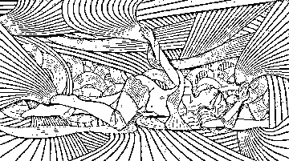

本文转载自若星辰（微信帐号：nodoorsh）

处女座去买一杯奶茶会发生什么？“请给我一杯热的但又不是太热，三分之一糖多一点点，加新鲜牛奶、珍珠少一点的原味珍珠奶茶。”……这就是处女座，TA 想要的一切都希望按照自己的要求刚刚好，不能多也不能少。

处女座能量强的人（不仅仅是太阳处女座，还需要整个星盘综合来看）有那么一大堆的形容词如影随性：“龟毛”、“挑剔”、“洁癖”、“难搞”、“吹毛求疵”、“过度完美主义”……于是处女座本身已经不是名词而转变为形容词，这个人真“处女座”呀！相信你一定不陌生。

其实一个人的缺点恰恰是 TA 的优点，就好像老天爷给了你诅咒也会给你祝福。处女座最大的资源就是他的分辨能力、对细节的专注和精益求精。处女座非常善于分析、提纯、精炼和改进，不做到完美誓不罢休，但似乎永远没有最完美。

处女座非常容易出专家，也就是这些挑剔、龟毛、难搞、吹毛求疵让处女座不断超越自己、完善自己。于是我们就有机会欣赏米其林餐厅大厨的美食、我们就可以听到世界上顶级的工匠制作的小提琴弹奏的曲子……常常觉得全神贯注做事情的处女座非常之性感，因为 TA 已经和这个事情本身融为一体了，有一点点 Zen 禅的味道。

从占星学角度来说，每个人都有自己独特的星盘，每个人都是独一无二的。我们的性格也会受到星盘中所有元素的影响，比如每个人会因为太阳星座和月亮星座的不同而表现各异。如果一个人的上升星座是处女座，那么 TA 在和别人互动的过程中会比较容易表现出处女的特质，而某些太阳或其他个人行星在处女座的人，很可能只在某一个场合表现出处女特质，比如说在家人面前或在工作场合等。

至于大家为什么热衷于黑处女座，其实是件蛮有意思的事情。从某种程度上来说，大家可能觉得好玩，而处女座有时候追求极致的特质可能会让人觉得不那么舒服，但他的缺点也是他的优点，尤其当他吹毛求疵地去完善自己的时候，就会非常吸引人。

很多明星比如说姚明、谢霆锋等都是处女座。最近谢霆锋一档美食节目很受欢迎，其中他就表现出明显的处女座特质：他对厨艺的精益求精、远赴重洋去寻找最理想的食材等，这些都让处女座闪烁出动人的魅力。

我们这个社会某种程度上已经是速食文化为主流，大家都追求速度、追求快速成功。某种程度上这和处女座精益求精的态度是背道而驰的。我们因此失去了很多技艺的传承、很多文化的传承，比如编制、缝纫、刺绣、工匠等等。

对处女座来说，重要的是通过他们的一技之长来服务团体、服务社会，并从中成长。这对于他们来说才是真正的成功！真心希望未来处女座会有多闪光的机会。

继续妥妥地做一只快乐的大处女吧！

______________________________

大卫·瑞雷即将于 9 月 25 日起，开始“职业占星师中英文资质课程——高阶”，想要考取国际占星师资格证的你，想要成为职业占星师的你，这将是你踏入职业占星的第一步。欲知详情，请点击文末的“阅读原文”。

若道星文化，是由美国著名占星师大卫·瑞雷老师创办的占星学培训与文化传播机构，是国际占星研究协会(ISAR)在中国唯一一家定点合作机构。

**【占星入门——若道占星】微信订阅号：nodoorbj**

* 若道官网：www.nodoor.com 可提供占星咨询、占星课程、星盘查询、应用测试及电子杂志等服务。

* 新浪微博：@若道占星

**也请支持我们的朋友：**

**【无央之界】微信号：Akhaldan**

【若星辰（若道星文化上海同学会）】微信号：nodoorsh

【金陵星空教室】微信号：astronanjing

【Nana 占星社】微信号：NANA-astrology

【悦然。馨境生命分享】微信号：yueranxinjing

【心灵自由】微信号：freedomloveaction

**【聆宇电台】Cora 微信号：lingyudiantai**

# 火星合相土星：驾驭而非痛苦

> 原文：[`mp.weixin.qq.com/s?__biz=MzA5NjA0NTAxNg==&mid=201001206&idx=1&sn=aac2f71af88673c7b2c28d868587771b&chksm=1eb9ba4129ce3357910ebcec0a57072c346c2a35f6610e3a4df37483db65ac3c1678c0df486c&scene=126&sessionid=1692739130#rd`](http://mp.weixin.qq.com/s?__biz=MzA5NjA0NTAxNg==&mid=201001206&idx=1&sn=aac2f71af88673c7b2c28d868587771b&chksm=1eb9ba4129ce3357910ebcec0a57072c346c2a35f6610e3a4df37483db65ac3c1678c0df486c&scene=126&sessionid=1692739130#rd)


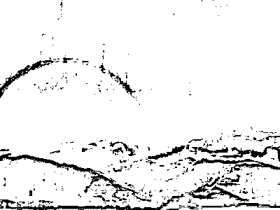

作者：杰夫·焦耳 

译者：李含

校对：江艺

　　占星师已经盯上了 8 月 26 日（北京时间）将发生的火星合相土星，并表现出了不安。这两颗传统占星学中最困难的行星结成联盟，被认为会给此时已经数倍复杂的时期带来更多的压力和痛苦。我们经历了 7 月，依然幸存，7 月里严苛的土星与叛逆的天王星形成梅花相位（150 度），摩擦丛生，让我们仿佛置身于加沙或乌克兰的战区之中。这一波澜渐趋平稳，但我们依然处于天王星-冥王星四分相的暴力狂潮之中，这一相位自 2012 年开始，还将延续一年。

　　所以，从占星学趋势上看，有许多让我们体验恐惧和失败的借口，但是活在这样的感受之下，无益于任何人的幸福，不是吗？除了将这些不祥之兆解读为灾难的原因，我们还可以将其解读为成功法则。挑衅的火星与阻抗的土星形成了重要的联系，我们从这一联系的基本问题开始说起。火星想要行动，土星则倾向于稳住阵脚，可能会带来延误、繁重的责任和挫败。令人欣慰的是，这一宇宙示象的蕴含远远不止单纯的恐惧，它还蕴藏着更快乐的故事。

　　火星与土星合相带来的礼物是控制力，我们可以找到着力点，开始克己自制，将无力转化为效力。合相发生在水象的固定星座天蝎座，预示着根本性的改变。但是这需要有压力去激励行动，并且保持耐性，去守候一份值得期待的结果。加上一点点渴望，这一星象能让我们去学习、发展自己的能力，为重大项目的开启打下基础。在典型的天蝎座模式中，我们首先需要清理一些无关的事务，才能专注于利用这对灵巧的行星获得利益。

　　如果你正遭遇恐惧或面对自我质疑，这一行进会给你带来疗愈的方式——专注于行动，认清目标，即使是面对危险。还有什么地方比天蝎座中段更适合恢复自制力呢，还有谁比强健的火星、严格的土星更能够把握现实呢？耐性与远见是这一组合发挥力量的关键所在。慢慢地养成习惯，发展你的能力，认识到重要的问题都可以一步一步完成。例如，坚持一项节食、锻炼计划，不直接处理工作相关的问题，而是开发自身优点，建立自信，从而可以在任何领域中尽力一搏。

　　火星与土星的结合是占星学中最猛烈的一副药，它们蕴藏着极大的力量去启动项目，坚持努力，这会是一个非常有用的行进。相信自己学习新技能的能力，提升自己的水平，最重要的是，相信自己，带着新发掘的能力，对提升自己的人生全面负责。

2014 年 8 月 19 日

______________________________

大卫·瑞雷即将于 9 月 25 日起，开始“职业占星师中英文资质课程——高阶”，想要考取国际占星师资格证的你，想要成为职业占星师的你，这将是你踏入职业占星的第一步。欲知详情，请点击文末的“阅读原文”。

若道星文化，是由美国著名占星师大卫·瑞雷老师创办的占星学培训与文化传播机构，是国际占星研究协会(ISAR)在中国唯一一家定点合作机构。

**【占星入门——若道占星】微信订阅号：nodoorbj**

* 若道官网：www.nodoor.com 可提供占星咨询、占星课程、星盘查询、应用测试及电子杂志等服务。

* 新浪微博：@若道占星

**也请支持我们的朋友：**

**【无央之界】微信号：Akhaldan**

【若星辰（若道星文化上海同学会）】微信号：nodoorsh

【金陵星空教室】微信号：astronanjing

【Nana 占星社】微信号：NANA-astrology

【悦然。馨境生命分享】微信号：yueranxinjing

【心灵自由】微信号：freedomloveaction

**【聆宇电台】Cora 微信号：lingyudiantai**

# 【大卫·瑞雷】处女座：找到属于你自己的价值

> 原文：[`mp.weixin.qq.com/s?__biz=MzA5NjA0NTAxNg==&mid=201001206&idx=2&sn=d900fc7aa6b5977e597151d0d25274e7&chksm=1eb9ba4129ce3357ddca75a3373a51e87085b07cb53fef9ec665dd0d202830dc8dbf893b8957&scene=126&sessionid=1692739130#rd`](http://mp.weixin.qq.com/s?__biz=MzA5NjA0NTAxNg==&mid=201001206&idx=2&sn=d900fc7aa6b5977e597151d0d25274e7&chksm=1eb9ba4129ce3357ddca75a3373a51e87085b07cb53fef9ec665dd0d202830dc8dbf893b8957&scene=126&sessionid=1692739130#rd)


明天太阳就要进入处女座了，所以今天给大家带来一篇处女座的文章，祝所有处女座的盆友们生日快乐！


作者：大卫·瑞雷

译者：Cora

　　在本系列文章中，我在讨论每个星座时会首先从它的“基本功能”展开论述，接着分析这一星座可能面临哪些基于恐惧的评判，以及由此引发的课题和挑战。要记住，有些星座，即使你的出生图中没有任何行星落入，但这个星座仍是星图中的一部分，在你的出生图中占据一定地位——以某种方式对你产生影响。而如果你的太阳、月亮、上升点或其他出生图中的重要行星落入该星座，或者是与该星座“共振”的宫位被强调，那么本系列文章对该星座的讨论将更加适用于你，其中所描述的该星座的特质与主题将在你身上反映得更加明显。

　　　　　　　　　　　　　　　　　　　——大卫·瑞雷

这真是一句老生常谈了，占星师们经常建议经商的客户，在招聘中，“如果拿不准雇佣谁比较好，就选处女座的人吧。”在十二星座里，处女座人以他们对工作的专注认真而备受尊敬。没有一个星座像处女座这样专心致力于尽善尽美地完成工作。一旦确定了任务，确定了工作时间，处女座人就挽起袖子忙活起来了。简而言之，处女座人不会让你失望。事实上，处女座人会在前进的路上不断成长。“业精于勤”一词就是处女座的写照，不管事情的结果是否如人意，处女座都是黄道十二星座中的完美主义者。

这种完美主义不止体现在太阳处女座人身上，上升、月亮落在处女座，特别是水星处女座，以及金星火星落在此土象星座的人都会有这样的倾向。是的，这样一个“脚踏实地”的星座，注重实干和实效。他们会基于有效的事实讯息和逻辑思考作出决策；头脑理智，不感情用事，思虑周全。但是，这种理智的副作用可能使思路狭隘，有时甚至会“因小失大”——特别表现在对于全局的思考把握上。处女座可能花好几个小时为了权证上一块钱的错误在电话里争论不休，有这个时间干正经事儿能赚好几倍的钱呢。一部分原因是处女座太专注于细节，也可能是被“琐事”烦扰。

另外还有一些我们需要注意的信息。2006 年，我与福布斯杂志合作了一篇文章，选取全球 613 名亿万富翁的出生资料，其中 12%是处女座。许多专家认为，“注重细节”是许多致富者的共性。当然，这些“专家”很可能也是处女座！这份处女座亿万富豪的名单中，包括了著名的甲骨文公司创始人之一拉里·埃里森（Larry Ellison），以及更具盛名的巴菲特（Warren Buffet）。巴菲特展现了处女座的另一个特点——“低调”，他一直住在内布拉斯加州，奥马哈市一套住宅中，那是他于 1958 年花了 3 万 1 千 500 美金购买的。他有做一些改建和装修，但在邻居中并不显眼。一位奥马哈市的房屋中介如此描述巴菲特的宅邸：“这屋子不是最贵的，……中规中矩，但维护得很好。”

巴菲特曾被人称作最善着装的亿万富翁。当然，有没有那些穷困潦倒的处女座，衣衫褴褛？有没有散散漫漫的处女座，把一切都搞砸的？有没有缺乏逻辑，感情用事，满脑子奇思乱想的处女座呢？一定是有的！并不是每一位处女座人都是完美员工，都把公寓收拾得井井有条。但这种例外，与处女座本身的星座特征无关，而是有其他因素在影响，像是海王星、双鱼座、巨蟹座、天王星，亦或是木星和射手座。这些因素的共同作用是常有的事。

比方说，处女座追求专业技能。专家能手就像是处女座的“身份标签”。一位年轻的处女座姑娘可能是乒乓球国手。她日以继夜地练习，磨练技艺——尝试新技巧。也许，她穿着整洁干净，但是……她的房间却一团糟！衣服扔的满地都是；翻开的书上面就搭着湿毛巾！这不是处女座！这里面有其他的因素，也许是双鱼座，亦或是强烈的海王星相位影响。学习占星的人都会知道，不仅仅只有太阳星座。处女座的姑娘可能还有月亮落在了双鱼座，甚至是海王星与太阳的紧张相位，亦或是结合了其他的“反处女座”的占星因素。

当然，处女座和其他星座一样有自己的个人成长课题。处女座最常见的成长课题就是通过工作、事业、自己的专业领域找到自我的定位。“我是软件工程师，”处女座说，而不是“我从事软件设计工作。”意思是“我是专业人士”而不是“我有这项技能。”表面上看，这里的分别很小，直到遭遇失业甚至更糟的事——他们的技能过时了。很多年前，我有一个客户就职于 IBM 公司大型计算机部门。对付这种巨型怪兽计算机，他是专家，和如今的个人电脑和手机比起来，那玩意儿真是像恐龙了。当他从 IBM 公司离开，他经历了一次重大的“身份危机”。他不知道接下来他该如何定义自己。他甚至不知道如何面对妻子、子女、朋友、邻里。他觉得自己好像是哥伦布来到了陌生的大陆。对他而言，失去自我身份定位是很严重的事情。他的夫人后来也成了我的客户。她请丈夫代为和我约定咨询时间。

他来找我咨询的时候，正开始一个重新进修的计划，这是他解雇补偿的一部分。他看起来有些忧虑，略微紧张。他的眼神在搜寻焦点。我把他的星盘推到他的面前。“看看这个，”我跟他说，“你看到了么？这就是你出生时太阳所落的位置，处女座，这里我们称之为第八宫。”他茫然地点点头。“你十六岁的时候发生了什么事情么？”我问他。他深深叹了一口气。我的话引起了他的注意。“那时，我父亲失业了……”沉默过后，他接着说，“半年后，父亲死于动脉……我大学的学费都是靠父亲的保险金支付的。”这段对话让他慢慢理清了头绪。他记起父亲的话，“失业的男人是最没用的了。”我在他的占星档案上写下了这句话。

在这次咨询的后半段，他开始意识到自己存在的意义“远不止一份工作”。我们与生俱来皆有自身的内在价值，这是无法仅以工作来衡量的。他面对了自己内心根深蒂固的信念：男人没工作，还不如死了好，或者是，男人没工作就离死不远了——就像他的父亲那样。他开始明白，自己对于家庭的重要性不仅仅只是一个“挣钱养家之人”，无论怎样家人都会爱他，欣赏他。他依旧是完美主义者。他的夫人说，他都快把老婆孩子逼疯了，他会以各种各样的方式帮助家人做到尽善尽美，指出他们的错漏，但他的夫人能够对他的严苛要求一笑置之。她很高兴看到了丈夫的改变——他重新进修，随后再次回到了计算机行业。他度过了这次身份认同危机，并且脱胎换骨，获得重生。

在我的实践经验中，我曾经见过这一主题的多种不同表现形式。特别是，这种自我认同的危机发生在十几岁的处女座人身上，他们从开始记事起就努力发展自己的特殊技能，像是运动才能，足球、体操、棒球，一定要练到受伤才不得不停止。在生活中，人人都视其为一个棒球手，接下来成为大学校队的优秀投手，甚至成为专业运动员。这些专业技能代表了他们是谁，或说，他们以为是这样。对他们而言，要在生命中找到新的舞台不容易，很重要的是，让他们明白，他们是被爱、被欣赏的——仅仅是因为他们本来的样子，而不是因为他们拥有什么专业技能。

的确，处女座人希望自己是不可或缺的，他们希望在计划中扮演有用的角色。所以，处女座人往往成为关键先生，而且是全凭自己的能力。没有人比处女座更严苛，因为这些挑剔的声音在他们的脑海里根本就难以挥去。太阳落在处女座的人往往有一位严格的父亲，月亮落在处女座的人往往有一位严厉的母亲。一般来讲，这些父母不断重复的讯息就是，“你是有缺陷的，力求完美尚需很远的路程。”对于很多处女座人来说，不论他们如何努力取悦双亲，都还是不达标。压力与担忧对于处女座人来说分外沉重，他们会严格审视一切，容不得一点错误与瑕疵——即使是努力不去想也不行。

我听过一句非常适合处女座的座右铭：“没有不完美，只有完美的不完美呈现。”如果你是处女座人，如果你觉得忧虑破坏了你的幸福生活，请试着重新考量一下你在生活中建立起的信念系统。这些心理模式源自何处呢？运用你的分析能力，找到这些阻碍你自我实现的旧模式的根源。在十二星座中，处女座人不仅可以运用逻辑分析能力找到问题的缘由，更可以借助这种能力为自己书写全新的生命。但要记住，对人不要吹毛求疵、严苛批评。需要做的是，承认旧的模式，接受它。改变会随之而来。你会适应这种变化，通过打磨新技能，为这个世界提供更多的功用性。

如果你是处女座，看一看，你是不是也生活在这个盒子里？如果真是这样，好好想想这个问题。评判是一个陷阱，你自己把自己困在这个陷阱里；除非你认识到“评判”或“陈述”本身就有着自相矛盾的瑕疵，从而不再以此为衡量你人生的标准。

下面罗列了几位处女座人士，他们以各种方式追求极致完美，让人叹为观止：兰斯·阿姆斯特朗；莱昂纳德·科恩；约翰·沃尔夫冈·冯·歌德；巴迪·霍利；拉瓦锡；约翰·洛克；H.L.曼肯；蒙台梭利；欧·享利；巴夫洛夫。

______________________________

大卫·瑞雷即将于 9 月 25 日起，开始“职业占星师中英文资质课程——高阶”，想要考取国际占星师资格证的你，想要成为职业占星师的你，这将是你踏入职业占星的第一步。欲知详情，请点击文末的“阅读原文”。

若道星文化，是由美国著名占星师大卫·瑞雷老师创办的占星学培训与文化传播机构，是国际占星研究协会(ISAR)在中国唯一一家定点合作机构。

**【占星入门——若道占星】微信订阅号：nodoorbj**

* 若道官网：www.nodoor.com 可提供占星咨询、占星课程、星盘查询、应用测试及电子杂志等服务。

* 新浪微博：@若道占星

**也请支持我们的朋友：**

**【无央之界】微信号：Akhaldan**

【若星辰（若道星文化上海同学会）】微信号：nodoorsh

【金陵星空教室】微信号：astronanjing

【Nana 占星社】微信号：NANA-astrology

【悦然。馨境生命分享】微信号：yueranxinjing

【心灵自由】微信号：freedomloveaction

**【聆宇电台】Cora 微信号：lingyudiantai**

# 【诺·泰尔】太阳弧工作坊报名即将截止！

> 原文：[`mp.weixin.qq.com/s?__biz=MzA5NjA0NTAxNg==&mid=201001206&idx=3&sn=c91970718c725716ad154814c6307a5f&chksm=1eb9ba4129ce335797b4f8d98bb353fd2960280a631299a52b26ec4d7c252d72708ca9259b22&scene=126&sessionid=1692739130#rd`](http://mp.weixin.qq.com/s?__biz=MzA5NjA0NTAxNg==&mid=201001206&idx=3&sn=c91970718c725716ad154814c6307a5f&chksm=1eb9ba4129ce335797b4f8d98bb353fd2960280a631299a52b26ec4d7c252d72708ca9259b22&scene=126&sessionid=1692739130#rd)


不知不觉，下周末就要迎来大师的太阳弧实战工作坊啦！接触占星学之后，小编一直很仰慕诺·泰尔。同事们常说他是国王，是的，在我的心中，他就是国王。

他是现代占星学界的泰斗，开创了太阳弧实际运用的先河，将占星预测推到了新的高度。太阳弧预测的精准性固然不用多言，这一预测技法对于生时校正也更是至关重要。

如果你想要成为职业占星师，如果你深深迷恋占星学，那么，你绝对不能错过这位世界前三的占星师！

诺·泰尔太阳弧实战工作坊即将于下周五（29 日）晚正式启动！报名将于 25 日截止！欲报从速！

**【课程安排】**

8 月 29 日 周五 晚间讲座 （19:30-21:30）

　　★“解构占星图——快速而丰富的分析”

　　★将占星学融入社会发展模式中；

　　★在满足需求过程中的行为预期。

8 月 30 日 周六 工作坊（9:30-17:30）

　　★太阳弧的魔法——与行进预测结合

　　★如何发展预测体系；如何驾驭发展性的太阳弧符号体系；太阳弧技术的成熟和改进；计算太阳弧的捷径；精准的方法；高阶方法，运用直接和间接的太阳弧……次限推进之外的约 1600 种计算方法!

　　★行进是如何触动太阳弧的！木星和土星的行进周期。次限推进月亮：便捷算法和贯穿人生的整合魔法。

　　★月亮三限推进的简单评估！

8 月 31 日 周日 工作坊（9:30-17:30）

　　★发展问题的占星图模式——20 多个咨询要点！

　　★诺·泰尔阐述他所简化的核对过程，立即将占星数据组织起来，进行整合分析；理解发展问题的原因；处理由早年家庭生活带入成年关系中的焦虑投射。意识到对亲密关系的恐惧的价值；两性难题，复杂的关系动力–探讨超过 20 个咨询要点！

　　★阐述过程中会涉及多个星图示例。

**【课程时间】**

8 月 29 日周五晚间、8 月 30 日和 31 日全天

**【课程费用】**

费用：4800 元  （老同学 8 折 3840 元）　2014 年 8 月 25 日截止报名汇款

**【如何报名】**

 点击文末的“阅读原文”进入报名页面。

咨询请打电话 010-58263061（工作日早 11—晚 6 点） 18611618191 李洁；或直接写信给 nodoor@vip.126.com，我们会回复您的疑问。

如果在课程页面报名填写不成功，请发送 Email 至 nodoor@vip.126.com 索取报名表，填写报名信息。

记得点击这里的“阅读原文”哦~

# 狮子座王菲：自我是把双刃剑（Lunita）

> 原文：[`mp.weixin.qq.com/s?__biz=MzA5NjA0NTAxNg==&mid=200997259&idx=1&sn=ea88ee4350c864ac43d80fe4e1c9c3a2&chksm=1eb84b3c29cfc22acabfe30075541b939499954819d6fcef46715ebe94eb836e90f10427ff4c&scene=126&sessionid=1692739130#rd`](http://mp.weixin.qq.com/s?__biz=MzA5NjA0NTAxNg==&mid=200997259&idx=1&sn=ea88ee4350c864ac43d80fe4e1c9c3a2&chksm=1eb84b3c29cfc22acabfe30075541b939499954819d6fcef46715ebe94eb836e90f10427ff4c&scene=126&sessionid=1692739130#rd)


在舞台上闪闪发光的天后王菲，有着无可比拟的才华，但是，如此闪耀的她，却频频在婚姻中受伤。王菲狮子座的光芒背后，有着怎样的阴影，真实的她究竟是怎样的，这里 Lunita 将通过出生图深度分析这一传奇天后。本文原刊发于《BQ 北京青年周刊》2014 年 7 月 31 日第 31 期（总第 981 期）。作者微博：@占星师 Lunita，微信公共平台：Luna 占星之旅，博客链接：http://blog.sina.com.cn/lunaastrology。

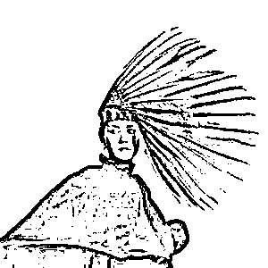

*王菲让我想起夜晚的霓虹灯，于夜色中忽明忽暗的闪烁缠绵着注意力与目光。霓虹灯光仿佛是那么不真实，光晕朵朵，就像在另一世。空灵的王菲歌唱着，也精灵一般穿梭在我们耳际。她脱俗，她也摇滚；她冷酷，她也孩子气；她婉约忧伤过，她也男孩般剪过短发。就像霓虹灯一般变幻莫测，五彩斑斓，好似我们内心的幻象。*

说起王菲，人们总想到她独特的声线，就和她的个性一样悠扬，如风过山岗，绕梁三日。歌声一点一滴，似乎一点也没有狮子座的霸气，反而注入心田，化作心底的一作忧伤和情怀。

王菲的生日是 8 月 8 日，这个狮子座最中间的日期，相反诞生的，是一个内敛含蓄的狮子。狮子座虽是火象星座，但奇怪的是，生活中很多狮子外表看起来并不强势，反而有一种“孤芳自赏”和含蓄的味道。王菲的月亮落入 8 宫，本质上的她其实非常渴望个人空间，隐私，有羞怯、低调的特质。

狮子座在王菲身上最突出的特性是个人主义。占星学上，太阳在狮子座是原生入庙的位置，会给狮子们极强大的气场与旺盛生命力，与生俱来的自信与“我可以的”这样的信念。狮子座的人不易被打倒，充满了个人主义和自我要求，无所畏惧，就像一头威风凛凛的狮子一样到处受人尊敬。这样一种强大的自尊需要，会促使狮子座往更好的方向去努力，充满了自我激励机制，不会为眼前暂时的困难绊倒。

狮子座的王菲为什么又这样红？早在 1998 年以前，王菲的歌声就如小溪潺潺从磁带中传遍大街小巷，《容易受伤的女人》、《执迷不悔》、《季候风》、《如风》……这些旋律优秀、哀宛动人的歌曲到今天听起来依然撼动人们的神经。王菲拿遍了大小奖项，成为华语乐坛的标杆，独特的风景线，让人们一提到“天后”就能联想到她……多少人陶醉于这个女子如春燕呢喃般的吟唱，或者被其真实的自我表露所打动。王菲的声线，总是那么的充满感情，仿佛在自吟自唱，喃喃细语。

记得有一年，颁奖仪式上，一小女孩称赞了王菲，王菲不仅没有扭捏的故作姿态，反而沉着、大方的回馈给小女孩谢意，大方的承认自己的优势。这样一种气度，也是狮子座真实的自我个性的表达。狮子座不会隐藏自己，是与非皆发自内心，发自肺腑。无论是坚定的自我立场，还是唯我独尊的个人风格；或是真诚的个人表露，独特感的营造皆让狮子座的王菲建立了一个栩栩如生的天后形象，深具人格魅力，渐而成为娱乐圈一大受人敬慕的标杆。狮子座就有这样一种特性，坚持自我，活出自我，方能成为人群的焦点和领袖，活得出自信的狮子座能自然而然光芒四射，强大的气场也正是这样炼成的。

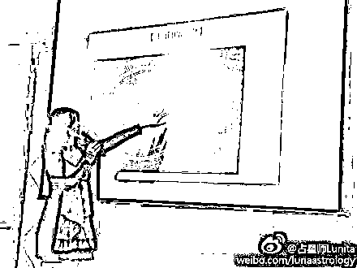

狮子座是水瓶座的对宫，彼此间有相似和互补性，狮子座也是一个充满了原创力的星座，一样追求“独特”。不同于水瓶座为反叛而反叛，狮子座的独特是发自骨子里的，是一种俯视众生的姿态。“干你何事，我就是我”是狮子座最好的心声。狮子座的决定是很难去撼动，因为这个星座在数字学里是“5”，代表了一种人生的方向感，狮子座很有自己的主见，很少为自己的未来感到迷茫。王菲也不例外。她从不盲从，强大的个人风格为其事业奠定了坚实的基础。

王菲的事业一路走来，一直保持着“出淤泥而不染”，宛如清水白莲，将灵魂化作音乐一泻千里，流淌在每个人心灵深处。王菲的舞台表现也充满了狮子座味道，那是与生俱来的王者风范：外表霸气、声音充满了表现力。狮子座对应黄道第五宫，代表娱乐，自我才华，创意与表现力等等。如果说星座中具有艺术细胞的星座，我想怎么也不能少了狮子座。狮子座的艺术感，不属于双鱼座金牛座这类突出在美感和想象力，但舞台表现力，倒是十二星座数一数二的。也就是说，狮子座擅长的是演绎，能将行为艺术烘托到极致。王菲自如地控制自己的嗓音，灵活悠远，随心而唱，就能将自己的心境表达得淋漓尽致。

个人主义和强大表演力也许一开始接触上升天蝎座的她，并不能发现。她是如此低调，却被高调曝光在屏幕面前。冷若冰霜是我们看到的王菲，然而实际的王菲却是不折不扣的小顽童。月亮在双子座的她，有一个孩子气充满好奇心的灵魂，喜欢和粉丝开开玩笑。记得有次王菲在微博更新“地球的盆宇们，你民好！”，惹来粉丝大量转播和欢笑。王菲的孩子气一面十分突出，日月结合看，王菲是个擅长自娱自乐，有幽默细胞的人。私底下的她会非常爱开玩笑，绝不是外表那么冷酷。

日水十宫的王菲拥有极大的公众影响力和事业地位，其婚姻却被影响得一塌糊涂，多婚也是她人生的劫难之一。王菲的个性自我、飘渺，仿佛置身于另一世界，朦胧又神秘，事业上是其巨大的竞争优势，然而对于婚姻，难免难相处，显得有点抽离，过于自我。婚姻的问题，配偶间的情变、疏远，也正是由这个个性特质演变而来。和曾经 5 个男人的爱恨情怀，金星巨蟹座四分天王星的王菲尽情投入，又落得一身伤。她在爱情上是感情极丰富的类型，害羞、敏感，喜欢试探对方；然而一旦决心分手，王菲会是属于头也不回的决绝类型，却黯然神伤，独自咀嚼回忆。

许多狮子座一谈到爱情显得龟毛、扭捏、害羞，一点儿也不直接。好像霸气荡然无存了，变成了一只小猫咪，十分缺乏安全感，需要情人的哄和陪伴。对于狮子座来说，搞怪也好，自我中心也好，爱情有时也要多为对方的立场考虑才好。

****欢迎关注《BQ 北京青年周刊》微信公共平台 QueenB 上潮：****

****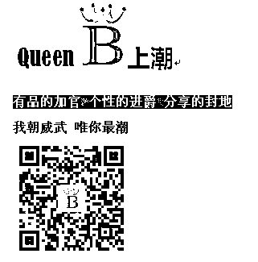****

______________________________

大卫·瑞雷即将于 9 月 25 日起，开始“职业占星师中英文资质课程——高阶”，想要考取国际占星师资格证的你，想要成为职业占星师的你，这将是你踏入职业占星的第一步。欲知详情，请点击文末的“阅读原文”。

若道星文化，是由美国著名占星师大卫·瑞雷老师创办的占星学培训与文化传播机构，是国际占星研究协会(ISAR)在中国唯一一家定点合作机构。

**【占星入门——若道占星】微信订阅号：nodoorbj**

* 若道官网：www.nodoor.com 可提供占星咨询、占星课程、星盘查询、应用测试及电子杂志等服务。

* 新浪微博：@若道占星

**也请支持我们的朋友：**

**【无央之界】微信号：Akhaldan**

【若星辰（若道星文化上海同学会）】微信号：nodoorsh

【金陵星空教室】微信号：astronanjing

【Nana 占星社】微信号：NANA-astrology

【悦然。馨境生命分享】微信号：yueranxinjing

【心灵自由】微信号：freedomloveaction

**【聆宇电台】Cora 微信号：lingyudiantai**

# 【诺·泰尔】星图解读中的半球侧重

> 原文：[`mp.weixin.qq.com/s?__biz=MzA5NjA0NTAxNg==&mid=200997259&idx=2&sn=7b7a1cccff7dded66c2c165778f0834c&chksm=1eb84b3c29cfc22a41b04c16ea1d3ca2cc19ce3649efd34ffc55e7ab7b8e8516d6eb0f05b215&scene=126&sessionid=1692739130#rd`](http://mp.weixin.qq.com/s?__biz=MzA5NjA0NTAxNg==&mid=200997259&idx=2&sn=7b7a1cccff7dded66c2c165778f0834c&chksm=1eb84b3c29cfc22a41b04c16ea1d3ca2cc19ce3649efd34ffc55e7ab7b8e8516d6eb0f05b215&scene=126&sessionid=1692739130#rd)


在以主要的占星方法解读出生图时，有创造力的占星师一定会尽量将客户的实际生活和成长轨迹纳入考量。所有的论断都应是星图与客户真实的生活相结合的产物。

我们可以通过快速审视半球侧重，从这种注重成长，以真实生活为导向的占星方法中获益：

**东半球/左半球**

当个人出生图中的大部分行星落于东半球（即星图的左半部分）时，我们可以看出并了解这个人（对于上升人格特质）的防御性和自我保护。若西半球（星图的右半部分）的行星有显著的逆行现象，我们也应将注意力转向东方。接下来的分析方向是：为什么对这个人来说防卫心是必要的？其成长过程中有多少能量已经转化为他在日常生活中惯性的自我保护行为？这些防御行为会如何影响其人际关系的和谐性？他必须还要维持这样的姿态多久？

**北半球/下半球**

当星图中的行星齐聚北半球，即地平线之下（星图的下半部分）时，这提醒我们去关注案主早年家庭生活中“未完成的功课”。若地平线以上（星图的上半部分）的行星有显著的逆行现象，相应地我们也应将注意力转向北半球，即地平线之下。接下来的问题是：这些在早年家庭生活中未解决的议题是什么？是什么让它们直到现在还在对你的生活产生影响？这些问题给你的职业选择、事业发展以及你跟他人的关系带来了什么影响？我们能做些什么来改变这样的局面，结束能量的虚耗？

**西半球/右半球**

当大量行星聚集在星图的西方（即星图的右半部分），我们要关注的是“他者”，这常常表现为过度“给出”自己。若东半球（即星图的左半部分）的行星有显著的逆行现象，相应地我们也应将注意力转向西方。要问的问题是：如此关心他人给你自己带来了什么好处呢？你知道自己的这种行为驱动模式吗？你的自我价值放在哪里？你觉得什么时候才能达到一种平衡呢，该如何实现？

**南半球/上半球**

当大量行星汇集在星图的南半球，即地平线之上（星图的上半部分），外部环境和事件对案主会有很大影响，甚至可能因环境做出牺牲。若北半球，即地平线之下的行星有显著的逆行现象，那么同样要将注意力转向地平线之上。要问的问题是：为什么在成长过程中会觉得我们脚下的地基有哪部分被抽空了？这给我们的关系带来了什么影响？

上述关于星图的第一印象几乎总是能告诉我们很多重要信息。这种行星在各个半球的分布情况带给我们的第一印象，将在我们用其他方法解读星图时反复强化；这种印象也将渗透到其他解读方法的运用当中。生命的乐章在这里定下了基调。

8 月 29-31 日，现代占星鼻祖诺·泰尔将在北京举办“太阳弧预测技法实战工作坊”，教你如何一眼识别生命中的重大趋势，详情请点击文末的“阅读原文”。

_______________________________

若道星文化，是由美国著名占星师大卫·瑞雷老师创办的占星学培训与文化传播机构，是国际占星研究协会(ISAR)在中国唯一一家定点合作机构。

**【占星入门——若道占星】微信订阅号：nodoorbj**

* 若道官网：www.nodoor.com 可提供占星咨询、占星课程、星盘查询、应用测试及电子杂志等服务。

* 新浪微博：@若道占星

**也请支持我们的朋友：**

**【无央之界】微信号：Akhaldan**

【若星辰（若道星文化上海同学会）】微信号：nodoorsh

【金陵星空教室】微信号：astronanjing

【Nana 占星社】微信号：NANA-astrology

【悦然。馨境生命分享】微信号：yueranxinjing

【心灵自由】微信号：freedomloveaction

**【聆宇电台】Cora 微信号：lingyudiantai**

# 【周末沙龙】占星爱情：找寻你心中最爱

> 原文：[`mp.weixin.qq.com/s?__biz=MzA5NjA0NTAxNg==&mid=200997259&idx=3&sn=a7d6919ccabd7ae99275883ddd26d856&chksm=1eb84b3c29cfc22adef5a5e48441e1d1f9b72ff4b08b93048407c385ba36d50777f8e892bee6&scene=126&sessionid=1692739130#rd`](http://mp.weixin.qq.com/s?__biz=MzA5NjA0NTAxNg==&mid=200997259&idx=3&sn=a7d6919ccabd7ae99275883ddd26d856&chksm=1eb84b3c29cfc22adef5a5e48441e1d1f9b72ff4b08b93048407c385ba36d50777f8e892bee6&scene=126&sessionid=1692739130#rd)


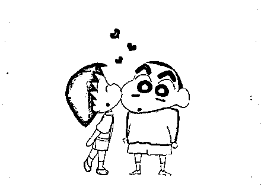

在寻找爱情的路上，你会否偶尔踌躇？

在寻找 ta 的那条路上，你会否偶尔找不到方向？

在寻找幸福的这条路上，你会否偶尔迷失在十字路口？

爱情，是两个人的事，包含着太多自己无法确定无法控制的因素。不管你现在单身或是热恋，也许你都会有某种迷惘的感觉。而这种感觉，恰恰，就是爱情。爱情会带给你世界上最甜美的蜜，也同样会给你最苦涩的毒药。但是，这就是爱啊！

周日，@占星杜克 会在若道，同你一起谈谈爱情。谈谈你的出生图，谈谈你钟情的人，谈谈占星如何能帮助你更加幸福地享受爱情。

只要你对 12 星座有所了解，只要你大概知道太阳月亮和上升星座，那么不要犹豫，来听听杜老师的爱情解惑吧！

注意：此次沙龙，我们只谈恋爱，不谈婚姻。请已婚人士绕道，单身热恋不限。

【时间】：2014 年 8 月 24 日（本周日）下午 2:00-5:00

【费用】：60 元（老学员 30 元）

【地点】：北京市朝阳区百子湾路 32 号院苹果社区南区 10 号楼 A 座 2101 室

联系人：轩轩

QQ/微信：735590697

电话：010-56629907 15120005676

点击这里的“阅读原文”，进入报名页面！

# 火星：学会健康表达你的愤怒

> 原文：[`mp.weixin.qq.com/s?__biz=MzA5NjA0NTAxNg==&mid=200984357&idx=1&sn=addca8ac2ab1c0628a948b764999cabc&chksm=1eb8759229cffc84747cc64587b3ab0144ee63e2c39ea0dbfd96e2b4df8026ee12391671fc7f&scene=126&sessionid=1692739130#rd`](http://mp.weixin.qq.com/s?__biz=MzA5NjA0NTAxNg==&mid=200984357&idx=1&sn=addca8ac2ab1c0628a948b764999cabc&chksm=1eb8759229cffc84747cc64587b3ab0144ee63e2c39ea0dbfd96e2b4df8026ee12391671fc7f&scene=126&sessionid=1692739130#rd)


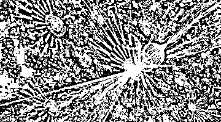

作者：杰夫·焦耳

译者：轩轩

校对：王宏

“行星是原型，是超越我们个体人生故事的本质能量，可以为每个人所利用。”基于这一理念，杰夫老师创作了“那些行星教我们的事”系列文章，讲述各颗行星教给我们的功课，本文是其中火星篇。

火星是代表战士的行星，它活跃而且精力充沛，是创始者和煽动者。它是第一颗位于地球围绕太阳运转轨道之外的行星，充当着新领域的开拓者和侵入者角色。火星是红色的，这反映了它激励行动的激情，以及它与愤怒的关联。出生图中的火星描绘了我们表达愤怒的方式，我们许多人都不会直接表达愤怒，或是简单地压抑它。我们对这种情绪所持有的负面想法也在传统占星学对火星的称呼中可见一斑。传统占星学将火星称为小凶星，认为它是一颗“坏的”行星，但是没有大凶星土星那么艰难。

不管我们的出生图和人生经历让我们对火星产生了怎样的曲解，在这里，我们所关心的是火星的本质特性，经过一些练习，每个人都可以利用这些特性。首先，人们之所以不去表达自己的愤怒，一个关键原因就是他们认为表达愤怒会伤害他人。显然，我并不是在鼓励大家毫不顾虑后果就去行动。然而，我并不认为我们可以伤害到一个身心健全的成年人。

比如，“你伤害了我的感情”这句话通常意味着你触碰到了我已经很脆弱的部位了。这种脆弱并不是你造成的，但你却刺激了它。同样，我并不是说没有必要对他人保持敏感，我的意思是触碰伤口不同于制造伤口。而且，当我们激起某人不舒服的感觉时，如果我们不因为内疚而责怪自己，而是仍然保持同情心，那我们甚至有可能帮助他人治愈那些创伤。

火星的本能直觉、活力和旺盛的精力在这些天变得有些迟钝了。火星从 3 月 2 日到 5 月 20 日的逆行阶段，使得它要在天秤座停留长达 8 个月之久，这段时间会让我们变得过于谨慎。优柔寡断是天秤座寻求和解所造成的挑战性特质，这有时会让勇敢的战士变成胆小的马屁精和谄媚者。我们并没有自发地怀着热情和勇气去点燃思想的火花，并采取行动，而是因为过于担心激起别人的愤怒，而把自己的情绪堆积在心中。通过隐藏我们的意图来隐藏愤怒，最常见的方法就是被动的攻击性行为。

充分利用动力十足的火星火力，关键就在于跨过障碍，采取行动，即使你还没有完全做好准备。这不是说要你在做好准备之前就向公众展示一份重要的计划，而是说要朝着特定的方向至少踏出一小步。你不一定要知道如何穿越新领域的每一个细节，但是当你采取行动时，你会获得一些在静止不动时无法获得的信息。边做边学，直接从经验中学习，这是利用火星，顺利启动停滞项目的积极方法。

当我们移动身体时，便触动了火星的能量，此时火星与身体相关。锻炼我们的肌肉能让我们与这颗红色星球的强迫性能量联结。但是没有必要通过跑马拉松来实现这一目标。仅仅是通过散步、跳舞、游泳、练习瑜伽、普拉提，或是任何你能做的事，就可以激起火星所传递的生命力。增强体力会增加自信，甚至能为承担风险提供更多的勇气。

火星的工作并不是完成任务，而仅仅是开始任务。利用其潜能并不需要做出终生的承诺，也不要求精确和完美。聪明的战士愿意去尝试，可以分辨出哪些战斗值得继续，哪些不值得。当我们尽可能有意识地充分活在当下，不太担心明天将会发生的事情，火星就会很好地服务于我们。

2014 年 2 月 25 日

______________________________

大卫·瑞雷即将于 9 月 25 日起，开始“职业占星师中英文资质课程——高阶”，想要考取国际占星师资格证的你，想要成为职业占星师的你，这将是你踏入职业占星的第一步。欲知详情，请点击文末的“阅读原文”。

若道星文化，是由美国著名占星师大卫·瑞雷老师创办的占星学培训与文化传播机构，是国际占星研究协会(ISAR)在中国唯一一家定点合作机构。

**【占星入门——若道占星】微信订阅号：nodoorbj**

* 若道官网：www.nodoor.com 可提供占星咨询、占星课程、星盘查询、应用测试及电子杂志等服务。

* 新浪微博：@若道占星

**也请支持我们的朋友：**

**【无央之界】微信号：Akhaldan**

【若星辰（若道星文化上海同学会）】微信号：nodoorsh

【金陵星空教室】微信号：astronanjing

【Nana 占星社】微信号：NANA-astrology

【悦然。馨境生命分享】微信号：yueranxinjing

【心灵自由】微信号：freedomloveaction

**【聆宇电台】Cora 微信号：lingyudiantai**

# 世界三大占星师之诺·泰尔：光芒四射的太阳

> 原文：[`mp.weixin.qq.com/s?__biz=MzA5NjA0NTAxNg==&mid=200984357&idx=2&sn=b9dcfc56cc3afbf21592b0f704b59a51&chksm=1eb8759229cffc848212e03dd79a6d4718fb8b8f43470e557144e9250373b0d8a86acf5decd8&scene=126&sessionid=1692739130#rd`](http://mp.weixin.qq.com/s?__biz=MzA5NjA0NTAxNg==&mid=200984357&idx=2&sn=b9dcfc56cc3afbf21592b0f704b59a51&chksm=1eb8759229cffc848212e03dd79a6d4718fb8b8f43470e557144e9250373b0d8a86acf5decd8&scene=126&sessionid=1692739130#rd)


丽兹·格林、罗伯特·汉德和诺·泰尔是当今世界排名前三的占星师，今天，小编会向你介绍诺·泰尔——现代太阳弧实战运用第一人。


对占星学有所了解的人，应该都知道太阳弧这一极其实用简便的预测技术。而仅仅是在太阳弧技法上的贡献，就足以让诺·泰尔稳坐世界三大占星师之列了。

**占星界最闪亮的星**

年过七旬的诺·泰尔如今仍然是现代占星界最闪亮的星星之一。太阳摩羯座的他，是占星学界的权威。早在 1998 年，国际占星大会（UAC）就授予他“轩辕奖职业形象奖 (The Marion D. March Regulus Award for Professional Image)”。他也是国际占星组织全美占星师联盟（AFAN, Association For Astrological Networking）的创始人之一，在 AFAN 供职 11 年之久，曾任 AFAN 主席。月亮狮子座的他，绽放着无可比拟的光芒。2.08 米的身高，声如洪钟，释放着源源不断的能量，曾出版 38 本占星学专著。在从业占星学之前，他甚至接受过专门的歌剧训练并在剧院演出，真真切切是舞台上最耀眼的狮子座。

也许你还不知道，诺·泰尔还是哈佛大学的高材生，他主修心理学、社会学和人类学，获得了社会关系学位。诺·泰尔以心理学的学科体系重新定义了现代占星学，是心理占星学的鼻祖。

**现代太阳弧预测第一人**

太阳弧推运的思想起源很早，但一直没有得到普遍的应用。而诺·泰尔重新发现并整理了该推运法，将其应用到了实际预测当中。这种方法简单易行，且准确度很好。即使不知道准确生时，也可以大致看出人生重要事件的发生时间。

诺·泰尔在著名著作《太阳弧：最成功的占星预测系统》（*Solar Arcs: Astrology'sMost Successful Predictive System*）中，不仅介绍了太阳弧的基本原理和应用方法，也说明了不同太阳弧相位在人生中可能造成的影响，及其与占星咨询之间的关联。

太阳弧预测技法，也广泛运用于生时校正。诺·泰尔曾校正过埃及艳后和曼德拉的出生时间。他校正的曼德拉生时，只与后来找到的出生记录相差 2 分钟。

**“中天延展”职业分析第一人**

对于占星学而言，引导人们正确选择职业，更换职业方向是非常重要的应用领域。然而，在星图中探寻职业线索却又是很多占星师及占星学习者所面临的难题之一，这项工作费时费力，需要不断演推细节。在这一领域，诺·泰尔老师著名的“中天延伸体系”犹如一把利剑，帮助我们更好地为客户提供服务。

这套职业占星方法经过他的全面检验，具有高度的独创性，其解析简洁有力，与现代职场密切相关。2006 年，诺·泰尔出版了《职业：中天拓展的新历程》(*Vocations: The New MidheavenExtension Process*)一书，为占星咨询中的职业分析提供了有效指引，对这一部分的占星实践产生了深远影响。

“中天延伸体系”（MEP）化繁为简，从中天切入进行职业解读。其独特价值在于： 在具备一定的训练后，占星师使用这项技术进行职业分析的过程可以大幅浓缩；对盘主职业描述的直接验证率可达到 80%甚至更高。

诺·泰尔，这位世界级的大师，将于 8 月底抵京，开展“太阳弧实战”工作坊，面对面向您讲述太阳弧技法的独到之处。这里，也为您准备了诺·泰尔的文集，供您下载阅读。（下载链接：http://www.nodoor.com/down.do?uploadId=61）

8 月 29-31 日，现代占星鼻祖诺·泰尔将在北京举办“太阳弧预测技法实战工作坊”，教你如何一眼识别生命中的重大趋势，详情请点击文末的“阅读原文”。

_______________________________

若道星文化，是由美国著名占星师大卫·瑞雷老师创办的占星学培训与文化传播机构，是国际占星研究协会(ISAR)在中国唯一一家定点合作机构。

**【占星入门——若道占星】微信订阅号：nodoorbj**

* 若道官网：www.nodoor.com 可提供占星咨询、占星课程、星盘查询、应用测试及电子杂志等服务。

* 新浪微博：@若道占星

**也请支持我们的朋友：**

**【无央之界】微信号：Akhaldan**

【若星辰（若道星文化上海同学会）】微信号：nodoorsh

【金陵星空教室】微信号：astronanjing

【Nana 占星社】微信号：NANA-astrology

【悦然。馨境生命分享】微信号：yueranxinjing

【心灵自由】微信号：freedomloveaction

**【聆宇电台】Cora 微信号：lingyudiantai**

# 暖男？剩女？——中国男人与中国女人的舆论 PK 战

> 原文：[`mp.weixin.qq.com/s?__biz=MzA5NjA0NTAxNg==&mid=200984357&idx=3&sn=a8b1091eb63ce397c8c31d4c7b85fb39&chksm=1eb8759229cffc840c5eee1e8ccaa5fa92b5fd1f1e3e36209b90f9436ecc4f73f61706c579ef&scene=126&sessionid=1692739130#rd`](http://mp.weixin.qq.com/s?__biz=MzA5NjA0NTAxNg==&mid=200984357&idx=3&sn=a8b1091eb63ce397c8c31d4c7b85fb39&chksm=1eb8759229cffc840c5eee1e8ccaa5fa92b5fd1f1e3e36209b90f9436ecc4f73f61706c579ef&scene=126&sessionid=1692739130#rd)


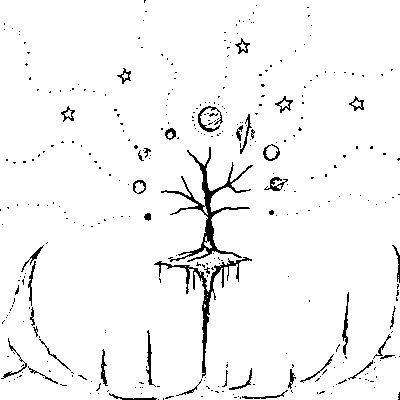

本文原载悦然馨境平台，微信公众号：yueranxinjing。

作者：慕棉，吉林大学工学博士，美国催眠协会（ABH）&美国加州催眠学院（P.A.S.H）认证催眠师，国际医学最高认证中心（WMECC）认证 EFT 情绪释放技术治疗师，国际整体暨自然医学学会（IHNMA）认证完型治疗执行师。博客地址：http://blog.sina.com.cn/qiansu82。

最近火了两篇文章，一篇叫《暖男》，一篇叫《中国男人配不上中国女人》。前者的缘起，貌似是周公子嫁给了阿澈，据说因为阿澈是暖男。后者似乎来自天涯社区，列举了大量上海的街拍，无不证明中国女子貌美如花，形象气质俱佳，而相较之下，男人外表则差了不止一截。两篇文章，在网络硝烟弥漫的时代，似乎都得到了广大人民群众的一致认可，可谓奇观。

我好奇心大起，特意把两篇文章找来对比阅读了一下，看完觉得有意思，前文会火大约有很大的鸡汤效应，而这碗鸡汤偏又恰好迎合了女人的公主病，后文则是戳中了男人的痛点，点到了女人的痒穴，不火倒怪了。

《暖男》这文写的有趣就有趣在种种的似是而非和模糊概念。周迅四十岁，嫁了阿澈这个暖男，可那是周迅，跟旁人有什么关系？林青霞也好，陈红也罢，这些例子，似乎都在避重就轻，只是故事把变成附和自己论点的佐证，问题是，暖男为什么会找她们？为什么又是她们会遇到暖男？这些暖男又暖了多久？还是王子与公主过上了幸福的生活以后，就再没有下文了？我想作者都不想回答，也回答不了。

想想所谓暖男，大概不是今天才突然出现的“外星叫兽”，“悔教夫婿觅封侯”这样的诗句早就存在，女人渴望被呵护被疼爱，是一直以来藏在心底的梦想，而这种被关注的需要，几乎也是每个人都存在的潜藏的软肋，其实本无论男女。

有趣的是，该文把男人做了个分类，一类“与才华相伴的是自我、阴沉、冷漠和不可理喻”，一类“关注你，懂得和理解你的需要”，并愿意为此效劳。貌似按照作者的意思，男人中有两种，一种叫才子，一种叫暖男，这个分类不知道是哪个星球的逻辑，即使对应到作者自己的举例，不知道阿澈、邢李原还是陈凯歌，哪个是没才或者财的？而对应到周公子或者林美人陈美人那些从前的情感经历，有没有暖，旁人又怎么知道的？起码按照公子歌里唱的，大齐也算暖男吧？更让人搞不清的是，才华和暖，是怎么变成势不两立的仇家的？

其实人们不止喜欢将男人分类，女人的待遇也未见好到哪里。貌似就有本书，专门讲所谓的阿尔法女和贝塔女，据说Ａ女的特点是独立、自信、有自我追求、敢冒险，Ｂ女就情感细腻，温和，负责任，容易与人相处，有爱心，注重和在意关系。当然，Ａ女也会被诟病，自大自负，不易接受批评，顽固，个性强，可能比较跋扈，而Ｂ女则可能被诟病容易担忧焦虑，没有界限，太在意他人看法。看到这个分类的时候，我也是同样的充满疑问，自信独立和情感细腻这些，到底是怎么变成阿尔法和贝塔的分类标准的呢？套在这文章里，大约 A 和 B，也可以分别对应为，“才女”和“暖女”？这种分类，有点让我感觉惊悚，人可以被这么简单的标签化吗？

而这些文章火起来，靠得恰恰就是在把人简单的标签化。比如近年来的剩女，凤凰男，孔雀女、白骨精或者绿茶婊之类的称呼遍布网络，无非都是靠标签化来博眼球。标签化可说是一种噱头，也可算作一种变相的标题党。然而，这种把人分类与标签化的观点和行为，本身是简单粗暴的。当人被分类，把自己或别人套入这些分类里的时候，也就相对丧失了某种生命本身的活力和弹性。

然而，事情却往往不是标题化那样的简单。就好像中国女人一边看着韩剧，留着来自星星的泪，追逐着那个飘渺的暖男梦，一边却不得不看着上海街头的随拍而心碎于中国男人普遍素质的现实。追逐暖男谈一场温柔的恋爱有一个被呵护被守护的好归宿，也许本就是千百年来女性情感依赖在今时今日偷换概念的产物。如此说来，女人真的是很专一的动物，专业致力“寻暖男”千年，千年挫折千年不悔，依然不屈不挠的继续着这个伟大的被拯救的梦想。

而说起《中国男人配不上中国女人》，也许中国男人普遍不注重外形，这方面整体素质偏低，可能也可以算是一种相对普遍的社会现象。这就好比是皇帝的新装，大家看惯了也就都习以为常了，而一旦被人认真的点破，却彼此脸上都难免带了点尴尬和难堪。

究其原因，大概一方面是中国的传统和惯性。男尊女卑千年传承，似乎让男人觉得自己生来就有某种尊贵性，并不屑于特别去注重这些外形层面的自我打理，女为悦己者容是天经地义，而男人向来与此无关。甚至粗放，也是某些人潜意识里追逐的男人味的一种表现。同时，有些男人注重外表，会担心被人说“娘”，因而也不敢不愿把这个部分表现出来。而某些女人的惯性思维大约也是一种推波助澜，她们也受不了太注重外形的男人，会觉得不够 man。至于为什么？其实很难讲清楚，就是一种集体意识。打扮，让自己赏心悦目，是女人的事情。而男人，似乎天生就有更重要的事情在等着他们。至于到了如今这个时代，更重要的事情是什么？也许，也没人说得清，或许抽烟喝酒打游戏，都很重要，也许请客吃饭拉关系往上爬，更重要，起码都比收拾自己的仪容重要。

另一方面的原因，大约来自现今中国的社会现实。男女平等这杆大旗高举了近百年，然而，对大多数人来说，男尊女卑却被熏染了上千年，哪个更根深蒂固，就自不待言。就好像，近年来的舆论永远在不遗余力的贬低剩女，而男人无论多大年龄，似乎都有十八岁的姑娘在等着他们，虽然他们自己也不知道那个妙龄女郎在何方，可这种骨子里的自负却还是如影随形。而我们的媒体，从网络到影视，也无不在制造一种氛围：女人，嫁人是天大的事情，而且似乎顺利的把自己嫁出去，嫁得好，更是做女人成功的标志。而没嫁掉的女人，无论其他方面多么优秀和出色，都会被异样的眼光追随，仿佛其他价值都不值一提。人们的集体意识，就是这样在不知不觉的以种种方式呈现，绝对不掺假也装不了假。

就像打压女性，抬高男性，也许参与这场舆论的人，自己并没有意识到什么，但是他们却都在这么做也在继续创造这样一个社会现象。男性会这样做，因为对他们有利，女性也会这么做，因为害怕自己成为被贬低群体的一份子，所幸加入贬低自己同类行列，为虎作伥这个成语说的大概就是这个意思。而老人也会这么做，因为自己的儿子孙子要娶妻，又担心自己的女儿孙女嫁不出去被人看不起。人们就是这样的被裹挟，而让现实倾向于这样一种社会氛围：让既得利益者，更加能够抓住利益，让弱者更加安于弱势。而这一现象正是集体的创造。强者参与其中是为了自我保护，弱者参与其中却也是为了自我保护，因为他们都在催眠与自我催眠中相信了这就是真理，他们都不相信自己有跳出这个框框的可能性，这大约就是集体意识的功效。

在这样的社会氛围里，男人自然有一种天然的优越感，而女人有自我追求就常常被社会舆论所贬抑。记得申请硕博连读的时候，正是网络上“女博士是第三类人”这种论调甚嚣尘上的那段时间，其实当时看了也会有些不舒服。当时我的导师蒋先生讲了一段话，他说，不要理会那些无聊的评价，整个科研领域中活跃的女性一点都不少。重要的是，那些天天在网上评头论足的人，基本都是些没什么本事的闲人，他们根本连接触这个群体的机会都没有，也不可能知道博士到底是什么样的，博士的生活是什么样的。这种评价没有任何意义。被这种无聊的评价影响自己的发展，才是傻子。

这句话当时带给我很大触动。我开始意识到，人们制造舆论，其实可能常常只是下意识的想要去制造对自己有利的社会局面，达到对自己有利的效果与结果，而与事实真相根本无关，甚至他们可能根本不知道事实为何，也毫不关心。所以当真正开始读博士以后，反而对这些无聊的说辞一笑置之了。

想想看，大约无论是关于所谓的剩女或者白骨精的舆论也是一样。当众多屌丝们在 YY 剩女如何如何，似乎这些女生没人要的时候，其实更多的是在为自己制造一个自我安慰的幻觉，好像自己并不屑于这样的女子，好像自己就高人一等了。而现实常常可能是，这样的女人远在他们的生活之外，而这些女人也根本不屑于他们这种言论。可人们依旧对制造舆论如此热衷，也许某种程度上，人们不过是在通过制造舆论、扩散舆论来造成一种社会氛围，以达到影响身边的女人的目的——让那些跃跃欲试，又有些胆怯的女人，不敢去追求这样一条自我实现的道路，乖乖的过他们期待的日子罢了。

所以，传统与现实共同造就了今天中国男人中风靡的屌丝文化。在这种屌丝横行的年代，似乎人们的人生目标理所当然的，不再致力于自我提升与自我完善，而是在传统的男尊女卑和现实打压女性自我追求的舆论泡沫里，沾沾自喜，聊以自慰。我想，如果存在“中国男人配不上中国女人”的部分事实，那么也许这个原因才是某个层面的真相。

当然，在中国男女的这场较量里，看起来弱势的女人，也并非小白兔，扮猪吃老虎，一向是中国女人的强项。制造舆论，不止是男人的武器，女人同样擅长。比如近年来，对小三的喊打喊杀，其实那些网络主力，大约都是人妻。她们之所以如此义愤填膺，以打倒小三为己任，固然有对遭遇小三的原配、孩子以及家庭的同情，这是物伤其类。然而，更多的，当女人在声讨别人家的小三的时候，其实无非是在暗示身边的男人，你最好老实点，小三有毒，不信你看看这个新闻那个新闻，或者这个例子那个例子，都是血泪啊，又或者是暗示，给你看看我对此是什么态度，你要出轨，小心点。由此可见，不止男人是利用舆论的典范，女人也同样堪称个中高手。

如今的暖男风，也无非是一群女人在下意识的制造另一种舆论。你可以没有很多钱没有多大成就，但你要暖，女人就会踏踏实实跟着你，看那些名女人都这么选了，那么，你想我嫁你，还不对我好点？于是，大约男人也开始心里犯嘀咕了，到如今还孤家寡人，是不是自己还不够暖呢？当然，这个舆论跟之前的还是有所不同的。从某种程度上说，对暖男的需求的浮出水面，也是一种女性自我需要的剖白和对男权的反击。这场“暖男”梦和“配不上”风，可以说也是一场心理战，当舆论的天平开始反向倾斜的时候，女人就取得了初步的胜利，几乎看起来扳回一局。

然而说到暖男本身，以及女人对暖男的需求，其实真的没什么稀奇。回顾一下，浪漫言情剧其实大约从未离开暖男的基本套路，只不过有时候暖男会披着不同的皮罢了。从前，女人似乎有种神奇的幻想：有个男人，他驾着五彩祥云，专为了遇见你而来，其他所有雌性动物在他眼里都是浮云啊浮云，他绝对目不斜视，对别人，那叫一个冷若冰霜。然后，这个男人终于在千万年时间的长河里，没有早一步也没有晚一步，偏偏就遇见了你，然后，他就变身成了传说中的——暖男。

而貌似现今，女人这个神奇的幻想，开始有了点现实的变化：一个对别人都冷的掉冰碴的男人，很难到了你这里却一片春日暖洋洋，这，估计怎么看都有点分裂的倾向。于是，暖男，就这样随着一篇千字文横空出世，其实却不过是正式从幕后转移到了台前。女人那颗在言情小说和韩剧里浸泡出来的渴望浪漫的娇弱的心，遇到此文，就恰如闻天籁，如沐春风，如久旱逢甘霖，于是，发自内心的呐喊，啊，暖男，原来你才是真爱。

所以说，女人对暖男的追求一直如此，只是是否被满足的差别。否则，就不会有那么多的闺怨和宫词从古流传到今了。只不过，从前这种需要是犹抱琵琶半遮面，而如今暖男遭遇热捧，“国男配不上国女”的言论也被抛出，二石激起多层浪，其实却是中国女人终于揭开了自我需求的面纱，开始了一种直接的自我表达，大约也可算是对男人的传统与传统男人的某种宣战。

从这个角度来说，这大约也可以算是一个进步。然而，从另一个角度来说，中国男人与中国女人，却似乎也是进入了一个互耍心机、玩舆论压力的暗战时代。在剩女被贬低的舆论里，男人首战告捷。而如今的暖男和配不上的舆论，则是女人胜出。

从剩女到暖男，这场男人与女人的攻心计，愈演愈烈，大有双方此消彼长之势。然而，我却始终觉得，这种舆论游戏，太流于表面，男人把女人标签化，女人又反过来把男人标签化，这不但对男人和女人的相互尊重相互了解没有帮助，反而，把彼此放在了互相防备的对立面。无论看起来是男人得势，还是女人还朝，都依然在一个集体潜意识里打转——男人和女人的不平等。因为有男人看女人的不平等，女人的自我追求才会被贬抑。而贬抑女人，无非是变相的保护男人自身的既得利益和所谓尊贵地位。因为女人有看自己的不平等，对自己的不自信，才需要刻意追求暖男，给自己铺条后路。

而这种不平等带来的结果，不可能是真正水乳交融的感情，也很难有轻松愉快的生活氛围。记得有部片子似乎叫《婚姻保卫战》？如果家庭沦为战场，那么我想无论是硝烟弥漫，还是波涛暗涌，舒服自在的关系和氛围都很难在其中自然生发。

从什么时候开始，男人和女人，就像冬天里的两只刺猬，需要拥抱着取暖，不敢放开对方，可却又无法彼此真正的靠近；又像是史密斯夫妇，即使颠鸾倒凤背后也要藏着一把枪，谁都不知道什么时候对方会出手，所以宁肯自己先下手为强。

这场舆论的较量剖析到这里，谁胜谁负已经不再重要，互相贬低的男女，不会有真正的赢家。也许战争有输赢，可感情没有，不能双赢，就是双输。那么，也许是时候，停止这种标签化的游戏了。 男人，也许需要适应的是新时代里女人与自己平等的事实，敞开的允许女人去绽放自己生命的男人，大约那种自信才是真自信，是由内而外的男人味。而女人，也许需要面对的是自己不得不树立的自我和需要勇于自我承担自我负责的部分，再想靠依赖男人来满足自己的情感与经济需求而活下去，在这个瞬息万变的新世界里，貌似可行性很低，风险又很大。男人和女人，也许需要的不是利用舆论来压制对方的 PK，不是把自己的刺再伸的更长更尖利的自我防卫，而是多一点互相的包容理解给对方，也多一点的努力成长与完善给自己。

男人，与其一边 YY 女神，一边贬低身边有自我追求的女人，不如把时间花在自我实现上面，有点自己的追求，做点自己若干年后回想起来还觉得值得的事儿，也算是不白活一回。对了，也别忘了，收拾一下自己的外形，否则就与“已经与国际潮流接轨的中国女人”脱轨了。女人呢，与其一边把时间花在捧着言情小说或者 Ipad 去 YY 都教授的温暖不知何时降临在自己身边，一边数落着身边的极品相亲男，不如打起精神，或者清爽利索、落落大方，或者精雕细琢、衣香鬓影，做一个项目，写一篇论文，或者读一本书，走过一座城市翻过一座山，又或者烤一块蛋糕看一场电影，养一盆花品一杯茶，怎么活都可以精彩，只要自己肯对自己用心。

如果，你是周迅，一定不会担心自己遇不到阿澈。就算没有阿澈，也会有阿清，或者别的什么人，在时间的长河里，没有晚一步也没有早一步，刚刚好的出现，然后，你听着他的脚步声，缓缓地四十五度抬头，美目盼兮，巧笑倩兮，嘴角微扬着说，哦，原来你也在这里，真巧。可是，你心里一定知道，其实，没有什么恰巧，是你自己一直努力的活得精彩，所以，他来的时候，无论在哪一刻，都是刚刚好。

10 月 24-26 日，斯蒂芬·弗里斯特将来中国开展深度亲密关系工作坊，向你我讲述爱情的秘密。预知详细信息，请点击文末的“阅读原文”。

_______________________________

若道星文化，是由美国著名占星师大卫·瑞雷老师创办的占星学培训与文化传播机构，是国际占星研究协会(ISAR)在中国唯一一家定点合作机构。

**【占星入门——若道占星】微信订阅号：nodoorbj**

* 若道官网：www.nodoor.com 可提供占星咨询、占星课程、星盘查询、应用测试及电子杂志等服务。

* 新浪微博：@若道占星

**也请支持我们的朋友：**

**【无央之界】微信号：Akhaldan**

【若星辰（若道星文化上海同学会）】微信号：nodoorsh

【金陵星空教室】微信号：astronanjing

【Nana 占星社】微信号：NANA-astrology

【悦然。馨境生命分享】微信号：yueranxinjing

【心灵自由】微信号：freedomloveaction

**【聆宇电台】Cora 微信号：lingyudiantai**

# 【星象预报】一周宇宙天气：8 月 18 日-8 月 24 日

> 原文：[`mp.weixin.qq.com/s?__biz=MzA5NjA0NTAxNg==&mid=200979754&idx=3&sn=c7d5281e7d25684c813a19d8f2209577&chksm=1eb8079d29cf8e8bb9ec56c97012c64fb1f66601fac32d6322665c9dd47a1c9d34f59006e46e&scene=126&sessionid=1692739130#rd`](http://mp.weixin.qq.com/s?__biz=MzA5NjA0NTAxNg==&mid=200979754&idx=3&sn=c7d5281e7d25684c813a19d8f2209577&chksm=1eb8079d29cf8e8bb9ec56c97012c64fb1f66601fac32d6322665c9dd47a1c9d34f59006e46e&scene=126&sessionid=1692739130#rd)


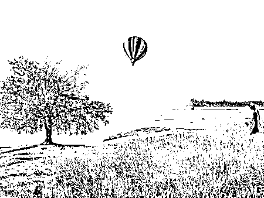

作者：杰夫•焦耳

译者：李含

校对：轩轩

杰夫•焦耳授权若道占星独家发布其宇宙天气预报系列  转载请注明来源并附原文链接  

注：文中提及的时间均为北京时间

**8 月 18 日 星期一**

6：41，月亮进入适应性强的双子座，但是双子座的反复无常也可能造成麻烦。放松地享受当下，而不要在此时做长远的计划安排。

13：21，金星与木星合相，欢呼雀跃吧，快乐浪潮正向你袭来。浪漫、娱乐和重大的承诺让我们高兴得像个孩子，但对我们更加有益的是活在幸福的当下，而不是将这美好的感觉投射到未来。

20：28，水星——双子座的守护星，与土星形成富有创造力的 72 度相位，让我们有能力理性、明智、熟练地解决问题。

20：33，月亮与木星成六分相，21：11，与金星成六分相，送来舒适与甜蜜，陪你度过一个充满安逸、愉快的夜晚。

**8 月 19 日 星期二**

11：40，水星与模糊的海王星成对分相（处女座-双鱼座 6°28'），精神涣散和梦想让视角变得温柔，交流中弥漫着敏感的分子，蕴藏着极大的启发性和想象力，但这并不有助于现实的处理。

16：09，太阳与冥王星成 135 度相位，局面变得紧张，自我意识或许会将人格面具击碎，揭示出更深的怀疑和未被表达的欲求。

**8 月 20 日 星期三**

10：54，太阳与月亮成轻松的六分相，今天的空气中都洋溢着愉快的音符。

16：44，月亮回到它温暖的家巨蟹座，凸显了安全感议题，但是这里月亮的功课是利用敏感性提升我们的利益，找到一股潮汐，带我们流向想要去的海湾。强烈的抵抗并不是这股水象风潮下的成功之道。

**8 月 21 日 星期四**

12：59，月亮与善于分析的处女座水星成六分相，有利于精细的对话和敏锐的感知。

15：07，月亮与冥王星成对分相，心灵的深入探索将会带来丰硕的成果。

22：48，月亮与天蝎座火星成三分相，这个夜晚，情绪在涌动。

**8 月 22 日 星期五**

3：20，水星与冥王星成三分相（处女座-摩羯座 11°14'），实践的智慧会推进今天的发展。深入地探讨，进行调查研究，发掘隐藏的资源都是这个足智多谋的相位带来的额外收获。

**8 月 23 日 星期六**

4：49，月亮开始了它在狮子座的冒险之旅，而在 12：45，太阳正要离开这个星座，进入实用主义的处女座。月亮的旅程为期 2 天，让情绪变得戏剧化，鼓励了强有力的自我表达和冒险；太阳的行程为期一个月，我们的意识将随之变得更为严谨、慎重。

狮子座月亮所鼓励的宏大承诺和大胆行动需要被规范，我们应该根据太阳的行进方向适度调整。土象的处女座会敦促我们去关注细节，建立体系，掌握技巧。

14：32，火星与天王星成任性的 150 度相位（天蝎座-白羊座 16°06'），能量被导向解谜，而不是精炼，更倾向于突破规则，而不是遵守规则。

21：47，狮子座月亮与乐观的木星合相，舞台上的聚光灯更加闪亮了，派对此时刚刚开场。

**8 月 24 日 星期日**

10：01，月亮与快乐的金星合相，13：22，与自发性的天王星成三分相，14：40，与暴躁的火星成四分相，恐怕会引起纷争。

15：37，太阳与天王星成 135 度相位，叛逆的能量高涨，让人感觉烦躁不安，对合作不利。

22：01，水星和怪异的天王星成 150 度梅花相位，感性与理性的平衡也将面临挑战。停不下来的头脑和紧张的神经是这个相位可能造成的麻烦，但奇怪的直觉和洞见闪现可能会带来意外的回报。

______________________________

大卫·瑞雷即将于 9 月 25 日起，开始“职业占星师中英文资质课程——高阶”，想要考取国际占星师资格证的你，想要成为职业占星师的你，这将是你踏入职业占星的第一步。欲知详情，请点击文末的“阅读原文”。

若道星文化，是由美国著名占星师大卫·瑞雷老师创办的占星学培训与文化传播机构，是国际占星研究协会(ISAR)在中国唯一一家定点合作机构。

**【占星入门——若道占星】微信订阅号：nodoorbj**

* 若道官网：www.nodoor.com 可提供占星咨询、占星课程、星盘查询、应用测试及电子杂志等服务。

* 新浪微博：@若道占星

**也请支持我们的朋友：**

**【无央之界】微信号：Akhaldan**

【若星辰（若道星文化上海同学会）】微信号：nodoorsh

【金陵星空教室】微信号：astronanjing

【Nana 占星社】微信号：NANA-astrology

【悦然。馨境生命分享】微信号：yueranxinjing

【心灵自由】微信号：freedomloveaction

**【聆宇电台】Cora 微信号：lingyudiantai**

# 谁是你寻找真爱路上的绊脚石？——金星在水象星座篇

> 原文：[`mp.weixin.qq.com/s?__biz=MzA5NjA0NTAxNg==&mid=200979754&idx=1&sn=fc5fc9ad93bc0a1ec9d8a6cd67d04c65&chksm=1eb8079d29cf8e8b061c78f88446f375d1413ecf6ee32a830f078868884cf753acd9019380a0&scene=126&sessionid=1692739130#rd`](http://mp.weixin.qq.com/s?__biz=MzA5NjA0NTAxNg==&mid=200979754&idx=1&sn=fc5fc9ad93bc0a1ec9d8a6cd67d04c65&chksm=1eb8079d29cf8e8b061c78f88446f375d1413ecf6ee32a830f078868884cf753acd9019380a0&scene=126&sessionid=1692739130#rd)


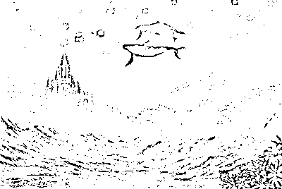

本文作者沙沙，转自九月占星馆（微信号：jiuyuezhanxing）。

这一系列的文章，讲的是每个金星星座在爱情中的“痛点”或“弱点”，也就是“是什么妨碍了你获得幸福”。蓝色粗体文字摘自史蒂芬·阿若优《内在的宇宙》，解析部分为馆主自己的感想。金星在火象、风象星座篇也将于近日推出，敬请期待。

**金星在巨蟹座：**

情绪化、胆怯、吝啬或是情绪的过度自我保护会妨碍快乐与亲密的追求；很容易反映出他人的快乐与情绪。

**解析**：巨蟹座是个变幻莫测的星座，他们（不仅仅是她们）一会儿像个妈，一会儿像个娃，阴晴不定，反复无常。也许这都是月亮惹的祸——巨蟹的守护星是月亮，人类肉眼可见的最富于变化的天体。有人说巨蟹座不分男女都会来大姨妈，嗯，从情绪层面来说，这是真的。

当你嫌金巨蟹太烦、太作、太闹的时候，他们可能会说，“我之所以会变成这样都是你害的。”这句话可能也是真的，因为巨蟹座太容易受到外界影响了。关系越亲密，他们受到的影响就越大。所以有一部分的金星巨蟹为了避免受伤，会把自己保护起来，躲进厚厚的壳里，不敢追求真正想要的爱情，或是盲目地念旧，以为封存在记忆深处的那段爱情才是最完美的。还有一些金星巨蟹则会亮出他们的大钳子，上演“林黛玉变王熙凤”的戏码，让人不禁哀叹，以前的那个温柔淑女到哪里去了，怎么就变成了河东狮吼？

所以，如果你爱的人是金巨蟹，请给他们的情绪以更多的宽容和体谅，你会看到金巨蟹的温柔体贴和贤惠顾家并非虚言。如果你自己是金巨蟹，请试着做这样一个冥想游戏：把自己想象成水里的一块石头，让情绪的水流流过你，而你则岿然不动。

听起来有点难，是不是？其实这个冥想游戏的重点，是请你平静下来，和自己而不是他人在一起，找到独立的、坚定的自我。其实巨蟹并不软弱，只要突破了自己的恐惧感，这个星座是很有力量的。而平静、勇敢和坚定，可能就是金巨蟹通向幸福的钥匙。

**金星在天蝎座：**

情愿保密而不愿相信他人，会妨碍社交与爱的迫切需求；需要带着强烈的情感力量深深地刺入关系的深处才能感受到另一个人的亲密。

**解析**：后面半句话，其实阿若优并没有说这是金天蝎的“弱点”或“局限”。那么到底是不是呢？金天蝎们可以自行体会。

就像另一个火星守护的星座——白羊座一样，金星落在天蝎，也会染上火星“用力过猛”的毛病。只不过这一次维纳斯没有变成角斗士，而是变成了蒙面杀手。金天蝎对于亲密关系的“深刻”和“极致”的追求，是近乎强迫性的。他们不懂节制，也不懂什么叫点到为止的爱、轻盈洒脱的爱。明知前方是险途，也要一条道走到黑。而当对方以肤浅（有时仅仅是金天蝎自己认为“肤浅”）的方式对待他们时，他们会心生怀疑，感到被背叛、被欺骗的失落与愤怒，甚至启动传说中的复仇模式。

“我以为我会报复，但是我没有。”事实上，金天蝎并不像外界传言中那么可怕，虽然他们会记仇，但“报复行动”的开关不是每个人都能启动的。更多人只是沉浸在自己的痛苦中，叹息着“多么痛的领悟”。其实我觉得，那首歌里最刺痛金天蝎的可能是另一句：“只是我回首来时路的每一步，都走得好孤独。”这场付出灵魂的爱情，原来只是自己一个人的独角戏。

而阿若优前半句的“情愿保密而不愿相信他人”，也是从这里来的，金天蝎的多疑，正源于他们本能的自我保护——如果我爱你，我会付出我的全部，而你却让我受伤，那我不如把自己封闭或隐藏起来。所有的水象星座都是敏感的，需要私密性和自我保护，虽然金天蝎看起来很凶猛，做事的方式也很极端，但仍旧无法掩饰他们敏感脆弱的本质。

所以，如果你是金天蝎，请找一个与你同一重量级的对手，比如同样金星天蝎的人，或至少是拥有冥王星特质的人（比如日冥、月冥、金冥相位等）。爱也好，虐也罢，至少势均力敌；幸福也好，痛苦也罢，至少曾经真真切切地经历过。

（注：如果金星与冥王星合相，即使不在天蝎座，也可参考本条）

**金星在双鱼座：**

爱与社交的迫切需求被抹上了浪漫的理想主义色彩，可能会将爱人理想化，然后爱上自己的幻象；逃避、借口、混乱会渐渐破坏爱与被爱的能力，缺乏分辨力会阻碍牢固关系的建立。

**解析**：在所有的水象星座里，双鱼是自我防御机制最弱的星座，也是最富于幻想的星座。阿若优谈到了金双鱼的两个弱点：一是分辨力差，总是戴着浪漫的有色眼镜看人，很容易被浪漫的人或浪漫的氛围打动，以为那个人是自己的 Mr. 或 Mrs. Right，奋不顾身地投入一场琼瑶式的爱情，然后发现，咦？！这明明是 Mr. 或 Mrs. Wrong 嘛！我当时是怎么会爱上这种人渣的呢？而当他们从这一段感情中幻灭，投入下一段感情时，却发现相似的故事又开始重复了……

其实，那个被金双鱼爱了又恨了的人，很可能既不是完人，也不是人渣，只是普通人而已，是金双鱼自己根本没有看清对方，就把心中的理想恋人的形象投射在对方身上罢了。而更可怕的情况是，金双鱼已经对爱情感到失望了，却因为自己的软弱和自欺欺人，无法拒绝对方、无法斩断情丝，一边在一段悲惨的关系中扮演牺牲者的角色，一边自怨自艾，“我为什么总是这么悲惨呢？”所以金双鱼们啊，要学会冷静地看待自己，也看清对方的真实模样，确保你看到的是三维世界的真人，而不是二维世界的幻象；要记得你追求爱情是为了让自己更幸福，而不是为了成为谁的拯救者或牺牲者。为爱付出确实是一件动人的事情，但前提是，这份爱情得让你变得更快乐，变成更好的自己，才算真的值得。

金双鱼的第二个弱点，就是逃避。这也是由第一点衍生而来的：因为金双鱼的世界里有太多的幻象，这幻象对他们的吸引力远远大于现实世界，所以有些金双鱼干脆就逃避到自己的幻想世界里去了。混乱、欺骗乃至滥情，都是逃避的衍生品。

双鱼是金星擢升的位置，也是海王星守护的星座。海王星被称作“高八度的金星”，不是没有理由的——它的迷幻气息、它的无边界感，能书写世间最浪漫的爱情，这也是宇宙赐予金双鱼的礼物。爱情是浪漫的，在这一点上，金双鱼并没有错。只是在现实中，还得对自己更诚实才行。

（注：如果金星与海王星合相，即使不在双鱼座，也可参考本条）

10 月 24-26 日，斯蒂芬·弗里斯特将来中国开展深度亲密关系工作坊，向你我讲述爱情的秘密。预知详细信息，请点击文末的“阅读原文”。

_______________________________

若道星文化，是由美国著名占星师大卫·瑞雷老师创办的占星学培训与文化传播机构，是国际占星研究协会(ISAR)在中国唯一一家定点合作机构。

**【占星入门——若道占星】微信订阅号：nodoorbj**

* 若道官网：www.nodoor.com 可提供占星咨询、占星课程、星盘查询、应用测试及电子杂志等服务。

* 新浪微博：@若道占星

**也请支持我们的朋友：**

**【无央之界】微信号：Akhaldan**

【若星辰（若道星文化上海同学会）】微信号：nodoorsh

【金陵星空教室】微信号：astronanjing

【Nana 占星社】微信号：NANA-astrology

【悦然。馨境生命分享】微信号：yueranxinjing

【心灵自由】微信号：freedomloveaction

**【聆宇电台】Cora 微信号：lingyudiantai**

# 【诺·泰尔】如何对待责任：浅谈出生图中的土星逆行

> 原文：[`mp.weixin.qq.com/s?__biz=MzA5NjA0NTAxNg==&mid=200979754&idx=2&sn=a31e74e6029945c3135b67b4475fba6c&chksm=1eb8079d29cf8e8b953dd212f53d9ec50023f9c88e87ce0b8d7d856050527cff814ebecd863b&scene=126&sessionid=1692739130#rd`](http://mp.weixin.qq.com/s?__biz=MzA5NjA0NTAxNg==&mid=200979754&idx=2&sn=a31e74e6029945c3135b67b4475fba6c&chksm=1eb8079d29cf8e8b953dd212f53d9ec50023f9c88e87ce0b8d7d856050527cff814ebecd863b&scene=126&sessionid=1692739130#rd)


诺泰尔——太阳弧第一人，世界前三的占星大师，即将于 8 月下旬来华教授太阳弧技法，详询:李洋 010-56629907（工作日早 11—晚 6 点） 18601950700。


作者：诺·泰尔

译者：江艺

我的女儿出生在纽约曼哈顿，当我第一次看见她星图上逆行的土星对分狮子座太阳时，由于我明白这意味着什么，我就意识到我和她母亲可能要培养一名极其“有责任感、可靠、沉着、稳重”的女性。我们并没有灰心；并不认为我们的女儿是不幸的；我们没有放弃她。我们决定要对她在这个严苛的世界上谨慎而机智地生活引以为荣。

后来，在她 4 岁半的时候，我们全家搬到德国，然后很快发现我们的想法和决心在这里得到了多么强大的支持，德国人十分重视“责任”一词：他们管它叫 Selbstverantwortung，即对自己负责。这个词在小孩的中间名字里也很常见！即使到了 44 年后的今天，我们依然非常欣赏这个词，以及它的概念。

不用教，女儿就已经记住了我们的电话号码和地址……更不用说学习德语了！当她大一点儿的时候，我们晚上出去时不能带着她，因为那样的话，宴会时只能让她睡在朋友家。这时她坚持要自己一个人待在家里，并且不需要看护员！

现在，她已长大成人，对工作拥有强烈的责任心，具有卓越的领导力，忠于自己的事业，同时机智成熟、聪明早慧。这是我们做父母的比较幸运，还是我们做对了什么呢？

早在 1970 年代，心理学家 F.斯科特·派克写了一本非常成功的著作，名叫《少有人走的路》（*The Road Less Traveled*），直到现在，这本书依然历久弥新，不断激发我们的思考。

派克认为，神经官能症和人格失调是责任所引起的问题，这是相互对立的两种处理外部世界问题的方式。神经官能症患者主观臆想出过多的责任；在环境的压力下，他们自发地认为一切都是自己的错。而患有人格失调的人却没能承担足够的责任，他们把一切都归咎于外部世界。

当然，我们大多数人都兼具神经官能症和人格失调的成分，这反映在我们的态度中，只是程度不同而已。派克认为，认清我们是谁，分辨出不属于我们的责任，这是人类生存中最重要的问题之一。“它从没得到完整的解决；为了完满的生活，我们必须不断地评估和反思，在这个不断变化的世界上我们的责任究竟是什么。”

事实上，这就是成长和成熟的全过程。作为一个出生图里土星逆行的孩子的父亲，我非常乐意同女儿一起来好好地解决这一人生难题。

但是，且让我们更深入地思考一下：所有的孩子基本上都是从神经官能出发，在不明所以的情况下，扛起他所遇到的一切事情的责任，免得做错事情“导致”母亲伤心哭泣……直到他们受到教育，逐渐明白在个人责任和实际可行性之间有一个平衡点。

得不到爱的小孩通常想象是他们自己不可爱，而不会看到问题在于父母缺乏爱的能力。

患有人格失调的父母免除了小孩的“Selbstverantwortung”，孩子模仿他们的父母抱怨外部世界，贬低他人。这种反面的榜样效应深化为关系问题。他们没办法解决生存问题；他们对生活没有责任感。——就像派克所说，“是父母自己将罪孽强加给孩子的。”

太多的事例向我们证明了性格是如何在家庭中传递的，行为方式是如何延续下去的。

我们可以看到，人类是如何地相似，而不是彼此互补。我们也可以因为某些被称之为罪恶的东西，责备整个人类。

我们在咨询中常常听到这样的故事：早年家庭中极其反面的榜样；不断重复的行为模式；总是感到强烈的罪恶感，或是用焊枪袭击他人（从最亲密的兄弟姐妹到超市营业员，到教师家长会，到政府）。我们能为客户找出哪些现实的解决之道：放松心情，放下神经官能的罪恶感；享受此刻的宁静和对谨慎周全的个人责任的全新认识？关键在于寻找平衡。回忆你最后一次意识到自己在人际交往中非常失败的时候，然后把最真诚地向某人致歉的行为加入其中？牢记你此刻卸下的重负？感觉很好，是吧？这就是新的开始。

我想我们可能在这里看到了最佳的土星原型。如果我们自己的土星没有阻挡我们前行，那么我们应该能够帮助客户找到他们的道路……如果需要的话。我和我的女儿从一开始就是这么做的。

8 月 29-31 日，现代占星鼻祖诺·泰尔将在北京举办“太阳弧预测技法实战工作坊”，教你如何一眼识别生命中的重大趋势，详情请点击文末的“阅读原文”。

_______________________________

若道星文化，是由美国著名占星师大卫·瑞雷老师创办的占星学培训与文化传播机构，是国际占星研究协会(ISAR)在中国唯一一家定点合作机构。

**【占星入门——若道占星】微信订阅号：nodoorbj**

* 若道官网：www.nodoor.com 可提供占星咨询、占星课程、星盘查询、应用测试及电子杂志等服务。

* 新浪微博：@若道占星

**也请支持我们的朋友：**

**【无央之界】微信号：Akhaldan**

【若星辰（若道星文化上海同学会）】微信号：nodoorsh

【金陵星空教室】微信号：astronanjing

【Nana 占星社】微信号：NANA-astrology

【悦然。馨境生命分享】微信号：yueranxinjing

【心灵自由】微信号：freedomloveaction

**【聆宇电台】Cora 微信号：lingyudiantai**

# 月亮：是你，是你的记忆，你的需求（诺·泰尔）

> 原文：[`mp.weixin.qq.com/s?__biz=MzA5NjA0NTAxNg==&mid=200974202&idx=2&sn=b99675963125c48ea88aa079bb71c677&chksm=1eb82dcd29cfa4db9bb45c5aee870cf514b63013df0a9ec97813835f9a0ed007099ee9509450&scene=126&sessionid=1692739130#rd`](http://mp.weixin.qq.com/s?__biz=MzA5NjA0NTAxNg==&mid=200974202&idx=2&sn=b99675963125c48ea88aa079bb71c677&chksm=1eb82dcd29cfa4db9bb45c5aee870cf514b63013df0a9ec97813835f9a0ed007099ee9509450&scene=126&sessionid=1692739130#rd)


诺泰尔——太阳弧第一人，世界前三的占星大师，即将于 8 月下旬来华教授太阳弧技法，详询:李洋 010-56629907（工作日早 11—晚 6 点） 18601950700。

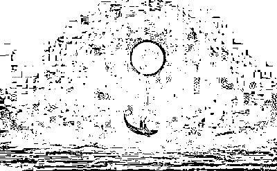

作者：诺·泰尔

译者：李含

月亮象征着所有的记忆。就像月亮采集日光一样，它也象征性地收集我们的人生经验，对应地指向我们人生发展的主导需要。这并不只是想起一个电话号码，或是记起几年前看过的一部电影，而是经验留下的印迹在诉说着我们是谁，我们为何这样。我们发展出与学习经历相关的记忆所支持的行为模式，这些都强烈地聚焦于月亮星座的形态与元素中。

我们可以将月亮看作一个自我能量的宝藏。相位会有一定修订作用，可能增强能量，也可能成为阻碍。（参见《占星综合分析与咨询》第 652—654 页《压抑》一节）

如果月亮落在火象星座，我们必须意识到，强烈的自我意识正是主导需要的表现。如果这股驱动力没有得到充分发展——比如白羊座成为头号人物的需求和行为没有明确表达出来——我们就可以从星盘上看出我们的发展存在“管道”问题。这会带来什么问题呢？会阻碍清晰的自我表达和认知。根源在哪里呢？是否早期就没有获得发展所需要的支持？为什么没有？

火象星座家族中的狮子座会有些不同：自我对获胜的需求转向了因为出色而获得赞赏的需求。这里会有所期待，一旦期待落空，麻烦就会随之而来。旧模式从家里开始，延伸至朋辈关系。

如果是射手座，会转化成说服别人的需求；如果你愿意的话，可能是某种推销。这里的需求是“倾听我所说的，并尊重我的言论！”我们需要问的是，自我说服的知识和技巧由什么支撑？教育有多少实质性的作用？在这种自信的表达中自我价有多重要？运动在自我确定、出人头地方面又有多重要？

如果分析的对象变成了内向的白羊座、自我攻击的狮子座和无力思考的射手座，就意味着红灯警报，有问题出现。贯穿其中的潜能压抑和成长的压力会在我们的分析中扮演非常重要的角色。

风象星座以他人为自我成长的导向。我们需要通过他人的回应完成自我定位。他人和他人的成长问题参与进来，影响有好有坏。

天秤座月亮的能量就象征着依赖社会回应完成自我定位。我们需要弄清自己是否如自己认为的那样待人友善？哪里挂着天秤座月亮的第一面镜子呢？镜中的烛光也能照亮前路，只是光源易逝。自我启迪是一种持续的需求。

如果是水瓶座，自我认定的主导需要一定是帮助别人。原因何在？我们是谁，我们如何感知自我都建立在他人对我们所作所为的评价之上。“感谢你的帮助！”这份答谢就是关系的纽带，给予与接受。如果我们没有参与进来，就偏离了轨道。

双子座和射手座一样是变动星座，重要的需求是交流和娱乐。娱乐的意思是“取悦”。为什么我们需要这样做？让人觉得我们有趣、有吸引力？双子座需要在话题当中展现自己的天赋。我们会收到射手座的回应，也许是他们用的是智慧与宏观理念；月亮双子座表示将事情提出来，推动它发展，并与人分享这份赞誉。我们需要关注社交，需要与人互动，需要漂亮美观，彬彬有礼，利他行为，沟通技巧。这里出了问题，比挫败感更麻烦。其中有哪些是在效仿父母？缺乏自我价值的发展或是觉得自己不够可爱会如何影响社交活动？会不会出现极端的过度补偿？会不会退缩？

水象星座的主导需要聚焦于情感，不仅仅是生动激情地自我表达，还有内在的舒适感。行为要满足内心世界。

巨蟹座的主导需要在于家的安全感，父母的拥抱非常重要。如果这里有裂痕或是出了问题，月亮巨蟹座的内心会倍感煎熬，选择退缩，到处弥漫着受伤的味道。注意体重问题。这些会在成年后的生活中再现么？这些情感创伤会如何腐蚀关系？

如果是天蝎座，主导需要是控制。为什么这时常表现得十分极端？控制是否成了一种武器？会不会涉及家庭的权力斗争，或是投射到他人身上？成长的压力以及从尴尬到受伤的各种情绪波动也许会伤害我们，因此自我保护成了主导需要。

双鱼座月亮的需求推动着人格的发展，少一些控制，多一些调整；温和地推进对幻想的认知，让幻想成真。如果在早年，这种敏感没有获得支持和释放，就会有一种被侵犯的伤害；月亮双鱼座很容易自我贬低并接受受害者的角色。将事情理想化会带来失望。缺乏足够的理解会成为一种生活方式。

对这些月亮在水象星座的人而言，艺术扮演了什么样的角色呢？艺术赞同这些感受，解释这些感受，分享这些感受。

对于土象星座而言，主导需要的焦点在于完成工作。摩羯座需要有效地管理；月亮照耀着正在进展中的工作！童年的生活中是否存在权威模式？如何认识并引导早期的工作驱动力？

金牛座的需求是维持现状，防止已建立的事物发生改变。这种配置有多顽固？在感情关系中，如何调解妥协互动？

处女座身为变动星座有一股新的动力。射手座需要意义深远的思考；双子座需要被认为具有迷人的魅力和见多识广的头脑；双鱼座需要像有益健康的香氛一样受人赞赏。对于处女座，需求就是正确、合适，恰当！这种行事风格从何而来？童年生活中，谁强化了这一特征？这是可以承受的么？是否只是一种保护机制？成年以后是否会再度优雅地表现出来？收获是什么，麻烦又是什么？

最重要的是，这些行为是否满足了主导需求以及其他需求。是否处理妥当？

如果没有，原因是什么？我们如何改善生活呢？

我认为这些观念可以让我们通过月亮所象征的主导需要和动力来更有效地处理星座原型问题。

2010 年 3 月 31 日

8 月 29-31 日，现代占星鼻祖诺·泰尔将在北京举办“太阳弧预测技法实战工作坊”，教你如何一眼识别生命中的重大趋势，详情请点击文末的“阅读原文”。

_______________________________

若道星文化，是由美国著名占星师大卫·瑞雷老师创办的占星学培训与文化传播机构，是国际占星研究协会(ISAR)在中国唯一一家定点合作机构。

**【占星入门——若道占星】微信订阅号：nodoorbj**

* 若道官网：www.nodoor.com 可提供占星咨询、占星课程、星盘查询、应用测试及电子杂志等服务。

* 新浪微博：@若道占星

**也请支持我们的朋友：**

**【无央之界】微信号：Akhaldan**

【若星辰（若道星文化上海同学会）】微信号：nodoorsh

【金陵星空教室】微信号：astronanjing

【Nana 占星社】微信号：NANA-astrology

【悦然。馨境生命分享】微信号：yueranxinjing

【心灵自由】微信号：freedomloveaction

**【聆宇电台】Cora 微信号：lingyudiantai**

# 我的职业占星师炼成记（大卫·瑞雷）

> 原文：[`mp.weixin.qq.com/s?__biz=MzA5NjA0NTAxNg==&mid=200974202&idx=3&sn=19560292f91da9ff06410fcce82c246a&chksm=1eb82dcd29cfa4dbc458b7db44a94567f0c4fcd7dcac717a102dd9dc04ae5fd62449ce08435d&scene=126&sessionid=1692739130#rd`](http://mp.weixin.qq.com/s?__biz=MzA5NjA0NTAxNg==&mid=200974202&idx=3&sn=19560292f91da9ff06410fcce82c246a&chksm=1eb82dcd29cfa4dbc458b7db44a94567f0c4fcd7dcac717a102dd9dc04ae5fd62449ce08435d&scene=126&sessionid=1692739130#rd)


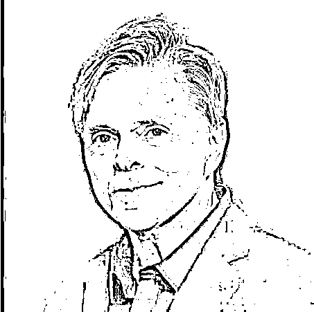

作者：大卫·瑞雷

译者：神婆阿丘

校对：李含

**提问**：“成为一名全职职业占星师需要多长时间？”

**大卫**：我很喜欢你的用词——“全职”职业占星师，这意味着一种严肃的承诺。在西方，“兼职”占星师当然要比全职的职业占星师多，在美国肯定是这样。兼职占星师为西方占星界作出了很大的贡献，而且他们常常自愿加入当地或国家的占星机构。大多数全职职业占星师刚开始也是做兼职，他们先依靠其他工作养活自己，直到专业技术足够牢固，可以赚取足以自给的收入。

我自己用了八年时间成为一名全职职业占星师，比所需的时间要长，即使是在那个年代。如今的占星学子拥有的优势和选择已不可同日而语。在中国的若道星文化，如果你参加全部（三个级别的）课程——初阶、中阶和职业资质课程——只需两年时间。在这两年中，学生学习的材料比我在四年或五年里学习的还要多。我们若道的毕业生常常会其他网络课程和工作坊来继续学习，还有很多学生在毕业后转入了职业生涯。当然，前两年实际上是一种专业见习期，新的占星师需要时间来磨练技巧，积累经验。

我曾是新闻专业的学生，19 岁读大学时，接触了人生中第一本占星书——约瑟夫·古德维奇的《占星学：太空时代的科学》（*Astrology, A Space Age Science*）。紧接着，我又阅读了一些更加严肃的占星书籍，例如查尔斯·E·O·卡特（C.E.O. Carter）、马克斯·海德尔堡（Max Heindel）、艾伦·里奥（Alan Leo）、丹恩·鲁伊尔（Dane Rudhyar）、马克·E·琼斯（Marc E. Jones）等占星师的著作。

像许多学生一样，很快我就发现自己对占星学的好奇心变成了痴迷，第一年我大都是自学的。我把每一分闲钱都用来买二手占星书，参加由比尔·蒂尔尼（Bil Tierney）、路易斯·布罗姆利（Louise Bromley）、雷内·古德尔（Rene Goodale）、玛克辛·泰勒（Maxine Taylor）和罗斯玛丽·琼斯（Rosemary Jones）开设的工作坊和课程。

在当时，没有像现在中国若道星文化（www.nodoor.com）开设的职业资质课程。如果有，我会马上报名。同样，当时在大学里也没有相应的课程，至少我不知道。后来我发现，马萨诸塞州立大学推出了一个项目叫“设计你自己的专业”，1974 年，杰夫·焦耳在那里获得了占星学历史学士学位。然而，大多数像我一样认真的学生，都是去报名参加为期 6-8 周的课程，去参加工作坊。

当职业占星师罗斯玛丽·琼斯（Rosemary Jones）同意做我的导师时，我非常兴奋。那时候，她做全职职业占星师已经 25 年了，她的母亲也是一名执业占星师。罗斯玛丽是当地一个占星组织的成员，这个组织在当时叫做“亚特兰大高级占星协会”，后来改名为“亚特兰大城市占星社”。这个当地组织是由一些有天赋的职业占星师领导并支撑起来的，这些占星师倡导改变公众对占星学的态度，废除亚特兰大地区陈旧的反占星条例。

所以，我的占星学习包括：

购买和阅读严肃的占星学书籍；

上课；

参加工作坊；

职业占星师指导（我有两位职业导师）；

参加当地占星师的聚会；

与其他的占星学生和职业占星师建立关系。

我遵循着这种学习模式，断断续续学习了五年，然后，我参加了亚特兰大市的职业占星师考试。第一次我失败了，前面犯了一个数学错误，后面的计算和解释都付之东流了。我必须再等一年，才能参加第二次考试，这一年是极其痛苦的一年！第二次我以高分通过了，获得了执业证书。然而，在我可以仅依靠占星收入养活自己之前，我还用了两年时间来练习。在这两年的职业实践中，我继续在亚特兰大日报做兼职。

再次回想起那些年的时光，也许最让我为之振奋的两段经历分别是导师对我的指导，以及我与其他学生、占星师一起相处的日子。我会永远珍视在亚特兰大师从占星师罗斯玛丽·琼斯时学到的东西，以及我在弗吉尼亚海滩与另一名全职职业占星师、一名了不起的老师维姬·格林（Vicki Green）一起相处的一年时光。

与这些导师对我的指导同等重要的是我与其他占星学子和占星师在一起的日子。这些友谊给予我的支持和成长是无与伦比的。那时候我们没有网络，也不像现在若道的学生有聊天室、网上学习小组和助教的帮助。然而，那是一段珍贵的回忆，许多个夜晚，我和我的占星伙伴们常常学到深夜，我们一起研究学习，相互提问。这些交流在发展自信、促进讨论和自我反省方面起到了极为重要的作用，与我们今天的网上聊天有着异曲同工之妙。

大卫·瑞雷即将于 9 月 25 日起，开始“职业占星师中英文资质课程——高阶”，想要考取国际占星师资格证的你，想要成为职业占星师的你，这将是你踏入职业占星的第一步。欲知详情，请点击文末的“阅读原文”。

______________________________

若道星文化，是由美国著名占星师大卫·瑞雷老师创办的占星学培训与文化传播机构，是国际占星研究协会(ISAR)在中国唯一一家定点合作机构。

**【占星入门——若道占星】微信订阅号：nodoorbj**

* 若道官网：www.nodoor.com 可提供占星咨询、占星课程、星盘查询、应用测试及电子杂志等服务。

* 新浪微博：@若道占星

**也请支持我们的朋友：**

**【无央之界】微信号：Akhaldan**

【若星辰（若道星文化上海同学会）】微信号：nodoorsh

【金陵星空教室】微信号：astronanjing

【Nana 占星社】微信号：NANA-astrology

【悦然。馨境生命分享】微信号：yueranxinjing

【心灵自由】微信号：freedomloveaction

**【聆宇电台】Cora 微信号：lingyudiantai**

# 谁是你寻找真爱路上的绊脚石？——金星在土象星座篇

> 原文：[`mp.weixin.qq.com/s?__biz=MzA5NjA0NTAxNg==&mid=200974202&idx=1&sn=3423dae2cad27b086da367ec1755eec5&chksm=1eb82dcd29cfa4db7ebcd8b40d2befd233559bd043e3013efb075bc424dc9742a9b1595ba02d&scene=126&sessionid=1692739130#rd`](http://mp.weixin.qq.com/s?__biz=MzA5NjA0NTAxNg==&mid=200974202&idx=1&sn=3423dae2cad27b086da367ec1755eec5&chksm=1eb82dcd29cfa4db7ebcd8b40d2befd233559bd043e3013efb075bc424dc9742a9b1595ba02d&scene=126&sessionid=1692739130#rd)


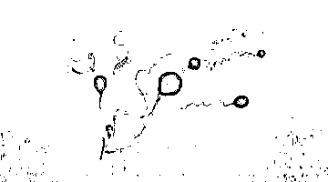

本文作者沙沙，转自九月占星馆（微信号：jiuyuezhanxing）。

这一系列的文章，讲的是每个金星星座在爱情中的“痛点”或“弱点”，也就是“是什么妨碍了你获得幸福”。蓝色粗体文字摘自史蒂芬·阿若优《内在的宇宙》，解析部分为馆主自己的感想。金星在火象、风象星座篇也将于近日推出，敬请期待。

**金星在金牛座：**

在感情上吝啬，有占有欲，或是不愿释放情绪，害怕失控都会阻碍一个人表达爱的需求。

解析：虽然金牛座本来就是金星守护的星座，金星落到这里，是所谓“入庙”的尊贵位置，但入庙并不意味着幸福，就像弱陷并不一定意味着不幸。

说到吝啬这个词，金牛们都不陌生吧？其实金牛并不一定在金钱上吝啬，他们只是不喜欢打破现状而已。金牛追求稳定、自在、安宁（当然钱也是保证这一切的一个重要因素），而对于改变有一种深刻的抗拒。作为土象的固定星座，金牛是 12 星座里最不喜欢冒险、最不喜欢变化的星座。所以，金星金牛座喜欢“稳定”的爱情，最好一切都稳稳当当、风平浪静，不要花什么力气，更不要刻意去追求什么变化。对有些金星金牛来说，只要两个人能有舒适的生活，彼此熟悉，给予对方安全感和稳定感，像左手陪伴右手那样，就非常完美了。他们会问：这样难道还不够好吗？（言外之意：no zuo no die，你到底还想干什么？）

虽然金星金牛非常擅长提供安全感，可是他们的恋人也许还想要更多的东西。对于风象、火象人来说，爱情应该是活泼的、具有成长性和探索性的，而不是一幅静止不动的画；对于水象人来说，爱情应该是深刻的、浪漫的，是灵魂的对话，而不仅仅是两个人相互作伴、共同面对柴米油盐的现实生活而已。

其实，金星金牛们知道，人的情感就像大海，在风平浪静的外表下，隐藏着澎湃的激流甚至危险的漩涡，只是他们因为害怕而拒绝去面对它罢了。金星金牛们也知道，两个人的生活意味着要打破一个人宁静祥和的小世界，比起单身状态来，两个人共同生活蕴藏着许多不确定的因素，搞不好就会天翻地覆。正是这种恐惧，造成了金星金牛不敢爱、不敢深爱的困境；也正是这种恐惧，让一些金星金牛拥有强烈的占有欲和控制欲（他们的逻辑是：如果你听我的，我就可以保有自己的稳定和安宁）。必须直面恐惧，大胆地接受爱情带来的一切危险和挑战，才能更接近幸福；也只有诚实地看到并回应伴侣的深层需求，才算是真的爱对方。

**金星在处女座：**

过度助人、吹毛求疵和习惯性地有所保留会妨碍情感的付出与接纳，妨碍激情的表达。

解析：如果说双子座展现出的是水星获取信息、传播信息的能力，那么处女座就展现了水星的另一个面向——逻辑思维和分析能力。处女座是卓越的分析者，可是如果爱情中充斥着冷静、苛刻、理智，哪里还有激情的位置呢？借用阿若优分析月亮处女的一句话：“对剖析情感的需求可能会抑制响应能力”，这一点在金处女身上也是适用的。

金星处女座有 2.0 的绝佳视力，一眼就能看出一件事、一个人的缺陷。他们心中有一把精密的标尺，总是用这把尺对别人量来量去，然后失望地说：“他/她不是我的 Mr./Mrs.Right”。常常有人对金星处女说：“你别要求那么高啦！”金星处女会很委屈：“我要求不高啊！”他们很可能是真心觉得自己要求不高，因为他们还算是现实主义者，还不至于按照韩剧的标准去恋爱。可是，就是他们自己觉得“降低了再降低”的要求，也令很多人难以企及。也许这个世界上，就有一群人是要负责为人类把握住底线的，他们的名字叫处女座。

其实，不妨想一想，为什么金星在双鱼座擢升而在处女座入弱？双鱼可是水星落陷、爱犯迷糊的星座啊！在爱情中与其冷静清醒，不如糊涂一点会比较幸福。

而且，处女座还有一种特质，那就是谦卑、自省。这可能就是阿若优所说的“习惯性的有所保留”，在爱情面前少了一点自信和勇气。关于处女座，一条很重要的真相就是，在他们苛求别人的同时，一定会更严格地苛求自己。哪怕真的遇见了很爱的人，金星处女也会忍不住自问：我值得他/她爱吗？所以他们犹豫了、纠结了，退缩了。金星处女就像灰姑娘，需要一个热情的王子来响应她，告诉她“你很美，你值得被爱”。但是，如果一直这样不敢迈步的话，就把自己放在了一个相当被动的位置，失去了主动权。

所以，金星处女有两项功课，一是勇敢，二是包容。勇敢地追求自己所爱的，勇敢地相信自己值得被爱；包容对方的不完美，包容爱情的不完美，也包容自己的不完美。

**金星在摩羯座：**

可能因为恐惧、疑虑的情绪，或是疏远、客观的方式抑制了愉悦和爱的需求。自我控制和拘谨的情感会妨碍亲密关系的发展。

解析：由土星守护的摩羯座，向来是自律、自制的典范。但就心理层面来说，土星所代表的能量，不仅仅在于建立规范、带来限制和自律，更深层的一点是，土星会带来“恐惧”。英国占星师苏·汤普金说过：土星是一堵墙，受土星影响深重的人，一辈子都在试图把那堵墙拆掉。金星落在土星的地盘，同样会面临这个问题。如果不把那堵墙拆掉，金星摩羯座的人可能会因为不敢表达、不敢冒险，而在爱情中时时处于被动的，甚至原地不动的位置。

和金星处女类似的一点是，金星摩羯对自己的评价也是偏低的，当你对一个金星摩羯的女孩说“你今天真漂亮”，她可能不知道该如何回应，因为她的内心很难给予自己这样热烈的赞美。他们会不由自主地压抑自己的情感表达——这让他们看上去比较稳定、平和，外人可能很难从外表看出他们感情世界的变化，但其实他们心中早已沧海桑田。他们可能会暗恋一个人很久，对方却一无所知；他们可能会在分手后伤心很久，但对方同样一无所知（因为在外人眼里，金摩羯就一直不断地在加班加班加班吧，特别是当太阳也在摩羯座的时候……）

也有一些金星摩羯在面对感情时过分看重现实的因素，因为太重视物质层面的安全感与稳定感，而背离了金星本身所代表的浪漫和温柔。那样的金星摩羯，也许会因为爱情以外的因素而进入婚姻。至于那样是否幸福，就看对幸福这个词是如何定义了。

而如果你是金星摩羯，又十分渴望爱情的话，首先要做的就是敞开自己的心，让自己能够自由地呼吸、自在地表达。你可以保留摩羯座的责任感和稳定感，却没有必要收下它带来的恐惧与限制。拆墙的人，加油吧。

10 月 24-26 日，斯蒂芬·弗里斯特将来中国开展深度亲密关系工作坊，向你我讲述爱情的秘密。预知详细信息，请点击文末的“阅读原文”。

_______________________________

若道星文化，是由美国著名占星师大卫·瑞雷老师创办的占星学培训与文化传播机构，是国际占星研究协会(ISAR)在中国唯一一家定点合作机构。

**【占星入门——若道占星】微信订阅号：nodoorbj**

* 若道官网：www.nodoor.com 可提供占星咨询、占星课程、星盘查询、应用测试及电子杂志等服务。

* 新浪微博：@若道占星

**也请支持我们的朋友：**

**【无央之界】微信号：Akhaldan**

【若星辰（若道星文化上海同学会）】微信号：nodoorsh

【金陵星空教室】微信号：astronanjing

【Nana 占星社】微信号：NANA-astrology

【悦然。馨境生命分享】微信号：yueranxinjing

【心灵自由】微信号：freedomloveaction

**【聆宇电台】Cora 微信号：lingyudiantai**

# 罗宾·威廉姆斯：不顾一切的梦想家

> 原文：[`mp.weixin.qq.com/s?__biz=MzA5NjA0NTAxNg==&mid=200966568&idx=1&sn=14318e2a94e203f6359ce24c94378567&chksm=1eb8331f29cfba09f96450c85fde2f9427caedca5c4f72a91c7a99589a462a8af22494a5e133&scene=126&sessionid=1692739130#rd`](http://mp.weixin.qq.com/s?__biz=MzA5NjA0NTAxNg==&mid=200966568&idx=1&sn=14318e2a94e203f6359ce24c94378567&chksm=1eb8331f29cfba09f96450c85fde2f9427caedca5c4f72a91c7a99589a462a8af22494a5e133&scene=126&sessionid=1692739130#rd)


作者：大卫·瑞雷

译者：李含

校对：江艺

　　我与罗宾·威廉姆斯是同一时代的人，我们的出生星图中月亮交点落在同样的星座，而我则年长他 10 个月，我总是感觉自己与他有着无形的相似之处。我从未见过他，但当 90 年代我居住在洛杉矶的时候，我从一位好友苏珊·伊凡斯口中对他有过一些了解。苏珊是一位纪录片导演和记者，她曾在 1996 年采访过罗宾。在她结束采访后的那个晚上，我们曾一起共进晚餐，进行了交流。在她的想象中，罗宾在采访中的形象应该会与他在电视、电影中的形象不同，或者至少在摄像机外，采访开始前，他们闲谈时会有所不同。

　　大部分艺人都有一个公开的人格，与他们私下的互动交流或行为有所不同，但苏珊完全被他震惊了。“戏里戏外他完全就一个样！”她强调道。敏锐不安，不断在调笑中为强烈的情绪和想象力寻找“出口”，带来如此多的欢乐，这就是“他”。她说，他在整个过程中都“火力全开”，与她调情，带着性暗示和奇异的影射，又有一种令人愉快的气氛，让她十分开怀，几乎忘了自己的采访问题。

　　罗宾死讯传出之后，许多占星师和心理医生必然会就罗宾的自杀提出一些观点和看法，他一生都在与上瘾症做斗争，他的抑郁症始于 2009 年的一次心脏病发。现在，我并不想说这些。也许稍后会谈谈，在我从失去他的震惊中缓过劲来之后，会从占星学的视角探讨一下这些问题。但现在我要借他的出生星图勾勒出罗宾·威廉姆斯在生前为我们展现出的一切。这并非关于死亡，即使发生了自杀，而是关于我们如何去生活，去谱写我们的灵魂之歌。所以，这是我对罗宾·威廉姆斯的悼念。

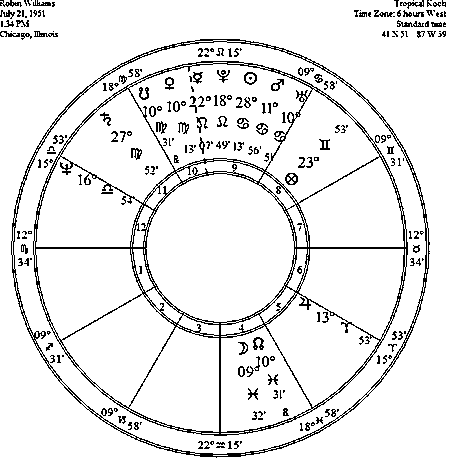

　　在他所有的电影角色、脱口秀和电视节目的亮相中，罗宾以富于戏剧性的、强烈的方式展现出一种脆弱，这是他的狮子座水星合相冥王星的表现，这个合相紧挨着中天！给未曾学习占星学的读者提示一下：水星是掌管交流的行星。狮子座代表着多彩多姿和戏剧性的表达，与冥王星紧密结合（合相）使这种表达的强烈程度激增。他的天蝎座上升描绘出富于激情的性格，在他富于创意和戏剧性的即兴演说中充斥着性暗示。冥王星在中天（MC）合相水星，他感觉到强迫性的冲动去谈论性和他自己的性冲动，常常影射生殖器勃起。他这样做并无冒犯之意，这就像他仅是在与我们分享他自己的性困境。

　　但是，他的双鱼座月亮清晰地描绘出他的“脆弱”，这是情绪最为敏感的月亮落点。他感知“一切”。他的存在意识几乎被生命所吞没，就好像一个人在瀑布上划船，以某种方式在瀑布边缘努力挥桨以免坠落。我们这样来思考这个问题：他的太阳落在巨蟹座，月亮在双鱼座，上升在天蝎座，占星学中的三个关键点全部落在水象星座。他是一位情感丰富的男人。做一位情感丰富的男人是一种挑战。在大多数社会中，男人都被灌输了这样一种观点：表露情感是弱者的象征。一位感觉敏锐的男人必定倍感压力，被淹没在水中！但这 62 年来，他并未溺水而亡，他从水中跃起，呼吸空气，如果你想想他显著的水星落点（落在火象狮子座），那么这更像是从海底喷发的火山。

　　但他的双鱼座月亮合相了双鱼座的月亮北交点*，在我看来这是最重要，也最能说明问题的一点。双鱼座既象征着体验灵感，又象征着体验幻灭。双鱼座敦促我们向人生的梦想敞开怀抱，去感受对生命的敬畏与惊叹。这种开放性常常伴随着不时的跌落地面，此外因为南交点落在处女座，我确定罗宾在经历幻灭时会非常自责。但是观看他表演的每个人，都会感觉到内心有某种东西被激起，它不仅带来欢乐，更让人惊叹于我们竟生活在这个星球上！罗宾第一次成名是在情景喜剧《莫克与明迪》（Mork and Mindy）中扮演一位叫莫克的外星人，这与他是多么吻合呀！


　　占星学生可以在他的出生星图中看到强大的海王星和天王星特征，象征着一个不顾一切的梦想家。他的火星和天王星合相，蕴藏着巨大的冲动，火星与海王星的四分相则预示着创造性的激励，火星、海王星、天王星均与木星形成相位。木星象征着过度和夸张！木星是掌管幽默与欢笑的行星。他的木星合相第六宫宫头（工作宫位），他的“工作”就是带给人们欢笑。很明显，他自己对于欢笑的需求以及带给我们欢笑不仅仅是一份工作，他的木星落在了另一个火象星座，白羊座。所以木星和水星双双为这位敏感而注重情感的男人注入了火的元素。

　　罗宾常常说，他的母亲是他真正的灵感之源，促进了他的成长，她非常有趣，给他的童年带来很多乐趣。月亮合相北交点双鱼座与给他带来“灵感”的母亲相吻合。她带给世间最好的礼物就是罗宾。罗宾带给我们最棒的礼物，就是让我们真正地沉浸在“对生命的敬畏与惊叹”之中，从而让我们对着所有人共享的真谛开怀大笑。在欢笑中，我们感受到人类生命的更伟大的真理。我将永远感谢罗宾，感谢他提醒我这一点。

*月亮与北交点的合相在每个星座只会发生 18 次，北交点在一个星座历时 18 个月，整个周期时长 18.6 年。也就是说，在大约 6793 天中，只有 18 天会出现这一月亮在双鱼座的合相，或在月亮交点 18.6 年的周期中发生概率为 0.0026%。

距 2014 年北京首届秋季占星论坛还有 35 天！

______________________________

大卫·瑞雷即将于 9 月 25 日起，开始“职业占星师中英文资质课程——高阶”，想要考取国际占星师资格证的你，想要成为职业占星师的你，这将是你踏入职业占星的第一步。欲知详情，请点击文末的“阅读原文”。

若道星文化，是由美国著名占星师大卫·瑞雷老师创办的占星学培训与文化传播机构，是国际占星研究协会(ISAR)在中国唯一一家定点合作机构。

**【占星入门——若道占星】微信订阅号：nodoorbj**

* 若道官网：www.nodoor.com 可提供占星咨询、占星课程、星盘查询、应用测试及电子杂志等服务。

* 新浪微博：@若道占星

**也请支持我们的朋友：**

**【无央之界】微信号：Akhaldan**

【若星辰（若道星文化上海同学会）】微信号：nodoorsh

【金陵星空教室】微信号：astronanjing

【Nana 占星社】微信号：NANA-astrology

【悦然。馨境生命分享】微信号：yueranxinjing

【心灵自由】微信号：freedomloveaction

**【聆宇电台】Cora 微信号：lingyudiantai**

# 【诺·泰尔】太阳弧推运：伊丽莎白二世的婚姻

> 原文：[`mp.weixin.qq.com/s?__biz=MzA5NjA0NTAxNg==&mid=200966568&idx=2&sn=30cab6700c02def9c85e2145f41d0891&chksm=1eb8331f29cfba09786ec3bebd5c0932c5a453b39b94c95253e32c2d0152ab8c283ad781667f&scene=126&sessionid=1692739130#rd`](http://mp.weixin.qq.com/s?__biz=MzA5NjA0NTAxNg==&mid=200966568&idx=2&sn=30cab6700c02def9c85e2145f41d0891&chksm=1eb8331f29cfba09786ec3bebd5c0932c5a453b39b94c95253e32c2d0152ab8c283ad781667f&scene=126&sessionid=1692739130#rd)


诺泰尔——太阳弧第一人，世界前三的占星大师，即将于 8 月下旬来华教授太阳弧技法，详询:李洋 010-56629907（工作日早 11—晚 6 点） 18601950700。

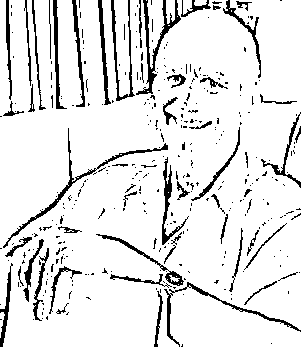

作者：诺·泰尔 

译者：晴空月明

编者注：

《太阳弧》一书采用的简写如下：推进或行进行星与出生星图中的行星形成合相、四分相、对分相等硬相位，用“=”表示。SA 指太阳弧，SP 指次限，TR 指行进星体。比如，SA 中天=木星，就是指太阳弧的中天与出生星图中的木星形成硬相位。

点击图片，可看大图。

本文的上篇：《伊丽莎白二世继位》，请阅读昨日的微信。

　　另外，太阳在金牛 0 度，月亮在狮子 12 度，大约 13 岁不到（记住她是初夏出生），会有 SA 太阳=月亮。正是 13 岁时她遇见了菲利普亲王——她后来的丈夫。

　　那一年（1939.2.20）的太阳弧：

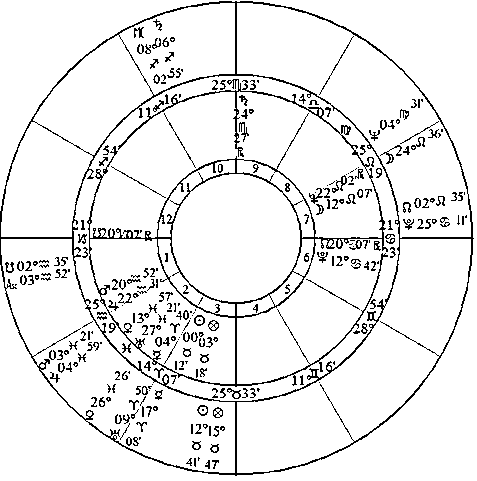

　　此时还有 TR 冥王星=太阳，而太阳正是她的 7 宫共同守护星（狮子座在 7 宫被截夺）。

1939 年（2.20）出生-行进双轮星图：

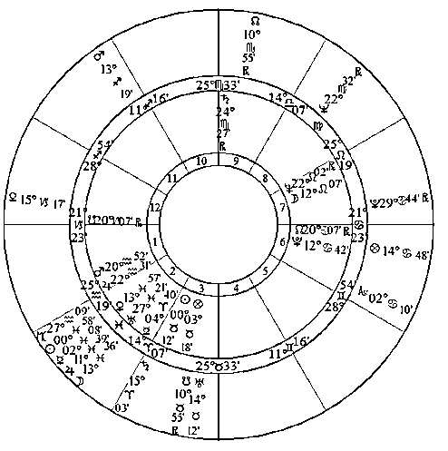

　　他们于 1947 年 11 月 20 日结婚，此时太阳弧有 SA 金星=水星，SA 北交=月亮。

1947 年 11 月 20 日太阳弧：

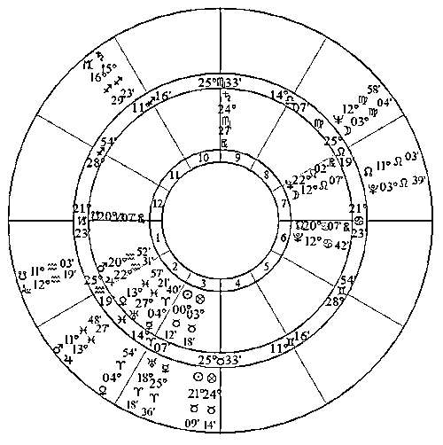

　　行进有 TR 海王星=冥王星，TR 土星=海王星。

1947 年 11 月 20 日的出生-行进双轮星图：

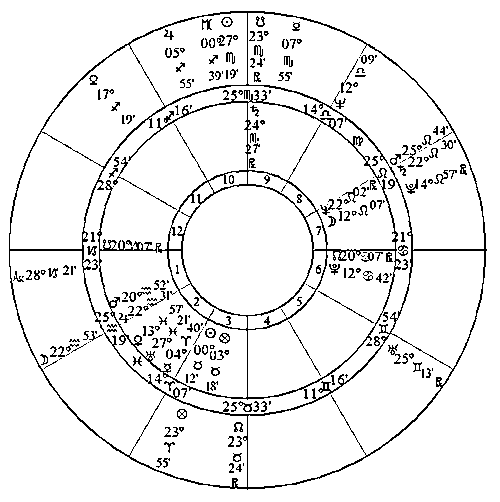

　　我们还可以继续看，女王的出生星图中天王星和太阳大致差 33 度，因此 34 岁（注意满 30 岁以后要加 1 度而不是半度了）有 SA 天王星=太阳，而同时还有 SA 土星=天王星。

1960 年（5.15）太阳弧：

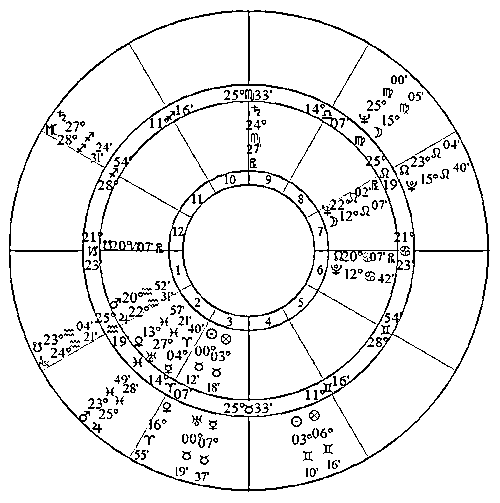

　　女王此时婚姻遇上了困扰，并且她妹妹玛格丽特公主在此时爱上了一个平民，舆论大哗。

　　女王 31 岁时有 SA 冥王星=月亮，而月亮是 7 宫主。可想而知此时有关婚姻的事件，很可能是挑战性的。可能会颠覆她作为帝王和中心人物，既受到赞扬、开诚布公，又能享有私密空间的愿望。

1957 年（2.6）太阳弧：

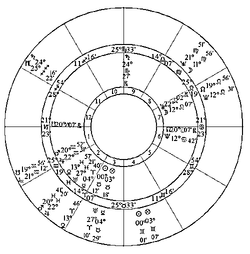

　　与此同时还有 TR 海王星=太阳。而太阳正是 7 宫的共同守护星。

1957 年（2.6）出生-行进双轮星图：

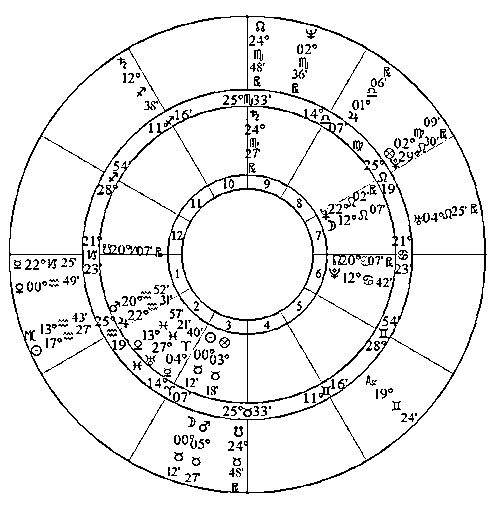

　　1956 年底到 1957 年初，菲利普亲王被爆出丑闻，亲王出门在外 4 个月，错过了年会和与家人共度节日，女王的婚姻受到了指责。

　　注意女王出生星图中月亮空相，空相的行星对一个人的影响力很强。而女王的月亮落狮子座，因此这与她支配别人的个性很有关系，而这次的 SA 冥王星=月亮很有可能动摇她深层次的个性。

8 月 29-31 日，现代占星鼻祖诺·泰尔将在北京举办“太阳弧预测技法实战工作坊”，教你如何一眼识别生命中的重大趋势，详情请点击文末的“阅读原文”。

_______________________________

若道星文化，是由美国著名占星师大卫·瑞雷老师创办的占星学培训与文化传播机构，是国际占星研究协会(ISAR)在中国唯一一家定点合作机构。

**【占星入门——若道占星】微信订阅号：nodoorbj**

* 若道官网：www.nodoor.com 可提供占星咨询、占星课程、星盘查询、应用测试及电子杂志等服务。

* 新浪微博：@若道占星

**也请支持我们的朋友：**

**【无央之界】微信号：Akhaldan**

【若星辰（若道星文化上海同学会）】微信号：nodoorsh

【金陵星空教室】微信号：astronanjing

【Nana 占星社】微信号：NANA-astrology

【悦然。馨境生命分享】微信号：yueranxinjing

【心灵自由】微信号：freedomloveaction

**【聆宇电台】Cora 微信号：lingyudiantai**

# 【生命之美】张开双臂，拥抱你的痛苦

> 原文：[`mp.weixin.qq.com/s?__biz=MzA5NjA0NTAxNg==&mid=200966568&idx=3&sn=25c14f98d8f44b59501e5c2e3167b506&chksm=1eb8331f29cfba091f643cff0d0de1c340a670700809af3113cb5a31dec3368260b93084321f&scene=126&sessionid=1692739130#rd`](http://mp.weixin.qq.com/s?__biz=MzA5NjA0NTAxNg==&mid=200966568&idx=3&sn=25c14f98d8f44b59501e5c2e3167b506&chksm=1eb8331f29cfba091f643cff0d0de1c340a670700809af3113cb5a31dec3368260b93084321f&scene=126&sessionid=1692739130#rd)


痛苦是什么呢？摔跤的时候会痛，生病的时候会痛，离别的时候会痛，被骗的时候会痛。我们害怕痛苦，就像孩子害怕打针一样。本能地，我们去抗拒它。但是最终，砸向我们的却是痛苦百倍千倍的痛苦。

痛苦是无法避免的，也许坦然地去接纳它、拥抱它，和痛苦的感觉单纯地待在一起，更能给我们带来平静和平和。

朋友们，不要害怕，痛苦来了，它，也会走。

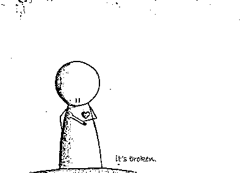

本文原题：【时光札记】对痛苦敞开

我们经常嘴里喊着要慈悲，要慈悲，但是遇见痛苦的时候我们就变得像个刽子手，恨不得一斧子把痛苦从自己身上切掉。我想对生活中所有快乐的风景、美好的人和事敞开心很容易，而对痛苦敞开则很难。

记得大学军训之前做胃镜，如果是胃溃疡就有危险就不用军训了。过程是需要一根管子伸到胃里，然后管子伸下去的时候大夫一直说，别紧张，别紧张，紧张更容易卡住。但是身体不会听你的管教，身体的本能反应就是紧缩——面对痛苦的时候，我们所有人的本能反应都和那个被插管的身体是一样的。因为我们视痛苦为“异物”，把它看做生命的一种非常态，所以我们对它本能的抵抗和防卫，要把它排出体外。

但是很大程度可能来自我们祖先遗传给我们的趋利避害的本能——人都是贪生怕死，趋乐避苦的。我们认定了生活的常态是幸福快乐的，而痛苦是一种异常态，就如同身体认定了那根管子是一根外来的异物一般。但是生命每时每刻都伴随着痛苦的种子的生长，那种显现出来的痛苦只是这颗种子的开花结果而已。与其说快乐是生活的常态，倒不如说痛苦是更平凡的姿态。姑且不说生老病死，光是爱别离和求不得就已经把我们折腾的如同煎锅上兹兹作响的披萨。

有多少人能一直保存着自己的心爱之物而不遗失损坏？那些我们珍爱的玩具总是被大人丢进垃圾箱，告诉我们用不到了。我记得小学三年级，自己咬着牙把辛辛苦苦积攒的美少女战士和圣斗士星矢扔进了垃圾箱，并且告诉自己，我长大了不需要他们了。这样的过程在上大学所有磁带被丢掉和现在整个屋子的东西所剩无几上面都一遍一遍的上演。那些我们曾经的珍爱，都会或早或晚的离开我们。没有人能带着一只玩具熊从出生到终老，和珍爱之物告别是我们毕竟的过程，并且不断上演。

求不得就更不用说了，每个人都想考第一，但是第一只有一个。每个人都想上清华北大，但是除了那些少数的中彩票的幸运儿，我们恐怕连打着北大招牌卖猪肉的权利都没有。谁都想要最好的工作住最舒服的房子，但现实总是给我们一个又一个巴掌。于是我们学会了所谓“淡泊”，实际上心里不知骂了多少遍，丫的，怎么老子总是这么背。

这姑且可以算作一种普世性的痛苦。我今天想说的是一种更个人化和特殊性的痛苦——我只能以自己的痛苦现身说法，这也叫没有调查就没有发言权吧。

陪伴我十多年来不离不弃的一个痛苦就是来自我的脊柱——以胸椎为中心蔓延的整个区域。这个痛苦始于初中三年级一次阑尾炎手术之后，原因不明。随后的十多年中它呈渐进式的发展，逐渐从世间和空间上都蔓延进我整个的生活。慢慢的我的生活里只有两种时候，疼的能忍受的时候和疼的不能忍受的时候。从吃止疼药到后来的早上被疼醒晚上睡不着。和这个痛苦的关系的变化，其实是我这一路走来发生的最深刻的变化之一。

很长一段时间，我的整个重点都放在如何消除痛苦上——我渴望它能够被一个外在的因素缓解或者治愈，家排也好一个外在的疗愈的老师也好。但是屡次抱着希望又屡次受挫——到最后我不得不对它臣服——也就是承认它存在的现状。

当我们抱着丢掉痛苦的心态去寻找的时候，我们只想找到一个垃圾桶，把我们的痛苦丢进去。而那在另一方面宣称着——我们拒绝接受和承担自己的痛苦，并且为它负责。

下一个阶段我开始想转化我的痛苦——我想发现它背后的原因，它隐藏着什么信息，什么信念？再次我发现各种不能够。因为我试图通过扭转信念去转化痛苦——但是一个显现背后的原因存在于各个层面。我永远无法穷尽背后所有的 XYZ 的变量，每次我找到一个，都还会有另一个原因等待出现。这个过程就像海底冒泡泡，只要有火山，气泡永不断。

最后一个阶段，我学会了和痛苦共处。单纯地允许它以它的样子出现，不像一个城管一样想赶跑它——因为知道它无处可去。也不像一个调查员对着一个实验品一样去研究它——它可以以任何需要的原因出现，但是那并不是重点。重点是我开始接受它本来的样子，它爱是什么就是什么的样子。它可以呈现各种感觉给我，但是如何解读和对待这些感受，就是我的问题，并不是它的问题————我可以痛不欲生要死要活，我可以揪着别人去同情和理解我的痛苦，我可以向世界宣告我多么的身残志坚，我也可以默默地带着它每天吃饭睡觉友好相处。痛苦的呈现是不可选择的，但是如何选择去应对和和它共处，则是我们可以选择的。

我们习惯性地从祖先遗留下来的趋利避害和想排除异己的本能，让我们一次又一次地对痛苦失去耐心——想让它早点滚蛋。但是我们的成长就来自对这些本能的模式的觉察和选择——除非我们能对自己的痛苦承担责任，否则我们永远只是在逃避当下。除非我们能与自己的痛苦共处，否则我们永远是在追求到达别处。除非我们能允许痛苦以它本来的样子存在，我们就永远在控制和在痛苦之外的某处寻求安乐——解脱并不来自痛苦之外的某处或者痛苦的不在。那不是安乐之所，真正的放松来自在痛苦中放松，对所有生命呈现给你的感觉说是。无论你对它们做出什么解释和注解，这个允许和接纳是真正的敞开和慈悲。

所以我现在很少会静坐几小时去研究我的痛苦——这种事我以前经常干。好多人说要走的深入去深入的看痛苦里面有什么——我现在觉得大部分对我来说是放屁扯淡。痛苦就是痛苦，它能是什么，它什么都不是。当你赋予它太多意义它就什么都是能把你折磨的痛不欲生。放下对意义的追索本身才能让真实的意义呈现。

它也并不是阻断生活的借口——我们时常觉得太痛苦了，不能去干这个不能去干那个了。痛苦和生活并不矛盾——带着痛苦去吃喝拉撒其实才是生活的真相。没有人说你一定要状态全满才能击败 BOSS。你可以一次又一次的零血复活，然后在和 BOSS 的一击中死去。问题是你永远有无限的钢镚攻击，让自己可以在下一次重新复活。每次打一下 BOSS，说不定复活的第 N 次它就被打倒了。当然这只是一个美好的假设。

所以你看，我也学会了在要死要活的时候写点文章絮叨点小闲话。我不想让我的生命就这么耽搁在对痛苦的挽歌里，也学会了安于这个会痛苦的身体，不幻想着逃到灵界去——没有身体的生活看上去很美好，但是很飘摇。

感谢这个身体让我落在地球上，地大是个神奇的元素，它让人学会稳定和持续。它让意念的显化像蜗牛一样让人焦急，却也阻止了我们毁灭性的的自我意念可以瞬间秒杀掉自己。它给了我们多次修改和反悔的机会，不要让我们正中自己的要害。毕竟生命最重要的一件事就是要和自己过得去，对自己慈悲才是真慈悲。大家好才是真的好。

以致这般，那些想回到星星上的娃们，星星上未必过的比这好。也许我们有很多痛苦要处理，但也比虚妄的幸福生活来的踏实——那些飘着的幸福早晚要掉下来，和天人一样，因为苦是轮回的本质。

让我们感谢痛苦让我们落地，感谢它让我们学会安忍和慈悲。

**作者简介**：

绽放-Maya: 新生代灵性管道，擅长把复杂抽象的讯息用简单直接，形象比喻的方式传导出来。与玛雅、埃及、古印度、西藏等古老文明都有深厚的连接，并且传承了独特的玛雅印章解读系统和能量疗愈系统。致力于让古老的智慧再一次在地球上闪光，帮助人们当下的生活。

微信公共帐号：【悦然。馨境生命分享】yueranxinjing

______________________________

大卫·瑞雷即将于 9 月 25 日起，开始“职业占星师中英文资质课程——高阶”，想要考取国际占星师资格证的你，想要成为职业占星师的你，这将是你踏入职业占星的第一步。欲知详情，请点击文末的“阅读原文”。

若道星文化，是由美国著名占星师大卫·瑞雷老师创办的占星学培训与文化传播机构，是国际占星研究协会(ISAR)在中国唯一一家定点合作机构。

**【占星入门——若道占星】微信订阅号：nodoorbj**

* 若道官网：www.nodoor.com 可提供占星咨询、占星课程、星盘查询、应用测试及电子杂志等服务。

* 新浪微博：@若道占星

**也请支持我们的朋友：**

**【无央之界】微信号：Akhaldan**

【若星辰（若道星文化上海同学会）】微信号：nodoorsh

【金陵星空教室】微信号：astronanjing

【Nana 占星社】微信号：NANA-astrology

【悦然。馨境生命分享】微信号：yueranxinjing

【心灵自由】微信号：freedomloveaction

**【聆宇电台】Cora 微信号：lingyudiantai**

# 月亮：因为回忆，所以想念；因为信任，所以依赖

> 原文：[`mp.weixin.qq.com/s?__biz=MzA5NjA0NTAxNg==&mid=200952824&idx=1&sn=6997d779337afcbd52731bc2f9b0ed68&chksm=1eb8f94f29cf7059b707b601e17d4a58703dab5557e031b1dff023afdcb9290acb564014ec11&scene=126&sessionid=1692739130#rd`](http://mp.weixin.qq.com/s?__biz=MzA5NjA0NTAxNg==&mid=200952824&idx=1&sn=6997d779337afcbd52731bc2f9b0ed68&chksm=1eb8f94f29cf7059b707b601e17d4a58703dab5557e031b1dff023afdcb9290acb564014ec11&scene=126&sessionid=1692739130#rd)


常说月有阴晴圆缺，月亮代表心情，所以心情也有喜有悲。月亮在乎的是安全感，安全感够了，才会常常笑开怀，才会卸下自我保护的盔甲，去信任、去依赖。柔软的月亮在回忆中随波逐流，如此得感伤，只是因为听得见自己的心情，也曾听见，你的心情。

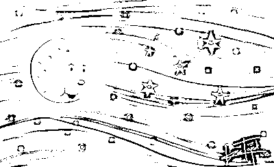

作者：杰夫·焦耳 

译者：江艺

校对：李含

　　“行星是原型，是超越我们个体人生故事的本质能量，可以为每个人所利用。”基于这一理念，杰夫老师创作了“那些行星教我们的事”系列文章，讲述各颗行星教给我们的功课，本文是其中月亮篇。

没有任何占星符号比月亮更重要。她是母亲、家园、根基、食物、家庭需要、感受和习惯，同时也是我们对生活的无意识、直觉性的反应。它与太阳积极的阳性能量相对，是接受性的阴性能量，将我们与过去联结起来，并设定了现在的节奏。奇怪的是，月亮既代表一贯性，也代表变化。这种鲜明的对照反映在她守护的水象巨蟹座，与它的擢升星座固定的土象金牛座中，它们一个起伏不定，一个稳固不变。

从人类经验所反映的月亮的每月周期（里克·莱文所说的“月亮的”周期）中，我们看到了恒定的变化。我们通常都是我们自己，从出生到死亡。但是在永不停息的时间进程中，我们逐渐成长、成熟，然后死亡。时间的流动在我们出生之前就存在，而且也不会因我们的死亡而终止。

月亮教导我们，恒定和变化并非互相对立的能量，而是同一块布料上交织的经纬线。对于在生活中缺乏恒定感的个体，月亮提醒他们注意，有一种永恒的模式让他们得以真实存在。即使是最无厘头的人，在说话、走路、思考或行动方面也会有一些习惯性的方式，这便揭示了他们生命的恒定性。即便是不断游荡的流浪者，也总是保持着自我。

另一方面，对于受困于僵化程式，缺乏情感灵动性的人，可以通过月亮发现内在的活动。我们可以学着去变换“情绪”（moody）——这个词也和“月亮”（moon）有着相同的词根，这里的变换情绪和抑郁的意义无关，而是包含了运动的意义。要做到这一点，有一个简单的方法：每天记录下一至五个强烈的感觉，像这样持续记录 28 天（一个月亮周期），这会揭露一些变化，让我们看到情绪确实起伏不定。意识到这个事实是打破自己的麻木迟钝的重要一步，最终会导向更为灵敏的自我呵护和滋养。

占星学常常将水星与心智功能等同，这只说对了一部分。但是，记忆却与月亮关联。仿佛水星是相机的镜头或思想的眼睛，而月亮是记录影像的媒介。我们记忆中的过去影响着我们对现在的看法。未解决的痛苦记忆可能在相似的环境中导致自我封闭。哈维·杰肯斯（Harvey Jackins），这位再评价咨询协会（Re-Evaluation Counseling）的创始人曾说，我们的聪明才智仅限于情绪允许的范围。我们与感觉，或与月亮的自我意识的联结，是最大限度发挥我们智力的关键。

当我们的大脑产生了怀疑或不相信的中断信号，有益的方法是再次核查我们的感觉，发现阻抗的根源在哪儿。身体常常会感觉到它。当然，我们可能将我们的观念合理化，好像他们纯粹基于逻辑。但是，在这个等式中加入月亮的情绪领域，可以带来基于主观的信息，从而形成有关当前情形的更加完整的画卷，开放意识，导向更好的选择。

月亮通常不会用言语的形式对我们说话。她生活在直觉的水域，在语言的层面之下流动。在这个平面上居住的主要是意识，但是未能知晓它在我们行为中的角色也同样令人受限。恢复我们自身之中非言语的面向，会带来一个主观的真相，当它与理智整合为一体时，就是发展真正自我认知的关键因素。作为回报，这种联结会带给我们意义、快乐和更深厚的满足感。

距 2014 年北京首届秋季占星论坛还有 36 天！

______________________________

大卫·瑞雷即将于 9 月 25 日起，开始“职业占星师中英文资质课程——高阶”，想要考取国际占星师资格证的你，想要成为职业占星师的你，这将是你踏入职业占星的第一步。欲知详情，请点击文末的“阅读原文”。

若道星文化，是由美国著名占星师大卫·瑞雷老师创办的占星学培训与文化传播机构，是国际占星研究协会(ISAR)在中国唯一一家定点合作机构。

**【占星入门——若道占星】微信订阅号：nodoorbj**

* 若道官网：www.nodoor.com 可提供占星咨询、占星课程、星盘查询、应用测试及电子杂志等服务。

* 新浪微博：@若道占星

**也请支持我们的朋友：**

**【无央之界】微信号：Akhaldan**

【若星辰（若道星文化上海同学会）】微信号：nodoorsh

【金陵星空教室】微信号：astronanjing

【Nana 占星社】微信号：NANA-astrology

【悦然。馨境生命分享】微信号：yueranxinjing

【心灵自由】微信号：freedomloveaction

**【聆宇电台】Cora 微信号：lingyudiantai**

# 【太阳弧推运】诺·泰尔：伊丽莎白二世继位

> 原文：[`mp.weixin.qq.com/s?__biz=MzA5NjA0NTAxNg==&mid=200952824&idx=2&sn=b7db24006aa2cf1c2128076c0c9552be&chksm=1eb8f94f29cf7059bd908220caba95a89267af62f52c345b8c9e48fba1ca8ba5ef62d0821e28&scene=126&sessionid=1692739130#rd`](http://mp.weixin.qq.com/s?__biz=MzA5NjA0NTAxNg==&mid=200952824&idx=2&sn=b7db24006aa2cf1c2128076c0c9552be&chksm=1eb8f94f29cf7059bd908220caba95a89267af62f52c345b8c9e48fba1ca8ba5ef62d0821e28&scene=126&sessionid=1692739130#rd)


诺泰尔——太阳弧第一人，世界前三的占星大师，即将于 8 月下旬来华教授太阳弧技法，详询:李洋 010-56629907（工作日早 11—晚 6 点） 18601950700。


作者：诺·泰尔 

译者：晴空月明

编者注：

《太阳弧》一书采用的简写如下：推进或行进行星与出生星图中的行星形成合相、四分相、对分相等硬相位，用“=”表示。SA 指太阳弧，SP 指次限，TR 指行进星体。比如，SA 中天=木星，就是指太阳弧的中天与出生星图中的木星形成硬相位。

点击图片，可看大图。

　　太阳弧推运实际上非常简单，甚至不一定要借助软件，基本上在出生星图上按“1 年 1 度”来看就好，冬天或夏天生的人在心里修正一下（见太阳弧的起源与发展），当然用软件排更方便。

　　看太阳弧的方法和看行进星图没什么不同，唯一的区别在于太阳弧比行进星体的影响力更大更持久（行进海王星、冥王星例外）。太阳弧的影响力大致在一年左右，核心事件的精确激发往往是由运行较快的参数完成的（比如次限月亮和行进星体）。

　　下面以英国女王伊丽莎白二世的例子来说明太阳弧推运的基本应用方法。

　　英国女王伊丽莎白二世（1926.4.21，02:40，夏令时，伦敦，00W10，51N30）

　　出生星图：

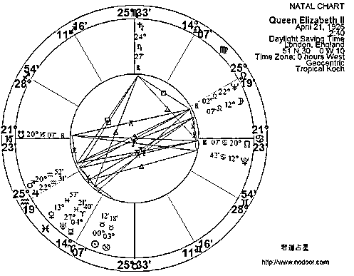

　　这位女王的出生星图有个“严酷”而显著的中天，因此太阳弧需要关心的第一件事就是 SA 太阳=中天。

　　太阳和下中天相差 25°多一点，女王出生在 4 月，接近夏天，太阳走得偏慢（但不是最慢），则可以推断 25 岁多的时候会形成精确的 SA 太阳=中天，估计在 1952 年初。

1952 年（2 月 6 日）太阳弧推进星图：

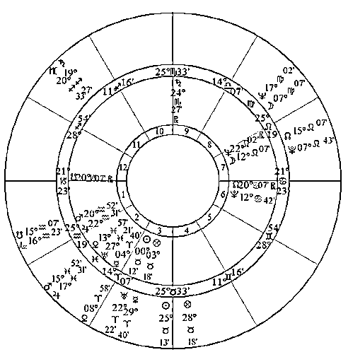

　　从次限星图中可以看到 1951 年 12 月，SP 月亮=下降。

1951 年 12 月 15 日的出生-次限双轮星图：

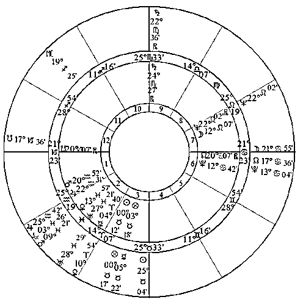

　　然后看行进，可以看到 1952 年 2 月，TR 海王星=上升，TR 木星=冥王星。

1952 年 2 月 6 日的出生-行进双轮星图：

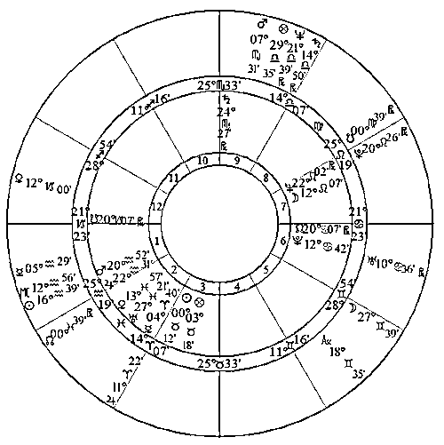

　　相比而言，1952 年 2 月这个征象更强烈一点。

　　事实是：1952 年 2 月 6 日，伊丽莎白二世的父亲去世，她继位成为女王。

　　在 SA 太阳=中天之前有 SA 太阳=土星（土星和中天差几十分），这一方面代表着受教育和指导（国王上岗前的培训）。另一方面太阳照亮了她与生俱来的权利（出生星图上升摩羯座，守护星土星合相中天）。

8 月 29-31 日，现代占星鼻祖诺·泰尔将在北京举办“太阳弧预测技法实战工作坊”，教你如何一眼识别生命中的重大趋势，详情请点击文末的“阅读原文”。

_______________________________

若道星文化，是由美国著名占星师大卫·瑞雷老师创办的占星学培训与文化传播机构，是国际占星研究协会(ISAR)在中国唯一一家定点合作机构。

**【占星入门——若道占星】微信订阅号：nodoorbj**

* 若道官网：www.nodoor.com 可提供占星咨询、占星课程、星盘查询、应用测试及电子杂志等服务。

* 新浪微博：@若道占星

**也请支持我们的朋友：**

**【无央之界】微信号：Akhaldan**

【若星辰（若道星文化上海同学会）】微信号：nodoorsh

【金陵星空教室】微信号：astronanjing

【Nana 占星社】微信号：NANA-astrology

【悦然。馨境生命分享】微信号：yueranxinjing

【心灵自由】微信号：freedomloveaction

**【聆宇电台】Cora 微信号：lingyudiantai**

# 【实习生招聘】若道呼唤网页设计师！

> 原文：[`mp.weixin.qq.com/s?__biz=MzA5NjA0NTAxNg==&mid=200952824&idx=3&sn=195ca29afa41080641d3d0d56357cff3&chksm=1eb8f94f29cf70597a4736d2bec54e6c47ca3097b32e5522d6410b441b59d85fad5b54249c2f&scene=126&sessionid=1692739130#rd`](http://mp.weixin.qq.com/s?__biz=MzA5NjA0NTAxNg==&mid=200952824&idx=3&sn=195ca29afa41080641d3d0d56357cff3&chksm=1eb8f94f29cf70597a4736d2bec54e6c47ca3097b32e5522d6410b441b59d85fad5b54249c2f&scene=126&sessionid=1692739130#rd)

****

**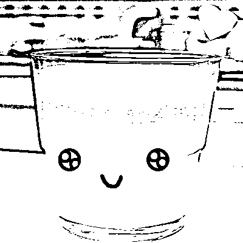**

**岗位：网页设计师**

**岗位职责：**

1.  能独立完成设计创意、网页设计工作；

2.  负责网站整体的美术设计和创意，包括网站产品界面、图标设计、flash 设计等。

**任职要求：**

1.  美术、平面设计等相关专业，大学专科及以上学历，具有良好的美术基础和设计表现力；

2.  能够准确把握网站的整体风格及视觉表现，对版式掌握精道，具有较强的网页设计能力，能独立完成设计；

3.  逻辑思维清晰，做事认真、细致、有责任心，具备良好的表达能力和人际沟通技巧及团队合作精神；

4.  有电子商务网站制作经验者优先；有作品展示；

5.  最好对占星和星座有基础了解。

请随简历附上以下信息：

1.  **详细出生信息（年月日时分以及地点）**；

2.  请附上设计作品；

3.  简单介绍您的占星程度；

4.  注明您的英语水平。

**薪资：**

1.  技能交换优先（不支付实际工资，以技能交换的形式抵扣若道学费）；

2.  或者外包，大约二三十个页面，可能还有 1 个大的 flash，具体薪酬面议。

请将以上信息连同您的简历，发送至邮箱：**joanna.wang@nodoor.com**。

_______________________________

若道星文化，是由美国著名占星师大卫·瑞雷老师创办的占星学培训与文化传播机构，是国际占星研究协会(ISAR)在中国唯一一家定点合作机构。

**【占星入门——若道占星】微信订阅号：nodoorbj**

* 若道官网：www.nodoor.com 可提供占星咨询、占星课程、星盘查询、应用测试及电子杂志等服务。

* 新浪微博：@若道占星

**也请支持我们的朋友：**

**【无央之界】微信号：Akhaldan**

【若星辰（若道星文化上海同学会）】微信号：nodoorsh

【金陵星空教室】微信号：astronanjing

【Nana 占星社】微信号：NANA-astrology

【悦然。馨境生命分享】微信号：yueranxinjing

【心灵自由】微信号：freedomloveaction

**【聆宇电台】Cora 微信号：lingyudiantai**

# 上升星座爱情：保护自己，也保护你爱的人（水象星座）

> 原文：[`mp.weixin.qq.com/s?__biz=MzA5NjA0NTAxNg==&mid=200937936&idx=1&sn=c407752044c62e5f7a184476e21941fe&chksm=1eb8a36729cf2a718d5d971392665455a4bc9a204f88f8effc395d36f7e3a3802061fb0fb7f8&scene=126&sessionid=1692739135#rd`](http://mp.weixin.qq.com/s?__biz=MzA5NjA0NTAxNg==&mid=200937936&idx=1&sn=c407752044c62e5f7a184476e21941fe&chksm=1eb8a36729cf2a718d5d971392665455a4bc9a204f88f8effc395d36f7e3a3802061fb0fb7f8&scene=126&sessionid=1692739135#rd)


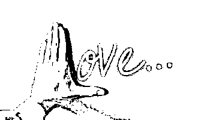

本文摘自史蒂芬·阿若优的《人际占星学：性与爱的能量和谐》，感谢@蓝莲花 9999（微博帐号）的编辑和翻译。此书由世界图书出版公司出版发行。

**水象星座（巨蟹座、天蝎座、双鱼座）**

容易受环境或他人影响。敏感、情绪化，因为内心脆弱或感知到受伤的可能性而具有较强的警惕心。自我保护，也保护他们关心的人。有同情心，能立即且有力地感觉到他人的情绪变化。注重隐私，活在自己的世界里。依赖预感和直觉，是所有上升星座中最具疗伤能量的一群人。

**巨蟹座：**

极有同情心，但也非常注重隐私，常常活在自己的小世界里。他们容易受到伤害，不易忘却伤痛，因此非常注重自我保护，行为非常谨慎。他们是世界上最正派的一群人，举止谦逊，但内心强烈地渴求被尊重。他们有着坚定的目标，但很少向外人言，有时甚至对自己也保密！尽管你可能永远无法了解他们——除非他们肯接纳你成他们小小的内心世界里的“家庭成员”，但通过情感的暗流涌动，你仍然可以和他们可以建立起无需言语表达的友好关系。

**天蝎座：**

他们是口碑最差的上升星座，却也拥有最丰富的才能矿藏。他们非常注重隐私，感情强烈且极端化，对此他人难以理解。就连他们自己，也要经过缓慢的深切的感受以及诚实的自我分析后才能明白。他们本能地想要挖掘他人的秘密和被否认或压抑的部分，但并不擅长处理自己这一方面的问题。他们是最好的侦探，在调查研究、治疗和迎战危险任务方面很有一手。如果你想基于现有信息对某件事了解更多，赶紧找个有天蝎座特质的人帮忙吧！

**双鱼座：**

天生善解人意、反应灵敏、具有很强的直觉力，对人、动物、病人或精神贫瘠者均是如此。具有艺术家或诗人的气质，很有想象力和创造力，现实世界对他们而言太过残酷。因此，他们常常会投身于另一个超越现实社会和物质世界的理念世界中去，那里更精微，更能给人以灵感。他们通常拥有超凡脱俗的个人魅力，不过可能连他们自己都觉察不到这一点。尽管他们看似过于敏感甚至脆弱，但在遭遇困境时，他们的精神力量有时却强得惊人。

**理解上升星座的几点法则**

尽管上升星座对每个人有非常重要的作用，但不可否认的是，必须结合本命盘上其他的因素特别是太阳星座来分析，才能全面了解上升星座对一个人的具体影响。太阳星座代表一个人的核心身份，是意识的最中心，是我们吸纳同化各种人生经验的方式。上升星座是我们的生活的式，而太阳星座就是意识和生命本身！

上升星座会修饰太阳能量的表达方式。不同太阳星座和上升星座的结合所造就的一百四十四种组合，可以写成厚厚的一本书。举例来说，双子座上升会给各个太阳星座增添社交活力和智力的好奇心。它可以令思路缓慢的金牛座太阳快起来；令天蝎座太阳更爱社交、不那么神秘；令摩羯座的太阳不那么具有防备心，更乐于交流；也可以令巨蟹座的太阳变得没那么害羞！可是无论怎样，不管这些上升双子座的人看起来多么相似，内在的特质还是由太阳所在的星座和位置所决定的。

理解上升星座和太阳星座如何相互作用，还有另一个办法：比较两个星座的元素。举例而言，太阳巨蟹但上升星座为火象星座的人，通常比太阳巨蟹但是上升星座是保守的土象或水象的人更外向，更爱表达，更自信。再举个例子，一个太阳是风象星座但上升是水象星座的人，看起来会比真实的他更加情绪化；而上升风象太阳水象的人则比真正的他看起来感情淡薄。了解不同的上升与太阳星座的组合，非常用，无论是脑中想象，还是在纸上系统地罗列出来，或者是与其他人讨论，均能获取更多洞见。

10 月 24-26 日，斯蒂芬·弗里斯特将来中国开展深度亲密关系工作坊，向你我讲述爱情的秘密。预知详细信息，请点击文末的“阅读原文”。

_______________________________

若道星文化，是由美国著名占星师大卫·瑞雷老师创办的占星学培训与文化传播机构，是国际占星研究协会(ISAR)在中国唯一一家定点合作机构。

**【占星入门——若道占星】微信订阅号：nodoorbj**

* 若道官网：www.nodoor.com 可提供占星咨询、占星课程、星盘查询、应用测试及电子杂志等服务。

* 新浪微博：@若道占星

**也请支持我们的朋友：**

**【无央之界】微信号：Akhaldan**

【若星辰（若道星文化上海同学会）】微信号：nodoorsh

【金陵星空教室】微信号：astronanjing

【Nana 占星社】微信号：NANA-astrology

【悦然。馨境生命分享】微信号：yueranxinjing

【心灵自由】微信号：freedomloveaction

**【聆宇电台】Cora 微信号：lingyudiantai**

# 白羊座：唤醒内心的勇气（安德烈）

> 原文：[`mp.weixin.qq.com/s?__biz=MzA5NjA0NTAxNg==&mid=200937936&idx=2&sn=bab56b54415c8bc6084b80bab55fc83d&chksm=1eb8a36729cf2a7162341fdf7dd215358df8bf708a49d10b84726124d31534f4e65198182272&scene=126&sessionid=1692739135#rd`](http://mp.weixin.qq.com/s?__biz=MzA5NjA0NTAxNg==&mid=200937936&idx=2&sn=bab56b54415c8bc6084b80bab55fc83d&chksm=1eb8a36729cf2a7162341fdf7dd215358df8bf708a49d10b84726124d31534f4e65198182272&scene=126&sessionid=1692739135#rd)


一个人活在世上，应该时时刻刻说真话羞辱魔鬼！

——莎士比亚《亨利四世上篇》

“白羊座为何这么简单直接？这么胆大妄为？对什么都跃跃欲试？”这篇文章将会告诉大家，白羊座需要什么，为何需要，以及会造成什么后果。

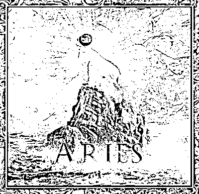

**真话的代价永远比谎言来得大**

很多人都说，人生最大的谎言就是“今年的压岁钱我帮你存着”，“你跟老师老师说，我绝不告诉你家长”和“你以后会变苗条的”。大人们为了避免我们养成骄奢淫逸、爱攀比的习惯，或者害怕我们惹麻烦，开始对孩子说着一些善意的谎言。

俗话说童言无忌，白羊座就像孩子们只会说真话，为此还惹了不少麻烦——他们就像永远也融入不了大人世界似的，大家说白羊座没有教养，事实上是他们直言不讳；大家说白羊座没有头脑，其实只是他们还没打算学会怎么圆融面对；最冤枉的是人们说他们的自私，事实上这只是总爱暴露出自己最真实的一面。

公然嘲笑皇帝的孩子必定伤害了 皇帝以及先前信以为真的大臣的威严，也肯定给准备盛大游行的人们徒增烦恼，可这又有何干系呢？他只是一个孩子。但现实情况未必这样，白羊座人直接戳穿事情的真相，却让人们无法接受。

大家都习惯了腐朽不堪但安逸舒适的生活，就像搏击俱乐部中所说的工作、银行存款、开的车、皮夹里的东西以及身上所穿的衣服。而大家都忘了真相——它们也许仅仅只是为他人做苦力、银行里的一笔数字、代步工具、政府印制的纸票以及几块经过裁剪的布料。

而简单，正是白羊座所渴求的，因为他们已经经历了太多太多矛盾和复杂。就如同一个孩子面对整摞奥赛试题时的想法：那些成年人都答不出来的题目，为何让我们来做？年幼的孩子并不知晓答案竟然是父母与其他家长的攀比或者给自己定制好了不断奋斗到死的路。归根结底，责任是整个社会给予的，从小到大抹杀着我们看清真相的权利，因为命令你的人永远是对的。

青春时代的问题到了成人之后依然会重复，因为现实社会就像童年的父母一样给了我们太多管制，让我们根本无法放开手脚做任何事情。“作为一名要高考的学生，你应该自律一点。”“作为一个成年人，你应该自律一点。”“为人父母，你应该自律一点。”白羊座的一生都在与条条框框作斗争，他让我们无法光着上身在草坪上奔跑，也让我们无法选择也本适合自己的学业与工作。

当然了，那些只是我们看得到的，还有那些难懂的规矩，那复杂的人际关系。当失去发号施令的长官（碧如父母、老师以及教官）的管制之后，白羊座重获自由，但代价是会遭到更复杂的事情，那就是他人的眼光。我们总是会变成他人渴望成为的人，父母眼里的孝顺孩子、老师眼里的尖子生、军官眼里的英勇士兵、上司眼里的卖命职工，但这肯定违反了白羊座人最初的初衷。

虽然同样是满足火元素和基本星座的需求，但白羊座并非社会阶段的狮子座那样能够戏剧性融入到各种各样的氛围中去，也不像对宫星座天秤座那般享受自己的从容优雅——面前是一片复杂曲折之路时，他们只想走最简单的直线，就算代价是比绕路受更多的伤。

这并非是什么坏到没救的事情，恰恰相反，保持白羊座秉性的人反而更容易走向人生的巅峰，因为他们没有被他人的目光改变自己。尽管不像那些小学参加奥赛中学吹拉弹唱大学门门及格工作认真努力的人那样是优秀的“社会人”，但他们永远是在做最优秀的自己，这点是那些社会人怎么也换不来的。

到了该唤醒内心白羊式勇气的时刻了。

转载请声明原作者安德烈

本文版权由安德烈以及@安德烈公益占星 所有

冒名发表后果自负

______________________________

大卫·瑞雷即将于 9 月 25 日起，开始“职业占星师中英文资质课程——高阶”，想要考取国际占星师资格证的你，想要成为职业占星师的你，这将是你踏入职业占星的第一步。欲知详情，请点击文末的“阅读原文”。

若道星文化，是由美国著名占星师大卫·瑞雷老师创办的占星学培训与文化传播机构，是国际占星研究协会(ISAR)在中国唯一一家定点合作机构。

**【占星入门——若道占星】微信订阅号：nodoorbj**

* 若道官网：www.nodoor.com 可提供占星咨询、占星课程、星盘查询、应用测试及电子杂志等服务。

* 新浪微博：@若道占星

**也请支持我们的朋友：**

**【无央之界】微信号：Akhaldan**

【若星辰（若道星文化上海同学会）】微信号：nodoorsh

【金陵星空教室】微信号：astronanjing

【Nana 占星社】微信号：NANA-astrology

【悦然。馨境生命分享】微信号：yueranxinjing

【心灵自由】微信号：freedomloveaction

**【聆宇电台】Cora 微信号：lingyudiantai**

# 太阳弧：查尔斯王子婚变之痛（诺·泰尔）

> 原文：[`mp.weixin.qq.com/s?__biz=MzA5NjA0NTAxNg==&mid=200937936&idx=3&sn=07dd4765f8081d5e8f35eeac511d2d72&chksm=1eb8a36729cf2a71c2164210afe2315f0310b556c92c68392bf41925d3f4f2fcedb8ee9413a8&scene=126&sessionid=1692739135#rd`](http://mp.weixin.qq.com/s?__biz=MzA5NjA0NTAxNg==&mid=200937936&idx=3&sn=07dd4765f8081d5e8f35eeac511d2d72&chksm=1eb8a36729cf2a71c2164210afe2315f0310b556c92c68392bf41925d3f4f2fcedb8ee9413a8&scene=126&sessionid=1692739135#rd)


诺泰尔——太阳弧第一人，世界前三的占星大师，即将于 8 月下旬来华教授太阳弧技法，详询:李洋 010-56629907（工作日早 11—晚 6 点） 18601950700。


作者：诺·泰尔 

译者：晴空月明

编者注：

《太阳弧》一书采用的简写如下：推进或行进行星与出生星图中的行星形成合相、四分相、对分相等硬相位，用“=”表示。SA 指太阳弧，SP 指次限，TR 指行进星体。比如，SA 中天=木星，就是指太阳弧的中天与出生星图中的木星形成硬相位。

点击图片，可看大图。

　　太阳弧推运实际上非常简单，甚至不一定要借助软件，基本上在出生星图上按“1 年 1 度”来看就好，冬天或夏天生的人在心里修正一下（见太阳弧的起源与发展），当然用软件排更方便。

　　看太阳弧的方法和看行进星图没什么不同，唯一的区别在于太阳弧比行进星体的影响力更大更持久（行进海王星、冥王星例外）。太阳弧的影响力大致在一年左右，核心事件的精确激发往往是由运行较快的参数完成的（比如次限月亮和行进星体）。

　　下面以查尔斯王子的例子来说明太阳弧推运的基本应用方法。

　　查尔斯王子（1948 年 11 月 14 日，21:14，伦敦，00W10，51N30）

　　出生星图：

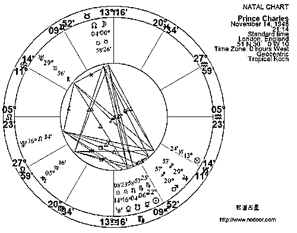

1986 年 6 月的太阳弧推进图：

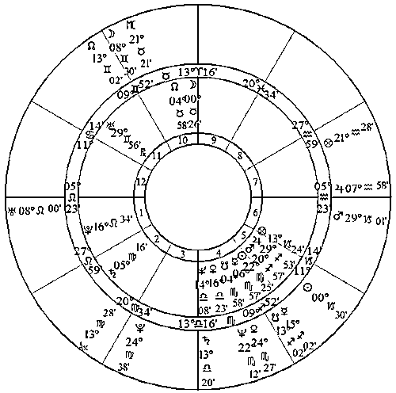

1986 年 6 月的出生-行进双轮星图：

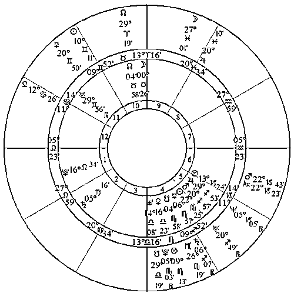

1986 年是他婚姻危机的高潮，大概也是他最为沮丧的时候。他对深陷于厌食症中的戴安娜漠不关心。

　　此时有 SA 土星=中天（家庭或社会地位遭遇挑战），同时有 TR 冥王星=上升（人生观的巨大改变）。TR 土星=土星（转变）、TR 天王星=火星（火星是 10 宫主，代表职业和社会形象）。

　　查尔斯王子此时的太阳弧盘中还有 SA 金星=中天（入相）。

　　其实查尔斯的婚姻危机，从他与戴安娜的结婚时（1981 年 6 月 29 日）就能看出端倪。

1984 年，查尔斯结婚后三年，有 SA 金星=太阳，代表恋爱、婚姻、生子等等，同时还有 SA 天王星=上升，TR 冥王星=上升，TR 土星=太阳。可以说，要不是皇室成员的婚姻受束缚太大，他这时就该离婚了。

1984 年（12 月 1 日）的太阳弧推进星图：

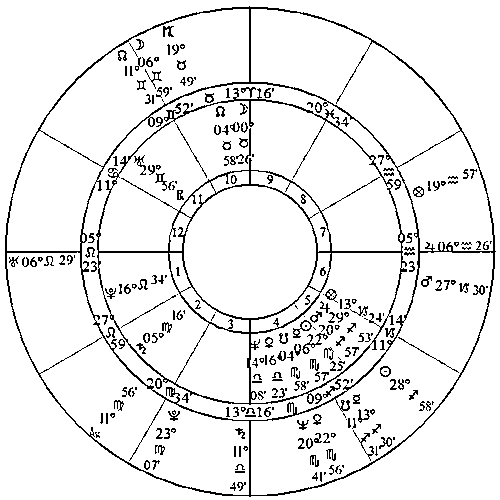

1984 年（12 月 1 日）的出生-行进双轮星图：

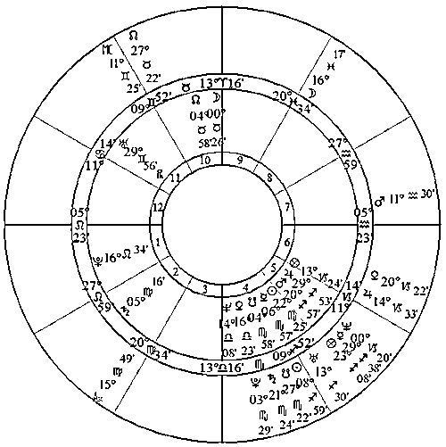

8 月 29-31 日，现代占星鼻祖诺·泰尔将在北京举办“太阳弧预测技法实战工作坊”，教你如何一眼识别生命中的重大趋势，详情请点击文末的“阅读原文”。

_______________________________

若道星文化，是由美国著名占星师大卫·瑞雷老师创办的占星学培训与文化传播机构，是国际占星研究协会(ISAR)在中国唯一一家定点合作机构。

**【占星入门——若道占星】微信订阅号：nodoorbj**

* 若道官网：www.nodoor.com 可提供占星咨询、占星课程、星盘查询、应用测试及电子杂志等服务。

* 新浪微博：@若道占星

**也请支持我们的朋友：**

**【无央之界】微信号：Akhaldan**

【若星辰（若道星文化上海同学会）】微信号：nodoorsh

【金陵星空教室】微信号：astronanjing

【Nana 占星社】微信号：NANA-astrology

【悦然。馨境生命分享】微信号：yueranxinjing

【心灵自由】微信号：freedomloveaction

**【聆宇电台】Cora 微信号：lingyudiantai**

# 【律动静心】宁偲程：神圣舞蹈——动起来的静心

> 原文：[`mp.weixin.qq.com/s?__biz=MzA5NjA0NTAxNg==&mid=200933376&idx=3&sn=0ac0a4461ad10723ef44e21a2f82332e&chksm=1eb8b2b729cf3ba1aa379965c5082d837ca08677c46bc2fee45fc8ffa4914c7ab338e992ac96&scene=126&sessionid=1692739135#rd`](http://mp.weixin.qq.com/s?__biz=MzA5NjA0NTAxNg==&mid=200933376&idx=3&sn=0ac0a4461ad10723ef44e21a2f82332e&chksm=1eb8b2b729cf3ba1aa379965c5082d837ca08677c46bc2fee45fc8ffa4914c7ab338e992ac96&scene=126&sessionid=1692739135#rd)

****

**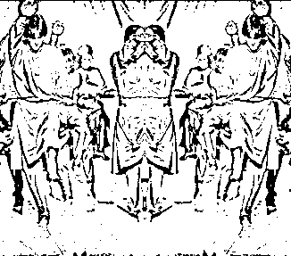**

****当下的力量—团体式觉察 & 葛吉夫律动（神圣舞蹈）工作坊****

所有的心理疗愈、心理整合以及心灵成长，都需要一个共通的品质，那就是——觉察。

透过觉察，我们把散落在无意识的碎片带入意识层面，整合自己。透过觉察，我们汲取有益的素材，让现在更为清晰透彻，让未来更为明确有力。

所有的问题和失衡都体现在头脑（信念/想法）层面、情感（情绪/感受）层面、身体（感觉）层面。这三者截然不同，但是息息相关。

葛吉夫说：“每一人种、每一民族、每一纪元、每一国家、每一阶层、每一行业，都有属于自身的为数有限的姿势和动作。这些姿势和动作是人身上最为长久难改的模式，控制着他的思维方式与情绪反应。除非我们同时改变我们所惯常的姿势和动作，否则，我们很难改变无意识思维以及下意识的情绪反应。”

葛吉夫律动（神圣舞蹈）是一系列精心设计的动作，以迥异于常规的视角和操作方式，同时触及我们的头脑、身体和情感（或者说，同时使用左右脑。请想象一下：左手画圆、右手画三角）。

这个方法把我们强行拉回当下，去观察并且整合内在和外在。曾有人开玩笑说，在律动里，即使想要逃离当下，都是不可能的。

如果你尚未品尝过当下的滋味，透过律动来品尝吧。如果你有过这样的体验（无论透过什么方法），律动能让你验证它，并且学习把“完整”带入行动里。

这个方法并不鼓励幽闭在内心的空间，而是要在队列里与他人配合。你不仅要学会自足，还要学会带着觉知与人互动——从而让当下成为流动的。

**我们做什么**

I·透过互动式的觉察练习，帮助头脑从梦游状态回到当下的直接体验。

II·透过日用练习的设定与讨论，把觉知带入到日常生活。

III·透过葛吉夫律动（神圣舞蹈），让全副身心进入这个新鲜的临在状态。

小提醒

葛吉夫律动并不是跳舞，所以无论你是否有跳舞经验或喜不喜欢跳舞，都是无关紧要的。我们不是在学跳舞，我们是在学习觉察自己、了解自己，整合自己。

名人推荐

我们有坐禅、行禅，这都是开发觉知的方法，但是我们没有律动。希望在未来的日子里，我们把律动也加进到禅中。”——著名禅师：铃木大拙（D.T.Suzuki）

如果没有葛吉夫以及他所留下的方法，现代心理技术与心灵发展一定缺少了重要的一环。他不仅开启了团体工作的先河，也创造出把觉知带入生活的实际方式。

—— 超个人心理学的先驱 塔特博士（C.Tart）

葛吉夫的方式为我们指出了清明觉照的生活所能带来的丰硕成果。

—— 索甲仁波切（《西藏生死书》作者）

葛吉夫所创造的“人格与本体”的理论及其内在工作的方式，一直是我的工作最强有力的灵感来源之一。 ——阿玛斯（钻石途径工作及著作的作者）

**时间**：8 月 16-17 日

**地点**：待通知

**费用**：2000 元（老生 8 折）

**报名：李洋：18601950700（微信同）**

**或点击文末“阅读原文”，直接进入报名页面。**

导师简介：宁偲程（Sakshin）

**Akhaldan 聚落**创始人

张德芬《新世界》、《灵性冲撞》读书会的特约嘉宾

风潮唱片心灵音乐的特约撰稿人

曾涉猎印、藏、缅、泰的不同禅观实践，学习葛吉夫律动十余年，也进修心理学的治疗技术，带入超个人心理治疗的视角。经相关机构认证的其它工作还有：家庭系统排列治疗师·呼吸治疗师·Mystic Rose 团体带领者等等。

写给你们的：

对我来说，人生不是要完美，而是要完整。“完整”意味着从自己所**在**之始，连结到自己所“**是**”之终。所有的问题/难题/阴影/制约，都可以成为完整自己的一把钥匙、一扇门或是一条路。

我只是分享自己的经验：尤其是曾经的误区与反思。其它的新视角与新技术……用什么称谓都无关紧要，重要的是，我无法把我的经验替换成你的经验，所以在这个工作里，你才是主体。

“我是”什么，只是为了支持到“你是”什么。

公众微信号：**Akhaldan**

博客：http://blog.sina.com.cn/akhaldan

微博：http://weibo.com/akhaldan

* 如果您想更多了解我对于神圣舞蹈的体悟，请参阅《心理月刊》2010 年 11 月的采访，或是《风度》杂志于 2012 年 8 月刊的专题访问。

记得点击这里的“阅读原文”哦~

# 【律动静心】宁偲程：神圣舞蹈习练者分享

> 原文：[`mp.weixin.qq.com/s?__biz=MzA5NjA0NTAxNg==&mid=200933376&idx=4&sn=b78273c3dc33dccf2c3eef442bea58ef&chksm=1eb8b2b729cf3ba1839755b5882d0d2ae6fcd79fdf3171cf17143c684f91524d20ee9da26084&scene=126&sessionid=1692739135#rd`](http://mp.weixin.qq.com/s?__biz=MzA5NjA0NTAxNg==&mid=200933376&idx=4&sn=b78273c3dc33dccf2c3eef442bea58ef&chksm=1eb8b2b729cf3ba1839755b5882d0d2ae6fcd79fdf3171cf17143c684f91524d20ee9da26084&scene=126&sessionid=1692739135#rd)

****

**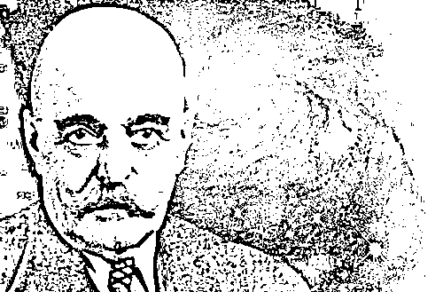**

****当下的力量—团体式觉察 & 葛吉夫律动（神圣舞蹈）工作坊****

****学员分享：****

**（YR 分享）**喧嚣处的定力，龙卷风的中心。神圣舞蹈直接从身体入手，打破自我的习性，将有目标的行动和觉知完美组合。和一般课程不同，神圣舞蹈犹如一把利剑，当下直入，没有任何讨好和停留。如果你不愿挑战自己，神圣舞蹈不适合你。如果你不敢深入自己的临在，神圣舞蹈不适合你。如果你不想活出自己的光芒，神圣舞蹈不适合你。当你准备好，当下一刻，起舞吧！

**（Amy 分享）**我常被问到，神圣舞蹈教什么？能有什么收获？神圣舞蹈是以舞蹈的形式来呈现的静心。从初浅的形式来看，它能够训练肢体的协调力，加强与身体的连接，每一支舞曲都很优美，值得欣赏；接下来，神圣舞蹈提供一个穿越自我的可能性。

在过程中，能够观察到自己的模式，这些模式在舞蹈过程中不断被看到，就像人生总在某一处犯同样的错，无处可逃，别无选择，只有穿越它才能继续。神圣舞蹈要求舞者时刻处于当下，时刻带着觉知，这对每个人都是挑战。所以几天的课程会有人想逃，这很正常，穿越它，会有一份清明的智慧与了悟发生。这些舞蹈的背后都有超越语言的秘密，这是关于我们自己的秘密，需要我们在过程中去自行领悟。

**（DNT 分享）**这产生一种特别的觉知——圆周式的注意力；因为要专注的目标不是一个而是多个：要数拍子、要做动作、还要听节奏。意识到错误，必须马上放下，不能反顾。反顾就是错上加错，失去觉知。

神圣舞蹈是在动态中、在众人中去锻炼觉知，我们的头脑、情感、身体之间会产生“摩擦”，这种摩擦启发我们返回日常生活去观察——原来我们的身体、理智与情感一直是分头工作、互相扰乱的，而“觉知”一直在打盹。神圣舞蹈正是学习开始让身、脑、心共同工作，同时，叫醒我们的“觉知”。

**（DF 分享）**律动？葛吉夫？神圣舞蹈？甭管叫什么，我爱上它了，如同必须爱自己那样明确、蛮横、理所当然、无可置疑！

当偲程的律动工作坊拉开帷幕时，我带着两个目的：一方面，学习安住当下；另一方面，迎接律动的正面攻击。可是拳头落空了！整个过程都沉浸在喜悦中。

喜悦不仅来自律动，还来自对觉知的领悟。随着那个保持 50%的觉知在脚上的练习，我领悟到，要更好安住当下、全然接受，就必须把觉知加进去，而这个觉知是分散而不是集中的。参加身心灵课程之前，有觉知，但是走哪儿算哪儿；参加完其他课程，觉知开始看到情绪起伏、思维流动，缰绳握上了，可还是马带着我跑；在律动的觉知练习里，我忽然发现，原来觉知是可以分散的，也就是同时拥有不止一匹马！当能同时保持对眼耳鼻舌身意心内身外各感官的觉知，我就不是被马带走的乘客，而是牧马人，我不再被马控制，而能够成为马群的主人。

获得觉知的同时，律动也加深了对于接受的领悟。在队列中，无论他人如何出错都不必纠正，只是看到就是，不必改变什么，真正的干扰只发生在心里。若不安住在当下一刻的律动里，就可能出错或是跟着前面舞者的错误舞动。若在每一刻接受和信任，动作就能自然发生。出错也没关系，只要找到当下该做的，就又能回到律动。领悟所有这些都源于分散在各处的觉知！这感觉太美妙了！

觉知、接受、当下。这三个支点能支撑起的不仅是律动，更能撬生活。或者说，生活就是最宏大的律动，与我们此生相伴、来世不离。而律动是完美的工具，如同具体而微的生活，在其间显现面对生活的智慧。

**（ZM 分享）**最近一直在把多余的东西往外清理，扔的扔，给的给。分享的分享。我的生命有太多负累，完全不需要的东西占据我的能量。律动中，我明显观察到：任何一个多余的小动作，任何一个夸张的步伐，任何一个自我重要感引发的心理对话，都会极大程度影响生命的优雅与节奏，也让动作无法完成。

实际上，我们在自我牵绊。无需多余付出能量，只做最基本的动作。从外面看起来神圣，从里面感觉起来统一，祥和，整个人以好不纷乱的整体存在于世间。此时，毫无多余。当我们节省了不必要的能量浪费，我们就能完成高难度的动作。我们坐于开工，轻松应对一切他人看来无法完成的任务。

**（YL 分享）**参加律动前，刻意不看任何资料，不看任何视频，在知识层面一无所知。整件事从开始到现在，我不知为什么，而我清楚知道我在做什么。三天结束，一切发生完美诠释了两个字--孽缘--的丰富内涵。如果生命是赐予的礼物，那么觉察到不可抗拒的完美的步步安排、环环相扣、一个片刻接一个片刻的珍珠，则是我所能虔心回报的臣服。

在做律动和分开注意力的时候，我的意志可以扩展到能力所及的最远边际，各个感官与身体部件各行其是、互不干扰，我在偲程的指导下把情绪导入心成为专注力。相应的，身体、理智、情绪这三个词再不是形而上的汉字，我清楚明白的体验到分属不同中心的能量流动，在律动的过程，他们浮出水面。这种感觉在当前的人生阶段是我最美妙的体会。而一切才刚开始。

**（LLH 分享）**律动时的一句话记忆深刻：“活在当下，为下一个片刻做准备”。这三天一直在体验这句话 ，不在那个片刻就做不出来，做出来，才能顺利到达下一片刻。每个片刻连在一起才有完整的同在。

**（RQ 分享）**我们是做了四晚的静心，而不是跳了四晚的舞。今晚阿布帮忙摄像，她看完后，憋了半天说出四个字--“历史长河”…可以想象，那个场，专注的力量太震撼了。跳完仍久久沉浸在那个氛围不愿出来。这是真正的静心。

**（LJ 分享）**与疗愈课常见的悲情克制，感极而泣不同，律动课上频频爆发会心大笑。这无关老师的幽默或设置的包袱，过程的愉悦感全来自身体和头脑发生冲撞的时候。在其它环境，发现出错时，哪能如此放松。

课中有个练习---分享感受时不许用某个词，这个词本身并无任问题，但当我们不断被提示到脱口而出这个词时，还是非常意外的。现今职场上各种沟通技巧，已将我们调教的有逻辑有理性。唯一丧失的却是词语说出前的那一刻。

我们一直都在自己玩自己。你玩修行的时候，修行也在玩你！偲程老师念兹在兹的是：努力只是个想法，不要努力去努力，也不要努力不努力。努力的时候，注意到心在努力。不努力的时候，注意到心在不努力。想要把努力变成不努力的时候，注意到心正在“想要”。注意到，就是修行。其它都只是另一个与下一个要去注意到的“对象”而已。

偲程老师的律动加入了意识扩展的训练。我体验到那种全然临在感，是此前从未在冥想中体会到的。那一刻注意到身体与地板的触觉，注意到周遭声音，注意到时紧时松的呼吸，还注意到在三者的交替里，头脑里有个巨大空间伸缩自如。

老师说：律动是身体和头脑的对话。不是我们平时用头脑组织正向语言去驱动身体，而是完全跳到头脑和身体之外看它们的交流。你不是头脑，也不是身体，而是扩展的意识——注意力（虽然老师说，也不要抓那个注意力）。

流行鸡汤都在售卖“活在当下”。我想说的是，只有清晰明了下一步要做什么和怎么做，这个当下才有意义，不然那叫“死在当下”。

言多必失，这是体会的课，要用整个身体、头脑和注意力，而不是想象力。

**（19 岁的如如分享）**爱这个神一般的团体式觉察，每一支音乐都有独特的力量律动着心脏。最喜欢同时舞动着柔软和果断：身体，音乐，左边，右边，节拍，乱成一团。没有长期练习的自己无法形容是怎样在“做”的。在泰国时，阿姜鼓励我：“孩子，知道自己迷的人，不谜。”在律动中，我至少看着自己的“乱”；而在律动中，乱也乱不长久……

**（SL 分享）**从僵硬到松动，从松动到被触及的柔软，从角落开始着地。我体验到头脑和身体的分开，有时能在这种状态下，完成一两组高速律动，感到被打开与释放。回到当下的体验是美妙的。

**（Amber 分享）**有些东西于我已经不知不觉改变。这个改变是什么呢？就是我可以同时想、同时做、同时感受了。我终于体验了一个片刻接着一个片刻。

**※分开注意力与律动※**

持续地分开注意力，将它带到律动里以及比自己更大的事物中，我们经常迷失在其中一个里面（或是律动或是比自己更大的事物）。一旦停止努力，我们便与各种情况认同（纠缠）。所以，我们把律动视为一种环境，一种帮我们训练注意力的例外环境。

思考有自己的重心，身体有自己的重心；情感也是同样。律动的设计让我们从一个重心转移到另一个重心，正是这种转移，创造出一种状态。

**——Jeanne deSalzmann（律动的保存者，葛吉夫先生最重要的学生）**

这是多年前翻译的片段，送给在实践“分开注意力”的朋友。每当看到你们的分享与收获，我就确认我们共同的努力和坚持是值得的。

偲程（Sakshin）

**时间**：8 月 16-17 日

**地点**：待通知

**费用**：2000 元（老生 8 折）

**报名：李洋：18601950700（微信同）**

**或点击文末“阅读原文”，直接进入报名页面。**

# 海王星：We are all one！（三）

> 原文：[`mp.weixin.qq.com/s?__biz=MzA5NjA0NTAxNg==&mid=200933376&idx=1&sn=357f26f105c6a66cac497cb1bbd2dacf&chksm=1eb8b2b729cf3ba14498bb7257a12bbc3431325f9f1925e437d5aecd0cca9b458fdd1f34a37e&scene=126&sessionid=1692739135#rd`](http://mp.weixin.qq.com/s?__biz=MzA5NjA0NTAxNg==&mid=200933376&idx=1&sn=357f26f105c6a66cac497cb1bbd2dacf&chksm=1eb8b2b729cf3ba14498bb7257a12bbc3431325f9f1925e437d5aecd0cca9b458fdd1f34a37e&scene=126&sessionid=1692739135#rd)


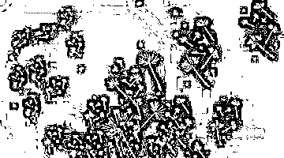

本文源自 Jodie Forrest 进化占星讲座，由逸月进行整理、翻译和编辑，原载于若星辰（微信公共号：nodoorsh）。

文中的神可以理解为光、神性等，并不是宗教意义上的神。

之前也有讲到，如何健康地表达海王星。在继续深入之前，我想给你们讲一个故事。曾经，佛陀的弟子问他：“你是神吗？”佛陀回答：“不，我不是神。”弟子问：“你是先知或天使吗？”佛陀回答：“不，都不是。”弟子又问：“你是更高的存在吗？只是借用人类的身体。”佛陀回答：“不，我和你一样都是人类。”弟子问：“你到底是什么？”佛陀说：“我是觉醒的。”当我们面临海王星的时刻，我们必须尽可能地觉醒。

那该如何尝试在海王星的实相中觉醒呢？一个方法是冥想。冥想通常有两个部分，第一步是闭上眼睛，让心智安静下来。第二步是把你的意识放到内在，让你可以感知内在深度的觉知。冥想可以让心平静下来，佛教说冥想可以让你的心不再受情绪所控制。如果有人对冥想不感冒的话，那么任何能让心智平静下来的事都可以尝试，不论是禅修、大自然、艺术、助人为乐等。请鼓励任何在海王行运的人长期坚持进行冥想或让心智平静并于内在连接的练习。

想象小荷在遇见那个男人之前来咨询占星师，如果她来见你，你可以和她聊聊目前的海王行运可能会带来的挑战，你可以告诉她圣贤的故事带来的智慧和启发。同时也提醒她在哪个领域她会受到驱动力去寻求合一。你需要鼓励她向内观，和内在的“神性”接触而不是和某个人合一，把那个人误以为是伟大的造物主。

海王星也和上瘾有关，另一个可能的陷阱是小荷也许会对那个男人贩卖的毒品上瘾。毒品上瘾可以让人麻木，自我的界限消失了，所以会让你感觉到合一的幻相。不是所有的上瘾都是和物质相关，也许对睡眠、锻炼、购物、看电视，也会和一种关系上瘾，如上师和弟子，似乎对另一个人上瘾了。如果没有这段关系，我似乎就不存在了。如果我和某一人或物的一体性关系是存在的，那么我就是安全的。如果这个关系被打破了，那么会感到强烈的焦虑和不安，不论是和人的关系还是和信用卡的关系等等。如果被挤出那个共生的“子宫”，而个体就会死亡般的痛苦！

海王星还与受害者、施害者以及救赎者联系在一起。假设小荷对她爱的男人贩售的毒品上瘾，我们可以说小荷是这个男人或毒品的受害者。但从另一个角度来看，小荷在上瘾这件事上面其实是那个男人的共谋者，因为她没有辨别出这个男人的真相，也没有让自己觉醒，于是她让自己成了受害者。谈论受害者是个复杂的议题，因为受害者、施害者、救赎者三者之间是紧密关联的动态关系。

举例来说，心理咨询师需要有在工作中有界限感，不能跨国界限去拯救来访者。如果咨询师试图拯救那个可怜的受苦受难的来访者，那么迟早咨询师本人会觉得受到了某种“加害”，并受到了这种混乱的咨询关系的伤害。如发生这样的状况，那么作为受害者的来访者此时成为了施害者，而咨询师便成了受害者。我们需要知道的是，我们都是神的一部分，我们并不是神！佛陀说的是，我是觉醒的！觉醒的一部分，是意识到我们是神的一部分。如果海王星带来了膨胀让我们在生命里扮演“神”那么可能会从拯救者变成施害者。而我们时刻需要警觉的是海王星带来的受害者-施害者-拯救者的动态模式。

我们都知道，海王星代表苦难和受苦，因为哪里有受害者，哪里就有苦难。而海王星的神秘性，往往又让我们很难去理解苦难源自哪里。对我们更具价值的事是要学会去面对和处理这些生命中的苦难。如何去处理苦难而不将这些苦难再施加到别人身上。我们可以思考一下，为什么某些人在经历了剧烈的人生苦难，能够从中汲取智慧而变得强大、慈悲？而某些人则经历了一点痛苦就痛不欲生不可自拔？我们可以说，也许后者的受害者意识让他们沉沦，而前者的韧性让他们从灾难中升起。韧性是应对海王困难的良药，而通过增加我们的韧性来应对海王星苦难并帮助我们从中振作的特质是：同理心、灵活度、创造力、幽默和智慧。

同理心和灵活度是海王星的特质，它代表我们需要走出自己的小小空间，去看到别人的需求，并且在自己不受损害的基础上，尽可能去满足别人的需求。那些韧性强的人们，大多数都渴望去帮助别人，并且通过帮助别人获得极大满足感，这也是海王星的无私特质。

创造力也是极具海王特质的，一本书的撰写是不可能通过科学的测量获得的，音乐家可以在他们的脑海中听到乐曲的声音。我们也可以说，音乐家成了音乐的管道。同样地，创造性地看待一样事务，并实现创造性的结果，创造性地诠释事物意义，对我们的生命都是具有极大帮助的。更重要的一点，是要接受苦难而不是抗拒它，并带着觉知去觉察我们的行为，通过赋予苦难以意义来赋予生命一些希望。这些都可以帮助我们走出“受害者”的意识，也可以帮我们更接近那个更宏大的世界。

罗宾·阿姆斯特朗将于 10 月开展“琴弦工作坊”和“命运工作坊”，详细信息请点击文末的“阅读原文”。

_______________________________

若道星文化，是由美国著名占星师大卫·瑞雷老师创办的占星学培训与文化传播机构，是国际占星研究协会(ISAR)在中国唯一一家定点合作机构。

**【占星入门——若道占星】微信订阅号：nodoorbj**

* 若道官网：www.nodoor.com 可提供占星咨询、占星课程、星盘查询、应用测试及电子杂志等服务。

* 新浪微博：@若道占星

**也请支持我们的朋友：**

**【无央之界】微信号：Akhaldan**

【若星辰（若道星文化上海同学会）】微信号：nodoorsh

【金陵星空教室】微信号：astronanjing

【Nana 占星社】微信号：NANA-astrology

【悦然。馨境生命分享】微信号：yueranxinjing

【心灵自由】微信号：freedomloveaction

**【聆宇电台】Cora 微信号：lingyudiantai**

# 【星象预报】一周宇宙天气：8 月 11 日-8 月 17 日

> 原文：[`mp.weixin.qq.com/s?__biz=MzA5NjA0NTAxNg==&mid=200933376&idx=2&sn=b47f1a398324489d89becfd74ec0d2d3&chksm=1eb8b2b729cf3ba12e147ab17e693da7d00a6499f27a5b7654143d6eb924992f9123551f720a&scene=126&sessionid=1692739135#rd`](http://mp.weixin.qq.com/s?__biz=MzA5NjA0NTAxNg==&mid=200933376&idx=2&sn=b47f1a398324489d89becfd74ec0d2d3&chksm=1eb8b2b729cf3ba12e147ab17e693da7d00a6499f27a5b7654143d6eb924992f9123551f720a&scene=126&sessionid=1692739135#rd)

****

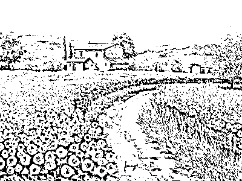

作者：杰夫•焦耳

译者：李含

校对：轩轩

杰夫•焦耳授权若道占星独家发布其宇宙天气预报系列  转载请注明来源并附原文链接  

注：文中提及的时间均为北京时间

**8 月 11 日 星期一**

2：09，水瓶座满月为我们拉开这一周的序幕，冷静的水瓶座与狮子座炙热的情感形成鲜明对照，但即使这场日月辩论有一个轻松的开场，深层的氛围也依旧严肃，因为天蝎座土星与日月成四分相。

宏伟的计划需要时间、金钱和精力去实现，而土星在这里的角色就是设置资源聚集的优先顺序，使其发挥最大效力。情感的压抑和戏剧性表现是为了逃避艰难的抉择，但我们必须做出这个决定，才能结出累累硕果。

20：55，月亮进入逃避现实的双鱼座，静谧的夜色让人可以安心地休息。此时，情绪会顺畅地流动，想象力也很丰富，但并不适合处理难题，它们就像无法越过的挑战。

**8 月 12 日 星期二**

7：26，月亮与海王星合相，双鱼座月亮的灵性和温柔在此时达到巅峰，让我们进一步远离现实，但同样也促进了同情心和创造力的发展。

11：51，月亮与强健的火星成三分相，为我们的奋斗注入力量。

14：57，月亮与冥王星成六分相，深刻了灵魂。

15：23，爱神金星进入热情洋溢的狮子座，浪漫的冲动在高涨。现在，你或许看到满满都是爱的告白，但对获得认可和赞同的需求也会膨胀到夸张的程度。这一行进带来的热烈感受可能会因为敏感的双鱼座月亮而变得扭曲，富有戏剧性。

**8 月 13 日 星期三**

21：00，月亮进入火象的白羊座，这一充满自发性与独立性的星座渴望现在就尝试新的体验。

23：43，粗鲁的白羊座月亮因为狮子座金星的三分相变得温柔了起来，享乐与社交是优先选项。

**8 月 14 日 星期四**

3：45，水星与冥王星的 135 度相位会带来些麻烦，可能会有误解暗中破坏交流。对信息有所保留也是高尚之举，避免破坏了派对的气氛。批评苛责会在关系中种下怀疑的种子，或是渐渐破坏项目的达成。挖掘细节，探讨微妙的议题在此时比沉默更具疗愈性。

7：27，月亮与扩张性的木星成三分相，晨曦间都透出精神的光辉。

**8 月 15 日 星期五**

10：23，火象的月亮与太阳成三分相，浪漫、创意和玩耍之风愈吹愈强劲。

12：11，木星和海王星成 150 度梅花相位（狮子座-双鱼座 6°34'）预示着思想上出现棘手问题，或是理想抱负不够踏实。但这个具有调整力量的相位可以柔化刚愎自用的信念，给予他人同情而不是指指点点的评判。

17：29，强有力的火星与冥王星成六分相（天蝎座-摩羯座 11°20'）预示着丰硕的果实，不浪费时间和精力，就是这样的高效率！

23：57，月亮进入土象的金牛座，告诉我们是时候回归简约、重拾根基了。这个顽固星座今天可能不会那么自我放纵，而是表现出更强的持续力。

**8 月 16 日 星期六**

0：43，水星进入踏实的处女座，继续务实的思考、高水平的分析技巧、锐利的知觉，专注于取得具体的成果。

7：57，月亮与活泼的金星成四分相，11：35，与海王星成六分相，12：01，与木星成四分相，可能会鼓励金牛座月亮玩乐的一面，而不是专心致志的工作。

16：33，神经质的水星和天王星成 135 度相位，绽放耀眼的才华。

21：28，月亮与战斗力强悍的火星成对分相，恐怕不易对付。合作需要妥协，但固定星座之间的对分相并不长于此道。但是，有清晰的目标，有尊重他人的态度，可以帮助你克服困难，使伴侣关系富于成效。

**8 月 17 日 星期日**

20：25，金牛座下弦月与狮子座太阳成四分相，要求我们重新评估宏大计划。骄傲可能会促使我们做出有违常识的决定。

23：07，金星与海王星成梅花相位（狮子座-双鱼座 6°30'），紧紧抓住目标不妨恐怕并非良策。因为关系和资源而感到不安，可能会触发刚性的逆反应。但承认不确定性能带给我们所需的灵活性，去解决我们的困境。

______________________________

大卫·瑞雷即将于 9 月 25 日起，开始“职业占星师中英文资质课程——高阶”，想要考取国际占星师资格证的你，想要成为职业占星师的你，这将是你踏入职业占星的第一步。欲知详情，请点击文末的“阅读原文”。

若道星文化，是由美国著名占星师大卫·瑞雷老师创办的占星学培训与文化传播机构，是国际占星研究协会(ISAR)在中国唯一一家定点合作机构。

**【占星入门——若道占星】微信订阅号：nodoorbj**

* 若道官网：www.nodoor.com 可提供占星咨询、占星课程、星盘查询、应用测试及电子杂志等服务。

* 新浪微博：@若道占星

**也请支持我们的朋友：**

**【无央之界】微信号：Akhaldan**

【若星辰（若道星文化上海同学会）】微信号：nodoorsh

【金陵星空教室】微信号：astronanjing

【Nana 占星社】微信号：NANA-astrology

【悦然。馨境生命分享】微信号：yueranxinjing

【心灵自由】微信号：freedomloveaction

**【聆宇电台】Cora 微信号：lingyudiantai**

# 上升星座：爱情中的土象、风象星座

> 原文：[`mp.weixin.qq.com/s?__biz=MzA5NjA0NTAxNg==&mid=200927748&idx=1&sn=9f8a6c3b3913c844af52764843e9585b&chksm=1ebb58b329ccd1a53d2f1e43bbbaef58807f196bcad4106b2794ca3fc2aecc3b5bd59a135ee0&scene=126&sessionid=1692739135#rd`](http://mp.weixin.qq.com/s?__biz=MzA5NjA0NTAxNg==&mid=200927748&idx=1&sn=9f8a6c3b3913c844af52764843e9585b&chksm=1ebb58b329ccd1a53d2f1e43bbbaef58807f196bcad4106b2794ca3fc2aecc3b5bd59a135ee0&scene=126&sessionid=1692739135#rd)


8 月 5 日，我们通过《解密上升星座：通向爱情的第一扇门》了解了火象星座的爱情性格，今天让我们一起来看看土象（金牛座、处女座、摩羯座）和风象（双子座、天秤座、水瓶座）上升星座的爱情~

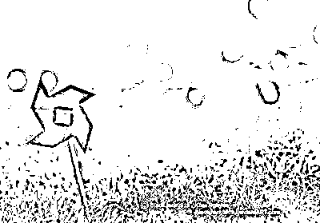

本文摘自史蒂芬·阿若优的《人际占星学：性与爱的能量和谐》，感谢@蓝莲花 9999（微博帐号）的编辑和翻译。此书由世界图书出版公司出版发行。

**土象星座（金牛座、处女座、魔羯座）**

拥有脚踏实地的世界观，关注物质世界，态度保守，常常压抑想象力的发挥，因此也会限制个人的选择，以及（或是）抑制自由地表达自我。稳定、可信赖，这也是他们评价自己和他人时最在意的因素。注重实际和与生俱来的耐心让他们比其他上升星座对按部就班的日常生活更有忍耐力。他们处理事务很有系统性，通常遵循既定法则，这是他们最常见的自我表达方式。

金牛座：

行事不紧不慢，但不可轻视他们坚定的决心。他们没有艺术家的坏毛病，对于生命节奏拥有无穷无尽的耐心，这令他们能够与人为善。无论遇到什么事，他们都能处变不惊，丢盔弃甲不是他们的作风。他们绝对坚持自己的行事节奏，这一点常令旁人窝火。他们性格相当温厚，偶尔也会因为别人逼迫他们加快速度而恼羞成怒。

处女座：

他们是最好的细节处理者，但出于谦逊和容易焦虑的倾向，讨厌掌权当领导。精神长期高度紧张，神经系统非常敏感脆弱，因此时常对食物或周遭环境挑剔不满。他们真心热爱工作，这也许是唯一证明他们价值的方式。这是一群少见的真正谦逊、想要服务他人而非另有所图的人。

摩羯座：

心理年龄远远超过实际年龄。他们给人以可靠、可信、值得尊敬的印象，往往早担大任，且行事得体，除非他们屈从于内心的独裁主义需求，想法设法要支配别人。虽然看起来自信，但他们内心相当焦虑。“时间感”是掌握这类人个性的关键概念，他们不是耐心十足、有条不紊地处理问题，就是行动过于迟缓、行事过于谨慎，常常因为行动不及时而令他人失望。

**风象星座（双子座、天秤座、水瓶座）**

思路飞快、主动思考；好奇、好问、爱社交、友好、健谈。通常很聪明，洞察力敏锐。有时因为智力过于发达而纠于脑内思辨，不见行动。想要理解万物；或在概念的世界里。天生具有与人沟通、理解他人观点的能力。

双子座：

非常友善、很有好奇心。爱交流，无论倾听还是主动追求，他们的兴趣都无边无际。非常健谈并且（或者）非常聪明。词语、概念、新技术永远令他们着迷。他们富有机智，但在控制头脑上缺根筋。他们头脑中的一部分并不认可其他部分的所思所想或所作所为，因此常常出现自相矛盾的行为，令他人摸不着头脑。他们通常很聪明，但在日常生活中需要指引和规范。

天秤座：

对他人的意见、社交氛围和艺术气氛和品味均非常敏感。本能地想要取悦他人。他们非常有创造性，但通常在与他人合作或在团队中工作时才最能发光发热，因为他们需要从他人身上获得灵感和自信心。他们总在思考，总在各种选项中进行权衡，有时分析太多而行动太少。他们对个人外表很看重，通常很有艺术品味。善良、富有同情心，除非感受到竞争或遭受不平等的对待。给别人出主意时常常能提供最佳的判断，但对待自己的问题往往难以保持头脑清醒，孤军奋战时尤其缺乏决断力。

水瓶座：

看似精于社交，对他人很友好，其实极度超然。智力上非常敏锐，在文化、社会、专业层面通常与时俱进。热爱团队合作，是博爱主义者，但在处理亲密关系和感情问题时常常不知所措。常常有极端的态度和行为：有时沉溺于抽象思考中，显得“神神叨叨”；有时才华横溢；有时过分死板、保守，受困于自己狭隘的概念。

其他星座待续……

10 月 24-26 日，斯蒂芬·弗里斯特将来中国开展深度亲密关系工作坊，向你我讲述爱情的秘密。预知详细信息，请点击文末的“阅读原文”。

_______________________________

若道星文化，是由美国著名占星师大卫·瑞雷老师创办的占星学培训与文化传播机构，是国际占星研究协会(ISAR)在中国唯一一家定点合作机构。

**【占星入门——若道占星】微信订阅号：nodoorbj**

* 若道官网：www.nodoor.com 可提供占星咨询、占星课程、星盘查询、应用测试及电子杂志等服务。

* 新浪微博：@若道占星

**也请支持我们的朋友：**

**【无央之界】微信号：Akhaldan**

【若星辰（若道星文化上海同学会）】微信号：nodoorsh

【金陵星空教室】微信号：astronanjing

【Nana 占星社】微信号：NANA-astrology

【悦然。馨境生命分享】微信号：yueranxinjing

【心灵自由】微信号：freedomloveaction

**【聆宇电台】Cora 微信号：lingyudiantai**

# 白羊座：如果青春是一场美梦

> 原文：[`mp.weixin.qq.com/s?__biz=MzA5NjA0NTAxNg==&mid=200927748&idx=2&sn=5cb69e15ee8de879a19d20047e115708&chksm=1ebb58b329ccd1a5510645cddfdfdbc26aa150d6494f91305a46dd964cad545bbe7b4b73eb36&scene=126&sessionid=1692739135#rd`](http://mp.weixin.qq.com/s?__biz=MzA5NjA0NTAxNg==&mid=200927748&idx=2&sn=5cb69e15ee8de879a19d20047e115708&chksm=1ebb58b329ccd1a5510645cddfdfdbc26aa150d6494f91305a46dd964cad545bbe7b4b73eb36&scene=126&sessionid=1692739135#rd)


“白羊座为何这么简单直接？这么胆大妄为？对什么都跃跃欲试？”这篇文章将会告诉大家，白羊座需要什么，为何需要，以及会造成什么后果。

如果说青春是一醒来就消失无踪的美梦，那最好别让我醒来。

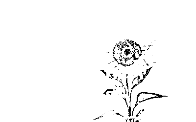

要是忍受也是一种勇气，那么驴子可比狮子英雄多了。

——莎士比亚《雅典的泰门》

白羊座的梦是热烈、激昂、充满力量的青春；狮子座的梦是骄傲的英雄，而射手座的梦是那一辈子也无法到达的远方。

很多次和白羊座人谈起梦想和未来这两个词，他们总是瞪大自己的眼睛告诉我：“我好像对未来真没什么打算，是不是太堕落了！”又或者语气比较坚定：“人嘛，谈什么梦想，活在当下不就好啦。”

的确，比起该有什么伟大抱负，还不如过好当下的每一天。但是作为人，怎么可能是没有梦的呢？尤其是白羊座这样对生活永远充满热忱的星座，肯定有什么他们想要的、他们害怕的东西驱使着他们活出精彩。

无论是做什么，他们都全情投入，永远没有疲惫的感觉，而一个白羊座的朋友告诉我：她最怕的是自己老到腿不能动，不能去向往的地方；她怕牙齿掉光，味蕾再也无法品尝新的美食；眼睛昏花，没办法看到世界一天一天的变化。和我聊天的时候，她已经快五十岁了，尽管看上去依旧年轻，可那充满自信的笑容上看得到无数岁月的痕迹。

是啊，也许他们正是“为了活着而活着”的那一批人吧，但他们的活着并不是没死，而是有尊严地活着。趁着自己还没死，多折腾吧，也许明天就没机会了——我给了自己一个答案，一直停不下来脚步的白羊座人应该是这么想的。

“当有一天我们老了的时候，可能不是希望自己被照顾，让社会大众对老人家有所改观，老人家其实是可以有光彩的，他们其实还可以做很多事情。”

**白羊座：青春**

有一部感动很多人的微电影广告《梦骑士》，在台湾是确有其事的，十七位平均年龄八十一岁的老人骑着摩托车花十三天环行台湾，证明了自己依旧活得很精彩。

尽管他们并不是白羊座人的组合，但这种精神依然值得我们这些年轻人学习：做什么事情都来得及，只要有无所畏惧的勇气和年轻的心。白羊座人最害怕的便是青春不在，那对世界的热忱消散地无影无踪，可已经有人证明过了：人的肉体会被现实折磨成衰老的模样，但是年轻的心是可以永远不变的。

没什么理由能阻挡我们去做任何事情，唯有力不能及，但我们总该相信奇迹。愿所有白羊座人也如同那些“不老骑士”一样，青春永驻。

转载请声明原作者安德烈

本文版权由安德烈以及@安德烈公益占星 所有

冒名发表后果自负

______________________________

大卫·瑞雷即将于 9 月 25 日起，开始“职业占星师中英文资质课程——高阶”，想要考取国际占星师资格证的你，想要成为职业占星师的你，这将是你踏入职业占星的第一步。欲知详情，请点击文末的“阅读原文”。

若道星文化，是由美国著名占星师大卫·瑞雷老师创办的占星学培训与文化传播机构，是国际占星研究协会(ISAR)在中国唯一一家定点合作机构。

**【占星入门——若道占星】微信订阅号：nodoorbj**

* 若道官网：www.nodoor.com 可提供占星咨询、占星课程、星盘查询、应用测试及电子杂志等服务。

* 新浪微博：@若道占星

**也请支持我们的朋友：**

**【无央之界】微信号：Akhaldan**

【若星辰（若道星文化上海同学会）】微信号：nodoorsh

【金陵星空教室】微信号：astronanjing

【Nana 占星社】微信号：NANA-astrology

【悦然。馨境生命分享】微信号：yueranxinjing

【心灵自由】微信号：freedomloveaction

**【聆宇电台】Cora 微信号：lingyudiantai**

# 海王星：We are all one！（二）

> 原文：[`mp.weixin.qq.com/s?__biz=MzA5NjA0NTAxNg==&mid=200927748&idx=3&sn=68a56aaef44bba4a677a09b7af6d595b&chksm=1ebb58b329ccd1a52fa0775c7275ab3072fa7d4175e28f868ce9548d50140c50bccdf3a2987f&scene=126&sessionid=1692739135#rd`](http://mp.weixin.qq.com/s?__biz=MzA5NjA0NTAxNg==&mid=200927748&idx=3&sn=68a56aaef44bba4a677a09b7af6d595b&chksm=1ebb58b329ccd1a52fa0775c7275ab3072fa7d4175e28f868ce9548d50140c50bccdf3a2987f&scene=126&sessionid=1692739135#rd)


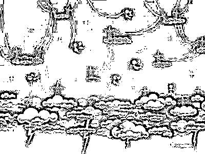

本文源自 Jodie Forrest 进化占星讲座，由逸月进行整理、翻译和编辑，原载于若星辰（微信公共号：nodoorsh）。

文中的神可以理解为光、神性等，并不是宗教意义上的神。

让我们以一个虚构的案例来看看海王行运的演化吧。让我们假设我们的客户叫：小荷，她正经历了行进的海王星合相 7 宫的月亮。海王带来的功课是什么？她需要学习什么？在海王行运结束的时刻，小荷会体验到海王的真理，那个神秘的合一。她需要通过她的感受去理解，因为海王触动了月亮，月亮代表感受、情绪和灵魂。小荷的灵魂被赋予了一次机会，让她感受这个真相。那么这些会发生在她生命的哪个领域？在她的关系中，所有的关系中，因为海王星的行进发生在 7 宫。让我们想象小荷面对推进有 2 个不同的剧本，一个剧本中她很好的应对了挑战，一个剧本中她失败了，那么分别会演绎什么样的剧情呢？

首先让我们看看她成功的面对了海王行运。她和小丽是好朋友，小丽是殷诚的佛教徒，小荷和小丽的关系是 7 宫的朋友关系，小丽的某些面向能够触动小荷的心灵，让她打开心灵，也触动了她 7 宫的月亮。我们有没有能力去分析为什么会喜欢上某一个人？你可以说，我喜欢 TA 是因为我们都是素食主义者，我们都来自同样的阶层，我们的收入水平很像，我们多是家中第二个孩子？……这些都不是我们受某人吸引的真正原因，尤其对于 7 宫的月亮来说这些更不成为理由。对于 7 宫的月亮来说，小荷可能会觉得，我在小丽身边觉得很安全，她非常温柔，我们都喜欢抽象派的画家，我们家里都收养了流浪猫…这些都是月亮的感受。

让我们假设，小荷看到她的朋友小丽很好的处理了生命中艰难的困境，甚至比她想象的还要冷静和优雅，她很好奇是什么让她拥有智慧。小荷开始对宗教并无很大的兴趣，但是因为小丽潜移默化她逐渐对佛教产生好奇。于是小荷与小丽一起去参加了上师的宣讲。上师非常的慈悲、安详、安住当下、并且充满大爱，上师的存在征服了小荷并深深触动了她 7 宫的月亮。并不是上师的宣讲多么的动人，而是上师的平静、慈爱、智慧和觉知深深感动了小荷的灵魂。小荷想要了解为什么上师能达到这样的境界，于是她开始学习佛教的智慧以及冥想，这些都对她带来很多的裨益。渐渐地，小荷的心（7 宫的月亮）开始减少了那种分离感，她的心渐渐充盈。

以上只是一个很小的故事，告诉我们成功的海王星行运是怎么演化的。当然并不是所有的人都需要通过宗教来成功通过海王星的考验。任何能帮助我们体悟到海王合一的超越小我的非线性的经验都是宝贵的。小荷也可以通过绘画来和海王星的神秘内在世界相连接。也许小荷通过专业的心理咨询，深入的了解到她和母亲之间存在的议题，月亮可以诉说很多和母亲有关的故事。也许她最终在心里放下了对母亲的芥蒂，或者也和母亲之间设立了健康的界限，不再受到母亲带来的伤害。我们可以通过很多方法来和海王星的意识连接，而同样要保护自己不会受到那些没有打开觉知的人的伤害。

那么海王行运会带来什么糟糕的局面呢？让我们再次通过虚拟的客户小荷想象一下。让我们假设一下小荷陷入了对一个无明的男人疯狂的爱。让我们假设这个男人是一个拍色情片的贩毒者。他是一个让小荷温暖的男人，他会深情的注视她的眼睛，他非常英俊、具有吸引力、魅力超凡，却又如谜一般无法预料，这似乎更增加了他的魅力。小荷无法自主的深陷其中了。请注意推进的海王星正在影响小荷的月亮，她的心需要这种与自己更宏大的对象合一。她内在的驱力需要和“神性”合一，想要和宇宙的力量相融。当她和这个男人在一起的时候，她感受到了浪漫、激情和生命的力量。

请注意在海王星行进下，会增加我们的驱力去追求合一的经验。正当她沐浴爱河并对婚姻充满期待的时候，发生了这样的意外（生命中真的存在意外吗？）。很巧的是，他们拥有一样的手提箱，而某个早晨他们匆忙之间拿走了对方的箱子。当小荷打开箱子的那一刻，所有的色情相片和白粉暴露在阳光之下，而她之前深信她爱的男人的职业是个艺术家和摄影师。除了愤怒、震惊意外，小荷的感受会是怎样？幻灭、被骗、上当、痛苦、悲愤等等。当我们没有识别对方的觉知，当我们没有保护自己免于无明的人的伤害，就会体验到以上所有的痛苦的感受。

为什么会发生这样的事？也许会很多不同版本的解释，但最根本的一个原因是小荷没有发现对方的无明，另一个原因在于小荷自己也是无明的，即她自己也没有意识到自己是那个“神性”的一部分。也没有意识到她可以通过更健康的方式表达海王星合一的能量。而错误的以为，她内在的终极合一的驱力是要去和这个男人结合。当我们尝试和某个人或物结合，而不是去向内观，追求与“神性”的合一，我们可能会受伤，因为这只能给我们带来合一的幻觉，从而引发幻灭感。最后的真相就如分娩把我们挤出海王星的子宫那么痛苦。这就是海王星为什么会和幻灭、失望、欺骗、幻觉有关，这些都是因为我们在错误的地方去寻求“神性”以及非线性的实相。通常海王星的迷雾会让我们自欺欺人，或者在某人对我们的欺骗中成为共谋。

未完待续……

罗宾·阿姆斯特朗将于 10 月开展“琴弦工作坊”和“命运工作坊”，详细信息请点击文末的“阅读原文”。

_______________________________

若道星文化，是由美国著名占星师大卫·瑞雷老师创办的占星学培训与文化传播机构，是国际占星研究协会(ISAR)在中国唯一一家定点合作机构。

**【占星入门——若道占星】微信订阅号：nodoorbj**

* 若道官网：www.nodoor.com 可提供占星咨询、占星课程、星盘查询、应用测试及电子杂志等服务。

* 新浪微博：@若道占星

**也请支持我们的朋友：**

**【无央之界】微信号：Akhaldan**

【若星辰（若道星文化上海同学会）】微信号：nodoorsh

【金陵星空教室】微信号：astronanjing

【Nana 占星社】微信号：NANA-astrology

【悦然。馨境生命分享】微信号：yueranxinjing

【心灵自由】微信号：freedomloveaction

**【聆宇电台】Cora 微信号：lingyudiantai**

# 海王星：We are all one！（一）

> 原文：[`mp.weixin.qq.com/s?__biz=MzA5NjA0NTAxNg==&mid=200919215&idx=1&sn=ea25c1800a453a52f6c75b8b5a09eb9a&chksm=1ebb7a1829ccf30e0a677e9eed011e2dc1575f4f74df41eaf8c81c4120c534564e898a5b76e0&scene=126&sessionid=1692739135#rd`](http://mp.weixin.qq.com/s?__biz=MzA5NjA0NTAxNg==&mid=200919215&idx=1&sn=ea25c1800a453a52f6c75b8b5a09eb9a&chksm=1ebb7a1829ccf30e0a677e9eed011e2dc1575f4f74df41eaf8c81c4120c534564e898a5b76e0&scene=126&sessionid=1692739135#rd)


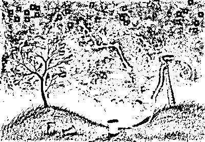

本文源自 Jodie Forrest 进化占星讲座，由逸月进行整理、翻译和编辑，原载于若星辰（微信公共号：nodoorsh）。

文中的神可以理解为光、神性等，并不是宗教意义上的神。

曾经有一位圣贤在宣讲，他说:“我们都一体的。世界上万事万物都是神的载体。”他极力推荐大家一起冥想，走向内在体会那个神秘的无法言喻的广阔空间，那个光明的存在。然后，圣贤说：“我们聚会的地方治安并不十分良好，请你们在听课前务必锁好汽车车门。”让我们想象，如果听众中有人正在经历海王星的行运，他们对海王星的无我非常着迷，他们经不住发问：“为什么我们要锁住车门？我们懂得海王星隐喻的真理，我们都是合一的，都是神圣的一部分，既如此，为什么神的一部分会去偷窃另一部分？”

我们都是神的显现化，因此我们非常安全。所以，某一天他们没有锁上车门就来参加大会，你们认为会发生什么？结果不出所料，当他们回到车前的时候，被抢劫一空了。于是这些人诘问圣贤：“你的教导怎么可能是真理呢？如果我们每个人都是神的显化，我们怎么可能会被偷盗呢？”“这是真的”，圣贤有耐心地回答到：“这个真理的后半部分是，并不是所有人都意识到他们是神的一部分。你们有权利保护自己免受那些无明（没有意识到自己是神的一部分，每个人都是一体的）的人的伤害。”以上这个故事，难道不是最基本的海王星能量的体现吗？

并不是所有人都带着海王星的觉知去运作的，并不是所有人都能领悟圣贤的教导。在星盘中如果海王星突出或者凸显，不论是在出生星图中还是通过行星的行进和推进，那么我们接纳海王星的高阶的真理将非常明智，这个真理就是，在某一个层面上，我们是合一的，我们都是平等的，也都是神的一部分。这个世界上所有的物质所有的存在都是神的一部分。我们调整我们的行为来保护自己免受那些无明的人的伤害也是十分明智的。有时候，我们也需要保护自己免受自己的无明所带来的伤害。

海王星的智慧，是如何融洽自如得同时生活在海王的世界和这个现实的世界，并在两者之间畅游而不忽略或执着于任何一个世界。在我们生活的这个物质世界，并不是所有人都能意识到海王星那个宏大的广阔而神秘的世界，并不是所有人时时刻刻都能意识到这一点。海王星在出生图中坐落的宫位，是告诉你哪些领域你会体验海王的真理。在这些领域，如果你自己没有意识到海王星的真理或者没有在无明的人面前保护自己，你便会受到伤害，体验海王星带来的苦难。

海王星在占星学中和许多不同的主题相关联。首先，海王星代表了那个最高实相，我们都是一体的。代表了和所有的创造物的统一。这是一个神秘的领域，告诉我们在超越我们的自我、思想、身体的分离感之上还有一个整体性。神秘学告诉我们这种一体性需要我们去体验，这是不能被阐释、分析、衡量的。在出生图中海王星凸显的地方，你必须去经验和比你更宏大的存有的合一，和那些神秘的内在的你不能定义和衡量的实相。不论你是否称其为“神性”或其他并没有关系。我们都知道某些真相我们能感知到能理解和体会，但并不能被证明。就如爱是无法被证明的一样。海王星代表了这些非线性的实相。因此，在这个物质世界中，海王星也代表了幻觉、欺骗、自我欺骗和幻灭。海王星也和上瘾、放弃和断绝、沮丧、苦难、受害者和救赎有关。

人类在发展的某一个阶段是否能体验的这种海王星式的合一？是的，当我们在母亲的子宫中的时候，在某种程度上，那个时候，我们和母亲是完全融合的。所以有一些占星师会把失常的海王星运作和回归母体的驱动联系起来。想象一下，在母体中，我们的需求和营养会得到自动的满足和补充，你的身体浮在羊水中，不冷不热、不渴也不饿，没有烦忧，你的整个世界就是一体的汪洋，你仅仅是纯粹的存有。这个描述非常海王星吧。

当孩子出生的时刻，估计会是让婴儿感觉害怕的时刻吧，这个安全的美好的空间开始挤压他们。当你的海王星觉知受到无明的人或物的冲击的话，就会激发如离开母体般的痛苦。荣格曾经说过，没有任何一种觉醒是不带着痛苦的。也许，海王星的世界和物质的世界接触，也是带着痛苦的。所以，海王星在星盘中突出的话，你会受到驱动和那个比你更宏大的存有结合。去放下自我、身体、头脑的界限，和更宏大的存有合一。要这么做，你必须去感受内在的无法言说的实相。

你可以通过类似冥想这个的练习去接近这个真理，去体验我们不仅仅只是我们的身体、自我、思想、心智。进行类似冥想的练习是一个明智的选择，当然你还需要保护自己免受无明的人的伤害。然而，我们可以一直不停的冥想而以致略了那些非海王的现实世界吗？当然不行！除非你是寺庙的修行者，而冥想是你的必修课。长时间的冥想可以让你飞离这个世界，飞离你在这个世界的责任。这是海王星的另一个极端和陷阱。

未完待续……

罗宾·阿姆斯特朗将于 10 月开展“琴弦工作坊”和“命运工作坊”，详细信息请点击文末的“阅读原文”。

_______________________________

若道星文化，是由美国著名占星师大卫·瑞雷老师创办的占星学培训与文化传播机构，是国际占星研究协会(ISAR)在中国唯一一家定点合作机构。

**【占星入门——若道占星】微信订阅号：nodoorbj**

* 若道官网：www.nodoor.com 可提供占星咨询、占星课程、星盘查询、应用测试及电子杂志等服务。

* 新浪微博：@若道占星

**也请支持我们的朋友：**

**【无央之界】微信号：Akhaldan**

【若星辰（若道星文化上海同学会）】微信号：nodoorsh

【金陵星空教室】微信号：astronanjing

【Nana 占星社】微信号：NANA-astrology

【悦然。馨境生命分享】微信号：yueranxinjing

【心灵自由】微信号：freedomloveaction

**【聆宇电台】Cora 微信号：lingyudiantai**

# 【诺·泰尔】太阳弧推运：女王加冕的那一刻

> 原文：[`mp.weixin.qq.com/s?__biz=MzA5NjA0NTAxNg==&mid=200919215&idx=2&sn=77f77cd74d4c3ab3e9dc52a2a62875c1&chksm=1ebb7a1829ccf30e3d7d961900a9ae3c853defb1611eed8243818a946eca4abf4bcb7c47223a&scene=126&sessionid=1692739135#rd`](http://mp.weixin.qq.com/s?__biz=MzA5NjA0NTAxNg==&mid=200919215&idx=2&sn=77f77cd74d4c3ab3e9dc52a2a62875c1&chksm=1ebb7a1829ccf30e3d7d961900a9ae3c853defb1611eed8243818a946eca4abf4bcb7c47223a&scene=126&sessionid=1692739135#rd)


诺泰尔——太阳弧第一人，世界前三的占星大师，即将于 8 月下旬来华教授太阳弧技法，详询:李洋 010-56629907（工作日早 11—晚 6 点） 18601950700。


作者：诺·泰尔 

译者：晴空月明

编者注：

《太阳弧》一书采用的简写如下：推进或行进行星与出生星图中的行星形成合相、四分相、对分相等硬相位，用“=”表示。SA 指太阳弧，SP 指次限，TR 指行进星体。比如，SA 中天=木星，就是指太阳弧的中天与出生星图中的木星形成硬相位。

点击图片，可看大图。

　　太阳弧推运实际上非常简单，甚至不一定要借助软件，基本上在出生星图上按“1 年 1 度”来看就好，冬天或夏天生的人在心里修正一下（见太阳弧的起源与发展），当然用软件排更方便。

　　看太阳弧的方法和看行进星图没什么不同，唯一的区别在于太阳弧比行进星体的影响力更大更持久（行进海王星、冥王星例外）。太阳弧的影响力大致在一年左右，核心事件的精确激发往往是由运行较快的参数完成的（比如次限月亮和行进星体）。

　　下面以英国女王维多利亚的例子来说明太阳弧推运的基本应用方法。

　　英国女王维多利亚（1819.5.24，04:04，伦敦，00W10，51N30）

　　出生星图：

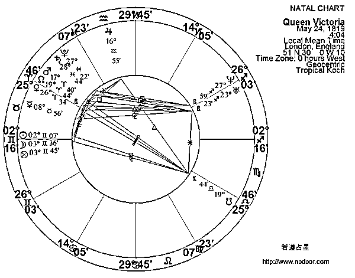

　　从维多利亚的出生星图上我们可以推断出的、最显著的太阳弧是 SA 中天=木星。出生星图上中天在摩羯座 29°53'，木星在水瓶座 16°55'，相差大约 17 度多一点。按照 1 度大约 1 年计算，17 岁应该是她得到巨大利益和地位的时期。由于她出生在夏天，太阳走得慢，因此要等到 17 岁多一些。30 年误差 1 度，17 岁误差大概在半度多，也就是 18 岁差几个月的时候会形成精确相位，也就是 1837 年上半年。

1837 年的太阳弧星图：

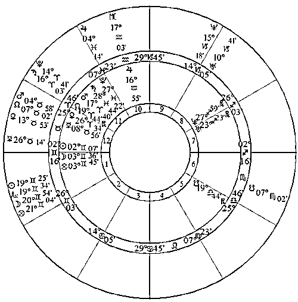

　　我们注意到：1837 年 6 月，有 SP 月亮=中天、TR 木星=木星这样两个有利相位，因此大致可以将具体时间锁定在这个月。

1837 年 6 月 20 日的出生-次限双轮星图：

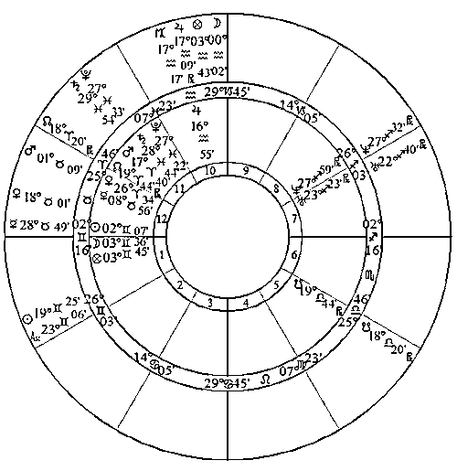

1837 年 6 月 20 日的出生-行进双轮星图：

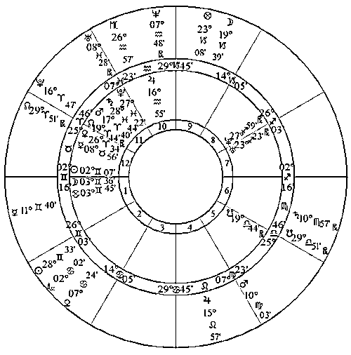

　　实际上，维多利亚在 1837 年 6 月 20 日加冕为女王，那时她 18 岁零 1 个月。

8 月 29-31 日，现代占星鼻祖诺·泰尔将在北京举办“太阳弧预测技法实战工作坊”，教你如何一眼识别生命中的重大趋势，详情请点击文末的“阅读原文”。

_______________________________

若道星文化，是由美国著名占星师大卫·瑞雷老师创办的占星学培训与文化传播机构，是国际占星研究协会(ISAR)在中国唯一一家定点合作机构。

**【占星入门——若道占星】微信订阅号：nodoorbj**

* 若道官网：www.nodoor.com 可提供占星咨询、占星课程、星盘查询、应用测试及电子杂志等服务。

* 新浪微博：@若道占星

**也请支持我们的朋友：**

**【无央之界】微信号：Akhaldan**

【若星辰（若道星文化上海同学会）】微信号：nodoorsh

【金陵星空教室】微信号：astronanjing

【Nana 占星社】微信号：NANA-astrology

【悦然。馨境生命分享】微信号：yueranxinjing

【心灵自由】微信号：freedomloveaction

**【聆宇电台】Cora 微信号：lingyudiantai**

# 【若道招聘】网站编辑、漫画实习生

> 原文：[`mp.weixin.qq.com/s?__biz=MzA5NjA0NTAxNg==&mid=200919215&idx=3&sn=bdf2b84c076aa86253bb8e7fde246fd1&chksm=1ebb7a1829ccf30e6f8bf41e8ddbc77de56689fc9c7e0a8849eea0586c4dc99a8320d20b4ab8&scene=126&sessionid=1692739135#rd`](http://mp.weixin.qq.com/s?__biz=MzA5NjA0NTAxNg==&mid=200919215&idx=3&sn=bdf2b84c076aa86253bb8e7fde246fd1&chksm=1ebb7a1829ccf30e6f8bf41e8ddbc77de56689fc9c7e0a8849eea0586c4dc99a8320d20b4ab8&scene=126&sessionid=1692739135#rd)


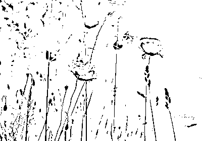

**岗位：网站编辑（大众传播）**

**工作内容**：

1.  负责搜狐自媒体的日常维护，包括文章的编辑和发布。

2.  根据所给内容配图，并写 200 字左右的导语，能契合读者喜好，增加阅读和转发量。

**任职要求**：

1.  大二或大三在校生。

2.  良好的英语水平。

3.  熟悉互联网。

4.  热爱占星学，富有创造力，对传播占星学有热情，有想法。

5.  对流行趋势或大众心理有敏锐触觉，善于把握时事动向，流行风标。

6.  善于捕捉话题，文字能力强，语言有感染力。

7.  具有一定图片鉴赏力。

8.  对占星学有基本了解，水平较高者优先。

**工作形式**：实习

**地点**：北京

**薪酬**：面议（不支付实际工资，以技能交换的形式抵扣若道学费）

请随简历附上以下信息：

1.  **详细出生信息（年月日时分以及地点）**；

2.  介绍您的互联网经验，经常浏览什么样的网站，喜欢什么样的网站、什么样的微博、微信，原因何在？

3.  请附上博客、豆瓣日志、微博链接等；

4.  介绍您的占星程度，学习经历及感悟；

5.  注明您的英语水平。

请将以上信息连同您的简历，发送至邮箱：zoe.xia@nodoor.com。

**岗位：漫画实习生**

**工作内容**：根据需求，构思、创作与星座相关的漫画，并进行传播。

**任职要求**：

1\. 良好的绘画能力。

2\. 热爱占星学，富有创造力，对传播占星学有热情，有想法。

3\. 对占星学有基本了解，水平较高者优先。

**工作形式**：实习

**地点**：北京

**薪酬**：面议（不支付实际工资，以技能交换的形式抵扣若道学费）

请随简历附上以下信息：

1.  **详细出生信息（年月日时分以及地点）**；

2.  请附上漫画作品；

3.  介绍您的占星程度，学习经历及感悟；

4.  注明您的英语水平。

请将以上信息连同您的简历，发送至邮箱：zoe.xia@nodoor.com。

如有任何问题，请添加 QQ/微信：735590697 询问。或直接发送邮件到邮箱 zoe.xia@nodoor.com。

_______________________________

若道星文化，是由美国著名占星师大卫·瑞雷老师创办的占星学培训与文化传播机构，是国际占星研究协会(ISAR)在中国唯一一家定点合作机构。

**【占星入门——若道占星】微信订阅号：nodoorbj**

* 若道官网：www.nodoor.com 可提供占星咨询、占星课程、星盘查询、应用测试及电子杂志等服务。

* 新浪微博：@若道占星

点击“阅读原文”，了解若道大家庭！

# 太阳之光：扫去你我内心的恐惧

> 原文：[`mp.weixin.qq.com/s?__biz=MzA5NjA0NTAxNg==&mid=200910814&idx=1&sn=003b49c7ce2d2f19086f695d4aabb288&chksm=1ebb156929cc9c7fc1bd20c42138eb2986e844805eb2b349fea8411a43778f26436bac3d857c&scene=126&sessionid=1692739135#rd`](http://mp.weixin.qq.com/s?__biz=MzA5NjA0NTAxNg==&mid=200910814&idx=1&sn=003b49c7ce2d2f19086f695d4aabb288&chksm=1ebb156929cc9c7fc1bd20c42138eb2986e844805eb2b349fea8411a43778f26436bac3d857c&scene=126&sessionid=1692739135#rd)


太阳，源源不断地释放着能量，照亮了我们的整张出生图，也照亮了我们的生活。那么，狮子座的守护星太阳，其能量流动究竟是怎样的呢？我们如何能成为发光发热万众瞩目的太阳呢？在这篇文章中，你就能找到答案。

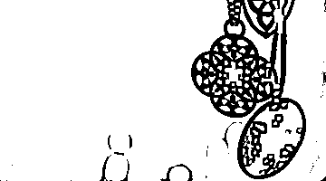

作者：杰夫•焦耳

译者：江艺

校对：轩轩

　　“行星是原型，是超越我们个体人生故事的本质能量，可以为每个人所利用。”基于这一理念，杰夫老师创作了“那些行星教我们的事”系列文章，讲述各颗行星教给我们的功课，本文是其中的太阳篇。

　　太阳赋予我们敞开的内心、慷慨的灵魂、创造性的冲动、玩乐之心和爱。在占星学的象征中，它代表生命、身份，关系网中凸显的自我，以及占据我们大量生活的理念和活动。太阳就是生活本身，因此它没有凝固于过去的个人历史之中，也没有被限制在自我的外壳之中。虽然我们经常通过太阳星座的特质来认同自己，但它真正的意义是让我们充分意识到当下，富有创造力地迎接未来。太阳更多地与我们将要成为谁有关，而非我们曾经在哪儿。

　　玩耍是开发太阳能量的一个好办法。没有野心，没有目的，就这样简简单单地享乐，这将我们与内在的孩子重新联结。这是活在当下的一种方式，不会迷失在对明日的希望或是对过去的遗憾之中。自由地玩乐让我们敞开心扉，激发太阳的创造性能量。它同时也使得给予和接受爱变得更加容易。

　　火热的太阳还与冒险有关，别太考虑后果，去表现自我吧。然而，这并不是批评他人的借口，因为太阳意识的关键是与自己保持联结。转变你人生的力量并没有掌握在他人手中，而是存在于你自己的身体、思想和灵魂之中。当我们通过玩耍、艺术、想象力和身体活动扩展自我，进入这个世界时，太阳的光辉就在我们的心中闪耀。

　　太阳象征着勇气，这个词来源于心（heart）的拉丁文词根。但是，英勇无畏并不意味着没有恐惧，而是尽管恐惧，却仍然愿意采取行动。通过一些小小的练习来锻炼勇气，可以让我们在面临困难环境时变得更坚强。内心就像肌肉，可以被强化，这就要求我们在想要放弃或逃避的时候，保持警醒和诚实。

　　自信是与太阳有关的特质，但是它却常常被误解。有一些人看起来很强大，外表显得很坚强，却缺乏对他人的同情。这不是真正发自内心的自信；它是攻击性与好胜心的混合，目的是掩盖表面之下的不安全感。当我们与太阳联结时，无需盛气凌人，无需贪婪地独占聚光灯。太阳的力量是耐心和慷慨，它源于真正自爱的创造性和快乐。

　　不是非要做什么才能找到太阳，存在之中太阳自会显现。充分地关注当下，这个简单的过程就可以释放能量之波，让我们运用它作出选择。我们通过玩耍、冒险、创意、慷慨和爱与太阳建立联结，从而温暖我们的内心，让我们的生活充满光明。

______________________________

大卫·瑞雷即将于 9 月 25 日起，开始“职业占星师中英文资质课程——高阶”，想要考取国际占星师资格证的你，想要成为职业占星师的你，这将是你踏入职业占星的第一步。欲知详情，请点击文末的“阅读原文”。

若道星文化，是由美国著名占星师大卫·瑞雷老师创办的占星学培训与文化传播机构，是国际占星研究协会(ISAR)在中国唯一一家定点合作机构。

**【占星入门——若道占星】微信订阅号：nodoorbj**

* 若道官网：www.nodoor.com 可提供占星咨询、占星课程、星盘查询、应用测试及电子杂志等服务。

* 新浪微博：@若道占星

**也请支持我们的朋友：**

**【无央之界】微信号：Akhaldan**

【若星辰（若道星文化上海同学会）】微信号：nodoorsh

【金陵星空教室】微信号：astronanjing

【Nana 占星社】微信号：NANA-astrology

【悦然。馨境生命分享】微信号：yueranxinjing

【心灵自由】微信号：freedomloveaction

**【聆宇电台】Cora 微信号：lingyudiantai**

# 【诺·泰尔】太阳弧推运：关于健康危机的预测

> 原文：[`mp.weixin.qq.com/s?__biz=MzA5NjA0NTAxNg==&mid=200910814&idx=2&sn=2859afcdf201df5af0b9ab54580f2145&chksm=1ebb156929cc9c7fc372ab091ec72643fda40282bf1ec6d86f0426676909e1f86b3199c6548e&scene=126&sessionid=1692739135#rd`](http://mp.weixin.qq.com/s?__biz=MzA5NjA0NTAxNg==&mid=200910814&idx=2&sn=2859afcdf201df5af0b9ab54580f2145&chksm=1ebb156929cc9c7fc372ab091ec72643fda40282bf1ec6d86f0426676909e1f86b3199c6548e&scene=126&sessionid=1692739135#rd)


诺泰尔——太阳弧第一人，世界前三的占星大师，即将于 8 月下旬来华教授太阳弧技法，详询:李洋 010-56629907（工作日早 11—晚 6 点） 18601950700。


作者：诺·泰尔 

译者：晴空月明

编者注：

《太阳弧》一书采用的简写如下：推进或行进行星与出生星图中的行星形成合相、四分相、对分相等硬相位，用“=”表示。SA 指太阳弧，SP 指次限，TR 指行进星体。比如，SA 中天=木星，就是指太阳弧的中天与出生星图中的木星形成硬相位。

点击图片，可看大图。

需要注意的是，占星学并没有什么简单明了的寿命长度计算法，我们能做的只是推测可能面临严重健康问题的时间。对于本来就衰老或病重的人，这些时间是危险的。四轴点，尤其是上升点，正是健康的重要代表，与之相关的太阳弧困难相位很可能代表着健康方面的重大打击。

我们来看肯尼迪夫人（1929.7.28，14:30，夏令时，南安普顿-纽约，72W23，40N53，EST-西 5 区）的例子。

1994 年 6 月中旬的太阳弧星图：


1994 年 6 月中旬出生-行进双轮星图：


此时有 SA 火星=上升，火星带来战斗的力量和健康危机，本来就病着的人更容易受其影响健康。（有时 SA 火星=四轴点和 SA 金星=四轴点同时出现，则对女人也代表着生孩子，而 SA 火星=上升对任何人都经常代表动手术。）

同时还有 SA 天王星=火星（突然爆发的能量），SA 土星=中天（入相），TR 冥王星=中天，TR 天王星=月亮，这是一段非常不利于健康的时间，她正是在这时死亡的。

演员 YulBrynner（1920.7.11，约 6:15，Z08，Vladivostok，USSR）死于肺癌时，正有 SA 冥王星=土星，TR 土星=上升。

希特勒（1889.4.20，约 18:30，LMT，Braunau，奥地利）在 1945 年 4 月 30 日自杀时，正有 SA 冥王星、SA 海王星=上升，TR 海王星=月亮。

脱口秀主持人 Arsenio Hall（1956.2.12，3:18，EST，Cleveland OH）于 1994 年 5 月 27 日，在炙手可热时忽然退出，此时有 SA 冥王=中天，TR 土星=上升。

演员 Jane Fonda（1937.12.21，9:14，EST，曼哈顿）嫁给了百万富翁 Ted Turner 时，有 SA 土星=中天（出相），TR 冥王星=中天。

以上这些例子有助于理解四轴点的巨大影响力，与其相关的太阳弧往往会带来生命中重大的改变事件。

8 月 29-31 日，现代占星鼻祖诺·泰尔将在北京举办“太阳弧预测技法实战工作坊”，教你如何一眼识别生命中的重大趋势，详情请点击文末的“阅读原文”。

_______________________________

若道星文化，是由美国著名占星师大卫·瑞雷老师创办的占星学培训与文化传播机构，是国际占星研究协会(ISAR)在中国唯一一家定点合作机构。

**【占星入门——若道占星】微信订阅号：nodoorbj**

* 若道官网：www.nodoor.com 可提供占星咨询、占星课程、星盘查询、应用测试及电子杂志等服务。

* 新浪微博：@若道占星

**也请支持我们的朋友：**

**【无央之界】微信号：Akhaldan**

【若星辰（若道星文化上海同学会）】微信号：nodoorsh

【金陵星空教室】微信号：astronanjing

【Nana 占星社】微信号：NANA-astrology

【悦然。馨境生命分享】微信号：yueranxinjing

【心灵自由】微信号：freedomloveaction

**【聆宇电台】Cora 微信号：lingyudiantai**

# 【在线沙龙】太阳在十二个宫位里的意义与灵魂演化之方向

> 原文：[`mp.weixin.qq.com/s?__biz=MzA5NjA0NTAxNg==&mid=200910814&idx=3&sn=dac560ecb5eab0d63b07538c27f58e71&chksm=1ebb156929cc9c7f5bff0e1ec32bdce581f4e0e51ffdea771b0c0d52d01cdd89db80b95e2308&scene=126&sessionid=1692739135#rd`](http://mp.weixin.qq.com/s?__biz=MzA5NjA0NTAxNg==&mid=200910814&idx=3&sn=dac560ecb5eab0d63b07538c27f58e71&chksm=1ebb156929cc9c7f5bff0e1ec32bdce581f4e0e51ffdea771b0c0d52d01cdd89db80b95e2308&scene=126&sessionid=1692739135#rd)


【活动主题】

寻找你的人生意义和方向（太阳在十二个宫位）两小时的在线沙龙，让我们跟着太阳的光芒去追寻生命的意义和方向。

【活动内容】

1\. 深入阐释太阳在十二宫位的意义

2\. 推进的太阳——内在灵魂的演化: 详细讲解一生中推进的太阳（即太阳弧太阳）对生命的深远影响。

3\. 寻找生命的光和热，激发我们的小宇宙！

【主讲人】


RASA 占星学校校长及创始人 Robin Armstrong

超过 45 年的占星从业资历及丰富的教学经验

完成了“森林巨木阵”的工程建设

设计和首创了星空竖琴

是得到 PAI 专业认证的占星学校 RASA 的创始人和校长

撰写了很多占星书籍和杂志，经典代表作《占星与易经的智慧》

对很多知名占星机构的建立和奠基起到了积极的作用

经营世界最大的占星图书馆之一，25000 本藏书，近 30 年间很多知名占星师都曾到访

【活动时间】

2014 年 8 月 13 日晚 20:00-22:00

【活动形式】网络在线沙龙

【活动费用】

非学员：50 元整（老同学免费），请务必直接报名预留名额。

【报名方式】点击文末的“阅读原文”，进入报名页面。

# 【生命之美】情书：诉说着那爱情

> 原文：[`mp.weixin.qq.com/s?__biz=MzA5NjA0NTAxNg==&mid=200895728&idx=3&sn=0f9a4fafd1d4483ebc0018c2b40b4b34&chksm=1ebbde4729cc5751bb490605603f0aae24aad98d86d566062d4bfa0d6eb8b37d915d04fd8f27&scene=126&sessionid=1692739135#rd`](http://mp.weixin.qq.com/s?__biz=MzA5NjA0NTAxNg==&mid=200895728&idx=3&sn=0f9a4fafd1d4483ebc0018c2b40b4b34&chksm=1ebbde4729cc5751bb490605603f0aae24aad98d86d566062d4bfa0d6eb8b37d915d04fd8f27&scene=126&sessionid=1692739135#rd)


小编一直很喜欢“情书”这两个字，能感觉到一种暖意在流动。该是有多喜欢多爱，才会提起笔来，写下心中的一点一滴一丝一缕。多年之后，再看到曾经的文字，又会有着怎样的内心波动。

生活总是打磨着我们，有时候会忘了最初的感觉，忘了爱的感觉。这里，希望这篇文章能唤起你心中对爱的憧憬。


本文原载悦然馨境平台，微信公众号：yueranxinjing。

作者：慕棉，吉林大学工学博士，美国催眠协会（ABH）&美国加州催眠学院（P.A.S.H）认证催眠师，国际医学最高认证中心（WMECC）认证 EFT 情绪释放技术治疗师，国际整体暨自然医学学会（IHNMA）认证完型治疗执行师。博客地址：http://blog.sina.com.cn/qiansu82。

关掉电脑，结束工作，有点点的倦，倒了杯水，靠着窗边休息。傍晚的风，渐渐少了些许暑气，淡淡的吹来，身上还有点濡湿的汗意，转瞬居然就加了一层凉。忽然想起，大约农历到了七月了，古时说，七月流火，热还是热的，可也是秋天要来了呢。

居然转眼就要度过了在北京的第一个夏天，时间流淌的总是这样的快。拿出手机翻看，不知不觉，养成个习惯，经常在小憩的时候，到一些平台去读些有趣的文，今日打开界面，居然铺面而来清一色的各类情人节标题，一眼望去，遍地都是“爱情”的字眼。再看消息栏，还有 N 条群发来的情人节快乐的讯息，原来今天正是七月七呢。忽然觉得好玩，在这个时代，情人节的讯息，都群发了，不论男女，大约是通讯录里一个不漏，大有普天同庆的意味，相比之下，昨日的八一就实在太过寒酸了。难怪，和平年代，当士兵遇见情人，能且只能，完败。

忽然有些恍惚，明明还依稀记得儿时，七夕是女儿乞巧的节日，到不知怎么如今就变成了中国情人节。算来，从 214 圣瓦伦丁到 520，从 521 到七夕，再到平安夜和元宵节，貌似如今的各色情人节，大有抢占四季花开不败的姿态。这一腔儿女情，倒是硬生生要从春流到冬，秋又流到夏的纪念着才罢。果然人间自是有情痴，此事哪关风与月。又或者，这世上本没有节日的，想凑趣儿的人多了，也便成了节日。既然古人创得，如何今人创不得？这年月广告遍地，比着做生意，总得有些由头，也难怪商家如此热炒，宾主尽欢，各得其所，也就不必认真去计较了。

当然，节日多了自也有节日多的好处，比如这个七夕，就有机会一股脑地阅读了某平台收集来的 N 封中外文学名家的情书，我们这一生，大约有机会正大光明阅读别人之间情书的机会真是不多，可这些人偏出了名儿，百年后情书亦给搜刮出来，刊登报载，于是后人就饱了眼福。看，这就是七夕情人节的福利。

这情书收集的也有趣儿，有极雅的，也有极俗的。雅的，离愁几许，情丝脉脉，仿佛句句口齿噙香对月吟。那俗的呢，却不是吟，而是淫了。通篇看下来，忽然跳出来这么一部分，是真被惊着了。不能不叹服，全文大约都是此处省略八百字的类型，如何叫人不感慨。这位也真能耐，纵是守着一坛蜂蜜，甜是甜的，好也是好的，可也总要间或喝口水润润喉吧，怎的就从头到尾的这般直白露骨火辣辣？果然是东西文化迥异，东方人恨不得用齐了赋比兴各类修辞，才羞答答表达得出一句我爱你，西方则是直接的烈焰红唇，活色生香。不过话说回来，本就是人自家的春闱秘事，今人公然给翻出来传阅，也不知当事者知是不知，我看着也不知算不算对这当年写信与看信的人不敬，倒更不好去挑人家的不是了。

原本，情书就是写个那一个人看的，你觉得真，她觉得好，也就是了，管它是雅还是俗呢，又哪里轮到旁人来品头论足？

看完情书，顺便扫了一眼新闻，方知汪峰又表白了，这次不是八分钟，而是当着六万人，在鸟巢，“你们大声呼喊她的名字，可见我的选择是对的，我的爱是对的”。掷地有声，铿锵有力啊，话说，不得不佩服这位大哥的精气神，不上头条誓不休。可这爱也是能用对错判断的？而且，居然是这样判断的？粉丝果然威武。也许，人们早已不知不觉看惯了头条与娱乐版争先恐后的分分合合，大约无论是恩爱还是分道，也不过都是茶余饭后的几句谈资，就着广场舞的音乐或者八点档的电视剧，用来消消暑或者解解乏，也就罢了。今日说说，明日忘了，真真假假，分不清，也不再重要，说得轻松，看得愉快，如此，也就是如此而已了。

真是个有趣儿的日子，台上的在表白，没机会上台的，博客微博微信也在不约而同唯恐被落下的秀。忘了从什么时候开始，我们渐渐习惯了这样一种生活，台上台下，一起把生活掀开来，晒一晒，嚼一嚼，仿佛巴巴的像这个世界宣布：我很美味，或者我很够味。又似乎生活是一袭华美的袍子，无论袍子底下穿的是什么，给别人看到这层外面光鲜的就够了。于是，轰轰烈烈，热闹非常。

只是，有的时候，看得人真眼晕，真累。其实，西风东渐，原也是时事使然，世事变迁，也不可避免，过于含蓄也不见得适于今日的时代，只是，怕只怕得了皮毛，走得过了，却失了内里的魂。

心中忽然响起淡淡的回音，那是一首诗，恰恰也是来自不再遥远的西方，歌声古老而悠长，仿佛声声呢喃回响：

“当你老了，头发白了，

睡思昏沉 炉火旁打盹，

请取下这部诗歌 慢慢读，

回想你过去眼神的柔和

回想它们昔日浓重的阴影

多少人爱你青春欢畅的时辰 爱慕你的美丽，

假意和真心

只有一个人爱你朝圣者的灵魂

爱你衰老了的脸上痛苦的皱纹

垂下头来，

在红火闪耀的炉子旁

凄然地轻轻诉说那爱情的消逝

在头顶上的山上它缓缓地踱着步子

在一群星星中间隐藏着脸庞。”

今日，倒不知这世上是何人，会在或拥挤或疏朗的桌上，轻轻的铺陈纸张，拿起久违的笔，珍重的，一字一划，淡淡书写。那灯下微低的头，鬓发丝丝缕缕的垂下，依稀可见眉眼里蕴着的含羞的笑。亦不知是何人，轻轻拆开封着的胶，灯下展开折叠的纸，轻嗅墨香，一字一句，轻声读来，时而轻颦时而浅笑，仿佛看着的不是纸，倒是那人的模样，仿佛读着的不是墨，倒是那人的情丝绵长。搁下又拿起，咀嚼再三，妥妥收藏。

情书，或许不该只是故纸堆里的泛黄的篇章。

夜里的风吹得紧了，凉意更甚。即使白日里还那么热，秋天，也终究是很快就会来的。也许，那一练秋水里，会裹着一片红叶，顺流而下，上面隐约似有淡淡墨痕，不知是何人描画。它，飘飘荡荡，载着一缕情思，浸透了霜染的色，一如那女子额头点的朱砂。不言不语，就这样，淡淡的，赠与那远方的人，一个温暖相许的年华。

PS：七夕的文，觉得未免煞风景了些，今日发：）

另，引用诗歌来自叶芝《当你老了》。

10 月 24-26 日，斯蒂芬·弗里斯特将来中国开展深度亲密关系工作坊，向你我讲述爱情的秘密。预知详细信息，请点击文末的“阅读原文”。

_______________________________

若道星文化，是由美国著名占星师大卫·瑞雷老师创办的占星学培训与文化传播机构，是国际占星研究协会(ISAR)在中国唯一一家定点合作机构。

**【占星入门——若道占星】微信订阅号：nodoorbj**

* 若道官网：www.nodoor.com 可提供占星咨询、占星课程、星盘查询、应用测试及电子杂志等服务。

* 新浪微博：@若道占星

**也请支持我们的朋友：**

**【无央之界】微信号：Akhaldan**

【若星辰（若道星文化上海同学会）】微信号：nodoorsh

【金陵星空教室】微信号：astronanjing

【Nana 占星社】微信号：NANA-astrology

【悦然。馨境生命分享】微信号：yueranxinjing

【心灵自由】微信号：freedomloveaction

**【聆宇电台】Cora 微信号：lingyudiantai**

# 解密上升星座：通向爱情的第一扇门

> 原文：[`mp.weixin.qq.com/s?__biz=MzA5NjA0NTAxNg==&mid=200895728&idx=1&sn=b7c0b4011490171ffe622ca1e60f17dc&chksm=1ebbde4729cc57518012c772fd5d25f86b23d3db262938da648c690d20d8f3f985dc908dadc2&scene=126&sessionid=1692739135#rd`](http://mp.weixin.qq.com/s?__biz=MzA5NjA0NTAxNg==&mid=200895728&idx=1&sn=b7c0b4011490171ffe622ca1e60f17dc&chksm=1ebbde4729cc57518012c772fd5d25f86b23d3db262938da648c690d20d8f3f985dc908dadc2&scene=126&sessionid=1692739135#rd)


本文摘自史蒂芬·阿若优的《人际占星学：性与爱的能量和谐》，感谢@蓝莲花 9999（微博帐号）的编辑和翻译。此书由世界图书出版公司出版发行。

**上升星座**

一个人出生的那一刻在地平线上升起的星座就是上升星座。在本命盘中，上升星座具有重要的意义。要确定一个人的上升星座，必须知道这个人准确的出生时间以及出生地经纬度，还要考虑到是否有夏令时。此外，计算上升星座的方式必须精确。因此我强烈建议读者们选择专业的星盘绘制工具计算，以求本命盘精准。使用一些不正规的算命软件、占星网站、书本里的上升星座速查表格，或请伪占星学家绘制个人星盘，准确率往往不到 50%。

我将根据四元素对十二个上升星座进行分类。同属一种元素的星座具有共通的能量特质与协调性，他们对待人生的态度也会较为相似。上升星座的元素是盘主自觉散发出来的能量，通常是下意识的，在青少年时期尤为明显。这一元素象征着一种人生态度，渗透盘主的整个存在状态及个性。有种说法是，上升星座是一个人看待人生的基本立足点！）们都说，上升星座是“人格影像”，我觉得这种说法非常精确。然而，这幅影像并不是有意识地投射出来的，而是自发、自动地投射而出的，很容易成为别人对你的第一印象。上升星座具有相当的活力，在此，我会根据个人经验，用直观的、不太严肃的方式准确地描绘出各个上升星座的“肖像”。为求精确，我只能舍语言之美。

火象与风象的上升星座偏好在外部世界的积极的自我表达，它的能量是消耗型的，有时会因为毫无节制地“倾斜”能量而发展为自我损耗。土象和水象的上升星座倾向于保存能量、抗拒自我暴露，因此这些人往往自我封闭，有时会自我压抑，活在自己的世界里。

我还要强调，上升星座及其所属元素对感情关系分析具有至关重要的意义。本书后面的章节会越来越来越强调这一点。因此，为了能够理解人际占星学（person-to person astrology），读者应该尽可能精确地判断出自己的上升星座。

**火象星座（白羊座、狮子座、射手座）**

精力旺盛，有活力，由内而外地散发出能量。具有鲜明的主动、乐观的人生态度，自信、率真、积极；想要让生命更有意义，想要看到自己的力量影响外在世界。这类人属于行为主导性人格，会出现能量的浪费和消耗，常常忽略自己和他人的细微需求。

**白羊座**：

身体焦躁不安。他们决不能闲着，一定要有新鲜事可做，重点在“新鲜”！容易感到厌倦。无所畏惧，有开拓精神，特别喜欢做第一个吃螃蟹的人，想要有所发现。比起其它星座来，他们更容易也更迅速抓住议题的本质和形势的要点，因此也更加果断。有活力，对待事物有着积极的态度，不过他们往往缺乏耐心，时常半途而废。他们都是急性子，手头的事往往最紧要！他们不欠缺社交能力，但并不特别看重社交。

**狮子座：**

骄傲，常常也努力奉上最好的表现，以求获得内心最渴望的尊重。他们有强烈的尊严感，通常具有现代社会非常缺乏的忠诚、正直等优秀品质。他们不愿承认自己的弱点，本能地拥有一种权威感，但没有摩羯座那种独裁主义倾向。因此，他们更容易成为行政长官，而不是社会运动领袖。他们为人开放、真诚，通常能唤起他人的忠诚、深情的回应。

**射手座：**

也许是十二星座中最“积极乐观”的一个。他们的人生态度活泼得有些令人诧异，经常能在遭遇重创、失望或重大挫折十分钟后就能表现出固执的乐观主义。他们是终极的积极思考者，生而具有一种达观甚至虔诚的人生态度，尽管表现方式并不传统。他们懂得感恩，天生慷慨大方。他们放射出的能量是鼓舞人心的，新颖独到的和促进性的。

其他星座待续……

10 月 24-26 日，斯蒂芬·弗里斯特将来中国开展深度亲密关系工作坊，向你我讲述爱情的秘密。预知详细信息，请点击文末的“阅读原文”。

_______________________________

若道星文化，是由美国著名占星师大卫·瑞雷老师创办的占星学培训与文化传播机构，是国际占星研究协会(ISAR)在中国唯一一家定点合作机构。

**【占星入门——若道占星】微信订阅号：nodoorbj**

* 若道官网：www.nodoor.com 可提供占星咨询、占星课程、星盘查询、应用测试及电子杂志等服务。

* 新浪微博：@若道占星

**也请支持我们的朋友：**

**【无央之界】微信号：Akhaldan**

【若星辰（若道星文化上海同学会）】微信号：nodoorsh

【金陵星空教室】微信号：astronanjing

【Nana 占星社】微信号：NANA-astrology

【悦然。馨境生命分享】微信号：yueranxinjing

【心灵自由】微信号：freedomloveaction

**【聆宇电台】Cora 微信号：lingyudiantai**

# 【诺·泰尔】太阳弧推运：戴安娜王妃之死

> 原文：[`mp.weixin.qq.com/s?__biz=MzA5NjA0NTAxNg==&mid=200895728&idx=2&sn=5e17c461878ba5b52622245248446eac&chksm=1ebbde4729cc575181bde0e576a39690a917ec792c04a1189db318f947426080bcc8447a0cd0&scene=126&sessionid=1692739135#rd`](http://mp.weixin.qq.com/s?__biz=MzA5NjA0NTAxNg==&mid=200895728&idx=2&sn=5e17c461878ba5b52622245248446eac&chksm=1ebbde4729cc575181bde0e576a39690a917ec792c04a1189db318f947426080bcc8447a0cd0&scene=126&sessionid=1692739135#rd)


太阳弧是非常重要的预测技法，计算方式也十分简单易学。这里诺·泰尔以英国亨利和威廉王子的出生图为例，根据戴安娜王妃之死讨论了太阳弧的实际运用。

诺泰尔——太阳弧第一人，世界前三的占星大师，即将于 8 月下旬来华教授太阳弧技法，详询:李洋 010-56629907（工作日早 11—晚 6 点） 18601950700。


作者： 诺·泰尔 

译者：晴空月明

编者注：

《太阳弧》一书采用的简写如下：推进或行进行星与出生星图中的行星形成合相、四分相、对分相等硬相位，用“=”表示。SA 指太阳弧，SP 指次限，TR 指行进星体。比如，SA 中天=木星，就是指太阳弧的中天与出生星图中的木星形成硬相位。

点击图片，可看大图。

太阳弧推运实际上非常简单，甚至不一定要借助软件，基本上在出生星图上按“1 年 1 度”来看就好，冬天或夏天生的人在心里修正一下，当然用软件排更方便。

看太阳弧的方法和看行进星图没什么不同，唯一的区别在于太阳弧比行进星体的影响力更大更持久（行进海王星、冥王星例外）。太阳弧的影响力大致在一年左右，核心事件的精确激发往往是由运行较快的参数完成的（比如次限月亮和行进星体）。

下面以英国王子威廉和亨利的例子来说明太阳弧推运的基本应用方法。

威尔士亨利王子，查尔斯和戴安娜的次子（1984.9.15，16:20，夏令时，伦敦，00W10，51N30）出生星图：


1997 年 8 月 31 日的太阳弧推进图：


1997 年 8 月 31 日是他母亲戴安娜王妃死亡的时间。SA 冥王星=土星（冥王星是代表父母的 10 宫守护星，土星是上升星座守护星），代表着生命中的重大损失，对于他而言就是父母离婚和母亲的去世。

同时还有 SA 海王星=上升，TR 海王星=冥王星。

他哥哥威廉王子（1982.6.21，21:03，夏令时，伦敦，00W10，51N30）此时也有太阳弧困难相位，SA 土星=木星（木星是上升星座的守护星），SA 火星=冥王星（冥王星是 10 宫守护星）。

1997 年 8 月 31 日威廉王子的太阳弧推进图：


8 月 29-31 日，现代占星鼻祖诺·泰尔将在北京举办“太阳弧预测技法实战工作坊”，教你如何一眼识别生命中的重大趋势，详情请点击文末的“阅读原文”。

_______________________________

若道星文化，是由美国著名占星师大卫·瑞雷老师创办的占星学培训与文化传播机构，是国际占星研究协会(ISAR)在中国唯一一家定点合作机构。

**【占星入门——若道占星】微信订阅号：nodoorbj**

* 若道官网：www.nodoor.com 可提供占星咨询、占星课程、星盘查询、应用测试及电子杂志等服务。

* 新浪微博：@若道占星

**也请支持我们的朋友：**

**【无央之界】微信号：Akhaldan**

【若星辰（若道星文化上海同学会）】微信号：nodoorsh

【金陵星空教室】微信号：astronanjing

【Nana 占星社】微信号：NANA-astrology

【悦然。馨境生命分享】微信号：yueranxinjing

【心灵自由】微信号：freedomloveaction

**【聆宇电台】Cora 微信号：lingyudiantai**

# 【星象预报】一周宇宙天气：8 月 4 日-8 月 10 日

> 原文：[`mp.weixin.qq.com/s?__biz=MzA5NjA0NTAxNg==&mid=200887625&idx=3&sn=3928d933b5c13bf57b1df7f8c3f57e56&chksm=1ebbfffe29cc76e8f39bff0bab24aeaafdc31463e10550ba2cf298d5c0ca979f25afd958af04&scene=126&sessionid=1692739135#rd`](http://mp.weixin.qq.com/s?__biz=MzA5NjA0NTAxNg==&mid=200887625&idx=3&sn=3928d933b5c13bf57b1df7f8c3f57e56&chksm=1ebbfffe29cc76e8f39bff0bab24aeaafdc31463e10550ba2cf298d5c0ca979f25afd958af04&scene=126&sessionid=1692739135#rd)


作者：杰夫•焦耳

译者：李含

校对：轩轩

杰夫•焦耳授权若道占星独家发布其宇宙天气预报系列  转载请注明来源并附原文链接  

注：文中提及的时间均为北京时间

**8 月 4 日 星期一**

8：49，天蝎座上弦月与太阳成四分相，狮子座太阳勇敢地接受挑战，而 8：45，月亮与冥王星的六分相也帮助我们将注意力集中到核心问题上来。日月相位传递的信息是：为了实现狮子座宏大的愿景，我们需要将资金、时间和精力从不太重要的项目上抽出来。

18：28，月亮与土星合相，你是否在实现愿景的道路上又迈出了踏实的一步呢？

**8 月 5 日 星期二**

18：18，月亮以火箭的速度进入不安分的射手座，在这段乐观的时间里，冒险的愿景与更高的目标在向我们招手。

22：22，但是金星与海王星成 135 度相位，社交的不安带来脆弱感，自我价值感出现波动，作出客观评价的能力受到影响。

**8 月 6 日 星期三**

13：33，月亮与头脑水星成三分相，加强了理性与逻辑的思考；交流中的细节可能让我们的生活失序，将我们带到梦幻状态，但同时也可能提供给我们具体的想法，将梦想付诸实践。

18：35，振奋人心的射手座月亮与太阳成炙热的三分相，22：52，月亮又与天王星成三分相，让今天充满了开放、冒险和游戏的乐趣。

19：42，水星与挑衅的冥王星成 150 度梅花相（狮子座-摩羯座 11°30'），疑心四起。这一奇怪的相位将我们的思路和谈话引向了猜疑与误解的阴影面。耐心去理解困难的理念会收获难能可贵的真相及隐藏的信息。

**8 月 7 日 星期四**

20：12，火星与海王星成三分相（天蝎座-双鱼座 6°46'），随着夜色降临，魔法精灵也在蠢蠢欲动。能量的顺畅流动能安抚烦躁的情绪，创造出美，并且以微妙的方式发起行动。

21：38，月亮进入脚踏实地的摩羯座，神圣的光环褪去，现实的模样变得清晰。

**8 月 8 日 星期五**

8：43，月亮与海王星成六分相，9：14 与火星成六分相，热情与合作精神为你开启一天的工作。

16：22，月亮与冥王星合相，务实且专注，利用这一高效的能量提前完成工作，开始周末的欢乐时光吧！

**8 月 9 日 星期六**

0：21，水星与太阳合相，非常适合坦诚的表达。狮子座水星今日有三个重要相位，这是第一个，头脑思考的能量将达到高峰。

4：13，水星和创意无限的天王星成三分相，8：35，太阳和天王星成三分相，促进才思泉涌和独立思考。

10：49，水星与土星成四分相（狮子座-天蝎座 16°56'），残酷的现实与未来计划之间产生了激烈的冲突。但是花些时间用心聆听，仔细思考，我们便可以为明天构建一个坚实的基础。

21：51，月亮进入天王星掌管的水瓶座，带来创造力的大爆炸。

23：10，太阳与土星成四分相，要求我们担负起责任，保持耐心。今天反传统的思路与具体务实的理念之间需要好好协调。

**8 月 10 日 星期日**

10：51，月亮与精力充沛的火星成四分相，23：31，又与躁动不安的天王星成六分相，如果能够忍住轻率的冲动，那么卓越的创意与积极的行动力将会结出硕果。

______________________________

大卫·瑞雷即将于 9 月 25 日起，开始“职业占星师中英文资质课程——高阶”，想要考取国际占星师资格证的你，想要成为职业占星师的你，这将是你踏入职业占星的第一步。欲知详情，请点击文末的“阅读原文”。

若道星文化，是由美国著名占星师大卫·瑞雷老师创办的占星学培训与文化传播机构，是国际占星研究协会(ISAR)在中国唯一一家定点合作机构。

**【占星入门——若道占星】微信订阅号：nodoorbj**

* 若道官网：www.nodoor.com 可提供占星咨询、占星课程、星盘查询、应用测试及电子杂志等服务。

* 新浪微博：@若道占星

**也请支持我们的朋友：**

**【无央之界】微信号：Akhaldan**

【若星辰（若道星文化上海同学会）】微信号：nodoorsh

【金陵星空教室】微信号：astronanjing

【Nana 占星社】微信号：NANA-astrology

【悦然。馨境生命分享】微信号：yueranxinjing

【心灵自由】微信号：freedomloveaction

**【聆宇电台】Cora 微信号：lingyudiantai**

# 【诺·泰尔】为冥王星解毒：如何应对冥王星带来的挑战

> 原文：[`mp.weixin.qq.com/s?__biz=MzA5NjA0NTAxNg==&mid=200887625&idx=1&sn=8b4d0a736ff163404f9f73ea85de1f46&chksm=1ebbfffe29cc76e86c2d92a70f402daa7b1aa5f1812aa23382e755131321ddab0e061f2290dc&scene=126&sessionid=1692739135#rd`](http://mp.weixin.qq.com/s?__biz=MzA5NjA0NTAxNg==&mid=200887625&idx=1&sn=8b4d0a736ff163404f9f73ea85de1f46&chksm=1ebbfffe29cc76e86c2d92a70f402daa7b1aa5f1812aa23382e755131321ddab0e061f2290dc&scene=126&sessionid=1692739135#rd)


作者：诺•泰尔

译者：李含、周恩

当冥王星被发现，并纳入占星学范畴之时（1930 年），它被赋予了强大的力量和权力的原型意义。大约三十年后，我进入占星学领域，在一些灵感启发下，对这个问题有了不同的看法：凭我的观察，以及我对心理动力学中的发展张力的深刻认知，我认为冥王星的功能主要是提供“深度视角”以及构成“即将面临的挑战”。

很久以前，我在占星实践中就是这样理解它的：在冥王星这个象征符号之下，探索我们是谁，我们能开发出多少潜能，这一类能带来成长的挑战性命题。付出之后能得到什么？这的确跟“我们赋予自身多少权力”有关。冥王星为人所知之时心理学正处于其发展史的“青春期”。如果你感受到了冥王星的影响，我想，如果你愿意的话，就可以将所有的努力、所有的付出和抗争都磨炼成成长的收获。真实的我们就是我们后来变成的那个人。

在这一理论框架下，我们该如何帮助客户面对冥王星的挑战呢？

**冥王星与太阳的困难相位**

（困难相位：主要指合相、四分相、165 度相位、对分相；主要相位用 6 度容许度， 165 度相位推荐用 3 度容许度；根据经验， 45 度相位、135 度相位也建议用较小的容许度。）

最初占星师们认为，拥有这些相位的个体拥有巨大的能量。但事实并非如此。这里或许潜藏着能量，但如同上文所提到的那样：面对挑战，开发潜能之后，才能从冥府浴火重生（想想凤凰），最终获得巨大的能量。

在社会架构中，这些相位则代表着对“同质”和“平等”的迫切需求，社会的发展可并不欢迎“（社会）等级破坏者”和出风头的人。各方面的压力都迫使人们“安守本分”。这和本文的议题如出一辙，象征压力的冥王星与象征生命力和自我意识的太阳成困难相位。

对此，我的解读通常是，“在你年轻的时候，这种情况特别明显，感觉就像是一颗被毯子盖着的手榴弹。”压力重重，我相信 99.99%有此类相位的人对这个比喻都能心领神会，对西方社会的人来说更是如此。这就带来了挑战。勇敢抗争吧，在抗争中获得力量。有时候真的是生命不息，抗争不止。

查尔斯王子、美国前总统尼克松、葛丽泰·嘉宝、杜鲁门·卡波特、马龙·白兰度、英格兰安妮公主、罗伯特·舒曼和阿诺德·施瓦辛格等人都了解这种抗争和力量。

疗愈这类客户的方法是，帮助他们意识到这种压抑，找出它的根源以及它引发的防御行为，还有这种惯性又是如何延续至成年以后的；并意识到他们也许已经不需要这种习惯性的防御行为了。卸下防备之时就能拥抱焕然一新的能量和习性。

**冥王星与月亮的困难相位**

这是一个新的层面：受到母亲方面的重要影响，个人观念会发生改变。母爱可能是带有干涉性质的；也可能是一种令人窒息的溺爱。关键是人们很难面对母亲方面的掌控和影响带来的成长挑战。

与父母的关系可能会不平衡，只与一方较亲密。

解决这一相位的问题，第一步当然是要认识到这种压力，审视一下这种压力与自己的习惯性行为之间的关联，找到清除负面影响（防御行为及偏见）、重获自由的方法。

亨利·福特、埃德加·胡佛（译注：历经 8 任总统的 FBI 前局长，知晓众多秘密，极富争议）、凯瑟琳·赫本等人都有这一困难相位。

**冥王星与土星的困难相位**

辛苦的工作。这个说法最能体现这一特质：个人认知聚焦于无休无尽的自我要求及抱负的实现上；这是一个埋头苦干的相位。事实上，因为特别惧怕失败和失去，就会建造特别坚固的城堡取得战斗的胜利。

这样的客户在成长方面可以做些什么呢？是全力以赴还是三心二意？你制定的发展计划背后的动力是什么？它反映的是：远景与雄心壮志，深度与勤奋程度。绝大部分情况下，占星师必须与客户时时处处存在的悲观情绪作斗争。

琼·贝兹（译注：美国著名民歌手）、尤里·盖勒（译注：以色列魔术师）、克里斯敦·伯纳德（译注：南非心脏科医生，成功进行全球首例心脏移植手术）、肖邦、摩西·达扬（译注：“独眼将军”，以色列军事家）、希区柯克、苏格兰玛丽女王、沃尔特·惠特曼（译注：创造自由体诗歌的美国诗人）、李·哈维·奥斯瓦尔德（译注：暗杀肯尼迪的凶手或替罪羊）、乌比·戈德堡（译注：好莱坞为数不多的著名黑人女星）、卡夫卡、基辛格等人都有这一挑战相位。

**冥王星与天王星的困难相位**

这个相位给让我想到的是“耶稣在神殿里掀翻了桌子！”这一点在太阳弧推运和行运中绝对正确。如果这个相位出现在本命星盘中呢，这股潜能将会促使我们在成长的道路上经历叛逆、破坏，打破现状以建立于更有利的个人地位。我们吸取经验教训做出改变。（注意出生于冥王星与天王星合相在处女座时期的一代人，他们中有不少人的新陈代谢、营养吸收功能面临挑战，比如营养的吸收转化发生了改变，出了问题。）

我们必须注意到，这些慢行星的相位要比太阳或者月亮的相位少见得多。有这样相位的人会在社会中成为一个小的族群，他们的特点就是推进社会的改变。作为个体，在个人层面上，你的客户多多少少都会表现出他们对改变的需求。

有效的疗愈方法是，意识到这种需求，并审视和评估它会带来什么后果。改变带来的是破坏还是有益的成长？你的客户该如何摆脱急躁，发挥创造力，从而强有力地推动积极转变？寻求正确的、有建设性的转变经验。

查理曼大帝（译注：罗马帝国奠基人）、埃德加·凯西（译注：20 世纪著名灵性解读大师）、奥利弗·克伦威尔（译注：英国资产阶级革命领袖、军事家）、玛丽·贝克·艾迪（译注：基督教科学派创始人）、罗斯·佩罗（译注：80 年代 IT 业超级富人、92 年参选总统获佳绩）、查尔顿赫·斯顿（译注：著名影星）等人都有这一困难相位。

8 月 29-31 日，现代占星鼻祖诺·泰尔将在北京举办“太阳弧预测技法实战工作坊”，教你如何一眼识别生命中的重大趋势，详情请点击文末的“阅读原文”。

_______________________________

若道星文化，是由美国著名占星师大卫·瑞雷老师创办的占星学培训与文化传播机构，是国际占星研究协会(ISAR)在中国唯一一家定点合作机构。

**【占星入门——若道占星】微信订阅号：nodoorbj**

* 若道官网：www.nodoor.com 可提供占星咨询、占星课程、星盘查询、应用测试及电子杂志等服务。

* 新浪微博：@若道占星

**也请支持我们的朋友：**

**【无央之界】微信号：Akhaldan**

【若星辰（若道星文化上海同学会）】微信号：nodoorsh

【金陵星空教室】微信号：astronanjing

【Nana 占星社】微信号：NANA-astrology

【悦然。馨境生命分享】微信号：yueranxinjing

【心灵自由】微信号：freedomloveaction

**【聆宇电台】Cora 微信号：lingyudiantai**

# 【转疯了】让你笑翻的 12 星座小苹果！

> 原文：[`mp.weixin.qq.com/s?__biz=MzA5NjA0NTAxNg==&mid=200887625&idx=2&sn=4a6db31dbc3894373a68052c0a7c51ce&chksm=1ebbfffe29cc76e892dd5d72af73fd093a606f97b788479f210a6271bb95541261d49468da07&scene=126&sessionid=1692739135#rd`](http://mp.weixin.qq.com/s?__biz=MzA5NjA0NTAxNg==&mid=200887625&idx=2&sn=4a6db31dbc3894373a68052c0a7c51ce&chksm=1ebbfffe29cc76e892dd5d72af73fd093a606f97b788479f210a6271bb95541261d49468da07&scene=126&sessionid=1692739135#rd)


若道 @占星杜克 《小苹果》版——12 星座健康操。

现在太阳、水星、木星都在狮子座，真是各种玩乐各种 high，完全停不下来！这不，平时一本正经的处女座助教杜克，跳起了 12 星座的小苹果~据说，这要成为若道的工间操哦！欢迎各位看官前来围观~

📹 None

【1】白羊式：亮剑（亮出我的宝剑，奔向我的战场）

【2】金牛式：揉面（慢腾腾的牛牛哟，揉揉是不是就不墨迹不面了？）

【3】双子式：双面（本是双生胎，却又是一体两面）

【4】巨蟹式：护卫（请不要伤害我，我只能用盔甲护卫我柔软的内心）

【5】狮子式：指挥（狮子座的荣耀只属于国王）

【6】处女式：清洁（我才没有洁癖，我只是比一般人爱干净！）

【7】天秤式：照镜（魔镜魔镜，这个世界上谁最美？）

【8】天蝎式：爱爱（小编害羞了……这个还要解释吗？）

【9】射手式：迈步（射手座的脚下似乎有风，一个筋斗十万八千里）

【10】摩羯式：关节（摩羯座对应的身体部位是关节。承担了太多责任，关节也许就无法支撑了。）

【11】水瓶式：电波（水瓶座的符号就是波浪）

【12】双鱼式：静心（敏感的双鱼座被这纷繁尘世所淹没，也许偶尔的静心才能真正地疗愈）

______________________________

大卫·瑞雷即将于 9 月 25 日起，开始“职业占星师中英文资质课程——高阶”，想要考取国际占星师资格证的你，想要成为职业占星师的你，这将是你踏入职业占星的第一步。欲知详情，请点击文末的“阅读原文”。

若道星文化，是由美国著名占星师大卫·瑞雷老师创办的占星学培训与文化传播机构，是国际占星研究协会(ISAR)在中国唯一一家定点合作机构。

**【占星入门——若道占星】微信订阅号：nodoorbj**

* 若道官网：www.nodoor.com 可提供占星咨询、占星课程、星盘查询、应用测试及电子杂志等服务。

* 新浪微博：@若道占星

**也请支持我们的朋友：**

**【无央之界】微信号：Akhaldan**

【若星辰（若道星文化上海同学会）】微信号：nodoorsh

【金陵星空教室】微信号：astronanjing

【Nana 占星社】微信号：NANA-astrology

【悦然。馨境生命分享】微信号：yueranxinjing

【心灵自由】微信号：freedomloveaction

**【聆宇电台】Cora 微信号：lingyudiantai**

# 【占星学习】成为职业占星师的第一步

> 原文：[`mp.weixin.qq.com/s?__biz=MzA5NjA0NTAxNg==&mid=200879964&idx=3&sn=cf5113bf19f03f6caff76351f1d5b3e1&chksm=1ebb9deb29cc14fdb2ed63c7fe7d297b08e67efe12190dc4df75cde717a50a5b4e8bb872d6c3&scene=126&sessionid=1692739135#rd`](http://mp.weixin.qq.com/s?__biz=MzA5NjA0NTAxNg==&mid=200879964&idx=3&sn=cf5113bf19f03f6caff76351f1d5b3e1&chksm=1ebb9deb29cc14fdb2ed63c7fe7d297b08e67efe12190dc4df75cde717a50a5b4e8bb872d6c3&scene=126&sessionid=1692739135#rd)


也不知道什么时候萌生了做职业占星师的念头。大卫老师说，做占星师的首要条件是：爱人。我们不仅要学会爱自己，还要爱身边的每个人，爱所有人。常怀着一颗爱人之心，才能真正地为客户着想，帮助他们。

如果你已经有了一颗爱人和助人之心，那么从某种程度上来说，你就会成为一名合格的占星师！当然，技术也很重要，如何学好用好占星学，这也是每一个想要成为职业占星师的人，必须关注的问题。

从我自己目前的学习经验来说，我觉得最重要的还是占星原型。12 星座，看起来最简单，但其实最难。每个星座原型，有多少特质，为什么会形成这样的特质，其阴影面是什么……真正理解一个星座，不仅仅需要看书，更需要和生活结合起来。但是毕竟我们的人生阅历有限，如果想要快速习成，最好的方法就是跟着老师学习。老师几十年的从业经验，阅人无数，而这正是他们能带给占星学习者最无价的宝藏。

如果你还是占星小白，那么我推荐先阅读几本入门书籍，比如《内在的天空》，对星座、行星和宫位有个大概的了解。这也是大卫·瑞雷老师初阶入门课的指定书籍。初阶课上，老师会介绍占星原理、元素组合，并且详细解释星座、行星和宫位的基本内涵。这些占星原型是占星学的基础，大概的了解很简单，但是深入理解，则需要付出努力。


如果你对占星已经有了一定的了解，并且对心理学也感兴趣的话，我强烈推荐格伦·佩里老师的心里占星学入门课。现在已经上到第五节课了，每一节课都给我带来了意想不到的收获。我学习占星也快两年了，也看过不少书，但是格伦老师的课总是会有一些很独特的见解，让人拍案叫绝！10 月 13 日，心理占星学中阶课即将开始，小编已经迫不及待了！

大卫·瑞雷老师的中阶课刚刚结束，小编正在准备下周六的期末考试，真的是很紧张~中阶课的重点是相位，最后还讲解了如何从星图中分析亲密关系和职业发展，全部都是硬货。塞得我的脑袋满满的！

9 月 25 日，大卫老师的职业资质课，也就是高阶课，即将开始了。此课程为期一年，直接对接国际占星研究协会职业认证考试（ISAR）。这将是你踏入职业生涯最重要的一步！

当然，如果要获得 ISAR 中文资质，还需要学习三门选修课。若道准备了医疗占星学、心理占星学、古典占星学、生时校正。现在您还可以选择职业认证考试必修+选修课套餐。

生时校正的主要技法是太阳弧，8 月 29 日-31 日，现代太阳弧第一人、年过七旬的诺·泰尔将来京传授太阳弧秘籍，千载难逢的机会，千万不要错过。

《内在的天空》作者斯蒂芬·弗里斯特，也将在今年 10 月来华授课！10 月 16 日-19 日，斯蒂芬老师的四日进阶学徒工作坊中，会选取学员的出生图进行解读，相当于获得免费咨询的机会！而且斯蒂芬老师是进化占星学的创始人，在他的课上，您一定会对占星学有更新更深刻的学习！

斯蒂芬老师在 10 月 26 日-29 日，还会开展亲密关系工作坊，从占星学的角度讲解情感婚姻问题~

说了这么多，如果您跟我一样，想成为职业占星师，那么就点击文末的“阅读原文”，了解一下具体的课程信息吧！职业占星师之路始于轻松点击~

_______________________________

若道星文化，是由美国著名占星师大卫·瑞雷老师创办的占星学培训与文化传播机构，是国际占星研究协会(ISAR)在中国唯一一家定点合作机构。

**【占星入门——若道占星】微信订阅号：nodoorbj**

* 若道官网：www.nodoor.com 可提供占星咨询、占星课程、星盘查询、应用测试及电子杂志等服务。

* 新浪微博：@若道占星

点击这里的“阅读原文”哦~

# 【占星爱情】辨别比较盘中的重要相位

> 原文：[`mp.weixin.qq.com/s?__biz=MzA5NjA0NTAxNg==&mid=200879964&idx=1&sn=ff7acf83acafe2883b5b9b9de3db2cf0&chksm=1ebb9deb29cc14fd79f645d188bd06dede5947f93b8f0123853e3f4d18d568a71e71a214ac7e&scene=126&sessionid=1692739135#rd`](http://mp.weixin.qq.com/s?__biz=MzA5NjA0NTAxNg==&mid=200879964&idx=1&sn=ff7acf83acafe2883b5b9b9de3db2cf0&chksm=1ebb9deb29cc14fd79f645d188bd06dede5947f93b8f0123853e3f4d18d568a71e71a214ac7e&scene=126&sessionid=1692739135#rd)


本文摘自史蒂芬·阿若优的《人际占星学：性与爱的能量和谐》，感谢@蓝莲花 9999（微博帐号）的编辑和翻译。此书由世界图书出版公司出版发行。

**要点一：聚焦最紧密的相位**

最紧密的相位意味着这个领域存在最有活力、最强烈的能量交换。这是互动的关键领域，双方的能量场有着强有力的互动，可能是和谐交融的，也可能是冲突的，也有可能二者兼有。在分析比较盘中，紧密相位需要我们特别注意。参见下一部分“比较盘中的其他重要因素”的第三点，这一部分也解释了本条要点的逻辑基础。）

**要点二：每个相位必须根据行星（以及所在星座）的属性进行评估**

换句话说，相位类型的影响力要次于行星能量互动的影响力。例如，木星合太阳，木星刑太阳，都意味着鼓励乐观的自我表达，只是刑相位通常会有过度或极端的倾向。举一个例子，若一个人月亮与另一个人的土星形成相位，不管是刑相、拱相还是合相，双方在一段关系中都会有相似的压力体验。只是刑相位和对冲相位的感受会更具压迫力，更不稳定，而拱相、六合相位相对稳定，甚至会有一些受限感。

对此，读者可以参考附录中列出的行星能量表达方式，并且要牢记，这些生命能量交换是时刻存在的。为了方便读者预览占星学这一方面的内容，我用下面的术语来简要表明，在紧密相位中，某一特定的行星是如何影响其他行星的。

太阳：发光，注入活力，鼓励，寻求身份认同

月亮：回应，产生感情共鸣，接受，寻求安全感

水星：激活认知，促进新概念的产生，增进交流、联系，交换彼此的想法

金星：和谐的，激发温情和愉悦感，唤醒社交回应以及审美和浪漫感

火星：注入能量，缺乏耐心地开创进取、促使做出决断，侵略性地行动

木星: 膨胀，促进改善，增强乐观和自信

土星：延迟、限制、集中，关注现实层面，有责任感

天王星：加快生命节奏，为知觉“充电”，有革新精神，破坏既定的思维和行动模式

海王星：启发灵感，但也可能是暗中腐蚀，理想化、浪漫化、敏感

冥王星：彻底变革，破旧立新

**要点三：涉及太阳、月亮、上升点的相位永远很重要**

关于这一点，第七章介绍月亮的部分和第六章介绍上升星座的部分做过一番解释。读者可以参考附录中对这些能量的表达方式的定义。相当一部分事实证据都指出，比较盘上的月亮和谐相位，对于构建一段长期的，和谐的家庭关系至关重要。心理学界的开路先锋荣格曾统计研究了五百对夫妇的比较盘，结果收录在他的著名作品《共时性：非因果性联系原则》里。

统计结果表明，在这些已婚夫妇的比较盘上，最常出现的四种盘际相位中，有四分之三至少涉及一方的月亮。由月亮参与的三种盘际相位包括：月合月、月合日和日月对冲。第四种最常见的盘际相位是火星合火星，这个相位象征着双方在性方面互相理解，身体能量调谐，也意味着双方的目标一致，日常生活中的习惯也能达成和谐。

**要点四：与他人的个人行星（水星、金星、火星）形成的紧密相位永远值得分析。**

如果一个盘际相位涉及的两颗行星没有个人行星，也不包括上升，那么这个相位对于这段关系可能并不太重要。例外在所难免，但普遍如此。

**要点五：与上升点对分的行星必然与下降点相合，对于亲密关系而言这是特别重要的相位。**

（下降点是与上升点相对的落点。因此，下降点所在星座永远与上升星座对分。当然，下降点对盘主的能量调谐和心理状态的影响远不及上升点重要。）换句话说，一方任何一个行星与另一方的下降点相合时，都会对这段关系的活跃度及品质产生显著的影响。

**要点六：最终的目标是对整个比较盘以及它的主题和目标有清晰的认知。**

进行这种综合观察需要时间，也要有相当的经验。解盘是罕见的自然能力，不过也是一门艺术，是一门科学。一旦掌握了这门科学（艺术），我们就能用它来评估两个人的能量场的互动方式。

10 月 24-26 日，斯蒂芬·弗里斯特将来中国开展深度亲密关系工作坊，向你我讲述爱情的秘密。预知详细信息，请点击文末的“阅读原文”。

_______________________________

若道星文化，是由美国著名占星师大卫·瑞雷老师创办的占星学培训与文化传播机构，是国际占星研究协会(ISAR)在中国唯一一家定点合作机构。

**【占星入门——若道占星】微信订阅号：nodoorbj**

* 若道官网：www.nodoor.com 可提供占星咨询、占星课程、星盘查询、应用测试及电子杂志等服务。

* 新浪微博：@若道占星

**也请支持我们的朋友：**

**【无央之界】微信号：Akhaldan**

【若星辰（若道星文化上海同学会）】微信号：nodoorsh

【金陵星空教室】微信号：astronanjing

【Nana 占星社】微信号：NANA-astrology

【悦然。馨境生命分享】微信号：yueranxinjing

【心灵自由】微信号：freedomloveaction

**【聆宇电台】Cora 微信号：lingyudiantai**

# 【占星电影】白羊座：正直的人绝不胆怯

> 原文：[`mp.weixin.qq.com/s?__biz=MzA5NjA0NTAxNg==&mid=200879964&idx=2&sn=9be3c41ed4b012fcfb60b708e72b3118&chksm=1ebb9deb29cc14fd2df24e0e1bc9dcce524d33c86468e9945a1819875b284b34c3a7fb7c53de&scene=126&sessionid=1692750811#rd`](http://mp.weixin.qq.com/s?__biz=MzA5NjA0NTAxNg==&mid=200879964&idx=2&sn=9be3c41ed4b012fcfb60b708e72b3118&chksm=1ebb9deb29cc14fd2df24e0e1bc9dcce524d33c86468e9945a1819875b284b34c3a7fb7c53de&scene=126&sessionid=1692750811#rd)


“白羊座为何这么简单直接？这么胆大妄为？对什么都跃跃欲试？”这篇文章将会告诉大家，白羊座需要什么，为何需要，以及会造成什么后果。


**有德必有勇，正直的人绝不胆怯。**

——莎士比亚《一报还一报》

**打破虚幻，直面危险**

关于白羊座，一切的一切都要回归到最初的根源，那爆炸性的、自我毁灭式的、绽放的一瞬间。也许我们每一个人都是楚门（Trueman）（电影《楚门的世界》），活在一个浪漫而温馨的小桃花岛里，是否乘帆破浪越过人造的海洋也只取决于自己的选择。

是回归自己熟悉的那一切，臣服于它？还是鼓起勇气放下一切，去认识真实世界的一切？楚门做出了自己的选择，证明只要人性尚存，心灵是无法被永远操纵的。

很多时候，我们也根本分不清自己所处的环境到底是真实还是虚幻，就像一个有着华丽妆容的美女一般根本看不到妆容之下的真容——一位双眸发散着跃跃欲试光芒的年轻白羊座女孩儿向我倾诉着她一直以来的痛苦。

从小到大，她的一切就像是被安排好的。父母让她去上最好的补习班，因为补习班是好的；老师让她去学文科，因为觉得她对文科有特长；大学填报的是师范，因为大家告诉她老师是最轻松而愉快的工作。她听从了所有人的建议，顺着他人所期望的轨迹走完了自己人生最初的那部分，几乎挥霍完了本属于自己的青春。“为什么我好像从没问过自己想要什么呢？”

我提起我的名牌钢笔，这是馈赠我的朋友以为我会想要的；我收听着当下最红的流行歌曲，因为这是音乐软件以为我最想要的；我同时吃着快餐店送来的汉堡，这口味是他们觉得我会想要的。可是我似乎一直忘了问自己：“这真的是我想要的吗？”

工作不能代表你，银行存款并不能代表你，你开的车也不能代表你，皮夹里的东西不能代表你，衣服也不能代表你，你只是平凡众生的其中一个。身为白羊座的你，甚至是任何人都有权利和必要去寻找真正的自己。

鞋猫说，做对的事情永远不算晚，到了该做些什么的时候了——就像海洋的子民们总要面临他们人生中的第一次扬帆。“你无时无刻不在死去，这就是你的生命。”现在已经没有时间等待了。

电影（《搏击俱乐部》）中的杰克正是面临着这样的转变，从颓废、精神上几尽濒死的玛拉变成了男子汉一样的泰勒。“抛弃一切，才有自由。”

“每个人脸上都有这种表情，泰勒和我只是表现出来。大家都这么想，泰勒和我则直言不讳。”简单、直接、粗暴，这便是白羊座的代名词。去他的铁饭碗、业务表与成绩单，那些都不是我们真正想要的，而是他人认为我们想要的。很多时候我们也许不该抱怨自己为什么不能变成他们，而该发自内心问一下什么才是我们真正想变成的，然后变成他。

所有人都在质疑白羊座人那仿佛源源不绝的勇气和对每一天的充沛信心，而它正是来自内心深处对于真实的渴望。

转载请声明原作者安德烈

本文版权由安德烈以及@安德烈公益占星 所有

冒名发表后果自负

______________________________

大卫·瑞雷即将于 9 月 25 日起，开始“职业占星师中英文资质课程——高阶”，想要考取国际占星师资格证的你，想要成为职业占星师的你，这将是你踏入职业占星的第一步。欲知详情，请点击文末的“阅读原文”。

若道星文化，是由美国著名占星师大卫·瑞雷老师创办的占星学培训与文化传播机构，是国际占星研究协会(ISAR)在中国唯一一家定点合作机构。

**【占星入门——若道占星】微信订阅号：nodoorbj**

* 若道官网：www.nodoor.com 可提供占星咨询、占星课程、星盘查询、应用测试及电子杂志等服务。

* 新浪微博：@若道占星

**也请支持我们的朋友：**

**【无央之界】微信号：Akhaldan**

【若星辰（若道星文化上海同学会）】微信号：nodoorsh

【金陵星空教室】微信号：astronanjing

【Nana 占星社】微信号：NANA-astrology

【悦然。馨境生命分享】微信号：yueranxinjing

【心灵自由】微信号：freedomloveaction

**【聆宇电台】Cora 微信号：lingyudiantai**

# 【生命之美】别让不完美的父母替你的伤害买单

> 原文：[`mp.weixin.qq.com/s?__biz=MzA5NjA0NTAxNg==&mid=200868789&idx=2&sn=bd192c3642f815bee427db9b2d40d8ff&chksm=1ebbb10229cc3814a4a4f66b5d353a88a1ac9a0b9181bcd491ef18aecc7ab7a5d9df24ea549b&scene=126&sessionid=1692739140#rd`](http://mp.weixin.qq.com/s?__biz=MzA5NjA0NTAxNg==&mid=200868789&idx=2&sn=bd192c3642f815bee427db9b2d40d8ff&chksm=1ebbb10229cc3814a4a4f66b5d353a88a1ac9a0b9181bcd491ef18aecc7ab7a5d9df24ea549b&scene=126&sessionid=1692739140#rd)


接触了身心灵有几年的时间，很多问题最后绕到最后都绕不开自己的父母和原生家庭。可以说，我们的父母是我们在地球上的根系，我们是根系上生长出的小树。如果我们不接受根系供给的养分，那么无论上面的枝叶长得多么茂盛，总是来一阵风就把我们吹得摇摆不定，因为我们在地球上的根扎的不够深。这一点，是怎样的向上发展的灵性洞见都无法弥补的——我们必须回到现实生活，去用心对待和爱我们的父母。

有人把原生家庭比喻成最困难的修行场。记得有一次一个朋友去北京电台做节目，咨询我为什么人容易和最亲密的家人之间有沟通问题。最近老妈来北京呆了半个月，又让我有了深入清理自己和面对自己的机会。我重新想起这个问题，大概我们在亲密的家人身上投射的期望和要求是最多的。

我接触过很多人，包括我自己，曾经对父母有着非常深的情绪问题。或者说受到过情绪创伤——我们在某些事件中感受到不被父母接纳，支持，甚至被父母做了某些限定，背负了他们之间的很多情绪问题。但是所有的背景文化和价值理念都在要求我们要爱和回馈我们的父母——这就造成了我们内在的分离，一部分我们对父母有很深的情绪，一部分又必须跨越情绪去爱他们——所以我们就发展出了表面的爱来调和这两个矛盾，我们表面上在给父母买东西和打电话，但实际上我们仍在心中固守着那个“父母伤害了我”的故事。所以我们无法从心底去向父母打开，这让我们无法全然的爱他们，也让我们无法完全的接受来自父母和家族的爱。

几乎可以说，每个人的心底都背负着一个小小的自己，受伤的自己，觉得我们被父母有意无意的伤害了。这在人世间来讲是在所难免的，因为我们的父母也是人，而且是不完美的人，是人都会有迷茫，都会有犯错误。同样在我们身上也是一样。但为什么相比起其他犯错误的人，我们更难去原谅和释怀父母对我们的伤害呢？

因为我们始终在心底抓着不放那个“完美的父母”的理想，我们把父母在幼小的心中无意识地等同于万能和完美的神的形象，我们觉得父母是离我们最近的人，应该理所当然的了解我们的所思所想，知道我们的感受和需要，提供给我们无条件的爱、支持和保护。但是很遗憾，这个神话在生活中都会或早或晚的破灭。我们在父母身上发现了甚至不如我们自己的地方，我们看到了他们的无知和愚昧，看到了他们的软弱和自私。因此我们愤怒，我们愤怒的是自己的父母怎么能是这个样子的——如果是大街上的其他人，那也就算了。但是生我养我的父母怎么可以是这样的呢？

因此当其他人误解我们伤害我们的时候，我们觉得在所难免。但我们回到了家这个避风港，拖着在外面拼打的一身灰尘到了父母面前，面对的还是唠叨和老一套的时候，我们就会爆发——为什么别人这样，你们也这样？

我们心底都有那一部分，就是紧抓着对父母的怨恨和指责——因为他们没有达到完美父母的样子，他们甚至误解和伤害了我们，这简直是错上加错。紧抓着心里那个“父母做错了”的念头，我们衍生出需要他们承认错误，需要他们赔礼道歉，需要他们为我们的伤害负责，去为我们提供弥合伤口的药物——然而出于社会的限制我们不可能去要求父母承认在我们成长过程中的每一个错误，更不可能让他们替我们的伤害买单——他们甚至都根本不知道自己的行为对我们造成了伤害！这可怎么办，我们心底这本账成了无头账本，上面记了种种伤害却没有人能替我们买单！

所以我们总是对父母冒出“无名火”，总是在表面没有发生什么的时候，有一种莫名的委屈。其实亲爱的，在我们心底，还是始终没有放下我们记载的伤害账本，和想让父母替我们买单的想法——因为他们没有做成完美的父母，所以理所当然的应该对我们的伤害负责，难道不是吗？

可是仔细想起来，这一切的根源，父母真的必须是完美的吗？我们不可以接纳和允许他们犯下的错误吗？

当看到和允许自己的父母不是完美的，接纳他们作为人的限制，和他们有意无意对我们的伤害的时候，我们的内心才真正地成长了——成长并不一定是说你可以对大街上的人表现得慈悲，对小动物表现得慈悲，能接纳，允许自己不完美的父母，本身就是一种成长。

也许我们内在那个紧抓不放的自己会说，如果接受了不完美的他们，原谅了不完美的他们，那我的这些伤痛怎么办？谁来替我买单？

而真的当你能放下对父母的索要，让他们替你的伤害买单的想法的时候，你才能为自己提供了修补自我和缝合伤口的能力。伤害的根源在我们自己，就像别人拿刀划伤了我们——我们希望别人赔礼道歉是正常的，但是他的赔礼道歉真的能代替我们自己的伤口长肉吗？伤在我们自己心上，所以愈合的能力是我们自己的心给予的，而不是从那些曾经伤害我们的对象上得到的。

这一切说起来容易，然而做起来，可能要付出几年，十几年的努力。离我们最近的地方最不容易看清，而那往往是我们投射了最多期待和要求的地方。

祝愿你成为一个不完美的人，并且感谢这不完美的人生经历。透过这些裂缝，正是我们看到阳光进来的地方。

**作者简介**：

绽放-Maya: 新生代灵性管道，擅长把复杂抽象的讯息用简单直接，形象比喻的方式传导出来。与玛雅、埃及、古印度、西藏等古老文明都有深厚的连接，并且传承了独特的玛雅印章解读系统和能量疗愈系统。致力于让古老的智慧再一次在地球上闪光，帮助人们当下的生活。

微信公共帐号：【悦然。馨境生命分享】yueranxinjing

______________________________

大卫·瑞雷即将于 9 月 25 日起，开始“职业占星师中英文资质课程——高阶”，想要考取国际占星师资格证的你，想要成为职业占星师的你，这将是你踏入职业占星的第一步。欲知详情，请点击文末的“阅读原文”。

若道星文化，是由美国著名占星师大卫·瑞雷老师创办的占星学培训与文化传播机构，是国际占星研究协会(ISAR)在中国唯一一家定点合作机构。

**【占星入门——若道占星】微信订阅号：nodoorbj**

* 若道官网：www.nodoor.com 可提供占星咨询、占星课程、星盘查询、应用测试及电子杂志等服务。

* 新浪微博：@若道占星

**也请支持我们的朋友：**

**【无央之界】微信号：Akhaldan**

【若星辰（若道星文化上海同学会）】微信号：nodoorsh

【金陵星空教室】微信号：astronanjing

【Nana 占星社】微信号：NANA-astrology

【悦然。馨境生命分享】微信号：yueranxinjing

【心灵自由】微信号：freedomloveaction

**【聆宇电台】Cora 微信号：lingyudiantai**

# 【诺·泰尔】生时校正：还原真实的埃及艳后（四）

> 原文：[`mp.weixin.qq.com/s?__biz=MzA5NjA0NTAxNg==&mid=200868789&idx=3&sn=de5c7bb83c76da143c37b415f2853724&chksm=1ebbb10229cc381433d2da28b8cf9ee2fa822250f89bf69ebf01471e712b027269a1f6179238&scene=126&sessionid=1692739140#rd`](http://mp.weixin.qq.com/s?__biz=MzA5NjA0NTAxNg==&mid=200868789&idx=3&sn=de5c7bb83c76da143c37b415f2853724&chksm=1ebbb10229cc381433d2da28b8cf9ee2fa822250f89bf69ebf01471e712b027269a1f6179238&scene=126&sessionid=1692739140#rd)


　　本文整理自诺·泰尔的工作坊录音，这里他以埃及艳后为例，展示了如何运用太阳弧做生时校正。文中“=”的含义是“发生关联”，也就是行星之间形成合相、对分相、四分相、165 度、45 度或 135 度相位。诺泰尔——太阳弧第一人，世界前三的占星大师，即将于 8 月下旬来华教授太阳弧技法，详询:李洋 010-56629907（工作日早 11—晚 6 点） 18601950700。


作者：诺·泰尔

译者：昕心

整理：Zorra

　　**绝望中自杀**

　　最后一张是她自杀时的星图。克里奥佩特拉和安东尼抛弃了所有的士兵，坐着大船隐藏在地中海，最终带着战败的耻辱回到了亚历山大。


　　屋大维追杀安东尼到了亚历山大，包围了宫殿。克里奥佩特拉藏到了图书馆。最终安东尼自杀身亡。

　　我们只能想象克里奥佩特拉的心情：哪儿也去不了，什么也做不了，她非常悲伤。在我的书里我选了 12 个重要事件，每个事件都能证明四轴的正确性。在她生命的最后一夜会发生什么事情？星图会显示这些事情吗？关于那一天有确切的记录。当你的客户有很多细节时候，你可以聚焦到具体的时间。大约晚上 9 点以后，她拿了一瓶毒药，想结束自己的生命——她是亚历山大草药学校的校长，具有相关知识。

　　我通过研究认为，她死于公元前 30 年 8 月 12 日 10 点 14 分，那时她 38 岁。那一时刻的星图，太阳弧太阳精确地四分了出生星图的天冥合相，太阳弧火星精确四分出生星图的中天。对于孤单悲伤的失败者，这个压力太大了。

　　尊重四轴，寻找四轴相关事件，但也要注意客户当时所处环境，有时候星图中会有他们没有发展出来的地方——如果出了问题，这并不是因为占星学。行星本身不会做任何事情，是人在做事情。

8 月 29-31 日，现代占星鼻祖诺·泰尔将在北京举办“太阳弧预测技法实战工作坊”，教你如何一眼识别生命中的重大趋势，详情请点击文末的“阅读原文”。

_______________________________

若道星文化，是由美国著名占星师大卫·瑞雷老师创办的占星学培训与文化传播机构，是国际占星研究协会(ISAR)在中国唯一一家定点合作机构。

**【占星入门——若道占星】微信订阅号：nodoorbj**

* 若道官网：www.nodoor.com 可提供占星咨询、占星课程、星盘查询、应用测试及电子杂志等服务。

* 新浪微博：@若道占星

**也请支持我们的朋友：**

**【无央之界】微信号：Akhaldan**

【若星辰（若道星文化上海同学会）】微信号：nodoorsh

【金陵星空教室】微信号：astronanjing

【Nana 占星社】微信号：NANA-astrology

【悦然。馨境生命分享】微信号：yueranxinjing

【心灵自由】微信号：freedomloveaction

**【聆宇电台】Cora 微信号：lingyudiantai**

# 【占星咨询】如何选择最合适的咨询师？

> 原文：[`mp.weixin.qq.com/s?__biz=MzA5NjA0NTAxNg==&mid=200868789&idx=1&sn=2218ffcc79e68d4a19883e70d8b04653&chksm=1ebbb10229cc3814a323f3d3ce66eb6caa0c709c19f61ab81d31df918f7103cc0d581ff0d1b3&scene=126&sessionid=1692739140#rd`](http://mp.weixin.qq.com/s?__biz=MzA5NjA0NTAxNg==&mid=200868789&idx=1&sn=2218ffcc79e68d4a19883e70d8b04653&chksm=1ebbb10229cc3814a323f3d3ce66eb6caa0c709c19f61ab81d31df918f7103cc0d581ff0d1b3&scene=126&sessionid=1692739140#rd)


　　逸月：由于罗宾·阿姆斯特朗老师此次来中国举办工作坊，同时推出了名额有限的一对一占星咨询，很多朋友来问我，占星咨询中应该问些什么？如何才能更好地从有限的时间里获取最大的信息？我想写这篇文章，分享一下这么多年我自己的一些小小体会。


本文原载于：若星辰（nodoorsh），原文标题是《如何从占星咨询中获取更多养分》。

　**　占星可以为我们带来什么？**

　　首先我想谈一谈，占星咨询能为大家带来什么。很多时候，我们的人生总是充满一个接着一个的挑战，我们常常迷惑而茫然，不知道未来会走向哪里？不知道自己是否应该选择坚持还是放弃？往往带着问题而来的人们，占星可以很好地帮助他们解答这些问题。有时候，占星给予你的视角，可以帮助你挖掘更深。一个好的占星师，可以帮助你看到问题背后潜藏的根源是什么。

　　也有一些时候，很多人并没有特别的问题想要问（也许他们隐隐约约感觉到一种危机，但目前一切都非常不错）也许只是出于好奇，那么他们是否可以来占星咨询。就我个人的经验来说，完全是可以的。虽然你并没有什么问题可以问，但是优秀的占星师还是可以帮我们觉察到生命的主要能量。我们的优势、潜力和使命。也许占星师给出你的某一句话，让你分外触动，也让你开始了自我探索和成长之路。

　**　如何选择适合我的占星师？**

　　世间万事万物都是能量，人也是能量。我们需要寻找和我们的震动频率吻合的能量。发现一个适合我们的占星师，我们需要去观察这个占星师的理念，TA 的哲学观是什么？如果 TA 铁口断命认为你就那样了，那么你可以选择离开。占星师是人不是神，TA 绝对不可以限制任何人的生命，TA 必须带着美好的期望，期望对方能活出最高的生命能量。

　　另外一个对我来说非常重要的就是占星师的生命阅历。往往占星师给予我们的都是对于生命的指导，我们总是希望寻求一个人生智者来为我们解答人生难题，或者从对方的生命经验里汲取养分。经历丰富的人生，仍然还热爱生命的人们，就犹如粗壮的大树，他们的根基已经深深扎根于深深的地底，他们的年轮一圈又一圈，诉说着生命的故事，也刻画着坚强和勇气。

　　占星师的资历也非常重要，这个资历是指他咨询过的客户人数。就像心理咨询师中间，也会根据咨询的小时数来区分资深程度及收费价格。从量变到质变，一切的占星知识和技巧都要从现实的例子中去活化。咨询的案例增多，也会加深对于占星内涵的丰富和理解。生命太奇妙太丰富了，你去想像一下这个世界上一共有多少款啤酒，你就会知道你不能用模式化的占星语言告诉每一个人同样的答案。每个人都是独一无二的，每个生命都需要在最深层次得到独特的对待，这也是对生命的尊重。

**　　个案如何为占星咨询做准备？**

　　为了让咨询达到最好的效果，我会建议大家在开始之前和占星师进行一些沟通。可以把自己想要问的问题告诉占星师，以便对方进行更好的咨询前准备。因为星盘包含的信息量太巨大了，如果个案不准备好问题的话，那么占星师可能会告诉你的东西并不是你想要了解的。

　　问的问题的质量会对占星的咨询的效果起到很关键的作用。比如说，很多人会问，我可以问老师大概什么时候会结婚吗？这个问题是大多数人都会问到的问题。其实，任何占星师都不可能告诉你，你一定会在某一个时刻结婚。而更有质量的问题可以是：我自己的爱情婚姻里面有哪些必须满足的需求？我的理想伴侣需要是什么特质的人？我如何做才能找到契合的伴侣？在生命的哪些阶段，我更适合进入婚姻？我结婚以后，会遇到什么危机吗？如何应对危机？等等。也许占星师会就这些问题和你深入探讨，追溯到很久远很久远之前的那个核心。

　　保持一个开放和积极的心态也非常重要。占星师给出的答案重要，更重要的是个人对它的解读和应用。比如说，如果占星师告诉 A，你两年以后会面临非常大的危机，也许会失业一整年。通常这是谁都不希望听到的答案，这似乎是一个“坏”消息。如果你是 A，你会如何反应？如果你像三岁小孩一样哇哇哭泣，责怪占星师一定看错了，或者不停的恐惧而导致抑郁，那么这对你一点好处也没有，甚至是一种伤害。好的占星师其实是一个教练，TA 可以帮助你引导出内在的力量，激发你提出问题。占星师可以问 A，如果两年以后你面临经济或者人生危机，你现在可以怎么做？于是 A 说我可以现在就开始改掉月光的坏习惯，开始积极储蓄，为 2 年以后打下基础。我还可以去学习一门新技能，也许到时候我可以自己给自己打工…这些都是非常不错的答案。于是两年后，A 真的迎来了生命中的危机，却也是转机。因为两年中打下的基础，A 有足够的积蓄去应对，完美转身成了一个创业者。通过以上的例子，我们可以看到，即使面对同样的问题，不同的人做出的不同选择，还是会带来不同的结果。这就是我们说的自由意志。

　**　我喜欢的占星师**

　　我喜欢的占星师，是那些可以真实的指出你的脆弱，然而用深深的慈悲包容你。是那些让你面对生命的真相，并开始为自己的生命负责任的人。是那些引导你走向你最高的自我的人。是那些让你克服恐惧、给予你希望的人。是那些告诉你，你可以放下伪装、放下枷锁，成长为自己最原本的样子的人。是告诉你，这个世界上有一种奇迹，那就是你!

罗宾·阿姆斯特朗将于 10 月开展“琴弦工作坊”和“命运工作坊”，详细信息请点击文末的“阅读原文”。

_______________________________

若道星文化，是由美国著名占星师大卫·瑞雷老师创办的占星学培训与文化传播机构，是国际占星研究协会(ISAR)在中国唯一一家定点合作机构。

**【占星入门——若道占星】微信订阅号：nodoorbj**

* 若道官网：www.nodoor.com 可提供占星咨询、占星课程、星盘查询、应用测试及电子杂志等服务。

* 新浪微博：@若道占星

**也请支持我们的朋友：**

**【无央之界】微信号：Akhaldan**

【若星辰（若道星文化上海同学会）】微信号：nodoorsh

【金陵星空教室】微信号：astronanjing

【Nana 占星社】微信号：NANA-astrology

【悦然。馨境生命分享】微信号：yueranxinjing

【心灵自由】微信号：freedomloveaction

**【聆宇电台】Cora 微信号：lingyudiantai**

# 【占星爱情】比较盘：ta 是那个对的人吗？

> 原文：[`mp.weixin.qq.com/s?__biz=MzA5NjA0NTAxNg==&mid=200863554&idx=1&sn=acc3645c628a20702abfca2576059672&chksm=1eba5df529cdd4e3b92ea5ba62197e67ba5cd045ea5057818756b58c309a5cf493ee7c9c6960&scene=126&sessionid=1692739140#rd`](http://mp.weixin.qq.com/s?__biz=MzA5NjA0NTAxNg==&mid=200863554&idx=1&sn=acc3645c628a20702abfca2576059672&chksm=1eba5df529cdd4e3b92ea5ba62197e67ba5cd045ea5057818756b58c309a5cf493ee7c9c6960&scene=126&sessionid=1692739140#rd)


在占星学中，我们会通过比较两个人的出生图，来判断他们的匹配度和关系的幸福度。今天，让我们跟着史蒂芬·阿若优一起来看看星图比较的基本考虑因素。


本文摘自史蒂芬·阿若优的《人际占星学：性与爱的能量和谐》，感谢@蓝莲花 9999（微博帐号）的编辑和翻译。此书由世界图书出版公司出版发行。

现在，让我们总结一下，在比较两个人的出生盘时，除了由四元素代表的总体能量调谐程度之外，还有哪些重要的考量因素。换句话说，人生中的哪些维度，也就是在每个人的出生盘上有哪些重要的因素应引起我们的特别关注？

太阳与月亮：至关重要的日月两极关系在前文已有阐释。太阳和月亮石出生图上占据支配地位的因素，在占星学界，二者往往被称为“发光体”。在此，我想补充一点：在亲密关系中，如果一个人的日、月星座与对方的“发光体”都不和谐，那这两人要想维持长久的和谐，取决于一方的日、月星座是否与对方的上升星座和谐。

有一个简单的例子能够更清楚地说明我的观点。如果你的太阳落在双子座，月亮落在白羊座（风象和火象），你的伴侣太阳金牛座、月亮双鱼座（土象和水象），那么如果你的上升星座是土象或者水象，或者对方的上升星座是风象或者火象，这段关系才比较有可能融洽、长久。

月亮和谐：这是匹配度分析的重要领域，我将在第七章中仔细说明。在此我想说明一点：两个和谐的月亮，对家庭生活的和睦以及日常生活良好的长期互动提供的助力，无人能出其右。可以用一个简单的测试来看你与对方的月亮能量是否和谐。你只要问问自己以下这个问题：你能否自在、放松地与这个人一起驱车数日，进行越野之旅？或者，你会不会感觉别扭、紧张，很难找到彼此身上的共同点？

上升星座：在完整的比较盘分析中，精确地定位两个人的上升星座，并且研究两人的上升星座与对方出生盘上的行星元素是否和谐，是十分必要的。上升星座与老早的心理学书籍中所谓的“秉性”有关。两个人的秉性和对待人生的态度截然相反时，总是会引发一些冲突。

水星和谐：比较两个人水星星座，可以看出出双方能否达成思想沟通，是否拥有相似的兴趣。比较两个不同的水星星座，可以帮助我们找到两个人观点和思考方式有差异的原因，帮助我们理解和欣赏对方的见解。两个人的水星无须和谐，只要一方的水星与另一方的其他行星和谐就行。在那种最令人兴奋的关系中，很可能双方会拥有截然相反的水星。只要双方在其他方面和谐友好、互相尊重，思考模式的巨大差异不一定是问题，。

金星与火星：这个宏大的议题是本书探讨的核心问题，在这里我只想指出一点：金星能够帮助我们了解一个人的品位、生活中的快乐来源，以及一个人付出和接受感情的习惯模式。火星揭示的是一个人的生理能量，包括性能量。更宽泛地说，也揭示出一个人在生活各个方面的行为模式，即为了获得他想要的东西他会采取何种行动。

木星和土星：木星的和谐能量特别能够鼓舞、促进一段关系的成长，能促成双方互相包容，建立积极的关系。：木星因素也在某种程度上表明两人在宗教好哲学态度上是存在巨大分歧，还是和谐兼容。土星关系和谐可以令关系稳定，意味着长期的承诺和责任感。土星若关系紧张，也具有相似的意义，但是少了一分快乐，多了一分责任感，有时甚至会带来巨大的压迫感。

天王星、海王星和冥王星：这些“外行星”不在本书讨论的范围，但它们在一定范围内也具有重要意义。这些行星一旦与其他星座元素发生强烈互动，就能强有力地后者变形。

10 月 24-26 日，斯蒂芬·弗里斯特将来中国开展深度亲密关系工作坊，向你我讲述爱情的秘密。预知详细信息，请点击文末的“阅读原文”。

_______________________________

若道星文化，是由美国著名占星师大卫·瑞雷老师创办的占星学培训与文化传播机构，是国际占星研究协会(ISAR)在中国唯一一家定点合作机构。

**【占星入门——若道占星】微信订阅号：nodoorbj**

* 若道官网：www.nodoor.com 可提供占星咨询、占星课程、星盘查询、应用测试及电子杂志等服务。

* 新浪微博：@若道占星

**也请支持我们的朋友：**

**【无央之界】微信号：Akhaldan**

【若星辰（若道星文化上海同学会）】微信号：nodoorsh

【金陵星空教室】微信号：astronanjing

【Nana 占星社】微信号：NANA-astrology

【悦然。馨境生命分享】微信号：yueranxinjing

【心灵自由】微信号：freedomloveaction

**【聆宇电台】Cora 微信号：lingyudiantai**

# 【诺·泰尔】生时校正：还原真实的埃及艳后（三）

> 原文：[`mp.weixin.qq.com/s?__biz=MzA5NjA0NTAxNg==&mid=200863554&idx=2&sn=6ec58ba087d1ddfbb24f66d45026a1fb&chksm=1eba5df529cdd4e3d45c299531c9317c0c11f6a5729f4e77e98fad91712731f576df575e6498&scene=126&sessionid=1692739140#rd`](http://mp.weixin.qq.com/s?__biz=MzA5NjA0NTAxNg==&mid=200863554&idx=2&sn=6ec58ba087d1ddfbb24f66d45026a1fb&chksm=1eba5df529cdd4e3d45c299531c9317c0c11f6a5729f4e77e98fad91712731f576df575e6498&scene=126&sessionid=1692739140#rd)


　　本文整理自诺·泰尔的工作坊录音，这里他以埃及艳后为例，展示了如何运用太阳弧做生时校正。文中“=”的含义是“发生关联”，也就是行星之间形成合相、对分相、四分相、165 度、45 度或 135 度相位。诺泰尔——太阳弧第一人，世界前三的占星大师，即将于 8 月下旬来华教授太阳弧技法，详询:李洋 010-56629907（工作日早 11—晚 6 点） 18601950700。


作者：诺·泰尔

译者：昕心

整理：Zorra

　　**与凯撒相遇**

　　克里奥佩特拉回到了亚历山大的宫殿，使尽浑身解数。我们知道她其实长得不大好看，史料以及那时铸造的钱币上她的头像都可以得出这个结论。但她很有吸引力，有一种磁性。当她开宴会时，地面上撒满玫瑰花瓣，深可及膝。我们可以想象“伊西丝女神”优雅地走在玫瑰上——长着一个大鼻子。

　　凯撒到达亚历山大城是个大事件。他以前也派人来过，但这些使者都被砍头了。这是很严肃的问题。我们来看这一年的星图，你需要根据它预测出大概会发生什么事情。注意太阳弧月亮=金星，这令人兴奋。金星是七宫守护星，而当时二次限月亮精确合相下降点——这就是生时校正得到肯定的证据。


　　行进土星合相上升点，展示了策略的苏醒，她已经成熟了。

　　太阳弧火星=土星（三宫守护星），显示她与兄弟姐妹间的张力，还有被驱逐的张力。当她回到亚历山大时，所有障碍都被扫清，她清理了兄弟姐妹。

　　克里奥佩特拉与凯撒的相遇真是个特别的时刻，可以想象两人之间的火花。他们的儿子 10 个月后出世——他们俩其实都没准备好——被命名为凯撒·托勒密。

　　当时铸造的货币上伊西丝女神给小孩子哺乳，就像宗教里的伊西丝女神给儿子荷鲁斯哺乳一样，她受到埃及人的欢迎。太阳弧中天接近北交点，中天代表社会地位，她的北交 10 宫代表公众，她的社会地位在公众这里得到展示。

　　凯撒回到罗马，你们要理解，他或许在每个城市都有女人，当然克里奥佩特拉是很重要的一个。她很难过，她爱凯撒，她需要他。于是一群人跟着她去了罗马：她乘坐的大船驶进了台伯河，一群随从给她扇扇子、奏乐、跳舞。

　　**凯撒之死**

　　而那时在北方各地的战役让凯撒疲惫不堪，他生病了，忽略了克里奥佩特拉。他做的很多梦显示他可能不久于人世，你们可以看到那个地方有多紧张。公元前 44 年 3 月 15 日，凯撒被议员袭击，身中 23 刀身亡。那个时候，行进海王星合相她出生图的中天（这张图没有显示那个时刻）——我们又赢了！行进海王与四轴相遇时，你经验到的感觉是“自我被抹杀了”。

　　她非常悲伤，受到了伤害，这对她的国家和皇子而言都是很糟糕的事情。行进海王合相中天时，行进土星在八宫对分出生图的海王星，她处在深深的震惊当中，她的儿子并没有得到应得的生日招待，没有继承凯撒的头衔——被凯撒的甥孙继承了。她会想：我和凯撒的儿子应该继承罗马！但凯撒临死前将甥孙过继为自己的儿子，这个人就是屋大维。

8 月 29-31 日，现代占星鼻祖诺·泰尔将在北京举办“太阳弧预测技法实战工作坊”，教你如何一眼识别生命中的重大趋势，详情请点击文末的“阅读原文”。

_______________________________

若道星文化，是由美国著名占星师大卫·瑞雷老师创办的占星学培训与文化传播机构，是国际占星研究协会(ISAR)在中国唯一一家定点合作机构。

**【占星入门——若道占星】微信订阅号：nodoorbj**

* 若道官网：www.nodoor.com 可提供占星咨询、占星课程、星盘查询、应用测试及电子杂志等服务。

* 新浪微博：@若道占星

**也请支持我们的朋友：**

**【无央之界】微信号：Akhaldan**

【若星辰（若道星文化上海同学会）】微信号：nodoorsh

【金陵星空教室】微信号：astronanjing

【Nana 占星社】微信号：NANA-astrology

【悦然。馨境生命分享】微信号：yueranxinjing

【心灵自由】微信号：freedomloveaction

**【聆宇电台】Cora 微信号：lingyudiantai**

# 【星象预报】8 月宇宙天气：天蝎座掌管本月！

> 原文：[`mp.weixin.qq.com/s?__biz=MzA5NjA0NTAxNg==&mid=200863554&idx=3&sn=98e9a7f386d09ffcfbe4cf103fb08d04&chksm=1eba5df529cdd4e380c7284a181e98687e84d967a50c557ab84c66dcdd13b8a0f9a51c3e293b&scene=126&sessionid=1692739140#rd`](http://mp.weixin.qq.com/s?__biz=MzA5NjA0NTAxNg==&mid=200863554&idx=3&sn=98e9a7f386d09ffcfbe4cf103fb08d04&chksm=1eba5df529cdd4e380c7284a181e98687e84d967a50c557ab84c66dcdd13b8a0f9a51c3e293b&scene=126&sessionid=1692739140#rd)


　　**“天蝎座掌管本月！”**

　　如果你是“固定”星座的一员，即金牛座、狮子座、天蝎座或水瓶座人，那么你的八月很可能忙碌不已！恼怒、压力和紧张指数可能会迅速爆表。这些压力的根源是信任议题。对于所有的固定星座来说，私人关系和职场关系均是如此，许多金牛座人将在婚姻或亲密关系中直接面对挑战，需要去处理那些你坚决不想处理的问题或境遇。获得信任常常需要经历一些冲突，这是本月的必修课。成功地推进任何合作，需要双方都能看到各自目标得到了保证。财务问题当然也是紧张局势的一部分，对金钱支出方式的抱怨或对资源分配的质疑很可能变得激烈。

　　天蝎座人很可能会在本月会挑起事端！许多天蝎座人也许会在个人关系和职场关系中煽动这种交锋。你的行动可能会给金牛座、狮子座、水瓶座人带来混乱。在爱情关系中，你按照自己的日程表推进，试图对过程有更多的掌控。即使你信赖伴侣，你还是会感到需要比平时更咄咄逼人。你正在使用自己的权力，测试自己的影响力或操纵局面的能力。你希望每个人都负起责任，尤其是在工作上。如果事情不如预期发展，或是未达到希望，你会让他们知道，并要求他们答复。

　　对某些天蝎座人来说，你在八月的行为将会考验关系所能承受的极限。在本月，你会以各种方式居于强势地位，结果将取决于你如何利用手中的权力。在采取极端行动之前，请确保自己已经做好准备冒险，去结束一段关系。最可能带来挫败感的时间是 8 月 19-27 日，这段时间将会考验你的极限和行为。

　　在商务方面，天蝎座人需要小心规章制度，并且警惕冒法律风险的后果，尤其是在八月末。不管怎样，八月都是适合内部清理的好时机。解雇员工，或是重新安排工作，都能让你的生意更有效率地运转。你的爱情生活也可能会经历转变，要么改善现有的关系，要么一拍两散。有效谈判的底线是愿意转身走开，坦言“我不需要这个”。但是，在放手一搏之前你需要确认自己愿意放手。

　　对于狮子座人来说，八月的压力很大一部分源自家庭和私人生活。年轻单身的狮子座人可能面临家人逐渐施加的逼婚压力，更有可能的是，你会与室友发生纷争，产生矛盾。你可能会搬到另一间公寓，或是决定搬家，积极寻找新的安乐窝。也许你只是受不了房东没有维修漏水的水龙头！已婚的狮子座会感受到来自家庭的压力，或许仅仅是家庭活动比平时更多。在家招待宾客平添挑战，再加上伴侣、子女的要求也有所增多。短期的家庭紧急状况最可能出现在 8 月 2-3 日的周末，也可能是 8 月 19~27 日，最紧急的状况可能会在 8 月 25 或 26 日发生。家庭方面可能有所进展，比如家宅或房产的翻修或维护。

　　对于水瓶座人来说，8 月份，你最可能感受到的是工作方面的压力，也有一些关系上的紧张。竞争日益激烈，可能爆发冲突，也很可能遭遇权力斗争。一般来说，你会秉持超然公正的姿态，但现在你的老板或竞争对手挑战了你的自主权或独立性。即使你“冷若冰霜”的名声在外，你也可能会发现在这样的工作压力之下冰霜开始融化。也许你的老板希望你“说明”自己的时间安排，这激怒了你！或者也许竞争对手企图耍手段挖走你的客户，让你很生气。

　　紧张关系和职场冲突带来双倍挑战，的确让这个八月十分难捱。但是，局面很大程度上取决于你应对纷争的意愿和处理冲突的能力。如果你是一位负责任的水瓶座人，且计划得当，那么你将会战胜这些短期的压力。如果你的行事态度玩世不恭，那么在 8 月 19-27 日，压力会愈发明显，事情的发展会揭露出你计划中的缺陷。

　　给其他星座的提示：变动星座，即双子座、处女座、射手座和双鱼座人，8 月 17-20 日期间需要警惕所有的协商和交流。这段时间，更容易在交流中出现误解、过失，遭遇混乱、误导性的信息，或是欺骗。这几天中，在签署重要文件时尤其要谨慎，不要想当然，要仔细阅读！乐于提问去澄清问题。麻烦可能出现在与旅行相关的方向和航线问题上。

　　尽管如此，8 月非常适合开派对，举行特殊活动、婚礼、重大娱乐活动的最好时间是 8 月 3-6 日。这个周末，白羊座、射手座和出生于 7 月 23-31 日的狮子座人会感到格外有趣。最后值得一提的是，出生在 8 月 27 日-9 月 1 日的处女座，以及出生在 3 月 22-27 日的双鱼座，在 8 月 27 日-9 月 1 日期间，需要避免饮酒过量和沉湎聚会，因为这会影响判断和决策。驾车、划船、娱乐性的水上运动，以及所有形式的旅行在这段时间里都需要谨慎，8 月 29 日最可能出状况。

______________________________

大卫·瑞雷即将于 9 月 25 日起，开始“职业占星师中英文资质课程——高阶”，想要考取国际占星师资格证的你，想要成为职业占星师的你，这将是你踏入职业占星的第一步。欲知详情，请点击文末的“阅读原文”。

若道星文化，是由美国著名占星师大卫·瑞雷老师创办的占星学培训与文化传播机构，是国际占星研究协会(ISAR)在中国唯一一家定点合作机构。

**【占星入门——若道占星】微信订阅号：nodoorbj**

* 若道官网：www.nodoor.com 可提供占星咨询、占星课程、星盘查询、应用测试及电子杂志等服务。

* 新浪微博：@若道占星

**也请支持我们的朋友：**

**【无央之界】微信号：Akhaldan**

【若星辰（若道星文化上海同学会）】微信号：nodoorsh

【金陵星空教室】微信号：astronanjing

【Nana 占星社】微信号：NANA-astrology

【悦然。馨境生命分享】微信号：yueranxinjing

【心灵自由】微信号：freedomloveaction

# 【月亮爱情】爱如潮水（巨蟹座、天蝎座、双鱼座）

> 原文：[`mp.weixin.qq.com/s?__biz=MzA5NjA0NTAxNg==&mid=200847070&idx=1&sn=01bda8f9d402b9de6cdd4f279517f9ef&chksm=1eba1c6929cd957f2f86c235c9c801d2cbd94c1bd6b9df93b80ae78bda96b3e9ab6f5d5eb12b&scene=126&sessionid=1692739140#rd`](http://mp.weixin.qq.com/s?__biz=MzA5NjA0NTAxNg==&mid=200847070&idx=1&sn=01bda8f9d402b9de6cdd4f279517f9ef&chksm=1eba1c6929cd957f2f86c235c9c801d2cbd94c1bd6b9df93b80ae78bda96b3e9ab6f5d5eb12b&scene=126&sessionid=1692739140#rd)


本文译自斯蒂芬·弗里斯特和朱迪·弗里斯特所著的《天空的伴侣 I：爱、性和进化占星学》（S*kymates：Love, Sex and Evolutionary Astrology*），书中从出生图和比对图两个角度阐述了占星学上最受关注的话题“爱情”。全书内容较多，此处只做片段编译。感谢李含的翻译。

**月亮巨蟹座的爱情**

月亮巨蟹座的情况很复杂，很大程度要参照太阳星座。月亮巨蟹座需要一个壳隐藏自己，太阳通常是最合适的。月亮是掌管情绪情感的行星，巨蟹座是十二星座里情绪最丰富的，这两者结合在一起，可能需要一点时间才能表达你无与伦比的温柔和情感。到那时，巨蟹座人会更明显地表达出出生星图的能量。

月亮巨蟹座喜欢跟着直觉走，他们的天性中充满了疗愈和关怀的能量。每一个月亮巨蟹座的人都要警惕，不要将这种同情的关怀当作是真正的爱。巨蟹座月亮会引来受伤的心，他们可能最终无法回馈对等的爱。月亮巨蟹座的人看起来太宽容善良，但事实上，这是他们自我保护的方式。在家庭生活中，他们擅长制造温暖、包容的氛围，好像“霍比特人的夏尔家园”，他们需要这样的家来安放自己的情绪与幸福。

**月亮天蝎座的爱情**

月亮天蝎座与太阳天蝎座类似，只不过这种天蝎式的渴求通常被埋藏起来了，不会立即被发现，更少理性。他们必须体验天蝎座的方式，即不断深化的亲密和忠诚，否则他总是在爱情中感到不满足。这种情况下，他们通常会因为含糊的、人为的原因，而变得沉默，处于爆发的边缘。月亮天蝎座往返于地狱，总是不经意就沉沦。在情人们的眼里，这很可怕：突然之间，伴侣的情绪变得冷酷阴森，灵魂在飘远。月亮天蝎座要尊重原始的冥王星节奏：该离开的留不住。逆袭而来时，你需要正视他。如果与月亮天蝎座亲密共处，要能忍受情绪的直白暴露。

**月亮双鱼座的爱情**

基本上，太阳双鱼座的种种特质对于月亮双鱼座也一样适用，只不过会以更柔软、更内化、更直觉的方式展现。在最好的状态下，月亮双鱼座就像是一个仓库，蕴藏着人类最高等的渴求。灵魂中潜在的爱神，将珍贵的、无常的、灵性的结合融入到化学反应促生的有意识的性行为之中。双鱼座是一个超凡脱俗的星座，所以月亮双鱼座也可能是不活跃的、主观的。同样，这个月亮星座还可能有精神上和肉体上的自我牺牲或殉难的情况。

对月亮双鱼座的伴侣来说，学着询问他的需要，学着积极地引领他进入更深的精神领域，这是发展亲密关系的关键技巧。你们应该鼓励他的多愁善感，并且认真地对待他们的需求。月亮双鱼座要学习不要放弃太多。家庭中，月亮双鱼座的家需要带有神圣的庙宇的色彩：平静，美好，有另一个世界的线索。任何人的审美观念从根本上远离这一派的，都会让月亮双鱼的人逃离现实，躲进自己的梦田。

10 月 24-26 日，斯蒂芬·弗里斯特将来中国开展深度亲密关系工作坊，向你我讲述爱情的秘密。预知详细信息，请点击文末的“阅读原文”。

_______________________________

若道星文化，是由美国著名占星师大卫·瑞雷老师创办的占星学培训与文化传播机构，是国际占星研究协会(ISAR)在中国唯一一家定点合作机构。

**【占星入门——若道占星】微信订阅号：nodoorbj**

* 若道官网：www.nodoor.com 可提供占星咨询、占星课程、星盘查询、应用测试及电子杂志等服务。

* 新浪微博：@若道占星

**也请支持我们的朋友：**

**【无央之界】微信号：Akhaldan**

【若星辰（若道星文化上海同学会）】微信号：nodoorsh

【金陵星空教室】微信号：astronanjing

【Nana 占星社】微信号：NANA-astrology

【悦然。馨境生命分享】微信号：yueranxinjing

【心灵自由】微信号：freedomloveaction

**【聆宇电台】Cora 微信号：lingyudiantai**

# 【诺·泰尔】生时校正：还原真实的埃及艳后（二）

> 原文：[`mp.weixin.qq.com/s?__biz=MzA5NjA0NTAxNg==&mid=200847070&idx=2&sn=e5c6046192f9df825571233a62efbedb&chksm=1eba1c6929cd957f71e4eadb889e931a4d8dccbdec357acbd14f2cd6282f608858fdf2393830&scene=126&sessionid=1692739140#rd`](http://mp.weixin.qq.com/s?__biz=MzA5NjA0NTAxNg==&mid=200847070&idx=2&sn=e5c6046192f9df825571233a62efbedb&chksm=1eba1c6929cd957f71e4eadb889e931a4d8dccbdec357acbd14f2cd6282f608858fdf2393830&scene=126&sessionid=1692739140#rd)


　　本文整理自诺·泰尔的工作坊录音，这里他以埃及艳后为例，展示了如何运用太阳弧做生时校正。文中“=”的含义是“发生关联”，也就是行星之间形成合相、对分相、四分相、165 度、45 度或 135 度相位。诺泰尔——太阳弧第一人，世界前三的占星大师，即将于 8 月下旬来华教授太阳弧技法，详询:李洋 010-56629907（工作日早 11—晚 6 点） 18601950700。


作者：诺·泰尔

译者：昕心

整理：Zorra

**在内忧外患中即位**

　　现在来看第二张星图。这是她父亲去世时的星图。我们现在要通过生命中的大事来检验这个校正的时间，看是否生命中的大事在正确的时间被激活。


　　此时月亮即将合相中天，她马上要即位成为法老。当时她 17 岁，太阳弧土星与月亮几乎同时到达中天、下中天轴线。她父亲过世，她成为埃及法老。

　　而此时太阳弧的上升点准确对分了出生星图中的天冥合相。在那个时代，女人不被允许独立统治国家，所以她 10 岁的弟弟与她一起统治王国，可以想象这对她而言多么困难！大祭司等不及要杀掉她，与罗马密谋；10 岁的弟弟在宫殿里跑来跑去；她的国家有很多问题，父亲欠了罗马巨额债款，与罗马有很多不好的交易，这就是为什么凯撒要亲自来亚历山大。想一想，他可是世界上最有权势的男人。

　　克里奥佩特拉本人也与罗马达成协议，出兵与罗马一起对战波斯。但她的军队拒绝出征——这几乎等于是要驱逐她——那时她刚刚即位两年半。

　　这一年的太阳弧土星合相金星，你们可以看到在她感到不安全的这段时期，她在自己的国家度过了一段很糟糕的时间。土星合相金星会让人非常不舒服，代表缺乏吸引力，无法受欢迎。很多演艺界人士找我做咨询时，都有着很多机会，但那时如果他们有土星合相金星，我不会说他们可能面对失败，我会与他们讨论如何小心谨慎去避免失败。

　　同时太阳弧中天四分木星——木星是整张星图的最终定位星，而且是二宫守护星，代表财富和物质。有句话说“每群人都被一根银线牵着”——凯撒来亚历山大是来收钱的。

8 月 29-31 日，现代占星鼻祖诺·泰尔将在北京举办“太阳弧预测技法实战工作坊”，教你如何一眼识别生命中的重大趋势，详情请点击文末的“阅读原文”。

_______________________________

若道星文化，是由美国著名占星师大卫·瑞雷老师创办的占星学培训与文化传播机构，是国际占星研究协会(ISAR)在中国唯一一家定点合作机构。

**【占星入门——若道占星】微信订阅号：nodoorbj**

* 若道官网：www.nodoor.com 可提供占星咨询、占星课程、星盘查询、应用测试及电子杂志等服务。

* 新浪微博：@若道占星

**也请支持我们的朋友：**

**【无央之界】微信号：Akhaldan**

【若星辰（若道星文化上海同学会）】微信号：nodoorsh

【金陵星空教室】微信号：astronanjing

【Nana 占星社】微信号：NANA-astrology

【悦然。馨境生命分享】微信号：yueranxinjing

【心灵自由】微信号：freedomloveaction

**【聆宇电台】Cora 微信号：lingyudiantai**

# 【宁偲程】8 月 3 日静心课：限 10 人，欲报从速！

> 原文：[`mp.weixin.qq.com/s?__biz=MzA5NjA0NTAxNg==&mid=200847070&idx=3&sn=327bbc1d12ff98119a3e23d959a763c2&chksm=1eba1c6929cd957f3f2038aa370ff773c6e8b41383c833d58231959dc73bb2611d18167cb454&scene=126&sessionid=1692739140#rd`](http://mp.weixin.qq.com/s?__biz=MzA5NjA0NTAxNg==&mid=200847070&idx=3&sn=327bbc1d12ff98119a3e23d959a763c2&chksm=1eba1c6929cd957f3f2038aa370ff773c6e8b41383c833d58231959dc73bb2611d18167cb454&scene=126&sessionid=1692739140#rd)


**【课程时间】**2014 年 8 月 3 日 早 9:30-晚 18:30

**【课程费用】**非若道老生 800 元，老同学优享价 680 元

**【课程地址】**

朝阳区苹果社区南区 10 号楼 A 座 2101 室

场地有限，单次课仅限 10 名，报满截止，固定循环开课。

**偲程老师是谁？******

在北京身心灵的疗愈圈内，偲程老师是前辈，他不仅是最早把身心灵工作坊引入中国大陆的先行者，更是一个非常认真、诚恳、低调、谦逊、勤勉的实修者。他有多年涉及印、藏、缅、泰等不同途径的禅观实践，学习葛吉夫体系十几年，进修多种心理治疗的技术，他的治疗方法带着“禅观+心理疗愈”的视角。

他还是经认证的：

•系统排列治疗师

•呼吸治疗师

•神秘玫瑰（MysticRose）带领者

•转念作业导师等等。

**狮子座静心分享**

**天蝎女**：刚才的练习特别感动，突然知道了自己真正的渴望是什么！

**偲程**：我很多年前有个误区——那时我以为我知道自己最深的、最终极的渴望是什么。我认为我清楚自己为了它要做什么，但事实并非如此。我发现我不知道当下要做什么，我很疑惑。我想，我知道最终的方向与渴望啊？怎么会不知道此刻或今天要做什么呢？

随着一年年过去，渐渐的我意识到，我最不知道的就是当下一刻渴望的是什么，或者说我忽略了现时的需求。也许这个现时的需求到明年就不再渴望了，但重要的是我需要在这个片刻清楚它。它可能是错的，但除非我知道它，不然我永远不知道它适不适合我，即使它是错的，我也需要通过呈现它来了解它错在哪里。以为自己知道那个应该渴望的、终极渴望的东西，这很多时候是给自己编造的骗局。因为你尚未到达那里，你此刻在这里，在这个片刻。所以，能够知道自己生命中这个片刻想要什么，是非常关键的。

**双鱼女**：“我是谁”，“爱是什么”这两个问题让我哭不停。感觉是因为对面搭档的共振勾起了情感，如果换个人，或许我就不会发挥这么好了。

**偲程**：这里有很多东西值得反观。随顺我们的习惯来说，如果我想要表达什么，又有人刚好回应我、与我共振，刚好合我意，符合我要的风格，我们就觉得很幸运，认为人生这一段很顺利。如果周围情境和人物不和我意，我就觉得人生受挫。但对另一个人而言，你不习惯的情境与人物对他却可能感觉不错，那是他觉得“人生很顺”的条件。

我们永远都在私人梦想中去权衡生活是否美好，很容易忽略自己的观点和心境对此产生的影响。如果换个搭档，是不是就更好或更不好了呢？其实这都不是重点。一切感受都在变化，而静心不是为了把自己固定在某个感受里，那也不可能。月天蝎的情绪一直剧烈起伏，她想要的就是让一切平复，当情绪无法平复，她就对无法平复的情绪感到有情绪。我们的匮乏会让我们渴望，我们是基于匮乏在寻求相反的东西，然而静心不是为了满足这种投射。静心是允许所有的东西呈现出来、觉察它们，慢慢找到不为任何变化所影响的特质，甚至不为喜悦和宁静所影响。

**男生**：我没参加过任何类似活动，我觉得这些问题都挺扯的，这种大道理很烦，有什么意义呢？前几个问题我觉得没什么可说的，感觉纯粹是在编，很假。但当说到我的渴望时，不知怎么提到了父母，我说我渴望父母健康，突然就莫名其妙地流泪了。

**偲程**：真高兴终于不是我一个男人坐在这里了。感谢你真实的表达。确实，大家长这么大，看过那么多书，对这些问题，在头脑里已经听过太多答案，某个角度而言觉得这么问确实很傻。只不过我们的练习想要的是这里（指着心）的感受，而不是这里（指着头）的观点。所以每当任何问题触动你的心，它就会推动你去感受它。谢谢你找到自己的感受。

女性问这些可能相对容易产生共鸣，但男性有点难。毕竟在现实生活下，男性通常需要屏蔽感受，用理性面对生活。所以对男性来说，成长的关卡就是获得理性与感性的平衡。至于女性，她们一直重视感受，即便再理性的女性也是，即便她意识不到那是感受，她也是从感受的角度去思考。所以女性的成长关卡是如何将感受和体验整合到清明的意识里。

**【报名方式】**

您需要登录若道官网的此课程的页面进行线上报名。您可以通过以下两种方式进入该页面：

1）复制粘贴此链接到您的浏览器：

http://www.nodoor.com/activityDetail.do?contentId=4174

2）点击文末的“阅读原文”直接进入报名页面。

咨询电话：010-58263061，18611618191 （李洁）

PS：7 月 31 日（本周四），偲程老师会举办泰国禅修分享交流沙龙，报名请复制链接：http://www.nodoor.com/activityDetail.do?contentId=4269

_______________________

若道星文化，是由美国著名占星师大卫·瑞雷老师创办的占星学培训与文化传播机构，是国际占星研究协会(ISAR)在中国唯一一家定点合作机构。

**【占星入门——若道占星】微信订阅号：nodoorbj**

查找微信订阅号，或点击页面右上角，选择“关注官方账号”关注我们。

* 若道官网：www.nodoor.com 可提供占星咨询、占星课程、星盘查询、应用测试及电子杂志等服务。

* 新浪微博：@若道占星

# 【星象预报】一周宇宙天气：7 月 28 日-8 月 3 日（杰夫·焦耳）

> 原文：[`mp.weixin.qq.com/s?__biz=MzA5NjA0NTAxNg==&mid=200842890&idx=2&sn=9dcd8bdd44efe0c056c81f87783b33e0&chksm=1eba2c3d29cda52b8cce3c48e88fddd182571f4d612a54b804c9ae4cbb84167eb33b1720f8dc&scene=126&sessionid=1692739140#rd`](http://mp.weixin.qq.com/s?__biz=MzA5NjA0NTAxNg==&mid=200842890&idx=2&sn=9dcd8bdd44efe0c056c81f87783b33e0&chksm=1eba2c3d29cda52b8cce3c48e88fddd182571f4d612a54b804c9ae4cbb84167eb33b1720f8dc&scene=126&sessionid=1692739140#rd)


作者：杰夫•焦耳

译者：李含

校对：轩轩

　　杰夫•焦耳授权若道占星独家发布其宇宙天气预报系列 转载请注明来源并附原文链接

　　注：文中提及的时间均为北京时间

**7 月 28 日 星期一**

7：05，水星与海王星成 135 度的相位，敏感的心灵加上温柔的言辞也可能制造幻象，让人忽略了逻辑理性。

8：14，月亮与天王星成三分相，可能会带来自由的迸发。

8：38，月亮与土星成四分相，可能会限制我们的自由。

14：38，金星与冥王星成对分相（巨蟹座-摩羯座 11°42'），你会在爱情与财务上感受到现实的限制，如同当头浇下一盆冷水。

**7 月 29 日 星期二**

11：36，月亮在离开狮子座进入处女座之前再无显著相位，处女座这个掌管效率与务实的土象星座要求我们必须脚踏实地地追求自己的最高理想。当然，处女座的吹毛求疵也可能毁掉卓越的思想。但建设性的意见会带来支持的力量，鼓励我们在值得为之奋斗的项目上有计划、有步骤地付出努力。

15：02，月亮与火星成六分相，我们依然保持着敏捷的思维。

**7 月 30 日 星期三**

11：15，月亮与冥王星成三分相，提升了专注力。

12：44，太阳与海王星成 150 度相位（狮子座-双鱼座 6°58'），小精灵挥舞着魔法棒，空气中都闪耀着仙尘与幻想。这一太阳相位会带来慰藉，帮助我们疗愈伤口，选择释怀与原谅。

16：25，月亮与金星成六分相，21：28，月亮与土星成六分相，和谐踏实安逸的氛围有助于财务和爱情的发展，处女座月亮的实际主义结合天蝎座土星将会发挥出稳定效用。准确地评估挑战，做出明智的选择，你会看到丰硕的成果。

**7 月 31 日 星期四**

22：48，7 月的最后一天异常地平静，只有月亮与水星成六分相，有助于以理性的方式表达感受。

**8 月 1 日 星期五**

0：09，月亮进入善于社交的天秤座。渴望和谐是这一风象基本星座众所周知的特质，但也可能因为过度关注于表面的和平而忽略了深层的感受，压抑了对他人的需要。

6：45，水星昂首阔步地进入耀眼的狮子座，为人与人之间的交流又增添了一番浓郁的色彩。虽然有些想法可能比较离谱，但是大胆的理念和戏剧性的表达的确会为我们带来许多乐趣，增添我们的创意和力量。

7：02，月亮与狮子座木星成六分相，促进乐观的情绪和说服力。但有时候我们所深信的信念并不一定完全正确。这一相位也可能鼓动人们加入一些发展计划，但这可能并不符合他们自身的利益。

12：42，“惊喜”降临，因为天秤座的守护星金星与天王星形成充满压力的四分相（巨蟹座-白羊座 16°28'），关系、期待或财务状况中意外频出，动摇了我们的关系或自我价值感。如果你能够灵活应对意料之外的境遇，就有可能发现新的快乐之源或找到新的方式突破感情的僵局。

18：21，金星与土星成三分相（巨蟹座-天蝎座 16°45'），以通情达理的态度为感情和财务构建坚实且合理的基础。

23：13，月亮与冥王星成四分相，次日 8：45，月亮与天王星成对分相，心生疑窦，煽动危险，我们的能量水平获得激升。

**8 月 2 日 星期六**

6：46，天蝎座火星与狮子座木星成四分相，过度、夸张、浮夸之气盛行，但这个相位也会带来激情、创造力和宽宏大量，这会是动荡的一天。

10：58，月亮与金星成四分相，平添温柔。

**8 月 3 日 星期日**

3：33，水星与木星合相（狮子座 3°51'），思绪如潮涌，我们可能会变得夸夸其谈，或出现夸张的表现。

8：01，水星和好战的火星成四分相，会引发言论冲突，一言不合就会触发战火。虽然为了探求真理而去激烈讨论是很值得的，但为了吵架而吵架就极具破坏性。

10：56，月亮进入紧张的天蝎座，我们的情绪可能被逼到边缘，帮助我们洞察性格中的问题，直至问题核心。

18：33，月亮与木星成四分相，19：32，月亮与火星合相，激情在这一刻迸发出来。

21：10，月亮与水星成四分相，23：58，月亮与海王星成三分相，理性与感性在纠结，希望宽容之心能引领我们走向坦途。

______________________________

大卫·瑞雷即将于 9 月 23 日起，开始“职业占星师中英文资质课程——高阶”，想要考取国际占星师资格证的你，想要成为职业占星师的你，这将是你踏入职业占星的第一步。欲知详情，请点击文末的“阅读原文”。

若道星文化，是由美国著名占星师大卫·瑞雷老师创办的占星学培训与文化传播机构，是国际占星研究协会(ISAR)在中国唯一一家定点合作机构。

**【占星入门——若道占星】微信订阅号：nodoorbj**

* 若道官网：www.nodoor.com 可提供占星咨询、占星课程、星盘查询、应用测试及电子杂志等服务。

* 新浪微博：@若道占星

**也请支持我们的朋友：**

**【无央之界】微信号：Akhaldan**

【若星辰（若道星文化上海同学会）】微信号：nodoorsh

【金陵星空教室】微信号：astronanjing

【Nana 占星社】微信号：NANA-astrology

【悦然。馨境生命分享】微信号：yueranxinjing

【心灵自由】微信号：freedomloveaction

**【聆宇电台】Cora 微信号：lingyudiantai**

# 【诺·泰尔】生时校正：还原真实的埃及艳后（一）

> 原文：[`mp.weixin.qq.com/s?__biz=MzA5NjA0NTAxNg==&mid=200842890&idx=3&sn=59332ce27618e2b7ddd245b1522b31a3&chksm=1eba2c3d29cda52bfce685d355fc62c841b206b281388d68ff52f285185720fe78ee9d09b93e&scene=126&sessionid=1692739140#rd`](http://mp.weixin.qq.com/s?__biz=MzA5NjA0NTAxNg==&mid=200842890&idx=3&sn=59332ce27618e2b7ddd245b1522b31a3&chksm=1eba2c3d29cda52bfce685d355fc62c841b206b281388d68ff52f285185720fe78ee9d09b93e&scene=126&sessionid=1692739140#rd)


　　在 2012 年的北京工作坊中，诺·泰尔以埃及艳后为例，展示了如何运用太阳弧做生时校正。本文整理自工作坊录音。文中“=”的含义是“发生关联”，也就是行星之间形成合相、对分相、四分相、165 度、45 度或 135 度相位。


作者：诺·泰尔

译者：昕心

整理：Zorra

太阳弧第一人，世界前三的现代占星大师诺·泰尔将来华教授太阳弧，详询:李洋 010-56629907（工作日早 11—晚 6 点） 18601950700。

　**　走近埃及艳后**

　　我以埃及艳后克里奥佩特拉为例介绍生时校正的步骤。我曾就此专题写过一本书，在这里将这本书的要点抽取出作为今天的提纲。克里奥佩特拉是世界上最有名的女人，她所属的托勒密家族的历史可追溯至亚历山大大帝时期。亚历山大大帝是世界上所知的第一位英雄。他在征服的土地上建立许多城市，并以自己名字命名。他觉得自己是上帝之子。他是一个很有力量的人，他征服世界时只有 18 岁。死的时候还很年轻。当他去世时将埃及交给部下托勒密，由此托勒密家族开始统治埃及。

　　这就是克里奥佩特拉家族的背景，这很重要。当你给一个人做生时校正时，需要稍微了解一下家族背景，要感觉一下他的社会层次、地位。如果我让你为我做生时校正，那么我需要回答你的一些问题，让你了解我是什么样的人，以便你做校正。比如我想要成为埃及国王，你可能问我，你曾经做过国王吗？你父母是国王吗？这是你工作的一种感觉。如果我坐在你面前很紧张、内向，我所能告诉你的唯一信息就是我父亲是农夫，那么当你为我做校正时情况就很不一样了。故事推演的背景是不同的。

　　我们需要去了解埃及艳后，才能开始生时校正。这种了解来源于历史，她被各种电影、戏剧、小说浪漫化了，她看起来注定要承受悲剧命运，她被罗马人诅咒。她或许坐在你的办公室对你说：“罗马人恨我。”为什么恨她呢？因为她是希腊人、富有，而且是个女人——在那个时代，女人就不应该做这些事情。她与凯撒有一段恋情，后来又与安东尼相恋。甚至在她成长过程中就有诸多绯闻。我们要把所有信息聚焦，寻找可能的上升点。

　　根据历史记载，她应该出生于公元前 69 年。在我的研究中，我认为她就是出生于这一年。一位著名历史学家写了数十本关于公元前 69 年这个时代的书，这就是我查证的资料来源。他的书中说埃及艳后出生于公元前 70 年年底或公元前 69 年年初，这一信息很有帮助。

　　我们需要把最终的时间聚焦在两小时内才可以确定上升点。所以我们要确定一个上升星座，这样就可以把我们的工作限制在这两个小时之内。所以你需要获取很多有关这个人的形象是如何反映出来的信息。


埃及艳后出生星图

　**　被强调的三九宫轴线**

　　埃及艳后最著名的个人特色是非常有说服力，很有沟通技巧。据说她的嗓音甜美——他们为什么这么说？谁会在乎这个？我们的时代与她的时代相隔太远了，所有人都重复着前人讲述的故事，所有人都说她声音好美。现在我要告诉你们一件令人震惊的事情，我们的时代和埃及艳后时代相隔的时间，与她和古埃及王国时代相隔的时间一样长。她出生的时代充满神秘以及巨大力量，是个女人不可以做一些事情的时代，所以她被当时的权力中心罗马排斥和诅咒。你的客户克里奥佩特拉写过很多关于哲学的书，她会说 7 种语言，她与父亲（前任国王）关系亲近——注意，与国际事务相关的第九宫开始运作了，这里我们看到了一个三九宫轴线被强调的案例。

　　如果我带着我的国王情结坐在你办公室里的话，我说我已经写了 35 本书，做了 26 年歌剧演员，很多人说我的声音浑厚优美，我会写诗和散文，你会想到三宫，先试试它。你会看到我月亮在狮子座，我需要被赞美的需求通过交流方面得到。克里奥佩特拉也差不多是这样。我现在在强调最明显的东西，这样大家可以对此十分确定。你要做占星，就要很勇敢，心中要确信自己是对的。

　　**凸显的巨蟹座摩羯座元素**

　　让我们把这壶茶暂时放在炉子上待它慢慢烹香，现在看看是否有其他调料。这是个很难的例子，因为我们不知道她是哪天出生的。从托勒密王朝传承中，我们看到了权力相关的议题，这与摩羯座有关。我们已经确信她出生于公元前 70 年底至公元前 69 年初，我们看到一种美慢慢浮现。所以我很自信她太阳在摩羯座。但对于太阳是否在第三宫从而强调了沟通这一点，我们还不确定。

　　在生命的中间阶段，她为了重新获得家园及祖国的安全而进行不懈斗争，有关这位女性的故事的一个重要描述就是，当她的祖国、家园受到威胁时候，她试图挽救并保住了它。克里奥佩特拉觉得自己是埃及的伊西丝（Isis）女神，这是一位代表月亮及母亲的神祇。这些描述了很多巨蟹座和摩羯座的东西。

　　我们已经搜集了大量信息，但还不确定她到底出生在哪一天，不过我们已经有种感觉了。她有很性感、敏感的一面，她是有名的“诱惑”者——她或许有一颗被强调的金星。

　　现在我们要查一下《星历表》，在公元前 69 年 1 月的《星历表》中，大部分时间太阳都是摩羯座。月亮是唯一在那个月中可能出现在巨蟹座的星体，在 1 月 11 日到 13 日。（做好标记！）

　　我发现那时天王星与冥王星精准合相，强调了巨大的潜在权力。在摩羯座的太阳空相。如果星图中的太阳或月亮空相，它们的表现会很疯狂。所以当克里奥佩特拉太阳在摩羯座空相时，她在政府管理上拥有强大能量。她会管理国家，她会成为法老。你们可以感觉到。罗马人不相信她能做法老，因为她是女人、希腊人，而且他们恨她，但我们运用占星学知识知道，她会成为法老，我们可以看出她的潜力。她出生的时代，天冥合相，是革命的时代。我选的日子是 1 月 13 日，因为这一天看起来比较好。一会儿你们会看到它到底有多好。

　**　锁定天蝎座上升点**

　　我随意选了个时间，在那时上升为天蝎座。天蝎座守护星冥王星与天王合相，会完全展现在大众面前。这很奇妙。太阳空相，当我看见太阳空相的人，我会笑，对他们说：“你在不同的鼓点上跳舞，你不理解世界，世界也不理解你”。他会说：“太对了”。这里有一种潜在的像傻瓜一样犯错误的可能性，因为你和别人不一样。

　　我们注意到太阳与月亮在对分的星座，意味着她的实践性与内在需要在舞台中央发生正面冲突，她会牺牲爱和安全感去满足权力斗争的野心。这处在三九宫的轴线上。三宫头摩羯座，土星也在摩羯座，让我们得到了对她的一种感觉。我们看到她上升在天蝎座 13 度，如果加上 15 度就对分了天冥合相，所以她的上升点与天冥合相成 165 度相位。这是重大发现！就是这个相位把我带到了这个时间上。她需要她有可能得到的所有权力。我们看到了金星与中天、下中天的对分相和合相，这与她的个人形象有关。金星与海王星的相位又说明了她是怎样地被幻想和宗教所支持的。

　　克里奥佩特拉的出生时间是公元前 69 年 1 月 13 日早晨 2 点 08 分，地点是埃及亚历山大市。最终让我确定这张星图的是天冥合相与上升点成 165 度相，以及在三九宫轴线（沟通交流的能力）上定位太阳和月亮。太阳的定位星（土星落水瓶座、三宫）是第三宫的守护星，这是绝对的三宫主导。

　　我们可以看到沟通的技巧、国际视野、对哲学宗教的兴趣，而且三宫也强调兄弟姐妹的事情，她的兄弟都被谋杀了——这些主题变得非常有意思。

　　日月的冲突显示了现实与情绪激烈的斗争。她通过对国家的统治权得到情绪上的安全感，她很执着于此，所以谋杀了兄弟姐妹。她试图通过政治手段让她的国家得到安全。“她是谁”最后变成了“埃及是什么样子”，天蝎座上升让她对权力与安全感的掌控的追求变得更加深入、执着，给这一切加入了一种韧性。这还给深入的哲学思考与洞见加入了某些元素。无论如何，她是个女神，而且在那个时代，她也认真地认为自己是女神。

　　我能从历史上得到很多信息，全部都符合这张星图。例如海王星对分水木中点，每当你看到水木中点=某颗行星时，你就会想到写作、表达相关的事情。当海王星=水木中点时，你会看到她在表达中的引导性、梦幻性。她还通过某种语言勾引了凯撒。

8 月 29-31 日，现代占星鼻祖诺·泰尔将在北京举办“太阳弧预测技法实战工作坊”，教你如何一眼识别生命中的重大趋势，详情请点击文末的“阅读原文”。

_______________________________

若道星文化，是由美国著名占星师大卫·瑞雷老师创办的占星学培训与文化传播机构，是国际占星研究协会(ISAR)在中国唯一一家定点合作机构。

**【占星入门——若道占星】微信订阅号：nodoorbj**

* 若道官网：www.nodoor.com 可提供占星咨询、占星课程、星盘查询、应用测试及电子杂志等服务。

* 新浪微博：@若道占星

**也请支持我们的朋友：**

**【无央之界】微信号：Akhaldan**

【若星辰（若道星文化上海同学会）】微信号：nodoorsh

【金陵星空教室】微信号：astronanjing

【Nana 占星社】微信号：NANA-astrology

【悦然。馨境生命分享】微信号：yueranxinjing

【心灵自由】微信号：freedomloveaction

**【聆宇电台】Cora 微信号：lingyudiantai**

# 狮子座新月：分辨欲望与对抗黑暗（Amor）

> 原文：[`mp.weixin.qq.com/s?__biz=MzA5NjA0NTAxNg==&mid=200842890&idx=1&sn=681cfe7e89489e34baf1ad8575f3b179&chksm=1eba2c3d29cda52bb2df3198f173ec3bb5b8e8db766579ffe376a84b13d17d9bcc40d6aae2c5&scene=126&sessionid=1692739140#rd`](http://mp.weixin.qq.com/s?__biz=MzA5NjA0NTAxNg==&mid=200842890&idx=1&sn=681cfe7e89489e34baf1ad8575f3b179&chksm=1eba2c3d29cda52bb2df3198f173ec3bb5b8e8db766579ffe376a84b13d17d9bcc40d6aae2c5&scene=126&sessionid=1692739140#rd)


　　当下土星在天蝎座，加上火星也刚进入天蝎座，都在我的第一宫，这段期间如果让我聊狮子座能量，就无法回避与天蝎座的纠缠，所以其实是无法很单纯地写好狮子座。从这儿延展，聊一下这次狮子座新月与火星天蝎座带来的能量冲撞。


　　狮子座新月在 4 度左右，与刚进入天蝎座，在接下来两个月会愈演愈强烈的火星形成四分相（90 度），四分相意味着一种很难同时调和的矛盾，也意味着需求的不统一，从某方面，这两个形成四分相的星座特质，会是彼此阴影的照射（在这儿强调一下照射并不意味着不好，有些事情必须被照射出来我们才可以看到，才可以真正去修正态度）。

　　狮子座是光鲜亮丽的，它享有着最闪耀的舞台资源，它也确实被宇宙赋予真正的贵族品质：“强壮、温暖、慷慨，有源源不断的热量照耀、鼓舞他人。”人们每天是抱着期待的心情迎接狮子座的守护行星太阳的升起，也总不舍得太阳的西下。

　　而天蝎座以及它的守护行星火星、冥王星，经常与禁忌、邪恶、损失、怀疑、阴影联系在一起，人们是带着排挤、恐惧的心情一开始本能的拒绝它们，天蝎座会把狮子座获得成功的背后代价揭露出来，这些背后代价也通常不为人所知，甚至也不为最初纯真的狮子座所知。

　　这个新月开启的新事物，可能容易呈现出来非常冲动狂热地去追求一些东西，比较难在一个理性、客观的层面（缺乏风元素）意识到自己是否真的具备足够的能力和资源。太阳、月亮和火星所追寻的路上很快会遇上土星，将会受到现实中很严厉的考验和检查。成熟的土星态度是会迎接这些考验，用经验和勤恳获得收获，而幼稚的土星态度则会让挫败的受伤笼罩自己。

　　在古老的分配法则里，火星分给白羊座的那一面是战无不胜的、受人爱戴的战神，分给天蝎座的那一面却总是会激起人性丑陋的粗鄙。太阳狮子座与火星天蝎座的四分相的画面，就像一个出征的英雄在路上遇上邪恶的诱惑，最初的纯真被人性的复杂甚至有可能是丑陋的一面所引诱和控制，穿越过这些历程的狮子座，英雄之旅不会就此停歇，只是和最初纯真的狮子座不一样了，在这儿才可以成长为那个值得被信赖的自己，而可以分辨世间的种种诱惑和欲望并且不被捆绑的狮子座，可以对抗世间种种黑暗依然保留着自己的英勇的狮子座，才是到达可以给自己点赞的一个节点。

我期待着你我都到达的那一天。

Amor 写于 2014 年狮子座新月　

**作者简介：**

**Amor Liu**：从事互联网电子商务工作数十年，在 2009 年接触占星学并专职研究，后转行加入若道星文化负责组织占星教学以及占星咨询的工作，同时跟随美国著名的占星师大卫·瑞雷学习专业严肃的占星学，成为他在中国教授的第一批职业占星师并以优异成绩毕业的成员之一，随后参加了国际占星组织 ISAR 首次来华进行的职业咨询技巧和职业道德培训，并通过 ISAR 国际职业占星师资格认证。

在多位国际名师的指导下，目前致力于西方占星学在中国社会的环境下如何更好的融合应用，主要做一对一的个人咨询、占星传播和占星教学业务。

**特别提示：**

　　7 月 27 日早上 6：42，狮子座新月。想要在新月日许愿的朋友可以参考我们的新月祈祷报告。

　　一定要将新月许愿的力量结合到木星目前加持好运的领域中。例如，如果木星正行经你星图中掌管着子女和恋爱相关的领域，就非常适合在新月许愿时希望与子女建立更和谐的关系或开启一段新的恋情。结合有利的周期许愿，效果会异常强烈。预知目前吉星高照在你人生的哪个领域，可点击文末的“阅读原文”订阅机遇之门报告。

_______________________________

若道星文化，是由美国著名占星师大卫·瑞雷老师创办的占星学培训与文化传播机构，是国际占星研究协会(ISAR)在中国唯一一家定点合作机构。

**【占星入门——若道占星】微信订阅号：nodoorbj**

* 若道官网：www.nodoor.com 可提供占星咨询、占星课程、星盘查询、应用测试及电子杂志等服务。

* 新浪微博：@若道占星

点击这里的“阅读原文”，订阅专属于您的新月许愿报告和木星机遇之门报告！

# 狮子座新月随笔：你的 son of bitch，我的沙滩阳光（Cora）

> 原文：[`mp.weixin.qq.com/s?__biz=MzA5NjA0NTAxNg==&mid=200838518&idx=1&sn=aca4a1f83b7dae9a8798195f5b2fe147&chksm=1eba3fc129cdb6d764f6b4f9eed8ddbc88c03c06105d8cd0c6d2e4a5728a35610a1ba2716bf6&scene=126&sessionid=1692739140#rd`](http://mp.weixin.qq.com/s?__biz=MzA5NjA0NTAxNg==&mid=200838518&idx=1&sn=aca4a1f83b7dae9a8798195f5b2fe147&chksm=1eba3fc129cdb6d764f6b4f9eed8ddbc88c03c06105d8cd0c6d2e4a5728a35610a1ba2716bf6&scene=126&sessionid=1692739140#rd)


　　这个标题，借用了正在热映的《后会无期》里那个关于谐音的笑话：Son of bitch, sun of beach。其实想想挺残酷，生活不就是这样，一个人的阳光灿烂，可能是另一个人眼里的惨不忍睹。我们自己付出热情和心血去做的事，怎保在别人眼里就不是一坨屎呢。

　　电影中，钟汉良手指夜空发出振聋发聩的呐喊：你们的偶像是明星，而我的偶像，是一颗卫星。看到这里我也落泪了。不是因为我觉得追逐一颗卫星比崇拜一个名人偶像更高尚更激动人心，而是我知道，每个人都在平凡与不凡之间挣扎着。

　　我们需要偶像，本质上源于每个人内心对力量和荣耀的渴望。说到底每个人活着都不容易，大家都有脆弱的关口要过，不是所有人都能把自己当偶像，不是所有人，在所有时候，都能从自己身上找到光。

　　我有一个朋友 S 最近办了一个画展，里面是他近两年来积攒的一些作品。虽然他总说画画是玩票，但我们都知道他对自己的要求很高，他有一个远大的理想，有一些伟大的偶像。不过对待个人作品，他总是非常低调。

　　我惊异于他就这样静悄悄地做了个画展出来，我说真替你高兴，应该庆祝一下。他果然搬出了他的常用语，“很烂”，“（距我的理想）差得远呢”。我知道他并不是故作谦虚，他确实觉得没什么好庆祝的，甚至有些失落。对此我无法说什么，因为我很理解那种觉得自己的东西很烂的心情。就像我自己写的文章，我也常常不敢看第二遍，我怕看了以后忍不住骂自己，写成这样还好意思拿出来给别人看呢。

　　这是一种病。如果从占星学的角度来诊断的话，我想可以概括为：五行缺狮子。

　　说到狮子座，有很多可以讲：创造力，信心，快乐，荣耀，骄傲，生命力，戏剧，意志，庆祝，光芒……我今天特别想说的是，赞美自己。

　　我很少遇到能够真诚地赞美自己的人。赞美自己似乎比赞美他人要难，我们基本都能认同赞美他人是一种美德，但赞美自己这件事就有点呵呵呵了。

　　我们的文化是不鼓励赞美的，本质是，不鼓励快乐。就像有些父母从不鼓励和赞美孩子，却又希望孩子活蹦烂跳的，问孩子你为什么不快乐。于是越来越多的人染上了一种“不让自己太高兴”的病。比起“亚健康”，我觉得“亚快乐”更可怕，而把维持“亚快乐”当美德尤其可怕。我们没有办法让自己活得“尽兴”，无法尽兴地开心也无法尽兴地不开心，我们跟自己的生命力断了联结。

　　所以很多传销式的大型成长课程的首要任务，就是帮助人们重建对自己的良好感觉。所以简单的一句“你真棒”（或“我很棒”）会成为成功学课堂里的永恒口号，翘起那么多的澎湃与狂热。皆因我们很容易活得太压抑，我们心里的小超人都被关在了笼子里。而当我们看到别人的小超人跑出来撒欢儿晒太阳时，又忍不住泼冷水或去踩几脚。

　　最近我很喜欢龚琳娜，当我知道她的太阳在狮子座时，再去听她的歌，有了很不一样的感受。我想她是真正对生活有热情活力的人，对唱歌对艺术，有热爱。这种活力和热爱反映在她酣畅淋漓的表演中，在她生动夸张却没有矫饰的表情中。看她的演出，我觉得她很快乐，她很享受她正在做的事，并为之自豪。我在一篇文章里称之为“分享喜悦，却毫不取悦”。

　　狮子座的负面特质里有一个叫“自命不凡”，狮子也容易给人这样的印象。但狮子其实很简单，他们只是天然地对自己的表现感到很满意很快乐。所以狮子们成为了这个世界上的明星和偶像也并不奇怪。

　　有一次跟一位朋友聊到生活中的很多无奈纠结之事，她说她不像我，能接受自己的很多阴暗面，跟它们和谐共处。我心想，我哪里是“能接受”，我不能接受的很多，“作”的时候也很多，只是我会尽可能地不让那些“必定存在于那里的”痛苦和不满干扰了我享受来自生活中其他部分的快乐。所以我看起来比较没心没肺吧！

　　对自己充满恶意或视自己的生活如一滩烂泥的时候也不是没有（唉，太多啦），但如果说这是阴暗面的话，我想正是它们构成了我的丰富特别之处。正因为清楚地知道有这些阴暗面的存在，还能保有生活中阳光的部分，偶尔还能给他人阳光，让我更觉自豪。

　　所以，管他是卫星还是明星，就算世界待你如 bitch，你还是可以让自己活得阳光般灿烂，做个鬼脸给它看！是烂人，还是灿烂的人，只是一念之差。

　　承认自己很棒，给自己点个赞，没有那么难。

　　（当然做人未必要快乐的，不想快乐那就傲娇地不快乐吧，也没人管！）

————————————————————————

　　如果你想了解自己的狮子座新月许愿要点，点击文末的“阅读原文”，即可订阅若道为您量身定做的新月祈祷报告。

　　如果你想跟 Cora 分享更多阳光灿烂的生活（或恶意满满的生活），请关注 Cora 的个人微信订阅号：**lingyudiantai**（“聆宇电台”四个字的全拼）。此号现在还是一片空白，等你来增光添彩。

　 **作者简介**：

　**　聆宇(Cora)**，全美占星师联盟(AFAN)成员，国际占星研究协会(ISAR)会员，获 ISAR 职业占星师资质认证，大卫·瑞雷老师首届职业占星师资质课程学员，目前从事星相专栏写作及占星咨询工作。

_______________________________

若道星文化，是由美国著名占星师大卫·瑞雷老师创办的占星学培训与文化传播机构，是国际占星研究协会(ISAR)在中国唯一一家定点合作机构。

**【占星入门——若道占星】微信订阅号：nodoorbj**

* 若道官网：www.nodoor.com 可提供占星咨询、占星课程、星盘查询、应用测试及电子杂志等服务。

* 新浪微博：@若道占星

点击这里的“阅读原文”，订阅专属于您的新月许愿报告！

# 【新月许愿】无比璀璨善良的狮子座新月（杰夫·焦耳）

> 原文：[`mp.weixin.qq.com/s?__biz=MzA5NjA0NTAxNg==&mid=200831794&idx=1&sn=9f94b4122ead7fb0be0217375f594436&chksm=1ebac18529cd4893bffb7a3fd42233c70f5f65f43dc5df1bed833828f6bb3279cf34ff191020&scene=126&sessionid=1692739140#rd`](http://mp.weixin.qq.com/s?__biz=MzA5NjA0NTAxNg==&mid=200831794&idx=1&sn=9f94b4122ead7fb0be0217375f594436&chksm=1ebac18529cd4893bffb7a3fd42233c70f5f65f43dc5df1bed833828f6bb3279cf34ff191020&scene=126&sessionid=1692739140#rd)


2014 年 7 月 27 日 6:42，狮子座新月，此次新月发生在狮子座 3 度 52 分，与木星合相，与火星成四分相。新月常常与开端相关，宜开端，宜祈祷，宜播种。我们不妨来回顾杰夫·焦耳 2 年前写的狮子座新月文章。虽然相位不同，但狮子座新月的核心意涵却是一样的。当我们忽略正文中的灰色字体部分，就适合此次新月了。当然，如果你希望拥有个人专属的新月报告，请点击文末的“阅读原文”，订阅占星报告“新月的祈祷”。


新月充满希望，尤其是落在乐观的火相星座，比如说狮子座。这一次新月发生在 8 月 17 日周五晚 23：54 的狮子座 25 度 08 分。

这天的新月将激发出新一波的个人表现力和创造力。狮子座是一个代表自觉意识的星座，代表情绪波动的月亮与代表自我意愿的太阳合相激发了自信，可以把这些令人称羡的直觉力转化成富有成效的行动。

每一次的新月如同婴儿，是一个纯真又充满希望周期的开端。天真的双眼对未来满怀期待，这一点在狮子座新月体现得尤为明显，人们一心想要成为自己生活的创造者。当我们想象自己就是宇宙的中心，也许会出现潜在危险的傲慢倾向心理，这种行为并非是自信的表现，欺凌弱小和以自我为中心的人必然被隐藏的自卑所折磨，而那些真正高尚和坚强的人才能展现出狮子座慷慨的一面。

即便如此，到了需要付出努力把愿望变为现实的时候，跟狮子座新月有关的极富创造力的愿望也会消退。在不自信的面具背后不管是因为懒惰或仅是能力不足，都需要耐心与努力才能促成目标，将希望变成现实的道路总是崎岖难行的。然而 8 月 17 日的新月，因为受到其他行星的影响，很可能促成令人满意的结果。

第一波助力来自火星和土星合相。这两颗行星结合在一起，意味着行动和纪律在代表合作的天秤座内得到统一，这种组合的影响将逐渐加强。自信火星的热情中通常带有不耐烦，而土星的缓慢又具有限制性的特点会给火星带来挫折，但是风向天秤座的特质会让这颗战士之星冷却下来。天秤座的平等意识同样使得土星的管控得到适度缓解。火星所代表的力量与土星所代表的管理能力，两者运行良好的话则会出现良好的结果。

了解新月或满月性质的主要方法之一，就是留意在这些时间内，重要的行星与太阳及月亮的相位。火星和土星分别与新月形成积极的六分相，火土合相为这次富有创造力的新月带来了能量及纪律性。

有了活跃的火星的影响，狮子绝不懒洋洋，有了严厉的土星的监督，狮子既不会粗心也不会傲慢。任何傲慢的气焰都会因这一组合而冷却，在公平的天秤座的影响下达成合作。

这次的新月很特别，因为这是一个很罕见的情况，最佳的个人创造力、勇气甚至爱情都被赋予了包容之心，而包容和热情使其长存。

Amor 注：跟个人的创造力、生命力、勇气、热情、自信、表达，以及感觉到最想发光和闪耀相关的愿望都可以许！

_______________________________

若道星文化，是由美国著名占星师大卫·瑞雷老师创办的占星学培训与文化传播机构，是国际占星研究协会(ISAR)在中国唯一一家定点合作机构。

**【占星入门——若道占星】微信订阅号：nodoorbj**

* 若道官网：www.nodoor.com 可提供占星咨询、占星课程、星盘查询、应用测试及电子杂志等服务。

* 新浪微博：@若道占星

点击这里的“阅读原文”，订阅专属于您的新月许愿报告！

# 【宁偲程】狮子座新月静心（7 月 27 日晚）

> 原文：[`mp.weixin.qq.com/s?__biz=MzA5NjA0NTAxNg==&mid=200831794&idx=2&sn=9618b9de8001e34060daeb104979f612&chksm=1ebac18529cd489349a02fce0c7cdf9329f6071f10cb3034ba5d2809bba767b037812592a0c2&scene=126&sessionid=1692739140#rd`](http://mp.weixin.qq.com/s?__biz=MzA5NjA0NTAxNg==&mid=200831794&idx=2&sn=9618b9de8001e34060daeb104979f612&chksm=1ebac18529cd489349a02fce0c7cdf9329f6071f10cb3034ba5d2809bba767b037812592a0c2&scene=126&sessionid=1692739140#rd)

****

****

神经猫火了，我们冷不静了，

周五下午 5 点半想起来周日新月，6 点钟就拍脑门说搞沙龙吧，49 小时后就得躁起来。

well，知道的心照不宣，不知道的进门都是 karma！

这次的#狮子座新月#准确发生：北京时间 7 月 27 日 早 6:41，

加上 7 月 17 日木星进入狮子座，各种热闹跑出来：

金价上涨咯，你们快点屯点首饰--某摩羯同事号召，

大姐报了个戏剧训练营，接受法国四年表演专科毕业的导演免费培训直接公演，

四川的某翻译在过火把节，

去玉树的某同学赶上赛马节，一路上还致力给女科学家们画眉描眼线的时尚教学。

武汉某辍学早熟占星灵童开始重学西班牙语，在微信群里频频抖他的播音嗓，

赌博嘛，最近赚的盆满钵满的各足彩体彩福利彩数断手都还没数完世界杯的盈余。

子女卦就更不在话下了，连我们若道孤阴单阳的局面也因近日一生了二胎的狮子妈加入而破了局，隔不几天她升狮子的儿子还驾临若道展开了一天活力无限的创造性观光。

这些都是狮子座关键词：

欢乐的，夸张绚丽的，戏剧性玩闹的，新鲜创造样儿的……

除了美好的木星，其实挨千刀的天冥能量最近是有点火上浇油，个躁动出许多天灾人祸匪夷所思地搂不住，

但@anovia 同学说的好：该烧香烧香，该吃饭吃饭，该办的事儿天打雷劈也得办。

她友情提示新月后一周“需注意调整浮躁、冲动、固执的情绪，言语上容易针尖对麦芒，出行注意交通安全各种剐蹭（出行安全问题还在持续）能让一步就让一步吧。”

这个新月是真正让人感受到：“满则溢”的道理。好事、快乐有没有？有的，这个新月会给大家带来的可能是上半年都没机会感受到的活力，但正因动能太强，莫名情绪又多，缺乏积极沟通和坐实目标的配合，让很多状况进入到大起大落大悲大喜的节奏。四元素分析里只有水火元素的一个新月，就是活在一脚油门一脚刹车里。

============正题分割线==========

现在正经事就是我们来个新月静心借题发挥一下吧，小小释放下这个压力锅，

27 日晚（周日），跟着刚从泰国取经回来的偲程老师，看看能怎么更高级地创造性地一起许个 king size wish！

带着狂喜的静默，不无克制的狂欢，夸张地如如不动抑或默然地掀起狂澜。(语无伦次，纯为对仗)

不知会发生什么，just for fun，高级的国王版的淘气静心！

【时间】2014 年 7 月 27 日晚 19:30-21:30

【地址】苹果社区南区 10 号楼 A 座 2101 室

【费用】100 元（若道老同学 50 元）

【咨询】李洁 18611618191 （微信：issarlee）

别怀疑拇们偲程老师的带领效果，

关注他微博@偲程 _sakshin， 或公共账号@无央之界，

你就知道他可不是端着 7、8 年的修行架势，玩什么生命美学的准上师。

真的假不了，假的也不带你玩。静心这件事，我们搞的很专业！

气味相投的，周日就来认个门，气味不投的，听话，别空投了哈。

点击这里的“阅读原文”，立即报名！快！跟偲程老师静心吧！

# 【宁偲程】用经验与你遇见之禅修分享沙龙（7 月 31 日晚）

> 原文：[`mp.weixin.qq.com/s?__biz=MzA5NjA0NTAxNg==&mid=200831794&idx=3&sn=139b914f65ae602db6940cfa0949b3b0&chksm=1ebac18529cd48932e0fe16be777ae21eb23ad99ef10ccb3e44556f4c18f9e1ebde01620983a&scene=126&sessionid=1692739140#rd`](http://mp.weixin.qq.com/s?__biz=MzA5NjA0NTAxNg==&mid=200831794&idx=3&sn=139b914f65ae602db6940cfa0949b3b0&chksm=1ebac18529cd48932e0fe16be777ae21eb23ad99ef10ccb3e44556f4c18f9e1ebde01620983a&scene=126&sessionid=1692739140#rd)


坊间对于所谓身心灵感兴趣的人，动辄就讲觉知以及正念。

可是否知道觉知或正念不是指反省、思考，或是换个角度正念评价自己之类的。

事实上，觉知与正念是具体的一些实践方法。

——偲程老师

惟有经验层面的问题，才可能获得经验层面的实用答案。


熟悉偲程老师的同学都知道，他在各门各派修行体系上的广度博识与深度知见，国内几乎无出其右。

20 多年来，他不仅作为开先河者引介了诸多国际大师进入国人视野，更亲身实践辨证，深入精修。

在经年的沉淀与消化融合后，他如今可以毫不回避自己对后来者的学长资历。

对初学者各种修行困惑与阻碍疑问的辨识、诊断与对症建议上总是不吝出手拨云见日！

许多真诚的追寻者们，因着这位前行者的陪伴与引领，

自身不断增强的信心与方向感带来的深度蜕变与进化案例举不胜举。

本次沙龙分享的背景是老师今年第三次结束为期 2 周的泰国森林实修派禅修营（最著名的阿姜查就来自此系），

希望就他近期的一些感悟，对多年来修习过的泰国的、藏传的、缅甸的、葛吉夫体系的觉知方法，

进行一次整合辨析，在经验层面展开一次系统的横向讨论。

我们不会承诺您这个讨论多么有意义，对您的修行能起到怎样通关破壁的奇效。

反倒要求你有参与禅修的热情，或有某种程度的实修经验，相当的理论建设更佳。

这样，带着您真正的问题来，必不虚此行！

因为惟有经验层面的问题，才可能获得经验层面的实用答案。

15 位席次，仅供内部深入交流，

事先黑面提示，只为事后你盈盈抱走满怀！

【时间】2014 年 7 月 31 日晚 19:30-21:30

【地址】苹果社区南区 10 号楼 A 座 2101 室

【费用】100 元（若道老同学 50 元）

【咨询】李洁 18611618191 （微信：issarlee）

点击这里的“阅读原文”，立即报名！

# 【月亮爱情】那么爱你，为什么（双子座、天秤座、水瓶座）

> 原文：[`mp.weixin.qq.com/s?__biz=MzA5NjA0NTAxNg==&mid=200828326&idx=1&sn=cc041eb30520324ec8222cbedb2666f6&chksm=1ebad71129cd5e07125515010f1a3ef41926b443d72d2023e422fe427d6c033132fff7053e15&scene=126&sessionid=1692739140#rd`](http://mp.weixin.qq.com/s?__biz=MzA5NjA0NTAxNg==&mid=200828326&idx=1&sn=cc041eb30520324ec8222cbedb2666f6&chksm=1ebad71129cd5e07125515010f1a3ef41926b443d72d2023e422fe427d6c033132fff7053e15&scene=126&sessionid=1692739140#rd)


**月亮双子座的爱情**

月亮双子座在亲密关系里最核心的心理需求就是沟通交流。这里的交流包括认真的感受分享，也包括简单的谈笑风生。在这里，内容并不重要，在交流中体验彼此分享、彼此关注、彼此联结的感受才是最重要的。持续不断地共同享受新鲜的体验，日本全岛游……或者是一起去看午夜场电影。

月亮通常对意识思考很敏感。在这种情况下，月亮双子座的需要会难以得到满足，他们将失去动力。当亲密关系变得墨守陈规，月亮双子座会感到烦躁不安，莫名地生出不满，有时候会表现出让人烦躁的喋喋不休强迫症。

月亮双子座的家庭生活通常透着一股超负荷的感觉，并且有些混乱，他们觉得这样的环境很舒服，甚至是轻松安逸。与月亮双子座在同一屋檐下，要能忍耐他们为了接听电话而关小音响踢到电脑电源这种囧事。

**月亮天秤座的爱情**

在亲密关系中，天秤座需要伴侣礼貌殷勤和细腻的感情。这点对于月亮天秤座的人来说更是如此，月亮的温柔敏感带来了非凡魅力。这里呈现了一种优雅的敏感性：粗俗的笑话和粗鲁的言辞难入他们的法眼。对于月亮天秤座的人来说，亲密关系就像是直觉的艺术。对他们而言，优雅是自然流露的方式，是怀有开放的意识，是对每个行为的觉知。

月亮天秤座的人有异常敏锐的美学视角，即使是简洁干净也是好的。以天秤座的阴影来看，要注意不去过度地抚平爱情关系中避无可避的皱纹。这里的风险是，一个人需要完全放下自我需要才能彻底理解和吸收另一个人的观念。

天秤座人如果想要营造出真正和谐快乐的关系，就必须认识到曾经隐藏在甜美、耐心、容忍面具背后的真实的个性。在家庭生活中，月亮天秤座会尽力营造宁静、平和的美好环境。舒适的环境加上充满艺术、音乐的氛围。但是，即便在艰难维持的生活中，月亮天秤座也会点上香薰蜡烛，努力营造美的生活。

**月亮水瓶座的爱情**

局限与个人层面的爱是很困难的，对月亮水瓶座的人来说，这尤其具有挑战性。该如何做呢？首先，在面对爱情承诺的挑战和冒险之前，月亮在水瓶座的男人女人们需要先搞定自己。出于这个原因，一般月亮水瓶座的人虽然也会拥有快乐健康的婚姻，但是早年的婚姻会是乏味而短暂的。对于他们来说，婚姻格外具有挑战性，因为相比于太阳，月亮更少地用逻辑思考，他们更容易将叛逆的方式代入爱情和两性关系。

在任何情况下，喘息的空间对于亲密关系的积极发展都十分必要。亲密关系对于巨蟹座和天蝎座都很自然，但是对于水瓶座，这就像是幽闭恐惧症，除非星图中的其他部分有完全相反的预示。对于月亮水瓶座的人来说，分开的时光，即使只是几个小时，都是一种疗愈。一旦有了稳定的自我，他们就变得可爱，并且能够专注，但是，在最初的发展阶段，伴侣们还是会因为月亮水瓶座的冷漠、超然和距离感而感到挫败：这个症状说明此人还没有打算好融入世界。当他们准备好踏入世界时，会给大家带来惊喜。

在任何情况下，月亮水瓶座都需要选择一个能够给予足够空间的伴侣，传统的伴侣会觉得月亮水瓶座难以理解：他们的感情像是“不正常”。与月亮水瓶座在一起，就像是认识了外国人，或者是某位破除传统观念的人，总是有着各种意料之外的收获——但这也许也是爆炸弹。

10 月 24-26 日，斯蒂芬·弗里斯特将来中国开展深度亲密关系工作坊，向你我讲述爱情的秘密。预知详细信息，请点击文末的“阅读原文”。

_______________________________

若道星文化，是由美国著名占星师大卫·瑞雷老师创办的占星学培训与文化传播机构，是国际占星研究协会(ISAR)在中国唯一一家定点合作机构。

**【占星入门——若道占星】微信订阅号：nodoorbj**

* 若道官网：www.nodoor.com 可提供占星咨询、占星课程、星盘查询、应用测试及电子杂志等服务。

* 新浪微博：@若道占星

**也请支持我们的朋友：**

**【无央之界】微信号：Akhaldan**

【若星辰（若道星文化上海同学会）】微信号：nodoorsh

【金陵星空教室】微信号：astronanjing

【Nana 占星社】微信号：NANA-astrology

【悦然。馨境生命分享】微信号：yueranxinjing

【心灵自由】微信号：freedomloveaction

# 【生命之美】情感关系的“原罪”——爱与界限（慕棉）

> 原文：[`mp.weixin.qq.com/s?__biz=MzA5NjA0NTAxNg==&mid=200828326&idx=2&sn=3819beb69d90bab6c3019af6595febe7&chksm=1ebad71129cd5e07183b03ca158e226e4e36e50dfa7ddd282696f5ed00828b53cdcb361eb512&scene=126&sessionid=1692739140#rd`](http://mp.weixin.qq.com/s?__biz=MzA5NjA0NTAxNg==&mid=200828326&idx=2&sn=3819beb69d90bab6c3019af6595febe7&chksm=1ebad71129cd5e07183b03ca158e226e4e36e50dfa7ddd282696f5ed00828b53cdcb361eb512&scene=126&sessionid=1692739140#rd)


我曾经遇到一个案主对我说，走到现在，唯一不抛弃我的人是我妈。他说这话时，带着深深的失落与受伤的感觉。我知道，他对情感深深地失望与灰心了。而这是内在小孩情感观的一个典型表现，在我的疗愈里，种种类似案例，已经屡见不鲜了。

内在小孩的情感观在这里的具体表现是——只有满足我的需求，无论怎样都不会离开我的才是爱，而这个硬币的另一面是，我爱一个人就也要这么做，予取予求。而大多数时候，如果没有深入的觉察与自我成长，我们都会自发地跟随潜意识，用内在小孩来谈爱，我们会试探对方的底线，会不断地索取或者过度地付出，只为了维系这份连接的存在，这造成的结果是彼此界限的模糊不清、纠葛不断、摩擦升级，可能彼此都觉得很受伤，却不知为何会如此。

爱与界限，看起来是个悖论，却是相互依存的两面。有时候我们会觉得，爱就难免要失去界限，甚至很多人认为真正的爱是没有界限的，合而为一才是真正的爱。而要坚持与保有自己的界限，有时候就难免要把别人推开，让对方伤心，但是不断地退让，失去界限，自己又会变得很无力。同样，也有的时候，我们会觉得对方保有自己界限的拒绝是一种不爱自己的表现。似乎爱与界限很难兼得，这成了很多人深受困扰，却理不清的一团麻。

我曾开玩笑说，这是人类情感关系的原罪。为什么说是“原罪”呢？当然这里不是讲宗教里的禁欲或者对情爱的贬低，用到原罪这个词，恰恰相反，是因为人们对情感的过度完美的寄托——渴望情感救赎的强烈需要造成了情感关系背负了太多沉重的负担，也造成了在情感关系中的自我界限的模糊与自我内在力量的衰落。而人类所有情感中，最基础最原始的，也许还是两性之爱，所以爱情的这种背负就要更强烈，这里也以爱情为例来做个探讨。

当我们爱上一个人的时候，似乎终于找到了精神的家园，所有内心深处寻寻觅觅的失落与不安可能都在瞬间奇迹般的消失了，于是我们感慨，原来真的有这样一个人存在，原来这种融合的感觉是如此美妙。也许只需一个眼神，他就如此懂你，也许不需要语言，我们就可以心意相通，于是我们感觉到那种似乎与对方一体的奇妙感，而这一切，都恰恰满足了人类内心最深处对连接的需要，抚慰了那一份自出生就如影随形的分离之痛，有效地——至少在爱的化学反应剧烈进行的时候，有效地填补了我们心里那个对爱需索而不得满足的坑洞。这种满足感无疑是空前的，不可取代的。

于是，我们感觉自己在爱情中得到了救赎，恐惧消失了，美妙的爱的体验在蔓延。我们渴望，这就是永远，却忽略了情感关系也有不同的阶段和不同的表现形式，这种强烈的爱的初体验是很难以一种姿态维持下去的。而这种过度寄托的结果伴随的就是过高要求和要求无法被满足的失望。当带着这种期待——美丽的公主或者英俊的王子的一吻可以拯救我们的时候，那么一段感情在发生之时，在人们心里已经埋下了注定不满的种子——因为说到底没有人可以真正拯救别人。无论看起来你是多么地陶醉，多么欢欣雀跃想要与全世界分享你找到了灵魂的另一半,只要还带着期望灵魂伴侣拯救自己的美好幻想，就已经注定了或多或少的失落的结局，这跟对方无关，却跟自己的心态有关。

两个残缺的半圆，无法合成一个完整的圆，如果它们执着于此，在相遇的时候，必然尝试着用彼此残缺的一面去与对方拥抱、接合，企图创造一种圆满的美好体验，也许开始，我们把那些残缺的部分隐藏的很好，也的确创造出了异乎寻常的你中有我我中有你的美好感觉，然而展现真实的自我，是生命的本能追求，尤其是最亲密的人面前，这种隐藏注定随着关系的深入而无法继续。而当那些残缺的部分渐渐显露真容的时候，两个圆的缺口，那些棱边就自然摩擦不断，会痛，会难受，可是我们不甘心就这样放弃，于是更努力的想要与对方融合，结果摩擦升级甚至受伤流血，却依然无法彼此完整契合。于是，很多人渐渐对爱情失望，觉得自己遇人不淑或者爱情欺骗自己，世界欺骗了自己，甚至有些人会在情感关系中自暴自弃，或者封闭麻木内心感受，维系外在的关系和谐的假象，或者游戏人生，不断的追求新鲜的情感与肉体的刺激。

如果不去深入觉察，跟着一般的世俗观念随波逐流，也许我们也会感慨或者曾经感慨过“感情是脆弱的”，“人是自私的”等等的这些论调。然而，事情真的是这样的吗？究竟是感情脆弱易变，还是人们看待感情的方式就存在着某些偏差呢？无条件的爱是否应等同于无原则？寄托于情感拯救自己或者用自己的情感拯救别人的人，从根本上来说，还是没有独立的自我的。前者是不肯为自己负责，后者是通过扮演拯救者而完成自我实现。说到底，这些看起来纠缠不清的情感关系，也许在本质上都离不开爱与界限的悖反。爱情最初的发生，来自于合而为一的美好体验，而爱情的成熟则来自于和而不同的自我独立与认可,那爱情的最终走向呢，也许是各自独立又彼此映照出对方的两个交融的圆吧。也许，根本上，爱与界限的悖反，就是自我消融与自我树立之间的悖反与一体两面。而这也很可能是人类的一个终极的自我面对的课题。

面对这个课题，不止是我们想要收获健康的情感关系的基础，也许更根本的是真正深入的自我认识的前提。尊重爱亦尊重界限，才是爱人爱己。真正爱自己的人，一定会有明确的自我界限，我爱你，不等同于予取予求，不等同于没有自我原则的妥协与退让，同样一个真正有明确自我界限的人，也必然是尊重理解和支持他人的自我界限的，如此给出的爱，才是平等的，流动的能量，而不是缠绕、捆绑或者依附的粘连。

**作者简介：**慕棉，吉林大学工学博士，美国催眠协会（ABH）&美国加州催眠学院（P.A.S.H）认证催眠师，国际医学最高认证中心（WMECC）认证 EFT 情绪释放技术治疗师，国际整体暨自然医学学会（IHNMA）认证完型治疗执行师。博客地址：

http://blog.sina.com.cn/u/1909487103

慕棉微信公共帐号：【悦然。馨境生命分享】yueranxinjing

10 月 24-26 日，斯蒂芬·弗里斯特将来中国开展深度亲密关系工作坊，向你我讲述爱情的秘密。预知详细信息，请点击文末的“阅读原文”。

_______________________________

若道星文化，是由美国著名占星师大卫·瑞雷老师创办的占星学培训与文化传播机构，是国际占星研究协会(ISAR)在中国唯一一家定点合作机构。

**【占星入门——若道占星】微信订阅号：nodoorbj**

* 若道官网：www.nodoor.com 可提供占星咨询、占星课程、星盘查询、应用测试及电子杂志等服务。

* 新浪微博：@若道占星

**也请支持我们的朋友：**

**【无央之界】微信号：Akhaldan**

【若星辰（若道星文化上海同学会）】微信号：nodoorsh

【金陵星空教室】微信号：astronanjing

【Nana 占星社】微信号：NANA-astrology

【悦然。馨境生命分享】微信号：yueranxinjing

【心灵自由】微信号：freedomloveaction

# 【占星预测】太阳弧推运的基本方法（诺·泰尔）

> 原文：[`mp.weixin.qq.com/s?__biz=MzA5NjA0NTAxNg==&mid=200828326&idx=3&sn=ae3905d264ca90b8500c4e352dbd587d&chksm=1ebad71129cd5e07304f24eb233cc61f5c5959a23c246c899488c11e3a88a3528c7a7438fd3e&scene=126&sessionid=1692739140#rd`](http://mp.weixin.qq.com/s?__biz=MzA5NjA0NTAxNg==&mid=200828326&idx=3&sn=ae3905d264ca90b8500c4e352dbd587d&chksm=1ebad71129cd5e07304f24eb233cc61f5c5959a23c246c899488c11e3a88a3528c7a7438fd3e&scene=126&sessionid=1692739140#rd)


编者注：《太阳弧》一书采用的简写如下：推进或行进行星与出生星图中的行星形成合相、四分相、对分相等硬相位，用“=”表示。SA 指太阳弧，SP 指次限，TR 指行进星体。比如，SA 中天=木星，就是指太阳弧的中天与出生星图中的命木星形成硬相位。

太阳弧推运实际上非常简单，甚至不一定要借助软件，基本上在出生星图上按“1 年 1 度”来看就好，冬天或夏天生的人可以在心里修正一下误差。当然用软件排更方便。

看太阳弧的方法和看行进星图没什么不同，唯一的区别在于太阳弧比行进星体的影响力更大更持久（行进海王星、冥王星例外）。

以下是太阳弧推进中各星体的基本含义：

太阳：光亮、显扬

水星：思想

金星：优雅、爱情

火星：能量、信念

木星：提升、改进

土星：严肃、挑战

天王星：个性的增强、当前状态的颠覆、新点子

海王星：迷惑、忽视、自我抹杀、可能带来幻想和灵感

冥王星：洞察力、巨大的改变、力量

太阳弧推运的基本原则如下：

一、推进星体与出生星图中的星体成相位时，仅硬相位（合相、对分相、四分相、八分相、补八分相等，一般只用前三者）有效。几种硬相位在推进中的影响力没有分别。

二、重视四轴（上升、下降、中天、下中天），重视外行星。

影响力较大的太阳弧主要是外行星和四轴产生的太阳弧。

冥王星带来人生观的巨大改变，及各种意义上的改变和颠覆。如果个案还是小孩，则此太阳弧的影响可能表现在父母身上，比如巨大的家庭变故、搬家去较远的地方、家庭成员的死亡、父母人生观的重大改变等等。

海王星代表着迷惑、消沉、削弱，同时也代表想象、幻想、灵感。

天王星是围绕个人状况的不和谐音，经常和失败的计划有关，获得或失去，自立或退却等等，最重要的影响力在于人生观和价值观的变化和新生。

土星代表野心、志向、受到控制下的策略、结构上的重组，或是可能影响到人生规划的死亡事件。

中天和下中天主要代表儿童时期的父母，另外中天代表自己的职业（包括改行、晋升、创业、成为创业动机的对公司的不满），下中天与家庭和住所有关（包括搬家、不动产及家具买卖、以及“新的开始”）。

上升和下降代表着自我以及对自我的认识，也代表着健康和儿童时期的父母状况。要注意的是上升和下降是联动的，所以所有与个人有关的状况都会影响到与自己亲密的人，配偶、合作伙伴等。

三、太阳弧用于确定大致时间段，用行进和次限确定具体时间。

太阳弧的影响力大致在一年左右，前六个月的力量大于后六个月。核心事件的精确激发往往是由运行较快的参数完成的，比如次限月亮和行进星体。

四、太阳弧推进与出生星图中形成不止一个相位时，往往代表重大事件的发生。

需要特别注意的事项：

1\. 儿童时期（比如 14 岁以下）的太阳弧，对个性的形成有非常重要的影响。

2\. 太阳弧相位有单向性。

比如 SA 水星=土星，和 SA 土星=水星是不一样的。SA 土星=水星带来的是对头脑的控制及可能的沮丧情绪，长期来看，会由坚持不懈的努力而获得知识和智慧，由承担责任而走向成熟；而 SA 水星=土星的含意则是使用头脑来工作，制订和执行计划，辛勤工作，仔细分析，思考策略等。

再举一例，SA 土星=金星导致爱情中的压抑感、爱上年纪比自己大很多的人、学着在恋爱中信任对方、努力理解平和与冷静；而 SA 金星=土星则给野心和志向带来优雅感、忽然发现艺术的魅力、也许还会痛失所爱。

3\. 不是每个人对每个太阳弧相位都有反应，外部环境支持是太阳弧相位发挥影响力的必要条件。

比如 SA 金星=中天代表着爱情或生子，但这只能发生在处于合适年龄的人身上，一个婴儿就算遇上这样的太阳弧也不可能坠入爱河或生小孩的。事实上在很小的时候产生的太阳弧相位，往往是对应在父母或家庭方面。

8 月 29-31 日，现代占星鼻祖诺·泰尔将在北京举办“太阳弧预测技法实战工作坊”，教你如何一眼识别生命中的重大趋势，详情请点击文末的“阅读原文”。

_______________________________

若道星文化，是由美国著名占星师大卫·瑞雷老师创办的占星学培训与文化传播机构，是国际占星研究协会(ISAR)在中国唯一一家定点合作机构。

**【占星入门——若道占星】微信订阅号：nodoorbj**

* 若道官网：www.nodoor.com 可提供占星咨询、占星课程、星盘查询、应用测试及电子杂志等服务。

* 新浪微博：@若道占星

**也请支持我们的朋友：**

**【无央之界】微信号：Akhaldan**

【若星辰（若道星文化上海同学会）】微信号：nodoorsh

【金陵星空教室】微信号：astronanjing

【Nana 占星社】微信号：NANA-astrology

【悦然。馨境生命分享】微信号：yueranxinjing

【心灵自由】微信号：freedomloveaction

# 【月亮爱情】爱和现实间的那堵墙（金牛座、处女座、摩羯座）

> 原文：[`mp.weixin.qq.com/s?__biz=MzA5NjA0NTAxNg==&mid=200824045&idx=1&sn=aae966710c3503f9c536309084fb9ead&chksm=1ebae65a29cd6f4c8c8554811df4c7355ef94ae38d67054835501562f801eab1be60ec72fa63&scene=126&sessionid=1692739140#rd`](http://mp.weixin.qq.com/s?__biz=MzA5NjA0NTAxNg==&mid=200824045&idx=1&sn=aae966710c3503f9c536309084fb9ead&chksm=1ebae65a29cd6f4c8c8554811df4c7355ef94ae38d67054835501562f801eab1be60ec72fa63&scene=126&sessionid=1692739140#rd)


 本文译自斯蒂芬·弗里斯特和朱迪·弗里斯特所著的《天空的伴侣 I：爱、性和进化占星学》（S*kymates：Love, Sex and Evolutionary Astrology*），书中从出生图和比对图两个角度阐述了占星学上最受关注的话题“爱情”。全书内容较多，此处只做片段编译。感谢李含的翻译。

**月亮金牛座的爱情**

月亮代表情感，金牛座月亮的人重视感官享受和稳定性。月亮金牛座的人大多喜欢搂搂抱抱的亲热行为。他们就是喜欢这种肢体的互相触碰。动物性的舒适感对于月亮金牛座的人来说很重要，这是一种土象的、现实主义的“心灵鸡汤”，在爱情与两性关系中滋养着他们。

如果在感情关系中建立了真实可靠的信任，月亮金牛座可不会害羞于享受肉体的亲密接触和宁静的相处方式。他们对于平静有着本能上的执着，可能会落入阴影的迷思之中，逃避生命中的纷争冲突矛盾，这些会导致愤恨和挫败，并在之后避无可避地爆发出来。在家中，月亮金牛座喜欢有宠物相伴，喜欢有植物花草营造出的安逸的自然氛围。

**月亮处女座的爱情**

月亮的情绪模式是天性使然，而月亮在处女座的模式就是习惯性的不满。显而易见，处女座的阴影会带来如下负面作用：过度担忧、挑剔唠叨、琐碎小气，这些行为在短短一周内就能把任何人弄疯。但这里面也有宝藏：这种习惯性的烦躁不满也能转化一种动力。谦虚的自我评价态度， 代表了改进的意愿。处女座能给予伴侣务实的见解和具体的帮助，他们可以一起为人生而奋斗，有条不紊、百折不挠、行之有效地进行计划。处女座的守护星是水星，所以他们会投注很多精力在交流沟通上：月亮处女座的亲密关系有赖于畅所欲言的沟通。如果月亮处女座感到真正地放松和信任，那他们就能够逐步放开自我质疑，重新思考自我价值。在家庭生活中，处女座月亮的人倾向于执行严格的管理——要知道家是享受快乐、休息、充电的地方。

**月亮摩羯座的爱情**

月亮摩羯座会呈现一种心境上的孤独隐居状态。这和孤独寂寞的情怀不同！他们只是比普通人更需要独处的时光。月亮摩羯座在情绪上更喜欢那些反而会让他人沮丧的事件：独居，写小说，获得博士学位。他们的潜意识里，每个人最终都是孤独的。因此，月亮摩羯座的人需要学习与人结合、分享的技巧，这样才能将爱延续。否则，伴侣很快就会觉得自己被疏远了，被隔绝在外。

另一方面，月亮摩羯座需要一个伴侣，这个伴侣需要明白自己即使被爱着，最终也可能被抛弃。从摩羯座的星座特质上看，它与现实主义的生存有关。对于月亮摩羯座的人来说，这就变成了条件反射式的本能，小心谨慎到了夸张的地步，他们也会感觉到异常的恐惧。这时，月亮摩羯座将被阴影吞噬，呈现出一种强迫性的控制欲，想要控制所有的事情：生命的课题、财富、社交、家庭和伴侣。

在家庭生活中，月亮摩羯座的要求是：井井有条、有效率、有责任感。即便他们公务繁忙、职责众多，根本无暇顾及家务，也会坚持这样的要求。

10 月 24-26 日，斯蒂芬·弗里斯特将来中国开展深度亲密关系工作坊，向你我讲述爱情的秘密。预知详细信息，请点击文末的“阅读原文”。

_______________________________

若道星文化，是由美国著名占星师大卫·瑞雷老师创办的占星学培训与文化传播机构，是国际占星研究协会(ISAR)在中国唯一一家定点合作机构。

**【占星入门——若道占星】微信订阅号：nodoorbj**

* 若道官网：www.nodoor.com 可提供占星咨询、占星课程、星盘查询、应用测试及电子杂志等服务。

* 新浪微博：@若道占星

**也请支持我们的朋友：**

**【无央之界】微信号：Akhaldan**

【若星辰（若道星文化上海同学会）】微信号：nodoorsh

【金陵星空教室】微信号：astronanjing

【Nana 占星社】微信号：NANA-astrology

【悦然。馨境生命分享】微信号：yueranxinjing

【心灵自由】微信号：freedomloveaction

# 【亲子关系】我看见了，你的爱（Wing）

> 原文：[`mp.weixin.qq.com/s?__biz=MzA5NjA0NTAxNg==&mid=200824045&idx=2&sn=5d067e1c60f143330730c9f0c173c33d&chksm=1ebae65a29cd6f4c6c35d7185b41c7d6f1f0759b7d89dff55ea97da450c58080d1094fc26e5d&scene=126&sessionid=1692739140#rd`](http://mp.weixin.qq.com/s?__biz=MzA5NjA0NTAxNg==&mid=200824045&idx=2&sn=5d067e1c60f143330730c9f0c173c33d&chksm=1ebae65a29cd6f4c6c35d7185b41c7d6f1f0759b7d89dff55ea97da450c58080d1094fc26e5d&scene=126&sessionid=1692739140#rd)

7 月 18 日晚-20 日，大卫·瑞雷在深圳举办了亲子关系工作坊，与众多家长讨论了占星学对孩子教育的影响。本文是活动参与者 Wing 的亲身体会，两天的时间里，她不仅了解了如何面对月亮双鱼座敏感的儿子，更是回溯了自己和父母的关系，从心底一点点地理解父母，弥补童年的遗憾。


　　很多时候，我们就像这广州塔下面的广州城，被灰蒙蒙的雾网在其中。人们忙碌地游走在大街小巷里，常常，连自己的内心也难以触碰。


　　但有的时候，我们抬头，却又总能看见耀眼的阳光、还有让人心宽的蓝天和那自由的白云。找到想去的那个地方、找到那条路，我们就能选择爬上去触碰心底向往的那些……


　　我的父亲、母亲都是国企员工。在八十年代，他们需要很准时地上班，需要表现努力勤奋并且上进，才能在工作上被上级青眼有加（其实现在也是适用的）。于是，我的童年，是在爷爷或者外公的乡下度过的，那时主要是奶奶和外婆在轮流照顾着我的衣食起居。

　　在乡下的童年，其实很惬意，也很肆意。因为，奶奶和外婆不会太过于管束我，只要我健康、平安、快乐，就好。而农村的孩子们每天都会很开心地拉着我这个城市来的女孩，往河里趟，往山上跑。我可以和小伙伴们一起，悠悠地赶着牛，顺道捞些小鱼虾。下雨的时候，我们还可以在山上一边避雨，一边看着山下碧绿碧绿的大水库。最重要的是，我可以一路摘着心爱的姑捻子，通常我会把它攒了一袋子，回到家中再洗净了慢慢品尝。

　　这就是我，一个有着三倍金牛座元素的孩子，眼中的幸福童年。

　　不过，这幸福的童年，还是有着遗憾，有着月亮水瓶座的疏离感。在我的记忆中，缺少了，来自爸爸妈妈的拥抱和爱抚。我甚至不太记得与他们在一起时的童年时光。也许源于此，当我成为一个母亲之后，对于因工作要与儿子分离，心里觉得特别愧疚于儿子。然而我埋藏在心底的内疚和不安，隐瞒不了我那有着一个月亮双鱼座灵魂的儿子，他总是在充当着疗愈者的角色。每当他对我说“妈妈，妈妈，我好爱你呀”的时候，我的心里就越是愧疚。

　　在大卫老师的工作坊里，我看到了几张同样有三倍金牛座元素的星盘。老师说，金牛座，是一个注重感官的星座，它需要实实在在的触摸（touch）。是的！我需要触摸，我也需要被触摸。我突然想起，原来我是这么渴望被父母深深地拥抱和温柔的触摸。然随着我一天天的长大，已不敢随意触摸他人的肌肤、触碰他人的身体，即便，是我的父母。

　　我想起了，我有一张照片。大约是 4、5 岁的时候。爸爸和妈妈带我去广州动物园。我爸爸带着一副黑框大眼镜，我也带了一副眼镜，红色的圆框，大约因为想跟父亲一样看起来有学识，也许只是因为觉得那样好看。在照片里，爸爸抱着没有眼泪但是大哭状的我，因为，我害怕那背对着我而身躯庞大的大象。我真的很怕，因为我从未见过如此大的活物，在那之前。爸爸抱住了我。现在，我的脑海里似乎还听到爸爸的声音——“别怕。它不会冲过来的。爸爸抱着你呢。”其实爸爸抱着我的时候，我心里的恐惧已经小了很多，但是我还是喜欢爸爸抱着我。

　　“就这样抱着我吧，我感觉你爱着我。”我心底如是说。

　　我想起了，爸爸还曾把我背在暖心的背上。大约也是 4、5 岁的时候。爸爸带我去一个叔叔家玩，我很高兴。不过现在想起，似乎叔叔家也没有什么东西给我玩的，我依稀记得喝了一碗糖水。或许那只是因为我跟着爸爸出门了。后来我似乎很困，睡着了。但我感受到，我也听到，爸爸把我背在了他的背上，说，回家了。我知道我还没有完全睡着，但是我不想醒着，我喜欢爸爸背着我。

　　“就这样背着我吧，我感觉到你爱着我。”我心底如是说。

　　我还想起了，坐在爸爸单车后面的情景。大约是小学三年级左右吧，一天我们所在的城市刮起了台风。风很大很大，我觉得，走出去能把我吹走。我在学校里等，爸爸来接我了，骑着他的黑色单车，穿着厚重的雨衣。我坐在爸爸的单车后面，紧紧地抱着爸爸，觉得安全极了。

　　“就这样让我抱着吧，我感觉到我很爱你。”我心底如是说。

　　我还想起什么了？此刻，我似乎没有想起更多，我的记忆像被封住了。我应该有更多珍贵的记忆。

　　在工作坊里，大卫老师看着我的眼睛，对我说，“你要记住，孩子不是我们的牺牲品。他来到这里，有他要学习的功课。”我想，是的，我也不是我父母的牺牲品，我也有我要学习的功课。虽然我习惯抑制和隐藏情绪，但当我看着大卫老师的眼睛，听着大卫老师对我说的话，我难以控制眼泪流下。

　　我想，我似乎看到了心底的那个地方。我想，我会记录下所有记忆中关于爱的一切。首先，我要记录下爸爸妈妈对我一点一滴的爱。我现在也是一个妈妈了，我有了自己的孩子，我懂得了身为父母的不易。从前的我没有用心触碰到的爱，现在的我会用心回想、记录，还有感受。

　　我感谢大卫老师的亲子工作坊，不仅让我从孩子和他人的星图从某个侧面了解到孩子和自己，也让我更多地了解了我的父亲还有母亲。在我和父亲的星图里，我看到了老师所说的占星基因，我的上升跟随了父亲的太阳，月亮也紧跟着父亲的月亮。这种如此紧密的联结让我的心深深地震动。

　　关于母亲，这次我没有写很多，因为我希望能与她有一次心对心的对话，让彼此更贴近。月亮土星四分——金星双子座九宫——母亲，初见这条星图线索，我发现自己太不了解母亲，我有些不知所措，而现下我期待这场对话。

2014 年 7 月 20 日 23 时

8 月 2 日（周六），大卫·瑞雷将在成都举办“亲子与个人成长”主题见面会，分享他在家庭咨询方面 40 余年的经验。预知详细信息，请点击文末的“阅读原文”。

_______________________________

若道星文化，是由美国著名占星师大卫·瑞雷老师创办的占星学培训与文化传播机构，是国际占星研究协会(ISAR)在中国唯一一家定点合作机构。

**【占星入门——若道占星】微信订阅号：nodoorbj**

* 若道官网：www.nodoor.com 可提供占星咨询、占星课程、星盘查询、应用测试及电子杂志等服务。

* 新浪微博：@若道占星

**也请支持我们的朋友：**

**【无央之界】微信号：Akhaldan**

【若星辰（若道星文化上海同学会）】微信号：nodoorsh

【金陵星空教室】微信号：astronanjing

【Nana 占星社】微信号：NANA-astrology

【悦然。馨境生命分享】微信号：yueranxinjing

【心灵自由】微信号：freedomloveaction

# 【ISAR 中国】北京首届占星论坛：我与星星有个约会

> 原文：[`mp.weixin.qq.com/s?__biz=MzA5NjA0NTAxNg==&mid=200824045&idx=3&sn=2775a62269bb612faa970e52dd87bf0b&chksm=1ebae65a29cd6f4c91b69ea632c27092c24ecb509b6cd3b25f133b7d4b634cc30ebd21b42dde&scene=126&sessionid=1692739140#rd`](http://mp.weixin.qq.com/s?__biz=MzA5NjA0NTAxNg==&mid=200824045&idx=3&sn=2775a62269bb612faa970e52dd87bf0b&chksm=1ebae65a29cd6f4c91b69ea632c27092c24ecb509b6cd3b25f133b7d4b634cc30ebd21b42dde&scene=126&sessionid=1692739140#rd)

四季当中，我最喜欢北京的秋季了。秋风纵然萧瑟，却能吹走雾霾，将清朗的天空展现在你我眼前。每逢这个时节，我总是想象着无数颗星星长出了透明的翅膀，在银河中翩翩起舞。而今年的秋天更是让我期待。因为在秋分未至之时，这些星星会飞出银河，飞到你我身边，给我们带来一次占星界的盛会。

是的，**9 月 20-21 日**，ISAR 中国将邀请国内数位知名占星师，开展首届北京占星论坛，冲击你的视觉听觉和感官，为你带来前所未有的占星盛宴。


**两天的狂欢中，我们会教你如何用占星提高生活的幸福度****：**

如果你怀揣着对未来的美好希冀，Amor 将向你讲述如何连接新月和满月的能量，去实现那些让你望而却步的心愿；

如果你陷在爱情的泥潭中，还迷惑于“男人来自火星，女人来自金星”，巫小仙和谭湘源这对因占星而相知相爱的恋人将向你讲述增益亲密关系的秘诀；

如果你处在人生的转折期，无法选择合适的前进方向，星相女祭司将向你讲述行星对个人发展阶段的影响；

从团体的层面上来说，根据占星学的“大”数据与“厚”数据分析，我们可以快速并富有洞见地把握关键信息，启迪我们的生活，而这就是杜克的演讲主题。

**两天的狂欢中，我们还会带你深入严肃占星学，了解占星预测和疗愈：**

Cora 将从物质、心理和灵性三个层面分析占星预测；

出土儿将讲述占星学在亲子教育上的实际运用；

昕心将从心理学的层面，分析占星学对心理动力治疗的帮助；

Anovia 更是将给我们带来神秘的择时占星学，让“时机”在我们的人生中划上一笔浓墨重彩。

如果你对**修行**感兴趣，太阳姐姐还将带来占星与修行的分享会，告诉我们如何通过占星实现自我觉察，从而更好地走在灵魂成长和个人修行的征程上。

这是一场宇宙与生活的能量碰撞，这是一次高我和自我的内在联结，这是一个通过占星学觉察自我、改善生活的机会。在月亮合相木星狮子座的周末，让我们一起，跟着星星起舞，随着占星狂欢！

【ISAR 是什么】

国际占星研究协会（ISAR, International Society for Astrological Research）是世界上最前沿、最具启发意义的占星组织之一。ISAR 于 1979 年作为非盈利组织在加州洛杉矶成立，通过教育、研究和踏实的占星实践，积极推广占星学。ISAR 中国致力于严肃占星学在中国的传播，旨在帮助个人更好地了解自己的人生旋律，实现幸福及有价值感的生活。

【时间】2014 年 9 月 20 日-9 月 21 日

【地点】待定

【人数上限】因场地限制，限 70 人，欲报从速

【报名方式】请点击文末的“阅读原文”，进入报名页面。

【咨询方式】：轩轩 010-56629907 15120005676

QQ & 微信：735590697

【主办方】ISAR 中国

【协办方】若道星文化及各占星师工作室

【收费方式】一天：580 元；两天：980 元

*   此次活动非盈利，除讲师费用和场地活用外，其它费用用于设立 ISAR 中国奖学金

【报名取消说明】因本次活动报名人数有限，原则上报名付款后不接受任何理由的退款，若因特殊原因退款，请提前 5 天告知主办方，退款 50%。

*   本次活动的解释权归主办方所有。

点击这里的“阅读原文”，进入报名页面！

# 【心理占星】12 星座与生命发展周期

> 原文：[`mp.weixin.qq.com/s?__biz=MzA5NjA0NTAxNg==&mid=200812161&idx=2&sn=d9d1b2bee1be2ce017da9f693f74a62b&chksm=1eba943629cd1d20f466828fbc55b12205f4442b688efad21bb5e3ee8b00fa8f38d3f67c3b24&scene=126&sessionid=1692739145#rd`](http://mp.weixin.qq.com/s?__biz=MzA5NjA0NTAxNg==&mid=200812161&idx=2&sn=d9d1b2bee1be2ce017da9f693f74a62b&chksm=1eba943629cd1d20f466828fbc55b12205f4442b688efad21bb5e3ee8b00fa8f38d3f67c3b24&scene=126&sessionid=1692739145#rd)


在心理占星学入门第二节课上，格伦老师深度分析了出生图的故事性，介绍了星座、行星、宫位、相位的意义。其中最让我印象深刻的就是星座与生命发展周期的对应关系，或许通过分析不同的人生阶段，我们能更加理解不同星座心理和行为背后的原因。


学习占星学的人都知道，黄道 12 星座是一个逐渐发展的周期，从开创天地、认识到自我存在的白羊座开始，一直到包容万物、与宇宙融为一体的双鱼座为止，星座周期是一个智慧的进化的周期。而格伦老师对于星座周期的见解当中，最吸引我的就是与人生阶段的对比。

从时间的视角来看星座，不同的星座代表着人生的不同阶段。格伦老师认为：随着年纪的增长，主观上每个星座对应的时间是不变的，但是客观上时间却是在逐渐增加的。一开始，我并不能理解这其中的逻辑。毕竟主观是我们的一种感受，是会随着自我感觉的变化而变化的，何以主观时间不变，客观时间却在变化呢？

但是，从心理学的角度来看，当我们成长时，我们所经验到的时间和空间是不同的。成人之后，因为学习、生活等，我们的意识得到了拓宽，我们所感受到的时间似乎变快了。小时候的我们视角比较窄，所关注的事物也比较少，所以我们的观念意识更集中。每一分每一秒在流逝时，似乎真的能听见时针滴答滴答的声音。但是，随着年纪的增长，我们被越来越多的信息所包围，一天要学习数门功课，一天要做数件工作，意识里塞满了各种各样的事件。时间似乎就在不经意间溜走了。而且，很大程度上，生活是在重复的，大多数人每天都是机械性地在做相同的工作。感觉早上刚吃了早饭坐到办公室，没多久就到了下班时间，甚至那一天的任务还没有完成。日复一日，年复一年，时间就这么溜走了……

所以，以我们所感受到的时间为标准，如果每个星座所代表的主观时间不变，那么，每个阶段的确是越来越长的。具体来说，白羊座代表出生到 18 个月的时间，金牛座代表 18 个月到大约 4 岁，双子座代表 4 到 7 岁，巨蟹座代表 8 到 12 岁，狮子座代表 12 到 18 岁，处女座代表 19 到 26 岁，天秤座代表 26 到 35 岁，天蝎座代表 36 到 45 岁，射手座代表 45 到 56 岁，摩羯座代表 56 到 68 岁，水瓶座代表 68 到 80 岁，双鱼座代表 80 岁到人生尽头。

理解 12 星座与人生阶段的对应关系固然重要，但是从时间和空间的维度来分析星座，最重要的一点是能帮助我们更好地理解星座的特质，包括心理和行为。白羊座代表婴儿阶段，那时候或许我们还不知道过去是什么，更是无法去想象未来，那是一段只有“当下”的日子。我们的反应是直接的、自发的、本能的，饿了就要吃，渴了就要喝，否则我们就会嚎啕大哭。白羊座的需求必须马上得到满足，在他们的概念里，只有“此时此刻”。这样思考白羊座，或许我们更能理解白羊座所谓“自私”的行为。

从星座的正面和负面表现来看，如果我们在婴儿时期需求得到了满足，那我们可能会认为自己可以直接地表达和争取想要的东西，我们会变得非常直率和果断。同时，被照顾好的婴儿精力也会很充沛，充满了生机。但是需求没有满足时，就会产生一种匮乏感，我们可能会采取比较冲动和有侵略性的方式去抢夺想要的东西。婴儿会用手去抓、去夺，会觉得东西必须要靠抢才能得到。这时候我们就会表现出白羊座的负面特质：进攻性、急性子、好斗。

处女座代表 19 到 26 岁，大部分人在人生的这个阶段都在做什么呢。我们在大学学习，然后开始逐渐步入职场。这是一段精进技能的日子，我们在大学学习专业知识，在职场学习实际技能。刚步入社会的我们，从比较低的位置做起，谦逊地学习，成为员工，服务于公司等团体。与处女座相似，这是一段比较质朴和卑微的日子。

从星座的正面和负面表现来看，如果在这个阶段，我们脚踏实地地去学习，并且得到了应有的鼓励和嘉奖，那么我们就会认为自己是有用的，就会更加努力地利用自己的审视能力，去发现和解决问题，在日常细节中实现自己的功能性。但是，如果这个阶段我们没有勤奋工作，或者自己的辛劳没有得到认可，那么我们可能就会变得挑剔，遇到问题自己不去解决，而是去责怪他人，吹毛求疵。同时，这个阶段的不良发展也可能带来自卑感，一直处于卑微的位置，没有上升的空间。

其实写到这里，我仍然觉得自己的理解很浅显，但是如果能够持续地通过日常观察，感受各个人生阶段，坚持从时空的角度去分析星座，或许我们能从根本上理解星座原型，加深对占星学的认识。

______________________________

大卫·瑞雷即将于 9 月 23 日起，开始“职业占星师中英文资质课程——高阶”，想要考取国际占星师资格证的你，想要成为职业占星师的你，这将是你踏入职业占星的第一步。欲知详情，请点击文末的“阅读原文”。

若道星文化，是由美国著名占星师大卫·瑞雷老师创办的占星学培训与文化传播机构，是国际占星研究协会(ISAR)在中国唯一一家定点合作机构。

**【占星入门——若道占星】微信订阅号：nodoorbj**

* 若道官网：www.nodoor.com 可提供占星咨询、占星课程、星盘查询、应用测试及电子杂志等服务。

* 新浪微博：@若道占星

**也请支持我们的朋友：**

**【无央之界】微信号：Akhaldan**

【若星辰（若道星文化上海同学会）】微信号：nodoorsh

【金陵星空教室】微信号：astronanjing

【Nana 占星社】微信号：NANA-astrology

【悦然。馨境生命分享】微信号：yueranxinjing

【心灵自由】微信号：freedomloveaction

# 【星象提示】天王星逆行：风险与机会（杜克）

> 原文：[`mp.weixin.qq.com/s?__biz=MzA5NjA0NTAxNg==&mid=200812161&idx=3&sn=94a727c672602a5b109f1abc3c91bea4&chksm=1eba943629cd1d20cc3d45525527fc0ecee5a20ef72ade4f08b24c72fb3166bb5b043d126f05&scene=126&sessionid=1692739145#rd`](http://mp.weixin.qq.com/s?__biz=MzA5NjA0NTAxNg==&mid=200812161&idx=3&sn=94a727c672602a5b109f1abc3c91bea4&chksm=1eba943629cd1d20cc3d45525527fc0ecee5a20ef72ade4f08b24c72fb3166bb5b043d126f05&scene=126&sessionid=1692739145#rd)


充满冒险意味的天王星即将逆行，其实作为外行星的天王星每年逆行 4 个多月本不足为奇。但需要关注的是星空中与天王星一起构筑的微妙格局。

1\. 近期严肃的主管结构的土星（于 7 月 21 日恢复顺行，天蝎座 16°38’）与超越冲动的天王星（白羊座 16°30’），在接下来近一个月都处于停滞期。这会增加职业中突发事件发生的可能，主动审视自己工作中那些陈旧僵化的部分，及时调整才是良策；生活层面，注意各种违规带来的意外（特别是高速驾驶），从事极限运动及兴奋忘形也可能导致骨折、脱臼及关节不适。

2\. 天王星开始逆行，也标志着天冥又进入了不断靠近四分相的周期，这是 12 月中旬第六次天冥四分的序曲。如果你有一个深层次改变的念头，那这是给予我们机会在本质上挖掘清晰心念，明确目标的 4 个多月时光（从现在到 12 个月）。可以预见 12 月将又是一段危机并存的时光，但机会总留给那些事先就清楚自己想要什么，并为此作出资源准备的人。所以从现在开始作出调整吧。

**杜克（duke）**

新浪微博名@占星杜克，本科毕业于上海交通大学工业工程专业，后在北京大学攻读应用心理学研究生，搜狐星座专栏作者，研究领域涉及占星学、积极心理学、组织行为学 专注“商务人群的个人成长”。 早在大学期间就对占星学产生兴趣浓厚，2009 年开始学习占星学，后师从大卫•瑞雷、诺•泰尔、斯蒂芬•弗里斯特、苏•汤普金斯等多位西方一线现代占星学大师，系统修习。现任若道占星培训市场总监，并负责若道的占星资质课程的教学项目。

______________________________

大卫·瑞雷即将于 9 月 23 日起，开始“职业占星师中英文资质课程——高阶”，想要考取国际占星师资格证的你，想要成为职业占星师的你，这将是你踏入职业占星的第一步。欲知详情，请点击文末的“阅读原文”。

若道星文化，是由美国著名占星师大卫·瑞雷老师创办的占星学培训与文化传播机构，是国际占星研究协会(ISAR)在中国唯一一家定点合作机构。

**【占星入门——若道占星】微信订阅号：nodoorbj**

* 若道官网：www.nodoor.com 可提供占星咨询、占星课程、星盘查询、应用测试及电子杂志等服务。

* 新浪微博：@若道占星

**也请支持我们的朋友：**

**【无央之界】微信号：Akhaldan**

【若星辰（若道星文化上海同学会）】微信号：nodoorsh

【金陵星空教室】微信号：astronanjing

【Nana 占星社】微信号：NANA-astrology

【悦然。馨境生命分享】微信号：yueranxinjing

【心灵自由】微信号：freedomloveaction

# 【杰夫·焦耳】在创伤中痛并快乐着

> 原文：[`mp.weixin.qq.com/s?__biz=MzA5NjA0NTAxNg==&mid=200812161&idx=1&sn=b5bf2cf5bf64167a27344e529898f2f6&chksm=1eba943629cd1d20c731815835df5b4640ad8cf6f2a91ae9295aca42ea305d1ff137771d0c93&scene=126&sessionid=1692739145#rd`](http://mp.weixin.qq.com/s?__biz=MzA5NjA0NTAxNg==&mid=200812161&idx=1&sn=b5bf2cf5bf64167a27344e529898f2f6&chksm=1eba943629cd1d20c731815835df5b4640ad8cf6f2a91ae9295aca42ea305d1ff137771d0c93&scene=126&sessionid=1692739145#rd)


创伤，大概是每个人都会有的吧，不管是童年遗留下的创伤，还是成年后一次次打击所造成的创伤，都会让我们觉得痛苦不已。但是，过去是我们无法抛弃的，没有过去就没有现在的我们。所以，我们要做的不是自怨自艾，而是去找到创伤背后的意义。也许只有真正痛苦过的人才能明白幸福的真实滋味！


本文整理自杰夫·焦耳 2013 年 6 月 12 日上海创造性预测沙龙演讲，译者 Esme。

**痛苦是对前世的嘉奖**

古典占星学和现代占星学的主要区别之一就在于对好坏的评判。古典占星学认为，行星在某些星座里较为强势，在某些星座里较为弱势，而星图中的困难配置则是你的业力，是你所要付出的代价。比如金星和火星的挑战相位代表你的爱情生活一团糟。好像这一困难相位是为了让案主受惩罚，去弥补前世所做的坏事。这种理论对某些人很有吸引力，因为很简单——如果我在受苦，那是因为我不好，这是我的业力，我正在受惩罚。但是这种单纯的评判性并不能帮助我们成长。

我有一位住在巴西的占星师朋友，他的观点正好相反：这一世的困难是因为前世你表现良好，所以今世要开始学习下一课。而那些容易的事是因为你此前没做好，所以今世给你降低难度，好让你过关。是的，我们为什么要设计更复杂的人生来惩罚差生，而跟优等生说你不用再学了呢？惩罚并不是最重要的，因为成长比正确更有意义。

如果你觉得现在正在受苦的人是在接受报应，那么你就很难产生同情之心。这样我们可能无法去爱自己，爱别人。其实，我们真能知道什么东西是好的，什么是坏的吗？我们都曾失望，都曾感觉到很糟糕。但是上帝在这里关上一扇门，就会在另一个地方打开一扇窗。有时我们的痛苦是很压抑的，在有些领域我们甚至永远都不能康复。但我们仍能从跌倒的地方学习，站起来重新出发。占星学的好处就是告诉我们，在特定时候遇到的挑战是什么，并告诉我们这些挑战的意义在哪里。真正的痛苦是被卡在痛苦之中——痛苦，却不知道为什么，不知道怎么解决，而占星学恰恰能给出创造性的解释，将你带出僵滞的状态。　　

比如土星是代表收缩的，与代表情感的月亮产生合相，这有很多表达方式。做预测的占星师会很高兴地看到这点，他笃定地说：你感觉不好吧？客户说：我感觉太糟了。这是个准确的预测，但并没什么帮助。但创造性的占星师会说：我理解你的感受，但这是一个成长的机会，教会你如何去跟这种能量合作。预测本身是一个诊断，是对现实状况的一个描述。占星师可以作出精确的诊断，但真正优秀的占星师会提供药方，带来疗愈和成长。

**你无法扔掉历史**

如果你们对心理学有点了解，就会知道早期的经历对我们影响巨大。很多情感和基于情感所做的决定都可以追溯到早期经历。占星学能帮我们追溯到根源，进而改变河流的方向。早年的创伤经历，并不能定义现在的你。你只需带着现在已经成长的、已经具备的智慧，一遍遍地回到过去，带着智慧去理解和接受那些经历。美国作家汤姆·罗宾斯说：要拥有幸福的童年，永远不会太晚。如果你的童年不幸，长大后，你可以一遍遍地回溯过去，理解它的意义，把压力释放出来。这就是改变我们生活之力量的源泉，我们生活的核心。

占星学不仅能解释我们的现在，也能透视到我们的过去。你们可能和我一样有创伤性的童年经历。我 12-13 岁的时候眼睁睁看着心爱的母亲死于癌症。看着生命中最重要的人慢慢在生理上、精神上衰败。我最开始默默祈祷她能活过来，到最后变成祈祷她能早点离去。

多年后，我和妻子在一个情感治疗的小组中，小组带领者非常有智慧，善于倾听。但我问他是否能有一天我们克服这个创伤。他说不能，当时我惊讶得下巴都掉下来了。“你不能扔掉你的历史，心灵需要持续性，你需要知道自己是谁。”如果我说你明天能得到一切，但要忘记你是谁，你们能接受吗？当然不会。但是虽然你无法遗忘创伤，但是你可以降低创伤的主导性。痛苦的经历就像毒药。但当你过着健康的生活，有着清洁的水源，毒药就会被稀释，不会再毒害、主导你的生活。这对我很有用，我不需要忘记自己曾经的过去，而能从中解脱。所有的行星周期都能帮我们回到过去，帮我们展开新的旅程。

**占星学帮你走出痛苦**

痛苦有不同的种类，有些痛苦我们甚至会反复经历。如果我们无法从中学到经验，那痛苦就会一直伤害自己。但同时，有些痛苦反而能打开我们的视野，让我们好好看看自己的生活。这就是占星学能做到的，我们要从创造性的角度去看占星学。占星学不是简单地描述个人状况，而是要去打开心灵，去观察情绪的色彩，看看有多少条路可以探索。从许多角度来说，占星学的意义在于教导我们更好地提问，而不是寻找正确答案。

占星学有不同的层面，包括事件层面、心理学情感与行为的层面和灵性层面。有一句老话：性格决定命运。出生星图所讲的就是性格，这是树的根基。当我们更好地理解根基（出生图），就能更好地理解树枝能伸向哪里（行进）。而通过理解行进和出生图的关系，或许我们就能更好地了解痛苦对我们的意义，帮助我们更好地完成今生的灵魂功课，从而真正地走出痛苦。

______________________________

大卫·瑞雷即将于 9 月 23 日起，开始“职业占星师中英文资质课程——高阶”，想要考取国际占星师资格证的你，想要成为职业占星师的你，这将是你踏入职业占星的第一步。欲知详情，请点击文末的“阅读原文”。

若道星文化，是由美国著名占星师大卫·瑞雷老师创办的占星学培训与文化传播机构，是国际占星研究协会(ISAR)在中国唯一一家定点合作机构。

**【占星入门——若道占星】微信订阅号：nodoorbj**

* 若道官网：www.nodoor.com 可提供占星咨询、占星课程、星盘查询、应用测试及电子杂志等服务。

* 新浪微博：@若道占星

**也请支持我们的朋友：**

**【无央之界】微信号：Akhaldan**

【若星辰（若道星文化上海同学会）】微信号：nodoorsh

【金陵星空教室】微信号：astronanjing

【Nana 占星社】微信号：NANA-astrology

【悦然。馨境生命分享】微信号：yueranxinjing

【心灵自由】微信号：freedomloveaction

# 【月亮星座】爱是发自内心的热情（白羊座、狮子座、射手座）

> 原文：[`mp.weixin.qq.com/s?__biz=MzA5NjA0NTAxNg==&mid=200808301&idx=1&sn=587e1fbaad2c56af2fec15fa82629c8d&chksm=1ebaa5da29cd2ccc3ea062407267727dbb33b90c54ef4ae3bb2306534ced1a5e3787431835da&scene=126&sessionid=1692739145#rd`](http://mp.weixin.qq.com/s?__biz=MzA5NjA0NTAxNg==&mid=200808301&idx=1&sn=587e1fbaad2c56af2fec15fa82629c8d&chksm=1ebaa5da29cd2ccc3ea062407267727dbb33b90c54ef4ae3bb2306534ced1a5e3787431835da&scene=126&sessionid=1692739145#rd)


　　本文译自斯蒂芬·弗里斯特和朱迪·弗里斯特所著的《天空的伴侣 I：爱、性和进化占星学》（S*kymates：Love, Sex and Evolutionary Astrology*），书中从出生图和比对图两个角度阐述了占星学上最受关注的话题“爱情”。全书内容较多，此处只做片段编译。感谢李含的翻译。

**月亮白羊座的爱情**

月亮白羊座在爱情里的方式和太阳白羊座类似，只不过隐藏更深。你也许不会在第一眼就发现，因为月亮是更直觉更无意识的行为。月亮白羊座也许并未意识到他们心中蕴藏着这股灼热的力量。在感情关系中，当他们感受到的信赖和亲密感越多，就越能激发内心里的火花。发怒也是，如果月亮白羊座直接地对你发火，这其实是信赖的表现。

月亮白羊座通过特别的途径学着在感情中勇敢：他们愿意与伴侣分享所有个人的需求和恐惧，他们也十分忠诚，强迫性地、天生地忠诚。黑暗的一面是，月亮白羊座有时候非常不理性、易生气、好竞争、好斗，好像白羊座的野性完全失控。月亮白羊座特别渴望冒险、激情或是其他极端的挑战。当他们变得安静，或是在看过动作电影后陷入沉思时，他们可能即将开始冒险。月亮总是和家联系在一起，所以这也预示着家中经常会有危机出现。

**月亮狮子座的爱情**

月亮狮子座也需要同样的掌声，但是这种需求被隐形了：这是一种未被表达的情绪。为月亮狮子座喝彩，你会收获到他们灿烂的笑容，就像草原上美丽的日出。月亮狮子座拥有表演者的灵魂，他们只是未曾表现出来，除非你给予一些鼓励。月亮总是害羞的，不论它落在哪个星座。月亮狮子座的人，伴侣必须是引人注目的，站在舞台中央，广受赞赏的，否则感情关系会充斥着阴沉冷淡疏远的气氛。创造性的活动可能是一顿精心准备的晚餐，全新的“形象”，也可能是更明显的艺术创造。在家庭生活中，月亮狮子座喜欢“大”，虽然不至于住在宫殿里，但是他们会很享受，并自豪于这样的居住环境。

**月亮射手座的爱情**

在亲密关系中，月亮射手座会有一些矛盾。月亮代表了我们对支配性的需求，射手座的需要就是"不需要有任何需要"，至少必须很独立，不需要依附于任何人。月亮射手座的男男女女们与伴侣的关系会在两重的矛盾性间拉扯：理想化混合着距离感。

传统文化夸大了伴侣间的相互依赖在维系婚姻稳定中的作用。社会文化削弱了女人操作机器的能力，而男人则不善于照顾自己。但月亮射手座热爱自由，他们不能容忍自己落入这样的圈套。即使他们的生活不会像 50 年代的家庭生活真人秀那样枯燥无味，但为了不让纠缠的恐惧愈演愈烈，他们还是必须忙于生活中的实践活动，获得满足感。这样看来，爱情的承诺更多的是带来混乱，而不是危险可憎的必需品。月亮射手座需要强调对爱情的敏感性，毕竟月亮更多影响到家庭生活的情绪。

10 月 24-26 日，斯蒂芬·弗里斯特将来中国开展深度亲密关系工作坊，向你我讲述爱情的秘密。预知详细信息，请点击文末的“阅读原文”。

_______________________________

若道星文化，是由美国著名占星师大卫·瑞雷老师创办的占星学培训与文化传播机构，是国际占星研究协会(ISAR)在中国唯一一家定点合作机构。

**【占星入门——若道占星】微信订阅号：nodoorbj**

* 若道官网：www.nodoor.com 可提供占星咨询、占星课程、星盘查询、应用测试及电子杂志等服务。

* 新浪微博：@若道占星

**也请支持我们的朋友：**

**【无央之界】微信号：Akhaldan**

【若星辰（若道星文化上海同学会）】微信号：nodoorsh

【金陵星空教室】微信号：astronanjing

【Nana 占星社】微信号：NANA-astrology

【悦然。馨境生命分享】微信号：yueranxinjing

【心灵自由】微信号：freedomloveaction

# 【星象预报】一周宇宙天气：7 月 21 日-7 月 27 日（杰夫·焦耳）

> 原文：[`mp.weixin.qq.com/s?__biz=MzA5NjA0NTAxNg==&mid=200808301&idx=2&sn=385dc97a4522529b630f937068ff34c4&chksm=1ebaa5da29cd2ccc79c3a9885e9421fc481966c853f56352d33896ebf88d1c86879fa38b1735&scene=126&sessionid=1692739145#rd`](http://mp.weixin.qq.com/s?__biz=MzA5NjA0NTAxNg==&mid=200808301&idx=2&sn=385dc97a4522529b630f937068ff34c4&chksm=1ebaa5da29cd2ccc79c3a9885e9421fc481966c853f56352d33896ebf88d1c86879fa38b1735&scene=126&sessionid=1692739145#rd)

****

****

作者：杰夫•焦耳

译者：李含

校对：轩轩

杰夫•焦耳授权若道占星独家发布其宇宙天气预报系列  转载请注明来源并附原文链接  

注：文中提及的时间均为北京时间

**7 月 21 日 星期一**

4：35，土星恢复顺行（天蝎座 16°38'），结束了大约 5 个月的逆行期。土星的明确化和建构特质在此刻非常强大，但尚不明显。真正的努力专注于内在，努力的结果将会在接下来的数周、数月中逐渐显露出来。

22：12，巨蟹座太阳与金牛座月亮成六分相，格外增添家的安逸与舒适。

**7 月 22 日 星期二**

0：35，月亮进入敏捷机智的双子座，带来较强的适应性。

10：53，天王星逆行（白羊座 16°30'），加强了双子座月亮好奇、古怪、知性的能量。的确，这一革命性的行星开始了逆行之旅，而它的停驻放大了它的力量。

14：48，水星与冥王星成对分相（巨蟹座-摩羯座 11°51'），促进深刻的思考与对话。这一相位所专注的思维与双子座月亮不那么谨慎的思维方式形成反差，所以此时我们会结束分心的状况，专注于关键的问题。

**7 月 23 日 星期三**

5：41，将舞台打扫干净吧，因为太阳回家了，回到它最闪亮的舞台——狮子座。狮子座的创造和胆略让人勇气倍增，积极地去表现自我，但是这些行为可能会在周五太阳与木星合相时越过一切界限。

8：29，月亮与天王星成六分相，夸张膨胀的趋势暂时缓解。不装模作样的双子座月亮聪明机智，与主张人人平等的天王星联手，以幽默调侃的方式和精辟的言论戳穿了膨胀的自我。

**7 月 24 日 星期四**

8：53，不安的双子座月亮与谦和的天秤座火星成三分相，活跃了气氛，有助于以冷静的方式处理紧张的局面，甚至以难以察觉的微妙方式行事。

10：59，月亮回到它传统的守护星座——巨蟹座，我们会更了解自己内在的需求；在这样敏感的环境下，不安全感变得更加明显。

此月相带来的挑战是要分辨出某些不良习性，这些习惯似乎给我们带来安逸，但却会让我们的感官和欲望变得迟钝，有损于我们的热情和决心。这是此次月亮周期的最后几天，我们可以借此时机审视过往，放下过时的目标，而不是盲目地执着于不切实际的目标。

19：09，金星与海王星成三分相（巨蟹座-双鱼座 7°05'），严肃的气氛一扫而空，环境中充满想象力、温柔和无条件之爱，鼓舞人心，启发灵性。

**7 月 25 日 星期五**

4：43，太阳与巨大的木星合相（狮子座 1°52'），开始准备庆典吧；我们有可能收到好消息，或者构思宏远，激发乐观情绪。

8：07，水星与天王星成四分相，促发创意机智。

10：10，水星与负责任的土星成三分相（巨蟹座-天蝎座 1°52'），敦促我们扎根于理性。

10：23，月亮与冥王星成对分相，如果我们在两种不同观点间摇摆，那么此时会被迫做出选择——或在我们进一步调查研究之前保持沉默。

23：53，火星与充满力量的冥王星成 72 度相位，为解决问题助上一臂之力。

**7 月 26 日 星期六**

10：24，火星进入它充满热情和力量的守护星座——天蝎座，让我们有能力一扫过去的障碍，直指问题核心。战神之星结束了它在天秤座为期 8 个月的旅行，我们将满怀激情地投身于更宏大的目标之中。

但利用天蝎座转化力量的最佳方式之一便是清除不必要的项目，脚踏实地地为重要发展而努力。同时，因为我们仍然处于月亮周期的最后一天，所以释怀过去、面向未来毫无疑问是明智之选。

22：54，月亮进入狮子座，我们可能变得表现力强、开朗外向，甚至鲁莽大胆。

23：30，月亮与火星形成四分相，狮子座这个火象星座的热情被推至新的高度，甚至可能激起愤怒。去锻炼身体发泄这一相位带来的多余能量吧！

**7 月 27 日 星期日**

6：41，狮子座新月，而且在 3：34，木星与新月准确合相，过度的趋势貌似无可避免了。我们的感受被放大，甚至可能妄自尊大，但这也鼓励创造性的表达和意识的提升。我们也可能贪得无厌地渴望被关注，让其他人精疲力竭。

这一月相可能带来智慧，也可能让人愚蠢，结果如何取决于我们自身的意识水平。但即使是最友善的人也可能变得咄咄逼人，因为天蝎座火星与日月合相接近四分相。这次新月将爱与玩耍结合起来，创意之泉抑制不住地井喷，帮助我们建立自信、提升直觉力，而且这也预示着行动的时机已然成熟。如果发生争执，不妨以耐心和坚持将这些情感的能量投入到长期目标的追求之中。

______________________________

大卫·瑞雷即将于 9 月 23 日起，开始“职业占星师中英文资质课程——高阶”，想要考取国际占星师资格证的你，想要成为职业占星师的你，这将是你踏入职业占星的第一步。欲知详情，请点击文末的“阅读原文”。

若道星文化，是由美国著名占星师大卫·瑞雷老师创办的占星学培训与文化传播机构，是国际占星研究协会(ISAR)在中国唯一一家定点合作机构。

**【占星入门——若道占星】微信订阅号：nodoorbj**

* 若道官网：www.nodoor.com 可提供占星咨询、占星课程、星盘查询、应用测试及电子杂志等服务。

* 新浪微博：@若道占星

**也请支持我们的朋友：**

**【无央之界】微信号：Akhaldan**

【若星辰（若道星文化上海同学会）】微信号：nodoorsh

【金陵星空教室】微信号：astronanjing

【Nana 占星社】微信号：NANA-astrology

【悦然。馨境生命分享】微信号：yueranxinjing

【心灵自由】微信号：freedomloveaction

# 【趣味占星】转疯了！12 星座小时候……

> 原文：[`mp.weixin.qq.com/s?__biz=MzA5NjA0NTAxNg==&mid=200808301&idx=3&sn=0bbedb758bd30b9e89b93af616f361f6&chksm=1ebaa5da29cd2ccc26c9c736c92d6f0aeb7df2d9590b299419d09ecf81d962a987512dd8f129&scene=126&sessionid=1692739145#rd`](http://mp.weixin.qq.com/s?__biz=MzA5NjA0NTAxNg==&mid=200808301&idx=3&sn=0bbedb758bd30b9e89b93af616f361f6&chksm=1ebaa5da29cd2ccc26c9c736c92d6f0aeb7df2d9590b299419d09ecf81d962a987512dd8f129&scene=126&sessionid=1692739145#rd)


本文转载自：星座爱情心理（帐号：starloveheart）

1. 白羊座（勇敢直率、敢做敢为的白羊）

妈妈经常叮嘱羊羊：“穿裙子时不可以荡秋千；不然，会被小男生看到里面的小内裤哦！”

有一天，羊羊高兴地对妈妈说：“今天我和小明比赛荡秋千，我赢了！”

妈妈生气地说：“不是告诉过你吗？穿裙子时不要荡秋千！”

羊羊骄傲地说：“可是我好聪明哦！我把里面的小内裤脱掉了，这样他们就看不到我的小内裤了！”

2. 金牛座（持家、想出轨又顾全自己的金牛）

卖瓜小贩：“快来吃西瓜，不甜不要钱！”

饥渴的牛牛：“哇！太好了，老板，来个不甜的！”

3. 双子座（自我意识强烈、自行思维的双子）

妈妈叫双双起床：“快点起来！公鸡都叫好几遍了！”

双双说：“公鸡叫和我有什么关系？我又不是母鸡！”

4. 巨蟹座（恋母情结、依恋的巨蟹）

公车上，蟹蟹说：“今晚我要和妈妈睡！”

妈妈问道：“你将来娶了媳妇也和妈妈睡啊？”

蟹蟹不假思索：“嗯！”

妈妈又问：“那你媳妇怎么办？”

蟹蟹想了半天，说：“好办，让她跟爸爸睡！”

妈妈：“！＠＃＄％＾＆＊（ ……-”

再看爸爸，已经热泪盈眶啦！

5. 狮子座（以自我感受、不怕旁人眼光的骄傲的狮子）

狮狮去参加奶奶的寿宴。到了吃寿包的时候，狮狮问：“我们为什么要吃这种像屁股的寿包？”

众人听了脸色大变。

接着狮狮拨开寿包，看看里面的豆沙，说：“奶奶，快看！里面还有大便！”

众人晕的晕，吐的吐。

6. 处女座（好奇心强又追求完美的处女）

处处对肚脐很好奇，就问爸爸。

爸爸把脐带连着胎儿与母体的道理简单地讲了一下，说：“婴儿离开母体之后，医生把脐带减断，并打了一个结，后来就成了肚脐。”

处处：“那医生为什么不打个蝴蝶结？”

7. 天秤座（聪明、权衡利弊的天秤）

父亲对天天说：“今天不要上学了，昨晚…你妈给你生了两个弟弟。你给老师说一下就行了。”

天天却回答：“爸爸，我只说生了一个；另一个，我想留着下星期不想上时再说！”

8. 天蝎座（搞不懂、不按常理出牌的天蝎）

蝎蝎刚睡着，就叫蚊子叮了一口。

他起来赶蚊子，却怎么也赶不出去。没法，便指着蚊子说：“好吧，你不出去我出去！”

边说边出了房间，把门使劲关严得意地说：“哼！我今晚不进屋，非把你饿死不可！”

9. 射手座（喜欢思考的射手）

射射：“爸爸，为什么你有那么多白头发？”

爸爸：“因为你不乖，所以爸爸有好多白头发啊。”

射射： …… （疑惑中）

射射：“那为什么爷爷全部都是白头发？”

爸爸：！＠＃＄％＾＆＊（ ……

10. 摩羯座（明白现实懒得改变的摩羯）

一天，羯羯跟妈妈上街；走在路上，突然下起雨来。

妈妈拉过羯羯的小手，说：“下雨了，快往前跑啊！”

羯羯慢条斯理地问：“那前面就不下雨喽！？”

11. 水瓶座（天生的另类、脑筋思考永远和常人不一样的水瓶）

瓶瓶问妈妈：“问什么称蒋先生为‘先人’？”

妈妈说：“因为‘先人’是对死去的人的称呼。”

瓶瓶说：“那去世的奶奶是不是要叫‘鲜奶’？”

12. 双鱼座（善解人意，细心周到，乐于谈论精神生活的双鱼）

爸爸给鱼鱼讲小时候经常挨饿的事。

听完后，鱼鱼两眼含泪，十分同情地问：“哦，爸爸，原来你是因为没饭吃才来我们家。”

如果此文博你一笑，那就分享给更多的朋友吧~独乐乐不如众乐乐！

______________________________

大卫·瑞雷即将于 9 月 23 日起，开始“职业占星师中英文资质课程——高阶”，想要考取国际占星师资格证的你，想要成为职业占星师的你，这将是你踏入职业占星的第一步。欲知详情，请点击文末的“阅读原文”。

若道星文化，是由美国著名占星师大卫·瑞雷老师创办的占星学培训与文化传播机构，是国际占星研究协会(ISAR)在中国唯一一家定点合作机构。

**【占星入门——若道占星】微信订阅号：nodoorbj**

* 若道官网：www.nodoor.com 可提供占星咨询、占星课程、星盘查询、应用测试及电子杂志等服务。

* 新浪微博：@若道占星

**也请支持我们的朋友：**

**【无央之界】微信号：Akhaldan**

【若星辰（若道星文化上海同学会）】微信号：nodoorsh

【金陵星空教室】微信号：astronanjing

【Nana 占星社】微信号：NANA-astrology

【悦然。馨境生命分享】微信号：yueranxinjing

【心灵自由】微信号：freedomloveaction

# 让命定的事件顺利地穿越自己

> 原文：[`mp.weixin.qq.com/s?__biz=MzA5NjA0NTAxNg==&mid=200804062&idx=1&sn=eb13b237a7833741abd0b536901baf72&chksm=1ebab46929cd3d7fc066d64cdbfefbd108a7665432bc78550fca99f7ce3b003f0e9d479225fc&scene=126&sessionid=1692739145#rd`](http://mp.weixin.qq.com/s?__biz=MzA5NjA0NTAxNg==&mid=200804062&idx=1&sn=eb13b237a7833741abd0b536901baf72&chksm=1ebab46929cd3d7fc066d64cdbfefbd108a7665432bc78550fca99f7ce3b003f0e9d479225fc&scene=126&sessionid=1692739145#rd)


本文转自：心灵自由（帐号：freedomloveacion）

作者：野兽爱智慧

人类这个有自觉意识的主体，生活在复杂多变的现象世界里，一面经验着各种外来的挑战和刺激，一面又要勉力去调和内在反应带来的冲突与矛盾，因此亟需要一套能兼顾质与量、个人与整体宇宙、主观与客观性、世俗与神秘性、形上与形下、现象与原理的诠释系统，来帮助自己理解事件背后的意义和目的，如此才能完整地洞察心理惯性模式之中必须修正、调整和转化的老旧制约。

《生命四元素》的第一部分就是在试图厘清、阐明及说服读者，为何占星学历经了数千年的发展，遭遇过人类的青睐及污名化，但仍然能突破科学实证主义倾向的制约，逐渐与心理科学结合，而达成了上述种种在诠释上的完整目的。第一部分的六个章节包含了阿若优在加州州立大学心理系的硕士论文，这篇论文获得了一九七三年英国占星学会大奖，被誉为那一年占星学上最杰出的贡献。

二十世纪的前半叶在心理学上的突破，现在正开始被集体意识消化吸收，但早在 30 年代占星学就已经受到它的影响。直到近来这个消化吸收的过程才累积了足够的动力，让许多占星家和学生感觉需要重新定义占星学的传统和目的。一九三六年丹恩‧鲁依尔撰写的《人格占星学》（The Astrology of Personality），促成了这个重新建构占星学的过程，自此之后便逐渐蔚为风潮。传统占星师的角色乃是为人算命，就好像本命盘能够透露未来将面临的情况，而且这些外在情况是可以被预测，甚至是无法改变的。但很显然对事物的预测会因其复杂性而有所改变，人类是最不容易被预测的，因为他拥有某种程度的理性、意志、抽离的能力以及做出各种反应的能力。如果人的觉知发展得更敏锐一些，就更不容易被预测了。此外，一个具有高度觉知力的人，可能只需要一点暗示便能学会某种功课或得到某种洞见，而那些觉知力比较差的人，则必须借由具体的外在事件和情况来获得同样的理解和洞见。一个人之所以能够被精准地预测，其实是因为他缺乏觉知，基于此理，崭新形式的占星学之对象，显然是那些已经采取行动来增强自我觉知之人。


《生命四元素：占星与心理学》

（美） 史蒂芬·阿若优

胡因梦/译

云南人民出版社

2008 年 11 月

每个人的确拥有自己的本命盘、特定的业力模式，或是情绪、心智、肉体等等层面的各种倾向，然而一个人将会面临的情况，却绝大程度被他的表现方式所设定。换句话说，你给出什么就会得到什麼；每件事终将回到它的源头。如果一个人表现出来的是不耐烦或自以为是的态度，那么她或他一定会诱使别人做出同样的反应。把自己制造的不幸诿过于本命盘，乃是徒劳无益的事。因此占星学现代化及建设性的运用方式，应该是转化和修正本命盘的能量模式，让最正向的表现能够展现出来。

阿若优也花了许多功夫来阐明占星学为何能成为“人本心理学”的有力工具。人本心理学的主旨乃是要完整地描述生而为人的意义，同时要研究人类的成长、进化及退化倾向，和外在制约的互动关系，主体经验的范畴和种类，在宇宙中的定位和意义，以及一切的感受、思想和行动的潜能。以阿若优多年的研究来看，这一切均可借由“人本占星学”获得厘清。

论及“预测未来”在一般人心目中造成的不自由感时，阿若优举出了占星大家丹恩‧鲁依尔（Dane Rudhyar）和心理学家卡尔·罗杰斯（Carl Rogers）的见解：人最终的自由乃是要选定心态来面对眼前的情境。其实大部分的人之所以会卡在某段生命遭遇里、变得进退两难，主因就是不知该以何种态度来面对。由于缺乏全盘的理解，所以只能从惯性模式和偏狭的观点，做出自己无法控制的负面反应。占星学能够连结小宇宙（人类）和大宇宙（行星的势力），让我们从生命内建的一体性和同时发生性，来洞悉事件背后极其精密的业力脉络，继而以正向开放的心态去接纳和面对挑战，以达成净化及成长的目的。因此，预知未来可能面临的挑战并不会限制个人的自由意志，反而使人更有能力让命定的事件顺利地穿越过自己，也穿越过自己的意志和选择。

许多人都在寻找更具有整合性和包容性的生命观点，大学或研究所教导的专业知识已经不能带来满足，人们愈来愈渴望从更完整的角度来理解生命的循环，占星学刚好提供了这方面的解释。如同物理学家兼哲学家怀特（L. L. Whyte）所言：“最深的美学及科学法则，往往是单纯的、井然有序的、优雅的、有结构的。”本命盘代表的就是宇宙及个人身上井然有序、优雅、单纯而有结构的基本模式。

占星学近年来会如此受欢迎，部分的答案是西方文化不再有足以支撑它的神话传统。神话一向是任何一种文化的活力来源，因为它能够让人类与更宏大、更带有宇宙性的实相產生关系。人一向需要某种井然有序的模式来引领其人生，为生命经验带来意义。从这个角度来看，占星学的结构里本来就带有神话学的架构。坎伯教授（Joseph Campbell）曾经写道：人如果不相信神话传统中的某些安排，是不足以在宇宙中自持的。事实上，他生命的深度与完整性并不直接与其理性思考有关，而是跟他生长的地区的神话有关。坎伯阐明神话主要有三种作用力：“激发一种神圣的感觉”、“提出某种宇宙观”以及“促使个人反观内在的现实”。今日有许多人已经发现，正确地运用占星学就能充分发挥这三种作用力。如果我们赞同坎伯对神话的定义，就不得不赞同占星学一向能为我们所处的时代提供实际而富有活力的神话。

2010 年 7 月 5 日星期一，18:07，野兽爱智慧居

______________________________

大卫·瑞雷即将于 9 月 23 日起，开始“职业占星师中英文资质课程——高阶”，想要考取国际占星师资格证的你，想要成为职业占星师的你，这将是你踏入职业占星的第一步。欲知详情，请点击文末的“阅读原文”。

若道星文化，是由美国著名占星师大卫·瑞雷老师创办的占星学培训与文化传播机构，是国际占星研究协会(ISAR)在中国唯一一家定点合作机构。

**【占星入门——若道占星】微信订阅号：nodoorbj**

* 若道官网：www.nodoor.com 可提供占星咨询、占星课程、星盘查询、应用测试及电子杂志等服务。

* 新浪微博：@若道占星

**也请支持我们的朋友：**

**【无央之界】微信号：Akhaldan**

【若星辰（若道星文化上海同学会）】微信号：nodoorsh

【金陵星空教室】微信号：astronanjing

【Nana 占星社】微信号：NANA-astrology

【悦然。馨境生命分享】微信号：yueranxinjing

【心灵自由】微信号：freedomloveaction

# 【苏·汤普金斯】对分相：对立的才是完整的

> 原文：[`mp.weixin.qq.com/s?__biz=MzA5NjA0NTAxNg==&mid=200804062&idx=2&sn=64e37831e4f184adf64bfa6ad83f53e3&chksm=1ebab46929cd3d7f6b3382b9f2e9f8c84f53aa12fb980967f1f3619e84e7ec35e9c43642e4ef&scene=126&sessionid=1692739145#rd`](http://mp.weixin.qq.com/s?__biz=MzA5NjA0NTAxNg==&mid=200804062&idx=2&sn=64e37831e4f184adf64bfa6ad83f53e3&chksm=1ebab46929cd3d7f6b3382b9f2e9f8c84f53aa12fb980967f1f3619e84e7ec35e9c43642e4ef&scene=126&sessionid=1692739145#rd)


本文节选自苏·汤普金斯《顺逆皆宜的人生》。此书大陆区域版权由立品图书所有，转载请与版权方联系。在此特别感谢立品的授权分享。译者胡因梦。

　　对分相就是把圆周分成两个等份，即两颗行星之间成 180 度。当我们开始思考“2”这个数字时，立即进入了二元对立的领域。这种哲学观点不但是占星学的基础，也是所有的哲学、心理学和玄学的基础。我们的存在就是建立在二元对立的法则之上的，譬如我与非我、阴与阳、光明与黑暗、男人与女人、意识与无意识、内与外、上与下等。有趣的是，所有对立的事物其实都很相似。

　　英国的小孩都知道杰克·斯普拉特（Jack Sprat）不吃肥肉，而他的太太不吃瘦肉（此为一首著名英国童谣歌词）。如同这对夫妇一样，星图中的对分相渴望的也是反向的东西，但反向的东西与正向的东西其实是息息相关的。我们所经验到的对分相，就像我们的内在既有杰克又有他的太太似的，这两者所渴望的好像都是对方拥有的东西。

　　另外有一个比较贴切的比喻是：当我们正站在屋子的中央，而前门和后门的铃声同时响起，那么我们到底应该去开哪一边的门呢？显然我们不可能同时出现在两个地方。处理对分相的秘诀就在于觉知及善用两个面向。重点是，虽然我们无法同时兼顾前门及后门，但仍然可以按顺序来回应它们，否则我们就会让那位陌生人站在紧闭的门外，而错过了一次重要的会面。就算这个陌生人是我们的敌人好了，但是忽略敌人也无法使他离开，反倒会让他增强进入屋内的决心。

　　我们只有意识到对立的一面时，才能觉知到自己的这一面，而对立的那一面可能会有一段时间被阻挡在紧闭的门外。所以通常能符合自我形象的那颗行星，是我们比较乐意接纳的，被我们排斥的那颗行星，则往往是比较“沉重”的，或是社会不太能接纳的面向。当然这并不是一成不变的法则，因为情况会随着一个人的性别和文化背景不同而产生不同的变化。生活在西方世界的人比较能接受月亮和金星的特质，而不太愿意承认火星、土星和外行星的特质。

　　或许我们会排斥某一股能量，但是我们的灵魂要求的是完整性，因此会让那颗被排斥的行星能量以某种方式侵扰我们的生活，它侵扰的程度就像我们排斥它的程度一样。如此一来，我们就会与这股看似陌生的能量相遇，而且是通过某个人、团体或事物看到的。我们会成为对方的“受害者”，此即所谓的“投射作用”。

　　每一回当我们在外面遇见自己所排斥的行星能量时，我们就被赋予了认识它和拥有它的机会。我们会一再地与它相遇，直到我们发展出对它的觉知为止。这种情况并不是不公平或是很糟糕，因为我们必须活出生命本质的所有面向，才能变得完整。如果只活出其中的一面，就等于只用了一半的能量。

　　显然不是只有成对分相的行星才会遭到我们排斥，而且我们也不需要把它们看成是负向的。正如在谈恋爱的时候，我们其实不可避免地会与爱人星图中的某个相位的能量相遇。同样的，当爱情幻灭时，代表我们已经把投射出去的那股行星能量拾回来了。

　　让我们再回到刚才说过的，对分相的星座特质虽然是对立的，但是也有互补的作用，就像政治上的反对党彼此监督，不让对方发展得太过分。更有趣的是，反对党往往会促使另外一个党走得更极端，因此右翼会变得更“右倾”，左翼会变得更“左倾”。如果我们认为每一个党都能够把对立的党看成是平衡自己的另外一方，那我们就太天真了。虽然如此，当两个党势均力敌的时候，仍然会在做决定时考虑对方的状态。

　　从东方哲学的观点来看，光明可以阐释成“黑暗”的消失，而黑暗则可以阐释成缺少光亮。如果从这个角度来看对分相，也许能带来比较正向的态度。在我们的文化里，对立的一面通常会被看成敌人，而且必须竭尽所能地压制。有一些嘲讽主义的观察家发现，冲突越极端，双方的相似度越高！这就像是朝着东面的方向去旅行，最终我们会发现自己又回到了原点，也就是西面的起点。

　　对分相的元素通常是彼此相容的，它们彼此可以共存。譬如风象星座与火象星座是对立的，但风是唯一不能灭火的元素。事实上，缺少了风，根本无法生火。尽管如此，当我们考量“相容”这个词的意义时，也必须想象一下风如何使一根火柴的火变成森林大火，这样我们就会很清楚对分相为何素有极端主义的声名了。风元素虽然与火元素相容，但这是只站在火元素的立场阐释的结果！

　　同样的，土元素也跟水元素是对立的，它们不但可以快乐地共存，而且非常需要对方。土需要水来变得肥沃；但是太多的水却会淹没土，太少的水则会使它荒芜。对立的星座需要彼此来达成最高的功效，不过首先得学会妥协、适应以及施与受的艺术……这也是让关系持久的条件。所以对分相与其他的困难相位最大的不同，就在于对分相通常会显现在关系的领域里。如果一个人的星图布满了对分相，很容易形成摆荡到两端的极端行为，也可能很难下决定，而变得凡事都想要与人商量，无法自己采取行动。

　　对分相能提升觉知；它们的存在就是为了让我们通过关系来发展觉知力。可是太敏锐地觉知到对立的两面，也可能使我们变成网球赛中的观众，不停地来回观察着。一直留意到事情的两面，可能会促使我们完全朝着一个特定的方向发展，但是也可能制止我们走得太极端，或者导致我们不采取任何立场；我们可能会一直站在中间的位置。有时这会是最能觉知整个情况的位置，然而一直坐在围墙上观望，也是很辛苦很不舒服的状态。

　　基本上，我们必须以整合的方式来运用对分相的能量。某种程度的左右摆荡或许是无法避免的，而且也不是很糟糕的事，因为这样我们才能看到自己的另外一面，变成一个更圆融，更有洞见和深度的人。在最佳的情况下，对分相不但能使我们通过自己的矛盾性来发展更完整的觉知，同时也能通过人生所有遭遇之中的矛盾性，来发展出完整的欣赏和接纳的能力。

　　对分相的目的就是要增强觉知和注意力，一旦拥有了完整的觉知，我们就可以与人分享自己的洞见。对分相是特别重视关系的相位，这不但为其带来了制造问题的战场，也带来了获得最大成长的舞台。

______________________________

大卫·瑞雷即将于 9 月 23 日起，开始“职业占星师中英文资质课程——高阶”，想要考取国际占星师资格证的你，想要成为职业占星师的你，这将是你踏入职业占星的第一步。欲知详情，请点击文末的“阅读原文”。

若道星文化，是由美国著名占星师大卫·瑞雷老师创办的占星学培训与文化传播机构，是国际占星研究协会(ISAR)在中国唯一一家定点合作机构。

**【占星入门——若道占星】微信订阅号：nodoorbj**

* 若道官网：www.nodoor.com 可提供占星咨询、占星课程、星盘查询、应用测试及电子杂志等服务。

* 新浪微博：@若道占星

**也请支持我们的朋友：**

**【无央之界】微信号：Akhaldan**

【若星辰（若道星文化上海同学会）】微信号：nodoorsh

【金陵星空教室】微信号：astronanjing

【Nana 占星社】微信号：NANA-astrology

【悦然。馨境生命分享】微信号：yueranxinjing

【心灵自由】微信号：freedomloveaction

# 【易经与占星】罗宾：琴弦和命运工作坊

> 原文：[`mp.weixin.qq.com/s?__biz=MzA5NjA0NTAxNg==&mid=200804062&idx=3&sn=5add12369b3c5009969bec186e2b7f0d&chksm=1ebab46929cd3d7f3e4ef7656e8a159886a46defce4fd29c005d571b99867245663a2ab02191&scene=126&sessionid=1692739145#rd`](http://mp.weixin.qq.com/s?__biz=MzA5NjA0NTAxNg==&mid=200804062&idx=3&sn=5add12369b3c5009969bec186e2b7f0d&chksm=1ebab46929cd3d7f3e4ef7656e8a159886a46defce4fd29c005d571b99867245663a2ab02191&scene=126&sessionid=1692739145#rd)


【罗宾·阿姆斯特朗是谁？】

超过 45 年的占星从业资历及丰富的教学经验

完成了“森林巨木阵”的工程建设

设计和首创了星空竖琴

是得到 PAI 专业认证的占星学校 RASA 的创始人和校长

撰写了很多占星书籍和杂志，经典代表作《占星与易经的智慧》

对很多知名占星机构的建立和奠基起到了积极的作用

经营世界最大的占星图书馆之一，25000 本藏书，近 30 年间惠泽无数占星名师与爱好者

**罗宾·阿姆斯特朗的命运工作坊**

参加此课，您将收获：

★ 深刻的理解行星的含义以及重要性。

★从能量学角度，结合易经和占星来理解宫位。

★综合解盘技巧：细分到 25 个步骤的解盘心法。帮你迅速从占星小白成长为解盘高手。

★从对解盘的困惑中解脱出来，迅速从海量信息中抓住整个星盘的重点。

★从现场同学的案例中快速的学习和理解这些技巧的应用。

走进你的命运——挖掘行星、出生星图的潜力

由浅入深，从行星到星盘的综合解读。学习如何善用行星能量，有条理而正确解读星盘的重点。老师会抽取现场同学进行现场解读，也会用他自己的星盘作为案例，生动的为大家讲解命运的哲思，并且能够将抽象的占星语言和现实的生活联系起来。

【课程安排】

9 月 12 日（周五晚 19:30-21:30）：行星的力量，如何与行星建立健康的关系。

9 月 13 日（周六 9:30-17:30）：

上午：内行星-太阳、月亮、金星、水星，我们的人格基础和内在力量；

下午：外行星-火星、木星和土星，构建了我们的外部世界及其的影响；

更远的外行星-天海冥，极致的能量，对我们生活的冲击及如何从中汲取人生智慧。

9 月 14 日（周日 9:30-17:30）：包含真实案例的讲解

上午：本命盘解读要义：25 步骤解盘心法、如何在海量信息中快速抓住要义；

下午：现场同学案例讲解。总结本命盘解读的秘籍。

【讲课城市】：上海

【课程费用】：3900 元。7 月 31 日前支付学费者可享受 8 折优惠（3120 元），8 月 31 日前支付学费者可享受 9 折优惠（3510 元）；两个工作坊（与琴弦工作坊）合报在 8 月 31 日前支付学费可享受 8 折优惠，工作坊开始前支付可享受 9 折优惠。与近期若道相关课程任一课程联报，均享受 600 元折扣直减。（请在报名页备注以提示修改价格）

**罗宾·阿姆斯特朗的琴弦工作坊**

参加此课，您将收获：

★深刻理解生命周期的概念，并利用自己的生命周期更好的规划人生。

★学会占星预测方法中的行运法及月次限推运法，并能够整合起来共同进行综合占星预测。

★学习如何建立健康和积极的生命哲学观。

★学习如何面对生命中的挑战，做出有益的选择和规划，并消除对命运的恐惧。

★从别人的生命故事中汲取启迪和养分。

【课程安排】

9 月 19 日（周五晚 19:30-21:30）：生命变化的本质以及顺应宇宙规律的生命周期。如何做出负责人的健康的占星解读和生命规划。

9 月 20 日（周六 9:30-17:30）：包含真实案例的讲解

上午：行运（transit）：积累上万客户和学生生命真实经验，揭示生命不同的情景和人生策略

下午：顺势而为，如何利用行运的生命周期，进行人生的八年规划

9 月 21 日（周日早 9:30-晚 17:30）：包含真实案例的讲解

上午：推运（progression）：“一天代表一年”的推运原理及隐喻的内在旅程和潜藏的智慧

下午：结合行运和推运，如何做出最有建设性及“正确”健康的预测。

【讲课城市】上海

【课程费用】3900 元。7 月 31 日前支付学费者可享受 8 折优惠（3120 元），8 月 31 日前支付学费者可享受 9 折优惠（3510 元）；两个工作坊（与命运工作坊）合报在 8 月 31 日前支付学费可享受 8 折优惠，工作坊开始前支付可享受 9 折优惠。

**以上课程报名方式：点击文末的“阅读原文”，进入课程页面，选择课程，点击立即报名。**

# 【女祭司】星座与七宗罪：饕餮

> 原文：[`mp.weixin.qq.com/s?__biz=MzA5NjA0NTAxNg==&mid=200796832&idx=1&sn=c373c0af7ae93f37b179af6b4b6168c1&chksm=1eb5581729c2d1019cd704ef3819e12611059348cf97cbf1ee3c94a2f8a92f63aaec6c23e718&scene=126&sessionid=1692739145#rd`](http://mp.weixin.qq.com/s?__biz=MzA5NjA0NTAxNg==&mid=200796832&idx=1&sn=c373c0af7ae93f37b179af6b4b6168c1&chksm=1eb5581729c2d1019cd704ef3819e12611059348cf97cbf1ee3c94a2f8a92f63aaec6c23e718&scene=126&sessionid=1692739145#rd)


说到“饕餮”，我们容易直接联想到的是暴饮暴食和胡吃海塞。不过，七宗罪中的“饕餮”并不仅仅指过度放纵食欲或浪费食物，还包括“过分贪图逸乐”，以及对任何事物的过分沉迷。

在占星学的十大星体中，与饕餮这一行为紧密相关的当属月亮和金星这两颗个人行星。前者象征着个人的生活习性和内在潜意识渴求的支配，而后者关联着感官情绪的欲求和满足。而社会行星中的木星带来的扩张和放纵，冥王星带来的执著与占有欲，海王星带来的沉溺、没有边界，也会加强个人行星的饕餮效应。因此，从出生图来考量一个人的饕餮指数，除了太阳星座外，上述其他五颗行星的位置也是非常重要的。

**金牛座：执著于感官逸乐**

热爱美食以及一切活色生香的事物，是金牛座饕餮的根源。佛法所言的“眼耳鼻舌身意”六根，以及对应的“色声香味触法”六尘，正是金牛座难以断绝的尘缘。这一方面固然是因为受到金星的影响，出于肉体感官的本能和直觉，另一方面，也和金牛座土象星座的属性、固定星座的特质有极大的关系。土象属性令金牛执著于感官物质世界，而固定特质则让他们倾向于囤积和占有。其负面形象的写照，犹如塔罗牌中的钱币四，被自己所拥有的、环绕眼前的事物占据了全部的身心，仍意犹未足，却遗忘了身后还有更广阔的世界。

尽管在十二星座中，金牛座一向以步调缓慢和坚毅的耐性著称，但是月亮金牛座的人却常常有进食速度过快的毛病。眼前的美食令他们急切地想要占有和吞噬，而这种渴望受到无意识的支配，更显得理所当然。在其他方面，金牛座对于他们眼中的美好事物的拥有欲和囤积行为也是无止境的，尤以月亮和金星落金牛的人为甚。他们喜欢收集各种心水，填满自己的居所，时常流连其中令他们心满意足，却又进一步生起想要拥有更多的渴望。他们也容易过度沉迷于音乐——就算一天 24 小时沉浸在音乐的旋律中，对他们来说似乎也是不够的。可是被音乐塞住耳朵的金牛，又如何能够聆听到大千世界更为复杂精妙的律动？

物极必反、过犹不及的道理，是金牛座必须学习的课题。他们需要懂得，适时的放手和无私的分享，才是让能量自由流动，生命焕然一新的王道。如若他们能够将对物质世界的饕餮转化为对生命价值的探索，真正融合于宇宙自然之中，那么他们将拥有的，是无可比拟的精神解脱和直觉了悟——伟大的佛陀、苏格拉底、克里希那穆提、泰戈尔，这些金牛座的人就是最好的例子。

**双子座：永不餍足的心**

聪明灵动的双子座，由水星所掌管，善于学习、思考、沟通和表达，喜欢“务虚”而非务实，何以被冠上饕餮的罪名？其实，这正是双子座心智活跃所带来的负面效应——对于新鲜事物永不餍足的好奇心，带来喜新厌旧、变化莫测的习性；快速的观察、分析和反应能力，常常令他们在同一时期内周旋于多项事务中，非如此就不能得到心智的满足。与此相应的，自然是缺乏专注、持久和深入的耐性。这种心性的饕餮，比起金牛座的感官饕餮来，其危害有过之而无不及。

在公众场合，双子座喜欢侃侃而谈，展现他们宽广驳杂的知识面与无孔不入的信息触角。他们能够迅速地与陌生人展开话题，进行交谈，并无所不在地卖弄他们的小聪明。因此，只要有双子座在场的聚会和饭局，是绝不至于冷场的。在一席谈话中，双子座常常扮演着在不同话题之间进行迅速切换的角色，其速度之快，方向之不定，如同一阵变幻莫测的旋风。被动性较强的星座，难免会被他们搞得晕头转向、疲累不堪。问题在于，尽管双子座的人常常声称自己对某一知识领域兴趣浓厚、颇有研究，但如果你深究下去，却会发现雷声大、雨点小。因为他们所了解和关注的，不过是冰山一角的肤浅表面。这正是双子对知识和信息的饕餮，所带来的消化不良症候。

喜欢追求新鲜感，对任何事物都要插上一脚，却又浅尝辄止。昨天心爱的“玩具”，到今天却已抛到脑后，被新鲜的玩意儿取而代之。——对于这些典型的双子座负面特性，月亮双子座的人比太阳双子座更加缺乏自知和反省。此外，喜欢同时兼顾多项事务的特点，常常令双子座三头六臂、忙碌不已，到头来却可能一事无成。这个特点在月亮和金星落双子座的人身上，波及的还有无辜的受害者——脚踏两只船、出于好奇好玩而尝试的情感游戏，都是容易发生在这一族群身上的事。

**双鱼座：情绪上瘾症**

双鱼座，在大众对十二星座的评议当中，是呈两极分化趋势最为严重的一个星座。有人认为双鱼座大爱无疆，灵性程度极高，也有人将双鱼座视为“烂泥糊不上墙”的一个群体。事实上，双鱼座有三种典型的境界：最高境界是超凡脱俗的灵性追寻者和信仰至上的宗教人士，有着众生同体的直觉了悟和悲悯，并以此来引领人类精神的向上；居中境界为释放创造力的艺术家、诗人和文艺工作者，运用丰富的想象力和强烈的直觉来从事创造性活动；最低境界则是对酒精、药物和毒品上瘾的酒鬼、嗑药者，以及那些沉溺在颓废情绪和白日梦中无所事事的人。后者的情绪上瘾症以及逃避现实生活的倾向，是“饕餮”之罪在精神上的极端形式。

由海王星掌管的双鱼座，是黄道十二宫的最后一宫，他们因此被视为古老灵魂的转世。也因此，他们很容易陷入个人潜意识和人类集体潜意识的泥沼——那既是他们想象力和创造力的来源，也是他们失去边界感和方向感，情绪泛滥乃至失控的根本诱因。

双鱼座的人通常很难驾御自己的的情绪直觉，他们对外在环境和信息的变化敏感到无以复加，一点点风吹草动都会侵入他们柔软的内心世界，造成旁人难以想象的惊涛骇浪。在和外界的互动中，他们也常常像海绵体一样不自觉地吸收来自他人的能量，以至于自他边界混淆不清，迷惑、狂乱而失去理性。吊诡的是，双鱼座的人很难觉察和反省自身的这种情绪反应模式，一旦陷入某种情绪感受，就会任由它无限地扩大、弥漫，沉溺于其中而不可自拔。当他们的世界被情绪感觉和潜意识活动所占据和左右，真实的外在世界也将逐渐从他们眼前消退，更罔顾生命的潮流要将他们带向何方。至此，双鱼的情绪上瘾症造成的已不仅仅是对情绪的饕餮，更是一种对生命的蚕食。

学习进行适当的情绪管理，找到发挥自己生命潜能的世俗管道，是双鱼座的人生密钥。如此，他们才能将对酒精、药物、情绪上瘾的依赖转化为内在灵性的满足。

【**评论有奖**】本系列文章收录于女祭司的豆瓣电子书《星辰来信》，想要阅读全书的豆瓣网友，可以直接发邮件至：

mythbamboo@sina.com，向女祭司索要免费的作品兑换码，数量有限，先到先得。

**作者简介**：

**女祭司**，本名袁筱芬，1980 年生人，毕业于北京大学中文系，现当代文学硕士，拥有国家二级心理咨询师资质认证。目前开设个人工作室，专职从事占星咨询及相关写作。毕业后曾从事身心灵图书出版工作多年，在东西方的神秘学和各种宗教奥义中探索求知，因缘际会，开启严肃占星学的职业生涯。2007 年开始占星研习及写作，2010 年始从事占星咨询和基础教学。曾为《心探索》《鲤》《名汇 famous》《北京青年周刊》等媒体撰写专栏及特稿，目前在《LOHAS 乐活》《ELLE》上开设星座专栏，并且是国内第一本专业期刊《占星学刊》的长期撰稿人。新浪微博：@星相女祭司

个人博客：http://blog.sina.com.cn/bambu112

注：该系列文章首发于《心探索》电子杂志，最近收录于女祭司的作品合集《星辰来信：女祭司的星相书》，在豆瓣网阅读频道以电子书的形式发布。

购买链接：https://read.douban.com/ebook/3633604/

______________________________

大卫·瑞雷即将于 9 月 23 日起，开始“职业占星师中英文资质课程——高阶”，想要考取国际占星师资格证的你，想要成为职业占星师的你，这将是你踏入职业占星的第一步。欲知详情，请点击文末的“阅读原文”。

若道星文化，是由美国著名占星师大卫·瑞雷老师创办的占星学培训与文化传播机构，是国际占星研究协会(ISAR)在中国唯一一家定点合作机构。

**【占星入门——若道占星】微信订阅号：nodoorbj**

* 若道官网：www.nodoor.com 可提供占星咨询、占星课程、星盘查询、应用测试及电子杂志等服务。

* 新浪微博：@若道占星

**也请支持我们的朋友：**

**【无央之界】微信号：Akhaldan**

【若星辰（若道星文化上海同学会）】微信号：nodoorsh

【金陵星空教室】微信号：astronanjing

【Nana 占星社】微信号：NANA-astrology

【悦然。馨境生命分享】微信号：yueranxinjing

【心灵自由】微信号：freedomloveaction

# 【十二星座】寻找不同的人生意义

> 原文：[`mp.weixin.qq.com/s?__biz=MzA5NjA0NTAxNg==&mid=200796832&idx=2&sn=6b4e7516b530e6e75e2db4b4ec18680f&chksm=1eb5581729c2d101b7f54d3b1984cae791449121d911f85cbce911d9d19c10447992ccda697f&scene=126&sessionid=1692739145#rd`](http://mp.weixin.qq.com/s?__biz=MzA5NjA0NTAxNg==&mid=200796832&idx=2&sn=6b4e7516b530e6e75e2db4b4ec18680f&chksm=1eb5581729c2d101b7f54d3b1984cae791449121d911f85cbce911d9d19c10447992ccda697f&scene=126&sessionid=1692739145#rd)


作者：罗宾·阿姆斯特朗

译者：逸月

校对：神婆阿丘

**出生星图：你的潜能地图**

在你出生的时刻，你有着纯粹的潜能。一切你能做的事已蕴藏在你身体里，围绕着你的宇宙就是潜能的蓝图。你的出生星图是一幅绘制着你真实基因代码的地图。这个基因代码有主观和客观的两面。它包含了身体特质，如高矮胖瘦、样貌和能力，以及你所处的社会文化模式与你的情绪调节机制。

在星图中，一个占星师可以观察到你所“吸引”的父母和从他们身上需要学习的功课。而你的家族中其他人的个性特质也会在你的出生图中有所反映，因为某些独特的品质和态度会在家族中代代相传。有些人拥有非常稳固的根基，而其他一些人却无依无靠。你生命中的自信心和安全感也可以从出生图中揭示出来。一名占星师也可以看出，达到何种卓越程度会让你感到舒服。

基本上出生图的解读有四个维度，这些都需要得到适当的研究和评估。重要的是，在做出任何预测之前，占星师应该先对一个人出生图中反映的性格和基本需求有一个完整的了解。

**黄道 12 星座：寻找人生意义的方式**

黄道星座测量了一年中不断变化的白天和黑夜的时长之比。这一比例以“季节”之名而为人所知。一年中有一半的日子昼比夜长：春天和夏天；另一半日子则夜比昼长：也就是秋天和冬天。人们的特质和他们出生的季节相关，因此，我们将人分为夏生人和冬生人。他们对生命的第一印象差异非常大——就像白天和黑夜一样。冬天出生的婴儿被捆绑和保护，而夏季出生的婴儿则有更多的自由空间。当日光更充足的时候，人们会从事更多活动，也因此变得更独立和我行我素。

春季和夏季的星座代表黄道十二宫的“我/自己”星座，他们通过做自己的事情寻找生命的意义。任何关系中他们看重的是自己。这些星座包括：白羊座、金牛座、双子座、巨蟹座、狮子座和处女座。如果你认识的人是这些星座，你就可以看到这种个性。他们如果没有将其展现出来，很可能会郁郁寡欢。

秋天和冬天的星座是：天秤座、天蝎座、射手座、摩羯座、水瓶座和双鱼座。它们代表“我们/大家”。对于出生在这几个星座的人们来说，最重要的是通过和别人建立关系以及分享来寻找生命的意义，其次才是独立。这些星座需要归属，并倾向于承担责任，来支持他们的友谊发展。独立性通常是被抑制的，他们的展露通常是被动的，而不是主动的。

我们每个人的出生图里都有十二个星座以及其代表的个人特性，然而，某些特性通过太阳、月亮以及行星的落点而强化了。十二星座是我们的人生态度和生命色彩。我们会把它们看成一些主题。这些主题会将行星原本的表达染上颜色，或使其偏离本性。因此，我们拥有一个太阳星座和一个月亮星座，每个行星也都有各自落入的星座。

**罗宾·阿姆斯特朗是谁？**

超过 45 年的占星从业资历及丰富的教学经验

完成了“森林巨木阵”的工程建设

设计和首创了星空竖琴

是得到 PAI 专业认证的占星学校 RASA 的创始人和校长

撰写了很多占星书籍和杂志，经典代表作《占星与易经的智慧》

对很多知名占星机构的建立和奠基起到了积极的作用

经营世界最大的占星图书馆之一，25000 本藏书，近 30 年间惠泽无数占星名师与爱好者

______________________________

罗宾·阿姆斯特朗将于 10 月开展“琴弦工作坊”和“命运工作坊”，详细信息请点击文末的“阅读原文”。

若道星文化，是由美国著名占星师大卫·瑞雷老师创办的占星学培训与文化传播机构，是国际占星研究协会(ISAR)在中国唯一一家定点合作机构。

**【占星入门——若道占星】微信订阅号：nodoorbj**

* 若道官网：www.nodoor.com 可提供占星咨询、占星课程、星盘查询、应用测试及电子杂志等服务。

* 新浪微博：@若道占星

**也请支持我们的朋友：**

**【无央之界】微信号：Akhaldan**

【若星辰（若道星文化上海同学会）】微信号：nodoorsh

【金陵星空教室】微信号：astronanjing

【Nana 占星社】微信号：NANA-astrology

【悦然。馨境生命分享】微信号：yueranxinjing

【心灵自由】微信号：freedomloveaction

# 【灵性影评】从《幽灵公主》看人性的两难

> 原文：[`mp.weixin.qq.com/s?__biz=MzA5NjA0NTAxNg==&mid=200796832&idx=3&sn=4c35bf5e0c9cb75784bd65ed02c404e7&chksm=1eb5581729c2d101793fcff9c683053f23594e618eb0600b857e3c5a469b8b88610138befe77&scene=126&sessionid=1692739145#rd`](http://mp.weixin.qq.com/s?__biz=MzA5NjA0NTAxNg==&mid=200796832&idx=3&sn=4c35bf5e0c9cb75784bd65ed02c404e7&chksm=1eb5581729c2d101793fcff9c683053f23594e618eb0600b857e3c5a469b8b88610138befe77&scene=126&sessionid=1692739145#rd)


第一次看宫崎骏的《幽灵公主》在几年前已经记不得了。只是偶尔翻电视略过，似乎也没头没尾，只是记得一个被狼养大的女孩，还有关于人类与森林的战争，触怒神灵的欲望。

前几日偶然又翻开《幽灵公主》看起来，这一次看来，似乎我之前的印象着实证实了自己之前看世界的角度，我唯独记得了那个被狼养大的森林的公主，而不记得其他任何人，因为我的内心深处对这个角色有着深深的认同。所以很多年之后，我能想到的也只有这个角色而已。

因为幽灵公主内心反应的两难，也是我内心一直在挣扎的两难——作为人的两难。

珊作为一个被人类抛弃的婴孩，被狼族的领袖作为女儿养大。她听得懂森林和动物的语言，她有着狼一样勇敢和机敏的本性。但是无论如何，她的存在是以人类的形式。无论她对养育她的狼族母亲有怎样的感情，也不可否认她作为人类存在的事实。而当人类与森林起了冲突的时候，她必须要面临的就是这种两难——作为森林的守护者的她，对人类的所作所为，利欲熏心，对深林和动物的破坏可以说是深恶痛绝。然而她无意识地把这种恨扩大了——她把对这种破坏行为本身的恨，扩大到了施加这种行为的人身上，又从施加破坏的人身上，扩大到了整个人类种族身上——她恨的不止是对深林的破坏，和破坏森林的人，她恨的是人类本身。

作为很多年前的我，之所以脑海中只留下了珊的角色，是因为我也无意识的把自己代入了这个角色。珊可以说是我的一个意识原型。虽然从小在城市里长大，但是我对人类对动物的伤害始终无法容忍。生在东北记得小时候很多冷面馆吃狗肉，而且当时很多狗就是被绑在那里现杀的。当人们对待动物像屠夫一般毫无感情之时，我对人类这个物种的冷漠残酷简直反感到了极点。我会把人类定义为不进化的，残忍的愚蠢的物种。

而这一切并不能改变我作为人类而存在的现实——我越是讨厌人类的愚蠢贪婪和自私，我越是发现自己身上这些人类共有的贪嗔痴。讨厌和排斥的事物永远会返回到自己身上——你在对这些说不的同时，你就是在成为它。就像我总是说我一定不要成为像某某一样的人的时候，我往往就重复了某某的特质。

而在幽灵公主珊的对立面作为“人类”的代表存在的，就是黑帽大人艾伯希，也叫幻姬。这个角色让人多多少少的想起了武则天，虽然作为一个女性，却站在权利和地位的高峰，拥有男人无法企及的坚毅与勇气，甚至有些心狠手辣。善于制造武器，并且对破坏森林毫不手软——只要能巩固她的位置与势利。然而仔细看下去，艾伯希并未如她表现出来的外表一般冷酷无情——她收留了很多老弱病残的人制造武器，她为妇女赢得了宝贵的自由空间与工作权利。并且她破坏森林所做的一切，都是为了保护她城镇的人免受外界侵犯。

那么作为“人”的立场上说，艾伯希作为城镇的掌管者，是一个认真负责有能力的角色。但是人类的发展，制造武器，就必然意味着砍伐树木——而艾伯希最大的狂妄，来自于对“神”的不屑——她认为人有能力杀死神。这是她作为人的狂妄，杀死神，意味着她不仅可以征服城镇，打败敌军和对手，乃至她可以靠着先进的武器动摇所有人的信仰——也就是人是受限制的和必须要服从神的规则的。可以说，艾伯希代表的是人类的反抗面——对自然的破坏和对自然乃至神的规则的反抗，是突出自己作为人的能力的一种方式。

所以理所当然的，作为森林秩序的代表，幽灵公主珊和作为人类能力的代表，反抗自然秩序的黑帽大人艾伯希发生了不可遏制的仇恨和对立，两方都已杀死对方为己任——而且附加了非常高的道德内涵——一个为了保卫森林，一个为了打破神话。

而作为中间势力，作为人与自然的调和者存在的，就是少年阿西达卡。一方面，命运和他开了一个玩笑，他面对中了艾伯希子弹，因为痛苦而疯狂的野猪神拿各，在保卫村庄和触犯神灵面前他只能选择前者。而杀死野猪神的诅咒伴随他流落异乡，去寻求解开诅咒的办法——也把自己牵扯到了这场人类和自然界的抗争之战中。

可以说，阿西达卡是作为一个完美的“人”的形象，作为幽灵公主珊和黑帽大人艾伯希的中间地带而出现的。他一方面崇敬森林与自然——这可以从他和他坐骑这只小鹿的亲密关系上体现出来。另一方面他并不是作为自然的守护者而自居——他深知自己是作为人类的存在，尽管他有着出众的剑法与战斗能力，他并不以此自居或者打算挑战自然秩序。他相信人和自然有着和解的方法。

这部动画可以看成一个人类意识发展的进程——从原始的与森林自然的认同，完全崇尚自然神灵与法则，到发展自己的独立性与力量，以致要以对自然的反抗来证明自己的力量，到最后可以同时保留自我与尊重自然。可以说，这是每一个人的内在功课——从阴性能量中发展出阳性能量，而面对阳性能量的过度与分离，必须要重新回到原点，与阴性能量调和。

而作为人类的两难，或者说作为这个已经从自然界分离出的个体，我们一方面怀念母体，还念自然界的所有如子宫一般的温暖。所有树木，动植物和自然精灵如同兄弟姐妹间无差别和竞争的照顾与关怀。另一方面我们又渴望自我的实现——从这种没有“自我”的状态中，变得有自己独立的行为意识和决定权，去创造属于自己的规则，而不再完全臣服于自然的规则。这个过程必然伴随着冲突，一方面伴随着和母体撕裂的痛苦，一方面伴随着心中独立与创造的渴望。

这是作为人类——作为这种已经分离，正在创造，将要回归的物种，所面临的来自两个方向的拉扯。是我们集体都无法避免的一段心路历程。也许我们一方面为自然的破坏痛心疾首，另一方面我们不自知的也在扮演那个反抗自然规律的角色——反抗我们自身的规律，就是反抗自然规律的一部分。我们反抗自己身体的作息和规律，我们试图以自己的能力控制所有的一切，而往往我们没有意识到，自己在扮演这个反抗者的角色。

最终，我们都会顺着这条大河沿途而下，如同河水将归于大海。而归于大海的水不会是原来的水，它经历了与海洋的分离，变成云朵，变成河水，再次回归之时，它将带着它所有的体悟和经历。也许仍然是一片海，但是它已经不是原来的自己。

就让我们遵循这内在河流的流动，去创造，体验，回归。

这作为人类的两难，只有通过我们的生命的进程，去逐渐回归与平衡。

**作者简介**：

绽放-Maya: 新生代灵性管道，擅长把复杂抽象的讯息用简单直接，形象比喻的方式传导出来。与玛雅、埃及、古印度、西藏等古老文明都有深厚的连接，并且传承了独特的玛雅印章解读系统和能量疗愈系统。致力于让古老的智慧再一次在地球上闪光，帮助人们当下的生活。

微信公共帐号：【悦然。馨境生命分享】yueranxinjing

______________________________

大卫·瑞雷即将于 9 月 23 日起，开始“职业占星师中英文资质课程——高阶”，想要考取国际占星师资格证的你，想要成为职业占星师的你，这将是你踏入职业占星的第一步。欲知详情，请点击文末的“阅读原文”。

若道星文化，是由美国著名占星师大卫·瑞雷老师创办的占星学培训与文化传播机构，是国际占星研究协会(ISAR)在中国唯一一家定点合作机构。

**【占星入门——若道占星】微信订阅号：nodoorbj**

* 若道官网：www.nodoor.com 可提供占星咨询、占星课程、星盘查询、应用测试及电子杂志等服务。

* 新浪微博：@若道占星

**也请支持我们的朋友：**

**【无央之界】微信号：Akhaldan**

【若星辰（若道星文化上海同学会）】微信号：nodoorsh

【金陵星空教室】微信号：astronanjing

【Nana 占星社】微信号：NANA-astrology

【悦然。馨境生命分享】微信号：yueranxinjing

【心灵自由】微信号：freedomloveaction

# 【星座爱情】脆弱：只因太过爱你（巨蟹座、天蝎座、双鱼座）

> 原文：[`mp.weixin.qq.com/s?__biz=MzA5NjA0NTAxNg==&mid=200793256&idx=1&sn=a9e8031d2237d15c806139c678879118&chksm=1eb56e1f29c2e70983097c5b050e253d920d51b406e45084d86be3cdc4d3278fd4a4ef5b21dc&scene=126&sessionid=1692739145#rd`](http://mp.weixin.qq.com/s?__biz=MzA5NjA0NTAxNg==&mid=200793256&idx=1&sn=a9e8031d2237d15c806139c678879118&chksm=1eb56e1f29c2e70983097c5b050e253d920d51b406e45084d86be3cdc4d3278fd4a4ef5b21dc&scene=126&sessionid=1692739145#rd)


“似水柔情”这个词大概说的就是水象星座的爱情吧。巨蟹座有着柔软温情的爱，天蝎座有着激烈深刻的爱，双鱼座有着水乳交融的灵魂之爱。对于水象星座来说，情绪和情感是最重要的，有时候，或许他们会变得脆弱，但这一切都只因为：太过爱你。


本文译自斯蒂芬·弗里斯特和朱迪·弗里斯特所著的《天空的伴侣 I：爱、性和进化占星学》（S*kymates：Love, Sex and Evolutionary Astrology*），书中从出生图和比对图两个角度阐述了占星学上最受关注的话题“爱情”。全书内容较多，此处只做片段编译。感谢李含的翻译。

**太阳巨蟹座的爱情**

“防御”是太阳巨蟹座的关键词。大西洋海岸上乱窜的幽灵蟹 ，它们是在防御状态么？抑或者它们是在耍策略，在海鸥的注目下脱壳。敏感需要自卫。变通的选择有破坏性。在爱情中，巨蟹座看起来有点防御警惕，这是因为她下的赌注很大：她的城墙很牢固，但是一旦有人进入到壳内，她就彻底脆弱了。所以巨蟹座是谨慎的，用自己的情感触碰另一个灵魂，用危险试探对方。

想要打动巨蟹座，你必须拿出你的温柔、真诚、亲切和承诺让巨蟹座信服，你要让巨蟹座知道，你愿意与她共筑爱巢。在巨蟹座被打动之前，你只会看到她的壳，可能是冰山，可能是超然的智慧、头脑，也可能是性爱，但绝不是巨蟹座的灵魂。

**太阳天蝎座的爱情**

流行的占星学观点认为天蝎座非常性感。我们做了一个小小的调查发现，其他十一个星座也很关心性啊！性，不是任何一个星座垄断的领域。占星基础理论认为天蝎座倾泻感情的方式很强烈，但是"天蝎座很性感"的说法扭曲了这一理论。每一个太阳落在天蝎座的人，为了保证基本活力和健康的精神，他们都需要定期宣泄情感。事实上，我们的文化趋向于将"深刻激烈"的情感与性联系在一起，这也许是因为性离不开这种情感。但对于很多人来说，性是一种基本"娱乐"，并不涉及复杂深刻的精神需要，但这些人就不是健康的天蝎座人了！

**太阳双鱼座的爱情**

除非是走上了自我麻木的黑暗之路，否则太阳双鱼座的人会非常温柔和敏感。没有任何一个星座的浪漫，能如此真切地触动灵魂。因此，对于双鱼座来说，爱情唯一的粘合剂就是灵性的基础。和大多数陈词滥调一样，我们将“灵性关系”随便挂在嘴边，却缺乏真正的思考。

两个双鱼座的长老会成员一起坐在教堂里，他们会有许多共同的长老会的体验，但他们并不是“灵性关系”。为什么？简单地说，他们的灵魂并没有发生关联。另一方面，两个无神论者静静地坐在篝火前，默默地进入冥想状态——“火焰之梦”，就像是斯瓦希里人一样。他们能够觉知对方的存在，他们能够分享这个想象的空间，无须解释交谈，不用担心彼此的意志被对方侵入。两个灵魂在积极地触碰彼此。他们进入了意识的变化，但依然感受的到交流和接触：这就是双鱼座的天堂。

一旦这样的情侣相遇，他们的结合必须仰赖于这样高度灵性的接触：静静地陪伴，黄昏时分，安静地散步，或是在海边树林，或是在教堂、庙宇，他们也会参加其他形式的冥想小组。这些活动将这对伴侣以双鱼座的波段联接在一起，分享只有双鱼座才懂的爱情的感觉，愉快的舞蹈，宇宙的笑话。他们之间的关系就像有了魔法——一直相伴到共同笑着面对死亡的那一天。

10 月 24-26 日，斯蒂芬·弗里斯特将来中国开展深度亲密关系工作坊，向你我讲述爱情的秘密。预知详细信息，请点击文末的“阅读原文”。

_______________________________

若道星文化，是由美国著名占星师大卫·瑞雷老师创办的占星学培训与文化传播机构，是国际占星研究协会(ISAR)在中国唯一一家定点合作机构。

**【占星入门——若道占星】微信订阅号：nodoorbj**

* 若道官网：www.nodoor.com 可提供占星咨询、占星课程、星盘查询、应用测试及电子杂志等服务。

* 新浪微博：@若道占星

**也请支持我们的朋友：**

**【无央之界】微信号：Akhaldan**

【若星辰（若道星文化上海同学会）】微信号：nodoorsh

【金陵星空教室】微信号：astronanjing

【Nana 占星社】微信号：NANA-astrology

【悦然。馨境生命分享】微信号：yueranxinjing

【心灵自由】微信号：freedomloveaction

# 【苏·汤普金斯】四分相：恐惧让我们更坚强

> 原文：[`mp.weixin.qq.com/s?__biz=MzA5NjA0NTAxNg==&mid=200793256&idx=2&sn=26dfbe0048a4fde1f2bd704ff64f756c&chksm=1eb56e1f29c2e7092cbe14fd466731f889387120154d3082094aad7f1c8b7cc610d9a07fe975&scene=126&sessionid=1692739145#rd`](http://mp.weixin.qq.com/s?__biz=MzA5NjA0NTAxNg==&mid=200793256&idx=2&sn=26dfbe0048a4fde1f2bd704ff64f756c&chksm=1eb56e1f29c2e7092cbe14fd466731f889387120154d3082094aad7f1c8b7cc610d9a07fe975&scene=126&sessionid=1692739145#rd)


本文节选自苏·汤普金斯《顺逆皆宜的人生》。此书大陆区域版权由立品图书所有，转载请与版权方联系。在此特别感谢立品的授权分享。译者胡因梦。

四分相就是把整个圆周划分成四个等份，即两颗行星之间成 90 度。它跟对分相（180 度）有好几个不同之处。

首先，四分相不像对分相那样，它是由不相容的元素构成的角度，因此这个相位里已经带有某种程度的紧张了。或许我们应该先思考一下“紧绷”（tense）和“紧张”（tension）是什么意思。《牛津英语辞典》对这两个词的定义如下：

紧绷：把某个东西拉长或是伸展之后的状态。

紧张：情绪上的张力；把兴奋感强压下去；把强烈的感觉压抑下来，让外在显现出平静的样子，但是很可能会突然瓦解，或者爆发成愤怒及某种暴力行为。

因此四分相比对分相更容易带来紧张和压力。这种感觉很不舒服，但也是非常有利的条件。譬如在生理的层面上，如果我们不绷紧身体的肌肉，甚至连坐、站或其他的动作都做不出来。反之，经常活在紧张的状态里，也会损耗我们的能量，令我们提早老化，甚至伤害我们的健康，以至无法再做任何事情。到了这种地步，我们就是四分相的受害者了。不过从正向的一面来看，紧张的感觉往往会促使我们行动，令我们成长，变得更卓越。

如果说对分相描述的是“上与下”、“左与右”的对立，那么四分相描述的就是“上与左”的冲突。因此形成四分相的行星不但渴望不同的东西，而且会彼此干扰。

四分相能够让我们意识到两个矛盾的面向，但是这两股能量经常会阻碍彼此的运作。由于这两股行星的能量干扰了彼此，所以我们会面临一种紧张的情况，继而产生一种不确定感，怀疑自己是否有能力面对未知。四分相如同土星一样会制造强烈的恐惧，但是这种恐惧和不确定感，也会促使我们寻求不同的解决办法。首先，为了让自己有能力处理四分相带来的问题，我们或许会以极端的方式，来强行解决相关生命领域里的问题，因而造成各式各样的挫败和外在世界带给我们的干扰。我们会有一种用头去撞墙的感觉，但是这种不断想证实的驱动力，也会增强我们的力量，促使我们做出伟大的事情。

四分相是很有用的，因为它可以使我们的态度和想法更圆融周全，内在变得更有力量。因此处理四分相的议题就像处理土星的能量一样，越老越有能力面对。努力解决四分相带来的问题，就是成长和成熟的重要经验。星图中缺少四分相的人通常成熟得比较晚，因为早期的生命经验没有带给他们足够的挑战，所以长大之后面临挑战时会觉得很难产生力量，这类人容易走捷径，选择阻力比较小的路去走。

查尔斯·哈维认为“4”这个数字与四分相有关，它代表的是物质与显化。四分相迫使我们努力地解决它所带来的问题，而且会借着外在事件和我们的行为举止，将这股能量具体地显现出来。我认为四分相之所以会具体地显现出来，是因为它带有过多的能量而倾向于过度兴奋。

四分相的英文是 square，在日常用语上也时常出现。譬如当我们不再欠彼此任何东西的时候，我们会说“我俩的账已经结清了”（We are all square）；当我们想要和解时，我们则会说“让我们的口径一致”（Let’s square something）。基本上，四分相的确与和解有关，因为这个相位带有一种冲突的意味。对分相会使我们从一端摆荡到另一端，但是面对四分相时却无法这么去做，因为把重量放在四方形的任何一边，结果都会变成长方形！我们不可能把四方形变成长方形，所以唯一的办法就是尽可能带着觉知有建设性地去运用这股能量。

四分相最负面的展现方式是无法做任何事，因为我们找不到方法让两颗行星达成和解。如果呈现的是这种状态，我们的能量就会因为受阻而停滞不前，尤其是落在固定星座上面或是触及冥王星时。这将会是很危险的状况，因为四分相的本质就是要行动，不行动就代表这个四分相会反过来操弄我们。四分相以及所有的困难相位最主要的问题，就是会带来过多的能量（手拉着手一定不会比以拳头相向的能量来得高）。总之，四分相一定得在物质世界找到能量的出口，否则它就会破坏我们或是去损伤别人。

如果能以建设性的方式来运用四分相的能量，我们甚至可以完成不可能的任务。四分相会创造出强大的意志力和力量来迫使我们成长。

______________________________

大卫·瑞雷即将于 9 月 23 日起，开始“职业占星师中英文资质课程——高阶”，想要考取国际占星师资格证的你，想要成为职业占星师的你，这将是你踏入职业占星的第一步。欲知详情，请点击文末的“阅读原文”。

若道星文化，是由美国著名占星师大卫·瑞雷老师创办的占星学培训与文化传播机构，是国际占星研究协会(ISAR)在中国唯一一家定点合作机构。

**【占星入门——若道占星】微信订阅号：nodoorbj**

* 若道官网：www.nodoor.com 可提供占星咨询、占星课程、星盘查询、应用测试及电子杂志等服务。

* 新浪微博：@若道占星

**也请支持我们的朋友：**

**【无央之界】微信号：Akhaldan**

【若星辰（若道星文化上海同学会）】微信号：nodoorsh

【金陵星空教室】微信号：astronanjing

【Nana 占星社】微信号：NANA-astrology

【悦然。馨境生命分享】微信号：yueranxinjing

【心灵自由】微信号：freedomloveaction

# 【实习招聘】别犹豫了！快加入我们！（编辑/活动策划）

> 原文：[`mp.weixin.qq.com/s?__biz=MzA5NjA0NTAxNg==&mid=200793256&idx=3&sn=54830aa8ff344e30cfe3f0926c9aadb0&chksm=1eb56e1f29c2e709d7b90c620a5dad11ff72601c4da30df935f6e7b48171fbc01e33e3b4c859&scene=126&sessionid=1692739145#rd`](http://mp.weixin.qq.com/s?__biz=MzA5NjA0NTAxNg==&mid=200793256&idx=3&sn=54830aa8ff344e30cfe3f0926c9aadb0&chksm=1eb56e1f29c2e709d7b90c620a5dad11ff72601c4da30df935f6e7b48171fbc01e33e3b4c859&scene=126&sessionid=1692739145#rd)


若道星文化，是由美国著名占星师大卫·瑞雷创办的占星学培训与文化传播机构,是国际占星研究协会(ISAR)在中国唯一一家定点合作机构。公司常年邀请国际知名占星师开设专业占星学课程，致力于占星学在中国的传播。现已有学员数千名，并持续开展学员交流沙龙等活动。现特招聘实习生，负责策划和开展相关占星学普及、经验分享等活动。

**岗位**：**网站编辑（用户体验）**

**工作内容**：

1\. 浏览视频类、产品销售类、论坛类、星座类、占星类网站。

2. 体验网站的性能、视觉设计、导航分类、站内搜索、网站内容、交互设计、登录方式等，提交体验报告，内容涵括导航栏设置是否清晰，图片放置位置、功能是否满足用户需求，SEO 效果，视觉设计颜色搭配是否符合网站定位，哪些功能让用户驻足停留，哪些功能让用户会再次返回该网站。

3. 对各种信息和数据进行分析，完善若道网站设计。

4. 网站推广和流量跟踪汇报。

**能力需求**：

1．熟悉互联网，会用 photoshop 处理图片，懂 HTML 语言、网站架构或互联网从业者优先。

2．善于探索，具有归纳、分析、总结能力，思维清晰。

3．对流行趋势或大众心理有敏锐触觉，富有创造力，对传播占星学有热情，有想法。

4．具有一定的鉴赏力，有美术或者设计基础优先考虑。

5．对占星学有基本了解，水平较高者优先。

**工作形式**：实习

**工作时间**：平均 2 小时/天；视需求，每周坐班 1-2 个下午

**请随简历附上以下信息：**

**1. 详细出生信息（年月日时分以及地点）；**

2\. 介绍您的互联网经验，经常浏览什么样的网站，喜欢什么样的网站、什么样的微博、微信，原因何在？

3\. 请附上博客、豆瓣日志、微博、微信链接等；

4\. 介绍您的占星学习经历以及占星水平；

5\. 注明您的英语水平。

**请将以上信息连同您的简历，发送至邮箱：****hr@nodoor.com****。**

**岗位：活动策划**

**工作内容：**

1\. 配合主讲老师，进行活动的组织策划，撰写活动详情文案；

2\. 与学员及其他参与者进行交流、协调，保证其及时获得最新活动信息；

3\. 与主讲老师确认时间、地点等信息，保障活动的顺利开展；

4\. 负责活动前场地的组织与安排，活动中负责参与者的支持；

5\. 协助活动负责人进行其他可能的工作。

**任职要求**：

1\. 大二或大三在校学生；

2\. 对占星学充满热爱，具有一定占星基础；

3\. 具有良好的策划、协调、组织能力，文笔过硬；

4\. 工作认真负责，执行力强，有团队精神；

5\. 英语水平良好，口语流利；

6\. 拥有学生工作组织经验者优先。

**工作地点**：北京

**工作形式**：实习

**工作时间**：工作日晚上或周末的活动时间；视需求，每周坐班 1-2 个下午

**薪资报酬**：面议

**简历中请注明以下信息：**

**1. 详细出生时间（年月日时分以及地点）**；

2\. 占星学习经历及水平；

3\. 英语水平。

**简历请发送至**：**zoe6002@hotmail.com**

# 【大卫·瑞雷】亲子与个人成长主题见面会（成都）

> 原文：[`mp.weixin.qq.com/s?__biz=MzA5NjA0NTAxNg==&mid=200789072&idx=3&sn=025cb44cb620b0c20579e1578ad4d4c1&chksm=1eb57ee729c2f7f100ece04d42c56a89c3d8550a6bab175d21451f34eb1bb6c8f41dcda2fe49&scene=126&sessionid=1692739145#rd`](http://mp.weixin.qq.com/s?__biz=MzA5NjA0NTAxNg==&mid=200789072&idx=3&sn=025cb44cb620b0c20579e1578ad4d4c1&chksm=1eb57ee729c2f7f100ece04d42c56a89c3d8550a6bab175d21451f34eb1bb6c8f41dcda2fe49&scene=126&sessionid=1692739145#rd)


**【缘起】**

若道创立三年多来，四川成都地区的同学增长迅速，沉迷中国传统文化的大卫老师，对这个自成一统悠哉游哉的蜀地一直心向往之。吃不了辣的，也猎奇地想去见见满地找辣吃又热爱占星学的大家啦。

趁着这个藏地神圣的年份，由高僧带队朝圣之旅中，大卫老师终于逮到机会与大家见面了。专注南北交研究的他，带着当代占星对于个人成长的真知灼见，以及亲子与原生家庭方面 40 余年的咨询经验。8 月 2 日下午，来见面吧！

——成都，成都~~他来了！

**【主讲老师】**

大卫·瑞雷

**【翻译】**

蒋颖

**【流程安排】**

★ 现代占星与心理学的渊源与关联

★ **当代原生家庭议题与成长议题中如何运用占星视角梳理解决**

★ 在理性与科学化思维的世界，如何看待占星的有效性与指导意义

★ 现场抽选案例解析与讨论分享

★ 答疑互动

【特别说明】

答疑互动环节，大卫老师仅针对普遍问题做讲解，若系个人性星图解读或人生建议，翻译将斟酌忽略。谢谢！

【活动时间】2014 年 8 月 2 日 下午 14:00-17:00

【活动地点】待通知

【活动费用】**若道老同学免费**，新同学 188 元

【联络人】 李洋 56629907 18601950700（微信同）

【报名地址】点击文末的“阅读原文”；

或复制链接：http://www.nodoor.com/activityDetail.do?contentId=4215

# 【木星入狮子】燃起你的热情 开拓新的天地

> 原文：[`mp.weixin.qq.com/s?__biz=MzA5NjA0NTAxNg==&mid=200789072&idx=2&sn=6bb65a930a5ea3e2e034afc9bb7c66d7&chksm=1eb57ee729c2f7f1f12be36ac22393221499f59d7dd5ff7979219d6cb7f8464db0a17fe93eb8&scene=126&sessionid=1692739145#rd`](http://mp.weixin.qq.com/s?__biz=MzA5NjA0NTAxNg==&mid=200789072&idx=2&sn=6bb65a930a5ea3e2e034afc9bb7c66d7&chksm=1eb57ee729c2f7f1f12be36ac22393221499f59d7dd5ff7979219d6cb7f8464db0a17fe93eb8&scene=126&sessionid=1692739145#rd)


今天，木星从巨蟹座进入狮子座了。木星在巨蟹座的一年，亲子关系成了大家聚焦的话题，《爸爸去哪儿》也大肆走红。木星在狮子座的这一年，又会给我们的生活带来怎样的变化呢？请阅读下文。


无论母亲的怀抱多么温暖，无论家的呵护多么温馨，每一个孩子最终都要长大，都要离开妈妈，因为他们需要寻找一个属于自己的舞台，去展示自己的精彩人生。木星此刻的行进，仿佛正完美地诠释这个青春期孩子的成长故事。7 月 16 日，木星离开了巨蟹座母亲无微不至的怀抱，踏上了狮子座那充满热情洋溢和光芒四射的舞台。从 2014 年 7 月 16 日到 2015 年 8 月 12 日，木星将在狮子座行进。

木星代表信念、虔诚和乐观情绪。在传统占星中，它被视为是第一大幸运之星。在过去，人们很喜欢用木星的行进来占卜自己的好运在何时降临。而当代的占星师也认为木星确实能带给人们信心和活力。在推进星图中，当阴冷的冥王星以及迷幻的海王星和出生星图的重要内行星形成强硬相位时，又恰好当事人在经历人生中的巨大挑战和极大纠结时，我也很喜欢用木星所处的位置来帮他寻找走出困境，打开心结的信念和目标。

狮子座是一个喜欢展示自我的火象星座，是一个充满了激情，渴望表现自己的青春少年。尽情展示自己的才华，充分表达自己的观点，这就是狮子座最喜欢的表达方式。

进入狮子座的木星仿佛为我们开启了一段新的征程，这段旅程将通过展现自己个性的方式来完成。对于一个陷入财务困境的乐队而言，在这个危机关头，他们抛开了所有的牵绊和疑虑，开启了一段沿途旅行演奏会。他们心中燃起了新的希望、新的热情，并将在未知的旅途中、未知的观众中通过一场场精彩的表演来寻找自己的音乐梦想。未来的财务困难？去他的，现在是我们开辟新天地的时刻。

对于所有内行星（日月水金火）落在狮子座、天蝎座、水瓶座和金牛座这四大固定星座的人而言，在未来的一年中，至少要经历一次出生星图中的内行星和行进木星形成精准强硬相位（合相、四分相和对分相）的时刻。而在那个时刻，我们将感受到木星赐给我们更多的信心和活力。尤其由于对于太阳落在这四大固定星座的人而言，一旦木星与自己出生星图中的太阳形成精准相位时，他能感受到木星所赐予的乐观、虔诚和信心将会更大。在那一刻，他也许会感受到自己拥有更多的活力和自信，为了提高自己的尊严，为了争取更多的荣誉，他会勇敢地去开拓一片新的天地。

当然，任何一种情绪被渲染到极致，也会带来负面效果。木星的影响一旦发展过了头，就会带有盲目扩张，极度夸大的负面作用。而狮子座的特点一旦放大，同样具有虚荣和自大的缺陷。进入狮子座的木星不仅会激发我们内心的热情去表现自我、发展自我，同样也会在一定程度上导致我们头脑发热和做事欠考虑。对于所有内行星落在狮子座、天蝎座、水瓶座和金牛座的人，当木星与自己的内行星形成强硬相位时，在未来的一年中同样也有可能感受到木星的过度扩张、过度乐观的情绪影响。而对于太阳星座落在这四大固定星座的人而言，则更需要需要警惕自己在受木星行进影响而变得过分虚荣和自大的危险。

______________________________

大卫·瑞雷即将于 9 月 23 日起，开始“职业占星师中英文资质课程——高阶”，想要考取国际占星师资格证的你，想要成为职业占星师的你，这将是你踏入职业占星的第一步。欲知详情，请点击文末的“阅读原文”。

若道星文化，是由美国著名占星师大卫·瑞雷老师创办的占星学培训与文化传播机构，是国际占星研究协会(ISAR)在中国唯一一家定点合作机构。

**【占星入门——若道占星】微信订阅号：nodoorbj**

* 若道官网：www.nodoor.com 可提供占星咨询、占星课程、星盘查询、应用测试及电子杂志等服务。

* 新浪微博：@若道占星

**也请支持我们的朋友：**

**【无央之界】微信号：Akhaldan**

【若星辰（若道星文化上海同学会）】微信号：nodoorsh

【金陵星空教室】微信号：astronanjing

【Nana 占星社】微信号：NANA-astrology

【悦然。馨境生命分享】微信号：yueranxinjing

【心灵自由】微信号：freedomloveaction

# 【斯蒂芬】你是我矢志不渝的爱（金牛座、处女座、摩羯座）

> 原文：[`mp.weixin.qq.com/s?__biz=MzA5NjA0NTAxNg==&mid=200789072&idx=1&sn=1a604b5e6315cef108ccf17df4549238&chksm=1eb57ee729c2f7f13d10fff958fc79ecff464d5aac85494eeaeb5f7b13b78b2e7b34ac6a7f0f&scene=126&sessionid=1692739145#rd`](http://mp.weixin.qq.com/s?__biz=MzA5NjA0NTAxNg==&mid=200789072&idx=1&sn=1a604b5e6315cef108ccf17df4549238&chksm=1eb57ee729c2f7f13d10fff958fc79ecff464d5aac85494eeaeb5f7b13b78b2e7b34ac6a7f0f&scene=126&sessionid=1692739145#rd)


昨天我们看了火象和风象星座的爱情，如果火象的激烈将你灼伤，风象的变化又让你觉得没有安全感，何不与土象星座的人恋爱呢？他们的稳定性，或许会给你矢志不渝的爱。


　　本文译自斯蒂芬·弗里斯特和朱迪·弗里斯特所著的《天空的伴侣 I：爱、性和进化占星学》（S*kymates：Love, Sex and Evolutionary Astrology*），书中从出生图和比对图两个角度阐述了占星学上最受关注的话题“爱情”。全书内容较多，此处只做片段编译。感谢李含的翻译。

**太阳金牛座的爱情**

太阳金牛座的人在用心追求爱情时，和其他人生领域一样，他们的目标在于：维持稳定、稳固、可靠的关系。理想的伴侣是在感情关系中时刻保持脚踏实地的态度，而不会离经叛道的人。这里有一种感官上的特质，甚至是在爱情关系中也是如此。这可能会误导金牛座对伴侣的选择，金牛座人选择伴侣就好像在买一辆车，除非他已越过了阴影。

从占星学的角度来看，在亲密关系中金牛座关心的是“持久”。很少有金牛座人会仅仅因为伴侣的魅力就坠入爱河，亦或是沉浸于荒唐的幻想里。金牛座人是务实而理性的，在感情里非常固执。坚持不懈——金牛座是出了名的倔强——他们能够顶住感情关系中的暴风骤雨，让感情在无声无息中重现光彩。金牛座人喜欢并且需要简单的肢体接触。有形的方式在金牛座人的爱情关系中依然行之有效：简单的礼物、送花、珠宝首饰。物质主义并不是重点，但是这种看得见摸得着的方式能帮助他们获得内心深处的踏实感。

**太阳处女座的爱情**

在亲密关系中，处女座最欣赏两种品质：成熟务实和努力成长（精益求精）的态度。她也许不会使用这几个词，但是如果伴侣没有了这两种品质，处女座马上就会抽身离开。在现实主义的大旗之下，我们欣赏逻辑思考、清晰的头脑、耐心、能力，也许还有雄心壮志。 这些品质有助于我们在现实世界里生存。“努力成长”是处女座所关注的。他们欣赏的是诚恳宽容地接受批评，欣然面对自己的不足和缺点，努力改正，做到更好。

处女座的爱情若想要延续，这份爱必须能够持续地改变和成长。她会帮助伴侣把构想的新项目、新想法细化成可行性方案。她也许会陷入人生的茫然之中，但是这很短暂。经历过一些事情后，处女座人很难简单地相信爱情，需要不断证实爱情和爱人值得信赖。

从阴暗面来看，处女座的完美主义倾向会让她对伴侣唠叨苛责，这种批判会腐蚀信任，有损自发性，无法分享爱情的快乐。同样的，处女座自我怀疑的阴影，会导致一种自我毁灭的行为，选择麻木、自私、专制独裁的伴侣。

**太阳摩羯座的爱情**

许下承诺对摩羯座人来说并不是难事，承诺就是他们突出的个性。但是这份亲密关系所承诺的内容却让人沮丧。要经营好爱情关系，并从中获得满足感，摩羯座人要学会练习表达自己的情感。摩羯座人必须学会为自己去提出要求。否则，太阳摩羯座的人可能陷入“责任”的泥潭，身边的人甚至会以为一切都是理所应当。但是，在爱情中忍受种种约束，其实毫无益处。

10 月 24-26 日，斯蒂芬·弗里斯特将来中国开展深度亲密关系工作坊，向你我讲述爱情的秘密。预知详细信息，请点击文末的“阅读原文”。

_______________________________

若道星文化，是由美国著名占星师大卫·瑞雷老师创办的占星学培训与文化传播机构，是国际占星研究协会(ISAR)在中国唯一一家定点合作机构。

**【占星入门——若道占星】微信订阅号：nodoorbj**

* 若道官网：www.nodoor.com 可提供占星咨询、占星课程、星盘查询、应用测试及电子杂志等服务。

* 新浪微博：@若道占星

**也请支持我们的朋友：**

**【无央之界】微信号：Akhaldan**

【若星辰（若道星文化上海同学会）】微信号：nodoorsh

【金陵星空教室】微信号：astronanjing

【Nana 占星社】微信号：NANA-astrology

【悦然。馨境生命分享】微信号：yueranxinjing

【心灵自由】微信号：freedomloveaction

# 【占星爱情】火象和风象星座：好想大声说喜欢你

> 原文：[`mp.weixin.qq.com/s?__biz=MzA5NjA0NTAxNg==&mid=200784759&idx=1&sn=96e8cfc4c06076ade5eca837046662f6&chksm=1eb509c029c280d6e62cc0a2ea3b8a92d5bb85c4f8bb8157e86067ad91dec719857445b030c8&scene=126&sessionid=1692739145#rd`](http://mp.weixin.qq.com/s?__biz=MzA5NjA0NTAxNg==&mid=200784759&idx=1&sn=96e8cfc4c06076ade5eca837046662f6&chksm=1eb509c029c280d6e62cc0a2ea3b8a92d5bb85c4f8bb8157e86067ad91dec719857445b030c8&scene=126&sessionid=1692739145#rd)

小编昨天翻日历，突然发现 8 月 2 日就是七夕了。节日似乎总是比恋人更快来到我们的身边。爱情，刚开始的时候是不是都像火象星座那样充满活力、热情四射呢？如果爱他，就像风象星座那样，大胆地把爱说出来吧！此刻，好想大声说喜欢你。


　　本文译自斯蒂芬·弗里斯特和朱迪·弗里斯特所著的《天空的伴侣 I：爱、性和进化占星学》（S*kymates：Love, Sex and Evolutionary Astrology*），书中从出生图和比对图两个角度阐述了占星学上最受关注的话题“爱情”。全书内容较多，此处只做片段编译。感谢李含的翻译。

 **火象星座：**

**太阳白羊座的爱情**

太阳落在白羊座的人往往表现出某种意义上的热烈、爱冒险、行动派。在爱情中，他们和伴侣之间必须有强有力的互动，和一些心理较量的戏码。如果感情关系趋于休眠状态，白羊座会跳出来“摇醒”关系——甚至不惜来一场争吵。要记住，白羊座不论是在爱情中，还是在生活的方方面面中，都要学着勇敢，白羊座的伴侣最好誓守承诺：所谓伴侣，换言之，就是勇于与你并肩战斗的人。

在亲密关系中，太阳落在白羊座的人直率、坦诚、忠实。但负面影响是，白羊座也可能陷入无目地的争吵，纯粹伤害了彼此，通常只是因为误会让关系陷入低气压。

**太阳狮子座的爱情**

求爱是狮子座本能的活动。我们的自我表达——讲述我们自己的故事——是两性关系中必不可少的部分。还有互相给予赞美。还有愉快的玩乐。所有这些都是太阳狮子座人的拿手好戏。鲜花、情诗、倾心的交流、蜡烛、彼此的崇拜：这就是狮子座的恋爱秘籍。

狮子座会轻易地坠入爱河。那么，在爱河中徜徉呢？这当然也是可能的，但伴侣必须不断地给予肯定和赞赏。谁都不愿意爱情变得麻木、陈腐。这对于太阳狮子座的人来说是毁灭性的打击，除非立刻有求爱的火焰重燃，让爱情重获新生。太阳的活力单纯地来自于关注和被关注。因为狮子座人要给予伴侣关注，所以伴侣也要有某种戏剧性风格：色彩缤纷、风度翩翩、时尚潮流、活力充沛。

**太阳射手座的爱情**

在爱情的国度里，射手座人是言辞上的巨人，行动上的矮子，这是名声在外的。这种让人沮丧的情况也不一定就无可避免，但是射手座人要放下对爱情的强迫性背叛行为。射手座人可能有一种不可避免的理念：爱情只是肤浅的感情接触，内心其实依然孤独。对于射手座来说，不管多么充满活力的关系，也会有乏味的部分。从另一方面看，这种成熟爱情的灵魂冒险会带来丰富的成长经验。

思想理念是射手座的强大驱动力，但是这些思想理念必须令人信服，经得起实践的考验。精神空洞的爱情不会让射手座人停留太久，体验过后就会因为感觉乏味而放弃。另外，对于每一个太阳射手座的人来说，自由的确是进化所必需的途径。他们必须选择和自己一样热爱自由的伴侣，有自己独立的兴趣和朋友圈，从不停下追逐的脚步，更重要的是，他不会幼稚地大肆嫉妒，安全感匮乏。满足了这些要求，射手座人就能了解射手座的秘密：如果可以与伴侣携手并肩，那就能获得更丰富、更深刻的追求。

**风象星座：**

**太阳双子座的爱情**

通常来说，我们了解了一个星座的终极目标，就能照此方式来推测出在感情关系中的互动的情况。从进化的角度来看，太阳双子座的人寻求奇妙的体验。他们被好奇心驱使，他们需要很多的刺激。墨守陈规和可预见性会给这个太阳能量带来致命的破坏力。

想要持续抓住双子座恋人的关注，伴侣不止需要建立稳固、安定的中产阶级的生活特征。这些特征只是一部分，伴侣最好能够带来更多的有趣的思想火花、惊喜，有广泛的兴趣。流行的占星学观点认为双子座是浮躁无常的。当然这也是一种可能。

但是我们也要认识到，这种浮躁多变其实是对于体验的贪婪欲望。满足这种欲望，要注意保持交流，性的或其他各种各样让人着迷的方式。不要被这种言论误导了，双子座人也可以拥有一夫一妻的爱情关系，只是有两个前提：

第一，伴侣要支持双子座人拥有活跃的朋友交往。第二，伴侣与双子座人要一起分享生命的惊喜，不要停下学习的脚步，享受多姿多彩的生活。对于双子座来说，理想的婚姻就像是蜿蜒曲折的一次漫步，在漫步中不断地交谈，有乐趣，有深意，并且永不停止。

**太阳天秤座的爱情**

传统占星学认为，天秤座是与婚姻有关的。以符号元素来看，的确如此。天秤座，让我们看到了平衡的原则。两个人走到一起，和谐相处，相互理解、坦诚相待，带来两种观念的碰撞。通常，对健康的灵魂关系来说，这是有益的象征。每一个星座都会在某些方面“与爱情相关”，但没有一个太阳星座是这样一个亲密关系的试验场，体验根本的进化。

为了获得鲜活的满足感，太阳天秤座的人需要在人际互动中经历挑战、妥协和诱惑。这些体验有助于个人的成长，最终成为人的精神支柱。因为移情作用的提升，太阳天秤座的人需要记住，保持一定的自我重心，不要成为他人的卫星。

**太阳水瓶座的爱情**

如果这个世界水瓶座人成了主流，我们也许还是会结婚，但婚姻的形式会有很大不同。首先，很多夫妻会选择分居在城市的两端，或者三四成群，或者是忘年恋，跨种族伴侣。各种各样的配对变得稀松平常，这也符合了心理学上认为的：每个人都是不一样的。个体值得被尊重——这就是水瓶座人的核心。

操控人类的性行为是一件很困难的事情，但是社会总是企图给我们预设好规则。混乱的男女关系被阻止，或者是被小心翼翼地引导为一种仪式。一般来说各国倡导一夫一妻制，但是不支持这一制度的地区会有“安全”的解决方式。女性被鼓励呈小鸟依人状（巢居家中）。男性被鼓励去发展一种不理性的、强制的赚钱行为。这些都是社会规范人的性行为的方式。

虽然我们批判这些方式，但是我们也会注意到，这反映了人类在对待这种棘手的议题时所积累的智慧。诚然，这种智慧有缺陷，但到目前为止，这是我们找到的最好的。承诺之爱很难，但对我们大部分人来说，接受这种形式还是有某种程度的帮助，起码可以帮助我们保持平衡。但这对水瓶座人没用。对于水瓶座来说，所有事情都被质疑。把脚本扔掉，把规矩抛诸脑后，随心所欲。“让我们结婚吧，但是不要住在一起！”

10 月 24-26 日，斯蒂芬·弗里斯特将来中国开展深度亲密关系工作坊，向你我讲述爱情的秘密。预知详细信息，请点击文末的“阅读原文”。

_______________________________

若道星文化，是由美国著名占星师大卫·瑞雷老师创办的占星学培训与文化传播机构，是国际占星研究协会(ISAR)在中国唯一一家定点合作机构。

**【占星入门——若道占星】微信订阅号：nodoorbj**

* 若道官网：www.nodoor.com 可提供占星咨询、占星课程、星盘查询、应用测试及电子杂志等服务。

* 新浪微博：@若道占星

**也请支持我们的朋友：**

**【无央之界】微信号：Akhaldan**

【若星辰（若道星文化上海同学会）】微信号：nodoorsh

【金陵星空教室】微信号：astronanjing

【Nana 占星社】微信号：NANA-astrology

【悦然。馨境生命分享】微信号：yueranxinjing

【心灵自由】微信号：freedomloveaction

# 【星座色彩】打造你的风象星座 Style

> 原文：[`mp.weixin.qq.com/s?__biz=MzA5NjA0NTAxNg==&mid=200784759&idx=2&sn=31f6f89a65790d98f3a65aa1af7f2a90&chksm=1eb509c029c280d6ad6e4895bbb5dac2cc37d7329110baf3dc332f86537667f49dcb6300295d&scene=126&sessionid=1692739145#rd`](http://mp.weixin.qq.com/s?__biz=MzA5NjA0NTAxNg==&mid=200784759&idx=2&sn=31f6f89a65790d98f3a65aa1af7f2a90&chksm=1eb509c029c280d6ad6e4895bbb5dac2cc37d7329110baf3dc332f86537667f49dcb6300295d&scene=126&sessionid=1692739145#rd)


风象的双子座、天秤座和水瓶座都具有社交性，善于言辞，也善于思考。但是，每个风象星座都有各自独特的天性和特征。适合他们的着装款式与色彩也不尽相同，一起来听听大卫老师是怎么说的吧！


作者：大卫·瑞雷

译者：李含

校对：神婆阿丘

**她就是风**

她就是风

入夜微凉

向阳温暖

时而如夏天的微风

温柔抚慰

带着花的芬芳

悦耳的歌声

风铃的缠绕

送去福音噩耗

失去了她，我们就像失去了耳朵

音乐戛然而止，言语随之苍白

失去了她，我们甚至无法呼吸……

她就是我们的氧气

她将我们的思考汇聚成音符

她连接了你和我

她将我们的纸片散播风中

她让我们追逐飞走的草帽

沙暴时她驱使我们回家

寒风中她让我们裹紧大衣

她让海水翻腾，袭上海岸

或失控旋转，成为龙卷风！

但随后，一切风平浪静

她又好似微风拂面

带着熟悉的声音

让放松的气息溢满人间

她就是风……

风象星座就像是风，它们是双子座、天秤座和水瓶座。所有风象星座都具有三种共性：它们具有社交性，他们善于言辞，他们善于思考。但是，每个风象星座都有各自独特的天性和特征。

**双子座**

没有任何一个星座比双子座更聪慧、更会随机应变、更善于多任务处理，或更善于解决短期问题。双子座总是走在潮流的尖端。他们灵活、躁动，喜欢快速行动。他们的着装要便于快节奏活动。双子座喜欢穿适合多种场合的服装，能在一秒之内从休闲装变成常规装甚至小礼服。尤其钟爱宽松轻便的衣服，明快的层次、混搭、各种颜色的图案、格纹，尤其是圆点。他们还喜欢紧身裙，或者能展现苗条身材的连衣裙或短裤，但是衣服的材质要轻，有弹性、柔软。在色环（编者注：色环其实是在彩色光谱中所见的长条形的色彩序列，只是将首尾连接在一起，使红色连接到另一端的紫色。）上，橙色是双子座的颜色。

风格表达了灵性、灵活、可爱，尤其是聪慧。双子座可以在一段时间内假装愚蠢，把你骗得团团转，但他们是在戏弄你。他们用着装嘲笑思想，用色彩和风格玩着把戏——这就是双子座。钱包里需要放得下手机、iPad、或 MacBook。各种各样的手镯手链和项链自在摇摆。变化多样就是服饰游戏的名字。鞋子要柔软、轻便，或是有弹性的运动鞋。

**天秤座**

没有任何星座比天秤座更富于魅力、更优雅、更乐于合作。需要人调解事端么？需要有人与难缠的顾客协商协议么？天秤座就是你的不二人选！她的风格兼具优美、魅力和聪慧。当她步入房间，你会感觉到她的殷勤之意。她的着装永远搭配得宜、色彩协调平衡。虽然不如双子座“适应性强”，但她的衣着总是与场合相宜，她可以轻松地将工作套装改造为晚上娱乐的装扮。

她优雅端庄，但不爱炫耀。她希望你注意，但却提醒得彬彬有礼。她的样子就像在邀请你倾诉，并且她是一位优秀的聆听者。天秤座的衣着并不像双子座那样挑逗或花俏，她的穿着是为了让其他人感到愉悦、舒适。在购物时她会花上许多时间站在镜子前面，并询问其他人是否喜欢她的打扮。怎样的决定才能取悦他人呢？这不是一个轻松的决定。但是她会找到恰当的组合，搭配好腰带和鞋子。色环上，绿色是天秤座的颜色，她会找到让每个人都平静放松的色调。这就是她谈成协议的技巧，并且这一过程让每个人都满意。

**水瓶座**

聪明、有创意、独立是水瓶座的特质。这个星座希望归属融入，又同时保持疏离。水瓶座的女孩儿是酷女孩儿中最酷的一群。它比任何星座都更敢于尝试风格。有时疯狂，有时才华横溢，设计师会从你身上找到灵感。你假装不在乎。你太酷了，不会去关心，但你留意到了，你观察着每一个人。你的疯狂风格引人瞩目，好像给了你一个忽略他们的借口。你在乎么？你不在乎么？你希望这个世界变得更加美好。

你会购买“绿色”织品，不，不是颜色，而是环保的“绿”。它由天然织品和再生材料制成，20%的利润捐给了慈善机构。是的，猜一猜这顶疯帽子来自何处。很可能是来自某一处村庄，在那里，人们利用可持续资源来支持他们的社区，制作这些疯帽子。奇怪的珠宝首饰、别具一格的靴子、惊骇的衣着，令你大跌眼镜。你的打扮富于冒险精神，你的风格在为你的独立性代言。色环上，紫罗兰是属于你的，但这个颜色很可能构成了一幅迷幻的图案。所有漩涡状、佩斯利涡旋花纹和难以置信的图案颜色碰撞在一起，你全部都爱。然后，当每个人都开始穿成这样时，你就会讨厌这些风格。（那些设计师从你这里得到了“原创”理念。）

______________________________

大卫·瑞雷即将于 9 月 23 日起，开始“职业占星师中英文资质课程——高阶”，想要考取国际占星师资格证的你，想要成为职业占星师的你，这将是你踏入职业占星的第一步。欲知详情，请点击文末的“阅读原文”。

若道星文化，是由美国著名占星师大卫·瑞雷老师创办的占星学培训与文化传播机构，是国际占星研究协会(ISAR)在中国唯一一家定点合作机构。

**【占星入门——若道占星】微信订阅号：nodoorbj**

* 若道官网：www.nodoor.com 可提供占星咨询、占星课程、星盘查询、应用测试及电子杂志等服务。

* 新浪微博：@若道占星

**也请支持我们的朋友：**

**【无央之界】微信号：Akhaldan**

【若星辰（若道星文化上海同学会）】微信号：nodoorsh

【金陵星空教室】微信号：astronanjing

【Nana 占星社】微信号：NANA-astrology

【悦然。馨境生命分享】微信号：yueranxinjing

【心灵自由】微信号：freedomloveaction

# 【趣味占星】学好占星的一百个益处：90 后脑洞大开版

> 原文：[`mp.weixin.qq.com/s?__biz=MzA5NjA0NTAxNg==&mid=200784759&idx=3&sn=6bac6a84425bb4fcf6f463aa1f99b099&chksm=1eb509c029c280d60b36cdaf2a07f1bc1a62d3eec1c370b3746668f135262dc513bf61ffe7c9&scene=126&sessionid=1692739145#rd`](http://mp.weixin.qq.com/s?__biz=MzA5NjA0NTAxNg==&mid=200784759&idx=3&sn=6bac6a84425bb4fcf6f463aa1f99b099&chksm=1eb509c029c280d60b36cdaf2a07f1bc1a62d3eec1c370b3746668f135262dc513bf61ffe7c9&scene=126&sessionid=1692739145#rd)


（若道新华社通讯第 20140517 号）

**神州大地逢水瓶世纪，占星修行欲星火燎原。横批：学好占星能干嘛？**

2013 年《为什么学占星》电子刊成功推出，若道学占星小分队大（mo）干（mo）快（ceng）上（ceng），继续搜集整理豆瓣、微博、QQ 群、朋友圈等各种占星教派人士聚集场所的遗迹，进行大数据量化函数分子 DNA 解析后，独家发布此篇《学好占星能干嘛？——90 后卷》——2014 年中国占星培训业行业现状报告，一手亮点数据免费泄露，不谢！

（免责声明：该调查非选美比赛故不记名，无奖品设置操纵调查结果，属公开公正夹叙夹议具有历史性意义的一次独家田野调查！请谨慎阅读，评论功能已关闭~~ ）

**一：【开放型自述题】你学占星想要做什么？（回收 90 后人群答卷 1034 封）**

**能力提升篇**

1）  爱情：提高相亲命中率 （501 人）

2）  职场：增强创造性胡说即用户心理分析 ppt 编写能力（89 人）

3）  社交：提升逼格指数（微博晒证书，晒英文，晒术语，可完爆小明星出轨与自拍热门）（309 人）

4）  婚姻家庭：掌握打小三绝技，控制二胎男女性别等（5 人）

**预测篇**

1）  预测双色球 红蓝球出现几率（122 人）

2）  捕捉女性生理周期发生规律（9 人）

3）  透视中考，高考，公务考等各种反人类试题（455 人）

4）  预测地震、领导人换任、股市发新的自然灾害事件发生的时间（56 人）

**商业篇**

1）  在淘宝开店，卖卦解盘，过小而美的人生（700 人）

2）  结合八卦、易经、风水等工具，整合诠释第五次元生命的地球开发计划（101 人）

3）  当占星师咨询授课，变知性红人（604 人）

**其它**

**1）【打假】**卧底、策反，从内部揭穿占星之伪科学真相（39 人）

**2）【通灵】**练出直觉及与宇宙行星间的能量感应力，心中有盘，下嘴无盘（18 人）

**3）**【**快乐人生**】治疗御宅自闭症，与不说麻瓜语的同好不拘一格，比翼齐飞！（77 人）

**4）**【**自我成长**】促进灵性上的成长、提升意识、觉知。（1 人）

**5）**【**助人**】做人生顾问、灵魂向导、生命辅导员，影响他人终身！（999 人）

针对如上世间乱象，代表业界良心的若道小分队再也坐不住了，当即决定率领占星正规军扭转乾坤，将占星去魅的工作进行到底！推出第二问的结果如下：

**二：【多选】如何选择占星课？**

**第一式：童子问路**

1）网络搜索

1）  灵摆指位

2）  前辈指教

3）  朋友暗算

补白 OS 区：还真没找到对你们的差评，老实说，你们是不是找水军了？

**第二式：四面埋伏**

1）  国际大牌有权威感 vs 语言不通

2）  自学成才能接地气 vs 真才假才

3）  营销达人迅速脸熟 vs 长相不爱

4）  学贯中西有实战性 vs 价格不菲

补白 OS：你们“国际一线大师”的课费比国内 90 后老师的出场费都低，骗谁呢？

**第三式：见山不是山**

1）  还要学心理学哦？

2）  还要搞冥想静坐实修哦？

3）  还要开发艺术细胞丰富语言能力？

4）  还要懂咨询技巧，尊重臣服？

补白 OS:上个业余兴趣班，都想把我往 360 度全能人才整，怪不得你们学员要流失了……

**第四式：见山还是山**

1）  课程要有体系性—从零基础到资质课，完整流程

2）  课务要有支持性---课前调查、课中答疑、课后作业练习

3）  客服要有开放性---不仅能聊占星，还能共话八卦人生，翘课漏作业也不会挨鞭子。

4）  平台要有指导性---毕业生督导、各地同学会、老生联谊及就业推荐组织等

5）  学费要有亲民性---尊重国情，课费最好白菜价~！

补白 OS：一个旁门左道的技术非要搞这么科学严谨，比办义务教育还伤身，你们图啥？

本来计划中还有一个**‍“三：占星骗子鉴定术”**看来是不用继续问下去了。

90 后小朋友们刚刚或即将进入社会，除少数天赋异禀的奇葩老灵魂，大多数都有奔着骗子直扑过去的学习热情。笔者不禁不避文艺腔地感慨一声：年轻真好！

虽然打倒假恶丑，树文明讲新风仍任重而道远，但今天就不在此扫兴了。小朋友们记得一句话就好，求仁得仁！

______________________________

大卫·瑞雷即将于 9 月 23 日起，开始“职业占星师中英文资质课程——高阶”，想要考取国际占星师资格证的你，想要成为职业占星师的你，这就将是你踏入职业占星的第一步。欲知详情，请点击文末的“阅读原文”。

若道星文化，是由美国著名占星师大卫·瑞雷老师创办的占星学培训与文化传播机构，是国际占星研究协会(ISAR)在中国唯一一家定点合作机构。

**【占星入门——若道占星】微信订阅号：nodoorbj**

* 若道官网：www.nodoor.com 可提供占星咨询、占星课程、星盘查询、应用测试及电子杂志等服务。

* 新浪微博：@若道占星

**也请支持我们的朋友：**

**【无央之界】微信号：Akhaldan**

【若星辰（若道星文化上海同学会）】微信号：nodoorsh

【金陵星空教室】微信号：astronanjing

【Nana 占星社】微信号：NANA-astrology

【悦然。馨境生命分享】微信号：yueranxinjing

【心灵自由】微信号：freedomloveaction

# 【占星爱情】金星诉说你的爱意（诺·泰尔）

> 原文：[`mp.weixin.qq.com/s?__biz=MzA5NjA0NTAxNg==&mid=200780645&idx=1&sn=810bff03b24b20e3d41fe6666ba0ab3f&chksm=1eb519d229c290c4b74cfecac9d36f2137c4882d484f609f9477de355d553b7b4ca3a56d4e8e&scene=126&sessionid=1692739145#rd`](http://mp.weixin.qq.com/s?__biz=MzA5NjA0NTAxNg==&mid=200780645&idx=1&sn=810bff03b24b20e3d41fe6666ba0ab3f&chksm=1eb519d229c290c4b74cfecac9d36f2137c4882d484f609f9477de355d553b7b4ca3a56d4e8e&scene=126&sessionid=1692739145#rd)


金星落入火象星座，特别是白羊座的人常喜欢调情；金星落入双子座或处女座的人则更善于“谈论”情感而不是“感受”情感。金星让我们以多种多样的方式走进不同层面的关系之中。我们也可以透过金星反思自我，从情感角度剖析自己到底是谁。跟随诺·泰尔一起来了解不同星座金星的特质吧，希望能够为你带来启发！


作者：诺·泰尔

译者：徐姗姗

转载请注明出处、作者和译者。

金星让我们以多种多样的方式走进不同层面的关系中。我们的行为中超级敏感的一面来自于这颗行星。是金星，塑造了我们对待生活的态度，形成了我们对他人的感觉。

我们可以透过金星反思自我，从情感角度剖析自己到底是谁。倘若反思的画面苍白冷漠，说明我们可能积压着各式各样的忧虑，这是在警告你现在需要引导和改善自我。倘若画面很夸张，说明你的个性被放大了，突破了底线，呈现出极端的一面。

当金星落入双子座或处女座时（编者注：皆为水星守护星座），意味着这个人大脑里的社交能量活跃。他社交的方式先从脑力激荡开始，随后才进入感觉和情绪。通常来说，这样的人可以更好地“谈论”情感而非“感受”情感。他的大脑比感官系统更善于管理金星。虽然这样在处理事情时似乎很有效率，但往往带来挫折感，导致他内心的压抑和空虚。

最近我有一个客户，他的金星与太阳、火星合相在双子座第七宫，与在中天位置的天王星-冥王星成四分相。这种相位在星图中有很强的影响力：五个行星的能量都聚焦在大脑对情感的理性思考上，除此之外，内心还有一些理想化的期待！金星主宰其十一宫，说明他有一种焦虑感——因为他希望自己人见人爱。为了提高效率，他会用大脑管理金星的需求和相关事宜。

那个年轻人意识到了自己内心的问题，所以我与他进行的大部分谈话都是在探究这种焦虑。首先他需要去理解这种焦虑，并客观地与之保持距离。在这个基础上，如果他能进行自我调整，培养自己对他人的信任，能够与别人相互关心，那么他的生活就会丰富多彩起来，生活也会向他微笑。

前美国第一夫人杰奎琳·肯尼迪和约翰 ·F·肯尼迪的金星都是落入双子座！

家政女王玛莎·斯图尔特则是金星落入处女座的最佳代表，金星主宰她的第七宫，你会强烈地感觉到金星的理性思索带来的距离感。英裔美国女演员朱莉·安德鲁斯、美国喜剧明星鲍尔以及意大利女演员索菲亚·罗兰皆是如此。

金星落入火象星座，特别是白羊座的人常喜欢调情，男女皆不例外。其实，他或她就是想看看自己是否有吸引力，是不是够撩人。多年前桃色丑闻主角传道士 Jimmy Swaggart 的金星就是落入白羊座，并与火星对分、与冥王星四分。即使桃色事件发展到最坏的程度，他仍觉得自己是德高望重的名人，“犯天大的错也不会遭受惩罚”。说白了，就是想让世界知道自己是特别有吸引力的人。

再看看乔治·W·布什吧，他的金星在狮子座。每次他发表完自认为珠玑妙语的言论后，注意他的眼神，你会发现他在等待大家崇拜的回应。

金星落入摩羯座的人往往情感表达方面成长得较晚，有时他们甚至会感到很难表达自己。我曾经问过一位金星在摩羯座的客户是否信任和他人之间的情感交流。她说“我总是想知道对方想要得到什么！”她觉得别人都不真诚——这自然会影响到彼此之间的信任，但这也说明她曾经被伤害过，而且伤害还经常发生。这些伤害是在哪发生的？什么时候发生的？怎样才能走出过去的阴影呢？

凯瑟琳·赫本、理查德·伯顿的金星都落入摩羯座。

金星落入水瓶座的人很有可能心怀大爱，喜欢为他人着想。比如特蕾莎修女，还有我。

那金星落入巨蟹座又是如何呢？其代表性动作是“让我在你肩头哭泣吧，这是我表达感情的方式”。以色列和伊拉克的国家星图上的金星都是在巨蟹座，我们可以看得清楚明了。

8 月 29-31 日，本文作者、现代占星鼻祖诺·泰尔将来北京开展“太阳弧预测技法教战工作坊”。通过此课程，您可以：一眼识别自己生命中的重要趋势、快速了解如何运用太阳弧、了解太阳弧在现代生时校正方法中的重要性。报名请点击文末的“阅读原文”。

_______________________________

若道星文化，是由美国著名占星师大卫·瑞雷老师创办的占星学培训与文化传播机构，是国际占星研究协会(ISAR)在中国唯一一家定点合作机构。

**【占星入门——若道占星】微信订阅号：nodoorbj**

* 若道官网：www.nodoor.com 可提供占星咨询、占星课程、星盘查询、应用测试及电子杂志等服务。

* 新浪微博：@若道占星

**也请支持我们的朋友：**

**【无央之界】微信号：Akhaldan**

【若星辰（若道星文化上海同学会）】微信号：nodoorsh

【金陵星空教室】微信号：astronanjing

【Nana 占星社】微信号：NANA-astrology

【悦然。馨境生命分享】微信号：yueranxinjing

【心灵自由】微信号：freedomloveaction

# 【亲子关系】如何对 12 星座孩子因材施教（大卫·瑞雷）

> 原文：[`mp.weixin.qq.com/s?__biz=MzA5NjA0NTAxNg==&mid=200780645&idx=2&sn=712689c1f633556a10101dff81485c3d&chksm=1eb519d229c290c4ce5a0404fe8e8fa35617c091e1e4c8b6b50edfe8e72d89ec6ec010139d64&scene=126&sessionid=1692739145#rd`](http://mp.weixin.qq.com/s?__biz=MzA5NjA0NTAxNg==&mid=200780645&idx=2&sn=712689c1f633556a10101dff81485c3d&chksm=1eb519d229c290c4ce5a0404fe8e8fa35617c091e1e4c8b6b50edfe8e72d89ec6ec010139d64&scene=126&sessionid=1692739145#rd)


就像占星星图一样，每一个孩子都是独一无二的，他们都有自己的学习方式。这里，大卫·瑞雷从火象和风象星座开始说起，概述了各类型孩子学习的基本特征。7 月 18-20 日，大卫老师也将在深圳开展“亲子发展工作坊”，更加详细地描述孩子的独特性。


作者：大卫·瑞雷

译者：李含

校对：江艺

12 星座可以被划分为 4 种元素：火、土、风、水。

一、火象元素

（1）火象星座是最活跃的阳性星座，比风象星座更活跃。

（2）火象星座的人通过大胆的行动来学习。他们是实干家，通过遵照或不遵照指示来采取行动，从而发现做事情的方式，不论好坏。

白羊座：通过直接投入生活来学习，寻求立竿见影的结果，从而满足他们当下的自身利益。如果任务未能以某种方式令人满意，他们就会降低专注力。

狮子座：通过玩耍、戏剧性和扮演领导来学习。任何展现其独特天赋的活动都可以成为一种精致的艺术。特别企划适合他们。教育，就像生命，是一场表演。

射手座：学习的热情高于其他火象星座，当开放的氛围刺激着他们的头脑和冒险精神时，学习热情更是高涨。他们蠢蠢欲动，热爱自由，喜欢学习大概念，容易忽略细节。

二、土象元素

（1）土象星座的敏感性比另一个阴性星座——水象星座稍弱。

（2）土象星座善于接纳，应用实例，通过尝试和实践所展示的内容来学习。

金牛座：通过触摸、品尝、感官和实际体验来学习。可触可感的回报会让他们印象深刻。“我第一次学习数学是通过数硬币。课上，我答对了题就能拿到 25 元。”

处女座：通过运用逻辑推理解决问题来学习。一旦向他们展示了怎么去做，他们就会不断练习，做到完美。精准的数学或正确的写作都能满足他们对条理的偏好。

摩羯座：通过达成目标和体验成功来学习。进步的能力和与同龄人竞争的能力会激励他们更努力地学习，成就更多。承认他们应得的地位也会带给他们鼓励。

三、风象元素

（1）风象星座善于社交，一般较为友善、外向，但没有火象星座那么咄咄逼人。

（2）风象星座通过语言交流和阅读来学习。他们是脑力最强的星座（只有火象的射手座能与其比肩），但他们所处的社会环境对于学习也至关重要。

双子座：是最爱说话的风象星座，他们的头脑对一切事物都充满好奇。被倾听的需求十分重要。阅读、上网、发短信都顺理成章。

天秤座：取悦他人是他们学习的动力，但会被理性观念，尤其是心理学所吸引。社会环境对他们来说非常重要。合作是他们的本能。

水瓶座：在风象星座中最具才智，喜欢通过快速领悟抽象概念来学习。做出贡献和参与合作也很重要，但是需要具有原创性。

四、水象元素

（1）水象星座是最敏感、最善于接纳的阴性星座。

（2）水象星座通过感受和情感来学习。他们是最具直觉性的星座，常常能预知他人的行为，以及周遭世界的潮流。

巨蟹座：会很好地回应呵护备至的老师，在有安全感的环境中学得最好。他们会关上窗户打草稿，关上门保护隐私，或提醒所有人是吃午饭的时间了。

天蝎座：与老师的关系十分重要；对成年人和同龄人的信任也很重要。他们善于调查研究，专注力强。考验其他人的极限，引发对抗。当他们体会到知识就是力量时学习得最好。

双鱼座：是最敏感的水象星座，最具适应性和想象力。通过灵感来学习。在灵感的启迪下，他们将会才华横溢，极具创造性。

______________________________

大卫·瑞雷即将与 7 月 18 日-20 日在深圳举办“亲子发展工作坊”，从占星学的角度与您探索孩子的潜能，帮助您更好地理解孩子，建立更良好的亲子关系，成就孩子的人生。欲知详情，请点击文末的“阅读原文”。

若道星文化，是由美国著名占星师大卫·瑞雷老师创办的占星学培训与文化传播机构，是国际占星研究协会(ISAR)在中国唯一一家定点合作机构。

**【占星入门——若道占星】微信订阅号：nodoorbj**

* 若道官网：www.nodoor.com 可提供占星咨询、占星课程、星盘查询、应用测试及电子杂志等服务。

* 新浪微博：@若道占星

**也请支持我们的朋友：**

**【无央之界】微信号：Akhaldan**

【若星辰（若道星文化上海同学会）】微信号：nodoorsh

【金陵星空教室】微信号：astronanjing

【Nana 占星社】微信号：NANA-astrology

【悦然。馨境生命分享】微信号：yueranxinjing

【心灵自由】微信号：freedomloveaction

# 【星象预报】一周宇宙天气：7 月 14 日-7 月 20 日（杰夫·焦耳）

> 原文：[`mp.weixin.qq.com/s?__biz=MzA5NjA0NTAxNg==&mid=200780645&idx=3&sn=df5c0092b3699c0b82746f0d48350ed3&chksm=1eb519d229c290c4b49ec87fdceb56f0e81129fb633fd41075c4041688810d8619cad9643f06&scene=126&sessionid=1692739145#rd`](http://mp.weixin.qq.com/s?__biz=MzA5NjA0NTAxNg==&mid=200780645&idx=3&sn=df5c0092b3699c0b82746f0d48350ed3&chksm=1eb519d229c290c4b49ec87fdceb56f0e81129fb633fd41075c4041688810d8619cad9643f06&scene=126&sessionid=1692739145#rd)


作者：杰夫•焦耳

译者：李含

校对：轩轩

杰夫•焦耳授权若道占星独家发布其宇宙天气预报系列  转载请注明来源并附原文链接  

注：文中提及的时间均为北京时间

**7 月 14 日星期一**

13：07，月亮与天王星成六分相，13：25，月亮与土星成四分相，五味杂陈的情绪，我们在改变与稳定的欲求之间摇摆。

**7 月 15 日星期二**

3：33，太阳和海王星成 135 度相位，承诺比盲从更重要。

3：56，水星和土星成 135 度相位，怀疑论甚嚣尘上，预示着梦想旅途之中的荆棘。想出个解决方案，设定底线，你可以利用好这一相位的积极能量。抓住这一股透彻洞悉的能量，迎接接下来的挑战。

10：40，月亮进入捉摸不定的双鱼座，你可能步入迷雾之中。

22：25，月亮与海王星合相，赐予共鸣之情，接纳灵性的连接。

**7 月 16 日星期三**

13：48，月亮与土星成三分相，情感与理智的融合。

18：30，木星进入狮子座，心中充满了希望，快乐好似泉涌，但心中也可能充斥着自负。富于表现力的木星用爱带来真理。

虽然我们的信念有时候太过强烈，听不到其他人的实情，但是我们仍然需要做到宽仁、无批判的最高目标。与以往一样，在接下来的 12 个月里，仁善是狮子座木星良性的能量释放。

**7 月 17 日星期四**

8：57，金星与月亮成四分相，情绪过度发酵。

12：06，月亮进入爆裂的白羊座，12：24，火象的月亮与木星成三分相，好似火上浇油。

16：12，金星与天王星成 72 度相位，享受惊喜吧！

**7 月 18 日星期五**

8：39，月亮与冥王星成四分相，黑暗是一种诱惑，让我们奋不顾身地跃入深渊。

16：36，月亮与天王星合相，情绪容易波动不安。

22：06，金星进入温柔的巨蟹座，坚硬的躯壳与柔软的内在并存，我们可能在感情里变得敏感。

**7 月 19 日星期六**

10：08，巨蟹座下弦月与火星形成超级紧张的对分相，也许我们并不总是立刻选择撤退，我们也可以选择与火星并肩作战、积极进攻。战神之星在天秤座可能会稍偏离本性，而巨蟹座太阳也不恋战，至少不是公开为之。但是独立自主的白羊座月亮敦促我们寻求突破，实现抱负。

13：36，水星与海王星成三分相（巨蟹座-双鱼座 7°12'），送来最甜蜜的言辞和舒缓的想法，但我们依然需要保持警惕。

14：31，太阳与火星成四分相（巨蟹座-天秤座 26°31'），我们依然身在战场。

16：42，月亮进入一片田园风光的金牛座，我们渴望宁静的午后时光。

17：54，月亮与木星成四分相，18：34，月亮与金星成六分相，片刻放纵的享乐也无妨。

**7 月 20 日星期日**

6：49，金牛座的守护星金星落在巨蟹座，与天蝎座土星成 135 度相位，社交中易生嫌隙，惹出误会。

7：51，月亮与水星成六分相，放松而理性的清晨。

14：30，如果事情陷入混乱，月亮与冥王星的三分相会帮助我们净化环境，理清问题。

______________________________

大卫·瑞雷即将与 7 月 18 日-20 日在深圳举办“亲子发展工作坊”，从占星学的角度与您探索孩子的潜能，帮助您更好地理解孩子，建立更良好的亲子关系，成就孩子的人生。欲知详情，请点击文末的“阅读原文”。

若道星文化，是由美国著名占星师大卫·瑞雷老师创办的占星学培训与文化传播机构，是国际占星研究协会(ISAR)在中国唯一一家定点合作机构。

**【占星入门——若道占星】微信订阅号：nodoorbj**

* 若道官网：www.nodoor.com 可提供占星咨询、占星课程、星盘查询、应用测试及电子杂志等服务。

* 新浪微博：@若道占星

**也请支持我们的朋友：**

**【无央之界】微信号：Akhaldan**

【若星辰（若道星文化上海同学会）】微信号：nodoorsh

【金陵星空教室】微信号：astronanjing

【Nana 占星社】微信号：NANA-astrology

【悦然。馨境生命分享】微信号：yueranxinjing

【心灵自由】微信号：freedomloveaction

# 【女祭司】星座与七宗罪：贪婪

> 原文：[`mp.weixin.qq.com/s?__biz=MzA5NjA0NTAxNg==&mid=200777424&idx=1&sn=d7be8d97cf588baaa30887f310fa6773&chksm=1eb52c6729c2a5716b1cc56acb0fb5f7cd4e61847de10d9026d08cc0f62993c75c95e2520e78&scene=126&sessionid=1692739150#rd`](http://mp.weixin.qq.com/s?__biz=MzA5NjA0NTAxNg==&mid=200777424&idx=1&sn=d7be8d97cf588baaa30887f310fa6773&chksm=1eb52c6729c2a5716b1cc56acb0fb5f7cd4e61847de10d9026d08cc0f62993c75c95e2520e78&scene=126&sessionid=1692739150#rd)


贪婪，与饕餮一样，是一种希望占有比所需更多的失控状态。按照但丁的观点，贪婪是指“过度热衷于寻求金钱或权力上的优越”。由此延伸开来，贪婪不仅包括对有形的财富、权势、地位的追求，亦包括对一些无形事物的过度渴望。

在占星学的黄道十二宫中，前六宫代表的是自我成长和内在探索的旅程，而从第七宫开始，则代表个人开始向外探索，参与到社会发展与人类文明的进程中，并最终达成与宇宙意识的融合。有趣的是，我们会发现，从第八宫到第十宫的天蝎、射手、摩羯这三个星座，却往往是贪婪滋生的温床。可见，贪婪绝对和外在资源的过度掠取有关，并且是发生在第七宫代表的自他平衡之后，以及第十一宫开始的精神超越之前。

从十大星体的象征意涵来看，太阳代表的精神意志、月亮代表的情绪滋养，以及金星代表的情感渴望、火星代表的肉体欲望，都可能造成某个人格面向的贪婪。而冥王星带来的操控欲、海王星带来的沉溺与幻觉，也往往会强化贪婪的人格表现。

**摩羯座：铁石心肠的权位控**

太阳在每年的冬至时分进入摩羯座。在北纬地带，这个时节太阳会到达离南方最远的一个点。而通过这个点之后，太阳就会朝着天空越来越高地往上攀升。从以地球为中心的角度来看，太阳的这种运行方式可以象征性地说明摩羯座的基本特点：对于自我精神意志占据至高点，并且向上攀升的无止境渴望。而摩羯座对于权势、地位的贪婪，可以说正是这种精神驱力在物质世界的示现。

摩羯座是位列于黄道第十宫，由土星所掌管的土象创始星座。土星掌握了物质世界的结构与律法，并且土象的属性和开创的特质又带来脚踏实地的行动本能，因此摩羯座在第十宫所象征的社会成就和事业领域中，通常会有非常杰出的表现。他们具有天赋的组织、经营、管理方面的出色才干，并由此成为政客、商人、实业家的突出代表。然而，出于对某种巅峰状态的渴求，摩羯座在追求权位的道路上常常是永无止境的。幸运的是，他们不仅善于设定目标，而且也具备达成目标的耐力和恒心。不幸的则是，这种欲望的追求往往是以不惜牺牲其他东西，乃至他人的权益为代价。

“铁石心肠”是摩羯座的真实写照。由于出生在严酷的冬季时分，太阳摩羯座的人具有强悍的生存能力和竞争性，对于在世俗社会中生存的艰难，以及占据上位的运作法则拥有本能的了解。他们是典型的事业强人，通常以社会成就和地位的达成作为人生的终极目标，并且不惮于在这条道路上付出极其艰辛的努力。倘若摩羯人能够正面地运用自己的能量，他们能够成为为这个社会作出最大贡献的中流砥柱。否则，对权欲无餍足的追求可能会毁掉他们的人生。

其他星体落在摩羯座，如果能量得不到自然的释放，也或多或少会有贪婪的表现。月亮摩羯座的人下意识地喜欢被当作权威和大人物，他们可能会过度寻求他人的尊重。金星摩羯总是倾向于在爱情和亲密关系中寻求物质上的安全感，这导致他们对伴侣有过高的掌控性，并且可能会对伴侣有很多外在条件的苛求。而火星摩羯则往往是对世俗的权势地位野心勃勃的一个族群，他们稳定而持续的肉体能量需要找到一个恒久的出口。

**天蝎座：社会财富的攫取者**

由冥王星主宰的天蝎座位列于黄道第八宫。这个宫位和第二宫金牛座遥遥相对，代表着和财富、资源、价值相关的一体两面。如果说金牛宫象征着通过自己的辛苦工作赚钱，并建构出自我的资源和价值，那么天蝎宫则象征着整个社会的财富和资源，以及集体无意识中的原欲。由此可见，天蝎座的贪婪主要集中在对社会财富和社会资源的攫取。其主宰星的特质也可以说明这种贪婪的原动力与运作方式：冥王星代表的原欲，其暗中运作的特质和具有吞噬性的黑暗力量，使得天蝎座拥有一种攫取的原始本能，并且常常是阴谋和暗箱操作的策划者。

太阳天蝎座的人通常会在金融领域有所斩获。他们可能会是企业的投资者、金融行业的翘楚、股票基金的操盘手。通过参与到社会整体资源的运作之中，以巧妙无形的手法将财富据为己有，是这类人的天赋才能。这个星座的固定特质和水象属性也令他们的贪婪隐而不显，并且具有很强的魅惑力和侵蚀性。他们也常常拥有其他星座难以企及的危机意识，对所有细微的变化和转折都能洞察分明、了如指掌。“置之死地而后生”，是天蝎人典型的行事风格，因此贪婪容易使他们铤而走险，甚至僭越道德与法律的边界。

不过，需要指出第八宫不仅与社会财富有关，也涉及性、死亡、社会禁忌等与集体潜意识相关的议题。因此，并非所有的天蝎人都对金融领域或钱财有兴趣。他们也可能是神秘学、深度心理学、巫术及非主流文化的爱好者，乃至于从事与性、死亡有关的工作。如果是月亮、金星、火星落入天蝎座的话，这些人的贪婪主要显现为对情感、爱欲有着难以餍足的渴求。

**射手座：毫无节制的冒险家**

位列于黄道第九宫的射手座与人类的高等法律、宗教、哲学，以及所有深层心智的面向有关，象征着人生视野的拓展、文化的交流传播，也和远程旅行、教育出版和国际事物有关。一般来说，射手座的人都喜欢远足、旅行，迎接不断变幻流动的风景，对于新鲜事物的好奇与追求永无止境。他们希望自己的人生充满故事与传奇，讨厌因循守旧、裹足不前。而这些也使得他们容易陷入毫无节制的冒险生涯……

有趣的是，韦特塔罗中与射手座相对应的那张牌正是“节制”。这似乎寓示着在新与旧、当下与未来、自由与纪律之间的控制与平衡，是射手座的人一生中需要时时面对的课题。主宰星木星带来的扩张与放纵倾向，火象星座的属性和变动星座的特质，都令射手人很难按捺得住自己那颗狂野的心。和摩羯座不同的是，他们不喜欢设定实际的目标，而是渴望持续不断地变化和追寻永远的自由。和天蝎座不同的是，他们不会将欲望投射在某个单一的对象之上，而是对各种新事物充满好奇，单纯地享受着追逐过程中生命力迸发的快感。这是一些毫无节制的冒险家，他们不仅容易轻率地对待自己的人生，而且也常常会把别人的生活搅得一团糟乱。

具体到不同类型的射手座，“贪婪”的面向各有不同。太阳射手座的典型表现是不断地重新设置自己的工作目标、事业方向和价值追求，而月亮、金星、火星落在射手座，则比较容易变幻自己的居住地、生活环境、生活方式和兴趣爱好，并且在亲密情感和两性关系中也常常表现出较强的变动性。

【**评论有奖**】本系列文章收录于女祭司的豆瓣电子书《星辰来信》，想要阅读全书的豆瓣网友，可以直接发邮件至：

mythbamboo@sina.com，向女祭司索要免费的作品兑换码，数量有限，先到先得。

**作者简介**：

**女祭司**，本名袁筱芬，1980 年生人，毕业于北京大学中文系，现当代文学硕士，拥有国家二级心理咨询师资质认证。目前开设个人工作室，专职从事占星咨询及相关写作。毕业后曾从事身心灵图书出版工作多年，在东西方的神秘学和各种宗教奥义中探索求知，因缘际会，开启严肃占星学的职业生涯。2007 年开始占星研习及写作，2010 年始从事占星咨询和基础教学。曾为《心探索》《鲤》《名汇 famous》《北京青年周刊》等媒体撰写专栏及特稿，目前在《LOHAS 乐活》《ELLE》上开设星座专栏，并且是国内第一本专业期刊《占星学刊》的长期撰稿人。新浪微博：@星相女祭司

个人博客：http://blog.sina.com.cn/bambu112

注：该系列文章首发于《心探索》电子杂志，最近收录于女祭司的作品合集《星辰来信：女祭司的星相书》，在豆瓣网阅读频道以电子书的形式发布。

购买链接：https://read.douban.com/ebook/3633604/

______________________________

大卫·瑞雷即将与 7 月 18 日-20 日在深圳举办“亲子发展工作坊”，从占星学的角度与您探索孩子的潜能，帮助您更好地理解孩子，建立更良好的亲子关系，成就孩子的人生。欲知详情，请点击文末的“阅读原文”。

若道星文化，是由美国著名占星师大卫·瑞雷老师创办的占星学培训与文化传播机构，是国际占星研究协会(ISAR)在中国唯一一家定点合作机构。

**【占星入门——若道占星】微信订阅号：nodoorbj**

* 若道官网：www.nodoor.com 可提供占星咨询、占星课程、星盘查询、应用测试及电子杂志等服务。

* 新浪微博：@若道占星

**也请支持我们的朋友：**

**【无央之界】微信号：Akhaldan**

【若星辰（若道星文化上海同学会）】微信号：nodoorsh

【金陵星空教室】微信号：astronanjing

【Nana 占星社】微信号：NANA-astrology

【悦然。馨境生命分享】微信号：yueranxinjing

【心灵自由】微信号：freedomloveaction

# 【课程推荐】亲子工作坊、太阳弧、亲密关系

> 原文：[`mp.weixin.qq.com/s?__biz=MzA5NjA0NTAxNg==&mid=200777424&idx=2&sn=fffbca19fedab78098598feefc95fbfc&chksm=1eb52c6729c2a5716f99abf70ec131aa3b20842659a0b41c9e45a0dfb73ba5f25dfd49fe4a2c&scene=126&sessionid=1692739150#rd`](http://mp.weixin.qq.com/s?__biz=MzA5NjA0NTAxNg==&mid=200777424&idx=2&sn=fffbca19fedab78098598feefc95fbfc&chksm=1eb52c6729c2a5716f99abf70ec131aa3b20842659a0b41c9e45a0dfb73ba5f25dfd49fe4a2c&scene=126&sessionid=1692739150#rd)


**亲子发展工作坊——大卫•瑞雷 全国行之深圳站**

【课程内容】

7 月 18 日晚讲座：先天和后天——与本性同行

★ 人本主义心理学、个人成长哲学相关概念简介；

★ 认识孩子发展潜力的地图——出生星图；

★ 理解孩子潜力发展的主线，发现孩子成长的潜力特质，认识孩子成长的挑战；

★ 了解你的天性和你孩子的天性的不同。

7 月 19-20 日全天工作坊：觉察与接纳

这个周末将我们将聚焦在学习如何通过“觉知”与“接纳”的方式为孩子的成长创造一个充满“接受”“理解”和“爱”的家庭氛围。

【适合人群】

　　致力于亲子关系成长咨询的人群

　　希望更好的理解童年与父母之间关系互动的人群

　　对占星学感兴趣的人群，无需占星基础

【课程费用】3800 元/人；若道老学员 8 折优惠；7 月 12 日以前报名的新学员享受 9 折优惠。

【授课时间】2014 年 7 月 18 日晚上，7 月 19-20 日全天

【课程形式】

面授，英文授课，中文翻译。

地点：深圳市福田区景田路紫荆苑牡丹阁 慧遇学院

【如何报名】

点击文末的“阅读原文”进入课程简介页面，点击立即报名。

　　咨询请打电话 010-58263061 或课服 QQ：4006191014 （若道星文化）或直接写信给 freya.li@nodoor.com，我们会回复您的疑问。

　　也可联络本课程负责人 FreyaQQ: 207113368。

**诺·泰尔太阳弧预测技法教战工作坊**

您将通过本课程......

一眼识别某人生命中的重要趋势

快速了解如何运用太阳弧

了解太阳弧在现代生时矫正中的重要性　

【课程时间】

8 月 29 日周五晚间、8 月 30 日和 31 日全天

【课程费用】

费用：4800 元  （老同学 8 折）　2014 年 8 月 25 日截止报名汇款

【如何报名】

　 点击文末的“阅读原文”进入课程简介页面，点击立即报名。

咨询请打电话 010-58263061（工作日早 11—晚 6 点） 18611618191 李洁；或直接写信给 nodoor@vip.126.com，我们会回复您的疑问。

如果在课程页面报名填写不成功，请发送 Email 至 nodoor@vip.126.com 索取报名表，填写报名信息。

**进化占星创始人斯蒂芬·弗里斯特深度亲密关系工作坊**

斯蒂芬•弗里斯特（Steven Forrest），进化占星学的创始人之一，当今世界最有影响力的占星大师之一。毕业于美国北卡罗莱纳大学宗教学专业。1984—1988 年间，写作出版了《内在的天空》、《变化的天空》和《天空的伴侣》三本占星经典著作，奠定了早期在占星学界的地位。斯蒂芬前后一共出版了 12 部占星著作，在世界占星学界拥有很高的声誉。

【课程内容】

在本次工作坊中，斯蒂芬将带领大家从三个技术层面进行探索。

★首先，我们必须理解个人出生星图中传递的需求和议题。

我们将重点关注第五宫、第七宫、第八宫，以及金星和火星传递的讯息。

★其次，比较星图，我们将理解两张星图互动的方式，即运用比较星图的技巧。如果你的冥王星四分我的金星会怎样？如果我的月亮落在你的第七宫会怎样？

★最后，我们将学习组合星图。我们会更了解关系在整体上的精神和需求。一对爱人是一个不断进化、并有着自己路径的整体，就如同每个人一样。我们如何呵护关系，让其保持健康，不断成长？

【课程时间】

2014 年 10 月 24 日 19:30-21:30

2014 年 10 月 25-26 日 9:30-17:30

【课程地点】

上海水爱文化传播机构：浦东新区商城路 889 号波特营 C2 幢（地铁 2/4/6/9 号线均可到达，靠世纪大道）

问询电话：021-50151801/02/03

【课程费用】4500 元 （老同学 8 折，折后￥3600）　

【如何报名】

点击文末的“阅读原文”进入课程简介页面，点击立即报名。

咨询请打电话 010-56629907　或 课服 QQ：4006191014 （若道星文化） 或直接写信给 nodoor@vip.126.com，我们会回复您的疑问

_______________________

若道星文化，是由美国著名占星师大卫·瑞雷老师创办的占星学培训与文化传播机构，是国际占星研究协会(ISAR)在中国唯一一家定点合作机构。

**【占星入门——若道占星】微信订阅号：nodoorbj**

* 若道官网：www.nodoor.com 可提供占星咨询、占星课程、星盘查询、应用测试及电子杂志等服务。

* 新浪微博：@若道占星

没错！就是点击这里的“阅读原文”！

# 【满月启示】脆弱比坚强更需要勇气

> 原文：[`mp.weixin.qq.com/s?__biz=MzA5NjA0NTAxNg==&mid=200777424&idx=3&sn=ab43e9601025b0b739db1d3eec85ae8d&chksm=1eb52c6729c2a57148c687e69ad13298dc06861e3bbe07f50cb55c6c42407deb70141ac400b2&scene=126&sessionid=1692739150#rd`](http://mp.weixin.qq.com/s?__biz=MzA5NjA0NTAxNg==&mid=200777424&idx=3&sn=ab43e9601025b0b739db1d3eec85ae8d&chksm=1eb52c6729c2a57148c687e69ad13298dc06861e3bbe07f50cb55c6c42407deb70141ac400b2&scene=126&sessionid=1692739150#rd)


昨天是摩羯座满月，晚上在微信上和大家聊了很多，小编也有了很多反思。所以便有了今天这些感想，这里跟大家分享一下，希望也能引起你的思考。

昨天是魔羯座满月，同时也触发了日月火天大十字。早上醒来，朋友圈里满满的负能量，让我觉得特别不舒服。其实昨天我自己身上并没有发生什么事，吃喝玩乐很开心。但是，在心理层面上，一个我之前已经觉察到的问题凸显出来了，让我必须去面对了：我无法接受，甚至恐惧、讨厌柔软和脆弱。

我一直觉得，有情绪（巨蟹座）是很正常的，但是即使难过也必须坚强（摩羯座），不能自怨自艾不能任凭自己陷在情绪中，要把自己拉出来。有情绪也可以偶尔跟朋友说，但不能随便到处发状态刷屏说自己难受、生气、痛苦。情绪是自己的，不能拿自己的情绪去绑架别人。

所以当我看到身边的负能量太重时，其实我会很恐惧，进而很生气。根本原因是：我没有能力去承担脆弱，也没有过多的能量去抵抗外界的负能量。你以为坚强需要勇气吗？其实承认自己的脆弱，并坦然地面对它，更需要勇敢。

脆弱和坚强，这就是巨蟹座和摩羯座的两极矛盾。我是南交巨蟹座北交摩羯座，以前的我非常情绪化，也经常用情绪去绑架别人，但是后来发现依靠外力是无用的，而且会把朋友吓走，所以开始强迫自己坚强。谁知现在“坚强过度”，甚至得了幸福强迫症。但其实这不是健康的坚强。坚强不是不要悲伤和抑制情绪，而是能接受和面对情绪。

南北交是一个动态平衡。我们需要像小孩子（巨蟹座）一样去感知情绪，想哭就哭想笑就笑，但是情绪之后，要像成年人（摩羯座）一样以成熟的方式去处理造成情绪的事件。脆弱和坚强缺一不可。

说到这里，亲爱的朋友们，如果昨天的满月让你烦躁、让你苦闷、让你暴怒，何不也像小编一样，分析一下情绪背后的东西呢？如果你因为怒气，而跟别人吵架了，也不要责怪自己。情绪的宣泄是必要的。关键是，在宣泄后，你要找到深层次的心理原因，在下一次遇到同样感觉的时候，试着去调节，不让模式重复下去。

小编希望能够跟着大家一起心灵成长！

PS：最近参与到【小编信箱】中，在微信上跟小编互动的粉丝很多。为了让活动更有效率，这里放上小编的邮箱，大家如果有什么问题或烦恼，都可以给我发邮件。请大家尽量在一封邮件中把信息说完整，这样小编也能更好地回复。

大家也跟小编分享点开心的事嘛！让我也能乐一乐！

邮箱：zoe6002@hotmail.com

______________________________

大卫·瑞雷即将与 7 月 18 日-20 日在深圳举办“亲子发展工作坊”，从占星学的角度与您探索孩子的潜能，帮助您更好地理解孩子，建立更良好的亲子关系，成就孩子的人生。欲知详情，请点击文末的“阅读原文”。

若道星文化，是由美国著名占星师大卫·瑞雷老师创办的占星学培训与文化传播机构，是国际占星研究协会(ISAR)在中国唯一一家定点合作机构。

**【占星入门——若道占星】微信订阅号：nodoorbj**

* 若道官网：www.nodoor.com 可提供占星咨询、占星课程、星盘查询、应用测试及电子杂志等服务。

* 新浪微博：@若道占星

**也请支持我们的朋友：**

**【无央之界】微信号：Akhaldan**

【若星辰（若道星文化上海同学会）】微信号：nodoorsh

【金陵星空教室】微信号：astronanjing

【Nana 占星社】微信号：NANA-astrology

【悦然。馨境生命分享】微信号：yueranxinjing

【心灵自由】微信号：freedomloveaction

# 摩羯座满月：改变也许能带给你更多安全感

> 原文：[`mp.weixin.qq.com/s?__biz=MzA5NjA0NTAxNg==&mid=200770555&idx=1&sn=50b05b58921d3af0ee6ec02eff7e9cc3&chksm=1eb5314c29c2b85a43902ba9647a1a8d909877c67f7657c1c8bc3f62fe812fcd6dd8f1a1b16f&scene=126&sessionid=1692739150#rd`](http://mp.weixin.qq.com/s?__biz=MzA5NjA0NTAxNg==&mid=200770555&idx=1&sn=50b05b58921d3af0ee6ec02eff7e9cc3&chksm=1eb5314c29c2b85a43902ba9647a1a8d909877c67f7657c1c8bc3f62fe812fcd6dd8f1a1b16f&scene=126&sessionid=1692739150#rd)


日常生活中快速移动的占星模式常常激发更深刻、持久的变化。发生在**7 月 12 日**，也就是本周六的摩羯座满月会让我们对此有更深体会。每个月的满月（日月对分）常常掀起情绪的波澜，因为它代表了相互矛盾的需求。但是此次满月的冲击力比平时更胜一筹，它会触发强烈的感情和紧张的局势，这些都是大环境中的一隅。

这个故事的背景就是革命性的天王星与转化性的冥王星之间持续形成的一系列压力重重的四分相，这一相位始于 2011 年，将于明年底结束。独自做出巨大改变与打破惯例的压力与日俱增。总而言之，大胆革新，甚至是革命性的行动，比谨言慎行更能带来安全感。所以，更实际的做法是积极创新，去冒险，去寻求新的体验，而不是在私人生活和职业上固着于令你不满的状况。

一般而言，满月落在强硬的摩羯座，对分温柔的巨蟹座太阳，会提升对这种矛盾特质的意识。这可能产生危机，尤其是在家庭和事业的关系上。这一个朔望月的启示可能为这些关键领域带来新的平衡。然而，这两个星座共同具有的谨慎和克制的天性会被太阳、月亮与其他行星的关系所动摇。

擅长清理的冥王星合相摩羯座月亮，意味着对义务和承诺的重新评估将揭示出：有的东西是时候放手了。放手的方式可以有很多种，比如将自己从罪恶感和其他束缚中释放出来，或是意识到自己被任务压得喘不过气，几乎没有时间、精力和想象力用于创造，关键是你要懂得放手是一种成长的方式。在此期间，叛逆的天王星与日月形成富有压力的四分相，这暗示着这个过程中可能会发生你意想不到的事情。健康的做法是彻底改变习惯，不要抗拒这个朔望月所激发的具有挑战性但也能带来新生的转变。

强势的火星也同样四分太阳和月亮，使得压力倍增，但有希望的是，它为我们补充了能够分享给他人的热情。良性的联盟会让我们超越过去个人生活和职业的限制，而陈腐的伙伴关系会让我们感到气馁。在许多方面，明智的做法是向不熟悉的领域进发，即便结果不够完美。我们需要让生活动起来，愿意去打破现状，不放弃首次尝试。

在这颗令人解放的强大满月中，让奇迹发生的关键在于自信。这并不是说你对自己所做的事情有十足把握，也不是说你确信自己能够控制结果。不是的，我的意思是，你的内心要有足够的自信，相信自己愿意去冒险，而且如果需要的话，从失败中学习。即使现在出现了一个具体的危机，也不要让目前的状况阻碍你为接下来的人生寻求更多的快乐、刺激和潜力。

天王星是实验性的行星，它四分威力巨大的冥王星，意味着无论我们希望与否，重大变化即将来临。令人觉醒的满月落在负责任的摩羯座，意味着我们都掌控着自己的命运。不要对抗潮流或是期望他人来拯救世界，记住甘地的名言：“你想要这世界怎么改变，你就自己先变成那个样子。”从你自己的人生开始，你所作出的积极改变会服务于所有人。

______________________________

大卫·瑞雷即将与 7 月 18 日-20 日在深圳举办“亲子发展工作坊”，从占星学的角度与您探索孩子的潜能，帮助您更好地理解孩子，建立更良好的亲子关系，成就孩子的人生。欲知详情，请点击文末的“阅读原文”。

若道星文化，是由美国著名占星师大卫·瑞雷老师创办的占星学培训与文化传播机构，是国际占星研究协会(ISAR)在中国唯一一家定点合作机构。

**【占星入门——若道占星】微信订阅号：nodoorbj**

* 若道官网：www.nodoor.com 可提供占星咨询、占星课程、星盘查询、应用测试及电子杂志等服务。

* 新浪微博：@若道占星

**也请支持我们的朋友：**

**【无央之界】微信号：Akhaldan**

【若星辰（若道星文化上海同学会）】微信号：nodoorsh

【金陵星空教室】微信号：astronanjing

【Nana 占星社】微信号：NANA-astrology

【悦然。馨境生命分享】微信号：yueranxinjing

【心灵自由】微信号：freedomloveaction

# 【实习生】招聘：我们需要热情洋溢的大学生！

> 原文：[`mp.weixin.qq.com/s?__biz=MzA5NjA0NTAxNg==&mid=200770555&idx=2&sn=bd509b04b7844265444992d35917e9dd&chksm=1eb5314c29c2b85a1d1a9855dbccd38e297769b548a399b5569c61143387215a6b10e437fae4&scene=126&sessionid=1692739150#rd`](http://mp.weixin.qq.com/s?__biz=MzA5NjA0NTAxNg==&mid=200770555&idx=2&sn=bd509b04b7844265444992d35917e9dd&chksm=1eb5314c29c2b85a1d1a9855dbccd38e297769b548a399b5569c61143387215a6b10e437fae4&scene=126&sessionid=1692739150#rd)


小伙伴们！若道要招聘活动策划的实习生啦！你热爱占星吗？你活力四射吗？你想要认识更多的占星牛人吗？那还犹豫什么！快加入我们吧~若道用温暖的怀抱紧紧抱住你！


若道星文化，是由美国著名占星师大卫·瑞雷创办的占星学培训与文化传播机构,是国际占星研究协会(ISAR)在中国唯一一家定点合作机构。公司常年邀请国际知名占星师开设专业占星学课程，致力于占星学在中国的传播。现已有学员数千名，并持续开展学员交流沙龙等活动。现特招聘实习生，负责策划和开展相关占星学普及、经验分享等活动。

**岗位描述：**

负责工作日晚上和周末活动的策划及执行；视需求，每周坐班 1-2 个半天。

**岗位职责：**

1\. 配合主讲老师，进行活动的组织策划，撰写活动详情文案；

2\. 与学员及其他参与者进行交流、协调，保证其及时获得最新活动信息；

3\. 与主讲老师确认时间、地点等信息，保障活动的顺利开展；

4\. 负责活动前场地的组织与安排，活动中负责参与者的支持；

5\. 协助活动负责人进行其他可能的工作。

**任职要求：**

1\. **大二或大三**在校学生；

2\. 对占星学充满热爱，具有一定占星基础；

3\. 具有良好的策划、协调、组织能力，文笔过硬；

4\. 工作认真负责，执行力强，有团队精神；

5\. 英语水平良好，口语流利；

6\. 拥有学生工作组织经验者优先。

**工作地点**：北京

**任职形式**：实习生

**薪资报酬**：面议

**简历中请注明以下信息**：

1\. **详细出生时间（年月日时分以及地点）**；

2\. 占星学习经历及水平。

**简历请发送至**：**zoe6002@hotmail.com**

# 【女祭司】星座与七宗罪：色欲

> 原文：[`mp.weixin.qq.com/s?__biz=MzA5NjA0NTAxNg==&mid=200770555&idx=3&sn=faa705639fd3f2d994fc1471319760a1&chksm=1eb5314c29c2b85abbd5011a5bec1262c4324a83023b91c14701f53065ae14cd3134bcdca317&scene=126&sessionid=1692739150#rd`](http://mp.weixin.qq.com/s?__biz=MzA5NjA0NTAxNg==&mid=200770555&idx=3&sn=faa705639fd3f2d994fc1471319760a1&chksm=1eb5314c29c2b85abbd5011a5bec1262c4324a83023b91c14701f53065ae14cd3134bcdca317&scene=126&sessionid=1692739150#rd)


“色欲”，顾名思义是一种欲望，同时又包含有情色赏鉴的成分。根据天主教教义的阐释，诸如不合礼法的性欲、过强的性欲等，都被涵盖在“色欲”的范畴中，但还不仅仅止于此。“色欲”这项罪名还被用来泛指“堕落的行为”、“道德的不完全”、“对刺激的追求”，以及“过分希望他人的认同和接受”。

其实，色欲之所以不能完全等同于肉欲或兽欲，正是因为人类的求偶行为和性爱活动之中，包含了非常复杂、精微，乃至暧昧纠结的生命驱力。从占星学的角度来考量，或许可以将色欲剥离为肉欲、情欲和激情这三个层面，三者分别受到不同的行星能量影响：肉欲受火星的影响，代表的是源于肉体的欲望和动机；情欲受金星影响，代表感官知觉对审美和情绪满足的渴求；激情则受到天王、海王、冥王星的影响，它们是来自外太空、深不可测而又难以抗拒的剧烈能量的显形。由于十二星座由不同的行星所主宰，它们的色欲倾向也就各有其能量来源、侧重点和不同的表现形式。

**天蝎座：渴望灵魂的深刻交融**

在十二星座中，一旦谈到与性爱有关的话题，天蝎座往往首当其冲，摆脱不了干系。虽然蝎子们以其在两性关系中的越轨表现和极端行为而臭名昭著，但事实上，说蝎子天性好色或喜欢纵欲，明显是一个天大的误会。冥王星未被发现之前，传统占星学认为天蝎座是由火星所掌管——这颗水象星座在情绪上的冲动、执著和强烈带来爱欲的疯狂，似乎和火星激情燃烧的性质也颇为符合。不过，自从冥王星接手执掌天蝎之后，人们对天蝎座深不可测的情绪动机的了解也日益深化。

天蝎座的人，常常具有一种侦破和揭露他人潜意识，不断摧毁现有结构，不断突破所有禁忌和界限的渴望。这表现在两性关系中，恰恰是一种致命的激情：渴望彼此深刻地融合在一起，渴望全然地吞没和占有对方，无论在肉体上，还是在精神上，都索取无度、永不餍足。毫无疑问，这种激情所呈现的负面形式是令人发指的。它可能会突破道德伦理的禁忌与界限，而表现为各式各样的地下情、不伦之恋或秘密性行为，也可能在一对一的关系中呈现出极端的嫉妒、占有欲和动机复杂的背叛，还可能在性爱活动中展现出高超的本领，乃至各种大胆僭越的尝试。所以，蝎子们常常背负道德上的骂名，这其实并不冤枉。令他们感到委屈和不被理解的是：简单的“好色”两个字怎能概括他们？世人怎能从现象中窥见本质，了解他们灵魂深处强烈而执著的渴求？

从另一方面来看，天蝎座的人一旦认定或找到了他们的的灵魂伴侣，尤其当他们对自己欲望背后隐微而深刻的动机洞察清晰之后，他们在两性关系中所给出的专注、忠诚和强烈极致的爱，也是无人能比的。只不过，这种高段位的天蝎，通常是可遇而不可求。

**金牛座：沉溺于感官享乐的需求**

和天蝎相比，在“色欲”这项罪名中既表现突出，又名副其实的一颗星座，是金牛座。守护金牛座的金星给他们带来感官上的享受和审美的本能，而土象星座的属性及固定星座的特点，也令他们执著于可以肉体触碰和感知的物质世界。由此，沉溺于美食与美色，也成为了江湖传言中金牛座难移的本性。

古人所说的“食色，性也”，这种对普遍人性的概括，在金牛座的身上似乎得到了完美的印证。在黄道先天十二宫中，金牛座位列第二宫，象征着人类在经历了第一宫（白羊宫）的自我定位和身份认知之后，开始对自己的肉体有所感知，并对与其相关的拥有物进行探索和寻求，以建构出肉体在有形物质世界里的存在基础。因此，金牛座普遍喜欢累积财物，也酷爱物质生活。他们爱吃、爱钱、爱美人，对一切美好的、活色生香的事物几乎完全没有抵抗力。

如果你说金牛座人好色，他们是绝不会反对的。这是他们与生俱来的感官本能，在某种程度上，也可以说是一种令人艳羡的享乐天赋。“暖玉温香抱满怀”，是金牛们最完美的情欲写照，因为他们所需要的，正是视觉、触觉、嗅觉和味觉等感官层面的全面满足。不过，如果你由此便认定金牛是“纵欲”的一族，也未免有失公允。负面典型的金牛固然容易沦为欲望的奴隶，但一般来说金牛对“色欲”还是取之有道的，并非大家眼中的狂蜂浪蝶之徒。恰恰相反，他们和天蝎座一样，在爱情中常常表现出专注和忠诚的高尚品质，而这是双子、处女、射手、双鱼这些变动星座所望尘莫及的。

受金星的主导，太阳金牛座的人其实在性爱中倾向于情欲的满足，而非肉体的宣泄。不过，如果火星落在金牛座就另当别论了。当火星的性能量沾染上金牛座固着和享乐的色彩，就很容易沉溺于肉欲而无法自拔。七宗罪对“色欲”的定位中所谓“过强的性欲”、“对刺激的追求”，很有可能指的就是火星落在金牛这个族群。

**白羊座：源于性欲本能的征服快感**

在“色欲”罪名中戴第三朵小红花的，是由火星所掌管的白羊座。由于受到攸关肉体能量的火星影响，同时又是热烈奔放的火象星座中最具执行力的创始星座，白羊座的人在性爱中的表现既冲动直接，又热烈挑情，而且还很具爆发力。典型的例子是，我们可以看到在一个 Party 或宴会中，白羊座通常是能够最为迅速地遭逢或制造艳遇的人。

白羊座也是黄道先天十二宫中的第一宫，这个全新的起点赋予他们仿如初涉人世的天真和勇气。也正因为此，他们在追逐自己的欲望时目标明确，动机单纯，有时甚至显得鲁莽粗野。从好的一方面来看，这个族群几乎没有什么见不得人的花花肠子，也不会去使用那些欲擒故纵、阳奉阴违的复杂计谋。虽然白羊座人的色欲行动满足了他们的性欲本能和征服快感，但他们其实并不耽溺于肉欲，反而能够比较正常合理地释放火星的能量。令人担忧的则是，在释放和耗尽了最初的热情之后，他们也容易对一成不变的性关系感到厌倦，因此可能造成喜新厌旧、不断地更换新的伴侣。

由于太阳星座代表的是我们精神上的渴望和自我身份感，太阳白羊座的人也不尽然对性爱本身有那么强烈的欲望，他们很可能把他们的竞争性和肉体精力投注在运动领域，或是追逐事业目标和个人成就。但这同样符合“色欲”定义中“对刺激的追求”，以及“过分希望他人的认同和接受”，从而导致永不餍足和自我中心主义。如果是火星落在白羊座，那么性能量的释放和转化将成为他们的直接课题——他们需要了解，懂得控制和管理好自己性欲的人，才能真正以成熟的方式确立自我。

【**评论有奖**】本系列文章收录于女祭司的豆瓣电子书《星辰来信》，想要阅读全书的豆瓣网友，可以直接发邮件至：

mythbamboo@sina.com，向女祭司索要免费的作品兑换码，数量有限，先到先得。

**作者简介**：

**女祭司**，本名袁筱芬，1980 年生人，毕业于北京大学中文系，现当代文学硕士，拥有国家二级心理咨询师资质认证。目前开设个人工作室，专职从事占星咨询及相关写作。毕业后曾从事身心灵图书出版工作多年，在东西方的神秘学和各种宗教奥义中探索求知，因缘际会，开启严肃占星学的职业生涯。2007 年开始占星研习及写作，2010 年始从事占星咨询和基础教学。曾为《心探索》《鲤》《名汇 famous》《北京青年周刊》等媒体撰写专栏及特稿，目前在《LOHAS 乐活》《ELLE》上开设星座专栏，并且是国内第一本专业期刊《占星学刊》的长期撰稿人。新浪微博：@星相女祭司

个人博客：http://blog.sina.com.cn/bambu112

注：该系列文章首发于《心探索》电子杂志，最近收录于女祭司的作品合集《星辰来信：女祭司的星相书》，在豆瓣网阅读频道以电子书的形式发布。

购买链接：https://read.douban.com/ebook/3633604/

______________________________

大卫·瑞雷即将与 7 月 18 日-20 日在深圳举办“亲子发展工作坊”，从占星学的角度与您探索孩子的潜能，帮助您更好地理解孩子，建立更良好的亲子关系，成就孩子的人生。欲知详情，请点击文末的“阅读原文”。

若道星文化，是由美国著名占星师大卫·瑞雷老师创办的占星学培训与文化传播机构，是国际占星研究协会(ISAR)在中国唯一一家定点合作机构。

**【占星入门——若道占星】微信订阅号：nodoorbj**

* 若道官网：www.nodoor.com 可提供占星咨询、占星课程、星盘查询、应用测试及电子杂志等服务。

* 新浪微博：@若道占星

**也请支持我们的朋友：**

**【无央之界】微信号：Akhaldan**

【若星辰（若道星文化上海同学会）】微信号：nodoorsh

【金陵星空教室】微信号：astronanjing

【Nana 占星社】微信号：NANA-astrology

【悦然。馨境生命分享】微信号：yueranxinjing

【心灵自由】微信号：freedomloveaction

# 【占星爱情】“灵魂伴侣”其实就在你身边

> 原文：[`mp.weixin.qq.com/s?__biz=MzA5NjA0NTAxNg==&mid=200765081&idx=3&sn=d49c36874507b17567e09292d00b3ccb&chksm=1eb5dc2e29c25538a90c65c5c5eeb3e6c83d6dbc217b5bdb8695d536285918085b453ebe9616&scene=126&sessionid=1692739150#rd`](http://mp.weixin.qq.com/s?__biz=MzA5NjA0NTAxNg==&mid=200765081&idx=3&sn=d49c36874507b17567e09292d00b3ccb&chksm=1eb5dc2e29c25538a90c65c5c5eeb3e6c83d6dbc217b5bdb8695d536285918085b453ebe9616&scene=126&sessionid=1692739150#rd)


觅得佳偶的方式有很多：有的单身男女会设法邀请自己倾慕的同事参加舞会或晚宴；而另一些人则可能在网上刊登征婚广告或是加入相亲俱乐部。他们必须能够描述理想中的爱情与婚姻，还有心目中的“他/她”是什么样子。

那么你呢？你知道适合自己的“灵魂伴侣”是什么样的吗？一个刚刚结识的人是否能与你建立长久的关系？如果你渴望拥有美满爱情生活的话，就要三思而后行。占星学可以成为帮你牵线搭桥的工具。你可以参考占星学对伴侣关系给出的建议，或者去找一位优秀的爱情占星师做个咨询吧！

**亲密关系的宫位**

星图中的特定部分突出展现了你的社交生活和爱情生活。从第五宫到第八宫构成了关系或亲密关系的区域。这些宫位以及落入这些宫位的行星描述了你所遇见的人，以及所发生的情况的性质和类型。当你了解了潜在伴侣的出生时间，发现他有个人行星落在你这些宫位中的行星上（即位于相同的星座或度数），那么你就可以确定彼此的匹配程度。

社交生活：第五宫

第五宫展现了你的社交生活方式以及你约会的对象。你所偏好的娱乐或度假方式可能吸引到同样爱好它们的人。你很可能遇见兴趣爱好相投、参加同一个聚会的人。如果性格契合，那么一次社交活动便可能激发一段长久的恋情。例如一位金星在第五宫的女性遇见了月亮在相同星座的男性，他们俩都是音乐家，在乐队训练中相遇，两人情投意合，在音乐会巡演中共同演绎美妙的乐曲。

共事者：第六宫

由于你有相当多的时候都和同事在一起，因此你会在此找到有相同工作兴趣的知心伴侣。职场是一片富饶的约会土壤，你也可能被客户吸引。如果你有太阳、月亮、水星、金星、火星或木星落在第六宫，那么你有很大几率通过工作遇见约会对象。有一位验光师，月亮、金星和木星都在白羊座第六宫，他通过工作遇见了未来的配偶。她是一位近视的白羊座，但当她看见他时，眼里发光，视力都变好了。

当爱情之花开放：第七宫

第七宫给出了关于你的婚姻伴侣或灵魂伴侣的信息。它指出任何与你有亲密关系、同居关系的重要之人。第七宫宫头的守护星座通常描述了你所吸引的伴侣类型。如果你有行星落在这一宫，那么它们就更加深入地描述了伴侣的特质。如果没有行星落在这一宫，那么在理解关系的深度和类型上，宫头星座的守护行星就尤为重要。如果守护行星与其他行星主要形成有利相位，就会提升婚姻成功的几率。紧张相位可能暗示着困难的伴侣关系，因果业报的结合或是多次婚姻。

太阳和火星落在这一宫的女性几乎总是会至少结一次婚，月亮和金星在第七宫的男性也是如此。群星云集（几颗行星落在同样的星座）在这一宫可能描述了多个伴侣的特征。

性和亲密关系：第八宫

查看第八宫可以了解关系中的性和亲密度。落在此处的行星描述了浪漫和感官特征的接受性和融洽性。如果一对夫妻有行星在这一宫彼此关联，那么投入的情感程度就会提升。火星（激情）和金星（爱）的虚弱联结也会导致亲密关系被搁置一旁。这些行星与冥王星之间的紧张相位可能意味着一方或双方的嫉妒或痴迷。真正的灵魂伴侣在所有层面上都彼此联结。缺乏这一宫的活动常常意味着爱情火花的熄灭，关系中的一方或双方都感到不自在。

吸引力：第一宫

上升或第一宫也非常重要，因为对于任何可能的伴侣，如果有行星落在你的第一宫，都会建立一段重要的联结。他/她会发现你很有魅力，常常会理解你的个性，让你感到契合。月亮落在伴侣上升点的客户们说，他们日日夜夜都在想念对方。如果你伴侣的上升点和你的第七宫星座相同，那么你们之间会形成强烈的纽带。尤其是如果你们有个人行星落在彼此的第七宫时，你们心灵交融、可能成为终身的伴侣。

当然，寻找“灵魂伴侣”需要知道的信息比我上面提供的要深入得多，但是我希望这篇文章可以激励你去了解自己在关系中想要获得和分享的品质，并运用它们去吸引你珍爱的另一半。

**作者简介：**

爱丽丝•德维尔（AliceDeville）是一名占星师、研讨会主持人和作家，从业已超过 25 年。她的专长在于爱情和情感关系方面，这为她在美国和其他国家吸引了各种各样的客户群。她举办了一系列有关“找到你的灵魂伴侣”以及其他以浪漫关系为主题的研讨会。爱丽丝在占星实践中结合了多种咨询技巧，包括商业、金融和变革管理、房地产以及直觉洞察。她的文章发表在卢埃林（LIewellyn）的《太阳星座手册》（Sun Sign Book）和《月亮星座手册》（Moon Sign Book）中。

______________________________

大卫·瑞雷即将与 7 月 18 日-20 日在深圳举办“亲子发展工作坊”，从占星学的角度与您探索孩子的潜能，帮助您更好地理解孩子，建立更良好的亲子关系，成就孩子的人生。欲知详情，请点击文末的“阅读原文”。

若道星文化，是由美国著名占星师大卫·瑞雷老师创办的占星学培训与文化传播机构，是国际占星研究协会(ISAR)在中国唯一一家定点合作机构。

**【占星入门——若道占星】微信订阅号：nodoorbj**

* 若道官网：www.nodoor.com 可提供占星咨询、占星课程、星盘查询、应用测试及电子杂志等服务。

* 新浪微博：@若道占星

**也请支持我们的朋友：**

**【无央之界】微信号：Akhaldan**

【若星辰（若道星文化上海同学会）】微信号：nodoorsh

【金陵星空教室】微信号：astronanjing

【Nana 占星社】微信号：NANA-astrology

【悦然。馨境生命分享】微信号：yueranxinjing

【心灵自由】微信号：freedomloveaction

# 【征稿启事】天蝎座太阳的家族沉思（下）

> 原文：[`mp.weixin.qq.com/s?__biz=MzA5NjA0NTAxNg==&mid=200765081&idx=2&sn=e925eefc2d366bf4c2a30c6daadf47e3&chksm=1eb5dc2e29c255383bc750ad7941cce9f5bcba6c0a6a3b3320772381db2f8ae458d032e5584d&scene=126&sessionid=1692739150#rd`](http://mp.weixin.qq.com/s?__biz=MzA5NjA0NTAxNg==&mid=200765081&idx=2&sn=e925eefc2d366bf4c2a30c6daadf47e3&chksm=1eb5dc2e29c255383bc750ad7941cce9f5bcba6c0a6a3b3320772381db2f8ae458d032e5584d&scene=126&sessionid=1692739150#rd)


昨天我们阅读了文章的上半部分，今天让我们继续跟着蒋颖，挖掘太阳天蝎座的家族，试着修复自己和家人的关系，疗愈内心。

这里若道特向大家征稿：

如果你对自己星图中的某一部分感受深刻，如果你也通过占星学疗愈了自我，欢迎向若道投稿。一个星座、一颗行星、一个相位、一个宫位，只要你有感受，都可以写出来跟我们分享。文采并不重要，重要的是你的真实心情。投稿邮箱：zoe6002@hotmail.com。


我的天蝎座太阳的疗愈，从我 5 年前开始探索父亲家族开始。在此之前，我无法和天蝎座能量健康连接。天蝎座事件几乎全是被动地莫名其妙地发生在我身上，给我情感和事业上带来重大危机。

我的太、月金牛的父亲当然不希望我遇到危机，受过大时代惊吓的他至今还每天为我担忧，不能理解我为什么永远跟他对着干，不按他所帮我计划的道路生活。他期望我能像他的金牛座一样，老老实实移民国外，享受青山绿水，优质空气，过着丰衣足食、安安稳稳的田园生活。我也从来没有希望自己遇到危机，年轻时代的我也希望能像身边同学、同事、朋友们一样生活。但是，我做不到。年轻时我也不知道为什么做不到，恨自己为何做不到。我和我的父母家人一样无法理解自己的决定和所作所为。只有人到中年，蓦然回首，才发现在成长的道路上，我的太阳英雄的神话之旅就像某些希腊神话一样，被家族历史驱使，莫名其妙地踏上一条背叛父亲、经历痛苦、寻找父亲并经历危机的道路。我需要用“天蝎座”的方式走近我的父亲，看清他，拥抱他，带着他的祝福，然后继续上路。这就是我的旅程。

在这些年中，针对父亲的关系，我进行了非常多的工作，读了不少书，流了相当多的泪水，因此，也终于获得一些长进和理解。

我越来越清晰看到在过往 40 年的生涯中，天蝎座所有关键词在我命运模式里的呈现，重要模式一再重复。我用了 40 年来看到它。现在，对我来说，对它的潜能的了解刚刚开始，令我激动。

大卫在解释天蝎座关键词的时候，总是会提到一个词“survivor”。过去，我在翻译课程和翻译咨询的时候，一律翻译为幸存者。虽然每次翻译的时候，总是觉得别扭。我们生活在和平年代，有什么事件会让我们与“幸存者”发生共鸣呢？我们的天蝎座烙印的学生和天蝎座烙印的客户可能与这个词发生共鸣吗? 就像此前，我不知如何与祖父给我的神秘遗言共鸣一样。

但是，当我在那天写下“活下去的勇气”，当我为之流下泪水，当我实实在在感受到，我的亲人们是鼓起多么大的勇气活了下来，他们是“幸存者”，也是“有力量和勇气”活下来的人时，我的天蝎座太阳符号的“幸存者”的意义，就变得栩栩如生。

我对外祖父的话有了更深的理解。他似乎是一个先知，在我尚不知世事，尚未经历艰辛和危机的时刻，给了我这个神秘遗嘱。接着，他还说，“去，去，去看黑暗中绽放的花朵。”我记得自己不知所措走向窗前，尽力眺望向暗夜，一方面希望借此满足病人莫名其妙的希望；另一方面心里竟有一丝期盼，莫非漆黑的空中真有我过去从未看见的神秘花朵？外祖父此世的临终时刻，变成了我生命中第一个充满象征意义的神秘时刻，现在的我相信，我未能看到的花朵在那个黑夜中一定仍旧在绽放，并等待着我看到它们。

我又一次感觉到父母家族的命运与我的命运的交织，我为他们而自豪，也意识到我可以把家族对从“幸存者”提升向更高层面。我还感觉到他们所有的微笑、痛苦、活下去的勇气如何在我的血液中翻涌、流淌，并支持着我的天蝎座湖泊流向森林里所有看不见的角落。

这是木星进入巨蟹座给我的一个开启。木星和巨蟹座都喜欢历史，但是，了解历史永远是为了现在和未来。它在此停留一年，我们可以带上木星探照灯，走进家族的隧道，看到家族情绪的地下暗河。经过努力，我们可以使这条河流流向更给我们带来幸福和成就感的方向。

父亲至今仍然不理解我的工作，但正是由于寻找他，我才有了这样一份工作，并为此感到自豪（太阳天蝎 6 宫）。想到这里我不由地微笑，星图永远以一种让人惊讶的方式在与我们对话，而这才是生命的有趣之处吧。感谢我的父亲，尽管他大概不会接受我感谢的原因！

我邀请你来探索并分享你的家族故事，在写作的过程中，你会发现你已踏上疗愈之旅，或如我一样，尽管已经探索了一段时间，但在写的过程中，仍会有让人惊喜的发现。你的故事也会启发更多的人。

我相信，当人们结合星图，阅读一个又一个家族故事的时候，会看到星图符号在讲话！看到我们每一个人的个人命运与家族命运的深刻联系，我们每一个家族命运与民族命运的联系。没有一个人是孤独的，没有一个家庭是孤独的，我们的父母、祖父母连接在一起，我们也连接在一起。我们既处在不断加深的个体化的过程中，也属于一个比我们更广阔而神秘的伟大存在。越加深生命的个体化过程，越感受与那个广阔存在的连接，我们个人的生命就会变得越来越浩瀚广阔。

一张星图，两个套在一起的圆圈，南北交点，9 颗行星，12 星座，12 个宫位，是一片森林，进入这片森林探索，你会发现树木开口讲话，地下暗河流淌，发现飞鸟、鱼群、走兽和宝藏，你还会发现你的森林、你的家族的森林、人类的森林最终连成一片。

点击“阅读原文”，阅读文章的上半部分。

__________________________

若道星文化，是由美国著名占星师大卫·瑞雷老师创办的占星学培训与文化传播机构，是国际占星研究协会(ISAR)在中国唯一一家定点合作机构。

**【占星入门——若道占星】微信订阅号：nodoorbj**

* 若道官网：www.nodoor.com 可提供占星咨询、占星课程、星盘查询、应用测试及电子杂志等服务。

* 新浪微博：@若道占星

**也请支持我们的朋友：**

**【无央之界】微信号：Akhaldan**

【若星辰（若道星文化上海同学会）】微信号：nodoorsh

【金陵星空教室】微信号：astronanjing

【Nana 占星社】微信号：NANA-astrology

【悦然。馨境生命分享】微信号：yueranxinjing

【心灵自由】微信号：freedomloveaction

# 【占星原型的秘密】觉察内心，活出你自己的人生

> 原文：[`mp.weixin.qq.com/s?__biz=MzA5NjA0NTAxNg==&mid=200765081&idx=1&sn=d8413fcc8e46f58b2e0a42f48981b022&chksm=1eb5dc2e29c25538ec3a8bbcea28c6e9c97a9f3c995638e3ac5a4d0de44dcd5d059cf1229b7f&scene=126&sessionid=1692739150#rd`](http://mp.weixin.qq.com/s?__biz=MzA5NjA0NTAxNg==&mid=200765081&idx=1&sn=d8413fcc8e46f58b2e0a42f48981b022&chksm=1eb5dc2e29c25538ec3a8bbcea28c6e9c97a9f3c995638e3ac5a4d0de44dcd5d059cf1229b7f&scene=126&sessionid=1692739150#rd)


偶尔，你会不会觉得被生活压得喘不过气？似乎工作、爱情没有一个顺心的。也许你会埋怨命运的不公，恨时不得我命，但是你应该向内看一看。外在事件其实不过是我们内心世界的展现。来，跟小编一起，用占星找出问题所在，并且发掘自己的潜力，从而活出独一无二的灿烂人生！

本文是格伦·佩里心理占星学入门第一节课的课后感，这里分享给大家，让没能来上课的朋友们也能有所收获。


对于第一节课，其实有很多想说的，但是憋了一个星期，第一句话都没有写完。一般写不出感想有两种情况，要么课程太烂无话可说，要么课程太好无法用言语来表达。格伦老师的第一节课无疑是后者。

每一个学习现代占星学的人都会遇到同样一个尴尬的问题。永远有人问我们：你看我的星图里有什么星座或配置，是不是代表我要痛苦一辈子？我遇到的最严重的一个问题，是说：我的月亮落在了燃烧之路上，是不是说我的星图就是毫无意义的？面对这样的问题，我们只能不胜其烦地回答：现代占星学重视的是人的能动性，星图只是提供了一个线索和地图，至于如何表达星图，如何走出自己的人生地图，都是要看自己的努力。

可是说实话，对于没有深刻体验过的人，对于没有通过自己的努力打破模式改变自我的人来说，这一回答无疑太过空洞。成天自由意志来自由意志去，这到底是个什么东西。而且你看，人家古占的预测有时候就是比现占厉害。难道不是我们现占自己在这儿阿 Q 吗？当然不是。格伦老师从占星的历史讲起，真正地向我们说明了为何星图和人生都有着无数的可能性。

**历史：觉醒的内心，复苏的能力**

话说很久很久以前，人类对行星的运转完全不了解，但是偶然间他们发现，天上的星星似乎和地面的某些事情是对应的，比如四季变化、潮起潮落。时间久了，古人就觉得星星就是掌控着人类生活的神灵。那时候的人们力量太过薄弱，洪水来了只能逃，干旱了只能眼巴巴地看着地里颗粒无收，森林失火了只能抛下自己的家园去别处求生……如此脆弱的人们，只能将希望寄托给行星，寄托给宇宙，那种“简单”的社会形式即使没有行星的作用，恐怕也是宿命论的、看不到变化和希望的。

随着一代一代人的努力，技术发展了，文化发展了，社会发展了。我们从简单人变成了复杂人，内心世界变得越来越丰富。随着自我意识、自我能动性、自我效能的日益增强，也就是随着人类的自我进化，人也就变得不那么宿命论了。虽然天文学和心理学的发展，都给占星学的崛起提供了坚实的基础。但是，也许最重要的还是人类对自我的觉知越来越清晰了，人类除了生存之外还有更多的能力来实现自我发展了。内在世界觉醒了，外在世界不再孤立，二者交相呼应。所谓曾经的宿命论也许不过是无奈之举。没有人希望自己的命运被一个虚无的外在势力所掌控，如果自己什么都不能做，那活着又有何意义呢？不过是被操控的人偶罢了。

**占星原型：改变命运的理论基础**

除了自由意志之外，我们能够改变命运的另一个理论基础就是占星学的原型理论。没错，我们的出生图中，虽然行星、星座、宫位、相位等信息都已经固定，但是，并不是说某一个配置就只有一种独一无二的表现方式。行星和星座都是原型，有着很多种表达的可能性，如果再加上行星和星座的组合，那可能性更是无穷多了。

格伦老师认为，原型共有 9 个维度的表达：需求、感受、功能、目标、行为、人物、地点、事物和事件。比如白羊座的多维度表现可以是：对自由的需求；兴奋的感觉；决断的功能；达到独立的、有活力的、能够生存的状态（目标）；战争的行为；竞争对手（人物）；大型运动场（地点）；武器（事物）；冒险（事件）。从这个例子中，我们还可以扩展到其他可能性。比如：对速度的需求；冲动的感觉；立即行动的功能；征服别人的目标；争吵的行为；军人（人物）；新鲜的地点；火山爆发（事件）。所以，每一个占星原型都是多元的、丰富的，也反映出了生活的无限可能。

由此可见，出生图非但不是宿命论的证据，反而是让人生更加多姿多彩的法宝。有时候，我们被现实生活所制约，看不到自己和未来更多的可能性。这时候，占星学就能帮助我们看到自己更多的潜力，从而有勇气有信心去开始新的征程。

而心理占星学更是创造性地将占星学和心理学结合在一起，从占星学出发，深入我们的内心，帮助我们在众多的选择中挑选出让我们的心最满足的那一个。对于外在世界，心理占星学描绘的是人类心理的结构、动力以及能量的变化，是社会、历史、文化等的变迁；对于内心世界，心理占星学描绘的是个人内在故事的情节，帮助我们看到自己的思维和行为模式。心理占星学是内外世界的交汇，通过相同的占星元素，我们能看到外在世界如何影响我们的内心，也同时能看到自己的想法又如何影响发生在我们身上的事件。

拿我自己的例子来说吧。我的五宫是土星摩羯座，从外显的事件来看，我一直没有恋爱，这里土星代表的是延迟。可是，光看到事件是没有用的，关键是发掘内在的原因，从而改变生活。从心理占星学的角度来看，土星还代表着严肃、害怕、谨慎等。很多时候，我的确是把恋爱这件事看得太重要太严肃了，思前想后，害怕万一在一起之后发现我认识的不是真实的他怎么办，害怕幸福不能一直持续下去怎么办。都说三思而后行，可是一旦思虑过多，谨慎过头了，那么世界留给我们的只能是拒绝和延迟了。所以，占星学一个非常重要的价值就是：帮助人们通过外在发生的事件来理解自己的内心世界。而心理占星学更是重视对内心的剖析，强调内外的一致性。

**结语**

这是一个能量振动的世界，我们每个人，包括行星、宇宙，都是这个世界的一部分，我们在这里共同生活、互相影响。而心理占星学则帮助我们更多地觉知自己的内心，挖掘自己的能力，在出生图的指导下，活出自己独特且灿烂的人生。

______________________________

大卫·瑞雷即将与 7 月 18 日-20 日在深圳举办“亲子发展工作坊”，从占星学的角度与您探索孩子的潜能，帮助您更好地理解孩子，建立更良好的亲子关系，成就孩子的人生。欲知详情，请点击文末的“阅读原文”。

若道星文化，是由美国著名占星师大卫·瑞雷老师创办的占星学培训与文化传播机构，是国际占星研究协会(ISAR)在中国唯一一家定点合作机构。

**【占星入门——若道占星】微信订阅号：nodoorbj**

* 若道官网：www.nodoor.com 可提供占星咨询、占星课程、星盘查询、应用测试及电子杂志等服务。

* 新浪微博：@若道占星

**也请支持我们的朋友：**

**【无央之界】微信号：Akhaldan**

【若星辰（若道星文化上海同学会）】微信号：nodoorsh

【金陵星空教室】微信号：astronanjing

【Nana 占星社】微信号：NANA-astrology

【悦然。馨境生命分享】微信号：yueranxinjing

【心灵自由】微信号：freedomloveaction

# 【生命之美】你对痛苦上瘾吗？（慕棉）

> 原文：[`mp.weixin.qq.com/s?__biz=MzA5NjA0NTAxNg==&mid=200759650&idx=3&sn=622b17c835646bec8124829375b3f5bd&chksm=1eb5ebd529c262c3ccde26d34443d045d8f1a372594b1262399cd8e044da55ae199029cb444c&scene=126&sessionid=1692739150#rd`](http://mp.weixin.qq.com/s?__biz=MzA5NjA0NTAxNg==&mid=200759650&idx=3&sn=622b17c835646bec8124829375b3f5bd&chksm=1eb5ebd529c262c3ccde26d34443d045d8f1a372594b1262399cd8e044da55ae199029cb444c&scene=126&sessionid=1692739150#rd)


每一位来寻求疗愈的朋友都觉得自己是有“问题”的，然而越深入疗愈，越是发现，其实每个“问题”背后，都必然隐藏着至少一个正向意图，可能是爱，安全，价值等等各个层面的需求及其延伸。这个也很好理解，潜意识里，保护自己的一种本能，没有人会真的做一件对自己完全无益的事，即使是看起来极其不可理喻的行为背后都必然有着某种需求在渴望被满足。所以要想让疗愈有效的发生，在我看来有两个方面的工作要做。首先，要切断问题与这个正向意图之间的连接，也就是释放对问题的需要，再有就是要建立一个正向途径来完成这个正向意图，也就是看到要实现这种满足，除了这个负面途径之外，还有更多的其他的可能的选择。

这样说来，疗愈似乎是很容易发生的，然而事实却并非如此简单，并不是每一次的疗愈都能够达到完满的效果，这又是什么原因呢？仍然回到要做的两部分工作中来，这两者并没有固定的先后顺序也不是完全分开的，对于有些人需要先释放跟问题之间的紧密连接，让捆绑的绳索逐渐松下来，这时候在适当的配合引导建立正向连接，那么疗愈就发生了，这种情况一般适合跟问题纠缠多年，情绪困扰比较深的人。而对于有些人来说，则需要先看到“他的问题”并不是最优的解决方案，要实现他的正向意图还有很多可能性，这时候他自然而然就对“问题”放手了，疗愈也就发生了，这种情况通常则适合一些偏理性的，跟问题的关系相对没有那么“亲密”的人。但无论哪种情况，其实这两层面都经常会在疗愈中交叉进行。

而疗愈无法有效发生的情况，症结则通常出对问题无法放手和无法采取正向行动上面。人们无法对问题放手，一种情况下，是因为逃避内心的恐惧，这个恐惧包含两个层面，其一是对外在的恐惧，包括种种我们认为自己无法面对和处理的状况等等，这里也包括创伤之后留下的细胞和身体记忆会为了保护自己避免再次陷入同样的问题，因而产生的逃避。这一点我曾经在博文“什么才是你的问题”中做了阐述，其二是对内在真实自我的恐惧，这一点我在上一篇博文“摘下完美的面具”中也做了解读。今天想说说另一个影响疗愈的情况，那就是对“痛苦的舒适区”的需要和上瘾性行为。

对痛苦的“舒适区”的需要也有一个层面是与逃避相联系的，因为即使是痛苦，因为惯性，人们也会对其产生依赖，在无法找到改变的强大动力之前，对改变和未知的恐惧，会令人们倾向于逃避，即选择维持现状。而另一个层面，人们对痛苦的需要远不止是如此。很多时候，我们是真的需要“痛苦”的，这就是痛苦的上瘾性行为。

痛苦的上瘾性行为，与小我对存在感的需求有着紧密的联系。惧怕自我的消亡是小我的本性，从小我诞生之初，就在追求一种自我是存在的感觉，这个追逐伴随人的整个生命，当没有深入的去了解自己，没有清明的觉知的时候，人的一生很大程度上都在被这种追求所控制。而越痛苦的时候，小我往往越能够感受到自己的存在，因而对痛苦产生了强烈的需求。这就是为什么很多人在疗愈之后，失去问题的时候变得非常空虚的原因——没有问题，“我”是谁？这个“我”失去了着力点，反而感觉迷失了，这是另一种小我惧怕的痛苦，甚至是更深重的，所以只要活着，绝大多数人都会不断的给自己“找问题”，有事可做，有问题可处理，那个自我才能找到依附之处，才感觉踏实安全。只不过每个人找的问题程度不一样，有些人“玩”的得心应手，不但得到了存在感，甚至可以得到附加的价值感的满足；而有些人“玩”的则很吃力，痛苦到了自己无法忍耐和承受的程度，仍然无法自拔，走出这个模式的限制。“找问题——解决问题——找问题——解决问题......”，大多数时候，人这一生都在不断的重复这个循环。

除了满足存在感的需要之外，“痛苦”还可以满足人对爱与连接的需求。生命的最初，我们来到母亲的子宫，那时候我们与母体是合一的，甚至出生之后的一段时间里，我们都无法区分自我与外在世界。随着自我意识的一天天建立，我们开始感觉到了自我，存在感出现了，分离感也就越发强烈了。我们发现，自己是如此的孤单，再也没有什么是会永恒不变的与自己同在的，于是内心的恐惧与不安就来了，一方面小我极度惧怕存在感的消失，一方面对与“整体的连接感”的需要又无法抗拒。从此之后的漫长一生里，我们做的很多事情都是为了抚平自己内心的分离创痛，在存在与连接之间不断的游走，找到内心得以依托的支点。

举个最简单的例子，比如有些恋人或者夫妻间，隔一段时间不吵架就会难受。这是为什么呢？因为在小我的作用下，平淡中，很难深刻的感觉到彼此的连接。但是冲突之后再和好却可以因为对比和反差而产生极深的连接感。强烈的情感冲突会带来强烈的连接感和被需要被爱的感觉，当然也会因此带来自我的价值感和存在感的满足。越痛越爱，是很多人对爱的误解，也许原因就是由此而来。这样我们内心最深处的分离之痛才能被掩盖和冲淡。这也许也是为什么人类千古流传的故事大都是悲剧的原因，也是很多人看文艺作品追求“虐心”感觉的原因。本质上我们都是想要更多的爱，但是因为内心的坑洞是无底的，得到的永远感觉不够，就会采取先走向反面再折回来的方式，这样对比之后刺激感就会很强烈。

这样的习惯建立后又不断的写入和储存在人类的潜意识里，一次又一次的经由每个人的行为而得到强化，再反过来影响一代又一代的人。人们看起来带着不同的身体和面目，但是却在重复着极其相似的故事，习惯于追逐痛苦，也习惯于咀嚼自己和他人的痛苦，并乐此不疲。祥林嫂在不断的重复和唠叨着自己的不幸看似疯癫和夸张，但事实上很多人身上都有祥林嫂的影子，我们都会很习惯性的讲述给别人或者自己听，我是多么多么的不容易，经历了怎样怎样的创伤，抓住曾经的痛苦以此来证实自己，同时也在逃离当下的感受与责任。我们也会更喜欢看到别人分享他或者她的痛苦，从其中找到自己的影子，或者对比之后获得某种希望和满足，这类似于阿 Q。所以说对痛苦其实是个人们内心的舒适区，这种上瘾症是一种普遍的集体性行为，人类无法放弃自己的痛苦，是为了更强烈的感受到被爱、连接和自我存在的感觉，但是很显然这种方式是饮鸩止渴，不但不能从根本上解决问题，还会带来更深的创痛和迷惘。

相反的，如果一个人放下了对痛苦的需要，就可能照见大多数人的问题，因而可能引领一部分人反观自省，然而太过清晰的镜子，让人脸上的毛孔油渍和瑕疵都无所遁形的时候，也会令有些人有想把它打碎的冲动。所以佛陀会很强调慈悲，耶稣会强调爱，本质都是一样的。如果“清晰的照见”里没有了慈悲与爱，没有对人类苦难深刻的同理，那么无论其本质有多么的纯净，对自己对他人也都是残酷的，并不能给人带来真正的帮助，也无法让人们对痛苦的放手，而更可能造成绝望的毁灭。

走出痛苦的“舒适区”，放下对痛苦的上瘾性需求，不再借助于外物来寻求存在、认同和价值，也不再追求外在的刺激性带来的连接感，这是一条漫长的成长道路，需要的是不断加深的自我觉察能力，也是一个自我不断完善的过程。

如果说出生之初婴儿与世界的合一是混沌和懵懂的，只有整体性而没有个体的独特性，因而这个合一是不完整的，那么经历了迷茫，穿越了痛苦，走向心灵回归的道路，就是清明的，在自我的独特与整体的合一之间，找到了平衡与结合点，分离与统和都在宇宙这一个硬币上，看起来是两个面，本质却是“一”。

这条路上爱是灯塔，慈悲是导航，而对“痛苦”本身的同理与接纳，就是焕发持续不断的力量的源泉，有了这些，那么彼岸就不遥远，穿越层层迷雾，总会到达。

**作者简介：**慕棉，吉林大学工学博士，美国催眠协会（ABH）&美国加州催眠学院（P.A.S.H）认证催眠师，国际医学最高认证中心（WMECC）认证 EFT 情绪释放技术治疗师，国际整体暨自然医学学会（IHNMA）认证完型治疗执行师。博客地址：

http://blog.sina.com.cn/u/1909487103

慕棉微信公共帐号：【悦然。馨境生命分享】yueranxinjing

______________________________

大卫·瑞雷即将与 7 月 18 日-20 日在深圳举办“亲子发展工作坊”，从占星学的角度与您探索孩子的潜能，帮助您更好地理解孩子，建立更良好的亲子关系，成就孩子的人生。欲知详情，请点击文末的“阅读原文”。

若道星文化，是由美国著名占星师大卫·瑞雷老师创办的占星学培训与文化传播机构，是国际占星研究协会(ISAR)在中国唯一一家定点合作机构。

**【占星入门——若道占星】微信订阅号：nodoorbj**

* 若道官网：www.nodoor.com 可提供占星咨询、占星课程、星盘查询、应用测试及电子杂志等服务。

* 新浪微博：@若道占星

**也请支持我们的朋友：**

**【无央之界】微信号：Akhaldan**

【若星辰（若道星文化上海同学会）】微信号：nodoorsh

【金陵星空教室】微信号：astronanjing

【Nana 占星社】微信号：NANA-astrology

【悦然。馨境生命分享】微信号：yueranxinjing

【心灵自由】微信号：freedomloveaction

# 【日月组合】太阳白羊座和月亮 12 星座（诺·泰尔）

> 原文：[`mp.weixin.qq.com/s?__biz=MzA5NjA0NTAxNg==&mid=200759650&idx=1&sn=2a6fba49f9d005db56b63e4344581c4c&chksm=1eb5ebd529c262c3b4a051126042cea4ed86791a88d76364fe60c81c834a3c3b3bcff67e7599&scene=126&sessionid=1692739150#rd`](http://mp.weixin.qq.com/s?__biz=MzA5NjA0NTAxNg==&mid=200759650&idx=1&sn=2a6fba49f9d005db56b63e4344581c4c&chksm=1eb5ebd529c262c3b4a051126042cea4ed86791a88d76364fe60c81c834a3c3b3bcff67e7599&scene=126&sessionid=1692739150#rd)


太阳星座，即我们常说的自己的星座，代表的是意志和骄傲，是我们光芒四射的地方。而月亮星座，代表的是内心需求，是我们的情绪和直觉。昨天我们一起了解了月亮的 12 星座，今天，让我们一起将日月星座结合起来，更好地理解自我。也许，这就是你走上专业占星的起点。

如果你不知道自己的月亮星座，请点击文末的“阅读原文”进行查询。


本文选自诺·泰尔（Noel Tyl）教材《行星：星座和相位》第三卷中的《占星学原则和实践》（*The Planets: Their Signs and Aspects Volumn III, The Principles and Practice of Astrology*），dogcatcher 摘译。转载请注明。

**太阳白羊座 vs 月亮白羊座**：

这个同星座的配置，聚焦了活力和个性化的自我形象。我们学过的关于白羊座的一切都会被戏剧化地强调。白羊座的守护星火星在星图中极其重要。独立、自信、自我意识。日月白羊座的人可能有着极端的个人主义倾向。他们冲动，时刻准备着表达自我，以自我为中心。

**太阳白羊座 vs 月亮金牛座**：

位于固定土象星座的月亮（旺相）给白羊座的生命力带来稳固务实的一面，“自我感觉良好”变成一种有趣的魅力。他们做着自己想做的事，根本不回头。

**太阳白羊座 vs 月亮双子座**：：

月亮在变动的风象星座，给白羊座太阳的活力注入双子座的多变和伶牙俐齿。白羊座和双子座之间相距 60 度，使得白羊座能流畅地表达活力，轻松地推销自己。他们的沟通流畅而又过量。这个配置需要通过强硬的四分和对分相来找到根基，否则热络的言谈会流动得太过轻松，给人以夸夸其谈的浮夸感。

**太阳白羊座 vs 月亮巨蟹座**：

白羊座和巨蟹座相距 90 度；如果日月四分，且非常精确，我们就可以判断盘主出生时父母不和或家庭状况比较混混乱。这是白羊座的冲动和巨蟹座的敏感联姻，这个联姻需要应用在实际生活中。借助其他星体和日月的相位，如果日月体现的一种需求被强调，那么另一种意志就会被忽视。这时，情绪化会代替敏感，意志畏缩不前。当情绪安全感受到威胁，独裁心理就会代替成就动机。而在良好的平衡下，两个基本星座试验性的行事方式一定能和它们宏大的发展潜势相匹配。

**太阳白羊座 vs 月亮狮子座**：

这是两个相距 120 度的火象星座，火象能量柔和流动，自然地火花四溅。这是浪漫主义者和冒险家的配置，他们的言谈和表达有种戏剧化的说服力。他们能很好地取悦自尊心。不为名，不为利。就算为了擦亮内心的自我形象，我也要获得成功！

**太阳白羊座 vs 月亮处女座**：

批判、分析性的心智力量覆盖了白羊座对勇气的表达，学习新事物的冲劲总是需要通过细节来落实。他们评价事物时非常苛刻。太阳会因为月亮的苛刻和低头道歉而丧失勇气。注意在日月配置中，月亮是主导需要，是心理能量的索取者和最终评价者，太阳是给予者，而白羊座太阳的直来直去，依赖自身很难取悦挑剔的月亮，因此难以用积极的心态面对生活。

**太阳白羊座 vs 月亮天秤座**：

这是对分的两个星座，通常分析 180 度的星座配置会很困难。两个基本星座，总代表两个独立分离的动机，两股力量向着不同的方向复杂地运作，却又依赖彼此；而在固定星座之间，两个结构性很强的概念有着融合的困难；变动星座间，两块抱着适应目标的疆界彼此分离，苦苦等候催化剂和契合点。

太阳在白羊座，代表极端的个人企图心，这种企图心强调自尊，并为之而紧张地策动（土星、野心变得很重要）；月亮在天秤座，依赖他人去反射自我形象。这个配置的人往往因此难以集中注意力，喜欢做白日梦。他们的浪漫让事情变得复杂。只有学会尊重现实，实事求是，方能融合日月二者的力量，把白羊座的活力带向实际应用，把天秤座的社会化的需求聚焦到合适的平衡状态之中。

**太阳白羊座 vs 月亮天蝎座**：

月亮落陷。这个配置的人通过与他人的交流来深化对自我价值的确认。“必须让你们相信，我是坚定不移的！”生活从不褪色！而在计划个人野心的时候，总是默默地孵化、沉思、保密。他们的人生目标坚定、静谧、不动声色，这样的气质总是很难吸引他人的同情与关心。他们建构起一种带有神秘色彩的人生观来保护自尊不受伤害。对他们来说，自我认可实在太过重要、太过深刻。

**太阳白羊座 vs 月亮射手座**：

日月位于相距 120 度的火象星座。 借助思想、行动、演说、创意、原则，他们的独立精神蓬勃地发展起来。真理就是一切。少量对细节的关注就会使他们的思考过程大大减速。这个 120 度让个性有些过于松弛，肤浅的灵光一现太容易带来错误的决定。良好的智力教育方能使盘主受益，真正地放飞梦想。在理想状况下，他们具备惊人的自我表达力和社交感染力，白羊座那充满活力的能量被用来影响与控制他人的想法。

**太阳白羊座 vs 月亮摩羯座**：

月亮失势。日月位于相距 90 度的两个基本星座度，热烈的野心和冷酷的管理意识在发展过程中形成了紧张，这种紧张可以创造成功。坚如磐石。他们有着强有力的自我表达能力，内心坚韧、行事可靠、注重落实。这个配置也暗示出生时父母不和。父母之一（很可能是父亲）在人格发展中扮演极其重要的角色。他们自我表达的时候感情外露。他们注重常识，乐观。

**太阳白羊座 vs 月亮水瓶座**：

白羊座和水瓶座相距 60 度。他们真切地实践对人文和人性的兴趣：永远在路上。对他们来说，团队工作能很好地提升自我。他们需要在带有浪漫和冒险色彩的人际互动中释放自己最美的一面，需要采用不拘一格的方式张扬独立精神。和“对”的人们在一起，对自我认可帮助巨大。

**太阳白羊座 vs 月亮双鱼座**：

月亮接近新月。对白羊座太阳来说，富有冲劲的一面被削弱了：他们情绪不稳，有着强势的外在表现和脾气，但内心却很腼腆。对他们来说，表达自我意识很容易，真正有效的沟通却很难，公开发言之前往往需要一段时间独处。当白羊座的主观在交流过程中不被理解时，盘主可能用内省和自怜等心理防御来应对。对这个月亮星座来说，白羊座太阳的自尊心高度私人化且极其重要。他们有着宏大的感受力，却不善于将它们表现出来。

__________________________

若道星文化，是由美国著名占星师大卫·瑞雷老师创办的占星学培训与文化传播机构，是国际占星研究协会(ISAR)在中国唯一一家定点合作机构。

**【占星入门——若道占星】微信订阅号：nodoorbj**

* 若道官网：www.nodoor.com 可提供占星咨询、占星课程、星盘查询、应用测试及电子杂志等服务。

* 新浪微博：@若道占星

**也请支持我们的朋友：**

**【无央之界】微信号：Akhaldan**

【若星辰（若道星文化上海同学会）】微信号：nodoorsh

【金陵星空教室】微信号：astronanjing

【Nana 占星社】微信号：NANA-astrology

【悦然。馨境生命分享】微信号：yueranxinjing

【心灵自由】微信号：freedomloveaction

点击“阅读原文”，查询月亮星座

# 【占星疗愈】天蝎座太阳的家族沉思（蒋颖）

> 原文：[`mp.weixin.qq.com/s?__biz=MzA5NjA0NTAxNg==&mid=200759650&idx=2&sn=281a35c00c785c6a51bb77d1be9317d7&chksm=1eb5ebd529c262c3dfff41eca90cea7c440a2004d6f638b083547ae472cfb78310442ce9960a&scene=126&sessionid=1692739150#rd`](http://mp.weixin.qq.com/s?__biz=MzA5NjA0NTAxNg==&mid=200759650&idx=2&sn=281a35c00c785c6a51bb77d1be9317d7&chksm=1eb5ebd529c262c3dfff41eca90cea7c440a2004d6f638b083547ae472cfb78310442ce9960a&scene=126&sessionid=1692739150#rd)


近几年，“疗愈”一直被大家挂在嘴上，但是真正能疗愈自己的又有几人。疗愈的前提是直面自我，是挖掘出隐藏的秘密。

本文作者蒋颖，是若道的创始人之一，这里她将以亲身经历向大家讲述占星是如何帮助我们觉知自我、疗愈心灵的。巨蟹月，让我们一起回顾过去，与家族联结。


今年，我时常会沉思我的天蝎座太阳的含义。6 宫，空相。四分中天和下中天。这是一颗藏在深潭中的发光体，虽然我学了这些年的占星，相比于月亮，它仍是一个有些陌生的星体。我一直在探索如何运用它的能量。

星图是一片神秘的森林，其中的元素通常是静默的，但是就如爱丽丝进入奇境，只有愿意去探索，星座中某个元素会突然开口对你说话。

比如，在水逆期间，在某天早上写微博的一刹那，我听见我的天蝎座太阳透过我写的文字对我说：“活下去的勇气”。

那是前天在微博中写的几个字，希望更多人了解 Lynn Bell 工作的价值，了解她的工作对大家的生活可以有什么帮助。写的时候并无太多想法，写完突然心中一动，在理性做出解释之前，再看这几个字，突然间泪流满面。

一个念头来了。想起第一个对我说出类似“活下去的勇气”的话的人是外祖父。那是 15 年前，他临终的夜晚。他突然对我说了一些话，其中一句是“不论遇到什么事情，都要活下去”。我并不知道那是他最后的时刻，甚至惊骇于他为什么如此突兀对我说这样的话。我内心有一些恐惧。深夜，当时医院的病床前只有我，陪护他的三姨在卫生间。我知道自己是他最疼爱的孙女。

当时我非常年轻，研究生毕业不久，踏入世间的帷幕才刚刚拉开。除了没有考上自己想去的学校，经历了几乎是单相思的初恋，似乎人生一切都很顺利。我对父母的家族经历一无所知。外祖父在的时候偶尔会说，我是在蜜罐里长大的，我也不了解他说的是什么意思，因为我认为自己有很多苦恼。但是这些苦恼绝对无法与“不论遇到什么事情，都要活下去”这样严重的话发生共鸣，如果不是他看上去神智如此清醒，我几乎怀疑他是在说胡话。

15 年中，在生命的某一时刻，外祖父的这句难以理解的话会突然不期而至，跟当时境遇无关，往往是在理性无法解释的时候，就像写微博的那天早上。这句神秘的临终遗言，好像有脚，我在生命的道路上走着，它也跟随着，虽然我看不清楚它的样子，但它似乎在默默保护我，也期待我看清它。（写到这里，17:16 分，突然天暗下来，风声大作，预告的北京的暴风雨好像要来了。我不由对共时性大笑。让暴风雨来得更猛烈一些吧，反正我在屋里。）

生命中另一个重要男人是我的父亲。然而，在长达 30 多年的生活中，我与他完全无法有情感上的联系，与他的家族的联系更少。父母从小把我放在外祖父家养，因为那里物质环境很好，外祖父疼爱。但是，因为父亲在外祖父家并非得宠的女婿，亲人间的一些玩笑，我与父亲产生隔阂。直到 30 多岁，我理智上知道他是我的父亲，但是在情感上，完全与他无法发生正向连接。我甚至都不能感受到父亲这个词的情感含义。我几乎对所有人和颜悦色，但是对父亲严词厉色，稍不满意，立即变脸，事事与父亲对着干，以至于父亲每次接到我的电话，不论多么想与我说话，总是先叫我母亲。

就这样过了许多年，发生许多事。与外祖父第一次说出那句话的时候相比，我已经经历了一些重大的人生沉浮，并开始了解，我人生的一些重大事件大多与父亲相关。为了我自己，我决心要看清父亲的样子，与父亲修复关系。

我终于开始了解父亲这个人，他的命运，他的家族命运。

父亲的家族是地主（父亲太、月均为金牛座），虽然是当地最早办新式学堂的人，但与那个时代的许多地主家庭一样，受尽大时代的风雨。爷爷失去土地，失去财产，失去工作，失去一切；奶奶的商人家庭也同样失去商铺，失去一切。家族中有人非正常死亡。爷爷到处逃亡，奶奶独自一人带着孩子在饥荒年代艰难为生。看到同为地主家眷的人被批斗的可怕场面，20 多岁年轻的奶奶几次想要自尽，2 个叔叔因此丧生（其中一个刚刚生下来）。

至今每年冬天，奶奶都会神经性忧郁发作，全身发冷，难以进食，想要死，在床上一躺三个月，全赖姑姑照料。小时候，我根本不知道奶奶是怎么回事，也不关心父亲家庭；直到我开始决定要了解父亲，我才第一次了解奶奶犯病的原因，还知道自己竟然有 2 个没有见面就死去的叔叔，因为在长达 30 多年的岁月里，从未有人对我提起过他们的存在，只是一次，洗着菜的姑姑突然无来由提及此事，而我当时根本没有在打探家族事情。整个过程如此不可思议，好像是某个力量把这句话突然放入姑姑嘴里，让她对我披露家族秘密。

而父亲，天资聪颖、重点中学、被师长一致认为要考清华的父亲，不仅没有了上大学的资格，还因为爷爷“吝啬”，让他住入因肺结核病死去的人的房间，得了肺结核病，在那个年代，这是如“癌症”一样的可怕疾病，父亲因此也受尽世事艰难。父亲因此怨恨祖父几十年，我小时就知道父亲不与祖父说话，因此外祖母认为父亲此人不可取，是“不孝之子”。

当我出生时，父亲决定要做最慈爱的父亲，把最好的一切给我，绝不像祖父对他那样。然而，命运弄人，不论他怎样对我好，我与他隔阂几十年，重复了他与祖父的模式。

然而，虽然父亲家族有如此千辛万苦，爷爷奶奶最终都活了下来。奶奶明年 90 岁，爷爷后年 90 岁，虽然奶奶仍然每年仍有 3 个月感觉生不如死，但她毕竟活到高寿。父亲和爷爷的关系已经比我小时改善很多，而我与父亲的关系也改善很多。父亲也终于离开这片让他爱恨交织的土地，去了一个他所向往的田园之国。

这些都是我天蝎座太阳的一部分。我父亲的家族历史（我 4 宫宫头狮子座，内含处女座。太阳又落 6 宫，处女座宫位），与失去一切、死亡、怨恨、秘密和作为幸存者勇敢活下来而联系在一起的家族历史。与那个时代很多中国家庭的历史一样。

未完待续……

**征稿启事：**

如果你对自己星图中的某一部分感受深刻，如果你也通过占星学疗愈了自我，欢迎向若道投稿。一个星座、一颗行星、一个相位、一个宫位，只要你有感受，都可以写出来跟我们分享。文采并不重要，重要的是你的真实心情。投稿邮箱：zoe6002@hotmail.com。

______________________________

大卫·瑞雷即将与 7 月 18 日-20 日在深圳举办“亲子发展工作坊”，从占星学的角度与您探索孩子的潜能，帮助您更好地理解孩子，建立更良好的亲子关系，成就孩子的人生。欲知详情，请点击文末的“阅读原文”。

若道星文化，是由美国著名占星师大卫·瑞雷老师创办的占星学培训与文化传播机构，是国际占星研究协会(ISAR)在中国唯一一家定点合作机构。

**【占星入门——若道占星】微信订阅号：nodoorbj**

* 若道官网：www.nodoor.com 可提供占星咨询、占星课程、星盘查询、应用测试及电子杂志等服务。

* 新浪微博：@若道占星

**也请支持我们的朋友：**

**【无央之界】微信号：Akhaldan**

【若星辰（若道星文化上海同学会）】微信号：nodoorsh

【金陵星空教室】微信号：astronanjing

【Nana 占星社】微信号：NANA-astrology

【悦然。馨境生命分享】微信号：yueranxinjing

【心灵自由】微信号：freedomloveaction

# 【亲子关系】爱他，就接受他的天性（大卫·瑞雷）

> 原文：[`mp.weixin.qq.com/s?__biz=MzA5NjA0NTAxNg==&mid=200753853&idx=2&sn=d85d633ba76474aa25a7037c7abd2d14&chksm=1eb5f00a29c2791cf3ae627b072b198a1ed8e4d8739e8f36f656aad0d3b6c61eda24e3b8cbd6&scene=126&sessionid=1692739150#rd`](http://mp.weixin.qq.com/s?__biz=MzA5NjA0NTAxNg==&mid=200753853&idx=2&sn=d85d633ba76474aa25a7037c7abd2d14&chksm=1eb5f00a29c2791cf3ae627b072b198a1ed8e4d8739e8f36f656aad0d3b6c61eda24e3b8cbd6&scene=126&sessionid=1692739150#rd)


我们常说每个人都是不一样的个体，却经常忘了孩子也是有其天性的。小编小时候是个很安静的小孩儿，只喜欢在家里待着折折纸做做手工，可是却常被家长说：“你怎么这么孤僻呢，以后还指望你能做成什么事儿！”

是的，这句话在我的心里很多年，即使是此刻也在刺痛我的心。因为孩子的某一个行为而去否定他的全部，这样真的合适吗？有的孩子安静，有的孩子闹腾。如果父母根据自己的价值观去评判他们，也许并不利于孩子的成长。大卫老师研究亲子关系几十年，我相信你定能从本文中获得洞见。


今天，我们来谈谈人本主义占星学理念在亲子关系中的应用。首先，人本主义占星学有着“不作评判”的个人成长理念。我们所说的“不作评判”是什么意思呢？“不作评判”不是说你要去纵容孩子，而是说你要努力理解孩子并接受孩子的天性，不带任何偏见。

这里有个很好的例子。假设你的女儿是射手座，她星图中射手座的元素很重，但你是巨蟹座。无论何时你在户外或公园里时，她总是疯狂地跑来跑去，这让你精疲力尽，因为你总想以安全的方式将她控制在一定的界限内。你会很自然地对女儿产生偏见：“停下来，你这个坏女孩！你是怎么回事？你为什么就不能在这些漂亮的树下坐下来玩呢？你不想和妈妈一起吃点午饭吗？你为什么像一匹野马一样不停跑来跑去呢？”

然而，如果你的孩子有很多射手座元素，他们就会有点儿像野马——这是他们的天性。如果你允许他们在户外做自己，让他们安全且自由地奔跑，他们最终会疲倦，会过来坐下来和你吃午饭。如果你强迫他们坐下来和你吃午饭，那结果恐怕就不会太好。他们会弄洒自己的饮料，可能洒到你身上或他们自己身上。他们可能会把食物弄得满身都是。他们会一直四处看，寻找自己想去做的事情。如果你有很多行星在巨蟹座，你就是那位巨蟹座的家长，太阳或上升点或月亮在巨蟹座，你就会想：“我小时候可不是这个样子，为什么我的孩子会这样呢？我喜欢坐在树下，享用野餐。但我的孩子却很狂野，总是大笑，一切在他们看来都很可笑。”

如果你能运用占星学，你就会开始和孩子一起玩。如果你有很多巨蟹座的元素，你可能不喜欢跑来跑去，但你可以让他们自己来回跑，跟他们玩追逐游戏和捉迷藏。这对射手座的孩子来说非常激动人心。所以说，接受她的天性，而不是违背她的天性，会增进你和孩子的感情，有助于孩子拥有更健康的自信意识。而且这会对他们潜力的发展带来很大影响，因为自我世界里的自信是在成人生活中成功的关键。要和孩子一起努力。


这是一个 7 岁女孩的出生星图，她出生在美国阿肯色州的小石城。你们可以看出这个小女孩有很多行星落在双鱼座，一共有五颗行星在双鱼座里。因此，在她的发展和学习过程中，捕捉她的想象力非常重要。这张星图强烈的双鱼座主题，说明这个孩子非常富有想象力，当然也非常复杂、非常敏感。你们想一想，假设这个孩子成长的环境，不仅不会鼓励创造性和想象，反而会阻碍它们，那么这个孩子就可能会感觉自己所有的创造冲动都是有问题的。她的敏感性完全没有释放的出口，所以她上课时坐着做白日梦，看着窗外，感受自己的感觉，就在那里做白日梦。她在教室里表现不好，她可以退回到一个梦想世界中。有人可能会说：“天晓得我女儿是怎么回事？没人知道。她在另一个世界里。谁知道呢？她是个糟糕的学生，什么都做不好，我都不知道如何是好了。”这就是环境对抗天性并导致的负面结果。

如果你觉得这篇文章对你有帮助，请分享给更多的妈妈看到~

______________________________

大卫·瑞雷即将与 7 月 18 日-20 日在深圳举办“亲子发展工作坊”，从占星学的角度与您探索孩子的潜能，帮助您更好地理解孩子，建立更良好的亲子关系，成就孩子的人生。欲知详情，请点击文末的“阅读原文”。

若道星文化，是由美国著名占星师大卫·瑞雷老师创办的占星学培训与文化传播机构，是国际占星研究协会(ISAR)在中国唯一一家定点合作机构。

**【占星入门——若道占星】微信订阅号：nodoorbj**

* 若道官网：www.nodoor.com 可提供占星咨询、占星课程、星盘查询、应用测试及电子杂志等服务。

* 新浪微博：@若道占星

**也请支持我们的朋友：**

**【无央之界】微信号：Akhaldan**

【若星辰（若道星文化上海同学会）】微信号：nodoorsh

【金陵星空教室】微信号：astronanjing

【Nana 占星社】微信号：NANA-astrology

【悦然。馨境生命分享】微信号：yueranxinjing

【心灵自由】微信号：freedomloveaction

# 【宇宙天气】巨蟹月：在变化中寻求真正的安全感

> 原文：[`mp.weixin.qq.com/s?__biz=MzA5NjA0NTAxNg==&mid=200753853&idx=3&sn=4c380866622d8d1ef9b8cc2f5c9a0afd&chksm=1eb5f00a29c2791cd524100666fecb85bbd3c24d44defe8bc4c68a0c0a8da3e9a12441a0b5f3&scene=126&sessionid=1692739150#rd`](http://mp.weixin.qq.com/s?__biz=MzA5NjA0NTAxNg==&mid=200753853&idx=3&sn=4c380866622d8d1ef9b8cc2f5c9a0afd&chksm=1eb5f00a29c2791cd524100666fecb85bbd3c24d44defe8bc4c68a0c0a8da3e9a12441a0b5f3&scene=126&sessionid=1692739150#rd)


太阳正行进在巨蟹座这个高度关注安全感的水象星座，然而在 7 月初它先后与冥王星、天王星形成紧张相位：我们会发现，危机不仅撼动着外部的世界，也改变着个人心境、期望和经验。真正的安全感来自于迎接并参与到现在的变化周期之中。


作者：杰夫·焦耳

译者：神婆阿丘

校对：王宏

太阳自从 6 月 21 日就进入了具有保护性且谨慎的巨蟹座，标志着北半球的夏至和南半球的冬至。这个高度敏感的水象星座与安全感和安全相关，在这个瞬息万变的时代中，这是很难得的品质。当然，人们自然会渴望得到这些品质，但本次太阳行进可能会格外强化这种需求。太阳进入巨蟹座的这段日子，我们倾向于回顾过去，就好像我们在试图与根源重新连接。过去的传统和家庭模式上升至意识层面，尤其是当智慧的木星在仍在巨蟹座中行进日子。此次木星在巨蟹座的行进已持续了一年，将于 7 月 16 日结束。

回想过去美好的日子（无论是否真的美好）是一种怀旧。怀旧或许能给我们带来片刻的慰藉，但却不太可能实现我们的长远利益。原因有几点。第一，我们目前仍然处在不稳定的天王星和挑衅的冥王星所形成的一系列紧张四分相期间。这两颗行动迟缓的行星近年来一共会形成七次四分相，要一直到 2015 年。这表明，可以预见的改变只会更多，不会更少。我们会本能地躲在情感的遮蔽下，来抵抗不确定性所带来的冲击。然而，如果我们继续坚持这种行为，我们只会越来越不安。

天王星和冥王星的四分相关乎制度的改变，内外皆有。撼动世界的危机在某些方面也会反映在个人心境、期望和经验的改变上。如果我们固守在保守的巨蟹座，在过去寻找答案，那么向未来的过渡就将更加痛苦。相反，如果我们运用巨蟹座滋养和关爱的特质去促进成长，那么我们就会将自己从旧的桎梏中解放出来，并获得新的力量和激情。以“谨慎行事”为借口而停步不前，这其实是非常危险的。

7 月 4 日，太阳与冥王星形成对分相，9 日与天王星成四分相。这是高度紧张的时刻，有些人在走向更为激动人心的未来时，可能急于断绝与过去的联系。然而，人的本性和行进在巨蟹座的太阳表明，很可能我们大多数人都会试图守住我们所拥有的，而不会考虑放手。冥王星是一颗以减求增的行星，我们可能需要放弃无法满足自身最深处欲望的人、观点、习惯和抱负。当太阳四分天王星时，我们可能感到奇怪或陷入混乱的局面。但是，灵活性和好奇心让我们得以适应、调整，或许还让我们得以发现新鲜的兴奋形式，而不是走向僵化。僵化将增强压力，并增加爆发的可能性。

太阳落在巨蟹座的价值在于认识情感模式，而不是不惜任何代价来维持它们。这就好像是学习成为一位慈爱的母亲，在那里保护自己的孩子。但她也应该认识到，每个人都必须在人生中找到自己独特的道路。真正的安全感来自于迎接并参与到现在的变化周期之中，此周期对我们所有人来说都是成长和发现的大好之机。

______________________________

大卫·瑞雷即将与 7 月 18 日-20 日在深圳举办“亲子发展工作坊”，从占星学的角度与您探索孩子的潜能，帮助您更好地理解孩子，建立更良好的亲子关系，成就孩子的人生。欲知详情，请点击文末的“阅读原文”。

若道星文化，是由美国著名占星师大卫·瑞雷老师创办的占星学培训与文化传播机构，是国际占星研究协会(ISAR)在中国唯一一家定点合作机构。

**【占星入门——若道占星】微信订阅号：nodoorbj**

* 若道官网：www.nodoor.com 可提供占星咨询、占星课程、星盘查询、应用测试及电子杂志等服务。

* 新浪微博：@若道占星

**也请支持我们的朋友：**

**【无央之界】微信号：Akhaldan**

【若星辰（若道星文化上海同学会）】微信号：nodoorsh

【金陵星空教室】微信号：astronanjing

【Nana 占星社】微信号：NANA-astrology

【悦然。馨境生命分享】微信号：yueranxinjing

【心灵自由】微信号：freedomloveaction

# 【月亮星座】心中私密的那个你(Amor）

> 原文：[`mp.weixin.qq.com/s?__biz=MzA5NjA0NTAxNg==&mid=200753853&idx=1&sn=27cdfedf52353cd926332a1644af6a89&chksm=1eb5f00a29c2791cfd4ef14fbb2bf5b44a6ce88f4fb204d032d460ec015a2e58717075b34c67&scene=126&sessionid=1692739150#rd`](http://mp.weixin.qq.com/s?__biz=MzA5NjA0NTAxNg==&mid=200753853&idx=1&sn=27cdfedf52353cd926332a1644af6a89&chksm=1eb5f00a29c2791cfd4ef14fbb2bf5b44a6ce88f4fb204d032d460ec015a2e58717075b34c67&scene=126&sessionid=1692739150#rd)


太阳是自我、意志，是我们的骄傲，而月亮则是自己的情绪、本能、需要，是私密的那个自我。如果你想要更了解自己的情绪反应，那绝对不要错过 Amor 的这篇文章。

什么？你还不知道自己的月亮星座是什么？点击文末的“阅读原文”就可以查询啦！


原文标题是《你是否了解自己的月亮星座》，为三联生活周刊微信平台专栏供稿，转载请注明。

对于中国大多数人来说，现在都比较熟悉自己的太阳星座，太阳在一个人的出生星图里占据着非常耀眼和重要的地位，它象征着一个人意志力的同时也象征父亲在一个人的成长过程中占据着什么样的影响。然而一个人在成长过程中，母亲的影响同样深远，母亲在童年对孩子照料的状况会影响我们在处理自己感情、亲密关系时的本能反应模式是什么样，在一张完整的出生星图里，代表母亲的行星是月亮。

比方说如果一个人的出生星图里月亮在狮子座，则需要感受到母亲是一个光辉的形象，像一个女王，提到家族是可以让自己自豪和骄傲的。如果这方面的安全感没有被满足的话，自信心和领导力方面就会出现问题，有可能明明有很多个人才华和独特风格，却总是在向他人展示时退缩，有时被关注的需求会过度，容易做出一些夸张的举动引起他人的反感和不适。

当下大环境的星象里，木星位于巨蟹座一直会待到 2014 年 7 月，在这段时期里，探索自己的月亮，与母亲、家族源头做联结，做亲子关系的研究，都是很有意义的事情。

月亮星座同时还反映我们用何种方式可以得到更好的休息和充电，之后带着饱满的状态去生活、去战斗。如果月亮在天秤座，环境的和谐、优雅是非常重要的，蜡烛和鲜花是最佳的配备，与闺蜜约会，扮美自己也都是很好的休息方式。

当月亮落在白羊座的时候，家族传统对于竞争的态度会影响本人在成年后追求自己渴望得到东西的容易或困难，速度快或是慢。如果没有一个良性态度引导的话，则会下意识的做出无意义的攻击他人的行为，所以鼓励自己去得到某个事情的第一名是非常重要的，这方面的安全感得到满足后，也会带领他人去做些开创性的事业。另外，月亮白羊座的母亲通常比较独立，对孩子的需求不够关注，会在成长过程中容易养成不耐烦的情绪反应，因为没有获得足够的重视而做事虎头蛇尾、不关心结果，可以在成年后做一些如快跑等追求速度、只需一个人独立去操作完成的竞技类运动来调节。

月亮在金牛座与白羊座恰恰相反，这是一个不关心速度而追求稳定和感官愉悦的星座，在小时候受到的照顾和滋养也比较丰盛，人生态度是比较悠闲的。如果月亮在这个星座而意识到疏忽了取悦自己，那么一定要安排休息的时间，好好享受一把，别留有亏待自己的情绪，否则积累久了，也是会暴怒的，并且比白羊座的不耐烦更具杀伤力。有一个案例，一个小女孩的月亮金牛座落在了 12 宫，这代表着月亮的需求受到了忽视，她吃饭通常需要 30 分钟，而家人总是催促，担心太慢上学会迟到，小女孩就总在半饥饿的状态，如果家人不改变态度的话，这会给她成人后的人生造成一些不稳定和不安性，也会造成自己的需要反正都不会被满足的阴影，从而放纵和懒惰下去。

月亮在双子座，对沟通有一种强烈的需求，也渴望和母亲之间有很多的聊天和对话，如果这方面没有被满足和滋养的话，情绪就会紧张和难受，久了，就变得习惯了适应和迎合大人，甚至会用一些谎言来掩饰自己真实的需要。月亮是一股感受和安静的能量，而双子座是跳跃以及活泼的，在这个配置下，如果一直忙来忙去，脑子里思维的部分不停下来的话，神经就会造成不安，没有新信息提示也还不时查看社交通讯工具，月亮得不到足够的休息，体现在身体方面，手会不停抖动或者需要一直要握住个什么东西。适时的杜绝一些跟外界的联系，让自己待在一个安静的空间，阅读或者写作，都是适合的调节方式。

现在来到月亮自己的家——巨蟹座，这是一个跟家族联系得极为紧密的一个月亮星座，家人的维系非常重要，通常在成长过程中，也是被家庭保护得比较好的，长大后，对自己的家庭也具有强烈的保护倾向。月亮巨蟹座的人情感总是充沛的流趟着，在乎家的温暖和安定，对母亲也比较依恋，母亲的影响相当重要。这些基本的安全感没有被满足的话，因为月亮和巨蟹座对应人的胃，那么就会造成肠胃的压力，现在 90%甚至更多比例的人问到胃怎么样，都会回答不好，从另外一方面也反映出大部分人安全感缺失以及饮食习惯错乱的社会现象。这儿需要用非常温柔和细腻的态度来呵护。　

月亮在处女座，母亲可能会非常的聪明，会做一些自认为对的事情给孩子，她的形象通常也是忙碌的，想把事事都做好，把家里的生活组织得井井有条，对孩子要求也比其他母亲的标准高，会在抚养过程中对孩子造成过度自我批评的倾向，不容易感受被爱和包容，或者觉得必须符合某些条件才能获得爱，在成年后养成的习惯甚至在需要休息的时候反而依然是不停的工作和劳动，停下来就会有某种程度的焦虑症。缓解放松的方式是练习呼吸，保持着一个平稳的节奏，什么都不做，告诉自己此时此刻已经是最好。

月亮在天秤座，母亲的形象通常是比较社交型的，很容易受邻居和他人的喜爱。天秤座是白羊座的对立星座，与白羊座需要有健康的竞争意识不同，月亮在天秤座的母亲和家庭生活对孩子的影响通常是要维持人与人之间关系的和谐，不允许有争斗和自我的一面，所以月亮天秤座的人通常总是犹豫不决，无法直接表达自己真实的感受，有时也会有过度的妥协。因为天秤座其实是需要两端达到平衡，所以当妥协到一定程度，他人没有回报给月亮天秤座的人足够相对等的爱时，一旦失衡关系也会随之遭到破坏。月亮层面的感受其实是比较个人和私人性的，没有一个人可以真正的完全感受到另外一个人的感受，所以月亮天秤座的人需要去寻找到一个让自己内心满足的地带。

在天蝎座的月亮通常被描述为非常危险和容易受伤的，这来源于天蝎座总是与危机联系在一起。月亮在天蝎座人的童年，母亲或家里其他人可能会经历危机甚至亡故，这些经历总是带来极大的震撼和丧失，情绪里藏着十分激烈的能量，需要一个可以接收的容器，这个容器通常是来自于与另外一个人情感上可以有很深的连接。能够治愈丧失伤痛的，是新生的生命，当月亮在天蝎座的人成为一个母亲或者一个父亲之后，那股对生命的不信任和不安，会渐渐消除。需要勇敢一点，丢掉曾经给自己带来痛苦体验的情绪感受。

月亮在射手座，这是一个对生命有无比热情的星座，也带着极大的乐观特质。最近十分火的电视节目《爸爸去哪儿》里面的张天天，月亮就在射手座，被封为“捧场王”，当遇到任务和游戏时，总是十分雀跃的要去参与和探索。月亮星座也代表着一个人居住的环境，细心的人可以发现他在节目里选的房子，要么是偏远的小屋子，要么是环绕竹子的树林旁边，这些都是月亮射手座追逐的，具有冒险气息，也具有一些玩耍性。母亲形象也通常是喜欢旅行，具有渊博的智慧，会鼓励自己的小孩勇于尝试更多的东西，月亮射手座的小孩受此影响，也会不断扩展自己的需要不停歇。

现在，月亮来到巨蟹座的对面——摩羯座，月亮巨蟹座在童年时的照料者总是温柔慈爱的形象，而月亮摩羯座正相反，母亲或者家庭氛围总是显得较为严厉，甚至在童年时会被要求背负着一些成人的责任，这些责任对于一个小孩来说，往往是一段沉重的情感体验经历，带来有益的一面是成人后会具有较强的隐忍性和耐心，遇到困苦的境遇，会知道如何去处理和应对，因为从小磨练出来的责任感，很本能的就想去管理好一个公司、管理好一个家，付出努力的同时，也需要别人对自己的付出有足够的尊重。

月亮在水瓶座，这是一个很特别的组合，通常母亲跟别的小孩的母亲是不一样的形象，有很多新观念，会注重自己独特的兴趣和爱好，对孩子的照顾和滋养没有那么亲密，通常很关心人类的大爱，而对于自己的孩子，会采取比较自由和放任成长的态度，小孩成人后也会形成需要自由的空间，如果被管束得太严重，就会有情绪上的反叛，将不稳定的情绪投射到管制自己人身上，挑起争议和破坏性的影响。对安全感有帮助的方式是，满足自己独特的兴趣，并找到有相同爱好的群体，让融入感和归属感在那儿得到满足。

最后一个星座，双鱼座，月亮落在这儿，母亲可能是一个苦难的形象，因为从小就感受到身边的人生活的艰难，成人后就会对他人有非常多的奉献和非常多的爱，甚至毫无原则的牺牲自己，大部分月亮双鱼座的人很喜欢收留无家可归的流浪者或者流浪动物。月亮双鱼座的母亲也有另外不同的情况，有些会过度溺爱自己的孩子，有些则是会忽视孩子现实的需求，沉溺在自己的白日梦里，如果母亲的理想没有在现实中得到实现的话，月亮双鱼座会体验到母亲幻灭的情绪，在自己成人后也会形成容易逃避的态度和沉溺在某种上瘾症里。

__________________________

若道星文化，是由美国著名占星师大卫·瑞雷老师创办的占星学培训与文化传播机构，是国际占星研究协会(ISAR)在中国唯一一家定点合作机构。

**【占星入门——若道占星】微信订阅号：nodoorbj**

* 若道官网：www.nodoor.com 可提供占星咨询、占星课程、星盘查询、应用测试及电子杂志等服务。

* 新浪微博：@若道占星

**也请支持我们的朋友：**

**【无央之界】微信号：Akhaldan**

【若星辰（若道星文化上海同学会）】微信号：nodoorsh

【金陵星空教室】微信号：astronanjing

【Nana 占星社】微信号：NANA-astrology

【悦然。馨境生命分享】微信号：yueranxinjing

【心灵自由】微信号：freedomloveaction

点击“阅读原文”，查询月亮星座

# 【星象预报】一周宇宙天气：7 月 7 日-7 月 13 日（杰夫·焦耳）

> 原文：[`mp.weixin.qq.com/s?__biz=MzA5NjA0NTAxNg==&mid=200750370&idx=1&sn=9da9f2bf899f593b076d811eb4525c07&chksm=1eb5879529c20e83fd06c8152d7446d690aa696d9f249adb82c22074f8a42b56909bcb85f80f&scene=126&sessionid=1692739150#rd`](http://mp.weixin.qq.com/s?__biz=MzA5NjA0NTAxNg==&mid=200750370&idx=1&sn=9da9f2bf899f593b076d811eb4525c07&chksm=1eb5879529c20e83fd06c8152d7446d690aa696d9f249adb82c22074f8a42b56909bcb85f80f&scene=126&sessionid=1692739150#rd)


作者：杰夫•焦耳

译者：李含

校对：轩轩

**7 月 7 日 星期一**

3：33，月亮进入天蝎座，有助于清除过时的模式和计划。但这个固定的水象星座既吸引改变，又抗拒改变。

14：48，金星与天王星成六分相（双子座-白羊座 16°25'），好奇心和适应性进一步推动新的尝试和改变。

22：08，金星与土星形成令人不舒服的梅花相位（150 度相位），我们可能感觉自己不被赏识。

**7 月 8 日 星期二**

8：27，月亮与太阳成三分相，一股暖流袭来。

10：12，月亮与天蝎座土星合相，我们的目光随之聚焦于核心问题。

**7 月 9 日 星期三**

0：23，太阳与天王星成四分相（巨蟹座-白羊座 16°26'），自我身份和意志的议题将带我们步入一段奇幻之旅。我们或许与自己失联，与周遭环境失联，但只要愿意踏入未知的领域，这会是充满自由和创意的刺激旅程。

6：33，月亮与木星成三分相，带来希望与安全感。

8：29，太阳与土星成三分相，增强自信与信赖度。

9：24，月亮进入鼓舞人心的射手座，将过去抛在脑后，让我们踏上追寻意义的冒险之旅吧。

22：00，充满热情的射手座月亮与海王星成四分相，迷雾之间，或许看不清方向。

**7 月 10 日 星期四**

13：14，月亮与天王星成三分相，出乎意料地获得洞见与渴望。

18：01，火星与海王星成 135 度相位，此时不宜许下承诺，追逐幻象、扮演殉道者是这个相位令人精疲力竭的表达；带着慈悲、温柔与想象力展翅高飞，才是这个相位积极的表现方式。

19：30，射手座月亮与金星成对分相，鲁莽的行为可能造成关系上的紧张。

23：07，月亮与火星成六分相，迫切地希望当下就立刻展开行动，而不是在不切实际的未来憧憬中迷失。

**7 月 11 日 星期五**

8：19，月亮与双子座水星成对分相，我们的思维变得犀利，交流更为清晰。但可能会一开口就滔滔不绝，蹦出太多不相关的信息。

11：24，月亮进入土象星座的摩羯座，要求我们脚踏实地。

23：12，月亮与海王星成六分相，今夜将会有甜蜜好梦。

**7 月 12 日 星期六**

6：48，严肃的摩羯座月亮与深刻黑暗的冥王星合相。我们最好不要在清晨的面包和咖啡中耽搁太久，这一天，权力之争、忿恨、压力、整肃都可能会降低信任感、加剧不安。但如果我们愿意向内心深处探索，面对自己的恐惧，就可能重掌支配权，获得巨大的使命感。

13：45，月亮与热爱自由的天王星成四分相，责任义务暂时被放到了一边。

14：07，月亮与土星成六分相，在我们还来不及鲁莽行事时，土星就已经用它严肃的态度给予我们提醒了。

19：24，摩羯座满月，秩序不再是关键。需要安全感的巨蟹座太阳，以及注重安全的月亮星座，此时恐怕难以延续传统的方式。古怪的天王星与急躁的火星与此月相成四分相，而冥王星徘徊在月亮的附近，木星靠近了太阳。

如果是摩羯座压抑、控制的一面占据主导，那么此时情绪可能会爆发。但如果这一土象星座以其擅长的耐心模式应对新的、困难的雄心壮志，那么结果将会十分值得期待。谨慎追求大胆的目标，这样的组合的确非常适合这对矛盾的驱动力。

**7 月 13 日 星期日**

9：56，月亮与木星成对分相，过度是此时可能出现的危机。扩展身体和情感的限制会很有趣，但仍需保持在理性范围之内。

11：06，月亮进入水瓶座，此时似乎更有助于反传统的目标和活动。

12：44，水星进入关怀备至的巨蟹座，需要给人宽慰、温柔慈爱的交流。

16：21，金星与火星成三分相（双子座-天秤座 23°41'），非常适合与情人相约，或娱乐或倾谈，不要错过这个美好的午后时光！

______________________________

大卫·瑞雷即将与 7 月 18 日-20 日在深圳举办“亲子发展工作坊”，从占星学的角度与您探索孩子的潜能，帮助您更好地理解孩子，建立更良好的亲子关系，成就孩子的人生。欲知详情，请点击文末的“阅读原文”。

若道星文化，是由美国著名占星师大卫·瑞雷老师创办的占星学培训与文化传播机构，是国际占星研究协会(ISAR)在中国唯一一家定点合作机构。

**【占星入门——若道占星】微信订阅号：nodoorbj**

* 若道官网：www.nodoor.com 可提供占星咨询、占星课程、星盘查询、应用测试及电子杂志等服务。

* 新浪微博：@若道占星

**也请支持我们的朋友：**

**【无央之界】微信号：Akhaldan**

【若星辰（若道星文化上海同学会）】微信号：nodoorsh

【金陵星空教室】微信号：astronanjing

【Nana 占星社】微信号：NANA-astrology

【悦然。馨境生命分享】微信号：yueranxinjing

【心灵自由】微信号：freedomloveaction

# 【格伦·佩里】案例分析：职业选择

> 原文：[`mp.weixin.qq.com/s?__biz=MzA5NjA0NTAxNg==&mid=200750370&idx=2&sn=69cdaae95104f065cf69cc7334a6184c&chksm=1eb5879529c20e83e416a191a31464d4acc53bbe7bf80955b27e59be1da2e3e4bd439fe9c076&scene=126&sessionid=1692739150#rd`](http://mp.weixin.qq.com/s?__biz=MzA5NjA0NTAxNg==&mid=200750370&idx=2&sn=69cdaae95104f065cf69cc7334a6184c&chksm=1eb5879529c20e83e416a191a31464d4acc53bbe7bf80955b27e59be1da2e3e4bd439fe9c076&scene=126&sessionid=1692739150#rd)


最近有很多人给小编留言，咨询职业选择的问题。人生中难免会有迷茫的时候，不管是在刚踏入职场时，还是想要辞职跳槽时，抑或者自立门户创业时，每个人的情况都不尽相同。

这里格伦·佩里老师从心理占星学的角度出发，通过实例向我们分析了职业选择的可能性，或许你会从中获得启发。其实，所谓合适的工作，不过就是能让你满心欢喜的那份工作。


本文整理自 5 月 20 日格伦·佩里老师的“心理占星学在线沙龙”，感谢 Esme 的翻译。

这名客户找我做了一个单次的占星星图解读。我通常会在占星咨询时问客户他们想从咨询中获得什么，有没有什么特别的关注点。该客户说她有两个主要问题。第一个问题是为什么自己在表达情感时会遇到困难。她接受过一些精神治疗，在治疗中她发现自己很容易压抑，也很害怕表达压抑的情绪。她把很多东西都压在心里，很害怕表达情感。第二个问题是她正在经历职业转变，她之前的职业是客户经理，但是现在想要辞职，学习心理学，成为心理治疗师。她希望我能通过星图告诉她是否适合心理学，是否能在心理学领域取得成功。


当客户问到职业问题时，我会去看土星和十宫，以及十宫内行星和其他行星形成的相位。这张星图中土星和金星、天王星形成 150 度相位，和太阳对分。我想要了解的是她在 5 岁的时候经历了什么。因为金星在三宫宫头的位置，在我的理论中，三宫代表的是人格发展的 5-9 岁。这张星图中，金星和天王星落在三宫宫头，也就是 5-9 岁的阶段。金天合相与土星的 150 度相位十分紧密，所以这个相位是其职业生涯中的重要主题，在她的人生早期也会有所表现。不管五六岁时发生了什么，这都是该模式的基础，也是该议题的第一次表达，这次表达会在人生后期有相似的表现。所以我就问她五六岁时发生了什么，她就告诉了我这样的故事：

她出生时有个双胞胎兄弟，此外她还有两个哥哥。起初她和双胞胎兄弟关系很好。三宫从更广义的角度来看代表着我们的兄弟姐妹以及我们和他们之间的关系。从五岁开始，双胞胎兄弟开始拒绝她，想要和两个哥哥更加亲近。她和双胞胎兄弟的关系突然断裂，这对应着金天合相。金星代表着我们对他人的亲密感和对关系的需求，天王星代表着突然的改变或中断。金天合相代表着我们既需要待在关系中，也需要接受关系的突然中断。从她被双胞胎兄弟拒绝的经历来看，兄弟之所以拒绝她，是因为想要和两个哥哥更加亲密。这也许是为了想要变得更加成熟，这也对应了金天和土星的相位，土星代表的是权威人物。

于是我问她，她做客户经理时发生过什么事。当时我假设她的工作经历可能会重复和双胞胎兄弟之间的相处模式。她告诉我她的工作和医院废品管理有关，医院里有很多医疗废品需要处理，她的公司负责处理这些废品。这对应了月冥对分相，月冥组合需要排除毒素。她很害怕表达情绪，所以她积累了很多愤怒、悲伤、不满的情绪，而且不知道如何表达。外部经历可以反映出内在世界。当时她很害怕情绪的破坏性，她所在的行业是通过定期排除毒素来帮助他人，防止毒素危害病人。

更重要的是，在她的工作中，政府有时会改变相关规定和法律，所以她所在的公司需要做出相应的变化，改变向医院提供的服务。突发的改变有时候会引起客户的不满，因为服务的改变可能要求客户支付更多的费用，所以有些客户会和她解约。金星代表的是关系中的一致和合约。在她的星图中，金星守护了十宫宫头的金牛，土星落在金牛座，所以金星被土星定位。金土之间的 150 度相位表明职业中会出现两难的情况，需要她做出改变。金天合相与土星形成 150 度相位，指的是突发变化会影响到她的职业。

因而，她在五岁时的痛苦经历，以一种类似的方式在工作中表现出来。她的客户因为受到突发状况的影响而感到不快，从而解约，而她则需要面对这样的情境。很多年后，她变成了这个领域的专家。她很擅长修复已经变化的合约，也擅长合约的重新协商。我向她指出，她工作的本质反映出了她被双胞胎兄弟拒绝的经历，但这也是在为人生的下一阶段做准备。

金星不仅与合约有关，它也和婚姻有关。这名女士想要学习心理学的目的就是成为婚姻咨询师。婚姻中出现的问题经常是夫妻双方的一致性被打破，或者突发状况影响了婚姻。作为婚姻咨询师，其核心就是要帮助夫妻双方意识到他们在变化中应当承担的责任。我告诉她，问题的核心是，她已经是是处理突发关系问题的专家，她的专业性能帮助她成为很好的婚姻咨询师，毕竟很多婚姻问题都是关系的突然改变。她刚刚结束的这份工作给她提供了训练和基础，让她能投入到新的工作中。我告诉她，她的月冥相位代表的伤痛——对表达情感的恐惧，是需要整合的，这才能帮助她面对婚姻咨询时客户的痛苦感受。她需要找到某种方式来帮助客户表达他们的情绪。而她自己在精神分析中的治疗也是必要的，因为这样她就是一个受过伤的治疗师。

______________________________

大卫·瑞雷即将与 7 月 18 日-20 日在深圳举办“亲子发展工作坊”，从占星学的角度与您探索孩子的潜能，帮助您更好地理解孩子，建立更良好的亲子关系，成就孩子的人生。欲知详情，请点击文末的“阅读原文”。

若道星文化，是由美国著名占星师大卫·瑞雷老师创办的占星学培训与文化传播机构，是国际占星研究协会(ISAR)在中国唯一一家定点合作机构。

**【占星入门——若道占星】微信订阅号：nodoorbj**

* 若道官网：www.nodoor.com 可提供占星咨询、占星课程、星盘查询、应用测试及电子杂志等服务。

* 新浪微博：@若道占星

**也请支持我们的朋友：**

**【无央之界】微信号：Akhaldan**

【若星辰（若道星文化上海同学会）】微信号：nodoorsh

【金陵星空教室】微信号：astronanjing

【Nana 占星社】微信号：NANA-astrology

【悦然。馨境生命分享】微信号：yueranxinjing

【心灵自由】微信号：freedomloveaction

# 【女祭司】星座与七宗罪：懒惰

> 原文：[`mp.weixin.qq.com/s?__biz=MzA5NjA0NTAxNg==&mid=200750370&idx=3&sn=5946fe90103c181474f24b053d03885e&chksm=1eb5879529c20e83347b9e12c8d88d0a5b07b0bf72d7339d4ad67107859745b2a264589265f0&scene=126&sessionid=1692739150#rd`](http://mp.weixin.qq.com/s?__biz=MzA5NjA0NTAxNg==&mid=200750370&idx=3&sn=5946fe90103c181474f24b053d03885e&chksm=1eb5879529c20e83347b9e12c8d88d0a5b07b0bf72d7339d4ad67107859745b2a264589265f0&scene=126&sessionid=1692739150#rd)


其实，在生活中、学习中、工作中，你我都有可能懒惰。周末的时候，小编会睡到 12 点，一篇文章会拖一个星期动不了一个字，如此普遍的“懒惰”又怎严重到是一种“罪”呢。不过是你我都会开的小差罢了。

但是，你真的是因为疲倦了而懒惰吗？还是因为别的隐藏的原因，比如逃避生活、害怕事情做不好、贪婪守旧？看看这篇文章，也许你会更加了解自己懒惰的原因，从而作出根本的改变。


在七宗罪中，懒惰之所以被宣告为有罪，是因为此人应该要做的事情还没有做好，而导致其他人需要更加努力地工作来弥补这种缺失。从根本上来说，懒惰和浪费时间有关，并且是一种逃避的欲望，因此不仅表现为事务上的懒惰，也体现为精神上的懒惰，比如心里犯懒、怯懦、满足于现状、没有责任心，等等。

懒惰可以是一种精神上的沦陷，可通过太阳星座的能量模式来加以判别；懒惰也可能是一种生活习惯，和月亮星座代表的下意识制约反应和内在安全感息息相关；懒惰还可能是一种感官需求或肉体能量的消弭，因此也可以通过金星、火星的星座坐落得到说明。此外，在个人的出生图中，当代表扩张、膨胀效应的木星和个人行星形成相位，很容易带来奢侈浪费、沉溺放纵等不好的习性，这也是探查懒惰根源的一个重要迹象。

**天秤座：慵懒游移**

天秤座的懒惰是一种典型的精神懒惰。由于太阳天秤是一个落陷的位置，天秤座的人通常很难充分发挥出自我的能量。他们的“自我”总是隐藏在一个看似和谐宁静的表象之下，令人难以真实地把捉。反过来说，有时候他们为了维持某种平和安宁的假象，宁愿掩盖和牺牲真实的自我也在所不惜。

在黄道先天十二宫中，天秤座所在的第七宫代表的是和“自我”相对的“他人”，以及自他关系的合作与平衡。因此，天秤座也是十二星座中最为注重人际关系与公平合作的一颗星座。也因此，天秤座的人常常是极具社交手腕和人际协调能力的。然而，如果这种特质过度发展，就会变成过度取悦他人而忽略自我的精神需求，或者是过度注重和谐平衡而逃避做出选择，最后演变成怯懦犹疑、缺乏决策力和出击力的人格模式。

天秤座的慵懒和它的守护星金星的影响力也有关系。发展良好的天秤座往往会有优雅的品味和细腻的美感辨识力，有可能成为生活家或艺术工作者。而这枚硬币的反面则是，在虚无缥缈的浪漫和华丽假象的包裹之下，空耗年华，丧失了切实可行的精神目标，甚至无所事事，成为不切实际的空想家。

不过，每个星座的潜在特质都犹如一把双刃剑。太阳天秤注重人际关系，月亮天秤喜欢和谐宁静，金星天秤享受优雅美感，这些都是值得鼓励的，需要学习的只是如何发挥正向特质，避免走入极端。

**双鱼座：沉溺散漫**

喜欢沉浸在自己的想象世界中，对外在现实视而不见，是大家有目共睹的双鱼座典型特质。因此，双鱼座的懒惰也通常表现为对情绪的沉溺和生活习性的懒散，乃至于对自己所应承担的现实责任的逃避。

双鱼座的人，在貌似迷糊的外表之下，往往拥有一颗敏感驿动的心。某种天气，某种特定的氛围，某个特定的环境，甚至某个特别的人，都可能让双鱼产生情绪上的变幻和依赖，进而全然地遗忘了自己所处的现实。而在物质世界中所遭受的挫折和障碍，也会让双鱼们轻易地躲进情绪的港湾中，不愿面对真相而停滞不前。所以说，双鱼座的情绪上瘾症，往往会带来生活视野的缩小和行动力的退化。

在守护星海王星的主导下，双鱼座情感细腻、想象力丰富且直觉力超强，同时却也容易失去正常的现实界限感，而沉溺在梦幻般的心灵世界中。因此，渴望在精神上与宇宙同一，却又不得不生活在物质世界中的双鱼，常常很难在俗世中找到一个切实的目标，很难聚焦于现实事务付出努力，也很难专注于自我创造力的展现。如此造成的后果是，他们渐渐变得散漫不羁，落拓江湖载酒行，仿佛自己是地球上一个漠不关心的过客。

双鱼座的懒惰，也可以说是一种精神渴望得不到满足的灵性症候。如何才能化懒惰为动力？太阳双鱼座的人需要在灵性或艺术的领域找到自己发挥创造力的管道，而月亮双鱼座的人则格外需要学习进行恰当的自我情绪管理。

**金牛座：拖延享乐**

金牛座看起来似乎是一颗很“不幸”的星座，不仅占了色欲、饕餮两项罪名，而且懒惰也难辞其咎。其实这又何尝不是金牛座的幸运呢。位列黄道第二宫的金牛座，由金星所主管，象征着人类在经历了襁褓期的自我确认以后，开始发展出婴儿期的肉体知觉能力，对自己渴望拥有的事物进行探索与建构。因此，金牛座的人发展出了其他星座所难以匹敌的感官本能，而他们在尘世中的享乐天赋，却也带来了一大堆潜在的问题。

作为土象的固定星座，金牛座往往以自己拥有的财物、资源和脚踏实地的作风为荣。他们并不是好吃懒做之徒，反而是能够切实行动、勤勤恳恳的实干家。然而，对于物质的执著和占有守护的欲望，会让他们在精神的领域里裹足不前，满足于现状，而不愿去做生命的冒险。另一方面，土象的实用主义倾向和固定星座的缺乏变通，也常常让他们犹疑不决、墨守成规，在惰性中消耗生命而无法进行更新和转化。如此，对舒适的物质生活和物质安全感的要求令金牛们陷入了懒惰的原罪。

金牛座步调缓慢的特质，总会让人觉得他们在拖延行动和浪费时间。在日常工作中，和这类人的配合是极其需要耐性的。尤其是月亮金牛的慢条斯理和火星金牛的亦步亦趋，让性子急躁的星座几欲抓狂。事实上，如果能把握住他们对工作环境和情绪稳定度的需求，以及做事情的程序模式，那么他们稳定持久的毅力就能结出创造的果实。所以，他们并非一味懒惰，只是不容易配合别人的步伐。

【**评论有奖**】即日起，凡是在豆瓣阅读《星辰来信》的页面中，评论分享《星座与七宗罪》系列文章的阅读心得（字数不限），女祭司将赠送整本书的免费兑换码。只有 25 个名额哦，快快行动吧！

**作者简介**：

**女祭司**，本名袁筱芬，1980 年生人，毕业于北京大学中文系，现当代文学硕士，拥有国家二级心理咨询师资质认证。目前开设个人工作室，专职从事占星咨询及相关写作。毕业后曾从事身心灵图书出版工作多年，在东西方的神秘学和各种宗教奥义中探索求知，因缘际会，开启严肃占星学的职业生涯。2007 年开始占星研习及写作，2010 年始从事占星咨询和基础教学。曾为《心探索》《鲤》《名汇 famous》《北京青年周刊》等媒体撰写专栏及特稿，目前在《LOHAS 乐活》《ELLE》上开设星座专栏，并且是国内第一本专业期刊《占星学刊》的长期撰稿人。新浪微博：@星相女祭司

个人博客：http://blog.sina.com.cn/bambu112

注：该系列文章首发于《心探索》电子杂志，最近收录于女祭司的作品合集《星辰来信：女祭司的星相书》，在豆瓣网阅读频道以电子书的形式发布。

购买链接：https://read.douban.com/ebook/3633604/

______________________________

大卫·瑞雷即将与 7 月 18 日-20 日在深圳举办“亲子发展工作坊”，从占星学的角度与您探索孩子的潜能，帮助您更好地理解孩子，建立更良好的亲子关系，成就孩子的人生。欲知详情，请点击文末的“阅读原文”。

若道星文化，是由美国著名占星师大卫·瑞雷老师创办的占星学培训与文化传播机构，是国际占星研究协会(ISAR)在中国唯一一家定点合作机构。

**【占星入门——若道占星】微信订阅号：nodoorbj**

* 若道官网：www.nodoor.com 可提供占星咨询、占星课程、星盘查询、应用测试及电子杂志等服务。

* 新浪微博：@若道占星

**也请支持我们的朋友：**

**【无央之界】微信号：Akhaldan**

【若星辰（若道星文化上海同学会）】微信号：nodoorsh

【金陵星空教室】微信号：astronanjing

【Nana 占星社】微信号：NANA-astrology

【悦然。馨境生命分享】微信号：yueranxinjing

【心灵自由】微信号：freedomloveaction

# 【苏·汤普金斯】当代占星研究：合相

> 原文：[`mp.weixin.qq.com/s?__biz=MzA5NjA0NTAxNg==&mid=200743943&idx=1&sn=58e3f4437e2c2040d153901d566481f5&chksm=1eb5aeb029c227a620531a7ac964b01b7e96a56c9c974653afbdcd431dea5dad38b83af33ab5&scene=126&sessionid=1692739150#rd`](http://mp.weixin.qq.com/s?__biz=MzA5NjA0NTAxNg==&mid=200743943&idx=1&sn=58e3f4437e2c2040d153901d566481f5&chksm=1eb5aeb029c227a620531a7ac964b01b7e96a56c9c974653afbdcd431dea5dad38b83af33ab5&scene=126&sessionid=1692739150#rd)


本文节选自苏·汤普金斯《顺逆皆宜的人生》。此书大陆区域版权由立品图书所有，转载请与版权方联系。在此特别感谢立品的授权分享。本文译者：胡因梦。


以前的占星师认为两颗行星只有落在同样的星座上面，才能算是合相。现在的占星师把容许度放大到 8°或 10°，因此合相可能会“跨”两个星座。这是因为某些占星师认为合相的影响力太大，所以应该把容许度放大。

约翰·艾迪和查尔斯·哈维（CharlesHarvey）都提出，相位的意义某部分是来自于星图被划分成多少等份——换句话说，360°的圆周必须被划分成某些等份，才能形成某些相位。

以合相而言，圆周并没有被划分成任何等份，因此这个相位和“1”这个数字有关，也就是带有“合一”的概念。我们可以说“1”就是合相的核心意义，因为这两股行星的能量是融合在一起的。如同所有的相位一样，越是接近精确相位的合相，其影响力越强。精确相位就像是两个铃铛同时被敲响，你很难区分它们发出的声音，同样的，成合相的行星也很难看见彼此。如果两颗行星形成的是精确合相，那么有此相位的人会觉得这两颗行星是同一颗；别人或许还能分辨出两者有不同的特质，但个案本身却觉得它们是同一股能量。

举个例子，如果某人的太阳与水星合相，就会强烈地认同所谓的“理性”。他们会完全认同自己的观念、意见以及说出来的话。一个没有这类相位的人，很容易发现自己的观念、思想和意见并不是他这个人本身；亦即他的思想和话语只是整体人格的一部分，并不必然能代表他这个人。

因此合相带有一种相当主观的特质，拥有这个相位的人往往无法意识到它势不可挡的力量。有时这个相位的特质无法被看清楚，是因为你会假设每个人都是以同样的方式建构成的，所以你不带有自己的个人特质。尤其是太月合相的人，很容易受这种主观能量的影响，因为涉及太阳的合相一向会影响一个人的身份认同。

一般而言，合相就像是脸上长了胎记，只有在照镜子的时候才会看见它（特别是涉及太阳和月亮的合相）。我们虽然可以感觉脸上有胎记，但是因为无法直接看到它，所以很难描述它，因此我们需要一面镜子来看见自己的真相。只要一开始想到镜子或是其他人，我们就会跨出自我中心，开始谈论其他的人，也就是谈论关系、他者或是对分相位。

当太阳与月亮合相的时候，亦即所谓的新月时分，你其实是无法看到月亮的；这已经说明合相带有一种“盲点”的意思。

那些星图中有许多合相的人，往往有一种自动自发和自主的特质，他们不会向外寻找自我的定义，或是靠着外界来确认自己的身份，因此比较没有自我怀疑的倾向。这就好像他们不必借由镜子来看自己似的，显然这也代表他们很难通过与别人的互动来认清自己。你可以想象如果一位画家在画自画像的时候，从未照过镜子或是看过自己的照片，会是什么情况。我想这种画家画出来的自己，一定跟真实的状态不大一样。简而言之，合相会带来非常主观的倾向，而镜子或照片都能使它变得客观一些。

我发现新月出生的人很少寻求占星师或心理治疗师的帮助。他们对自己的方向或目标十分清楚，但是也可能认知不够周全，因为只有通过与他人互动，我们才能完整地认识自己，变成一个更圆融的人，也更能意识自己和整个社会的复杂面向。

合相很容易找出来，由于能量都集中在一个小小的区域里，所以它一向是观察星图的重点，特别是涉及个人行星的话。合相就像一幢房子里的壁炉一样，会立即成为注意力的焦点。

合相不带有好或坏、轻松或困难的成分，它就只是在那里罢了。至于这两颗行星相处的情况如何，就要看它们是否能融合在一起了。譬如月亮和金星合相，就不容易改变原先的柔顺特质。月亮如果合相土星，感觉上当然不会很舒服，因为此人的滋养能力和自发的情绪反应（月亮），会被谨慎、自制、恐惧、责任、义务和掌控的能量（土星）影响。

由于能量融合带来的效应，所以成合相的行星，特别是有好几个合相的情况，会变得很难阐释，必须做仔细的综合性判断。通常外行星对内行星的影响是比较强烈的。由于合相大部分都会联结到星图的其他行星或交点，所以必须仔细地考量。

如果有三颗或三颗以上的行星形成合相，而且是在 8°之内，便是所谓的“星群”了。星群当然会强化合相代表的特质，因此星群显然是一张星图中非常重要或是应该关注的焦点，但由于星群的能量是联结在一起的，所以阐释会变得相当困难。有个说法是，星群可能会变成个案的盲点；他会很难意识到自己在相关领域里的态度有多么偏颇。由于我们必须找到阐释星群的方式，所以不妨将其中最强势或最显著的行星先独立出来。


以前文提到的伊诺克·鲍威尔（英国政治家）的星图为例（见上图），我们可以先把水星和冥王星独立出来，因为它们是这组星群里面的关键点；水星是这一 6 组行星所落入的双子座的主宰行星，而水星又落在它自己的星座上，而冥王星之所以重要，是因为它的能量是最沉重的。这组星群代表鲍威尔是一位强势的沟通者，很喜欢谈论一些禁忌议题，更是集体阴影的代言人。此人认同（太阳）的是理性逻辑（落在双子座，水星被极度强化），非常重视知识，而且热爱（金星）语言，可能把语言看成是美好的东西；但是他也可能执迷（冥王星）于概念（水星），习惯以强势的态度来沟通。我们可以像这样一直阐释下去，希望读者能从中理解大致思路。

在这个例子里，星群落在第五宫，但是通过守护关系，这组星群实际上影响了整张星图——至少会影响到由太阳、水星、金星或冥王星主宰的宫位。心理学家可能会把这种情况描述成“情结”。如果我们把这些宫位里的任何一颗行星及其相位也纳入考量的话，就可以把这组星群视为鲍威尔整个生命的关键所在。

伊诺克·鲍威尔是一位著名的英国议员，他的一些带有种族歧视色彩的激烈言论，老一辈的人都很熟悉，他的意见都是以非常强势的方式表达出来的。他可以说是一位知识分子，但是有点过度强调理性思维，而且学术味浓厚的言论显得相当枯燥。他能够说八种语言，包括一些早已死去（冥王星）的语言，例如希腊文和拉丁文。战争期间他曾经在情报部门服务过，这也反映出了水冥相位掌握秘密信息的能力。从某次的公开访谈中我们可以得知，他觉得最舒服的示爱方式是写诗。他喜欢的是瓦格纳之类有力量的音乐（金冥相位）。

______________________________

大卫·瑞雷即将与 7 月 18 日-20 日在深圳举办“亲子发展工作坊”，从占星学的角度与您探索孩子的潜能，帮助您更好地理解孩子，建立更良好的亲子关系，成就孩子的人生。欲知详情，请点击文末的“阅读原文”。

若道星文化，是由美国著名占星师大卫·瑞雷老师创办的占星学培训与文化传播机构，是国际占星研究协会(ISAR)在中国唯一一家定点合作机构。

**【占星入门——若道占星】微信订阅号：nodoorbj**

* 若道官网：www.nodoor.com 可提供占星咨询、占星课程、星盘查询、应用测试及电子杂志等服务。

* 新浪微博：@若道占星

**也请支持我们的朋友：**

**【无央之界】微信号：Akhaldan**

【若星辰（若道星文化上海同学会）】微信号：nodoorsh

【金陵星空教室】微信号：astronanjing

【Nana 占星社】微信号：NANA-astrology

【悦然。馨境生命分享】微信号：yueranxinjing

【心灵自由】微信号：freedomloveaction

# 【杰夫·焦耳】12 星座探索之旅

> 原文：[`mp.weixin.qq.com/s?__biz=MzA5NjA0NTAxNg==&mid=200743943&idx=2&sn=b430c1a6d064991314974921cedfd286&chksm=1eb5aeb029c227a651d0879eded1b66270a9e63ea61ac997c2304a14c597140dcb491cb834cd&scene=126&sessionid=1692739150#rd`](http://mp.weixin.qq.com/s?__biz=MzA5NjA0NTAxNg==&mid=200743943&idx=2&sn=b430c1a6d064991314974921cedfd286&chksm=1eb5aeb029c227a651d0879eded1b66270a9e63ea61ac997c2304a14c597140dcb491cb834cd&scene=126&sessionid=1692739150#rd)


作者：杰夫•焦耳

译者：李含

校对：神婆阿丘

黄道星座的原型指出了延伸思想的不同方向，为个人的成长带来了新鲜的理念与感受。下面的内容并非是为了描述 12 星座的特质，而是给大家提供可以去尝试的各种可能性。

白羊座——如果给你一颗种子，它能长出任何东西，你希望种出什么，你希望将它种在哪里？这是不是一颗事业成功的种子，种在了学习的花园里？这是不是一颗爱的种子，种在了友善的花园里？这是不是一颗世界和平的种子，种在了慈悲的花园里？

金牛座——你不用努力就能获得的快乐是什么？如果继承了千万美金，你会想做些什么？如果有大把闲暇时间，你会想做些什么？

双子座——想象一下，如果你的生命里（过去或现在）出现了另一条可以选择的路，它会通向哪里？你希望它把你带去哪里？如果你可以学习一门新的语言或课程，你希望学什么？

巨蟹座——审视家庭带给你的感受，看看那些无声的情感把你带去了哪里。你的安全感源自哪里？如果你的家着火了，只能带走一样东西，你会拿什么？

狮子座——假如你是个小孩子，坐在金色阳光照耀下的御座之上，你将要统治整个世界，剧情将会如何发展？

处女座——将大事（麻烦或是追求）拆解成小的碎片，然后像玩拼图游戏一样将它们一一归位。如果你可以成为任何领域的专家，你会选择什么？

天秤座——在所有的争论辩论中，站在对方角度想想。如果你改变信仰，去相信与现在完全不同的宗教、哲学或政治观念，你会怎样？

天蝎座——你是否羡慕别人的某些特质（头脑、美貌、运动天赋、实干能力等）？你愿意拿什么来交换呢？

射手座——你会为了什么信念而战？在哪些领域里你总是正确的？如果你可以在现实世界或异次元里任意旅行，你想要去哪里？

摩羯座——如果由你制定所有规则，你的生活将会如何？这些规则会应用在哪些领域，工作、家庭还是政府等？强化纪律性会帮助你在哪个领域获得最大的进展？

水瓶座——你眼中的完美好友和同事是什么样子？你希望在生活的哪个领域有更多合作？如果你可以改变一个组织或团体，你选择的目标是什么，会做出怎样的改变？

双鱼座——你如何辨别现实与梦境？何处是你灵魂的终点，另一个人的起点？你最无法原谅的人是谁？你最希望被原谅的事是什么？

改变，从心开始，占星学的启迪会为我们指出不同的方式去接受新的理念。不要等待世界转变，改变从我开始。

______________________________

大卫·瑞雷即将与 7 月 18 日-20 日在深圳举办“亲子发展工作坊”，从占星学的角度与您探索孩子的潜能，帮助您更好地理解孩子，建立更良好的亲子关系，成就孩子的人生。欲知详情，请点击文末的“阅读原文”。

若道星文化，是由美国著名占星师大卫·瑞雷老师创办的占星学培训与文化传播机构，是国际占星研究协会(ISAR)在中国唯一一家定点合作机构。

**【占星入门——若道占星】微信订阅号：nodoorbj**

* 若道官网：www.nodoor.com 可提供占星咨询、占星课程、星盘查询、应用测试及电子杂志等服务。

* 新浪微博：@若道占星

**也请支持我们的朋友：**

**【无央之界】微信号：Akhaldan**

【若星辰（若道星文化上海同学会）】微信号：nodoorsh

【金陵星空教室】微信号：astronanjing

【Nana 占星社】微信号：NANA-astrology

【悦然。馨境生命分享】微信号：yueranxinjing

【心灵自由】微信号：freedomloveaction

# 【大卫·瑞雷】亲子发展工作坊（深圳）

> 原文：[`mp.weixin.qq.com/s?__biz=MzA5NjA0NTAxNg==&mid=200743943&idx=3&sn=1aa52dbecfc2cfa744007e299fc511a8&chksm=1eb5aeb029c227a60e0b4b95284a61590f9be4c2f0f9a380f85ad07b5fd4b7b5d6d9cf02d1c8&scene=126&sessionid=1692739150#rd`](http://mp.weixin.qq.com/s?__biz=MzA5NjA0NTAxNg==&mid=200743943&idx=3&sn=1aa52dbecfc2cfa744007e299fc511a8&chksm=1eb5aeb029c227a60e0b4b95284a61590f9be4c2f0f9a380f85ad07b5fd4b7b5d6d9cf02d1c8&scene=126&sessionid=1692739150#rd)


　　每个孩子都有机会成就非凡。

　　每个孩子都同时是天使和魔鬼——2 分钟前你还幸福感满溢，2 分钟后就会恨不得举起棍子收拾 Ta，这是怎么了？带着这个问题，7 月第三周，大卫老师邀请您一起来探讨学习“占星”这个解码器。

　　老师将在本次亲子发展工作坊中，以他近 40 年的实践经验带领我们，从出生星图中发现每个父母与孩子的独特潜能及成长主题，找到“因材施教”的操作说明，学习应对不同时期亲子关系发展的成长挑战，按图索骥，及时保养！

【**课程内容**】

**7 月 18 日晚讲座：**先天和后天——与本性同行

★ 人本主义心理学、个人成长哲学相关概念简介；

★ 认识孩子发展潜力的地图——出生星图；

★ 理解孩子潜力发展的主线，发现孩子成长的潜力特质，认识孩子成长的挑战；

★ 了解你的天性和你孩子的天性的不同。

**7 月 19-20 日全天工作坊：**觉察与接纳

这个周末将我们将聚焦在学习如何通过“觉知”与“接纳”的方式为孩子的成长创造一个充满“接受”“理解”和“爱”的家庭氛围。

**我们将会根据家长和孩子的星图，谈论**：

★ 孩子怎么学习更有效？孩子适合报什么样的专业？说话孩子不听怎么办？孩子很叛逆该如何沟通？该如何激励孩子？

★ 在孩子成长过程中，家长会有哪些特别的挑战，如何面对这些挑战？

★ 哪些社会压力是非理性的，怎么放下这些非理性的压力？

★ 自己的人生议题是什么，这些议题和焦虑会怎样影响孩子？

★ 孩子今生的议题和挑战是什么，如何接受孩子的议题？

★ 孩子的潜能是什么？

在这两天，我们不仅会根据孩子出生图的主题分组，还会根据家长出生图的主题分组，研讨案例将采用学员及学员孩子的出星图实例贯穿，这样学员们不仅可以从老师那里学习，而且还可以互相学习，通过在发生在身边的案例中深刻感受出生星图如何影响家长、孩子及相互关系。

【**适合人群**】

　　致力于亲子关系成长咨询的人群

　　希望更好的理解童年与父母之间关系互动的人群

　　对占星学感兴趣的人群，无需占星基础

【**课程费用**】3800 元/人；若道老学员 8 折优惠；7 月 12 日以前报名的新学员享受 9 折优惠。

【**授课时间**】2014 年 7 月 18 日晚上，7 月 19-20 日全天

【**课程形式**】

面授，英文授课，中文翻译。

地点：深圳市福田区景田路紫荆苑牡丹阁 慧遇学院

【**如何报名**】

　　点击文末的“阅读原文”进入课程简介页面，点击立即报名。

　　咨询请打电话 010-58263061 或课服 QQ：4006191014 （若道星文化）或直接写信给 freya.li@nodoor.com，我们会回复您的疑问。

　　也可联络本课程负责人 Freya QQ:207113368。

_______________________

若道星文化，是由美国著名占星师大卫·瑞雷老师创办的占星学培训与文化传播机构，是国际占星研究协会(ISAR)在中国唯一一家定点合作机构。

**【占星入门——若道占星】微信订阅号：nodoorbj**

* 若道官网：www.nodoor.com 可提供占星咨询、占星课程、星盘查询、应用测试及电子杂志等服务。

* 新浪微博：@若道占星

没错！就是点击这里的“阅读原文”！

# 【课程推荐】亲子工作坊、太阳弧预测、高阶课、督导课

> 原文：[`mp.weixin.qq.com/s?__biz=MzA5NjA0NTAxNg==&mid=200734637&idx=3&sn=c099ea111f2d280ff0ca45338b64eff9&chksm=1eb4451a29c3cc0ce661a9a5d8ad71ddebaa0c4f75e503d700ccca968b859b7ef92fa36ae822&scene=126&sessionid=1692739150#rd`](http://mp.weixin.qq.com/s?__biz=MzA5NjA0NTAxNg==&mid=200734637&idx=3&sn=c099ea111f2d280ff0ca45338b64eff9&chksm=1eb4451a29c3cc0ce661a9a5d8ad71ddebaa0c4f75e503d700ccca968b859b7ef92fa36ae822&scene=126&sessionid=1692739150#rd)


　　**亲子发展工作坊——大卫•瑞雷 全国行之深圳站**

【课程内容】

7 月 18 日晚讲座：先天和后天——与本性同行

★ 人本主义心理学、个人成长哲学相关概念简介；

★ 认识孩子发展潜力的地图——出生星图；

★ 理解孩子潜力发展的主线，发现孩子成长的潜力特质，认识孩子成长的挑战；

★ 了解你的天性和你孩子的天性的不同。

7 月 19-20 日全天工作坊：觉察与接纳

这个周末将我们将聚焦在学习如何通过“觉知”与“接纳”的方式为孩子的成长创造一个充满“接受”“理解”和“爱”的家庭氛围。

【适合人群】

　　致力于亲子关系成长咨询的人群

　　希望更好的理解童年与父母之间关系互动的人群

　　对占星学感兴趣的人群，无需占星基础

【课程费用】3800 元/人；若道老学员 8 折优惠；7 月 12 日以前报名的新学员享受 9 折优惠。

【授课时间】2014 年 7 月 18 日晚上，7 月 19-20 日全天

【课程形式】

面授，英文授课，中文翻译。

地点：深圳市福田区景田路紫荆苑牡丹阁 慧遇学院

【如何报名】

　　点击文末的“阅读原文”进入课程简介页面。

　　咨询请打电话 010-58263061 或课服 QQ：4006191014 （若道星文化）或直接写信给 freya.li@nodoor.com，我们会回复您的疑问。

　　也可联络本课程负责人 FreyaQQ: 207113368。

**诺·泰尔太阳弧预测技法教战工作坊**

【课程时间】

8 月 29 日周五晚间、8 月 30 日和 31 日全天

【课程费用】

费用：4800 元  （老同学 8 折）　2014 年 8 月 25 日截止报名汇款

【如何报名】

　 点击文末的“阅读原文”进入课程简介页面。

咨询请打电话 010-58263061（工作日早 11—晚 6 点） 18611618191 李洁；或直接写信给 nodoor@vip.126.com，我们会回复您的疑问。

如果在课程页面报名填写不成功，请发送 Email 至 nodoor@vip.126.com 索取报名表，填写报名信息。

**2014-2015 大卫·瑞雷职业占星师中英文资质课程－高阶**

【课程内容】

1\. 星图计算——占星学中的天文学和数学，了解星图原理

2\. 出生图解读——组织星图信息，找出清晰的主题分析

3\. 行进（Transit）的解读技巧和预测方法

4\. 推进之月亮次限（Progressions）的预测方法

5\. 不同月相以及蚀相的影响

6\. 推进之太阳弧（Solar Arc）的预测方法

7\. 太阳返照和月亮返照（ReturnCharts）的预测方法

8\. 比较图（Synastry）和关系咨商

9\. 组合图（Composite）和关系咨商

10\. 高阶预测技巧以及关系咨商中的高级技巧

11\. 占星学专业词汇的讲解以及流派和分支历史的发展

12\. 占星师道德及职业标准——结合实际案例分析

【授课形式】

每月 6 小时，网络视频会议系统上的在线课程和答疑辅导，共 72 小时与大卫学习交流的时间。

【授课时间】

从 2014 年 9 月 23 日，每次上课时间为 20:00-22:00，两次课程间隔 10-14 天。持续到 2015 年 8 月结课毕业。

【课程费用】11800 元

【如何报名】

　 点击文末的“阅读原文”进入课程简介页面。

咨询请致电 010-58263061，或写信至 nodoor@vip.126.com，我们会回复您的疑问。

如果在课程页面报名填写不成功，请发送 Email 至 nodoor@vip.126.com 索取报名表，填写报名信息。

**斯蒂芬·弗里斯特 2014 年北京督导课**

【课程内容】：

出生星图各部分的重要性梳理

太阳、月亮、上升组合的解读方法

星图主题识别与分析

月亮交点所反映的灵魂进化意图

星图综合解读：学员星图案例现场分析

【授课城市】：北京

【开课时间】：10 月 16-19 日

【课程费用】：6800 元　

【如何报名】

　 点击文末的“阅读原文”进入课程简介页面。

咨询请打电话 010-56629907　或 课服 QQ：4006191014 （若道星文化），或直接写信给 nodoor@vip.126.com，我们会回复您的疑问。

# 【女祭司】星座与七宗罪：嫉妒

> 原文：[`mp.weixin.qq.com/s?__biz=MzA5NjA0NTAxNg==&mid=200734637&idx=2&sn=0c4ed2b1668eefb2555582e5d7971982&chksm=1eb4451a29c3cc0cbdd5d57509697086578ae95a5bf9974afc713b8259e6760adb3c8cd5b810&scene=126&sessionid=1692739150#rd`](http://mp.weixin.qq.com/s?__biz=MzA5NjA0NTAxNg==&mid=200734637&idx=2&sn=0c4ed2b1668eefb2555582e5d7971982&chksm=1eb4451a29c3cc0cbdd5d57509697086578ae95a5bf9974afc713b8259e6760adb3c8cd5b810&scene=126&sessionid=1692739150#rd)


但丁将“嫉妒”定义为：对自己资产的喜爱变质成了忌恨其他更美好事物的拥有者的欲望。其实在现实生活中，嫉妒这种阴暗的情绪很少源自有形的物质资产，而常常是起于对一些更加抽象无形的事物的渴望，诸如美貌、才华、能力、成就，当然，还有爱情。“仇富”带来的是一种仇恨，但嫉妒没有仇恨那么明确有力，而是更加尖刻、细微、晦涩，也更加地难以捉摸。

和愤怒一样，嫉妒也是一种情绪能量，因此离不开月亮这颗变化无常的星体所带来的情绪潮涌。同时，这种情绪的表达方式也脱不开金星所掌管的人际互动与情爱纠葛，以及火星所代表的肉体驱力与意志展现。而在三大远地行星中，冥王星无疑和嫉妒有着最为深刻的宿命关联。

**天蝎座：深刻的占有欲**

由冥王星主宰的天蝎座，是最容易产生情绪波动的水象星座之一，又受到极具杀伤力的冥王星的影响，难怪一向被大家视作嫉妒心最强的星座。晦暗而坚忍的冥王星给它带来了执著的占有欲和吞噬性的毁灭力量，因此五颗个人行星无论是哪一颗落在这个星座，或多或少都会带来容易嫉妒的反应模式。具有天蝎特质的人执著于强烈的情感，无法全然地敞开心胸，同时又害怕自己会失去对局面的掌控。这样一种情感的纠葛所产生的强度和张力，正是让嫉妒发酵和膨胀的温床。

太阳落在天蝎座的人，一方面喜欢以强烈的情感和直觉来表达自我，另一方面对于深刻极端的情绪体验又有着一种着迷式的渴求。因此，他们对嫉妒这样一种见不得光的黑暗情绪，很容易上瘾般地沉溺其中，无法自拔。在他们的生命中，一旦出现了渴念而不得的东西，嫉妒的暗箭就很容易像蝎子身上的毒刺一般，毫不留情地发射出来。

而月亮落在天蝎座，甚至是比太阳天蝎更加容易产生嫉妒的位置。这类人的情绪能量被压抑得很深，很难自由自在地流动和释放。他们对自己的情绪情感总是有一种积压和隐藏的倾向，因而很不容易放掉内心深处的负面感受。由此，他们潜意识中的自我形象也常常是负面的。当他们在亲密的情感互动中，遭遇到一些触碰他们的负面反应模式的人和事，那些被隐藏在黑暗中同时又一直在累积的嫉妒情绪就会如同地底的岩浆一般，不可遏止地涌出地表。

如果说到根源于爱情中的执著和占有欲所产生的嫉妒，则不能轻忽金星和火星落在天蝎座的强大影响力。这些人对伴侣的忠诚度要求非常之高，总是渴望在情爱生活中和伴侣深深地融为一体。然而，他们过度的敏感多疑和危机意识却很容易引发关系中的冲突，乃至真的遭致第三者的出现——内在的心理投射会演化成外在的现实，在这类人身上体现得尤为明显。爱欲带来的嫉妒，对他们来说乃是人生中迫切需要面对的情绪议题。

**巨蟹座：酸溜溜的小家子气**

在水象星座中，还有一个容易产生嫉妒情绪的星座，那就是由月亮执掌的巨蟹座。他们不像天蝎座那般，虽然情绪强烈但善于压抑，也不像双鱼座那样，拥有毫无边界感的慈悲同理心，愿意去包容一切。他们即时产生的情绪反应，总是会毫不掩饰地表达出来。对于“家”的重视、归属感和荣耀感，在巨蟹身上往往扩充延伸为对自己所属的小团体，以及身边的亲朋好友、工作伙伴的保护和滋养。因此，他们的嫉妒心就带有一些酸溜溜的小家子气，见不得别人家比自家过得好，别人的人际圈子比自己的热闹、有意思。甚至身边的朋友、同伴别有怀抱，结交了其他的好朋友，也会引发他们幽微的嫉妒情绪。

在黄道先天十二宫中，巨蟹座属于第四宫，这个宫位攸关根深蒂固的存在安全感，也代表世俗生活中的一切基础事物，包括情感、家庭、社会习俗、物质不动产等等。在这个星座较为负面的展现方式中，对安全感的过度需求使他们的内心与焦虑常伴，并且容易引发基于自保的攻击性与尖刻倾向。如果不能得到感情的滋养、和谐的家庭生活、稳固的物质基础，巨蟹座的人很容易成为愤世嫉俗的一群，对外界的批判和不满也会变得无以复加。尽管如此，这绝不意味着他们的骨子里是反社会的。恰恰相反，巨蟹们之所以如此，是因为他们认为自己没有得到作为普通人应该拥有的东西。

太阳巨蟹拥有巨蟹座最为典型的人格模式，在寻求自我肯定和归属感的旅程中，他们会不断地散放出些许阴暗的嫉妒情绪。如果幸运的话，这些人将携带着他们的讽刺才能和带有自嘲的幽默感一路前行。而月亮巨蟹则比较容易在家庭生活和亲密朋友中表现他们的嫉妒：他们对于那些青梅竹马类型的朋友，往往是既忠实长久，又带有某种独占欲；这样的母亲也往往对子女有过高的掌控性，甚至会嫉妒子女与伴侣之间的亲密关系。

**白羊座：永远要拔得头筹**

和天蝎、巨蟹比较起来，属于火象星座的白羊在表现嫉妒时显得明目张胆，也更为剑拔弩张。受主宰星火星的影响，白羊座的竞争性、自我确立的欲望乃是十二星座中最为高亢的。凡事都要抢先，无论在哪个领域都要拔得头筹，是他们对别人产生嫉妒的心理根源。

与此同时，黄道第一宫的天真与孩子气让这些人不懂得掩饰自己的欲望。因此，他们的嫉妒不会像天蝎那样乱放暗箭，或者像巨蟹那样体现为情感的掌控，而是明确表现为带有雄性倾向的挑战与征服。这种嫉妒具有火焰燃烧的特质，一旦能量耗竭化为灰烬，他们就会偃旗息鼓，着手去开辟新的疆场。所以说，白羊座的嫉妒是容易生起，也较容易放下的。

白羊座的竞争性通常聚焦于个人的能力和成就，因此在工作和事业领域里有着最为普遍的展现。哪怕是最具私密性和温柔特质的月亮落在白羊座，也会体现为与伴侣、家人之间的竞争——想想看，他们甚至可能会嫉妒自己的爱人比自己更有才华，更有成就。也因此，月亮白羊常常是女强人辈出的一个族群。

如果金星和火星落在白羊，这些人就比较容易投身于情感领域的角逐，但其根本的内在驱力仍然是来自证明自我价值的征服欲。最为负面的例子是，白羊座的人可能会因为自己的嫉妒心，而去追逐一个并不真正喜欢的人，只是为了打压他的情敌，夺回永远占上风的位置。而一旦猎物到手，也许他很快就会觉得索然无味，转而去寻求新的目标。

【**评论有奖**】即日起，凡是在豆瓣阅读《星辰来信》的页面中，评论分享《星座与七宗罪》系列文章的阅读心得（字数不限），女祭司将赠送整本书的免费兑换码。只有 25 个名额哦，快快行动吧！

**作者简介**：

**女祭司**，本名袁筱芬，1980 年生人，毕业于北京大学中文系，现当代文学硕士，拥有国家二级心理咨询师资质认证。目前开设个人工作室，专职从事占星咨询及相关写作。毕业后曾从事身心灵图书出版工作多年，在东西方的神秘学和各种宗教奥义中探索求知，因缘际会，开启严肃占星学的职业生涯。2007 年开始占星研习及写作，2010 年始从事占星咨询和基础教学。曾为《心探索》《鲤》《名汇 famous》《北京青年周刊》等媒体撰写专栏及特稿，目前在《LOHAS 乐活》《ELLE》上开设星座专栏，并且是国内第一本专业期刊《占星学刊》的长期撰稿人。新浪微博：@星相女祭司

个人博客：http://blog.sina.com.cn/bambu112

注：该系列文章首发于《心探索》电子杂志，最近收录于女祭司的作品合集《星辰来信：女祭司的星相书》，在豆瓣网阅读频道以电子书的形式发布。

购买链接：https://read.douban.com/ebook/3633604/

______________________________

大卫·瑞雷即将与 7 月 18 日-20 日在深圳举办“亲子发展工作坊”，从占星学的角度与您探索孩子的潜能，帮助您更好地理解孩子，建立更良好的亲子关系，成就孩子的人生。欲知详情，请点击文末的“阅读原文”。

若道星文化，是由美国著名占星师大卫·瑞雷老师创办的占星学培训与文化传播机构，是国际占星研究协会(ISAR)在中国唯一一家定点合作机构。

**【占星入门——若道占星】微信订阅号：nodoorbj**

* 若道官网：www.nodoor.com 可提供占星咨询、占星课程、星盘查询、应用测试及电子杂志等服务。

* 新浪微博：@若道占星

**也请支持我们的朋友：**

**【无央之界】微信号：Akhaldan**

【若星辰（若道星文化上海同学会）】微信号：nodoorsh

【金陵星空教室】微信号：astronanjing

【Nana 占星社】微信号：NANA-astrology

【悦然。馨境生命分享】微信号：yueranxinjing

【心灵自由】微信号：freedomloveaction

# 金星在 12 宫：你在何处寻找爱？

> 原文：[`mp.weixin.qq.com/s?__biz=MzA5NjA0NTAxNg==&mid=200734637&idx=1&sn=8ecdd2a18e691370d7158891fb159890&chksm=1eb4451a29c3cc0c3a72a9a1cce06c6d41d9c429a1f8952462dbe52ff873730e60b1a0703837&scene=126&sessionid=1692739150#rd`](http://mp.weixin.qq.com/s?__biz=MzA5NjA0NTAxNg==&mid=200734637&idx=1&sn=8ecdd2a18e691370d7158891fb159890&chksm=1eb4451a29c3cc0c3a72a9a1cce06c6d41d9c429a1f8952462dbe52ff873730e60b1a0703837&scene=126&sessionid=1692739150#rd)


　　在占星学中，金星是吸引力之星，是爱与美之星。金星与我们喜欢什么相关，它是感官愉悦和社交满足的源泉，给人带来快乐、愉悦和满足。是的，金星与爱情相关，而它落在你出生星图的不同位置（在占星学中，我们称为宫位），标识了你可能会在什么地方遇见爱，以及你可能会有什么样的爱情经历。我们来听听占星师唐娜·坎宁安对这一话题有什么见解吧。


作者：唐娜•坎宁安

译者：江艺

校对：王宏

　　在金星所处的宫位之中，你寻找着各式各样的爱情，但在内心深处，你最可能希望找到的是人生的真爱，一段恒久不变、忠贞不渝的情感。如果金星在第 7 宫这个关于婚姻和其他伴侣关系的宫位，那么你就非常可能找到自己所寻找的事物。如果金星在其他宫位，那种承诺是否是现实的期许，具体取决于这一宫所描述的人生领域。你可能足够幸运，在从事与那一宫相关的事务时找到了人生的真爱。但是正如我们将要看到的，也可能存在特定的复杂情况和局限性。

　　我们来走马观花地看看这十二宫。每一宫作为一个场所，我们在那里追求人生的特定领域，并邂逅从事该宫位所代表的活动的人。例如，第 10 宫代表我们的事业，第 4 宫代表我们的家庭生活，而第 11 宫代表友情。如果我们在那几个宫位里发现了金星，这说明我们会有着怎样的浪漫前景呢？我们将会把每一宫都看作金星可能的作用场地，并探索它在那一宫反映出的你的爱情天性。

　　除了宫位之外，金星的星座和相位也会影响我们的爱情。比如，金星在第 7 宫——它已不能再好了，对吧？但是如果金星在摩羯座并且合相天王星、海王星和土星，正如许多 20 出头的年轻人一样在那个星座里群星云集，那又当如何理解呢？爱情，以及生活对他们来说可能会非常复杂。

　　哪些星座或相位对金星来说会被视作困难的呢？传统占星学认为金星在自己主宰的星座（天秤座和金牛座）和其擢升的双鱼座中如鱼得水，这些是它最好的星座配置；但是在天蝎座、白羊座和处女座则处于劣势。普遍认为，金星在摩羯座过于无趣，在天蝎座过于迟钝。当然，如果你是一个过于挑剔的人，你就可以挑剔处于几乎每个星座和宫位中的金星，但是这会更多地展示有关你自己金星的内涵，而非其他人的金星。在相位方面，土星和外行星在与金星呈合相、四分相或对分相时可能会很困难。

　　**金星在第 1 宫**：当金星位于对它有利的星座并相位良好的时候，这个配置会让人嫉妒，因为你很可能拥有引人注目的个人风格、好相貌，并且魅力十足——所有能吸引人的特征。主要的瑕疵可能是你得抵挡那些你不喜欢的求爱者。如果金星的配置不太有利，你就可能在那儿饥渴地寻求爱情，却找不到许多接受者。（小贴士：行进冥王星或天王星与金星或上升点成三分相时会是一个大好时机，你可以好好打扮一番，并有意识地改变接近喜欢的人的方式。）

　　**金星在第 2 宫**：在这里，爱情和金钱似乎不可避免地纠缠在一起，好消息是你在经济问题上很可能比较幸运，这要大大归功于你的外表和社交技巧。不幸的是，那些用礼物或钞票讨你欢心的人很少是在表达真爱和不朽的爱情。同样，你自己对爱情的迫切需求可能导致你送大量礼物给那些你想要接近的人，或在资金上支持他们的毒瘾或癖好。不管是哪种方式，从长久来看，用金钱购买爱情永远不会成为令人满意的情感策略。

　　**金星在第 3 宫**：你或许拥有热情而迷人的自我表达方式，让你的兄弟姐妹、亲戚和邻居都觉得你十分可爱。你甚至可能和你的“青梅竹马”或隔壁的男孩或女孩最终结为伴侣。或者是你所托付的那个人可能更像一位哥哥或姐姐。而当你没有身处一段感情之中，又觉得需要一心一意的爱情的时候，你的兄弟姐妹、阿姨、表兄妹或邻居可能会给予你深深的爱，但是这始终无法完全满足你的需求。

　　**金星在第 4 宫**：你会拥有漂亮的家和温馨的家人，一个人还能有什么可再祈求的吗？但是，在你的人生中，你可能最爱的是母亲或父亲，你或许将其理想化，超出所有现实。和与自己父母相像的人结婚，这样的人并不罕见，而你（不仅仅是我们大多数人）可能指望着精确地复制那些珍贵的品质。一些非常好的求婚者可能出现，但是当你将他们与你深爱的父母比较时，他们不太可能符合标准，因此你的一部分可能对做出承诺犹豫不决。

　　**金星在第 5 宫**：这里的金星肯定能带来一些风流韵事，但是普通的浪漫一般都只有短暂的保质期，因此你可能永远都在一段接一段的情事中追寻真心幸福的体验。金星在第 5 宫也可以表现为和自己孩子间温暖的、充满爱意的关系，而这是弥足珍贵的。而如果金星的星座和相位不良的话，你可能想要寻求与孩子之间无微不至的长达一辈子的感情，这会让你很难区分从孩子和伴侣身上寻求的爱。当孩子长大时，他们也会期望世界用你的方式来纵容和宠爱他们。

　　**金星在第 6 宫**：在这里，金星显示出你在待人接物方面的技巧，这可以帮助你创造温暖、和谐的工作环境。在那里你很可能会受到上司、同事和客户的喜爱。你甚至可能在工作中遇见自己的伴侣。然而，如果存在困难的星座和相位，你可能容易陷入办公室恋情，从而在工作中分心，而且在恋情结束后也可能出现事与愿违的结果。不加选择地在工作场所搞浪漫关系可能有损你的名誉，而且要继续和前任爱人在一起工作，这会使情况变得非常尴尬或困难。这就是许多公司都禁止员工内部恋爱的原因。

　**　金星在第 7 宫**：拥有这种金星配置，你已经中了爱情的头彩，但是如果你没有从此过上幸福的生活又该如何呢？这就需要对你的第 7 宫进行详细的分析。你的金星是否位于困难的星座，或者它是否与土星或外行星形成困难相位呢？如果你的第 7 宫里还有其他的行星，那么你就能在爱情中获得不止一次机会——或者通过召唤其他行星的力量，让你的情感关系运转起来或许也不算太迟。

　　**金星在第 8 宫**：除非有不利相位或欠佳的配置，金星在这里的人可能颇为好色，如果和合适的伴侣在一起，可能很好地保持兴奋和愉悦的源泉一直到老。你和你的情人（们）可能都很吸引人，但不利的一面可能是一种强制性的驱动，如果情感关系中渐渐没有了性，这种驱动就不太可能预示着忠诚。同样，由于第 2 宫和第 8 宫是一对，分别代表你的金钱（第 2 宫）和你伴侣的金钱（第 8 宫），因此要注意，在涉及困难的相位或配置时，共享钱财可能给情感关系带来一些麻烦问题。总之，导致婚姻冲突的两个主要原因是性和金钱，因此你需要运用金星的魅力来维持和平。

　　**金星在第 9 宫**：婚介巡航，有人参加吗？由于你的金星在第 9 宫，你很可能在旅行时找到一位情人。想要了解遥远地域和异域文化，没有比让一位殷勤的新情人为你介绍更好的方式了！金星的这一配置有可能出现什么问题呢？那就是文化差异，它一开始非常吸引人，但如果你们的精神信仰和习惯从长远来看会发生冲突的话，文化差异就可能让你们两个人之间产生巨大的鸿沟。由于你喜欢活到老学到老，因此成人教育课程是找到聪明的伴侣和爱人的另一个场所。你甚至可能引起你的教授的注意。

　　**金星在第 10 宫**：你父母中的一位可能充满魅力、风度翩翩，在社区或其职场中备受追捧。你可能与他们相像，或许利用自己的外貌和吸引人的气质来升职。该配置的缺点比起伴侣关系，你会更加重视职业、形象或公众责任。要想维持情感关系，你需要有意识地致力于给予爱情所需要的关注。

　　**金星在第 11 宫**：除非有不利相位或欠佳的配置，金星在这儿被看做是十分有利的：你和朋友之间很可能拥有温暖、充满爱意的关系，而且你的伴侣可能就是你最好的朋友。然而，如果有第 5 宫的行星对分这颗金星或是第 8 宫行星四分金星，那么你可能会分不清这是友情还是爱情。你可能也会有相当大的性压力，特别是在接近一位你重视的并想要同其约会的朋友时。你可能总是想要更进一步，但又害怕失去友情。

　　**金星在第 12 宫**：金星在这个位置被看成是困难的，因为它可能显示出你以怎样的方式成为自己最大的敌人。由于金星在这里，所以对爱情强迫性的需要可能驱使你到隐秘、自我堕落的场所去寻找爱，或者在那些颓废、吸毒、靠不住的、不安的或有慢性病的人中去寻找爱。然而，如果你能避免这些诱惑，这一配置会显示出一种强烈的同理心和奉献精神。此处，你需要做的是关注于巩固和维护第 7 宫所描述的情感关系。

如果你觉得这篇文章对自己有帮助，请分享给身边的朋友，让更多的人从中受益！

______________________________

大卫·瑞雷即将与 7 月 18 日-20 日在深圳举办“亲子发展工作坊”，从占星学的角度与您探索孩子的潜能，帮助您更好地理解孩子，建立更良好的亲子关系，成就孩子的人生。欲知详情，请点击文末的“阅读原文”。

若道星文化，是由美国著名占星师大卫·瑞雷老师创办的占星学培训与文化传播机构，是国际占星研究协会(ISAR)在中国唯一一家定点合作机构。

**【占星入门——若道占星】微信订阅号：nodoorbj**

* 若道官网：www.nodoor.com 可提供占星咨询、占星课程、星盘查询、应用测试及电子杂志等服务。

* 新浪微博：@若道占星

**也请支持我们的朋友：**

**【无央之界】微信号：Akhaldan**

【若星辰（若道星文化上海同学会）】微信号：nodoorsh

【金陵星空教室】微信号：astronanjing

【Nana 占星社】微信号：NANA-astrology

【悦然。馨境生命分享】微信号：yueranxinjing

【心灵自由】微信号：freedomloveaction

# 【趣味占星】一条鱼的占星故事

> 原文：[`mp.weixin.qq.com/s?__biz=MzA5NjA0NTAxNg==&mid=200729783&idx=2&sn=afbd941e9f1711f4703259daa36d12aa&chksm=1eb4560029c3df165d67becb4dcb0f9d40fb8850b97cb2f07ab00cc7b2a378e4b1d7d2a6a5ee&scene=126&sessionid=1692739155#rd`](http://mp.weixin.qq.com/s?__biz=MzA5NjA0NTAxNg==&mid=200729783&idx=2&sn=afbd941e9f1711f4703259daa36d12aa&chksm=1eb4560029c3df165d67becb4dcb0f9d40fb8850b97cb2f07ab00cc7b2a378e4b1d7d2a6a5ee&scene=126&sessionid=1692739155#rd)


很多人学占星都是因为有“偷窥欲望”，想了解对方是何等货色，因此可讨好、操纵、调戏他人，其实呢……

话说有一只鱼，不知道自己是谁，但从小被老妈教导：“我们这么苦，都是因为这水里吃我们的动物太多。而且你看，一点面包屑丢进湖里，一群群鱼都去争，竞争也激烈。那岸上的动物就不同了，生活多幸福！如果能够学会走路，从小开始学，上岸后你就会有幸福的生活啦。”

因此，鱼儿从小就被鱼妈妈抽打着，在湖底的一个小沙丘上学习走路，鱼的王国办了许多“学走路”的学校。此鱼学到了博士，拿到了“走路系”的博士证书。看到岸上有招募“走路系”博士的公司，此鱼立刻应聘。可是这时她才发现，到实际操练时，只要离水片刻，自己就会翻白眼。

于是老妈出主意说：“我看你靠自己无法上岸，我还是给你找个婆家吧。让你老公驮着你走路，这样你照样可以幸福。”于是两人就去找好婆家。按照老妈和自己的标准，找了好久都没有找到，因此她成了剩鱼。

恰逢海王星进入双鱼座，很多灵性课程开始了。鱼儿为了解决婚姻问题，上了很多灵性课程。但是直到自己全部晕菜，却仍然是条剩鱼。

一天，鱼儿上了若道占星的微博，知道了一个叫占星的东西，不但可以满足自己的“偷窥欲望”，还能知道什么时候可能是恋爱和结婚的好时机。于是她报名上了占星课，把专注点放在看透其他动物和知道什么时候可以找到老公上。学了初阶后，她模模糊糊地知道了摇尾巴的是狗，不摇尾巴的是狼。后来，在高阶“半罐子水同学”的指导下，当行进木星合金星、二次限太阳合金星、二次限月亮进 7 宫、太阳弧木星三合月亮的时候，这条鱼瞅准了时间，和岸上的一条狗眉来眼去。恋爱好运降临，很快他们就领证了。

只是结婚后才发现，他们必须两地分居。老公饿得厉害的时候，可能还会目露凶光。一天，老公太饿了，还发现不能同床，一气之下，就把这鱼给吃了。死前耳边传来 ISAR 占星协会职业占星师的话：谁出的馊主意，让她嫁给狗！她不知道她是鱼吗？

鱼儿在死前留了一条遗言：一定要早点学占星！学占星就要到若道占星学。要认真学，学到高阶毕业。并且选修心理占星学。咨询要找 ISAR 职业占星师。学占星和占星咨询的最重要的目的是：知道自己是条鱼。否则，其他都白搭！

______________________________

大卫·瑞雷即将与 7 月 18 日-20 日在深圳举办“亲子发展工作坊”，从占星学的角度与您探索孩子的潜能，帮助您更好地理解孩子，建立更良好的亲子关系，成就孩子的人生。欲知详情，请点击文末的“阅读原文”。

若道星文化，是由美国著名占星师大卫·瑞雷老师创办的占星学培训与文化传播机构，是国际占星研究协会(ISAR)在中国唯一一家定点合作机构。

**【占星入门——若道占星】微信订阅号：nodoorbj**

* 若道官网：www.nodoor.com 可提供占星咨询、占星课程、星盘查询、应用测试及电子杂志等服务。

* 新浪微博：@若道占星

**也请支持我们的朋友：**

**【无央之界】微信号：Akhaldan**

【若星辰（若道星文化上海同学会）】微信号：nodoorsh

【金陵星空教室】微信号：astronanjing

【Nana 占星社】微信号：NANA-astrology

【悦然。馨境生命分享】微信号：yueranxinjing

【心灵自由】微信号：freedomloveaction

# 【生命之美】能量真的包治百病吗？

> 原文：[`mp.weixin.qq.com/s?__biz=MzA5NjA0NTAxNg==&mid=200729783&idx=3&sn=41d582d4269b9b44cc7be359b8af5859&chksm=1eb4560029c3df1696564d2fafd5f7481b96bb7d78ccdcba08d82981a3dbd676c21d39863a27&scene=126&sessionid=1692739155#rd`](http://mp.weixin.qq.com/s?__biz=MzA5NjA0NTAxNg==&mid=200729783&idx=3&sn=41d582d4269b9b44cc7be359b8af5859&chksm=1eb4560029c3df1696564d2fafd5f7481b96bb7d78ccdcba08d82981a3dbd676c21d39863a27&scene=126&sessionid=1692739155#rd)


**能量神秘论**

随着“灵修热”的流行，“能量”这个词就一下子从小众走向了大众的视野。而“正能量”、“气场”更是一度成为了大家口中的流行语。那么，到底什么是“能量”，我们该抱着怎样的态度正确认识“能量”呢？本文只是根据作者的经历做一下简单的探讨，希望对大家有帮助。

试着想象这样的场景，一个从出生就住在一个密不透风的屋子里的人，没有见过外面的景色。第一次出门，觉得所有事情都是神奇的：树是神奇的，鸟儿是神奇的，估计垃圾桶都是神奇的。长久地执着于物质身体中的我们，以为世界就只有我们摸得到看到到的这个身体而已——就如同那个一直住在密不透风屋子里的人一样。而第一次知道世界远不止我们眼所能见耳所能听的范围而已——那感觉就是所有的“能量”听起来都是光怪陆离和神奇的。

而事实是，我们每时每刻都生活在能量中，并不只是某些特殊的时刻，我们因为有了某些感觉——酸、胀、麻、痛等，或者看到了某些光等，才有了能量。能量是你存在的另一种表现形式。物理学定律告诉我们，所有的分子原子都在永不停息的运动之中，没有绝对的静止。而分子、原子的运动就意味着它们有特定的频率——就如同收音机有自己的波段一样。我们每个人的本身，都是有着自己振动频率范围的收音机，我们对世界和物质的看法有多么固化，就决定了我们接受信息的波段范围大小——对物质越是认同，思维越是固化的人，波段范围就越窄。当然，这只是打了一个最通俗的比方，具体理论我相信很多人比我明白了解的多。

而很多人在接触灵修之后所出现的“能量感”，其实只是因为对世界的看法打开了一些，对物质的认同松动了一点，导致自己感知的范围拓宽了一点。也就是说，当你没有这些特殊的能量感的时候，你也是在振动的，也是有能量的——你所说的每句话，每个念头，吃的每种食物，都是有能量的。只不过你太熟悉了，所以不再去察觉而已，也不觉得新鲜。当你接受的能量范围超出了平时的范围，而你的接收器又稍微放宽了一点范围——才出现了不同以往的一些感觉。能量感的出现，一是因为你接触到了超出日常频率范围的能量，二是你扩宽了自己的感知范围。

所以，能量并不神秘，也并不可怕，而且也并不万能。

**能量万能论**

也许大家还记得上一轮的“气功热”，气功治病万能论。当时大家对“气”的崇拜和执着，其实很大程度上，在现在对“能量”的崇拜和神话的现象上，本质上是相同的。

那么究竟能量有没有那么神奇？现在流行的能量治疗系统已经数不胜数，从最早期的灵气、合一祝福，到现在的各种光能和能量系统，每种都有自己的特点，每种的效果似乎也很神奇。

说到这里就不得不说一个根本的问题，“能量”是什么。上面我们说过，一切都是在振动的，所以理论上都是有能量的，从吃的苹果到每个想法和念头。每个人就是一个活动着的能量体，而且每时每刻，随着你的内在的想法和外在境遇的不同，你的能量也是在变化的。那么为什么按许多能量治疗的理论，能量能达到治疗的效果呢？

因为能量只是一个载体，它里面包含的是意念。意念和能量互为表里，没有脱离心念而存在的单独的“能量”。也就是没有一种单独的叫做“能量”的东西，能量都是和意识配合存在的。所以各种能量系统，内在都是包含着巨大的心念内涵——祝福的心念、净化的心念、合一的心念等。

那么能量治疗又是怎么起到效果的呢？世界上虽然有看上去分离的物质，却没有分离的能量，一切众生的能量都是相连的。虽然物质上我们是分开的分离的独立个体，但能量上我们就像振动着不同频率的发射和接收器，时刻都是在一个整体的网络中互动着。因此理论上，你完全可以接受到地球另一端一个人祝福的心念——也就是祝福的能量。这就和你能接到地球另一端一个人打的电话是一个道理——同样是信号，同样里面包含了声音信息，既然你能接到电话，听到声音，那接受到能量也是一样的道理。

但单纯靠能量治疗是否真的能“包治百病”，或者让人脱胎换骨，乃至达到开悟？这就是一个值得商榷的问题。虽然我们时刻都在一个整体的信息网中互动着，向外界发射着也接受着信息——但最终，那个有决定权的，选择以怎样的态度和想法去对待生活的，是我们自己。我们自己的信念、情绪、想法，是创造自己能量的终极 boss。任何外来的能量，包含着怎样的心念——祝福也好，净化也好，都必须经过我们内在的消化、吸收，我们选择接受它，并且变成我们自己的——才能真正地起到转变的作用。任何外在的能量只是打开了一扇机会之门，让我们从原先固有的信念模式有了改变的可能性，它也许一时的作用很明显，就像一阵清风吹走了你身上的灰尘，让你感觉焕然一新。但你要处理的永远是自己的心念，那是所有灰尘的发生器。无论通过外在的能量治疗，你达到了怎样的效果，获得了怎样的转变——请不要忘记，改变的核心是你，最大的能量是你的心念，别人给你传递了怎样的能量，都是一个外在的助缘而已。

所以说，能量万能吗？外在的能量不是万能的，它必须依赖你本身的转变才能进行。但另一方面，你的心念会创造无数的可能性，你的确本身就是一个万能的存在。

感恩万事万物的能量，感谢所有外在能量带来的转变可能性，并且从内心去改变，创造新的能量与生活，我想是新时代的“能量热”带给我们的最大收获。

**作者简介**：

绽放-Maya: 新生代灵性管道，擅长把复杂抽象的讯息用简单直接，形象比喻的方式传导出来。与玛雅、埃及、古印度、西藏等古老文明都有深厚的连接，并且传承了独特的玛雅印章解读系统和能量疗愈系统。致力于让古老的智慧再一次在地球上闪光，帮助人们当下的生活。

微信公共帐号：【悦然。馨境生命分享】yueranxinjing

______________________________

大卫·瑞雷即将与 7 月 18 日-20 日在深圳举办“亲子发展工作坊”，从占星学的角度与您探索孩子的潜能，帮助您更好地理解孩子，建立更良好的亲子关系，成就孩子的人生。欲知详情，请点击文末的“阅读原文”。

若道星文化，是由美国著名占星师大卫·瑞雷老师创办的占星学培训与文化传播机构，是国际占星研究协会(ISAR)在中国唯一一家定点合作机构。

**【占星入门——若道占星】微信订阅号：nodoorbj**

* 若道官网：www.nodoor.com 可提供占星咨询、占星课程、星盘查询、应用测试及电子杂志等服务。

* 新浪微博：@若道占星

**也请支持我们的朋友：**

**【无央之界】微信号：Akhaldan**

【若星辰（若道星文化上海同学会）】微信号：nodoorsh

【金陵星空教室】微信号：astronanjing

【Nana 占星社】微信号：NANA-astrology

【悦然。馨境生命分享】微信号：yueranxinjing

【心灵自由】微信号：freedomloveaction

# 【诺·泰尔】占星与职业：职业分析的目标及职业需求类型

> 原文：[`mp.weixin.qq.com/s?__biz=MzA5NjA0NTAxNg==&mid=200729783&idx=1&sn=963a1460cd300519df4c22cfc38e98df&chksm=1eb4560029c3df16bce73c03ef978f51460ecf1ecb22f1c0e9dd2d89480293c66efd974070cd&scene=126&sessionid=1692739155#rd`](http://mp.weixin.qq.com/s?__biz=MzA5NjA0NTAxNg==&mid=200729783&idx=1&sn=963a1460cd300519df4c22cfc38e98df&chksm=1eb4560029c3df16bce73c03ef978f51460ecf1ecb22f1c0e9dd2d89480293c66efd974070cd&scene=126&sessionid=1692739155#rd)


本文节选自诺·泰尔《职业：中天延展新方法》中“中天延展解读的实际运用”一章。感谢李含的翻译。

**职业分析的目标**

理想的工作需要能满足个人的需要，有利于潜能的发挥，有创造力，有灵感的迸发。

咨询时，客户的年龄和他所积累的人生阅历都是十分重要的信息。基本上来说，年轻人可以先学习职业所需的技能，或是直接进入这个行业。而这当中，占星学可以起到关键性的作用，帮助一个人明确方向，为后面的人生打下基础。

有一些人已经有了职业经验，通常是遇到了土星回归或是第二个周期里的四分相位（行进土星四分本命土星），促使改变，却又有不安，此时占星学有助于个人重新调整方向。这种调整往往与个人感觉的讯息吻合，但却不是一定之规（除非学校把占星学作为必修课来教）。

尝试各种各样的工作，可以帮助我们积累经验、增长阅历、找到最适合工作。一个远洋客轮的服务生，做了五年，积累了丰富的餐饮经验，还学习了管理和娱乐项目的经营，也有一定的社会心理学基础。双体星座（即变动星座双子座、处女座、射手座、双鱼座）落在中天，也正符合多职业道路的模式。

有些人的职业与自己的最佳职业类似，而在运势的帮助下，他们越来越专业，从而实现抱负：比如摄影助理成为了美容专家；律师专注于慈善或环保领域；记者或编辑出版了自己的著作。这是在同一个频道细化了职业的道路。

随着年龄的增长，事业上的不满足会因为生活中的其他事情进一步恶化，比如婚姻、子女或经济压力等。事业上的不满也会蔓延到生活的方方面面，越来越多的抱怨。我们总听到说，“都是工作惹得祸！”

如果一个人在并不适合的职业领域中工作多年，比如已经 50 出头的人，其改变方向再次施展的空间已经不大。如果一个人不愿意减少收入，又舍不得退休金和保险金，也不敢挑战已有社交圈和安全感，那么其改变职业状况的可能性也较低。

在这种情况下，占星学必须从生活中的其他问题入手，减轻压力，让事业有喘息的空间，不再做替罪羔羊。

非常常见的情况是，首选的频道往往已经放出了消息，可能是兴趣或教育透露出了职业路线的信息。保险经纪人可能在周末上艺术课；银行职员可能在唱诗班非常活跃；律师也可以在家做厨师外包聚会的食物；房地产经纪自修了高级占星学课程……

占星学在职业预测方面能够帮助年轻人找到最适合的事业表现方式：也许是与之前的行为表现相呼应的方式，也许是矫正之前的错误方向。一个人在自己最适合的职业领域是有成为导师的责任和资质的。

总而言之，占星师对于职业的预测并不是靠猜，占星师要做的是揭开职业模式的答案、证实答案、给予建议，最大程度地帮助客户做出事业的选择。

**职业选择的五个成就感“频道”**

职业选择的成就感“频道”大致有五个，但这不是僵化孤立的。在职业的占星预测中，我们要适时作出调整。

1\. 交流频道：3 宫和 9 宫凸显；水星、木星和冥王星，以及风象星座。冥王星希望具有强大的影响力；月亮交点和 7 宫预示着需要有广大听众群。说话、信息、销售、市场商务、劝说、歌唱、写作、广告、出版业、教育、IT 业、学习、旅行。

2\. 表演/执行频道：这个频道通常强调的是火象星座（按照顺序是狮子座、射手座和白羊座）；太阳、火星、木星和冥王星尤其强势，还有 5 宫、7 宫和 10 宫。主管（行政性的）、推动他人行动、表达意见、戏剧化、展现个人才华。这一频道就是将个人推到一个平台之上，各种的平台，可能是商业的董事会会议室、法庭、篮球场、教室、百老汇，甚至好莱坞。这是一个展现才华的平台。这一类职业关注于帮助个人获得认可，努力完成自我实现，为个人才华的施展提供平台与支持。这个频道相关的主要占星元素是：火象星座（狮子座、射手座和白羊座……按顺序排列）、太阳与火星、木星和冥王星、天王星，相关的宫位是 5 宫、7 宫和 10 宫。

3\. 创造力表达频道（美学）：这个频道值得注意的是海王星、金星和水星；水象星座的表达；双子座是语言形式，双鱼座是美学形式，狮子座是戏剧表现形式；强势的 5 宫、3 宫、7 宫、12 宫；通常有三个甚至更多的五分相。这一个频道也是指向了 5 宫，但不同的是，重点不再是火象星座，而转向了海王星和金星，通常还会有显著的五分相支持。

4\. 辅助/治疗频道：这个职业频道关注的是 8 宫、12 宫和 6 宫；海王星、木星、天王星、水象星座尤其是巨蟹座能量明显；还有另一个非常重要的星座是水瓶座。

这个频道关注的职业关键点就是帮助他人，努力进步，涵盖了哲学、遗产/不动产管理等。在这个频道，会有医生和相关行业人士，替代疗法治疗师、心理医师，其他精神领域的占星师、针灸师、脊椎按摩疗法从业者、研究者、社会服务和活动统筹的协调人或策划人。

这类职业的焦点在 8 宫、12 宫和 6 宫，海王星、木星、天王星，水象星座（尤其是巨蟹座），另外还有一个非常重要的水瓶座。在这个频道中，2 宫和 8 宫也预示着财富相关的领域。

5\. 管理频道：这个频道通常与土象星座、土星或水星有关；重点宫位是 10 宫和 6 宫；上升星座、狮子座、2 宫和 8 宫的财富宫轴线也是重要因素。这一频道的需求与天赋往往与土象星座有关，通常与土星、水星、摩羯座、处女座和金牛座有关，尤其是 10 宫和 6 宫；上升狮子座也是重要信息；同样还有 2 宫和 8 宫（强调财务）。职业需求是领导、指挥、指导、管理、组织、投资、给予支持。

有面向公众的需要，往往涉及 7 宫；幕后工作，比如顾问、编辑往往涉及 8 宫和 12 宫。政府或研究工作涉及冥王星、10 宫或 12 宫。9 宫和木星预示着国际化。

好消息！占星界泰斗诺·泰尔即将来北京啦！预约咨询已经开始报名了哦~千载难逢的和国际大师面对面的机会，大家千万不要错过！

快快点击“阅读原文”，听大师为你的职业指明方向！

______________________________

若道星文化，是由美国著名占星师大卫·瑞雷老师创办的占星学培训与文化传播机构，是国际占星研究协会(ISAR)在中国唯一一家定点合作机构。

**【占星入门——若道占星】微信订阅号：nodoorbj**

* 若道官网：www.nodoor.com 可提供占星咨询、占星课程、星盘查询、应用测试及电子杂志等服务。

* 新浪微博：@若道占星

**也请支持我们的朋友：**

**【无央之界】微信号：Akhaldan**

【若星辰（若道星文化上海同学会）】微信号：nodoorsh

【金陵星空教室】微信号：astronanjing

【Nana 占星社】微信号：NANA-astrology

【悦然。馨境生命分享】微信号：yueranxinjing

【心灵自由】微信号：freedomloveaction

# 2014 年 7 月宇宙天气预报

> 原文：[`mp.weixin.qq.com/s?__biz=MzA5NjA0NTAxNg==&mid=200724911&idx=1&sn=742f8b75b932ed86e9b81115f20163fe&chksm=1eb4631829c3ea0e2aecfa306623124d08a933503915447ffee4a065ddd3fc4cb055ac2928f7&scene=126&sessionid=1692739155#rd`](http://mp.weixin.qq.com/s?__biz=MzA5NjA0NTAxNg==&mid=200724911&idx=1&sn=742f8b75b932ed86e9b81115f20163fe&chksm=1eb4631829c3ea0e2aecfa306623124d08a933503915447ffee4a065ddd3fc4cb055ac2928f7&scene=126&sessionid=1692739155#rd)


“巨蟹座人变得伤感惆怅，但火象星座们准备好欢呼吧！”

**整体趋势**

这个月，如果一些巨蟹座人回忆去年 7 月以来的生活，会感觉到一抹怀旧之情。对大部分巨蟹座人来说，过去的 12 个月是一段比以往更具扩张性和冒险性的时期，也许比平时更常旅行、更加乐观、更充满希望。在 7 月前半月，这样扩张的感觉依然存在，但是之后这股积极的正向能量将流动到狮子座。

北京时间 7 月 16 日晚，木星进入狮子座。对于大部分出生星图中火象星座（狮子座、射手座和白羊座）突出的人来说，7 月 16 日将会是一个新周期的开端，在接下来的 12 个月里，你们就像是重新充过电一样！许多狮子座人可以好好利用这个机会。过去两年里，不断的挣扎让你们倍感疲惫，甚至是精疲力竭。不管怎样，一些狮子座人变得更为有力，或是“精简高效”，也许准备好去寻欢作乐了！

对于大多数人来说，这一宇宙天象的转变并不是一夜之间发生，而是经过几个月时间才会逐渐显现。到 11 月末和 12 月，会有许多狮子座、射手座和白羊座人在生活中变得更加精力充沛，乐观积极。这种激励效应会辐射到人生的所有领域，因为更乐观的态度是会传染的，它会给问题带来答案，吸引机遇。

本月，出生在火象星座前段的人将会感受到最大的鼓舞：也就是 7 月 13 日-30 日之间出生的狮子座人，11 月 23 日-30 日之间出生的射手座人和 3 月 21 日-28 日之间出生的白羊座人。你们中的一些人或许已经迈入千载难逢的假期，许多人很可能去旅行，或者享受各种福祉。对于上述出生在狮子座、射手座、白羊座前段的人，你们可以利用 7 月的下半个月推进任何扩展性项目，寻求晋升或仅仅是享受生活。唯一要提醒的是，在狮子座前段出生的人需要小心 7 月的最后五天，自尊受伤可能会激起你极大的愤怒，在天蝎座前段出生的人尤其可能让他们做出这样的反应。

**感情线索**

本月，天秤座人表现最为活跃，有时候会“异常”暴躁，但是这至少预示着长久期待的感情计划有所推进。对于想要离婚或结婚的天秤座人，你们有可能会在 7 月最终推动事情的发展。

虽然在事业上压力重重，但本月许多摩羯座人会在个人感情关系上收获颇丰，尤其是在 7 月 14 日-26 日期间。对于许多单身的摩羯座人来说，浪漫的火焰会变得炙热，而已婚的摩羯座人会看到激情的爆发，或是亲密关系的回报和更多的信任。如果你想要为感情加温，那么也许是时候给她买些“闪亮”礼物了！

部分射手座人和少数水瓶座人在本月会收获更多情感的关注。射手座人一整个月都有桃花缘，浪漫的告白有可能会在 7 月 19 日-31 日发生。如果你是单身的射手座人，你会觉得需要调整计划，去适应新的爱恋对象。

对于水瓶座人来说，爱情的发展可能开始于 7 月 16 日左右。不要惊讶于他人对你的关怀备至；与对方一起庆祝生命吧。你可以随时恢复“冷静”，如果事情发展不顺，你可以假装自己毫不在乎。不妨一试。

**事业线索**

对于所有基本星座（白羊座、巨蟹座、天秤座和摩羯座）的人来说，7 月 26 日之前，都一直存在商业谈判的压力，需要更多外交手腕与合作。最终达成协议非常重要。

一些摩羯座人能够在 7 月 14 日-26 日之间谈成交易，实实在在地获益。同样，许多摩羯座人有可能在 7 月的下半月获利或扩展投资。在 7 月 26 日之后，金牛座、狮子座、天蝎座和水瓶座人在财务问题上会变得紧张，一切会围绕在谁去负担开销这一问题上。对于已经签署和商定了协议的人，7 月末这段时间仅仅意味着财务安排开始推进，和必要的资金转移，等等。

7 月对于巨蟹座人而言，尤其是从 7 月 16 日开始，也是有利可图的；但你们中的一些人也许比平时花销更大，因为你们的钱包鼓起来了！不管怎样，总的来说，更多人会在 7 月的最后 6 天开始财务行动，这很可能会开启一段财务市场“活跃期”，并一直延续到整个 8 月。

但是在 7 月末，许多想要获得快速回报的人会被更为审慎的长期投资者打击。7 月 25 日周五和 28 日周一市场有可能会遭受“信任”议题的考验。缺乏信任显然会引发市场低迷，活动量增多表现出投资者在寻求安全保障。但是，如果金融市场经得住压力，将会带来市场突破。白羊座、巨蟹座、天秤座和摩羯座人最可能在 7 月末经历商务和财务上的压力，最大的波动和挑战将出现在 7 月 28 日-31 日。这些日期不宜在商务或财务上冒险。

______________________________

大卫·瑞雷即将与 7 月 18 日-20 日在深圳举办“亲子发展工作坊”，从占星学的角度与您探索孩子的潜能，帮助您更好地理解孩子，建立更良好的亲子关系，成就孩子的人生。欲知详情，请点击文末的“阅读原文”。

若道星文化，是由美国著名占星师大卫·瑞雷老师创办的占星学培训与文化传播机构，是国际占星研究协会(ISAR)在中国唯一一家定点合作机构。

**【占星入门——若道占星】微信订阅号：nodoorbj**

* 若道官网：www.nodoor.com 可提供占星咨询、占星课程、星盘查询、应用测试及电子杂志等服务。

* 新浪微博：@若道占星

**也请支持我们的朋友：**

**【无央之界】微信号：Akhaldan**

【若星辰（若道星文化上海同学会）】微信号：nodoorsh

【金陵星空教室】微信号：astronanjing

【Nana 占星社】微信号：NANA-astrology

【悦然。馨境生命分享】微信号：yueranxinjing

【心灵自由】微信号：freedomloveaction

# 【大卫·瑞雷】亲子关系：随天性起舞

> 原文：[`mp.weixin.qq.com/s?__biz=MzA5NjA0NTAxNg==&mid=200724911&idx=2&sn=224c7672f265e75e17867d5e8fdf11be&chksm=1eb4631829c3ea0e633b0110b95714a92e079bc55db7ca9779dd97fad9fcaf91c135cda98fd1&scene=126&sessionid=1692739155#rd`](http://mp.weixin.qq.com/s?__biz=MzA5NjA0NTAxNg==&mid=200724911&idx=2&sn=224c7672f265e75e17867d5e8fdf11be&chksm=1eb4631829c3ea0e633b0110b95714a92e079bc55db7ca9779dd97fad9fcaf91c135cda98fd1&scene=126&sessionid=1692739155#rd)


6 月 19 日，大卫·瑞雷老师举办了主题为“天性与养育——随天性起舞！”的在线沙龙，与网友们讨论了占星学对于亲子关系的应用，也和各位爸爸妈妈们交流了育子心得。本文是沙龙的录音整理，此为第一部分：12 星座孩子各有其天性，父母要做的就是让孩子随着天性起舞。


作者：大卫·瑞雷

译者：Esme

整理：王宏

欢迎大家参加今天的在线沙龙！我们将共同探讨占星学在亲子关系方面应用。正如大家所知，我将于 7 月 18-20 日在深圳举办亲子工作坊，希望能在那里见到大家！

在 40 多年以前，当我刚刚开始学习占星学时，我想到的就是：我真希望自己在小时候就学习占星学了，学校应该开设这门课程！接下来我想到的是，如果我的父母在我出生前就了解占星学会怎样呢？他们在对我和我人生的觉知方面会有什么不同呢？在了解我的潜能方面，又会有什么不同呢？——正是我在 20 世纪 70 年代产生的这些念头，让我想帮助父母运用占星学来了解自己的孩子，并在发展孩子的潜能方面发挥创造性的作用。

很多刚接触占星学的人或是来找我做咨询的人，常常拿着孩子的星图问我，这个孩子未来会成功吗？但其实星图并不能告诉你一个人会不会取得成功，星图确实能告诉你的是，你可以通过怎样的方式来激励这个人去取得成功，以及这个人的学习方法是怎样的。我要强调的是：星图不是对你的孩子确定的、宿命论的描述，而是告诉你：你的孩子是什么样的，你和什么样的人在一起。每个孩子都有可能表现出建设性的行为和破坏性的行为，这要取决于他们所处的环境。养育孩子是非常重大的责任，而占星学能够帮助我们更好地承担这份的责任。它是一件礼物，是一件非常具有创造性的工具。

我先简要介绍一下我所实践和讲授的占星学，它被称为人本主义占星学。这种占星学受到了心理学的强烈影响。荣格和亚伯拉罕·马斯洛（人本主义心理学的奠基人、创造者）两位心理学家对它有重大影响。马斯洛认识到关注人自身积极特质的重要性，这些积极的特质不应被当作“一堆病症”。他认为健康的人生应该总是能够满足个人的需求。如果你意识到了个人的需求并对其做出反应，就会达到马斯洛所说的“自我实现”。所谓“自我实现”就是发展你的潜能。而这就是现代西方占星学，或者说人本主义占星学的目标。

接下来我们一起看看下面这张图。注意，它不仅仅是装饰。你可以看到，每个孩子的上衣上都标着他们的太阳星座。如果你去看他们，你可以看出，孩子们的表现很符合对应星座的行为特征或者说是天性。


巨蟹座对环境的安全性很敏感：环境感受起来怎么样？是不是滋养型的环境？图中这个安静的巨蟹座孩子对周围环境中人的情感、感受、情绪会十分敏感。射手座具有冒险精神，激情四射，非常外向，在图中的这个射手座孩子可能在大声唱歌或大声讲话。狮子座有时可能是老板，或是领导大家的人——我说的不是领导政党，而是领导大家一起玩乐的人。狮子座喜欢戏剧化地庆祝生活，所以这里这个狮子座孩子在高举双手戏剧化地庆祝生活：让我们开心地玩吧！双鱼座是所有星座中最敏感的，充满灵感，有着生动的想象力。可以看出，这里这个双鱼座的孩子很可能已经进入了自己想象的世界，眼睛看着上方，微笑着，在自己的世界里想象着什么。天秤座是有关人际关系的星座。我们在这里看到的这个小男孩可能在说：“这些是我的朋友。”他伸出手，表示拥有这些人际关系对他来说很重要。

不同的星座有不同的天性，激励他们学习也要采取不同的方式。例如说，巨蟹座在听别人说什么的同时，还在感受说话者的情绪与情感。如果太阳或其他行星落在巨蟹座的人感觉老师情绪不好，或是老师不喜欢自己，那他的学习能力就会受到干扰，因为他们无法在环境中感受到安全感。

射手座是富有探险精神的星座，需要空间去移动，他们坐在课桌前会很不安。但是他们热爱学习，也喜欢拥有解释事物的能力。你可以布置给射手座额外的阅读材料，让他们给班上同学做个报告，这样他们就可以自己去讲授、去解释事物。是的，射手座总是在问“为什么”，他们总是喜欢了解一切事物。因此，他们需要能够回应这种思维和行为的教学环境。射手座也对其他国家、国际化的事物感兴趣。你可以给一个射手座的孩子安排额外的项目，让他们去研究和学习其他国家，在班上做有关其他国家的报告。

狮子座喜欢掌控。如果能在班级里起到特别的作用，会让狮子座的孩子在学习环境中备感自信——这对他们很有必要。起主导作用或是担任可以戏剧化地展示事物的角色，会让狮子座感到很舒适。例如老师常常会把班里的同学分成若干学习小组，每组都会有组长，担任这个角色对于狮子座来说如鱼得水，他们会从中收获很多。再例如，几乎所有学校都会上演戏剧表演，狮子座的孩子一定会从这个展现自己的机会中学到很多，并且会有非常出色的表现。

对于双鱼座来说关键是要抓住他们的想象力，他们会从被激发的想象中学习。天秤座在很大程度上受到人际关系的激励。无论与同学的关系还是与老师的关系对天秤座孩子来说都非常重要。因为天秤座对合作和建立关系很感兴趣。

所有这些对于已经学习过占星学的人来说听起来都非常简单。我将跳过一些介绍历史的内容，你们可以自己阅读更多关于西方占星学和对我产生影响的当代占星师丹恩·鲁伊尔的资料，以及为我们授课的格伦·佩里所说的一些话。

未完待续……

如果你觉得这篇文章对你有帮助，请转发给更多的朋友看到。

_____________________________

大卫·瑞雷即将与 7 月 18 日-20 日在深圳举办“亲子发展工作坊”，从占星学的角度与您探索孩子的潜能，帮助您更好地理解孩子，建立更良好的亲子关系，成就孩子的人生。欲知详情，请点击文末的“阅读原文”。

若道星文化，是由美国著名占星师大卫·瑞雷老师创办的占星学培训与文化传播机构，是国际占星研究协会(ISAR)在中国唯一一家定点合作机构。

**【占星入门——若道占星】微信订阅号：nodoorbj**

* 若道官网：www.nodoor.com 可提供占星咨询、占星课程、星盘查询、应用测试及电子杂志等服务。

* 新浪微博：@若道占星

**也请支持我们的朋友：**

**【无央之界】微信号：Akhaldan**

【若星辰（若道星文化上海同学会）】微信号：nodoorsh

【金陵星空教室】微信号：astronanjing

【Nana 占星社】微信号：NANA-astrology

【悦然。馨境生命分享】微信号：yueranxinjing

【心灵自由】微信号：freedomloveaction

# 【小编回复】你的心事，我的星事

> 原文：[`mp.weixin.qq.com/s?__biz=MzA5NjA0NTAxNg==&mid=200724911&idx=3&sn=ba6a456ad4977d6c5cad5ab2ac8e81b2&chksm=1eb4631829c3ea0e06bd2503eddbe52f4cc8dadc24aef9a93a4bb5c218dd8569af021dc8266b&scene=126&sessionid=1692739155#rd`](http://mp.weixin.qq.com/s?__biz=MzA5NjA0NTAxNg==&mid=200724911&idx=3&sn=ba6a456ad4977d6c5cad5ab2ac8e81b2&chksm=1eb4631829c3ea0e06bd2503eddbe52f4cc8dadc24aef9a93a4bb5c218dd8569af021dc8266b&scene=126&sessionid=1692739155#rd)


这些日子以来，很多粉丝都在微信上跟小编聊天，说自己的心情，也提了很多问题。我感觉就像自己多了很多可以信赖的朋友，同时在和大家交流的过程中，我也能有机会重新面对自己。

今天小编试着从占星学的角度，同大家分享一个很多朋友提到的问题，与爱情有关。如果你有什么想法，欢迎给我留言。小编和整个若道团队都期待与你进行更多的互动！


**问题**：最近总是在想以前的那个人，我那么爱 ta，为 ta 付出了那么多，可是 ta 却一直伤害我。我觉得好难过，但还是止不住想 ta，感觉自己不会再爱上任何人了。要怎么做才能忘了 ta？

**回答**：

持续了快一个月的水星逆行已经在昨天结束了。水逆期间，我们的确容易想到过去的 ta。过去的某个人，我们曾经深爱的某个人，现在已离开的某个人，总是出现在我们的脑海中，挥之不去。我也是，我也会想起。曾经以为自己适应力强，不会被水逆砸到。但是，就突然那么想念单恋的那个人。几个月来，忙东忙西，以为已经忘了的那个人，原来还住在我心里。水逆，让我们重新审视过去还没有彻底解决的问题。

很多时候是这样的吧，忙碌的生活让我们和情感失去了联结，过去的事情就那样被我们“淡忘”了。但是，结痂的伤口却始终没有愈合。而每年三次的水星逆行期，正是给了我们一个机会，回到过去，去抚摸曾经受伤的自己，解决未尽的问题。当伤口彻底愈合时，我们就能真正重新上路了。

很多人都问我，怎么样能忘了曾经的那个人。我的回答是，当你不想忘了 ta 的时候，你就会忘了 ta。世界上最无法控制的就是感情了，我们唯一能做的就是让它自然地在心中流动。你越是抑制感情，它越是在你的心中、脑中作祟。当你不停地跟自己说“我要忘了 ta”，你的潜意识接收到的信息，只有“我”和“ta”。始终重复的 ta 的名字，你确定自己真的能忘记吗？而且，即便真的忘记了又如何呢？受伤的感觉难道也会被完全抹去吗？

也有人说，我那么爱 ta，为 ta 付出了那么多，最后却一无所有。可是，你真的一无所有吗？你觉得自己为 ta 付出了太多，却什么都没有得到。所以你不平、愤懑，觉得全世界都与你为敌。可是，请问问你自己，你真的是为了 ta 而做了那许多的吗？

当我们对一个人好的时候，我们以为是为了那个人，但其实还是为了自己。我们会想，如果我对 ta 好一点，ta 是不是就会注意到我，是不是就会被感动，是不是就会爱上我，是不是就会留在我身边，是不是就会对我海枯石烂至死不渝。我并不认为我们的爱高尚到完全没有了自我，全然只为了自己爱的那个人。注意到了吗，当你说“爱”的时候，你说的是“我爱你”。主语是“我”，前提是“我”。没有“我”，就没有“你”。

那天，我失眠了，特别想念 ta。于是，我给他发信息，如实地说我有多想念他。如果是过去的我，绝对不会这么做，因为这太丢脸了，我居然先喜欢上他，那我不就是输了吗。呵呵，其实，爱情这种东西，没有谁输谁赢，也没有谁伤害谁。同他诉说我的想念，获益的不是他，而是我。任凭自己的感情和情绪流动，我不再觉得痛苦和折磨。他回复了我，说我们是好朋友，可以偶尔见见面，我觉得还挺开心的。

对于我来说，单恋的日子太久太难受，难受得都忘了自己难受。但是我无法否认单恋给我带来的从未有过的欣喜。而我相信，即使后来有过各种伤害和痛苦，曾经相爱的你们，也必定曾经痛痛快快地笑过吧！因为，爱，本身，就是幸福的。如果你为了安慰自己的痛苦，而去否认曾经的幸福，这样真的会让你的心里好受一点吗？

那么，为什么爱会给我们带来痛苦呢？大概是因为我们想得到，因为我们觉得没有 ta，自己就是不完整的。可是，你知道吗，在占星星图中，“伴侣”其实也是你。占星学上伴侣是由下降点和七宫代表的，是星图的一部分。我们寻找伴侣，是因为想要在他们身上找到自己没有发展出的那半部分，似乎有了他们，我们才完整了。而这当中，最重要的其实是自我成长。通过成长，发展出下降点代表的自我面向，不在别人身上寻找，不去依赖别人。那么别人离开与否，你都可以不为其所动。

有的时候，我们也通过别人爱自己这个证据，来证明自己是值得被爱的。爱，在占星学上是由金星所代表的。但是，金星，也代表自我价值感。通过别人的爱来获得自我价值感，这无疑是不稳定的。如果真的要避免空虚的感觉，如果真的要相信自己是被爱的，如果真的要证明自己是重要的，那么首先，你得爱上自己，真真正正地爱上自己。不要以对别人好的方式来企求别人给你一颗糖，而是要自己给自己一整块蛋糕。如果你真的重视自己的话，你就不会允许别人伤害你。换句话说，如果你真的自信和自爱，别人的毁谤、伤害对你都构不成威胁。坚定的内心，是其他任何人都摧毁不了的。

所以，在问如何能忘记 ta 之前，请先问问你自己，你真的爱你自己吗？你真的是以正确的方式在爱自己吗？爱，不要寄托在别人身上，也不要希冀别人给你永不变质的爱。唯有自爱，才能赢得他人的尊重和爱。

______________________________

大卫·瑞雷即将与 7 月 18 日-20 日在深圳举办“亲子发展工作坊”，从占星学的角度与您探索孩子的潜能，帮助您更好地理解孩子，建立更良好的亲子关系，成就孩子的人生。欲知详情，请点击文末的“阅读原文”。

若道星文化，是由美国著名占星师大卫·瑞雷老师创办的占星学培训与文化传播机构，是国际占星研究协会(ISAR)在中国唯一一家定点合作机构。

**【占星入门——若道占星】微信订阅号：nodoorbj**

* 若道官网：www.nodoor.com 可提供占星咨询、占星课程、星盘查询、应用测试及电子杂志等服务。

* 新浪微博：@若道占星

**也请支持我们的朋友：**

**【无央之界】微信号：Akhaldan**

【若星辰（若道星文化上海同学会）】微信号：nodoorsh

【金陵星空教室】微信号：astronanjing

【Nana 占星社】微信号：NANA-astrology

【悦然。馨境生命分享】微信号：yueranxinjing

【心灵自由】微信号：freedomloveaction

# 【杰夫·焦耳】那些行星教我们的事：海王星篇

> 原文：[`mp.weixin.qq.com/s?__biz=MzA5NjA0NTAxNg==&mid=200719857&idx=1&sn=e3b98a9b6e28fede5f68b6bdbc084088&chksm=1eb40f4629c386500d557c1b4fa5892f2c5a67e22277e2c44d8fb6c57feb0565010e73d83adc&scene=126&sessionid=1692739155#rd`](http://mp.weixin.qq.com/s?__biz=MzA5NjA0NTAxNg==&mid=200719857&idx=1&sn=e3b98a9b6e28fede5f68b6bdbc084088&chksm=1eb40f4629c386500d557c1b4fa5892f2c5a67e22277e2c44d8fb6c57feb0565010e73d83adc&scene=126&sessionid=1692739155#rd)


　 “行星是原型，是超越我们个体人生故事的本质能量，可以为每个人所利用。”基于这一理念，杰夫老师创作了“那些行星教我们的事”系列文章，阐述各颗行星教给我们的功课，本文是其中的海王星篇。


作者：杰夫•焦耳

译者：王宏

校对：轩轩

　　海王星是代表梦想和幻想的行星。它消融边界和障碍，将我们从一般现实的局限中解放出来，从而激发想象力并触碰灵魂。海王星是通往灵性的大门，因为它将我们与所有层面的所有事物联系在了一起。海王星是神圣并具有同情心的，代表着环抱每一个人的无际水域。对于那些寻求慰藉并渴望放开伤痛、忧虑和无关紧要的细节的人来说，海王星是他们的救赎者。而对于需要精确性、纪律和明确目标的个人来说，海王星可能是导致困惑的不可靠且模糊不清的源头。

　　应当偶尔寻求一种逃避方式。支付账单、应对慢性病、或一段耗尽心力的情感关系都可能带来持续压力，而从这些压力中得到喘息，这对于心理和生理健康都可能很必要。从海王星的治愈能力中获益的关键是，意识到拒绝和短暂休息之间的差异。当我们迷失在幻想世界之中时，比如被电视、药物滥用或宗教狂热下了迷魂药时，海王星就是一种不健康的影响。当我们不对自己的身体、思想和义务负责时，我们就是在表达海王星的削弱性影响。然而，当我们找到使我们能够以更大的热情投入生活的信念和宽容之心时，海王星的恩赐就是一种鼓舞人心并让人充实的力量。

　　享受海王星富有创造性和安慰性的臂膀的一个方式，就是认识到现实远远不只是我们的想法、自我和个人身份。当我们深吸一口气并退出我们的个人戏码时，就可能回到我们的灵性源头。意识到我们归属于人类、宇宙和生命的不可分割的结构，这提醒着我们，我们既不是孤单的，也不是我们可能认为或感觉的那般孤立的。自然是这种体验的极佳源泉，因为在自然中我们很容易放开自己的问题，并与高山、溪流、海洋、沙漠和草地的美丽和力量联结在一起。在无人之地漫步会带来所需的沉默，以便让我们的头脑静下来并用心倾听，那就是我们灵性联结的真相之所在。

　　海王星代表着当我们放弃控制并相信我们不会从宇宙中坠落时，支撑我们的无形之网。就像是入睡或是在盐水中漂浮。让目光变得柔和以便模糊将我们与他人分隔开的界限，这是另一种与海王星的魔法能量相融合的方式。当我们在开车或呈现细致的观点时，敏锐的思维很关键，但这种焦点却抑制了想象力，并增强了分离主义，分离主义是对现实的一种雾化式观点，主导着大部分现代生活。我们需要留意：思想何时被缩小选择面的批判性视角打磨锋利，然后缓缓地将自己从这种以所谓的事实为基础的紧绷的焦点中解放出来。用柔和的目光去看会打开情感和直觉之门，而直觉会提供更为广阔、更为柔和及更为包罗万象的视角。

　　祈祷、冥想以及像是气功、太极和瑜伽这类基于灵性的体育活动都用到了海王星的治愈能力。而身、心、灵也可以与音乐和诗歌等其他鼓舞人心的艺术形式联合在一起。然而，海王星的消融效果也与疲惫和失败相关。有时意志被削弱，能量变弱，而我们感到被剥夺了权力。当我们穷困潦倒时，或仅仅是情绪低落时，恢复平衡的绝妙的海王星式方式就是为他人提供服务。在我们认为自己空虚时去给予，这会让我们重新充满希望。那是因为，不再去看自我的孤立和个人的辛劳使得我们与海王星所代表的宇宙无穷能量重新联结在一起。

______________________________

大卫·瑞雷即将与 7 月 18 日-20 日在深圳举办“亲子发展工作坊”，从占星学的角度与您探索孩子的潜能，帮助您更好地理解孩子，建立更良好的亲子关系，成就孩子的人生。欲知详情，请点击文末的“阅读原文”。

若道星文化，是由美国著名占星师大卫·瑞雷老师创办的占星学培训与文化传播机构，是国际占星研究协会(ISAR)在中国唯一一家定点合作机构。

**【占星入门——若道占星】微信订阅号：nodoorbj**

* 若道官网：www.nodoor.com 可提供占星咨询、占星课程、星盘查询、应用测试及电子杂志等服务。

* 新浪微博：@若道占星

**也请支持我们的朋友：**

**【无央之界】微信号：Akhaldan**

【若星辰（若道星文化上海同学会）】微信号：nodoorsh

【金陵星空教室】微信号：astronanjing

【Nana 占星社】微信号：NANA-astrology

【悦然。馨境生命分享】微信号：yueranxinjing

【心灵自由】微信号：freedomloveaction

# 【女祭司】星座与七宗罪：愤怒

> 原文：[`mp.weixin.qq.com/s?__biz=MzA5NjA0NTAxNg==&mid=200719857&idx=2&sn=54ba3c6008dafe10a0b7894c69e9ced5&chksm=1eb40f4629c3865033b520e2ac1107095a0fe47f253c6ef54a1e809ffd013ca5667c241e4f5c&scene=126&sessionid=1692739155#rd`](http://mp.weixin.qq.com/s?__biz=MzA5NjA0NTAxNg==&mid=200719857&idx=2&sn=54ba3c6008dafe10a0b7894c69e9ced5&chksm=1eb40f4629c3865033b520e2ac1107095a0fe47f253c6ef54a1e809ffd013ca5667c241e4f5c&scene=126&sessionid=1692739155#rd)


在七宗罪中，愤怒被认为是“源自憎恨而起的不适当感觉，复仇或否定他人，在律法所赋予的权力以外，行使惩罚他人的意欲”。也就是说，这是一种复仇的欲望。如果撇开其中的宗教含义不谈，从占星学的理论来看，愤怒其实是一种和肉体的攻击性相关的情绪能量。事实上，每个人或多或少都会有愤怒的时候。探讨不同星座产生愤怒的机制与模式，或许有益于我们学习如何与它共处，乃至消融和化解这种愤怒。

愤怒是一种极端的情绪反应，所以离不开月亮这颗代表情绪模式的行星的制约。而经由这种情绪所导致的攻击性行为、冲突和争战，又和火星所代表的肉体驱力息息相关。因此，谈论十二星座的愤怒，除了考察太阳星座外，也不能忽略月亮和火星所在的位置——它们往往是愤怒更直接的引爆点和发动机。

**白羊座：火山爆发的愤怒**

作为黄道第一宫的白羊座，由火星所掌管，是十二星座中最具生存本能和竞争性的星座。火星带来的生存原动力，容易引发直截了当的竞争行为，再加上“创始星座”倾向于直接展开行动的特质，使得白羊座的情绪反应一触即发、毫无遮挡。比如太阳白羊座的人，就犹如一座地底岩浆奔涌的活火山。由于太阳落在强势的位置，自我的确立和永远占据上风便成了他们人生的头等大事。他们能够以非常果断的方式展现自己——而一旦遭到抵制和反对，这种果断就变成了武断，带来冲突和伤害的愤怒情绪于此不可避免。

白羊座的愤怒，一方面是源于火星直接冲动的情绪投射，不懂得控制，另一方面也是因为火元素缺乏对他人感受的体察和同理心。双重的“火”性，使他们很难在当下平静地面对自己搞不定、征服不了的人和事。在突如其来的暴怒情绪中，纵使让对方毁灭和同归于尽，他们也是在所不惜的。这一点，在火星落白羊的人身上体现得尤为明显。尽管火星的入庙使得他们拥有别人难以企及的旺盛精力和行动力，但也带来了不耐烦、急躁、强求和不易合作的特质。所幸他们的脾气来得快去得也快，在怒气冲冲的爆发之后，他们也常常会生出一丝悔意。

月亮落在白羊座的人，是十二个月亮星座中最容易产生愤怒情绪的。他们很可能童年生活在带有火药味的家庭环境中，和母亲的关系带来某种生存的危机感，也可能被母亲照料得不太周到，于是产生了不安全的“回避型依恋”。因此，他们一方面从小就培养出独立和坚强的特质，另一方面又养成了容易被激怒的情绪反应模式。如果安全感需求遭到挑战，哪怕是一件极其细微的小事，也会使他们的愤怒情绪一发而不可收，让人莫名其妙又难以招架。

**狮子座：虚张声势的愤怒**

狮子座素以热情慷慨著称，所到之处总是带来阳光普照的温暖和明朗。然而，也正是因为他们极度地需要展现自我和受人瞩目，荣耀感和尊严感对他们来说就是存在之本。换言之，他们极度地爱面子，如果外在事物让他们感到自己没面子，那么他们的活力和热情就很容易转向负面的表现形式——愤怒，而他们带有戏剧化和夸大倾向的行为模式，也会给他们的愤怒染上一些虚张声势的色彩。

和白羊座一样，狮子也属于火象星座，情绪强烈而直接，往往不太顾及别人的感受。只不过狮子是固定星座，不像白羊座那么容易被触动，会稍微控制一下自己的情绪。可是与此同时，这种固定特质也会使他们对身边的人和事有过高的掌控需求和强求倾向。尤其是火星落在狮子座的人，他们的自尊心很容易受伤，一旦感到自己遭受侮辱，他们就会像中世纪的骑士一样为自己的荣耀而战。这种愤怒，往往比火星白羊的暴怒更加持久而难以平复。

太阳狮子并不会轻易展现自己的愤怒——那会破坏他们想要表现的王者风范和沉稳大器。但如果是月亮落在狮子座，出于骄傲和自我中心所导致的愤怒乃至狂怒，就很容易变成一种下意识的情绪反应。狮子座的表演天分和月亮的无意识情绪宣泄结合在一起，在极端的情况下甚至会造成一种歇斯底里的倾向。所以，月狮子需要学习省察自己的情绪模式，尝试以理性的态度去看待人性的诸多弱点，并且学会宽恕和谅解。

**巨蟹座：尖刻自保的愤怒**

关联着黄道第四宫的巨蟹座，一向有着温柔细腻、善解人意的母性特质，为什么也会容易感到愤怒呢？这是由于受到守护星月亮的影响，巨蟹座对月亮的阴晴圆缺所带来的外境变化特别的敏感，一点点风吹草动就会触碰到他们内心柔软的角落。反过来，这种强烈的安全感需求和容易被侵犯的感受，使得他们自保的本能过度发达，于是便出现了防卫过当而产生的愤怒。

巨蟹座也属于创始星座这一类型，容易产生即时的情绪反应和安全感需求，在三颗水象星座中是最具攻击性的。只不过，由于水元素所具有的内敛和阴性特质，巨蟹的愤怒常常是隐而不显的，体现出来的是一种尖刻讽刺的态度，又或者是包裹在沉郁伤感之中的一种激愤。尽管他们不像火象人那样明确地释放自己的怒气，对他人进行情绪轰炸，但这种隐隐的激愤却更让人无可奈何、难以化解，同时也很容易造成自己的内伤。

喜欢照顾和呵护他人的巨蟹，在自己所划定的安全疆域里，扮演的常常是家长或捍卫者的角色。如果有人胆敢侵犯巨蟹的“家庭”利益或是安全领地，他们愤怒的钳子就会亮出来，给予对方毫不留情的打击。

不过，巨蟹毕竟还是一颗水象星座，水元素的内倾特质也会导致他们积压自己的愤怒。尤其是火星落在巨蟹座的人很容易生闷气，将愤怒压抑成哀伤的眼泪——他们反而需要学习如何释放自己的怒气，以免造成情绪能量的阻塞。

**作者简介**：

**女祭司**，本名袁筱芬，1980 年生人，毕业于北京大学中文系，现当代文学硕士，拥有国家二级心理咨询师资质认证。目前开设个人工作室，专职从事占星咨询及相关写作。毕业后曾从事身心灵图书出版工作多年，在东西方的神秘学和各种宗教奥义中探索求知，因缘际会，开启严肃占星学的职业生涯。2007 年开始占星研习及写作，2010 年始从事占星咨询和基础教学。曾为《心探索》《鲤》《名汇 famous》《北京青年周刊》等媒体撰写专栏及特稿，目前在《LOHAS 乐活》《ELLE》上开设星座专栏，并且是国内第一本专业期刊《占星学刊》的长期撰稿人。新浪微博：@星相女祭司

个人博客：http://blog.sina.com.cn/bambu112

注：该系列文章首发于《心探索》电子杂志，最近收录于女祭司的作品合集《星辰来信：女祭司的星相书》，在豆瓣网阅读频道以电子书的形式发布。

购买链接：https://read.douban.com/ebook/3633604/

______________________________

大卫·瑞雷即将与 7 月 18 日-20 日在深圳举办“亲子发展工作坊”，从占星学的角度与您探索孩子的潜能，帮助您更好地理解孩子，建立更良好的亲子关系，成就孩子的人生。欲知详情，请点击文末的“阅读原文”。

若道星文化，是由美国著名占星师大卫·瑞雷老师创办的占星学培训与文化传播机构，是国际占星研究协会(ISAR)在中国唯一一家定点合作机构。

**【占星入门——若道占星】微信订阅号：nodoorbj**

* 若道官网：www.nodoor.com 可提供占星咨询、占星课程、星盘查询、应用测试及电子杂志等服务。

* 新浪微博：@若道占星

**也请支持我们的朋友：**

**【无央之界】微信号：Akhaldan**

【若星辰（若道星文化上海同学会）】微信号：nodoorsh

【金陵星空教室】微信号：astronanjing

【Nana 占星社】微信号：NANA-astrology

【悦然。馨境生命分享】微信号：yueranxinjing

【心灵自由】微信号：freedomloveaction

# 【诺·泰尔】北京现场咨询报名中

> 原文：[`mp.weixin.qq.com/s?__biz=MzA5NjA0NTAxNg==&mid=200719857&idx=3&sn=47211924e75829dd2c0995dc9bd16e84&chksm=1eb40f4629c386503c33364218972cd4217ba2bfef2c5a3ad12d2f1dfffcc3ce2569680fc637&scene=126&sessionid=1692739155#rd`](http://mp.weixin.qq.com/s?__biz=MzA5NjA0NTAxNg==&mid=200719857&idx=3&sn=47211924e75829dd2c0995dc9bd16e84&chksm=1eb40f4629c386503c33364218972cd4217ba2bfef2c5a3ad12d2f1dfffcc3ce2569680fc637&scene=126&sessionid=1692739155#rd)


好消息！占星界泰斗诺·泰尔即将来北京啦！预约咨询已经开始报名了哦~

千载难逢的和国际大师面对面的机会，大家千万不要错过！

占星学是我们生活的向导，但它并不控制我们，我们永远都有自由选择的权力。

——诺·泰尔

**诺·泰尔**（Noel Tyl）是当今世界上最重要的占星师之一，他也是现代占星家的鼻祖。他毕业于哈佛大学，在上世纪 70 年代首先将心理学中的需求理论整合到了占星分析之中。他发现和整理了太阳弧这一占星界最流行的推运预测系统而在全球享有盛誉。8 月末及 9 月初他将在京开放少量咨询，若有机会面对面接受他的咨询，必定是对每一个都终生难得的成长经历！（根据诺·泰尔老师要求，咨询客户的出生信息误差必须在 30 分钟之内，需于 7 月 15 日告知以做准备用，故务必在此之前尽早完成相关报名。）

**咨询特色**

**生命议题**

你有什么潜力，有哪些破坏性的模式和现在你生命中最重要的趋势的什么？诺·泰尔老师将根据您的出生图，综合本命盘、行运、推运的解读，和您一起探讨您的生命议题。

**职业咨询**

利用诺·泰尔专长的“中天延展”系统，准确系统定位你的职业发展。了解你的潜能天赋，将个人的闪光点挖掘出来，找出一个人最有成就感的发展方向，激发出更多的创造力和价值，收获一个丰盛的人生。

以下是目前可预约的时间段。登录若道官网，点击预约咨询师，选择诺·泰尔即可报名。（链接：http://www.nodoor.com/consultantApply.do?contentId=3497，或直接点击文末的“阅读原文”。）


**价格**：2500 元/45 分钟

记得点击这里的阅读原文哦~

# 【星象预报】一周宇宙天气：6 月 30 日-7 月 6 日（杰夫·焦耳）

> 原文：[`mp.weixin.qq.com/s?__biz=MzA5NjA0NTAxNg==&mid=200711822&idx=1&sn=5eb585040b728e97c5d5387dad9cd9c4&chksm=1eb42c3929c3a52f835c6f7ca87dc7bfb5042f8927a055f63e12318a7a8fab62904220bff5f6&scene=126&sessionid=1692739155#rd`](http://mp.weixin.qq.com/s?__biz=MzA5NjA0NTAxNg==&mid=200711822&idx=1&sn=5eb585040b728e97c5d5387dad9cd9c4&chksm=1eb42c3929c3a52f835c6f7ca87dc7bfb5042f8927a055f63e12318a7a8fab62904220bff5f6&scene=126&sessionid=1692739155#rd)


作者：杰夫•焦耳

译者：李含

校对：轩轩

**6 月 30 日 星期一**

3：30，金星与海王星成四分相，让人变得敏感且不切实际，但它会让我们敞开心扉，面对心底的柔软，触摸我们的灵魂。

8：17，月亮与金星成六分相，温柔愉悦的晨曦呼唤着你开始新的一周。

**7 月 1 日 星期二**

17：59，月亮与水星成六分相，而稍后 20：49，水星恢复顺行，这一周随着信使之星的速度逐渐加快，信息的交流随之顺畅了起来。

**7 月 2 日 星期三**

5：23，月亮进入处女座，数据和关键信息可能还是会复杂化。处女座以精准、务实而著称，但是这一天水星尚停驻于双子座，问题仍然难以理清。

20：30，月亮与海王星成对分相，入夜的迷雾渐浓，迷蒙了双眼。从积极的一面来看，这一相位让今晚充满想象力。

**7 月 3 日 星期四**

3：19，太阳和月亮成六分相，意图与情感和谐一致。

6：20，月亮与冥王星成三分相，深入且专注，我们的能量和注意力会投注到最具有效率的领域。

15：31，处女座月亮与土星成六分相，技能提升，工作高效。

**7 月 4 日 星期五**

2：17，金星与木星成八分相，感情生活恐有小波澜，欲望扩张，需求夸大。

4：14，金星与冥王星成 150 度相位（双子座-摩羯座 12°18'），压抑期待和开支，难以与木星的渴求相吻合。利用好这一反差要认识到释怀是成长的必经之路。

7：01，月亮与水星成四分相，容易因细节而发生争执。

12：21，月亮与木星成六分相，会帮助我们达成和解。

16：03，太阳与冥王星成对分相（巨蟹座-摩羯座 12°17'），强烈的紧张如乌云笼罩，恐惧、忧虑如影随形。我们走进了阴影里，我们内心里被隐藏的部分会被外化投射成为具有威胁性的事件或人物。

但深入到禁忌的情感领域中也可能会发现宝藏；冥王星不仅仅是地府之王，也是财富之神。将意识之光投入到黑暗的阴影中会缓解恐惧，更强烈的目标意识让我们充满力量。

17：42，月亮进入天秤座，这一充满魅力的星座掌管着安宁与和谐。但如果我们强颜欢笑，或是口不对心，那么这份平静只不过是白驹过隙而已。

**7 月 5 日 星期六**

17：46，月亮与冥王星成四分相，情感的火山爆发。

19：58，天秤座上弦月与巨蟹座太阳成四分相，同时日月与天王星成紧密对分相、与冥王星成四分相，关系需要重组。

21：52，月亮与天秤座的守护星金星成三分相，能够带来短暂的平静。

**7 月 6 日 星期日**

1：46，月亮与天王星准确成对分相，9：31，与火星合相，气氛再度紧张。放开对过往的执着，主动寻求转变才是明智之举。

______________________________

大卫·瑞雷即将与 7 月 18 日-20 日在深圳举办“亲子发展工作坊”，从占星学的角度与您探索孩子的潜能，帮助您更好地理解孩子，建立更良好的亲子关系，成就孩子的人生。欲知详情，请点击文末的“阅读原文”。

若道星文化，是由美国著名占星师大卫·瑞雷老师创办的占星学培训与文化传播机构，是国际占星研究协会(ISAR)在中国唯一一家定点合作机构。

**【占星入门——若道占星】微信订阅号：nodoorbj**

* 若道官网：www.nodoor.com 可提供占星咨询、占星课程、星盘查询、应用测试及电子杂志等服务。

* 新浪微博：@若道占星

**也请支持我们的朋友：**

**【无央之界】微信号：Akhaldan**

【若星辰（若道星文化上海同学会）】微信号：nodoorsh

【金陵星空教室】微信号：astronanjing

【Nana 占星社】微信号：NANA-astrology

【悦然。馨境生命分享】微信号：yueranxinjing

【心灵自由】微信号：freedomloveaction

# 星座与七宗罪：傲慢（女祭司）

> 原文：[`mp.weixin.qq.com/s?__biz=MzA5NjA0NTAxNg==&mid=200711822&idx=2&sn=b5b8dfa3ac597a096bb5eddba4b98734&chksm=1eb42c3929c3a52f8bd0bd903e60c9540bd74057d517b5a813b5ea5418fb5729fa96982cd5d3&scene=126&sessionid=1692739155#rd`](http://mp.weixin.qq.com/s?__biz=MzA5NjA0NTAxNg==&mid=200711822&idx=2&sn=b5b8dfa3ac597a096bb5eddba4b98734&chksm=1eb42c3929c3a52f8bd0bd903e60c9540bd74057d517b5a813b5ea5418fb5729fa96982cd5d3&scene=126&sessionid=1692739155#rd)


小编最近在看女祭司的《星辰来信》，第一部分是星座和七宗罪。所谓七宗罪就是：傲慢、愤怒、嫉妒、懒惰、色欲、贪婪和饕餮。

很多时候，我们抓着自己的或别人的缺点、过错不放，却从未想过这些“罪”的背后是什么。所谓可恨之人必有可怜之处。或许我们需要像天蝎座一样，去挖掘表象下的真相。


傲慢在七宗罪里被认为是最原始、最致命的一项。天使路西菲尔就是因为傲慢而堕落，最后成为与神对抗的魔鬼撒旦。由于傲慢本质上是一种渴望自我卓越的欲望，因此傲慢者总是期望他人的瞩目，或常常自觉优越。自负、自恋，乃至对他人的轻蔑不屑，都是傲慢的衍生产物。

在出生星图的十大星体中，象征自我精神的太阳、与情绪安全感息息相关的月亮，与一个人是否傲慢有着最直接的关系。而掌管人际交往的金星、代表竞争驱力和防卫反应的火星，也涉及到自他互动中所展现的人格态度和行为模式。综合考察这些星体的位置，可以探索傲慢表象下深层的心理运作机制。

**狮子座：王者的骄傲**

狮子座由太阳这颗光芒万丈的星体所守护。如同太阳在太阳系中不可撼动的中心地位，狮子座在十二星座中也是最为自我中心、最喜欢受人瞩目的一个族群。这些人非常在意自己受欢迎的程度，他们需要一直站在舞台的中央，在强力的聚光灯下接受人群的簇拥、鲜花和掌声。与生俱来的旺盛精力、充沛热情，以及戏剧化的夸张倾向，令他们能够不断地吸引别人的注意力，掌控局面并成为人群的焦点。与此同时，他们不断散发的骄傲情绪和过于自恋的表现，却也容易在人际关系中暗生嫌隙。

在具体的人际交往互动中，不同星体落在狮子座所展现的傲慢各有重点。太阳狮子容易流露出最典型的自以为是。在他们的视野中，“自我”永远是放在第一位的：自我的价值、自我的观点、自我表现的重要性压倒一切，周围的人则只是作为点缀、陪衬的观众。如此自傲带来的负面结果是非常讽刺的——与狮子座的初衷相悖，他们反倒最容易成为缺乏自知之明的人，尽管表面上得到他人的附和与关注，但实际上，“观众们”也许已经对狮子虚夸的“演出”倒足了胃口。只不过碍于情面，不愿捅破他们眼中浮华的假象而已。

月亮狮子又稍稍有些不同，由于他们的安全感来源于自信和自尊，所以容易导致极度的爱面子和高度的竞争性。如果说日狮子喜欢主动地扮演领导者和掌控者的角色，那么月狮子则是下意识地在意自己受欢迎的程度，因而他们常想要成为 PARTY 女王或明星式的公众人物，对赞美和夸奖十分受用，反之对批评性意见则充耳不闻，甚至会把自己所犯的错误都迁怒于旁人。月狮子的这种傲慢态度令他们知错不改，长此以往只能自食苦果。

此外，金星狮子喜欢炫耀自己的品味和鉴赏力，在接受别人的给与时不知感恩、态度高傲，火星狮子喜欢强求别人的肯定与认同，水星狮子对自己的主观思想和僵化观念信息十足、不容置疑，也都从不同的人格层面展现出狮子座的傲慢原罪。

**宝瓶座：叛逆者的优越感**

位于狮子座对宫的宝瓶座，对应着黄道中的第十一宫，掌管人类的精神领域与未来理想。狮子座对应的第五宫象征的是“自我”的领地，而宝瓶座关联的十一宫象征的则是社会集体意识。有趣的是，这样两个在精神根源上截然相反的星座，却同样容易营造出傲慢的气场。这也恰恰印证了占星学中对宫星座其实是一体两面的说法。

受天王星的主宰，宝瓶座具有很高的精神性和未来前瞻性。他们喜欢鼓吹平等精神和人道主义理想，却往往带着偏激色彩，倾向于打倒现实中的一切。他们热爱自由，所以始终需要保持个人空间；到处结交朋友却又一视同仁、若即若离——对于需要情感亲密度的人而言，难免会将他们的古怪和抽离理解为冷淡、不尊重。这些都为宝瓶傲慢的罪名埋下了种子。

吊诡的是，太阳宝瓶座的傲慢并不突出“自我”。太阳在此位置的落陷带来了自我的沦陷，同时却也使得与“自我”相应的“他人”一并沦陷了。换句话说，宝瓶的内心中不仅没有“自我”的存在，而且几乎也没有任何人的存在。存在的仅仅是他们精神上的那份优越感。他们始终坚守的内心领地，也许是一个虚无飘渺的精神境界，也许是一个并不存在的乌托邦，令他们觉得凡俗中很难有人能够达到他们的精神标准。也因此，在极端的负面情况下，势必带来对他人的轻蔑与怠慢。“无目的反叛”是宝瓶座的人格标识——在他们看来，人世间没有太多东西值得赞同和追随，只有反对和叛逆本身是最有价值的。

月亮落在宝瓶座的人有时也容易让人觉得傲慢，根源则在于他们的情绪反应模式和安全感需求。他们可能拥有一个性格独特或情绪冷淡的母亲，或是在早年生活中和母亲有分离的经验，因此，他们对自由独立的状态很是熟悉，渴望掌握彻底的自主权利，并保持一定的自我空间。与其说他们傲慢，不如说他们性格冷淡而难以靠近比较恰当。

**处女座：批判者的“龟毛”**

说处女座的人傲慢，乍一听会觉得比较诡异，但是仔细想想又确乎如此——在十二星座中，处女座素有“龟毛”的恶名。无所不在的挑剔和极度完美主义的苛求，对其他人的行为或观点缺乏肯定、赞美与尊重，难道不也是一种傲慢的表现吗？

太阳落在处女座的人，原本具有谦逊和服务于他人的美德。他们并不在乎自己的声名地位，而是追求服务奉献的价值感。然而，由于受到主宰星水星，以及土相星座变动特质的影响，他们的活跃心智、逻辑思维和现实世界事无巨细地结合在了一起，带来精密的分析力和细腻的辨识力的同时，也导致他们成为大家眼中批判性很强的人、吹毛求疵的“完美主义者”。作为一个具有服务精神和实干能力的星座，处女座常常是很好的员工，但也可能是非常让人头疼的、严厉苛刻的老板。

和太阳处女比起来，月亮处女的挑剔和苛求可说是有过之而无不及。月亮处女座的人大多会有一个有洁癖（无论是精神上或是生理上）的母亲，因此他们从小就对外界环境和所有的经验事实十分敏感。他们对自我不够完美这件事所带有的罪疚感和自我怀疑，在他们成年后则往往投射到亲密关系中的另一方身上。因此，对方很难令他们满意，也很难和他们有真正亲密无间的融合。

此外，火星落在处女座容易对不符合自己标准的小事发怒和不耐烦，水星处女座则容易对那些看起来不够聪明的人产生心智上的歧视，这些也都是傲慢惹的祸。

**作者简介**：

**女祭司**，本名袁筱芬，1980 年生人，毕业于北京大学中文系，现当代文学硕士，拥有国家二级心理咨询师资质认证。目前开设个人工作室，专职从事占星咨询及相关写作。毕业后曾从事身心灵图书出版工作多年，在东西方的神秘学和各种宗教奥义中探索求知，因缘际会，开启严肃占星学的职业生涯。2007 年开始占星研习及写作，2010 年始从事占星咨询和基础教学。曾为《心探索》《鲤》《名汇 famous》《北京青年周刊》等媒体撰写专栏及特稿，目前在《LOHAS 乐活》《ELLE》上开设星座专栏，并且是国内第一本专业期刊《占星学刊》的长期撰稿人。新浪微博：@星相女祭司

个人博客：http://blog.sina.com.cn/bambu112

注：该系列文章首发于《心探索》电子杂志，最近收录于女祭司的作品合集《星辰来信：女祭司的星相书》，在豆瓣网阅读频道以电子书的形式发布。

购买链接：https://read.douban.com/ebook/3633604/

______________________________

大卫·瑞雷即将与 7 月 18 日-20 日在深圳举办“亲子发展工作坊”，从占星学的角度与您探索孩子的潜能，帮助您更好地理解孩子，建立更良好的亲子关系，成就孩子的人生。欲知详情，请点击文末的“阅读原文”。

若道星文化，是由美国著名占星师大卫·瑞雷老师创办的占星学培训与文化传播机构，是国际占星研究协会(ISAR)在中国唯一一家定点合作机构。

**【占星入门——若道占星】微信订阅号：nodoorbj**

* 若道官网：www.nodoor.com 可提供占星咨询、占星课程、星盘查询、应用测试及电子杂志等服务。

* 新浪微博：@若道占星

**也请支持我们的朋友：**

**【无央之界】微信号：Akhaldan**

【若星辰（若道星文化上海同学会）】微信号：nodoorsh

【金陵星空教室】微信号：astronanjing

【Nana 占星社】微信号：NANA-astrology

【悦然。馨境生命分享】微信号：yueranxinjing

【心灵自由】微信号：freedomloveaction

# 【趣味占星】当 12 星座收到连锁信

> 原文：[`mp.weixin.qq.com/s?__biz=MzA5NjA0NTAxNg==&mid=200711822&idx=3&sn=6584495548f13cabeb83b9982d26610c&chksm=1eb42c3929c3a52f9560e5440bea21519620f9bf57efc14446796438e456a4908777444bdee9&scene=126&sessionid=1692739155#rd`](http://mp.weixin.qq.com/s?__biz=MzA5NjA0NTAxNg==&mid=200711822&idx=3&sn=6584495548f13cabeb83b9982d26610c&chksm=1eb42c3929c3a52f9560e5440bea21519620f9bf57efc14446796438e456a4908777444bdee9&scene=126&sessionid=1692739155#rd)


作者：卡罗尔·斯特朗-特纳

译者：江艺

校对：神婆阿丘

　　一切都始于白羊座的又一个冲动念头，他匆忙写就了一封连锁信，就在一头扎进这个计划过后，他好几次把它给忘了（要去参加三项全能，要跳伞，还要骑摩托车，而且你知道，白羊座没什么时间观念），最后，他终于在收件人栏目中写了自行车俱乐部中一位好友的名字，准备投入信箱。就在这时，白羊座突然改变了主意，他胡乱写下一个新地址，然后寄给了……

　　金牛座。金牛座仔细地把信塞进她的小牛皮香奈儿钱包里。随后，在她做牛奶水疗浴的时候读了信。最初，信中短促的语调让她感到恼怒。她闲下来慢慢细读信里的内容，然后又仔细品味了一番。金牛座用自己的亚麻印花封皮将信重新包装好，贴上雅致素净的米色封蜡邮票，然后寄给了一个认识的人……

　　双子座。双子座立马拿出满满一盒名片来查找，努力在记忆中搜寻这个金牛座人到底是谁。哦，对了！几周前他曾在一次聚会中遇见一位优雅的女士。这封信让双子座感到很奇怪，所以他把这事儿告诉了几个最密切的联系人……嗯……朋友，然后进入一个计算机诈骗检验程序，然后就开始了没完没了的网络会话，这期间双子座又被卷入了另一桩网络阴谋，压根儿就把信件的事情给忘了。之后，他迅速把连锁信寄给了……

　　巨蟹座。巨蟹座正宅在家中，想要把这糟糕的一天勉强应付过去。她从满溢的信箱中取出信，还没开始读，电话就响了，是远房表嫂打来的，她们俩关系密切，她告诉她有位亲戚生病了，需要一些温柔的关爱。巨蟹座快速走进厨房，拿起可靠的鸡汤秘方，然后冒雨外出，去了趟杂货店，仔细挑选所需食材。后来，她就一直在烹饪鸡汤，完全忘了那封信。它被落在了橱柜上，正当此时，她的邻居……

　　狮子座发现了它，那时他正好到巨蟹座家里去，想看看他忠实的臣民（啊，就是他的朋友啦！）有没有特别为他留下些新鲜出炉的饼干。狮子座认为这封信就是写给他的，但是奇怪了，它怎么会在在巨蟹座的厨房里！很可能是误投入她的信箱了，而她也没有仔细查看地址，那明显是他的地址。“人们就是太以自我为中心了！”狮子座对他那些不存在却又经常出现的观众们宣布道。哦，对了！他想，我要把它寄给处女座，因为不管怎样，是她在处理我所有的宣传事务和繁冗琐事。好主意……

　　“我的天，”当信件到达处女座的超级防骚扰邮箱中时，处女座大声嚷道，“又是连锁信！我才没时间做这些蠢事，有厨房要打扫，有毛巾等着消毒，还有这么多箱子要整理！”她叹了口气，回过头去按字母顺序排列草药罐子，自从两小时前开始做这事儿以来，她一直有着稳步的进展。最后，仅仅是出于她高度的责任意识，再加上她无法做事情半途而废，处女座仔细地读了读信，编辑了一下，然后将它投递给她的朋友……

　　天秤座。天秤座正在收拾她那装点完美的家，傍晚早些时候，她曾邀请新的驻巴黎大使来参加晚宴。很自然，天秤座就像女性版的乔治·克鲁尼那样风度翩翩，她布置房间，称赞每位客人，热心地引介，愉快地闲聊，优雅地谈笑。读信之后，她内心非常矛盾，“我应该把它寄出去，还是不寄？”“我应该寄。”“或许还是算了。”“或者，也许，寄，不寄，但是，虽然……”就这样天秤座做着思想斗争，直到最后，她还是抛硬币来决定，然后将信寄给了她的朋友……

　　天蝎座。到现在，这封信已经被磨旧了，显得很可疑，所以天蝎座很不情愿打开它，但终究还是强烈的好奇心占了上风。是谁发起的？有什么目的？这张纸的材质是什么？墨水是哪种？难道是有毒的墨水？这种事又不是没听说过，他知道。他将这些丰富的（近乎恐怖的）材料整理起来，开始调查。正当天蝎座有了深刻的进展，电话突然响起，打断了他的思绪，是一位特别迷人的情人打来的，接下来发生的事情最好就留给大家去想象吧。天蝎座绝不会透露他的风流韵事。这封信结果就落到……

　　射手座手里。怎么会到了她手里呢？射手座毫无头绪。她早晨醒来，感觉头重脚轻（昨晚极尽壮观的聚会！）然后这封信就在她手里。她耸了耸肩，不予理会，反正奇怪的事情总是会发生的。就像散步的时候被树根绊倒，在草地上摔了个狗吃屎，突然看到一张中奖的彩票。射手座深入思考了这封信的道德意义、神学意义、哲学意义和体育意义。哲学的道路上很快出现了一条求真务实的岔路，在晚上出去跑步的时候，她把信丢在信箱里。凯皮知道怎么做，他总是如此，他总是那么可靠的……

　　摩羯座正在埋头苦干，几乎没发现助理什么时候把信放在他的办公桌上。若不是这封信来自于他不可思议的朋友射手座，他可能会无视它。不过不要紧，他可以做出一项行政决策来决定如何处置它。他可以给信件做一项评估，看看它的价值，或者简单将其打印为一式三份，做个公证，然后签上他的名字——他真就这么做了。行政决策完成。然后，摩羯座思考他应该把信寄给谁。一个念头跃入脑海：“为了让她保持实在，我想把这种官僚做派的繁文缛节传给那个疯疯癫癫的朋友……”

　　水瓶座。水瓶座刚结束了紧张的萨满仙人掌之旅，回归自身。因此这封信就像魔法一样突然显现在她手里，她将其视作重要的宇宙征兆。（她已经忘了自己曾走到邮箱那儿，这是因为极其令人苦恼的全球变暖问题占据了她的头脑。）但是，扫了扫信的内容，她并没有发现任何社会或全球或宇宙或银河系的意义在里面。就在这时，双鱼座正陷入深深的冥想，由于太过忘我，以至于漫游到水瓶座的思维空间。快如一道闪电，水瓶座用精神力量将信的主旨电报给……

　　双鱼座。双鱼座正深深游离在冥想之中，突然他的直觉闯入，告诉他有什么东西就要通过思维传递过来了，或者是通过互联网传输，或者是时间？管它是什么，该来的总是会来。而时间对他来说根本不足为道。很快，信就真的来了，完好无缺的，是他的朋友水瓶座寄来的版本。“哇！我是说，这是多么奇妙，多么有助于自我意识提升的信息啊！”双鱼座想着。这封信看起来很重要，但是通过想象拯救世界也同样重要，却被这信给打断了。还有一件要事，就是在今天晚些时候要在水族馆见朋友。信的事情可能要改天再处理了——或者下个世纪吧。这在双鱼座看来并无所谓。

　　**作者简介**

　　卡罗尔·斯特朗-特纳是天生的水瓶座人（太阳和五颗行星落在水瓶座），在射手主义中磕磕绊绊（上升射手座），却常常渴望像金牛座一样与大自然交流，再加上一个或三个奶油酥条（月亮在金牛座）。她曾在占星领域贪婪求学 15 年，从第一天开始就迷上了幽默。她住在西雅图，你可以通过邮箱 carolst82@gmail.com 联系她。

______________________________

大卫·瑞雷即将与 7 月 18 日-20 日在深圳举办“亲子发展工作坊”，从占星学的角度与您探索孩子的潜能，帮助您更好地理解孩子，建立更良好的亲子关系，成就孩子的人生。欲知详情，请点击文末的“阅读原文”。

若道星文化，是由美国著名占星师大卫·瑞雷老师创办的占星学培训与文化传播机构，是国际占星研究协会(ISAR)在中国唯一一家定点合作机构。

**【占星入门——若道占星】微信订阅号：nodoorbj**

* 若道官网：www.nodoor.com 可提供占星咨询、占星课程、星盘查询、应用测试及电子杂志等服务。

* 新浪微博：@若道占星

**也请支持我们的朋友：**

**【无央之界】微信号：Akhaldan**

【若星辰（若道星文化上海同学会）】微信号：nodoorsh

【金陵星空教室】微信号：astronanjing

【Nana 占星社】微信号：NANA-astrology

【悦然。馨境生命分享】微信号：yueranxinjing

【心灵自由】微信号：freedomloveaction

# 【大卫•瑞雷】亲子发展工作坊（深圳）

> 原文：[`mp.weixin.qq.com/s?__biz=MzA5NjA0NTAxNg==&mid=200708420&idx=2&sn=9cc65dd49a70f2bdd78eecb8faff4919&chksm=1eb423f329c3aae585ba1cd5158c3b703c3c96a72f0f7f6796ed30171de3ceedc19350e65f80&scene=126&sessionid=1692739155#rd`](http://mp.weixin.qq.com/s?__biz=MzA5NjA0NTAxNg==&mid=200708420&idx=2&sn=9cc65dd49a70f2bdd78eecb8faff4919&chksm=1eb423f329c3aae585ba1cd5158c3b703c3c96a72f0f7f6796ed30171de3ceedc19350e65f80&scene=126&sessionid=1692739155#rd)


　　每个孩子都有机会成就非凡。

　　每个孩子都同时是天使和魔鬼——2 分钟前你还幸福感满溢，2 分钟后就会恨不得举起棍子收拾 Ta，这是怎么了？带着这个问题，7 月第三周，大卫老师邀请您一起来探讨学习“占星”这个解码器。

　　老师将在本次亲子发展工作坊中，以他近 40 年的实践经验带领我们，从出生星图中发现每个父母与孩子的独特潜能及成长主题，找到“因材施教”的操作说明，学习应对不同时期亲子关系发展的成长挑战，按图索骥，及时保养！

【**课程内容**】

**7 月 18 日晚讲座：**先天和后天——与本性同行

★ 人本主义心理学、个人成长哲学相关概念简介；

★ 认识孩子发展潜力的地图——出生星图；

★ 理解孩子潜力发展的主线，发现孩子成长的潜力特质，认识孩子成长的挑战；

★ 了解你的天性和你孩子的天性的不同。

**7 月 19-20 日全天工作坊：**觉察与接纳

这个周末将我们将聚焦在学习如何通过“觉知”与“接纳”的方式为孩子的成长创造一个充满“接受”“理解”和“爱”的家庭氛围。

**我们将会根据家长和孩子的星图，谈论**：

★ 孩子怎么学习更有效？孩子适合报什么样的专业？说话孩子不听怎么办？孩子很叛逆该如何沟通？该如何激励孩子？

★ 在孩子成长过程中，家长会有哪些特别的挑战，如何面对这些挑战？

★ 哪些社会压力是非理性的，怎么放下这些非理性的压力？

★ 自己的人生议题是什么，这些议题和焦虑会怎样影响孩子？

★ 孩子今生的议题和挑战是什么，如何接受孩子的议题？

★ 孩子的潜能是什么？

在这两天，我们不仅会根据孩子出生图的主题分组，还会根据家长出生图的主题分组，研讨案例将采用学员及学员孩子的出星图实例贯穿，这样学员们不仅可以从老师那里学习，而且还可以互相学习，通过在发生在身边的案例中深刻感受出生星图如何影响家长、孩子及相互关系。

【**适合人群**】

　　致力于亲子关系成长咨询的人群

　　希望更好的理解童年与父母之间关系互动的人群

　　对占星学感兴趣的人群，无需占星基础

【**课程费用**】3800 元/人；若道老学员 8 折优惠；7 月 12 日以前报名的新学员享受 9 折优惠。

【**授课时间**】2014 年 7 月 18 日晚上，7 月 19-20 日全天

【**课程形式**】

面授，英文授课，中文翻译。

地点：深圳市福田区景田路紫荆苑牡丹阁 慧遇学院

【**如何报名**】

　　点击文末的“阅读原文”进入课程简介页面，点击立即报名。

　　咨询请打电话 010-58263061 或课服 QQ：4006191014 （若道星文化）或直接写信给 freya.li@nodoor.com，我们会回复您的疑问。

　　也可联络本课程负责人 Freya QQ:207113368。

_______________________

若道星文化，是由美国著名占星师大卫·瑞雷老师创办的占星学培训与文化传播机构，是国际占星研究协会(ISAR)在中国唯一一家定点合作机构。

**【占星入门——若道占星】微信订阅号：nodoorbj**

* 若道官网：www.nodoor.com 可提供占星咨询、占星课程、星盘查询、应用测试及电子杂志等服务。

* 新浪微博：@若道占星

没错！就是点击这里的“阅读原文”！

# 【斯蒂芬谈】水象星座的人生目标（巨蟹座、天蝎座、双鱼座）

> 原文：[`mp.weixin.qq.com/s?__biz=MzA5NjA0NTAxNg==&mid=200708420&idx=1&sn=643ba0d25d24a1f5fea0596f8cccb56d&chksm=1eb423f329c3aae576086db9c63c05508fa5da042c1c59b7b3af8e3d3a4eb0b0945dca391e74&scene=126&sessionid=1692739155#rd`](http://mp.weixin.qq.com/s?__biz=MzA5NjA0NTAxNg==&mid=200708420&idx=1&sn=643ba0d25d24a1f5fea0596f8cccb56d&chksm=1eb423f329c3aae576086db9c63c05508fa5da042c1c59b7b3af8e3d3a4eb0b0945dca391e74&scene=126&sessionid=1692739155#rd)


经历过了火象星座的大冒险，得到过了土象星座的物质和地位，尝试过了风象星座的思绪飞扬，你是否感觉些许疲累，想要停下来休息了呢？外在世界固然美好，但偶尔，我们也需要回到内在，看看我们的内心。而这，正是水象星座来到这个繁华世界的目的。


本文整理自斯蒂芬·弗里斯特《内在的天空》。感谢阿光的翻译。

**巨蟹座的目的地**：

被双子座的旋转木马转得有些眩晕，被生活中的混乱所困惑，意识现在向内转，转向它的根。对双子来说，真理在外面的某个地方。他们在世界里搜索着，用警觉和好奇填充自己。但是这个搜索没有结果。生活比从前更加神秘了，充满了更多没解决的问题和没有消化的细节。

于是巨蟹向着一个新的方向出发了。他不是一路在宇宙中搜寻，而是顺着意识的卷须向内走，探索体验深处的根基，摸索着心的位置。

对巨蟹来说，世界的基本构造是感受。巨大的主观性驱动着这个星座。双子座简短文字性的、新闻式的意识变成了一张由印象和个人反应组成的挂毯。客观的宇宙不再存在，剩下的只有一系列的反应模式。

那些受巨蟹影响很重的人，其人生目标是要洞察自己内在的生活。他们非常熟悉深层自我的语言——情绪的语言。他们对心识的主观、反应式的部分非常着迷，他们的生命过程就是一个长期的心理分析过程，通常是自己进行的。

去感受意识、感受生活的每一个细微差别、褪去我们用来武装自己的麻木的壳——我们用这个壳来抵挡这个世界的残酷，所有这些都是巨蟹的工作。巨蟹的目的地？看到生命如地狱般得不和谐，但是依旧违背常识地去爱、信任、和接受存在带给自己的一切。

**天蝎座的目的地**：

现在你正坐着读这本占星书。你的头脑集中在它上面。你很可能是平静的，比较舒服的。你忘记了自己的出生，你的死亡也只是未来路上的一个抽象概念。在这两者之间的现在，你随波逐流，活在现有的生活里并尽力而为。

不过想一想：你生活的星球在宇宙中飞行，周围有百万顿级的石头随机地以数百英里每秒的速度呼啸而过。而你只被一层薄薄的空气所保护。在这片空气的保护层之内，你跟很多下决心要搞破坏的疯子共处在一个空间里。他们有些人有手枪，有些人有核弹。即使你逃过了这些，也无济于事，你被一个身体所困，这个身体注定要死，而且脆弱得像狂奔的牛群中间的一朵兰花一样。

这些想法令人害怕。我们情愿不去看它。因此我们为自己的生活做计划，买保险，并且避免去想这些无法想象的东西。但是如果我们敢于去想呢？如果我们有勇气去面对死亡周遭的禁忌呢？那将发生什么呢？

就像那个跟蝎子在同一只睡袋里的人一样，我们马上清楚了最重要的是什么。未来消失了，过去蒸发了。我们全然地集中注意力于此刻。其它所有事情都不再重要。在这个当下，所有的礼貌、虚伪、令人舒服的仪态全部都被撕掉了。只有真相残留下来。我们前所未有地知道自己是谁、自己想要的是什么。

如果那只蝎子爬出了睡袋，消失在沙漠中，那么这个恶梦可能会变成一次祝福。也许我们会将那种诚实、强度、和清晰感带入自己的生活中。我们将不再为一个有过失的过去还有一个空想的未来而上瘾和负累。

这就是蝎子的目的地。以那样的强度来生活。将所有的虚伪都烧掉。不让任何事情藏在恐惧之墙的后面。让无意识变得有意识。

蝎子的目标，用一句话来说，就是将每一分钟都当成是自己生命的最后一分钟那样去生活。

**双鱼座的终点**：

西藏的佛教导师们建议他们的学生将世界看成一场梦。人、事、关系、甚至是山峦——所有这些都应该被看作是幻象，只是头脑中无关紧要的图像的一出戏剧。

在西方，我们常常错误地解读佛教的看法。我们认为这是说世界不是真实的，它的原子和分子都是幻觉：这可是很难消化的一个观念，尤其是当你刚把你的脚趾撞到“虚幻”的床脚上时。

对那些佛教导师来说，重要的不是世界的真实或者不真实。它是更深的一点：我们要意识到我们无法直接体验世界——我们所体验的是对世界的意识。

意识：在我们头脑中的东西。我们所认为的世界只是我们大脑的沟壑中所发生的生化现象。只是一个图像的戏剧，只是一个梦。

对我们大部分人来说，这种知识没有实际作用。不管我们是被一只狗还是一只幻觉的狗所咬并不重要：反正我们都会痛。

但是对双鱼来说，这个知识却是至关重要的。为什么呢？因为双鱼就是意识本身的象征。双鱼常常跟神秘主义联系在一起，它的进化路程代表了心智进化的一个根本改变。完全换了一个档。不是去观察世界，双鱼观察的是“心智在观察世界”。客观的宇宙瞬间消失不见。只剩下一个庞大的主观性的反应的网路。

只剩下一个梦。

双鱼的目的地？一个意识，心智的一个微调。这个调整不会改变任何东西，但是却又改变了一切。那就是认识到不管我们在哪，我们做什么，我们看到什么，我们只能遇到一个无法逃避的现实：我们自己的意识。

______________________________

大卫·瑞雷即将与 7 月 18 日-20 日在深圳举办“亲子发展工作坊”，从占星学的角度与您探索孩子的潜能，帮助您更好地理解孩子，建立更良好的亲子关系，成就孩子的人生。欲知详情，请点击文末的“阅读原文”。

若道星文化，是由美国著名占星师大卫·瑞雷老师创办的占星学培训与文化传播机构，是国际占星研究协会(ISAR)在中国唯一一家定点合作机构。

**【占星入门——若道占星】微信订阅号：nodoorbj**

* 若道官网：www.nodoor.com 可提供占星咨询、占星课程、星盘查询、应用测试及电子杂志等服务。

* 新浪微博：@若道占星

**也请支持我们的朋友：**

**【无央之界】微信号：Akhaldan**

【若星辰（若道星文化上海同学会）】微信号：nodoorsh

【金陵星空教室】微信号：astronanjing

【Nana 占星社】微信号：NANA-astrology

【悦然。馨境生命分享】微信号：yueranxinjing

【心灵自由】微信号：freedomloveaction

# 巨蟹座新月随笔：柔软的是重要的(Cora）

> 原文：[`mp.weixin.qq.com/s?__biz=MzA5NjA0NTAxNg==&mid=200701871&idx=1&sn=4655ba4d3c810f8cb7d6c112e1f38975&chksm=1eb4c51829c34c0e2932788b2243908f44ad3ea5bef28566342ea8e6c54f34cb0e7e45da2831&scene=126&sessionid=1692739155#rd`](http://mp.weixin.qq.com/s?__biz=MzA5NjA0NTAxNg==&mid=200701871&idx=1&sn=4655ba4d3c810f8cb7d6c112e1f38975&chksm=1eb4c51829c34c0e2932788b2243908f44ad3ea5bef28566342ea8e6c54f34cb0e7e45da2831&scene=126&sessionid=1692739155#rd)


写巨蟹座的文章有点难。我是一个火元素和风元素比较重的人，月亮又受到土星的压迫，面对那些可以令情绪自然流动，能够温柔地照料他人、给予关爱的人，我常常是羡慕的。最近一段时间，对自己的情感模式，特别是表现关爱、滋养他人的方式，有很多反思，简单总结一下就是，我爱他人的方式，几乎就是母亲爱我的方式的翻版。我在经历自己的情感关系的过程中，也越来越理解了母亲爱我的心情。

有一天我脑中突然冒出这句话：父母与子女间不存在平等，是绝对的、天然的不平等。也正是因为有这种天然的不平等，我们才能够活下来；脆弱、渺小的我们，才能够在这个世间，获得基本的安全。

我们常说双鱼是“无条件的爱”，但对于无条件的爱的渴求，却是在巨蟹种下种子。妈妈不爱我，那是万万无法承受的，如同判了“死刑”；妈妈的爱是有条件的，哪怕只是隐隐的感觉也会给一生的情感道路蒙上阴影。来自母亲（家庭）的不被爱的感受，将以压倒性的力量直接摧毁一个人的自我价值感。

我们也常说天蝎的爱是“能够为你死（共度危机）”，但分离所带来的对死亡的恐惧，却也是在巨蟹座埋下种子。巨蟹式的联结来源于我们最原始的生存本能，如果没有母亲的喂养，我们就得死，这种压力下的服从是无条件的，被母亲抛弃的恐惧压倒一切——那本质上是对无法活下去的恐惧。

在这种恐惧之下，我们需要这份爱是无条件的、是确定不移的、是不可分享的，我们需要这种确定的亲密，哪怕说是捆绑，带给我们存在的安全感，知道自己不会死去——不会死去的时候也无人知道无人落泪。

人生孤独，其实我并不相信血缘是人与人之间最强有力的纽带，但毫无疑问它是最本能、最天然的纽带。从母体中出来的我们，首先要生存，要活下去，要长大，其他的一切才有可能。所以母亲（家庭）成为幼小婴孩心中的生杀主宰，是自然而然的。面对生命的脆弱本质，即便被这份黏腻的深情剥夺自由，我们也心甘情愿，甚至是，别无选择。

回到平等的问题上，我们为什么要平等呢？为什么在爱中要求平等？爱是绝对的，没有平等可言。母亲会对襁褓中的婴儿要求平等吗？要平等，就是要他死，就是要他的命。婴儿也非常清楚自己予取予求的权利，你就是要给我，让我活下去，他也不可能追求平等。

我们在生命的最初已经默许了这爱的法则。宇宙的设计，从来不是我们所理解的那样。

但对巨蟹座的探索不应在这里止步。巨蟹座新月，我们怎能不去了解一下爱。而爱，爱是感受到的，不是分析出的。

我想说的是，我们真正需要的不是亲人，不是一个实体的家，我们需要的是爱和关心。这看起来似乎是一句废话，谁不知道人需要爱和关心呢？！我们也常常给予别人爱和关心，不是吗？如果谁说我们不懂得爱人，不关心他人，我们都会委屈，甚至感到愤怒吧。

我最近在看一本书，叫做《生命河流》，作者是一位台湾的在医院工作的心理咨询师。她接触了很多病危的病人，陪他们走过了生命最后的日子，也观察到很多病人临终时他们的家人的反应。她在书中写了这样一件事。

一个女患者，胃癌晚期，病痛的折磨已令她痛苦不已，但更令人难受的是，她的丈夫和她的母亲关系极差，即便在她生病住院之际，还会在她面前争吵不断，后来因为不愿意见到对方而都不愿意来病房看她。她的丈夫，还会逼她吃一种治疗癌症的“特效药”，一次要吃四十几颗，每次吃都令她的胃更加痛苦。

她的丈夫说她没用，说她任性不吃苦，所以病才不会好。这个男人说他相信奇迹，他相信他给妻子的药能够创造奇迹，也就是，让她能够痊愈，继续活下去。

后来这位病人还是去世了，到她离开人世时，她的母亲和丈夫依然没有和解。最后作者写道：

“我想，对病人来说，她要的奇迹并不是能活得天长地久，或许她要的奇迹是，有一个懂得呵护她、懂得信任她、懂得陪伴她的丈夫；她要的奇迹是妈妈与丈夫在她人生的最后一段旅程，可以不必针锋相对，可以不必互相指责怪罪，可以和谐宁静地一起陪伴她，或许这就是最大的‘奇迹’吧！”

读到这里时，我非常悲伤。悲伤不仅仅因为同情她的痛苦，悲伤也是因为，我知道这样的遗憾是如此真实而普遍。我们很容易为了有“爱的表现”而忽略了爱本身。

对于这个丈夫来说，逼妻子吃药，批评她管理她，是为了让她活下去，这是不是爱呢？对于她的母亲来说，她觉得女儿的丈夫对女儿不好，所以生气，要为女儿出头，这是不是爱呢？他们两个都不愿意在她面前发脾气，怕影响她的病情，所以干脆少点来医院看她，这是不是爱呢？这些出发点，在逻辑上没有任何问题。那么问题在哪呢？

问题就在，她的感受，她的感情，被完完全全忽略了，漠视了，践踏了。

处于癌症晚期的她，最需要的，真的是“活下去”吗？！

一个孩子，要妈妈的拥抱，只是因为冷吗？他希望妈妈给他做顿饭，只是为了填饱肚子吗？

其实，我们没有我们以为的，那么“需要活下去”。我们比我们以为的，更需要爱，需要感受到有爱存在于这世界上。那时的我们不会怕死。

幸福是很简单的，简单而脆弱。因为太简单，所以很容易被忽视，被曲解，被践踏和毁坏。我们很容易相信那些被包装得更加复杂的爱，那些更“像爱”的爱。最终形式化的给予和付出，会代替心之所向，吸引了我们的注意。

我们不是被强大联结在一起的，我们是被脆弱联结在一起。弱能胜强。柔软最有力量，柔软的是重要的。

当生命真的走到最后一刻，死亡其实并不令人畏惧，那并不伤人——伤人的是，在生命的最后，没有人给予爱和温暖；而你爱的人，依然不理解你的感受。

不能理解、照料我们感受的人，我们可能在理智上接纳，但你的心会分分明明地告诉你他/她不爱你，哪怕是生养我们的父母。这才是属于巨蟹座的爱的根本法则。

我想，我们在表达爱时，真的应该“三思而后行”，让头脑转个弯，转到心的后面去，会更好吧！

想到一件小事。我上大学时，有西方哲学史这门课，上课的是个年轻女老师，我挺喜欢她。有一次她在课上跟我们说起一个被谈得很多的问题：如果生命只剩下一天，你会在这一天做什么？她说，她会把所有她喜欢的人叫到身边，然后大家抱头痛哭。这个答案听起来一点也不浪漫，不励志，不激情。当时我对她这个答案没有什么特别的感觉，甚至觉得一堆人抱在一起什么都不做就是哭这画面好像还有点滑稽（当然进了身心灵圈子后对这样的场景习惯了很多，这是后话）。

这段课上的闲聊，就像被我随手丢在记忆角落里的废纸屑，虽是随手一丢，却总记得它在那。

在深入巨蟹座的话题时，我想起了那个老师，想起了这个回答。也就是在此刻我才明白，如果在生命的最后一刻，我们选择跟一些人抱头痛哭——如果还有一些人可以跟我们抱头痛哭，那泪水，也绝不是出于对死亡的恐惧和不甘，而是对多年陪伴与照料的感激。而这些人，无论有着怎样的姓氏、年龄、性别、身份背景，他们都是家人，是亲人。无论是否有血缘上的关系。

一篇写巨蟹座的文章屡屡落到“死亡”上，不是我的刻意计划，但有趣的是，与巨蟹座共振的宫位，第四宫，确实在某些程度上描述了我们步入老年或者说生命末期时的状态与历程。

从巨蟹座的透镜看出去，从出生到死亡，我们完成了与这个世界的爱的互动与转化。刚来到这个世界时，我们的依恋多一点，恐惧多一点，需求多一点，脆弱也多一点。随着年龄的增长，我们的恐惧渐渐少了，我们开始能够滋养他人，也渐渐地开始有人对我们依恋，需要我们的照料和保护。当生命走到终点时，那些一直深压在心底的隐秘的情感将得到最终的释放，那一刻我们终于能够面对一切，放下心来，不再为安全感而恐慌，而能够更加安心地给予爱和关怀。在这种爱的转化和继承中，人类的生命一代又一代地延续下去。而作为个体的我们，完成了自己在这个轮回序列中的使命，最终落叶归根。

最后，以特蕾莎修女的一段话结束这篇文章吧：

“饥饿并不单指缺乏食物，而是对爱的渴求；赤身并不单指没有衣服，而是人的尊严受到剥夺；无家可归并不单指需要一个栖身之所，而是指受到人类的排斥和摒弃。绝对不要让任何人，尤其是你身边的人，感到孤单和不被爱，这是所有疾病中最糟糕的疾病。”

（本文献给宝宝。） 2014 年 6 月 27 日　

温馨提醒：如果想要具体了解巨蟹座新月该做点什么，比如怎样进行新月祈祷最有效，建议大家订阅若道的新月报告（点击文末的“阅读原文”即可），它会给你具体的指导，告诉你从哪些方面入手能够更好地利用本次新月的能量，服务于自己的生活。

_____________________________

若道星文化，是由美国著名占星师大卫·瑞雷老师创办的占星学培训与文化传播机构，是国际占星研究协会(ISAR)在中国唯一一家定点合作机构。

**【占星入门——若道占星】微信订阅号：nodoorbj**

* 若道官网：www.nodoor.com 可提供占星咨询、占星课程、星盘查询、应用测试及电子杂志等服务。

* 新浪微博：@若道占星

**也请支持我们的朋友：**

**【无央之界】微信号：Akhaldan**

【若星辰（若道星文化上海同学会）】微信号：nodoorsh

【金陵星空教室】微信号：astronanjing

【Nana 占星社】微信号：NANA-astrology

【悦然。馨境生命分享】微信号：yueranxinjing

【心灵自由】微信号：freedomloveaction

点击这里的“阅读原文”，即可订阅若道为您量身制作的新月报告！

# 【新月许愿】你的心愿，月亮听得见

> 原文：[`mp.weixin.qq.com/s?__biz=MzA5NjA0NTAxNg==&mid=200698729&idx=2&sn=2a946752e39a12886910f4e6247f650a&chksm=1eb4d9de29c350c823db42658b07e63471a4f0b99bdd00c204a81d35c889a17f884ca72b19a1&scene=126&sessionid=1692739155#rd`](http://mp.weixin.qq.com/s?__biz=MzA5NjA0NTAxNg==&mid=200698729&idx=2&sn=2a946752e39a12886910f4e6247f650a&chksm=1eb4d9de29c350c823db42658b07e63471a4f0b99bdd00c204a81d35c889a17f884ca72b19a1&scene=126&sessionid=1692739155#rd)


今天是巨蟹座新月，小编没有像往常一样选择一张蓝色夜空银白月亮的图片，而是这张紫色的、富有梦幻感觉的图片。

有的时候，我们就像是那笼中之鸟，为现实所困，不敢去做梦，放弃儿时的梦想。

但是此次新月与梦的代言人海王星成和谐相位，我们的情绪也许被唤醒，我们的梦想也许在发芽。

这里，小编邀请你，跟我一起，去聆听内心的声音，在新月和海王星的助力下，去祈祷心愿和梦想的实现。


2014 年 6 月 27 日 16:08，巨蟹座新月到来。

在西方占星学中，每到新月时分，在博大精微的宇宙气候中，都是播种心愿的时期。此次新月发生在巨蟹座 5 度 37 分，与在双鱼座的海王星成三分相。巨蟹座与直觉、滋养、感性、同情心相关，海王星和双鱼座都与同理心、悲悯和疗愈相关，新月与海王星的三分相，将带给我们一次难得的疗愈机会。善用这股能量，我们就能照亮人生，改变自己的生活。如果你能结合此时新月和木星落在你星图的位置许愿，效果会更为显著。

如同每个新月一样，巨蟹座新月是我们无法看到的，就如种子埋在地下，在幼芽露出地面之前，无人看到它们悄悄露出头来。巨蟹座的种子是一颗感性的种子，会结出感情丰富、善于滋养的果实。如果你有足够的诚意，有足够的正念，就播下这颗种子，信任新月的力量，也许你发现你很快就能实现愿望，也许在你种下这颗种子，几年后不经意的回首，发现你的当年的愿望在不知不觉中几乎全部实现了。

我们想要的很多，我们期望实现的也很多，分散我们的愿望会削弱愿力。其实每个月都有一个最适合许愿的领域。这份报告会结合你的出生星图，给你一些提示，你最适合在哪些领域许下愿望，让合适的种子在合适的时机落入合适的土壤，这样就可以期待种子露出地面，来日结出你期望的果实。

无论你在生活中有什么愿望，不要错过这次巨蟹座新月的机会，好好利用这股崭新的能量，许下新月愿望吧！

注意：巨蟹座新月发生 2014 年 6 月 27 日 16:08，在此时刻之后的 48 小时内祈祷为宜，不要提前，最好也不要超过 48 小时。

点击这里的“阅读原文”，即可订阅若道为您量身制作的新月报告！

# 【大卫·瑞雷】我的洞穴生活：12 宫的故事

> 原文：[`mp.weixin.qq.com/s?__biz=MzA5NjA0NTAxNg==&mid=200698729&idx=3&sn=ca5ad21a24df1effbaea5eb40628b59a&chksm=1eb4d9de29c350c884f61e49d92f45c7116a82f15068bc6ff667525bfac1b8da2df1cf5e530f&scene=126&sessionid=1692739155#rd`](http://mp.weixin.qq.com/s?__biz=MzA5NjA0NTAxNg==&mid=200698729&idx=3&sn=ca5ad21a24df1effbaea5eb40628b59a&chksm=1eb4d9de29c350c884f61e49d92f45c7116a82f15068bc6ff667525bfac1b8da2df1cf5e530f&scene=126&sessionid=1692739155#rd)


大卫老师日前传来了在美国的照片！原来老师曾经在洞穴中住过 2 个月呢~欲知详情如何，快来看看这篇文章吧~小编已经好奇激动地语无伦次啦~


作者：大卫·瑞雷

译者：Dora

校对：蒋颖

　　我曾在极少数场合提及，1972 年我曾在山洞里生活了近两个月时间。人们问，你不是有房子吗？“是的，我有房子，而且我预先付过房租和所有账单了。”我解释道。“哦，所以这就像度假一样。”他们点点头，仿佛想让自己确信我没有疯或者我并不是无家可归的人。我并不认为那是度假。只是在我 22 岁夏末的时候（那年 10 月，我满 22 岁），在丛林里生活了一段时间。

　　从小我就喜欢树林，在那里我觉得很舒适。当时亚特兰大北部郊区的边缘仍有林地、小溪和湖泊，我从小就在树林中漫游，觉得那里比任何地方更像我的家。春夏之际，我在湖里钓鱼，并经常趟过沼泽到一个小岛上烹饪我的猎物。我最喜欢的一个地点是离我居处不远的竹林，我在这里坐着、阅读、画鸟或蛇。在这片竹林中生活着一只大的黑王蛇。这只蛇和我之间渐渐对彼此熟悉起来。有时候，它会紧挨着我盘坐下来，并会从我的腿上慢慢爬走。它会允许我触碰它并握着它。有一天，当我握着它的时候，它突然挺身而起并把我的棒球帽从我的头上夺走了。它把帽子叼在嘴里，然后又丢掉它。坦白地说，我当时感觉到这只蛇具有幽默感，如果它可以笑的话，我应该会听到它嘲笑我的帽子。

　　所以在查特胡奇河沿岸的丛林中的洞穴居住对我而言就像在家一样。在现在看来这几乎就像我的前世生活一样。一周前的那个周六，我与我的朋友桑杰再次回到那里，自上一次来到这里已有 12 年之久，然而我永远无法忘记在这里度过的时光。

　　日出破晓时分，我沿着丛林中的小路跑步，跑步过程中扑面的蜘蛛网告诉我，我是第一个经过此路的人。我会一路跑过浅滩惹得冰冷的水花飞溅，直到我遇到了更深的可以潜水的地方。每一个清晨我都以这样的方式醒来，河水的强烈寒意唤醒了我身体的每个毛孔。我会在阳光下晒干衣服，并在附近空旷的地方冥想。早餐我会吃燕麦粥，上面点缀着来自树林里的树莓和核桃。在河岸交界的地方长有好几颗粗壮的黑核桃树，当我在 8 月末、9 月份待着那里的时候，树上挂满了成熟的核桃。而树莓则是一种高灌木蓝莓品种，味道很赞，附有小颗粒的种子，可轻轻咬碎并为浆果的甜味增加坚果的香气。下午的时候，我会抓鱼或小龙虾与米饭相佐做餐食。

　　对我而言，这里就是天堂。我读书、做瑜伽，冥想度日。那时我还是初学占星的学生，接触占星仅仅两年。我随身携带了丹恩·鲁伊尔（Dane Rudhyar）、 C.E.O.·卡特（C.E.O. Carter）、马克· E.·琼斯（Marc E.Jones）和马克斯·海因德尔（MaxHeindel）等著的占星书籍。

　　在营火熄灭之后，我点燃蜡烛读书。夜晚时分，烛光会在山洞顶部摇曳曼舞，我也会想象于我之前在山洞生活过的人。也许是寻找浪漫庇护的情侣，又或是猎人，亦或诸如克里克人及切罗基人曾在这里居住过的印第安人。这个山洞可以给我讲述很多故事。角落里隐约可见的面孔或动物的图形及摇曳的火光照亮洞穴的顶部。即使现在闭上双眼，我仍然可以看到这些场景。

________________________

格伦·佩里的【心理占星学入门】网络课程现已开始招生，从 2014 年 6 月 30 日至 9 月 1 日的每周一晚上 20:00- 22:00，共 10 节课。课程介绍详情见若道官网（www.nodoor.com）课程页，或点击文末的“阅读原文”查看课程详情。咨询请拨打电话 010-58263061，或联系课服 QQ：4006191014（若道星文化）

报名方式：进入网站课程页面，点击“立即报名”。 

**报名今日（周五）截止！**

欢迎加入心理占星分享交流 QQ 群：231082204 共同交流学习

若道星文化，是由美国著名占星师大卫·瑞雷老师创办的占星学培训与文化传播机构，是国际占星研究协会(ISAR)在中国唯一一家定点合作机构。

**【占星入门——若道占星】微信订阅号：nodoorbj**

* 若道官网：www.nodoor.com 可提供占星咨询、占星课程、星盘查询、应用测试及电子杂志等服务。

* 新浪微博：@若道占星

**也请支持我们的朋友：**

**【无央之界】微信号：Akhaldan**

【若星辰（若道星文化上海同学会）】微信号：nodoorsh

【金陵星空教室】微信号：astronanjing

【Nana 占星社】微信号：NANA-astrology

【悦然。馨境生命分享】微信号：yueranxinjing

【心灵自由】微信号：freedomloveaction

# 【斯蒂芬谈】风象星座的人生使命（双子座、天秤座、水瓶座）

> 原文：[`mp.weixin.qq.com/s?__biz=MzA5NjA0NTAxNg==&mid=200698729&idx=1&sn=ab2068155d575f24c283aaea053c7f43&chksm=1eb4d9de29c350c84fe157f842809e734d14d7d24dd921360daf3842119765d1e997c0d934e0&scene=126&sessionid=1692739155#rd`](http://mp.weixin.qq.com/s?__biz=MzA5NjA0NTAxNg==&mid=200698729&idx=1&sn=ab2068155d575f24c283aaea053c7f43&chksm=1eb4d9de29c350c84fe157f842809e734d14d7d24dd921360daf3842119765d1e997c0d934e0&scene=126&sessionid=1692739155#rd)


很多人都说羡慕风象星座的理智，但殊不知分分钟钟都在用脑的风象星座也会有疲倦的时候。

双子座要觉知到自己，认知身边发生的每件事；天秤座要觉知到他人，维持环境的和谐；水瓶座甚至要觉知到整个人类，在保持独特性的同时服务于世界。

风象星座固有傲人的思维和智力，但面对着如此沉重且重要的使命，是否也会希望在人生之路上偶尔停下来，看看沿路的风景。

肩负着使命，朝着那个必定要到达的目的地，我和你一同前行！


本文整理自斯蒂芬·弗里斯特《内在的天空》。感谢阿光的翻译。

**双子座的目的地**：

翻到任何一本讲太阳星座的书，在双子座这一章，你都会在第一段中读到“沟通”这个词。对双子来说，说和听都是关键问题。但是想要理解他们，我们必须走得更加深入一些。双子座所指代的心理过程还包括更多的东西，那就是感知——世界与我们交流的方式。我们通过看、感觉、听和闻来感知包围着我们的千变万化的风景，倾听别人的话只是那个巨大挂毯的一根线而已。

双子生来就要感知，要将自己沉浸在观察之中。稳固——这个对金牛来说最重要的特征——对双子来说却是一种对立的特征。这个星座必须保持在运动之中。有这么多的东西去看，去了解，一分钟也不能浪费。就像一个孩子只有十分钟的时间去扫荡玩具店，双子匆匆地走过各种体验，有时候手忙脚乱，而且通常都没有明确的计划，但是他总是带着浓厚的兴趣。

机敏的智力对双子来说是很基本的。但是对智力的关注会阻止我们理解自己此生的目的。对双子来说，思考只是附带现象，是一种副作用。这个星座的主旨不是智力。它是纯粹的感知，不是思考，而是看见。双子是一个记者，而不是一个哲学家。未经消化的感知的事实是他的食物，而不是这些事实的意义。他只是想看到、想见证这个世界。在此过程中，一些想法和理解会升起，但是它们不是重点。

揭开这个世界的奥秘、收集所有的线索、看到一切事物，这就是双子座的目的地。

**天秤座的目的地**：

天秤座教导安详。它代表了心识有意识地控制神经系统的能力。天秤座代表了我们内在那个不会被任何东西所扰动、激怒、震惊的部分。它跟混乱已经签署了永久的和平协议。

一个雨夜，在佐治亚州公交车站，车的引擎烧坏了，抛锚在三英里之外的地方。在我们的左边，电视上的付费广告不停地让人用更多的除臭剂，令人疲惫。在我们的右边，一个手提式大功率录音机放着刺耳的三岁小孩听的迪斯科舞曲。扩音器里传出一个通知，我们的公车还要晚点两个小时。我们在乎吗？不，这就是生活。没有理由苦恼。

天秤座的目标，跟所有的星座一样，是意识的转化。它要获得牢不可破的内在和谐。从此刻开始没有什么能够动摇这个平衡。任何东西都无法打破均衡。伤痛来了，伤痛走了。喜悦和悲伤起伏，就像黑夜与白天交替。在旋转木马的中心，站立着有意识然而不为所动的天秤。

天秤的目的地？说起来简单，但是很难做到的：就是平静下来。

**水瓶座的目的地**：

自由——那就是水瓶座的目的地。它是什么？个性、能够选择自己的路的能力、做自己想做的事情、不接受任何人的命令，不管命令来自于父亲、母亲、总统、牧师或者其他权威人物。

说起来容易做起来难。

有巨大的力量在压迫我们的个性，如果我们放任它们的话，我们会被它们左右和摆布。来自同伴的压力、符合常规、社会化、想要被别人接受的愿望，如果我们被它们掌握了，我们就会服务于两个主人：我们自己的本性，以及周围人的各种妄想。我们的自由马上就失去了。

对水瓶座来说，这种妥协是一种诅咒。水瓶座的道德敌人就是种族本能。如果她屈服于这种本能，那么一切都失去了。她成为了我们日常生活肥皂剧里的又一个熟悉的角色。

水瓶座和符合常规无法融化，就像和平和核弹头无法融和一样。

想要征服那种种族本能，水瓶座必须培养对真相的绝对忠诚。不管后果如何，她必须说出自己所看到的。当她的自由受到挑战时——不管是通过直接的强迫还是潜藏的说服，她必须站稳脚跟。她还必须主动地接受自己的命运：一个被放逐者，跟所属社区的价值和动机永远不一致。

水瓶座的目的地？对自我完全真实、绝不屈服的表达，完美的个性化。

这篇文章是否让你产生了某种共鸣呢？如果有的话，请转发起来吧，让更多的人看到！小编在此谢过！

________________________

格伦·佩里的【心理占星学入门】网络课程现已开始招生，从 2014 年 6 月 30 日至 9 月 1 日的每周一晚上 20:00- 22:00，共 10 节课。课程介绍详情见若道官网（www.nodoor.com）课程页，或点击文末的“阅读原文”查看课程详情。咨询请拨打电话 010-58263061，或联系课服 QQ：4006191014（若道星文化）

报名方式：进入网站课程页面，点击“立即报名”。 

**报名今日（周五）截止！**

欢迎加入心理占星分享交流 QQ 群：231082204 共同交流学习

若道星文化，是由美国著名占星师大卫·瑞雷老师创办的占星学培训与文化传播机构，是国际占星研究协会(ISAR)在中国唯一一家定点合作机构。

**【占星入门——若道占星】微信订阅号：nodoorbj**

* 若道官网：www.nodoor.com 可提供占星咨询、占星课程、星盘查询、应用测试及电子杂志等服务。

* 新浪微博：@若道占星

**也请支持我们的朋友：**

**【无央之界】微信号：Akhaldan**

【若星辰（若道星文化上海同学会）】微信号：nodoorsh

【金陵星空教室】微信号：astronanjing

【Nana 占星社】微信号：NANA-astrology

【悦然。馨境生命分享】微信号：yueranxinjing

【心灵自由】微信号：freedomloveaction

# 【斯蒂芬谈】土象星座的人生目标（金牛座、处女座、摩羯座）

> 原文：[`mp.weixin.qq.com/s?__biz=MzA5NjA0NTAxNg==&mid=200692402&idx=1&sn=1da490222aeaabd2fba3459663e69fc0&chksm=1eb4e00529c369139491f9a777fd5649a7db6036cddd46c395add86ca2904bac97178d745664&scene=126&sessionid=1692739155#rd`](http://mp.weixin.qq.com/s?__biz=MzA5NjA0NTAxNg==&mid=200692402&idx=1&sn=1da490222aeaabd2fba3459663e69fc0&chksm=1eb4e00529c369139491f9a777fd5649a7db6036cddd46c395add86ca2904bac97178d745664&scene=126&sessionid=1692739155#rd)


每一天，我们都在人生道路上行走着，偶尔会遇见交叉路口。我们也许会徘徊踟躇，但是，一旦确定了人生目标，知道了目的地在哪儿，或许，我们的选择会更加清晰、明确。 

昨天我们了解了火象星座的目的地，今天让我们来继续探索土象星座的人生目标。


本文整理自斯蒂芬·弗里斯特《内在的天空》。感谢阿光的翻译。

**金牛座的目的地：**

五月初期的一个悬崖顶端。暖风缓缓地撕扯着天上懒懒堆积的云；山茱萸绽放着；鹰在天空中毫不费力地盘旋着。你独自坐着，在温暖的空气中，感觉到屁股底下太阳烤得暖暖的石头，感觉到春天的碰触让人如此舒心。在你面前山谷延展开去，开满了鲜花，如此肥沃的土地。农民在田地里忙碌着。牛在吃草。春天的绿色一段段地蔓延过犁沟，一直伸向远处的森林。

你在那儿坐了一个小时，两个小时，然后又是一个小时。没有思考，只是感受。没有什么问题在困扰你。你对生命的本质并不关心。在那个时刻，在那块石头上，在那些白云底下，你只是存在着。语言不再必要。在那广阔的内在空间里，你的感受是什么？肥沃的土地在教给我们什么？永恒、安详、宁静。如何变得无限复杂但又依旧简单。如何变得不可探测的深刻然而又不需要去谈论它。

在那个时刻，你瞥见了金牛的目的地。找到那份安详，并且保持它，那就是金牛的任务。

**处女座的终点：**

嘶吼也会变旧。意识在厌倦了狮子座的夸耀之后，开始探索更深层的意义，寻找一种目的感。狮子座总是惊吓我们，需要我们的注意力。但是慢慢地注意力的范围扩大了。神气的狮子座被展示在一个新的视角下：在银河、亿万年的历史、生与死的背景之下，他的骄傲和空虚如此荒谬。狮子座的嘶吼最后显得空洞。

在狮子座那里，个性达到了顶峰。它无法再继续向前了。我们的下一步只能是跳入一个新层次的体验。在那种需要之下，在那种绝望之下，处女座从中升起。意识进入一种新的感受中：向往个人转化。不满足的种子已经被种下了，处女座必须成长。

但是我们必须向哪个方向成长呢？纯净、完美、满足、意义。这些严格的大师们，他们所设定的目标都不可能般的遥远。

处女座的终点？你可以说是完美。不过她脚下的第一步却很苦，处女座必须学会谦卑。

**摩羯座的目的地**：

充满野心、物质主义、渴望权力——流行的资料中所描述的摩羯座真的就是一个狡猾的魔鬼，他没有脸，穿着灰色的裹尸布。算计、操纵、飞快地利用对方的弱点，他通常被形容为圆滑而邪恶的机会主义者的缩影。

这是摩羯座阴影的准确描述，但是这跟它的进化方向毫不相干。

海山羊的确代表了世俗权力，但是那并不代表金钱。这并不意味着要让你的脸上《新闻周刊》的封面。这么多的拥有权力的人活得像人质一般，被他们在大众面前的角色所限制。他们的角色拥有世俗权力，但是摩羯座没有。这不是摩羯座的路途。对摩羯来说，世俗权力有另外的意义。它并不意味着荣耀，而是意味着自由。在世界的广场上，摩羯必须按照自己的本质性格来行事。将一个人的天性跟他的大众身份结合——这就是摩羯的目的地。这就是内在和外在的合一，获得社会的认同，并且表达在社会中。

用一个词来说，摩羯就是整合的象征。在这个星座的最高表现形式中，没有谎言，也没有虚伪。只有看得见的公共行为和看不见的个人本质的完美结合。一个人的工作和一个人的生活不可分辨，两者合为一体。

要达到这一点，摩羯必须完全对掌声免疫。他必须不为别人去表演，虽然他的公共工作必须在大众面前进行。一旦他被社会认同的钩子钩住了，所有的一切都失去了。但是，他又无法从中逃开。那些掌声会一直在他的身边，诱惑他，挑逗他。

要避免这种诱惑的力量，摩羯必须成为一个善于孤处的人。重要的并不是他要花时间跟自己待在一起，虽然这也是一个可行的策略。而是说他必须从自己内在去寻找认可。想要成功，他必须对成功和失败都无动于衷，宠辱不惊。他必须孑然独立。

摩羯的目的地？整合和独自。两者都必须达到，如果其中一点没有达到，另外一点也会随之崩溃。

________________________

格伦·佩里的【心理占星学入门】网络课程现已开始招生，从 2014 年 6 月 30 日至 9 月 1 日的每周一晚上 20:00- 22:00，共 10 节课。课程介绍详情见若道官网（www.nodoor.com）课程页，或点击文末的“阅读原文”查看课程详情。咨询请拨打电话 010-58263061，或联系课服 QQ：4006191014（若道星文化）

报名方式：进入网站课程页面，点击“立即报名”。 

欢迎加入心理占星分享交流 QQ 群：231082204 共同交流学习

若道星文化，是由美国著名占星师大卫·瑞雷老师创办的占星学培训与文化传播机构，是国际占星研究协会(ISAR)在中国唯一一家定点合作机构。

**【占星入门——若道占星】微信订阅号：nodoorbj**

* 若道官网：www.nodoor.com 可提供占星咨询、占星课程、星盘查询、应用测试及电子杂志等服务。

* 新浪微博：@若道占星

**也请支持我们的朋友：**

**【无央之界】微信号：Akhaldan**

【若星辰（若道星文化上海同学会）】微信号：nodoorsh

【金陵星空教室】微信号：astronanjing

【Nana 占星社】微信号：NANA-astrology

【悦然。馨境生命分享】微信号：yueranxinjing

【心灵自由】微信号：freedomloveaction

# 【视频公开课】心理占星学入门课：课程安排（格伦•佩里）

> 原文：[`mp.weixin.qq.com/s?__biz=MzA5NjA0NTAxNg==&mid=200692402&idx=2&sn=747c9527fb3be948b65152e6bf92ed0a&chksm=1eb4e00529c3691360c6438c19255504b3e8541ab0557516578a369cdc358d295cd91adf5143&scene=126&sessionid=1692739155#rd`](http://mp.weixin.qq.com/s?__biz=MzA5NjA0NTAxNg==&mid=200692402&idx=2&sn=747c9527fb3be948b65152e6bf92ed0a&chksm=1eb4e00529c3691360c6438c19255504b3e8541ab0557516578a369cdc358d295cd91adf5143&scene=126&sessionid=1692739155#rd)


格伦·佩里老师的心理占星学入门课即将于下周一起航！大家是不是跟小编一样激动兴奋呢？！

今天也迎来了格伦老师公开课的最后一期，让我们来听听心理占星学入门课中，格伦老师都为我们安排了哪些惊喜吧！


温馨提醒：视频流量较大，请在 wifi 环境下观看。

📹 None

PS：想要报名的同学要抓紧时间咯！报名将于明天（本周五）截止啦！

_____________________

格伦·佩里的【心理占星学入门】网络课程现已开始招生，从 2014 年 6 月 30 日至 9 月 1 日的每周一晚上 20:00- 22:00，共 10 节课。课程介绍详情见若道官网（www.nodoor.com）课程页，或点击文末的“阅读原文”查看课程详情。咨询请拨打电话 010-58263061，或联系课服 QQ：4006191014（若道星文化）

报名方式：进入网站课程页面，点击“立即报名”。  

欢迎加入心理占星分享交流 QQ 群：231082204 共同交流学习

若道星文化，是由美国著名占星师大卫·瑞雷老师创办的占星学培训与文化传播机构，是国际占星研究协会(ISAR)在中国唯一一家定点合作机构。

**【占星入门——若道占星】微信订阅号：nodoorbj**

* 若道官网：www.nodoor.com 可提供占星咨询、占星课程、星盘查询、应用测试及电子杂志等服务。

* 新浪微博：@若道占星

**也请支持我们的朋友：**

**【无央之界】微信号：Akhaldan**

【若星辰（若道星文化上海同学会）】微信号：nodoorsh

【金陵星空教室】微信号：astronanjing

【Nana 占星社】微信号：NANA-astrology

【悦然。馨境生命分享】微信号：yueranxinjing

【心灵自由】微信号：freedomloveaction

点击“阅读原文”了解更多课程信息！

# 【世界杯】12 星座请假条召集令！

> 原文：[`mp.weixin.qq.com/s?__biz=MzA5NjA0NTAxNg==&mid=200692402&idx=3&sn=d2b46f7ae4cf65b480d61b37aa9f4fdf&chksm=1eb4e00529c369139e02b7dbe61ea8184425dc6a73cc56d409d7ca7522ac7924b68deecee754&scene=126&sessionid=1692739155#rd`](http://mp.weixin.qq.com/s?__biz=MzA5NjA0NTAxNg==&mid=200692402&idx=3&sn=d2b46f7ae4cf65b480d61b37aa9f4fdf&chksm=1eb4e00529c369139e02b7dbe61ea8184425dc6a73cc56d409d7ca7522ac7924b68deecee754&scene=126&sessionid=1692739155#rd)


据说今年的世界杯已经变成了美洲杯……真的是让人好是神伤~而且，小编最喜欢的西班牙队居然早早就被踢下场了！但我还是忍不住熬夜看球啊！（喂，你是看球还是看帅哥！）

睡个两三个小时然后挣扎着起床上班，太凌乱！

昨晚小编在中场休息的时候，逛了下豆瓣，看到了这样的线上活动：**三行请假条世界杯版，给老板一张无法拒绝的假条**。

上帝啊，这真真正正是雪中送炭！感激涕零！

小编迫不及待地来和大家分享，也来号召大家集思广益，为 12 个星座配上各自独特的请假条吧！


以下假条摘录于豆瓣线上活动，星座是小编配上哒~欢迎大家挑错！

**网友**：动力板儿砖

不是

我就看了

你咋地

（白羊座：我行我素，舍我其谁！）

**网友**：木笔书空

两场西班牙我都买了

今天又买了第三场

我还剩 1 块 5

（这应该是金牛座吗，钱、钱、我要钱！）

**网友**：Naixinruirui

老板

我家狗儿子要看世界杯

要我当翻译

（双子座无误啊！看个球还想着交流沟通。）

**网友**：baojiejie

老板我不懂足球

但是为了和老公有共同话题

我不能错过这个四年一遇的好机会

（天秤座：足球诚可贵，老公价更高！）

**网友**：橙子肥

阻不了妈咪看球

阻不了爹地看球

所以我要在家做早餐干家务

（巨蟹座：果然还是顾家的好孩子~）

**网友**：Gala

被丑逼骂了

不服

带着兄弟去灭渣渣

（天蝎座：来者何许人也，竟敢招惹我大天蝎！不怕我召集十万天兵天将，杀你个片甲不留吗！）

**网友**：Salent

已到巴西

勿念

会给你寄明信片的

（提到远行，果然还是要射手座！赞！）

**网友**：蓝香蕉

地球

召唤我去做

更有意义的事

（水瓶座：以服务人类为己任！）

**网友**：高师傅

作梦一翻身

掉床下

小手指骨折

（双鱼座：唔，做梦也要看球！）

这些三行假条是不是很逗乐呢！可惜小编没有挖掘出狮子座、处女座、摩羯座的请假条呢~难道这三个星座的人都不看球赛咩？

这里，小编向大家发出召集令！

为 12 星座编请假条吧！

直接回复微信就可以了哦~小编期待你的创意！

_____________________

格伦·佩里的【心理占星学入门】网络课程现已开始招生，从 2014 年 6 月 30 日至 9 月 1 日的每周一晚上 20:00- 22:00，共 10 节课。课程介绍详情见若道官网（www.nodoor.com）课程页，或点击文末的“阅读原文”查看课程详情。咨询请拨打电话 010-58263061，或联系课服 QQ：4006191014（若道星文化）

报名方式：进入网站课程页面，点击“立即报名”。  

欢迎加入心理占星分享交流 QQ 群：231082204 共同交流学习

若道星文化，是由美国著名占星师大卫·瑞雷老师创办的占星学培训与文化传播机构，是国际占星研究协会(ISAR)在中国唯一一家定点合作机构。

**【占星入门——若道占星】微信订阅号：nodoorbj**

* 若道官网：www.nodoor.com 可提供占星咨询、占星课程、星盘查询、应用测试及电子杂志等服务。

* 新浪微博：@若道占星

**也请支持我们的朋友：**

**【无央之界】微信号：Akhaldan**

【若星辰（若道星文化上海同学会）】微信号：nodoorsh

【金陵星空教室】微信号：astronanjing

【Nana 占星社】微信号：NANA-astrology

【悦然。馨境生命分享】微信号：yueranxinjing

【心灵自由】微信号：freedomloveaction

# 【斯蒂芬谈】火象星座的目的地（白羊座、狮子座、射手座）

> 原文：[`mp.weixin.qq.com/s?__biz=MzA5NjA0NTAxNg==&mid=200689630&idx=1&sn=136634002019761b132fce7a3c9f3283&chksm=1eb4f56929c37c7f760f33c7e226c3a50de6aaa7fb8e82e1a526b3f260ba9c79c027541933dd&scene=126&sessionid=1692739155#rd`](http://mp.weixin.qq.com/s?__biz=MzA5NjA0NTAxNg==&mid=200689630&idx=1&sn=136634002019761b132fce7a3c9f3283&chksm=1eb4f56929c37c7f760f33c7e226c3a50de6aaa7fb8e82e1a526b3f260ba9c79c027541933dd&scene=126&sessionid=1692739155#rd)


本文整理自斯蒂芬·弗里斯特《内在的天空》。感谢阿光的翻译。

**白羊座的目的地**：

白羊座教导的是勇气，代表通过意志而战胜任何威胁、障碍、和疑虑的能力。白羊是我们内在那个去做它想做的事情的部分。它选择并且行动，其它的一切都无关紧要。蒙上眼睛跟鳄鱼搏斗？是的，如果那是我们想要做的。但是这种行为是偏离正题的。白羊座的确是大胆的行为——任何冒险的行为，不管这个行为是多么的聪明。但是它的真正含义却更深刻。它代表了存在的勇气。

那是什么？用一个词来说，就是自私。这是一个很微妙的艺术。并不是不敏感，也不是狭小。不是去操纵。而是去说：“这是我的生活，我有权利去找寻任何我需要拥有的体验。任何东西都不能挡在我和我的成长之间。没有任何一个人，任何一种境遇可以，甚至包括我的恐惧。”

白羊座的目的地就是我们欲望和行动的完美结合，这就是自由。不会迷失在感受中，也不会留恋让我们下定决心的心理基础。唯一吸引白羊座注意力的就是去塑造生活的意志力量。

**狮子座的目的地**：

在上一个星座巨蟹座那里，面纱被拉开了，心智深处的光彩夺目和变幻显露出来。意识完全被迷住了，它无法转向别处了。内在之眼中海市蜃楼令意识着迷，让它向自己内部收缩。注意力从外在活动中移开，而消融在被动、观察、感受之中，很少向外投射。

狮子是对巨蟹座内向的反作用。通过与意识根部的连接，生命受精了，变得丰富，现在它寻求一个更加明显的表达。炽热的岩浆也许在巨蟹的外壳底下流动。但是在狮子这里，它像宏伟的火山一样喷涌而出，而且有时候它也拥有一样的精细度。

表达——这就是理解狮子座的关键点。心智中的内容从这里得到显露。没有东西被锁在想象的地牢里了，每一样东西都被赋予了一个形式，每一样东西都被表达出来。狮子必须在世界上留下自己内在过程的实在证据。巨蟹需要秘密！而对狮子来说，秘密是令人讨厌的。

表达心智，为我们内在状态创造出外在象征，狮子的工作就是编织一条透明的线索，在解开这条线索的过程中，人们被引向跟自己最亲密的迷之中。

狮子编织的是一条什么线索呢？那就是狮子的目的地：发展出一个自然的、不加掩饰的、大方的风度。也就是说它要发展出一种行为模式，这种行为完全符合自己的形态，就像芭蕾舞女演员的舞裙紧贴她的身体一般。

因此，狮子的目的地就是：发展出个性。

**射手座的目的地**：

对中世纪的占星家们来说，射手有三个可能的命运。它代表了吉普赛人、学生、还有哲学家。这三者以好、更好、最好的顺序来排列，哲学家被放在最高的位置上。

一旦我们放掉射手的某种表现形式比其它的表现形式更好的想法，那么这三个命运的说法是一种很有效的理解这个星座意义和目的的方法。

吉普赛人、学生、哲学家。他们的共同点是什么？如果它们每一个都是射手的一种表现形式，那么它们共同的分母必须是这个星座的本质。

在它们三种形式里，心智将自己投射到一个新的地平线上，就像那支飞行的箭。在每一个形式里面，我们都观察到通过收集不熟悉的体验来扩展意识的行动。

这种扩展就是给射手提供生命的血液。

在吉普赛人那里，这种扩展来自于物理行动——她从一个地方移动到另一个地方，进入新的和异域的环境中。学生则通过智力来完成这种扩展，吸收新的事实和观点。哲学家则用直觉来完成它，努力扩展意识，永远在努力意识宇宙的基本原理。

射手座的目的地？意识到生命的终极意义，在宇宙的设计中找到自己的宿命，发现真理。这些就是箭的目标。的确是非常高远的目标，在实际中它们的达成可比爬上一根旗杆要更难。

在所有星座中，射手的目的地也许是最难从实际层面来定义的。对射手来说没有一个清晰的终点，只有无尽的过程。它是一个移动的，流动的存在状态。生命的真象是一个永无止境的搜寻。意识到人的基本任务是找寻意义，并且还要意识到在这个无常的世界中，如果一种安全感和安定感阻挡了这个人及其无尽的探索，那么牺牲它们不算什么。

________________________

格伦·佩里的【心理占星学入门】网络课程现已开始招生，从 2014 年 6 月 30 日至 9 月 1 日的每周一晚上 20:00- 22:00，共 10 节课。课程介绍详情见若道官网（www.nodoor.com）课程页，或点击文末的“阅读原文”查看课程详情。咨询请拨打电话 010-58263061，或联系课服 QQ：4006191014（若道星文化）

报名方式：进入网站课程页面，点击“立即报名”。 

欢迎加入心理占星分享交流 QQ 群：231082204 共同交流学习

若道星文化，是由美国著名占星师大卫·瑞雷老师创办的占星学培训与文化传播机构，是国际占星研究协会(ISAR)在中国唯一一家定点合作机构。

**【占星入门——若道占星】微信订阅号：nodoorbj**

* 若道官网：www.nodoor.com 可提供占星咨询、占星课程、星盘查询、应用测试及电子杂志等服务。

* 新浪微博：@若道占星

**也请支持我们的朋友：**

**【无央之界】微信号：Akhaldan**

【若星辰（若道星文化上海同学会）】微信号：nodoorsh

【金陵星空教室】微信号：astronanjing

【Nana 占星社】微信号：NANA-astrology

【悦然。馨境生命分享】微信号：yueranxinjing

【心灵自由】微信号：freedomloveaction

# 【心理占星学】摘下心中的那颗星（格伦·佩里）

> 原文：[`mp.weixin.qq.com/s?__biz=MzA5NjA0NTAxNg==&mid=200689630&idx=2&sn=d4fa716494d176c7fac1a3165c26a109&chksm=1eb4f56929c37c7f5510adbb90eb0993556f9f4e37b3e7809c1674a3c4e694b1f0a345ba6f09&scene=126&sessionid=1692739155#rd`](http://mp.weixin.qq.com/s?__biz=MzA5NjA0NTAxNg==&mid=200689630&idx=2&sn=d4fa716494d176c7fac1a3165c26a109&chksm=1eb4f56929c37c7f5510adbb90eb0993556f9f4e37b3e7809c1674a3c4e694b1f0a345ba6f09&scene=126&sessionid=1692739155#rd)


如果你要问小编的梦想是什么，现在的我会毫不犹豫地回答：占星学。

在我决定踏上占星学这条路的时候，心中别无旁骛，不过是希冀占星学能引导我从纠缠了数十年的心结中走出来。而当占星学让我整个人焕然一新的时候，它就成了我的梦想，我心中的那颗星。

已经跟随大卫老师学习了初阶和中阶课程的我，在周一，又再度报名了心理占星学入门课，从零开始。因为我知道，心理占星学的课程能让那颗星星更贴近我的内心，深入那个扑通扑通跳动的地方。

追求梦想的路似乎总是伴随着别人的误解，以为我只是闹着玩儿。但是，这是我第一次如此认真地正视我自己，直视我的心理，面对我的人生，追求我的梦想。

心理占星学，把远在天边的星星摘下来，放进了我的心中，带我去探索内心的奥秘。

我是太阳射手座，本该乐观的我又为何曾经悲观抑郁多年，我是月亮双子座，本该对世界充满好奇的我又为何曾经万念俱灰。难道都是因为上升处女座的自我挑剔吗？还是有更深层次的原因？

我知道，我也相信，一直潜心学术和实践的格伦老师会带我找到答案，让我更加了解自己内心的每一寸阳光和阴影，带我变成真正自信、自立和坚强的人。

格伦老师创造性地将心理学和占星学结合在一起，真正地将占星学带进了日常生活当中，带给我们一把打开内心、梦想和人生的钥匙。

如果你也曾经为心结所困，如果你也仍然心怀梦想，如果你也渴望探索真实的自我，如果你也仍对未来充满期待，那么心理占星学将是你的不二之选。

迈出这一步，打开那扇门，摘下那颗星。你就是生命中最耀眼的光。

**温馨提醒：**

本周五，心理占星学入门课即将截止报名，如果你还在犹豫、观望，请尽情将疑问向小编抛来，小编会耐心同时客观地给出建议。

因为我希望，每一个对占星感兴趣的朋友，都能真的通过占星找到自我，找到自我价值，而我也真的相信心理占星学会是你绝不后悔的选择。

心理占星学入门课下周一就要开课了，若道也已经收到了格伦老师传送来的第一颗星星——第一讲讲义，只等待着你们来摘下这颗星。

课程全勤的同学将获得格伦·佩里博士颁发的课程证书

【**课程安排**】

本次课程中你将学到：

☆黄道星座结构和基本分类概述：星座的两两对应，个人&集体星座，星座形态，元素及视角。黄道历史，回归黄道与恒星黄道的争议。

☆如何分类和量化出生星图中的心理能量。元素组合及星图平衡度的评估。优势功能和劣势功能。单态星体

☆五种构成黄道星座概念的方式：基本需求（动机），原型角色，发展阶段，行为特点，经验领域。每个星座的心理和主要关键词。

☆行星作为原型的过程：行星代表的动机，情感，功能/行动，及目标阶段。什么是内心世界。内心世界如何引发外部事件。　　

☆行星作为原型的内容：行星代表的角色（类型），地点，物体，事件。理解内外合一的概念。外部世界如何反应内部世界（共时性）。从行星部分构思故事。

☆行星作为行动，官能，状态及结果：记忆关键词，理解行星表达的全部范围。新模型和后现代占星学。　

今年的心理占星学入门课程在原有内容的基础上增加**星座入门部分**，方便占星零基础的同学无缝接入。欢迎广大新学员、老学员关注报名！

注：本课程课时共 20 小时，可作为 ISAR 国际职业占星师资质考试需要学习的 3 门选修课之一。

【授课时间】

**2014 年 6 月 30 日-9 月 1 日** 共 10 次课

【课程形式】

1、中英文双语授课。中文翻译。

2、周一晚 20：00－22：00（北京时间）学习。

3、网络视频会议系统上的在线课程和答疑辅导，只要有上网的条件在世界各地都可以上课，无地域限制。

此外，我们还提供：

1、组织线上线下的学习小组，同学会，多位助教帮助大家一起学习、互相交流；

2、课程复习视频将改为在线视频点播功能，每次课可以完整重看 3 次，1 个月内有效。

【课程费用】3900 元　

【如何报名】

点击文末的阅读原文，即可进入报名页面。

或在浏览器中复制链接：http://www.nodoor.com/courseDetail.do?contentId=3945

点击页面上的“立即报名”。

咨询请拨打电话 010-58263061，QQ 服务号：4006191014，或直接写信给 nodoor@vip.126.com，我们会回复您的疑问。

当然，您也可以直接回复此微信帐号，问小编哦~

点击这里的“阅读原文”，可进入课程介绍及报名页。

不要犹豫了！现在就点击吧！

# 【6 月 27 日】巨蟹座新月静心（宁偲程）

> 原文：[`mp.weixin.qq.com/s?__biz=MzA5NjA0NTAxNg==&mid=200689630&idx=3&sn=6d48dbabf452040602cfbdd59d2b2bd2&chksm=1eb4f56929c37c7f13572f7faa5f681174d0042d074eac93e90759dfac770ed3bdba5d59f44e&scene=126&sessionid=1692739155#rd`](http://mp.weixin.qq.com/s?__biz=MzA5NjA0NTAxNg==&mid=200689630&idx=3&sn=6d48dbabf452040602cfbdd59d2b2bd2&chksm=1eb4f56929c37c7f13572f7faa5f681174d0042d074eac93e90759dfac770ed3bdba5d59f44e&scene=126&sessionid=1692739155#rd)


巨蟹座新月，是让情绪的水流来到一个新的港湾的时候。

这个晚上，我们回到内心的家。

我们一直在做新月的祈祷，跟随宇宙的韵律，种下我们期望的种子。

巨蟹座的种子，是一颗包含丰富情感的种子。

这个晚上种下的种子，

这个晚上我们感受到的一切，将会带着巨蟹新月的宇宙祝福，在未来开花结果！

【课程地址】：

朝阳区苹果社区南区 10 号楼 A 座 2101 室

【如何报名】

请点击文末的“阅读原文”进入课程页面进行报名。

咨询请打电话 010-58263061　或  课服 QQ：4006191014 （若道星文化）

或直接写信给 nodoor@vip.126.com，我们会回复您的疑问。

______________________

若道星文化，是由美国著名占星师大卫·瑞雷老师创办的占星学培训与文化传播机构，是国际占星研究协会(ISAR)在中国唯一一家定点合作机构。

**【占星入门——若道占星】微信订阅号：nodoorbj**

* 若道官网：www.nodoor.com 可提供占星咨询、占星课程、星盘查询、应用测试及电子杂志等服务。

* 新浪微博：@若道占星

**也请支持我们的朋友：**

**【无央之界】微信号：Akhaldan**

【若星辰（若道星文化上海同学会）】微信号：nodoorsh

【金陵星空教室】微信号：astronanjing

【Nana 占星社】微信号：NANA-astrology

【悦然。馨境生命分享】微信号：yueranxinjing

【心灵自由】微信号：freedomloveaction

# 【水星逆行】采访信使水星

> 原文：[`mp.weixin.qq.com/s?__biz=MzA5NjA0NTAxNg==&mid=200682532&idx=1&sn=e4031765383779caa19389a154d2128c&chksm=1eb49e9329c317850d5ad61c45f8aff273f57f0f3deb06f9c9080f72fcbcc54882b1257d76dd&scene=126&sessionid=1692739155#rd`](http://mp.weixin.qq.com/s?__biz=MzA5NjA0NTAxNg==&mid=200682532&idx=1&sn=e4031765383779caa19389a154d2128c&chksm=1eb49e9329c317850d5ad61c45f8aff273f57f0f3deb06f9c9080f72fcbcc54882b1257d76dd&scene=126&sessionid=1692739155#rd)


7 月 1 日，水星就要结束逆行啦~

提到水逆期间的注意事项，大家应该都很熟悉吧~但是，你真的知道水星掌管的是生活的哪些方面吗？今天，让我们赶在水逆结束前，好好了解一下信使水星吧！


作者：爱丽丝·德维尔

译者：李含

校对：江艺

　　我的名字叫做水星。在工作中，我能够帮助人们提高职场交流的质量。我每天 24 小时待命，为您服务。信息让我为众人所知。当你写作、说话或是使用肢体语言时，都是在表现我的特质。缺少了这些，你的工作环境将惨不忍睹。

　　我是表达概念的王者。我陈述所思，与你碰撞出创意的火花。坦白说，你的工作绝对离不开我。我保证，如果你关注这次采访，你会非常欣赏多才多艺的我。

　　**多面手——水星**

　　我帮助你学习，说话和聆听。还记得你在一份新工作中游刃有余时的那份好奇与渴望么？我在休息室里，向你的早安咖啡中注入了大量的理解力，敦促你一饮而尽，将新的资讯迅速收入脑中。我是你内在智慧的助手，影响着你对信息的吸纳。我同时还是一位优秀的执行秘书，这样你就不会被大量信息所淹没，能够筛选出自己所需。

　　我的行星小伙伴们这样评价我：“哪里有思想的会晤，哪里就有水星。”这真是一语中的。事实上，我掌管着所有的会议、协商和交流事件。我鼓励对话和思考，沉默注定被打破。你是否想起在上周三的工作会议上，当你的老板宣布了一项令人意外的工作量危机时，你目瞪口呆的样子吗？这下所有的假期都要被取消了。还是我给了你提示，我知道你有可行的解决方案，只是你一时语塞。你是否喜欢老板的回应，让你来负责组织这项计划？

　　就在昨天，当你的职员又胡诌了迟到的借口时，又是我为你解了围。我感觉到你的不耐烦，知道你就要口出恶言。你停止倾听，我必须抓住你的注意力。你突然感到一阵微风，那是我给你的智慧灵感，让你能够正确地评估问题，让你的职员能够为自己的行为负责，准时上班工作。我强烈支持灵活性，很高兴你能建议职员考虑制定不同寻常的工作计划。另外，如果我允许你发火，那就得让我的伙伴一同来接受这次采访——易怒的火星。

　　**伟大的沟通者**

　　每一家高效的公司都希望员工有优秀的演讲技巧——积极进取，充满热情，能够迅速给出方案。领奖台上我不敢专美，愿与沟通艺术的大师们共享荣光。对于你的实力评估，我有一份全面的清单。有力的演说者通过转变其使用的声调、音高、节奏和肢体语言来吸引听众的注意力，从而传达自己的讯息。这讯息必须清楚准确，即使是一丁点的善言口才也会有很大帮助。

　　作为传媒界的精神导师，我坚持在口头语和书面语中使用恰当的语法，这绝对是工作质量的保证。如果你不确定某个词如何发音，就去向专业人士请教。去询问那些曾有过悲惨口误经历的任何一位主播、新闻评论员或脱口秀主持人。我费了一番功夫才认识到，你无法在受过良好教育的人们面前假装。他们知道你什么时候不在状态。

　　每年有三次，我会放慢脚步，每次为期三周，那些时候我看起来在逆行，看起来向后运动。在这段时间里，我无法按照计划运作。我出现了交流故障，我感到混乱，难以表达自己，我的办公设备宕机了。我暂时不要做出决定，我需要反复忖度我的选项。谢天谢地，我依然机智，延误只是暂时的。

　　**你的移动网络**

　　我很高兴能够促进讨论。生动交流的纯粹能量让我呼吸的空气都在舞动。只要是在散播信息的集会中，你都会发现我将人们连在一起，并且努力练习我的肺活量。我必须参与这个过程。

　　别忘了，我擅长应付提问，给出意味深长的答案。面对挑战时，你可以随时借用我的头脑。我的资质毋庸置疑。你可以通过电邮、电话、互联网或者宇宙联系我。我就是那一股助你飞翔的清风！

_____________________

格伦·佩里的【心理占星学入门】网络课程现已开始招生，从 2014 年 6 月 30 日至 9 月 1 日的每周一晚上 20:00- 22:00，共 10 节课。课程介绍详情见若道官网（www.nodoor.com）课程页，或点击文末的“阅读原文”查看课程详情。咨询请拨打电话 010-58263061，或联系课服 QQ：4006191014（若道星文化）

报名方式：进入网站课程页面，点击“立即报名”。  

欢迎加入心理占星分享交流 QQ 群：231082204 共同交流学习

若道星文化，是由美国著名占星师大卫·瑞雷老师创办的占星学培训与文化传播机构，是国际占星研究协会(ISAR)在中国唯一一家定点合作机构。

**【占星入门——若道占星】微信订阅号：nodoorbj**

* 若道官网：www.nodoor.com 可提供占星咨询、占星课程、星盘查询、应用测试及电子杂志等服务。

* 新浪微博：@若道占星

**也请支持我们的朋友：**

**【无央之界】微信号：Akhaldan**

【若星辰（若道星文化上海同学会）】微信号：nodoorsh

【金陵星空教室】微信号：astronanjing

【Nana 占星社】微信号：NANA-astrology

【悦然。馨境生命分享】微信号：yueranxinjing

【心灵自由】微信号：freedomloveaction

# 【生命之美】善用你的金钱能量

> 原文：[`mp.weixin.qq.com/s?__biz=MzA5NjA0NTAxNg==&mid=200682532&idx=2&sn=5f94e2ab30ddf3b6a1cb88a882d426c2&chksm=1eb49e9329c31785e4b06c476312493f52d378d08288c06f0972033fff8620728d1060113989&scene=126&sessionid=1692739155#rd`](http://mp.weixin.qq.com/s?__biz=MzA5NjA0NTAxNg==&mid=200682532&idx=2&sn=5f94e2ab30ddf3b6a1cb88a882d426c2&chksm=1eb49e9329c31785e4b06c476312493f52d378d08288c06f0972033fff8620728d1060113989&scene=126&sessionid=1692739155#rd)


刚刚接触身心灵的时候，曾听到一种关于丰盛的说法——如果你想丰盛，就不要去买特价品，不买打折货，你对宇宙发出什么才会回来什么，如果你喜欢特价品，你就会只吸引“打折”的东西到你的生活里，那就不会丰盛。那时候觉得有道理，可也会隐隐地觉得还不够。后来自己一路走来，一路深入下去，也帮很多朋友做了丰盛层面的个案，慢慢地自己对丰盛有了很多理解，这个问题也就逐渐清晰了起来。

我觉得金钱能量在生活中的表现是一体两面的。不允许自己花钱和大手大脚地随便乱花，只不过是一个硬币的两面，都不是善用金钱的能量。去观察就会发现，大多有这其中一面的金钱问题的朋友，也会隐藏着另一面。通常那些压抑自己的正常需求，不允许给自己花钱的朋友，也常常会在冲动之下，一下子在自己其实并不是那么需要的地方花掉很多钱，过后想想又会觉得后悔不迭。

而那些日常生活中，花钱大手大脚貌似看起来对自己很豪爽的朋友，却经常在小细节上非常算计甚至钻营。这些看起来相反的特质，常常会表现在一个人身上。只是一个层面如果外显，另一个层面就会以内隐的方式，在某些特殊的地方爆发出来。原因很简单，金钱能量需要适当地被运用，而无论哪一种方式的过度，都会造成不平衡，如同跷跷板，不会一直保持一个姿势，总是会在某些时候进行轮换。

善用金钱能量，来自于对所用的金钱和交换得到的物品或服务的真实喜悦的尊重。太抠门算计，一付账单就心痛，为了打折搞得自己焦头烂额，那不是善用金钱能量。相反，大手大脚，花钱如流水，对自己所得的却并不能感觉到是发自内心想要的，感觉愉悦的，那么也不是善用金钱能量。

那么，如何才能对所付出的金钱和交换所得的物品或服务保持真实喜悦的尊重呢？还是那个说了千万遍的老套的词——平衡。真正丰盛的人，其实未必是整日过着户盈罗绮的奢华生活。然而，这不代表他们没有足够的金钱过这种生活。丰盛，来自于一种内心的深刻的满足，即使有很多钱，却并不一定需要那些繁复的东西来支撑起自己的满足感。有的时候，在很多情况下，人们想要的反而可能是一种简单。

那么对于想早日让自己感受到丰盛的朋友来说，除了关注金钱能量如何流向自己的生活之外，还需要去关注的一个重要的点就是，你丰盛的物质标杆在哪里？如果你觉得只有拥有一栋别墅或者豪华邮轮才能感觉到丰盛和快乐，显然比你觉得拥有一栋宽敞舒适的房子和车就感觉很丰盛和快乐要难一些。当然，你拥有一栋宽敞舒适的房子和车“已经感觉到丰盛和快乐”，并不意味着你“不可以”去拥有一栋别墅或者豪华邮轮，如果你愿意的话，你可以继续在这个层面上扩展你的丰盛。

所以，我们所应该关心和探讨的丰盛的生活，关注点应该是在一个整体的感受上。这不意味着你必须要把标杆定到多高才行，同样也不意味着你的标杆不可以继续提升。总体来说，我认为，丰盛是财富和自由的平衡，当不必为了生存而不得不去工作，而是为了兴趣选择去工作的时候，这个目标就初步实现了，而不是必须要有多少的资产才算是丰盛的。

有时候，我们都会区分不开丰盛的生活和无限的欲望满足之间的区别。但是它们的确是有着本质的区别的。丰盛的生活在于对自我整个生存状态的享受，而无限的欲望满足则是无底洞。很多过得开心丰盛的人，并不一定是最有钱的人，而是会很好地平衡自己欲望的人。物质有物质的必须之处，却不是所有一切的衡量标准。

打个比方，你不需要每餐都去最繁华的街道到最豪华的餐厅点最贵的食物，而如果某一天，你恰好想吃那个最繁华的街道上最豪华的餐厅里那一道最贵的菜了，你就可以到那里去开心的消费和享受它。而又某一天，你就是想吃街边的炒粉或者臭豆腐，你也可以随心所欲地去买来很享受的吃，而不会在意别人的眼光。这就是丰盛。它来自于自在。

相反，如果吃饭必去高级餐厅，买东西必须大牌，度假必须住最好的宾馆，即使某家小店的东西很好吃，也吝于光顾，或者街边的小店的衣服觉得好看却不好意思穿，那就是以市场和商家的定价在衡量生活，那么某种程度上，就等于自己的生活被商家牵着走了，那很可能也未必是丰盛，而是匮乏感终于找到了表达的突破口，物质即使极大满足，却失了一份自在，终究还是欠缺了丰盛的一角。

当用发自内心的自在来对待金钱，用在那些自己真正需要的地方的时候，那种对金钱的尊重，对所交换的物品与服务的尊重，就自然呈现出来了。你拥有金钱，你也享受到了它，你感谢你的账单，你对收到的物品感觉发自内心的赞美，对自己享受的服务和提供这些的人发自内心的感谢，你和他人，都享受到了这份愉悦，又怎么会不丰盛呢？

**作者简介：**慕棉，吉林大学工学博士，美国催眠协会（ABH）&美国加州催眠学院（P.A.S.H）认证催眠师，国际医学最高认证中心（WMECC）认证 EFT 情绪释放技术治疗师，国际整体暨自然医学学会（IHNMA）认证完型治疗执行师。博客地址：

http://blog.sina.com.cn/u/1909487103

慕棉微信公共帐号：【悦然。馨境生命分享】yueranxinjing

_____________________

格伦·佩里的【心理占星学入门】网络课程现已开始招生，从 2014 年 6 月 30 日至 9 月 1 日的每周一晚上 20:00- 22:00，共 10 节课。课程介绍详情见若道官网（www.nodoor.com）课程页，或点击文末的“阅读原文”查看课程详情。咨询请拨打电话 010-58263061，或联系课服 QQ：4006191014（若道星文化）

报名方式：进入网站课程页面，点击“立即报名”。  

欢迎加入心理占星分享交流 QQ 群：231082204 共同交流学习

若道星文化，是由美国著名占星师大卫·瑞雷老师创办的占星学培训与文化传播机构，是国际占星研究协会(ISAR)在中国唯一一家定点合作机构。

**【占星入门——若道占星】微信订阅号：nodoorbj**

* 若道官网：www.nodoor.com 可提供占星咨询、占星课程、星盘查询、应用测试及电子杂志等服务。

* 新浪微博：@若道占星

**也请支持我们的朋友：**

**【无央之界】微信号：Akhaldan**

【若星辰（若道星文化上海同学会）】微信号：nodoorsh

【金陵星空教室】微信号：astronanjing

【Nana 占星社】微信号：NANA-astrology

【悦然。馨境生命分享】微信号：yueranxinjing

【心灵自由】微信号：freedomloveaction

# 【视频公开课】心理占星学介绍（格伦•佩里）

> 原文：[`mp.weixin.qq.com/s?__biz=MzA5NjA0NTAxNg==&mid=200682532&idx=3&sn=cdeee099394bff9093f355503fd91960&chksm=1eb49e9329c31785a6f5ea5a37451fd7abff9f8d1cb64c4b14d0dbd7dd52e7ea57131154c649&scene=126&sessionid=1692739155#rd`](http://mp.weixin.qq.com/s?__biz=MzA5NjA0NTAxNg==&mid=200682532&idx=3&sn=cdeee099394bff9093f355503fd91960&chksm=1eb49e9329c31785a6f5ea5a37451fd7abff9f8d1cb64c4b14d0dbd7dd52e7ea57131154c649&scene=126&sessionid=1692739155#rd)


今天是格伦老师公开课的第九课：心理占星学介绍。心理占星学是一种多维的心理语言，它描述了人类心灵的结构和动力，以及内在和外在现实的交汇。而心理占星学具体是如何将心理学和占星学结合在一起的，小编邀您观看本期视频。


温馨提醒：视频流量较大，请在 wifi 环境下观看。

📹 None

_____________________

格伦·佩里的【心理占星学入门】网络课程现已开始招生，从 2014 年 6 月 30 日至 9 月 1 日的每周一晚上 20:00- 22:00，共 10 节课。课程介绍详情见若道官网（www.nodoor.com）课程页，或点击文末的“阅读原文”查看课程详情。咨询请拨打电话 010-58263061，或联系课服 QQ：4006191014（若道星文化）

报名方式：进入网站课程页面，点击“立即报名”。  

欢迎加入心理占星分享交流 QQ 群：231082204 共同交流学习

若道星文化，是由美国著名占星师大卫·瑞雷老师创办的占星学培训与文化传播机构，是国际占星研究协会(ISAR)在中国唯一一家定点合作机构。

**【占星入门——若道占星】微信订阅号：nodoorbj**

* 若道官网：www.nodoor.com 可提供占星咨询、占星课程、星盘查询、应用测试及电子杂志等服务。

* 新浪微博：@若道占星

**也请支持我们的朋友：**

**【无央之界】微信号：Akhaldan**

【若星辰（若道星文化上海同学会）】微信号：nodoorsh

【金陵星空教室】微信号：astronanjing

【Nana 占星社】微信号：NANA-astrology

【悦然。馨境生命分享】微信号：yueranxinjing

【心灵自由】微信号：freedomloveaction

# 【大卫·瑞雷】占星学能为个人成长做什么：巨蟹座

> 原文：[`mp.weixin.qq.com/s?__biz=MzA5NjA0NTAxNg==&mid=200679745&idx=2&sn=ab4166ba05424a4f4542e6df8b489b7f&chksm=1eb493f629c31ae0a674de2684a635c473c7806ace5ad756932271f8f45d08d0f59117565198&scene=126&sessionid=1692739160#rd`](http://mp.weixin.qq.com/s?__biz=MzA5NjA0NTAxNg==&mid=200679745&idx=2&sn=ab4166ba05424a4f4542e6df8b489b7f&chksm=1eb493f629c31ae0a674de2684a635c473c7806ace5ad756932271f8f45d08d0f59117565198&scene=126&sessionid=1692739160#rd)


　　巨蟹座与我们最基本的安全感，以及基于对安全感的需要而表现出的情绪和感受相关。巨蟹座会对当下的环境做出反应。他们能敏锐地感觉到环境中的情绪氛围，对那些有可能威胁到他们的安全感的事物非常关心。即便你的出生图中没有行星落入巨蟹座，巨蟹座也仍是你星图的一部分，会以某种方式对你产生影响。巨蟹座在你的星图中所处的位置，代表了你对之怀有强烈情感的生活领域。你如何才能在情绪上感到安全，你照料他人的动机和方式，都会通过这个领域的活动显示出来——在这里，你一会儿是照料子女的父母，一会儿又成了需要照料的孩子。

　　没有哪个星座会像巨蟹座这样关心饮食和居住。他们有非常强烈的“筑巢本能”，会充满热情地打造一个舒适的安身之地，用心经营饮食起居。如人们所知道的，巨蟹座非常情绪化，一方面是天真的孩子气，另一方面又多愁善感。他们如潮汐般起落反复的情感是人性的最自然表达。想象一位母亲在前一分钟还在为乱丢在地板上的脏衣服而歇斯底里，但是下一秒她却为家人准备好了丰盛的晚餐；或者是在超市排着长队等待付款的父亲，他看起来无精打采、愁眉苦脸，但是当他冲进家门，将大包小包的“战利品”递给家人，他的眼中闪烁着满满的喜悦。

　　巨蟹成分很重的那些人常会遇到这样一种情况：他们会受外界影响而觉得自己的情绪化是不好的。经常出现的典型情况便是兄弟姐妹或其他家庭成员对巨蟹的调侃，因为他们知道巨蟹一定会对此有反应：“嘿，拉长脸干嘛呢？有谁偷吃了你的午餐不成？哈哈哈！”巨蟹人会把情绪摆在脸上，上升巨蟹尤甚，即便他们很努力地隐藏情绪也是徒劳。巨蟹人常常被指责“不够坚强”，男孩比女孩更容易遭到这样的批评。当巨蟹小孩儿为死去的金鱼而伤感之时——特别是当他还从杂志上扯下一张金鱼的照片贴在空空如也的鱼缸上——父母也许会批评他太软弱、太多愁善感了。我儿子诺亚（Noah）月亮在巨蟹座，有一次他欢天喜地地跟我去钓鱼，结果钓上一条三磅重的肥虹鳟时，他求我放了这条鱼，不要用它来做晚餐，甚至，在我放生它之前，还给它起了个名字，鲍勃（Bob）。诺亚恳求道：“你不能杀鲍勃！”而我已经在小心翼翼地将我的晚餐从鱼钩上解下来，轻轻丢进水里，任它曳尾而去。

　　巨蟹人也不会好好地遵守“纪律”，除非出生图中土星的成分比较显著。然而，巨蟹小孩儿和年轻的巨蟹人可以因为针对情绪的正面调动而受到激励。巨蟹座几乎都通过“潜移默化”来学习，如同收集各种生动记忆一般吸收生活中的经验和印象。而巨蟹受到惩戒时，他们根本不记得到底要“吸取什么教训”，记住的只是爸妈凶恶的神情，或是记住了“这个老师不喜欢我”。从和他们感情融洽的老师身上，他们能学到最多，而从他们害怕的老师或是责骂过他们的老师那里，学到得少之又少。巨蟹不是一个天生爱竞争的星座。巨蟹特质强烈的运动员需要教练每周不断地激励他们，教练得知道如何跟他们进行情感交流并让他们稳住状态，情绪不偏离轨道。

　　针对自己的巨蟹天性做出的片面的负面评价通常是以下几种：“我太多愁善感，太情绪化了”或是“太阴晴不定”之类。然而，更糟的是，男性巨蟹似乎更容易受到来自父亲的负面教养方式的影响。我有一些太阳巨蟹或其他行星落入巨蟹的男性客户，他们的父亲要不就是对儿子太过严厉——这些人通常有着太阳（或火星）跟土星（或冥王星）的硬相位；要不就是干脆对儿子不管不顾——这些人通常有着太阳（或火星）和海王星的硬相位，或是太阳（或火星）位于 12 宫。那些严厉的父亲不是过于严肃（土星）就是控制欲过强（冥王星）。冥王型的父亲会灌输的负面思想有“你太软弱了，不适合生存”或是“如果你继续这样的话，没法在这个世界生存下去的。”暴力、虐待、恐吓，或是被抛弃、丧失亲人更会强化这些负面信息。

　　有一个极端的例子是，一个巨蟹座太阳四分天秤座冥王星的客户小时候很害怕父亲，他父亲为了让他乖乖待在床上，晚上会在他耳边说些威胁他的话。他说：“我还记得小时候跟父亲一起去理发店，父亲告诉我毛巾上的红斑点是血迹，有个小男孩不肯乖乖坐着理发，耳朵就被剃掉了。”此人的爸爸是一个黑帮分子，儿子 8 岁的时候他就因谋杀入狱了。“还记得他走了之后我心里感觉是如此的轻松，但我很怕他还会回家。后来我发现有些人因为我爸是黑帮就对我刮目相看。我简直不敢相信他们会怕我，不过我喜欢这种感觉。”后来他年纪轻轻也走上了犯罪的道路也并不令人奇怪。而他人生的转折点在于儿子的出生，他发誓要结束这种恶性循环，绝不让这个模式在儿子身上重演下去。于是他割断了之前的所有联系，带着妻子和儿子搬家，开了一家合法餐馆，虽然当时经济并不景气。他承认自己对儿子的保护有点过头了，但“至少现在我不用保护他远离我自己、远离我过去的生活。”

　　那些来向我咨询的巨蟹客户，不管他们潜意识里重复着何种负面信息，这些信息都阻碍了他们在基本的生活层面感受到安全感。他们所感到的，不仅仅是我们人类心中普遍存在的不安全感，更是对那些针对他们的情绪所做的评判的恐惧。这些评判阻碍了他们情感的自然流动，是不安全感的根源。如果你的出生图中带有明显的巨蟹特质，但当你表达自己的情感时你感到不安全，问问你自己这是为什么？如果你认为家庭对你很重要，但你却不跟你的父母说话，这又是为什么？如果你嘴上说想要孩子，却一直膝下无子；如果你一直想要一段真心实意的感情，却一直无法实现，为什么？如果你只是希望待在家里时能感到安全、躺在床上能安然入眠，但你做不到……为什么呢？不管阻碍这些基本的巨蟹式需求被满足的是什么，根源都在于被阻塞的情感。这听来很简单，事实并非如此。暴露这些“基于恐惧的评判”需要勇气，情绪上的勇气。

　　巨蟹们可以从创造一个“心灵安全地带”着手，就是你内在感觉到安全的地带。此处，没有什么能伤害到你。你可以不管不顾地表达你自己，不会有任何负面的后果。在这个心灵安全地带你能创造出一个可以滋养你、支持你的世界。评判性的问题——例如“为什么我这么情绪化？我到底出了什么问题？”——是不能达到这种效果的。

　　如果你是一个巨蟹人，你的星图中有很多巨蟹的成分，你会情绪化是天经地义的！事实上，你应该拥有比其他人更加鲜活的情绪，丰富的情感是你的一笔财富，其他人只有眼馋的份。你生命中的泪水和欢笑都比别人更多。你更容易伤春悲秋，更容易怀旧。正是认为情绪很“讨厌”这种想法剥夺了你生活的愉悦。下面是一首西奥多•罗特克（译者注：Theodore Roethke，美国诗人和教育家，1954 年他因诗集《苏醒》获得普利策奖)的诗《苏醒》（The Waking），在我看来很好地传达了巨蟹座的精神：

为了睡去，我醒了，慢慢醒，不着急。 

在安然的不惧怕里，我感觉到了自己的命运。

在必然的旅途中，我学会了该学的。

我们通过感受而学习。还需要知道些什么呢？

我听到自己的存在在跳舞，欢天喜地。

为了睡去，我醒了，慢慢醒，不着急。

_____________________

格伦·佩里的【心理占星学入门】网络课程现已开始招生，从 2014 年 6 月 30 日至 9 月 1 日的每周一晚上 20:00- 22:00，共 10 节课。课程介绍详情见若道官网（www.nodoor.com）课程页，或点击文末的“阅读原文”查看课程详情。咨询请拨打电话 010-58263061，或联系课服 QQ：4006191014（若道星文化）

报名方式：进入网站课程页面，点击“立即报名”。 

欢迎加入心理占星分享交流 QQ 群：231082204 共同交流学习

若道星文化，是由美国著名占星师大卫·瑞雷老师创办的占星学培训与文化传播机构，是国际占星研究协会(ISAR)在中国唯一一家定点合作机构。

**【占星入门——若道占星】微信订阅号：nodoorbj**

* 若道官网：www.nodoor.com 可提供占星咨询、占星课程、星盘查询、应用测试及电子杂志等服务。

* 新浪微博：@若道占星

**也请支持我们的朋友：**

**【无央之界】微信号：Akhaldan**

【若星辰（若道星文化上海同学会）】微信号：nodoorsh

【金陵星空教室】微信号：astronanjing

【Nana 占星社】微信号：NANA-astrology

【悦然。馨境生命分享】微信号：yueranxinjing

【心灵自由】微信号：freedomloveaction

# 【星象预报】一周宇宙天气：6 月 23 日-6 月 29 日（杰夫·焦耳）

> 原文：[`mp.weixin.qq.com/s?__biz=MzA5NjA0NTAxNg==&mid=200679745&idx=1&sn=d79fefb32e82d340715fcaf82fb751e1&chksm=1eb493f629c31ae07ac79dfbc70173213a45312fb035bc6ffdb1eeeeba55fc8b47feedc443f3&scene=126&sessionid=1692739160#rd`](http://mp.weixin.qq.com/s?__biz=MzA5NjA0NTAxNg==&mid=200679745&idx=1&sn=d79fefb32e82d340715fcaf82fb751e1&chksm=1eb493f629c31ae07ac79dfbc70173213a45312fb035bc6ffdb1eeeeba55fc8b47feedc443f3&scene=126&sessionid=1692739160#rd)


作者：杰夫•焦耳

译者：李含

校对：轩轩

**6 月 23 日 星期一**

10：15，月亮与冥王星成三分相，本周有一个深刻而敏锐的开端。

20：33，金星进入双子座，我们对待金钱、爱情和自我价值的方式会变得更加灵活，这是双子座金星赠予的礼物，但轻佻调情会模糊深刻的情感承诺。

**6 月 24 日 星期二**

2：44，太阳与土星成 135 度相位，纪律性遭到损害，对权威产生怀疑。

9：49，月亮与木星成六分相，带来满满的愉悦和希望。

13：00，金星与火星成 135 度相位，爱人间易生口角。请警惕，有些话听起来妙语连珠，事实上却暗藏杀机。

19：05，**月亮进入快活的双子座**，空气中都是愉悦跳跃的分子，但不安分可能会搅扰了爱情。

20：50，金星与天王星形成不稳定的八分相，加剧周三的火星和天王星对分相所带来的紧张气氛。我们处于不稳定的社会气氛之下，情绪顷刻骤变，但是这些天王星相位也代表着从陈腐的关系模式中解脱的能力，激励着我们去追求新的尝试和体验。

**6 月 25 日 星期三**

16：25，火星与天王星形成爆炸性的对分相（天王星-白羊座 16°13'），我们会变得急躁、叛逆，想找麻烦、抗拒规则，欲求改变。而创意恰好可以在灵光一闪之间化解棘手的局面。

**6 月 26 日 星期四**

19：56，双子座月亮与其守护星水星合相，暴风雨后的宁静，万千思绪涌入心间。

**6 月 27 日 星期五**

5：05，月亮进入它在水象的领地巨蟹座，回溯往事，我们需要放下那些不再带给我们滋养的执念，为巨蟹座新月做好准备。

16：08，日月合相在巨蟹座，这是一次疗愈的机会，海王星和新月的三分相闪耀着慈悲的光环。个人意识中的紧张和恐惧会融入到无边无际的灵性深海之中，信念与宽容缓解痛苦。

这次新月让我们重返纯真，因为这是一个新周期的开始，且尚未进入火星-天王星-冥王星的 T 三角辐射区。照顾好我们的身体和情感，巩固我们的力量，为前路之上的重大改变做好准备。将遗憾抛在脑后吧，安静地专注于未来，全然地沉浸在富于营养的巨蟹座和富于灵性的双鱼座水域中。

**6 月 28 日 星期六**

13：16，月亮与过度激动的天王星成四分相，风暴再起。但巨蟹座新月与海王星的三分相，不带苛责的自我接纳和神圣保护已经为我们做好准备，满怀热情地踏上变革之路。

14：47，月亮与土星成三分相，踏实是我们变革的步调。

15：19，月亮与天秤座火星成四分相，为公平而战吧！

**6 月 29 日 星期日**

9：03，月亮与木星的合相送来智慧与希望，但也可能会夸大感受，直到沸点。

15：22，太阳与神秘的海王星成三分相（巨蟹座-双鱼座 7°29'），这是见证奇迹的时刻。

16：42，月亮进入表现力强的狮子座，帮助我们冲破现实的局限，开始创造一个更符合我们喜好的世界。

_____________________

格伦·佩里的【心理占星学入门】网络课程现已开始招生，从 2014 年 6 月 30 日至 9 月 1 日的每周一晚上 20:00- 22:00，共 10 节课。课程介绍详情见若道官网（www.nodoor.com）课程页，或点击文末的“阅读原文”查看课程详情。咨询请拨打电话 010-58263061，或联系课服 QQ：4006191014（若道星文化）

报名方式：进入网站课程页面，点击“立即报名”。  

欢迎加入心理占星分享交流 QQ 群：231082204 共同交流学习

若道星文化，是由美国著名占星师大卫·瑞雷老师创办的占星学培训与文化传播机构，是国际占星研究协会(ISAR)在中国唯一一家定点合作机构。

**【占星入门——若道占星】微信订阅号：nodoorbj**

* 若道官网：www.nodoor.com 可提供占星咨询、占星课程、星盘查询、应用测试及电子杂志等服务。

* 新浪微博：@若道占星

**也请支持我们的朋友：**

**【无央之界】微信号：Akhaldan**

【若星辰（若道星文化上海同学会）】微信号：nodoorsh

【金陵星空教室】微信号：astronanjing

【Nana 占星社】微信号：NANA-astrology

【悦然。馨境生命分享】微信号：yueranxinjing

【心灵自由】微信号：freedomloveaction

# 【水逆必读】那些行星教我们的事：水星篇

> 原文：[`mp.weixin.qq.com/s?__biz=MzA5NjA0NTAxNg==&mid=200676376&idx=1&sn=fc33d5075174b1612e09a5661f25ab0b&chksm=1eb4a6af29c32fb9545f6e1d0fc1b4f8766f56744b2a87ca7fc0817169dcd497deb16ef73d2a&scene=126&sessionid=1692739160#rd`](http://mp.weixin.qq.com/s?__biz=MzA5NjA0NTAxNg==&mid=200676376&idx=1&sn=fc33d5075174b1612e09a5661f25ab0b&chksm=1eb4a6af29c32fb9545f6e1d0fc1b4f8766f56744b2a87ca7fc0817169dcd497deb16ef73d2a&scene=126&sessionid=1692739160#rd)


　　“行星是原型，是超越我们个体人生故事的本质能量，可以为每个人所利用。”基于这一理念，杰夫老师创作了“那些行星教我们的事”系列文章，讲述各颗行星教给我们的功课，本文是其中的水星篇。


　运用占星学主要是为了更加了解我们自己，理解我们的人生周期和人际关系。这些都是非常有价值的用途，在几千年的历史中一直发挥着它的作用，但这门宇宙科学还有另一个重要的好处，即帮助我们开发出一些能够应用于日常生活中的概念。这是因为太阳、月亮、行星以及黄道星座的符号是宇宙能量的密码。研究它们的特性和方式，表达它们，能够让我们成为更敏锐的地球居民。我们个人的出生星图反映了我们体验各颗行星的独特方式，揭示了与生俱来的挑战以及在生活中应用它们的机会。然而在另一个层面上，我们可以忽略这些具体条件，直接利用它们的能量。

　　行星是原型，是超越我们个体人生故事的本质能量，可以为每个人所利用。把它们想象成各种工具，在我们需要的时候就可以加以应用。我们今天将从水星开始，这个敏捷的小个子是离太阳最近的行星。水星每四个月左右逆行一次，这常常被解读为一段让交流和旅行的性质变得更加复杂的时期。然而，这个为期三周的退行阶段却是水星离地球最近的时候，这意味着我们在这段时间里更有机会接近这颗行星。

　　水星给我们的馈赠是客观性、思维能力和适应性，在水星逆行期间我们将在这些方面颇有所得。首先，我们可以成为更好的自我观察者。任何评判，无论是积极的还是消极的，都会阻碍我们观察的透彻度。无论你做的事是愚蠢的还是得体的，慷慨的还是自私的，你在看待这个行为时最好不要立刻将它描述为好或坏。当然，举例来说，我们会很自然地批评错误，但是简单地将这个过程推后，可以创造出一个中立的空间，让水星的智慧产生。在陷入自我责备之前深吸一口气，这是一个好办法，可以赶走扰乱思想的情绪习惯。如果你可以，还可以继续第二次深呼吸、第三次……这样你将打通觉悟和客观性的渠道，将水星的魔力转化为你自己的。

　　这颗信使之星对问题比对答案更感兴趣。虽然在某些情况下这可能显得混乱复杂，但有效的做法是：放下这样一种观念，即只有唯一一种正确的做事方式或思考方式。这样开阔思维，让我们看到各种不同的观点，让我们更加宽容，更具创造力。木星的角色是寻找事物的终极真理，但那是后面文章的话题。现在，你要关注自己的情绪在什么时候让你的观点变得狭隘，然后深吸一口气（或两口、三口、十口），再推进你的理念。如果你提出的概念很好，那么一次活跃的讨论可以让它变得丰满，最终证明它的价值。如果不是，你就会知道需要做出什么改进，从而让它发挥作用。

　　邀请水星的思考进入你生活的另一种方式是保持身体的灵活性。另外还有一些利用水星能量的方式，比如，走其他路线去上班，改变日常惯例的顺序，将好奇心看得和效率同等重要。这些简单的练习几乎不需要任何投入，却能开拓你的眼界和思维，让你看到现在无法看到的选项。它还能提升你倾听和表达的能力，让你的交流沟通技巧更加纯熟。记住，所有的行星都属于我们，都能为我们人类的意识所接受，只要我们敞开心扉，接受它们天然的状态。当我们进行这项水星功课时，个人限制就会消失，我们会变得比从前更聪慧、更明智。

________________________

格伦·佩里的【心理占星学入门】网络课程现已开始招生，从 2014 年 6 月 30 日至 9 月 1 日的每周一晚上 20:00- 22:00，共 10 节课。课程介绍详情见若道官网（www.nodoor.com）课程页，或点击文末的“阅读原文”查看课程详情。咨询请拨打电话 010-58263061，或联系课服 QQ：4006191014（若道星文化）

报名方式：进入网站课程页面，点击“立即报名”。 

欢迎加入心理占星分享交流 QQ 群：231082204 共同交流学习

**回复下列关键词可收看相应内容：**

**专题文章：**

| 新春特稿 | 水逆 | 情人节 | 漫画 | XX 座 |

**占星百科解读：**

| 太阳 XX 座 | 月亮 XX 座 | 上升 XX 座 | XX 座身体| 水星 XX 座 |金星 XX 座 | 火星 XX 座 |

（举例：发送“太阳 XX 座”可看该太阳星座的解读，比如"太阳白羊座"）  

若道星文化，是由美国著名占星师大卫·瑞雷老师创办的占星学培训与文化传播机构，是国际占星研究协会(ISAR)在中国唯一一家定点合作机构。

**【占星入门——若道占星】微信订阅号：nodoorbj**

* 若道官网：www.nodoor.com 可提供占星咨询、占星课程、星盘查询、应用测试及电子杂志等服务。

* 新浪微博：@若道占星

**也请支持我们的朋友：**

**【无央之界】微信号：Akhaldan**

【若星辰（若道星文化上海同学会）】微信号：nodoorsh

【金陵星空教室】微信号：astronanjing

【Nana 占星社】微信号：NANA-astrology

【悦然。馨境生命分享】微信号：yueranxinjing

【心灵自由】微信号：freedomloveaction

# 【走近占星师】学习占星学：常见问题 2（Cora）

> 原文：[`mp.weixin.qq.com/s?__biz=MzA5NjA0NTAxNg==&mid=200676376&idx=2&sn=179d83e9715191bdc64c3034ae84caba&chksm=1eb4a6af29c32fb92e6f950f5a2cf25da257140a610c75b44b457e947511f5733637d1c9d83e&scene=126&sessionid=1692739160#rd`](http://mp.weixin.qq.com/s?__biz=MzA5NjA0NTAxNg==&mid=200676376&idx=2&sn=179d83e9715191bdc64c3034ae84caba&chksm=1eb4a6af29c32fb92e6f950f5a2cf25da257140a610c75b44b457e947511f5733637d1c9d83e&scene=126&sessionid=1692739160#rd)


　　大家初识占星学的时候有没有觉得怦然心动、小鹿乱撞呢？新的知识总是美好的，但是如何将新的知识学好学深却不是一个简单的问题。这里 Cora 精心准备了占星学入门的经验和方法，供大家细细品味。本文是第四部分：占星学习的常见问题（2）和结语。


**4\. 星图中的“矛盾之处”。**

　　会列出这个问题，是因为我确实经常遇到有人这样提问。通常这些问题会指向星图中的某一配置。举个例子，比如太阳在摩羯座第 12 宫，提问的人是这样想的，摩羯座是一个很“现实”的星座，而第 12 宫是一个“不现实”的宫位，这样搭配起来似乎会带来很多矛盾，让人不知道怎么解读才好。

　　事实上这就是前面说过的、基本功是否扎实的问题。在这里我想强调的一个观点是：星图中的一切存在，都有出路。如果找不到出路，或说找不到“联结点”，通常是因为对所涉及到的占星学符号的理解还不够深入，或是对自己还不够了解。

　　在上面那个例子中，显然，“看似的矛盾”，是建立在很表面的解释之下的（且不说星座和宫位本就有功能上的不同）。这跟我们习惯使用“关键词”多少有点关系。在初级的占星学习中，总结关键词是很重要也很有效的一个步骤，但是将对一个占星学符号的理解完全“锚定”在关键词上，也可能造成视野的狭隘。因为关键词是高度概括的、便于记忆的“便利贴”，但是在这些关键词背后，一个占星学符号（比如一个星座）背后是有无穷深意的，神话原型、心理需求、生命阶段、资源和阴影……可以从太多角度去丰富它的意涵。

　　我们在学习占星学基础时，常常用“造句”的方法来做练习，但真正要对一个行星落点进行解读，绝不仅仅是“关键词造句”那么简单。缺乏对一个占星学符号背后的整个可能性空间的深入理解，仅仅去组装关键词，就很容易得到一些看似“不搭”的描述。如果我们能够更多地觉察到本质，就会发现在那些看似矛盾之处，总是隐藏着一些耐人寻味的相通之处。如果我们能找到那些关联，那或许就是打开你星图秘密的一把重要的钥匙。

　　我们的星图中的矛盾（这里还没说那些硬相位带来的挑战，那才真是“矛盾”），其实也就是我们人生中的矛盾，这两者是一体的。我们人生中的很多矛盾其实也是因为我们没有找到那把特定的钥匙。我们被一些表面上看起来水火不相容的东西给蒙蔽了。但其实这些困境背后，可能有一条路，可以将不同的立场串起来。所有的矛盾，都会有一条路在那里，只是看你有没有找到它。

　　而一旦你找到了那把钥匙、那条路，之前所有的困扰、所有的痛苦、所有的矛盾，便会呈现出一种美感。你没有找到那个意义的时候，你会觉得这些都是很糟糕的。但是当意义被发现，锁被解开，那个矛盾所蕴含的美就会呈现出来，或说，你就能够欣赏到那个矛盾的美。这种感受是很真实的。

**5\. 不要执著于“对错”。**

　　常常有初学者会摆出一些他们从不同的地方看到的、关于同一个问题的不同论断，然后询问孰是孰非。在这里又要说一句很官方很和稀泥同时又非常真理的话，那就是，很多事是没有对错的。如果真的接受星图中包含着无限可能（准确地说是有限设定里的无限可能），那么便不会在寻找一个绝对正确的答案上有所纠结。

　　学习占星学的过程，其实包含着一个“占星观”慢慢确立的过程。我们都是在不断地学习中，逐渐明确了自己要相信什么，认同什么，要以怎样的态度和方法去进行实践。最后，每一个成熟的学习者都会形成自己的一个路数，他自己的一套风格体系。但这套路数、风格，在我们还是占星小白的时候，是没有的。某种意义上，我们都会经过一个“人云亦云”的阶段，也就是双子座所代表的“初等的”学习阶段。我们必须去多看，多听，多接收，多吸纳，然后才能经过消化、筛选、加工，形成自己的认识和智慧——也即找到“自己关于对错的答案”。

　　我们需要让头脑保持开放，特别是当你自己的占星观还没有成形的时候。因为你会发现不同的老师也有不同的路数，不同的经典书籍里面写的也会不一样，很多“大师”彼此间也会有较大的观点上的冲突和矛盾。这时候，去探究到底谁说的才“对”，不如去找找他们各自那样说的理由，去看每一个人的观点，去真正了解每一个人的立场是什么，会学到更多。

　　但在这个“开放头脑”的过程中，很重要的一点是，要守护住自己内心的直觉和感受。这就好像你如果没有一个主心骨的话，遇到往哪里吹的风，你就会往哪里倒。保持头脑开放的一个前提条件是，我们自己一定要能时刻观照我们自己的内心，让感受力保持敏感。我们可以让任何信息输入进来，但是那个信息被我们接收到后，我们要去感受自己对这个信息的感觉（是感受而不是分析），并不是盲目地全盘接受，这样才能渐渐形成自己的风格和立场。

　　让自己有一个“稳定的中心”，才能有效整合来自不同地方的声音。否则，如果自己的内核是空的，与内在的感受脱节，头脑太开放反而会是一种危险。

　　**结语：**

　　关于占星学，能说的还有很多，碍于时间，先就此打住了。话是说不完的，来日方长，后会有期！

　　我上中学那会儿看过一本小说，里面有一段话让我印象深刻，是这么说的：

　　“也许爱情就像鬼一样，因为遇到鬼的人总是无法贴切的形容鬼的样子。没遇到鬼之前，大家只能想象，于是每个人心目中鬼的形象都不一样，只有遇到鬼后，才知道鬼的样子，但也只能知道，无法向别人形容。就算描述出来，别人也不见得会体会。”

　　这个比喻让我印象深刻，比另一个关于“爱情和鬼”的比喻（“听的人多，见的人少”）高明了一万倍。

　　我想通过占星学来观照自己从而获得成长的妙处，也是这样一种感觉，只能尽力去描述，但最动人之处，终究无法言说。它存在于每个用心学习、用心活过的人心里。

　　请你自己来“见鬼”！

________________________

格伦·佩里的【心理占星学入门】网络课程现已开始招生，从 2014 年 6 月 30 日至 9 月 1 日的每周一晚上 20:00- 22:00，共 10 节课。课程介绍详情见若道官网（www.nodoor.com）课程页，或点击文末的“阅读原文”查看课程详情。咨询请拨打电话 010-58263061，或联系课服 QQ：4006191014（若道星文化）

报名方式：进入网站课程页面，点击“立即报名”。 

欢迎加入心理占星分享交流 QQ 群：231082204 共同交流学习

**回复下列关键词可收看相应内容：**

**专题文章：**

| 新春特稿 | 水逆 | 情人节 | 漫画 | XX 座 |

**占星百科解读：**

| 太阳 XX 座 | 月亮 XX 座 | 上升 XX 座 | XX 座身体| 水星 XX 座 |金星 XX 座 | 火星 XX 座 |

（举例：发送“太阳 XX 座”可看该太阳星座的解读，比如"太阳白羊座"）  

若道星文化，是由美国著名占星师大卫·瑞雷老师创办的占星学培训与文化传播机构，是国际占星研究协会(ISAR)在中国唯一一家定点合作机构。

**【占星入门——若道占星】微信订阅号：nodoorbj**

* 若道官网：www.nodoor.com 可提供占星咨询、占星课程、星盘查询、应用测试及电子杂志等服务。

* 新浪微博：@若道占星

**也请支持我们的朋友：**

**【无央之界】微信号：Akhaldan**

【若星辰（若道星文化上海同学会）】微信号：nodoorsh

【金陵星空教室】微信号：astronanjing

【Nana 占星社】微信号：NANA-astrology

【悦然。馨境生命分享】微信号：yueranxinjing

【心灵自由】微信号：freedomloveaction

# 四元素及其思考模式（安德烈）

> 原文：[`mp.weixin.qq.com/s?__biz=MzA5NjA0NTAxNg==&mid=200663291&idx=1&sn=771d3d87d06b0929cc523365df2ec4d0&chksm=1eb7524c29c0db5a749e3d1d7173e5e1eac6b2a885f4fc5fd29d311265d7af08824c7046b18d&scene=126&sessionid=1692739160#rd`](http://mp.weixin.qq.com/s?__biz=MzA5NjA0NTAxNg==&mid=200663291&idx=1&sn=771d3d87d06b0929cc523365df2ec4d0&chksm=1eb7524c29c0db5a749e3d1d7173e5e1eac6b2a885f4fc5fd29d311265d7af08824c7046b18d&scene=126&sessionid=1692739160#rd)


人的整套思维可以这样被分成三个阶段——怎么看，怎么想，怎么说，这三个层面分别是人的认知、分析与沟通能力上。人的认知能力各异，会根据经验去着重认知某一些点，这是我们最初得到的信息。而人的分析能力则至关重要，会去如何分类、处理和综合这些信息，在这里也会成为十二星座的一个巨大分水岭，他们的模式有着各自的特性。最后一点则是沟通能力，其实详细来说这里涉及到的就不只有人的思考能力而是涵盖很多很多个面了。

荣格把人的认知功能分为了四种——直觉型，感官型，思考型和情感型，刚好对应了火土风水的四元素。十二星座将在这里被分成四块，它们之间唯一的相同点就是认知模式是互相一致的，在这里可以先提一下四元素。

火元素所代表的是这个人内在的对自我身份的认同，一种确立我就是我的需求。当本命盘中的火元素比较强劲时，会展现出瞬间激发创意灵感的创造型的直觉思维。

土元素所代表的是这个人对物质保障所产生的需求，土元素所代表了最后的保障与最物质层面的需求，当土元素占上风的时候这个人的思维模式会是用感官去体验的感官型。

风元素所代表的是这个人对自由空间与沟通交流所延伸出的需求，准确的说就是概念交换的需求，这一种认知方式则是人类才会具备的（风象星座也是清一色的人形器物星座），逻辑气息重的思考型思维。

水元素所代表的是这个人对于内心情绪与感受达到平稳的需求，水元素旺盛的人则是因为这一需求太多了无法去满足所以才会变得比较难以平静，水元素所对应的是代表注重内心感受的情感型思维。

其中，风与火元素是阳性元素，水与土元素则是阴性的。阳性元素的思维模式具有很强的扩张性，会是自己作为一个主动的观察者去观察那些事物，往往会观察着观察着就多了些什么。而土元素与水元素的阴性能量则是对应的感受型的观察，过多的是用感官去认知而不是头脑里的信息去认知。

火元素的认知模式与其说是认知，不如说是在找让自己发挥创意的舞台，无论如何，他们在认识到一个新鲜事物的时候都会从很少的简单认识中延伸出许许多多的新鲜主意，这也是白羊座的点子多，狮子座创造力强，射手座能弄懂枯燥深刻的哲理的原因之一。这样的认知模式的好处在于能够更好更快的把事物与整个宏观世界建立联系，让自己能拥有足够开阔的视野，对认知之后来说这种方式也可以加快自己本身与事物的联系。这种快速的丰富联想认知是带有非常强烈的主观色彩的，但是这也是一个要快速提出有效的新意见的人所必备的能力。

火元素的认知上是特别宏观的，眼里看到的东西是不只有那么少的。比如当火元素特质的人看到了一片树叶，他们会快速的联想到其他的和树叶相似的东西，也会联想到与其有关的各种记忆，由于这种快速发掘自身其他经验的联想式认知带来的庞大信息量，他们永远不会为自己的创意枯竭而发愁。

这种宏观思考方式也会有自己的缺陷，那就是对于信息量的把握并不会去删减与落实质疑，并且往往忽略了需要认知的事物原本的细节面的部分，这甚至也是风元素所存在的共同问题。

土元素的认知模式与风、火不一样，土元素乃至水元素的认知模式更多的在于自身的感受层面上，相比较之下是具有相当强烈的主观感受型意识的，但是由于土元素的认知与水元素相对，具有不带任何情感看事情的能力，所以相对而言却显得客观了起来。

土元素的认知是尽情的发挥自己的感官能力去体会这个名词所对应的事物的物质层面上的一切信息。土元素的认知中，信息多为自己的五感所感受到的——我看见了有多大，什么颜色，什么形状，我听见了是什么声音，清脆或浑浊……等等等等

土元素的认知的缺陷在于缺乏灵活性，认知上过于死板，很难去领悟自己的感官以外本该有的讯息，却因为自己未曾体会而无法接收到。在土元素的认知习惯上，他们也属于非常保守的经验主义者。

风元素的认知模式则过多的是在为接下来的逻辑性思考模式铺路（接下来我会去详细描述风象星座之间逻辑性的差异），风元素强化的人无时无刻不是像火元素的人那样发挥丰富的想象创造力，也不是像土元素强的人那样去靠感官体会，而是在交换信息。风元素强化的人对事情的认知很大程度上是由自己脑海里所存在的信息来的，但他们也并不是经验主义者，反而会灵活的依靠逻辑能力来完成认知这一步骤。

例如同样是刚刚提到的树叶，风元素强化的人会去思考，这树叶是哪里飘落的，这树叶是什么种类的，是别人遗落的还是随风飘下的（火元素强化的人则可能第一反应是认为它能当书签，而土元素强的人则会感受到这树叶其实挺好看的）。

风元素的认知还有一个关键词在于比较，他们会拿事物的信息之间采取比较的态度来达成最后的选择，或者从比较中获取更多的信息。比较相互之间的特性的差异，这个是什么那个是什么，会考虑一种相对关系更多一些，这也是源于阳性元素的外倾模式。

最后的水元素则是更深层次的认知模式，在外倾与内倾层面都是如此，所以有的时候他们会显得比较含糊，有的时候则显得洞察力敏锐无比。水元素旺盛的人面对外界环境刺激的第一反应是这个东西对我好不好，这样子有没有伤害到自己——天蝎座面对生死一线，巨蟹座需要保护自己的前一刻，双鱼座在遇到危险时是否逃避都是由这一刹那的决定都是由这种看似荒唐，近乎本能的快速认知模式决定的。

同样是这种认知模式所带来的影响，天蝎座总能找到对方最痛的点，巨蟹座最能察觉对方的情绪状态等等——按照神秘学中的说法，水是与隐秘挂钩的，所以在认知上他们也总能察觉到其他方式认知的人所察觉不到的点。

水元素的认知模式总体来说就是两个面，关于个人情感面的体会和关于事情背后被隐藏的面的洞察。

转载请声明原作者安德烈

冒名发表后果自负

本文章完全公开，请勿用于商业用途

________________________

格伦·佩里的【心理占星学入门】网络课程现已开始招生，从 2014 年 6 月 30 日至 9 月 1 日的每周一晚上 20:00- 22:00，共 10 节课。课程介绍详情见若道官网（www.nodoor.com）课程页，或点击文末的“阅读原文”查看课程详情。咨询请拨打电话 010-58263061，或联系课服 QQ：4006191014（若道星文化）

报名方式：进入网站课程页面，点击“立即报名”。 

欢迎加入心理占星分享交流 QQ 群：231082204 共同交流学习

**回复下列关键词可收看相应内容：**

**专题文章：**

| 新春特稿 | 水逆 | 情人节 | 漫画 | XX 座 |

**占星百科解读：**

| 太阳 XX 座 | 月亮 XX 座 | 上升 XX 座 | XX 座身体| 水星 XX 座 |金星 XX 座 | 火星 XX 座 |

（举例：发送“太阳 XX 座”可看该太阳星座的解读，比如"太阳白羊座"）  

若道星文化，是由美国著名占星师大卫·瑞雷老师创办的占星学培训与文化传播机构，是国际占星研究协会(ISAR)在中国唯一一家定点合作机构。

**【占星入门——若道占星】微信订阅号：nodoorbj**

* 若道官网：www.nodoor.com 可提供占星咨询、占星课程、星盘查询、应用测试及电子杂志等服务。

* 新浪微博：@若道占星

**也请支持我们的朋友：**

**【无央之界】微信号：Akhaldan**

【若星辰（若道星文化上海同学会）】微信号：nodoorsh

【金陵星空教室】微信号：astronanjing

【Nana 占星社】微信号：NANA-astrology

【悦然。馨境生命分享】微信号：yueranxinjing

【心灵自由】微信号：freedomloveaction

# 【生命之美】灵性不是高大上

> 原文：[`mp.weixin.qq.com/s?__biz=MzA5NjA0NTAxNg==&mid=200663291&idx=2&sn=7463b466815222a073f4488ffaebfe3e&chksm=1eb7524c29c0db5acb80a7aff8dbf2057eb06c7a43a607c36a1ac0c9508750f6e726c4c2959b&scene=126&sessionid=1692739160#rd`](http://mp.weixin.qq.com/s?__biz=MzA5NjA0NTAxNg==&mid=200663291&idx=2&sn=7463b466815222a073f4488ffaebfe3e&chksm=1eb7524c29c0db5acb80a7aff8dbf2057eb06c7a43a607c36a1ac0c9508750f6e726c4c2959b&scene=126&sessionid=1692739160#rd)


随着高端大气上档次时代的到来，似乎“高大上”已经成了大家口头必不可少的流行词汇。而“灵性”，这个从西方新时代运动引进，又和中国本土传统文化结合的词，似乎也逃不了被“高大上”的命运。

可能是我们太习惯了三点一线的生活，电视里播报的世界人民都不消停的新闻，门口菜市场买菜砍价的大妈，像火箭升空一样的房价和总也接不到绣球的车号。突然一个“灵性”的出现，让我们眼前一亮，原来世界不仅如此，世界如此丰富神奇！

这个五彩缤纷的灵性世界像万花筒一样让人目不暇接。从古老的易经，儒释道，到现代的花精、彩油、塔罗、各种卡片，有点神奇的各种能量疗法系统，催眠、顺势疗法、家庭系统排列……每一个似乎都发着光，让我们暗淡无趣的生活多了点儿营生。

于是很多人就像在黑暗中看到了光亮，在污浊压抑的屋子里呼吸到了一口新鲜空气。看着网上如雨后春笋般出现的老师、课程、灵媒，描写着他们多么神奇的体验，见到了多么强烈的光，得到了什么造物主的启示，接受到了哪个外星球人的信息，我们兴奋了，认为这些“高大上”的灵性可以点亮，改变我们的生活。

于是一个又一个的理论、体系，老师、课程，我们不断的被吸引，进入，兴奋，但是又有点小小的不满足，小小的失落和空虚。啊，某个瞬间，我们的确感觉到了爱，感觉到了光，世界是如此的美好，但回到原本的生活中，房贷还是要还，车号还是没中，老娘还是要买菜孩子还是要上幼儿园。于是我们想，可能是这个课程还不够高大上，我们还要继续寻找。总会有那么一个高大上的课程，能点亮我们暗淡的生活，让我们的生活处处发光。

就这么找了几年，我们对体验的要求越来越高，原来看上去的那些神奇经历已经成了小菜一碟，见怪不怪了。见了那些神奇的宣传，我们心中开始有怀疑，而不是像开始一样盲目相信，很多时候会想，是不是哪出了问题？但又不敢多想——因为好不容易找到了这么一个“高大上”的灵性依靠，不能就这么丢掉这营生——否则怎么回到原来暗淡的生活呢？

但是早晚，我们会被打回原形。无论被包装的多么高大上，我们总是不得不承认，无论说的怎么光与爱，生活就是不那么完美；无论学了多少吸引力法则，我们永远都无法事事心想事成。

那么到底是哪出了问题？为什么我们经历了所有的兴奋与神奇，却无法回来改变原本的暗淡生活？

如同一颗树，就算再努力的去生长，长出的叶子再茂盛，它的根都在泥土里。无论叶子多么光鲜，根的泥土总是黝黑暗淡与平凡的。脱离了平凡的生活，只是追求高大上的灵性，就如同脱离了根，只想着光鲜的树叶，是无法长久的。

无论是怎样的灵性系统，如果带给你的只是美好的承诺，神奇的体验，那么你可以对它满怀期待，却最终免不了失望。平凡的生活是我们的根，追求灵性没有错，关键在于灵性不是逃避生活的借口，而是当你如实的过好生活的自然产物。所有的灵性知识与学习最终都是为了让你如实的做当下的自己——不是一个高大上的神奇的人，而是一个在生活中默默发光的人。

所以无论做疗愈的体验多么强烈，释放的过程多么惊天动地，前世的故事多么感人，指导灵的话语多么温暖——这些经验都很好，但所有经验都需要被放下，把经验蜕变为智慧，用来经营我们的生活。

仅以此文以自勉，同时送给所有在灵性道路上追寻的人。

**作者简介**：

绽放-Maya: 新生代灵性管道，擅长把复杂抽象的讯息用简单直接，形象比喻的方式传导出来。与玛雅、埃及、古印度、西藏等古老文明都有深厚的连接，并且传承了独特的玛雅印章解读系统和能量疗愈系统。致力于让古老的智慧再一次在地球上闪光，帮助人们当下的生活。

**微信公共帐号**：【悦然。馨境生命分享】yueranxinjing

________________________

格伦·佩里的【心理占星学入门】网络课程现已开始招生，从 2014 年 6 月 30 日至 9 月 1 日的每周一晚上 20:00- 22:00，共 10 节课。课程介绍详情见若道官网（www.nodoor.com）课程页，或点击文末的“阅读原文”查看课程详情。咨询请拨打电话 010-58263061，或联系课服 QQ：4006191014（若道星文化）

报名方式：进入网站课程页面，点击“立即报名”。 

欢迎加入心理占星分享交流 QQ 群：231082204 共同交流学习

**回复下列关键词可收看相应内容：**

**专题文章：**

| 新春特稿 | 水逆 | 情人节 | 漫画 | XX 座 |

**占星百科解读：**

| 太阳 XX 座 | 月亮 XX 座 | 上升 XX 座 | XX 座身体| 水星 XX 座 |金星 XX 座 | 火星 XX 座 |

（举例：发送“太阳 XX 座”可看该太阳星座的解读，比如"太阳白羊座"）  

若道星文化，是由美国著名占星师大卫·瑞雷老师创办的占星学培训与文化传播机构，是国际占星研究协会(ISAR)在中国唯一一家定点合作机构。

**【占星入门——若道占星】微信订阅号：nodoorbj**

* 若道官网：www.nodoor.com 可提供占星咨询、占星课程、星盘查询、应用测试及电子杂志等服务。

* 新浪微博：@若道占星

**也请支持我们的朋友：**

**【无央之界】微信号：Akhaldan**

【若星辰（若道星文化上海同学会）】微信号：nodoorsh

【金陵星空教室】微信号：astronanjing

【Nana 占星社】微信号：NANA-astrology

【悦然。馨境生命分享】微信号：yueranxinjing

【心灵自由】微信号：freedomloveactio

# 【宁偲程】静心课：遇见完整的你（6 月 29 日）

> 原文：[`mp.weixin.qq.com/s?__biz=MzA5NjA0NTAxNg==&mid=200663291&idx=3&sn=7a9f066e612f687f8cd79cc9d3eb14c1&chksm=1eb7524c29c0db5a1044fd6ac83e3fe00a4b4fd88c098f8c2ab42d4197a1a925a72e239c1736&scene=126&sessionid=1692739160#rd`](http://mp.weixin.qq.com/s?__biz=MzA5NjA0NTAxNg==&mid=200663291&idx=3&sn=7a9f066e612f687f8cd79cc9d3eb14c1&chksm=1eb7524c29c0db5a1044fd6ac83e3fe00a4b4fd88c098f8c2ab42d4197a1a925a72e239c1736&scene=126&sessionid=1692739160#rd)


**【课程地址】**

朝阳区苹果社区南区 10 号楼 A 座 2101 室

场地有限，单次课仅限 10 名，报满截止，固定循环开课。

**偲程老师是谁？**

在北京身心灵的疗愈圈内，偲程老师是前辈，他不仅是最早把身心灵工作坊引入中国大陆的先行者，更是一个非常认真、诚恳、低调、谦逊、勤勉的实修者。他有多年涉及印、藏、缅、泰等不同途径的禅观实践，学习葛吉夫体系十几年，进修多种心理治疗的技术，他的治疗方法带着“禅观+心理疗愈”的视角。

他还是经认证的：

•系统排列治疗师

•呼吸治疗师

•神秘玫瑰（MysticRose）带领者

•转念作业导师等等。

**静心的形式**

课中，我们会尝试各种呼吸、乱语、舞动、内观等技术，小团体深度体验，热身——打开——释放——回归——分享——内省--欢庆……

1．身体律动：脉轮呼吸，活化机体能量层；

2\. 乱语静心：情绪疏导与释放，清理净化情绪体；

3\. 静坐冥想：当能量活化，情绪释放，身心的压力得以缓解，生命将进入平静喜悦之中；

4\. 曼陀罗静心：承接宇宙能量，完成生命疗愈；

5\. 催眠引导：借由与身体对话，回到本体生命层面，启动身心灵疗愈。

**参与者 Anovia 体验分享****：**

今天的静心呼吸课程。老师带领了**静心、九连环呼吸，呼吸测试，创伤测试、内观、葛杰夫神圣舞蹈**的小游戏。过节彩蛋就是多，说说感想吧。以前我一直有个误区，觉得比起各种玄学理论，禅修内观是更不接地气的东西，我可能会根本集中不了精神，可能会睡着，可能会变得非常无聊，肢体和思想意识完全不配合，甚至抵抗。结果，结果我所预想的全都没有出现。在课程里，老师教你怎么呼吸，该发出什么声音，怎么呼气，快速吐气。按照什么步骤观想，多长事件，哪一个步骤里该做什么，都有一步步指导，你只要跟着引导去做就好。

对我这种每天疯狂使用上三轮（顶轮、三眼轮、喉轮）的脑力型工作者来说，逐步尝试放弃用脑，而转为接触身体感受本身是个大胆的尝试：因为理性和思考会让你骗过自己，也骗过他人，免于面对身体更诚实的反应，从而避免一些潜在的恐惧和痛苦从身体细胞、骨头缝里穿出来让自己难堪。上午做躺下做呼吸测试的时候，老师说我属于分裂型创伤，乍看基本没什么呼吸起伏，吸氧量太低，憋气。（你们可以想像一个进气少出气多的形象，围观童鞋给我的描述。）

这类创伤会有一种想要离开这个世界的念头。一般发生在艺术创作者、宗教修行人和从事身心灵工作的人群里占很大比例，受创伤时间需要追溯到半岁左右或出生前，可能也和前世遗留下的身体经验有关。让我想起以前在上进化占星学工作坊时和筱芬童鞋讨论过的前世宗教迫害的问题，我可能是公然对抗高等权威，被当众火刑或溺毙类暴虐残害的死法。所以在死的过程中必然会出现超出承受范围的疼痛和羞辱感，导致人在那些过程里极力地想要摆脱肉体躯壳所带来的痛苦，甚至想用自我毁灭的方式加速死亡的进程。所以在我一直以来都有莫名其妙的“若死，必求速死”的理念，甚至在前几天讨论喜欢搭飞机的理由的最要理由就是飞机下坠人可速死。

这可以算是我第一次把真实身体体验和自己所知道的知识理论有效合理地结合在一起作何一个整体体验。我觉得非常有趣，而且这种身体反应让人更好的意识到几乎占满整张星盘变动星座到底是怎样瞒过你的头脑在运作着——我一直被自己的上升蒙蔽觉得近一阵子相当活在当下，结果！结果我的身体就太过坦诚地告诉我：其实你随时随地都想逃跑，任何陌生人事物靠近你的第一反应都是想用隔绝的方式让灵魂马上脱框。所有你觉得你在接纳的，是在长期的工作责任培养出来的忍吞型应对反应。这可真是一记猛药让人立刻警醒过来。

下午做循环的呼吸练习，在做之前我一直在假设心轮会发生问题，结果，我除了手麻脚麻脚疼之外没有什么太过激的反应，收势时掉了两滴眼泪，因为第一次用身体温柔直接感觉到：对，你他妈的活在这世界呢。我大概以往对于自己训诫通常都是理论与逻辑：痛苦的人比你多得多了，你有什么理由去死？必须要活得好，活得比那些伤害过你的更理想才对。虽然直到现在我对这个躯体和里面住着的思想的不匹配还是耿耿于怀，而且还在课上大声说出了：“我讨厌这个身体。”这种惊人的话（我注意了一下放话出来之后隔壁的小伙伴瞬间都惊呆了）但想一想还是觉得这些年我的意志为这个身体做出的努力已经可以了，应该感谢自己。再深想想，青春期里伤重惨烈的人我关系互虐，虐完丢开，丢开又不甘心抓回来再虐，其实反射的是我的灵魂与身体的关系：我不喜欢这个躯壳但又没办法真的去死，虽然我做过一些虐待自己的事情但终究是无法完全放弃，只能用近乎简单粗暴的方式把心神强行维系在自己厌弃的肉体上，等待，等自己培养出足够的力量去改造它。所以在身体改造方面我一向能散发出一种“人挡杀人，佛挡杀佛”的气势。嗯，一扯开话题就跑远了。其实想说静心内观不一定玄之又玄，你看我上下午抽得两次牌：一个鼓励我游玩，一个鼓励我对身体好些，都是再接地气不过的内在声音。暂时先分享到这儿，有兴趣的可以给我留言讨论。

**【报名方式】**

您需要登录若道官网的此课程的页面进行线上报名。您可以通过以下两种方式进入该页面：

1）复制粘贴此链接到您的浏览器：

http://www.nodoor.com/activityDetail.do?contentId=4095

2）点击文末的“阅读原文”直接进入。

咨询电话：010-58263061，18611618191 （李洁）

_______________________

若道星文化，是由美国著名占星师大卫·瑞雷老师创办的占星学培训与文化传播机构，是国际占星研究协会(ISAR)在中国唯一一家定点合作机构。

**【占星入门——若道占星】微信订阅号：nodoorbj**

查找微信订阅号，或点击页面右上角，选择“关注官方账号”关注我们。

* 若道官网：www.nodoor.com 可提供占星咨询、占星课程、星盘查询、应用测试及电子杂志等服务。

* 新浪微博：@若道占星

**也请支持我们的朋友：**

**【无央之界】微信号：Akhaldan**

【若星辰（若道星文化上海同学会）】微信号：nodoorsh

【金陵星空教室】微信号：astronanjing

【Nana 占星社】微信号：NANA-astrology

【悦然。馨境生命分享】微信号：yueranxinjing

【心灵自由】微信号：freedomloveaction

# 【斯蒂芬谈】水象星座的成功之路（巨蟹座、天蝎座、双鱼座）

> 原文：[`mp.weixin.qq.com/s?__biz=MzA5NjA0NTAxNg==&mid=200657205&idx=1&sn=b08ce24b36b1f77120b26666c15722b8&chksm=1eb77b8229c0f29477b1208c8aead49e501f60767c90f8f38ae8a5f3740272d734940b255a24&scene=126&sessionid=1692739160#rd`](http://mp.weixin.qq.com/s?__biz=MzA5NjA0NTAxNg==&mid=200657205&idx=1&sn=b08ce24b36b1f77120b26666c15722b8&chksm=1eb77b8229c0f29477b1208c8aead49e501f60767c90f8f38ae8a5f3740272d734940b255a24&scene=126&sessionid=1692739160#rd)


本文整理自斯蒂芬·弗里斯特《内在的天空》。感谢阿光的翻译。

**巨蟹座的成功之路：**

深水自动探测器。它的任务是什么？绘制海面下四英里深处的地形，从沉淀物里采集样品。最后，还要毫发无损地返回母舰。

它的最重要的一个策略就是：生存。海水拍打着它，在它发出的声音中寻找弱点和缺陷。在那个完全危险的环境中，防御是最重要的。如果没有盔甲，这个小东西的脆弱感应器会在毫秒之间被压得粉碎。

但是，在防御层上必须得有个开口。一层两英尺厚的钢做的墙可以完美地保护这个潜水器。但是也许太完美了。如果在盔甲上没有开口，潜水器就无法跟这个环境互动，而这是它的主要功用。它必须得有摄像机的窗；内置电脑的电线必须跟外部眼睛和耳朵连接；内部必须有一个储藏空间用来存放从外界收集来的物质。

潜水器的设计者面临着一个非常困难的问题：如果他们将机器保护得太好，它就无法完成它要完成的工作；但是如果不将它保护得足够好，它又会被它想要探索的环境毁灭。

对巨蟹座来说也有同样的难题。

巨蟹座的“感应器”是所有星座中最敏感的。没有任何一个星座能够以这样的强度去感受。对巨蟹来说，感受就是生命的一切。但是情感电路板可能会超负荷，它们可能会烧掉。生命必须以一种控制的方式一点点地收进来。一下子放下所有的防御无异于自杀。巨蟹的目标就是让自己跟世界的互动强度最大化，但是同时又保护自己非常精细的情感灵敏度。用一层钢铁将自己完全包裹起来虽然能够让它生存，但是生命的意义并非生存。所以，巨蟹座的策略就是在生存的前提下创造最小的防御。

害羞就是其中的一个防御。在早期生活中，白日梦和沉默是巨蟹的伪装。他只有在最无法避免的时候才跟世界发生互动。他戴着一个面具，一个无名氏的面具。就像是在沙漠中的原始部族人，他就在我们眼前，但是我们什么都看不见，只能看到旁边的灌木丛。

在生命的后期，这种防御可能会变得更加复杂。这时候，在社交场合，巨蟹可能学会了投射出非常可信的、三维的全息人格。甚至可能是一个爱交际的形象。在这个伪装的背后，他像一个间谍一样，拍着 X 光照片，偷偷地探测周围人的灵魂。

要么戴一个面具，要么就全然裸露地呈现自己。巨蟹的选择很少。他的内在进程是如此地精微，而生活却是如此地嘈杂，以致于如果没有隔绝，他的神经系统将会崩溃。危险的是，他的防卫系统可能会变得太过强大，安全会被放在首位，甚至放在成长的前面。

如果巨蟹想要进化和成功，他必须蜕掉自己的壳。不过蜕壳的时机必须要经过精确的计算。没有一个受巨蟹影响很重的人需要在人潮拥挤的地方，站上演讲台上脱下自己的心理裤子。巨蟹座必须非常小心地选择听众，而时机也必须完美无缺。因为巨蟹如此脆弱，所以他冒的险也非常大。

但是他必须敞开，必须信任。爱永远是一个赌博，是有风险的。

巨蟹必须学会冒险。

**天蝎座的成功之路：**

想象一下，如果你的医生告诉你，你只有六个月可以活了。你会怎么做？为了让这个假设更有趣，让我们再为你加一百万元钱。你有自由去做任何你想做的事，但是你必须快点做。

有些人可能会疯狂地安排一趟环球邮轮旅行。其他人，同样疯狂地，可能会去弥补自己过去所做的可耻的事。但是那些能够成功适应的人有一个共同特点：他们都会安静地坐下来，回归中心，然后努力去感觉他们想要做的是什么。他们不会去思考。他们会直觉地知道对这个状况来说，逻辑、推理、理性都是错的工具，它们有自己的位置，但是在这里不合适。

他们会跟从天蝎的基本策略：基于感受而不是理性而行动。

为什么？因为逻辑具有普遍性，不是个人化的东西。在生活的十字路口，通常有很多逻辑的选择。比如，逻辑地说，每个人都有很多不同的事业选择，跟很多不同的人结婚的可能性。逻辑只有一个作用：去除不可能以及荒唐的选择。在那之后，天蝎必须凭感受来在生活中前进。

很多时候，欢乐来自于得到自己想要的东西。而我们必须凭感觉来知道自己想要什么，而永远无法通过推理来找到它。天蝎知道这一点。

一直以来都是如此，只是死亡让这个原则显得更突出。如果天蝎想要让每一分钟都过得像是自己的最后一分钟的话，他必须让自己的感受跟自己的行动完全调整为一致。要达到这一点，他必须摧毁任何阻止感受进入意识的障碍物。他必须有勇气去感知所有的感受，不管这些感受令他如何恐惧，不管它们可能会给自己的生活带来什么影响。

思考死亡能够让天蝎到达这种自我认识的层次。它的震撼会给人带来清晰的情感。进化的策略就是要接受自己无法逃避死亡的这个事实。让死亡成为顾问。去感觉恐惧，让它扰动你的情绪，然后问死亡一个关键问题：“既然我在这里的时间是有限的，那么我下一步该做什么？什么对我来说是真正重要的？我有哪些承诺和行为模式是基于‘我的生命是永恒的’这一个疯狂的假设？”

“天蝎是性感的”这句话在流行占星圈是很普遍的说法。这个论断有一定的准确性，但是它常常是被误解和放大的。关键是要记住在我们的性当中储存有巨大的情绪能量——我们必须以一种情绪的、个人的方式来定义“性”，而不是以肉体的方式来定义它。它更多的是一种强烈的情感交互的需要，而不是一种高潮的需要。

要活得好像每一分钟都是自己的最后一分钟，将这种强度带入此刻——要做到这一点，我们不能失去与性的联系。如果我们失去了这种联系，那么我们的很多情感需要，很多心理真相就会被遗落在一面压抑的墙后面。而压抑会在行动和感受之间创造不和谐，那与天蝎的目标刚好相反。

接受一个人的性欲，感受自己在这方面的感受，是天蝎座的基本策略。那些诱人的女人，或帅气的坏男人，听从那股“去做”的欲望；让所有的传教士和假正经的人说“不要做”的声音安静下来。优雅而敏感地让自己的性欲成为它本来所是的样子——这就是天蝎的方式。

但是性不是关键，感受才是。感受常常被我们所接受的各种道德或者纵欲的训练所扭曲。我们必须揭示的感受，就是我们必须快乐和坚决地生活在一个所有人都必然会死的世界上。

**双鱼座的成功之路：**

我们生活中的各种事件总是逼迫我们相信“外在”有一个世界，有一个独立于心智而存在的客观现实。冷风刮过我们的衣服，寒冷刺骨。锅里面的油跳起来，在我们的前臂上烧了一个疤。我们的爱人消失了，连续几个月，我们胃里面都有一种恶心感。

作用与反作用。

每一个双鱼的策略总是围绕着颠覆这个客观宇宙的信念。双鱼必须丧失自己的确定性。他们必须放开这个世界。怎样做到？一个策略就是每天都花一些事件来专注在心智上。闭上眼睛，放慢呼吸，停止念头，而直接体验意识。不是意识的内容——不是那些通常充满头脑的焦虑、理论和噪音——而是意识本身。空的。无形的。宁静的。

我们给这个过程取名为冥想。但是这个词已经被误解。它总是让人们想起焚香和苦行，还有留着长长的白胡子和挂着隐秘笑容的印度男人。这些都不是必要的。对双鱼来说，冥想是一种自然的、有机的功能。它不包含神学，也不包括形而上学。我们可以干脆称之为“隔离”。

不管我们用什么名字，冥想都是双鱼进化的一个基本策略。通过它，心智意识到了自己。它跟通过五官一刻不停汹涌而来的信息流暂时断开了连接。

创造性的工作也可以起到同样的作用。当双鱼释放他们的创造力量时，外在世界就从中心舞台上退后了。下一句诗，曲子的下一个音符，油画的下一个图像——所有这些都来自心智，而不是客观世界。他们将注意力从客观世界中收回，而转向意识本身。

进化策略？双鱼必须将自己的创造性灵感释放出来，不管是以艺术的形式，还是以秘密的白日梦的纯粹幻象形式。为什么呢？因为在想象的自由玩耍中，我们将内在世界体验为确实和真实的。我们赋予自己的主观世界跟外在世界同样的真实度，不管这有多么短暂。对双鱼来说，这就像是将视力带给盲人一般宝贵。

从现实的角度来说，我们无法在想象中永久居住。我们还有自己的关系和责任。我们有身体需要照顾。跟其他人一样，双鱼也必须生活在世界中。但是生活在世界中并不需要减慢他们的工作。以一种愉快和多彩的方式生活在这个世界中，也可以成为双鱼的进化策略。双鱼必须改变他们看待世界的方式。除此之外，没有什么其它东西需要改变了。

苦行？双鱼并不需要它们。苦行是一种太外在的行为。相信这种行为和重要，这对双鱼座来说并没有益处。它必须避免任何这样的信念，即物体和事件是独立于头脑而存在的。慈悲、助人、没有竞争性——如果双鱼能够保持住这些态度，只是去看着自己在世俗中的运气的潮起潮落，那么即使是最繁忙和刺激的生活也能够支持他们进化。

双鱼座的策略？那就是不再执着于世界，而是认识到意识本身是我们能够接触到的唯一实相，也是唯一需要被适应的实相。

________________________

格伦·佩里的【心理占星学入门】网络课程现已开始招生，从 2014 年 6 月 30 日至 9 月 1 日的每周一晚上 20:00- 22:00，共 10 节课。课程介绍详情见若道官网（www.nodoor.com）课程页，或点击文末的“阅读原文”查看课程详情。咨询请拨打电话 010-58263061，或联系课服 QQ：4006191014（若道星文化）

报名方式：进入网站课程页面，点击“立即报名”。 

欢迎加入心理占星分享交流 QQ 群：231082204 共同交流学习

**回复下列关键词可收看相应内容：**

**专题文章：**

| 新春特稿 | 水逆 | 情人节 | 漫画 | XX 座 |

**占星百科解读：**

| 太阳 XX 座 | 月亮 XX 座 | 上升 XX 座 | XX 座身体| 水星 XX 座 |金星 XX 座 | 火星 XX 座 |

（举例：发送“太阳 XX 座”可看该太阳星座的解读，比如"太阳白羊座"）  

若道星文化，是由美国著名占星师大卫·瑞雷老师创办的占星学培训与文化传播机构，是国际占星研究协会(ISAR)在中国唯一一家定点合作机构。

**【占星入门——若道占星】微信订阅号：nodoorbj**

* 若道官网：www.nodoor.com 可提供占星咨询、占星课程、星盘查询、应用测试及电子杂志等服务。

* 新浪微博：@若道占星

**也请支持我们的朋友：**

**【无央之界】微信号：Akhaldan**

【若星辰（若道星文化上海同学会）】微信号：nodoorsh

【金陵星空教室】微信号：astronanjing

【Nana 占星社】微信号：NANA-astrology

【悦然。馨境生命分享】微信号：yueranxinjing

【心灵自由】微信号：freedomloveaction

# 【趣味占星】12 星座赌球输了之后（杜克）

> 原文：[`mp.weixin.qq.com/s?__biz=MzA5NjA0NTAxNg==&mid=200657205&idx=2&sn=ec53dc44508932bb2c33798df23e7463&chksm=1eb77b8229c0f2949119ac7c80c3afc3152902aa4790479bcabfe54f399be29e7bf7924b8a8d&scene=126&sessionid=1692739160#rd`](http://mp.weixin.qq.com/s?__biz=MzA5NjA0NTAxNg==&mid=200657205&idx=2&sn=ec53dc44508932bb2c33798df23e7463&chksm=1eb77b8229c0f2949119ac7c80c3afc3152902aa4790479bcabfe54f399be29e7bf7924b8a8d&scene=126&sessionid=1692739160#rd)


最近世界杯可谓如火如荼啊！好多网友都纷纷猜球赌球，那么 12 星座赌球输了之后会有什么样的反应呢？

来看看若道助教杜克的创意吧！


**白羊座：**“真气死我了，他们怎么敢输！”

**金牛座：**“我的钱啊！”

**双子座：**“我当时就说来着吧，对手球队很可能赢。”

**巨蟹座：**“太让人伤心了，我要煮点吃的安慰自己一下。”

**狮子座：**嬉皮地说“我支持的球队怎么会输，对方肯定吃药了，我要求尿检！”

**处女座：**“今天对手的控球率只有 45%，有效射门 9：16，传接成功率 67%，从这个数据分析其实赢的比较侥幸。”

**天秤座：** “输赢都挺好的，主要是陪大家一起玩玩儿”。

**天蝎座：**“那个前锋今天踢得太废了，空门都射不进，肯定是有黑幕，被人操纵了。”

**射手座：**神经大条地说“你们伤心个毛啊！下场马上开始了，快来快来!”

**摩羯座：**“我怎么能输呢！我怎么可以输呢！无法保证成功的事情我为何要做呢！”（PS：默默，面壁思过去了）

**水瓶座：**“这没什么，从理性角度来说，输赢都是有概率。大家的观察呢?”

**双鱼座：**“这一刻，那些输球的球员一定很难过，我能感觉到这场球对他们有多重要。”

**杜克（duke）**

新浪微博名@占星杜克，本科毕业于上海交通大学工业工程专业，后在北京大学攻读应用心理学研究生，搜狐星座专栏作者，研究领域涉及占星学、积极心理学、组织行为学，专注“商务人群的个人成长”。 早在大学期间就对占星学产生兴趣浓厚，2009 年开始学习占星学，后师从大卫•瑞雷、诺•泰尔、斯蒂芬•弗里斯特、苏•汤普金斯等多位西方一线现代占星学大师，系统修习。现任若道占星培训市场总监，并负责若道的占星资质课程的教学项目。**在即将开始的格伦•佩里博士的《心理占星入门》课程，他将作为助教之一，为同学提供学习支持**。

________________________

格伦·佩里的【心理占星学入门】网络课程现已开始招生，从 2014 年 6 月 30 日至 9 月 1 日的每周一晚上 20:00- 22:00，共 10 节课。课程介绍详情见若道官网（www.nodoor.com）课程页，或点击文末的“阅读原文”查看课程详情。咨询请拨打电话 010-58263061，或联系课服 QQ：4006191014（若道星文化）

报名方式：进入网站课程页面，点击“立即报名”。 

欢迎加入心理占星分享交流 QQ 群：231082204 共同交流学习

**回复下列关键词可收看相应内容：**

**专题文章：**

| 新春特稿 | 水逆 | 情人节 | 漫画 | XX 座 |

**占星百科解读：**

| 太阳 XX 座 | 月亮 XX 座 | 上升 XX 座 | XX 座身体| 水星 XX 座 |金星 XX 座 | 火星 XX 座 |

（举例：发送“太阳 XX 座”可看该太阳星座的解读，比如"太阳白羊座"）  

若道星文化，是由美国著名占星师大卫·瑞雷老师创办的占星学培训与文化传播机构，是国际占星研究协会(ISAR)在中国唯一一家定点合作机构。

**【占星入门——若道占星】微信订阅号：nodoorbj**

* 若道官网：www.nodoor.com 可提供占星咨询、占星课程、星盘查询、应用测试及电子杂志等服务。

* 新浪微博：@若道占星

**也请支持我们的朋友：**

**【无央之界】微信号：Akhaldan**

【若星辰（若道星文化上海同学会）】微信号：nodoorsh

【金陵星空教室】微信号：astronanjing

【Nana 占星社】微信号：NANA-astrology

【悦然。馨境生命分享】微信号：yueranxinjing

【心灵自由】微信号：freedomloveaction

# 【视频公开课】心理占星学：大师介绍（格伦•佩里）

> 原文：[`mp.weixin.qq.com/s?__biz=MzA5NjA0NTAxNg==&mid=200657205&idx=3&sn=fbed81b4d147f5402e8884bd5f36f728&chksm=1eb77b8229c0f294e97332e0c70489bb98825b6b000fd4fd4748bfe0d2bbdbfbf89ad75445a9&scene=126&sessionid=1692739160#rd`](http://mp.weixin.qq.com/s?__biz=MzA5NjA0NTAxNg==&mid=200657205&idx=3&sn=fbed81b4d147f5402e8884bd5f36f728&chksm=1eb77b8229c0f294e97332e0c70489bb98825b6b000fd4fd4748bfe0d2bbdbfbf89ad75445a9&scene=126&sessionid=1692739160#rd)


今天是格伦老师公开课的第八课：格伦老师自我介绍。5 月 20 日，格伦·佩里老师在心理占星学在线沙龙中，讲述了自己多年来学习和实践占星学的经历，从亲身体验中向我们证明了占星学的实用价值。


温馨提醒：视频流量较大，请在 wifi 环境下观看。

📹 None

格伦·佩里(Glenn Perry)，赛布鲁克学院(Saybrook Institute)心理/意识研究专业博士，是拥有三十多年从业经验的美国职业占星师和注册心理治疗师，曾任国际占星研究协会（ISAR）以及国际占星大会董事会（UAC）副主席，是占星心理学学院（Academy o AstroPsychology）的创办人。在过去的三十年里，格伦通过对心理学概念和实践经验的系统性整合，对占星学进行了扩充。

格伦·佩里的【心理占星学入门】网络课程现已开始招生，从 2014 年 6 月 30 日至 9 月 1 日的每周一晚上 20:00-22:00，共 10 节课。课程介绍详情见若道官网（www.nodoor.com）课程页，或点击文末的“阅读原文”查看课程详情。咨询请拨打电话 010-58263061，或联系课服 QQ：4006191014（若道星文化）

报名方式：进入网站课程页面，点击“立即报名”。  

欢迎加入心理占星分享交流 QQ 群：231082204 共同交流学习

**___________________________** 

**回复下列关键词可收看相应内容：**

**专题文章：**

| 新春特稿 | 水逆 | 情人节 | 漫画 | XX 座 |

**占星百科解读：**

| 太阳 XX 座 | 月亮 XX 座 | 上升 XX 座 | XX 座身体| 水星 XX 座 |金星 XX 座 | 火星 XX 座 |

（举例：发送“太阳 XX 座”可看该太阳星座的解读，比如"太阳白羊座"）  

若道星文化，是由美国著名占星师大卫·瑞雷老师创办的占星学培训与文化传播机构，是国际占星研究协会(ISAR)在中国唯一一家定点合作机构。

**【占星入门——若道占星】微信订阅号：nodoorbj**

* 若道官网：www.nodoor.com 可提供占星咨询、占星课程、星盘查询、应用测试及电子杂志等服务。

* 新浪微博：@若道占星

**也请支持我们的朋友：**

**【无央之界】微信号：Akhaldan**

【若星辰（若道星文化上海同学会）】微信号：nodoorsh

【金陵星空教室】微信号：astronanjing

【Nana 占星社】微信号：NANA-astrology

【悦然。馨境生命分享】微信号：yueranxinjing

【心灵自由】微信号：freedomloveaction

# 【走近占星师】学习占星学：常见问题 1（Cora）

> 原文：[`mp.weixin.qq.com/s?__biz=MzA5NjA0NTAxNg==&mid=200651397&idx=1&sn=c30b499833a23b440cbc13129cd65753&chksm=1eb7003229c089244570801a6ca5150df682ce82bbf785ea79984acad7a8686a3d1e47de0814&scene=126&sessionid=1692739160#rd`](http://mp.weixin.qq.com/s?__biz=MzA5NjA0NTAxNg==&mid=200651397&idx=1&sn=c30b499833a23b440cbc13129cd65753&chksm=1eb7003229c089244570801a6ca5150df682ce82bbf785ea79984acad7a8686a3d1e47de0814&scene=126&sessionid=1692739160#rd)


本文是 Cora《给占星初学者的话：如何学占星》的第三部分：占星学习中的常见问题。


　　本部分列出了我观察到的占星初学者容易遇到的几个问题，供大家参考。

**1\. 纠结于出生星图中某个配置的“好坏”，不断向外求证。**

　　这个问题，我在前面已经有所阐述，但在这里想再次强调一下。不仅因为这是一个太常见的现象，更是因为，这种（常常是无意义的）反复确认的行为背后，是恐惧在操纵。有研究和探索性质的提问，和仅仅想要得到一个“是”或“否”的提问，意义大不同。在前文中我强调了“自己是最好的实验品和学习材料”，现在我想沿着这个思路给出一些建议。

　　我并不反对提问，不提问怎么能学到东西呢？只是我想提醒大家注意，应觉察到自己提问的目的。这对于学习非常重要。如果我们真的是抱着钻研的态度去问一个问题，那么我们要得到的“答案”，就不应止于一个是或否的判断。我通常会建议初学者，如果真要问一个关于自己出生星图的问题，那就严肃地对待这个问题，花上足够多的工夫去研究它，去观察这个配置到底是怎样在自己的身上得以表达的。看书，向老师提问，与同学交流，从各种渠道吸收养分，但最终的领悟，要靠自己的心去一一筛选。

　　这样的学习需要时间，因为正如前文所说，这是一个不断扩展经验边界的过程。这样学习无法很快得到答案，甚至，可能永远都得不到一个“确定的”答案。但这才是学习占星的真正乐趣和意义所在。

**2\. 学习的深度和广度。**

　　这个话题，是上面那个问题的延伸。为什么这样说？因为要以那样的态度和方式去钻研星图中的某一个配置，这是一种对于“深度”的追求。但我们在刚刚接触占星时，其实不太容易把注意力放到学习的深度上，我们更容易追求“广度”。

　　在这里，除了想提醒大家注意学习上的深度和广度之间的平衡之外，还想特别分享的一点心得是：在某一点（比如星图中的某一个配置）深入钻研，达到一定深度，往往会带动对占星学的整体理解迎来一个突破。也就是所谓的，一滴水折射整个大海；一个细胞里，包含了生命体的全部基因信息。

　　所以，在一个问题上的深度钻研，所收获的，将不仅是适用于这一个问题的智慧。部分的质变也将促成整体的质变。简单点，也可以说这就是“举一反三”。学习有时候就是“一通百通”。

　　此外，学习的广度，或许更多涉及到知识性的内容，而深度，涉及思考、自省和感受。同学们在刚刚开始学习的时候，很容易将注意力放在知识性的东西上，总是想学得更多，懂得更多，吸收更多，这是没有问题的。但是我想提醒大家的是，一定不要陷入知识中而忽略了让这些知识与自己的内在做联结。是的，关注内在活动，关注感受，是我时刻要强调的一件事，它值得我一直强调。它不能被忘记。

　　我们内心的感受和领悟是不容易被看到，不容易被衡量的，但是你一说起来“我懂得宫位，我懂相位，我知道凯龙星，我还知道婚神星……”，你可能几句话就能把那些完全不了解占星学（或仅仅知道太阳星座）的人说晕，你很容易向别人证明这些“成就”——这些是我们能够看到的东西，而容易看到的东西，能够给我们带来安全感和存在感。

　　然而，无论从学习还是成长的角度上讲，“内在发生的事”才是最重要的。我们需要将从占星学中学到的东西，“内化”到我们的生命中，这种“内化”只有在与占星学的深度联结中才有可能发生。

**3.“优先级”问题。**

　　“优先级”问题，是占星学习和实践过程中的一个特别实际的问题。它主要体现在两个过程里，一个是“学习占星学的时候要怎么学（学什么）”，一个是“看星图的时候要怎么看（看什么）”。这常常表现为两类问题，但本质上都是优先级或说信息筛选的问题。

　　举个例子，刚刚接触占星学的同学常常会问到很多“犄角旮旯”的知识点，最常见的是关于小行星和截夺的问题。并不是它们完全没有意义，只是事物的重要性都是通过比较得出的。跟星图中更重要的象征符号相比，它们即便“有意义”，大部分时候也是“完全可以忽略”的（我说“大部分时候”也已经很保守了）。

　　那么什么是“更重要的象征符号”呢？基础的就是重要的，越基础的就越重要。星座、行星、宫位、相位，以及它们之间的组合，毫无疑问是最基础的——这就是最重要的。如果能对这些最基础的占星学象征符号有深入的理解，就可以“无招胜有招”。但基础的东西却又很容易被忽视，因为“似乎”太简单。对于基础的占星符号的理解是“内功”，而在此之上演化出的各种方法技巧都是“招式”。招式容易被看到，招式可以很炫，但内功，只有功力在同一层级或在你之上的人才能知道。

　　那么另一个问题是看星图的优先级。大家如果去上系统的占星学课程，相信在这方面都会有很详尽的指导。不同的流派会有些差别，但基本上，日月升都会是需要首先留意的部分。不同的占星师会有自己的一些习惯，看不同的生命议题也会有不同的优先排序。对于初学者来说，如果在优先级排序问题上还不熟练的话，至少也要有优先级排序的意识，即明确是要按照一定的顺序和章法来看的，避免眉毛胡子一把抓，更要避免在一些无关紧要的细节上太过纠结。

　　另外，说到对那些并不重要的次要概念的过多关注，注意力被分散，我想还是跟对于命运的恐惧有关。我们总是害怕自己知道的还不够多，总是害怕错过一些对于自己的“解释”。根本上，是一种对于命运的不安，驱使着我们去收集大量不必要的信息。但这大概是一个学习占星学必经的阶段。

________________________

格伦·佩里的【心理占星学入门】网络课程现已开始招生，从 2014 年 6 月 30 日至 9 月 1 日的每周一晚上 20:00- 22:00，共 10 节课。课程介绍详情见若道官网（www.nodoor.com）课程页，或点击文末的“阅读原文”查看课程详情。咨询请拨打电话 010-58263061，或联系课服 QQ：4006191014（若道星文化）

报名方式：进入网站课程页面，点击“立即报名”。 

欢迎加入心理占星分享交流 QQ 群：231082204 共同交流学习

**回复下列关键词可收看相应内容：**

**专题文章：**

| 新春特稿 | 水逆 | 情人节 | 漫画 | XX 座 |

**占星百科解读：**

| 太阳 XX 座 | 月亮 XX 座 | 上升 XX 座 | XX 座身体| 水星 XX 座 |金星 XX 座 | 火星 XX 座 |

（举例：发送“太阳 XX 座”可看该太阳星座的解读，比如"太阳白羊座"）  

若道星文化，是由美国著名占星师大卫·瑞雷老师创办的占星学培训与文化传播机构，是国际占星研究协会(ISAR)在中国唯一一家定点合作机构。

**【占星入门——若道占星】微信订阅号：nodoorbj**

* 若道官网：www.nodoor.com 可提供占星咨询、占星课程、星盘查询、应用测试及电子杂志等服务。

* 新浪微博：@若道占星

**也请支持我们的朋友：**

**【无央之界】微信号：Akhaldan**

【若星辰（若道星文化上海同学会）】微信号：nodoorsh

【金陵星空教室】微信号：astronanjing

【Nana 占星社】微信号：NANA-astrology

【悦然。馨境生命分享】微信号：yueranxinjing

【心灵自由】微信号：freedomloveaction

# 【斯蒂芬谈】风象星座的成功之路（双子座、天秤座、水瓶座）

> 原文：[`mp.weixin.qq.com/s?__biz=MzA5NjA0NTAxNg==&mid=200646402&idx=1&sn=a6e8d04033ced37edeac1bd0cf9c27cd&chksm=1eb72db529c0a4a3f272e745b7bee6cc43eea1b41fb3ce0bad441947ee71b7b5695a21d609f1&scene=126&sessionid=1692739160#rd`](http://mp.weixin.qq.com/s?__biz=MzA5NjA0NTAxNg==&mid=200646402&idx=1&sn=a6e8d04033ced37edeac1bd0cf9c27cd&chksm=1eb72db529c0a4a3f272e745b7bee6cc43eea1b41fb3ce0bad441947ee71b7b5695a21d609f1&scene=126&sessionid=1692739160#rd)


小编本来并不知道要如何给这篇文章写引言，但是看到水瓶座的成功之路时，我动容了。水瓶座的使命之一就是要保持自己的个性和与众不同，但是我们的文化、教育告诉我们，我们要拔掉自己身上的刺，要打磨自己，变得“圆”滑。保持自我，自然就意味着，不得已地，我们会伤害身边爱我们的人。

成功之路上我们不怕敌人，不怕所有艰难险阻，最怕的其实是最爱我们和我们最爱的人，温柔的绑架，我们如何才能突破呢？


本文整理自斯蒂芬·弗里斯特《内在的天空》。感谢阿光的翻译。

**双子座的成功之路**：

看到一切！这个任务是不可能的。给一个人一百年的生命，给他 X 光的视力和电子耳、计算机的头脑、还有像四岁小孩一样高度活跃的能量。他能看到什么？他能看透多少生命？这就像是用一根针来勘探大海。不过这就是双子的任务。

双子应该如何前进呢？一个关键的策略就是活在强度最高和变化最多的生活中。在一辈子里过三四辈子的生活。将可预测性和无聊当作不可饶恕的罪过。永远不让头脑停止成长。这是很难的。

我们都会在头脑中创造一些关于宇宙是什么样子的图像，而我们不喜欢与之不符的体验。医生不喜欢看到靠信念成功疗愈的人；种族主义白人会觉得聪明的黑人物理学家对自己一点用都没有。我们创造了一个图像，然后我们寻找证据来支持它。双子必须违反这个本能。不管它的观察多么地不可理解，它必须努力地去看清楚。双子必须允许宇宙不合理。如果他们是迷惑的，那只是表明他们所收集的信息超过了他们理解它的能力，但其实他们走对了路。保持这种很广的敞开度和完全的接受状态对这个星座来说是最重要的进化策略。再一次地，我们看到，更多地看，而不是思考。

生活是收集体验的一种方式。但是还有另一种方式。世界充满了体验，充满了人。每一个人都有一套独特的感知系统，它消化这些感知，并将它们从较粗糙的观察转成更加精细的形式：思想。但是我们怎么得到它们呢？它们被锁在筋骨和大脑之中。

双子知道答案。想要得到周围人的思想珍宝，我们只需去问。若想询问，我们必须精通说话的艺术。对双子来说，这是一个关键的进化策略。双子生来就要说话。

他们也生来要倾听。但是往往双子们并不能自动、主动去倾听。机敏的心智，还有口才，对双子来说都比用心倾听来得容易。对那些从出生图来看较为生硬和直接的人来说，他们可能会打断别人的话，替他们完成剩下的话。而对那些更柔软和敏感的人来说，这个模式可能会没有那么明显。我们可能会发现他们很安静，对我们的看法显得很感兴趣。但是他们的想法早已经跑到前面去了，虽然他们跟我们进行眼神接触，并频频点头，但是并不知道我们在说什么。事实上，他们早已经决定了我们要说什么。他们此刻只是在研究我们的鼻子，想着这个鼻子跟他们在高中时看见的某一个鼻子一样。

沟通是双向的。双子必须记住这一点。我们要说出自己知道的东西，但是有时候我们会听到一些自己所不知道的东西。倾听、吸收这个世界，这是双子获得成功的策略。只有当讲话能够加速这个过程时，它才是有用的。

**天秤座的成功之路**：

其它星座有一种内置的平衡。不管生活变得如何地不和谐，他们都会继续将自己的注意力放在手中的事情上。他们的任务跟平静下来无关，而是别的东西。

对天秤座来说不是这样。获得宁静是这个星座工作的本质。而且这种宁静必须通过有意识地使用意志来获得。麻木和忽视不能算。天秤对自己的平衡没有天生的免疫力。他们的宁静必须通过不屈不挠的努力来维持。它从来都不是自动发生的。

这是一个矛盾：天秤，平静的符号，将自己的神经绷紧得象小提琴的琴弦。它的艺术并不是去放松它们，而是看到它们从未被拨动。变得完全脆弱，变得极其敏感，但是还能够平静。这就是它的任务。

如何做到呢？天秤必须学会意识到情绪失衡的初期症状。你约会已经晚点了十分钟，电话在不停地响，你还透过窗子看到一个当初让你很烦的大学室友走到你的门厅前想来一个突然探访。好了，进行一次深呼吸，静心五秒钟。这就是天秤策略的核心：永远不要让压力形成连锁反应，在它开始之前停止它。

还有其它的方法，但是这个是关键。

在任何一本流行的占星书上，开篇你就会看到一个说法，天秤是艺术家的星座。这种说法是有它的正确性，但是我们必须更进一步去看它。这个星座通常的确会提升对美的敏感度。但是我们通常没有理解对美的欣赏和创造其实都符合天秤的进化目的：它们都会带来平静。

在山间小道上转一个弯，从灰暗的松树林迈进了一片广阔的草地，抬眼看去，数英里的山脊上都是蓝色和绿色，还有黄昏下很嫩的粉红色、红色。感觉这个惊喜，感觉这种舒畅。发生了什么？不知不觉地，我们的口张开了，我们的肌肉放松了，我们长舒一口气。当我们看到一个芭蕾舞演员旋转通过舞台时也会有相同的心理和身体反应。当我们看一幅美丽的油画，或者终于打扫完毕后看着自己的睡房时也是一样。

外在世界中所感受到的和谐会被解释为内在世界中的平静。这就是天秤进化策略中的重点：它必须不断美化自己的环境。学习绘画可以达到这个目的，去那些美丽的地方比如山川或者画廊旅游也可以，整理床铺也行。

和谐不只是通过五官而进入意识。它也通过感受而来。而我们的感受往往有赖于我们跟别人关系的质量。对其它星座来说，友谊和婚姻的问题都没有这么中心。天秤只是一半，它所寻求的宁静来自于它所找到的另一半。

流行书通常会说天秤在爱情方面很幸运。事实常常相反。对这个星座来说，关系是一个高强度的成长领域。那就意味着要在这一方面做功课，还可能在这里面发生很多激烈的起伏。

天秤的目标是建立深入、和谐的关系。成功的策略是学习去妥协自己的习性，但是不要妥协自己的本质。而危险在于，它在一段关系中如此在意保持和谐的外表，以至于所有真正的宁静被丢失了。

**水瓶座的成功之路**：

想象水瓶座是《旧约》里的一座有城墙的城市。那个时代很暴力。每一个城市都拥有不同的文化，临近城市之间的紧张一直存在。

被攻打时，如果水瓶座的城墙在压力下崩溃了，她的文化就会被粉碎。胜利的敌人会杀了水瓶的国王，将庙宇中的神像打碎，然后竖立自己的神像。

决不能投降。一旦敌人通过了城门，一定是一场灭绝性的大屠杀。对水瓶座来说，只有一个策略：保护那些防御，不让它们受到任何损害。不会有条约、也不会有妥协、只有石头和炮弹的冰冷事实。

这个城市的比喻是很恰当的，只是要保护的并不是一个历史社会的文化完整性，而是一个人的自由和个性。敌人在城墙外排开，他们挤在城门前。他们扛着攻城木准备撞门。

对水瓶座来说，那根攻城木可以有很多种形式，不过从本质上来说它是我们的文化想要我们服从已经建立的行为模式的压力。

我们的内在有一系列的偏好和价值，不过我们的社会对我们有其它的计划。从我们会说话开始，我们就被编程，这些程序描述了什么是成功、体面和正常。对我们大多数人来说，进入这些模式是自然的，甚至是有帮助的。但是对水瓶座来说，这就是死刑。

水瓶座必须抵抗攻城木。她必须不受自己文化的胁迫。她的策略就是跟随自己个性的命令，总是自己做选择，不管这会让他周围的人如何愤怒或者发出不信的冷笑。

“我会是正常的，即使那意味着所有人都认为我是疯狂的。”——这是水瓶座的座右铭。

如果她坚持这个策略，那么社会可能会想要用暴力夺走她的自由：将她扔进监狱或者疯人院。不过这些是真实的攻城木。通常，文化的压力是更加微妙的：“如果你一直这样做，你永远都不会保住一份工作的。我们会让你挨饿，让你感到不安全和不舒服。”或者：“如果你继续这样，我们都会嘲笑你。我们会称你为疯子，我们永远都不会认真对待任何你做的事。”

水瓶的敌人好像觉得攻城木还不够，他们还有第二个手法。他们已经安插了奸细在城墙里面，这些间谍会从里面打开城门。对水瓶座来说，这些间谍就是以爱她的人的形式而存在。他们的确爱她，深刻而真诚地。不幸的是，这并不表明他们理解她。

这些间谍已经穿透了水瓶的防御系统。他们在城墙里面。他们可能是丈夫或者妻子，可能是朋友，或者是父母。当水瓶做选择时，他们对她施加极大的压力，强迫她再次考虑，强迫她服从他们的期待。

他们的出发点也许是好的，但是不管他们是否知道，他们的方式都是奸诈的。这些间谍力图让水瓶相信她有责任背叛自己。他们让她相信如果她真的爱他们，她不会让他们看着她在这个社会中的与众不同，看着她在一个充满圆洞的世界中做一个方块，并看着她因此而受到高压。

面对这些间谍是终极的水瓶考验，这比抵抗那些攻城木来说难得多。在维护自己自由的过程中，水瓶必须使自己坚定如钢铁，以面对一个吓人和苦涩的考验：她必须准备好伤害那些爱自己的人的心。不管他们是多么地失望和痛苦，这些痛苦都来自于他们有多么想要将她压进一个她生来不符合的模子。他们的伤痛是真实的，只要一个让步，水瓶就能够减轻它。但是她不能让步，她不能假装自己是任何自己所不是的人。

水瓶是冷淡无情的人吗？不是，但是她常常看起来是这样的。她的路途很严峻，将她带到清澈稀薄的真正个性的平流层。如果她的提升会让那些居住在地上的人失望，她有时候必须学会跟这种痛共处。她可以用来安慰自己的是，让这些人心碎是自由必须付出的代价。

________________________

格伦·佩里的【心理占星学入门】网络课程现已开始招生，从 2014 年 6 月 30 日至 9 月 1 日的每周一晚上 20:00- 22:00，共 10 节课。课程介绍详情见若道官网（www.nodoor.com）课程页，或点击文末的“阅读原文”查看课程详情。咨询请拨打电话 010-58263061，或联系课服 QQ：4006191014（若道星文化）

报名方式：进入网站课程页面，点击“立即报名”。 

欢迎加入心理占星分享交流 QQ 群：231082204 共同交流学习

**回复下列关键词可收看相应内容：**

**专题文章：**

| 新春特稿 | 水逆 | 情人节 | 漫画 | XX 座 |

**占星百科解读：**

| 太阳 XX 座 | 月亮 XX 座 | 上升 XX 座 | XX 座身体| 水星 XX 座 |金星 XX 座 | 火星 XX 座 |

（举例：发送“太阳 XX 座”可看该太阳星座的解读，比如"太阳白羊座"）  

若道星文化，是由美国著名占星师大卫·瑞雷老师创办的占星学培训与文化传播机构，是国际占星研究协会(ISAR)在中国唯一一家定点合作机构。

**【占星入门——若道占星】微信订阅号：nodoorbj**

* 若道官网：www.nodoor.com 可提供占星咨询、占星课程、星盘查询、应用测试及电子杂志等服务。

* 新浪微博：@若道占星

**也请支持我们的朋友：**

**【无央之界】微信号：Akhaldan**

【若星辰（若道星文化上海同学会）】微信号：nodoorsh

【金陵星空教室】微信号：astronanjing

【Nana 占星社】微信号：NANA-astrology

【悦然。馨境生命分享】微信号：yueranxinjing

【心灵自由】微信号：freedomloveaction

# 【视频公开课】心理占星学：案例分析（格伦•佩里）

> 原文：[`mp.weixin.qq.com/s?__biz=MzA5NjA0NTAxNg==&mid=200646402&idx=2&sn=a65b35df09a911244a8adbea8115c65b&chksm=1eb72db529c0a4a3d2dfd1435c19c980ee410db5ff8b22f472c8f89382d69a1020b9d2b8eafb&scene=126&sessionid=1692739160#rd`](http://mp.weixin.qq.com/s?__biz=MzA5NjA0NTAxNg==&mid=200646402&idx=2&sn=a65b35df09a911244a8adbea8115c65b&chksm=1eb72db529c0a4a3d2dfd1435c19c980ee410db5ff8b22f472c8f89382d69a1020b9d2b8eafb&scene=126&sessionid=1692739160#rd)


今天是格伦老师公开课的第七课：案例分析。5 月 20 日，格伦·佩里老师在心理占星学在线沙龙中，对实际案例进行了解读，分析了星图和职业转变之间的关系。


温馨提醒：视频流量较大，请在 wifi 环境下观看。

📹 None

格伦·佩里(Glenn Perry)，赛布鲁克学院(Saybrook Institute)心理/意识研究专业博士，是拥有三十多年从业经验的美国职业占星师和注册心理治疗师，曾任国际占星研究协会（ISAR）以及国际占星大会董事会（UAC）副主席，是占星心理学学院（Academy o AstroPsychology）的创办人。在过去的三十年里，格伦通过对心理学概念和实践经验的系统性整合，对占星学进行了扩充。

格伦·佩里的【心理占星学入门】网络课程现已开始招生，从 2014 年 6 月 30 日至 9 月 1 日的每周一晚上 20:00-22:00，共 10 节课。课程介绍详情见若道官网（www.nodoor.com）课程页，或点击文末的“阅读原文”查看课程详情。咨询请拨打电话 010-58263061，或联系课服 QQ：4006191014（若道星文化）

报名方式：进入网站课程页面，点击“立即报名”。  

欢迎加入心理占星分享交流 QQ 群：231082204 共同交流学习

**___________________________** 

**回复下列关键词可收看相应内容：**

**专题文章：**

| 新春特稿 | 水逆 | 情人节 | 漫画 | XX 座 |

**占星百科解读：**

| 太阳 XX 座 | 月亮 XX 座 | 上升 XX 座 | XX 座身体| 水星 XX 座 |金星 XX 座 | 火星 XX 座 |

（举例：发送“太阳 XX 座”可看该太阳星座的解读，比如"太阳白羊座"）  

若道星文化，是由美国著名占星师大卫·瑞雷老师创办的占星学培训与文化传播机构，是国际占星研究协会(ISAR)在中国唯一一家定点合作机构。

**【占星入门——若道占星】微信订阅号：nodoorbj**

* 若道官网：www.nodoor.com 可提供占星咨询、占星课程、星盘查询、应用测试及电子杂志等服务。

* 新浪微博：@若道占星

**也请支持我们的朋友：**

**【无央之界】微信号：Akhaldan**

【若星辰（若道星文化上海同学会）】微信号：nodoorsh

【金陵星空教室】微信号：astronanjing

【Nana 占星社】微信号：NANA-astrology

【悦然。馨境生命分享】微信号：yueranxinjing

【心灵自由】微信号：freedomloveaction

# 【父亲节献礼】占星学与儿童成长 2（大卫·瑞雷）

> 原文：[`mp.weixin.qq.com/s?__biz=MzA5NjA0NTAxNg==&mid=200642131&idx=3&sn=cddc7e16df2c2ca999485e788e9dfc8e&chksm=1eb73ce429c0b5f221f834d90f0d4e570671b221f12c6a920c64012ab26cd161648c3c69d5ca&scene=126&sessionid=1692739160#rd`](http://mp.weixin.qq.com/s?__biz=MzA5NjA0NTAxNg==&mid=200642131&idx=3&sn=cddc7e16df2c2ca999485e788e9dfc8e&chksm=1eb73ce429c0b5f221f834d90f0d4e570671b221f12c6a920c64012ab26cd161648c3c69d5ca&scene=126&sessionid=1692739160#rd)


作者：大卫·瑞雷

译者：江艺

校对：李含

　　我在昨天的文章中强调了占星学在提高父母对孩子天性的觉知方面扮演的重要角色，以及出生图如何对孩子的潜力提供一系列说明与指导。然而解读孩子的星图同时也意味着解读父母以及其他家庭成员的星图。每个人由于自身天性和经历背景不同而有所不同。一位上升在双子座的母亲，习惯于迅速地处理信息，她会对巨蟹座上升的儿子或女儿颇为情绪化的学习方式感到困惑。

　　这位母亲会感到疑惑“我的孩子出了什么问题？”她会担心“他们是不是有学习障碍？”所有的好家长都为孩子在人生中获得成功的潜力感到忧虑，这些慈爱的家长们意图是好的，但是当他们将评判投射到孩子身上时却可能产生事与愿违的结果。孩子感觉到父母的沮丧，很容易看到父母脸上流露的失望。孩子只是在做他自己，但是却开始感觉到自己本身是有问题的。久而久之，这些印记可能造成负面的自我意象，然后进而阻碍孩子获取知识和技巧的能力，并且还会暗中阻碍他们融入社会。

　　在上面提到的例子中，占星学的认知可以彻底改变上升在双子座的母亲对待她的巨蟹座上升的小孩的方式。拥有巨蟹座上升的孩子会偏向于从感情上，通过感觉、感想和情绪来体验生活。如果他们感到被老师滋养，并且拥有安全的学习环境，便更可能被老师所教授的知识吸引，而且也会感到更有学习动力。反过来，如果他们觉得学习环境不安全，感到老师不喜欢他们，那么他们的焦虑就会成为学习的障碍。一位上升在巨蟹座的孩子可能甚至没听到老师说了什么，只是感觉到老师说话的语气，或者当他/她被叫起来回答自己答不上来的问题时，会感觉到更加丢脸。

　　当双子座上升的母亲被她巨蟹座上升的孩子不稳定的学校表现搞得一头雾水时，如果她不懂占星学，她就只能回顾自己的曾经，那时的她渴求知识，总是充满好奇心，而且学得很快，还会举手问问题，仅仅会因为在课堂上说得太多而受到责罚。这位双子座上升的母亲更偏重智力思维；不需要有人来鼓励她读书。她的房间里堆满了成长时期的书籍和杂志。而老师的情感态度和教室的整个安全氛围在她的学习体验中并不是一个重要的因素。现在，当她的孩子放学回到家中，必须要被提醒或鼓励才会去读书或者做家庭作业，她可能会认为孩子很懒惰或者很糟糕。

　　然而，一个双子座上升的母亲如果知道孩子是巨蟹座上升，那么她会为自己认识到孩子情绪化的行为而感到高兴。她知道这对她的孩子来说是正常的，接受孩子的情绪让她可以与她的孩子一起努力，用积极的方式激励他们。这位母亲明白，在给予积极呵护的家庭氛围中转变孩子的情绪并不需要太长时间。很快，她依偎着母亲喝酸奶，当母亲（或祖母）开始仔细地翻阅她的课本时，这位巨蟹座上升的小孩也开始加入——被归属感和赞同感抚慰，情绪的阴郁也随之消散，转变为平静，然后是活泼快乐——始终吸收由体验到的情绪所传达的信息。

　　如果这位巨蟹座上升的孩子在学校里度过了“糟糕的一天”，那么他们可能需要一点时间来处理发生的事情。聪明伶俐的双子座上升的母亲知道不要强迫他们谈论发生了什么，而是静静地等待，允许孩子谈谈他们的感受和学校里发生的事情。一旦他们表达了自己的感受，并且经过了一段简单的讨论，这个孩子就会感觉到重拾信心，开始放开心情复习那天在课堂上讨论的课程材料。很自然地，有时会比较轻松，有时会遇到困难，但是巨蟹座上升的孩子也和其他上升星座一样拥有相同的学习能力，只是他们通过感情和对经验的感受来学习，并且通常会同时记住感觉和信息。换句话说，“信息”被负载在情感之上，被编码、记忆，就像被吸附了。巨蟹座上升的孩子很容易被激励去学习，但是在情感受到威胁的环境中就会封闭自己。

　　这并不意味着坏行为可以被容忍！任何行为不当的孩子都需要知道他们的行为是“不恰当的”！每位家长都有各种各样的方法让他们的孩子知道，他们的行为在什么时候是不能被接受的，而大多数小孩都“知道”这种情况在什么时候发生！建立这种合理的界限是常识性的教养问题，但是同时也非常值得弄明白你对待的“是谁”，以及“如何”对待他们，特别是要找到正确的方式激发孩子的“最佳”潜能，为了让他们体验更加成功的人生做准备。

　　如果一位巨蟹座上升的孩子成长的家庭和学校环境给予他呵护，当他们进入青少年阶段时，他们所接受的教养就已经加强了天性中积极的特性。例如，假设你上升巨蟹的 13 岁儿子刚打完篮球从学校回家，对你说“今天教练实在让我心烦，带球上篮时我总是丢球，你该去听听他多么大声地朝我嚷嚷。”但是，接着你的巨蟹座上升的儿子笑着说：“当然，我知道他并没有表面上那么讨厌。你知道他就像一只大熊，他向我们咆哮，但我知道他只是希望我们能打好一些。他在乎我们。”这样的陈述说明你的巨蟹座上升的儿子相信他的直觉！他依赖他的直觉和感受来为他提供关于他教练本质和个性的信息。你的儿子对他从教练那里获得各种情感信息的能力很有信心，因为他是在一种天性得到支持的环境中长大的。

　　作为一名上升在巨蟹座的男孩，他非常多愁善感；他从学校回来，然后说：“教练刚刚宣布这是他最后一年执教了，他明年就要退休了。我真的会想念他的。”他很伤感，他允许自己在私密的家中流眼泪。然而，在比赛的时候他可能会更加积极，要为了他的教练而表现出色，因为多愁善感的他感觉这是他教练的最后一季比赛。现在正是情感激励他打得更努力，更出色。他的教练已经成了某种“父亲的角色”，这种情况对于一个上升在巨蟹座的人来说是很典型的。他可能担忧教练在明年会怎么样，这位巨蟹座上升的男性并不会因为他是一个情绪化和重视感觉的人而注定要感到脆弱；因此在成长的所有阶段中，他表现得像一位“与感觉密不可分”的男子，能够通过直觉能力达到目标，他相信直觉往往能指引他做出正确的选择和决定。

6 月 19 日，大卫老师会举行在线的网络互动沙龙，与你探讨占星学与亲子发展之间的关系，若道学员免费参加。

点击文末的“阅读原文”马上报名吧！

______________________

若道星文化，是由美国著名占星师大卫·瑞雷老师创办的占星学培训与文化传播机构，是国际占星研究协会(ISAR)在中国唯一一家定点合作机构。

**【占星入门——若道占星】微信订阅号：nodoorbj**

* 若道官网：www.nodoor.com 可提供占星咨询、占星课程、星盘查询、应用测试及电子杂志等服务。

* 新浪微博：@若道占星

**也请支持我们的朋友：**

**【无央之界】微信号：Akhaldan**

【若星辰（若道星文化上海同学会）】微信号：nodoorsh

【金陵星空教室】微信号：astronanjing

【Nana 占星社】微信号：NANA-astrology

【悦然。馨境生命分享】微信号：yueranxinjing

【心灵自由】微信号：freedomloveaction

# 【星象预报】一周宇宙天气：6 月 16 日-6 月 22 日（杰夫·焦耳）

> 原文：[`mp.weixin.qq.com/s?__biz=MzA5NjA0NTAxNg==&mid=200642131&idx=2&sn=3643630063bb78fe973571a04538a826&chksm=1eb73ce429c0b5f21ead975e39e091293c9d99736522f8c1630fa87bbec530faede92d82aa7e&scene=126&sessionid=1692739160#rd`](http://mp.weixin.qq.com/s?__biz=MzA5NjA0NTAxNg==&mid=200642131&idx=2&sn=3643630063bb78fe973571a04538a826&chksm=1eb73ce429c0b5f21ead975e39e091293c9d99736522f8c1630fa87bbec530faede92d82aa7e&scene=126&sessionid=1692739160#rd)


****

**作者：杰夫·焦耳**

**译者：李含**

**校对：轩轩**

杰夫•焦耳授权若道占星独家发布其宇宙天气预报系列，转载请注明来源及出处。

注：文中提及的时间均为北京时间

**6 月 16 日 星期一**

1：27，月亮进入反传统的水瓶座，疏离和宽广的心胸有助于缓解压力，促发革新。

23：07，才华横溢的水瓶座月亮与精力充沛的火星成三分相，开启聪敏的一周。

**6 月 17 日 星期二**

14：09，月亮与贪欢享受的金牛座金星成四分相，偏好身体的愉悦和社交的安逸，而不是原创的思考。

18：04，水星逆行回到双子座，提醒我们复查关键信息，澄清沟通的内容。

**6 月 18 日 星期三**

2：25，月亮进入敏感的双鱼座，太阳将于 21 日进入巨蟹座，情感面会进一步发展。月亮短暂停留在黄道最后一个星座时，人们可能会有迷失在梦幻大陆的危险。

15：04，双鱼座月亮与其守护星海王星合相，迷雾更浓。

17：15，金星与木星成六分相（金牛座-巨蟹座 23°54'），甜蜜滋味弥漫到日常生活之中，充满愉悦、慷慨与欢声笑语。接纳与理解缓解紧张关系，预示着更繁荣的发展。

**6 月 19 日 星期四**

7：46，月亮与土星成三分相，加上昨晚 23：40，月亮与敏锐的冥王星成六分相，我们会以成熟的态度对待真正有价值的事情，责任是土星给予我们的礼物。

19：15，月亮与木星成三分相，21：14，月亮与金星成六分相，放手去做有价值的事吧！月亮会为你摇旗呐喊，加油助威！

**6 月 20 日 星期五**

2：38，双鱼座下弦月与双子座太阳成四分相，我们可能被思想与情感压倒，陷入迷茫。保持观察的姿态，与所见所感保持距离，是唯一可以在过度刺激的环境中平衡屹立的妙计。

5：25，月亮以旋风之势进入自发性的白羊座，行动比语言更重要。冲动是魔鬼，但活在当下的净化之火可以清理过往纷乱的思绪和对于未来过度的期待。

6：50，太阳与水星合相（双子座 28°34'），我们可能会产生错觉，以为额外的信息能为我们带来深刻的意义，指明所寻求的方向。

**6 月 21 日 星期六**

7：25，月亮与火星成对分相，9：55，月亮与天王星成合相位，真是让人躁动不安的气氛，之前倍受压抑的情绪会在此时爆发。但这些紧张的相位也会带来福利，去除多余的内容，调整关系，促进原创的行动。

18：51，太阳进入巨蟹座，焦土能量带来挑战性，但它也可以帮助我们扫清障碍，为新鲜感受打开渠道。这一水象的基本星座标志着夏至的到来，连接着过去和未来，让我们以过去的传统和个人的历史来滋养对未来的憧憬。

**6 月 22 日 星期日**

6：24，月亮与水星成六分相，机智聪慧却不残忍。

11：03，月亮进入金牛座，12：20，日月六分相，简约与感恩之风盛起。

_____________________

格伦·佩里的【心理占星学入门】网络课程现已开始招生，从 2014 年 6 月 30 日至 9 月 1 日的每周一晚上 20:00- 22:00，共 10 节课。课程介绍详情见若道官网（www.nodoor.com）课程页，或点击文末的“阅读原文”查看课程详情。咨询请拨打电话 010-58263061，或联系课服 QQ：4006191014（若道星文化）

报名方式：进入网站课程页面，点击“立即报名”。  

欢迎加入心理占星分享交流 QQ 群：231082204 共同交流学习

**回复下列关键词可收看相应内容：**

**专题文章：**

| 新春特稿 | 水逆 | 情人节 | 漫画 | XX 座 |

**占星百科解读：**

| 太阳 XX 座 | 月亮 XX 座 | 上升 XX 座 | XX 座身体| 水星 XX 座 |金星 XX 座 | 火星 XX 座 |

（举例：发送“太阳 XX 座”可看该太阳星座的解读，比如"太阳白羊座"）  

若道星文化，是由美国著名占星师大卫·瑞雷老师创办的占星学培训与文化传播机构，是国际占星研究协会(ISAR)在中国唯一一家定点合作机构。

**【占星入门——若道占星】微信订阅号：nodoorbj**

* 若道官网：www.nodoor.com 可提供占星咨询、占星课程、星盘查询、应用测试及电子杂志等服务。

* 新浪微博：@若道占星

**也请支持我们的朋友：**

**【无央之界】微信号：Akhaldan**

【若星辰（若道星文化上海同学会）】微信号：nodoorsh

【金陵星空教室】微信号：astronanjing

【Nana 占星社】微信号：NANA-astrology

【悦然。馨境生命分享】微信号：yueranxinjing

【心灵自由】微信号：freedomloveaction

# 射手座满月随笔：当爱到来时，你认得出吗？

> 原文：[`mp.weixin.qq.com/s?__biz=MzA5NjA0NTAxNg==&mid=200642131&idx=1&sn=4b015eab482fdf6d230ab9432c989e61&chksm=1eb73ce429c0b5f2293f3753dfce9991028546a0b3bd9732d940a0126a4b7a6aa2bb99bc87ad&scene=126&sessionid=1692739160#rd`](http://mp.weixin.qq.com/s?__biz=MzA5NjA0NTAxNg==&mid=200642131&idx=1&sn=4b015eab482fdf6d230ab9432c989e61&chksm=1eb73ce429c0b5f2293f3753dfce9991028546a0b3bd9732d940a0126a4b7a6aa2bb99bc87ad&scene=126&sessionid=1692739160#rd)


　　射手座满月已经过去一天。这些天有很多复杂、满溢的思绪无法细细整理，只撷取一个小主题，与大家分享：

　　当爱到来时，我们能否认出她？

　　当美好的东西来到我们的生命里，我们是否可以认出她？

　　当那些足以撼动我们信念根基的美丽到来，你会带着恐惧迎向前去，还是掉头就跑？或是丢个臭鸡蛋，然后吹着胜利者的口哨，继续活在熟悉的安全地带里？

　　《大话西游》里那句经典台词说：曾经有一份真挚的爱情摆在我面前，我没有珍惜，等到我失去的时候才后悔莫及……

　　我们都有不懂珍惜、追悔莫及的时候，但是什么让我们掉头离开，让那一刻的我们视美好如草芥，你想过吗？想过吗？！

　　射手座满月时，这个问题碰到我。

　　这看起来是与射手座，或与它对面的双子座，都没有直接关系的一个主题，但它涉及到一个射手座-双子座轴线的核心议题：观念的自由。

　　有一次跟一个游历甚广、见闻颇丰的朋友聊天（他的太阳正是在射手座），我总是对他的经历心怀羡慕。我问他，如何寻到好老师？他给了我一个意想不到的答案。他说，常常不是我们能不能遇到好的老师，而是好老师就在你身边时，你能不能认出他。因为他们的样子，有时很“平凡”，有时则脱离常规。

　　这给了我重重一锤。

　　我想我们每个人心里，都有一个关于“好老师”的标准，或者说，关于“高人”的样子，再放大些，关于什么是“好的”“美的”“善的”，什么是“爱”。我们都有一些现成的想法，我们因循着这些现成的想法，去给我们所遇之事和所遇之人贴上标签，分门别类。

　　我们对这个世界的观察、感知和理解，无时无刻不被既有的观念和习惯性的辨认模式所限定。

　　并且当我们这样做时，我们很难意识到。这是习惯，习惯就是你的整个生存都被笼罩其中。跟它剥离，去认识到它，不仅是困难的，也是危险的。

　　我们真的拥有自由思想吗？

　　我们真的拥有自由思想吗！

　　当一个智者站在你面前，你真的能认出他吗？

　　你真的不会因他平凡的装束、平实的言语而觉得他太过普通？

　　你真的不会因他没有任何标签装点的身份而将他看低？

　　你真的看得到他“不完美”皮囊下的虚怀若谷和无私的爱吗？

　　很多时候，我是不能的。大部分时候，我都不能。

　　智者要说怎样的话，应有怎样的态度，言行上应符合怎样的标准，甚至是穿怎样的衣服，吃怎样的食物，有怎样的审美，是否热衷环保或公益？……这些条条框框限制着我们对一个人的看法。限制着我们对爱的看法。

　　我想起身边那些形态平凡却以一言一行贯彻“道”理的良师益友们，感谢他们从不将刺目的光环呈现于我，却以宽容、耐心和善良一直给我支持和保护。而我总是要花上许久的时间才恍然，他们是真正懂得爱的人。我感谢他们有耐心和包容，待我将他们认出来，而不知道还有多少美丽的灵魂已经被我的愚钝错过，再不可复得。

　　射手座满月，是一个挑战既有观念的好时候，是一个面对观念碰撞的好时候。

　　观念的碰撞，我们常常这么讲，但我们所谓的碰撞常常不是真的碰撞。我们只接受在自己的观念体系之内的“碰撞”，忽略那些有着根本差异的碰撞——事实上这样的碰撞，我们根本不会给它出现的机会；这样的碰撞一旦出现，常常被愤怒和自我防御喧宾夺主。然后谩骂和暴力就出现了，虚伪就出现了。

　　为了安全，我们必须虚伪。

　　我们就这样将自己封锁在“安全的自由”里。

　　我想射手座是矛盾的，没有谁比他们更渴望因真理而自由，但要跃入真正的自由，那些已经到手的真理，必须被放下。所以他们必须不断追寻，又不断抛弃。就像那只离了弦的弓箭，穿过无数风景，却带不走任何一片发光的树叶，必须不断向上、向前，已知的全要被抛掉！

　　在如曼荼罗般展开的无尽真相的尽头，双子座的广泛吸纳和射手座的终极理解融为一体，那里是真正的自由。是注定被追寻一生，却无法被占有的，自由。

　　本来文章到这里就可以结束了，但这个结尾太抽象，就像掉回到了一个射手式的概念把戏里。其实大部分时间，我们都无法活在自由里，这是绝对真实的。但至少，经过一些练习，我们可以提升自己的“辨认能力”——在前所未遇的爱和美出现时，去认真看她，认出她，理解她，拥抱她。

这是自由的开始。

（此文献给瓜瓜。）

2014 年 6 月 14 日

________________________

格伦·佩里的【心理占星学入门】网络课程现已开始招生，从 2014 年 6 月 30 日至 9 月 1 日的每周一晚上 20:00- 22:00，共 10 节课。课程介绍详情见若道官网（www.nodoor.com）课程页，或点击文末的“阅读原文”查看课程详情。咨询请拨打电话 010-58263061，或联系课服 QQ：4006191014（若道星文化）

报名方式：进入网站课程页面，点击“立即报名”。 

欢迎加入心理占星分享交流 QQ 群：231082204 共同交流学习

**回复下列关键词可收看相应内容：**

**专题文章：**

| 新春特稿 | 水逆 | 情人节 | 漫画 | XX 座 |

**占星百科解读：**

| 太阳 XX 座 | 月亮 XX 座 | 上升 XX 座 | XX 座身体| 水星 XX 座 |金星 XX 座 | 火星 XX 座 |

（举例：发送“太阳 XX 座”可看该太阳星座的解读，比如"太阳白羊座"）  

若道星文化，是由美国著名占星师大卫·瑞雷老师创办的占星学培训与文化传播机构，是国际占星研究协会(ISAR)在中国唯一一家定点合作机构。

**【占星入门——若道占星】微信订阅号：nodoorbj**

* 若道官网：www.nodoor.com 可提供占星咨询、占星课程、星盘查询、应用测试及电子杂志等服务。

* 新浪微博：@若道占星

**也请支持我们的朋友：**

**【无央之界】微信号：Akhaldan**

【若星辰（若道星文化上海同学会）】微信号：nodoorsh

【金陵星空教室】微信号：astronanjing

【Nana 占星社】微信号：NANA-astrology

【悦然。馨境生命分享】微信号：yueranxinjing

【心灵自由】微信号：freedomloveaction

# 【父亲节献礼】占星学与儿童成长（大卫·瑞雷）

> 原文：[`mp.weixin.qq.com/s?__biz=MzA5NjA0NTAxNg==&mid=200638107&idx=3&sn=0f79198c003b2e15d60792e770e3a799&chksm=1eb7cc2c29c0453a5229861e107a8b74fc6d78dd91898e256f4d80e49475a7e86974314b9fae&scene=126&sessionid=1692739160#rd`](http://mp.weixin.qq.com/s?__biz=MzA5NjA0NTAxNg==&mid=200638107&idx=3&sn=0f79198c003b2e15d60792e770e3a799&chksm=1eb7cc2c29c0453a5229861e107a8b74fc6d78dd91898e256f4d80e49475a7e86974314b9fae&scene=126&sessionid=1692739160#rd)


作者：大卫·瑞雷

译者：李含、一一

校对：江艺

　　作为占星师，让我感觉最愉快的工作之一，就是与客户讨论他们子女的出生星图。

　　在第一次婚姻中，我有一个儿子，第二段婚姻又赐予我两位继子，现在我成了祖父，有两位 6 岁的孙女，作为父亲和祖父，我自己的经验也告诉我，了解一个孩子的星图会带来多么令人惊叹的助益。我有许多客户还是孩子的时候，他们的父母就是我的客户，现在他们也成为了父母！

　　许多人认为年幼的子女是一块“空白的画布”，在上面画什么就会得到什么样作品，对每个人都一样。但是经验告诉我们，事实并非如此。比如，父母以及祖父母们常常一早就注意到，孩子们行为与天性与上一代人的差异。再比如，父母们以同样的方式对待第一个孩子和第二个孩子，他们会发现对第一个孩子有效的方式对第二个孩子却失效了！

　　这是因为，每个孩子都有自己的天性，自己与生俱来的天赋才华，也带着与生俱来的考验。

　　而了解孩子的天性禀赋，与生俱来的挑战和考验，没有比占星学更好的工具。在一位现代人本主义占星师的眼中，一个孩子的出生星图（出生星图就是出生的那一刻，我们从地球的视角展望太阳系的一副定格快照，绘制出生星图需要有出生年月日时以及出生地的信息）蕴藏了关于你的子女的丰富信息，不仅如此，出生星图也蕴藏了包含你、你的伴侣、主要抚养人和子女之间关系的丰富信息。

　　那么这是不是意味着我们出生时就拥有预设的天性，它完全不受环境的影响展现出来？当然不是！天性和环境两者之间可以互相影响，形成一个有趣的反馈回路。而对孩子而言，最早的环境就是由父母家人所构建的小环境。

　　双胞胎的人生轨迹正是这一事实的有力佐证。双胞胎不仅基因相同，而且如果他们出生时间相差在 4 分钟以内，则出生星图也是一样的。如果双胞胎在出生后分开了，一个由母亲抚养，一个由父亲抚养，他们在成年后通常会非常相似；但是他们的差异会很明显地反映出各自环境的差异性。比如，一对双胞胎在幼年可能都表现出了在绘画中创造性地表达自我的天赋，但父亲是高级电脑程序员，跟随父亲长大的这个孩子后来成为了平面设计师，而母亲在美术馆工作，跟随母亲长大的孩子后来成为了杰出的画家。这在很大程度上取决于环境的差异程度。双胞胎中的一个在农场长大，另一个在都市长大，即使他们都有乐于助人的性格，都爱好音乐，也会表现出明显的不同。

　　在占星学中，星图描绘了孩子潜能和挑战的脉络。你可以把每张出生图看作一个剧本，当孩子出生时，剧本就给这个未展开的故事提供了情节框架。如果你会读这个剧本大纲，你就能够更好地帮助孩子走他/她的人生旅程。星图本身没有好坏之分。星图中的每一个元素都有其建设性和破坏性的潜能，父母和幼年的环境对于这种潜能的发展起到了举足轻重的作用！因为，在孩子的童年时期，你和你的伴侣就是这个剧本的导演，此时所形成的印记将影响孩子的一生。

　　当父母首次带着他们新生儿的星图来找我咨询时，我通常会心生敬畏之感。我被邀请参与到这个孩子的人生之中，这是巨大的荣耀，同时也是重大的责任。我会以一种不带任何评判的态度观察星图，与父母们一起探讨以下的问题：

　　· 什么有可能让他们获得人生的满足感？

　　· 在感到不安时，他们会如何追求安全感？

　　· 父母各自可以扮演怎样的支持性角色以帮助孩子获得最佳的发展？

　　· 父母与子女之间有何异同之处？

　　· 父母自己的童年有哪些问题，这些问题会怎样影响他们的亲子关系？

　　· 父母自己目前的个人目标是什么，他们面临哪些压力与紧张，这些问题如何反映在子女的星图上？

　　· 子女感兴趣、较活跃的领域在哪里？

　　· 子女最佳的学习方式是怎样的？

　　· 促进子女潜能发展的最佳方式是什么？

　　· ……

　　当然，每一张出生星图自然也会揭示出潜在的问题，但是这些挑战在探讨中被当成构建性格和成长的砖块。在探讨父母如何帮助孩子“最好地发挥潜力”时，我会从实际的方面出发，与父母们一起探索他们的经历和所擅长的领域可以如何帮助孩子成长。非常重要的是，“最好地发挥潜力”，并不总是表现为最高的分数或最佳的表现，而更是通过人生的“体验”给孩子注入更加丰盛的幸福感。健康、快乐而具有满足感的成年人不仅能找到能带给他们满足感的事物，而且还能学会如何通过真实地做自己，诚实地回应自己的需求来享受生活。

　　慈爱的父母对孩子付出，他真正的任务是帮孩子发现如何做到富有创造力、成功地回应自我本能的喜好，从而增加孩子在人生中获得全面的满足感的可能性。大多数优秀的父母都希望这样。

　　当然，父母还希望给孩子一系列指引！没错，确实存在更合适的指引，这从出生星图也可以看出来！当然出生星图不会清晰地告诉你，你的孩子会被哪所大学或学院录取，但它会带给你非常多的益处，帮助你理解自己的孩子，了解他们充满干劲的领域，认识到如何激励他们，抚慰他们。哦，当然这些指导意见并非仅仅为你而设，更是为你的孩子而设。有一天当他们长大了，他们也可以阅读这些指引或者与占星师一起探讨他们的人生。

　　想象这样一种工作的满足感吧，当与父母探讨孩子出生星图的 18 年后，当年的小婴儿已经成为年轻人，他/她来到我面前，问我问题，他们的问题反映了一个年轻人对自己的认识，看到他用健康而开放的态度来创造一种具有满足感的人生，这样的体验非常令人满足！

　　今年 7 月 18-20 日，我会在深圳举办一场“亲子发展工作坊：发现潜能成就不同”工作坊。这是继去年有关孩子和家庭主题的工作坊系列活动第二场，我非常激动能有机会和中国的父母们一起分享我在三十多年的全职占星实践中学到的知识，我会在这个工作坊介绍我在占星师从业和教学过程中所学到的原则。

　　参与者需要事先提供孩子以及他们自身的出生信息。我会与你们一起探讨所有的出生星图，并回答父母或祖父母任何相关领域的具体问题。我们也要探讨父母或祖父母的出生星图（假如祖父母是孩子的第一监护人），之所以如此，是为了了解投射到孩子身上的问题种类。有一件事情是几乎所有父母都会做的，那就是将他们自己在童年时期未解决的议题投射到孩子身上，同时还会投射一系列有问题的“期待”。父母们需要知道的是，孩子更多地是以父母的行为榜样，而不仅仅是学习父母所说的，孩子会无意识地回应父母或祖父母的感情和焦虑。

　　我会在这次工作坊中探索这些动态的问题。这是一个团体参与的工作坊，每一位参与者的投入都是我们学习经验的一部分。我的角色是引导者、主持人和老师，由于这是此系列工作坊的第二场，我会在课程中花些时间来介绍和阐释相关原则和应用。我是一位人本主义占星师，我的理念是全面成长，我将利用占星原则，通过更深的自我认识，强调个人成长和发展的价值。我期待着在工作坊中与你相见！

　　（【预告】：在这个系列的下一篇文章中，我会讨论童年成长的种类和阶段，以及与这些方面相关的占星学和心理学知识。）

6 月 19 日，大卫老师会举行在线的网络互动沙龙，与你探讨占星学与亲子发展之间的关系，若道学员免费参加。

点击文末的“阅读原文”马上报名吧！

______________________

若道星文化，是由美国著名占星师大卫·瑞雷老师创办的占星学培训与文化传播机构，是国际占星研究协会(ISAR)在中国唯一一家定点合作机构。

**【占星入门——若道占星】微信订阅号：nodoorbj**

* 若道官网：www.nodoor.com 可提供占星咨询、占星课程、星盘查询、应用测试及电子杂志等服务。

* 新浪微博：@若道占星

# 【走近占星师】学习占星学：“修心”的过程（Cora）

> 原文：[`mp.weixin.qq.com/s?__biz=MzA5NjA0NTAxNg==&mid=200638107&idx=1&sn=6aeff49de69d4eb92cd7ed86967e4103&chksm=1eb7cc2c29c0453a9b3f04c02fbe914cd2060e84dcb0beecee419dc7a9f3ec680c5c43f76222&scene=126&sessionid=1692739160#rd`](http://mp.weixin.qq.com/s?__biz=MzA5NjA0NTAxNg==&mid=200638107&idx=1&sn=6aeff49de69d4eb92cd7ed86967e4103&chksm=1eb7cc2c29c0453a9b3f04c02fbe914cd2060e84dcb0beecee419dc7a9f3ec680c5c43f76222&scene=126&sessionid=1692739160#rd)


本文是 Cora《给占星初学者的话：如何学占星》的第二部分：学习观——学习占星学是一个“修心”的过程。


　　在这里我想特别强调的是：学习占星学和“认识自己、改造自己”的过程是一体的。之所以想要特别强调这个观点是因为，我在接触很多占星初学者的过程中发现，大家对占星学习的很多误解和疑惑，本质上，都跟没有意识到这一点有关。

　　这句话有两个层面的意思。首先这意味着，学习占星学，和认识自己、改造自己的过程，是同步发生、彼此缠绕难以分割的。再就是，无论是占星学还是我们自己，都不是静止的、确定的、等待被了解的个体——占星学，以及我们自身，都是充满着不确定性的“潜力空间”，随着我们对它们的了解逐渐深入，这两个空间的边界都在不断扩展，其中的内容也在不断地流动变幻，愈加丰富。这两层意思，前者更多是对占星学习过程的反思，后者则涉及到占星学习中一个绕不开的话题——命运和自由意志的关系。

　　我们在进行一些面向大众的占星普及的工作时，常会说，“占星学是一个了解自己的工具”，这是一种便于传播和迅速澄清误解的说法，在执行这个功能的层面没有任何问题。但这样给出解释的一个弊端是，“工具”这个词，本身包含着一种“静止的”、“无生命的”意味，长期受这样的暗示，很容易让人忘了，我们需要做的，是以自己的心与占星学做联结，去跟占星学“沟通”，而不是将它看做一个冷冰冰的、等待被使用的机器——这不仅妨碍了我们更深入地学习，也很可能会让我们失去对占星学的尊重，和对命运的敬畏。

　　我在接触一些不了解占星学，或刚刚接触占星学但态度尚不明确的朋友时发现，他们中的很多人都有这样一种疑惑：对占星学感兴趣，但是对于要不要深入学习或找占星师看星图很犹豫，因为“害怕有些东西知道了会很难接受，会让自己更加痛苦”。持有这样观点的人不在少数，并且有这种纠结的人，往往也是一些真正需要帮助的、对生命探索有需求和渴望的人。

　　这种“对于了解的恐惧”，反映了一种“静止地看问题”的态度。我们都会害怕看到关于自己的性格或命运的“不好的结论”，这是很自然的反应。但我们需要看到这样的恐惧背后是什么——是认为有一个“可以被确定的命运”的预设。

　　这其实说到了命运和自由意志的关系，这是所有学习占星学的人绕不开的一个话题。关于这个问题有很多争论，我无意在此阐述或论证我的观点，这是另一个主题——事实上也是只能自己去寻找答案的一个命题。我想建议大家在学习和体验中，自己去发现和检验对于命运的看法，自己去发现什么是可以改变的，什么是“注定”的，而生命之美也正存在于这种“定”与“不定”相互转化的动态过程之中。带着你的自由去跟命运对话，这大概是探索这个问题的最佳方式。

　　回到“学习占星学”这个话题上，一旦我们能够意识到，对于了解的恐惧都指相对宿命的恐惧，这种不安的情绪或许能够稍稍缓解。因为我们为探索生命付出那么多努力，无论是通过学习占星学还是学习其他方法，或进行各类实修，最终的目的，都是为了更加了解生命的意义，从而活得“有那么一点点不同”——有人称之为“转化”有人称之为“开悟”，怎么定义并不重要，所有这些目标，简而言之，就是超越宿命。如果能够时刻牢记这一点，在遭遇迷茫之时，无论是学习上的迷茫还是生活中的迷茫，目标都会清晰一些，脚步都会有力一些。

　　我建议大家把占星学（星图）当朋友，去了解它，跟它交流——交流意味着，你要把它当一个“活物”。什么是“活”？不确定性就是活，有变化的空间和可能性的就是活。把星图看做“活的”，你的“命运”就是“活的”，你的人生就是“活的”。

　　我一直认为，学习占星学，最好的教科书是自己。我们身上已经蕴含了我们需要学习的、可以学到的一切东西。抓住自己星图中的某个配置或某个议题深挖进去，只要用心、诚心，总会有新的收获。我们的出生星图就是我们自己的宝藏，里面的财富取之不竭，我们对它的认识与了解，永远不会有穷尽的一天。

　　但是要真正体会到这一点，对于自我探索的自主性要求比较高，你需要将自己生活中的一切，与占星学做联结。但不要误会“与占星学做联结”的意思就是“用占星学解释生活”，这是一个大大的误解。占星学的意义不在于解释，而在于发现。解释是死的，而发现是活的，因为解释是在做一个结论，而发现则是在探索，探索更加丰富的可能！

　　举个简单的例子，我的水星落在双鱼座，在传统占星中是对水星不太有利的一个位置。我也曾看过很多对于这个落点给出很多负面评价的解读，在我刚刚接触占星学时，这些负面论调曾让我十分沮丧——不仅是因为它们给出了负面的评判，更可怕的是，我觉得我确实就是他们说的那样！我相信这种“对于负面评判的认同”，才是我们被控制的原因，也是我们最需要警醒的部分。

　　水星落在双鱼座“沉浸于白日梦和幻想，不切实际，易受暗示……”，但是然后呢？仅仅说“因为我的水星落在双鱼座所以我容易浮想联翩”对于我的人生又有什么建设性呢？纵然那些结论是“对的”，我应该因此而赞美占星学的无所不知无所不能吗？还是感谢这些占星师毫不吝啬地指出了我天生的缺陷，然后就没有然后了？

　　我并不想美化残缺，事实上我生活中的大部分时间都在与自己的残缺做周旋，但这也是我要特别感谢占星学的原因。因为占星学在指出问题的同时，也给出了转化的线索。指出问题总是容易的，但根据线索找到出路，则需要思考和练习。

　　这说起来简单，实施起来并没有那么容易。因为我们都会恐惧，特别是面对“命运”，作为渺小的人，谁要说没有过感到无力与恐惧的时候，这肯定是在说谎，而且是一个特别愚蠢的谎话！

　　这种恐惧体现在占星学习的过程中，便是让我们容易被那些关于自己（的星图）的评价所影响，通常负面评价会让人纠结更多，但正面评价也未必总能带来积极的影响。初学者很容易为此而困扰（就像我当年那样）（其实我现在也会），然后花大量时间，向他们能问到的所有人求证，是不是某某星落某某宫就会婚姻不顺，是不是什么星刑克什么星就会有什么样的坏事出现。无论是豆瓣的占星小组，还是若道的微博，还是若道的沙龙活动，还是大卫老师定期做的星座微访谈里，只要是可以提问的地方，就充斥着类似的问题。

　　我对此类问题的解答一般会专注于两点：一、星图中的一切配置都没有绝对的好坏，被“种下”的是潜力和可能，选择积极还是消极的表达，在于个人的选择（这种说法很官方，但却是真的；这种说法像是在和稀泥，但确实是真的；很多真理都因为听起来很官方很像和稀泥所以不被人重视）；二、自己是最好的实验品和学习材料，就从这个星图配置出发，去研究自己，反过来也从自己的心出发去研究这个星图配置——也就是我前面说的“与占星学做联结”，或说“让学习占星学与认识自己的过程成为一体”。我无法再说明这样做的好处了，试试就知道。

　　看比思考容易，收集比反省容易。学习占星学的我们，很容易把注意力投向外在，放在书籍上、课程上，放在老师们的教诲上，而忽略了去觉察来自生活中的实际经验，觉察自己跟别人的关系，觉察自己内心到底发生了什么。但如果我们足够敏感，我们将从“对自己的研究”中学到很多，多到你无法想象的多——这里所指“学到的”，并不仅仅指对自己的认识，也包括实实在在的，关于如何在生活中使用占星学的洞见。

　　更为美妙的是，在我们了解自己的同时，我们自己也因这些了解而发生着变化——在我看来，经历这些变化（获得成长）才是占星学习中最美丽动人的部分，是学习占星学的意义所在。我们常说占星是一个认识自己、了解自己的工具——但“自己”并不是一个一成不变、完全被动地等待被了解的东西。这也是为什么我把“认识自己”和“改造自己”放在一起，这两个过程，其实并没有明确的界限。

　　所以，其实关键是要认识到，星图中所包含的不确定性，就是我们人生中的不确定性的反映。认识到占星学所呈现的信息中包含的不确定性，和认识到生命的不确定性，是一个事情。一旦真正接受了这点，就很难不把学习占星当做一个“修心”的过程。

________________________

格伦·佩里的【心理占星学入门】网络课程现已开始招生，从 2014 年 6 月 30 日至 9 月 1 日的每周一晚上 20:00- 22:00，共 10 节课。课程介绍详情见若道官网（www.nodoor.com）课程页，或点击文末的“阅读原文”查看课程详情。咨询请拨打电话 010-58263061，或联系课服 QQ：4006191014（若道星文化）

报名方式：进入网站课程页面，点击“立即报名”。 

欢迎加入心理占星分享交流 QQ 群：231082204 共同交流学习

**回复下列关键词可收看相应内容：**

**专题文章：**

| 新春特稿 | 水逆 | 情人节 | 漫画 | XX 座 |

**占星百科解读：**

| 太阳 XX 座 | 月亮 XX 座 | 上升 XX 座 | XX 座身体| 水星 XX 座 |金星 XX 座 | 火星 XX 座 |

（举例：发送“太阳 XX 座”可看该太阳星座的解读，比如"太阳白羊座"）  

若道星文化，是由美国著名占星师大卫·瑞雷老师创办的占星学培训与文化传播机构，是国际占星研究协会(ISAR)在中国唯一一家定点合作机构。

**【占星入门——若道占星】微信订阅号：nodoorbj**

* 若道官网：www.nodoor.com 可提供占星咨询、占星课程、星盘查询、应用测试及电子杂志等服务。

* 新浪微博：@若道占星

**也请支持我们的朋友：**

**【无央之界】微信号：Akhaldan**

【若星辰（若道星文化上海同学会）】微信号：nodoorsh

【金陵星空教室】微信号：astronanjing

【Nana 占星社】微信号：NANA-astrology

【悦然。馨境生命分享】微信号：yueranxinjing

【心灵自由】微信号：freedomloveaction

# 【占星与身体】月亮星座与你的健康

> 原文：[`mp.weixin.qq.com/s?__biz=MzA5NjA0NTAxNg==&mid=200638107&idx=2&sn=7066512fba109b59867b68f233cb6490&chksm=1eb7cc2c29c0453a3934f664f438c962ca541a1f6b8fdcd05f8859264bbc8b731fcda84d8cbb&scene=126&sessionid=1692739160#rd`](http://mp.weixin.qq.com/s?__biz=MzA5NjA0NTAxNg==&mid=200638107&idx=2&sn=7066512fba109b59867b68f233cb6490&chksm=1eb7cc2c29c0453a3934f664f438c962ca541a1f6b8fdcd05f8859264bbc8b731fcda84d8cbb&scene=126&sessionid=1692739160#rd)


作者：格雷琴·劳洛

译者：舒晓非

校对：邢妍

　　女性的身体，总是随着潮起潮落的自然节奏周期反复，提醒我们不要忘记自我的身、心、灵是紧密交织在一起的。无论通过何种方式，我们的身体总是本能地渴求建立这三者健康的平衡，而很多健康问题恰恰由这种本能引发。病症就像是一盏警示灯，它来自于智慧的内部指导系统。这些早期机能障碍亮起的红灯，往往是通过疲惫不堪或情绪困扰展现出来，提醒我们身体进入一种失调状态，而且可能会恶化为更加严重的问题。

　　现代医学慢慢认识到，情感和心理的健康对身体机能具有深刻的影响。女性更容易意识到情感的作用，也更容易受到情感的影响，但却不幸被裹挟在当下忽略情感本能的文化氛围中，我们被教育着要把他人的需求放在自己的需求之上。星图可以超越当下的文化观点，揭示身、心、灵之间的紧密交织。我们已经讨论过水星在星图中的位置及其对身心和神经系统的影响。现在，让我们来看看月亮的作用。

　　**月亮与支持**

　　在出生图中，月亮代表我们获得支持、健康与幸福的方式。而在女性的星图中，月亮还特别代表她如何应对情感与荷尔蒙起伏，同男人相比，这显然是女性意识中更加重要的一部分。

　　如果我们在早年没吸收到适当的滋养，在走出童年的时候，也没人鼓励我们去学习以正确的方法关爱自己，我们很可能在面临压力时回归原始的潜意识模式。这样的模式不恰当也不健康，然而在为压力所迫时，我们需要更多的情感支持。

　　**月亮的反射作用**

　　医疗占星学发现当出生图中月亮的需求没有被满足时，它会投射到对面星座。月亮是光线的反射体，而非生成体，它利用自己的反射效果将被忽视或错置的情感投射到与对宫星座相关的身体和机能上。举例来说，有位客户的出生图中月亮在双鱼座，出于月亮在双鱼座潜意识里移情本能的倾向或馈赠，她被情感所淹没，渐渐患上了消化系统的胃酸过多症（反射到对宫星座处女座，而处女座是同消化系统相联系的）。因为她像海绵一样不断接收环境中的大量经验，继而尝试去消化和吸收食物，从而造就了她如今的体质。

　　传统的抗酸剂对她的胃酸过多症的治疗效果并不理想，反而是针对情感领域的治疗方法更为成功。将情感处理记录下来（处女座的反应）的方法并不是很成功，而用诗歌（双鱼座的反应）来清理情感积压的效果则更加理想。她的身体显然处于一种不平衡状态，这是由对分星座的反射症状引起的，不过最有效的治疗还是针对病症本源的——出生图中的月亮双鱼座的特质。

　　另外一位客户的星图中月亮落在天蝎座，这种配置表明她有非常激烈的情感，在制造情感危机方面有一种毁灭性的趋势。她患上了衰弱性颈部疼痛（反射到天蝎座的对宫星座——金牛座），脊椎推拿疗法和针灸疗法见效都不是很明显。客户最终选择了将各种执念转为一种触觉艺术形式——粘土雕塑，这恰恰满足了她天蝎座的情感需求，慢慢地治愈了颈部疼痛。

　　这两个案例在病症本源上是相近的，它们都与水象星座（天蝎座和双鱼座）的月亮相关，将强烈的情感投射到土象对面的星座（金牛座和处女座）。我们再看看另一个案例：这名女士的月亮位于火象的白羊座，在面对压力时投射到风象的天秤座，她饱受严重的皮疹之苦，且体重飙升。我的另一位客户月亮也在白羊座，饮食中糖和碳水化合物的含量极高，难以控制食欲。胰腺负责（由天秤座控制）调节体内的血糖，如果过多摄入含糖食物，血糖波动就会过度，很可能最终导致胰腺枯竭或糖尿病。在这个案例中，如果想取得疗效，需要有白羊座的月亮来支持，主要通过充满挑战性的身体活动和药物刺激来战胜惰性，并使用顺势疗法或芳香疗法来克服一些任性的习惯，为机体带来更多的火象元素。

　　月亮对面的星座往往表现为情感困扰的警示灯，这一般是通过与该星座相关的身体症状反映出来的，而仅仅使用传统的对抗疗法对这种病症的疗效并不理想。如果没有重视该病症，情感郁积未曾化解，最终还是会影响到出生图中的月亮，常常带来更为严重的病痛。

　　**结语**

　　在面对人生的挑战或机遇时，我们的身体作为最后一道防线，会显现出各种症状，迫使我们出招应对。如果我们因此而开始了解自己的情绪反应模式，也正是月亮星座的需求，我们就可以在症状尚浅时感知和应对。这样我们就可以调节和处理这种情绪，最终轻松将其化解。

　　一旦身体出现病症，会变得难以摆脱，当然这也不是完全没有可能性的。就像我们刚才讲的，你一定要警惕与月亮星座对面的星座（白羊座和天秤座，金牛座和天蝎座，双子座和射手座，巨蟹座和摩羯座，狮子座和水瓶座，处女座和双鱼座）相关的症状，这些症状就是你在情感失调时的映射或反照，只有针对自身月亮星座的特质进行治疗才会取得良好的效果。诸如花草香精或一些草本药物等顺势疗法药物、波动疗法药物对于月亮星座的紊乱格外有效。下篇文章中我们会分别讨论十二个月亮星座的具体疗法。

________________________

格伦·佩里的【心理占星学入门】网络课程现已开始招生，从 2014 年 6 月 30 日至 9 月 1 日的每周一晚上 20:00- 22:00，共 10 节课。课程介绍详情见若道官网（www.nodoor.com）课程页，或点击文末的“阅读原文”查看课程详情。咨询请拨打电话 010-58263061，或联系课服 QQ：4006191014（若道星文化）

报名方式：进入网站课程页面，点击“立即报名”。 

欢迎加入心理占星分享交流 QQ 群：231082204 共同交流学习

**回复下列关键词可收看相应内容：**

**专题文章：**

| 新春特稿 | 水逆 | 情人节 | 漫画 | XX 座 |

**占星百科解读：**

| 太阳 XX 座 | 月亮 XX 座 | 上升 XX 座 | XX 座身体| 水星 XX 座 |金星 XX 座 | 火星 XX 座 |

（举例：发送“太阳 XX 座”可看该太阳星座的解读，比如"太阳白羊座"）  

若道星文化，是由美国著名占星师大卫·瑞雷老师创办的占星学培训与文化传播机构，是国际占星研究协会(ISAR)在中国唯一一家定点合作机构。

**【占星入门——若道占星】微信订阅号：nodoorbj**

* 若道官网：www.nodoor.com 可提供占星咨询、占星课程、星盘查询、应用测试及电子杂志等服务。

* 新浪微博：@若道占星

**也请支持我们的朋友：**

**【无央之界】微信号：Akhaldan**

【若星辰（若道星文化上海同学会）】微信号：nodoorsh

【金陵星空教室】微信号：astronanjing

【Nana 占星社】微信号：NANA-astrology

【悦然。馨境生命分享】微信号：yueranxinjing

【心灵自由】微信号：freedomloveaction

# 【斯蒂芬谈】土象星座的成功之路（金牛座、处女座、摩羯座）

> 原文：[`mp.weixin.qq.com/s?__biz=MzA5NjA0NTAxNg==&mid=200631225&idx=1&sn=248dd5f88effa571019a58b1f17fa3c4&chksm=1eb7d10e29c058187fdbab040c309cdaae6744276488c1312f0b8e3a802e0dd2a431ac2e9d64&scene=126&sessionid=1692739165#rd`](http://mp.weixin.qq.com/s?__biz=MzA5NjA0NTAxNg==&mid=200631225&idx=1&sn=248dd5f88effa571019a58b1f17fa3c4&chksm=1eb7d10e29c058187fdbab040c309cdaae6744276488c1312f0b8e3a802e0dd2a431ac2e9d64&scene=126&sessionid=1692739165#rd)


不管是越过面前的小土丘，还是攀登珠穆朗玛峰，土象星座似乎都会一步一脚印，踏踏实实地走下去。成功对于他们来说，不是天上掉下来的馅饼，而是由一砖一瓦堆砌而成的。

今天，小编会陪着你一起领略土象星座在成功之旅中采取的策略。本文整理自斯蒂芬·弗里斯特《内在的天空》。感谢阿光的翻译。


**金牛座的策略：**

　　并不是所有的金牛座都那么热爱大自然。但是坐上山顶是一个基本的进化策略。地球母亲就是金牛座重要的老师。她抚慰精神，教导简单和平静。在树林中的一次散步、在泉水边静静地待一个小时、夜晚走过沙漠的灌木丛——这些都比“说话疗愈的方式”给金牛带来更多的宁静。

　　如果命运将金牛带到城市里，这并不代表一定会有心理的灾难。纯正的金牛总是会选择乡村的舒适和安静，但是没有一个人会是某一个星座的纯净体现。其它的力量可能会将一个金牛座特质很强的人带到都市里，在那个环境里要维持宁静是很难的。对一个处在都市的金牛来说定期地离开城市非常重要，他可以在周末去爬爬山或者在乡村的小旅店里待几天。同时，有一个装满了植物的房间也很重要。一只猫或者一条狗也能够帮助他保持跟地球的连接。

　　地球母亲有一个阴影中的姐妹。如果我们看到她们中的一个，另一个肯定不远。她是金牛的另一个伟大的导师。她的名字是沉默。金牛是所有星座中最沉默寡言的。那些被金牛的能量所驱动的人觉得说话是一件很难的事。他们的本质跟语言是相悖的，无法用语言来翻译。沉默孕育简单，简单孕育宁静。金牛知道这一点，所以会直觉地反对说太多话。

　　外在的宁静不容易获得。内在的宁静——金牛的真正目标——就更难获得了。但是还有一个教师，她会提供一个策略。而这个策略就是有声的音乐。当我们被一首旋律的音符所催眠，完全地沉浸在倾听之中时，会发生什么？有几秒钟，一直在头脑中回荡的说话声沉默了。这短暂的宁静来自于听贝多芬还是齐柏林飞船（译注：一支重金属乐队）并不重要，在这两种情况下，头脑都停止了自言自语。对金牛来说，这就是一切。

　　当我们听音乐时，它能够给我们带来沉默。当我们演奏音乐的时候，这个效用更明显。对一个金牛来说，在淋浴中歌唱，或者来段即兴的口琴演奏就是最好的进化策略。在一屋子人面前演奏一段肖邦练习曲当然也有同样效果。不过实现这个的前提是，我们抛除公开演出时的自满、虚假和紧张，完全沉浸于音符的美好之中。

　　在所有的星座里，金牛是最物质的。他试图通过物质世界，消除所有心智中的压力。在肉体上感觉肉体。手伸进泥土中，手指轻抚一支高品质的老旧小提琴，用黏土、油漆来创造，即使是打扫房间、或者切蔬菜对金牛来说都是自我疗愈的活动。他的成功之路需要通过身体。他不会超越肉体，而是纵情于其中、发光于其中、欢庆于其中。

金牛必须要去碰触。这是最基本的。他通过他的感官、皮肤、指尖来找到世界。他永远无法只是通过他的头脑来找到它。我们感觉到大地在我们的脚下；听到音乐在我们的耳朵里；感觉到伴侣的身体贴在我们的身体上。生命的本性？谁知道呢？谁去想它呢？谁管它呢？完美的此刻就是生命的本性。去谈论它只会让面纱再次落下。

**处女座的策略：**

两个愿景在一路上驱动着处女座。一个在前方高处召唤她，另一个在后面鞭打她。它们让她无法休息。

第一个是一种理想的感觉，一种可能达到的状态。它给处女带来她的完美主义、她的道德感和原则性。第二个愿景是一种对现状一丝不苟的诚实感。从这里，处女得到她的实际、条理的品质，以及对没有效率的憎恨。

传统占星学将这个星座的这些方面以一种静态的模式描述：“处女座很负责任，有分析的思维，但是对细节过度在意。”这样的处理方式遗漏了处女座的动态味道。它看到的是一个僵硬的事实，而一个以成长作为视角的人会看到一个具有爆发力的进化策略。

这两个愿景的目的是为了创造一种走向理想的饥渴和需要。处女看到了自己能够成为什么。她看到了自己的潜力，看到了如果她打破所有束缚自己的内在锁链的话，自己会变成什么样。她看到了自己真正所是的样子。清晰、有意识、绝对诚实，没有其它星座能够如此残酷地解剖自己。

流行的占星家总是用一些暗淡的赞赏来诅咒处女座：“处女座可以当一个好的图书馆管理员。他们是最能够跟单调乏味共处的星座。”可怜的处女座被当成一个很乏味的星座，成了小家子气和孤僻的代名词。

事实上，没有一个星座比她更加令人激动。为什么呢？因为没有一个星座比她更渴望成长。她的完美主义促使她不断地改变，而她的务实主义又让她可以有办法去真正这样做。

如果这些就是处女座的所有策略的话，那么她就会是所有星座中最自私的了。因为所有的一切必须围绕着我、我的成长。

自私并不一定是自大傲慢的。强迫性的自我分析会给自己带来一种扭曲的自我中心，就像救世主情结一样。

处女座不会落到这个陷阱里的。在她的个性里还有第二个维度，这个维度会平衡她的严肃和关注自我的特点：处女座是服务者的星座。

对旧的占星家来说，处女座代表一种卑贱的服务。这是有误导性的。处女座代表着我们对他人有用的能力。而这种服务是一种自我发现的过程，而不是自我关注的过程。重要的不只是去服务，而是通过服务表达自己。

处女座必须选择自己存在的一个方面，然后必须擦亮它、教育它。她必须让它合格，然后将它献给世界。

出于善良吗？不，并非如此，虽然从表面上看起来是这样的。将这部分给出是处女的策略，是她完善自己的一种努力。

准确地说，处女座不是来这里服务他人的，而是遵从服务的原则。通过这样，她转化自己。她拿出自己的最完美的部分，然后完全与之认同。她成为自己的工作。

如果她是一个咨询师，她必须变得充满无限的爱和理解。如果她是一个艺术家，她必须成为毫无缺陷的美之来源。如果她是一个收垃圾的，她必须成为人类尊严不朽的象征。其它所有的东西，她意识中的其它所有限制性的方面，必须衰退。处女座要成为她所提供的服务。当她的服务变得更加完美时，她也一样。

通过无止境的理想主义、谦卑的自我评估、以及强烈的为世界服务的意愿来完善自己：这就是处女座的策略。

**摩羯座的策略：**

花时间跟自己待在一起对摩羯来说是一种有效的进化策略，尤其是在早期发展的阶段。摩羯必须学会的是，他不需要任何人的认可，即使没有人欣赏他或者称赞他，他也能够对自己的思想和计划满意，不管这些它们是什么。

这可不是说摩羯是一个没有爱或者冰冷的星座。摩羯可以爱和被爱。这不会违背他的策略，他必须做的只是避免需要另一个人。

摩羯的策略需要他为自己的自我满足找到一种实际的支持。独自散步、做白日梦、一个人去滑雪、或者一个人去冲浪，任何一种能够独自进行的活动都能够帮助他——读书、冥想、任何一种能够将独自从负担变为机会的需要热情的嗜好都行。

只有当这种内在独自状态已经获得了的时候，摩羯才能够安全地将眼睛转向世界。如果他提前这样做，荣耀和光辉会比太阳还厉害地让他的眼睛瞎掉。

摩羯是一个爬升者。他看着这个闪耀的世界，对他来说，它如此诱人而具有挑战性，就像珠穆朗玛峰对夏尔巴人一样。他的攀登只有在自己跑到顶峰时才会停止。他的恐惧是自己可能会做出错误的选择。

这在摩羯的路上是一个关键的转折点。当世界在他的面前敞开自己的色彩和戏剧，他必须退回到自己的独自里。他必须找到力量来看向别处，将目光从总统服装上挪开，而转向内，转向自己的根。

这种目光的转移并不是一个永远的状态，摩羯必须攀爬。他必须面对世界。想要通过躲避世界来抗拒它的诱惑会一事无成。他只能够转移目光到自己回忆起他不需要他人的称赞的认可。他已经拥有了自我尊重，他已经知道了自己是谁。

当他如此沉稳自信，摩羯会将自己冰冷的目光转向名人和名望的世界。他进入其中，不过头脑中只有一个目标：只去做那些自己天生要做的事情。摩羯座必须选择一个能够表达他个人价值、兴趣、和幻想的公共角色。也许这个角色是一份工作，也许是一种更加志愿性的事情，也许是一种公共服务，甚至也许只是一种个人爱好——比如说在爵士乐队里吹单簧管。不管它采取什么形式：也许人们会为他喝彩，怀着敬意地看着他，叫他大师，也许人们会认为他一无是处，没有关系。两种情况下，他都必须像星云一样冷漠。唯一重要的是他是否在做自己。

________________________

格伦·佩里的【心理占星学入门】网络课程现已开始招生，从 2014 年 6 月 30 日至 9 月 1 日的每周一晚上 20:00- 22:00，共 10 节课。课程介绍详情见若道官网（www.nodoor.com）课程页，或点击文末的“阅读原文”查看课程详情。咨询请拨打电话 010-58263061，或联系课服 QQ：4006191014（若道星文化）

报名方式：进入网站课程页面，点击“立即报名”。 

欢迎加入心理占星分享交流 QQ 群：231082204 共同交流学习

**回复下列关键词可收看相应内容：**

**专题文章：**

| 新春特稿 | 水逆 | 情人节 | 漫画 | XX 座 |

**占星百科解读：**

| 太阳 XX 座 | 月亮 XX 座 | 上升 XX 座 | XX 座身体| 水星 XX 座 |金星 XX 座 | 火星 XX 座 |

（举例：发送“太阳 XX 座”可看该太阳星座的解读，比如"太阳白羊座"）  

若道星文化，是由美国著名占星师大卫·瑞雷老师创办的占星学培训与文化传播机构，是国际占星研究协会(ISAR)在中国唯一一家定点合作机构。

**【占星入门——若道占星】微信订阅号：nodoorbj**

* 若道官网：www.nodoor.com 可提供占星咨询、占星课程、星盘查询、应用测试及电子杂志等服务。

* 新浪微博：@若道占星

**也请支持我们的朋友：**

**【无央之界】微信号：Akhaldan**

【若星辰（若道星文化上海同学会）】微信号：nodoorsh

【金陵星空教室】微信号：astronanjing

【Nana 占星社】微信号：NANA-astrology

【悦然。馨境生命分享】微信号：yueranxinjing

【心灵自由】微信号：freedomloveaction

# 【大卫·瑞雷】亲子发展网络互动沙龙（6 月 19 日）

> 原文：[`mp.weixin.qq.com/s?__biz=MzA5NjA0NTAxNg==&mid=200631225&idx=2&sn=b530d873b56fe53d7889e0e48660fb81&chksm=1eb7d10e29c05818ca246554808fa5fe83ec4f7e2d17b85d1be38c63fdac98b080c17623b309&scene=126&sessionid=1692739165#rd`](http://mp.weixin.qq.com/s?__biz=MzA5NjA0NTAxNg==&mid=200631225&idx=2&sn=b530d873b56fe53d7889e0e48660fb81&chksm=1eb7d10e29c05818ca246554808fa5fe83ec4f7e2d17b85d1be38c63fdac98b080c17623b309&scene=126&sessionid=1692739165#rd)


小编还没有为人父母，其实并不清楚父母的心境。但是，身为父母的孩子，对于我的童年，对于我的成长，心中似乎一直都有着隐隐的遗憾。而这种遗憾，并不是说埋怨父母没有给我想要的童年，毕竟父母生我养我，他们对于我来说就是最完美的。

但是父母，在担任父母的角色时，其实要面对很多有形和无形的选择。比如，孩子喜欢咬手指头，我要制止他吗？如果要制止，我又该如何制止呢？怒斥他吗？还是耐心地讲道理呢？

我的体会是，即使现在已经不太记得小时候的事，但是那时候留下的情绪和情感其实一直在心里的某个位置，我们虽然看不见它，却可以感受到它。

每个人，不管有没有成为父母，都一定曾经是父母的孩子。那么，我们曾经想要或者不想要父母怎么对待我们呢？我们怎样才能避免老旧的模式，以更加适合的方式去对待自己现在的或未来的孩子呢？

每一个孩子都是独一无二的，如何做一个“不评判”的父母支持孩子的自由发展，如何设立有效“边界”帮助孩子独立自主，这都是每个家长应该思考的问题。占星学其实是一个很好的工具，能帮助我们看清自己的议题与孩子天性之间的关系，从而放下执着与冲突，让孩子永远展现灿烂的笑容。


6 月 19 日下周四，大卫·瑞雷老师会举办网络沙龙，从占星的角度同大家讨论亲子关系的问题。让我们一起，用占星给予爱！

请观看视频：**发现潜力，成就不同**

📹 None

**网络沙龙介绍：**

【**流程说明**】

★第一部分：人本占星学的介绍

a）人本占星学的影响

b）个人成长的哲学就是---不评判

c）如何做一个不评判的父母

★第二部分：个人案例

a）你在这张出生星图中看到了什么？

b）什么星座被强调了？

c）如何从月亮交点来理解儿童潜能的发展线

d）如何在尊重孩子们的不安全感的情况下爱识别出他们的天赋与成就

★第三部分：了解你自己的本性与你孩子的天性

a）认识你自己的天性与生命故事

b）认识你孩子的天性与生命故事

c）了解并接受你的孩子是一个与你有多么不同的单独个体

d）看清自己是如何将自己的议题与未完成的期望投射到孩子身上，造成他们非理性的社会压力

e）识别并接受你孩子的成就

★第四部分：家庭案例简析

★第五部分：星座宫位表说明

【**活动详情**】

费用：50 元 （由于人数有限，请提前交费以确保名额。若道学员免费，也需提前预约）

时间：2014 年 6 月 19 日 20:00-21:30

形式：英文，有中文翻译

本活动为在线活动，活动前会安排报名的同学测试平台，请尽快报名确保网络平台的使用。

【**报名方式**】

请点击文末的“**阅读原文**”，直接进入报名页面。

或复制链接至浏览器：http://www.nodoor.com/activityDetail.do?contentId=4113

咨询电话：010-58263061

Email：freya.li@nodoor.com

______________________

若道星文化，是由美国著名占星师大卫·瑞雷老师创办的占星学培训与文化传播机构，是国际占星研究协会(ISAR)在中国唯一一家定点合作机构。

**【占星入门——若道占星】微信订阅号：nodoorbj**

* 若道官网：www.nodoor.com 可提供占星咨询、占星课程、星盘查询、应用测试及电子杂志等服务。

* 新浪微博：@若道占星

# 【杰夫·焦耳】射手座满月：唤起情绪，点燃宏愿

> 原文：[`mp.weixin.qq.com/s?__biz=MzA5NjA0NTAxNg==&mid=200625027&idx=1&sn=0253f6c4138c5915e08c99865231f8c8&chksm=1eb7f93429c07022e8ad94711414d33bd7b3dc381a4fb779a231faa5bf2434f7e93c48b641d5&scene=126&sessionid=1692739165#rd`](http://mp.weixin.qq.com/s?__biz=MzA5NjA0NTAxNg==&mid=200625027&idx=1&sn=0253f6c4138c5915e08c99865231f8c8&chksm=1eb7f93429c07022e8ad94711414d33bd7b3dc381a4fb779a231faa5bf2434f7e93c48b641d5&scene=126&sessionid=1692739165#rd)


作者：杰夫·焦耳 

译者：李含

校对：江艺

　　远见卓识的射手座满月会发生在北京时间 6 月 13 日周五 12:11，唤起强烈的情绪，点燃宏愿。这个对分相会激起月亮冒险探索的激情，与冷静、有趣、不作承诺的双子座太阳形成对照。宏图大展的射手座躁动不安地渴望超越日常生活中的世俗事务，追寻深刻的意义与体验。太阳落在了紧张不安的双子座，它也热衷改变，但倾向于将注意力分散到各种各样普通的活动之中，而不是去开启与射手座相关的身体、心灵、志向的远大旅行。

　　那么核心问题就是，我们是否会分心，将注意力分散在许许多多的人、理念和活动中，偏离了更高的目标。双子座的性情会让我们被琐事所干扰，让我们的注意力偏离长期目标，这是此次满月很可能引发的问题。如果你的注意力被引向了许多不同的方向，这一月相会帮助你找到一条主线，将你生活中的这些碎片连接起来。另一方面，如果射手座月亮的卓见华而不实，双子座太阳的客观将会将它们带回正轨。

　　射手座的另一个特征是渴望勾勒出人生的大体轮廓。宗教、政治或哲学信念都可以被理解为终极真理，将其他的理念阻挡在我们思想的大门外。被我们认同的绝对答案所激励，是一件令人振奋的事情。因为热衷于那些占据理智的教条主义原则，我们将问题和疑惑丢到了一边。这是充满偏见、不容异见的封闭头脑。但健谈的双子座保持了信息和理念的流动，以开放的头脑冷却狂热的道德优越感。

　　这一月相的一个关键议题是过去与未来的关系。射手座满月展望未来，而这一星座的守护星目前却拥有深刻的情感和历史根源。巨大的木星落在了传统的巨蟹座，在这里，本能、习惯和旧有模式常常定义了我们信仰的边界。它与射手座月亮形成笨拙的 150 度相位，夸大了对确定性的需求，减弱了提问的兴趣。替个人偏见辩护，对话戛然而止，这都是这一相位潜在的不良反应。

　　但只要我们不失当下的洞见，吸收过去的智慧就是有所益处的。固化的规则和信念体系阻碍了学习，让人与人之间的融合变得十分困难。但当我们保持好奇和开放的态度时，汲取祖先的智慧和前人的经验会启发思考。满月是一次对分相，它设置了对比鲜明的观念，意在提升觉知，提供沟通光谱两端的通道。这是一个蕴藏丰富智慧的月相，我们可以从中学习在信念和现实、好奇和确定之间游走的技巧，以此发展智慧、觉悟和意识。

________________________

格伦·佩里的【心理占星学入门】网络课程现已开始招生，从 2014 年 6 月 30 日至 9 月 1 日的每周一晚上 20:00- 22:00，共 10 节课。课程介绍详情见若道官网（www.nodoor.com）课程页，或点击文末的“阅读原文”查看课程详情。咨询请拨打电话 010-58263061，或联系课服 QQ：4006191014（若道星文化）

报名方式：进入网站课程页面，点击“立即报名”。 

欢迎加入心理占星分享交流 QQ 群：231082204 共同交流学习

**回复下列关键词可收看相应内容：**

**专题文章：**

| 新春特稿 | 水逆 | 情人节 | 漫画 | XX 座 |

**占星百科解读：**

| 太阳 XX 座 | 月亮 XX 座 | 上升 XX 座 | XX 座身体| 水星 XX 座 |金星 XX 座 | 火星 XX 座 |

（举例：发送“太阳 XX 座”可看该太阳星座的解读，比如"太阳白羊座"）  

若道星文化，是由美国著名占星师大卫·瑞雷老师创办的占星学培训与文化传播机构，是国际占星研究协会(ISAR)在中国唯一一家定点合作机构。

**【占星入门——若道占星】微信订阅号：nodoorbj**

* 若道官网：www.nodoor.com 可提供占星咨询、占星课程、星盘查询、应用测试及电子杂志等服务。

* 新浪微博：@若道占星

**也请支持我们的朋友：**

**【无央之界】微信号：Akhaldan**

【若星辰（若道星文化上海同学会）】微信号：nodoorsh

【金陵星空教室】微信号：astronanjing

【Nana 占星社】微信号：NANA-astrology

【悦然。馨境生命分享】微信号：yueranxinjing

【心灵自由】微信号：freedomloveaction

# 【视频公开课】心理占星学：变动模式（格伦•佩里）

> 原文：[`mp.weixin.qq.com/s?__biz=MzA5NjA0NTAxNg==&mid=200625027&idx=2&sn=201e344ab8959a20200731bde294141c&chksm=1eb7f93429c0702232c4d8461259e9c65eaf046b7566bfafc2c1e37ecce104f184597b085b9c&scene=126&sessionid=1692739165#rd`](http://mp.weixin.qq.com/s?__biz=MzA5NjA0NTAxNg==&mid=200625027&idx=2&sn=201e344ab8959a20200731bde294141c&chksm=1eb7f93429c0702232c4d8461259e9c65eaf046b7566bfafc2c1e37ecce104f184597b085b9c&scene=126&sessionid=1692739165#rd)


今天是格伦老师公开课的第六课：变动模式。变动星座包括：双子座、处女座、射手座和双鱼座。变动模式的能量是向外发散的，它会给我们带来较强的适应性和思维能力。而下面的视频当中，格伦老师会给我们做更加详细的介绍。


温馨提醒：视频流量较大，请在 wifi 环境下观看。

📹 None

格伦·佩里老师是一位传奇的占星师，他创造性地将心理学和占星学结合在一起，成立了心理占星学这门独特的学科。在占星地图的指引下，心理咨询和诊断能更加有效更加准确；在心理学的协助下，占星学也更多了一份人情味儿，让天上的星星不再遥不可及。

6 月 30 日，这位传奇占星师的心理占星学入门课即将启航。格伦老师会从占星学最基础的知识讲起，成体系地介绍心理占星学的发展和理论框架，为您带来全新的占星体验！还等什么，快来报名吧！

注：本课程课时共 20 小时，可作为 ISAR 国际职业占星师资质考试需要学习的 3 门选修课之一。

【课程价值】

☆受益于格伦老师多年的占星/心理治疗实践和教学经验

☆从心理学和占星学这两个视角同时切入，并学习如何有效深入地结合两者

☆学习系统的心理占星学解读思维，增加占星语言词汇量和对心理学知识点的理解

☆提供内容丰富的中英文课程配套材料：ppt，测试题，补充阅读

课程全勤的同学将获得格伦博士颁发的课程证书


【授课时间】

**2014 年 6 月 30 日-9 月 1 日** 共 10 次课

【课程形式】

1、中英文双语授课。中文翻译。

2、周一晚 20：00－22：00（北京时间）学习。

3、网络视频会议系统上的在线课程和答疑辅导，只要有上网的条件在世界各地都可以上课，无地域限制。

此外，我们还提供：

1、组织线上线下的学习小组，同学会，多位助教帮助大家一起学习、互相交流；

2、课程复习视频将改为在线视频点播功能，每次课可以完整重看 3 次，1 个月内有效。

【课程费用】3900 元　

【如何报名】

请在 http://www.nodoor.com/course/课程页面上点击立即报名，以及在线完成学费支付

咨询请拨打电话 010-58263061，QQ 服务号：4006191014，或直接写信给 nodoor@vip.126.com，我们会回复您的疑问。

点击文末的“阅读原文”，可进入课程介绍及报名页。

**_________________**

**回复下列关键词可收看相应内容：**

**专题文章：**

| 新春特稿 | 水逆 | 情人节 | 漫画 | XX 座 |

**占星百科解读：**

| 太阳 XX 座 | 月亮 XX 座 | 上升 XX 座 | XX 座身体| 水星 XX 座 |金星 XX 座 | 火星 XX 座 |

（举例：发送“太阳 XX 座”可看该太阳星座的解读，比如"太阳白羊座"）  

若道星文化，是由美国著名占星师大卫·瑞雷老师创办的占星学培训与文化传播机构，是国际占星研究协会(ISAR)在中国唯一一家定点合作机构。

**【占星入门——若道占星】微信订阅号：nodoorbj**

* 若道官网：www.nodoor.com 可提供占星咨询、占星课程、星盘查询、应用测试及电子杂志等服务。

* 新浪微博：@若道占星

**也请支持我们的朋友：**

**【无央之界】微信号：Akhaldan**

【若星辰（若道星文化上海同学会）】微信号：nodoorsh

【金陵星空教室】微信号：astronanjing

【Nana 占星社】微信号：NANA-astrology

【悦然。馨境生命分享】微信号：yueranxinjing

【心灵自由】微信号：freedomloveaction

# 占星人的静心课：遇见完整的你（6 月 15 日）

> 原文：[`mp.weixin.qq.com/s?__biz=MzA5NjA0NTAxNg==&mid=200625027&idx=3&sn=a22c741c7af557e303fcbb7e0200ac10&chksm=1eb7f93429c07022ad29f34d122b6690c8d7d2b3d0f93b1b71945ff017afe07b87c672bfeeb9&scene=126&sessionid=1692739165#rd`](http://mp.weixin.qq.com/s?__biz=MzA5NjA0NTAxNg==&mid=200625027&idx=3&sn=a22c741c7af557e303fcbb7e0200ac10&chksm=1eb7f93429c07022ad29f34d122b6690c8d7d2b3d0f93b1b71945ff017afe07b87c672bfeeb9&scene=126&sessionid=1692739165#rd)


宁偲程老师带领的第三期静心课即将于 6 月 15 日本周日开始啦！下面，让我们来了解一下活动详情吧。


**【活动描述】**

**若道静心课的目标**

我们在谈论占星，我们在追寻成长，我们在 2 年时间里一边上班上学，结婚创业生二胎，一边学完所有占星的基础知识，……然后呢？

你仍纠结在那个四分相中，冥王星还在暗中破坏你的一切，土星堵在你的家门口，天王星还在不该抽风的时候抽风，火星让你生闷气而不是行动，你已知晓了所有道理，但是，但是，你停在那里，一次次感到对于改变既有负面模式和负面情绪无能为力……

那么现在，是来学习“静心”的时候了。

因为，不论你走哪一条疗愈的道路，不论你学习哪一个心理学或者灵性的修行方法，“静心”都是一个必经的十字路口，根据我们多年的经验，任何课程、咨询或治疗都只是一个助力，你真正的疗愈及成长必然是一个“现在进行时”，由你自己在日常生活中完成。

而静心就是融合这一切的“桥梁”。

从现在开始，所有占星同路的同学们，我们邀请你一起来静心。

你会看到你的星盘能量如何在你身体里鲜活地震荡起来又沉静下去，静心之后，你会更清晰地看到你的星盘，那些堵塞不通的能量模式，那些充满活力的能量模式。

这再不是头脑的简单认知，而是撞击你内心的星盘体验。静心之后，我们或会更快去找到出路和退路。

**静心的形式**

课中，我们会尝试各种呼吸、乱语、舞动、内观等技术，小团体深度体验，热身——打开——释放——回归——分享——内省--欢庆……

1．身体律动：脉轮呼吸，活化机体能量层；

2\. 乱语静心：情绪疏导与释放，清理净化情绪体；

3\. 静坐冥想：当能量活化，情绪释放，身心的压力得以缓解，生命将进入平静喜悦之中；

4\. 曼陀罗静心：承接宇宙能量，完成生命疗愈；

5\. 催眠引导：借由与身体对话，回到本体生命层面，启动身心灵疗愈。

**偲程老师是谁？**

在北京身心灵的疗愈圈内，偲程老师是前辈，他不仅是最早把身心灵工作坊引入中国大陆的先行者，更是一个非常认真、诚恳、低调、谦逊、勤勉的实修者。他有多年涉及印、藏、缅、泰等不同途径的禅观实践，学习葛吉夫体系十几年，进修多种心理治疗的技术，他的治疗方法带着“禅观+心理疗愈”的视角。

他还是经认证的：

•系统排列治疗师

•呼吸治疗师

•神秘玫瑰（MysticRose）带领者

•转念作业导师等等。

**参与者 Anovia 体验分享****：**

今天的静心呼吸课程。老师带领了**静心、九连环呼吸，呼吸测试，创伤测试、内观、葛杰夫神圣舞蹈**的小游戏。过节彩蛋就是多，说说感想吧。以前我一直有个误区，觉得比起各种玄学理论，禅修内观是更不接地气的东西，我可能会根本集中不了精神，可能会睡着，可能会变得非常无聊，肢体和思想意识完全不配合，甚至抵抗。结果，结果我所预想的全都没有出现。在课程里，老师教你怎么呼吸，该发出什么声音，怎么呼气，快速吐气。按照什么步骤观想，多长事件，哪一个步骤里该做什么，都有一步步指导，你只要跟着引导去做就好。

对我这种每天疯狂使用上三轮（顶轮、三眼轮、喉轮）的脑力型工作者来说，逐步尝试放弃用脑，而转为接触身体感受本身是个大胆的尝试：因为理性和思考会让你骗过自己，也骗过他人，免于面对身体更诚实的反应，从而避免一些潜在的恐惧和痛苦从身体细胞、骨头缝里穿出来让自己难堪。上午做躺下做呼吸测试的时候，老师说我属于分裂型创伤，乍看基本没什么呼吸起伏，吸氧量太低，憋气。（你们可以想像一个进气少出气多的形象，围观童鞋给我的描述。）

这类创伤会有一种想要离开这个世界的念头。一般发生在艺术创作者、宗教修行人和从事身心灵工作的人群里占很大比例，受创伤时间需要追溯到半岁左右或出生前，可能也和前世遗留下的身体经验有关。让我想起以前在上进化占星学工作坊时和筱芬童鞋讨论过的前世宗教迫害的问题，我可能是公然对抗高等权威，被当众火刑或溺毙类暴虐残害的死法。所以在死的过程中必然会出现超出承受范围的疼痛和羞辱感，导致人在那些过程里极力地想要摆脱肉体躯壳所带来的痛苦，甚至想用自我毁灭的方式加速死亡的进程。所以在我一直以来都有莫名其妙的“若死，必求速死”的理念，甚至在前几天讨论喜欢搭飞机的理由的最要理由就是飞机下坠人可速死。

这可以算是我第一次把真实身体体验和自己所知道的知识理论有效合理地结合在一起作何一个整体体验。我觉得非常有趣，而且这种身体反应让人更好的意识到几乎占满整张星盘变动星座到底是怎样瞒过你的头脑在运作着——我一直被自己的上升蒙蔽觉得近一阵子相当活在当下，结果！结果我的身体就太过坦诚地告诉我：其实你随时随地都想逃跑，任何陌生人事物靠近你的第一反应都是想用隔绝的方式让灵魂马上脱框。所有你觉得你在接纳的，是在长期的工作责任培养出来的忍吞型应对反应。这可真是一记猛药让人立刻警醒过来。

下午做循环的呼吸练习，在做之前我一直在假设心轮会发生问题，结果，我除了手麻脚麻脚疼之外没有什么太过激的反应，收势时掉了两滴眼泪，因为第一次用身体温柔直接感觉到：对，你他妈的活在这世界呢。我大概以往对于自己训诫通常都是理论与逻辑：痛苦的人比你多得多了，你有什么理由去死？必须要活得好，活得比那些伤害过你的更理想才对。虽然直到现在我对这个躯体和里面住着的思想的不匹配还是耿耿于怀，而且还在课上大声说出了：“我讨厌这个身体。”这种惊人的话（我注意了一下放话出来之后隔壁的小伙伴瞬间都惊呆了）但想一想还是觉得这些年我的意志为这个身体做出的努力已经可以了，应该感谢自己。再深想想，青春期里伤重惨烈的人我关系互虐，虐完丢开，丢开又不甘心抓回来再虐，其实反射的是我的灵魂与身体的关系：我不喜欢这个躯壳但又没办法真的去死，虽然我做过一些虐待自己的事情但终究是无法完全放弃，只能用近乎简单粗暴的方式把心神强行维系在自己厌弃的肉体上，等待，等自己培养出足够的力量去改造它。所以在身体改造方面我一向能散发出一种“人挡杀人，佛挡杀佛”的气势。嗯，一扯开话题就跑远了。其实想说静心内观不一定玄之又玄，你看我上下午抽得两次牌：一个鼓励我游玩，一个鼓励我对身体好些，都是再接地气不过的内在声音。暂时先分享到这儿，有兴趣的可以给我留言讨论。

偲程老师博客：

http://blog.sina.com.cn/akhaldan

微博：http://weibo.com/akhaldan

微信公众平台：“Akhaldan”

（——以上更新均不频繁）

**【课程时间】**

2014 年 6 月 15 日 9:30-18:30

**【课程地址】**

朝阳区苹果社区南区 10 号楼 A 座 2101 室

**【课程费用】**

非若道老生 800 元，若道老同学优享价 680 元。

（场地有限，单次课仅限 10 名，报满截止，固定循环开课。）

**【课程结束后的持续服务】**

静心是一个持续的过程，如果有 6-8 位同学愿意参与，我们将会每周邀请偲程老师来持续带领每次 2 小时静心沙龙。逢新月、满月的持续静心，定能帮助我们与宇宙能量更深的互动。

沙龙单次费用：100 元

**【报名方式】**

您需要登录若道官网的此课程的页面进行线上报名。您可以通过以下两种方式进入该页面：

1）复制粘贴此链接到您的浏览器：

http://www.nodoor.com/activityDetail.do?contentId=4095

2）点击文末的“阅读原文”直接进入。

咨询电话：010-58263061，18611618191 （李洁）

_______________________

若道星文化，是由美国著名占星师大卫·瑞雷老师创办的占星学培训与文化传播机构，是国际占星研究协会(ISAR)在中国唯一一家定点合作机构。

**【占星入门——若道占星】微信订阅号：nodoorbj**

查找微信订阅号，或点击页面右上角，选择“关注官方账号”关注我们。

* 若道官网：www.nodoor.com 可提供占星咨询、占星课程、星盘查询、应用测试及电子杂志等服务。

* 新浪微博：@若道占星

**也请支持我们的朋友：**

**【无央之界】微信号：Akhaldan**

【若星辰（若道星文化上海同学会）】微信号：nodoorsh

【金陵星空教室】微信号：astronanjing

【Nana 占星社】微信号：NANA-astrology

【悦然。馨境生命分享】微信号：yueranxinjing

【心灵自由】微信号：freedomloveaction

# 【走近占星师】给占星初学者的话（Cora）

> 原文：[`mp.weixin.qq.com/s?__biz=MzA5NjA0NTAxNg==&mid=200621951&idx=1&sn=044da2bc5515198340679310aafac66e&chksm=1eb78dc829c004dee2987d9d25745b5b48fbfc9acf4bb45979f61555f5aca8b5a5676d11072f&scene=126&sessionid=1692739165#rd`](http://mp.weixin.qq.com/s?__biz=MzA5NjA0NTAxNg==&mid=200621951&idx=1&sn=044da2bc5515198340679310aafac66e&chksm=1eb78dc829c004dee2987d9d25745b5b48fbfc9acf4bb45979f61555f5aca8b5a5676d11072f&scene=126&sessionid=1692739165#rd)


　　大家初识占星学的时候有没有觉得怦然心动、小鹿乱撞呢？新的知识总是美好的，但是如何将新的知识学好学深却不是一个简单的问题。这里 Cora 精心准备了占星学入门的经验和方法，供大家细细品味。本文是序言部分：人生若只如初见。准备好了吗？让我们一起开始浪漫的占星之旅。


　　本文根据 4 月 10 日若道占星爱好者 QQ 群（193834758）所做的占星学习经验分享的活动录音整理，添加了部分内容加工整理成文，希望能对大家的学习有所助益。文中所涉，都是我在占星学习和实践过程中的亲身体悟。个人经验，未必适用于所有人，但确实是我经历之后，觉得有了解的价值和意义的部分。希望我的一点经验，可以对你的学习有所帮助。

——Cora

　　**序：人生若只如初见**

　　“人生若只如初见”，我把这句话放在 PPT 的第一页（那张简陋的 PPT 一共也没有多少字）。这看起来好像跟占星学没有多大关系，但我觉得它意义重大。前阵子有一天在跟朋友讨论占星学的时候，感觉好像自己在逐渐失去最初对占星学的热爱，或者说，是有些麻木了。那种被感动、被打动的感觉，似乎越来越少。

　　当时意识到这点的时候，有些伤感。我在 2007 年接触到专业占星学，当时对于因缘际会、命运玄妙，有很多鲜活的感受。那种心动的感觉，就像恋爱。如果再说得诚实些，那是胸部的澎湃混合着下腹部的骚动，是实实在在的生理反应。

　　我们在最初接触到一门让我们感兴趣的学科（或任何事物）时，那种心动的感觉，是特别美好的。这跟恋爱的心情在本质上并无差别。其中有感动，也有骚动，有震撼，有对臣服的渴望。或许这种感觉不是每个人都有，或许不同的人有不同的感受或不同的描述方式，不管如何，我想强调的是，记得你最初为占星学而心动的感觉，是特别重要的，或者说，是最重要的。

　　我一直非常强调在占星学习中“带入感受”的重要性。这或许跟我是从身心灵领域接触到占星学有关，对于占星学的很多最初的印象，是伴随着很多情感上与灵性上的真实体验发生的。这让我在最初就跟占星学有一种情感上的联结。我建议大家都去发现并深入体会这种跟占星学的情感上的关联，在这个过程中，对占星学的认识，和对自己的人生的认识，都会不一样。

　　回到“人生若只如初见”这个主题，我想说，记得最初那种单纯的、直觉的力量，能让我们在一条路上走得更远。不仅仅学习占星学是这样。回想一下，最初遇到占星学时，你是为什么喜欢上它，是什么让你着迷，让你感到被打动——这个时候我们的情感是非常真诚、真挚的，这特别可贵。虽然那个时候我们可能什么都不懂，我们可能对于占星学中的很多基本符号都一窍不通，我们对占星学，有一种源自直觉的信任，和一种天真的、诚挚的热情，又或者是一种敬畏和尊重，这种感受是非常有冲击力的，十分宝贵，是对我们的学习最最珍贵的东西。

　　因为在之后的学习过程中，渐渐地，我们很容易被蒙蔽，被干扰，很容易忘记最初对占星学单纯的喜爱。我们很可能忘了最初我们为什么要学它，特别是在你看了很多书，听了很多课，见了很多大师小师之后。然后可能你开始想当职业占星师，开始考虑如何让自己显得资深，如何为自己的简历增光添彩或抬高身价，你可能要开始经营自己的名气，想办法争取更多的客户……这些杂七杂八的东西渐渐地会占据我们的大脑，会让你忘记占星学最初打动你的到底是什么。

　　即便我们不被那些“身外之物”干扰，我们在学习过程中遇到的很多主观、客观上的困难，也可能动摇我们最初的信念。面对占星学的复杂系统，你可能会有畏难情绪；学到一定阶段你可能会有感到迷茫或想不通的时候；你要在实践中反复调整你对理论的认知，你原有的一些想法可能不断受到颠覆，这常常会带来一些焦虑不安；到了真的面对客户时，你还要学习一些很实际的咨询技巧，要面对一些更加实在的压力。总而言之，恐惧很容易乘虚而入，让我们混乱。

　　这个时候，你可能又忘记了最初占星学打动你，让你心动、感动的那个地方，你忘记了与占星学相遇的最纯真美好之处。你可能会将注意力放在如何让自己变得更“强”，这也没什么错误，但如果这种“奋进”是被焦虑和恐惧驱使的，你可能就会开始看不到占星学的美。这是非常遗憾的一件事，对长远的学习和成长非常不利。

　　所以我把“人生若只如初见”放在这次分享的最开头，是为了提醒大家“不忘初心”。无论何时，无论学到什么程度，都不要忘记最初把你引入占星殿堂的那种感动，那种冲动，不要忘了自己最初的那个心愿，为什么要去学习它。因为对很多人来说，这种迷茫和动摇，都会是一个必经的阶段。

________________________

格伦·佩里的【心理占星学入门】网络课程现已开始招生，从 2014 年 6 月 30 日至 9 月 1 日的每周一晚上 20:00- 22:00，共 10 节课。课程介绍详情见若道官网（www.nodoor.com）课程页，或点击文末的“阅读原文”查看课程详情。咨询请拨打电话 010-58263061，或联系课服 QQ：4006191014（若道星文化）

报名方式：进入网站课程页面，点击“立即报名”。 

欢迎加入心理占星分享交流 QQ 群：231082204 共同交流学习

**回复下列关键词可收看相应内容：**

**专题文章：**

| 新春特稿 | 水逆 | 情人节 | 漫画 | XX 座 |

**占星百科解读：**

| 太阳 XX 座 | 月亮 XX 座 | 上升 XX 座 | XX 座身体| 水星 XX 座 |金星 XX 座 | 火星 XX 座 |

（举例：发送“太阳 XX 座”可看该太阳星座的解读，比如"太阳白羊座"）  

若道星文化，是由美国著名占星师大卫·瑞雷老师创办的占星学培训与文化传播机构，是国际占星研究协会(ISAR)在中国唯一一家定点合作机构。

**【占星入门——若道占星】微信订阅号：nodoorbj**

* 若道官网：www.nodoor.com 可提供占星咨询、占星课程、星盘查询、应用测试及电子杂志等服务。

* 新浪微博：@若道占星

**也请支持我们的朋友：**

**【无央之界】微信号：Akhaldan**

【若星辰（若道星文化上海同学会）】微信号：nodoorsh

【金陵星空教室】微信号：astronanjing

【Nana 占星社】微信号：NANA-astrology

【悦然。馨境生命分享】微信号：yueranxinjing

【心灵自由】微信号：freedomloveaction

# 【生命之美】女性价值与女性能量

> 原文：[`mp.weixin.qq.com/s?__biz=MzA5NjA0NTAxNg==&mid=200621951&idx=2&sn=7651be73c35d0400ad09615dbcc5069a&chksm=1eb78dc829c004de4bdaa3f67d4cde81172c2e3cefaa24dd1e0807d05da586f170c84857ea18&scene=126&sessionid=1692739165#rd`](http://mp.weixin.qq.com/s?__biz=MzA5NjA0NTAxNg==&mid=200621951&idx=2&sn=7651be73c35d0400ad09615dbcc5069a&chksm=1eb78dc829c004de4bdaa3f67d4cde81172c2e3cefaa24dd1e0807d05da586f170c84857ea18&scene=126&sessionid=1692739165#rd)


曾经读到一句诗：那猛虎在细嗅着蔷薇，一刚一柔，却如此交融，故，刚如冷石，心中仍存柔弱莲花。觉得用来形容男性与女性能量的融合是最恰当不过的了。每个人，无论男女，内在都有自己的男性和女性能量，这两种能量的融合是一个人整体平衡的关键。我们常说，这是一个女性能量崛起的时代，然而接触这一行深入地了解女性的整体集体潜意识之后，却发现这种女性能量的开启，其实只能说是在一个起步的阶段。

数千年来留下的女性集体潜意识深入而沉重，尤其是中国女性或者说东方女性身上尤其明显。即使在今天我们高举男女平等的旗帜几十年的情况下，女性的价值被肯定的仍然微乎其微。一方面，女性价值本身依然在很多情况下作为一种变相的“商品”成为男权社会的消费品。而女性的无力则在很大一部分女性自身甘于被消费的事实上表现的更为明显。另一方面，在平等的大旗下这个时代又塑造了大量的披着“女人外壳”的“男人”，社会所推崇的某些所谓的“女强人”其实不过是像男人一样的女人，那并不是真正的对女性的尊重和认可，而是把女人男性化的做法。这当然是两个比较极端的例子，大部分的女性是在二者之间的，既渴望独立甚至实践着社会生活上的独立，但同时又被深重的集体潜意识捆绑无法摆脱对男权的依赖而建立起自己的真正独立的价值感。

个人认为，女性能量的觉醒和女性价值的提升绝不是女权主义，更不是贬低男性能量，而是寻求两者的平衡与融合。从本质上来讲，男女是不可能实现所谓的完全平等的，因为原本就是不同的两个性别，各自有不同的特性，各司其职各守其道也是自然规律，就像阴阳和合而生万物。

女性集体潜意识中可能最常见的就是依附心理了，这种依附心理与几千年的女性地位低下而无法独立生存的社会环境是分不开的，长期地被压制导致其自我价值只能寄托在男性的认可基础上。遗留的问题就是没有独立的自我意识和价值判断，有句话叫女为悦己者容，形象地反应出来了女性在社会上的位置中本身带有的取悦性色彩，同时为了证实自己的存在与价值也就需要某种参照物的对比，这也是女性同性之间的关系很容易变得微妙的一个内在原因。最常见的是在群体中，越受男生欢迎的女生越容易遭到其他女生的排挤，而最不讨男生喜欢的女生通常境遇也好不到哪里去，同样很可能成为其他女生嘲笑和打击的对象。换句话说，女性经常以受到男性青睐的程度来判断自己和他人的价值。

反应在关系里面，就可能是对感情的过度投入和付出，或者妥协与无止境的忍让，为了维持关系不惜牺牲自我。没有真正的自尊自爱在里面的时候是谈不到包容与柔软的，那只是一种表象，其实质则是自身的无力感作祟。为什么通常女性比男性更在意情感关系呢？为什么女性的情感困扰普遍大于男性呢？从某种程度上说，也与此密切相关。女性长期扮演的社会角色已经深入到潜意识深处了，无形中我们或多或少都受其影响。这并不是单纯的感情深浅的问题，后面的根源之深重，关系到整个女性价值体系。

因为在女性的集体无意识下已经认同了，与男人之间的情感关系是自己的价值体现，是自己赖以生存的环境基础，所以，当生命中重要的情感关系中断的时候，内心深处的断裂感之深很可能是超乎想象的，那不只是一段感情结束而已，更可能是一种对自身存在价值和意义的否定。所以为情自杀的案例也屡见不鲜，人们经常惋惜，但是却无法理解当事者内心的那种深度的困惑和彻底的被否定的感觉，而就是当事者自己也很难清晰的了解到自己到底是怎么了，那种生命热情被抽走，心被掏空的感觉背后的根源经常就这样被忽略了。集体潜意识就是这样无形中影响甚至操控着我们的选择和人生。这些东西的确谈起来很深重且枯燥，然而不去看见这些，仅仅说说光说说爱，甚至仅仅看到个人的情感关系问题，都很难真的从根本上解决问题。

反映在性的层面，是很多女性会不接纳自己的性别，这个根源与重男轻女，男尊女卑的长期集体信念残留是息息相关的，不是女人不想成为女人，而是做女人意味着很多可能的可怕的遭遇。这类女性最常见的是在潜意识深处认为自己应该是“男人”，因为只有和男人一样，自己才能得到尊重得到认可或者才能安全，从而表现出来的外在特征是女性特征不明显（这种特征可能是身体特征也可能是心理特征），与真实的自我分离甚至分裂。

一个让我印象深刻的案例是一位美少女，无论如何你从她的外表都无法看出她不像个女孩，这个女孩也没有过任何被性侵害或者性骚扰的经历，但是她就是觉得自己如果做一个女人会成为男人的玩物，非常恐惧，不能承认自己的性别。当处理到后来，我带她说出“我是一个女孩，我是一个女人，我是一位女性”的时候，她从开始无法发声，到最后泪流满面的大喊出来的过程，真的很让人心痛也为之震撼。还有一位四十多岁事业非常成功的女士，个案之后跟我反馈说我终于开始有“我是一个女人”的意识了，原来我也可以温柔。这种状况之普遍恐怕超过了很多人的想象。你真的认可自己是个女人吗？

除了这种对性别的不认可，还有一种是对于“女性是低下的”这种信念的无奈接受，这些当然都涉及到两性关系层面的表达。在两性关系中你会感觉到自我牺牲与奉献吗？你会感觉到屈辱和羞耻吗？你可以承认接纳自己正常的性需求还是会压抑或者完全无感呢？谈论这个层面当然是个敏感话题，然而这却也是生而为人不可逃避的事实，人们逃避的感觉难以启齿的并不是性本身，没有性就没有人类的繁衍生息，从这个角度讲性本身代表着最原始的生命活力。所以在上古时代大多数民族都曾经出现过生殖崇拜的历史，这是非常正常和可以理解的。然而让性变成羞耻的是什么呢？是男人企图通过对更多女性的占有和控制来证明自己价值的欲望以及女性在性关系中长期扮演的低下和屈辱的角色造成的创伤性集体潜意识，这让两性越来越脱离了自然的平衡。

要塑造真正的女性自我价值，女性的自我力量就不可不提了，没有女性自我力量的开启，不可能有真正的女性价值的树立。没有自身力量的女人就好像是藤，只能缠树而生，否则就要倒伏在地面难逃出腐烂的结局。而具有自身力量的女人本身就是独立的树，可以自己去面对风雨。这里面的比方并不仅仅是指来自于世俗社会上的所谓的经济独立，如果仅仅这样就可以达到女性力量的觉醒，那么我们这几十年来可能早就实现了，这只是流于形式的，不是不重要，但是却远远不够。我想更深的层面应该是来自于内在的，真正的去看到尊重和认可自己的力量，看到尊重和认可自己作为女性的性别事实，并且愿意与内心最深处的依附心态告别。

这点要做到其实并不是像说说这么容易的，即使是把自己塑造成男人一样的女强人们的内心也不免隐藏着依附男人的渴望，越是压抑越是排斥，可能越是深入，所以接触这类人的时候其实仔细去感受对方的能量场，经常会感觉到那种艰涩冷硬和苦味。而深入的去感受那些深重依附性女性的能量场则很容易感觉到的是一种模糊不清一团乱麻的感觉，那种立不起来形不成一个整体的感觉。所以说跟自己的依附心理告别，其实与外在的表象无关，也不是说女人不能小鸟依人，不能温婉娇俏，这些都是女性的美好特质，而一个温柔的女子未必比看起来强硬的女子脆弱，柔不等于依附，柔与力量本身并不矛盾。

当然上面所有谈到的都仅仅是针对女性的角度，而如果从男性的角度讲，男性能量中自然也有其没有融合的女性的能量的问题，这里就不做展开了。从女性自身讲，只有当女性真正意识到自身的力量与价值的时候，才能进一步促进社会给女性更多的尊重，女性自身的价值才能被进一步的看见。比如女性的生育期哺乳期不能工作的期间同样是在为社会做贡献的，比如女性的家务劳动同样是有成本有价值的，比如职场的性别歧视是需要被恰当的处理的，男性与女性的社会分工及其价值体现也许也是需要引起思索的。

私以为，真正开启的女性力量应该是柔软的，包容的，如水一般的，既可以有滋养万物的细致，亦有摧枯拉朽的强大。真正的女性能量绝不仅仅是柔是轻，而是厚重与轻灵并存的一种厚积薄发。这股女性力量中应该是融合了男性力量作为基础的，而在外在显化为女性的形态。展现力量的时候不干涩，展现温柔的时候不软弱，让自身更趋于一种力量与柔软结合的平衡。

女性力量与价值的展现应该是什么样的呢？也许有千百种外在表现的可能，但那个核心一定是刚柔并济的。那种美，不再是为了取悦于人，而是一种由内而外的散发和自然的表达。如空谷幽兰，不因无人而不芳，就那样的自顾自美丽着，袅袅娜娜却又坚韧不拔，而别人只是恰好路过，驻足的刹那，就看到了她的芳华。

当刚与柔，力与美，阴与阳，在一个纤细身躯里缓缓融合的时候，那会是怎样的一种夺目的瑰丽与壮阔？女人，你的另一个名字不是弱者，看到你自己吧，心有猛虎，细嗅蔷薇。

**作者简介：**慕棉，吉林大学工学博士，美国催眠协会（ABH）&美国加州催眠学院（P.A.S.H）认证催眠师，国际医学最高认证中心（WMECC）认证 EFT 情绪释放技术治疗师，国际整体暨自然医学学会（IHNMA）认证完型治疗执行师。博客地址：

http://blog.sina.com.cn/u/1909487103

慕棉微信公共帐号：【悦然。馨境生命分享】yueranxinjing

________________________

格伦·佩里的【心理占星学入门】网络课程现已开始招生，从 2014 年 6 月 30 日至 9 月 1 日的每周一晚上 20:00- 22:00，共 10 节课。课程介绍详情见若道官网（www.nodoor.com）课程页，或点击文末的“阅读原文”查看课程详情。咨询请拨打电话 010-58263061，或联系课服 QQ：4006191014（若道星文化）

报名方式：进入网站课程页面，点击“立即报名”。 

欢迎加入心理占星分享交流 QQ 群：231082204 共同交流学习

**回复下列关键词可收看相应内容：**

**专题文章：**

| 新春特稿 | 水逆 | 情人节 | 漫画 | XX 座 |

**占星百科解读：**

| 太阳 XX 座 | 月亮 XX 座 | 上升 XX 座 | XX 座身体| 水星 XX 座 |金星 XX 座 | 火星 XX 座 |

（举例：发送“太阳 XX 座”可看该太阳星座的解读，比如"太阳白羊座"）  

若道星文化，是由美国著名占星师大卫·瑞雷老师创办的占星学培训与文化传播机构，是国际占星研究协会(ISAR)在中国唯一一家定点合作机构。

**【占星入门——若道占星】微信订阅号：nodoorbj**

* 若道官网：www.nodoor.com 可提供占星咨询、占星课程、星盘查询、应用测试及电子杂志等服务。

* 新浪微博：@若道占星

**也请支持我们的朋友：**

**【无央之界】微信号：Akhaldan**

【若星辰（若道星文化上海同学会）】微信号：nodoorsh

【金陵星空教室】微信号：astronanjing

【Nana 占星社】微信号：NANA-astrology

【悦然。馨境生命分享】微信号：yueranxinjing

【心灵自由】微信号：freedomloveactio

# 【斯蒂芬谈】火象星座的成功之路（白羊座、狮子座、射手座）

> 原文：[`mp.weixin.qq.com/s?__biz=MzA5NjA0NTAxNg==&mid=200614004&idx=1&sn=d4ad726138255f94aef971f8793ed3bb&chksm=1eb792c329c01bd59c6c1d7c45a9da23ff7fc95bc627f42fb72e272eb0f93ad510903611d0e7&scene=126&sessionid=1692739165#rd`](http://mp.weixin.qq.com/s?__biz=MzA5NjA0NTAxNg==&mid=200614004&idx=1&sn=d4ad726138255f94aef971f8793ed3bb&chksm=1eb792c329c01bd59c6c1d7c45a9da23ff7fc95bc627f42fb72e272eb0f93ad510903611d0e7&scene=126&sessionid=1692739165#rd)


不知道为什么，说到火象星座的成功之路，小编猛然就想起了孙悟空陪唐僧西天取经的故事。

身为众猴之王（狮子座）的孙悟空，是第一只大闹天宫（白羊座）的猴子，他有着火象星座的天赋，但是他也有着冲动、暴躁、易怒的阴影面。而最后他也踏上了西天取经这条遥远的征程（射手座）——猴王的成功之路。

而我们，又该采取怎样的策略才能走上我们自己的成功之路呢？


本文整理自斯蒂芬·弗里斯特《内在的天空》。感谢阿光的翻译。

　　**白羊座的策略**：

　　勇气必须被吓出来，它无法通过其它途径获得。压力与勇气是很相配的一对。也许令人害怕的境遇并不会每次都让我们变得更加勇敢，但是没有它们，我们永远无法变得更加勇敢。

　　白羊座在找寻勇气。所以，它也吸引压力。白羊会如何去面对压力是无法被预测的。他可能会坚决而创造地面对。他也可能会像一只看到推土机的兔子一样逃跑。我们唯一知道的就是白羊座一定会有压力。

　　危机像阴影一样跟随白羊座。完全去做自己喜欢的事情，这种勇敢很难实现。它所制造的危机都很激烈。朋友可能会离开，权威人士可能会镇压你。很多时候我们都是陷在一个安全的、不那么危险的地方去练习这种存在主义的勇气。这就是冒险。

　　现在想象一下我们被一根绳子悬在一面光秃秃的山崖的半中间。如果那根绳子没有问题，也系得很牢靠，而我们又不犯错误的话，我们那天晚上就很可能会活下来。在这种情况下，如果我不害怕，那我们肯定是脑子有问题。大部分的攀岩者，我怀疑，都是同意的。但是攀岩者学会了控制恐惧，在他所从事的运动的情绪压力中保持高效地工作。用另一种方式说，他发展出了勇气。

　　爬一座山是需要胆量的，没人会质疑这一点。但这是一个静态的论断，并没有抓住此过程中的动态变化。占星师则会以另一种方式来表达它，他可能会说爬山会唤起一个人的勇气。自然的情绪被克服了，意识的结构也被改变了。所有这些都通过一只白羊座的经典策略：故意选择一个危机。

　　不管通过什么方式来获得，这种转变都是成长的本质。爬山是一个范例，而我们每个人都有自己的山。对一个人来说，它可能是去学习游泳；对另一个人来说，可能是去质问他专横的上司；对第三个人来说，可能是去戒烟。不管一个白羊是否愿意去迎接挑战，生活都会给他一座看起来再普通不过的山。然后是否去征服它就是他自己的选择了。

白羊座渴望着的可能就是一种体验，而这种体验通常是危险的。它们就像一个寒冷长夜之后的朝阳一般吸引白羊。这个渴望，不管它是什么，都是隐藏着的。它被包裹在恐惧的面纱之下。白羊座的策略就是去揭示这个需要，不管它是多么得令人恐惧。然后白羊座必须不惜一切代价满足这个需要。与恐惧同在，并且清晰而坚决地行动——这就是白羊的艺术。

**狮子座的策略**：

狮子必须学会对生命说“是”。他的路途是一条肯定、正面的路。他必须从头脑中去除所有的小气、挑剔和狭隘。恐惧和怀疑在他的辞典中找不到位置。任何阻碍他进行自我表达的东西都不能被容忍。

如果人们大笑怎么办？没有关系。狮子还是必须肯定自己所是的样子。他必须说：“生命，我爱你！我为你欢庆！我不怕你！”

自我的超越是对我们灵性成长的主要比喻。我们常常想象这些“进化了的人”苍白地以莲花座的姿势坐着，肚子里满是豆芽菜，毫无恐惧，也毫无梦想，对世界没有任何意见。任何一个有这样模型的人都会横眼看狮子座的。

狮子代表的是自我的发展，而不是自我的超越。以莲花座的姿势坐着对此一点帮助都没有。狮子必须接受自我的根本荒唐性，然后陶醉在其中，任自我没有任何自我意识地流向世界中。他必须上面穿着苏格兰的毛呢长披肩，下面穿条紫色裤子，在街上一路走一路用口哨吹美国国歌。如果有人盯着他看的话，他必须用更大的声音来吹。为世界而表演也就是去信任它。对生命毫无疑问的信任就是狮子的圣杯。这个星座所有的创造性、戏剧性、温暖、顽皮都是为了达到这个目的。所有内在的东西都应该表现在外。如果狮子真的抵达了终点，他就不会去在意别人的评价。

诗歌、绘画、装饰——所有的传统创造手段都是狮子归于中心的有价值的工具。如果狮子有任何对这些方面的兴趣，都值得他去发展。这些技能为我们内在生命的表达提供了一个渠道，而对狮子来说，这种自我表达是进化的动力。

当他选择的创造渠道更加直接的时候，狮子会更闪耀。跳舞、唱歌、讲故事、还有最重要的戏剧，这些都是狮子天生的地盘。在这里，表演者跟观众之间的距离很近。反馈是即时的。能量出去之后，马上就会达到目的地。对狮子座来说，这就是天堂。

想象显化的方式不仅仅只能通过艺术。影响一家公司、一起事件、或者另外一个人都是自我表达。任何时候当我们将自己的思想或者价值的印记留在世界中，我们就表达了自己的创造驱动。

狮子的才华必须以一种更加自然的方式来展露。玩耍对这个星座来说就是一种简单的进化策略。不通过预先设计，想象冲破人们的“成熟”面具喷涌而出，显化在生活的舞台中。

对古典占星师来说，狮子是国王的象征。它的魅力和风度很符合这个头衔。但是当我们将狮子看成是孩子的星座时，有更深的真理被揭示出来。孩子们自我戏剧化、活在此刻的精神就是狮子的本质。

策略？庆祝一个人的自我、创造、不保留任何个人秘密、保持孩子的天真、自然、和新鲜。

**射手座的策略**：

吉普赛人、学生、哲学家。这个中世纪的组合包含了射手座进化的秘密。射手座的这三种表现形式并非是其特征的固定描述，而是进化的策略。

成为吉普赛人——这是第一步。释放束缚，让自己不再被捆绑在某一种特定的文化以及相关的价值和习惯之中。重要的不是去旅行，而是对陌生的思考方式保持开放的态度。那些旅行只是射手座保持开放的方法。

在印度待上一个月的意义远不止娱乐。我们要面对一个基本运作方式完全不同的社会。如果我们能够放掉自己从小到大所形成的评判和优越感，去那儿旅行可以教会我们以一种不同的角度来看生活——对射手来说，那就好像是按下进化的火箭的点火器。

去东方旅行很贵，而且有时候也不实际。没关系。吉普赛人的道路比旅行手册上所描述的可要宽广得多。跟一个在这个国家生活的印度人交朋友，这也一样有效。还有，如果你是一个富人，可以跟一个穷人接近；如果你是一个白人，可以跟黑人接近。

吉普赛人的策略不是单纯地收集很多异域的护照章，而是通过意愿和敞开来接触跟自己的文化不一样的文化，并由此扩展意识。即使只是一次在城市里面的旅程也同样如此。

如果我们只是按照表面价值来判断，学生的旅程也常常被人误解。当然，正规的教育可以扩展意识。射手很喜欢课程和讲座。但是书本也有一样的作用，即使不是机构化教育所支持的书本也同样有效。任何迫使我们以一种新鲜的方式来看待生活的体验都能扩展我们的视野。

站在一座山丘顶端，一个悬挂式滑翔机系在你的背上，你准备跳入空中。这也是学生的方式。心智对新体验敞开来，一个新的学习机会。

就像吉普赛人慢慢成为一个学生，学生也慢慢成为一个哲学家。在此过程中所发生的就是焦点的转移。现在我们将自己的注意力从眼睛和耳朵上转移到人最深处的感知功能——直觉——上。我们直觉地努力去理解生命的整体性并找到我们在其中的位置。

哲学家的道路有赖于吉普赛人以及学生所收集的洞见。没有它们，他不过是一个枯燥的老学究，装了一脑子没有血液的假设。哲学家直觉性的跳跃的结论必须有经验的支持。否则的话，它没有现实的根。

基督教、佛教、存在主义——哲学家的策略是吸收所有这一切，但是永远不会让任何一个系统替他来思考。他必须不断地收集更多的体验，不停地修改和深化他对生命的看法。

射手座的策略，用一句话说，就是以一种冒险的态度来生活。他必须放弃所有安全的概念。如果他发现自己躲在某种想法或主意背后，他就必须放开它们。他必须毫不犹豫地向前，期待奇迹，随时准备去表演射手座的经典绝技：凭借信念的纵身一跃。

________________________

格伦·佩里的【心理占星学入门】网络课程现已开始招生，从 2014 年 6 月 30 日至 9 月 1 日的每周一晚上 20:00- 22:00，共 10 节课。课程介绍详情见若道官网（www.nodoor.com）课程页，或点击文末的“阅读原文”查看课程详情。咨询请拨打电话 010-58263061，或联系课服 QQ：4006191014（若道星文化）

报名方式：进入网站课程页面，点击“立即报名”。 

欢迎加入心理占星分享交流 QQ 群：231082204 共同交流学习

**回复下列关键词可收看相应内容：**

**专题文章：**

| 新春特稿 | 水逆 | 情人节 | 漫画 | XX 座 |

**占星百科解读：**

| 太阳 XX 座 | 月亮 XX 座 | 上升 XX 座 | XX 座身体| 水星 XX 座 |金星 XX 座 | 火星 XX 座 |

（举例：发送“太阳 XX 座”可看该太阳星座的解读，比如"太阳白羊座"）  

若道星文化，是由美国著名占星师大卫·瑞雷老师创办的占星学培训与文化传播机构，是国际占星研究协会(ISAR)在中国唯一一家定点合作机构。

**【占星入门——若道占星】微信订阅号：nodoorbj**

* 若道官网：www.nodoor.com 可提供占星咨询、占星课程、星盘查询、应用测试及电子杂志等服务。

* 新浪微博：@若道占星

**也请支持我们的朋友：**

**【无央之界】微信号：Akhaldan**

【若星辰（若道星文化上海同学会）】微信号：nodoorsh

【金陵星空教室】微信号：astronanjing

【Nana 占星社】微信号：NANA-astrology

【悦然。馨境生命分享】微信号：yueranxinjing

【心灵自由】微信号：freedomloveaction

# 【视频公开课】心理占星学：固定模式（格伦•佩里）

> 原文：[`mp.weixin.qq.com/s?__biz=MzA5NjA0NTAxNg==&mid=200614004&idx=2&sn=eddd9a9423fe4daaa24458842e0cf2a5&chksm=1eb792c329c01bd575a0fc85447ce62f37e4fa5688cdef3b64a0e8c58dccfef016a92f382126&scene=126&sessionid=1692739165#rd`](http://mp.weixin.qq.com/s?__biz=MzA5NjA0NTAxNg==&mid=200614004&idx=2&sn=eddd9a9423fe4daaa24458842e0cf2a5&chksm=1eb792c329c01bd575a0fc85447ce62f37e4fa5688cdef3b64a0e8c58dccfef016a92f382126&scene=126&sessionid=1692739165#rd)


今天是格伦老师公开课的第五课：固定模式。固定星座包括：金牛座、狮子座、天蝎座和水瓶座。

如果说基本模式的能量是朝着某个方向发射的离心力，那么固定模式的能量就是向中间聚拢的向心力。固定模式能给人带来坚定、专注和坚持的特性，让我们更加平静、更加专注。


现在让我们来具体看看格伦老师是如何介绍固定模式的。

温馨提醒：视频流量较大，请在 wifi 环境下观看。

📹 None

格伦·佩里(Glenn Perry)，赛布鲁克学院(Saybrook Institute)心理/意识研究专业博士，是拥有三十多年从业经验的美国职业占星师和注册心理治疗师，曾任国际占星研究协会（ISAR）以及国际占星大会董事会（UAC）副主席，是占星心理学学院（Academy o AstroPsychology）的创办人。在过去的三十年里，格伦通过对心理学概念和实践经验的系统性整合，对占星学进行了扩充。

格伦·佩里的【心理占星学入门】网络课程现已开始招生，从 2014 年 6 月 30 日至 9 月 1 日的每周一晚上 20:00-22:00，共 10 节课。课程介绍详情见若道官网（www.nodoor.com）课程页，或点击文末的“阅读原文”查看课程详情。咨询请拨打电话 010-58263061，或联系课服 QQ：4006191014（若道星文化）

报名方式：进入网站课程页面，点击“立即报名”。  

欢迎加入心理占星分享交流 QQ 群：231082204 共同交流学习

**___________________________** 

**回复下列关键词可收看相应内容：**

**专题文章：**

| 新春特稿 | 水逆 | 情人节 | 漫画 | XX 座 |

**占星百科解读：**

| 太阳 XX 座 | 月亮 XX 座 | 上升 XX 座 | XX 座身体| 水星 XX 座 |金星 XX 座 | 火星 XX 座 |

（举例：发送“太阳 XX 座”可看该太阳星座的解读，比如"太阳白羊座"）  

若道星文化，是由美国著名占星师大卫·瑞雷老师创办的占星学培训与文化传播机构，是国际占星研究协会(ISAR)在中国唯一一家定点合作机构。

**【占星入门——若道占星】微信订阅号：nodoorbj**

* 若道官网：www.nodoor.com 可提供占星咨询、占星课程、星盘查询、应用测试及电子杂志等服务。

* 新浪微博：@若道占星

**也请支持我们的朋友：**

**【无央之界】微信号：Akhaldan**

【若星辰（若道星文化上海同学会）】微信号：nodoorsh

【金陵星空教室】微信号：astronanjing

【Nana 占星社】微信号：NANA-astrology

【悦然。馨境生命分享】微信号：yueranxinjing

【心灵自由】微信号：freedomloveaction

# 【6 月 12 日】射手座满月静心：律动的静心

> 原文：[`mp.weixin.qq.com/s?__biz=MzA5NjA0NTAxNg==&mid=200608737&idx=2&sn=e2c0fb644e19df2100fd807a07d90f9d&chksm=1eb7b95629c03040ca826b0c34f29d1fad1e6e6253c8ef3ef9fb3ff1347374a151bc9360a57a&scene=126&sessionid=1692739165#rd`](http://mp.weixin.qq.com/s?__biz=MzA5NjA0NTAxNg==&mid=200608737&idx=2&sn=e2c0fb644e19df2100fd807a07d90f9d&chksm=1eb7b95629c03040ca826b0c34f29d1fad1e6e6253c8ef3ef9fb3ff1347374a151bc9360a57a&scene=126&sessionid=1692739165#rd)


　　邀请最静不下来的你，用火象人的方式来一起试试呼吸、舞蹈、律动......

　　占星上脑的同学们，都知道你们上三轮够发达，不玩静坐冥想了，try me！

**【课程地址】：**

　　朝阳区苹果社区南区 10 号楼 A 座 2101 室

**【如何报名】**
　　请点击文末的“阅读原文”进入课程页面进行报名。

　　咨询请打电话 010-58263061　或 课服 QQ：4006191014 （若道星文化）
　　或直接写信给 nodoor@vip.126.com，我们会回复您的疑问。

PS：射手座的小编也会参加这次静心活动哦~还等什么，跟小编一起躁动着静心吧！

____________________

若道星文化，是由美国著名占星师大卫·瑞雷老师创办的占星学培训与文化传播机构，是国际占星研究协会(ISAR)在中国唯一一家定点合作机构。

**【占星入门——若道占星】微信订阅号：nodoorbj**

* 若道官网：www.nodoor.com 可提供占星咨询、占星课程、星盘查询、应用测试及电子杂志等服务。

* 新浪微博：@若道占星

**也请支持我们的朋友：**

**【无央之界】微信号：Akhaldan**

【若星辰（若道星文化上海同学会）】微信号：nodoorsh

【金陵星空教室】微信号：astronanjing

【Nana 占星社】微信号：NANA-astrology

【悦然。馨境生命分享】微信号：yueranxinjing

【心灵自由】微信号：freedomloveaction

# 【星象预报】一周宇宙天气：6 月 9 日-6 月 15 日（杰夫·焦耳）

> 原文：[`mp.weixin.qq.com/s?__biz=MzA5NjA0NTAxNg==&mid=200608737&idx=1&sn=ea78101db812ad10796a7fccb724610d&chksm=1eb7b95629c030404891f31d26251a60a60bc70eb975e6d6479301a6929e40565594bfd96c14&scene=126&sessionid=1692739165#rd`](http://mp.weixin.qq.com/s?__biz=MzA5NjA0NTAxNg==&mid=200608737&idx=1&sn=ea78101db812ad10796a7fccb724610d&chksm=1eb7b95629c030404891f31d26251a60a60bc70eb975e6d6479301a6929e40565594bfd96c14&scene=126&sessionid=1692739165#rd)


**作者：杰夫·焦耳**

**译者：李含**

**校对：轩轩**

杰夫•焦耳授权若道占星独家发布其宇宙天气预报系列，转载请注明来源及出处。

注：文中提及的时间均为北京时间

**6 月 9 日 星期一**

9：40，**金星与冥王星成三分相**（金牛座-摩羯座 12°53'），我们需要去芜存菁，深入个人价值、欲望和爱的核心，这也许会带来意义重大的变化。

18：38，**月亮进入**深藏不露的**天蝎座**，我们会更为审慎地表达自己的观点。

**6 月 10 日 星期二**

3：49，**海王星开始逆行**的旅程（双鱼座 7°35'），放大了水象天蝎座月亮温柔的气质。

8：21，月亮与海王星成三分相，适合处理微妙棘手的谈判。

11：35，逆行的水星与土星形成 135 度相位，这个系列相位一共准确成相三次，这是第二次。从第一次形成相位的 6 月 7 日起到今天，复杂的对话可能会引起误解。仔细留意他人的反应，澄清误会的方式须不带威胁性。

20：49，月亮与金牛座金星成对分相，这个夜晚充满了甜蜜的芬芳。

**6 月 11 日 星期三**

10：21，月亮与慷慨的木星成三分相，情绪也随之明快了起来，乐观的气氛和窗外的阳光一样明媚。

23：23，**月亮跃入**目光远大的**射手座**，边界渐失。这一星座的乐观与热情帮助我们憧憬美好未来，但却有碍于关注今日的现实状况。

**6 月 12 日 星期四**

10：11，木星与海王星成 135 度相位，我们可能迷失在幻想的迷雾里。但如果我们能够区分盲目的信仰与理性的乐观，这里同样也蕴藏着灵感与启迪，孕育着我们的梦想。

12：11，月亮与海王星成四分相，我们的辨识力进一步下降。

**6 月 13 日 星期五**

1：09，水星与金星成八分相，这是一个高敏感度相位，也是这两个内行星唯一能形成的困难相位，即使是和善的言辞也可能引起强烈的情绪反应。

12：08，**金星与土星成对分相**（金牛座-天蝎座 17°44'），可能会发生被看轻或被拒绝的情况。

12：11，**射手座满月**，一方面是对冒险和意义的渴求，另一方面是对感情关系和财务的责任，两者之间的分歧加剧。如果要积极利用这一复杂趋势，那么我们就需要仔细衡量追求更高的目标需要付出多少代价，然后再采取行动（或者存钱），将探索之旅变为现实。

射手座满月与双子座太阳的对分相会帮助我们开拓思路，但如果忽略了具体的事件，那么剩下的就只有嘈杂之音，毫无实质内容。

**6 月 14 日 星期六**

1：04，**月亮进入**能干的**摩羯座**。这一土象星座兼具抱负与务实性，将昨日的发展冲动带入一个相对实际的层面。

13：22，月亮与灵性的海王星成六分相，救赎灵魂，稍后，潜在的致命问题将浮出水面。

20：43，**火星与冥王星成四分相**（天秤座-摩羯座 12°46'），气氛骤然激烈紧张起来。

21：43，月亮与冥王星合相，两分钟后与火星成四分相，我们在睡眠中甚至都咬紧牙关。这一组合的负面表达是恐惧和攻击，但它也可以促进旧模式的瓦解，帮助我们戒除不良习性，注入全新的生命力。

**6 月 15 日 星期日**

9：17，月亮与金星成三分相，14：35，月亮与木星成对分相，两个吉星的联手让这个休息日格外适合开一场派对，庆祝这美好的生活。

_____________________

格伦·佩里的【心理占星学入门】网络课程现已开始招生，从 2014 年 6 月 30 日至 9 月 1 日的每周一晚上 20:00- 22:00，共 10 节课。课程介绍详情见若道官网（www.nodoor.com）课程页，或点击文末的“阅读原文”查看课程详情。咨询请拨打电话 010-58263061，或联系课服 QQ：4006191014（若道星文化）

报名方式：进入网站课程页面，点击“立即报名”。  

欢迎加入心理占星分享交流 QQ 群：231082204 共同交流学习

**回复下列关键词可收看相应内容：**

**专题文章：**

| 新春特稿 | 水逆 | 情人节 | 漫画 | XX 座 |

**占星百科解读：**

| 太阳 XX 座 | 月亮 XX 座 | 上升 XX 座 | XX 座身体| 水星 XX 座 | 金星 XX 座 | 火星 XX 座 |

（举例：发送“太阳 XX 座”可看该太阳星座的解读，比如"太阳白羊座"）  

若道星文化，是由美国著名占星师大卫·瑞雷老师创办的占星学培训与文化传播机构，是国际占星研究协会(ISAR)在中国唯一一家定点合作机构。

**【占星入门——若道占星】微信订阅号：nodoorbj**

* 若道官网：www.nodoor.com 可提供占星咨询、占星课程、星盘查询、应用测试及电子杂志等服务。

* 新浪微博：@若道占星

**也请支持我们的朋友：**

**【无央之界】微信号：Akhaldan**

【若星辰（若道星文化上海同学会）】微信号：nodoorsh

【金陵星空教室】微信号：astronanjing

【Nana 占星社】微信号：NANA-astrology

【悦然。馨境生命分享】微信号：yueranxinjing

【心灵自由】微信号：freedomloveaction

# 【大卫•瑞雷】亲子发展工作坊（深圳）

> 原文：[`mp.weixin.qq.com/s?__biz=MzA5NjA0NTAxNg==&mid=200599200&idx=1&sn=7efad86fc5fd81d4bd438c7b0029907a&chksm=1eb6541729c1dd01861446db9cd9f5b53954dafbc61f94144b82c73e3e323eb0443764c00ec1&scene=126&sessionid=1692739165#rd`](http://mp.weixin.qq.com/s?__biz=MzA5NjA0NTAxNg==&mid=200599200&idx=1&sn=7efad86fc5fd81d4bd438c7b0029907a&chksm=1eb6541729c1dd01861446db9cd9f5b53954dafbc61f94144b82c73e3e323eb0443764c00ec1&scene=126&sessionid=1692739165#rd)


　　每个孩子都有机会成就非凡。

　　每个孩子都同时是天使和魔鬼——2 分钟前你还幸福感满溢，2 分钟后就会恨不得举起棍子收拾 Ta，这是怎么了？带着这个问题，7 月第三周，大卫老师邀请您一起来探讨学习“占星”这个解码器。

　　老师将在本次亲子发展工作坊中，以他近 40 年的实践经验带领我们，从出生星图中发现每个父母与孩子的独特潜能及成长主题，找到“因材施教”的操作说明，学习应对不同时期亲子关系发展的成长挑战，按图索骥，及时保养！

【**课程内容**】

**7 月 18 日晚讲座：**先天和后天——与本性同行

★ 人本主义心理学、个人成长哲学相关概念简介；

★ 认识孩子发展潜力的地图——出生星图；

★ 理解孩子潜力发展的主线，发现孩子成长的潜力特质，认识孩子成长的挑战；

★ 了解你的天性和你孩子的天性的不同。

**7 月 19-20 日全天工作坊：**觉察与接纳

这个周末将我们将聚焦在学习如何通过“觉知”与“接纳”的方式为孩子的成长创造一个充满“接受”“理解”和“爱”的家庭氛围。

**我们将会根据家长和孩子的星图，谈论**：

★ 孩子怎么学习更有效？孩子适合报什么样的专业？说话孩子不听怎么办？孩子很叛逆该如何沟通？该如何激励孩子？

★ 在孩子成长过程中，家长会有哪些特别的挑战，如何面对这些挑战？

★ 哪些社会压力是非理性的，怎么放下这些非理性的压力？

★ 自己的人生议题是什么，这些议题和焦虑会怎样影响孩子？

★ 孩子今生的议题和挑战是什么，如何接受孩子的议题？

★ 孩子的潜能是什么？

在这两天，我们不仅会根据孩子出生图的主题分组，还会根据家长出生图的主题分组，研讨案例将采用学员及学员孩子的出星图实例贯穿，这样学员们不仅可以从老师那里学习，而且还可以互相学习，通过在发生在身边的案例中深刻感受出生星图如何影响家长、孩子及相互关系。

【**适合人群**】

　　致力于亲子关系成长咨询的人群

　　希望更好的理解童年与父母之间关系互动的人群

　　对占星学感兴趣的人群，无需占星基础

【**课程费用**】3800 元/人；若道老学员 8 折优惠；7 月 12 日以前报名的新学员享受 9 折优惠。

【**授课时间**】2014 年 7 月 18 日晚上，7 月 19-20 日全天

【**课程形式**】

面授，英文授课，中文翻译。

地点：深圳市福田区景田路紫荆苑牡丹阁 慧遇学院

【**如何报名**】

　　点击文末的“阅读原文”进入课程简介页面，点击立即报名。

　　咨询请打电话 010-58263061 或课服 QQ：4006191014 （若道星文化）或直接写信给 freya.li@nodoor.com，我们会回复您的疑问。

　　也可联络本课程负责人 Freya QQ:207113368。

现在还有好消息哦！6 月 19 日，大卫老师将为我们带来亲子关系的在线沙龙！大家可以通过网络与大卫老师面对面，了解更多亲子关系工作坊的情况！如何做一个“不评判”的父母支持孩子的自由发展，如何设立有效“边界”帮助孩子独立自主。用占星看清自己的议题与孩子的天性之间的关系，放下执着与冲突，用占星给出爱！

**在线沙龙流程**：

★第一部分：人本占星学的介绍

★第二部分：个人案例

★第三部分：了解你自己的本性与你孩子的天性

★第四部分：家庭案例简析

★第五部分：星座宫位表说明

【**活动详情**】

费用：50 元 （由于人数有限，请提前交费以确保名额。若道学员免费，也需提前预约）

时间：2014 年 6 月 19 日 20:00-21:30

形式：英文，有中文翻译

本活动为在线活动，活动前会安排报名的同学测试平台。

【**报名方式**】

将此链接粘贴到浏览器中：http://www.nodoor.com/activityDetail.do?contentId=4113

点击页面上方的“立即参加”，并完成支付。由于活动人数有限，名额确认以支付款项为准。

咨询电话：010-58263061

Email：freya.li@nodoor.com

_______________________

若道星文化，是由美国著名占星师大卫·瑞雷老师创办的占星学培训与文化传播机构，是国际占星研究协会(ISAR)在中国唯一一家定点合作机构。

**【占星入门——若道占星】微信订阅号：nodoorbj**

* 若道官网：www.nodoor.com 可提供占星咨询、占星课程、星盘查询、应用测试及电子杂志等服务。

* 新浪微博：@若道占星

# 【斯蒂芬谈】水象星座的危机（巨蟹座、天蝎座、双鱼座）

> 原文：[`mp.weixin.qq.com/s?__biz=MzA5NjA0NTAxNg==&mid=200599200&idx=2&sn=df47dc71ad3f5dcefb9509b3ac1edd39&chksm=1eb6541729c1dd01b187ebc54dfd8d7467aa4d05317abfeb0a0502507baf3b9d5723a1d0e3c7&scene=126&sessionid=1692739165#rd`](http://mp.weixin.qq.com/s?__biz=MzA5NjA0NTAxNg==&mid=200599200&idx=2&sn=df47dc71ad3f5dcefb9509b3ac1edd39&chksm=1eb6541729c1dd01b187ebc54dfd8d7467aa4d05317abfeb0a0502507baf3b9d5723a1d0e3c7&scene=126&sessionid=1692739165#rd)


**巨蟹座的阴影**：

像母亲一样去爱是巨蟹座最高层次的表达，但也可能会让它跌落谷底。十次这样的行为之中可能有九次是人类之爱的柔软表达——从任何角度来看都值得称赞，但是在最后一次当中，它可能只是一个隐藏自己的行为，是另一个外壳。

人们，尤其是那些处于痛苦中的人，会被巨蟹充满慰籍的子宫所吸引。巨蟹将与他接触的每个人的敏感和苦难都引出来，鼓励他们去感觉到足够的安全，去微笑或哭泣。巨蟹就好像穿着印有“母亲”字样的 T 恤杉一样。让巨蟹坐在那辆开往火地岛的公车上，过不了十分钟，就会有一个人坐在他的身边，将自己的心情尽情倾泻出来。

没有一个星座能像巨蟹座那样有说服力地戴上母亲的面具。我们会得到巨蟹的理解和慈悲，而他也得到了安全和隐身。但是没有一个人真正因此前进了——至少在一段亲密关系中是这样。在公车上对一个陌生人扮演母亲的角色是没有问题的，但是它不能够成为一段婚姻或者友情的主题。一旦这种情况发生，那么这段关系的自然平等性就断裂了。关系的双方都被剥脱了人性。

巨蟹必须警惕被母亲角色所诱惑的危险。他必须避免将自己包裹在过多的智慧、宽恕、和理解之上，避免忽视自己激荡的内在生活和自我的需要。巨蟹可以通过母亲的角色来获得安全感和稳定感。但这只是另外一个外壳的游戏。在这个游戏里，最小的赌注就是孤独。

情感的坦露对巨蟹来说很可怕，但是同样可怕的还有外在生活的不安定和不安全：改变、冒险、经历。

对巨蟹来说，一点体验就能够维持很久。驱动白羊和双子的那种存在主义焰火对巨蟹来说就像一部恐怖电影。不过巨蟹也需要一定程度的多姿多彩和改变。悲哀的是，他的天生谨慎可能会阻碍这件事的发生。就像金牛一样，他可能会落入一种让人精神麻木的乏味和可预测的模式当中。他可能会一直机械地做一份工作，即使这份工作对于成长的意义已经耗尽了。关系也可能会枯萎成一种仪式——所有这些都是为了避免去面对令人不舒服的改变。于是，在自己安全的壳里，巨蟹浪漫的创造性火花可能会潜伏数十年。

**天蝎座的阴影**：

天蝎被夹在两个阴影中间：太多的自我认识和太少的自我认识。它们有各自的陷阱，都很致命。只要天蝎屈服于它们中的任何一个，这个星座所有的渴望、强度和智慧就会变为毒液。

会存在太多的自我认识吗？天蝎座也许不太能够接受这种可能性。他自动地，有时候是盲目地，会不断地挖掘意识的更深处。总是希望找到最终的事实或者终极的领悟，借此来转化自己的生活。

有时候天蝎发现得太多，以至于他无法面对。那个压抑机制的存在是有理由的。当它有缺陷的时候，意识面临一个致命的危险：它可能会被那些太复杂的无法被揭露的感受所迷惑。

一旦这件事发生，天蝎就会跌入郁郁寡欢的低谷。心识无法将自己从深处拉出来。它开始焦虑。它记录下不可能和无法解决的状况，然后将这些录音带不停地播放，直到意识的活力变低，进入一种绝望的筋疲力尽为止。太多的自我认识是危险的，至少在它来得太快让我们无法看清的时候是如此的。但是太少的自我认识也同样危险，尤其是当我们故意将一些令自己恐惧或者不快的东西阻挡在意识之外时。

比如说，如果天蝎选择不去想死亡，它对于死亡的本能反应并不会消失。相反，它会在意识之外运作，在潜意识中运作。这种感受还在。它们会继续给天蝎的行为和态度带来压力。但是他却不再能理解这压力的来源在哪里。

这样会发生什么呢？心识会被一种焦虑所占据和折磨，它总有一种感觉，那就是“有什么糟糕的事情就要发生了”。它会将自己跟任何方便的目标相连：我的车就要坏了，我的老板就要开除我了，我是不是有一个脑瘤，等等。

压抑的性也是同样运作的，那种感觉还在，不过我们不知道它的来源在哪。屈服于这个阴影的天蝎，会发现自己无止境的饥渴，永远无法满足。但是心识不知道自己想要什么。它无法理解自己的饥渴。于是，它会再次找寻一个方便的目标：钱、权力、一尘不染的洁净别墅。他着魔似地、强迫性地追寻这些目标，但是还是无法满足。

黑暗、焦虑、阴险，走上了这条路的天蝎阴郁地躲在自己的阴影里，被他无法看见的恶魔所慢慢吞噬，直到死亡来关上他自我绝望的帘子。

**双鱼座的阴影**：

双鱼必须对自己的意识着迷。没有这种入迷，所有的进化工作都会被阻碍。但是只有对意识本身的着迷还不够。它必须被管理和自我控制。如果没有做到这一点就会导致恐怖。

双鱼会变得迷茫不安。

他们的头脑中充满了各种图像和暗示。情绪席卷他们，如浪潮一般的恐惧和空洞的梦想，冲刷他们的意识，淹没了人格。而双鱼只是坐在那里，眼睛睁得浑圆，而头脑的地下室和地牢中的东西喷涌而出，击碎了个性。

如果这些来自自我深处的爆炸没有被安全地导入创造和冥想之中，它们将比断头台更致命，也因为它缓慢的速度，而比断头太更残忍。

首先，双鱼只是随波逐流。为了保持一个正常的人格的外表，他们付出了大量的努力，已经没有什么能量能留给生命的策略和承诺了。一份工作被接受了。一段关系被建立了。从这一点开始，双鱼就跟随那条最小阻力的路。

很快地，生命就开始跟随自己的逻辑。它像一匹被激怒了的烈马，带着双鱼狂奔，而双鱼只能努力保持不被抛下来。他们会越来越以第三者的角度来看自己的生活，仿佛自己只是一部无法理解的电影中的角色。

那种空虚感，再加上双鱼的敏感，会导致最后的陷阱：双鱼会从客观世界中逃避，而进入自己的主观世界中。不是因为获得了洞见，也不是因为看到了生命的梦幻本质，而只是一种对麻木的寻求。

双鱼可能会开始喝酒。他们可能会开始出对毒品的依赖。这些双鱼的阴影在传统的占星书籍中有详细的列举。

但是还有一些其它的阴影，它们并没有被深刻理解。

双鱼可能会将自己沉浸在书本、电视、和音乐中。它们可能会对食物和性产生迷恋。他们可能一天睡十个小时。

所有这些行为都不是错误的。这都不是关键。关键是它们被用来激发主观的意识，以至于客观现实被暂时抹掉了。在这里面并没有发生感知和认识过程的转化。进化的问题被丢进了背景之中，被浅陋和无意义的替代品所取代。

双鱼座的阴影？那就是逃避。头脑，通过所有的想象和创造，来逃避这个世界，它在每一个阻碍面前调转方向，只是等待着命运自己去面对它最后的一手烂牌。

_____________________

格伦·佩里的【心理占星学入门】网络课程现已开始招生，从 2014 年 6 月 30 日至 9 月 1 日的每周一晚上 20:00- 22:00，共 10 节课。课程介绍详情见若道官网（www.nodoor.com）课程页，或点击文末的“阅读原文”查看课程详情。咨询请拨打电话 010-58263061，或联系课服 QQ：4006191014（若道星文化）

报名方式：进入网站课程页面，点击“立即报名”。 

欢迎加入心理占星分享交流 QQ 群：231082204 共同交流学习

**回复下列关键词可收看相应内容：**

**专题文章：**

| 新春特稿 | 水逆 | 情人节 | 漫画 | XX 座 |

**占星百科解读：**

| 太阳 XX 座 | 月亮 XX 座 | 上升 XX 座 | XX 座身体| 水星 XX 座 | 金星 XX 座 | 火星 XX 座 |

（举例：发送“太阳 XX 座”可看该太阳星座的解读，比如"太阳白羊座"）  

若道星文化，是由美国著名占星师大卫·瑞雷老师创办的占星学培训与文化传播机构，是国际占星研究协会(ISAR)在中国唯一一家定点合作机构。

**【占星入门——若道占星】微信订阅号：nodoorbj**

* 若道官网：www.nodoor.com 可提供占星咨询、占星课程、星盘查询、应用测试及电子杂志等服务。

* 新浪微博：@若道占星

**也请支持我们的朋友：**

**【无央之界】微信号：Akhaldan**

【若星辰（若道星文化上海同学会）】微信号：nodoorsh

【金陵星空教室】微信号：astronanjing

【Nana 占星社】微信号：NANA-astrology

【悦然。馨境生命分享】微信号：yueranxinjing

【心灵自由】微信号：freedomloveaction

# 水星逆行：保持沟通与交流

> 原文：[`mp.weixin.qq.com/s?__biz=MzA5NjA0NTAxNg==&mid=200589959&idx=1&sn=3634d11a1b5a278b533568e7bf82b48d&chksm=1eb6703029c1f9261499d4e69e4d87b7a1222ca759692fffaeef6b0be18c026f870d66155146&scene=126&sessionid=1692739165#rd`](http://mp.weixin.qq.com/s?__biz=MzA5NjA0NTAxNg==&mid=200589959&idx=1&sn=3634d11a1b5a278b533568e7bf82b48d&chksm=1eb6703029c1f9261499d4e69e4d87b7a1222ca759692fffaeef6b0be18c026f870d66155146&scene=126&sessionid=1692739165#rd)


　　5 月 29 日，爱说话的水星进入了感性的巨蟹座，将我们的思想转向内在。我们需要了解自己，将情感转变成想法，才能与他人有效地沟通。从 6 月 7 日开始，信使水星将进入每年 3 次的逆行期，使得反省和回顾的过程变得更为重要。这段持续到 7 月 1 日的逆行周期总是与反省和回顾相关。它为我们提供了三周的时间，去重新考虑重要议题，同时要求我们在沟通和细节处理上更加清楚明晰。

　　本次水星逆行尤其能帮助我们更加了解我们是如何与他人沟通的，因为这颗敏捷的小个子行星将于 6 月 17 日回到它的风象守护星座双子座。在 7 月 12 日之前，我们会重温黄道带上话最多的部分，这为我们带来了很多机会，去认识迄今为止在我们生活和工作关系中扮演重要角色的无意识表达模式和逃避模式。通常情况下，掌管心智的水星以语言作为根基。我们以口头或书面形式表达观点、事实、意见、猜测、玩笑、侮辱、抱怨和欣赏。然而在这段逆行期，我们可能会意识到，我们在传递信息时遗漏了什么，以及我们在与自己的思想交流时，没能遵循自己的内心。

　　说话既可以用来表现自己，也可以用来掩饰自己。但只需要四目相对，就能够在更深的层面相遇。这个过程不需要像凝视恋人一样漫长，只需几秒，奇迹就会发生。与销售员或陌生人短暂的眼神交流就足以将肤浅的接触变得意味深长。这种与人接触的方式既强有力又不堪一击。它不需要建立目标或付出巨大的努力，因为重点既不在于讨好别人，也非控制。这只是人与人之间一种交流的方式。没有要求，也没有期望，只是一种简单的充满活力的联结，提醒我们，自己是人类大家庭中的一部分。这样，我们就能对每个人身体里的人性充满敬意。

　　我明白，对有些人来说，眼神交流很困难，好像这样做他们就被别人入侵了。这种心态可能来源于对被评价的恐惧，或者不想勉强自己踏入别人的个人空间。但你猜怎么着，所有的一切都是个人的。生活中的一切都是个人的体验，即使是最大最坏的老板或恶棍在他们权力的光环下也显得脆弱不堪。用深情一眼或细微绵长的一瞥分享你的人性，能帮助我们战胜孤立。或许，它还会开启新的沟通路线，让我们发掘出独自一个人无法找到的东西。不必将本次水星逆行与错误和误解划等号，将它看作是一段我们加深联系的时期，并且不需要语言来提醒我们是一家人。

_____________________

格伦·佩里的【心理占星学入门】网络课程现已开始招生，从 2014 年 6 月 30 日至 9 月 1 日的每周一晚上 20:00- 22:00，共 10 节课。课程介绍详情见若道官网（www.nodoor.com）课程页，或点击文末的“阅读原文”查看课程详情。咨询请拨打电话 010-58263061，或联系课服 QQ：4006191014（若道星文化）

报名方式：进入网站课程页面，点击“立即报名”。 

欢迎加入心理占星分享交流 QQ 群：231082204 共同交流学习

**回复下列关键词可收看相应内容：**

**专题文章：**

| 新春特稿 | 水逆 | 情人节 | 漫画 | XX 座 |

**占星百科解读：**

| 太阳 XX 座 | 月亮 XX 座 | 上升 XX 座 | XX 座身体| 水星 XX 座 | 金星 XX 座 | 火星 XX 座 |

（举例：发送“太阳 XX 座”可看该太阳星座的解读，比如"太阳白羊座"）  

若道星文化，是由美国著名占星师大卫·瑞雷老师创办的占星学培训与文化传播机构，是国际占星研究协会(ISAR)在中国唯一一家定点合作机构。

**【占星入门——若道占星】微信订阅号：nodoorbj**

* 若道官网：www.nodoor.com 可提供占星咨询、占星课程、星盘查询、应用测试及电子杂志等服务。

* 新浪微博：@若道占星

**也请支持我们的朋友：**

**【无央之界】微信号：Akhaldan**

【若星辰（若道星文化上海同学会）】微信号：nodoorsh

【金陵星空教室】微信号：astronanjing

【Nana 占星社】微信号：NANA-astrology

【悦然。馨境生命分享】微信号：yueranxinjing

【心灵自由】微信号：freedomloveaction

# 【斯蒂芬谈】风象星座的危机（双子座、天秤座、水瓶座）

> 原文：[`mp.weixin.qq.com/s?__biz=MzA5NjA0NTAxNg==&mid=200589959&idx=2&sn=65afb938c0b79208982e72ce2d0e641e&chksm=1eb6703029c1f926cb6540aab74adb3f0bd9074b53c5825d83b47417aee39f72ae42b459427f&scene=126&sessionid=1692739165#rd`](http://mp.weixin.qq.com/s?__biz=MzA5NjA0NTAxNg==&mid=200589959&idx=2&sn=65afb938c0b79208982e72ce2d0e641e&chksm=1eb6703029c1f926cb6540aab74adb3f0bd9074b53c5825d83b47417aee39f72ae42b459427f&scene=126&sessionid=1692739165#rd)


其实说到风象星座的危机，小编的第一反应就是永远不停止转动的大脑，和无法避免的失眠。月亮和火星都在双子座的我，只要醒着就没有一刻不在思考。这也许就是风象星座的阴影面吧。其实偶尔，双子座、天秤座和水瓶座应该更多地去感受，而不是一味地依赖思维。


本文整理自斯蒂芬·弗里斯特《内在的天空》。感谢阿光的翻译。

**双子座的阴影**：

纯净的双子座并不会评判。就像一面镜子一样，它只是观察，而没有评价。双子座总是怀疑有更大的构架，有终极的真理，它编织了一张线索的网，永远都在犹豫的它不会给出一个不够成熟的结论。直觉地，双子座知道任何事情都可以被事实证明。

双子座适应性强的特征就因此而来。但不幸的是，当这个特征跟一些更低等的动机结合在一起时，他们的变通性就会制造出恐怖。当被迫要面对一个令人不愉快的真相时，他们的头脑可能会重新组织信息。他们并不会撒谎，但却会转移强调点，选择策略性的沉默，或集中用话语反抗。通常来说，这些新组织的话语是有道理的。不管有多么不真实，它可能很有说服力，至少足够说服任何人忘了怎么回事。一旦双子开始为自己辩护，只有最狡猾和一根筋的人能够看穿他们所编织的迷宫。不管是正确的还是错误的，他们很少会在一个辩论中败下阵来。

对双子来说，还有身体上的危险。双子一刻不停的嗡嗡的能量不可避免地会流入到他们的神经系统中。头脑中累积的压力会造成他们特别容易激动。这种无法放松常常会造成失眠，并加剧这个星座神经质的唠叨。如果这种内在嗡嗡的能量没有被觉察，外在情境会开始反映同样的模式：繁忙、压力过大、最后就是情绪衰竭。

像双子座所积累的这样的压力必须被释放。跟一个有深刻洞见而放松的伙伴进行安静的谈话能够帮助释放它。这里面没有智力的战争，没有言语上的交战，只有简单的心对心的交流——没有人记笔记，也没有人想向对方推销什么看法。

身体运动也能够帮助双子释放压力。通常来说，他们需要的运动比他们想要进行的运动要多。走路、跑步、友好排球赛都行。但是俯卧撑不行，请记住，双子来到这里不是为了变得无聊。

双子来到这里是为了收集体验，让生命的奇迹通过他们的心而运作。在他们的里面没有自大和教条的空间，这些东西将他们与混乱和神秘隔离开。通过他们无法满足的好奇心，他们能够将自己的一生塞满各种体验。但是他们所骑的是一匹野马，它能够将他们带到远方的地平线处，也可能会在原地不停地转圈、乱动，哪都没去成。纸上谈兵成了很多双子的墓志铭。最后一切都归于一点：这匹马需要一位驾驭它的骑士。

**天秤座的阴影**：

真理本来就是模糊的。如果我们能够接受这一点，我们的感知就更加清楚了。但是这个知识也是一个非常糟糕的负担。我们来到了十字路口，我们需要做一个决定。但是每一个决定却必须是明确的一步。退路上的桥必须被烧掉。

想要上医学院？那就意味着你无法去写关于克里特岛的诗。想要结婚？你就意味着你无法继续单身了。心智是很广阔的，它可以同时保持两种可能性。但是生活却狭窄得多。我们必须在生活里进行选择。

在心智的领域，对矛盾的容忍是智慧。但是在日常生活中，它只意味着犹豫不决。天秤会站在十字路口，非常震惊地意识到没有一条路是完全绝对正确的。

天秤唯一能够做的就是扔一枚硬币做决定，然后就无比热情地投入这个选择，就好像没有其它的选择一样。如果没有承诺，生活就不过是一个漫长的等待。我们无法永远保留选择权。但是天秤却有可能这样努力，在这样的尝试中它遇到自己的阴影。

天秤可能只是在时间中等待。他们四处游荡。他们甜美地微笑。他们不会有任何敌人因为他们不会采取任何的立场。但是在平静表面之下，压力正在积累。有什么从根本上来说不对。是什么呢？没有威胁，没有压力，没有问题。任何事情都没有在发生。

但是一只古老的钟在某个地方滴答滴答走着。不管你是否做决定，生命都在继续。

**水瓶座的阴影**：

这种固执可能为水瓶座的策略服务。因为要抵抗随顺部落的本能的强大压力，她必须对自己拥有绝对的确认。在她内在的深处，她必须拥有一种无法动摇的确信，那就是不管她的反对者如何激烈或者精彩地否认它们，她的认知是正确的。

但是这种顽固也能够毁掉她。

水瓶可能会制造一个关于自己独立性的虚假故事，然后像一个死守阵地的士兵一样用所有的顽固去捍卫它。她可能会拒绝穿除了牛仔服之外的任何衣服；她可能会坚持自己在总理面前说脏话的权利；她可能会拒绝听除了古典乐之外的任何音乐。这些怪癖本身并没有任何害处，但是它们会使水瓶偏离自己的基本任务——个人化。

那种古怪的顽固是水瓶的阴影。她不是去捍卫创造自己生活的权利，而是默许了社会的压力。她跟随常规的生活轨迹，而不去面对自己该面对的进化难题。然后她的那种水瓶座的叛逆和自由都被倾泻在一个相对安全的生活领域中。

天才消失了。不再有叛逆，也没有了革命性的思考。只是在人群中多了一张没有名字的脸，过着可预测的生活。她只知道用一些会惹恼别人但是最终来说并无害处的怪癖来给自己的生活增添一点色彩。

水瓶座的阴影对她们来说显得尤其黑暗。

遵守常规本身并不是一种罪过。我们大多数人天生都是这样的人。当我们适应社会时，我们也很舒服。但是对水瓶来说就并非如此。对她来说，常规只是一个面具。她可能会选择戴它，但是当她戴上这个面具时，她要付出沉重的代价，她过的就不再是自己的生活。

一个走在这条黑暗路上的水瓶可能表面上看起来很成功、很稳重、很优雅。她可能富有而风趣。但是她感觉自己象一个局外人，就像一个毫无破绽地扮演着一个假身份的外国间谍。

水瓶会感觉自己与外界格格不入。

然后，即使是那些与她最亲密的人都不理解她。他们跟她共度关系的起伏。但是他们感觉到她有一种疏离。她显得很远，也许很冷漠或者毫无感受。她的言辞很恰当，她也履行自己的责任，她对笑话的笑点也把握得很好，她还能自己说笑话。但是别人不会被蒙蔽，每个人都知道她隐藏了一些最基本的东西。

在那双清澈而如冰刀般锐利的双目之中，空空如也。她自己不在里面。

_____________________

格伦·佩里的【心理占星学入门】网络课程现已开始招生，从 2014 年 6 月 30 日至 9 月 1 日的每周一晚上 20:00- 22:00，共 10 节课。课程介绍详情见若道官网（www.nodoor.com）课程页，或点击文末的“阅读原文”查看课程详情。咨询请拨打电话 010-58263061，或联系课服 QQ：4006191014（若道星文化）

报名方式：进入网站课程页面，点击“立即报名”。 

欢迎加入心理占星分享交流 QQ 群：231082204 共同交流学习

**回复下列关键词可收看相应内容：**

**专题文章：**

| 新春特稿 | 水逆 | 情人节 | 漫画 | XX 座 |

**占星百科解读：**

| 太阳 XX 座 | 月亮 XX 座 | 上升 XX 座 | XX 座身体| 水星 XX 座 | 金星 XX 座 | 火星 XX 座 |

（举例：发送“太阳 XX 座”可看该太阳星座的解读，比如"太阳白羊座"）  

若道星文化，是由美国著名占星师大卫·瑞雷老师创办的占星学培训与文化传播机构，是国际占星研究协会(ISAR)在中国唯一一家定点合作机构。

**【占星入门——若道占星】微信订阅号：nodoorbj**

* 若道官网：www.nodoor.com 可提供占星咨询、占星课程、星盘查询、应用测试及电子杂志等服务。

* 新浪微博：@若道占星

**也请支持我们的朋友：**

**【无央之界】微信号：Akhaldan**

【若星辰（若道星文化上海同学会）】微信号：nodoorsh

【金陵星空教室】微信号：astronanjing

【Nana 占星社】微信号：NANA-astrology

【悦然。馨境生命分享】微信号：yueranxinjing

【心灵自由】微信号：freedomloveaction

# 【格伦•佩里】心理占星学入门即将开课啦~

> 原文：[`mp.weixin.qq.com/s?__biz=MzA5NjA0NTAxNg==&mid=200589959&idx=3&sn=b6ab587c0e9efdcddaf5670786dc91e2&chksm=1eb6703029c1f926cc3ee274e0fc8ecb723c099ea6dccb1c5d9d1a532d032d1326f7c1e5e90a&scene=126&sessionid=1692739165#rd`](http://mp.weixin.qq.com/s?__biz=MzA5NjA0NTAxNg==&mid=200589959&idx=3&sn=b6ab587c0e9efdcddaf5670786dc91e2&chksm=1eb6703029c1f926cc3ee274e0fc8ecb723c099ea6dccb1c5d9d1a532d032d1326f7c1e5e90a&scene=126&sessionid=1692739165#rd)


咚呲哒呲，咚呲哒呲，男神格伦老师的心理占星学入门课程即将开始啦！


6 月 30 日，美国著名占星师/资深心理治疗师格伦•佩里博士将回归若道，再次为我们带来心理占星学系列课程！大家是不是跟小编一样心动了呢？走过错过不要错过哦！

2014 年的心理占星学入门课程将在原有内容的基础上增加星座入门部分，方便占星零基础的同学无缝接入。欢迎广大新学员、老学员关注报名！

【什么是心理占星学】

“占星学和心理学都因为彼此的结合而发生了根本的改变并获得全新的力量。” ——格伦•佩里

心理占星学关注内心世界和人的成长，它鼓励人们发展觉知，掌握主动，用外部世界这面镜子关照自己的内心。心理占星学中，出生星图就像是一个人的心灵地图。在它的指引下，我们可以梳理人生的脉络，展开属于自己的故事。

注：本课程课时共 20 小时，可作为 ISAR 国际职业占星师资质考试需要学习的 3 门选修课之一。

【课程价值】

☆受益于格伦老师多年的占星/心理治疗实践和教学经验

☆从心理学和占星学这两个视角同时切入，并学习如何有效深入地结合两者

☆学习系统的心理占星学解读思维，增加占星语言词汇量和对心理学知识点的理解

☆提供内容丰富的中英文课程配套材料：ppt，测试题，补充阅读

【授课时间】

**2014 年 6 月 30 日-9 月 1 日** 共 10 次课

【课程形式】

1、中英文双语授课。中文翻译。

2、周一晚 20：00－22：00（北京时间）学习。

3、网络视频会议系统上的在线课程和答疑辅导，只要有上网的条件在世界各地都可以上课，无地域限制。

此外，我们还提供：

1、组织线上线下的学习小组，同学会，多位助教帮助大家一起学习、互相交流；

2、课程复习视频将改为在线视频点播功能，每次课可以完整重看 3 次，1 个月内有效。

【课程费用】3900 元　

【如何报名】

请在 http://www.nodoor.com/course/课程页面上点击立即报名，以及在线完成学费支付

咨询请拨打电话 010-58263061，QQ 服务号：4006191014，或直接写信给 nodoor@vip.126.com，我们会回复您的疑问。

点击文末的“阅读原文”，可进入课程介绍及报名页。

**_________________**

**回复下列关键词可收看相应内容：**

**专题文章：**

| 新春特稿 | 水逆 | 情人节 | 漫画 | XX 座 |

**占星百科解读：**

| 太阳 XX 座 | 月亮 XX 座 | 上升 XX 座 | XX 座身体| 水星 XX 座 | 金星 XX 座 | 火星 XX 座 |

（举例：发送“太阳 XX 座”可看该太阳星座的解读，比如"太阳白羊座"）  

若道星文化，是由美国著名占星师大卫·瑞雷老师创办的占星学培训与文化传播机构，是国际占星研究协会(ISAR)在中国唯一一家定点合作机构。

**【占星入门——若道占星】微信订阅号：nodoorbj**

* 若道官网：www.nodoor.com 可提供占星咨询、占星课程、星盘查询、应用测试及电子杂志等服务。

* 新浪微博：@若道占星

**也请支持我们的朋友：**

**【无央之界】微信号：Akhaldan**

【若星辰（若道星文化上海同学会）】微信号：nodoorsh

【金陵星空教室】微信号：astronanjing

【Nana 占星社】微信号：NANA-astrology

【悦然。馨境生命分享】微信号：yueranxinjing

【心灵自由】微信号：freedomloveaction

# 【师姐秘籍】如何学占星（北落）

> 原文：[`mp.weixin.qq.com/s?__biz=MzA5NjA0NTAxNg==&mid=200575341&idx=1&sn=1b786f487f759070c1aaf2495e072abf&chksm=1eb63bda29c1b2cc616b9093ba15a07528580e098d7190609699302636cefb437590a5f3c2e3&scene=126&sessionid=1692739165#rd`](http://mp.weixin.qq.com/s?__biz=MzA5NjA0NTAxNg==&mid=200575341&idx=1&sn=1b786f487f759070c1aaf2495e072abf&chksm=1eb63bda29c1b2cc616b9093ba15a07528580e098d7190609699302636cefb437590a5f3c2e3&scene=126&sessionid=1692739165#rd)


朋友们，你是否还对占星学习存有疑虑呢？不知道如何开始，又或者陷入了瓶颈？不要担心，今天，我们请来了若道优秀毕业生——职业占星师北落师姐来讲述如何学习占星学。一起来听听师姐秘籍吧！


　　对于占星的记忆，要回溯到 2001 年，彼时混迹于各大高校 BBS 的星座版中，从“十二星座之最”“十二星座配对”等各式来历不明的转载文章一路看下，并下载了看似复杂的占星软件。当 astrogy32 还是叫做 astrolog，当 astrolog 还是全英文无汉化，当 astrolog5.4 打开还需要手动敲 V 进入星盘模式，当占星的文章很多还是从奇摩搬回来，凭借着民间搜罗整理的“占星学辞典”，我就这样匆匆踏上占星世界的探索之路。曾经热闹过的那些星座版现在门可罗雀，很多关于占星的文章都早已作古进入了精华区，倘若有心回顾的话，能发现当年就有 kim Farnell《*Astrology & the Young Child*》的转载，能发现对于木星 12 年运势循环的讨论，能找到何鼓前辈主限法校正出生时间的文章……可惜当时没有系统完整的了解，并且随着学业、毕业等事情接踵而至让占星淡出了生活。

　　直到有一天得到一本书，这本书叫做《当代占星研究》，2009 年在台湾付梓后，由胡因梦老师交给版权代理然后又辗转到我手中，当时中文版《生命四元素》《生命的轨迹》陆续出版，就是这几本书让我的视野重新投向占星。也会继续打开星盘去和周围的朋友、同事讨论他们的日、月、上升，甚至是合盘配对。那些年来自工作、生活的压力，甚至生命中的化险为夷，这更加促使自己去向内探求，现在明了，那时行运冥王正踱进我的第一宫。

　　当对于占星的认识，已经从“解盘”上升到“占星咨询”，对于占星的疑惑与发问，就萌生出系统学习的念头。恰逢若道大卫老师开设第二届职业占星师中英文资质课程，在报名截止的前一天，上师的教诲、解惑、传道，让自己的理想与方向更加明晰，于是开始为时一年的占星高阶课程。

　　如果通往占星的世界有一扇门，我想我大概是从这个时候正式叩响。就像经上说，凡祈求的，就得着；寻找，就寻见；叩门，就给他开门。从这扇门望去，是对于整个人生的修行，对于生命的渐悟，对于世界的思考。庆幸的是，通过大卫老师的资质课程，认识了一群同道好友。有时候我作为旁观者，大家对于占星的讨论有时到深夜三点依旧不息；有时候我作为参与者，一同复习考试、进京赶考；有时候我是主导者，我们一起建立同学会、展开活动、成立占星教室。最后我会忘了有占星这回事，因为尽信占星，不如无占星。我们可以让占星融入生活，不着痕迹，我们也能把占星暂时放下，且去深味。

　　最近三年，从现代占星回归到古典占星，又从古典占星探索到进化占星，在以占星咨询为职业后，回顾几年来的占星学习，跟着大卫老师学习的这一年收获甚夥。大卫老师在为我们建构一个系统的占星的视野之后，也提到许多真知灼见，包括如何坦诚地指出从星图上所不能看到的信息，占星师要学会说“不知道”，占星师并非万能和绝对。对于占星术也好，占星师也好，用灵验和准确来作为占星的标签，并不适应当今社会，占星师应该“有所为而有所不为”。走下神坛，这需要占星师自己莫大的勇气。占星师提供给个案的，并非怎么做，而是提出一种可能性，没有人能代替另外一个人而活，也没有人有资格去“告知”另外一个人应该怎样。大卫老师强调的是占星师与个案共同来面对一张星图，从这里我开始对占星的认识更加深刻。

　　如果说占星作为一门咨询的技术，2013 年夏天在北京若道参加的 Chris 与 Monica 老师 ISAR 认证咨询技巧培训，则让我感受到一种全新的占星咨询技巧。不同于以往由占星师来对照一张星图滔滔不绝，老师们教会我的是一种人本主义的占星咨询技巧，把关注点聚焦于咨询者身上，真正地尊重、接纳他们，学会倾听与共情。我们在观照与查检每一张星图的时候，都要秉持敬畏，因为生命的本身，就值得任何人去为之喝彩与尊重。

　　对于占星的困惑，一直存在。所以在学习完现代占星课程后，我又接触了格伦老师的心理占星课程，并跟随希斯莉老师学习古典占星。上大卫老师的课程之初，我也曾疑虑重重。除却对于现代占星和古典占星这两种差异化的占星技巧的疑惑，我最大的思考就是：占星师是谁？作为占星师，我们扮演的是怎样一个角色？我们是在“干预”命运？是在“启示”未来？我们说出的话语对星图的主人产生的影响，究竟是好，还是坏？命运因占星师的介入究竟能否得到改变？抑或占星师的指引本身也是命运的一部分？不管怎样，作为一名占星师，能做的唯有真实地、尽可能地接近星图中所显示的信息，就像一段反比例函数的曲线那样，占星师一直在趋近坐标，也许未必会真正抵达到，因为我们面对的，是神圣的命运。

　　大约是自己的命主星落九宫且被九宫主星接纳、三、九宫主星互容的缘故，在我看来，占星作为一门学科，远不仅仅是目前所学的占星技巧这样简单，它会与哲学、历史、宗教、心理学、语言学、版本学、考证学等等发生关联。看似简单的占星，在每个人都可以学习一二、都可以对着星图分析几句的今天，要想收获所蕴含更深刻的奥妙，就像“功夫在诗外”道理一样，占星学习所需要的，不仅仅是学习与阅读，更重要的还有对生命本身的感知与思考。

　　坦而言之，有那么一段时间，每当接到个案或者客户“准”的反馈，心中会为之而喜，曾经我也是一个面对星图而滔滔不绝的人，跟对方说着他们的性格、特点、家庭、命运发生的时间节点，最后个案带着“占星真准啊”的满意度回家。而现在，当面前的客户恍然大悟似的了解自己心中真实的需求，认识到自我的方向，甚至意识到自己的使命，对于不甚完美的自己或者他人慢慢地接纳、认可、共生——这样的欣喜，远比验证占星的“准确度”更让我觉得有一种收获的快乐。这也成为我在做占星咨询和解读中重要的目标之一。所以每次在解盘之前，我都会花上 1-2 小时去静观每张星图，捕捉星图中所看到的信息，并且综合地思考用一个最适合星图主人的方式，来传递给他们，与他们共同面对星图，共同面对一段生命的成长。

　　占星是一条道路的话，那么这条道路并不平坦。占星技巧的学习也不能通过一些课程学习就能一劳永逸。每个时期，每个年龄，每个当下，我们对占星的认知，都会不一样，不论是发生了天翻地覆的转变，还是体察精微细小的差别。

　　占星师是什么？当每一位开始学习占星并有志成为占星师的人，不妨在心里反复地思索这个问题，以及一下这些问题：

　　学习占星，或者说占星本身这件事，是图一时之兴趣？是作为一份职业收入的目标？

　　或者是需要解决自己人生中的一些问题？还是给贴自己一枚又新鲜又时尚的标签？

　　我们究竟是需要成为一名占星师，还是需要成为占星师的客户？

　　我们是否愿意面对一张星图恭谨而非恣意，谨慎而非妄言，自省而非自大，尊重而非轻视？我们会为那些陌生的、一无所知的星图中所展示出来的命运，去付出和承载哪些东西？

　　我们愿意为之付出一年，十年，甚至是更长的时间么？

　　当我们面临人生的失败和失意、成功与喜悦的时候，我们是用占星来充当挡箭牌和解释词，还是勇敢地去俯察与仰观命运带来的得失？

　　也许在这些问题通过思考而找到了答案，并且坚定你心中的信念的时候，就是你开始准备成为一名占星师的时刻了。

**北落介绍**：

国家二级心理咨询师，国家婚姻家庭咨询师，职业占星师。擅长情感、婚姻、家庭、两性关系等梳理和疗愈，致力通过占星传播爱的能量和法则，探索人生幸福的密码。

2011 年受上师教诲，秉遵因果业力，履践人生使命，发挥月亮巨蟹七宫的疗愈能量，带领每位寻求“答案”的人尽可能地接近自性完满。五年的占星研习之路，先后师从大卫·瑞雷、格伦·佩里、Chris McRae、鲁道夫、希斯莉、斯戴凡等多位老师，系统学习西方现代占星、西方古典占星、七政四余、透特塔罗等。

2013 年通过国际占星协会 ISAR 职业占星师能力测试、若道职业占星课程 COAC 职业资质测试。以古典占星为法则，以现代占星为钥匙，用占星敲开心灵之门。2013 年与同道创办金陵星空教室（微信号：astronanjing），推广和普及严肃的占星学。

_____________________

格伦·佩里的【心理占星学入门】网络课程现已开始招生，从 2014 年 6 月 30 日至 9 月 1 日的每周一晚上 20:00- 22:00，共 10 节课。课程介绍详情见若道官网（www.nodoor.com）课程页，或点击文末的“阅读原文”查看课程详情。咨询请拨打电话 010-58263061，或联系课服 QQ：4006191014（若道星文化）

报名方式：进入网站课程页面，点击“立即报名”。 

欢迎加入心理占星分享交流 QQ 群：231082204 共同交流学习

**回复下列关键词可收看相应内容：**

**专题文章：**

| 新春特稿 | 水逆 | 情人节 | 漫画 | XX 座 |

**占星百科解读：**

| 太阳 XX 座 | 月亮 XX 座 | 上升 XX 座 | XX 座身体| 水星 XX 座 | 金星 XX 座 | 火星 XX 座 |

（举例：发送“太阳 XX 座”可看该太阳星座的解读，比如"太阳白羊座"）  

若道星文化，是由美国著名占星师大卫·瑞雷老师创办的占星学培训与文化传播机构，是国际占星研究协会(ISAR)在中国唯一一家定点合作机构。

**【占星入门——若道占星】微信订阅号：nodoorbj**

* 若道官网：www.nodoor.com 可提供占星咨询、占星课程、星盘查询、应用测试及电子杂志等服务。

* 新浪微博：@若道占星

**也请支持我们的朋友：**

**【无央之界】微信号：Akhaldan**

【若星辰（若道星文化上海同学会）】微信号：nodoorsh

【金陵星空教室】微信号：astronanjing

【Nana 占星社】微信号：NANA-astrology

【悦然。馨境生命分享】微信号：yueranxinjing

【心灵自由】微信号：freedomloveaction

# 【神圣舞蹈】葛吉夫：20 世纪的达摩

> 原文：[`mp.weixin.qq.com/s?__biz=MzA5NjA0NTAxNg==&mid=200575341&idx=2&sn=67a668e59032c99387decc23c28940ba&chksm=1eb63bda29c1b2ccc4df581477fcc42811240c62dfcf583ae64955a125a1cadeb6d2ff5545a7&scene=126&sessionid=1692739165#rd`](http://mp.weixin.qq.com/s?__biz=MzA5NjA0NTAxNg==&mid=200575341&idx=2&sn=67a668e59032c99387decc23c28940ba&chksm=1eb63bda29c1b2ccc4df581477fcc42811240c62dfcf583ae64955a125a1cadeb6d2ff5545a7&scene=126&sessionid=1692739165#rd)


本周末，也就是 6 月 7 日-8 日，宁偲程老师会在若道工作室带领大家感受当下之舞——葛吉夫律动。那么被称为 20 世纪达摩的葛吉夫是谁，葛吉夫律动，也就是“神圣舞蹈”，又究竟有何神圣之处呢？请听小编细细道来。


本文编辑转载自网络，作者廖阅鹏

1400 年前，来历如谜的天竺异僧达摩，由海路抵达中国，带来佛法新革命的种子，但是中国佛教并未给予达摩热情的回应，这颗禅的种子默默酝酿两百年，才在不识字的樵夫慧能手上开花结果，发展成光彩璨然、天机勃发的中国禅宗，千百年后，流传日本，再广传欧美，成为全体人类共享的灵性珍宝。

20 世纪初，曾经游学许多古老密意知识流传的地域，包括印度、西藏、埃及、麦加、苏丹、伊拉克，前半生如同一阕隐讳的神谕，没有人知晓他的真实来历、修学背景，葛吉夫（G. I. Gurdjieff 1866～1949）像一颗闪亮耀眼的巨星翩翩然降临俄国首都莫斯科，他独特的个人魅力、崭新的修行体系、天马行空的行事风格，强烈吸引了一群慕道之士。

时至今日，奇人已远逝，除了一则又一则或精彩或神秘的事迹，他就像达摩一样，带给世人崭新的前所未见的洞见，通往解脱的第四条道路，一个渊源古老却又清晰有力的法门。

命运将葛吉夫带到西方，也使他逐渐扬名欧美，冥冥之中他就像从东方来的使者，将东方的智能注入西方的知识里。

葛吉夫宣称“第四道”并非他自己发明的，而是渊源久远的古老智慧。我们可以在第四道体系中看到有些理念脱胎于佛教、苏菲密教、基督教，有些理念则是原创性的，未见诸现存的修行体系。葛吉夫博杂广大的密意知识经由大弟子邬斯宾斯基以卓越的理性整理后，“第四道”体系更加条理分明。

**身为灵性导师的他**  

葛吉夫是个千变万化的人，流畅展现不同的风貌，当他严厉时，光是眼神就能令人动弹不得，当他温和时，就像春天的暖阳照得人人眉开眼笑。

但是身为灵性导师，他展现严厉、无情的一面远多于温和、轻松的一面，他从不谄媚弟子，从不赞美弟子，相反的，他不断找弟子麻烦，不断设计情境让弟子不舒服，以残忍无情的说话方式鞭策弟子，所以有人甚至称他“冷血圣人”。

追随他多年的弟子哈特曼曾经有感而发说，“真正的”葛吉夫使人想与他永远在一起，可是“日常生活”里的葛吉夫总是使人想逃得远远的，如果不是为了修行的话谁愿意待在他身边？的确，葛吉夫的作略就像滤网一样淘汰道心不坚的人，或者与他无缘的人，他一点都不想浪费时间、浪费精力在无望的人身上。他的动机是，如果你不能清醒过来，那还不如去死！

虽然他常常“故意”对弟子发脾气，创造大地震般的“震撼”，但是眼光锐利的人可以察觉这些台风似的愤怒都在他的控制之下。他可以在不到一秒钟的时间里从咆哮的狮子转变成满面春风的慈善家，菩萨低眉与金刚怒目就像是他把玩自如的两张面具，随时因应不同情境而决定戴上哪一张。

有人传说葛吉夫浑身散发某种宁静的力量，动物可以感觉到，当他在路上散步时，猫狗都会跟随他。虽然没有文献证实这一点，但是许多像狼一样倨傲不驯的人物在他面前柔若羔羊，却是众多弟子有目共睹的。

**葛吉夫眼中的善与恶**

在葛吉夫的眼中，道德是荒诞可笑的事，有人问他，你的教学里根本没有道德存在。他回答：“当然没有！人们总是开口仁义，闭口道德。但是道德只是一种自我暗示，我们需要的是良心。我们不教道德，我们教的是如何找到良心，人们对我们所说的感到不高兴，他们说我们没有爱，其实只是因为我们不鼓励软弱和伪善，反而扯下这些面具。”

事实上，对葛吉夫来说，善的定义很简单，凡是有助于灵性进化的就是善，妨碍灵性进化的就是恶。所以，世俗所谓的善往往不是善，世俗所谓的恶也往往不是恶。

有一次，他对十二岁的孩子彼得说：“想想看，善与恶就像人的右手与左手，善与恶可以互相毁灭，除非你有一个目标，使两只手合作。纯善或全恶的人都是不完整的人。”这个目标，就是灵性的进化。葛吉夫还作了示范给这小孩看。在湿冷的冬天，小孩彼得在葛吉夫的房里生火，努力了老半天，只燃起一把小火。他忽然要小孩躲到一旁，然后拿起一瓶上好的白兰地往小火苗一倒，火势霍然熊熊大作，整个房里映满火光，一会儿后火势转稳，成为正常的火焰。葛吉夫说：“如果要立即的成果，必须使用任何手段。”这个现身说法使少年彼得留下深刻的印象。这个事件也说明为了解脱葛吉夫可以不择手段，同样的，为了铸造高等人，葛吉夫也会不择手段来雕琢弟子。不过，他附带对小孩补充了一句幽默的话：“当我不在的时候，你有的是时间，不要糟蹋上好的老白兰地。”

**车祸中奇迹生还**  

1924 年 6 月，葛吉夫出了车祸，一次离奇难解的车祸。他开车撞上道路之外的树，整个人飞出车外，车子的方向盘碎裂，他昏迷不醒，脑部严重内伤，最奇异的是，葛吉夫躺在草地上，一块舒适的座垫枕在头下，没有人知道在受伤这么严重的情况下，葛吉夫如何能办到这一点。医生对他的生命能否存续不敢抱持乐观态度，但是不久，他奇迹般苏醒过来，由于伤势太严重，复原缓慢，尽管如此，他在复原期间依然能表演常人难及的繁复舞蹈动作。他之所以能从这么严重的伤害复原，除了超凡的意志力，一部分原因是他拥有渊博的知识，包括医学知识以及获得能量的奇特方法。他明白表示过，为了实现“人的进化”这个困难无比的任务，“一个人有必要知道一切的事情”。

他最重要的弟子邬斯宾斯基也说过：“真正的下功夫是对素质下功夫，但是知识帮助下功夫。”葛吉夫复原后，改变弘法路线，他停顿了人类和谐发展机构的教学活动，开始致力写作，作品有《与非凡人物相遇》《魔鬼说给孙子的故事》等。

他的写作方式也与一般作家不一样，他让许多人一起参与，变成集体共修的一种形式，在其中磨练弟子的素质。举例来说，他先以俄语口述，秘书记录，然后交给其他弟子翻译成英文，然后弟子当众朗读。有时候，明明英文翻译无懈可击，葛吉夫仍然坚持重译。他的目的，也许在于要求弟子学习非常精确非常精确地使用语言，因为在第四道的修行里，“精确的语言”是极其基本的前提。没有精确的语言就没有精确的研究，没有精确的研究就没有精确的修行。

**“接地气”的灵性导师**

葛吉夫是个多能的人，他是灵性导师、催眠师、舞蹈家、魔术师、大厨师、泥水匠、地毯商、古董商、古物鉴定家、机械维修师。有一回，一位仰慕者求见葛吉夫，正好看到他在数一迭钞票，他的手法如此纯熟精湛，犹如专业的银行出纳员，眨眼就把钞票利落数完，使这人惊骇不已！他忍不住自问：“这是我的灵性导师吗？”

葛吉夫不受道德束缚，不受惯性的行为模式束缚，在他著名的教学晚餐里，为了打破社会常轨，他安排上流社会人士坐在清道夫旁，让淑女与妓女同桌。他有一句名言：“如果你活在狼群中，你就要学狼嚎叫。”

有一次，有人来找葛吉夫，他就要秘书哈特曼夫人先到隔壁等他。 哈特曼夫人透过门缝看见葛吉夫摇身一变，成为一名非常精明也非常市侩的地毯商。等到交易结束后，葛吉夫发现哈特曼夫人满脸错愕，他笑问她：“你怎么回事？”她说：“我没有办法正眼看你。”“为什么？”“刚刚我几乎认不出来那是您。”葛吉夫笑说：“你期望什么呢？妳希望我跟这个来买地毯的人谈解脱之道吗？这样的话，有助于让他买地毯吗？如果我对弟子谈刚刚说的话，弟子还会追随我吗？所以你要明白，别人想从我这里得到什么我就扮演什么。就像现在，有人来向我买地毯，我就要扮演地毯商，而不是灵性导师。”这就是“活在狼群中与狼一起嚎叫”的现身说法，说明了第四道的修行打从一开始就坚定落实在日常生活之中。

从葛吉夫的亲身示范，可以明确了解第四道的教学目标：不是培养无所不知的学者，不是训练出无能的圣者，而是有能力去“做”、有真正自由意志与丰富正确知识的“完整的真人”。而如何达到他的境界？

葛吉夫淡漠说：“除非你们愿意付出我付出的代价，承受我所承受”。

**【宁偲程：当下的力量】团体式觉察&葛吉夫律动（神圣舞蹈）工作坊**

【**我们做什么**】

1.透过互动式的觉察练习，帮助头脑从梦游状态回到当下的直接体验上来。

2.透过日用练习的设定与讨论，学习把觉知带入到日常生活里。

3.透过葛吉夫律动（神圣舞蹈），让全副身心进入这个新鲜的临在状态。

**时间**：2014 年 6 月 7-8 日 9:30-18:30（午休 2 小时）

**地点**：北京朝阳区八里庄北里 129 号院保利东方中心 C 座 1001 室

**费用**：2000 元

【**报名方式**】

点击文末的“阅读原文”即可进入报名页面。

咨询电话：

010-58263061 18611618191（李洁）

【**导师简介**】：

**宁偲程（Sakshin）**

　　涉猎不同的禅观实践，并且学习葛吉夫律动十几年，也进修心理学的治疗技术，带入超个人心理治疗的视角。经相关机构认证的其它工作还有：家庭系统排列治疗师、呼吸治疗师、Mystic Rose 团体带领者、彩绘治疗等。

请扫描二维码，关注偲程老师微信帐号：


# 【视频公开课】心理占星学：基本模式（格伦•佩里）

> 原文：[`mp.weixin.qq.com/s?__biz=MzA5NjA0NTAxNg==&mid=200575341&idx=3&sn=9758137be57f2037569cbb28ff5116bc&chksm=1eb63bda29c1b2cc874712058c6eca766e75a394c85addfe807b43121fe5e0ad411f9278e3d6&scene=126&sessionid=1692739165#rd`](http://mp.weixin.qq.com/s?__biz=MzA5NjA0NTAxNg==&mid=200575341&idx=3&sn=9758137be57f2037569cbb28ff5116bc&chksm=1eb63bda29c1b2cc874712058c6eca766e75a394c85addfe807b43121fe5e0ad411f9278e3d6&scene=126&sessionid=1692739165#rd)


今天是格伦老师公开课的第四课：基本模式。黄道 12 星座不仅分为阴性星座和阳性星座，同时也被分为三种模式，即基本、固定、变动模式，代表了不同风格的能量流动。


现在让我们一起来听听格伦·佩里老师讲述基本模式的能量。

温馨提醒：视频流量较大，请在 wifi 环境下观看。

📹 None

格伦·佩里(Glenn Perry)，赛布鲁克学院(Saybrook Institute)心理/意识研究专业博士，是拥有三十多年从业经验的美国职业占星师和注册心理治疗师，曾任国际占星研究协会（ISAR）以及国际占星大会董事会（UAC）副主席，是占星心理学学院（Academy o AstroPsychology）的创办人。在过去的三十年里，格伦通过对心理学概念和实践经验的系统性整合，对占星学进行了扩充。

格伦·佩里的【心理占星学入门】网络课程现已开始招生，从 2014 年 6 月 30 日至 9 月 1 日的每周一晚上 20:00-22:00，共 10 节课。课程介绍详情见若道官网（www.nodoor.com）课程页，或点击文末的“阅读原文”查看课程详情。咨询请拨打电话 010-58263061，或联系课服 QQ：4006191014（若道星文化）

报名方式：进入网站课程页面，点击“立即报名”。  

欢迎加入心理占星分享交流 QQ 群：231082204 共同交流学习

**___________________________** 

**回复下列关键词可收看相应内容：**

**专题文章：**

| 新春特稿 | 水逆 | 情人节 | 漫画 | XX 座 |

**占星百科解读：**

| 太阳 XX 座 | 月亮 XX 座 | 上升 XX 座 | XX 座身体| 水星 XX 座 | 金星 XX 座 | 火星 XX 座 |

（举例：发送“太阳 XX 座”可看该太阳星座的解读，比如"太阳白羊座"）  

若道星文化，是由美国著名占星师大卫·瑞雷老师创办的占星学培训与文化传播机构，是国际占星研究协会(ISAR)在中国唯一一家定点合作机构。

**【占星入门——若道占星】微信订阅号：nodoorbj**

* 若道官网：www.nodoor.com 可提供占星咨询、占星课程、星盘查询、应用测试及电子杂志等服务。

* 新浪微博：@若道占星

**也请支持我们的朋友：**

**【无央之界】微信号：Akhaldan**

【若星辰（若道星文化上海同学会）】微信号：nodoorsh

【金陵星空教室】微信号：astronanjing

【Nana 占星社】微信号：NANA-astrology

【悦然。馨境生命分享】微信号：yueranxinjing

【心灵自由】微信号：freedomloveaction

# 【招聘·网络编辑】没错，我们需要的就是你！

> 原文：[`mp.weixin.qq.com/s?__biz=MzA5NjA0NTAxNg==&mid=200568120&idx=1&sn=4103ef6fa4f78662d82dabf585cac67e&chksm=1eb6df8f29c156992f1d9e052c4c16680ec120f28495b3b7b9cacd53e7e7981a99c1eeac4313&scene=126&sessionid=1692739165#rd`](http://mp.weixin.qq.com/s?__biz=MzA5NjA0NTAxNg==&mid=200568120&idx=1&sn=4103ef6fa4f78662d82dabf585cac67e&chksm=1eb6df8f29c156992f1d9e052c4c16680ec120f28495b3b7b9cacd53e7e7981a99c1eeac4313&scene=126&sessionid=1692739165#rd)


感谢占星让我们相遇！因为这一共同的热爱，不管有没有见过面，我们都成了朋友。有时候忍不住想，如果能够有更多直接的交流机会就好了。现在这样的机会来了。若道正在招聘全职编辑，我们首先想到的是你们，我们的朋友。欢迎大家推荐或者自荐！期待收到你们的简历！


**若道编辑岗位要求**

**主要职责**：

**1.规划网站文章、策划占星专题、编辑文章、传播相关内容。**

1）从宣传若道课程、产品以及传播占星知识和理念的角度，对网站的结构和内容进行整体规划；

2）结合课程、产品和星象，策划占星专题；

3）配合课程、产品、星象，组织、挑选合适的文章；

4）对译稿或者组来的稿件进行编辑、发布；

5）通过微博、微信等渠道宣传若道的文章、课程、产品及占星理念。

**2.规划大众传播的方式及内容，能够以简单、易懂、生动、有趣的方式向大众传播占星学。**

1）从占星文化传播的角度，配合课程、产品、星象制定长期的大众传播计划，包括占星专题内容的策划，微信、微博等自媒体的内容风格设计，等等；

2）原创、编辑或组稿若道自媒体上的传播内容，包括但不限于微博、微信、博客、其他网站。

**3.协同课程及技术产品部门的其他同事，完成相关文案的撰写，及部分营销策划的工作。**

1）结合若道全年课程、产品、报告的上线节奏，制订相应的宣传计划；

2）根据课程推广安排，与课程部门同事协同完成课程、活动的介绍及宣传文案，其内容涉及网页专题页面宣传、邮件 EDM 宣传、现场活动宣传等；

3）与市场培训负责人一同组建并管理兼职的传播团队。

**4.协助老师们进行媒体合作及公共宣传相关的工作。**

1）策划、组织并推进与媒体的合作；

2）策划、组织并推进与其他同行机构的合作；

3）协助老师们进行公众活动的策划与组织。

**5.协助进行若道占星电子刊的策划与组稿。**

**任职要求****：**

1.具有一定的策划能力，能够结合若道课程、产品、星象，对网站、微博、微信等内容规划和策划；

2.具有较强的文章编辑和写作能力，能够根据公司需要进行文章或文案的撰写、组稿和编辑工作；

3.具有一定占星基础，能有效甄别、筛选或组稿、编辑专业占星文章，能独立写作占星类文章更佳；

4.对图片有一定鉴赏力，能够为文章、宣传文案、微博、微信等内容选配合适的图片；

5.工作认真负责，执行力强，有团队精神；

6.对流行趋势或大众心理有敏锐触觉，富有创造力，对传播占星学有热情，有想法；

7.具有较好的英文读写能力，并能用英语进行日常沟通者优先；

8.具有编辑及大众传播方面的经验者优先。

工作地点：北京

任职方式：全职

薪资报酬：面议

**请随简历附上以下信息**：

1.详细出生信息（年月日时分以及地点）；

2.有文章或文案写作经验的，请附上相关作品，或博客、豆瓣日志、微博、微信链接；

3.介绍您的占星学习经历以及占星水平；

4.注明您的英语水平。

请将以上信息连同您的简历，发送至邮箱：hr@nodoor.com。

小编热烈欢迎您加入若道大家庭！

_____________________

格伦·佩里的【心理占星学入门】网络课程现已开始招生，从 2014 年 6 月 30 日至 9 月 1 日的每周一晚上 20:00- 22:00，共 10 节课。课程介绍详情见若道官网（www.nodoor.com）课程页，或点击文末的“阅读原文”查看课程详情。咨询请拨打电话 010-58263061，或联系课服 QQ：4006191014（若道星文化）

报名方式：进入网站课程页面，点击“立即报名”。 

欢迎加入心理占星分享交流 QQ 群：231082204 共同交流学习

**回复下列关键词可收看相应内容：**

**专题文章：**

| 新春特稿 | 水逆 | 情人节 | 漫画 | XX 座 |

**占星百科解读：**

| 太阳 XX 座 | 月亮 XX 座 | 上升 XX 座 | XX 座身体| 水星 XX 座 | 金星 XX 座 | 火星 XX 座 |

（举例：发送“太阳 XX 座”可看该太阳星座的解读，比如"太阳白羊座"）  

若道星文化，是由美国著名占星师大卫·瑞雷老师创办的占星学培训与文化传播机构，是国际占星研究协会(ISAR)在中国唯一一家定点合作机构。

**【占星入门——若道占星】微信订阅号：nodoorbj**

* 若道官网：www.nodoor.com 可提供占星咨询、占星课程、星盘查询、应用测试及电子杂志等服务。

* 新浪微博：@若道占星

**也请支持我们的朋友：**

**【无央之界】微信号：Akhaldan**

【若星辰（若道星文化上海同学会）】微信号：nodoorsh

【金陵星空教室】微信号：astronanjing

【Nana 占星社】微信号：NANA-astrology

【悦然。馨境生命分享】微信号：yueranxinjing

【心灵自由】微信号：freedomloveaction

# 【斯蒂芬谈】土象星座的挑战（金牛座、处女座、摩羯座）

> 原文：[`mp.weixin.qq.com/s?__biz=MzA5NjA0NTAxNg==&mid=200568120&idx=2&sn=374acfed29453573a509155d523ac738&chksm=1eb6df8f29c1569945b8a2bee16452bb55c6fc289ea2bd34544322fefb451d53d7ef06309ede&scene=126&sessionid=1692739165#rd`](http://mp.weixin.qq.com/s?__biz=MzA5NjA0NTAxNg==&mid=200568120&idx=2&sn=374acfed29453573a509155d523ac738&chksm=1eb6df8f29c1569945b8a2bee16452bb55c6fc289ea2bd34544322fefb451d53d7ef06309ede&scene=126&sessionid=1692739165#rd)


土象星座是 12 星座中最靠谱、最踏实、最勤奋的星座，但是偶尔他们也会顽固、挑剔、害怕。

土象星座应该如何接受宇宙的挑战，走出固步自封，拥抱更广阔的世界呢？今天让我们继续跟随斯蒂芬·弗里斯特《内在的天空》，探索金牛座、处女座和摩羯座的阴影面，成就更完美的自己！感谢阿光的翻译。


**金牛座的阴影**：

　　不朽的庞然大物通常都象征着金牛座所找寻的宁静：比如山、大橡树。它们指引着它。但是他也许会忘了这个，而只是去积攒物质安全感。这就是牛儿的阴影。他在找寻内在安全感所孕育的宁静。但他却可能被外在世界表面的平静所迷惑：金钱、财产、地产、退休计划。

　　安全感并不邪恶，它不是问题。但是它可能会构建出一种对金牛产生致命吸引力的“愚人的黄金”。如果金牛对安全感的诱惑放弃了抵抗，那么这个星座所有永恒的宁静都会被毁灭。取而代之的只有一种麻木的，会杀死精神的稳定。金牛能够让自己无聊至死。

　　对金牛来说有一个十字路口，他迟早都要面对它。一方面，他有一条物质安全的路，它是可预测的、稳定的。这条路可能是一条诚实和道德之路，对所有人都无害——除了对金牛自己。另一方面，他看见一条令他激动的路，一条会给他带来成长和改变的路。不确定，不安全，但是令人心动。它给金牛带来一个基本的难题：生命是一个防卫性的行为还是一个进攻性的行为？我来这里是为了成长还是为了安全？

　　安全感也可能在头脑层面产生一个阻塞。我们在这里发现了人们常说的金牛的顽固。就像所有的固定星座，金牛是意见坚定的，虽然有时候一开始并不明显。很多时候他表明上很安静、没有很多意见，但是可不要将这错认为是软弱无力。在安静的下面有一个钢铁的意志，它给金牛带来了一种能力——他可以完成任何他决心要做的事情。但是这也会带来一种不变通。

　　顽固可能会造成狭隘的体验和没有想象力的反应，它让人无法进行那种存在主义式的、仅凭信念的纵身一跃——而这正是生命的基本要素。我们成长和改变，在此过程中，我们的自我形象以及与之相应的态度也必须改变。金牛可能会在这方面失败，就像那些指引着它的古老的山一样，金牛可能会说：“我昨天、今天和明天都是一样的。”

然后所有一切都失去了。

**处女座的阴影**：

在星座周期中，我们第一次遇到了自我牺牲的力量。意识的新领域在前方的路上等待着我们，但同时那里也有一些狡猾的匪徒。

处女座可能会过于牺牲自己。她可能在自己诚实的暗礁上将自己撕成碎片。“我本应该是那个样子的，而我现在居然是这副模样，天呐！”

完美是一个凶恶和不妥协的老师，很多处女座的人都用伤口来证实这一点。处女座可能会跌入怀疑和不确定的模式里。负面的、低估的自我形象会困扰她，减少她的自然活力。她可能会限制自己，在一段失败的婚姻中扮演一个傻瓜般的服从者；她可能会被困在一个无聊而卑贱的工作里；在极端情况下，处女座可能会进行自我破坏。

纯洁、完美——这些都是抽象的概念。对处女座来说，这些是她的目标，不过是永远飘渺的目标。如果她一旦看不见这些目标了，那么一切都会丧失。她的生活就耗散在一些琐碎的小事上。她就成了流行占星家们所说的漫画书中的大惊小怪的人。

但是想要真正走向那个完美，处女座必须学习如何防止被自己使用的工具所伤害。处女座的自我批评必须被自我接受所缓和。她必须学习无条件地爱自己，而且她必须以最难的方式来做到这一点：以一个诚实的心智。

处女座必须为纯净而奋斗，但是这个过程是非常微妙的。她不能去恨自己的不纯净。她必须按自己所是的样子来爱自己，而不是自己可能成为的样子。这时候，她才能够避免不断地进行自我牺牲以补偿自我感觉不好的陷阱。

处女座的“近视”、清晰的意识可能让她无法看到更大的景象。细节可能会淹没她。她可能会在不断记录生活压力点的同时忘记了活着是件多么美好的事。烦躁、挑刺、自我牺牲——当她没有清晰的视角，做不到自我接受时，这些都是可能的危险。

如果处女座被这个阴影所抓住，那么另外一个阴影也会扑过来。就像一只要攻击狮子的豺狼，对别人的攻击总是会带来对自己的攻击。如果处女座对镜子中的自己皱眉，那么她也会对自己所看到的世界皱眉。

以完美作为自己的向导，处女座可以像导弹一样扶摇直上，也可能会像玻璃一样被击碎。关键是自我尊重。不管发生什么，她必须爱自己！她必须停止以自己现在的成就来评判自己。这枚硬币的另一面就是路的前方，她是最能够意识到那条路会延伸多远的星座。虽然她有提前计划的倾向，但是她必须学会活在此刻，而且是充满爱地活在此刻。如果她必须评判自己的话，也让它发生在永无止境的强烈的当下生活之中。其它的都不重要。没有任何其它的方式能够更有效和更快地到达完美。

**摩羯座的阴影**：

摩羯的道路需要非常大的自我控制。如果能正确地运用控制力，那么它就能攀登任何高峰。他做出选择，然后行动。即使失败，他也会坚持。如果误用了这种自我控制的能力，摩羯就遭遇了灾难。

摩羯的自我控制必须被运用在客观世界中。它必须反映出行动的本质，但是如果摩羯的神经崩溃了，决定动摇了，那么这种自我控制就会扭曲。它不再与行为有关。它就会主观地展现为压抑自己对人生议题和发展的情绪反应。

这时候，摩羯可能会变成一块石头。

没有其它星座能够显得如此冰冷、没有情感。当他的生活失去控制时，摩羯可能会像一块黑曜石一样冰冷。往前走，摩羯会遭遇他最黑暗的阴影。那就是他天生的独自态度的堕落形式：孤独。

孤独的、没有表情的摩羯还是令人敬畏的，不过现在他已经扭曲了。当他失去了自己的方向时，他会力图决定自己周围每一个人的路。他变得独裁，像一个暴君。他对人们抱持着一种施恩的态度，但是他本来应该平等地去分享自己的生命。

他在世界上寻找权力，就像一只饿狼寻找腐肉一样。不管他去哪里，他都想要扩展自己的权威。

他盲目地去外在世界寻找他应该从内心寻找的赞同，但他仍然会成功。他一步步爬上最高处，充满了坚持和决心。当他达到那里时，他还是不满足。所以他会继续推动自己。他成了工作狂，无情地推动自己，跟自己的身体以及疼痛的心失去了联系。死的时候，他是自己的角色和责任的受害者。他也许很有权力、很富有，但他却孤独得像一粒漂浮在星际虚空里的沙。

_____________________

格伦·佩里的【心理占星学入门】网络课程现已开始招生，从 2014 年 6 月 30 日至 9 月 1 日的每周一晚上 20:00- 22:00，共 10 节课。课程介绍详情见若道官网（www.nodoor.com）课程页，或点击文末的“阅读原文”查看课程详情。咨询请拨打电话 010-58263061，或联系课服 QQ：4006191014（若道星文化）

报名方式：进入网站课程页面，点击“立即报名”。 

欢迎加入心理占星分享交流 QQ 群：231082204 共同交流学习

**回复下列关键词可收看相应内容：**

**专题文章：**

| 新春特稿 | 水逆 | 情人节 | 漫画 | XX 座 |

**占星百科解读：**

| 太阳 XX 座 | 月亮 XX 座 | 上升 XX 座 | XX 座身体| 水星 XX 座 | 金星 XX 座 | 火星 XX 座 |

（举例：发送“太阳 XX 座”可看该太阳星座的解读，比如"太阳白羊座"）  

若道星文化，是由美国著名占星师大卫·瑞雷老师创办的占星学培训与文化传播机构，是国际占星研究协会(ISAR)在中国唯一一家定点合作机构。

**【占星入门——若道占星】微信订阅号：nodoorbj**

* 若道官网：www.nodoor.com 可提供占星咨询、占星课程、星盘查询、应用测试及电子杂志等服务。

* 新浪微博：@若道占星

**也请支持我们的朋友：**

**【无央之界】微信号：Akhaldan**

【若星辰（若道星文化上海同学会）】微信号：nodoorsh

【金陵星空教室】微信号：astronanjing

【Nana 占星社】微信号：NANA-astrology

【悦然。馨境生命分享】微信号：yueranxinjing

【心灵自由】微信号：freedomloveaction

# 2014 年 6 月宇宙天气预报

> 原文：[`mp.weixin.qq.com/s?__biz=MzA5NjA0NTAxNg==&mid=200563151&idx=1&sn=3ac326a3d6632874722da01d91d8a79a&chksm=1eb6eb7829c1626eee891c84cea9fbb683788dc938b36d0158ac4c8ac59a2ddcfa1da2e93c3f&scene=126&sessionid=1692739170#rd`](http://mp.weixin.qq.com/s?__biz=MzA5NjA0NTAxNg==&mid=200563151&idx=1&sn=3ac326a3d6632874722da01d91d8a79a&chksm=1eb6eb7829c1626eee891c84cea9fbb683788dc938b36d0158ac4c8ac59a2ddcfa1da2e93c3f&scene=126&sessionid=1692739170#rd)


　　固定星座的金牛座、狮子座、天蝎座和水瓶座人在本月会争取确定自己所追求的目标确有价值。但是，一旦你确定了，你将会认真地去努力稳固自己的位置。这一点尤其体现在商务和财务领域。谈判可能受阻，激化信任危机，特别是在 6 月 9 日至 13 日，冲突的高峰在 6 月 12 日和 13 日。如果克服了障碍，即可达成一致，金牛座和天蝎座人在 6 月 15 日、16 日、17 日机会最大。

　　财务成为主要问题，这并不让人意外。即使是现实、合理的财务计划也无法消除所有的忧虑。狮子座人和水瓶座人可能陷入矛盾冲突，抵抗一切财政上的约束或责任，这些限制让你无法达成所愿。许多固定星座的人需要在 6 月 14 日前对财务决策保持警惕，尤其是涉及重要投资的事务需要留意，宜采取保守态度，很可能有额外的开销。

　　6 月 9 日至 13 日期间，许多金牛座和天蝎座人在感情关系方面，可能需要面对郑重承诺的压力考验。狮子座和水瓶座人可能抗拒在爱情上采取主动或者表白，除非你对自己的意图非常认真，否则你会觉得花费时间和精力去赢得对方的爱并不值得！对于已婚或感情关系稳定的固定星座人来说，你们的承诺在本月的前两周将会经受考验。健康的关系将会顶住这段时间的压力，不会有太多麻烦。但是混乱的关系真的会很艰难，有一些固定星座人会选择在此时为感情关系划上句点。当然，大部分固定星座人会扛住压力，仅仅是继续期望事情会变得好起来。6 月 15 日-18 日期间的派对和庆典计划会让人放松，尤其是婚礼和婚礼派对。也许在节庆的欢乐气氛下，或者周末度假能够让你把最近的紧张抛在脑后。

　　变动星座人——双子座、处女座、射手座和双鱼座——直到 6 月的最后 6 天都可能避开大部分宇宙天象的挑战，但在这最后的 6 天，迷乱的爱情和混乱的财务可能让你的生活变得复杂。理由很简单，“如果美好到失真，那很可能就不是真的。”如果可能，在 6 月最后几天里尽量得到足够多事实信息之后再做出重要决定。在一些情况下，账单错误和简单的人为错误都可能引起麻烦，而欺骗和欺诈也有可能发生。在 6 月 28 日、29 日和 30 日，购物和金融交易需警惕。这些日子里，感情关系可能扭曲你的信念；听到的总是老一套的借口，这让你意识到，这些承诺和解释的内容缺乏实质或真相，你的忍耐也到了极限。

　　在 6 月的最后一周，一些变动星座人会受到强烈的诱惑，逃进爱情的甜蜜漩涡之中，但别自欺这就是你一生的真爱。更好地利用这段时间的方式就是直面爱情中的一切幻灭，然后努力去弄明白为何你的感情生活“并非”如你所愿！接受失望或幻灭能帮助你疗愈心伤，防止你在做好准备之前投入新的恋情。这些金玉良言适用于许多双子座、处女座、射手座和双鱼座人。即使你已婚或关系稳定，也可能在经历失望之后变得更加脆弱，但如果你拥有健康的感情关系，这种脆弱会重新架起你与伴侣之间的桥梁。如果你发现伴侣说谎，还有意隐瞒，就把这当作一次机会，处理你们俩都回避的一些问题吧。

　　对于基本星座的白羊座、巨蟹座、天秤座和摩羯座人来说，本月你们仍然处于不稳定的宇宙天气的混乱和“风暴”中心，这一延续的趋势已经侵扰你们至少好几个月了。大体来说，冒险的行为会惹来麻烦，尤其是从 6 月 13 日到月底这段时间。这可不是“跳伞”或飙车的好时机！相反，要利用这段时间找到良性的方式重塑你的生活。尝试各种方式去改善你的生活，而不仅仅是嫌恶现状；对于爱情，对于事业，都是如此。

　　你们中的许多人，在 6 月的大部分时间里，还需要处理对抗和权力斗争，13 日-14 日将达到峰值。探索真相是痛苦的，但却是继续人生道路的必要步骤。在感情生活中，财务问题上，放下期待都是一件困难的事，但所有在本月应对个人或事业危机的基本星座人，都会发现你的资源和韧性都超出你的想象。

　　你们中的一些人会经历蜕变、领悟之后，会看到全然不同的人生。如果你在处理感情或婚姻的危机，不论好坏，本月都将会成为一个转折点。记住，放手并不是“放弃”。放弃意味着你不再关心。但放手意味着你依然在乎，却不再执着于相同的期待。你可能依然深爱着某人，但却感到不得不以全新的、不同的方式继续你的人生。或者，你的伴侣也同样改变了，以超出你想象的方式改变了他们的人生。如果试图控制或是苦苦执著于不再可能的事情，只会更添痛苦。然而，你一旦选择放手，全新的未来将呈现在你的眼前，你最终获得的满足可能远远超出你的想象范围。

_________________________ 

格伦·佩里(Glenn Perry)，赛布鲁克学院(Saybrook Institute)心理/意识研究专业博士，是拥有三十多年从业经验的美国职业占星师和注册心理治疗师，曾任国际占星研究协会（ISAR）以及国际占星大会董事会（UAC）副主席，是占星心理学学院（Academy o AstroPsychology）的创办人。在过去的三十年里，格伦通过对心理学概念和实践经验的系统性整合，对占星学进行了扩充。

格伦·佩里的【心理占星学入门】网络课程现已开始招生，从 2014 年 6 月 30 日至 9 月 1 日的每周一晚上 20:00- 22:00，共 10 节课。课程介绍详情见若道官网（www.nodoor.com）课程页，或点击文末的“阅读原文”查看课程详情。咨询请拨打电话 010-58263061，或联系课服 QQ：4006191014（若道星文化）

报名方式：进入网站课程页面，点击“立即报名”。 

欢迎加入心理占星分享交流 QQ 群：231082204 共同交流学习

**回复下列关键词可收看相应内容：**

**专题文章：**

| 新春特稿 | 水逆 | 情人节 | 漫画 | XX 座 |

**占星百科解读：**

| 太阳 XX 座 | 月亮 XX 座 | 上升 XX 座 | XX 座身体| 水星 XX 座 | 金星 XX 座 | 火星 XX 座 |

（举例：发送“太阳 XX 座”可看该太阳星座的解读，比如"太阳白羊座"）  

若道星文化，是由美国著名占星师大卫·瑞雷老师创办的占星学培训与文化传播机构，是国际占星研究协会(ISAR)在中国唯一一家定点合作机构。

**【占星入门——若道占星】微信订阅号：nodoorbj**

* 若道官网：www.nodoor.com 可提供占星咨询、占星课程、星盘查询、应用测试及电子杂志等服务。

* 新浪微博：@若道占星

**也请支持我们的朋友：**

**【无央之界】微信号：Akhaldan**

【若星辰（若道星文化上海同学会）】微信号：nodoorsh

【金陵星空教室】微信号：astronanjing

【Nana 占星社】微信号：NANA-astrology

【悦然。馨境生命分享】微信号：yueranxinjing

【心灵自由】微信号：freedomloveaction

# 【视频公开课】心理占星学：阴阳极性（格伦•佩里）

> 原文：[`mp.weixin.qq.com/s?__biz=MzA5NjA0NTAxNg==&mid=200563151&idx=2&sn=380a7795ea63140a287d81db1b6bdf50&chksm=1eb6eb7829c1626ee70349c014dac036a71ce6068e2b207aac0b5f95de58aad27d699ac874fb&scene=126&sessionid=1692739170#rd`](http://mp.weixin.qq.com/s?__biz=MzA5NjA0NTAxNg==&mid=200563151&idx=2&sn=380a7795ea63140a287d81db1b6bdf50&chksm=1eb6eb7829c1626ee70349c014dac036a71ce6068e2b207aac0b5f95de58aad27d699ac874fb&scene=126&sessionid=1692739170#rd)


今天是格伦·佩里老师心理占星学公开课的第三讲：阴阳极性。黄道 12 星座被分成阴、阳两部分，如白羊座是阳性星座，它比较外向、主动，而金牛座是阴性星座，相对内向、被动。

阳性星座和阴性星座具体有着哪些特质，还请点击观看本期公开课。

温馨提醒：视频流量较大，请在 wifi 环境下观看

📹 None

________________________ 

格伦·佩里(Glenn Perry)，赛布鲁克学院(Saybrook Institute)心理/意识研究专业博士，是拥有三十多年从业经验的美国职业占星师和注册心理治疗师，曾任国际占星研究协会（ISAR）以及国际占星大会董事会（UAC）副主席，是占星心理学学院（Academy o AstroPsychology）的创办人。在过去的三十年里，格伦通过对心理学概念和实践经验的系统性整合，对占星学进行了扩充。

格伦·佩里的【心理占星学入门】网络课程现已开始招生，从 2014 年 6 月 30 日至 9 月 1 日的每周一晚上 20:00- 22:00，共 10 节课。课程介绍详情见若道官网（www.nodoor.com）课程页，或点击文末的“阅读原文”查看课程详情。咨询请拨打电话 010-58263061，或联系课服 QQ：4006191014（若道星文化）

报名方式：进入网站课程页面，点击“立即报名”。 

欢迎加入心理占星分享交流 QQ 群：231082204 共同交流学习

**回复下列关键词可收看相应内容：**

**专题文章：**

| 新春特稿 | 水逆 | 情人节 | 漫画 | XX 座 |

**占星百科解读：**

| 太阳 XX 座 | 月亮 XX 座 | 上升 XX 座 | XX 座身体| 水星 XX 座 | 金星 XX 座 | 火星 XX 座 |

（举例：发送“太阳 XX 座”可看该太阳星座的解读，比如"太阳白羊座"）  

若道星文化，是由美国著名占星师大卫·瑞雷老师创办的占星学培训与文化传播机构，是国际占星研究协会(ISAR)在中国唯一一家定点合作机构。

**【占星入门——若道占星】微信订阅号：nodoorbj**

* 若道官网：www.nodoor.com 可提供占星咨询、占星课程、星盘查询、应用测试及电子杂志等服务。

* 新浪微博：@若道占星

**也请支持我们的朋友：**

**【无央之界】微信号：Akhaldan**

【若星辰（若道星文化上海同学会）】微信号：nodoorsh

【金陵星空教室】微信号：astronanjing

【Nana 占星社】微信号：NANA-astrology

【悦然。馨境生命分享】微信号：yueranxinjing

【心灵自由】微信号：freedomloveaction

# 【斯蒂芬谈】火象星座的危机（白羊座、狮子座、射手座）

> 原文：[`mp.weixin.qq.com/s?__biz=MzA5NjA0NTAxNg==&mid=200563151&idx=3&sn=38fefea30074394e0529f06598cc2b3f&chksm=1eb6eb7829c1626e035a6d2b9bfc098b051084f2e9e3055997399ae10a8d4952fdeade45b216&scene=126&sessionid=1692739170#rd`](http://mp.weixin.qq.com/s?__biz=MzA5NjA0NTAxNg==&mid=200563151&idx=3&sn=38fefea30074394e0529f06598cc2b3f&chksm=1eb6eb7829c1626e035a6d2b9bfc098b051084f2e9e3055997399ae10a8d4952fdeade45b216&scene=126&sessionid=1692739170#rd)

 

造物者总是如此地公平，赐予了我们欢笑，就会在某个夜深人静的时候让我们落泪。而正是泪水的苦涩让我们更加珍惜来之不易的幸福。

而宇宙，它不仅赋予了 12 星座珍贵的天赋，同时也给我们带来了危机和挑战，即星座的阴影面。

今天，让我们跟随斯蒂芬·弗里斯特《内在的天空》，了解火象星座的阴影面。扬长避短，方能百战百胜。感谢阿光的翻译。


**白羊座的阴影**：

　　漆黑的夜晚，昏暗的胡同。一个庞大的身躯从暗处向我们走来。在这样的情境下，我要是能有一个白羊座的朋友在身边会很好，或者更好的是，我们自己有白羊座的太阳或者月亮在我们的精神中燃烧。

　　但是一个战士在和平时期该做什么呢？他无法在外界没有任何威胁时保持自我形象。战士需要敌人。军队需要战斗。如果他们没有被一个合理的敌人所挑战，那么他们就会找一个不合理的敌人，可能会去反对他们本来要保护的国家。我们在白羊座身上就会发现这种现象。他会战斗，这是一定的。但是没有人知道他的战斗是以进化为目的的改变，还是毫无意义的冲突。

　　幸运的是，合理的敌人多的是。一次又一次，白羊会遇到障碍。该障碍可能是想要夺走白羊自由的权威者，也可能是各种困境的组合，有时候它可能是内在的软弱。通常障碍会表现为双方的误解，而这种误解往往源自于白羊座激烈的内心——这种特质常常让别人进入防卫状态。不管障碍的形式是什么，白羊座都必须面对它。对白羊座来说，最严重的罪行就是胆怯逃跑。

　　这种战斗的吸引力很模糊。我们可能知道它们能够帮助我们成长，但是我们可能也会很累。白羊座也可以自由选择阻力最小的那条路。战斗必须是自愿接受的。

　　不管哪种情况，白羊座都是一块压力的磁铁。选择只存在于压力会是哪种形式。它可能是一个有意义的个人成长、接受挑战或征服高山。它也可能是无止境、无目的的争论——常常是出于白羊座自己的无聊、易怒、和沮丧。在这条路上就有白羊座的阴影。

　　战士充满了战斗的热情。他需要它来完成自己来此的使命。但是，如果他不去面对进化的危机，那团火还在那里，它不会熄灭。相反，它会去攻击一个外在目标，而不是被用来使用在真正的问题上。

　　争论会发生，常常会有跟争论的内容不相符的特别强烈的情绪。“你为啥一定要穿上这件受诅咒的黄色衣服？”

　　这样，白羊座所有的猛烈、意志、和勇气就被毫无目的地消耗了。朋友们被赶走了；婚姻失败了；事业也因为小的问题而没有了。没有赢家。进化的、助推的火箭燃料像国庆焰火一样冲向天空，冒着硫磺和地狱之火，没有任何意义。

　　选择了这条路的白羊座因此而受伤，充满了饥饿和挫败感。他可能认为自己是正义的，也可能会可怜自己。不过他的问题总是同样的：“为什么我总是让别人进入防卫状态？”

而答案却异常简单，这名战士打了一场错误的战斗。

**狮子座的阴影**：

六个年轻人收拾好他们的音响设备离开了麦迪逊花园，乘上了豪华轿车去往肯尼迪国际机场。下一站：北京。

他们来到中国的一些偏远地区进行慈善演出，那里的人们从未听过西方音乐。主唱阔步走向麦克风，吉他手以一个跪地滑的姿势入场，烟雾弹将粉红色的烟吹向场下的一万名中国人。中国人将手握在一起，放在膝盖上，非常困惑。这些美国来的疯子是谁？他们为什么这么激动？

乐队的成员慢慢意识到了自己所在的处境。这儿不是麦迪逊花园，这里是中国。纽约观众的热情回应在这里是不会发生的。突然之间，他们重新成了那六个来自爱荷华州的年轻人，离家如此的远。

表演、创造、表达——能量以这些狮子的策略流出来。但如果这就是狮子拥有的一切，那么这个星座很快就会被耗干。狮子座必须得到相应的活力回馈，否则他们很快就会筋疲力尽。那个回馈可能是一个人说“我爱你，我很高兴看到你的活力。”或者是一万名中国人的掌声。不管以什么形式到来，狮子都需要喝彩。没有它他就会枯萎。

带着他的温暖和风度，狮子是值得称赞的。但是，就像那些来自苏城的摇滚歌星们一样，他会投射出一个很自信和骄傲的形象。无意之间，狮子在宣扬自己是高人一等的。这可不会获得喝彩。

人们会贬抑狮子伟岸的自我形象。他们可能会忽略他或者尝试让他丧气。但是这只会逼着狮子更加想要表现自己。他在说：“请爱我！”，但是别人听到的却是：“我是最伟大的”。

狮子的那些恶性循环就开始于这样的误解。狮子需要爱，但是他越是通过去打动别人来得到这种安全感，他越会让别人反感。在极端的状态下，狮子会开始表现出那些流行的占星书籍上所责难他的特征：自大、傲慢、“拿破仑综合症”。

狮子的阴影？它的骄傲。骄傲阻止他去索求爱。他必须学习去分享他自己熟知的脆弱感，去寻求支持。如果他做不到这一点，他就会像一个在装满石像的房间里表演的喜剧演员，或者在中国的偏远地区演出的摇滚乐队。

令人同情。

**射手座的阴影**：

在生活中，有些时候谨慎能够拯救我们。生活有时候很黑暗、很复杂，充满了戴着天真面具的死亡陷阱。犹豫和怀疑可能会救我们。但是对射手来说，犹豫和怀疑是很陌生的，就像泳装对爱斯基摩人一样。

在他明亮的眼睛里闪烁着信任的热情，射手常常掉进陷阱。过于乐观，过度扩张，还有错误的判断都是他的阴影。就像一只在洲际高速公路上奔跑的金毛犬，他认为这些过来的车都是自己的玩伴，结果常常被碾碎在生活的车轮之下。

他常常会过于信任那些不稳的步骤。他可能会在一个看不见的弯道上继续向前，他可能会跟随一个自称上师的人去往集体的坟墓。所有这些都是以信念的名义。

射手座最险恶的阴影出现在亲密关系中。自由对射手的进化来说至关重要，但是很少有一个星座像他一样会为了永恒的浪漫而将自由抛入水中。这还是因为他的信任、大大咧咧的态度，让那支箭半道上遭遇落入陷阱。“急于结婚，后悔莫及。”是很多不快乐的射手的墓志铭。

强大的信念、幽默感、敢于冒险——这些特征帮助我们变得更加完整，而射手座拥有这些品质。但是如果射手座没有去感受生命的脆弱和短暂，没有意识到生命的火花多么容易消逝，那么拥有光明精神的射手可能会成为一个悲剧的星座。

________________________ 

格伦·佩里的【心理占星学入门】网络课程现已开始招生，从 2014 年 6 月 30 日至 9 月 1 日的每周一晚上 20:00- 22:00，共 10 节课。课程介绍详情见若道官网（www.nodoor.com）课程页，或点击文末的“阅读原文”查看课程详情。咨询请拨打电话 010-58263061，或联系课服 QQ：4006191014（若道星文化）

报名方式：进入网站课程页面，点击“立即报名”。 

欢迎加入心理占星分享交流 QQ 群：231082204 共同交流学习

**回复下列关键词可收看相应内容：**

**专题文章：**

| 新春特稿 | 水逆 | 情人节 | 漫画 | XX 座 |

**占星百科解读：**

| 太阳 XX 座 | 月亮 XX 座 | 上升 XX 座 | XX 座身体| 水星 XX 座 | 金星 XX 座 | 火星 XX 座 |

（举例：发送“太阳 XX 座”可看该太阳星座的解读，比如"太阳白羊座"）  

若道星文化，是由美国著名占星师大卫·瑞雷老师创办的占星学培训与文化传播机构，是国际占星研究协会(ISAR)在中国唯一一家定点合作机构。

**【占星入门——若道占星】微信订阅号：nodoorbj**

* 若道官网：www.nodoor.com 可提供占星咨询、占星课程、星盘查询、应用测试及电子杂志等服务。

* 新浪微博：@若道占星

**也请支持我们的朋友：**

**【无央之界】微信号：Akhaldan**

【若星辰（若道星文化上海同学会）】微信号：nodoorsh

【金陵星空教室】微信号：astronanjing

【Nana 占星社】微信号：NANA-astrology

【悦然。馨境生命分享】微信号：yueranxinjing

【心灵自由】微信号：freedomloveaction

# 【斯蒂芬谈】水象星座的天赋（巨蟹座、天蝎座、双鱼座）

> 原文：[`mp.weixin.qq.com/s?__biz=MzA5NjA0NTAxNg==&mid=200555271&idx=3&sn=578d47c26705664c2af0a0bbf7099c19&chksm=1eb689b029c100a62a0cf4260570bc4286b3862744676ff3658d695d528ee4a62519780ade48&scene=126&sessionid=1692739170#rd`](http://mp.weixin.qq.com/s?__biz=MzA5NjA0NTAxNg==&mid=200555271&idx=3&sn=578d47c26705664c2af0a0bbf7099c19&chksm=1eb689b029c100a62a0cf4260570bc4286b3862744676ff3658d695d528ee4a62519780ade48&scene=126&sessionid=1692739170#rd)


之前有巨蟹座的朋友说，觉得自己太过感伤，经常有种被情绪淹没的感觉。但是，水象朋友们，你们知道缺水的小编有多羡慕你们吗？

火象的火气伤人伤己，土象的倔强憋在心中，而风象，看似用各种逻辑分析说服了自己不再悲伤，但却还是时不时被同样的情绪击中。水象则不同，你们的那股水流会带着情绪流动，从而可以带走所有的忧伤痛苦抑或是其他。“情绪”，其实就是水象的天赋。


本文整理自斯蒂芬•弗里斯特《内在的天空》。感谢阿光的翻译。

**巨蟹座的资源**：

对我们大多数人来说，坐在去火地岛的旅游车上会让人兴奋得像打了鸡血一样。但是巨蟹的反应不一样。他坐下来，闭上眼睛，然后十秒钟之后他就进入了传说中的中土世界。

对巨蟹来说，外在世界比想象中的世界苍白得多，那个鲜活的内在世界就是巨蟹的一个关键资源。他比其它任何一个星座都更能够舒服地生活在我们头脑里的童话世界中。

想象、主观、感受——这些都是巨蟹的原材料，它们都聚焦在所有情感中最重要的那个东西——爱——之上。看着另一个人时感到心的柔软，想去帮助、疗愈、滋养的冲动。没有任何的竞争，感觉不到任何恐惧，没有任何别的感受，只有支持。这时候，你的巨蟹电路正在闪耀运作。

善良和关心对巨蟹来说是不经思考的反应。它们是这个星座内在唯一比自我保护本能更强大的力量。一个世界上最懦弱的人可能在喝了两瓶啤酒之后，壮了胆子，然后去搭讪巨蟹。但是他可能还不如去拿把教堂钥匙开国库黄金大门，成功机会要更大。但是如果你让一个如成吉思汗般凶猛的人带着一颗破碎的心出现，巨蟹马上为他敞开心门。

这种爱对巨蟹来说来得很自然。但是这只是它的资源，而不是目的地。去支持、帮助别人、保护别人，这些都是值得称赞的长处，但是这些还不是褪下自己的壳，也不是赤裸地坦露自己。它们是很特殊的爱，不过相对来说还是安全的。

像母亲一样地去照顾，这是巨蟹的资源，这对巨蟹来说是自然发生的。但是真正的爱却远比这困难，远比这危险。它永远无法不通过努力而发生。

**天蝎座的资源**：

有一个卫兵守在意识的边界上，将有意识的部分跟无意识部分区分开。他的作用就是将那些可能会令我们不快的，或者让我们的自我形象受损的意识都阻挡在外。他很保守、审慎。用心理学的语言来说，这个卫兵就是压抑机制。

天蝎座的压抑机制有一定的缺陷。它还能运作，不过工作得不太好。所以猛烈的情绪、破坏性的思维、以及对环境的令人震惊和痛苦的解释常常在爆发中涌入意识。

虽然听起来可能很奇怪，但是这个压抑机制的缺陷正是天蝎的主要资源。没有这种缺陷，对天蝎来说最本质的自我分析工作就不可能完成。那些令人震惊、有时候会改变生活轨迹的感受就无法被意识到。

没有了压抑机制，意识会被情绪所占据，逼它转向内。意识对自己变得极端诚实。它开始不停地描绘自己的内在地图，寻找任何没有被注意到的小细节，要将那块我们用来隐藏自己不愿想的东西的幕布掀开。

没有一个星座如此无情地内省。就像他如此深刻地洞察自己的心识，天蝎也会用这样锐利的目光扫视自己周围的世界。带着本能的怀疑，他在思想层面进入周围那些人的头脑，想要去理解，找到每一个人最深处的动机和最黑暗的秘密。通常他会成功找到它们。

天蝎的资源？如剑一般锐利和沉默的心识，它一定要撕开任何令人舒服的谎言，每一个安慰人的假象，以及对我们生活的虚伪描述。一个完全投入进行自己认识的心识。

**双鱼座的资源**：

如果我们放手的话，我们何去何从呢？这个问题本身就会让我们大部分人绝望地去抓住自己的环境和故事，疯狂地努力去完成一件不可能的事：在这个过山车一样的生存场所中为自己创造一个安全、稳定的生活。

但是双鱼不是这样。本能地，双鱼就是知道个性只是巨大海洋里漂浮的一个软木塞，这片海就是意识的海。任何时候当他们感觉到冲动，他们都能够深吸一口气，潜入头脑之中的领域。

对双鱼来说，头脑本身就是最主要的资源。那里是这个星座的避难之所，在那里他们可以逃离生活所带来的羞辱和压力。一个童话世界。一个充满奇迹和宁静、无限神奇的世界。一个永远都可以进入的世界。

它总在召唤着双鱼。

图像总是自发地从深处浮上来，在意识中充满了各种幻象和发明。双鱼比其它所有的星座都更能想象。这种想象会带来艺术作品或者只是白日梦并不重要，因为不管是哪种情况，注意力都被向内收了，远离了本来占据它的外在境遇。

同情和善良也是双鱼的资源。在双鱼里面，人格是变动的。它会被弯曲，会流动，适应各种变化的情况。理解他人，怜悯他人，对他们来说很容易。双鱼只需要想象他们在那个人的状况中。毫不费力地，他们在自己流动的意识中找寻到那个别人的主观世界。就好像双鱼的意识里可以同时装下所有可能的人类观点。

最好，双鱼拥有一种本能的对更高层次意识的觉知。从童年起，他们就让自己忙着探索头脑的地图，探索心灵的前沿。其中有些人变得宗教化。另一些迷上了心理学。还有很多对透视能力以及其它的超自然能力很有兴趣。

不管是以哪种方式进行探索，它都代表了另一个双鱼的关键资源：感觉有自我超越的可能性。双鱼可能会以无数不同的方式来表达自己，但是他们来到世界都带着三个核心的洞见：生命是神秘的，表面境遇是它的面纱，意识本身是解开它的关键。

拥有了这三个资源之后，双鱼就要靠自己了。

_____________________

格伦·佩里的【心理占星学入门】网络课程现已开始招生，从 2014 年 6 月 30 日至 9 月 1 日的每周一晚上 20:00- 22:00，共 10 节课。课程介绍详情见若道官网（www.nodoor.com）课程页，或点击文末的“阅读原文”查看课程详情。咨询请拨打电话 010-58263061，或联系课服 QQ：4006191014（若道星文化）

报名方式：进入网站课程页面，点击“立即报名”。  

欢迎加入心理占星分享交流 QQ 群：231082204 共同交流学习

**回复下列关键词可收看相应内容：**

**专题文章：**

| 新春特稿 | 水逆 | 情人节 | 漫画 | XX 座 |

**占星百科解读：**

| 太阳 XX 座 | 月亮 XX 座 | 上升 XX 座 | XX 座身体| 水星 XX 座 | 金星 XX 座 | 火星 XX 座 |

（举例：发送“太阳 XX 座”可看该太阳星座的解读，比如"太阳白羊座"）  

若道星文化，是由美国著名占星师大卫·瑞雷老师创办的占星学培训与文化传播机构，是国际占星研究协会(ISAR)在中国唯一一家定点合作机构。

**【占星入门——若道占星】微信订阅号：nodoorbj**

* 若道官网：www.nodoor.com 可提供占星咨询、占星课程、星盘查询、应用测试及电子杂志等服务。

* 新浪微博：@若道占星

**也请支持我们的朋友：**

**【无央之界】微信号：Akhaldan**

【若星辰（若道星文化上海同学会）】微信号：nodoorsh

【金陵星空教室】微信号：astronanjing

【Nana 占星社】微信号：NANA-astrology

【悦然。馨境生命分享】微信号：yueranxinjing

【心灵自由】微信号：freedomloveaction

# 【格伦·佩里】占星原型的多面本质（二）

> 原文：[`mp.weixin.qq.com/s?__biz=MzA5NjA0NTAxNg==&mid=200555271&idx=1&sn=2746d759cfeaa90beb6214c14c36abac&chksm=1eb689b029c100a6efc5ff4378767e16fcc83980b2bdcb3fcac8562482e414e49e0bcd3ed7c3&scene=126&sessionid=1692739170#rd`](http://mp.weixin.qq.com/s?__biz=MzA5NjA0NTAxNg==&mid=200555271&idx=1&sn=2746d759cfeaa90beb6214c14c36abac&chksm=1eb689b029c100a6efc5ff4378767e16fcc83980b2bdcb3fcac8562482e414e49e0bcd3ed7c3&scene=126&sessionid=1692739170#rd)


上周我们一起阅读了《占星原型的多面本质（一）》，了解了星座、相位和宫位之间的对应关系，今天让我们来阅读下半部分，继续感受占星学的无尽可能性。


**内容反映过程**

　　大体而言，占星学的语言可以被分为两个广泛的领域：过程和内容。过程由出生图中的精神动力构成，并且与描述某人内在生活的潜在动机、信仰、目标和选择相关。由于过程可以被定义为一系列有助于达成目标的行动，所以说它是动力；它是活跃的意识活动，因为它是从动机到行为，再到目标状态的进程。另一方面，内容是心理功能的结果。它呈现在某人的生活经历中——与人、地方和事物的关系。过程是心理功能，而内容则是心理功能的结果，是心灵活动的附带产物。事实上，内容是过程的载体。内容提供真实的经历，使得个体去满足心理需求，并为获得更大的满足感而发展他们的能力。

　　再一次注意，过程有四个内在的维度：动机、功能、情绪和目标状态。例如，摩羯座是成功的需求/动机，而土星是成就的功能。作为一种情绪，摩羯座可能代表对失败的恐惧，该恐惧刺激土星计划、组织和坚持的行动。土星也象征指示着满足初始动机的目标状态（一种成功的感觉）。

　　此外，满足感有四个外在的维度：人、地点、事物和事件。例如，土星可以代表一个权威形象（人）、总经理室（地点）、一份日程表（事物），以及一次拖延（事件）。如果一个人想要谋求晋升，他的老板要求他在截至日之前完成一个项目，这件事成为一个满足他成功需求的媒介，并刺激他为了更大的成功而发展能力。

　　行为是第九个维度，它同时具有过程和满足感的特征，因为行为是内部和外部经验之间的连接环节。根据定义，任何行为都涉及与外部环境的一些互动。鉴于土星指代组织、结构和控制的功能，人们表达那些功能的能力有巨大的差别。能力测量的是那颗行星在整个精神机理中的整合程度。如果一个人与他的土星冲动之间存在冲突，那么他在这一领域中的行为可能相对失调，例如在需要土星做出回应的情况下表现得无条理、不切实际或者没有修养。不必说，他行为的结果很可能会反应出他的功能障碍。

　　由于同样的占星变量可以代表九个维度中的任意一个，所以关键点在于内容反映过程；内心的动力在某人外部经验的性质和特点中反映出来。荣格的共时性理论是占星学的核心，因为它提供了一种解释机制，用以说明内部和外部经验如何通过循环性的因果相互关联。内部过程产生外部条件，外部条件又反过来影响内部过程；因此一个体系通过审视自身行为的结果来学习。共时性建立在荣格的原型概念上，他将其描述为拥有心理活力的属性，也就是说，原型可以同时表现为内心因素和环境状况。

　　反馈的体系概念解释了循环的因果如何可能刺激意识进化。反馈是体系产物的影响，该影响作为有关产物的信息而被重新引进体系之中。同步性事件构成反馈，因为它们反映了心灵目前的整合状态，同时也充当其未来发展的催化剂。内容不仅仅反映过程，它还提供一种随着时间的推移而进化的手段。由于意识是通过适应环境中与其相关的事物从而获得进化的，因此新的经验就在不断的迭代循环中被创造出来。

**小结**

　　以上是我对星座—行星体系复杂象征的（高度浓缩的）简述，强调了占星元素是多维的。它们的多面性让我们看到，驱动力、功能和目标状态的内心领域是如何在事件世界中展现为与人、地点和事物的关联的。一个单独的占星原型拥有多重含义，揭示了内心和外部世界是如何连接起来的。而这恰好就是让占星学这种心理语言非常通用且具有很强适应性的。

‍

____________________

格伦·佩里的【心理占星学入门】网络课程现已开始招生，从 2014 年 6 月 30 日至 9 月 1 日的每周一晚上 20:00- 22:00，共 10 节课。课程介绍详情见若道官网（www.nodoor.com）课程页，或点击文末的“阅读原文”查看课程详情。咨询请拨打电话 010-58263061，或联系课服 QQ：4006191014（若道星文化）

报名方式：进入网站课程页面，点击“立即报名”。  

欢迎加入心理占星分享交流 QQ 群：231082204 共同交流学习

**回复下列关键词可收看相应内容：**

**专题文章：**

| 新春特稿 | 水逆 | 情人节 | 漫画 | XX 座 |

**占星百科解读：**

| 太阳 XX 座 | 月亮 XX 座 | 上升 XX 座 | XX 座身体| 水星 XX 座 | 金星 XX 座 | 火星 XX 座 |

（举例：发送“太阳 XX 座”可看该太阳星座的解读，比如"太阳白羊座"）  

若道星文化，是由美国著名占星师大卫·瑞雷老师创办的占星学培训与文化传播机构，是国际占星研究协会(ISAR)在中国唯一一家定点合作机构。

**【占星入门——若道占星】微信订阅号：nodoorbj**

* 若道官网：www.nodoor.com 可提供占星咨询、占星课程、星盘查询、应用测试及电子杂志等服务。

* 新浪微博：@若道占星

**也请支持我们的朋友：**

**【无央之界】微信号：Akhaldan**

【若星辰（若道星文化上海同学会）】微信号：nodoorsh

【金陵星空教室】微信号：astronanjing

【Nana 占星社】微信号：NANA-astrology

【悦然。馨境生命分享】微信号：yueranxinjing

【心灵自由】微信号：freedomloveaction

# 【星象预报】一周宇宙天气：6 月 2 日-6 月 8 日（杰夫·焦耳）

> 原文：[`mp.weixin.qq.com/s?__biz=MzA5NjA0NTAxNg==&mid=200555271&idx=2&sn=631d8c48ddb77178b7dd61e500b4241e&chksm=1eb689b029c100a6710dfa883cf2e176f2fab3ddafe94d0d0a0492c0c492e5572e8f01273c00&scene=126&sessionid=1692739170#rd`](http://mp.weixin.qq.com/s?__biz=MzA5NjA0NTAxNg==&mid=200555271&idx=2&sn=631d8c48ddb77178b7dd61e500b4241e&chksm=1eb689b029c100a6710dfa883cf2e176f2fab3ddafe94d0d0a0492c0c492e5572e8f01273c00&scene=126&sessionid=1692739170#rd)


**作者：杰夫·焦耳**

**译者：李含**

**校对：轩轩**

杰夫•焦耳授权若道占星独家发布其宇宙天气预报系列，转载请注明来源及出处。

注：文中提及的时间均为北京时间

**6 月 2 日  星期一**

9：42，月亮进入狮子座，奏响庆典的序曲，我们要带着开放的心灵和孩子一般的天真，以创造性的游戏方式欢庆生命。

20：10，奢侈挥霍的狮子座月亮与简朴的金牛座金星成四分相，触及金钱和自我价值的议题。

**6 月 3 日 星期二**

10：54，月亮与太阳成六分相，17：09，月亮又与天王星成三分相，鼓励人们展现自己的创造力，大胆地表达自我。

**6 月 4 日 星期三**

0：17，太阳与冥王星成 150 度梅花相位（双子座-摩羯座 13°00'），威胁到了双子座太阳的自由奔放，我们需要作出艰难的决定。几小时前，月亮与土星成四分相，强调了严肃性。所以，将言语付诸行动的人们会开始专注于某一项任务，担负起重任，以赢得尊重和成就感。

21：15，金星与海王星成六分相（金牛座-双鱼座 7°35'），富于慈悲，满怀创意，帮助我们以充满想象力的方式解决实际的问题，也用一点点善意和愉悦提醒我们生活中不乏欢乐。

22：19，月亮进入高效的处女座，让我们重新审视模式，改进习惯，事半功倍。

**6 月 5 日 星期四**

13：38，月亮与海王星成对分相，务实的处女座月亮熟练灵巧的技能可能遇到挑战。人们可能选择用娱乐逃避现实，也可能会通过灵性活动寻求更高层面的现实，恬静地面对生活。

15：23，月亮和金星的三分相更增添了温柔浪漫的气氛。

**6 月 6 日 星期五**

10：43，月亮与土星成六分相，有助于培养成熟和耐性，进一步支持月亮处女座的主题：实事求是与尽职尽责。

19：20，太阳与天王星成六分相（双子座-白羊座 15°41'），此刻我们具有强大的意志，但是却难以用言语表达我们的欲望。我们渴望独立，创意革新的热情在燃烧。我们以新的视角看待自己，将自己从受限的自我形象中解放。

19：35，缓慢运行的水星与土星成 135 度相位，反映出严肃的思考和偏狭的思维，阻碍了天王星所驱动的模式和规则的突破。这一组合可能带来挫败感，但是准确表达的压力可能为我们的创造性能量疏通一条渠道。

**6 月 7 日 星期六**

10：00，月亮进入亲切随和的天秤座，促进妥协与和解，有助于建立人与人之间的桥梁，调和需求之间的矛盾。

19：56，水星开始逆行（巨蟹座 3°10'），空气中开始充斥着奇怪的声音。

20：11，金星与火星成 150 度相位（金牛座-天秤座 11°03'），社交上可能出现尴尬局面。

**6 月 8 日 星期日**

7：31，月亮合相缺乏耐性的火星，10：51，月亮与充满压力的冥王星成四分相，挑动锐利急躁的神经。

16：13，月亮与天王星成对分相，好似火上浇油。但是如果我们能放下控制的模式，停止指责或羞愧，今天则非常适合处理感情关系。

19：43，落于风象星座的太阳与月亮成和谐的三分相，促进了思考与理性的表达，社交互动也会格外轻松有趣。

‍

_____________________

格伦·佩里的【心理占星学入门】网络课程现已开始招生，从 2014 年 6 月 30 日至 9 月 1 日的每周一晚上 20:00- 22:00，共 10 节课。课程介绍详情见若道官网（www.nodoor.com）课程页，或点击文末的“阅读原文”查看课程详情。咨询请拨打电话 010-58263061，或联系课服 QQ：4006191014（若道星文化）

报名方式：进入网站课程页面，点击“立即报名”。  

欢迎加入心理占星分享交流 QQ 群：231082204 共同交流学习

**回复下列关键词可收看相应内容：**

**专题文章：**

| 新春特稿 | 水逆 | 情人节 | 漫画 | XX 座 |

**占星百科解读：**

| 太阳 XX 座 | 月亮 XX 座 | 上升 XX 座 | XX 座身体| 水星 XX 座 | 金星 XX 座 | 火星 XX 座 |

（举例：发送“太阳 XX 座”可看该太阳星座的解读，比如"太阳白羊座"）  

若道星文化，是由美国著名占星师大卫·瑞雷老师创办的占星学培训与文化传播机构，是国际占星研究协会(ISAR)在中国唯一一家定点合作机构。

**【占星入门——若道占星】微信订阅号：nodoorbj**

* 若道官网：www.nodoor.com 可提供占星咨询、占星课程、星盘查询、应用测试及电子杂志等服务。

* 新浪微博：@若道占星

**也请支持我们的朋友：**

**【无央之界】微信号：Akhaldan**

【若星辰（若道星文化上海同学会）】微信号：nodoorsh

【金陵星空教室】微信号：astronanjing

【Nana 占星社】微信号：NANA-astrology

【悦然。馨境生命分享】微信号：yueranxinjing

【心灵自由】微信号：freedomloveaction

# 【斯蒂芬谈】风象星座的天赋（双子座、天秤座、水瓶座）

> 原文：[`mp.weixin.qq.com/s?__biz=MzA5NjA0NTAxNg==&mid=200540852&idx=1&sn=1202db03731d7fc82b2857a57858b7b6&chksm=1eb6b00329c13915eb90712b7bb9569e29c45f5f1b6a0253e97059cd2646a984f7e6186de701&scene=126&sessionid=1692739170#rd`](http://mp.weixin.qq.com/s?__biz=MzA5NjA0NTAxNg==&mid=200540852&idx=1&sn=1202db03731d7fc82b2857a57858b7b6&chksm=1eb6b00329c13915eb90712b7bb9569e29c45f5f1b6a0253e97059cd2646a984f7e6186de701&scene=126&sessionid=1692739170#rd)



月亮双子座的小编一直对风象星座情有独钟。能像风一样传播的就是信息，而能比风跑得更快的就是思维。风象星座的关键词就是“思维”。

双子座虽然会叽叽喳喳说个没完，但的确具有旺盛的好奇心和极佳的学习能力。天秤座虽然会优柔寡断，但的确能很好地看到事物的正反面。水瓶座虽然会让你觉得捉摸不定，但的确是最客观最有创意的星座之一。

风象星座具体有着怎样的才华呢？让我们一起来听听大师的观点。本文整理自斯蒂芬•弗里斯特《内在的天空》。感谢阿光的翻译。

‍

**双子座的资源**：

好奇。这就是双子座的终极资源。一种对世界的惊叹之感。对每一滴露珠、每一滴泪水、每一朵雪花的孩子般欣赏。没有了这个，双子座就只不过是一个喋喋不休的人。

活力也是双子座的资源。他们的好奇给他们带来不停止的动力。这么多要看的，这么多要知道的。很少有星座能够如此豪不疲惫地生活，睡这么少的觉。一辈子要过三辈子的生活，这样就没有时间偷懒了。一旦他们的热情被点燃了，双子座就像一对流星一样地划过生活。

身体上的这种活力也运作在头脑层面，这给双子座带来了第三个资源：智力。他们将所有的好奇、精力结合在一起，建造了一个巨大的未经消化的原始信息的图书馆。而双子座在其中以光速扫描，寻找连接，找到共同点，注意到差异。没有另外一个星座有更快的智力。

最后，双子座很能说。他们能够探测到别人的想法，能够将那些虚假和编造的东西过滤掉，找寻到金子般的洞见，和水晶般的体验。对双子座来说，宇宙的基本成份不是分子和原子，而是信息。没有哪个星座像它那样对信息如此饥渴，并像他那样精于收集信息、找到关联、并传播信息。这就是他们最宝贵的资源。

‍

**天秤座的资源**：

‍

和谐感是天秤座的资源。但是这种和谐指的不只是颜色、形状、或者个性。它是一种意识，那就是所有的整体都由互补的两半组成。女性完整男性，光明完整黑暗，邪恶创造美好，美好为邪恶带来意义。

给天秤座塞任何一个僵硬的、教条的意见，它立即就会提出一个相反的观点。告诉它政治左翼人士拥有所有的答案，天秤座就会颂扬右翼人士的智慧。告诉它保守派会拯救这个国家，它就会指出自由主义的美德。对这个星座来说，真理永远是一个均衡的行为。直觉地，天秤感觉到金子必须和铅均衡，每一个真理都被一个相等而相反的真理所均衡。

这是天秤座的宝藏。不只是艺术敏感度，也不只是亲切感，更不只是社交场合的优雅。而是一种更深的东西，它渗透在所有的美德中。天秤座比其它任何一个星座都更能够忍受矛盾。它并不需要世界有意义。相对立的哲学、人、选择――天秤能够接受它们全部。

玛丽认为杰克是自私的。杰克认为玛丽是操纵的。他们的朋友意见不统一。他们俩中的一个必然是对的。但是是谁呢？只有天秤座才理解他们都是对的。真理在两者的均衡中找到。对天秤座来说，每一个真理都包含了两个“半个真理”。没有哪个星座像它那样完全无法满足于只有半个真理。

‍

**水瓶座的资源**：

‍

“从前每年在种玉米之前，我们都会献祭一个处女给雨神。每一年他都会回馈给我们一场雨。但是今年你居然说我们不能献祭任何人，雨会自己到来。”

一万年前，一个水瓶座听到这些话，但是她还是坚持己见。如果她的坚持没有让她被杀害，那么她的坚持就改变了人类的历史。

为什么这能发生？因为她看到了真相，而没有人能够改变她的想法。在一件很平常的事情里，她看到了别人所无法看到的东西。

有一个词用来形容这种思想极端的独立，一个可以描述水瓶座最重要资源的词：天才。

天才——我们一般认为天才是一个极端聪明的人，但这是有误导性的。智力只是天才的一个工具，而且即使没有智力，天才也能存在。天才指的是用全新的方式去思考，以新的方式来看待旧的问题。天才就是以一种我们没有被教导的方式去思考的人。水瓶座拥有丰富的天才特质。

今年我们不要献祭一个处女，第一个有这种叛逆水瓶座思维的女人马上就会遭受极度的压力。也许村庄里有一千个人，其中有九百九十九个人都认为这是个疯狂的主意。但是我们的水瓶座女英雄却知道这是真理——而这会支持她。这种感觉现在还在支持着水瓶座们。他们知道自己是正确的，即使没有一个人赞同。

水瓶座还有一个资源。没有这个资源的话，她的天才没有什么用。只是知道真理还无法让一个人抵抗千夫之指。她的第二个资源就是一种不可改变的、不屈服的固执。一旦她站定了脚跟，南极的风暴对她来说也不过是清晨的微风。没有任何东西可以撼动她。

‍

‍

______________________

格伦·佩里的【心理占星学入门】网络课程现已开始招生，从 2014 年 6 月 30 日至 9 月 1 日的每周一晚上 20:00-22:00，共 10 节课。课程介绍详情见若道官网（www.nodoor.com）课程页，或点击文末的“阅读原文”查看课程详情。咨询请拨打电话 010-58263061，或联系课服 QQ：4006191014（若道星文化）

报名方式：进入网站课程页面，点击“立即报名”。 

欢迎加入心理占星分享交流 QQ 群：231082204 共同交流学习

**回复下列关键词可收看相应内容：**

**专题文章：**

| 新春特稿 | 水逆 | 情人节 | 漫画 | XX 座 |

**占星百科解读：**

| 太阳 XX 座 | 月亮 XX 座 | 上升 XX 座 | XX 座身体| 水星 XX 座 | 金星 XX 座 | 火星 XX 座 |

（举例：发送“太阳 XX 座”可看该太阳星座的解读，比如"太阳白羊座"）  

若道星文化，是由美国著名占星师大卫·瑞雷老师创办的占星学培训与文化传播机构，是国际占星研究协会(ISAR)在中国唯一一家定点合作机构。

**【占星入门——若道占星】微信订阅号：nodoorbj**

* 若道官网：www.nodoor.com 可提供占星咨询、占星课程、星盘查询、应用测试及电子杂志等服务。

* 新浪微博：@若道占星

**也请支持我们的朋友：**

**【无央之界】微信号：Akhaldan**

【若星辰（若道星文化上海同学会）】微信号：nodoorsh

【金陵星空教室】微信号：astronanjing

【Nana 占星社】微信号：NANA-astrology

【悦然。馨境生命分享】微信号：yueranxinjing

【心灵自由】微信号：freedomloveaction

# 双子座新月随笔：做一只空船

> 原文：[`mp.weixin.qq.com/s?__biz=MzA5NjA0NTAxNg==&mid=200537837&idx=1&sn=9af26432e6d1186af484151efad64b24&chksm=1eb1445a29c6cd4c038c21f3fc169684ec963bd861d27ec22a1c4b22a563dcfd996cf54d46fd&scene=126&sessionid=1692739170#rd`](http://mp.weixin.qq.com/s?__biz=MzA5NjA0NTAxNg==&mid=200537837&idx=1&sn=9af26432e6d1186af484151efad64b24&chksm=1eb1445a29c6cd4c038c21f3fc169684ec963bd861d27ec22a1c4b22a563dcfd996cf54d46fd&scene=126&sessionid=1692739170#rd)


　　本次新月发生在 2014 年 5 月 29 号凌晨 2:40，双子座 7 度 21 分。

　　前些天去参加了一个以“沟通天文学和占星学”为主题的讲座，很自然地，占星学被“占据了真理制高点的”科学界人士们批得不轻。这本是一场以增进沟通和了解为目的的讲座，却充满了“批斗”的火药味。作为一个占星人，每每遇见这样的事，我都会想，对一样事物没有足够的了解，就在一些自己假设的前提下展开批判，难道符合科学精神吗？科学的结论不应该建立在真实的观察和研究的基础之上吗？

　　在这样的“论战”中，我想到射手座的阴影——执着于自己的绝对真理而进行的道德压迫和批判，以及双子座的高阶能量——了解、倾听、不带偏见地“看”。

　　触到高阶的双子座能量，很重要的一点是：不评判，即不带任何既有偏见地看待事物。只是看它们原原本本的样子，也接受它们“如其所是”。世间多少痛苦和压迫都由偏见而来，都因为我们无法接受那个参差多态的真实世界，而强行以自己的“真理”去否定和批判其他。

　　我多年前看奥修的《庄子心解》，其中这部分关于“空船”的描述给我很深的震动，他说：

　　如果一个人在跨越一条河

　　有一只空船撞到了他的小船

　　即使他是一个脾气很坏的人

　　他也不会生气

　　但是如果他看到有一个人在船上

　　他将会对他大声喊，叫他驶开

　　如果那个喊叫没有被听到，他将会再度高喊

　　而且他还会开始大骂

　　这一切都是因为有人在那只船上

　　但如果那只船是空的

　　他一定不会大声喊，他一定不会生气

　　如果你可以空掉你自己的船

　　来跨过世界的河流

　　那么就没有人会来反对你

　　没有人会想要来伤害你

　　……

　　他很单纯，不分别

　　他外表看起来好像是一个傻瓜

　　他的脚步不留痕迹

　　他没有权力

　　他不达成任何东西

　　他没有名声

　　因为他不评断任何人

　　所以也没有人会评断他

　　这就是完美的人

　　他的船是空的

　　这部分内容，虽然是在讲“道”，在讲放下我执，无为而为。但我觉得借用这个“空船”的意象来描绘双子座的理想（高阶）状态，真是美妙极了。

　　因为“船”本身正是双子座所代表的“交通工具”的一种。而这个船，是空的。它只履行它“传递信息”的使命：携带，但不干涉。它只是在真实的世界中穿行，帮助更多人了解到世界本来的样子。“以沟通信息的方式促进了解”，是双子座的终极目的。

　　双子座新月，或许是一个好时机，提醒我们少批判，多了解。放空自己，做一个真诚的信息的传导者。

　　想到双子座，我会想到科幻电影里常常出现的“信息的电流”通过电缆传导到世界各处的特效画面，我想那是一种非常典型的双子座过程（当然也有天王星的色彩）。有时则是这样的画面，电脑屏幕上密密麻麻的数据如瀑般洒下。数据没有意识，没有对错好坏，数据只是数据，它们只是携带信息，它们并不赋予信息意义。

　　我们身处一个由数据编织的世界中，而这一切或许不比一部科幻电影更加虚幻。但“背后的意义”并不是双子座关心的，双子座要在当下去看去听，去感知这个世界实实在在的丰富性。所以从这个意义上讲，双子座比它对宫的射手座，要更贴近“活在当下”的理想。

　　另一方面，从“携带数据”这个角度来体会双子座能量，能感受到一种“抽离”的意味——虽然“抽离”更是一个水瓶座的关键词，但风象星座毕竟都在提醒我们世界的“客观性”——也就是说，去面对真实，但并不卷入，不试图改变或扭曲它。

　　在身心灵领域，我们时常提到“联结(connection)”这个词，我们在很多地方用到它。当我们描述与一个人的关系进入一定的亲密状态，我们说，我们和那个人之间有了联结。占星师常常说要与客户有联结。我们在所有重要的关系中寻找着这样的联结。事实上我们可以跟万事万物有联结。

　　这也让我联想到双子座的活动，或许只要将“联结”换作“连接”，便更加贴近了双子座的本质。因为联结的首要条件也是：客观地看，以及由此而来的了解。双子座，更代表了那个“连接”的过程，是一个神经元触碰到了另一个神经元，于是信息的通道被打通，于是两个独立个体之间，有了了解。

　　双子座代表沟通、对话、交流——观察这些过程会发现，它们都涉及“双方”，从一点到达另一点。信息就在这两点之间移动着，只是从此处到达彼处，只是移动。这个过程很单纯，当深入感受这种“单纯”时，就会发现其中的美。

　　今天早上我读到一篇有关冥想的文章（作者彼尚），里面有这样一段话：

　　“比如你走进公园，去看大自然，不是去辨别每棵树分别是什么品种，而是真正地去看它、观察它！这可能要花你一段时间，但是你会形成一个连接。

　　突然之间你来到一棵树的旁边，感觉到特别想去触摸它，你能感受到这棵树需要水或者它的水浇得过多了。

　　就好像它已经在跟你沟通交流了！这才是真正的冥想！或者你到了海报，只是在看，看到海水一波又一波地涌来，就好像是大海在呼吸一样；或者你看着天空，看到美丽的云朵在飘动；或者看你正在熟睡的宝宝，看着他，你的心跳加快了，你已经彻底与他合一了。”

　　这真是一个非常有趣的角度，但并不难理解。我们可以与万事万物沟通交流，反过来说，沟通与交流也可以是“向内的”，即与自己沟通。只要有一颗不评判的心，保持一颗孩子般的好奇心，我们总是可以发现新的东西。这里面有一种灵活性和开放性在，而射手座对于真理的探寻，需要建立在这种客观和包容性之上。

　　由此我想到，所有星座皆具有灵性层面的表达。抛开我们通常的思维定势中的双子座的（负面）形象，那些淘气的孩子、神经紧张的年轻人、喋喋不休的争辩者……当双子座能量以最富于爱与美的方式表达出来，那可以是一个洞悉与自然连接的秘密的禅师，可以是一个真正的“连接者”与“传导者”，是让我们看到真相的丰富性和相对性、能够为这个世界带来更多了解和理解的人。

　　最后，提醒大家，不要忘记新月许愿。你可以祈祷自己成为“光和爱的传导者”，这并不是不可能的事。

**特别提醒：**

**5 月 29 日 02：40，双子座新月。想要在新月日许愿的朋友可以参考我们的**新月祈祷报告**（点击文末的“阅读原文”），但此报告只适用于出生时间偏差 15 分钟以内的朋友。出生时间偏差大于 15 分钟的朋友，可以参照双子座新月的意义祈祷。**

一定要将新月许愿的力量结合到木星目前加持好运的领域中。例如，如果木星正行经你星图中掌管着子女和恋爱相关的领域，就非常适合在新月许愿时希望与子女建立更和谐的关系或开启一段新的恋情。结合有利的周期许愿，效果会异常强烈。预知目前吉星高照在你人生的哪个领域，**请点击购买简·斯皮勒为你特别订制的“机遇之门”报告吧**。

_________________

若道星文化，是由美国著名占星师大卫·瑞雷老师创办的占星学培训与文化传播机构，是国际占星研究协会(ISAR)在中国唯一一家定点合作机构。

**【占星入门——若道占星】微信订阅号：nodoorbj**

* 若道官网：www.nodoor.com 可提供占星咨询、占星课程、星盘查询、应用测试及电子杂志等服务。

* 新浪微博：@若道占星

**也请支持我们的朋友：**

**【无央之界】微信号：Akhaldan**

【若星辰（若道星文化上海同学会）】微信号：nodoorsh

【金陵星空教室】微信号：astronanjing

【Nana 占星社】微信号：NANA-astrology

【悦然。馨境生命分享】微信号：yueranxinjing

【心灵自由】微信号：freedomloveaction

**记得点击此处的“阅读原文”哦~^^**

# 占星人的静心课：遇见完整的你（6 月 1 日即将开始）

> 原文：[`mp.weixin.qq.com/s?__biz=MzA5NjA0NTAxNg==&mid=200537837&idx=2&sn=4a6b6b768e264d87fe8396e86ed649aa&chksm=1eb1445a29c6cd4cd923c74dcfaf56bb928d1202112d2adce51fc43c478e8124e2e4c730fd76&scene=126&sessionid=1692739170#rd`](http://mp.weixin.qq.com/s?__biz=MzA5NjA0NTAxNg==&mid=200537837&idx=2&sn=4a6b6b768e264d87fe8396e86ed649aa&chksm=1eb1445a29c6cd4cd923c74dcfaf56bb928d1202112d2adce51fc43c478e8124e2e4c730fd76&scene=126&sessionid=1692739170#rd)

在我还不知道身心灵是什么东西的时候，偲程老师已经在这条道路上探索了很久，延师往教，惠泽多人。回想起来，当时北京的身心灵圈有点像窦唯那个年代的摇滚乐，而偲程老师在我心目中就是那个辈分的人。这些年来，偲程老师涉猎了我所知道的许许多多身心灵的疗法，并一直在躬行实践着。

我一直想让若道占星更深入地帮助大家走进疗愈，而偲程老师对我来说，则像一个“怀揣珍宝，锦衣夜行，深藏十八般武艺”的同路人。非常庆幸，我们能够邀请他来分享他这么多年的探索。若道一直在办占星的大师课程，可是我越来越觉得，我们更需要离我们不太远的前行者，他们的身影、实践、分享将会更能帮助我们、鼓舞我们前行。

——若道占星创始人蒋颖

‍

‍

**【活动描述】**

**静心是什么？**

走入自我追寻之路第一站，所有人都会看到“静心”的路牌，网上各种版本的描述与分享，我们已不能提供更权威更有见地的定义了。

同学们，主办方无法谈论它，无法用文字、语言诱惑你的想象力，去想象静心是什么，这是一个邀请，是一次冒险，是一个深思熟虑的冲动，我们要让占星跟你的生命更深的交融，在占星之后用静心来打开更深的疗愈。

你需要跳出学习占星的习惯，用身体，用呼吸，用情绪感受直接去经验静心,全然进入你的静心，让静心进入你的生命，让你的内在体验击中你、释放你……直到---你体悟静心的含义！

**若道静心课的目标**

我们在谈论占星，我们在追寻成长，我们在 2 年时间里一边上班上学，结婚创业生二胎，一边学完所有占星的基础知识，……然后呢？

你仍纠结在那个四分相中，冥王星还在暗中破坏你的一切，土星堵在你的家门口，天王星还在不该抽风的时候抽风，火星让你生闷气而不是行动，你已知晓了所有道理，但是，但是，你停在那里，一次次感到对于改变既有负面模式和负面情绪无能为力……

那么现在，是来学习“静心”的时候了。

因为，不论你走哪一条疗愈的道路，不论你学习哪一个心理学或者灵性的修行方法，“静心”都是一个必经的十字路口，根据我们多年的经验，任何课程、咨询或治疗都只是一个助力，你真正的疗愈及成长必然是一个“现在进行时”，由你自己在日常生活中完成。

而静心就是融合这一切的“桥梁”。

从现在开始，所有占星同路的同学们，我们邀请你一起来静心。

你会看到你的星盘能量如何在你身体里鲜活地震荡起来又沉静下去，静心之后，你会更清晰地看到你的星盘，那些堵塞不通的能量模式，那些充满活力的能量模式。

这再不是头脑的简单认知，而是撞击你内心的星盘体验。静心之后，我们或会更快去找到出路和退路。

**静心的形式**

课中，我们会尝试各种呼吸、乱语、舞动、内观等技术，小团体深度体验，热身--打开--释放--回归--分享--内省--欢庆……

1．身体律动：脉轮呼吸，活化机体能量层；

2\. 乱语静心：情绪疏导与释放，清理净化情绪体；

3\. 静坐冥想：当能量活化，情绪释放，身心的压力得以缓解，生命将进入平静喜悦之中；

4\. 曼陀罗静心：承接宇宙能量，完成生命疗愈；

5\. 催眠引导：借由与身体对话，回到本体生命层面，启动身心灵疗愈。

**偲程老师是谁？**

在北京身心灵的疗愈圈内，偲程老师是前辈，他不仅是最早把身心灵工作坊引入中国大陆的先行者，更是一个非常认真、诚恳、低调、谦逊、勤勉的实修者。他有多年涉及印、藏、缅、泰等不同途径的禅观实践，学习葛吉夫体系十几年，进修多种心理治疗的技术，他的治疗方法带着“禅观+心理疗愈”的视角。

他还是经认证的：

•系统排列治疗师

•呼吸治疗师

•神秘玫瑰（MysticRose）带领者

•转念作业导师等等。

**偲程老师自己说：**

其实这些对我来说，都不是最重要的，对你而言也不会是。

你无法通过任何人的年鉴来认识这个人，我也无法。事实上，也没必要。

我们又不是要过一辈子。我们只是在这个工作里遇见，借一个外在的舞台，允许改变于你内在发生，这就够了。

人无须完美，而要完整。

“完整”意味着从自己所在之始，连结到自己所“是”之终，所有的问题与制约，都是完整自己的一把钥匙。

所以我无法教什么，我只是分享我自己，尤其是我的误区与反思……

重要的是，我无法把自己的经验替换成你的，所以在这个工作里，你才是主体。

“我是”什么，只是为了支持到“你是”什么。

偲程老师博客：

http://blog.sina.com.cn/akhaldan

微博：http://weibo.com/akhaldan

微信公众平台：“Akhaldan”

（——以上更新均不频繁）

**【课程时间】**

2014 年 6 月 1 日 9:30-18:30

**【课程地址】**

朝阳区苹果社区南区 10 号楼 A 座 2101 室

**【课程费用】**

非若道老生 800 元，若道老同学优享价 680 元。

（场地有限，单次课仅限 10 名，报满截止，固定循环开课。）

**【课程结束后的持续服务】**

静心是一个持续的过程，如果有 6-8 位同学愿意参与，我们将会每周邀请偲程老师来持续带领每次 2 小时静心沙龙。逢新月、满月的持续静心，定能帮助我们与宇宙能量更深的互动。

沙龙单次费用：100 元

**【报名方式】**

您需要登录若道官网的此课程的页面进行线上报名。您可以通过以下两种方式进入该页面：

1）复制粘贴此链接到您的浏览器：

http://www.nodoor.com/activityDetail.do?contentId=4064

2）点击文末的“阅读原文”直接进入。

咨询电话：010-58263061，18611618191 （李洁）

若道星文化，是由美国著名占星师大卫·瑞雷老师创办的占星学培训与文化传播机构，是国际占星研究协会(ISAR)在中国唯一一家定点合作机构。

**【占星入门——若道占星】微信订阅号：nodoorbj**

查找微信订阅号，或点击页面右上角，选择“关注官方账号”关注我们。

* 若道官网：www.nodoor.com 可提供占星咨询、占星课程、星盘查询、应用测试及电子杂志等服务。

* 新浪微博：@若道占星

**也请支持我们的朋友：**

**【无央之界】微信号：Akhaldan**

【若星辰（若道星文化上海同学会）】微信号：nodoorsh

【金陵星空教室】微信号：astronanjing

【Nana 占星社】微信号：NANA-astrology

【悦然。馨境生命分享】微信号：yueranxinjing

【心灵自由】微信号：freedomloveaction

# 【双子座】新月许愿的秘密

> 原文：[`mp.weixin.qq.com/s?__biz=MzA5NjA0NTAxNg==&mid=200533494&idx=1&sn=89c012995b4e2345876eae1a836a2cbc&chksm=1eb1574129c6de578e3e2542bd42a10e431b39e397d70032b1bce49b7e003de991cee30df345&scene=126&sessionid=1692739170#rd`](http://mp.weixin.qq.com/s?__biz=MzA5NjA0NTAxNg==&mid=200533494&idx=1&sn=89c012995b4e2345876eae1a836a2cbc&chksm=1eb1574129c6de578e3e2542bd42a10e431b39e397d70032b1bce49b7e003de991cee30df345&scene=126&sessionid=1692739170#rd)

5 月 29 日凌晨 2:40，双子座新月如约到来。夜空中的那牙新月，虽然没有满月那么明亮，也没有流星雨那么闪耀，但它却代表着新的开始。伴随着宇宙的祝福和恩赐，新月许愿有着其无法抗拒的魔力和效力。

可是，你知道要怎样根据自己的出生图来许愿吗？你知道怎样许愿才能最快最有效地实现愿望吗？不要心急，若道为你精心准备了“**新月许愿报告**”。

嘘！若道正在小声窃语：那可是宇宙独一无二的秘密……


在西方占星学中，每到新月时分，在博大精微的宇宙气候中，都是播种心愿的时期。此次新月发生在双子座 7 度 21 分，与海王星成四分相，这将充分开启好奇、学习和交流的能量，带给我们更多的灵活性。顺行的火星与新月成三分相，这赋予我们实践理念的行动力。善用这股能量，我们就能照亮人生，改变自己的生活。如果你能结合此时新月和木星落在你星图的位置许愿，效果会更为显著。

如同每个新月一样，双子座新月是我们无法看到的，就如种子埋在地下，在幼芽露出地面之前，无人看到它们悄悄露出头来。双子座的种子是一颗机智灵巧、多才多艺的种子，会结出聪慧、变通的果实。如果你有足够的诚意，有足够的正念，就播下这颗种子，信任新月的力量，也许你发现你很快就能实现愿望，也许在你种下这颗种子，几年后不经意的回首，发现你的当年的愿望在不知不觉中几乎全部实现了。

我们想要的很多，我们期望实现的也很多，分散我们的愿望会削弱愿力。其实每个月都有一个最适合许愿的领域。这份报告会结合你的出生星图，给你一些提示，你最适合在哪些领域许下愿望，让合适的种子在合适的时机落入合适的土壤，这样就可以期待种子露出地面，来日结出你期望的果实。

无论你在生活中有什么愿望，不要错过这次双子座新月的机会，好好利用这股崭新的能量，许下新月愿望吧！

点击文末的“阅读原文”，你就可以比别人掌握更多先机！

___________________ 

格伦·佩里的【心理占星学入门】网络课程现已开始招生，从 2014 年 6 月 30 日至 9 月 1 日的每周一晚上 20:00- 22:00，共 10 节课。课程介绍详情见若道官网（ www.nodoor.com ）课程页，或点击文末的“阅读原文”查看课程详情。咨询请拨打电话 010-58263061，或联系课服 QQ：4006191014（若道星文化）

报名方式：进入网站课程页面，点击“立即报名”。

欢迎加入心理占星分享交流 QQ 群：231082204 共同交流学习。

记得点击此处的“阅读原文”哦~^^  

# 【视频公开课】心理占星学：黄道（格伦•佩里）

> 原文：[`mp.weixin.qq.com/s?__biz=MzA5NjA0NTAxNg==&mid=200533494&idx=2&sn=eba078a35a8782a5c06b28744fa63cf0&chksm=1eb1574129c6de5788d76824d07530c8d7dcdcca49b3aa7c49f08685afd0098b2aafe6f20adb&scene=126&sessionid=1692739170#rd`](http://mp.weixin.qq.com/s?__biz=MzA5NjA0NTAxNg==&mid=200533494&idx=2&sn=eba078a35a8782a5c06b28744fa63cf0&chksm=1eb1574129c6de5788d76824d07530c8d7dcdcca49b3aa7c49f08685afd0098b2aafe6f20adb&scene=126&sessionid=1692739170#rd)


格伦老师公开课第二弹来啦！

周二的视频大家看得还过瘾吗？有粉丝留言说深深地被格伦老师的嗓音迷倒了呢！小编真是为男神感到骄傲！鼓掌撒花放鞭炮~


今天是第二节**心理占星学公开课**，主题是《黄道》。黄道是占星学的基础和关键，而星座就是被分成 12 等分的黄道带。黄道作为占星学的敲门砖，大家何不来听听国际大师格伦老师对其有何见解呢？

**温馨提醒**：视频流量较大，记得在 wifi 环境下观看哦~

📹 None

如果你对格伦老师的课程感兴趣的话，请点击文末的“阅读原文”，获取更多有关《心理占星学入门课》的信息。

_________________________ 

格伦·佩里(Glenn Perry)，赛布鲁克学院(Saybrook Institute)心理/意识研究专业博士，是拥有三十多年从业经验的美国职业占星师和注册心理治疗师，曾任国际占星研究协会（ISAR）以及国际占星大会董事会（UAC）副主席，是占星心理学学院（Academy o AstroPsychology）的创办人。在过去的三十年里，格伦通过对心理学概念和实践经验的系统性整合，对占星学进行了扩充。

格伦·佩里的【心理占星学入门】网络课程现已开始招生，从 2014 年 6 月 30 日至 9 月 1 日的每周一晚上 20:00- 22:00，共 10 节课。课程介绍详情见若道官网（www.nodoor.com）课程页，或点击文末的“阅读原文”查看课程详情。咨询请拨打电话 010-58263061，或联系课服 QQ：4006191014（若道星文化）

报名方式：进入网站课程页面，点击“立即报名”。 

欢迎加入心理占星分享交流 QQ 群：231082204 共同交流学习

**回复下列关键词可收看相应内容：**

**专题文章：**

| 新春特稿 | 水逆 | 情人节 | 漫画 | XX 座 |

**占星百科解读：**

| 太阳 XX 座 | 月亮 XX 座 | 上升 XX 座 | XX 座身体| 水星 XX 座 | 金星 XX 座 | 火星 XX 座 |

（举例：发送“太阳 XX 座”可看该太阳星座的解读，比如"太阳白羊座"）  

若道星文化，是由美国著名占星师大卫·瑞雷老师创办的占星学培训与文化传播机构，是国际占星研究协会(ISAR)在中国唯一一家定点合作机构。

**【占星入门——若道占星】微信订阅号：nodoorbj**

* 若道官网：www.nodoor.com 可提供占星咨询、占星课程、星盘查询、应用测试及电子杂志等服务。

* 新浪微博：@若道占星

**也请支持我们的朋友：**

**【无央之界】微信号：Akhaldan**

【若星辰（若道星文化上海同学会）】微信号：nodoorsh

【金陵星空教室】微信号：astronanjing

【Nana 占星社】微信号：NANA-astrology

【悦然。馨境生命分享】微信号：yueranxinjing

【心灵自由】微信号：freedomloveaction

# 【斯蒂芬谈】土象星座的天赋（金牛座、处女座、摩羯座）

> 原文：[`mp.weixin.qq.com/s?__biz=MzA5NjA0NTAxNg==&mid=200533494&idx=3&sn=aa948c2120e8667b1be6eb6f84ec60d5&chksm=1eb1574129c6de57fc778859b81dbc594569654bfa6aade336c38f7973dfa3edabe10d3f9bd1&scene=126&sessionid=1692739170#rd`](http://mp.weixin.qq.com/s?__biz=MzA5NjA0NTAxNg==&mid=200533494&idx=3&sn=aa948c2120e8667b1be6eb6f84ec60d5&chksm=1eb1574129c6de57fc778859b81dbc594569654bfa6aade336c38f7973dfa3edabe10d3f9bd1&scene=126&sessionid=1692739170#rd)


昨天大家有没有跟着射手座热情的箭冲向天际呢？太阳射手座的小编常常幻想着自己翱翔在宇宙中，但是偶尔漆黑的夜空会让我找不到自己。每当这个时候，上升处女座和水星摩羯座就会把小编拉回到地面上来，感受脚踏实地的真实感和安全感。所以，今天，小编带大家来领略土象星座的天赐资源。

本文整理自斯蒂芬•弗里斯特《内在的天空》。感谢阿光的翻译。


**金牛座的资源**：

对戏剧性的反感，对复杂的怀疑。这些就是金牛的资源。本能地，他会寻找那些能够让他找到自己的简单和宁静的境遇：一个稳定的工作、一个可靠的关系网。耐心地、绝对实际地、金牛编织着一个茧。在这个茧里面，他的工作很有条不紊而不可阻挡地前进，就像石钟乳的缓慢成长一样。

詹妮有一个新的心理学家，她擅长的是新佛洛依德轮回式的维生素疗法，她很高兴在这么多年在黑暗中的摸索之后她终于找到了最终的答案；比利现在号称巴关（意指印度大师），这个名字比他上个月的封号“斑点羽毛”还难念；山姆找到了上帝；安找到了高潮；乔找到了自己。

对金牛来说，这些都是在发疯。他耸耸肩膀。他此刻就活得很好。他向后躺在自己的皮椅上；他感觉到一个完美的苹果在嘴中脆脆的口感；他看着自己的孩子；他感觉到自己的房子的坚实，感觉到自己身体的高效。并且，在无法言说的内在深处，在一个无法探测的沉默部分，他能感觉到一些其它的星座无法感觉的东西。

他感觉到敬畏。

**处女座的资源**：

处女座的心识就像是一个高分辨率的底片。生活中的每一个细节都像水面闪耀的光一样显眼。没有浪漫的虚饰能够遮挡她的眼睛。她只看到真实出现的是什么，而且她以极高的精细度看到它。当这种 X 光的心识转向她自己时，它所看到的影像会更加准确。处女座以一种残酷般清晰的眼光来看自己，她拒绝任何华丽的假象。

如果她看到自己任何的扭曲，她就无法安宁，她觉得这必须被去除。处女座从不会自满，懒惰从来上不了她的日程表。拒绝任何华丽的假象也是她的一根无情的马刺，驱动她永远向前。不管她已经达到怎样的高度，她的目标总是在更前方。

如果我们说处女座无法变得懒惰的话，那么这只是真相的一半。想要找到另外一部分的话，我们必须将这些词稍微变动一下：处女座无法满足。对她来说，没有时间浪费。她将自己的目光放在星星上，而星星是非常远的。

有意义的工作对这个星座来说是一个很重要的东西。如果处女座的姨妈温妮弗雷德去世了，给她留下了一口油井，她有可能会马上退休搬到度假胜地去。不过六个月之后，我们会发现她比从前更努力地工作。她可能不会再替人煎鸡蛋了，不过她一定会很忙。还是把那几百万留给狮子座吧，处女座可不是来这里放松的。

技能对处女座来说来得很自然，尤其是那些需要耐心和精准度的任务。还有在那些需要责任感的任务上也是如此。通常来说这会表现在工作上，不过她的助人愿望不只表现在这里。即使在一周的极度忙碌之后，如果一个住的很远的朋友想要找她搬冰箱，处女座半个小时就会出现在那里。如果这个朋友不但需要人出力气，还需要人给意见，那么十分钟她就赶到了。处女座的意见还是很好的，不过其中可能包括了西半球的制冷业历史。通过她仔细的头脑，处女座不会让任何的细节有被误解的可能。

**摩羯座的资源**：

想要接入成功的电路板其实并不困难。一个人必须学会一些技巧，对着正确的人微笑，并且这样坚持做几年。这并不令人羞愧，但是这并不是摩羯的课程。

在社会中开辟出自己的位置——摩羯的必要工作——则有挑战性得多。失败、不确定、长期只有很少的回馈——这些都是会折磨他的阻碍。但是摩羯是有准备的。他拥有两个资源可以让他历经不可想象的压力：耐心和自律。

摩羯比任何星座都能够等待。但是他的等待并不是犹豫，也不是摇摆。而是一种充满强度的静止，就像一只专注在八英尺外的老鼠身上的猫。

摩羯的自律是其它星座无法比拟的。不管压力有多大，一旦他下了决心，就会一直坚持自己的路。恐惧、挫折、抵抗——没有什么事情能够动摇它。他也许能够感觉到这些力量，但是摩羯的真正行为总是反映了他的意图，而不是他的情绪。

摩羯还有另外一个资源：一种直觉的实用感。当他用 2 加 2 时，答案永远是 4――不管他多么希望那个答案是 5。在他的生活里，幻想有它的位置――但是只有当这个幻想有成真的逻辑上的可能的时候。如果有这个可能性，那么摩羯会非常有效率地带着绝对的坚持去工作，知道这个梦想成真。如果这种可能性不存在，他会像扔昨天的旧报纸一样扔掉它。

摩羯的资源？在坚硬的外壳之下，是他钢铁般的意志。他的独自、坚决、耐心、准确无误的逻辑――这些都帮助他去预测风暴以及日常生活中的可能挫折，但是同时又不会忘记自己的梦想。他也许很慢，看起来他可能会像死在了轨道上一样。但是最后，他会得到自己想要的。

__________________ 

格伦·佩里的【心理占星学入门】网络课程现已开始招生，从 2014 年 6 月 30 日至 9 月 1 日的每周一晚上 20:00-22:00，共 10 节课。课程介绍详情见若道官网（www.nodoor.com）课程页，或点击文末的“阅读原文”查看课程详情。咨询请拨打电话 010-58263061，或联系课服 QQ：4006191014（若道星文化）

报名方式：进入网站课程页面，点击“立即报名”。 

欢迎加入心理占星分享交流 QQ 群：231082204 共同交流学习

**回复下列关键词可收看相应内容：**

**专题文章：**

| 新春特稿 | 水逆 | 情人节 | 漫画 | XX 座 |

**占星百科解读：**

| 太阳 XX 座 | 月亮 XX 座 | 上升 XX 座 | XX 座身体| 水星 XX 座 | 金星 XX 座 | 火星 XX 座 |

（举例：发送“太阳 XX 座”可看该太阳星座的解读，比如"太阳白羊座"）  

若道星文化，是由美国著名占星师大卫·瑞雷老师创办的占星学培训与文化传播机构，是国际占星研究协会(ISAR)在中国唯一一家定点合作机构。

**【占星入门——若道占星】微信订阅号：nodoorbj**

* 若道官网：www.nodoor.com 可提供占星咨询、占星课程、星盘查询、应用测试及电子杂志等服务。

* 新浪微博：@若道占星

**也请支持我们的朋友：**

**【无央之界】微信号：Akhaldan**

【若星辰（若道星文化上海同学会）】微信号：nodoorsh

【金陵星空教室】微信号：astronanjing

【Nana 占星社】微信号：NANA-astrology

【悦然。馨境生命分享】微信号：yueranxinjing

【心灵自由】微信号：freedomloveaction

# 【格伦·佩里】占星原型的多面本质（一）

> 原文：[`mp.weixin.qq.com/s?__biz=MzA5NjA0NTAxNg==&mid=200525925&idx=1&sn=63f1ebad460eaa3a129e1b17c46adfd4&chksm=1eb17ad229c6f3c4284d4dc354d557ab935166b147c67a558956bca3ea0df83086279de75024&scene=126&sessionid=1692739170#rd`](http://mp.weixin.qq.com/s?__biz=MzA5NjA0NTAxNg==&mid=200525925&idx=1&sn=63f1ebad460eaa3a129e1b17c46adfd4&chksm=1eb17ad229c6f3c4284d4dc354d557ab935166b147c67a558956bca3ea0df83086279de75024&scene=126&sessionid=1692739170#rd)

‍‍作者：格伦·佩里 

译者：江艺

校对：王宏 esme

‍‍

　　正是占星原型的多面本质赋予了占星学这门语言极大‍‍的灵活性。在希腊神话中，普罗透斯（Proteus，后来用这个词来形容多变的人）是一位能够随意变换形态的海神。多变的（protean），指的是可以很容易地呈现出各种各样的形状、形式或意义的事物。换句话说，一个多变的实体就其表现形式会展现出相当多的多样性。正因为如此，一个单独的占星原型就至少可以在四个内在的维度（动机、情绪、功能和目标状态）、四个外在的维度（人、地点、事物和事件），以及第九个维度——行为（这是连接内在和外在现实的桥梁）中加以描述。在进一步解释这个观点之前，让我们先考虑一下占星原型起源自何处。

**意义即角度**

对于占星原型，首先要认识到的是它们起源于角度。占星学中有四个基本的变量：行星、星座、宫位和相位。除了其中一个变量（行星）之外，其他所有变量实际上都是角度，即整个运转周期的相位关系。然而，由于运转周期是由行星运动所形成的，因此行星是其他所有变量得以存在的基础变量，也就是说，没有行星，周期就没有可以测量的相位关系。 

　　例如，思考一下 360°圆周中最后 90°的意义。这是摩羯座、第 10 宫和渐亏的四分相（closing square，即 270°）的相位关系，所有这些都是渐亏的 90°角的变化形态，因此它们拥有相似的意义。当然，土星就是意义与这种相位对应的行星。这一切都表明，占星原型在本质上是角度，这些角度是通过把整个周期划分为 12 份所形成的。意义即角度。而对于每个相位关系，都有一颗行星与其意义相当。

**从角度看占星原型**


表 1：很多作者都将行星、星座，甚至宫位当作原型，不过将其统一为一体的因素实际上是对应的角度。注意最左边一列中，180°之后的所有角度都是渐亏的角度（closing angles），尽管第一个和第二个四分相的角度都是 90°，但渐亏的四分相发生在周期靠后的阶段（即 270°）。

　　我们认识到，特定的星座、宫位和相位拥有共同的意义。这就是占星学中守护关系的基础，例如，天秤座、第 7 宫和对分相都可以用相似的方法进行描述。尽管每个变量都各不相同，但它们却由于拥有共同的原则而分享着一个家族性的关系：它们都拥有共同的角度——180°。天秤座与位于 0 度的黄道 12 宫之首白羊座之间相差 180°；第 7 宫和上升点（第 1 宫的开端）之间的度数为 180°；而两颗成对分相的行星在其会合周期上成相 180°，而会合周期始于这两颗行星的合相。我们又一次看到角度是如何成为原型的。

**星座——行星体系**

　　现在，让我们回到之前的观点，即占星原型可以在九个维度上加以描述。第一个维度是星座动机，第二个是行星功能。在占星学中，守护关系的基础是承认星座和与之关联的行星在意义上紧密相联。因此，我喜欢将星座和行星理解为星座—行星体系，例如白羊座—火星体系、天秤座—金星体系、摩羯座—土星体系等等。从心理学角度来看，星座与其主宰行星就像火箭及其燃料箱一样不可分割。星座是动机原则，而行星是行动原则。例如，白羊座象征着对自主和生存的动机性需求，该需求刺激火星执行必要的行动来满足白羊座的动机。行星的功能代表我们为动机性需求服务而采取行动的能力。事实上，行星的功能是那种原型正常的、适当的，或特有的行动。

　　每个行星功能都有其行动范围，但是一个人如何知晓何时以符合时机和地点的方式来行动呢？行为的动机由感觉（情感）来传达，这就是占星原型的第三个维度。每个星座都象征着一系列感觉，这些感觉依照连续的情感强度而依次出现。例如，白羊座的情绪变动范围是从轻微的坐立不安状态到强烈的暴怒。感觉越强烈，此人就越有动机去执行必要的行为，例如，散步，或者攻占巴士底狱！

　　一个人怎么知道何时终止一种特定的行为呢？如果一种行为满足它的动机需求，就能达到一种状态，表达这个动机得到了满足。这是占星原型的第四个维度——目标状态。对于白羊座—火星，这种状态可能是一种活泼、自由和愉悦的感觉。一旦达到这种状态，白羊座—动机会退到后台去，而新的需求会替代其获得控制权。

　　注意，动机性的感觉和目标状态之间有细微的差异。感觉从背后推动，以缺乏为基础来起作用，激励人采取行动。另一方面，一种状态就像一个目的论的原因，在未来召唤。它代表一种情感理想、一种满足的情况，正是为了（达到）它才会出现行为。每个星座—行星体系都有其自身的目标状态，可以用几个简洁的关键词给予定义——例如自由、舒适、知识、归属、自尊、能力、力量、信仰、控制、洞察力或超越等等。在动机和目标状态之间，存在着一系列情感，它们描述了相关原型不同的满足程度。再一次，满足感连续发生作用，从长期不满足（神经衰弱症）到很容易达到的最佳满足状态。一颗行星满足其动机需求的能力就是对那颗行星的功能（或障碍）的度量。

格伦·佩里的【心理占星学入门】网络课程现已开始招生，从 2014 年 6 月 30 日至 9 月 1 日的每周一晚上 20:00-22:00，共 10 节课。课程介绍详情见若道官网（www.nodoor.com）课程页，或点击文末的“阅读原文”查看课程详情。咨询请拨打电话 010-58263061，或联系课服 QQ：4006191014（若道星文化）

报名方式：进入网站课程页面，点击“立即报名”。  

欢迎加入心理占星分享交流 QQ 群：231082204 共同交流学习

**回复下列关键词可收看相应内容：**

**专题文章：**

| 新春特稿 | 水逆 | 情人节 | 漫画 | XX 座 |

**占星百科解读：**

| 太阳 XX 座 | 月亮 XX 座 | 上升 XX 座 | XX 座身体| 水星 XX 座 | 金星 XX 座 | 火星 XX 座 |

（举例：发送“太阳 XX 座”可看该太阳星座的解读，比如"太阳白羊座"）  

若道星文化，是由美国著名占星师大卫·瑞雷老师创办的占星学培训与文化传播机构，是国际占星研究协会(ISAR)在中国唯一一家定点合作机构。

**【占星入门——若道占星】微信订阅号：nodoorbj**

* 若道官网：www.nodoor.com 可提供占星咨询、占星课程、星盘查询、应用测试及电子杂志等服务。

* 新浪微博：@若道占星

**也请支持我们的朋友：**

**【无央之界】微信号：Akhaldan**

【若星辰（若道星文化上海同学会）】微信号：nodoorsh

【金陵星空教室】微信号：astronanjing

【Nana 占星社】微信号：NANA-astrology

【悦然。馨境生命分享】微信号：yueranxinjing

【心灵自由】微信号：freedomloveaction

‍‍

# 【斯蒂芬谈】火象星座（白羊座、狮子座、射手座）的天赋

> 原文：[`mp.weixin.qq.com/s?__biz=MzA5NjA0NTAxNg==&mid=200525925&idx=2&sn=e94cd5582cde9396ef10518ca8798c98&chksm=1eb17ad229c6f3c4f3a7fa68bcf077d9275af90950356a19fb53bc5de01c230845faf7804301&scene=126&sessionid=1692739170#rd`](http://mp.weixin.qq.com/s?__biz=MzA5NjA0NTAxNg==&mid=200525925&idx=2&sn=e94cd5582cde9396ef10518ca8798c98&chksm=1eb17ad229c6f3c4f3a7fa68bcf077d9275af90950356a19fb53bc5de01c230845faf7804301&scene=126&sessionid=1692739170#rd)

　　上周我们已经了解了蕴含在 12 星座符号中的故事，那么 12 星座又有着怎样的天赋和资源呢？带着这个疑问，小编今天为大家准备了火象星座与生俱来的资源。本文整理自斯蒂芬•弗里斯特《内在的天空》。感谢阿光的翻译。

**白羊座的资源**：

　　大自然让白羊为它自己的山峰做好了准备。白羊生来就具有好战性、活力、和生存的本能。它的灵魂非常强烈而直接。坦诚、活跃、热情、独立、还有对权威的反感――这些是白羊的资源。

　　在敏感的仔细检查中，你能够在星图上白羊出现的任何地方找到好斗的倾向。这种好斗有时显现在明显的身体层面上，就像攀岩者登山一样。但是通常它不是那么明显。可能是一种好辩。我们可能会看到一个保护妇女权益或者环境的斗士。我们也可能会看到跟自己内在的魔鬼不断交战的人――一个戒酒者，一个跟自己的噩梦交战的退伍越战老兵。通过看星图我们通常能够看到白羊的火会烧向何处。一定会有一股战火，会有一个目标，只是迟早的问题。这一点我们可以肯定。

即使将那些最温顺的白羊座的人放进一场危机中，我们也能够观察到一种冷酷的、清晰的效率。在对压力的期待之下膝盖可能会颤抖，他们过后可能会晕倒。但是在那压力之下，真正的白羊特质会发出光芒。白羊座的资源？不管他在这世界上穿着一件怎样的外衣，在那下面都跳动着一颗战士的心。有可能通过一场危机才能将它从危机之中逼出来，但是它肯定在那儿。

‍

**‍狮子座的资源**：

‍‍‍‍‍‍‍

　　发自本能的，狮子会吼叫。

　　任何出生图中包含很多狮子成分的人都有一颗表演者的灵魂。只要给出最轻微的鼓励，你就会得到很多出自善意的自我表现。可能是玩笑、可能是钢琴上的一支曲调、也许是一个真实的故事――稍加修饰过的，以一种带着悬念地方式热情地讲述。不管是以什么形式呈现，每一个狮子的频道中都存了那么一两个表演节目。只要你鼓鼓掌，舞台的幕布就升起来了。

　　通常狮子会通过创造性地发挥人的原始能量来找到合适的位置。狮子的闪耀和大度的个性给他带来一种天生的领导才能。他常常能够在一群毫无组织的人群中将那些混乱的方向不一致的意见统合起来。拿破仑就是狮子的这一面的最明显例子，但是在任何成功的销售办公室和棒球队当中同样的例子也能找到。

　　创造力和魅力是狮子的资源，不过还有一个更大的资源：狮子知道如何变得快乐。他的注意力就在此刻，而在这一刻他是国王。昨天也许是一系列的泡沫和跌倒，明天那些政治家也许真地会开始导弹攻击。但是今天我的身体还在运作，我的兴致很高，我口袋里还有二十块。一块跳舞去。

　　狮子座的资源：他比任何其它的星座都更清楚自己此刻是活着的。昨日已逝，明天也许永远不会到来。他知道自己必须抓住这个变换的瞬间，并从中挤出其中所包含的每一个快乐的原子。

**射手座的资源**：

　　个人自由对射手来说是非常本质的。没有它吉普赛人就枯萎了，学生也会被无聊的常规所困住，哲学家无法获得更大的视角，或者用它在不同境遇的现实中进行验证。

　　对自由的极度热爱是射手的一个基本资源。没有一个星座如此害怕束缚。

　　热情、乐观、冒险精神――这些也是射手的资源。不管生活将什么扔给射手，他都准备好了。他有适应性，有弹性，能够从任何逆境中重新反弹。

　　一个人内在的射手成分如果很强，那么他就像有一副抵抗哀叹的免疫盔甲。虽然他有可能悲伤和抑郁。但是对射手来说这些都只是暂时的，任何时候只要有一个冒险和新的可能性出现，这些状态就会烟消云散。

　　射手也许不是天生就知道生命有什么意义。但是他天生就很确定生命一定有意义。对射手来说，这是一个毋庸置疑的假设。就好像他来到世界中就在脑中带了一个空的圣坛――本能的，他会在那里供一个偶像。它可能是耶稣，也可能是文学。它可能是世界革命。以他的一种自由的方式，他会选择自己的神，而不管因此会有怎样的外在压力。但是他还是会选择。

　　射手座的资源？对自己的理想的信念。那些理想可能会以一千种形式出现，但是不管它是哪种形式，射手都会以它来指导生活。没有一个星座如此坚定地有原则地运作。不惜任何代价，不管是否现实，射手都要去做正确的事。这种“正确”是自我定义的，而不是每个人都能够赞同的。但是一旦我们知道了射手的神是什么，他的行为就象行星绕太阳的轨迹一样可以被预测。

‍

格伦·佩里的【心理占星学入门】网络课程现已开始招生，从 2014 年 6 月 30 日至 9 月 1 日的每周一晚上 20:00-22:00，共 10 节课。课程介绍详情见若道官网（www.nodoor.com）课程页，或点击文末的“阅读原文”查看课程详情。咨询请拨打电话 010-58263061，或联系课服 QQ：4006191014（若道星文化）

报名方式：进入网站课程页面，点击“立即报名”。 

欢迎加入心理占星分享交流 QQ 群：231082204 共同交流学习

**回复下列关键词可收看相应内容：**

**专题文章：**

| 新春特稿 | 水逆 | 情人节 | 漫画 | XX 座 |

**占星百科解读：**

| 太阳 XX 座 | 月亮 XX 座 | 上升 XX 座 | XX 座身体| 水星 XX 座 | 金星 XX 座 | 火星 XX 座 |

（举例：发送“太阳 XX 座”可看该太阳星座的解读，比如"太阳白羊座"）  

若道星文化，是由美国著名占星师大卫·瑞雷老师创办的占星学培训与文化传播机构，是国际占星研究协会(ISAR)在中国唯一一家定点合作机构。

**【占星入门——若道占星】微信订阅号：nodoorbj**

* 若道官网：www.nodoor.com 可提供占星咨询、占星课程、星盘查询、应用测试及电子杂志等服务。

* 新浪微博：@若道占星

**也请支持我们的朋友：**

**【无央之界】微信号：Akhaldan**

【若星辰（若道星文化上海同学会）】微信号：nodoorsh

【金陵星空教室】微信号：astronanjing

【Nana 占星社】微信号：NANA-astrology

【悦然。馨境生命分享】微信号：yueranxinjing

【心灵自由】微信号：freedomloveaction

# 若道近期课程介绍（心理占星学、神圣舞蹈、亲子工作坊）

> 原文：[`mp.weixin.qq.com/s?__biz=MzA5NjA0NTAxNg==&mid=200525925&idx=3&sn=f395af35edeb54faee1461f0c0adf3f3&chksm=1eb17ad229c6f3c4c46a637c3c72f741c01213fda1701ee7449cd1534022104f70a1f2fbc44d&scene=126&sessionid=1692739170#rd`](http://mp.weixin.qq.com/s?__biz=MzA5NjA0NTAxNg==&mid=200525925&idx=3&sn=f395af35edeb54faee1461f0c0adf3f3&chksm=1eb17ad229c6f3c4c46a637c3c72f741c01213fda1701ee7449cd1534022104f70a1f2fbc44d&scene=126&sessionid=1692739170#rd)

**　　心理占星学入门——美国资深占星师/心理治疗师格伦·佩里**

　　“占星学和心理学——都因为彼此的结合而发生了根本的改变并获得全新的力量。”——格伦•佩里

　　20 世纪中后期发展起来的心理占星学着眼于内心世界，它并不局限于描述性格特征的表面，而是通过统合荣格学说、精神分析、认知行为理论和其他各种模式，探索占星格局所象征的基本需求，发展阶段，心理功能，认知结构，内心对白，心灵冲突，无意识情结，防御机制，人格障碍——这些概念在 20 世纪前甚至未曾出现。本质上，心理占星学是用心理学的概念和实践重建占星学。

　　心理占星学的主要关注点在于用心理学的方式整合出生星图，从而支持人们发挥成长和改变的潜力。

【**课程内容**】

　　你了解自己内在的需求和渴望吗？

　　有哪些潜在因素阻碍了你活出真正的自己？

如何看待外部世界对我们的成长所产生的影响？

【**适合人群**】

　　所有占星爱好者

　　对心理学感兴趣的人

　　从事心理咨询工作的人

　　想从深度心理学角度学习占星的人

　　想要深入了解自己的人

【**授课时间**】

2014 年 6 月 30 日- 9 月 1 日共 10 次课，周一晚 20：00－22：00（北京时间）

【**课程形式**】

1\. 中英文双语授课，中文翻译。

2\. 网络视频会议系统上的在线课程和答疑辅导，只要有上网的条件在世界各地都可以上课，无地域限制。此外，我们会组织线上线下的学习小组，同学会，多位助教帮助大家一起学习、互相交流。

【**课程费用**】3,900 元

【**如何报名**】

　　点击文末的“阅读原文”进入课程简介页面，点击立即报名。

　　咨询请打电话 010-58263061 或课服 QQ：4006191014 （若道星文化）

或直接写信给 nodoor@vip.126.com，我们会回复您的疑问。

‍

　　**当下的力量——团体式觉察&葛吉夫律动（神圣舞蹈）工作坊**

　　没有活在当下的生命，就是没有生命的生命！

　　葛吉夫律动（神圣舞蹈）是一系列精心设计的动作，以迥异于常规的视角和操作方式，同时触及我们的头脑模式、身体习惯和情感习性（或者说，同时使用我们的左右脑。请想象一下，仿佛左手画圆、右手画三角等等的）。这个方法能够把我们强行拉回到当下，去观察并且整合内在和外在。

【**课程内容**】

1\. 透过互动式的觉察练习，帮助头脑从梦游状态回到当下的直接体验上来。

2\. 透过日用练习的设定与讨论，学习把觉知带入到日常生活里。

3\. 透过葛吉夫律动（神圣舞蹈），让全副身心进入这个新鲜的临在状态。

【**小提醒**】

　　葛吉夫律动并不是跳舞，所以无论你是否有跳舞经验或者喜不喜欢跳舞，都无关紧要。我们不是在学跳舞，我们是在学习全方位的觉察自己、了解自己，以及整合自己。

**时间**：2014 年 6 月 7-8 日 9:30-18:30（午休 2 小时）

**地点**：北京市朝阳区八里庄北里 129 号院 保利东方中心 C 座 1001 室

**费用**：2000 元

【**如何报名**】

　　点击文末的“阅读原文”进入课程简介页面，点击立即报名。

　　咨询请打电话 010-58263061（工作日早 10 点—晚 6 点）或直接写信给 freya.li@nodoor.com，我们会回复您的疑问。

　　也可联络本课程负责人：李洁 010-58263061、18611618191。

**　　亲子发展工作坊——大卫•瑞雷  全国行之深圳站**

　　每个孩子都有机会成就非凡。

　　每个孩子都同时是天使和魔鬼---2 分钟前你还幸福感满溢，2 分钟后就会恨不得举起棍子收拾 Ta，这是怎么了？带着这个问题，7 月第二周，大卫老师邀请您一起来探讨学习"占星"这个解码器。

　　老师将在本次亲子发展工作坊中，以他近 40 年的实践经验带领我们，从出生星图中发现每个父母与孩子的独特潜能及成长主题，找到“因材施教”的操作说明，学习应对不同时期亲子关系发展的成长挑战，按图索骥，及时保养！

【**课程内容**】

　　7 月 12 日晚讲座  ：先天和后天——与本性同行

　　7 月 13-14 日全天工作坊：觉察与接纳。这个周末将我们将聚焦在学习如何通过“觉知”与“接纳”的方式为孩子的成长创造一个充满“接受”“理解”和“爱”的家庭氛围。

　　在这两天，我们不仅会根据孩子出生图的主题分组，还会根据家长出生图的主题分组，研讨案例将采用学员及学员孩子的出星图实例贯穿，这样学员们不仅可以从老师那里学习，而且还可以互相学习，通过在发生在身边的案例中深刻感受出生星图如何影响家长、孩子及相互关系。

【‍‍**适合人群**‍‍】

　　致力于亲子关系成长咨询的人群

　　希望更好的理解童年与父母之间关系互动的人群

　　对占星学感兴趣的人群，无需占星基础

【**课程费用**】3800 元/人；若道老学员 8 折优惠；6 月 18 日以前报名的新学员享受 9 折优惠。

【**授课时间**】：2014 年 7 月 12 日晚上，7 月 13 日~14 日全天

【**课程形式**】

面授，英文授课，中文翻译。

地点：深圳市福田区景田路紫荆苑牡丹阁  慧遇学院

【**如何报名**】

　　点击文末的“阅读原文”进入课程简介页面，点击立即报名。

　　咨询请打电话 010-58263061 或课服 QQ：4006191014 （若道星文化）或直接写信给 freya.li@nodoor.com，我们会回复您的疑问。

　　也可联络本课程负责人 FreyaQQ: 207113368。

‍

欢迎加入心理占星分享交流 QQ 群：231082204 共同交流学习

**回复下列关键词可收看相应内容：**

**专题文章：**

| 新春特稿 | 水逆 | 情人节 | 漫画 | XX 座 |

**占星百科解读：**

| 太阳 XX 座 | 月亮 XX 座 | 上升 XX 座 | XX 座身体| 水星 XX 座 | 金星 XX 座 | 火星 XX 座 |

（举例：发送“太阳 XX 座”可看该太阳星座的解读，比如"太阳白羊座"）  

若道星文化，是由美国著名占星师大卫·瑞雷老师创办的占星学培训与文化传播机构，是国际占星研究协会(ISAR)在中国唯一一家定点合作机构。

**【占星入门——若道占星】微信订阅号：nodoorbj**

* 若道官网：www.nodoor.com 可提供占星咨询、占星课程、星盘查询、应用测试及电子杂志等服务。

* 新浪微博：@若道占星

# 【宁偲程：当下的力量】团体式觉察&葛吉夫律动（神圣舞蹈）工作坊

> 原文：[`mp.weixin.qq.com/s?__biz=MzA5NjA0NTAxNg==&mid=200520410&idx=1&sn=6e8eeb55288abf794ed1514dfaefe047&chksm=1eb1006d29c6897bddfe09766fb57273849b8747d87df8c25c532aa56e641ec72aa5aee46f03&scene=126&sessionid=1692739170#rd`](http://mp.weixin.qq.com/s?__biz=MzA5NjA0NTAxNg==&mid=200520410&idx=1&sn=6e8eeb55288abf794ed1514dfaefe047&chksm=1eb1006d29c6897bddfe09766fb57273849b8747d87df8c25c532aa56e641ec72aa5aee46f03&scene=126&sessionid=1692739170#rd)

注重心灵成长的大家对“活在当下”应该都很熟悉的吧，可是道理都懂，真正能做到又有几人呢？小编时常还是会因担忧而失眠。

可是现在，就是现在，当下之舞来啦！宁偲程老师将通过神圣舞蹈——葛吉夫律动，将大家拉回当下，体悟此时此刻此地的美好。准备好了吗？跟小编一起感受当下的力量吧！


没有活在当下的生命，就是没有生命的生命!

所有的心理疗愈、心理整合以及心灵成长，都需要一个共通的品质，那就是——全观的觉察力。透过觉察，我们可以把散落在无意识的碎片带入到意识层面，帮助整合自己的素质。透过觉察，我们还可以汲取更多有益的素材，让现在更为清晰透彻，让未来更为明确有力。

我们所有的问题和失衡，无非都体现在我们的头脑（信念/想法）层面、或是情感（情绪/感受）层面、或是身体（感觉）层面。这三者截然不同，但是又息息相关。而三者之中，身体是最关键的枢纽。

葛吉夫说：“每一人种、每一民族、每一纪元、每一国家、每一阶层、每一行业，都有属于自身的为数有限的一些姿势和动作。这些姿势和动作，是人们身上最为长久难改的模式，控制着他的思维方式与情绪反应。除非我们能够同时改变我们所惯常的姿势和动作，否则，我们很难改变自己的无意识思维以及下意识的情绪反应。”

葛吉夫律动（神圣舞蹈）正是这样一系列精心设计的动作，以迥异于常规的视角和操作方式，同时触及我们的头脑模式、身体习惯和情感习性（或者说，同时使用我们的左右脑。请想象一下，仿佛左手画圆、右手画三角等等的）。

这个方法能够把我们强行拉回到当下，去观察并且整合内在和外在。曾经有人开玩笑说，在律动里，即使你想要逃离当下，都是不可能的。

如果你不知道活在当下是什么滋味，那么透过律动来尝尝吧。如果你有过这样的体验（无论是透过什么方法），律动也能让你吃惊的注意到，你还可以把“完完整整活在当下”的体验带入到行动里。

这个方法并不鼓励你幽闭在内心的空间里，而是要你在队列里与他人一起配合。你不仅要学会完整的自足，还要学会带着觉知与人互动——在空间与时间上。从而让活在当下成为流动的生命。

【**我们做什么**】

1.透过互动式的觉察练习，帮助头脑从梦游状态回到当下的直接体验上来。

2.透过日用练习的设定与讨论，学习把觉知带入到日常生活里。

3.透过葛吉夫律动（神圣舞蹈），让全副身心进入这个新鲜的临在状态。

【**小提醒**】

葛吉夫律动并不是跳舞，所以无论你是否有跳舞经验或者喜不喜欢跳舞，都是无关紧要的。我们不是在学跳舞，我们是在学习全方位的觉察自己、了解自己，以及整合自己。

【**名人推荐**】

如果没有葛吉夫以及他所留下的方法，现代心理技术与心灵发展一定缺少了重要的一环。他不仅开启了团体工作的先河，也创造出把觉知带入生活的实际方式。

—— 超个人心理学的先驱 塔特博士（C.Tart）

葛吉夫的方式为我们指出了清明觉照的生活所能带来的丰硕成果。

—— 索甲仁波切（《西藏生死书》作者）

【**学员分享**】

（YR 分享）

喧嚣处的定力，龙卷风的中心。神圣舞蹈直接从身体入手，打破自我的习性，将有目标的行动和觉知完美组合。和一般课程不同，神圣舞蹈犹如一把利剑，当下直入，没有任何讨好和停留。如果你不愿挑战自己的机械性，神圣舞蹈不适合你。如果你不敢深入自己的临在，神圣舞蹈不适合你。如果你不想活出自己的光芒，神圣舞蹈不适合你。当你准备好，当下这一刻，起舞吧！

**时间**：2014 年 6 月 7-8 日 9:30-18:30（午休 2 小时）

**地点**：北京朝阳区八里庄北里 129 号院暴力东方中心 C 座 1001 室

**费用**：2000 元

【**导师简介**】：

**宁偲程**（Sakshin）

涉猎不同的禅观实践，并且学习葛吉夫律动十几年，也进修心理学的治疗技术，带入超个人心理治疗的视角。

宁老师说：“无须赶路，安顿下来、活在这里——认出原本已在这里的一切。‘我是’什么，只是为了支持到‘你是’什么。”

【**报名方式**】

点击文末的“阅读原文”即可进入报名页面。

咨询电话：

010-58263061 18611618191（李洁）

格伦·佩里的【心理占星学入门】网络课程现已开始招生，从 2014 年 6 月 30 日至 9 月 1 日的每周一晚上 20:00- 22:00，共 10 节课。课程介绍详情见若道官网（ www.nodoor.com ）课程页，或点击文末的“阅读原文”查看课程详情。咨询请拨打电话 010-58263061，或联系课服 QQ：4006191014（若道星文化）

报名方式：进入网站课程页面，点击“立即报名”。  

欢迎加入心理占星分享交流 QQ 群：231082204 共同交流学习

**回复下列关键词可收看相应内容：**

**专题文章：**

| 新春特稿 | 水逆 | 情人节 | 漫画 | XX 座 |

**占星百科解读：**

| 太阳 XX 座 | 月亮 XX 座 | 上升 XX 座 | XX 座身体| 水星 XX 座 | 金星 XX 座 | 火星 XX 座 |

（举例：发送“太阳 XX 座”可看该太阳星座的解读，比如"太阳白羊座"）  

若道星文化，是由美国著名占星师大卫·瑞雷老师创办的占星学培训与文化传播机构，是国际占星研究协会(ISAR)在中国唯一一家定点合作机构。

**【占星入门——若道占星】微信订阅号：nodoorbj**

* 若道官网：www.nodoor.com 可提供占星咨询、占星课程、星盘查询、应用测试及电子杂志等服务。

* 新浪微博：@若道占星

**也请支持我们的朋友：**

**【无央之界】微信号：Akhaldan**

【若星辰（若道星文化上海同学会）】微信号：nodoorsh

【金陵星空教室】微信号：astronanjing

【Nana 占星社】微信号：NANA-astrology

【悦然。馨境生命分享】微信号：yueranxinjing

【心灵自由】微信号：freedomloveaction

# 【格伦公开课】心理占星学：星座的整体性（视频）

> 原文：[`mp.weixin.qq.com/s?__biz=MzA5NjA0NTAxNg==&mid=200520410&idx=2&sn=cebd041da9cf0dc94c1312e844a8a3c6&chksm=1eb1006d29c6897bd66db575e609c7f2f78dab75bdc20a9fb3495875353a6617a2fcec4d61aa&scene=126&sessionid=1692739170#rd`](http://mp.weixin.qq.com/s?__biz=MzA5NjA0NTAxNg==&mid=200520410&idx=2&sn=cebd041da9cf0dc94c1312e844a8a3c6&chksm=1eb1006d29c6897bd66db575e609c7f2f78dab75bdc20a9fb3495875353a6617a2fcec4d61aa&scene=126&sessionid=1692739170#rd)



他有着温柔动听的嗓音，他有着亲切迷人的笑容，他有着偶尔害羞的动作，他有着体贴入怀的心意，他有着令人惊叹的智慧。哦！他还有世外桃源般的小木屋！


没错！这就是小编最爱的格伦·佩里老师！可是小编没有办法带你亲临格伦老师的木屋，真是深感抱歉~（小编也想去啊！嘤嘤嘤）

所以，先一睹格伦老师真容吧！从今天起每周二周四若道都会为您献上**格伦公开课**。现在，让我们从去年心理占星学第一讲：**星座的整体性**中一起感受男神无与伦比的魅力~

📹 None

怎么样？你是不是也陷入格伦老师的魅力中了呢？曾就读于伦敦占星学院的翻译姐姐是不是也很棒！6 月 30 日，心理占星学就要重新起航啦！快来一起登上贼船！点击文末的“阅读原文”报名吧~

格伦·佩里(Glenn Perry)，赛布鲁克学院(Saybrook Institute)心理/意识研究专业博士，是拥有三十多年从业经验的美国职业占星师和注册心理治疗师，曾任国际占星研究协会（ISAR）以及联合占星大会董事会（UAC）副主席，是占星心理学学院（Academy o AstroPsychology）的创办人。在过去的三十年里，格伦通过对心理学概念和实践经验的系统性整合，对占星学进行了扩充。

格伦·佩里的【心理占星学入门】网络课程现已开始招生，从 2014 年 6 月 30 日至 9 月 1 日的每周一晚上 20:00- 22:00，共 10 节课。课程介绍详情见若道官网（ www.nodoor.com ）课程页，或点击文末的“阅读原文”查看课程详情。咨询请拨打电话 010-58263061，或联系课服 QQ：4006191014（若道星文化）

报名方式：进入网站课程页面，点击“立即报名”。  

欢迎加入心理占星分享交流 QQ 群：231082204 共同交流学习

**回复下列关键词可收看相应内容：**

**专题文章：**

| 新春特稿 | 水逆 | 情人节 | 漫画 | XX 座 |

**占星百科解读：**

| 太阳 XX 座 | 月亮 XX 座 | 上升 XX 座 | XX 座身体| 水星 XX 座 | 金星 XX 座 | 火星 XX 座 |

（举例：发送“太阳 XX 座”可看该太阳星座的解读，比如"太阳白羊座"）  

若道星文化，是由美国著名占星师大卫·瑞雷老师创办的占星学培训与文化传播机构，是国际占星研究协会(ISAR)在中国唯一一家定点合作机构。

**【占星入门——若道占星】微信订阅号：nodoorbj**

* 若道官网：www.nodoor.com 可提供占星咨询、占星课程、星盘查询、应用测试及电子杂志等服务。

* 新浪微博：@若道占星

**也请支持我们的朋友：**

**【无央之界】微信号：Akhaldan**

【若星辰（若道星文化上海同学会）】微信号：nodoorsh

【金陵星空教室】微信号：astronanjing

【Nana 占星社】微信号：NANA-astrology

【悦然。馨境生命分享】微信号：yueranxinjing

【心灵自由】微信号：freedomloveaction

‍

‍

‍

# 【星象预报】一周宇宙天气：5 月 26 日-6 月 1 日 （杰夫·焦耳）

> 原文：[`mp.weixin.qq.com/s?__biz=MzA5NjA0NTAxNg==&mid=200515505&idx=2&sn=80de85440d195825ee4585f8fd86070f&chksm=1eb12d0629c6a41004a17494fd20a3393a13b322e19a4b6d99279df100783f4092c2b3f6507c&scene=126&sessionid=1692739170#rd`](http://mp.weixin.qq.com/s?__biz=MzA5NjA0NTAxNg==&mid=200515505&idx=2&sn=80de85440d195825ee4585f8fd86070f&chksm=1eb12d0629c6a41004a17494fd20a3393a13b322e19a4b6d99279df100783f4092c2b3f6507c&scene=126&sessionid=1692739170#rd)

**作者：杰夫·焦耳**

**译者：李含**

**校对：轩轩**

杰夫•焦耳授权若道占星独家发布其宇宙天气预报系列，转载请注明来源及出处。

注：文中提及的时间均为北京时间

**5 月 26 日 星期一**

　　5：27，**月亮进入**固定的土象星座**金牛座**，给新的一周带来稳定的开端。我们可以在这个美丽星球上享受快乐的生活：慵懒放纵地沉溺于美食、美酒、按摩和音乐，享受大自然的美，这是我们给自己的礼物。金牛座月亮提醒我们接纳是一门值得修习的艺术；它带来身体和灵魂的愉悦，却不求回报。

　　19：11，月亮与充满慈悲的海王星成六分相，预示着愉快的梦境或清晨的冥想。

**5 月 27 日 星期二**

　　15：54，月亮与土星成对分相，懒散与沉溺有所收敛。

　　17：09，月亮与木星成六分相，缓和了土星的限制。

**5 月 28 日 星期三**

　　12：47，**月亮跃入双子座**，为明天的新月奏响序曲。此时接近月相周期的末尾，所以不是开始新项目的好时机，它更适合回忆与释怀，不宜前进。

　　多种多样的思绪与情绪随之而来，让我们的头脑过度活跃，难以入睡。但如果我们仅仅是旁观，而不是想要对每个理念和感受都有所行动，那么我们就能缓解焦虑，不去担忧是否运作得当。

　　21：57，**水星与金星成六分相**（双子座-白羊座 29°25'），语言的表达更加活跃，愉快的交谈和积极的思考也缓解了压力，但是思考和谈论的内容可能并不完全真实。愉快的交流让情绪高涨，但也可能隐藏了深层次的问题。

**5 月 29 日 星期四**

　　2：40，**双子座新月**，带有这一星座多样化、矛盾反复的特征。这是一个月相周期的开端，注重思维的双子星刺激着头脑风暴，但我们也可能被思绪淹没。

　　海王星紧密四分日月的合相，释放出幻象与梦想的迷雾，可能会让我们远离眼前的忧虑。虽然意识到我们除了思维还有梦想，这是十分有益的，但是敏锐的智力也可能迷失在这颗梦想之星的幻影之中。

　　6：46，最近恢复了顺行的火星与新月成三分相，预示着我们很有可能将理念付诸实践。做一些轻松的事，不必具有实用价值。

　　今天，我们也可能想要逃避困难，但是只要我们没有因迷失在幻象的花园中，而找不到回家的路就行。双子座、海王星，甚至是火星都在促进自由的行动，这可能会让我们定位与目标变得不清晰。

　　7：42，**太阳与海王星成四分相**（双子座-双鱼座 7°33'），吹来一股温柔的风。

　　9：45，活泼的**金星进入金牛座**。掌管吸引力与价值的行星回到了它在土象星座的家园，带来常识，渴望简单的快乐。这一行进带来务实的一面，让我们走出想象力的云朵，回到现实世界。金星在金牛座会让我们感到满足，但是也会孩子气地拒绝探索新的愉悦，可能会具有限制性。

　　17：11，**水星**离开双子座，**步入**惬意的水象星座**巨蟹座**，思考开始变得更加主观。温柔的词藻让讨论如沁人心脾的饮品，拉近了人与人之间的距离，但也可能让人丧失逻辑和理性。

**5 月 30 日 星期五**

　　22：13，**月亮回到它守护的巨蟹座**，关注我们的内在需求。这个充满滋养与呵护的水象星座帮助我们放下思考，就像昨天水星进入巨蟹座一样，让我们投入到感性的世界。

　　对自身需求直觉性的认知和反应满足了我们对于舒适与安全的需求。但是，我们可能会过度主观地去诠释个人生活中发生的所有事。月亮在基本星座的巨蟹座，让我们多愁善感。

**5 月 31 日 星期六**

　　16：00，**太阳与火星成三分相**（双子座-天秤座 9°48'），这是力量与进取心的结合，在巨蟹座月亮偏被动的行为背景下，增强积极的行动力。

　　但是，即使体能与智力和谐联手在风象星座，下面一系列复杂的月亮相位也让过程充满波折。近期的每一周，月亮进入基本星座时都会遭遇火星、木星、天王星和冥王星的紧张格局。

　　17：29，月亮与火星成四分相，让人躁动，充满挑衅意味。

　　23：56，月亮与冥王星成对分相，激起愤恨争执。

**6 月 1 日 星期日**

　　4：42，月亮与天王星成四分相，好像投下一颗炸弹。压力、急躁、愤怒和恐慌是这系列相位的负面影响，而富于建设性的表达是激情、力量和创意性。

　　10：39，月亮与土星成三分相，随后 14：32，月亮合相木星，气氛渐渐平静下来，带来更多欢乐、卓见、耐性和智慧，非常适合去赢得信任。而稳定的土星让我们理性、负责，慷慨宽容的木星则用喜悦为这一周画上句点。

格伦·佩里的【心理占星学入门】网络课程现已开始招生，从 2014 年 6 月 30 日至 9 月 1 日的每周一晚上 20:00- 22:00，共 10 节课。课程介绍详情见若道官网（www.nodoor.com）课程页，或点击文末的“阅读原文”查看课程详情。咨询请拨打电话 010-58263061，或联系课服 QQ：4006191014（若道星文化）

报名方式：进入网站课程页面，点击“立即报名”。  

欢迎加入心理占星分享交流 QQ 群：231082204 共同交流学习

**回复下列关键词可收看相应内容：**

**专题文章：**

| 新春特稿 | 水逆 | 情人节 | 漫画 | XX 座 |

**占星百科解读：**

| 太阳 XX 座 | 月亮 XX 座 | 上升 XX 座 | XX 座身体| 水星 XX 座 | 金星 XX 座 | 火星 XX 座 |

（举例：发送“太阳 XX 座”可看该太阳星座的解读，比如"太阳白羊座"）  

若道星文化，是由美国著名占星师大卫·瑞雷老师创办的占星学培训与文化传播机构，是国际占星研究协会(ISAR)在中国唯一一家定点合作机构。

**【占星入门——若道占星】微信订阅号：nodoorbj**

* 若道官网：www.nodoor.com 可提供占星咨询、占星课程、星盘查询、应用测试及电子杂志等服务。

* 新浪微博：@若道占星

**也请支持我们的朋友：**

**【无央之界】微信号：Akhaldan**

【若星辰（若道星文化上海同学会）】微信号：nodoorsh

【金陵星空教室】微信号：astronanjing

【Nana 占星社】微信号：NANA-astrology

【悦然。馨境生命分享】微信号：yueranxinjing

【心灵自由】微信号：freedomloveaction

# 出生星图是一个不断进化的故事（二）（格伦·佩里）

> 原文：[`mp.weixin.qq.com/s?__biz=MzA5NjA0NTAxNg==&mid=200515505&idx=1&sn=9e2c7619ec9b3c8c47b6293401c396c3&chksm=1eb12d0629c6a410a198652e72c66468da64d8db6a0ee3698c95f33ddd16e3c4862a23072dac&scene=126&sessionid=1692739170#rd`](http://mp.weixin.qq.com/s?__biz=MzA5NjA0NTAxNg==&mid=200515505&idx=1&sn=9e2c7619ec9b3c8c47b6293401c396c3&chksm=1eb12d0629c6a410a198652e72c66468da64d8db6a0ee3698c95f33ddd16e3c4862a23072dac&scene=126&sessionid=1692739170#rd)

作者：格伦·佩里

译者：姬佳宇

校对：王宏，esme

（本文节选自格伦•佩里的著作《占星心理学入门》一书）

**挖掘故事的情节**

　　情节构成故事要素的安排，其特征是与核心问题相关的所有事件的重复发生顺序。该顺序组成了情节的模式，这些不断发生的事件有相似的意义或特点。模式不是简单的机械重复，而是发展过程中的不同阶段。每件事情都导致意识上的改进，从而促成核心冲突的解决。

　　星图也有情节。正如行星和行星间各种关系代表了角色一样，它们也因此代表了故事情节。每个行星角色都代表一类活动，充当其定位星活动的催化剂。例如说，火星在射手座第十宫的表现会激活在天秤座第八宫的木星。在商业领域中，个人可能开始坚持采取恶性竞争来扩大市场份额的观点，然后他会感到有必要强调协作和伙伴关系作为补救方法的重要性。木星在天秤座第八宫的表现成为了金星在狮子座第六宫的催化剂，以此类推。整体而言，星图表现了行为的顺序。

　　星图是有模式的；有着相同或相似特性的事件不断重复发生，比如，一个人的亲密关系、事业或财务方面总是重复得出类似的结果。理想的状态是，模式构成了一系列的进化，而不只是简单的重复。每个事件都能提升意识，这会使得性格逐步得到发展和整合。每段新情节都有可能加深并提高觉知，就像是逐渐扩展的螺旋式上升的过程。人们会随时间的流逝而学习、拓展视野并意识到自身的潜能。从这个意义上说，情节诠释了性格，命运是日益丰满的灵魂。甚至可以说，命运是灵魂得以整合自己的方式。

**没有冲突就没有故事**

　　随着星图的发展，在构成叙述的各个行星之间总是会形成冲突或结盟。行星作为原型性格，代表了特定的行为类型，每个行为都有可能与其他类别的行为和谐相处或发生冲突。所有生命故事所面临的挑战都是解决冲突，将各个部分整合为一个和谐的多面性的整体。只要达成这一目标，一个人便可以拥有好的性格，例如，一个人拥有正直的品格。

　　冲突在故事里至关重要。对于普通人来说是如此，对于神话和文学作品中的主角也是如此。冲突推动故事发展。没有冲突就没有故事。在外部冲突里，人们与环境或他人斗争。在内部冲突里，则是内心纠结，动机相互碰撞，争强好胜。在大部分的故事中，内在冲突的强烈要素与外在冲突互相制约。理解一个故事的关键是明确冲突性质，以及对立力量的模式。为此，星图可以提供宝贵帮助，在星图中至少可以清楚地展示出一个核心冲突。

　　行星相位代表各种关系类型，其中有些是冲突的，有些是和谐的，这些关系存在于心理结构的各部分之间。相位不止代表内在世界的构成，也可以描述外在世界是如何构建出来的。行星原型是整体性的存在，同时展示内部和外部的事件。和在故事里一样，外部冲突往往会平衡内部冲突。

　　在故事的一开始，总会存在某种局面，让整个事情缺乏完整性，换言之，冲突发生在角色之间、角色内心或两者兼有。故事可以被理解为问题和答案，冲突和安宁，紧张和解决。戏剧的主要问题就是冲突是否被解决以及如何被解决。这就构成了悬念。

　　其实，可以把故事看成是对人的比喻。正如故事诠释了角色之间的冲突，每个人都会经历自身本性各部分之间的内在冲突。行星原型构成了我们心中的各式角色。由于我们的某种天性可能与另外一种颇能和平共处，比如，我们天生的母性（月亮）可能与我们内在的战士（火星）结成联盟（合相），因此我们会不顾一切地想要去保护，心理的其他部分便可能处于战争状态。向往享乐的冲动（金星）可能与追求完美的动机（土星）不和（对分相），导致我们感觉自己不值得享乐。这在外部世界中可能表现为人际冲突。一方渴望肢体的亲密接触，另外一方却拒绝给予。外部冲突既反映了内在矛盾，也提供了解决的途径。

　　单纯的肢体冲突不构成故事。故事需要刻画人物，需要有人物来引发同情或者反感。我们得评估外部冲突背后的想法或动机。我们可能会同情某个角色的看法，反感另一个角色。同情与反感这样矛盾的想法构成了故事。

　　在占星学中亦是如此。星图会展示出，相对于其他行星，一个人可能更喜欢某些行星。冲突的情感和动机通过行星间的紧张相位刻画出来，比如，家庭牵绊及成年伴侣之间的对抗（月亮四分金星），或者，理性与想象之间的不和谐（水星对分海王星）。这些冲突通常以病态的信念，即负面的想法的形式出现，表现为悲观情绪或者害怕去探寻满足基本需求的可能。

　　比如，星图中水星对分海王星的人可能认为特异功能现象（预知、心灵感应和千里眼）是好莱坞捏造出的幻象，幻想是科学的敌人。随后他可能会执迷于驳斥超自然研究者的观点。他倾向于水星，而牺牲了自己的海王星特质，因此也没有意识到自己的特异功能潜力。负面的想法生成了自我打击的行为，引发了外部矛盾和对需求的困惑，故事便这样展开了。

**性格即命运**

　　性格与事件之间的关系是占星学中的一个基础组织原则，正如在故事中一样。在故事里，情节诠释了性格；在占星学中，性格就是命运。就像每个故事里角色之间都有明显的外部冲突，主角内心还有不太明显的内部冲突那样，每个行星格局都有客观和主观的意义。

　　例如，每个相位都代表性格的一方面以及个性化的事件。如果一个人坚信，除非他事业成功（土星），他才能找到真正的归属（月亮），同时又担心太多的工作将危及他与自己家庭的关系，这种月亮—土星的内部冲突就可能会引发外界事件：他的妻子指责他因关注事业而忽视了孩子们。

　　通常这些冲突表现为无药可解的困境。然而，整合各个行星功能是生活面临的挑战，这样做便会带来可以解决冲突的独特才华或技艺。可能月亮—土星相位的这位男士会成立一家提供社区安保服务的公司，这会最终让他有更多的时间陪伴家人。尽管星图可以揭示个人的核心冲突，但是决定这些冲突是否被解决以及如何被解决的是自由意志以及个人责任。在这点上，星图的叙事性解读承认星图结果的必然不确定性，同时支持个人实现其最大的潜能。

　　每个故事都有一个重要时刻，届时，之前发生的每件事的意义也会豁然开朗。这就是照亮整个故事的时刻，在这个瞬间，隐藏的完整性被看成是在复杂性中所固有的。同样，在星图中，各个部分与关系的复合体中也隐藏着潜在的完整性。如果星图得以合理解读，这种完整性就会被指明。突然间，这个人意识到了自己的生活是一个整体，并发出了“原来是这样啊”的感叹。最重要的是，这个人意识到，他生活中的主要冲突为他提供了一个机会，以便他吸取教训，并实现仅能通过克服复杂、纠纷和混乱的情况才能得以发展的潜能，正如所有好故事所展示的那样。指出这条通向幸福结局的道路就是解读出生星图最重要的价值之一。

格伦·佩里(Glenn Perry)，赛布鲁克学院(Saybrook Institute)心理/意识研究专业博士，是拥有三十多年从业经验的美国职业占星师和注册心理治疗师，曾任国际占星研究协会（ISAR）以及联合占星大会董事会（UAC）副主席，是占星心理学学院（Academy of AstroPsychology）的创办人。在过去的三十年里，格伦通过对心理学概念和实践经验的系统性整合，对占星学进行了扩充。

格伦·佩里的【心理占星学入门】网络课程现已开始招生，从 2014 年 6 月 30 日至 9 月 1 日的每周一晚上 20:00- 22:00，共 10 节课。课程介绍详情见若道官网（ www.nodoor.com ）课程页，或点击文末的“阅读原文”查看课程详情。咨询请拨打电话 010-58263061，或联系课服 QQ：4006191014（若道星文化）

报名方式：进入网站课程页面，点击“立即报名”。  

欢迎加入心理占星分享交流 QQ 群：231082204 共同交流学习

**回复下列关键词可收看相应内容：**

**专题文章：**

| 新春特稿 | 水逆 | 情人节 | 漫画 | XX 座 |

**占星百科解读：**

| 太阳 XX 座 | 月亮 XX 座 | 上升 XX 座 | XX 座身体| 水星 XX 座 | 金星 XX 座 | 火星 XX 座 |

（举例：发送“太阳 XX 座”可看该太阳星座的解读，比如"太阳白羊座"）  

若道星文化，是由美国著名占星师大卫·瑞雷老师创办的占星学培训与文化传播机构，是国际占星研究协会(ISAR)在中国唯一一家定点合作机构。

**【占星入门——若道占星】微信订阅号：nodoorbj**

* 若道官网：www.nodoor.com 可提供占星咨询、占星课程、星盘查询、应用测试及电子杂志等服务。

* 新浪微博：@若道占星

**也请支持我们的朋友：**

**【无央之界】微信号：Akhaldan**

【若星辰（若道星文化上海同学会）】微信号：nodoorsh

【金陵星空教室】微信号：astronanjing

【Nana 占星社】微信号：NANA-astrology

【悦然。馨境生命分享】微信号：yueranxinjing

【心灵自由】微信号：freedomloveaction

# 【斯蒂芬说】摩羯座、水瓶座和双鱼座的符号

> 原文：[`mp.weixin.qq.com/s?__biz=MzA5NjA0NTAxNg==&mid=200510086&idx=1&sn=ccdf89cabc5fac636a5b74e44ef5e0ef&chksm=1eb1383129c6b12712fa0be203e948ec07248582d1fee1d4da873acc9776a8bb974e6c92b2a4&scene=126&sessionid=1692739170#rd`](http://mp.weixin.qq.com/s?__biz=MzA5NjA0NTAxNg==&mid=200510086&idx=1&sn=ccdf89cabc5fac636a5b74e44ef5e0ef&chksm=1eb1383129c6b12712fa0be203e948ec07248582d1fee1d4da873acc9776a8bb974e6c92b2a4&scene=126&sessionid=1692739170#rd)


今天是星座符号的最后一讲：冷静的摩羯座、叛逆的水瓶座和梦幻的双鱼座。

本文整理自斯蒂芬•弗里斯特《内在的天空》。感谢阿光的翻译。

‍‍**摩羯座‍‍的符号**：


符号是海山羊，一只有鱼尾巴的山羊：一种不存在的动物。它在水中扑腾，在陆地上摇摇摆摆前进——它只有在象征的世界中才存在。在这里，海山羊失去了所有的笨拙和脆弱，他成了最后和绝对力量的象征。

他是两个世界的能手：不管是在海中还是在冷酷的高山上。海山羊攀登最险恶的高峰，在空气最稀薄的地方呼吸。他横渡最广阔的大洋。没有任何东西能够阻止他。一旦他将自己强大的意志设定在一个目标上，他就是不可战胜的。

他必须做的只是选择，一旦他做了选择，就没有东西能够抵抗他。

**水瓶座的符号**：


水瓶的符号是一对平行的波浪线，它常常被误解为水，但其实它并不是水。这些波浪线是蛇——智慧的象征。

在伊甸园中，蛇诱惑夏娃吃了智慧树上的果子。夏娃吃了果子，然后上帝将她和亚当逐出了伊甸园，于是世界有了开端。夏娃所做举动的意义远不止如此。在那个水瓶座的叛逆行为之中，她创造了比安全、智慧更珍贵的一种特质。

她创造了人类的自由。

‍‍**双鱼座‍‍的符号**：


不是鱼，而是鱼的家——海洋。海洋母亲：海底山峦、发光的浮游生物和遗失的城市。

海洋：生命的母亲，它的符号象征了所有无法理解的东西，所有能够被感觉但是无法被知道的东西。

海洋：冲刷着大陆的海岸，在各个国家之间传递艺术和思想。它带来战争，传播疾病和瘟疫，但也运输着美酒和食物。它还是诗人和音乐家，将地球上的各种文化无止境地混合和融合在一起。

双鱼的海洋：液体，将我们所有人连接在一起的无法说清的神秘流动的象征——生命的象征。

格伦·佩里的【心理占星学入门】网络课程现已开始招生，从 2014 年 6 月 30 日至 9 月 1 日的每周一晚上 20:00- 22:00，共 10 节课。课程介绍详情见若道官网（ www.nodoor.com ）课程页，或点击文末的“阅读原文”查看课程详情。咨询请拨打电话 010-58263061，或联系课服 QQ：4006191014（若道星文化）

报名方式：进入网站课程页面，点击“立即报名”。

欢迎加入心理占星分享交流 QQ 群：231082204 共同交流学习

**回复下列关键词可收看相应内容：**

**专题文章：**

| 新春特稿 | 水逆 | 情人节 | 漫画 | XX 座 |

**占星百科解读：**

| 太阳 XX 座 | 月亮 XX 座 | 上升 XX 座 | XX 座身体| 水星 XX 座 | 金星 XX 座 | 火星 XX 座 |

（举例：发送“太阳 XX 座”可看该太阳星座的解读，比如"太阳白羊座"）

**若道星文化，是由美国著名占星师大卫·瑞雷老师创办的占星学培训与文化传播机构，是国际占星研究协会(ISAR)在中国唯一一家定点合作机构。**

**【占星入门——若道占星】微信订阅号：nodoorbj**

查找微信订阅号，或点击页面右上角，选择“关注官方账号”关注我们。

* 若道官网：www.nodoor.com 可提供占星咨询、占星课程、星盘查询、应用测试及电子杂志等服务。

* 新浪微博：@若道占星

**也请支持我们的朋友：**

**【无央之界】微信号：Akhaldan**

【若星辰（若道星文化上海同学会）】微信号：nodoorsh

【金陵星空教室】微信号：astronanjing

【Nana 占星社】微信号：NANA-astrology

【悦然。馨境生命分享】微信号：yueranxinjing

【心灵自由】微信号：freedomloveaction

# 【斯蒂芬说】天秤座、天蝎座和射手座的符号

> 原文：[`mp.weixin.qq.com/s?__biz=MzA5NjA0NTAxNg==&mid=200501857&idx=1&sn=119401a982d935053df753da03860940&chksm=1eb1d8d629c651c068b0cad5e54a318c199c6ec07cc9573c93797e481dcf1539e03bd2bebda9&scene=126&sessionid=1692739175#rd`](http://mp.weixin.qq.com/s?__biz=MzA5NjA0NTAxNg==&mid=200501857&idx=1&sn=119401a982d935053df753da03860940&chksm=1eb1d8d629c651c068b0cad5e54a318c199c6ec07cc9573c93797e481dcf1539e03bd2bebda9&scene=126&sessionid=1692739175#rd)

今天是星座符号的第三讲：美丽的天秤座、深情的天蝎座和奔放的射手座。愿奇妙的符号给你的周末带去独特的乐趣。本文整理自斯蒂芬•弗里斯特《内在的天空》。感谢阿光的翻译。

‍‍‍‍‍‍‍‍‍‍‍‍**天秤座‍‍的符号**：


天秤。不是现代的产品，没有弹簧，没有数字显示屏。只有简单的杠杆，直接出自巴比伦和古埃及的市场。将一盎司的铅放在一个托盘上，在另一个托盘上倒金沙，当它们彼此平衡时，你就有了一盎司的金子。

天秤代表着和谐、均衡、两极的和解。铅遇到金，生遇到死，爱遭遇恐惧。没有光是不带影子的，没有阴影是没有光的。

**‍**‍**天蝎座**‍**‍的符号**：


你躺在自己的睡袋里，身体绷得紧紧的，像一具尸体一样。沙漠中的太阳越升越高，仿佛要将你补过的牙中的金子晒化了一般。‍‍

只要稍微动一下你就死了：一只蝎子一动不动地待在你的肚皮上。

婚姻中的不和、令人难过的办公室政治，昨天你的脑中装满了这些，它们是你世界的中心。今天，这只蝎子立在你的腹部，所有这些就像遥远星系中的一颗微弱红星一样不重要了。

这只蝎子在你的肚皮上，只有极度强烈的当下存在了。所有其它的事情――所有的虚假、虚荣、野心――都被撕下来了。头脑，裸露着，非常警觉地，像一块被切割过的宝石一般锋利，随时准备活着或死亡。

这种态度，这种意识状态，就是天蝎。

‍‍**射手座****‍‍的符号**：


不是弓箭手，而是弓箭。手指因张力而微微发抖，射手放开弓弦。弓弦的曲线弹回原处，将带着羽毛的箭杆射入空中。

箭，它以眼睛看不清的速度在空中穿行，朝云端飞去。如果它有眼睛，它会看到弓箭手的身影越来越小，慢慢变成景物中的一个小点。它将会看到底下的景色像一张地图一样地摊开，简单而清楚。

如果这支箭被赋予了一个头脑，它会充满些什么想法呢？就像一个在山峰上的人，它被一些活力的能量所驱动，会有一些关于全局和体验的想法。谁将我投射到这明亮的天空中？为了什么目的？我在这里的位置是什么？我要去向哪里？我存在的原因是什么？

格伦·佩里的【心理占星学入门】网络课程现已开始招生，从 2014 年 6 月 30 日至 9 月 1 日的每周一晚上 20:00- 22:00，共 10 节课。课程介绍详情见若道官网（ www.nodoor.com ）课程页，或点击文末的“阅读原文”查看课程详情。咨询请拨打电话 010-58263061，或联系课服 QQ：4006191014（若道星文化）

报名方式：进入网站课程页面，点击“立即报名”。

欢迎加入心理占星分享交流 QQ 群：231082204 共同交流学习

**回复下列关键词可收看相应内容：**

**专题文章：**

| 新春特稿 | 水逆 | 情人节 | 漫画 | XX 座 |

**占星百科解读：**

| 太阳 XX 座 | 月亮 XX 座 | 上升 XX 座 | XX 座身体| 水星 XX 座 | 金星 XX 座 | 火星 XX 座 |

（举例：发送“太阳 XX 座”可看该太阳星座的解读，比如"太阳白羊座"）

**若道星文化，是由美国著名占星师大卫·瑞雷老师创办的占星学培训与文化传播机构，是国际占星研究协会(ISAR)在中国唯一一家定点合作机构。**

**【占星入门——若道占星】微信订阅号：nodoorbj**

查找微信订阅号，或点击页面右上角，选择“关注官方账号”关注我们。

* 若道官网：www.nodoor.com 可提供占星咨询、占星课程、星盘查询、应用测试及电子杂志等服务。

* 新浪微博：@若道占星

**也请支持我们的朋友：**

**【无央之界】微信号：Akhaldan**

【若星辰（若道星文化上海同学会）】微信号：nodoorsh

【金陵星空教室】微信号：astronanjing

【Nana 占星社】微信号：NANA-astrology

【悦然。馨境生命分享】微信号：yueranxinjing

【心灵自由】微信号：freedomloveaction

# 【斯蒂芬说】巨蟹座、狮子座和处女座的符号

> 原文：[`mp.weixin.qq.com/s?__biz=MzA5NjA0NTAxNg==&mid=200496707&idx=1&sn=633dcbc559c79192ffaa05f630334d37&chksm=1eb1e4f429c66de27a65ac7b1518fb6460cdf554ee04648fdbd76031439cdb9f19dcde6597ed&scene=126&sessionid=1692739175#rd`](http://mp.weixin.qq.com/s?__biz=MzA5NjA0NTAxNg==&mid=200496707&idx=1&sn=633dcbc559c79192ffaa05f630334d37&chksm=1eb1e4f429c66de27a65ac7b1518fb6460cdf554ee04648fdbd76031439cdb9f19dcde6597ed&scene=126&sessionid=1692739175#rd)


昨天我们一起了解了白羊座、金牛座和双子座的符号，今天让我们顺着黄道，去探索巨蟹座硬硬的壳下保护着怎样的内心，狮子座绚丽夺目的光环背后又隐含着怎样的故事，而一直被黑的处女座又追求着怎样的纯洁和完美。本文整理自斯蒂芬•弗里斯特《内在的天空》，感谢阿光的翻译。

**巨蟹座****的符号**：


螃蟹是一种柔弱的生物，其肉汁多味美，它是海鸥的食物。他如何生存？他的希望何在？他只是一小块等待着掠食者的嘴的食物。为了生存，巨蟹必须长出一个壳，他必须在自己和自然之间长出一层墙。他太柔弱了，无法以任何其它办法来保护自己。

有了这个盔甲，巨蟹就可以生存了。他跟环境就达成了和平。但是这个成功下面隐藏着一个冒险转变的种子。巨蟹要吃，要成熟。不久他的壳就容不下他了，壳必须被褪掉。如果他很狡猾和幸运，他就能够活到有机会再长出另外一个壳，这个壳会更大，更适合他成长之后的状态。但是只有当他是狡猾和幸运的时候这种情况才能发生。

**狮子座的符号**：


一支来自爱荷华州苏城（译注：较偏僻的一座城市）的乐队，六个年轻人，充满了热情，不过缺乏经验。突然之间，喜从天降，他们获得了一个唱片合约。两个月之内他们就有了一张唱片上了畅销排行榜。

他们在麦迪逊花园广场开唱。全场满座，上万双眼睛盯着舞台。在更衣室里，乐队成员都惊恐万分。胃里的紧张，上台前的恐惧。当他们踏上舞台时，膝盖都是软的。无数眼睛紧紧盯住他们。他们弹了几个超重音和旋，调音师调整好声音控制板，观众们全都起立了，欢呼着，鼓着掌。

乐队成员瞪大了眼睛，他们放心了：每个人都很爱他们。他们更卖力更忘情地演奏起来，观众们都疯狂了。乐队接收到这反馈，更加投入，又将这气氛推向更高。很快地，这些人都忘了自己的家乡。

**处女座****的符号**：


处女座，在所有的象征中，它最难理解。我们将处女理解为没有经验。但是这不是一个没有经验的象征。也不是假正经，或者逃避激情的象征。

处女座是一个纯洁的形象。她还未被占有过。她不被任何东西所约束、不想要任何东西、也不恐惧任何东西。没有任何东西能够限制她。她是自由的，不被任何人间戏剧所束缚。

但是，她在这里，在地球上。世界对一个只追求完美的人会提供什么呢？她能够做什么呢？她像圣母一样地等待，她不断地完善自己。而且为了消磨时间，她会在可能的时候去帮助别人。

格伦·佩里的【心理占星学入门】网络课程现已开始招生，从 2014 年 6 月 30 日至 9 月 1 日的每周一晚上 20:00- 22:00，共 10 节课。课程介绍详情见若道官网（ www.nodoor.com ）课程页，或点击文末的“阅读原文”查看课程详情。咨询请拨打电话 010-58263061，或联系课服 QQ：4006191014（若道星文化）

报名方式：进入网站课程页面，点击“立即报名”。

欢迎加入心理占星分享交流 QQ 群：231082204 共同交流学习

**回复下列关键词可收看相应内容：**

**专题文章：**

| 新春特稿 | 水逆 | 情人节 | 漫画 | XX 座 |

**占星百科解读：**

| 太阳 XX 座 | 月亮 XX 座 | 上升 XX 座 | XX 座身体| 水星 XX 座 | 金星 XX 座 | 火星 XX 座 |

（举例：发送“太阳 XX 座”可看该太阳星座的解读，比如"太阳白羊座"）

**若道星文化，是由美国著名占星师大卫·瑞雷老师创办的占星学培训与文化传播机构，是国际占星研究协会(ISAR)在中国唯一一家定点合作机构。**

**【占星入门——若道占星】微信订阅号：nodoorbj**

查找微信订阅号，或点击页面右上角，选择“关注官方账号”关注我们。

* 若道官网：www.nodoor.com 可提供占星咨询、占星课程、星盘查询、应用测试及电子杂志等服务。

* 新浪微博：@若道占星

**也请支持我们的朋友：**

**【无央之界】微信号：Akhaldan**

【若星辰（若道星文化上海同学会）】微信号：nodoorsh

【金陵星空教室】微信号：astronanjing

【Nana 占星社】微信号：NANA-astrology

【悦然。馨境生命分享】微信号：yueranxinjing

【心灵自由】微信号：freedomloveaction

# 12 星座火星顺行运势指南：百废待兴 迎来真正进展落实

> 原文：[`mp.weixin.qq.com/s?__biz=MzA5NjA0NTAxNg==&mid=200496707&idx=2&sn=f05011cb553d7f35efa26634590d57d1&chksm=1eb1e4f429c66de2e6dc06f5bfe65b90d86c027e94a212a7b1ab407896f24ece194212738c9e&scene=126&sessionid=1692739175#rd`](http://mp.weixin.qq.com/s?__biz=MzA5NjA0NTAxNg==&mid=200496707&idx=2&sn=f05011cb553d7f35efa26634590d57d1&chksm=1eb1e4f429c66de2e6dc06f5bfe65b90d86c027e94a212a7b1ab407896f24ece194212738c9e&scene=126&sessionid=1692739175#rd)


本文转自星座深度心理分析，作者黄纤越

5 月 20 日，天秤座陷落的火星终于恢复顺行，这将改变从 3 月份开始的诸多阻滞的局面，很多事情都开始松动，或是开始真正有了进展。这一星象也会成为 7 月中旬木星进入狮子座之前星空中最有影响力的指标。换句话说，这一相位影响力将持续到 7 月中旬，配合木土相位峰值期的到来，成为两个月内所有可能性的大背景板。

当火星恢复顺行，火星守护的白羊座和天蝎座以及火星当下所落的天秤座会受到最直接的影响。白羊座、天蝎座不论从体力、心态还是实际机遇方面都会有明显的改善，之前一直卡壳和难以解决的问题都看到的光明前途存在的可能性。略有例外的是火星陷落在命宫的天秤座，毕竟凶星入命，事情多经磨砺，坚持就是胜利！

巨蟹座、摩羯座、双子座及水瓶座也会有表明显的感受，一方面是有更多站到台前的机会，事情突现转机，很多事情也可是开始去做了。而其它五个星座虽然也有受到影响，但具体影响的方面会更加琐碎。不过，火星毕竟还在其陷落位，所以虽然已有前景，要达到理想目标还需时间，敬请耐心等待。

**十二星座运势影响**

（主要参考上升星座，其次参考太阳星座）

**白羊座**

火星恢复顺行对白羊座来说也可能带来一些婚恋方面的问题，譬如此前没想好的问题现在必须做出决定，可能是因为对方条件不够好，或是不算自己梦想中最合适的那个人，想要改变现状又不太容易，处于两难境地。建议白羊座多与对方沟通，尝试找到相处的方式，再为未来做出最后决定。事业方面迎来登上一个台阶的机遇，必要时不妨寻求家人帮助。

**金牛座**

对金牛来说，火星逆行将有效减少此前一段时间的巨大压力，令身心健康都有所好转。你们会找到动力开始去做那些之前一直提不起劲儿去做琐事了。此前受另一半拖累，伤钱伤神的事情也会明显减少。比较明显的是另一半开始摆脱被动局面，学会自己开始打起精神面对问题，让金牛们也颇感欣慰。正财运甚好可以努力。

**双子座**

对双子来说火星顺行利好会很明显，之前饱受非议的人际危机有所缓解，个人更容易被大众接纳，工作方面也推进得更加顺利，被同事拖累的情况将有所好转。随着太阳进入双子座，也会令你们有新的机会去开始一些项目和新的发展。感情方面遇人不淑的问题逐渐改善，问题依然存在，但沟通会让情感更加立体。

**巨蟹座**

对巨蟹来说，近期开始进入实质性的改变阶段，事业主星火星恢复顺行无疑会给你们带来一些此前可能以为失去希望的机会，因为“家务事”而无法脱身的境况也有所改变，事业方面一片光明，唯独需要注意在刚开始时还需耐心磨砺一段时间才好，毕竟火星要 7 月底才入旺位。感情运矛盾变少，整体呈回升之势。

**狮子座**

狮子近期也还算不错，主要在于此前一直被人背后捅刀的情况会有明显好转，虽然依然有口舌是非，但好歹可以自己出面争辩一番。与朋友的交往会趋近正常化，不再受到极品朋友的拖累与陷害，家中的口舌是非也会相应减少。不妨趁这段时间多参加社交活动拓展朋友圈，考试运从低谷反弹，想要脱单随时可以。

**处女座**

对处女来说这是“痛并快乐”的一段时间，一方面个人能见度提高，有很多不错的机会，但另一方面也暗藏许多挑战与危机，必须小心应对。事业运近期明显走高，财运也有回升之势，而想结婚的个人也有机会碰到广受众人欢迎的对象，或是嫁给周围人都觉得很不错的人，单身人士应多参加各种活动，抓住好机遇。

**天秤座**

天秤座近期会面临一些难以两全的问题，这些问题都是仓促和矛盾的，想要找到平衡点很难，或是需要多方角力，让你筋疲力尽。你们可能不得不站出来表达某种立场，或是想清楚未来该如何发展而决定与对方摊牌，或是迫于对方行动的压力而必须自己做出决定。这样的改变会让你们缺乏安全感，但却必须做出选择。

**天蝎座**

对天蝎来说，这一星相是运势开始明显回升的标志。小人和阻碍都会变少，可能过去随手帮忙的人突然在关键时候帮了你一把，工作方面相对顺利起来，但还需注意随时需要临危受命，但也是展现个人能力的时机，跳槽时机未到。近期也会有一些改变前景的机会，遇到很好的另一半打算结婚而带来命运巨大变化。

**射手座**

近期射手座可能都不会太好过，因为原来的擦边球现在全部都会被抓包，想混日子没那么容易了。而且容易朋友圈中遭遇小人给你下套，并直接带来经济的损失。建议各位射手座近期谨慎行事，不要再相信“天上掉馅饼”的好事，否则难免麻烦。感情方面倒是开始顺畅，单身人士有机会在聚会上认识有趣对象。

**摩羯座**

得益于火星顺行，摩羯座的事业会从此前漫长的人际泥沼中跳了出来，终于可以开始去推动自己的事业理想和蓝图了。冥王星带来的高压感开始缓解，长期压力中的付出终于可以看到一些回报，加上终于有了那么一点运气被人看到，此前的积累会快速爆发成为成功的基础。财务也会有不错的进账，感情运月底转好。

**水瓶座**

水瓶座将终于接收到一些正能量，流言蜚语逐渐消退，你将有望在事业上得到某种形式的提拔，收入也水涨船高。此外，你也将更加客观地看待自身现状和个人前景，而不是一味的悲观。之前一直被延误或是未确定的旅行或是出差计划将终于有敲定的眉目。单身人士会被有趣对象追求，有伴者相处融洽感情更甜蜜。

**双鱼座**

近期双鱼座可能会感觉压力比较大，尤其容易碰到突然就变得不受欢迎的问题，或是被人背后说一些不好听的话，对你们而言其实也是一个需要自我反省找出自身问题的时机，不要再期待能够像过去一样表面摆平就全部搞定。事业将走入短期高点，财运问题倒会明显好转，但也需自己努力去尝试争取，感情尘埃落定。

格伦·佩里的【心理占星学入门】网络课程现已开始招生，从 2014 年 6 月 30 日至 9 月 1 日的每周一晚上 20:00- 22:00，共 10 节课。课程介绍详情见若道官网（ www.nodoor.com ）课程页，或点击文末的“阅读原文”查看课程详情。咨询请拨打电话 010-58263061，或联系课服 QQ：4006191014（若道星文化）

报名方式：进入网站课程页面，点击“立即报名”。

欢迎加入心理占星分享交流 QQ 群：231082204 共同交流学习

**回复下列关键词可收看相应内容：**

**专题文章：**

| 新春特稿 | 水逆 | 情人节 | 漫画 | XX 座 |

**占星百科解读：**

| 太阳 XX 座 | 月亮 XX 座 | 上升 XX 座 | XX 座身体| 水星 XX 座 | 金星 XX 座 | 火星 XX 座 |

（举例：发送“太阳 XX 座”可看该太阳星座的解读，比如"太阳白羊座"）

**若道星文化，是由美国著名占星师大卫·瑞雷老师创办的占星学培训与文化传播机构，是国际占星研究协会(ISAR)在中国唯一一家定点合作机构。**

**【占星入门——若道占星】微信订阅号：nodoorbj**

查找微信订阅号，或点击页面右上角，选择“关注官方账号”关注我们。

* 若道官网：www.nodoor.com 可提供占星咨询、占星课程、星盘查询、应用测试及电子杂志等服务。

* 新浪微博：@若道占星

**也请支持我们的朋友：**

**【无央之界】微信号：Akhaldan**

【若星辰（若道星文化上海同学会）】微信号：nodoorsh

【金陵星空教室】微信号：astronanjing

【Nana 占星社】微信号：NANA-astrology

【悦然。馨境生命分享】微信号：yueranxinjing

【心灵自由】微信号：freedomloveaction

# 【格伦•佩里】心理占星学入门即将开课啦~

> 原文：[`mp.weixin.qq.com/s?__biz=MzA5NjA0NTAxNg==&mid=200496707&idx=3&sn=0012a363585c58e11049be5692bbf391&chksm=1eb1e4f429c66de23605c808528b847bc6b6a0fec6988489907fd8e5f9fadc457deb205f641c&scene=126&sessionid=1692739175#rd`](http://mp.weixin.qq.com/s?__biz=MzA5NjA0NTAxNg==&mid=200496707&idx=3&sn=0012a363585c58e11049be5692bbf391&chksm=1eb1e4f429c66de23605c808528b847bc6b6a0fec6988489907fd8e5f9fadc457deb205f641c&scene=126&sessionid=1692739175#rd)


咚呲哒呲，咚呲哒呲，男神格伦老师的心理占星学入门课程即将开始啦！周二的在线沙龙里，小编完全被格伦老师优美的嗓音、儒雅的举动秒杀啊！分分钟成为格伦老师的脑残粉丝~

是的，6 月 30 日，美国著名占星师/资深心理治疗师格伦•佩里博士将回归若道，再次为我们带来心理占星学系列课程！大家是不是跟小编一样心动了呢？走过错过不要错过哦！

2014 年的心理占星学入门课程将在原有内容的基础上增加星座入门部分，方便占星零基础的同学无缝接入。欢迎广大新学员、老学员关注报名！

【什么是心理占星学】

“占星学和心理学都因为彼此的结合而发生了根本的改变并获得全新的力量。” ——格伦•佩里

心理占星学关注内心世界和人的成长，它鼓励人们发展觉知，掌握主动，用外部世界这面镜子关照自己的内心。心理占星学中，出生星图就像是一个人的心灵地图。在它的指引下，我们可以梳理人生的脉络，展开属于自己的故事。

注：本课程课时共 20 小时，可作为 ISAR 国际职业占星师资质考试需要学习的 3 门选修课之一。

【课程价值】

☆受益于格伦老师多年的占星/心理治疗实践和教学经验

☆从心理学和占星学这两个视角同时切入，并学习如何有效深入地结合两者

☆学习系统的心理占星学解读思维，增加占星语言词汇量和对心理学知识点的理解

☆提供内容丰富的中英文课程配套材料：ppt，测试题，补充阅读

【授课时间】

2014 年 6 月 30 日-9 月 1 日 共 10 次课

【课程形式】

1、中英文双语授课。中文翻译。

2、周一晚 20：00－22：00（北京时间）学习。

3、网络视频会议系统上的在线课程和答疑辅导，只要有上网的条件在世界各地都可以上课，无地域限制。

此外，我们还提供：

1、组织线上线下的学习小组，同学会，多位助教帮助大家一起学习、互相交流；

2、课程复习视频将改为在线视频点播功能，每次课可以完整重看 3 次，1 个月内有效。

【课程费用】3900 元　

【如何报名】

请在 http://www.nodoor.com/course/课程页面上点击立即报名，以及在线完成学费支付

咨询请打电话 010-58263061，QQ 服务号：4006191014，或直接写信给 nodoor@vip.126.com，我们会回复您的疑问。

点击文末的“阅读原文”，可进入课程介绍及报名页。

————————————————

**回复下列关键词可收看相应内容：**

**专题文章：**

| 新春特稿 | 水逆 | 情人节 | 漫画 | XX 座 |

**占星百科解读：**

| 太阳 XX 座 | 月亮 XX 座 | 上升 XX 座 | XX 座身体| 水星 XX 座 | 金星 XX 座 | 火星 XX 座 |

（举例：发送“太阳 XX 座”可看该太阳星座的解读，比如"太阳白羊座"）

**若道星文化，是由美国著名占星师大卫·瑞雷老师创办的占星学培训与文化传播机构，是国际占星研究协会(ISAR)在中国唯一一家定点合作机构。**

**【占星入门——若道占星】微信订阅号：nodoorbj**

查找微信订阅号，或点击页面右上角，选择“关注官方账号”关注我们。

* 若道官网：www.nodoor.com 可提供占星咨询、占星课程、星盘查询、应用测试及电子杂志等服务。

* 新浪微博：@若道占星

**也请支持我们的朋友：**

**【无央之界】微信号：Akhaldan**

【若星辰（若道星文化上海同学会）】微信号：nodoorsh

【金陵星空教室】微信号：astronanjing

【Nana 占星社】微信号：NANA-astrology

【悦然。馨境生命分享】微信号：yueranxinjing

【心灵自由】微信号：freedomloveaction

# 【斯蒂芬谈】白羊座、金牛座和双子座的符号

> 原文：[`mp.weixin.qq.com/s?__biz=MzA5NjA0NTAxNg==&mid=200481993&idx=1&sn=577ffa58a11d1d7bde5b6dd8db405d3f&chksm=1eb1ae7e29c627685ef8d16d57e6bc21339873f7756b11077411c602e80844e05976a61f5feb&scene=126&sessionid=1692739175#rd`](http://mp.weixin.qq.com/s?__biz=MzA5NjA0NTAxNg==&mid=200481993&idx=1&sn=577ffa58a11d1d7bde5b6dd8db405d3f&chksm=1eb1ae7e29c627685ef8d16d57e6bc21339873f7756b11077411c602e80844e05976a61f5feb&scene=126&sessionid=1692739175#rd)

‍‍‍‍‍‍‍‍‍‍‍‍‍‍‍‍-亲，你知道吗？据说占星学是符号的语言呢！‍‍‍‍‍‍‍‍‍‍‍‍‍‍‍‍‍‍‍‍‍‍‍‍‍‍‍‍‍‍‍‍‍‍‍‍‍‍‍‍‍‍‍‍

‍‍‍‍-什么？什么符号？你是说白羊座那只羊、金牛‍‍座那头牛、巨蟹座那螃蟹么？‍‍‍‍

‍‍‍‍-是啊是啊~据说每个符号都是一个故事，都能看出那个星座的基本特质呢~

‍‍‍‍‍‍-哎？好神奇啊~快说来听听，快快！


没错，占星学就是一门符号语言，这里若道为您奉上斯蒂芬•弗里斯特《内在的天空》中的星座符号部分。今天是第一讲：勇往直前的白羊座、伸着懒腰的金牛座和聪明伶俐的双子座。感谢阿光的翻译。

**白羊座的符号**：

‍‍

撞击。低下头露出羊角，蓄势待发，凶猛的，不屈服的。这撞击是否会撞裂他的头颅？他不在乎。任何事情都无法让他害怕。任何事情都无法让他的意志改变方向。对他来说，要么是胜利，要么在追寻胜利的过程中自我毁灭，只有这两个命运。他会进入这两条路中的其中一个。

白羊座是生命力，存在的意志。最初一切都不存在，后来出现了一些什么。生命将自己从空无之中投射出来，在渺渺虚空之中创造出自己的地‍‍盘。这个过程是无所畏惧的、爆发性和很猛烈的。它使人想起了火山爆发，以及白热的恒星爆发成星云碎片。

一只疯狗将你逼到了悬崖边上，它犬牙毕露，口中含着白沫。你手中握着一把猎刀。它逼近你，嘶吼着，眼中泛红，闪着凶光。你振作起来。没有风度和教育的假面具，也没有语言，只剩下动物性的生存愤怒。你大叫着，直取它的喉部。

你找到了自己的白羊座。

‍‍‍‍‍

**金牛座的符号**：


被白羊座滚烫的火炉烧得筋疲力尽之后，意识开始寻找清凉的池水、古老的石头的安慰、绿叶之间传出的疗愈的鸟鸣声。它寻找宁静。它用交响乐取代高谈阔论，用寂静取代激情。精神不再被战斗之火点燃，它将饱经风霜的手伸进土地中，感觉种子、感觉泥土、感觉地球。

金牛座的符号就是一只公牛。不是一头对着红旗发怒的野兽一般的斗牛，不是凶猛的公牛。而是一只安静的公牛，在阳春四月他独自站在一棵橡树底下，静静地看着绿草、太阳、小牛、和大地。没有任何事情让他害怕。白羊的恐惧姿态已经走了。金牛对自己的世界有如此的控制度，他是如此超越恐惧之上，以至于无惧本身对他都没有意义了。白羊的战争已经取胜了。金牛获得了宁静。

**双子座的符号**：


双胞胎，他们是谁？兄弟、姐妹、灵魂伴侣，爱人，两个存在体。他们无可救药地绑在一起，对彼此都充满了好奇，但也被一面无法穿透的误解之墙所分开。

他们怎么做？他们说话，他们倾听，他们扫描对方，寻找线索、有意义的手势、和隐藏的暗讽，没有东西会逃过他们的眼睛，没有一个细节是过于细微的，没有一个足迹是被忽略的。

一个炸弹在拼图工厂爆炸了。一千个拼图被炸成了一百万个碎片，散落在地如纸屑一般。两个疯狂的天才准备攻克这个难题。两人都保证在第二天天亮前将五百个拼图拼装好。

想象一下这种情况，那就是双子。

‍

‍‍‍‍

格伦·佩里的【心理占星学入门】网络课程现已开始招生，从 2014 年 6 月 30 日至 9 月 1 日的每周一晚上 20:00- 22:00，共 10 节课。课程介绍详情见若道官网（ www.nodoor.com ）课程页，或点击文末的“阅读原文”查看课程详情。咨询请拨打电话 010-58263061，或联系课服 QQ：4006191014（若道星文化）

报名方式：进入网站课程页面，点击“立即报名”。

欢迎加入心理占星分享交流 QQ 群：231082204 共同交流学习

**回复下列关键词可收看相应内容：**

**专题文章：**

| 新春特稿 | 水逆 | 情人节 | 漫画 | XX 座 |

**占星百科解读：**

| 太阳 XX 座 | 月亮 XX 座 | 上升 XX 座 | XX 座身体| 水星 XX 座 | 金星 XX 座 | 火星 XX 座 |

（举例：发送“太阳 XX 座”可看该太阳星座的解读，比如"太阳白羊座"）

**若道星文化，是由美国著名占星师大卫·瑞雷老师创办的占星学培训与文化传播机构，是国际占星研究协会(ISAR)在中国唯一一家定点合作机构。**

**【占星入门——若道占星】微信订阅号：nodoorbj**

查找微信订阅号，或点击页面右上角，选择“关注官方账号”关注我们。

* 若道官网：www.nodoor.com 可提供占星咨询、占星课程、星盘查询、应用测试及电子杂志等服务。

* 新浪微博：@若道占星

**也请支持我们的朋友：**

**【无央之界】微信号：Akhaldan**

【若星辰（若道星文化上海同学会）】微信号：nodoorsh

【金陵星空教室】微信号：astronanjing

【Nana 占星社】微信号：NANA-astrology

【悦然。馨境生命分享】微信号：yueranxinjing

【心灵自由】微信号：freedomloveaction

# 太阳进入双子座啦！喜大普奔！（双子座们生日快乐哟~）

> 原文：[`mp.weixin.qq.com/s?__biz=MzA5NjA0NTAxNg==&mid=200481993&idx=2&sn=c647c31f29fb64e66b55ee65ab5686c9&chksm=1eb1ae7e29c6276822b2255868aa25aa58d214b089b67d58f79f917dca979ca5cade842b5c7c&scene=126&sessionid=1692739175#rd`](http://mp.weixin.qq.com/s?__biz=MzA5NjA0NTAxNg==&mid=200481993&idx=2&sn=c647c31f29fb64e66b55ee65ab5686c9&chksm=1eb1ae7e29c6276822b2255868aa25aa58d214b089b67d58f79f917dca979ca5cade842b5c7c&scene=126&sessionid=1692739175#rd)

今天 10：59，太阳进入了多才多艺的双子座。太阳和水星都在双子座，双子座运势会得到一定提升，其他星座也会感受到轻盈、多变和灵巧的能量。所以，让我们抓住春天的尾巴，在酷暑到来之前，好好享受双子月带来的轻松美妙吧~

双子座们生日快乐！撒花！

‍


太阳进入风象的双子座。这是一个活泼灵动且外向的太阳星座。比起金牛座的慢悠悠和沉稳，落在双子座的太阳外向开朗，关注外部信息的收集，人际沟通和交流。这段时期，手边也许会出现很多事务，兴趣点和关注点增多，一时间不知从何下手。但是，双子座充满好奇、善于交流、适应性强，能帮助我们很好地同时进行多任务处理，也许我们还可以轻松地结识新的朋友。

交际的场合也可能变多，在初夏的微风里，约上三五好友，聊聊八卦交换彼此的信息，不失为一种轻松愉快的休闲方式。

‍

‍

格伦·佩里的【心理占星学入门】网络课程现已开始招生，从 2014 年 6 月 30 日至 9 月 1 日的每周一晚上 20:00- 22:00，共 10 节课。课程介绍详情见若道官网（ www.nodoor.com ）课程页，或点击文末的“阅读原文”查看课程详情。咨询请拨打电话 010-58263061，或联系课服 QQ：4006191014（若道星文化）

报名方式：进入网站课程页面，点击“立即报名”。

欢迎加入心理占星分享交流 QQ 群：231082204 共同交流学习

**回复下列关键词可收看相应内容：**

**专题文章：**

| 新春特稿 | 水逆 | 情人节 | 漫画 | XX 座 |

**占星百科解读：**

| 太阳 XX 座 | 月亮 XX 座 | 上升 XX 座 | XX 座身体| 水星 XX 座 | 金星 XX 座 | 火星 XX 座 |

（举例：发送“太阳 XX 座”可看该太阳星座的解读，比如"太阳白羊座"）

**若道星文化，是由美国著名占星师大卫·瑞雷老师创办的占星学培训与文化传播机构，是国际占星研究协会(ISAR)在中国唯一一家定点合作机构。**

**【占星入门——若道占星】微信订阅号：nodoorbj**

查找微信订阅号，或点击页面右上角，选择“关注官方账号”关注我们。

* 若道官网：www.nodoor.com 可提供占星咨询、占星课程、星盘查询、应用测试及电子杂志等服务。

* 新浪微博：@若道占星

**也请支持我们的朋友：**

**【无央之界】微信号：Akhaldan**

【若星辰（若道星文化上海同学会）】微信号：nodoorsh

【金陵星空教室】微信号：astronanjing

【Nana 占星社】微信号：NANA-astrology

【悦然。馨境生命分享】微信号：yueranxinjing

【心灵自由】微信号：freedomloveaction

# 出生星图是一个不断进化的故事（一）（格伦佩里）

> 原文：[`mp.weixin.qq.com/s?__biz=MzA5NjA0NTAxNg==&mid=200477140&idx=1&sn=811c8bf80b50ddcc5abfbb2d5761f667&chksm=1eb1bb6329c63275dd314806e8fb4b7119bc9139be36add184273ed8d53a70b518a49a8a8bae&scene=126&sessionid=1692739175#rd`](http://mp.weixin.qq.com/s?__biz=MzA5NjA0NTAxNg==&mid=200477140&idx=1&sn=811c8bf80b50ddcc5abfbb2d5761f667&chksm=1eb1bb6329c63275dd314806e8fb4b7119bc9139be36add184273ed8d53a70b518a49a8a8bae&scene=126&sessionid=1692739175#rd)

作者：格伦·佩里

译者：姬佳宇

校对：王宏，esme

（本文节选自格伦•佩里的著作《占星心理学入门》一书）

　　传统星图解读方法关注性格分析和事件预测，把两者解读为相对固定的结果。而心理占星学则将星图看成进化的故事，反映的是随时间演变而成长的过程。性格分析和事件预测尽管仍然是诠释的内容，但却不再以固定的结果这种形式出现。相反地，事件被诠释为完善个性发展这一过程的载体。

　　随着性格的发展，人们对外在世界的诠释也会随之改变。升级和改进后的故事替代了之前较为局限的版本，这会带来愈发让人满意的体验，刚好反映了内在的演变。实际上，出生星图是一部鲜活的档案，或是生命剧本，它可以被持续性地涂改和修正。我尤其喜欢“剧本”这个说法，因为它传达了故事的概念，以及已经书写下来的一系列说明，就好比“按照剧本来演”。事实上，这就是我的观点：出生星图既是讲述生命的故事，又是一系列对人生，即进化的指引。

　　在星图中，故事的所有元素都暗含其中。行星是内在与外在的角色，它们被特定的需求激发，有潜力完成一些特定的任务。在努力达成目标的过程中，它们在不同的场景中扮演自己的角色，这些场景就是宫位；它们相互之间还发生互动，这些互动就是相位。冲突必然会出现，这在紧张相位上有所体现，之后的生活便会专注于化解紧张相位。整体而言，星图反映了角色构成和情节构成；实际上，情节是角色的展开。这种展开的内在逻辑，是通过将行星连接起来的一连串定位星展示出来的，由此揭示了人生的行为结构。这种“过程结构”通常围绕着一个核心问题：故事的主题或寓意，以及个人的人生目标。

　　这种分析星图的方法与心理学家所说的叙事疗法或者个人神话一脉相承。叙事疗法认为，通过故事比喻可以比“事物”比喻更好地理解人。事件分析方法是将性格概念化的传统方法，将人简化为静态的性格类型：外向的、边缘的、歇斯底里的，或只是九型人格中的某一个数字。

　　我个人厌恶将人分类，即使是使用占星学的方法将人简化为星座或者行星，比如，他是一个天蝎男，或者她是个海王星人。类型学往往过于简化、直来直去、过分简单、静态、具体化、病态化和缺乏人性。我认为以讲故事的方式描述一个人更为合适，因为故事是复杂的、非病态化的，其间自有变化，象征着改变的过程，该过程可推进矛盾的解决并促进性格成长。

　　占星学教导我们，性格不是简单和固定的。相反地，人是复杂的，并因行运和推运而持续改变。出生星图上的每颗行星都代表一个子人格或者一部分自我。这些子人格可能随时间流逝而不断变化，只要付出足够努力，就可以逐步整合为一个或多或少完整的自我，这个完整的自我可以自由并开放地表达自身不同的部分。

　　人不单单是多重层面的，还有多重故事。星座便可以展现出许多可能发生的故事。个性（或者说故事）是由我们赋予经验的意义构筑而成的，该过程从婴儿时期开始，一直延续到成年时代。我们创造意义的能力源于自由意识，因此，即使在星图上看到了在某种程度上命中注定的特定经历，人类仍然可以自由选择如何诠释。人们诠释自己经历的方法构成了世界概念和自我概念，两者相结合，就完成了生命故事或“剧本”。当人们愈发成熟，故事也随之完善。故事被编辑和修改，以称赞已发生的成长，并为新的成长准备好舞台。故事和人一样会进化。

　　实际上，从经验中提炼的意义构成了故事。因为许多构成经验的意义在童年时就已确定，因此构成了我们个人现实理论的基础，它们不可避免地是狭隘的、随意的和扭曲的。更糟的是，它们还可能是可怕的、虚伪的和自我限定的。这些意义通常会预判，如果我们追求最基本的需求，不好的事情便会发生，并使得我们修改会带来痛苦的解决方法，而这些痛苦本来是那些解决方法所避免出现的。

　　不合适的信念和错误的观点像自身会应验的预言一样起作用。它们期望未来不经历苦难，然而，它们确实又带来了所有已知的苦难：贫困、孤独、耻辱、疏离、背叛、损失、失败、震惊和失望。幸好我们可以通过意识到这些僵化的内容，而对其进行修正，最好的办法就是分析个人的出生星图。

**从星图中组织故事**

　　行星、星座和宫位的互动构成了我们故事的每一个句子。各种语法规则被用于构成句子。例如，在行为层面，火星在射手座第十宫可以诠释为：“他开创了新理论，并由此开始了自己的事业”。在经验层面，这可以诠释为：“我的父亲是一个愤怒的人，特别是关于宗教和政治问题。他告诉我，当权者往往为一己私利和个人利益而制定法律。”当然，这只是对该格局众多可能解释中的两种。要想精确解读，就必须与客户沟通，让他们一起组织意义。

　　通过整合行星、星座和宫位这些相关变量，就有可能把与行星、星座、宫位相关的语句组织成段落。用一样的方法诠释每一颗行星，我们可以写出大概十个段落，这些段落都描述了相关个体可能的行为和经历。

　　然而，解读不会只依靠段落来完成。为了让读者充分理解，解读必须是统一的和连贯的。每个段落逻辑上都是相关的，因此组合在一起才能形成情节结构。只有将故事看为整体，才能整理出情节。星图的解读也是如此。个人不是零散片断的简单集合，而是一个需求和功能密切关联的复杂网络。我们将这种解读星图的方法称为是协同的，其意思是整体要大于各个部分的单纯相加。

　　通过星图构建故事的过程可以被概括如下：行星代表故事人物；行星所掌管的星座代表潜在动机；行星所占据的星座表示角色和行为模式；行星所在的宫位代表各种场景，为故事发生提供背景。行星相位和定位揭示了星图的整体故事线索（情节）。紧张相位代表着象征叙述主题或冲突的不合时宜的想法。最后，定位星将星座、行星和宫位联系起来，形成一个连续流畅的整体，揭示故事的框架结构以及解读顺序。

格伦·佩里(Glenn Perry)，赛布鲁克学院(Saybrook Institute)心理/意识研究专业博士，是拥有三十多年从业经验的美国职业占星师和注册心理治疗师，曾任国际占星研究协会 （ISAR）以及联合占星大会董事会（UAC）副主席，是占星心理学学院（Academy of AstroPsychology）的创办人。在过去的三十年里，格伦通过对心理学概念和实践经验的系统性整合，对占星学进行了扩充。

格伦·佩里的【心理占星学入门】网络课程现已开始招生，从 2014 年 6 月 30 日至 9 月 1 日的每周一晚上 20:00- 22:00，共 10 节课。课程介绍详情见若道官网（ www.nodoor.com ）课程页，或点击文末的“阅读原文”查看课程详情。咨询请拨打电话 010-58263061，或联系课服 QQ：4006191014（若道星文化）

报名方式：进入网站课程页面，点击“立即报名”。

欢迎加入心理占星分享交流 QQ 群：231082204 共同交流学习

**回复下列关键词可收看相应内容：**

**专题文章：**

| 新春特稿 | 水逆 | 情人节 | 漫画 | XX 座 |

**占星百科解读：**

| 太阳 XX 座 | 月亮 XX 座 | 上升 XX 座 | XX 座身体| 水星 XX 座 | 金星 XX 座 | 火星 XX 座 |

（举例：发送“太阳 XX 座”可看该太阳星座的解读，比如"太阳白羊座"）

若道星文化，是由美国著名占星师大卫·瑞雷老师创办的占星学培训与文化传播机构，是国际占星研究协会(ISAR)在中国唯一一家定点合作机构。

**【占星入门——若道占星】微信订阅号：nodoorbj**

* 若道官网：www.nodoor.com 可提供占星咨询、占星课程、星盘查询、应用测试及电子杂志等服务。

* 新浪微博：@若道占星

**也请支持我们的朋友：**

**【无央之界】微信号：Akhaldan**

【若星辰（若道星文化上海同学会）】微信号：nodoorsh

【金陵星空教室】微信号：astronanjing

【Nana 占星社】微信号：NANA-astrology

【悦然。馨境生命分享】微信号：yueranxinjing

【心灵自由】微信号：freedomloveaction

# 【星象预报】一周宇宙天气：5 月 19 日-5 月 25 日 （杰夫·焦耳）

> 原文：[`mp.weixin.qq.com/s?__biz=MzA5NjA0NTAxNg==&mid=200477140&idx=2&sn=65f1991c47332e85f651a28a84007726&chksm=1eb1bb6329c63275bfadd416990b81a16251bde7d724768dea9c1d5e6ba9703a14250d266ba5&scene=126&sessionid=1692739175#rd`](http://mp.weixin.qq.com/s?__biz=MzA5NjA0NTAxNg==&mid=200477140&idx=2&sn=65f1991c47332e85f651a28a84007726&chksm=1eb1bb6329c63275bfadd416990b81a16251bde7d724768dea9c1d5e6ba9703a14250d266ba5&scene=126&sessionid=1692739175#rd)

**作者：杰夫·焦耳**

**译者：李含**

**校对：轩轩**

杰夫•焦耳授权若道占星独家发布其宇宙天气预报系列，转载请注明来源及出处。

注：文中提及的时间均为北京时间

**5 月 19 日 星期一**

16：30，太阳与冥王星成 135 度相位，我们也许会心生不满，甚至会对发生的事情听之任之。有些行为和信念有着消极的根源，早已失去了效力。而冥王星能赋予我们能量，去净化这些行为和信念。

17：57，月亮进入怀抱理想和创意的水瓶座，我们正在步入一个充满原创理念的世界。水瓶座月亮就像一盏启迪的明灯，反衬出日冥相位的黑暗。这一反差可能让我们在成功和失败的预期想象之间犹豫不决。水瓶座的一个关键元素就是同社区之间的交流，它提醒我们每个人都并不孤单。其他人的鼓励会帮助我们找到希望的方向。

**5 月 20 日 星期二**

5：50，金星与土星形成笨拙的 150 度梅花相。这一相位会推迟合作，直到我们弄明白如何调整彼此在价值和期待上的分歧。适度的目标和缓慢的推进会减小摩擦。

9：31，火星会在今天结束逆行，它从 3 月 2 日起就开始在天秤座逆行，现在这颗富于行动力的行星将带领我们突飞猛进。但是直到 7 月 20 日，火星回到逆行开始的位置（天秤座 27°）之前，我们还是会有一点拖泥带水，徘徊在熟悉的范围之中。

**5 月 21 日 星期三**

10：59，今天将迎来重大的转变，太阳离开金牛座，进入变动星座双子座。太阳来到这个充满好奇、善于交流、适应性强的星座，会激发开放意识、促进学习，我们也能轻松地结识新的友人。但双子座神经紧张和反复无常的一面很快就会表现出来。

12：06，太阳与动态的天王星成八分相。这可能会引发暂时的躁动和疏离感，但是在更高层次的表达上，此相位指出了通往个人自由的方向。

20：18，月亮进入水象的双鱼座，这是一个敏感的开端。在黄道的最后一个星座，我们看见了神的身影。群体感受、信念和灵性消融了个人的边界。同情心是双鱼座最伟大的礼物之一，但在为他人奉献的过程中无视自己的需求，这并不是可取的牺牲方式。

20：59，下弦月与双子座太阳成四分相，情感的联接与心智的分离形成反差。我们可能被情绪淹没，感觉十分迷茫而且难以承受，但是我们也可以利用这一行进将抽象的理念转化为直接的体验。

**5 月 22 日 星期四**

9：05，月亮与海王星合相，更激发出温柔与怜悯，但也可能将我们带入无法实现的幻想之中。

23：24，金星与海王星成八分相，让这个夜晚格外感性，带着浪漫和理想主义与双鱼座月亮朦胧的世界交相呼应。这个深夜非常适合进入艺术或形而上学的世界，或者处理微妙的社交问题。逻辑可能被扔到了九霄云外，让我们徜徉在想象的梦境吧，这里已经远离现实世界的边境。重要的财务和感情决定要推迟到认真的思考和调查研究之后。

**5 月 23 日 星期五**

14：25，这是一个宁静的周末，但是由于今天仅有的星象——双鱼座月亮与双子座水星的四分相，弱化了理性与思考，模糊了表达与沟通，所以不妨趁此良机，给头脑放个假，让心灵去旅行。

**5 月 24 日 星期六**

0：01，我们可以把昨天抛在脑后了，因为月亮进入了先锋者白羊座，一扫双鱼座被动、黯然之风，现在行动就要开始了。白羊座积极主动，是具有紧迫感的发起者。月亮在这一星座也可能让人失去耐心，但它也能鼓励我们尝试新鲜的体验，在不如预期、未达所愿时退出。另一方面，强势议题可能造成冲突，而非带来满足。

4：38，太阳与月亮形成支持性的六分相，16：06，月亮与火星成对分相，将推进积极的发展。这一模式会充满乐趣，性能量、愤怒或急躁，不管表达的方式是怎样的，这都很可能引发他人的强烈反应。

23：20，月亮与冥王星成四分相。这个周末简直热爆了！不稳定的白羊座月亮触发了当下的天冥四分。

**5 月 25 日 星期日**

1：47，木星与土星成三分相（巨蟹座-天蝎座 18°59'），这一次精准成相是这两颗行星系列相位中的最后一次，前面两次分别是在 2013 年 7 月 18 日和 12 月 13 日。这一有益的组合预示着扩张和收缩，非常适合发展长期计划，尤其是职业计划。木星的启迪与土星的纪律联手相助，提供了成熟、可靠的架构去搭起希望的摩天大厦。今天是相位准确形成的时间，但在前后至少一周的时间里都将看见这一相位的影响。

2：52，月亮与天王星合相，强烈的情感可能引发危机。有趣的是，虽然这一短暂的月亮行进可以直接触发问题，但缓慢、深入、长期的行进却退居到安全线后成为背景。

22：06，月亮和金星在白羊座合相，坦率地表露情感而不借助华丽的诗歌，真诚就是最美好的语言。

格伦·佩里的【心理占星学入门】网络课程现已开始招生，从 2014 年 6 月 30 日至 9 月 1 日的每周一晚上 20:00- 22:00，共 10 节课。课程介绍详情见若道官网（ www.nodoor.com ）课程页，或点击文末的“阅读原文”查看课程详情。咨询请拨打电话 010-58263061，或联系课服 QQ：4006191014（若道星文化）

报名方式：进入网站课程页面，点击“立即报名”。

欢迎加入心理占星分享交流 QQ 群：231082204 共同交流学习

**回复下列关键词可收看相应内容：**

**专题文章：**

| 新春特稿 | 水逆 | 情人节 | 漫画 | XX 座 |

**占星百科解读：**

| 太阳 XX 座 | 月亮 XX 座 | 上升 XX 座 | XX 座身体| 水星 XX 座 | 金星 XX 座 | 火星 XX 座 |

（举例：发送“太阳 XX 座”可看该太阳星座的解读，比如"太阳白羊座"）

若道星文化，是由美国著名占星师大卫·瑞雷老师创办的占星学培训与文化传播机构，是国际占星研究协会(ISAR)在中国唯一一家定点合作机构。

**【占星入门——若道占星】微信订阅号：nodoorbj**

* 若道官网：www.nodoor.com 可提供占星咨询、占星课程、星盘查询、应用测试及电子杂志等服务。

* 新浪微博：@若道占星

**也请支持我们的朋友：**

**【无央之界】微信号：Akhaldan**

【若星辰（若道星文化上海同学会）】微信号：nodoorsh

【金陵星空教室】微信号：astronanjing

【Nana 占星社】微信号：NANA-astrology

【悦然。馨境生命分享】微信号：yueranxinjing

【心灵自由】微信号：freedomloveaction

# 心理占星视角下的 双鱼座 （格伦·佩里）

> 原文：[`mp.weixin.qq.com/s?__biz=MzA5NjA0NTAxNg==&mid=200458084&idx=1&sn=e52cfc19bbfbaa81c8c350b5e9124187&chksm=1eb00dd329c784c50c4c5877b7cc053264e842f8ffa3bd34e440913912ce52b3a77453d897d6&scene=126&sessionid=1692750847#rd`](http://mp.weixin.qq.com/s?__biz=MzA5NjA0NTAxNg==&mid=200458084&idx=1&sn=e52cfc19bbfbaa81c8c350b5e9124187&chksm=1eb00dd329c784c50c4c5877b7cc053264e842f8ffa3bd34e440913912ce52b3a77453d897d6&scene=126&sessionid=1692750847#rd)

**文/ 格伦·佩里**

格伦·佩里(Glenn Perry)，赛布鲁克学院(Saybrook Institute)心理/意识研究专业博士，是拥有三十多年从业经验的美国职业占星师和注册心理治疗师，曾任国际占星研究协会 （ISAR）以及联合占星大会董事会（UAC）副主席，是占星心理学学院（Academy of AstroPsychology）的创办人。在过去的三十年里，格伦通过对心理学概念和实践经验的系统性整合，对占星学进行了扩充。

**本系列文章会分别从四个角度来阐述十二星座的意义：**

**一、心理需求，或说是该星座的基本动力/目的；**

**二、原型人物，指具体表达了该星座全部的需求、感情、欲望、性格和天赋的原型实体；**

**三、发展阶段，不同的“星座之神”拥有对应于人类生命周期不同年龄阶段的个性；**

**四、行为特质和主题，是星座在描述行为或反映内容方面的功能。**

***双鱼座***

**守护星：海王星**

**对应宫位：第十二宫**

**对应相位：渐亏的十二分相**

**极性：阴性**

**元素：水**

**形态：变动**

**视角：宇宙**


**心理需求（动力/目的）**

超越，无限的爱与美，统一的意识，赎罪和宽恕，奉献、臣服，与生活/自然统一，神圣、圣洁，极乐、狂喜

**原型人物**

救世主、弥赛亚，殉道者、替罪羊，圣人，神秘主义者，神圣的人，牺牲者，受骗者，伤亡人员，诗人、梦想家、艺术家，病痛、虚弱、无助者，靠不住的人、乞丐、低能者，骗子、欺诈者、作弊，通灵之人、巫师，拯救者、共生，嗜酒者、吸毒者，精神病患者、精神分裂患者

**发展阶段**

**80 岁到人生的尽头。**时间和空间最大限度的扩展，或是分割时空的界限崩塌。“不是我，不在此地，不是在现在。”生活在想象之中，“做梦的时期”。可能混淆或迷失方向。被动、衰老，可能不知不觉陷入无意识。记忆消退，交往稀疏。失去和受苦的时期。为周遭逝者悲切。生命终结。可能与世隔绝（退避）或制度化。身体衰退恶化。疾病，无能力。因为个人做好死亡及与本源团聚的准备，所以灵性可能有所增加。

**行为特质和主题**

**随真实漂流**：“顺其自然。”“随波逐流。”“放手交给上帝。”这些表达反映了双鱼座对于臣服于对宇宙无私的爱的冲动。双鱼座象征着流动的状态、无欲和毫不费力的努力。作为宇宙性的水象星座，双鱼座寻求与整体合为一体。这不是个人的爱，而是一种无所不包、不加区别的爱。没有什么东西，也没有什么人可以被排除在外，因为双鱼座之爱的本质就是无所不包。接受一切，却什么都不认同，欲望终结了。因为当所有的存在都被视为自身的一部分时，还有什么值得渴望的？已成之事物即为一切。这种与整体无差别的同一性创造了统一意识之感。处女座希望剖析现实，并对比当前不完美的现实和理想，双鱼座却不同，它代表已经实现的理想。

可能的特质表现：包容，接纳，丧失欲望的，不费力气的，怜悯的，宽容的，顺从的，流动的，臣服的，敞开的，不加选择的爱，移情的，敏感的，包容一切的爱

**救赎倾向：**因为双鱼座代表包容一切、不加区别的爱和怜悯，所以双鱼座对于世间一切悲剧非常敏感。就我们所处的状态来说，如同耶稣所说：“我们的兄弟就是帮手”，我们共同担负由于对贫穷者、残疾人、老年人、无家可归之人和病人的忽视而导致的人类的集体内疚。双鱼座的本质是，认同社会的受害者，力图帮助那些看上去不能自助的人，不管他们是否真的缺乏能力。而这就是问题。双鱼座这种无私、慈爱的本性常常使得他们与那些仅仅是自我毁灭的人在个人层面上牵涉不清。当这样的情况发生的时候，双鱼座常常最终变为受害者的牺牲品。

可能的特质表现：营救，挽救，软心肠，依赖的，救赎式的爱，催人泪下的，悲剧的，无意识的内疚

**一切皆空**：当界限消融，区别不再有意义时，一种不确定的状态占据上风。回忆双子座和处女座如何成为二元性的，因为它们都想把事物区分开来。主体和客体，或自我和他人的二元性是自我意识所依赖的基本区分。相反，双鱼座代表我们超越二元性的冲动。达成统一意识意味着现象不再被视为单独的和独特的，因为一切都已经被归入更大的现实之中。这样的观念很难用文字表达，因为文字在本质上是分离的、有区别的。于是，双鱼座的交流依赖于形象来传达意义。符号和隐喻是双鱼座的语言，尤其是这些包含于寓言、童话、梦想、传奇、神话和故事之中的。形象当然天生含混，因为其含义取决于其出现的整体语境。任何难以捉摸的、难以形容的、朦胧的或无定形的事物都是双鱼座的。

可能的特质表现：象征的、隐喻的，模糊的、晦涩的、不明朗的，无定形的、不成形的，想象的、比喻的，模糊的、朦胧的、不清晰的，整体的，循环的，原型的，神秘的，难以理解的，难以形容的，语无伦次的，模棱两可的，寓言的，杜撰的，无组织的，难以辨认的，模糊不清的，失真的，昏暗的

**逃避现实的倾向：**双鱼座的行为以特定的踌躇或矛盾心理为特征。双鱼座没有自己的观点，因此具有同时看清所有观点的能力，存在着在大量的可能性中迷失的感觉。再一次，双鱼座没有选择的参考点。决定一件事就是否认其对立面，这是双鱼座无法做到的。这就是两条捆绑在一起的鱼朝着相反的方向游动的双鱼座符号的含义。对于双鱼座来讲，所有的观点都同样真实。双鱼座总是有可塑性的、矛盾的和犹豫的。因为双鱼座具有清晰的超脱尘世的性格，所以没有什么动机来处理这个世上的世俗现实。

可能的特质表现：懒散的，拖延的，犹豫的，可塑的，矛盾的，踌躇的，心不在焉的，不负责任的，逃避现实的，受影响的，天真的，意志薄弱的，虚弱无力的

**爱丽丝梦游仙境式的心态：**双鱼座对于理想和神奇现实的渴望非常强烈，因此这个星座很难承认具体存在更为令人不快的现实。痛苦的损失或失败这类真相和事件的物质世界可能被暂停，或扭曲为与痴心妄想相符，因此所谓的“真实的世界”可能看起来显然是虚幻的，而梦想和幻想的国度被更真实地体验到了。因此这个星座的一个显著特点就是它歪曲或否认现实的能力。

可能的特质表现：难以捉摸的，逃避的，伪装的，隐藏的，错觉的，想象的，狡猾的，欺诈的，迷惑的，虚伪的，欺骗的

**完结——最终的造诣：**作为黄道带的最后一个星座，双鱼座代表完结或回归所有生命的本源。这个圆圈自我闭合。在印度教哲学中，这被称为大印，即同宇宙形成的最大高潮。佛教徒称之为涅磐，即个性最终完全消失，但却没有损失意识。而基督教神学中，天堂的形象捕获了追求的精华。双鱼座渴望成为整体的仆人，成为一个神圣的通道，成为表达庄严事物的工具。从这种对神圣的屈从之中，出现了极乐、狂喜和超越所有疼痛和限制的经历。虽然鲜有人能够达到这样崇高的境界，但是理解这种渴望的一些暗示总是明显体现在双鱼座的行为中，就可以了。

可能的特质表现：理想的，根本的，终极的，喜悦的、狂喜的，神圣的，神秘的，心灵的，统一的，鼓舞人心的，圣洁的，救世主似的，祝福的

格伦·佩里老师的心理占星网络在线沙龙将于 5 月 20 号举行，届时大家可以通过网络与格伦老师直接交流！活动详情及报名请登录若道官网的“课程活动”页面，或复制粘贴以下链接：

http://www.nodoor.com/activityDetail.do?contentId=4050

格伦·佩里的【心理占星学入门】网络课程现已开始招生，从 2014 年 6 月 30 日至 9 月 1 日的每周一晚上 20:00- 22:00，共 10 节课。课程介绍详情见若道官网（ www.nodoor.com ）课程页，或点击文末的“阅读原文”查看课程详情。咨询请拨打电话 010-58263061，或联系课服 QQ：4006191014（若道星文化）

报名方式：进入网站课程页面，点击“立即报名”。

欢迎加入心理占星分享交流 QQ 群：231082204 共同交流学习

**回复下列关键词可收看相应内容：**

**专题文章：**

| 新春特稿 | 水逆 | 情人节 | 漫画 | XX 座 |

**占星百科解读：**

| 太阳 XX 座 | 月亮 XX 座 | 上升 XX 座 | XX 座身体| 水星 XX 座 | 金星 XX 座 | 火星 XX 座 |

（举例：发送“太阳 XX 座”可看该太阳星座的解读，比如"太阳白羊座"）

若道星文化，是由美国著名占星师大卫·瑞雷老师创办的占星学培训与文化传播机构，是国际占星研究协会(ISAR)在中国唯一一家定点合作机构。

**【占星入门——若道占星】微信订阅号：nodoorbj**

* 若道官网：www.nodoor.com 可提供占星咨询、占星课程、星盘查询、应用测试及电子杂志等服务。

* 新浪微博：@若道占星

**也请支持我们的朋友：**

**【无央之界】微信号：Akhaldan**

【若星辰（若道星文化上海同学会）】微信号：nodoorsh

【金陵星空教室】微信号：astronanjing

【Nana 占星社】微信号：NANA-astrology

【悦然。馨境生命分享】微信号：yueranxinjing

【心灵自由】微信号：freedomloveaction

# 心理占星视角下的 水瓶座（格伦·佩里）

> 原文：[`mp.weixin.qq.com/s?__biz=MzA5NjA0NTAxNg==&mid=200454186&idx=1&sn=b09727b94daf741f220f194a732e29d9&chksm=1eb0029d29c78b8b1fc8d450b6a3efc1661d00546fc474af24dcf6d910283259d487fa92b4db&scene=126&sessionid=1692739175#rd`](http://mp.weixin.qq.com/s?__biz=MzA5NjA0NTAxNg==&mid=200454186&idx=1&sn=b09727b94daf741f220f194a732e29d9&chksm=1eb0029d29c78b8b1fc8d450b6a3efc1661d00546fc474af24dcf6d910283259d487fa92b4db&scene=126&sessionid=1692739175#rd)

文/ 格伦·佩里

格伦·佩里(Glenn Perry)，赛布鲁克学院(Saybrook Institute)心理/意识研究专业博士，是拥有三十多年从业经验的美国职业占星师和注册心理治疗师，曾任国际占星研究协会 （ISAR）以及联合占星大会董事会（UAC）副主席，是占星心理学学院（Academy of AstroPsychology）的创办人。在过去的三十年里，格伦通过对心理学概念和实践经验的系统性整合，对占星学进行了扩充。

‍‍

本系列文章会分别从四个角度来阐述十二星座的意义：

一、心理需求，或说是该星座的基本动力/目的；

二、原型人物，指具体表达了该星座全部的需求、感情、欲望、性格和天赋的原型实体；

三、发展阶段，不同的“星座之神”拥有对应于人类生命周期不同年龄阶段的个性；

四、行为特质和主题，是星座在描述行为或反映内容方面的功能。

***水瓶座***

**守护星：天王星**

**对应宫位：第十一宫**

**对应相位：渐亏的六分相**

**极性：阳性**

**元素：风**

**形态：固定**

**视角：宇宙**


**心理需求（动力/目的）**

觉醒，启示，视角（整体的），启蒙，概观（全景的），解放，释放，客观，展望，改变，进步，突破，改革

**原型人物**

普罗米修斯，改革者，宫廷小丑，聪明的傻瓜，反叛者，革命者，无拘无束之人，不墨守成规之人，激进分子，反传统的人，客观的证人，愤怒的理想主义者，乌托邦空想家，疯狂的科学家/天才，古怪的人，创新者，发明家

**发展阶段**

**68 到 80 岁之间。**退休年龄，到了离开并总结一生的时候。将人生看作一个整体，获得对事物的开阔视野。与之前被定义为身份的象征（工作、角色和定位）分离。极端客观性。老年的古怪行为。坦率直言。脱离自我同一性，并因此缺乏对他人想法的关心。把自己视为从过去到将来漫长人类历史演变的一部分。拥有去做任何事的自由和独立性。或许重新开始愿意去实验。伴侣可能去世。变成疯癫的祖父母。离开、分离和孤立或许源于身份、朋友或伴侣的损失。可能被太多的变故所压倒。

**行为特质主题**

**永远的观察者：**我们或许可以把水瓶座称为永远的观察者，或者仅仅是见证者。如同广角镜头，水瓶座让我们站在处境之上，从超然的角度观察冲突和过程。水瓶座有达成根本客观的能力，因为它对于别人看到的情形的结果没有什么依附。因此水瓶座有“看清真相”的罕见本事。善意地来说，尽管是用不受个人情感影响的方式来说，水瓶座无条件地接受人类的一切。

可能的特质表现：冷静的，超然的，不带感情的，公正的，客观的，没有人情味的，冷漠的、冷淡的、疏远的，善于观察的、观察力敏锐的，无偏见的、无成见的，洞悉人世悲伤，异想天开的，古怪的

**大爱、兄弟姐妹之爱：**作为宇宙性的星座，水瓶座代表兄弟姐妹之爱的原则，或者说是希腊人所说的大爱。这是一个人仅仅因为对方是人类而对对方产生的爱意。柏拉图式的爱是它的另一种术语说法，柏拉图用它指更高层次的爱，这种爱从对个人的激情上升至对理想的沉思。与浪漫爱情（狮子座）或情欲之爱（天蝎座）不同，柏拉图式的爱与性欲无关，也不需要互相给予。这种爱通过承认将人类捆绑为一个整体的全人类内部的共同核心，而超越了国籍、种族或信条之类的差别。水瓶座不做评判，不会像狮子座那样，认为“喜欢我的人是好人，不喜欢我的人是坏蛋”。相反，水瓶座认识到并且确实期待每一个个体完全独一无二。差异被自动承认并接受。水瓶座并没有陷入与社会或文化标准相符的陷阱中，而是通过认同人类本身的精髓，而超越人为地将一个团体与另一个团体分离的差别。因此水瓶座的视角使得个人可以自由地承认自己展示出任何行为的能力。就像诗人特伦斯一样，水瓶座可以说：“关于人的事物对我来说都是熟悉的。”

可能的特质表现：心胸开阔的，友好的，社团的，思想开明的，包容的，平等主义的，不势利的，不偏不倚的，自由主义的，客观的

**疯狂的科学家：**水瓶座代表对突破性进入新的、更好的世界的需求。就像巨人普罗米修斯一样，水瓶座受到神圣的不满的驱使，想从天神那里盗取火种，也就是把人类从愚昧之中解放出来，让人类觉醒成为更加开明的状态。因此，水瓶座永远推动全新的、未经实验的和未经检验的事物发展。他们前瞻思维的倾向、发现的才能以及对传统办法和规程持续感到没有耐心，使水瓶座天生受到技术新进步的吸引。电脑和现代科学是水瓶座的娱乐场。看到新的可能性和想到新想法的能力让水瓶座与普通的头脑相比具有特定的才华。这个星座代表我们的整体思考能力，也就是立刻看清一个系统的所有部分如何构成整体。这种综合、整体的视角与根本的洞察力有关，这种顿悟的经历震撼心灵，推动知识沿着新的，并通常是意料之外的方向前进。

可能的特质表现：实验的，发明的，革新的，有独创性的，未来主义的，先锋地位，先进的，前卫的，前瞻思维

**义愤填膺的空想家：**水瓶座代表对挣脱外部控制、限制和权威的束缚的需求。水瓶座接受每件事物，并将其当成自身的一部分而整合，因此没有什么可辩护的，水瓶座具有本能的道德感，并对于人类同伴拥有持续不变的信念。水瓶座象征我们启迪开化的能力，而启迪可以被定义为“无知的缺失”。阴暗面已经从自我制造的恐惧所带来的惊恐中被放弃，而自我已经被解放，与我们所有人都在其中“移动并存在”的惟一再次结合。

可能的特质表现：反叛的，激进的，反独裁的，打破旧习的，无政府的，革新的，破坏的，反正统的，持异见的，鼓动的，叛乱的，抵抗的，社会活动家

**开放式容器：**水瓶座的符号是一个男人一条腿屈膝，肩上朝上放着一个水瓶。值得注意的是，容器两头开口。这一形象代表我们人类充当普遍意识的容器和通道的能力，而普遍意识从天际向下流入尘世。由于总是存在占星学上的象征意义，所以这一比喻很恰当。因为水瓶座确实似乎充当了表述普遍思想的媒介。

可能的特质表现：启迪的、启发的，令人吃惊的、有争议的，，令人震惊的、烦扰的，刺激的、破碎的，综合的、超逻辑的，揭露的、觉醒的，抽象的，意外的，广泛综合的

**心不在焉的教授：**水瓶座对于自由和改变的欲望结合了它对于限制和结构的蔑视，这不是有组织性的规划的好兆头。再次强调，结构的概念建立于水瓶座之中。水瓶座只是一个向外倾洒宇宙智慧的中空容器，它鄙视提前规划事情或坚持时间安排。太拘束了！水瓶座可能会争辩：“从长远来看有什么关系吗？”水瓶座致力于无限的事物，胡思乱想，会安静地把午餐邮寄出去，把钥匙放在冰箱里，并在晚宴时跑到当地天文馆去看最新的空间展览。它似乎是一种任何对秩序或稳定的需要来说不被察觉的特质。由于无论如何宇宙都在运行整场表演，且做得非常好，水瓶座为什么会担心呢？为什么做这一切呢？因此，这个星座以多孤独者、怪胎以及怪癖者而著称。

可能的特质表现：唐突的，无系统的，无法预言的，紊乱的，混乱的，不稳定的，分散的，古怪的，不可靠的，无常的，精神分裂的，孤立的，冷淡的，不合群的心态

格伦·佩里老师的心理占星网络在线沙龙将于 5 月 20 号举行，届时大家可以通过网络与格伦老师直接交流！活动详情及报名请登录若道官网的“课程活动”页面，或复制粘贴以下链接到浏览器：

http://www.nodoor.com/activityDetail.do?contentId=4050

格伦·佩里的【心理占星学入门】网络课程现已开始招生，从 2014 年 6 月 30 日至 9 月 1 日的每周一晚上 20:00- 22:00，共 10 节课。课程介绍详情见若道官网（ www.nodoor.com ）课程页，或点击文末的“阅读原文”查看课程详情。咨询请拨打电话 010-58263061，或联系课服 QQ：4006191014（若道星文化）

报名方式：进入网站课程页面，点击“立即报名”。

欢迎加入心理占星分享交流 QQ 群：231082204 共同交流学习

**回复下列关键词可收看相应内容：**

**专题文章：**

| 新春特稿 | 水逆 | 情人节 | 漫画 | XX 座 |

**占星百科解读：**

| 太阳 XX 座 | 月亮 XX 座 | 上升 XX 座 | XX 座身体| 水星 XX 座 | 金星 XX 座 | 火星 XX 座 |

（举例：发送“太阳 XX 座”可看该太阳星座的解读，比如"太阳白羊座"）

若道星文化，是由美国著名占星师大卫·瑞雷老师创办的占星学培训与文化传播机构，是国际占星研究协会(ISAR)在中国唯一一家定点合作机构。

**【占星入门——若道占星】微信订阅号：nodoorbj**

* 若道官网：www.nodoor.com 可提供占星咨询、占星课程、星盘查询、应用测试及电子杂志等服务。

* 新浪微博：@若道占星

**也请支持我们的朋友：**

**【无央之界】微信号：Akhaldan**

【若星辰（若道星文化上海同学会）】微信号：nodoorsh

【金陵星空教室】微信号：astronanjing

【Nana 占星社】微信号：NANA-astrology

【悦然。馨境生命分享】微信号：yueranxinjing

【心灵自由】微信号：freedomloveaction

# 【在线沙龙】关于心理占星，你有什么想对格伦老师说？！

> 原文：[`mp.weixin.qq.com/s?__biz=MzA5NjA0NTAxNg==&mid=200454186&idx=2&sn=f80bc89cd9bd4ac5603ca022ae4e1641&chksm=1eb0029d29c78b8bc85ebba6709aafe3ccb104bb4fe351578f94e202847681d150eb70be434d&scene=126&sessionid=1692739175#rd`](http://mp.weixin.qq.com/s?__biz=MzA5NjA0NTAxNg==&mid=200454186&idx=2&sn=f80bc89cd9bd4ac5603ca022ae4e1641&chksm=1eb0029d29c78b8bc85ebba6709aafe3ccb104bb4fe351578f94e202847681d150eb70be434d&scene=126&sessionid=1692739175#rd)

**格伦·佩里老师网络在线沙龙火热报名中！**

**想跟格伦老师直接交流吗？关于心理占星，你有什么想问的？~**

**提到格伦•佩里，相信关注若道微信的同学们都不会陌生：**

**●他是美国著名占星师/心理治疗师，已有 30 多年从业经验。**

**●他即将为中国的占星爱好者们开设心理占星学入门课程。**

**●他是占星心理学学院创办人，拥有心理/意识研究专业博士学位，已出版 7 本占星著作。**

**●占星和心理学以外，他还是一名拳击和摩托车爱好者。**

继去年成功举办过两场网络班之后，大家非常熟悉的美国著名占星师/资深心理治疗师格伦•佩里博士将在 6 月 30 日回归若道，再次带来心理占星学系列课程。2014 年的心理占星学入门课程将在原有内容的基础上增加星座入门部分，方便心理学爱好者和占星零基础的同学无缝接入。

5 月 20 日晚，我们很高兴邀请到格伦老师，通过在线方式与大家互动交流。本次活动中，格伦老师将为大家畅聊心理占星学，分享他 30 多年占星师和心理治疗师的从业经验，介绍他即将为中国学生教授的课程，分享心理咨询中成功使用占星工具的案例，并回答大家的问题。

无论你对占星学/心理学/心理占星学怀着一颗好奇的求知心，还是对心理占星学的有效性抱有怀疑，本次活动都为你提供一个思维火花碰撞的平台！活动中，你不但能与格伦老师直接交流，还能结识志同道合的朋友。而对于已经报名参加格伦老师心理占星学入门课程的同学们，这是一个非常难得的增进老师和同学之间了解的机会。

**【活动安排】**

时间：2014 年 5 月 20 日 20:00 - 21:30

费用：50 元

（由于人数有限，请提前交费以确保名额；若道学员免费，但也请提前预约。因个人原因付款后无法出席费用概不退还。）

形式：网络在线视频，活动前会安排报名的同学测试网络平台，所以请提前报名或预约。

语言：英文，有中文翻译

**【报名方式】**

进入若道官网的该活动的页面，点击此页面上方的“立即参加”，并完成支付：

http://www.nodoor.com/activityDetail.do?contentId=4050

或点击文末的“阅读原文”直接进入活动报名页面。

（由于活动人数有限，名额确认以支付款项为准。）

咨询电话：010-58263061（Freya）

Email：freya.li@nodoor.com

**关于格伦·佩里(GlennPerry)**

格伦•佩里(Glenn Perry)，这位传奇的占星师，也是一名拳击和摩托车爱好者。他毕业于赛布鲁克学院(Saybrook Institute)，获得心理/意识研究专业博士学位，目前已是一位拥有三十多年从业经验的美国职业占星师和注册心理治疗师。他曾任国际占星研究协会（ISAR）以及联合占星大会董事会（UAC）副主席，也是 ISAR 突破性道德标准的设定者。

在学生时代，他的获奖博士论文《意识的变异》（Mutations of Consciousness）就将占星学的有机世界观与科学和心理学的新思维模式结合在一起。在过去的三十年里，格伦通过对心理学概念和实践经验的系统性整合，扩充了占星学领域。

格伦是占星心理学学院（Academy of AstroPsychology）的创办人，教授心理占星学课程，聚焦于占星学作为一种人格理论，发展模型，原型语言和诊断治疗工具。他还是康涅狄格州研究生院（the Graduate Institute of Connecticut）原型宇宙学与意识进化项目的负责人。

目前，佩里博士已经撰写了 7 本著作，涵盖了包括占星学作为一种心理学语言，占星学的治疗用法，占星学研究的新方向，占星学领域的议题&道德，以及黄道作为一个发展阶段模型的不同话题。

***著作列表：***

《心理占星学入门》

《心理占星论文集》

《盗取天火》

《从忠诚到革命》

《星图中的阴影》

《占星职业议题与伦理》

《出生图深度分析》

**点击“阅读原文”可直接进入此活动的介绍及报名页面^_^**

# 呼吸是身体和灵魂之间的桥梁

> 原文：[`mp.weixin.qq.com/s?__biz=MzA5NjA0NTAxNg==&mid=200446379&idx=2&sn=0c5e8c9a00e4136b1bb0c937ad2448e4&chksm=1eb0231c29c7aa0a7bcc095472803395484e17df1112c88c0054ec51b90adac6921323e4db0a&scene=126&sessionid=1692739175#rd`](http://mp.weixin.qq.com/s?__biz=MzA5NjA0NTAxNg==&mid=200446379&idx=2&sn=0c5e8c9a00e4136b1bb0c937ad2448e4&chksm=1eb0231c29c7aa0a7bcc095472803395484e17df1112c88c0054ec51b90adac6921323e4db0a&scene=126&sessionid=1692739175#rd)

（本文转自网络）

**导语：**

呼吸就是生命，每一次呼吸的起伏都是我们活生生的象征。人的呼吸系统如果有问题，那么他的生命状态会直接受到影响。可是我们大多数似乎都忘了呼吸这个重要的行为。请记起它，去享受生命的律动。

**·成为呼吸的主人**

我不知道你是否留意过，你的呼吸会随着情绪而改变。

当你生气时，你会以不同的方式呼吸；试着去观察你生气时的呼吸，然后试着在生气时以不同的方式呼吸。你将无法生气。你只能以特定的方式，以特定的呼吸韵律来生气。

当你在爱的时候，留意你的呼吸：它的韵律，音乐性，以及合谐。去干扰那样的合谐，爱就会跟着消失。或者，去创造那样的合谐，爱也会随之而来。

如果你可以成为呼吸的主人——这是一种深奥的科学——你也将成为情绪的主人。你无法做出与当下的呼吸无关的行为。

你无法进入静心，除非你试着去了解和使用你的呼吸系统。呼吸是介于你的意识和潜意识之间的桥。你的潜意识持续在改变呼吸的韵律，如果你能觉知到这个韵律和它持续的变化，你就可以觉知到潜意识的根源：我的潜意识正在做什么？

**·观察呼吸的韵律**

透过呼吸的韵律可以了解许多和你有关的事，即使是在睡眠当中。如果你在睡眠当中梦到自己在生气，你的呼吸是可以被观察到的，观察者会知道你正在梦中生气。如果你做了春梦，外面的人也可以观察到，知道你正在梦中经验性行为。你的呼吸会遵循某种特定的韵律。

如果你观察一个佛呼吸的韵律，它和你的韵律不同。它始终是一致的。当一个佛入睡的时候，他的呼吸韵律和他清醒的时候是相同的。在他清醒的时候，不论他说话或沉默，他的韵律始终如一。

**·练习有觉知的呼吸**

不要强迫，但是要深：缓慢的，深沉的。创造出一种宁静的韵律，感觉到自己放松在这个韵律中，毫不紧绷。然后整天都沈浸在这个韵律中。每当你记得，就深深的、放松的、安静的，随着这个具有音乐性的韵律呼吸。感觉其中的音乐性，它自有其乐音。

**·观照你的呼吸，观察它**

观照你的呼吸，观察它。吐气的时候随着它流动。吸气的时候也随着它流动。随着呼吸一出一进，跟着它。如果你可以观察你的呼吸，它会变得深沉、安静而有韵律。

透过跟随呼吸，你会变得非常不同，因为持续的觉知呼吸会使你与头脑分开来。平常用于思考的能量将会移向观照。这就是静心的炼金术——让思考的能量变成为观照的能量。

如何让思想的能量移向观照？那就是静心的重点：如何观照而不思考？如何成为一个观照者而非思考者？所以，整天观察你的呼吸，但不要因此而紧张，如果你因此而紧张，你就错过了重点。保持放松。只是观照。让它好玩些，别把它当成工作。

当你记得的时候，观照你的呼吸。如果你忘了，那就忘了，但是当你想起来的时候，就再继续观照。透过观照，质量将会改变。观照呼吸会使你没有空间可以思考，你的注意力就会被转移。

格伦·佩里老师的心理占星网络在线沙龙将于 5 月 20 号举行，届时大家可以通过网络与格伦老师直接交流！活动详情及报名请登录若道官网的“课程活动”页面，或复制粘贴以下链接：

http://www.nodoor.com/activityDetail.do?contentId=4050

若道星文化，是由美国著名占星师大卫·瑞雷老师创办的占星学培训与文化传播机构，是国际占星研究协会(ISAR)在中国唯一一家定点合作机构。

**【占星入门——若道占星】微信订阅号：nodoorbj**

* 若道官网：www.nodoor.com 可提供占星咨询、占星课程、星盘查询、应用测试及电子杂志等服务。

* 新浪微博：@若道占星

**也请支持我们的朋友：**

**【无央之界】微信号：Akhaldan**

【若星辰（若道星文化上海同学会）】微信号：nodoorsh

【金陵星空教室】微信号：astronanjing

【Nana 占星社】微信号：NANA-astrology

【悦然。馨境生命分享】微信号：yueranxinjing

【心灵自由】微信号：freedomloveaction

‍

# 占星人的静心课：遇见完整的你（偲程老师带领，限 10 人欲报从速）

> 原文：[`mp.weixin.qq.com/s?__biz=MzA5NjA0NTAxNg==&mid=200446379&idx=1&sn=0a4f64641dbdebdb6680327a652e9233&chksm=1eb0231c29c7aa0a1366b366b4203426acd6276880ebf641b393a3bc11b38d27a72ccba64f52&scene=126&sessionid=1692739175#rd`](http://mp.weixin.qq.com/s?__biz=MzA5NjA0NTAxNg==&mid=200446379&idx=1&sn=0a4f64641dbdebdb6680327a652e9233&chksm=1eb0231c29c7aa0a1366b366b4203426acd6276880ebf641b393a3bc11b38d27a72ccba64f52&scene=126&sessionid=1692739175#rd)

在我还不知道身心灵是什么东西的时候，偲程老师已经在这条道路上探索了很久，延师往教，惠泽多人。回想起来，当时北京的身心灵圈有点像窦唯那个年代的摇滚乐，而偲程老师在我心目中就是那个辈分的人。这些年来，偲程老师涉猎了我所知道的许许多多身心灵的疗法，并一直在躬行实践着。

我一直想让若道占星更深入地帮助大家走进疗愈，而偲程老师对我来说，则像一个“怀揣珍宝，锦衣夜行，深藏十八般武艺”的同路人。非常庆幸，我们能够邀请他来分享他这么多年的探索。若道一直在办占星的大师课程，可是我越来越觉得，我们更需要离我们不太远的前行者，他们的身影、实践、分享将会更能帮助我们、鼓舞我们前行。

**——若道占星创始人蒋颖**

**【活动描述】**

**·静心是什么？**

走入自我追寻之路第一站，所有人都会看到“静心”的路牌，

网上各种版本的描述与分享，我们已不能提供更权威更有见地的定义了。

同学们，主办方无法谈论它，无法用文字、语言诱惑你的想象力，去想象静心是什么，

这是一个邀请，是一次冒险，是一个深思熟虑的冲动，

我们要让占星跟你的生命更深的交融，在占星之后用静心来打开更深的疗愈。

你需要跳出学习占星的习惯，用身体，用呼吸，用情绪感受直接去经验静心,

全然进入你的静心，让静心进入你的生命，让你的内在体验击中你、释放你……

直到---你体悟静心的含义！

**·若道静心课的目标**

我们在谈论占星，我们在追寻成长，

我们在 2 年时间里一边上班上学，结婚创业生二胎，一边学完所有占星的基础知识，

……然后呢？

你仍纠结在那个四分相中，冥王星还在暗中破坏你的一切，土星堵在你的家门口，

天王星还在不该抽风的时候抽风，火星让你生闷气而不是行动，你已知晓了所有道理，

但是，但是，你停在那里，一次次感到对于改变既有负面模式和负面情绪无能为力……

那么现在，是来学习“静心”的时候了

因为，不论你走哪一条疗愈的道路，不论你学习哪一个心理学或者灵性的修行方法，

“静心”都是一个必经的十字路口，

根据我们多年的经验，任何课程、咨询或治疗都只是一个助力，

你真正的疗愈及成长必然是一个“现在进行时”，由你自己在日常生活中完成。

而静心就是融合这一切的“桥梁”。

从现在开始，所有占星同路的同学们，我们邀请你一起来静心。

你会看到你的星盘能量如何在你身体里鲜活地震荡起来又沉静下去，

静心之后，你会更清晰地看到你的星盘，

那些堵塞不通的能量模式，那些充满活力的能量模式。

这再不是头脑的简单认知，而是撞击你内心的星盘体验。

静心之后，我们或会更快去找到出路和退路。

**·静心的形式**

课中，我们会尝试各种呼吸、乱语、舞动、内观等技术，小团体深度体验，热身--打开--释放--回归--分享--内省--欢庆……

**1．身体律动**：脉轮呼吸，活化机体能量层；

**2.** **乱语静心**：情绪疏导与释放，清理净化情绪体；

**3.** **静坐冥想**：当能量活化，情绪释放，身心的压力得以缓解，生命将进入平静喜悦之中；

**4.** **曼陀罗静心**：承接宇宙能量，完成生命疗愈；

**5.** **催眠引导**：借由与身体对话，回到本体生命层面，启动身心灵疗愈。

**偲程老师是谁？**

在北京身心灵的疗愈圈内，偲程老师是前辈，他不仅是最早把身心灵工作坊引入中国大陆的先行者，更是一个非常认真、诚恳、低调、谦逊、勤勉的实修者。他有多年涉及印、藏、缅、泰等不同途径的禅观实践，学习葛吉夫体系十几年，进修多种心理治疗的技术，他的治疗方法带着“禅观+心理疗愈”的视角。

他还是经认证的：

**•系统排列治疗师**

**•呼吸治疗师**

**•神秘玫瑰（Mystic Rose）带领者**

**•转念作业导师等等。**

**偲程老师自己说：**

其实这些对我来说，都不是最重要的，对你而言也不会是。

你无法通过任何人的年鉴来认识这个人，我也无法。事实上，也没必要。

我们又不是要过一辈子。我们只是在这个工作里遇见，借一个外在的舞台，允许改变于你内在发生，这就够了。

人无须完美，而要完整。

“完整”意味着从自己所在之始，连结到自己所“是”之终，所有的问题与制约，都是完整自己的一把钥匙。

所以我无法教什么，我只是分享我自己，尤其是我的误区与反思……

重要的是，我无法把自己的经验替换成你的，所以在这个工作里，你才是主体。

“我是”什么，只是为了支持到“你是”什么。

偲程老师博客：http://blog.sina.com.cn/akhaldan

微博：http://weibo.com/akhaldan

微信公众平台：“Akhaldan”

（——以上更新均不频繁）

**【课程时间】**

2014 年 5 月 25 日 9:30 -17:30

（2014 年 6 月 1 日将安排第二期课程，也已开放报名。）

**【课程地址】**

朝阳区苹果社区南区 10 号楼 A 座 2101 室

**【课程费用】**

非若道老生 800 元，若道老同学优享价 680 元。

（场地有限，单次课仅限 10 名，报满截止，固定循环开课。）

**【课程结束后的持续服务】**

静心是一个持续的过程，如果有 6-8 位同学愿意参与，我们将会每周邀请偲程老师来持续带领每次 2 小时静心沙龙。逢新月、满月的持续静心，定能帮助我们与宇宙能量更深的互动。

沙龙单次费用：100 元

**【报名方式】**

您需要登录若道官网的此课程的页面进行线上报名。您可以通过以下两种方式进入该页面：

1）  复制粘贴此链接到您的浏览器：

http://www.nodoor.com/activityDetail.do?contentId=4063

2）  点击文末的“阅读原文”直接进入。

**咨询电话：**010-5826306118611618191 （李洁）

若道星文化，是由美国著名占星师大卫·瑞雷老师创办的占星学培训与文化传播机构，是国际占星研究协会(ISAR)在中国唯一一家定点合作机构。

**【占星入门——若道占星】微信订阅号：nodoorbj**

查找微信订阅号，或点击页面右上角，选择“关注官方账号”关注我们。

* 若道官网：www.nodoor.com 可提供占星咨询、占星课程、星盘查询、应用测试及电子杂志等服务。

* 新浪微博：@若道占星

**也请支持我们的朋友：**

**【无央之界】微信号：Akhaldan**

【若星辰（若道星文化上海同学会）】微信号：nodoorsh

【金陵星空教室】微信号：astronanjing

【Nana 占星社】微信号：NANA-astrology

【悦然。馨境生命分享】微信号：yueranxinjing

【心灵自由】微信号：freedomloveaction

# 【在线沙龙】关于心理占星，你有什么想对格伦老师说？！

> 原文：[`mp.weixin.qq.com/s?__biz=MzA5NjA0NTAxNg==&mid=200438691&idx=3&sn=940d268ed41a35859f2d01b7825eb453&chksm=1eb0c11429c748029bdac0fa48841cb5ab448ee87e314daedbab5b80e3450ab0160b6fb6939c&scene=126&sessionid=1692739175#rd`](http://mp.weixin.qq.com/s?__biz=MzA5NjA0NTAxNg==&mid=200438691&idx=3&sn=940d268ed41a35859f2d01b7825eb453&chksm=1eb0c11429c748029bdac0fa48841cb5ab448ee87e314daedbab5b80e3450ab0160b6fb6939c&scene=126&sessionid=1692739175#rd)

**格伦·佩里老师网络在线沙龙火热报名中！**

**想跟格伦老师直接交流吗？关于心理占星，你有什么想问的？~**

**提到格伦•佩里，相信关注若道微信的同学们都不会陌生：**

**●  他是美国著名占星师/心理治疗师，已有 30 多年从业经验。**

**●  他即将为中国的占星爱好者们开设心理占星学入门课程。**

**●  他是占星心理学学院创办人，拥有心理/意识研究专业博士学位，已出版 7 本占星著作。**

**●  占星和心理学以外，他还是一名拳击和摩托车爱好者。**

继去年成功举办过两场网络班之后，大家非常熟悉的美国著名占星师/资深心理治疗师格伦•佩里博士将在 6 月 30 日回归若道，再次带来心理占星学系列课程。2014 年的心理占星学入门课程将在原有内容的基础上增加星座入门部分，方便心理学爱好者和占星零基础的同学无缝接入。

5 月 20 日晚，我们很高兴邀请到格伦老师，通过在线方式与大家互动交流。本次活动中，格伦老师将为大家畅聊心理占星学，分享他 30 多年占星师和心理治疗师的从业经验，介绍他即将为中国学生教授的课程，分享心理咨询中成功使用占星工具的案例，并回答大家的问题。

无论你对占星学/心理学/心理占星学怀着一颗好奇的求知心，还是对心理占星学的有效性抱有怀疑，本次活动都为你提供一个思维火花碰撞的平台！活动中，你不但能与格伦老师直接交流，还能结识志同道合的朋友。而对于已经报名参加格伦老师心理占星学入门课程的同学们，这是一个非常难得的增进老师和同学之间了解的机会。

**【活动安排】**

时间：2014 年 5 月 20 日 20:00 - 21:30

费用：50 元

（由于人数有限，请提前交费以确保名额；若道学员免费，但也请提前预约。因个人原因付款后无法出席费用概不退还。）

形式：网络在线视频，活动前会安排报名的同学测试网络平台，所以请提前报名或预约。

语言：英文，有中文翻译

**【报名方式】**

进入若道官网的该活动的页面，点击此页面上方的“立即参加”，并完成支付：

http://www.nodoor.com/activityDetail.do?contentId=4050

或点击文末的“阅读原文”直接进入活动报名页面。

（由于活动人数有限，名额确认以支付款项为准。）

咨询电话：010-58263061（Freya）

Email：freya.li@nodoor.com

**关于格伦·佩里 (GlennPerry)**

格伦•佩里(Glenn Perry)，这位传奇的占星师，也是一名拳击和摩托车爱好者。他毕业于赛布鲁克学院(Saybrook Institute)，获得心理/意识研究专业博士学位，目前已是一位拥有三十多年从业经验的美国职业占星师和注册心理治疗师。他曾任国际占星研究协会（ISAR）以及联合占星大会董事会（UAC）副主席，也是 ISAR 突破性道德标准的设定者。

在学生时代，他的获奖博士论文《意识的变异》（Mutations of Consciousness）就将占星学的有机世界观与科学和心理学的新思维模式结合在一起。在过去的三十年里，格伦通过对心理学概念和实践经验的系统性整合，扩充了占星学领域。

格伦是占星心理学学院（Academy of AstroPsychology）的创办人，教授心理占星学课程，聚焦于占星学作为一种人格理论，发展模型，原型语言和诊断治疗工具。他还是康涅狄格州研究生院（the Graduate Institute of Connecticut）原型宇宙学与意识进化项目的负责人。

目前，佩里博士已经撰写了 7 本著作，涵盖了包括占星学作为一种心理学语言，占星学的治疗用法，占星学研究的新方向，占星学领域的议题&道德，以及黄道作为一个发展阶段模型的不同话题。

著作列表：

《心理占星学入门》

《心理占星论文集》

《盗取天火》

《从忠诚到革命》

《星图中的阴影》

《占星职业议题与伦理》

《出生图深度分析》

**点击“阅读原文”可直接进入此活动的介绍及报名页面^_^**

# 心理占星视角下的 摩羯座（格伦·佩里）

> 原文：[`mp.weixin.qq.com/s?__biz=MzA5NjA0NTAxNg==&mid=200438691&idx=1&sn=538ce209a1005c6b2b35c2fafa0576e2&chksm=1eb0c11429c74802d960f9a9de4499d5415df18b7ce36d95ae924cc6e0a88e713ca702400dec&scene=126&sessionid=1692739175#rd`](http://mp.weixin.qq.com/s?__biz=MzA5NjA0NTAxNg==&mid=200438691&idx=1&sn=538ce209a1005c6b2b35c2fafa0576e2&chksm=1eb0c11429c74802d960f9a9de4499d5415df18b7ce36d95ae924cc6e0a88e713ca702400dec&scene=126&sessionid=1692739175#rd)

**文/ 格伦·佩里**

格伦·佩里(Glenn Perry)，赛布鲁克学院(Saybrook Institute)心理/意识研究专业博士，是拥有三十多年从业经验的美国职业占星师和注册心理治疗师，曾任国际占星研究协会 （ISAR）以及联合占星大会董事会（UAC）副主席，是占星心理学学院（Academy of AstroPsychology）的创办人。在过去的三十年里，格伦通过对心理学概念和实践经验的系统性整合，对占星学进行了扩充。

**本系列文章会分别从四个角度来阐述十二星座的意义：**

**一、心理需求，或说是该星座的基本动力/目的；**

**二、原型人物，指具体表达了该星座全部的需求、感情、欲望、性格和天赋的原型实体；**

**三、发展阶段，不同的“星座之神”拥有对应于人类生命周期不同年龄阶段的个性；**

**四、行为特质和主题，是星座在描述行为或反映内容方面的功能。**

***摩羯座***

**守护星：土星**

**对应宫位：第十宫**

**对应相位：渐亏的四分相**

**极性：阴性**

**元素：土**

**形态：基本**

**视角：宇宙**


**心理需求（动力/目的）**

完善，优秀，成功、成就，结构，限制，形式，秩序，组织，控制，权威，责任，声望，地位，精通，功绩

**原型人物**

父亲（角色），权威人士，智慧老人，老人，当权派，管理者，执行者，控制癖，统治者，官僚，吝啬鬼，守财奴

**发展阶段**

**56 到 68 岁之间。**职业成就最高的阶段。成为最高权威。生命的顶峰（更年期）。感觉搭建了具有持久价值的事物，并对未来后代产生了影响。同样，接受生命的限制，一个人无法继续前行。成功的对立面是绝望（埃里克森<Erikson>）。可能为一个人一生中做过或没做过什么而体验到深刻的遗憾。最终的清算。绝望可导致消沉（更年期忧郁症），这是这个年龄阶段的特点。在生命的这一阶段，自杀率戏剧化地攀升。同样，对忧郁症的担忧可能占上风。人必须谨防悲观/消极。

**行为特质和主题**

**严肃和忧郁的情绪：**因为摩羯座关心完美，所以庄重是最突出的人格特征。摩羯座非常把自己当回事。作为一个阴性星座，摩羯座相当拘谨和冷淡。作为一个土象星座，它又是沉重和正式的。作为一个宇宙性的星座，它肩负着世界的重量。

可能的特质表现：受约束的，冷酷的，禁欲主义的，卓越的，成熟的，认真的，严肃的，忧郁的，枯燥的，迟钝的，顽强的，苦行的，一丝不苟的，严厉的，呆板的，正式的，沉重的，沉默的，拘谨的，冷淡的，含蓄的

**攀登最高的山峰：**摩羯座的一个象征符号是野生白山羊，而这有着充分的理由。没有星座像摩羯座那样更擅长于攀爬到高处。这个星座象征着追求荣誉、身份和完美的驱动。不爬到顶峰并因此获得控制，它就不会停止奋斗。摩羯座是黄道带的美食家，只有最好的东西才能让其满足。因此摩羯座对于心灵不断施加压力，想要做更多，取得更多，变得更多——做到最好。我们或许可以称之为“获胜的渴望”。从语态上来讲，摩羯座是“将来完成时”。

可能的特质表现：有野心的，有驱力的，不辞劳苦的，专注的，有目的的，残酷的，重视地位的，有耐心的，持久的，全神贯注的，向上攀登，坚持的，坚忍的，顽强的，坚决的，勤奋的

**以体系为目标：**摩羯座有着理解秩序原则的固有天赋。时空构造的方式是为了获得最大的效率。通常来讲，这种结构将涉及某些等级制度，摩羯座（自然地）处在最顶层。摩羯座具有组织、时间管理和行政的天赋。摩羯座本能地明白任何需要完成的事情都可以简化为体系，在其中任务按特定顺序被安排。日程安排和截止日期对于摩羯座来讲非常有意义。同样，寻找方法、技术或准则来完成目标的想法具有直觉吸引力。摩羯座自然理解规则、条例和限制的必要性。作为宇宙性的星座，摩羯座的视野倾向于往长远来看。“好的规划”是此处的基调，长期目标是摩羯座的特长。

可能的特质表现：有秩序的，行政的，系统的，结构的，精明的，有计划的，有效率的，有方法的，节约的，有组织的，周密的，严谨的

**守纪的成功者**：没有星座比摩羯座更准备获得成功。摩羯座的做法非常适合实现目标，不管目标可能是什么。从非常真实的意义上来讲，摩羯座的行为定义了成为成功者的意义。事实上，没有以下提及的一些品质，即纪律、责任和决心，摩羯座很难在任何领域里获得成功。

可能的特质表现：守纪律的，可靠的，有成效的，牢靠的，认真的，奉献的，负责的，本分的，坚决的，果断的，可信赖的，勤奋的，坚定的，现实的，实际的

**收缩的原则**：摩羯座痛苦地意识到当前状态和其奋力追求的完美目标之间存在差距。这可以体验为长期的剥夺感或缺乏感。摩羯座天性悲观，害怕事情在变好之前变得更糟。该星座象征收缩的原则，在谈到管理财务时会显现无节制的贪婪。作为黄道带中的守财奴，摩羯座素有小气、贪婪和自私之名。最好地对应这一原型维度的人物是查尔斯·狄更斯（Charles Dickens）的《圣诞颂歌》（*A Christmas Story*）中的埃比尼泽·斯克鲁奇（EbenezerScrooge）。

可能的特质表现：谨慎的，节约的，节俭的，唯物主义的、贪得无厌的，吝啬的，小气的，自私的，节省的，有节制的，悲观的，消极的

**活的机器**：摩羯座在与其相对星座巨蟹座失去平衡的时候，摩羯座的行为看上去非常符合强迫性人格障碍（在这一点上仅次于处女座）。对完美的需求如此坚决，摩羯座人可能试图依照规则和模式的固定体系而生活。像极了“活的机器”，他们的选择不是以个人偏好或主观感受到的突发奇想为动机的，而是通过自身外部的专门指标被激发积极性的。

可能的特质表现：无情的，坚毅的，僵硬的，烦恼的（这样好吗？），冷酷的，冷淡的，不受影响的，有疑心的（这样对吗？），不同情的，无慈悲心的，怀疑的，质疑的，呆板的，程式化的，麻木不仁的

**抑郁倾向：**如果接触不到感觉，并因此切断了与他人的情感往来，摩羯座就会有一种孤独的、缺乏内容的生存方式。致力于成功、地位、成就这类外部因素的生活不一定导致爱和快乐，这门课程对于摩羯座来说很难。摩羯座最大的问题是倾向于通过努力将自己区分为出众的，而过度补偿自己被感知到的不足。然而假如个人牺牲与人接触以及对外部目标和成绩的关心，这就只能增强起初激励雄心壮志的孤独感。“高处不胜寒”这种表述可能与亢奋的摩羯类型引发共鸣，这类人最终会发现成功的代价是损失了爱和家庭（巨蟹座）。这当然是埃比尼泽·斯克鲁奇学到的教训。

可能的特质表现：沉思的，孤独的，忧郁的，悲伤的，不会社交的，抑郁的，沮丧的，沉默寡言的，紧张的，克制的

格伦·佩里老师的网络在线沙龙将于 5 月 20 号举行，届时大家可以通过网络与格伦老师直接交流！活动详情及报名请登录若道官网的“课程活动”页面，或复制粘贴以下链接：

*http://www.nodoor.com/activityDetail.do?contentId=4050*

格伦·佩里的【心理占星学入门】网络课程现已开始招生，从 2014 年 6 月 30 日至 9 月 1 日的每周一晚上 20:00- 22:00，共 10 节课。课程介绍详情见若道官网（ www.nodoor.com ）课程页，或点击文末的“阅读原文”查看课程详情。咨询请拨打电话 010-58263061，或联系课服 QQ：4006191014（若道星文化）

报名方式：进入网站课程页面，点击“立即报名”。

欢迎加入心理占星分享交流 QQ 群：231082204 共同交流学习

**回复下列关键词可收看相应内容：**

**专题文章：**

| 新春特稿 | 水逆 | 情人节 | 漫画 | XX 座 |

**占星百科解读：**

| 太阳 XX 座 | 月亮 XX 座 | 上升 XX 座 | XX 座身体| 水星 XX 座 | 金星 XX 座 | 火星 XX 座 |

（举例：发送“太阳 XX 座”可看该太阳星座的解读，比如"太阳白羊座"）

若道星文化，是由美国著名占星师大卫·瑞雷老师创办的占星学培训与文化传播机构，是国际占星研究协会(ISAR)在中国唯一一家定点合作机构。

**【占星入门——若道占星】微信订阅号：nodoorbj**

**查找微信订阅号，或点击页面右上角，选择“关注官方账号”关注我们。**

* 若道官网：www.nodoor.com 可提供占星咨询、占星课程、星盘查询、应用测试及电子杂志等服务。

* 新浪微博：@若道占星

**也请支持我们的朋友：**

**【无央之界】微信号：Akhaldan**

【若星辰（若道星文化上海同学会）】微信号：nodoorsh

【金陵星空教室】微信号：astronanjing

【Nana 占星社】微信号：NANA-astrology

【悦然。馨境生命分享】微信号：yueranxinjing

【心灵自由】微信号：freedomloveaction

# 【星象预报】一周宇宙天气：5 月 12 日-5 月 18 日（杰夫·焦耳）

> 原文：[`mp.weixin.qq.com/s?__biz=MzA5NjA0NTAxNg==&mid=200438691&idx=2&sn=fd52f332535f70526470b035d43a67b8&chksm=1eb0c11429c74802a9dd7cc318450aa2b0ae4252493cb405d494f37bc67f5ad5328b5b471bf6&scene=126&sessionid=1692739175#rd`](http://mp.weixin.qq.com/s?__biz=MzA5NjA0NTAxNg==&mid=200438691&idx=2&sn=fd52f332535f70526470b035d43a67b8&chksm=1eb0c11429c74802a9dd7cc318450aa2b0ae4252493cb405d494f37bc67f5ad5328b5b471bf6&scene=126&sessionid=1692739175#rd)

**作者：杰夫·焦耳**

**译者：李含**

**校对：轩轩**

**杰夫·焦耳授权若道占星独家发布其宇宙天气预报系列 ，转载请注明作者及出处。**

注：文中提及的时间均为北京时间

**5 月 12 日** **星期一**

8：50，月亮与木星成四分相，这一周在平静中开始，但周一倦怠综合症的情绪会越发严重。

**5 月 13 日** **星期二**

0：01，水星与火星成三分相，带来聪慧、灵活与高效。这一组合发生在客观的风象星座，非常有助于进行对话、发展独创理念。此时月亮在善于社交的天秤座，更能帮助水火三分的合作型相位机智地讨论微妙的问题。

9：06，月亮进入水象的天蝎座，情感也开始越发强烈。此时我们更喜欢沉浸在深刻的感受中，这既可能让我们绝望地深陷泥沼，也可能帮助我们通过疗愈得到解脱。转化负面的思考和体验，获得富于勇气和创造力的正能量——就是这样，面对恐惧，以建设性的方式采取行动。的确，天蝎座月亮会暴露出失望、怀疑或绝望——几乎没有什么很好的感觉，但其目的是告诉我们该剔除哪些内容，才能专注于最有效率的部分。

22：21，月亮与海王星成三分相，想象力的光芒随着夜色加深，越显靓丽。

**5 月 14 日** **星期三**

8：55，月亮与冥王星成六分相，赋予你今晨的的第一股力量。

15：27，月亮与木星成三分相，20：01，月亮合土星，愿景与现实结合迸发出力量。

**5 月 15 日** **星期四**

1：49，金星与冥王星成四分相（白羊座-摩羯座 13°21'），天蝎座月亮的强烈与激情进一步发酵，感情关系可能出现波折。未被表达出的问题，比如爱、自我价值、愉悦和向往可能以让人不舒服的方式涌现。人们可能受到诱惑，在此时去压抑不满、嫉妒或误解，但是否认我们害怕面对的需求也是不健康的。

3：15，天蝎座满月，权力斗争、怨恨、价值感降低的问题浮出水面。月亮与土星的合相位可能让痛苦沉默无声，但更高层次的意义是为自己担负起责任，积极行动改变现状。天蝎座的能量往往十分深入，要放下过去，才能迎接新开始。

9：18，水星与冥王星成 150 度相位，带来心智上的不适和尴尬，表现出改变的必要性。

10：05，太阳与火星成 135 度相位，促发咄咄逼人的气氛。但斗争往往不是针对别人，而是针对自己。如果愤怒可以变成动力，就让怒火变成燃料送你踏上旅程。

13：43，月亮进入乐观的射手座，情绪出现显著的转变；未来的宏图愈发清晰了，过往的限制渐渐淡去。今天充满了创造力，原创的思考和不寻常的社交活动也会揭示出新的娱乐方式。

**5 月 16 日** **星期五**

5：54，水星与可爱的金星成六分相，愉快的谈话和轻松的娱乐是这一相位送上的礼物。

7：22，水星与天王星成六分相，7：53，金星与革命性的天王星合相（白羊座 14°48'），带来精彩的玩笑和令人惊讶的笑料。意料之外的事件和反传统的人会唤醒自由和兴奋的感受，不满很快会转换成吸引力。

**5 月 17 日** **星期六**

16：11，随着月亮进入雄心勃勃的摩羯座，障碍也再次出现。目标、计划、规则和固执的期待，让我们感到束缚。但是这一行进让我们更加清晰自己的目标和应有的纪律，提醒我们担负起目前的责任或者开始健康的习惯。

**5 月 18 日** **星期日**

14：17，月亮合冥王星，凸显出矛盾和控制议题。

23：30，金星与木星成四分相（白羊座-巨蟹座 17°52'），我们要开始在未知的领域中开始愉快的冒险了。自我放纵并不适合摩羯座月亮的简朴作风，但是两个不严格的行星之间形成的严格相位进一步加大个人欲望的满足。高估某人和超支是欲望的后遗症，也是驱动力。谨记保持理性，不要过度。

格伦·佩里的【心理占星学入门】网络课程现已开始招生，从 2014 年 6 月 30 日至 9 月 1 日的每周一晚上 20:00- 22:00，共 10 节课。课程介绍详情见若道官网（ www.nodoor.com ）课程页，或点击文末的“阅读原文”查看课程详情。咨询请拨打电话 010-58263061，或联系课服 QQ：4006191014（若道星文化）

报名方式：进入网站课程页面，点击“立即报名”。

欢迎加入心理占星分享交流 QQ 群：231082204 共同交流学习

**回复下列关键词可收看相应内容：**

**专题文章：**

| 新春特稿 | 水逆 | 情人节 | 漫画 | XX 座 |

**占星百科解读：**

| 太阳 XX 座 | 月亮 XX 座 | 上升 XX 座 | XX 座身体| 水星 XX 座 | 金星 XX 座 | 火星 XX 座 |

（举例：发送“太阳 XX 座”可看该太阳星座的解读，比如"太阳白羊座"）

**若道星文化，是由美国著名占星师大卫·瑞雷老师创办的占星学培训与文化传播机构，是国际占星研究协会(ISAR)在中国唯一一家定点合作机构。**

**【占星入门——若道占星】微信订阅号：nodoorbj**

查找微信订阅号，或点击页面右上角，选择“关注官方账号”关注我们。

* 若道官网：www.nodoor.com 可提供占星咨询、占星课程、星盘查询、应用测试及电子杂志等服务。

* 新浪微博：@若道占星

**也请支持我们的朋友：**

**【无央之界】微信号：Akhaldan**

【若星辰（若道星文化上海同学会）】微信号：nodoorsh

【金陵星空教室】微信号：astronanjing

【Nana 占星社】微信号：NANA-astrology

【悦然。馨境生命分享】微信号：yueranxinjing

【心灵自由】微信号：freedomloveaction

# 心理占星视角下的 射手座

> 原文：[`mp.weixin.qq.com/s?__biz=MzA5NjA0NTAxNg==&mid=200430273&idx=1&sn=d212aa181cdf840940c38c357e63fbb8&chksm=1eb0e07629c7696042184477a2c2e72d755352bbedd094a1de15ee54819732596c32739db594&scene=126&sessionid=1692739175#rd`](http://mp.weixin.qq.com/s?__biz=MzA5NjA0NTAxNg==&mid=200430273&idx=1&sn=d212aa181cdf840940c38c357e63fbb8&chksm=1eb0e07629c7696042184477a2c2e72d755352bbedd094a1de15ee54819732596c32739db594&scene=126&sessionid=1692739175#rd)

**文/ 格伦·佩里**

格伦·佩里(Glenn Perry)，赛布鲁克学院(Saybrook Institute)心理/意识研究专业博士，是拥有三十多年从业经验的美国职业占星师和注册心理治疗师，曾任国际占星研究协会 （ISAR）以及联合占星大会董事会（UAC）副主席，是占星心理学学院（Academy of AstroPsychology）的创办人。在过去的三十年里，格伦通过对心理学概念和实践经验的系统性整合，对占星学进行了扩充。

‍‍‍

**本系列文章会分别从四个角度来阐述十二星座的意义：**

**一、心理需求，或说是该星座的基本动力/目的；**

**二、原型人物，指具体表达了该星座全部的需求、感情、欲望、性格和天赋的原型实体；**

**三、发展阶段，不同的“星座之神”拥有对应于人类生命周期不同年龄阶段的个性；**

**四、行为特质和主题，是星座在描述行为或反映内容方面的功能。**

***射手座***

**守护星：木星**

**对应宫位：第九宫**

**对应相位：渐亏的三分相**

**极性：阳性**

**元素：火**

**形态：变动**

**视角：宇宙**


**心理需求（动力/目的）**

真相，希望，正义，意义，智慧，扩张，道德、伦理、美德，目的，旅行

**原型人物**

教师、教授，宙斯、朱庇特，传道者、牧师、神父，煽动者、政治家，理论家、先知、未来主义者，德家、立法者，旅行者、探险家，盲目乐观的人、乐天派，智者、圣人，传教士、宣传者，促进者、支持者，超级推销员

**发展阶段**

**45 到 56 岁之间。**影响力和智慧增加的年龄，尤其远超年轻人。商业和政治高层的平均年龄为 54 岁。教学、建议、指导并看清真相的时间，是“顾问”的角色。盖尔‧希伊（美国作家 Gail Sheehy）称其为“富有洞察力和哲学关怀的年龄”。更深的理解力和改进的判断力构成了“充满智慧的年龄”。达到真正的“自我统合”，也就是，在伦理和道德方面认可自我，独立于他人的标准（科尔伯格<Kohlberg>和埃里克森<Erikson>）。对真理和正义的渴望是至高无上的。同时，这也是个人扩张、收入最多、孩子离家、自由自在旅行的时间。整体满足感的增强，对伴侣和孩子抱有积极的态度，“感觉到生活很好”。成为祖父母的年龄。

**行为特质和主题**

**热情——心中被神填满：**快活的射手座或许是黄道带中最热情的一个星座。“热情”（enthusiasm）一词来自希腊语，意思是“心中被神填满”（to be filledwith God）。词根是表示“在其中”（in）的 en 和表示“上帝”（god）的 theos。此处的基调是信念。射手座象征着对生活的信仰，对上帝的信仰，对宇宙的信仰。根本的信念就是，我们生活在一个有序和智能的宇宙之中，更高等级的公正仁慈的力量掌管着宇宙。所有事情都理所应当地是有意义的和“公正的”，我们只得分辨让生活精彩的明显之处。可是假如这种乐观太过极端，我们就变得盲目乐观，天真无邪地期待每件事都会变好，尽管所有证据都是相反的。伏尔泰的讽刺作品《老实人》中按耐不住的邦格乐思博士就是这一特征的例证。

可能的特质表现：快活的、快乐的，幽默的、爱交际的，积极的、确信的，活跃的、热情的，有希望的、乐观的，轻快的、按耐不住的，信赖的、充满信念的，炽热的、激烈的，热心的，天真的，盲目乐观的

**教师—理论家：**射手座象征抽象思维，应该区别于具体思维（双子座）。事实和理论之间的天然极性在双子座和射手座的对立中体现出来。道德是我们长期在抽象层面上思考的能力以及把不仅仅是我们自己，还将其他人包括在这一等式中的直接结果。射手座的远见卓识赋予了它为了人性的未来而识别结果的能力。通过理解当下所采取的行动的后果，我们能够制定法律、规则、道德准则和道德标准。

可能的特质表现：哲学的、宗教的，推论的、假设的，高尚的、智力的，理论的、抽象的，冒失的，面向未来的，见解深刻的、富有逻辑的，有远见的、先知的

**伟大的辩论家：**射手座有一种确定的“无所不知”的特质，独立于其意见的相对价值而起效。射手座充满一种“知晓一切”的特质，因此射手座人感觉被迫分享自己所知道的，即便没有什么证据能支持他的断言。虽然这种知识或许仅仅是无正当理由的意见，但拥有观点本身对射手座而言就是一个终结。即便射手座的信仰没有得到证据的支持，它在构建理论时依然具有一定的喜悦。从理想状态来讲，人的信念应该依据新事实的引入而乐于接受改变。再强调一次，射手座是变动星座。当信念变得僵硬、教条，并不能适应新信息时，困难就会出现。正如曼利·豪尔（Manly Hall）所说的：“通常所称的知识只不过是一种意见，是在幻觉层面上的。”“他夸夸其谈”这一表达毫无疑问指的是射手座。迪斯尼卡通人物来亨鸡福亨（Foghorn Leghorn）就是体现这一特质的射手座漫画形象。

可能的特质表现：夸大的、自大的，诚实的、坦率的，好辩的、教条的，吹牛的，说教的，不老练的，雄辩的，膨胀的

**正义的和高尚的：**射手座代表我们对道德信任体系的需求。然而真正的道德必须超越对个体或集体而言单纯的善行。道德必须是放之全人类而皆准的。“为最多的人谋求最好的善意”是射手座的观点。然而社会性的星座涉及到符合约定的文化标准，即“文化相对主义”，宇宙性的星座则与超越个人社会环境和集体忠诚的原则和规则有关。

可能的特质表现：伦理的、道德的、正义的，缺乏同情的，说教，有信仰的，振奋的、有说服力的，评判的、有原则的，宣传、洗脑，给与灵感的、神谕的

**地球和思想中勇敢的旅行者：**射手座不愿被局限于具体的、实际的东西，而是与可能的事物相关。射手座总是询问并想知道什么可能是真的，什么可能实现。这种有希望的、探究的特质驱使个人寻求更广阔的视野和更碧绿的草地。射手座象征着我们超越现有界限去扩展的需求，不仅仅是智力上的，还是体格上的。射手座的象征符号是弓箭手，他的箭指向天空。这个星座具有灵感的理想主义推动我们一直朝着更高的状态前进、上升。

可能的特质表现：扩张的、冒险的，爱旅行的，焦躁不安的，理想主义的，探索的，充满远见的，游走天涯，四处闯荡

**乐善好施之人：**所有火象星座都有着积极的态度。作为一个宇宙性的星座，射手座喜欢向外扩展到全人类。因此射手座是博爱的，其字面意思为“热爱全人类”。这个星座固有的信念和乐观使得它能发现人们最好的一面，而人通常被视为好人。这是对前一个星座天蝎座的补充，而天蝎座总是怀疑人们中最恶的部分。射手座因不实际的改良主义善行而声名狼藉，它积极支持它认为对公众有好处的活动。除了其宗教和哲学偏好之外，射手座天生是政治性质的。

可能的特质表现：慷慨的，博爱的，慈善的，仁慈的，慷慨的，有公德心的，乐于助人的，豪爽大方的

**贪多嚼不烂：**受到对不停扩张的需求的驱使，射手座的主要问题在于过度膨胀。这一问题可表现为多种形式。表现极端的乐观只能变为愚蠢。假如热情变为夸张，那一个人就变得不可靠。过分自信可能导致浮夸的计划和轻率的浪费。而扩展视野的渴望假如不受约束就或许会变成流浪癖。或者是个人可能仅仅活在头脑的想象中，变成象牙塔中的书呆子，不去接触现实世界。

可能的特质表现：过度的、放荡的，不可靠的、不一致的，浪费的，愚蠢的，不负责的，散漫的、散乱的，浪费的，放纵的，过分扩张的，铺张的，不切实际的，浮夸的，躁狂的

格伦·佩里的【心理占星学入门】网络课程现已开始招生，从 2014 年 6 月 30 日至 9 月 1 日的每周一晚上 20:00- 22:00，共 10 节课。课程介绍详情见若道官网（ www.nodoor.com ）课程页，或点击文末的“阅读原文”查看课程详情。咨询请拨打电话 010-58263061，或联系课服 QQ：4006191014（若道星文化）

报名方式：进入网站课程页面，点击“立即报名”。

欢迎加入心理占星分享交流 QQ 群：231082204 共同交流学习

**回复下列关键词可收看相应内容：**

**专题文章：**

| 新春特稿 | 水逆 | 情人节 | 漫画 | XX 座 |

**占星百科解读：**

| 太阳 XX 座 | 月亮 XX 座 | 上升 XX 座 | XX 座身体| 水星 XX 座 | 金星 XX 座 | 火星 XX 座 |

（举例：发送“太阳 XX 座”可看该太阳星座的解读，比如"太阳白羊座"）

若道星文化，是由美国著名占星师大卫·瑞雷老师创办的占星学培训与文化传播机构，是国际占星研究协会(ISAR)在中国唯一一家定点合作机构。

**【占星入门——若道占星】微信订阅号：nodoorbj**

查找微信订阅号，或点击页面右上角，选择“关注官方账号”关注我们。

* 若道官网：www.nodoor.com 可提供占星咨询、占星课程、星盘查询、应用测试及电子杂志等服务。

* 新浪微博：@若道占星

‍

**也请支持我们的朋友：**

**【无央之界】微信号：Akhaldan**

【若星辰（若道星文化上海同学会）】微信号：nodoorsh

【金陵星空教室】微信号：astronanjing

【Nana 占星社】微信号：NANA-astrology

【悦然。馨境生命分享】微信号：yueranxinjing

【心灵自由】微信号：freedomloveaction

# 心理占星视角下的 天蝎座

> 原文：[`mp.weixin.qq.com/s?__biz=MzA5NjA0NTAxNg==&mid=200414938&idx=1&sn=d1919d3ceee452032edec139ed821943&chksm=1eb0a46d29c72d7b44347bd386418029aa207a45783f41d77d61a69d3f3acb9a973b9e1114fe&scene=126&sessionid=1692739180#rd`](http://mp.weixin.qq.com/s?__biz=MzA5NjA0NTAxNg==&mid=200414938&idx=1&sn=d1919d3ceee452032edec139ed821943&chksm=1eb0a46d29c72d7b44347bd386418029aa207a45783f41d77d61a69d3f3acb9a973b9e1114fe&scene=126&sessionid=1692739180#rd)

**文/ 格伦·佩里**

格伦·佩里(Glenn Perry)，赛布鲁克学院(Saybrook Institute)心理/意识研究专业博士，是拥有三十多年从业经验的美国职业占星师和注册心理治疗师，曾任国际占星研究协会 （ISAR）以及联合占星大会董事会（UAC）副主席，是占星心理学学院（Academy of AstroPsychology）的创办人。在过去的三十年里，格伦通过对心理学概念和实践经验的系统性整合，对占星学进行了扩充。

‍

**本系列文章会分别从四个角度来阐述十二星座的意义：**

**一、心理需求，或说是该星座的基本动力/目的；**

**二、原型人物，指具体表达了该星座全部的需求、感情、欲望、性格和天赋的原型实体；**

**三、发展阶段，不同的“星座之神”拥有对应于人类生命周期不同年龄阶段的个性；**

**四、行为特质和主题，是星座在描述行为或反映内容方面的功能。**

***天蝎座***

守护星：冥王星

对应宫位：第八宫

对应相位：渐亏的十二分之五相

极性：阴性

元素：水

形态：固定

视角：社会的


**心理需求（动力/目的）**

转化，治愈，死亡和再生，权力，力量，性，渗透与合并，吸收与融合，消除，净化

**原型人物**

受伤的治愈者，幽灵人物，萨满教巫师/巫医，魔术师，恶魔，心理治疗师，地狱人物，金融奇才，恐怖分子，特工/间谍，女妖，侦探，调查人员，罪犯，黑寡妇，妓女，偏执狂，恐惧传播者

**发展阶段**

**36 到 45 岁。**中年危机。灵魂黑暗的 10 年。面对必死性，并“看到隧道尽头的黑暗”。双亲可能死亡。时间的流逝感，面对忘却的自我、自己的阴影、妥协的完整。瓦解自我（死亡和再生的过程），以及随后的自我更新。放弃一成不变的角色同一性，变得更加真实。深化、疗愈并拥有个人的权力。

**行为特质和主题**

**情欲：**天蝎座的行为有一种与生俱来的情欲与性欲。它是一种非言语上的极为敏锐的特质，表现出如催眠般的强烈吸引力。作为固定星座，天蝎座有一种磁性能量。作为水象星座，天蝎座是静默的和深沉的。天蝎座代表性爱。

可能的特质表现：情欲的、性的，催眠的、磁性的，诱惑的、刺激的，迷人的、神秘的，敏锐的，具有致命吸引力的

**对被压倒和控制的恐惧：**天蝎座具有洞察力，但是其自身无法被看穿。没有星座比天蝎座更加谨慎、多疑和爱怀疑。它似乎有一种对于承受某种外部控制或者某种对自身愿望的违背的恐惧。这种恐惧调动起了对感知到的危险的威胁的防御与警惕。天蝎座本能地知晓秘密是权力的基础，沉默可以最好地服务于权力。

可能的特质表现：谨慎的，怀疑的，偏执的，警惕的，隐蔽的，不信任的，克制的，令人无法看穿的，冷酷的，沉思的

**融合的冲动：**天蝎座代表着性驱力，纯粹又简单。它有一种对与另一个人或实际深层亲密接触的渴望。这需要愿意失去控制，臣服于对联合的欲望。性驱力可以被升华为许多发泄途径，比如说宗教信仰的改变、财务和政治权力，甚至是对犯罪的追求。天蝎座式的活动指的是任何涉及与在自我之外的事物结合在一起的热情和强烈渴望的活动，在自我之外的事物包括金钱、地域、同伴、敌人，或自己被禁止的欲望。事实上，天蝎座代表通过与一切被惧怕和对抗的东西结合而实现转变的冲动。

可能的特质表现：性的，火热的，剧烈的，强烈的欲望，毁灭的，吞没的，渴望的，贪婪的，掠夺的，强制的，压倒性的

**死亡本能：**弗洛伊德写到过死亡本能（thanatos），他指的是任何旨在毁灭自我的冲动，主要表现为强迫性的重复，即强迫去重复早期痛苦的创伤经历。换言之，自我毁灭的本能指的是自我毁灭的行为。然而，我所指的“死亡本能”是一种去融合一个人所惧怕的任何事物、一个人控制的任何事物，通过这样做来死亡并重生为一个新身份的冲动。

可能的特质表现：破坏的，颠覆的，堕落的，危险的，毁灭的，敌意的，病态的，犯罪的，邪恶的，敌对的

**高明的计策：**因为天蝎座与隐藏的、禁止的或禁忌的事物有关，所以它因为惧怕报复而不会公开活动。天蝎座的做法类似于高明的计策。尽管天蝎座可以是审慎的和蓄意的，但它几乎从不是直接的和自发的。应用于战争中的战略更像是天蝎座的风格。同时，因为天蝎座与生俱来适应于它所嵌入的体系中的任何黑暗与隐藏的东西，所以天蝎座清醒地认识到透露或公开秘密可能是危险的。

可能的特质表现：隐蔽的、诡秘的、卑劣的，权力博弈的、策略的，不坦诚的、不正当的、狡猾的，战略的、密谋的、诡计多端的，操纵的、诡诈的，肮脏的、暗中为害的，谨慎的、隐蔽的，卑鄙的、鬼祟的、密谋策划的

**邪恶和恶魔：**天蝎座象征心灵的创伤，因此与恐惧、疼痛和羞耻有关。这或许仅是造成伤害的言辞或对自尊的轻微冒犯所导致的轻微伤害。或者也可能是当某人被虐待或背叛时更为严重的创伤。天蝎座表达痛苦的风格很少是直接的。不同于直接立即回应的白羊座，天蝎座会踌躇，并等待战略性的时机。等到反应确实出现了，它很可能是出乎意料并尖酸刻薄的。天蝎座天生善于找到他人最脆弱的地方。挖苦、愚弄、嘲笑、冷嘲热讽、刻薄的评论、挑衅和卑劣的评判是天蝎座较为偏爱的敌对形式。假如最初的伤害十分严重，那么天蝎座就会很残忍并具有报复心。然而，这需要在行为之下的创伤的背景之中被理解。天蝎座式的敌意事实上是尝试通过在其他人身上唤起内心的主观感受，来使自己摆脱痛苦和羞耻。这是在向外将“恶”投射到另一个人身上。

可能的特质表现：邪恶的、恶劣的、恶魔的，讥讽的、尖酸刻薄的、恶毒的，恶魔的、魔鬼似的，伤害的、怀恨的、可憎的，有报仇心的、报复的，胁迫的、惊恐的、恶毒的，残酷的、可怕的、无情的，刻薄的、苛刻的

**侦探、特工、治疗师、调查者：**任何参与搜索秘密信息的过程的人都表现出天蝎座的欲望。天蝎座代表看穿欺骗和虚假、揭露真相、了解问题的核心并揭示潜在现实的需要。天蝎座觉察力的最终目标是我们一般所称的“线索”。这种怀疑、探究的方式反映了天蝎座觉察危险的倾向，不管这种危险是真实的还是想象出来的。

可能的特质表现：尖锐的、探究的、搜索的，直觉的，揭露的，怀疑的，偏执的，检查、审查，对抗的，有洞察力的

**转化的代理：**从非常积极的意义上来讲，天蝎座是伟大的融合者，是天赐的炼金术士，可以修复灵魂的统和状态。这种再生的影响被护理行业的成员表现出来，这些成员让人们到参与疗愈的过程。所有类别的医生和治疗师都是天蝎座的例证。受伤的疗愈者或许是天蝎座原型最纯粹的表现。转变的过程，或者说是治愈循环包含三个阶段，即穿透、同化和消除，最后将获得完整、更新和授权。天蝎座治愈的实体并不仅限于个人。同样的过程也可出现于集体、政治、金融，以及其他各种各样的方式中。事实上任何体系都可以被改革、被净化或被治愈。

可能的特质表现：治愈的、再生的，变革的、清洗的，变化的，同化的、融合的，净化的，消除的

格伦·佩里的【心理占星学入门】网络课程现已开始招生，从 2014 年 6 月 30 日至 9 月 1 日的每周一晚上 20:00- 22:00，共 10 节课。课程介绍详情见若道官网（ www.nodoor.com ）课程页，或点击文末的“阅读原文”查看课程详情。咨询请拨打电话 010-58263061，或联系课服 QQ：4006191014（若道星文化）

报名方式：进入网站课程页面，点击“立即报名”。

欢迎加入心理占星分享交流 QQ 群：231082204 共同交流学习

**回复下列关键词可收看相应内容：**

**专题文章：**

| 新春特稿 | 水逆 | 情人节 | 漫画 | XX 座 |

**占星百科解读：**

| 太阳 XX 座 | 月亮 XX 座 | 上升 XX 座 | XX 座身体| 水星 XX 座 | 金星 XX 座 | 火星 XX 座 |

（举例：发送“太阳 XX 座”可看该太阳星座的解读，比如"太阳白羊座"）

若道星文化，是由美国著名占星师大卫·瑞雷老师创办的占星学培训与文化传播机构，是国际占星研究协会(ISAR)在中国唯一一家定点合作机构。

**【占星入门——若道占星】微信订阅号：nodoorbj**

**查找微信订阅号，或点击页面右上角，选择“关注官方账号”关注我们。**

* 若道官网：www.nodoor.com 可提供占星咨询、占星课程、星盘查询、应用测试及电子杂志等服务。

* 新浪微博：@若道占星

**也请支持我们的朋友：**

**【无央之界】微信号：Akhaldan**

【若星辰（若道星文化上海同学会）】微信号：nodoorsh

【金陵星空教室】微信号：astronanjing

【Nana 占星社】微信号：NANA-astrology

【悦然。馨境生命分享】微信号：yueranxinjing

【心灵自由】微信号：freedomloveaction

# 心理占星视角下的 天秤座

> 原文：[`mp.weixin.qq.com/s?__biz=MzA5NjA0NTAxNg==&mid=200412673&idx=1&sn=28641415af243cc991a6fd6fe9b685dc&chksm=1eb0bcb629c735a0daca89b4bca4905fbefb789a77eb5f1d9914c67119e0b2554d96d8ce0876&scene=126&sessionid=1692739180#rd`](http://mp.weixin.qq.com/s?__biz=MzA5NjA0NTAxNg==&mid=200412673&idx=1&sn=28641415af243cc991a6fd6fe9b685dc&chksm=1eb0bcb629c735a0daca89b4bca4905fbefb789a77eb5f1d9914c67119e0b2554d96d8ce0876&scene=126&sessionid=1692739180#rd)

**文/ 格伦·佩里**  

格伦·佩里(Glenn Perry)，赛布鲁克学院(Saybrook Institute)心理/意识研究专业博士，是拥有三十多年从业经验的美国职业占星师和注册心理治疗师，曾任国际占星研究协会 （ISAR）以及联合占星大会董事会（UAC）副主席，是占星心理学学院（Academy of AstroPsychology）的创办人。在过去的三十年里，格伦通过对心理学概念和实践经验的系统性整合，对占星学进行了扩充。

**本系列文章会分别从四个角度来阐述十二星座的意义：**

**一、心理需求，或说是该星座的基本动力/目的；**

**二、原型人物，指具体表达了该星座全部的需求、感情、欲望、性格和天赋的原型实体；**

**三、发展阶段，不同的“星座之神”拥有对应于人类生命周期不同年龄阶段的个性；**

**四、行为特质和主题，是星座在描述行为或反映内容方面的功能。**

***天秤座***

**守护星：金星**

**关联宫位：第七宫**

**关联相位：对分相位**

**极性：阳性**

**元素：风**

**形态：基本星座**

**视角：社会**


**心理需求（动力/目的）**

和谐，亲密，公平公正，追求美，伙伴关系，和平，平衡，社会关系，平等

**原型人物**

维纳斯/阿佛洛狄忒，和平缔造者，社交达人，爱神，外交家，和事老，艺术家，魅力东道主

**发展阶段**

**26 岁到 35 岁。**作为“社会平等人”，进入了全面成年阶段。在此阶段，开始对婚姻和伙伴关系感兴趣。并通过网络和社会关系与社会团体建立关联。建立起工作身份。不再像青少年时流连于各种聚会，用啤酒灌个酩酊大醉，而是穿梭于各种“上流社会”，参加各种“鸡尾酒”会。越来越有伦理意识。

**行为特质和主题**

**社会关系：**天秤座是第一个集体星座，所以说这是一个具有社会意识的星座。该星座的首要需求就是关系；因此，天秤的行为特征倾向于建立各种情投意合的纽带。在《易经》中这样写道，“比，先王以建国，亲诸侯。”天秤座一个最突出的才能就是能帮助别人打开话匣，让他们参与到交谈中。约翰·卡森（Johnny Carson），这位大概是世界上最出色的脱口秀主持人，太阳星座就是天秤座。狮子座关注的是“趣味性”，而天秤座关注的是对他人产生“兴趣”。天秤座最主要的特性是吸引他人，并让他人感到放松自在。

可能的特质表现：参与，感兴趣的，善逢迎，爱社交，有诱惑力，亲切，友好，友善，吸引人，易相处，令人快活，有魅力，讨人喜欢

**礼仪小姐:** 天秤座注重行为规范。每一种文化都有其习俗、风俗和惯例，构成该文化的“社会公约”。文化期待确保了社会成员的行为能够符合被公认为是优良品德和体恤他人的准则。天秤座的本能行为作为一种社会润滑剂，能够缓和各类分歧，调解冲突。天秤座最重要的品质之一就是具有礼仪规范意识、注重仪表仪态和礼貌行为。这样的性格教养推动了整个社会的和谐、和睦。

可能的特质表现：礼貌，和善，有修养，礼仪意识，善社交，风度翩翩，彬彬有礼，有文化，圆滑，巧妙

**爱美：**天秤座会被艺术美或自然美深深打动。这份美学修养让天秤对平衡、和谐、对称、节奏和比例有一种天生的鉴赏力——简而言之，就是所有能构成美的优良品质和通过愉悦而提升思维的事物。与金牛座喜欢感官美不同，天秤座的美更倾向于抽象（风象）的天性。在这儿，音乐、舞蹈和绘画会更适合。这样的品质赋予了天秤座优雅的行为动作和优美的表达方式。

可能的特质表现：对美的鉴赏，艺术性，美学性，精致，漂亮，优雅，讲究，泰然自若，打动人心，宁静安详

**正义的天平**：有了天秤座，公平公正的原则就被唤醒了。白羊座是个行动星座，而天秤座是个合作星座——与伙伴一起行动。天秤座痛苦地发现，“一切都有两面性”。作为社会-风象星座，天秤在意头脑交流。他们天生就对让其他人显得独特、不同的事物感兴趣。因此，互相对立的观点让天秤座十分着迷。作为一种发展阶段，天秤座代表了我们对客观意识的支配能力。该星座象征着在社交场合讲演的能力，而这种交流迎合了他人的兴趣和水平。天秤座还是天生的外交家，具备妥协、公平和适应的能力。

可能的特质表现：公平，公正，有道德，深思熟虑，有包容性，客观，体贴周到，有合作性，平衡发展，不偏不倚，调停，仲裁

**病态的友好：**因为天秤座往往把注意力首先放在他人身上，以给予对方平等的权利和机会，所以天秤座会表现出一种理性的超然，而这点让这个星座很难采取行动。天秤座还显示出对自己的冷酷漠视；他们秉持公正、不偏不倚。然而，如果这种对待任何事物都看其两面性的能力被发挥到极端，天秤座可能会模棱两可、空洞无聊，且优柔寡断。自身个性中太多的顺从，会让他人变得过于咄咄逼人，以让彼此的交际体系达到平衡。天秤座所坚持的“不惜一切代价求和平”的哲学无异于引火烧身，因为这样反而会引发他人的自私和谩骂行为。正是由于这个原因，过度作用的天秤座就是依赖型人格障碍的占星学代名词。

可能的特质表现：安抚，平息，表面，肤浅，含糊其辞，迟疑，调和，妥协，优柔寡断，顺从，两面派，骑墙派，逃避争吵，不计代价求和平

格伦·佩里的【心理占星学入门】网络课程现已开始招生，从 2014 年 6 月 30 日至 9 月 1 日的每周一晚上 20:00- 22:00，共 10 节课。课程介绍详情见若道官网（ www.nodoor.com ）课程页，或点击文末的“阅读原文”查看课程详情。咨询请拨打电话 010-58263061，或联系课服 QQ：4006191014（若道星文化）

报名方式：进入网站课程页面，点击“立即报名”。

欢迎加入心理占星分享交流 QQ 群：231082204 共同交流学习

**回复下列关键词可收看相应内容：**

**专题文章：**

| 新春特稿 | 水逆 | 情人节 | 漫画 | XX 座 |

**占星百科解读：**

| 太阳 XX 座 | 月亮 XX 座 | 上升 XX 座 | XX 座身体| 水星 XX 座 | 金星 XX 座 | 火星 XX 座 |

（举例：发送“太阳 XX 座”可看该太阳星座的解读，比如"太阳白羊座"）

若道星文化，是由美国著名占星师大卫·瑞雷老师创办的占星学培训与文化传播机构，是国际占星研究协会(ISAR)在中国唯一一家定点合作机构。

**【占星入门——若道占星】微信订阅号：nodoorbj**

**查找微信订阅号，或点击页面右上角，选择“关注官方账号”关注我们。**

* 若道官网：www.nodoor.com 可提供占星咨询、占星课程、星盘查询、应用测试及电子杂志等服务。

* 新浪微博：@若道占星

**也请支持我们的朋友：**

**【无央之界】微信号：Akhaldan**

【若星辰（若道星文化上海同学会）】微信号：nodoorsh

【金陵星空教室】微信号：astronanjing

【Nana 占星社】微信号：NANA-astrology

【悦然。馨境生命分享】微信号：yueranxinjing

【心灵自由】微信号：freedomloveaction

# 一件很小的大事：异化 & 投射（宁偲程 Sakshin）

> 原文：[`mp.weixin.qq.com/s?__biz=MzA5NjA0NTAxNg==&mid=200407147&idx=1&sn=f6422e41b617bb34154ebcf43e334770&chksm=1eb34adc29c4c3ca9bf221adcccf2e5f2f9f9d9c8c69c5e6607b2fb01904e7750250c2d50a91&scene=126&sessionid=1692739180#rd`](http://mp.weixin.qq.com/s?__biz=MzA5NjA0NTAxNg==&mid=200407147&idx=1&sn=f6422e41b617bb34154ebcf43e334770&chksm=1eb34adc29c4c3ca9bf221adcccf2e5f2f9f9d9c8c69c5e6607b2fb01904e7750250c2d50a91&scene=126&sessionid=1692739180#rd)

**文/  宁偲程 Sakshin**

欢迎关注作者的微信公众平台【无央之界】微信号：Akhaldan

只有人类会异化自己的情感，因为只有人类受过教化。这是无可避免的矛盾。

当我们身为孩子时，我们的情绪表达是直接了当的——生气、兴奋、难过、高兴，是怎么样就是怎么样，没有粉饰，也不存在异化。可是仅仅这样是行不通的，因为并不是每个情境都适合“想怎么样就怎么样”。无论是家庭背景的熏陶、父母自身性格对于你的塑型与冲突，还是跟其他朋友互动之下的妥协，总之，我们是在抑制与隐藏自己情绪的过程里，慢慢长大的。关于这一点，每个人都有许多故事可以倾诉或是“控诉”。

当某种情感不被允许并且遭到刻意的打压，我们就渐渐不再能意识到它本来的样子，它不会因此消失，正相反，它会“整容”，看起来呈现出无关的甚至相反的面貌。在阴影层面来说，每个异化都是由特定的二元对立的抑制和投射所产生的。换言之，你只认同“你同意的那部分自己”，而压制与屏蔽了“你不同意的那部分自己”，于是便形成“阴影”。

并不是只有消极情感（比如愤怒或是悲伤）会成为阴影并且被异化，积极情感（快乐或是力量）同样会遭受此等待遇——这全视于个体的具体情况。所以，“阴影”里并不是只有“罪犯”，很多时候，许多自认为有罪者的“阴影”，是爱与希望。

不管怎样，异化会产生两种基本结果：其一，我们不再觉得那些特质是自己的了，所以不会去反观自己（比如消极特质），也不会去开发它们（比如积极特质），这既导致了冲突，也导致了潜力被大大限制。其二，我们开始觉得那些特质是存在于外面的，是别人的；此即“投射”。一旦我们投射了力量给外界，这种力量就会开始反作用于我们（**缩小了自己，放大了环境**）。

被投射的不仅是情绪，还有品质/观念/个性。它们包括：正面的情绪、负面的情绪；正面的品质/观念/个性，负面的品质/观念/个性。

比如说，我们抑制了对于自己的愤怒并且把它投射出去，于是便不再感到自己的怒气，反倒觉得是整个世界在和自己作对；又或是我们意识不到自己的攻击性，就觉得受到别人的威胁并且感到恐惧，觉得整个世界都不安全；还或者是我们不会拒绝某些场合，而只感到自己被抛弃了。与其说是外界充满了威胁与敌对，不如说我们是被自己的影子给吓着了。肯.威尔伯说，世上那些充满激情地对付“魔鬼”的战斗，不过是人们精心演绎的与自身阴影的搏击。事实上，大部分**情绪并不是我和你之间的体验，而是我和我之间的体验。**

有个简单的列表，没有包含全部，仅供参考：

1、**积极情绪的投射**，包括：兴趣、愿望、驱动力、动机、渴望、激动等。

2、**消极情绪的投射**，包括：敌对、愤怒、憎恶、抵制、怨恨等等的。

3、**积极品质的投射**，包括：友善、力量、智慧、美丽等。

4、**消极品质的投射**，包括：偏见、势利、残忍、做作、卑鄙等。

以许多人关注的焦虑为例。大部分情况下，焦虑都和被阻止、被抑制以及被投射的兴奋有关（不是性兴奋，只是基本的生物兴奋）。**焦虑不是一种情绪，焦虑是在掩盖一种情绪**。只要我们感到焦虑，我们就是在拒绝让自己兴奋、拒绝让自己充满活力（本文不探索抑制的原因）。因此，简单的解决之道是重拾兴趣与兴奋——首先让身体活络起来，深呼吸、动起来，而不是“装深沉”，那只会适得其反。同时你可以自问：“我对什么感到兴奋？”或是“我在用什么方式让自己别兴奋？”

情绪是一股复合的能量。而焦虑就是把能量压到高压锅里，又像是把狮子锁进衣橱。如果你并不想就此了结，就要学习在适当的情境下（在不打扰与不伤害别人的前提下）释放它们。

需要了解的是：焦虑无法被摆脱，摆脱焦虑的企图是在进一步异化它。**焦虑无法被摆脱，焦虑只能被接触**。所谓接触，就是活化那股凝滞的能量，让异化回复到常化的兴奋与流淌，这尤其适用于当代人。当代人普遍焦虑的其中一个普通原因就是——“想”多（关于“想”和情绪的关系，以后再谈）而“动”少。

当能量由僵固的冰态回复流动的液态，同时看到你的兴奋并且正向接触它的时候，焦虑就消失了。这与“我”想让焦虑消失是不同的。焦虑的产生不是“你”创造的，它的消失也不是“你”导致的。它存在，是因为有导致它的“因”在那儿；“因”被解决了，“果”就不同了。想要直接制造“结果”，正是一种异化；而去处理“因”，才是解决之道。

*此处插播一个题外话*：

许多朋友谈及静心与禅修时，会努力想要平静，而抗拒让能量和心自然流动。很可惜，这是观念上的误解。真正的静心与禅修不是追求平静（不是直接造“果”），而是洞察与消解掉“不静”的“因”。**“果”是自然结成的，而不是追求与扮演出来的**。

“因”的消解是由深化的洞察而来，洞察的深化是由身的放松与心的敞开而来。所以，身的放松与心的敞开是无法被绕过的前提。活生生的人才正好静心，而半死不活的时候，需要的是“临终关怀”。事实上，**我们很容易洞察原生的情绪，却很难在异化的投射上着力**。许多人的静心与禅修难以为继，更多是被异化的投射给绊住了。而那些得以突破的人，也是源于放松下来并且直面情绪与心念的原貌。（*插播完毕*）

总之，投射有数不清的形式：对于自身“恶”的回避与投射，造就了集体围攻与漫骂“不道德的人事物”的合理借口。有人说：我们在别人身上看到的“恶行”，只是我们在凝视镜中的自己。又或是，我们把积极的品质投射给了我们所仰慕与崇拜的人，那可能是你喜欢的异性，或是你的治疗师、老师或上师。只要我们对某人过分仰慕，我们就会用自己的潜能与想象为其建造一个基座，使其高高在上（当投射落空，我们又让其一落千丈。基本上，投射落空后的恨与痛，正是最初我们自己对自己的感觉）。

那么我们能做什么呢？完形治疗的创始者佩尔斯建议，如果想要照见自己的阴影与投射，需要首先选择一个宽泛的前提——那就是：无论你从别人身上或世界上看到什么，都把它当作是自己的投射（无论积极的或是消极的）……如此一来，你就有机会重新收回投射与拥抱阴影，这正是对于异化的“反其道之行”。同时，让自己的生命力苏醒与流动起来，将之化为促进自己而非制约自己的力量，那样我们会发现：**在夙敌之中**，**诞生了新友**。

——偲程(Sakshin)

注：此文部分字句与类比，借鉴自《意识光谱》。

**宁偲程 Sakshin 的自我介绍**

曾经涉猎印、藏、缅、泰等不同途径的禅观实践，学习葛吉夫体系十几年，也进修心理治疗的技术，带入“禅观+心理疗愈”的视角。经相关机构认证的工作还有：系统排列治疗师•呼吸治疗师•MysticRose 带领者•转念作业等等。

其实这些对我来说，都不是最重要的，对你而言也不会是。你无法通过任何人的年鉴来认识这个人，我也无法。事实上，也没必要。我们又不是要过一辈子。我们只是在这个工作里遇见，借一个外在的舞台，允许改变于你内在发生，这就够了。

人无须完美，而要完整。“完整”意味着从自己所在之始，连结到自己所“是”之终，所有的问题与制约，都是完整自己的一把钥匙。

所以我无法教什么，我只是分享我自己，尤其是我的误区与反思……重要的是，我无法把自己的经验替换成你的，所以在这个工作里，你才是主体。

“我是”什么，只是为了支持到“你是”什么。

那我什么还要写这些呢？一个原因是，这是惯例。另一个原因是，没有别人帮我写。事实真的就是这样。

博客：http://blog.sina.com.cn/akhaldan

微博：http://weibo.com/akhaldan

以上是我的博客与微博，但是更新缓慢。

因此烦请关注我的微信公众平台：“Akhaldan”——（更新也不频繁）。

格伦·佩里的【心理占星学入门】网络课程现已开始招生，从 2014 年 6 月 30 日至 9 月 1 日的每周一晚上 20:00- 22:00，共 10 节课。课程介绍详情见若道官网（ www.nodoor.com ）课程页，或点击文末的“阅读原文”查看课程详情。咨询请拨打电话 010-58263061，或联系课服 QQ：4006191014（若道星文化）

报名方式：进入网站课程页面，点击“立即报名”。

欢迎加入心理占星分享交流 QQ 群：231082204 共同交流学习

**回复下列关键词可收看相应内容：**

**专题文章：**

| 新春特稿 | 水逆 | 情人节 | 漫画 | XX 座 |

**占星百科解读：**

| 太阳 XX 座 | 月亮 XX 座 | 上升 XX 座 | XX 座身体| 水星 XX 座 | 金星 XX 座 | 火星 XX 座 |

（举例：发送“太阳 XX 座”可看该太阳星座的解读，比如"太阳白羊座"）

若道星文化，是由美国著名占星师大卫·瑞雷老师创办的占星学培训与文化传播机构，是国际占星研究协会(ISAR)在中国唯一一家定点合作机构。

**【占星入门——若道占星】微信订阅号：nodoorbj**

**查找微信订阅号，或点击页面右上角，选择“关注官方账号”关注我们。**

* 若道官网：www.nodoor.com 可提供占星咨询、占星课程、星盘查询、应用测试及电子杂志等服务。

* 新浪微博：@若道占星

**也请支持我们的朋友：**

**【无央之界】微信号：Akhaldan**

【若星辰（若道星文化上海同学会）】微信号：nodoorsh

【金陵星空教室】微信号：astronanjing

【Nana 占星社】微信号：NANA-astrology

【悦然。馨境生命分享】微信号：yueranxinjing

【心灵自由】微信号：freedomloveaction

‍‍‍‍‍‍‍‍‍‍‍‍‍‍‍

# 【星象预报】一周宇宙天气 5 月 5 日-5 月 11 日（杰夫·焦耳）

> 原文：[`mp.weixin.qq.com/s?__biz=MzA5NjA0NTAxNg==&mid=200407147&idx=2&sn=e08525bfcbbe09211ce7bd6bae78b50a&chksm=1eb34adc29c4c3caace879a220ed8eb826b782d42ea8a6def8d1aa6900df7f2f0020e0bb126c&scene=126&sessionid=1692739180#rd`](http://mp.weixin.qq.com/s?__biz=MzA5NjA0NTAxNg==&mid=200407147&idx=2&sn=e08525bfcbbe09211ce7bd6bae78b50a&chksm=1eb34adc29c4c3caace879a220ed8eb826b782d42ea8a6def8d1aa6900df7f2f0020e0bb126c&scene=126&sessionid=1692739180#rd)

**作者：杰夫·焦耳**

**译者：李含**

**校对：轩轩**

杰夫·焦耳授权若道占星独家发布其宇宙天气预报系列，转载请注明作者及出处。

注：文中提及的时间均为北京时间

**5 月 5 日** **星期一**

16：42，水星与火星成 135 度相位，聪慧与傲慢之间只有一线之差，我们可能在智力上向别人挑衅。

**5 月 6 日** **星期二**

1：55，月亮进入富有表现力的狮子座，从破坏性的表现来看，这可能让我们自我膨胀、妄自尊大，戏剧性地放大情绪。

8：45，月亮与诱人的金星成三分相，为火象月座增添了创造力和浪漫。

17：53，太阳与无边界的木星成六分相（金牛座-巨蟹座 15°48'），越发激励着狮子座月亮的冒险精神。扩展意识，提升乐观态度和目标感，促进勇敢而为。

**5 月 7 日** **星期三**

4：23，水星与冥王星成紧张的 135 度相位，越是宏大的计划或梦想，越是需要掌控好细节。尽管这可能让人执迷于无关紧要的问题，但深刻的思考和激烈的讨论也可能发掘出计划中的漏洞，我们需要解决这些问题才能推进计划。这一行进非常适合发现错误，但是改正才是它真正的意义。

11：14，狮子座上弦月与固执的金牛座太阳成四分相，可能引起意志之争。土星与月亮的四分相，与太阳的对分相都还在容许度以内，这意味着权衡资源利用、做出明智选择会成为重点。但是，降低消费并不总是最明智的财务方案。有时候，存钱购买高质量的产品和服务反而更佳。我们当然需要耐心地评估价值和需求，但抵制一切有意义的行动会破坏重要项目的发展。

15：32，水星与聪敏的天王星成八分相，可能让人过早下结论，或者过于自由地发表言论，尤其是晚上 22：56，水星进入它在风象的家园双子座，让头脑持续高速运转。

**5 月 8 日** **星期四**

0：03，善于社交的金星与严格的土星成 135 度相位，关系发展可能遇到障碍，未经检验的想法会遭到质疑。考虑他人的需求可以帮助我们剔除无关的信息，选择分享对方最有用的内容。

12：13，双子座水星与木星成八分相，愈发刺激话痨之风。如此充满活力的环境可能会产生过量的信息，超出我们的使用能力。

14：23，月亮进入善于辨识的处女座，这一星座极端挑剔的本能会缓解不加鉴别的交流沟通。但这两种趋势之间的调和恐怕不会太轻松，因为在 17：24，处女座月亮与双子座水星成四分相。

**5 月 9 日** **星期五**

17：06，月亮与冥王星成三分相，22：46，月亮与木星成六分相，今天相对平静，处女座月亮得到助力，更添几分睿智洞悉。

**5 月 10 日** **星期六**

9：36，太阳与梦幻的海王星成 72 度相位，空气中有一些魔法光环在闪耀。丝缎一般的想象力与好似粗麻的土象处女座月亮交织在一起，帮助我们以创造性的方式解决现实的问题，在沮丧中寻求宽恕。

**5 月 11 日** **星期日**

1：18，月亮进入长袖善舞的天秤座，这一星座更趋向于取悦他人。但是 2：27，太阳与土星成对分相（金牛座-天蝎座 20°01'），带来自我怀疑的阴影，考验关系结盟的坚固性。太阳的这一相位也能够帮助我们更清楚地认识到自己从其他人身上想要得到什么和不想要什么。建立信任不易，但承诺和努力工作依然能帮我们维持信任。这一紧张的星象之下，脚踏实地才是上上之策。

17：26，金星与火星成对分相（白羊座-天秤座 9°30'），构筑一道靓丽性感的风景，为今晚开启浪漫之旅。天秤座月亮背景之下，魅力、吸引和伴侣成为当仁不让的关键词。

20：34，水星与海王星的四分相带来幻想迷雾（双子座-双鱼座 7°21'），将我们带离理性。这种印象派的思考非常适合享受诗歌与音乐的美好，华丽辞藻带来的启迪远重于它们的字面意义。

格伦·佩里的【心理占星学入门】网络课程现已开始招生，从 2014 年 6 月 30 日至 9 月 1 日的每周一晚上 20:00- 22:00，共 10 节课。课程介绍详情见若道官网（ www.nodoor.com ）课程页，或点击文末的“阅读原文”查看课程详情。咨询请拨打电话 010-58263061，或联系课服 QQ：4006191014（若道星文化）

报名方式：进入网站课程页面，点击“立即报名”。

欢迎加入心理占星分享交流 QQ 群：231082204 共同交流学习

**回复下列关键词可收看相应内容：**

**专题文章：**

| 新春特稿 | 水逆 | 情人节 | 漫画 | XX 座 |

**占星百科解读：**

| 太阳 XX 座 | 月亮 XX 座 | 上升 XX 座 | XX 座身体| 水星 XX 座 | 金星 XX 座 | 火星 XX 座 |

（举例：发送“太阳 XX 座”可看该太阳星座的解读，比如"太阳白羊座"）

若道星文化，是由美国著名占星师大卫·瑞雷老师创办的占星学培训与文化传播机构，是国际占星研究协会(ISAR)在中国唯一一家定点合作机构。

**【占星入门——若道占星】微信订阅号：nodoorbj**

**查找微信订阅号，或点击页面右上角，选择“关注官方账号”关注我们。**

* 若道官网：www.nodoor.com 可提供占星咨询、占星课程、星盘查询、应用测试及电子杂志等服务。

* 新浪微博：@若道占星

**也请支持我们的朋友：**

**【无央之界】微信号：Akhaldan**

【若星辰（若道星文化上海同学会）】微信号：nodoorsh

【金陵星空教室】微信号：astronanjing

【Nana 占星社】微信号：NANA-astrology

【悦然。馨境生命分享】微信号：yueranxinjing

【心灵自由】微信号：freedomloveaction

# 哈迪斯月亮：The cure is in the pain.

> 原文：[`mp.weixin.qq.com/s?__biz=MzA5NjA0NTAxNg==&mid=200395696&idx=1&sn=0e201a44e918e8e3437803784073b2e5&chksm=1eb3790729c4f0115d09632dc6f2e86af8e9a790f3cc4bfccfb5b045cf578c7bd82e8fc85548&scene=126&sessionid=1692739180#rd`](http://mp.weixin.qq.com/s?__biz=MzA5NjA0NTAxNg==&mid=200395696&idx=1&sn=0e201a44e918e8e3437803784073b2e5&chksm=1eb3790729c4f0115d09632dc6f2e86af8e9a790f3cc4bfccfb5b045cf578c7bd82e8fc85548&scene=126&sessionid=1692739180#rd)

**文/ 占星师 Amor、逸月**

谈到占星，也许很多人最恐惧最不愿意面对的就是冥王星，似乎冥王星带着一种“黑暗”般的力量掌控我们的生活，给我们带来伤害。冥王星真的那么恐怖吗？作为累世伤痛代表的冥王星，每一个人的星盘里都有一颗，而去揭开冥王星带给我们生命无法抵抗的困苦，以及理解这些生命不可承受之痛给我们灵魂带来的洗礼，是具有非常积极的意义的。

月亮代表我们最本能的情绪体验，也代表母亲和我们内在的婴儿，我们最根本的需求以及安全感的来源。同样月亮也代表我们来自哪里？我们的历史和传承。月亮是最最柔软的地方，也是我们每个人最私密的地方。当月亮遇到了冥王星，很多人会把月亮成为“暗月”，也代表一种深层次情绪的“紧张感”，难怪作家 JUDY HALL 把月冥的结合叫做哈迪斯月（HADES MOON），这个名字让我们马上感觉到一种激烈的情绪。

占星大师 Noel Tyl 提到月冥相位的时候曾经指出，月冥的人受到母亲方面的重要影响，通常母爱可能是带有干涉性质的；也可能是一种令人窒息的溺爱。关键是人们很难面对母亲方面的掌控欲,从而对个人成长带来挑战。现实的情况是，咨询中遇到有月冥相位的人，有些人往往觉得自己和母亲的关系是比较亲密和完美的，也会否定可能存在的问题和阴影，或者意识层面根本没有觉察到。通过长期的自我觉察以及大量的咨询，我认为有必要对月冥进行深入的剖析和挖掘，而不是浅尝辄止，因为仅仅提出母亲带有控制欲和难以相处并不能真正给个案带来有效帮助。

冥王星具有极端性，通常也会带来极致的、激烈的或者复杂的痛苦体验，很多人会不自觉的把冥王星的体验或者记忆压抑到潜意识的深层，而冥王星的伤痛是无法被压抑的，那个伤口虽然结疤，但是还是会在内心呼求。而越是压抑得深，越是会通过外在的一些事件，比如爱情的消失、丢掉工作等来提醒当事人，这个伤口还在化脓。

因为冥王星的隐藏性和隐秘性，很多时候个案或者当事人会去否定某些面向，因为没有什么比潜入冥府让人更害怕和恐惧的事情了。然而事实上冥王星是需要我们去“看到”，去诚实的面对的，去潜入黑暗的冥府的。

我们需要诚实面对的是，月冥的相位人可能经历拒绝、失去、背叛，甚至是创伤，在心理层面上往往会感觉到被抛弃和被拒绝。这种情感体验非常极端，类似的感觉有“我妈妈抛弃了我。”“我的家人不要我了。”这样的心理体验也非常精妙，并不一定发生真正的被母亲或者家庭抛弃的情节，但是会有非常类似的感受出现。或者家族时代曾经经历类似的创伤体验，那股情绪世代在家族中延续。（注：通常可以发现家族中几代人都有月冥相位。）以下也是我个人总结的一些情景，帮助大家理解这种感受：

**·**出生的时候因为性别原因而遭到歧视，比如因为是个女孩而没有得到家族的祝福，因此在心理感觉上自己是被整个家族遗弃的，不值得爱的孩子

·母亲在怀孕的时候，经历一些非常激烈的生与死的抗争。比如因为超生一直躲避计划生育的追查，而在非常恶劣的环境下生下孩子，孩子是否能够顺利出生也是一场生死较量

·童年的时期和母亲及照顾者（比如外婆等）因为某些不可抗因素而分离，因而内在产生一种被母亲抛弃的感受，这在中国很多知青家庭中非常常见

·有些人会经历母亲生病，并在小时候去世，而幼小的自己非常无力的痛苦

·有些人在文化大革命期间，家人被批斗或者被抓走，因此留下了强烈的心理阴影

拥有月冥相位的人的母亲，通常也会在童年的时候遭遇过类似的经历或者苦难，因此会用一种极具控制性和干预性的方式来掌握孩子的人生，以至于孩子感受到一种爱的窒息，以及自己的某个面向被阉割了。孩子从母亲的这种爱中感受到的是一种恐惧，似乎隐隐感觉到这种行为背后母亲对于自己的一种不信任，不信任孩子可以安全长大，也会隐约感觉到自己是否有某些问题？这一种过度保护往往让孩子无法独立，也让孩子失去很多成长的机会。

然而，要疗愈冥王星的痛，首先要理解这个背后的传承，母亲的行为来自她经历的创伤，而孩子也继承了这种创伤体验。月冥的人往往无意识得被家族选拔出来承担和治疗家族的创伤，或者负责让大家认清其中的真相，打破家族的魔咒。

打破魔咒的第一步就是要让阳光照进那个创伤，也就是首先要看到它，而不是继续躲避或者隐藏。你的创伤也是阳光可以照进的地方，疗愈往往存在于痛苦中。冥王星有摧毁一切的面向，因此如果我们不曾意识到那个创伤，冥王的力量就会无意识的让我们去摧毁我们的婚姻，我们的事业，我们的家庭… … 而当我们意识到那个痛苦的时候，我们才会理解，冥王星的摧毁是为了要重建，我们需要经过浴火重生，去搭建生命中新的结构，像一个火凤凰一样燃烧。

看到冥王星暗中运作的模式以后，我们更需要学会如何面对它并超越它。比方说可以思考自己和母亲及原生家庭的关系，考虑如何脱离母亲的掌控，开始学习掌控自己的私人生活。同时这也是一种与母亲的分离，是生命个体从情感上的自我独立，有时候实际情况不是母亲控制了孩子（这种引导容易让人产生对母亲的恨或者极端的情绪），而是个体自己不愿意去主动体验分离，因为这种分离在情绪上也是很痛苦的。而意识到我们自己不愿意分离也是很有价值的，可以让我们看到，我们是可以有选择的权利，我们是可以迈出那一步的。即使有时候很难迈出那一步，但我们也可以选择不去抱怨父母，尽管他们可能做了很糟糕的事情，尽管那些事情对我们造成了很大的伤害或者影响，但我们可以选择不去怨恨。

冥王星的行运，也是帮助一个人达成情感上的自我独立的好时机，我们常常说冥王代表权力，如果我们真正的自我独立，这就是一个 empower yourself 的时期。冥王容易让一个人“恨”，恨那些控制住自己的东西，有时候实际情况需要成年人自己主动体验分离，与那些自己依赖的熟悉事务的分离，有时候表面上看是非常糟糕的人或事，但就是不愿意离开，因为这种分离在情绪体验上就是太痛苦了，而冥王星的工作模式就是淘汰不适用的模式。月亮从小的模式是依恋、依赖的模式，在冥王星阶段是必须终结这种模式而完成情感、情绪方面的独立，然后再对新的生命进行延续的繁殖工作。这种分离并不是不爱了，事实上是和糟糕的模式分离，对于爱的本身来说，是更有能力去爱了。

冥王星的神话故事中，我们往往看见要穿越冥府和黑暗，或者穿越漆黑的隧道，而哈迪斯也是掌管地底的财富。古人认为要想获得智慧就必须经历磨难，然后从中获得经验。所以，冥王星通常不会给我们轻松的生活和体验，而且我们也要尽量深刻的去体验困苦中的每一个细节，然后用心去解决困难。

常常我们在看到人们经历冥王星的历程的时候都会非常痛苦，以至于很多人甚至都会失去活下去的动力和信心。而我们如果遇到这样的情况，往往也会想要帮助他们。而终究，我们提供不了什么具体的帮助，我们只能做一面镜子，诚实得映照出他们看不清的盲点。更重要的是我们不能去代替他们承受，因为我们不能剥夺他们成长的机会，也要帮助他们看到每个苦难背后潜藏的祝福。曾经看到网上有一个实验，在蝴蝶破茧而出之前，它们会经历痛苦的挣扎，如果因为恻隐之心而剪开了茧，则会导致它们的死亡。这个故事告诉我们，痛苦和挣扎都是非常具有意义和价值的，要想变成美丽的蝴蝶，拥有强健的翅膀，必须经历困难挣扎。

拥有哈迪斯月亮的人，似乎非常容易嗅到危机或创伤的味道，常常能够处惊不变，再黑暗的情况也不会转过头去，因此往往会给予危机中的人很好的支持和帮助。他们也能够通过自我成长，成为非常棒的疗愈师，为那些受过创伤的人，创造安全的环境，去揭露冥王星的创伤，让疗愈变得可能。

冥王星相当于双倍的火星，它的疗愈也需要双倍金星的能量–包括音乐、爱、艺术、接纳和宽恕。生起对自己对他人的慈悲心，是疗愈的开始。爱是一切问题的解答。如果冥王星曾经让你恐惧，希望这篇文章能够让你看到一些新鲜的内容，能够放下恐惧，甚至和恐惧待一会儿，去发现那里有些什么东西闪烁着金子般的光芒。

‍

‍格伦·佩里的【心理占星学入门】网络课程现已开始招生，从 2014 年 6 月 30 日至 9 月 1 日的每周一晚上 20:00- 22:00，共 10 节课。课程介绍详情见若道官网（ www.nodoor.com ）课程页，或点击文末的**“阅读原文”**查看课程详情。咨询请拨打电话 010-58263061，或联系课服 QQ：4006191014（若道星文化）

报名方式：进入网站课程页面，点击**“立即报名”**。

欢迎加入心理占星分享交流 QQ 群：231082204 共同交流学习

**回复下列关键词可收看相应内容：**

**专题文章：**

| 新春特稿 | 水逆 | 情人节 | 漫画 | XX 座 |

**占星百科解读：**

| 太阳 XX 座 | 月亮 XX 座 | 上升 XX 座 | XX 座身体| 水星 XX 座 | 金星 XX 座 | 火星 XX 座 |

（举例：发送“太阳 XX 座”可看该太阳星座的解读，比如"太阳白羊座"）

若道星文化，是由美国著名占星师大卫·瑞雷老师创办的占星学培训与文化传播机构，是国际占星研究协会(ISAR)在中国唯一一家定点合作机构。

**【占星入门——若道占星】微信订阅号：nodoorbj**

**查找微信订阅号，或点击页面右上角，选择“关注官方账号”关注我们。**

* 若道官网：www.nodoor.com 可提供占星咨询、占星课程、星盘查询、应用测试及电子杂志等服务。

* 新浪微博：@若道占星

**也请支持我们的朋友：**

**【无央之界】微信号：Akhaldan**

【若星辰（若道星文化上海同学会）】微信号：nodoorsh

【金陵星空教室】微信号：astronanjing

【Nana 占星社】微信号：NANA-astrology

【悦然。馨境生命分享】微信号：yueranxinjing

【心灵自由】微信号：freedomloveaction

# 星象预报 | 2014 年 5 月宇宙天气

> 原文：[`mp.weixin.qq.com/s?__biz=MzA5NjA0NTAxNg==&mid=200389509&idx=1&sn=6138417b5821604d3a69dfd79fe5bd2b&chksm=1eb3013229c488243b62d290fc880ecb7317c0fa271f1895763f96ad0508533a7c0a99ead2d6&scene=126&sessionid=1692739180#rd`](http://mp.weixin.qq.com/s?__biz=MzA5NjA0NTAxNg==&mid=200389509&idx=1&sn=6138417b5821604d3a69dfd79fe5bd2b&chksm=1eb3013229c488243b62d290fc880ecb7317c0fa271f1895763f96ad0508533a7c0a99ead2d6&scene=126&sessionid=1692739180#rd)

对于**白羊座、巨蟹座、天秤座和摩羯座人**来说，更有可能在 5 月经历感情关系和财务上的冲突和紧张，尤其是在 5 月 8 日到 18 日。这 10 天，可能出现混乱和破坏性事件。在感情问题上迫切想要获得立刻有效的解决，这很可能触发对抗。

**天秤座人**可能会发现自己的社交技巧整个月都在经历考验，在 5 月初，试图保持和谐会让你感到格外有压力。也许，混乱疯狂的高峰会出现在 5 月 15 日和 16 日。**白羊座人**在这些日子会更加冲动，很可能会打破现状。这也可能预示着从一段失去活力的关系中解放自己，但叛逆心理也会破坏现有的关系。对许多**白羊座和天秤座人**来说，感情关系的压力可能会让你们在这段高度不稳定的时间里去寻求新奇的解决方案。拥有良好关系的**天秤座和白羊座人**会调整适应这种紧张，甚至会觉得这很刺激，因为他们发现了表达爱的新方法。

许多**巨蟹座人**在 5 月会有很多发现，特别是如果能在 5 月 8 日到 18 日关系紧张时依然保持明智。如果巨蟹座人能够找到一种方式与伴侣谈谈自己的不安，接纳自己的脆弱感受，那么你们的关系会更加深入，享受真正的亲密。但是，这种情绪的坦白往往很难，羞耻感总是让你不愿揭露自己的真实感受。埋怨自己或你的伴侣并不能解决问题，退回喜怒无常的逃避姿态也非良策。

解决的方法是坦诚面对自己的情绪，面对你对失去伴侣或孤单的恐惧。如果**巨蟹座人**接纳了自己的不安，也许其他人也会接纳他们。在这样情绪坦诚的气氛下，会开启“真正”的关系。然而，如果你认为自己的情绪是错误的，你的焦虑将会加剧。如果让恐惧主控你的行为，强烈的情绪风暴在本月将会继续晃动你的关系。

和巨蟹座人需要更直接地解决问题不同，**摩羯座人**倾向于从长计议，试图处理好短期的混乱，不至于干扰你的计划。然而，对于决定要结婚的摩羯座人，目前忽视的混乱肯定会在日后浮出水面，那时危害会更大。对于已婚或处于稳定关系中的摩羯座人亦是如此。本月，你们需要面对自己在更深层面上对失败的恐惧，不要让恐惧驱动你的行为。对于婚姻的强烈责任感是一回事，出于对离婚的恐惧做出不必要的牺牲则是另一回事。这种牺牲长此以往会破坏婚姻，并渐渐破坏一切真正意义上的成功。

在工作与财务方面，本月许多**白羊座、巨蟹座、天秤座和摩羯座人**被迫去学习如何快速应对市场突然的转变和冲击。从 5 月 10 日到 18 日，汹涌的波涛可能会带来一些困难。在为你的投资找一个紧急避风港时，不要惊慌失措；鲁莽的行为只会恶化你的财务状况。现在很大程度上要取决于你对潜在风险的现实评估。

那些对不时出现的逆转有所准备的人，比如**摩羯座人**，将会挺过本月的财务不稳定状况。然而，那些没有对错误留出余地的人，更可能去寻求更为保守的投资，尤其对于**巨蟹座人**来说，你们不愿看到自己去年的收入所得在本月缩水。对于许多通过建立值得信赖的关系来发展自己的事业和财务的天秤座人来说，现在商业合作关系将经历考验。

本月伊始，**天秤座人**便开始寻找新的，更好的关系，尽管你依然与老友商谈改进事宜。白羊座人继续处在高度实验性的阶段，快速行动，利用一切新的发展带来更多直接或短期的回报。其他人或许会“惊叹”你的勇敢，确实很少会有你这样大胆刺激的事业和财务生活，你们不会为过去所限制。也许很多**白羊座人**对这样的工作环境适应良好，你们对当下即刻的渴求大于长期的回报。白羊座人从 5 月初到中旬有望保住短期利益，也许部分得益于 5 月 15-16 日的意外发展。

　　在本月的其他宇宙天气中，**金牛座和天蝎座人**或许会努力在个人和事业生活中达成新的协议。5 月 2 日-5 日期间，如果可以建立信任关系，那么将会在讨论中得出可行方案。否则，谈判陷入僵局将会阻碍协议的推进。双方的顽固需要耐心和努力去建立长久的协议，但这份努力是值得的。涉及长期投资的合约可能在 5 月 2 日-5 日期间敲定，接近 2015 年底，尤其是 2016 年时会获利，对于**金牛座、处女座、摩羯座和天蝎座人**来说更是如此。对于**双子座、处女座、射手座和双鱼座人**，在 5 月 9 日-12 日期间，需要特别小心，仔细处理细节问题。这几天可能出现错误或欺骗；澄清所有交流沟通，防止错误或误解。

‍‍ 

格伦·佩里的【心理占星学入门】网络课程现已开始招生，从 2014 年 6 月 30 日至 9 月 1 日的每周一晚上 20:00- 22:00，共 10 节课。课程介绍详情见若道官网（ www.nodoor.com ）课程页，或点击文末的“阅读原文”查看课程详情。咨询请拨打电话 010-58263061，或联系课服 QQ：4006191014（若道星文化）

报名方式：进入网站课程页面，点击“立即报名”。

欢迎加入心理占星分享交流 QQ 群：231082204 共同交流学习

**回复下列关键词可收看相应内容：**

**专题文章：**

| 新春特稿 | 水逆 | 情人节 | 漫画 | XX 座 |

**占星百科解读：**

| 太阳 XX 座 | 月亮 XX 座 | 上升 XX 座 | XX 座身体| 水星 XX 座 | 金星 XX 座 | 火星 XX 座 |

（举例：发送“太阳 XX 座”可看该太阳星座的解读，比如"太阳白羊座"）

若道星文化，是由美国著名占星师大卫·瑞雷老师创办的占星学培训与文化传播机构，是国际占星研究协会(ISAR)在中国唯一一家定点合作机构。

**【占星入门——若道占星】微信订阅号：nodoorbj**

**查找微信订阅号，或点击页面右上角，选择“关注官方账号”关注我们。**

* 若道官网：www.nodoor.com 可提供占星咨询、占星课程、星盘查询、应用测试及电子杂志等服务。

* 新浪微博：@若道占星

**也请支持我们的朋友：**

**【无央之界】微信号：Akhaldan**

【若星辰（若道星文化上海同学会）】微信号：nodoorsh

【金陵星空教室】微信号：astronanjing

【Nana 占星社】微信号：NANA-astrology

【悦然。馨境生命分享】微信号：yueranxinjing

【心灵自由】微信号：freedomloveaction

# 心理占星视角下的 处女座

> 原文：[`mp.weixin.qq.com/s?__biz=MzA5NjA0NTAxNg==&mid=200385534&idx=1&sn=fd058a0b4d78f26564f96c73ca161557&chksm=1eb3114929c4985f42ee30dfd7dc663f666b77cd95f3757b323ecae1f67b72c8b0749a256ed2&scene=126&sessionid=1692739180#rd`](http://mp.weixin.qq.com/s?__biz=MzA5NjA0NTAxNg==&mid=200385534&idx=1&sn=fd058a0b4d78f26564f96c73ca161557&chksm=1eb3114929c4985f42ee30dfd7dc663f666b77cd95f3757b323ecae1f67b72c8b0749a256ed2&scene=126&sessionid=1692739180#rd)

**文/ 格伦·佩里**

格伦·佩里(Glenn Perry)，赛布鲁克学院(Saybrook Institute)心理/意识研究专业博士，是拥有三十多年从业经验的美国职业占星师和注册心理治疗师，曾任国际占星研究协会 （ISAR）以及联合占星大会董事会（UAC）副主席，是占星心理学学院（Academy of AstroPsychology）的创办人。在过去的三十年里，格伦通过对心理学概念和实践经验的系统性整合，对占星学进行了扩充。

***处女座***

**守护星：水星**

**关联宫：第六宫**

**关联星座：渐盈的梅花相**

**极性：阴性**

**元素：土**

**形态：变动星座**

**视角：社会**


**心理需求（动力/目的）**

高效运行，服务，有用性，胜任，精通，提高，改良，更正，完善，辨别，卫生，健康，解决问题，实用性

**原型人物**

效率专家，老处女，女学究，解决麻烦的能手，怀疑主义者，解决问题的男人/女人，吹毛求疵者，能工巧匠，分析家，批评家，学徒，担忧者

**发展阶段**

**19 岁到 26 岁。**成人期的青葱岁月。学徒。学习、掌握一门技术、商业或手艺。成为劳动力。服务于社区团体。这是人生中一段比较质朴、卑微的日子。

**行为特征和主题**

**优秀员工：**处女座代表着**对有用性的需求**，所以该星座有特别明显的**实用主义**倾向。作为一个社会和土象星座，侧重点在于**对他人的服务**。处女座最喜欢说的话就是：“我能为你做什么吗？我怎么才能帮助你？”处女座的人会从事货物和服务的交换和经销。

可能的特质表现：效率，胜任，实用主义，实用性，责任感，勤奋，乐于助人，有用性，认真尽责，可靠

**系统化的心智：**处女座极其注重效率，尤其喜欢**寻找能够完成任务的更好的方法**。通常来说，处女座会因此将工作分解成很多步骤，并按照正确的顺序排列，一次完成一个。**工业生产中的流水线**就是最好的例子。在处女座看来，只要是值得做的事情，都值得做得更好。而且如果一件事情可以做得更好，那处女座就会找到一种方法来完成。处女座的过度运作是强迫症的典型表现。

可能的特质表现：系统，条理，吃苦耐劳，讲究技术，要求严格，守秩序，有规则，完美主义者，周到细致，节俭，节约

**自卑情结**：**如果说狮子座是一个有自大情结的星座，那处女座则相反，会有自卑感。**如果狮子座是欣赏、赏识，那处女座就代表了贬低、轻视。因为**该星座的本质就是关注事物“错误”的一面，所以当关注点转到自我时，天生会有一种卑微感**。**处女座的本意是注意到并改正那些错误，这样才会带来提高。若是放到自己身上，就会表现出一种自我批评或自我贬低的倾向。**像大多数阴性星座，处女座在社交场合当中也不是那么特别舒服自然。由莉莉·汤普林（Lily Tomlin 她的太阳在处女座）创造的角色-一个谨小慎微、缺爱的话务员“欧内斯廷”就是一个典型的处女座原型。

可能的特质表现：卑微，谦虚，矜持，朴素，自我批评，自我意识，不善社交，谨小慎微，自律，害羞，内敛，拘谨，谦和，朴实

**怀疑主义者：**处女座做事仔细小心，有一种“三思而后行”的品质。一般会犹豫不前，仔细审视情形，质疑假设，保留判断。这是一个土象星座，不会不加怀疑地主动接受事物。处女座有一种“展示给我看”的特质，他们需要实实在在、确凿的证明。它深思熟虑、仔细斟酌、前后思量。处女座与射手座成四分相，与双鱼座对分，没有哪个星座比处女座更容易陷入不可知论。

可能的特质表现：怀疑，质疑，谨慎，小心，犹豫，爱批判，一丝不苟，世俗，不可知论，经验主义

**只见森林不见树木：**到了处女座，辨别力被唤醒。部分凌驾于整体之上。双子座满足于知道事情是什么，**但处女座却想知道其背后的运行方式，它是做什么用的，是如何制作的，以及怎样利用它让事物变得更好**。作为一个土象星座，却被水星守护，处女座能透过表面深入洞察，**从整体中区分出每一部分——就像拆开收音机，看看它的工作原理**。从这个角度来说，可以被称作还原论者或原子论者。诚然，这都是**善于分析**的表现。处女座关心的是**细节**。如此狭窄的视野在身体上的表现通常是双眼眯成一条线，双眉之间出现一道川字纹，好似正在透过显微镜观察一个令人讨厌的细菌——一副质疑、审视的表情。查理·辛（Charlie Sheen，美剧《好汉两个半》演员）无疑是个典型的例子。他的表情就是一副苦恼状。

可能的特质表现：分析，检索，辨别，仔细审查，审视，区分，在意细节，分解和比较，还原论者，视野狭窄

**问题解决机制：**处女座具有洞察力和审视能力，**这背后的目的就是效率。**一旦搞明白事物的运行模式，处女座就会试着想办法改进。**实际上处女座是个不完美主义者。**他并不是想让事物变得完美，而是想找出问题所在，这样就可以改进事物。“问题是什么？”，这句话处女座最常说。**该星座本质上需要发掘、搜寻出事物中的瑕疵，一旦找到了，他们就可以将其更正。处女座是心灵的修复和保养系统。**

可能的特质表现：批判，吹毛求疵，抱怨，喋喋不休，挑剔，苛刻，烦恼，严格，爱挑毛病，调节，更正，不满意，无法容忍错误，修复

**健康和保健专家：处女座特别注重效率工作，所以他们天生就关注身体的运行。**因此，处女座喜欢研究像解剖学、人体化学以及生理学这样的学科。处女座的一个重要关注点是饮食，所以他们对维他命，健康补给，素食主义，诸如此类的事物感兴趣。处女座的工作包括营养学家或营养顾问。处女座典型的兴趣点在于健康和保健，预防医学以及个人卫生。

可能的特质表现：爱挑剔，爱整洁，干净，卫生，有序，一丝不苟，有健康意识，忧郁症患者

格伦·佩里的【心理占星学入门】网络课程现已开始招生，从 2014 年 6 月 30 日至 9 月 1 日的每周一晚上 20:00- 22:00，共 10 节课。课程介绍详情见若道官网（ www.nodoor.com ）课程页，或点击文末的“阅读原文”查看课程详情。咨询请拨打电话 010-58263061，或联系课服 QQ：4006191014（若道星文化）

报名方式：进入网站课程页面，点击“立即报名”。

欢迎加入心理占星分享交流 QQ 群：231082204 共同交流学习

**回复下列关键词可收看相应内容：**

**专题文章：**

| 新春特稿 | 水逆 | 情人节 | 漫画 | XX 座 |

**占星百科解读：**

| 太阳 XX 座 | 月亮 XX 座 | 上升 XX 座 | XX 座身体| 水星 XX 座 | 金星 XX 座 | 火星 XX 座 |

（举例：发送“太阳 XX 座”可看该太阳星座的解读，比如"太阳白羊座"）

若道星文化，是由美国著名占星师大卫·瑞雷老师创办的占星学培训与文化传播机构，是国际占星研究协会(ISAR)在中国唯一一家定点合作机构。

**【占星入门——若道占星】微信订阅号：nodoorbj**

**查找微信订阅号，或点击页面右上角，选择“关注官方账号”关注我们。**

* 若道官网：www.nodoor.com 可提供占星咨询、占星课程、星盘查询、应用测试及电子杂志等服务。

* 新浪微博：@若道占星

**也请支持我们的朋友：**

**【无央之界】微信号：Akhaldan**

【若星辰（若道星文化上海同学会）】微信号：nodoorsh

【金陵星空教室】微信号：astronanjing

【Nana 占星社】微信号：NANA-astrology

【悦然。馨境生命分享】微信号：yueranxinjing

【心灵自由】微信号：freedomloveaction

# 斯戴凡老师 5 月 3 日北京沙龙：从生命之树，占星学，和塔罗看世界

> 原文：[`mp.weixin.qq.com/s?__biz=MzA5NjA0NTAxNg==&mid=200385534&idx=2&sn=138d3cfc43ad1dc7dd68105fb3814308&chksm=1eb3114929c4985f5cb9c303bfd162073f50c92031d312b265612ec7b473b70181208ea871b0&scene=126&sessionid=1692739180#rd`](http://mp.weixin.qq.com/s?__biz=MzA5NjA0NTAxNg==&mid=200385534&idx=2&sn=138d3cfc43ad1dc7dd68105fb3814308&chksm=1eb3114929c4985f5cb9c303bfd162073f50c92031d312b265612ec7b473b70181208ea871b0&scene=126&sessionid=1692739180#rd)

**深度智慧沙龙：从生命之树，占星学，和塔罗看世界**

**灵魂解读人：斯戴凡·瓦内尔**

**※他是《查尔斯和戴安娜的占星业力研究：幕后故事》、《美国占星业力》等书籍的作者。**

**※他是一位综合使用占星、塔罗、卡巴拉及深度心理学的向导及咨询师。**

斯戴凡·瓦内尔老师是一位智慧脱俗的前辈，他在探索灵性知识的道路上已经走了很多年，也曾游历欧洲和美国的很多地方。在夏威夷的四年期间他深入学习各种玄学并进行了许多灵性实践。他也跟随很多老师学习卡巴拉，掌握了知识系统提供的关于解开塔罗深层智慧的钥匙。

目前，斯戴凡居住在华盛顿州东北部的山中，除了各种灵性实践以外，还进行一些文学创作。他仍然广泛云游，提供塔罗解读，办讲座及工作坊。

斯戴凡老师曾于 2013 年 3 月及 5 月在北京若道举办了两场工作坊，受到了广泛的好评。

想要了解更多关于斯戴凡·瓦内尔的情况，请登录他的个人网站：

http://www.spiritualcompany.com/index.php

**沙龙内容**

在这个沙龙中，斯戴凡老师将向朋友们介绍卡巴拉深层系统的知识及使用，从生命之树、占星学、和塔罗的整合的视角去看待世界，拓展你的视野和觉知。

**沙龙时间**

5 月 3 日 19:00-21:00

**沙龙费用**

50 元/人

**沙龙地址**

北京市朝阳区百子湾路 32 号院苹果社区南区 10 号楼 A 座 2006 室

**报名方式**

电话：13001296992

Email：daicy_lin@163.com

微博私信：木木草兮工作室

公众平台留言：木木草兮

**回复下列关键词可收看相应内容：**

**专题文章：**

| 新春特稿 | 水逆 | 情人节 | 漫画 | XX 座 |

**占星百科解读：**

| 太阳 XX 座 | 月亮 XX 座 | 上升 XX 座 | XX 座身体| 水星 XX 座 | 金星 XX 座 | 火星 XX 座 |

（举例：发送“太阳 XX 座”可看该太阳星座的解读，比如"太阳白羊座"）

若道星文化，是由美国著名占星师大卫·瑞雷老师创办的占星学培训与文化传播机构，是国际占星研究协会(ISAR)在中国唯一一家定点合作机构。

**【占星入门——若道占星】微信订阅号：nodoorbj**

**查找微信订阅号，或点击页面右上角，选择“关注官方账号”关注我们。**

* 若道官网：www.nodoor.com 可提供占星咨询、占星课程、星盘查询、应用测试及电子杂志等服务。

* 新浪微博：@若道占星

**也请支持我们的朋友：**

**【无央之界】微信号：Akhaldan**

【若星辰（若道星文化上海同学会）】微信号：nodoorsh

【金陵星空教室】微信号：astronanjing

【Nana 占星社】微信号：NANA-astrology

【悦然。馨境生命分享】微信号：yueranxinjing

【心灵自由】微信号：freedomloveaction

# 借星说心 | 让冥王星的熔岩自由流淌（偲程 Sakshin）

> 原文：[`mp.weixin.qq.com/s?__biz=MzA5NjA0NTAxNg==&mid=200374926&idx=1&sn=b2219f2525dcdc731f56de91eedb0bd4&chksm=1eb3c83929c4412f118166b06a357ca764f756b13d4408ca944516ca1b27b3569e0fbc544111&scene=126&sessionid=1692739180#rd`](http://mp.weixin.qq.com/s?__biz=MzA5NjA0NTAxNg==&mid=200374926&idx=1&sn=b2219f2525dcdc731f56de91eedb0bd4&chksm=1eb3c83929c4412f118166b06a357ca764f756b13d4408ca944516ca1b27b3569e0fbc544111&scene=126&sessionid=1692739180#rd)

**文| 宁偲程 Sakshin**

**欢迎关注作者的微信公众平台【无央之界】微信号：Akhaldan**

我不懂占星。但是在海王星回归双鱼座的时代，当置身于四周各种专业、半专业与肄业的占星人群时，不懂，也会被迫知道些。加上近来被津津乐道的“天冥刑”与“火木天冥大十字”等主题，给了我灵感。尽管如此，我还是要说明，本文不是关于占星的，而只是**借星说心**。我也不是占星师，无法解答任何占星的问题。假如您不知道自己的命盘与以下谈及的相位等情况，可以忽略此文

让我们看看具有**火冥相位**的人吧（也不排除**日月升蝎以及本命盘受到冥王星影响重**的人）。我发现，本是最强悍组合的火冥相位者，都倾向于在表面上“藏起来”或看着弱声弱气的，同时 TA 们内心又随时沸腾着巨大的内耗能量（说纠结太轻了）甚至自毁倾向（跟升蝎扮演受害者很像，而受害者一定在某方面也是加害者）。

面对这样的情况，采取海王式的上瘾症以及逃进所谓灵性体验里，或是采取天王式的抽离、不屑与反叛，都是在继续异化那股能量。有句话说：应对飞来炮弹的最佳方式，是疾速朝着炮弹的来处冲过去，那样炮弹就会落在身后。但如果你只是转身逃跑，是怎么也跑不过炮弹的。类似的，**火冥的议题只能从其本身被处理，也就是激活并且面对那股巨大得令人恐惧的能量，无论是透过重生式的呼吸还是活力式的静心，重点都是释放高压锅里的那股张力**。

**情绪是能量。恐惧、愤怒以及让人充满生命力和创造力的，都是同一股能量。**能量的基本特性是中性的，并无正负之分（正能量这种错误的叫法，让人错失了解它的机会）。**能量不存在正负，所谓正负是体现在它“流向哪里、呈现何种状况”以后的结果。**

**火冥的议题是要让能量流动起来，去碰触到愤怒与悲伤，发现下面的活力和创造力。**挖得越深，碰触就越多，也就越跟以前设想的不同。**原先你可能以为那是妖，后来发现只是带了妖面具的人，再后来发现那是个小朋友，最后你甚至可能发现那是樱桃小丸子呢……当然，这个比喻无法满足冥王人“死了都要深刻”的诉求。**

总之，火冥议题或日月升蝎想要更轻松些，就是让不动声色的 cool 面背后的能量被激活并且跳跃起来。这说来简单，实际操作却非常难，因为这个族群的许多个体怎会轻易信任别人呢，或即使信任某人，又到哪里去找值得信任的环境呢？这种情况下，任何的说服都只能加重警惕与怀疑。

于是，这就牵涉到界限的问题！也就是说，我们可以帮邻居找到钥匙，至于邻居去不去开门，就不是我们的事了。即便像是冒失的白羊那样替人转开了门，别人也可能就是不进呢？此时，任何建议者都必须留守在自己的边界内，尊重并且允许别人有自己决定的权力。

………… ……

未完待续，继续观察。希望占星与心理疗愈两者，都能从对方获得支持。

**宁偲程 Sakshin 的自我介绍**

曾经涉猎印、藏、缅、泰等不同途径的禅观实践，学习葛吉夫体系十几年，也进修心理治疗的技术，带入“禅观+心理疗愈”的视角。经相关机构认证的工作还有：系统排列治疗师•呼吸治疗师•Mystic Rose 带领者•转念作业等等。

其实这些对我来说，都不是最重要的，对你而言也不会是。你无法通过任何人的年鉴来认识这个人，我也无法。事实上，也没必要。我们又不是要过一辈子。我们只是在这个工作里遇见，借一个外在的舞台，允许改变于你内在发生，这就够了。

人无须完美，而要完整。“完整”意味着从自己所在之始，连结到自己所“是”之终，所有的问题与制约，都是完整自己的一把钥匙。

所以我无法教什么，我只是分享我自己，尤其是我的误区与反思……重要的是，我无法把自己的经验替换成你的，所以在这个工作里，你才是主体。

“我是”什么，只是为了支持到“你是”什么。

那我什么还要写这些呢？一个原因是，这是惯例。另一个原因是，没有别人帮我写。事实真的就是这样。

博客：http://blog.sina.com.cn/akhaldan

微博：http://weibo.com/akhaldan

以上是我的博客与微博，但是更新缓慢。

因此烦请关注我的微信公众平台：“Akhaldan”——（更新也不频繁）。

格伦·佩里的【心理占星学入门】网络课程现已开始招生，从 2014 年 6 月 30 日至 9 月 1 日的每周一晚上 20:00- 22:00，共 10 节课。课程介绍详情见若道官网（ www.nodoor.com ）课程页，或点击文末的“阅读原文”查看课程详情。咨询请拨打电话 010-58263061，或联系课服 QQ：4006191014（若道星文化）

报名方式：进入网站课程页面，点击“立即报名”。

欢迎加入心理占星分享交流 QQ 群：231082204 共同交流学习

若道星文化，是由美国著名占星师大卫·瑞雷老师创办的占星学培训与文化传播机构，是国际占星研究协会(ISAR)在中国唯一一家定点合作机构。

**【占星入门——若道占星】微信订阅号：nodoorbj**

**查找微信订阅号，或点击页面右上角，选择“关注官方账号”关注我们。**

* 若道官网：www.nodoor.com 可提供占星咨询、占星课程、星盘查询、应用测试及电子杂志等服务。

* 新浪微博：@若道占星

**也请支持我们的朋友：**

**【无央之界】微信号：Akhaldan**

【若星辰（若道星文化上海同学会）】微信号：nodoorsh

【金陵星空教室】微信号：astronanjing

【Nana 占星社】微信号：NANA-astrology

【悦然。馨境生命分享】微信号：yueranxinjing

【心灵自由】微信号：freedomloveaction

联系小编：Cora(个人微信：312508964)

# 心理占星视角下的 狮子座（格伦·佩里）

> 原文：[`mp.weixin.qq.com/s?__biz=MzA5NjA0NTAxNg==&mid=200374926&idx=2&sn=b96eb04e167308020edfb350b64c5525&chksm=1eb3c83929c4412f6bba444ad73dce0664b8b3c66cd017d9bbd50a80ae9cda4b12e31b41ca1b&scene=126&sessionid=1692739180#rd`](http://mp.weixin.qq.com/s?__biz=MzA5NjA0NTAxNg==&mid=200374926&idx=2&sn=b96eb04e167308020edfb350b64c5525&chksm=1eb3c83929c4412f6bba444ad73dce0664b8b3c66cd017d9bbd50a80ae9cda4b12e31b41ca1b&scene=126&sessionid=1692739180#rd)

**作者| 格伦·佩里**

**格伦·佩里(Glenn Perry)，赛布鲁克学院(Saybrook Institute)心理/意识研究专业博士，是拥有三十多年从业经验的美国职业占星师和注册心理治疗师，曾任国际占星研究协会 （ISAR）以及联合占星大会董事会（UAC）副主席，是占星心理学学院（Academy of AstroPsychology）的创办人。在过去的三十年里，格伦通过对心理学概念和实践经验的系统性整合，对占星学进行了扩充。**

***狮子座***

**守护星：太阳**

**关联宫位：第五宫**

**关联相位：渐盈的三分相**

**极性：阳性**

**元素：火**

**形态：固定星座**

**视角：社会**


**心理需求（动力/目的）**

身份认同，认可，爱玩，创新性，自尊，注意力，自我表达，积极的自我形象，崇拜，享受

**原型人物**

男英雄/女英雄，表演者，自我主义者，孔雀/好炫耀的人，明星，富有创造力的艺术家，派对动物，国王/女王，玩伴

**发展阶段**

**12 到 18 岁。青少年。身份危机。对身份巩固和确认的需要。需要脱离家庭母体，**因此会变得叛逆，挑战父母的权威。坚持选择自己的价值观、信仰和习惯。喜欢尝试各种不同的角色和身份。**英雄人物和模范人物对其有吸引力。**善于形式运算、有抽象思考的能力。具有深入的自我意识和他人意识。**与同辈的关系占据了主要地位，但对自尊的渴求至高无上。**善于社交、喜欢聚会、喜欢追求爱人。强迫性地**关注外表，形象和受欢迎程度。自我为中心。既渴望独立人格，也希望获得同辈接受。急需关注和认同。**

**行为特质和主题**

**孔雀：**狮子座心中天生有种我最重要的意识，几乎就是个孔雀。毫无疑问的自信和自我肯定是其行为的特征。狮子座给人一种皇家范或明星气质。不过，也常常害怕自己只是平庸之辈。

可能的特质表现：骄傲，自信，崇拜，高贵，威严，华丽，高贵，值得表扬和赞美，势利，傲慢，高人一等，自命不凡

**密集社交：**到了狮子座，自爱的品质及人与人之间的爱都被唤醒。因此，**狮子座非常善于给人带来一种被爱、被欣赏并且享受其中的感觉。因为有了太阳的参与，无论何时，只要狮子座将注意力放到你身上，你就会感到自己好似沐浴在温暖的阳光里。**我有个狮子座的朋友，每次只要他们认可了我做的事情，真的会为我热烈鼓掌。通常这并不是因为我真得值得如此，而是因为这是出于他们的本性。作为一个固定星座，狮子座的吸引力让你为之倾倒。狮子座之所以这么吸引人，完全在于其自身十足的快乐劲、正能量和美好的意愿。狮子座是十足的乐活人。这是个乐天派，没有哪个星座比狮子座更可爱了。

可能的特质表现：热情，温暖，可爱，阳光，光芒四射，生气勃勃，活力充沛，爱交际，爱玩乐，开心，快乐，有趣，有磁性，有吸引力，迷人，活泼爽朗

**被认同的需要：**俗话说“人人都爱有情人”，这句特别适用于狮子座。**要记住，狮子座象征着对感觉自己很重要、特别以及独一无二的需求。当这种需要投射到其他人身上时，狮子座也会如此对待他们。**而且，他们还有能力让对方喜欢上自己。所以，狮子座的行为会无形中有意地赢得别人的支持。实际上，这是一种“获胜行为”。对这种行为模式最好的例子可见于追求爱情和浪漫的时候，那时就是要得到心爱的那个人，让对方在爱慕者的陪伴中获得好心情。

可能的特质表现：浪漫，慷慨，英勇，宽宏大量，奉承，赞赏

**魔镜，魔镜告诉我，谁是世界上最美丽的人：**狮子座需要获得认同，**隐藏在这背后的需要是一个获得认同的对象——身份**。我们身体中**狮子座的那部分需要通过接纳而确认，从而证明我们创造的自我形象的有效性**。**就这个层面而言，我们仅仅是通过他人的回应来认识自己的。**诗人罗伯特·彭斯曾经这样写道，“我们透过别人的眼睛看自己。”所以，狮子座的危险在于，那部分给予自己回应的人可能仅仅是观众中的一部分。不过，不考虑动机的话，没有任何星座比狮子座更擅长博人眼球、赢得认可。他们有**天生的光彩和表现力**。

可能的特质表现：创造性，表现力，热情奔放，外向，自信，乐观，戏剧化，炫耀，光芒四射，自信，积极

**为统治而生：**狮子座渴望聚光灯，自认为很重要，这常常将狮子座推向权威的地位。而且，既然狮子座代表了意志或意愿背后的动力，所以说该星座自身有一种**天生的“任性”**。做决定也是天性使然。另外还有一个天性使然的方面，就是替别人做决定，比如说告诉别人该做什么。正因为如此，狮子座得一殊荣——有时会专横霸道。拿破仑，这位法国皇帝，他的名字几乎成为专制暴君的同义词，现在看来，大概是狮子座这一特征最好的历史范例。

可能的特质表现：权威性，骄傲自大，专权霸道，专横，爱发号施令，傲慢，有家长风范，有力量，指挥，暴君

**引人注目的欲望：**当渴望被认同的需要发展到了极端，就会导致对其外表的过分在意。狮子座满脑子想的更多的会是一些外在因素，比如受欢迎度，给别人的印象，自身形象等等类似的东西。所以说，如果内涵无法实现吸引别人，狮子座就会上演一出华丽丽的秀，以自己的风格特点力压众人，让人过目难忘。

可能的特质表现：自大，自负，沾沾自信，奢侈，卖弄，浮夸，膨胀，鲜艳，铺张，做作，假装，夸大，吹嘘

**乐天派：**在狮子座的心理中，存在一种主要的动力因素，那就是对快乐的追求。我们可以称之为英雄式追求的世俗版本，因为这样的目的非常简单：**就是单纯为了享受真正的自己。**此外，如果狮子座还能外加让你也过得乐活，那真是再好不过了。所以狮子座的主要活动就是追求幸福快乐，躲避悲伤不悦。这些都可以在狮子座参与的戏剧、体育、游戏、聚会、爱情中寻得踪迹，因为这些活动一般都掺杂着乐趣和幸福（一场酣畅淋漓的纸牌游戏就会让狮子座乐翻天）。另一方面，狮子座都厌恶努力工作和清规戒律，这一点也足以证明他们对快乐的追求。不过，对进步和改良的追求暗示着狮子座也不会裹足不前。

可能的特质表现：爱玩，快活，不喜工作，追求快乐，派对动物

**心理盲点——易被奉承左右：**狮子座可能在看人的性格方面毫无判断力，这点已是人尽皆知，究其原因，有以下几点：**（1）他们需要得到别人的喜爱，所以这让狮子座更容易看到别人身上那些最好的品格。（2）因为如此，他们对阿谀奉承也毫无免疫力。**以上两点就让狮子座很容易成为那些强势推销员、马屁精、哈巴狗们、骗子们的俘虏，除此之外，还有一些人专门捕猎那些一听好话就腿软的人，狮子座当然难逃其手。**简而言之，狮子座比较不容易看到其他人的缺点和弱点**。

可能的特质表现：不具批判性或质疑精神，短视，容易受骗，辨别力差，幼稚，太容易接受，对阿谀奉承没有免疫力

**上帝情结：**狮子座的自我意识强烈需要得到认可和认同，所以很难让他们承认犯错。对我们本性中的这个部分很严，要承认过错、收回意见、从争论中退出或为犯下错误而致歉，这样的情形极其罕见。狮子座非常严肃地看待自己，批评或羞辱会让他们意志消沉。该星座有一种固执的（固定的）骄傲，容易让他们产生**自我防御机制**，如否认，合理化，投射和压抑。而且，狮子座很可能实施双重标准，“只许州官放火,不许百姓点灯”，即自己做错了事情，可以给予无条件的宽恕，但对敌人绝不会饶恕。

可能的特质表现：自恋，自我中心，专横，自我合理化，防御性，固执，倔强，高傲，自我吹捧，刚愎自用，任性，自大，轻视，受不了批评

格伦·佩里的【心理占星学入门】网络课程现已开始招生，从 2014 年 6 月 30 日至 9 月 1 日的每周一晚上 20:00- 22:00，共 10 节课。课程介绍详情见若道官网（ www.nodoor.com ）课程页，或点击文末的“阅读原文”查看课程详情。咨询请拨打电话 010-58263061，或联系课服 QQ：4006191014（若道星文化）

报名方式：进入网站课程页面，点击“立即报名”。

欢迎加入心理占星分享交流 QQ 群：231082204 共同交流学习

**回复下列关键词可收看相应内容：**

**专题文章：**

| 新春特稿 | 水逆 | 情人节 | 漫画 | XX 座 |

**占星百科解读：**

| 太阳 XX 座 | 月亮 XX 座 | 上升 XX 座 | XX 座身体| 水星 XX 座 | 金星 XX 座 | 火星 XX 座 |

（举例：发送“太阳 XX 座”可看该太阳星座的解读，比如"太阳白羊座"）

若道星文化，是由美国著名占星师大卫·瑞雷老师创办的占星学培训与文化传播机构，是国际占星研究协会(ISAR)在中国唯一一家定点合作机构。

**【占星入门——若道占星】微信订阅号：nodoorbj**

查找微信订阅号，或点击页面右上角，选择“关注官方账号”关注我们。

* 若道官网：www.nodoor.com 可提供占星咨询、占星课程、星盘查询、应用测试及电子杂志等服务。

* 新浪微博：@若道占星

‍‍

也请支持我们的朋友：

**【无央之界】微信号：Akhaldan**

【若星辰（若道星文化上海同学会）】微信号：nodoorsh

【金陵星空教室】微信号：astronanjing

【Nana 占星社】微信号：NANA-astrology

【悦然。馨境生命分享】微信号：yueranxinjing

【心灵自由】微信号：freedomloveaction

联系小编：Cora(个人微信：312508964)

# 星象预报 | 一周宇宙天气 4 月 28 日-5 月 4 日（杰夫·焦耳）

> 原文：[`mp.weixin.qq.com/s?__biz=MzA5NjA0NTAxNg==&mid=200370686&idx=3&sn=508e1b9bd541bfdbad813a071667b734&chksm=1eb3db4929c4525f13856b4ceff662d1b23955b5b61bcef0dbc0e77fbbad177aa996e59d4997&scene=126&sessionid=1692739180#rd`](http://mp.weixin.qq.com/s?__biz=MzA5NjA0NTAxNg==&mid=200370686&idx=3&sn=508e1b9bd541bfdbad813a071667b734&chksm=1eb3db4929c4525f13856b4ceff662d1b23955b5b61bcef0dbc0e77fbbad177aa996e59d4997&scene=126&sessionid=1692739180#rd)

**作者：杰夫·焦耳** 

**译者：李含**

**校对：轩轩**

**　　杰夫·焦耳授权若道占星独家发布其宇宙天气预报系列文章，转载请注明作者及出处。**
　　注：文中提及的时间均为北京时间。

**4 月 28 日** **星期一**

22：23，月亮进入注重感官的金牛座，周二将迎来新月。这个星座的坚定和倔强可能会让你陷入本该避免的争执之中。在月亮的黑暗期最好放弃固守，不要明确立场也不要为了立场而战。

**4 月 29 日** **星期二**

7：44，健谈的水星和活跃的火星成 150 度相位，讨论可能演变成复杂的争论。

10：31，金星与冥王星成 72 度相位，可以变废为宝，为旧有资源找到新的利用价值。

14：14，金牛座新月。这是一次日环食，它告诉我们首先要内观，审视自己的感受，然后再去奋力追赶宏大的计划或项目。困难可能会挫败强大的意志力，但保持灵活性让我们适应于变化着的渴望和境遇。

**4 月 30 日** **星期三**

1：30，水星与冥王星成三分相，带来敏锐的眼光，非常有助于克服金牛座对过时的理念、无效的目标和不满足的关系的执着。我们可以将头脑专注于核心事务，抛弃那些失去效用的概念和承诺。

16：31，水星与木星成六分相（金牛座-巨蟹座 14°52'），促进清晰的思考和交流。

**5 月 1 日** **星期四**

4：55，月亮进入活泼快活的双子座，健谈的水星守护星座。它会给予我们灵活性和好奇心，帮助我们脱离不健康的执迷，邀请我们去思考新的选择。

18：22，月亮与海王星成四分相，迷惘、混乱的信息可能搅扰了安宁。

**5 月 2 日** **星期五**

0：54，太阳和火星成 150 度相位（金牛座-天秤座 11°14’），预示着目标和方法之间的冲突。无效的努力带来的挫败感、时间浪费的都可能激起愤怒，但关键是我们需要调整自己，适应当前的状况。

7：31，月亮与天王星成可爱的六分相，创意灵感唾手可得。

**5 月 3 日** **星期六**

8：56，水星与土星成对分相（金牛座-天蝎座 20°35'），要求我们耐心交流，控制好细节和数据资料。

9：21，金星在进入白羊座，我们可能想要及时行乐。也许我们可以通过清楚的思考和谨慎的计划，来结合水土对分和金星白羊座迥然不同的需求，确保我们可以在安全的位置展开冒险，自发随心地行动。这就像是打包好降落伞，这样你就可以享受跳伞的乐趣了。

14：12，月亮进入谨慎的巨蟹座，爱情或财富上的冒险冲动暂时受到抑制，如果目标是避免所有的冒险，那么我们很可能会失败，因为紧张的月亮相位会让这个周末处于暴风雨中。

**5 月 4 日** **星期日**

8：36，太阳和冥王星成三分相，赋予我们从困境中复原的能力，在亲密关系和效率事务上转为危机。

11：17，月亮与火星成四分相，这是系列月相的第一个，将我们卷入纷争，打乱平静的脚步。之后，月亮陆续分别与冥王星成对分相，与天王星成四分相，与木星合相，在我们很多人觉悟之前搅扰了情绪的安宁。有些人的心情会很糟，感到威胁和不安，但这一充满纷扰的行进是为了告诉我们，安全来自于创造未来，而非执着于过去。

格伦·佩里的【心理占星学入门】网络课程现已开始招生，从 2014 年 6 月 30 日至 9 月 1 日的每周一晚上 20:00- 22:00，共 10 节课。课程介绍详情见若道官网（ www.nodoor.com ）课程页，或点击文末的“阅读原文”查看课程详情。咨询请拨打电话 010-58263061，或联系课服 QQ：4006191014（若道星文化）

报名方式：进入网站课程页面，点击“立即报名”。

**欢迎加入心理占星分享交流 QQ 群：231082204 共同交流学习**

**回复下列关键词可收看相应内容：**

**专题文章：**

| 新春特稿 | 水逆 | 情人节 | 漫画 | XX 座 |

**占星百科解读：**

| 太阳 XX 座 | 月亮 XX 座 | 上升 XX 座 | XX 座身体| 水星 XX 座 | 金星 XX 座 | 火星 XX 座 |

（举例：发送“太阳 XX 座”可看该太阳星座的解读，比如"太阳白羊座"）

若道星文化，是由美国著名占星师大卫·瑞雷老师创办的占星学培训与文化传播机构，是国际占星研究协会(ISAR)在中国唯一一家定点合作机构。

**【占星入门——若道占星】微信订阅号：nodoorbj**

**查找微信订阅号，或点击页面右上角，选择“关注官方账号”关注我们。**

* 若道官网：www.nodoor.com 可提供占星咨询、占星课程、星盘查询、应用测试及电子杂志等服务。

* 新浪微博：@若道占星

**也请支持我们的朋友：**

**【无央之界】微信号：Akhaldan**

【若星辰（若道星文化上海同学会）】微信号：nodoorsh

【金陵星空教室】微信号：astronanjing

【Nana 占星社】微信号：NANA-astrology

【悦然。馨境生命分享】微信号：yueranxinjing

【心灵自由】微信号：freedomloveaction

联系小编：Cora(个人微信：312508964)

# *金牛座新月许愿参考*：内在的天空之金牛座

> 原文：[`mp.weixin.qq.com/s?__biz=MzA5NjA0NTAxNg==&mid=200370686&idx=2&sn=f0f3bfef5c2c45f95a2676a1a38e17fe&chksm=1eb3db4929c4525f64a201c213381c79e86c25e2a3e7bed6febe81fc3ed197a0f2c8248d6b32&scene=126&sessionid=1692739180#rd`](http://mp.weixin.qq.com/s?__biz=MzA5NjA0NTAxNg==&mid=200370686&idx=2&sn=f0f3bfef5c2c45f95a2676a1a38e17fe&chksm=1eb3db4929c4525f64a201c213381c79e86c25e2a3e7bed6febe81fc3ed197a0f2c8248d6b32&scene=126&sessionid=1692739180#rd)

本文摘自斯蒂芬·弗里斯特老师的占星入门经典《内在的天空》一书。这是我们多次向初学者推荐的一本经典占星入门书。斯蒂芬老师还曾凭此书获奖。

**作者：斯蒂芬·弗里斯特**

**译者：阿光**

***金牛座***

**元素:** **土**

**模式:** **固定**

**原型:** **大地之灵、音乐家、沉默者**


被白羊座滚烫的火炉烧得筋疲力尽之后，意识开始寻找清凉的池水、古老的石头的安慰、绿叶之间传出的疗愈的鸟鸣声。它寻找宁静。它用交响乐取代高谈阔论，用寂静取代激情。精神不再被战斗之火点燃，它将饱经风霜的手伸进土地中，感觉种子、感觉泥土、感觉地球。

符号就是一只公牛。不是一头对着红旗发怒的野兽一般的斗牛，不是凶猛的公牛。而是一只安静的公牛，在阳春四月他独自站在一棵橡树底下，静静地看着绿草、太阳、小牛、和大地。没有任何事情让他害怕。白羊的恐惧姿态已经走了。金牛对自己的世界有如此的控制度，他是如此之超越恐惧之上，以至于无惧本身对他都没有意义了。白羊的战争已经取胜了。金牛获得了宁静。

**金牛座的目的地：**

五月初期的一个悬崖顶端。暖风缓缓地撕扯着天上懒懒堆积的云；山茱萸绽放着；鹰在天空中毫不费力地盘旋着。你独自坐着，在温暖的空气中，感觉到屁股底下太阳烤得暖暖的石头，感觉到春天的碰触让人如此舒心。在你面前山谷延展开去，开满了鲜花，如此肥沃的土地。农民在田地里忙碌着。牛在吃草。春天的绿色一段段地蔓延过犁沟，一直伸向远处的森林。

你在那儿坐了一个小时，两个小时，然后又是一个小时。没有思考，只是感受。没有什么问题在困扰你。你对生命的本质并不关心。在那个时刻，在那块石头上，在那些白云底下，你只是存在（you simply are）。语言不再必要。在那广阔的内在空间里，你的感受是什么？肥沃的土地在教给我们什么？永恒。安详。宁静。**如何变得无限复杂但是依旧简单。如何变得不可探测的深刻然而不需要去谈论它。**

**在那个时刻，你瞥见了金牛的目的地。找到那份安详，并且保持它，那就是金牛的任务。**

**金牛的策略：**

并不是所有的金牛都那么爱大自然。但是坐在那个山顶是一个基本的进化策略。**地球母亲就是金牛主要的老师。她抚慰精神，教导简单和平静。在树林中的一次散步、在泉水边静静地待一个小时、夜晚走过沙漠的灌木丛――这些都比“说话疗愈的方式”给金牛带来更多的宁静。**

如果命运将金牛带到城市里，这并不代表一定会有心理的灾难。纯正的金牛总是会选择乡村的舒适和安静，但是没有一个人会是某一个星座的纯净体现。其它的力量可能会将一个金牛部分很强的人带到都市里，在那个环境里要维持宁静是更难的。**对一个处在都市的金牛来说定期地离开城市是很重要的，可能是周末的登山或者在乡村的小旅店里待几天。同时，有一个装满了植物的房间是很重要的。一只猫或者狗也能够帮助他保持跟地球的连接。**

地球母亲有一个阴影中的姐妹。如果我们看到她们中的一个，另一个肯定不远。**她是金牛的另一个伟大的导师。她的名字是沉默。金牛是所有星座中最沉默寡言的。那些被金牛的能量所驱动的人发现说话是一件很难的事。他们的本质跟语言是相悖的，无法用语言来翻译。沉默孕育简单，简单孕育宁静。金牛知道这一点，所以会直觉地反对说太多话。**

外在的宁静不容易获得。内在的宁静――金牛的真正目标－－就更难获得了。但是还有一个教师，她会提供一个策略。矛盾的是，她是音乐。当我们被一首旋律的音符所催眠，完全地沉浸在倾听之中时，会发生什么？有几秒钟，那头脑中一直在持续的说话声沉默了。这短暂的宁静来自于听贝多芬还是齐柏林飞船（译注：一支重金属乐队）并不重要，在这两种情况下，头脑都停止了自言自语。对金牛来说，这就是一切。

当我们听音乐时，它能够给我们带来沉默。当我们演奏音乐的时候，这个效用更明显。对一个金牛来说，在淋浴中歌唱，或者来段即兴的口琴演奏就是最好的进化策略。在一屋子人面前演奏一段肖邦练习曲当然也有同样效果。不过这只有在我们将所有的公开演出时的自满、虚假、还有紧张都置于演奏音符的享受之下时才能发生。

**在所有的星座里，金牛是最物质的。他寻求将所有脱缰的头脑想象的压力种植进物质世界。**在肉体上感觉肉体。手伸进泥土中，手指轻抚一支高品质的老旧小提琴，用黏土、油漆来创造，或者即使是打扫房间、或者切蔬菜对金牛来说都是自我疗愈的活动。**他的道路要通过身体。他不会超越肉体，而是纵情于其中、发光于其中、欢庆于其中。**

**金牛必须要去碰触。这是最基本的。他通过他的感官、皮肤、指尖来找到世界。他永远无法只是通过他的头脑来找到它。**我们感觉到大地在我们的脚下；听到音乐在我们的耳朵里；感觉到伴侣的身体贴在我们的身体上。生命的本性？谁知道呢？谁去想它呢？谁管它呢？完美的此刻就是生命的本性。去谈论它只会让面纱再次落下。

**金牛的资源：**

对戏剧性的反感，对复杂的怀疑。这些就是金牛的资源。**本能地，他会寻找那些能够让他找到自己的简单和宁静的境遇。**一个稳定的工作。一个可靠的关系网。耐心地、绝对实际地、金牛编织着一个茧。在这个茧里面，他的工作很有条不紊而不可阻挡地前进，就象石钟乳的缓慢成长一样。

詹妮有一个新的心理学家，她擅长的是新佛洛依德轮回式的维生素疗法，她很高兴在这么多年在黑暗中的摸索之后她终于找到了最终的答案；比利现在号称巴关（意指印度大师），这个名字比他上个月的封号“斑点羽毛”还难念；山姆找到了上帝；安找到了高潮；乔找到了自己。

对金牛来说，这些都是在发疯。他耸耸肩膀。他此刻就活得很好。他向后躺在自己的皮椅上；他感觉到一个完美的苹果在嘴中脆脆的口感；他看着自己的孩子；他感觉到自己的房子的坚实，感觉到自己身体的高效。并且，**在无法言说的内在深处，在一个无法探测的沉默部分，他能感觉到一些其它的星座无法感觉的东西。**

**他感觉到敬畏。**

**金牛的阴影：**

**不朽的庞然大物通常都是金牛所找寻的宁静的象征物**：比如山、还有大橡树。它们指引着它。但是他也许会忘了这个，而只是去累计物质安全感。这就是牛儿的阴影。**他在找寻内在安全感所孕育的宁静。但是他却可能被它在外在世界的反射所迷惑：金钱、财产、地产、退休计划。**

安全感并不邪恶，它不是问题。但是它可能会构建出一种对金牛产生致命吸引力的“愚人的黄金”。**如果金牛对安全感的诱惑放弃了抵抗，那么这个星座所有永恒的宁静都会被毁灭。取而代之的只有一种麻木的，会杀死精神的稳定。金牛能够让自己无聊至死。**

对金牛来说有一个十字路口，他迟早都要面对它。一方面，他有一条物质安全的路，它是可预测和稳定的。这条路可能是一条诚实和道德的路，对所有人都无害――除了对金牛自己。另一方面，他看见一条令他激动的路，一条会给他带来成长和改变的路。不确定，不安全，但是令人心动。它给金牛带来一个基本的难题：**生命是一个防卫性的行为还是一个进取性的行为？我来这里是为了成长还是为了安全？**

安全感也可能在头脑层面产生一个阻塞。我们在这里发现了人们常说的金牛的顽固。就象所有的固定星座，金牛是意见坚定的，虽然有时候一开始并不明显。很多时候他表明上很安静、没有很多意见，但是可不要将这错认为是软弱无力。**在安静的下面有一个钢铁的意志，它给金牛带来了一种能力――他可以完成任何他决心要做的事情。但是这也会带来一种不变通。**

顽固可能会造成对体验的狭隘和没有想象力的反应，它让人无法进行那种存在主义式的、凭着信念的纵身一跃――而这正是生命的基本要素。我们成长和改变，在此过程中，我们的自我形象以及与之相应的态度也必须改变。金牛可能会在这方面失败，就象那些指引着它的古老的山一样，金牛可能会说：“我昨天、今天、和明天都是一样的。”

然后所有一切都失去了。

格伦·佩里的【心理占星学入门】网络课程现已开始招生，从 2014 年 6 月 30 日至 9 月 1 日的每周一晚上 20:00- 22:00，共 10 节课。课程介绍详情见若道官网（ www.nodoor.com ）课程页，或点击文末的“阅读原文”查看课程详情。‍咨询请拨打电话 010-58263061，或联系课服 QQ：4006191014（若道星文化）

报名方式：进入网站课程页面，点击“立即报名”。

**欢迎加入心理占星分享交流 QQ 群：231082204 共同交流学习**

**回复下列关键词可收看相应内容：**

**专题文章：**

| 新春特稿 | 水逆 | 情人节 | 漫画 | XX 座 |

**占星百科解读：**

| 太阳 XX 座 | 月亮 XX 座 | 上升 XX 座 | XX 座身体| 水星 XX 座 | 金星 XX 座 | 火星 XX 座 |

（举例：发送“太阳 XX 座”可看该太阳星座的解读，比如"太阳白羊座"）

若道星文化，是由美国著名占星师大卫·瑞雷老师创办的占星学培训与文化传播机构，是国际占星研究协会(ISAR)在中国唯一一家定点合作机构。

**【占星入门——若道占星】微信订阅号：nodoorbj**

**查找微信订阅号，或点击页面右上角，选择“关注官方账号”关注我们。**

* 若道官网：www.nodoor.com 可提供占星咨询、占星课程、星盘查询、应用测试及电子杂志等服务。

* 新浪微博：@若道占星

**也请支持我们的朋友：**

**【无央之界】微信号：Akhaldan**

【若星辰（若道星文化上海同学会）】微信号：nodoorsh

【金陵星空教室】微信号：astronanjing

【Nana 占星社】微信号：NANA-astrology

【悦然。馨境生命分享】微信号：yueranxinjing

【心灵自由】微信号：freedomloveaction

联系小编：Cora(个人微信：312508964)

# **金牛座新月**：祈祷美味之时

> 原文：[`mp.weixin.qq.com/s?__biz=MzA5NjA0NTAxNg==&mid=200370686&idx=1&sn=242f8c7ceeb2e0b4e412a36b848cb0ac&chksm=1eb3db4929c4525fb91250c31078222bfd963b5242b46199a1a3721eb491f88f5bbabb145c69&scene=126&sessionid=1692739180#rd`](http://mp.weixin.qq.com/s?__biz=MzA5NjA0NTAxNg==&mid=200370686&idx=1&sn=242f8c7ceeb2e0b4e412a36b848cb0ac&chksm=1eb3db4929c4525fb91250c31078222bfd963b5242b46199a1a3721eb491f88f5bbabb145c69&scene=126&sessionid=1692739180#rd)

**作者| 蒋颖**

　　“金牛座的符号就是一头公牛……一头安静的公牛。在阳春四月，它独自站在一棵橡树底下，静静地看着绿草、太阳、牛群和大地。没有任何事情让它害怕，白羊的恐惧消失了……你独自坐着，在温暖的空气中，感觉到身下被太阳烤的暖暖的石头，感觉到春天的触觉如此让人舒心。在你面前山谷延展开去，开满了鲜花，如此肥沃的土地……你在那里坐了一个小时，两个小时，然后又一个小时。没有思考，只是感受……没有什么问题在困扰你……永恒，安详，宁静；如何变得无限复杂但是依旧简单；如何变得无限深刻然而不需要去谈论它。”

　　我一边吃着薄饼，一边读着以上文字，这是了不起的占星家斯蒂芬·弗里斯特在他的《内在的天空》里写的。“写得真美啊”，然而我知道，其实最好放下这本如此美妙的书，走到楼下小区的花园里，像他说的那样，走到楼下的春色里。最好，能够像此时的春雾一样，静静地和所有枝头的绿色连接在一起，和所有即将开放和已经开放的花朵在一起，就这么呆着，像那片叶子一样，什么也不想，然后在花丛中许下几个愿望，几个简单的愿望。


　　**金牛座新月来了，在 4 月 29 日 14:14。**

　　你可以利用这个新月许愿让自己享受大自然的美好，让赤裸的双足踏在郊外的青草上，你可以许愿说“请帮助我有更多机会到户外去，这个月我要听到更多的鸟叫，听到溪流的声音，看到丁香和牡丹的盛开，我要看到今年春天是怎样来，怎样去。我让自己有时间享受大自然，享受简单生活的乐趣。”

　　你可以利用这个新月许愿更爱自己的身体，用最好闻的浴液和丝绸睡衣犒劳自己，比如说“请帮助我更喜爱我的身体并看到它的美。我身体的一切都是完美的，我爱我的裸体。我看着它，感到大自然的祝福和赞誉。我会亲切地对待它，让它舒适、放松、没有一丝紧张。”

　　你可以利用这个新月许愿感受你和金钱、财富的关系，当你想到金钱的时候，感觉到那种亲切而平静的欢喜，你可以许愿说“请让我成为金钱的朋友，请让我想到金钱和财富，没有焦虑，没有内疚，没有尴尬，没有狂热，没有清高，我友好地看着它，它也友好地看着我。我满心欢喜地把属于我的金钱放到我的兜里，存折里。”

　　你可以利用这个新月来提升你的自我价值感，你对自己说“宇宙啊，请指引我，让我提升我的自我价值，让我看到那些损害自我价值的信念。我是有价值的，我是独一无二的，值得欣赏和深深的自我尊重。”

　　你还可以利用这个新月具体地祈祷你的财务计划可以实现，比如“我能够存下一笔钱，为一个稳定而安全的未来进行投资。”

　　那些有天蝎座上升的朋友可以利用这个新月祈祷，比如说“宇宙啊，请带给我一段稳定而简单的关系，让他/她是一个朴实而可靠的人，他/她可以让我放松，让我享受生活中简单的美好。”

　　还有很多许愿词，你可以根据自己的需要，在理解金牛座意义的基础上，许下新月愿望。不了解金牛座的人，非常推荐阅读《内在的天空》，阿光用优美的文笔翻译的这本由占星大师斯蒂芬·弗里斯特写的占星入门书籍将让你理解金牛座最深刻的含义。

　　让我们许愿吧……

　　**最佳许愿时间：4 月 29 日 14:14 - 5 月 1 日 14:14。**

格伦·佩里的【心理占星学入门】网络课程现已开始招生，从 2014 年 6 月 30 日至 9 月 1 日的每周一晚上 20:00- 22:00，共 10 节课。课程介绍详情见若道官网（ www.nodoor.com ）课程页，或点击文末的“**阅读原文**”查看课程详情。‍咨询请拨打电话 010-58263061，或联系课服 QQ：4006191014（若道星文化）

报名方式：进入网站课程页面，点击**“立即报名”**。

欢迎加入心理占星分享交流 QQ 群：231082204 共同交流学习

**回复下列关键词可收看相应内容：**

**专题文章：**

| 新春特稿 | 水逆 | 情人节 | 漫画 | XX 座 |

**占星百科解读：**

| 太阳 XX 座 | 月亮 XX 座 | 上升 XX 座 | XX 座身体| 水星 XX 座 | 金星 XX 座 | 火星 XX 座 |

（举例：发送“太阳 XX 座”可看该太阳星座的解读，比如"太阳白羊座"）

若道星文化，是由美国著名占星师大卫·瑞雷老师创办的占星学培训与文化传播机构，是国际占星研究协会(ISAR)在中国唯一一家定点合作机构。

**【占星入门——若道占星】微信订阅号：nodoorbj**

**查找微信订阅号，或点击页面右上角，选择“关注官方账号”关注我们。**

* 若道官网：www.nodoor.com 可提供占星咨询、占星课程、星盘查询、应用测试及电子杂志等服务。

* 新浪微博：@若道占星

**也请支持我们的朋友：**

**【无央之界】微信号：Akhaldan**

【若星辰（若道星文化上海同学会）】微信号：nodoorsh

【金陵星空教室】微信号：astronanjing

【Nana 占星社】微信号：NANA-astrology

【悦然。馨境生命分享】微信号：yueranxinjing

【心灵自由】微信号：freedomloveaction

‍联系小编：Cora(个人微信：312508964)

# 心理占星视角下的 巨蟹座（格伦·佩里）

> 原文：[`mp.weixin.qq.com/s?__biz=MzA5NjA0NTAxNg==&mid=200366825&idx=1&sn=fb5f8c63222432a897167bc9524512fe&chksm=1eb3e85e29c46148b093cb2646c6808488bfd90645b8558a6ddd462b9ea074fac5d6994fc22f&scene=126&sessionid=1692739180#rd`](http://mp.weixin.qq.com/s?__biz=MzA5NjA0NTAxNg==&mid=200366825&idx=1&sn=fb5f8c63222432a897167bc9524512fe&chksm=1eb3e85e29c46148b093cb2646c6808488bfd90645b8558a6ddd462b9ea074fac5d6994fc22f&scene=126&sessionid=1692739180#rd)

**本文整理自格伦·佩里《占星心理学(*Astro-Psychology*)》一书。**

格伦·佩里(Glenn Perry)，赛布鲁克学院(Saybrook Institute)心理/意识研究专业博士，是拥有三十多年从业经验的美国职业占星师和注册心理治疗师，曾任国际占星研究协会 （ISAR）以及联合占星大会董事会（UAC）副主席，是占星心理学学院（Academy of AstroPsychology）的创办人。在过去的三十年里，格伦通过对心理学概念和实践经验的系统性整合，对占星学进行了扩充。

**本系列文章会分别从四个角度来阐述十二星座的意义：**

**一、心理需求，或说是该星座的基本动力/目的；**

**二、原型人物，指具体表达了该星座全部****的需求、感情、欲望、性格和天赋的原型实体；**

**三、发展阶段，不同的“星座之神”拥有对应于人类生命周期不同年龄阶段的个性；**

**四、行为特质和主题，是星座在描述行为或反映内容方面的功能。**

***巨蟹座***

**守护星：月亮**

**关联宫位：第四宫**

**关联相位：渐盈的四分相**

**极性：阴性**

**元素：水象**

**形态：基本星座**

**视角：个人**


**心理需求（动力/目的）**

养育，滋养，母性，情感上的安全感，归属感，呵护，保护，善解人意，温暖，亲密，接纳，支持

**原型人物**

母亲，保姆，依赖性的孩子，看护人，厨师，照料者，养育者，持家主妇，保护者

**发展阶段**

**8 岁到 12 岁。这是童年时期的一段潜伏期，“安静的插曲。”**在这段时间里会出现感性的自我，具备了一种“内敛、包容”的能力，而不是“外显、表现”的情感，此外还具备了更加强大的内心控制倾向。孩子们变得更加内向、安静、平静、易受影响、接受能力强。他们能够进行反省，评估情感，越来越能善解人意，感同身受。**记忆被唤醒了**，也有了对“可逆性”的认知能力。孩子们第一次理解了过渡的概念。同时，超我（自抑制）变得更加巩固。**这是一个建立自我表达根基的主要阶段。**

**行为特质和主题**

**母性本能：**巨蟹座代表了妈妈对自己孩子的母爱。那是一份心甘情愿、无条件、呵护备至的爱。作为个人星座，这份爱非常私人，妈妈之所以对她的孩子付出爱，其根源在于那是她自己的孩子。母子之间存在着一种情感纽带和密切联系，这样他的孩子能够最终将这种母子关系内化、转变成自我关爱的能力。没有哪个星座像巨蟹座这样温柔、呵护、充满爱了。

可能的特质表现：养育，母性，母爱，温柔，柔和，关爱，有爱心，善良，和蔼，由衷，溺爱，付出，温暖，呵护，保护，令人窒息，容纳

**对情绪敏感**：巨蟹座代表在情感上与他人产生联系的能力，对各种情愫能够敏锐地适应，不管是自己的抑或是他人的情感。这种敏感度让巨蟹座能够应对情感变化，做到善解人意，产生感情纽带。所以说，巨蟹座像一个了不起的感受器，能够吸收各种各样的情感信息。

可能的特质表现：敏感，接受能力强，容纳，情感导向，直觉力强，吸收性强，长情，观察敏锐，易受影响

**变色龙或魔镜**：因为巨蟹座强烈需要与他人建立情感关系，所以他们倾向于随环境改变身体颜色。**他们对感情刺激极其敏感，会给予回应；而且会吸收其周围环境中的情感色调或情绪。如此一来，巨蟹座反而很难分辨出哪是自己的情感，哪是他人的情感。因此，巨蟹常常被描述成情绪化、感情多变。**

可能的特质表现：回应，感应，像变色龙，调整，吸收，情绪化，映照，反映，多变

**温柔且易塑**：**巨蟹座会像水一样，根据容器的不同改变自己的形状。**其实，只有当水被装到容器里时才会出现形状变化，否则水会一直向下流直到遇见一个容器——一个小池塘、一片湖水或一片汪洋大海。**一方面，巨蟹座相当敏感，加之其对被爱和被“容纳”的渴求，让巨蟹座无法抗拒他人的影响。**注意了，这点特性与摩羯座的固执己见完全相反。

可能的特质表现：易受影响，易弯曲，可塑性，依从，易变，优柔寡断，多变无常，容易被感动

**像螃蟹一样行动——走迂回路线**：虽然巨蟹座是个基本星座，但他们像水一样的本性使其行为方式迂回曲折。由于巨蟹座不愿意直接接近人，所以会创造一种情形，让他人必须做出回应。理想的状况是，巨蟹座激发的回应可以让自己有种被接受的感觉，而且能获得它想要的。不妨想象一下，有个害羞的男孩围着自己心仪的女子转，但却从不上前接近，最终那个女孩看到了他，瞟了一眼正在害羞微笑的男孩后，挪开了眼神，如此反复，最终他们建立了持久的联系。关键就在于那个非语言信息“我能接近你吗？”这类方式或策略可以应用到任何场合。

可能的特质表现：不直接，迂回，巧妙操作，害羞，潜伏，掩藏，绕圈子，暗示，不坦率，隐蔽

**不擅长社交，害羞，孤僻**：巨蟹座对拒绝极其敏感，这让它很难在社交场合与别人建立关系。他们更喜欢一对一的交流，觉得这样更自在；**要不就喜欢在一个能够表达关心关爱的场合**。肤浅、轻浮、爱玩可不是巨蟹座的专长。巨蟹座是典型的内向人，**他们更适合接收内心的感情世界、幻想和想象**。巨蟹这个**感情的把脉者**，他们最关心的是“我现在的感受如何？”

可能的特质表现：羞怯，褊狭，被动，内敛，安静，沉思，敏感，温顺，内向，害羞，自我保护

**住在过去的回忆里——不忘自己的根**：**巨蟹代表了回忆。**从一方面来看，巨蟹象征着我们需要有一份值得回忆的过去。因此，**巨蟹就与所有关于出身起源、基础和根基的东西挂上了钩，因为这些东西代表了情感安全的源泉，让人有了一份归属感，激起了爱、接受和保护的各种记忆**。对过去的迷恋，反应到现实中就是收集、保存各种能象征“过去美好时光”的物件，比如各类纪念品、纪念物、遗物、有意义的东西等等。这些东西往往和一堆家庭照片、儿童玩具一起放在某个旧鞋盒或大箱子里。巨蟹会美化过去，而且也倾向于证明自己对家和家园的那份伟大的忠实。

可能的特质表现：多愁善感，感情脆弱，氏族感，紧密编织的纽带，爱家，忠诚，美化过去，保留，执着于过去，传统，历史

**依赖行为：**作为对无条件的爱的需要，巨蟹象征了**依赖的需要**。尽管“依赖”这个词有各种各样贬义的表达，事实上人们都需要彼此依赖从而获得关爱和支持。这种依赖需求也具有健康的表达。但是，由于这个非常基本的需求经常受到挫败，所以会出现的各种问题，导致这种需求被过分表达或产生太过强烈感受。这样一来，巨蟹**对回绝极其敏感，表现脆弱**。对这一特质的最佳诠释者就是原型“南方美人”，每次感情激动时都可能会晕过去。

可能的特质表现：依赖，脆弱，容易受伤，易受攻击，不堪一击，依恋，软弱，没有安全感，占有欲

格伦·佩里的【心理占星学入门】网络课程现已开始招生，从 2014 年 6 月 30 日至 9 月 1 日的每周一晚上 20:00- 22:00，共 10 节课。课程介绍详情见若道官网（ www.nodoor.com ）课程页，或点击文末的“阅读原文”查看课程详情。咨询请拨打电话 010-58263061，或联系课服 QQ：4006191014（若道星文化）

报名方式：进入网站课程页面，点击“立即报名”。

欢迎加入心理占星分享交流 QQ 群：231082204 共同交流学习

**回复下列关键词可收看相应内容：**

**专题文章：**

| 新春特稿 | 水逆 | 情人节 | 漫画 | XX 座 |

**占星百科解读：**

| 太阳 XX 座 | 月亮 XX 座 | 上升 XX 座 | XX 座身体| 水星 XX 座 | 金星 XX 座 | 火星 XX 座 |

（举例：发送“太阳 XX 座”可看该太阳星座的解读，比如"太阳白羊座"）

若道星文化，是由美国著名占星师大卫·瑞雷老师创办的占星学培训与文化传播机构，是国际占星研究协会(ISAR)在中国唯一一家定点合作机构。

**【占星入门——若道占星】微信订阅号：nodoorbj**

**查找微信订阅号，或点击页面右上角，选择“关注官方账号”关注我们。**

* 若道官网：www.nodoor.com 可提供占星咨询、占星课程、星盘查询、应用测试及电子杂志等服务。

* 新浪微博：@若道占星

**也请支持我们的朋友：**

***【无央之界】微信号：Akhaldan***

【若星辰（若道星文化上海同学会）】微信号：nodoorsh

【金陵星空教室】微信号：astronanjing

【Nana 占星社】微信号：NANA-astrology

【悦然。馨境生命分享】微信号：yueranxinjing

【心灵自由】微信号：freedomloveaction

联系小编：Cora(个人微信：312508964)

# "听书"学占星 |《内在的天空》第六章 - 两个太阳系

> 原文：[`mp.weixin.qq.com/s?__biz=MzA5NjA0NTAxNg==&mid=200366825&idx=2&sn=00b6737ee617ac00473f98a82ed34401&chksm=1eb3e85e29c4614839b9c6c3929bd9a9a346c6a8e244ea3002699f9b220cae0cfec7a4ef3ff5&scene=126&sessionid=1692739180#rd`](http://mp.weixin.qq.com/s?__biz=MzA5NjA0NTAxNg==&mid=200366825&idx=2&sn=00b6737ee617ac00473f98a82ed34401&chksm=1eb3e85e29c4614839b9c6c3929bd9a9a346c6a8e244ea3002699f9b220cae0cfec7a4ef3ff5&scene=126&sessionid=1692739180#rd)

**亲们！若道的另一个订阅号“若道星文化”（微信号：nodoorcn）由于要转为公司服务号，故将该号上原来一直在做的“读书”栏目放到本订阅号上继续发布。** 

**—> 想要收听真人语音朗读版《内在的天空》的童鞋，可以点击文末的“阅读原文”，查看朗诵版的视频。**

**—> 若想下载朗诵视频，请移步：http://pan.baidu.com/s/1eQpCEaA**

以下为本期读书内容的文字材料，是斯蒂芬·弗里斯特所著《内在的天空》第六章之“两个太阳系”。大家可配合文字收听朗读版的视频。


所有上面说的这些都跟天文学家所描述的太阳系不一样，仿佛有两个完全不同的行星系统一样，一个是给天文学家的，另一个是给占星学家的。两个系统都由相同的元素组成：水星、火星、木星等，但是视角的不同造成它们看起来很不同。

天文学家不是从地球上观察太阳系的，而是从一个处于太阳上方数亿英里外的飞船里看太阳系。从那个位置上看，太阳系很像六年级课本里的几何图。换句话说，天文学家是客观地去看它的，他所看到的是一个有规律的体系。所有的行星朝同一个方向运转，大致上看，每一颗行星都有一个确定轨道，与太阳有一个确定距离，以一个均匀的速度运行。在这个系统的中心，有四颗岩石状的小行星以相对较快的速度运转，它们都离太阳较近。往外是一片很大的空隙，里面是石头所组成的雾：小行星带。在小行星之外，天文学家看到另外四颗行星，它们是巨型气体行星，比之前四颗离太阳较近的岩石状行星大很多，是由甲烷和氨气所会聚而成的巨大球体，所占据的空间也比那四个要大很多，步履也慢得多。最后，在这个系统的外延（我们所知道的）是冥王星，这是行星扑克里的小丑王牌：巨行星中的矮子，沿一个古怪的轨道运行着。（编者注：在 2006 年 8 月 24 日于布拉格举行的第 26 届国际天文联会上，冥王星被划为“矮行星”，不再被视为行星。）

占星学家不是从猎户座方位的一艘飞船上看太阳系，而是从地球上看太阳系。他所寻找的是另一种真理，不是天文学家的抽象真理，而是一种体验真理；不是事物真正的样子，而是它们看起来的样子。

占星学家看到了什么呢？混乱。一些行星迅速通过各个星座，月亮是其中跑得最快的，两三天就通过一个星座。而有些行星则需要很多年才能转一圈，比如说，冥王星需要 248 年才能够走完一圈。

运行速度的不同保证了这个太阳系处在不断的改变之中。

在某一刻，我们发现土星在处女座，冥王星在射手座。29 年之后，土星已经戴着它的光环绕太阳转了一圈回到处女座，但冥王星才刚移动到水瓶座。虽然土星在处女座带有一些明确特性，但是冥王星在不同的星座会让这两张星盘有很大的不同。如果我们再等上两个半世纪，我们会发现冥王星和土星都回到了它们最初所在的位置——不过这时天王星和海王星又改变了位置，于是我们得到的仍然是一张独特的星盘。

必须等千万年时间的流逝，一模一样的星图才会再次出现。即使是这样，因为引力场的相互作用，行星轨道也在发生逐渐的移动。从实用角度出发，我们可以说任何时刻的行星影响都是一个崭新的事件，从未发生过，也无法再重复。

我们从地球上去看这幅图像，画面会变得更加混乱。地球是靠近太阳的第三颗行星，只有两颗行星比地球离太阳更近，所有太阳系的其他行星都处在更远的太空。地球以每小时 65000 英里的速度运行，并且像个陀螺一样不停地绕地轴运转。从地球上看各颗行星就好像从过山车上看芭蕾舞一样，所有令天文学家感到欣慰的秩序都消失了，取而代之的是一片混乱，没有道理，也没有逻辑。

**逆行**

地球这个移动的看台还制造了一些更奇怪的假象：行星会停下来，然后改变方向，反向而行。当一颗行星看起来反过来运行时，我们就说它在逆行。这怎么会发生的呢？

是什么让一颗行星看起来在自己的轨道上转向呢？

让我们想象自己在开车，然后看见前面有一匹马在跑。当我们还在他后面时，我们的眼睛看到的就是正在发生的情况：马在向前移动。但是当我们超过他的那一刻，这一切发生了改变。有那么两秒钟，我们看到马相对于周围的景物是向后移动的。这只是我们的眼睛玩的一个小戏法，不过我们看见的就是这样的一个情况。

在太阳系中也会发生一样的假象。不过不象骑马，我们的大脑速度根本无法搞清楚正在发生什么。地球是我们的快车。只有两颗行星比地球跑得更快：水星和金星。所有其他的都是跑得更慢的马。当我们在轨道上超过它们时，就会看到它们好象停止，然后向后移动一会儿。

即使是那两辆高速跑车，水星和金星，也会有逆行现象，不过是因为完全不同的原因。像我们一样，它们围绕太阳运行，只是离太阳的距离更近。但是我们的眼睛不会告诉我们这一点，我们所看到就是一些发光体在天空中运行。当两颗内行星围绕太阳运行时，我们会看到它们从太阳的一边荡到另一边，如此来回。这就像是看小孩玩旋转木马。我们的视线紧跟他，我们的头就会首先转向右边，然后再转向左边。水星和金星也是这样的，当它们在太阳的前面通过时，它们好像是朝一个方向运行，当它们绕到太阳的后面去时，方向就改变了。因此，虽然原因不一样，但是结果一样：水星和金星和其他行星一样会逆行。

只有太阳和月亮对此免疫。

太阳不会逆行，因为它是这个系统的中心。我们总是围绕着它朝一个方向运行，所以这就造成了它围绕着我们转的假象，也是朝同一个方向。

月亮是太阳系中唯一一颗真正围绕地球运行的天体。它的运行轨道不会改变，而我们是从一个固定的看台上来看它。所以它也不会有逆行现象。

逆行的含义是什么？我们会在这一章的后面部分回答这个问题。就现在而言，需要知道的就是对占星师来说，太阳系是一个不可预测的、混乱的地方。想象一个放置了很多镜子的射击场的长廊，大概就是那样一幅景象。行星会毫无预兆地加速或者减速。它们朝我们飞过来，变得非常耀眼，然后又消失在远处。它们停在轨道上，在轨道上后退和前行。它们聚成一团，然后又各自分开。我们所看到的跟天文学家所描述的有序宇宙完全不同。

占星学和天文学，它们是天生的敌人吗？很多时候看起来是这样的。著名的天文学家会在电视上读一篇愚蠢的报纸占星专栏里的几句话，并就此声称揭穿了占星学的假象。而占星学家则以“呸”几声来反击天文学家的“冰冷”，并且表示这些人的胸腔里装的是微处理器，而不是心。

这是令人遗憾的，因为虽然他们常常被放到敌对的位置上，但是他们的血脉是相同的。他们工作的原材料是一样的：宇宙空间和心识。他们之间的真正区别在于，对占星师来说，宇宙空间——尤其是它所包含的行星——对我们在地球上的体验有所影响。占星学是反过来的天文学。**天文学是用心识去理解宇宙，而占星学是用宇宙来理解心识。**虽然这听起来很奇怪，但是它的确有效。为什么呢？对此我们仍然不知道，但是我们可以验证它，你也可以。只需要学习这门语言——最初从心理上接受它，接着学习和理解其中的文字，并试着造句——然后你就可以自己来判断了。

*—*——————————————————

格伦·佩里的【心理占星学入门】网络课程现已开始招生，从 2014 年 6 月 30 日至 9 月 1 日的每周一晚上 20:00- 22:00，共 10 节课。课程介绍详情见若道官网（ www.nodoor.com ）课程页，或点击文末的“阅读原文”查看课程详情。咨询请拨打电话 010-58263061，或联系课服 QQ：4006191014（若道星文化）

报名方式：进入网站课程页面，点击“立即报名”。

欢迎加入心理占星分享交流 QQ 群：231082204 共同交流学习

**回复下列关键词可收看相应内容：**

**专题文章：**

| 新春特稿 | 水逆 | 情人节 | 漫画 | XX 座 |

**占星百科解读：**

| 太阳 XX 座 | 月亮 XX 座 | 上升 XX 座 | XX 座身体| 水星 XX 座 | 金星 XX 座 | 火星 XX 座 |

（举例：发送“太阳 XX 座”可看该太阳星座的解读，比如"太阳白羊座"）

若道星文化，是由美国著名占星师大卫·瑞雷老师创办的占星学培训与文化传播机构，是国际占星研究协会(ISAR)在中国唯一一家定点合作机构。

**【占星入门——若道占星】微信订阅号：nodoorbj**

**查找微信订阅号，或点击页面右上角，选择“关注官方账号”关注我们。**

* 若道官网：www.nodoor.com 可提供占星咨询、占星课程、星盘查询、应用测试及电子杂志等服务。

* 新浪微博：@若道占星

**‍也请支持我们的朋友：**

***【无央之界】微信号：Akhaldan***

‍【若星辰（若道星文化上海同学会）】微信号：nodoorsh

【金陵星空教室】微信号：astronanjing

【Nana 占星社】微信号：NANA-astrology

【悦然。馨境生命分享】微信号：yueranxinjing

【心灵自由】微信号：freedomloveaction

联系小编：Cora(个人微信：312508964)

# 心理占星视角下的 双子座（格伦·佩里）

> 原文：[`mp.weixin.qq.com/s?__biz=MzA5NjA0NTAxNg==&mid=200359046&idx=1&sn=0adfb41e7e65d31c38a1e106a9b834c0&chksm=1eb38e3129c4072742985979aa4bfd02de6e98977dc9ddac7b10b2a72600099dc33f735ae135&scene=126&sessionid=1692739185#rd`](http://mp.weixin.qq.com/s?__biz=MzA5NjA0NTAxNg==&mid=200359046&idx=1&sn=0adfb41e7e65d31c38a1e106a9b834c0&chksm=1eb38e3129c4072742985979aa4bfd02de6e98977dc9ddac7b10b2a72600099dc33f735ae135&scene=126&sessionid=1692739185#rd)

本文整理自格伦·佩里《占星心理学(*Astro-Psychology*)》一书，是<心理占星入门课程>的补充材料。该课程现已开始招生。

***格伦·佩里(GlennPerry)，赛布鲁克学院(Saybrook Institute)心理/意识研究专业博士，是拥有三十多年从业经验的美国职业占星师和注册心理治疗师，曾任国际占星研究协会 （ISAR）以及联合占星大会董事会（UAC）副主席，是占星心理学学院（Academy of AstroPsychology）的创办人。在过去的三十年里，格伦通过对心理学概念和实践经验的系统性整合，对占星学进行了扩充。***

欢迎加入心理占星分享交流 QQ 群：231082204 共同交流学习

**本系列文章会分别从四个角度来阐述十二星座的意义：**

**一、心理需求，或说是该星座的基本动力/目的；**

**二、原型人物，指具体表达了该星座全部的需求、感情、欲望、性格和天赋的原型实体；**

**三、发展阶段，不同的“星座之神”拥有对应于人类生命周期不同年龄阶段的个性；**

**四、行为特质和主题，是星座在描述行为或反映内容方面的功能。**

***双子座***

**守护星：水星**

**关联宫位：第三宫**

**关联相位：渐盈的六分相**

**极性：阳**

**元素：风象**

**形态：变动星座**

**视角：个人**


**心理需求（动力/目的）**

信息，学习，知识（事实），精神激励，数据，输入，语言，沟通

**原型人物**

信使（赫尔墨斯），学生，“半吊子”，报信者，记者，观察者，业余人士，永远的少年，科学家，小飞侠

**发展阶段**

**4 到 7 岁。**从幼儿园到小学 2 年级。是皮亚杰所谓的**前运算阶段的后期，以及具体运算阶段的前期**。**从感官中分离，形成了对具体世界的头脑印象。**学习阅读和写作。语言发展。不断问问题。学习爆发期，讨论或汇报已知事物（信使）。

**行为特质和主题**

**学习机器，活的数据库：**双子座性格中最突出的特质是其目光炯炯，机警能干，还有一个不断问这问那的头脑。双子座就像那个“约翰 5 号”，一个出现在电影《闭路电视》中的快乐仿真机器人，**它强烈希望获得更多的“输入”**。双子座就像个虚拟学习机，能够接收信息，并用一种可以令人惊骇的技术不断重复，举一反三。然而，双子座这种对信息来者不拒，迫切想获得更多内容的特点，会让他变得紧张、不安。正如一只不断左右摇晃脑袋的小鸟，对传过来的每一条讯息都异常敏感。

可能的特质表现：紧张，不安，异常活跃，忙碌，聪明，有知识，反应敏捷，敏锐，急切，机警

**对未分化学习的需要：**曾经有一个双子座的客户来找我做占星咨询。当问及她有没有需要我专门处理的地方时，她回答，“没有。你教教我就行，我想学！”换句话说，她不想学任何特定的知识，她就是想笼统的学一下。她甚至都不在乎学的内容是否关乎自己，因为对她来说，学习占星本身就充满刺激。不难想象，对我们两个来说那是一段轻松、自在的时光。关键就在于双子座代表了对未分化的知识的需求。因此，双子座也是黄道 12 星座中**最具有好奇心，最善于观察**的一个星座。

可能的特质表现：好奇，爱打听，善于观察，刨根问底，爱调查，贴标签，喜欢尝试

**“仅仅是事实，夫人”：**因为双子座象征了**认知发展期的相对早期阶段，所以不具备什么抽象思维能力**。尽管双子座是一个贪婪的学习者，但是对抽象的意义观念不是很感兴趣，而**对具体的事实和实验数据更感冒**。作为个人星座，双子座也是以自我为中心的星座，不善于换位思考。因此，**双子座在将意义抽象化或评判价值这方面能力较差，而这正是射手座的强项**。像其他个人星座一样，双子座也相对无道德感，或者用**前道德（****premoral）**来形容可能更准确一些。

可能的特质表现：根据事实，具体，无道德意识（前道德），模仿，经验主义，没有判断力，死读书，肤浅，不加选择地吸收，线性思维

**“小大人”：**对各种新事物的学习速度很快：那些一下子就吸引眼球的东西才是双子座思维和行动最擅长的。**在 4 到 7 岁**这个阶段，也就是双子座的阶段，**小孩子们具备了眼手的协调能力**，从而可以参与体育运动，这点不足为奇。在这之前，协作能力还不完全具备。在心智层面上，双子座**在文字与概念对应方面也表现出同样的敏捷度**。语言和交流相对而言要简单。**双子座具备的这种能迅速抓住事物本质的能力，让他们可以时刻应对不断变化的情况（不像金牛座，金牛座很难适应新环境）。**因此，双子座给人的感觉就是什么事情都知道那么一点点，但对任何一个具体事物了解的不够深入。换句话说，双子座为了获得广阔的学习领域而牺牲了学习的深度。

可能的特质表现：适应力强，随机应变，灵活，手巧，两面性，机敏，多才多艺，协调能力好，学习知识快

**报道——黄道星座的信使：**C-3P0，电影《星球大战》中那个口才一流、可以自由走动的机器人，就是双子座原型的另一个典型代表。它对不同的文化、行星、语言、习俗和宇宙飞船都了如指掌，C-3P0 绝对是个完美的信使和译者。作为一个礼仪机器人，它在语言方面尤其擅长，精通上百万种。不过，也有很多让人厌烦的特点，其中之一就是它总是喋喋不休，不知什么时候应该住口，结果就是好多次它不得不被勒令“闭嘴”，这样卢克和汉才能集中精力做手头上的工作。此外，C-3P0 也给我们带来欢乐，是电影里的笑料，总是像个机器大孩子一样焦躁不安、喋喋不休。这就是典型的双子座，除了不知何时住口，还因为自己的轻浮的态度、小聪明和小玩笑而背负恶名！

可能的特质表现：交流，语言，闲聊，轻浮，喋喋不休，聪明，话多，油嘴滑舌，信口开河，爱用双关

**注意力不集中或不稳定：**像其他星座一样，双子座的问题来源于优点的过分表达。当双子座将这一特点过分发挥，就会导致事物分散、找不到根基，就像一个人无法集中自己的思维一样。对此最极端的例子就是被诊断为注意力缺陷多动障碍症（ADHD）的孩子们，这中情况在处于双子座阶段的小孩中非常常见。该病的症状特点是注意力集中时间短，精力分散，不能完成任务。所有这些特质都是典型的双子座特点。重要的是，ADHD 指的是一种“学习紊乱”症。问题是头脑反应过度，以至于不能有效地吸收、消化知识。

这方面还有另外一个原型变体，叫做“永远的少年”，大概是指“永远的青春”。他就像一个过度发挥的双子座，少年的特征就是缺乏担当、反复无常、性情轻浮（经常幻想自己像小飞侠一样飞翔）、纪律性差、多动，常常不能判断是非。

可能的特质表现：善变，分散，轻浮，一知半解，不专一，纪律性差,不可靠,肤浅，琐碎，轻率

————————————————

**回复下列关键词可收看相应内容：**

**专题文章：**

| 新春特稿 | 水逆 | 情人节 | 漫画 | XX 座 |

**占星百科解读：**

| 太阳 XX 座 | 月亮 XX 座 | 上升 XX 座 | XX 座身体| 水星 XX 座 | 金星 XX 座 | 火星 XX 座 |

（举例：发送“太阳 XX 座”可看该太阳星座的解读，比如"太阳白羊座"）

若道星文化，是由美国著名占星师大卫·瑞雷老师创办的占星学培训与文化传播机构，是国际占星研究协会(ISAR)在中国唯一一家定点合作机构。

**【占星入门——若道占星】微信订阅号：nodoorbj**

**查找微信订阅号，或点击页面右上角，选择“关注官方账号”关注我们。**

**也欢迎关注我们的姊妹微信【若道星文化】（微信订阅号号：nodoorcn）**

* 若道官网：www.nodoor.com 可提供占星咨询、占星课程、星盘查询、应用测试及电子杂志等服务。

* 新浪微博：@若道占星

***也请支持我们的朋友：***

*【若星辰（若道星文化上海同学会）】微信号：nodoorsh*

*【金陵星空教室】微信号：astronanjing*

*【Nana 占星社】微信号：NANA-astrology*

*【悦然。馨境生命分享】微信号：yueranxinjing*

*【心灵自由】微信号：freedomloveaction*

联系小编：Cora(个人微信：312508964)

# "听书"学占星 |《内在的天空》第六章 行星

> 原文：[`mp.weixin.qq.com/s?__biz=MzA5NjA0NTAxNg==&mid=200354784&idx=1&sn=28be96f12c42495da3df22726f9a2c50&chksm=1eb3995729c41041aac66e81cb430b64eab8618205f61f5978d15eb5da85e9a66c63fc4bfc83&scene=126&sessionid=1692739185#rd`](http://mp.weixin.qq.com/s?__biz=MzA5NjA0NTAxNg==&mid=200354784&idx=1&sn=28be96f12c42495da3df22726f9a2c50&chksm=1eb3995729c41041aac66e81cb430b64eab8618205f61f5978d15eb5da85e9a66c63fc4bfc83&scene=126&sessionid=1692739185#rd)

**亲们！若道的另一个订阅号“若道星文化”（微信号：nodoorcn）由于要转为公司服务号，故将该号上原来一直在做的“读书”栏目放到本订阅号上继续发布。** 

**想要收听真人语音朗读版《内在的天空》的童鞋，可以点击文末的“阅读原文”，或复制粘贴此链接：http://www.nodoor.com/newsDetail.do?contentId=3999 查看朗诵版的视频。**

**若想下载朗诵视频，请移步：http://pan.baidu.com/s/1pJLixjP**

以下为本期读书内容的文字材料，是斯蒂芬·弗里斯特所著《内在的天空》第六章的前言部分。大家可配合文字收听朗读版的视频。


白羊座、处女座、水瓶座等，将它们全部放在一起，我们就回到了占星的那个基本象征：完美的圆。那个圆是被动的，它只是待在那里，像天空一样永恒。

为了让星座跟我们发生关联，一个主动的力量必须被引进来。必须有一个媒介处在天空与大地之间，将天空的语言转译成人类的话语。

行星就起了这样的作用，它们照亮了这个系统。如果没有它们，就没有占星学，只有死寂和抽象。是行星触及了我们，而不是星座。是行星将星座能量传导下来进入我们的细胞和组织，造就了我们的生活。

这是如何发生的呢？表面上看来，这个说法显得很疯狂。想想看，木星离我们有数亿英里之远！当一个婴儿出生，即使是一个医生对他产生的引力效用都会大得多。一颗行星怎么能对我们产生影响？它怎么可能是什么东西的象征呢？

占星学是如何运作的？这是一个很棘手的问题。我可以指出月圆之夜和激情犯罪之间的关联；我可以拿出让人印象深刻的关于职业和某些上升或下降行星之间联系的统计研究。但是我写这本书并不只是为了证明占星学是有效的。但愿你读完这几页之后，能够自己去验证它。

不过，当人们说行星不可能影响我们的时候，还是会让我不舒服。且先不谈科学，行星至少以一种方式触及我们，这是真实和不可否认的。在任何晴朗的夜晚走到室外，找到天空中的金星或者土星，注视它一会儿，会发生什么呢？电磁振动穿越数百万英里的空间，以每秒 186000 英里的速度撞上我们的视网膜，在我们的眼睛和大脑中制造了生化改变。至少从视觉的角度看，行星每天都在触碰我们，这个过程的神奇常常因为太过熟悉而被忽略。

可见光并不是从行星到达地球的唯一能量形式，此外还有无线电波、微波、X 射线、红外线等，它们中的任何一种都可能最终被证实携带了影响人类思想的占星力量，或者可能这些力量具有一种我们完全不了解的特质。对此我们还不知道，因为处在历史的这一时刻，我们还没有得出一个关于宇宙影响的清晰理论。但是对个人来说，这并没有什么损失，即使不理解该过程中的原理，一份细腻的占星解读也可以对面临生活转变的人产生无法估量的实际帮助。

我们还无法精确理解这个过程，但是谁在乎呢？这种不确定性在自然科学中也是完全可以接受的。比如说，物理学家至今还没有一个关于引力如何作用的完美理论，他们到现在为止也只能做到精确描述引力现象。占星学的处境也是如此。我们并不理解这些行星是如何运作的，但是我们学会了预测和描述它们的影响。

而这些影响是非常真实的。行星都是电线，它们以某种方式将我们连接到我们还不理解的力量上面。每一颗行星都像一个传送光的滤光器，并且会给光上色。火星会带来一种颜色，水星带来另一种颜色。当一颗行星通过一个星座时，它将一些东西传导到地球上来，但是在这个过程中，那些东西的性质发生了一些变形，行星影响了它，改变了它。所以没有一颗行星能够让我们直接面对一个星座，媒介就意味着扭曲变形，就好像我们必须通过有色玻璃来看星座一样。

具体是怎样运作的呢？对此我们也不知道，但是可以建构一幅可能离真相不远的画面。它只是一个理论框架，也许不需要等太久，科学将为这个框架添上事实和观察。

黄道带是一个巨大的光轮，是一个有 12 个色区的棱镜光谱，像光环一样笼罩着地球。在这个光环下，行星运转着，它们很像染色玻璃，每一片都有不同的颜色，以变化着的速度通过各个星座，有时像是停下来，有时像是向后退。它们总是吸收黄道带的光并将之聚焦，然后对准地球照射，就像一个孩子用一个放大镜点燃落叶一样。

但是在这个传导过程中，光发生了变化，行星扭曲了它。

现在它不再是红色的白羊和绿色的金牛，它变得复杂了。土星可能会给红色涂上一抹灰色，木星可能会给绿色染上一缕紫色。

有很多道这样的光线。我们所熟知的有太阳、月亮，还有八大行星，以及更多的。所有这些光线汇集在一起影响地球，就像无数不同颜色的光照射到一个单色的舞台上。

行星永远不会停下来，光线在不停变动，不断变换星座的背景，传导不同颜色的光。

到达地球的则是各种不同行星的光拼接起来的彩虹，每一刻都在发生着改变。通过某种方式，那无限变幻且永远在变换的彩虹于我们出生的那一刻凝刻在我们身上，它是独一无二的，瞬息万变。它是我们的身份，也是我们的目的，等待着我们用一生的时间来揭示。

——————————————————

格伦·佩里的【心理占星学入门】网络课程现已开始招生，从 2014 年 6 月 30 日至 9 月 1 日的每周一晚上 20:00- 22:00，共 10 节课。课程介绍详情见若道官网（ www.nodoor.com ）课程页。咨询请拨打电话 010-58263061，或联系课服 QQ：4006191014（若道星文化）

报名方式：进入网站课程页面，点击“立即报名”。

欢迎加入心理占星分享交流 QQ 群：231082204 共同交流学习

**回复下列关键词可收看相应内容：**

**专题文章：**

| 新春特稿 | 水逆 | 情人节 | 漫画 | XX 座 |

**占星百科解读：**

| 太阳 XX 座 | 月亮 XX 座 | 上升 XX 座 | XX 座身体| 水星 XX 座 | 金星 XX 座 | 火星 XX 座 |

（举例：发送“太阳 XX 座”可看该太阳星座的解读，比如"太阳白羊座"）

若道星文化，是由美国著名占星师大卫·瑞雷老师创办的占星学培训与文化传播机构，是国际占星研究协会(ISAR)在中国唯一一家定点合作机构。

**【占星入门——若道占星】微信订阅号：nodoorbj**

**查找微信订阅号，或点击页面右上角，选择“关注官方账号”关注我们。**

**也欢迎关注我们的姊妹微信【若道星文化】（微信订阅号号：nodoorcn）**

* 若道官网：www.nodoor.com 可提供占星咨询、占星课程、星盘查询、应用测试及电子杂志等服务。

* 新浪微博：@若道占星

**也请支持我们的朋友：**

【若星辰（若道星文化上海同学会）】微信号：nodoorsh

【金陵星空教室】微信号：astronanjing

【Nana 占星社】微信号：NANA-astrology

【悦然。馨境生命分享】微信号：yueranxinjing

【心灵自由】微信号：freedomloveaction

联系小编：Cora(个人微信：312508964)

# 心理占星视角下的 金牛座

> 原文：[`mp.weixin.qq.com/s?__biz=MzA5NjA0NTAxNg==&mid=200354784&idx=2&sn=fee7389f25131fd41066cbd952b62fd5&chksm=1eb3995729c41041eb3c804f9bc29ecb6678d2aff70a4becd2696e0e037c328e83075f092614&scene=126&sessionid=1692739185#rd`](http://mp.weixin.qq.com/s?__biz=MzA5NjA0NTAxNg==&mid=200354784&idx=2&sn=fee7389f25131fd41066cbd952b62fd5&chksm=1eb3995729c41041eb3c804f9bc29ecb6678d2aff70a4becd2696e0e037c328e83075f092614&scene=126&sessionid=1692739185#rd)

本文整理自格伦·佩里《占星心理学(*Astro-Psychology*)》一书，是<心理占星入门课程>的补充材料。该课程现已开始招生。

**格伦·佩里(Glenn Perry)，赛布鲁克学院(Saybrook Institute)心理/意识研究专业博士，是拥有三十多年从业经验的美国职业占星师和注册心理治疗师，曾任国际占星研究协会 （ISAR）以及联合占星大会董事会（UAC）副主席，是占星心理学学院（Academy of AstroPsychology）的创办人。在过去的三十年里，格伦通过对心理学概念和实践经验的系统性整合，对占星学进行了扩充。**

本系列文章会分别从四个角度来阐述十二星座的意义：

一、心理需求，或说是该星座的基本动力/目的；

二、原型人物，指具体表达了该星座全部的需求、感情、欲望、性格和天赋的原型实体；

三、发展阶段，不同的“星座之神”拥有对应于人类生命周期不同年龄阶段的个性；

四、行为特质和主题，是星座在描述行为或反映内容方面的功能。

***金牛座***

**守护星：金星**

**关联宫位：第二宫**

**关联相位：渐盈的半六分相**

**极性：阴**

**元素：土**

**形态：固定**

**视角：个人**


**心理需求**

安全&保障，自我&物体恒常性，可预见性，稳定性（动态平衡），一致性&熟悉度，舒适，感官满足

**原型人物**

大地母亲，殖民者/新土地定居者，富饶女神，自耕农，吃货，电视迷，得墨忒耳女神，谷类女神，森林女神，感官主义者，享乐主义者，酒色之徒

**发展阶段**

**从 18 个月到大约 4 岁。**这是弗洛伊德模型理论中的**肛门期**。是皮亚杰体系中的**感知运动末期，前运算思维期的早期阶段**。思维固执。专注或“固定思维”。和睦。“失乐园”，相应的安全和依附感。除了自我和物体恒常性，还要获得物体的永久性。

**行为特质和主题**

**体态丰满和关注感官：**没有哪个星座比金牛座更适合享有“世俗”这个绰号了。木星在金牛座落于上升点的梅·韦斯特（Mae West）说的话最典型，“拥有太多的好东西是非常棒的事情。”**金牛座具有天然的魅力和吸引力。它用一种温和的方式吸引着你。**不一定是什么绝世的美，可能会是某种天然的美，比如法国乡下挤牛奶的姑娘，或者是一个强健的户外男子——可能是个吸万宝路的男人（他的烟不算）。在更为极端的例子中，它还可能完全贪得无厌，甚至淫荡好色。在杰克·尼克尔森的某些电影中，他就演绎了该星座的这一面。

可能的特质表现：自然美，肉欲，世俗，吸引力，感官刺激，诱人，想触摸/拥抱，性感，体格强健

**关注愉悦、安全和感官满足：**金牛座不但有魅力，而且也很会招引他人。众所周知的金牛座**物质主义和占有欲特性暗示出他们需要物质安全感**。不管是物质的积累，还是对事物和人物的强烈依恋，都表明金牛座最关心的就是安全感。**该星座一个最主要的特质就是其获得、节约以及储存金钱、财务的能力。**快乐和满足就是“拥有物质”的代名词，尤其是依恋的那个人（这就是金牛座的占有欲）。其实，**金牛代表了依恋行为及其发展的结果：自我和物质的恒常性。**

可能的特质表现：贪得无厌，享乐导向，物质主义者，囤积，寻找舒适感，依恋，储藏，溺爱，占有欲

**以表面价值对待事物：**皮亚杰将前运算阶段的思维描述为“僵化”。他注意到 2 到 5 岁的小孩比较倾向于“分散”，也就是只关注物体或事件最突出的一个特质，而忽视掉其他特征。这一时期的典型特点就是思维死板，所以处于这一阶段的小孩很难做到“合理推论”。他们反而会将关注力放在那些能一眼就可以看出的事物上，而很少或者几乎不会明白事物是如何从一种状态变化到另一个状态的（缺乏可逆性）。在此阶段，还会出现相当大的自我中心意识，反映出孩子还无力同时应对一种情况的多个方面。蹒跚学步的孩子不能马上理解事情是如何变化的，这也反映在他们过分关注自身安全和稳定性上，有这样的执念，当然很难理解任何变化了。所有这些也是金牛座典型的感知能力。

可能的特质表现：实实在在的，基础的，简单的，缺乏想象的，物质的，浓稠的，可触及的，缓慢的

**外表冷静：**因为金牛需要稳定和安全，所以他们具有一种天然的冷静特质。事实上，金牛座最突出的一个特质就是其柔和、优哉游哉的品质。加利·库帕（Garry Cooper）是个很好的例子；要不就回想一下（如果你能记得）歌手佩里·柯莫（Perry Como）那令人舒缓的嗓音。金牛座既令人舒服，也令人慰藉。金牛座不太可能被激怒或被煽动，在这方面，其他星座都稍逊一筹。

可能的特质表现：冷静，满意，审慎，保守，柔和，安静，牢固，稳定，温顺，文静，镇定，保障，定居，宁静，温和，慰藉，讨人喜欢，安全，天真

**熟悉孕育舒适：**金牛座喜欢舒适舒服，这让他天生就排斥变化，因为变化相当于缺乏可预测性和确定性。金牛座就像心灵的平衡机制，防止体系失去平衡感。从而保证那些已知的熟悉、稳固的根基会继续提供舒适、安全的性能。没有哪个星座比金牛座更坚定、更坚决。“就让她慢慢、稳稳地走吧”，这是金牛座的陈词滥调。我们身体中金牛座的部分想让我们对任何不可预见的情况或可能出现的潜在危险都筑起一道防御之墙。因此，这个星座非常愿意让事情保持他们原来的摸样，无论实际上他们可能有多么不满意。记得在 20 世纪中期，当精神分析在欧洲风靡一时的时候，有人问德国诗人里尔克是否考虑去做精神分析。他说，“我担心，如果我的恶魔离开了我，我的天使们也会随之飞走。”就是这样，金牛座会固执地坚持已有已知的事物，努力去避免在改变的过程中失去那些美好的东西。

可能的特质表现：坚定，可预知，熟悉，系统有序，耐心，持久，缓慢，稳定，前后一致，单调乏味，固执，可依赖，坚持不懈，坚韧不拔，可靠的

**玩之有度：** 所有的行为都是针对自身的安全和保障，这就是金牛座。没有哪个星座比金牛座更墨守成规或不爱冒险了（记得冒险者是白羊座的原型，金牛座就正好补偿了这一点）。他们对舒适更感兴趣，也比任何事物都珍惜这一点。所以，金牛座是出了名的电视迷，可以用懒惰无精打采、相对乏味无趣来形容。如果形势要求向前推进，那就令人恼火了。但是，如果目标是“坚守阵地”，不妨纠集一伙金牛，那将坚不可摧。

可能的特质表现：守旧，保守，沉默寡言，传统，退化，克制，质疑变化，没精打采，懒惰，谨慎，刻意，乏味，懒散

**极度排斥变化：**金牛座的人害怕变化，几乎到了病态、极端的地步。没有了安全感和眷恋是最可怕的噩梦。很有趣的是，边缘型人格障碍正是因为无法实现自我恒常以及物体恒常，从而造成了他们依恋、不安全的行为，而这正是这种障碍的典型特征。同样，如果我们金牛式的感官性没有很好的整合，就会出现极端嫉妒、占有欲和固执。所有这些极端行为的出现都是为了弥补内在安全感的缺乏。

可能的特质表现：顽固，倔强，懒惰，勉强，眷恋，固定，拘谨，死板，固执，不可移动，抵制，不情愿

—————————————— 

格伦·佩里的【心理占星学入门】网络课程现已开始招生，从 2014 年 6 月 30 日至 9 月 1 日的每周一晚上 20:00- 22:00，共 10 节课。课程介绍详情见若道官网（ www.nodoor.com ）课程页，或点击文末的“阅读原文”查看课程详情。咨询请拨打电话 010-58263061，或联系课服 QQ：4006191014（若道星文化）

报名方式：进入网站课程页面，点击“立即报名”。

欢迎加入心理占星分享交流 QQ 群：231082204 共同交流学习

**回复下列关键词可收看相应内容：**

**专题文章：**

| 新春特稿 | 水逆 | 情人节 | 漫画 | XX 座 |

**占星百科解读：**

| 太阳 XX 座 | 月亮 XX 座 | 上升 XX 座 | XX 座身体| 水星 XX 座 | 金星 XX 座 | 火星 XX 座 |

（举例：发送“太阳 XX 座”可看该太阳星座的解读，比如"太阳白羊座"）

若道星文化，是由美国著名占星师大卫·瑞雷老师创办的占星学培训与文化传播机构，是国际占星研究协会(ISAR)在中国唯一一家定点合作机构。

**【占星入门——若道占星】微信订阅号：nodoorbj**

**查找微信订阅号，或点击页面右上角，选择“关注官方账号”关注我们。**

**也欢迎关注我们的姊妹微信【若道星文化】（微信订阅号号：nodoorcn）**

* 若道官网：www.nodoor.com 可提供占星咨询、占星课程、星盘查询、应用测试及电子杂志等服务。

* 新浪微博：@若道占星

**也请支持我们的朋友：**

【若星辰（若道星文化上海同学会）】微信号：nodoorsh

【金陵星空教室】微信号：astronanjing

【Nana 占星社】微信号：NANA-astrology

【悦然。馨境生命分享】微信号：yueranxinjing

【心灵自由】微信号：freedomloveaction

联系小编：Cora(个人微信：312508964)

‍

# 占星预测的三个层面 | 拥抱不确定性即自由

> 原文：[`mp.weixin.qq.com/s?__biz=MzA5NjA0NTAxNg==&mid=200349653&idx=1&sn=98e5040a4f61575af6fe82cfe63816c5&chksm=1eb3a56229c42c746e193c269a59be59c82bf299e06a6a592f00d44cb87ace55367a6f546ce5&scene=126&sessionid=1692739185#rd`](http://mp.weixin.qq.com/s?__biz=MzA5NjA0NTAxNg==&mid=200349653&idx=1&sn=98e5040a4f61575af6fe82cfe63816c5&chksm=1eb3a56229c42c746e193c269a59be59c82bf299e06a6a592f00d44cb87ace55367a6f546ce5&scene=126&sessionid=1692739185#rd)

**面对一个重要星象的影响时，最重要的不是穷尽这一星象的所有解释，而是借助它的提醒，回归自身感受，围绕我们的“灵魂目的”来发现星象对于“我”这个独特个体的独一无二的意义。在此时、此地，我能够做什么？一切学习最终都应回到这个问题上来。**

**今天为大家送上的这篇文章，摘自斯蒂芬·弗里斯特的 *The Changing Sky* 一书，阐述了“占星预测的三个层面”，探讨了命运和自由、不确定性的关系。希望可以提供给大家一些新的角度，去看待星象对我们的影响——特别是帮助大家度过“大十字”的动荡时节；希望可以给你启发，或力量。**

**转载请注明作者及出处。**

**阅读更多“大十字”系列的专题文章，请见若道官网（www.nodoor.com）。**

**文|** **斯蒂芬·弗里斯特(StevenForrest)**

**编译| Cora**

1960 年 10 月，当行运火星经过马丁·路德·金的上升点时，他因在佐治亚的亚特兰大领导了一场静坐抗议而被逮捕。他“胆大包天”地拒绝承认自己的行为构成了“犯罪”，因此被关进监狱。几个月后，海明威也经历了同样的行运，他将一支上满子弹的猎枪对准自己，然后扣下了扳机。

一个是自我毁灭，一个是非暴力抵抗。这其中有什么共性？火星的“意义”又是什么？

火星是“战神”。它象征着存活的意志，是在人类灵魂深处熊熊燃烧着的原始的、纯然的生命之火。这团火在我们每个人的内心深处暗自闷烧着，推动我们去克服日常事务中的各种障碍——以及战胜那些在灵魂深处的静谧空间如幽灵般潜藏的巨大黑暗。

这种诠释能够帮助我们理解马丁·路德·金对抗种族歧视的英勇行为，但是海明威选择了结束自己的生命又作何解释？

海明威的自杀，放到古往今来的算命先生们眼中，将是非常合乎情理的一件事。因为在对星盘解读持宿命论观点的人眼中，火星是如此的声名狼藉。他们称火星为“凶星”，并将它与暴力、危险和低阶的精神能量联系到一起。这种看法是错误的吗？并不完全是，但真相远没有这么简单。火星确实有它面目可憎的一面，但这丑陋面是我们每个人都有可能在任何时刻表现出来的。我们每个人都会有冷血、残暴、背信弃义的时候——无论是对别人还是对自己——也不管我们是不是愿意这样。但这只是火星能量的一面，硬币的另一面是勇气。

我们会选择哪条路——勇气还是毁灭？在面对可能到来的挑战时，我们会勇敢地捍卫自己，还是夹着尾巴逃跑然后把房门紧紧锁上？这两类行为都是“火星式的”。它们都是当这颗火红色行星触动了我们本命盘中的某个敏感点时，可能带来的经典反应。我们会如何应对呢？我同情过去的占星师们。他们觉得有义务对这个问题进行解答。但这是一个不可能的任务。我们可以把行星在一百万年间的运行情况都研究个遍，却依然无法靠近那个谜底丝毫。传统的占星预测，在很关键的一个原因面前败下阵来：**行星不会为我们的人生做选择。**我们自己的决定塑造了我们的生活。海明威是可以选择活下去的。马丁·路德·金也可以选择逃跑。

火星设下舞台，但是不同的人写出各自的剧本。

**·不确定性**

“你会遇到一个高个子、长得有点黑的家伙。”对于占星学的嘲讽总是包含这样一些煞有介事的论断，并且说这话的人，通常是一个满口牙齿都掉光的吉普赛老妇人。这样的论断会让我们发笑，我们也完全有理由笑。但是当你在这个吉普赛人老妇人面前坐下，然后她准确描述了你是如何在一年前辞掉了工作，随后又继续预言说你将在三年后离婚时，你可能就笑不出来了。我们开始害怕，继而抗拒，然后或许是认命。**最要紧的是，我们遭遇了面对命运的无力感，就好像有一些超出我们理解的神秘力量在操控着我们的人生。**“她的确不可能知道我辞掉工作那件事……我搞不懂……我太太最近好像真的对我有点疏远了……”

仅仅是有可能性并不能让算命者的预言成真。他们能把事情说准，也无需大惊小怪。他们当中技巧最娴熟的人的准确率或许能够到达 50%，这已经足够唬住任何人。

**无论这些人对于你之前的经历的判断是多么准确，一个看着你的星盘告诉你你的婚姻即将破裂的人都是在侮辱占星学——也是在侮辱你。**这不是那些星盘中的符号所要做的事，也不是它们最擅长做的事。你不是一个木偶，那些年复一年在你的星盘上穿行而过的行星并没有在你的四肢系上绳子。那些老旧的观念，导致了对占星学的严重误解，并在人们心中引起了不必要的担忧和恐惧。**占星学的力量在于提出问题，而不是给出答案。它抛出一个个谜题，而每一个谜题，都有许多种解法。**有些解法能够令我们活得更加快乐、圆满，其他一些则只会让我们搬起石头砸自己的脚，在阴沟里越是挣扎陷得越深。这其中最坏的结果或许就是用猎枪爆掉了自己的脑袋，这可以是个比喻，也可以不是。我们会选择哪种解决方法呢？**这要取决于我们对待生命的自主性、我们的决心，还有勇气。换句话说，我们是自由的。**

自由，是充满魔力的两个字。每一个人都要想自由。每一个人都提倡自由，渴望自由，号称愿意追求自由。但自由到底是什么呢？大部分时候，自由被等同于快乐和安宁。**事实上，“不确定性”或许才是自由最好的同义词。而不确定性，是另一个充满魔力的词汇****——却不像自由那样讨人喜欢。**人们普遍对不确定性避之唯恐不及，就像在寒冷冬季的早晨避开路面上已经结冻的混着烂泥的水坑。然而不确定性确实渗入到占星学的巨大符号网络之中。**没有一个占星师能够断定一个人下一步会如何行动。**占星师或许能够描述出命运的舞台是如何搭建的，那一时刻可能要面对什么样的问题——以及盘主如果选择在命运的巨轮碾过来时“躲为上计”，等待他的会是什么。同样，占星师也能够告诉我们如果我们对所经历的生活做出了积极的反应，那么我们能够从中学到什么，以及每一种选择背后所蕴藏的崭新的可能性——诸如此类。但你下一步会怎样做？没有人能回答。

相信命运还是自由意志？当然，老派的占星学观点在核心上支持了宿命论。“土星正推进你的太阳，你要有麻烦了。”那么现代占星会持相反的观点吗？全都是自由意志的结果？不，至少不完全是这样。**占星学接纳这悖论的两面。某些特定种类的事件确实是“命中注定”，其他一些则充满不确定性，未知的选择尽数敞开。**举个例子，当火星经过你的上升点时，我们比较有把握确定的是，你将经历一段心理上的紧张期，你的勇气将遭受考验。这很大程度上可归为“命运”一栏，但你会如何回应——像马丁·路德·金那样，拿出钢铁般的意志与困境作战，还是效仿海明威，手持命运的猎枪扣下扳机，将自己的生活爆成碎片——这个问题的答案，就如同明天赛马比赛的结果一般不可预测。

**是提出问题，而非给出答案：这是准确理解占星预测的核心所在。我们必须尊重人类的自由，并将她整合到我们对于占星学的象征体系的理解中去。我们必须这样做，不是因为这样的说法听起来更顺耳、更让人宽心，也不是为了显示某种正确的哲学立场，而是因为人类的意志具有强大的力量，大到足以塑造他们自己的命运。简而言之，任何精确的占星预测最终必然要以一个问题作结。书写我们人生剧本的，不是行星，而是我们自己。不确定性正是与这种自由相伴而至。**

**·三个层面**

生命是一个广袤浩瀚的整体，充满神秘和反讽意味。所有试图将它掰开揉碎来分解其构成的努力，在最好的意义上是激发智力的头脑锻炼，最坏的结果则是陷入自欺的空虚与虚无主义。有人将一个人的经历从三个层面加以划分，这种观点看似武断，却对我们理解占星预测大有助益，非常实用。它说的是，**我们的生命历程在三个不同的层面上展开。第一个也是最明显的，是物质层面，它包括我们的全部所作所为，和一切我们称之为“现实”的事物**——去欧洲旅行，关系的开始和结束，以及“遇到高个子、长得有点黑的家伙”之类。

**第二个是情感和心理层面。这个面向的内容是想法和感受，是我们对第一个层面所发生的客观事件所可能产生的所有内在的、主观的反应。**比如辞掉工作，这是一个事实，是一个发生在第一层面上的经历。但是我们对这一事件的感受是怎样的？恐惧？欣喜？向往攀上新高峰？还是感到不安全？这是第二个层面的事。

**最后，在第三个层面，我们迎来了有关意义和目的的问题。我们可以把这称为灵性层面，虽然我们在理解时不一定非要把自己想象成是特别“有灵性的”。**有种办法能够帮你体验到第三层面——想象你正回顾那些发生在许多年前的事。**你最终发现的那些事件的意义是什么？它们是如何让你成为现在的你？我们将在第三层面获得一种觉知，了解到所经历的事件是如何呼应了我们的整体发展模式。**通常，这样的自省能够让我们重新修订对某些事件的记忆，在其中加入一些**自我觉察**，而这些觉察，是当时的我们所无法体会的。“妈妈很少抱我们，但是当我们表现得乖巧懂事时，她就会给我们糖吃。”在那个时候，我们一有糖吃就很高兴。**二十年过去了，第三层面的意识开始觉醒，我们或许会逐渐了解到在我们的强迫性暴饮暴食的模式中，“爱****=食物”的等式扮演了怎样的角色。这个时候我们好像能够站在自身之外，去理解我们的生命模式——这是第三层面，或说灵性层面的要旨。**

**占星学对于第三层面的预测准确度惊人。这也是它的真正目的和根本力量。首先，占星学是对于意义的研究——而意义只发生在灵性层面。**占星师在这一水平上的预测工作可以达到百分之百的准确，虽然在实践中对于那些象征符号的解读是如此的错综复杂，犯错在所难免。我在这个时候需要学习的是什么？这件事在我的整个生命发展蓝图中的意义是什么？二十年或三十年之后，我会怎样看这段时光？这些是我们在第三个层面要问的问题。如果我们想从这个角度来理解我们的生命，那么没有什么比全面地掌握占星符号的象征语言更有帮助。

**回到第二层面，情感和心理面向，占星预测技巧的准确度一落千丈。**它仍然有重要的意义，但比起我们能在第三层面所进行的精确描述，还是差了一些。**一个人在面对类似的灵性主题的时候，会有什么样的感觉？不同人的反应差异极大。**比如，这里有一个从占星学上讲关乎土星的事件，通常来讲这明确意味着，接下来你将面对的功课，需要你以实际、自律的态度对客观现实做出反应。或许有个人能够拿出决心、自尊和毅力来面对，而另一个人或许会体验到某种匮乏感，以及随之而来的挫败与绝望。**这些功课本身存在于“命运之书”的目录里，但是我们会产生怎样的情绪反应是由我们自己决定的，我们也必须为之承担起个人的责任。**但是这个由土星引发的事件到底是什么呢？这不是我们在占星学的第二个层面所要讨论的问题——在这里我们只关注感受和态度，而不是“实际发生了什么”。

**占星学的第一个层面，物质层面，是可预测性最差的。**一个人会在一组星象的作用下做出怎样的外在反应呢？当然了，这个人会如何反应部分取决于在第二层面升起的感受，这些感受本身是无法预测的。**但即便这些感受是我们能够把握的，人们可能做出的具体反应仍然存在着巨大的不确定性。**火星经过海明威的上升点，这给他带来的灵性上的课业（占星学的第三层面）是在生命中重新注入勇气和生存意志。这是清清楚楚的。他的内在情绪反应（占星学的第二层面）或许是冷酷又决绝的——显然这跟火星经过马丁·路德·金的上升点时的情况是一致的。但是海明威对他的情绪采取了不同的处理方法。我们无从了解他在结束自己生命的那一刻心里是怎么想的，但是我们可以猜测，他或许深陷于当时的情绪无法自拔，巨大的恐惧、愤怒和毁灭性的暴力冲动将他淹没了——毫无疑问，这是火星的战斗能量，却是跟可敬的马丁·路德·金所表现出的火星特质非常不同。但即便现在我们还停留在第二层面，要向第一层面，物质层面——探索，我们必须去想象海明威都有可能做什么。他有没有可能狠狠地踹他家的狗，而不是自我了断？或者他会不会跟妻子大打出手？当然，所有这些行为都有可能。**他的自杀行为绝非他的“命运”。至少，从占星学的角度上讲，我们必须认识到这是他个人的选择****——只是成千上万种选择当中的一个。**

**试图预测一个人在面对一个灵性课题时会采取怎样的行为反应是徒劳的。我们可能时不时会侥幸蒙对，但大部分时候，我们很可能出错。去预测一个人会有怎样的感受会相对容易些，但即便是在这个范畴还是常常会有意外的结果出现，令人始料不及。人们在压力下所能表现出的足智多谋与灵活应变的能力，常常大大超出了我们的想象。只有在探讨人们所面对的灵性问题的本质时，我们能得到一些可靠、准确的预测结果——而这恰恰是具有深远意义的地方，因为从这里入手，我们能够最大程度地帮助一个人通过认识自己获得成长和幸福。**对第一个层面——行为——的执迷，是占星学在其发展历程中所遭受的最大不幸。即使我们在事件预测这方面大获全胜，也终将因错过了更加丰富美妙的无限可能而得不偿失——其荒诞与可悲的程度就好像阿尔伯特·爱因斯坦决定要去做一名棒球运动员一样。

（完）

————————————————

格伦·佩里的【心理占星学入门】网络课程现已开始招生，从 2014 年 6 月 30 日至 9 月 1 日的每周一晚上 20:00- 22:00，共 10 节课。课程介绍详情见若道官网（ www.nodoor.com ）课程页，或点击文末的“阅读原文”查看课程详情。咨询请拨打电话 010-58263061，或联系课服 QQ：4006191014（若道星文化）

报名方式：进入网站课程页面，点击“立即报名”。

**回复下列关键词可收看相应内容：**

**专题文章：**

| 新春特稿 | 水逆 | 情人节 | 漫画 | XX 座 |

**占星百科解读：**

| 太阳 XX 座 | 月亮 XX 座 | 上升 XX 座 | XX 座身体| 水星 XX 座 | 金星 XX 座 | 火星 XX 座 |

（举例：发送“太阳 XX 座”可看该太阳星座的解读，比如"太阳白羊座"）

若道星文化，是由美国著名占星师大卫·瑞雷老师创办的占星学培训与文化传播机构，是国际占星研究协会(ISAR)在中国唯一一家定点合作机构。

**【占星入门——若道占星】微信订阅号：nodoorbj**

**查找微信订阅号，或点击页面右上角，选择“关注官方账号”关注我们。**

**也欢迎关注我们的姊妹微信【若道星文化】（微信订阅号号：nodoorcn）**

* 若道官网：www.nodoor.com 可提供占星咨询、占星课程、星盘查询、应用测试及电子杂志等服务。

* 新浪微博：@若道占星

**也请支持我们的朋友：**

【若星辰（若道星文化上海同学会）】微信号：nodoorsh

【金陵星空教室】微信号：astronanjing

【Nana 占星社】微信号：NANA-astrology

【悦然。馨境生命分享】微信号：yueranxinjing

【心灵自由】微信号：freedomloveaction

联系小编：Cora(个人微信：312508964)

# 心理占星 | 白羊座全解析

> 原文：[`mp.weixin.qq.com/s?__biz=MzA5NjA0NTAxNg==&mid=200349653&idx=2&sn=cdcc9bee56c59cd75582bde9bb78d327&chksm=1eb3a56229c42c7447f9bd9aed99aab320e2626736eb03c5519e30fcd0dbcdef29e9ed9291b5&scene=126&sessionid=1692739185#rd`](http://mp.weixin.qq.com/s?__biz=MzA5NjA0NTAxNg==&mid=200349653&idx=2&sn=cdcc9bee56c59cd75582bde9bb78d327&chksm=1eb3a56229c42c7447f9bd9aed99aab320e2626736eb03c5519e30fcd0dbcdef29e9ed9291b5&scene=126&sessionid=1692739185#rd)

本文整理自格伦·佩里<心理占星入门网络课程>的补充材料。该课程现已开始招生。

格伦·佩里(Glenn Perry)，赛布鲁克学院(Saybrook Institute)心理/意识研究专业博士，是拥有三十多年从业经验的美国职业占星师和注册心理治疗师，曾任国际占星研究协会 （ISAR）以及联合占星大会董事会（UAC）副主席，是占星心理学学院（Academy of AstroPsychology）的创办人。在过去的三十年里，格伦通过对心理学概念和实践经验的系统性整合，对占星学进行了扩充。

欢迎加入心理占星分享交流 QQ 群：231082204 共同交流学习

**本系列文章会分别从四个角度来阐述十二星座的意义：**

**一、心理需求，或说是该星座的基本动力/目的；**

**二、原型人物，指具体表达了该星座全部的需求、感情、欲望、性格和天赋的原型实体；**

**三、发展阶段，不同的“星座之神”拥有对应于人类生命周期不同年龄阶段的个性；**

**四、行为特质和主题，是星座在描述行为或反映内容方面的功能。**

***白羊座***

**守护星：火星**

**关联宫位：第一宫**

**关联相位：合相**

**极性：阳**

**元素：火**

**形态：基本星座**

**视角：个人**


**心理需求（动力/目的）**

生存，存在，自主，及时满足，独立，去行动/去做

**原型人物**

战士/斗士，先驱或创始人，高尚野蛮人，易冲动的孩子，婴儿或年轻人，冒险者，竞争者，对抗者

**发展阶段**

**出生到 18 个月。**皮亚杰（Piaget）理论中的感知运动阶段。原型自恋。一个从分离/个性化上升到和睦相处的过程。自我感觉无所不能。需要最基本的信任（埃里克森，Erikson）。未分化的自我。分不清自己与物体。单纯的冲动。“我就是世界。我，这里，当下。”

**行为特质和主题**

**天真：**白羊座像一个刚出生的小婴儿，白羊座的行为似乎总是那么天真无邪，毫无世故。他们透过一双新生的眼睛去看、去经历所有的一切。因此，白羊座的原型就是“高尚野蛮人”。

可能的特质表现：朴实，幼稚，原始，自然，未开化，天真，单纯，孩子气，新鲜，不装腔作势

**存在的意志：**白羊座代表了作为单独存在的自我的出生。尽管还没有感觉到是一个单独的自我，或者没有感觉到与他人截然不同的清楚定义的身份，但白羊座已经有了一种作为自主实体要生存下去的强烈冲动。必要的原则是，直接反对合作（天秤座），与外界冲突，反对权威（摩羯座）。白羊座就是一副凡事都“自己做”的态度。

可能的特质表现：自主，战无不胜，任性，独立，不屈服，靠自己，自我导向，自我管理

**永不停歇的运动：**白羊座的行为似乎可以被描述为巨大的身体能量储备。不妨把他们想象成一匹驰骋在荒野上的野马，要不就是一头时刻准备进攻的公羊。白羊座类似于弗洛伊德描述的本我或力比多（心灵能量），寻求性欲和侵略冲动的直接满足。白羊座相对来说未经驯化，不受控制，具有原始能量，这些也是他们获得力量的源泉。

可能的特质表现：精力充沛，热血沸腾，强壮，热情，暴躁，充满生机，元气旺盛

**出生和开始：**作为黄道中的第一个星座，白羊座对应的是春天的第一天，代表了出生或开始的原则。可能正是因为如此，该星座的一个显著特征就是有开始，没有结束。用一双新鲜的眼睛看世界，对观察到的每一个人类本领都好奇不已，白羊座到处都写满了“我能做那个！”基本来说，这是一个行动型的星座，白羊座似乎主要指向开始，跟完成截然相反。

可能的特质表现：创始，积极，迫切，先驱，果断，快速，冒险，行动导向，冲动

**未分化的自我：**因为白羊座体验时间与空间的方式与新生婴儿相似，所以对自我与环境没有太大的区分。因此，相对来说，白羊们缺乏等待的能力、预先计划的能力、忍受挫折的能力或耐心坚持的能力。这可以理解为，对白羊座来说，除了当下而外什么都不存在。白羊座没有对过去的记忆，也没有未来这个概念。所以，白羊座需要的就是当下立即的满足，因为只有**现在**存在。

可能的特质表现：冲动，本能，不假思索，自发，直率，直接，毫不犹豫，轻率，唐突，无拘束

**不知畏惧：**既然没有什么被认为是与白羊座截然分离的，那也就没有对立的东西，所以白羊座对害怕或限制没有概念。一切、任何事物皆有可能。运动品牌耐克的广告词“Just do it!”（去做吧！）就是对白羊座的完美诠释。这一观点证明了他们的超人心态——一种无所不能的过度乐观。典型的是，白羊座会更多地尝试，却很少完成，有更多的开始却很少有结束，更多的承诺却很少有产出，他们很少做到三思而后行。不过，白羊座比其他任何星座都更可能在生命走到尽头时说出“我无怨无悔。”因为不管出现什么意外，他们都不会缺少尝试。有个词特别适用于白羊座，那就是**勇气**。

可能的特质表现：勇敢无畏，自以为是，鲁莽冲撞，有冒险精神，目中无人

**“战神”：**在我一个朋友家里，挂着一副海报，上面画着一个新孵出的小鸡，正挣扎着从壳里爬出来。画的下面写着一行字，“站起来，向前冲，去征服。”这并不出人意料，我的朋友太阳在白羊座。这个星座天生好战，因为战斗的冲动与生存的冲动相连。而简单说来白羊座就是**生命和生存的冲动**，以及做一切确保生存之事情的冲动。如果受到挫败或阻挠，白羊座会很快怒火燃烧（绝不容忍挫折存在），这点已是臭名昭著了。这可以理解为白羊经历挫折就等于是对他们的生存构成威胁。但是，白羊座绝不会怀恨在心或满腹记恨。白羊座的火气来得快去得也快。最适合白羊座的宣言是，“**我就想要我想要的，并且现在就要！**”

可能的特质表现：进攻性，凶猛，好辩，好斗，好寻衅，生气，急性子，缺乏耐心，果决

**自我为中心：**以自我为中心（*egocentric*）这个词可以定义为“以自己为中心；主要对自己和跟自己相关的事物感兴趣，对其他人的事情一概无视。”记得前面说过，婴儿还不能区分自己本身和外在世界，这样也就不能很好地意识到自己行为对他人的影响。同样，白羊座也**基本无法意识到他人**。作为一个有主动性、有明确自我方向的星座，白羊座有时可以等同为“领导”，但白羊座只有在能作为第一个去某地方的人时，才会起到领导作用。如果有人跟随，白羊座对此也没什么兴趣。对白羊座来说，**只有一件事能真正引起他们的兴趣，那就是自我，以及按照当下产生的任何冲动来行动的自由**。自然不必说，这种放纵的自我满足的本能可能让别人觉得不快。因此，白羊座是出了名的粗野，不顾及他人感受，只为自己寻求。电影演员马龙·白兰度（太阳白羊座）在电影《欲望号街车》中扮演的斯坦利·.科瓦斯基就是这一星座的典型代表。

可能的特质表现：不顾及他人感受，粗野，侵犯，残暴，狭隘，争上风，缺乏恭敬，傲慢无礼，不合群

——————————————————

格伦·佩里的【心理占星学入门】网络课程现已开始招生，从 2014 年 6 月 30 日至 9 月 1 日的每周一晚上 20:00- 22:00，共 10 节课。课程介绍详情见若道官网（ www.nodoor.com ）课程页，或点击文末的“阅读原文”查看课程详情。咨询请拨打电话 010-58263061，或联系课服 QQ：4006191014（若道星文化）

报名方式：进入网站课程页面，点击“立即报名”。

**回复下列关键词可收看相应内容：**

**专题文章：**

| 新春特稿 | 水逆 | 情人节 | 漫画 | XX 座 |

**占星百科解读：**

| 太阳 XX 座 | 月亮 XX 座 | 上升 XX 座 | XX 座身体| 水星 XX 座 | 金星 XX 座 | 火星 XX 座 |

（举例：发送“太阳 XX 座”可看该太阳星座的解读，比如"太阳白羊座"）

若道星文化，是由美国著名占星师大卫·瑞雷老师创办的占星学培训与文化传播机构，是国际占星研究协会(ISAR)在中国唯一一家定点合作机构。

**【占星入门——若道占星】微信订阅号：nodoorbj**

**查找微信订阅号，或点击页面右上角，选择“关注官方账号”关注我们。**

**也欢迎关注我们的姊妹微信【若道星文化】（微信订阅号号：nodoorcn）**

* 若道官网：www.nodoor.com 可提供占星咨询、占星课程、星盘查询、应用测试及电子杂志等服务。

* 新浪微博：@若道占星

**也请支持我们的朋友：**

【若星辰（若道星文化上海同学会）】微信号：nodoorsh

【金陵星空教室】微信号：astronanjing

【Nana 占星社】微信号：NANA-astrology

【悦然。馨境生命分享】微信号：yueranxinjing

【心灵自由】微信号：freedomloveaction

联系小编：Cora(个人微信：312508964)

# 冥王星之旅 | 与伤口站在一起（蒋颖）

> 原文：[`mp.weixin.qq.com/s?__biz=MzA5NjA0NTAxNg==&mid=200345471&idx=1&sn=724cd1a52179d6a417ac81de52f96c32&chksm=1eb3b5c829c43cdefb8b658dd6a522492be1ab12584c597086225d833eb705ddd317d3a85e47&scene=126&sessionid=1692739185#rd`](http://mp.weixin.qq.com/s?__biz=MzA5NjA0NTAxNg==&mid=200345471&idx=1&sn=724cd1a52179d6a417ac81de52f96c32&chksm=1eb3b5c829c43cdefb8b658dd6a522492be1ab12584c597086225d833eb705ddd317d3a85e47&scene=126&sessionid=1692739185#rd)

**文/ 蒋颖**

很少象今天这样，一早上就和 4 个朋友聊各自不同领域的恐惧，从疾病治疗，到职业选择，到孩子的命运，恰好个人星盘上皆有冥王星议题，因此，就想写写这个吧，毕竟这个主题和现在的宇宙气候也紧密相关，影响着许多人。冥王星在摩羯座，动了很多人的星盘。在占星学所描述的诸多运势之中，很少有比冥王星的挑战性行运更让人恐惧的事情了。

我自己的经验是这样，之所以冥王星的行运让人恐惧 ，是因为它触动的伤痛通常非常深，非常痛。就好比人体脏腑内的一个陈年老伤，往往是最年幼时候的伤，因此里面有了很多浓疮，但为了生存，在年幼无法处理的时候，先用结上厚厚的痂的方式把伤口保护起来，这个痂如此之厚，以至于你早就忘了这里有一个陈年老伤。当冥王星行运来的时候，这个伤口开始隐隐作痛，随着冥王星越来越近，这个痛会通过外在事件的撞击，透过一层层肌肉神经组织辐射出来，以至于没法忍受，不得不去做点什么。

写到这里，我们都看得清，如果要治愈，就必须去揭开这个厚痂，让脓疮敞开出来，曝光在灯光下，看看那个老伤是什么。**疗愈的第一步就必须去揭开已经结痂的伤口**，你可以想想这个该多可怕。因为可怕，因为疼痛，很多人因此都不敢去揭这个厚痂。

但痛总是要去处理的，我们人类是灵长类里最聪明的动物，因此想出了很多应对恐惧和疼痛的方法，一般有以下几种：第一种，忍着，希望假以时日，这个痛会过去；第二种，打麻药，不让自己感受到伤痛；第三种，胡吃消炎药，认为这些消炎药可以止痛化淤；第四种，对疼痛上瘾，发展出自虐能力；第五种，用别的办法转移注意力，比如离婚、辞职、生孩子、谈恋爱、开始新项目、旅游、寻衅斗殴、再生一种别的病、上各种心理治疗和灵修课程等等。

**总之，以上各种方法，从某种角度讲，统统有效，除了能够真正疗愈这个伤口之外。**

**对于这样的伤口，我觉得比较有效的疗愈办法是，找到那个创伤，面对它，打开结疤的伤口，稳稳地和它呆在一起，让过往的疼痛穿过身体，排出有毒的脓液，去除溃烂的组织，给与一定时间使之疗愈。**

但在冥王星之旅中，光是面对的勇气是不够的，还需要相当的智慧。

第一，很多时候，最早的伤口结痂后，在其周围长上了新的血管、神经、肌肉组织，把这个最早的伤口紧紧包围在最里面，一般人看不到。这个地方因为有了伤口，就比别的地方更加容易受伤，因此，会在其上、其外再次出现新的创伤。这个伤口会再结痂。在这个伤口外会再出现新的伤口。这样年复一年，等到我们成人后，在最初的伤口之外，有些人会有一层层的新老伤口和一层层的结痂。**当我们成年后感到冥王星的痛苦后，我们一般看到的是最表层的伤口（即当下发生的事件），我们的解决方案也会停留在这里。有时候，看起来，我们以大无畏的勇气和聪明才智解决了表面的问题，然而也因为使得表面的痛苦得到了缓解，在冥王星行运过后，我们好了伤疤忘了疼，不去动那个最深的创伤。**

**有时候，我觉得星盘里处处都是逃生之路。**月亮遇到冥王星了，还有金星那条路可以逃；金星遇到冥王星了，还有火星那里可以逃，太阳、天王星、水星、海王星都是出口，10 宫遇到了，还有另外 11 个宫可以逃，真是天无绝人之路。所以，逃跑真的非常简单，也是最容易选择的路径。而且，**我们越聪明勇敢，知识丰富，就可以逃跑得越快、越远、越好、越不知不觉，甚至逃得有声有色，逃出一部精彩大戏。很多人也就这么逃了一辈子。**

**在这个时候，最难的反而是不动，静静面对那个伤痛，带着勇猛、慈悲、好奇之心，揭开厚痂，允许自己脆弱，看到溃烂之处，并让疼痛穿过自己。**

第二，冥王星的行运一般都会涉及到排出自身有毒的脓液，切除不再适宜的坏疽组织，**排毒和切除是必要步骤**。因此，冥王星的治疗需要带着很大的慈悲，看到伤口在我们内部，接受我们自身有那些毒素，并且有一把非常犀利的激光手术刀，一刀下去把不再适合我们的东西切除，且并不伤害那些好的组织，**这个需要高明的外科医生的智慧和精准度**。在这个过程中，最好身边有多年治疗冥王星病症的专业人士的帮助，即便你自己就是医生。这个不是说自己无法救自己，而是说，在这样的创伤面前，大部分人需要有经验的专业人士的智慧和帮助。自己做郎中很可能因为无法看到全貌，哪个是坏疽，哪个是好组织并不清楚，最后误下手切除了好组织还不知道。而找个江湖郎中估计不仅没啥用处、反而添乱。

当然，有时候，我们在处理最深的伤口之前，需要让身体强壮起来，而且，我们大部分人是处在复杂的环境中，难以用我所说的理想化的处理方式去面对，因此我们逃跑、吃消炎药、离婚、辞职、生孩子、不生孩子也都没错，只要我们还有觉察，这些都没有解决根本问题，最深的伤口还在那里就好。其实即使不觉察也不用担心，**上天有好生之德，只要没有疗愈，上天会一次次过来撞击那个伤口，让疼痛和恐惧提醒我们，等到年纪大一些，只要没有老糊涂，在时间的框架下，总是可以看到同样的模式重现，然后敦促我们去寻求真正的疗愈之道。这辈子不解决，还有来世等着，所以，其实也不必着急。**

**在下篇文章里，我会谈谈自己经验中看到的面对冥王星行运的几个步骤，希望能够抛砖引玉，请更多过来人来分享。**

———————————————————

格伦·佩里的【心理占星学入门】网络课程现已开始招生，从 2014 年 6 月 30 日至 9 月 1 日的每周一晚上 20:00- 22:00，共 10 节课。课程介绍详情见若道官网（ www.nodoor.com ）课程页，或点击文末的“阅读原文”查看课程详情。咨询请拨打电话 010-58263061，或联系课服 QQ：4006191014（若道星文化）

报名方式：进入网站课程页面，点击“立即报名”。

欢迎加入心理占星分享交流 QQ 群：231082204 共同交流学习

**回复下列关键词可收看相应内容：**

**专题文章：**

| 新春特稿 | 水逆 | 情人节 | 漫画 | XX 座 |

**占星百科解读：**

| 太阳 XX 座 | 月亮 XX 座 | 上升 XX 座 | XX 座身体| 水星 XX 座 | 金星 XX 座 | 火星 XX 座 |

（举例：发送“太阳 XX 座”可看该太阳星座的解读，比如"太阳白羊座"）

若道星文化，是由美国著名占星师大卫·瑞雷老师创办的占星学培训与文化传播机构，是国际占星研究协会(ISAR)在中国唯一一家定点合作机构。

**【占星入门——若道占星】微信订阅号：nodoorbj**

**查找微信订阅号，或点击页面右上角，选择“关注官方账号”关注我们。**

**也欢迎关注我们的姊妹微信【若道星文化】（微信订阅号号：nodoorcn）**

* 若道官网：www.nodoor.com 可提供占星咨询、占星课程、星盘查询、应用测试及电子杂志等服务。

* 新浪微博：@若道占星

**也请支持我们的朋友：**

【若星辰（若道星文化上海同学会）】微信号：nodoorsh

【金陵星空教室】微信号：astronanjing

【Nana 占星社】微信号：NANA-astrology

【悦然。馨境生命分享】微信号：yueranxinjing

【心灵自由】微信号：freedomloveaction

联系小编：Cora(个人微信：312508964)

# 心理占星 | 解读星座原型：行为描述、动机需求和事件呈现

> 原文：[`mp.weixin.qq.com/s?__biz=MzA5NjA0NTAxNg==&mid=200341172&idx=1&sn=3fbd8173fe1b1c9b57fffd3c62bb6983&chksm=1eb2440329c5cd15d66f04445e92802454c9fc6228d826855f9de113b11e1f1bd9a57b78f46c&scene=126&sessionid=1692739185#rd`](http://mp.weixin.qq.com/s?__biz=MzA5NjA0NTAxNg==&mid=200341172&idx=1&sn=3fbd8173fe1b1c9b57fffd3c62bb6983&chksm=1eb2440329c5cd15d66f04445e92802454c9fc6228d826855f9de113b11e1f1bd9a57b78f46c&scene=126&sessionid=1692739185#rd)

**作者| 格伦·佩里**

*格伦·佩里(Glenn Perry)，赛布鲁克学院(Saybrook Institute)心理/意识研究专业博士，是拥有三十多年从业经验的美国职业占星师和注册心理治疗师，曾任国际占星研究协会（ISAR）以及联合占星大会董事会（UAC）副主席，是占星心理学学院（Academy of AstroPsychology）的创办人。在过去的三十年里，格伦通过对心理学概念和实践经验的系统性整合，对占星学进行了扩充。*

***（欢迎加入心理占星分享交流 QQ 群：231082204 共同交流学习）***

我们在一开始必须要强调，人类的心灵，或个性，是一种由 12 星座构成的复合结构。特殊的气质和性情，其实更多地是与这些星座的排列方式有关，并且是在心灵内部（被行星）激发的。相比之下，受某个单一星座的影响要小得多。若想单纯依据太阳星座把个体分类，会让人不知所措，陷入混乱。

一个人要比他单独的太阳星座复杂得多，因为太阳星座只是他全部本性的一个方面而已，而一个人的全部本性是由所有 12 个星座共同组成的，只是强调的程度不同而已。我们不可能将他人只定格为某一星座，比如说“她是个狮子座”，这无疑是暗示一个星座成就了她的整个个性，事实显然不是这样。

我们可以从三个不同的角度来看星座：行为描述、动机需求和事件。

**·从行为描述看星座**

对 12 星座来说，**最明显的特质就是他们具备描述（行为）的功能**，这也是大多数占星书籍中着重强调的一点。如前段所述，星座已经在大众流行占星中或多或少地被人格化了。这种歪曲的理解导致的直接后果就是，我们不是在描述一个星座的行为，比如狮子座的行为，而是在描述狮子座人，我们会说“他（狮子座）喜欢炫耀，喜欢成为大家关注的焦点；而且性格非常外向。”以这种方式进行的星座描述，其实是一种误导。**通过将星座等同于人类自身，心灵的面向被放大为整个人，而星座的隐喻意义则丧失了。**不妨看看时下最流行的一句问话，“你是什么星座的？”，那个人可能直接回答。“我是狮子座。”其中的误导太显而易见了。上述对话仅仅告诉我们太阳落在狮子座，一个人所有的外在表现都体现出这个星座的特点。

**当我们说一个人的太阳落在某星座时，需要意识到**有这样的逻辑：太阳的表达受到其所在星座的限制。**我们正在谈论的是两个完全不同的事物：行星和星座。其实不管是哪个行星，它的表达方式都将受其所在星座的影响。**这样，我们才可能拥有火星在狮子座，金星在狮子座或水星在狮子座。然而，不管是哪颗行星，它固有的表达方式也会因为狮子座的热情、外向和爱炫耀等倾向而改变。因此，如果是火星在狮子座，我们会说，“我用引人注目的方式来捍卫自我”；如果是水星在狮子座，则是“我喜欢炫耀式的交流风格”；如果是金星在狮子座，则会是“我用开朗外向的方式寻找友情”。

**星座就像一层薄膜，行星的能量穿过这层薄膜流淌出来，星座也因此调整着行星的自然频率。**既然任何一个行星都有可能出现在任何一个星座里，因此行星与星座的组合是不可计数的。星座与行星之间的互动会产生相应的行为。**在这样的语境中，星座就成了修饰行星这个动词表达的副词。不妨以木星在处女座为例，我们可以说那个人探索宗教的方式（木星）是善于批评，思维缜密，富有怀疑精神的（处女座）。**

对于任何一个既定的星座，要列出几十个描述该星座表达方式的词汇，绝对没问题。比如双子座，它与思维和语言有关联。该星座最典型的行为描述集中在对语言的娴熟驾驭上，他们将这种能力作为对环境刺激做出标记，归类和交流反应的手段。

因此，双子座就成了词汇“健谈”、“好奇”、“理智”，和“经验主义”的隐喻框架，这还只是说了几个而已。若再加入代表坚持这个动词的行星火星，将其放在双子座里，就会出现这样的一个人：在思想上专断，或者通过言语、事实或知识来坚持。下表就列举了有关 12 星座的几个关键描述词。

| 星座 | 行为特征描述 |
| 白羊座 | 坚定地，直接地，大胆地 |
| 金牛座 | 沉稳地，平静地，感官地，稳重地 |
| 双子座 | 好奇地，智慧地，健谈地 |
| 巨蟹座 | 温柔地，柔和地，呵护地，有保护欲地 |
| 狮子座 | 戏剧化地，具有创造力地，活泼顽皮地 |
| 处女座 | 注重效率地，干练称职地，乐于助人地 |
| 天秤座 | 亲密地，友好地，对美有鉴赏力地 |
| 天蝎座 | 强劲有力地，充满热情地，性欲强地 |
| 射手座 | 直言不讳地，乐观积极地，诚实地 |
| 摩羯座 | 严肃认真地，组织性强地，纪律性强地 |
| 水瓶座 | 富有洞察力地，超然地，唐突地，冷静地 |
| 双鱼座 | 富有想象力地，无私地，有同理心地 |

**·从动机需求看星座**

当用于描述动机或需求时，星座代表着隐藏于个性表达背后的潜在能量。此星座相关的全部行为都必须放在一种语境中进行理解，这种语境就是该行为要满足的需求。因此，某一特定星座的需求来自于该星座特有的行为。尽管这种行为的表现方式或许多种多样，抑或根本没有表现出来（这要看星图中的其他因素），但**其潜在的需求是一样的**。不妨以太阳在金牛的人为例。他表达自己（太阳）的典型方式就是说话缓慢但审慎（金牛座）。我们或许能注意到他外表镇静、沉稳。他很现实、质朴、重视感官，可能还有点固执。我们会发现，这不是一个善于应对突变的人。他的每一个行动都带有迟钝的特征。**从这些以及其它特点来看，不难发现隐藏在金牛行为背后的基本需求——对安全、安定和感官满足的需求。**

对于太阳在金牛座的人来说，因为太阳是性格表达的主导象征因素，所以金牛座的需求会在性格中表现得非常明显，正如其人，一切溢于言表。这个人甚至可能看起来就是金牛座需求的名副其实的化身。这一事实反映在他的行为、声音语调、姿势姿态以及生活方式中。**不过，即使没有任何一颗行星入驻金牛，那种对安全、稳定的追求依然存在。**这种需求或许在性格中表现得没那么明显，但仍然会影响到个体行为。**某个既定星座的强弱势力由以下两个因素决定：（****1）该星座中有多少颗行星——行星越多，欲望越强烈；（2）该星座“守护星”的相对位置。**在此，我只想强调一点，**星座是行星所代表的特定心理功能作用背后的驱动力**。各个星座象征的基本动机需求请参照下表。

| 星座 | 基本动机需求 |
| 白羊座 | 生存，存在，自主权 |
| 金牛座 | 稳定，安全，快乐 |
| 双子座 | 学习，交流 |
| 巨蟹座 | 滋养，照顾，归属 |
| 狮子座 | 确认，认可，自尊 |
| 处女座 | 效率，能力，服务 |
| 天秤座 | 浪漫，关系，美感 |
| 天蝎座 | 转化，性，权力 |
| 射手座 | 意义，真理，扩张 |
| 摩羯座 | 结构，完美，秩序 |
| 水瓶座 | 视角，洞察力，变化 |
| 双鱼座 | 超越，统一，极乐 |

**·从事件看星座**

**由某个特定星座产生的事件（内容）与该星座能量的外显息息相关，即让这个星座能从中寻求到满足感的一场实实在在的经历。**射手座就有一个相关的案例。减少到核心意义来看，射手座代表了对意义和目的的追求。他们需要信仰一些比自我更加伟大的事物，而且，还需要进一步地去表述、宣扬这些信念和信仰。他们从这种需求中知道了什么是正确的信仰，什么是错误的信仰，因此便产生了伦理、道德和法制。追寻“最真的真实”，这种精神很快将我们带入价值和品质的领域。比起其它任何事物，一个事物要么更真实，要么就没那么真实；要么更好，要么更差；要么是对的，要么是错的。

正因为这种追求意义和价值的需要是人类最根本的欲望，所以很多组织机构应运而生：出现了很多教堂和寺庙，为众人提供了一个敬奉神灵的场所——因为神灵就是真理的宗教化身；哲学提供了关于人与宇宙本质的详尽论述；形而上学的系统意在揭示出隐藏于存在背后之原因和目的；而且各类大学院校也提供渠道学习祖祖辈辈流传下来的传统和累积的知识。对意义永恒的追求的确**呈现出很多方式**。

在世俗的层面上，也还是服务于同样的需求，政府拥有立法和司法机构，依据当时被认为正确、真实、合乎道德的一切准则来规范市民的行为。不过，真理不能总是由神职人员讲述，同样正义也不能总是产生于法官的判决，必须有种书面的东西才行。这就是射手座以出版为职业的直接原因。真理也以自己的方式传播到了商业圈，成为促销和广告。还是那句话，关键在于价值和品质，比如，“这件产品比那件好或差。”

对知识的寻求和拓展不仅仅通过书面文字和口头语言实现，还可以通过旅行来实现。观看其他文化的处事方式是增长我们对世界的见闻的一种古老方式。就这样，酷爱旅游成为另一个展现射手座能量的突出特质。

**这些经验类型**——宗教，哲学，学术，法律，出版，广告，促销以及旅行——**都有助于勾勒一个单独的原型所能呈现的多种形式，但依然保留了其自身的真实。**凡是从事上述活动的人，都以一种或另一种形式表达出同样的基本原则。**所有这些互动只不过是射手座追寻意义和价值观的一种载体。所以说，射手座号称“主宰”这些人生面向。它们的种种表现不过是在世俗中的衍生物——也就是射手座能量的象征。**

**类似的，每一个星座都主宰着自己领域中的经验。守护关系实际上基于一种因素分析。因素是一种条件或情形，同时这种条件或情形必须可以与其它各种条件或情形相互配合，引发某种特定结果。实际上，这种结果是彼此之间存在高度关联性的许多因子的产物。**例如，旅行、哲学和宗教就是与寻求真理和智慧相关联的因子，而其中的真理和智慧正是这些活动带来的完美结果。促销、广告和法律是与价值相关联的因子；法律和宗教则是与伦理学相关联的因子。**射手座不过充当了一个隐喻的头衔，头衔之下，他将所有这些因子们汇聚一堂。射手座的这些活动和条件（各种因子）共同协作带来了真理、智慧、价值和伦理。这些结果也就构成了该星座的基本“主题”。**根据既定星座的能量在星图中的强弱程度，他的主题将会或多或少地显现在此人的生活中。

总之，黄道星座给我们提供了最终的生物分类学，因为在一个有一个星座的帮助下，确实没有什么是不能被归类的。通过按性质组织现象，占星学就成了生命本身的代表性体系。下表中简单列举了我们称之为星座的那些原型更加普通的现象或主题。

| 星座 | 显现的事件（基本主题） |
| 白羊座 | 冒险，新项目，竞争，斗争，苦工 |
| 金牛座 | 金钱&货物，财物，感官享受，放松 |
| 双子座 | 书籍，学识，信息，交流，写作 |
| 巨蟹座 | 家庭，家人，母性，照顾，喂养，养育 |
| 狮子座 | 玩耍，游戏，娱乐，创造性，聚会，浪漫 |
| 处女座 | 工作，服务，手艺，功用，饮食&健康，任务，杂务 |
| 天秤座 | 婚姻，社会关系，合约，艺术，美学 |
| 天蝎座 | 性，死亡，税金，堕落，痛苦，治愈，财务关系 |
| 射手座 | 宗教，哲学，高等教育，伦理学，法律，旅行 |
| 摩羯座 | 职业，雄心，权威，地位，职责，障碍，局限 |
| 水瓶座 | 团体，原因，人道主义，技术，改革 |
| 双鱼座 | 灵性，疾病，失去，理想主义，逃避，药物，慈善 |

在后面的文章中，我会从心理需求、基本原型、发展阶段和行为模式的角度，来对每个星座加以总结和诠释。但也许最重要的，是要了解，一个占星学上的星座（以及守护它的行星）可以被描述为**一种驻扎在心灵复合体（荣格称之为自我，即心灵的全部）中的子性格**。因此，每当我使用一些诸如它、他或者她之类的代词来表示一个星座时，心中应该始终保持警醒。**我们所指的并不是一类人，而是一个原型。**

也要注意到星座的需求、基本对应原型、发展阶段以及行为模式都是前后呼应，首尾一致的。例如，某个星座的行为趋向是以该星座需求为特定目的或目标状态的。再比如，狮子座的行为就完美契合了他满足自我尊严的目的。同样，星座的这个原型会展现出各种各样的形象或个性，这些形象和个性都代表了该星座的核心需求。星座的发展阶段则告诉我们，星座的行为和需求在该星座时空定位的大语境下是如何被理解的。

（请继续关注格伦·佩里的心理占星学文章，更多内容将陆续发布。）

——————————————————

格伦·佩里的【心理占星学入门】网络课程现已开始招生，从 2014 年 6 月 30 日至 9 月 1 日的每周一晚上 20:00- 22:00，共 10 节课。课程介绍详情见若道官网（ www.nodoor.com ）课程页，或点击文末的“阅读原文”查看课程详情。咨询请拨打电话 010-58263061，或联系课服 QQ：4006191014（若道星文化）

报名方式：进入网站课程页面，点击“立即报名”。

**回复下列关键词可收看相应内容：**

**专题文章：**

| 新春特稿 | 水逆 | 情人节 | 漫画 | XX 座 |

**占星百科解读：**

| 太阳 XX 座 | 月亮 XX 座 | 上升 XX 座 | XX 座身体| 水星 XX 座 | 金星 XX 座 | 火星 XX 座 |

（举例：发送“太阳 XX 座”可看该太阳星座的解读，比如"太阳白羊座"）

若道星文化，是由美国著名占星师大卫·瑞雷老师创办的占星学培训与文化传播机构，是国际占星研究协会(ISAR)在中国唯一一家定点合作机构。

**【占星入门——若道占星】微信订阅号：nodoorbj**

**查找微信订阅号，或点击页面右上角，选择“关注官方账号”关注我们。**

**也欢迎关注我们的姊妹微信【若道星文化】（微信订阅号号：nodoorcn）**

* 若道官网：www.nodoor.com 可提供占星咨询、占星课程、星盘查询、应用测试及电子杂志等服务。

* 新浪微博：@若道占星

**也请支持我们的朋友：**

【若星辰（若道星文化上海同学会）】微信号：nodoorsh

【金陵星空教室】微信号：astronanjing

【Nana 占星社】微信号：NANA-astrology

【悦然。馨境生命分享】微信号：yueranxinjing

【心灵自由】微信号：freedomloveaction

联系小编：Cora(个人微信：312508964)

# 课程公告 | 大卫·瑞雷中阶占星学网络课程即将停止招生

> 原文：[`mp.weixin.qq.com/s?__biz=MzA5NjA0NTAxNg==&mid=200341172&idx=2&sn=e8df1e9d69cf021a74314b7018c5cf7b&chksm=1eb2440329c5cd157fb198a84bd88f240bb6d1afde3f16a3d28f66bb6c7e5e33fc88fead506b&scene=126&sessionid=1692739185#rd`](http://mp.weixin.qq.com/s?__biz=MzA5NjA0NTAxNg==&mid=200341172&idx=2&sn=e8df1e9d69cf021a74314b7018c5cf7b&chksm=1eb2440329c5cd157fb198a84bd88f240bb6d1afde3f16a3d28f66bb6c7e5e33fc88fead506b&scene=126&sessionid=1692739185#rd)

**大卫老师的【中阶占星学网络课程（IAC）】将于本周五（4 月 25 号）截止报名。**还没有考虑好的朋友要抓紧时间了！^_^

**若道“课程树”如下，从下图中，您可以了解到中阶网络课程（IAC）所涉及到的知识内容结构：**


实际上，这个课程是所有占星学习过程中最为重要的一个阶段，因为不管任何的分析都是在出生星图的基础上延伸分析。即使你已经是一个职业的占星师了，也推荐您参加这个课程，对出生星图解读的学习永无止境。（*若道年度重点推荐课程）

**【课程内容】**

☆学习相位所代表的内容

☆学习如何解读出生星图

☆探索获得满足感的关键元素

☆学习现代人文主义占星学

**开课时间：2014 年 4 月 30 日，本周五（4 月 25 号）将截止报名！**

**【课程形式】**

1、中英文双语授课。中文翻译。

2、每周三晚 20：00－22：00（北京时间）学习。

3、网络视频会议系统上的在线课程和答疑辅导，只要有上网的条件在世界各地都可以上课，无地域限制。

4、每次在讲课后会布置作业，每次作业都会答疑辅导。

5、每月 1 次评估课程进展的测试，全部学完有 1 次结业测试。

**此外，我们还提供：**

1、组织线上线下的学习小组，同学会，多位助教帮助大家一起学习、互相交流；

2、课程复习视频将改为在线视频点播功能，每次课可以完整重看 3 次，1 个月内有效。

**【课程费用】**3700 元　

**【如何报名】**

请在 http://www.nodoor.com/course/课程页面上点击**立即报名**，以及**在线完成学费支付**（点击报名前，须进行**能力水平测试**，详见课程报名页）

咨询请打电话 010-58263061，QQ 服务号：4006191014

或直接写信给 nodoor@vip.126.com，我们会回复您的疑问

点击文末的“阅读原文”，可进入课程介绍及报名页。

———————————————— 

**回复下列关键词可收看相应内容：**

**专题文章：**

| 新春特稿 | 水逆 | 情人节 | 漫画 | XX 座 |

**占星百科解读：**

| 太阳 XX 座 | 月亮 XX 座 | 上升 XX 座 | XX 座身体| 水星 XX 座 | 金星 XX 座 | 火星 XX 座 |

（举例：发送“太阳 XX 座”可看该太阳星座的解读，比如"太阳白羊座"）

若道星文化，是由美国著名占星师大卫·瑞雷老师创办的占星学培训与文化传播机构，是国际占星研究协会(ISAR)在中国唯一一家定点合作机构。

**【占星入门——若道占星】微信订阅号：nodoorbj**

**查找微信订阅号，或点击页面右上角，选择“关注官方账号”关注我们。**

**也欢迎关注我们的姊妹微信【若道星文化】（微信订阅号号：nodoorcn）**

* 若道官网：www.nodoor.com 可提供占星咨询、占星课程、星盘查询、应用测试及电子杂志等服务。

* 新浪微博：@若道占星

**也请支持我们的朋友：**

【若星辰（若道星文化上海同学会）】微信号：nodoorsh

【金陵星空教室】微信号：astronanjing

【Nana 占星社】微信号：NANA-astrology

【悦然。馨境生命分享】微信号：yueranxinjing

【心灵自由】微信号：freedomloveaction

联系小编：Cora(个人微信：312508964)

# 增强他人即是增强自己：在服务中走向开悟

> 原文：[`mp.weixin.qq.com/s?__biz=MzA5NjA0NTAxNg==&mid=200332722&idx=1&sn=ab129cfde2990000eb2da5a9d0049ab0&chksm=1eb2670529c5ee13b5e53ddb8691df45cd3cf7e238d216e7e53fc1ba944a092cd305c2635bc1&scene=126&sessionid=1692739185#rd`](http://mp.weixin.qq.com/s?__biz=MzA5NjA0NTAxNg==&mid=200332722&idx=1&sn=ab129cfde2990000eb2da5a9d0049ab0&chksm=1eb2670529c5ee13b5e53ddb8691df45cd3cf7e238d216e7e53fc1ba944a092cd305c2635bc1&scene=126&sessionid=1692739185#rd)

**本文转自新浪博客：阿光@新地球**

**在服务中走向开悟**

**Enlightenment Through Service**

**| 译者：郑浩阳**

**修订：阿光**

开悟的途径很多，有的是通过练习呼吸和身体姿势的技巧；有的是通过锻炼意志的法门；有的是在冥想中训练心智；有的是坚毅的实际行动；还有的是通过虔诚。在这个时代，有一个主要灵性成长的途径：通过服务而开悟。

在这个重要的转变时期，你们中很多人来此服务。你们的灵性成长多半通过服务和教导而到来。你不一定要有公众舞台、成为名人，或做什么他人认为的重要事情才能够做出巨大贡献。你可以在自己所进行的任何事中加入光，包括你的工作、家庭生活和其它活动。你日益增长的光会在能量和心电感应层面服务他人，因为当你成长时，你会成为一个灵性能量的传导器，让更高的震动能够传给周围任何人。

**所有的教导都是学习，增强他人的力量即是增强自己的力量（All empowerment of others is self-empowerment）**

每当你去教别人或者给强化他人力量，你都不可能不同时教自己和给自己力量。做为一个老师，你创造一个空间让学习发生。而每当你为他人创造一个成长的机会，你都会增强他们的力量（empower）。而增强他人力量会为你带来无法想象的灵性回馈。

服务他人为你带来环绕全身的光辉，无论你走到何处这都给你创造出美好的事物与机会；你将会发现持续增加的丰盛、深层内在满足、以及周围人对你爱与尊重。你会发现更多能量回向自己。每当你协助提升他人，你也提升自己至更高意识。虽然你并不是为这些报酬而服务，但是当你依随自己的更高道途，这是可能出现的一些收获。

我们称那些由服务迈向开悟的人为“世界服务者”。成为世界服务者意味着你要尊重自己和他人；你思考如何才能服务他人；你发自内在诚信与最深的价值而行动；你协助他人发掘他们的潜能、生命的更高计划，以及心中的至善。

成为世界服务者意味着为自己的成长做出承诺，遵循自己的更高道途；它意味着为自己生活的平衡做出承诺，奉献自己时间中相当的一部分来致力于自己的更高目的。当你发愿服务世界而且准备好时，你的服务会来临。服务世界来自于从事你的终生志业、遵循自己的更高目的。

当你初次发愿改变世界时，你可能发现自己需要先投入能量提升自己的生活。当你的生活一团混乱，消耗很多时间和能量处理问题时，你势必无法有效服务他人。灵性成长的一个重要部分是，解决自己的问题，让生活顺利运作。

你愈能熟练的以明晰和爱来处理日常事务，你愈容易达到自己的更高目的。当你的生活更和谐有序，你将开始发现更多利益他人的机会。你将会进入一个新阶段，更多的成长会通过你的服务而到来。

当你向上提升光芒增长时，你将会吸引更多可以服务世界的工作形式。即使现在你仍不明白其形式也不需忧心，以抱持服务的意图开始，健全自己的生活。一旦你寻求服务的机会，你的大我和宇宙的更高力量明白你的意图。每个机会将在你准备好的时候出现。

**增强他人力量意味着协助他们做出生活中的正向改变**

转变意识是你服务世界的重要层面。你通过增强他人力量来转变意识，人们以新观点和洞见为改变的基础。当爱触及他们的内在深处，自然会发生改变。

真正的服务出现在开放、爱和消除人我界线之时；来自你感受到彼此的平等，看出他人的神性，并且以强化他人的方式行动。它来自当你连结对准更高力量，使至善进入你们彼此。当你跟他人的大我相连时，你们都会因此而扩展。在这些时刻，你既是教师也是学生。

增强他人力量不同于单单协助人。例如，有人饥饿，你可以供应食物，暂时协助他们。当你教他们如何自己获取食物、自立更生时，他们才是得到强化的力量。如果你是治疗师，你可以持续「修复」他人的问题，或者可以教导他人如何解决自己的问题。给他人力量意即教导人们跳出再三反复的困境，可以为自己的生活负责之技能。强化他人是爱人而非救人。自问：「我要如何服务这个人，使他更独立、自给自足？」

当你协助他人解决问题，他们可能会保持现状，也可能作出正面改变。如果他们选择改变，你就提升了他们的意识，真正对他们有贡献。他们将有更多创造美好人生的机会和更高的生命视野。

想要提升，你需要认清自己真正能够改变的地方在哪。需要明白只有当他人已做好准备、愿意开放成长时，才提供协助。这样，你将可以从助人关系中得到灵性成长。

在人们尚未做好准备前，你不需要奋力主张改革、说服他人必须改变。极力想要改造社会或改变他人只会形成彼此的分隔，又消耗自己许多的宝贵能量。反之，你可以协助他人提升意识，永续贡献于他们的生活。

你可能想知道自己如何能够协助解决当前急迫的社会和环境问题。你可以做的最重要的事就是协助他人提升意识。在较高意识中，人们将为自己、社会和环境负起更大的责任。当足够多的人达到更高意识，将会出现这些急迫问题的解决之道。

提升意识有许多简单的方法。当你与儿童或朋友相处时，专注于你可以创造转化之处。与人交往，自问自己能为他人贡献什么，而非获得什么。与朋友相聚，想想你们可以一起做什么以扩展彼此。自问：「我如何以言语或行动服务别人？」每当你发自内心，表达爱的话语和协助他人看见自己的神性，你即提升他人的意识。

即使当你拜访客户，自问：「这个会面或通话的更高目的是什么？我如何对这个人的生命付出贡献？我的工作、产品、建议或服务如何强化此人的能力？」只要你持续如此，你将会提升友谊而加速自己的发展。当你开始致力于服务他人，你可能发现许多意想不到的惊喜和事业成就。

有位女士发明强化朋友能力的游戏，她要大家想象此刻是未来的一年后，让他们谈谈这一年来大家完成哪些美好事物。她把握每个带出大家心中更高愿景的机会，协助他们说出来，鼓励他们实现。她因而受到更热烈欢迎。

你可以连结小朋友的大我以提升其意识，即便是短短片刻。想象自己的大我连结他们的大我，并且表达：「我看见你的内在美与光，我肯定你本是伟大的生命。」儿童经常会以某些方式响应你无声的讯息，你也协助了他们的灵性觉醒。

你能够以想象将自己强化他人的每件事扩及需要此协助的每个人，协助提升人们的振动频率。例如，当你协助某人，同时想象自己正在协助每个遇到相同问题的人。当你爱自己的孩子、协助他时，想象你的爱扩及世界上每个此刻能够接受爱的孩子。

**知道什么时侯去协助他人而什么时侯不去协助他人**

提升他人至更高意识需要耗费你一定程度的能量。所以很重要的一点是，你要知道使用多少能量去创造转化。你可能曾经只以几句话语协助了他人，他们因此受益，解除了难题。可能这让你感觉很好，并且得到了能量补充。

你也可能曾以许多能量去协助朋友，他们却仍一再重蹈覆辙。如果你付出的能量无法造成他们长久的转变，这会让你感到精疲力竭。不恰当的协助时机，或受助者不向成长开放，都将会消耗你许多能量却鲜有成效。你也需要知道自己可以转变能量的程度，这样你才不至于过度承担。

你会送出许多能量给不愿成长的人，或觉得是负担的人吗？那么在心中想象自己放下这些重担。将这些人转交给他们的大我来协助他们成长。卸下自己对他们的责任而传送光给他们。你们中一些人将会知道自己承担了别人的问题。通常你的背痛是由于你背负了太多不属于自己的责任与负担。

你的意识发展愈高，你不正确运用能量所需付出的代价就愈大。你可能感到疲劳或精疲力竭，甚至生病。当你正确运用能量创造转变，则会感到容光焕发充满能量。当你成长，你将会更加留心自己奉献时间与能量的对象，和创造的成果。

如果你感觉他人是负担，这表明你「承担」了他人的责任并无益于他们最高目的。这可能减少他们历练的机会和减缓成长。他们可能依赖你，而不愿对自己的生活负责。藉由你的协助而快速成长的人，不会让你感到负担。

有位小姐的密友一直找不到自己喜欢的工作，又接连经历不愉快的关系，生活混乱不安。这位小姐不断的辅导她的朋友，甚至帮忙找理想的工作。经过数个月，情况似乎没有好转，她却觉得愈来愈累。她醒悟朋友没有因她的引导成长，自己却承担了朋友的责任。她想象自己放下负担，传送光给朋友，轻柔的告诉她：她爱她，但不再有兴趣解决她的难题。不久后，那位小姐结交一位相处愉快的新朋友；其密友也有了新的诉苦对象，生活却没有改善。

在我们所在的层面，服务他人是一种很大的荣誉，需要许多的学习、自我观察与灵性成长。我们对此的精通程度，就在于我们每个能量付出能够创造多少转化。当你的意识愈高，你付出相同能量可以提升的能量就愈多。当你通晓圆熟后，你会在适当时机和地点，运用少量能量创造可以服务许多人的巨大转变。

我告诉姗娜雅我们共同工作的主要标准是：我们所做的任何事都必须是对人们有持续而长远的有意义贡献。我可以给你们的最佳服务是：让你们直接体验自己的力量。这可以通过教导你们更高意识状态以及其它自我解答的技巧来达到；也可以仅仅从爱你和反映你的美、智慧与慈悲来达到。

在我进行任何计划或与任何人合作前，我自问：「在这里面，我有多少的机会可能长久地贡献给此人或这群人？」我看到所有可以付出能量的范围，再选择那些可以创造最大转化之处。

**你能够直接与别人的大我交谈**

平静下来，在心中询问别人的大我，此刻给予协助是否恰当，或者他们仍需要历经困难而学习。你将得到一个协助与否的明确感觉。如果你没有得到答案，暂且等待并在其它时刻再询问。直到你收到肯定的答复才行动。

你也可以问你的大我他人是否准备好成长了，以及该提供给他们多少协助，请他给你一个象征、意象或讯息。如果他们已准备好接受你的协助了，那么询问如何为他们创造最大的提升。如果他人还没准备改变和成长，允许他们保持现状，爱他们、认出他们的内在神性。

有位小姐耗费许多心神协助一位沮丧的朋友，当对方没有响应她的鼓励后，她感到心力交瘁。她请求一个呈现他的状况之象征，而在心中浮现一片宛如久旱干涸的大地，地表有些水滴。由于土质太干、太紧密，水分无法渗入土壤中。她明白自己就像无法被吸收的水，她的协助是白费力气。她传送光给他，和爱的讯息，并停止了消耗能量。

在你助人前，当你对准他人的频率而得到否定讯息：「不，现在我不需要协助。」，那么你只需要传送光给他们，并释放自己因为看到他人受苦而在心中引发的任何不舒服。有时候你收不到讯息，而只感到对协助的排斥或阻力。那么你要知道人们并非总是愿意放下危机和难题；有时无论你投注多少能量都无法形成转变。他们的大我让他们在这些情境中成长，他们可能还需要从中体验历练。当他人准备好转变时，你很少会感到排斥。

服务他人，需要慈悲和抽离的能力。慈悲协助人们了解学习的教训并强化他们，明白经验带来的礼物。观照他人从选择的经验中历练，明白虽然在个人层面上他们可能受苦，但是却将会协助他们重生更强健的新自我。协助人们专注于困境带来的礼物，例如：自爱、慈悲、耐心、内在力量和其它正面特质。

以他人能够明白的方式协助他们。在人们觉察自己创造自己的实相之前，他们可能相信自己是命运或环境的受害者。此时，如果你告诉他们：他们创造自己所经历的环境。只会让他们觉得罪恶感或抗拒。如果你认识的病人还不明白是自己创造病痛以获得成长，告知是他创造他自己的疾病，可能只会让他觉得更忧虑。以他人可以接受的程度协助他们，只有在当他们准备好，才协助他们看清他们如何创造出自己的难题。

**一个人有能力创造巨大的转变**

成为世界服务者意味着参与高灵团体的共同合作，为他人带来光和进化。你也将会加速成长，更能吸引让你转变的人与机会。你对世界的服务存在于一切你被吸引的领域：和平、生态、教育、艺术、医药、科学、神秘学或其它方面。你可以在任何自己从事的工作中服务。此时此地正是你开始服务、强化他人的最佳时刻。

想要唤醒他人，你需要点亮自己、绽放自己内在光芒。你能够带给世界最大的礼物之一就是：充沛的能量和热情，热爱你的工作与生命。以你的热忱吸引他人；绽放你希望在他人身上散发的特质。

当你成长后，你能够很轻易完成事情。重要的是：莫夸耀自己的成功。与其着眼于自己的成就，不如赞美朋友的成就。赞美他人的进步和提升。

只要少数高频者的努力，即可为许多人创造高频震动之门。成为世界服务者是达到开悟的最快途径之一，这将会为你带给喜悦、富裕和内在满足。把握每个服务、强化他人的机会，如此你将会从服务达到开悟。

**本文由欧林（Orin）通过萨娜娅.罗曼（Sanaya Roman）传导**

**摘自《灵性的成长》第十六章**

**—————————————————**

大卫·瑞雷中阶占星学网络课程现已开始招生！4 月 30 日至 7 月 9 日每周三晚两小时的网络课程，共 11 节课。在中阶课程中我们开始进入星图解读的环节，学习如何将基本的占星符号的含义在一张星图中加以组织、整合。详情见若道官网（www.nodoor.com ）课程页，或点击文末的“阅读原文”查看课程详情。

课程咨询电话：010-58263061 56629907 (李洁/Dora)‍

**回复下列关键词可收看相应内容：**

**专题文章：**

| 新春特稿 | 水逆 | 情人节 | 漫画 | XX 座 |

**占星百科解读：**

| 太阳 XX 座 | 月亮 XX 座 | 上升 XX 座 | XX 座身体| 水星 XX 座 | 金星 XX 座 | 火星 XX 座 |

（举例：发送“太阳 XX 座”可看该太阳星座的解读，比如"太阳白羊座"）

若道星文化，是由美国著名占星师大卫·瑞雷老师创办的占星学培训与文化传播机构，是国际占星研究协会(ISAR)在中国唯一一家定点合作机构。

**【占星入门——若道占星】微信订阅号：nodoorbj**

**查找微信订阅号，或点击页面右上角，选择“关注官方账号”关注我们。**

**也欢迎关注我们的姊妹微信【若道星文化】（微信订阅号号：nodoorcn）**

* 若道官网：www.nodoor.com 可提供占星咨询、占星课程、星盘查询、应用测试及电子杂志等服务。

* 新浪微博：@若道占星

**‍也请支持我们的朋友：**

【若星辰（若道星文化上海同学会）】微信号：nodoorsh

【金陵星空教室】微信号：astronanjing

【Nana 占星社】微信号：NANA-astrology

【悦然。馨境生命分享】微信号：yueranxinjing

【心灵自由】微信号：freedomloveaction

联系小编：Cora(个人微信：312508964)

# 心理占星 | 何为心理占星学（格伦·佩里）

> 原文：[`mp.weixin.qq.com/s?__biz=MzA5NjA0NTAxNg==&mid=200324831&idx=2&sn=bf2a4a89713dfd3fb15a5c75b86925ae&chksm=1eb2046829c58d7e4c424e4273dea3b1be1a3d489aad6071ce8f0228ef078d2eabbf66ad90aa&scene=126&sessionid=1692739185#rd`](http://mp.weixin.qq.com/s?__biz=MzA5NjA0NTAxNg==&mid=200324831&idx=2&sn=bf2a4a89713dfd3fb15a5c75b86925ae&chksm=1eb2046829c58d7e4c424e4273dea3b1be1a3d489aad6071ce8f0228ef078d2eabbf66ad90aa&scene=126&sessionid=1692739185#rd)

**作者：格伦·佩里**

**译者：李含** **校对：江艺 esme**

表面上看，心理占星学可以简单地被定义为心理学和占星学的综合体。但事实远非如此。每一个学科——**占星学和心理学——都因为彼此的结合而发生了根本的改变并获得全新的力量**。事实上，跨学科融合具有非常多的关联因素和潜力，因此一个人很可能会消耗一生的时间来探索两者的关系。

**在很多方面，占星学都是心理学的前身，因为它是人类早期理解自身本性的途径之一。**它的前提是宇宙映照我们的内心，古人系统地观察到，行星的性质和周期与人类的本性和经历相一致。

祖先建树卓越，但古老的占星学与我们当今的能力比起来形式过于简单。如今，我们应当强调“能力”一词，因为现代占星学中的一些部分仍然桎梏于古老的教条之中。

古代或是中世纪的占星师执迷于所谓行星落点的“吉”与“凶”——凶星，凶相位，失势，落陷，受克，还有其他不吉的预兆。那时，他们显然意识到人类要屈从于逐渐衰老的命运，最终走向死亡，他们很少有，或者根本就没有“进化”的观念，即个人精神与心灵的成长。因此，占星学很大程度上受限于肤浅的特征描述，宿命的事件，各种模棱两可的吉凶运程预示。

一些学者可能会申辩，当时的古代占星学与目前流传下来的相比，事实上更复杂，拥有更加丰富的技巧，但这也不能掩盖这样一个事实，即我们的祖先陷入一种宇宙宿命论和决定论的模式之中，而没有认识到，其实生活经历，也就是命运可以充当一种催化剂，促进我们学习和改变，而学习和改变又会反过来更改我们的命运。

17～18 世纪的科技革命让占星学备受质疑，因为现代思潮的机械论范式无法理解占星学。由于科学思想的复兴，心理学诞生了，终于取代占星学成为认知人类行为的首要工具。直到 20 世纪上半叶，达尔文和之后的弗洛伊德将心理成长和进化的概念引入大众视野。没有固定性格的预设，没有不可逾越的命运枷锁，早期的心理学家将他们的理论建立在可以观察的东西上——人的身体与外在行为。通过这些早期的观察，心理学家建立了人格理论。

心理学不仅仅局限于描述人格类型。它还能够阐述人们如何随着时间改变和发展。发展心理学与精神病理学和心理治疗理论同步发展，前者关注于正常的发展为何会出现问题，而后者关注于治疗和康复的最佳方案。在这一点上，心理学开拓了占星学从未涉足的领域。

到 20 世纪下半叶，占星师们开始将心理学的概念融合到他们的思考之中。职业占星师们认识到他们可以两头受益。在丹恩•鲁伊尔的领导下，人文主义占星学诞生了，在 60 年代末和 70 年代引领了占星学的复兴。**到****20 世纪末，创新者们开始探索如何将荣格学说、精神分析、认知行为理论和其他各种模式有效统一起来，形成一个全新的混合体——心理占星学。**这个项目还在不断发展之中。

传统的占星学描述了人类行为与行星位置之间的关联性，这些描述只是局限在性格特征的表面。相反，心理占星学着眼于内心世界，与过去相比明显具有更多细节表述。例如，它（心理占星学）描述了占星格局所象征的基本需求，发展阶段，心理功能，认知结构，内心对白，心灵冲突，无意识情结，防御机制，人格障碍——这些概念在 20 世纪前甚至未曾出现。

**本质上，心理占星学是用心理学的概念和实践重建占星学。也许心理占星学的主要关注点就在于用心理学的方式整合出生图，从而支持人们发挥成长和改变的潜力。**除了这一主要关注点以外，就没有其他标准化的方法了，尽管就定义而言，心理占星学是超个人导向的。

超个人心理学【译注：Transpersonal psychology 亦称作后人本心理学，马斯洛在晚年的时候提出了后人本心理学的概念，他既是人本心理学的奠基者之一，又是后人本心理学的奠基者之一】是心理学的一个分支，其结构中引入了灵性的概念，因此是一个更具包容性的心理学流派——亚伯拉罕•马斯洛称之为“第四势力”，是继精神分析学（psychoanalysis）、行为主义（behaviorism）及人本主义心理学（humanistic psychology）之后的“第四势力”。**因此，我们不应该将心理占星学等同于传统的心理学观念，从而剥夺了它超个人的层面。**

作为一种超个人理论，心理占星学拓宽了心理学的广度和深度，将心理学转化为更具灵性的形式，将心灵和宇宙连接，并且让人类再次拾得这份神圣的遗产。通过这种方式，它对心理学的决定性假设，即意识仅仅是其生物载体和社会环境的附带现象提出了质疑。生物决定论和社会决定论不过是古代占星学所持天体决定论的现代版本而已。决定论就是决定论，不论你认为决定命运的因素是什么。

关键是，心理占星学是承认先决因素的，但不是宿命论；而更多的，是将灵魂视为其自身的原因，是它永恒的，不可简化的本质，它自我生成，在生物和社会条件下都能够显现。这事实上正是星图所象征的——一个外化，并包含生理机能，人格和环境因素的灵魂模式。外在世界被理解为是一个固有的、预先存在的，并且在时间（可能是一生的时间）中不断进化的心理结构的共时性映射。由这种观念看来，出生时行星的位置反映出，而不是造成了一个人的心灵世界。

**总而言之，心理占星学既是人格理论又是一种诊断工具。作为一种人格理论，它揭示出心理结构和动力如何映照在外部环境之中，从而刺激心理-精神的成长。作为一种诊断工具，它提供了一种前所未有的洞见，洞察那些带来压力和伤害的潜在的或个性的问题。我们可以把星图看做一个不断展开的故事，其中命运会随着性格的发展和显露而改变。**


*格伦·佩里【心理占星学入门】网络课程现已开始招生！2014 年 6 月 30 日至 9 月 1 日的每周一晚上 20:00- 22:00，共 10 节课。课程介绍详情见若道官网（ www.nodoor.com ）课程页，或点击文末的“阅读原文”查看课程详情。咨询请拨打电话 010-58263061，或联系课服 QQ：4006191014（若道星文化）* 

*报名方式：进入网站课程页面，点击“立即报名”。*

**回复下列关键词可收看相应内容：**

**专题文章：**

| 新春特稿 | 水逆 | 情人节 | 漫画 | XX 座 |

**占星百科解读：**

| 太阳 XX 座 | 月亮 XX 座 | 上升 XX 座 | XX 座身体| 水星 XX 座 | 金星 XX 座 | 火星 XX 座 |

（举例：发送“太阳 XX 座”可看该太阳星座的解读，比如"太阳白羊座"）

若道星文化，是由美国著名占星师大卫·瑞雷老师创办的占星学培训与文化传播机构，是国际占星研究协会(ISAR)在中国唯一一家定点合作机构。

**【占星入门——若道占星】微信订阅号：nodoorbj**

**查找微信订阅号，或点击页面右上角，选择“关注官方账号”关注我们。**

**也欢迎关注我们的姊妹微信【若道星文化】（微信订阅号号：nodoorcn）**

* 若道官网：www.nodoor.com 可提供占星咨询、占星课程、星盘查询、应用测试及电子杂志等服务。

* 新浪微博：@若道占星

**也请支持我们的朋友：**

【若星辰（若道星文化上海同学会）】微信号：nodoorsh

【金陵星空教室】微信号：astronanjing

【Nana 占星社】微信号：NANA-astrology

【悦然。馨境生命分享】微信号：yueranxinjing

【心灵自由】微信号：freedomloveaction

联系小编：Cora(个人微信：312508964)

# 聆听"大十字" | 允许生命能量的自由穿越

> 原文：[`mp.weixin.qq.com/s?__biz=MzA5NjA0NTAxNg==&mid=200324831&idx=1&sn=fd4474fc186a529999c363fe8ba44654&chksm=1eb2046829c58d7e52636aa028ee1602ed0c2fd5101967ad2e322ae15391445976793efd0e8f&scene=126&sessionid=1692739185#rd`](http://mp.weixin.qq.com/s?__biz=MzA5NjA0NTAxNg==&mid=200324831&idx=1&sn=fd4474fc186a529999c363fe8ba44654&chksm=1eb2046829c58d7e52636aa028ee1602ed0c2fd5101967ad2e322ae15391445976793efd0e8f&scene=126&sessionid=1692739185#rd)

**编者按：** 

**本月的火星、木星、天王星、冥王星“大十字”将于 4 月 23 号前后最准确成相。整个四月下旬，都可看做是受大十字影响较为明显的时期。本文作者以细腻又不失犀利的笔触，详细阐释了大十字所涉及到的星体、星座和相位，并从现实和心理两个层面，分析了大十字的影响并给出建议。**

**即便对时下星象可能带来的影响并不关注，阅读本文也能让你对某些基本的占星象征符号有更深入的理解。**

**希望这篇文章能给你启发；如文中所讲，“愿我们平安度过大十字时期，愿我们都可以成为自己想要成为的样子。”**

**更多“大十字”相关文章，见若道占星官网（www.nodoor.com）。**

**文/ 豌豆上的公主**

**（新浪微博：@ _ 豌豆上的公主）**

“这是最好的时代，这是最坏的时代；这是信仰的时期，这是怀疑的时期；这是光明的季节，这是黑暗的季节；人们正在直登天堂，人们正在直下地狱。”——（英）狄更斯

针对本月中旬的天火木冥大十字，网上占星师们各抒己见，百家争鸣，我也来谈一点自己的看法。

作为一名日月水均落处女座的占星师，相当讲究效率，因此我们闲言少叙，从星体、星座以及相位三个方面入手来分析这个大十字。

**星体象征**

天王星象征自由、独立、叛逆、革命、解放，为我们带来「震撼、意想不到、翻天覆地、真相」。生命中一些意料不到的变化，就像打雷一样，让人吃惊、恐惧、或一时不能适应。与此同时，天王星也代表着「醒觉」，有时候正因为这些雷击，如当头捧喝，将封闭的心唤醒，让我们离开以为是安全（但其实并非想象中那么安全）、束缚着自己的地方，去寻找新的机遇与方向；

火星是一颗个人行星，在本命星图中象征个体的活力、行动力、竞争力、性驱力、愤怒、挑衅——个人意志的行使与表达（个体如何去争取自己想得到的东西）；在社会层面，则可以代表体育竞技、暴力冲突、流血事件（如昆明火车站伤人事件，便是典型的火冥事件）、灾难（尤其是火灾）；

木星象征我们的信仰体系（哲学观、宗教观）、远景展望（疲惫生活中的英雄梦想），对于生命终极意义的探索，以及更高更远之地的追寻——无论地理上还是心理上。木星具有扩张特性，会放大它所触及到的（与之成相位的）星体能量。如果说火星是本次大十字的导火索，那么木星的加入就是大十字的助推器、催化剂；

冥王星是死神，是一种隐秘的激烈，象征着死亡与重生、权力、掌控欲、极端的行事方式、（发掘）被深埋的宝藏与彻底转化；

**星座解读**

**天王星位于白羊座：**白羊是黄道十二星座的第一个，蕴含着一种个人主义的开创性能量（领头羊），与天王星的革新意涵正相契合——同时，天王星被火星接纳，这也有利于天王星能量的表达；

**火星位于天秤座，逆行：**天秤座是火星传统意义上的落陷位置，好比陷入沼泽，有种无力感；与此同时，逆行将能量导向内部，因此对于战神火星而言，处于一个弱势的状态；不过，天秤座同时代表关系，敌人与盟友，逆行也是之前的冲突显化的契机；

有朋友说，火星天秤座落陷，能量是一阵一阵的，没有广泛宣扬的那般能量强劲。对此，我的意见是：火星天秤的确与火星白羊或火星天蝎不能同日而语，不过，如果是由于关系中（不论是怎样的关系），长期积累的问题所引起的不可调和的愤怒，能量也是不容小觑的——俗话说，兔子急了还咬人呢；

**木星位于巨蟹座，擢升：**擢升是一个有利的位置，巨蟹是家园，是滋养，木星是扩张，永远向着远方。我们可以理解为，有巨蟹作为安全基地，木星可以更加放心的施展自己的力量，去更高更远的地方——因为 Ta 知道，有一个家园，可以随时回去，抚慰疲惫的身心，得到照料与给养；这样的木星放在大十字里，某种程度上意味着，我们将有更大几率从大十字所带来的冲击中（无论实际层面还是心理层面）发掘更多更有价值的意义；

**冥王星位于摩羯座：**土星守护的魔羯座代表经验、规则、秩序、阶级划分和根深蒂固的传统——某种结构、模式；前面说过，冥王星象征深刻的转化，不过这样的转化通常是缓慢的（外行星运行缓慢）。大十字期间，冥王星的力量被触动、放大，我们可以想象一下，白羊座的天王星会对此种“结构”带来怎样的挑战，冥王星又会如何发挥力量来摧毁与重建——此处可以参考电影《被解救的姜戈》，这是一部非常天王（独立、自由、解放）、非常火星冥王（许多枪击镜头，死亡流血画面，充满暴力美学）的影片。

**相位分析**

大十字格局可分解为两组对冲（天王星与火星对冲，木星冥王对冲）与四个相刑（四星互刑）。这是释放能量，凸显问题的时刻，矛盾张力很大。

「沉疴需猛药，乱世用重典」大十字相位组让所有分裂将变得更分裂，激烈变得更激烈，闪电击中暗夜里的高塔、遮蔽的帘幕被撕裂，原本暗地里的权力斗争扩大化、明朗化，仿佛一场声嘶力竭的呼喊，让我们有机会看到此前重重掩盖之下的真相。

贺卫方老师说，真相如果被掩饰，谎言就必然盛行。长久生活在谎言之中，人们会陶醉于一种虚幻的世界里。过多的谎言会导致真理以及真相的“淤积”，一旦真理之门被打开，人们面对的就是汹涌澎湃的真理之潮，或者就是真理的雪崩。

站在大十字的边缘，我们通常会感觉紧张又兴奋——外部紧张，如履薄冰；内在兴奋，呼之欲出——仿佛轻触一下，就会触电，前行一步，便是深渊。

**大十字的影响：现实层面 vs 心理层面**

不管怎样，流年天象对于每个人的影响是不同的。激烈的流年天象带来的外显影响，就好像激烈的天气，会带来大风冰雹雷电，不过闪电不会击中每一个人，冰雹也不会砸在每个人头上——我们在天气预报中会听到，局部地区有大风闪电冰雹等强对流天气，天象也一样。

所以，其实我也不知道可以给出怎样的应对建议。因为，比如，我可以说，大十字期间是暴力事件与意外伤害高发期，出行请注意公共安全，尽量避免去人群密集的地方，避免极限娱乐运动，如跳伞、蹦极、过山车等，但其实宅在家里也可能遇见房倒屋塌（宁波奉化市住房倒塌事件）；

或者，即使出行遇见意外事件，依然可能毫发无伤——前几天新闻中说，一架荷航 737 客机在伯明翰机场降落时，被连续 3 道闪电怒劈，依然安全着陆，无人受伤。有乘客表示，听到巨响，当时已在准备迎接之后发生的事，不过却什么都没有发生。驾驶员也在事后淡定的通知：“大家可能注意到，我们刚刚遭到了雷击。”

至于心理影响，大抵人人有份（当然，同样有广大地区与局部地区之分）。此外，根据各人心智化能力不同，有些作触及意识层面，有些作用于潜意识层面。这就是如人饮水，冷暖自知了。

不管怎样，一直以来，我都倾向于认为，所有事情在发生的那一刻，都没有绝对的对错好坏之分，它们产生价值的时刻是未来。

此外，我可以说的是，本次受大十字影响最大的人群是：太阳、上升及其他轴点（本命星图中的主要星体或敏感点）位于基本星座，即白羊、巨蟹、天秤、魔羯四个星座的朋友们；尤其主要星体或敏感点位于上述四个星座 13°左右（容许度 4°）的群体，是本次大十字天象影响的“局部地区（重点地区）”。

整个四月天象（乃至 2014 年春天，差不多到 5 月底）就是两个字：“释放”，动荡都是为了释放。至于释放之后如何，那是之后的事。是的，我们先来释放。

显然，这并不容易。因为释放某种程度上意味着，我们失去了（如果不是主动放开的话，至少是部分的失去了）对自己、对生命的掌控。真让人恐慌，想象一下，我们正骑在一匹奔驰中的骏马上，忽然间手中的缰绳化为无形——真不知道我们什么时候会掉下来，奔驰中的骏马又会将我们带往何方？有时候，失控产生的裂缝正是疗愈开始的地方。大十字打开裂隙，让光透进来。

另一方面，我倾向于相信，「心不会碎，能碎掉的，都是外壳」。失控感让我们体会人生无常，无常之下，更容易照见真相。大抵无常之下，我们也更容易看见自己，看见初心。也许，还可以碰触到躯体深处潜伏已久的灵魂。

灵魂喜欢真实而深刻的东西，所有的伪装，哪怕是甜美的幻觉，都会让它难受。成长不易，因其常常伴随着灵魂蜕壳的痛。有人说「很多时候我们感受到疼痛，只是因为过往束缚我们的窠臼被打破了」。这疼痛的体验是真实的，解开束缚也是真实的。换句话说，就灵魂而言，与其保有幻觉中的安全感与甜美，不如直接碰触生命最深处的真实——哪怕伴随着疼痛。

**有时我会想，“生命力”一词，某种程度上，可能意味着允许生命能量穿越我们来表达一切。流经我们的能量不仅有慈悲、温柔、滋养，同时也包含疯狂、愤怒和破坏。一个完整的人包含了光明与黑暗，创造与毁灭。一个充满生命能量的人是全然允许生命力通过自己来表达的人，也许这便是真正的性感、自由、解放——自我实现之路。**

**结语**

“我在一处悬崖边歇息……我上方的一棵红松枝上蜷伏着两只渔貂。它们正在观望着我，我没有动，他们也没动，我们就那样相互凝视着。随后，它们冷不防的，毫无顾忌的从悬崖上，跳到下面凹凸不平、碎石堆积的斜坡。我感到惊恐，想着这下他们可得摔得遍体伤痕。然而他们毫发未损，跳跃着钻进山谷中的桦树和白杨林中。”（《低吟的荒野》）

四月是可以让人激动的时间，就像这些窗户一一打开，关闭系统、防御系统都会遇到挑战，然而在这个季节里，打开窗户，流动的风吹进吹出，是暖意，是生命不再固守。过了这个节点，我们都不是过去的自己，而是去成为自己想成为的样子。（来自@Amor）

愿我们平安度过大十字时期，愿我们都可以成为自己想要成为的样子。

—The End—

大卫·瑞雷中阶占星学网络课程现已开始招生！4 月 30 日至 7 月 9 日每周三晚两小时的网络课程，共 11 节课。在中阶课程中我们开始进入星图解读的环节，学习如何将基本的占星符号的含义在一张星图中加以组织、整合。详情见若道官网（www.nodoor.com ）课程页，或点击文末的“阅读原文”查看课程详情。

课程咨询电话：010-58263061 56629907 (李洁/Dora)

**回复下列关键词可收看相应内容：**

**专题文章：**

| 新春特稿 | 水逆 | 情人节 | 漫画 | XX 座 |

**占星百科解读：**

| 太阳 XX 座 | 月亮 XX 座 | 上升 XX 座 | XX 座身体| 水星 XX 座 | 金星 XX 座 | 火星 XX 座 |

（举例：发送“太阳 XX 座”可看该太阳星座的解读，比如"太阳白羊座"）

若道星文化，是由美国著名占星师大卫·瑞雷老师创办的占星学培训与文化传播机构，是国际占星研究协会(ISAR)在中国唯一一家定点合作机构。

**【占星入门——若道占星】微信订阅号：nodoorbj**

**查找微信订阅号，或点击页面右上角，选择“关注官方账号”关注我们。**

**也欢迎关注我们的姊妹微信【若道星文化】（微信订阅号号：nodoorcn）**

* 若道官网：www.nodoor.com 可提供占星咨询、占星课程、星盘查询、应用测试及电子杂志等服务。

* 新浪微博：@若道占星

**也请支持我们的朋友：**

【若星辰（若道星文化上海同学会）】微信号：nodoorsh

【金陵星空教室】微信号：astronanjing

【Nana 占星社】微信号：NANA-astrology

【悦然。馨境生命分享】微信号：yueranxinjing

【心灵自由】微信号：freedomloveaction

联系小编：Cora(个人微信：312508964)

# 月食寄语 | 亲近恐惧

> 原文：[`mp.weixin.qq.com/s?__biz=MzA5NjA0NTAxNg==&mid=200311619&idx=1&sn=7e54b744955880179082a33fff8f7d00&chksm=1eb231f429c5b8e2ef10ab78ab714f13cb6a6ae895dbce5b794532d650f74d221913bed55437&scene=126&sessionid=1692739185#rd`](http://mp.weixin.qq.com/s?__biz=MzA5NjA0NTAxNg==&mid=200311619&idx=1&sn=7e54b744955880179082a33fff8f7d00&chksm=1eb231f429c5b8e2ef10ab78ab714f13cb6a6ae895dbce5b794532d650f74d221913bed55437&scene=126&sessionid=1692739185#rd)

**文/ Cora**

昨天（4 月 15 号）是月食。月食每半年才有可能出现一次，已是占星师们口中的热门话题，何况这次月食还凑上了“大十字”的热闹，所以更加惹人注意。

这一天你的生活中可能发生了什么，也可能什么都没有发生。你可能有一些情绪上的波动，但也未必会比平时更多。

如果你懂占星，有关注星象方面的消息，你可能对这次月食有期待、有恐惧，或是并不在意。而当月食过去，有人可能一块石头落了地，有人可能感慨某些事件的“果然出现”，有人可能还有些落寞因为什么事都木有发生。

然后大家开始为一个礼拜后的大十字“积极准备”，以便在那个“关键时刻”到来之时多掌握点主动权，或是，多些可以让头脑把注意力放在上面的东西。

套用我在水星逆行时写的一首诗，《想一个人，何用假金逆水逆之名》，我想现在也可以说：感受恐惧，何用待日食月食之日。

我们不一定要到月食，才需要去面对恐惧。我们更不需要到月食时，才去探索自己的内心。这一天可能发生什么，也可能没有发生什么，但我们存在的意义不在这里。

无论如何，我们都在走向死亡。如果你理解这种逻辑，我们每一分每一秒都在经历“死亡”。满月、月食、大十字，等等，或许为我们提供了某种信号或暗示，但能不能看到每一刻必死的本质然后置死地而后生，是我们自己的选择。

今天给大家带来一篇文章，摘自佩玛·丘卓《当生命陷落时》的第一章。一起亲近恐惧吧，转化的真谛就在那里。

—————————————————


**亲近恐惧**

**佩玛·丘卓**

**接近真相，自然会感到恐惧。**

展开精神旅程，就像乘小舟进入汪洋大海寻找未知国度一般。诚心的实修会带来心灵启示，但我们迟早都会遭遇到恐惧。大家都知道，一旦接近地平线，我们就会从边缘地带掉下去。所有的探索者都一样，都很想知道那里到底有什么东西在等着我们，可是却不知道自己有没有勇气面对那些东西。

我们对佛法产生兴趣，决心一探究竟，但是我们很快会发现，大家在如何修持这件事上往往充满着各种偏见。我们借着洞见禅修来练习正念，彻底意识到自己的行为与思想。我们聆听禅学演绎的空义，接受挑战，和那开放而又广大无垠的澄明之心相连。金刚乘给了我们一种概念，要我们处理各种情境的能量，观察那觉醒状态和这些能量是不可分离的。这些方法随便哪一个都可能吸引我们产生动力，怀着热情向前探索。**但如果我们想深入表相之下，毫不犹豫地修炼，到了某个时刻，我们不可避免地会经验到恐惧。**

恐惧是一种普世性的经验。即使是最小的昆虫都会感到恐惧。譬如我们跑去海边弄潮玩水，看到海葵，用手一摸它，它立刻缩起来。每一种生物一有恐惧都会自动收缩。**一面对未知就感到恐惧并不是什么可怕的事，那是活着的一部分，所有生命共有的一部分。**我们一感觉有孤独的可能、死亡的可能，感觉没有东西可以让我们抓住，内心就会产生恐惧反应。接近真相，自然也会感到恐惧。

**碰到任何经验，如果我们努力安住在经验中而不逃避，经验就会变得非常强烈。没有地方可以逃避时，事情会变得非常清楚。**

在某次闭关中，我深深体悟到一件事，我发现**我们不可能既安住在当下而又同时任由妄念编撰剧情！我知道这听起来没有什么，可是一旦亲自领悟到这一点，你一定会变。**眼前的这一刻，你是这么清楚地见到无常，这么清楚地见到慈悲、惊奇、勇气，也这么清楚地见到恐惧。事实上，一旦站在未知的边缘，完全意识到当下，却又没有任何寄托，这时每个人都会觉得双脚落空。**然而就在这个时刻我们的理解会深化，我们会发现当下是非常脆弱的一刻。这一刻实在令人焦躁不安，却又是完全温柔的。**

我们刚开始探索时总是怀抱着许多理想和期待。**我们总想寻找答案来满足我们长久的饥渴，却一点也不想认识心中的妖魔鬼怪。**当然，一定会有人提醒我们这一点的。我还记得第一次聆听禅坐开示时，那位女老师就告诉我说：“不要以为打坐像是消愁解闷的度假一样。”可是就算全世界的人都提醒我们，我们还是不相信。事实上，打坐确实会让我们更接近心中的妖魔鬼怪。

我们现在所说的是了解恐惧，熟悉恐惧，直视恐惧——这并不是说要将其视为解决问题的方法，而是要完全去除我们以往看、听、闻、尝及思考事情的方式。真相是我们只要一开始这样做，就会越来越谦卑，因为执着理想而产生的傲慢已经没有存在的余地了。只要勇于向前迈进一点，随着理想必然生起的傲慢就会被照见。**修行中的种种发现与相信什么东西无关，却和死去的勇气有关，和不断死去的勇气有关。**

**正念、体悟空性、处理能量全都指向同一个东西，那就是要安住在原地不动，钉牢在原来的时空点上。我们如果待在原地而不形成造作，既不压抑，也不归咎他人或谴责自己，就会面临一个不明确的问题。这个问题是无法从概念上获得任何解答的。另外，我们还会跟自己的真心相遇。**有一个学生说得很好：“佛性巧装成恐惧，踢我们的屁股，要我们学会接纳。”

有一次我去听一个人演讲。那个人谈到他六○年代旅居印度的修行经验。他说他决心去除自己内心的负面情绪。他努力地克制愤怒和色欲，他努力地对治懒惰与骄傲。不过他最想克服的却是恐惧。老师一直告诉他不要那么努力，他却以为老师又是在教他另一种克服障碍的方法。

后来老师要他到山脚下的一间茅屋里打坐。他关上门，开始打坐。天黑以后，他点了三支蜡烛。到了半夜，他突然听见角落里有一些声音，黑暗中定睛一看，竟然是一条很大的蛇在他前面摇摇晃晃。他觉得那是一条眼镜蛇。他很害怕，一直坐在那里盯着蛇，不敢动也不敢睡。这一整夜，茅屋里存在的只有他、蛇和恐惧。

天亮之前，最后的一支蜡烛也熄灭了，然后他哭了起来。他哭，不是因为绝望，而是因为内心终于柔软了。他终于能体会世上所有人、畜的渴望；他领受了他们的疏离和挣扎；他发现只是一味地打坐是不会得到什么东西的，只会更加孤立，更加挣扎罢了。**于是他接受了——全心全意地接受——自己的愤怒、自己的忌妒、自己的抗拒、自己的挣扎和自己的害怕。但是他也同时体会到自己的珍贵——体认自己既聪明又愚蠢，既富有又穷困，但是又深不可测。**他满心的感激，于是就在黑暗中站起来向蛇走过去一鞠躬。之后他就睡着了，而且睡得很熟。醒来以后，蛇不见了。他不知道这到底是他自己的想象，还是当时真的有这么一条蛇。不过这已经无关紧要。讲到最后，他说，亲近恐惧使他自己的“戏码”完全崩解，他周遭的世界也彻底了结了。

从来没有人告诉我们不要逃避恐惧。很少有人告诉我们要接近恐惧，要在恐惧之中熟悉恐惧。**有一次我问千野古文禅师怎么对治恐惧，他说：“我承认，我承认。”但是别人给我们的建议通常都是化解、安抚、吃药、消遣——总之就是要摆脱掉它。**

其实我们根本不需要这种鼓励，因为与恐惧解离是我们自然会去做的事。我们习惯性地回头就跑，只要看到一点恐惧的迹象便惊愕不安。如果感觉恐惧快冒出来了，我们不妨检查一下自己。这么做是好的——不是要打击自己，而是要培养无条件的慈悲心。**最令人心痛的事莫过于当下自欺了。**

然而，有时候我们真的会走投无路；什么都瓦解了，再也没有逃避的可能了。这个时候，最深奥的真理突然一下子变得非常明白而平常——我们是无处可逃的。我们和其他人一样看见了它——比任何人都看得更清楚。迟早我们会明白我们无法再美化恐惧，它终究会让我们见识到以前听过或读过的教诲。

所以，下一次再遇见恐惧的时候，要认为自己很幸运。

**勇气就是从其中诞生的。通常我们都认为勇者无惧，其实勇者只是亲近恐惧罢了。**我刚结婚的时候，我先生对我说，我是他认识的人当中最勇敢的一个。我问他为什么，他说我虽然是个彻底的懦夫，但是碰到问题，事情总是照做不误。

**关键就在继续探索而不要逃避，纵然发现某些事情不是我们想象的那般，还是照旧探索。我们会一再地发现事情根本不是我们想象的那样。世上没有一样东西和我们想象的一样，我可以非常确定地这么说。**“空”不是我们想象的那样，正念、恐惧不是我们想象的那样，慈悲也不是我们想象的那样。爱、佛性、勇气，**这些都只是密码，真正的意涵我们心里并不明白，然而我们都可以去体验一下。我们一旦能静观事物的崩解而丝毫不逃避当下，我们就能明白这些密码是直指人生真相的。**

**——————————————————**

**大卫·瑞雷中阶占星学网络课程现已开始招生！4 月 30 日至 7 月 9 日每周三晚两小时的网络课程，共 11 节课。在中阶课程中我们开始进入星图解读的环节，学习如何将基本的占星符号的含义在一张星图中加以组织、整合。详情见若道官网（www.nodoor.com ）课程页，或点击文末的“阅读原文”查看课程详情。**

**课程咨询电话：010-58263061 56629907 (李洁/Dora)**

**回复下列关键词可收看相应内容：**

**专题文章：**

| 新春特稿 | 水逆 | 情人节 | 漫画 | XX 座 |

**占星百科解读：**

| 太阳 XX 座 | 月亮 XX 座 | 上升 XX 座 | XX 座身体| 水星 XX 座 | 金星 XX 座 | 火星 XX 座 |

（举例：发送“太阳 XX 座”可看该太阳星座的解读，比如"太阳白羊座"）

若道星文化，是由美国著名占星师大卫·瑞雷老师创办的占星学培训与文化传播机构，是国际占星研究协会(ISAR)在中国唯一一家定点合作机构。

**【占星入门——若道占星】微信订阅号：nodoorbj**

**查找微信订阅号，或点击页面右上角，选择“关注官方账号”关注我们。**

**也欢迎关注我们的姊妹微信【若道星文化】（微信订阅号号：nodoorcn）**

* 若道官网：www.nodoor.com 可提供占星咨询、占星课程、星盘查询、应用测试及电子杂志等服务。

* 新浪微博：@若道占星

**也请支持我们的朋友：**

【若星辰（若道星文化上海同学会）】微信号：nodoorsh

【金陵星空教室】微信号：astronanjing

【Nana 占星社】微信号：NANA-astrology

【悦然。馨境生命分享】微信号：yueranxinjing

【心灵自由】微信号：freedomloveaction

联系小编：Cora(个人微信：312508964)

# 【占星小科普】满月与月食

> 原文：[`mp.weixin.qq.com/s?__biz=MzA5NjA0NTAxNg==&mid=200311619&idx=2&sn=a9a641a682281f7ffebd030d8801c332&chksm=1eb231f429c5b8e23487c8f59054b3388f8d55c692d7c6b1ad046e31e2a0d598d6fbce47b996&scene=126&sessionid=1692739185#rd`](http://mp.weixin.qq.com/s?__biz=MzA5NjA0NTAxNg==&mid=200311619&idx=2&sn=a9a641a682281f7ffebd030d8801c332&chksm=1eb231f429c5b8e23487c8f59054b3388f8d55c692d7c6b1ad046e31e2a0d598d6fbce47b996&scene=126&sessionid=1692739185#rd)

满月是太阳与月亮对冲（夹角为 180 度）的时刻。它是一个月相周期能量发展的顶点，是盛极而衰的时刻。满月时我们能感受到较大的情绪张力，潜意识暗流涌动，一些我们无法理解或还没有准备好面对的情绪，可能在此时骤然而至。这也是为什么在某些文化的传说中，满月总是被跟“狼人”联系在一起。但现实中的满月并没有这么可怕，它只是意味着一个结局，或说转折。通常这会是一些事件“尘埃落定”之时。满月会让你看到，你在之前那次新月时所做的决定是如何结出了自己的果实。满月是对新月的回应和总结，宣示着后半个月相周期的开始。此刻开始我们的能量不再对外扩张，而是聚拢和回收，为下一个新月开始的周期循环积蓄力量。你在此时所做的反省和调整，将会影响到下一个月相周期的目标确定。

当满月与月亮交点的距离在一定度数之内时，便发生月食；当新月与月亮交点的距离在一定度数之内时，则出现日食。日月食总是在一两个月的时间里连续出现（有时只有日食而没有月食），这样的一组日月食发生的时间被称为一个“食季”（eclipse season），正常情况下一年中会有两个食季，也就是说，日月食每六个月会出现一次。

食相的发生，会将该次新月/满月的能量放大，但食相本身并不特别预示着事情的好坏。不过，因为这是一个充满情绪张力的时刻，也会令一些被隐藏的问题暴露出来，所以通常会带来一些意想不到的事件，成为启动某些人生转折的重要时刻。

——————————————

大卫·瑞雷中阶占星学网络课程现已开始招生！4 月 30 日至 7 月 9 日每周三晚两小时的网络课程，共 11 节课。在中阶课程中我们开始进入星图解读的环节，学习如何将基本的占星符号的含义在一张星图中加以组织、整合。详情见若道官网（www.nodoor.com ）课程页，或点击文末的“阅读原文”查看课程详情。

课程咨询电话：010-58263061 56629907 (李洁/Dora)

**回复下列关键词可收看相应内容：**

**专题文章：**

| 新春特稿 | 水逆 | 情人节 | 漫画 | XX 座 |

**占星百科解读：**

| 太阳 XX 座 | 月亮 XX 座 | 上升 XX 座 | XX 座身体| 水星 XX 座 | 金星 XX 座 | 火星 XX 座 |

（举例：发送“太阳 XX 座”可看该太阳星座的解读，比如"太阳白羊座"）

若道星文化，是由美国著名占星师大卫·瑞雷老师创办的占星学培训与文化传播机构，是国际占星研究协会(ISAR)在中国唯一一家定点合作机构。

**【占星入门——若道占星】微信订阅号：nodoorbj**

**查找微信订阅号，或点击页面右上角，选择“关注官方账号”关注我们。**

**也欢迎关注我们的姊妹微信【若道星文化】（微信订阅号号：nodoorcn）**

* 若道官网：www.nodoor.com 可提供占星咨询、占星课程、星盘查询、应用测试及电子杂志等服务。

* 新浪微博：@若道占星

# 为学日益，为道日损："大十字"和观呼吸

> 原文：[`mp.weixin.qq.com/s?__biz=MzA5NjA0NTAxNg==&mid=200306705&idx=1&sn=86719c1d81f37b4b0776038533fbf486&chksm=1eb2c2a629c54bb0fbbfbe8288b3a9e338593baa9d694fc9ccf055dd944c8b482039decd0914&scene=126&sessionid=1692739190#rd`](http://mp.weixin.qq.com/s?__biz=MzA5NjA0NTAxNg==&mid=200306705&idx=1&sn=86719c1d81f37b4b0776038533fbf486&chksm=1eb2c2a629c54bb0fbbfbe8288b3a9e338593baa9d694fc9ccf055dd944c8b482039decd0914&scene=126&sessionid=1692739190#rd)

**文/ 蒋颖**

（更多“大十字”星象相关文章请见若道占星官网：www.nodoor.com ）

占星师，包括我在内，是一个很难活在当下的群体。我们因为工作需要，必须在自己的过去和别人的过去里翻检，回顾童年往事或创伤，或者做生时校正；或者在自己的未来或别人的未来里畅想，为此或悲或喜，或忧虑或期盼。因此，我觉得，在佛陀看来，这种占星的态度一定是一种“职业病”，应该及早移步就医。

我相信占星的有效性，因为我自己的人生经历，我看到的其他人的人生经历，我们这么多老师和同学们及他们所检验的其他人的人生经历，都在说明着它的令人惊叹的有效性。今年，我甚至觉得这里面包含了很高的修行法门。但与此同时我又觉得，如何在运用占星学的同时，把它和我知道的其它的灵性教导结合起来，真是一件非常有挑战的事情。因为，在浏览中外、古今的各种教导后，我觉得大的法则只有那么几个，而“**活在当下**”就是被所有流派，不论是“少林派”还是“峨嵋派”公认的最重要的法则之一。

这不仅是理论知识，也是我自己 40 多年的人生经历里的真实体会。**经过许多痛苦的青葱岁月，我终于掌握了一点点智慧，那就是，如果要远离痛苦，一个秘诀就是“活在当下”。**因为未来跟我臆想的总是不同（作为水射手，月 9 宫，不臆想未来，诸位看官知道难度有多大），我已经不再想自作聪明，哪怕我学了占星，也不再想这么做。而且，我认为，人类的未来和我个人的未来有相似之处，我不相信有任何一个占星师在 1966 年的中国能够预测到中国的 80 年代，而走过 80 年代的任何人能够在那时精准描述如今的世界；而过去，除非为了研究历史、心理治疗或与老友老妈老爸老姨妈相聚，基本也没有回顾的必要。沧海桑田，在海里泡着的时候怎么会知道日后这里是桑田的模样呢？

然而这与我目前的职业有了很大的冲突，且不说检视过去预测未来，是客户的期望、我们的收入来源、我们的职业立足和骄傲所在；仅就是学了一样知识，你不用它也会手痒。而且，我们还必须勤练习，就如要登台的小生，技精于勤，不敢荒废。你练了它总要拿出来用。而头脑又是这么狡猾的东西，它渴求越来越多的知识和技艺。

和这种渴求相比，“活在当下”实在太没有诱惑力，因为它真是太简单了，简单到不过是观呼吸。

所以，某种程度上，我越来越理解老子所说的那句话，“**为学日益，为道日损**”。

讲了半天，还没有讲到大十字，真是挂羊头写狗肉。不过其实刚才已经提到了大十字的一角——“经过许多痛苦的青葱岁月，我终于了解了一点点智慧”。

**智慧是木星代表的东西，木星在巨蟹座，相当于“智慧在情绪的水流中”。你需要深入那个水流（巨蟹座）中去，而那是一个无声之地，没有文字、言语。你需要看到这些情绪如水中波浪在你身体里、呼吸里起伏，变化无常。你需要在对情绪的观照中寻找真理和智慧（木星）。**不论让你纠结、痛苦、挣扎、迷茫的是什么，一旦你踏上内在的寻觅之旅，跟随那个水流，你就会一步步走向导致这些问题的源头，而**在此途中，你内在的信念（木星）会升起，这个东西一旦升起，没有什么可以将之夺去。**

佛陀在《葛拉玛经》中说：

“不可只因它是口传已久，就信以为真。不可只因它是奉行已久，就信以为真。不可只因它是道听途说，就信以为真。不可只因它是载诸典籍，就信以为真。不可只因它是符合我见，就信以为真。不可只因它是符合哲理，就信以为真。不可只因它是顺乎我思，就信以为真。不可只因它是合我理论，就信以为真。不可只因说者看来可信，就信以为真。不可只因它是导师所说，就信以为真。

葛拉玛人！每当你亲身体验到：这些是不善的、有害的、为智者所斥、遵行后得到无益或痛苦的，就要弃舍这些。葛拉玛人！每当你亲身体验到：这些是善的、无害的、为智者所赞、遵行后得到有益或快乐的，就要实行这些。”

顺便说一下，我并非任何教派的教徒。我看到这些经典，引用它们，是**它们引起我心中的振动**。木星巨蟹座，你需要在内心深处亲身体验那些“善的、无害的、为智者所赞、遵行后得到有益或快乐的”的东西，假以时日，你可以找到引起所有这一切事情的源头。不论你是白羊座，还是黑羊座，天蝎座，地蝎座，**我不知道大十字会带给你什么，但我明确知道，无论它是什么，这都是大十字给予你的一个开启，可以给你的一个承诺**。

大十字来了，怎么办？**最简单的办法：观呼吸。**而这个对于治疗占星师的职业病和其他“大十字症候群”，尤其有效。

**P.S.对于不了解“观呼吸”的意义的朋友，可以移步我们君子之交淡如水的友邻——“心灵自由”微信订阅号（微信号：freedomloveaction），那里可能有你需要找的东西。：）**

——————————————

**大卫·瑞雷中阶占星学网络课程现已开始招生！4 月 30 日至 7 月 9 日每周三晚两小时的网络课程，共 11 节课。在中阶课程中我们开始进入星图解读的环节，学习如何将基本的占星符号的含义在一张星图中加以组织、整合。详情见若道官网（www.nodoor.com ）课程页，或点击文末的“阅读原文”查看课程详情。**

**课程咨询电话：010-58263061 56629907 (李洁/Dora)**

**回复下列关键词可收看相应内容：**

**专题文章：**

| 新春特稿 | 水逆 | 情人节 | 漫画 | XX 座 |

**占星百科解读：**

| 太阳 XX 座 | 月亮 XX 座 | 上升 XX 座 | XX 座身体| 水星 XX 座 | 金星 XX 座 | 火星 XX 座 |

（举例：发送“太阳 XX 座”可看该太阳星座的解读，比如"太阳白羊座"）

若道星文化，是由美国著名占星师大卫·瑞雷老师创办的占星学培训与文化传播机构，是国际占星研究协会(ISAR)在中国唯一一家定点合作机构。

**【占星入门——若道占星】微信订阅号：nodoorbj**

**查找微信订阅号，或点击页面右上角，选择“关注官方账号”关注我们。**

**也欢迎关注我们的姊妹微信【若道星文化】（微信订阅号号：nodoorcn）**

* 若道官网：www.nodoor.com 可提供占星咨询、占星课程、星盘查询、应用测试及电子杂志等服务。

* 新浪微博：@若道占星

**也请支持我们的朋友：**

【若星辰（若道星文化上海同学会）】微信号：nodoorsh

【金陵星空教室】微信号：astronanjing

【Nana 占星社】微信号：NANA-astrology

【悦然。馨境生命分享】微信号：yueranxinjing

【心灵自由】微信号：freedomloveaction

联系小编：Cora(个人微信：312508964)

# 【一周星象】杰夫·焦耳宇宙天气预报：4 月 14 日 - 4 月 20 日

> 原文：[`mp.weixin.qq.com/s?__biz=MzA5NjA0NTAxNg==&mid=200306705&idx=2&sn=7a5eba6f17ec13e57bb393d47a1d0ef1&chksm=1eb2c2a629c54bb0010e0ea6dd7a5b2f7fe56393e19ec463424f189229da006be9ad8fcac96b&scene=126&sessionid=1692739190#rd`](http://mp.weixin.qq.com/s?__biz=MzA5NjA0NTAxNg==&mid=200306705&idx=2&sn=7a5eba6f17ec13e57bb393d47a1d0ef1&chksm=1eb2c2a629c54bb0010e0ea6dd7a5b2f7fe56393e19ec463424f189229da006be9ad8fcac96b&scene=126&sessionid=1692739190#rd)

**作者：杰夫·焦耳** 

**译者：李含 校对：轩轩**

杰夫·焦耳授权若道占星独家发布其宇宙天气预报系列 ，转载请注明作者及出处。

注：文中提及的时间均为北京时间

**4 月 14 日** **星期一**

15：01，月亮与水星成对分相，随后 16：37 与木星成四分相，17：20 与天王星成对分相，18：07 与冥王星成四分相，23：59 与火星成合相位。月亮与水星加入了眼下正在酝酿发酵的火星、木星、天王星、冥王星大十字战局。情绪与观念的表达都会随之变得剑拔弩张，即使是天秤座月亮也难在此时维持和谐、优雅。

**4 月 15 日** **星期二**

2：32，信息可能过载，因为掌管头脑的水星与扩张性的木星成四分相（白羊座-巨蟹座 12°48'），7：15，水星还与天王星成合相位。**卓越的思想和大胆的表达主导对话与交流，此时的承诺和概念可能会失真、靠不住。这一行进非常适合来一场头脑风暴，因为宇宙为你提供了满满的自由去放飞思想的探索，而无须顾及即刻的现实结果。**但是依然会出现小小的猜疑之声，因为多疑的冥王星在 7：47 开始了逆行（摩羯座 13°34'），随后水星于 12：13 与这个停滞的外行星成四分相。谨慎讨论微妙的话题可以带来治愈性效果，修复信任关系。这一相位敏锐的洞察力可以穿透幻象的迷雾，从今天甚嚣尘上的头脑风暴中剔除不必要的概念理念。

**15：42，天秤座月全蚀（满月）下，我们需要理性地暂时切断与各种概念、人、行动之间的联系。如果我们的需求没有得到满足，那么也无须装出友善的模样。失衡的个人关系和职场关系通过调整可以焕发新的活力。**

**4 月 16 日** **星期三**

0：19，月亮进入极端的天蝎座，**驱使我们探索更深层的感受，克服对改变的抗拒**。

4：38，太阳与金星成八分相，这是日金之间唯一可能形成的困难相位，关系中，会遇到高度敏感性的挑战，任何事都感觉在针对自己。强烈的情绪回应并非此时的良策。

19：15，水星和火星成对分相（白羊座-天秤座 16°03'）带来头脑的刺激，可能在言语上咄咄逼人。**这是交流之星从周一开始系列困难相位中的最后一击，可能会帮助我们得出某些结论。然而，我们可能按耐不住地想要争执，因小失大而破坏了合作。**但犀利的思考和迫切感最好以优雅的词藻和行为来表达。

**4 月 17 日** **星期四**

15：09，月亮与土星的合相位是今天唯一的波澜，这是一段暴风雨中的宁静期，**土星的沉着理性也许可以帮助你找到应对之策。**

**4 月 18 日** **星期五**

5：43，月亮离开黑色风格的天蝎座，进入热情飞翔的射手座。射手座快乐地推销着它的理念，可能是远见卓识的启迪，也可能是对未来不切实际的蓝图。

9：19，金星与木星成三分相（双鱼座-巨蟹座 13°12'），这是传统占星学中最美好的相位，开启周末寻欢作乐的模式。

17：26，金星与眼光敏锐的冥王星成六分相，平衡了迷信与明智的价值判断。**提醒我们还有未使用的资源，还有恢复潜能的能力。**

**4 月 19 日** **星期六**

14：30，水星与迟钝的土星成 150 度相位，18：26，水星与海王星成八分相。今天，言语可能变得不可靠，别太当真，不要从极端质疑突然跳跃到极端轻信。

22：31，金星与火星成 150 度相位（双子座-天秤座），这个夜晚或许会难堪，协调计划或配备变得困难。应对意料之外的境遇和反应时，我们需要做出调整，但这能缓解压力，固守于计划会让气氛紧张。

**4 月 20 日** **星期日**

9：27，月亮进入稳定有序、实用主义的土象星座摩羯座。这可能会激发我们的雄心壮志，或让人死板僵化，而太阳在 11：55 进入快乐的土象星座金牛座，构建舒适的堡垒。

15：28，木星与天王星成四分相（巨蟹座-白羊座 13°29'），金牛座太阳的淡定受到变革风暴的挑战。

——————————————————

**大卫·瑞雷中阶占星学网络课程现已开始招生！4 月 30 日至 7 月 9 日每周三晚两小时的网络课程，共 11 节课。在中阶课程中我们开始进入星图解读的环节，学习如何将基本的占星符号的含义在一张星图中加以组织、整合。详情见若道官网（www.nodoor.com ）课程页，或点击文末的“阅读原文”查看课程详情。**

**课程咨询电话：010-58263061 56629907 (李洁/Dora)**

**回复下列关键词可收看相应内容：**

**专题文章：**

| 新春特稿 | 水逆 | 情人节 | 漫画 | XX 座 |

**占星百科解读：**

| 太阳 XX 座 | 月亮 XX 座 | 上升 XX 座 | XX 座身体| 水星 XX 座 | 金星 XX 座 | 火星 XX 座 |

（举例：发送“太阳 XX 座”可看该太阳星座的解读，比如"太阳白羊座"）

若道星文化，是由美国著名占星师大卫·瑞雷老师创办的占星学培训与文化传播机构，是国际占星研究协会(ISAR)在中国唯一一家定点合作机构。

**【占星入门——若道占星】微信订阅号：nodoorbj**

**查找微信订阅号，或点击页面右上角，选择“关注官方账号”关注我们。**

**也欢迎关注我们的姊妹微信【若道星文化】（微信订阅号号：nodoorcn）**

* 若道官网：www.nodoor.com 可提供占星咨询、占星课程、星盘查询、应用测试及电子杂志等服务。

* 新浪微博：@若道占星

**也请支持我们的朋友：**

【若星辰（若道星文化上海同学会）】微信号：nodoorsh

【金陵星空教室】微信号：astronanjing

【Nana 占星社】微信号：NANA-astrology

【悦然。馨境生命分享】微信号：yueranxinjing

【心灵自由】微信号：freedomloveaction

联系小编：Cora(个人微信：312508964)

# 绿洲：我能做的，只是为你把阴影锯掉

> 原文：[`mp.weixin.qq.com/s?__biz=MzA5NjA0NTAxNg==&mid=200303637&idx=1&sn=130b7439ba7ad107d4777e092909e574&chksm=1eb2d6a229c55fb4a57a4c84f74ebe3b680a71f04ca823fd08ac196f4ef163bbb88e5e88433f&scene=126&sessionid=1692739190#rd`](http://mp.weixin.qq.com/s?__biz=MzA5NjA0NTAxNg==&mid=200303637&idx=1&sn=130b7439ba7ad107d4777e092909e574&chksm=1eb2d6a229c55fb4a57a4c84f74ebe3b680a71f04ca823fd08ac196f4ef163bbb88e5e88433f&scene=126&sessionid=1692739190#rd)

文/ Cora

今天月亮在天秤座，就在我写这篇文章的时候，它已经开始了与火星的“亲密接触”。明天（4 月 15 号）下午，就是大家“翘首以盼”的天秤座月食（满月），然后再过几天，“大十字”启动，这个人心惶惶的四月，终于要上演它的重头戏——但这跟我将要写下的，没有一点关系。

今天天朗气清，惠风和畅，虽然帝都的天空依然有霾少许，但依然掩不住好春光。空气中六神花露水的味道，也让人春心荡漾。再这样铺垫下去就显得矫情了，其实我只想说，不如就让我们聊聊爱情。

但“爱情”，其实不好聊；聊爱情这件事，很容易变得很无聊。我们当然可以去分析它，从不同的角度，心理学家有心理学家的分析，社会学家有社会学家的分析，生物学家有生物学家的分析，把妹达人有把妹达人的分析，占星师当然也有占星师的分析。对占星学有些专业了解的人会知道，爱情，在星图中，与好几组不同的占星符号相关，你可以说有五宫的爱、七宫的爱、八宫的爱、十二宫的爱，或者有金星的爱、月亮的爱、太阳的爱……真是太复杂了。

某种意义上，将一个概念“复杂化”（使用这个词没有任何贬义），几乎是做学问的必须。但总有些东西能以简单的方式直指人心，绕开头脑的干扰，给人最直接的感动和启迪——艺术就是这样的东西，至少是在效果上。

前几天看了韩国电影《绿洲》，讲两个社会的“边缘人”之间的爱情。关于他们各自的介绍，以及故事的情节梗概，这里不多说，我只想谈谈其中给我印象最深的一场戏，久久难忘。

男人因误会被抓进警局，等待他的是牢狱之灾。女人是脑麻痹患者，四肢抽搐不能讲话，被她的哥哥嫂子“看管”着。男人从警察局逃了出来，抢路人的电话给女人家里打电话，但是女人的家人不让他见她。然后他做了一件事，一件**站在他的立场十分简单自然**，但却让作为观众的我，对编剧五体投地的事。

他爬到了女人窗前的一颗大树上，用一把锯子，将那棵树上的树枝，一根一根，都锯了下来。他一边锯树枝一边癫狂地大叫、唱歌，但他并没有想要展示什么，也没有特别想要引起她的注意，他只是想把那些树枝锯掉，锯光，锯干净。

因为每到夜晚，那些树枝的阴影，会摇曳在女人床对面的墙上，让她心慌害怕。

仅仅就是这样。

他即将因罪入狱，然而他逃了出来；**他逃了出来，却没有想要“逃跑”**。他只想她。当他知道他无法见到她甚至无法跟她通话时，**他没有强求**，没有去上演那些生离死别的戏码，而是爬到她窗前那棵大树上，去为她把所有树枝锯掉——**做他能够为她做的最后一件事。**邻人们开始围观这个“疯子”，警察很无奈地对他喊“是不是锯完你就下来了啊”，看热闹的人很多，有家长抱怨这么晚吵吵闹闹打扰了孩子温课。

女人听到了窗外的吵闹声，看到墙上恐怖的阴影一片片“落下”，她想推开窗子却推不开，想喊也喊不出话，她于是费力地抱来收音机，在窗边，将音量调到最大，为男人放歌——激昂的爱情进行曲。

**这一幕，浪漫得让人心惊肉跳。**

男人将所有树枝锯光后，从树上跳了下来，他摔到地上的时候发出一声闷响，然后颤颤巍巍东倒西歪地爬起来，跟警察走了。整个过程自然、放松、没有丝毫挣扎，也没有牵挂。

**爱就是这么简单。不需要去见面，不需要告别，不需要说那些难舍难分的情话。就是为她，把阴影都锯掉，让她在此后没有他的那些年月里，少些夜晚的担惊受怕。其他的，什么都是多余，也什么都放不进来了。**

关于这部电影，还有很多可讲，比如男主人公的单纯。我极少在文艺作品里看到，如此单纯的一个人。单纯到在别人眼中近乎邪恶，单纯到别人会视他的单纯为一种威胁。单纯得让人难过。

但今天，只说爱情。只说这一场戏，够了。

大家有兴趣可以看看这部电影，《绿洲》（韩），李沧东导演。

（豆瓣链接：http://movie.douban.com/subject/1299582/）

**大卫·瑞雷中阶占星学网络课程现已开始招生！4 月 30 日至 7 月 9 日每周三晚两小时的网络课程，共 11 节课。在中阶课程中我们开始进入星图解读的环节，学习如何将基本的占星符号的含义在一张星图中加以组织、整合。详情见若道官网（www.nodoor.com ）课程页，或点击文末的“阅读原文”查看课程详情。**

**课程咨询电话：010-58263061 56629907 (李洁/Dora)**

**回复下列关键词可收看相应内容：**

**专题文章：**

| 新春特稿 | 水逆 | 情人节 | 漫画 | XX 座 |

**占星百科解读：**

| 太阳 XX 座 | 月亮 XX 座 | 上升 XX 座 | XX 座身体| 水星 XX 座 | 金星 XX 座 | 火星 XX 座 |

（举例：发送“太阳 XX 座”可看该太阳星座的解读，比如"太阳白羊座"）

若道星文化，是由美国著名占星师大卫·瑞雷老师创办的占星学培训与文化传播机构，是国际占星研究协会(ISAR)在中国唯一一家定点合作机构。

**【占星入门——若道占星】微信订阅号：nodoorbj**

**查找微信订阅号，或点击页面右上角，选择“关注官方账号”关注我们。**

**也欢迎关注我们的姊妹微信【若道星文化】（微信订阅号号：nodoorcn）**

* 若道官网：www.nodoor.com 可提供占星咨询、占星课程、星盘查询、应用测试及电子杂志等服务。

* 新浪微博：@若道占星

**也请支持我们的朋友：**

【若星辰（若道星文化上海同学会）】微信号：nodoorsh

【金陵星空教室】微信号：astronanjing

【Nana 占星社】微信号：NANA-astrology

【悦然。馨境生命分享】微信号：yueranxinjing

【心灵自由】微信号：freedomloveaction

联系小编：Cora(个人微信：312508964)

# 【占星随笔】去为人类做一点点事情

> 原文：[`mp.weixin.qq.com/s?__biz=MzA5NjA0NTAxNg==&mid=200298054&idx=1&sn=ac9d326be49347f031305fca9fc902b8&chksm=1eb2fcf129c575e751a84a2b9428c5cb3d604df5be6e6d8cfd140c6da45ab5ad3f36a18bee61&scene=126&sessionid=1692739190#rd`](http://mp.weixin.qq.com/s?__biz=MzA5NjA0NTAxNg==&mid=200298054&idx=1&sn=ac9d326be49347f031305fca9fc902b8&chksm=1eb2fcf129c575e751a84a2b9428c5cb3d604df5be6e6d8cfd140c6da45ab5ad3f36a18bee61&scene=126&sessionid=1692739190#rd)

文/ Cora

**完美，是一个谎言。真正的 6 宫/处女座精神，与“完美”无关。我们常常确实很难在"做"和"完美"之间找到平衡，但有一个力量可以帮我们清晰方向，或许就是，"为人类做一点点事情"，这个听起来不小，但实际上却又很简单的事。即为“愿力”。**

这个周末的大部分时间，**行进（transits）的月亮在处女座，是对自己的内在或外在生活进行梳理、筛选、条理化的时候**。以下是我在月亮在处女座期间，得到的一些启发，与大家分享。也很感谢为我提供灵感的朋友，他们让我有所收获，也让我能够将这些收获传递下去。（其中涉及到真实案例的部分，已征得案主同意，拿出来分享。）

最近一阵，在工作上遇到些压力，一些习惯性的破坏性模式就要冲将出来。在这种压力之下，我一直试图通过静心或自我分析来找到解决之道。然而，一边是被 12 宫的隐秘念头吞没的无力感，一边是 6 宫现实世界的自我鞭笞，两方夹击，令我时常很沮丧。

（我的火星在 12 宫，跟 6 宫的冥王星，虽然从度数上并未形成对冲，但我习惯将两者结合在一起考虑。**从“对立统一”的角度去看星盘中的一些对宫议题，常常会带来更加丰富深刻的认知。**）

从周五早上开始，月亮进入处女座（跟 6 宫共振的星座），一直到周日下午进入天秤座。也就是说，这个周末的大部分时间，月亮都在处女座。延续着之前几天的心境，我依然沉浸在对 6 宫（工作和日常事务的合理安排）的省思上。

周日早上，我被几个梦境所困（这几天睡眠也都不太好，还是 6-12 宫的问题），跟一位朋友聊我的梦。本希望能听到他的一些解答，但他说了一句让我乍一听感觉有些莫名其妙的话。他说，“**去为人类做一点点事情**”。我有些一头雾水，这跟我的梦有什么关系呢，虽然我觉得，为人类做些什么，到底也是好事。于是我继续追问，我还在执着于我的梦。但他没有再多说。

事后回想，当他说出那句话的时候，其实我就已经知道，这句话**直指“处女座”的核心主题**，简单却充满洞见。（这位朋友是上升处女座。）

**只是执拗的大脑在那个当下，不愿意承认，这句话已经给出了我需要的答案和真相。我的大脑要我假装什么都不知道，才能将这个执着于表象（对梦的分析）的剧情演下去。**但我分明“知道”，困扰我，至少是让我省思这许多天的问题，就被这句“去为人类做一点点事情”，指明了方向。

还是从“对宫”的角度来说说我对 6 宫的看法。**如果说 12 宫是“播种梦想”的地方，那么 6 宫就是“见证奇迹”的位置。我们在 12 宫撒下我们的梦想、灵感、心愿、憧憬，我们在 12 宫感受到召唤与奉献的渴望——但这一切要如何“实现”呢？必须经由 6 宫的劳作，别无他法。**

**所以我愿意将 6 宫看做 12 宫能量的“表达管道”、“显化途径”。**我们在说到 6 宫/处女座的关键词时，常常说到的是“筛选”“过滤”“优先级排列”这些，**如果将对面的 12 宫的内容纳入考虑，你会发现 6 宫/处女座的这些关键词的意义会更加生动鲜活起来**！正因为在 12 宫我们经历了“无我”“失焦”“边界消融”“不可控的梦幻”，我们有“臣服于宇宙万物的渴望”和“无私的人类集体梦想”（这里确实没有提到 12 宫的诸多负面意涵），所以我们更迫切地想要将爱传递出来，将梦想实现！带着这样的灵魂渴盼，投入 6 宫的“现实框架”，去进行必要的自我修正、管理、遴选、去粗取精，就成为一种必然，别无选择。

**6 宫可以说是整张星盘中的一个“过滤器”，它决定了我们允许那些东西从潜意识的汪洋大海进入到我们的具体生活，参与到我们塑造人生的过程中来****。所以我愿意将 6 宫和 12 宫称为“修行宫”；这两个宫位的整合，在我看来，恰如其分地体现了“修行”一词的含义。（另一方面，传统占星所谓的“凶宫”，大概都可以被称作“修行宫”，这是我个人的一种看法。）**

回到“去为人类做一点点事情”这个主题上。我觉得这句话，为 12 宫的内容顺利穿过 6 宫，指明了一个方向，或说，**明确了一种信念**。

因为常常有各种力量会扰乱我们在 6 宫的表达，比如自我苛责，比如害怕自己不够好，比如害怕失败、将事情做糟。特别是对于本就有 12 宫议题的人来说，“来自暗处”的困扰可能有更强大的威力。超越还是沉沦，或许就在一念间。这个时候，有一个灯塔、一个锚、一根“定海神针”，就尤其重要。即为“**愿力**”。

巧的是，今天下午给另一位朋友看盘，他星盘中有明显的 6 宫和 12 宫的议题，6 宫和 12 宫的星群对冲，太阳和月亮的对冲相位也参与其中。（这就是“共时性”吧！）这位朋友，天赋异禀，有很棒的创作和疗愈天分（12 宫才能）。但是在“工作”（6 宫事务）方面，用他的话说是，“学业工作一直没有顺过”；自己喜欢的事，又“总是觉得，头脑跟不上灵感，失望”。

我们常常确实很难在“做”和“完美”之间找到平衡，但有一个力量可以帮我们清晰方向，或许就是，“为人类做一点点事情”，这个听起来不小，但却又很简单的事。

从这一点出发，或许我们就比较容易放下“完美”的假象——因为对于“完美”的执着，似乎更像是一种基于 5 宫的“个人表达/展示”立场而生出的“我执”。

**完美，是一个谎言。真正的 6 宫/处女座精神，与“完美”无关。可能就是“去为人类做一点点事情”这样一个简单的心愿。**

就像我写了这篇文章，我有很多不满意，我觉得有些地方或许还能更好，甚至这个图片我都觉得找的不够好，我纠结呢，但我还是在有限的时间里把它弄出来了。因为我觉得，这大概也是为人类，做了一点点事情。至少我希望是。

合十，祝好

Cora

2014/4/13

大卫·瑞雷中阶占星学网络课程现已开始招生！4 月 30 日至 7 月 9 日每周三晚两小时的网络课程，共 11 节课。在中阶课程中我们开始进入星图解读的环节，学习如何将基本的占星符号的含义在一张星图中加以组织、整合。详情见若道官网（www.nodoor.com ）课程页，或点击文末的“阅读原文”查看课程详情。

课程咨询电话：010-58263061 56629907 (李洁/Dora)

**回**复下列关键词可收看相应内容：

**专题文章：**

| 新春特稿 | 水逆 | 情人节 | 漫画 | XX 座 |

**占星百科解读：**

| 太阳 XX 座 | 月亮 XX 座 | 上升 XX 座 | XX 座身体| 水星 XX 座 | 金星 XX 座 | 火星 XX 座 |

（举例：发送“太阳 XX 座”可看该太阳星座的解读，比如"太阳白羊座"）

若道星文化，是由美国著名占星师大卫·瑞雷老师创办的占星学培训与文化传播机构，是国际占星研究协会(ISAR)在中国唯一一家定点合作机构。

**【占星入门——若道占星】微信订阅号：nodoorbj**

**查找微信订阅号，或点击页面右上角，选择“关注官方账号”关注我们。**

**也欢迎关注我们的姊妹微信【若道星文化】（微信订阅号号：nodoorcn）**

* 若道官网：www.nodoor.com 可提供占星咨询、占星课程、星盘查询、应用测试及电子杂志等服务。

* 新浪微博：@若道占星

**也请支持我们的朋友：**

【若星辰（若道星文化上海同学会）】微信号：nodoorsh

【金陵星空教室】微信号：astronanjing

【Nana 占星社】微信号：NANA-astrology

【悦然。馨境生命分享】微信号：yueranxinjing

【心灵自由】微信号：freedomloveaction

联系小编：Cora(个人微信：312508964)

# 正见：无常之中，照见月亮

> 原文：[`mp.weixin.qq.com/s?__biz=MzA5NjA0NTAxNg==&mid=200288113&idx=1&sn=270048910dbeea1f108abeb9fee883ab&chksm=1eb295c629c51cd09aaeb09f1b4b7b2cf30e76f2ed4d45597ed6a16cca588372dd23a1823a10&scene=126&sessionid=1692739190#rd`](http://mp.weixin.qq.com/s?__biz=MzA5NjA0NTAxNg==&mid=200288113&idx=1&sn=270048910dbeea1f108abeb9fee883ab&chksm=1eb295c629c51cd09aaeb09f1b4b7b2cf30e76f2ed4d45597ed6a16cca588372dd23a1823a10&scene=126&sessionid=1692739190#rd)

**本文转自网络，是由宗萨钦哲仁波切的讲座整理而来。在“大十字”带来激烈动荡的四月，希望这篇文章，能帮你安住于当下，以从容的态度应对无常，清除心垢，照见明月光。**

据说，**当人们珍视同理心与宽恕的价值、愿意了解他人的观点，并且对所拥有的事物知足时，就是光明时代**。当这些价值受到系统性破坏时，你就可以说，世界末日已经开始渐露端倪。当我们将无害的乞丐视作害虫，并且艳羡那些惯于破坏地球的亿万富翁时，我们就是在邀请世界末日的到来。

**命运是受到制约的，而因缘的主宰即是个人本身──你能创造自己的命运。你的选择，就是你的命运。**我们现在是谁、我们现在过得如何，取决于我们过去是谁、我们过去如何。我们未来是谁、我们未来会如何，取决于我们现在是谁和如何作为。伟大的印度学者寂天菩萨曾说，**在我们生命的所有层面中，只要是需要依赖他物的，就是痛苦**。

设身处地为他人着想，非常重要，特别是我们这个时代。换言之，慈悲，你真的应该对慈悲做投资，那远胜于怜悯心。我们的慈悲永远不应该是骄慢，**我们的慈悲必须是基于明白我们身为人类或有情众生的平等性**。**我们人生的愿景、国家的愿景，如果是伴随着慈悲，这愿景就不会出错。**

你能问我的唯一的有效问题是，难道想要，希求达成证悟不也是一种欲望吗？**寂天菩萨说，为了驱除修行者的苦，他们可以被允许有一个愿望，一种无明。这个无明就是认为证悟是存在的。**有这样的心念就能驱使你到那里。一旦你到达那里，实际上并没有轮回。**诚如龙树菩萨所说“我礼敬佛，佛从来没有教导说，抛弃轮回之后会有涅槃，而是说轮回的不存在即为涅槃”。**

**让心灵宁静根本不是佛教的目的。佛教的目的是了解实相。这才是最重要的。一个佛教老师宁可你有一个动荡但看到实相的心，而不是一个长久平静却见不到实相的心。**

当佛陀在传法时，他的功德令到人们产生了不同的理解。这真是不可思议。比如说，当佛陀教授四圣谛时，当他说到轮回是苦，苦的根源是情绪的时候，五位比丘如是听闻。而在场的持明们，那些密乘的行者们，他们所听到的则完全相反。他们听到的是：轮回是大乐，烦恼即智慧，而他们听到的都是对的，并非他们走入歧途。不管怎样，**佛陀的众多教法都是教授给不同根基的人的，其美妙之处在于它们全都看似矛盾却并不对立。**它们相辅相成，有些教法可以欣赏、包含所有其他的方法。有些则不能。

**你应该思维死亡和无常为一。****我们大概都知道自己不免一死，但是更重要的是我们要想到死亡的不确定性。**这会让你很困扰。它随时随地可能发生。不会给我们留下太多机会去考虑。

我要讲一个故事给你们，从前印度有一位尼师，我想是在四世纪左右，也许是第三世纪末，她注意到佛教正在衰败。在印度这样一个男性主导的社会中，身为女性，她很难对佛教有所帮助，所以她基本上就还俗并勾引一位王子，而且生了一个孩子，那孩子就是无着。别忘了，那是在四世纪的印度，一位尼师这样做一定是相当困难的。而似乎那还不够。她抛弃了王子，又引诱了一位婆罗门，结果生出了世亲。这正是**对出离的出离，或许是最殊胜的出离**。我们大多数人都认为出离是去尼泊尔，或是去山洞里，诸如此类的。我认为出离是见到世俗生活的徒劳无益，而不一定是摒弃和否定世俗生活。**你无法真的摒弃，因为你已经在这场游戏中。就象是你在做梦，而当你在做梦时，若知道这是场梦，那么即使你在梦里中了彩票，你也不会那么执着。从睡眠中醒来并不是最重要的，更重要的是知道中彩票是场梦。**

在藏语中，我们说：上师就是教法本身。一位伟大的萨迦上师曾说：我们心的空性层面是密的上师，心的明性层面是内的上师。这些我们都有，我们不需要寻找，每个人都有心。如果你有心，空和明的自性就在那里，这两者是密和内的上师。为了了解这点，我们需要一位外在的上师。**为了见到你自己的脸，你需要一面镜子。所以外的上师就像是镜子，使你见到内的上师。一旦你了解内和密的上师，就不再需要外的上师，外的上师融入内和密的上师中。**

外在的上师很重要。当然，这取决于你有多少时间。你是否有三大阿僧祗劫？如果有，那么也许上师并不是最重要的。但是如果你想在短时间内获致证悟，例如在这一生中，那么像你、我等人，半辈子已经过去了。我们当中某些人最多还有五十年活着的时间，其中一半会是在睡觉，对吗？我们只有很少的时间。**所以我们需要做的，就是雇个人戳穿我们的自我。这就是为何外在上师很重要。**

但是要小心，找到对的外在上师是非常难的。找到一位慈悲、博学、持戒的外在上师非常困难。**找到一位谨言慎行的上师很难，但是甚至更困难的是找到某个具有勇气真正撼动你世界的人。**因为大部分时候，弟子向上师作大供养和礼敬，然后上师让步于弟子们想要的，**于是那成为一种交易，目标迷失了**。**上师在这里是为了要让你感到非常挫败。**

找到一位慈悲、亲切并了解如何指导你的上师，确实很难。**但更难的是，找到一位，有勇气去“行为不端” 的上师。**这相当困难。**大多数的上师们都会尽量满足你的社交要求，而这很危险，因为你们只不过是在相互欺骗罢了。**

**佛陀最有名的教言之一就是“请来了解，而不是请来加入”。释迦牟尼佛被看成是最重要的革命者之一。**就如大家所知，他自己是位王子，他是受追寻真理的愿望所触动。他反对那种有某个真实存在的,决定我们命运的神的想法。为此，甚至到了今天，佛教的导师们告诫我们，**研究佛教即是研究自己，而研究自己即是发现无我。最重要的是，发现无我即是与对他人心怀慈悲有关。**

**不要让道挟持了见地。但这非常难，因为如果没有道，你无法找到见地。**有一位西藏的大师龙钦巴尊者说过，当有人拿指头指着月亮的时候，很多人看到的是手指，而不是月亮。所以**手指“挟持”了月亮。有很多时候，佛教的道挟持了佛陀的见地**。

心有一个功能，一个非常独特的力量就是它能观照自己。如果没有观照自心本身，我们就错失了我们生命的大部分，事实上是百分之九十九的部分。这真是很大的损失。

对佛教来说，觉知是非常非常重要的。但话虽如此，**人们并没有去培养觉知，而是忙于培养出离的行为**，比如说放弃工作。这就是我之前提到的，道挟持了见地。你看到很多僧人，所谓的修行人，可能住在岩洞里，他们很执着于自己的所有，象念珠或什么的。**这基本上就是你出离****了这边，然后又执着于那边。**

剥离和摆脱旧的经验很重要，就象上楼梯。**当你迈出第一步，那是一个成就，但它必须被抛在后面，你必须得放弃它。**

在西方，尤其是现代西方国家，有一个很好的文化和传统就是批判精神。他们真去分析，他们觉得他们真的是在批判，而这对佛教是个好消息。我们希望他们研究佛法，因为我们知道他们会发现什么。如果你有金子，而它看上去不象块金子，你会很有信心地把它拿给那些希望研究它的人，告诉他们“请吧，请研究它吧。”结果是很好的。

**伟大的寂天菩萨说过，如果你是愚人，你会因行恶而坠入地狱，如果你是愚人，你会因行善而入天堂。而如果你有智慧，你会超越善恶而得解脱。**

我对中国哲学和文化了解的不多，但从我所读到的只言片语来看，我觉得儒家代表了“获取”的那一派……而当我读到《道德经》这样的典籍的时候，我觉得这是一本与“安住”有关的书。字里行间它提到的是我们应当如何“无为”。我记得它甚至以无名为开篇，因为“名”已经是造作，而造作则已是过患。如果心在寻求有用之物，寻找有大用而非无用之物，那么这样的心是很难做到无为的。所以，以我管见，老子和庄子代表了“安住”的那一派。

令人遗憾的是，现在我们变得不再关注这些教导我们如何安住的哲学，因为它们没什么实际用途。而实际上，**探寻我们急躁的心恰恰是最有实用价值的**。有些人可能会对阅读这类哲学典籍有些许兴趣，但仅仅是阅读而已，并非把这些智慧应用到每日的生活中去。这对人类是巨大的损失。对地球、对生态和环境以及所有这些，都是一个巨大的损失。

这个世界在变得疯狂，比如以为某些事发生后，每个人都会快乐地活到永远，这根本就不会实现。如果它会实现的话，那现在就应该实现了，因为我们连月球都去过了。它不会发生，人人快乐到永远，不会发生。龙树菩萨给他的朋友写过一封信，可能是个国王吧，我不清楚。他说，你知道我们犯的最大的错误是什么吗——因为我们出生了，所以，我们一定会死。**整个金刚乘，都是为了安住当下，所有一切仅只为此……**

**努力安住当下，这个很难习惯，我们不是执着过去就是执着未来。**

**无论空中的月亮如何皎洁，倘若池塘是浑浊的，月亮就无法在水中映现出来。同样的，经由在自心净除染污和累积福德，我们就能及时觉知到佛陀的映现，完满无缺，从未分离。**

**回复下列关键词可收看相应内容**

**专题文章**

| 新春特稿 | 水逆 | 情人节 | 漫画 | XX 座 |

占星百科解读

| 太阳 XX 座 | 月亮 XX 座 | 上升 XX 座 | XX 座身体| 水星 XX 座 | 金星 XX 座 | 火星 XX 座 |

（**举例**：发送“太阳 XX 座”可看该太阳星座的解读，比如"太阳白羊座"）

大卫·瑞雷中阶占星学网络课程现已开始招生！4 月 30 日至 7 月 9 日每周三晚两小时的网络课程，共 11 节课。在中阶课程中我们开始进入星图解读的环节，学习如何将基本的占星符号的含义在一张星图中加以组织、整合。详情见若道官网（www.nodoor.com ）课程页，或点击文末的“阅读原文”查看课程详情。

课程咨询电话：010-58263061 56629907 (李洁/Dora)

若道星文化，是由美国著名占星师大卫·瑞雷老师创办的占星学培训与文化传播机构，是国际占星研究协会(ISAR)在中国唯一一家定点合作机构。

**【占星入门——若道占星】微信订阅号：nodoorbj**

**查找微信订阅号，或点击页面右上角，选择“关注官方账号”关注我们。**

**也欢迎关注我们的姊妹微信【若道星文化】（微信订阅号号：nodoorcn）**

* 若道官网：www.nodoor.com 可提供占星咨询、占星课程、星盘查询、应用测试及电子杂志等服务。

* 新浪微博：@若道占星

# 认识基本星座大十字（二）：星体与星座

> 原文：[`mp.weixin.qq.com/s?__biz=MzA5NjA0NTAxNg==&mid=200279348&idx=1&sn=05291fc5769f7c03374b1da3327f2c2b&chksm=1eb2b78329c53e9575c12fbc5adf9829c4001f8e793ea91f3c19017a5a7f9326aa711f99c666&scene=126&sessionid=1692739190#rd`](http://mp.weixin.qq.com/s?__biz=MzA5NjA0NTAxNg==&mid=200279348&idx=1&sn=05291fc5769f7c03374b1da3327f2c2b&chksm=1eb2b78329c53e9575c12fbc5adf9829c4001f8e793ea91f3c19017a5a7f9326aa711f99c666&scene=126&sessionid=1692739190#rd)

**作者：大卫·瑞雷**

**译者：江艺  校对：轩轩**

在昨天的《认识基本星座大十字：四大主角星体》中，Nana 占星社为我们介绍了参与本次大十字的四大星体。在今天这篇文章中，大卫老师也从行星和星座的角度来诠释了大十字的四角。

随着四月份大十字天象的逐渐接近，我们会陆续为您放出精心挑选的大十字专题文章！敬请期待！


　　我喜爱历史，是历史学的业余爱好者。我喜欢阅读过去发生的事情，然后与当代生活做比较。然而，如果通过历史可以预测未来，那历史学家就会是惊人的预言者了，然而事实并非如此。当然，我们可以从历史中学得许多道理，但即便是温斯顿·丘吉尔，也曾在他未担任首相期间编写的学术性历史著作中写道：“如果主题没有相当大的变化，历史很难重演。”即使不是因为重大的主题变化，去做一些不会对任何人有所帮助甚至常常不准确的公开预测，这对社会又有什么好处呢？或许，对一个年轻人，当他的女朋友正为这迫在眉睫的基本星座大十字感到恐惧时，可以为他提供一个安慰她的好机会：“亲爱的，一切都会过去的。别担心，我会保护你，为你抵御那些凶煞的行星。”他吻了吻她，“看到没？一切都会好起来的。”

　　确实，这个世界上充满了恐惧和不幸。我对占星师同僚们的要求就是，要以负责任的态度写作任何有关即将到来的行星格局的文章。人们并不是行星的受害者。让我们把目光放在我们应该做什么才能让我们的个人生活更加美好、更加令人满足上，试着理解行星与生活经验产生共振的方式，然后将这些认识应用于我们的生活之中，从而做出更有依据的决定。因此，让我们一起探讨这个**基本星座大十字，它将于北京时间****4 月 24 日早晨 3:26 前后接近精准成相，我们来看看可以从中学到什么**。

　　我先为那些对占星学不熟悉的人们解释一下，**“基本星座”这个词指的是黄道中的四个星座，分别是白羊座、巨蟹座、天秤座和摩羯座**。在西方，**这四个星座标志着四季的开端**。**白羊座和天秤座**彼此相对，它们开始的那一天都是白天 12 小时，夜晚 12 小时，也即是**昼夜平分点，即春分和秋分**。而**巨蟹座和摩羯座**开始的那一天分别是白天最长、夜晚最短的极点，和夜晚最长、白天最短的极点，也叫做**夏至或冬至**。许多古老的人类社会都按照这些季节性的标志来组织他们的社会生活，这帮助他们决定何时耕种土地，种植庄稼，以及从事其他许多的农业活动，同时还决定了节庆以及宗教仪式等日子。

　　**在占星学中，这些基本星座被认为是动力十足的星座，他们与开创或启动某事有关。**基本星座无论处于怎样的环境或境遇中，都有一种想要“去做某事”的冲动。

　　• **白羊座坚持自己的主张，满足他们当下的自身利益** 　　• **巨蟹座需要提升所在环境的安全性** 　　• **天秤座积极社交，与他人建立关系，共创和平** 　　• **摩羯座的动力是达成目标，开始计划以完成日程**


　　**大十字仅仅是行星的一种几何排列的名称，其中的四颗行星，要么彼此成直角（****90 度），要么彼此相对（180 度）。**北京时间 4 月 24 日凌晨左右，火星、木星、天王星和冥王星会成精准的大十字。上图就是 4 月 24 日凌晨所成的星图，从图中我们可以看出**火星、木星、天王星和冥王星都在基本星座的****13 度**，组成了一个十字交错的格局。在占星学中，这些直角被称为“四分相”，而这些 180 度的角被称为“对分相”。**占星师们认为四分相代表生活中的压力，而对分相对应生活中的紧张，尤其是在关系中合作的紧张。**

　　此次基本星座大十字涉及的行星：
　　• **火星对应我们的行为风格，以及我们如何表达或疏导我们的愤怒** 　　• **木星对应我们的哲学观和信仰，以及我们对真理的认知**
　　• **天王星是觉悟者，与我们想要将自己从过去解放的冲动产生共鸣** 　　• **冥王星是转化者，当我们面对自己更深层的恐惧，并决定放手的时候，我们就经历了转化，变得更加强大有力。**

　　让我们来看看这个大十字的四个顶点：

　　• **火星在天秤座——想要在谈判和关系中变得更加独断的强烈冲动** 　　• **木星在巨蟹座——在信仰或哲学观方面注重情感上的保障，有助于建立更安全的家园、家庭和环境** 　　• **天王星在白羊座——立刻改变，立刻从过去解脱的强烈渴望** 　　• **冥王星在摩羯座——渴望在根本上改变你的生活，变得更加强大，更有力量**

　　如果在某人的出生图中，有一颗行星落在基本星座 13 度前后，那么这个人更有可能受到这次基本星座大十字的影响。**如果那颗出生图中的行星是占星师们所谓的“个人行星”，即太阳、月亮、水星、金星和火星，那么这个趋势会产生更大的个人意义。**同样，**如果某人的上升点、中天或月亮交点在基本星座****13 度前后 3 度以内，那么此次基本星座大十字很可能标志着他们生活中作出重要决定的时刻**。

大卫·瑞雷中阶占星学网络课程已开始报名，详见若道官网（www.nodoor.com）课程页或点击文末的“阅读原文”。与更多朋友交流占星学习心得、分享占星体验，请加若道占星入门 QQ 群：193834758\. 每周若道都会邀请占星师在本群面向全体群员做占星答疑！

**回复下列关键词可收看相应内容：**

**专题文章**

| 新春特稿 | 水逆 | 情人节 | 漫画 | XX 座 |

**占星百科解读**

| 太阳 XX 座 | 月亮 XX 座 | 上升 XX 座 | XX 座身体| 水星 XX 座 | 金星 XX 座 | 火星 XX 座 |

（举例：发送“太阳 XX 座”可看该太阳星座的解读，比如"太阳白羊座"）

若道星文化，是由美国著名占星师大卫·瑞雷老师创办的占星学培训与文化传播机构，是国际占星研究协会(ISAR)在中国唯一一家定点合作机构。

**【占星入门——若道占星】微信订阅号：nodoorbj**

**查找微信订阅号，或点击页面右上角，选择“关注官方账号”关注我们。**

**也欢迎关注我们的姊妹微信【若道星文化】（微信订阅号号：nodoorcn）**

* 若道官网：www.nodoor.com 可提供占星咨询、占星课程、星盘查询、应用测试及电子杂志等服务。

* 新浪微博：@若道占星

**也请支持我们的朋友：**

【若星辰（若道星文化上海同学会）】微信号：nodoorsh

【金陵星空教室】微信号：astronanjing

【Nana 占星社】微信号：NANA-astrology

【悦然。馨境生命分享】微信号：yueranxinjing

【心灵自由】微信号：freedomloveaction

联系小编：聆宇 Cora(个人微信：312508964)

# 【星眼看诗】《爱》（罗伊·克里夫特）

> 原文：[`mp.weixin.qq.com/s?__biz=MzA5NjA0NTAxNg==&mid=200279348&idx=2&sn=ad8f44c9e0686b3688777c5a82f9f8ae&chksm=1eb2b78329c53e95b586678a1d38fb1fc882d0a64ca8bab9256d187f324a8b91b47b11569559&scene=126&sessionid=1692739190#rd`](http://mp.weixin.qq.com/s?__biz=MzA5NjA0NTAxNg==&mid=200279348&idx=2&sn=ad8f44c9e0686b3688777c5a82f9f8ae&chksm=1eb2b78329c53e95b586678a1d38fb1fc882d0a64ca8bab9256d187f324a8b91b47b11569559&scene=126&sessionid=1692739190#rd)

我们在 2 月份曾经发起了名为【恋人絮语】的微信活动，邀请大家发送喜爱的情诗诗句或情歌歌词给我们，并附上太阳、月亮、上升星座，以及喜欢该诗句的理由。

因为有很多朋友参与活动，并且大家都写得很认真，甚至可以说很动人，所以小编真的觉得有些难以取舍——仅有 10 个报告奖品的名额，似乎有些少了。那就让纠结的小编再纠结一阵子吧，现将其中看到的优美诗句先行放送给大家欣赏。

下面这首罗伊·克里夫特的《爱》，有好几位朋友都选中了这一首。特别将它贴出来，也贴出了喜欢这首诗的两位朋友的感想（微信昵称隐去），供大家欣赏。希望大家在品读诗句之余，也能从这两位投稿朋友的配置中获得一些占星方面的启发。

**《爱》**

**——罗伊·克里夫特（爱尔兰）**

**我爱你**

**不光因为你的样子**

**还因为**

**和你在一起时**

**我的样子**

**我爱你**

**不光因为你为我而做的事**

**还因为**

**为了你**

**我能做成的事**

**我爱你**

**因为你能唤出**

**我最真的那部分**

**我爱你**

**因为你穿越我心灵的旷野**

**如同阳光穿透水晶般容易**

**我的傻气**

**我的弱点**

**在你的目光里几乎不存在**

**而我心里最美丽的地方**

**却被你的光芒照的通亮**

**别人都不曾费心走那么远**

**别人都觉得寻找太麻烦**

**所以没人发现过我的美丽**

**所以没人到过这里**

**两位推荐网友的感想：**

**为爱而生的我始终坚信双生火焰的美丽传说，真正的爱情就是与另一个我的相遇相知，他像一面镜子照出了我的内在。**

**（****太阳天秤、月亮白羊、上升摩羯）**

**我觉得这首诗写出了爱的真相，就是：爱你就给你自由，让你成为自己。**

**（太阳巨蟹、月亮水瓶、上升巨蟹）**

【星眼看诗】投稿：

如果您有喜欢的诗句想与大家分享，也可将您喜欢的诗句（也包括古诗或歌词）发送给本微信号，同时附上您的太阳、月亮、上升、金星、水星星座（可登录若道官网查询，或点击本微信自定义菜单中的“学占星”中的“在线星盘”查询）。小编将挑选出有意思的内容，发表在我们的微信推送信息中。来信请注明【星眼看诗】。

**回复下列关键词可收看相应内容：**

**专题文章：**

| 新春特稿 | 水逆 | 情人节 | 漫画 | XX 座 |

**占星百科解读：**

| 太阳 XX 座 | 月亮 XX 座 | 上升 XX 座 | XX 座身体| 水星 XX 座 | 金星 XX 座 | 火星 XX 座 |

（举例：发送“太阳 XX 座”可看该太阳星座的解读，比如"太阳白羊座"）

**大卫·瑞雷中阶占星学网络课程已开始报名，详见若道官网（www.nodoor.com）课程页或点击文末的“阅读原文”。与更多朋友交流占星学习心得、分享占星体验，请加若道占星入门 QQ 群：193834758\. 每周若道都会邀请占星师在本群面向全体群员做占星答疑！**

若道星文化，是由美国著名占星师大卫·瑞雷老师创办的占星学培训与文化传播机构，是国际占星研究协会(ISAR)在中国唯一一家定点合作机构。

**【占星入门——若道占星】微信订阅号：nodoorbj**

**查找微信订阅号，或点击页面右上角，选择“关注官方账号”关注我们。**

**也欢迎关注我们的姊妹微信【若道星文化】（微信订阅号号：nodoorcn）**

* 若道官网：www.nodoor.com 可提供占星咨询、占星课程、星盘查询、应用测试及电子杂志等服务。

* 新浪微博：@若道占星

**也请支持我们的朋友：**

【若星辰（若道星文化上海同学会）】微信号：nodoorsh

【金陵星空教室】微信号：astronanjing

【Nana 占星社】微信号：NANA-astrology

【悦然。馨境生命分享】微信号：yueranxinjing

【心灵自由】微信号：freedomloveaction

联系小编：聆宇 Cora(个人微信：312508964)

# 【合作推广】遇见丰盛的你：悦然·馨境财富工坊

> 原文：[`mp.weixin.qq.com/s?__biz=MzA5NjA0NTAxNg==&mid=200279348&idx=3&sn=7d9b8552af6a37fef1a1e286d5f27c03&chksm=1eb2b78329c53e95ad0b928e718bbc92dc30d6677c3d8dda6a06a1ecfdd4d73e7e1b3cd7b671&scene=126&sessionid=1692739190#rd`](http://mp.weixin.qq.com/s?__biz=MzA5NjA0NTAxNg==&mid=200279348&idx=3&sn=7d9b8552af6a37fef1a1e286d5f27c03&chksm=1eb2b78329c53e95ad0b928e718bbc92dc30d6677c3d8dda6a06a1ecfdd4d73e7e1b3cd7b671&scene=126&sessionid=1692739190#rd)

**悦然·馨境财富工坊****——邀请您一同打开丰盛的能量**

**丰盛的故事**

让我，先来讲个故事。从前，在一个很大很大的果园里，生活着一大家子的人。人们，渴了就喝甘甜的泉水，饿了就有红彤彤金灿灿的果子吃。后来有一天孩子们想玩一个游戏，妈妈就用魔法棒把树上的果子都藏了起来，越是快乐而自在的孩子就越能找到越多。开始孩子们，都很开心，每个人都找到了好多礼物。

可是有一天，一个孩子突然感觉到忧愁，他担心那种随时随地的丰盛再也没有了，他把这个苦恼告诉了其他孩子，慢慢的孩子们都发愁了，每个人都觉得再也不能过那样美好的生活了，他们去找妈妈请求结束这个游戏，可是妈妈慈爱的说，孩子们，你们丢掉的东西要自己找回来，这才是游戏的规则。

就这样孩子们，世世代代的努力的辛苦的寻找那些美好的果实，他们告诉自己的后代，你们一定要努力，一定要好好的去找，把果实都找回来了。可是一代又一代，一代又一代，孩子的孩子们，再也找不到了，他们总是觉得不够，总是觉得不够，到底怎样才能把果实都找回来呢？

妈妈在天上看着她的孩子们，她知道他们还需要时间，她很放心，她知道，孩子们，只是忘记了，果实原本就在树上啊，不用去寻找的。他们要找回来的，是自己内心的满足踏实和自由的感觉，而找到这种感觉呢，需要有一把钥匙，这把钥匙分成了两半儿，一半儿叫金钱，一半儿叫自由，找到了这两半儿钥匙合在一起，丰盛的大门就打开了，魔法也就解开了。


**什么是丰盛的生活？**

你是否想过，

等我赚了一百万，我的生活就好了，

等我赚了五百万，我的生活就丰盛了？

可是，一百万来了，你感觉不够用，

五百万来了，还是不够用？

到底要有多少钱，生活才可以是丰盛的呢？

到底要赚到多少钱，才可以自由快乐的生活呢？

一千万？一个亿，or 几亿？

也许每个人的答案都不同。

那么亲爱的你，你的答案是多少？

有多少钱，你就丰盛了呢？

我们读了丰盛的故事，知道

一个丰盛的人，是既有钱又有闲的，

一个丰盛的人，是有一颗自由的平常心生活的人。

丰盛的生活，来自两把钥匙，财富和自由

丰盛的生活不是穷奢极欲，

而是财富和自由的平衡。

丰盛的你，

也许依然喜欢穿着朴素简约，但你不会感觉到拮据羞愧，

也许依然爱吃青菜白粥，却不会感觉到受委屈或者匮乏，

你不需要把身材变成富态的样子，

你不需要把自己变成阔太的样子，

你不需要那些来显示你的富有，

你什么都不必刻意去做，

你是丰盛的，

你带着丰盛的状态去生活，

你和你的家人一起，一直生活得舒适而有尊严，快乐而自在。

这就是丰盛，丰盛不是物质欲望的无穷无尽的满足，

而是外在与内在的共同自在。


**创造丰盛？**

前面，我们一起听了丰盛的故事，知道我们原本就生活在一个丰盛的世界，果实就在树上呢，无穷无尽的，可我们一代一代人已经习惯了，以为这是个资源稀缺的世界。财富总是不够的，我们要竟争，要囤积，才能确保自己的安全。

因此，我们要找到丰盛宝库的钥匙，打开丰盛能量，不仅仅意味着我们要沟通和金钱的关系，打开限制自己的意识层面，允许内在丰盛的打开，还要从与父母和家族的关系进行整体的疏导。恢复自己自由的心。当我们愿意去面对和转化这些功课，就会发现背后无尽的祝福。

金钱能量，是大地的能量，稳固而坚实，自由的能量，如同空气的能量，轻盈而自在，这两股能量共同汇聚为我们丰盛的能量，那就是宇宙最本质的能量最自然的在世间的表达。

多么美好啊。现在，我们就邀请你一同加入这场神奇的探索之旅，在这里，你拿到了丰盛的钥匙，你打开了丰盛的大门，你，遇见了丰盛的自己……


在这两天中，你可能会收获：

认识自己金钱能量的现状

释放限制性的财富能量模式

疏通并拓展自己与家族金钱能量的关系

明晰自己的愿景

接受来自家族的丰盛的祝福

导师介绍：

**慕棉**


吉林大学工学博士，美国催眠协会（ABH）&美国加州催眠学院（P.A.S.H）认证催眠师，国际医学最高认证中心（WMECC）认证 EFT 情绪释放技术治疗师，国际整体暨自然医学学会（IHNMA）认证完型治疗执行师。

2011 年，被灵魂使命推动由科研进入到身心整合疗愈领域，几年里先后在上海、长春、北京等地陆续完成了大量的现场与网络个案实践，积累了丰富的第一手疗愈经验。具有超强的直觉力和感受性，并擅长根据个人现状差别，因势利导，由表及里，抽丝剥茧，逐层深入，引导身心和解，转变限制模式，改写生命信念，全面疗愈自我，注入正向能量，走出人生的困境，以正面积极的态度翻开人生的新篇章。

2013 年，与资深灵媒及玛雅历解读师绽放-Maya 共同创办悦然.馨境生命工坊，致力于为现代人提供全方位的身心灵整合平台。

**本名王达菲，法名央金拉姆**


毕业于北京语言大学。曾涉猎英、德、梵、藏等六门语言，并为斯洛伐克、乌克兰、塞尔维亚等国驻华大使提供过翻译服务。2009 年机缘巧合开始了身心成长旅程，探索与研究过玛雅历、塔罗、精油等新时代疗法，积累了大量咨询经验，并独创性地建立了自己的能量疗愈系统与玛雅历咨询系统。

2013 年皈依大乘雍仲本波佛教，跟随格西邓真尼玛上师学习佛法修行。同年与吉林大学博士、资深心理咨询师慕棉在北京合作创办悦然·馨境生命工坊，致力于为现代人提供全方位的身心灵整合平台。

**课程设置：**

本次课程为小班授课，不超过 12 人。我们将在 2 天的时间里，利用神圣空间的开启、能量催眠引导、神圣仪式、排列等形式，去帮助大家释放限制性的金钱信念，与打开丰盛的能量管道。

**为什么是小班授课：**

在 10 人左右的场中，每个人的问题都可以被带领着清晰的看到，同时可以保证有针对性的带领和引导。

**关于悦然·馨境**

2013 年底，绽放与慕棉合作创办了北京悦然·馨境生命工坊。悦然·馨境的创办主旨，就是为大家提供一个自由分享的平台，这里没有权威，每个人都是生命的创造者，每个人都是倾听者。

绽放与慕棉是两个特立独行的人，也是两个尊重世间法的人。是两个有着各自截然不同的风格，却以力量和温柔面互补的人。

我们希望通过悦然·馨境这个平台，带给大家最真实与务实的帮助。我们把学到的各种高大上的灵性方法整合到日常的生活中，把阳光揉进泥土里，长出属于自己的花。

欢迎大家关注微信公共平台悦然·馨境（yueranxinjing），每日与大家分享我们的生命！

**课程时间：**

4 月 26 日（周六）至 4 月 27 日（周日）

每天早 9 点至下午 5 点（午休 1 小时）

**课程地点：**

北京昌平区地铁回龙观附近（具体地点请确认报名成功后告知）

课程费用：

原价 3680 元，春日发心特惠价 2680 元（两人联报价，每人 2380 元）

包含两日课费、场地费、茶点费与午餐费。不包含晚餐与住宿

**付款方式：**

北京市农行海东支行 王达菲 6228480010187218614

支付宝：wangdafei1860@126.com

确认报名信息，请发送付款姓名+付款方式至 13051014828

————————————————

**回复下列关键词可收看相应内容：**

**专题文章：**

| 新春特稿 | 水逆 | 情人节 | 漫画 | XX 座 |

**占星百科解读：**

| 太阳 XX 座 | 月亮 XX 座 | 上升 XX 座 | XX 座身体| 水星 XX 座 | 金星 XX 座 | 火星 XX 座 |

（举例：发送“太阳 XX 座”可看该太阳星座的解读，比如"太阳白羊座"）

若道星文化，是由美国著名占星师大卫·瑞雷老师创办的占星学培训与文化传播机构，是国际占星研究协会(ISAR)在中国唯一一家定点合作机构。

**【占星入门——若道占星】微信订阅号：nodoorbj**

**查找微信订阅号，或点击页面右上角，选择“关注官方账号”关注我们。**

**也欢迎关注我们的姊妹微信【若道星文化】（微信订阅号号：nodoorcn）**

* 若道官网：www.nodoor.com 可提供占星咨询、占星课程、星盘查询、应用测试及电子杂志等服务。

* 新浪微博：@若道占星

**也请支持我们的朋友：**

【若星辰（若道星文化上海同学会）】微信号：nodoorsh

【金陵星空教室】微信号：astronanjing

【Nana 占星社】微信号：NANA-astrology

【悦然。馨境生命分享】微信号：yueranxinjing

【心灵自由】微信号：freedomloveaction

联系小编：聆宇 Cora(个人微信：312508964)

# 认识基本星座大十字：四大主角星体

> 原文：[`mp.weixin.qq.com/s?__biz=MzA5NjA0NTAxNg==&mid=200274879&idx=1&sn=d7c1630b6714e78a3326abef26590599&chksm=1ead410829dac81e85592aadce3e9e209b75bae9f2ca5848a74112a4680bd9b6ed2113548ee2&scene=126&sessionid=1692739190#rd`](http://mp.weixin.qq.com/s?__biz=MzA5NjA0NTAxNg==&mid=200274879&idx=1&sn=d7c1630b6714e78a3326abef26590599&chksm=1ead410829dac81e85592aadce3e9e209b75bae9f2ca5848a74112a4680bd9b6ed2113548ee2&scene=126&sessionid=1692739190#rd)

**作者：Nana 占星社**

　　如果你关注宇宙天气，或许已经听说过四月份的基本星座大十字了。你是否听到的都是负面消息呢？是否担心大十字会给自己带来不利影响呢？与其害怕它，不如去了解它。也许你会发现它并不像自己想象的那么可怕，甚至会带给我们一些机会。那么，什么是大十字呢？4 月大十字由哪些星体组成的呢？会带来什么影响呢？


**大十字天象概述**

2014 年 4 月，我们将迎来罕见的由火星、木星、以及冥王星和天王星构成的大十字天象。大十字指的是四颗行星处于正方形的四个顶点，构成的行星格局。这四颗行星彼此之间成四分相（90 度）或者对分相（180 度）。四分相和对分相在占星学上被称为挑战相位，前者带来压力，后者带来紧张。于是，有占星师称 4 月将成为 2014 年最考验的一个月。是不是这样呢？这样的天象意味着什么？又将带给我们什么样的影响呢？


**四大主角星体介绍**

　　由于此次大十字是由以火天木冥四颗行星构成的。所以，我们有必要先了解一下这四颗星体分别所象征的含义。因为，他们就是这个大十字天象中的主角，通过彼此之间的互动，一步步发挥大十字对我们的影响力。


首先，**木星在占星学中代表的“理想与机会”，它的关键词是幸运、扩张、希望与信仰。当它发挥正面特质的时候，它会体现乐观与仁慈的一面，而负面的特质则是盲目乐观与放纵。**

　　木星在 2013 年的 6 月 26 日进入了巨蟹座，并将在此星座停留一年。而巨蟹座是代表滋养，以及跟家庭甚至家族有关的星座，它也跟房屋和房产有关系。木星在巨蟹座，也是一个有利于发挥其特质的星座，古典占星里称其为“入庙”。所以，我们看到，2013 年到 2014 年，广受社会各界关注的房产税新政策出台了。而同时，这一年，很多人的日常生活中，关于房子的议题和主题非常突出。尤其是 2013 年 7 月份和 8 月份的时候，进行家居装修的人非常多。同时，卖房子与买房子同时进行的房屋置换也非常频繁。而很有意思的是，去年到今年年初很火的一档节目，名字叫做：“爸爸去哪儿”，正好就是跟家庭以及亲子关系有关，非常巨蟹座的一档节目。同时，中国的“二胎政策”也是在这一年的时候出台的。


　　其次，我们来看看天王星，**天王星代表的是一种变革的力量。它的关键词是科技革新、反传统与突发的状况。当它体现出正面特质的时候，它会是一颗代表着人道主义的友善，并且富有改革精神的行星。而负面的特质，将会造成反叛与无秩序的局面。**目前，天王星正好在白羊座，将在这个星座停留到 2018 年。而白羊座是黄道从春分开始的第一个星座，它的原型也是一位愤怒或宁静的战士。所以，当天王星位于白羊座，宛如一位满怀革命热情的战士，它将会以和缓而富有创意的力量去推进革新，还是会以暴燥且不耐烦的方式去制造混乱呢？全看这位战士，有着怎样的信仰与对于未来的期待。


　　而**冥王星，它在神话原型中对应的是冥府之神哈德斯，象征着一种置之死地而后生。它的关键词是死亡与再生、控制力，以及神秘的力量。当它发挥出正面特质的时候，我们将会看到一位富有意志力，调配各种资源，立志于去开创一个新局面的坚持者。而当它体现出阴暗的一面的时候，我们将会看到一个试图利用权力去达到控制目的的残酷的形象。**冥王星于 2008 年 11 月正式进入了摩羯座，并将在此停留到 2024 年 1 月才离开。摩羯座，也代表着成就与野心，并且也是跟大的陈旧的结构以及传统的安全感有关的星座。当冥王星位于摩羯座，关于结构和机构的重整、重组、破旧立新，将会彰显出前所未有的重要意义。


　　而**火星，作为力量与意志的代表。它的关键词是行动与攻击力。当它发挥正面特质的时候，将是积极主动，行事果断的战士。而发挥负面特质的时候，则会成为脾气暴躁且没有耐心的莽汉。**2014 年的 3 月 2 日开始，火星开始在天秤座逆行，逆行将持续到 5 月 20 日。天秤座，向来是与平衡，甚至和谐，以及关系的议题相关。因此，火星在天秤座逆行的这个过程中，我们可以想见，人际关系、外交、平衡将会受到试炼与考验。

**大卫·瑞雷中阶占星学网络课程现已开始招生！4 月 30 日至 7 月 9 日每周三晚两小时的网络课程，共 11 节课。在中阶课程中我们开始进入星图解读的环节，学习如何将基本的占星符号的含义在一张星图中加以组织、整合。详情见若道官网（www.nodoor.com ）课程页，或点击文末的“阅读原文”查看课程详情。**

**课程咨询电话：010-58263061 56629907 (李洁/Dora)**

**若道星文化，是由美国著名占星师大卫·瑞雷老师创办的占星学培训与文化传播机构，是国际占星研究协会(ISAR)在中国唯一一家定点合作机构。**

**———关注我们的微信号———**

**【占星入门——若道占星】微信公众号：nodoorbj**

**或点击页面右上角，选择“关注官方账号”关注我们。**

**联系小编：聆宇 Cora(个人微信：312508964)**

**也欢迎关注我们的姊妹微信：**

**【若道星文化】微信公众号：nodoorcn**

*** 查看历史消息，进入官方账号页面，选择“查看历史消息”。**

*** 阅读更多占星资料，请登录若道官网：www.nodoor.com 可提供占星课程、星盘查询、应用测试及电子杂志等服务。（nodoor =“没门”，意味着我们对所有热爱占星的朋友开放！）**

*** 工作室微博：@若道占星**

**也请支持我们的朋友：**

**【若星辰（若道星文化上海同学会）】微信号：nodoorsh**

**【金陵星空教室】微信号：astronanjing**

**【Nana 占星社】微信号：NANA-astrology**

**【悦然。馨境 生命分享】微信号：yueranxinjing**

**【心灵自由】微信号：freedomloveaction**

# 【星象预报】杰夫·焦耳一周宇宙天气预报 4 月 7 日-4 月 13 日

> 原文：[`mp.weixin.qq.com/s?__biz=MzA5NjA0NTAxNg==&mid=200274879&idx=2&sn=e639b7d113cb73d13a80bf7e45a917b5&chksm=1ead410829dac81e05b23c33d1ec6a28e5dc4903a14eea47f8289c8781acc3e2bb066815bdc7&scene=126&sessionid=1692739190#rd`](http://mp.weixin.qq.com/s?__biz=MzA5NjA0NTAxNg==&mid=200274879&idx=2&sn=e639b7d113cb73d13a80bf7e45a917b5&chksm=1ead410829dac81e05b23c33d1ec6a28e5dc4903a14eea47f8289c8781acc3e2bb066815bdc7&scene=126&sessionid=1692739190#rd)

**作者：杰夫·焦耳**

**译者：李含** **校对：轩轩**

杰夫·焦耳授权若道占星独家发布其宇宙天气预报系列，转载请注明作者及出处。

注：文中提及的时间均为北京时间

**4 月 7 日** **星期一**

7：02，月亮与天王星成四分相，8：42，月亮与冥王星成对分相，预示着在通往幸福的道路上，前进的方向会突然发生变化。

16：30，上弦月与太阳成四分相，气氛变得紧张。保护性的巨蟹座月亮与自发性的白羊座太阳成直角关系，通常这是一个信号，提醒我们要谨慎，保证新的项目不偏离轨道。然而，火星、木星、天王星、冥王星全部与日月成困难相位，将局面推向沸点。混乱的境遇和内在情绪的挣扎构成一个爆炸性的组合，引发极端的反应。但稳定的天蝎座土星与巨蟹座月亮成三分相，提醒我们决定好优先顺序，这样我们就只需要一次专注完成一项任务。这种清晰的目标感非常有助于开启一项大胆的计划，或是认识到我们该如何简化自己的生活。不管是哪一种情况，掌管头脑的水星在 23：34 进入白羊座都吹响了加快脚步的号角。

**4 月 8 日** **星期二**

17：50，月亮迈着自信的步伐进入狮子座，带来创造力，也可能会让人傲慢。

20：55，狮子座月亮与白羊座水星成三分相，你内心的热情几乎无法抑制，今晚洋溢着温暖的情绪。

**4 月 9 日** **星期三**

5：03，太阳与火星成对分相（白羊座-天秤座 18°56'），营造出好战的气氛，冲突也许很难避免，但如果是公平之争那也值得一战。

16：58，金星与火星成 135 度，期待在感情关系中做出调整。即使出于善意也可能被误解，因为这个尴尬的相位落在了模糊的双鱼座和迂回的天秤座。我们可能在互动中搞不清自己的立场。

**4 月 10 日** **星期四**

　　月亮在 7:12 与火星成六分相，在 10:27 与太阳成三分相，又在 14:25 与土星成四分相，这会帮助我们坚定立场。

**4 月 11 日** **星期五**

6：07，月亮离开狮子座个人秀的舞台，这一出剧暂时谢幕。进入处女座的月亮更关心问题的解决和梦想的实现，而不是我们对此的感受。月亮转向到务实的处女座会以更现实的视角审视狮子座月亮创造性的理念和自我意识。

23：42，处女座月亮的守护星水星与土星形成颇有压力的 135 度相位，进一步加强处女座月亮敏锐的头脑，可能会过度分析细节，过分严苛地思考。然而，十五分钟之后，即使我们的头脑狭隘，但心灵却随着太阳与海王星的八分相变得辽阔，想象力也异常丰富。我们可能因为缺乏自信，而为小事困扰。

**4 月 12 日** **星期六**

8：23，太阳与土星成 150 度相位（白羊座-天蝎座 22°01'），预示着可能发生的挫败、怀疑和延迟，但是 10：23，金星与海王星的合相位（双鱼座 6°41'）将会带来无与伦比的浪漫，但也充满了逃避和幻想。金海相位带来的如诗一般的完美爱情或许遥不可及，让人气馁、愤世嫉俗。但这个故事也有美好的童话版：如此强烈的鼓舞和愉悦，让人无法抵抗，于是我们愿意做出一切必要的调整，享受这份美好。

**4 月 13 日** **星期日**

16：33，今天唯一的重要事件就是月亮进入长袖善舞的天秤座，没有其他行星打扰这一风象星座的亲切和蔼，让今天格外恬静平和。

**大卫·瑞雷中阶占星学网络课程现已开始招生！4 月 30 日至 7 月 9 日每周三晚两小时的网络课程，共 11 节课。在中阶课程中我们开始进入星图解读的环节，学习如何将基本的占星符号的含义在一张星图中加以组织、整合。详情见若道官网（www.nodoor.com ）课程页，或点击文末的“阅读原文”查看课程详情。**

**课程咨询电话：010-58263061 56629907 (李洁/Dora)**

**若道星文化，是由美国著名占星师大卫·瑞雷老师创办的占星学培训与文化传播机构，是国际占星研究协会(ISAR)在中国唯一一家定点合作机构。**

**———关注我们的微信号———**

**【占星入门——若道占星】微信公众号：nodoorbj**

**或点击页面右上角，选择“关注官方账号”关注我们。**

**联系小编：聆宇 Cora(个人微信：312508964)**

**也欢迎关注我们的姊妹微信：**

**【若道星文化】微信公众号：nodoorcn**

*** 查看历史消息，进入官方账号页面，选择“查看历史消息”。**

*** 阅读更多占星资料，请登录若道官网：www.nodoor.com 可提供占星课程、星盘查询、应用测试及电子杂志等服务。（nodoor =“没门”，意味着我们对所有热爱占星的朋友开放！）**

*** 工作室微博：@若道占星**

**也请支持我们的朋友：**

**【若星辰（若道星文化上海同学会）】微信号：nodoorsh**

**【金陵星空教室】微信号：astronanjing**

**【Nana 占星社】微信号：NANA-astrology**

**【悦然。馨境 生命分享】微信号：yueranxinjing**

**【心灵自由】微信号：freedomloveaction**

# 【课程简章】若道上半年占星课程安排

> 原文：[`mp.weixin.qq.com/s?__biz=MzA5NjA0NTAxNg==&mid=200259950&idx=3&sn=1a52a22c293234dd291c092b8ea654ed&chksm=1ead0bd929da82cfebffe0c5618d095122eaf370c218f8e83bab69c63a89f940a603346d47c2&scene=126&sessionid=1692739190#rd`](http://mp.weixin.qq.com/s?__biz=MzA5NjA0NTAxNg==&mid=200259950&idx=3&sn=1a52a22c293234dd291c092b8ea654ed&chksm=1ead0bd929da82cfebffe0c5618d095122eaf370c218f8e83bab69c63a89f940a603346d47c2&scene=126&sessionid=1692739190#rd)

**若道上半年正在招生的三个课程是：**

**（一）****医疗占星学——伦敦占星学院创办人苏·汤普金斯**

在各种占星流派中，医疗占星因着它对身体各部分、健康和疾病的认识与觉察，有效地帮助将这门强调认知的学问落实到日常具体的生活实践中。

本次课程我们除了能将医疗占星纳入你的占星工具箱，用它来助人助己，更能巩固已有的占星学知识，拓展对星图象征符号的理解并掌握更多星图解读的方法和技巧，锤炼提升自己作为专业占星师的综合能力！

  **【课程内容】**

　  ☆医疗占星介绍，与医疗相关的星图解读方式

　　☆星座、行星、宫位和相位在身体层面的展现

　　☆星图中健康、疾病征象及如何避免某些疾病

　　☆疾病专题（例如：心脏病，癌症、抑郁症）和案例讲解

　　☆疾病与家族议题

***开课时间：2014 年 4 月 7 日，10 次课 20 课时，4 月 1 日截止报名！***

==========================

**（二）中阶占星学课程：大卫·瑞雷教你出生星图解读技巧**

    实际上，这个课程是所有占星学习过程中最为重要的一个阶段，因为不管任何的分析都是在出生星图的基础上延伸分析。即使你已经是一个职业的占星师了，也推荐您参加这个课程，对出生星图解读的学习永无止境。                               

                       ——若道年度重点推荐课程

**点击报名前，请到网站课程页面进行：入学测试**

**【课程内容】**

    ☆学习相位所代表的内容       

    ☆学习如何解读出生星图

    ☆探索获得满足感的关键元素

    ☆学习现代人文主义占星学

***开课时间：2014 年 4 月 30 日，11 节 22 课时。报名进行中！***

===========================

**（三） 心理占星入门课程：美国资深占星师/心理治疗师格伦·佩里**

    格伦是占星心理学学院（Academy of AstroPsychology）的创办人，教授心理占星学课程，聚焦于占星学作为一种人格理论，发展模型，原型语言和诊断治疗工具。他还是康涅狄格州研究生院（the Graduate Institute of Connecticut）原型宇宙学与意识进化项目的负责人。
　　目前，佩里博士已经撰写了 7 本著作，涵盖了包括占星学作为一种心理学语言，占星学的治疗用法，占星学研究的新方向，占星学领域的议题&道德，以及黄道作为一个发展阶段模型的不同话题。

   **【课程内容】**

☆黄道星座结构和基本分类概述：星座的两两对应，个人&集体星座，星座形态，元素及视角。黄道历史，回归黄道与恒星黄道的争议。
　　☆如何分类和量化出生星图中的心理能量。元素组合及星图平衡度的评估。优势功能和劣势功能。单态星体
　　☆五种构成黄道星座概念的方式：基本需求（动机），原型角色，发展阶段，行为特点，经验领域。每个星座的心理和主要关键词。
　　☆行星作为原型的过程：行星代表的动机，情感，功能/行动，及目标阶段。什么是内心世界。内心世界如何引发外部事件。　　
　　☆行星作为原型的内容：行星代表的角色（类型），地点，物体，事件。理解内外合一的概念。外部世界如何反应内部世界（共时性）。从行星部分构思故事。
　　☆行星作为行动，官能，状态及结果：记忆关键词，理解行星表达的全部范围。新模型和后现代占星学。　　

***开课时间：2014 年 6 月 30 日，10 节 20 课时。报名进行中！***

===========================

**【如何报名】**

    **请在 http://www.nodoor.com/course/ 课程页面上点击立即报名，在线完成学费支付（可点击文末的“阅读原文”直接进入课程报名页面）。**

**　　咨询请打电话 010-58263061，QQ 服务号：4006191014**

**　　或直接写信给 nodoor@vip.126.com，我们会回复您的疑问**

**若道星文化，是由美国著名占星师大卫·瑞雷老师创办的占星学培训与文化传播机构，是国际占星研究协会(ISAR)在中国唯一一家定点合作机构。**

**———关注我们的微信号———**

**【占星入门——若道占星】微信公众号：nodoorbj**

**或点击页面右上角，选择“关注官方账号”关注我们。**

**也欢迎关注我们的姊妹微信：**

**【若道星文化】微信公众号：nodoorcn**

*** 查看历史消息，进入官方账号页面，选择“查看历史消息”。**

*** 阅读更多占星资料，请登录若道官网：www.nodoor.com 可提供占星课程、星盘查询、应用测试及电子杂志等服务。（nodoor =“没门”，意味着我们对所有热爱占星的朋友开放！）**

*** 工作室微博：@若道占星**

# 【疗愈师专栏】你可曾遇到过那只水晶鞋？（慕棉）

> 原文：[`mp.weixin.qq.com/s?__biz=MzA5NjA0NTAxNg==&mid=200259950&idx=2&sn=cb5464ee77d4c21b07089c658c4b1549&chksm=1ead0bd929da82cf6f40f5ac42118741671f876cadb625ed5a1f3251474c07155c0a1196b5b5&scene=126&sessionid=1692739190#rd`](http://mp.weixin.qq.com/s?__biz=MzA5NjA0NTAxNg==&mid=200259950&idx=2&sn=cb5464ee77d4c21b07089c658c4b1549&chksm=1ead0bd929da82cf6f40f5ac42118741671f876cadb625ed5a1f3251474c07155c0a1196b5b5&scene=126&sessionid=1692739190#rd)

**本文转自【悦然·馨境生命分享】微信公众号：yueranxinjing** 

**作者：慕棉   ****欢迎关注博客：http://blog.sina.com.cn/qiansu82 ，预约身心灵能量整合个案请联系：QQ209282531。**

**4 月 26、27 日的北京【悦然·馨境财富工坊：遇见丰盛的自己】现已开始招生！详情请点击文末的“阅读原文”。** 

仙度瑞拉的水晶鞋，也许是每个姑娘都做过的美梦。好在长大试穿了高跟鞋之后，就发现水晶鞋根本是个传说，高跟鞋已经可以把人累个半死了，如果再弄个水晶的，那就算姑娘们有决心为了美不顾一切，到底这双脚还要是不要？我是个懒人，高跟鞋都懒得穿，更没再想过水晶鞋这个事儿。

可是，某一天我忽然发现，原来生活里到处都有“水晶鞋”，而我们不得不承认，我们，你我，绝大多数人都不是仙度瑞拉，没有那么幸运，那双水晶鞋不是为我们而定制。而还有很多人，都做了仙度瑞拉姐姐们的选择，割掉自己的后脚跟，宁可忍着痛，流着血，也要穿着美丽的水晶鞋舞蹈。

当我执着着想当一个很出色的科研工作者，出色的科研工作者头衔就是我的水晶鞋，我是个喜欢花花草草的人，我是个喜欢诗歌的人，我是个喜欢唱歌跳舞的人，我是个就很喜欢那些没什么用的东西的人。可是，为了做一个出色的科研工作者，我用对科研的热情，不知不觉的取代了大部分的爱好，因为我需要更多的时间投身与此，慢慢的，我发现没有这些东西的滋养，我的热情在枯萎，我切掉了自己对美的爱，就好像仙度瑞拉的姐姐，切掉了后脚跟，我再也舞不出生命的曼妙。于是，我放下了那个水晶鞋，它很美，可我不再执着，我把焦点关注在我喜欢科研这件事情上，我热爱原子与分子的世界，那么我与分子和原子一起共舞的同时，我不在执着与紧张，我很快乐，我的花花草草也很快乐，也受到了滋养，那么科研就是流动的，是喜悦的。那双脚上的鞋子不是水晶的，却很舒服，很贴合。

后来我做了身心灵方面的疗愈工作，我的天赋让我进去这个领域非常迅速，可是之后我发现这个领域里的水晶鞋更有意思了。这个水晶鞋就是，你做身心灵工作，你就要平和喜悦，你就要无限包容接纳，你永远都要如此，否则你就很可能被质疑。而穿上了这双水晶鞋，似乎你就很“身心灵”很“灵性”或者“修的很好”。我说过，我从小是个很乖的孩子，加上我本身从小脾气绵软，所以我几乎未曾发觉自己是在努力的适应这个灵性的水晶鞋。

直到今年，我的力量更进一步的打开，背后承载的能量更大了，做的事情也更拓展了，我才发现，原来不知不觉我也被裹挟在适应着这个水晶鞋。比如，那种略带忧伤而文艺的文字，其实我自己是很喜欢的，也是爱好文学的我，一度很擅长的，但是前几年愣是一篇都没有，写了稍微有点这种感觉的文字，也要一个无限光明的说明和所谓的感悟来结尾，因为做身心灵工作的人不能忧伤吗？发现之后真的觉得自己好好笑哦，但是无形中，真的被影响到了，多好玩啊，我的潜意识里会不会怕大家觉得我不够光和爱，不够高大上？人在集体里，就真的是这么有趣，一个不小心就进入了集体意识。

再比如，我最近开始深入的跟大范围的社会有了互动和交流，然后写了《从地铁风情看现代人生存焦虑》的系列三篇文章，就有做身心灵的朋友跟我留言说，与其评论他们不如做好自己。后来写《疯狂的网络》探讨群体意识的裹挟与被裹挟，又有些朋友留言，认为身心灵老师发表这样的个人看法是不合适的。看到了群体意识的问题，不如自己做好，这个转变需要很长时间。我对这位朋友本身没有任何不满哦，是我很敬佩的一位大哥。不过这仍然不代表，我会因为敬佩而尊重对方的道途，那就又是一双水晶鞋了。

也有朋友留言相对激烈，一直试图说服我，群体意识里，没有人做错什么，就好像文革，每个人都是批斗别人，同时也可能是被人批斗的，是历史的错，是时代的错。就像最近网络甚嚣尘上的出轨事件，群众没有错，只是被挑动的群情激奋了。这就让我觉得更有意思，我本身就不想去探讨是哪一个的错，恰恰我想探讨的是，在这种大环境的裹挟下，个人在群体意识中扮演的角色。恰恰是因为每个人都觉得，如果我不扔臭鸡蛋砸别人，我就会被砸，然后砸到最后红了眼，已经完全分不清砸的是谁，做的是什么事了。这场群体混乱的游戏，才会蔓延到如此不可收拾的地步。我想探讨的恰恰如此，是有些人觉得如此合理的东西。

而还有朋友跟我说，你去看看某某国家的历史，就知道文革不算什么了，那死的人才叫多，毁掉的文化才叫深重，再说从大的方面来看自有因果在其中。从大方向来看，自有因果，我完全认同。可是，除了因果，我们现世的人又可以为这些做些什么呢？还是在因果里，我们就可以心安理得的什么都不做，被裹挟走了，成为因果里的一部分，再去造新的业？就算是文革，有大的因果，那后世的你我，可以为这段历史做些什么呢？再说到别的国家，我不妨打个比方吧。说有一家人，因为一个孩子不听话，或者姑且说是父母认为这个孩子有不听话的倾向，就被惹恼了，然后一顿家法处置，不小心打死了。很多年以后，这家人，都假装这个孩子是夭折的，只在家谱写一句，某一代有个孩子不幸夭折，而不肯去看到这个孩子是被父母打死的事实，不肯面对内心隐藏的愧疚和自责。那么，我们是否可以说，没关系，你看看他们家隔壁，那家可好呢，三四个孩子都给父母打死了，连承认夭折都没有。然后就觉得这家人的问题不算啥，没事，可以过去了，继续假装祖上夭折了一个人？这是后辈应该做的事情吗？我想但凡学过一点家族系统排列的人，都知道这意味着什么。

所以，我在身心灵领域走到了第四年，算不上老手，更不敢称老师，我只是很想把身心灵的东西落实到现世，做点力所能及的事。比如有因果，一切都在因果之内，那么作为后世现世的一个普通人，我能为这段因果做些什么有助益的事情，我能如何在群体意识中，保持自己的觉知，发出不一样的声音，让被裹挟带入的人听到，让更多人可以因为这一滴水的不同方向的涟漪，而看到自身的波动，觉知自己的波动，进而不在陷入在群体爆发的无意识里。

现在的我，的确更多的愿意去发表自己带有更多个人性的看法了，我知道穿着灵性的水晶鞋，讲各位扬升大师们已经普及到大家耳熟能详的灵性公知更容易，也更加让人挑不出错儿。可这真的不再是我想做的事情，我不想穿着别人的水晶鞋，磨着自己的后脚跟，让自己脚不沾地，扮演充满爱与光的仙度瑞拉。我就是我，小小的一朵棉花，不完美更加没有成佛成道，我是个普普通通的走在路上的人，就是这样而已。当然，我做的还远远不够，还有很多不足。然而，这的确是我想努力去做的事情。

昨天有朋友留言评论《疯狂的网络》给我说，你写这些东西，是不是你有愤怒被激发了呢？你敢说你没有情绪吗？当时我忍不住笑了，我何时要标榜我是没有情绪的了呢？我曾经不止一次跟我的客户开玩笑，我说，情绪是自然的周期，不要把目标放在没有情绪上，没有情绪的，那是——塑像。然后每次大家跟我一起哈哈大笑。

的确，我不是雕像，也不想把自己塑造成永远只会温柔浅笑的雕像，这个晶莹剔透毫无杂质的随时随地充满爱和光的水晶鞋，我不会因为这样的反问和质疑就让自己穿上。我有情绪，我的情绪里跟人类完全一样，也会有愤怒。我是做疗愈工作的，我一直走在身心完善与整合的道路上，可我不是圣母玛利亚，我是个真实的大活人。有哭有笑，有喜有悲，就是这样而已。

我也说过我的看法不代表“最高的道”，不代表“绝对的真理”，我分享的只是现阶段的我，作为一个人，所经历的一切真实的不掺水分的一点一滴的感受与体悟。不求滴水不漏，不求八面玲珑怎么都讲得通，而是我自己真实的感触与经验。有跟大师们的讲道契合之处，也有我作为一个人自己的看法，不掩饰，也不需要更多的高大上的理由来做解释，就是这样而已。

我是个懒人，我不喜欢高跟鞋，不喜欢后脚跟离地，我喜欢舒服柔软的鞋子，喜欢平底的，让我的双脚踩在地面上，我喜欢在草地上奔跑，喜欢在风里笑，我喜欢这样的自己，我不是仙度瑞拉，我不需要水晶鞋。

如此就好。

**4 月 26、27 日的北京【悦然·馨境财富工坊：遇见丰盛的自己】现已开始招生！点击文末的“阅读原文”查看详情。**

**【悦然·馨境生命工坊】是由新时代身心疗愈师【慕棉】与【绽放-Maya】共同创办，致力于为大家带来平等与开放的身心灵整合平台。欢迎加入悦然·馨境生命分享 QQ 群：130760868，玛雅智慧共享 QQ 群：345181607**

**慕棉身心整合个案预约 QQ：2092982531；**

**绽放玛雅历、通灵、能量个案预约 QQ：871503337 **

**更多精彩文章请参见慕棉博客：http://blog.sina.com.cn/qiansu82**

**绽放博客：http://blog.sina.com.cn/noodlesbear**

**大卫·瑞雷中阶占星学网络课程已开始报名，详见若道官网（www.nodoor.com）课程页。与更多朋友交流占星学习心得、分享占星体验，请加若道占星入门 QQ 群：193834758.** **每周若道都会邀请占星师在本群面向全体群员做占星答疑！**

若道星文化，是由美国著名占星师大卫·瑞雷老师创办的占星学培训与文化传播机构，是国际占星研究协会(ISAR)在中国唯一一家定点合作机构。

———关注我们的微信号———

**【占星入门——若道占星】微信公众号：nodoorbj**

**或点击页面右上角，选择“关注官方账号”关注我们。**

**联系小编：聆宇 Cora(个人微信：312508964)**

也欢迎关注我们的姊妹微信：

【若道星文化】微信公众号：nodoorcn

* 查看历史消息，进入官方账号页面，选择“查看历史消息”。

* 阅读更多占星资料，请登录若道官网：www.nodoor.com 可提供占星课程、星盘查询、应用测试及电子杂志等服务。（nodoor =“没门”，意味着我们对所有热爱占星的朋友开放！）

* 工作室微博：@若道占星

***也请支持我们的朋友：***

*【若星辰（若道星文化上海同学会）】微信号：nodoorsh*

*【金陵星空教室】微信号：astronanjing*

*【Nana 占星社】微信号：NANA-astrology*

*【悦然。馨境 生命分享】微信号：yueranxinjing*

*【心灵自由】微信号：freedomloveaction*

# 【星象】骤变之时：2014 年 4 月宇宙天气综述（杰夫·焦耳）

> 原文：[`mp.weixin.qq.com/s?__biz=MzA5NjA0NTAxNg==&mid=200259950&idx=1&sn=2e31231b7b02d56133dd4f051d89d70f&chksm=1ead0bd929da82cf5e52ca9bb04e70ad81985ac221d9c6d0d9d0d9fce19abeeedfba9c5986dc&scene=126&sessionid=1692739190#rd`](http://mp.weixin.qq.com/s?__biz=MzA5NjA0NTAxNg==&mid=200259950&idx=1&sn=2e31231b7b02d56133dd4f051d89d70f&chksm=1ead0bd929da82cf5e52ca9bb04e70ad81985ac221d9c6d0d9d0d9fce19abeeedfba9c5986dc&scene=126&sessionid=1692739190#rd)

**大卫·瑞雷中阶占星学网络课程已开始报名，详见若道官网（www.nodoor.com）课程页或点击文末的“阅读原文”。与更多朋友交流占星学习心得、分享占星体验，请加若道占星入门 QQ 群：193834758.** **每周若道都会邀请占星师在本群面向全体群员做占星答疑！**

**作者：杰夫·焦耳**

**译者：李含   校对：轩轩**

（杰夫·焦耳授权若道占星独家发布其宇宙天气预报系列，转载请注明作者及出处。）

注：文中提及的时间均为北京时间。

　　**天王星与冥王星的长期转化周期在****4 月又将达到巅峰，这是 7 次重要四分相中的第 5 次。这一相位带来的制度调整和个人突破会持续到 2015 年甚至以后，在 4 月 20 日到 23 日，彻底变革的轮廓会愈加清晰。这是一段高度紧张的时期，20 日，扩张性的木星会与天王星成四分相，然后在 21 日与冥王星成对分相，这个 T 三角爆炸性的能量即预示着突然觉醒或自我觉知的潜能，也预示着被情绪和境遇所吞没的感觉。**

　　无边无界的木星落在主观意识的巨蟹座会带来希望，以丰富的情绪让革命性的变化扎根并成长。但是智慧之星落在保护性的星座同样可能意味着因未知未来的压力而退缩，在过去的模式中寻求舒适的安全感。**停滞不前或走回头路是不可能得逞的，天王星****-冥王星将会在 22 日成准确的四分相，进一步加剧紧张气氛。**

　　**咄咄逼人的火星（戴上了优雅和平的天秤座假面具）在****23 日与木星成四分相，与天王星成对分相，与冥王星成四分相。这是一个极度紧张的基本星座大十字格局，与去年 7 月下旬火星、木星、土星、海王星的大三角格局相呼应。养分富足的源泉孕育着的梦想与灵感，要么现在就将其付诸行动，要么被无情的压力和不可控的事件吹散在风中。**

　　另外，在追求我们最具创造性的目标时，与人协作（火星落在共同合作的天秤座）会成为改变生活的关键，有助于依据天王星-冥王星的影响，将人性提升到更高的意识层面。

    **4 月 2 日**，太阳与天王星合相，我们似乎不必等到下半个月才感受到震撼，这一合相促发创造性和冲动性的行为，向日复一日的日程和对自由的压抑发起反抗。

    **4 月 3 日**，太阳与冥王星的四分相预示着权力斗争和忿恨不满，但也迫使我们深入审视自己，发掘隐藏的资源，并在使用前认识到需要剔除什么。

    **4 月 7 日**，随着掌管头脑的水星进入白羊座的先锋领域，新奇的思想和新鲜的理念如雨后春笋般破土而出。但这个关注面较为狭窄的星座可能缩小了我们的视角，只顾眼前或许会让我们错失了重要的信息。

    **4 月 12 日**，金星与海王星的合相位充满了同情、浪漫和想象力，我们对感受的兴趣会超过事实。这两颗关于个人和灵性之爱的行星一年碰面一次，在这个高度紧张的月份里带来温柔、信念和宽恕。

    **4 月 15 日**，水星与天王星的合相位让气氛变得紧张，闪电一般地抛来超越理性的真知灼见和疯狂观念。同一天，水星还将与冥王星成四分相，强化交流沟通（或以羞耻和沉默让对话压抑得喘不过气），但也会撕开幻象，帮助我们看得更清楚。**这一天，冥王星还将开始逆行，我们对于欲望的态度可能会发生微妙的转变。**

**    还是在这一天，天秤座月全蚀要求我们重新评估关系。**与独立自主的白羊座太阳成对分相会打破个人与事业关系中的平衡。但是，**月亮与整合性的月亮北交点合相预示着通过做出妥协、更理解他人来调和个人利益（白羊座月亮南交点）十分重要。**

　　**这一蚀相同样也意味着抛开过去对于平和、和谐的旧观念，建立公平的新标准，尊重他人的需求，也不要做出过多的自我牺牲。这是一项挑战，找到各种不同的协商方式可以抚平现有关系的裂痕，迎来更加令人满意的新关系。**

  **  4 月 20 日**，太阳进入土象的固定星座金牛座，这是一个照章办事、稳定务实的信号。然而，**这头蛮牛抗拒改变会让****4 月 20 日到 23 日基本星座大十字的强烈能量变得愈发紧张。从建设性的角度来看，金牛座自我价值意识的提高可以带来信心和创造性去迎接这一波变革大潮。**

　**4 月 29 日，金牛座新月将是一次年度日蚀，触发我们重新审视财务。回顾未完成的事务让人沮丧，但也要比推进一项难以踏实完成的项目却卡在前进路上更加有效。**足智多谋的冥王星与这一次的日月合相成三分相可以弥补以前丧失的利益，虽然恢复能力已经很久没用过了。

***大卫·瑞雷中阶占星学网络课程现已开始招生！4 月 30 日至 7 月 9 日每周三晚两小时的网络课程，共 11 节课。在中阶课程中我们开始进入星图解读的环节，学习如何将基本的占星符号的含义在一张星图中加以组织、整合。详情见若道官网（www.nodoor.com ）课程页，或点击文末的“阅读原文”查看课程详情。***

***课程咨询电话：010-58263061 56629907 (李洁/Dora)***

若道星文化，是由美国著名占星师大卫·瑞雷老师创办的占星学培训与文化传播机构，是国际占星研究协会(ISAR)在中国唯一一家定点合作机构。

———关注我们的微信号———

**【占星入门——若道占星】微信公众号：nodoorbj**

**或点击页面右上角，选择“关注官方账号”关注我们。**

**联系小编：聆宇 Cora(个人微信：312508964)**

也欢迎关注我们的姊妹微信：

【若道星文化】微信公众号：nodoorcn

* 查看历史消息，进入官方账号页面，选择“查看历史消息”。

* 阅读更多占星资料，请登录若道官网：www.nodoor.com 可提供占星课程、星盘查询、应用测试及电子杂志等服务。（nodoor =“没门”，意味着我们对所有热爱占星的朋友开放！）

* 工作室微博：@若道占星

***也请支持我们的朋友：***

*【若星辰（若道星文化上海同学会）】微信号：nodoorsh*

*【金陵星空教室】微信号：astronanjing*

*【Nana 占星社】微信号：NANA-astrology*

*【悦然。馨境 生命分享】微信号：yueranxinjing*

*【心灵自由】微信号：freedomloveaction*

# 【爱情占星报告】他是她的"那一位"吗？

> 原文：[`mp.weixin.qq.com/s?__biz=MzA5NjA0NTAxNg==&mid=200252152&idx=1&sn=0b42784ebe7529f5e5e7644488245041&chksm=1ead284f29daa1592255d3fbc35525f55144f51c18b1d66679bd4d5ce0e030d394f7a05099c1&scene=126&sessionid=1692739190#rd`](http://mp.weixin.qq.com/s?__biz=MzA5NjA0NTAxNg==&mid=200252152&idx=1&sn=0b42784ebe7529f5e5e7644488245041&chksm=1ead284f29daa1592255d3fbc35525f55144f51c18b1d66679bd4d5ce0e030d394f7a05099c1&scene=126&sessionid=1692739190#rd)

**这两日的娱乐新闻，几乎被文章与马伊琍的事件占满，也陆续有占星师开始分析当事人的星盘。今天我们放出根据马伊琍的生日（信息来源网络）所制作的爱情占星报告一份，其中删去了因没有具体出生时间而导致的不确切的描述。**

**这份【什么样的男人适合我】占星报告，会从占星学的角度，针对女方的个人星图，来分析，什么样的男人，才是适合她的。**

**下面便是马伊琍的爱情占星报告中的一部分摘选，无论文章是否是她的“那一位”，都祝天下有情人终成眷属，有家的人和美幸福。**

如果您也想了解什么样的男性适合自己，可以到我们的网站上去制定属于您自己的，爱情占星分析报告。可进入官网（www.nodoor.com）的“若道商城”查看【什么样的男人适合我】，或点击文末的“阅读原文”查看。

——————————————————

（以下为报告节选）

前言：

这份报告勾勒出适合与你结婚的男性的大概性格特征。其中每一条的描述都很重要，尤其是排名在前的几个条件。如果一个人只是满足其中某条，但不满足其他条件，那么其他条件可能是日后产生问题的地方。

如果你觉得有些地方过于理想，认为每个女性都适合这样的男人，是因为你适合的这个人确实是传统意义上的经典男人，但并非每个女性都适合他，就好像不是每个女性的择偶条件都应该是成功、负责任一样。在我们这个时代的婚姻市场中，女性容易自我贬抑，因此造成僵化的择偶标准。如果你认为报告过于理想，那么需要检查一下自我价值感问题。问自己，“为什么我不相信自己可以找到这样的男人”，因为当你有这样的疑问时，就已为自己的幸福设置了阻碍。

你也可能觉得这份报告跟你一直喜欢的男性类型不一样，这时候，我们鼓励你打开思路，有时候，喜欢的男人未必适合，虽然最好是你能兼有两者。根据我们的经验，这个报告所描述的男性性格特征非常重要。

有时候，你可能发现报告的某些段落有重复之处，那是强调这个性格特征的重要性；而有时，你可能发现有的性格自相矛盾，不必怀疑，那是因为你需要的人是一个复杂的人，仔细想想，我们谁身上没有一些自相矛盾的性格呢？两者都是你所需。

祝你找到他！

能伴随你度过生命中的危机时刻

最适合你的那个人会在你经历风雨，面对了人生的伤痛时到来。他也经历过人生的危机，象你一样，知道背叛、对抗、遗弃的苦痛。也许你就是在一场危机中认识他，也许你和他一起经历了人生艰难的时刻。从这些经历中，你们互相发现对方是值得信任、可以托付终身的人。

在你跟他相处的过程中，你可以感觉到，如果你失业了，他会做你的后盾，不会埋怨你拖累了他；如果你家人遇到问题，他会帮助你。如果你生了重病，他不会离你而去，而会忠实地陪伴在你身旁。在危机中，他足智多谋，总是会想方设法解决困难，而不会被困难压倒。

在交往过程中，你们两个都会一步步探寻彼此的内心深处，探寻伤痛所在，告诉对方你们不愿向他人言说的秘密。在他那里，你敢于把自己最负面的特征暴露出来，而他也敢于把他最糟糕的一面暴露给你。而在这些秘密和伤痛中，在你们彼此的阴影面中，你们更深连接在一起。在性关系上，你们对对方相当开放，因为这是两个人放下怀疑和防御，深深融入彼此的一种方式。很多情况下，身体语言比嘴里说的更反应真实情况。总之，他是一个少有的可以从精神到肉体都能与你“赤裸相见”的人。

乐观、自信很重要

你生命中的一个问题是，你想要的和你的吸引来的人总是有些矛盾，比如，你想要一个慷慨大方的人，但常常吸引来为人小气的人；你想要一个自信的人，但却吸引来一个自负傲慢的人，年轻的时候这点尤其明显。年轻时，我们对自己到底是什么样的人，适合什么样的人其实都没有清晰的认识，而慢慢成熟，经历了几次失败的爱情经历后，如果有较强的自我反省能力，情况就会好得多。

当你的个性更为成熟后，你会吸引来一个乐观自信，但又不自负的人；他让你感到温暖，在你缺乏自信的时候他会鼓励你，帮你扫除阴霾；同时还慷慨大方，不会让你在家人和朋友面前丢面子！而且他还十分有趣，喜欢创造性的活动，跟他在一起你不会感到沉闷乏味。

精力充沛、敢于开拓

邀请你的这个约会对象一起去旅行，这是考察他是否合适你的一个方法。特别是如果你们有条件负担去国外旅行的机会，做个背包客就更好，看看他对异国他乡的旅行是兴奋不已呢，还是不感兴趣？看看他在旅行途中是喜欢探索，还是谨小慎微？

因为你适合的那个人是一个外向的家伙，有充沛的精力，喜欢运动、远足和冒险。对于他感兴趣的领域，他更是乐此不疲。适当的运动对他很有好处，因为他的活力需要有个健康的出口，虽然有时候你觉得他精力过于旺盛，太喜欢冒险。他的这种不知节制的做法可能会给他带来很多麻烦。但你很难对他发火，因为他那么热情乐观，而且会对你傻笑，告诉你他知道自己做了傻事。

另外，他是那种对于信仰认真的人，如果他相信什么，他会热情洋溢地向比人推销他的信仰，象传道士一样；而如果别人所相信的他恰好反对，他也会激烈地攻击对方的信仰。比如，他如果认为“占星”是迷信，那你别指望能跟他在逻辑上进行讨论。

他可能有判断方面的问题，在评估某个事情上容易过分乐观。他会低估一个事情所需要花费的时间和精力，或者做事积极过头。比如他常常约会迟到，因为他以为他用不了那么多时间。

还有，你觉得你的父亲是个说话算数的人吗？如果你觉得你父亲喜欢夸口，甚至还有受伤的感觉，那么你也有可能吸引来一个爱说大话，不守信用的人。如果真是出现这种模式，那么你需要首先检视一下自己的信念，看看内心深处有没有“男人总是让人失望”，“他们无法信守诺言”之类的信念。你需要先看到自己抱着这样的信念，纠正这样的信念，并学会释放掉过去的伤害和失望，否则你总会吸引来类似的男人。

他做事高调，有创造力

他有时做事风格是高调又有派头的，容易成为人群中的焦点。他有些表演欲，有时感觉特别有魄力，有时又显得招摇，当他在人群里讲话的时候，不认识的人也会觉得他可能是个重要人物，他的夸张做派好像在刻意邀请观众的注目和掌声。当然，人越多，掌声越多，他就越兴奋。

做什么事，他喜欢自己说了算，而且，他也有勇气做决定。遇到困难时，他有个人英雄主义的情结。如果他是领导，他会是那种挺有“领袖魅力”的人，不管他官大还是官小；如果他还只是普通员工，那一旦领导把权力交给他，他用起来可毫不含糊，他敢于做决定，绝不会不会象刚当家的小媳妇那样畏手畏脚，好像他天生就该在那个位置。

当他跟你约会的时候，他会摆阔，出手大方，请你到豪华的地方，会让你觉得特有面子。他也爱玩闹，同时特别有创造力，在派对中他玩得很疯。在求爱的过程中，他会有一些戏剧化的表白，我们一般在电影中才能看到的那种情节，会出现在你的爱情中，让你感到爱是如此浪漫！

你喜欢被宠，被崇拜，他也一样。他渴望得到人们的掌声和崇拜，特别在众人面前。如果你真心赞美、崇拜他，他会开心死了。但是，如果他是一个自信心不强的人，他的自尊心就变得极其脆弱，很容易认为别人不够赞赏他而生气。因为他争强好胜，所以丢面子、伤自尊也是让他最光火的事。

英俊而又随和的人

他长相可能蛮英俊，就算是一般，也会让热感觉非常舒服的长相。在社交场合，他显得自信从容；和谐的关系对他非常重要，他不会无端惹惹是生非，也会尽量不挑起矛盾。他擅长社交，也看重你的社交能力，希望你在社交场合表现得大方优雅。

—————————————————

一份报告不可能解决寻找爱情中的所有问题。但这是一个了解自己的开头。如果你已经有了心宜的对象，你还可参考《他需要什么样的女人》。

如果您也想了解什么样的男性适合自己，可以到我们的网站上去制定属于您自己的，爱情占星分析报告。可进入官网（www.nodoor.com）的“若道商城”查看【什么样的男人适合我】，或点击文末的“阅读原文”查看。

若道星文化，是由美国著名占星师大卫·瑞雷老师创办的占星学培训与文化传播机构，是国际占星研究协会(ISAR)在中国唯一一家定点合作机构。

———关注我们的微信号———

**【占星入门——若道占星】微信公众号：nodoorbj**

**或点击页面右上角，选择“关注官方账号”关注我们。**

**联系小编：聆宇 Cora(个人微信：312508964)**

也欢迎关注我们的姊妹微信：

【若道星文化】微信公众号：nodoorcn

* 查看历史消息，进入官方账号页面，选择“查看历史消息”。

* 阅读更多占星资料，请登录若道官网：www.nodoor.com 可提供占星课程、星盘查询、应用测试及电子杂志等服务。（nodoor =“没门”，意味着我们对所有热爱占星的朋友开放！）

* 工作室微博：@若道占星

***也请支持我们的朋友：***

*【若星辰（若道星文化上海同学会）】微信号：nodoorsh*

*【金陵星空教室】微信号：astronanjing*

*【Nana 占星社】微信号：NANA-astrology*

*【悦然。馨境 生命分享】微信号：yueranxinjing*

*【心灵自由】微信号：freedomloveaction*

# 现代医疗占星学入门（三）：三王星在医疗中的意义

> 原文：[`mp.weixin.qq.com/s?__biz=MzA5NjA0NTAxNg==&mid=200252152&idx=2&sn=dd57e3d5f5c4646a58d6fc15d622e35e&chksm=1ead284f29daa15992209a9c016bd6adf8da1fc4d833cf7132809160bb6cfe1a8f354943fe16&scene=126&sessionid=1692739190#rd`](http://mp.weixin.qq.com/s?__biz=MzA5NjA0NTAxNg==&mid=200252152&idx=2&sn=dd57e3d5f5c4646a58d6fc15d622e35e&chksm=1ead284f29daa15992209a9c016bd6adf8da1fc4d833cf7132809160bb6cfe1a8f354943fe16&scene=126&sessionid=1692739190#rd)

**苏·汤普金斯医疗占星网络课程将于 4 月 7 日开课。详情见若道官网（www.nodoor.com）课程页或点击文末的“阅读原文”。**

作者：简·里德尔-帕特里克

译者：黄纤越  张弛

2012 年 6 月， 《占星学刊》创刊。该杂志曾多次刊登与医疗占星学相关的文章，如苏·汤普金斯的《冥王星进入摩羯座：关注年龄问题》。那么医疗占星学具体是怎样的呢？如何透过本命图、行进图判断一个人的身体状况呢？简•里德尔-帕特里克的这篇入门文章刊登在《占星学刊》第七期上，让我们一起来跟随她走进医疗占星的世界。此为文章的第三部分，主要分析天王星和海王星对健康的影响。感谢《占星学刊》的授权，转载请与学刊联系。

占星学刊官方微博：@占星学刊

阅读本文的前两部分请查看 3 月 26 号及 3 月 28 号的微信推送消息。

　　通过前文的简要介绍，我们已经清楚行星在医疗占星学中占据着不可忽略的主导地位。只有了解行星的涵义，才能更好地剖析出病症的根源问题所在。而在传统医疗占星学资料中，记载的大多是传统七主星（从太阳到土星）的性质与运用。但随着近现代三王星的被发现，我发现它们也代表着与时并进的医学新发现，在现代医疗占星学中起到了不可忽略的作用。因此，下文将集中探讨三王星在现代医疗中的含义。

    行星象征着心理上的驱动能量以及与此相关的生理活动。**在占星学中语言系统中，行星是动词，也就是代表行动的词汇**。**它们能够描述身体内部的反应和机制，而非状态**。简明起见，**我们常常用行星代表某些器官组织**，比如太阳代表心脏，土星代表骨骼。但准确地说，**真正重要的是，太阳并非代表那个我们身体中至关重要的血肉压泵机，而是代表心脏活动的能量，土星也不仅仅是皮肤和骨骼，而是构筑的机制**。而在下文中，我将会介绍外行星在人体中所代表的各种反应和机制。

**　　　天王星**

　　　天王星代表的是：

**　　　身体动作的协调性**

**　　　节律性搏动**

**　　　生物电**

**　　　神经汇聚的脊髓锥体束**

**　　　传输系统**

    所有的生物体都有生命搏动。心脏的搏动是最明显的，呼吸节奏也是同样。每个活性细胞也有脉动但并不那么明显，因为它们只能通过跨膜电位进行。节律性博动通过平滑肌来实现。从口腔到肛门，整个消化系统都是通过各种博动相互协作来处理碎块状的食物。天王星也许与身体里所有节律性机制相关联。

**　　　协调性缺乏**

    在医疗占星学中，天王星最常用的关键词就是痉挛，也就是内部节奏被打乱所呈现出的病理状况。天王星是代表个体单位和整体系统之间协调关系的行星，以确保整体功能能够协调运作正常运转。一旦其中一个部分与其他部分的节奏不一致，整体的平稳运作都将受到影响。就好比在工厂的生产线上，其中一个流程过快或是过慢就将导致整个流程紊乱。如果某个部分过慢，其他部分不得不等待这个必须的部分完成，导致整体的拖延。如果某个部分过快，过于激烈的加速又会处理过度而阻碍构建。在人体中，这就可能导致麻痹或痉挛。

　　　因天王星失调造成的部分症状包括：

**　　　痉挛**

**　　　休克**

**　　　绞痛**

**　　　爆裂**

**　　　心律不齐**

**　　　阿斯伯格综合症和自闭综合症**

**　　　注意力不足过动症（ADHD）**

**　　　缺乏运动协调性**

**　　　行进天王星**

    天王星行进，就好比在机制的常规功能之上施加了由行进行星或行进星座所代表的外力干扰，迫使我们离开感到舒适的区域，而以新的视角观察生活并且思考至今为止尚未尝试过的可能性。

　　　近几年来，罹患注意力不足过动症的儿童数量有上升的趋势。虽然大量的病例可能是由于缺乏运动以及垃圾食品的过度刺激性而导致的，但从 1981 年起的天王星行进过多个星座（从射手座到双鱼座）也许亦是重要因素之一。天王星影响了从 1981 年至 2010 年它离开双鱼座之前出生的所有孩子。天王星是个大麻烦制造者。当它在射手座的时候，它严重干扰着大脑的整合功能；在摩羯座的时候，它影响着掌管内分泌腺体活跃度的脑垂体；在水瓶座的时候，会引发生物电回路发射异常的状况；在双鱼座时，睡眠、警觉性和直觉力的节奏都会受到干扰。生于天王星经过这些星座的人，将会引领社会大秩序的创新和变革。但在这些人的儿童和青年时期，这是容易造成困扰的能量，不论是对于这些人本身还是对于照顾他们的人来说，都是如此。但随着他们的成熟，却会带来促进或强制社会进步的潜能。

**　　　海王星**

　　　海王星代表的是：

**　　　松果体机能**

**　　　阑尾**

**　　　右脑功能**

**　　　膜渗透性**

    海王星触及之处，都将破坏和导致渗透，正如它所代表的广义上个体与环境之间的屏障消融。海王星所到之处，差异和竞争的驱动力都将被削弱。不论在哲学意义上有着多么高尚的含义，对于身体来说，海王星都非吉兆，因为人体的完整性和健康性正是在自体与非自体的明确区分之下才得以保持。

**　　　过敏和自身免疫**

    海王星可能会导致自体免疫性失调。这是由近似于过敏的高度敏感性反应而导致的。过敏也是海王星造成的问题，是指免疫系统对外界的某种通常来说是无害的东西产生反应。然而，自体免疫性失调是因为身体无法辨别自体和非自体的区分，免疫细胞才转而攻击身体里的特定组织和器官，而不是那些“外面的”东西。

**　　　诊断不明和真菌**

    难以诊断，或者被错误诊断的病症，往往也和海王星或者行进海王星相关。因为海王星可以消融、渗透、融合和混淆，在其周边的任何东西能难以呈现自身原本的样子。海王星的关键词类似于生命力的“渗漏”并且伴随着过敏性。巴杜•艾伯丁医生（Dr Baldur Ebertin）在《KosmobiologischeDiagnostik》一书中认为海王星意味着懈怠或松弛的状况。有趣的是，戴维森（Davidson）在 20 世纪 50 年代晚期提到过海王星和真菌、病毒以及其他寄生生命体的关系。当海王星在 1984 和 1998 年间行进于摩羯座（代表黏膜的巨蟹座的相对点）时，曾有过肠道念珠菌（念珠菌是一种酵母）病的感染高峰期，而这种病症也与过敏和过敏性失调有关。

**　　　成瘾**

    海王星抗拒肉（体）化以及痛苦的折磨，渴望逃离这个充满限制和责任的严酷世界，这就导致了逃避性行为和成瘾。“成瘾”被定义为“某种东西能够产生意识状态的错乱，并且带来改善生活的预期，但实际上却只会让生活变得更糟”。致瘾物通常对健康有害，拖延使用致瘾物等同于慢性自杀。据说，成瘾背后那种深刻而神圣的感觉会让上瘾者永远无法满足于当下的致瘾物或者成瘾行为。只有通过将成瘾中所追寻的状况变为现实的手段才能治愈，而非立刻阻止。海王星也与松果体关联，后者负责协调意识状态改变和右脑功能。

　　　因海王星导致的部分病理症状为：

**　　　过敏**

**　　　成瘾**

**　　　自体免疫失调**

**　　　真菌及病毒性疾病**

**　　　中毒**

**　　　慢性疲劳综合症**

**　　　嗜睡和昏迷**

**　　　幻觉和意识状态改变**

**　　　超自然原因导致的的不明病症**

**　　　老年痴呆症**

**　　　误诊**

海王星促进渗透、扩散并会使功能减弱。如果海王星的相位不佳，它所落或经过的星座相关部分的病症可能会因模糊而难以诊断。然而，当你具备了真正成熟的意愿从来自海王星星座所代表的生命领域里“倾听并服从冥冥中的低语”，并且能将真正的灵感与妄想区分开来的话，你将在许多层面上获得或给予疗愈的能力。

**　　　行进海王星**

    行进海王星可能会造成难以准确定义或充分描述的微妙的消融性和减弱性的影响，经常会导致伴随着缺乏力量、动机和方向的整体性不适。当人体的抵抗力下降就会非常容易引起过敏和食物不耐受症状，以及被寄生虫、真菌和滤过性病毒感染。直觉性的敏感程度也会大大增强，并可能带来毫无价值的信息和指引。如果未能有意识地放开、服从和接受，无序和失控的感觉将可能会导致恐慌来袭。

**冥王星**

　　　冥王星代表的是：

**　　　新组织的形成**

**　　　出生**

**　　　死亡**

**　　　排泄**

**　　　废物清除**

    冥王星代表不惜一切代价地生存。因它同样以离心方式运动，且往往会在清除过程中带来严重的炎症，强大的效力以及破坏性，而被描述成三倍效力的火星。它既有能量作用，又有爆发阶段。和冥王星密切相关的生理机制通常包括性、生育和排泄。胎儿是各种能量供应的集中点，他不管母体本身的健康状况如何，无情地从子宫的深处抽取自身所需要的母体营养。当胎儿到了成熟阶段而不能再被子宫容纳之时，就会被强大的力量排出母体之外，进入一个新的阶段。

    与之相似的在暗中积蓄力量而后被排出的生理活动，也发生在肠道排出废弃物的过程中。脓肿和化脓的形成也具有相同特征。冥王星与众不同之处在于它参与的过程都是不可逆转的。婴儿不可能回到子宫，脓水也不可能回到溃烂的脓包里。这种过程都是单行道，无法回头。如果因为某种原因而使排出阶段无法完成，胎儿、脓水或者排泄物就会留在原地，最终将会导致中毒，甚至在极端情况下致死。抗拒冥王星的净化效力将是徒劳的；它是终极的生命赠予，纵使为了给新生创造条件而必须摧毁原有模式。冥王星与自然的循环相关——出生、成长、成年、死亡直至重生——据说和生命力（Kundalini）能量联系在一起。冥王星的相位也会把某种程度的暴力和残忍注入到其影响行星所管辖的生理机制中。

　　　冥王星的部分病理性症状包括：

**　　　化脓**

**　　　恶性肿瘤**

**　　　瘘管**

**　　　中毒**

**　　　过度强迫性失调**

**　　　需要或者因为放射性手术导致的病症**

**　　　装配假肢——代理缺失的身体部件的人工设备**

**　　　行进冥王星**

    行进冥王星会把包括生理和心理方面先前隐藏的且需要清除出来的东西带到表面。正如其它冥王星进程一般，无法一蹴而就，并且有其自身的孕育期，对于病人来说可能会是极度筋疲力尽且十分挫败的。许多我见过的罹患慢性疲劳综合症（ME）或是病毒后综合症的患者都拥有强烈海王星特征的星图，并在冥王星行进经过个人行星或是星图上的重要征象时病发。也许过程有些艰辛，但也可能从这灾难般的痛苦中获得经验，失去天真和学会接受，忍受事情的真相而非那些他人所希望的样子。冥王星行进过上升点可能会导致外貌上的戏剧性变化，包括体重的大幅下降。

　　最后，我将用一个曾遇过的病例为案例。这张本命星图来源于一位女士。这位女士有着长期强烈经期出血的问题（月冥合）以至于必须割除子宫。她同时也有着肠梗阻问题（土星落在天蝎座）、视力过弱（太阳刑海王星）以及剧烈而不可预测的生命力波动（太阳对冲木星天王星合相）。但是，一旦她开始表达自身的创造力（用另一种方式释放了太阳冲木天合相的能量），并接受自身的独特性甚至偏离主流，她的很多症状都减轻了。

**作者简介：**

　　简·里德尔-帕特里克博士(Dr. Jane Ridder-Patrick)，获得爱丁堡大学现代早期苏格兰占星学研究方向的博士学位。她接受过系统的药剂学、物理疗法、草药医学以及罗氏超个人心理疗法培训，并在苏格兰和国际上创办研习会。她擅长将医学、实战以及占星学相结合。她著有《医疗占星手册》(A HANDBOOK OF MEDICAL ASTROLOGY)和十二分册的《十二宫密码(ZODIAC CODE)》系列。

**苏·汤普金斯老师的【医疗占星网络课程】已开始报名！2014 年 4 月 7 日至 6 月 9 日，每周一晚 20:00-22:00，共 10 次课 20 课时。详情见若道官网（www.nodoor.com）课程页，或点击页尾的“阅读原文”了解详情。**

若道星文化，是由美国著名占星师大卫·瑞雷老师创办的占星学培训与文化传播机构，是国际占星研究协会(ISAR)在中国唯一一家定点合作机构。

———关注我们的微信号———

**【占星入门——若道占星】微信公众号：nodoorbj**

**或点击页面右上角，选择“关注官方账号”关注我们。**

**联系小编：聆宇 Cora(个人微信：312508964)**

也欢迎关注我们的姊妹微信：

【若道星文化】微信公众号：nodoorcn

* 查看历史消息，进入官方账号页面，选择“查看历史消息”。

* 阅读更多占星资料，请登录若道官网：www.nodoor.com 可提供占星课程、星盘查询、应用测试及电子杂志等服务。（nodoor =“没门”，意味着我们对所有热爱占星的朋友开放！）

* 工作室微博：@若道占星

***也请支持我们的朋友：***

*【若星辰（若道星文化上海同学会）】微信号：nodoorsh*

*【金陵星空教室】微信号：astronanjing*

*【Nana 占星社】微信号：NANA-astrology*

*【悦然。馨境 生命分享】微信号：yueranxinjing*

*【心灵自由】微信号：freedomloveaction*

# 【占星与个人成长】摩羯座的成长之路(下)（大卫·瑞雷）

> 原文：[`mp.weixin.qq.com/s?__biz=MzA5NjA0NTAxNg==&mid=200247640&idx=1&sn=f834b24b847653b3e9b38eac9fd5b79e&chksm=1ead3bef29dab2f9f59163b560d86d2da6db674a61f45ebfa7259efb85b29ea7a64ff78adf87&scene=126&sessionid=1692739190#rd`](http://mp.weixin.qq.com/s?__biz=MzA5NjA0NTAxNg==&mid=200247640&idx=1&sn=f834b24b847653b3e9b38eac9fd5b79e&chksm=1ead3bef29dab2f9f59163b560d86d2da6db674a61f45ebfa7259efb85b29ea7a64ff78adf87&scene=126&sessionid=1692739190#rd)

**大卫·瑞雷中阶占星学网络课程已开始报名，详见若道官网（www.nodoor.com）课程页或点击文末的“阅读原文”。与更多朋友交流占星学习心得、分享占星体验，请加若道占星入门 QQ 群：193834758\. 每周若道都会邀请占星师在本群面向全体群员做占星答疑！**

本文来自大卫·瑞雷老师的“占星与个人成长”系列，回复【成长】二字，可看大卫老师为本系列文章所写的“前言”：《灵魂炼金术：占星带来的成长与转化》。强烈建议您配合此文，阅读此系列的星座文章！

作者：大卫·瑞雷

译者：李含  校对：轩轩

　　这里我们进入了摩羯座的第二个议题，这个议题是，摩羯座人为何表现得或感觉上不像摩羯座呢。“我是一个摩羯座，但我一点雄心壮志都没有。这是为什么？”有一位差不多 20 岁的年轻男性在北京书店问了我这个问题。我首先告诉他一个最明显的答案，“你的太阳落在摩羯座，但是你……”我看了一眼他手机上的星图，“但你的金星在射手座，月亮在白羊座，双子座上升，这些星座并不像摩羯座。”同时，和许多人一样，他的个性和行为由多种多样的占星元素编织而成，表达了不同于太阳摩羯座的能量。但是，这个答案，虽然确实正确，但却没有回答为何他的太阳摩羯被淹没在其他的行星组合之中。毕竟，太阳在任何星图中都是重要元素。发生了什么呢？

　　为了找到答案，我向这位年轻人提出了一个更加深入的问题，“你的父亲是一位怎样的人？”然后，我在交谈中继续观察他的星图。“我不知道，真的。我父亲去世的时候，我才 4 岁，”他回答道，“对于父亲，我没有任何记忆，我母亲也很少谈起他。”我总是会提出关于父亲的问题，因为“太阳”在星图中正是代表父亲，或者继父或男性的影响力。“你的母亲有再婚么？”“没有”他回答道。在他的案例中，“父亲”显然缺席了，但是这并不总是意味着对于此人来说，太阳的能量也是缺席的。有时候，缺席的父亲会放大了太阳的表达，因为此人试图按照他们的太阳创造一个强大的内在父亲作为补偿。这个案例并不是这样，我在思考这是为什么呢？

　　观察这位青年的星图，我注意到，他的月亮在白羊座与摩羯座太阳成四分相（四分相预示着潜在的冲突）。“你母亲是否生你父亲的气呢，因为……他的过世？”我问道。“是的，”他给了确定的回答，并有一点吃惊。“她总是说，他如果不是那么野心勃勃，就不会死了。”突然之间，我就明白了！他解释到，父亲为了获得学位在夜校学习，同时是一名出租车司机。显然，父亲在载客途中睡着了，出租车撞上了桥栏发生了车祸。在听这位年轻人的故事时，我们四目相接。我可以看到，他的眼角有些湿润，他也明白了。“你明白了，对吧？”我说，“是的，”他重复道，“是的”。母亲积压的悲伤、失落和愤怒，以及她对于雄心壮志的责难，封印了男孩摩羯座的太阳，就像炉火将粘土烧制成了坚硬的瓷器。

　　在我的占星实践中，我遇到过很多客户对他们的摩羯座太阳的表达都由于早年生活的困顿，而出现了严重的扭曲或封闭阻塞。通常这样的太阳都有强大的相位，合相、四分相或对分相，（相位指的是在 360 度黄道圆周上，行星或关键点之间的几何角度关系）。在这个案例中，年轻人提到，他落在 8 宫的摩羯座太阳正好与海王星合相，与白羊座的月亮成四分相。几乎所有这类案例中，志向抱负都被童年伤痛和青少年时期经历所催生的信念所阻碍。这种信念体系不仅仅破坏了一切追求成就的驱动力，还常常弱化了他们的义务和责任意识，削弱了他们自律和规划的能力。缺乏自尊、懒惰，对于生活总是郁郁寡欢的态度，便是这一类摩羯座人的特征。但是，在这个案例中，我进一步认识到，这些作为“摩羯座抑郁症”的症候特征，是可以被克服的。

　　“摩羯座抑郁症”的核心是一个信念体系，这个信念体系认为，任何成功都是遥不可及的，因此“何必去折腾？”在这些案例中，摩羯座将自己视为“失败者”，尽管有一些人会试图伪装，摆出不屑一顾的姿态，好像厌倦了这个世界——这个在他们眼中或腐化、或悲伤、或遥不可及的世界。许多年前，一位摩羯座女士来向我咨询，是一位朋友为她支付了咨询费用，敦促她来见我。那时候我对她的了解仅是，她就职于一家相框商店，拿着最低工资，此前她从大学辍学了。

　　她无精打采地坐在我对面的椅子上，看起来已经被生活摧垮了，几乎无法跟我目光接触。“我觉得你是个艺术家，”我说，作为谈话的开场。“是我的星图告诉你的吗？”她回答道。我在她的声音中听到了坚韧。“嗯，也许是？”我说，“但这是你朋友告诉我的。她说你在大学主修的是艺术专业？”“是的，我是，”她耸耸肩，看起来她真后悔答应来见我。“你为什么选择艺术专业？”我问。“难道不应该是你告诉我为什么吗？或者，难道我的星图说这是个糟糕的选择，或者我的确是个糟糕的艺术家？”我停下来看看她的星图。“事实上，你的星图告诉我，这个人可能成为一位艺术家，甚至是艺术经纪人。”她立刻就笑了起来，带着沙哑的笑声，惊愕地看着我。“真是丰富呀！”她断然地说。“这大概是这个世界上我最不愿去做的事儿了。”

　　不用多说，我依然清晰地记得当时我有多么气馁。那时候，我从事职业占星才三年，经过了 6 年的学习，一位新客户来见我，却有点不情不愿，这的确是种挑战。但是，我已经学会相信星图、相信这个过程，所以我决定继续。“你的父母亲是艺术家吗？”我询问。她的眼中闪出怀疑的目光。“谁告诉你的？”“没人告诉我，”我回答，“但是你的星图显示，你的双亲都具有创造性的影响力，或者他们自己就是充满创造力的人。”“嗯，的确是这样，”她实事求是地回答。“星图还显示了什么？”“你父亲可能挣扎于某个涉及上瘾的问题……”“这是说得比较婉转了，”她证实道，现在我赢得了她的关注。

　　那天渐渐展开的故事的确有着难以忘却的悲伤。她的父亲有酗酒的问题，还会有暴力和责骂。她的母亲与父亲离婚时，我的客户大约 15 岁，但是伤害已然造就。她的父亲有好几次都几乎要成为一位真正成功的画家，但是酗酒问题总是暗中破坏持久成功的机会。她形容道，醉酒暴怒的父亲会毁掉所有东西。他们住在纽约的一间阁楼样的房子中，父亲醉酒时她会躲起来，之后再出来收拾被砸的残骸和支离破碎的画作。他有时候会追赶她和她母亲，冲她们大叫，拿东西砸她们。 我的客户说，她小时候，会跟在妈妈后面，捡起父亲毁掉的画作，她们会试图重新辨认，打扫画室。有一次，大约在她 9～10 岁的时候，她快速地将几幅他的画作藏进了壁橱，有一次在父亲酗酒时，她躲在这里。不幸的是，父亲找到了她和画作，并当面砸掉了画作，不顾她的尖叫和哭泣祈求。

　　与这位年轻的摩羯座女士最初的对话是一个开端，后面又持续了好几年。逐渐地，她变得更愿意去面对童年造成的影响，我向她推荐了一位心理治疗师，她接受了治疗。我和她的咨询变成了一种衡量她恢复程度的度尺，对于占星学描绘出的天性与潜力，她也越来越了解。最终，她搬回纽约，我们换成了电话咨询。她成为了一位非常成功的艺术经纪人，管理着纽约艺术界一些最具有天赋的艺术家，最后她与之前那位让她来向我咨询的女士结婚了。她也兼职绘画和雕塑，她快乐地称之为“忙碌疯狂的美好生活”。她和很久以前初见我时那个抑郁的姑娘完全判若两人。她拥有淡定的自信，她就是那样，知道自己在干什么，知道计划的方向。

　　每一个摩羯座人都有问鼎成就的潜能，在通往成功的路上会有许多挫折。成功和失败就是摩羯座硬币的正反面。但是这枚硬币必须被使用，反复花费，去获得摩羯座的充分体验。对于摩羯座的指责可能有：冷酷、严厉、严肃、野心勃勃、攀高枝、利用他人、不断的竞争、不惜一切代价取得胜利，等等，有时候的确如此。但这些指责是失衡、极端的摩羯座。这种偏激的动机，造成失衡的局面让人害怕，每个星座都是如此！

　　对摩羯座人来说，这种极端状况不仅源自对失败的恐惧，更是来源于对“成为”失败者的更深的恐惧。任何让摩羯座贴上失败者标签的信念体系，都阻碍、延迟了他们成就的显现。摩羯座必须面对和清除这种带来恐惧的信念体系，才能真正表现出成功的潜力。我认识的摩羯座人，“永远”超出我的预计，不论多大年纪，或者遇到过多少挫折。摩羯座人在任何时候活出他们与生俱来的天赋都不会太晚。如果你是一位摩羯座人，认识到自己对于成功的需求，不论你如何定义成功，你都会成为天赋所指的大师。

**大卫·瑞雷中阶占星学网络课程现已开始招生！4 月 30 日至 7 月 9 日每周三晚两小时的网络课程，共 11 节课。在中阶课程中我们开始进入星图解读的环节，学习如何将基本的占星符号的含义在一张星图中加以组织、整合。详情见若道官网（www.nodoor.com ）课程页，或点击文末的“阅读原文”查看课程详情。**

**课程咨询电话：010-58263061 56629907 (李洁/Dora)**

若道星文化，是由美国著名占星师大卫·瑞雷老师创办的占星学培训与文化传播机构，是国际占星研究协会(ISAR)在中国唯一一家定点合作机构。

———关注我们的微信号———

**【占星入门——若道占星】微信公众号：nodoorbj**

**或点击页面右上角，选择“关注官方账号”关注我们。**

**联系小编：聆宇 Cora(个人微信：312508964)**

也欢迎关注我们的姊妹微信：

【若道星文化】微信公众号：nodoorcn

* 查看历史消息，进入官方账号页面，选择“查看历史消息”。

* 阅读更多占星资料，请登录若道官网：www.nodoor.com 可提供占星课程、星盘查询、应用测试及电子杂志等服务。（nodoor =“没门”，意味着我们对所有热爱占星的朋友开放！）

* 工作室微博：@若道占星

**也请支持我们的朋友：**

【若星辰（若道星文化上海同学会）】微信号：nodoorsh

【金陵星空教室】微信号：astronanjing

【Nana 占星社】微信号：NANA-astrology

【悦然。馨境 生命分享】微信号：yueranxinjing

【心灵自由】微信号：freedomloveaction

# 【星象预报】2014 年 4 月宇宙天气预报："飓风"来袭！

> 原文：[`mp.weixin.qq.com/s?__biz=MzA5NjA0NTAxNg==&mid=200247640&idx=2&sn=e8689f646d714e03d285af0751b84b19&chksm=1ead3bef29dab2f9f5e45e4696744b8daea3b30d7d321ed69f65d1e6d37eeb77f4e9f51e094a&scene=126&sessionid=1692739190#rd`](http://mp.weixin.qq.com/s?__biz=MzA5NjA0NTAxNg==&mid=200247640&idx=2&sn=e8689f646d714e03d285af0751b84b19&chksm=1ead3bef29dab2f9f5e45e4696744b8daea3b30d7d321ed69f65d1e6d37eeb77f4e9f51e094a&scene=126&sessionid=1692739190#rd)

**大卫·瑞雷中阶占星学网络课程已开始报名，详见若道官网（www.nodoor.com）课程页或点击文末的“阅读原文”。与更多朋友交流占星学习心得、分享占星体验，****请加若道占星入门 QQ 群：193834758.** **每周若道都会邀请占星师在本群面向全体群员做占星答疑！**

作者：若道

　　**在****4 月份的前 5 天，“变化”这个词对于天秤座和白羊座人来说都显得保守，因为混乱和对峙很可能会打乱你们日常的生活模式。摩羯座、巨蟹座人也同样是这股压力影响，需要为生活的安全感而忙碌奔波。**事实上在本月，这四个星座的人所面临的挑战最为巨大。对于天秤座人而言，私人关系和商务关系都将会经历一段震荡期。天秤座人著名的圆滑手腕和协商技巧似乎不怎么起作用了。

　　**对于一些天秤座人来说，某段关系可能画上句点，或者现有的关系确实经历了一番彻底的重新改造。**如果你刚刚开始一段关系，那么这段关系是在极端不稳定的境遇中展开的，这可能会让人兴奋，但也有可能非常疯狂！其他人可能会有出人意料或冲动的举动，他们的言语和行为让你感到惊讶。对于许多天秤座人而言，这可能是非常令人疯狂的一个月，尤其是月初的前 10 天以及本月的最后 12 天。

　　**许多白羊座人会成为这次混乱大游行的排头兵，要求“现在”就改变，比平时更加急切难耐。**这股被点燃的能量非常适合在工作中大胆创新，或者为一家新公司的迅速发展担当拓荒牛，但你必然会吓到一些人，他们以为你疯了！这一点同样可能出现在你的感情生活中。如果你不介意与人争论，那么你将会把细节交给律师处理，因为你将会强力推进自我利益的追求。

　　但是，你也可能遇到强烈的反对声，需要协商，尤其是在 4 月 6 日-11 日。其他人会要求公平的对待，用尽一切办法强迫你妥协。所以强烈的反对声是不可避免了！这一点在白羊座人的商务和个人关系上都会有所体验，有必要做出一些让步，不管这让你多么生气恼怒。

　　**如果你是一位正在重塑人生的白羊座人，这可能会是一段让你激动不已的人生阶段，然而考虑一下你的行为如何影响其他人是明智之举。**此时如要疏远某些朋友，先确认你将来也不会再需要他们。当你前行而且绝不打算回头时，自断退路只会令人激动。记住，这种情况尤其可能会在 4 月 19-29 日发生。

　　**巨蟹座人在本月的大部分时间里都难免处于动荡不安之中**，在 4 月的前十天，以及最后十天中均是如此。**尽管混乱无处不在，许多巨蟹座人依然保持乐观，甚至在变化中保持冷静。**行进的木星在今年春天会逗留在巨蟹座，预示着许多巨蟹座人或者幸运地躲过了其他人混乱的流弹，或者获得额外的安全指数让你在这段充满未知的阶段能够偏安一隅。

　　但是即使是最聪明、最幸运的巨蟹座人也无法完全避免对峙与权力斗争，尤其是在 4 月 3 日和 4 月 23 日前后。在这段时间里，你可能会明确地回击威胁你安全感的人，你积极反抗他人操控的行为会让那些低估你力量的人们大跌眼镜。

　　在你的感情生活中，你可能遇到对方施压，让你做出承诺，如果你并未完全做好准备，或者并不充分信赖对方，那么短期内你一定会考验对方。这种考验在你看来似乎浪费时间，但如果你无法在日常生活的相处中体验到安全感，你就无法做出承诺，或许也不该许诺！

　　另一方面，现在你会与那些向你提供帮助，证明自己值得信赖的人变得更为亲密，与他们建立更为热烈而持久的关系。因此，**在这段考验期中，许多巨蟹座人将会做出关于家庭、子女和感情关系的重大“内心”决择，但你可能会等到暮春或初夏才会果断采取行动。**

　**　许多摩羯座人将会以其一贯的风格继续努力，在事业上争取更有力的位置，同时权衡这些义务和野心带来的个人牺牲。**当然，一些摩羯座人或许在这个冬天和初春的时候已经面对或解决了个人感情问题，你感觉在个人生活中已经取得了进展。如果你在过去的这个冬天或初春已经开始了一段新的感情关系，那么 4 月将是一段考验期，这一个月将会帮助你判断在生活的压力和混乱中这段感情是否站得住脚。

　　不要期盼其他人会按照你的日程行事，不论你已经规划了多少！4 月前 10 天和最后 11 天挑战最为激烈。有些人的行为可能让你猝不及防，尤其是在 4 月 2 日和 23 日前后，这是本月你最为混乱的两天。对峙与权力斗争的高峰会出现在 4 月 3 日和 4 月 23 日，所以最复杂的挑战显然会出现在 4 月 23 日。4 月 23 日这一天会充斥着他人的混乱与反对，最激烈的情形将会在傍晚 6 点左右出现，很可能让晚间的聚会真正触及底线。但是，这种发展至少更清晰地反映出我们该信赖谁，在 5 月底尤其是 6 月，你会做出更果断的协定或行动。同时，如果你希望实现你最重要的目标，就必须修改你的计划。

***大卫·瑞雷中阶占星学网络课程现已开始招生！4 月 30 日至 7 月 9 日每周三晚两小时的网络课程，共 11 节课。在中阶课程中我们开始进入星图解读的环节，学习如何将基本的占星符号的含义在一张星图中加以组织、整合。详情见若道官网（www.nodoor.com ）课程页，或点击文末的“阅读原文”查看课程详情。***

***课程咨询电话：010-58263061 56629907 (李洁/Dora)***

若道星文化，是由美国著名占星师大卫·瑞雷老师创办的占星学培训与文化传播机构，是国际占星研究协会(ISAR)在中国唯一一家定点合作机构。

———关注我们的微信号———

**【占星入门——若道占星】微信公众号：nodoorbj**

**或点击页面右上角，选择“关注官方账号”关注我们。**

**联系小编：聆宇 Cora(个人微信：312508964)**

也欢迎关注我们的姊妹微信：

【若道星文化】微信公众号：nodoorcn

* 查看历史消息，进入官方账号页面，选择“查看历史消息”。

* 阅读更多占星资料，请登录若道官网：www.nodoor.com 可提供占星课程、星盘查询、应用测试及电子杂志等服务。（nodoor =“没门”，意味着我们对所有热爱占星的朋友开放！）

* 工作室微博：@若道占星

***也请支持我们的朋友：***

*【若星辰（若道星文化上海同学会）】微信号：nodoorsh*

*【金陵星空教室】微信号：astronanjing*

*【Nana 占星社】微信号：NANA-astrology*

*【悦然。馨境 生命分享】微信号：yueranxinjing*

*【心灵自由】微信号：freedomloveaction*

# 【占星与个人成长】摩羯座的成长之路(上)（大卫·瑞雷）

> 原文：[`mp.weixin.qq.com/s?__biz=MzA5NjA0NTAxNg==&mid=200243057&idx=1&sn=d836d0fd1e7d8a9d01a72907ff8edc9b&chksm=1eadc5c629da4cd03a689222b2715ebba912805e6db4facaa0e95eeef08b075af594360f620d&scene=126&sessionid=1692739190#rd`](http://mp.weixin.qq.com/s?__biz=MzA5NjA0NTAxNg==&mid=200243057&idx=1&sn=d836d0fd1e7d8a9d01a72907ff8edc9b&chksm=1eadc5c629da4cd03a689222b2715ebba912805e6db4facaa0e95eeef08b075af594360f620d&scene=126&sessionid=1692739190#rd)

**大卫·瑞雷中阶占星学网络课程已开始报名，详见若道官网（www.nodoor.com）课程页或点击文末的“阅读原文”。与更多朋友交流占星学习心得、分享占星体验，****请加若道占星入门 QQ 群：193834758.** **每周若道都会邀请占星师在本群面向全体群员做占星答疑！**

本文来自大卫·瑞雷老师的“占星与个人成长”系列，回复【成长】二字，可看大卫老师为本系列文章所写的“前言”：《灵魂炼金术：占星带来的成长与转化》。强烈建议您配合此文，阅读此系列的星座文章！

**作者：大卫·瑞雷**

**译者：李含    校对：轩轩**

　　在本系列文章中，我在讨论每个星座时会首先从它的“基本功能”展开论述，接着分析这一星座可能面临哪些基于恐惧的评判，以及由此引发的课题和挑战。要记住，有些星座，即使你的出生图中没有任何行星落入，但这个星座仍是星图中的一部分，在你的出生图中占据一定地位——以某种方式对你产生影响。而如果你的太阳、月亮、上升点或其他出生图中的重要行星落入该星座，或者是与该星座“共振”的宫位被强调，那么本系列文章对该星座的讨论将更加适用于你，其中所描述的该星座的特质与主题将在你身上反映得更加明显。                        

　　　　　　　　　　　　　　　　　　　　　　　　——大卫·瑞雷


　　“训练，每一分钟都让我厌恶，但我告诉自己，要继续练习。今天的痛苦会为你赢得一生的胜利。” 拳王阿里，生于 1942 年 1 月 17 日。摩羯座。

　　上面的名言引自最伟大的重量级拳王，他是摩羯座核心驱动力的最佳代言者，不论这个驱动力埋藏得有多深。莎士比亚为凯撒大帝写下了这样一句台词，“那个卡西乌斯看起来又瘦又饿。”那时他一定想到了摩羯座。卡西乌斯的原型是野心勃勃的罗马参议员，在剧情中他非常想要刺杀凯撒。卡西乌斯是他那个时代的“弗兰克·安德伍德”——那位在迷你剧《纸牌屋》中大展权谋的美国国会议员，他以自己的方式登上美国总统的宝座。拳王阿里出生时的名字是“卡修斯·克莱”，这很有趣，这个名字不仅让人想起了古老的卡西乌斯，他的姓氏“克莱 Clay”（译注：Clay 粘土）也与他土象的星座相呼应，他平地而起征服拳坛。

　　**当然，摩羯座强大的志向抱负可以投入到任何领域的奋斗之中，摩羯座做出的牺牲有时候可以服务于超越个体自我的需求。**将一生致力于人权斗争的领袖，摩羯座的马丁·路德·金便是这种牺牲的集中体现。他是一位牧师的儿子，与父亲同名。父亲是浸信会的牧师，每周日向亚特兰大的教众布道。在种族隔离的美国南部，牧师在非洲裔美国人社区中十分受人尊敬。毫无疑问，年轻的马丁渴望这种尊重，也反映出一个摩羯座的儿子与父亲竞争的本能冲动——去成就更多，事实上他做到了。但是， 马丁·路德·金将他的意志和内在信念融合到牧师角色中。“我只是要执行上帝的意愿。他让我攀登高峰。我极目远眺，乐土（the promised land，圣经中上帝允给亚伯拉罕的地方）就在眼前。”

　　马丁·路德·金所说的“高峰”就是摩羯座的绝佳写照。**摩羯座的符号便是山羊和鱼尾的组合。这正是从海底攀登至山巅的终极符号。这是发展进化的象征，描绘了加以时日所能达成的造诣成就。**但是等级制也十分清晰，一个人可以在所有环境下，从海底到海岸，到海边小镇，到种满橄榄树的山坡，到稳健的山羊居住的峭壁危岩。在符号中保留鱼尾似乎十分恰当，对于大海的记忆，提醒着一个人的过去，以及他所取得的长足进步。

　　但在所有黄道星座的生命之轮中，摩羯座来自何处？什么样的经历产生了摩羯座，催生了对于完美与成就的需求。摩羯座的前一个星座当然就是射手座。射手座对于追求真理、智慧、领悟和理解的经验丰富。但是接下来呢？令人惊叹的冒险生涯带来丰富的领悟，富于智慧的贤者在传道授业中获得满足，但也很自然地开始思考所有的学习是为了什么？**他们看到自己最睿智卓越的学生运用其知识去成就世界。于是，一个渴望出现了，“凭着我现在有的这些知识，我想知道自己能够实现些什么——如果我更年轻，如果我还有机会的话。”**

　　将射手座的体验推向极致，如果一个人无所不知，那么他应该无所不能！因此，接受教育之后，人们做好准备去进入职业生涯，在社会上竞争，学以致用。**射手座是概念与理论的世界；而摩羯座将理论付诸实践。**摩羯座甚至愿意牺牲假期去实现他们的目标，好像在说，“我已经去过那儿了，我已经度过假了。”好像旅行的渴望已经在热爱自由的射手座那里满足了。这并不是意味着摩羯座并不享受假期，尤其是在著名的旅游胜地！然而，这种假期往往在成功之后，而不是之前，假期的长度仅仅可以让他们恢复体力，然后奔赴下一个目标。

　　在描述摩羯座时，往往会产生两个议题。第一个是关于“成功”本身的。通常这个议题会呈现为这样的问题：“这难道不是取决于你对成功的定义吗？”这是个很棒的问题，因为成功有很多种衡量方式。例如，达成个人目标同样也是一种成就。同时还存在内在的成就感，就像存在外在的成功标志一样。前甲壳虫乐队成员约翰·列侬，他的月亮落在了摩羯座，他在歌曲《女人》（Woman）中为小野洋子写下了这样精彩的句子：

　　不过，女人，我会试着表达

　　我内心的触动和感激之情

　　是你让我了解了成功的意义

　　在这个例子中，我谈到的是月亮在摩羯座，而不是太阳。因为月亮象征着一个人生命中的重要女性，即母亲、（对一个男人来说）妻子、女儿，妻子带给列侬的感受完美诠释了这一点，通过他的“内在感受”，让他了解了成功的意义。虽然在占星学中，月亮预示着情感和感受，太阳摩羯座的体验同样涉及内在过程和外在的活力，内在指摩羯座这个“星座”，但谈到“太阳”时同样也涉及外在层面。

　　摩羯座是阴性星座，造就了它的内在动力。所有十二星座从白羊座开始，极性依次交替，阴阳循环往复，就像电流的极性。正如初级占星学生所知，火象星座和风象星座是阳性星座，土象星座和水象星座是阴性星座。旧的占星书常常将阳性比作男性，阴性比作女性，但是现代占星师已经不再使用这一误导性的命名。例如，摩羯座是阴性星座，但是恐怕没有人会将摩羯座视作女性的典范！相反，中国的年轻人或许会认为摩羯座女人是“女强人”，因为她们像男人一样能干。

　　但是，这种“能力”并不像狮子座那样华丽外放。**拳王阿里极具表现性是因为他的上升落在了狮子座，而不是因为他是一位摩羯座人。摩羯座的男人和女人有种从容的力量，常常伴有泰然自若的尊严感。他们的态度和行动展现出一种目的感，他们的脸上总是写着严肃和坚决。但如果经验不足或不安时，呈现出的则是僵化和笨拙，富有安全感的摩羯座会表现出无声的效率。这种无声指的是一种内在的过程，这种内在的权衡十分谨慎，计划周密。**

　　我认识一位摩羯座的舞台剧演员，有一次在观众热烈起立鼓掌后，他离开众人，退到幕后，看起来垂头丧气。有人问他这是怎么了，他说：“今晚，我的感觉很糟糕。”有人说：“但是观众们爱你，听听他们热烈的掌声？”“是的，但是我知道自己表现得有多差劲。”这个例子中，摩羯座的演员并未实现他自己所设定的成功标准，尽管他获得了观众的掌声。但是，摩羯座的专业意识让他又返场开始安可表演。这位演员非常喜欢表演。**对于许多摩羯座人来说，需要成为自己专业领域的精湛大师是一种无与伦比的驱动力。**当然，如果观众和这位演员对于他的表演有着一致的批评，毫不留情的发出嘘声，他的挫败感无疑将会更加强烈，即使他与观众的看法一致。**失败总是与成功如影随形，失败的苦楚总是在摩羯座人的心中意味深长。**

　　**成功感会首先从内心浮现**，预示着外在的肯定。一位摩羯座的太极老师可能在竞赛中证明他的技艺，**但是在他自己心中，内在的自律已经使他获得了成就感**。一位摩羯座的警察会谨言慎行，但卓越的能力会赢得他人的尊敬。一位摩羯座的护士长将其他护士管理得井井有条，她不用大声叫嚷，也无须发号施令；她按照规矩办事，其他人知道她的要求，并按照要求做好。因为她做出了表率示范，所以其他护士知道该怎么做，她尽职尽责，工作细致。这些事业成功的例子描绘出摩羯座如何赢得尊重。当然，有些摩羯座人隐藏了他们的失败，或者失败感，隐藏在了功成名就的表象背后，这肯定为豪华车的销售业绩作出了贡献。但是，真正的成功才是对摩羯座真正的奖赏，尽管大部分摩羯座人在获得成就、接受赞誉时就已经开始了下一个目标的征程。

　**　当然，对于成功的体验显然不限于事业领域。**一位摩羯座的母亲或父亲或许会耐心地帮助孩子找到方法消除学习障碍。看到子女逐步发展出本不可能的技能，为此奉献的摩羯座父母会获得无与伦比的满足。事实上，许多年前 ，我在北京电影学院演讲时曾被问到，为何一位摩羯座女人，一位许多行星落在摩羯座第十宫的女人会选择做全职妈妈和家庭主妇，而不是追求一份事业。我的回答是，“全职妈妈和家庭主妇就是她的事业！”她的家庭对她而言非常重要；这是她定义成功的方式，她的摩羯座“责任”意识表露无遗。她的朋友形容她是，像经营成功的公司一样快乐地经营家庭，计划周详，安排高效。

***大卫·瑞雷中阶占星学网络课程现已开始招生！4 月 30 日至 7 月 9 日每周三晚两小时的网络课程，共 11 节课。在中阶课程中我们开始进入星图解读的环节，学习如何将基本的占星符号的含义在一张星图中加以组织、整合。详情见若道官网（www.nodoor.com ）课程页，或点击文末的“阅读原文”查看课程详情。***

***课程咨询电话：010-58263061 56629907 (李洁/Dora)***

若道星文化，是由美国著名占星师大卫·瑞雷老师创办的占星学培训与文化传播机构，是国际占星研究协会(ISAR)在中国唯一一家定点合作机构。

———关注我们的微信号———

**【占星入门——若道占星】微信公众号：nodoorbj**

**或点击页面右上角，选择“关注官方账号”关注我们。**

**联系小编：聆宇 Cora(个人微信：312508964)**

也欢迎关注我们的姊妹微信：

【若道星文化】微信公众号：nodoorcn

* 查看历史消息，进入官方账号页面，选择“查看历史消息”。

* 阅读更多占星资料，请登录若道官网：www.nodoor.com 可提供占星课程、星盘查询、应用测试及电子杂志等服务。（nodoor =“没门”，意味着我们对所有热爱占星的朋友开放！）

* 工作室微博：@若道占星

***也请支持我们的朋友：***

*【若星辰（若道星文化上海同学会）】微信号：nodoorsh*

*【金陵星空教室】微信号：astronanjing*

*【Nana 占星社】微信号：NANA-astrology*

*【悦然。馨境 生命分享】微信号：yueranxinjing*

*【心灵自由】微信号：freedomloveaction*

# 【个人定制占星报告】白羊座新月的提醒

> 原文：[`mp.weixin.qq.com/s?__biz=MzA5NjA0NTAxNg==&mid=200243057&idx=2&sn=6d7758e16e669a36f9677950e5cfc388&chksm=1eadc5c629da4cd0232a084326e6eca96929e5e9778c7e3790a8f79a6c18eff071528175d9ca&scene=126&sessionid=1692739190#rd`](http://mp.weixin.qq.com/s?__biz=MzA5NjA0NTAxNg==&mid=200243057&idx=2&sn=6d7758e16e669a36f9677950e5cfc388&chksm=1eadc5c629da4cd0232a084326e6eca96929e5e9778c7e3790a8f79a6c18eff071528175d9ca&scene=126&sessionid=1692739190#rd)

**2014 年 3 月 31 日凌晨 2:44，白羊座新月到来。**

**在西方占星学中，每到新月时分，在博大精微的宇宙气候中，都是播种心愿的时期。此次新月发生在白羊座 9 度 59 分，与天王星合相，与巨蟹座木星、摩羯座冥王星成四分相，这会为我们带来动荡、冲突，也会带来直觉、洞见、创造性、勇气、力量和行动力。善用这股能量，我们就能照亮人生，改变自己的生活，以及我们周围的世界。如果你能结合此时新月和木星落在你星图的位置许愿，效果会更为显著。**

**　　如同每个新月一样，白羊座新月是我们无法看到的，就如种子埋在地下，在幼芽露出地面之前，无人看到它们悄悄露出头来。白羊座的种子是一颗会孕育勇气和行动力的种子，心中总是热情、纯真和开创精神。** **如果你有足够的诚意，有足够的正念，就播下这颗种子，信任新月的力量，也许你发现你很快就能实现愿望，也许在你种下这颗种子，几年后不经意的回首，发现你的当年的愿望在不知不觉中几乎全部实现了。**

**　　我们想要的很多，我们期望实现的也很多，分散我们的愿望会削弱愿力。其实每个月都有一个最适合许愿的领域。这份报告会结合你的出生星图，给你一些提示，你最适合在哪些领域许下愿望，让合适的种子在合适的时机落入合适的土壤，这样就可以期待种子露出地面，来日结出你期望的果实。**

　　**无论你在生活中有什么愿望，不要错过这次白羊座新月的机会，好好利用这股崭新的能量，许下新月愿望吧！**

购买为本次白羊座新月特别制定的【个人专属新月报告】请点击文末的“阅读原文”。

**注意：**

  1）此报告不适于出生时间偏差大于 15 分钟的朋友。出生时间不准确的朋友可以阅读我们的新月文章，我们会给出一般性的提示。

  2）白羊座新月发生 2014 年 3 月 31 日凌晨 2:44，在此时刻之后的 48 小时内祈祷为宜，不要提前，最好也不要超过 48 小时。

**特别提示：**

一定要将新月许愿的力量结合到木星目前加持好运的领域中。例如，如果木星正行经你星图中掌管着子女和恋爱相关的领域，就非常适合在新月许愿时希望与子女建立更和谐的关系或开启一段新的恋情。结合有利的周期许愿，效果会异常强烈。预知目前吉星高照在你人生的哪个领域，可参考简·斯皮勒主笔的“机遇之门”木星报告（若道网站商城有售）。

**大卫·瑞雷中阶占星学网络课程现已开始招生！4 月 30 日至 7 月 9 日每周三晚两小时的网络课程，共 11 节课。在中阶课程中我们开始进入星图解读的环节，学习如何将基本的占星符号的含义在一张星图中加以组织、整合。详情见若道官网（www.nodoor.com ）课程页，或点击文末的“阅读原文”查看课程详情。**

**课程咨询电话：010-58263061 56629907 (李洁/Dora)**

若道星文化，是由美国著名占星师大卫·瑞雷老师创办的占星学培训与文化传播机构，是国际占星研究协会(ISAR)在中国唯一一家定点合作机构。

———关注我们的微信号———

**【占星入门——若道占星】微信公众号：nodoorbj**

**或点击页面右上角，选择“关注官方账号”关注我们。**

**联系小编：聆宇 Cora(个人微信：312508964)**

也欢迎关注我们的姊妹微信：

【若道星文化】微信公众号：nodoorcn

* 查看历史消息，进入官方账号页面，选择“查看历史消息”。

* 阅读更多占星资料，请登录若道官网：www.nodoor.com 可提供占星课程、星盘查询、应用测试及电子杂志等服务。（nodoor =“没门”，意味着我们对所有热爱占星的朋友开放！）

* 工作室微博：@若道占星

**也请支持我们的朋友：**

【若星辰（若道星文化上海同学会）】微信号：nodoorsh

【金陵星空教室】微信号：astronanjing

【Nana 占星社】微信号：NANA-astrology

【悦然。馨境 生命分享】微信号：yueranxinjing

【心灵自由】微信号：freedomloveaction

# 【疗愈师专栏】从地铁风情看现代人的生存焦虑(三)（慕棉）

> 原文：[`mp.weixin.qq.com/s?__biz=MzA5NjA0NTAxNg==&mid=200243057&idx=3&sn=03f450f47095e8f3367ae24d11689b3c&chksm=1eadc5c629da4cd01b81d1c468313dc8095a2df094e2ba31da6015a204b04405530ad1aa9647&scene=126&sessionid=1692739190#rd`](http://mp.weixin.qq.com/s?__biz=MzA5NjA0NTAxNg==&mid=200243057&idx=3&sn=03f450f47095e8f3367ae24d11689b3c&chksm=1eadc5c629da4cd01b81d1c468313dc8095a2df094e2ba31da6015a204b04405530ad1aa9647&scene=126&sessionid=1692739190#rd)

**大卫·瑞雷中阶占星学网络课程已开始报名，详见若道官网（www.nodoor.com）课程页或点击文末的“阅读原文”。与更多朋友交流占星学习心得、分享占星体验，请加若道占星入门 QQ 群：193834758.** **每周若道都会邀请占星师在本群面向全体群员做占星答疑！**

**作者：慕棉，新时代能量心理疗愈师（如需身心整合及其他服务请联系微信/QQ：147267972，详情见博客 http://blog.sina.com.cn/qiansu82)** 

**本文原载于：悦然·馨境生命分享（微信公众账号 yueranxinjing）**

前两篇谈论了生存焦虑在现代社会的表现。那么，接下来似乎理所当然的就该谈谈如何来面对这个生存焦虑的问题了。

然而，说实话，这个问题实在太难写，因为它是如此的根本，又掺杂了如此多复杂的因素。我倾向于认为生存焦虑是一种人的动物属性的本能反应，因为生命个体的解体不可避免，生存焦虑就无法彻底消除，至多我们可以观察着觉察着这个焦虑，而不被其完全的困扰和支配，渐渐的抽离开一个距离，获得一份适度的自由。自古以来，人们就明白这个道理，因而，除了哲学家或者修行者，绝大多数人都经常选择对此缄口不言。

然而，既然已经探讨至此，我还是想继续写下去。只是，不想谈些学来的空泛的教导，只想发自内心的分享我的一些感受。

我记得小时候经常因为说“没意思”或者“累死了”这类的话而被妈妈训斥，因为“死”或者类似的字眼都是很不吉利的，而小孩子也不可以说“没意思”或者“无聊”，因为这么一丁点的孩子，有什么可“没意思”的？那时候，我百思不得其解，实在想不通到底为什么不可以说，更不理解为什么小孩子就不能感觉到没意思？但是我明明就感觉到很没意思啊。这到底是怎么回事？

后来，很多年以后，我才明白，在大人的世界里，这些都是忌讳，因为人们害怕面对死也害怕面对生活的无意义。人们一定要把这些藏起来，伪装的好像死亡永远也不会到来，也好像生活理应如此，日复一日年复一年，代代相传，不许怀疑。

然而，真相是无法逃避的。我第一次直面死亡是在我十六岁的时候，我从小一起长大的朋友一夜之间离开了这个世界，那是我第一次真真切切的面对死亡的冲击和突如其来的断裂。我第一次发现，人是会死的，这是个千真万确的事实。不只有老人会死，年轻人甚至小孩也会死，而且会很突然的死。那是我的世界第一次坍塌，多年以后我回想那段日子，看到那个自己，我周身的能量场都如同筛子一般布满了大大小小的漏洞，而整整高中的后两年，我都是在那种异常脆弱敏感的状态里度过的。这种青春的疼痛和殇，来自真真切切的死亡。后来有灵媒朋友看了我那段经历说，那件事几乎要了你半条命，感觉你一半的身体已经被死亡吞没了。我自己的感觉也是如此，随着好友的离去，我整个后来的青春岁月，都在思索死亡到底是怎样的存在，等于在至少两年的时间里，我都在跟死亡作伴，日思夜想都是它的影子。

也许正是因为这段经历，我对生死有着异常的敏感和想要去了解的冲动，因为死亡曾经到来的如此突然，曾经离我那么近，我无法再忽略它的存在。这件事对我负面的影响是在很长时间里，如果到固定的时间看不到家人回来，我就会非常的焦虑，这个毛病直到近几年才随着自己的成长而得到转变。但同时正面的影响是，也许是因为时常会想到死，而使得我在人生大事的去留上，常常做出一些让人感觉意外的选择。就好像很多人都问过我，怎么有勇气敢换个跨度如此大的行业？放弃博士毕业后稳定的出路不可惜吗？也有的朋友建议我去个小高校做老师，不用经常坐班，也不会影响到接个案，何乐而不为？但是，我问自己，如果明天我死了，我能带着的是博士的头衔？还是稳定的工作？答案是都不能，那我选择让自己现在活得更舒心，我选择顺应自己内在的感觉，我觉得这是比较重要的。当然，这不是童话故事，也不是武侠小说，我也没有因为一次朋友死亡的打击就大彻大悟，虽然离跳脱生死，没有生存焦虑也还差太远，但的确这段经历给我带来了不一样的看待世界的角度，虽然也有过焦虑和恐惧，虽然也有过担心和挣扎，但我会更倾向于随顺自己内心的真实感受。

所以，有时候觉得也许面对生存焦虑，以彼之道还施彼身也是一种方法，对死亡的担忧而带来的焦虑，同样可以通过正视死亡这件事而得到内在的安宁，也许很多是生死边缘走过的人都有过这样的经验。而不能正视死亡，过度的焦虑，担心活不下去，担心死不好，都使得人们想抓住太多，可无论抓多少，还是无法解决那个终极难题，却失去了对生活本质的最简单直接的体验的机会。这就好像我在上篇里提到的感受的阈值一样，一旦不断的关注在想要更多来保证自己的安全，这个阈值就会不断的升高，无论什么，都不敢放，不能放，一旦少了一点就会觉得不安全，同时总是会需要更多，才能让自己感觉好一点。如果我真的去了一个高校，也许我又想要评个副教授，后面还有教授，就算当上了教授，会不会又想也许还有机会能做个博导的，这样就更稳定了。那么，我还有多少时间，可以用来做我自己想做的疗愈以及相关的事情？还有多少时间可以用来陪伴自己画画唱歌读书？这就好像是，一个乞丐，半夜躺在街上睡觉也不会觉得不安全，而我们睡在锁着几道锁的房门的家里，还是难免有时候会担心有小偷一样。有句老话说，光脚的不怕穿鞋的，大概也是这个意思。没有什么可失去的时候，人是比较容易无畏的。抓的越多，越是患得患失。

所以，总觉得焦虑来自于内心生出的不确定感，不安全感以及对生活的虚幻感，并由此衍生了很多的无价值无意义感。然而，抓物质层面的东西，也许在某种程度上，可以满足我们的稳定感和安全感的需求，可那种无价值无意义的感觉，却仍旧如影随行。而追求价值和意义，在很多人看来又可能是跟物质稳定保障相冲突的。

因为完全了解，人们被生活所困，除了基本的生存焦虑，还有生存焦虑衍生出来的不得不面对的责任问题，比如给父母养老，比如抚养孩子。承担社会责任也同样是人区别于动物的重要方面。我自己在面对地震的时候，最核心的反应也是如果我有意外，我的父母怎么办？也曾经有朋友对我说，你可以想改行就丢下稳定的未来去改行，你可以想跑去上海就跑去上海想跑去北京又跑去北京，那是因为你父母至少不需要你操心，他们有稳定的收入来源和相应的起码的医疗保障。我当时诚恳点头称是。的确，我一点不觉得自己更勇敢更洒脱，只是经历不同，而同时很多的勇敢和洒脱来自于背后他人默默的支持，也有很多来自于命运的垂青。我对此感恩，但丝毫不敢对别人的困扰鄙薄。

当我走出象牙塔的时候，当我开始做疗愈个案以后，因为自己身体的敏感，我可以如同镜子一般感受到别人的疼别人的痛，所以我自然而然的学会了同理，也会自然的升起悲悯。然而，那毕竟是一种间接感受。当我走出自己安逸的小圈子，跟别人一起去挤地铁的时候，我真实的感触就是一句话，山中修行千年，不如世上轮回一段。

也许这话听着有点矫情，也不是什么真理。但至少在我看来，的确，身心灵这个圈子，有时候我们在其中，都难免给自己构建一个舒适的小圈子。我也有自己舒服的小圈子，因为来找我的朋友，大部分都是看了好久我的博客，或者朋友极力推荐的，因而有着一种很强的信任感和连接感。而我的生活非常简单，吃饭睡觉打豆豆之外，就是疗愈画画看书写文章。而当我真正走出来，挤地铁，甚至会被人踩到的时候，我的感受是，我进入了一种从来没有接触过的生活，那种碰撞和感触是真真切切的，我看着自己的心，在这种状况里，在做什么？我觉察到自己的那些细微的不舒服不适应甚至反感。同时，我感受到那么多人，他们的心酸，他们的不容易，他们真实每天在这种生活里打转，灵魂是多么的坚强而有韧性，多么的不屈不挠的想走出来，想过得更好，无论身心。这是真真正正值得我去敬佩的，也是发自心底尊重的。

只是，因为我曾经有了那样一个不同的角度，我也想要发出一点不一样的声音，谈一点除此之外的可能性。

在我们中国的大环境里，个体意识向来是被群体意识所淹没的，我们有道德有伦理有君臣有家族，唯独不可以有自己。这就是儒教。而现代，一方面西方文化的冲击带来了自我意识的觉醒，另外一方面则是鸦片战争之后到文化大清洗期间一次又一次传统文化的深重断裂。然而，滋养的文化之根断裂的同时，几千年的共业或者说集体意识却并未消失，比如背负家人责任而阉割梦想，比如满足家人期待的一种稳定，而放弃真正的自我和想要的生活。然而，在这个时代，种种的信息巨大的冲击之下，我们又很难完全的沉浸在这种生活里，总会有些东西时不时的出现，让我们看到自己内心的那块荒芜的梦想之地。这就带来了极大的矛盾冲突。一方面，我们相对于父辈到上溯几千年的祖先，得到了从未有过的自由度，我们可以去看到自己表达自己，我们可以在某种程度上好像具备了去追求自己想要的生活的条件，可另外一方面没有强大的文化之根的支持，和面对巨大的共业的裹挟，又是如此的不稳固和无力。

忽然想起那首歌里唱的，我在这里欢笑，我在这里哭泣，我在这里活着，也在这里死去，我在这里祈祷，我在这里迷惘，我在这里寻找，也在这里失去。这也许的确是很多人的心声。我们那么努力，那么努力，我们在各种方向里探索和寻找，最终也许只是想找到一个让心安放的地方，同时又希望能够和传统的期待与要求不背离。为此，我们可能两边抓，两边都费力，然而心却越来越无处安放，或者干脆只能沉沦或隔离。就像一位朋友曾面无表情的说，算了，他们（父母老公）满意就好了，我，就这样吧。听到这句话，我是真真的心疼的落泪，一个花一样的姑娘，心却似乎干枯的快死了，而人却在努力的撑着活着，呈现给别人他们想要的样子。那种疲惫，无法言说。

我想，如果我这一辈子有什么愿景，那我一定希望自己可以活出一种我想要的生活，带着美和爱的去自然展现。至少我希望我的存在是传递一种理念，我们可以活的不一样，不用那么委屈求全，不用那么压制自我的真实，不必再重复这一代又一代人的模式。这个世界可以有不一样的声音，可以有不同的价值观，那些传统也是很好的，可不再需要任何人任何时候都整齐划一，不再需要所有人都遵循一个模子来生活，不再需要哪一家的思想独大。我们可以有不一样的声音，我们需要允许不一样的声音自由的表达。

我们一起去努力，找到一个可以活出自我，允许活出自我，而让父母家人也能够慢慢的允许接受和放手放心的平衡点。我只希望可以通过自己的力量做一点点微薄的事情，然后让这个涟漪荡漾开来，有更多的力量加入进来再扩散开来，没有谁是中心，每个人都是自己的中心，荡漾扩散开来，没有哪一种梦想和愿景更伟大，我们都只是尊重自己的内心真实的选择。这样总有一天，我们可以看到，有越来越多的心，能够轻松的去享受自己的人生，追寻自己的梦想和价值。至少，至少我也希望，越来越多的人不要那么辛苦那么累做的却完全不是自己喜欢的事，过得不是自己想要的生活，被裹挟一生，自知却无力改变，那种痛苦着实煎熬。

写这些的时候，真的不想再讲任何心理学或者灵性理论的教条，每个人活得都如此不容易，不是说放下就可以放下的，不是说一句让心如如不动就可以如如不动的。这里面不止有个人，还有一个国家一个民族沉重的能量背负，要转化也不是一个人两个人的事情，而需要一代人甚至几代人从自身的能量在不同的层面进行转变做起。

我们共同投生在这里，我们都是灵魂的家人，我们在共同的集体意识里，承担了共同的东西。我只想说，既然来了，既然选择背负了，我们就一定有转变的能力，也许，我们是微弱的，也许我们是根基不稳的，可是有破就可以有立，我们选择在此刻来到这里，我们的存在，就是一种转变的动力。涟漪的扩散总是从一个又一个的点开始的。从此刻开始，多给自己的心，一个呼吸的空间，多给自己的内在，一点属于自己的时间，也许，我们，你，我，她，总会都找到适合自己的那条路，活出一个真实想要的自己。而我们每一个人的转变，终将带来一个共同的转变，那将是一个不一样的集体意识，甚至不一样的地球。

忽然想起曾经在网上看到的一件事：一个小伙子，决定辞职了，写给老板的信是，我决定要过一种理想的生活，像梦一样自由，回家养猪！

 赞叹！

**【悦然·馨境生命工坊】是由新时代身心疗愈师【慕棉】与【绽放-Maya】共同创办，致力于为大家带来平等与开放的身心灵整合平台。欢迎加入悦然·馨境生命分享 QQ 群：130760868，玛雅智慧共享 QQ 群：345181607**

**慕棉身心整合个案预约 QQ：2092982531；**

**绽放玛雅历、通灵、能量个案预约 QQ：871503337 **

**更多精彩文章请参见慕棉博客：http://blog.sina.com.cn/qiansu82**

**绽放博客：http://blog.sina.com.cn/noodlesbear**

***大卫·瑞雷中阶占星学网络课程现已开始招生！4 月 30 日至 7 月 9 日每周三晚两小时的网络课程，共 11 节课。在中阶课程中我们开始进入星图解读的环节，学习如何将基本的占星符号的含义在一张星图中加以组织、整合。详情见若道官网（www.nodoor.com ）课程页，或点击文末的“阅读原文”查看课程详情。***

***课程咨询电话：010-58263061 56629907 (李洁/Dora)***

若道星文化，是由美国著名占星师大卫·瑞雷老师创办的占星学培训与文化传播机构，是国际占星研究协会(ISAR)在中国唯一一家定点合作机构。

———关注我们的微信号———

**【占星入门——若道占星】微信公众号：nodoorbj**

**或点击页面右上角，选择“关注官方账号”关注我们。**

**联系小编：聆宇 Cora(个人微信：312508964)**

也欢迎关注我们的姊妹微信：

【若道星文化】微信公众号：nodoorcn

* 查看历史消息，进入官方账号页面，选择“查看历史消息”。

* 阅读更多占星资料，请登录若道官网：www.nodoor.com 可提供占星课程、星盘查询、应用测试及电子杂志等服务。（nodoor =“没门”，意味着我们对所有热爱占星的朋友开放！）

* 工作室微博：@若道占星

***也请支持我们的朋友：***

*【若星辰（若道星文化上海同学会）】微信号：nodoorsh*

*【金陵星空教室】微信号：astronanjing*

*【Nana 占星社】微信号：NANA-astrology*

*【悦然。馨境 生命分享】微信号：yueranxinjing*

*【心灵自由】微信号：freedomloveaction*

# 【星象预报】杰夫·焦耳一周宇宙天气预报 3 月 31 日-4 月 6 日

> 原文：[`mp.weixin.qq.com/s?__biz=MzA5NjA0NTAxNg==&mid=200243057&idx=4&sn=a98f77f54b03ce8b55609a2599394f6f&chksm=1eadc5c629da4cd0307b1af8150eeb04f55f9703cffd6ed42f0fb12448ce30f3dd4e021dc892&scene=126&sessionid=1692739190#rd`](http://mp.weixin.qq.com/s?__biz=MzA5NjA0NTAxNg==&mid=200243057&idx=4&sn=a98f77f54b03ce8b55609a2599394f6f&chksm=1eadc5c629da4cd0307b1af8150eeb04f55f9703cffd6ed42f0fb12448ce30f3dd4e021dc892&scene=126&sessionid=1692739190#rd)

**大卫·瑞雷中阶占星学网络课程已开始报名，详见若道官网（www.nodoor.com）课程页或点击文末的“阅读原文”。与更多朋友交流占星学习心得、分享占星体验，请加若道占星入门 QQ 群：193834758.** **每周若道都会邀请占星师在本群面向全体群员做占星答疑！**

**作者：杰夫·焦耳**

**译者：李含  校对：轩轩**

杰夫·焦耳授权若道占星独家发布其宇宙天气预报系列 ，转载请注明作者及出处。

注：文中提及的时间均为北京时间。

**3 月 31 日** **星期一**

2：44，新月发生在炙热的白羊座，这并不是一个自由、轻松的事件，因为它与三颗外行星都紧密关联。狂野的天王星在一旁为日月合相注入革新、原创、躁动和叛逆的能量。冥王星和木星与日月合相形成紧密四分相，带来强烈、夸张的情绪。我们的选择似乎清晰了：要么紧随潮流，创造未来，要么桎梏不前被大浪吞没。这是一个播种期，创造、力量和远见结合在开拓者白羊座，让我们的生活和世界彻底改变。5：10，月亮与木星准确成四分相，随后 6：46，与天王星合相，8：48，与冥王星成四分相。

23：22，月亮与火星成对分相，冒险去尝试新鲜困难的事物恐怕在所难免。抗拒改变的人会被推进改变的大潮。

**4 月 1 日** **星期二**

10：29，白羊座月亮与掌管业力的月亮南交点合相增强了进攻性。

13：20，月亮进入金牛座的领地，放慢了脚步，这里有欢乐、舒适，让我们在行动之后休息片刻。

15：39，太阳与木星成四分相（白羊座-巨蟹座 11°30'），可能出现夸张倾向，让人犯糊涂。月亮落在感官享乐的金牛座也会鼓励放纵，但土象星座也会让人保持常识，脚踏实地。

**4 月 2 日** **星期三**

15：08，太阳与天王星合相好似一道闪电划过天际，自由和冲动成为主导，有碍合作。如果我们愿意放下骄傲，以新的方式审视自己，便可能实现个人突破。突然的觉醒顿悟很好，只要我们不鲁莽行动就可以，因为火星和海王星在 15：27 成 135 度相位，在 17：43 与水星成笨拙的 150 度相位。避免口不择言或不够踏实的轻率言行。

23：19，金星与木星成 135 度相位，可能会过度贪图欢乐与认可。

**4 月 3 日** **星期四**

11：02，水星和土星的三分相（双鱼座-天蝎座 22°30'）让我们能够清晰地思考，正确地交流，保持理性。

17：21，太阳与冥王星成四分相（白羊座-摩羯座 13°32'），小心误解，最敏锐的头脑也可能因为猜疑而变得愚钝；但随后 19：47，月亮进入变动星座双子座稀释了冥王星的执念。

20：33，金星与天王星成八分相（45°）与双子座月亮相呼应，带来丰富的社交体验，但也可能让人变得急躁不安。

**4 月 4 日** **星期五**

19：39，金星与冥王星成八分相，周末的夜晚伴随着深层的情感。可能会感觉被低估了，觉得自己被人操控着，也可能会净化清除不健康或不满足的关系，停止强迫性的欲求。

19：41，双子座月亮与天王星成六分相，稍稍活跃了气氛，带来轻快、有趣的话题。

**4 月 5 日** **星期六**

8：00，水星与冥王星成 72 度相位，头脑变得敏锐，洞察力异常清晰，可能发现了秘密，可能找到了扭亏为盈的方法。

10：45，月亮与火星成三分相，如果你想到了个绝妙的点子，不妨尝试行动起来。

22：55，双子座月亮与双鱼座水星成四分相，不宜夜谈，理性与感性摆在了不恰当的位置。

**4 月 6 日** **星期日**

4：30，爱神金星进入温柔的双鱼座，5：39，月亮回家了，进入富于关怀的巨蟹座，今天真是超级敏感的一天。5：46，月亮与金星成三分相，18：37，月亮与双鱼座金星的守护星海王星成三分相，带来信念和信任，让人愿意敞开心扉。

***大卫·瑞雷中阶占星学网络课程现已开始招生！4 月 30 日至 7 月 9 日每周三晚两小时的网络课程，共 11 节课。在中阶课程中我们开始进入星图解读的环节，学习如何将基本的占星符号的含义在一张星图中加以组织、整合。详情见若道官网（www.nodoor.com ）课程页，或点击文末的“阅读原文”查看课程详情。***

***课程咨询电话：010-58263061 56629907 (李洁/Dora)***

若道星文化，是由美国著名占星师大卫·瑞雷老师创办的占星学培训与文化传播机构，是国际占星研究协会(ISAR)在中国唯一一家定点合作机构。

———关注我们的微信号———

**【占星入门——若道占星】微信公众号：nodoorbj**

**或点击页面右上角，选择“关注官方账号”关注我们。**

**联系小编：聆宇 Cora(个人微信：312508964)**

也欢迎关注我们的姊妹微信：

【若道星文化】微信公众号：nodoorcn

* 查看历史消息，进入官方账号页面，选择“查看历史消息”。

* 阅读更多占星资料，请登录若道官网：www.nodoor.com 可提供占星课程、星盘查询、应用测试及电子杂志等服务。（nodoor =“没门”，意味着我们对所有热爱占星的朋友开放！）

* 工作室微博：@若道占星

***也请支持我们的朋友：***

*【若星辰（若道星文化上海同学会）】微信号：nodoorsh*

*【金陵星空教室】微信号：astronanjing*

*【Nana 占星社】微信号：NANA-astrology*

*【悦然。馨境 生命分享】微信号：yueranxinjing*

*【心灵自由】微信号：freedomloveaction*

# 【占星与个人成长】射手座的成长之路(下)（大卫·瑞雷）

> 原文：[`mp.weixin.qq.com/s?__biz=MzA5NjA0NTAxNg==&mid=200234116&idx=1&sn=89b3e76ac37e8eb94f6c95b194fdb449&chksm=1eade63329da6f255f0cc1a0619107f21cf98359bf74fd27becb142b412ce369a7824dc00f56&scene=126&sessionid=1692739195#rd`](http://mp.weixin.qq.com/s?__biz=MzA5NjA0NTAxNg==&mid=200234116&idx=1&sn=89b3e76ac37e8eb94f6c95b194fdb449&chksm=1eade63329da6f255f0cc1a0619107f21cf98359bf74fd27becb142b412ce369a7824dc00f56&scene=126&sessionid=1692739195#rd)

**大卫·瑞雷中阶占星学网络课程已开始报名，详见若道官网（www.nodoor.com）课程页或点击文末的“阅读原文”。与更多朋友交流占星学习心得、分享占星体验，****请加若道占星入门 QQ 群：193834758.** **每周若道都会邀请占星师在本群面向全体群员做占星答疑！**

本文来自大卫·瑞雷老师的“占星与个人成长”系列，回复【成长】二字，可看大卫老师为本系列文章所写的“前言”：《灵魂炼金术：占星带来的成长与转化》。强烈建议您配合此文，阅读此系列的星座文章！

**作者：大卫·瑞雷**

**译者：轩轩   校对：esme**

**阅读本文的上半部分《射手座的成长之路（上）》，请见 3 月 27 号的微信推送消息。**

　　**射手座人对意义的探寻其实也是对真理的追求，不管是在旅行还是在冒险中追寻，还是在高等教育中，尤其是在哲学、历史、法律和宗教领域中寻求真相。**所以射手座人可能会自以为“无所不知”，甚至成为教条的狂热分子，相信他们的真理就是唯一的真理。从宗教角度来看的话，就是上帝制定的唯一真理。这些自我膨胀的自以为是的态度通常来源于射手座的不安全感——害怕自己是错的！**如果射手座人发现自己深深相信的信仰是错的，那么他就会遭遇非常严重的身份危机。**跟其他星座相比，射手座人的自我认知更多地来自于他们自己的信仰。

　　从个人发展的角度来看，射手座人就是典型的奔放甚至鲁莽的年轻人，无所不知，无忧无虑。在他们的人生历程中，他们从错误中吸取教训，然后在快退休的时候成为最智慧的人。在成为智慧老人的路上，射手座人通常会被驱使着去给别人提供意见，他们可能是老师、教练、律师，或者其他形式的咨询师。**也许跟其他星座相比，“意见提供者”的职业定义更适合射手座人，但是我们不能把这个职业和治疗师或心理学家相混淆，因为一对一的咨询更适合天秤座而不是射手座。跟射手座人相比，天秤座人更愿意倾听，但是却不怎么想要去灌输他们的理论或观点。**当然，不管威名远扬还是臭名昭著，射手座人的旅程都是充满不幸遭遇的，而这些不寻常的故事，他们会在老了的时候，**尝试给别人说明意义**的时候说出来。**射手座人在这条曲折的道路上害怕的三件事就是：害怕出错，害怕被误解，害怕被困住。**

　　我的一名射手座客户曾经说过：“我的父母从来都不理解我。对他们来说，我就是一个怪咖，就像在葡萄园的葡萄藤上，从形状普通的葡萄中挑拣出来一串又大又饱满的葡萄。”他的父母是农民，并不知道要怎么对待自己的儿子，因为这个儿子比别的孩子更早地学会了阅读，而且四岁的时候就在教堂弹钢琴了。到了六岁的时候，在教堂音乐指挥的教导之下，他已经能够弹奏莫扎特的曲子了，他还在学校的图书馆里看莎士比亚的作品，在教堂里教主日学[1] ，和比自己大几岁但是跟他一样高一样壮的孩子们做运动。

　　我记得他非常淡然地说着：“到了十岁的时候，我知道的比父母还多，他们也知道我懂的比他们多。吃饭的时候，为了打破沉默，我会编一些好玩的故事，说说学校里的孩子们，还会用幽默的语言描述平常的事物，让我们都大笑起来。只有当我们都在笑的时候，我们才观点一致，即使只是一小会儿地没有分歧。”这名客户在 15 岁的时候上了大学，成为了一名令人敬佩的神经外科医生——大城市医院里的神经外科主治医生。此外，他还在大学里，在一些会议上公开演讲，拥有众多的追捧者。

　　这名客户极为戏剧性地表现出射手座的特质。当然，大部分射手座人并不是神童，即使他们自认为是。可是，这名客户的父母似乎完全不理解他，他们也知道或者相信自己的孩子懂得比他们多。这名客户因为自己懂的比身边的人多，尤其是比父母懂得多，而一直觉得自己“与众不同”。这种与众不同的感觉伴随着他的成长，让他在成人之后依旧觉得人际关系是痛苦的。

　　“我在同人交往的时候，并不是一个好相处的人，”他在早期的咨询中这样说道，“我的妻子说我总是希望所有人都听从我的建议，如果别人不听我的，我就会狠狠地批判他们。”我问他：“你为什么觉得自己是这样的呢？”“我看得出来，你跟我的妻子观点一致，”他开玩笑地说，然后他又想了一会儿，说“好吧，事实上人们会让我生气。”我又问他：“为什么？”他说：“因为他们不听我的意见！”然后他叹了口气，好像意识到自己陷入了某种谜团中。我问他：“为什么你需要别人听从你的意见呢？”他回答说：“我也不知道……”他似乎有点恼怒了。所以我决定继续惹怒他。**“如果他们听从你的建议，那这对你来说有什么意义呢？”他稍微振作了一下，然后说：“这意味着他们真的明白了我跟他们说的是什么。”“所以你就能被理解了？”“是！”“那这又意味着……”“意味着我被理解了。”“也就是你一直期望你父母做到的事？”“是，是的，完全正确……”就在这个时候，这个高大睿智的男人开始抽泣，然后低声说道“就是这么简单，对不对？”**

　　然后他向我讲述，很多年前，在他的父亲去世 8 个月后，他的母亲也去世了。当时，在家人和朋友们到达之前，他一个人靠在棺材旁痛哭了几个小时。“**那天让我从悲恸中走出来的唯一一件事是一个想法，我想，也许，只是也许，现在，现在我的父母在另一边能够更理解我了。也许，他们真的能够看见我，能更好地理解我，甚至比我自己还理解我。**”他深深地叹了口气，“我更愿意这样去相信。”

　　在后来的咨询中，我们处理的是他的婚姻问题。那是他的第二任妻子，他很震惊地发现，有段时间，他的妻子居然瞒着他自己对处方药上瘾的事。“我怎么会这么傻呢？”他会不停地这样感叹，“我怎么之前没有发现这件事呢？”意识到自己错了，意识到自己对妻子经历的事毫不知情，这让他感到很痛苦，比帮助妻子摆脱药瘾还要痛苦。这名射手座客户后来还意识到妻子瞒着他的原因，意识到他的妻子这样做是为了能努力赶上他。虽然他比她大 15 岁，但是他的能量就像年轻人一样，他的热情和天才的智力让她想要尝试着去配得上他，做一个能够更他满意让他觉得自己“被理解”的伴侣。这名客户在和妻子讨论商议的时候，他觉得自己非常害怕被误解，非常害怕因为自己的知识被孤立。这给他的妻子造成了压力，也给其他家庭成员，包括他第一次婚姻中的孩子们造成了压力。

　　我的客户在充分了解并且接受了自己对理解的需求时，他发现自己和妻子的关系越来越好。他对误解的恐惧，以及坚信自己“会一直被误解”的可笑想法，不再给他造成痛苦，而这些恐惧曾经给他的生活带来过多次伤害。他所有的人际关系都变得更好了。**有段时间，他甚至会休假，暂时离开作为神经外科医生的压力。神经外科医生“必须一直是对的”，因为人们的生命掌握在他们手上。**

　　在以前的咨询中，他曾经向我描述过“别人的脑子掌握在自己手中”是什么感觉，也曾告诉过我，那些可怕的决定是在日常生活中的一部分。但是，他最终还是愿意回到他的工作中来，他和妻子的生活也越来越幸福。他学会了去承认自己也有可能犯错，但是在承认犯错的同时，自我也没有崩塌。他接受了他的妻子和其他人也有可能真的“理解”他，而且也发现了他们真的能理解他！一段时间里，他在巡回演讲中还是大受欢迎，但是他的语调已经缓和了。他现在退休了，偶尔会在医学院开设讲座，去世界上的其他地方走走，在医学研讨会上分享他的经历。他和家人的关系也给他带来了“快乐”，**而这种快乐不再伴随着孤独感和被爱的人误解的感觉。**

**每张星图中星座、行星、宫位和相位的任何一个组合都能帮助我们意识并且体验个人成长。**不管是什么星座，这种“成长”都意味着**成为“更像你的人”**！也就是说，**意识到你自己的更大潜力。对于射手座人来说，个人发展包括承认自己对某事的观点不是完全正确的，也就是在真理的证据面前承认自己错了**，就如同承认一个能够带来射手座主显节[2] 的真理或者原理一样。我们都在向射手座人学习，没有哪个星座的人比射手座更能给大家带来笑容了。我们笑，是因为射手座人说的话都是“如此真实”！当然，没有人能垄断所有真理，没有任何一个星座可以。而且，每个人在某个领域都会有一些射手座的特质，即使他们没有行星落在射手座。**让我们来看看你的出生图上射手座在哪个宫位吧，这个宫位代表的领域正等着你去发现，去学习冒险。**　　

注：

[1]主日学（Sunday school）是基督教教会于星期日早上在教堂或其他场所进行的宗教教育，一般在主日崇拜之前或之后举行。——译者注

[2] 主显节是基督教最古老的三大节日之一，在 12 月 25 圣诞节后的第 12 天，所以又叫“第十二部分日”，也叫“小圣诞”，它标志着圣诞节的结束。——译者注

***大卫·瑞雷中阶占星学网络课程现已开始招生！4 月 30 日至 7 月 9 日每周三晚两小时的网络课程，共 11 节课。在中阶课程中我们开始进入星图解读的环节，学习如何将基本的占星符号的含义在一张星图中加以组织、整合。详情见若道官网（www.nodoor.com ）课程页，或点击文末的“阅读原文”查看课程详情。***

***课程咨询电话：010-58263061 56629907 (李洁/Dora)***

若道星文化，是由美国著名占星师大卫·瑞雷老师创办的占星学培训与文化传播机构，是国际占星研究协会(ISAR)在中国唯一一家定点合作机构。

———关注我们的微信号———

**【占星入门——若道占星】微信公众号：nodoorbj**

**或点击页面右上角，选择“关注官方账号”关注我们。**

**联系小编：聆宇 Cora(个人微信：312508964)**

也欢迎关注我们的姊妹微信：

【若道星文化】微信公众号：nodoorcn

* 查看历史消息，进入官方账号页面，选择“查看历史消息”。

* 阅读更多占星资料，请登录若道官网：www.nodoor.com 可提供占星课程、星盘查询、应用测试及电子杂志等服务。（nodoor =“没门”，意味着我们对所有热爱占星的朋友开放！）

* 工作室微博：@若道占星

***也请支持我们的朋友：***

*【若星辰（若道星文化上海同学会）】微信号：nodoorsh*

*【金陵星空教室】微信号：astronanjing*

*【Nana 占星社】微信号：NANA-astrology*

*【悦然。馨境 生命分享】微信号：yueranxinjing*

*【心灵自由】微信号：freedomloveaction*

# 现代医疗占星学入门（二）：星座、行星与身体的关联

> 原文：[`mp.weixin.qq.com/s?__biz=MzA5NjA0NTAxNg==&mid=200234116&idx=2&sn=393eef4ef7cdaf8d932e3264ad464d18&chksm=1eade63329da6f257bdf435e7586d1178f2a8f1b1e0369d86b20ca4817351659bba0e8e3726b&scene=126&sessionid=1692739195#rd`](http://mp.weixin.qq.com/s?__biz=MzA5NjA0NTAxNg==&mid=200234116&idx=2&sn=393eef4ef7cdaf8d932e3264ad464d18&chksm=1eade63329da6f257bdf435e7586d1178f2a8f1b1e0369d86b20ca4817351659bba0e8e3726b&scene=126&sessionid=1692739195#rd)

**作者：简·里德尔-帕特里克**

**译者：黄纤越张弛**

**早在占星学出现伊始，医疗、健康就在其研究、探讨之列。全面记载古埃及占星成就的《赫尔墨斯四部占星全书》，就有一部主要探讨医疗医药占星学。西方到 18 世纪晚期，一个人想要取得医师资格，仍需取得占星学方面的考试。那么医疗占星学到底是怎么回事？现代人又如何透过出生图、行进图判断一个人的身体状况呢？简•里德尔-帕特里克的这篇入门文章刊登在《占星学刊》第七期上，让我们一起来跟随她走进医疗占星的世界。此为文章的第一部分。感谢《占星学刊》的授权，转载请与学刊联系。**

**占星学刊官方微博：@占星学刊**


**    本文的第一部分：《现代医疗占星学入门（一）》见本微信号 3 月 26 日推动消息。**


　　**在这张传统图片中可以看出，每个星座都会与身体的不同部位相关联。**

**　　白羊座 - 头部**

**　　金牛座 - 颈部**

**　　双子座 - 手臂**

**　　巨蟹座 - 胃部**

**　　狮子座 - 心脏**

**　　处女座 - 小肠**

**　　天秤座 - 肾脏**

**　　天蝎座 - 性器官和大肠**

**　　射手座 - 臀部和大腿**

**　　摩羯座 - 膝盖**

**　　水瓶座 - 小腿**

**　　双鱼座 - 脚**

**    以下列表将说明行星所掌管的内容并给出部分关键词。**


    **通过这一表格，你可以使用这些关键词和功能栏找出当两颗行星相互作用会给身体带来怎样的影响。举例而言，如果月亮与冥王星形成了一个困难相位就可能是激烈（冥王星）的月经周期（月亮）；如果困难相位存在于金星与天王星之间，就有可能是内分泌系统（金星）痉挛作用（天王星）；若是存在于海王星与火星之间，则可能是虚弱的（海王星）免疫系统（火星）。**

（未完待续）

***苏·汤普金斯老师的【医疗占星网络课程】已开始报名！2014 年 4 月 7 日至 6 月 9 日，每周一晚 20:00-22:00，共 10 次课 20 课时。详情见若道官网（*www.nodoor.com*）课程页，或点击页尾的“阅读原文”了解详情。***

若道星文化，是由美国著名占星师大卫·瑞雷老师创办的占星学培训与文化传播机构，是国际占星研究协会(ISAR)在中国唯一一家定点合作机构。

———关注我们的微信号———

**【占星入门——若道占星】微信公众号：nodoorbj**

**或点击页面右上角，选择“关注官方账号”关注我们。**

**联系小编：聆宇 Cora(个人微信：312508964)**

也欢迎关注我们的姊妹微信：

【若道星文化】微信公众号：nodoorcn

* 查看历史消息，进入官方账号页面，选择“查看历史消息”。

* 阅读更多占星资料，请登录若道官网：www.nodoor.com 可提供占星课程、星盘查询、应用测试及电子杂志等服务。（nodoor =“没门”，意味着我们对所有热爱占星的朋友开放！）

* 工作室微博：@若道占星

**也请支持我们的朋友：**

【若星辰（若道星文化上海同学会）】微信号：nodoorsh

【金陵星空教室】微信号：astronanjing

【Nana 占星社】微信号：NANA-astrology

【悦然。馨境 生命分享】微信号：yueranxinjing

【心灵自由】微信号：freedomloveaction

# 【疗愈师专栏】从地铁风情看现代人的生存焦虑(二）(慕棉)

> 原文：[`mp.weixin.qq.com/s?__biz=MzA5NjA0NTAxNg==&mid=200234116&idx=3&sn=a8ab7c7cb772367316d4a392b48b2e62&chksm=1eade63329da6f253ca14d45c4b72e043db9282bf750cd42ad8d3d548eaf6e692acf98c9dbe6&scene=126&sessionid=1692739195#rd`](http://mp.weixin.qq.com/s?__biz=MzA5NjA0NTAxNg==&mid=200234116&idx=3&sn=a8ab7c7cb772367316d4a392b48b2e62&chksm=1eade63329da6f253ca14d45c4b72e043db9282bf750cd42ad8d3d548eaf6e692acf98c9dbe6&scene=126&sessionid=1692739195#rd)

**大卫·瑞雷中阶占星学网络课程已开始报名，详见若道官网（www.nodoor.com）课程页或点击文末的“阅读原文”。与更多朋友交流占星学习心得、分享占星体验，请加若道占星入门 QQ 群：193834758.** **每周若道都会邀请占星师在本群面向全体群员做占星答疑！** 

**本文转自【悦然·馨境生命分享】微信公众号：yueranxinjing**

**作者：慕棉 ** **欢迎关注博客：http://blog.sina.com.cn/qiansu82** ，**预约身心灵能量整合个案请联系：****QQ209282531。**

上一篇谈到人们用隔离来逃避生存焦虑的方式，这篇再来说说另一种逃避生存焦虑的方式——宣泄和寻求刺激。这两种方式，其实很难在生活中完全的分割开，可以说是你中有我我中有你，隔离在某些情况下也是通过寻求刺激的方式来完成的，而寻求刺激很多时候的目的不外乎是为了隔离内心深处最真实最细微最敏锐的感受，本质没有差别，只是主要的表达方式不同。

说到宣泄和寻求刺激，稍有留意就不难发现，从电影到微博爆料，从食物选择到穿衣着装，现在大有集体重口味化的趋势，“刺激”的主题几乎无所不在。我说过不谈道德批判，我只想谈谈人类的真实与本能，只想探讨一下现代人面对生存压力的有意识和无意识的选择，其中涉及内容，无论有多阴暗，不怕去面对，不惧去探索，那就没有什么可怕的，也没有什么可羞耻的，看到，才能有转变，拒绝去看，逃避谈论，假装在光与爱的真空里生活，那不是我想做的事情。

说到电影，经常觉得很多电影缺少灵魂，后来发现大约国内的很多剧本是有一种程式化的设计在里面的，第几分钟有笑点，第几分钟有泪点，第几分钟有床戏，第几分钟有打斗，女人的衣服暴露到怎样的程度，男人的胸肌怎么在合适的时候坦露一下，都是经过编排和设计的，要让观众的感官觉受体会到一波未平一波又起，“刺激”是卖点和噱头，而剧情发展是否需要，是否更符合整体的观感与走向，是画龙点睛还是画蛇添足，常常似乎不那么重要。

好莱坞电影和西方文化的冲突，带来了我们银屏视野的打开，然而很多的娱乐片却只是学了个好莱坞的“形”，丢了“意”，更不用说“魂”了。人家裸，我们也拍裸戏，人家拍床戏，我们也拍床戏，可裸可以裸的艺术，也可以裸的色情，性可以是一种美好的表达，也可以是一种欲望的宣泄，重点是，拍这些，你要表达什么？《西西里的美丽传说》，裸戏的频率之高可能是令人咋舌的，可裸露背后是对人性深刻的解读与反思，《朗读者》的床戏频率也占据了很大篇幅，但它不可能被列为色情电影，当然如果您说这算情色电影，我也不反对，不过无论如何通过这部电影，人们能看到的除了凯特和小男盆友的床戏之外，还有从一个普通人的故事反射出的一个民族对一段历史的真实感触与反思，以及一个在历史的洪流中铸下大错的普通人的心路历程。

反观我们市场上常见的大部分影片，拍的还比较用心比较负责的，人们看了可能哭过也笑过，也算赏心悦目，然而片子到底要表达什么，却经常是含混的，看完难免有点索然无味，而这类影片自然也就转眼淹没在了信息的海洋里，更不用说一些粗制滥造的电影了。也许，导演们被商业的大潮裹挟着也很无奈，要么插科打诨卖萌卖笑点，要么血腥暴力卖精彩打斗大场面，要么卖帅哥靓女激情无限，少了这些，谁看？不这么拍，谁给钱？ 

现在各大网站社会新闻类的热点标题，以及微博自媒体信息的某些炒作爆料，基本上也是同样的原理，总之一句话，怎么抓人眼球怎么刺激怎么来，而的确现代社会的形势是会有很多人对这类东西更买账。说到底，不是哪一个人哪一些人的错，而是集体状态的呈现和集体潜意识的裹挟。

再来说说饮食文化，饮食不仅仅是填饱肚子，更带着文化色彩和文化倾向性。如果用心去观察，你就会发现，地铁里的餐厅广告麻辣绝对占据了大多数份额。从麻辣火锅，到麻辣鸡煲，到麻辣涮串层出不穷的麻辣变种食物简直铺天盖地。我是个好奇心比较重的人，发现了这个有趣的事情，就去观察了一下路边的饭店，还找了点饭店的数据了解一下，据说近年来川菜湘菜的覆盖率的确在各大城市都是最高的，这点其实我们稍稍回顾一下自己单位的聚餐或者日常走在街头看到的各种餐馆的招牌也可以得到验证。

川菜湘菜的共同特点是辣，辣无疑是最刺激人的味觉的，不是经常有广告说什么“就是这样才够味”么，大概就是这个意思。而人们追逐麻辣，追逐要够味的时候，其实反应出我们很多的身体和内在的状态。

先来说身体，人体湿寒的时候，更容易追逐辣味的刺激，一方面是辣可以适度的祛湿，另外一方面过度的辣其实也是在掩盖人体的这种寒湿的表现。但是从根本上来说，调理身体湿寒的体质，才是比较合理的养生方式，一味通过饮食刺激来掩盖是起不到根本作用也是本末倒置的。

另一方面，刺激，无论是上面谈的声色刺激，还是现在谈到的饮食刺激，这些刺激其实有个作用，是在帮助人调动生命热情。很累的时候，吃些刺激的食物，比如吃辣味菜或者喝口酒（也是辣），会能够消除疲劳感，而很颓废的时候，大约声色刺激也可以调动起来活力，提振精神。反过来说，频繁的需要刺激也说明了，内在生命活力和热情的缺失。或者，换句话说内在的那个动力，本身已经不足以维持面对日常生活和压力的需要了，所以才需要不断的刺激自己，来调动起更多的动力。

但是，这种方式的弊端也是显而易见的。拿味觉刺激做个例子，一直吃辣的人，会对辣越来越不敏感，每次都需要加多一点，才能再体会到那个辣的痛快感，而习惯了吃辣的人，一顿不吃都会觉得吃饭很无味，这就有些上瘾的表现了。也就是说，人体的感受其实有个阈值，不断的强度刺激，会不断的升高这个感受的阈值，渐渐的感受会变得越来越粗糙，对轻微的刺激会渐渐完全无感，而人是需要通过感知确认到自己的存在的，这种不断加大的阈值，会促使人们需要不断的加大刺激来体会到自己的觉受与存在。这不但使得人们降低或者说丧失了某些敏锐度，同时我甚至觉得会影响到某些内在的对自我存在的感知程度。很显然，靠外在刺激激发活力动力，是一个很表象的方法，这种激发，从长久来看对人的元气是一种损耗，而越是需要刺激的人，他的身体状态恰恰是越需要收摄调养和补益的。

那么人为什么会不断的追求刺激呢？我觉得跟现代人的生存压力大有着密不可分的关系。生存压力，尤其是房子、养育子女、医疗如同压在现代人头上的三座大山，一个是居有定所的生存需求，一个是后代生存得以保障的需求，一个是如何能够安稳的走到老死的终了需求，其实都是现代人的生存焦虑的表达。而这三座大山，偏偏正是昂贵到令很多人无法喘息的。在这种巨大的压力之下，及时行乐，寻求刺激，就成为了另一种逃避的方式。在没有强大的精神支柱的情况下，至少，感官得到巨大刺激和满足的时候，人们可以喘口气，缓一缓，调动一点生命的热情和找到一点人生还比较够味值得撑下去的感觉。无论如何，每个生命活着，不管在别人看来活得是好是坏是高雅是庸俗，都有着自己的不容易，都有着自己的坚持，哪怕是逃避，哪怕是沉沦，人们也都在努力的找到一个活下去的支点，无论如何，面对生活的重压，首先生命的坚强与韧性都是值得敬畏的，这也是我对人的一个基本态度。

说了这么多“刺激”，似乎这篇文章也蛮麻辣够味的。一个社会呈现的状态，每个人都是其中的创造者，同时无形中，也都在或多或少的受其影响被其裹挟，包括我在此刻写下这些也不可避免的在参与其中。所幸的是，无论在怎样的巨大的集体洪流的裹挟里，都还是总有些人不断的去觉知到这个裹挟，并试图尽自己的所能，去带来一些不一样的东西，坚持着自己的坚持，守卫着自己的底线，比如电影市场上的李安与王家卫一直是我的偏好，因为我尊敬他们这种对待电影的基本态度。 

也所幸我们的人生，不止有面对生存焦虑的阴暗，随着时代的发展，新时代灵性的崛起和传统灵性的回归，也给这个世界带来了清新的空气和明亮的光。现在已经有越来越多的人们开始了对现代人生存现状以及上述各种逃避的反思，也有越来越多的人们开始逐渐的关注到自己的心灵与内在世界，而内心力量的打开，才是我们真正可以应对生存焦虑的力量源泉。

（未完待续）

**【悦然·馨境生命工坊】是由新时代身心疗愈师【慕棉】与【绽放-Maya】共同创办，致力于为大家带来平等与开放的身心灵整合平台。欢迎加入悦然·馨境生命分享 QQ 群：130760868，玛雅智慧共享 QQ 群：345181607**

**慕棉身心整合个案预约 QQ：2092982531；**

**绽放玛雅历、通灵、能量个案预约 QQ：871503337 **

**更多精彩文章请参见慕棉博客：http://blog.sina.com.cn/qiansu82**

**绽放博客：http://blog.sina.com.cn/noodlesbear**

若道星文化，是由美国著名占星师大卫·瑞雷老师创办的占星学培训与文化传播机构，是国际占星研究协会(ISAR)在中国唯一一家定点合作机构。

———关注我们的微信号———

**【占星入门——若道占星】微信公众号：nodoorbj**

**或点击页面右上角，选择“关注官方账号”关注我们。**

**联系小编：聆宇 Cora(个人微信：312508964)**

也欢迎关注我们的姊妹微信：

【若道星文化】微信公众号：nodoorcn

* 查看历史消息，进入官方账号页面，选择“查看历史消息”。

* 阅读更多占星资料，请登录若道官网：www.nodoor.com 可提供占星课程、星盘查询、应用测试及电子杂志等服务。（nodoor =“没门”，意味着我们对所有热爱占星的朋友开放！）

* 工作室微博：@若道占星

***也请支持我们的朋友：***

*【若星辰（若道星文化上海同学会）】微信号：nodoorsh*

*【金陵星空教室】微信号：astronanjing*

*【Nana 占星社】微信号：NANA-astrology*

*【悦然。馨境 生命分享】微信号：yueranxinjing*

*【心灵自由】微信号：freedomloveaction*

# 【疗愈师专栏】【疗愈与生活】从地铁风情看现代人的生存焦虑(一）(慕棉)

> 原文：[`mp.weixin.qq.com/s?__biz=MzA5NjA0NTAxNg==&mid=200228085&idx=3&sn=e9adb9dedc92faed4b0735fd5a77c199&chksm=1ead8e4229da07542acf79f8ca82c0cb28acc68cf59ffdcc221647ec97a216c262ffe5c2145a&scene=126&sessionid=1692739195#rd`](http://mp.weixin.qq.com/s?__biz=MzA5NjA0NTAxNg==&mid=200228085&idx=3&sn=e9adb9dedc92faed4b0735fd5a77c199&chksm=1ead8e4229da07542acf79f8ca82c0cb28acc68cf59ffdcc221647ec97a216c262ffe5c2145a&scene=126&sessionid=1692739195#rd)

**大卫·瑞雷中阶占星学网络课程已开始报名，详见若道官网（www.nodoor.com）课程页或点击文末的“阅读原文”。与更多朋友交流占星学习心得、分享占星体验，请加若道占星入门 QQ 群：193834758.** **每周若道都会邀请占星师在本群面向全体群员做占星答疑！**

**本文转自【悦然·馨境生命分享】微信公众号：yueranxinjing**

**作者：慕棉 ** **欢迎关注博客：http://blog.sina.com.cn/qiansu82** ，**预约身心灵能量整合个案请联系：****QQ209282531。**

我很喜欢宅，呆在一个地方就不想走。疗愈画画，做饭养花，宅的不亦乐乎，恬淡的生活会让我自在而舒适，也是因为这个原因，我很少出门，也很少坐车。然而，这段时间，由于各种因缘的到来，使得一下子出门的频率骤然增加，也因而倒对这个世界有了很多新奇有趣的体验。比如，地铁，除了挤，实在还有很多有趣的地方值得玩味。 

我想说的是地铁里的广告。做了几次地铁之后，我发现我已经可以把地铁里的广告倒背如流了，起码北京地铁里的广告是这样，非常固定的在按时轮播，其中基本上就几类，找工作找房子的赶集和 58 类，找结婚对象的珍爱网类，以及各种美食餐厅的现场试吃和点评类，再加上一个实时影讯和相关娱乐访问。

发现规律之后，就觉得有趣，果然，人类基本生活不外乎“食色，性也”，难怪孔老夫子，在《礼记》中感慨：“饮食男女，人之大欲存焉”。四类广告，三类在这其中，可见几千年过去了，现代人从原始社会的茹毛吮血，走到了如今的信息时代，基本的生存和繁衍的需求依然如故的控制着人类的生活，这个形而下的圈子，是人类生存的基础，避无可避逃无可逃，活着，首当其冲要面临的就是这些层面的事情。 

生存和繁衍，是任何生物种族的基本需求，人类也不例外。先说生存，原始人要生存首先要有食物，因而采集也好，打猎也好，捕鱼也好，人要面对的都是直接与自然的接触，甚至是与其他动物族群的厮杀，还有惨烈的生存空间与资源的抢夺，我常常觉得人类也许原本是素食种族，而肉食的习惯来自于在这个厮杀与抢夺资源的过程中不得已的妥协，因为要活下去，因为没有足够的蔬果谷物，而使得动物的尸体成为不能随意浪费掉的营养源。当然，这是我作为一个天生不喜肉食的人的奇谈怪论，大家听过一笑即可，不必影响了大快朵颐的心情。

话说回来，现代人生存需要面对的，已经不再是与猎物厮杀和斗争了，在这个文明社会里，蔬果谷物一年四季可以在温室大棚里生长，对大多数人来说，人们已经渐渐的习惯了在冬天一样可以看到吃到西瓜，并对此司空见惯，食物来源似乎渐渐的不再是问题。然而，其实这种丰足感起码对于国人来说，至多不过才几十年的历史，相比于从原始社会到建国初期漫长的时间里，虽也曾有过繁盛，然而与战争饥荒的阴影比起来，丰足似乎向来短暂。为生存而战，才是人类集体潜意识里被打下的难以磨灭的长久印记。人类似乎已经打败了所有凶猛的动物，成为了大赢家，也征服了自然，从此不再需要与动物竞争生存空间与资源，建立了自己稳固的城堡，然而，内心深处生存的危机，却并未消失，多少人的一生都在因为恐惧收入不稳定，而不敢离开自己可能已经不再能得到滋养的工作环境，又有多少人的一生都在为了一栋楼房里小小的格子间而奋斗？说到底，现代人的生存压力，丝毫不比吃不饱肚子的时代的人们小，而大部分人的生活仍然在生存的需求里徘徊。

自我的生存得到满足之后，就是解决了“我现在不用死”的问题，可是人们又不得不面对另一个问题，就是“我迟早都会死”。面对不可抗拒的死亡阴影，繁衍，也就是种族的延续，是物种的基本选择。每个人自我形式存在的生命是有限的，多少代人为了抗拒死亡，从求仙问道到崇尚医学做了各种努力与尝试，尤其是现代医学配合现代生活条件的改善，使得人类的寿命还是得到了相对自身有效的延长的，然而这相对于漫漫时间长河来说也不过是片刻的延续，死亡依然是人类不得不面对的终极课题。因而，人类又再次回到了种族的繁衍和基因的传递，这个目前唯一可行的生命延续的方式上。除此之外，似乎也没有更好的办法了。因而，每年过年被逼婚的各类新闻比比皆是，逼婚之后催生的新闻更是不足为奇。结婚生子，似乎完全不需要理由，你就应该如此，你必须如此，你怎可不如此？这是一项压在头顶不得不完成的重任，否则就大有愧对江东父老的嫌疑。因而，多少人为了这个自己都说不清的繁衍后代的外在压力与内在恐惧的驱使，草草的敲开了婚姻的门。也许人类压在心底挥之不去的悲哀之处正在于，在文明之旅上行走了几千年，我们有着与动植物截然不同的自我认知，然而面对自我生命解体的基本应对措施，却依然与动植物无异，这种无力感深深的烙印在每个人的潜意识冰山下的最深处，是整个人类的亘古之殇。所以，果然，广告商才是真正的心理学高手，直击人们的生存焦虑，然后倾巢来袭，在适当的来点影讯娱乐调和一下气氛，从地铁轮播，可见一斑。

再来说说，地铁上的人们。我发现在这个有限而狭小的空间里，人们根本的生存状态被激发和表达的要远远比在其他场所更加淋漓尽致,生存焦虑几乎蔓延在每个角落。在这里，很少有男人能够展现绅士风度，也很少有女士可以保持优雅的仪态，绝大多数人都在拼命的挤，有一个座位空出来的时候，年轻力壮的男士可以凭借其天生的身体优势抢占到，而毫无愧色几乎是一种普遍现象。这基本上表现的就是一种动物本能，优胜劣汰，适者生存。而同时，当有同行的时候，保护自己的女人尤其是孩子，也是大多数男人会做出的本能选择。所以，无论谈论到什么，我在这里都没有道德评判的意思，我只想说，当落脚都无处可落的时候，动物本能会最直接的表达也几乎是一种必然。单纯的谈道德批判没有太多意义，也并非我想做的事情。

挤的同时，大多数人选择把注意力投入在手机里，我观察人们看的内容大致分为几类，娱乐节目，各类新闻，以及朋友圈一类的自媒体。我觉得很多时候，手机上网的作用已经演化为一种与外界环境的隔离与自我保护。在生存焦虑蔓延的空间里，人们拼命的想找一个隔离开来的自我空间，然而，偏偏自己却也正是构成这个生存焦虑的一份子。没有人喜欢陷入到这样的境地，然而却又常常无法不被大趋势所裹挟。

当生存本身已经面对巨大压力，内心的探索没有方向又充满无力感的时候，人们通常会本能的选择逃避，或者拼命的把自己投入在生存的洪流里，在物质的深潭里或沉沦或挣扎，或者沉溺于感官的刺激用声色来做个屏障，或者麻木自己，对所有感受屏蔽，总之我们需要在某种程度上与内心那些真实的细微的敏锐的感受做一个隔离，这是一种自保的本能，否则可能陷入精神崩溃的边缘。

因为无处可逃时，又无力招架，不得已，人们就只好选择看向别处。那些娱乐至上娱乐至死的综艺节目甚嚣尘上，大有席卷银屏绵延不绝的趋势，无论如何让我们笑了就好，起码我们可以得到片刻的轻松。我曾经问过一位朋友为什么要不停的低头看手机上千篇一律的修仙小说，他说，不为什么，总得找点事做。很多我们看的东西，都是在这样帮助我们 kill time，而 kill time 的最大作用就是隔离开自己当下的感受。那些发生在别人身上的故事，那些新闻热点，都可以不同程度上分散我们的注意力，我们有理由可以不去关注自己的生活和自己此时此刻的所思所感了。

自媒体的巨大作用之一，则是在隔离的同时，又满足了我们每个人都想要的连接感。人们渴望被看到，想要去展现自我，而自媒体给普通人也提供了这样一个机会，无论真假，你都可以“做出来那样一个自己”“让别人看到”，仿佛在拼命的跟世界证明，“看，我活得还不错哦”，“看，我是多么的与众不同”或者“我不开心了，我遇到问题了，快来关心我安慰我吧”，从而获得各种“点赞”，感觉到自己存在的价值和意义。这么说，绝无贬低玩自媒体的朋友的意思，我自己也是自媒体的一份子，我做博客做平台分享感受体验，其中不可避免的也有自我需要在其中，有渴望被认可被看到的部分，我和我描述的任何人没有差别，我们都带着集体潜意识的深刻烙印，我不例外，只是，我愿意去看到也愿意写出来去接纳去承认这些部分。

这种内心的隔离与连接的需求，都说明人类和动植物有着本质的不同，人类有着智慧的大脑，有自由意识的存在，因而人类探索内心的道路无法完全被基本动物性需求所掩盖，人不止是形而下的存在，人的形而上的需求同样不可磨灭。无论人们怎样的想要隔离开这些感受，无论人们怎样的为了生存挣扎，内在的需求，内心要成长和完善的部分，都如同黑夜里的小火苗一样，在我们的灵魂深处闪着星星点点的光，驱使着我们去看到它，点亮它。

压抑了这个内心的光的需求，完全建立在生存与繁衍这些本能基础上的人生，则常常会显得疲惫麻木甚至了无生趣。因而，要破解这个生存焦虑的困局，仅仅靠满足基本的形而下的需求是远远不够的，从小到生活的审美，大到内心的信仰，那些看不见摸不到的东西，那些看起来没有实用价值的东西，则常常在这个部分起到关键作用。所以古往今来，从图腾崇拜到宗教信仰到现代的新时代灵性潮，无不都反映出人们对探索内心的巨大愿力和精神层面追求的重要性。

（未完待续）

**【悦然·馨境生命工坊】是由新时代身心疗愈师【慕棉】与【绽放-Maya】共同创办，致力于为大家带来平等与开放的身心灵整合平台。欢迎加入悦然·馨境生命分享 QQ 群：130760868，玛雅智慧共享 QQ 群：345181607**

**慕棉身心整合个案预约 QQ：2092982531；**

**绽放玛雅历、通灵、能量个案预约 QQ：871503337 **

**更多精彩文章请参见慕棉博客：http://blog.sina.com.cn/qiansu82**

**绽放博客：http://blog.sina.com.cn/noodlesbear**

若道星文化，是由美国著名占星师大卫·瑞雷老师创办的占星学培训与文化传播机构，是国际占星研究协会(ISAR)在中国唯一一家定点合作机构。

———关注我们的微信号———

**【占星入门——若道占星】微信公众号：nodoorbj**

**或点击页面右上角，选择“关注官方账号”关注我们。**

**联系小编：聆宇 Cora(个人微信：312508964)**

也欢迎关注我们的姊妹微信：

【若道星文化】微信公众号：nodoorcn

* 查看历史消息，进入官方账号页面，选择“查看历史消息”。

* 阅读更多占星资料，请登录若道官网：www.nodoor.com 可提供占星课程、星盘查询、应用测试及电子杂志等服务。（nodoor =“没门”，意味着我们对所有热爱占星的朋友开放！）

* 工作室微博：@若道占星

***也请支持我们的朋友：***

*【若星辰（若道星文化上海同学会）】微信号：nodoorsh*

*【金陵星空教室】微信号：astronanjing*

*【Nana 占星社】微信号：NANA-astrology*

*【悦然。馨境 生命分享】微信号：yueranxinjing*

*【心灵自由】微信号：freedomloveaction*

# 【占星与个人成长】射手座的成长之路(上)（大卫·瑞雷）

> 原文：[`mp.weixin.qq.com/s?__biz=MzA5NjA0NTAxNg==&mid=200228085&idx=1&sn=827a55177fcf00c92221caf98747b7aa&chksm=1ead8e4229da07544adeaa5c418f48f4f37f3e19f4173174a136c94afa336a7e997ba15d1d17&scene=126&sessionid=1692739195#rd`](http://mp.weixin.qq.com/s?__biz=MzA5NjA0NTAxNg==&mid=200228085&idx=1&sn=827a55177fcf00c92221caf98747b7aa&chksm=1ead8e4229da07544adeaa5c418f48f4f37f3e19f4173174a136c94afa336a7e997ba15d1d17&scene=126&sessionid=1692739195#rd)

**大卫·瑞雷中阶占星学网络课程已开始报名，详见若道官网（www.nodoor.com）课程页或点击文末的“阅读原文”。与更多朋友交流占星学习心得、分享占星体验，****请加若道占星入门 QQ 群：193834758.** **每周若道都会邀请占星师在本群面向全体群员做占星答疑！**

本文来自大卫·瑞雷老师的“占星与个人成长”系列，回复【成长】二字，可看大卫老师为本系列文章所写的“前言”：《灵魂炼金术：占星带来的成长与转化》。强烈建议您配合此文，阅读此系列的星座文章！

作者：大卫·瑞雷

译者：轩轩 校对：esme

　　在本系列文章中，我在讨论每个星座时会首先从它的“基本功能”展开论述，接着分析这一星座可能面临哪些基于恐惧的评判，以及由此引发的课题和挑战。要记住，有些星座，即使你的出生图中没有任何行星落入，但这个星座仍是星图中的一部分，在你的出生图中占据一定地位——以某种方式对你产生影响。而如果你的太阳、月亮、上升点或其他出生图中的重要行星落入该星座，或者是与该星座“共振”的宫位被强调，那么本系列文章对该星座的讨论将更加适用于你，其中所描述的该星座的特质与主题将在你身上反映得更加明显。      

　　　　　　　　　　　　　　　　　　　　　　　　　　　　             ——大卫·瑞雷


　　“我的死亡报告被大大夸大了。”——马克·吐温

“是的，先找到你的事实，然后你就能随意扭曲它们了！”——马克·吐温

　　为什么大家都用“热情”来形容太阳、月亮或上升点落在射手座的人呢？你**可以简单地回答说热情是射手座的天性**，也确实是这样。但是，**如果我们把十二个黄道星座看作是始于白羊座止于双鱼座的生命阶段，射手座是位于天蝎座之后的星座，这一点可以带来很多启示。**就好像是射手座人兴奋地感叹：“哦！天啊！我死了，但是我仍然在这儿！”然后他又说：“怎么会这样呢？”**就好像是在经历了天蝎座的转变危机之后，射手座的行为被濒死体验所影响。这样的人通常都会在余生试着去处理这种深刻的体验，寻找可能的解释来加深他对这种体验的理解。**他们会去读书上课，会去旅行，会回到大学读书，甚至会去写书、授课。这些行为都非常具有射手座的特点！这种**对意义的探索就是射手座乐此不疲的追求，即使这种探索是无意识的**。

　　**将射手座人描绘成热爱自由的人是非常准确的。射手座是十二星座中最狂热而无节制的，就像正在度假的游客一样。**射手座的人看起来傻傻的，也经常笑，而且他从不会想要去伤害别人。**这就是射手座的“无意识”，仅仅是活着就让他们感觉到无比幸福，但是自己却不知道为什么。**如同射手座短暂失去了在天蝎座旅行时的记忆，像相信自己能从一切困难中存活下来一样地活着。在长城边缘跳舞时俯视那个深深的山谷，并不会让射手座人感到紧张。**我的老师以前常说：“射手座人的幸运，是因为他们需要幸运，否则他们无法生存！”**

　　这并不是说，射手座人能躲避不负责任造成的一切后果，也能躲开生活中遇到的所有挑战。**射手座人在经历了意外损失之后，虽然依旧奔放，却开始忧伤**，**过去无忧无虑的射手座人可能会被深刻的绝望所笼罩，他们一边探索答案，一边反复问自己“为什么，为什么？”在经历了悲剧之后，“无意识”的射手座人可能会开始觉醒。失去的记忆也开始苏醒。然后，愚钝也开始变成智慧。射手座人就这样变成了“智慧的愚者”，他可能比其他任何一个星座都更了解生存的“意义”。**

　　然而，**在通往智慧的路上，射手座人可能会做出很多鲁莽的事，就像是在用一种显化的方式测试现实**。有趣的是，根据统计，因为偷车兜风（短暂地偷取他人的机动车用于兜风）被捕的人当中，射手座人的比例最高。想要兜风的欲望，也就是想要自由的欲望，以及像度假的游客一样，以为法律管不到他们的感觉，经常让他们被警察抓个现行。还没有相关数据显示有多少触犯偷车兜风罪的射手座人是惯犯，但是，因为这些射手座人中大部分都是年轻男性，所以我们可以假设他们吸取了教训，从这样的经验中学到了一些意义。

　　**对于意义的耿耿于怀并不会减少射手座人著名的幽默感，反而会让他们的笑容变得更深沉，让他们说的话更有道理。**比如说，作家马克·吐温（原名塞姆·克列门斯）就是他所在时代的智者。同为射手座人的还有丘吉尔和喜剧演员电影制作人伍迪·艾伦。伍迪·艾伦从高中就开始编写喜剧了。他的人生旅程从喜剧写作开始，之后成为单口喜剧演员，再开始拍摄史剧。这场旅行是与蛮横的人类本性和讽刺的人生搏斗的心灵之旅。早年，艾伦可能会这样讽刺他自己的射手座旅程：“值得去了解的事物都不能被心灵理解。”可是，这种对于知识的探索是一生的冒险。

　　我的射手座祖父以前常常开玩笑说“真相会给你自由，但是诚实却会给你和妻子的关系带来麻烦”。当然，他在面对他平凡的金牛座妻子时，总是“太过诚实”，他也会尽可能地取笑她。我就是来自这样一个射手座家族。不仅我的祖父、母亲、舅舅都是太阳射手座。我的父亲、我最大的表兄、我的姐夫，以及我的两个继子的上升点都在射手座。我姐姐的女儿，也就是我的侄女的太阳、月亮和上升点都在射手座。我自己是月亮与上升点落在射手座。以前，在家庭聚会上，我们的笑声响彻天际，连太空中的宇航员都能听到。

　　是的，**幽默和夸张是射手座的显著特征**。有学生曾经问我：“如果射手座人追求的是真理的话，那为什么他会夸大事实呢？”这样的一个问题很显然是将“真理”和“事实”等同了。根据我们上学时学过的科学思考过程，这样的想法是再自然不过的了。**所谓事实，就是****2013 年 11 月 22 日，太阳升起的时间是北京时间 7：10，但是这个事实并不能决定这一天的“意义”。**

　　虽然经历的意义对于每个人来说都不一样，但是有的意义是大家都赞同的，**这种达成一致的意义和观点会让那些太阳、月亮或上升点在射手座的人非常兴奋**。**这种热情就会造成射手座的夸张和幽默。我们嘲笑夸张的人因为他将事情“如此真实”地表达出来了。**当射手座人看到真相在日常生活中运作的话，他们的脸上就会浮现出会心一笑。在拥挤的北京地铁上，你会看到茫然的，甚至忧伤的表情，但在这些人当中，你偶尔也会看到有些人“会心一笑”，也许这些人的太阳、月亮或者上升点就落在射手座。

**大卫·瑞雷中阶占星学网络课程现已开始招生！4 月 30 日至 7 月 9 日每周三晚两小时的网络课程，共 11 节课。在中阶课程中我们开始进入星图解读的环节，学习如何将基本的占星符号的含义在一张星图中加以组织、整合。详情见若道官网（www.nodoor.com ）课程页，或点击文末的“阅读原文”查看课程详情。**

**课程咨询电话：010-58263061 56629907 (李洁/Dora)**

若道星文化，是由美国著名占星师大卫·瑞雷老师创办的占星学培训与文化传播机构，是国际占星研究协会(ISAR)在中国唯一一家定点合作机构。

———关注我们的微信号———

**【占星入门——若道占星】微信公众号：nodoorbj**

**或点击页面右上角，选择“关注官方账号”关注我们。**

**联系小编：聆宇 Cora(个人微信：312508964)**

也欢迎关注我们的姊妹微信：

【若道星文化】微信公众号：nodoorcn

* 查看历史消息，进入官方账号页面，选择“查看历史消息”。

* 阅读更多占星资料，请登录若道官网：www.nodoor.com 可提供占星课程、星盘查询、应用测试及电子杂志等服务。（nodoor =“没门”，意味着我们对所有热爱占星的朋友开放！）

* 工作室微博：@若道占星

***也请支持我们的朋友：***

*【若星辰（若道星文化上海同学会）】微信号：nodoorsh*

*【金陵星空教室】微信号：astronanjing*

*【Nana 占星社】微信号：NANA-astrology*

*【悦然。馨境 生命分享】微信号：yueranxinjing*

*【心灵自由】微信号：freedomloveaction*

# 【公告】苏·汤普金斯【医疗占星学】课程即将截止报名！

> 原文：[`mp.weixin.qq.com/s?__biz=MzA5NjA0NTAxNg==&mid=200228085&idx=2&sn=e0324ebc319c0c0b99e539894ccee473&chksm=1ead8e4229da07541074ea9e88abc3dcbedb3a0fc46a64bfce6c19263435646bab8df6d58fd5&scene=126&sessionid=1692739195#rd`](http://mp.weixin.qq.com/s?__biz=MzA5NjA0NTAxNg==&mid=200228085&idx=2&sn=e0324ebc319c0c0b99e539894ccee473&chksm=1ead8e4229da07541074ea9e88abc3dcbedb3a0fc46a64bfce6c19263435646bab8df6d58fd5&scene=126&sessionid=1692739195#rd)

公告：苏·汤普金斯老师的【医疗占星学】网络课程即将于**4 月 1 号**截止报名！

**课程描述**

　　星座、行星、相位、宫位还能从什么角度进行阐释？
　　我们的占星工具箱里，还能增添哪些利器？
　　疾病和健康的相关议题能不能在星图中找到相应的征象？
　　我们怎样运用占星学来更好地认识身体，保持健康？

　　今年四月，伦敦占星学院创办人，《当代占星研究》作者，经验丰富的顺势疗法医师苏•汤普金斯老师将通过独到有趣的讲解和精彩的专题及案例分析带你进入医疗占星这个神奇的占星学分支领域。
　　注：本课程可作为 ISAR 职业占星师资质认证项目的三门选修课之一。  **【课程价值】**

　☆得到苏老师亲授的“独门绝技”，受益于大师在占星、心理学、医疗多维度的丰富经验

　☆增加对身体各部分、健康和疾病的认识与觉察

　☆巩固已有的占星学知识，拓展对星图象征符号的理解并掌握更多星图解读的方法和技巧

　☆将医疗占星纳入你的占星工具箱，用它来助人助己，成为更专业的占星师

  **【关于苏】**


　　苏•汤普金斯（Sue Tompkins），英国目前最资深的占星学家和咨询师之一，她拥有超过四十年的占星经验，是占星学习者必备之两本圣经《占星相位研究》(即简体版《顺逆皆宜的人生》与《当代占星研究》作者。
　　苏是伦敦占星学院这所享有盛名的专业学府的创办人，曾任英国两家最著名的占星学院 校长。2003 年，为表彰其卓越贡献，英国占星协会为苏•汤普金斯授予查尔斯•哈维终身成就奖。苏同时是一位接受过心理学与心理咨询训练的注册顺势疗法医师，并经常在英国、法国、挪威、瑞典、澳大利亚等地举办占星研讨会和公开演讲。
    苏以实际、生动而幽默的自我介绍闻名于世，她的教学经验同样丰富，可以应对从初学 者教育到研究生督导等不同程度的工作。这包括了地方公立学校以及在占星研究学院(FAS)长达 19 年的教学经历，她在 1986 年-2000 年任学院院长并负责现场教学的所有事务。2000 年，FAS 授予其研究员职位，以表彰她为学校做出的突出贡献。同年，苏也创办了自己的学校——伦敦占星学院并一直任教至今(她在 2004 年将学校的经营事务交给了弗兰克-克利福德)。
　　2013 年 12 月，苏首次来到北京，为中国的占星爱好者们带来星图综合解读工作坊，获得了热烈反响。


**【名人推荐】**

 **苏•汤普金斯的《顺逆皆宜的人生》令人赞叹！苏是一名倍受爱戴的老师，并且在占星研究学院及后来自己创建的伦敦占星学院任教多年。苏以自己的冷幽默、抽丝剥茧的研究天分和占星直觉而闻名。她是一名执业占星师，也是一名顺势疗法医师，是心灵和身体的敏锐诊断专家。**

**                      　——国际占星研究会（ISAR）法国副主席琳恩·贝尔**

**【课程内容】**

　　☆医疗占星介绍，与医疗相关的星图解读方式

　　☆星座、行星、宫位和相位在身体层面的展现

　　☆星图中健康、疾病征象及如何避免某些疾病

　　☆疾病专题（例如：心脏病，癌症、抑郁症）和案例讲解

　　☆疾病与家族议题

  **【适合人群】** 相当于若道的中阶占星学课程结业后的水平（level8）。即了解星座、行星、宫位、相位等，可以独立进行单盘解读。若道课程体系 level 8 难度具体见下图：

　　不确定自己占星水平的同学，可以先参加医疗占星网络课程入学水平测试。

未达到本课程水平的同学，可先参加 4 月 30 日开课的大卫·瑞雷中阶占星学课程。

  **【授课形式】** 网络视频。英文授课，中文翻译。 **【授课时间】** 2014 年 4 月 7 日 – 6 月 9 日 共 10 次课 20 课时
　　北京时间每周一晚 20:00 – 22:00 **【课程费用】** 3900 元 **【如何报名】** **请在若道官网（www.nodoor.com）课程页面上点击立即报名，以及在线完成学费支付
　　咨询请打电话 010-58263061　或 课服 QQ：4006191014 （若道星文化）**
　　或直接写信给 nodoor@vip.126.com，我们会回复您的疑问
　　网页报名后无法进行在线支付的同学，可以通过银行汇款的方式支付课程费用，账号为：
　　蒋颖 6226 0901 0424 5721 招商银行北京中关村支行　
　　或支付宝：felix_t@163.com
　　请在汇款备注中写上自己的名字和所报课程，方便我们核对。 **【关于退课与转课】** 课程付费后，因个人原因无法参加申请退款，开课前 3 天内可以全款退回。
　　开课后，若想申请退课或转课，请在第二节课前提交书面申请至 nodoor@vip.126.com，
　　退款和转课金额统一按 80%执行；
　　若课程进行到第二次后，不再接受退款或转课申请。

若道星文化，是由美国著名占星师大卫·瑞雷老师创办的占星学培训与文化传播机构，是国际占星研究协会(ISAR)在中国唯一一家定点合作机构。

———关注我们的微信号———

**【占星入门——若道占星】微信公众号：nodoorbj**

**或点击页面右上角，选择“关注官方账号”关注我们。**

**联系小编：聆宇 Cora(个人微信：312508964)**

也欢迎关注我们的姊妹微信：

【若道星文化】微信公众号：nodoorcn

* 查看历史消息，进入官方账号页面，选择“查看历史消息”。

* 阅读更多占星资料，请登录若道官网：www.nodoor.com 可提供占星课程、星盘查询、应用测试及电子杂志等服务。（nodoor =“没门”，意味着我们对所有热爱占星的朋友开放！）

* 工作室微博：@若道占星

***也请支持我们的朋友：***

*【若星辰（若道星文化上海同学会）】微信号：nodoorsh*

*【金陵星空教室】微信号：astronanjing*

*【Nana 占星社】微信号：NANA-astrology*

*【悦然。馨境 生命分享】微信号：yueranxinjing*

*【心灵自由】微信号：freedomloveaction*

# 【合作推广】艾斯塔品牌加盟：传播星座、珠宝文化！你抓还是不抓，机遇就在那里！

> 原文：[`mp.weixin.qq.com/s?__biz=MzA5NjA0NTAxNg==&mid=200222967&idx=2&sn=a777b6932e9ee966614a45a39afd92cb&chksm=1ead9a4029da135677bf1d6801ea890a501f9cc7d670c542d66a354bc88ac1f001270f3870bb&scene=126&sessionid=1692739195#rd`](http://mp.weixin.qq.com/s?__biz=MzA5NjA0NTAxNg==&mid=200222967&idx=2&sn=a777b6932e9ee966614a45a39afd92cb&chksm=1ead9a4029da135677bf1d6801ea890a501f9cc7d670c542d66a354bc88ac1f001270f3870bb&scene=126&sessionid=1692739195#rd)

现在习大哥要你来做资源整合，你说没面子？  很多人一生输就输在对新生事物的看法上: 第一,看不见; 第二,看不起; 第三,看不懂; 第四,来不及。  借口太多，成功人观念很重要！观念一变市场无限！态度一变潜力无限！艾斯塔水晶能量馆将以最创新的商业模式面向全球启动了，亲，你准备好了吗？

艾斯塔品牌加盟—传播星座、珠宝文化，新营销方法国内首创，让你快速收回成本。市场发展迅速，成功就靠执行力！

致全国朋友：

 艾斯塔是一个低调的、敢于创意的品牌，其实我们从 2008 年-2013 年 8 月，都在经营自己的直营店，并且运转非常良好，直到 2013 年 9 月，才开始真正做全国加盟品牌。面对众多品牌的营销思路陈旧、产品较为低端、缺乏内在文化沉淀，艾斯塔在经营理念和营销思路上做了全中国的第一：中国唯一一家将星座文化和水晶文化相结合的珠宝品牌，同时，我们产品皆为珠宝（水晶），并且为每一个私人定制能量水晶。

 产品定位精准，设计精致考究，运营、会员、财务管理系统的标准化，这些已经非常成熟，在此之上，我们给予了创新的营销思路更是未来您加盟我们品牌的重中之重。

 什么是 1+49 微平台计划？什么是 1+1 会所发展模式？


 我们可以给予您不同于其他品牌陈旧的营销思路，可执行性的新方案，保证您的投资快速收回。

 各地加盟商最近到京考察真是应接不暇了，年后大家都开始行动起来！


通州店试营业成功，即将正式开业迎客！上海的加盟商已有两拨到京考察结束，回去选址！


 今天的商界，不要再说我是行业元老，我有多少经验，因为现在时代不同了，传统思维模式过时了，任何事物都是辩证的，因为专业所以狭隘，2014 新的行业整合来临，重新洗牌开始，大商机应运而生，对新事物你还抵触排斥，用老眼光老思维，看不见，看不懂，看不起，必然被时代淘汰。

 行业大佬就是猪，时间就是一把杀猪刀，10 几 20 年养肥的猪。在今天这个是时代几个月就杀死你。互联网时代，新事物不断出现，创新营销是核心，看看手机大佬诺基亚和行业新兵小米的不同发展你就全明白了。  请用最苛刻的眼光审视我们，考察我们。从 2008 年—2014 年，我们走过了 6 年，亲眼见证移动互联营销占领 PC 营销的时代变革，目前是新营销时代，艾斯塔用新方法打开全国品牌之路。

加盟旺季已经开始，创业势不可挡！

如果您担心孩子毕业就面临失业的话，可以为他们选择一个投入小、收益高、有兴趣的事业！

艾斯塔欢迎你的加入！

**马上关注我们就会得到塔罗牌占卜机会哦~！**

===========华丽的分割线===========

**欢迎各界星座占卜爱好者添加关注并到店体验**

**①后现代城店：位于北京朝阳区后现代城百子园 8 号楼底商 108 室（电话：87766378）**

**②通州店：北京市通州区翠屏西路格瑞雅居西门北侧 84 号底商（电话：59457687）**

**③招商加盟热线：4007005152**

**官方 QQ：（astclub@163.com）2968586643**

**微信公众平台号：astclub**

**官方微博号：艾斯塔水晶能量馆**

若道星文化，是由美国著名占星师大卫·瑞雷老师创办的占星学培训与文化传播机构，是国际占星研究协会(ISAR)在中国唯一一家定点合作机构。

———关注我们的微信号———

**【占星入门——若道占星】微信公众号：nodoorbj**

**或点击页面右上角，选择“关注官方账号”关注我们。**

**联系小编：聆宇 Cora(个人微信：312508964)**

也欢迎关注我们的姊妹微信：

【若道星文化】微信公众号：nodoorcn

* 查看历史消息，进入官方账号页面，选择“查看历史消息”。

* 阅读更多占星资料，请登录若道官网：www.nodoor.com 可提供占星课程、星盘查询、应用测试及电子杂志等服务。（nodoor =“没门”，意味着我们对所有热爱占星的朋友开放！）

* 工作室微博：@若道占星

**也请支持我们的朋友：**

【若星辰（若道星文化上海同学会）】微信号：nodoorsh

【金陵星空教室】微信号：astronanjing

【Nana 占星社】微信号：NANA-astrology

【悦然。馨境 生命分享】微信号：yueranxinjing

【心灵自由】微信号：freedomloveaction

# 【经典普及】现代医疗占星学入门（一）

> 原文：[`mp.weixin.qq.com/s?__biz=MzA5NjA0NTAxNg==&mid=200222967&idx=3&sn=b7e475bf9457438b1a84e0cc431d0473&chksm=1ead9a4029da13560a103778f8df945c2e00bf851df35f2842cc5b84c5afec1a0758ea8f7db9&scene=126&sessionid=1692739195#rd`](http://mp.weixin.qq.com/s?__biz=MzA5NjA0NTAxNg==&mid=200222967&idx=3&sn=b7e475bf9457438b1a84e0cc431d0473&chksm=1ead9a4029da13560a103778f8df945c2e00bf851df35f2842cc5b84c5afec1a0758ea8f7db9&scene=126&sessionid=1692739195#rd)

**如果您喜欢本文，请分享给您的朋友。一起传播帮助我们成长的占星学。关注若道占星(微信号：nodoorbj)，与我们一起自助助人！**

**苏·汤普金斯医疗占星网络课程将于 4 月 7 日开课！详情见若道官网（www.nodoor.com ）课程页或点击文末的“阅读原文”。**

作者：简·里德尔·帕特里克

译者：黄纤越 张弛

　　早在占星学出现伊始，医疗、健康就在其研究、探讨之列。全面记载古埃及占星成就的《赫尔墨斯四部占星全书》，就有一部主要探讨医疗医药占星学。西方到 18 世纪晚期，一个人想要取得医师资格，仍需取得占星学方面的考试。 那么医疗占星学到底是怎么回事？现代人又如何透过出生图、行进图判断一个人的身体状况呢？简•里德尔-帕特里克的这篇入门文章刊登在《占星学刊》第七期上，让我们一起来跟随她走进医疗占星的世界。此为文章的第一部分。感谢《占星学刊》的授权，转载请与学刊联系。占星学刊官方微博：@占星学刊


　　　医疗占星学是占星学中的一个重要分支，主要通过对星体特质和运进的研究帮助我们了解和改善人体健康。在 17 世纪之前，占星学一直被广泛运用于欧洲医学系统内。

　　希波拉底曾说过，一名不了解占星学的医师不如被称为“蠢蛋”更加合适。而 17 世纪的草药医师尼古拉斯·卡尔佩珀（Nicholas Clupeper）则认为，失去占星学的医学就好像一盏没加煤油的灯。面对这些立场坚定的声明，我们不禁要问：到底是什么使得占星学成为医学不可或缺的一部分？

　　占星学可以为诊断、预测以及为个体和疾病找寻最有效治疗方法方面提供洞见。尤其在处理一些特别个案时，占星学有着更加明显的优势。因为，为常规医学评估和治疗提供指导的数据主要基于统计学均值。它会告诉你平均的男人或女人应该有怎样的数据，而实际上这些各项平均的人是根本不存在于现实中的。如果一个病人其指标处于平均的极值区域，那么几乎每一个评估和方案都只可能近似正确。甚至在某些极端情况下，当病人的指标属于正态分布两端的小概率区间时，给予的评估和治疗可能会是悲剧性的错误。

　　颇具影响力的加拿大医生威廉·奥斯勒爵士（SirWilliam Osler）曾说过，找出哪种类型的病人罹患疾病远比找出病人罹患哪种类型疾病更为重要。整体医学（holisticmedicine）的执业者经常提出这样的问题：“为什么这名特别的病人会在这个特别的时间罹患这种特别的疾病？”而这恰好也是医疗占星学尤其擅长处理的问题。**出生星图可以明确地指出哪一类人会罹患疾病，而行进**（transits）**和推进**（progressions）**又会告诉你患病原因以及为什么会在特定时间病发**。

**出生星图也会反映出个人应对压力的可能反应**。**由于难以缓解的压力似乎也是致病的重要因素之一，星图反映出来的这一信息也就变得尤其重要**。

　　占星学在医学中可能起到的作用可以按以下内容总结一二——占星学可以将光明投射在：

　　1. 个人的人格动态性（“动态性”意指任何可以通向成长或改变的驱动力）

　　2\. 人类活体的动态性

　　3\. 个人的身心连接

　　4\. 患病可能性和——重要的——免疫力

　　5\. 个人如何保持身体健康和预防疾病

　　6. 为什么特定的人会在特定的时间罹患特定的疾病

　　7. 当疾病可能大爆发时，是变得更加严重还是即将得到改善

　　8\. 任何可能或实际状况的差别性诊断

　　9\. 各个层面的分门别类

　　10\. 在疾病发作时个人面临的选择

**　　占星学可以：**

**　　1. 可以按照潜在的占星学动力分类诊断**

**　　2. 帮助病人找出最缓和却最有效的治疗方法，为每个人度身定制；换而言之，医疗占星学可以针对性地指出如何治疗得病的人，而非病人得的病**

**　　3. 指出成功治疗的最佳用药时机**

　　占星学的基础构成——行星、星座、相位、宫位以及行进——可以在医疗占星学中展现出以下内容：

　　1.**行星**会显示出心理驱动力以及因此导致的生理反应过程。举例来说，火星是我们坚持个人主张和保护自身的驱动力，而在身体内部则会通过消化系统、肌肉活动和免疫系统释放热能。

　　2.**星座**代表着行星能量是怎样展现以及在身体的哪个部分展现。举例来说，火星落在天秤座象征着肾炎的可能性。

　　3.** 相位**会显示出行星能量如何交互以及相互影响。例如，土星刑相位火星可以与免疫或消化系统的功能放缓（土星）相关联。

　　4.**宫位**显示出可以影响个人健康的外界和环境因素。例如，火星落在第七宫意味着强势的另一半可能影响你的健康。

　　5.**行进**可以显现出个人在何时更容易罹患疾病或需要为保持健康而做出的改变。

**总结**

**　　行星=行动、生理学系统**

**　　星座=位置、身体部位**

**　　宫位=外界影响**

**　　行进=时间点/何时**

（未完待续）

**苏·汤普金斯老师的【医疗占星网络课程】已开始报名！2014 年 4 月 7 日至 6 月 9 日，每周一晚 20:00-22:00，共 10 次课 20 课时。详情见若道官网（www.nodoor.com）课程页，或点击页尾的“阅读原文”了解详情。**

苏·汤普金斯（Sue Tompkins），英国目前最资深的占星学家和咨询师之一，她拥有超过四十年的占星经验。占星学习者必备之两本圣经《占星相位研究》(即国内版顺逆皆宜的人生与《当代占星研究》作者。

　　苏是伦敦占星学院这所享有盛名的专业学府的创办人，曾任英国两家最著名的占星学院校长。2003 年，为表彰其卓越贡献，英国占星协会为苏·汤普金斯授予查尔斯·哈维终身成就奖。苏同时是一位接受过心理学与心理咨询训练的注册顺势疗法医师，并经常在英国、法国、挪威、瑞典、澳大利亚等地举办占星研讨会和公开演讲。

若道星文化，是由美国著名占星师大卫·瑞雷老师创办的占星学培训与文化传播机构，是国际占星研究协会(ISAR)在中国唯一一家定点合作机构。

———关注我们的微信号———

**【占星入门——若道占星】微信公众号：nodoorbj**

**或点击页面右上角，选择“关注官方账号”关注我们。**

**联系小编：聆宇 Cora(个人微信：312508964)**

也欢迎关注我们的姊妹微信：

【若道星文化】微信公众号：nodoorcn

* 查看历史消息，进入官方账号页面，选择“查看历史消息”。

* 阅读更多占星资料，请登录若道官网：www.nodoor.com 可提供占星课程、星盘查询、应用测试及电子杂志等服务。（nodoor =“没门”，意味着我们对所有热爱占星的朋友开放！）

* 工作室微博：@若道占星

**也请支持我们的朋友：**

【若星辰（若道星文化上海同学会）】微信号：nodoorsh

【金陵星空教室】微信号：astronanjing

【Nana 占星社】微信号：NANA-astrology

【悦然。馨境 生命分享】微信号：yueranxinjing

【心灵自由】微信号：freedomloveaction

# 【占星与个人成长】天蝎座的成长之路(下)（大卫·瑞雷）

> 原文：[`mp.weixin.qq.com/s?__biz=MzA5NjA0NTAxNg==&mid=200222967&idx=1&sn=a3c11bfbfdae29d987482d4708851b2c&chksm=1ead9a4029da135670d49cc16e38acf29b60628a020d3dfcc9304d4b7649dff3283473120c76&scene=126&sessionid=1692739195#rd`](http://mp.weixin.qq.com/s?__biz=MzA5NjA0NTAxNg==&mid=200222967&idx=1&sn=a3c11bfbfdae29d987482d4708851b2c&chksm=1ead9a4029da135670d49cc16e38acf29b60628a020d3dfcc9304d4b7649dff3283473120c76&scene=126&sessionid=1692739195#rd)

**大卫·瑞雷中阶占星学网络课程已开始报名，详见若道官网（www.nodoor.com）课程页或点击文末的“阅读原文”。与更多朋友交流占星学习心得、分享占星体验，****请加若道占星入门 QQ 群：193834758.** **每周若道都会邀请占星师在本群面向全体群员做占星答疑！**

本文来自大卫·瑞雷老师的“占星与个人成长”系列，回复【成长】二字，可看大卫老师为本系列文章所写的“前言”：《灵魂炼金术：占星带来的成长与转化》。强烈建议您配合此文，阅读此系列的星座文章！

作者：大卫·瑞雷

译者：李含

在本系列文章中，我在讨论每个星座时会首先从它的“基本功能”展开论述，接着分析这一星座可能面临哪些基于恐惧的评判，以及由此引发的课题和挑战。要记住，有些星座，即使你的出生图中没有任何行星落入，但这个星座仍是星图中的一部分，在你的出生图中占据一定地位——以某种方式对你产生影响。而如果你的太阳、月亮、上升点或其他出生图中的重要行星落入该星座，或者是与该星座“共振”的宫位被强调，那么本系列文章对该星座的讨论将更加适用于你，其中所描述的该星座的特质与主题将在你身上反映得更加明显。                        

　　　　　　　　　　　　　　　　　　　　　　　　　　　　　　    ——大卫·瑞雷

**本文为《天蝎座的成长之路》的下半部分，《天蝎座的成长之路》上半部分请见 3 月 24 号微信推送消息。**


　　受到强烈天蝎座元素影响的人，可以更有意识地参与到自身的蜕变成长中，抛弃偏见或源于恐惧的信仰，它们阻碍着你奔向更有满足感的人生。看一看，下面的句子有没有符合于你的。

　　“我显得过于激烈了,别人总问我为何这样！”

　　“我心神不宁，老想着是不是会出什么事儿。”

　　“我总是对他人心存嫉妒和猜疑。”

　　“我讨厌自己总是想要控制其他人。”

　　“如果人们知道了我内心对于他们的揣度就会离我而去了。”

　　“我不需要任何人，好么？谁都信不过！”

　　“我态度决绝，你要么跟我干，不然就是我的敌人！”

　　注意一下，这些句子的内容都十分“极端”或“绝对”，一种非常天蝎式的倾向。事实上，这些天蝎座人加诸于自身的看法在根本上都存在着一种负面的偏见，违背了自身强烈的情感天性。成为一个更有激情，情感更强烈的人有什么问题呢？当然没问题。除了为此付出的代价，“情感更强烈”意味着更强烈的快乐欢愉，也意味着更强烈的痛。大诗人纪伯伦（北交点落于天蝎座）写道，“刻骨的痛楚愈深，铭心的欢愉愈多。”

　　来看看第一句话，“我显得过于激烈了；别人总问我为何这样！”这句话里明显潜藏着对被抛弃的恐惧。换句话表达就是，“我不能接受我的激烈情绪；没人受得了！”具有讽刺性的是，只要自己无法接纳自身强烈的情绪，别人也接受不了！一旦自我接纳，别人也敞开了怀抱。他们会微笑着说，“你真激烈啊，”而不再会皱眉怒视—— 那是你自己内在判断的投射。这里的关键是认识到自己内心强烈的情感天性，并承认它—— 最后接纳它。

　　第二句，“我心神不宁，老想着是不是会出什么事儿。”这是另一种极端。问问你自己，就像如果你是我的客户，我会问你的那样，“你是真的无时不刻都在不安么？”更为真实的回答应该是，“嗯，并不算无时不刻，但经常是！”“心神不宁”往往是因为我们执着于自己控制不了的事情。我的许多天蝎座客户都说，“我尝试着想象发生了最糟的状况会怎样？我能够化险为夷么？”首要关注“生存”问题是天蝎座常见的征兆。我有位好友，月亮天蝎落在第八宫，他曾对我说，当他乘坐飞机时，会注意一下同机的乘客，“我想，他们会不会就是和我一起死的人？”领悟生与死的无常是天蝎座的宿命。接受了这一点，就不必落入“病态的不安”中了。

　　很多年前，一个天蝎座男孩的父母跟我讲述了他们对儿子的担忧。他们说，“我们去露营，他就得准备蛇毒咬伤急救包。”母亲补充道，“他花好几个小时阅读附近可能出现的毒蛇资料，他可以认出三种毒蛇。”我向他们解释，这就是标准的天蝎座。我以丹尼尔·布恩为佐证，这位美国早期最杰出的拓荒伐木工，也是天蝎座。许多中国人可能从来没听过这个名字，他是一名货真价实的天蝎座，他被印第安原住民箫尼族擒获，但他活了下来，并成功逃走，警告移居者们即将会有突袭。接着我对这位母亲进一步细致的分析了天蝎座小男孩的星盘，父母的才渐渐松了口气。这位小朋友非常爱好科学，想要成为一名医务工作者，最后他成为了一名肿瘤科医生。

　　上面列出的句子，“总是嫉妒和猜疑”或是“讨厌自己控制欲太强”都是常见的天蝎座评判。嫉妒是对自身不足的强烈情绪表达，你嫉妒的是你想象中别人有，而你没有的事物。天蝎座有着非常强烈的激情与渴望，所以本能的会恐惧拥有的不够多，不够好，延伸出热烈的渴望。“我不够优秀，不够性感，不够富有，不够强大，我会失去你！”但，这是真的么？让你的恐惧告诉你，提醒你，你的恐惧正是因为欲望太强烈！如果放下欲望，恐惧也就不攻自破。所以不要去评判你的恐惧是对是错，看清它们的真相。它们是在提醒你，你的感受如此强烈。

　　天蝎座的控制欲的确是“有口皆碑”的，但同样，迫切的控制欲也正是源于你迫切的渴望。所以你着迷于控制、操控、引诱的行为。据此你认识到自己对他人的影响力，即使是暂时地控制他们，最终不管对方是否还爱你，你都会失控。需要有自信才能做到“放手”，尤其你是如此强烈的想要得到。但“放手”能让你获得更多你真正想要的东西。真正的亲密关系需要“信任”，信任始于相信生活，相信自己，相信自己能够在暴风骤雨的情绪与激情中生存，欲望也能够获得满足。

　　剩下的三句话是对于苦楚伤痛的反应。事实上，我们的确需要其他人才能生存，人际关系提高了我们的生存机会—— 因为我们是社会的小细胞。天蝎座描绘的就是帮助我们生存的信任纽带，结合我们的资源，创造更美好的生活！但，如果伴侣背叛了我呢？如果他们卷走了我的钱财呢？这些表述中潜藏着恐惧，不敢相信任何人。这是对他人阴暗的揣测，也是自我评判的一种反应—— 害怕被拒绝。这种“要么全部，要么全无”的决绝态度，比如“要么跟我干，不然就是我的敌人”就是另一种试探，确定谁才是值得信赖的人。

　　从根本上说，天蝎座是最好的朋友，也是最坏的敌人。务必谨记，失去天蝎座好友的信任真的损失很大。他们会救你于危难，帮你赶走敌人，陪你走过低潮。同样，他们也会迫使你去直面自身的破坏性行为，因为他们需要你生存！因此，所有的天蝎座人要记住，你帮助所有的星座渡过最艰难的人生旅途—— 因为“你懂得苦难的滋味，你不希望失去任何一位你在乎的人！”接受你本性中深深的激情，学着爱上自己的这一特质，其他人也会爱上你。

***大卫·瑞雷中阶占星学网络课程现已开始招生！4 月 30 日至 7 月 9 日每周三晚两小时的网络课程，共 11 节课。在中阶课程中我们开始进入星图解读的环节，学习如何将基本的占星符号的含义在一张星图中加以组织、整合。详情见若道官网（www.nodoor.com ）课程页，或点击文末的“阅读原文”查看课程详情。***

***课程咨询电话：010-58263061 56629907 (李洁/Dora)***

若道星文化，是由美国著名占星师大卫·瑞雷老师创办的占星学培训与文化传播机构，是国际占星研究协会(ISAR)在中国唯一一家定点合作机构。

———关注我们的微信号———

**【占星入门——若道占星】微信公众号：nodoorbj**

**或点击页面右上角，选择“关注官方账号”关注我们。**

**联系小编：聆宇 Cora(个人微信：312508964)**

也欢迎关注我们的姊妹微信：

【若道星文化】微信公众号：nodoorcn

* 查看历史消息，进入官方账号页面，选择“查看历史消息”。

* 阅读更多占星资料，请登录若道官网：www.nodoor.com 可提供占星课程、星盘查询、应用测试及电子杂志等服务。（nodoor =“没门”，意味着我们对所有热爱占星的朋友开放！）

* 工作室微博：@若道占星

**也请支持我们的朋友：**

【若星辰（若道星文化上海同学会）】微信号：nodoorsh

【金陵星空教室】微信号：astronanjing

【Nana 占星社】微信号：NANA-astrology

【悦然。馨境 生命分享】微信号：yueranxinjing

【心灵自由】微信号：freedomloveaction

# 【占星与个人成长】天蝎座的成长之路(上)（大卫·瑞雷）

> 原文：[`mp.weixin.qq.com/s?__biz=MzA5NjA0NTAxNg==&mid=200218421&idx=1&sn=44a5dddaf9ff7587a44169a75f2658f5&chksm=1eada58229da2c945140e54d81fee57ee3ad1b5d9c3c30d3447a9e52d63d6d642d0e56e9c54d&scene=126&sessionid=1692739195#rd`](http://mp.weixin.qq.com/s?__biz=MzA5NjA0NTAxNg==&mid=200218421&idx=1&sn=44a5dddaf9ff7587a44169a75f2658f5&chksm=1eada58229da2c945140e54d81fee57ee3ad1b5d9c3c30d3447a9e52d63d6d642d0e56e9c54d&scene=126&sessionid=1692739195#rd)

**大卫·瑞雷中阶占星学网络课程已开始报名，详见若道官网（www.nodoor.com）课程页或点击文末的“阅读原文”。与更多朋友交流占星学习心得、分享占星体验，****请加若道占星入门 QQ 群：193834758.** **每周若道都会邀请占星师在本群面向全体群员做占星答疑！**

本文来自大卫·瑞雷老师的“占星与个人成长”系列，回复【成长】二字，可看大卫老师为本系列文章所写的“前言”：《灵魂炼金术：占星带来的成长与转化》。强烈建议您配合此文，阅读此系列的星座文章！

作者：大卫·瑞雷

译者：李含

　　在本系列文章中，我在讨论每个星座时会首先从它的“基本功能”展开论述，接着分析这一星座可能面临哪些基于恐惧的评判，以及由此引发的课题和挑战。要记住，有些星座，即使你的出生图中没有任何行星落入，但这个星座仍是星图中的一部分，在你的出生图中占据一定地位——以某种方式对你产生影响。而如果你的太阳、月亮、上升点或其他出生图中的重要行星落入该星座，或者是与该星座“共振”的宫位被强调，那么本系列文章对该星座的讨论将更加适用于你，其中所描述的该星座的特质与主题将在你身上反映得更加明显。                        

　　　　　　　　　　　　　　　　　　　　　　　　　　　　　　——大卫·瑞雷


　　天蝎座是十二星座中受到中伤和误解最多的星座。太阳、月亮或上升点落于天蝎座的人表现出的沉静和强烈通常会引起怀疑和担忧。别人可能会想：“他们在暗算我。我能信任他们么？”这真是种讽刺，天蝎座比任何其他星座都更加关注“信任”问题。事实上，沉默的天蝎座是在观察你，思量着“你是否值得信任！”

　　许多年来，只要一位“新”客户的太阳、月亮或者上升点位于天蝎座或是其他天蝎座格局，我就知道这将是一场无声的咨询。在实际情况中，我发现大概在最初的 15～20 分钟，他们会静静坐在我的对面，只是听我说。即使我问他们问题，通常我都会问问题，尤其是来的是新客户时，他们也只是回复我很少的信息。我只能耸耸肩，继续分析他们的星盘，差不多 15 分钟过后，他们会凑身靠近些，然后低声说，“你能把录音关了么？”“当然可以，”我回答道，“但你就少了这些记录了呢。”“没关系，”他们向我保证，“关掉一会儿就好。”关掉录音之后，他们马上露出俏皮的笑容说：“你说的都对，你都想不到有多准。”然后，他们会与我分享自己的真实经历，通常都带着强烈的情绪。我赢得了他们的信任，他们至少愿意与我分享他们的一些私密了。

　　通常有强烈天蝎座元素的人不愿让你知道他们的感受，你必须去猜，除非你拥有声纳般敏锐而具有穿透力的直觉——否则你很可能猜错。他们愿意向你传达信息的时候，你才会知道！他们通常会给人留下深刻印象。天蝎座的内心不断涌动着强烈的情绪暗流，直到遇到“对抗”为止！别的星座内心都不会有如此强烈的激荡。 

　　一些天蝎座也许会抗议，“我讨厌对抗！”但我要问一问你们了，谁说你们就不能从对抗中获得成长呢，“那你们为什么会被对抗所吸引呢？”因为深层的真相是，你的行为和反应都在挑唆着对抗关系，即使你声称自己讨厌这样。为什么呢？因为你的内心深处想要确定与你互动的对象是否值得信任。你会设计出一些情境去刺探、考验对方，揭示他人极端的品性。在对抗的危机中，当天蝎座人催眠般地盯着对方的眼睛时，浑身充满了电力，每块肌肉，每根毛孔都觉醒了。现在你们知道可以将对方逼到何种境地，也知道“他们有多在乎！”是的！实际有多在乎呢？

　　当然，有些人会选择离开你，觉得你“太激烈”。如果那是一段你深深投入的关系，这份失去会带给你难以磨灭的伤痕。十二星座中，天蝎座最难释怀一段逝去的爱情。在失去、被抛弃和背叛中挣扎是你必经的过程，天蝎座比其他星座经历过更多的死亡—— 或者说有更多似乎就要死去的经历。但你会生存下来。死里逃生对你来说是小菜一碟，你是最具韧性、最足智多谋的星座。

　　然而，在我里，我想着重阐述天蝎座传奇般的“转化”能力，在个人成长的道路上，天蝎座展现出了彻底改变的卓越能力，这是其他星座难以企及的。的确，一些较为极端的天蝎座人可能会经历一段长时间混乱的变革期。核心层面的改变需要时间，即使是本能宣泄的结果。对你们而言，这种精神宣泄往往是学习如何“放手”，并意识到“放手”并不等同于“放弃”。放弃意味着你“不再在乎了”，你但愿自己不曾介意，希望自己再也不会介意了——但愿自己已经死去。

　　痛不欲生和但愿自己已经死去显然“不是"一回事！即使是自杀的念头以及各种试图自杀的行为（更倾向于克制冲动与沮丧），都是源自内心深处对于彻底改变一切的迫切需要—— 结束悲伤与痛苦。许多天蝎类型的客户都在离婚或失恋后经历了一段地狱般的生活，最终他们会跟我说，“我知道我会永远爱他们，永远想念…… 但我不再期待他们爱的回应，也不会期待他们有同样的思念。我的爱不会消逝，但也不再可能与他们生活在同一屋檐下。我不能改变他们，或者将他们塑造成我想要的样子。”这就是放手真正的意义—— 放下“期待”，不再执着于控制不可控的一切。

　　有一位天蝎座的老客户照顾身患痴呆症的丈夫多年。天蝎座长期面对危机的能力让人难以置信。然而，在一次咨询中，她看起来精疲力尽，十分痛苦，她说，“我不介意事无巨细的照顾他，照顾他不难，难的是失去他。他年轻时超级帅的！那么强壮！我思念那时的他！那个他去了哪里？我希望他回来。”她抽泣一会儿后，抬起头看着我。“没可能了，对么？他已经不在了。他不会再回来了。我无法让他回来。”下一次再见到她，已经是一年以后了，她的丈夫已经过世。“他还在世时，我悲伤了好久，到他去世时，我已经跟他告别了很多次。”那时，这位客户已经 74 岁；她结婚差不多五十年了。从护理身份中解脱之后，她有了更多的激情去面对生活和孙辈们。经营丈夫的财产多年，她拥有出租的物业，供孙辈们念大学，还设立奖学金为有需要的学生提供财务资助。她说，“在我死后，这个基金还会继续运作，”这正应了天蝎座更深层的满足感—— 留下“遗产”。

**大卫·瑞雷中阶占星学网络课程现已开始招生！4 月 30 日至 7 月 9 日每周三晚两小时的网络课程，共 11 节课。在中阶课程中我们开始进入星图解读的环节，学习如何将基本的占星符号的含义在一张星图中加以组织、整合。详情见若道官网（www.nodoor.com ）课程页，或点击文末的“阅读原文”查看课程详情。**

**课程咨询电话：010-58263061 56629907 (李洁/Dora)**

若道星文化，是由美国著名占星师大卫·瑞雷老师创办的占星学培训与文化传播机构，是国际占星研究协会(ISAR)在中国唯一一家定点合作机构。

———关注我们的微信号———

**【占星入门——若道占星】微信公众号：nodoorbj**

**或点击页面右上角，选择“关注官方账号”关注我们。**

**联系小编：聆宇 Cora(个人微信：312508964)**

也欢迎关注我们的姊妹微信：

【若道星文化】微信公众号：nodoorcn

* 查看历史消息，进入官方账号页面，选择“查看历史消息”。

* 阅读更多占星资料，请登录若道官网：www.nodoor.com 可提供占星课程、星盘查询、应用测试及电子杂志等服务。（nodoor =“没门”，意味着我们对所有热爱占星的朋友开放！）

* 工作室微博：@若道占星

**也请支持我们的朋友：**

【若星辰（若道星文化上海同学会）】微信号：nodoorsh

【金陵星空教室】微信号：astronanjing

【Nana 占星社】微信号：NANA-astrology

【悦然。馨境 生命分享】微信号：yueranxinjing

【心灵自由】微信号：freedomloveaction

# 【星象预报】杰夫·焦耳一周宇宙天气预报 3 月 24 日-3 月 30 日

> 原文：[`mp.weixin.qq.com/s?__biz=MzA5NjA0NTAxNg==&mid=200218421&idx=2&sn=f0d934222d8afecef540f05b5bb61b89&chksm=1eada58229da2c947b9845c5f39ccbf0386179999377ef07d30370a8cbb461eb36e741b7caaa&scene=126&sessionid=1692739195#rd`](http://mp.weixin.qq.com/s?__biz=MzA5NjA0NTAxNg==&mid=200218421&idx=2&sn=f0d934222d8afecef540f05b5bb61b89&chksm=1eada58229da2c947b9845c5f39ccbf0386179999377ef07d30370a8cbb461eb36e741b7caaa&scene=126&sessionid=1692739195#rd)

作者：杰夫·焦耳

译者：李含 校对：轩轩

杰夫•焦耳授权若道占星独家发布其宇宙天气预报系列，转载请注明出处及作者。

注：文中提及的时间均为北京时间

**3 月 24 日** **星期一**

4：04，月亮进入摩羯座，现实变得艰难，这感觉就像是压抑地降落到一个沉闷的世界，或是在不确定的迷雾之中提供舒适的秩序感。

9：47，负责任、有耐心的摩羯座下弦月与粗暴的白羊座太阳成四分相。如果我们没有做好准备就向前冲，现在我们应该喊停了。但如果是训练和志向结合在一起，这会是走向巨大成就的重要一步。

14：29，月亮与海王星成六分相，即使是繁忙的周一下午，也有温柔的春风抚慰。稍后 17：57，月亮与水星成六分相，沟通愈发流畅。

22：45，月亮与木星成对分相，日程不要安排得太紧凑，为意外的调整和额外的任务留出空间。这个相位帮助我们拓宽视野、展望宏愿，但更可能预示着外部的期待超过了内在的驱动。

**3 月 25 日** **星期二**

10：34，**水星与火星成****135 度相位**，头脑会变得敏锐，虽然公开的冲突并不有趣，但这恐怕要比隐藏分歧更健康。水星落在倾向逃避的双鱼座，火星落在被动攻击的天秤座，可能会被诱导选择隐藏分歧。为清晰而斗比礼貌的含糊其辞更好。

20：36，月亮与火星成四分相，竞争性大于合作性，最温柔的推动或建议都会激起强烈的反应。

**3 月 26 日** **星期三**

6：40，月亮进入风象的水瓶座，情绪也随之轻快了起来。客观的思考帮助我们缓解情绪性的反应，冷静应对局势。当我们走出自我利益的小圈子，就会看到更大的格局，并且支持群体互动。

21：12，**水星与木星成三分相**（双鱼座-巨蟹座 11°05’），思考让这个夜晚变得丰富多彩。水象星座心智的低层面与高层面被创造性地联系在一起，能提升我们的直觉，促进关怀性的交流。敏感地去处理微妙的问题，克服小分歧，在这个理解的环境下，我们更容易化解内在的矛盾。

**3 月 27 日** **星期四**

15：53，月亮与金星合相在水瓶座，这是理性的和谐，适合与同事、朋友、伴侣谈论一些新奇有趣的话题或创造性的理念。

20：21，月亮与土星成四分相，这个夜晚被疑虑的阴影所笼罩，但 21：14，月亮与火星充满能量的三分相吹响了行动的号角。

**3 月 28 日** **星期五**

8：12，月亮进入双鱼座，直觉与深刻的思考结合在了一起。

13：33，**水星与冥王星成六分相**（双鱼座-摩羯座 13°29’），敏锐的思考和深入的探讨是此刻的关键词。通过温柔的关怀，缓解紧张、获得疗愈，解决具有潜在威胁性的问题。

18：28，月亮与海王星合相，这是让人感到脆弱伤感的傍晚。

20：59，**太阳与土星成****135 度相位**，这不是个令人舒适的相位，暴露了我们的短处。我们可能会去藏匿，去找借口为自己辩护，但负责任、有担当地去解决问题会让我们获益更多。

**3 月 29 日** **星期六**

8：21，月亮与水星在双鱼座合相，然后在 8：49 与凯龙星成合相，13：10，水星与疗愈之星凯龙星成合相（双鱼座 14°56’），或许我们对只有细微差别的言语和行为都会十分敏感，容易触发受伤的感觉。我们可能倾向于分享悲伤的故事。很明显，相互支持好过一堆哀叹，所以利用好这一机会去寻求解决方案吧。

**3 月 30 日** **星期日**

3：06，**金星与天秤座火星成三分相**，充满性感、欢乐和创造性能量。但在 5：15，爱神之星**与严厉的土星成四分相**（水瓶座-天蝎座 22°42’），让派对突然冷场。乐趣和受挫、吸引与憎恶形成了疯狂的情绪反差。承担责任，做好工作让我们有权寻欢作乐。但是不管我们做什么，月亮在 9：55 进入白羊座都将开拓新的表达和体验之路。

**大卫·瑞雷中阶占星学网络课程现已开始招生！4 月 30 日至 7 月 9 日每周三晚两小时的网络课程，共 11 节课。在中阶课程中我们开始进入星图解读的环节，学习如何将基本的占星符号的含义在一张星图中加以组织、整合。详情见若道官网（www.nodoor.com ）课程页，或点击文末的“阅读原文”查看课程详情。**

**课程咨询电话：010-58263061 56629907 (李洁/Dora)**

若道星文化，是由美国著名占星师大卫·瑞雷老师创办的占星学培训与文化传播机构，是国际占星研究协会(ISAR)在中国唯一一家定点合作机构。

———关注我们的微信号———

**【占星入门——若道占星】微信公众号：nodoorbj**

**或点击页面右上角，选择“关注官方账号”关注我们。**

**联系小编：聆宇 Cora(个人微信：312508964)**

也欢迎关注我们的姊妹微信：

【若道星文化】微信公众号：nodoorcn

* 查看历史消息，进入官方账号页面，选择“查看历史消息”。

* 阅读更多占星资料，请登录若道官网：www.nodoor.com 可提供占星课程、星盘查询、应用测试及电子杂志等服务。（nodoor =“没门”，意味着我们对所有热爱占星的朋友开放！）

* 工作室微博：@若道占星

**也请支持我们的朋友：**

【若星辰（若道星文化上海同学会）】微信号：nodoorsh

【金陵星空教室】微信号：astronanjing

【Nana 占星社】微信号：NANA-astrology

【悦然。馨境 生命分享】微信号：yueranxinjing

【心灵自由】微信号：freedomloveaction

# 【占星与个人成长】天秤座的成长之路（大卫·瑞雷）

> 原文：[`mp.weixin.qq.com/s?__biz=MzA5NjA0NTAxNg==&mid=200208408&idx=1&sn=16307011fe4f0a854811091ebac316cb&chksm=1eac42af29dbcbb910ef7db86ad3497e6a87a212ff0a3195a3cdd2868f1083aeee7e262f3960&scene=126&sessionid=1692739195#rd`](http://mp.weixin.qq.com/s?__biz=MzA5NjA0NTAxNg==&mid=200208408&idx=1&sn=16307011fe4f0a854811091ebac316cb&chksm=1eac42af29dbcbb910ef7db86ad3497e6a87a212ff0a3195a3cdd2868f1083aeee7e262f3960&scene=126&sessionid=1692739195#rd)

**大卫·瑞雷中阶占星学网络课程已开始报名，详见若道官网（www.nodoor.com）课程页或点击文末的“阅读原文”。与更多朋友交流占星学习心得、分享占星体验，****请加若道占星入门 QQ 群：193834758.** **每周若道都会邀请占星师在本群面向全体群员做占星答疑！**

本文来自大卫·瑞雷老师的“占星与个人成长”系列，回复【成长】二字，可看大卫老师为本系列文章所写的“前言”：《灵魂炼金术：占星带来的成长与转化》。强烈建议您配合此文，阅读此系列的星座文章！

**作者：大卫·瑞雷**

**译者：Cora**

　　在本系列文章中，我在讨论每个星座时会首先从它的“基本功能”展开论述，接着分析这一星座可能面临哪些基于恐惧的评判，以及由此引发的课题和挑战。要记住，有些星座，即使你的出生图中没有任何行星落入，但这个星座仍是星图中的一部分，在你的出生图中占据一定地位——以某种方式对你产生影响。而如果你的太阳、月亮、上升点或其他出生图中的重要行星落入该星座，或者是与该星座“共振”的宫位被强调，那么本系列文章对该星座的讨论将更加适用于你，其中所描述的该星座的特质与主题将在你身上反映得更加明显。                        

　　　　　　　　　　　　　　　　　　　　　　　　　　　　　　——大卫·瑞雷


　　“我们正在呼喊：给和平一个机会。”约翰•列侬。

　　天秤座代表了我们对他人的在意以及与他人构建关系，尤其是伙伴关系的强烈欲望。十二星座当中，天秤座是与合作、和平关系最密切的一个。所以说，凡是出生于太阳天秤、月亮天秤、上升天秤或个人行星落在这颗社交型风象星座里的人，都是出了名的乐善好施。

　　所以我们夸他们“左右逢源”或者是“和事佬”，这两个是最典型的用词。圣雄甘地曾经在印度独立战争动乱爆发后，公开以牺牲健康和生命为代价进行斋戒，以求重获和平。这可能是最让人难忘的一个例子了。前美国总统、诺贝尔奖获得者吉米•卡特是另一个天秤座代表，他在退位之后依然利用外交不断努力实现一个更加和平的世界。流行娱乐界中，有前甲壳虫乐队主唱约翰•列侬，他与大野洋子嘶吼般高唱地那首《给和平一个机会》，成了 20 世界 60 年代末 70 年代初西方年轻人的口头禅。

　　诚然，即使存在让世界人民和平相处的欲望，也并不意味着所有天秤们都参与进了和平事业。有些人或许还记得我之前写得一篇博文，其中我开玩笑说“天秤不过就是一只礼貌的白羊而已。”（黄道六星座）这话就在另一位美国前总统德怀特•艾森豪威尔身上应验了。他在成为总统之前就是很有名得二战联盟军的最高指挥官。白羊们通常都会是前线战士，不过这个军事领袖却因为成功实现了联盟中多国将军派别之间的和平共处而受到极大拥戴，毕竟他们之间的争吵摩擦经常会削弱同盟军之间的合作，这会大大影响对德国纳粹的战事进攻。在艾森豪威尔总统任期之初，他就在南朝鲜和北朝鲜达成休战协议后结束了美国在朝鲜的军事行动。并且在其任职的 8 年时间里，他都没有参与任何军事行动或干预。“和平和繁荣”成了艾森豪威尔在位时的代名词，美国人民一提起他来都对此念念不忘。

　　此外，天秤座还通常很善于倾听，给人一种让干嘛就干嘛的感觉，所以有时会认为天秤比较被动。天秤座可不是“被动”星座，他其实是一个社交星座，还是个非常“活跃”的社交星座。天秤座会主动搭讪，然后礼貌地冠以“我们”或“你”的称呼，这可是他们惯用地典型字眼。“不如我们去看电影吧。你愿意去嘛？”“我们应该去那里，你觉得呢？”天秤会给予他人建议，同时也会从他人那里寻求见解。

　　那些在出生星盘上天秤影响很突出的人，往往会喜欢从事资讯类的职业，比如心理咨询师，或者是商界律师或顾问。天秤座“以人为导向”，只要是和天秤有来往的人，不管从事何种职业，天秤都会实打实地对待你。天秤还善于维护不同意见之间的公平、公正，这点最为人所知，所以天秤往往是冲突或谈判各方之间的仲裁人。不过，天秤的这种不偏不倚的态度，有时也会给周围的人带来困惑，因为不知道他到底站在哪一边。其实，天秤在乎的是能够和谐地解决问题，他们以为你会知道其意在和平。

　　天秤还颇具“审美”能力，久负盛名呢，所以有时会被奉为艺术天才或创意天才。其实，天秤对美感之所以有灵敏的嗅觉，根本就在于他们想取悦他人，渴望营造一份和谐的环境。所以你会看到天秤把墙上变形了的画弄得平平整整；把家具重新摆设，挑选那些能够互相搭配的色彩和艺术形式，放一些或舒缓或消遣的乐曲，所有这一切都是为了创造一个和平和谐的氛围，从而把出现分歧的可能性降到最低，让每一个人都倍感轻松愉快。

　　在天秤座出生星盘里影响突出的行星，特别是那些外行星，会决定他们创造力发展的类型。如果冥王星比较突出，那这个天秤就会寻找人与人之间深刻的联系或激发出他人身上的激情。如果海王星比较重要，那他们就是天秤座中最富有创造力的一群，憧憬构建一个共同的更具有神秘色彩或浪漫情调的情景。如果受天王星的主宰，这样的天秤就会想方设法让别人感到震惊，惊醒大家以一种全新的方式看待生活——这往往是一种更加“超前”或颇具现代实验性的方式。

　　忽略天秤本身实际风格或特性的话，那他们至少也会在潜意识上考虑对他人将会产生的影响。拿天秤座小孩子来说吧，他一画好画就赶紧向老师或家长展示。如果老师或家长真得喜欢他的作品，他就会画很多张一样的画；如果不喜欢，他们就不会在此浪费精力，转向其它，希望别的什么东西可以给他带来赞许。如果老师或家长无视或者嘲笑小天秤的努力，那他们很可能会就此舍弃所有的艺术追求。这种可悲的结果凸显了天秤座面临的核心问题——自我驱动力。

　　天秤座的动力就是为了取悦他人，所以往往会在取悦他人的过程中丧失“自我兴趣”。不过，很多人还没有意识到一个问题，那就是天秤们会在看到他人欢心雀跃的时候产生一种巨大的满足感，特别是看到他们的父母或亲密朋友高兴得时候。由此看来，天秤座“自我兴趣”中“自我”的部分塑造于和谐关系产生的愉悦感。这样说来，“共同的经历”反而成了天秤自我兴趣和自我驱动力构建的基础，真是有点好笑。孤身一人的天秤座不会是开心的天秤，除非他们出生时伴有很多的双鱼或受到海王星的强烈影响，这样才不会让自己寂寞，可以通过幻想、想象、创造力或灵修带来的慰藉和安心自娱自乐。

　　下面不妨再探讨一些天秤座的典型负面特质。你要记住，这些负面特质通常都是植根于幼年时期及成长期各种问题的外在表现。天秤臭名昭著的四大行为是：

1）优柔寡断

2）意志薄弱

3）老好先生

4）拖沓懒散

　　天秤的这四种负面特质相互联系。他们做个决定推三阻四，天秤的这种“拖拖拉拉”简直要了朋友的命！对此，很大一部分原因在于天秤总是纠结于自己决定所产生的后果，担心会对生命中所有重要的关系造成影响。“如果我接受了这份工作，能有足够的时间和男朋友在一起吗？再说还有其他朋友呢。”

　　天秤总是想让所有其他人开心，这也会把天秤自己逼疯的！所以他们会在做决定的过程中不断咨询他人，直到最终，天秤自己都恼怒起来，就连“做点事吧！”这样的冲动都变得无法忍受。拿最极端的例子来说，这种优柔寡断、下不了决心的问题，根源于天秤的家庭氛围，在不断成长的过程中，需要天秤自己做决定的时候反而受到某种方式的阻挠，削弱了其自我决断的能力。所以，妈妈或爸爸就会替天秤做所有的决定，连青春期也不例外。而天秤的任务就是以最有效地方式取悦父母。父母一般都会喜欢自己小天秤乖顺听话的样子，从来没有考虑过成年后天秤自己做决定时出现的各种麻烦。就算是在家长过渡霸权的单亲家庭，小天秤也将会不遗余力地去迎合家长的想法愿望。就此看来，成年天秤需要费点力气摆脱自己这种过分“依赖”的方式，否则就算是做简单的决定也会惯性地不知所措。

　　就个人成长而言，天秤要想取得突破，需要经历各种各样关系——各种终结的关系！这点不出所料！拒绝、分手或离婚，这些都会不可思议地改变天秤们的游戏规则。分手之后，所有的事情都受到质疑，所有一切！有了这些痛苦不堪、伤痕累累的经历，天秤才会意识到自己对每一段感情所付出的时间、努力和能量。

　　在一道道感情伤痕中，天秤觉得生活对他们如此不公，现在他们很生气！生气的天秤只是一时而已，像一只白羊，不过这种“一时性”倒是非常有益。虽然现在天平倾斜了，但最终还会重新平衡。这种情况下，很多天秤就会去寻求咨询或接受治疗。

　　治疗时，天秤会揭开那些为了迎合父母或他人而埋藏的旧伤疤或痛楚。所以天秤会对此愤愤不平！生活实在不公平！为什么不公平呢？呃……因为他们本来希望那段结束了的感情能够开花结果呢！生活有些不公，因为他们付出了那么多不就是为了能有个结果吗，但最终也没有收获一份成功的感情。如果天秤的父母离婚了，他们会生气，因为他们曾经那么努力地协调双方，不想让他们分开！满腹怨气的天秤到了青春期就会变得行为懒散、愤世嫉俗。他们最终会去思考是否真得能够跟他人建立友好关系，是否能拥有美满的婚姻。

　　说来说去，所有症结最后还是归结于平衡问题。意志薄弱的天秤可不敢冒犯他人，他们只会竭尽全力地寻求赞许，渴望和平的情感。如果再极端一些，那天秤说不定就成了被虐待的牺牲品。

　　现在他们不厌其烦地避免任何麻烦威胁的出现，那些“老好先生”也是如此。不过生活终有办法召唤出这些人，给他们出难题，让他们去解决行为中的那些不平衡。小天秤们会被父母贴上“太温顺”或太乐于助人的标签。“你为什么要让他们赢呢！”家长可能会这么说。“你干嘛要听别人的指挥呢？”“你干嘛跟着他们做呢？”天秤的父母要明白他们孩子的“能量”存在于“关系构建”中。

　　天秤座的成功往往基于伙伴关系和情感纽带。即使是最有学识、或最富有创造力，或最具有技能的天秤，也会把自己的成功归因于一些至关重要的关系上。天秤座的孩子们会首先为受到不公平待遇的朋友打抱不平，而不是为自己辩护。家长应该强化这种公平竞争的意识。如果你是天秤座孩子的家长，一定要支持他们跟同龄人建立良好的关系。同理，还要让他们主宰自己的年轻生活，当然，如果切实可行、合情合理地话。一个各方面都平衡的天秤座孩子或青少年会非常受同龄人的喜欢，长大成人后也会拥有良好的人脉关系网。

**大卫·瑞雷中阶占星学网络课程现已开始招生！4 月 30 日至 7 月 9 日每周三晚两小时的网络课程，共 11 节课。在中阶课程中我们开始进入星图解读的环节，学习如何将基本的占星符号的含义在一张星图中加以组织、整合。详情见若道官网（www.nodoor.com ）课程页，或点击文末的“阅读原文”查看课程详情。**

**课程咨询电话：010-58263061 56629907 (李洁/Dora)**

若道星文化，是由美国著名占星师大卫·瑞雷老师创办的占星学培训与文化传播机构，是国际占星研究协会(ISAR)在中国唯一一家定点合作机构。

———关注我们的微信号———

**【占星入门——若道占星】微信公众号：nodoorbj**

**或点击页面右上角，选择“关注官方账号”关注我们。**

**联系小编：聆宇 Cora(个人微信：312508964)**

也欢迎关注我们的姊妹微信：

【若道星文化】微信公众号：nodoorcn

* 查看历史消息，进入官方账号页面，选择“查看历史消息”。

* 阅读更多占星资料，请登录若道官网：www.nodoor.com 可提供占星课程、星盘查询、应用测试及电子杂志等服务。（nodoor =“没门”，意味着我们对所有热爱占星的朋友开放！）

* 工作室微博：@若道占星

**也请支持我们的朋友：**

【若星辰（若道星文化上海同学会）】微信号：nodoorsh

【金陵星空教室】微信号：astronanjing

【Nana 占星社】微信号：NANA-astrology

【悦然。馨境 生命分享】微信号：yueranxinjing

【心灵自由】微信号：freedomloveaction

# 【苏·汤普金斯专栏】占星师的工作是让客户更有力量

> 原文：[`mp.weixin.qq.com/s?__biz=MzA5NjA0NTAxNg==&mid=200208408&idx=2&sn=2a86ecc1b4e7bc222420fe66b4ec631c&chksm=1eac42af29dbcbb951fa8a10e27adc8c32538bcfb24055a6a18bf446b089c48c46dc705349a0&scene=126&sessionid=1692739195#rd`](http://mp.weixin.qq.com/s?__biz=MzA5NjA0NTAxNg==&mid=200208408&idx=2&sn=2a86ecc1b4e7bc222420fe66b4ec631c&chksm=1eac42af29dbcbb951fa8a10e27adc8c32538bcfb24055a6a18bf446b089c48c46dc705349a0&scene=126&sessionid=1692739195#rd)

译者：Felicia  整理：江艺

　2013 年 12 月 11 日，苏·汤普金斯老师在北京举行了一次占星沙龙，她以命运和自由意志为主线，分享了她对占星学以及占星预测的深刻洞见，并回答了现场听众的提问，本文为当时的录音整理，此为第二部分。    

                       

　**　占星师本身也在争论，是否可以做预测，什么是可以预测的。有些占星师说，客户来找你就是为了预测，所以你的工作就是预测。但是像我这样更加心理倾向的占星师，我们认为为他人做预测实际上是剥夺了他人的自由意志。**我们可以测试一下，我们是否有自由意志。（有听众碰到东西，掉下来，发出了很大的声响。）

比如刚才的巨响是否是命中注定的呢？如果自由意志就是没有什么可以阻挡我把衣服脱掉，在那里跳脱衣舞，翻译也可以跟我一起跳，也许这里确实有自由意志，我们有选择的权利。但是也许这是早已注定的，因为我们俩都不会去做这样的事情。这不是我们的性格。

我们再回到这个问题上，客户常常问我们，会发生什么事情呢？我们可以回答这些问题吗？我会用自己的方式来看待这个问题。首先你要把问题划分为两个类别，如果你可以想到，在这边你具有集体的责任，而另一边是你的个人责任。那么在集体的责任上，我认为包含了已经发生的大事件，如果有些事情已经发生了**，你不能改变过去，但是你可以改变对过去的态度。**

有一个占星学的分支，可能在座的有些人比较熟悉，那就是卜卦占星（horary）。卜卦的词根是小时，所以卜卦占星问的是这样的问题：我的钱包被偷了，我的钱包在哪里？占星师可能会试图去解决这些问题。如果他们擅长卜卦占星，他们也会给你一个答案。在集体的层面，也有一些事件是我们每个个体很难去评说、无法控制或是无能为力的。比如，你工作的那个厂倒闭了，或者发生地震了，或者你的国家要去参战，对于这些事情，你无能为力，没有选择的余地，也无法对此负责，你什么都做不了。

**　我认为在集体层面上，占星师应该努力去做预测，但是他们可能无法做到，因为他们可能缺乏一些特殊知识。**比如，我有时候会去试一试用占星学做天气预报，很容易预测那种极端的天气状况，但不容易预测每天的天气变化，这可能是因为我对气象学不太了解，因此在这一边（集体责任），我认为占星师们应该去预测，而且应该掌握特殊的技能，如果他们真的想做好的话。

但是大部分客户来找我，都是问**关于个人责任方面的事情**。这一方面，我们每个人至少都有一点发言权，也应该对结果负有一定的责任。这些问题包括：我应该结婚吗？应该离婚吗？我应该找一份新工作吗？我的观点是，**对于这些个人层面的问题，占星师不应该去预测，也不能预测。预测这类事情不但不一定准确，而且可能剥夺了个人的选择权，占星师的工作应该是与客户做一次有意义的对话，然后才能明白到底是怎么回事**。

我给大家举一个例子。假如冥王星在你的第十宫，第十宫是与我们的职业以及父母相关的领域。而行进的土星合相你的冥王星，客户对我们占星师说，我在工作中跟老板的关系很糟糕，我觉得我的老板完全控制了我，我应不应该换个工作呢？那么在我和他的对话中，我会问他：“你以前有没有过同样的感觉呢？”客户可能说：“你这么说真有趣，这种感觉就像是我六岁时对我母亲的感觉一样。”

　所以，一场心理层面的对话可能要包括我们对客户的观察。当一个人六岁的时候，他不可能和母亲争论，小孩子是无能为力的。**而现在这个人已经成年了，不管怎样，他把过去的情结带到当下的情境中，所以当事情发生的时候，客户有了一个机会，去应对过去无法应对的权力争斗问题。也许当这个客户离开我的咨询室时，会用一种不同的视角去看待当下的情形。**占星师可能看到了，这是一个换工作的好时机，或者也可能不是，但不管怎样，他和占星师之间的对话会改变这个状况。

**　对我来说，在所有的情境下，占星师的工作是帮助客户感到自己有能力应对面前的任务，无论这个任务是什么。所以占星师通过帮助客户认清现在的情况，从而赋予客户更大的力量。占星师的工作就是看到在表面之下，还有另外一个事实，这种情况是很常见的**。无知加上不负责任，等于去死的状况。现实是我们每个人都要对自己负责任，对我们的态度、失败与成功负责任，甚至从某种角度说，我们要对我们星球上发生的事情负起责任，所以不应该进行这种预测。

**　一场好的咨询，或者说两个人之间一次有益的交谈，可以改变这两个人对事物的认知，从而改变他们的现实情况**。换句话说**，问题本身已经发生了改变**。实际上，这是一个科学的法则，**对事物的看法可以改变事物**，这就是为什么你不应该做个人层面的预测。

当然也有一些例外，即便也和个人相关。比如，**很容易从你星图中预测发生在你生命中其他人身上的事情**。这是因为你没有跟另一个人对话，所以没法改变另一个人的意识，比如商业占星。北京的一所大公司的总监到你这里来，跟你聊一聊他的生意，占星师也许可以为这个总监做很多事，比如他应该怎么为他的产品做营销，以及如何树立市场形象等等类似的问题。这是因为总监无法改变集体意识，整个事业比他个人更大，个人应该服从更大的事物，服从公司或者整个国家。换句话说，**从我们的出生图上，你可以猜测一些事情，如果星图上有非常强烈的指征的话。但我认为我们都有自由意志，而且占星师的工作应该是增强你的自由意志，最大限度地实现你的所思所想。占星师的工作是帮助人们和天道同行。**

# 【占星与个人成长】处女座的成长之路（大卫·瑞雷）

> 原文：[`mp.weixin.qq.com/s?__biz=MzA5NjA0NTAxNg==&mid=200203993&idx=1&sn=a5ed9e54bd1662b0141773aa27d690db&chksm=1eac6c6e29dbe57815e55edbbb7797f60d4c78a242c164c00fb949a5d94a57c286667cb30289&scene=126&sessionid=1692739195#rd`](http://mp.weixin.qq.com/s?__biz=MzA5NjA0NTAxNg==&mid=200203993&idx=1&sn=a5ed9e54bd1662b0141773aa27d690db&chksm=1eac6c6e29dbe57815e55edbbb7797f60d4c78a242c164c00fb949a5d94a57c286667cb30289&scene=126&sessionid=1692739195#rd)

**大卫·瑞雷中阶占星学网络课程已开始报名，详见若道官网（www.nodoor.com）课程页或点击文末的“阅读原文”。与更多朋友交流占星学习心得、分享占星体验，****请加若道占星入门 QQ 群：193834758.** **每周若道都会邀请占星师在本群面向全体群员做占星答疑！**

本文来自大卫·瑞雷老师的“占星与个人成长”系列，回复【成长】二字，可看大卫老师为本系列文章所写的“前言”：《灵魂炼金术：占星带来的成长与转化》。强烈建议您配合此文，阅读此系列的星座文章！

译者：Cora

　　在本系列文章中，我在讨论每个星座时会首先从它的“基本功能”展开论述，接着分析这一星座可能面临哪些基于恐惧的评判，以及由此引发的课题和挑战。要记住，有些星座，即使你的出生图中没有任何行星落入，但这个星座仍是星图中的一部分，在你的出生图中占据一定地位——以某种方式对你产生影响。而如果你的太阳、月亮、上升点或其他出生图中的重要行星落入该星座，或者是与该星座“共振”的宫位被强调，那么本系列文章对该星座的讨论将更加适用于你，其中所描述的该星座的特质与主题将在你身上反映得更加明显。                        

　　　　　　　　　　　　　　　　　　　　　　　　　　　　　　——大卫·瑞雷


　　这真是一句老生常谈了，占星师们经常建议经商的客户，在招聘中，“如果拿不准雇佣谁比较好，就选处女座的人吧。”在十二星座里，处女座人以他们对工作的专注认真而备受尊敬。没有一个星座像处女座这样专心致力于尽善尽美地完成工作。一旦确定了任务，确定了工作时间，处女座人就挽起袖子忙活起来了。简而言之，处女座人不会让你失望。事实上，处女座人会在前进的路上不断成长。“业精于勤”一词就是处女座的写照，不管事情的结果是否如人意，处女座都是黄道十二星座中的完美主义者。

　　这种完美主义不止体现在太阳处女座人身上，上升、月亮落在处女座，特别是水星处女座，以及金星火星落在此土象星座的人都会有这样的倾向。是的，这样一个“脚踏实地”的星座，注重实干和实效。他们会基于有效的事实讯息和逻辑思考作出决策；头脑理智，不感情用事，思虑周全。但是，这种理智的副作用可能使思路狭隘，有时甚至会“因小失大”—— 特别表现在对于全局的思考把握上。处女座可能花好几个小时为了权证上一块钱的错误在电话里争论不休，有这个时间干正经事儿能赚好几倍的钱呢。一部分原因是处女座太专注于细节，也可能是被“琐事”烦扰。

　　另外还有一些我们需要注意的信息。2006 年，我与福布斯杂志合作了一篇文章，选取全球 613 名亿万富翁的出生资料，其中 12%是处女座。许多专家认为，“注重细节”是许多致富者的共性。当然，这些“专家”很可能也是处女座！这份处女座亿万富豪的名单中，包括了著名的甲骨文公司创始人之一拉里·埃里森（Larry Ellison），以及更具盛名的巴菲特（Warren Buffet）。巴菲特展现了处女座的另一个特点——“低调”，他一直住在内布拉斯加州，奥马哈市一套住宅中，那是他于 1958 年花了 3 万 1 千 500 美金购买的。他有做一些改建和装修，但在邻居中并不显眼。一位奥马哈市的房屋中介如此描述巴菲特的宅邸：“这屋子不是最贵的，……中规中矩，但维护得很好。”

　　巴菲特曾被人称作最善着装的亿万富翁。当然，有没有那些穷困潦倒的处女座，衣衫褴褛？有没有散散漫漫的处女座，把一切都搞砸的？有没有缺乏逻辑，感情用事，满脑子奇思乱想的处女座呢？一定是有的！并不是每一位处女座人都是完美员工，都把公寓收拾得井井有条。但这种例外，与处女座本身的星座特征无关，而是有其他因素在影响，像是海王星、双鱼座、巨蟹座、天王星，亦或是木星和射手座。这些因素的共同作用是常有的事。

　　比方说，处女座追求专业技能。专家能手就像是处女座的“身份标签”。一位年轻的处女座姑娘可能是乒乓球国手。她日以继夜地练习，磨练技艺——尝试新技巧。也许，她穿着整洁干净，但是…… 她的房间却一团糟！衣服扔的满地都是；翻开的书上面就搭着湿毛巾！这不是处女座！这里面有其他的因素，也许是双鱼座，亦或是强烈的海王星相位影响。学习占星的人都会知道，不仅仅只有太阳星座。处女座的姑娘可能还有月亮落在了双鱼座，甚至是海王星与太阳的刑冲相位，亦或是结合了其他的“反处女座”的占星因素。

　　当然，处女座和其他星座一样有自己的个人成长课题。处女座最常见的成长课题就是通过工作、事业、自己的专业领域找到自我的定位。“我是软件工程师，”处女座说，而不是“我从事软件设计工作。”意思是“我是专业人士”而不是“我有这项技能。”表面上看，这里的分别很小，直到遭遇失业甚至更糟的事—— 他们的技能过时了。很多年前，我有一个客户就职于 IBM 公司大型计算机部门。对付这种巨型怪兽计算机，他是专家，和如今的个人电脑和手机比起来，那玩意儿真是像恐龙了。当他从 IBM 公司离开，他经历了一次重大的“身份危机”。他不知道接下来他该如何定义自己。他甚至不知道如何面对妻子、子女、朋友、邻里。他觉得自己好像是哥伦布来到了陌生的大陆。对他而言，失去自我身份定位是很严重的事情。他的夫人后来也成了我的客户。她请丈夫代为和我约定咨询时间。

　　他来找我咨询的时候，正开始一个重新进修的计划，这是他解雇补偿的一部分。他看起来有些忧虑，略微紧张。他的眼神在搜寻焦点。我把他的星盘推到他的面前。“看看这个，”我跟他说，“你看到了么？这就是你出生时太阳所落的位置，处女座，这里我们称之为第八宫。”他茫然的点点头。“你十六岁的时候发生了什么事情么？”我问他。他深深叹了一口气。我的话引起了他的注意。“那时，我父亲失业了……”沉默过后，他接着说，“半年后，父亲死于动脉……我大学的学费都是靠父亲的保险金支付的。”这段对话让他慢慢理清了头绪。他记起父亲的话，“失业的男人是最没用的了。”我在他的占星档案上写下了这句话。

　　在这次咨询的后半段，他开始意识到自己存在的意义“远不止一份工作”。我们与生俱来皆有自身的内在价值，这是无法仅以工作来衡量的。他面对了自己内心根深蒂固的信念：男人没工作，还不如死了好，或者是，男人没工作就离死不远了—— 就像他的父亲那样。他开始明白，自己对于家庭的重要性不仅仅只是一个“挣钱养家之人”，无论怎样家人都会爱他，欣赏他。他依旧是完美主义者。他的夫人说，他都快把老婆孩子逼疯了，他会以各种各样的方式帮助家人做到尽善尽美，指出他们的错漏，但他的夫人能够对他的严苛要求一笑置之。她很高兴看到了丈夫的改变——他重新进修，随后再次回到了计算机行业。他度过了这次身份认同危机，并且脱胎换骨，获得重生。

　　在我的实践经验中，我曾经见过这一主题的多种不同表现形式。特别是，这种自我认同的危机发生在十几岁的处女座人身上，他们从开始记事起就努力发展自己的特殊技能，像是运动才能，足球、体操、棒球，一定要练到受伤才不得不停止。在生活中，人人都视其为一个棒球手，接下来成为大学校队的优秀投手，甚至成为专业运动员。这些专业技能代表了他们是谁，或说，他们以为是这样。对他们而言，要在生命中找到新的舞台不容易，很重要的是，让他们明白，他们是被爱、被欣赏的——仅仅是因为他们本来的样子，而不是因为他们拥有什么专业技能。

　　的确，处女座人希望自己是不可或缺的，他们希望在计划中扮演有用的角色。所以，处女座人往往成为关键先生，而且是全凭自己的能力。没有人比处女座更严苛，因为这些挑剔的声音在他们的脑海里根本就难以挥去。太阳落在处女座的人往往有一位严格的父亲，月亮落在处女座的人往往有一位严厉的母亲。一般来讲，这些父母不断重复的讯息就是，“你是有缺陷的，力求完美尚需很远的路程。”对于很多处女座人来说，不论他们如何努力取悦双亲，都还是不达标。压力与担忧对于处女座人来说分外沉重，他们会严格审视一切，容不得一点错误与瑕疵——即使是努力不去想也不行。

　　我听过一句非常适合处女座的座右铭：“没有不完美，只有完美的不完美呈现。”如果你是处女座人，如果你觉得忧虑破坏了你的幸福生活，请试着重新考量一下你在生活中建立起的信念系统。这些心理模式源自何处呢？运用你的分析能力，找到这些阻碍你自我实现的旧模式的根源。在十二星座中，处女座人不仅可以运用逻辑分析能力找到问题的缘由，更可以借助这种能力为自己书写全新的生命。但要记住，对人不要吹毛求疵、严苛批评。需要做的是，承认旧的模式，接受它。改变会随之而来。你会适应这种变化，通过打磨新技能，为这个世界提供更多的功用性。


　　如果你是处女座，看一看，你是不是也生活在这个盒子里？如果真是这样，好好想想这个问题。评判是一个陷阱，你自己把自己困在这个陷阱里；除非你认识到“评判”或“陈述”本身就有着自相矛盾的瑕疵，从而不再以此为衡量你人生的标准。

　　下面罗列了几位处女座人士，他们以各种方式追求极致完美，让人叹为观止：兰斯·阿姆斯特朗；莱昂纳德·科恩；约翰·沃尔夫冈·冯·歌德；巴迪·霍利；拉瓦锡；约翰·洛克；H.L.曼肯；蒙台梭利；欧·享利；巴夫洛夫。

**大卫·瑞雷中阶占星学网络课程现已开始招生！4 月 30 日至 7 月 9 日每周三晚两小时的网络课程，共 11 节课。在中阶课程中我们开始进入星图解读的环节，学习如何将基本的占星符号的含义在一张星图中加以组织、整合。详情见若道官网（www.nodoor.com ）课程页，或点击文末的“阅读原文”查看课程详情。**

**课程咨询电话：010-58263061 56629907 (李洁/Dora)**

若道星文化，是由美国著名占星师大卫·瑞雷老师创办的占星学培训与文化传播机构，是国际占星研究协会(ISAR)在中国唯一一家定点合作机构。

———关注我们的微信号———

**【占星入门——若道占星】微信公众号：nodoorbj**

**或点击页面右上角，选择“关注官方账号”关注我们。**

**联系小编：聆宇 Cora(个人微信：312508964)**

也欢迎关注我们的姊妹微信：

【若道星文化】微信公众号：nodoorcn

* 查看历史消息，进入官方账号页面，选择“查看历史消息”。

* 阅读更多占星资料，请登录若道官网：www.nodoor.com 可提供占星课程、星盘查询、应用测试及电子杂志等服务。（nodoor =“没门”，意味着我们对所有热爱占星的朋友开放！）

* 工作室微博：@若道占星

**也请支持我们的朋友：**

【若星辰（若道星文化上海同学会）】微信号：nodoorsh

【金陵星空教室】微信号：astronanjing

【Nana 占星社】微信号：NANA-astrology

【悦然。馨境 生命分享】微信号：yueranxinjing

【心灵自由】微信号：freedomloveaction

# 【占星基础】了解月亮星座

> 原文：[`mp.weixin.qq.com/s?__biz=MzA5NjA0NTAxNg==&mid=200203993&idx=2&sn=833a3ee80d11355905f8ff6373411a97&chksm=1eac6c6e29dbe578479e5477c8f7f5112ca161f7d614e1fb622f5fb171113cf7671e8863801d&scene=126&sessionid=1692739195#rd`](http://mp.weixin.qq.com/s?__biz=MzA5NjA0NTAxNg==&mid=200203993&idx=2&sn=833a3ee80d11355905f8ff6373411a97&chksm=1eac6c6e29dbe578479e5477c8f7f5112ca161f7d614e1fb622f5fb171113cf7671e8863801d&scene=126&sessionid=1692739195#rd)

**大卫·瑞雷中阶占星学网络课程已开始报名，详见若道官网（www.nodoor.com）课程页或点击文末的“阅读原文”。与更多朋友交流占星学习心得、分享占星体验，****请加若道占星入门 QQ 群：193834758.** **每周若道都会邀请占星师在本群面向全体群员做占星答疑！**

**这篇文章将帮你了解关于“月亮星座”的基本常识。想查询自己的月亮星座，请登录若道网站（www.nodoor.com），选择首页右侧的【月亮星座查询】。**

**想了解自己的月亮星座的解释，请发送【月亮 XX 座】到本微信号，即可收到关于月亮在该星座的解读。比如，要了解月亮在白羊座的含义，请发送【月亮白羊座】到本微信订阅号！~**

    什么是月亮星座？

　　月亮星座就是在星图中月亮所在的星座。月亮所在星座描述了这颗月亮的特性。 

　　月亮在星图中非常重要，是我们的安全感，我们的需求，习性，生活习惯，直觉，不假思索的本能反应，也代表我们眼中的母亲，我们和母亲的关系，我们对家的感觉，我们早年的生活环境，我们的安全感，我们生命中的重要女性，我们的胃，我们滋养他人和自己的方式，我们的养育方式等等。

　　月亮，是在水星心智形成之前的我们与世界互动的方式。我们存在于感觉中。

   ** 如何解读月亮星座？**

　　你可以把“月亮的关键词+星座关键词”联系在一起造句，就是月亮星座的解读。举例而言，如果我们把月亮先解读为母亲，而摩羯座的特性之一是勤奋，所以，对于月亮在摩羯座，你可以解读为，在他眼里，他母亲非常勤奋。然而，摩羯座也可能过于勤奋，变成工作狂，造句的结果也可能是他觉得母亲是工作狂；摩羯座还有自律、自制的特色，所以，你可以说，他的母亲自制力很强，非常自律；但是别忘了，过度自制可能变得摩羯座的另一特色，压抑情绪，冷漠，冷酷。你也可以解读为，他感觉母亲很冷酷。摩羯座的光谱很长，从负面的光谱，如冷漠、势利、压抑、孤独.....到正面的光谱，勤奋、自律、目标远大、负责任。我们知道他眼中的母亲在这个光谱上，但究竟在光谱的哪些点上，我们不知道。我们有的是一连串摩羯座可能性。

　　别忘了，刚才，我们只是把月亮解读为母亲。月亮还有很多其他含义，比如，习性。所以，以上对母亲的解读，也可以直接放在盘主人身上。他习惯勤奋。他内心是一个工作狂。他内心很孤独。他情绪自制力很强。他内心很势利。责任感是他的本能.......我们知道他也在这个光谱上，但究竟在光谱的哪些点上，我们同样不知道。我们有的仍旧是一连串摩羯座可能性。

　　月亮还代表我们的胃。摩羯座的胃有哪些特点呢？ 

　　月亮还有很多其他意义。你都可以把这些意义加上星座关键词造句，这都是月亮星座的解读。

　　所以，本词条下月亮星座的解读仅仅是一个非常不完整的解读，仅仅是供初学者参考。

　　具体如何解读，你可以上我们的初级课程学习哦！

    我们可以很容易看到其他人的月亮星座吗？ 

　　其他人的月亮星座的特征我们很难看到，因为它是月亮！月亮只有在夜深人静的时候才能看到。月亮是我们的内心的感受，只有在一个屋檐下才能清晰感觉到对方月亮的需求。

**    为什么我觉得这里面的月亮星座的解读跟我的感觉不一样？**

　　有时候，你会觉得“这个月亮星座解读跟我不符合嘛”，别着急，月亮的感觉不仅受所在星座影响，还会受到与月亮形成相位的其他行星影响，也会受到宫位的影响。所以，真正了解星图上的月亮，要综合解读星座、相位、宫位。

**    知道了自己的月亮星座有什么用？**

　　了解月亮星座的一个重要意义是，我们需要做月亮星座正能量所代表的事情，来照料我们，滋养我们，让我们获得最基本的安全感和幸福感。我们做好月亮星座的事情，就做了我们自己的好父母。比如，通常来说，早上 6 点准点起床进行瑜伽锻炼，对于月亮摩羯座的人来说，是一个很好的滋养自己的方式；而时不时抹抹眼泪、照顾好自己的脾胃对月亮巨蟹座的人来说，是一种很好的滋养方式。而为别人擦干眼泪，抱一下他们则是月亮巨蟹座更高阶的滋养自己的方式。

　　哪怕小时候，你没有得到好的照料，长大了，你仍然可以做月亮星座所要求的事情来好好照料自己。如果月亮的事情没有做对，就像父母没有照顾好孩子，孩子是无法幸福的。哪怕他做对了太阳的事情、金星的事情、水星的事情，但内心却一点也不舒服，连安全感都得不到。月亮的需求，在马斯洛需求的最底层，是最基本，最首要的需求。

　　但另一方面，要学习觉察自己月亮星座的负能量，因为那就是我们的坏习惯。月亮巨蟹座抹眼泪是滋养，但没事就哭鼻子就是任性。

    了解其他人的月亮星座有什么用？

　　了解其他人月亮星座的重要意义是，我们会知道如何滋养他人。“喂”他们月亮星座所代表的东西吧。把自由给月亮射手的人，把青草溪流给月亮金牛座的人，把新玩意给水瓶座。这样，你爱的人会感觉到你的滋养。了解其他人的月亮星座，我们就更知道如何与他们在一个屋檐下，甚至一张床上相处。

　　了解月亮星座，不仅在爱情中帮助更好相处，也可以促进我们了解一个人职业的需求。

　　以上是出生图月亮星座的简单解读。更多解读，可以看资讯中的月亮星座。

**　　行进月亮进入十二星座** 

　　月亮是走得最快的行星，它绕着地球，快速经过着黄道十二宫的星座，它在每个星座大约停留 2 又 1/4 天。当月亮经过每个星座时，宇宙天气变幻着，影响着地球上的芸芸众生。这个影响非常微妙。当行运月亮在水瓶座时，空气中的气氛更加适合团体活动；当月亮在摩羯座时，更适合做计划等等。主动了解并呼应天象的变化，就与“天道合”，有助于度过我们的人生。具体行运月亮所在星座可查看我们网站上的宇宙天气和宇宙天气预报。

**大卫·瑞雷中阶占星学网络课程现已开始招生！4 月 30 日至 7 月 9 日每周三晚两小时的网络课程，共 11 节课。在中阶课程中我们开始进入星图解读的环节，学习如何将基本的占星符号的含义在一张星图中加以组织、整合。详情见若道官网（www.nodoor.com ）课程页，或点击文末的“阅读原文”查看课程详情。**

**课程咨询电话：010-58263061 56629907 (李洁/Dora)**

若道星文化，是由美国著名占星师大卫·瑞雷老师创办的占星学培训与文化传播机构，是国际占星研究协会(ISAR)在中国唯一一家定点合作机构。

———关注我们的微信号———

**【占星入门——若道占星】微信公众号：nodoorbj**

**或点击页面右上角，选择“关注官方账号”关注我们。**

**联系小编：聆宇 Cora(个人微信：312508964)**

也欢迎关注我们的姊妹微信：

【若道星文化】微信公众号：nodoorcn

* 查看历史消息，进入官方账号页面，选择“查看历史消息”。

* 阅读更多占星资料，请登录若道官网：www.nodoor.com 可提供占星课程、星盘查询、应用测试及电子杂志等服务。（nodoor =“没门”，意味着我们对所有热爱占星的朋友开放！）

* 工作室微博：@若道占星

**也请支持我们的朋友：**

【若星辰（若道星文化上海同学会）】微信号：nodoorsh

【金陵星空教室】微信号：astronanjing

【Nana 占星社】微信号：NANA-astrology

【悦然。馨境 生命分享】微信号：yueranxinjing

【心灵自由】微信号：freedomloveaction

# 【苏·汤普金斯专栏】我们都带着独特的地图出生

> 原文：[`mp.weixin.qq.com/s?__biz=MzA5NjA0NTAxNg==&mid=200203993&idx=3&sn=bd415cdff985b03a014846229aea3f3d&chksm=1eac6c6e29dbe578332aa86235ba4e1fc62b70a60de2c43474fb5e20bdc77676bca03665ffc4&scene=126&sessionid=1692739195#rd`](http://mp.weixin.qq.com/s?__biz=MzA5NjA0NTAxNg==&mid=200203993&idx=3&sn=bd415cdff985b03a014846229aea3f3d&chksm=1eac6c6e29dbe578332aa86235ba4e1fc62b70a60de2c43474fb5e20bdc77676bca03665ffc4&scene=126&sessionid=1692739195#rd)

**苏·汤普金斯医疗占星网络课程将于 4 月 7 日开课。详情见若道官网（www.nodoor.com）课程页或点击文末的“阅读原文”。** 

作者：苏·汤普金斯

译者：Felicia   整理：江艺

　2013 年 12 月 11 日，苏·汤普金斯老师在北京举行了一次占星沙龙，她以命运和自由意志为主线，分享了她对占星学以及占星预测的深刻洞见，并回答了现场听众的提问，本文为当时的录音整理，此为第一部分。

　**　大卫**：你们好！我很高兴能为大家介绍今晚的主讲老师。我曾经读过苏·汤普金斯老师的书籍，这么多年来，我也听过许多关于她的传闻。前几天，我和苏·汤普金斯聊了聊，我很高兴发现我们说的是同一种语言，我的意思并非是说我俩都讲英文，我的意思是，我们说的是同一种占星学的语言。苏·汤普金斯女士是英国人，她比较低调，她的上升在处女座，同样也意味着她很低调。但你们可别被这些迹象欺骗了，因为在上升处女座的表象之下，她有水瓶座的太阳和射手座月亮，所以她看起来非常脚踏实地，事实也正是如此，但她同时也非常非常聪明。今晚，我们都非常有幸能听到苏·汤普金斯在中国北京的第一次演讲。现在，就让我们用最热烈的掌声来欢迎苏·汤普金斯。

　**　苏·汤普金斯**：谢谢大卫，他们刚刚教过我怎么用中文说“晚上好”，但是我全给忘了。我想这是我看起来最像是一名摇滚巨星的时候。在座有多少人曾学过占星学或是正在学占星学呢？请举一下手。（半数听众举了手。）好的。那么有多少人没有学过占星学，但是对占星学很好奇，只知道自己的太阳星座呢？（半数听众举了手。）好的。

　我希望做一些让你们所有人都满意的事，我会聚焦在对命运和自由意志的思考上，但对那些完全的初学者而言，我想说的是，**我们看待占星学的一种方式就是将它看做一门语言，一种象征性的语言。**于是就产生了一个问题：什么是象征？**象征就是可以代表其他事物的整体意义的一种形象或是图画，这些其他的事物，彼此互相关联**。

　比如说，我们可以来看金星的象征。在占星学上，**金星和艺术、美、金钱、爱和价值相关。如果你把这些事情放在一块儿来思考，你会看到它们都是相互关联的**。如果你爱某人，那么情人眼里出西施，你会觉得那个人很美，即便其他所有人都不同意你的看法；如果你看到一个美丽的物品，你就愿意付钱把它买下来；如果你的薪酬增加了，你的自我价值感也会增加，等等。

　当然，你可以把这颗行星放在一个星座里，我把它放在天蝎座。如果让我用一个词来描述天蝎座，那就是激情。你也可以把它放在一个宫位里，我们把它放在第六宫，从最简单的意义上，它是与工作和健康相关的领域。我之所以说“最简单的意义上”，是因为**如果你想要探索的话**，**占星学中所有的象征都可以达到非常非常深刻的心理层面**。所以这样一个人应该对工作充满激情，非常爱他的工作，他甚至可能在工作中遇到爱人，你可以继续这样解读下去。

　在一张特定的星图上，一颗行星可以跟另一颗行星对话，这就是相位。可能出现的相位是非常非常多的。所以，行星和星座都是一种符号象征，如果你喜欢的话，可以称之为宇宙的符号象征。实际上，这些象征都深不可测的，有时候甚至无法言传。所以**占星学实际上是应用天文学**。

　**　星图是一张地图，是关于一个时刻的地图**，这个时刻可能是一只蟑螂出生的时刻，也可能是一家企业开张的时刻，一对新人结婚时说“我愿意”的时刻。但是在大多数时候，我们都把占星学用在我们人类身上，即我们出生的时刻。 

　你可以用很多种不同的方式来画这个地图。我们通常会把地球放在中间，中间这条线就是地平线。想象你在地平线上散步，你看见太阳在早晨升起，在正午时刻来到你的头顶，在傍晚落下。我们大家都知道地球在绕着太阳转动，但是在我们肉眼看来，却好像是太阳在绕着地球转动，所有的行星也似乎是这样，从东边升起、西边落下，绕着地球转动。**这就是以地球为中心来画占星地图的方式，这也是我们常见的方式，我们不用担心，从天文学来说这不太对，因为这是我们的体验**。

　人们常常会担心，占星学或是对占星学的应用意味着我们没有自由意志。在座的各位，你们有多少人也曾想过这个问题，即占星学中有没有自由意志，还是一切皆命定。（不少听众举了手。）好的，确实有人想过这个问题。

　对于生活是否早已注定这个问题，并不容易回答，但是我会告诉大家我对这个问题的看法，而且我相信大部分占星师都有这种看法。**如果我们认为星图是一张地图，那么占星师就是解读这张地图的人，这就像我们阅读真的地图一样。你可以说我的命运就是带着一张特别的地图出生，而你的命运是带着另一张特别的地图出生。**

　让我们把你的地图称之为威尼斯。在威尼斯的城市有很多运河、古老的历史建筑和水系。所以在你的一生中，你可以去地图上的任何一个地方，你可以把地图上的每个地方都走遍，也可能不会。你可能有意识地游览也可以无意识地游览。想象我的地图是北京，有许多道路和摩天大楼，同样，我也可以到地图上的任何地方去，可以有意识也可以无意识。这就是命运，你可能没办法上到摩天大楼上，因为摩天大楼上没在你的地图上。但是我的地图上也没有那么多的运河。我的建筑和你的比起来也有很大的不同。这就是我对命运的看法，你的命运受你的地图限制，但在地图上有很多不同的路径。

*    苏·汤普金斯（Sue Tompkins），英国目前最资深的占星学家和咨询师之一，她拥有超过四十年的占星经验。占星学习者必备之两本圣经《占星相位研究》(即国内版顺逆皆宜的人生与《当代占星研究》作者。*

*　　苏是伦敦占星学院这所享有盛名的专业学府的创办人，曾任英国两家最著名的占星学院校长。2003 年，为表彰其卓越贡献，英国占星协会为苏·汤普金斯授予查尔斯·哈维终身成就奖。苏同时是一位接受过心理学与心理咨询训练的注册顺势疗法医师，并经常在英国、法国、挪威、瑞典、澳大利亚等地举办占星研讨会和公开演讲。*

**苏·汤普金斯老师的【医疗占星网络课程】已开始报名！2014 年 4 月 7 日至 6 月 9 日，每周一晚 20:00-22:00，共 10 次课 20 课时。详情见若道官网（www.nodoor.com）课程页，或点击页尾的“阅读原文”了解详情。**

若道星文化，是由美国著名占星师大卫·瑞雷老师创办的占星学培训与文化传播机构，是国际占星研究协会(ISAR)在中国唯一一家定点合作机构。

———关注我们的微信号———

**【占星入门——若道占星】微信公众号：nodoorbj**

**或点击页面右上角，选择“关注官方账号”关注我们。**

**联系小编：聆宇 Cora(个人微信：312508964)**

也欢迎关注我们的姊妹微信：

【若道星文化】微信公众号：nodoorcn

* 查看历史消息，进入官方账号页面，选择“查看历史消息”。

* 阅读更多占星资料，请登录若道官网：www.nodoor.com 可提供占星课程、星盘查询、应用测试及电子杂志等服务。（nodoor =“没门”，意味着我们对所有热爱占星的朋友开放！）

* 工作室微博：@若道占星

**也请支持我们的朋友：**

【若星辰（若道星文化上海同学会）】微信号：nodoorsh

【金陵星空教室】微信号：astronanjing

【Nana 占星社】微信号：NANA-astrology

【悦然。馨境 生命分享】微信号：yueranxinjing

【心灵自由】微信号：freedomloveaction

# 【治疗师专栏】以平常心看待疗愈反应（慕棉）

> 原文：[`mp.weixin.qq.com/s?__biz=MzA5NjA0NTAxNg==&mid=200203993&idx=4&sn=c6f5a19f597e589b6f012b5cae79e022&chksm=1eac6c6e29dbe578007c6d79d3fcff2b89d7d9a6438ad35c7943fff250a015db0d35575881f4&scene=126&sessionid=1692739195#rd`](http://mp.weixin.qq.com/s?__biz=MzA5NjA0NTAxNg==&mid=200203993&idx=4&sn=c6f5a19f597e589b6f012b5cae79e022&chksm=1eac6c6e29dbe578007c6d79d3fcff2b89d7d9a6438ad35c7943fff250a015db0d35575881f4&scene=126&sessionid=1692739195#rd)

苏·汤普金斯医疗占星网络课程将于 4 月 7 日开课。详情见若道官网（www.nodoor.com）课程页或点击文末的“阅读原文”。

大卫·瑞雷中阶占星学网络课程已开始报名，详见若道官网（www.nodoor.com）课程页或点击文末的“阅读原文”。与更多朋友交流占星学习心得、分享占星体验，请加若道占星入门 QQ 群：193834758. 每周若道都会邀请占星师在本群面向全体群员做占星答疑！

**本文原载于：悦然·馨境生命分享（微信公众账号 yueranxinjing）**

**作者：慕棉**

**预约个案请联系 QQ：2092982531**

在疗愈的过程中，经常听到大家问，为什么我没有别人那样的疗愈反应呢？为什么我的反应是这样子的？每次我都会笑着对大家说，为什么你的感受要跟别人一样？为什么你的感受不能是这样的呢？

在疗愈中接触越来越多的朋友，看到过程中，有人哭有人笑，有人打嗝有人眼泪鼻涕一起流，也有人呕吐不止，还有人只是很平静的改变着。比如我自己，我大部分的清理都是平静的，非常平静。最初的时候我也曾经想过，怎么那些神奇的反应都没有在我身上发生呢？不过渐渐的我发现平静有什么不好呢？尤其是自己在疗愈工作中越来越深入之后，更是越来越对疗愈中的反应看的平常了。难道一定要让自己那么痛苦的折腾才是清理和释放吗？能够平静的清理和释放不好吗？

平静不等同于无感。的确，有些朋友在自我清理中，对敲穴位等等都没有感觉，那是由于有抗拒或者自己没有深入下去，这些另当别论。但是在疗程中大多数时候我们的潜意识都在选择最适合自己的方式。比如有些情况下，内心压抑的情绪的确很多，身体已经吃不消了，这时候真正最适合的疗愈反而不是一下子打开太多的，而是需要慢慢的给身体恢复的时间，给身体适应频率改变升高的时间。这就好像是我们在黑暗的地窖里困了很久，刚刚回到有光的世界中的时候，是需要蒙住眼睛逐渐去适应光线的，然后随着时间推移才能一层一层的揭开蒙在眼睛上的纱布，重见光明。

所以，我经常对来我这里疗愈的朋友说，有任何的反应都是潜意识选择的对身体最好的方式，我们的潜意识的智慧是超乎我们的想象的，她会自动选择自己的身体在目前的状况下所能够承受的方式来完成释放和疗愈，所以你出现的反应就是最适合你的反应。的确，也没有必要去羡慕那种剧烈的疗愈反应，有剧烈疗愈反应的朋友都知道，那种滋味不好受，我记得曾经有位朋友在第一次见到我打开视频就开始呕吐，那天的清理和释放就是在他的呕吐中完成的，之后他足足休养了好几天才慢慢的恢复过来。也许他的潜意识知道他是一个强壮的男生，身体可以承受得了吧。但是我们也都很清楚，这样深重的疗愈反应是由于他从小到大压抑太久太多的情绪终于找到了突破口，随着疗愈的进行他呕吐的时间越来越短，到最后渐渐消失，我们都感觉这是一件多么值得高兴的事情啊。而对于内在没有压抑这么多情绪的人来说，该是多么值得为自己庆幸呀！

对疗愈反应的过度期待，其实反而是障碍疗愈发生的阻力。当我们过度关注反应的时候，我们在做什么呢？我们忽略了疗愈的真正目的，而是把焦点对准了疗愈发生的方式。我们焦点集中的地方无疑就是送去最多能量的地方，而那却并不重要。当疗愈反应与心中的期待不符合的时候，我们又常常陷入到担忧疑虑困惑之中，于是更多的心思都花在这些与疗愈的目的无关的细枝末节上面，如此疗愈的效果怎能不受到影响呢？其实，正所谓条条大路通罗马，问题解决了，疗愈发生了，那就是最好的最适合的方式，在头脑里预设一个方式，不就是在限制自己吗？

我也见过另外一种情况，那就是有些朋友过于追求剧烈的疗愈反应。他们会振振有词的说这样才清理释放的很彻底，这真的是事实吗？还是我们对剧烈的反应产生了某种类似于上瘾似的情绪？隔一段时间不折腾一下就不舒服？这时候头脑和上瘾就占了上风，潜意识和身体的声音我们反而无法听见了。曾经有一位朋友在清理中一直又哭又叫，结束的时候我对他说，今天反应比较剧烈，回去要好好休息好好照料身体。这位朋友自豪的对我说，这对我不算什么剧烈的！当时我看着他的眼睛对他说，你的身体需要滋养和照料，回去好好照顾自己吧。他若有所思的看着我，似乎开始明白了身体的感受。的确，在身心灵的成长中，有很多人参加各种活动都是在追求深层的清理和释放，可是追求深层的清理和释放又是为了什么呢？是为了走出困扰回归自由喜悦和平与爱的境界吧？那么，请记得自己的初衷在哪里吧，在每一次的清理的痛苦之中，你是否感受到了快感？是否觉得过瘾？是否参加每一次活动或者甚至疗愈，都隐藏着想得到这种刺激的欲望呢？

说到底，在这条成长和回归的道路上，也许觉察自己的起心动念始终都是不可忘记的根本，否则任何一件事情都可能演变成逃避或者变相助长欲望的方式，甚至包括疗愈，包括清理，包括打着身心灵旗号的很多事物。那就与在世间追求物质欲望满足而迷失自我的情况没有任何本质的区别。身心灵同样可以让人陷入迷失的泥潭而不自知。归根结底，事物没有好与坏的分别，而人的心念才是关键。是否说身心灵并不重要，最重要的是活出来那个状态。

带着觉知的去面对生活，才能发现生活的真相，带着觉知的进入疗愈，才能获得最好的效果，才能真正的回归自我，活出爱与自由的本质。

大卫·瑞雷中阶占星学网络课程现已开始招生！4 月 30 日至 7 月 9 日每周三晚两小时的网络课程，共 11 节课。在中阶课程中我们开始进入星图解读的环节，学习如何将基本的占星符号的含义在一张星图中加以组织、整合。详情见若道官网（www.nodoor.com ）课程页，或点击文末的“阅读原文”查看课程详情。

课程咨询电话：010-58263061 56629907 (李洁/Dora)

苏·汤普金斯老师的【医疗占星网络课程】已开始报名！2014 年 4 月 7 日至 6 月 9 日，每周一晚 20:00-22:00，共 10 次课 20 课时。详情见若道官网（www.nodoor.com）课程页，或点击页尾的“阅读原文”了解详情。

若道星文化，是由美国著名占星师大卫·瑞雷老师创办的占星学培训与文化传播机构，是国际占星研究协会(ISAR)在中国唯一一家定点合作机构。

———关注我们的微信号———

**【占星入门——若道占星】微信公众号：nodoorbj**

**或点击页面右上角，选择“关注官方账号”关注我们。**

**联系小编：聆宇 Cora(个人微信：312508964)**

也欢迎关注我们的姊妹微信：

【若道星文化】微信公众号：nodoorcn

* 查看历史消息，进入官方账号页面，选择“查看历史消息”。

* 阅读更多占星资料，请登录若道官网：www.nodoor.com 可提供占星课程、星盘查询、应用测试及电子杂志等服务。（nodoor =“没门”，意味着我们对所有热爱占星的朋友开放！）

* 工作室微博：@若道占星

**也请支持我们的朋友：**

【若星辰（若道星文化上海同学会）】微信号：nodoorsh

【金陵星空教室】微信号：astronanjing

【Nana 占星社】微信号：NANA-astrology

【悦然。馨境 生命分享】微信号：yueranxinjing

【心灵自由】微信号：freedomloveaction

# 【若道招聘】寻网页设计小伙伴，快来若道的疯狂 family！

> 原文：[`mp.weixin.qq.com/s?__biz=MzA5NjA0NTAxNg==&mid=200203993&idx=5&sn=a63a1c29a078260af98ba94c4cb05a53&chksm=1eac6c6e29dbe578c079c0be1d1c6fc5669fab22c6f891a1cea1f51ec59f61cdaeddfc4e423b&scene=126&sessionid=1692739195#rd`](http://mp.weixin.qq.com/s?__biz=MzA5NjA0NTAxNg==&mid=200203993&idx=5&sn=a63a1c29a078260af98ba94c4cb05a53&chksm=1eac6c6e29dbe578c079c0be1d1c6fc5669fab22c6f891a1cea1f51ec59f61cdaeddfc4e423b&scene=126&sessionid=1692739195#rd)

**我们需要你：**

1.设计网站页面

2.设计网站海报

3.参与设计手机端和网站产品

**我们希望你：**

1.精通网页美工制作，网页版面设计

2.具有较深美术功底，良好的审美观和创新能力，优秀的设计创意能力，对网站色彩、构图等元素触觉敏感，创造力强；对网站的意设计有着深刻理解与感悟 

3.对 UI、UE 理解比较深刻，对网民浏览习惯了解深刻 

4.网站整体创意经验，相关行业工作 2 年以上；精通 Flash、Photoshop、dreamweaver 等软件

5.精通 HTML 标签，熟悉 div 定位、css 层叠样式表

6.良好的服务意识、责任心、沟通能力、富有创新精神、正直、富有爱心

**7.应聘者需提交相关作品，简历注明薪金要求**

**工作地点：** **北京朝阳区** **苹果社区**

【薪金面议】

**如果你对以上职位感兴趣，请将您的简历和详细出生信息（年月日时分以及地点）发送到  hr@nodoor.com**

**来信须附上：**

**1）出生时间（年、月、日、时、分）及出生地点（城市）**

**2）相关作品**

**3）薪金要求**

多说两句！~

这里有一群有节操没底线的小伙伴，可以跟你喝酒“杀人”谈人生谈理想。有群双子女神无底线陪聊，群射手不打烊供应梦想大力丸！

不管你是神经病分裂症躁郁症抑郁症，只要活好，我们照单全收。我们已经放弃治疗了，你还等什么？！期待你的到来，加入若道的疯狂 family！

**若道还在对外招聘的职位有：**

网络编辑（实习 or 兼职）

网页设计师

无线互联网产品经理

软件工程师

……

**更多职位招聘，详见文末“阅读原文”**

若道星文化，是由美国著名占星师大卫·瑞雷老师创办的占星学培训与文化传播机构，是国际占星研究协会(ISAR)在中国唯一一家定点合作机构。

———关注我们的微信号———

**【占星入门——若道占星】微信公众号：nodoorbj**

**或点击页面右上角，选择“关注官方账号”关注我们。**

**联系小编：聆宇 Cora(个人微信：312508964)**

也欢迎关注我们的姊妹微信：

【若道星文化】微信公众号：nodoorcn

* 查看历史消息，进入官方账号页面，选择“查看历史消息”。

* 阅读更多占星资料，请登录若道官网：www.nodoor.com 可提供占星课程、星盘查询、应用测试及电子杂志等服务。（nodoor =“没门”，意味着我们对所有热爱占星的朋友开放！）

* 工作室微博：@若道占星

**也请支持我们的朋友：**

【若星辰（若道星文化上海同学会）】微信号：nodoorsh

【金陵星空教室】微信号：astronanjing

【Nana 占星社】微信号：NANA-astrology

【悦然。馨境 生命分享】微信号：yueranxinjing

【心灵自由】微信号：freedomloveaction

# 【疗愈师专栏】自我分析：谈谈我的焦虑（绽放-Maya）

> 原文：[`mp.weixin.qq.com/s?__biz=MzA5NjA0NTAxNg==&mid=200199747&idx=4&sn=4d7a1d190eaecd493892037b85f0ecbf&chksm=1eac7cf429dbf5e24c9ef43b7e283892ea1a0f4a777f2a2b55c6b04616cb3ae937e32f56d8fc&scene=126&sessionid=1692739195#rd`](http://mp.weixin.qq.com/s?__biz=MzA5NjA0NTAxNg==&mid=200199747&idx=4&sn=4d7a1d190eaecd493892037b85f0ecbf&chksm=1eac7cf429dbf5e24c9ef43b7e283892ea1a0f4a777f2a2b55c6b04616cb3ae937e32f56d8fc&scene=126&sessionid=1692739195#rd)

**本文原载于：悦然·馨境生命分享（微信公众账号 yueranxinjing）**

**作者：绽放-Maya**

**如需个案预约请联系 QQ871503337，详情请见博客 http://blog.sina.com.cn/noodlesbear**

昨日活动，仍旧改不了遇到能量就打嗝的本色出演。被问及是否身体不好，只能简明扼要的说这个痛则不通的点已经有十年了。大家唏嘘了一下，十年，这妮子一共才活了二十多年，光个痛就搞十年，有点夸张了吧~~我掐着指头算了算，已经十年有余了。我为这个痛寻求过各种帮助，运用过各种能量治疗也好，催眠也好，数不清的各种正统和怪异的招数几乎用尽，整脊也罢通灵也罢，这个痛就是不依不饶。

这时候，一位低调的同学问了我一句，你焦虑吗？

我第一反应是，我焦虑啊！是人就焦虑啊，生存就伴随着分离，分离就有焦虑。我这个普通人怎么可能不焦虑呢？

今早过了昨天活动的兴奋劲儿，早上赖了一会儿床，不知怎的又想起了那句话，你焦虑吗？

打坐的时候再看身体的疼痛，我不得不承认，我真的焦虑，而且这种焦虑反应在身体的痛中。

我长久以来因为这个痛所焦虑，因为我不知道它“是什么”，“为什么”。我不知道它是因为我的抗拒？我对待身体的问题？我前世的记忆或者伤痛，我背负太多，我不愿意承担责任，我过分的牵涉家族的业力？~~~

然而一路下来，每一个都可能是答案。但每一个都不是根本的答案。

每一个问题在不同层次上有着不同的反应，很多时候我们执着的想寻找“是什么”，“为什么”，我们想要寻找到一个固定的答案，像在悬浮的空中找到一块坚实的可以供我们下脚的陆地。

然而问题往往并不在于那块固定的陆地，就如同我想要寻找我为什么会痛，寻找了这么多年。最后我承认，每一个答案，每一个曾经以为的落脚点都是不实在的，没法支撑我的。而那个让我痛苦的核心，就是“我想知道为什么”和“我不知道为什么”。

为每个问题寻找现实可见的原因是我们遇见问题时的第一反应。我们认为只有找到了“问题的根源”，才能“解决问题”。于是我们利用各种工具或者自我分析，诚然我们可以找到很多问题，它们的解决也的确帮助了我们改变了现实的状况。但总会有那么些问题，是通过任何途径去寻找，还是模糊的。每次找到了一个原因，都会觉得不究竟，还要不断地寻找下一个“根源”。这样一个“根源”下面牵连另一个“根源”，就像一颗从地心长出的没有尽头的藤蔓，不知道要找到哪里，才是“根源”。

而反观我十年来因为身体的痛而进行的一路寻找和探索，我慢慢发现，那个根源并不是一个具体的原因，比如我背负了太多家族的责任和义务，它可以是一个外表的显化。外表有很多不同的显化，然而通过去解决外表的显化我仍旧无法解决痛苦的核心，我的身体症状没有任何缓解。我痛苦的核心就是：我不知道，我想知道，却又找不到。

这种感觉，我可以称之为，我的焦虑。

这种焦虑根深蒂固。

当我幼年时想要寻求梦里的世界，我想要飞翔，我找不到现实的方法，我会焦虑。我感觉有那个一个世界，但是我又无法从现实进入，找不到接入点，我很焦虑。

当我青春期的时候被母亲没收了给笔友写的信，却又不告诉我，我会焦虑。就像“失联”的客机一样，是死是活人们想要看到一个最后的说法。我疯狂的找遍了每一个角落却看不到信的影子，我找不到它具体的下落，我面对着各种可能性，是丢掉了，被母亲没收了，是忘记在哪了。我在各种可能性之间游移徘徊分析却又无法确定一个具体的，我会非常焦虑。

当我面对着父母的争吵，为了一个隐形的“第三人”而闹的你死我活，却又不知道根本上那个“第三人”是谁名谁，只知道一些莫名其妙的来电，和一些似有似无的迹象。那种想去找那个人拼命，却找不到具体对象的痛苦，深藏在骨髓里，形成了深深的焦虑。

当我面对着学习与工作，我时常会想要“做点什么”，却又不知道具体要做什么。于是我会陷入两个极端。一方面我会拼命的努力，堆积各种各样的书籍与知识，但是每一种却又无法深入的探索与研究。我的动作只是为了满足“我要学点什么”。然而停下来，我会无所适从，因为我不知道，我到底要学的是什么。

说到底，焦虑来自一种对不确定的恐惧。我们害怕各种可能性的世界，我们想要抓住一个单独的，踏实的，确定的答案。

我们想要抓到那个“真实”的自我，以及每个“真实”的问题。我们害怕我们所认为的自己和问题不是唯一的，不是真实的。从而我们要一直寻找下去。

也许焦虑构成了我们生活的基本节奏，也许它深藏不见，神龙见首不见尾。但不可否认的是，作为人，我们都是焦虑的。因为我们一直想要寻找那真实，伟大，与无限，全知全能。却又找不到出路。

于是我们把自己困在了这里。我们无法通过胡乱一通的去寻找和表达去达成这个目的，它只是暂时的缓解了心中积累的能量而已。我们必须看到，自己在寻找，在奔跑，在逃避。

并且很深的，在焦虑。那么，我们才刚刚打开了，认识自己焦虑的大门。

我刚刚打开这扇门，希望你也能看到这扇门，它们可能形状各异，但它们通向一个地方。因为我们是一个物种，即便我们面临着不同的境况，我们的核心问题都如此相似雷同。

也因此，即使我们素昧平生，我们读到彼此的字也会温暖。

希望透过我的心，你也能照见自己的心。

【悦然·馨境生命工坊】是由新时代身心疗愈师【慕棉】与【绽放-Maya】共同创办，致力于为大家带来平等与开放的身心灵整合平台。欢迎加入悦然·馨境生命分享 QQ 群：130760868，玛雅智慧共享 QQ 群：345181607

慕棉身心整合个案预约 QQ：2092982531；

绽放玛雅历、通灵、能量个案预约 QQ：871503337 

**大卫·瑞雷中阶占星学网络课程已开始报名，详见若道官网（www.nodoor.com）课程页或点击文末的“阅读原文”。与更多朋友交流占星学习心得、分享占星体验，****请加若道占星入门 QQ 群：193834758.** **每周二及周四 13:00-14:00，若道会邀请占星师在本群面向全体群员做占星答疑！**

若道星文化，是由美国著名占星师大卫·瑞雷老师创办的占星学培训与文化传播机构，是国际占星研究协会(ISAR)在中国唯一一家定点合作机构。

———关注我们的微信号———

**【占星入门——若道占星】微信公众号：nodoorbj**

**或点击页面右上角，选择“关注官方账号”关注我们。**

**联系小编：聆宇 Cora(个人微信：312508964)**

也欢迎关注我们的姊妹微信：

【若道星文化】微信公众号：nodoorcn

* 查看历史消息，进入官方账号页面，选择“查看历史消息”。

* 阅读更多占星资料，请登录若道官网：www.nodoor.com 可提供占星课程、星盘查询、应用测试及电子杂志等服务。（nodoor =“没门”，意味着我们对所有热爱占星的朋友开放！）

* 工作室微博：@若道占星

**也请支持我们的朋友：**

【若星辰（若道星文化上海同学会）】微信号：nodoorsh

【金陵星空教室】微信号：astronanjing

【Nana 占星社】微信号：NANA-astrology

【悦然。馨境 生命分享】微信号：yueranxinjing

【心灵自由】微信号：freedomloveaction

# 【若道兼职】你是化腐朽为神奇的"P 图达人"吗？！

> 原文：[`mp.weixin.qq.com/s?__biz=MzA5NjA0NTAxNg==&mid=200199747&idx=5&sn=87e46722848057ece03df3e46ff37c10&chksm=1eac7cf429dbf5e2c2a3caf9c6622336503b19a3a17564a1b38ab8d1ad8466725fa830087f52&scene=126&sessionid=1692739195#rd`](http://mp.weixin.qq.com/s?__biz=MzA5NjA0NTAxNg==&mid=200199747&idx=5&sn=87e46722848057ece03df3e46ff37c10&chksm=1eac7cf429dbf5e2c2a3caf9c6622336503b19a3a17564a1b38ab8d1ad8466725fa830087f52&scene=126&sessionid=1692739195#rd)

连续几天的招聘启事发出后，已经收到了不少简历，筛选和回复的工作正在进行中！

**这次想重点寻找“大众传播 P 图圣手”，要求如下：**

1.  能够熟练使用 P 图工具，根据我们的要求修图片，做海报。

2.  视觉能力强，画面表现力佳，能按照我们的需求将文案做成利于大众传播的图片——我们不要高大上，我们要的是“病毒”，是“颠倒众生”，是“化腐朽为神奇”，是让人惊叹的奇思妙想。

3.  熟悉图片网站，搜图快准狠，有基本的占星常识，能够为我们的文章或产品找到最合适的配图。

4.  如果你还具备一定的策划和写作能力，以及对大众热点的敏感度，能够自己创作利于传播的图文材料，则是我们的上上之选！

5.  认真负责，执行力佳，保证创造力和想象力的同时，也有严格自律、按时完成工作的能力。

**技能交换的形式是，以我们的占星【课程抵付报酬】。**

**计划名额有限，想学占星的 P 图达人快快发简历到 hr@nodoor.com** **来信须附上：**

**1） 出生时间（年、月、日、时、分）及出生地点（城市）**

**2） 做过的东西（海报、图片，等等）**

与若道团队一起，工作经历、学历、年龄都不是最重要的，只看你的投入与热情，创新与挑战，才气与天分 blabla~~~

**若道还在对外招聘的职位有：**

**网络编辑（实习 or 兼职）**

**网页设计师**

**无线互联网产品经理**

**软件工程师**

**……**

详见文末的“阅读原文”。

若道星文化，是由美国著名占星师大卫·瑞雷老师创办的占星学培训与文化传播机构，是国际占星研究协会(ISAR)在中国唯一一家定点合作机构。

———关注我们的微信号———

**【占星入门——若道占星】微信公众号：nodoorbj**

**或点击页面右上角，选择“关注官方账号”关注我们。**

**联系小编：聆宇 Cora(个人微信：312508964)**

也欢迎关注我们的姊妹微信：

【若道星文化】微信公众号：nodoorcn

* 查看历史消息，进入官方账号页面，选择“查看历史消息”。

* 阅读更多占星资料，请登录若道官网：www.nodoor.com 可提供占星课程、星盘查询、应用测试及电子杂志等服务。（nodoor =“没门”，意味着我们对所有热爱占星的朋友开放！）

* 工作室微博：@若道占星

**也请支持我们的朋友：**

【若星辰（若道星文化上海同学会）】微信号：nodoorsh

【金陵星空教室】微信号：astronanjing

【Nana 占星社】微信号：NANA-astrology

【悦然。馨境 生命分享】微信号：yueranxinjing

【心灵自由】微信号：freedomloveaction

# 【占星师专栏】从占星看电影中的十二种英雄：天秤座（安德烈）

> 原文：[`mp.weixin.qq.com/s?__biz=MzA5NjA0NTAxNg==&mid=200199747&idx=3&sn=fd32d2c02f3982126551057d71e168c1&chksm=1eac7cf429dbf5e21d0641df400ab0caf80b9605ba692017a8715642fb08fc25088f3be18596&scene=126&sessionid=1692739195#rd`](http://mp.weixin.qq.com/s?__biz=MzA5NjA0NTAxNg==&mid=200199747&idx=3&sn=fd32d2c02f3982126551057d71e168c1&chksm=1eac7cf429dbf5e21d0641df400ab0caf80b9605ba692017a8715642fb08fc25088f3be18596&scene=126&sessionid=1692739195#rd)

**大卫·瑞雷中阶占星学网络课程已开始报名，详见若道官网（www.nodoor.com）课程页。与更多朋友交流占星学习心得、分享占星体验，****请加若道占星入门 QQ 群：193834758.** **每周二及周四 13:00-14:00，若道会邀请占星师在本群面向全体群员做占星答疑！（本文作者安德烈在在此群中）**

**作者：安德烈（新浪微博：@安德烈公益占星）**

（转载请注明）

本系列文章由占星师安德烈撰写，从星座的角度，解析电影中的“十二种英雄”。本系列文章将以每周一个星座的节奏为大家推送。如果您自己有关于“占星和电影”的想法，也欢迎发信息与我们分享！~

**占星与电影：十二种英雄——天秤座、正义、无声的呐喊、和平鸽**

人生来平等。

——亚伯拉罕·林肯

传统的说法里天秤座和三个水象星座一起归类为无声星座，又因为没有防御性的武器和双鱼座归为一类，巨蟹座有愤怒的钳子，天蝎座会让你尝到尾针的剧毒。就是这样一个没有尖牙利齿的星座，我们不能失去它。

我敢打赌任何地方都找不到绝对平衡的秤。倾斜的天平两端一端是强者，一端是弱者。倾斜的天平两端一端是家庭，一端是事业。倾斜的天平一端是你，一端是我。占星中所有的对分相包括“对宫”全部都和天秤座这第七个星座有关，天秤座也有着两种形态。

第一种形式的天秤座是在秤盘上的，第二种形态的天秤座是天平中心的支点。在我其他的有关天秤座的文章中经常会提到天秤座的早期身份原型：谈判者和法官。这个星座的第一个形态是融入进了“对立”的关系之中，让本就不平衡的秤尽量平衡起来。而第二种则是一个协调者的角色，以客观的态度调整这类平衡。

在这里我们先说说第二种英雄，来自电影《熔炉》的姜仁浩。

这部电影的剧情源自真实事件改变的小说，最好是亲自看一遍。它当年掀起了韩国社会的巨大舆论浪潮，甚至因此国家不得不立“熔炉法”，这是真正意义上唯一一部通过震撼心灵的力量直接改变法律的电影。

姜仁浩只是一个去聋哑学校教美术的老师，整部片中以他的几项选择构成了主线，从而叙述这段令人揪心却倍感无奈的故事。

第一个选择是刚到学校的时候校长众人找他要一大笔钱（我不懂韩语，字幕说的是五千韩元，在当时折合人民币也就一顿午饭钱，主角却提了一纸袋的现钞，这肯定有误），以换取正式的教师工作。本来姜仁浩在家中就有患上哮喘病的女儿，为了这份工作更是大出血，甚至母亲把房子都给退了。

第二个选择在于他听闻孩子被虐待以后有没有沉默。在这里主角慢慢开始被逼走上了“英雄”之路。他带着孩子送进医院，联合起雾津人权组织的有美展开了与学校方面的反抗。随着真相一步步揭开，他们保护这些聋哑孩子的道路也越来越艰难。

第三个选择在于看着孩子被老师提着高尔夫球棍拖出去准备殴打的时候，他拿起准备送给校长的兰花砸上老师的脑袋。这是主角唯一一次使用暴力，为了保护那个孩子。

第四个选择是教授拿出一沓钞票和在首尔的职位，让他放弃目前的抗争，而且宣称会供被侵害的孩子到国外留学。主人公家中有病重的孩子，可这时候他拒绝了。

第五个是母亲的问题：难道这些孩子比你家里的那个更重要么？主人公迟疑了一会儿，给出坚定的回答：孩子受害的时候我也在场，如果不去做这些的话我也就没有勇气去当一名父亲。


图片来源：电影《熔炉》

正义不在于是不是大多数人都这么看，这是天秤座的挑战。站在一个很高的角度来说，与同样由金星所守护的金牛座所不同的是这个星座充斥着风元素而并非土元素，重要的不是事情的实质性进展和利益归属，而是凌驾于其之上的理念。

这部影片除了让人揪心之外也对现实世界有着很浓重的讽刺色彩，聋哑人们在法庭最后面对不公只能用无声的呐喊进行反击，他们在权利、金钱面前毫无办法捍卫自身的尊严。他们是聋哑人，就像天秤座这个星座一样没办法发出有力的声音，也没办法站在窗台上吼出自己的梦想，也不会像勇敢的心里威廉华莱士那样发表振奋人心的感慨。

基督徒们站在了身为元老的校长兄弟这边，而法律也屈服于他们的权利。不公正的审判之后校长兄弟和老师这三个罪犯和律师在酒色中打呼正义必胜，而愤怒的人们在街道上却被警察拘捕。

也许这部片子里的姜仁浩算不上个英雄，只是做了一个普通人该做的。他没有壮硕的肌肉组织搏击俱乐部炸毁虚伪的法庭，也没法带上拳击手套击倒面前的信徒与受贿律师。也许这个世界本就是如此的不公平，他只是尽力地去扳平这杆天平，让那些弱者能站起来。他大可以不闻不问地屈服于道德，但是他还是用看似平和的方式保护着那些被侵犯的孩子。

事情的结果不重要，重要的是你能否选择站在弱者和正义的一方。正义从来不是只为了多数人或者少数人服务，仅仅是为了天平的平衡而做出贡献。“不管法律如何，真理既是真理。”虽然天秤座的角色原型是法官，但是这个法官并不像射手座那样服务于某种理念或者原则，而是服务于最根本的人与人之间的公平问题。


图片来源：电影《甘地传》

今天先不谈宣传欧美英雄主义、爱和希望的商业大片，让我们来看看这部比我年龄都还老的电影《甘地传》。爱因斯坦说我们这个时代的人无论如何也不会想到这世界上会有这样的一个人如此真实地活过。（甘地本人正是太阳落入天秤座，作为大卫老师课上的案例仍让我记忆犹新）这部长达三个多小时的电影全程不仅没让我感到困倦，直至最后仍然能体会到心灵的震撼不曾停息。

电影一开头就可以看到甘地在火车上因为肤色而受到的歧视。为什么？一个大英帝国的子民，在英国考取了律师从业证，买了头等车厢的票却因为种族原因被一脚踹下火车。

在南非他选择了不抗争非暴力的方式抵抗当地政府对印度人的不公正待遇，带着所有人焚毁身份信息——不管是穆斯林还是锡克教徒教徒或者信奉印度教，在这里立场达成了一致。甘地就算是被殴打也不还手，继续焚毁那象征不公的身份证明。

无声的抗争不见血腥暴力，因为甘地想要的不是胜利，而是“平等”。最终甘地在南非的举动引起了印度社会的巨大反响，回国以后获得了无上的荣誉。甘地并不在乎这些，就像丘吉尔对他的称谓：半裸的苦修者。

回到天秤座这个话题，他的理念是看似荒唐的非暴力不合作，甘地不以愤怒反击暴力，他这么做是以理性带来和平。我们每个人都需要足够的利益，而社会会分配这些利益给每个人，其中自然会产生不公平，很多人都只想着如何从别人手中抢夺更多，却忘了怎么样让这种无意义的战争停止。

天秤座的英雄不会带着武器上战场，而是带着象征和平的白鸽去制止冲突，而理智是化解暴力最好的武器。以政府的角度看待甘地这个人可以说他是藐视法律，但他确确实实没有触犯到任何人的利益，这怎么谈得上犯罪呢？

天秤座绝非白羊座那样的孤胆英雄，真正追求的是双赢。身为一个印度教徒，在穆斯林和印度教徒的冲突中他住进了穆斯林的家中。“穆斯林和印度教徒就像是印度的左右眼，从来不存在谁支配谁、谁统治谁。”他的绝食让人们找回了久违的理性。

这些英雄没有肌肉和宝剑，也没有屠戮恶龙，但他们绝不会坐视有人死于愤怒、暴力和某群人的贪婪。

**大卫·瑞雷中阶占星学网络课程现已开始招生！4 月 30 日至 7 月 9 日每周三晚两小时的网络课程，共 11 节课。在中阶课程中我们开始进入星图解读的环节，学习如何将基本的占星符号的含义在一张星图中加以组织、整合。详情见若道官网（www.nodoor.com ）课程页。**

**课程咨询电话：010-58263061 56629907 (李洁/Dora)**

若道星文化，是由美国著名占星师大卫·瑞雷老师创办的占星学培训与文化传播机构，是国际占星研究协会(ISAR)在中国唯一一家定点合作机构。

———关注我们的微信号———

**【占星入门——若道占星】微信公众号：nodoorbj**

**或点击页面右上角，选择“关注官方账号”关注我们。**

**联系小编：聆宇 Cora(个人微信：312508964)**

也欢迎关注我们的姊妹微信：

【若道星文化】微信公众号：nodoorcn

* 查看历史消息，进入官方账号页面，选择“查看历史消息”。

* 阅读更多占星资料，请登录若道官网：www.nodoor.com 可提供占星课程、星盘查询、应用测试及电子杂志等服务。（nodoor =“没门”，意味着我们对所有热爱占星的朋友开放！）

* 工作室微博：@若道占星

**也请支持我们的朋友：**

【若星辰（若道星文化上海同学会）】微信号：nodoorsh

【金陵星空教室】微信号：astronanjing

【Nana 占星社】微信号：NANA-astrology

【悦然。馨境 生命分享】微信号：yueranxinjing

【心灵自由】微信号：freedomloveaction

# 【苏·汤普金斯专栏】星图解读的真正艺术是秉持一种整体观

> 原文：[`mp.weixin.qq.com/s?__biz=MzA5NjA0NTAxNg==&mid=200199747&idx=2&sn=ccaea493b359b4df996199ee23bbbbb4&chksm=1eac7cf429dbf5e2e6a7bbb76f3a74ccc166d5221ae58199994b528c03deadf67e669d0187dd&scene=126&sessionid=1692739195#rd`](http://mp.weixin.qq.com/s?__biz=MzA5NjA0NTAxNg==&mid=200199747&idx=2&sn=ccaea493b359b4df996199ee23bbbbb4&chksm=1eac7cf429dbf5e2e6a7bbb76f3a74ccc166d5221ae58199994b528c03deadf67e669d0187dd&scene=126&sessionid=1692739195#rd)

作者：苏·汤普金斯

译者：NUR

　　2013 年 12 月，伦敦占星学院的创办人，《当代占星研究》和《顺逆皆宜的人生》作者苏·汤普金斯老师来到中国讲学。期间，新浪星座对她进行了一次访谈，苏在此介绍了她在中国的教学计划，并深入浅出地讲述了占星学中最基础的元素：太阳、月亮和上升。本文为访谈的文字整理，此为第四部分。

第一部分文章请见本订阅号 3 月 15 日的微信推送文章《学占星和学语言很相似》；

第二部分文章请见本订阅号 3 月 17 日的微信推送文章《整张星图要比太阳星座大得多》；

第三部分文章请见本订阅号 3 月 18 日的微信推送文章《星图不是静态的》。


 **新浪**：刚才我们讲到了太阳、月亮、上升的定义，接下来我将问苏如何将这三者融合在一起。苏，很多人觉得他的太阳、月亮和上升分别是不同的星座，他会觉得活得非常拧巴或者非常困难，您是怎么样去解读一个人的太阳、上升和月亮之间的关系？

　　**苏·汤普金斯**：我是一步一步地解读星图的，并不是说一个人的太阳、月亮、上升在不同的星座或不同的元素，这个人的生活就更困难或者更拧巴，我们要去看星图当中的相位，就是太阳、月亮、上升在星图中的相位。

打个比方，**上升就像一个房屋的前门，而太阳和月亮代表这个房屋里不同的房间**。有的时候上升显现出来的样子和房屋里太阳、月亮的面貌是完全不同的，比如说也许前门看起来像个宫殿，但进去之后，房间里却完全不像宫殿。所以如果我去解读星图，我可能从不同的元素和形态以及星图中各种各样的因素开始，然后再进入到上升、上升的守护星，也许再去看太阳，甚至有的时候我还会忽略太阳，因为每张星图都是独一无二的。

　　**新浪**：您会忽略到太阳？这一点很不同寻常，因为大家都会觉得太阳、月亮和上升是三驾马车，非常重要。但是为什么太阳反而会被您忽略呢？

　　**苏·汤普金斯**：我刚才有一点夸张，其实我是不会忽视太阳的，但它或许不是你关注的焦点。我们每一个人的星图都是独特的，**星图解读的真正艺术就是要秉持一种整体观**。所以我首先会看整张星图，然后从这张星图中得出一个大概的印象。因此，太阳还是要去看的，但有的时候并不是第一个要去看的一个元素。

　　**新浪：**接下来我将替网友问您几个问题。

　　**网友**：如果太阳、月亮、上升都落到同一个星座，是否可以认为这个人天生的课题特别简单？

　　**苏·汤普金斯**：并不是这样的。你必须看整张星图才能够得出结论，而且不仅要看星座，还要看这个星座的守护星是什么。但是**如果太阳、月亮、上升都在同一个星座，这确实代表这个星座得到了极度的强调，同时也可能代表你可能把很多鸡蛋都放在同一个篮子里。但这并没有好坏之分**，我并没有见过有许多人的太阳、月亮以及上升都在同一个星座。也许有人是这样的，如果是这样，你必须是在新月的时候出生，而且必须在破晓的时候出生才会如此。

　　**网友**：我的太阳、月亮、上升恰好都在变动星座，我本人觉得自己特别随和，但是外人会觉得我特别难以取悦，这到底是哪儿出了问题？

　　**苏·汤普金斯**：也许这个人确实很难取悦，因为他可能连自己想要什么都不知道，因为**通常来说变动星座的人会有许多疑问，他通常会坐立不安，没有特别想要达成的目标，所以他们可能很难取悦。**

也许他今天想要这个，明天就不想要了，甚至在两小时之内他们都会变换想法和目标。但是另外一方面，变动星座特质强烈的人适应性很强，非常灵活，从某种意义上来说，也许是比较容易相处。

变动星座包括双子座、处女座、双鱼座、射手座，他们不太想去控制别人，他们也不太愿意被环境所控制，他们需要更多的是信息、信念等等，他们不是那种喜欢掌控的人。但是可能不太容易被取悦，因为如果这个人连自己想要什么都不知道，别人如何来取悦他呢？当然你要通盘去看整张星图才能得到结论。

　　**网友**：如果一个人的上升与太阳或者月亮成 90 度或者 180 度，这样的相位引发的矛盾应该如何调和？

　　**苏·汤普金斯**：这个信息不太充分，所以不太好说，但我并不太担心，我不认为他有很多矛盾。不过他会侧重于这个对分相的暗示，比如是巨蟹座和摩羯座之间的对分相，这个人的上升是巨蟹座，他的太阳是摩羯座，可能他会有一个关于父母的议题在里面。

大家知道我们一共有 6 组对分星座，所以要看你是哪一组，你就会侧重于这一组星座的议题。但无论如何，我觉得这不是什么大事，没有什么很大的矛盾在里面。

　　**新浪**：最后我希望苏能够对您中国的粉丝或者是即将成为您学生的人聊一些如何能够好好地学占星的一些建议。

　　**苏·汤普金斯**：最理想的情况就是大家去上课，我非常推荐若道星文化的课程，因为他们做得非常非常棒。大家去上课，一定要去一些比较有信誉的机构。另外，大家可以看一些占星方面的书。

还有就是自己去绘制一些星图，当然目的并不是一定要去解读它。你可以把你的家人、朋友的星图都绘制出来，因为现在绘制星图非常简单，在网上就可以做到，而且也是免费的。如果你了解你的家人或者是朋友的一些信息，你去找一找，看在星图的哪个部分可以展示出来，这对于学习占星是很有帮助的。

    另外，也要多看新闻，还要做一个很好的观察者，看看一天发生的情况和天上的星体情况能否结合起来。比如说出了一场火车的事故，你如何对应当天的星象。当然重要的还有，你要找一下在星图当中的指示星的位置，这个指示星的位置就可以很明显地告诉你应该提示注意的信息。所以通过这种方式你可以不花一分钱就自学到占星学的一些东西。

当然如果真的发生了火车的事故，你觉得和星图中的某个指征相对应，那么你必须要去看看之前发生火车事故时的星象，相互对照，才能够确定到底那个指征是不是真正的指征。但是我的建议还是要去参加课程，如果可以的话。

　　**新浪**：今天与苏的访谈让我觉得星座可以娱乐，但是占星是绝对不能娱乐的，占星是一门非常严肃的学科。听完了整个今天的访谈，大家都会跟我一样会有受益，在最后苏会给大家在她的两本中文书上签名，也就是说在 2013 年的今天，也许镜头前的您就能得到苏签名的免费赠送给您的书。希望所有喜欢占星的人都能学到他真正的人生课程。

谢谢大家，谢谢苏！

苏·汤普金斯（Sue Tompkins），英国目前最资深的占星学家和咨询师之一，她拥有超过四十年的占星经验。占星学习者必备之两本圣经《占星相位研究》(即国内版顺逆皆宜的人生与《当代占星研究》作者。

　　苏是伦敦占星学院这所享有盛名的专业学府的创办人，曾任英国两家最著名的占星学院校长。2003 年，为表彰其卓越贡献，英国占星协会为苏·汤普金斯授予查尔斯·哈维终身成就奖。苏同时是一位接受过心理学与心理咨询训练的注册顺势疗法医师，并经常在英国、法国、挪威、瑞典、澳大利亚等地举办占星研讨会和公开演讲。

**苏·汤普金斯老师的【医疗占星网络课程】已开始报名！2014 年 4 月 7 日至 6 月 9 日，每周一晚 20:00-22:00，共 10 次课 20 课时。详情见若道官网（www.nodoor.com）课程页，或点击页尾的“阅读原文”了解详情。**

若道星文化，是由美国著名占星师大卫·瑞雷老师创办的占星学培训与文化传播机构，是国际占星研究协会(ISAR)在中国唯一一家定点合作机构。

———关注我们的微信号———

**【占星入门——若道占星】微信公众号：nodoorbj**

**或点击页面右上角，选择“关注官方账号”关注我们。**

**联系小编：聆宇 Cora(个人微信：312508964)**

也欢迎关注我们的姊妹微信：

【若道星文化】微信公众号：nodoorcn

* 查看历史消息，进入官方账号页面，选择“查看历史消息”。

* 阅读更多占星资料，请登录若道官网：www.nodoor.com 可提供占星课程、星盘查询、应用测试及电子杂志等服务。（nodoor =“没门”，意味着我们对所有热爱占星的朋友开放！）

* 工作室微博：@若道占星

**也请支持我们的朋友：**

【若星辰（若道星文化上海同学会）】微信号：nodoorsh

【金陵星空教室】微信号：astronanjing

【Nana 占星社】微信号：NANA-astrology

【悦然。馨境 生命分享】微信号：yueranxinjing

【心灵自由】微信号：freedomloveaction

# 【占星与个人成长】狮子座的成长之路（大卫·瑞雷）

> 原文：[`mp.weixin.qq.com/s?__biz=MzA5NjA0NTAxNg==&mid=200199747&idx=1&sn=c084a50d8c72d79c2fe3ac8e12890685&chksm=1eac7cf429dbf5e2a0d70a9733936603a5cb289bb6787a097cbf0b4fd57c0d355b74c9545ce7&scene=126&sessionid=1692739195#rd`](http://mp.weixin.qq.com/s?__biz=MzA5NjA0NTAxNg==&mid=200199747&idx=1&sn=c084a50d8c72d79c2fe3ac8e12890685&chksm=1eac7cf429dbf5e2a0d70a9733936603a5cb289bb6787a097cbf0b4fd57c0d355b74c9545ce7&scene=126&sessionid=1692739195#rd)

**大卫·瑞雷中阶占星学网络课程已开始报名，详见若道官网（www.nodoor.com）课程页或点击文末的“阅读原文”。与更多朋友交流占星学习心得、分享占星体验，请加****若道占星入门 QQ 群：193834758.** **每周二及周四 13:00-14:00，若道会邀请占星师在本群面向全体群员做占星答疑！**

本文来自大卫·瑞雷老师的“占星与个人成长”系列，回复【成长】二字，可看大卫老师为本系列文章所写的“前言”：《灵魂炼金术：占星带来的成长与转化》。强烈建议您配合此文，阅读此系列的星座文章！

　　在本系列文章中，我在讨论每个星座时会首先从它的“基本功能”展开论述，接着分析这一星座可能面临哪些基于恐惧的评判，以及由此引发的课题和挑战。要记住，有些星座，即使你的出生图中没有任何行星落入，但这个星座仍是星图中的一部分，在你的出生图中占据一定地位——以某种方式对你产生影响。而如果你的太阳、月亮、上升点或其他出生图中的重要行星落入该星座，或者是与该星座“共振”的宫位被强调，那么本系列文章对该星座的讨论将更加适用于你，其中所描述的该星座的特质与主题将在你身上反映得更加明显。                        

　　　　　　　　　　　　　　　　　　　　　　　　——大卫·瑞雷


　　对于那些太阳或者其他行星落在狮子座，或者在本命盘中狮子座被强调的朋友来说，要做到不引人注目是件很不容易的事情。早在阿德诺施瓦辛格七次获得了奥林匹克先生的殊荣、成为好莱坞巨星以及成为加州州长之前，我相信他童年在奥地利生活的时候，与他的同班同学相比，就是一个引人注目的小男孩。同样，前任美国总统比尔. 克林顿在青少年时也已显现出狮子座的特质。在一张早期照片中，十几岁的他微笑着与肯尼迪总统握手，他光彩照人、自信满满的样子给人留下了深刻的印象。而肯尼迪的妻子，也是狮子座，她的勇气让她在经历悲剧时仍然保持着尊严。即使她试图低调，却也隐藏不了她戏剧般的人生所散发出的光彩。

　　但是，他人的关注对狮子座来说，是祝福，同时又是一种诅咒。狮子座的丑闻，也可以像他们获得成功时那样充满了戏剧性。阿诺德发生的丑闻，在本质上，和克林顿与白宫实习生莱温斯基（非常有趣的是，莱温斯基也是狮子座）发生的性丑闻，没什么不同。克林顿的性丑闻在他任期的最后一段时间内悲剧性地占据了所有报纸的头版头条。而 2001 年前电视台记者和台北市议员璩美凤的视频丑闻是另一个狮子座的例子，她在 2002 年的自传里对这些感情生活的描述也是自传的一个噱头。

　　当然，丑闻不是狮子座独有，也不是任何一个星座独有的，但不可否认的是，不论好事还是坏事，狮子座就是容易引人注目，并给人留下深刻印象。就算这些狮子座很安静，在一对一的交往中很低调，你也会惊讶地发现当他们面对人群的时候，他们多么会发指令，当人们抬头仰望，看看这是谁在说话时，狮子座的声音会变得格外有力。

　　领导力是狮子座备受推崇的能力，而他们的确也当之无愧。当涉及到“谁是老大”这个问题时，拿破仑、菲德尔·卡斯特罗，查韦斯、墨索里尼必然是名列榜首的极端狮子座人物。同样的，就像罗伯特·雷德福,达斯汀·霍夫曼，罗伯特·德尼罗和西恩·潘那样，狮子座的演员在所属的领域中也都是重量级的人物。在艺人中，像麦当娜，珍妮弗·洛佩慈，和被誉为摇滚乐传奇的滚石乐队成员米克·贾格尔都是狮子座的典型，他们都彰显着人生的炫目和壮观。像陈凯歌和 M·奈特·沙马兰这两位电影人虽然代表的是两种不同的风格，但他们同样总是能引起人们的关注。

　　太阳狮子座的名人列表可能不会比其他任何一个星座的长，但当你阅读它时，会发现这里没有模棱两可的人格类型，这里面所列的都是些意志强烈的人，他们活出了如同戏剧般精彩的人生。当我们想起创造了哈利·波特魔法世界的罗琳，还有创造了丰富多彩的戏剧艺术的安迪·沃霍尔，我们会情不自禁地为他们这种充满生命力的创造能量所惊叹。

　　没错，狮子座可能是霸道的、傲慢的、被宠坏的、要求被特殊对待的、骄傲的甚至自夸的，但是，这些行为往往象征着他们没有安全感，那些未被处理的自我评判累积在恐惧之上，他们真正担心的是自己也许根本没那么特殊。这样想着，受伤的“自我”便以狮子座的方式表达了出来。有些人扮演着低调的英雄，勇敢地忍受着生活中的巨大混乱，坚信着如果他们不去主动做那件事，就会一无所成。即使是能量没那么强的狮子座仍然会为自己所做的事情负责任，就算他们所表现的不那么明显，但他们真的发自内心的为自己完成的工作所自豪。但是，对于狮子座来说，孤立的感觉又并非罕见，因为在他们心中，有一个剧本，而自己是剧本中那个未被承认的英雄。即使他们天赋未被人承认，或者不被人欣赏，他们仍然会勇敢地朝着自己心中的方向尝试着去做出与众不同的成绩。

　　如果是你的太阳在狮子座，或者是上升狮子座，又或者星盘中有突出的狮子座元素，如果你体验到前文提及的性格特征或人生主题，你需要为自己去探索这是为什么。对于狮子座人而言，最常见的负面力量莫过于在成长中接触到这样的信息—— “你并不特别。”父母典型的说法是：“你凭什么觉得自己如此与众不同呢？”比这更糟糕的是，你被完全忽视，你全力以赴却未获得认可。“无论我做什么，都没啥了不起的”的信念应运而生。

　　更让自我受挫的是当家庭因为社会、经济或家人上瘾的恶习而遇到问题时，这个孩子想要像个英雄一样竭尽全力照料家庭，但却最终无法阻止家的分崩离析，于是他/她就成了一个失败的英雄。我有一个客户跟我说，她竭尽全力想要保护母亲和兄弟姐妹们安宁、幸福，但她的酒鬼父亲总是知道如何破坏她的这个计划。小小年纪，她就靠做模特贴补家用，可是父亲偷了她赚来的钱还烧了他们的公寓。另一位狮子座客户认为父母戏剧化的离婚事件葬送她求学的机会。她说，“他们把我的学费都拿去支付律师费了。等他们都折腾完了，妈妈也承担不起我的学费了……”

　　挫折并不能阻挠狮子座人向成功迈进。某些狮子座人有很大机会战胜困难，比如前面提到过的 J.K. 罗琳女士，当她开始写第一本书时，她只是一个靠社会救济生存的单身妈妈，但随后写出了哈利波特系列故事。其实，阻挠狮子座人获得幸福和成功的是来自于老旧信念中的恐惧，这个信念说，“你期待的不会到来。“你要从情感内核清理这种基于老旧恐惧的程序模式。因为你是一只狮子，你的康复疗愈过程“必然”是戏剧化的。你的人生大戏即将上演，而你正是舞台中央的那一个，你要秀出你的生命。无需为你所经历的道歉。闪亮登场吧！释放你的创造力，聚光灯将追随你的身影。

 　　如果狮子座的你恰好又具有显著的海王星、十二宫或双鱼座元素，你的表达可能没有那么明显的戏剧化，但你一样有能力克服童年时被家人忽视的影响，冲破家庭混乱所带来的伤害。如果是狮子座伴随着显著的冥王星、第八宫或天蝎座元素，你的问题就是重新掌控自己的人生，冲破被虐待和受操纵所带来的负面影响。

　　如果是狮子座伴随着显著的土星、第十宫或摩羯座元素，你的潜意识中重复的信念可能是“一切都来之不易！”“你必须千辛万苦才能获得成功！”“在成功的道路上总是有障碍在等着你。”你需要清除这些信念。

　　如果是狮子座伴随着显著的天王星、十一宫或水瓶座元素，你需要和削弱你的独特性的信念作战。你会感到冷漠而疏离，早年生活的冲击，成长中的不稳定经历，比如总在频繁搬家，换邻居，换学校等等通常是造就了这种“非典型性的狮子座”的原因。有一位狮子座客户，太阳与天王星相合在狮子座，到 15 岁时，她已经在 6 个国家生活过，因为父亲是空军。为了适应不停变化的新环境，她变得冷漠，这让她在成年后很难真切的融入自己的生活中。她说：“曾经有一次她参加排演学校的节目，但却无法参加正式演出，因为必须搬家了。”“很多次，我都觉得把自己丢在那个地方了，我在那儿等着参加学校的演出，等着上台展现自我。”要重新唤起她在 10 岁时她丢失了的创造的能量，首先她就必须接受她是多么想重圆夙梦！现在，她长大了，可以为自己做决定，成为自己生活的掌控者。当丈夫想要谋求公司的另外一个职位搬家到另一个地区时，三十二岁的她选择留在本地，实现她开画廊的梦想。

　　无论太阳的相位如何，亦或者星盘中有其他因素影响，在每一个狮子座人的心中都潜藏着一股等待释放的巨大能量。这就像是太阳的能量（太阳是狮子座的守护星），向往穿透云层，释放让人敬畏的万丈光芒。狮子座向我们展示了一场庆典，如何为生命的戏剧本质唱出赞歌。对狮子座的人来说，最大的成就感莫过于在生活中发掘自身与众不同的光芒，能够为自己做点什么让生命与众不同。只要是得到了充分的运用，狮子座人的意志力会一往无前、所向披靡。

　　中国的狮子座名人举例：邓小平、李嘉诚、季羡林、许海峰、聂卫平、王朔、崔健、王菲、韦唯、龚琳娜、张惠妹、孙红雷、甄子丹、吴君如、秦海璐等。

**大卫·瑞雷中阶占星学网络课程现已开始招生！4 月 30 日至 7 月 9 日每周三晚两小时的网络课程，共 11 节课。在中阶课程中我们开始进入星图解读的环节，学习如何将基本的占星符号的含义在一张星图中加以组织、整合。详情见若道官网（www.nodoor.com ）课程页，或点击文末的“阅读原文”查看课程详情。**

**课程咨询电话：010-58263061 56629907 (李洁/Dora)**

若道星文化，是由美国著名占星师大卫·瑞雷老师创办的占星学培训与文化传播机构，是国际占星研究协会(ISAR)在中国唯一一家定点合作机构。

———关注我们的微信号———

**【占星入门——若道占星】微信公众号：nodoorbj**

**或点击页面右上角，选择“关注官方账号”关注我们。**

**联系小编：聆宇 Cora(个人微信：312508964)**

也欢迎关注我们的姊妹微信：

【若道星文化】微信公众号：nodoorcn

* 查看历史消息，进入官方账号页面，选择“查看历史消息”。

* 阅读更多占星资料，请登录若道官网：www.nodoor.com 可提供占星课程、星盘查询、应用测试及电子杂志等服务。（nodoor =“没门”，意味着我们对所有热爱占星的朋友开放！）

* 工作室微博：@若道占星

**也请支持我们的朋友：**

【若星辰（若道星文化上海同学会）】微信号：nodoorsh

【金陵星空教室】微信号：astronanjing

【Nana 占星社】微信号：NANA-astrology

【悦然。馨境 生命分享】微信号：yueranxinjing

【心灵自由】微信号：freedomloveaction

# 【占星与个人成长】巨蟹座的成长之路（大卫·瑞雷）

> 原文：[`mp.weixin.qq.com/s?__biz=MzA5NjA0NTAxNg==&mid=200195039&idx=1&sn=f20d1c7332c425b90bb22b96ac96f7cb&chksm=1eac096829db807e9c4042a8bc521cf0724bae7dfc0d47cde740766c3077da50b56156623e1f&scene=126&sessionid=1692739195#rd`](http://mp.weixin.qq.com/s?__biz=MzA5NjA0NTAxNg==&mid=200195039&idx=1&sn=f20d1c7332c425b90bb22b96ac96f7cb&chksm=1eac096829db807e9c4042a8bc521cf0724bae7dfc0d47cde740766c3077da50b56156623e1f&scene=126&sessionid=1692739195#rd)

**如果您喜欢本文，请分享给您的朋友。一起传播帮助我们成长的占星学。关注若道占星(微信号：nodoorbj)，与我们一起自助助人！**

**大卫·瑞雷中阶占星学网络课程已开始报名，详见若道官网（www.nodoor.com）课程页或点击文末的“阅读原文”。与更多朋友交流占星学习心得、分享占星体验，请加****若道占星入门 QQ 群：193834758.** **每周二及周四 13:00-14:00，若道会邀请占星师在本群面向全体群员做占星答疑！**

　　在本系列文章中，我在讨论每个星座时会首先从它的“基本功能”展开论述，接着分析这一星座可能面临哪些基于恐惧的评判，以及由此引发的课题和挑战。要记住，有些星座，即使你的出生图中没有任何行星落入，但这个星座仍是星图中的一部分，在你的出生图中占据一定地位——以某种方式对你产生影响。而如果你的太阳、月亮、上升点或其他出生图中的重要行星落入该星座，或者是与该星座“共振”的宫位被强调，那么本系列文章对该星座的讨论将更加适用于你，其中所描述的该星座的特质与主题将在你身上反映得更加明显。                        

　　　　　　　　　　　　　　　　　　　　　　　　　　　　　     　——大卫·瑞雷


　　巨蟹座与我们最基本的安全感，以及基于对安全感的需要而表现出的情绪和感受相关。巨蟹座会对当下的环境做出反应。他们能敏锐地感觉到环境中的情绪氛围，对那些有可能威胁到他们的安全感的事物非常关心。即便你的本命盘中没有行星落入巨蟹座，巨蟹座也仍是你星盘的一部分，会以某种方式对你产生影响。巨蟹座在你的星盘中所处的位置，代表了你对之怀有强烈情感的生活领域。你如何才能在情绪上感到安全，你照料他人的动机和方式，都会通过这个领域的活动显示出来——在这里，你一会儿是照料子女的父母，一会儿又成了需要照料的孩子。

　　没有哪个星座会像巨蟹座这样关心饮食和居住。他们有非常强烈的“筑巢本能”，会充满热情地打造一个舒适的安身之地，用心经营饮食起居。如人们所知道的，巨蟹座非常情绪化，一方面是天真的孩子气，另一方面又多愁善感。他们如潮汐般起落反复的情感是人性的最自然表达。想象一位母亲在前一分钟还在为乱丢在地板上的脏衣服而歇斯底里，但是下一秒她却为家人准备好了丰盛的晚餐；或者是在超市排着长队等待付款的父亲，他看起来无精打采、愁眉苦脸，但是当他冲进家门，将大包小包的“战利品”递给家人，他的眼中闪烁着满满的喜悦。

　　巨蟹成分很重的那些人常会遇到这样一种情况：他们会受外界影响而觉得自己的情绪化是不好的。经常出现的典型情况便是兄弟姐妹或其他家庭成员对巨蟹的调侃，因为他们知道巨蟹一定会对此有反应：“嘿，拉长脸干嘛呢？有谁偷吃了你的午餐不成？哈哈哈！”巨蟹人会把情绪摆在脸上，上升巨蟹尤甚，即便他们很努力地隐藏情绪也是徒劳。巨蟹人常常被指责“不够坚强”，男孩比女孩更容易遭到这样的批评。当巨蟹小孩儿为死去的金鱼而伤感之时——特别是当他还从杂志上扯下一张金鱼的照片贴在空空如也的鱼缸上——父母也许会批评他太软弱、太多愁善感了。我儿子诺亚（Noah）月亮在巨蟹座，有一次他欢天喜地地跟我去钓鱼，结果钓上一条三磅重的肥虹鳟时，他求我放了这条鱼，不要用它来做晚餐，甚至，在我放生它之前，还给它起了个名字，鲍勃（Bob）。诺亚恳求道：“你不能杀鲍勃！”而我已经在小心翼翼地将我的晚餐从鱼钩上解下来，轻轻丢进水里，任它曳尾而去。

　　巨蟹人也不会好好地遵守“纪律”，除非出生图中土星的成分比较显著。然而，巨蟹小孩儿和年轻的巨蟹人可以因为针对情绪的正面调动而受到激励。巨蟹座几乎都通过“潜移默化”来学习，如同收集各种生动记忆一般吸收生活中的经验和印象。而巨蟹受到惩戒时，他们根本不记得到底要“吸取什么教训”，记住的只是爸妈凶恶的神情，或是记住了“这个老师不喜欢我”。从和他们感情融洽的老师身上，他们能学到最多，而从他们害怕的老师或是责骂过他们的老师那里，学到得少之又少。巨蟹不是一个天生爱竞争的星座。巨蟹特质强烈的运动员需要教练每周不断地激励他们，教练得知道如何跟他们进行情感交流并让他们稳住状态，情绪不偏离轨道。

　　针对自己的巨蟹天性做出的片面的负面评价通常是以下几种：“我太多愁善感，太情绪化了”或是“太阴晴不定”之类。然而，更糟的是，男性巨蟹似乎更容易受到来自父亲的负面教养方式的影响。我有一些太阳巨蟹或其他行星落入巨蟹的男性客户，他们的父亲要不就是对儿子太过严厉——这些人通常有着太阳（或火星）跟土星（或冥王星）的硬相位；要不就是干脆对儿子不管不顾——这些人通常有着太阳（或火星）和海王星的硬相位，或是太阳（或火星）位于 12 宫。那些严厉的父亲不是过于严肃（土星）就是控制欲过强（冥王星）。冥王型的父亲会灌输的负面思想有“你太软弱了，不适合生存”或是“如果你继续这样的话，没法在这个世界生存下去的。”暴力、虐待、恐吓，或是被抛弃、丧失亲人更会强化这些负面信息。

　　有一个极端的例子是，一个巨蟹座太阳刑天秤座冥王星的客户小时候很害怕父亲，他父亲为了让他乖乖待在床上，晚上会在他耳边说些威胁他的话。他说：“我还记得小时候跟父亲一起去理发店，父亲告诉我毛巾上的红斑点是血迹，有个小男孩不肯乖乖坐着理发，耳朵就被剃掉了。”此人的爸爸是一个黑帮分子，儿子 8 岁的时候他就因谋杀入狱了。“还记得他走了之后我心里感觉是如此的轻松，但我很怕他还会回家。后来我发现有些人因为我爸是黑帮就对我刮目相看。我简直不敢相信他们会怕我，不过我喜欢这种感觉。”后来他年纪轻轻也走上了犯罪的道路也并不令人奇怪。而他人生的转折点在于儿子的出生，他发誓要结束这种恶性循环，绝不让这个模式在儿子身上重演下去。于是他割断了之前的所有联系，带着妻子和儿子搬家，开了一家合法餐馆，虽然当时经济并不景气。他承认自己对儿子的保护有点过头了，但“至少现在我不用保护他远离我自己、远离我过去的生活。”

　　那些来向我咨询的巨蟹客户，不管他们潜意识里重复着何种负面信息，这些信息都阻碍了他们在基本的生活层面感受到安全感。他们所感到的，不仅仅是我们人类心中普遍存在的不安全感，更是对那些针对他们的情绪所做的评判的恐惧。这些评判阻碍了他们情感的自然流动，是不安全感的根源。如果你的本命盘中带有明显的巨蟹特质，但当你表达自己的情感时你感到不安全，问问你自己这是为什么？如果你认为家庭对你很重要，但你却不跟你的父母说话，这又是为什么？如果你嘴上说想要孩子，却一直膝下无子；如果你一直想要一段真心实意的感情，却一直无法实现，为什么？如果你只是希望呆在家里时能感到安全、躺在床上能安然入眠，但你做不到……为什么呢？不管阻碍这些基本的巨蟹式需求被满足的是什么，根源都在于被阻塞的情感。这听来很简单，事实并非如此。暴露这些“基于恐惧的评判”需要勇气，情绪上的勇气。

　　巨蟹们可以从创造一个“心灵安全地带”着手，就是你内在感觉到安全的地带。此处，没有什么能伤害到你。你可以不管不顾地表达你自己，不会有任何负面的后果。在这个心灵安全地带你能创造出一个可以滋养你、支持你的世界。评判性的问题——例如“为什么我这么情绪化？我到底出了什么问题？”——是不能达到这种效果的。

　　如果你是一个巨蟹人，你的星盘中有很多巨蟹的成分，你会情绪化是天经地义的！事实上，你应该拥有比其他人更加鲜活的情绪，丰富的情感是你的一笔财富，其他人只有眼馋的份。你生命中的泪水和欢笑都比别人更多。你更容易伤春悲秋，更容易怀旧。正是认为情绪很“讨厌”这种想法剥夺了你生活的愉悦。下面是一首西奥多•罗特克（译者注：Theodore Roethke，美国诗人和教育家，1954 年他因诗集《苏醒》获得普利策奖)的诗《苏醒》（The Waking），在我看来很好地传达了巨蟹座的精神：

为了睡去，我醒了，慢慢醒，不着急。

在安然的不惧怕里，我感觉到了自己的命运。

在必然的旅途中，我学会了该学的。

我们通过感受而学习。还需要知道些什么呢？

我听到自己的存在在跳舞，欢天喜地。

为了睡去，我醒了，慢慢醒，不着急。

Iwake to sleep and take my waking slow.

Ifeel my fate in what I cannot fear.

Ilearn by going where I have to go.

Wethink by feeling.  What is there to know?

Ihear my being dance from ear to ear.

Iwake to sleep, and take my waking slow.

**大卫·瑞雷中阶占星学网络课程现已开始招生！4 月 30 日至 7 月 9 日每周三晚两小时的网络课程，共 11 节课。在中阶课程中我们开始进入星图解读的环节，学习如何将基本的占星符号的含义在一张星图中加以组织、整合。详情见若道官网（www.nodoor.com ）课程页，或点击文末的“阅读原文”查看课程详情。**

**课程咨询电话：010-58263061 56629907 (李洁/Dora)**

若道星文化，是由美国著名占星师大卫·瑞雷老师创办的占星学培训与文化传播机构，是国际占星研究协会(ISAR)在中国唯一一家定点合作机构。

———关注我们的微信号———

**【占星入门——若道占星】微信公众号：nodoorbj**

**或点击页面右上角，选择“关注官方账号”关注我们。**

**联系小编：聆宇 Cora(个人微信：312508964)**

也欢迎关注我们的姊妹微信：

【若道星文化】微信公众号：nodoorcn

* 查看历史消息，进入官方账号页面，选择“查看历史消息”。

* 阅读更多占星资料，请登录若道官网：www.nodoor.com 可提供占星课程、星盘查询、应用测试及电子杂志等服务。（nodoor =“没门”，意味着我们对所有热爱占星的朋友开放！）

* 工作室微博：@若道占星

**也请支持我们的朋友：**

【若星辰（若道星文化上海同学会）】微信号：nodoorsh

【金陵星空教室】微信号：astronanjing

【Nana 占星社】微信号：NANA-astrology

【悦然。馨境 生命分享】微信号：yueranxinjing

【心灵自由】微信号：freedomloveaction

# 【课程号外】学占星？若道 4 月份的占星课程，你必须看看！

> 原文：[`mp.weixin.qq.com/s?__biz=MzA5NjA0NTAxNg==&mid=200195039&idx=2&sn=bfa2ba73542431fa5175310c678bdefd&chksm=1eac096829db807eefa23981221e02324d1f966feefc3429cf9e25c9dc09588bdeb70c8891ae&scene=126&sessionid=1692739195#rd`](http://mp.weixin.qq.com/s?__biz=MzA5NjA0NTAxNg==&mid=200195039&idx=2&sn=bfa2ba73542431fa5175310c678bdefd&chksm=1eac096829db807eefa23981221e02324d1f966feefc3429cf9e25c9dc09588bdeb70c8891ae&scene=126&sessionid=1692739195#rd)

**与更多朋友交流占星学习心得、分享占星体验，请加若道占星入门 QQ 群：193834758.** **每周二及周四 13:00-14:00，若道会邀请占星师在本群面向全体群员做占星答疑！**

**（一）医疗占星学——伦敦占星学院创办人苏·汤普金斯** 

在各种占星流派中，医疗占星因着它对身体各部分、健康和疾病的认识与觉察，有效地帮助将这门强调认知的学问落实到日常具体的生活实践中。本次课程我们除了能将医疗占星纳入你的占星工具箱，用它来助人助己，更能巩固已有的占星学知识，拓展对星图象征符号的理解并掌握更多星图解读的方法和技巧，锤炼提升自己作为专业占星师的综合能力！

 **【课程内容】**

☆医疗占星介绍，与医疗相关的星图解读方式

      ☆星座、行星、宫位和相位在身体层面的展现

      ☆星图中健康、疾病征象及如何避免某些疾病

      ☆疾病专题（例如：心脏病，癌症、抑郁症）和案例讲解

　　☆疾病与家族议题

***开课时间：***2014 年 4 月 7 日，10 次课 20 课时，4 月 1 日截止报名！

===========================

**（二）中阶占星学课程：大卫·瑞雷教你出生星图解读技巧**

实际上，这个课程是所有占星学习过程中最为重要的一个阶段，因为不管任何的分析都是在出生星图的基础上延伸分析。即使你已经是一个职业的占星师了，也推荐您参加这个课程，对出生星图解读的学习永无止境。                               

——若道年度重点推荐课程

**点击报名前，请先进行入学测试，详见若道网站课程页面。**

 

**【课程内容】**

☆学习相位所代表的内容       

    ☆学习如何解读出生星图

    ☆探索获得满足感的关键元素

☆学习现代人文主义占星学

***开课时间***：2014 年 4 月 30 日，11 节 22 课时。报名进行中！

**【如何报名】**

请在 http://www.nodoor.com/course/课程页面上点击立即报名，以及在线完成学费支付 （点击文末的“阅读原文”进入）

　　咨询请打电话 010-58263061，QQ 服务号：4006191014

　　或直接写信给 nodoor@vip.126.com，我们会回复您的疑问

若道星文化，是由美国著名占星师大卫·瑞雷老师创办的占星学培训与文化传播机构，是国际占星研究协会(ISAR)在中国唯一一家定点合作机构。

———关注我们的微信号———

**【占星入门——若道占星】微信公众号：nodoorbj**

**或点击页面右上角，选择“关注官方账号”关注我们。**

**联系小编：聆宇 Cora(个人微信：312508964)**

也欢迎关注我们的姊妹微信：

【若道星文化】微信公众号：nodoorcn

* 查看历史消息，进入官方账号页面，选择“查看历史消息”。

* 阅读更多占星资料，请登录若道官网：www.nodoor.com 可提供占星课程、星盘查询、应用测试及电子杂志等服务。（nodoor =“没门”，意味着我们对所有热爱占星的朋友开放！）

* 工作室微博：@若道占星

**也请支持我们的朋友：**

【若星辰（若道星文化上海同学会）】微信号：nodoorsh

【金陵星空教室】微信号：astronanjing

【Nana 占星社】微信号：NANA-astrology

【悦然。馨境 生命分享】微信号：yueranxinjing

【心灵自由】微信号：freedomloveaction

# 【占星师专栏】十二星座在 2014 年的健康提醒（Amor）

> 原文：[`mp.weixin.qq.com/s?__biz=MzA5NjA0NTAxNg==&mid=200195039&idx=3&sn=63d1c2e2bc25c1f326de1a1e154d541a&chksm=1eac096829db807e614b81a42b61a8ef0260e86e72af14d99eeb6716a5a583042c5bcee832b0&scene=126&sessionid=1692739195#rd`](http://mp.weixin.qq.com/s?__biz=MzA5NjA0NTAxNg==&mid=200195039&idx=3&sn=63d1c2e2bc25c1f326de1a1e154d541a&chksm=1eac096829db807e614b81a42b61a8ef0260e86e72af14d99eeb6716a5a583042c5bcee832b0&scene=126&sessionid=1692739195#rd)

**苏·汤普金斯医疗占星网络课程将于 4 月 7 日开课。详情见若道官网（www.nodoor.com）课程页或点击文末的“阅读原文”。**

**作者：Amor**

**　　原文为三联生活周刊微信平台专栏供稿，转载请注明原文出处及作者。**

 

    在 2013 年 4 月份的时候，我有了一次国际长途旅行，做为一个占星师，在出发前为自己预测一下，避免可能性的危险是一定要的，当时对我来说最有挑战的一个影响是土星对水星的压力。提到水星，大多数人很快就会联想到跟交通、沟通相关的事务，像机票、酒店的预订，还有手机、IPAD 等其他电子产品。

　　在前期准备以及飞去的路上都非常的小心谨慎照看跟水星相关的所有一切，这个态度，也正是通常情况下占星师对受土星影响的客户所给予的建议。然而，在旅途过程中，一切都很顺利，还遇到很多好心人的帮助，在我放松警惕的时候，到达当地便开始咳嗽，身体上的反应剧烈，无法吃得下任何食物，晚上也无法入睡，我便明了，原来水星所遭受的土星压力反应在了健康上，咳嗽跟呼吸系统、肺部的疾病相关，而这正是占星学中水星对应的，可是……在出发前我并没有准备跟这些相关的药物。

　　就这样异常痛苦的持续了几天，和我一起的同伴想到按摩手臂上的穴位，于是我尝试着把手部以及手臂上的重要穴位都按几分钟，结果第二天、第三天，很快咳嗽就停了。终于，可以吃一下当地美味的美食了，自己也恢复了体气，有趣的是手和手臂也正是与双子座以及其守护行星水星对应的身体部位。

　　水星被土星堵住了，于是咳嗽的反应在表达和休息的阻碍上，通过按摩水星代表的穴位，把堵住的给疏通，于是就恢复了健康。经过这个事件，也对土星带来的功课有了新的认识和重视。

　　我的老师们在教学时，都会提到他们在给客户咨询时，对于健康的提醒和预防，可也是在我自己有了这个亲身体验之后，才真正认识到医疗占星的应用是多么的有价值和重要。我们常说对疾病最好处理的方式，就是提前预防，而占星学在检测身体的健康方面，有着先知的功能。

　　经常关注星象的人，都知道 2**014 年上半年是异常的激烈和火爆，尤其是对于开创星座（白羊座、巨蟹座、天秤座、摩羯座）12－15 度范围内行星们的影响，不仅会体现在生活的方方面面，身体上也会受到极大的冲击，健康会受到极强的考验。主要是火星牵头的风暴下，对于愤怒的释放，以及由此引起的各种情绪和疾病，都可以特别留意一下，另一边天王星带着意外和突发的状况也要避免尝试过于冒险的挑战**。

**白羊座**的能量是需要立刻行动，满足自己的需求，也需要将旺盛的精力释放出去，然而 2014 上半年白羊座的守护行星火星在天秤座来回逆行，事情的进度会各种拖延，白羊座对应的身体部位是头部，达不到白羊座所追求的速度，或者愤怒无法正常表达时，就会造成头痛。另外也有天王星的影响，做运动时，需要留意头部受到伤害。

**天秤座**习惯考虑他人的态度如何，也跟追求公平公正联系在一起，为了达到这个目的，总要衡量再三，甚至某种程度会去妥协，如果“折腰”太厉害，身体的这部分就有压力，腰部就会有健康的损害。除了腰部，天秤座还跟肾的疾病相关，在解剖学中肾上腺（火星）在肾上面，肾上腺需要适当的运动或行动来刺激，否则就会疲乏，影响肾部的正常功能运转。

**巨蟹座**以及其守护星月亮，对应人身体的胃。胃部的疾病通常与人的情绪、心态密切相关，巨蟹座的情绪是 12 个星座里面最丰沛的，如果不被他人理解和接收，就会带来压力。2014 上半年，受木星在巨蟹座的影响，胃口也会比较好，要留意饮食的过度，饥饿会影响胃的健康，太饱同样会加大胃消化食物的工作量。另外，巨蟹座也具有哺育的特征，对于女性来说，具有哺育功能的乳房的健康也可以提前留意一下。

**摩羯座**通常对应庞大的机构，在人的身体上，也对应到支撑人站立起来的骨骼。通常摩羯座有压力时，骨折或关节方面的疾病就会发作，尤其是老年人。2014 年冥王星在摩羯座，多留意家里的长辈，带他们提前做健康检查。

　　接下来是**固定星座**（**金牛座、狮子座、天蝎座、水瓶座**）受到健康的压力主要体现在土星方面，尤其是 2014 年 7 月份，土星会在天蝎座的 16 度停滞 1 整个月，在这个范围内的行星会遭遇健康压力。与开创星座复杂的星象可能会带来的一些意外和危险不同，固定星座受土星的压力影响，预防在于提前做一个健康计划，严肃认真的执行下去，就会收获健康的果实。

**固定星座分别对应的身体部位是**：

**金牛座**：喉咙、颈部、声带、肩膀；

**狮子座**：心脏、脊柱中段、背部；

**天蝎座**：性器官、生殖器官、前列腺、再生系统；

**水瓶座**：脚踝、循环系统。

　　最后一组是**变动星座**（**双子座、处女座、射手座、双鱼座**），2014 年受海王星的影响，主要是容易过敏，有些是对某些事物上瘾对健康带来负面影响。海王星也跟疗愈有关，有某方面过去已暴露出来的健康危害，在海王星行运的影响下，也提供了一个治愈的时机。5－7 度的行星，有可能会带来医学上的奇迹。

**变动星座分别对应的身体部位是**：

**双子座**：支气管、上呼吸道、肺、手、手指和神经系统；

**处女座**：下腹部、肠；

**射手座**：臀部、大腿；

**双鱼座**：脚、松果体。

　　一张完整的个人出生星图可以引领一个人探索全方位的需求满足，当这些需求没有被满足时，就会潜移默化造成心理或身体上的疾病，打开那些没被满足的通道，相对应也会有一个健康的身体。2014，祝福每一个人。

**苏·汤普金斯老师的【医疗占星网络课程】已开始报名！2014 年 4 月 7 日至 6 月 9 日，每周一晚 20:00-22:00，共 10 次课 20 课时。详情见若道官网（www.nodoor.com）课程页，或点击页尾的“阅读原文”了解详情。**

若道星文化，是由美国著名占星师大卫·瑞雷老师创办的占星学培训与文化传播机构，是国际占星研究协会(ISAR)在中国唯一一家定点合作机构。

———关注我们的微信号———

**【占星入门——若道占星】微信公众号：nodoorbj**

**或点击页面右上角，选择“关注官方账号”关注我们。**

**联系小编：聆宇 Cora(个人微信：312508964)**

也欢迎关注我们的姊妹微信：

【若道星文化】微信公众号：nodoorcn

* 查看历史消息，进入官方账号页面，选择“查看历史消息”。

* 阅读更多占星资料，请登录若道官网：www.nodoor.com 可提供占星课程、星盘查询、应用测试及电子杂志等服务。（nodoor =“没门”，意味着我们对所有热爱占星的朋友开放！）

* 工作室微博：@若道占星

**也请支持我们的朋友：**

【若星辰（若道星文化上海同学会）】微信号：nodoorsh

【金陵星空教室】微信号：astronanjing

【Nana 占星社】微信号：NANA-astrology

【悦然。馨境 生命分享】微信号：yueranxinjing

【心灵自由】微信号：freedomloveaction

# 十二星座喜欢的音乐！（风象负责评论，水象负责抒情，土象在睡觉，火象是搞笑的！）

> 原文：[`mp.weixin.qq.com/s?__biz=MzA5NjA0NTAxNg==&mid=200195039&idx=4&sn=f2ce5f2e7e02ad03b490ee93f755bd44&chksm=1eac096829db807ed293de6895f3eb94cd188a5978ad37c89076257127515aeb5a1c2e332373&scene=126&sessionid=1692739195#rd`](http://mp.weixin.qq.com/s?__biz=MzA5NjA0NTAxNg==&mid=200195039&idx=4&sn=f2ce5f2e7e02ad03b490ee93f755bd44&chksm=1eac096829db807ed293de6895f3eb94cd188a5978ad37c89076257127515aeb5a1c2e332373&scene=126&sessionid=1692739195#rd)

大卫·瑞雷中阶占星学网络课程已开始报名，详见若道官网（www.nodoor.com）课程页或点击文末的“阅读原文”。与更多朋友交流占星学习心得、分享占星体验，请加若道占星入门 QQ 群：193834758. 每周二及周四 13:00-14:00，若道会邀请占星师在本群面向全体群员做占星答疑！

**风象负责评论，水象负责抒情，土象在睡觉，火象是来搞笑的！看完全文你会不会有同感。。。。。**

若道微博（@若道占星）上有一个名为 #夜猫子电台# 的话题，会在深夜放歌，也会偶尔探讨音乐相关的话题。有一次我们请大家说说自己的星座以及自己喜欢什么类型的歌，收到了很多有趣的回复。以下是网友微博评论的内容整理，看看不同的星座在听音乐的习惯和口味方面，有什么规律和特征可循呢？

以下内容全部摘自微博评论，为方便阅读调整了某些顺序，并加上了小编的点评（蓝字部分）。大家看看是否有共鸣呢？也欢迎大家跟我们说说你喜欢的音乐和你的星座（日月升金都有最好啦！~）

**（主帖）**

**#夜猫子电台#** **今天没睡的人好多，今天不想放歌。今天想听你说说，你是什么星座，最喜欢谁的歌？**

**（以下为评论回复）**

@风离之间 414：巨蟹，升双，五月天，和，古风的

**五月天充满青春活力的风格，是很多双子都喜欢的。巨蟹则可能倾心于“古风”，因为怀旧所致。**

@非典型著名资深深井冰左手记：天秤座，五月天

**喜欢五月天的是不是风象星座居多……**

@没事傻乐吧：双子 没啥特殊爱好 通俗啊流行啊摇滚啊民族啊戏曲啊只要好听都行 无限随机播放 啊哈哈

**“好奇”是双子座的重要关键词。注意力随时被更新鲜的目标吸引，“随机播放”！**

@青椒肉糸炒饭：双子座，歌词好的歌都爱听。

@侒娸兒：双子，喜欢歌词富有深意的歌

**双子座掌管言语交流，对一首歌到底“说”了什么很敏感。**

@angla 枖枖：天秤座。没有固定的，最近喜欢邓紫棋的泡沬。

@activevolcano：天秤座 最喜欢。。没有最喜欢 

@angla 枖枖：回复@activevolcano:哈哈，好经典的天秤回答

**最喜欢的，是这个呢，还是那个呢？是这个呢，还是那个呢？天秤的选择困难啊**

@lizaa：天秤，因为爱情

**因为爱情，这四个字，就很天秤。**

@夜夕君：水瓶，喜欢方大同，林宇中，孙燕姿，戴佩妮。R&B，蓝调，轻音乐，古风，都爱。心情不好越喜欢快歌。但是始终不爱摇滚啊……喜欢找生僻好听的歌。

**水瓶座要特立独行，要与众不同，要听就听“生僻”的！**

@ Clara 之光：双子座，最近喜欢听何韵诗和陈绮贞

@___Ting_：日月双子。喜欢吉他弹唱的英文民谣。喜欢在耳边窸窸窣窣的轻快声音。

@CalvinOoO：双子，喜欢英伦摇滚，喜欢爱尔兰乐队 TheCranberries

@啦啦啦蛋儿：天秤 喜欢民谣 自由的那种 或者带小情绪歌词深入人心的

@蔡家 GREEN：日天秤月双子，同时喜欢摇滚和民谣

**风象（双子、天秤、水瓶）重的人似乎偏爱民谣、英伦、小清新噢！**

@鹿先森 _LuHan：天蝎座，最爱听的普遍是让自己有感觉的，不论歌词听不听的懂，不论是副歌还是伴奏，甚至只是个前奏刚起，也能让我有感觉的必下载之啊

@若道占星：回复@鹿先森 _LuHan:月天蝎深以为然

@MISSLISA 蒙荟宇：天蝎。随心情。

@霍霍霍要早睡早起：巨蟹看心情，好听的都喜欢

@忘却茶安妮：巨蟹喜欢随心情选歌，老歌居多。天蝎座陈升是最爱。

若道占星：回复@忘却茶安妮:已经有两位巨蟹表示“听歌随心情”了，“心情”可是属于巨蟹的关键词哦~ 大螃蟹是对情绪最敏感的星座 

@忘却茶安妮：回复@若道占星: 是啊，情绪化是最大的缺点，自己都要时常提醒自己克制。

**水象星座都非常重视“唤起情绪的感觉”，习惯“跟着感觉走”。**

@腹黑女王你服吗-3-：金牛 最喜欢 sirenia 的歌

**好奇的小编百度了 sirenia 这支乐队，以下是百度的介绍：风格：交响/哥特金属。乐队使用了很多配乐：键盘（电子合成器）、变形的吉他,加上天使般的女声（天堂）、两种高低不同的死腔（地狱）、大气的唱诗班、悲伤的小提琴。另外歌词都是关于人类的生活、情感和精神状态使音乐给人更多的震撼与思考。——虽然是位太阳金牛的朋友，但真的严重怀疑你有很强的天蝎/冥王特质！也有可能是火星！~ （听了几首小编也很稀饭！）**

@布虎虎滚滚滚：升蟹月鱼日处金蝎，听歌各种奇怪各种杂

**三个水象星座都占了，在各种情绪中翻滚吧！……**

@陌 _YT_：双鱼座，好听的歌都喜欢听

@TA 家妞：双鱼，没有固定的喜欢某一歌手，不同的歌在不同的时刻都会打动我。

**其实双鱼是最贪心的星座，因为没有边界，没有界限。不只是在听歌方面哦……**

@S_ 晒太阳：摩羯一枚，一般就听那几首不变，顺序也不变化听到想听的会特意单曲循环很久

@若道占星：摩羯座的同学连听歌都这么富有“韧性”

**摩羯，从一而终。**

@梦了巴黎忘了东京：魔羯座。 喜欢光良的约定

**摩羯座重视承诺。**

@Moooo 豚豚：月摩羯喜欢月摩羯阿信的歌，歌词都能打动我呢 

**猜想你说的是五月天的阿信（陈信宏），但八卦的小编也查了信乐团主唱信（苏见信）的星盘，然后发现，两个“信”都是月摩羯！**

@psyche 程：我是射手，心慌慌的，一夜没怎么睡啦!很难受，希望我的右眼睛能不能别跳啦!神啊，我究竟做错什么要一直受到右眼睛跳跳的困扰，能不能别这么对待我！从 13 跳到 14，这是要闹哪样！！！！

**二货射手乱入……**

@GummyBear13：白羊座 rage against themachine

**这个乐队的名字真的很白羊！rageagainst the machine（可译为“暴力反抗机器”，或“愤怒对抗体制”）**

@公子萨里獭：我觉得，我射手老公白羊，我们这种人热爱凤凰传奇几乎已经没啥好解释的了哈哈哈哈

**不解释……不解释！……**

**总结一下，风象星座都非常认真地参与交流（风象星座评论最多有木有），水象星座分享了很多心情与感受，土象星座没啥回应，火象星座就是来搞笑的！——但别惹那个“暴力反抗机器”的家伙噢！~**

By the way, 之前有参加微信上的【恋人絮语】（情诗征集）活动的小伙伴不要着急，因为收到很多来信，内容还在整理中！~一定会记得给大家发奖的 O(∩_∩)O~

若道星文化，是由美国著名占星师大卫·瑞雷老师创办的占星学培训与文化传播机构，是国际占星研究协会(ISAR)在中国唯一一家定点合作机构。

———关注我们的微信号———

**【占星入门——若道占星】微信公众号：nodoorbj**

**或点击页面右上角，选择“关注官方账号”关注我们。**

**联系小编：聆宇 Cora(个人微信：312508964)**

也欢迎关注我们的姊妹微信：

【若道星文化】微信公众号：nodoorcn

* 查看历史消息，进入官方账号页面，选择“查看历史消息”。

* 阅读更多占星资料，请登录若道官网：www.nodoor.com 可提供占星课程、星盘查询、应用测试及电子杂志等服务。（nodoor =“没门”，意味着我们对所有热爱占星的朋友开放！）

* 工作室微博：@若道占星

**也请支持我们的朋友：**

【若星辰（若道星文化上海同学会）】微信号：nodoorsh

【金陵星空教室】微信号：astronanjing

【Nana 占星社】微信号：NANA-astrology

【悦然。馨境 生命分享】微信号：yueranxinjing

【心灵自由】微信号：freedomloveaction

# 【苏·汤普金斯专栏】星图不是静态的

> 原文：[`mp.weixin.qq.com/s?__biz=MzA5NjA0NTAxNg==&mid=200195039&idx=5&sn=1ae9b3dee2bf27055a5191c6bd45a92f&chksm=1eac096829db807e49ef3cb86eee0019c110d5d736bd3c5c820259217d036dec5471c9dd2d79&scene=126&sessionid=1692739195#rd`](http://mp.weixin.qq.com/s?__biz=MzA5NjA0NTAxNg==&mid=200195039&idx=5&sn=1ae9b3dee2bf27055a5191c6bd45a92f&chksm=1eac096829db807e49ef3cb86eee0019c110d5d736bd3c5c820259217d036dec5471c9dd2d79&scene=126&sessionid=1692739195#rd)

**如果您喜欢本文，请分享给您的朋友。一起传播帮助我们成长的占星学。关注若道占星(微信号：nodoorbj)，与我们一起自助助人！**

**苏·汤普金斯医疗占星网络课程将于 4 月 7 日开课。详情见若道官网（www.nodoor.com  ）课程页或点击文末的“阅读原文”。**

作者：苏·汤普金斯

译者：NUR

2013 年 12 月，伦敦占星学院的创办人，《当代占星研究》和《顺逆皆宜的人生》作者苏·汤普金斯老师来到中国讲学。期间，新浪星座对她进行了一次访谈，苏在此介绍了她在中国的教学计划，并深入浅出地讲述了占星学中最基础的元素：太阳、月亮和上升。本文为访谈的文字整理，此为第三部分。

第一部分文章请见本订阅号 3 月 15 日的微信推送文章《学占星和学语言很相似》；

第二部分文章请见本订阅号 3 月 17 日的微信推送文章《整张星图要比太阳星座大得多》。

    **新浪**：谢谢苏。您刚才把太阳比喻成火炬，我想知道您把月亮比喻成什么，我想知道您觉得太阳和月亮是同等重要，还是说其中一个更重要？

    **苏·汤普金斯**：太阳跟月亮同样重要。但是**同样的一颗行星，它在不同的星图里，对于不同的人来说重要性也是不一样的**。大家如果在夜晚观看月亮，就会发现月亮看起来似乎和太阳是一样大的，那是因为月亮离地球的距离比太阳离我们的距离要近得多，所以这个象征也可以说明它们都很重要。

    确实正如你刚才提到的，太阳在一个女性的星图中代表男性的影响力，月亮可以代表男性的生活中女性的影响力。即使是对于思想开放的现代人来说，这也是对的，但是在我们现在的社会，男性和女性是互相依存的，所以太阳和月亮都同样重要，只是它们描述了我们身上不同的事物。

    **说到太阳，它更多的是指向未来，表示你要走向哪里。但是对于月亮，它更多的是指向你来自于哪里，它会指示你的个性、行为，你直觉的反应是什么，我们无意识地想法是什么。**因此，**当你看到一个人的时候，也许你更多看到的是他的月亮，而不是太阳**。像我刚才提到的，**太阳更多代表的是一个人的本质，一个人的核心，而月亮更多是直觉的反应方式**。

   ** 新浪**：接着刚才的问题我有一点不明白，因为很多人觉得太阳就是我的天赋，既然是天赋，就觉得那是我现在已经有的。但是您刚才说，月亮是我们的直觉，是我们已经有的。我想深入地问您一下，太阳到底是我们的目标是已经达成的，还是未达成，今生必须要达成的？

    **苏·汤普金斯**：我并没有说太阳会代表我们的才华，**太阳只是代表我们前进的方向，它确实也在一定程度上表明了我们的一些本质个性，但并不是我们全部的个性**，**也许只是一部分**。说到**月亮，它代表我们自动地作出反应的方式，所以你可以说它是我们已经拥有的特质**，有些人甚至相信，我们星图中的月亮星座或许就是我们前世的太阳星座，但是我不知道这个说法是否正确。

    但是月亮确实是代表了你内在的一些东西，月亮在占星图中是其中一个代表母亲的因素，你想想看，当你生下来，你跟母亲有某种联结，你复制你的母亲，你是她的一部分。从这个角度来讲，可以说月亮是已经给予我们的东西。想想看，当小鸭子出生的时候，就会认为第一眼看到的就是它的母亲，这是它们的本能。

    **新浪**：很多人觉得月亮可能擢升或者落陷，像月亮在金牛座，月亮在巨蟹座，天生不带业力；而出生时月亮在天蝎座、魔羯座，天生苦逼，非常情绪化，没有办法控制自己。我想请您给这些月亮落陷的人一些建议？

    **苏·汤普金斯**：其实不仅是月亮，每颗行星都是这样。**很多人会觉得一些行星的位置可能比在另一些位置要好。这种说法其实存在很大的争议，这和刚才说的性别歧视也是相关的**。因为月亮这颗行星是和女性的面向联结在一起，如果一个人的月亮在金牛座，就好象是大地母亲的形象。如果是月亮在巨蟹座，也有一种母亲的品质在里面。但是并不是说月亮如果在其他的星座就会不怎么好。我的意思是，**对于现在的女性，她可以用许多种方式来表达自己**。

    举一个例子，最近出现在新闻中的曼德拉，他的月亮就是在天蝎座，你可以将此解读为一个对家庭非常有激情的人，换句话说就是爱国主义者。

    说到业力，它是一种完全不同的东西，你怎么能知道你的业力是什么呢？它更多是一个猜测的东西，一种直觉性的感受。但是我的看法是，除非你能确切地知道这件事情是真实的，否则就不要去谈论它。

    我刚才提到**我的这两本书为什么流行呢？原因也就是因为我在里面所写到的任何一样东西都是经过了认真检测的，不然的话我是不会把它写进去的**。如果要说到业力，你必须要去通观整张星图才能给出线索，而不能够仅仅只看月亮星座或是太阳星座。

    **新浪：**刚刚我们谈到了太阳和月亮，最后面也是困惑我们这些占星爱好者最深的就是上升，因为上升就是一个地平线，很多人觉得上升就是一个面具，不知道您会怎么形容上升星座？

    苏·汤普金斯：**上升并不是面具，它并不是代表了一个虚伪的、假的自我，它更多地代表你展现出来的面貌**，好像你广而告之的一个东西。举一个例子，**上升可以被看成是一辆车，也就是你的交通工具，然后把太阳比作司机，月亮比喻成乘客**，我用的这个比喻很多占星师也曾说过，这是一个很好的比喻。

    上升代表你的出生，当然整张星图都可以描述你的出生，但是上升尤其如此，**它代表你第一次跟生命接触的时刻**。打个比方，如果你出生的时候在下雨，那么可以说你打着一把雨伞走进这个世界，也许你一生都打着这把雨伞。所以，上升代表你如何面对别人，如何面对整个生命。因此，它就变成了你个性的一部分，而个性（personality）这个词来源于 persona(人格面具)，所以我们会说上升是面具，但是它并不代表面具所指的那种伪装的自我。

    **更加重要的是要看上升的守护星，也就是上升所在星座的守护星，它在星图中是非常重要的**。

   ** 新浪**：在中国有一种说法流传得非常广，说一个人在 30 岁以后是由上升星座主宰的，不知道您对这个观点怎么看？

    **苏·汤普金斯**：这种说法是不对的，我们以多种多样的方式来推动星图，这反映了我们人类的发展方式，所以**星图不是一个静态的东西**。我们都知道，**随着我们年纪的增长，我们的生命也随之不断变动、发展、进化**。当然我希望每个人都是如此的。但是这并不是说我们会从太阳的特质转换成上升的特质，从我的经验来看并非如此。

苏·汤普金斯（Sue Tompkins），英国目前最资深的占星学家和咨询师之一，她拥有超过四十年的占星经验。占星学习者必备之两本圣经《占星相位研究》(即国内版顺逆皆宜的人生与《当代占星研究》作者。

　　苏是伦敦占星学院这所享有盛名的专业学府的创办人，曾任英国两家最著名的占星学院校长。2003 年，为表彰其卓越贡献，英国占星协会为苏·汤普金斯授予查尔斯·哈维终身成就奖。苏同时是一位接受过心理学与心理咨询训练的注册顺势疗法医师，并经常在英国、法国、挪威、瑞典、澳大利亚等地举办占星研讨会和公开演讲。

**苏·汤普金斯老师的【医疗占星网络课程】已开始报名！2014 年 4 月 7 日至 6 月 9 日，每周一晚 20:00-22:00，共 10 次课 20 课时。详情见若道官网（****www.nodoor.com****）课程页，或点击页尾的“阅读原文”了解详情。**

若道星文化，是由美国著名占星师大卫·瑞雷老师创办的占星学培训与文化传播机构，是国际占星研究协会(ISAR)在中国唯一一家定点合作机构。

———关注我们的微信号———

**【占星入门——若道占星】微信公众号：nodoorbj**

**或点击页面右上角，选择“关注官方账号”关注我们。**

**联系小编：聆宇 Cora(个人微信：312508964)**

也欢迎关注我们的姊妹微信：

【若道星文化】微信公众号：nodoorcn

* 查看历史消息，进入官方账号页面，选择“查看历史消息”。

* 阅读更多占星资料，请登录若道官网：www.nodoor.com 可提供占星课程、星盘查询、应用测试及电子杂志等服务。（nodoor =“没门”，意味着我们对所有热爱占星的朋友开放！）

* 工作室微博：@若道占星

**也请支持我们的朋友：**

【若星辰（若道星文化上海同学会）】微信号：nodoorsh

【金陵星空教室】微信号：astronanjing

【Nana 占星社】微信号：NANA-astrology

【悦然。馨境 生命分享】微信号：yueranxinjing

【心灵自由】微信号：freedomloveaction

# 【占星与个人成长】双子座的成长之路（大卫·瑞雷）

> 原文：[`mp.weixin.qq.com/s?__biz=MzA5NjA0NTAxNg==&mid=200189265&idx=1&sn=6baa5f605b950df8ccd3f03da939ac4b&chksm=1eac17e629db9ef0fa9f88d15329473cd5d459ad7c6dfb928d09062c1056449d8e864c459fa7&scene=126&sessionid=1692739195#rd`](http://mp.weixin.qq.com/s?__biz=MzA5NjA0NTAxNg==&mid=200189265&idx=1&sn=6baa5f605b950df8ccd3f03da939ac4b&chksm=1eac17e629db9ef0fa9f88d15329473cd5d459ad7c6dfb928d09062c1056449d8e864c459fa7&scene=126&sessionid=1692739195#rd)

**本文来自大卫·瑞雷老师的“占星与个人成长”系列，回复【成长】二字，可看大卫老师为本系列文章所写的“前言”：《灵魂炼金术：占星带来的成长与转化》。强烈建议您配合此文，阅读此系列的星座文章！**

**如果您喜欢本文，请分享给您的朋友。一起传播帮助我们成长的占星学。关注若道占星(微信号：nodoorbj)，与我们一起自助助人！**

**大卫·瑞雷中阶占星学网络课程已开始报名，详见若道官网（www.nodoor.com）课程页或点击文末的“阅读原文”。与更多朋友交流占星学习心得、分享占星体验，请加若道占星入门 QQ 群：193834758**

　　在本系列文章中，我在讨论每个星座时会首先从它的“基本功能”展开论述，接着分析这一星座可能面临哪些基于恐惧的评判，以及由此引发的课题和挑战。要记住，有些星座，即使你的出生图中没有任何行星落入，但这个星座仍是星图中的一部分，在你的出生图中占据一定地位——以某种方式对你产生影响。而如果你的太阳、月亮、上升点或其他出生图中的重要行星落入该星座，或者是与该星座“共振”的宫位被强调，那么本系列文章对该星座的讨论将更加适用于你，其中所描述的该星座的特质与主题将在你身上反映得更加明显。                        

　　　　　　　　　　　　　　　　　　　　　　　　　　　　　　——大卫·瑞雷


　　双子座与交流传播相关。双子座的本质是我们描述当下发生的事件的基本需要，其实就是信息的传递。人类最基本的交流形式是“模仿”，而双子就特别善于“复制”或“模仿”他们看到或听到的任何事物。双子的另一个特征是“打手势”，就是边讲话边利用手部动作来强调或描述事物。此外，双子还以手快、手指灵活、灵巧著称。这个星座还表现出对当下情境机智、灵敏的反应。制定短期解决方案的同时还具备多任务兼顾操作能力，这也是在说不安分的双子们。这样的“权宜之策”就是双子的基本特质。另外，不管双子落在你星盘的什么位置，该位置都显示了他们感兴趣和充满好奇的领域。在这些领域，你或许是信息提供者，抑或是可以为他人提供应急措施的人。认识一个具备典型双子特质的人，也就意味着你认识了一个出色的联系人和社交联络员。双子将会把自己的所知统统告诉你，一般来说不会有任何删减，是他们听到的原版呢。

　　当然，像所有的星座一样，双子的这些特质当中，任何一个都可能会通过某种负面或毁灭性的方式表现出来。双子座就以爱说闲话臭名昭著，有时还会被控以传播谣言的恶名，要不就是一刻不停地喋喋不休，要不就是肤浅、目光短视。其实，这些消极的表现不仅是针对双子座的老生常谈的刻板印象，还可能是某种症状，反映了内心深层对自我的基于恐惧的评判。更糟的是，双子的这些特质都被歪曲了，沟通技巧和机智灵敏这些原本的优点因被不当地使用或滥用而蒙上污点。

　　一个具有明显双子特质的孩子的神经系统是非常活跃的。他们对世间万物充满好奇，比任何其它星座的孩子更喜欢盘根问底。他们愿意拉着父母或其他什么家庭成员谈天说地，如果他们的父母当时没有其他需要专心做的事，那将是最理想的。最佳情形是，洞察力强的父母将会意识到这个孩子有着难以满足的好奇心，所以一定要让这样的孩子较早地学习阅读和写作，发展计算机技能，并且抓住任何一次谈话挑战他们，让其从中学习新词汇。鼓励这些不安分的双子孩子们去发现各种不同问题的解决方案，他们会乐此不疲，不过仍然要留出跟他们交谈的时间。

　　诚然，这样的最佳情形并不总是存在。大多数的家长都得长时间工作，基本没空进行冗长的夜间讨论。如果这个典型的双子小孩有愿意跟他无休止谈天说地的祖父母，那真是太幸运了！但不幸的是，具有双子特质的孩子通常都会被警告要“安静”或“闭嘴”。当然，负面影响的程度要视他们在多大程度上封闭自己，不再进行交流。双子会把缺乏沟通交流视为“被拒绝”。他们对很多信息都可能做出这样的理解：没有人愿意跟我谈话，因为“我太笨了。”“我很讨人烦。”“我很乏味。”“我哪里出了问题。”被忽视的程度越高，这种自我暗示就越强烈。

　　如果双子小孩潜意识里携带着这些评判长大，觉得没人跟自己说话是因为自己很招人烦，那么他们渐渐会认同自己就是“烦人的”，并且真的会表现出让人讨厌的行为。同样地，“我很笨”“我很乏味”，类似的评判，都会导致不良的结果。每当他们被忽视，这种暗示就会被强化；与之相关的行为也会变得更加根深蒂固。如果父母或其他家庭成员也在强化这种信息，那就更糟糕了，比如家长经常说“你这个笨蛋！”“你就不能闭上嘴吗？！”“难道你不知道没人关心你说什么吗？”这些被拒绝的经历对情绪是有影响的；如果这些负面的言语跟特定的情绪结合并反复出现，便可能在头脑中留下印记。不可否认，这些都是很简单的例子，但揭示了这些评价形成的过程。

　　我有个太阳和水星都在双子的顾客，说他在高中时曾经向其父母隐瞒过很差的成绩，他当时把成绩单复印了一份，然后把差成绩改成了好成绩。这个小秘密一直挺奏效，但到申请大学的时候，终是纸包不住火，他父母难以置信地发现他的学习成绩竟然低到只能申请区区几所大学和学院。结合双子特质的负面表现便是，“利用权宜之策解了燃眉之急，但却因目光短视而结果凄惨。”但深层的真正原因是“我爸在我的成长过程中很少听我的想法，（土星在处女跟他的太阳、水星在双子相刑）。他总是忙工作，只是偶尔发表一下他所谓的‘建设性批评’。其实我在小学时还是个不错的学生，但只要我考得不理想，他就只盯着我不够好的那一面。到了高中阶段，我觉得为学习付出努力是不值得的。”

　　另一个顾客是太阳和火星在双子合相（在第二宫），说她记得小时候跟自己父亲的关系非常理想。 “我认为他就是世界上最聪明的男人”，她讲道。“他当时是个机械师，拥有一个兼做汽车维修的加油站，当我还很小的时候，虽然我是个小女孩，他依然让给我看他修车。他的那双手真是无所不能，跟顾客也是交谈甚欢。”当我这个顾客才十一岁的时候，她的父亲就为了另一个女人离开了她的妈妈。“从那之后，当我妈妈不在家的时候我就试着给他打电话，因为每次我提到父亲妈妈就会非常生气，更别说跟他联系了。”他父亲的新太太也是百般阻挠她的任何企图，不是她打电话的时候把电话挂断，就是不传达消息。十四岁时，在某个周六，她开着从邻居家偷来的车奔赴了她父亲的加油站。她向目瞪口呆的父亲炫耀道： “我告诉过她（指邻居），那辆车的触媒转换器不好用，但她不听。”果然如此，这辆车就是因为这个原因被送进了修理车间，所以她也得以跟父亲共度整个上午——当然不用说了，他父亲不仅没有要邻居的修理费，还得千方百计说服人家不要对此进行指控。他父亲也是个双子。

　　诚然，跟父亲在一起的那个周六上午，不管有多么特别，都弥补不了之前发生的一切。当她到了十几岁的青春期，开始约会男孩子的时候（这在美国是很正常的），她回忆道，“我总是追求那些已经有女朋友的男孩。反正我伶牙俐齿，有本事把那些女孩气个半死，同时跟她们的男朋友调情。”她潜藏的信念其实是——那些男孩早晚也会离开她。这种观念在她心里生根发芽，到她三十二岁的时候，已经交过无数的男朋友、离过两次婚，此后她开始进行心理治疗，心理治疗开始不久被她的治疗师介绍到我这里来了。

　　很明显，造成这些问题的根本原因是她童年失去父亲的痛苦一直没有得到有效的处理。（她的太阳和火星跟冥王星相刑。）她也一直没有得到处理伤痛的机会。所有的伤痛、怨恨以及缺失从来没有得到化解，统统都在她不幸的生活舞台上表现出来。在我们的第一次面谈中，我把问题的根源定位到了她跟父亲的关系这一点上，接着我们的咨询断断续续开展了一年，有时咨询过程情感非常强烈，那些汹涌的暗流浮出水面。她需要倾诉，有很多要倾诉！两年内，她遇到了自己的丈夫，至今仍生活在一起；这段婚姻并不完美，但他们彼此相爱，而且她不断重复的是：“我知道他在听我。他真的在听我说什么，我感觉我可以对他畅所欲言。”

**大卫·瑞雷中阶占星学网络课程现已开始招生！4 月 30 日至 7 月 9 日每周三晚两小时的网络课程，共 11 节课。在中阶课程中我们开始进入星图解读的环节，学习如何将基本的占星符号的含义在一张星图中加以组织、整合。详情见若道官网（www.nodoor.com ）课程页，或点击文末的“阅读原文”查看课程详情。**

**课程咨询电话：010-58263061 56629907 (李洁/Dora)**

若道星文化，是由美国著名占星师大卫·瑞雷老师创办的占星学培训与文化传播机构，是国际占星研究协会(ISAR)在中国唯一一家定点合作机构。

———关注我们的微信号———

**【占星入门——若道占星】微信公众号：nodoorbj**

**或点击页面右上角，选择“关注官方账号”关注我们。**

**联系小编：聆宇 Cora(个人微信：312508964)**

也欢迎关注我们的姊妹微信：

【若道星文化】微信公众号：nodoorcn

* 查看历史消息，进入官方账号页面，选择“查看历史消息”。

* 阅读更多占星资料，请登录若道官网：www.nodoor.com 可提供占星课程、星盘查询、应用测试及电子杂志等服务。（nodoor =“没门”，意味着我们对所有热爱占星的朋友开放！）

* 工作室微博：@若道占星

**也请支持我们的朋友：**

【若星辰（若道星文化上海同学会）】微信号：nodoorsh

【金陵星空教室】微信号：astronanjing

【Nana 占星社】微信号：NANA-astrology

【悦然。馨境 生命分享】微信号：yueranxinjing

【心灵自由】微信号：freedomloveaction

# 【苏·汤普金斯专栏】整张星图要比太阳星座大得多

> 原文：[`mp.weixin.qq.com/s?__biz=MzA5NjA0NTAxNg==&mid=200189265&idx=2&sn=baafad0692e574a442595c4592724663&chksm=1eac17e629db9ef03f84390af82be0078bc22810aafa53e055dc5f6994762a1af2db15b089a3&scene=126&sessionid=1692739195#rd`](http://mp.weixin.qq.com/s?__biz=MzA5NjA0NTAxNg==&mid=200189265&idx=2&sn=baafad0692e574a442595c4592724663&chksm=1eac17e629db9ef03f84390af82be0078bc22810aafa53e055dc5f6994762a1af2db15b089a3&scene=126&sessionid=1692739195#rd)

***如果您喜欢本文，请分享给您的朋友。一起传播帮助我们成长的占星学。关注若道占星(微信号：nodoorbj)，与我们一起自助助人！***

***苏·汤普金斯医疗占星网络课程将于 4 月 7 日开课。详情见若道官网（www.nodoor.com）课程页或点击文末的“阅读原文”。***

**作者：苏·汤普金斯**

**译者：NUR**

2013 年 12 月，伦敦占星学院的创办人，《当代占星研究》和《顺逆皆宜的人生》作者苏·汤普金斯老师来到中国讲学。期间，新浪星座对她进行了一次访谈，苏在此介绍了她在中国的教学计划，并深入浅出地讲述了占星学中最基础的元素：太阳、月亮和上升。本文为访谈的文字整理，此为第二部分。

*阅读第一部分文字，请见本订阅号 3 月 15 日的微信推送消息《学占星和学语言很相似》。*

**新浪**：接下来我们新浪星座命理课堂，将要请苏·汤普金斯老师来谈谈太阳、月亮和上升。所有的网友都知道，太阳、月亮和上升是星图中的三驾马车，但并不是所有人都知道这三者到底对人生的性格、命运有怎样的作用。所以，今天我们专门请苏为我们解答这个困惑。

苏，我想问您的第一个问题是，太阳星座现在已经变得越来越流行了，很多人都会觉得太阳星座仅仅是影响我们的性格，对于这个观点您是怎么看的？

**苏·汤普金斯**：我认为我们大家都是通过阅读我们的太阳星座来了解占星学的。我们不需要阅读一些特别的书籍就可以知道我们的太阳星座是什么。但是如果我们要了解其他行星所在的星座，就只有借助于《星历表》或是电脑软件。许多人了解占星都是从太阳星座开始的，我个人也是这样，但是整张星图要比太阳星座大得多，太阳星座占星可以说是一种浅薄的占星学，但是我们都是从这里开始占星之旅的，而且它也很有趣，有一些人会和太阳星座产生特别的共鸣。**太阳代表了我们对自己身份的认知，它代表我们心中英雄的形象和我们想成为的那个样子，它是我们要在成长中发展的特质，而不是我们已经拥有的特质**。

**新浪**：我们是否可以说，太阳会影响我们的一生？还是说太阳只会是影响人生的一部分，比如我们小的时候或者是怎么样，您是怎么看待这个问题的呢？

**苏·汤普金斯**：太阳对我们的影响是一生的影响，但是**我们一定要记住，整张星图要比太阳大得多。把太阳放在整张星图之中，我们不仅仅要考虑太阳的星座，还要考虑太阳的宫位，以及相位，也就是太阳和其他行星或虚点的关系。**所以，即使你知道你的太阳星座在金牛座，你的很多朋友的太阳也在金牛座，但是这里的每一个太阳都是不同的。

**新浪**：我想问您，关于太阳，很多人会有一种困惑，它又象征着爸爸，又象征着阳性能量，又象征着自我，它有很多很多象征意味。但是我们在了解个人星图的时候，应该怎么样解读太阳呢？

**苏·汤普金斯**：**不管整个太阳的概念有多复杂，你都可以把它想象为把一个火炬被放在你星图的某个位置，它象征着我们认为重要的事物**。至于说到父亲，星图中有很多不同的占星符号都可以象征父亲，太阳只是其中一个，但也是非常重要的一个。

比如我的太阳是水瓶座，我的姓叫汤普金斯，汤普金斯英文是 Tompkins，意思是 Tom 这个人的孩子。而水瓶座代表普通人，就像汤姆、迪克、哈里等等这些人的孩子那样普通。因此在西方文化中，一个人的名字是从父亲那里来的，所以我们的姓氏也可以说明太阳星座。另外，我的父亲在电子行业工作，大家知道电子也是和水瓶座相关的，太阳代表了我们内在英雄的形象，代表我们要去哪里，我们的追求和目的，就好像很多神话以及很多现在好莱坞的电影里总会有一个英雄的形象。因此，太阳象征着你的那个英雄形象，无论他是特雷莎修女也好，是毛主席也好，等等。

**新浪**：我要替网友问一个问题，因为有网友觉得我的太阳在白羊座，或者我是狮子座的，我的太阳天生就非常旺，我就天生比那些像太阳天秤座或者太阳水瓶座的人幸运。您觉得这是真的吗？

**苏·汤普金斯**：不是这样的。这种传统的观点可能来源于性别歧视。占星学在几千年前最初为国王所用的，因此国王必须要表现得像战士一样勇敢、坚强，所以这些星座最符合那些特质。但是如果太阳在天秤座，天秤座代表的是我们。比如，大家知道英国的首相是大卫·卡梅伦，他不仅太阳在天秤座，上升也在天秤座，天秤座是关于婚姻的星座，所以他是一个已婚的男人，而且他也在一个联合政府里当首相，所以他几乎是和别人一起当首相。就好像他结了两次婚一样。但是无论太阳是在哪一个星座，都没有好坏之分，它就是这个样子，你也可以说他用一个价钱拿到了两个东西。

刚才我已经说到水瓶座就像汤姆、迪克、哈里这样的普通人。所以一个国王的星座如果是水瓶座（汤姆、迪克、哈里的星座）就非常可笑了，因为这就意味着他和大街上随处可见的普通人别无两样。但是现在，我们可能更乐意看到君主是水瓶座。所以我要说的是，太阳代表活力，也许太阳在天秤座和太阳在水瓶座意味着活力较少，也许是这样的，但是我们必须要去看整张星图，才能够得出最终的结论。

*苏·汤普金斯（Sue Tompkins），英国目前最资深的占星学家和咨询师之一，她拥有超过四十年的占星经验。占星学习者必备之两本圣经《占星相位研究》(即国内版顺逆皆宜的人生与《当代占星研究》作者。*

*　　苏是伦敦占星学院这所享有盛名的专业学府的创办人，曾任英国两家最著名的占星学院校长。2003 年，为表彰其卓越贡献，英国占星协会为苏·汤普金斯授予查尔斯·哈维终身成就奖。苏同时是一位接受过心理学与心理咨询训练的注册顺势疗法医师，并经常在英国、法国、挪威、瑞典、澳大利亚等地举办占星研讨会和公开演讲。*

**苏·汤普金斯老师的【医疗占星网络课程】已开始报名！2014 年 4 月 7 日至 6 月 9 日，每周一晚 20:00-22:00，共 10 次课 20 课时。详情见若道官网（www.nodoor.com）课程页，或点击页尾的“阅读原文”了解详情。**

若道星文化，是由美国著名占星师大卫·瑞雷老师创办的占星学培训与文化传播机构，是国际占星研究协会(ISAR)在中国唯一一家定点合作机构。

———关注我们的微信号———

**【占星入门——若道占星】微信公众号：nodoorbj**

**或点击页面右上角，选择“关注官方账号”关注我们。**

**联系小编：聆宇 Cora(个人微信：312508964)**

也欢迎关注我们的姊妹微信：

【若道星文化】微信公众号：nodoorcn

* 查看历史消息，进入官方账号页面，选择“查看历史消息”。

* 阅读更多占星资料，请登录若道官网：www.nodoor.com 可提供占星课程、星盘查询、应用测试及电子杂志等服务。（nodoor =“没门”，意味着我们对所有热爱占星的朋友开放！）

* 工作室微博：@若道占星

**也请支持我们的朋友：**

【若星辰（若道星文化上海同学会）】微信号：nodoorsh

【金陵星空教室】微信号：astronanjing

【Nana 占星社】微信号：NANA-astrology

【悦然。馨境 生命分享】微信号：yueranxinjing

【心灵自由】微信号：freedomloveaction

# 【星象预报】宇宙天气预报 3 月 17 日-3 月 23 日 （杰夫·焦耳）

> 原文：[`mp.weixin.qq.com/s?__biz=MzA5NjA0NTAxNg==&mid=200189265&idx=3&sn=ceb39092e95c120003790ebbb84f8f43&chksm=1eac17e629db9ef0eef191a2fcadb5c1c83ae980bef25bb5b1d3e666b3816adb056175d75938&scene=126&sessionid=1692739195#rd`](http://mp.weixin.qq.com/s?__biz=MzA5NjA0NTAxNg==&mid=200189265&idx=3&sn=ceb39092e95c120003790ebbb84f8f43&chksm=1eac17e629db9ef0eef191a2fcadb5c1c83ae980bef25bb5b1d3e666b3816adb056175d75938&scene=126&sessionid=1692739195#rd)

**如果您喜欢本文，请分享给您的朋友。一起传播帮助我们成长的占星学。关注若道占星(微信号：nodoorbj)，与我们一起自助助人！**

**大卫·瑞雷中阶占星学网络课程已开始报名，详见若道官网（www.nodoor.com）课程页或点击文末的“阅读原文”。与更多朋友交流占星学习心得、分享占星体验，请加若道占星入门 QQ 群：193834758**

作者：杰夫•焦耳

译者：李含    校对：轩轩

杰夫•焦耳授权若道占星独家发布其宇宙天气预报系列 ，转载请注明作者及出处。

注：文中提及的时间均为北京时间

**3 月 17 日 星期一**

1：09，处女座满月与双鱼座太阳成对分相，秘密恐怕并不安全。通常这是一个安静的月相，它落在了适应性强的变动星座；但如果想要同时驾驭处女座的精确和双鱼座的暧昧，我们可能会显得笨手笨脚。或许，细节掌控会成为达成双鱼座太阳最高理想的关键。

　　即使水星在 0：59 与月亮北交点成三分相，让我们感觉到了良好的沟通，但是太阳与火星在 2：39 形成的 150 度相位（双鱼座-天秤座 26°05’）依然是个棘手的强迫性相位。太阳的意志与火星的行动或许难以轻松调和，需要不断调整才能避免危机。我们可能会易怒，尤其是方法和目标并未同步时。

8：47，月亮进入天秤座，会帮助化解今日凌晨的分歧，但如果并不是衷心和解，恐怕这种平静难以持久。

**3 月 18 日 星期二**

2：03，喜欢快乐的金星与无边无际木星形成贪心的 150 度相位（水瓶座-巨蟹座 10°38’），今天对于爱、欢乐和赞赏的渴望会格外强烈。拓展社交，提升个人品味是这个相位带来的有益能量，但我们要记住过犹不及的道理。

6：25，水星放下了逻辑的头脑进入充满梦想的双鱼座，或许这会让我们更愿意生活在自己心里的梦想国度，不受客观现实的限制。另一方面，这一变化带来心智的启迪，帮助我们认识到何时该知足。这段时间恐怕不是进行明确沟通的好时机，但是它让语言像诗歌一样流淌，温柔的言辞好像疗伤的灵药。

6：51，月亮与天王星成对分相，10：13，月亮与冥王星成四分相，纷乱的月亮相位让人倾向于以强烈情绪化的回应取代理智。但是如果我们记得，这段时间适合文化与个人的突破，我们可以利用这些让人意外、紧张的相位，进行彻底但令人向往的改变。

**3 月 19 日 星期三**

2：59，金星与天王星成六分相（水瓶座-白羊座 11°38’），找到蕴含在不熟悉的领域和反传统的观念之中的价值。发现未知的愉悦会克服对陌生的人与概念的抵触。

9：08，可爱的天秤座月亮与火星合相，新鲜的体验迎面而来，但那些不愿改变的人会被这阵疾风弄乱了头发。

14：34，月亮与它的北交点在天秤座合相，帮助我们与（或至少表现得彬彬有礼）蛮横的人或看法化敌为友。

17：14，月亮进入天蝎座，情绪明显强烈深化。尽管传统占星学认为这是个困难的月相位置，但是此时充满了丰富的精神能量，不再关注于理性，而直接面对感受。嫉妒和对权力、控制问题的强烈敏感性可能引发误解，但能帮我们更加清楚自己的需求，更愿意在私人关系和工作关系上坦白真相。

20：42，月亮与水星成三分相，明日凌晨 4：11，月亮与海王星成三分相，水星和海王星均在双鱼座，稍后 12：58，月亮会与巨蟹座木星成三分相，形成一个水象大三角。这个积极的组合能通过安慰的话语、灵感和良好的建议来促进交流，激发同情心和乐观的心态。听从心的指引。

**3 月 20 日 星期四**

17：25，月亮与金星成四分相，稍后 17：49，月亮与冥王星成六分相，强烈深入的情绪可能会带来关系上的麻烦。

**3 月 21 日 星期五**

0：58，太阳进入开创性的白羊座，这是占星学上新一年的开端。白羊座这个火象的基本星座热切地渴望独立，迫不及待地想要马上付诸行动。白羊座的守护星火星，此刻正在天秤座逆行，提醒我们在起飞前先要造好一个平坦的降落地。你可以吸收支持性能量、展望未来愿景，让直觉指引你的方向。

　　接下来的 30 天里，能量会源源不断地涌出，鼓励我们行动起来。急躁、自私、感觉迟钝是白羊座的缺点，但它也提醒我们活在当下，破除旧有的限制，自由地创造美好的未来。当然，其他行星，比如天蝎座土星、摩羯座冥王星，则与白羊座相反，他们因为害怕失去，会更倾向于慢慢来。不管怎样，我们的身体都会因为太阳的能量而活力充沛，新的习惯、新鲜的理念驱使着我们奔向前方。

11：13，月亮与土星的合相提醒我们要谨慎。这个相位并不鼓励大胆，而是教会我们通过计算风险与收益，让计划更加脚踏实地。

23：40，月亮进入射手座，为白羊座太阳再添燃料。这一月相激励着希望，不论这份希望是否合理。不要胡乱向前冲，或者凭着本能做出无礼举动。月亮在木星守护的射手座常常会带来强烈的观点，慎言之，表达的对象和时机非常重要。

**3 月 22 日 星期六**

8：30，月亮与水星成四分相，可能促发无心之言，或是批判性的评论，但还是不要表达主观臆断的好。心中的想法不必尽言。

10：21，月亮与海王星成四分相，为明天水星与海王星的合相预热。这个相位适合写诗，也非常有助于那些坠入爱河的人们，还有那些对汹涌澎湃的感受更有兴趣的梦想家们。幸运的是，这些模式富于启迪性，即使它对具体现实的描绘并不那么准确。

20：37，月亮与天王星的三分相为梦想带来创意和新鲜的视角。

**3 月 23 日 星期日**

4：17，水星与海王星合相在双鱼座 6°02’，我们的头脑可能会感到困惑或是受到误导，抑或是我们的思想会得到升华。我们可能感受到神性，聆听天籁之音，感应到路人的灵魂。这一合相是一份迷乱的礼物，不利于抓住关键细节，但却能消除我们之间的边界，让我们感受到慈悲之心。

18：41，月亮与火星的六分相给予积极的鼓励，行动就是对梦想最好的回答。

**大卫·瑞雷中阶占星学网络课程现已开始招生！4 月 30 日至 7 月 9 日每周三晚两小时的网络课程，共 11 节课。在中阶课程中我们开始进入星图解读的环节，学习如何将基本的占星符号的含义在一张星图中加以组织、整合。详情见若道官网（www.nodoor.com ）课程页，或点击文末的“阅读原文”查看课程详情。**

**课程咨询电话：010-58263061 56629907 (李洁/Dora)**

若道星文化，是由美国著名占星师大卫·瑞雷老师创办的占星学培训与文化传播机构，是国际占星研究协会(ISAR)在中国唯一一家定点合作机构。

———关注我们的微信号———

**【占星入门——若道占星】微信公众号：nodoorbj**

**或点击页面右上角，选择“关注官方账号”关注我们。**

**联系小编：聆宇 Cora(个人微信：312508964)**

也欢迎关注我们的姊妹微信：

【若道星文化】微信公众号：nodoorcn

* 查看历史消息，进入官方账号页面，选择“查看历史消息”。

* 阅读更多占星资料，请登录若道官网：www.nodoor.com 可提供占星课程、星盘查询、应用测试及电子杂志等服务。（nodoor =“没门”，意味着我们对所有热爱占星的朋友开放！）

* 工作室微博：@若道占星

**也请支持我们的朋友：**

【若星辰（若道星文化上海同学会）】微信号：nodoorsh

【金陵星空教室】微信号：astronanjing

【Nana 占星社】微信号：NANA-astrology

【悦然。馨境 生命分享】微信号：yueranxinjing

【心灵自由】微信号：freedomloveaction

# 【身心灵】我們最深的傷痛與我們最大的天賦緊密相關

> 原文：[`mp.weixin.qq.com/s?__biz=MzA5NjA0NTAxNg==&mid=200189265&idx=4&sn=3c0f9bec9c9241850fdd31068eaf712b&chksm=1eac17e629db9ef0fab308f8dcc5ba1c1301472ded97013d5fcc30ce3f1952c72f8ced3538de&scene=126&sessionid=1692739195#rd`](http://mp.weixin.qq.com/s?__biz=MzA5NjA0NTAxNg==&mid=200189265&idx=4&sn=3c0f9bec9c9241850fdd31068eaf712b&chksm=1eac17e629db9ef0fab308f8dcc5ba1c1301472ded97013d5fcc30ce3f1952c72f8ced3538de&scene=126&sessionid=1692739195#rd)

本文转自【小宇宙微信订阅号：ixiaoyuzhou】

————————————

在尋求自我改善的路上，我們很容易迷失。每個看板上都在用更快樂、更成功的生活景象誘惑我們，其實，有一條相反的路徑就是走進最深傷痛，在那裡我們會發現使我們不同尋常而又強大的天賦。

實際上，我們身上所擁有的那些最本質、最令人感興趣的特質，恰恰造成了他們最大的心靈痛苦。

有人抱怨他們感到了“太多”：太多的壓力，太多的憤怒，或者太多的要求。其實，在這些太多中有一種強有力的激情，這種力量甚至會嚇到他自己。

有人說他們感到“總不夠”：不夠強大，不夠活潑，不夠有效率。其實，這些人身上有一種謙恭和優雅的特質，這使他們無法像別人那樣自我表現。

在相處兩年的男朋友離開後，她來進行治療。她曾把整顆心和全部的精力投入到這段關係中，當它結束時，她感到完全崩潰了。“為什麼我不能像他那樣離開並且繼續生活？”

當她描述她那段情感過程時，我看到了她的一種固有的優秀特質：一顆柔軟的心。她很欣賞自己的這種特質，但也感到這好像是一種詛咒。我意識到，治療的關鍵很明顯地擺在那裡。一次又一次，我們説明她重新認識她的敏感，不再把它當作一個性格弱點，而是一種天賦，這種天賦從來沒有得到她和她前男友的尊重。

這聽起來簡單，可對她來說，能將這些特質視為一種天賦，是她重新開始戀愛生活的基礎。通過發現它們的價值，她能學會怎樣理解、尊重甚至珍視它們。

這種應用在她身上的療法，可以用一個靶子來比喻。從外側到靶心的每個環，使我們離真正的自我越來越近。在靶子的正中的靶心處，就有我們的核心天賦。

核心天賦與才幹或者技巧並不相同。事實上，在我們真正理解它們之前，它們經常像是令人羞愧的弱點，或者我們身上無法面對的最脆弱的那部分。然而，它們是我們靈魂之所在。它們是我們心靈的精華，能夠產生一股鮮活強勁的動力，推動我們進入親密關係，並真正表達自我。但是，天賦並不是通往幸福的陽關大道。它們一次又一次讓我們陷入麻煩。因為它們，我們變得戒心極強，或者極為天真。它們使我們自己、以及我們關心的人面臨挑戰。它們索取許多，有時是我們不希望給出的。當感到它們背叛或者拒絕了我們時，我們可能會被毀掉。

因為這些核心天賦如此難以控制，我們通過遠離自己靈魂的中心來保護自己。“靶子”上面每一個環代表了我們的一個經過偽裝的自我。每一層偽裝讓我們感到更安全，減少我們感到窘迫、失敗和被拒絕的危險。然而，每一個環也使我們一步步遠離我們的靈魂、遠離真實的自我，以及生活的意義感。當我們遠離自己的核心天賦時，我們越來越感到孤立無援。當我們離得太遠時，我們會有一種可怕的空虛感。

因此，我們大部分人會停留在離核心天賦不太遠的一點上，既能感受到這些天賦帶來的益處，也不至於被它們毀滅。我們建立起了更安全的自我版本，使我們避開核心天賦存在的風險，而平安度日。

“天賦理論”模型促使我們發掘我們的核心天賦（大部分人並不知道），把它們從帶有毀滅性的傷痛裡解放出來，在我們日常生活中，帶著勇氣、寬容和辨別力表現它們。當我們這樣做的時候，會發現真愛離我們更近了。

在我從事心理治療工作的十幾年裡，這是最能激勵我的洞見：我們最深的傷痛與我們最大的天賦緊密相關。請問問自己，你是否擁有某種讓你痛苦的特質或能力，你寧願相信是一種詛咒，而不是天賦？

我發現，那些最令我們感到羞愧，同時試圖重塑或隱藏的特質，事實上是我們找到真愛的關鍵。我稱之為核心天賦。

若道星文化，是由美国著名占星师大卫·瑞雷老师创办的占星学培训与文化传播机构，是国际占星研究协会(ISAR)在中国唯一一家定点合作机构。

———关注我们的微信号———

**【占星入门——若道占星】微信公众号：nodoorbj**

**或点击页面右上角，选择“关注官方账号”关注我们。**

**联系小编：聆宇 Cora(个人微信：312508964)**

也欢迎关注我们的姊妹微信：

【若道星文化】微信公众号：nodoorcn

* 查看历史消息，进入官方账号页面，选择“查看历史消息”。

* 阅读更多占星资料，请登录若道官网：www.nodoor.com 可提供占星课程、星盘查询、应用测试及电子杂志等服务。（nodoor =“没门”，意味着我们对所有热爱占星的朋友开放！）

* 工作室微博：@若道占星

**也请支持我们的朋友：**

【若星辰（若道星文化上海同学会）】微信号：nodoorsh

【金陵星空教室】微信号：astronanjing

【Nana 占星社】微信号：NANA-astrology

【悦然。馨境 生命分享】微信号：yueranxinjing

【心灵自由】微信号：freedomloveaction

# 【若道招聘】呼唤网络编辑和网页设计师（含兼职及实习）

> 原文：[`mp.weixin.qq.com/s?__biz=MzA5NjA0NTAxNg==&mid=200189265&idx=5&sn=19a6be4792b36f2ae1ad56f607c383fc&chksm=1eac17e629db9ef0a2209e08a31ee8747c79408a37086811f2029c0e58297e7b723edc8abbde&scene=126&sessionid=1692739195#rd`](http://mp.weixin.qq.com/s?__biz=MzA5NjA0NTAxNg==&mid=200189265&idx=5&sn=19a6be4792b36f2ae1ad56f607c383fc&chksm=1eac17e629db9ef0a2209e08a31ee8747c79408a37086811f2029c0e58297e7b723edc8abbde&scene=126&sessionid=1692739195#rd)

**【网络编辑（全职、兼职或实习）】**

**如果你是：**

1、占星学深度中毒者，英文好，每天如饥似渴在线浏览大量专业占星学内容；

2、豆瓣、微博、微信、论坛的资深玩家，了解星座爱好者需要，热衷分享；

3、嗅觉敏锐，对当下热门了如指掌，并能够与占星相联系；

4、写作快手，既可写作美文，又善于用“点睛之笔”编辑他人文章;

5、对于搜索美图不遗余力；

6、个人成长信条追随者

7、1 年以上互联网编辑经验，熟练掌握常用文字、图片处理软件，熟悉 HTML 语言及网页制作

**我们需要你：**

1\. 策划能够引起尖叫或深思的专题内容和宣传文案；

2\. 收集、采编、写作或编辑优质内容；

3\. 发现和引进优质内容创造者，进行内容质量引导；

4\. 参与产品内容的运营规划；

5\. 将若道已有的占星内容传播到各个社交媒体及网络平台。

**【网页设计师】**

**我们需要你：**

1.设计网站页面

2.设计网站海报

3.参与设计手机端和网站产品

**我们希望你：**

1.精通网页美工制作，网页版面设计

2.具有较深美术功底，良好的审美观和创新能力，优秀的设计创意能力，对网站色彩、构图等元素触觉敏感，创造力强；对网站的意设计有着深刻理解与感悟 

3.对 UI、UE 理解比较深刻，对网民浏览习惯了解深刻 

4.网站整体创意经验，相关行业工作 2 年以上；精通 Flash、Photoshop、dreamweaver 等软件

5.精通 HTML 标签，熟悉 div 定位、css 层叠样式表

6.良好的服务意识、责任心、沟通能力、富有创新精神、正直、富有爱心

7.应聘者需提交相关作品，简历注明薪金要求

以上岗位工作地点： 北京朝阳区苹果社区 （网络编辑招收兼职，外地的也可考虑。）

**如果你对以上职位感兴趣，请将您的简历和详细出生信息（年月日时分以及地点）发送到  ****hr@nodoor.com****。（一个从事专业占星工作的公司招人，参考星盘是必须的好么！^_^）**

注，有意者请发邮件至 **hr@nodoor.com **不接受其他方式的问询。我们会尽快给出回复，如果没有收到回信，或许说明您不太适合这份工作。谢谢！

【薪金面议】

**关于若道：**

若道星文化(官网：http://www.nodoor.com)，是由美国著名占星师大卫·瑞雷（@ DavidRailey）老师于 2010 年在中国北京创办的占星学培训与文化传播机构，是目前国内最大的专业西方占星学教学中心，也是国际占星研究协会(ISAR)在中国唯一一家定点教学机构。

工作室网站：http://www.nodoor.com  可线上提供星图查询、个性化占星分析报告制定、小测试小应用等

若道微博：@若道占星

若道微信订阅号：nodoorbj

若道豆瓣小站：http://site.douban.com/110670/

这里有一群有节操没底线的小伙伴，大部分还没过土星回归（专业术语你懂的！），可以跟你喝酒“杀人”谈人生谈理想。有群双子女神无底线陪聊，群射手不打烊供应梦想大力丸！

不管你是神经病分裂症躁郁症抑郁症，只要活好，我们照单全收。我们已经放弃治疗了，你还等什么？！期待你的到来，加入若道的疯狂 family！

再次说明，有意向加入我们的网络编辑团队的，请发简历至** hr@nodoor.com**，务必附上出生信息（年月日时以及地点），具体时间没有的话就给个大概的范围~~^_^

有意者请发邮件至 **hr@nodoor.com **不接受其他方式的问询。我们会尽快给出回复，如果没有收到回信，或许说明您不太适合这份工作。谢谢！

# 【肚子笑痛了！】一句话概括你的论文（大家上学都在学些神马！）

> 原文：[`mp.weixin.qq.com/s?__biz=MzA5NjA0NTAxNg==&mid=200185035&idx=4&sn=c1dc61858dba54054abfbe56d2732778&chksm=1eac267c29dbaf6aced07253d3126af5676dcf89155de332456f8c4432e90125a6701a1be6fa&scene=126&sessionid=1692739195#rd`](http://mp.weixin.qq.com/s?__biz=MzA5NjA0NTAxNg==&mid=200185035&idx=4&sn=c1dc61858dba54054abfbe56d2732778&chksm=1eac267c29dbaf6aced07253d3126af5676dcf89155de332456f8c4432e90125a6701a1be6fa&scene=126&sessionid=1692739195#rd)

本文转自【谷大白话】微信号~

【一句话概括你的论文内容】汤上有人搞了个"哈哈哈我的论文"的页面，号召全世界大学生们来用一句话概(tu)括(cao)自己的论文内容。其中各种自黑自嘲，各种自暴自弃，各种神经病无厘头，各种天马行空匪夷所思。我选了一些好玩翻给大家。

**1\. When people are very indecisive, it is hard for them to decide.**

***Political Science, Florida State University***

人们在极其优柔寡断时是很难做决定的。

*佛罗里达州立大学，政治科学专业*

**2\. Wild chimpanzees drink when they are thirsty.**

***Biology, University of Neuchatel***

野生黑猩猩渴了的时候要喝水。

*纳莎戴尔大学，生物专业*

**3\. When a space rock goes in front of a star, you can't see the star again until the rock moves.**

***Astrophysics, Williams College***

太空岩石挡住星星时，你就看不到星星了。要等岩石飞走后才能再次看见。

*威廉姆斯学院，天体物理专业*

**4\. It depends.**

***Law, Harvard University***

得看情况。

*哈佛大学，法律专业*

**5\. Your favorite color is your favorite color because you like things that are of that color.**

***Psychology, Princeton University***

你最爱的颜色之所以是你最爱的颜色，是因为你最爱那种颜色的东西。

*普林斯顿大学，心理学专业*

**6\. Oooh, pretty manuscript.**

***Medieval History and Literature, Harvard College***

喔喔喔，华丽滴手稿耶。

*哈佛学院，中世纪历史与文学专业*

**7\. My code doesn't work. I have no idea why…My code works. I have no idea why.**

***Computer Science, McGill University***

我的代码不好用。我不知道是为啥…我的代码好用了。我也不知道是为啥。

*麦吉尔大学，计算机专业*

**8\. I thought there was a solution in invasive lion fish, but there isn't.**

***Environmental Studies, Vassar College***

我以为有办法搞定入侵性的狮子鱼，不过我错了。

*瓦萨学院，环境研究专业*

**9\. Everything is necessarily something.**

***Philosophy, Oxford***

万事皆为事。

*牛津大学，哲学专业*

**10\. New York artists liked to get naked on stage in the 1960s, therefore my thesis will be a collection of discussions about and pictures of boobs. **

***Theatre, Northwestern University ***

60 年代纽约艺术家喜欢裸体登台，所以我的论文就是咪咪图片和讨论的汇总。

*西北大学，戏剧专业*

**11\. Democrats and Republicans hate each other. **

***Political Science, Stony Brook University***

民主党恨共和党，共和党恨民主党。

*石溪大学，政治科学专业*

**12\. New Jersey's rivers are really, really freakin’ polluted. Here are some easy ways to fix them that no one will use. **

***Environmental Science, Brown University***

新泽西的河流污染得太太特么严重了。我来讲几种不会有人用的简便解决方法。

*布朗大学，环境科学专业*

**13\. Hemingway hates adjectives and a lot of other things.**

***English, USC***

海明威憎恨形容词以及一大堆别的东西。

*南加大，英文专业*

**14\. Did ancient northern peoples eat dogs because they were, like, really really hungry OR did they just like the taste of dog?**

***Anthropology, University of Toronto***

古代北方民族吃狗肉是因为他们就...特别饥不择食呢还是说他们就喜欢狗肉的味道呢？

*多伦多大学，人类学专业*

**15\. Shooting people makes them unhappy. **

***International Security, Tufts***

枪击使人不开心。

*塔夫斯大学，国际安全专业*

**16\. We dug a lot of holes and still don’t know if measuring beryllium in dirt is useful, but it does cost a lot of money.**

***Geology, Amherst College***

我们挖了一堆洞，但仍不清楚测量土壤中的铍是否有用。不过这事确实特别费钱。

*艾姆赫斯特学院，地质专业*

**17\. When you remove trees from cities, the cities get hotter. That’s a bad thing**

***Environmental Science, Barnard College***

如果把城市里的树砍掉，城市就会变热。这是件坏事。

*巴纳德学院，环境科学专业*

**18\. Bariatric surgery doesn’t work for people who love food and don’t stop eating.**

***Public Health, East Carolina University***

减肥手术对于停不了嘴的吃货是没用的。

*东卡罗莱纳大学，公共卫生专业*

**19\. In a recipe for magnetic metal, I tried sprinkling in a chemical that you wouldn’t expect to do anything, and it didn’t.**

***Applied Physics, Stanford University***

在配制磁性金属时，我洒了点大家都觉得不会起作用的化学物质。最后果然没起作用。

*斯坦福大学，应用物理专业*

**20\. Medieval knights pretended to be in love with pretty women, but in actual fact were far more interested in impressing other burly dudes in big shiny suits of armor. **

***English Literature, University of Cambridge***

中世纪骑士假装爱慕美女，但他们其实更喜欢取悦其他身穿闪亮大盔甲的精壮汉子。

*剑桥大学，英国文学专业*

=========================

**当时帖子发出后，微博网友在回复里八仙过海，各显神通，纷纷吐槽自己的论文。我把其中的亮点内容汇总如下：**

**【中文版"哈哈哈我的论文"】**

装修的时候总是要用到建筑材料的——室内专业. 

人有时候会做好事，有时候会做坏事。—— 政治学专业 

管他中国还是日本该嫁不出去就是嫁不出去啊妹的做女人好难——日语专业文化方向

海归就业前景是，富二代继承衣钵失业的基本都是心比天高命比纸薄。——国际教育

银行没亏！银行不傻！ -----财务管理专业

被刀具砸到手果然很痛呢。-------机械设计制造及其自动化

我设计了一座立交桥…我算错了，大家千万别开车上去 ——建筑专业

昨天的股市跌了，那么今天有可能升也有可能跌. ——金融专业

怎样在不稳定的网络协议下稳定地传毛片儿——通信专业

我们用这种废弃物来堆肥但是失败了而且我们也 TM 不知道为什么——环境专业

中英法律是不同的哦——法学专业

预防犯罪的方法是不作死不会死——法学专业

一个人年纪越大，疾病越多，去医院门诊、住院的概率越高——医学专业

住院要花钱。—— 医学专业

如果脊柱断了目前确实不太容易再重新长上。—— 医学专业

男女无法沟通是因为性别不同。——英文专业

怎么才能忽悠别人来报名学钢琴课程--- 艺术管理专业

电机真是给电就会转。—— 电气工程

给人们加薪，他的工作效率就会提高。——人力资源管理专业

抄原来的代码果然比重新写一遍省力气——计算机专业 

柏拉图式恋爱是一群伪·文青被真·文青骗了的故事——西方古典文艺理论

我们用了一堆看似很牛逼的方法去做实验，然后证明了这些方法其实都不牛逼。——农学专业

山里面长着树，有大树还有小树。——林学专业 

中国人讲中国话，因为他们是中国人；外国人讲外国话，因为他们是外国人。——英文专业

**当当当当！最人艰不拆论文主题奖 goes to...**

买东西时犹豫不决是因为没钱。——心理学专业

若道星文化，是由美国著名占星师大卫·瑞雷老师创办的占星学培训与文化传播机构，是国际占星研究协会(ISAR)在中国唯一一家定点合作机构。

———关注我们的微信号———

**【占星入门——若道占星】微信公众号：nodoorbj**

**或点击页面右上角，选择“关注官方账号”关注我们。**

**联系小编：聆宇 Cora(个人微信：312508964)**

也欢迎关注我们的姊妹微信：

【若道星文化】微信公众号：nodoorcn

* 查看历史消息，进入官方账号页面，选择“查看历史消息”。

* 阅读更多占星资料，请登录若道官网：www.nodoor.com 可提供占星课程、星盘查询、应用测试及电子杂志等服务。（nodoor =“没门”，意味着我们对所有热爱占星的朋友开放！）

* 工作室微博：@若道占星

**也请支持我们的朋友：**

【若星辰（若道星文化上海同学会）】微信号：nodoorsh

【金陵星空教室】微信号：astronanjing

【Nana 占星社】微信号：NANA-astrology

【悦然。馨境 生命分享】微信号：yueranxinjing

【心灵自由】微信号：freedomloveaction

# 【若道招聘】诚征网络编辑（全职、兼职、实习都要!）

> 原文：[`mp.weixin.qq.com/s?__biz=MzA5NjA0NTAxNg==&mid=200185035&idx=5&sn=c5c86e148b83d614b068f804b77be481&chksm=1eac267c29dbaf6a8f5e45c7cdd219c6ffa5cf5c5dc82e04959022da81fd88f7b1d272e5ba6f&scene=126&sessionid=1692739195#rd`](http://mp.weixin.qq.com/s?__biz=MzA5NjA0NTAxNg==&mid=200185035&idx=5&sn=c5c86e148b83d614b068f804b77be481&chksm=1eac267c29dbaf6a8f5e45c7cdd219c6ffa5cf5c5dc82e04959022da81fd88f7b1d272e5ba6f&scene=126&sessionid=1692739195#rd)

**我们还没老，而你正年轻——加入若道占星的疯狂 family！【全职、兼职、实习都要】**

**更多职位招聘请点击文末的“阅读原文”。**

**如果你是：**

1、占星学深度中毒者，英文好，每天如饥似渴在线浏览大量专业占星学内容；

2、豆瓣、微博、微信、论坛的资深玩家，了解星座爱好者需要，热衷分享；

3、嗅觉敏锐，对当下热门了如指掌，并能够与占星相联系；

4、写作快手，既可写作美文，又善于用“点睛之笔”编辑他人文章;

5、对于搜索美图不遗余力；

6、个人成长信条追随者

7、1 年以上互联网编辑经验，熟练掌握常用文字、图片处理软件，熟悉 HTML 语言及网页制作

**我们需要你：**

1\. 策划能够引起尖叫或深思的专题内容和宣传文案；

2\. 收集、采编、写作或编辑优质内容；

3\. 发现和引进优质内容创造者，进行内容质量引导；

4\. 参与产品内容的运营规划；

5\. 将若道已有的占星内容传播到各个社交媒体及网络平台。

**关于若道：**

若道星文化(官网：http://www.nodoor.com)，是由美国著名占星师大卫·瑞雷（@ DavidRailey）老师于 2010 年在中国北京创办的占星学培训与文化传播机构，是目前国内最大的专业西方占星学教学中心，也是国际占星研究协会(ISAR)在中国唯一一家定点教学机构。

工作室网站：http://www.nodoor.com  可线上提供星图查询、个性化占星分析报告制定、小测试小应用等

若道微博：@若道占星

若道微信订阅号：nodoorbj

若道豆瓣小站：http://site.douban.com/110670/

其实最近几年混迹占星圈的童鞋，对若道应该并不陌生。介绍的话就不多说了，可以通过我们的网站、微博或微信订阅号了解我们！

**如果你有意加入若道的大家庭，请将您的简历和详细出生信息（年月日时分以及地点）发送到  hr@nodoor.com。（一个从事专业占星工作的公司招人，参考星盘是必须的好么！^_^）**

【全职、兼职、实习都要，也可选择用酬劳抵学费——若道是国内最大的专业占星培训机构是闹着玩的么】

【薪金面议】

再多说点~

这里有一群有节操没底线的小伙伴，大部分还没过土星回归（专业术语你懂的！），可以跟你喝酒“杀人”谈人生谈理想。有群双子女神无底线陪聊，群射手不打烊供应梦想大力丸！

不管你是神经病分裂症躁郁症抑郁症，只要活好，我们照单全收。我们已经放弃治疗了，你还等什么？！期待你的到来，加入若道的疯狂 family！

再次说明，有意向加入我们的网络编辑团队的，请发简历至** hr@nodoor.com**，务必附上出生信息（年月日时以及地点），具体时间没有的话就给个大概也成！~

我们是学占星的人，我们相信缘分，相信宇宙的不可思议。请放下你的顾虑和自我束缚，拿出你的热情，我们定会以真诚相待！

若道星文化，是由美国著名占星师大卫·瑞雷老师创办的占星学培训与文化传播机构，是国际占星研究协会(ISAR)在中国唯一一家定点合作机构。

———关注我们的微信号———

**【占星入门——若道占星】微信公众号：nodoorbj**

**或点击页面右上角，选择“关注官方账号”关注我们。**

**联系小编：聆宇 Cora(个人微信：312508964)**

也欢迎关注我们的姊妹微信：

【若道星文化】微信公众号：nodoorcn

* 查看历史消息，进入官方账号页面，选择“查看历史消息”。

* 阅读更多占星资料，请登录若道官网：www.nodoor.com 可提供占星课程、星盘查询、应用测试及电子杂志等服务。（nodoor =“没门”，意味着我们对所有热爱占星的朋友开放！）

* 工作室微博：@若道占星

**也请支持我们的朋友：**

【若星辰（若道星文化上海同学会）】微信号：nodoorsh

【金陵星空教室】微信号：astronanjing

【Nana 占星社】微信号：NANA-astrology

【悦然。馨境 生命分享】微信号：yueranxinjing

【心灵自由】微信号：freedomloveaction

# 正题：【占星与个人成长】金牛座的成长之路（大卫·瑞雷）

> 原文：[`mp.weixin.qq.com/s?__biz=MzA5NjA0NTAxNg==&mid=200185035&idx=1&sn=5d71a780ec11a1f498651c07975bc21e&chksm=1eac267c29dbaf6adc141c1a668d8f3abd9e5f0504a60bd39762dbea3e0232f0377d5de8af9c&scene=126&sessionid=1692739195#rd`](http://mp.weixin.qq.com/s?__biz=MzA5NjA0NTAxNg==&mid=200185035&idx=1&sn=5d71a780ec11a1f498651c07975bc21e&chksm=1eac267c29dbaf6adc141c1a668d8f3abd9e5f0504a60bd39762dbea3e0232f0377d5de8af9c&scene=126&sessionid=1692739195#rd)

**本文来自大卫·瑞雷老师的“占星与个人成长”系列，回复【成长】二字，可看大卫老师为本系列文章所写的“前言”：《灵魂炼金术：占星带来的成长与转化》。强烈建议您配合此文，阅读此系列的星座文章！**

**如果您喜欢本文，请分享给您的朋友。一起传播帮助我们成长的占星学。关注若道占星(微信号：nodoorbj)，与我们一起自助助人！**

**大卫·瑞雷中阶占星学网络课程已开始报名，详见若道官网（www.nodoor.com）课程页或点击文末的“阅读原文”。与更多朋友交流占星学习心得、分享占星体验，请加若道占星入门 QQ 群：193834758**

在本系列文章中，我在讨论每个星座时会首先从它的“基本功能”展开论述，接着分析这一星座可能面临哪些基于恐惧的评判，以及由此引发的课题和挑战。要记住，有些星座，即使你的出生图中没有任何行星落入，但这个星座仍是星图中的一部分，在你的出生图中占据一定地位——以某种方式对你产生影响。而如果你的太阳、月亮、上升点或其他出生图中的重要行星落入该星座，或者是与该星座“共振”的宫位被强调，那么本系列文章对该星座的讨论将更加适用于你，其中所描述的该星座的特质与主题将在你身上反映得更加明显。                        

　　　　　　　　　　　　　　　　　　　　　　　　　　　　　　——大卫·瑞雷

　　金牛座跟我们感知事物价值的能力有关。它代表着对我们所拥有的一切的享用能力，以及获取我们认为有价值之物的渴望。我们认为何物有价值，我们就想拥有它。这便是“占有”的本质。占有原则首先始于占有自己的身体。如果你出生图上金牛特质强烈，你会很自然地保养自己的身体：当你累了你就会立即休息，饿了就会立即吃。除非你确定值得这么做，否则你不会浪费或消耗你的能量。不过，一旦你决定全力以赴，你就会付出持久的努力——当你感知到自身努力会有回报时，耐力和持久力就会自然发挥出来。在危机中你仍能保持冷静，除非绝对必要，否则不会仓促行事。你大体有着从容不迫的步调，因此在人看来牢靠、值得信赖。你非常懂得欣赏物质舒适和感官愉悦的好处；同时，除非能够向你证明事物的价值发生了变化，否则你对事物价值的看法很难被撼动。

　　对金牛座来说，基于恐惧的评判会削弱他们的享乐能力，阻碍他们对丰裕生活的创造，还会引发极端的惰性，最终导致他们无法享受生活的乐趣。没有什么星座比金牛座更容易困在一成不变之中了！如果在他们的人生经验中，生活确实没有回报他们什么，要说服他们信任这种回报的话，的确太难了。负面信息能从各种角度强化“基于恐惧的评判”，认识到这一点非常重要。对金牛座来说，这种评判常常附带着“自私”或“贪婪”等标签，如果此人成长于资源匮乏的家庭，这些标签也许会引发负罪感。或者“惩罚”也会导致这种心态：例如，一个金牛小孩，每次他拒绝跟兄弟姐妹一起分享玩具，就会受罚不准他玩这个玩具，并被斥责为“自私的坏小孩”——只是因为他想要保护或是抓住自己拥有的东西不放而已。对小孩的心理伤害造成的更可怕的结果是，当孩子对自己身体的所有权被大人侵犯的伤害，不管是暴力还是性虐待，都会严重破坏他（她）成年后享受愉悦的能力。

　　举个成长中被注入负面信息的例子，有个带有两倍金牛特质（指：太阳、月亮、上升中有两个位置都在金牛）的客户回忆起小时候妈妈常骂她“自私又贪婪的猪！对什么都不会心存感激，你什么也不配拥有！”当我们一起探索是什么让她信用卡欠债 9 万美元、濒临破产的边缘时，上述童年记忆浮现了出来。这么大的额度代表着心理的严重失衡，她负债消费的都是她“买不起的，或是买来后似乎能享用很久的东西”（引言来自客户档案里记录）。

　　对金牛座的批评性标签常见的还有“懒惰、顽固、不中用！”等版本。就如上文所言，金牛座从容不迫的作风甚至可以让棘手的任务看起来变简单了，但涉及到对子女的教育时，这样的小孩也许会让父母失去耐心：这些父母醉心于把小孩培养成看上去积极性高、勤勉努力的样子，如果小孩做不到，就作下“反应迟缓”或“缺乏主动性”的结论——也就是通俗的“懒惰”。早上穿衣上学不是什么需要争分夺秒冲到终点的比赛，父母催促得越快，金牛小孩就更加倾向于拖拖拉拉，拒绝穿上材质不够柔软舒适的衣物，像“顽固”标签所说的那样。“不中用（good for nothing）”则是非常阴险的标签，是对自我价值的直接攻击，为小孩日后欠缺努力打下了基础：因为“无用（nothing）”的标签一旦在一个人的头脑中留下印记，他会下意识地暗示自己，无论付出怎样的努力，最终还是什么都得不到的。

　　“占有欲强”是另一个典型的金牛标签。我又要开始讨论失衡的行为了。一点点“占有欲”是健康、正常的金牛特质；但金牛座和其他固定星座（另有狮子、天蝎、水瓶）一样，都容易变得“固着”。金牛座的“固着”表现在“所有权”上：“她是我的！”或者，“他属于我！”这种对所有权的宣示可能会变得极端。我的客户中有位金牛男性，在跟妻子离婚后，一直持续跟她一起睡觉数年——金牛放手很慢。

　　不过，极端的占有欲常常是早年生活中“评判”（judgments）的结果。一个月金牛的客户曾回忆起小时候当他晚上在母亲床边逗留太久，父亲就会被激怒。他描述着当父亲抓住他时，他紧紧抓住被子，而母亲则对父亲尖叫，让他把儿子放下，然后他被父亲拽着，连带着被子什么的，被拖回到自己的房间。“我还能听到爸爸在耳边吼着‘这才是你的房间！’，他一边说一边狠狠把我摔倒床上，再砰地把门甩上。”“这孩子一定哪里不对劲！”他听爸爸这么说过很多次。后来父母离婚的时候，他才 9 岁。这位客户说，他记得当时无比确信，是自己导致了父母的婚姻破碎。客户来我这里咨询的时候，他为之挣扎两年的一段感情正濒于破裂的边缘。“我越是努力不要产生占有欲，占有欲就变得越强！”在一次咨询中，他大声喊出这句话。渐渐地，他开始认识到，对父母离婚这件事的罪疚感强化了他对于自己的负面评判，认为自己的占有欲会导致坏的结果，这种评判进而又不断地给他和女友的关系带来负面影响。当他学会不带“评判”地“承认”自己对占有欲的感觉时，他的焦虑变少了。更棒的是，一年之后，他遇到了在相处中“没人能像她那样让我放松”的人。现在，他俩的婚姻已经持续了 18 年，有一个儿子和一个女儿。

　　如果你的出生图中金牛座特质很强烈，并且如果上文提到的负面标签有让你深有同感的，你要认识到这些关于“我是谁”的根深蒂固的假设是可以改变的。改变并不简单，但绝对值得你付出努力！你得到的回报将是一个更有乐趣、更丰富的人生，同时你能用轻松的心态感激和欣赏生活为你呈现的所有美好事物。毕竟，你生来就比其他星座有更强的享受舒适的能力，尤其是触摸、味觉、嗅觉等感官体验。

**大卫·瑞雷中阶占星学网络课程现已开始招生！4 月 30 日至 7 月 9 日每周三晚两小时的网络课程，共 11 节课。在中阶课程中我们开始进入星图解读的环节，学习如何将基本的占星符号的含义在一张星图中加以组织、整合。详情见若道官网（www.nodoor.com ）课程页，或点击文末的“阅读原文”查看课程详情。**

**课程咨询电话：010-58263061 56629907 (李洁/Dora)**

若道星文化，是由美国著名占星师大卫·瑞雷老师创办的占星学培训与文化传播机构，是国际占星研究协会(ISAR)在中国唯一一家定点合作机构。

———关注我们的微信号———

**【占星入门——若道占星】微信公众号：nodoorbj**

**或点击页面右上角，选择“关注官方账号”关注我们。**

**联系小编：聆宇 Cora(个人微信：312508964)**

也欢迎关注我们的姊妹微信：

【若道星文化】微信公众号：nodoorcn

* 查看历史消息，进入官方账号页面，选择“查看历史消息”。

* 阅读更多占星资料，请登录若道官网：www.nodoor.com 可提供占星课程、星盘查询、应用测试及电子杂志等服务。（nodoor =“没门”，意味着我们对所有热爱占星的朋友开放！）

* 工作室微博：@若道占星

**也请支持我们的朋友：**

【若星辰（若道星文化上海同学会）】微信号：nodoorsh

【金陵星空教室】微信号：astronanjing

【Nana 占星社】微信号：NANA-astrology

【悦然。馨境 生命分享】微信号：yueranxinjing

【心灵自由】微信号：freedomloveaction

# 【疗愈师专栏】呼吸与情绪调节：介绍一下呼吸法（慕棉）

> 原文：[`mp.weixin.qq.com/s?__biz=MzA5NjA0NTAxNg==&mid=200185035&idx=3&sn=e22d36d98c8499c4bcad394f1f6775a0&chksm=1eac267c29dbaf6a2c9bd83034cee41ec4860f3fb5bcb92f530ee541bd8031316642b2062aac&scene=126&sessionid=1692739195#rd`](http://mp.weixin.qq.com/s?__biz=MzA5NjA0NTAxNg==&mid=200185035&idx=3&sn=e22d36d98c8499c4bcad394f1f6775a0&chksm=1eac267c29dbaf6a2c9bd83034cee41ec4860f3fb5bcb92f530ee541bd8031316642b2062aac&scene=126&sessionid=1692739195#rd)

**苏·汤普金斯医疗占星网络课程将于 4 月 7 日开课。详情见若道官网（www.nodoor.com）课程页或点击文末的“阅读原文”。**

**本文作者：**慕棉，新时代能量心理疗愈师（如需身心整合及其他服务请联系微信/QQ：147267972，详情见博客 http://blog.sina.com.cn/qiansu82 )

**本文原载于：悦然·馨境生命分享（微信公众账号 yueranxinjing）**，欢迎大家加入悦然.馨境 生命分享 QQ 群 130760868，享受分享的美妙！

**    在应用能量疗法的过程中，我们经常强调深呼吸，今天就来介绍一下呼吸与情绪的关系，并为大家介绍一个简单的呼吸方法。**

**    中医认为人的情绪可以分为七种，也就是所说的七情，即喜、怒、忧、思、悲、恐、惊，而人体有五脏六腑，不同的情绪问题则会伤害不同的脏腑，简单说即所谓喜伤心，怒伤肝，思伤脾，悲伤肺，恐伤肾。这两者相互作用，互相影响，因此调整情绪释放情绪可以解决身体问题甚至可以治愈很多传统西医认为的疑难病症。那么反过来，调整身体是否也可以相应的缓解情绪问题呢？答案是肯定的。**

**    在我们人体的所有脏腑中，有一个是很特殊的，那就是肺。我们知道，我们是无法控制自己的脏器运行的，比如我们无法控制自己的心跳，无法控制自己的胃去消化食物，但是我们可以控制肺，因为我们可以控制自己的呼吸，调整自己呼吸的快慢深浅。肺主气，其功能包括两个方面，即主呼吸之气和主一身之气，通过调整呼吸之气也可以达到调整一身之气的功效。可以说，肺是连接我们身体与心神的重要纽带。这就是为什么几乎所有法门都会强调和重视呼吸的原因。同样，呼吸对于释放情绪也至关重要。**

**    呼吸如此重要，而我们日常生活中，却经常忘记它的存在，大部分人用到的肺活量大概只有全部的百分之二十左右。尤其是现代社会，人们长期处于压力之下，成年人几乎都忘记了去深呼吸，大家可以关注一下自己的呼吸，看看是不是几乎所有的呼吸都集中在胸腔里面甚至更浅的层面？有条件的话，再去观察一下婴儿的呼吸，看看那是怎样的呢？婴儿的自主呼吸是以腹式呼吸为主的是深长的，这是我们来到这世界上都自然会做的事情，也是最符合天人合一的规律的呼吸方法。**

**    从西医层面来讲，人体的植物性神经系统分为交感和副交感神经，交感神经的主要功能使瞳孔散大，心跳加快，皮肤及内脏血管收缩，冠状动脉扩张，血压上升，小支气管舒张，胃肠蠕动减弱，膀胱壁肌肉松弛，唾液分泌减少，汗腺分泌汗液、立毛肌收缩等。而副交感神经的作用则是，增进胃肠的活动，消化腺的分泌，保持身体的能量。瞳孔缩小以减少刺激，储蓄能源。心跳减慢，血压降低，支气管缩小，以节省不必要的消耗，并协助生殖活动。压力会刺激人体的交感神经，而长期的生活压力和情绪不稳定就会导致交感神经紧张和被过度刺激，而副交感神经就被长期压抑，因此我们通常感觉到的就是紧张和焦虑，而无法感觉到平静喜悦和爱。而深沉的呼吸恰恰是有效的刺激副交感神经，而让疲惫的交感神经放松和安静下来的简单有效的好方法。**

**    从能量角度讲，呼吸和敲击穴位配合作用可以调整人体紊乱的能量涡流，让我们的人体能量场快速的恢复到平衡状态。下面就简单介绍一下腹式呼吸的方法。想象我们的整个胸腹腔是一个气球，就像吹气球一样，要想让气球吹得饱满，就要先把气球的底部吹起来然后慢慢扩展到中部和上部。腹式呼吸的秘诀也是如此，体会吸气时氧气由鼻孔进入，先让气体充满整个腹部，感觉整个腹部都在向四周扩张，然后再充满整个胸部，最后充满整个肺和喉咙的感觉。吐气时观察腹部缓慢而有控制的往内收缩，顺序与吸气相反，收缩腰部的肌肉，以使肺部的气体尽量全部排除，把呼吸变长，变慢，变稳。**

**    刚开始练习时可以在晚上睡前躺在床上，用手轻轻放在腹部，体会有呼吸带给腹部的起伏。经常这样深长的呼吸，有助于清除肺部和血液毒素，强壮内脏，刺激副交感神经，有助于缓解紧张和压力，让过度活跃的头脑安静下来。这里还有一点需要说明的是，空气质量很差的地方是不适合做腹式呼吸的。**

**     熟悉了腹式呼吸之后还可以进一步利用呼吸释放情绪，闭上眼睛，做缓慢深长的腹式呼吸，几分钟后，继续把注意力集中在呼吸上，每一个情绪都会带动不同的呼吸频率，允许与情绪有关的呼吸频率自己出来，那可能是快速的短促的呼吸，没有关系，持续去关注自己的呼吸，当感觉呼吸快到一定程度的时候，再次深呼吸，让呼吸逐渐加深，缓慢深沉，然后再渐渐变化到快速的呼吸，每次呼吸快慢交替都让身体自然转换，深呼吸的时间可以适当的略长于快速呼吸的时间。继续这个过程，直到感觉到情绪释放完全为止。这个过程中如果有情绪和身体上的反应不要紧张和害怕，让一切自然的发生，当然为了不受干扰也不干扰到别人这个方法最好也是找一个独立的空间来做。做完这个呼吸释放之后，可能会感觉有些疲惫，要注意适当的休息，同时要喝大量的水促进能量的流动和释放。**

**苏·汤普金斯老师的【医疗占星网络课程】已开始报名！2014 年 4 月 7 日至 6 月 9 日，每周一晚 20:00-22:00，共 10 次课 20 课时。详情见若道官网（www.nodoor.com）课程页，或点击页尾的“阅读原文”了解详情。**

若道星文化，是由美国著名占星师大卫·瑞雷老师创办的占星学培训与文化传播机构，是国际占星研究协会(ISAR)在中国唯一一家定点合作机构。

———关注我们的微信号———

**【占星入门——若道占星】微信公众号：nodoorbj**

**或点击页面右上角，选择“关注官方账号”关注我们。**

**联系小编：聆宇 Cora(个人微信：312508964)**

也欢迎关注我们的姊妹微信：

【若道星文化】微信公众号：nodoorcn

* 查看历史消息，进入官方账号页面，选择“查看历史消息”。

* 阅读更多占星资料，请登录若道官网：www.nodoor.com 可提供占星课程、星盘查询、应用测试及电子杂志等服务。（nodoor =“没门”，意味着我们对所有热爱占星的朋友开放！）

* 工作室微博：@若道占星

**也请支持我们的朋友：**

【若星辰（若道星文化上海同学会）】微信号：nodoorsh

【金陵星空教室】微信号：astronanjing

【Nana 占星社】微信号：NANA-astrology

【悦然。馨境 生命分享】微信号：yueranxinjing

【心灵自由】微信号：freedomloveaction

# 【占星师专栏】多事之春：星象提醒我们注意什么？（丁宏 Esme）

> 原文：[`mp.weixin.qq.com/s?__biz=MzA5NjA0NTAxNg==&mid=200185035&idx=2&sn=b9c611c86d0592aa9273c7d212a1e96d&chksm=1eac267c29dbaf6ac55587b19828f40cad300b454bb7cf216040727828c3e11d77551985f5c7&scene=126&sessionid=1692739195#rd`](http://mp.weixin.qq.com/s?__biz=MzA5NjA0NTAxNg==&mid=200185035&idx=2&sn=b9c611c86d0592aa9273c7d212a1e96d&chksm=1eac267c29dbaf6ac55587b19828f40cad300b454bb7cf216040727828c3e11d77551985f5c7&scene=126&sessionid=1692739195#rd)

**大卫·瑞雷中阶占星学网络课程已开始报名，详见若道官网（www.nodoor.com）课程页。与更多朋友交流占星学习心得、分享占星体验，请加若道占星入门 QQ 群：193834758**

作者：若道占星师 丁宏 Esme

想必大家都注意到，进入三月以来，各种暴力和突发事件不断。趁这个机会来说说近期的星象和注意事项，顺便普及一些占星知识。

其实占星真的可以用在我们生活中的方方面面，不仅可以从个人的星图中看到性格职业感情家庭等议题，给人直观的个人成长建议，甚至丢了东西、或想知道面试有没有戏，他还爱不爱我，都可以用简洁直观的卜卦占星去寻找答案。

而在占星当中预测是用得比较多的，现代占星的一个最直观的预测方式就是看当前天空中星星的位置和关系，这个在占星中叫做看行运（Transit）。行运可以用来判断两个事情：

①当下的宇宙趋势对人类世界（地球）的集体性影响；

②把天空中星星的位置比对我们每个人出生星图上星星的位置，分析这些趋势对每个人的影响，以及个人怎样把握机会趋利避害。

那说到当前的行运，今年春天可以说是近几年来星象最激烈的，说是多事之春一点也不为过。首先，运行速度像龟爬一样的天王星、冥王星这两颗远地行星，在 2012-2015 年间形成了一个叫做四分相（90°）的相位，这在占星学中是一个很不舒服的相位，意味着挣扎和挫折，不过也激发个人的努力和成长。然后，这个春天，木星、火星也加入进来，共同形成一个大十字结构。所谓大十字，就是全部由四分相（90°）和对分相（180°，代表对立两面的冲突）组成的困难格局。大十字的能量是激烈且封闭的，有种无处可逃的感觉。请看下面这个四四方方的图形，是不是看起来就很激烈、能量十足呢？


而分解这个大十字格局，首先，目前天王星落在白羊座，冥王星落在摩羯座。天王星象征着解放、自由、独立、革命，与个人主义、火爆、激进的白羊座能量不谋而合。冥王星象征着死亡与重生、彻底转化、以及隐秘极端的行事方式，而摩羯座代表了阶级划分和根深蒂固的传统。这几年位于白羊-摩羯的“天冥刑”，简单说来就是会在世界上，特别是那些固守老旧传统不愿与时俱进，或者以强权方式打压个体的地方带来根本彻底、天翻地覆的变革，仿佛地震一样。我们在近几年已经看到了不少社会发生革命与暴力推翻掌权阶层的事件，还有地球本身躁动引发的地震海啸灾难，就是天冥刑影响下的直观表现。火星在个人星图上代表活力、愤怒和个人意志的展现方式，而火星也是暴力、流血和灾难性事件的指针之一。木星在个人星图中代表信念体系，探索意义的方式，而由于它的扩张特性，木星也会放大它所触及到的星星的能量。

把这些因素揉到一起，这个火-木-天-冥大十字代表着一股不稳定、暴力、激烈、突发、极端的能量。而困在大十字的封闭格局中，这股能量犹如困兽一般，一点就着，危险级蹭蹭地上去了。

本次大十字精准成相是在今年的 4 月 20-23 日，不过由于星星的移动不是一天两天的事情而是有个过程，所以它的影响会波及整个春天，也就是 3 月到 5 月底，其中 4 月中下旬最紧张。在此期间，暴力、灾难性或突发事件发生的概率会是这些年里最大的，因此请大家在这几个月注意尽量：

①避免做一些冒险性的事情，比如参加高危活动，像是探险啦蹦极啦，如果实在要去就务必多多检查安全措施。

②避免去人群聚集的地方。当然，每天上班挤地铁，出门买菜购物等等总是无法避免的，那么，就请在出行的时候提高警惕性，多长个心眼，注意周围可疑的人和事。

③本人作为一个旅游爱好者，实在不忍心说这个……避免不必要的旅行，特别是四月中下旬，因为旅行中出现突发事件的概率比日常大得多。请把出游计划安排到五月下旬以后。如果实在要出行，还是那句，多长个心眼注意安全。

④3-5 月火星逆行在天秤座，在此期间也要注意与他人之间的摩擦和冲突，在理解对方立场的情况下优雅地彰显个人意志，表达自己的需求与愤怒。而不是被动攻击，或被怒火冲昏了头脑。

丁宏，英文名 Esme。80 后。从小热爱西方文化，复旦英文系毕业后赴英国伦敦读研工作，并于伦敦占星学院（LSA）接受系统的西方职业占星教育，师从 Frank Clifford，Sue Tompkins, Liz Greene 等著名占星师。
    2013 年初回国加入若道星文化，担任课程宣传、助教和口译工作，致力于西方严肃占星学在中国的传播推广。期间继续跟随 David Railey， Glenn Perry，Steven Forrest，Lynn Bell 等西方资深职业占星师学习。
    2013 年 8 月在北京参加 ISAR 职业占星师资质认证项目并以优异的成绩通过考试，成为第一批 ISAR 认证的中国占星师（CAP）之一。

预约丁宏 esme 的占星咨询请点击文末的“阅读原文”。

若道星文化，是由美国著名占星师大卫·瑞雷老师创办的占星学培训与文化传播机构，是国际占星研究协会(ISAR)在中国唯一一家定点合作机构。

———关注我们的微信号———

**【占星入门——若道占星】微信公众号：nodoorbj**

**或点击页面右上角，选择“关注官方账号”关注我们。**

**联系小编：聆宇 Cora(个人微信：312508964)**

也欢迎关注我们的姊妹微信：

【若道星文化】微信公众号：nodoorcn

* 查看历史消息，进入官方账号页面，选择“查看历史消息”。

* 阅读更多占星资料，请登录若道官网：www.nodoor.com 可提供占星课程、星盘查询、应用测试及电子杂志等服务。（nodoor =“没门”，意味着我们对所有热爱占星的朋友开放！）

* 工作室微博：@若道占星

**也请支持我们的朋友：**

【若星辰（若道星文化上海同学会）】微信号：nodoorsh

【金陵星空教室】微信号：astronanjing

【Nana 占星社】微信号：NANA-astrology

【悦然。馨境 生命分享】微信号：yueranxinjing

【心灵自由】微信号：freedomloveaction

# 正题：【占星与个人成长】白羊座的成长之路（大卫·瑞雷）

> 原文：[`mp.weixin.qq.com/s?__biz=MzA5NjA0NTAxNg==&mid=200183583&idx=1&sn=1c24c3f2c40d7d59012a7cb12d89967a&chksm=1eac3da829dbb4beb777d5dafdd0723e03c2c0cb60496a6871f9570d654c9f51cd2acdde5f36&scene=126&sessionid=1692739201#rd`](http://mp.weixin.qq.com/s?__biz=MzA5NjA0NTAxNg==&mid=200183583&idx=1&sn=1c24c3f2c40d7d59012a7cb12d89967a&chksm=1eac3da829dbb4beb777d5dafdd0723e03c2c0cb60496a6871f9570d654c9f51cd2acdde5f36&scene=126&sessionid=1692739201#rd)

**本文来自大卫·瑞雷老师的“占星与个人成长”系列，回复【成长】二字，可看大卫老师为本系列文章所写的“前言”：《灵魂炼金术：占星带来的成长与转化》。强烈建议您配合此文，阅读此系列的星座文章！**

**如果您喜欢本文，请分享给您的朋友。一起传播帮助我们成长的占星学。关注若道占星(微信号：nodoorbj)，与我们一起自助助人！**

**大卫·瑞雷中阶占星学网络课程已开始报名，详见若道官网（www.nodoor.com）课程页或点击文末的“阅读原文”。与更多朋友交流占星学习心得、分享占星体验，请加若道占星入门 QQ 群：193834758**

　　现在我们把“觉知、接受、改变”这些基本原则具体应用到 12 星座上。注意，即便在一个星座所代表的范围之内，也存在着“故事主线”或个人发展的潜能。当然，即便是在对于每个星座最简单的特性的理解上，痛苦、焦虑、挫折、伤害，诸如此类的情绪都能激起负面的“基于评判的恐惧”，然而在“评判”的陷阱中，“觉知”为我们提供了一条出路。评判阻碍了能量的流动；觉知则增进了能量流动。因此，有了觉知，我们就可以“自辟生路”。

　　在本系列文章中，我在讨论每个星座时会首先从它的“基本功能”展开论述，接着分析这一星座可能面临哪些基于恐惧的评判，以及由此引发的课题和挑战。要记住，有些星座，即使你的出生图中没有任何行星落入，但这个星座仍是星图中的一部分，在你的出生图中占据一定地位——以某种方式对你产生影响。而如果你的太阳、月亮、上升点或其他出生图中的重要行星落入该星座，或者是与该星座“共振”的宫位被强调，那么本系列文章对该星座的讨论将更加适用于你，其中所描述的该星座的特质与主题将在你身上反映得更加明显。                        

　　　　　　　　　　　　　　　　　　　　　　　　　　　　　　——大卫·瑞雷

　　白羊座代表着“为了自利而行事的、处于当下的我”。白羊座和我们每个人内在的自利心态相呼应。它关乎“现在”而非“明天”；不是“过会儿”，就是“现在”！这种想马上看到结果的渴望，让白羊座成了一个行动型的星座，采取实际的行动会令这些人兴奋不已，他们行事果断——甚至有时会表现出攻击性。上述对出生图中白羊特质明显的人做出的典型的“评断”，通常来自对他们直接的、有时甚至是过于直率的“以我为先”倾向的看法。因为“社会偏见”的缘故，白羊特质强的男性比女性更吃得开，因为男人“被允许”更加进取、好斗，他们的独断专行甚至会被看成是一种魅力。以自我为中心、自信甚至是自负的男性更有可能获得正面的评价。然而女性如果有同样的表现就会被人说成太有攻击性或太急躁了！

　　性别偏见导致的结果是，白羊特质强烈的女性很容易对自己做出不良的评判。“我是不好的，因为我太急躁了。”“我太倔强了，这是我的毛病。”“我不该生气；没人喜欢生气的女孩。”上世纪 70 年代美国有一个相关研究，结果显示白羊座女性比白羊男人更有可能符合“神经质”（neurotic）的定义。尽管“神经质”（neurotic）这个术语已不再被用于心理学中，然而 70 年代的这项研究的结果所暗示的信息也很明确：白羊座女性比白羊座男性更难“做自己”。

　　在过去 40 年中，这种性别偏见在西方已经越来越少了；现在白羊特质女性的自主和果敢更容易被人接受了，她们也有更多的情绪宣泄渠道，例如体育运动等。我不知道在现代中国性别偏见问题的现状如何，不过我猜类似的改变也已经在中国发生或正在发生。

　　关键在于，一个发展完全的白羊人能够接受自己的果断、自主、还有偶尔出现的粗鲁言行，而不需要做出没必要的道歉或对自己偶尔的粗鲁行为进行负面评价。如果他们好斗的能量能有一个正面的宣泄渠道的话，那就更好了。但这并不意味着，白羊特质强烈的小孩的父母可以允许小白羊们在无人照看的情况下在大马路上横冲直撞！我并非在向你们兜售所谓的“放任自流教养法”，或是鼓励“让成长中的小白羊为所欲为”。不过，如果你家白羊座的小淘气鬼最大的乐趣就是把玩具四处乱丢或干脆毁掉，那够“硬派”的武术课可能是个好主意，只要他们足够大了就可以去上！

　　不巧的是，你们中很多白羊特质强烈的人都没这么幸运。你们可能有很多针对自己的意见、评判，常常莫名其妙地偏头痛又不知道病从何来。疗法是：通过“觉知，接受，改变”来打通你被禁锢的能量。疗效得具体看你负荷了多少针对自己的评判。典型的评判有：太自我为中心、太急躁、不愿意妥协、太顽固、容易生气、粗鲁等等。不管你从哪儿得来了这些评判，你会不断重复这些失衡的举动以致它们会变得根深蒂固。这是极端情况下的表现。而让你的能量重新获得平衡的关键在于接受“评判”背后的纯粹的能量，将之释放出来，为你的人生供能。

**大卫·瑞雷中阶占星学网络课程现已开始招生！4 月 30 日至 7 月 9 日每周三晚两小时的网络课程，共 11 节课。在中阶课程中我们开始进入星图解读的环节，学习如何将基本的占星符号的含义在一张星图中加以组织、整合。详情见若道官网（www.nodoor.com ）课程页，或点击文末的“阅读原文”查看课程详情。**

**课程咨询电话：010-58263061 56629907 (李洁/Dora)**

若道星文化，是由美国著名占星师大卫·瑞雷老师创办的占星学培训与文化传播机构，是国际占星研究协会(ISAR)在中国唯一一家定点合作机构。

———关注我们的微信号———

**【占星入门——若道占星】微信公众号：nodoorbj**

**或点击页面右上角，选择“关注官方账号”关注我们。**

**联系小编：聆宇 Cora(个人微信：312508964)**

也欢迎关注我们的姊妹微信：

【若道星文化】微信公众号：nodoorcn

* 查看历史消息，进入官方账号页面，选择“查看历史消息”。

* 阅读更多占星资料，请登录若道官网：www.nodoor.com 可提供占星课程、星盘查询、应用测试及电子杂志等服务。（nodoor =“没门”，意味着我们对所有热爱占星的朋友开放！）

* 工作室微博：@若道占星

**也请支持我们的朋友：**

【若星辰（若道星文化上海同学会）】微信号：nodoorsh

【金陵星空教室】微信号：astronanjing

【Nana 占星社】微信号：NANA-astrology

【悦然。馨境 生命分享】微信号：yueranxinjing

【心灵自由】微信号：freedomloveaction

# 【苏·汤普金斯专栏】学占星和学语言很相似

> 原文：[`mp.weixin.qq.com/s?__biz=MzA5NjA0NTAxNg==&mid=200183583&idx=2&sn=d4436644f26bd4ddda2768ec1493f5ef&chksm=1eac3da829dbb4beacd01cc2e4b8604936188a1234440aa05998a73d5fad4ff36be7b06b6353&scene=126&sessionid=1692739201#rd`](http://mp.weixin.qq.com/s?__biz=MzA5NjA0NTAxNg==&mid=200183583&idx=2&sn=d4436644f26bd4ddda2768ec1493f5ef&chksm=1eac3da829dbb4beacd01cc2e4b8604936188a1234440aa05998a73d5fad4ff36be7b06b6353&scene=126&sessionid=1692739201#rd)

**如果您喜欢本文，请分享给您的朋友。一起传播帮助我们成长的占星学。关注若道占星(微信号：nodoorbj)，与我们一起自助助人！**

**苏·汤普金斯医疗占星网络课程将于 4 月 7 日开课。详情见若道官网（www.nodoor.com）课程页或点击文末的“阅读原文”。**

**作者： 苏·汤普金斯**

**译者：NUR**

　　2013 年 12 月，伦敦占星学院的创办人，《当代占星研究》和《顺逆皆宜的人生》作者苏·汤普金斯老师来到中国讲学。期间，新浪星座对她进行了一次详细的访谈，苏在此介绍了她在中国的教学计划，并深入浅出地讲述了占星学中最基础的元素：太阳、月亮和上升。本文为访谈的文字整理，此为第一部分。

　　视频地址：http://astro.sina.com.cn/video/Sue_Tompkins/index.html#121593494

**新浪**：各位新浪星座的网友大家好，欢迎大家光临新浪星座的嘉宾聊天室。我们今天请来的是在国际享有盛誉的苏·汤普金斯老师，首先请她跟大家打声招呼。

**苏·汤普金斯**：大家好，来到中国感觉非常高兴。

**新浪**：首先我想请问苏老师，您这次来中国是为了什么呢？是为了游玩，还是为了您的课程？

**苏·汤普金斯**：我这次来是因为若道星文化邀请我来中国。我曾经去过许多地方，但是从未到过中国。这次对我来说是一次非常好的机会，能够到中国来教学。大家都知道若道在中国也是享有盛誉的一所传播占星的学校，所以这是一次很好的机会，我至今也一直非常愉快。

**新浪**：我想请问苏老师，您在若道星文化的这次课程讲的是什么呢？

**苏·汤普金斯**：这次我在中国主要讲述的内容是关于星图的综合解读。**把星图中所有的象征放到一起，这在所有的占星中都是至关重要的**。无论你是做预测还是比对两个人的星图，无论你用占星来做什么，你都需要解读星图。所以这个周末我就是帮助大家来解读星图，我希望这次在中国的教学可以有很多乐趣，此外我也会讲讲思考占星符号的方式，也许还会讲一些哲学思想。因为我了解到一些中国人觉得在占星中一切都是命中注定的，其中没有自由意志。因此，我也希望在这方面给大家讲一下。

**新浪**：苏老师，您有两本非常著名的占星书在中国出版了，一本是《顺逆皆宜的人生》，一本是《当代占星研究》。您在上课的时候会把两本书当成教材教学吗？

**苏·汤普金斯：**没错，现在的占星学子可以在学习的时候选择各种各样的书籍，这两本书无论是在英国还是在中国都是非常流行的，但是这两本书并不是必须要去读的书，不过现在确实有几所占星学校把《当代占星研究》这本书当做教材使用。至于我的另外一本书《顺逆皆宜的人生》是一本讲相位的书，出版时间较早。去年在全球对大概 130—140 名占星师中做了一个调研，让他们写出他们最喜欢的十本书，《顺逆皆宜的人生》也是其中之一，这本书受喜爱程度非常高，这令我非常高兴。

**新浪**：如果您的中国粉丝读了这两本书，他的占星是否可以达到入门的级别呢？

**苏·汤普金斯：**阅读这两本书是有帮助的，但光靠读书来学习占星学是不够的，你还需要参加占星课程。此外，你还需要不断地练习，不断解读星图。占星和其他任何学科都是一样的，它需要大量练习，就像你学一门外语，如果学习西班牙语，每周都要上课，但除此之外你还要每周都用西班牙语对话，这样你才能学会这门语言。**学占星和学语言很相似，它就是一门语言。**

**新浪**：我知道您在伦敦有一所学校叫伦敦占星学院，您还在里面任教吗？还是您自己个人在开展教学工作？

**苏·汤普金斯**：没错，这所学校叫做伦敦占星学院，它是我在 2000 年创建的，现在我已经把伦敦占星学院的管理交给了一名叫做弗兰克·克里夫德的校长，现在我仍然在这所学校任教，但是有时候也会去其他学校讲学。现在我基本上可以算是一个自由职业者，我会参与伦敦占星学院的教学，但是不像以前每周都会去。

除此之外，我每年大概星期一到星期五也会在我居住地附近的占星学院教学。此外，我还会参加大量的占星方面的国际会议。

**新浪：**我想问您，截止到现在，您大概有多少占星学生，同时您是否有想法未来在中国长期教授占星？

**苏·汤普金斯：**因为现在我并没有直接参与占星学校的运营，所以我现在并没有完全可以说属于我自己的学生。但是在过去的几十年中，我已经教了数千名占星学子。现在在我的家里还有好几个，就是我的老学生他们组成的小组，他们会定期跟我接触，跟我会晤。至于说到中国，目前我在跟中国的若道星文化进行合作，以后我也会和若道星文化有更多的合作，包括**明年 4 月，我会在若道合作开设医疗占星网络课程。**我们还在讨论各项事宜，我对在中国的教学非常有热情。

苏·汤普金斯（Sue Tompkins），英国目前最资深的占星学家和咨询师之一，她拥有超过四十年的占星经验。占星学习者必备之两本圣经《占星相位研究》(即国内版顺逆皆宜的人生与《当代占星研究》作者。

　　苏是伦敦占星学院这所享有盛名的专业学府的创办人，曾任英国两家最著名的占星学院校长。2003 年，为表彰其卓越贡献，英国占星协会为苏·汤普金斯授予查尔斯·哈维终身成就奖。苏同时是一位接受过心理学与心理咨询训练的注册顺势疗法医师，并经常在英国、法国、挪威、瑞典、澳大利亚等地举办占星研讨会和公开演讲。

苏·汤普金斯老师的【医疗占星网络课程】已开始报名！2014 年 4 月 7 日至 6 月 9 日，每周一晚 20:00-22:00，共 10 次课 20 课时。详情见若道官网（www.nodoor.com）课程页，或点击页尾的“阅读原文”了解详情。

若道星文化，是由美国著名占星师大卫·瑞雷老师创办的占星学培训与文化传播机构，是国际占星研究协会(ISAR)在中国唯一一家定点合作机构。

———关注我们的微信号———

**【占星入门——若道占星】微信公众号：nodoorbj**

**或点击页面右上角，选择“关注官方账号”关注我们。**

**联系小编：聆宇 Cora(个人微信：312508964)**

也欢迎关注我们的姊妹微信：

【若道星文化】微信公众号：nodoorcn

* 查看历史消息，进入官方账号页面，选择“查看历史消息”。

* 阅读更多占星资料，请登录若道官网：www.nodoor.com 可提供占星课程、星盘查询、应用测试及电子杂志等服务。（nodoor =“没门”，意味着我们对所有热爱占星的朋友开放！）

* 工作室微博：@若道占星

**也请支持我们的朋友：**

【若星辰（若道星文化上海同学会）】微信号：nodoorsh

【金陵星空教室】微信号：astronanjing

【Nana 占星社】微信号：NANA-astrology

【悦然。馨境 生命分享】微信号：yueranxinjing

【心灵自由】微信号：freedomloveaction

# 【听大师讲星座】内在的天空-双鱼座(斯蒂芬·弗里斯特)

> 原文：[`mp.weixin.qq.com/s?__biz=MzA5NjA0NTAxNg==&mid=200179993&idx=1&sn=cc1e901902e363080d127aafe0308fcb&chksm=1eac33ae29dbbab8714d2a80f8cb9daea9897cd990581c2fecef29b47609e26d68f433fa73c6&scene=126&sessionid=1692739201#rd`](http://mp.weixin.qq.com/s?__biz=MzA5NjA0NTAxNg==&mid=200179993&idx=1&sn=cc1e901902e363080d127aafe0308fcb&chksm=1eac33ae29dbbab8714d2a80f8cb9daea9897cd990581c2fecef29b47609e26d68f433fa73c6&scene=126&sessionid=1692739201#rd)

**本系列文章摘自斯蒂芬·弗里斯特老师的占星入门经典《内在的天空》一书。如果您喜欢本文，请分享给您的朋友。一起传播帮助我们成长的占星学。关注若道占星(微信号：nodoorbj)，与我们一起自助助人！**

**大卫·瑞雷中阶占星学网络课程已开始报名，详见若道官网（www.nodoor.com）课程页或点击文末的“阅读原文”。与更多朋友交流占星学习心得、分享占星体验，请加若道占星入门 QQ 群：193834758**

**作者：斯蒂芬·弗里斯特**

**译者：阿光**

*注：本系列译文为书籍正式出版前的初译版本，与成书中的内容，有某些遣词造句上的不同。想要阅读文字更优美的出版版本，请购买《内在的天空》一书。这也是我们多次向初学者推荐的一本经典占星入门书。斯蒂芬老师还曾凭此书获奖。*

　　元素：水

　　模式：变动

　　原型：神秘者、做梦者、诗人、变形者

　　我们是透明的存在。我们是感知者。我们是意识，不是物体。我们不是固体的，我们是无限的。

                                 ――唐望（由卡罗斯·卡斯塔尼达转述）

　　双鱼的符号：


　　不是鱼，而是鱼的家――海洋。海洋母亲：海底山峦、发光浮游生物、和遗失的城市的领域。海洋：生命的母亲，它的符号象征了所有无法理解的东西，所有能够被感觉但是无法被知道的东西。

　　海洋：冲刷着大陆的海岸，在各个国家之间传递艺术和思想，带来战争，传递疾病和瘟疫，运输美酒和食物，诗人和音乐家，将地球上的各种文化无止境地混合和融合在一起。

　　双鱼的海洋：液体，将我们所有人连接在一起的无法说清的神秘流动的象征。

　　生命的象征。

双鱼的终点：

　　西藏的佛教导师们建议他们的学生将世界看成一场梦。人、事、关系、甚至是山峦――所有这些都应该被看作是幻象，只是头脑中无关紧要的图像的一出戏剧。

　　在西方，我们常常错误地解读佛教的看法。我们认为这是说世界不是真实的，它的原子和分子都是幻觉：这可是很难消化的一个观念，尤其是当你刚把你的脚趾撞到“虚幻”的床脚上时。

　　对那些佛教导师来说，重要的不是世界的真实或者不真实。它是更深的一点：我们要意识到我们无法直接体验世界――我们所体验的是对世界的意识。

　　意识：在我们头脑中的东西。我们所认为的世界只是我们大脑的沟壑中所发生的生化现象。只是一个图像的戏剧，只是一个梦。

　　对我们大部分人来说，这种知识没有实际作用。不管我们是被一只狗还是一只幻觉的狗所咬并不重要：反正我们都会痛。

　　但是对双鱼来说，这个知识却是至关重要的。为什么呢？因为双鱼就是意识本身的象征。双鱼常常跟神秘主义联系在一起，它的进化路程代表了心智进化的一个根本改变。完全换了一个档。不是去观察世界，双鱼观察的是心智在观察世界。客观的宇宙瞬间消失不见。只剩下一个庞大的主观性的反应的网路。

　　只剩下一个梦。

　　双鱼的目的地？一个意识，心智的一个微调。这个调整不会改变任何东西，但是却又改变了一切。那就是认识到不管我们在哪，我们做什么，我们看到什么，我们只能遇到一个无法逃避的现实：我们自己的意识。

双鱼的策略：

　　我们生活中的各种事件总是逼迫我们相信“外在”有一个世界，有一个独立于心智而存在的客观现实。冷风刮过我们的衣服，寒冷刺骨。锅里面的油脂跳起来，在我们的前臂上烧了一个疤。我们的爱人消失了，连续几个月，我们胃里面都有一种恶心感。

　　作用与反作用。

　　每一个双鱼的策略总是围绕着颠覆这个客观宇宙的信念。双鱼必须丧失自己的确定性。他们必须放开这个世界。怎样做到？一个策略就是每天都花一些事件来专注在心智上。闭上眼睛，放慢呼吸，停止念头，而直接体验意识。不是意识的内容――不是那些通常充满头脑的焦虑和理论、还有噪音――而是意识本身。空的。无形的。宁静的。

　　我们给这个过程取名为冥想。但是这个词已经被误解。它总是跟引起人们脑中一些跟焚香还有苦行相关的图像，还有长着长长的白胡子和挂着隐秘笑容的印度男人。这些都不是必要的。对双鱼来说，冥想是一种自然的，有机的功能。它不包含神学，也不包括形而上学。我们可以干脆称之为“隔离”。

　　不管我们用什么名字，冥想都是双鱼进化的一个基本策略。通过它，心智意识到了自己。它跟通过五官一刻不停汹涌而来的信息流暂时断开了连接。

　　创造性的工作也可以起到同样的作用。当双鱼释放他们的创造力量时，外在世界就从中心舞台上退后了。下一句诗，曲子的下一个音符，油画的下一个图像――所有这些都来自心智，而不是客观世界。他们将注意力从客观世界中收回，而转向意识本身。

　　进化策略？双鱼必须将自己的创造性灵感释放出来，不管是以艺术的形式，还是以秘密的白日梦的纯粹幻象形式。为什么呢？因为在想象的自由玩耍中，我们将内在世界体验为确实和真实的。我们赋予自己的主观世界跟外在世界同样的真实度，不管这有多么短暂。对双鱼来说，这就象是将视力带给盲人一般宝贵。

　　从现实的角度来说，我们无法在想象中永久居住。我们还有自己的关系和责任。我们有身体需要照顾。跟其他人一样，双鱼也必须生活在世界中。但是生活在世界中并不需要减慢他们的工作。以一种愉快和多彩的方式生活在这个世界中，也可以成为双鱼的进化策略。双鱼必须改变他们看待世界的方式。没有什么其它东西需要改变了。

　　苦行？双鱼并不需要它们。苦行是一种太外在的行为。相信这种行为是重要的，对双鱼这个星座来说是很没有益处的。它必须避免任何的这样的信念，那就是物体和事件是独立于头脑而存在的。慈悲、助人、没有竞争性――如果双鱼能够保持住这些态度，只是去看着自己在世俗中的运气的潮起潮落，那么即使是最繁忙和刺激的生活也能够支持他们进化。

　　双鱼的策略？那就是放开世界。那就是认识到意识本身是我们能够接触到的唯一实相，也是唯一需要被适应的实相。

双鱼的资源：

　　如果我们放手的话，我们何去何从呢？这个问题本身就会让我们大部分人绝望地去抓住自己的环境和故事，疯狂地努力去完成一件不可能的事：在这个过山车一样的生存场所中为自己创造一个安全、稳定的生活。

　　但是双鱼不是这样。本能地，双鱼就是知道个性只是巨大海洋里漂浮的一个软木塞，这片海就是意识的海。任何时候当他们感觉到冲动，他们都能够深吸一口气，潜入头脑之中的领域。

　　对双鱼来说，头脑本身就是最主要的资源。那里是这个星座的避难之所，在那里他们可以逃离生活所带来的羞辱和压力。一个童话世界。一个充满奇迹和宁静、无限神奇的世界。一个永远都可以进入的世界。

　　它总在召唤着双鱼。

　　图像总是自发地从深处浮上来，在意识中充满了各种幻象和发明。双鱼比其它所有的星座都更能想象。这种想象会带来艺术作品或者只是白日梦并不重要，因为不管是哪种情况，注意力都被向内收了，远离了本来占据它的外在境遇。

　　同情和善良也是双鱼的资源。在双鱼里面，人格是变动的。它会被弯曲，会流动，适应各种变化的情况。理解他人，怜悯他人，对他们来说很容易。双鱼只需要想象他们在那个人的状况中。毫不费力地，他们在自己流动的意识中找寻到那个别人的主观世界。就好象双鱼的意识里可以同时装下所有可能的人类观点。

　　最好，双鱼拥有一种本能的对更高层次意识的觉知。从童年起，他们就让自己忙着探索头脑的地图，探索心灵的前沿。其中有些人变得宗教化。另一些迷上了心理学。还有很多对透视能力以及其它的超自然能力很有兴趣。

　　不管是以哪种方式进行探索，它都代表了另一个双鱼的关键资源：感觉有自我超越的可能性。双鱼可能会以无数不同的方式来表达自己，但是他们来到世界都带着三个核心的洞见：生命是神秘的，表面境遇是它的面纱，意识本身是解开它的关键。

　　这三个资源给出之后，双鱼就要靠自己了。

双鱼的阴影：

　　双鱼必须对自己的意识着迷。没有这种入迷，所有的进化工作都会被阻碍。但是只有对意识本身的着迷还不够。它必须被管理和自我控制。如果没有做到这一点就会导致恐怖。

　　双鱼会变得迷茫不安。

　　他们的头脑中充满了各种图像和暗示。情绪席卷他们，如浪潮一般的恐惧和空洞的梦想，冲刷他们的意识，淹没了人格。而双鱼只是坐在那里，眼睛睁得浑圆，而头脑的地下室和地牢中的东西喷涌而出，击碎了个性。

　　如果这些来自自我深处的爆炸没有被安全地导入创造和冥想之中，它们将比断头台更致命，也因为它缓慢的速度，而比断头太更残忍。

　　首先，双鱼只是随波逐流。为了保持一个正常的人格的外表，大量的努力被付出，没有什么能量去给生命的策略和承诺了。一个工作被接受了。关系被建立了。从这一点开始，双鱼就跟随那条最小阻力的路。

　　很快地，生命就开始跟随自己的逻辑。它象一匹被激怒了的烈马，带着双鱼狂奔，而双鱼只能努力保持不被抛下来。他们会越来越以第三者的角度来看自己的生活，仿佛自己只是一部无法理解的电影中的角色。

　　那种空虚感，再加上双鱼的敏感，会导致最后的陷阱：双鱼会从客观世界中逃避，而进入自己的主观世界中。不是因为获得了洞见，也不是因为看到了生命的梦幻本质，而只是一种对麻木的寻求。

　　双鱼可能会开始喝酒。他们可能会开始出对毒品的依赖。这些双鱼的阴影在传统的占星书籍中有详细的列举。

　　但是还有一些其它的阴影，它们并没有被深刻理解。

　　双鱼可能会将自己沉浸在书本、电视、和音乐中。它们可能会对食物和性产生迷恋。他们可能一天睡十个小时。

　　所有这些行为都不是错误的。这不是关键。关键是它们被用来激发主观的意识，以至于客观现实被暂时抹掉了。在这里面并没有发生感知和认识过程的转化。而是进化的问题被丢进了背景之中，被浅陋和无意义的替代品所取代。

　　双鱼的阴影？那就是逃避。头脑，通过所有的想象和创造，来逃避这个世界，它从每一个阻碍的面前转头，只是等待着命运自己去面对它最后的一手烂牌。

**大卫·瑞雷中阶占星学网络课程现已开始招生！4 月 30 日至 7 月 9 日每周三晚两小时的网络课程，共 11 节课。在中阶课程中我们开始进入星图解读的环节，学习如何将基本的占星符号的含义在一张星图中加以组织、整合。详情见若道官网（www.nodoor.com）课程页，或点击文末的“阅读原文”查看课程详情。**

**课程咨询电话：010-58263061 56629907 (李洁/Dora)**

若道星文化，是由美国著名占星师大卫·瑞雷老师创办的占星学培训与文化传播机构，是国际占星研究协会(ISAR)在中国唯一一家定点合作机构。

———关注我们的微信号———

**【占星入门——若道占星】微信公众号：nodoorbj**

**或点击页面右上角，选择“关注官方账号”关注我们。**

**联系小编：聆宇 Cora(个人微信：312508964)**

也欢迎关注我们的姊妹微信：

【若道星文化】微信公众号：nodoorcn

* 查看历史消息，进入官方账号页面，选择“查看历史消息”。

* 阅读更多占星资料，请登录若道官网：www.nodoor.com 可提供占星课程、星盘查询、应用测试及电子杂志等服务。（nodoor =“没门”，意味着我们对所有热爱占星的朋友开放！）

* 工作室微博：@若道占星

**也请支持我们的朋友：**

【若星辰（若道星文化上海同学会）】微信号：nodoorsh

【金陵星空教室】微信号：astronanjing

【Nana 占星社】微信号：NANA-astrology

【悦然。馨境 生命分享】微信号：yueranxinjing

【心灵自由】微信号：freedomloveaction

# 【医疗占星】医疗占星基础知识分享（2）

> 原文：[`mp.weixin.qq.com/s?__biz=MzA5NjA0NTAxNg==&mid=200179993&idx=2&sn=6d543112eb75f3dce821205d1975755c&chksm=1eac33ae29dbbab8f692b58b7715405b010a770935a74a51e2930707c53d9a76cbd1e9782c95&scene=126&sessionid=1692739201#rd`](http://mp.weixin.qq.com/s?__biz=MzA5NjA0NTAxNg==&mid=200179993&idx=2&sn=6d543112eb75f3dce821205d1975755c&chksm=1eac33ae29dbbab8f692b58b7715405b010a770935a74a51e2930707c53d9a76cbd1e9782c95&scene=126&sessionid=1692739201#rd)

本文转自*【若星辰（若道星文化上海同学会）】微信号：nodoorsh*

作者：天空的空

**本文为《医疗占星基础知识分享》的第二部分，第一部分文章请见本微信号 3 月 13 号微信推送消息。**

        在此之前，依旧是**原则性强调**：

        1.如果你不是医生，或者没有任何医学背景、从业经验等，请不要仅凭星图来判断自己、他人是否生病。星图可以给我们诸多有用的参考和建议，但是不能做出精确的医学诊断。如果真的有身体不适，请去医院就诊，以医生的诊断结果和医嘱为准；

        2.下文中有针对每个星座的列表，其中有关“药草和药膳、组织盐、巴赫花精和针灸经络”的信息，请谨慎使用！若一定要使用，请参照上条，遵循专业人士的指导。

        以及，参考资料：书名《潮流 BibleⅡ·星相》，Judy Hall 著，余世燕译，中国友谊出版公司

        还有，网络课程：《医疗占星学》，苏·汤普金斯，http://www.nodoor.com/courseDetail.do?contentId=3833

**狮子座**

| 生理机能 | 心脏、脊椎、下背部 |
| 疾病 | 胸膜炎、心脏病、下背部疼痛、发烧、黄疸、高血压 |
| 压力 | 虽然这个星座具有强壮的体魄，但是不喜欢压力，压力会迅速影响背部或心脏 |
| 药草和药膳 | 月桂、白屈菜、胡桃、李子、桃子、橙 |
| 组织盐 | 磷酸镁 |
| 巴赫花精 | 马鞭草 |
| 针灸经络 | 心脏 |
| 保持最佳健康 | 避免挫折，定期运动，保持性生活，避免过度放纵、生气和压力 |

注：狮子座和太阳不愧是从古至今最为受重视的星相元素，代表身体最核心的器官——心脏和脊椎。

**处女座**

| 生理机能 | 腹部、肠、脾、中枢神经系统、消化系统、横膈膜 |
| 疾病 | 肠道和神经疾病，包括寄生虫和疝气、溃疡、阑尾炎、过敏性肠道综合症，湿疹和胆结石，忧郁症 |
| 压力 | 处女座的体质有些弱，容易透支神经能量。压力直接影响内脏。这个星座容易出现身心问题 |
| 药草和药膳 | 薰衣草、香菜、苦薄荷、番樱桃、柠檬 |
| 组织盐 | 硫酸钾 |
| 巴赫花精 | 矢车菊 |
| 针灸经络 | 大肠 |
| 保持最佳健康 | 停止担忧，放松，避免自我挑剔 |

注：本人群星处女座，寄生虫、疝气、十二指肠溃疡通通得过，不要羡慕哥，哥只是个处女座……

**天秤座**

| 生理机能 | 血管、肾脏、肝脏、腰部、内分泌系统 |
| 疾病 | 肾脏疾病，包括肾结石；腰痛、新陈代谢缓慢、慢性疲劳 |
| 压力 | 压力不适合这种娇弱的体质，表现为头痛、疲劳和中毒性疾病 |
| 药草和药膳 | 芦荟、芦笋、栗子、雏菊、薄荷、草莓 |
| 组织盐 | 磷酸钠 |
| 巴赫花精 | 线球草 |
| 针灸经络 | 循环、性征 |
| 保持最佳健康 | 呵护自己的身体，避免熬夜和过于油腻的食物，定期排毒，多喝水 |

注：娇弱的体质……这个形容让人情何以堪。不过确实认识不少天秤特质强的伙伴，有肾结石。

**天蝎座**

| 生理机能 | 生殖器、男性生殖器、膀胱、尿道、直肠 |
| 疾病 | 生殖器疾病、性病、肾结石、破裂、鼻炎、溃疡、扁桃腺肥大、息肉、便秘、瘘管 |
| 压力 | 这种富有弹性的体质能够把压力变成动力，但是压力过大会导致性欲减退，还可能造成慢性便秘。神经紧张导致肩膀和脖子疼痛 |
| 药草和药膳 | 金缕梅、金雀花、荆豆、蛇麻草、烟草 |
| 组织盐 | 硫酸钙 |
| 巴赫花精 | 菊苣 |
| 针灸经络 | 膀胱 |
| 保持最佳健康 | 停止志在必得，学会放手，凡是有商量，多吃粗粮，定期排毒 |

我记得高中生物课上，老师讲到生殖器官这一章的时候，说：“这个部位嘛，一般不会有问题，要有就是大问题。所以我们跳过吧……”

**射手座**

| 生理机能 | 坐骨神经、臀部和大腿、脑下垂体 |
| 疾病 | 臀部不适、坐骨神经痛、风湿病、肺部和肝脏疾病、发烧、运动受伤、扭伤和骨折 |
| 压力 | 这个星座往往全力以赴，然后彻底垮掉，但是能够迅速恢复。压力可能导致胸部感染 |
| 药草和药膳 | 琉璃苣、石蚕、蒲公英、青苔、芦笋、问荆、黄瓜 |
| 组织盐 | 氧化硅 |
| 巴赫花精 | 龙牙草 |
| 针灸经络 | 胰腺、脾 |
| 保持最佳健康 | 锻炼身体和大脑，避免任何形式的放纵 |

注：锻炼身体和大脑……作者这是在暗示大射手们缺心眼儿吗= =！ 亲，该吃脑残片啦！

**摩羯座**

| 生理机能 | 膝盖、皮肤、骨骼、胆囊、钙代谢 |
| 疾病 | 皮肤和消化问题、膝盖和关节疾病、蛀牙、忧郁、慢性疲劳、掉头发、麻风病 |
| 压力 | 这个星座以压力为动力，但是不知道什么时候应该放慢节奏，这可能会削弱免疫系统。压力常常体现在皮肤或骨骼，或者可能导致忧郁 |
| 药草和药膳 | 聚合草、酸樱桃、甜菜、芹叶钩吻、洋葱、卷心菜、羽衣甘蓝 |
| 组织盐 | 磷酸钙 |
| 巴赫花精 | 沟酸浆 |
| 针灸经络 | 胆囊 |
| 保持最佳健康 | 洒脱、放松、停止为年老担忧；长时间散步，照顾好牙齿和牙龈；保证摄取足够的钙和新鲜蔬菜 |

注：劳摩座，要注意补钙。土星在下降点、四分处女座群星的我，骨折过、风湿过……

**水瓶座**

| 生理机能 | 胫骨和脚踝、循环系统、松果腺 |
| 疾病 | 静脉曲张、脚踝扭伤、心脏和循环系统疾病、忧郁、头痛、抽筋、血块、来得快去得快的病 |
| 压力 | 因为天王星是共同守护星，水瓶座常常觉得压力具有刺激作用，但是可能过于依赖土星的忍耐力，最后导致筋疲力尽 |
| 药草和药膳 | 曼德拉草、三色堇、大麻、欧楂、榅桲、石榴 |
| 组织盐 | 氯化钠 |
| 巴赫花精 | 水堇 |
| 针灸经络 | 肺 |
| 保持最佳健康 | 放慢脚步，好好放松，运动，多喝水，服用辅助性药物或按摩；留出私人时间 |

注：百思不得其解，啥叫“来得快去得快的病”？还有，组织盐那一项，我终于看得懂一个了：氯化钠，食盐嘛！

**双鱼座**

| 生理机能 | 脚、循环系统、松果腺、淋巴腺 |
| 疾病 | 拇囊炎、痛风、脚癣、身心功能紊乱，尤其是腹部；肝脏或肾脏疾病、贫血、疖子 |
| 压力 | 这个适应能力强的星座采用左闪右躲的方法应对压力，但是最终还是举手投降。情感过于丰富的倾向使敏感的体质雪上加霜 |
| 药草和药膳 | 夜来香、无花果、鼠尾草、枣椰子、葡萄干、谷类食品 |
| 组织盐 | 磷酸铁 |
| 巴赫花精 | 岩蔷薇 |
| 针灸经络 | 小肠 |
| 保持最佳健康 | 依水而居；不要过于情感化；避免酗酒和服用毒品；照顾好脚并咨询医生 |

注：这个不多说，主要还是过敏和上瘾的问题。

        那么，到此为止，十二星座的关联信息都列完了。大家可以参照研究，但请勿对号入座。

        毕竟，从“针灸经络”那一栏，不难发现，星座对应的身体某部位疾病，未必就一定是该星座所代表的疾病，有可能是对宫星座所代表的。（比如双鱼座可能出现的腹部问题，其实与处女座有关，所以会针灸小肠）

        另外，最重要的还是情绪。作者的原话再发一次：“通过了解身体紧张和压力是如何积聚起来的，我们就可以改变自我的行为模式，消除紧张和压力，保护和改善自己的健康。”

        综上，活学活用，多咨询相关领域的专家，能够帮助我们更好地体会占星学的现实意义。

**苏·汤普金斯老师的【医疗占星网络课程】已开始报名！2014 年 4 月 7 日至 6 月 9 日，每周一晚 20:00-22:00，共 10 次课 20 课时。详情见若道官网（****www.nodoor.com****）课程页，或点击页尾的“阅读原文”了解详情。**

若道星文化，是由美国著名占星师大卫·瑞雷老师创办的占星学培训与文化传播机构，是国际占星研究协会(ISAR)在中国唯一一家定点合作机构。

———关注我们的微信号———

**【占星入门——若道占星】微信公众号：nodoorbj**

**或点击页面右上角，选择“关注官方账号”关注我们。**

**联系小编：聆宇 Cora(个人微信：312508964)**

也欢迎关注我们的姊妹微信：

【若道星文化】微信公众号：nodoorcn

* 查看历史消息，进入官方账号页面，选择“查看历史消息”。

* 阅读更多占星资料，请登录若道官网：www.nodoor.com 可提供占星课程、星盘查询、应用测试及电子杂志等服务。（nodoor =“没门”，意味着我们对所有热爱占星的朋友开放！）

* 工作室微博：@若道占星

**也请支持我们的朋友：**

【若星辰（若道星文化上海同学会）】微信号：nodoorsh

【金陵星空教室】微信号：astronanjing

【Nana 占星社】微信号：NANA-astrology

【悦然。馨境 生命分享】微信号：yueranxinjing

【心灵自由】微信号：freedomloveaction

# 【若道占星师推荐】预约占星咨询师丁宏 Esme

> 原文：[`mp.weixin.qq.com/s?__biz=MzA5NjA0NTAxNg==&mid=200179993&idx=3&sn=2404a9e076d8d5fcbc4a345ebeac2e7f&chksm=1eac33ae29dbbab8096d6b43641279e5917ce77ad7940d5ed7b455921aa3f882e555760ff6fd&scene=126&sessionid=1692739201#rd`](http://mp.weixin.qq.com/s?__biz=MzA5NjA0NTAxNg==&mid=200179993&idx=3&sn=2404a9e076d8d5fcbc4a345ebeac2e7f&chksm=1eac33ae29dbbab8096d6b43641279e5917ce77ad7940d5ed7b455921aa3f882e555760ff6fd&scene=126&sessionid=1692739201#rd)

**关于我**

丁宏，英文名 Esme。80 后。从小热爱西方文化，复旦英文系毕业后赴英国伦敦读研工作，并于伦敦占星学院（LSA）接受系统的西方职业占星教育，师从 Frank Clifford，Sue Tompkins, Liz Greene 等著名占星师。
    2013 年初回国加入若道星文化，担任课程宣传、助教和口译工作，致力于西方严肃占星学在中国的传播推广。期间继续跟随 David Railey， Glenn Perry，Steven Forrest，Lynn Bell 等西方资深职业占星师学习。
    2013 年 8 月在北京参加 ISAR 职业占星师资质认证项目并以优异的成绩通过考试，成为第一批 ISAR 认证的中国占星师（CAP）之一。

**关于占星咨询**

　　我既不是一个宿命论者，也不崇尚自由意志决定一切。占星学的优势在于，它能够迅速地帮助我们梳理出人生的脉络和主题。而把占星学作为一个自我认知和个人成长的工具，能让我们在了解各自专属的命运和使命后，带着觉知更坚定地书写自己的人生故事。

　　占星咨询不是算命，也不是咨询师单方面的说教，我不提供仅以预测事件结果为导向的咨询。一次有效的占星咨询是占星师与客户间的双向对话。在这个过程中，水星和风向能量强大的我愿意做一名信使，聆听你的故事，并和你一起找回你的力量。  　　人生是一个不断绽放、不断走向完整的过程。而每个阶段的外部环境和事件都是当下内心世界和成长轨迹的反映。如果你忘记了使命，或暂时迷失了方向，欢迎来访。让我们摊开星图，打开占星符号工具盒，立起外部世界这面镜子，一起来点亮觉知这盏明灯。

**咨询项目**

**出生星图解读**

系统分析出生星图上的信息，解读属于你独特的使命和故事，梳理人生潜能和挑战。可以结合你的具体问题着重分析个性需求、原生家庭、职业发展，亲密关系等人生领域。

**流年运势分析**

在解读出生星图的基础上，运用各种预测技巧，分析你在目前及未来几年内的人生走向。可以根据要求关注具体问题，或分析具体事件的发展方向。

**关系咨询**

在解读出生星图的基础上，运用比较盘、合盘，探索你与另一个重要他人（包括伴侣、朋友、同事、商业伙伴等）之间的关系议题。第三方星图的使用请事先获得当事人许可。

**少儿成长**

少儿星图解读。重点从潜能和发展角度探讨人生方向，个性潜力，大学专业/未来职业选择等方面，帮助你根据自身潜能和个人成长方向做出选择。可以根据你的具体问题分析职业发展、原生家庭、情感模式等相关领域。

**生时校正**

以上咨询项目都需要准确生时（误差在半小时以内）。如果生时误差在半小时以上，则需要先进行生时校正再进行其他项目的咨询。此项目进行方式为：付款预约（注明现有的出生时间和误差范围），填写我发送的生时校正问卷，在 QQ 进行一些交流，最后给出结果。

**收费标准**

北京面谈：900 元 60 分钟。超时费用另计。

电话/网络语音：900 元 60 分钟。超时费用另计。

QQ 打字：900 元 90 分钟。超时费用另计。

生时校正：1200 元。

*老客户（咨询一次后）享受 8 折优惠。

**预约方式与咨询流程**

占星咨询预约请前往若道官网（www.nodoor.com）预约咨询师页面，认真填写预约信息和咨询问题。由于咨询需要事先进行细致的准备，因此，请提前三天预约。

咨询流程为预约-付款-咨询-结清尾款（如有）。

**联系方式**

微博私信：占星师 esme

QQ：173079144

邮件：hding527@163.com

若道星文化，是由美国著名占星师大卫·瑞雷老师创办的占星学培训与文化传播机构，是国际占星研究协会(ISAR)在中国唯一一家定点合作机构。

———关注我们的微信号———

**【占星入门——若道占星】微信公众号：nodoorbj**

**或点击页面右上角，选择“关注官方账号”关注我们。**

**联系小编：聆宇 Cora(个人微信：312508964)**

也欢迎关注我们的姊妹微信：

【若道星文化】微信公众号：nodoorcn

* 查看历史消息，进入官方账号页面，选择“查看历史消息”。

* 阅读更多占星资料，请登录若道官网：www.nodoor.com 可提供占星课程、星盘查询、应用测试及电子杂志等服务。（nodoor =“没门”，意味着我们对所有热爱占星的朋友开放！）

* 工作室微博：@若道占星

**也请支持我们的朋友：**

【若星辰（若道星文化上海同学会）】微信号：nodoorsh

【金陵星空教室】微信号：astronanjing

【Nana 占星社】微信号：NANA-astrology

【悦然。馨境 生命分享】微信号：yueranxinjing

【心灵自由】微信号：freedomloveaction

# 【若道招聘】呼唤网络编辑小伙伴，加入若道疯狂 family！

> 原文：[`mp.weixin.qq.com/s?__biz=MzA5NjA0NTAxNg==&mid=200179993&idx=4&sn=14a542a0d39a1a1461bb8ff808700796&chksm=1eac33ae29dbbab8458eaccd4ec52376c3c9e315a2109be940e17468040d711b54ec74552d18&scene=126&sessionid=1692739201#rd`](http://mp.weixin.qq.com/s?__biz=MzA5NjA0NTAxNg==&mid=200179993&idx=4&sn=14a542a0d39a1a1461bb8ff808700796&chksm=1eac33ae29dbbab8458eaccd4ec52376c3c9e315a2109be940e17468040d711b54ec74552d18&scene=126&sessionid=1692739201#rd)

**若道君呼唤互联网编辑！快快加入若道的疯狂 family！~**

**如果你是：**

1、占星学深度中毒者，英文好，每天如饥似渴在线浏览大量专业占星学内容；

2、豆瓣、微博、微信、论坛的资深玩家，了解星座爱好者需要，热衷分享；

3、嗅觉敏锐，对当下热门了如指掌，并能够与占星相联系；

4、写作快手，既可写作美文，又善于用“点睛之笔”编辑他人文章;

5、对于搜索美图不遗余力；

6、个人成长信条追随者

7、1 年以上互联网编辑经验，熟练掌握常用文字、图片处理软件，熟悉 HTML 语言及网页制作

**我们需要你：**

1\. 策划能够引起尖叫或深思的专题内容和宣传文案；

2\. 收集、采编、写作优质内容

3\. 发现和引进优质内容创造者，进行内容质量引导；

4\. 参与产品内容的运营规划；

**有意加入我们吗？请将您的简历和详细出生信息（年月日时分以及地点）发送到  hr@nodoor.com。**

期待你的到来，加入若道的疯狂 family!

本岗位也招实习生！觉得自己优秀，大胆投简历！

若道星文化，是由美国著名占星师大卫·瑞雷老师创办的占星学培训与文化传播机构，是国际占星研究协会(ISAR)在中国唯一一家定点合作机构。

———关注我们的微信号———

**【占星入门——若道占星】微信公众号：nodoorbj**

**或点击页面右上角，选择“关注官方账号”关注我们。**

**联系小编：聆宇 Cora(个人微信：312508964)**

也欢迎关注我们的姊妹微信：

【若道星文化】微信公众号：nodoorcn

* 查看历史消息，进入官方账号页面，选择“查看历史消息”。

* 阅读更多占星资料，请登录若道官网：www.nodoor.com 可提供占星课程、星盘查询、应用测试及电子杂志等服务。（nodoor =“没门”，意味着我们对所有热爱占星的朋友开放！）

* 工作室微博：@若道占星

**也请支持我们的朋友：**

【若星辰（若道星文化上海同学会）】微信号：nodoorsh

【金陵星空教室】微信号：astronanjing

【Nana 占星社】微信号：NANA-astrology

【悦然。馨境 生命分享】微信号：yueranxinjing

【心灵自由】微信号：freedomloveaction

# 【行星与生活】火星的议题：愤怒管理（唐娜·坎宁安）

> 原文：[`mp.weixin.qq.com/s?__biz=MzA5NjA0NTAxNg==&mid=200174469&idx=3&sn=8810af98cdc255bba25e937870059835&chksm=1eacd93229db50242a1c104b174d39b84a00e963b324e0a8f4dfccccc5a0bb070772d70dc7b0&scene=126&sessionid=1692739201#rd`](http://mp.weixin.qq.com/s?__biz=MzA5NjA0NTAxNg==&mid=200174469&idx=3&sn=8810af98cdc255bba25e937870059835&chksm=1eacd93229db50242a1c104b174d39b84a00e963b324e0a8f4dfccccc5a0bb070772d70dc7b0&scene=126&sessionid=1692739201#rd)

**3 月 2 日-5 月 20 日，火星逆行了。想了解本次火星逆行对您个人的具体影响，可参考若道的占星分析报告【火星逆行攻略】，详情请登录若道官网（www.nodoor.com）的商城页面查看，或点击文末的“阅读原文”。**

**作者：唐娜·坎宁安**

**译者：徐珊珊 校对：江艺**

你是否常常感到莫名的愤怒呢？别人无心的一句话是否就会激起你的愤怒情绪？害怕被别人看到内心的真实想法，害怕别人讲出真相，于是就用愤怒来掩饰。唐娜认为，愤怒就是你的心理防范意识的看门狗，而愤怒的议题主要与火星相关，特别是火星与外行星形成的相位。这篇文章节选自唐娜·坎宁安的电子书《金星和火星的外行星相位》第二章《外行星与内在生活》（*Outer Planet Aspect to Venus and Mars:The Outer Planet and InnerLife V.2*），可见于 Moon Maven Publications。            

要是有哪个该死的蠢蛋非要讲出真相，那恐怕是最让人抓狂的事情了！如果我们成长于一个不健全的家庭，为了保持我们的家教，我们要学会高度敏感、灵活应对，而且永远要对现状的不利因素保持警惕。

这样一来，哪怕是用最温和的态度指出我们自身、家庭或不良嗜好的缺陷，我们都会轻易就受伤。无论是否将这种伤痛外化表现出来，我们都会对甚至最具建设性的批评意见产生愤怒的反应。为了保护我们的防范心理，我们甚至会不惜和这些不识时务的人断绝关系，谁叫他们非要摆出事实制造不安定因素。（没人说过我们很好相处呀！）

对于**火星—海王星相位**来说，这种模式可能尤其明显，但**火星与所有外行星的相位都象征着对威胁现状的因素给予某种形式的防御。**

拥有**火星—冥王星相位**的人，可能会**通过控制行为或者撤退到自我孤立状态来抵制他察觉到的威胁**。

而有**火星—天王星相位**的人则可能**通过一种惊世骇俗的反抗或骚乱的态度，来保护自我**。

愤怒可谓心理防范意识的看门狗。在某些情形下，这种否认心理太强大，或者自尊心过于脆弱，使得愤怒如脱缰的野马。当有人非要揭穿你的幻想，或当你或你的至爱具备某些癖好或破坏行为，他非要挑衅你的防范心理，或是让你直面你的缺点时，你会怨恨他吗？

这种时候，你会不会选择自我封闭、掉头跑开或断绝关系？如果是这样，你的自我成长将就此短路，你会拒绝与他人建立真切的亲密关系——基于双方的坦诚相对的亲密关系。

愤怒让往事重现。如果第十宫、第四宫或第一宫的外行星比较强，那么家庭困难带来的痛苦童年会让你挥之不去。

在我们的生命进程中，来自有缺陷家庭的人往往有诸多愤怒的理由。由于我们父母的毛病，那些倒霉的事总是找上门来，可能是对我们自己，也可能是其他家庭成员。作为成年人，因为我们很多人不清楚如何捍卫自我，因此很可能会扮演受害者的角色。我们这种条件反射式的应对模式很可能会造成关系的破裂。

愤怒可能是把我们同家庭成员、昔日恋人或老朋友联系起来的唯一因素。长此以往，至少在我们自己脑海里，这种关系依旧存在。我们让那个人或那件小事情成为我们生命中非常重要的一部分，赋予他强大的力量。我们也情愿相信，在对方心里，自己也同样重要，无法接受对方其实已然不再关注自己这一事实。

**如果我们将越多的精力以愤怒的形式注入过去，就只剩下越少的精力来享受今日更加亲密的关系和更加美好的生活**。这就仿若派一个民兵去守护一片墓地，其实同样的劳动力可以用来修建一条崭新的道路。

你是否也在对他人或事件的愤怒中虚耗自己的能量，而其实你本可以调动这份能量去为自己打拼出一片蓝天？这难道不是另一种忽略自我的方式？对那些过往的硝烟老调重弹，甚至会让自己逃避面对亲密关系。当你怒火中烧时，问问自己下面这些问题，可能会有些帮助：

**1.我是如何利用愤怒来保护自己的防范心理的？**

　　**2.我是否愿意放下对过往事情的愤怒，这样才有机会为自己营造当下更幸福的生活？**

　　**3.我能不能为了让自己开心些，而放弃一贯的自以为是？**

每当我极度过分地指责别人时，这些问题就是我抑制愤怒的保护措施。我走到沉思的角落坐下来，打开《奇迹课程》的第一章，重新研读课程的主要教义，我脑海中盘旋不去的那些妄念每每就此被驱散。那段话是这样说的： “凡是真实的，不受威胁；凡是不真实的，根本不存在。上主的平安即在其中。”

【火星逆行攻略】产品上线！

3 月 2 日至 5 月 20 日火星逆行。火星跟我们的愤怒、欲望和行动力相关，健康的火星能量可以帮我们建功立业，实现个人目标；而火星能量的误用则会让我们处处树敌，伤人伤己。火星逆行会令火星的影响更加明显，这是各种冲突与摩擦的高发期。如何驾驭你心中的“战神”，让勇气和战斗力为你服务，而不是“惹火烧身”？【火星逆行攻略】会告诉你！

这份《火星逆行攻略》，将根据逆行的火星在您的出生星图中的位置，来分析本次火星逆行对您的影响，包括，具体会影响您生活中的哪些方面，可能带来怎样的挑战或机遇，等等。同时我们会针对这些影响给出相应的建议，帮助您更好地驾驭在这段时间被强化的火星能量，将勇气和战斗力用到能带来更多建设性回报的方向，而不是任由战火乱烧，伤人伤己。

**了解详情及购买请登录若道官网（www.nodoor.com）的若道商城查看，或点击文末的“阅读原文”。**

若道星文化，是由美国著名占星师大卫·瑞雷老师创办的占星学培训与文化传播机构，是国际占星研究协会(ISAR)在中国唯一一家定点合作机构。

———关注我们的微信号———

**【占星入门——若道占星】微信公众号：nodoorbj**

**或点击页面右上角，选择“关注官方账号”关注我们。**

**联系小编：聆宇 Cora(个人微信：312508964)**

也欢迎关注我们的姊妹微信：

【若道星文化】微信公众号：nodoorcn

* 查看历史消息，进入官方账号页面，选择“查看历史消息”。

* 阅读更多占星资料，请登录若道官网：www.nodoor.com 可提供占星课程、星盘查询、应用测试及电子杂志等服务。（nodoor =“没门”，意味着我们对所有热爱占星的朋友开放！）

* 工作室微博：@若道占星

**也请支持我们的朋友：**

【若星辰（若道星文化上海同学会）】微信号：nodoorsh

【金陵星空教室】微信号：astronanjing

【Nana 占星社】微信号：NANA-astrology

【悦然。馨境 生命分享】微信号：yueranxinjing

【心灵自由】微信号：freedomloveaction

# 【疗愈师专栏】一个疗愈师的独白（慕棉）

> 原文：[`mp.weixin.qq.com/s?__biz=MzA5NjA0NTAxNg==&mid=200174469&idx=4&sn=26ce15cbdf69bddc7151b66fb0910b48&chksm=1eacd93229db5024bf86910801c78c7c46b708f71361b7b547c37316098bbe1c41e25673af13&scene=126&sessionid=1692739201#rd`](http://mp.weixin.qq.com/s?__biz=MzA5NjA0NTAxNg==&mid=200174469&idx=4&sn=26ce15cbdf69bddc7151b66fb0910b48&chksm=1eacd93229db5024bf86910801c78c7c46b708f71361b7b547c37316098bbe1c41e25673af13&scene=126&sessionid=1692739201#rd)

**如果您喜欢本文，请分享给您的朋友，与我们一起自助助人！**

**作者：慕棉**

**本文转自订阅号【悦然。馨境 生命分享】微信号：yueranxinjing**

**我的灵魂是一个老顽童，她带着我游历人间从上古的鸿蒙初辟，到科技至上甚至超越人类现在想象的某些外星空间，无数次闭上双眼都是奇幻故事上演的时刻，我从小不喜欢看影像类的东西，而喜欢文字，大抵就是这个原因，因为影院里的大片实在要逊色很多。每一生都是灵魂旅程的缩影，很小的时候，我是个倔强到死的小古董和一个道德标杆至上的典型，后来我是个多愁善感伤春悲秋的少女，再后来我是个以逻辑和理性见长的理工博士，而现在我又被灵魂安排的种种机缘推动成为了一名身心灵整合疗愈师。因缘不可思议，无法以言语表达，不是逻辑和理性可以说得通的，然而，一切就是这样一步一步的自然发生了。**

**做疗愈师的第一年，我是如此的单纯，带着一股无知者无畏的冲劲儿，如有神助，无论我想到要学习什么，或者我想到要做什么，从时间到空间都在为我让路，从朋友到原本的陌生人都成为我的助力。而当我去看书或者现场学习很多疗愈方法的时候，我发现我似乎早就已经“会了”，甚至在我没有学过之前，我已经在个案中运用过很多很多次。我感觉这就是我的天命，这就是我本来要做的事情，疗愈，让我感觉到一股无比强大的滋养的能量，而这种助人工作对我来说就是一种享受。我也感觉整个宇宙的支持，我这条路走的是如此的顺畅，我正走在自己的生命道路上，正走在灵魂安排与选择的道路上，一切如此清晰而明朗，充满爱与光，我的成长是如此迅速，用朋友的话说，你是坐着火箭的吗？而我对这一切唯有感恩。**

**做疗愈师的第二年，我租了一间小工作室，我开始更多的接触到大量的各种类型的案例，我每天的时间都安排的非常满，周末还要赶紧抽出时间陪伴家人。曾经，印象中安排最满的一天，我做了三个疗愈个案，还在休息时间抽空帮助家人调理了很长时间。每个疗愈是两个小时，加上事先的准备，事后的处理，还有不断奔涌而出的灵感想要表达，经常会更新博客，每天的工作量是远超过一般上班工作的时间的。那时候，我很多很多次收到反馈说，完全看不出来你是才做了一年疗愈的，或者我接触过很多咨询师，我觉得你疗愈的深度真的太棒了，你做了很多年了吧？如此种种的溢美之词，我非常感激，也让我对自己更加的自信，对疗愈充满热忱。有时候回想一下，的确不得不佩服自己曾经的精力是如此的旺盛，那时候的我，充满热情而不知疲倦。我也很感恩那段日子，让我迅速的成熟起来。**

**做疗愈师的第三年，我渐渐明白，我的确走在了这条属于自己的生命道路上，这一切都没有错，然而，事情远远不是如此的简单，这条自我成长自我完善的道路，需要的是不断深入反思自我的勇气，和面对不断放下固有模式的打破自我之痛，在某些时候这条路必然是孤寂的。而最初的最初，那些所谓的万事如意，有很多是某种类似于《牧羊少年奇遇记》里面说的“新手的运气”，自我成长与完善，就是一种自我的修行，无论是否皈依任何的宗教，真正深入走这条路，都是心的修行，而心量的扩展，是伴随着打破舒适区的痛苦，伴随着很多难以言说的切肤之痛的。**

**在这个阶段，我开始了反思和质疑。我开始觉察到这个圈子在爱与光的表面下的某些“乱象”，也因为看到和接触到一些朋友因为追逐和沉溺于某些感官的所谓高频体验而更加逃避生活的倾向，渐渐的我不愿意再写下任何关于神秘体验的经历，也不愿意再谈论关于一些看起来比较“灵”或者“神叨”的事情，原谅我，这是一名理工科出身，在其中浸染十几年的人的本能。本意是带着良善的，是希望自己身在其中，依然能够保持冷静和稳定。然而，修行是一步一个坎儿的，稍稍偏离中道，就可能走向另一极。在这一年里不知不觉的，渐渐、渐渐，后来，我的这种理性，似乎也变成了某种否认，或者说拒绝“认可”，我对自己的灵听力灵视力说 off，只保留相对可以用第六感解释的感受部分，我不再谈论灵和天使，尽管，我始终都知道他们在，因为在我的世界里，他们跟我其实是一样的真实。**

**做疗愈师的第四年，我开始意识到自己的这种针对身心灵圈过于狂热的追求体验而做出的反应有些过度了，有种因噎废食的偏颇，这其中最重要的是一点是，我开始意识到在这种状况下，其实是我没有给我身后的灵团或者说那些肉眼看不见的协助团队足够的认可与感恩，而在某种程度上膨胀了自己的小我。那一刻，我泪如雨下，感谢他们对我的耐心和无限的包容与爱。**

**所以，后来，有朋友问我，怎么看待疗愈效果，我终于理清了，疗愈是因缘合和的人的相聚。而疗愈师能做的，就是不断觉知和努力保证自己的正念，保证自己的发心。当我开始明白这些的时候，我对疗愈效果的执着才真正放下。我开始明白，其实疗愈师能做的，是用心感悟清晰觉察，尽心尽力而为，至于剩下的事情很多在机缘，人家说效果神奇，那不是我本事，而是人家的机缘到了，我只是恰好有缘在那个位置上，推动了一下，感谢人家不吝赞美，也知道那是对方自己的功劳，感恩那些看不见的助力，感恩我背后的看得见和看不见的支持者们。反过来，有人见效慢，也就会坦然处之了，不是我不够神通不够有能力，不够有价值去改变谁，改变别人那原本就不是我要做的事，我也只是在这个时间点上恰好与那个灵魂相约，推动了这个时间点因缘之下合适的转变，也许看起来慢些或者小些，那也是需要的，也是恰好的。**

** 也许，我们也会遇到质疑，我曾经遇到过开始因为讨好模式而在疗愈沟通中回答我的问题在揣测我的需要的朋友来回头指责和质疑疗愈，经过沟通和处理了这个问题后，疗愈效果几乎是飞跃的，最后我们成了很好的朋友。也曾经遇到听了我的公益催眠音频，说一直在动睡不着怀疑是不是催眠有问题的人（因为催眠舒压，采取了身体松紧对比释放压力的方法，这个阶段显然不是让大家睡觉的，但是的确有朋友会把催眠理解为睡觉......），我们也沟通解清楚成为了朋友。总之，越是走下去，越是深入，越是会遇到各种各样有趣的状况。而疗愈师，从本质上不是一个可以无限满足小我的职业，我们要面对的是别人看得见的个案与收入和看不见的持续付出与因缘背后的东西，坦然、勇气和信心，来自于内心的清明，对赞美不执着，对长期倾听与陪伴的尊重与接纳，对质疑的耐心解答与对结果的自然放下，甚至对诋毁的一笑而过。而这一切的一切，都不是可以“做出来”的，而是来自心的修行。**

**这一年我再次回归到自己的初心，我时刻提醒自己去记得我为何要做一个新时代的身心整合疗愈师，有很多的“不是”，我不再一一举例，我不再去看这个圈子的“乱象”，因而刻意调整自己的冷静和平稳，我知道面对狂热的冷静和出离与不被大环境裹挟的稳固，都来自于内在的稳定和清明，而我只需要去不断的觉知自己的发心，不忘初心，坚持的走在这条深入自己内心的道路上。感恩我依然清醒。我不是“大师”，我只是走在这条路上的，一个在成长与完善着的普通人，我依然有被带走的时候，我依然有被裹挟的时候，我依然可能对此产生情绪或者身体感受，我依然会不自觉的想要去修正某些“乱象”，我的小我依然强大。可是没有关系，我走在这条路上，我在持续的觉知到自己。**

**这就是我正式入行这几年来的真实的自白，写出来是因为这些年里，我遇到很多朋友甚至专门加了我的 QQ 来问我，你看我能不能做疗愈师？或者你觉得我跟 XXX 或者 XXX 去学了，是不是能跟你一样？朋友，真的很抱歉，我无法回答你这个问题。疗愈师这条路，不是看起来那般的光鲜亮丽，不是看起来那般的轻松自在，你要经历的东西，是我无法一一的具体的告诉你的，也是你我可能都无法预知的，然而，有一点，却是你自己一定知道的，那就是，你是带着什么样的心，而想成为一名疗愈师的？我不想列出 ABCD 的选项，但是我想你一定明白我在说什么。**

**真实的毫无保留的毫不掩饰的，去看到自己的心吧，这才是最重要的，最基本，最根本的一环。而保持这个发心，将是一辈子要去觉察自己的事情。**

**苏·汤普金斯老师的【医疗占星网络课程】已开始报名！2014 年 4 月 7 日至 6 月 9 日，每周一晚 20:00-22:00，共 10 次课 20 课时。详情见若道官网（www.nodoor.com）课程页，或点击页尾的“阅读原文”了解详情。**

若道星文化，是由美国著名占星师大卫·瑞雷老师创办的占星学培训与文化传播机构，是国际占星研究协会(ISAR)在中国唯一一家定点合作机构。

———关注我们的微信号———

**【占星入门——若道占星】微信公众号：nodoorbj**

**或点击页面右上角，选择“关注官方账号”关注我们。**

**联系小编：聆宇 Cora(个人微信：312508964)**

也欢迎关注我们的姊妹微信：

【若道星文化】微信公众号：nodoorcn

* 查看历史消息，进入官方账号页面，选择“查看历史消息”。

* 阅读更多占星资料，请登录若道官网：www.nodoor.com 可提供占星课程、星盘查询、应用测试及电子杂志等服务。（nodoor =“没门”，意味着我们对所有热爱占星的朋友开放！）

* 工作室微博：@若道占星

**也请支持我们的朋友：**

【若星辰（若道星文化上海同学会）】微信号：nodoorsh

【金陵星空教室】微信号：astronanjing

【Nana 占星社】微信号：NANA-astrology

【悦然。馨境 生命分享】微信号：yueranxinjing

【心灵自由】微信号：freedomloveaction

# 【招聘】村天，若道按捺不住明眸善睐，招人儿贴~~

> 原文：[`mp.weixin.qq.com/s?__biz=MzA5NjA0NTAxNg==&mid=200174469&idx=5&sn=89b10d2e3cb3e1901c96f06e3df9c757&chksm=1eacd93229db502466a16569ee7c87e7780734fb67de89d9658e85d442abc219d6df8ba38c38&scene=126&sessionid=1692739201#rd`](http://mp.weixin.qq.com/s?__biz=MzA5NjA0NTAxNg==&mid=200174469&idx=5&sn=89b10d2e3cb3e1901c96f06e3df9c757&chksm=1eacd93229db502466a16569ee7c87e7780734fb67de89d9658e85d442abc219d6df8ba38c38&scene=126&sessionid=1692739201#rd)

**村天，若道按捺不住明眸善睐，招人儿贴**

**技能交换工作**

会琴棋书画，想学占星

爱电影、P 图，想学占星

啥也不会，就擅方言土话，扎堆扯淡，偏喜欢占星

……

没关系，只要你能创意将你的能力用在专业占星学传播中，只管联络我们。

与若道团队一起，工作经历、学历、年龄都不是最重要的，只看你的投入与热情，创新与挑战，才气与天分 blabla，（我们要太多了么？）。只要你真心酷爱以下工作即可**，所有酬劳以若道课程的方式支付，可任意挑选所喜欢的课程。** **有图有真相魔术师:**为若道的每一篇即将发表的文章，或网站内尚未配图的文章画龙点睛。为层出不穷的占星报告锦上添花。

我们需要你：深知怎样的图既贴切文意，又吸引眼球，还能另类酷炫地表达出深刻的情感与体验；

**文章传播小蜜蜂**: :象蜜蜂传播花粉一样，将若道精编文章搬运到各发布渠道，参与诸多平台的互动，收集回馈并分析改进 

我们需要你：象小蜜蜂一样勤（Hua）奋（Lao）。热衷分享交流，融入社团，思维活跃。

关于若道：

在占星界，若道是独一无二的。

等着与你一起创造历史的不仅是目前的 13 人小帮派，

我们更手握国际占星协会（ISAR）的资源，纵横捭阖英法美西各派占星领袖，由有名又有料的养眼老头儿大卫·瑞雷（大射手）带领。

加入我们，你将不再是默默无闻的粉丝成员，

可以凭本事获得免费课程名额，凭创意与国际占星大师近身打趣，即时的免费咨询，专业交流更是无远弗届……

还有什么你想要的？越有花样，我们越爱你！

更多职位见若道官网的“公告栏”，或点击文末的“阅读原文”：

**无线互联网产品经理**

**网页设计**

**软件攻城师**

**互联网编辑**

# 【医疗占星】医疗占星基础知识分享（1）

> 原文：[`mp.weixin.qq.com/s?__biz=MzA5NjA0NTAxNg==&mid=200174469&idx=2&sn=0878fd3e1720b618ca136e62530c68b3&chksm=1eacd93229db502433b5c8e801ddf86686e62d166c898cf9858cd7b4d0c9d8c64eabe7c222a5&scene=126&sessionid=1692739201#rd`](http://mp.weixin.qq.com/s?__biz=MzA5NjA0NTAxNg==&mid=200174469&idx=2&sn=0878fd3e1720b618ca136e62530c68b3&chksm=1eacd93229db502433b5c8e801ddf86686e62d166c898cf9858cd7b4d0c9d8c64eabe7c222a5&scene=126&sessionid=1692739201#rd)

本文转自【若星辰（若道星文化上海同学会）】微信号：nodoorsh

近期不少伙伴在微信群内询问关于医疗占星的基础知识，尤其是身体、疾病等与星盘上诸多信息的对应关系。正好手头有一本占星书籍*1，上面有比较详细的该方面知识，分享给大家。（成文较早，且不是很深入，但具有系统性和代表性，可作参考。欲了解更多信息，可以报名参加若道的课程《医疗占星学》*2）

        在开始之前，我想先**强调**两个**原则**：

        1.如果你不是医生，或者没有任何医学背景、从业经验等，请不要仅凭星图来判断自己、他人是否生病。星图可以给我们诸多有用的参考和建议，但是不能做出精确的医学诊断。如果真的有身体不适，请去医院就诊，以医生的诊断结果和医嘱为准；

        2.下文中有针对每个星座的列表，其中有关“药草和药膳、组织盐、巴赫花精和针灸经络”的信息，请谨慎使用！若一定要使用，请参照上条，遵循专业人士的指导。

        那么，我们进入正题。首先是这张总图，把身体部位与行星、星座进行了清晰、全面的对应：


        大多数情况下，我们可以发现，行星与星座所对应的身体部位是一样的。但是，也会有微妙差别，比如：水星对应大脑和神经系统，双子座对应神经、手臂、肩膀和肺部，处女座对应神经系统和肠。（都有神经系统的对应关系，但还扩展对应了其他部位）

**与生理机能的相关性：**

        “星座和行星一直以来被认为与身体的不同部位以及体内的器官有关。现代占星学把占星学与更加微妙的器官联系在一起，比如内分泌系统。身体的某些疾病可能与占星学上的对宫有关。比如：白羊座容易头痛的根本原因可能是肾的活力不足，而肾的活力受到对宫天秤座的控制。”（这是我大中医的理论好不好！治标得先治本！）

**健康与十二星座：**

        据说，每个星座与身体的一个部位都有着特定的关联，并导致特定的疾病和对压力的特殊反应。这些特有的疾病可以用这个星座的组织盐、相关的巴赫花精、药膳和药草进行治疗。通过了解身体紧张和压力是如何积聚起来的，我们就可以改变自我的行为模式，消除紧张和压力，保护和改善自己的健康。（十分认同，身体层面外显的疾病，往往与我们长期所处的情绪状态有关！）

以下将十二星座与生理技能、疾病等的对应细节列出：（分 3 期）

**白羊座**

| 生理机能 | 头和脸、肾上腺 |
| 疾病 | 严重的头痛和偏头痛、神经痛、发炎、发烧、中暑、头部外伤、大出血、皮疹、廯、天花、兔唇、息肉、癫痫或中风、牙痛、眼花和精神疾病 |
| 压力 | 压力造就了强壮的体魄，但是过大的压力可能导致头痛、发烧和消化不良 |
| 药草和药膳 | 泻根、荨麻、毛茛、忍冬、大黄、西红柿 |
| 组织盐 | 磷酸钾 |
| 巴赫花精 | 凤仙花 |
| 针灸经络 | 肾 |
| 保持最佳健康 | 饮食营养均衡，有规律的作息时间；控制情绪，因为生气会消耗能量 |

**金牛座**

| 生理机能 | 喉咙、声带、脖子、甲状腺、耳朵 |
| 疾病 | 咽炎、白喉、甲状腺疾病和肿大、支气管炎、肥胖症、耳朵痛、生殖器官疾病、代谢失调、脖子强直 |
| 压力 | 这个星座体格强壮，但是对压力反应欠佳，这种不良反应转移到喉咙。不懂得放弃和休息、常常承担过重的责任，因此可能出现脖子强直或其他身心疾病 |
| 药草和药膳 | 薄荷、亚力酒、大豆、接骨木、芹菜 |
| 组织盐 | 硫酸钠 |
| 巴赫花精 | 龙胆根 |
| 针灸经络 | 三焦 |
| 保持最佳健康 | 通过运动释放精力，通过按摩放松，不要饮食过度。在寒冷、潮湿或起风时戴上围巾 |

**双子座**

| 生理机能 | 神经和循环系统、手和手臂、胸腺 |
| 疾病 | 神经系统疾病、咳嗽、病毒感染、乏力、眼睛疲劳、风湿、扭伤或骨折、手臂、肩膀和手无力或肌肉疼痛；肺部疾病，如支气管炎、肺炎、胸膜炎 |
| 压力 | 精神压力很大，但能够从压力中恢复 |
| 药草和药膳 | 香菜、胡萝卜、蕨类植物、三叶草、薰衣草、莴苣、椰菜花 |
| 组织盐 | 氯化钾 |
| 巴赫花精 | 水蕨 |
| 针灸经络 | 肝 |
| 保持最佳健康 | 一次只专注一件事情，定期运动、好好放松和睡觉；饮食中补充维生素和矿物质，尤其是维生素 C |

**巨蟹座**

| 生理机能 | 乳房、淋巴系统、女性生殖器、消化道 |
| 疾病 | 胃和消化疾病、溃疡、潴留、子宫和乳房疾病、免疫系统缺陷 |
| 压力 | 这个星座对压力的反应能力较差，导致胃病，但是很快康复。免疫系统受到感情的强烈影响 |
| 药草和药膳 | 柠檬香精、亚麻、虎耳草、豆瓣菜、牛奶 |
| 组织盐 | 氟化钙 |
| 巴赫花精 | 铁线莲 |
| 针灸经络 | 胃 |
| 保持最佳健康 | 保持感情平衡，避免担忧，定时进食，抹掉怨恨、忘记过去 |

（未完待续……）

*1 书名《潮流 BibleⅡ·星相》，Judy Hall 著，余世燕译，中国友谊出版公司

*2 《医疗占星学》，苏·汤普金斯，http://www.nodoor.com/courseDetail.do?contentId=3833

**苏·汤普金斯老师的【医疗占星网络课程】已开始报名！2014 年 4 月 7 日至 6 月 9 日，每周一晚 20:00-22:00，共 10 次课 20 课时。详情见若道官网（www.nodoor.com）课程页，或点击页尾的“阅读原文”了解详情。**

若道星文化，是由美国著名占星师大卫·瑞雷老师创办的占星学培训与文化传播机构，是国际占星研究协会(ISAR)在中国唯一一家定点合作机构。

———关注我们的微信号———

**【占星入门——若道占星】微信公众号：nodoorbj**

**或点击页面右上角，选择“关注官方账号”关注我们。**

**联系小编：聆宇 Cora(个人微信：312508964)**

也欢迎关注我们的姊妹微信：

【若道星文化】微信公众号：nodoorcn

* 查看历史消息，进入官方账号页面，选择“查看历史消息”。

* 阅读更多占星资料，请登录若道官网：www.nodoor.com 可提供占星课程、星盘查询、应用测试及电子杂志等服务。（nodoor =“没门”，意味着我们对所有热爱占星的朋友开放！）

* 工作室微博：@若道占星

**也请支持我们的朋友：**

【若星辰（若道星文化上海同学会）】微信号：nodoorsh

【金陵星空教室】微信号：astronanjing

【Nana 占星社】微信号：NANA-astrology

【悦然。馨境 生命分享】微信号：yueranxinjing

【心灵自由】微信号：freedomloveaction

# 【听大师讲星座】内在的天空-水瓶座(斯蒂芬·弗里斯特)

> 原文：[`mp.weixin.qq.com/s?__biz=MzA5NjA0NTAxNg==&mid=200174469&idx=1&sn=1f1c2a2d3d9b500922441220f772c830&chksm=1eacd93229db5024e8d0cf955b363a4af9f2acf2f78a59767115074cb2cc859cd873d61c56d7&scene=126&sessionid=1692739201#rd`](http://mp.weixin.qq.com/s?__biz=MzA5NjA0NTAxNg==&mid=200174469&idx=1&sn=1f1c2a2d3d9b500922441220f772c830&chksm=1eacd93229db5024e8d0cf955b363a4af9f2acf2f78a59767115074cb2cc859cd873d61c56d7&scene=126&sessionid=1692739201#rd)

**本系列文章摘自斯蒂芬·弗里斯特老师的占星入门经典《内在的天空》一书。如果您喜欢本文，请分享给您的朋友。一起传播帮助我们成长的占星学。关注若道占星(微信号：nodoorbj)，与我们一起自助助人！**

**大卫·瑞雷中阶占星学网络课程已开始报名，详见若道官网（www.nodoor.com）课程页或点击文末的“阅读原文”。与更多朋友交流占星学习心得、分享占星体验，请加若道占星入门 QQ 群：193834758**

**作者：斯蒂芬·弗里斯特**

**译者：阿光**

*注：本系列译文为书籍正式出版前的初译版本，与成书中的内容，有某些遣词造句上的不同。想要阅读文字更优美的出版版本，请购买《内在的天空》一书。这也是我们多次向初学者推荐的一本经典占星入门书。斯蒂芬老师还曾凭此书获奖。*

　　元素：风

　　模式：固定

　　原型：天才、革新者、说真话者、科学家、被流放者

　　如果你在路上遇到了佛陀，就杀了他。—禅宗佛教徒

　　水瓶的符号：


　　水瓶的符号是一对平行的波浪线，它常常被误解为水。这并不对。这些线是蛇――智慧的象征。

　　在伊甸园中，蛇诱惑夏娃吃了智慧树上的果子。夏娃吃了果子，然后上帝将她和亚当逐出了伊甸园，于是世界有了开端。夏娃所做的举动的意义远不止如此。在那个水瓶座的叛逆行为之中，她创造了比安全、智慧更珍贵的一种特质。

　　她创造了人类的自由。

　　水瓶座的目的地：

　　自由――那就是水瓶座的终点。它是什么？个性、能够选择自己的路的能力、做自己想做的事情、不接受任何人的命令，不管它来自父亲、母亲、总统、牧师或者其他权威人物。

　　说起来容易做起来难。

　　有巨大的力量在压迫我们的个性，如果我们放任它们的话，我们会被它们左右和摆布。来自同伴的压力、符合常规、社会化、想要被别人接受的愿望，如果我们被它们掌握了，我们就会服务于两个主人：我们自己的本性，以及周围人的各种妄想。我们的自由马上就失去了。

　　对水瓶座来说，这种妥协是一种诅咒。水瓶座的道德敌人就是种族本能。如果她屈服于这种本能，那么一切都失去了。她成为了我们日常生活肥皂剧里的又一个熟悉的角色。

　　水瓶座和符合常规无法融化，就象和平和核弹头无法融和一样。

　　想要征服那种种族本能，水瓶座必须培养对真相的绝对忠诚。不管后果如何，她必须说出自己所看到的。当她的自由受到挑战时――不管是通过直接的强迫还是潜藏的说服，她必须站稳脚跟。她还必须主动地接受自己的命运：一个被放逐者，跟自己的社区的价值和动机永远不一致。

　　水瓶座的目的地？对自我完全真实、绝不屈服的表达。完美的个性化。

　　水瓶座的策略：

　　想象水瓶座是旧约里的一座有城墙的城市。那个时代很暴力。每一个城市都拥有不同的文化，临近城市之间的紧张一直存在。

　　被攻打时，如果水瓶座的城墙在压力下崩溃了，她的文化就会被粉碎。胜利的敌人会杀了水瓶的国王，将庙宇中的神像打碎，然后竖立自己的神像。

　　决不能投降。一旦敌人通过了城门，一定是一场灭绝性的大屠杀。对水瓶座来说，只有一个策略：保护那些防御，不让它们受到任何损害。不会有条约、也不会有妥协、只有石头和炮弹的冰冷事实。

　　这个城市的比喻是很恰当的，只是要保护的并不是一个历史社会的文化完整性，而是要保护一个人的自由和个性。敌人在城墙外排开，他们挤在城门前。他们扛着攻城木准备撞门。

　　对水瓶座来说，那根攻城木可以有很多种形式，不过从本质上来说它是我们的文化想要我们服从已经建立的行为模式的压力。

　　我们的内在有一系列的偏好和价值，不过我们的社会对我们有其它的计划。从我们会说话开始，我们就被编程，这些程序描述了什么是成功、体面、和正常。对我们大多数人来说，进入这些模式是自然的，甚至是有帮助的。但是对水瓶座来说，这就是死刑。

　　水瓶座必须抵抗攻城木。她必须不受自己文化的胁迫。她的策略就是跟随自己个性的命令，总是自己做选择，不管这会让他周围的人如何愤怒或者发出不信的冷笑。

　　“我会是正常的，即使那意味着所有人都认为我是疯狂的。”――这是水瓶座的座右铭。

　　如果她坚持这个策略，那么社会可能会想要用暴力夺走她的自由：将她扔进监狱或者疯人院。不过这些是真实的攻城木。通常，文化的压力是更加微妙的：“如果你一直这样做，你永远都不会保住一份工作的。我们会让你挨饿，让你感到不安全和不舒服。”或者：“如果你继续这样，我们都会嘲笑你。我们会称你为疯子，我们永远都不会认真对待任何你做的事。”

　　水瓶的敌人好象觉得攻城木还不够，他们还有第二个手法。他们已经安插了奸细在城墙里面，这些间谍会从里面打开城门。对水瓶座来说，这些间谍就是以爱她的人的形式而存在。他们的确爱她，深刻而真诚地。不幸的是，这并不表明他们理解她。

　　这些间谍已经穿透了水瓶的防御系统。他们在城墙里面。他们可能是丈夫或者妻子，可能是朋友，或者是父母。当水瓶做选择时，他们对她施加极大的压力，强迫她再次考虑，强迫她服从他们的期待。

　　他们的出发点也许是好的，但是不管他们是否知道，他们的方式都是奸诈的。这些间谍力图让水瓶相信她有责任背叛自己。他们让她相信如果她真的爱他们，她不会让他们看着她在这个社会中的与众不同，看着她在一个充满圆洞的世界中做一个方块，并看着她因此而受到高压。

　　面对这些间谍是终极的水瓶考验，这比抵抗那些攻城木来说难得多。在维护自己自由的过程中，水瓶必须使自己坚定如钢铁，以面对一个吓人和苦涩的考验：她必须准备好伤那些爱自己的人的心。不管他们是多么的失望和痛苦，这些痛苦都来自于他们有多么想要将她压进一个她生来不符合的模子。他们的伤痛是真实的，只要一个让步，水瓶就能够减轻它。但是她不能让步，她不能假装自己是任何自己所不是的人。

　　水瓶是冷淡无情的人吗？不是，但是她常常看起来是这样的。她的路途很严峻，将她带到清澈稀薄的真正个性的平流层。如果她的提升会让那些居住在地上的人失望，她有时候必须学会跟这种痛同处。她可以用来安慰自己的是，让这些人心碎是自由必须付出的代价。

　　水瓶的资源：

　　“从前每年在种玉米之前，我们都会献祭一个处女给雨神。每一年他都会回馈给我们一场雨。但是今年你居然说我们不能献祭任何人，雨会自己到来。”

　　一万年前，一个水瓶座听到这些话，但是她还是坚持己见。如果她的坚持没有造成她被杀，那么她的坚持就改变了人类的历史。

　　为什么这能发生？因为她看到了真相，而没有人能够改变她的想法。在一件很平常的事情里，她看到了别人所无法看到的东西。

　　有一个词用来形容这种思想极端的独立，一个可以描述水瓶的最重要资源的词：天才。

　　天才－－我们一般认为天才是一个极端聪明的人，但是这是误导人的。智力只是天才的一个工具，而且他没有它也能存在。天才是去全新思考的能力，以新的方式来看旧的问题的方式。天才就是以一种我们没有被教导的方式去思考的人。水瓶拥有很丰富的这种特质。

　　今年我们不要献祭一个处女，第一个有这种叛逆水瓶思维的女人马上遭受极度的压力。也许村庄里有一千个人，其中有九百九十九个人都认为这是个疯狂的主意。但是我们的水瓶女英雄却知道这是真理――而这会支持她。这种感觉现在还在支持着水瓶们。他们知道自己是正确的，即使没有一个人赞同。

　　水瓶还有一个资源。没有这个资源的话，她的天才没有什么用。只是知道真理还无法让一个人抵抗千夫之指。她的第二个资源就是一种不可改变的、不屈服的固执。一旦她站定了脚跟，南极的风暴对她来说也不过是清晨的微风。没有任何东西可以撼动她。

　　水瓶的阴影：

　　这种固执可能为水瓶的策略服务。因为要抵抗随顺部落的本能的强大压力，她必须对自己拥有绝对的确认。在她内在的深处，她必须拥有一种无法动摇的确信，那就是不管她的反对者如何激烈或者精彩地否认它们，她的认知是正确的。

　　但是这种顽固也能够毁掉她。

　　水瓶可能会制造一个关于自己独立性的虚假故事，然后象一个死守阵地的士兵一样用所有的顽固去捍卫它。她可能会拒绝穿除了牛仔服之外的任何衣服；她可能会坚持自己在总理面前说脏话的权利；她可能会拒绝听除了古典乐之外的任何音乐。这些怪癖本身并没有任何害处，但是它们会使水瓶偏离自己的基本任务――个人化。

　　那种古怪的顽固是水瓶的阴影。她不是去捍卫创造自己生活的权利，而是默许了社会的压力。她跟随常规的生活轨迹，而不去面对自己该面对的进化难题。然后她的那种水瓶座的叛逆和自由都被倾泻在一个相对安全的生活领域中。

　　天才消失了。不再有叛逆，也没有了革命性的思考。只是在人群中多了一张没有名字的脸，过着可预测的生活。她只知道用一些会惹恼别人但是最终来说并无害处的怪癖来给自己的生活增添一点色彩。

　　水瓶座的阴影对她们来说显得尤其黑暗。

　　遵守常规本身并不是一种罪过。我们大多数人天生都是这样的人。当我们适应社会时，我们也很舒服。但是对水瓶来说就并非如此。对她来说，常规只是一个面具。她可能会选择戴它，但是当她戴上这个面具时，她要付出沉重的代价，她过的就不再是自己的生活。

　　一个走在这条黑暗路上的水瓶可能表面上看起来很成功、很稳重、很优雅。她可能富有而风趣。但是她感觉自己象一个局外人，就象一个毫无破绽地扮演着一个假身份的外国间谍。

　　水瓶会感觉自己与外界格格不入。

　　然后，即使是那些与她最亲密的人都不理解她。他们跟她共度关系的起伏。但是他们感觉到她有一种疏离。她显得很远，也许很冷漠或者毫无感受。她的言辞很恰当，她也履行自己的责任，她对笑话的笑点也把握得很好，她还能自己说笑话。但是别人不会被蒙蔽，每个人都知道她隐藏了一些最基本的东西。

　　在那双清澈而如冰刀般锐利的双目之中，空空如也。她自己不再里面。

**大卫·瑞雷中阶占星学网络课程现已开始招生！4 月 30 日至 7 月 9 日每周三晚两小时的网络课程，共 11 节课。在中阶课程中我们开始进入星图解读的环节，学习如何将基本的占星符号的含义在一张星图中加以组织、整合。详情见若道官网（www.nodoor.com）课程页，或点击文末的“阅读原文”查看课程详情。**

**课程咨询电话：010-58263061 56629907 (李洁/Dora)**

若道星文化，是由美国著名占星师大卫·瑞雷老师创办的占星学培训与文化传播机构，是国际占星研究协会(ISAR)在中国唯一一家定点合作机构。

———关注我们的微信号———

**【占星入门——若道占星】微信公众号：nodoorbj**

**或点击页面右上角，选择“关注官方账号”关注我们。**

**联系小编：聆宇 Cora(个人微信：312508964)**

也欢迎关注我们的姊妹微信：

【若道星文化】微信公众号：nodoorcn

* 查看历史消息，进入官方账号页面，选择“查看历史消息”。

* 阅读更多占星资料，请登录若道官网：www.nodoor.com 可提供占星课程、星盘查询、应用测试及电子杂志等服务。（nodoor =“没门”，意味着我们对所有热爱占星的朋友开放！）

* 工作室微博：@若道占星

**也请支持我们的朋友：**

【若星辰（若道星文化上海同学会）】微信号：nodoorsh

【金陵星空教室】微信号：astronanjing

【Nana 占星社】微信号：NANA-astrology

【悦然。馨境 生命分享】微信号：yueranxinjing

【心灵自由】微信号：freedomloveaction

# 【听大师讲星座】内在的天空-摩羯座(斯蒂芬·弗里斯特)

> 原文：[`mp.weixin.qq.com/s?__biz=MzA5NjA0NTAxNg==&mid=200171091&idx=1&sn=7d48ec72d5ffaa4eb3af1f0cb4ae725f&chksm=1eacece429db65f2cc22908bf314d8ffafe6e426f518e501e4e8c88801c0ce7c98876b617d6b&scene=126&sessionid=1692739201#rd`](http://mp.weixin.qq.com/s?__biz=MzA5NjA0NTAxNg==&mid=200171091&idx=1&sn=7d48ec72d5ffaa4eb3af1f0cb4ae725f&chksm=1eacece429db65f2cc22908bf314d8ffafe6e426f518e501e4e8c88801c0ce7c98876b617d6b&scene=126&sessionid=1692739201#rd)

**本系列文章摘自斯蒂芬·弗里斯特老师的占星入门经典《内在的天空》一书。如果您喜欢本文，请分享给您的朋友。一起传播帮助我们成长的占星学。关注若道占星(微信号：nodoorbj)，与我们一起自助助人！**

**大卫·瑞雷中阶占星学网络课程已开始报名，详见若道官网（www.nodoor.com）课程页或点击文末的“阅读原文”。与更多朋友交流占星学习心得、分享占星体验，请加若道占星入门 QQ 群：193834758**

**作者：斯蒂芬·弗里斯特**

**译者：阿光**

*注：本系列译文为书籍正式出版前的初译版本，与成书中的内容，有某些遣词造句上的不同。想要阅读文字更优美的出版版本，请购买《内在的天空》一书。这也是我们多次向初学者推荐的一本经典占星入门书。斯蒂芬老师还曾凭此书获奖。*

元素：土

模式：创始

原型：隐者、父亲、总理

当你还是个男孩的时候，你认为一个魔法师是一个可以做任何事情的人。我也曾经如此，我们全都曾经如此。当一个人的真正力量不断增长，他的知识不断扩展时，他所走的路会越来越窄：直到最后他不再选择，而只是去全然地做他必须做的。

—厄休拉.勒吉恩

摩羯的符号：

 

符号是海山羊，一只有鱼尾巴的山羊：一种不存在的动物。它在水中扑腾，在陆地上摇摇摆摆前进――只有在象征的世界中才存在。在这里，海山羊失去了所有的笨拙和脆弱，他成了最后和绝对力量的象征。

他是两个世界的能手：不算是在海中还是在冷酷的高山上。海山羊攀登最险恶的高峰，在空气最稀薄的地方呼吸。他横渡最广阔的大洋。没有任何东西能够阻止他。一旦他将自己强大的意志设定在一个目标上，他是不可战胜的。

他必须做的只是选择，一旦他做了选择，就没有东西能够抵抗他。

摩羯的目的地：

充满野心、物质主义、渴望权力――流行的资料中所描述的摩羯座真的就是一个狡猾的魔鬼，他没有脸，穿着灰色的裹尸布。算计、操纵、飞快地利用对方的弱点，他通常被形容为圆滑而邪恶的机会主义者的缩影。

这是摩羯座的阴影的准确描述，但是它们跟它的进化方向毫不相干。

海山羊的确代表了世俗权力，但是那并不代表金钱。这并不意味着要让你的脸上《新闻周刊》的封面。这么多的拥有权力的人活得象人质一般，被他们在大众面前的角色所限制。他们的角色拥有世俗权力，但是他们没有。这不是摩羯的路途。对摩羯来说，世俗权力有另外的意义。它并不意味着荣耀，而是意味着自由。在世界的广场上，摩羯必须按照自己的本质性格来行事。将一个人的天性跟他的大众身份结合――这就是摩羯的目的地。这就是内在和外在的合一，获得社会的认同，并且表达在社会中。

用一个词来说，摩羯就是整合的象征。在这个星座的最高表现形式中，没有谎言，也没有虚伪。只有看得见的公共行为和看不见的个人本质的完美结合。一个人的工作和一个人的生活不可分辨，两者合为一体。

要达到这一点，摩羯必须完全对掌声免疫。他必须不为别人去表演，虽然他的公共工作必须在大众面前进行。一旦他被社会认同的钩子钩住了，所有的一切都失去了。但是，他又无法从中逃开。那些掌声会一直在他的身边，诱惑他，挑逗他。

要避免这种诱惑的力量，摩羯必须成为一个善于孤处的人。重要的并不是他要花时间跟自己待在一起，虽然这也是一个可行的策略。而是说他必须从自己内在去寻找认可。想要成功，他必须对成功和失败都无动于衷，宠辱不惊。他必须孑然独立。

摩羯的目的地？整合和独自。两者都必须达到，如果其中一点没有达到，另外一点也会随之崩溃。

摩羯的策略：

花时间跟自己待在一起对摩羯来说是一种有效的进化策略，尤其是在早期发展的阶段。摩羯必须学会的是，他不需要任何人的认可，即使没有人欣赏他或者称赞他，他也能够对自己的思想和计划满意，不管这些它们是什么。

这可不是说摩羯是一个没有爱或者冰冷的星座。摩羯可以爱和被爱。这不会违背他的策略，他必须做的只是避免需要另一个人。

摩羯的策略需要他为自己的自我满足找到一种实际的支持。独自散步、做白日梦、一个人去滑雪、或者一个人去冲浪，任何一种能够独自进行的活动都能够帮助他――读书、冥想、任何一种能够将独自从负担变为机会的需要热情的嗜好都行。

只有当这种内在独自状态已经获得了的时候，摩羯才能够安全地将眼睛转向世界。如果他提前地这样做，荣耀和光辉会比太阳还厉害地让他的眼睛瞎掉。

摩羯是一个爬升者。他看着这个闪耀的世界，对他来说，它如此诱人而具有挑战性，就象珠穆朗玛峰对夏尔巴人一样。他直到自己必须跑到顶峰。他的恐惧是自己可能会做出错误的选择。

这在摩羯的路上是一个关键的转折点。当世界在他的面前敞开自己的色彩和戏剧，他必须退回到自己的独自里。他必须找到力量来看向别处，将目光从总统服装上挪开，而转向内，转向自己的根。

这种目光的转移并不是一个永远的状态，摩羯必须攀爬。他必须面对世界。想要通过躲避世界来抗拒它的诱惑会一事无成。他只能够转移目光到自己回忆起他不需要他人的称赞的认可。他已经拥有了自我尊重，他已经知道了自己是谁。

当他如此沉稳自信，摩羯会将自己冰冷的目光转向名人和名望的世界。他进入其中，不过头脑中只有一个目标：只去做那些自己天生要做的事情。摩羯座必须选择一个能够表达他个人价值、兴趣、和幻想的公共角色。也许这个角色是一份工作，也许是一种更加志愿性的事情，也许是一种公共服务，甚至也许只是一种个人爱好――比如说在爵士乐队里吹单簧管。不管它采取什么形式：也许人们会为他喝彩，怀着敬意地看着他，叫他大师，也许人们会认为他一无是处，没有关系。两种情况下，他都必须象星云一样冷漠。唯一重要的是他是否在做自己。

摩羯的资源：

想要接入成功的电路板其实并不困难。一个人必须学会一些技巧，对着正确的人微笑，并且这样坚持做几年。这并不令人羞愧，但是这并不是摩羯的课程。

在社会中开辟出自己的位置――摩羯的必要工作――则有挑战性得多。失败、不确定、长期只有很少的回馈――这些都是会折磨他的阻碍。但是摩羯是有准备的。他拥有两个资源可以让他历经不可想象的压力：耐心和自律。

摩羯比任何星座都能够等待。但是他的等待并不是犹豫，也不是摇摆。而是一种充满强度的静止，就象一只专注在八英尺外的老鼠身上的猫。

摩羯的自律是其它星座无法比拟的。不管压力有多大，一旦他下了决心，就会一直坚持自己的路。恐惧、挫折、抵抗――没有什么事情能够动摇它。他也许能够感觉到这些力量，但是摩羯的真正行为总是反映了他的意图，而不是他的情绪。

摩羯还有另外一个资源：一种直觉的实用感。当他用 2 加 2 时，答案永远是 4――不管他多么希望那个答案是 5。在他的生活里，幻想有它的位置――但是只有当这个幻想有成真的逻辑上的可能的时候。如果有这个可能性，那么摩羯会非常有效率地带着绝对的坚持去工作，知道这个梦想成真。如果这种可能性不存在，他会象扔昨天的旧报纸一样扔掉它。

摩羯的资源？在坚硬的外壳之下，是他钢铁般的意志。他的独自、坚决、耐心、准确无误的逻辑――这些都帮助他去预测风暴以及日常生活中的可能挫折，但是同时又不会忘记自己的梦想。他也许很慢，看起来他可能会象死在了轨道上一样。但是最后，他会得到自己想要的。

摩羯座的阴影：

摩羯的道路需要非常大的自我控制。正确地运用地话，它能够让他攀登任何高峰。他做出选择，然后行动。如果他碰到失败，他也会坚持。如果这种自我控制被误用了，摩羯就遭遇了灾难。

摩羯的自我控制必须被运用在客观世界中。它必须反映出他行动的本质，但是如果摩羯的神经崩溃了，决定动摇了，那么这种自我控制就会被扭曲。它不再与行为有关。它现在主观地展现为一个人对问题以及生活发展的情绪反应的压抑。

这时候，摩羯可能会变成一块石头。

没有其它的星座能够显得如此冰冷、没有情感。当他的生活倾斜而失去控制时，摩羯可能会象一块黑曜石一样冰冷。往前走，摩羯会遭遇他最黑暗的阴影。那就是他天生的独自态度的堕落形式：孤独。

孤独的、没有表情的摩羯还是令人敬畏的，不过现在他已经扭曲了。当他失去了自己的方向时，他会力图决定自己周围的每一个人的路。他变得独裁，象一个暴君。他对人们的态度是一种施恩的态度，但是他本来应该平等地去分享自己的生命。

他在世界上寻找权力，就象一只饥饿的狼寻找腐肉一样。不管他去哪里，他都想要扩展自己的权威。

他盲目地在外在寻找他应该从自己内在寻找的赞同，而他会成功。他一步步爬上最高处，充满了坚持和决心。当他达到那里时，他还是不满足。所以他会继续推动自己。他成了工作狂，无情地推动自己，跟自己的身体以及疼痛的心失去了联系。死的时候，他是自己的角色和责任的受害者。他也许很有权力、很富有，不过却孤独得象一粒漂浮在星际虚空里的沙。

**大卫·瑞雷中阶占星学网络课程现已开始招生！4 月 30 日至 7 月 9 日每周三晚两小时的网络课程，共 11 节课。在中阶课程中我们开始进入星图解读的环节，学习如何将基本的占星符号的含义在一张星图中加以组织、整合。详情见若道官网（www.nodoor.com）课程页，或点击文末的“阅读原文”查看课程详情。**

**课程咨询电话：010-58263061 56629907 (李洁/Dora)**

若道星文化，是由美国著名占星师大卫·瑞雷老师创办的占星学培训与文化传播机构，是国际占星研究协会(ISAR)在中国唯一一家定点合作机构。

———关注我们的微信号———

**【占星入门——若道占星】微信公众号：nodoorbj**

**或点击页面右上角，选择“关注官方账号”关注我们。**

**联系小编：聆宇 Cora(个人微信：312508964)**

也欢迎关注我们的姊妹微信：

【若道星文化】微信公众号：nodoorcn

* 查看历史消息，进入官方账号页面，选择“查看历史消息”。

* 阅读更多占星资料，请登录若道官网：www.nodoor.com 可提供占星课程、星盘查询、应用测试及电子杂志等服务。（nodoor =“没门”，意味着我们对所有热爱占星的朋友开放！）

* 工作室微博：@若道占星

**也请支持我们的朋友：**

【若星辰（若道星文化上海同学会）】微信号：nodoorsh

【金陵星空教室】微信号：astronanjing

【Nana 占星社】微信号：NANA-astrology

【悦然。馨境 生命分享】微信号：yueranxinjing

【心灵自由】微信号：freedomloveaction

*想成为若道的合作微信共同推广占星或心灵成长，请联系聆宇 Cora（个人微信：**312508964**）

# 【苏·汤普金斯专栏】冥王星进入摩羯座：关注年龄问题(3)

> 原文：[`mp.weixin.qq.com/s?__biz=MzA5NjA0NTAxNg==&mid=200171091&idx=2&sn=5add54991d1fb94fdd546f7c96f4ce65&chksm=1eacece429db65f22c2fdc91ed5162f1a3563487b8bd25bc06aa71ce68d584bc396a9e538b28&scene=126&sessionid=1692739201#rd`](http://mp.weixin.qq.com/s?__biz=MzA5NjA0NTAxNg==&mid=200171091&idx=2&sn=5add54991d1fb94fdd546f7c96f4ce65&chksm=1eacece429db65f22c2fdc91ed5162f1a3563487b8bd25bc06aa71ce68d584bc396a9e538b28&scene=126&sessionid=1692739201#rd)

**如果您喜欢本文，请分享给您的朋友。一起传播帮助我们成长的占星学。关注若道占星(微信号：nodoorbj)，与我们一起自助助人！**

**苏·汤普金斯医疗占星网络课程将于 4 月 7 日开课。详情见若道官网（www.nodoor.com）课程页或点击文末的“阅读原文”。**

作者：苏·汤普金斯

译者：黄纤越

2012 年 6 月， 《占星学刊》创刊，首期杂志除了刊登对杂志荣誉主编苏·汤普金斯的采访，还刊登了对医疗占星颇有研究的她写的《冥王星进入摩羯座：关注年龄问题——那些你所不知道的老年痴呆症》。那么什么是老年痴呆症，老年痴呆症患者的星图中可能会有哪些征象，哪些措施可以降低罹患老年痴呆症的风险呢？这与我们当前的天象又有何关联呢？我们来读读苏的这篇文章吧。此为文章的第二部分。感谢《占星学刊》的授权，转载请与学刊联系。占星学刊官方微博：@占星学刊

**全文共三部分，本文为全文的第三部分，第一部分和第二部分的文章请分别见 3 月 10 号和 3 月 11 号的微信推送消息。**

我所研究过的第一个阿尔兹海默症患者的星图就是来自于晚年的艾瑞斯·默多克。作为 20 世纪英国最杰出的女哲学家和富有才华的作家之一，艾瑞斯·默多克一生创作颇丰，共有二十五部小说、六个剧本、一册诗集及五部哲学著作问世。她以丰富的语言闻名于世，思维敏捷，某种程度上有些离经叛道。近年来，默多克因为其夫约翰·贝雷（John Bayley）的回忆录《挽歌献爱妻》改编而成的电影《艾丽丝的情书》（*Iris*）而受到更多关注。在回忆录中详细描述了艾瑞斯·默多克罹患阿尔兹海默症后的一些生活细节。她在去世前 4 年的 1995 年出版了自己最后的小说《杰克逊的困境》（*Jackson's Dilemma*）。而该书被著名文学评论家雨果·巴拿克（Hugo Barnacle）拿来与少见世面的十三岁小姑娘所写的文章相提并论。阿尔兹海默症让她在写书时无法牢牢抓住自己的思路。神经学家在研究过她的著作后发现，在最后这本小说中运用到的词汇量大大低于她过去所写过的任何一部小说。

　　默多克出色的写作能力可以通过与写作相关的两颗星体显示出来。她的水星与月亮都落在了角宫且非常强大（各自上升和降下），彼此对分。这种对分相带来的脑力与心灵的拉扯也许也暗示着阿尔兹海默症。

　　强烈的巨蟹座特质（太阳合相木星以及火星合相冥王星）以及落在角宫的月亮都指向了个人回到过去甚至活在过去的可能性，而这正是阿尔兹海默症患者最后的表现。正好贴合前面提到的与记忆的关联以及回到儿童时代和依赖性。太阳同时也是合相上升点的土星所落狮子座的守护星，压力也会成为太阳这颗上升点守护星的关键词。土星是一颗与衰老有关的行星，同时也代表着硬化和萎缩，而第一宫从某种层面上而言也代表着我们的肉体。太阳同时还与金星形成近乎精确的 45 度八分相位，而且两星也都同时出现在了海王星与其他行星的中点树（midpoint tree）上（海王星与其他行星之间的中点与太阳以及金星都形成相位）。

**　　当我们研究一种疾病并试图发现它的明显征兆时，有时候也会从患者配偶、父母以及子女的星图上看出相关问题**，尤其如果双方是长期伴侣关系，原因大概是因为被投射出去的能量将会通过一种更加简单、清晰甚至激进的方式从另一半的身上反应出来。要知道，**我们生活中的每一个重要人物都会通过星图特定的宫位、行星以及星座展现出来！**所以，一定要关注你的结婚对象，因为你的命运将会从他（她）的星图中演绎出来！

　　以前美国总统夫人南希·里根（NancyReagan）为例，她的星图中就有很强的伴侣可能罹患阿尔兹海默症的指标。据我所知，诸如默多克和南希·里根等拥有强烈巨蟹座特质的人，即便在 90 岁高龄之后，也仅是肉体变得衰弱，精神却依然强劲。她的丈夫前美国总统里根（Ronald Reagan）确实罹患了阿尔兹海默症，甚至有许多人认为他在任期间就已经患病。

**　　在每个人的星图中，第七宫及其守护星都会体现出配偶的特点，而在女人的星图中，太阳和火星也会描述出她们生命中的男人**。南希星图中的下降点落在白羊座，而守护星火星则落到了与太阳、水星以及冥王星同宫的巨蟹座，都很吻合丈夫会罹患阿尔兹海默症的特征。而第七宫的守护星火星合群星落在第九宫也吻合对方是一名政治家的特征。而白羊座凯龙星落在下降点也同样会令女人的丈夫容易罹患脑部疾病。罗纳德·里根[6]本身并没有确定的出生时间，但能确定月亮落在金牛座，同时星图中还存在紧密的水星与海王星的对分相，最终与阿尔兹海默症抗争了近十年。

　　而晚年的传奇女神丽塔·海华斯（RitaHayworth）也是证明星图中拥有突出的金星者更容易罹患老年痴呆症的最好案例。我们很难再找到比丽塔拥有更强金星特质且生活也更加金星的案例。伴随着星图上升点落在金牛座和太阳落在天秤座，所有人都会立马把眼睛转向太阳与上升点的共同守护星——同样也落在天秤座（第六宫）并被木星四分相强烈刺激的金星。因为被“人生一定要快乐”的原则激励，丽塔·海华斯不仅热爱生活，更希望把快乐带给他人。她总会大方地将生活赐予她的美好赠予他人。丽塔·海华斯也是一名舞蹈家（芭蕾舞、踢踏舞、现代舞以及弗拉门戈）、充满魅力的女孩、化妆品巨头蜜丝佛陀的模特以及电影明星，一共在 61 部电影中出演角色，并与众多好莱坞歌舞巨星共舞。在她的年代被人称为“好莱坞爱神”，前后共结婚 5 次，前夫包括好莱坞百大著名男演员之一的奥森·威尔士（Orson Welles）和波斯王子阿里·汗（Prince Aly Khan）。

　　丽塔·海华斯终其一生都在与酒精上瘾抗争，以至于她的孩子都认为她的病症根源于多年的酒精上瘾问题。直到 1980 年 62 岁时，她才被确诊成为老年痴呆症。即便并非直接原因，酒精无疑还是导致她患上老年痴呆症的最大祸首。大脑损伤也是酒精过量带来的最大健康隐患之一。其中一个原因是因为酒精会分解身体中必须的维生素 B1（硫胺）。放在今日，海华斯的病症也许会被诊断成为略不同于阿尔兹海默症，而是被命名为威涅克-柯萨可夫综合症（Wernicke-Korsakoff's dementia）或酒精诱发抵抗型老年痴呆症（alcohol-inducedpersisting dementia）的病症。

　　不论是从酒精的角度还是从阿尔兹海默症患者星图中的显要的海王星，都不难想象出她的星图中必然有此特征。而事实上，丽塔·海华斯不仅月亮落在双鱼座的“上帝手指（Yod）”的焦点上，海王星也恰好落在日月中点上。

　　当然，辩证地说，我们并不能以偏概全地将海华斯星图中的特征认为是导致疾病的全部原因，还有许多因素也应参考在内：首先，她是一例早发型老年痴呆症（发病年龄低于 65 岁）；其次，她因为时代以及个人成功而显得更加与众不同，所以更容易坦诚面对诊断结果；第三，在美国有着每年一次的丽塔·海华斯盛会专门为研究和预防阿尔兹海默症筹款，她的名字与老年痴呆症自然而然就结合在了一起。丽塔·海华斯盛会由她的女儿雅思敏·阿迦汗公主（Princess Yasmin Aga Khan）从 1984 年发起（彼时海华斯还在人世）。海华斯死于 1987 年 5 月 14 日，享年 67 岁。

　　不过，最后的好消息来了：**我相信这个世界将在****2023/4 年冥王星离开摩羯座时对大多数老年痴呆症，尤其是阿尔兹海默症的起因、预防与治疗获得突破性进展，甚至在 2019** **年天王星离开与脑部有关的白羊座时就提前获得**。与此同时，我个人的建议如下：我们并没有必要尝试和运转一个国家[7]（这会带来巨大压力），那么**只要做到避免过度摄入酒精，安排更加富含营养的食谱，提高或是补充维生素****B[8]和欧米伽 3 的含量，降低副食品、糖以及精卡路里的摄入就可以了**。

　　**注释**：

[1] 所有事实与指标都摘选于阿尔兹海默症协会与阿尔兹海默症阅读室（the Alzheimer's Association and the Alzheimer's Reading Room）出版的《阿尔兹海默症调查真相》（*The Alzheimer’s Research Trust*）。

[2] 阿洛伊斯·阿尔茨海默（AloisAlzheimer）生于 1864 年 6 月 14 日，当地时间早上 4 点，德国马克特布莱特（Marktbreit），死于 1915 年 11 月 19 日。

[3]www.psychologytoday.com/evolutionarypsychiatry/alzheimers-and-high-blood-sugar

[4 ]同上以及 www.diabetesincontrol.com

[5] 需要注意，小脑虽然居于大脑的底部，却在运动控制、身体协同能力以及语言能力中扮演着重要作用。而根据 H.L.香奈儿（H.L.Cornell）所撰写的《医疗占星百科全书》（*Encyclopaedia of Medical Astrology*），小脑被金牛座掌控。我个人的经验也认同这一点。

[6] 罗纳德·里根（RonaldReagan）出生于 1911 年 2 月 6 日，伊利诺斯州坦皮科市（Illinois Tampico），死于 1989 年 1 月 20 日。

[7] 读者也许会有兴趣知道，除了玛格丽特·撒切尔和罗纳德·里根之外，英国前首相霍罗德·威尔逊（Harold Wilson）也罹患了老年痴呆症。

[8] 来源于 www.goodcaregroup.com 的资料指出，牛津大学也有相似的研究表明，某些高浓度的维生素 B（尤其 B6、B12 和叶酸）都可以让大脑萎缩的可能性降低 500%。维生素 D 似乎也会起到重要作用。

　　感谢 Astro-databank/astrodienst 提供本文所需的全部数据。

苏·汤普金斯（Sue Tompkins），英国目前最资深的占星学家和咨询师之一，她拥有超过四十年的占星经验。占星学习者必备之两本圣经《占星相位研究》(即国内版顺逆皆宜的人生与《当代占星研究》作者。

　　苏是伦敦占星学院这所享有盛名的专业学府的创办人，曾任英国两家最著名的占星学院校长。2003 年，为表彰其卓越贡献，英国占星协会为苏·汤普金斯授予查尔斯·哈维终身成就奖。苏同时是一位接受过心理学与心理咨询训练的注册顺势疗法医师，并经常在英国、法国、挪威、瑞典、澳大利亚等地举办占星研讨会和公开演讲。

**苏·汤普金斯老师的【医疗占星网络课程】已开始报名！2014 年 4 月 7 日至 6 月 9 日，每周一晚 20:00-22:00，共 10 次课 20 课时。详情见若道官网（www.nodoor.com）课程页，或点击页尾的“阅读原文”了解详情。**

若道星文化，是由美国著名占星师大卫·瑞雷老师创办的占星学培训与文化传播机构，是国际占星研究协会(ISAR)在中国唯一一家定点合作机构。

———关注我们的微信号———

**【占星入门——若道占星】微信公众号：nodoorbj**

**或点击页面右上角，选择“关注官方账号”关注我们。**

**联系小编：聆宇 Cora(个人微信：312508964)**

也欢迎关注我们的姊妹微信：

【若道星文化】微信公众号：nodoorcn

* 查看历史消息，进入官方账号页面，选择“查看历史消息”。

* 阅读更多占星资料，请登录若道官网：www.nodoor.com 可提供占星课程、星盘查询、应用测试及电子杂志等服务。（nodoor =“没门”，意味着我们对所有热爱占星的朋友开放！）

* 工作室微博：@若道占星

***也请支持我们的朋友：***

*【若星辰（若道星文化上海同学会）】微信号：nodoorsh*

*【金陵星空教室】微信号：astronanjing*

*【Nana 占星社】微信号：NANA-astrology*

*【悦然。馨境 生命分享】微信号：yueranxinjing*

*【心灵自由】微信号：freedomloveaction*

**想成为若道的合作微信共同推广占星或心灵成长，请联系聆宇 Cora（个人微信：***312508964***）*

# 【若道占星师推荐】预约占星师丁宏(Esme)

> 原文：[`mp.weixin.qq.com/s?__biz=MzA5NjA0NTAxNg==&mid=200171091&idx=3&sn=6d21037d3a2040b15045944b10696239&chksm=1eacece429db65f20cde7efaeae63ed9808a931a41da1a8b4ab6d69b409d5209c579be1b4d7e&scene=126&sessionid=1692739201#rd`](http://mp.weixin.qq.com/s?__biz=MzA5NjA0NTAxNg==&mid=200171091&idx=3&sn=6d21037d3a2040b15045944b10696239&chksm=1eacece429db65f20cde7efaeae63ed9808a931a41da1a8b4ab6d69b409d5209c579be1b4d7e&scene=126&sessionid=1692739201#rd)

**关于我**

丁宏，英文名 Esme。80 后。从小热爱西方文化，复旦英文系毕业后赴英国伦敦读研工作，并于伦敦占星学院（LSA）接受系统的西方职业占星教育，师从 Frank Clifford，Sue Tompkins, Liz Greene 等著名占星师。
    2013 年初回国加入若道星文化，担任课程宣传、助教和口译工作，致力于西方严肃占星学在中国的传播推广。期间继续跟随 David Railey， Glenn Perry，Steven Forrest，Lynn Bell 等西方资深职业占星师学习。
    2013 年 8 月在北京参加 ISAR 职业占星师资质认证项目并以优异的成绩通过考试，成为第一批 ISAR 认证的中国占星师（CAP）之一。

**关于占星咨询**

　　我既不是一个宿命论者，也不崇尚自由意志决定一切。占星学的优势在于，它能够迅速地帮助我们梳理出人生的脉络和主题。而把占星学作为一个自我认知和个人成长的工具，能让我们在了解各自专属的命运和使命后，带着觉知更坚定地书写自己的人生故事。

　　占星咨询不是算命，也不是咨询师单方面的说教，我不提供仅以预测事件结果为导向的咨询。一次有效的占星咨询是占星师与客户间的双向对话。在这个过程中，水星和风向能量强大的我愿意做一名信使，聆听你的故事，并和你一起找回你的力量。  　　人生是一个不断绽放、不断走向完整的过程。而每个阶段的外部环境和事件都是当下内心世界和成长轨迹的反映。如果你忘记了使命，或暂时迷失了方向，欢迎来访。让我们摊开星图，打开占星符号工具盒，立起外部世界这面镜子，一起来点亮觉知这盏明灯。

**咨询项目**

**出生星图解读**

系统分析出生星图上的信息，解读属于你独特的使命和故事，梳理人生潜能和挑战。可以结合你的具体问题着重分析个性需求、原生家庭、职业发展，亲密关系等人生领域。

**流年运势分析**

在解读出生星图的基础上，运用各种预测技巧，分析你在目前及未来几年内的人生走向。可以根据要求关注具体问题，或分析具体事件的发展方向。

**关系咨询**

在解读出生星图的基础上，运用比较盘、合盘，探索你与另一个重要他人（包括伴侣、朋友、同事、商业伙伴等）之间的关系议题。第三方星图的使用请事先获得当事人许可。

**少儿成长**

少儿星图解读。重点从潜能和发展角度探讨人生方向，个性潜力，大学专业/未来职业选择等方面，帮助你根据自身潜能和个人成长方向做出选择。可以根据你的具体问题分析职业发展、原生家庭、情感模式等相关领域。

**生时校正**

以上咨询项目都需要准确生时（误差在半小时以内）。如果生时误差在半小时以上，则需要先进行生时校正再进行其他项目的咨询。此项目进行方式为：付款预约（注明现有的出生时间和误差范围），填写我发送的生时校正问卷，在 QQ 进行一些交流，最后给出结果。

**收费标准**

北京面谈：900 元 60 分钟。超时费用另计。

电话/网络语音：900 元 60 分钟。超时费用另计。

QQ 打字：900 元 90 分钟。超时费用另计。

生时校正：1200 元。

*老客户（咨询一次后）享受 8 折优惠。

**预约方式与咨询流程**

占星咨询预约请前往若道官网（www.nodoor.com）预约咨询师页面，认真填写预约信息和咨询问题。由于咨询需要事先进行细致的准备，因此，请提前三天预约。

咨询流程为预约-付款-咨询-结清尾款（如有）。

**联系方式**

微博私信：占星师 esme

QQ：173079144

邮件：hding527@163.com

若道星文化，是由美国著名占星师大卫·瑞雷老师创办的占星学培训与文化传播机构，是国际占星研究协会(ISAR)在中国唯一一家定点合作机构。

———关注我们的微信号———

**【占星入门——若道占星】微信公众号：nodoorbj**

**或点击页面右上角，选择“关注官方账号”关注我们。**

**联系小编：聆宇 Cora(个人微信：312508964)**

也欢迎关注我们的姊妹微信：

【若道星文化】微信公众号：nodoorcn

* 查看历史消息，进入官方账号页面，选择“查看历史消息”。

* 阅读更多占星资料，请登录若道官网：www.nodoor.com 可提供占星课程、星盘查询、应用测试及电子杂志等服务。（nodoor =“没门”，意味着我们对所有热爱占星的朋友开放！）

* 工作室微博：@若道占星

***也请支持我们的朋友：***

*【若星辰（若道星文化上海同学会）】微信号：nodoorsh*

*【金陵星空教室】微信号：astronanjing*

*【Nana 占星社】微信号：NANA-astrology*

*【悦然。馨境 生命分享】微信号：yueranxinjing*

*【心灵自由】微信号：freedomloveaction*

**想成为若道的合作微信共同推广占星或心灵成长，请联系聆宇 Cora（个人微信：***312508964***）*

# 【绝美星空】TWAN 2013 年度浏览最多的十佳图片（上）

> 原文：[`mp.weixin.qq.com/s?__biz=MzA5NjA0NTAxNg==&mid=200171091&idx=4&sn=61a6cc4a64c95929cb4c205aff2b050e&chksm=1eacece429db65f29ba094fe330d1a4b1c1e79b45010fde7d733a87486a3cabc33fcd01a4093&scene=126&sessionid=1692739201#rd`](http://mp.weixin.qq.com/s?__biz=MzA5NjA0NTAxNg==&mid=200171091&idx=4&sn=61a6cc4a64c95929cb4c205aff2b050e&chksm=1eacece429db65f29ba094fe330d1a4b1c1e79b45010fde7d733a87486a3cabc33fcd01a4093&scene=126&sessionid=1692739201#rd)

去年底 TWAN（www.twanight.org）评选出的浏览最多的十佳星空摄影。有星空，有梦，如此便不会太糟糕。

   1\. 特卡波湖上的星空

    

    位于新西兰的特卡波小镇是著名的旅游胜地，小镇的特卡波湖是大洋洲最大的淡水湖。小镇有世界首个“星空自然保护区”，干净壮观，美丽迷人，朦胧梦幻。大小麦哲伦星云、男十字星座和南半球银河几乎每天都能看到。纯美“星空小镇”特卡波，有世界上最美的星空（之一），此生必须去一次。（摄影：Alex Cherney  2011.11）

   2\. 阿塞拜疆正午的日行迹

    

    这是正午的日行迹，也即一年中中午的太阳位置的照片合成图，经典的 8 字型轨迹。日复一日，时间都去哪儿了？头顶的太阳就这样静静移动。（摄影：Tunc  Tezel   2012）

   3\. 星系与黄石国家公园

    

    黄石国家公园上空的星空，可以清楚地看到银河和天蝎座地心宿二。（摄影：Babak Tafreshi  2013.6）

    4\. 特内里费岛上空的星迹

 

    星迹总有种看不厌地吸引力，物换星移，这里是静止的，也是流动的时间。（摄影：Juan Carlos Casado 2012.2）

      5\. 喷泉，星空

       

    你可能喜欢喷泉，当然，更喜欢星空，但你肯定没见过这么美的喷泉和星空。黄石公园的老忠实喷泉，喷发在这静谧的星空下，宛若极光，与银河、木星共舞。我们忠实于这灿烂的星空，忠实于内心的梦。

（转自 www.twanight.org 网站）

若道星文化，是由美国著名占星师大卫·瑞雷老师创办的占星学培训与文化传播机构，是国际占星研究协会(ISAR)在中国唯一一家定点合作机构。

———关注我们的微信号———

**【占星入门——若道占星】微信公众号：nodoorbj**

**或点击页面右上角，选择“关注官方账号”关注我们。**

**联系小编：聆宇 Cora(个人微信：312508964)**

也欢迎关注我们的姊妹微信：

【若道星文化】微信公众号：nodoorcn

* 查看历史消息，进入官方账号页面，选择“查看历史消息”。

* 阅读更多占星资料，请登录若道官网：www.nodoor.com 可提供占星课程、星盘查询、应用测试及电子杂志等服务。（nodoor =“没门”，意味着我们对所有热爱占星的朋友开放！）

* 工作室微博：@若道占星

**也请支持我们的朋友：**

【若星辰（若道星文化上海同学会）】微信号：nodoorsh

【金陵星空教室】微信号：astronanjing

【Nana 占星社】微信号：NANA-astrology

【悦然。馨境 生命分享】微信号：yueranxinjing

【心灵自由】微信号：freedomloveaction

*想成为若道的合作微信共同推广占星或心灵成长，请联系聆宇 Cora（个人微信：**312508964**）

# 【若道招聘】寻网络编辑小伙伴！加入若道的疯狂 family！

> 原文：[`mp.weixin.qq.com/s?__biz=MzA5NjA0NTAxNg==&mid=200171091&idx=5&sn=ffbd766faf3c62a56d463adc49196f98&chksm=1eacece429db65f228d7bbc7c06293afd0666b4f0eaf0cd211b72e564c27720a9c144fea32a8&scene=126&sessionid=1692739201#rd`](http://mp.weixin.qq.com/s?__biz=MzA5NjA0NTAxNg==&mid=200171091&idx=5&sn=ffbd766faf3c62a56d463adc49196f98&chksm=1eacece429db65f228d7bbc7c06293afd0666b4f0eaf0cd211b72e564c27720a9c144fea32a8&scene=126&sessionid=1692739201#rd)

**若道君呼唤互联网编辑！快快加入若道的疯狂 family！~**

**如果你是：**

1、占星学深度中毒者，英文好，每天如饥似渴在线浏览大量专业占星学内容；

2、豆瓣、微博、微信、论坛的资深玩家，了解星座爱好者需要，热衷分享；

3、嗅觉敏锐，对当下热门了如指掌，并能够与占星相联系；

4、写作快手，既可写作美文，又善于用“点睛之笔”编辑他人文章;

5、对于搜索美图不遗余力；

6、个人成长信条追随者

7、1 年以上互联网编辑经验，熟练掌握常用文字、图片处理软件，熟悉 HTML 语言及网页制作

**我们需要你：**

1\. 策划能够引起尖叫或深思的专题内容和宣传文案；

2\. 收集、采编、写作优质内容

3\. 发现和引进优质内容创造者，进行内容质量引导；

4\. 参与产品内容的运营规划；

**有意加入我们吗？请将您的简历和详细出生信息（年月日时分以及地点）发送到  hr@nodoor.com。**

期待你的到来，加入若道的疯狂 family!

本岗位也招实习生！觉得自己优秀，大胆投简历！

若道星文化，是由美国著名占星师大卫·瑞雷老师创办的占星学培训与文化传播机构，是国际占星研究协会(ISAR)在中国唯一一家定点合作机构。

———关注我们的微信号———

**【占星入门——若道占星】微信公众号：nodoorbj**

**或点击页面右上角，选择“关注官方账号”关注我们。**

**联系小编：聆宇 Cora(个人微信：312508964)**

也欢迎关注我们的姊妹微信：

【若道星文化】微信公众号：nodoorcn

* 查看历史消息，进入官方账号页面，选择“查看历史消息”。

* 阅读更多占星资料，请登录若道官网：www.nodoor.com 可提供占星课程、星盘查询、应用测试及电子杂志等服务。（nodoor =“没门”，意味着我们对所有热爱占星的朋友开放！）

* 工作室微博：@若道占星

**也请支持我们的朋友：**

【若星辰（若道星文化上海同学会）】微信号：nodoorsh

【金陵星空教室】微信号：astronanjing

【Nana 占星社】微信号：NANA-astrology

【悦然。馨境 生命分享】微信号：yueranxinjing

【心灵自由】微信号：freedomloveaction

*想成为若道的合作微信共同推广占星或心灵成长，请联系聆宇 Cora（个人微信：**312508964**）

# 【听大师讲星座】内在的天空-射手座(斯蒂芬·弗里斯特)

> 原文：[`mp.weixin.qq.com/s?__biz=MzA5NjA0NTAxNg==&mid=200164514&idx=1&sn=4e8df40f13d75d87dba14aa67f04f798&chksm=1eacf61529db7f03dae1018ad99e5f4d5fb51709322f1d25d9538aaf0350c3ed28eff41e2db3&scene=126&sessionid=1692739201#rd`](http://mp.weixin.qq.com/s?__biz=MzA5NjA0NTAxNg==&mid=200164514&idx=1&sn=4e8df40f13d75d87dba14aa67f04f798&chksm=1eacf61529db7f03dae1018ad99e5f4d5fb51709322f1d25d9538aaf0350c3ed28eff41e2db3&scene=126&sessionid=1692739201#rd)

**本系列文章摘自斯蒂芬·弗里斯特老师的占星入门经典《内在的天空》一书。如果您喜欢本文，请分享给您的朋友。一起传播帮助我们成长的占星学。关注若道占星(微信号：nodoorbj)，与我们一起自助助人！**

**大卫·瑞雷中阶占星学网络课程已开始报名，详见若道官网（www.nodoor.com）课程页或点击文末的“阅读原文”。与更多朋友交流占星学习心得、分享占星体验，请加若道占星入门 QQ 群：193834758**

**作者：斯蒂芬·弗里斯特**

**译者：阿光**

*注：本系列译文为书籍正式出版前的初译版本，与成书中的内容，有某些遣词造句上的不同。想要阅读文字更优美的出版版本，请购买《内在的天空》一书。这也是我们多次向初学者推荐的一本经典占星入门书。斯蒂芬老师还曾凭此书获奖。*

　　元素：火

　　模式：变动

　　原型：吉普赛人、学生、哲学家

　　我所寻找的不是一种娱乐，而是理解、理解、更多的理解。我会用理解来填充自己，用每一个毛孔来闻它，将它填塞在每一个毛孔中。有一天这种追寻会让我获得补偿。所有一切都会找到它合适的位置，到那时，我终将能够理解。―――劳雷尔.科德门

　　射手的符号：


　　不是弓箭手，而是弓箭。手指因张力而微微发抖，射手放开弓弦。弓弦的曲线弹回原处，将带着羽毛的箭杆射入空中。

　　箭，它以眼睛看不清的速度在空中穿行，朝云端飞去。如果它有眼睛，它会看到弓箭手的身影越来越小，慢慢变成景物中的一个小点。它将会看到底下的景色象一张地图一样的摊开，简单而清楚。

　　如果这支箭被赋予了一个头脑，它会充满些什么想法呢？就像一个在山峰上的人，它被一些活力的能量所驱动，会有一些关于全局和体验的想法。谁将我投射到这明亮的天空中？为了什么目的？我在这里的位置是什么？我要去向哪里？我存在的原因是什么？

　　射手座的目的地：

　　对中世纪的占星家们来说，射手有三个可能的命运。它代表了吉普赛人、学生、还有哲学家。这三者以好、更好、最好的顺序来排列，哲学家被放在最高的位置上。

　　一旦我们放掉射手的一种表现形式比其它的表现形式更好的想法，那么这三个命运的说法是一种很有效的理解这个星座的意义和目的的方法。

　　吉普赛人、学生、哲学家。他们的共同点是什么？如果它们每一个都是射手的一种表现形式，那么它们共同的分母必须是这个星座的本质。

　　在它们三种形式里，心智将自己投射到一个新的地平线上，就像那支飞行的箭。在每一个形式里面，我们都观察到通过收集不熟悉的体验来扩展意识的行动。

　　这种扩展就是给射手提供生命的血液。

　　在吉普赛人那里，这种扩展来自于物理行动――她从一个地方移动到另一个地方，进入新的和异域的环境中。学生则通过智力来完成这种扩展，吸收新的事实和观点。哲学家则用直觉来完成它，努力扩展意识，永远在努力意识宇宙的基本原理。

　　射手的目的地？意识到生命的终极意义，在宇宙的设计中找到自己的宿命，发现真理。这些就是箭的目标。的确是非常高远的目标，在实际中它们的达成可比爬上一根旗杆要更难。

　　在所有星座中，射手的目的地也许是最难从实际层面来定义的。对射手来说没有一个清晰的终点，只有无尽的过程。它是一个移动的，流动的存在状态。生命的真象是一个永无止境的搜寻。意识到人的基本任务是找寻意义，并且还要意识到在这个无常的世界中，如果一种安全感和安定感阻挡了这个人和这个无尽探索，那么牺牲它们不算什么。

　　射手的策略：

　　吉普赛人；学生；哲学家。这个中世纪的配方包含了对进化的射手座的加密说明。射手的这三种表现形式并非这个星座的特征的固定描述，而是进化的策略。

　　成为一个吉普赛人――这是第一步。释放将一个人捆绑在某一个特定的文化以及相关的价值和习惯之中的束缚。重要的不是去旅行的需要，而是对陌生的思考方式保持敞开的需要。那些旅行只是射手用来实现这种敞开的方法。

　　在印度待一个月意义远不止娱乐。我们要面对一个基本运作方式完全不同的社会。如果我们能够放掉自己从小到大所形成的评判和优越感，去那儿旅行可以教会我们以一种不同的角度来看生活――对射手来说，那就好像是按下进化的火箭的点火器。

　　去东方旅行很贵，而且有时候也不实际。没关系。吉普赛人的道路比旅行手册上所描述的可要宽广得多。跟一个在这个国家生活的印度人交朋友，这也一样有效。还有，如果你是一个富人，可以跟一个穷人接近；如果你是一个白人，可以跟黑人接近。

　　吉普赛人的策略不是单纯地收集很多异域的护照章，而是通过意愿和敞开来接触跟自己的文化不一样的文化，并由此扩展意识。即使只是一次在城市里面的旅程也同样如此。

　　如果我们只是按照表面价值来判断，学生的旅程也常常被人误解。当然，正规的教育可以扩展意识。射手很喜欢课程和讲座。但是书本也有一样的作用，即使不是机构化教育所支持的书本也同样有效。任何迫使我们以一种新鲜的方式来看待生活的体验也一样。

　　站在一座山丘顶端，一个悬挂式滑翔机系在你的背上，你准备跳入空中。这也是学生的方式。心智对新体验敞开来，一个新的学习机会。

　　就像吉普赛人慢慢成为一个学生，学生也慢慢成为一个哲学家。在此过程中所发生的就是焦点的转移。现在我们将自己的注意力从眼睛和耳朵上转移到人最深处的感知功能――直觉――上。我们直觉地努力去理解生命的整体性并找到我们在其中的位置。

　　哲学家的路有赖于吉普赛人以及学生所收集的洞见。没有它们，他不过是一个干枯的老学究，装了一脑子的没有血液的假设。哲学家直觉跳跃的结论必须有经验的支持。否则的话，它没有现实的根。

　　基督教、佛教、存在主义――哲学家的策略是吸收所有这一切，但是永远不会让任何一个系统替他来思考。他必须不断地收集更多的体验，不停地修改和深化他对生命的看法。

　　射手的策略，用一句话说，就是以一种冒险地态度来生活。他必须放弃所有安全的概念。他必须意愿放开任何一个想法或者主意，只要他看见自己躲在它后面。他必须毫不犹豫地向前，期待奇迹，随时准备去表演射手的经典绝技：凭借信念地纵身一跃。

　　射手的资源：

　　个人自由对射手来说是非常本质的。没有它吉普赛人就枯萎了，学生也会被无聊的常规所困住，哲学家无法获得更大的视角，或者用它在不同境遇的现实中进行验证。

　　对自由的极度热爱是射手的一个基本资源。没有一个星座如此害怕束缚。

　　热情、乐观、冒险精神――这些也是射手的资源。不管生活将什么扔给射手，他都准备好了。他有适应性，有弹性，能够从任何逆境中重新反弹。

　　一个人内在的射手成分如果很强，那么他就象有一副抵抗哀叹的免疫盔甲。虽然他有可能悲伤和抑郁。但是对射手来说这些都只是暂时的，任何时候只要有一个冒险和新的可能性出现，这些状态就会烟消云散。

　　射手也许不是天生就知道生命有什么意义。但是他天生就很确定生命一定有意义。对射手来说，这是一个毋庸置疑的假设。就好像他来到世界中就在脑中带了一个空的圣坛――本能的，他会在那里供一个偶像。它可能是耶稣，也可能是文学。它可能是世界革命。以他的一种自由的方式，他会选择自己的神，而不管因此会有怎样的外在压力。但是他还是会选择。

　　射手的资源？对自己的理想的信念。那些理想可能会以一千种形式出现，但是不管它是哪种形式，射手都会以它来指导生活。没有一个星座如此坚定地有原则地运作。不惜任何代价，不管是否现实，射手都要去做正确的事。这种“正确”是自我定义的，而不是每个人都能够赞同的。但是一旦我们知道了射手的神是什么，他的行为就象行星绕太阳的轨迹一样可以被预测。

　　射手的阴影：

　　在生活中，有些时候谨慎能够救我们。生活有时候很黑暗，很复杂，充满了戴着天真面具的死亡陷阱。犹豫和怀疑可能会救我们。但是对射手来说，犹豫和怀疑是很陌生的，就像泳装对爱斯基摩人一样。

　　在他明亮的眼睛里闪烁着信任的热情，射手常常掉进陷阱。过于乐观，过度扩张，还有错误的判断都是他的阴影。就像一只在洲际高速公路上奔跑的金毛犬，他认为这些过来的车都是自己的玩伴，结果常常被碾碎在生活的车轮之下。

　　他常常会过于信任那些不稳的步骤。他可能会在一个看不见的弯道上继续向前，他可能会跟随一个自我宣称的上师到集体坟墓里去。所有这些都是以信念的名义。

　　射手最险恶的阴影出现在亲密关系中。自由对射手的进化来说至关重要，但是很少有一个星座象他一样会为了永恒的浪漫而将自由抛入水中。这还是因为他的信任、大大咧咧的态度，让那支箭半道上遭遇落入陷阱。“急于结婚，后悔莫及。”是很多不快乐的射手的墓志铭。

　　强大的信念、幽默感、敢于冒险――这些特征帮助我们变得更加完整，而射手拥有这些品质。但是如果它们没有被生命的脆弱和短暂的感觉、生命的火花多么容易消逝的意识所均衡，拥有光明精神的射手可能会成为一个悲剧的星座。

若道星文化，是由美国著名占星师大卫·瑞雷老师创办的占星学培训与文化传播机构，是国际占星研究协会(ISAR)在中国唯一一家定点合作机构。

———关注我们的微信号———

**【占星入门——若道占星】微信公众号：nodoorbj**

**或点击页面右上角，选择“关注官方账号”关注我们。**

**联系小编：聆宇 Cora(个人微信：312508964)**

也欢迎关注我们的姊妹微信：

【若道星文化】微信公众号：nodoorcn

* 查看历史消息，进入官方账号页面，选择“查看历史消息”。

* 阅读更多占星资料，请登录若道官网：www.nodoor.com 可提供占星课程、星盘查询、应用测试及电子杂志等服务。（nodoor =“没门”，意味着我们对所有热爱占星的朋友开放！）

* 工作室微博：@若道占星

***也请支持我们的朋友：***

*【若星辰（若道星文化上海同学会）】微信号：nodoorsh*

*【金陵星空教室】微信号：astronanjing*

*【Nana 占星社】微信号：NANA-astrology*

*【悦然。馨境 生命分享】微信号：yueranxinjing*

*【心灵自由】微信号：freedomloveaction*

**想成为若道的合作微信共同推广占星或心灵成长，请联系聆宇 Cora（个人微信：***312508964***）*

# 【玩玩星座】如何杀死处女座？！

> 原文：[`mp.weixin.qq.com/s?__biz=MzA5NjA0NTAxNg==&mid=200164514&idx=2&sn=3694cd1695cb556cfb27398ccbeec0dd&chksm=1eacf61529db7f032f31253b92ec2ecb562dfd59b4cd6e2f1eed023d9cccb9728a294c1751ed&scene=126&sessionid=1692739201#rd`](http://mp.weixin.qq.com/s?__biz=MzA5NjA0NTAxNg==&mid=200164514&idx=2&sn=3694cd1695cb556cfb27398ccbeec0dd&chksm=1eacf61529db7f032f31253b92ec2ecb562dfd59b4cd6e2f1eed023d9cccb9728a294c1751ed&scene=126&sessionid=1692739201#rd)

**如果您喜欢本文，请分享给您的朋友。**

**与更多朋友交流占星学习心得、分享占星体验，请加若道占星入门 QQ 群：193834758**

**1.这件衣服也要洗啊，洗衣机刚洗五分钟，你赶紧扔进去吧！**

**2.同学们，学校的打印机出了点问题，这次发下来的卷子印的有点淡，反正能看清就行了！**

**3.这次的回家作业做卷子上的第 1,2,3,4,6,7,9 题！**

**4.已充电 99%！**

**5.这句话看起来真是一点都不让人难受呢！**

**6：F**k,这个凭什么是冒号！**

**7.这个做蛋糕呢，糖放五勺左右就差不多了，四勺么也可以，就是没那么甜！**

**8.这个肉呢，炖半个小时就差不多了，三刻钟也可以，再久一点问题也不大！**

**9.一份炸鸡和 1 杯啤酒，1 个小时三十分钟；2014 年三月十一日！**

**10.在 Photoshop 里调色板里选择白色，结果打开发现 RGB 值是（254,252,253）！**

**11.我就是跳到了中间对齐，你来咬我呀！**

**12.擦黑板的时候，角落里留了一点没擦干净！**

**13.擦黑板的时候，打圈圈的擦！**

**14.黑板上面的钟的底边，和黑板的顶边，不是平行的！**

**15.鞋柜里 8 双鞋子鞋头朝外，1 双鞋子鞋头朝里！**

**16.不知道为什么，就是没有第 17 个！**

**18.这个颜色的搭建梁没有了，换根黑色的装上吧，反正效果一样的！**

**19.这个试管洗过没啊？算了不洗了就这样吧！**

**20.这鞋 40.5 码的没货了，就给你买了双 41 的,差不了多少！**

**21.Ki  r！**

**22.家里的 206，四只脚上是三条固特异，1 条米其林！**

**23.这个包装反正以后要扔掉的，你随便包包么好了！**

**24.双面胶贴两条边么就好了，不要把四条边四个角都贴上！**

**25.不是 20 条，不是 30 条，不是 50 条，我只写 25 条！**

**转自网络：甘立 _Elite**

若道星文化，是由美国著名占星师大卫·瑞雷老师创办的占星学培训与文化传播机构，是国际占星研究协会(ISAR)在中国唯一一家定点合作机构。

———关注我们的微信号———

**【占星入门——若道占星】微信公众号：nodoorbj**

**或点击页面右上角，选择“关注官方账号”关注我们。**

**联系小编：聆宇 Cora(个人微信：312508964)**

也欢迎关注我们的姊妹微信：

【若道星文化】微信公众号：nodoorcn

* 查看历史消息，进入官方账号页面，选择“查看历史消息”。

* 阅读更多占星资料，请登录若道官网：www.nodoor.com 可提供占星课程、星盘查询、应用测试及电子杂志等服务。（nodoor =“没门”，意味着我们对所有热爱占星的朋友开放！）

* 工作室微博：@若道占星

***也请支持我们的朋友：***

*【若星辰（若道星文化上海同学会）】微信号：nodoorsh*

*【金陵星空教室】微信号：astronanjing*

*【Nana 占星社】微信号：NANA-astrology*

*【悦然。馨境 生命分享】微信号：yueranxinjing*

*【心灵自由】微信号：freedomloveaction*

**想成为若道的合作微信共同推广占星或心灵成长，请联系聆宇 Cora（个人微信：***312508964***）*

# 【星象】火星逆行：路障还是有益的迂回？（唐娜·坎宁安）

> 原文：[`mp.weixin.qq.com/s?__biz=MzA5NjA0NTAxNg==&mid=200164514&idx=3&sn=08f89d083841d63b42a477bc36c55a5f&chksm=1eacf61529db7f0319dd3a1b98c89fa94d8557cdb93704b2c03bcb3760ddd1538712ef1b499a&scene=126&sessionid=1692739201#rd`](http://mp.weixin.qq.com/s?__biz=MzA5NjA0NTAxNg==&mid=200164514&idx=3&sn=08f89d083841d63b42a477bc36c55a5f&chksm=1eacf61529db7f0319dd3a1b98c89fa94d8557cdb93704b2c03bcb3760ddd1538712ef1b499a&scene=126&sessionid=1692739201#rd)

**3 月 2 日-5 月 20 日，火星逆行了。想了解本次火星逆行对您个人的具体影响，可参考若道的占星分析报告【火星逆行攻略】，详情请登录若道官网（www.nodoor.com）的商城页面查看，或点击文末的“阅读原文”。**

作者：唐娜·坎宁安

译者：李含校对：江艺

编辑：Tanya

　　从某一个角度来看，火星停滞或逆行的时期可能像你本想赶快完成的项目中的迂回曲折。换个角度来看，它们也可能是一个契机，帮助我们集中火力清除障碍，那些障碍已经顽固不化地阻挡我们很多年了。在你重新前行之前，有一些议题需要解决。这些事务很可能涉及与这一生活领域的关键人物发生的矛盾冲突。

　　你可能很不愿意让生活中那个部分的事情变得白热化，也许你只是希望尽快进行最后一次修补，即使它正变成你周围的一团废墟。狮子座，毕竟是一个固定星座，顽固倔强还有点懒，甚至比我们大多数人更抗拒改变。处理一个长期存在的议题势必涉及许多矛盾冲突，不然就是一场尖叫声不断的比赛。这决不是一场灾难，将长期存在却又难以启齿的事情公开讨论，这是有益的。这能够促动停滞的现状向前发展，使你们共同的努力恢复生机。(注：本文写于 2009 年 12 月，那年 12 月 20 日火星开始在狮子座逆行。)

　　表达和处理这一部分生活中的分歧有助于建立更有力，更深入的联系，并且有助于采取行动，推进星图中这一宫位的关键事务。现在进行一场有意义的对话可以创造一个空间，使方方面面的需求都被纳入考量。

　　否则，某些人将不得不继续与沮丧、怨恨为伍。火星最终会离开，但如果你掩盖自己的不满，它就不会离开。这些不满很可能会在未来外行星行进时以更难解决的方式呈现出来。如果你有行星处于逆行，问题会更清楚，对抗会更紧张。有一些重要的问题需要你与这一领域生活中的重要人士一同梳理出来，不能再忽视了。会发生决裂么？很可能不会，只要你花些时间学习新的调解交涉和解决冲突的技巧，而不是摔门而去，大吵大闹，或是上演其他戏剧性的狮子座战术。

　　和传统占星学的教导不同，我认为火星在我们的星图中既不坏，也不好，它就是它。以健康的方式利用这股本能的冲动可以让我们成为更强大，更有活力，更精力充沛的人。而阻碍它的表达则可能让人痛苦、忧伤、无法振作。

　　有一些读者留言说，他们的出生星图中有逆行的火星，他们很想知道行进的火星逆行对他们意味着什么。当然，这取决于他们的火星有什么相位，但是一般来说，当一个人出生星图中有个人行星（水星、金星、火星）逆行，那么当那颗行星逆行时，他们似乎比出生星图中这颗行星顺行的人表现得更好。他们通常会作出决定，采取行动，开始做事，似乎与它们相处愉快。

　　任何行星的停驻期都具有极强的影响力，而火星现在就处于停滞期，正要转向逆行。让我们学着善加利用吧。之后的系列文章的主题将是这颗行星以及它在我们生活中的象征意义。我们每个人都可以轻易地取用这股源源不断的能量。善加引导，它就会像太阳能一样成为充沛的能量之源。而它刚好是红色的，而非绿色。

2009 年 12 月 6 日

【火星逆行攻略】产品上线！

3 月 2 日至 5 月 20 日火星逆行。火星跟我们的愤怒、欲望和行动力相关，健康的火星能量可以帮我们建功立业，实现个人目标；而火星能量的误用则会让我们处处树敌，伤人伤己。火星逆行会令火星的影响更加明显，这是各种冲突与摩擦的高发期。如何驾驭你心中的“战神”，让勇气和战斗力为你服务，而不是“惹火烧身”？【火星逆行攻略】会告诉你！

这份《火星逆行攻略》，将根据逆行的火星在您的出生星图中的位置，来分析本次火星逆行对您的影响，包括，具体会影响您生活中的哪些方面，可能带来怎样的挑战或机遇，等等。同时我们会针对这些影响给出相应的建议，帮助您更好地驾驭在这段时间被强化的火星能量，将勇气和战斗力用到能带来更多建设性回报的方向，而不是任由战火乱烧，伤人伤己。

了解详情及购买请登录若道官网（www.nodoor.com）的若道商城查看，或点击文末的“阅读原文”。

若道星文化，是由美国著名占星师大卫·瑞雷老师创办的占星学培训与文化传播机构，是国际占星研究协会(ISAR)在中国唯一一家定点合作机构。

———关注我们的微信号———

【占星入门——若道占星】微信公众号：nodoorbj

或点击页面右上角，选择“关注官方账号”关注我们。

联系小编：聆宇 Cora(个人微信：312508964)

* 查看历史消息，进入官方账号页面，选择“查看历史消息”。

* 阅读更多占星资料，请登录若道官网：www.nodoor.com 可提供占星课程、星盘查询、应用测试及电子杂志等服务。（nodoor =“没门”，意味着我们对所有热爱占星的朋友开放！）

* 工作室微博：@若道占星

# 【苏汤专栏】冥王星进入摩羯座：关注年龄问题

> 原文：[`mp.weixin.qq.com/s?__biz=MzA5NjA0NTAxNg==&mid=200164514&idx=4&sn=be04b4978d182bf3338c6d2020e2ee65&chksm=1eacf61529db7f037bc0944e95a0819c1eacb1491f71734e36d8b56e122f9e703b94bc108952&scene=126&sessionid=1692739201#rd`](http://mp.weixin.qq.com/s?__biz=MzA5NjA0NTAxNg==&mid=200164514&idx=4&sn=be04b4978d182bf3338c6d2020e2ee65&chksm=1eacf61529db7f037bc0944e95a0819c1eacb1491f71734e36d8b56e122f9e703b94bc108952&scene=126&sessionid=1692739201#rd)

***如果您喜欢本文，请分享给您的朋友。一起传播帮助我们成长的占星学。关注若道占星(微信号：nodoorbj)，与我们一起自助助人！***

***苏·汤普金斯医疗占星网络课程将于 4 月 7 日开课。详情见若道官网（www.nodoor.com）课程页或点击文末的“阅读原文”。***

作者：苏·汤普金斯

译者：黄纤越

*2012 年 6 月， 《占星学刊》创刊，首期杂志除了刊登对杂志荣誉主编苏·汤普金斯的采访，还刊登了对医疗占星颇有研究的她写的《冥王星进入摩羯座：关注年龄问题——那些你所不知道的老年痴呆症》。那么什么是老年痴呆症，老年痴呆症患者的星图中可能会有哪些征象，哪些措施可以降低罹患老年痴呆症的风险呢？这与我们当前的天象又有何关联呢？我们来读读苏的这篇文章吧。此为文章的第二部分。感谢《占星学刊》的授权，转载请与学刊联系。占星学刊官方微博：@占星学刊*

*全文共三部分，本文为全文的第二部分，第一部分文章请见 3 月 10 号的微信推送消息。*

　　无论具体诱因为何，老年痴呆症都可以归于老年失调病症：90%的老年痴呆病症都发生在 65 岁以上的老年人身上。在 65 岁老年人群中仅有 10%的人患有某种程度的老年痴呆症，但在 65 岁之后，得病几率会每五年翻上一倍。进入 85 岁以上老人档中，比例将一跃成为三分之一。媒体总是告诉我们寿命变得越来越长，但这并无法解释突然激增的患者数量，人们的寿命并不是突然增长，而确实又有大量人群在 60 岁至 80 岁之间罹患此症。就我看来，这一代人的患病年纪足足比上一代人提早了约十年。为数不少的患者（大约 5%）属于“早发”痴呆症（发病年龄低于 65 岁）。

　　在研究人员与其他人之中也存在着一些讨论。尤其当研究表明老年痴呆症更容易发生在身体机能退化的极端高龄群体身上时，大家开始质疑阿尔茨海默症到底算是一种“疾病”还是随着脑部老化而相应产生“正常”变化。在这种情况下，对像我这样的占星师而言，当然会对那些步入高龄却并没有罹患老年痴呆症的星图更感兴趣。但就我本人有限的经验而言，某些星图因素确实会带来比他人更容易罹患老年痴呆症的倾向，尤其是那些在 60 岁至 75 岁之间患病的人群更为明显。

　　在超过 50 张病患星图中，以下星图特点相对频繁出现：

　　太阳、金星，或是更次一级影响力的上升点和月亮，落在金牛座或者天秤座。超过 50%的星图中的个人行星或上升点落在金牛座，接近 1/3 的星图拥有至少两颗个人行星落在此处。相当比例的同类指标也指向了天秤座。与金星象征有关的身体原因大概是源于高血糖与阿尔兹海默症的关系。金星是主管一切甜食以及糖分的行星，典型的金星人往往嗜吃甜食。如果同时伴随月亮特质，就可能倾向于一定要“吃到爽”。表面上看，阿尔兹海默症患者脑中的胰岛素浓度非常低（导致高血糖），所以也被称为第三型糖尿病[4]。大脑同样会像胰腺一样产生胰岛素。这样高血糖/低胰岛素的环境会诱发脑细胞退化。

　　一种被认为是果糖的含糖因子已经被认为是肥胖以及大量其他包括阿尔兹海默症在内病症的致病因素。尤其是那些从谷物中提炼出来并添加入各种副食品的果糖更加具有威胁力。从化学角度而言，这种糖分缺乏普通水果糖分中含有的抗氧化剂和维生素 C。压力（不论是身体还是情绪）攀升时酒精或糖分/碳水化合物的消耗都会提高压力激素皮质醇的浓度并导致其他激素诸如控制血糖的胰岛素浓度的降低。金星型人也许不仅仅嗜吃甜食，也有可能无法很好应对压力，总会试图避免而非真正管理压力。

　　强烈的海王星特质，包括太阳、月亮或上升点合相海王星或是诸如 T 三角之类的“负面”相位牵扯到了海王星。尤其需要指出，如果太阳、月亮或者水星也同时牵扯在此相位中，倾向将更加明显。在我早先的猜想中，老年痴呆症日益高发流行只是简单地因为这一代人变得比上一代人更容易也更频繁地摄入酒精。这也许是因为酒精实在足够便宜也变得随手可得。但是，标志着损失与混换的海王星指标同样会在滴酒不沾的人身上出现。强烈的双鱼座特征配合/或是强烈突出的 12 宫也可能带来海王星的类似影响力。

　　强烈的月亮以及巨蟹座主题也在艾瑞斯·默多克（Iris Murdoch）的星图中凸显。老年痴呆症患者就好像回到他们的婴幼儿时期，所有的行动和决定都需要依赖他们的家庭或看护。因为丧失记忆也是老年痴呆症的主要症状之一，可以预期很多患者的星图中都有着突出的月亮或是巨蟹座（两者都象征着记忆）主题。

　　天蝎座太阳或上升点以及通常是与冥王星形成“负面”相位的太阳或上升点也经常出现在患者星图之中。我怀疑这也与因为未解决的生活主题所引发的内在无意识压力有关。因为他们心中总有着某件“就是无法原谅”的事情。著名的“铁娘子”玛格丽特·撒切尔夫人（Margaret Thatcher）就因罹患老年痴呆症而被自己的保守党同僚放弃。在她离开白金汉宫时说过，自己将永远无法忘记遭遇的背叛行为。但我却会忍不住想，没准因为这些回记太痛苦，她干脆忘记了呢！有两个星座的人群似乎更容易成为老年痴呆症患者，这就是巨蟹座和天蝎座，因为他们都有着留住感觉而无法彻底放下的心理特征。我所接触的阿尔兹海默症患者并不算多，但共同的特征就是他们总有着一种曾经被人背叛的感觉。正如前文提及的，疑心病也是老年痴呆症的典型症状之一。

　　土星合相上升点或是突出的白羊座在患者星图中也会频繁见到，我想这是因为土星是一颗与萎缩有关的行星，而白羊座代表大脑[5]。太阳、火星以及土星（某些时候也可能是其他行星）落在白羊座并形成不良相位都会提升中风以及脑部受伤的可能性，并因此导致大脑受损，继而引发老年痴呆症。上升点和第一宫也总是与我们的肉体相关，所以在医疗占星中也有着与白羊座类似的作用。

　　亲属星图中恰好出现的海王星行进（transit）或太阳弧（directions）影响。举例来说，当父母患上老年痴呆症，行进的海王星经常与此人的下中天合相。相似的，海王星也有可能合相太阳、月亮、中天，甚至星图中的父母象征星。某些时候可能会形成“负面”相位，但更多时候是合相。这一点也不奇怪，因为案主“正在失去”他（她）的父母。而他（她）的父母也开始变得迷失、困惑并失去他们对现实的把握。

　　（待续）

*苏·汤普金斯（Sue Tompkins），英国目前最资深的占星学家和咨询师之一，她拥有超过四十年的占星经验。占星学习者必备之两本圣经《占星相位研究》(即国内版顺逆皆宜的人生与《当代占星研究》作者。*

*　　苏是伦敦占星学院这所享有盛名的专业学府的创办人，曾任英国两家最著名的占星学院校长。2003 年，为表彰其卓越贡献，英国占星协会为苏·汤普金斯授予查尔斯·哈维终身成就奖。苏同时是一位接受过心理学与心理咨询训练的注册顺势疗法医师，并经常在英国、法国、挪威、瑞典、澳大利亚等地举办占星研讨会和公开演讲。*

苏·汤普金斯老师的【医疗占星网络课程】已开始报名！2014 年 4 月 7 日至 6 月 9 日，每周一晚 20:00-22:00，共 10 次课 20 课时。详情见若道官网（www.nodoor.com）课程页，或点击页尾的“阅读原文”了解详情。

若道星文化，是由美国著名占星师大卫·瑞雷老师创办的占星学培训与文化传播机构，是国际占星研究协会(ISAR)在中国唯一一家定点合作机构。

———关注我们的微信号———

**【占星入门——若道占星】微信公众号：nodoorbj**

**或点击页面右上角，选择“关注官方账号”关注我们。**

**联系小编：聆宇 Cora(个人微信：312508964)**

也欢迎关注我们的姊妹微信：

【若道星文化】微信公众号：nodoorcn

* 查看历史消息，进入官方账号页面，选择“查看历史消息”。

* 阅读更多占星资料，请登录若道官网：www.nodoor.com 可提供占星课程、星盘查询、应用测试及电子杂志等服务。（nodoor =“没门”，意味着我们对所有热爱占星的朋友开放！）

* 工作室微博：@若道占星

***也请支持我们的朋友：***

*【若星辰（若道星文化上海同学会）】微信号：nodoorsh*

*【金陵星空教室】微信号：astronanjing*

*【Nana 占星社】微信号：NANA-astrology*

*【悦然。馨境 生命分享】微信号：yueranxinjing*

*【心灵自由】微信号：freedomloveaction*

**想成为若道的合作微信共同推广占星或心灵成长，请联系聆宇 Cora（个人微信：***312508964***）*

# 【若道招聘·网络编辑】别做粉丝了，来做小伙伴！

> 原文：[`mp.weixin.qq.com/s?__biz=MzA5NjA0NTAxNg==&mid=200164514&idx=5&sn=dfb33f23b197d038403ce5972c76ad9a&chksm=1eacf61529db7f03dd8d222430010cd69ab3ec6a888bb6f45e712b87177a3991b968199777f4&scene=126&sessionid=1692739201#rd`](http://mp.weixin.qq.com/s?__biz=MzA5NjA0NTAxNg==&mid=200164514&idx=5&sn=dfb33f23b197d038403ce5972c76ad9a&chksm=1eacf61529db7f03dd8d222430010cd69ab3ec6a888bb6f45e712b87177a3991b968199777f4&scene=126&sessionid=1692739201#rd)

**若道君呼唤互联网编辑！快快加入若道的疯狂 family！~**

**如果你是：**

1、占星学深度中毒者，英文好，每天如饥似渴在线浏览大量专业占星学内容；

2、豆瓣、微博、微信、论坛的资深玩家，了解星座爱好者需要，热衷分享；

3、嗅觉敏锐，对当下热门了如指掌，并能够与占星相联系；

4、写作快手，既可写作美文，又善于用“点睛之笔”编辑他人文章;

5、对于搜索美图不遗余力；

6、个人成长信条追随者

7、1 年以上互联网编辑经验，熟练掌握常用文字、图片处理软件，熟悉 HTML 语言及网页制作

**我们需要你：**

1\. 策划能够引起尖叫或深思的专题内容和宣传文案；

2\. 收集、采编、写作优质内容

3\. 发现和引进优质内容创造者，进行内容质量引导；

4\. 参与产品内容的运营规划；

**有意加入我们吗？请将您的简历和详细出生信息（年月日时分以及地点）发送到  hr@nodoor.com。**

期待你的到来，加入若道的疯狂 family!

本岗位也招实习生！觉得自己优秀，大胆投简历！

若道星文化，是由美国著名占星师大卫·瑞雷老师创办的占星学培训与文化传播机构，是国际占星研究协会(ISAR)在中国唯一一家定点合作机构。

———关注我们的微信号———

**【占星入门——若道占星】微信公众号：nodoorbj**

**或点击页面右上角，选择“关注官方账号”关注我们。**

**联系小编：聆宇 Cora(个人微信：312508964)**

也欢迎关注我们的姊妹微信：

【若道星文化】微信公众号：nodoorcn

* 查看历史消息，进入官方账号页面，选择“查看历史消息”。

* 阅读更多占星资料，请登录若道官网：www.nodoor.com 可提供占星课程、星盘查询、应用测试及电子杂志等服务。（nodoor =“没门”，意味着我们对所有热爱占星的朋友开放！）

* 工作室微博：@若道占星

***也请支持我们的朋友：***

*【若星辰（若道星文化上海同学会）】微信号：nodoorsh*

*【金陵星空教室】微信号：astronanjing*

*【Nana 占星社】微信号：NANA-astrology*

*【悦然。馨境 生命分享】微信号：yueranxinjing*

*【心灵自由】微信号：freedomloveaction*

**想成为若道的合作微信共同推广占星或心灵成长，请联系聆宇 Cora（个人微信：***312508964***）*

# 【星象预报】宇宙天气预报 3 月 3 日-3 月 9 日（杰夫•焦耳）

> 原文：[`mp.weixin.qq.com/s?__biz=MzA5NjA0NTAxNg==&mid=200158977&idx=3&sn=cd5df39ec47151163a004143e591c1c9&chksm=1eac9db629db14a0fb623bcddacb35b4c517c17173fecf8b4c5d6e79185531d3b53b11bafc77&scene=126&sessionid=1692739201#rd`](http://mp.weixin.qq.com/s?__biz=MzA5NjA0NTAxNg==&mid=200158977&idx=3&sn=cd5df39ec47151163a004143e591c1c9&chksm=1eac9db629db14a0fb623bcddacb35b4c517c17173fecf8b4c5d6e79185531d3b53b11bafc77&scene=126&sessionid=1692739201#rd)

**大卫·瑞雷中阶占星学网络课程已开始报名，详见若道官网（www.nodoor.com）课程页或点击文末的“阅读原文”了解详情。** 

**与更多朋友交流占星学习心得、分享占星体验，请加若道占星入门 QQ 群：193834758**

**如果您喜欢本文，请分享给您的朋友。关注若道占星(微信号：nodoorbj)，与我们一起自助助人！**

**作者：杰夫·焦耳**

**译者：李含   校对：江艺**

　　杰夫•焦耳授权若道占星独家发布其宇宙天气预报系列   转载请注明来源并附原文链接
　　注：文中提及的时间均为北京时间

**3 月 10 日 星期一**

8：47，月亮与满怀信念的海王星成三分相，提升了对于未知的信赖，而这并不意味着你可以丢盔弃甲，解除防御。想象力、疗愈和灵性的体验是这个充满慈悲的相位给予我们的礼物。

18：38，巨蟹座月亮与木星合相，20：06，与天王星成四分相，这个水象的月亮处于不安之中，触发了一种疏离感，很可能影响到自信心。但我们也可能邂逅创意，突破旧我，带着对未来的憧憬，让巨蟹座月亮踏出安全区。

**3 月 11 日 星期二**

14：15，水星与土星成四分相 （水瓶座-天蝎座 23°15′），可能会加剧抵触情绪，不愿去碰碰运气。负面思考和令人感到挫败的对话是可能出现的障碍，但是这个相位给予我们强大的专注力，一扫迷茫，所以我们可以成熟地讨论艰涩的问题。

15：12，落在水象星座的太阳和月亮成三分相，让人愉快安逸，似乎是春风带来了抚慰人心的力量。

**3 月 12 日 星期三**

6：07，金星与土星成 72 度相位，让我们更容易冷静地处理过热的情绪。充满爱的金星和富于责任感的土星联手，非常适合以创造性的方式解决资源、艺术和关系问题。

8：26，月亮与月亮交点成四分相，这是一个微妙的时刻。

10：10，月亮进入固定星座狮子座，巨蟹座的脆弱让位给狮子座的自豪和嬉闹，这是一个充满能量的变化，它让我们满怀信念，相信我们有能力去创造一个更加美好的明天。

21：58，戏剧性且骄傲的狮子座月亮与极为冷静的水瓶座金星成对分相。这是个人需求（狮子座）和群体关注（水瓶座）之间反差，让人对缺乏关注或认可更为敏感。这一组合的理想表达是创意合作。

**3 月 13 日 星期四**

9：01，月亮与天王星成三分相，这是一个更为和谐的组合，让狮子座的自我原则与水瓶座的公共视角结合在一起。别太把自己当回事了，敞开心胸，接受惊喜和发现。而不是执着于绝对控制。

**3 月 14 日 星期五**

1：45，水星与木星成 135 度相位，这是一个笨拙的相位，可能会出现信息超载的问题。代表逻辑思考的信使之星落在风象的水瓶座，而巨蟹座木星视情感为真理，二者产生了冲突，可能会有一个小问题被放大成一个大麻烦。保持谨慎，不要陷入错误的判断或浮夸，将理性抛在一边。

5：17，太阳与土星成三分相（双鱼座-天蝎座 23°12’），秩序与高效是今天的关键词，但即使这个相位促生了信任，但 8：49，月亮与土星成四分相时，依然可能存在片刻的犹疑。如果狮子座月亮过度膨胀自我，那么挫败感可能随之而来。

14：29，月亮与水星成对分相，不同的观念之间可能引发争论，但 15：25，月亮与火星的六分相会表现得更加理性，对立的视角可能以不带攻击性的方式表达出来。

22：19，月亮进入处女座，我们应该变得更善于分析自己的需求和情感。这个土象星座的批判性会非常有用，但前提是我们愿意去解决处女座发现的问题。

23：03，水星与天王星成八分相，这是一个带来混乱的不稳定相位，可能让人急躁，可能引发技术上的问题。

**3 月 15 日 星期六**

0：18，处女座的守护星水星与天秤座火星成三分相，让思维更加敏捷，让沟通更加明晰。位于客观的风象星座的两颗形星形成如此充满创意的相位，带来了睿智的思想和高效的信息交流。

9：42，月亮与模糊的海王星成对分相，暂时柔化了边界，让人想要逃离。想要短暂地逃离现实，在这个周末偷得浮生半日闲，不妨放松一下；19：08，月亮又与乐观、温暖的巨蟹座木星成六分相，这真是一个适合减压的周休日。

**3 月 16 日 星期日**

8：44，太阳与冥王星成创造性的 72 度相位，加强了这个外行星恢复活力的能力。这个相位还会帮助我们以超乎预料的方式找到资源，重塑目标感。

19：14，水星与冥王星成八分相，避免麻烦的关键是做出调整。这个相位可能会引发恐惧和猜疑，尤其是在私密的事务上。言语的影响力会更大，可能会因言语不和而破坏关系。

19：36，月亮与土星成六分相，为理性加分，保持冷静与稳定更有利于处理问题。

**大卫·瑞雷中阶占星学网络课程现已开始招生！4 月 30 日至 7 月 9 日每周三晚两小时的网络课程，共 11 节课。在中阶课程中我们开始进入星图解读的环节，学习如何将基本的占星符号的含义在一张星图中加以组织、整合。详情见若道官网（www.nodoor.com）课程页，或点击文末的“阅读原文”查看课程详情。**

**课程咨询电话：010-58263061 56629907 (李洁/Dora)**

若道星文化，是由美国著名占星师大卫·瑞雷老师创办的占星学培训与文化传播机构，是国际占星研究协会(ISAR)在中国唯一一家定点合作机构。

———关注我们的微信号———

**【占星入门——若道占星】微信公众号：nodoorbj**

**或点击页面右上角，选择“关注官方账号”关注我们。**

**联系小编：聆宇 Cora(个人微信：312508964)**

也欢迎关注我们的姊妹微信：

【若道星文化】微信公众号：nodoorcn

* 查看历史消息，进入官方账号页面，选择“查看历史消息”。

* 阅读更多占星资料，请登录若道官网：www.nodoor.com 可提供占星课程、星盘查询、应用测试及电子杂志等服务。（nodoor =“没门”，意味着我们对所有热爱占星的朋友开放！）

* 工作室微博：@若道占星

**也请支持我们的朋友：**

【若星辰（若道星文化上海同学会）】微信号：nodoorsh

【金陵星空教室】微信号：astronanjing

【Nana 占星社】微信号：NANA-astrology

【悦然。馨境 生命分享】微信号：yueranxinjing

【心灵自由】微信号：freedomloveaction

*想成为若道的合作微信共同推广占星或心灵成长，请联系聆宇 Cora（个人微信：**312508964**）

# 【疗愈师专栏】清理疗愈与日常生活的平衡（慕棉）

> 原文：[`mp.weixin.qq.com/s?__biz=MzA5NjA0NTAxNg==&mid=200158977&idx=4&sn=58ad44b72d38e3e134ca2e6dc45ea0c2&chksm=1eac9db629db14a07552b8335ab12315f063a31a4c38c10000b067caa1310e28429157a9ad1e&scene=126&sessionid=1692739201#rd`](http://mp.weixin.qq.com/s?__biz=MzA5NjA0NTAxNg==&mid=200158977&idx=4&sn=58ad44b72d38e3e134ca2e6dc45ea0c2&chksm=1eac9db629db14a07552b8335ab12315f063a31a4c38c10000b067caa1310e28429157a9ad1e&scene=126&sessionid=1692739201#rd)

**苏·汤普金斯医疗占星网络课程将于 4 月 7 日开课。详情见若道官网（www.nodoor.com）课程页或点击文末的“阅读原文”。**

***如果您喜欢本文，请分享给您的朋友。关注若道占星*****(微信号：nodoorbj)，*****与我们一起自助助人！***

***作者：**慕棉，新时代能量心理疗愈师（如需身心整合及其他服务请联系微信/QQ：147267972，详情见博客 http://blog.sina.com.cn/qiansu82 )*

***本文原载于：悦然·馨境生命分享（微信公众账号 yueranxinjing）**，欢迎大家加入悦然.馨境 生命分享 QQ 群 130760868，享受分享的美妙！*

    经常被来访的朋友问到，日常生活中该如何去清理才是对的呢？要回答这个问题，是需要根据情况有分别的来讲的。

   打个比方，平日里活泼好动的人，可能我会建议她日常生活中加入静坐的部分，锻炼自己的定力，而生性喜静的人，可能我会建议对方去跳舞，增加活力，所以说一件事情，很难讲究竟如何做才是对的或者是错的，总是因人而异，但又有规律可循的，总之最后我们都要找到那个平衡，才是中正和稳固的状态。

   然而我们人类的思维最难避免的却偏偏是这种二元性，很多人终其一生都在追寻到底什么是对什么是错，结果却是越追寻越迷茫。其实我们的祖先真的非常有智慧，早在几千年前早已经讲过中庸，这是中国文化的精髓，也是符合宇宙自然的运行规律的，一阴一阳谓之道，没有对错，平衡才是终极的答案。

   回到清理也是一样的，没有什么是固定的好的或者坏的，只有是否适度的，是否平衡的。比如有些朋友属于犯懒的类型，疗愈中见效很快，回去之后自己就懒得继续清理了，往往造成效果得不到最大的巩固，这个时候通常我会加大留给对方的功课的力度去督促大家清理。可也有的朋友，非常或者说过度热衷于“清理”，每天从早上睁开眼睛，到晚上睡觉都在琢磨自己的问题，甚至睡觉也不让自己睡安生，在等待下一次疗愈的整个时间里都在自己无限制的挖掘所谓的“根源”，一刻都不让自己休息。**这种情况下，其实热衷的并不是清理本身，而是过度关注问题，是逃避现实的一种反应。还有一种情况是，有些朋友觉得清理很好，就急着想把所有可能的问题都拎出来清理掉，幻想清理“完了”以后就高枕无忧了，然后也会很热衷于挖掘问题，其实这是焦虑的一种表现。**

   每个人都有自己的步骤，很难所有问题都一次性的解决，然后一劳永逸，从此以后只有喜悦没有烦恼，**成长经常是阶梯性上升的，每个阶段都有每个阶段需要深入的课题，急是急不来的，反而欲速则不达，造成不必要的困扰。**这里有个不恰当的比喻，我们的清理内在其实和清理物质身体有某些类似的特点，身体的清理那最常见的就是洗澡了，我们不洗澡，身体每天面对外面的灰尘自身也会分泌油脂等等内外状况的影响，会变脏会有难闻的气味，甚至可能堵塞皮肤毛孔造成很多的其他的问题，这肯定是我们不愿意的。可是我们也不需要因为害怕外面的环境不安全不卫生而一直泡在浴池里，那样身体也会吃不消，而且失去了生活本身的意义。其实道理就是这么简单，只是换个环境我们就看不到了。

   其实上面后两种情况里都还有一个共同的问题，就是认为情绪是问题，对出现情绪很恐惧。这个问题我在之前的博文中也多次讨论过，情绪本身是没有好与坏的，如何与情绪相处才是我们要去学习的，而抗拒才是造成问题的根本，生而为人是很难没有情绪的，开悟者也有情绪，只是与情绪共处的方式不同了，关于这部分这里就不再赘述了。面对这些情况的时候我会建议大家适度清理，然后就回到生活里去，简单的说就说该干什么干什么，看到真实发生在自己生活里的人和事，一点一点的发展自己的觉察能力，这样的清理才可能真正的得到深入。

   我们在治疗的过程中会经常讲到挖掘根源，对清理来讲根源当然是重要的，甚至决定了疗愈的深度和广度，这毫无疑问。**然而，发掘根源本身不是目的，治疗中我们做的所有事情都只有一个目的，那就是得到“疗愈”，而疗愈的目的则是为了提升自己以更自在平和的状态去面对生活。**任何脱离了这些的清理，都不是真正的清理，而是无形当中已经陷入了误区。离开了疗愈的最终目的，无论说起来多么神乎其神的幼年胎儿期或者前世今生的根源都不重要，都可能是偏离的。就像我经常说的，不要去跟别人的疗愈做比较，疗愈过程精彩的程度不重要，疗愈的效果最重要。

   话说回来，是挖掘根源有问题吗？当然不是，其实这又回到了无数次说过的话题，**问题不在外物，而在于人的起心动念。这些根源本身，很可能都是对疗愈有帮助的，在适当的引导和治疗之中，都可能对疗愈效果起到推动作用。然而当我们过度的去琢磨那些“故事”的时候，其实本身已经忘记了疗愈的初衷了，而是在玩一个所谓的“清理”的游戏。**起心动念偏离了，再好的事情都可能导致陷入的结果，所以回到生活里，切实的经历和觉察才始终都是要被看到的。**想想看，每天花费大量的时间在寻找根源上，最大的好处无疑是我们就不需要去关注每天真实的生活了。而且还可以告诉自己，我在“清理”自己，我在“疗愈”，我在寻找根源，我做的都是有意义的事情，所以理所当然的抱着问题继续逃避，还逃避的非常有道理和自我满足。我们的“小我”就是这么的狡猾，只要有一丝逃避的希望就决不放弃。**

   继续去观察小我的行为模式，其实我们就会发现，大部分热衷于挖掘根源的人都有类似的问题，那就是清理到一个阶段之后，“别人带来的伤痛”处理完毕了，已经收获很大的效果和改变了，就剩下最后面对自己的一步了，但是这时候小我会说“不可以”，然后继续极度热衷的去寻找所谓的各种其他被隐藏的根源，而坚决不肯承认问题在自己身上，永远在寻找更深的“根源”，其目的是在“根源”里投射问题给别人，都是父母的错，祖父母的错，老师的错，领导的错，同事的错，朋友的错，或者那都是前世遗留的错......，唯独就是不肯去面对自己。这时候就容易进入到清理的瓶颈期。

   不过话又说回来，即使这样的情况如果发生了，也不代表我们的小我就没救了，就很可恶，自己就很差，不是这样的，每个人都有不愿意去面对的东西，有最深的课题可能是很难被允许去触碰的。作为疗愈师我们会针对这个情况去明确点出这个问题，也会带领大家去进行处理，然而我们也知道每个人的自由意志是神圣不可侵犯的，当自己坚决不肯面对不肯在自己身上去处理问题的时候，其实疗愈师或者其他任何的助人工作者都是不可能越俎代庖的。但是我们还是会点出来这个问题，目的只是为了提醒大家，**看到自己的这个状况，看到它不是为了批判，而是更深的允许，这个更深的允许不是找借口说问题都是别人的了，而是允许自己还无法原谅还不想面对，允许自己还想逃避，允许自己的时候其实就开始看到真实了，就不需要每天“寻找根源”来说服自己了，然后反而可以回到生活里去。暂时做不到就做不到，没关系的，看到了这一点，然后相信自己一路走下去总会越来越好，相信自己总会有一天能够去面对的。不找借口了，不逃避在“清理”的游戏里了，回到生活，去如实的经历和体验，那么也许很快你就会发现，经过一段时间的生活历练之后，原来面对不了的自己身上的问题，再回头去看也没什么大不了的了。**

   所以当遇到这种情况的时候，我总是对来访的朋友说，先回到你的生活里吧，你需要在生活里历练一段时间了。是的，**我坚信疗愈不是万能的，疗愈是不能脱离生活的，只有跟生活互相促进，疗愈才能真正的发挥作用****。**一味的清理是逃避生活，而陷入生活之中无法跳出来看，也是难以成长的，两者结合起来才能给我们提供最大的帮助。

   祝福我们每一个人都通过不断的自我成长与内在的扩展，收获属于自己的更广阔更自在的生活空间，找到我们内心中正平和的状态。

**苏·汤普金斯老师的【医疗占星网络课程】已开始报名！2014 年 4 月 7 日至 6 月 9 日，每周一晚 20:00-22:00，共 10 次课 20 课时。详情见若道官网（www.nodoor.com ）课程页，或点击页尾的“阅读原文”了解详情。**

若道星文化，是由美国著名占星师大卫·瑞雷老师创办的占星学培训与文化传播机构，是国际占星研究协会(ISAR)在中国唯一一家定点合作机构。

———关注我们的微信号———

**【占星入门——若道占星】微信公众号：nodoorbj**

**或点击页面右上角，选择“关注官方账号”关注我们。**

**联系小编：聆宇 Cora(个人微信：312508964)**

也欢迎关注我们的姊妹微信：

【若道星文化】微信公众号：nodoorcn

* 查看历史消息，进入官方账号页面，选择“查看历史消息”。

* 阅读更多占星资料，请登录若道官网：www.nodoor.com 可提供占星课程、星盘查询、应用测试及电子杂志等服务。（nodoor =“没门”，意味着我们对所有热爱占星的朋友开放！）

* 工作室微博：@若道占星

**也请支持我们的朋友：**

【若星辰（若道星文化上海同学会）】微信号：nodoorsh

【金陵星空教室】微信号：astronanjing

【Nana 占星社】微信号：NANA-astrology

【悦然。馨境 生命分享】微信号：yueranxinjing

【心灵自由】微信号：freedomloveaction

*想成为若道的合作微信共同推广占星或心灵成长，请联系聆宇 Cora（个人微信：**312508964**）

# 【若道招聘】这次是网络编辑，加入若道的疯狂 family！

> 原文：[`mp.weixin.qq.com/s?__biz=MzA5NjA0NTAxNg==&mid=200158977&idx=5&sn=fcdaa4840559276e7203f3f05a663204&chksm=1eac9db629db14a0b557ae1f205f8c890b9b6d239fa5af1915bcf511287ac2e022735db11a44&scene=126&sessionid=1692739201#rd`](http://mp.weixin.qq.com/s?__biz=MzA5NjA0NTAxNg==&mid=200158977&idx=5&sn=fcdaa4840559276e7203f3f05a663204&chksm=1eac9db629db14a0b557ae1f205f8c890b9b6d239fa5af1915bcf511287ac2e022735db11a44&scene=126&sessionid=1692739201#rd)

**若道君呼唤互联网编辑！好胆你就来~~**

**如果你是：**

1、占星学深度中毒者，英文好，每天如饥似渴在线浏览大量专业占星学内容；

2、豆瓣、微博、微信、论坛的资深玩家，了解星座爱好者需要，热衷分享；

3、嗅觉敏锐，对当下热门了如指掌，并能够与占星相联系；

4、写作快手，既可写作美文，又善于用“点睛之笔”编辑他人文章;

5、对于搜索美图不遗余力；

6、个人成长信条追随者

7、1 年以上互联网编辑经验，熟练掌握常用文字、图片处理软件，熟悉 HTML 语言及网页制作

**我们需要你：**

1\. 策划能够引起尖叫或深思的专题内容和宣传文案；

2\. 收集、采编、写作优质内容

3\. 发现和引进优质内容创造者，进行内容质量引导；

4\. 参与产品内容的运营规划；

**有意加入我们吗？请将您的简历和详细出生信息（年月日时分以及地点）发送到  hr@nodoor.com。**

期待你的到来，加入若道的疯狂 family!

本岗位也招实习生！觉得自己优秀，大胆投简历！

若道星文化，是由美国著名占星师大卫·瑞雷老师创办的占星学培训与文化传播机构，是国际占星研究协会(ISAR)在中国唯一一家定点合作机构。

———关注我们的微信号———

**【占星入门——若道占星】微信公众号：nodoorbj**

**或点击页面右上角，选择“关注官方账号”关注我们。**

**联系小编：聆宇 Cora(个人微信：312508964)**

也欢迎关注我们的姊妹微信：

【若道星文化】微信公众号：nodoorcn

* 查看历史消息，进入官方账号页面，选择“查看历史消息”。

* 阅读更多占星资料，请登录若道官网：www.nodoor.com 可提供占星课程、星盘查询、应用测试及电子杂志等服务。（nodoor =“没门”，意味着我们对所有热爱占星的朋友开放！）

* 工作室微博：@若道占星

**也请支持我们的朋友：**

【若星辰（若道星文化上海同学会）】微信号：nodoorsh

【金陵星空教室】微信号：astronanjing

【Nana 占星社】微信号：NANA-astrology

【悦然。馨境 生命分享】微信号：yueranxinjing

【心灵自由】微信号：freedomloveaction

*想成为若道的合作微信共同推广占星或心灵成长，请联系聆宇 Cora（个人微信：**312508964**）

# 【苏汤专栏】冥王星进入摩羯座：关注年龄问题（1）

> 原文：[`mp.weixin.qq.com/s?__biz=MzA5NjA0NTAxNg==&mid=200158977&idx=2&sn=c8838fe7942647d6f5bb38cadb10602d&chksm=1eac9db629db14a0ec23dc95c81edb414411da5419776bb3da963cbfd96063c5ea747d842568&scene=126&sessionid=1692739201#rd`](http://mp.weixin.qq.com/s?__biz=MzA5NjA0NTAxNg==&mid=200158977&idx=2&sn=c8838fe7942647d6f5bb38cadb10602d&chksm=1eac9db629db14a0ec23dc95c81edb414411da5419776bb3da963cbfd96063c5ea747d842568&scene=126&sessionid=1692739201#rd)

**如果您喜欢本文，请分享给您的朋友。一起传播帮助我们成长的占星学。关注若道占星(微信号：nodoorbj)，与我们一起自助助人！**

**苏·汤普金斯医疗占星网络课程将于 4 月 7 日开课。详情见若道官网（www.nodoor.com）课程页或点击文末的“阅读原文”。**

作者：苏·汤普金斯

译者：黄纤越

2012 年 6 月， 《占星学刊》创刊，首期杂志除了刊登对杂志荣誉主编苏·汤普金斯的采访，还刊登了对医疗占星颇有研究的她写的《冥王星进入摩羯座：关注年龄问题——那些你所不知道的老年痴呆症》。那么什么是老年痴呆症，老年痴呆症患者的星图中可能会有哪些征象，哪些措施可以降低罹患老年痴呆症的风险呢？这与我们当前的天象又有何关联呢？我们来读读苏的这篇文章吧。此为文章的第一部分。感谢《占星学刊》的授权，转载请与学刊联系。占星学刊官方微博：@占星学刊

　　经历数个世纪羞于谈“性”之后，冥王星进入天蝎座彻底揭开了“性爱”的神秘面纱。在当代社会中，与“性”相关的主题已经不再神秘，街头巷尾也都随处可见相关话题的身影，这无疑也是艾滋病带来的促进作用之一。而随着冥王星进入摩羯座，类似的状况也体现在人们对与年纪相关的问题的关注度上。社会被迫开始面对老龄化带来的黑暗面，而其中很大一部分原因源于大量老年人群罹患老年痴呆症。不论是通过个人经历还是媒体介绍，我们都会发现无论是在医院、家庭还是社团中，老年人护理领域都是问题重重，正面对着无数让人无法忽略甚至有些残酷的问题。养老金方面的负面新闻也同样令人沮丧，不断提醒着我们贫穷也可能是老年的另一特征。

　　全世界政府都已经开始关注和探讨老人赡养支出的细节问题。在未来，源于老年痴呆症的开支持续攀升带来的系列问题只会大幅增长。老年痴呆症又称为阿尔茨海默病，现已成为继心血管疾病、恶性肿瘤、中风之后老年人的第四大杀手。根据《阿尔茨海默病调查真相[1]》显示：全英国大约有 75 至 100 万人罹患老年痴呆症，每年至少有 6 万人直接死于此症；在美国，罹患此病的人数将超过 500 万；全世界则保守估计有超过 3500 万病人，其中中国至少有 600 万人已正式在医院备案，病患数量居于全球首位，意味着中国同时也已成为老年痴呆症第一大国。

　　每一名罹患老年痴呆症的病人都需要至少一名全职看护照看（实际更有可能是数名兼职看护和家人共同照看）。据估算，老年痴呆症护理每年消耗英国经济约 230 亿英镑。相比之下，癌症只消耗了 120 亿英镑，心脏病也仅 80 亿英镑。按（2011 年）人均消费计算，英国的老年痴呆症患者人约年耗 27647 英镑，癌症患者人均年耗 6000 英镑，中风患者人均年耗 4770 英镑，而心脏病 3 年仅需耗 455 英镑。虽然老年痴呆症所带来的情感消耗也是毁灭性的，但它所带来的经济负担更是家庭与国家的不可承受之痛。

　　我们中的许多人都会在生活中的方方面面接触到不同程度的老年痴呆症患者；占星师也常常会在给客户提供咨询服务过程中了解到老年痴呆症在咨客生活中所引发的种种故事与影响。

　　老年痴呆症只是一个统称，用以辨别一系列因为疾病或意外导致大脑损伤而产生的病症，具体症状可能因大脑受损区域不同而各有不同。大多数患者都会被诊断为阿尔茨海默症或脉管性老年痴呆症（Vascular dementia），又或是两者综合，但这种情况比较少见。其他诸如帕金森综合症（Parkinson's）和亨延顿舞蹈症（Huntingdon's）都可能发展为老年痴呆症。唐氏综合征（Down's）以及糖尿病和嗜酒症患者也有较大风险罹患老年痴呆症。从占星征象星的角度分析，我们很难具体独立区分出引发老年痴呆症的特别征象星，也很难确信具体诊断时间，尤其如果碰到的是早在数年前就已发病的案例。我们也许可以确诊老年痴呆症，但却无法确定更多导致病症的特殊诱因。致病原因不可避免地具有多重性，很多甚至未能被完全解释。

　　阿尔茨海默病患者无一例外地存在某部分大脑萎缩的状况，并会由此导致不断加重且不可逆转的大脑功能退化现象。阿尔茨海默病是因精神病和神经病理学医师阿洛伊斯·阿尔茨海默得名（Alois Alzheimer[2]）。他于 1906 年解剖了一具生前患有失忆和行为奇怪的病人尸体，并在大脑表面发现了淀粉质（蛋白质）斑和神经原纤维缠结。艾米丽·迪恩（Emily Deans[3]）是这样描述这类脑内蛋白质堆积带来的效果：患者的脑部开始变得如同从没清洗过的鱼缸一般浑浊不堪。

　　阿尔茨海默症患者会大多会经历几个典型阶段。病症初始时期，症状相当轻微且容易被忽视：患者开始容易健忘、失去记忆、词汇量缩减以及难以找到恰当的词汇。这类症状会比正常人随着年龄增长都会偶发的类似病症（轻微认知失调症）更加极端。缺乏获得新记忆的能力也意味着未来将很难甚至无法学习新知识。伴随着近期事件、名字和脸孔记忆的衰退，早期孩童时期的记忆却依然清晰。对短期记忆的丧失也会导致病患持续询问同样的问题和反复絮叨自己的故事。病患时常把财物放错地方或是放在奇怪的地方。同样在早期和中期阶段，病患还会因为意识到自己逐渐失去对个人生活的控制力而沮丧失落。有的人会开始变得不知疲倦地游走于熟悉的地区，却依然迷路走失。他们同时也会变得更加喜欢猜疑，甚至总是疑心他人正在背后议论和指责自己。

　　随着情况加重，病患将渐渐无法独立生活，症状也将发展到无法独立洗刷和穿衣。判断能力丧失会让他们无法判断和意识到危险的存在，最后还将完全失去记忆和思考能力。病患将不知道他们在哪里，虽然也许可以辨别出某个非常熟悉的人，但却无法说出对方是谁以及和自身的关系。最终，他们将完全失去辨别亲人和朋友的能力，冷漠、疑惑和情绪波动都可能是症状的一部分。其中的一些人还会因为感觉沮丧而导致好斗行为的增加。

　　进入最后阶段，病患经常连最简单最常规的行为都无法独立完成。最终无法自己进食、大小便失禁、无法独立行走。由于患者身体日益虚弱而伴随产生的一些并发症（大部分情况是肺炎）将很容易导致患者突然死亡。

　　虽然阿尔茨海默症患者经常会失去大部分的思想，但他们的情绪感应却依然存在。病患会像正常人一样因为粗鲁的言辞、目光、行为而感到受伤，但却忘记让其产生伤害的缘由。你会很容易看到阿尔茨海默症患者流下眼泪却完全不知道到底是因为什么原因。

　　由阿尔茨海默症引起的老年痴呆症通常会以渐进的方式开始并缓慢稳定地发展，脉管性老年痴呆症也许会表现得非常突然并以相当明显的速度发展。脉管性老年痴呆症也是第二易发的老年痴呆症，是由输往大脑某个部分的血液突然中断引起的，致病的根源是脑细胞缺乏养分和氧气而死亡。症状可能在一次堵塞主要血管的严重中风（也被称为心血管意外或 CVA）或在一系列阻塞微血管的“微中风”（短暂性缺血发作或 TIA）后发生。比较特别的是，微中风也许不会引发主要症状，但多次发作后的累计作用却会变得明显。

　　脉管性老年痴呆症在很大程度上由失去血液的大脑特定部分决定，但整体来说与因为其他原因诱发的老年痴呆症区别并不太大。诱发脉管性年痴呆症的因素包括高血压、高胆固醇、血管硬化、糖尿病以及其他可能导致心脏病的高风险因素。从某个层面来看，脉管性老年痴呆症实际是可以预防的，而阿尔兹海默症从某种程度上而言也许也是可以预防的。关键点还在于饮食和其他生活方式的选择。减压或是找到更好的压力管理方式（通过抽象的冥想或冥思方法）同样重要。

　　压力确实会成为老年痴呆症加重的重要因素。当你对着阿尔兹海默症患者说话时，最有效的方式不是提问，同样也不是否定。对老年痴呆症患者来说，问题就意味着压力，简单的指令却不会。你会发现病患的沟通能力将因为对方是否选择提问方式而变得大有不同。由此可见，压力确实在老年痴呆症患者身上确实扮演着重要角色，甚至在病情发展方面也有着同样明显影响。现代生活方式与过去相比早已是天壤之别。我非常赞同维多利亚·哈珀（Victoria Harper）在这方面的观点：当一个人因为生活节奏太快而感到压力倍增时也经常会忘记自己的车钥匙。　　在现代西方社会，许多人正是一直生活在匆匆忙忙之中，永远在追赶着那些所谓的截止日期。

　　随着冥王星进入摩羯座与天王星形成四分相位，大破坏的时代即将开始。在众多其他事情上，尤其值得一提的就是速度。白羊座天王星带来的技术革新日新月异，而与此同时，摩羯座的老龄问题却无法跟上脚步。

　　（待续）

苏·汤普金斯（Sue Tompkins），英国目前最资深的占星学家和咨询师之一，她拥有超过四十年的占星经验。占星学习者必备之两本圣经《占星相位研究》(即国内版顺逆皆宜的人生与《当代占星研究》作者。

　　苏是伦敦占星学院这所享有盛名的专业学府的创办人，曾任英国两家最著名的占星学院校长。2003 年，为表彰其卓越贡献，英国占星协会为苏·汤普金斯授予查尔斯·哈维终身成就奖。苏同时是一位接受过心理学与心理咨询训练的注册顺势疗法医师，并经常在英国、法国、挪威、瑞典、澳大利亚等地举办占星研讨会和公开演讲。

**苏·汤普金斯老师的【医疗占星网络课程】已开始报名！2014 年 4 月 7 日至 6 月 9 日，每周一晚 20:00-22:00，共 10 次课 20 课时。详情见若道官网（www.nodoor.com ）课程页，或点击页尾的“阅读原文”了解详情。**

若道星文化，是由美国著名占星师大卫·瑞雷老师创办的占星学培训与文化传播机构，是国际占星研究协会(ISAR)在中国唯一一家定点合作机构。

———关注我们的微信号———

**【占星入门——若道占星】微信公众号：nodoorbj**

**或点击页面右上角，选择“关注官方账号”关注我们。**

**联系小编：聆宇 Cora(个人微信：312508964)**

也欢迎关注我们的姊妹微信：

【若道星文化】微信公众号：nodoorcn

* 查看历史消息，进入官方账号页面，选择“查看历史消息”。

* 阅读更多占星资料，请登录若道官网：www.nodoor.com 可提供占星课程、星盘查询、应用测试及电子杂志等服务。（nodoor =“没门”，意味着我们对所有热爱占星的朋友开放！）

* 工作室微博：@若道占星

**也请支持我们的朋友：**

【若星辰（若道星文化上海同学会）】微信号：nodoorsh

【金陵星空教室】微信号：astronanjing

【Nana 占星社】微信号：NANA-astrology

【悦然。馨境 生命分享】微信号：yueranxinjing

【心灵自由】微信号：freedomloveaction

*想成为若道的合作微信共同推广占星或心灵成长，请联系聆宇 Cora（个人微信：**312508964**）

# 【听大师讲星座】内在的天空-天蝎座(斯蒂芬·弗里斯特)

> 原文：[`mp.weixin.qq.com/s?__biz=MzA5NjA0NTAxNg==&mid=200158977&idx=1&sn=8f6d36ae6bf1b9245b8c4440401377c7&chksm=1eac9db629db14a037333cdd10f1c37168079aa6e12e2f5dc83e6af6d72cce86b6210e047f93&scene=126&sessionid=1692739201#rd`](http://mp.weixin.qq.com/s?__biz=MzA5NjA0NTAxNg==&mid=200158977&idx=1&sn=8f6d36ae6bf1b9245b8c4440401377c7&chksm=1eac9db629db14a037333cdd10f1c37168079aa6e12e2f5dc83e6af6d72cce86b6210e047f93&scene=126&sessionid=1692739201#rd)

**本系列文章摘自斯蒂芬·弗里斯特老师的占星入门经典《内在的天空》一书。如果您喜欢本文，请分享给您的朋友。一起传播帮助我们成长的占星学。关注若道占星(微信号：nodoorbj)，与我们一起自助助人！**

**大卫·瑞雷中阶占星学网络课程已开始报名，详见若道官网（www.nodoor.com）课程页，或点击文末的“阅读原文”了解详情。**

**与更多朋友交流占星学习心得、分享占星体验，请加若道占星入门 QQ 群：193834758**

**作者：斯蒂芬·弗里斯特**

**译者：阿光**

*注：本系列译文为书籍正式出版前的初译版本，与成书中的内容，有某些遣词造句上的不同。想要阅读文字更优美的出版版本，请购买《内在的天空》一书。这也是我们多次向初学者推荐的一本经典占星入门书。斯蒂芬老师还曾凭此书获奖。*

**元素：水**

**　　模式：固定**

**　　原型：侦探、魔法师、催眠师**

　　我们必须结交的盟友是那些知道真相的我们的敌人。――莫罕达斯.甘地

**天蝎的符号：**


　　你躺在自己的睡袋里，身体绷得紧紧的，象一具尸体一样。沙漠中的太阳越升越高，仿佛要将你补过的牙中的金子晒化了一般。

　　只要稍微动一下你就死了：一只蝎子一动不动地待在你的肚皮上。

　　婚姻中的不和、工作中令人难过的政治，在昨天这些都是装满你头脑的思维。它们都是你世界的中心。今天，这只蝎子立在你的腹部，所有这些就象遥远星系中的一颗微弱红星一样不重要了。

　　这只蝎子在你的肚皮上，只有极度强烈的当下存在了。所有其它的事情――所有的虚假、虚荣、野心――都被撕下来了。头脑，裸露着，非常警觉地，象一块被切割过的宝石一般锋利，随时准备活着或死亡。

　　这种态度，这种意识状态，就是天蝎。

**天蝎的目的地：**

　　现在你正坐着读这本占星书。你的头脑集中在它上面。你很可能是平静的，比较舒服的。你忘记了自己的出生，你的死亡也只是未来路上的一个抽象概念。在这两者之间的现在，你随波逐流，活在现有的生活里并尽力而为。

　　不过想一想：你生活的星球在宇宙中飞行，周围有百万顿级的石头随机地以数百英里每秒的速度呼啸而过。而你只被一层薄薄的空气所保护。在这片空气的保护层之内，你跟很多下决心要搞破坏的疯子共处在一个空间里。他们有些人有手枪，有些人有核弹。即使你逃过了这些，也无济于事，你被一个身体所困，这个身体注定要死，而且脆弱得象狂奔的牛群中间的一朵兰花一样。

　　这些想法令人害怕。我们情愿不去看它。因此我们为自己的生活做计划，买保险，并且避免去想这些无法想象的东西。但是如果我们敢于去想呢？如果我们有勇气去面对死亡周遭的禁忌呢？那将发生什么呢？

　　就象那个跟蝎子在同一只睡袋里的人一样，我们马上清楚了最重要的是什么。未来消失了，过去蒸发了。我们全然地集中注意力于此刻。其它所有事情都不再重要。在这个当下，所有的礼貌、虚伪、令人舒服的仪态全部都被撕掉了。只有真相残留下来。我们前所未有地知道自己是谁、自己想要的是什么。

　　如果那只蝎子爬出了睡袋，消失在沙漠中，那么这个恶梦可能会变成一次祝福。也许我们会将那种诚实、强度、和清晰感带入自己的生活中。我们将不再为一个有过失的过去还有一个空想的未来而上瘾和负累。

　　这就是蝎子的目的地。以那样的强度来生活。将所有的虚伪都烧掉。不让任何事情藏在恐惧之墙的后面。让无意识变得有意识。

　　蝎子的目标，用一句话来说，就是好像每一分钟都是自己生命的最后一分钟那样去生活。

**蝎子的策略：**

　　想象一下，如果你的医生告诉你，你只有六个月可以活了。你会怎么做？为了让这个更有趣，让我们再为你加一百万元钱。你有自由去做任何你想做的事，但是你必须快点做。

　　有些人可能会疯狂地安排一趟环球邮轮旅行。其他人，同样疯狂地，可能会去弥补自己过去所做的可耻的事。但是那些能够成功地适应的人有一个共同特点：他们都会安静地坐下来，回归中心，然后努力去感觉他们想要做的是什么。他们不会去思考。他们会直觉地知道对这个状况来说，逻辑、推理、理性都是错的工具，它们有自己的位置，但是在这里不合适。

　　他们会跟从天蝎的基本策略：基于感受而不是理性而行动。

　　为什么？因为逻辑太过普遍性，而不个人化。在生活的十字路口，通常有很多逻辑的选择。比如，逻辑地说，每个人都有很多不同的事业选择，跟很多不同的人结婚的可能性。逻辑只有一个作用：去除不可能以及荒唐的选择。在那之后，天蝎必须凭感受来在生活中前进。

　　很多时候，欢乐来自得到自己想要什么的东西。而我们必须凭感觉来知道自己想要什么，而永远无法通过推理来找到它。天蝎知道这一点。

　　一直以来都是如此的，只是死亡让这个原则显得更突出。如果天蝎想要让每一分钟都过得象是自己的最后一分钟的话，他必须让自己的感受跟自己的行动完全调整为一致。要达到这一点，他必须摧毁任何阻止感受进入意识的墙。他必须有勇气去感受任何感受，不管这些感受令他如何恐惧，不管它们可能会给自己的生活带来什么影响。

　　思考死亡能够让天蝎到达这种自我认识的层次。它的震撼会给人带来情感的清晰。这个策略就是要将人无法逃避死亡的真实性完全地接受。让死亡成为一个顾问。去感觉恐惧，让它扰动你的情绪，然后问死亡一个关键问题：“既然我在这里的时间是有限的，那么我下一步该做什么？什么对我来说是真正重要的？我有哪些承诺和行为模式是基于“我的生命是永恒的”这一个疯狂的假设？”

　　“天蝎是性感的”这句话在流行占星圈是很普遍的说法。在这个论断之中有一定的准确性，但是它常常是被误解和放大的。关键是要记住在我们的性当中储存有巨大的情绪能量――我们必须在这里以一种情绪的、个人的方式来定义性，而不是以肉体的方式来定义它。它更多的是一种强烈的情感交互的需要，而不是一种高潮的需要。

　　要活得好像每一分钟都是自己的最后一分钟，将这种强度带入此刻――要做到这一点，如果我们失去了跟性的联系是不可能的。如果我们失去了这种联系，那么我们的很多情感需要，很多心理真相就遗落在一面压抑的墙后面。而压抑会在行动和感受之间创造不和谐，那与天蝎的目标刚好相反。

　　接受一个人的性欲，感受自己在这方面的感受，是一个基本的天蝎策略。超越所有诱人的女孩和所有的坏男人想要我们“去做”的欲望；也让所有的传教士和假正经的人说“不要做”的声音安静下来。优雅而敏感地让自己的性欲成为它本来所是的样子――这就是天蝎的方式。

　　但是性不是关键。感受才是。感受常常被我们所接受的各种道德或者纵欲的训练所扭曲。我们必须揭示的感受，就是我们必须快乐和坚决地生活在一个所有人都必然会死的世界上。

**天蝎的资源：**

　　有一个卫兵守在意识的边界上，将有意识的部份跟无意识部分区分开。他的作用就是将那些可能会令我们不快的，或者让我们的自我形象受损的意识都阻挡在外。他很保守、审慎。用心理学的语言来说，这个卫兵就是压抑机制。

　　天蝎座的压抑机制有一定的缺陷。它还能运作，不过工作得不太好。所以猛烈的情绪、破坏性的思维、以及对环境的令人震惊和痛苦的解释常常在爆发中涌入意识。

　　虽然听起来可能很奇怪，但是这个压抑机制的缺陷正是天蝎的主要资源。没有这种缺陷，对天蝎来说最本质的自我分析工作就不可能完成。那些令人震惊、有时候会改变生活轨迹的感受就无法被意识到。

　　没有了压抑机制，意识会被情绪所占据，逼它转向内。意识对自己变得极端诚实。它开始不停地描绘自己的内在地图，寻找任何没有被注意到的小细节，要将那块我们用来隐藏自己不愿想的东西的幕布掀开。

　　没有一个星座如此无情地内省。就象他如此深刻地洞察自己的心识，天蝎也会用这样锐利的目光扫视自己周围的世界。带着本能的怀疑，他在思想层面进入周围那些人的头脑，想要去理解，找到每一个人最深处的动机和最黑暗的秘密。通常他会成功找到它们。

　　天蝎的资源？如剑一般锐利和沉默的心识，它一定要撕开任何令人舒服的谎言，每一个安慰人的假象，以及对我们生活的虚伪描述。一个完全投入进行自己认识的心识。

**天蝎的阴影：**

　　天蝎被夹在两个阴影中间：太多的自我认识和太少的自我认识。它们有各自的陷阱，都很致命。只要天蝎屈服于它们中的任何一个，这个星座所有的渴望、强度、和智慧就会变为毒液。

　　会存在太多的自我认识吗？天蝎座也许不太能够接受这种可能性。他自动地，有时候是盲目地，会不断地挖掘意识的更深处。总是希望找到最终的事实或者终极的领悟，借此来转化自己的生活。

　　有时候天蝎发现得太多，以至于他无法面对。那个压抑机制的存在是有理由的。当它有缺陷的时候，意识面临一个致命的危险：它可能会被那些太复杂的无法被揭露的感受所迷住。

　　一旦这件事发生，天蝎就会跌入郁郁寡欢的低谷。心识无法将自己从深处拉出来。它开始焦虑。它记录下不可能和无法解决的状况，然后将这些录音带不停地播放，直到意识的活力变低，进入一种绝望的筋疲力尽为止。太多的自我认识是危险的，至少在它来得太快让我们无法看清的时候是如此的。但是太少的自我认识也是同样危险，尤其是当我们故意将一些令自己恐惧或者不快的东西阻挡在意识之外时。

　　比如说，如果天蝎选择不去想死亡，它对于死亡的本能知识并不会消失。相反，它会在意识之外运作，在潜意识中运作。这种感受还在。它们继续给天蝎的行为和态度带来压力。但是他却不再能理解这压力的来源在哪里。

　　这样会发生什么呢？心识会被一种焦虑所占据和折磨，它总有一种感觉，那就是“有什么糟糕的事情就要发生了”。它会将自己跟任何方便的目标相连：我的车就要坏了，我的老板就要开除我了，我是不是有一个脑瘤，等等。

　　压抑的性也是同样运作的，那种感觉还在，不过我们不知道它的来源在哪。屈服于这个阴影的天蝎，会发现自己无止境的饥渴，永远无法满足。但是心识不知道自己想要什么。它无法理解自己的饥渴。于是，它会再次找寻一个方便的目标：钱、权力、一个一尘不染的洁净别墅。他着魔似地、强迫性地追寻这些目标，但是还是无法满足。

　　黑暗、焦虑、阴险，走上了这条路的天蝎阴郁地躲在自己的阴影里，被他无法看见的恶魔所慢慢吞噬，直到死亡来关上他自我绝望的帘子。

**大卫·瑞雷中阶占星学网络课程现已开始招生！4 月 30 日至 7 月 9 日每周三晚两小时的网络课程，共 11 节课。在中阶课程中我们开始进入星图解读的环节，学习如何将基本的占星符号的含义在一张星图中加以组织、整合。详情见若道官网（www.nodoor.com）课程页，或点击文末的“阅读原文”查看课程详情。**

**课程咨询电话：010-58263061 56629907 (李洁/Dora)**

若道星文化，是由美国著名占星师大卫·瑞雷老师创办的占星学培训与文化传播机构，是国际占星研究协会(ISAR)在中国唯一一家定点合作机构。

———关注我们的微信号———

**【占星入门——若道占星】微信公众号：nodoorbj**

**或点击页面右上角，选择“关注官方账号”关注我们。**

**联系小编：聆宇 Cora(个人微信：312508964)**

也欢迎关注我们的姊妹微信：

【若道星文化】微信公众号：nodoorcn

* 查看历史消息，进入官方账号页面，选择“查看历史消息”。

* 阅读更多占星资料，请登录若道官网：www.nodoor.com 可提供占星课程、星盘查询、应用测试及电子杂志等服务。（nodoor =“没门”，意味着我们对所有热爱占星的朋友开放！）

* 工作室微博：@若道占星

**也请支持我们的朋友：**

【若星辰（若道星文化上海同学会）】微信号：nodoorsh

【金陵星空教室】微信号：astronanjing

【Nana 占星社】微信号：NANA-astrology

【悦然。馨境 生命分享】微信号：yueranxinjing

【心灵自由】微信号：freedomloveaction

*想成为若道的合作微信共同推广占星或心灵成长，请联系聆宇 Cora（个人微信：**312508964**）

# 【听大师讲星座】内在的天空-天秤座(斯蒂芬·弗里斯特)

> 原文：[`mp.weixin.qq.com/s?__biz=MzA5NjA0NTAxNg==&mid=200156285&idx=1&sn=b2b6d643b889c69dc30b02a3f8231491&chksm=1eac96ca29db1fdc70098ee03f98a2d9be0f95306676891e8c1de88ee585257b62847e77f324&scene=126&sessionid=1692739201#rd`](http://mp.weixin.qq.com/s?__biz=MzA5NjA0NTAxNg==&mid=200156285&idx=1&sn=b2b6d643b889c69dc30b02a3f8231491&chksm=1eac96ca29db1fdc70098ee03f98a2d9be0f95306676891e8c1de88ee585257b62847e77f324&scene=126&sessionid=1692739201#rd)

**本系列文章摘自斯蒂芬·弗里斯特老师的占星入门经典《内在的天空》一书。如果您喜欢本文，请分享给您的朋友。一起传播帮助我们成长的占星学。关注若道占星(微信号：nodoorbj)，与我们一起自助助人！**

**大卫·瑞雷中阶占星学网络课程已开始报名，详见若道官网（www.nodoor.com）课程页，或点击文末的“阅读原文”了解详情。**

**作者：斯蒂芬·弗里斯特**

**译者：阿光**

注：本系列译文为书籍正式出版前的初译版本，与成书中的内容，有某些遣词造句上的不同。想要阅读文字更优美的出版版本，请购买《内在的天空》一书。这也是我们多次向初学者推荐的一本经典占星入门书。斯蒂芬老师还曾凭此书获奖。

**元素：风**

**模式：本位**

**原型：恋人、艺术家、调解人**

只有在寂静中才有言语，

于黑暗中才有光芒，

在死亡里才有生命，

雄鹰在空无一物的天际

才闪闪发亮。

——厄休拉·勒奎恩

**天秤座的符号：**

 

天秤。不是现代的产品，没有弹簧，没有数字显示屏。只有简单的杠杆，直接出自巴比伦和古埃及的市场。将一盎司的铅放在一个托盘上，在另一个托盘上倒金沙，当它们彼此平衡时，你就有了一盎司的金子。

天秤代表着和谐、均衡、两极的和解。铅遇到金，生遇到死，爱遭遇恐惧。没有光是不带影子的，没有阴影是没有光的。

**天秤座的终点：**

天秤座教导安详。它代表了心识有意识地控制神经系统的能力。天秤座代表了我们内在那个不会被任何东西所扰动、激怒、震惊的部分。它跟混乱已经签署了永久的和平协议。

一个雨夜，在佐治亚州公交车站，我们的车引擎烧坏了，抛锚在三英里之外的地方。在我们的左边，电视上的付费广告不停地让人用更多的除臭剂，令人疲惫。在我们的右边，一个手提式大功率录音机放着刺耳的三岁小孩听的迪斯科舞曲。扩音器里传出一个通知，我们的公车还要晚点两个小时。我们在乎吗？不，这就是生活。没有理由苦恼。

天秤座的目标，跟所有的星座一样，是意识的转化。它要获得牢不可破的内在和谐。从此刻开始没有什么能够动摇这个平衡。任何东西都无法打破均衡。伤痛来了，伤痛走了。喜悦和悲伤起伏，就象黑夜与白天交替。在旋转木马的中心，站立着有意识然而不为所动的天秤。

天秤的目的地？说起来简单，但是很难做到的：就是平静下来。

**天秤座的策略：**

其它的星座有一种内置的平衡。不管生活变得如何的不和谐，他们都会继续将自己的注意力放在手中的事情上。他们的任务跟平静下来无关，而是别的东西。

对天秤座来说不是这样。获得宁静是这个星座的工作的本质。而且这种宁静必须通过有意识地使用意志来获得。麻木和忽视不能算。天秤对自己的平衡没有天生的免疫力。他们的宁静必须通过不屈不挠的努力来维持。它从来都不是自动发生的。

这是一个矛盾：天秤，平静的符号，将自己的神经绷紧得象小提琴的琴弦。它的艺术并不是去放松它们，而是看到它们从未被拨动。变得完全脆弱，变得极其敏感，但是还能够平静。这就是它的任务。

如何做到呢？天秤必须学会意识到情绪失衡的初期症状。你约会已经晚点了十分钟，电话在不停地响，你还透过窗子看到一个当初让你很烦的大学室友走到你的门厅前想来一个突然探访。好了，进行一次深呼吸，静心五秒钟。这就是天秤的策略的核心：永远不要让压力形成连锁反应。在它开始之前停止它。

还有其它的方法，但是这个是关键。

在任何一本流行的占星书上，开篇你就会看到一个说法，天秤是艺术家的星座。这种说法是有它的正确性，但是我们必须更进一步去看它。这个星座通常的确会提升对美的敏感度。但是我们通常没有理解对美的欣赏和创造其实都符合天秤的进化目的：它们都会带来平静。

在山间小道上转一个弯，从灰暗的松树林迈进了一片广阔的草地，抬眼看去，数英里的山脊上都是蓝色和绿色，还有黄昏下很嫩的粉红色、红色。感觉这个惊喜，感觉这种舒畅。发生了什么？不知不觉地，我们的口张开了，我们的肌肉放松了，我们长舒一口气。当我们看到一个芭蕾舞演员旋转通过舞台时也会有相同的心理和身体反应。当我们看一幅美丽的油画，或者终于打扫完毕后看着自己的睡房时也是一样。

外在世界中所感受到的和谐会被解释为内在世界中的平静。这就是天秤进化策略中的重点：它必须不断美化自己的环境。学习绘画可以达到这个目的，去那些美丽的地方比如山川或者画廊旅游也可以，整理床铺也行。

和谐不只是通过五官而进入意识。它也通过感受而来。而我们的感受往往有赖于我们跟别人关系的质量。对其它星座来说，友谊和婚姻的问题都没有这么中心。天秤只是一半，它所寻求的宁静来自于它所找到的另一半。

流行书通常会说天秤在爱情方面很幸运。事实常常相反。对这个星座来说，关系是一个高强度的成长领域。那就意味着要在这一方面做功课，还可能在这里面发生很多激烈的起伏。

天秤的目标是建立深入、和谐的关系。策略是学习去妥协自己的习性但是不要妥协自己的本质。而危险在于，它在一段关系中如此在意保持和谐的外表，以至于所有真正的宁静被丢失了。

**天秤座的资源：**

和谐感是天秤座的资源。但是这种和谐指的不只是颜色、形状、或者个性。它是一种意识，那就是所有的整体都由互补的两半组成。女性完整男性，光明完整黑暗，邪恶创造美好，美好为邪恶带来意义。

给天秤塞任何一个僵硬的、教条的意见，它立即就会提出一个相反的观点。告诉它政治左翼人士拥有所有的答案，天秤会颂扬右翼人士的智慧。告诉它保守派会拯救这个国家，它会指出自由主义的美德。对这个星座来说，真理永远是一个均衡的行为。直觉地，天秤感觉到金子必须和铅均衡，每一个真理都被一个相等而相反的真理所均衡。

这是天秤的宝藏。不只是艺术敏感度，不只是亲切感，不只是社交场合的优雅。而是一种更深的东西，它渗透在所有的美德中。天秤比其它任何一个星座都更能够忍受矛盾。它并不需要世界有意义。相对立的哲学、人、选择――天秤能够接受它们全部。

玛丽认为杰克是自私的。杰克认为玛丽是操纵的。他们的朋友意见不统一。他们俩中的一个必然是对的。但是是谁呢？只有天秤才理解他们都是对的。真理在两者的均衡中找到。对天秤来说，每一个真理都包含了两个“半个真理”。没有哪个星座象它那样完全无法满足于只有半个真理。

**天秤座的阴影：**

真理本来就是模糊的。如果我们能够接受这一点，我们的感知就更加清楚了。但是这个知识也是一个非常糟糕的负担。我们来到了十字路口，我们需要做一个决定。但是每一个决定却必须是明确的一步。退路上的桥必须被烧掉。

想要上医学院？那就意味着你无法去写关于克里特岛的诗。想要结婚？你就意味着你无法继续单身了。心智是很广阔的，它可以同时保持两种可能性。但是生活却狭窄得多。我们必须在生活里进行选择。

在心智的领域，对矛盾的容忍是智慧。但是在日常生活中，它只意味着犹豫不决。天秤会站在十字路口，非常震惊地意识到没有一条路是完全绝对正确的。

天秤唯一能够做的就是扔一枚硬币做决定，然后就无比热情地投入这个选择，就好像没有其它的选择一样。如果没有承诺，生活就不过是一个漫长的等待。我们无法永远保留选择权。但是天秤却有可能这样努力，在这样的尝试中它遇到自己的阴影。

天秤可能只是在时间中等待。他们四处游荡。他们甜美地微笑。他们不会有任何敌人因为他们不会采取任何的立场。但是在平静表面之下，压力正在积累。有什么从根本上来说不对。是什么呢？没有威胁，没有压力，没有问题。任何事情都没有在发生。

但是一只古老的钟在某个地方滴答滴答走着。不管你是否做决定，生命都在继续。

**大卫·瑞雷中阶占星学网络课程现已开始招生！4 月 30 日至 7 月 9 日每周三晚两小时的网络课程，共 11 节课。在中阶课程中我们开始进入星图解读的环节，学习如何将基本的占星符号的含义在一张星图中加以组织、整合。详情见若道官网（www.nodoor.com）课程页，或点击文末的“阅读原文”查看课程详情。**

**课程咨询电话：010-58263061 56629907 (李洁/Dora)**

若道星文化，是由美国著名占星师大卫·瑞雷老师创办的占星学培训与文化传播机构，是国际占星研究协会(ISAR)在中国唯一一家定点合作机构。

———关注我们的微信号———

**【占星入门——若道占星】微信公众号：nodoorbj**

**或点击页面右上角，选择“关注官方账号”关注我们。**

**联系小编：聆宇 Cora(个人微信：312508964)**

也欢迎关注我们的姊妹微信：

【若道星文化】微信公众号：nodoorcn

* 查看历史消息，进入官方账号页面，选择“查看历史消息”。

* 阅读更多占星资料，请登录若道官网：www.nodoor.com 可提供占星课程、星盘查询、应用测试及电子杂志等服务。（nodoor =“没门”，意味着我们对所有热爱占星的朋友开放！）

* 工作室微博：@若道占星

**也请支持我们的朋友：**

【若星辰（若道星文化上海同学会）】微信号：nodoorsh

【金陵星空教室】微信号：astronanjing

【Nana 占星社】微信号：NANA-astrology

【悦然。馨境 生命分享】微信号：yueranxinjing

【心灵自由】微信号：freedomloveaction

*想成为若道的合作微信共同推广占星或心灵成长，请联系聆宇 Cora（个人微信：**312508964**）

# 【招聘网页设计】加入若道的疯狂 family！：我们还没老，而你正年轻。

> 原文：[`mp.weixin.qq.com/s?__biz=MzA5NjA0NTAxNg==&mid=200156285&idx=2&sn=8758ee62720e7e6aacae8815b08a4f1f&chksm=1eac96ca29db1fdc50b79b833f44a1b6ecf874b8cbb578e0290bc7f172b13d206304789af20e&scene=126&sessionid=1692739201#rd`](http://mp.weixin.qq.com/s?__biz=MzA5NjA0NTAxNg==&mid=200156285&idx=2&sn=8758ee62720e7e6aacae8815b08a4f1f&chksm=1eac96ca29db1fdc50b79b833f44a1b6ecf874b8cbb578e0290bc7f172b13d206304789af20e&scene=126&sessionid=1692739201#rd)

**我们还没老，而你正年轻——加入若道的疯狂 family！**

**“网站装修队”急需“软装大工一名”，Are you？**

**我们需要你：**

1.设计网站页面

2.设计网站海报

3.设计网站产品

工作地点： 北京朝阳区 苹果社区

**我们希望你：**

1.精通网页美工制作，网页版面设计

2.具有较深美术功底，良好的审美观和创新能力，优秀的设计创意能力，对网站色彩、构图等元素触觉敏感，创造力强；对网站的意设计有着深刻理解与感悟 

3.对 UI、UE 理解比较深刻，对网民浏览习惯了解深刻 

4.网站整体创意经验，相关行业工作 2 年以上；精通 Flash、Photoshop、dreamweaver 等软件

5.精通 HTML 标签，熟悉 div 定位、css 层叠样式表

6.良好的服务意识、责任心、沟通能力、富有创新精神、正直、富有爱心

7.应聘者需提交相关作品，简历注明薪金要求

有意加入我们吗？请将您的简历和详细出生信息（年月日时分以及地点）发送到  hr@nodoor.com。

**以下为抽风版补充描述：**

你不能只会 follow 微博大 V，update 朋友圈，还得通灵到各种网友粉丝的新、怪癖好，据此设计网站格局。

虽然爱丽丝掉进兔子洞会有神秘奇遇。但我们的占星奇遇版网站还是做成巧克力工厂 feel 吧。

有德普叔导游，让一穷二白的，资深专业的，大小朋友都能跟着有吃有拿。助占星四化普及路线早日实现！

你还得负责给闷头动脑学占星的苦孩子们贡献更多新鲜有趣的好玩意儿。

课程海报最好有让人找到翻看迟到 20 年的初恋情书的感觉，小鹿乱撞，看不罢手。

产品形象得有脑残的游戏般的上瘾配方，轰炸她们只心灵，不食色的陋习，迂回担当拯救灵魂之功！

**吓退弱兵：**

我们有三台大天秤把关美颜指数，

一打处女挑剔你细节技术，

更有三五头狮子环饲，做出来不好玩小心咬死你！

**谄媚英雄：**

这里是一撮有节操没底线的同志，不论字辈，you can you up!

东家巨蟹暴强，连午餐阿姨都给了终身世袭制，上市拿期权。

一旦入职，有群双子女神无底线陪聊，群射手不打烊供应梦想大力丸。

**但凡你有**

摩羯的强悍神经，双鱼的曼妙灵感，

水瓶的天马行空，金牛的务实贪婪……

好像就剩天蝎了？长点心吧，你少不了得靠天蝎啊，

我们必须有怎么作都不会死的复活超能力！

英雄，如若你是男神，请带着这些家伙给我拍简历，提高薪！

对 UI、UE、Flash、Photoshop、dreamweaver 、HTML 标签，div 定位、css 层叠样式表等等，

你知道我在说什么！

如若您是枚女娇娘？啊，肤白貌美气质佳什么的可酌情抵扣以上技能之三。

不过说实在的，不管你是上流海归、萝莉新人，牛人屌丝，文艺二逼，我们都 Hold 住。最重要的是，你的星图要长得跟我们有缘分，**随信必须附上详细出生信息（年月日时分以及地点）发送到** **hr@nodoor.com**

总之，不管你是神经病分裂症躁郁症抑郁症，只要活好，我们照单全收，不怕你“不正常”，就怕你“没想法”！

来吧，这里有一群疯子欢迎你！

（看“正经版”招聘启事请点击文末的“阅读原文”，如果你看到这里还没有被吓跑的话……）

# 【笑翻！上帝系列终极篇！】被疯转的十二星座小漫画又回来啦！

> 原文：[`mp.weixin.qq.com/s?__biz=MzA5NjA0NTAxNg==&mid=200151149&idx=1&sn=5af35ac870f124dba5c9d84202005208&chksm=1eaca2da29db2bcc64d0e335d846975aad197a0ddb5b284b5b91114509e4a5be7a2d53bdb6f4&scene=126&sessionid=1692739201#rd`](http://mp.weixin.qq.com/s?__biz=MzA5NjA0NTAxNg==&mid=200151149&idx=1&sn=5af35ac870f124dba5c9d84202005208&chksm=1eaca2da29db2bcc64d0e335d846975aad197a0ddb5b284b5b91114509e4a5be7a2d53bdb6f4&scene=126&sessionid=1692739201#rd)

这是之前非常受欢迎的漫画《上帝创造十二星座》系列的中级篇。在这部分漫画中，作者**@魏文成 _ 魔界** 在处理每个星座时，都分别从守护星、元素、星座模式类型三个角度做了演绎，非常不容易噢！

这也是上帝系列漫画的大结局了！祝大家开心！

**如果你喜欢，要转给更多盆友噢~~O(∩_∩)O~~**


若道官网（www.nodoor.com）有很多有趣的占星小测试和个人定制占星分析报告哦~~了解详情可点击文末的“阅读原文”查看。

若道星文化，是由美国著名占星师大卫·瑞雷老师创办的占星学培训与文化传播机构，是国际占星研究协会(ISAR)在中国唯一一家定点合作机构。

———关注我们的微信号———

**【占星入门——若道占星】微信公众号：nodoorbj**

**或点击页面右上角，选择“关注官方账号”关注我们。**

**联系小编：聆宇 Cora(个人微信：312508964)**

也欢迎关注我们的姊妹微信：

【若道星文化】微信公众号：nodoorcn

* 查看历史消息，进入官方账号页面，选择“查看历史消息”。

* 阅读更多占星资料，请登录若道官网：www.nodoor.com 可提供占星课程、星盘查询、应用测试及电子杂志等服务。（nodoor =“没门”，意味着我们对所有热爱占星的朋友开放！）

* 工作室微博：@若道占星

**也请支持我们的朋友：**

【若星辰（若道星文化上海同学会）】微信号：nodoorsh

【金陵星空教室】微信号：astronanjing

【Nana 占星社】微信号：NANA-astrology

【悦然。馨境 生命分享】微信号：yueranxinjing

【心灵自由】微信号：freedomloveaction

*想成为若道的合作微信共同推广占星或心灵成长，请联系聆宇 Cora（个人微信：**312508964**）

# 【苏汤专栏】咨询中施害者、受害者和拯救者的三角关系 (2)

> 原文：[`mp.weixin.qq.com/s?__biz=MzA5NjA0NTAxNg==&mid=200151149&idx=2&sn=d35cfecca75703c00fc165d3595c29eb&chksm=1eaca2da29db2bcc48fc8283c0542669b0180a450554551596eeab07899555eb23af186f927b&scene=126&sessionid=1692739201#rd`](http://mp.weixin.qq.com/s?__biz=MzA5NjA0NTAxNg==&mid=200151149&idx=2&sn=d35cfecca75703c00fc165d3595c29eb&chksm=1eaca2da29db2bcc48fc8283c0542669b0180a450554551596eeab07899555eb23af186f927b&scene=126&sessionid=1692739201#rd)

**苏·汤普金斯医疗占星网络课程将于 4 月 7 日开课。详情见若道官网（www.nodoor.com）课程页。**

**如果您喜欢本文，请分享给您的朋友。一起传播帮助我们成长的占星学。关注若道占星(微信号：nodoorbj)，与我们一起自助助人！**

作者：苏·汤普金斯

译者：轩轩校对：李含                 

（本文章的上半部分见 3 月 6 日推送内容，请通过“查询历史消息”查看阅读~）

　　施害者：大部分人都了解被“施害”的感觉是什么，比如，当给予我们治疗或建议的是医生，或者其他在关系中占主导地位的人时，我们就会觉得自己被“施害”。施害者似乎就是居于优势地位的人。这并不是说居于优势的人一定会对作出伤害行为，而是说当我们陷入被害者角色时，他们在我们的体验里自然就扮演了施害者。作为占星师，当我们认为自己比客户自身更清楚什么对他们好时，我们就进入了施害者模式。或者当我们变得严格、挑剔时，我们也将变成施害者。

　　不可避免地，在和别人交往时，我们会时不时进入施害者角色。成为施害者的占星师并不比其他从事关怀职业的人士更富侵略性，所以很多占星师都不能接受“施害者”这个词。这个词让他们觉得不舒服是很自然的，因为施害者是一个享受权力的人，喜欢控制别人，而且施害者的行为如果不被控制的话，就会变成恃强凌弱。

　　施害者需要一个受害者，似乎只有通过和受害者进行比较，施害者才能体会到优越感。施害者在事情出错时也会责怪受害者。责怪、侮辱、支配、指责就是施害者角色的表现。从占星学来讲，施害者可能会比较冷淡、固执，认为事物非黑即白。比如说，如果你的星图中有某个征象，那么你就是这样的人，如果某行星行进，那么相应的事件就一定会发生在你身上。

　　从施害者的观点来看，客户“应该”做这个做那个，客户之所以现在遇到这些不幸的事情，是因为他们过去错误的行为。基本上，施害者发出的信息是“你就是无助的、绝望的，这都是你自己的错”。通常，施害者还会宣扬人生完全是注定的，客户完全没有能力改善现状，也没有办法向前进。自由意志的概念并不太会在施害者的对话中出现。

　　占星师如果处于施害者模式，就会倾向于将消极、愤怒和负面结果投射到客户身上，他们可能会有一点偏执，对世界过分挑剔。在他们看来，外在世界可能太低级而不承认占星学，以至于实践占星学的人即将或正在受到迫害。当然，有时候事实的确是这样！

　　施害者熟悉的概念是适者生存，他们之所以控制他人可能是因为害怕自己不在最高处，害怕自己掉进等级制度的最底端。这其实就是害怕暴露出自己的脆弱和内在的受害者角色。我们都知道恃强凌弱的人欺负的都是比自己弱的人。愤怒也经常是施害者的主要情绪，这种情况是因为火星或火星守护的星座能量没有正常发挥，但是这并不是说这是无法改变的。

　　有时，伤害是天王星式的，个人觉得被排斥，同时通过排斥别人来解决问题。这通常表现为一个过度独立的人喜欢远离人群，以掩藏他们的脆弱。极端的情况下，这种施害者发出“走开”和“我不需要你”的信息。对于占星师来讲，星图可能成为他远离他人的工具。星图本身并不一定能增进理解、促进亲密，要达到这一目标需要作出相当大的努力。星图也可以成为一种障碍，我们都会时不时躲在占星学术语后。不管星图征象和个人所处环境是什么，愤怒和拒绝感背后通常都是深深的受伤感。一旦伤害被承认，就可以被释放。因为这个原因，占星师在帮助客户，帮助施害者时，能做的最有用的事就是积极地倾听，让客户觉得自己被接受和理解，而不是被评判。

**走出“游戏”，化身和平主义者**

　　这个三角中，任何一个角色都依赖于剩下的一个或两个角色。施害者需要受害者，受害者需要拯救者，反过来也是这样。事实上，任何一个角色都不仅仅是依赖于另两个角色，而是创造了那两个角色。例如，倾向于逃避责任的受害者创造了拯救者和施害者。引用爱尔兰政治家和哲学家埃德蒙·伯克（Edmund Burke）的一条名言：“恶人得胜的唯一条件就是好人袖手旁观。”不管我们扮演的是这个三角中的哪一个角色，只要我们意识并理解这一模式就能触发真正的改变。

　　不管我们陷在哪种角色中，我们都会倾向于指责别人，所以走出这个“游戏”的关键就是对自己的人生负责。人生复杂而短暂，也许我们的能力不足以“扫天下”，但是至少我们要能理清自己的混乱。

　　所谓平等主义者，就是在谈论自己的遭遇时，不会将责任推给别人的人。他们在描述和分类时，也不会妄加评论。平等主义者的特质多和水星相关，如好奇心、思想开放和灵活性。在人际关系中，消除不平等指的是告诉他人自己的需求、情绪和渴望。进行咨询意味着审视我们对于“游戏”的付出，通过了解自己的姿态、声音、看法和行为，承认自己在一段关系中扮演的角色。当我们发现自己处于这个角色三角中时，我们要记得一段关系的形成需要两个人，而且我们可以从关系中走出。我们也利用这个角色三角，当作一种沟通、交流的资源。我们可以通过这个三角表达所感受到的。有可能发生的是，在和你的互动中，客户所扮演的角色也是他们在和其他人互动中所呈现的。

　　事实上，在一段关系中，不管是老师和学生，父母和家长，还是其他任何一种关系中，只要一个人拥有或被认为拥有另外一个人不知道的信息，那么就会存在一定的权力失衡。当然，咨询师和客户之间也存在权力失衡情况。要扭转咨询师和客户之间的这种权力失衡，必须保证在咨询室中，一个人可以接纳自身的无知。我们不需要强迫自己一定要回应，或者一定要知道答案。我们需要做的就是让客户强大起来，并且同时稳住我们自己的中心，诚实而警惕地审视咨询进程。

　　参考书目：

Eric Berne, Games People Play, Penguin, 1964 （《人间游戏》，艾瑞克·伯恩 著）

Thomas A Harris, I’m OK – You’re OK,Harper & Row, 1967 （《我好！你好！》，托马斯·哈里斯著）

Adolf Guggenbühl-Craig, Power in the Helping Professions, SpringPublications, 1971

苏·汤普金斯（Sue Tompkins），英国目前最资深的占星学家和咨询师之一，她拥有超过四十年的占星经验。占星学习者必备之两本圣经《占星相位研究》(即国内版顺逆皆宜的人生与《当代占星研究》作者。

　　苏是伦敦占星学院这所享有盛名的专业学府的创办人，曾任英国两家最著名的占星学院校长。2003 年，为表彰其卓越贡献，英国占星协会为苏·汤普金斯授予查尔斯·哈维终身成就奖。苏同时是一位接受过心理学与心理咨询训练的注册顺势疗法医师，并经常在英国、法国、挪威、瑞典、澳大利亚等地举办占星研讨会和公开演讲。

***苏·汤普金斯老师的【医疗占星网络课程】已开始报名！2014 年 4 月 7 日至 6 月 9 日，每周一晚 20:00-22:00，共 10 次课 20 课时。详情见若道官网（www.nodoor.com）课程页，或点击页尾的“阅读原文”了解详情。***

若道星文化，是由美国著名占星师大卫·瑞雷老师创办的占星学培训与文化传播机构，是国际占星研究协会(ISAR)在中国唯一一家定点合作机构。

———关注我们的微信号———

**【占星入门——若道占星】微信公众号：nodoorbj**

**或点击页面右上角，选择“关注官方账号”关注我们。**

**联系小编：聆宇 Cora(个人微信：312508964)**

也欢迎关注我们的姊妹微信：

【若道星文化】微信公众号：nodoorcn

* 查看历史消息，进入官方账号页面，选择“查看历史消息”。

* 阅读更多占星资料，请登录若道官网：www.nodoor.com 可提供占星课程、星盘查询、应用测试及电子杂志等服务。（nodoor =“没门”，意味着我们对所有热爱占星的朋友开放！）

* 工作室微博：@若道占星

***也请支持我们的朋友：***

*【若星辰（若道星文化上海同学会）】微信号：nodoorsh*

*【金陵星空教室】微信号：astronanjing*

*【Nana 占星社】微信号：NANA-astrology*

*【悦然。馨境 生命分享】微信号：yueranxinjing*

*【心灵自由】微信号：freedomloveaction*

**想成为若道的合作微信共同推广占星或心灵成长，请联系聆宇 Cora（个人微信：***312508964***）*

# 【听大师讲星座】内在的天空-处女座(斯蒂芬·弗里斯特)

> 原文：[`mp.weixin.qq.com/s?__biz=MzA5NjA0NTAxNg==&mid=200151149&idx=3&sn=7e813b64889ba7309502701c3a29db14&chksm=1eaca2da29db2bccf6e72f0d7deb602ede86a01638b49b6fa1b4037c11d6fbe5dea3749b3f76&scene=126&sessionid=1692739201#rd`](http://mp.weixin.qq.com/s?__biz=MzA5NjA0NTAxNg==&mid=200151149&idx=3&sn=7e813b64889ba7309502701c3a29db14&chksm=1eaca2da29db2bccf6e72f0d7deb602ede86a01638b49b6fa1b4037c11d6fbe5dea3749b3f76&scene=126&sessionid=1692739201#rd)

**本系列文章摘自斯蒂芬·弗里斯特老师的占星入门经典《内在的天空》一书。如果您喜欢本文，请分享给您的朋友。一起传播帮助我们成长的占星学。关注若道占星(微信号：nodoorbj)，与我们一起自助助人！**

**大卫·瑞雷中阶占星学网络课程已开始报名，详见若道官网（www.nodoor.com）课程页。**

**作者：斯蒂芬·弗里斯特**

**译者：阿光**

注：本系列译文为书籍正式出版前的初译版本，与成书中的内容，有某些遣词造句上的不同。想要阅读文字更优美的出版版本，请购买《内在的天空》一书。这也是我们多次向初学者推荐的一本经典占星入门书。斯蒂芬老师还曾凭此书获奖。

**元素：土**

**模式：变动**

**原型：仆人、殉道者、完美主义者、分析者**

如果一个人无法冒险给出自己，那么他就根本无法给予。――詹姆斯.鲍德温

**处女座的符号：**

 

处女座，在所有的象征中，它最难理解。我们将处女理解为没有经验。但是这不是一个没有经验的象征。也不是假正经，或者逃避激情的象征。

处女座是一个纯洁的形象。她还未被占有过。她不被任何东西所约束、不想要任何东西、也不恐惧任何东西。没有任何东西能够限制她。她是自由的，不被任何人间戏剧所束缚。

但是，她在这里，在地球上。世界对一个只追求完美的人会提供什么呢？她能够做什么呢？她象圣母一样地等待。她不断地完善自己。并且为了消磨时间，她会在可能的时候去帮助别人。

**处女座的终点：**

嘶吼也会变旧。意识在厌倦了狮子座的夸耀之后，开始探索更深层的意义，寻找一种目的感。狮子座总是惊吓我们，需要我们的注意力。但是慢慢地我们的注意力的范围扩大了。神气的狮子座被展示在一个新的视角下：在银河、亿万年的历史、生与死的背景之下，他的骄傲和空虚如此荒谬。狮子座的嘶吼最后显得空洞。

在狮子座那里，个性达到了顶峰。它无法再继续向前了。我们的下一步只能是跳入一个新层次的体验。在那种需要之下，在那种绝望之下，处女座从中升起。意识进入一种新的感受中：向往个人转化。不满足的种子已经被种下了，处女座必须成长。

但是我们必须向哪个方向成长呢？纯净、完美、满足、意义。这些严格的大师们，他们所设定的目标都不可能般的遥远。

处女的终点？你可以说是完美。不过她脚下的第一步却很苦，处女必须学会谦卑。

**处女座的策略：**

两个愿景在一路上驱动着处女座。一个在前方高处召唤她，另一个在后面鞭打她。它们让她无法休息。

第一个是一种理想的感觉，一种可能达到的状态。它给处女带来她的完美主义、她的道德感和原则性。第二个愿景是一种对现状一丝不苟的诚实感。从这里，处女得到她的实际、条理的品质，以及对没有效率的憎恨。

传统占星学将这个星座的这些方面以一种静态的模式描述：“处女座很负责任，有分析的思维，但是对细节过度在意。”这样的处理方式遗漏了处女座的动态味道。它看到的是一个僵硬的事实，而一个以成长作为视角的人会看到一个具有爆发力的进化策略。

这两个愿景的目的是为了创造一种走向理想的饥渴和需要。处女看到了自己能够成为什么。她看到了自己的潜力，看到了如果她打破所有束缚自己的内在锁链的话，自己会变成什么样。她看到了自己真正所是的样子。清晰、有意识、绝对诚实，没有其它星座能够如此残酷地解剖自己。

流行的占星家总是用一些暗淡的赞赏来诅咒处女座：“处女座可以当一个好的图书馆管理员。他们是最能够跟单调乏味共处的星座。”可怜的处女座被当成一个很乏味的星座，成了小家子气和孤僻的代名词。

事实上，没有一个星座比她更加令人激动。为什么呢？因为没有一个星座比她更渴望成长。她的完美主义促使她不断地改变，而她的务实主义又让她可以有办法去真正这样做。

如果这些就是处女座的所有策略的话，那么她就会是所有星座中最自私的了。因为所有的一切必须围绕着我、我的成长。

不过以自我为中心的需要无需是自大的。强迫性的自我分析会给自己带来一种扭曲的自我中心，就象任何救世主情结一样。

处女座不会落到这个陷阱里的。在她的个性里还有第二个维度，这个维度会平衡她的严肃和关注自我的特点：处女座是服务者的星座。

对旧的占星家来说，处女座代表一种卑贱的服务。这是有误导性的。处女座代表着我们对他人有用的能力。而这种服务是一种自我发现的过程，而不是自我关注的过程。重要的不只是去服务，而是通过服务表达自己。

处女座必须选择自己存在的一个方面，然后必须擦亮它、教育它。她必须让它合格，然后将它献给世界。

出于善良吗？不，并非如此，虽然从表面上看起来是这样的。将这部分给出是处女的策略，是她完善自己的一种努力。

准确地说，处女座不是来这里服务他人的，而是遵从服务的原则。通过这样，她转化自己。她拿出自己的最完美的部分，然后完全与之认同。她成为自己的工作。

如果她是一个咨询师，她必须变得充满无限的爱和理解。如果她是一个艺术家，她必须成为毫无缺陷的美之来源。如果她是一个收垃圾的，她必须成为人类尊严不朽的象征。其它所有的东西，她意识中的其它所有限制性的方面，必须衰退。处女座要成为她所提供的服务。当她的服务变得更加完美时，她也一样。

通过无止境的理想主义、谦卑的自我评估、以及强烈的为世界服务的意愿来完善自己：这就是处女座的策略。

**处女座的资源：**

处女座的心识就象是一个高分辨率的底片。生活中的每一个细节都象水面闪耀的光一样显眼。没有浪漫的虚饰能够遮挡她的眼睛。她只看到真实出现的是什么，而且她以极高的精细度看到它。当这种 X 光的心识转向她自己时，它所看到的影像会更加准确。处女座以一种残酷般清晰的眼光来看自己，她拒绝任何华丽的假象。

如果她看到自己任何的扭曲，她就无法安宁，她觉得这必须被去除。处女座从不会自满，懒惰从来上不了她的日程表。拒绝任何华丽的假象也是她的一根无情的马刺，驱动她永远向前。不管她已经达到怎样的高度，她的目标总是在更前方。

如果我们说处女座无法变得懒惰的话，那么这只是真相的一半。想要找到另外一部分的话，我们必须将这些词稍微变动一下：处女无法满足。对她来说，没有时间浪费。她将自己的目光放在星星上，而星星是非常远的。

有意义的工作对这个星座来说是一个很重要的东西。如果处女座的姨妈温妮弗雷德去世了，给她留下了一口油井，她有可能会马上退休搬到度假胜地去。不过六个月之后，我们会发现她比从前更努力地工作。她可能不会再替人煎鸡蛋了，不过她一定会很忙。还是把那几百万留给狮子座吧，处女座可不是来这里放松的。

技能对处女座来说来得很自然，尤其是那些需要耐心和精准度的任务。还有在那些需要责任感的任务上也是如此。通常来说这会表现在工作上，不过她的助人愿望不只表现在这里。即使在一周的极度忙碌之后，如果一个住的很远的朋友想要找她搬冰箱，处女半个小时就会出现在那里。如果这个朋友不但需要人出力气，还需要人给意见，那么十分钟她就赶到了。处女座的意见还是很好的，不过其中可能包括了西半球的制冷业历史。通过她仔细的头脑，处女座不会让任何的细节有被误解的可能。

**处女座的阴影：**

在星座的圆展开的过程中，我们第一次遇到了自我牺牲的能力。意识的新领域在前方的路上等待着我们，但是也有一些狡猾的匪徒在等着我们。

处女可能会过于牺牲自己。她可能在自己诚实的暗礁上将自己撕成碎片。“那是我应该是的样子。。。而这是我现在的样子。。。天哪！”

完美是一个凶恶和不妥协的老师，很多处女座的人都有伤口来证实这一点。处女座可能会跌入怀疑和不确定的模式里。负面的、低估的自我形象会困扰她，减少她的自然活力。她可能会限制自己，在一段失败的婚姻中扮演一个傻瓜般的服从者；她可能会被困在一个无聊而卑贱的工作里；在极端情况下，处女座可能会进行自我破坏。

纯洁、完美――这些都是抽象的概念。对处女座来说，这些是她的目标，不过是永远飘渺的目标。如果她看不见这些目标了，那么一切都丧失了。她的生活就耗散在一些很琐碎的小事上。她就成了流行占星家们所说的漫画书里的大惊小怪的人。

但是想要真正走向那个完美，处女座必须学习如何防止被自己所使用的工具所伤害。处女座的自我批评必须被自我接受所缓和。她必须学习无条件地爱自己，而且她必须以最难的方式来做到这一点：以一个诚实的心智。

再一次地，处女座必须为纯净而奋斗，但是这个过程是非常微妙的。她不能去恨自己的不纯净。她必须按自己所是的样子来爱自己，而不是自己可能成为的样子。这时候，她才能够避免不断地进行自我牺牲以补偿自我感觉不好的陷阱。

处女座的近视、清晰的意识可能让她无法看到更大的景象。细节可能会淹没她。她可能会在不断记录自己生活中压力点的过程中忘记了能够活着是感觉多么好的事。烦躁、挑刺、自我牺牲――当她没有清晰的视角和自我接受时，这些都是可能的危险。

如果处女座被这个阴影所抓住，那么另外一个阴影也会扑过来。就象一只要攻击狮子的豺，对别人的攻击总是会带来对自己的攻击。如果处女座对镜子中的自己皱眉的话，她也会对自己所看到的世界皱眉。

以完美作为自己的向导，处女座可以象一只导弹一样扶摇直上，也可能会象一块玻璃一样被击碎。关键是自我尊重。不管发生什么，她必须爱自己！她必须停止以自己现在的成就来评判自己。这枚硬币的另一面就是路的前方，她是最能够意识到那条路会延伸多远的星座。虽然她有提前计划的倾向，但是她必须学会活在此刻，而且是充满爱地活在此刻。如果她必须评判自己的话，也让它发生在永无止境的当下生活的强烈之中。其它的都不重要。没有任何其它的方式能够更有效和更快地到达完美。

**大卫·瑞雷中阶占星学网络课程现已开始招生！4 月 30 日至 7 月 9 日每周三晚两小时的网络课程，共 11 节课。在中阶课程中我们开始进入星图解读的环节，学习如何将基本的占星符号的含义在一张星图中加以组织、整合。详情见若道官网（www.nodoor.com）课程页，或点击文末的“阅读原文”查看课程详情。**

**课程咨询电话：010-58263061 56629907 (李洁/于多)**

若道星文化，是由美国著名占星师大卫·瑞雷老师创办的占星学培训与文化传播机构，是国际占星研究协会(ISAR)在中国唯一一家定点合作机构。

———关注我们的微信号———

**【占星入门——若道占星】微信公众号：nodoorbj**

**或点击页面右上角，选择“关注官方账号”关注我们。**

**联系小编：聆宇 Cora(个人微信：312508964)**

也欢迎关注我们的姊妹微信：

【若道星文化】微信公众号：nodoorcn

* 查看历史消息，进入官方账号页面，选择“查看历史消息”。

* 阅读更多占星资料，请登录若道官网：www.nodoor.com 可提供占星课程、星盘查询、应用测试及电子杂志等服务。（nodoor =“没门”，意味着我们对所有热爱占星的朋友开放！）

* 工作室微博：@若道占星

***也请支持我们的朋友：***

*【若星辰（若道星文化上海同学会）】微信号：nodoorsh*

*【金陵星空教室】微信号：astronanjing*

*【Nana 占星社】微信号：NANA-astrology*

*【悦然。馨境 生命分享】微信号：yueranxinjing*

*【心灵自由】微信号：freedomloveaction*

**想成为若道的合作微信共同推广占星或心灵成长，请联系聆宇 Cora（个人微信：***312508964***）*

# 【招聘网页设计】加入若道的疯狂 family！：我们还没老，而你正年轻。

> 原文：[`mp.weixin.qq.com/s?__biz=MzA5NjA0NTAxNg==&mid=200151149&idx=4&sn=416925d4139fc7baf0f251603f1a0361&chksm=1eaca2da29db2bccbbc9ea5f8bd9e2a93eb96fa8bee6715306aaec0e38c16098c81f8deb182b&scene=126&sessionid=1692739201#rd`](http://mp.weixin.qq.com/s?__biz=MzA5NjA0NTAxNg==&mid=200151149&idx=4&sn=416925d4139fc7baf0f251603f1a0361&chksm=1eaca2da29db2bccbbc9ea5f8bd9e2a93eb96fa8bee6715306aaec0e38c16098c81f8deb182b&scene=126&sessionid=1692739201#rd)

**我们还没老，而你正年轻——加入若道的疯狂 family！**

**“网站装修队”急需“软装大工一名”，Are you？**

**我们需要你：**

1.设计网站页面

2.设计网站海报

3.设计网站产品

工作地点： 北京朝阳区 苹果社区

**我们希望你：**

1.精通网页美工制作，网页版面设计

2.具有较深美术功底，良好的审美观和创新能力，优秀的设计创意能力，对网站色彩、构图等元素触觉敏感，创造力强；对网站的意设计有着深刻理解与感悟 

3.对 UI、UE 理解比较深刻，对网民浏览习惯了解深刻 

4.网站整体创意经验，相关行业工作 2 年以上；精通 Flash、Photoshop、dreamweaver 等软件

5.精通 HTML 标签，熟悉 div 定位、css 层叠样式表

6.良好的服务意识、责任心、沟通能力、富有创新精神、正直、富有爱心

7.应聘者需提交相关作品，简历注明薪金要求

**有意加入我们吗？请将您的简历和详细出生信息（年月日时分以及地点）发送到  hr@nodoor.com**

**以下为抽风版补充描述（胆小勿看！）：**

你不能只会 follow 微博大 V，update 朋友圈，还得通灵到各种网友粉丝的新、怪癖好，据此设计网站格局。

虽然爱丽丝掉进兔子洞会有神秘奇遇。但我们的占星奇遇版网站还是做成巧克力工厂 feel 吧。

有德普叔导游，让一穷二白的，资深专业的，大小朋友都能跟着有吃有拿。助占星四化普及路线早日实现！

你还得负责给闷头动脑学占星的苦孩子们贡献更多新鲜有趣的好玩意儿。

课程海报最好有让人找到翻看迟到 20 年的初恋情书的感觉，小鹿乱撞，看不罢手。

产品形象得有脑残的游戏般的上瘾配方，轰炸她们只心灵，不食色的陋习，迂回担当拯救灵魂之功！

**吓退弱兵：**

我们有三台大天秤把关美颜指数，

一打处女挑剔你细节技术，

更有三五头狮子环饲，做出来不好玩小心咬死你！

**谄媚英雄：**

这里是一撮有节操没底线的同志，不论字辈，you can you up!

东家巨蟹暴强，连午餐阿姨都给了终身世袭制，上市拿期权。

一旦入职，有群双子女神无底线陪聊，群射手不打烊供应梦想胶囊。

**但凡你有**

摩羯的强悍神经，双鱼的曼妙灵感，

水瓶的天马行空，金牛的务实贪婪……

好像就剩天蝎了？长点心吧，你少不了得靠天蝎啊，

我们必须有怎么作都不会死的复活超能力！

英雄，如若你是男神，请带着这些家伙给我拍简历，提高薪！

对 UI、UE、Flash、Photoshop、dreamweaver 、HTML 标签，div 定位、css 层叠样式表等等，

你知道我在说什么！

如若您是枚女娇娘？啊，肤白貌美气质佳什么的可酌情抵扣以上技能之三。

不过说实在的，不管你是上流海归、萝莉新人，牛人屌丝，文艺二逼，我们都 Hold 住。最重要的是，你的星图要长得跟我们有缘分，**随信必须附上详细出生信息（年月日时分以及地点）发送到** **hr@nodoor.com**

总之，不管你是神经病分裂症躁郁症抑郁症，只要活好，我们照单全收，不怕你“不正常”，就怕你“没想法”！

来吧，这里有一群疯子欢迎你！

（看“正经版”招聘启事请点击文末的“阅读原文”，如果你看到这里还没有被吓跑的话……好样的，是条汉子，来吧！）O(∩_∩)O

# 【占星找真爱】邓紫棋的真命天子是这样，你的呢？

> 原文：[`mp.weixin.qq.com/s?__biz=MzA5NjA0NTAxNg==&mid=200147107&idx=1&sn=0334c36efbe99161e95c587f945043dc&chksm=1eacb21429db3b020e9bbad58f2ab8920b28c0b41f55bc420344892d90b3aa4a194ccaed5c3e&scene=126&sessionid=1692739201#rd`](http://mp.weixin.qq.com/s?__biz=MzA5NjA0NTAxNg==&mid=200147107&idx=1&sn=0334c36efbe99161e95c587f945043dc&chksm=1eacb21429db3b020e9bbad58f2ab8920b28c0b41f55bc420344892d90b3aa4a194ccaed5c3e&scene=126&sessionid=1692739201#rd)

随着《我是歌手》的热播，让越来越多的人了解了邓紫棋这位“铁肺小歌后”。她在最近两期节目中的比赛排名，也随着她与林宥嘉的分手传闻，而变得起伏不定。

我们根据初步校正的生时，制作了属于她的个人占星分析报告【什么样的男人适合我】——这份报告会描述适合邓紫棋的男性类型（理想伴侣）。我们在编辑时剔除了可能由于生时不准确而带来的偏差较大的部分，所以大家在这里看到的内容，将是最贴近真实情况的。

如果您也想了解什么样的男性适合自己，可以到我们的网站上去制定属于您自己的，爱情占星分析报告。可进入官网（www.nodoor.com）的“若道商城”查看【什么样的男人适合我】，或点击文末的“阅读原文”查看。

下面是邓紫棋的占星分析报告的一部分，就让我们先睹为快，看看小天后的真命天子到底是什么样！

——————————————————

（以下为报告节选）

**想象是把双刃剑                **

你是一个想象力丰富的女士，但想象力是一把双刃剑。在感情中，它的问题是造成对于自我身份的认识不够清晰，也你容易混淆想象和现实。你看世界和他人的时候，有时会好象戴了一副让“世界失真”的眼镜，这种失真会让你看到一般人看不到的细微和美妙，但也会给你自己和他人带来麻烦。

因此，你要特别警惕那些让你有“失去自己”的感觉的人，他好像符合你的梦中情人的一切特征，甚至象是你真的遇到了“灵魂伴侣”，让你陷入如梦如幻的恋情，但逐渐你却感到“失去了自己”。警惕那些让你不断牺牲自我的人，不论是什么理由，如果你发现为了这段感情，你一直在自我牺牲，不断付出，但你的需要却没法满足。或者你发现对方不断对你撒谎，或者你感觉对方在逃避你，不论他给你什么理由，但你感到无法真实地和他相处。或者你觉得他和你一起的时候，你的能量越来越低，好像要被他耗尽能量。当产生以上征兆的时候，请务必暂缓一下你的爱情，问问身边你信任的人，以免你在梦醒时分追悔莫及。

但另外一面，你的伴侣需要是一个内心丰富敏感、充满想象力和艺术气质的人——相似的性情甚至是相似的混乱与苦恼令你们产生一种“惺惺相惜”之情。他喜欢艺术，比如音乐、绘画、电影、诗歌、摄影等，哪种艺术形式不重要，他个人的艺术水平也不重要，但他真心喜欢，感觉艺术让他心灵舒畅；又或者，他有很强的同情心，对于无助的人或者动物，他能够伸出援手，甚至他就在某种类似的机构工作，比如医院、药厂等，或者利用业余时间做善事；又或者，他的生活和水边有某种关系；他也许还信奉某种宗教，或者有某种灵性追求。

当然，有的人既有以上所说的优点，又有缺点，那么关键是缺点是不是很严重。这个取决于你的自我成长，更清晰地知道哪里是边界。最重要的是不自欺，这个在你的爱情中非常重要。

**能伴随你度过生命中的危机时刻       **

最适合你的那个人会在你经历风雨，面对了人生的伤痛时到来。他也经历过人生的危机，象你一样，知道背叛、对抗、遗弃的苦痛。也许你就是在一场危机中认识他，也许你和他一起经历了人生艰难的时刻。从这些经历中，你们互相发现对方是值得信任、可以托付终身的人。

在你跟他相处的过程中，你可以感觉到，如果你失业了，他会做你的后盾，不会埋怨你拖累了他；如果你家人遇到问题，他会帮助你。如果你生了重病，他不会离你而去，而会忠实地陪伴在你身旁。在危机中，他足智多谋，总是会想方设法解决困难，而不会被困难压倒。

在交往过程中，你们两个都会一步步探寻彼此的内心深处，探寻伤痛所在，告诉对方你们不愿向他人言说的秘密。在他那里，你敢于把自己最负面的特征暴露出来，而他也敢于把他最糟糕的一面暴露给你。而在这些秘密和伤痛中，在你们彼此的阴影面中，你们更深连接在一起。在性关系上，你们对对方相当开放，因为这是两个人放下怀疑和防御，深深融入彼此的一种方式。很多情况下，身体语言比嘴里说的更反应真实情况。总之，他是一个少有的可以从精神到肉体都能与你“赤裸相见”的人。

**乐观又幽默                   **

如果一个男人其他都好，但却沉重、忧郁，做事思前想后、谨小慎微，你就要三思了。和这类忧郁类型在一起，你渐渐会感觉疲惫，而他们也会受不了你的大大咧咧，所以还是把他们留给别的女士吧，去找一个更外向、乐观、爱冒险的家伙为伍。看看一群人中，谁能让你跟他开心大笑，谁能让你觉得信心更强，那就向那个人抛出彩球。当然，你的另一半最好接受过良好教育，不过就算没有高文凭，他也得有不俗的学识和才智，你相当看中这点的。他的视野广阔，能带你一起冒险。如果和你一个男人在一起，你心里想“和他一起闯世界，会是多么快乐和幸福的事”，那么这个人就可能是那个合适的对象。

**【报告说明】**

这份报告勾勒出适合与你结婚的男性的大概性格特征。其中每一条的描述都很重要，尤其是排名在前的几个条件。如果一个人只是满足其中某条，但不满足其他条件，那么其他条件可能是日后产生问题的地方。

如果你觉得有些地方过于理想，认为每个女性都适合这样的男人，是因为你适合的这个人确实是传统意义上的经典男人，但并非每个女性都适合他，就好像不是每个女性的择偶条件都应该是成功、负责任一样。在我们这个时代的婚姻市场中，女性容易自我贬抑，因此造成僵化的择偶标准。如果你认为报告过于理想，那么需要检查一下自我价值感问题。问自己，“为什么我不相信自己可以找到这样的男人”，因为当你有这样的疑问时，就已为自己的幸福设置了阻碍。

你也可能觉得这份报告跟你一直喜欢的男性类型不一样，这时候，我们鼓励你打开思路，有时候，喜欢的男人未必适合，虽然最好是你能兼有两者。根据我们的经验，这个报告所描述的男性性格特征非常重要。

有时候，你可能发现报告的某些段落有重复之处，那是强调这个性格特征的重要性；而有时，你可能发现有的性格自相矛盾，不必怀疑，那是因为你需要的人是一个复杂的人，仔细想想，我们谁身上没有一些自相矛盾的性格呢？两者都是你所需。

　　一份报告不可能解决寻找爱情中的所有问题。但这是一个了解自己的开头。如果你已经有了心宜的对象，你还可参考【他需要什么样的女人】。

　　祝你找到他！

若道星文化，是由美国著名占星师大卫·瑞雷老师创办的占星学培训与文化传播机构，是国际占星研究协会(ISAR)在中国唯一一家定点合作机构。

———关注我们的微信号———

**【占星入门——若道占星】微信公众号：nodoorbj**

**或点击页面右上角，选择“关注官方账号”关注我们。**

**联系小编：聆宇 Cora(个人微信：312508964)**

也欢迎关注我们的姊妹微信：

【若道星文化】微信公众号：nodoorcn

* 查看历史消息，进入官方账号页面，选择“查看历史消息”。

* 阅读更多占星资料，请登录若道官网：www.nodoor.com 可提供占星课程、星盘查询、应用测试及电子杂志等服务。（nodoor =“没门”，意味着我们对所有热爱占星的朋友开放！）

* 工作室微博：@若道占星

***也请支持我们的朋友：***

*【若星辰（若道星文化上海同学会）】微信号：nodoorsh*

*【金陵星空教室】微信号：astronanjing*

*【Nana 占星社】微信号：NANA-astrology*

*【悦然。馨境 生命分享】微信号：yueranxinjing*

*【心灵自由】微信号：freedomloveaction*

**想成为若道的合作微信共同推广占星或心灵成长，请联系聆宇 Cora（个人微信：***312508964***）*

# 【听大师讲星座】内在的天空-狮子座(斯蒂芬·弗里斯特)

> 原文：[`mp.weixin.qq.com/s?__biz=MzA5NjA0NTAxNg==&mid=200147107&idx=2&sn=518d895462f8c1828d093f4511312e93&chksm=1eacb21429db3b0219e02e1444eb16fb6e6cd07ee9cee1e7a16ec9d3b18d3ebae99f6cf4c22c&scene=126&sessionid=1692739201#rd`](http://mp.weixin.qq.com/s?__biz=MzA5NjA0NTAxNg==&mid=200147107&idx=2&sn=518d895462f8c1828d093f4511312e93&chksm=1eacb21429db3b0219e02e1444eb16fb6e6cd07ee9cee1e7a16ec9d3b18d3ebae99f6cf4c22c&scene=126&sessionid=1692739201#rd)

**本系列文章摘自斯蒂芬·弗里斯特老师的占星入门经典《内在的天空》一书。如果您喜欢本文，请分享给您的朋友。一起传播帮助我们成长的占星学。关注若道占星(微信号：nodoorbj)，与我们一起自助助人！**

**大卫·瑞雷中阶占星学网络课程已开始报名，详见若道官网（www.nodoor.com）课程页。**

**作者：斯蒂芬·弗里斯特**

**译者：阿光**

注：本系列译文为书籍正式出版前的初译版本，与成书中的内容，有某些遣词造句上的不同。想要阅读文字更优美的出版版本，请购买《内在的天空》一书。这也是我们多次向初学者推荐的一本经典占星入门书。斯蒂芬老师还曾凭此书获奖。

**元素：火**

**模式：固定**

**原型：国王/王后、表演者、孩子、小丑**

我们就是自己假装所是的人。――库尔特·冯内古特

**狮子座的符号：**

 

一支来自爱荷华州苏城（译注：较偏僻的一座城市）的乐队，六个年轻人，充满了热情，不过缺乏经验。突然之间，喜从天降，他们获得了一个唱片合约。两个月之内他们就有了一张唱片上了畅销排行榜。

他们在麦迪逊花园广场开唱。全场满座，上万双眼睛盯着舞台。在更衣室里，乐队成员都惊恐万分。胃里的紧张，上台前的恐惧。当他们踏上舞台时，膝盖都是软的。无数眼睛紧紧盯住他们。他们弹了几个超重音和旋，调音师调整好声音控制板，观众们全都起立了，欢呼着，鼓着掌。

乐队成员瞪大了眼睛，他们放心了：每个人都很爱他们。他们更卖力更忘情地演奏起来，观众们都疯狂了。乐队接收到这反馈，更加投入，又将这气氛推向更高。很快地，这些人都忘了自己的家乡。

**狮子座的目的地：**

在上一个星座――巨蟹座――那里，面纱被拉开了，心智深处的光彩夺目和变幻显露出来。意识完全被迷住了，它无法转向别处了。内在之眼中海市蜃楼令意识着迷，让它向自己内部收缩。注意力从外在活动中移开，而消融在被动、观察、感受之中，很少向外投射。

狮子是对巨蟹座的内向的一个反作用。通过与意识的根部的连接，生命受精了，变得丰富，现在它寻求一个更加明显的表达。炽热的岩浆也许在巨蟹的外壳底下流动。但是在狮子这里，它象宏伟的火山一样喷涌而出，而且有时候它也拥有一样的精细度。

表达――这就是理解狮子的关键点。心智中的内容从这里得到显露。没有东西被锁在想象的地牢里了，每一样东西都被赋予了一个形式，每一样东西都被表达出来。狮子必须在世界上留下自己内在过程的实在证据。巨蟹需要秘密！而对狮子来说，秘密是令人讨厌的。

表达心智，为我们内在状态创造出外在象征，狮子的工作就是编织一条透明的线索，在解开这条线索的过程中，人们被引向跟自己最亲密的迷之中。

狮子编织的是一条什么线索呢？那就是狮子的目的地：发展出一个自然的、不加掩饰的、大方的风度。也就是说它要发展出一种行为模式，这种行为完全符合自己的形态，就像芭蕾舞女演员的舞裙紧贴她的身体一般。

因此，狮子的目的地就是：发展出个性。

**狮子座的策略：**

狮子必须学会对生命说是。他的路途是一条肯定、正面的路。他必须从头脑中去除所有的小气、挑剔、和狭隘。恐惧和怀疑在他的辞典中找不到位置。任何阻碍他进行自我表达的东西都不能被容忍。

如果人们大笑怎么办？没有关系。狮子还是必须肯定自己所是的样子。他必须说：“生命，我爱你！我为你欢庆！我不怕你！”

自我的超越是对我们灵性成长的主要比喻。我们常常想象这些“进化了的人”苍白地以莲花座的姿势坐着，肚子里满是豆芽菜，毫无恐惧，也毫无梦想，对世界没有任何意见。任何一个有这样模型的人都会横眼看狮子座的。

狮子代表的自我的发展，而不是它的超越。以莲花座的姿势坐着对此一点帮助都没有。狮子必须接受自我的根本荒唐性，然后陶醉在其中，任自我没有任何自我意识地流向世界中。他必须上面穿着苏格兰的毛呢长披肩，下面穿条紫色裤子，在街上一路走一路用口哨吹美国国歌。如果有人盯着他看的话，他必须用更大的声音来吹。为世界而表演也就是去信任它。对生命的毫无疑问地信任就是狮子的圣杯。所有这个星座的创造性、温暖、顽皮和戏剧都是为了达到这个目的而使用的方法。所有内在的东西都应该表现在外。如果狮子真地抵达了终点，他就不会去在意别人的评价。

诗歌、绘画、装饰――所有的传统创造手段都是狮子归于中心的有价值的工具。如果狮子有任何对这些方面的兴趣，都值得他去发展。这些技能为我们内在生命的表达提供了一个渠道，而对狮子来说，这种自我表达是进化的动力。

当他选择的创造渠道更加直接的时候，狮子会更闪耀。跳舞、唱歌、讲故事、还有最重要的戏剧，这些都是狮子天生的地盘。在这里，表演者跟观众之间的距离很近。反馈是即时的。能量出去之后，马上就会达到目的地。对狮子座来说，这就是天堂。

想象显化的方式不仅仅只能通过艺术。影响一个公司的形式、一个事件、或者另外一个人都是自我表达。任何时候当我们将自己的思想或者价值的印记留在世界中，我们就表达了自己的创造驱动。

狮子的才华必须以一种更加自然的方式来展露。玩耍对这个星座来说就是一种简单的进化策略。不通过预先设计，想象冲破人们一般所戴的“成熟”面具喷涌而出，显化在生活的舞台中。

对旧的占星师来说，狮子是国王的象征。它的魅力和风度很符合这个头衔。但是当我们将狮子看成是孩子的星座时，有更深的真理被揭示出来。在孩子里面如此普遍的自我戏剧化、活在此刻的精神就是狮子的本质。

策略？庆祝一个人的自我、创造、不保留任何个人秘密、保持孩子的天真、自然、和新鲜。

**狮子的资源：**

发自本能的，狮子会吼叫。

任何星盘中包含很多狮子成分的人都有一颗表演者的灵魂。只要给出最轻微的鼓励，你就会得到很多出自善意的自我表现。可能是玩笑、可能是钢琴上的一支曲调、也许是一个真实的故事――稍加修饰过的，以一种带着悬念地方式热情地讲述。不管是以什么形式呈现，每一个狮子的电路中都存了那么一两个表演节目。只要你鼓鼓掌，舞台的幕布就升起来了。

通常狮子会通过创造性地发挥人的原始能量来找到合适的位置。狮子的闪耀和大度的个性给他带来一种天生的领导才能。他常常能够在一群毫无组织的人群中将那些混乱的方向不一致的意见统合起来。拿破仑就是狮子的这一面的最明显例子，但是在任何成功的销售办公室和棒球队当中同样的例子也能找到。

创造力和魅力是狮子的资源，不过还有一个更大的资源：狮子知道如何变得快乐。他的注意力就在此刻，而在这一刻他是国王。昨天也许是一系列的泡沫和跌倒，明天那些政治家也许真地会开始导弹攻击。但是今天我的身体还在运作，我的兴致很高，我口袋里还有二十块。一块跳舞去。

狮子的资源：他比任何其它的星座都更清楚自己此刻是活着的。昨日已逝，明天也许永远不会到来。他知道自己必须抓住这个变换的瞬间，并从中挤出其中所包含的每一个快乐的原子。

**狮子的阴影：**

六个年青人收拾好他们的音响功放离开了麦迪逊花园，上了豪华轿车去往肯尼迪国际机场。下一站：中国。

他们来到中国的一些偏远地区进行慈善演出，在那里西方音乐从来没有被听到过。主唱阔步走向麦克风，吉他手以一个跪地滑的姿势入场，烟雾弹将粉红色的烟吹向场下一万中国人，他们将手握在一起，放在膝盖上，非常困惑。这些美国来的疯子是谁？他们为什么这么激动？

乐队的成员慢慢意识到了自己所在的处境。这儿不是麦迪逊花园，这里是中国。纽约观众的热情回应在这里是无法显现出来的。突然之间，他们重新成了那六个来自爱荷华州的年轻人，离家如此的远。

表演、创造、表达――能量以这些狮子的策略流出来。但是如果那就是狮子拥有的一切，那么这个星座很快就会被耗干。必须得有一个相应的活力的回流，否则狮子会很快筋疲力尽。那个回流可能是一个人说“我爱你，我很高兴看到你的活力。”或者是一万个中国人的掌声。不管以什么形式到来，狮子都需要喝彩。没有它他就会枯萎。

带着他的温暖和风度，狮子是值得称赞的。但是，就像那些来自苏城的摇滚歌星们一样，他会投射出一个很自信和骄傲的形象。无意之间，狮子在宣扬自己是高人一等的。这可不会获得喝彩。

人们会贬抑狮子伟岸的自我形象。他们可能会忽略他或者尝试让他丧气。但是这只会逼着狮子更加想要表现自己。他在说：“请爱我！”，但是别人听到的却是：“我是最伟大的”。

狮子的那些恶性循环就开始于这样的误解。狮子需要爱，但是他越是通过去打动别人来得到这种安全感，他越会让别人反感。在极端的状态下，狮子会开始表现出那些流行的占星书籍上所责难他的特征：自大、傲慢、“拿破仑综合症”。

狮子的阴影？它的骄傲。骄傲阻止他去要求爱。他必须学习去分享他如此熟知的脆弱感，去要求支持。如果他做不到这一点，他就会象一个在装满石像的房间里表演的喜剧演员，或者在中国的偏远地区演出的摇滚乐队。

令人同情。

**大卫·瑞雷中阶占星学网络课程现已开始招生！4 月 30 日至 7 月 9 日每周三晚两小时的网络课程，共 11 节课。在中阶课程中我们开始进入星图解读的环节，学习如何将基本的占星符号的含义在一张星图中加以组织、整合。详情见若道官网（www.nodoor.com）课程页，或点击文末的“阅读原文”查看课程详情。**

**课程咨询电话：010-58263061 56629907 (李洁/于多)**

若道星文化，是由美国著名占星师大卫·瑞雷老师创办的占星学培训与文化传播机构，是国际占星研究协会(ISAR)在中国唯一一家定点合作机构。

———关注我们的微信号———

**【占星入门——若道占星】微信公众号：nodoorbj**

**或点击页面右上角，选择“关注官方账号”关注我们。**

**联系小编：聆宇 Cora(个人微信：312508964)**

也欢迎关注我们的姊妹微信：

【若道星文化】微信公众号：nodoorcn

* 查看历史消息，进入官方账号页面，选择“查看历史消息”。

* 阅读更多占星资料，请登录若道官网：www.nodoor.com 可提供占星课程、星盘查询、应用测试及电子杂志等服务。（nodoor =“没门”，意味着我们对所有热爱占星的朋友开放！）

* 工作室微博：@若道占星

***也请支持我们的朋友：***

*【若星辰（若道星文化上海同学会）】微信号：nodoorsh*

*【金陵星空教室】微信号：astronanjing*

*【Nana 占星社】微信号：NANA-astrology*

*【悦然。馨境 生命分享】微信号：yueranxinjing*

*【心灵自由】微信号：freedomloveaction*

**想成为若道的合作微信共同推广占星或心灵成长，请联系聆宇 Cora（个人微信：***312508964***）*

# 【疗愈师专栏】什么才是你的问题？（慕棉）

> 原文：[`mp.weixin.qq.com/s?__biz=MzA5NjA0NTAxNg==&mid=200147107&idx=3&sn=5077037123fc478e8b5aa65ea11eef34&chksm=1eacb21429db3b026c13faabfea9f17287c7093453f2605e55efb92fa428f0de15d44fc97c26&scene=126&sessionid=1692739201#rd`](http://mp.weixin.qq.com/s?__biz=MzA5NjA0NTAxNg==&mid=200147107&idx=3&sn=5077037123fc478e8b5aa65ea11eef34&chksm=1eacb21429db3b026c13faabfea9f17287c7093453f2605e55efb92fa428f0de15d44fc97c26&scene=126&sessionid=1692739201#rd)

**作者：慕棉**

**本文转自订阅号【*****悦然。馨境 生命分享】微信号：yueranxinjing***

**前两天有位朋友留言给我说，我有很多担心和恐惧，可是如果我们花了很多时间来处理这些，那么不是只能有很少时间来处理我的“问题”了吗？我想这位朋友提出来这个“问题”本身就是一个很有趣的值得探讨的“问题”。抑郁是问题吗？强迫是问题吗？情感障碍是问题吗？社交恐惧是问题吗？......到底什么才是我们以为的那个困扰我们的“问题”呢？**

** 原本一切的发生都是中性的，无所谓好与坏，“问题”与否，在于我们的判断，而造成了一个状况变成问题的最终根源无非就是恐惧。没有恐惧，以及由恐惧派生出来的抗拒和种种衍生的逃避行为，我们还会抑郁吗？还会强迫吗？还会有这样那样的问题吗？还是各种各样的恐惧，以及与恐惧相关的种种连锁反应，才造成了我们所谓的“问题”呢？**

**人类的心智模式中似乎有一种逃避的本能。几乎所有人遇到突发状况的第一反应都是躲闪，只要还有可以躲藏之处，我们自发的反应都会是坚决回避掉可能要面对的或者需要我们去解决的问题。同样，我们所做的任何（哪怕看起来不可理喻的）事情背后都必然有着一些隐藏的正向意图，我们不会做一件对自己完全“无益”的事，所有的“问题”，包括自我折磨甚至自我毁灭，都是我们以为这种方式可以让自己成功逃离恐惧以及恐惧背后种种的无法面对，都是我们以为这样对自己是“更好”的。**

**这里举一个案例跟大家分享一下，有一位男士来我这里治疗抑郁。他儿时家境贫寒，父母为他付出很多，而从小母亲就经常在他面前讲述这些，勉励他要出人头地光宗耀祖，否则就对不起父母。长此以往，他形成了不堪忍受的强烈负罪感，这份负罪感使得他恨不得变身一台二十四小时奋斗的机器，无论多么的优秀他都要逼迫自己再努力一点，都仍然无法原谅自己。而他的抑郁和造成的相应的身体问题，其实正是一种自我保护，因为这些毛病他才可以有喘息的机会，才可以允许自己，哪怕是睡个懒觉。因此，在疗愈初期，解决了一个问题之后他总是会很快出现新的问题，原因很简单，他不能失去问题，否则父母和负罪感会让他无处可逃，而想从根本上解决问题，就必须要他能够完全面对他沉重的负罪感，彻底的清理和释放掉。**

**所以，问题是什么呢？问题本身恰恰是我们给自己的某种保护，虽然这个保护可能让我们吃尽苦头甚至付出了很惨痛的代价。或者更恰当的说，每个问题背后都有不止一个正向的意图在其中，而造成问题的则是我们把“正向目的”与“错误信念和行为模式”之间做了等价。不突破这点的时候，我们的确都需要自己的“问题”，因为失去它们，通常就将意味着我们不得不直面生活中的一些我们认为自己无法处理的或者无法面对的情况，意味着我们将无处可逃，我们不得不面对最深的恐惧了。而躲在“问题”里是安全的，起码对于那个想要回避痛苦的自我来说，是很安全的。所以我们总是一方面在寻求疗愈，想要解脱出来，另一方面又紧抓问题不放，而疗愈的效果很大程度上就在于你是否发自内心的做出了决定，去跟“你的问题”了断这份亲密的关系。**

**而与“问题”切断亲密关系，面对后面真正的恐惧，恰恰是疗愈当中我们要花费大量时间去稳定自己的地方。通常第一步我们就会释放对问题的需要，然而，这个需要之深经常超乎我们的想象，后面的一系列疗愈都是在某种程度上稳固这个过程。一次治疗的效果是明显的，但是为什么有的时候会出现反复呢？原因就恰恰在于此。我们都知道条件反射的形成，当我们长期的处于某种刺激之下的时候，会自然的形成身体和神经系统的记忆，对疗愈，我们可以简单的理解为，我们通过治疗切断了这个反射弧，让我们从问题当中释放出来，这时候一个问题就解决了。的确是解决了，因为我们感觉不到那个问题的影响了。当我们回到生活中面对类似的一般性刺激的时候也通常会感觉到极其明显的改变，然而当某些相对更激烈或者跟我们受伤的状况更类似的情形出现的时候，会有些朋友反馈出现反复，或者像上面的案例一样，出现了相关性的其他问题，是的，其实不是“问题”在反复，而是我们需要再次逃回到问题里去了，因为这个状况我们无法处理，出现的这些情况我们面对不了了,感觉自己无法搞定了，就需要抓住“问题”来做一个缓冲。这也就是通常我们会建议疗程治疗的原因，因为在这个过程里，能量频率的提升和稳定需要一定的时间，疗愈师除了治疗和带动频率的变化，并使之稳定下来之外（这本身就需要一个周期），在这段关键时期中带给来访者的陪伴倾听鼓励，对于走出这种对问题的反射性需要，也有着至关重要的作用。**

**说到对问题的反射性需要，其实这对人来说是非常正常的，也许我们可以多做一点探讨。在这个二元世界里，人的本性是光明与黑暗并存的，当我们选择成长的时候，并非没有来自自身的黑暗面的阻抗存在。我曾经的专业是材料科学，期间要研究很多物质的能量状态。在我们研究材料的存在状态的时候，有一种很简单的描述，那就是所有材料体系都会自发的趋于自由能最低的状态，这个状态我们称之为稳态，而某些高能量状态可以在某种合适的动力学条件的作用下，成为亚稳态。**

**我觉得这个应用于人的状态，也有其合理性的一面。如果不加任何的修正，我们扪心自问，自己的生活会呈现什么样的状态呢？我想绝大多数人都是随波逐流的，我们会趋向于与周围的人保持一致，我们也会趋向于与以往的自己保持一致，也就是说，我们会对稳定的状态有着自发的需求，对改变有着天然的抗拒，哪怕这个稳定里面是痛苦的，我们也会被这股本性的力量推着走，想要呆在里面不动。所以大多数情况下，我们面对生活是得过且过的，不到万不得已，不到受够了，我们都不会真的下决心去改变，内心的成长与成熟是很多人一生都不会想要去面对的部分。这也就是为什么我们即使完成了一个很好的治疗之后，还有可能再次把问题拉回来的原因。稳定在高频率，是需要持续的勇敢的走下去的，而回到低能量的稳定态却是很容易的。**

**然而，人和材料体系显然又是有很大不同的，否则按照上面的理论人类大约就进化不到今天了，可能现在我们还在原始社会茹毛饮血呢。材料体系进入高能量状态需要外在的动力学条件的促进，而我们人类自身却存在这种改变的动力学特性，也就是我们有主观能动性。直白的说，人是“活着”的，“活着”就意味着“动”，“动”就意味着“变”。这也与能量学有某些吻合之处，我们知道任何处于活跃状态的物质都是不稳定的，而稳定到一成不变本身就意味着其中至少某些部分已经死亡了。反过来，高能量状态必然都是相对活跃的状态。正是因为如此，我们人类又具备了一股天然的向上的光明的力量，也是这股力量可以促使我们有勇气走出自我逃避的樊笼，完成自我的持续的成长和成熟。我们要做的就是释放对逃避和恐惧的需要，让正向的光明的力量得到展现并带动我们持续的走下去。**

** 诚如奥修所说，不安全是成长唯一的方式，去面对危险是成长的唯一方式，去接受未知带给你的挑战是成长的唯一方式。在我看来，自我成长的过程就好比爬山，我们一级一级台阶的往上走，从物理学的角度讲，必然需要做功，必然需要费力。没有一个成长是始终只有一帆风顺和让人感觉欣喜若狂的，也没有人能够把你这座山山顶的风光描述给你，一切都是未知的，需要你去探索，这个过程需要的是勇气和坚持不懈的力量，但无论如何，你会发现自己站的越来越高，到达一个又一个新的高度上的平台俯瞰不同的风景，然后你会继续出发，你的视野越来越开阔，内心越来越敞开，格局越来越大。**

**所以，每一位选择来疗愈自己的朋友，每一位选择自我成长的朋友，不必再对自己的问题自责了，也不必再自我批判了，不要说我没有力量，我做不到了，能够迈出疗愈这一步，迈出成长这一步，本身就是有力量的，本身就是充满勇气的，为自己加油喝彩吧！你值得更美好的一切！**

**苏·汤普金斯老师的【医疗占星网络课程】已开始报名！2014 年 4 月 7 日至 6 月 9 日，每周一晚 20:00-22:00，共 10 次课 20 课时。详情见若道官网（www.nodoor.com）课程页，或点击页尾的“阅读原文”了解详情。**

若道星文化，是由美国著名占星师大卫·瑞雷老师创办的占星学培训与文化传播机构，是国际占星研究协会(ISAR)在中国唯一一家定点合作机构。

———关注我们的微信号———

**【占星入门——若道占星】微信公众号：nodoorbj**

**或点击页面右上角，选择“关注官方账号”关注我们。**

**联系小编：聆宇 Cora(个人微信：312508964)**

也欢迎关注我们的姊妹微信：

【若道星文化】微信公众号：nodoorcn

* 查看历史消息，进入官方账号页面，选择“查看历史消息”。

* 阅读更多占星资料，请登录若道官网：www.nodoor.com 可提供占星课程、星盘查询、应用测试及电子杂志等服务。（nodoor =“没门”，意味着我们对所有热爱占星的朋友开放！）

* 工作室微博：@若道占星

***也请支持我们的朋友：***

*【若星辰（若道星文化上海同学会）】微信号：nodoorsh*

*【金陵星空教室】微信号：astronanjing*

*【Nana 占星社】微信号：NANA-astrology*

*【悦然。馨境 生命分享】微信号：yueranxinjing*

*【心灵自由】微信号：freedomloveaction*

**想成为若道的合作微信共同推广占星或心灵成长，请联系聆宇 Cora（个人微信：***312508964***）*

# 【若道招聘】呼唤创意网页设计师！邀你上船！ O(∩_∩)O

> 原文：[`mp.weixin.qq.com/s?__biz=MzA5NjA0NTAxNg==&mid=200147107&idx=4&sn=fc09ce13d9eadc9006c4b6453afd2cc3&chksm=1eacb21429db3b028549692679d115d9fbe4174746aefcedefa0cb78e1071d1535191d4f3886&scene=126&sessionid=1692739201#rd`](http://mp.weixin.qq.com/s?__biz=MzA5NjA0NTAxNg==&mid=200147107&idx=4&sn=fc09ce13d9eadc9006c4b6453afd2cc3&chksm=1eacb21429db3b028549692679d115d9fbe4174746aefcedefa0cb78e1071d1535191d4f3886&scene=126&sessionid=1692739201#rd)

**若道君诚征小伙伴啦！！~~~**

你想不想要在一个热情、疯狂、追求成长、互相关爱的团体中实现你的设计梦想？

**我们需要你：**

1.设计网站页面

2.设计网站海报

3.设计网站产品

工作地点：北京朝阳区 苹果社区

**我们希望你：**

1.精通网页美工制作，网页版面设计

2.具有较深美术功底，良好的审美观和创新能力，优秀的设计创意能力，对网站色彩、构图等元素触觉敏感，创造力强；对网站的意设计有着深刻理解与感悟 

3.对 UI、UE 理解比较深刻，对网民浏览习惯了解深刻 

4.网站整体创意经验，相关行业工作 2 年以上；精通 Flash、Photoshop、dreamweaver 等软件

5.精通 HTML 标签，熟悉 div 定位、css 层叠样式表

6.良好的服务意识、责任心、沟通能力、富有创新精神、正直、富有爱心

7.应聘者需提交相关作品，简历注明薪金要求

**有意加入我们吗？请将您的简历和详细出生信息（年月日时分以及地点）发送到  ****hr@nodoor.com****。**

若道星文化，是由美国著名占星师大卫·瑞雷老师创办的占星学培训与文化传播机构，是国际占星研究协会(ISAR)在中国唯一一家定点合作机构。

———关注我们的微信号———

**【占星入门——若道占星】微信公众号：nodoorbj**

**或点击页面右上角，选择“关注官方账号”关注我们。**

**联系小编：聆宇 Cora(个人微信：312508964)**

也欢迎关注我们的姊妹微信：

【若道星文化】微信公众号：nodoorcn

* 查看历史消息，进入官方账号页面，选择“查看历史消息”。

* 阅读更多占星资料，请登录若道官网：www.nodoor.com 可提供占星课程、星盘查询、应用测试及电子杂志等服务。（nodoor =“没门”，意味着我们对所有热爱占星的朋友开放！）

* 工作室微博：@若道占星

***也请支持我们的朋友：***

*【若星辰（若道星文化上海同学会）】微信号：nodoorsh*

*【金陵星空教室】微信号：astronanjing*

*【Nana 占星社】微信号：NANA-astrology*

*【悦然。馨境 生命分享】微信号：yueranxinjing*

*【心灵自由】微信号：freedomloveaction*

**想成为若道的合作微信共同推广占星或心灵成长，请联系聆宇 Cora（个人微信：***312508964***）*

# 【专栏】从占星看电影中的十二种英雄 - 巨蟹座（安德烈）

> 原文：[`mp.weixin.qq.com/s?__biz=MzA5NjA0NTAxNg==&mid=200142795&idx=4&sn=0e86d6a94d0ebc3814d2f2d97b0f657a&chksm=1eaf5d7c29d8d46a04af42e64b87903c9e9a3239865ad05b0208acf5497a82303d4f6c20757e&scene=126&sessionid=1692739201#rd`](http://mp.weixin.qq.com/s?__biz=MzA5NjA0NTAxNg==&mid=200142795&idx=4&sn=0e86d6a94d0ebc3814d2f2d97b0f657a&chksm=1eaf5d7c29d8d46a04af42e64b87903c9e9a3239865ad05b0208acf5497a82303d4f6c20757e&scene=126&sessionid=1692739201#rd)

**大卫·瑞雷中阶占星学网络课程已开始报名，详见若道官网（www.nodoor.com）课程页。**

**如果您喜欢本文，请分享给您的朋友。一起传播帮助我们成长的占星学。关注若道占星(微信号：nodoorbj)，与我们一起自助助人！**

**作者：安德烈** **（新浪微博：@安德烈公益占星）**

（本系列文章由占星师安德烈撰写，从星座的角度，解析电影中的“十二种英雄”。本系列文章将以每周一个星座的节奏为大家推送。如果您自己有关于“占星和电影”的想法，也欢迎发信息与我们分享！~）

对于亚当而言,天堂是他的家;然而对于亚当的后裔而言,家是他们的天堂。

——伏尔泰

每个人不但有自己要证明的，还有必须要保护的。英雄的最终目的不在于如何去牺牲自己，打败如何强大的敌人，而是守护那些珍贵的事物。有一句名言，我忘了是谁说的,当人类与他们所认为的邪恶宣战之时，邪恶这个词就模糊了。

但是总有一个形象是“高贵”的，那些为了守护身边的人而付出鲜血的保护者。

人的生命只有一次，这必然是可贵的，但仍有比这更珍贵的东西。这东西不是解放全人类的自由，也不是空喊出的语录，而是无法忘却的记忆、我们必须承担的责任。

别人问歌手曹格，为什么把钱全交给老婆？（巧的是他的星图里也有很重的巨蟹座特质，仅仅太阳就落入了巨蟹座）他的回答是：钱没了还可以再赚，但是老婆没了就什么都没有了。

先通过一部电影来谈谈家的守护者，那就是《铁拳男人》。这部电影的英文原名是《CinderellaMan》，意为灰姑娘男人。这部电影属于父亲、属于男人、属于丈夫，整部片子里没有主角高呼的口号，也没有多么强大的敌人，但就是这样一个靠着拳头撑起家庭的男人却散发出无与伦比的人格魅力。


图片来源：电影《铁拳男人（CinderellaMan）》

当布拉达不能再打拳，无力支撑起整个家庭的时候选择带着伤到码头打工，麦克问他脸上的伤是为何而战，布拉达苦笑着说：“It’s a goodquestion。”

当他成为黑马，一度杀入拳王争霸总决赛之前记者们又问了同样的问题，他当着妻子的面回答到：“For milk。”仅仅就只有这两个词就被打断了，但这两个词带给观众脑海里的是一个真正的男人，为孩子而战。

巨蟹座从不是一个软弱的星座，我一直这么说。他们只是在守护一些更为重要的东西，一些我们所忽视的可贵事物。因为太平常了，所以我们不觉得珍贵，可是当他终要被夺去的前一刻，你又会做出什么样的选择呢？

片中的背景是经济大萧条时期，布拉达的儿子去肉店偷了一根香肠，父亲带他还给了肉店并且问他为何这么做，孩子只是不想被带走，不想离开自己的父母，布拉达抱着他发誓这种事永远不会发生。之后的内容让我眼角有些湿润，因为交不起电费孩子们生病后被妻子送到了亲戚家，面对空荡荡的屋子，这个在拳击场上从没有被打到过的男人来到拳击界的高层面前，脱下帽子开始乞讨。

男人的尊严自然是宝贵的，虽然布拉达当时只是一名过了气的拳击手。面对家庭的穷困，他最终在拳击场上赚取钞票的同时也证明了自己的尊严，甚至去福利局还清了救济款，因为世界上还有其他需要帮助的穷人。

作为一个男人，这个巨蟹座的形象自然没有那么小家子气。老板告诉他最终的对手绝对会让他当场毙命，布拉达表情严肃地说：“那些在码头上工作养家糊口的男人一样随时都会死，作为一名拳击手我当然知道自己做的事有多大的风险。”

巨蟹座一向被认为是一个畏畏缩缩略显软弱的星座，甚至可以说是逃不了“妈妈桑”气息。每个人都有自己所需要守护的东西，巨蟹座的畏缩和软弱只不过是为了不被受伤害，但当所守护的东西被夺走之时，他们就会爆发出超人一般的斗志，把往日隐藏起的能量通通释放出来。

身为女人的妻子担心他的死亡，担心失去自己最爱的——同时也是最爱护家的男人，不想让丈夫去面对危险。可是身为男人的布拉达还有更重要的东西要保护，那时候已经不仅仅是自己已经改善了经济环境的家。

拳击场的观众席上、教堂里、酒吧里，大萧条时期所有的穷人、吃不饱的人、一天打两份工的人都站了起来为这位出身平凡的拳击手高呼他的名，这时候他不止是为了自己的家庭而战，而是为了所有被这时代所逼迫的人，他代表了他们。“命运从不给我第二次机会。”

让我们把视角转向另外一部以搏击为载体描写亲情的电影《勇士（warrior）》。


图片来源：电影《勇士（warrior）》

当你被自己的家所抛弃，那你该选择保卫什么？

汤米被混账时期的父亲抛弃，在战场上被国家抛弃，变成了隐姓埋名、无家可归的人，但是为了战友的遗孀和孩子选择了参加斯巴达之战，全世界十六位中量级选手对五百万美金的争夺战。他在战场上撬开了坦克盖救出队友，在训练场击败了所有人看好的黑马，用愤怒的拳头守护着自己的家，尽管这个概念也许很模糊。

父亲对他说，欢迎回家。汤米回道战场上的军营才是自己的家。他无法原谅这个国家，无法原谅父亲，也无法原谅自己的兄弟。汤米挥出每一拳的时候眼神中都带着愤怒和孤独的情绪。

作为哥哥的布兰登并不是一名优秀的搏击选手，三十岁的时候胜率甚至不到一半，在重伤之后选择了去当中学物理老师。他有着一个幸福的家庭，但是因为女儿的心脏病不得不面对房子被银行收走。他为了钱去地下室搏斗，最后甚至被校方停职。妻子很不理解他为什么要把命堵上去保住房子，布兰登回答道：“这是我们的房子我们的家，如果这里丢了就再也回不到过去了。”

“你只是个中学教书的物理老师，可是他们呢？他们是关在笼子里的野兽！”布兰登没有他们强壮，没有他们年轻，但是他总撑到最后一刻，然后用柔术技巧束缚住自己的对手，就算挨再多的揍也必须要赢。

还有那位父亲，就算戒酒之后在儿子面前也难以偿还自己当初的罪孽。

巨蟹座的使命是守护自己的家园，可是当家这个概念已经支离破碎的时候我们该守护什么呢？这部片子三分之一讲述的是男人的血性，三分之一讲述的是弥补亲人之间的感情，最后的三分之一告诉了我们关于家的道理。

不管是洛奇还是其他什么搏击电影甚至《铁拳男人》，影片里的最后一战绝对是荣誉与尊严的呐喊，但是这部片子里最终的兄弟之间的战争反而是在弥补之间的关系。“I’m sorry！”“I love you！”这两句话比布兰登的木村锁或者汤米愤怒的拳头更有力。

这部电影是半年以前看完的，有许多细节记得不太清楚，但最后眼眶仍然没有守住防线不让眼泪掉下来。或许这么说显得我有些情绪化，但这部电影的确就有这样的力量。

回家吧！没有什么怨念该向自己的家发泄。

大家只会记住胜利者，却忘了失败的英雄。读完《伊利亚特》以后和别人聊起这本书，然后发现我们最爱的英雄其实不是神勇的阿喀琉斯，尽管他主宰了战场，有如神助。我们更敬佩那位不朽的凡人英雄赫克托耳。

电影《特洛伊》里也用了很多篇幅来描写赫克托耳这个凡人，整部电影最经典的台词也是出自他口："All of my life I have lived by a code and the code is simple:honor the gods，love yourwoman and defend your country."

明知不敌半人半神的阿喀琉斯，赫克托耳依然顶上前去，为了他的王国，为了他的父亲、孩子，为了他的妻子安德洛玛克和特洛伊城内的人民。（因为篇幅关系，关于伊利亚特所描写的内容我希望单独开一篇文章来详述，在这里还是来看看别的电影吧）

胜利者捷足的阿喀琉斯已经死在了阿波罗的箭下，驯马人赫克托耳的尸体被鞭挞，他们的时代已经过去了三千年。至今，仍有一些人拼死守护者自己的家园以及同一民族的无辜者，但如今已经不是英雄时代，杀戮很难再被冠上英雄之名。

鲁道夫在《心理占星学全书》中对火星巨蟹的描述用了“神风敢死队”这个例子，让我印象深刻，今天提及的这部二战电影没有那么的悲壮，也没有那么浓重的军国主义色彩，而是日本以纪实的角度拍摄的《最后的羁绊》。


图片来源：电影《最后的羁绊》

这部电影用半纪录片半电影的手法还原了当年的真实事件，除了大多数站在人性角度的战争片中一如既往的反战色彩，整部电影围绕着两个主题：珍惜生命与保护家园。

年长的哥哥被送到美国工作以补贴家用，弟弟留在冲绳念书，谁知道日本偷袭了珍珠港，战争促使了这一悲剧。美国当即对所有的日本移民发布了征兵令，不参军就意味着去收容所，哥哥没有任何办法，只能加入美国的军队，他志愿去冲绳岛以搜寻家人，“保护”自己家乡的人民。他用的是劝降的方式，因为母亲说过，人最宝贵的是生命，丢掉了生命就什么都没有了。

弟弟接受了学校的军国主义教育，心中只有反抗美国人的意念，完全忘记了已故母亲的教诲。战争爆发后，十几岁的初中生都被动员了，也包括当时年仅十六岁的康治。一群书都没念完的初中生拿着枪游走在冲绳的山林间，他们在美国大兵的攻势下如何抵抗？

这是“较低层面”的巨蟹座精神，为了守护家园（实际上只是日本的军国统治，当时的冲绳岛几乎已经成了日军眼中必须放弃的土地，只有那些被动员的居民和无法撤离的军人在死死抵抗），甚至不惜生命的代价。可是最后，冲绳岛依旧生灵涂炭，那些手无寸铁的妇女见到了来袭的美军甚至选择跳崖自杀。

哥哥千辛万苦和其他加入美军的日本人组建搜救队拯救冲绳的相亲，可他们甚至选择用手榴弹全体自杀也不愿意投降于穿着美军军服的日本人。一些画面容易让人产生很重的反战情绪。

片子最后用了一句话，告诉我们最宝贵的其实是生命，没了生命拿什么保护家园呢？巨蟹座的英雄故事最终回归到了最本质的话题，比起其他的家庭、国家和任何事情，最宝贵的其实是生命，不论是自己的还是他人的。

【火星逆行攻略】产品上线！

    3 月 2 日至 5 月 20 日火星逆行。火星跟我们的愤怒、欲望和行动力相关，健康的火星能量可以帮我们建功立业，实现个人目标；而火星能量的误用则会让我们处处树敌，伤人伤己。火星逆行会令火星的影响更加明显，这是各种冲突与摩擦的高发期。如何驾驭你心中的“战神”，让勇气和战斗力为你服务，而不是“惹火烧身”？【火星逆行攻略】会告诉你！~

    这份《火星逆行攻略》，将根据逆行的火星在您的出生星图中的位置，来分析本次火星逆行对您的影响，包括，具体会影响您生活中的哪些方面，可能带来怎样的挑战或机遇，等等。同时我们会针对这些影响给出相应的建议，帮助您更好地驾驭在这段时间被强化的火星能量，将勇气和战斗力用到能带来更多建设性回报的方向，而不是任由战火乱烧，伤人伤己。

了解详情及购买请登录若道官网（www.nodoor.com）的若道商城查看，或点击文末的“阅读原文”。

若道星文化，是由美国著名占星师大卫·瑞雷老师创办的占星学培训与文化传播机构，是国际占星研究协会(ISAR)在中国唯一一家定点合作机构。

———关注我们的微信号———

**【占星入门——若道占星】微信公众号：nodoorbj**

**或点击页面右上角，选择“关注官方账号”关注我们。**

**联系小编：聆宇 Cora(个人微信：312508964)**

也欢迎关注我们的姊妹微信：

【若道星文化】微信公众号：nodoorcn

* 查看历史消息，进入官方账号页面，选择“查看历史消息”。

* 阅读更多占星资料，请登录若道官网：www.nodoor.com 可提供占星课程、星盘查询、应用测试及电子杂志等服务。（nodoor =“没门”，意味着我们对所有热爱占星的朋友开放！）

* 工作室微博：@若道占星

**也请支持我们的朋友：**

【若星辰（若道星文化上海同学会）】微信号：nodoorsh

【金陵星空教室】微信号：astronanjing

【Nana 占星社】微信号：NANA-astrology

【心灵自由】微信号：

【悦然。馨境 生命分享】微信号：yueranxinjing

*想成为若道的合作微信共同推广占星或心灵成长，请联系聆宇 Cora（个人微信：**312508964**）

# 【苏汤专栏】咨询中施害者、受害者和拯救者的三角关系 (1)

> 原文：[`mp.weixin.qq.com/s?__biz=MzA5NjA0NTAxNg==&mid=200142795&idx=3&sn=814674ef4e6fcf6b9a523c7c0621f9a1&chksm=1eaf5d7c29d8d46a6e586df2083bfc4f2cd3876cc7b46c386269a64292313b5fe70c85d59de5&scene=126&sessionid=1692739201#rd`](http://mp.weixin.qq.com/s?__biz=MzA5NjA0NTAxNg==&mid=200142795&idx=3&sn=814674ef4e6fcf6b9a523c7c0621f9a1&chksm=1eaf5d7c29d8d46a6e586df2083bfc4f2cd3876cc7b46c386269a64292313b5fe70c85d59de5&scene=126&sessionid=1692739201#rd)

**如果您喜欢本文，请分享给您的朋友。一起传播帮助我们成长的占星学。关注若道占星(微信号：nodoorbj)，与我们一起自助助人！**

**苏·汤普金斯医疗占星网络课程将于 4 月 7 日开课。详情见若道官网（www.nodoor.com）课程页。**

**作者：苏·汤普金斯**

**译者：轩轩 校对：李含**

现代占星师经常遇到这样一个问题，**占星学需要心理学吗？如果需要的话，所需的又是哪一种心理学？**毕竟，占星学有自己的一套丰富奇妙的心理学语言。也许我们需要先区分一下心理学的理论和实践。我个人认为，面对客户的咨询师的确需要学习一些与人交流的必要方法。最理想的情况下，咨询师自己也接受过心理治疗。

正如大家所想的那样，**这些年来，我从咨询实践中总结出来的方法之一就来自于人本主义心理学，尤其得益于相互作用分析理论创始人艾瑞克·伯恩**（Eric Berne）**所著的《人间游戏》**（*Games People Play*）一书。这本书写于 20 世纪 60 年代，曾占据畅销排行榜数年，它不仅吸引着专业人士，也吸引着普通人。

伯恩的理论核心是，通过人与人之间的“游戏”，让大家生活在一起，也让自己能和自己生活在一起。他在书中提到了一百多种不同的角色，他最先提到的当然是三种自我状态：父辈自我、成年自我、儿童自我。之后又可以发展出**“施害者、受害者和拯救者”三种角色**，这些角色**对于占星师和其他所有从事“关怀”职业的人来说，既合适又容易辨认。**这个三角模型的建立基础是父辈自我、成年自我和儿童自我，而且这一模型现在被很多治疗师所使用，尤其是那些在“相互依赖”领域工作的治疗师。

不管是不是占星师，我们中的一些人都确确实实生活在这个三角之中，我们所有人都会时不时，在不同情况下，陷入这个三角之中。应用这个三角概念并不能对所有前来咨询的客户提供帮助，甚至对大部分客户都不能提供帮助。但是当占星师觉得陷入困境时，尤其当客户将其陷入的关系情境带入咨询时，这个三角概念会非常有效。通常，客户们会被困在三角中的某一部分。**咨询时，关键是要明白咨询师扮演什么角色，客户扮演什么角色，然后彼此分享各自观察到的结果**。这样，咨询师和客户之间一定会进行一些有用的对话。

你会发现可以很容易地将占星学征象和这三个角色进行类比，你也可能发现自己非常认同其中的一个或两个角色。**在考虑这三个角色时，我们自然会将其对应到火星、土星、海王星及其守护的星座**。但是几乎任何出生星图的案主都会陷入这个施害者、受害者和拯救者的三角中，出生星图提供的只是对个人境况的理解。

就像所有的成年人都是从儿童开始一样，**施害者和拯救者也是从受害者开始的**，不管这是通过虐待还是困境表现出来的。也正是因为这个原因，**必须要先处理受害者角色**。

**受害者**：寻求占星咨询的人通常都是受害者，即使这种状态是暂时的。事实上，**我们都曾经是受害者**。在受害者模式中，我们感觉到有些抑郁和绝望。我们还可能感到无力，并且固执地相信不管做什么情况都不会好转。在这种情况下，占星师要做的不过是一项很简单的工作，那就是**让客户感到有力量，让他们重视自己的特长、天赋和幸福，让他们知道自己是有选择的，让他们明白现状能够而且一定会改变，而他们自己就可以促成改变**。**对于占星师来说，难以处理的其实是那些一直处于受害者角色的客户**。这些客户始终处于恐惧中，被动、冷淡，并且觉得很难做出改变。**一个人越是一直陷在受害者的圈套中，就越会习惯于将受害者的身份定义成自我认知的重要组成部分。然后他们就会处于自我怜悯的状态中**。

所以，**当客户处于受害者状态时，他想向占星师表达的，按照伯恩的话来说，就是：“我很无助，我感到绝望。请告诉我应该怎么做。”而这些话通常就是不去行动的借口**。想象这样一个场景：占星师分析星图时，会给出一些建议，比如说“嗯，冥王星正行进到你的下中天，这对你来说，是寻根的好时机，你是不是完全被家谱学吸引了呢？”也许占星师的意见并不很恰当，但是当一名客户处于受害者角色时，没有什么建议会是合适的。完全处于受害者模式的客户在离开占星师或其他治疗师时，仍然感到无助、没有能力、沮丧、筋疲力尽。他们感受到的仍然只是受害者自己的感受。

受害者的个人语言倾向于使用“这不公平……”、“如果……就好了”、“我希望我……”一般来说，受害者在接受咨询时可能会抱怨，但是实现目标对他们来说的确是困难的。**受害者感到恐惧**。**他们害怕犯错，害怕事情出错，以至于害怕承担责任。这里他们感受到的主要是羞愧和无助，在一定程度上，他们就像是还滞留童年期**。有时，受害者像是被“训练”成温顺听话的人，循规蹈矩，乖乖地服从父母或其他权威的指令。否则，他们就觉得自己会被批判。典型的受害者角色觉得自己很难面对权威者（或施害者），或者就直接崩溃了。

**逃避责任会导致受害者依赖他人。**毫不奇怪，**在这些人的星图中，水象星座处于主导位置，而火象星座则较为薄弱。海王星经常表现突出，而太阳和火星却发展不良，但这种情况并不是绝对的**。对于这一类客户，我遇到的最夸张的一个例子是位向我进行短期咨询的客户，她向我诉说对婚姻的不满。她的星图中有着很强的海王星能量，渴望浪漫。也许更能说明情况的是她的星图中没有四分相，只有柔和相位。基本上，她已经习惯于一帆风顺的人生道路，没有什么事糟糕到要让她被迫或主动去改变。

如果一名占星师始终认同受害者角色，那么他就很难以专业姿态从事占星工作。这一方面是因为之前提到过的实现目标的困难，另一方面是因为他对这一领域缺乏信心。当一个人认同受害者时，可能下意识地认同受害者的感受，让自己也处于受害者角色，但是这也有可能会驱使一个人扮演救星或拯救者的角色。另一种情况是，如果受害者没有自我觉察，又获得了权力，他们就可能会变成施害者。为了确保自己不会再回到受害者状态，这些人会因为自认为自己曾承受过苦痛而无意识地惩罚所有人。一个极端的例子就是，极端贫穷国家的人如果获得权力，就可能变成独裁者。

**拯救者**：这三个角色中，拯救者角色在我们的文化中通常是最为人所接受的，拯救的欲望常常会给那些刚从业的咨询师制造一种陷阱。很多客户在生活中也扮演拯救者角色。拯救者被视为，也希望被视为善良、温暖、有爱心的角色。拯救者照顾他人的需求，也具有自我奉献精神。同受害者和施害者不同，**拯救者很愿意承担责任**。拯救者被受害者的苦痛所触动，非常渴望帮助他们。事实上，拯救者认同受害者，他们过去也可能曾处于类似的情境。这都是没有问题的，因为**我们每个人在人生中的某个阶段都必然会需要帮助，我们也有责任满怀爱心地关心我们的同伴**。就像现在的政客常说的：我们是命运共同体。最差最极端的情况就是，拯救者通过做他人自己能做的事情，剥夺了他人的资源。也就是拯救者为不需要他们负责的事情负责。

默认自己是救星或拯救者的人们经常因为自己为别人做的事而觉得自己品德高尚。他们可能也觉得这理所当然。事实上，拯救者是在跟别人（受害者）说：“我过得很好，你过得不好，而你不能自助，所以我要帮助你”**。扮演拯救者角色的占星师倾向于将悲伤、“厄运”、“困难的星图”投射到他们的客户身上，因为他们需要拯救他人**。同样的道理，护士需要病人，老师需要学生，天秤座需要战士来让自己充当调解人角色等等。

拯救者渴望和谐、躲避冲突，他们会忽略别人消极的一面，创造一个想象出的世界，在这个世界里只有需要怜悯和帮助、善良但无助的人。拯救者没有办法说“不”，也没有办法维持与他人的界限。对于处于拯救者角色的占星师来说，这可能表现为无法开出真实的价格，或无法保持价格不变。当受害者发出信息说需要某些辅助来支持他们去改变时，被困于拯救者模式的人会尝试付出更多努力，来满足受害者的需求，即使这种需求明明无法满足。毕竟，有些黑洞太大无法被填满。

拯救者有一些不切实际的期待，比如自己应该做什么，应该成为什么，应该有什么样的感受。这些期待让内疚成为了拯救者的默认感受。**拯救者相信自己知道对他人来说什么是最好的，相信他们拥有所有问题的答案，但是他们自己的生活却经常一团糟**。毕竟，谁的生活不是一团糟呢？**通过专注于受害者一团糟的生活，拯救者们就可以不用面对自己生活中的混乱了**。

**拯救者拯救别人的另外一个动机就是他们对爱、赞赏或掌声的需要**。当我们担任拯救者角色时，我们想要被别人认可，被称赞为救星、好人和英雄。拯救背后的动机可能仅仅就是想要得到良好的自我感觉。这个动机也有可能是想要证明占星学，证明自己对占星学的掌握。具体来说，不同的星图征象意味着不同的动机。对一些人来说，成为拯救者就是填补空虚，给自己一个活着的理由。

**当拯救者开始控制受害者时，他们可能会陷入施害者角色**。人们很有可能会在拯救者和施害者角色之间摆动。这两个角色都是父辈角色。如果**要减小一个人成为拯救者的可能性，我们就需要更重视土星特质，而不那么重视木星和海王星特质**。换句话来说，我们要培养真实感，建立合适的界限，意识到我们需要负责的是谁，要负责的内容又是什么，同时，我们还要减少幻觉和不切实际的希望。

苏·汤普金斯（Sue Tompkins），英国目前最资深的占星学家和咨询师之一，她拥有超过四十年的占星经验。占星学习者必备之两本圣经《占星相位研究》(即国内版顺逆皆宜的人生与《当代占星研究》作者。

　　苏是伦敦占星学院这所享有盛名的专业学府的创办人，曾任英国两家最著名的占星学院校长。2003 年，为表彰其卓越贡献，英国占星协会为苏·汤普金斯授予查尔斯·哈维终身成就奖。苏同时是一位接受过心理学与心理咨询训练的注册顺势疗法医师，并经常在英国、法国、挪威、瑞典、澳大利亚等地举办占星研讨会和公开演讲。

**苏·汤普金斯老师的【医疗占星网络课程】已开始报名！2014 年 4 月 7 日至 6 月 9 日，每周一晚 20:00-22:00，共 10 次课 20 课时。详情见若道官网（www.nodoor.com）课程页，或点击页尾的“阅读原文”了解详情。**

若道星文化，是由美国著名占星师大卫·瑞雷老师创办的占星学培训与文化传播机构，是国际占星研究协会(ISAR)在中国唯一一家定点合作机构。

———关注我们的微信号———

**【占星入门——若道占星】微信公众号：nodoorbj**

**或点击页面右上角，选择“关注官方账号”关注我们。**

**联系小编：聆宇 Cora(个人微信：312508964)**

也欢迎关注我们的姊妹微信：

【若道星文化】微信公众号：nodoorcn

* 查看历史消息，进入官方账号页面，选择“查看历史消息”。

* 阅读更多占星资料，请登录若道官网：www.nodoor.com 可提供占星课程、星盘查询、应用测试及电子杂志等服务。（nodoor =“没门”，意味着我们对所有热爱占星的朋友开放！）

* 工作室微博：@若道占星

**也请支持我们的朋友：**

【若星辰（若道星文化上海同学会）】微信号：nodoorsh

【金陵星空教室】微信号：astronanjing

【Nana 占星社】微信号：NANA-astrology

【心灵自由】微信号：

【悦然。馨境 生命分享】微信号：yueranxinjing

*想成为若道的合作微信共同推广占星或心灵成长，请联系聆宇 Cora（个人微信：**312508964**）

# 【听大师讲星座】内在的天空-双子座(斯蒂芬·弗里斯特)

> 原文：[`mp.weixin.qq.com/s?__biz=MzA5NjA0NTAxNg==&mid=200142795&idx=2&sn=28ad6026163ff08b8bc0dcbdd621fdcd&chksm=1eaf5d7c29d8d46a2e2bd7a5adb9ce88217b3b5794c240d6d7bfd2f64dff578ecc2d241c1037&scene=126&sessionid=1692739201#rd`](http://mp.weixin.qq.com/s?__biz=MzA5NjA0NTAxNg==&mid=200142795&idx=2&sn=28ad6026163ff08b8bc0dcbdd621fdcd&chksm=1eaf5d7c29d8d46a2e2bd7a5adb9ce88217b3b5794c240d6d7bfd2f64dff578ecc2d241c1037&scene=126&sessionid=1692739201#rd)

**本系列文章摘自斯蒂芬·弗里斯特老师的占星入门经典《内在的天空》一书。如果您喜欢本文，请分享给您的朋友。一起传播帮助我们成长的占星学。关注若道占星(微信号：nodoorbj)，与我们一起自助助人！**

**大卫·瑞雷中阶占星学网络课程已开始报名，详见若道官网（www.nodoor.com）课程页。**

**作者：斯蒂芬·弗里斯特**

**译者：阿光**

注：本系列译文为书籍正式出版前的初译版本，与成书中的内容，有某些遣词造句上的不同。想要阅读文字更优美的出版版本，请购买《内在的天空》一书。这也是我们多次向初学者推荐的一本经典占星入门书。斯蒂芬老师还曾凭此书获奖。

**元素：气**

**模式：变动**

**原型：观察者、老师、讲故事者、记者**

砍下自己的头！将你的整个身体溶解为图像，看见、看见、看见！ ――鲁米

**双子座的符号：**

双胞胎，他们是谁？兄弟。姐妹。灵魂伴侣。爱人。两个存在体。无可救药地绑在一起，对彼此都充满了好奇，但是也被一面无法穿透的误解之墙所分开。

他们怎么做？他们说话，他们倾听，他们扫描对方，寻找线索、有意义的手势、和隐藏的暗讽，没有东西会逃过他们的眼睛，没有一个细节是过于细微的，没有一个足迹是被忽略的。

一个炸弹在拼图工厂爆炸了。一千个拼图被炸成了一百万个碎片，散落在地如纸屑一般。两个疯狂的天才准备攻克这个难题。两人都保证在第二天天亮前将五百个拼图拼装好。

想象一下这个情况，那就是双子。

**双子座的目的地：**

翻到任何一本讲太阳星座的书的双子座这一章，你都会在第一段中读到**沟通**这个词。**对双子来说，说和听都是关键问题。**但是想要理解他们，我们必须走得更加深入一些。**双子座所指代的心理过程还包括更多的东西，那就是感知――世界与我们交流的方式。我们通过看、感觉、听、和闻来感知包围着我们的千变万化的风景，倾听别人的话只是那个巨大的挂毯的一根线而已。**

双子生来就要**感知**，要将自己沉浸在**观察**之中。稳固――这个对金牛来说最重要的特征――对双子来说却是一种对立的特征。这个星座必须保持在运动之中。有这么多的东西去看，去了解，一分钟也不能浪费。就象一个孩子只有十分钟要去扫荡一个玩具店，双子匆匆地走过各种体验，有时候是手忙脚乱地，而且通常都没有一个明确的主要计划，但是他总是带着浓厚的**兴趣**。

机敏的**智力**对双子来说是很基本的。但是对智力的关注会阻止我们理解自己来此的目的。对双子来说，思考只是附带现象，是一种副作用。**这个星座的主旨不是智力。它是纯粹的感知，不是思考，而是看见。**双子是一个记者，而不是一个哲学家。**未经消化的感知的事实是他的食物，而不是这些事实的意义。他只是想看到、想见证这个世界。在此过程中，一些想法和理解会升起，但是它们不是重点。**

**揭开这个世界的奥秘、收集所有的线索、看到一切事物，这就是双子的目的地。**

**双子座的策略：**

看到一切！这个任务是不可能的。给一个人一百年的生命，给他 X 光的视力和电子耳、计算机的头脑、还有象四岁小孩一样高度活跃的能量。他能看到什么？他能看透多少生命？这就像是用一根针来勘探大海。不过这就是双子的任务。

双子应该如何前进呢？**一个关键的策略就是活在最高强度和最多变化的生活中。**在一辈子里过三四辈子的生活。将可预测性和无聊当作不可饶恕的罪过。永远不让头脑停止成长。这是很难的。

我们都会在头脑中创造一些关于宇宙是什么样子的图像，而我们不喜欢与之不符的体验。一个医生不喜欢看到一个靠信念进行成功疗愈的人；一个种族主义白人会觉得一个聪明的黑人物理学家对自己一点用都没有。**我们创造了一个图像，然后我们寻找证据来支持它。双子必须违反这个本能。不管它的观察多么地不可理解，它必须努力地去看清楚。双子必须允许宇宙不合理。如果他们是迷惑的，那说明他们走对了路，那只是表明他们所收集的信息超过了他们理解它的能力。保持这种很广的敞开度、完全的接受状态对这个星座来说是最重要的进化策略。再一次地，我们看到，更多地看，而不是思考。**

生活是收集体验的一种方式。但是还有另一种方式。世界充满了体验，充满了人。每一个人都有一套独特的感知系统，它消化这些感知，并将它们从较粗燥的观察转成更加精细的形式：思想。但是我们怎么得到它们呢？它们被锁在筋骨和大脑之中。

双子知道答案。想要得到我们周围的人的这些珍宝，我们只需去问。**询问。我们必须得精通说话的艺术。对双子来说，这是一个关键的进化策略。**双子生来就要说话。

**他们也生来要倾听。**但是这往往无法自动到来。机敏的心智，还有口才，对双子来说都比用心倾听来得容易。对那些出生盘较硬和直接的人，他们可能会打断别人的话，替他们完成剩下的话。而在出生盘更柔软和敏感的人身上，这个模式可能会没有那么明显。我们可能会发现他们很安静，对我们的看法显得很感兴趣。但是他们的想法早已经跑到前面去了，虽然他们跟我们进行眼神接触，并频频点头，但是并不知道我们在说什么。事实上，他们早已经决定了我们要说什么。他们此刻只是在研究我们的鼻子，想着这个鼻子跟他们在高中时看见的某一个鼻子一样。

**沟通是双向的。双子必须记住这一点。**我们要说出自己知道的东西，但是有时候我们会听到一些自己所不知道的东西。**倾听、吸收这个世界，这是双子的策略。只有当讲话能够加速这个过程时，它才是有用的。**

**双子座的资源：**

**好奇。这就是双子的终极资源。**一种对世界的惊叹之感。对每一滴露珠、每一滴泪水、每一朵雪花的孩子般欣赏。没有了这个，双子就只不过是一个喋喋不休的人。

**活力也是双子的资源。**他们的好奇给他们带来不停止的动力。这么多要看的，这么多要知道的。很少有星座能够如此豪不疲惫地生活，睡这么少的觉。一辈子要过三辈子的生活，这样就没有时间偷懒了。一旦他们的热情被点燃了，双子就象一对流星一样地划过生活。

**身体上的这种活力也运作在头脑层面，这给双子带来了第三个资源：智力。**他们将所有的好奇、精力结合在一起，建造了一个巨大的未经消化的原始信息的图书馆。而双子在其中以光速扫描，寻找连接，找到共同点，注意到差异。没有另外一个星座有更快的智力。

最后，双子很能说。他们能够探测到别人的想法，能够将那些虚假和编造的东西过滤掉，找寻到金子般的洞见，和水晶般的体验。**对双子来说，宇宙的基本成份不是分子和原子，而是信息。没有哪个星座象它那样对信息如此饥渴，并像他那样精于收集信息、找到关联、并传播信息。这就是他们最宝贵的资源。**

**双子座的阴影：**

双子最纯粹的形式是没有意见的。就象一面镜子一样，它只是观察，而不会评判。**总是怀疑有更大的构架，以及终极的真理，双子编织了一张线索的网，他永远都在犹豫，不会给出一个不够成熟的结论。直觉地，他们知道任何事情都可以被事实证明。**

双子座的适应性强的特征就因此而来。但是不幸地是，当这个特征跟一些更低等的动机结合在一起时，他们的变通性就会制造出恐怖。**当被迫要面对一个令人不愉快的真相时，他们的头脑可能会重新组织信息。**并不会有撒谎发生，而是通过强调点的转移、一些策略性的沉默、以及一排集中的话语阻击。通常来说，新组建的蒙太奇般的说法是有道理的。不管是如何的不真实，它可能很有说服力，至少足够说服任何人忘了怎么回事。一旦双子开始为自己辩护，只有最狡猾和一根筋的人能够看穿他们所编织的迷宫。不管是正确的还是错误的，他们很少会在一个辩论中败下阵来。

对双子来说，还有身体上的危险。**双子一刻不停的嗡嗡的能量不可避免地会流入到他们的神经系统中。头脑中累积的压力会造成他们特别容易激动。**这种无法放松常常会造成失眠，并加剧这个星座神经质的唠叨。如果这种内在嗡嗡的能量没有被觉察，外在情境会开始反映同样的模式：**繁忙、压力过大、最后就是情绪衰竭**。

象双子座所积累的这样的压力必须被释放。**跟一个有深刻洞见而放松的伙伴进行安静的谈话能够帮助释放它。这里面没有智力的战争，没有言语上的交战，只有简单的心对心的交流――没有人记笔记，也没有人想向对方推销什么看法。**

身体运动也能够帮助双子释放压力。通常来说，他们需要的运动比他们想要进行的运动要多。走路、跑步、友好排球赛都行。但是俯卧撑不行，请记住，双子来到这里不是为了变得无聊。

双子来到这里是为了**收集体验**，让生命的奇迹通过他们的心而运作。在他们的里面没有自大和教条的空间，这些东西将他们与混乱和神秘隔离开。通过他们无法满足的好奇心，他们能够将自己一生塞满各种体验。但是他们所骑的是一匹野马，它能够将他们带到远方的地平线处，也可能会在原地不停地转圈、乱动，哪都没去成。**纸上谈兵成了很多双子的墓志铭。最后一切都归于一点：这匹马需要一位驾驭它的骑士。**

**大卫·瑞雷中阶占星学网络课程现已开始招生！4 月 30 日至 7 月 9 日每周三晚两小时的网络课程，共 11 节课。在中阶课程中我们开始进入星图解读的环节，学习如何将基本的占星符号的含义在一张星图中加以组织、整合。详情见若道官网（www.nodoor.com）课程页，或点击文末的“阅读原文”查看课程详情。**

**课程咨询电话：010-58263061 56629907 (李洁/于多)**

若道星文化，是由美国著名占星师大卫·瑞雷老师创办的占星学培训与文化传播机构，是国际占星研究协会(ISAR)在中国唯一一家定点合作机构。

———关注我们的微信号———

【占星入门——若道占星】微信公众号：nodoorbj

或点击页面右上角，选择“关注官方账号”关注我们。

**联系小编：聆宇 Cora(个人微信：312508964)**

也欢迎关注我们的姊妹微信：

【若道星文化】微信公众号：nodoorcn

**合作微信：**

【若星辰（若道星文化上海同学会）】微信号：nodoorsh

【金陵星空教室】微信号：astronanjing

【Nana 占星社】微信号：NANA-astrology

*想成为若道的合作微信共同推广占星，请联系聆宇 Cora（个人微信：**312508964**）

* 查看历史消息，进入官方账号页面，选择“查看历史消息”。

* 阅读更多占星资料，请登录若道官网：www.nodoor.com 可提供占星课程、星盘查询、应用测试及电子杂志等服务。（nodoor =“没门”，意味着我们对所有热爱占星的朋友开放！）

* 工作室微博：@若道占星

# 【听大师讲星座】内在的天空-巨蟹座(斯蒂芬·弗里斯特)

> 原文：[`mp.weixin.qq.com/s?__biz=MzA5NjA0NTAxNg==&mid=200142795&idx=1&sn=c3e246daa61ffedb830ed59d1b341793&chksm=1eaf5d7c29d8d46ab600b00cf51cd65d4f5bd757539790cd1dc67f968fa34197bca28cfb58ef&scene=126&sessionid=1692739201#rd`](http://mp.weixin.qq.com/s?__biz=MzA5NjA0NTAxNg==&mid=200142795&idx=1&sn=c3e246daa61ffedb830ed59d1b341793&chksm=1eaf5d7c29d8d46ab600b00cf51cd65d4f5bd757539790cd1dc67f968fa34197bca28cfb58ef&scene=126&sessionid=1692739201#rd)

**本系列文章摘自斯蒂芬·弗里斯特老师的占星入门经典《内在的天空》一书。*****如果您喜欢本文，请分享给您的朋友。一起传播帮助我们成长的占星学。关注若道占星(微信号：nodoorbj)，与我们一起自助助人！***

***大卫·瑞雷中阶占星学网络课程已开始报名，详见若道官网（www.nodoor.com）课程页。***

**作者：斯蒂芬·弗里斯特**

**译者：阿光**

注：本系列译文为书籍正式出版前的初译版本，与成书中的内容，有某些遣词造句上的不同。想要阅读文字更优美的出版版本，请购买《内在的天空》一书。这也是我们多次向初学者推荐的一本经典占星入门书。斯蒂芬老师还曾凭此书获奖。

**　元素：水**

**　　模式：创始**

**　　原型：母亲、疗愈者、隐形人**

　　那些不被别人注意就觉得自己不存在的人不是活的，他们所寻求的存在和永生方式如同鬼魅。鬼的理想才是被人看见，死人的渴望才是被铭记。――诺曼.布朗

**巨蟹座的符号：**

 

　　螃蟹是一种柔弱的生物，其肉汁多味美，它是海鸥的食物。他如何生存？他的希望何在？他只是一小块等待着掠食者的嘴的食物。

　　为了生存，巨蟹必须长出一个壳。他必须在自己和自然之间长出一层墙。他太柔弱了，无法以任何其它办法来保护自己。

　　有了这个盔甲，巨蟹就可以生存了。他跟环境就达成了和平。但是这个成功下面隐藏着一个冒险转变的种子。巨蟹要吃，要成熟。不久他的壳就容不下他了，壳必须被褪掉。如果他很狡猾和幸运，他就能够活到有机会再长出另外一个壳，这个壳会更大，更适合他成长之后的状态。但是只有当他是狡猾和幸运的时候这种情况才能发生。

**巨蟹的目的地：**

　　被双子座的旋转木马转得有些眩晕，被生活中的混乱所困惑，意识现在向内转，转向它的根。对双子来说，真理在外面某个地方。他们在世界里搜索着，用警觉和好奇填充自己。但是这个搜索没有结果。生活比从前更加神秘了，充满了更多没解决的问题和没有消化的细节。

　　于是巨蟹向着一个新的方向出发了。他不是一路在宇宙中搜寻，而是顺着意识的卷须向内走，探索体验深处的根基，摸索着心的位置。

　　对巨蟹来说，世界的基本构造是感受。巨大的主观性驱动着这个星座。双子座简短文字性的、新闻式的意识变成了一张由印象和个人反应组成的挂毯。客观的宇宙不再存在，剩下的只有一系列的反应模式。

　　那些受巨蟹的影响很重的人来此是要洞察自己内在的生活。他们非常熟悉深层自我的语言――情绪的语言。他们对心识的这个主观、反应式的部分非常着迷，他们的生命过程就是一个长期的心理分析过程，通常是自己进行的。

　　去感受意识、感受生活的每一个细微差别、褪去我们用来武装自己的麻木的壳――我们用这个壳来抵挡这个世界的残酷，所有这些都是巨蟹的工作。巨蟹的目的地？看到生命如地狱般的不和谐，但是依旧违背常识地去爱、信任、和接受存在带给自己的一切。

**巨蟹的策略：**

　　一个深水自动探测器。它的目的是什么？绘制海面下四英里深处的地形，从沉淀物里采集样品。最后，还要毫发无损地返回母舰。

　　它的最重要的一个策略就是：生存。海水拍打着它，在它发出的声音中寻找任何的弱点和缺陷。在那个完全危险的环境中，防御是最重要的。如果没有盔甲，这个小东西的脆弱感应器在毫秒之间就会被压得粉碎。

　　但是，在防御层上必须得有个开口。一层两英尺厚的钢做的墙可以完美地保护这个潜水器。但是也许太完美了。如果在盔甲上没有开口，潜水器就无法跟这个环境互动，而那是它的主要功用。必须得有摄像机的窗；内在电脑的电线必须跟外在眼睛和耳朵连接；内在必须有一个储藏空间用来存放从外界收集来的物质。

　　潜水器的设计者面临着一个非常困难的问题：如果他们将机器保护得太好，它就无法完成它要完成的工作；但是如果不将它保护得足够好，它又会被它想要探索的环境毁灭。

　　对巨蟹来说也有同样的难题。

　　巨蟹的“感应器”是所有星座中最敏感的。没有另一个星座能够这样的强度去进行感受。对巨蟹来说，感受就是生命的一切。但是这些情感电路板可能会超负荷，它们可能会烧掉。生命必须以一种控制的方式一点点地收进来。一下子放下所有的防御无异于自杀。巨蟹的目标就是让自己跟世界的互动强度最大化，但是同时又保护自己非常精细的情感灵敏度。将自己用一层钢铁完全包裹起来虽然能够让它生存，但是生命的意义并非生存。所有，巨蟹的策略就是在生存的前提下创造最小的防御。

　　害羞就是其中的一个防御。在早期生活中，白日梦和沉默是巨蟹的伪装。他只有在最无法避免的时候才跟世界发生互动。他戴着一个面具，一个无名氏的面具。就象是在沙漠中的一个原始部族人，他就在我们眼前，但是我们什么都看不见，只能看到旁边的灌木丛。

　　在生命的后期，这种防御可能会变得更加复杂。这时候，在社交场合，巨蟹可能学会了投射一个非常可信的，三维的全息人格。甚至可能是一个爱交际的形象。在这个伪装的背后，他象一个间谍一样，拍着 X 光照片，偷偷地探测周围人的灵魂。

　　要么戴一个面具，要么就全然裸露地呈现自己。巨蟹的选择很少。他的内在进程是如此地精微，而生活却是如此地嘈杂，以致于如果没有隔绝，他的神经系统将会崩溃。危险的是，他的防卫系统可能会变得太过强大，安全会被放在首位，甚至放在成长的前面。

　　如果巨蟹想要进化，他必须蜕掉自己的壳。不过蜕壳的时机必须被精确计算。没有一个受巨蟹影响很重的人需要在人潮拥挤的地方站在一个演讲台上脱下自己的心理裤子。必须非常小心地选择听众，而时机也必须完美无缺。因为巨蟹如此脆弱，所以他冒的险也非常大。

　　但是他必须敞开，必须信任。爱永远是一个赌博，是有风险的。

　　巨蟹必须学会冒险。

**巨蟹的资源：**

　　对我们大多数人来说，坐在去火地岛的旅游车上会让人兴奋得象打了一针麻风剂一样。但是巨蟹的反应就不一样。他坐下来，闭上眼睛，然后十秒钟之后他就进入了传说中的中土世界。

　　对巨蟹来说，外在世界比想象所创造出来的世界苍白得多，那个鲜活的内在世界就是巨蟹的一个关键资源。他比其它任何一个星座都更能够舒服地生活在我们头脑里的童话世界中。

　　想象、主观、感受――这些都是巨蟹的原材料，它们都聚焦在所有情感中最重要的那个东西――爱――之上。看着另一个人时感到心的柔软，想去帮助、疗愈、滋养的冲动。没有任何的竞争，感觉不到任何恐惧，没有任何别的感受，只有支持。这时候，你的巨蟹电路正在闪耀运作。

　　善良和关心对巨蟹来说是不经思考的反应。它们是这个星座内在唯一比自我保护本能更强大的力量。一个世界上最懦弱的人可能在喝了两瓶啤酒之后，壮了胆子，然后去搭讪巨蟹。但是他可能还不如去拿把教堂钥匙开国库黄金大门，成功机会要更大。但是如果你让一个如成吉思汗般凶猛的人带着一颗破碎的心出现，巨蟹马上为他敞开心门。

　　这种爱对巨蟹来说来得很自然。但是这只是它的资源，而不是目的地。去支持、帮助别人、保护别人，这些都是值得称赞的长处，但是这些还不是褪下自己的壳，也不是赤裸地坦露自己。它们是很特殊的爱，不过相对来说还是安全的。

　　象母亲一样地去照顾，这是巨蟹的资源，这对巨蟹来说是自然发生的。但是真正的爱却远比这困难，远比这危险。它永远无法不通过努力而发生。

**巨蟹的阴影：**

　　象母亲一样去爱是巨蟹的最高表达，也是可能会让它跌落之处。十次这样的行为之中可能有九次是人类之爱的柔软表达――从任何角度来说都值得称赞，但是在另一次当中，它可能只是一个隐藏自己的行为，是另一个外壳。

　　人们――尤其是那些处于痛苦中的人，会被巨蟹充满慰籍的子宫所吸引。巨蟹将与他接触的每个人的敏感和苦难都引出来，鼓励他们去感觉到足够安全地笑和哭。巨蟹就好象穿着印有“母亲”字样的以太体 T 恤杉一样。让巨蟹坐在那辆开往火地岛的公车上，过不了十分钟，就会有一个人坐在他的身边，将自己的心情尽情倾泻出来。

　　没有一个星座能像巨蟹座那样有说服力地戴上母亲的面具。我们会得到巨蟹的理解和慈悲，而他也得到了安全和隐身。但是没有一个人真正因此前进了――至少在一段亲密关系中是这样。在公车上对一个陌生人扮演母亲的角色是没有问题的，但是它不能够成为一段婚姻或者友情的主题。一旦这种情况发生，那么这段关系的自然平等性就断裂了。关系的双方都被剥脱了人性。

　　巨蟹必须非常警惕地提防被母亲角色所诱惑的危险。他必须注意不要让自己包裹在过多的智慧、宽恕、和理解之上，以至于他自己激荡的内在生活、他自己的需要也不被人看见了。巨蟹可以通过这种办法来获得安全感和稳定感。但是这只是另外一个外壳的游戏。在这个游戏里，最低赌注就是孤独。

　　情感的坦露对巨蟹来说很可怕，但是同样可怕的还有外在生活的不安定和不安全：改变、冒险、经历。

　　对巨蟹来说，一点体验就能够维持很久。驱动白羊和双子的那种存在主义焰火对巨蟹来说就象一部恐怖电影。不过巨蟹也需要一定程度的花样和改变。悲哀的是，他的天生谨慎可能会阻碍这件事的发生。就象金牛一样，他可能会落入一种让精神麻木的乏味和可预测的模式。他可能会一直机械地做一份工作，即使这份工作对于成长的意义已经耗尽了。关系也可能会枯萎成一个仪式――所有这些都是为了避免去面对令人不舒服的改变。于是，在自己安全的壳里，巨蟹浪漫的创造性火花可能会潜伏数十年。

**大卫·瑞雷中阶占星学网络课程现已开始招生！4 月 30 日至 7 月 9 日每周三晚两小时的网络课程，共 11 节课。在中阶课程中我们开始进入星图解读的环节，学习如何将基本的占星符号的含义在一张星图中加以组织、整合。详情见若道官网（www.nodoor.com）课程页，或点击文末的“阅读原文”查看课程详情。**

**课程咨询电话：010-58263061 56629907 (李洁/于多)**

若道星文化，是由美国著名占星师大卫·瑞雷老师创办的占星学培训与文化传播机构，是国际占星研究协会(ISAR)在中国唯一一家定点合作机构。

———关注我们的微信号———

**【占星入门——若道占星】微信公众号：nodoorbj**

**或点击页面右上角，选择“关注官方账号”关注我们。**

**联系小编：聆宇 Cora(个人微信：312508964)**

也欢迎关注我们的姊妹微信：

【若道星文化】微信公众号：nodoorcn

* 查看历史消息，进入官方账号页面，选择“查看历史消息”。

* 阅读更多占星资料，请登录若道官网：www.nodoor.com 可提供占星课程、星盘查询、应用测试及电子杂志等服务。（nodoor =“没门”，意味着我们对所有热爱占星的朋友开放！）

* 工作室微博：@若道占星

**也请支持我们的朋友：**

【若星辰（若道星文化上海同学会）】微信号：nodoorsh

【金陵星空教室】微信号：astronanjing

【Nana 占星社】微信号：NANA-astrology

【心灵自由】微信号：

【悦然。馨境 生命分享】微信号：yueranxinjing

*想成为若道的合作微信共同推广占星或心灵成长，请联系聆宇 Cora（个人微信：**312508964**）

# 【听大师讲星座】内在的天空-双子座(斯蒂芬·弗里斯特)

> 原文：[`mp.weixin.qq.com/s?__biz=MzA5NjA0NTAxNg==&mid=200139531&idx=1&sn=bbe905fb6188ef173b90bc23212cab06&chksm=1eaf51bc29d8d8aa978a4fa4caa9fe9e7f7356688d916438b7874047ce9cd17ef02f8ea702c3&scene=126&sessionid=1692739206#rd`](http://mp.weixin.qq.com/s?__biz=MzA5NjA0NTAxNg==&mid=200139531&idx=1&sn=bbe905fb6188ef173b90bc23212cab06&chksm=1eaf51bc29d8d8aa978a4fa4caa9fe9e7f7356688d916438b7874047ce9cd17ef02f8ea702c3&scene=126&sessionid=1692739206#rd)

**本系列文章摘自斯蒂芬·弗里斯特老师的占星入门经典《内在的天空》一书。如果您喜欢本文，请分享给您的朋友。一起传播帮助我们成长的占星学。关注若道占星(微信号：nodoorbj)，与我们一起自助助人！**

**大卫·瑞雷中阶占星学网络课程已开始报名，详见若道官网（www.nodoor.com）课程页。**

**作者：斯蒂芬·弗里斯特**

**译者：阿光**

注：本系列译文为书籍正式出版前的初译版本，与成书中的内容，有某些遣词造句上的不同。想要阅读文字更优美的出版版本，请购买《内在的天空》一书。这也是我们多次向初学者推荐的一本经典占星入门书。斯蒂芬老师还曾凭此书获奖。

**元素：气**

**模式：变动**

**原型：观察者、老师、讲故事者、记者**

砍下自己的头！将你的整个身体溶解为图像，看见、看见、看见！ ――鲁米

**双子座的符号：**

双胞胎，他们是谁？兄弟。姐妹。灵魂伴侣。爱人。两个存在体。无可救药地绑在一起，对彼此都充满了好奇，但是也被一面无法穿透的误解之墙所分开。

他们怎么做？他们说话，他们倾听，他们扫描对方，寻找线索、有意义的手势、和隐藏的暗讽，没有东西会逃过他们的眼睛，没有一个细节是过于细微的，没有一个足迹是被忽略的。

一个炸弹在拼图工厂爆炸了。一千个拼图被炸成了一百万个碎片，散落在地如纸屑一般。两个疯狂的天才准备攻克这个难题。两人都保证在第二天天亮前将五百个拼图拼装好。

想象一下这个情况，那就是双子。

**双子座的目的地：**

翻到任何一本讲太阳星座的书的双子座这一章，你都会在第一段中读到**沟通**这个词。**对双子来说，说和听都是关键问题。**但是想要理解他们，我们必须走得更加深入一些。**双子座所指代的心理过程还包括更多的东西，那就是感知――世界与我们交流的方式。我们通过看、感觉、听、和闻来感知包围着我们的千变万化的风景，倾听别人的话只是那个巨大的挂毯的一根线而已。**

双子生来就要**感知**，要将自己沉浸在**观察**之中。稳固――这个对金牛来说最重要的特征――对双子来说却是一种对立的特征。这个星座必须保持在运动之中。有这么多的东西去看，去了解，一分钟也不能浪费。就象一个孩子只有十分钟要去扫荡一个玩具店，双子匆匆地走过各种体验，有时候是手忙脚乱地，而且通常都没有一个明确的主要计划，但是他总是带着浓厚的**兴趣**。

机敏的**智力**对双子来说是很基本的。但是对智力的关注会阻止我们理解自己来此的目的。对双子来说，思考只是附带现象，是一种副作用。**这个星座的主旨不是智力。它是纯粹的感知，不是思考，而是看见。**双子是一个记者，而不是一个哲学家。**未经消化的感知的事实是他的食物，而不是这些事实的意义。他只是想看到、想见证这个世界。在此过程中，一些想法和理解会升起，但是它们不是重点。**

**揭开这个世界的奥秘、收集所有的线索、看到一切事物，这就是双子的目的地。**

**双子座的策略：**

看到一切！这个任务是不可能的。给一个人一百年的生命，给他 X 光的视力和电子耳、计算机的头脑、还有象四岁小孩一样高度活跃的能量。他能看到什么？他能看透多少生命？这就像是用一根针来勘探大海。不过这就是双子的任务。

双子应该如何前进呢？**一个关键的策略就是活在最高强度和最多变化的生活中。**在一辈子里过三四辈子的生活。将可预测性和无聊当作不可饶恕的罪过。永远不让头脑停止成长。这是很难的。

我们都会在头脑中创造一些关于宇宙是什么样子的图像，而我们不喜欢与之不符的体验。一个医生不喜欢看到一个靠信念进行成功疗愈的人；一个种族主义白人会觉得一个聪明的黑人物理学家对自己一点用都没有。**我们创造了一个图像，然后我们寻找证据来支持它。双子必须违反这个本能。不管它的观察多么地不可理解，它必须努力地去看清楚。双子必须允许宇宙不合理。如果他们是迷惑的，那说明他们走对了路，那只是表明他们所收集的信息超过了他们理解它的能力。保持这种很广的敞开度、完全的接受状态对这个星座来说是最重要的进化策略。再一次地，我们看到，更多地看，而不是思考。**

生活是收集体验的一种方式。但是还有另一种方式。世界充满了体验，充满了人。每一个人都有一套独特的感知系统，它消化这些感知，并将它们从较粗燥的观察转成更加精细的形式：思想。但是我们怎么得到它们呢？它们被锁在筋骨和大脑之中。

双子知道答案。想要得到我们周围的人的这些珍宝，我们只需去问。**询问。我们必须得精通说话的艺术。对双子来说，这是一个关键的进化策略。**双子生来就要说话。

**他们也生来要倾听。**但是这往往无法自动到来。机敏的心智，还有口才，对双子来说都比用心倾听来得容易。对那些出生盘较硬和直接的人，他们可能会打断别人的话，替他们完成剩下的话。而在出生盘更柔软和敏感的人身上，这个模式可能会没有那么明显。我们可能会发现他们很安静，对我们的看法显得很感兴趣。但是他们的想法早已经跑到前面去了，虽然他们跟我们进行眼神接触，并频频点头，但是并不知道我们在说什么。事实上，他们早已经决定了我们要说什么。他们此刻只是在研究我们的鼻子，想着这个鼻子跟他们在高中时看见的某一个鼻子一样。

**沟通是双向的。双子必须记住这一点。**我们要说出自己知道的东西，但是有时候我们会听到一些自己所不知道的东西。**倾听、吸收这个世界，这是双子的策略。只有当讲话能够加速这个过程时，它才是有用的。**

**双子座的资源：**

**好奇。这就是双子的终极资源。**一种对世界的惊叹之感。对每一滴露珠、每一滴泪水、每一朵雪花的孩子般欣赏。没有了这个，双子就只不过是一个喋喋不休的人。

**活力也是双子的资源。**他们的好奇给他们带来不停止的动力。这么多要看的，这么多要知道的。很少有星座能够如此豪不疲惫地生活，睡这么少的觉。一辈子要过三辈子的生活，这样就没有时间偷懒了。一旦他们的热情被点燃了，双子就象一对流星一样地划过生活。

**身体上的这种活力也运作在头脑层面，这给双子带来了第三个资源：智力。**他们将所有的好奇、精力结合在一起，建造了一个巨大的未经消化的原始信息的图书馆。而双子在其中以光速扫描，寻找连接，找到共同点，注意到差异。没有另外一个星座有更快的智力。

最后，双子很能说。他们能够探测到别人的想法，能够将那些虚假和编造的东西过滤掉，找寻到金子般的洞见，和水晶般的体验。**对双子来说，宇宙的基本成份不是分子和原子，而是信息。没有哪个星座象它那样对信息如此饥渴，并像他那样精于收集信息、找到关联、并传播信息。这就是他们最宝贵的资源。**

**双子座的阴影：**

双子最纯粹的形式是没有意见的。就象一面镜子一样，它只是观察，而不会评判。**总是怀疑有更大的构架，以及终极的真理，双子编织了一张线索的网，他永远都在犹豫，不会给出一个不够成熟的结论。直觉地，他们知道任何事情都可以被事实证明。**

双子座的适应性强的特征就因此而来。但是不幸地是，当这个特征跟一些更低等的动机结合在一起时，他们的变通性就会制造出恐怖。**当被迫要面对一个令人不愉快的真相时，他们的头脑可能会重新组织信息。**并不会有撒谎发生，而是通过强调点的转移、一些策略性的沉默、以及一排集中的话语阻击。通常来说，新组建的蒙太奇般的说法是有道理的。不管是如何的不真实，它可能很有说服力，至少足够说服任何人忘了怎么回事。一旦双子开始为自己辩护，只有最狡猾和一根筋的人能够看穿他们所编织的迷宫。不管是正确的还是错误的，他们很少会在一个辩论中败下阵来。

对双子来说，还有身体上的危险。**双子一刻不停的嗡嗡的能量不可避免地会流入到他们的神经系统中。头脑中累积的压力会造成他们特别容易激动。**这种无法放松常常会造成失眠，并加剧这个星座神经质的唠叨。如果这种内在嗡嗡的能量没有被觉察，外在情境会开始反映同样的模式：**繁忙、压力过大、最后就是情绪衰竭**。

象双子座所积累的这样的压力必须被释放。**跟一个有深刻洞见而放松的伙伴进行安静的谈话能够帮助释放它。这里面没有智力的战争，没有言语上的交战，只有简单的心对心的交流――没有人记笔记，也没有人想向对方推销什么看法。**

身体运动也能够帮助双子释放压力。通常来说，他们需要的运动比他们想要进行的运动要多。走路、跑步、友好排球赛都行。但是俯卧撑不行，请记住，双子来到这里不是为了变得无聊。

双子来到这里是为了**收集体验**，让生命的奇迹通过他们的心而运作。在他们的里面没有自大和教条的空间，这些东西将他们与混乱和神秘隔离开。通过他们无法满足的好奇心，他们能够将自己一生塞满各种体验。但是他们所骑的是一匹野马，它能够将他们带到远方的地平线处，也可能会在原地不停地转圈、乱动，哪都没去成。**纸上谈兵成了很多双子的墓志铭。最后一切都归于一点：这匹马需要一位驾驭它的骑士。**

**大卫·瑞雷中阶占星学网络课程现已开始招生！4 月 30 日至 7 月 9 日每周三晚两小时的网络课程，共 11 节课。在中阶课程中我们开始进入星图解读的环节，学习如何将基本的占星符号的含义在一张星图中加以组织、整合。详情见若道官网（www.nodoor.com）课程页，或点击文末的“阅读原文”查看课程详情。**

**课程咨询电话：010-58263061 56629907 (李洁/于多)**

若道星文化，是由美国著名占星师大卫·瑞雷老师创办的占星学培训与文化传播机构，是国际占星研究协会(ISAR)在中国唯一一家定点合作机构。

———关注我们的微信号———

【占星入门——若道占星】微信公众号：nodoorbj

或点击页面右上角，选择“关注官方账号”关注我们。

**联系小编：聆宇 Cora(个人微信：312508964)**

也欢迎关注我们的姊妹微信：

【若道星文化】微信公众号：nodoorcn

**合作微信：**

【若星辰（若道星文化上海同学会）】微信号：nodoorsh

【金陵星空教室】微信号：astronanjing

【Nana 占星社】微信号：NANA-astrology

*想成为若道的合作微信共同推广占星，请联系聆宇 Cora（个人微信：**312508964**）

* 查看历史消息，进入官方账号页面，选择“查看历史消息”。

* 阅读更多占星资料，请登录若道官网：www.nodoor.com 可提供占星课程、星盘查询、应用测试及电子杂志等服务。（nodoor =“没门”，意味着我们对所有热爱占星的朋友开放！）

* 工作室微博：@若道占星

# 火星式的暴乱：红色预警（ 唐娜·坎宁安）

> 原文：[`mp.weixin.qq.com/s?__biz=MzA5NjA0NTAxNg==&appmsgid=200133836&itemidx=1&sign=74beac2f8f072c24ba5447514fb32478&scene=126&sessionid=1692739206#wechat_redirect`](http://mp.weixin.qq.com/s?__biz=MzA5NjA0NTAxNg==&appmsgid=200133836&itemidx=1&sign=74beac2f8f072c24ba5447514fb32478&scene=126&sessionid=1692739206#wechat_redirect)

**如果您喜欢本文，请分享给您的朋友。一起传播帮助我们成长的占星学。关注若道占星(微信号：nodoorbj)，与我们一起自助助人！**

**大卫·瑞雷中阶占星学网络课程已开始报名，详见若道官网（www.nodoor.com）课程页。**

编者按：

此文写于 2009 年 12 月，当时冥王星、土星和火星构成困难相位。作者以散文式的笔法，引导我们去观察愤怒，了解愤怒，接纳愤怒，从而面对愤怒背后的更深刻的议题。

而眼下，是天冥刑持续产生影响的时期，在世界上的各个角落，每天都在上演着各种意义上的变革，从国家到个人。火星正在逆行，而很快，到四月份时，我们就会迎来火木天冥大十字！这期间，我们每个人都不可不免地要去面对与他人，或与自己的冲突。

火星与愤怒相关，如果不能妥善处理愤怒，这股能量会转为攻击，攻击自己或者他人。火星 2013 年 12 月到 2014 年 7 月都在天秤座运行，特别是 3 月 2 日至 5 月 20 日，火星逆行期间，我们更应该处理自己的愤怒议题，探究背后深层的情绪议题。通过体验火星的行进，来学习关于占星学和我们自己的知识。

**要了解火星逆行对您个人的具体影响，可参考若道网站的新产品【火星逆行攻略】。**

**作者：唐娜·坎宁安（Donna.Cunningham）**

**译者：轩轩  校对：江艺**

一种纯粹的愤怒正在席卷世界，把我们周围的世界变成炼狱。这种愤怒不仅仅是街头暴力，而且还是商场暴力，酒吧里的暴力和仇恨犯罪。

　　它并不仅仅存在于外在世界，也存在于我们的内心世界，在我的心中，在每个与我谈话的人心中。因为火星就要逆行了，愤怒会变得更加强烈，但其存在已经有一段时间了。

　　受愤怒的控制，我最近日子很不好过。即使我已经做了很多年的疗愈工作，但有时候我能做的至多也就是把电话听筒摘下来，控制自己不将愤怒发泄到别人身上，然后祈祷着愤怒能自行消失。因为说白了，这种愤怒并不针对任何人、任何事，愤怒就是愤怒，将这种愤怒发泄到别人身上完全是不公平的。

　　如果你多少也感受到有一些同样的热度在内心翻腾，不要责怪火星。**行星不会造成我们的苦恼，它们只是激活了人们与生俱来的某种本能。**

　　甚至不要把问题归咎于火星、冥王星和土星之间形成的困难相位。（注：此文写于 2009 年 12 月，此为当时的天象。）你注意到这些相位了吗？我是在今天早上才注意到的，那时我正惬意地打开《星历表》，想要看看愤怒什么时候能消失。看，冥王星和土星的四分相仍在持续，二者分别位于摩羯座和天秤座的前几度。而火星在一个固定星座的 19 度八分土星，与冥王星构成补八分相，这是一个紧密的三角硬相位。（八分相：45 度相位，容许度 3 度，是四分相的一半。补八分相：135 度，是四分相加上半个四分相。所以这两个相位都带有四分相的特点。）

　　之后我会跟你们谈到，这个几乎不被人注意到的三角让我确信了某个道理：经过过去几天的辛苦工作，我终于知道了这个道理，从而能成功处理这些情绪了。如果你也在挣扎，这个道理可能对你也有用，它可能就隐藏在这种激烈情绪的爆发之下。

　　但是现在，让我们继续回到愤怒的话题。愤怒不会随着相位结束而消失。愤怒反复向我袭来，让我不得不年复一年，一次又一次地学习愤怒的功课。

　　愤怒是一种原始的能量和情绪波动。

　　愤怒是会传染的。

　　愤怒寻求发泄的目标。任何目标都可以，无论是谁都可以。

　　**当前的烦恼和恶行并非我们满腔愤怒的原因。**

**　　你发火的对象并非你想象的那个人。**

**　　你沮丧的原因也不是你认为的那样。**

**　　愤怒只是对其他情绪的抵抗。**

　　**愤怒由来已久。愤怒之下是一层又一层的情绪。**

　　当你还是小婴儿的时候就感受到这种情绪了，甚至也许在你出生时就感受到了。

　　**如果你接受愤怒，不针对他人，愤怒就会改变。**

　　之后发生的事情也许会让你吃惊。

　　好吧，那么今早我在看《星历表》时，冥王星和土星都悄悄说了些什么？

　　当我静坐冥想，思索那些喷发的熔岩时，我已到达那里很多次了。每次做功课，我都不断问自己：

　　“你究竟是在对什么生气呢？”

　　“是的，但究竟是什么让你沮丧呢？”

　　“究竟是什么在困扰你呢？”

　　“这种情绪下面究竟是什么？”

　　最后，我被深切的悲痛击中，这比愤怒更难接受，是由许多次别离和失去带来的悲伤。所有让我感到安全，感到自己被爱着的人都已经不在了。

　　最重要的是，现在的世界如此不安全，很多人都遭受着苦难，深切的悲伤席卷全球。很多人都失去了很多：房子被抵押，工作没有了，希望孩子接受良好教育的梦想也破碎了。他们甚至一个没有合适的空间来释放那些失去带来的悲伤，因为为了生存，人们不得不坚强地忍受这些痛苦。这就是冥王星和土星相位最糟糕的表现。

　　好像每天看新闻的时候我都在哭。我知道不应该看太多的新闻，但是即使不看新闻，我也知道悲伤就在那里，当我走在外面的世界中，我就能感受到这种情绪。

　　**这就是冥王星****-土星-火星三角的意义：为时已久的悲伤被激发，然后转变成翻腾的愤怒。**之前我并没有发现这一切是怎么联系在一起的，只以为要应付两种单独的、毫无关联的能量。通过体验这样的行进，我也学到了许多关于占星学和我自己的知识。

3 月 2 日至 5 月 20 日火星逆行。火星跟我们的愤怒、欲望和行动力相关，健康的火星能量可以帮我们建功立业，实现个人目标；而火星能量的误用则会让我们处处树敌，伤人伤己。火星逆行会令火星的影响更加明显，这是各种冲突与摩擦的高发期。如何驾驭你心中的“战神”，让勇气和战斗力为你服务，而不是“惹火烧身”？【火星逆行攻略】会告诉你！~

这份《火星逆行攻略》，将根据逆行的火星在您的出生星图中的位置，来分析本次火星逆行对您的影响，包括，具体会影响您生活中的哪些方面，可能带来怎样的挑战或机遇，等等。同时我们会针对这些影响给出相应的建议，帮助您更好地驾驭在这段时间被强化的火星能量，将勇气和战斗力用到能带来更多建设性回报的方向，而不是任由战火乱烧，伤人伤己。

了解详情及购买请登录若道官网（www.nodoor.com）的若道商城查看，或点击文末的“阅读原文”

若道星文化，是由美国著名占星师大卫·瑞雷老师创办的占星学培训与文化传播机构，是国际占星研究协会(ISAR)在中国唯一一家定点合作机构。

———关注我们的微信号———

【占星入门——若道占星】微信公众号：nodoorbj

或点击页面右上角，选择“关注官方账号”关注我们。

**联系小编：聆宇 Cora(个人微信：312508964)**

也欢迎关注我们的姊妹微信：

【若道星文化】微信公众号：nodoorcn

**合作微信：**

【若星辰（若道星文化上海同学会）】微信号：nodoorsh

*【金陵星空教室】微信号：astronanjing*

【Nana 占星社】微信号：NANA-astrology

*想成为若道的合作微信共同推广占星，请联系聆宇 Cora（个人微信：**312508964**）

* 查看历史消息，进入官方账号页面，选择“查看历史消息”。

* 阅读更多占星资料，请登录若道官网：www.nodoor.com 可提供占星课程、星盘查询、应用测试及电子杂志等服务。（nodoor =“没门”，意味着我们对所有热爱占星的朋友开放！）

* 工作室微博：@若道占星

# 【听大师讲星座】内在的天空-金牛座(斯蒂芬·弗里斯特)

> 原文：[`mp.weixin.qq.com/s?__biz=MzA5NjA0NTAxNg==&appmsgid=200133836&itemidx=2&sign=e57ef53fa9bb92bc3de6669d32004292&scene=126&sessionid=1692739206#wechat_redirect`](http://mp.weixin.qq.com/s?__biz=MzA5NjA0NTAxNg==&appmsgid=200133836&itemidx=2&sign=e57ef53fa9bb92bc3de6669d32004292&scene=126&sessionid=1692739206#wechat_redirect)

**本系列文章摘自斯蒂芬·弗里斯特老师的占星入门经典《内在的天空》一书。如果您喜欢本文，请分享给您的朋友。一起传播帮助我们成长的占星学。关注若道占星(微信号：nodoorbj)，与我们一起自助助人！**

**大卫·瑞雷中阶占星学网络课程已开始报名，详见若道官网（www.nodoor.com）课程页。**

作者：斯蒂芬·弗里斯特

译者：阿光

注：本系列译文为书籍正式出版前的初译版本，与成书中的内容，有某些遣词造句上的不同。想要阅读文字更优美的出版版本，请购买《内在的天空》一书。这也是我们多次向初学者推荐的一本经典占星入门书。斯蒂芬老师还曾凭此书获奖。

**元素:** **土**

**模式:** **固定**

**原型:** **大地之灵、音乐家、沉默者**

追求简单，但要学会不信任它。――艾尔弗雷德·诺思·怀特海

**金牛座的符号：**

 

被白羊座滚烫的火炉烧得筋疲力尽之后，意识开始寻找清凉的池水、古老的石头的安慰、绿叶之间传出的疗愈的鸟鸣声。它寻找宁静。它用交响乐取代高谈阔论，用寂静取代激情。精神不再被战斗之火点燃，它将饱经风霜的手伸进土地中，感觉种子、感觉泥土、感觉地球。

符号就是一只公牛。不是一头对着红旗发怒的野兽一般的斗牛，不是凶猛的公牛。而是一只安静的公牛，在阳春四月他独自站在一棵橡树底下，静静地看着绿草、太阳、小牛、和大地。没有任何事情让他害怕。白羊的恐惧姿态已经走了。金牛对自己的世界有如此的控制度，他是如此之超越恐惧之上，以至于无惧本身对他都没有意义了。白羊的战争已经取胜了。金牛获得了宁静。

**金牛座的目的地：**

五月初期的一个悬崖顶端。暖风缓缓地撕扯着天上懒懒堆积的云；山茱萸绽放着；鹰在天空中毫不费力地盘旋着。你独自坐着，在温暖的空气中，感觉到屁股底下太阳烤得暖暖的石头，感觉到春天的碰触让人如此舒心。在你面前山谷延展开去，开满了鲜花，如此肥沃的土地。农民在田地里忙碌着。牛在吃草。春天的绿色一段段地蔓延过犁沟，一直伸向远处的森林。

你在那儿坐了一个小时，两个小时，然后又是一个小时。没有思考，只是感受。没有什么问题在困扰你。你对生命的本质并不关心。在那个时刻，在那块石头上，在那些白云底下，你只是存在（you simply are）。语言不再必要。在那广阔的内在空间里，你的感受是什么？肥沃的土地在教给我们什么？永恒。安详。宁静。**如何变得无限复杂但是依旧简单。如何变得不可探测的深刻然而不需要去谈论它。**

**在那个时刻，你瞥见了金牛的目的地。找到那份安详，并且保持它，那就是金牛的任务。**

**金牛的策略：**

并不是所有的金牛都那么爱大自然。但是坐在那个山顶是一个基本的进化策略。**地球母亲就是金牛主要的老师。她抚慰精神，教导简单和平静。在树林中的一次散步、在泉水边静静地待一个小时、夜晚走过沙漠的灌木丛――这些都比“说话疗愈的方式”给金牛带来更多的宁静。**

如果命运将金牛带到城市里，这并不代表一定会有心理的灾难。纯正的金牛总是会选择乡村的舒适和安静，但是没有一个人会是某一个星座的纯净体现。其它的力量可能会将一个金牛部分很强的人带到都市里，在那个环境里要维持宁静是更难的。**对一个处在都市的金牛来说定期地离开城市是很重要的，可能是周末的登山或者在乡村的小旅店里待几天。同时，有一个装满了植物的房间是很重要的。一只猫或者狗也能够帮助他保持跟地球的连接。**

地球母亲有一个阴影中的姐妹。如果我们看到她们中的一个，另一个肯定不远。**她是金牛的另一个伟大的导师。她的名字是沉默。金牛是所有星座中最沉默寡言的。那些被金牛的能量所驱动的人发现说话是一件很难的事。他们的本质跟语言是相悖的，无法用语言来翻译。沉默孕育简单，简单孕育宁静。金牛知道这一点，所以会直觉地反对说太多话。**

外在的宁静不容易获得。内在的宁静――金牛的真正目标－－就更难获得了。但是还有一个教师，她会提供一个策略。矛盾的是，她是音乐。当我们被一首旋律的音符所催眠，完全地沉浸在倾听之中时，会发生什么？有几秒钟，那头脑中一直在持续的说话声沉默了。这短暂的宁静来自于听贝多芬还是齐柏林飞船（译注：一支重金属乐队）并不重要，在这两种情况下，头脑都停止了自言自语。对金牛来说，这就是一切。

当我们听音乐时，它能够给我们带来沉默。当我们演奏音乐的时候，这个效用更明显。对一个金牛来说，在淋浴中歌唱，或者来段即兴的口琴演奏就是最好的进化策略。在一屋子人面前演奏一段肖邦练习曲当然也有同样效果。不过这只有在我们将所有的公开演出时的自满、虚假、还有紧张都置于演奏音符的享受之下时才能发生。

**在所有的星座里，金牛是最物质的。他寻求将所有脱缰的头脑想象的压力种植进物质世界。**在肉体上感觉肉体。手伸进泥土中，手指轻抚一支高品质的老旧小提琴，用黏土、油漆来创造，或者即使是打扫房间、或者切蔬菜对金牛来说都是自我疗愈的活动。**他的道路要通过身体。他不会超越肉体，而是纵情于其中、发光于其中、欢庆于其中。**

**金牛必须要去碰触。这是最基本的。他通过他的感官、皮肤、指尖来找到世界。他永远无法只是通过他的头脑来找到它。**我们感觉到大地在我们的脚下；听到音乐在我们的耳朵里；感觉到伴侣的身体贴在我们的身体上。生命的本性？谁知道呢？谁去想它呢？谁管它呢？完美的此刻就是生命的本性。去谈论它只会让面纱再次落下。

**金牛的资源：**

对戏剧性的反感，对复杂的怀疑。这些就是金牛的资源。**本能地，他会寻找那些能够让他找到自己的简单和宁静的境遇。**一个稳定的工作。一个可靠的关系网。耐心地、绝对实际地、金牛编织着一个茧。在这个茧里面，他的工作很有条不紊而不可阻挡地前进，就象石钟乳的缓慢成长一样。

詹妮有一个新的心理学家，她擅长的是新佛洛依德轮回式的维生素疗法，她很高兴在这么多年在黑暗中的摸索之后她终于找到了最终的答案；比利现在号称巴关（意指印度大师），这个名字比他上个月的封号“斑点羽毛”还难念；山姆找到了上帝；安找到了高潮；乔找到了自己。

对金牛来说，这些都是在发疯。他耸耸肩膀。他此刻就活得很好。他向后躺在自己的皮椅上；他感觉到一个完美的苹果在嘴中脆脆的口感；他看着自己的孩子；他感觉到自己的房子的坚实，感觉到自己身体的高效。并且，**在无法言说的内在深处，在一个无法探测的沉默部分，他能感觉到一些其它的星座无法感觉的东西。**

**他感觉到敬畏。**

**金牛的阴影：**

**不朽的庞然大物通常都是金牛所找寻的宁静的象征物**：比如山、还有大橡树。它们指引着它。但是他也许会忘了这个，而只是去累计物质安全感。这就是牛儿的阴影。**他在找寻内在安全感所孕育的宁静。但是他却可能被它在外在世界的反射所迷惑：金钱、财产、地产、退休计划。**

安全感并不邪恶，它不是问题。但是它可能会构建出一种对金牛产生致命吸引力的“愚人的黄金”。**如果金牛对安全感的诱惑放弃了抵抗，那么这个星座所有永恒的宁静都会被毁灭。取而代之的只有一种麻木的，会杀死精神的稳定。金牛能够让自己无聊至死。**

对金牛来说有一个十字路口，他迟早都要面对它。一方面，他有一条物质安全的路，它是可预测和稳定的。这条路可能是一条诚实和道德的路，对所有人都无害――除了对金牛自己。另一方面，他看见一条令他激动的路，一条会给他带来成长和改变的路。不确定，不安全，但是令人心动。它给金牛带来一个基本的难题：**生命是一个防卫性的行为还是一个进取性的行为？我来这里是为了成长还是为了安全？**

安全感也可能在头脑层面产生一个阻塞。我们在这里发现了人们常说的金牛的顽固。就象所有的固定星座，金牛是意见坚定的，虽然有时候一开始并不明显。很多时候他表明上很安静、没有很多意见，但是可不要将这错认为是软弱无力。**在安静的下面有一个钢铁的意志，它给金牛带来了一种能力――他可以完成任何他决心要做的事情。但是这也会带来一种不变通。**

顽固可能会造成对体验的狭隘和没有想象力的反应，它让人无法进行那种存在主义式的、凭着信念的纵身一跃――而这正是生命的基本要素。我们成长和改变，在此过程中，我们的自我形象以及与之相应的态度也必须改变。金牛可能会在这方面失败，就象那些指引着它的古老的山一样，金牛可能会说：“我昨天、今天、和明天都是一样的。”

然后所有一切都失去了。

**大卫·瑞雷中阶占星学网络课程现已开始招生！4 月 30 日至 7 月 9 日每周三晚两小时的网络课程，共 11 节课。在中阶课程中我们开始进入星图解读的环节，学习如何将基本的占星符号的含义在一张星图中加以组织、整合。详情见若道官网（www.nodoor.com）课程页，或点击文末的“阅读原文”查看课程详情。**

**课程咨询电话：010-58263061 56629907 (李洁/于多)**

若道星文化，是由美国著名占星师大卫·瑞雷老师创办的占星学培训与文化传播机构，是国际占星研究协会(ISAR)在中国唯一一家定点合作机构。

———关注我们的微信号———

【占星入门——若道占星】微信公众号：nodoorbj

或点击页面右上角，选择“关注官方账号”关注我们。

**联系小编：聆宇 Cora(个人微信：312508964)**

也欢迎关注我们的姊妹微信：

【若道星文化】微信公众号：nodoorcn

**合作微信：**

【若星辰（若道星文化上海同学会）】微信号：nodoorsh

*【金陵星空教室】微信号：astronanjing*

【Nana 占星社】微信号：NANA-astrology

*想成为若道的合作微信共同推广占星，请联系聆宇 Cora（个人微信：**312508964**）

* 查看历史消息，进入官方账号页面，选择“查看历史消息”。

* 阅读更多占星资料，请登录若道官网：www.nodoor.com 可提供占星课程、星盘查询、应用测试及电子杂志等服务。（nodoor =“没门”，意味着我们对所有热爱占星的朋友开放！）

* 工作室微博：@若道占星

# 【苏·汤普金斯问答】内在如何，外在亦如何

> 原文：[`mp.weixin.qq.com/s?__biz=MzA5NjA0NTAxNg==&appmsgid=200133836&itemidx=3&sign=949fa135fc911c69b668f584c961e0cb&scene=126&sessionid=1692739206#wechat_redirect`](http://mp.weixin.qq.com/s?__biz=MzA5NjA0NTAxNg==&appmsgid=200133836&itemidx=3&sign=949fa135fc911c69b668f584c961e0cb&scene=126&sessionid=1692739206#wechat_redirect)

**2013 年 11 月 26 日，伦敦占星学院创办人苏·汤普金斯与中国占星学子在网络上互动，本文是根据当时的录音整理，此为第二部分。**

**第一部分问答见 2 月 27 号微信推送消息：【苏·汤普金斯问答】跟随自己内心的方向**

**苏·汤普金斯医疗占星网络课程将于 4 月 7 日开课。详情见若道官网（www.nodoor.com）课程页或点击文末的“阅读原文”了解。**

**如果您喜欢本文，请分享给您的朋友。一起传播帮助我们成长的占星学。关注若道占星(微信号：nodoorbj)，与我们一起自助助人！**

**作者：** **苏·汤普金斯**

**译者：Felicia   整理：江艺  校对：轩轩**

**　　学员：在众多宫位系统中，老师推荐使用哪种宫位系统？     **

　　苏·汤普金斯：我大多数时候都用普拉西德宫位制，不过我认为所有的宫位系统在某些方面都是有自己的优点的。我喜欢用普拉西德宫位制是因为我发现对于行进进入某一宫来说，它是一个时空的系统，我想如果你想用星图来获得信息的话，无论你用哪一种分宫制，你都能得到同样的答案。

**　　学员：每个宫的领域和界限不同，为什么不同的分宫制会得到同样的答案？**

　　苏·汤普金斯：因为你不仅要看行星所在的宫位，你还要看这一宫的守护星，这些信息交织在一起，最终你可能得到相同的答案。当我到北京的时候，我会给大家讲几个宫位守护星的例子。     

**　　学员：与太阳合相过近是否存在灼伤的问题？**

　　苏·汤普金斯：**我不是传统占星师，所以我不特别地探讨这种灼伤的问题。如果行星离太阳很近的话，你可能非常认同这颗行星的性质，比如太阳和火星合相在白羊座，你可能非常认同你是一个先锋或一个战士。**我的意思是，你必须要看整张星图，才能了解某个部分的意思到底是什么。

**　　学员：天王星和月亮合相，对一个人有什么影响？**

　　苏·汤普金斯：**月天相位说明他需要有自由的空间，他的行为模式可能有些不稳定，也有可能希望这个人的母亲在做母亲的同时，又想要拥有一些自由。月天合相对技术感觉很舒适，他们总是喜欢搬家、改变心情、换工作、喜欢处在变动的状态中。**

**　　学员：星群的意义或影响是什么？**

　　苏·汤普金斯：**星群可以比喻为把所有鸡蛋都放在一个篮子里**，比如星群都在一个宫位或者一个星座里，**那么这个宫位或星座明显就被强调了出来**，你会时刻关注这个星座或宫位。

**　　学员：日月中点在白羊座，第十一宫宫头在白羊座，应该具体怎么解析呢？就是简单的被强化吗？     **

　　苏·汤普金斯：我想大家对中点有些误解，因为一共有 8 个中点。如果你的日月中点在白羊座 12°，那么同样还有摩羯座 12°、巨蟹座 12°、天秤座 12°，还要加上固定星座 27°，也就是 8 个中点。如果你们希望的话，我到北京时也可以讲讲中点的问题。   

**　　学员：如何解释水星和海王星成对分相，是否说这个人思维混乱？ **

　　苏·汤普金斯：不，我不认为是这样的。**水星和海王星的相位，可能说明这个人是个理想主义者**，比如是个科学家，也有可能是个记者。**水星和海王星的相位，可能表现为很多种情况，要看整张星图才能判断它的表现方式，不过你真正需要去考虑的是你听到的是真话还是假话。**

**　　学员：请问老师，如果一个星座被截夺，又恰好有颗行星落入在这个星座中，这颗行星的能量是否无法顺畅表达？     **

　　苏·汤普金斯：**我自己不用截夺，比如我的星图上有月木对分相被截夺，但是我总是能意识到月木的对分相。**对这个方面解释得最好的是琳恩·贝尔老师，我知道她已经来过中国了（注：若道占星在 2013 年曾举办过琳恩老师的占星工作坊。琳恩老师的《家族占星》一书的繁体版已在台湾出版，淘宝可购。）

　　**学员：您在《当代占星研究》中分享了****7 个由赫尔墨斯·特利斯墨吉斯忒斯（Hermes Trismegistus）发展来的哲学理念，能就其中的一两点跟我们展开分享一下吗？**

　　苏·汤普金斯：有一个哲学观点是大家都知道的，就是**天上如是，人间亦然；内在如何，外在就如何（****as above, so below; aswithin, so without）**。对于内在如何，外在就如何，我给大家举一个例子。我最近看到一个人的星图，她的星图上没有变动星座，都是固定星座，所以她的问题就是没办法弯腰，她的身体非常不灵活，她的背部也出现了问题。她的医生说，如果病情继续发展下去的话，她就真的没法弯腰了。这些哲学观点都是非常古老的哲学观点，它们并不是我自己的哲学观点，我只是觉得它非常有效。 

**　　学员：如果缺乏土元素呢？**

　　苏·汤普金斯：我曾在书中提到过这一点，**如果一个人缺乏土元素，那么他会对金钱、身体没有感觉。对身体没感觉，会让你对自己是饥是饱没有感觉，对是否生病也没有感觉。****如果我们的星图上缺乏某些元素，那么我们应该去看看我们有什么，这是非常有帮助的。**我到北京的时候会给大家讲一些这方面的例子。

**　　学员：老师在书里提到过，年纪越大就越苛刻，感觉时间过得越快。这个我印象很深刻，老师能不能从占星的角度谈下这个问题，比如这些表现会跟那些宫位和行星、相位相关呢？**

　　苏·汤普金斯：我不能从占星学上来解答这个问题，我只能从我的经验上来解释这个问题。比如说如果你只出生了两天，那么一天中发生的事情对你来说就非常重要，因为一天就是你生命的一半。所以当你解读行进或二次限的时候，你对星图的解读要看你客户的年龄，比如你在两三岁的时候经历二次限太阳合相出生图的金星，和你 25 岁时经历这个相位的感觉是不同的，虽然说它的原则是一样的。 

**　　学员：如何将占星学与药草学结合？  **

　　苏·汤普金斯：你必须了解草药，是个草药技师。如果有人想学草药或顺势疗法的话，当然我可以教，因为你要学会这两点才能给别人开药方，但这并不是一个周末可以学会的，这也不是我这次工作坊的主题。     

**　　学员：请谈谈顺势疗法的主体思路。   **

　　苏·汤普金斯：我不知道中国有没有顺势疗法，它是另外一种医学治疗方式，在全世界都很受欢迎。顺势疗法主要集中在印度，在欧洲也很流行。很难用几句话概括什么是顺势疗法。在顺势疗法中，如果你拿到正确的药方，那是非常有益的。**关键是你需要去体验**，我在《当代占星研究》中写了一个关于顺势疗法的案例。顺势疗法有点像占星学，你会看到它确实是有效的，就像有人问占星学怎么可能真的有效呢？人们对顺势疗法的看法也是如此。

　　我再说一些顺势疗法和抑郁症相关的案例，有一种顺势疗法的药是从盐里面提取的，有一种顺势疗法的药是从金子里面提取的，这是非常有效的。关键是你必须找到正确的药方，而且是因人而异的。**顺势疗法就像你在给别人做占星解读一样，你要给他找到与疾病症状相匹配的治疗方案。**有一个例子，比如你剥洋葱，眼睛可能被刺激出眼泪，如果有人生病、感冒，症状是眼睛里不断流泪，那么你可能给他从洋葱里提取的药来治疗，这就是相匹配。

**　　学员：老师对中医怎么看？有很多东西方人都认为不够科学的。**

　　苏·汤普金斯：**我觉得中医是非常非常强大的。****我觉得大部分的治疗方法，无论是占星学、中医还是顺势疗法，关键都在于是谁来应用它。**如果你是一个好的从业者，就会很有效。

　　学员：请推荐一些医疗占星方面的书。

　　苏·汤普金斯：**我想推荐的第一本书就是简·瑞德****-帕特里克（Jane Ridder-Patrick）的《医疗占星学手册》（AHandbook of Medical Astrology）。**

**苏·汤普金斯老师的【医疗占星网络课程】已开始报名！2014 年 4 月 7 日至 6 月 9 日，每周一晚 20:00-22:00，共 10 次课 20 课时。详情见若道官网（www.nodoor.com）课程页，或点击页尾的“阅读原文”了解详情。**

***苏·汤普金斯（Sue Tompkins），英国目前最资深的占星学家和咨询师之一，她拥有超过四十年的占星经验。占星学习者必备之两本圣经《占星相位研究》(即国内版顺逆皆宜的人生与《当代占星研究》作者。***

***　　苏是伦敦占星学院这所享有盛名的专业学府的创办人，曾任英国两家最著名的占星学院校长。2003 年，为表彰其卓越贡献，英国占星协会为苏·汤普金斯授予查尔斯·哈维终身成就奖。苏同时是一位接受过心理学与心理咨询训练的注册顺势疗法医师，并经常在英国、法国、挪威、瑞典、澳大利亚等地举办占星研讨会和公开演讲。***

若道星文化，是由美国著名占星师大卫·瑞雷老师创办的占星学培训与文化传播机构，是国际占星研究协会(ISAR)在中国唯一一家定点合作机构。

———关注我们的微信号———

【占星入门——若道占星】微信公众号：nodoorbj

或点击页面右上角，选择“关注官方账号”关注我们。

**联系小编：聆宇 Cora(个人微信：312508964)**

也欢迎关注我们的姊妹微信：

【若道星文化】微信公众号：nodoorcn

**合作微信：**

【若星辰（若道星文化上海同学会）】微信号：nodoorsh

*【金陵星空教室】微信号：astronanjing*

【Nana 占星社】微信号：NANA-astrology

*想成为若道的合作微信共同推广占星，请联系聆宇 Cora（个人微信：**312508964**）

* 查看历史消息，进入官方账号页面，选择“查看历史消息”。

* 阅读更多占星资料，请登录若道官网：www.nodoor.com 可提供占星课程、星盘查询、应用测试及电子杂志等服务。（nodoor =“没门”，意味着我们对所有热爱占星的朋友开放！）

* 工作室微博：@若道占星

# 【占星师专栏】火星在天秤座逆行（Amor）

> 原文：[`mp.weixin.qq.com/s?__biz=MzA5NjA0NTAxNg==&appmsgid=200133836&itemidx=4&sign=83ed67dc5b52e56f39f2a80fabe5c8d7&scene=126&sessionid=1692739206#wechat_redirect`](http://mp.weixin.qq.com/s?__biz=MzA5NjA0NTAxNg==&appmsgid=200133836&itemidx=4&sign=83ed67dc5b52e56f39f2a80fabe5c8d7&scene=126&sessionid=1692739206#wechat_redirect)

***如果您喜欢本文，请分享给您的朋友。一起传播帮助我们成长的占星学。关注若道占星(微信号：nodoorbj)，与我们一起自助助人！***

***想了解本次火星逆行对您个人的具体影响，可参考若道的占星分析报告【火星逆行攻略】，详情请登录若道官网（www.nodoor.com）的商城页面查看，或点击文末的“阅读原文”。***

**作者：Amor （新浪微博：Amor  微信公众号：amorastro）**

*原载于三联生活周刊。转载请注明作者及出处。

**火星，这颗走到哪里就会将行动力的导向带到哪里的行星，将会于 3 月 2 日在天秤座 27 度 32 分逆行，一直到 5 月 20 日在天秤座 9 度 2 分恢复顺行，每个人星图中 9 度－27 度的天秤座区域都会受此影响，这个区域所代表的事务将格外重要（具体参考每个人天秤座守护的宫位代表哪些生活领域）。**

火星代表速度，它象征的行动力总是一触即发，要立刻做些什么，当它走到天秤座时，速度这方面就会遇到影响，考虑考虑之后再行动，衡量衡量之后再下决定是火星在天秤座明显的特征，有时候会造成过度拖延的现象，尤其是火星在天秤座处于逆行状态时，这种拖延和事务进度的迟缓将会更明显体现出来，**本性上追求速度的人可能会因此积累愤怒**，有益的一面是放慢速度，发挥天秤座冷静、理智的一面，避免因冲动准备不完善就行动带来的损失。

**火星与天秤座本身的性质是相反的，一方面这种相反会带来不容易处理的矛盾，一方面也会通过一段艰难的历程，两者之间学习通力合作，将有益的一面发挥最大化。**

火星是独立，强调自主权，天秤座是与人合作，什么时候强调个人的主张，又什么时候要与他人一起配合，在这次火星逆行期间，可以学习将这两面在不同的场合和事情进度中自如调配。**当一个人无法前进时，去主动一些建立对自己有帮助的关系；而那些过多依赖他人的，则可以多多思考如何更确立自我。**

**天秤座所代表的艺术、鉴赏、公关等领域会较忙碌，甚至会暴露一些有争议性的问题，但也会因此而促使其往更好地方向发展。**

此外，火星也代表战争，天秤座代表和平，这两者只有在互相对比时，才能够发现彼此到底有多么珍贵，就像从战火中走过来的人，才心知和平到底有多么重要，而要保护一个国家或者保护一个人的平静生活，也需要背后有强大的力量支撑才可以。看过很多战争片，对“我们必须保证自己国家有足够强的武力，才能保证别人不对我们发起战争，保证国家人民的和平”这句话印象深刻，我想这是火星在天秤座最美的诠释。

火星在天秤座逆行期间，可以觉察自己是会发起战争的那一方，还是会受到侵犯的那一方，在意识到之后都可以用行动做出调整，有时候可能你这两方都是，只是针对对象不同，我们不但需要将自己的力量壮大，让他人不可轻视，还要保持与他人友好相处。

不管是为一个人的平和，还是为两个人的平和，还是为一个家庭、一个公司，甚至国家，去用自己的行动做点什么，在当前激荡的压力之下，正是此次火星在天秤座的意义所在。

**【火星逆行攻略】产品上线！**

    3 月 2 日至 5 月 20 日火星逆行。火星跟我们的愤怒、欲望和行动力相关，健康的火星能量可以帮我们建功立业，实现个人目标；而火星能量的误用则会让我们处处树敌，伤人伤己。火星逆行会令火星的影响更加明显，这是各种冲突与摩擦的高发期。如何驾驭你心中的“战神”，让勇气和战斗力为你服务，而不是“惹火烧身”？【火星逆行攻略】会告诉你！~

    这份《火星逆行攻略》，将根据逆行的火星在您的出生星图中的位置，来分析本次火星逆行对您的影响，包括，具体会影响您生活中的哪些方面，可能带来怎样的挑战或机遇，等等。同时我们会针对这些影响给出相应的建议，帮助您更好地驾驭在这段时间被强化的火星能量，将勇气和战斗力用到能带来更多建设性回报的方向，而不是任由战火乱烧，伤人伤己。

了解详情及购买请登录若道官网（www.nodoor.com）的若道商城查看，或点击文末的“阅读原文”。

若道星文化，是由美国著名占星师大卫·瑞雷老师创办的占星学培训与文化传播机构，是国际占星研究协会(ISAR)在中国唯一一家定点合作机构。

———关注我们的微信号———

【占星入门——若道占星】微信公众号：nodoorbj

或点击页面右上角，选择“关注官方账号”关注我们。

**联系小编：聆宇 Cora(个人微信：312508964)**

也欢迎关注我们的姊妹微信：

【若道星文化】微信公众号：nodoorcn

**合作微信：**

【若星辰（若道星文化上海同学会）】微信号：nodoorsh

【金陵星空教室】微信号：astronanjing

【Nana 占星社】微信号：NANA-astrology

*想成为若道的合作微信共同推广占星，请联系聆宇 Cora（个人微信：**312508964**）

* 查看历史消息，进入官方账号页面，选择“查看历史消息”。

* 阅读更多占星资料，请登录若道官网：www.nodoor.com 可提供占星课程、星盘查询、应用测试及电子杂志等服务。（nodoor =“没门”，意味着我们对所有热爱占星的朋友开放！）

* 工作室微博：@若道占星

# 【诚征合作及征稿】若道占星订阅号诚邀您合作&征稿启事

> 原文：[`mp.weixin.qq.com/s?__biz=MzA5NjA0NTAxNg==&appmsgid=200133836&itemidx=5&sign=9b6b2e5d3703242a24fac66a0da2451b&scene=126&sessionid=1692739206#wechat_redirect`](http://mp.weixin.qq.com/s?__biz=MzA5NjA0NTAxNg==&appmsgid=200133836&itemidx=5&sign=9b6b2e5d3703242a24fac66a0da2451b&scene=126&sessionid=1692739206#wechat_redirect)

亲爱的朋友们：

若道占星现面向所有对占星学感兴趣的个人或团体、机构发出合作邀请。具体如下：

**1） 征稿**：我们面向所有朋友征集占星相关的稿件，稿件内容、形式不限，可专业学术，也可通俗娱乐，是自己的所思所感也可——只要你觉得好看，就放马过来！稿件一经采用，我们会在我们的官方微信和微博同步推广，特别优秀的还会放到我们的网站上，跟老师们的稿件放在一起哦！~ 磨刀霍霍那么久，该出手时就出手吧！

**——请将稿件寄至：312508964@qq.com** **（投稿请发邮件！仅接受邮件形式的投稿。）**

**2） 微信公众号合作：**若道占星愿意与所有致力于推广占星或个人成长相关的公众号携手共进。成为我们的“合作公众号”，在推广文章、发布活动信息时互相帮助！~ 可具体详谈。

**——公众号合作事宜请联系聆宇(Cora)，微信号/QQ：312508964**

2014/3/4

若道星文化，是由美国著名占星师大卫·瑞雷老师创办的占星学培训与文化传播机构，是国际占星研究协会(ISAR)在中国唯一一家定点合作机构。

———关注我们的微信号———

【占星入门——若道占星】微信公众号：nodoorbj

或点击页面右上角，选择“关注官方账号”关注我们。

**联系小编：聆宇 Cora(个人微信：312508964)**

也欢迎关注我们的姊妹微信：

【若道星文化】微信公众号：nodoorcn

**合作微信：**

【若星辰（若道星文化上海同学会）】微信号：nodoorsh

【金陵星空教室】微信号：astronanjing

【Nana 占星社】微信号：NANA-astrology

*想成为若道的合作微信共同推广占星，请联系聆宇 Cora（个人微信：**312508964**）

* 查看历史消息，进入官方账号页面，选择“查看历史消息”。

* 阅读更多占星资料，请登录若道官网：www.nodoor.com 可提供占星课程、星盘查询、应用测试及电子杂志等服务。（nodoor =“没门”，意味着我们对所有热爱占星的朋友开放！）

* 工作室微博：@若道占星

# 【星象】火星逆行，你准备好了吗？（大卫·瑞雷）

> 原文：[`mp.weixin.qq.com/s?__biz=MzA5NjA0NTAxNg==&appmsgid=200130210&itemidx=1&sign=aa49df3b3a32b4e4ab8fc192459ecfff&scene=126&sessionid=1692739206#wechat_redirect`](http://mp.weixin.qq.com/s?__biz=MzA5NjA0NTAxNg==&appmsgid=200130210&itemidx=1&sign=aa49df3b3a32b4e4ab8fc192459ecfff&scene=126&sessionid=1692739206#wechat_redirect)

***如果您喜欢本文，请分享给您的朋友。一起传播帮助我们成长的占星学。关注若道占星(微信号：nodoorbj)，与我们一起自助助人！***

***大卫·瑞雷中阶占星学网络课程已开始报名，详见若道官网（www.nodoor.com）课程页。***

**作者：大卫·瑞雷**

**译者：若道翻译团队**

　　大家都知道水星会逆行，但是你知道吗，原来不只有水星会逆行，火星和其他行星也会逆行。3 月 2 日至 5 月 20 日，火星将在天秤座逆行。那么火星逆行是怎么回事？它会对我们产生怎样的影响呢？我们一起来跟着大卫老师学习吧。      

是的，火星又要逆行了 ，上一次火星逆行发生在 2012 年 1 月 24 日 8：55 起～2012 年 4 月 14 日 11：54，逆行于处女座。这一次火星逆行于天秤座。逆行的涵义是“向后运动”，但其实这是从地球的视角来观察，火星并不是“真的”向后运行，而是继续按照 687 天的周期围绕太阳运行。因为地球的环绕太阳运行周期为 365 天，所以地球会超过火星，每 23.3 个月会赶上火星一次。

　　火星并未真正的向后运行，这段逆行期也是太阳、地球和火星轨道关系的重要“现象”。地球差不多需要 40 天超越火星，接下来 80 天，从地球上看，火星从停滞转到反向运行。这四十天一直到逆行期，火星、太阳和地球会排成一列，占星学家称之为太阳与火星对分。地球处于火星和太阳之间，所以从地球上看，火星和太阳刚好处于地球的两端。这个对分位置是每个火星逆行期共有特征，在上面图表上标注着字母“d”。这次对分的时间是 2014 年 4 月 9 日，北京时间 5：03。太阳落于白羊座 18 度 57 分，火星落在天秤座 18 度 57 分。

　　占星学对于火星逆行的看法非常简单。因为火星掌管着我们天生的行动力，或是自我表达的强烈态度，逆行的火星会更聚焦这些驱动力。每一次，火星逆行在不同的星座会以不同的方式集结这种能量。虽然我们每个人都会受到火星逆行的影响，但是影响程度的大小取决于我们出生星图的情况。这次的火星逆行于天秤座 27 度～9 度。如果你的出生星图中有太阳、月亮、上升点或其他星体落于基本星座，即白羊座、巨蟹座、天秤座和摩羯座的 9～27 度，你会比其他人更能感受此次火星逆行的影响。

　　认真的占星学子会知道这次火星逆行发生在自己出生星图的什么区域。不论火星逆行在哪个宫位，这里都是生命中的活跃领域。正面影响是，生活的这一领域可以有很多作为；负面的影响是，上述领域也可能产生许多矛盾、摩擦、躁动不安的情况，这种情况带来的挑战或威胁促使你采取行动。在火星逆行的领域里，如何面对他人的愤怒或攻击是一个重大议题，尤其当逆行的火星与你出生星图中的上升点、中天、日月水金火星形成了困难相位更是如此。

　　逆行期间，务必谨记“正确运用力量”这个原则。我遇见过许多客户在火星逆行期间干成了不少事情。例如，逆行于第四宫的火星是修缮你的寓所或是搬家的讯号。因此，火星在你的第四宫逆行结束，你可以为自己完成了这项家庭计划而感到得意。不过这个计划的完成可能比你之前设想的更费时费力，这是逆行的副作用。我记得有一位纽约的客户，在火星逆行期间修缮一间新的阁楼。施工期间，他发现天花板和承重梁有结构性问题，维修起来比他之前设想的更费工费钱。

　　更有挑战的一种情况是，出生星图月亮在第七宫的人，逆行的火星处于他/她的第四宫。可能遇到难以忍受的室友，可能有人搬进来，暂时扰乱了原本和谐的气氛。如果逆行的火星四分第七宫的月亮，也可能引发情侣或夫妻问题，弄得家宅不安。虽然逆行的火星会带来混乱和挑战，但也给我们机会学习应对他人的愤怒，以更适当、有效的方式疏导能量。

　　这一次的火星逆行于天秤座，不论它影响的是你生活的哪个领域，你都可能会发现这期间你要学习的是在那个领域如何用优雅的态度来坚持自己的观点，如何有策略地来达成自己的目标，如何平衡个人的利益和他人的利益，如何通过合作和协商来达成各方的利益。关键是掌握那个度，掌握平衡。

　　还有一点提醒注意的是，虽然逆行期是 3 月 2 日～5 月 20 日，但很多需要关注的议题和状况已经在 2013 年 12 月 26 日以后陆续显现。同样的，在你的生活中，因逆行而引发的热点问题要到 7 月 21 日才会结束，划上句点！所以不要奢望在春末夏初就能把问题解决；同样，追溯到 12 月开始的计划，可能被重新摆上台面，直到 7 月才结束。不过，“值得去做的事就值得好好完成！”火星在天秤座停留如此之久，你也许会因此“建立一份崭新的关系！”与他人的关系，与世界的关系，与自己的关系。

　　**现在，我们来看看火星在不同的宫位逆行时，要注意些什么。**

 　　**火星在第一宫逆行**

　　一段自我发展的加速期。要学着如何更有效地维护自己的个人利益。这是非常活跃、忙碌的时期，你很可能会进行更多体育锻炼，改善身体。但不要做过头，以防疲劳或者拉伤。

　　**火星在第二宫逆行**

　　一段积极追求财富目标的忙碌期。这段时间可能会因为轻率鲁莽的行为，或者因为轻信他人，被他人误导，导致财务风险激增。在解决财务问题中，合作面临挑战。在协商谈判和做出让步时，要找到同时也能维护自我利益的方式。

　　**火星在第三宫逆行**

　　充满头脑高速运转的阶段，迸发出与人交流的新方式。争论会挑战你的理念。需要做出妥协来解决与邻里或堂表亲之间的冲突或摩擦。这是一段忙碌期，你可能会为了他人而忙前忙后。

　　**火星在第四宫逆行**

　　家宅不安，需要做出更好的安排。家庭的混乱会让你作为调停者的角色突显出来，但会极大地考验你的耐性。可能需要面对搬迁或寻找新室友的挑战。重新装修公寓的结果会比想象的更糟。

　　**火星在第五宫逆行**

　　追求创造性项目需要合作。但是，试图富于创意地取悦所有人可能让你的努力成果大打折扣，这是没有必要的。在这段时间里你会更积极活跃地与他人一同欢庆人生，寻欢作乐。与孩童或年轻人一起的活动同样也是你生活中这段时期的特色。

　　**火星在第六宫逆行**

　　与同僚的关系可能变得更不安了。工作形势需要做出妥协。改善你的协商技巧让你能够建立更和谐的职场关系。关注自身健康问题帮助你更加努力地去创造更为平衡的生活。

　　**火星在第七宫逆行**

　　你的关系生活正经历一段异乎寻常的活跃、忙碌期。你会遭遇他人挑战，使你变得更具有合作性。与伴侣/合作者的矛盾会激发出热烈的交流！通过协商与他人进一步达成谅解需要花费大量的时间和精力。

　　**火星在第八宫逆行**

　　与他人的对抗让你更明白他们的需求。有关共同资源或投资的交涉协商可能会变得激烈。对方在履行协议方面的拖延考验着你的耐性。缔结新合约需要双方都做出让步。

　　**火星在第九宫逆行**

　　这段时期的特征是更多的旅行。在这期间，人们会考验你的道德或伦理观。可能发生涉及法律诉讼的问题。你以牺牲公平性为代价做出原则上的让步是不可取的。

　　**火星在第十宫逆行**

　　这一段时间里，你忙于工作，费时费力。业绩和实现目标的压力考验了你的担当。试图在事业上取悦每一个人很可能让你无法全力以赴。你的行为更有可能影响到你的声誉，无论好坏。

　　**火星在第十一宫逆行**

　　更多团体活动是这段时间的特征。在团队中，需要你扮演解决事端的角色。你的一些朋友可能出现冲突矛盾，考验着你的友善和公平意识。在对峙中，你对归属或配合问题的焦虑可能加剧。

　　**火星在第十二宫逆行**

　　你可能在协商中扮演幕后的关键人物。其他人会信赖你，向你寻求咨询。远离尘嚣，寻求灵性的慰藉或庇佑的渴望促使你常去拜访庙宇或其他宗教场所。你自己的健康问题可能需要时间去疗愈，或是其他人的健康问题需要你的援手。

如果你还想更加详细地了解如何应对这次火星逆行，请查看我们刚刚上线的运势类占星分析报告【火星逆行攻略】！现特惠价仅售 39 元！

***这份《火星逆行攻略》，将根据逆行的火星在您的出生星图中的位置，来分析本次火星逆行对您的影响，包括，具体会影响您生活中的哪些方面，可能带来怎样的挑战或机遇，等等。同时我们会针对这些影响给出相应的建议，帮助您更好地驾驭在这段时间被强化的火星能量，将勇气和战斗力用到能带来更多建设性回报的方向，而不是任由战火乱烧，伤人伤己。***

***    如何驾驭你心中的“战神”，让勇气和战斗力为你服务，而不是“惹火烧身”？【火星逆行攻略】会告诉你！~***

*    了解详情及购买请登录若道官网（www.nodoor.com）的若道商城查看，或点击文末的“阅读原文”。*

若道星文化，是由美国著名占星师大卫·瑞雷老师创办的占星学培训与文化传播机构，是国际占星研究协会(ISAR)在中国唯一一家定点合作机构。

———关注我们的微信号———

【占星入门——若道占星】微信公众号：nodoorbj

或点击页面右上角，选择“关注官方账号”关注我们。

**联系小编：聆宇 Cora(个人微信：312508964)**

也欢迎关注我们的姊妹微信：

【若道星文化】微信公众号：nodoorcn

**合作微信：**

【若星辰（若道星文化上海同学会）】微信号：nodoorsh

【Nana 占星社】微信号：NANA-astrology

*想成为若道的合作微信共同推广占星，请联系聆宇 Cora（个人微信：**312508964**）

* 查看历史消息，进入官方账号页面，选择“查看历史消息”。

* 阅读更多占星资料，请登录若道官网：www.nodoor.com 可提供占星课程、星盘查询、应用测试及电子杂志等服务。（nodoor =“没门”，意味着我们对所有热爱占星的朋友开放！）

* 工作室微博：@若道占星

# 【星象预报】宇宙天气预报 3 月 3 日-3 月 9 日（杰夫•焦耳）

> 原文：[`mp.weixin.qq.com/s?__biz=MzA5NjA0NTAxNg==&appmsgid=200130210&itemidx=2&sign=cb8e35ba2895f8acbabbade066d6a396&scene=126&sessionid=1692739206#wechat_redirect`](http://mp.weixin.qq.com/s?__biz=MzA5NjA0NTAxNg==&appmsgid=200130210&itemidx=2&sign=cb8e35ba2895f8acbabbade066d6a396&scene=126&sessionid=1692739206#wechat_redirect)

***如果您喜欢本文，请分享给您的朋友。一起传播帮助我们成长的占星学。关注若道占星(微信号：nodoorbj)，与我们一起自助助人！***

***苏·汤普金斯医疗占星网络课程将于 4 月 7 日开课。详情见若道官网（www.nodoor.com）课程页。***

作者：杰夫·焦耳

译者：李含    校对：江艺

注：文中提及的时间均为北京时间

**3 月 3 日 星期一**

0：20，土星在凌晨时分开始逆行（天蝎座 23°19′），这一讯号告诉我们要调慢速度，先巩固基础。

4：05，金星与停驻的火星成四分相（摩羯座-天秤座 27°31′），想要寻欢作乐的人们注意了，这是性感、刺激、令人兴奋的时刻，但太把自己当回事儿的人可能在社交中遭遇尴尬和不悦。

17：15，月亮与木星成四分相，17：51，冲动的白羊座月亮又与天王星合相，21：48，再与冥王星成四分相，我们也许会向着不可思议的梦想进发。

**3 月 4 日 星期二**

3：17，太阳与冥王星成六分相（双鱼座-摩羯座 13°07′），带来高效率，赋予我们韧性和专注力，即便在困境中也能迅速采取有效的行动。温和的说服可以化解对立，获得支持，而直接施压则容易激起反抗。

7：29，月亮与水星成六分相，这个创新性的相位带来新鲜的理念和关系。

9：27，太阳与凯龙星合相，激发同情、疗愈和灵性的觉醒。

22：45，月亮和好斗的火星成对分相，感情关系可能出现混乱。但如果我们与一位干劲十足的伴侣合作，则可以运用这股强大的力量培育丰硕果实。

**3 月 5 日 星期三**

0：32，金星与太阳成八分相（这是太阳与金星之间唯一的困难相位），引发社交上的不安，而这颗爱神之星在 5：43 与月亮交点成四分相，让问题进一步加剧。盟友关系、自我价值或收入都出现不稳定状况。

1：32，月亮与摩羯座金星成四分相，白羊座的自发性与摩羯座的谨慎风格产生冲突。

1：48，月亮与月亮南交点在捍卫自己的白羊座合相，坦诚面对自己要比过度妥协更好。

3：13，伴随着月亮进入土象的金牛座，人与人的关系危机也将逐渐平息。

12：54，月亮与海王星的六分相，用宽容化解伤害。

22：03，月亮与木星成六分相，这个夜晚充满乐观，蠢蠢欲动。不过看来不会有过度放纵的行为，因为这个相位发生在谨慎的金牛座和巨蟹座之间。

**3 月 6 日 星期四**

5：04，金星迈着欢快的步子进入水瓶座，洋溢着友好的气息，但却保持着客观疏离的态度，带来更大的自由度。这一关乎社交意识的行进提醒我们自由的可贵，赞许不落俗套的人和别具一格的思想。这是一个绝佳的机会，与志同道合的人们合作，投入到你热爱的事务中。偏见将荡然无存，具有敏锐审美力的金星落在了兼容并蓄的水瓶座将会带来不同寻常的体验。

6：58，太阳与月亮成稳定的六分相，带来常识，在低风险的情况下做出些许调整改变。

18：43，木星结束逆行（巨蟹座 10°26′），扩张主义的冲动被解放，准备好超越旧的界限，开始成长与拓展。这颗巨大的行星将在未来的几周将缓慢恢复速度，让宏伟的计划重新走上正轨，或者勾勒出更加振奋人心的未来蓝图。但在 7 月 20 日土星恢复直行之前，恐怕它都无法起到有效的作用。

21：56，顽固的金牛座月亮与土星成对分相，预示着遭遇他人的阻抗，我们需要担负起自己的职责。

**3 月 7 日 星期五**

10：38，月亮进入双子座，沉重的气氛一扫而空，取而代之的是灵动的变化气息。

12：46，月亮与金星成三分相，让社交互动充满欢乐。

21：12，月亮与海王星成四分相，梦幻的夜晚，想象力展翅高飞，但要保持警觉，在模糊不清的能量影响之下，计划可能生变。

**3 月 8 日 星期六**

8：01，月亮与充满奇思妙想的白羊座天王星成六分相，让思维变得敏锐。自由、欢快和友善，并且愿意去尝试，为这个周末带来意想不到的乐趣。

21：28，双子座上弦月与双鱼座太阳成四分相，很容易分散精力。这一月相适合奠基，但是在变动星座的影响下，理清优先顺序恐怕不易。也许我们需要收集更多信息之后再专心致志地投入计划之中。

**3 月 9 日 星期日**

15：54，月亮与火星成三分相，天秤座火星像个优雅的骑士般坚定而自信。

21：34，月亮回到了它巨蟹座的家，这个自我保护的星座让人倍感舒心。但这是开启新的季节的基本星座，巨蟹座像一只螃蟹，横行或调转方向时要比向前行走时更快。心理回归或旧事重提是这一行进可能带来的议题。（译者注：心理回归指退回到较早的或较不成熟的感情或行为方式）

***苏·汤普金斯（Sue Tompkins），英国目前最资深的占星学家和咨询师之一，她拥有超过四十年的占星经验。占星学习者必备之两本圣经《占星相位研究》(即国内版顺逆皆宜的人生与《当代占星研究》作者。***

***　　苏是伦敦占星学院这所享有盛名的专业学府的创办人，曾任英国两家最著名的占星学院校长。2003 年，为表彰其卓越贡献，英国占星协会为苏·汤普金斯授予查尔斯·哈维终身成就奖。苏同时是一位接受过心理学与心理咨询训练的注册顺势疗法医师，并经常在英国、法国、挪威、瑞典、澳大利亚等地举办占星研讨会和公开演讲。***

**苏·汤普金斯老师的【医疗占星网络课程】已开始报名！2014 年 4 月 7 日至 6 月 9 日，每周一晚 20:00-22:00，共 10 次课 20 课时。详情见若道官网（www.nodoor.com）课程页，或点击页尾的“阅读原文”了解详情。**

若道星文化，是由美国著名占星师大卫·瑞雷老师创办的占星学培训与文化传播机构，是国际占星研究协会(ISAR)在中国唯一一家定点合作机构。

———关注我们的微信号———

【占星入门——若道占星】微信公众号：nodoorbj

或点击页面右上角，选择“关注官方账号”关注我们。

**联系小编：聆宇 Cora(个人微信：312508964)**

也欢迎关注我们的姊妹微信：

【若道星文化】微信公众号：nodoorcn

**合作微信：**

【若星辰（若道星文化上海同学会）】微信号：nodoorsh

【Nana 占星社】微信号：NANA-astrology

*想成为若道的合作微信共同推广占星，请联系聆宇 Cora（个人微信：**312508964**）

* 查看历史消息，进入官方账号页面，选择“查看历史消息”。

* 阅读更多占星资料，请登录若道官网：www.nodoor.com 可提供占星课程、星盘查询、应用测试及电子杂志等服务。（nodoor =“没门”，意味着我们对所有热爱占星的朋友开放！）

* 工作室微博：@若道占星

# 【听大师讲星座】内在的天空-白羊座(斯蒂芬·弗里斯特)

> 原文：[`mp.weixin.qq.com/s?__biz=MzA5NjA0NTAxNg==&appmsgid=200130210&itemidx=3&sign=bf7dc77e5435c7c4d3c59078d3fbf32d&scene=126&sessionid=1692739206#wechat_redirect`](http://mp.weixin.qq.com/s?__biz=MzA5NjA0NTAxNg==&appmsgid=200130210&itemidx=3&sign=bf7dc77e5435c7c4d3c59078d3fbf32d&scene=126&sessionid=1692739206#wechat_redirect)

**本系列文章摘自斯蒂芬·弗里斯特老师的占星入门经典《内在的天空》一书。*****如果您喜欢本文，请分享给您的朋友。一起传播帮助我们成长的占星学。关注若道占星(微信号：nodoorbj)，与我们一起自助助人！***

***大卫·瑞雷中阶占星学网络课程已开始报名，详见若道官网（www.nodoor.com）课程页。***

**作者：斯蒂芬·弗里斯特**

**译者：阿光**

注：本系列译文为书籍正式出版前的初译版本，与成书中的内容，有某些遣词造句上的不同。想要阅读文字更优美的出版版本，请购买《内在的天空》一书。这是我们多次向初学者推荐的一本经典占星入门书，斯蒂芬老师还曾凭此书获奖。祝大家阅读愉快！

**元素：火**

**模式：基本**

**原型：战士、先锋、无畏者、幸存者**

爱上帝，并行使你的意志。――圣奥古斯丁

**白羊座的符号：**

** **

撞击。低下头露出羊角，蓄势待发，凶猛的，不屈服的。这撞击是否会撞裂他的头颅？他不在乎。**任何事情都无法让他害怕。任何事情都无法让他的意志改变方向。对他来说，要么是胜利，要么在追寻胜利的过程中自我毁灭，只有这两个命运。他会进入这两条路中的其中一个。**

**白羊座是生命力，存在的意志。最初一切都不存在，然后出现了一些什么。生命将自己从空无之中投射出来，在渺渺虚空之中创造出自己的地盘。**这个过程是无所畏惧的、爆发性和很猛烈的。它使人想起了火山爆发，以及白热的恒星爆发成星云碎片。

一只疯狗将你逼到了悬崖边上，它犬牙毕露，口中含着白沫。你手中握着一把猎刀。它逼近你，嘶吼着，眼中泛红，闪着凶光。你振作起来。**没有风度和教育的假面具可言，也没有语言，只剩下动物性的生存愤怒。你大叫着，直取它的喉部。**

你找到了自己的白羊座。

**白羊座的终点：**

**白羊座教导的是勇气。它代表了通过意志而战胜任何威胁、障碍、和疑虑的能力。白羊是我们内在那个去做它想做的事情的部分。它选择并且行动，其它的一切都无关紧要。**蒙上眼睛跟鳄鱼搏斗？是的，如果那是我们想要做的。但是这种行为是偏离正题的。**白羊座的确是大胆的行为**――任何冒险的行为，不管这个行为是多么的聪明。**但是它的真正含义却更深刻。它代表了存在的勇气。**

那是什么？**用一个词来说，就是自利。**这是一个很微妙的艺术。并不是不敏感，也不是狭隘。不是去操纵。而是去说：“**这是我的生活，我有权利去找寻任何我需要拥有的体验。任何东西都不能挡在我和我的成长之间。没有任何一个人，任何一种境遇可以，甚至包括我的恐惧。**”

**白羊座的终点就是我们的欲望和行动的完美结合。这就是自由。不迷失在感受中，也不执着于促成决心的心理基础。唯一能吸引白羊的注意力的就是去塑造一种生活的意志力量。**

**白羊座的策略：**

**勇气必须被吓出来，它无法通过其它途径得到。压力与勇气是很相配的一对。令人害怕的境遇并不会每次都让我们变得更加勇敢，但是没有它们，我们永远无法变得更加勇敢。**

**白羊座在找寻勇气。所以，它也吸引压力。**白羊会如何去面对压力是无法被预测的。他可能会坚决而创造地面对。他也可能会象指兔子看到一台推土机一样逃掉。我们唯一知道的就是一定会有压力。

危机象阴影一样跟随白羊座。完全去做自己喜欢的事情，这种勇敢很难实现。它所制造的危机都很激烈。朋友可能会离开，权威人士可能会镇压你。很多时候我们都是现在一个更安全，不那么危险的地方去练习这种存在主义的勇气。这就是冒险。

现在想象一下我们被一根绳子悬在一面光秃秃的山崖的半中间。如果那根绳子没有问题，也系得很牢靠，而我们又不犯错误的话，我们那天晚上就很可能会活下来。在这种情况下，如果我不害怕，那我们肯定是脑子有问题。大部分的攀岩者，我怀疑，都是同意的。但是攀岩者学会了控制恐惧，在他所从事的运动的情绪压力中保持高效地工作。用另一种方式说，他发展出了勇气。

爬一座山是需要胆量，没人会质疑这一点。但是这是一个静态的论断，并没有抓住此过程中的动态变化。**一个占星家则会以另一种方式来表达它。他或者她会说爬山会唤起一个人的勇气。自然的情绪被克服了，意识的结构也被改变了。所有这些都通过一个白羊座的经典策略：故意选择一个危机。**

**不管通过什么方式来获得，这种转变都是成长的本质。爬山是一个范例，而我们每个人都有自己的山。**对一个人来说，它可能是去学习游泳；对另一个人来说，可能是去质问他专横的上司；对第三个人来说，可能是去戒烟。不管一个白羊是否愿意去迎接挑战，生活都会给他一座看起来再普通不过的山。然后是否去征服它就是他自己的选择了。

白羊在渴望着什么，可能是一种体验，通常是危险的。它们就象一个寒冷长夜之后的朝阳一般吸引白羊。**这个渴望，不管它是什么，都是隐藏着的。它被包裹在恐惧的面纱之下。白羊的策略就是去揭示这个需要，不管它是多么的令人恐惧。然后不惜一切代价满足它。与恐惧同在，并且清晰而坚决地行动――这就是白羊的艺术。**

**白羊座的资源：**

自然让白羊为它的山做好了准备。**白羊生来就具有好战性、活力、和生存的本能。它的灵魂非常强烈而直接。坦诚、活跃、热情、独立、还有对权威的反感――这些是白羊的资源。**

在敏感的仔细检查中，你能够在星盘上白羊出现的任何地方找到好斗的倾向。这种好斗有时显现在明显的物理层面上，就象一个攀岩者对一座山一样。但是通常它不是那么明显。可能是一种好辩。我们可能会看到一个保护妇女权益或者环境的斗士。我们也可能会看到跟自己内在的魔鬼不断交战的人――一个戒酒者，一个跟自己的噩梦交战的退伍越战老兵。**通过看星盘我们通常能够看到白羊的火会烧向何处。一定会有一股战火，会有一个目标，只是迟早的问题。**这一点我们可以肯定。

**即使将那些最温顺的白羊座的人放进一场危机中，我们也能够观察到一种冷酷的、清晰的效率。在对压力的期待之下膝盖可能会颤抖，他们过后可能会晕倒。但是在那压力之下，真正的白羊特质会发出光芒。白羊的资源？不管他在这世界上穿着一件怎样的外衣，在那下面都跳动着一颗战士的心。有可能通过一场危机才能将它从危机之中逼出来，但是它肯定在那儿。**

**白羊座的阴影：**

一个漆黑的夜晚，一个昏暗的胡同。一个庞大的身体从远处模糊地向我们过来。在这样的情境下，我要是能有一个白羊座的朋友在身边会很好，或者更好的是，我们自己有白羊座的太阳或者月亮在我们的精神中燃烧。

但是一个战士在和平时期该做什么呢？他无法在外在没有任何抵抗他的威胁时保持一个自我形象。**一个战士需要敌人。军队需要战斗。如果他们没有被一个合理的敌人所挑战，那么他们就会找一个不合理的敌人，可能是去反对他们本来要保护的国家。我们在白羊座身上就会发现这种现象。他会战斗，这是一定的。但是没有人知道他的战斗会是有目的助于进化的，还是还无意义的冲突。**

幸运地是，合理的敌人多的是。一次又一次地，白羊会遇到路障。这路障可能一个想要夺走白羊的自由的权威者，也可能是各种困境的组合，有时候它可能是内在的软弱。**通常路障以双方的误解的形式呈现，而这种误解往往源自于白羊自己的强烈度――这种特质常常让别人进入防卫状态。**不管路障采取什么形式，它们都必须被面对。**如果对白羊来说有一种原罪，那么它一定是胆怯逃跑。**

这种战斗有一种模糊的吸引力。我们可能知道它们能够帮助我们成长，但是我们可能也很累。白羊也可以自由选择最小阻力的那条路。战斗必须是自愿接受的。

不管哪种情况，白羊都是一块压力的磁铁。选择只在于压力会是哪种形式。它可能是一个有意义的个人成长、接受挑战、还有征服高山。或者它也可能是无止境、无目地的争论――常常是出于白羊自己的无聊、易怒、和沮丧。在这条路上就有白羊的阴影。

**一个战士充满了战斗的热情。他需要它来完成自己来此的使命。但是，如果他不去面对进化的危机的话，那团火还在那里，它不会熄灭。相反，它会去攻击一个外在目标，而不是被用来使用在真正的问题上。**

争论会发生，常常会有跟争论的内容不相符的特别强烈的情绪。“你为啥一定要穿这件该死的黄衬衣？”

**这样，白羊座所有的猛烈、意志、和勇气就被毫无目的地消耗了。**朋友们被赶走了；婚姻失败了；事业也因为小的问题而没有了。没有赢家。进化的、助推的火箭燃料象国庆焰火一样冲向天空，冒着硫磺和地狱之火，没有任何意义。

选择了这条路的白羊因此而受伤，充满了饥渴和挫败感。他可能认为自己是正义的，也可能会可怜自己。不过他的问题总是同样的：“为什么我总是让别人进入防卫状态？”

而答案却异常简单，**这个战士打了一场错误的战斗**。

**大卫·瑞雷中阶占星学网络课程现已开始招生！4 月 30 日至 7 月 9 日每周三晚两小时的网络课程，共 11 节课。在中阶课程中我们开始进入星图解读的环节，学习如何将基本的占星符号的含义在一张星图中加以组织、整合。详情见若道官网（www.nodoor.com）课程页，或点击文末的“阅读原文”查看课程详情。**

**课程咨询电话：010-58263061 56629907 (李洁/于多)**

若道星文化，是由美国著名占星师大卫·瑞雷老师创办的占星学培训与文化传播机构，是国际占星研究协会(ISAR)在中国唯一一家定点合作机构。

———关注我们的微信号———

【占星入门——若道占星】微信公众号：nodoorbj

或点击页面右上角，选择“关注官方账号”关注我们。

**联系小编：聆宇 Cora(个人微信：312508964)**

也欢迎关注我们的姊妹微信：

【若道星文化】微信公众号：nodoorcn

**合作微信：**

【若星辰（若道星文化上海同学会）】微信号：nodoorsh

【Nana 占星社】微信号：NANA-astrology

*想成为若道的合作微信共同推广占星，请联系聆宇 Cora（个人微信：**312508964**）

* 查看历史消息，进入官方账号页面，选择“查看历史消息”。

* 阅读更多占星资料，请登录若道官网：www.nodoor.com 可提供占星课程、星盘查询、应用测试及电子杂志等服务。（nodoor =“没门”，意味着我们对所有热爱占星的朋友开放！）

* 工作室微博：@若道占星

# 【火星逆行攻略】大躁之时，如何"防火"

> 原文：[`mp.weixin.qq.com/s?__biz=MzA5NjA0NTAxNg==&appmsgid=200116400&itemidx=1&sign=dd39bc588637b0ba045e64c29579cce7&scene=126&sessionid=1692739206#wechat_redirect`](http://mp.weixin.qq.com/s?__biz=MzA5NjA0NTAxNg==&appmsgid=200116400&itemidx=1&sign=dd39bc588637b0ba045e64c29579cce7&scene=126&sessionid=1692739206#wechat_redirect)

【火星逆行攻略】是若道刚刚上线的运势类占星分析报告。针对您的出生星图，为您分析本次火星逆行对您的特殊影响！（尝鲜价 39 元！）

点击文末的“**阅读原文**”可查看占星报告详情。

——————————————

    **3 月 2 日-5 月 20 日，火星逆行了。瞧好你的心火、肝火，胃火、爱火......其实从 2 月中旬开始，火星逆行的影响就已经显现。火星跟我们的愤怒、欲望和行动力相关，健康的火星能量可以帮我们建功立业，实现个人目标；而火星能量的误用则会让我们处处树敌，伤人伤己。火星逆行会令火星的影响更加明显，这是各种冲突与摩擦的高发期。如何驾驭你心中的“战神”，让勇气和战斗力为你服务，而不是“惹火烧身”？这份报告会告诉你。**

行星的“逆行”是指，由于地球和行星绕太阳运转的速度不同，导致在地球上观察行星，有时看起来行星是在“倒退”。

      火星逆行大约每两年发生一次。当火星逆行时，火星对我们的影响会变强。而由于火星是一颗跟愤怒、欲望和行动力相关的行星，是一颗“好战”的行星，所以当火星逆行时，我们在生活中经历冲突和愤怒的情况也会增多。

     **本次火星逆行发生在天秤座，从 3 月 2 号开始，一直持续到 5 月 20 号。而从 2 月中旬开始，火星逆行的影响就已经显现。很多人可能感到自己的脾气变得急躁，对他人配合度低，容易生气。火星在天秤座逆行，是各种人际关系中的冲突与摩擦的高发期。**

     不论火星在你出生星图中的哪个位置逆行，这里都将有更多事件被“激活”。正面影响是，你在这一领域可以有很多作为；负面的影响是，上述领域也可能产生许多矛盾、摩擦、躁动不安的情况。在火星逆行的领域里，如何面对他人的愤怒或攻击是一个重大议题，尤其当逆行的火星与你出生星图中的关键点形成相位时。

     人会感到愤怒，常常是因为没有为实现个人意志而采取有效的行动。当我们对自己的欲望和意愿有清晰的认识时，就能跟更好地运用我们的精力和意志力来为实现个人目标服务——我们可以更好地完成个人使命，也不会对他人施以莫名的攻击。

     这份《火星逆行攻略》，将根据逆行的火星在您的出生星图中的位置，来分析本次火星逆行对您的影响，包括，**具体会影响您生活中的哪些方面，可能带来怎样的挑战或机遇，等等。同时我们会针对这些影响给出相应的建议，帮助您更好地驾驭在这段时间被强化的火星能量，将勇气和战斗力用到能带来更多建设性回报的方向，而不是任由战火乱烧，伤人伤己。**

     您不仅可以购买这份《火星逆行攻略》来帮助自己趋利避害，**也可以购买此报告来了解您身边与您关系密切的人，了解他们在这两个月可能在哪些领域跟他人发出冲突，或是为什么事而怒火中烧。**这样我们便能更好地理解他们，选择更恰当的方式跟他们相处，避免“惹火上身”，让自己成为出气筒！我们的人际关系也会更加健康、和谐。

     了解自己的欲望和愤怒，将帮助我们更有效地行动；而了解他人的欲望和愤怒，能令我们采取更有效的方式与之相处，这也是对自己的一种负责。

     希望大家都能通过这份占星报告驾驭自己心中的“战神”，在那些值得我们投入热情的领域，披荆斩棘，拿到火星的奖赏！

注意：　

1）此占星报告适用于任何人，无性别或年龄上的限制。

2）此占星报告对具体出生时间要求较高，对于出生时间误差在 15 分钟以内的朋友，分析结果最为准确。

若道星文化，是由美国著名占星师大卫·瑞雷老师创办的占星学培训与文化传播机构，是国际占星研究协会(ISAR)在中国唯一一家定点合作机构。

———关注我们的微信号———

【占星入门——若道占星】微信公众号：nodoorbj

或点击页面右上角，选择“关注官方账号”关注我们。

**联系小编：聆宇 Cora(个人微信：312508964)**

也欢迎关注我们的姊妹微信：

【若道星文化】微信公众号：nodoorcn

**合作微信：**

【若星辰（若道星文化上海同学会）】微信号：nodoorsh

【Nana 占星社】微信号：NANA-astrology

*想成为若道的合作微信共同推广占星，请联系聆宇 Cora（个人微信：**312508964**）

* 查看历史消息，进入官方账号页面，选择“查看历史消息”。

* 阅读更多占星资料，请登录若道官网：www.nodoor.com 可提供占星课程、星盘查询、应用测试及电子杂志等服务。（nodoor =“没门”，意味着我们对所有热爱占星的朋友开放！）

* 工作室微博：@若道占星

# 灵魂炼金术：占星带来的成长与转化

> 原文：[`mp.weixin.qq.com/s?__biz=MzA5NjA0NTAxNg==&mid=200111806&idx=1&sn=6858aff02a3ea2eac37735832af2397c&chksm=1eafc40929d84d1fb4bcffb3e2c4614ce8e337935bde0233a2ad04e2c6f3ee47f4d14767f86b&scene=126&sessionid=1692739206#rd`](http://mp.weixin.qq.com/s?__biz=MzA5NjA0NTAxNg==&mid=200111806&idx=1&sn=6858aff02a3ea2eac37735832af2397c&chksm=1eafc40929d84d1fb4bcffb3e2c4614ce8e337935bde0233a2ad04e2c6f3ee47f4d14767f86b&scene=126&sessionid=1692739206#rd)

翻译：周恩  校对：聆宇 Cora

**编者按：**

**这篇文章是大卫老师在 2011 年 5 月所写，是阐述大卫老师的哲学思想的经典文章。文中所提出的观点——一切围绕“个人成长”，绝不接受“宿命论”式的命运说——也是大卫老师和若道这几年来一直在坚持的理念。文中提到的“个人成长的三个步骤”——觉知，接受，改变——更是经典的转化妙方。**

**在编辑此文的过程中，依然会感动落泪。那些经历过自我转化的痛苦的人，会明白这个过程有多么不容易，又有多么值得。有过这种体验的人，会发自内心地感恩与占星学的相遇。**

**这也让我想起最初在若道学习与成长的那段日子，想起当时那些可爱的同学们，相信从那时起就陪伴若道一路走来的朋友们，再读此文也会感触颇深吧。**

**今天重新推荐此文，希望有更多人能够通过占星获益，能够让自己的人生变得不同！**

**——Cora**

在我几十年的咨询生涯中，我常常被问到的问题是“你究竟能为你的客户做些什么呢？”他们想知道的是客户从在咨询中能得到些什么。当然我所有的客户都对预测感兴趣。他们想知道自己的运势如何，从而在生活中“根据所了解的情况”做出明智选择。**不过，预测分析也好，出生图分析也好，我的关注点一直都聚焦在客户的个人成长上。任何行运，不管可能形成多少挑战，都可以视之为成长和发展的机遇。我们能从每个人生阶段中有所获得，行星运行的每个循环都为我们带来一段可供学习的经历。**

在占星实践中我的方法论也逐渐发展、演变。**不过在个人成长方面最底限的是这三个根本步骤：**

**1.** **觉知**

**2\. 接受**

**3\. 改变**

当占星师精确描述一个人的出生图的不同元素代表的各种特性时，就促进了此人的“觉知”。对行运而言也是这样。解释详尽的预测可以增进客户的觉知。紧跟觉知的下一步便是“接受”。**我说的并不是宿命论意义上的被动接受。宿命论植根于“评价”和“判断”。**如果有人说“我就是这样子，为此我什么也做不了。”那他们就对自己做了一个评断。也许有人会这么说：“情感关系不适合我。我注定会在关系中一次次地失望，所以何苦再去维持一段感情呢！”**这样的评断其实是潜意识的自我保护机制，为了避免将来遭受的伤害，拒绝再进入到情感关系中，他们希望能由此除去再次受伤的任何可能性。当然，他们这么做的话，除了会失去一次重要的人生体验之外，还会让自己深陷于过往经历不断重复出现的消极的感情模式。这就是所谓的“基于恐惧的评判”**。

**占星师能做的最糟糕的事就是强化客户对自己的“基于恐惧的评判”。****这种情况首先在“觉知”的层面上就开始出错。**如果占星师这么说：“你位于 7 宫的本命天王星刑了本命金星，你永远都不会结婚的。要不你就算结婚了，婚姻也会很短暂，以离异告终。”这就是帮倒忙了，严重损害了客户的利益。这样的言行很不负责，只会让此人的负面觉知得到强化，这种觉知就会转变成“评断”。多年来，我听过很多这类让人不安的故事。去年在北京和占星师们会谈期间，有人向我转述了一些占星师的类似说法。这些转述常常让我觉得难过。**占星师首先应该提升客户的“自我觉知”，绝非用这种过于简单化的负面讯息给客户的自我意识下毒。**

假设一个客户的确有着位于 7 宫的本命天王星刑了本命金星的情况，你应该说些什么呢？首先，你必须把这个相位和星盘的其余特征比较来看，进一步了解对他们整体人生而言，这个相位有些什么影响。**我认为星盘中每个相位都为了一个特定的目的而存在，也就是说，它们都会在此人逐渐展开的人生旅程中扮演重要的角色。**

**其次，本命盘上的“一切”指示都有着或建设性、或破坏性的潜力，要取决于盘主如何“选择”应对它的方式。对占星师而言，告诉客户他们在这些问题上有着“自主选择的权力”是很重要的。**对于 7 宫的本命天王星刑本命金星这个情况，你可以这么跟你的客户说（尤其当客户年龄不满 37 岁时）：

你容易吸引那些非常有个性（个人主义）的人到你的生命中来。有些人带领你见识新的处世方式，似乎解放了你，让你感觉到自由。他们爱你的方式或跟你交往的方式很新奇、不合传统，让你或惊或喜。另外，你还会吸引到性格不稳定的人到你生命中来，他们会引发一些混乱。所以你必须学会识别，哪些人会和你培养出健康的新的恋爱方式，哪些会让将你的浪漫关系闹个天翻地覆。非常可能出现的情况是，由于被不同寻常的成长环境所影响，你的恋爱和婚姻模式会产生一定程度的混乱。因此，你学会了如何快速地改变自己、适应他人，以应对这些纷乱情形。

这些童年经历可能会让你下意识觉得，跟没有经历这类生活突变的人相比，你更古怪或是异于常人。因此，你更倾向于吸引那些在适应社会生活的过程中也遭受了类似情形的人。不管怎样，你喜欢那些个性独特的人，而跟那些更普通、容易拿得准（predictable）的人相处时，你会觉得无聊或焦躁不安。这样，你很自然地就在爱情生活中比别人尝试得更多。你可能想着将恋爱关系或婚姻关系重新改造一番，总是寻找更新式、更独特、更适合于你的相处模式。你生命中遇到各种各样类型的交往对象总是很刺激的。当你学会在爱情生活中做出更健康的选择时，你就可能遇到那个既对你足够有吸引力、又可以相伴一生的人。因为你让自己从那些负面评断中解放出来了——你一度给自己贴上的“糟糕的、“不值得被爱”或“古怪”、“异于常人”这些标签。你过去有过的那些冲动甚至也可能是出于恐惧，当时你想着如果不快点行动的话，就会错失良机！逐渐，你会越来越自在地认识到自己的真实面目，既能享受浪漫关系的兴奋感，也不会再吸引那些不必要的混乱到生活中来了。

**占星师的首要任务是帮助客户培养“觉知”。要做到这一点，面对任何出生图的配置，抓住它们的实质很重要；与此同时，还要向客户举例解释此布局可能会带来的建设性意义和负面影响。当你抓住星盘中某一特定配置所揭示的主题，并对此做出正反两方面的分析时，你不仅传达了这一配置的本质含义，你同时还强调了个体所拥有的自主选择的权力。这样综合全面的解读方式可以帮助客户培养出对自己的人生的“健康的”觉知，而不是用负面的评判增加他们心中的恐惧。这是第一步。**

自然，客户会在咨询中问你一些问题。**对占星师而言，用心聆听客户的言谈中是否有对自己的固有评判，是很重要的。**对此占星师可以这样回应：“在回答你的问题之前，我想指出从你的陈述中我还听到了什么……”占星师在与客户的交谈过程中，要配合其星图来获取有用的信息，**此时星图起到了一个“信息过滤器”的作用**。在交谈之前，占星师对此人的行为模式和生活中遇到的问题已经有了大致的把握，因此，只要客户在交谈中流露出关于自身或其人生状况的任何基于评判的恐惧，占星师都应准备好用更全面、平衡的观点对客户做出回应。因此，出生图就像是一面镜子，通过它，客户的真实自我、所处的人生阶段将以一种更有“觉知”的方式呈现。不过，**除了“反映”以及“确认”客户的问题之外，占星师还需要帮助客户认识到他可以做什么、能够成为什么。**出生图是一个饱含潜力的蓝图，虽然没有一个占星师能单凭星盘就看出此人可能会选择如何展示自身的潜力。**出生图并不代表一套固定的、不可逆转的人生设置；而是一张地图，揭示出逐渐展开的生命故事。**

一旦客户发展出了对出生图的“觉知”，健康地“接受”真相便会容易很多。这样的“接受”并不是屈服于宿命论或绝对的论断；而是对于自己真实面目的客观评价、欣赏和认可，**并对其自身“有可能”成为的样子持开放心态。出生图展示出的并非是人生的局限，而是对更加圆满的人生的期许。**当客户真正“接受”了他的生命，当这种接受成为更加真实的自我觉知的一部分，有些事就会发生……

接下来就是“改变”！“接受”必须是发自内心、诚心诚意的；不可伪装。**真正的“接受”包含着深层的情感过程**，一个人能由此达到一个更加平衡、全面的对自我的认识和接纳水平。“接受”可能在一次“顿悟”后忽然降临，也可能经过缓慢的酝酿才能发展出来。**真正的“接受”会带来宁静，以及对自身的存在与生命经验感到不可思议的轻松、平和。这种改变的美好之处在于，生命将自发为你呈现令其趋向圆满的诸多可能！这种改变将“让你更像你自己（****becoming more of who youare）”——这样的表述充满悖论意味，因为这好像在说，“改变得越多，就越一成不变”。但事实正相反！“成为更真实的自己”意味着深入挖掘存在于你本身的各种可能性。当然，改变发生的条件立足于“真实的你是谁”，不过这个框架并不会限制你能从中体验到的满足感。这种对于更加圆满的生命的体验，是“个人成长”的真正意义所在，也是我 35 年来从事占星事业的核心基调。**如果说作为一名占星师仅仅意味着描述客户的命运为何，这项事业是无法打动我的。幸运的是，**所谓预测到的“命运”并非人生的真相，而只是对那些“选择相信”宿命难以逆转的人的讽刺**。

**大卫·瑞雷中阶占星学网络课程现已开始招生！4 月 30 日至 7 月 9 日每周三晚两小时的网络课程，共 11 节课。在中阶课程中我们开始进入星图解读的环节，学习如何将基本的占星符号的含义在一张星图中加以组织、整合。详情见若道官网（www.nodoor.com）课程页，或点击文末的“阅读原文”查看课程详情。**

**课程咨询电话：010-58263061 56629907 (李洁/于多)**

若道星文化，是由美国著名占星师大卫·瑞雷老师创办的占星学培训与文化传播机构，是国际占星研究协会(ISAR)在中国唯一一家定点合作机构。

———关注我们的微信号———

【占星入门——若道占星】微信公众号：nodoorbj

或点击页面右上角，选择“关注官方账号”关注我们。

**联系小编：聆宇 Cora(个人微信：312508964)**

也欢迎关注我们的姊妹微信：

【若道星文化】微信公众号：nodoorcn

合作微信：

【若星辰（若道星文化上海同学会）】微信号：nodoorsh

【Nana 占星社】微信号：NANA-astrology

**想成为若道的合作微信共同推广占星，请联系聆宇 Cora（个人微信：****312508964****）*

* 查看历史消息，进入官方账号页面，选择“查看历史消息”。

* 阅读更多占星资料，请登录若道官网：www.nodoor.com 可提供占星课程、星盘查询、应用测试及电子杂志等服务。（nodoor =“没门”，意味着我们对所有热爱占星的朋友开放！）

* 工作室微博：@若道占星

# 【苏·汤普金斯问答】跟随自己内心的方向

> 原文：[`mp.weixin.qq.com/s?__biz=MzA5NjA0NTAxNg==&mid=200111806&idx=2&sn=1ce85c01ac688c6fa161d12da95c5564&chksm=1eafc40929d84d1fd6b23b8510a74e009d0e242b371cc525444a662c5f263e06218f75f9f9d5&scene=126&sessionid=1692739206#rd`](http://mp.weixin.qq.com/s?__biz=MzA5NjA0NTAxNg==&mid=200111806&idx=2&sn=1ce85c01ac688c6fa161d12da95c5564&chksm=1eafc40929d84d1fd6b23b8510a74e009d0e242b371cc525444a662c5f263e06218f75f9f9d5&scene=126&sessionid=1692739206#rd)

作者：苏·汤普金斯

译者：Felicia   整理：江艺   校对：轩轩

2013 年 11 月 26 日，伦敦占星学院创办人苏·汤普金斯与中国占星学子在网络上互动，本文是根据当时的录音整理。

苏汤老师除了有 40 年的占星经验，也是注册的顺势疗法理疗师。在本文中，苏汤老师就大家关心的“焦虑症”和“抑郁症”给出了占星角度的见解，同时也涉及到该如何争取地看待“第六宫”。

**苏·汤普金斯医疗占星网络课程将于 4 月 7 日开课。详情见若道官网（www.nodoor.com）课程页或点击文末的“阅读原文”了解。**

**如果您喜欢本文，请分享给您的朋友。一起传播帮助我们成长的占星学。关注若道占星(微信号：nodoorbj)，与我们一起自助助人！**

大家好！我是苏·汤普金斯，现在在阳光灿烂的伦敦向大家问好，我非常期待几周以后去中国。我实践占星学已经很久了。我每天都会见客户，30 年间都是如此。我有咨询师的资格，也有心理治疗师的资格证，还有顺势疗法的资格。我的方式既是非常心理学倾向的，同时也非常实际。我相信占星学应该是有用的。我希望自己能够非常直接、一针见血，我也喜欢思考比较有趣的话题，但是我并不敢保证我的回答肯定会很有趣。现在大家可以问问题了。

**　　学员**：老师，您觉得您这辈子就是为占星学而生的吗？   

**　　苏**·**汤普金斯**：其实我也不知道，有时候我确实觉得我前世可能做过占星，大概 10 年前我发现我的祖母也曾做过占星，我不知道她是否在做太阳星座占星，因为我对她的经历毫不了解。

**　　学员**：老师能不能介绍一下自己的星图配置？    

**　　苏**·**汤普金斯**：我通常都会让大家去猜，不过我还是告诉大家吧。**我的太阳在水瓶座，月亮在射手座，上升在处女座。我的星图从某种意义上来说是水瓶座和天蝎座的战争。**

**　　学员**：怎么知道自己适不适合做占星师？星图有什么配置可以做占星师呢？  

**　　苏**·**汤普金斯**：**首先你要跟随自己内心的方向。如果你想实践占星的话，没必要一定成为职业占星师。**仅仅是实践占星，你就能从中获益良多。在我真正开始、甚至想成为一名职业占星师之前，我已经喜爱占星学很多年了。你需要爱它。**成为职业占星师有许多不同的方法，每个人的方式都不一样，没有所谓的定式。**如果说这样有什么风险的话，那就是有些人做得好，有些人做得不那么好。关键是你要放松心态。

**　　学员**：老师，还想请问您，对于占星工作的自信心是逐渐培养起来的，还是一开始就有了呢？在这个过程中有没有怀疑自己的时候呢？    

**　　苏**·**汤普金斯**：当然，刚开始的时候确实很不容易，你可能要要读很多的书，上许多课，并且参加考试，在做咨询的时候确实需要有一次重大的飞跃，这是非常困难的。在我的职业生涯中，我有时候会给学生上课，帮助他们实现飞跃。但是其实一开始你可以找那些可能会成为客户的人练习练习，比如你的朋友，陌生人是最好的。你可以跟他们说你在学占星，你想要和他们一起练习。就像是你开始学针灸一样，你需要练习。

**　　学员**：请问应该怎么看精神心理方面的疾病，比如抑郁症？

**　　苏**·**汤普金斯**：精神疾病是非常复杂的问题。**从某种意义上来讲，我们都或多或少地受到某种精神疾病的困扰，比如饮食失调，或是抑郁。如果你说的是精神疾病的相关标签，这种标签有很多，征象也不同，但有时候其实只有标签。**

**如果是抑郁症，那就像精神疾病中的感冒一样，它是一个土星的症状****。**星图上的一些相位可能反映出抑郁症，比如月土相位、火土相位、土木相位。在心理学上对抑郁症有许多不同的观点，有弗洛伊德的看法，有后弗洛伊德的看法，有精神动力的看法，比如有的理论认为抑郁症是因为对自己生气，另一些理论认为抑郁症是对失去作出的反应。比如学习的无助感，有一个用电击狗的实验，第一只狗在第一次电击它的时候避开了，后来再电击它的时候它已经学会了这个技巧，总能避开电击；第二只狗在第一次电击它的时候未能避开，后来再电击它时，它觉得自己对此无能为力，因此它就变得抑郁了。

**　　学员**：抑郁症与哪些星座、星体有关呢？

**　　苏**·**汤普金斯**：土星对抑郁症的影响是非常显著的，**土星和月亮的相位可能产生失落的情绪，土星和火星的相位会造成自我评价的问题**，**土星和木星的相位可能导致信仰的问题。所以关键是你想找到抑郁的根源是什么，然后用顺势疗法帮助治疗抑郁症，但是你需要知道抑郁的来源是什么。当然有的星座可能跟抑郁相关，比如土星所主宰的星座摩羯座或水瓶座，特别是摩羯座，天蝎座也是有可能的，具体情况和抑郁症的种类有关。**对于精神疾病，我过去做过一次演讲。懂英语的人可以登陆英国占星协会（astrological association of great Britain）的网站，输入我的名字，就可以看到这几年我做过的演讲。

**　　学员**：焦虑症与哪些星座、星体有关呢？    

**　　苏**·**汤普金斯**：**对于焦虑症，你首先要知道你害怕的是什么。当一个人害怕的时候，他常常知道自己在害怕，但是当一个人焦虑的时候，他却常常不知道自己害怕的是什么，所以人都或多或少有些焦虑症。我觉得处女座是一个比较焦虑的星座，我认为焦虑症在很大程度上与自我能量有关，你的自我有多强烈，你有多自信，假如你对自己感觉很好，你就会很自信，不太可能产生焦虑症。**

过于自信是一个问题，但是**我觉得很多精神疾病来自于我们对自己身份感的不确定**。有时候，星图上缺乏火相元素会导致精神疾病，**当然如果星图上缺乏任何元素都可能导致一些问题，但如果缺乏火相元素，你会觉得自己无法改变任何事情，这时你就会觉得自己很焦虑**。**焦虑症也有可能和木星有关，因为木星有将事情夸大的特性，但是还是需要看整张星图**。

**　　学员**：太阳在第六宫是否有心理问题？

**　　苏**·**汤普金斯**：不是的，仅仅太阳在第六宫是不能判断一个人有心理问题的，**你必须要根据整张星图才能作出判断**。我刚才提到的一些土星相位可能与抑郁相关。**有的时候，还有一些特殊的度数也和抑郁有关，比如摩羯座****27°。如果你想看患有终身抑郁症的人的星图，你可以看林肯的星图。他的星图是非常非常土星的。**

**    我想说的是，我们大多数人都会或多或少地遭受抑郁的影响，这是我们生命的一部分，而且有时候抑郁是有帮助的。因为当你抑郁的时候，你可以走向你的内心世界，而不是活在表面的世界中。**有的抑郁是因为悲伤，比如说某人过世了，或者生活中发生了什么事，这些抑郁也有一些明显的原因的。如果我们要展开探讨抑郁问题的话，我们可以单独做一个讲座，不过我想现在不是合适的时间。

**　　学员**：第六宫是精神疾病还是身体疾病？

**　　苏**·**汤普金斯**：**无论是精神疾病还是身体疾病，它的涵盖范围都远远大于第六宫，第六宫只是展现了对你的健康有所贡献或有所影响的事物，如果你真想知道你的健康状况，那是比第六宫要大得多的主题，你必须看你的整张星图。**

（未完待续）

**苏·汤普金斯老师的【医疗占星网络课程】已开始报名！2014 年 4 月 7 日至 6 月 9 日，每周一晚 20:00-22:00，共 10 次课 20 课时。详情见若道官网（www.nodoor.com）课程页，或点击页尾的“阅读原文”了解详情。**

苏·汤普金斯（Sue Tompkins），英国目前最资深的占星学家和咨询师之一，她拥有超过四十年的占星经验。占星学习者必备之两本圣经《占星相位研究》(即国内版顺逆皆宜的人生与《当代占星研究》作者。

　　苏是伦敦占星学院这所享有盛名的专业学府的创办人，曾任英国两家最著名的占星学院校长。2003 年，为表彰其卓越贡献，英国占星协会为苏·汤普金斯授予查尔斯·哈维终身成就奖。苏同时是一位接受过心理学与心理咨询训练的注册顺势疗法医师，并经常在英国、法国、挪威、瑞典、澳大利亚等地举办占星研讨会和公开演讲。

若道星文化，是由美国著名占星师大卫·瑞雷老师创办的占星学培训与文化传播机构，是国际占星研究协会(ISAR)在中国唯一一家定点合作机构。

———关注我们的微信号———

【占星入门——若道占星】微信公众号：nodoorbj

或点击页面右上角，选择“关注官方账号”关注我们。

**联系小编：聆宇 Cora(个人微信：312508964)**

也欢迎关注我们的姊妹微信：

【若道星文化】微信公众号：nodoorcn

**合作微信：**

【若星辰（若道星文化上海同学会）】微信号：nodoorsh

【Nana 占星社】微信号：NANA-astrology

*想成为若道的合作微信共同推广占星，请联系聆宇 Cora（个人微信：**312508964**）

* 查看历史消息，进入官方账号页面，选择“查看历史消息”。

* 阅读更多占星资料，请登录若道官网：www.nodoor.com 可提供占星课程、星盘查询、应用测试及电子杂志等服务。（nodoor =“没门”，意味着我们对所有热爱占星的朋友开放！）

* 工作室微博：@若道占星

# 【星座爱情】太阳、月亮、上升看星座爱情：双鱼座

> 原文：[`mp.weixin.qq.com/s?__biz=MzA5NjA0NTAxNg==&mid=200100643&idx=1&sn=3134317574466eeecd4a69e66acc4c32&chksm=1eaff99429d870824232da1de1fb118d0948eee0292247c52f1daac2dc4ec864fe076a1b105e&scene=126&sessionid=1692739206#rd`](http://mp.weixin.qq.com/s?__biz=MzA5NjA0NTAxNg==&mid=200100643&idx=1&sn=3134317574466eeecd4a69e66acc4c32&chksm=1eaff99429d870824232da1de1fb118d0948eee0292247c52f1daac2dc4ec864fe076a1b105e&scene=126&sessionid=1692739206#rd)

***大卫·瑞雷中阶占星学网络课程已开始报名，详见若道官网（www.nodoor.com）课程页或点击页尾“阅读原文”。***

***如果您喜欢本文，请分享给您的朋友。一起传播帮助我们成长的占星学。关注若道占星(微信号：nodoorbj)，与我们一起自助助人！***

***作者：斯蒂芬·弗里斯特、朱迪·弗里斯特***

***译者：李含（葡萄园的女巫）***

*本文译自斯蒂芬·弗里斯特的《天空的伴侣》一书。全书内容较多，此处所摘译的部分，是针对个人出生星图，从太阳、月亮和上升的角度阐述每个星座在爱情中的表现与特质。*

**双鱼座**

**原型：神秘主义者，梦想家，诗人，先知，爱幻想的人，浪漫的理想主义者**

**【发展目标】**

双鱼座是黄道十二星座的最后一个。**从某种意义上说，这是最高级（****highest）的星座了，更现实的是，在双鱼座，赌注是最高的。我们的获得和损失都是巨大的。**这是一个与大逃亡联系在一起的星座 —— 并不是逃离这个世界，而是从自我意识扩张的暴政中逃离。

双鱼座会让我们意识到，最终，我们会保持我们的个性并有意识的表现出来。我们置身事外，就好像生活是一场盛大的戏剧。从这个观点上看，我们那些关于成功与失败、得到与失去、荣誉与耻辱的“成见”都变成了无以言表的乐趣。这种典型的双鱼式幽默并不是辛辣或愤世嫉俗的。这完全没有一点挖苦的意思，这里满心都是慈悲。

最终我们发现，如果没有神秘飘渺、宗教式的语言，我们很难诠释双鱼式的发展目标。这就是我们对于双鱼的一贯认知。

任何被染上双鱼座色彩的行星都会体验到一段进化之旅，充满了知觉认知，促进成长，与信仰和人类理性并无关系。**它们都是以直接、神秘的方式与更深次元的现实联系在一起的。**玄学里认为，在前世，受到双鱼座影响的人对于心灵和精神领域的探索很敏感，却无法将这些体验具体化的表达出来：正确的灵魂联接，与意识老师接触，充足的冥想时间。此生会对这些事情有强迫的需求。

**【策略和资源】**

**要实现双鱼座的目标，我们必须脱离性命、等级这些标签，体验本质的自我。我们必须超越那些属于人类社会的身份角色认同。**我们把这个过程称为“冥想”。这种冥想并不涉及任何一种宗教信仰体系。我们谈论的是一种大脑的状态：原生态，不用解释，意识自身觉醒的过程。闭上双眼，深呼吸，关注思考深处**静谧的角落**。这就是冥想。非常简单。

这个方法有赖于将这些宁静的空间串联起来，直到形成一段长期、不断裂的纯粹的意识觉醒。如果双鱼座完成了这个过程，他将开始真正的感受到自己的意识经验，就好像一个人经常去打篮球，久而久之就会形成一套身体的条件反射。

**【阴影】**

双鱼座会扭曲这种神秘主义的冲动或是误解了满足这种冲动的方式，仅仅只是逃避现实。以前的占星书都会警告双鱼座人，对于酒精有敏感性。现在我们需要再加几条：药物滥用、沉迷于电视、食物、性、睡觉、小说、工作、音乐、金钱、艺术、旅行、购物、癖好、教育、社会行动主义、宗教。**事实上，所有我们喜欢的东西都可以成为一种逃避的途径。关键并不是要放弃寻欢作乐，关键是要避免双鱼座企图消失于其中的行为。**

**太阳双鱼的爱情：**

除非是走上了自我麻木的黑暗之路，否则太阳双鱼的人会是非常温柔敏感的。**没有任何一个星座的浪漫，能如此真切的触动灵魂。**因此，**对于双鱼，爱情唯一的联接粘合剂就是灵性的基础**。和大多数陈词滥调一样，**我们随口一说“灵性关系”，但缺乏真正的思考**。两个双鱼座的长老会成员会在教堂坐在一起，也会有许多共同的长老会的体验，但他们并不是“灵性关系”。为什么？简单说，**他们的灵魂并没有发生关联**。另一方面，两个无神论者静静的坐在篝火前，默默的进入冥想状态—— “火焰之梦”，就像是斯瓦希里人一样。**他们能够觉知对方的存在，他们能够分享这个想象的空间，无须解释交谈，不用担心彼此的意志被对方侵入。**两个灵魂在积极的触碰彼此。他们进入了意识的变化，依然感受到交流接触：双鱼座的天堂。一旦这样的情侣相遇，他们的结合必须仰赖于这样高度灵性的接触：静静的陪伴，黄昏时分，安静的在海边树林散步，或者是教堂、庙宇，参加其他形式的冥想小组。从事这些活动，**这对伴侣以双鱼座的波段联接在一起，分享只有双鱼才懂的：爱情的感觉，愉快的跳舞，宇宙的笑话** **——** **他们之间的关系就像有了魔法……** **一直相伴到有一天笑着面对死亡。**

**月亮双鱼的爱情：**

**基本上，关于太阳双鱼的种种对于月亮双鱼也一样适用，只不过更柔软、更内化、以更直觉的方式表现。在最好的状态下，月亮双鱼的人就像是一个仓库，蕴藏着人类最高等的渴求，灵魂中潜在的爱神**—— 将珍贵的、无常的灵性的结合融入到化学反应促生的有意识的性行为之中。但月亮双鱼也可能是不活跃的，主观的，特别是这样一个超凡脱俗的星座。同样，**还可能有自我牺牲或是殉难的状况，这有心理学或生物学两种方式的意思（精神上和肉体上）**。学着询问他的需要，学着积极的引领伴侣进入更深精神领域—— 对于月亮双鱼人的伴侣来说，这是发展亲密关系的关键技巧。要鼓励多愁善感，伴侣要认真的对待他们的需求。**他们要学着，不要放弃太多。家庭中，月亮双鱼需要自己的家带有神圣的庙宇的色彩：平静，美好，有另一个世界的线索。**任何人的审美观念从根本上远离这一派的，都会让月亮双鱼的人逃离现实，躲进自己的梦田。

**上升双鱼的爱情：**

**上升双鱼的人戴着演员的面具，可以扮演任何角色。他们在社会上颇有优势：他们能够很好的适应任何境遇，即使是非常有攻击性、非常混乱的状况，让太阳月亮双鱼都难以应付的状况。但是在亲密关系中，上升双鱼的人要警惕不要过多的披上变色龙的外衣，迎合伴侣的期望和风格。他们必须符合星座真实的原型：神秘主义和理想主义者。**以下行为是这些原型的天性本能：冥想、沉思、创造性活动。**如果，沉溺于付出型的感情关系中，这些行为退出了生活的中心舞台，许多的真相被牺牲在了“演员的面具”背后。许多真实的自我被放弃了。所有“演员的细胞”必须重返鱼儿的最基本行为：深深地潜入意识的海洋。**

双鱼座的守护星是海王星，所以上升双鱼的人，海王星是命主星。双鱼上升的人，从海王星所落的宫位和星座能够反映出盘主在亲密关系中的表现，特别是如果海王星落在亲密关系相关的宫位。

**大卫·瑞雷中阶占星学网络课程现已开始招生！4 月 30 日至 7 月 9 日每周三晚两小时的网络课程，共 11 节课。在中阶课程中我们开始进入星图解读的环节，学习如何将基本的占星符号的含义在一张星图中加以组织、整合。**

**点击页尾“阅读原文”查看详情。**

**课程咨询电话：010-58263061 56629907 (李洁/于多)**

若道星文化，是由美国著名占星师大卫·瑞雷老师创办的占星学培训与文化传播机构，是国际占星研究协会(ISAR)在中国唯一一家定点合作机构。

———关注我们的微信号———

【占星入门——若道占星】微信公众号：nodoorbj

或点击页面右上角，选择“关注官方账号”关注我们。

**联系小编：聆宇 Cora(个人微信：312508964)**

也欢迎关注我们的姊妹微信：

【若道星文化】微信公众号：nodoorcn

* 查看历史消息，进入官方账号页面，选择“查看历史消息”。

* 阅读更多占星资料，请登录若道官网：www.nodoor.com 可提供占星课程、星盘查询、应用测试及电子杂志等服务。（nodoor =“没门”，意味着我们对所有热爱占星的朋友开放！）

* 工作室微博：@若道占星

# 【星座爱情】太阳、月亮、上升看星座爱情：水瓶座

> 原文：[`mp.weixin.qq.com/s?__biz=MzA5NjA0NTAxNg==&mid=200096246&idx=1&sn=7dab00375982d84c362d7998f1fbeb5a&chksm=1eaf8b4129d802576ca576839cdb36875dad363fc85b091d466a7db10d4fb82c69f0febce788&scene=126&sessionid=1692739206#rd`](http://mp.weixin.qq.com/s?__biz=MzA5NjA0NTAxNg==&mid=200096246&idx=1&sn=7dab00375982d84c362d7998f1fbeb5a&chksm=1eaf8b4129d802576ca576839cdb36875dad363fc85b091d466a7db10d4fb82c69f0febce788&scene=126&sessionid=1692739206#rd)

***大卫·瑞雷中阶占星学网络课程已开始报名，详见若道官网（www.nodoor.com）课程页。***

***如果您喜欢本文，请分享给您的朋友。一起传播帮助我们成长的占星学。关注若道占星(微信号：nodoorbj)，与我们一起自助助人！***

***作者：斯蒂芬·弗里斯特、朱迪·弗里斯特***

***译者：李含（葡萄园的女巫）***

*本文译自斯蒂芬·弗里斯特的《天空的伴侣》一书。全书内容较多，此处所摘译的部分，是针对个人出生星图，从太阳、月亮和上升的角度阐述每个星座在爱情中的表现与特质。*

**水瓶座**

**原型：天才、革命者、流放者、科学家、说出真相的人**

**【发展目标】 **

晚间新闻里报道了一位祖母攀登上了珠穆朗玛峰。我们对她的勇气表示非常非常非常的惊讶。我们不知道的是，这个勇气的 98%来自于她以前翻山越岭的经验。仅仅是具备攀登珠峰的资格，她就已经获得了心灵的圆满。也许她的父母希望她嫁给邻居小伙儿。几乎可以肯定，来自同辈的压力让她必须遵循传统的生活模式：事业、家庭、子女。社会，从另一个角度上看，在她与珠峰之间设下了重重山丘，每一座她都必须翻越。

并不是我们每一个人都会真的去翻越山岭。事实上，我们大多数人在相对传统的生活里都有点不舒服。这不是传统的罪过。但有些人必须明白，体验灵魂的变革之旅是滋养我们心灵的方式，这与父母给予我们的体验是不同的。这些就是典型的水瓶座人。**他们的发展目标是什么？简言之，就是成就个性（****attainment individuality）****。**自我的满足偶尔会与亲众的期望一致。形而上学认为，前世他们经历了灵魂的分裂、游离的创伤，就因为被强迫在一个无法真实展现自我的生活状态里。

**【策略和资源】**

水瓶座要学会打破常规。往窗户扔砖头不是关键 —— 这个更像是水瓶座的阴影，我们稍后会提到。这个过程的核心是，要不断的加强这种意识，在集体思维和真实自我间找到共识。**水瓶座人要认识到，在我们小时候，社会灌输给我们一套这个世界的价值观和预设目标，但这些对于真正的满足自我需要，实现自我目标毫无帮助。我们必须在所有神话里找到真正的自我身份认同。我们会提及自由的灵魂，但是真相是，大部分人的自由灵魂早就被老虎吃掉了。**在生物学上，我们的生存有赖于我们缔结同盟的能力。在进化的过程中，我们的种族是群居的，社会的，部族的。天生的，我们就是会寻找伙伴，为了获得伙伴可以做任何事。宗族并不只是存在于传说中的中产阶级。很多人会选择”群居伙伴关系“作为次文化。别被愚弄了，—— 这依旧是天性的体现。

水瓶座人的策略就是推翻这种部族的天性。**“我就是我。如果你喜欢我，那很好。如果你不喜****欢我……呃，这很有意思。”这就是水瓶座人的方式。**

水瓶座人有资源去支持这种发展进化的策略。水瓶天生就不信任这种族长式的阶级关系。**他们可能具有发散性思维，跳脱出主流的思想方式，为头脑注入魔力。这是一种流浪者型的磁力，冷静、清醒的视角，流浪者希望找到一片新大陆** **——** **这些男人女人需要刺激，不需要了解。**

**【阴影】**

反叛（rebellion ）就是水瓶座的阴影。那位奶奶登上了珠穆朗玛峰，而不是屈服于社会的压力。她的婚姻很传统，职业受人尊敬，穿着得体。发生了什么事情？所有这些叛逆者，独立的水瓶座天性会被某个不相干的事情所触发，决堤而出。一段时间以后，她开始用天赋的（叛逆）权力，穿紫色长筒袜上班。她非常坚定的拒绝与某位邻居来往。不愿意被定义，她需要有水瓶座的表达方式，将反抗的力量投射在无意义的怪癖上。**如果真实的自我得不到发展，她就会变得越来越古怪。**接近她的人就会觉得她“不在状态”，虽然她看起来很自信。人们会觉得她很冷酷冷漠，这是误解了阴影 —— 精神上的分裂 —— 与真实自我的分裂。

**太阳水瓶的爱情：**

如果这个世界水瓶人成了主流，我们也许还是会结婚，但**婚姻的形式会有很大不同**。首先，很多夫妻会选择分居在城市的两端。或者三四成群。或者是忘年恋，跨种族伴侣。各种各样的配对变得稀松平常，这也符合了心理学上认为的：每个人都是不一样的。**个体** **——** **值得被尊重 ——这就是水瓶座人的核心。**操控人类的性行为是一件很困难的事情，但是社会总是企图给我们预设好规则。混乱的男女关系被阻止，或者是被小心翼翼的引导为一种仪式。一般来说倡导一夫一妻制，不支持的地区会有“安全”的解决方式。女性被鼓励呈小鸟依人状（巢居家中）。男性被鼓励去发展一种不理性的、强制的赚钱行为。这些都是社会规范人的性行为的方式。虽然我们批判这些方式，但是我们也会注意到，这反映了人类在对待这种棘手的议题时，积累的智慧。诚然，这种智慧有缺陷，但到目前为止，这是我们找到最好的。承诺之爱很难，但对我们大部分人来说，接受这种形式还是有某种程度的帮助，起码可以帮助我们保持平衡。**但这对水瓶座人没用。对于水瓶来说，所有事情都被质疑。把脚本扔掉。把规矩抛诸脑后。**随心所欲。“让我们结婚吧，但是不要住在一起！”

**月亮水瓶的爱情：**

爱情或者很难与个性兼容，或者可以支持或促进个性的表达。每一个月亮在水瓶座的人，一切都取决于保证硬币正面朝上。该如何做呢？首先，在面对爱情承诺的挑战和冒险之前，月亮在水瓶的男人女人们需要先搞定自己。出于这个原因，一般月亮水瓶的人虽然也会拥有快乐健康的婚姻，但是早年的婚姻会是乏味而短暂的。对于月亮水瓶的人来说，这个（婚姻）格外具有挑战性，**因为月亮比太阳更少思考，所以更容易将叛逆的方式代入爱情和两性关系。在任何情况下，喘息的空间对于亲密关系的积极发展都十分必要。亲密的关系对于巨蟹或者是天蝎都很自然，但是对于水瓶，这就像是幽闭恐惧症，除非星盘中的其他部分有完全相反的预示。对于月亮水瓶的人来说，分开的时光** **——** **即使只是几个小时 ——** **都是一种疗愈。一旦有了稳定的自我，他们就变得可爱，并且能够专注 ——** **但是，在最初的发展阶段，** **伴侣们还是会因为月亮水瓶人的冷漠、超然和距离感而感到挫败：这个症状说明此人还没有打算好融入世界。**当他们准备好踏入，会带给大家惊喜。**在任何情况下，月亮水瓶都要选择一个能够给予足够空间的伴侣，明显很传统的伴侣会觉得月亮水瓶的人难以理解：他们的感情像是****“不正常”。**与月亮水瓶的人在一起，就像是认识了个外国人，或者是某位破除传统观念的人，总是有各种意料之外的收获 —— 也许是一个甚至两个爆炸弹。

**上升水瓶的爱情：**

对于上升水瓶的人，一般标准的分析认为，他们亲切，善社交，在更亲密的关系中，显得比较冷。这种观点在实践中正确率挺高，但这里有一个更具启发性的观念。**上升水瓶座人表现出的个性是独特的，他们以不同的视角看待世界。**所以，从出生开始，因家人、同辈人、文化不解而产生的社会压力就如影相随 —— 他们被强迫，被威胁，被收买，被引诱去屈从社会标准。**这种转化会让上升水瓶的人戴上一个****“正常的、完全适应社会的”面具，他们隐藏了自己的秘密，有时候甚至是无意识的。如果外力强迫占有优势，我们会看到一种表面的融合适应 ——** **当关系变得亲密，距离感就会出现。他们其实心不在焉。出于这个原因，水瓶上升的人需要找一个能够认同他们观点的伴侣。**

水瓶座的守护星是天王星，水瓶上升的人，天王星就是星盘的命主星。了解上升水瓶人的爱情与亲密关系，天王星所落的星座和宫位会有所展现，特别是如果天王星落在了与亲密关系相关的宫位。

**大卫·瑞雷中阶占星学网络课程现已开始招生！4 月 30 日至 7 月 9 日每周三晚两小时的网络课程，共 11 节课。在中阶课程中我们开始进入星图解读的环节，学习如何将基本的占星符号的含义在一张星图中加以组织、整合。详情见**

**http://www.nodoor.com/courseDetail.do?contentId=3829**

**课程咨询电话：010-58263061 56629907 (李洁/于多)**

若道星文化，是由美国著名占星师大卫·瑞雷老师创办的占星学培训与文化传播机构，是国际占星研究协会(ISAR)在中国唯一一家定点合作机构。

———关注我们的微信号———

【占星入门——若道占星】微信公众号：nodoorbj

或点击页面右上角，选择“关注官方账号”关注我们。

**联系小编：聆宇 Cora(个人微信：312508964)**

也欢迎关注我们的姊妹微信：

【若道星文化】微信公众号：nodoorcn

* 查看历史消息，进入官方账号页面，选择“查看历史消息”。

* 阅读更多占星资料，请登录若道官网：www.nodoor.com 可提供占星课程、星盘查询、应用测试及电子杂志等服务。（nodoor =“没门”，意味着我们对所有热爱占星的朋友开放！）

* 工作室微博：@若道占星

# 【星座爱情】太阳、月亮、上升看星座爱情：摩羯座

> 原文：[`mp.weixin.qq.com/s?__biz=MzA5NjA0NTAxNg==&mid=200084169&idx=1&sn=7d342c745e9f46d5233a503ad82ad0c8&chksm=1eafb87e29d831685ab7268b7bd0bac214ce28b3b140e2d574859f3d07292a79854cacc38b40&scene=126&sessionid=1692739206#rd`](http://mp.weixin.qq.com/s?__biz=MzA5NjA0NTAxNg==&mid=200084169&idx=1&sn=7d342c745e9f46d5233a503ad82ad0c8&chksm=1eafb87e29d831685ab7268b7bd0bac214ce28b3b140e2d574859f3d07292a79854cacc38b40&scene=126&sessionid=1692739206#rd)

***大卫·瑞雷中阶占星学网络课程已开始报名，详见若道官网（www.nodoor.com）课程页。***

***如果您喜欢本文，请分享给您的朋友。一起传播帮助我们成长的占星学。关注若道占星(微信号：nodoorbj)，与我们一起自助助人！***

***作者：斯蒂芬·弗里斯特、朱迪·弗里斯特***

***译者：李含（葡萄园的女巫）***

*本文译自斯蒂芬·弗里斯特的《天空的伴侣》一书。全书内容较多，此处所摘译的部分，是针对个人出生星图，从太阳、月亮和上升的角度阐述每个星座在爱情中的表现与特质。*

**摩羯**

**原型：隐士，父亲，首相，权威，战略家，长者。**

**【发展目标】 **

众所周知，要保持心理的健康，我们必须关注自身的感受。但如果仅仅是简单的关注，而不去试图保持平衡呢？想象一下蓄意伤害的罪行：旷工旷课，闯红灯，儿童流行病，杀人犯。

摩羯座反映的是这枚硬币的另一面。并不是忽略感受，而是更加关注和发展情感的平衡：**正直，坚忍，爱惜名誉，个人荣誉，坚持不懈，延迟快乐到来的能力，抵御诱惑的能力。**任何被摩羯座能量影响的行星，都会踏上一段进化的旅程，不断的努力去追求卓越。就像爱尔兰诗人叶慈（William Butler Yeats）的诗句“崎岖艰险的山，让攀登者痴迷。”玄学里认为摩羯座人的前世尝尽了失败之苦。这种延续并未升华，他们的灵魂依旧感到羞愧和内疚 —— 这一世，他们决定坚守钢铁般的意志力，不论付出多少代价，誓要取得成功。

**【策略和资源】**

为了成长，摩羯座人要付出艰辛的努力，某些努力的方式让摩羯座人限制了自身的潜能。他们必须抗争并且坚持，内在外在都必须与魔鬼做殊死搏斗。简单的占星学观点总是将摩羯座贴上野心的标签。的确，摩羯座人努力工作，追求职业上的成就，但这不是唯一的可能。摩羯座人可能只驾一艘小船就横渡大洋。他/她或者健康愉快的在居民区享受家庭生活，并成为作家。他们也可能在内陆的蒙大拿州安家，精通一门乐器。**摩羯座的中心思想是循着他们的意图（****intention）前行，而不是跟着感觉走，特别是环境中还充斥着恐惧、屈辱和挫败。**

**【阴影】**

为了不断的追求目标，摩羯座人必须管理控制自己的情绪。恐怖的是，**他们可能完全压抑自己的情感。这种极端的压抑可能导致摩羯座人最终走向崩溃。**甚至生命的火花闪现，摩羯座依旧坚持自己的方向。这是福是祸呢？问题是，并不仅仅只有摩羯座忽略了自身的感受，更有可能其他所有人也会忽略了摩羯座人的感受。**她可能发现自己被锁定在权威角色的固有形象里了，完美无缺** **——** **同时，也摩羯座人也自愿接受了这种禁锢。往这个方向探索下去，我们发现摩羯座人对于他人的控制也在膨胀。**这种控制欲的根源可能是恐惧—— 摩羯座人对自身的本能需求、内心的冲动和自我的疆界有着不正常的恐惧。

**太阳摩羯的爱情：**

许下承诺对摩羯座人来说并不是难事 —— 承诺是他们的姓名的一部分。但是这份亲密关系所承诺的内容却让人沮丧。**要经营好爱情关系，并从中获得满足感，摩羯座人要学会练习表达自己的情感。**摩羯座人必须学会为自己要求。否则，太阳摩羯座的人可能陷入“责任”的泥潭，身边的人会习以为常，在爱情中忍受种种约束，却毫无益处。**比较明显的是，摩羯座太阳的人通常欣赏可靠、理性的伴侣：可信赖、自给自足、冷静的头脑。不太明显的是，太阳摩羯的人需要一位与之不同的伴侣：能够轻松的表达自己的感情，富于生命火花的人。**从阴影方面来看，摩羯座人如果在冰冷的道路上渐行渐远，完全的自给自足，“成熟”的压抑自我的需要和冲动，之后我们会看到一片混乱：让摩羯座人神魂颠倒的人恰好具有他们所缺失的特征。这意味着，在感情关系中呈现了一种“亲子”关系的互动方式。摩羯座人为了信守承诺而永远的忍受这个错误。

**月亮摩羯的爱情：**

月亮摩羯座人会呈现一种心境上的孤独隐居状态。这和孤独寂寞的情怀不同！**他们只是比普通人更需要独处的时光。月亮摩羯的人在情绪上更倾向于让他人沮丧的巨大而荒芜的空间：独居，写小说，获得博士学位。他们的潜意识里，每个人最终都是孤独的。因此，月亮摩羯座的人需要学习与人结合的技巧** **——** **分享的技巧 ——** **这样才能将爱延续。**否则，伴侣很快就会觉得自己被疏远了，被隔绝在外。另一方面，月亮摩羯的男人女人需要一个伴侣，对方不会因为发现即使被爱着，最终也会被抛弃的这种宿命而感到非常震撼。**从摩羯座的星座特质上看，它与现实主义的生存有关。对于月亮摩羯的人来说，这就变成了条件反射式的本能，小心谨慎到了一个夸张的地步，还有恐惧也是如此。**如果到了这个阶段，月亮摩羯的人将被阴影吞噬，呈现出一种强迫性的控制欲，想要控制所有的事情 —— 生命的课题、财富、社交、家庭和伴侣。

在家庭生活中，月亮摩羯的人的要求是，井井有条、有效率、有责任感，即便是月亮摩羯的人公务繁忙，职责众多，根本无暇顾及家务。

**上升摩羯的爱情：**

**上升摩羯座的人表现出了一种世故圆融的姿态，能干谨慎，能够凭借直觉理解社会的游戏规则。**他们或许看起来有都市气息，甚至是着装打扮颇为昂贵 —— 但有少部分上升摩羯的人，他们看起来像扑克赌桌上的玩家，冷冷的目光紧盯着桌上的每一个人。为了让爱延续，上升摩羯座的人迟早要触及更深层的本质，经历一番彻底的改变。对于其中一些人来说，他们的变革来的很快，甚至并不费什么力气，只要顺势而为。对于其中另一些人来说，这个变革也许永远不会发展。上升摩羯的面具背后是什么呢？看看星盘中的其他因素，是唯一解开谜底的方式。

**大卫·瑞雷中阶占星学网络课程现已开始招生！4 月 30 日至 7 月 9 日每周三晚两小时的网络课程，共 11 节课。在中阶课程中我们开始进入星图解读的环节，学习如何将基本的占星符号的含义在一张星图中加以组织、整合。详情见**

**http://www.nodoor.com/courseDetail.do?contentId=3829**

**课程咨询电话：010-58263061 56629907 (李洁/于多)**

若道星文化，是由美国著名占星师大卫·瑞雷老师创办的占星学培训与文化传播机构，是国际占星研究协会(ISAR)在中国唯一一家定点合作机构。

———关注我们的微信号———

【占星入门——若道占星】微信公众号：nodoorbj

或点击页面右上角，选择“关注官方账号”关注我们。

**联系小编：聆宇 Cora(个人微信：312508964)**

也欢迎关注我们的姊妹微信：

【若道星文化】微信公众号：nodoorcn

* 查看历史消息，进入官方账号页面，选择“查看历史消息”。

* 阅读更多占星资料，请登录若道官网：www.nodoor.com 可提供占星课程、星盘查询、应用测试及电子杂志等服务。（nodoor =“没门”，意味着我们对所有热爱占星的朋友开放！）

* 工作室微博：@若道占星

# 【转疯了！】上帝创造十二星座时都干了神马（元素系列+守护星系列）

> 原文：[`mp.weixin.qq.com/s?__biz=MzA5NjA0NTAxNg==&mid=200079562&idx=1&sn=c32c4e84d2f055fa7f94f00c0891399c&chksm=1eae4a7d29d9c36bb5fbfcb54fc4b48856fcf3b9440ec548d3101e638c096d29e3f679811e8c&scene=126&sessionid=1692739211#rd`](http://mp.weixin.qq.com/s?__biz=MzA5NjA0NTAxNg==&mid=200079562&idx=1&sn=c32c4e84d2f055fa7f94f00c0891399c&chksm=1eae4a7d29d9c36bb5fbfcb54fc4b48856fcf3b9440ec548d3101e638c096d29e3f679811e8c&scene=126&sessionid=1692739211#rd)

这是最近在网络疯传的一组“上帝创造十二星座”系列漫画，若道君在这里为大家收集到了目前为止最完整的版本嗷！~

此系列漫画目前分为“元素系列（打翻系列）”和“同守护星星座系列（倒多系列）”，以及最后的一篇“上帝如何创造自己”！~~  大家慢慢享用吧 O(∩_∩)O~~

**漫画原作者：魏文成（新浪微博：@魏文成 _ 魔界）**

据若道君的小道消息，作者还要创作基本、固定、变动星座系列哦，偷偷期待……

**元素系列（打翻系列）**


**同守护星星座系列（倒多系列）**


**番外篇：上帝创造自己**


**大卫·瑞雷中阶占星学网络课程现已开始招生！4 月 30 日至 7 月 9 日每周三晚两小时的网络课程，共 11 节课。在中阶课程中我们开始进入星图解读的环节，学习如何将基本的占星符号的含义在一张星图中加以组织、整合。详情见**

**http://www.nodoor.com/courseDetail.do?contentId=3829**

**课程咨询电话：010-58263061 56629907 (李洁/于多)**

若道星文化，是由美国著名占星师大卫·瑞雷老师创办的占星学培训与文化传播机构，是国际占星研究协会(ISAR)在中国唯一一家定点合作机构。

———关注我们的微信号———

【占星入门——若道占星】微信公众号：nodoorbj

或点击页面右上角，选择“关注官方账号”关注我们。

**联系小编：聆宇 Cora(个人微信：312508964)**

也欢迎关注我们的姊妹微信：

【若道星文化】微信公众号：nodoorcn

* 查看历史消息，进入官方账号页面，选择“查看历史消息”。

* 阅读更多占星资料，请登录若道官网：www.nodoor.com 可提供占星课程、星盘查询、应用测试及电子杂志等服务。（nodoor =“没门”，意味着我们对所有热爱占星的朋友开放！）

* 工作室微博：@若道占星

# 【星座爱情】太阳、月亮、上升看星座爱情：射手座

> 原文：[`mp.weixin.qq.com/s?__biz=MzA5NjA0NTAxNg==&mid=200079562&idx=2&sn=cb69f8fe5db4478483e8dbcdd5737add&chksm=1eae4a7d29d9c36b6a8aeaa5038025054c67626ad9f1113550ea8406f65103d7183534634b5e&scene=126&sessionid=1692739211#rd`](http://mp.weixin.qq.com/s?__biz=MzA5NjA0NTAxNg==&mid=200079562&idx=2&sn=cb69f8fe5db4478483e8dbcdd5737add&chksm=1eae4a7d29d9c36b6a8aeaa5038025054c67626ad9f1113550ea8406f65103d7183534634b5e&scene=126&sessionid=1692739211#rd)

**大卫·瑞雷中阶占星学网络课程已开始报名，详见若道官网（www.nodoor.com）课程页。**

**如果您喜欢本文，请分享给您的朋友。一起传播帮助我们成长的占星学。关注若道占星(微信号：nodoorbj)，与我们一起自助助人！**

**作者：斯蒂芬·弗里斯特、朱迪·弗里斯特**

**译者：李含（葡萄园的女巫）**

本文译自斯蒂芬·弗里斯特的《天空的伴侣》一书。全书内容较多，此处所摘译的部分，是针对个人出生星图，从太阳、月亮和上升的角度阐述每个星座在爱情中的表现与特质。

**射手座**

**原型：吉普赛人、朝圣者、探险者、人类学家、哲学家、学者。**

** 【发展目标】**

**生命对于射手座而言就是一场彻头彻尾的探索之旅。**射手就是探索者。内在的驱动力会促使射手座人永无止息、从不间断的探索。**要准确的定义射手座人的目标是什么？归根到底，就是生命的真谛。**在进化占星学中，这个目标并不必然能够被个人觉察到。很多时候，呈现的是相反的情况。不管是意识层面，还是潜意识层面，根本的发展目标还是会驱动射手座人去追寻，**这种驱动力解释了他们大部分行为的深层原因** **——** **有些行为看起来完全不可思议，毫无意义的。**从射手座身上我们可以看到一种灵魂追求进化的轨迹，**他们需要专注于追寻更广阔的心智与意识的体验**。惯有的阻碍必须被打破。沉闷乏味的区域性现实视角被更全球化的视野所取代。形而上学的观点认为在前世中，射手座意味着对于进化（evolutionary ）的渴求被现实无情的打碎。所以，在这一世里，要强迫自己打破枷锁—— 冲出牢笼。

**【策略和资源】**

去追寻生命的意义！这是不是一个唐吉柯德的冒险？对于射手座人而言，这不成问题。生命的意义才是问题，亦或生命本就毫无意义。**这就是射手座最主要的资源：他们坚信在随机的命运背后蕴藏着的宏大格局。如何参透这个格局的奥妙呢？去体验，去探索！**射手座有一种强烈的愿望，要打破墨守陈规的僵化思考。这就是射手座的策略。**没有充分的自由，就无法张开追寻的翅膀。所以，射手座比任何星座都要谨慎，他们不会轻易做出承诺，交出主权。批评射手座的人会把这种对于自由的热爱解读为承诺恐惧症。在个体分析上，这个也许正确，但是在更广泛地解读射手座时，我们必须认识到，失去了自由，射手座的生命将会枯萎凋落。很悲哀，但不得不面对的是，爱情通常很难建立在自由的基础上。**

**【阴影】**

但是爱情也有另一面：在人性的探索里，爱情可以赋予一个人极大的自由和拓展。**人生的意义是什么？那谁知道呢？但是很多伟大的人文主义导师都认为，不论生命的意义是什么，都与爱有关。射手座的阴影是他们很有可能逃避真诚的关怀** **——** **这种真诚的关怀只有在我们抛开一切将彼此的命运绑在一起，不论结局如何时才会拥有。**射手座人对人生的态度，就像是石头滑过结冰的池塘，尽可能多的体验学习。就像歌里唱的，“自由的代名词就是一无所有。”

对于射手座来说，对真理的探索要比亲密的两性关系有更加广阔的天空。射手座人认真读一本好书领悟到的人生的意义要比随便翻翻美国国会图书馆里任何一本宗卷要获得的多。辽阔的风景是美的，但强烈的，专注的，负责任的态度，不论是对于爱情还是在图书馆也都是美好的。

**太阳射手的爱情：**

**在爱情的国度里，射手座人是言辞上的巨人，行动上的矮子，这是名声在外的。**这种让人沮丧的情况也不一定就无可避免，但是**射手座人要放下对爱情的强迫性背叛行为，或者只是肤浅的感情接触，实则保持孤独的内心。射手座人必须接受这种不可避免的理念，不管多么充满活力的关系，也会有乏味的部分** **——** **从另一方面看，这种成熟爱情的灵魂冒险会带来丰富的成长经验。**思想理念是射手座的强大驱动力，但是这些思想理念必须令人信服，经得起实践的考验。精神空洞的爱情不会让射手座人停留太久，体验过后就会觉得无味而放弃。另外，**对于每一个太阳射手座的人来说，自由的确是进化所必需的途径。他们必须选择和自己一样热爱自由的伴侣**—— 他有自己独立的兴趣和朋友圈，他从不停下追逐的脚步，更重要的是，他不会幼稚的大肆嫉妒、安全感匮乏。满足了这些要求，射手座人就能了解射手座的秘密：如果可以与伴侣携手并肩就能追求得更丰富、更深刻。

**月亮射手的爱情：**

在亲密关系中，月亮射手座会有一些矛盾。**月亮代表了我们的支配性的需求，射手座的需要就是“不需要有任何需要”**，至少会很独立，不需要依附于任何人。**月射手的男男女女们与伴侣的关系会在两重的矛盾性间拉扯：理想化混合着距离感。**传统文化中，夸张了伴侣间的互相依赖在维系婚姻稳定中的作用。社会文化削弱了女人操作机器一类的能力，而男人则不善于照顾自己。而月亮射手座热爱自由，他们不能容忍自己落入这样的圈套。即使他们的生活不会像 50 年代的家庭生活真人秀那样枯燥无味，但为了不让纠缠的恐惧愈演愈烈，他们还是必须忙于生活中的实践活动，获得满足感。这样看来，爱情的承诺更多的是带来混乱，而不是危险可憎的必需品。我们强调月亮射手的人在这方面的敏感，因为月亮更多影响到家庭生活的情绪。

**上升射手的爱情：**

**上升射手座的人会流露出豪爽、健康、勇敢的气质** **——“吉普赛人的面具”。**通常急智幽默、眼光独到、宽宏大量。自然，这是非常具有魅力的，吸引里异性的瞩目，也同样在社交中广受欢迎。“把一切都整合到一起”需要在生活中时常的注入新鲜和出乎意料的元素，避免陷入惯性、呆板、可预知性。上升射手座人会不断的与爱情长跑中的单调乏味做斗争。这种观念是现实可行的—— 但不要做过了头。**与之前讲到的太阳月亮射手座类似，上升射手的人不应逃避承诺，但要避免让爱情的承诺变成一种毒药。**上升射手座的人守护星是木星，木星的落点也会影响到爱情。

    **大卫·瑞雷中阶占星学网络课程现已开始招生！4 月 30 日至 7 月 9 日每周三晚两小时的网络课程，共 11 节课。在中阶课程中我们开始进入星图解读的环节，学习如何将基本的占星符号的含义在一张星图中加以组织、整合。详情见**

**http://www.nodoor.com/courseDetail.do?contentId=3829**

**课程咨询电话：010-58263061 56629907 (李洁/于多)**

由大卫·瑞雷老师主笔的【个人制定爱情分析报告】系列产品已上线！您可以登录若道官网（www.nodoor.com）的若道商城查看，或点击文末的“阅读原文”查看！

【他需要什么样的女人】爱情报告，是专门针对女性用户，帮您了解你的那个“他”到底在感情中需要什么。您只要将您想要了解的男性的出生信息输入，我们便会为您提供一份有关“他需要什么样的女人”的详细分析。我们会帮您了，什么样的女性更容易走进他的心。他可能对很多人动心，但最终，他的心会停靠在哪个温柔的港湾？这份报告会帮助你了解，打开他心门的钥匙，是哪一把。

若道星文化，是由美国著名占星师大卫·瑞雷老师创办的占星学培训与文化传播机构，是国际占星研究协会(ISAR)在中国唯一一家定点合作机构。

———关注我们的微信号———

【占星入门——若道占星】微信公众号：nodoorbj

或点击页面右上角，选择“关注官方账号”关注我们。

**联系小编：聆宇 Cora(个人微信：312508964)**

也欢迎关注我们的姊妹微信：

【若道星文化】微信公众号：nodoorcn

* 查看历史消息，进入官方账号页面，选择“查看历史消息”。

* 阅读更多占星资料，请登录若道官网：www.nodoor.com 可提供占星课程、星盘查询、应用测试及电子杂志等服务。（nodoor =“没门”，意味着我们对所有热爱占星的朋友开放！）

* 工作室微博：@若道占星

# 【专栏】从占星看电影中的十二种英雄 - 白羊座（安德烈）

> 原文：[`mp.weixin.qq.com/s?__biz=MzA5NjA0NTAxNg==&mid=200079562&idx=3&sn=c6e5ba7a518777de45183cdde133cf77&chksm=1eae4a7d29d9c36b967d9a0a07ab99620661ce9a2b3fa32ec6d3e5b5146ac51908a228272e2f&scene=126&sessionid=1692739211#rd`](http://mp.weixin.qq.com/s?__biz=MzA5NjA0NTAxNg==&mid=200079562&idx=3&sn=c6e5ba7a518777de45183cdde133cf77&chksm=1eae4a7d29d9c36b967d9a0a07ab99620661ce9a2b3fa32ec6d3e5b5146ac51908a228272e2f&scene=126&sessionid=1692739211#rd)

***大卫·瑞雷中阶占星学网络课程已开始报名，详见若道官网（www.nodoor.com）课程页。***

***如果您喜欢本文，请分享给您的朋友。一起传播帮助我们成长的占星学。关注若道占星(微信号：nodoorbj)，与我们一起自助助人！***

**作者：安德烈 （新浪微博：@安德烈公益占星）**

本系列文章由占星师安德烈撰写，从星座的角度，解析电影中的“十二种英雄”。本系列文章将以每周一个星座的节奏为大家推送。如果您自己有关于“占星和电影”的想法，也欢迎发信息与我们分享！~

我们的生活中总是充斥着各种各样的英雄形象，他们往往具有超出凡人的胆识与智慧，当大家需要的时候他们挺身而出。不论如何，英雄最需要的是“英雄气概”，保护着无辜者，与大部分人的敌人斗争（必要的时候也是为了正义出于正当目的保护少数人）。

各个文化中都有自己的英雄人物，他们充斥在历史长河中的每一个角落，广泛的来说甚至在任何人的生活中——很多时候我们自己就是那个英雄。

在许多传说中都有着“勇者斗恶龙”或者与之类似的经典情节，他们不能让胜利变得唾手可得，也绝不能在强敌面前恐惧——那是懦夫才会有的感觉。而恶龙这个敌人则是其他人所恐惧的，大家迎来了众望所归的拯救者。总而言之，英雄就是我们所有人所需要的“拯救者”，但是在各种各样的抗争之中这个拯救者披上了盔甲佩戴了宝剑以彰显其能力。他们一方面是凡人，让我们可以情感上认为英雄站在自己的这一边，而且我们离他们很近；另一方面也有着超越凡人的那一部分，这是我们对自己力不所能及的领域的野心，需要这位英雄来达成。换言之，英雄永远是在为群体（十一宫）的领域所服务的，如果脱离了这样的氛围难免只会危害一方，等待其他配得上称之为英雄的人所斩杀。

在漫长的历史之河中，诞生了无数的英雄，而塑造他们的正是我们的期望，抱着某种理念对于危险敌人的恐惧、征服感。遗憾的是现在没那么多活生生的英雄，在媒体的渲染之下我们只崇拜和想成为那些富有的商人、肮脏的政客和歌颂秩序。只要有欲望就会有满足的地方，我们对英雄的渴求逐渐转移到了电影这一领域，就让我们通过电影来看看这些精神不朽的家伙们吧。

**白羊座：勇士、角斗士与战士**

直到找不到敌人，再藏起你的剑。

——莎士比亚

混乱的斗争中，谁才是战争的主宰？最英勇无畏人。

残酷的战场上，谁才能活下来？最英勇无畏的人。

收拾战场的时候，有谁不愧对自己的心？最英勇无畏的人。

人类自诞生的那一天起就面临着各种威胁和挑战，大多数人选择了退缩和逃避，唯有这一群人挺起了胸膛，用不凡的勇气和手中的利刃谱写着传奇。总有些事情会让人步入生与死的考验之中，人类最早期的敌人便是神秘的大自然。远古时期可没有利剑、火枪与大炮，凶残的狼群野豹可不会跟你讲什么和平，有的只有领地之争，谁能把对方当成今晚的晚餐。

这几乎是我们生来就有的品质，因为人类在大自然中是何等的渺小，当你拥有的只有勇气和手中的木棍石矛的时候该怎样处置面前的庞然大物？不战斗就会死去。

人类逐渐在大自然中立足，建立了自身的文明，但他们之间却并不和平。徐克导演过的一部经典电影《笑傲江湖之东方不败》里有一句流传至今的朗朗上口的名句：令狐冲对任我行说：“我想退出江湖。”，而任我行的回答是：“有人的地方就有恩怨，有恩怨的地方就有江湖，你怎么退？”

斗争是人类永恒的主题，任何的事情都只是其延伸或者换了个方式而已。任何的文学作品、影视作品都设置了各种各样的人物情节描绘各种各样的战斗，所不同的仅仅只是敌人的不同而已，不管这个形象是人、是事、是某种思想甚至是头顶的神祇。

这一类和白羊座风格相对应的勇士则是在直面一切的斗争，用生命的活力去成就自己，英雄的荣耀仅是没有所谓的附属品，而真正的意义在于生命的价值——让自己活下去，用最纯粹的生命本质活着，因为只有这样才算是活着。

台湾的电影《赛德克巴莱》可以说是这些年所看电影中最令人震撼的，最令我印象深刻的台词是这一句：如果你的文明是叫我们卑躬屈膝，那就让你们见识见识野蛮的骄傲！简单、直接、粗暴，几乎野蛮地令人发指，可是没有一个观众会认为这是错的，因为在“文明”的日本人的统治下他们用手里的猎刀、步枪与族人的鲜血活出了真正的自由。永不低头和臣服于任何人和理念，唯一坚持的只有对生命的狂热。赛德克语里面“赛德克”是人的意思，而“巴莱”代表真正的，也只有这群人能称得上真正的人了，尽管野蛮而原始，但没有忘记作为活生生的生命的尊严。


还记得梅尔吉布森的电影《勇敢的心》么？虽然这部片子里呐喊出的 freedom 让人印象深刻，但是在这里我要引用主角的另一句台词：“每个人都会死，但不是任何人都真正地活着。”又是一次“野蛮人”打败“文明人”的故事，尽管历史上的威廉华莱士被送上了绞刑架，但这精神一直鼓舞着那些真正的人。

当然，到了现代社会中我们已经很少能找到敌人，所以很多人称我们为“堕落的一代”。作者我总是会被说是蜜罐子里长大的，诚然我没有体会过混乱的社会、大规模的饥荒、文化沙漠，也没在战场上挨过子弹。这个年代埋葬了我们的剑，随之而去的还有勇气。

美剧《斯巴达克斯》里的一句话：我们人类经历了历史的混沌、错误和过失，经历了所有的苦难，经历了时代的变迁，只有一种东西能纯洁我们的灵魂，激励我们超越自己，那就是勇气。

可是如今勇气能做什么呢？勇士已经无法适应这个社会了，以前最需要的人反而变成了异类，变成了《第一滴血》里兰博这种老兵的无奈。片子一开始，兰博去找自己昔日的战友贝瑞，可当地人是这么说的：“去年夏天死了，死于癌症，在越南染上的。他们到处泼化学药剂使他皮包骨，我可以把他从床单上抱起来。”在这前面还提到过和史泰龙饰演的兰博比起来贝瑞是个大个子。

兰博沿着公路继续走，路上的标题“WELCOME TO HOPE”对比着贝瑞的死简直是天大的讽刺。


警长把兰博弄上车，说到：“我们镇上不需要你这样的流浪汉，因为这里有很多你的同类。这是平静到乏味的小镇，但是我们喜欢这样。”兰博以流浪、拘捕和携带武器的罪名被拘捕，警局里被谈及身上的气味像个野兽。这就是文明世界。

战争中的英雄到了和平的领地，沦落到此地步。警局里一名警员看到兰博身上的伤痕：“holy shit，look at this，what hell has he been in to？！”警官：“who gives a shit”影片中最初逮捕他的执着警官犯下的罪孽最后让兰博去填单。

这个和平的时代里战斗英雄是不被认可的，他们只能被贴上破坏狂、反政府主义者的标签。生命的自由和社会的秩序如何权衡？这个社会难有地方去让我们找到对生命、对这纯粹热度的尊敬。

现在让我们去看看另一部经典的电影《搏击俱乐部》。如果你没看过的话这必须得去观摩一下，看完之后让人脑子里不停翻涌，怎么都停不下来。

这部电影像极了从双鱼到白羊的转变，最后又一次反思白羊的方式所犯下的错误。一开始诺顿沉溺在双鱼座的混沌之中，不断聆听着将死之人的忏悔话语才能入睡。片中主人公一直徘徊于两个形象——玛拉和泰莎。最开始他感觉自己是没有希望的将死之人并且沉溺于此，甚至渴望自己的结束，直到玛拉和泰莎的出现。

他从玛拉身上看到了自己的影子，自己的虚伪，所以才那么厌恶。玛拉的哲学是：她随时都会死，可悲的是她还没死。这就像是成为一名勇士所要抛弃的——对死亡的接受。换句电影之外的话说，真正的勇士并非视死如归，而是要真正地活着。整个片子的经典台词都是在阐述这个道理。

当主人公打电话给泰莎而并非玛拉的时候（很明显都是自己的幻觉）就意味着新生活的开始——他人遮遮掩掩，“他们”直言不讳，他人穿着领结打着领带计算着召回故障车的利益，他们在搏击俱乐部里尽情挥拳。

如泰莎所言，我们只是历史的过客，目标渺茫，无地自容。我们没有世界大战可以经历，也没有经济大萧条可以恐慌。我们的战争充其量不过是内心之战；我们最大的恐慌就是自己的生活。

“只有舍去一切之后，你才能获得真正的自由！”

主人公最后在这个充斥着虚伪的世界里（我在其他的文章中也把二十世纪以来的这段历史称之为双鱼时代，详见“《站在历史的角度谈占星》”系列）找到了自己的尊严，为其他人找到了尊严，成为了众所周知的“拯救者”。最后甚至组建起了“军队”，那时候却开始疑惑这到底是对还是错，因为他们的敌人是整个社会，这个腐朽而萎靡的文明社会。他们炸掉了腐朽的大楼，主角的懦弱也随之而去。

影片没有给我们答案，但是最后还是借用一下那段话吧！

你是要当懦夫一辈子，还是当英雄，哪怕只有几分钟。你需要的不仅仅是勇气。来自心底的革命呐喊  只为惊奇少数人。

白羊座的勇士形象真正的敌人不是凶蛮的野兽，也不是斗兽场里的角斗士，而是双鱼座的虚无，来自死亡的召唤，是否让自己的生命热度屈服于这个世界。

**大卫·瑞雷中阶占星学网络课程现已开始招生！4 月 30 日至 7 月 9 日每周三晚两小时的网络课程，共 11 节课。在中阶课程中我们开始进入星图解读的环节，学习如何将基本的占星符号的含义在一张星图中加以组织、整合。详情见**

**http://www.nodoor.com/courseDetail.do?contentId=3829**

**课程咨询电话：010-58263061 56629907 (李洁/于多)**

若道星文化，是由美国著名占星师大卫·瑞雷老师创办的占星学培训与文化传播机构，是国际占星研究协会(ISAR)在中国唯一一家定点合作机构。

———关注我们的微信号———

【占星入门——若道占星】微信公众号：nodoorbj

或点击页面右上角，选择“关注官方账号”关注我们。

**联系小编：聆宇 Cora(个人微信：312508964)**

也欢迎关注我们的姊妹微信：

【若道星文化】微信公众号：nodoorcn

* 查看历史消息，进入官方账号页面，选择“查看历史消息”。

* 阅读更多占星资料，请登录若道官网：www.nodoor.com 可提供占星课程、星盘查询、应用测试及电子杂志等服务。（nodoor =“没门”，意味着我们对所有热爱占星的朋友开放！）

* 工作室微博：@若道占星

# 为什么她绝对不会追《来自星星的你》

> 原文：[`mp.weixin.qq.com/s?__biz=MzA5NjA0NTAxNg==&mid=200075972&idx=1&sn=0cc743bb05d3be13ed9dd397ece20636&chksm=1eae587329d9d165ad34cb85b61710bb6bc8ab2bda5ad34d0ef50cf1a3c20305970c466ea8f7&scene=126&sessionid=1692739211#rd`](http://mp.weixin.qq.com/s?__biz=MzA5NjA0NTAxNg==&mid=200075972&idx=1&sn=0cc743bb05d3be13ed9dd397ece20636&chksm=1eae587329d9d165ad34cb85b61710bb6bc8ab2bda5ad34d0ef50cf1a3c20305970c466ea8f7&scene=126&sessionid=1692739211#rd)

    情人节不咸不淡地过了，这是一位不甘心的女光棍勉励自己的集中采购中最成功的一单。

    她发来一句有托儿嫌疑的说法：真是造福广大女性，营造和谐社会的强大报告。

    说起找结婚对象中的关键问题：你需要什么的男人，七大姑八大姨，姥姥舅婶儿们戳着脑门塞进来的那 60 年代老一套总跑不了：得会过日子的，对你好的。亲人们，抽象派啊！

    面对白羊座被嫌弃带脑袋出来只是为了显身高的吐槽之语，这份报告 so sweet，对深陷选择苦海中的准失足女青年们真是一缕清风，一剂良药。

    她毫不吝啬地把自己的报告公开了出来，大家可以从此管中窥豹一番（真是个好词）！范例的舒淇版实在有逐客之嫌！

**什么样的男人适合我**

**姓名:XXX  出生时间:xxxx 年 xx 月 xx 日 出生地:XXXX**

　　请读完这个前言。

　　这份报告勾勒出适合与你结婚的男性的大概性格特征。其中每一条的描述都很重要，尤其是排名在前的几个条件。如果一个人只是满足其中某条，但不满足其他条件，那么其他条件可能是日后产生问题的地方。

　  如果你觉得有些地方过于理想，认为每个女性都适合这样的男人，是因为你适合的这个人确实是传统意义上的经典男人，但并非每个女性都适合他，就好像不是每个女性的择偶条件都应该是成功、负责任一样。**在我们这个时代的婚姻市场中，女性容易自我贬抑，因此造成僵化的择偶标准。如果你认为报告过于理想，那么需要检查一下自我价值感问题。**问自己，“为什么我不相信自己可以找到这样的男人”，因为当你有这样的疑问时，就已为自己的幸福设置了阻碍。

　  你也可能觉得这份报告跟你一直喜欢的男性类型不一样，这时候，我们鼓励你打开思路，有时候，喜欢的男人未必适合，虽然最好是你能兼有两者。根据我们的经验，这个报告所描述的男性性格特征非常重要。

　  有时候，你可能发现报告的某些段落有**重复之处，那是强调这个性格特征的重要性**；而有时，你可能发现有的**性格自相矛盾，不必怀疑，那是因为你需要的人是一个复杂的人**，仔细想想，我们谁身上没有一些自相矛盾的性格呢？两者都是你所需。

　　一份报告不可能解决寻找爱情中的所有问题。但这是一个了解自己的开头。如果你已经有了心宜的对象，你还可参考《他需要什么样的女人》。

　　祝你找到他！

**充满激情和力量的人**

    适合你的人，是一个会激起你深藏的激情的男人，他让你心绪不宁，内心深处波涛滚滚。而且，你也能够感觉他对你身体和心灵的渴望。这种渴望很强烈，甚至让你有些压迫感。温温火火的爱情或者过于理性、疏离的爱情都说明那个人不合适。性生活长期不和谐也说明有问题。

　  即使他看上去很平和，但你深入接触下去，能够感觉到他性格深处的强烈。对于看重的事情，他有激情去深入探索，有一股子不撞南墙不回头的劲儿。当大家一起讨论问题的时候，他是那个人群中观点深刻，看问题一针见血的人。他有很强的洞察力，往往能看到问题下面的原因。在他信任的环境中，他也会无情而赤诚地剖析自己，坦率程度令人吃惊。他可能喜欢神秘的东西，喜欢探究人性，这种方式可能有各种表现方式。比如有的人喜欢看侦探、悬疑、恐怖片；而有的人喜欢心理学。

　  你本身是很意志力的人，且内心常常会有危机感，所以你要找一个有激情和力量的男性。那些内心柔弱，无法和你的意志力较量的男性可不适合你。所以，在第一次见面的时候，你可以在心里掂量一下他的内在力量。如果，你感觉他不是你的对手，那就放了他吧。你们在一起势必会发生一些激烈的冲突，因为在关系中，能够信任对方对你们两个人都非常重要。对所爱的人，他有时表现出喜欢吃醋。有时候，他会用跟你发生激烈冲突的方式来看你们的关系到底深到什么程度。不要害怕跟他冲突，特别当你发现，每一次冲突后，你们彼此的心门都进一步敞开了、更加信任对方的话更是如此。如果当冲突后，你发现他关闭了自己的心，或者变得更多疑，那才是危险的信号，说明你们之间出现了严重的问题。

　  另一个判断他是否是合适你的人的指标是，你非常清楚，在危机中你可以依赖他，他不会抛下你，当你惊慌或是愤怒的时候，他可以平息你内在的风暴；而且他足智多谋,总是能想方设法帮助你解决问题，他的镇定和谋略让你对他刮目相看。另外，他生命力顽强，就是生病，也比一般人的容易康复。

**让你感觉自豪的男人**

    虽然爱情对每个人都非常重要，但对你而言尤其如此，因为你是那种“找到了另一半才会感到生命的完整的人”，再没有什么事能像恋爱这样让你快乐、充满力量！当你跟他在一起的时候，你喜欢跟他分享一切。而且很可能，你在找一个有父亲感觉般的男人。你愿意围着他转，跟他在一起的时候会有无限的活力。

　　所以适合你的伴侣需要是一个让你感到自豪的男人，你有些崇拜他，也喜欢跟他手挽着手，想象你们可以这样一辈子。不过同样重要的是，他也要对爱情表现出同样的热忱，冷冰冰的、若即若离或是自我中心的男人可不行。你年轻不成熟的时候尤其要小心为了爱失去自我。他需要对你们之间的关系同样充满热情，让你感受到爱的热烈与温暖，最好还有些戏剧化的色彩。他充满创造力，总是能够让生活丰富多彩；他让你要在爱情中感到越来越自信，哪怕你感觉自己不过是一个普通的女子，但他让你感觉你就是他的王后。

**能够调和家庭幸福和事业成功之间冲突的人**

    你自己的星盘显示，你可能会在事业成功和家庭幸福之间两头为难，所以你需要一个有能力解决这种难题的人。当你努力为事业打拼的时候，他是否支持你？当你想回归家庭，在家庭的港湾稍事休息，一段时间不工作，他是否能够理解你？最好，他是一个意志坚强，在职业的道路上不屈不挠的人，甚至他本人已经是所在机构的领导者，或者其工作涉及到挑战权威。与坚持目标、勇于克服极端挑战的人为伴，你可以学到很多很多，也有助于你的成长。

**要求国王待遇**

    哪怕这个人平时温和低调，但和你在一起的时候，他很可能要求你把他当做国王一样对待，如果有一个男人对你说，“我就是你的王”，别诧异，适合你的男人的信号可能出现了。他的意思是，他是特别的，你一定要特别对待他！他要求“特别待遇”！有的人对女友唯唯诺诺、言听计从，或是对所有的女性都一样友好，这可不是适合你的男人。你适合非常有自信，即使在闪光灯下，也表现得高贵而有贵族风范的男人。

　　当然，既然你对他特别优待，他也需要投桃报李，象对待王后一样对待你。因为赞美和需要特别待遇在两性关系中对你也很重要。他意志坚定，但又热情、慷慨，给爱情带来十足热力和创意。当你在他身边，感觉他就像你的太阳一样，带给你力量和温暖。

**有绅士气质**

    他擅长合作、善于交往，非常懂得为别人着想，真心想让周围的人高兴，也懂得取悦他人。哪怕对陌生人，他也总是彬彬有礼，礼数周全。因此，他的人缘非常好，从大人到孩子，都真心喜欢他。认识他的人都说他会做人。

　　他还喜欢艺术，对美非常敏感，有优雅的品味。不管他长相如何，他总是打扮得非常优雅得体，他自己对形象也很注意，不会穿得邋邋遢遢就和你一起出门，让你没面子。他懂得欣赏别人的美，很善于赞美他人，他身上有绅士的气质。和你整理屋子，你会看到他把墙上变形了的画弄得平平整整；装饰屋子时，他挑选那些能够互相搭配的色彩和艺术形式，所有这一切都是为了创造一个和平和谐的氛围，让每一个人都倍感轻松愉快。

　  他既为人公平，又善于平衡利益。公平在他的词典里非常重要。一般情况下，他不会发火，但如果有件事情让他认为太不公平了，那就等着一场战争吧。他还擅长谈判，你和他交往之初的时候，不妨拉他去逛可以讨价还价的服装摊。这是测试他的好办法。因为适合你的人既有品味，又会讨价还价。

　  你们会尽力避免争吵，但问题是，在处理两人之间矛盾的时候，你们可能为了保持和谐而拖延处理问题，造成矛盾的压抑和恶化。这个是一定要警惕的。任何伴侣之间都会有矛盾，不要为了怕争吵而逃避或拖延。

**他喜欢事事与你分享**

    他有绅士风度，外表优雅得体，对美很在意，也爱打扮自己。在交往中，他在乎做人做事是否公正，如果有什么事情不公平，那会让他很生气，哪怕是别人的事情。因为这个，他会与人冲突，否则，整体上来说，他是比较为人着想，比较和气的人。

    他的一个特点是，是真的渴望婚姻的那种人，他喜欢事事和你分享，因为他喜欢两个人能在一起做事，这给他很多欢乐。在他的词汇表里，用“我们”的次数比“我”的次数多得都。这有时可能让你不耐烦，因为你更独立一些。他非常愿意让你开心，善于体察你和他人的心意，因此，属于比较受大家欢迎的人。

**喜欢服务于他人**

    在工作上，他有很强的完美主义倾向，希望把一切做得尽善尽美。把事情做好是他的习惯，而不是为了金钱和地位。他可以一遍遍完善修正手边的工作，理顺流程也是他所喜欢做的事情。完善技能是完善自己的一种表现，他的脑子里有不少自我批评的声音。这种完美主义有时候也给他自己和周围的人都带来一些压力，让他大脑疲倦不已。他常常在工作中花很多时间。因为在工作和服务中，他感觉到自己存在的价值。他虽然很有个性，但是为人还是比较低调，只要给他空间，他愿意为人服务。

　　另外，他喜欢生活有规律，日程表对他很重要。即使他是自由职业者，他也把自己的生活安排得井井有条。他有良好的健康和卫生习惯，能够把乱七八糟的环境归拢得井井有条。要是你们同时对锻炼、健康养生、养宠物有兴趣，或是你们有其他相同的兴趣、爱好，那就更好不过了!

**气质独特，喜爱冒险**

    他不是循规蹈矩的人，年轻时估计很反叛，即使到了中年、甚至晚年，他也是那种在这个社会看来特立独行的人。他活力十足，行动迅速，喜欢做一些刺激性的事情，开快车、徒步穿越等冒险刺激的运动都可能是他的喜好。他欣赏并尊重你的独立自主，不会想让你做个听话温顺的绵羊。除了爱情之外，你觉得你们之间有志同道合的友谊。

    他不会做那些看上去安全、保险但毫不令人兴奋的职业，如果不幸从事了这些职业，那他也是其中最不安分的人。他有许多令人激动的点子，有时会突发奇想，做出你无法预料的事情，但这也让事情变得更有趣。冒险家比公务员类型的人更合你的口味。

　  还有，你觉得你的父亲是负责任的人吗？如果你觉得你父亲做事好冲动、任性，不负责任，那么你也有可能吸引来一个任性不负责任的人。如果真是出现这种模式，那么你需要首先检视一下自己的信念，看看内心深处有没有“男人都是不负责任的”之类的信念。觉察是第一步，然后释放掉过去的伤害和失望，否则你总会吸引来类似的男人。

**能够表达真实感觉的男人**

    像你一样，你吸引来的人可能也会有自我价值感方面的困惑，也会因此带来内在和外在的冲突，似乎他不知道怎么去获得自己想要的东西，实际的行动总是和心中的渴望拧巴着。你会看到他有时在社交场合的尴尬表现，或因不知如何适当的向你表达爱意，或许你也不知道如何向他表达爱意。不过，随着你自己克服掉对于感情关系中竞争性的恐惧，也会吸引到渴望温暖、热情、能够表达真实感觉的适合你的男人。当你对自己的立场变得淡定，内心的自我与外界的争执逐渐减少时，你就能收获一段满意的爱情了。

　  另外，在爱情中，他是一个对性渴求比较强烈的男人，他爱你的内在，也爱你的肉体。如果你在性生活上有任何没有解决的问题，也会对爱情带来一些问题。因为你可能容易吸引来对性要求过于强烈，或者对性过于冷淡的人。及早了解性和爱情的深入的关系，对你的爱情发展会大有裨益。

**能够清晰而快速沟通的人**

    你的内心常常充满了各种自我辩论的声音，你的想法和你的行动之间常常有些纠结。在亲密关系中，这个可能会造成你和恋人会因为观点不同而争吵。所以，适合你的男人，要敢于表达自己的观点，并且能够有比较直接了当的沟通方式，这样的好处是，有什么就说出来，并且说清楚，不至于产生误解。他最好头脑敏锐，言语机智，能在重要的人生问题上，与你展开充满活力辩论。他思想上的火花不时带给你惊喜。

**后序：**

　　如果你已经有了心仪者或追求者，我们推荐你购买《他需要什么样的女人》报告，帮助你从他的视角，了解他想要的可以和他结婚的女人。

　　另外，《机遇之门》报告会告诉你，你现在最佳的机遇是什么，做哪些事情，最有助于你获得成功和幸福。

　　每月的《新月的祈祷》报告帮助你运用新月的力量，许下心愿，播下幸福的种子。

　　如果你对人生还有一些困惑，或者希望了解更多的有关事业、家庭、婚姻方面的问题， 我们推荐你来了解一下占星咨询可以对你有哪些帮助。

　　深深祝福！

  © 大卫•瑞雷（David R. Railey）

　　所有内容由大卫•瑞雷（David R. Railey）撰写。你可以在若道星文化网站 www.nodoor.com 定制属于你的报告，或提供朋友的出生信息为他们定制报告。

 *  需要购买本报告的同学点击左下角的“**阅读原文**”

若道星文化，是由美国著名占星师大卫·瑞雷老师创办的占星学培训与文化传播机构，是国际占星研究协会(ISAR)在中国唯一一家定点合作机构。

———关注我们的微信号———

【占星入门——若道占星】微信公众号：nodoorbj

或点击页面右上角，选择“关注官方账号”关注我们。

**联系小编：聆宇 Cora(个人微信：312508964)**

也欢迎关注我们的姊妹微信：

【若道星文化】微信公众号：nodoorcn

* 查看历史消息，进入官方账号页面，选择“查看历史消息”。

* 阅读更多占星资料，请登录若道官网：www.nodoor.com 可提供占星课程、星盘查询、应用测试及电子杂志等服务。（nodoor =“没门”，意味着我们对所有热爱占星的朋友开放！）

* 工作室微博：@若道占星

# 【星座爱情】太阳、月亮、上升看星座爱情：天蝎座

> 原文：[`mp.weixin.qq.com/s?__biz=MzA5NjA0NTAxNg==&mid=200075972&idx=2&sn=00236fed9e72f4a921540c7a3c9ca116&chksm=1eae587329d9d1651db2a8db2e3e35a3fe904ec25d88ef7942e38a2ac820f775be311c1c9043&scene=126&sessionid=1692739211#rd`](http://mp.weixin.qq.com/s?__biz=MzA5NjA0NTAxNg==&mid=200075972&idx=2&sn=00236fed9e72f4a921540c7a3c9ca116&chksm=1eae587329d9d1651db2a8db2e3e35a3fe904ec25d88ef7942e38a2ac820f775be311c1c9043&scene=126&sessionid=1692739211#rd)

***大卫·瑞雷中阶占星学网络课程已开始报名，详见若道官网（www.nodoor.com）课程页。***

***如果您喜欢本文，请分享给您的朋友。一起传播帮助我们成长的占星学。关注若道占星(微信号：nodoorbj)，与我们一起自助助人！***

***作者：斯蒂芬·弗里斯特、朱迪·弗里斯特***

***译者：李含（葡萄园的女巫）***

*本文译自斯蒂芬·弗里斯特的《天空的伴侣》一书。全书内容较多，此处所摘译的部分，是针对个人出生星图，从太阳、月亮和上升的角度阐述每个星座在爱情中的表现与特质。*

**天蝎座**

原型：侦探，催眠师，术师，心理学家，巫师

**【发展目标】 **

我们的祖先在给天蝎座命名的时候就已经就已经没有打算让我们好受了！我们都坐在一座火山之上，被潜意识驱使—— 至少是被强迫 —— 心理上的强迫。性欲就是其中一种强迫力。如果你问一个 18 岁的足球运动员为什么被啦啦队长吸引，首先他一定认为你是个疯子，然后会玩笑带过。对我们大部分人来说，这已经足够了。在生活中，我们接受了这些潜意识的引领。对于天蝎来说，这只是个开始。必须更深刻的挖掘，这很快就让人感到害怕了。**向灵魂深处探索，就像跟随直觉的脚步，有许多扭曲和伤害隐藏在我们不愿触碰之处。**潜意识和直觉扭曲了我们的生活，我们从来不能确定他们的方向。**如果有一颗星体触碰了天蝎座的能量，这种扭曲和变形就开始了。某些深埋在地狱里的黑暗面会被挖掘出来，上升到意识层面，并且治愈。**形而上学的意义中，在前世里，受冥王星影响的人体验了黑暗的灵魂 —— 所以**必须反过头去面对这个黑暗面，去整合自己，最后治疗并痊愈是最终的目的**。

**【策略和资源】**

**有洞察力，以感觉为中心的自我分析是天蝎式的基本生存策略。从来没有一个星座如此强烈的执着于探求人类灵魂的深处。**没有哪一个星座会像天蝎这样不会选择压抑和否认。《内在的天空》一书中，我们描述天蝎座有“**压抑机制缺陷**”。**本能的，天蝎就是有一种怀疑精神，而不是相信呈现在眼前之事。**探索、感受和体会内心的世界，天蝎变的越来越有智慧，越深刻，更加能够**从昏暗中发现人性的本质**……除非在这段内在的旅途中，你不慎滑落到阴影的陷进里。

为了保证通往心灵深处的这条曲径安全，天蝎必须运用两个关键的资源来完成情感上的自我分析，这就是安全策略。这两种资源都不是无意识产生的。两个都必须有意识的培养。**第一个资源是要让你退一步，换个视角看待问题。**天蝎需要卸下某些自尊心的防备，学会自嘲，学会幽默的看待自己的紧张。

**天蝎的第二种资源是“朋友”，或许用“盟友”更合适一些。**他们帮助天蝎更多元的看待世界。他们让天蝎开怀大笑，帮助天蝎更健康积极的看待世界，带给你不一样的自我暗示。更重要的是，他们了解天蝎，**给予天蝎所缺乏的能力：幽默、宏观的视野**。

**【阴影】**

**天蝎座的阴影是病态的自省，沉思，忧郁，沉闷。这是一个困境。“有缺陷的压抑方式”给予天蝎接近潜意识的有效途径。但这是一个双向渠道，潜意识也会影响到天蝎。缺少了两项关键资源 ——** **洞察力和朋友 ——所有内心的痛苦、混乱会将天蝎拖进黑色情绪的泥沼。**天蝎座人如果踏上这条歧途，最终伤害的不止是自己。在阴影中的蝎子还会蜇伤别人，用这种消极的方式引起别人的关注，强调他们经历了各种精神上的痛楚。**真相必将把仁慈送上祭坛。潘多拉的盒子被开启****……但没有人知道如何面对，不知道盒子里会放出什么样的魔鬼。**

**太阳天蝎的爱情：**

流行的占星学观点认为天蝎座非常性感。我们做了一个小的调查发现，其他 11 个星座也很关心 sex 啊！性，不是任何一个星座垄断的领域。**认为****“天蝎座很性感”的说法是扭曲了占星基础理论中，认为天蝎座倾泻感情的方式很强烈的看法。**每一个太阳落在天蝎座的人，他们的基本活力和精神的健康，都需要定期进行情感的宣泄。**事实上，我们的文化趋向于将****“深刻激烈”的情感与性联系在一起，或者是性，离不开这种情感。但对于很多人来说，性是一种基本“娱乐”，并不涉及复杂深刻的精神需要**，但这些人就不是健康的天蝎座人了！

**月亮天蝎的爱情：**

**月亮在天蝎的道理是类似的，只不过这种天蝎式的渴求通常被埋藏起来了，不会立即被发现，更少理性。他们必须体验天蝎的方式 ——** **不断深化的亲密和忠诚 ——否则他总是在爱情中感到不满足。这种情况下，他们会变得沉默、处于爆发的边缘，通常是因为含糊的、人为的原因。月蝎的人往返于地狱，总是不经意就沉沦。在情人们的眼里，这很可怕：突然之间，伴侣的情绪变得冷酷阴森，灵魂在飘远。月蝎人要尊重原始的冥王星节奏：该离开的留不住。如果与月蝎的人亲密共处，要能忍受情绪的直白暴露。**

**上升天蝎的爱情：**

我的鼻子和你的鼻子距离两英尺。我的瞳孔和你的瞳孔对视。突然间，我们俩都浑身鸡皮疙瘩。我脱口而出，“你就是我的灵魂啊！”这就是上升在天蝎座的人会有的行为。**在亲密关系中，上升天蝎的人期待一种邂逅。需要有灵魂的碰撞。天蝎式的意愿是不断深化。上升在天蝎的男人女人通常好像戴了巫师的面具，散发着强大的洞察力和紧张感。如果天蝎的伴侣没有成长，那么所有的情感** **——** **包括性爱 ——** **会很快褪色。**所有情况下，我们都会感受到恐怖的紧张感。X 光一样穿透的视线。背后藏着什么？这就要看星盘里更深层的架构了。**一般，上升在天蝎座的人，非常善于与一个极端强烈的人开始亲密关系，但是，一旦开始交往，他们又不知所措。**就我们所知的，上升星座描绘的是我们表面的的人格表达。在爱情和性关系中如何表现，上升星座有重要的影响，但是并不像日月的影响力那么强大。

另外说一点，目前广泛认为天蝎座的守护星是冥王星，这在实际运用中很贴切。但在传统的占星学中，火星是天蝎座的守护星，这个原则依然说的通。**实际解盘中，天蝎座上升的人拥有两个命主星** **——** **它们的运作好像是合作者。在本书中，我们会格外关注火星作为守护星，因为，火星更具有性的能量。**如果一个人的上升落在天蝎座，他会以火星星座所体现的方式来构筑亲密关系。如果火星还落在“亲密关系”的宫位，这个影响更是加倍。

由大卫·瑞雷老师主笔的【个人制定爱情分析报告】系列产品已上线！您可以登录若道官网（www.nodoor.com）的若道商城查看，或点击文末的“阅读原文”查看！

“他需要什么样的女人”爱情分析报告，即日起至 2 月 20 日 24:00 特惠价 21.4 元！点击文末的“阅读原文”查看详情！

【他需要什么样的女人】爱情报告，是专门针对女性用户，帮您了解你的那个“他”到底在感情中需要什么。您只要将您想要了解的男性的出生信息输入，我们便会为您提供一份有关“他需要什么样的女人”的详细分析。我们会帮您了，什么样的女性更容易走进他的心。他可能对很多人动心，但最终，他的心会停靠在哪个温柔的港湾？这份报告会帮助你了解，打开他心门的钥匙，是哪一把。

若道星文化，是由美国著名占星师大卫·瑞雷老师创办的占星学培训与文化传播机构，是国际占星研究协会(ISAR)在中国唯一一家定点合作机构。

———关注我们的微信号———

【占星入门——若道占星】微信公众号：nodoorbj

或点击页面右上角，选择“关注官方账号”关注我们。

**联系小编：聆宇 Cora(个人微信：312508964)**

也欢迎关注我们的姊妹微信：

【若道星文化】微信公众号：nodoorcn

* 查看历史消息，进入官方账号页面，选择“查看历史消息”。

* 阅读更多占星资料，请登录若道官网：www.nodoor.com 可提供占星课程、星盘查询、应用测试及电子杂志等服务。（nodoor =“没门”，意味着我们对所有热爱占星的朋友开放！）

* 工作室微博：@若道占星

# 【星座爱情】太阳、月亮、上升看星座爱情：处女座

> 原文：[`mp.weixin.qq.com/s?__biz=MzA5NjA0NTAxNg==&mid=200075972&idx=3&sn=fa852e1bac99e6a8a3c26e9b3438361c&chksm=1eae587329d9d165f5f040e85eeeb1cd2c6961d3fcad43effcfe7e6bce675662c6c140fa87bd&scene=126&sessionid=1692739211#rd`](http://mp.weixin.qq.com/s?__biz=MzA5NjA0NTAxNg==&mid=200075972&idx=3&sn=fa852e1bac99e6a8a3c26e9b3438361c&chksm=1eae587329d9d165f5f040e85eeeb1cd2c6961d3fcad43effcfe7e6bce675662c6c140fa87bd&scene=126&sessionid=1692739211#rd)

（这篇文章在 18 号发送过，后台也显示发送成功了，但是很多朋友没有收到。所以在这里再发一次！没有收到的朋友，如果“查看历史消息”，应该也能看到 18 号的这篇文章。——很奇怪，收不到但查看历史消息就有了呢，水逆也欺负处女座么。。。

‘(*>﹏<*)′ ）

***大卫·瑞雷中阶占星学网络课程已开始报名，详见若道官网（www.nodoor.com）课程页。***

**如果您喜欢本文，请分享给您的朋友。一起传播帮助我们成长的占星学。关注若道占星(微信号：nodoorbj)，与我们一起自助助人！**

**作者：斯蒂芬·弗里斯特、朱迪·弗里斯特**

**译者：李含（葡萄园的女巫）**

本文译自斯蒂芬·弗里斯特的《天空的伴侣》一书。全书内容较多，此处所摘译的部分，是针对个人出生星图，从太阳、月亮和上升的角度阐述每个星座在爱情中的表现与特质。

**处女座**

**原型：仆人、殉道者&烈士、完美主义者、分析师、批评家、工匠艺者**

**【发展目标】 **

**纯粹(Purity) ——就是处女座的目标。**但是不要被“处女”这个词迷惑了。处女座的纯粹和没有性经验毫无关系。**处女座的目标是不断的进化自己，让自己的潜能达到更精纯的层次。**她的纯粹是一种生活形态，她的思想里只有她认同的真理，而没有被任何其他所污染。总而言之，**处女座的目标就是****“完美”。追求完美一种与生俱来的性情，而不是人类理性的选择**，但是这个动机是处女座赖以生存的命脉。任何被处女座影响的行星都会体验到一段进化的旅程，做好准备，谦逊的面对这段宿命的境遇，寻求指引或建议，然后成长。这个形而上学的寓意表示处女座的人在前世，体验了某种灵魂的停滞乏味。因为这种模糊不清，无法确定的感觉而心生愧疚，永无止境的强烈追求精准便由此而生。

**【策略和资源】**

**处女座最基础的资源就是理想意识。意识到理想的高度。**处女座一丝不苟、严谨认真，探求事物的本质。在现实与理想之间拉扯，加快了处女座的成长脚步，明确了处女座的方向。**她不知疲倦，内心的确认机制让她讨厌懒惰，拒绝自满。不论她已经做到了什么程度，她都希望更进一步，她知道她可以。**经常不间断的用巧妙有效的策略推进自我的成长，追求愈加完美的境界。

在中世纪，处女座是仆人的代表。关键问题并不是像仓库管理员和女仆那样认真细致的工作。**服务于他人是一种非常行之有效的成长方式。处女座人向内探索，找到自己需要打磨之处，呈现给世界。换言之，她找到了那些可以改善，更趋近完美的部分。于是，她会真正的具有此优秀品质。从某种意义上说，她成为了此项优秀品质的仆人。****How？这很简单，处女座会花上很多时间来练习它。**

例如，某个处女座人是一位作家。她在写作时，总觉得没有能够达到她的最佳状态，她就不停的写啊，写啊，精益求精，更精炼，更富于表现力，每一天都有提高。这位处女座作家可能还八卦，但她知道这不是她的“优秀品质”。这就是她问题的关键，当她写作时，就没时间八卦了。八卦爱好饥渴了。优秀的品质得到了滋养成长。

不要肤浅的看待处女座这个策略。这很有效，假以时日，它就能完全的改善性格，趋近完美。而我们知道，处女座的目标，就是完美！

**【阴影】**

“这是我的理想。如果我不懒惰、脆弱、发疯，我的生活就要是这个样子……另一方面，我……神啊，请赐予我力量吧。”**完美是一个严厉的情人，她投射的阴影后果严重，带来有破坏性的自我批判。处女座必须学会接受自己、原谅自己。否则就会陷入冷酷的自我质疑、自我破坏、自我限制的模式中。**如果处女座被这种毒药放倒了，她很快就会陷入下一个阴影中：事无巨细的挑剔。

**太阳处女的爱情：**

**在亲密关系中，处女座最欣赏两种品质：成熟务实和努力成长（精益求精）的态度。**她也许不会使用这几个词，但是如果伴侣没有了这两样品质，处女座马上就会抽身离开。在现实主义的大旗之下，我们欣赏逻辑思考、清晰的头脑、耐心、能力，也许还有雄心壮志 —— 这些品质有助于我们在现实世界里生存。努力成长：在处女座的影响下，我们欣赏诚恳宽容的接受批评，欣然面对自己的不足和缺点，努力改正，做到更好。

**处女座人的爱情能够延续，需要这份爱能够持续的改变和成长。她会帮助伴侣把构想的新项目、新想法细化成可行性方案。**她也许会陷入人生的茫然之中，但是这很短暂。经历过一些事情后，处女座人很难简单的相信爱情，需要不断证实爱情和爱人值得信赖。

**从阴暗面来看，处女座的完美主义倾向会让她对伴侣唠叨苛责，这种批判会腐蚀信任，有损自发性，无法分享爱情的快乐。**同样的，处女座自我怀疑的阴影，会导致一种自我毁灭的行为，选择麻木、自私、专制独裁的伴侣。

**月亮处女的爱情：**

月亮的情绪模式是天性使然，**月亮在处女座的的情绪模式是习惯性不满****(chronic discontent)**。显而易见，处女座的阴影会带来如下负面作用：过度担忧、挑剔唠叨、琐碎小气，这些行为一周就能把任何人弄疯。**这里面也有宝藏：这种习惯性的烦躁不满也能转化一种动力。谦虚的自我评价态度**** —— 代表了愿意改进。处女座会给予伴侣务实的见解和具体的帮助。一起为人生而奋斗，有条不紊、百折不挠、行之有效的进行计划。**处女座的守护星是水星，会投注很多精力在交流沟通上：**月亮处女座人的亲密关系有赖于畅所欲言的沟通**。如果月亮处女的人真正放松&信任，就能够逐步放开自我质疑，重新思考自我价值。**在家庭生活中，处女座月亮的人倾向于执行严格的管理**** —— 要知道，家是享受快乐，休息，充电的地方呢。**

**上升处女的爱情：**

**上升处女座的男人女人都会给人留下干练高效的印象。**他们能够很快获取别人的信赖，在关系开始的初期，会被征询建议或帮助。**他们精确严格、一丝不苟，通常他们的着装打扮也是如此。拥有强大的水星能量，处女座上升的人可能是话唠。通常，他们会强迫性的过于关注细节。超越语言和思考，体会到心灵的悸动**** —— 这就是处女座上升的人要面对的挑战。**处女座的守护星是水星，处女座上升的人，水星就是命主星。要了解上升处女的亲密关系，从水星所落的星座和宫位也可以找到线索。

由大卫·瑞雷老师主笔的【个人制定爱情分析报告】系列产品已上线！您可以登录若道官网（www.nodoor.com）的若道商城查看，或点击文末的“阅读原文”查看！

“他需要什么样的女人”爱情分析报告，即日起至 2 月 20 日 24:00 特惠价 21.4 元！点击文末的“阅读原文”查看详情！

【他需要什么样的女人】爱情报告，是专门针对女性用户，帮您了解你的那个“他”到底在感情中需要什么。您只要将您想要了解的男性的出生信息输入，我们便会为您提供一份有关“他需要什么样的女人”的详细分析。我们会帮您了，什么样的女性更容易走进他的心。他可能对很多人动心，但最终，他的心会停靠在哪个温柔的港湾？这份报告会帮助你了解，打开他心门的钥匙，是哪一把。

若道星文化，是由美国著名占星师大卫·瑞雷老师创办的占星学培训与文化传播机构，是国际占星研究协会(ISAR)在中国唯一一家定点合作机构。

———关注我们的微信号———

【占星入门——若道占星】微信公众号：nodoorbj

或点击页面右上角，选择“关注官方账号”关注我们。

**联系小编：聆宇 Cora(个人微信：312508964)**

也欢迎关注我们的姊妹微信：

【若道星文化】微信公众号：nodoorcn

* 查看历史消息，进入官方账号页面，选择“查看历史消息”。

* 阅读更多占星资料，请登录若道官网：www.nodoor.com 可提供占星课程、星盘查询、应用测试及电子杂志等服务。（nodoor =“没门”，意味着我们对所有热爱占星的朋友开放！）

* 工作室微博：@若道占星

# 【占星师专栏】从金星到海王星：融化爱的疆界（星相女祭司）

> 原文：[`mp.weixin.qq.com/s?__biz=MzA5NjA0NTAxNg==&mid=200071317&idx=1&sn=dde882d95ce0edc901fa08087c687658&chksm=1eae6a2229d9e334d5b46d8eeaa4012fcf916435fdbe7c6aefd7d5455d09a8e52384cd06d7cd&scene=126&sessionid=1692739211#rd`](http://mp.weixin.qq.com/s?__biz=MzA5NjA0NTAxNg==&mid=200071317&idx=1&sn=dde882d95ce0edc901fa08087c687658&chksm=1eae6a2229d9e334d5b46d8eeaa4012fcf916435fdbe7c6aefd7d5455d09a8e52384cd06d7cd&scene=126&sessionid=1692739211#rd)

**本文是星相女祭司在 2013 年为《BQ 北京青年周刊》的情人节专题撰写的特稿，围绕星图中金星和海王星的意涵，探讨了亲密关系的主题。转载请注明作者及出处。**

**如果您喜欢本文，请分享给您的朋友。一起传播帮助我们成长的占星学。关注若道占星(微信号：nodoorbj)，与我们一起自助助人！**

**文/女祭司（新浪微博：@星相女祭司）**

<wbr>

爱情，是人类永恒话题中最迷人的一个。无论人们以何种名义、怎样的标准去界定爱情，一旦爱的火花开始闪耀，其中总有无法用头脑厘清、无法用言语穷尽的神秘的部分。爱是如此昭然而又如此神秘的事，因为那是属于情感、心灵乃至灵魂的事。在占星学的国度，爱情由金星——爱与美的女神维纳斯（Venus）所守护，它常常在早晨和黄昏时明亮地出现在天空，触动人们心中最温柔也最强大的力量。

 <wbr>

金星的符号 ，是物质十字和精神之圆的结合，象征着精神对物质世界的感知和超越。因此，它既主宰着我们身心感官的需求，又指向情感的认同和亲密的结合。可以说，金星是“爱”的礼物，它让我们享用生命中美好、丰盈和富足的那一面，让我们借由物质享受、艺术审美、爱情、亲密关系、社交生活等各种生命面向获得心灵的满足。而在一个人的出生星图中，金星的具体位置，包括星座、宫位和相位，会揭示出这个人所认为美好、愉悦、有价值的事物，特别是他如何感受爱、表达爱，以及他所期待的是怎样的爱的礼物。

 <wbr>

金星是最为温柔甜美的星体，这和它细腻的感知力和阴性的接纳能力有关。从最基本的层面来说，如果你爱一个人，你会去理解他的喜好，感受他的情感需求，会渴望给予他他想要的东西，反过来，你也会期待对方能够理解和支持你的喜好和感受，给予你相应的回馈。当这两者之间发生共鸣时，爱的能量便开始流动了。在这其中我们会看到，重要的是你必须表达出你最真实的需求，同时也要明白对方最真实的需求，如此才会有爱的共鸣和回响。因此，在关系中一味地任性索取、不懂付出，不能称之为爱。而不去了解一个人的内心，一味盲目地付出和给予，也不能称之为爱。

 <wbr>

由此可见，金星象征的“爱”是施与受的艺术，是一对一的和谐与平衡，其中有着具体而微的条件。然而，这世间是否有无条件的爱存在？答案是显然的。在占星学中，海王星被称为高八度的金星——在感知和审美方面比金星更为细腻敏感，在爱的纯度和广度上也远远超越了金星。

 <wbr>

海王星象征的是理想化的、没有疆界、没有条件、崇高神圣的爱。这种理想之爱往往被投射到崇高庄严的审美境界和宗教境界中，因此，传统上海王星被认为是一颗和艺术、宗教、神秘主义相关的星体，并很难落实到凡俗的物质现实中。不过，现代的心理占星学已经逐渐去除了海王星的神秘色彩，而倾向于将它视作是一股至为纯净细腻的能量，是集体意识中普世的灵性光辉，也是生命个体在追求自我实现、自我超越的道路上可以达成的一种境界。

 <wbr>

和另外两颗远地行星天王、冥王一样，海王星的能量也很容易被误用和滥用。如果个人对自身星图中的海王星缺乏觉知的话，往往会在相关领域无意识地呈现负面的海王能量，比如对宗教及意识形态的迷信和盲从，逃避现实、陷入不切实际的幻想，情绪上的抑郁悲哀乃至酒精、药物、毒品的上瘾，等等。从建设性的角度来看，我们可以将这些海王星带来的负面表现视作灵性得不到满足的症候。因为，海王的本质召唤我们超越现实的功利计算，超越个人欲求的满足，在众生一体的慈悲和无条件的大爱中寻找灵魂的归属。一旦我们走上内在的灵性探索之路，那些灵性的“替代品”便会被我们弃之如敝屣。

 <wbr>

金星的爱，是心灵和物质的结合，是关系中施与受的平衡；海王星的爱，则是灵性对物质的超越，是消弭了人际界限的精神救赎。这两者占据着人类意识光谱中不同的波段。如果我们只在伴侣关系中追求海王式的爱，往往容易陷入到执著的苦情和幻想破灭的悲哀中。唯有放下这种对爱的具体对象的执著，我们才能真正去体会和实践理想的大爱，才能回归到爱的源头。在那里，没有你我之分，没有亲疏远近，没有国族之别。在那里，我们可以找到权力纷争、欲望角逐、种族冲突、暴力战争的唯一解药——那，才是海王星带来的爱的疗愈。

由大卫·瑞雷老师主笔的【个人制定爱情分析报告】系列产品已上线！您可以登录若道官网（www.nodoor.com）的若道商城查看，或点击文末的“阅读原文”查看！

“他需要什么样的女人”爱情分析报告，即日起至 2 月 20 日 24:00 特惠价 21.4 元！点击文末的“阅读原文”查看详情！

【他需要什么样的女人】爱情报告，是专门针对女性用户，帮您了解你的那个“他”到底在感情中需要什么。您只要将您想要了解的男性的出生信息输入，我们便会为您提供一份有关“他需要什么样的女人”的详细分析。我们会帮您了，什么样的女性更容易走进他的心。他可能对很多人动心，但最终，他的心会停靠在哪个温柔的港湾？这份报告会帮助你了解，打开他心门的钥匙，是哪一把。

若道星文化，是由美国著名占星师大卫·瑞雷老师创办的占星学培训与文化传播机构，是国际占星研究协会(ISAR)在中国唯一一家定点合作机构。

———关注我们的微信号———

【占星入门——若道占星】微信公众号：nodoorbj

或点击页面右上角，选择“关注官方账号”关注我们。

**联系小编：聆宇 Cora(个人微信：312508964)**

也欢迎关注我们的姊妹微信：

【若道星文化】微信公众号：nodoorcn

* 查看历史消息，进入官方账号页面，选择“查看历史消息”。

* 阅读更多占星资料，请登录若道官网：www.nodoor.com 可提供占星课程、星盘查询、应用测试及电子杂志等服务。（nodoor =“没门”，意味着我们对所有热爱占星的朋友开放！）

* 工作室微博：@若道占星

# 【星座爱情】太阳、月亮、上升看星座爱情：天秤座

> 原文：[`mp.weixin.qq.com/s?__biz=MzA5NjA0NTAxNg==&mid=200071317&idx=2&sn=804464a47511bd0e874fbdc424bebea7&chksm=1eae6a2229d9e334db31bd72f355ea3e6b022294a19358b2a2b26a2159e1616ad7588fdbb4b9&scene=126&sessionid=1692739211#rd`](http://mp.weixin.qq.com/s?__biz=MzA5NjA0NTAxNg==&mid=200071317&idx=2&sn=804464a47511bd0e874fbdc424bebea7&chksm=1eae6a2229d9e334db31bd72f355ea3e6b022294a19358b2a2b26a2159e1616ad7588fdbb4b9&scene=126&sessionid=1692739211#rd)

**大卫·瑞雷中阶占星学网络课程已开始报名，详见若道官网（www.nodoor.com）课程页。**

**如果您喜欢本文，请分享给您的朋友。一起传播帮助我们成长的占星学。关注若道占星(微信号：nodoorbj)，与我们一起自助助人！**

**作者：斯蒂芬·弗里斯特、朱迪·弗里斯特**

**译者：李含（葡萄园的女巫）**

本文译自斯蒂芬·弗里斯特的《天空的伴侣》一书。全书内容较多，此处所摘译的部分，是针对个人出生星图，从太阳、月亮和上升的角度阐述每个星座在爱情中的表现与特质。

**天秤座**

原型：情人、艺术家、和平使者、外交官、顾问

**【发展目标】 **

**宁静 —— 这就是天秤座的目标**。天秤的图案象征着平衡、平静。**任何一个基于良性的天秤座行为都有意无意的达成平静的效果。**为了释放压力，寻求妥协，平复恼怒的情绪，天秤座人一步步实现他们的目标：练就临危不乱的平和。**所有被天秤座影响的行星都会在进化中趋于和谐、平静。**这个背后的寓意是，在前世耗尽力气应付混乱不堪的局面，今生要为灵魂寻求逆转。

**【策略和资源】**

犬儒学派的世界观认为：人都是独善其身，不论他们的内心隐藏了什么样的观念。面对纯粹的利他的善念，犬儒主义者首先就困惑了，然后挣扎着强迫将这种观念融入到自己悲观的人生观之中。所以他会执迷于对人的行为动机做出阴谋论的判断，善举会让他紧张，他想要用自己的方式解释，遂让他陷入感情关系的迷乱之中。

与此相对的，理想主义者对一切都充满信心，但痛苦的是，这个目的和最终的结局都将是心灵的体验课程。面对好友女儿被谋杀的事件，理想主义者和犬儒主义者一样，在最初都会经历纠结。把谋杀融合到平凡的生活中同样不易。再一次，面部肌肉变得僵硬。思想奋力的寻找合理化。纠结矛盾的情绪淹没了内心世界。

真理总是复杂的，似是而非的。任何的简化或者抗拒行为都会导致紧张压力。而压力和天秤座的目标是对立的。所以，**天秤座被赋予这样一个强大的资源：似是而非和模棱两可的天赋。天秤座在任何事情上都能有正反两面的思考。他们在寻求中道，找到他们的平衡点。**

美，是另一种抚慰心灵的方式。日落的美让我们感到惊艳。我们大呼，所有的压力和紧张烟消云散。**培养美感是天秤座的一项策略，不论是被动的做一名鉴赏者，还是积极主动的成为艺术创作者。**

人与人之间的紧张关系 —— 比如，与伴侣的战争，压力巨大。**天秤座的另一个策略反应是：彬彬有礼。**这可能是个苍白的世界。使用这个策略时，并不意味着我们能够在高级餐厅辨别哪个是吃沙拉的叉子！**彬彬有礼是无时不刻的向他人传达尊敬和鼓励，来维系人际关系的和谐。天秤座人很善于评估我们的行为对他人的影响。**

**【阴影】**

天秤座的阴影，和其他星座一样，都是**对本星座策略和资源的曲解**。天秤座模棱两可的天赋可能被扭曲为优柔寡断和犹豫不决。对美的敏感性也可能沦落为俗气的低级趣味。彬彬有礼可能变成了华而不实的花言巧语，不敢面对真切的冲突对抗。天秤座的本性直接导致了紧张加剧。换言之，这是颠覆了天秤座良性的策略；完全在相反的方向上愈错愈远。

**太阳天秤的爱情：**

传统占星学认为，天秤座是与婚姻有关的。以符号元素来看，的确如此。**天秤座，让我们看到了平衡的原则。两个人走到一起，和谐相处**** —— 相互理解、坦诚相待，带来两种观念的碰撞。**通常，这是对健康的灵魂关系是有益的象征。每一个星座都会在某些方面“与爱情相关”，但没有一个太阳星座是这样一个亲密关系的试验场，体验根本的进化。为了获得鲜活的满足感，太阳天秤座的人需要在人际互动中经历挑战、妥协和诱惑。这些体验有助于个人的成长，最终成为人的精神支柱。因为移情作用的提升，**太阳天秤座的人需要记住，保持一定的自我重心，不要成为他人的卫星**—— 无止境的调停琐事，这意味着深深的裂痕，而没有进行商谈。

**月亮天秤的爱情：**

**在亲密关系中，天秤座需要伴侣礼貌殷勤和细腻的感情。**这点对于月亮天秤座的人来说尤其正确，月亮的温柔敏感带来了非凡魅力。这里呈现了一种**优雅的敏感性**：粗俗的笑话和粗鲁的言辞难入他们的法眼。**对于月亮天秤座的人来说，亲密关系就像是直觉的艺术。**对他们而言，优雅是自然流露的方式，怀有开放的意识，和对每个行为的觉知。月亮天秤的人有异常敏锐的美学视角，——即使是简洁干净也是好的。以天秤座的阴影来看，**需要注意，不去过度的抚平爱情关系中避无可避的皱纹**。这里的风险是，一个人要完全放下最自我需要的追逐才能彻底理解和吸收另一个人的观念。**天秤座人想要营造出真正和谐快乐的关系，必须认识到曾经隐藏在甜美、耐心、容忍面具背后的真实的个性。**在家庭生活中，月亮天秤的人会尽力营造宁静、平和的美好环境。舒适的环境加上充满艺术、音乐的氛围。即便在艰难维持的生活中，月亮天秤的人也会点上香薰蜡烛，努力营造美的生活。

**上升天秤的爱情：**

上升天秤的人有一种魅力，让人油然而生一种休戚与共的认同感 —— 对方会夸张的认为彼此很多共同点。**他们本能的会寻求与他人建立和维系和谐的关系。**这种特质也被称作礼貌殷勤，但并不会显得刻板僵硬。更确切的说，**他们能够以巧妙优雅的方式，让人与人相处时不可避免的磨擦减到最低**。天秤座的守护星是金星，金星当然是对于爱情影响颇大的行星。**金星作为命主星，爱情和亲密关系会成为生命的重要主题。**

由大卫·瑞雷老师主笔的【个人制定爱情分析报告】系列产品已上线！您可以登录若道官网（www.nodoor.com）的若道商城查看，或点击文末的“阅读原文”查看！

“他需要什么样的女人”爱情分析报告，即日起至 2 月 20 日 24:00 特惠价 21.4 元！点击文末的“阅读原文”查看详情！

【他需要什么样的女人】爱情报告，是专门针对女性用户，帮您了解你的那个“他”到底在感情中需要什么。您只要将您想要了解的男性的出生信息输入，我们便会为您提供一份有关“他需要什么样的女人”的详细分析。我们会帮您了，什么样的女性更容易走进他的心。他可能对很多人动心，但最终，他的心会停靠在哪个温柔的港湾？这份报告会帮助你了解，打开他心门的钥匙，是哪一把。

若道星文化，是由美国著名占星师大卫·瑞雷老师创办的占星学培训与文化传播机构，是国际占星研究协会(ISAR)在中国唯一一家定点合作机构。

———关注我们的微信号———

【占星入门——若道占星】微信公众号：nodoorbj

或点击页面右上角，选择“关注官方账号”关注我们。

**联系小编：聆宇 Cora(个人微信：312508964)**

也欢迎关注我们的姊妹微信：

【若道星文化】微信公众号：nodoorcn

* 查看历史消息，进入官方账号页面，选择“查看历史消息”。

* 阅读更多占星资料，请登录若道官网：www.nodoor.com 可提供占星课程、星盘查询、应用测试及电子杂志等服务。（nodoor =“没门”，意味着我们对所有热爱占星的朋友开放！）

* 工作室微博：@若道占星

# 【星座爱情】太阳、月亮、上升看星座爱情：处女座

> 原文：[`mp.weixin.qq.com/s?__biz=MzA5NjA0NTAxNg==&mid=200067898&idx=1&sn=2b166940a7a0057374fd468be8a204f0&chksm=1eae798d29d9f09be3af3bfd60b82364d67191380a573ba10260f19c9e1a77b12da05dc8478d&scene=126&sessionid=1692739211#rd`](http://mp.weixin.qq.com/s?__biz=MzA5NjA0NTAxNg==&mid=200067898&idx=1&sn=2b166940a7a0057374fd468be8a204f0&chksm=1eae798d29d9f09be3af3bfd60b82364d67191380a573ba10260f19c9e1a77b12da05dc8478d&scene=126&sessionid=1692739211#rd)

**如果您喜欢本文，请分享给您的朋友。一起传播帮助我们成长的占星学。关注若道占星(微信号：nodoorbj)，与我们一起自助助人！**

**作者：斯蒂芬·弗里斯特、朱迪·弗里斯特**

**译者：李含（葡萄园的女巫）**

本文译自斯蒂芬·弗里斯特的《天空的伴侣》一书。全书内容较多，此处所摘译的部分，是针对个人出生星图，从太阳、月亮和上升的角度阐述每个星座在爱情中的表现与特质。

**处女座**

**原型：仆人、殉道者&烈士、完美主义者、分析师、批评家、工匠艺者**

**【发展目标】 **

**纯粹(Purity) ——就是处女座的目标。**但是不要被“处女”这个词迷惑了。处女座的纯粹和没有性经验毫无关系。**处女座的目标是不断的进化自己，让自己的潜能达到更精纯的层次。**她的纯粹是一种生活形态，她的思想里只有她认同的真理，而没有被任何其他所污染。总而言之，**处女座的目标就是****“完美”。追求完美一种与生俱来的性情，而不是人类理性的选择**，但是这个动机是处女座赖以生存的命脉。任何被处女座影响的行星都会体验到一段进化的旅程，做好准备，谦逊的面对这段宿命的境遇，寻求指引或建议，然后成长。这个形而上学的寓意表示处女座的人在前世，体验了某种灵魂的停滞乏味。因为这种模糊不清，无法确定的感觉而心生愧疚，永无止境的强烈追求精准便由此而生。

**【策略和资源】**

**处女座最基础的资源就是理想意识。意识到理想的高度。**处女座一丝不苟、严谨认真，探求事物的本质。在现实与理想之间拉扯，加快了处女座的成长脚步，明确了处女座的方向。**她不知疲倦，内心的确认机制让她讨厌懒惰，拒绝自满。不论她已经做到了什么程度，她都希望更进一步，她知道她可以。**经常不间断的用巧妙有效的策略推进自我的成长，追求愈加完美的境界。

在中世纪，处女座是仆人的代表。关键问题并不是像仓库管理员和女仆那样认真细致的工作。**服务于他人是一种非常行之有效的成长方式。处女座人向内探索，找到自己需要打磨之处，呈现给世界。换言之，她找到了那些可以改善，更趋近完美的部分。于是，她会真正的具有此优秀品质。从某种意义上说，她成为了此项优秀品质的仆人。****How？这很简单，处女座会花上很多时间来练习它。**

例如，某个处女座人是一位作家。她在写作时，总觉得没有能够达到她的最佳状态，她就不停的写啊，写啊，精益求精，更精炼，更富于表现力，每一天都有提高。这位处女座作家可能还八卦，但她知道这不是她的“优秀品质”。这就是她问题的关键，当她写作时，就没时间八卦了。八卦爱好饥渴了。优秀的品质得到了滋养成长。

不要肤浅的看待处女座这个策略。这很有效，假以时日，它就能完全的改善性格，趋近完美。而我们知道，处女座的目标，就是完美！

**【阴影】**

“这是我的理想。如果我不懒惰、脆弱、发疯，我的生活就要是这个样子……另一方面，我……神啊，请赐予我力量吧。”**完美是一个严厉的情人，她投射的阴影后果严重，带来有破坏性的自我批判。处女座必须学会接受自己、原谅自己。否则就会陷入冷酷的自我质疑、自我破坏、自我限制的模式中。**如果处女座被这种毒药放倒了，她很快就会陷入下一个阴影中：事无巨细的挑剔。

**太阳处女的爱情：**

**在亲密关系中，处女座最欣赏两种品质：成熟务实和努力成长（精益求精）的态度。**她也许不会使用这几个词，但是如果伴侣没有了这两样品质，处女座马上就会抽身离开。在现实主义的大旗之下，我们欣赏逻辑思考、清晰的头脑、耐心、能力，也许还有雄心壮志 —— 这些品质有助于我们在现实世界里生存。努力成长：在处女座的影响下，我们欣赏诚恳宽容的接受批评，欣然面对自己的不足和缺点，努力改正，做到更好。

**处女座人的爱情能够延续，需要这份爱能够持续的改变和成长。她会帮助伴侣把构想的新项目、新想法细化成可行性方案。**她也许会陷入人生的茫然之中，但是这很短暂。经历过一些事情后，处女座人很难简单的相信爱情，需要不断证实爱情和爱人值得信赖。

**从阴暗面来看，处女座的完美主义倾向会让她对伴侣唠叨苛责，这种批判会腐蚀信任，有损自发性，无法分享爱情的快乐。**同样的，处女座自我怀疑的阴影，会导致一种自我毁灭的行为，选择麻木、自私、专制独裁的伴侣。

**月亮处女的爱情：**

月亮的情绪模式是天性使然，**月亮在处女座的的情绪模式是习惯性不满****(chronic discontent)**。显而易见，处女座的阴影会带来如下负面作用：过度担忧、挑剔唠叨、琐碎小气，这些行为一周就能把任何人弄疯。**这里面也有宝藏：这种习惯性的烦躁不满也能转化一种动力。谦虚的自我评价态度** **——** **代表了愿意改进。处女座会给予伴侣务实的见解和具体的帮助。一起为人生而奋斗，有条不紊、百折不挠、行之有效的进行计划。**处女座的守护星是水星，会投注很多精力在交流沟通上：**月亮处女座人的亲密关系有赖于畅所欲言的沟通**。如果月亮处女的人真正放松&信任，就能够逐步放开自我质疑，重新思考自我价值。**在家庭生活中，处女座月亮的人倾向于执行严格的管理** **——** **要知道，家是享受快乐，休息，充电的地方呢。**

**上升处女的爱情：**

**上升处女座的男人女人都会给人留下干练高效的印象。**他们能够很快获取别人的信赖，在关系开始的初期，会被征询建议或帮助。**他们精确严格、一丝不苟，通常他们的着装打扮也是如此。拥有强大的水星能量，处女座上升的人可能是话唠。通常，他们会强迫性的过于关注细节。超越语言和思考，体会到心灵的悸动** **——** **这就是处女座上升的人要面对的挑战。**处女座的守护星是水星，处女座上升的人，水星就是命主星。要了解上升处女的亲密关系，从水星所落的星座和宫位也可以找到线索。

由大卫·瑞雷老师主笔的【个人制定爱情分析报告】系列产品已上线！您可以登录若道官网（www.nodoor.com）的若道商城查看，或点击文末的“阅读原文”查看！

“他需要什么样的女人”爱情分析报告，即日起至 2 月 20 日 24:00 特惠价 21.4 元！点击文末的“阅读原文”查看详情！

【他需要什么样的女人】爱情报告，是专门针对女性用户，帮您了解你的那个“他”到底在感情中需要什么。您只要将您想要了解的男性的出生信息输入，我们便会为您提供一份有关“他需要什么样的女人”的详细分析。我们会帮您了，什么样的女性更容易走进他的心。他可能对很多人动心，但最终，他的心会停靠在哪个温柔的港湾？这份报告会帮助你了解，打开他心门的钥匙，是哪一把。

若道星文化，是由美国著名占星师大卫·瑞雷老师创办的占星学培训与文化传播机构，是国际占星研究协会(ISAR)在中国唯一一家定点合作机构。

———关注我们的微信号———

【占星入门——若道占星】微信公众号：nodoorbj

或点击页面右上角，选择“关注官方账号”关注我们。

**联系小编：聆宇 Cora(个人微信：312508964)**

也欢迎关注我们的姊妹微信：

【若道星文化】微信公众号：nodoorcn

* 查看历史消息，进入官方账号页面，选择“查看历史消息”。

* 阅读更多占星资料，请登录若道官网：www.nodoor.com 可提供占星课程、星盘查询、应用测试及电子杂志等服务。（nodoor =“没门”，意味着我们对所有热爱占星的朋友开放！）

* 工作室微博：@若道占星

# 【通知】杰夫·焦耳 2014 创造性预测网络课程即将截止报名！

> 原文：[`mp.weixin.qq.com/s?__biz=MzA5NjA0NTAxNg==&mid=200067898&idx=2&sn=10eb0b5df767cec2c2ec928983650c76&chksm=1eae798d29d9f09b5906744bdf64d890f87ee09e11c44e8b8296413e4f0376ba68ef703bfecf&scene=126&sessionid=1692739211#rd`](http://mp.weixin.qq.com/s?__biz=MzA5NjA0NTAxNg==&mid=200067898&idx=2&sn=10eb0b5df767cec2c2ec928983650c76&chksm=1eae798d29d9f09b5906744bdf64d890f87ee09e11c44e8b8296413e4f0376ba68ef703bfecf&scene=126&sessionid=1692739211#rd)

**通知各位小伙伴，杰夫·焦耳老师的【2014 年重要行运及创造性预测周末网络课程】将在本周四（2 月 20 日）截止报名~~ ** **还在犹豫的小伙伴要抓紧时间考虑了！**

**我们在年前曾整理过杰夫焦耳老师的 2013 精选文集，非常受欢迎。想阅读杰夫老师更多文章的朋友，可以去我们网站上下载这份文集（PDF 格式）。见若道官网（www.nodoor.com）右下角的【下载专区】。**

杰夫·焦耳(Jeff Jawer)，国际占星大会（UAC）和全美占星师联盟（AFAN）创始人，美国著名占星网 www.stariq.com 创始人。曾任亚特兰大协会主席和亚特兰大占星考试委员会委员。1973 年开始职业占星师生涯，至今已有 39 年的从业经历。杰夫老师是 4 本占星书的联合作者，在全世界的 4 个大洲开办过工作坊，和 Jim Lewis 共同教授著名的 Astro*Carto*Graphy 资质课程。杰夫老师的专业星象预报专栏（即若道独家发布的《每周宇宙天气预报》）是世界最顶尖职业占星杂志《大占星师》（《The Mountain Astrologer》）的固定专栏。他还写过两部星座戏剧，两部戏剧都已上演。

**以下是课程介绍，您也可以点击页尾左下角的“阅读原文”进入网站课程页查看课程信息。**

【课程描述】

2013 年已接近尾声，你是否已经翻开星历表，开始根据 2014 年的星星位置来规划自己新一年的人生了？2014 年有哪些引人注目的宇宙能量？我们又该如何来解读并运用不同时期的行运，去过更有满足感的人生呢？2014 年初，若道特别邀请到大家非常熟悉的宇宙天气预报员，曾来华开设过亲密关系、占星戏剧和创造性预测工作坊的杰夫·焦耳老师开设一个关于预测的周末课程，为占星学子们描绘新一年的宇宙风向，并带领大家深入细致地学习实用的行运解读方法，提升运用占星学来预测的能力。本次课程将分为两部分：一，2014 年重要行运分析及解读行运的一些基本原则（可单独报名）；二，行星行运的具体讲解及星图案例分析。本课程以讲解行运为主，不过教学中也会结合月次限等其他预测方法。

注：本课程的案例将全部来自报名的同学。全价（2680 元）报名付款的前 15 名同学的星图将作为课程案例讨论。先到先得！

【课程内容】

　　课程中，杰夫老师会讲到占星学子都非常关心的一些问题，比如：

　　行运会在哪几个层面上体现？

　　如何在事件层面上做预测？

　　怎样判断行运中的一些具体时间点？

　　在几个行运同时发生的时候，如何排列优先级？

　　怎样充分运用一个行运，将其积极意义最大化地实现？

　　如何与客户一起解读行运，并给他们提供切实有效的建议？

　**　第一讲 （可单独报名）**

2014 年重要的行运分析

　　解读行运需要知道的一些基本原则：出生星图上的行星意义，行运行星速度，行运的不同层面，个人的创造与选择

　　**第二讲**

　　个人行星行运的意义

　　土星与木星行运的意义

　　案例分析

　　**第三讲**

　　天王星、海王星、冥王星行运的意义（一）

　　案例分析

　　**第四讲**

　　天王星、海王星、冥王星行运的意义（二）

　　案例分析

【适合人群】

　　相当于若道的中阶占星学课程结业后的水平（level8）。即了解星座、行星、宫位、相位等，可以独立进行单盘解读。若道课程体系 level 8 难度具体见下图：

【授课形式】

　　中英文授课。英文讲课，中文翻译。

**【授课时间】

2 月 23 日 10:00 – 13:00
3 月 2 日 10:00 – 13:00
3 月 9 日 10:00 – 13:00
3 月 16 日 10:00 – 13:00
共 4 次课，每次 3 小时。** 

**【课程费用】

 全四讲 2680 元**

** 第一讲单独报名的费用为 800 元。**

若道星文化，是由美国著名占星师大卫·瑞雷老师创办的占星学培训与文化传播机构，是国际占星研究协会(ISAR)在中国唯一一家定点合作机构。

———关注我们的微信号———

【占星入门——若道占星】微信公众号：nodoorbj

或点击页面右上角，选择“关注官方账号”关注我们。

**联系小编：聆宇 Cora(个人微信：312508964)**

也欢迎关注我们的姊妹微信：

【若道星文化】微信公众号：nodoorcn

* 查看历史消息，进入官方账号页面，选择“查看历史消息”。

* 阅读更多占星资料，请登录若道官网：www.nodoor.com 可提供占星课程、星盘查询、应用测试及电子杂志等服务。（nodoor =“没门”，意味着我们对所有热爱占星的朋友开放！）

* 工作室微博：@若道占星

# 【星座爱情】太阳、月亮、上升看星座爱情：狮子座

> 原文：[`mp.weixin.qq.com/s?__biz=MzA5NjA0NTAxNg==&mid=200065469&idx=1&sn=3fa957ba92f89d729762975de730380d&chksm=1eae730a29d9fa1cb61348d6768e9aceaea8c6ecda5894ac11000b8e7f843779a4e5f6f3ec02&scene=126&sessionid=1692739211#rd`](http://mp.weixin.qq.com/s?__biz=MzA5NjA0NTAxNg==&mid=200065469&idx=1&sn=3fa957ba92f89d729762975de730380d&chksm=1eae730a29d9fa1cb61348d6768e9aceaea8c6ecda5894ac11000b8e7f843779a4e5f6f3ec02&scene=126&sessionid=1692739211#rd)

**如果您喜欢本文，请分享给您的朋友。一起传播帮助我们成长的占星学。关注若道占星(微信号：nodoorbj)，与我们一起自助助人！** 

**作者：斯蒂芬·弗里斯特、朱迪·弗里斯特**

**译者：李含（葡萄园的女巫）**

本文译自斯蒂芬·弗里斯特的《天空的伴侣》一书。全书内容较多，此处所摘译的部分，是针对个人出生星图，从太阳、月亮和上升的角度阐述每个星座在爱情中的表现与特质。

**狮子座**

**原型：国王（王后）、表演者、小丑、孩子，电影明星、贵族**

**【发展目标】 **

**狮子座的发展目标是温暖的、自信的、“世界尽在掌握”的自我表达。**这是一种安全感，但不是谨慎的那种。**狮子座的安全感是来自于完全被认可，众人不加批判，自然流露的认可。狮子座的原型是愉悦的、不刻意释放的热情。“我爱你，生命，我要为你而庆祝！”（因为我们的生命并不长，我还想加一句，“生命我原谅你！”）**总而言之，狮子座进化的目标就是欢乐（joy）。形而上学中认为，前世里，一个人被狮子座影响的部分是受到迫害或拒绝的受害者，今生企图改变这一局面。

**【策略和资源】**

感觉良好—— 这说起来容易做起来难。对于狮子座而言，快乐和自发性并不是从天而降的。这是必须采取某种特殊的策略才能达成。事实上，这些策略的运用可能是无意识的，但功力不减。

狮子座是一个独处都会感到受伤的女子。现在她已经恋爱两周了—— 受到了惊吓。她写了一首诗，直剖内心独白。充满热情。剖白也许过于赤裸，这是恋情发展初期惯用的策略。她该把情诗献给爱人么？她冒险为之……爱人也给予了回应。爱人看完情诗，不禁感动的热泪盈眶。他们紧紧拥抱在一起。在那个夜里，她会比从前更加轻松、自发的与爱人相伴在一起。

这个小故事可以洞见狮子座进化的策略：**学习冒着风险，以创造性的方式表达自我。如果我们以这种方式剖白自我，赢得赞赏，马上就会感觉良好，获得安全感，对自己在社会中的位置更确定。生命变得更加令人愉快，这就是狮子座的目标的概要。**

**狮子座的资源是什么呢？创造力，戏剧感，活力，比生命更重要的存在：讨人喜欢、广受赞誉的行为。**

**【阴影】**

如果情诗无效呢？也许，女人的爱人说：“我建议你别写诗。”女人沉默了，便从此不再冒险尝试。也许她会选择取悦他人，开始表演，绝望的遵循爱人的主张，即便扭曲了她自己。落到到狮子座的阴影里。第一种，沉默不语，最后导致傲慢和自我中心。狮子座的火焰是不能被那种方式压制的，只会扭曲浮现。第二种，讨好他人 —— 不可避免的导致肤浅的名牌效应，单纯无思考的快乐状态好像汽水广告。狮子座就是太努力了。

所以，解决办法是什么呢？方法非常简单：寻找一个观众，给予自己更多赞赏。为了要成长，有两个关键：**狮子座必须在这个世界留下实实在在的一笔，这种自我表达必须被欣赏。**要想狮子座的策略有效，必须同时满足这两个条件：声誉，创造力，未经思索的自我表达，对于这种自我表达的积极回应。任一条件不满足，狮子只不过是 hello kitty，一无所成。

**太阳狮子的爱情：**

**求爱是狮子座本能的活动。我们的自我表达 —— 讲述我们自己的故事 —— 是两性关系中必不可少的部分。**还有互相给予赞美。还有愉快的玩乐。所有这些都是太阳狮子座人的拿手好戏。鲜花、情诗、倾心的交流、蜡烛、彼此的崇拜：这就是狮子座的恋爱秘籍。

狮子座会轻易的坠入爱河。那么，在爱河中徜徉呢？这当然也是可能的，但伴侣必须不断的给予肯定和赞赏。谁都不愿意爱情变得麻木、陈腐。这对于太阳狮子的人来说是毁灭性的打击，除非立刻有求爱的火焰重燃，让爱情重获新生。**太阳的活力单纯的就来自于关注和被关注。因为狮子座人要给予伴侣关注，所以伴侣也要有某种戏剧性风格**：色彩缤纷、风度翩翩、时尚潮流、活力充沛。

**月亮狮子的爱情：**

**月亮狮子也需要同样的掌声，但是这种需求被隐形了：这是一种未被表达的情绪。**为月亮狮子的人喝彩，你会收获到他灿烂的笑容，就像是草原上美丽的日出。**月亮狮子拥有表演者的灵魂**** —— 他们只是未曾表现出来，除非你给予一些鼓励。深入观察认为月亮总是害羞的，不论月亮落在哪个星座。**月亮狮子座的人，伴侣必须是引人注目的，站在舞台中央，广受赞赏的，否则感情关系会充斥着阴沉冷淡疏远的气氛。创造性的活动可能是一顿精心准备的晚餐，全新的“形象”，也可能是更明显的艺术创造。**在家庭生活中，月亮狮子座的人喜欢****“大”—— 虽然不至于住在宫殿里，但是他们会很享受，并自豪于这样的居住环境。**

**上升狮子的爱情：**

上升狮子座可能被误解，难以参透。戴上了国王（或者王后）的面具，上升狮子座的人可能并被表露出对于获得赞赏、支持和关注的需要。**别被忽悠了。威严的王者气度背后，其实隐藏着很强烈的渴望，和不安。满足他们的需要，你便可以走进他们的世界，冲破他们的防御。如果不满足这些需要，你们的关系则难以进展**** —— 你将会看到一尊石头法老王：自给自足、内敛稳重、反应冷淡。**上升狮子座的人守护星是太阳，太阳就是命主星，太阳对于盘主的精神自我有着重要的影响。太阳的落点同样是观察预测爱情关系的要点。

由大卫·瑞雷老师主笔的【个人制定爱情分析报告】系列产品已上线！您可以登录若道官网（www.nodoor.com）的若道商城查看，或点击文末的“阅读原文”查看！

“他需要什么样的女人”爱情分析报告，即日起至 2 月 20 日 24:00 特惠价 21.4 元！点击文末的“阅读原文”查看详情！

【他需要什么样的女人】爱情报告，是专门针对女性用户，帮您了解你的那个“他”到底在感情中需要什么。您只要将您想要了解的男性的出生信息输入，我们便会为您提供一份有关“他需要什么样的女人”的详细分析。我们会帮您了，什么样的女性更容易走进他的心。他可能对很多人动心，但最终，他的心会停靠在哪个温柔的港湾？这份报告会帮助你了解，打开他心门的钥匙，是哪一把。

若道星文化，是由美国著名占星师大卫·瑞雷老师创办的占星学培训与文化传播机构，是国际占星研究协会(ISAR)在中国唯一一家定点合作机构。

———关注我们的微信号———

【占星入门——若道占星】微信公众号：nodoorbj

或点击页面右上角，选择“关注官方账号”关注我们。

**联系小编：聆宇 Cora(个人微信：312508964)**

也欢迎关注我们的姊妹微信：

【若道星文化】微信公众号：nodoorcn

* 查看历史消息，进入官方账号页面，选择“查看历史消息”。

* 阅读更多占星资料，请登录若道官网：www.nodoor.com 可提供占星课程、星盘查询、应用测试及电子杂志等服务。（nodoor =“没门”，意味着我们对所有热爱占星的朋友开放！）

* 工作室微博：@若道占星

# 【星座爱情】太阳、月亮、上升看星座爱情：巨蟹座

> 原文：[`mp.weixin.qq.com/s?__biz=MzA5NjA0NTAxNg==&mid=200060817&idx=1&sn=45fe6c038c406258acbf97a19a27f96c&chksm=1eae1d2629d9943076bba0fff99c5351624c162fd0f95f3268136c5819b59cbc82c6823d4719&scene=126&sessionid=1692739211#rd`](http://mp.weixin.qq.com/s?__biz=MzA5NjA0NTAxNg==&mid=200060817&idx=1&sn=45fe6c038c406258acbf97a19a27f96c&chksm=1eae1d2629d9943076bba0fff99c5351624c162fd0f95f3268136c5819b59cbc82c6823d4719&scene=126&sessionid=1692739211#rd)

**如果您喜欢本文，请分享给您的朋友。一起传播帮助我们成长的占星学。关注若道占星(微信号：nodoorbj)，与我们一起自助助人！**

**作者：斯蒂芬·弗里斯特、朱迪·弗里斯特**

**译者：李含（葡萄园的女巫）**

本文译自斯蒂芬·弗里斯特的《天空的伴侣》一书。全书内容较多，此处所摘译的部分，是针对个人出生星图，从太阳、月亮和上升的角度阐述每个星座在爱情中的表现与特质。

**巨蟹座**

**原型：母亲、医疗工作者、感性的人、低调的人、精神治疗师**

**【发展目标】 **

**巨蟹座的目标是** **——对内心层面的感受和想象力有完美的敏感性。**要准确的理解这个目标，我们必须认识到巨蟹座的这种敏感性并不仅仅是对于自己的内心，也会以同样的方式对待他人。首先，巨蟹座灵魂的一个疗愈方式，迸发的想象力和深刻的感受力。这个入世的途径有种延伸感，因为巨蟹座擅长扮演一个充满关怀，给予伴侣支持的爱人。从进化的角度看，星盘中任何触及巨蟹座能量的因素都会致力于找到一个安全的环境，以温柔、宽容的方式进行内在的自我疗愈。如果他们成功的完成了自我疗愈，会进一步的为他人疗伤。形而上学认为，巨蟹座在前世体验的是同情心过剩，影响了巨蟹的行动力，也被伤害和恐惧所困扰，所以此生里，巨蟹座会自然而然的萌生了内在的自愈，也帮助他人疗愈。

**【策略和资源】**

和螃蟹这种动物一样，占星学里的巨蟹座需要一个壳。对于深层的自我，巨蟹座生来就具有流畅的语言天赋：表达感受的语言。**对于巨蟹座，一切都围绕着内心意识和情感展开。**如果我们的世界是一座伊甸园，那这种多愁善感并没有什么问题。但我们的世界远不似这般温柔和善。**巨蟹座一定要保护自己的内心世界，在逐步变强大的过程中，会在内心里给自己筑起壳，害羞或是孤僻。**

这种自我保护在初期并没有大碍，但是之后巨蟹座还是必须勇敢的走出自己的小壳 —— 真正的投入爱，接受爱。巨蟹座只要能够勇敢的踏出这一步，他就能像海蟹一样第二次长出新壳，更大更适合自己尺寸的壳。现在他会更活跃的与世界互动，他已经有了全新的，更加强大的壳来保护自己：一个治愈者，援助者，安抚者，通过发展外部的温柔的滋养，他第一次探索内心灵魂的迷雾地带。

**【阴影】**

巨蟹座的两层壳都有进化的危险性。第一层壳—— 害羞 —— 典型的就是以胆怯、保守的方式生活，忍受无趣的工作，无言的婚姻，被束缚压抑的灵魂。第二层壳—— 养育者 —— 这里潜藏着另一个阴影：作为一个宽恕者，作为一个保护者，作为一个精神治疗师，持续的消耗自己。这些角色都源自巨蟹座治愈的天性，巨蟹座躲藏在母性的躯壳里，直到他们能够自发的沉浸于多维的人格整体之中。

**太阳巨蟹的爱情：**

**“防御”是太阳巨蟹的关键词。**大西洋海岸上乱窜的幽灵蟹—— 它们是在防御状态么？亦或者它们是耍策略，在海鸥的注目下脱壳。**敏感需要自卫。**变通的选择有破坏性。**在爱情中，巨蟹看起来有点防御警惕，这是因为她赌注下的很大：她的城墙很牢固，但是一旦有人进入到壳内，她就彻底脆弱了。所以巨蟹是谨慎的，用自己的情感触碰另一个灵魂，用危险试探对方。**想要打动巨蟹座，你必须拿出你的温柔、真诚、亲切和承诺让巨蟹信服，你要让巨蟹知道，你愿意与她共筑爱巢。**在巨蟹被打动之前，你只会看到她的壳，可能是冰山，可能是超然的智慧、头脑，也可能是性爱，但绝不是巨蟹的灵魂。**

**月亮巨蟹的爱情：**

**月亮巨蟹座是很复杂的情况。很大程度要参看太阳星座是什么。月亮巨蟹需要一个壳隐藏自己，太阳通常是最合适的。**月亮是掌管情绪情感的行星，巨蟹座是 12 星座里情绪最丰富的，这两者结合在一起，可能需要一点时间才能表达出无与伦比的温柔和情感。到那时，巨蟹座人会更明显的表达出本命星盘的能量。**月亮巨蟹的人偏好跟着直觉走，他们的天性中充满了疗愈和关怀的能量** **——** **每一个月亮巨蟹的人都要警惕，不要将这种同情的关怀当作是真正的爱。巨蟹座月亮会引来受伤的心，他们可能最终无法回馈对等的爱。月亮巨蟹的人看起来太宽容善良，但事实上，这是他们自我保护的方式。**在家庭生活中，他们擅长制造温暖、包容的氛围，好像“霍比特人的夏尔家园” —— 他们需要这样的家来安放自己的情绪与幸福。

**上升巨蟹的爱情：**

上升巨蟹座的人有巨蟹式的个人风格：**在爱情里，迈出第一步对他们来说很难。他们具有本能的防御心理需要。**他们往往态度谨慎，有所保留，先把你当作潜在的危险份子考察一番。**如果你通过了他们的安检程序，温柔关怀的大门将为你打开****——** **但前提是你要通过安检。巨蟹座的守护星是月亮，所以上升巨蟹的人，命主星就是月亮，月亮会很大程度上影响到盘主的爱情。**

由大卫·瑞雷老师主笔的【个人制定爱情分析报告】系列产品已上线！您可以登录若道官网（www.nodoor.com）的若道商城查看，或点击文末的“阅读原文”查看！

“他需要什么样的女人”爱情分析报告，即日起至 2 月 20 日 24:00 特惠价 21.4 元！点击文末的“阅读原文”查看详情！

【他需要什么样的女人】爱情报告，是专门针对女性用户，帮您了解你的那个“他”到底在感情中需要什么。您只要将您想要了解的男性的出生信息输入，我们便会为您提供一份有关“他需要什么样的女人”的详细分析。我们会帮您了，什么样的女性更容易走进他的心。他可能对很多人动心，但最终，他的心会停靠在哪个温柔的港湾？这份报告会帮助你了解，打开他心门的钥匙，是哪一把。

若道星文化，是由美国著名占星师大卫·瑞雷老师创办的占星学培训与文化传播机构，是国际占星研究协会(ISAR)在中国唯一一家定点合作机构。

———关注我们的微信号———

【占星入门——若道占星】微信公众号：nodoorbj

或点击页面右上角，选择“关注官方账号”关注我们。

**联系小编：聆宇 Cora(个人微信：312508964)**

也欢迎关注我们的姊妹微信：

【若道星文化】微信公众号：nodoorcn

* 查看历史消息，进入官方账号页面，选择“查看历史消息”。

* 阅读更多占星资料，请登录若道官网：www.nodoor.com 可提供占星课程、星盘查询、应用测试及电子杂志等服务。（nodoor =“没门”，意味着我们对所有热爱占星的朋友开放！）

* 工作室微博：@若道占星

# 【来自星星的你】占星拉近你和完美男神的距离

> 原文：[`mp.weixin.qq.com/s?__biz=MzA5NjA0NTAxNg==&mid=200054469&idx=3&sn=fbf2abf738b76caead47741c850a1615&chksm=1eae247229d9ad64113805416742ebced98a89653d3a83078cc085115ba4f098dc6e68c7200d&scene=126&sessionid=1692739211#rd`](http://mp.weixin.qq.com/s?__biz=MzA5NjA0NTAxNg==&mid=200054469&idx=3&sn=fbf2abf738b76caead47741c850a1615&chksm=1eae247229d9ad64113805416742ebced98a89653d3a83078cc085115ba4f098dc6e68c7200d&scene=126&sessionid=1692739211#rd)

***喜欢本文就请转发给更多朋友，一起来了解完美男神吧！~关注若道占星(微信号：nodoorbj)***

***本文转自“昕月心灵成长”，也请支持他们~（微信号：xinyue_studio ）***

**文/ cyatw**


金秀贤生于 1988 年 2 月 16 日，韩国首尔，因没有准确的出生时间，我们只能通过星座、相位来一探这位男神的内心世界，虽缺少了宫位的信息，不能更深入精准的去探究，但是我们所拥有的已经足够我们细细品味了。

从星盘上很明显可以看到教授有着非常强的水瓶座的能量。为什么这么说呢？他的日、月和水星都落入了水瓶座，而水瓶座的守护星土星和天王星都落入了 0 度摩羯座，即白羊点。因此他天然的会展现出很多水瓶的特质，富裕想象力、足智多谋、想法独特、革新者、有创造力，其独特的魅力在于不迎合别人而改变自己，不在乎别人是如何看待自己的，因而给你一种神秘的感觉。这些描述是否很容易让人联想到外星人？没错，水瓶座就是十二星座里的外星人，让教授演绎外星人真真是绝妙！土天因为在白羊点，所以他在公众面前会展示出非常有抱负、有担当、有毅力和责任感（土星）以及有原创性、独特的风格和叛逆精神（天王星）。因为水瓶座的原因，教授比较内向和内敛，但是人性总是复杂的，由于金星木星白羊，火星射手，所以他也有直接、率真和呆萌的一面哦。


教授这样的花样美男迷倒一片女性，那常常有男性会对这样的美男嗤之以鼻，认为他不过是金玉其外败絮其中。非也非也，教授的水星在水瓶座，水星在此位置耀升，且他觉有超强的水瓶特质，因此他的智力水平是非常高的。这里说的智力是天生带来的能力和潜能，不是代表你的学历多高。水瓶座的符号象征着人类集体的智慧源泉，水星在水瓶又是智慧非常高的一个体现。他们常常非常好奇、思维如闪电般迅速，因此常常有很多灵感、创新、新奇的想法、站在潮流前沿的观点等等。我们注意到他还有水星和冥王星相刑，因此，他常常具有很多强迫性的思维，似乎要看清事实的真相，要挖掘深度埋藏的秘密。他的思维可以说是深刻的，具有洞见的，可以看到别人看不到的深层的东西。也可以说拥有“侦探”般的头脑，他们天生的雷达容易探测到别人看不到的秘密。水冥的相位，让我们看到一个沉默的、深沉的教授，他不会轻易让别人知道他的真实想法，也在无意间造成了神秘的气质。当然这也会有一种说话非常犀利的倾向，或者疑心比较重，容易因为语言造成伤害。我猜测教授也会喜欢阅读侦探小说或者玄幻、性和代表禁忌的小说内容。演绎侦探类或者无间道类型的影片能很好得抒发他与生俱来的水冥能量。

来自星星的完美男人真的是魅力无敌呀！他的独特魅力来自哪里呢？让我们看看他的金星吧。金星通常代表爱情、天赋和吸引力。教授的金星落于白羊座。白羊座有一种竞争意识，一种去为了想要的马上行动的原则，因此在爱情中，金白羊的人也会有一种去赢得对方的冲动。金白羊在审美上有一种大胆和戏剧化，而他们的发型也是体现他们美的亮点。（可以看电视剧中教授的完美发型对他造型的裨益吧）。金白羊的人因为金星落到了一个自我的位置，虽然传统上是弱势的位置，但是却常常因为火星的冲动而外显，带出了个人色彩和大胆，因此在现今社会是很受欢迎的。很多金白羊的人都有非凡的个人魅力，比如玛莉莲·梦露，奥黛丽·赫本等。金白羊的率真、热情似火可以让我们偷窥到教授疏离、漠不关心（水瓶）木讷（水瓶的土星一面）的外表下有一颗火热的心。

 

另外，教授让人无可抵挡、欲罢不能的魅力以及拥有梦幻般的外表，这些都是拜金海相位的赐福。金星主管美、海王星则是金星的高八度，他们两个一旦接触，会带出美的最高层次，梦幻般的美的演绎。金海的人具有浪漫主义特质，拥有理想化的的态度，他们对艺术、音乐有着无可比拟的觉知，因为金海都是极富于艺术气质的行星，金海的人非常适合通过电视、媒体满足人们对于美对于浪漫的所有幻想。教授，继续用你的完美来融化我们的心吧，我们会继续为你沉迷的。（海王星就是一种戒不掉的瘾啊！）

接下来一定是所有女性都想了解的，那就是。。。教授喜欢的女孩是什么样子的？教授的爱情又会如何呢？相信不少女性一定已经 YY 过教授空间移动来到她们的身边吧。（偷笑）关于爱情我们还是看金星哦。教授的金星在白羊，他喜欢的女孩真的很像千颂伊那种很直接很有野蛮女友气质的“辣妹”哦，另外他的月亮在水瓶，月亮也代表女性，他喜欢的女性不仅是野蛮女友，还要有主见、很特别呢。她可以不是传统的乖乖女，但一定要有自己的独特个性，也因为他水瓶能量能强，所以他的女人一定要独立，要给他自由和空间，因为水瓶最需要的是自由，如果你让他觉得有压迫了那一定不是好事。金星白羊的爱情，容易来得快去的也快，而维护爱情的关键是要让爱火重燃，常常让他有新鲜感和追求的感觉，常常和他有些“刺激”的经验，都能很好得和教授维持爱情如新。另外他的火星在射手，常常和教授驾车长途旅行，或者参加一些刺激的极限运动都是很好的方式相处呢。另外关于他的爱情很重要的一个相位是金海相位。因此所有的女性有福了，教授对爱情有很多浪漫的期许哦，也有比较容易陷入爱情的倾向，当然他参加了演绎工作是这个相位非常好的诠释和宣泄，在戏中演绎爱的死去活来的人生比生活中好很多了，从别人的人生也可以学习经验。他的金海让他很容易喜欢上有艺术气质爱浪漫的女生，结合以上的分析，他的梦中情人就是独立、聪明、有主见、有特点，率真而具有艺术气质的女生，大家赶快来对号入座吧。（偷笑）

金海刑的爱情，常常会看不清对方而爱上自己的幻觉，从而常常带着幻灭。他们也经常会因为恋爱而冲昏头脑，在爱情中损失金钱也是常有的事，因为他们在爱情中会有无条件的付出。似乎他们在爱情中寻找的是一种神圣的无条件的爱，但俗世的爱，再美好也常常带有条件，不禁让人唏嘘。金海的人常常都非常具有慈悲心和大爱，因此我们的教授是一个内心有暖暖的爱的男神哦。

    期望我们的教授、完美男神创造出很多很有独创性的作品，带给我们更多美的享受。

由大卫·瑞雷老师主笔的【个人制定爱情分析报告】系列产品已上线！您可以登录若道官网（www.nodoor.com）的若道商城查看，或点击文末的“阅读原文”查看！

情人节期间（即日起至 2 月 20 日 24:00）特惠价 21.4 元！点击文末的“阅读原文”查看详情！

其中【他需要什么样的女人】爱情报告，是专门针对女性用户，帮您了解你的那个“他”到底在感情中需要什么。您只要将您想要了解的男性的出生信息输入，我们便会为您提供一份有关“他需要什么样的女人”的详细分析。我们会帮您了，什么样的女性更容易走进他的心。他可能对很多人动心，但最终，他的心会停靠在哪个温柔的港湾？这份报告会帮助你了解，打开他心门的钥匙，是哪一把。

为回馈朋友们对若道的厚爱，情人节期间（即日起至 2 月 20 日 24:00）特惠价 21.4 元！点击文末的“阅读原文”查看详情！

若道星文化，是由美国著名占星师大卫·瑞雷老师创办的占星学培训与文化传播机构，是国际占星研究协会(ISAR)在中国唯一一家定点合作机构。

———关注我们的微信号———

【占星入门——若道占星】微信公众号：nodoorbj

或点击页面右上角，选择“关注官方账号”关注我们。

**联系小编：聆宇 Cora(个人微信：312508964)**

也欢迎关注我们的姊妹微信：

【若道星文化】微信公众号：nodoorcn

* 查看历史消息，进入官方账号页面，选择“查看历史消息”。

* 阅读更多占星资料，请登录若道官网：www.nodoor.com 可提供占星课程、星盘查询、应用测试及电子杂志等服务。（nodoor =“没门”，意味着我们对所有热爱占星的朋友开放！）

* 工作室微博：@若道占星

# 【爱情占星】打开金星的大门，进入月亮的深井(杰夫·焦耳)

> 原文：[`mp.weixin.qq.com/s?__biz=MzA5NjA0NTAxNg==&mid=200054469&idx=2&sn=40f51766458eaf3c0d77182565491d14&chksm=1eae247229d9ad640ec536bb5baa296cffa3e1500b4c0a9a98a729e7045fcd1aba52f2476359&scene=126&sessionid=1692739211#rd`](http://mp.weixin.qq.com/s?__biz=MzA5NjA0NTAxNg==&mid=200054469&idx=2&sn=40f51766458eaf3c0d77182565491d14&chksm=1eae247229d9ad640ec536bb5baa296cffa3e1500b4c0a9a98a729e7045fcd1aba52f2476359&scene=126&sessionid=1692739211#rd)

**作者：杰夫·焦耳**

**译者：若道**

本文为 BQ 北京青年周刊就亲密关系问题对杰夫焦耳老师进行的专访整理，原载于北京青年周刊 2012 年 11 月 08 日第 45 期。

**文中杰夫老师就“单身风潮”，“为什么要整合一个人身上男女两性的面向”等经典问题，都从占星的角度提出了精辟见解。为便于您阅读，小编已将重点语句加了颜色。**

**如果您喜欢本文，请分享给您的朋友。一起传播帮助我们成长的占星学。关注若道占星(微信号：nodoorbj)，与我们一起自助助人！**

　　“我的妻子也是一个占星爱好者，我们对自己和对方都有着深入的探求。此时此刻，我站在这里和你们说话，我意识到有那么一部分，不多，还不足以消弭掉我自己，但就是那么一点点，来自于她，这就足够了。**我们建立一份关系，不仅仅是允许对方来到我们的床上，还要允许对方来到我们心中，来到我们的头脑中。这是真正的亲密。**”

Q =《北京青年》周刊

A = 杰夫·焦耳

Q ：尊敬的杰夫·焦耳先生，首先欢迎您来到中国做占星工作坊。我们得知，您是毕业于马萨诸塞州立大学，并以优异成绩获得马萨诸塞州立大学占星学历史与科学的文科学士学位。请问是什么促使您开始学习占星的？在美国占星学是可以在大学里作为学科讲授的吗？

A ：哦，那是我生命中一段危机的时期。有一个人看了我的星盘，并且给我做了解析。我立刻对占星就非常感兴趣，倒不是那个人的解盘，而是因为我发现占星学是这样一门可以迅速、精准、系统地了解我们的性格特征和人格追求的学问。我一直对人类行为和心理学很感兴趣，所以占星学就自然成为了我的一种选择。在美国，普通人对占星的接受程度当然要高于大学学府。不过，在我的大学里，学生可以和教授一起将自己感兴趣的科目糅合在一起，作为一个项目和单科进行研究。

Q ：我们知道，您是《大占星师》（ The Mountain Astrologer）的常驻专栏作家，并且为 Tarot.com 和 AOL 编写每周爱情运势。很多读者很好奇，请问这些爱情运势的精准度是依据什么来评测的呢？

A ：这种行运运势是我们根据现在天上的行星位置和星座的位置进行对应而产生的。我们称之为**行运或行进**（Transit）。在占星学系统中，不同的行星代表着不同的能量层面，而不同的星座代表着不同的能量表现出来的不同模式。当它们之间产生搭配的时候就会产生很多有趣的故事，或者说解读。

　**Q ：现在在中国单身男女越来越多。似乎受到很多西方思潮的影响。您从占星的角度如何解读这一现象？**

A ：这是我第一次来到中国，我对中国的文化知之甚少。但是，美国的近代文化主要起源于上世纪 60 年代。**在****1965** **年和 1966** **年，天王星和冥王星合相了，这一天象加速了女性解放运动，我们也叫它性解放运动。现代占星学的根源是起源于那个时代。那个时代的人们（年轻人）的海王星，也就是理想主义和梦想主义的那颗行星是在天秤座的。而反文化的嬉皮士运动正是对工业化生产环境下的生活僵固模式的一种突破。而且鼓舞着人们开始寻求物质世界之外的更多财富。这样的运动自然让女性更加有力量，而在两性关系中间就自然带入了更多女性的影响。**虽然这并不一定是男性所期待的影响。

　**Q ：我们知道现在正在经历重大的星象行运。能给我们简单介绍一下这个重大的天王星行运吗？它会对单身男女脱离光棍生活有什么普遍性的影响吗？**

A ：这是在 1960 年的天王星、冥王星合相的下一步。**现在，天王星和冥王星正在充满张力的****90 度的刑相位，并且会在到 2015** **年 3** **月的这段时间里，前后 7** **次形成精准的刑相位。**这个时期最主要的改变是发展出个人和机构之间的新的关系。天王星这个独立之星在白羊座，而冥王星这个权利之星在摩羯座，在这里，如果我们将水晶球打开两性关系这一面，我们可以理解为：**我们将会在这一时期发展出新的对婚姻的看法。婚姻家庭就像是一种机构。当社会中充满了没有按照传统的婚姻模式去分享生活的人们，那么他们必然寻找和创建一种新的模式去和人们分享生活。**但是即便冥王星行运也不过是 148 年的周期，而中国有着 2000 多年的文化传统。我并不大清楚究竟会发生什么？但是，在今天的讨论小组里，当我问在场的人们关于两性关系的理解时，我觉得他们是非常现代、心理学倾向以及关注成长的人群。当然这里的也只是很小的一组人，但如果他们代表着一种先锋，那么那种关于婚姻的传统观念的确会处于危险中。

　**Q ：您觉得坚持单身的人在星盘上一般会有什么样的特征？**

A ：**一般来说，我们会在这组人群的星图上发现很多很强的火相元素，或者一些很强的独立的行星影响，比如，火星和天王星，或者很强的水瓶座元素。每个案例都是不同的，但是这些元素强烈的星盘总是更广阔、更强调自由的。**

Q ：但是如果一个客户非常想结束单身生涯，但是却一直遇不到合适的人。这个时候您觉得原因是什么呢？

A ：原因当然多种多样，但**往往因为头脑语言和情绪语言根本的对立**。我往往需要全盘地看对方的星图才能了解。因为一张完整的星盘图才能告诉我们，这个人对于关系所抗拒的究竟是什么？**我们有时候被我们的头脑告诉自己想要一个什么，但事实上我们却被自己的情绪和情感所牢牢锁住。而这里说的情绪和情感往往在我们的潜意识之中，我们根本无从知晓。心理学、占星学的目的就是唤醒我们的潜意识。**

Q ：从行运上来说，出现什么行运的时候，人们很适合约会，并具有很高的成功率。什么行运的时候不适合？比如，是不是一个人金星过天顶的时候往往显得魅力非常，很适合约会呢？

A ：是的。但是**对于占星学来说，最首要的是本命盘。老话说“性格即命运”。本命盘里决定着人们的心理需求、情感涌向以及表达特征。但是，一些缓慢的外行星的行运也很重要。**比如，有行运通过某人的金星、月亮或第七宫的时候，往往对于约会、恋爱这些议题有着积极的影响。而一些快速行运的行星，比如火星、金星、月亮很快地经过人们的敏感点的时候，那股吸引的、魅力的、浪漫的浪潮会更高，但是也可能会很容易过去。**但是，如果一个人的本命盘里本身就存在很多的限制，那么即便是这些快速行运的行星也难以解放他。所以，我不认为这其中会有一个固定的公式。**

Q ：都说第七宫是伴侣宫，真的这么神奇吗？似乎的确很多夫妻之间，一方的第七宫往往是对方月亮的星座。

A ：你说的现象是很好的占星上的联结。如果说星盘上的第七宫是通往关系的门的话，那么月亮又代表你情绪的深度和需求，那自然会是很好的指标。**但是两个人的星盘上有很多不同的组合和互动情况。有的时候有的人可以在情感上滋养我们，却无法在智力上激励我们，所以我们的需求是不同的。**所谓的第七宫其实也就是我们下降点的星座。这个星座的特质往往对我们很吸引，甚至是无意识地被吸引，**这样特质的人来了，我们真正整合自己的工程才刚刚开始**。他不仅仅要来到我们的床上，还要来到我们的心中，还要出现在我们的头脑中。**我们需要逐渐理解、学习和接受自己身心中这个星座（第七宫）的特质，否则，最终这些对方身上吸引我们的特质往往会变成让我们厌恶憎恨的部分。**

**Q ：都说月亮和金星是爱情的主导星，而火星是爱情的执行官。它们之间有什么不同？**

A ：**金星展现出我们喜欢什么，是一种甜蜜的喜好，但是月亮是一种滋养。**如果你吃太多糖，我们也不会太健康。**所以说金星只是一扇门，是吸引和愉悦的大门，而月亮才是深井，是容纳和维持关系的深井。**在美国，有一本畅销书《女人来自金星，男人来自火星》，这本书中告诉大家，对待女人就给她买玫瑰，对待男人就在足球赛开始的时候给他把饮料薯片放在茶几上然后离开他。但是这并不是正确，或者说深刻的做法。这本书很大程度上磨灭了男性心中的“女性”和女性心中潜存的“男性”。事实上，**我们需要把生命中的很多部分都整合在一起，那个时候，个人的成长才是完美的。所以，男人，请给自己买玫瑰花吧，女人，请大声地说出你的需求。**我并不是鼓励女人不去展现自己女性的那一面，只是要整合，要添加自己的火星能量。事实上，女人的星盘上一直都有着火星，而男人的星盘上一直都有着月亮的。**真正的武术大师不会走来走去展示自己的肌肉，真正的金星也不是虚弱的，它也很强大，而整合良好的火星也不会是性饥渴的暴徒。占星是鼓励着人们深刻地认识自己，整合自己的所有能量资源。**

**杰夫·焦耳老师的<2014 年重要行运及创造性预测周末课程>已上线！本课程为网络课，共四节，每节 3 小时。第一节课在 2 月 23 日。**

**课程详情见若道官网（****http://www.nodoor.com/****）课程页。**

**课程咨询电话：010-56629907  QQ：173079144 (esme)**

杰夫·焦耳(Jeff Jawer)，国际占星大会（UAC）和全美占星师联盟（AFAN）创始人，美国著名占星网 www.stariq.com 创始人。曾任亚特兰大协会主席和亚特兰大占星考试委员会委员。1973 年开始职业占星师生涯，至今已有 39 年的从业经历。杰夫老师是 4 本占星书的联合作者，在全世界的 4 个大洲开办过工作坊，和 Jim Lewis 共同教授著名的 Astro*Carto*Graphy 资质课程。杰夫老师的专业星象预报专栏（即若道独家发布的《每周宇宙天气预报》）是世界最顶尖职业占星杂志《大占星师》（《The Mountain Astrologer》）的固定专栏。他还写过两部星座戏剧，两部戏剧都已上演。

若道星文化，是由美国著名占星师大卫·瑞雷老师创办的占星学培训与文化传播机构，是国际占星研究协会(ISAR)在中国唯一一家定点合作机构。

———关注我们的微信号———

【占星入门——若道占星】微信公众号：nodoorbj

或点击页面右上角，选择“关注官方账号”关注我们。

**联系小编：聆宇 Cora(个人微信：312508964)**

也欢迎关注我们的姊妹微信：

【若道星文化】微信公众号：nodoorcn

* 查看历史消息，进入官方账号页面，选择“查看历史消息”。

* 阅读更多占星资料，请登录若道官网：www.nodoor.com 可提供占星课程、星盘查询、应用测试及电子杂志等服务。（nodoor =“没门”，意味着我们对所有热爱占星的朋友开放！）

* 工作室微博：@若道占星

# 【若道悄悄话】有情的日子，就是节

> 原文：[`mp.weixin.qq.com/s?__biz=MzA5NjA0NTAxNg==&mid=200054469&idx=1&sn=7b03c991ecbb0590aff0f01543038353&chksm=1eae247229d9ad64d8148c735ae6802d44a7a93d1a233fa706f600e8a908e763254388eac10f&scene=126&sessionid=1692739211#rd`](http://mp.weixin.qq.com/s?__biz=MzA5NjA0NTAxNg==&mid=200054469&idx=1&sn=7b03c991ecbb0590aff0f01543038353&chksm=1eae247229d9ad64d8148c735ae6802d44a7a93d1a233fa706f600e8a908e763254388eac10f&scene=126&sessionid=1692739211#rd)

**文/ 聆宇 Cora**

**今天是情人节-元宵节，不管你是在陪家人，还是陪恋人，都祝你开开心心，平安喜乐。** 

**情人节随想，与大家分享：**

**有情的日子，就是节**

**有情，才有节。**

**若心中无情，“情人”则成了装点节日的“道具”。**

**情，不需通过节来证明或表演。**

**节，也不能掩饰空虚或孤独的事实。**

**如果我对你有情，我会在任何你需要的时候站在你身边，在你不开心的时候逗你笑**

**——不必等到日历上的某个日子。**

**你笑，就是我的节日。**

**所以真正有情的人，都在过着属于自己的节日。**

**他们也有 2 月 14，但他们过的不是“情人节”，他们在过自己的爱情。**

**没有爱情的人，过的是日历上的数字。**

**愿你我人生中的每一天，不是数字，而是一个个不必命名为节日，却比节日更加闪亮的日子！**  

【情人节特别活动说明】如果你有喜欢的或让你非常有感觉的情诗（包括古诗词）或歌词，可以将它发给本订阅号，附上你的太阳、月亮、上升星座，并说明你为什么喜欢它/你的感想。如果您对于喜欢的原因的解释/感想打动了我们，我们将赠送您新上线的占星爱情分析产品——“他需要什么样的女人”爱情报告，限 10 份（此报告男性也可阅读使用，用于了解自己或送给有需要的朋友）。报告详情见文末的“阅读原文”。

再次说明，参与活动您需要发以下信息给我们：

1） 你喜欢的情诗、诗词或歌词。

2） 你的太阳、月亮和上升星座（不知道的话请登录若道官网 www.nodoor.com 使用在线星盘功能查询）。

3） 你的感想，说明为什么喜欢。

**最后，送大家一首情诗——**

**《致橡树》**

**（舒婷）**

**我如果爱你，**

**绝不像攀援的凌霄花，**

**借你的高枝炫耀自己；**

**我如果爱你，**

**绝不学痴情的鸟儿，**

**为绿荫重复单调的歌曲；**

**也不止像泉源，**

**常年送来清凉的慰籍；**

**也不止像险峰，**

**增加你的高度，衬托你的威仪。**

**甚至日光，**

**甚至春雨。**

**不，这些都还不够！**

**我必须是你近旁的一株木棉，**

**做为树的形象和你站在一起。**

**根，紧握在地下，**

**叶，相触在云里。**

**每一阵风过，**

**我们都互相致意，**

**但没有人，**

**听懂我们的言语。**

**你有你的铜枝铁干，**

**像刀，像剑，也像戟，**

**我有我的红硕花朵，**

**像沉重的叹息，又像英勇的火炬。**

**我们分担寒潮、风雷、霹雳；**

**我们共享雾霭、流岚、虹霓。**

**仿佛永远分离，**

**却又终身相依。**

**这才是伟大的爱情，**

**坚贞就在这里：**

**爱——**

**不仅爱你伟岸的身躯，**

**也爱你坚持的位置，脚下的土地！**

**1977 年 3 月 27 日**

Bythe way, 大卫老师的中阶占星学网络课程现已开始招生。我（聆宇 Cora）会负责一部分助教工作。想要学习星图解读/基础占星符号整合的同学，可以考虑这个课程。详情见若道官网 www.nodoor.com （4 月 30 日至 7 月 9 日每周三晚两小时的网络课程，共 11 节课。）

若道放假至 2 月 10 号，咨询课程请于 2 月 10 号之后联系：010-58263061 56629907 (李洁/于多)

若道星文化，是由美国著名占星师大卫·瑞雷老师创办的占星学培训与文化传播机构，是国际占星研究协会(ISAR)在中国唯一一家定点合作机构。

———关注我们的微信号———

【占星入门——若道占星】微信公众号：nodoorbj

或点击页面右上角，选择“关注官方账号”关注我们。

**联系小编：聆宇 Cora(个人微信：312508964)**

也欢迎关注我们的姊妹微信：

【若道星文化】微信公众号：nodoorcn

* 查看历史消息，进入官方账号页面，选择“查看历史消息”。

* 阅读更多占星资料，请登录若道官网：www.nodoor.com 可提供占星课程、星盘查询、应用测试及电子杂志等服务。（nodoor =“没门”，意味着我们对所有热爱占星的朋友开放！）

* 工作室微博：@若道占星

# 【爱情占星】星座爱情味道：月亮代表谁的心？！

> 原文：[`mp.weixin.qq.com/s?__biz=MzA5NjA0NTAxNg==&mid=200050222&idx=1&sn=53b640d125b38d6745649e4337f71a4d&chksm=1eae349929d9bd8f3a9ff5a0ab0bdae7a64644c9c88c7c194031641822ad76ee0b263d2acc9c&scene=126&sessionid=1692739211#rd`](http://mp.weixin.qq.com/s?__biz=MzA5NjA0NTAxNg==&mid=200050222&idx=1&sn=53b640d125b38d6745649e4337f71a4d&chksm=1eae349929d9bd8f3a9ff5a0ab0bdae7a64644c9c88c7c194031641822ad76ee0b263d2acc9c&scene=126&sessionid=1692739211#rd)

**情人节来袭！若道君在此提前祝你有没有情人都快乐！~**

**要快快乐乐吃元宵哦！哇咔咔~~O(∩_∩)O~~**

**支持若道君就请转发本文吧~~让更多的人通过占星了解自己，自助助人！关注若道占星(微信号：nodoorbj)**

**作者：爱丽斯·德维尔**

**译者：Jane** **校对：江艺**

月光可以给萌芽中的爱情创造最完美的背景，抒情歌的作者在他们的爱情歌曲中描绘月亮，浪漫的小说家通过描述飘渺的月亮来传达主人公梦幻的心境和对爱情的追求——恋人们在月光下的海滩漫步，在皎洁的月光下第一次亲吻对方。月亮，肯定是与感觉息息相关的。

出生图中的月亮所在的星座描绘了你的感情、早年生活的影响以及情绪变化。等你成熟之后，这种天性会指引你找到那个理解你、滋养你感情的人。如若不然，你就会感到彼此情感上的疏离和误解。**月亮星座的彼此融洽在爱情中是非常重要的因素。**你需要能在另一半的面前真实地表达自己的情感，否则这段关系就会崩塌。

十二星座可以按照火、土、风、水这四种元素来划分。月亮星座的元素彼此和谐的两个人似乎能在关系中更好地相处。**在关系中，火象和风象的月亮的人之间或者土象和水象的月亮的人之间会更容易融洽相处。**以下的概述可以帮助你了解这些元素是如何运作的。

**热情的火象**

**月亮在火象星座（白羊座、狮子座、射手座）的人热情地追求他们的爱情对象**。他们**强调激情**，男女皆如此。他们很清楚自己的迷人之处，也很容易陷入爱河。他们强烈地希望自己的体贴能得到对方的爱慕和赞赏。他们倾向于主导伴侣的感情，而如果对方限制他们，他们又会表现出强烈的独立性。**当爱情的火焰燃起时，月亮在火象星座的人是最热情的，当然，当一段关系结束时，他们也是受伤最深的**。当月亮在火象星座的人中了爱情病毒，那么被爱的人会在生活中体验到些许戏剧性。当他们得到了想要的爱情和浪漫，月亮在火象星座的人会给出不寻常的礼物，比如惊喜的度假和爱慕来作为回报。**月亮在火象星座的人拥有很健康的感情动力，并且会用积极的方式表达出来**。尽管他们**性急、易冲动**，但是月亮在火象星座的人会在争吵之后给接吻与合好带来新的内容。如果一段感情是基于强烈的爱慕，那么你可以亲自去检验一下月亮的爱情机制。

**踏实的土象**

关于**月亮在土象星座（金牛座、处女座、摩羯座）的人**的感情需求，他们**会寻找务实、注重安稳和长期承诺的伴侣**。当物质基础稳定之后，他们会感到安宁。无需精打细算，他们也可以一头扎进婚姻和家庭。月亮在土象星座的人希望另一半可以保持他们的收支平衡，但这不是必须的。**这个月亮群体有很大的野心，以成就为导向，欣赏他们这种工作原则的伴侣可以打动他们的心**。虽然月亮在土象星座的人外表很保守，但是**他们欣赏幽默的伴侣**，这样就可以在他们陷入沉默的时候打破尴尬。月亮在土象星座的人**会把时间和金钱投入到个人发展中**，他们之中无论是外向还是内向的人都很**注意细节**。好好利用这种特质，你们就可以组队参加益智问答或答题竞赛，比如“谁想成为百万富翁”。如果你想找一个勤勉的伴侣，欣赏点点滴滴的人间天堂，就把你的心交给月亮在土象的人的稳定火焰吧。

**交流的风象**

**月亮在风象星座（双子座、天秤座、水瓶座）的人喜欢与另一半交流，并且在情感上与人类相连。他们喜欢与爱人建立友谊、志同道合**。月亮在风象星座的人**约会主要有赖于风趣的评论、电子邮件和大量的电话。**确实，他们**喜欢幻想爱情生活**，并且会花费相当的时间去勾画心目中理想的伴侣。让他们做出承诺是不现实的。如果你在跟月亮在风象的人约会，那你可以期待活跃的社交生活和各式各样扩展思维的经历了。他们对别人的态度和反应很敏感，尤其是爱人和伴侣的。月亮在风象星座的人可以从融洽的关系中受益，当然，紧张的关系也会给他们的健康带来伤害。**月亮在风象星座的人与欣赏他们才智和解决问题能力的人会相处得很好，一个轻松愉快并且体贴的爱人可以让喜欢自由的月亮在风象星座的人从幻想中的爱情走进真正的爱情**。

**深邃的水象**

**月亮在水象星座（巨蟹座、天蝎座、双鱼座）的人天性中就带着深邃而强烈的感情**。月亮在水象星座的人的**爱情受家庭和童年的影响很大**，如果这些经历带给他们滋养，那他们就很容易接受忠诚的关系，**安全对他们的心灵极其重要**。不管男女，月亮在水象星座的人都不会忽视他们的伴侣，**他们倾向于用温柔的爱紧紧包裹着对方**。此外，天生的第六感有利于他们感受到他们在乎的人的情绪变化。这个月亮群体的成员**喜欢触摸、情调音乐、温柔的按摩**。基于水象特有的性格，他们会因为别人注视自己的另一半而有些吃醋，面对拒绝时他们会伤得很深，月亮在水象星座的人要尽量避开那些公开调情以及在社交场合忽视他们的疏离型伴侣。**月亮在水象星座的人的伴侣，应该有敏锐的直觉洞察他们内心的秘密，并且在对待感情和亲密关系的态度上与他们合拍**。

**月亮的心境**

上文所说的月亮是我们诞生的那一刻月亮的位置，其所在的星座和位置是固定的，代表了我们个性中最核心的情感需求。但月亮在那一刻之后依然在不断运转，每两天半月亮就会改变一次“心境”，因为它将穿行进入另一个星座。在出生图所描述的基本情感模式上，月亮的“心境”会为个人生活增添微妙感情的变化。**新月时的约会可能预示着一段感情的开始，上弦月可能预示着爱人正在评估这段感情，满月则可能预示着感情升温并且会很激烈。有的时候，下弦月则预示着一对恋人紧张关系的缓解，而如果缺乏融洽，则预示着一段感情的结束**。根据月亮来帮助你认识和确定你的感觉吧，也利用月亮的“心境”来开始、深化你的感情吧。

**由大卫·瑞雷老师主笔的【个人制定爱情分析报告】系列产品已上线！****您可以登录若道官网（www.nodoor.com）的若道商城查看，或点击文末的“阅读原文”查看！**

****情人节期间（即日起至 2 月 20 日 24:00）特惠价 21.4 元！****

**【他需要什么样的女人】爱情报告，是专门针对女性用户，帮您了解你的那个“他”到底在感情中需要什么。您只要将您想要了解的男性的出生信息输入，我们便会为您提供一份有关“他需要什么样的女人”的详细分析。我们会帮您了，什么样的女性更容易走进他的心。他可能对很多人动心，但最终，他的心会停靠在哪个温柔的港湾？这份报告会帮助你了解，打开他心门的钥匙，是哪一把。**

**为回馈朋友们对若道的厚爱，情人节期间（即日起至 2 月 20 日 24:00）特惠价 21.4 元！点击文末的“阅读原文”查看详情！**

**若道星文化，是由美国著名占星师大卫·瑞雷老师创办的占星学培训与文化传播机构，是国际占星研究协会(ISAR)在中国唯一一家定点合作机构。**

**———关注我们的微信号———**

**【占星入门——若道占星】微信公众号：nodoorbj**

**或点击页面右上角，选择“关注官方账号”关注我们。**

**联系小编：聆宇 Cora(个人微信：312508964)**

也欢迎关注我们的姊妹微信：

【若道星文化】微信公众号：nodoorcn

* 查看历史消息，进入官方账号页面，选择“查看历史消息”。

* 阅读更多占星资料，请登录若道官网：www.nodoor.com 可提供占星课程、星盘查询、应用测试及电子杂志等服务。（nodoor =“没门”，意味着我们对所有热爱占星的朋友开放！）

* 工作室微博：@若道占星

# 【爱情占星】太阳、月亮、上升看星座爱情：双子座

> 原文：[`mp.weixin.qq.com/s?__biz=MzA5NjA0NTAxNg==&mid=200050222&idx=2&sn=bdf8263f73bbcc9c7c247cbffcd823e0&chksm=1eae349929d9bd8f452d604148da445a5e3b16d277e58a6fa43227ed706488f3c67d18aacbde&scene=126&sessionid=1692739211#rd`](http://mp.weixin.qq.com/s?__biz=MzA5NjA0NTAxNg==&mid=200050222&idx=2&sn=bdf8263f73bbcc9c7c247cbffcd823e0&chksm=1eae349929d9bd8f452d604148da445a5e3b16d277e58a6fa43227ed706488f3c67d18aacbde&scene=126&sessionid=1692739211#rd)

**情人节来袭！若道君在此提前祝你有没有情人都快乐！**

**要快快乐乐吃元宵哦！哇咔咔~~O(∩_∩)O~~**

**支持若道君就请转发本文，让更多的人通过占星了解自己，自助助人！关注若道占星(微信号：nodoorbj)**

**作者：斯蒂芬·弗里斯特、朱迪·弗里斯特**

**译者：李含**

*本文译自斯蒂芬·弗里斯特的《天空的伴侣》一书。全书内容较多，此处所摘译的部分，是针对个人出生星图，从太阳、月亮和上升的角度阐述每个星座在爱情中的表现与特质。

**双子座**

**原型：目击者 、觉知者、叙述者 、记者、传媒工作者**

**【发展目标】 **

　　**双子座的终极进化目标就是满足好奇心**。双子座人必须学着享受宇宙万物的奇趣奥妙，满是惊喜，充斥着奇迹。困惑 —— 这就是他们的目标，促使我们认真思考这个世界的问题！这种意义上的困惑是一种心理状态，让我们体验到自己尚未理解的一些内容。从进化的角度来看，**被双子座能量影响的行星会努力寻求一种被冲撞的震惊感。这需要把自己的触角伸出安乐窝，踏进现实世界****。**这句咒语必须这样念：“**凡我所见，必有深远**。”形而上学中认为，双子座人在前世，太过专注，太过明晰，太过“正确” —— 今生**需要一些不一样的刺激**。

**【策略和资源】**

**双子座最重要的策略就是“体验和经历”。好奇、不安，讨厌重复和可预见性，这些都是双子座的资源。**流行的占星学通常很强调这个星座多话。这个特点是显而易见的，但是双子座其实更爱倾听。为什么？简单说，**通常我们闭上嘴能学到更多东西。**

　　双子座一般被视作代表年轻的星座。用这个词很遗憾，因为我们将提及**开放的观念、鲜活的思考、喜欢接受惊喜**，都是青春期的特征。这些特点不该被限定在某个年龄阶段，特别是对于太阳、月亮、上升落在双子座的人。

**【阴影】**

　　**双子座纯粹的速度模式会把他们拖入阴影之中。结果就可能是华而不实、流于肤浅。也有可能是资源使用过度、神经过敏、胡说八道、紧张慌乱**，人们在持续的危机中都会显现这些特征。运用这股力量就像是保时捷跑车以 90 码的时速开盘山公路 —— 你做得到，但是需要百分之百的专注。在这个速度下，人生是不允许犯错的。**停下来，深呼吸，阅读好指南：这是对双子座有益的建议。**

**太阳双子的爱情：**

　　通常来说，我们了解了一个星座的终极目标，就能照此方式来推测出在感情关系中的互动的情况。从进化的角度来看，**太阳双子座的人是在寻求奇妙的体验。他们被好奇心驱使，他们需要很多的刺激。**墨守陈规和可预见性会给予这个太阳能量致命的破坏力。想要持续抓住双子座恋人的关注，伴侣不止需要建立稳固、安定的中产阶级的生活特征。这些特征只是一部分，**伴侣最好能够带来更多的有趣的思想火花、惊喜，有广泛的兴趣**。流行的占星学观点认为双子座是浮躁无常的。当然这也是一种可能。但是我们也要认识到，**这种浮躁多变其实是对于体验的贪婪欲望。**满足这种欲望，要注意保持交流，性的或其他各种各样让人着迷的方式。不要被这种言论误导了，双子座人也可以拥有一夫一妻的爱情关系，只是有两个前提。**第一，伴侣要支持双子座人拥有活跃的朋友交往。第二，伴侣与双子座人要一起分享生命的惊喜，不要停下学习的脚步，享受多姿多彩的生活。**对于双子座来说，理想的婚姻就像是蜿蜒曲折的一次漫步，在漫步中不断的交谈 —— 有乐趣，有深意，并且永不停止。

**月亮双子的爱情：**

　　**月亮双子人在亲密关系里最核心的心理需求就是沟通交流。**自然，这里的交流包括认真的分享感受，也包括简单的谈笑风生。在这里，**内容并不是最重要的，在交流中体验彼此分享，彼此关注，彼此联结的感受才是重要的。持续不断的共同享受新鲜的体验**—— 日本全岛游 …… 或者是一起去看午夜场电影。月亮通常会对意识思考很敏感。如果是这样，月亮双子人的需要会难以得到满足，他们将失去动力。当亲密关系变得墨守陈规，月双子会感到烦躁不安，莫名的生出不满 —— 有时候会表现出让人烦躁的喋喋不休强迫症。月亮双子人的家庭生活通常透着一股超负荷的感觉，并且有些混乱。他们觉得这样的环境很舒服，甚至是轻松安逸 —— 与月双子人在同一屋檐下，要能忍耐他们为了接听电话而关小音响踢到了电脑电源这种囧事。

**上升双子的爱情：**

　　上升双子的人敏捷、机警、意气风发。**伴侣很可能会忽视他们内心真实的感受**** —— 或者是低估了他们内心的挣扎紧张。**上升双子座的人在社交中表现得光彩夺目。在亲密关系中，在私密的爱情关系里，这是一个挑战，深刻的心灵层面会被遮蔽。**上升双子座的人要尝试以简洁明了的方式表白心声，默默的遵循内心的抉择：换言之，聆听你的心。**

　　双子座的守护星是水星，命主星水星的情况会影响整个人的心理状况和爱情脉络。

**由大卫·瑞雷老师主笔的【个人制定爱情分析报告】系列产品已上线！****您可以登录若道官网（www.nodoor.com）的若道商城查看，或点击文末的“阅读原文”查看！**

****情人节期间（即日起至 2 月 20 日 24:00）特惠价 21.4 元！****

**【他需要什么样的女人】爱情报告，是专门针对女性用户，帮您了解你的那个“他”到底在感情中需要什么。您只要将您想要了解的男性的出生信息输入，我们便会为您提供一份有关“他需要什么样的女人”的详细分析。我们会帮您了，什么样的女性更容易走进他的心。他可能对很多人动心，但最终，他的心会停靠在哪个温柔的港湾？这份报告会帮助你了解，打开他心门的钥匙，是哪一把。**

**为回馈朋友们对若道的厚爱，情人节期间（即日起至 2 月 20 日 24:00）特惠价 21.4 元！点击文末的“阅读原文”查看详情！**

**若道星文化，是由美国著名占星师大卫·瑞雷老师创办的占星学培训与文化传播机构，是国际占星研究协会(ISAR)在中国唯一一家定点合作机构。**

**———关注我们的微信号———**

**【占星入门——若道占星】微信公众号：nodoorbj**

**或点击页面右上角，选择“关注官方账号”关注我们。**

**联系小编：聆宇 Cora(个人微信：312508964)**

也欢迎关注我们的姊妹微信：

【若道星文化】微信公众号：nodoorcn

* 查看历史消息，进入官方账号页面，选择“查看历史消息”。

* 阅读更多占星资料，请登录若道官网：www.nodoor.com 可提供占星课程、星盘查询、应用测试及电子杂志等服务。（nodoor =“没门”，意味着我们对所有热爱占星的朋友开放！）

* 工作室微博：@若道占星

# 【爱情占星】金星与爱情：12 个金星星座的专属情歌

> 原文：[`mp.weixin.qq.com/s?__biz=MzA5NjA0NTAxNg==&mid=200050222&idx=3&sn=fac46350432d38d301c5a741ab168feb&chksm=1eae349929d9bd8f5f72d0738f3125e8d93dcbf35d92405dbfda1a44a569e3636c3df3b7961b&scene=126&sessionid=1692739211#rd`](http://mp.weixin.qq.com/s?__biz=MzA5NjA0NTAxNg==&mid=200050222&idx=3&sn=fac46350432d38d301c5a741ab168feb&chksm=1eae349929d9bd8f5f72d0738f3125e8d93dcbf35d92405dbfda1a44a569e3636c3df3b7961b&scene=126&sessionid=1692739211#rd)

**情人节来袭！若道君在此提前祝你有没有情人都快乐！吃元宵也要快快乐乐！~O(∩_∩)O~~**

**支持若道君就请转发本文，让更多的人通过占星了解自己，自助助人！关注若道占星(微信号：nodoorbj)**

**本文转自“九月占星馆”，也请支持他们~（微信号：jiuyuezhanxing   新浪微博：@九月占星馆）**

**文/ Cookie （九月占星馆）**

要了解你爱的人，最好的方法是观察他/她星盘上的金星——他/她喜欢怎样的人？他/她需要怎样的爱？他/她是否适合你？这一切，金星都知道。十二金星星座专属情歌及恋爱秘笈，情人节特别放送！

**金白羊：吴克群《为你写诗》**

爱情是一种怪事，我开始全身不受控制。

 

**给爱上金白羊的你——**

金白羊中意直接、简单、热情的表白，即使你的表白失败了，金白羊也会欣赏你的勇气。拐弯抹角、患得患失请靠边站，这样的行径只会让金白羊唾弃你。

保持感情的新鲜与热情，是金白羊爱好者最重要的功课。首先你要让金白羊活出他的自我，他需要的时候你要立刻出现，他不需要你参与的时候你最好不要死缠着。其次，玩刺激的游戏，展开冒险的旅行，任何能让感情增加刺激感的活动，都能绑住金白羊的身心。如果还能偶尔让金白羊感到一些些危机，让他的竞争意识和征服欲望时不时被挑起，那么他对你的爱，将永不止息。

**金金牛：梁雁翎 &蔡济文《慢慢地陪着你走》**

慢慢地陪着你走，慢慢地知道结果。

 

**给爱上金金牛的你——**

如果你想接近金金牛，切忌强攻，过分炽热的追捧只会让他们逃之夭夭。金金牛这盘菜必须小火慢炖。送华美得不象话的礼物是一个很好的开始，珠宝香水名包绝对入金金牛的法眼，如有房车别墅那就甩开其他竞争者几条马路了。但这真的只是一个开始，金金牛并不容易撼动，必须做好打持久战、砸重金的准备。邀请对方去高级场所就餐是追求金金牛的保留节目，越奢华越美味离成功越近。

不要以为金金牛是见钱眼开的傻男傻女，当下的名包美车固然重要，土象看重的更是可预见的未来。如果你只是挥霍家财的败家子，金金牛不会轻易从了你；同样的道理，即便你今日还是穷小子，但有理想有抱负有计划并付诸行动，努力为彼此的明天打拼，他们依然会与你携手走未来。那个锲而不舍追求到最后的人，一定能获得金金牛恒久远的爱情。

**金双子：巫启贤《不爱那么多》**

不爱那么多，只爱一点点。

 

**给爱上金双子的你——**

做金双子的伴侣并不简单。对于需要高度关注的金狮子，金双子会让你感觉自己不过是个“普通朋友”，跟金双子的朋友争风吃醋，只能让这份恋爱关系会迅速走向终点；对于需要大量感情滋养的金水象，金双子付出的这一点点爱，完全满足不了你的渴求。

即便你不需要绝对的关注以及日夜的滋养，能给予金双子空间与自由，能跟金双子的朋友打成一片，但你还有最后一件事情需要容忍，那便是金双子时刻变幻的心意。如果你能够容忍他一再出轨，而他每次出轨以后，仍然会回到你的怀里，那么这段感情，才是可以真正长久的感情。如果你做不到“分享”，那还是迟早收手为妙。

**金巨蟹：赵咏华《最浪漫的事》**

我能想到最浪漫的事，就是和你一起慢慢变老。

 

**给爱上金巨蟹的你——**

社交动物、夜生活爱好者、不眷恋家庭的人士，都不是金巨蟹的菜。无论你能变幻出多少花里胡哨的攻势，都很难打动金巨蟹的心，他的心需要持久而专注的温暖。

虽然需要长时间的滋养，但幸好金巨蟹想要的其实很简单。陪他去每个他想去的地方，安静地与他聊天；陪他去逛逛超市，做一顿可口的美食给他吃；不需要太昂贵而虚华的礼物，有创意的居家用品都会得到金巨蟹的青睐。

如果金巨蟹对你长久的付出没有回应，千万不要太快灰心，给他想要的安全感，等待他慢慢向你敞开心扉。要知道你用心的付出，一定是值得的，金巨蟹会用他一生的忠诚与热忱来滋养你。

　　另外，不要拿自己和他的旧爱做比较，因为输的肯定是你，甚至你会输掉你与金巨蟹的这段感情。就让金巨蟹把他的回忆深藏在他心底吧。当你陪着金巨蟹一起慢慢变老，坐着摇椅慢慢聊，到时候他的回忆里，就只有关于你们一路走来的点点滴滴。

**金狮子：周华健《我是真的付出我的爱》**

用我的心化做星星，填满你寂寞的夜里。

 

**给爱上金狮子的你——**

 第一步，你必须让自己的外貌举止显得大气，有风度，有气质。扭扭捏捏、小鸡肚肠、腼腆含蓄的人绝入不了金狮子的法眼。

第二步是不间断地送殷勤，嘘寒问暖不能少，各种体贴的行为，类似送三餐、送献花、送礼物都对金狮子非常有效。金狮子需要帮助的时候你必须第一时间跳出来为之赴汤蹈火。如果还能照顾到金狮子的家人和朋友，让金狮子在亲友团中面子倍儿足，那么你离成功只差最后一步了。

告白。除非你耐心够好，不然建议还是由你主动表白为妙，一是能快速建立恋爱关系，二是让他们享受征服的快感，三是能成为金狮子炫耀的资本，如果你前面两步走的很好，这一步基本就十拿九稳了。

最后就是如何让金狮子的忠诚延续一生。其实不算太难，只要在金狮子需要你的时候永远在他/她身边守护着，爱抚之，拥抱之，在狮子面具之下的温顺大猫，就是你一生爱的伴侣。

**金处女：李玖哲《想太多》**

是我想太多，你总这样说。

 

**给爱上金处女的你——**

其实金处女的要求不高，但一颗真诚以待的心必不可少。除非太阳和水星落点不佳，否则金处女是能一眼看穿你行动背后的真正动机。如果你是怀着玩乐心而追逐金处女的话，奉劝你还是不要白费心力了，你能换回的只有金处女的鄙夷。

金处女不是容易“降伏”的人，给他/她一点时间来把一切看得清清楚楚明明白白真真切切，切忌不能急躁，不然金处女肯定立马逃掉。还有一个捷径，就是搞定金处女的父母家人，关键时刻这将是你致胜的最有力砝码。

最后，先天条件很重要，门当户对自然是最佳，如若不然，后天努力则至关重要，让金处女看到你为这段感情所付出的爱与心力，说不定会有转机。

**金天秤：苏慧伦《就要爱了吗》**

这真的是爱吗？真的是你吗？

 

**给爱上金天秤的你——**

金天秤并不是很难捕获的人群。你最好是天生的美女帅哥。如果你没有惊世的俊美外形，至少要让自己看上去整洁干净、彬彬有礼。如果你生性暴躁，那么懂得欣赏拉赫玛尼诺夫或雷诺阿会对你有所帮助。如果你完全不通艺术，你最后的杀手锏就是做一个守护天使，时刻陪伴在她/他身边。如果以上你一条也做不到，你铁定 OUT 了。

守住金天秤的方法也不难，就是一辈子做他/她的守护天使。经常送他们美貌的礼物，陪他们看画展听音乐会，互相分享彼此生活的点滴，一起开心，一起悲伤，一起旅行，一起死宅。爱情并不需要太大的心力，有一颗真诚守护的心，你就是金天平等待的完美恋人。而你的金天秤所能回溃你的，是绝对出得厅堂的得体外表，以及随时随刻的守护陪伴。

**金天蝎：堂娜《庆幸》**

情愿笑着流过泪，不让生命荒芜。

 

**给爱上金天蝎的你——**

我们常常说，太阳星座和谐固然很好，挑战位置也能激发出热烈的火花，对冲位置可能成为互补的好搭档。但金星法则显然不能如此圆滑，最好的办法还是找相同配置的金星，这点在金天蝎型人身上尤为明显，除他们的同类之外，鲜少有其他人能长期满足他们对爱的饥渴。如果你本身并没有冥王星特质，远离金天蝎才是上选。你留得住他的心一时，也留不住他的身一世。

如果你够幸运，金天蝎爱上了你，并且你全身心都表现出服从于他得掌控，那么也无所谓迂回，金天蝎会单刀直入，肉麻话肉麻事做尽。但维系仍然是个问题，他们爱火瞬间燃烧到极致的危险在于，很可能迅速熄灭，新鲜刺激当然要，谨记身心灵的契合缺一不可。

如果你够幸运，金天蝎爱上了你，但你却不愿意就此屈服，那么他们最擅长的伎俩欲擒故纵就将上演。万一（真的是万一）你一不小心看穿了他们的把戏，最好不要揭穿他们，顺着他们的思路“陷”进去，让他们觉得你是他们的囊中之物，等他们尽情把玩后，一把将你捞起，抱入他们的温柔乡。当然你也可以在看穿以后，和他比拼（你一定也是金天蝎式的虐人物吧），看谁能忍到最后，这也不失为一个大餐前回味无穷的开胃小菜，当最后的迷雾揭开，紧跟着一定是干柴烈火的激情。只是你最好坚持到底，半路投降，前功尽弃（金天蝎式的虐人物一般不半路缴枪）。

如果你不幸没有被金天蝎关注到，却被他迷人的身体眼神所深深吸引。第一个建议仍然是尽早全身而退，面对如此有魅力的对象一定很难，但想想你可能会为此付出身心俱碎的代价，你是否考虑退一部海阔天空？

第二个建议是死等，不是死缠而是死等，死缠会被金天蝎瞧不起，即便他要了你可能也是为了派遣寂寞或做替代品，伤的还是你自己。做一个高贵的人，爱得坚持而有尊严，即使你最终还是得不到，但你会赢得金天蝎的敬佩，至少也在他心里留有一席之地，也给你自己留有余地。

真诚地对待金天蝎很重要，他们的过度敏感虽然会让他们对你产生不必要的怀疑，但也会让他们对你每一次真诚而微小的付出，感动不已。虽然金天蝎的心门很难打开，但如果你幸运地拿到了开启的钥匙，等待你的，必定是一场永生难忘的爱情之旅。

**金射手：优客李林《多情种》**

莫笑我，生来就是一个多情种。

 

**给爱上金射手的你——**

如果你想引起金射手的注意，不要做那些默默支持他们的事儿，不够敏感的他们是无法感受到的。率真、有趣、活泼、欢乐的人才会吸引金射手的目光。千万不要跟金射手絮絮叨叨地说一些生活小事。天南地北地聊各种宏大的话题，会激发出他探索你的兴趣。

纯正的金射手从不拒绝任何可能发展的恋爱机会，因此吃吃回头草，也没有什么不可以。如果你的性格心态举止有所变化，金射手还是很愿意重新再了解你一次的。

想要稳定居家生活的、着眼于物质生活的、需要强烈情感体验的人士，都不太适合拥有金射手型的伴侣。

**金摩羯：张学友《情书》**

爱不是几滴眼泪，几封情书。

 

**给爱上金摩羯的你——**

爱闹情绪的小女生，情绪暴烈的大男子，善变的多情种，还是远离金摩羯的好。金摩羯不会真正选择你，他们也给不了你想要的浪漫与情趣。

你一定要表现得比同龄人更成熟理智，才会让金摩羯欣赏你。金摩羯通常不吃浪漫攻势这一套，你本身的成熟气质、成功事业、非凡地位，就是最好的攻势。即便你今天还不事业有成，至少你要表现出你是有计划的在努力，目标可以远大，但必须实际。许一个可以实现的，有保障的未来给他，就是金摩羯最想要的爱情。

**金水瓶：张真《携手游人间》**

承诺永远，不如记得每个今天。

 

**给爱上金水瓶的你——**

如果你想强攻或纠缠金瓶子，你们不仅不可能开始，金瓶子会把你一脚踢到九霄云外。也最好不要许什么关于未来的承诺，金水瓶不吃这套。他们一不相信承诺，二不想愿受束缚。金瓶子并非完全不吃回头草的类型，但方法不是卑微地祈求，而是聪明地放手。

充实你自己很重要，如果你只是喜欢躺在爱人怀里一起吃爆米花看电视，金瓶子可不会对你有兴趣。你需要变得有思想，有原则，对实事有所了解，有自己的见地，并且有各种爱好，如此他就会与你走得更近。

想要与金瓶子保持长久关系的秘诀，还是距离。你无须进入他的朋友圈子，你让他去乐他自己的就行了，而你也需要拥有属于你自己的交际圈子。如果你是需要事事都跟伴侣一起做一同行的金双鱼、金巨蟹，那还是在被冷漠伤透之前，先选择离开吧。

**金双鱼：光良《童话》**

相信我们会像童话故事里，幸福和快乐是结局。

 

**给爱上金双鱼的你——**

温柔浪漫的人最能打动他们的心，不要吝啬你对他们的赞美之辞，常常许下催泪的山盟海誓，金双鱼很快会被你打动。

对于他们过分泛滥的怜悯之心，无须担忧。办法就是用温柔的方式把他圈住，保护他，或者依赖他，或者双管齐下，他们就会对你死心塌地。从此以后金双鱼将秉持：“山无棱，江水为竭，冬雷阵阵，夏雨雪，天地合，乃敢与君绝。”的至死不渝，与你幸福地生活在一起。

**作者注：**

**1：金星本身不是能量很强的行星，因此与其他行星形成相位，尤其是合相，会明显影响到金星星座原本的特质。例如当金星与土星、天王星、海王星、冥王星形成紧密相位，必须参考金星落在摩羯座、水瓶座、双鱼座、天蝎座的特质。这些特质可能比金星原本所落星座的特质，更影响到一个人对待爱情的态度。**

**2：解析爱情的最重要两颗行星为金星与月亮，月亮星座也须同时做参考。**

**由大卫·瑞雷老师主笔的【个人制定爱情分析报告】系列产品已上线！****您可以登录若道官网（www.nodoor.com）的若道商城查看，或点击文末的“阅读原文”查看！**

****情人节期间（即日起至 2 月 20 日 24:00）特惠价 21.4 元！****

**其中【他需要什么样的女人】爱情报告，是专门针对女性用户，帮您了解你的那个“他”到底在感情中需要什么。您只要将您想要了解的男性的出生信息输入，我们便会为您提供一份有关“他需要什么样的女人”的详细分析。我们会帮您了，什么样的女性更容易走进他的心。他可能对很多人动心，但最终，他的心会停靠在哪个温柔的港湾？这份报告会帮助你了解，打开他心门的钥匙，是哪一把。**

**为回馈朋友们对若道的厚爱，情人节期间（即日起至 2 月 20 日 24:00）特惠价 21.4 元！点击文末的“阅读原文”查看详情！**

**若道星文化，是由美国著名占星师大卫·瑞雷老师创办的占星学培训与文化传播机构，是国际占星研究协会(ISAR)在中国唯一一家定点合作机构。**

**———关注我们的微信号———**

**【占星入门——若道占星】微信公众号：nodoorbj**

**或点击页面右上角，选择“关注官方账号”关注我们。**

**联系小编：聆宇 Cora(个人微信：312508964)**

也欢迎关注我们的姊妹微信：

【若道星文化】微信公众号：nodoorcn

* 查看历史消息，进入官方账号页面，选择“查看历史消息”。

* 阅读更多占星资料，请登录若道官网：www.nodoor.com 可提供占星课程、星盘查询、应用测试及电子杂志等服务。（nodoor =“没门”，意味着我们对所有热爱占星的朋友开放！）

* 工作室微博：@若道占星

# 【爱情分析新产品上线！特惠！】开启情人节浪漫风暴！

> 原文：[`mp.weixin.qq.com/s?__biz=MzA5NjA0NTAxNg==&mid=200050222&idx=4&sn=0198826a27a0363dc1eb26f4bd41a235&chksm=1eae349929d9bd8f040fcea9f7865fffe2b75ce6fc52e6cb07d7fd74d383191ba8c684913123&scene=126&sessionid=1692739211#rd`](http://mp.weixin.qq.com/s?__biz=MzA5NjA0NTAxNg==&mid=200050222&idx=4&sn=0198826a27a0363dc1eb26f4bd41a235&chksm=1eae349929d9bd8f040fcea9f7865fffe2b75ce6fc52e6cb07d7fd74d383191ba8c684913123&scene=126&sessionid=1692739211#rd)

**若道网站上一直有提供个人定制的占星分析报告。在情人节之际，我们特别推出一款专门帮你“了解他的心”的爱情分析报告！**

**（鼓掌！撒花！~~~）**

**您可以登录若道官网（www.nodoor.com）的若道商城查看，或点击文末的“阅读原文”查看！**

**为回馈朋友们对若道的厚爱，情人节期间（即日起至 2 月 20 日 24:00）特惠价 21.4 元！点击文末的“阅读原文”查看详情！**

**这份名为《他需要什么样的女人》的占星爱情分析报告，由美国著名占星师大卫·瑞雷老师主笔。本报告专门为女性用户设计。您只要将您想要了解的男性的出生信息输入，我们便会为您提供一份有关“他需要什么样的女人”的详细分析。我们会帮您了，什么样的女性更容易走进他的心；他会从怎样的女性身上获得情感滋养和安全、熟悉的味道；怎样的女人会令他情不自禁地想要亲近，甚至愿意与之携手共度一生。他可能对很多人动心，但最终，他的心会停靠在哪个温柔的港湾？这份报告会帮助你了解，打开他心门的钥匙，是哪一把。**

**有首歌是这么唱的：你问我爱你有多深，月亮代表我的心。在占星学中，一个人的出生星图中的月亮确实跟他的情感需求有着十分密切的关系。这份占星爱情报告，“他需要什么样的女人”，便是针对一个人出生星图中的月亮而设计。通过观察一个男性出生星图中的月亮，我们可以了解，他对于女性的最深层的情感需求是怎样的。**

**在现实生活中，我们或多或少都会遇到这种情况，一个人喜欢的人、让他感到开心或刺激的对象，常常跟最后他与之步入婚姻殿堂的对象相差甚远。之所以会出现这种情况，是因为月亮所代表的情感需求带有一定“隐秘”的特质，可能是我们自己都未必了解的。有时吸引我们的人，未必是能让我们感到舒适、安全或亲密的。月亮所反映的，正是那些我们必须被满足、被“喂饱”的面向——它们可能并不会让我们感到激动或意乱情迷，但如果少了它们，就像餐饭中少了盐分，这样的关系会让我们觉得不够“贴心”，这样的人我们终究不会跟他走得长远。**

**如果你想知道什么样的女人能够走进他的心，能够填补他内心深处的情感需求——能成为他感情生活中的“盐”，这份爱情报告就能告诉你。**

**如果你的性情和他深层需求相符合，那么你们的关系的长久和幸福感就有更大的可能性（尽管从星盘上可以看到其他挑战的存在）；如果你和他深层的需求不相符合，那么你们的日常相处就会遇到更多的挑战。这种挑战在结婚成家后会显得更为明显。**

**在报告中，你也可能发现他所需要的女人的性格有自相矛盾之处，那说明他需要的人是一个复杂的人，仔细想想，我们谁身上没有一些自相矛盾的性格呢？两者都是他所需。只不过一个可能更明显，一个可能不太明显，甚至是他所排斥的——但这通常是因为他并没有意识到自己真实、完整的需求。**

**我们写作本报告，就是希望帮助你用占星学来了解这个让你心动的男人，了解他星盘中的月亮，了解他的深层心理需求。如果你没有结婚，那么你可以提前知道，你的性情和他的深层需要是否一致，这样可以增加对关系的评估；如果你已经结婚，可以帮助你了解你的丈夫的需求，从而更好地相处。**

**了解幸福才能把握幸福。多一分了解，就是给爱多一些机会。**

**注意：　**

**1）此爱情报告分析的是男性的情感需求，如果您有想要了解的男性，可以购买本报告。**

**2）此报告对具体出生时间要求较高，对于出生时间误差不大于 2 个小时的朋友，分析结果最为准确。所以您需要了解他的详细出生时间（年、月、日、时、分）以及出生城市，才能从此报告中获得最大帮助。**

**您可以登录若道官网（www.nodoor.com）的若道商城查看，或点击文末的“阅读原文”查看！**

**为回馈朋友们对若道的厚爱，情人节期间（即日起至 2 月 20 日 24:00）特惠价 21.4 元！点击文末的“阅读原文”查看详情！** 

若道星文化，是由美国著名占星师大卫·瑞雷老师创办的占星学培训与文化传播机构，是国际占星研究协会(ISAR)在中国唯一一家定点合作机构。

———关注我们的微信号———

【占星入门——若道占星】微信公众号：nodoorbj

或点击页面右上角，选择“关注官方账号”关注我们。

**联系小编：聆宇 Cora(个人微信：312508964)**

也欢迎关注我们的姊妹微信：

【若道星文化】微信公众号：nodoorcn

* 查看历史消息，进入官方账号页面，选择“查看历史消息”。

* 阅读更多占星资料，请登录若道官网：www.nodoor.com 可提供占星课程、星盘查询、应用测试及电子杂志等服务。（nodoor =“没门”，意味着我们对所有热爱占星的朋友开放！）

* 工作室微博：@若道占星

# 【若道免费线上产品】QC 爱情关系测试

> 原文：[`mp.weixin.qq.com/s?__biz=MzA5NjA0NTAxNg==&mid=200046362&idx=1&sn=be60e4d4eaf54dc3f3420509d71d7671&chksm=1eaec5ad29d94cbbd556433e798e8d2d0637984fe80fcae4bf65eafbb86e338d614eadfb746a&scene=126&sessionid=1692739211#rd`](http://mp.weixin.qq.com/s?__biz=MzA5NjA0NTAxNg==&mid=200046362&idx=1&sn=be60e4d4eaf54dc3f3420509d71d7671&chksm=1eaec5ad29d94cbbd556433e798e8d2d0637984fe80fcae4bf65eafbb86e338d614eadfb746a&scene=126&sessionid=1692739211#rd)

情人节就要到啦，前几天的情人节小调查结果显示，若道君的粉丝里，单身的童鞋还真不少！（**若道君都琢磨着要不要给大家搞搞“解救单身青年”的活动了，同意的请给若道君发消息……**）

但是，这个情人节其实更适合吃元宵不是么 O(∩_∩)O~

在这里提醒那些单身的或非单身的朋友，若道网站上，有一款爱情匹配度测试的软件，现在仍在免费使用阶段哦！

该测试有五个单项衡量指标，分别从沟通、吸引力、配合度等方面给出了你们的匹配“分数”。这五项指标可以帮助你了解在这段关系中，你们在哪些方面可以相处得好，哪些方面有困难。综合评价指标则可以帮你了解这段关系的总体难度。

如果你有心仪的对象或感兴趣的“潜在目标”，你都可以用我们的“QC 爱情关系测试”来测测你跟他/她到底适合不适合。

**点击本页面底端的“阅读原文”链接，即可进入网站的测试页面！**

**您也可以选择登陆若道官网（www.nodoor.com），在网站主页的右侧，“网站公告”的下方，就是“QC 爱情关系测试”了！**

**Bythe way, 大卫老师的中阶占星学网络课程仍在火热招生中！想要学习星图解读/基础占星符号整合的同学，可以考虑这个课程。详情见若道官网 www.nodoor.com （4 月 30 日至 7 月 9 日每周三晚两小时的网络课程，共 11 节课。）**

**课程咨询：010-58263061 56629907 (李洁/于多)**

**若道星文化，是由美国著名占星师大卫·瑞雷老师创办的占星学培训与文化传播机构，是国际占星研究协会(ISAR)在中国唯一一家定点合作机构。**

**———关注我们的微信号———**

**【占星入门——若道占星】微信公众号：nodoorbj**

**或点击页面右上角，选择“关注官方账号”关注我们。**

**联系小编：聆宇 Cora(个人微信：312508964)**

也欢迎关注我们的姊妹微信：

【若道星文化】微信公众号：nodoorcn

* 查看历史消息，进入官方账号页面，选择“查看历史消息”。

* 阅读更多占星资料，请登录若道官网：www.nodoor.com 可提供占星课程、星盘查询、应用测试及电子杂志等服务。（nodoor =“没门”，意味着我们对所有热爱占星的朋友开放！）

* 工作室微博：@若道占星

# 【爱情占星】太阳、月亮、上升看星座爱情：金牛座

> 原文：[`mp.weixin.qq.com/s?__biz=MzA5NjA0NTAxNg==&mid=200046362&idx=2&sn=d5d9e9360702351b50f0f2317bd8a0d8&chksm=1eaec5ad29d94cbbd803e87c4996079e403b8c0fefe36c7edd76b553984effab51e5c0576951&scene=126&sessionid=1692739211#rd`](http://mp.weixin.qq.com/s?__biz=MzA5NjA0NTAxNg==&mid=200046362&idx=2&sn=d5d9e9360702351b50f0f2317bd8a0d8&chksm=1eaec5ad29d94cbbd803e87c4996079e403b8c0fefe36c7edd76b553984effab51e5c0576951&scene=126&sessionid=1692739211#rd)

**作者：** **斯蒂芬·弗里斯特**

**译者：李含**

**本文译自斯蒂芬·弗里斯特的《天空的伴侣》一书。全书内容较多，此处所摘译的部分，是针对个人出生星图，从太阳、月亮和上升的角度阐述每个星座在爱情中的表现与特质。**

**如果您喜欢本文，请分享给您的朋友。一起传播帮助我们成长的占星学。关注若道占星(微信号：nodoorbj)，与我们一起自助助人！**

**金牛座 **

原型：大地之灵、 沉默的人、小精灵 、良好公民

**【发展目标】**

　　金牛座的目标是什么？**平静、安全、温和、放松、自然、简约、安静。**把这些纷杂的元素糅合在一起，你就可以看到金牛座发展目标的曲线。不论金牛座人是否能够理解，**占星学中任何金牛座的元素都是从醇厚、永恒的感觉作为逻辑的终点。**这部分灵魂来到了成长旅途的顿点，重新**回归身体与本能的层面**。玄学的解释是，在前世，金牛座人有力的，勇敢的面对伤口。他们学会了该学的 —— 但却是经历了一番地动山摇。所以此生里，这种进化成长要暂告段落，转而追求平静、安稳、简约。

**【策略和资源】**

金牛座天生就会被带有稳定、自然、可靠、平和标签的一切人和事吸引。**安全感是金牛座追求的内在状态**，并不是外在的状态。**金牛座的目标在漫步森林时更加容易达成，而不是在股市里靠吞胃药过活，即使那样更赚钱。**音乐能给予金牛座抚慰。选择可靠的工具，可信赖的朋友，熟悉的环境。园艺是金牛座的兴趣。绘画也是。做一个橡木书柜。亦或是抚摸一把精美绝伦的小提琴。

　　**金牛座的策略是某种无止境的简化。没有惊险的情节。没有让人精疲力竭的“重大人生变革”——**** 不要真的改变任何事 —— 逐步的在人生中取其精华，去其糟粕，直到留下生命的精化：健康、真理、美、寂静……并且对这些心生敬意。**

**【阴影】**

　　**金牛座的阴影就是内在的平静与外部安全感的混淆。**金牛座可能执着于一切外在层面上的稳定：财务、人际关系、经验经历。结果就是，这个星座的人可能“无聊到死”，顽固，唯物主义，害怕破坏规则。**金牛座人需要记住，动力和改变是人生的重要特质**** —— 死亡的最大特征就是稳定。**

**太阳金牛的爱情：**

　**　太阳金牛座的人在用心追求爱情时，和其他人生领域一样，他们的目标在于：稳定、稳固、可靠、尽忠职守的本能。理想的伴侣是在感情关系中时刻保持脚踏实地的态度，而不会离经叛道的人。这里有一种感官上的特质**，甚至是在爱情关系也是如此，所以**这可能误导了金牛座对伴侣的选择**，金牛座人选择伴侣就好像在买一辆车 —— 除非他已越过了阴影。**从占星学的角度来看，金牛座在亲密关系中关心的是持久。**很少有金牛座人会仅仅因为伴侣的魅力就坠入爱河，亦或是沉浸于荒唐的幻想里。金牛座人是务实而理性的，在感情里非常固执。坚持不懈 —— 金牛座是出了名的倔强 —— **他们能够顶住感情关系中的暴风骤雨，让感情在无声无息中重现光彩。简单的肢体接触是金牛座人喜欢，并需要的方式。有形的方式依然在金牛座人的爱情关系中行之有效：简单的礼物、送花、珠宝首饰。物质主义并不是重点；这种看得见摸得着的方式能帮助他们获得内心深处的踏实感。**

**月亮金牛的爱情：**

　　**月亮代表了情感，金牛座月亮的人重视感官享受和稳定性。**月亮金牛座的人大多喜欢搂搂抱抱的亲热行为。他们就是喜欢这种肢体的互相触碰。**动物性的舒适感对于月金牛的人来说很重要**，这是一种土象的、现实主义的“心灵鸡汤”，在爱情与两性关系中滋养着月金牛人。如果在感情关系中建立了真实可靠的信任，月亮金牛的人可不会害羞享受肉体的亲密接触和宁静相处方式。**因为本能上对于平静的执着，可能会落入阴影的迷思之中，逃避生命中的纷争冲突矛盾**** —— 这些会导致愤恨和挫败，并在之后避无可避的爆发出来。在家中，月亮金牛的人喜欢有宠物相伴，有植物花草，营造安逸的自然氛围。**

**上升金牛的爱情：**

　　上升金牛座的人看起来自然、真诚。这有助于为感情关系打下坚实的生理和心理上的现实基础。**上升金牛座的人有一种肢体上的舒适感，让人倍感亲切。他们很快就会释放出轻松熟络、无拘无束的气息。**金牛座的守护星是金星，金星对于爱情的预测非常重要。上升金牛座的人，命主星就是金星，有很大的影响力。

**杰夫·焦耳老师的<2014 年重要行运及创造性预测周末课程>已上线！本课程为网络课，共四节，每节 3 小时。第一节课在 2 月 23 日。**

**课程详情见若道官网（http://www.nodoor.com/）课程页。**

**课程咨询电话：010-56629907  QQ：173079144 (esme)**

**若道星文化，是由美国著名占星师大卫·瑞雷老师创办的占星学培训与文化传播机构，是国际占星研究协会(ISAR)在中国唯一一家定点合作机构。**

**———关注我们的微信号———**

**【占星入门——若道占星】微信公众号：nodoorbj**

**或点击页面右上角，选择“关注官方账号”关注我们。**

**联系小编：聆宇 Cora(个人微信：312508964)**

也欢迎关注我们的姊妹微信：

【若道星文化】微信公众号：nodoorcn

* 查看历史消息，进入官方账号页面，选择“查看历史消息”。

* 阅读更多占星资料，请登录若道官网：www.nodoor.com 可提供占星课程、星盘查询、应用测试及电子杂志等服务。（nodoor =“没门”，意味着我们对所有热爱占星的朋友开放！）

* 工作室微博：@若道占星

# 【杰夫专栏】从占星学透视亲密伴侣关系（下）

> 原文：[`mp.weixin.qq.com/s?__biz=MzA5NjA0NTAxNg==&mid=200042204&idx=1&sn=8db41d53244c571365c51e4b3691fd7b&chksm=1eaed46b29d95d7db53b0762018adcde72d566bbc181701abdcbaa5e8791aa167d09b82c2827&scene=126&sessionid=1692739216#rd`](http://mp.weixin.qq.com/s?__biz=MzA5NjA0NTAxNg==&mid=200042204&idx=1&sn=8db41d53244c571365c51e4b3691fd7b&chksm=1eaed46b29d95d7db53b0762018adcde72d566bbc181701abdcbaa5e8791aa167d09b82c2827&scene=126&sessionid=1692739216#rd)

**情人节就要到了，分享一篇杰夫老师的关于占星与亲密关系的经典文章，希望给您启发！这是此文的下半部分。阅读上半部分请在“历史消息”中查看昨日的推送内容。**

**如果您喜欢本文，请分享给您的朋友。一起传播帮助我们成长的占星学。关注若道占星(微信号：nodoorbj)，与我们一起自助助人！**

**作者：杰夫•焦耳**

**译者：凤影焰**

爱情，是一种动态的模式，并非恒久不变。我们可以每天都有不同的感受，因为我们对自己的看法也在变化。现在，我将开始讨论强烈的情绪波动，因为自然界的潮汐作用同样会影响到个人的吸引力。**金星的魅力与火星试图保持个人主义的斗争相平衡。**这也是情人们需要争斗的原因，他们需要推开对方以保持自己的独立性。**如果这些已经被意识到，就可以成为爱情的一部分，一件不需要为之感到羞耻的正常过程。**我经常发现情人们在撩开各自的面纱后关系却变得更亲密了，也对中间出现的距离感反应强烈。我们需要吸收伙伴关系中的深层部分。我们需要保证自己正在爱人广义的亲密关心的最核心区域。如果这种感觉得到满足，我们也不用再将个人的需求戏剧化，而且双方的情绪也让我们在下一次可以靠得更近。

**正如金星与月亮成为围绕亲密关系主题的一对不可分割的关键因素，星图中的第七宫与第八宫则是另一对主题。星图中的第七宫是传统的婚姻或合作宫位。而第八宫则是关系的“实体”，一个令开始于第七宫的关系完美结束的位置。如果一个伴侣触动了第七宫的象征，却无关第八宫，就好像一段关系并没有深入。开始的时候也许很好，但核心却无法完满。如果与第八宫产生优质联系，但第七宫却没有动静，你也许根本不会遇见这个人。因为第七宫和第八宫的宫头通常落在不同的星座，而且往往是紧密相邻而并非自然联结(譬如说三分相或是六分相)，想要令亲密关系更加深入需要一些不同的特质才能发生作用。产生更深层次的联结并不是简单地把一把钥匙塞进一把锁里然后直接拧开，而更像是一把复合保密锁，需要许多不同的数字组成密码才能真正开启。**

**因为第七宫与第八宫与那些适合投射的“其他人”相关。这意味着在星图中的这些领域，我们需要的并不是表现自我，而是寻找可以为我们填满这些特质的伴侣。**如果你的火星落在第七宫，你也许需要寻找一位充满活力且独立的主动型伴侣。**这是一种个人需求的投射，将我们自己的某个部分放到别人身上。第七宫与第八宫并不是与你无关。它们是你在任何伙伴****/伴侣关系中需要表达的特质。理想的伴侣会给予你这些特质的支持。如果达不到这点，这段关系将难以成长。**第七宫与第八宫与你自己有关，千万别直接丢给其他人。

什么是互容性？传统占星学认为星图中的和谐相位是优质关系的重要因素。诚然，某种程度上的和谐(或相似)确实有助于成功的伴侣关系。但是，**拥有一系列的挑战和轻松相位也有可能带来良好的结果。**举例来说，金星和火星对是否拥有和谐的性关系影响匪浅。**和谐的三分相和六分相可以令能量流动更加轻松，但也可能导致一段时期后的厌倦。但如果是一些和谐相位混合着挑战相位，譬如说你的金星三分对方的火星，对方的金星对分你的火星，这会令你们的性关系保持长时间的活力。**

爱人们喜欢创造自己的小宇宙。如果大家都认同一件事情，那这必然是真实的。但如果两个人的星图在某方面过于相似，就有可能限制双方个人的发展。所谓的容纳性可能变成简单的分享共同特性。如果是这样的情况，那么情人们也无需让他们的行星保持和谐。**一点小小紧张不仅可以为生活增添乐趣，同时也可以给伴侣关系带来更好的未来。著名神秘学家****Dion Fortune 认为一段完美的伴侣关系会在七个不同的脉轮中显现出交互的相似性和相异性。这种模式也许可以通过在新旧之间寻找平衡并帮助关系成长而令两人的关系更加深刻。**

**不过，确实有一些人不想要或需要传统的互容性。如果天王星落在你的第七宫或第八宫，你会需要在伴侣关系中获得一些与众不同的经验，或是尝试一些新的关系模式。被与自己完全不同的人吸引并非一场灾难。你需要的也许只是少量关键相位上的正面联结。这些关键因素大多与月亮、太阳、一/七宫轴线或是北交点有关。它们都是一些可以帮助两人求同存异的粘合剂，并使得两人关系可以保持成长。有时，你可能会在星图中发现强烈的金星/火星相位，但如果星图中的关键因素都没有受到影响，这段关系也很难持续下去。**

当然，**一段关系持续时间的长短只是衡量这段关系****(或是伴侣的倔强程度)是否成功的指标之一。只要能从中有所收获，我们依然可以认为自己拥有过一段短暂而成功的亲密关系。**我们中的每个人都在用自己的标准衡量投入的时间、努力和情感是否值得。我们也可能遇见某个帮助我们敞开心房的人，即便这段关系在某个层面失败了也不失其重要性。

当我开始为一对情人做组合盘分析，我并不会从参考两人的比较盘开始。**我总是先检查每个人自己的出生图。个人的出生图是理解这对情侣关系的基础，因为它会告诉我们个人的特质。个人出生图才是通往亲密关系的关键。**举例来说，如果你无法先爱自己，那也将非常难从他人那里获得爱。**帮助爱人们做好占星咨询的基本工作就是帮助他们意识到他们自身的主题和需求。当一个人对自己有健康的期待，通往敏感的亲密关系的意愿才会帮你打开那扇大门。良好的伴侣关系的基础是两个人都拥有健康的心态。**这里的健康并不意味着完美或是完全明了、脱离无知。**健康的心态是一种学习的意愿，放开自己，学会述说与倾听。当你显现出这样的活力时，亲密关系就会不知不觉的到来。**然后，只要小心呵护和滋养，这段关系就可以长时间地保持繁荣。

**杰夫·焦耳老师的<2014 年重要行运及创造性预测周末课程>已上线！本课程为网络课，共四节，每节 3 小时。第一节课在 2 月 23 日。**

**课程详情见若道官网（http://www.nodoor.com/）课程页。**

**课程咨询电话：010-56629907  QQ：173079144 (esme)**

**若道星文化，是由美国著名占星师大卫·瑞雷老师创办的占星学培训与文化传播机构，是国际占星研究协会(ISAR)在中国唯一一家定点合作机构。**

**———关注我们的微信号———**

**【占星入门——若道占星】微信公众号：nodoorbj**

**或点击页面右上角，选择“关注官方账号”关注我们。**

**联系小编：聆宇 Cora(个人微信：312508964)**

也欢迎关注我们的姊妹微信：

【若道星文化】微信公众号：nodoorcn

* 查看历史消息，进入官方账号页面，选择“查看历史消息”。

* 阅读更多占星资料，请登录若道官网：www.nodoor.com 可提供占星课程、星盘查询、应用测试及电子杂志等服务。（nodoor =“没门”，意味着我们对所有热爱占星的朋友开放！）

* 工作室微博：@若道占星

# 【爱情占星】太阳、月亮、上升看星座爱情：白羊座

> 原文：[`mp.weixin.qq.com/s?__biz=MzA5NjA0NTAxNg==&mid=200042204&idx=2&sn=0a50b9d31413c824dc7b205231c4b6a4&chksm=1eaed46b29d95d7dc31bb5f476fd90719b13157e8935ff91f4e481f88cb404ef8d16bfd129ba&scene=126&sessionid=1692739216#rd`](http://mp.weixin.qq.com/s?__biz=MzA5NjA0NTAxNg==&mid=200042204&idx=2&sn=0a50b9d31413c824dc7b205231c4b6a4&chksm=1eaed46b29d95d7dc31bb5f476fd90719b13157e8935ff91f4e481f88cb404ef8d16bfd129ba&scene=126&sessionid=1692739216#rd)

**作者：斯蒂芬·弗里斯特**

**译者：李含**

**本文译自斯蒂芬·弗里斯特的《天空的伴侣》一书。全书内容较多，此处所摘译的部分，是针对个人出生星图，从太阳、月亮和上升的角度阐述每个星座在爱情中的表现与特质。**

**如果您喜欢本文，请分享给您的朋友。一起传播帮助我们成长的占星学。关注若道占星(微信号：nodoorbj)，与我们一起自助助人！**

**白羊座**

**原型：先锋、战士、勇士、蛮勇者、幸存者**

**【发展目标】**

**有意识或无意识下，白羊座的所有占星学特征都与勇气的发展有关。**为了充分发掘潜能，必须磨练其意志力，特别是在面对压力、阻碍、困扰时，恐惧会伺机而生。勇敢无谓并不是重点。那只是一种心理状态，让我们远离本性，自我保护的情感。白羊座的格言就是“面对恐惧，勇往向前”。一直以来，恐惧就像魔鬼，阻挡了通往花园的路。**灵魂之中，定义为白羊座能量的部分，会经历变革之旅到达一个位置，在那里，有我们本能的恐惧，这种恐惧是有必要体验的。**玄学中认为，白羊座特征的人，在前世遭受了严重的灼伤。现在，**他们要像勇士一样，面对恐惧** **——** **就好像堕马后，要勇敢骑马凯旋。**

**【策略和资源】**

**学会勇敢，我们必须有意的将自己暴露于恐惧或威胁之中。**对于白羊座来说，这意味着接受挑战，寻求冒险。挑战恐惧，比如去试试潜水课。你学会的不仅仅是潜水。通过面对深水的恐惧，你将会帮助你的潜意识发展到一个新的强度，下一次你可以挑战自己半夜两点独自到漆黑的公园里闲逛，灵魂记住了之前的强化课程，会减少恐惧感.

**自相矛盾的是，白羊的资源就是勇气。白羊座的勇气已经全然的存在于人的心中，但在它被完全意识到之前需要在惊恐的环境中被唤醒。**“直到斧头落在我的眼前，我依然面不改色，我都不知道自己能够这么勇敢 —— 或者这份勇气与无畏毫无关系。我都惊呆了！但是我做了所有正确的事情。”

白羊座勇气的聚集过程并不总是在鲨鱼出没的深海游泳。这个过程并不总是一个物质世界实际行为。我们必须面对的鲨鱼是人：讨厌的老板，或者是刻薄挑剔的伴侣。如果我们正在戒烟，那么这个鲨鱼也可能是香烟；如果我们正在减肥，鲨鱼也可能是一杯冰淇淋。**不论鲨鱼是什么，白羊座的原则都一样：面对鲨鱼，毫无畏惧，你会变得更加勇敢。**

**【阴影】**

**白羊座的阴影就是误用了炙热的能量。**也许是一个女人犯下了“白羊式”的大错，让恐惧阻碍了她完成梦想。“我是想去潜水课的，Jane，但是我最近没钱啦。”这样一来，**本该战胜深水恐惧的勇气力量就被浪费掉了，这股能量可能被用于无意义的争执、发脾气或激情中。**

**太阳白羊的爱情：**

太阳落在白羊座的人往往表现出某种意义上的热烈、爱冒险、行动派。**在爱情中，他们和伴侣之间必须有强有力的互动，和一些心理较量的戏码。**如果感情关系趋于休眠状态，白羊座会跳出来“摇醒”关系 —— 甚至不惜来一场争吵。**要记住，白羊座不论是在爱情中，还是在生活的方方面面中，都要学着勇敢，白羊座的伴侣最好誓守承诺：所谓伴侣，换言之，就是勇于与你并肩战斗的人。**

在亲密关系中，太阳落在白羊座的人直率、坦诚、忠实。但**负面影响是，白羊座也可能陷入无目地的争吵，纯粹伤害了彼此，通常只是因为误会让关系陷入低气压**。

**月亮白羊的爱情：**

月亮白羊座的人在爱情里的方式和太阳白羊座的人类似，只不过隐藏更深。你也许不会在第一眼就发现 —— 因为月亮是更直觉更无意识的行为。**月亮白羊座的人也许并未意识到他们心中蕴藏着这股灼热的力量。在感情关系中，感受到越多真正的信赖和亲密，就越能激发内心里的火花。发怒的道理也是一样，月亮白羊座人直接的发火也是信赖的表现。**月白羊的人通过特别的途径学着在感情中勇敢 —— **愿意与伴侣分享所有的一切个人的需要和恐惧，不论这看起来有多无礼**。**但月白羊人强迫性的、天生的忠诚，会帮他们加分。**黑暗的一面是，有时候我们会看到月亮白羊的人非常不理性（月亮！），易生气，好竞争，好斗，好像白羊座的野性完全失控。月亮白羊座的人特别渴望冒险、激情或是其他极端的挑战 —— 预警就是他们变得安静，在看过动作电影后陷入沉思。月亮总是和家联系在一起，所以这也预示着家中经常会有危机出现。

**上升白羊的爱情：**

白羊座上升的人性格非常坦率直接，不加掩饰。阴影是一样的 —— 脾气失控和好战 —— 但**在这里，问题更表面化一些**。许多上升白羊座会惊讶的发现，他们的气场会让别人害怕，他们需要很努力的跟伴侣解释，自己并不像看起来的那么吓人，那么愤怒。他们“自我约束”有赖于坦率、朴实、真诚的自我表达。**白羊座的守护星是火星**，后面我们会学习到，**火星也对爱情关系有重要影响。命主星往往是一个巨大的驱动力**。（上升白羊的人，命主星是火星。）

**大卫·瑞雷中阶占星学网络课程现已开始招生！4 月 30 日至 7 月 9 日每周三晚两小时的网络课程，共 11 节课。在中阶课程中我们开始进入星图解读的环节，学习如何将基本的占星符号的含义在一张星图中加以组织、整合。详情见**

**http://www.nodoor.com/courseDetail.do?contentId=3829**

**课程咨询电话：010-58263061 56629907 (李洁/于多)**

**若道星文化，是由美国著名占星师大卫·瑞雷老师创办的占星学培训与文化传播机构，是国际占星研究协会(ISAR)在中国唯一一家定点合作机构。**

**———关注我们的微信号———**

**【占星入门——若道占星】微信公众号：nodoorbj**

**或点击页面右上角，选择“关注官方账号”关注我们。**

**联系小编：聆宇 Cora(个人微信：312508964)**

**也欢迎关注我们的姊妹微信：**

**【若道星文化】微信公众号：nodoorcn**

* 查看历史消息，进入官方账号页面，选择“查看历史消息”。

* 阅读更多占星资料，请登录若道官网：www.nodoor.com 可提供占星课程、星盘查询、应用测试及电子杂志等服务。（nodoor =“没门”，意味着我们对所有热爱占星的朋友开放！）

* 工作室微博：@若道占星

# 【杰夫专栏】从占星透视亲密伴侣关系（上）

> 原文：[`mp.weixin.qq.com/s?__biz=MzA5NjA0NTAxNg==&mid=200038849&idx=1&sn=1cda35896c5c7bc5097187127c10187a&chksm=1eaeeb7629d9626026cc2115fae3b7a090c245c9a9d5b6d93a6b52c0046e478029029d802abf&scene=126&sessionid=1692739216#rd`](http://mp.weixin.qq.com/s?__biz=MzA5NjA0NTAxNg==&mid=200038849&idx=1&sn=1cda35896c5c7bc5097187127c10187a&chksm=1eaeeb7629d9626026cc2115fae3b7a090c245c9a9d5b6d93a6b52c0046e478029029d802abf&scene=126&sessionid=1692739216#rd)

**情人节就要到了，分享一篇杰夫老师的关于占星与亲密关系的经典文章，希望给您启发！这是此文的上半部分。**

*****如果您喜欢本文，请分享给您的朋友。一起传播帮助我们成长的占星学。关注若道占星(微信号：nodoorbj)，与我们一起自助助人！*****

**作者：Jeff Jawer 　编译：凤影焰**

爱情与婚姻无疑是人们最关心的主题之一。虽然也有不少习惯于独立的灵魂不需要伴侣也可以保有优质的生活品质，但大多数人还是因为各种不同原因而选择追求亲密的伴侣关系。找到深爱的另一半可以帮你驱走寒冷，不仅可以帮你在寒冷的冬天温暖床铺，更可以支持你的梦想和倾听你的恐惧。封闭的伴侣关系曾经是社会的主流选择，但随着现代社会的发展，如何进入伴侣关系也成为了极其复杂的过程。

在传统文化中，男人与女人扮演的角色都更加纯粹（虽然可能不够平等），社会和家族都会给予夫妻帮助。但在当今社会，我们中的许多人都居住在远离原生家庭的地方。即便距离很近，真正的大家族生活也很少发生，而社会对于夫妻的帮助也几乎消失。现代伴侣比前工业化时期的夫妻对伴侣关系有着更多期待。他们不再仅仅是爱人或是共同养育子女的人，他们也是商业伙伴和最好的朋友。仅仅爱你的伴侣或是帮助对方分担家务活已经远远不够，你们必须相互了解，跨越传统的性别界限找到逐渐显现的新性别角色。同性伴侣也需要面临相关主题，个人特质开始变得比性别更加重要。

仅仅有爱情是不够的。当两人住在了一起，亲密关系也将遭受其它标准的考验。事实上，不同的人对爱情也有着不同的解释。**火相的爱情意味着当我想起你是感觉非常棒。就好像狮子的爱情其实是对自我的投射，他们通过爱情获取荣耀。我对你的爱发自内心。你也许可以触动它，但却依旧是我的创造。**倾听在他们的爱情中并不是重点。**水相的爱情更像月亮，他们关注怎样对他人的需求给予更好的回应，甚至那些不确定的对象。**火相的情人也许会对发现他人并不开心而感到惊讶。我也许会说“但是，亲爱的，我真的很爱你”，意味着我的心门已经对你敞开，能量从我身上流到了你身上。但是你也必须去倾听、感受和接受他人的需求，就好像月亮一般关怀。

**占星师通常认为金星是爱情之神。从某种程度上而言，这是一种误导。金星描述了每个人对爱情不同的认知模式。本命金星所落的星座、宫位和相位可以体现出一个人通过什么从家庭结构中获得赞赏。**所以金星落在摩羯座的人可能因为她的纪律性而受到赏识，而金星落在巨蟹座的人却是因为个人的敏感以及照顾他人的天性而获得嘉奖。**金星，也是一颗高度社会化的行星，但金星的表达却与我们的深层需求没有必然联系，但依然值得参考。**

**金星的认可是跨向亲密关系的开始，它带来最甜蜜的吸引力，把我们推向其他人(或是把其他人推向我们)。但是，吸引力不意味着亲密，更不是爱情。**虽然它很重要，甚至极其重要，但一段有意义的关系必须不断发展。而仅仅构建在金星的吸引力之上的感情却很难持久或是更加深入。金星是一颗“与地平线平行”的行星。**它确实能够帮助我们找到吸引我们的人或物。但是，它却不能反映我们最深层的需求。这些需求，才是通往亲密关系的路径，实际上由月亮主宰。**

**月亮是占星学中最基本的女性原型。与母亲的关系也是所有未来关系的基础，因为这是一段完全依赖性的关系，是生命中唯一一段完全由身体决定的必要关系。**一个人的存在决不能缺少了母亲的出席(至少在出生以前)。父亲对怀孕而言也非常重要，但在此之后却变成了可选项，尽管他依然值得拥有。等我们相互靠近，月亮的作用将会显现。**月亮会把人们心底最深处的需求连接起来，认识到自身的需求，然后冒着风险与那些我们所爱的人分享。这是构成亲密关系的元素之一。**如果我们不能让自己的伴侣了解内心的需求，两个人将更像是生活在平行世界中而非真正的亲密关系。但是，每个人的需求也会有所不同。月亮落在巨蟹座的人与月亮落在水瓶座的人对亲密有着完全不同的概念。**每个人都有来自月亮的需求，需要被抚育，需要被倾听，但是每个人的模式却可能相距甚远。**对月亮巨蟹座来说，归属感以及水相元素的熟悉感和在同一个圈子内都非常重要。月亮水瓶座却需要空间和自由，可以通过不算太紧密的捆绑关系获得安全感。不论如何，月亮让我们可以进入更深刻的感情境界。

**当我们停留在金星层面时，被喜欢的需求凌驾于被倾听的需求之上。而亲密关系需要跨越过去传统层面的意愿，然后触摸到灵魂。当我们开始分享内心最深处的感觉、恐惧和秘密，我们才能真正的放开自己。**让他们真正进入自己的内心是一种挑战，尤其对于那些命盘中拥有强大火元素的男人和女人。**接受与给予同样是一门艺术**，敞开自己的月亮意味着允许变化，本身就是矛盾。**我们谈论的并非某一种理想关系的固定模式，我们是在寻找可以帮助成长与改变的生动关系。**

**我们可以理解金星描述了我们喜欢的东西，哪一些东西更对味，金星带来的愉悦感非常舒服，但却未必能令人满足。月亮描述了什么可以“喂饱”我们。因此，了解命盘中金星与月亮关系非常重要。如果金星与月亮相位不良，就必须额外注意这些愉悦感是否真的可以满足我们，而不是让我们感觉营养不良。**举例来说，如果某人的金星落在巨蟹座，也许会喜欢爱情中惬意与关怀的一面。但如果月亮却落在了牡羊座，自己的空间必须被满足。这个人在大多数时候(星盘其它元素平均)对伴侣的需求非常敏感，但却会突然缩回并开始重申自己的私人空间。这些行为可能会让双方都感到困惑。这种情况根本就是面对两个不同的需求。**困难就在于金星与月亮的性质非常相似，非常容易误导我们对两者混淆。喜欢不同于需要。爱情的模式****(金星)和感情的本质(月亮)对不同的人来说也许相似也许不同。**

**星盘中的冲突也就是生活中的冲突，并非一定要两者选其一。**如果将月亮的亲密需求凌驾于金星的愉悦需求之上，我们将无法获得愉快的亲密关系，就好像一对被残酷的生存舞蹈紧紧锁在一起的爱人。如果被过多的肤浅金星相位主导，我们可能在醉生梦死的同时却仍然感到内心空虚。**问题的关键在于了解和接受我们矛盾的需求。明白在特定的时刻谁才是合适的人才对自己有所助益。**这意味着在公共场合把你的天蝎月亮从对激烈情感的需求中拖出来也许并非最佳选择。又或者在你的伴侣正处于情感危机时显而易见地表现出你的白羊金星对独立的偏好也许时机不对。**每件事情都有其合适的时机和位置，想要克服许多占星中的矛盾其实就是要你在恰当的时间做恰当的事情。**

另一个需要考虑的矛盾，假设一个人的金星落在牡羊座，月亮落在天蝎座时，两个看似相似的位置却失之毫厘差以千里。我们经常会发现自己卡在两个选择中无法动弹。但是，**每个人都是一个整体，宇宙也是一个整体，任何两个存在的元素之间都有关联。从矛盾的焦点之间找出许多细微的步骤也就意味着为完全不同的两部分搭建起一座桥梁。**占星术确实可以帮助我们把自己分解成许多行星、星座与宫位，但是我们需要记住**没有任何一个碎片可以完全从其它部分独立出来。即便是看上去似乎独立的空相位行星也与命盘上其它行星同处在一个人的星盘上并分享着共同的黄道系统。**行星之间只是看上去缺乏联系，并非真实状况。你可以拨开空相位行星，然后想象其它行星之间的对话。他们有什么共同的兴趣爱好么？**如果你没有任何发现，那你就需要去扩充一下你的占星词汇表，因为潜藏在行星和星座的明显区别之下的是一种可以连接每一个部分的统一模式。实际上，学习如何融合然后再分解也是获得亲密关系的本质。**

**亲密关系带来的好处充满诱惑，但对于亲密关系的恐惧对许多人来说同样强烈。因为亲密意味着靠近另一个人，融合相互之间的领域与感觉，对个人的特性构成威胁。**正如我们极其渴望靠近，却又自然而然地抵触。我是不是应该容忍你进入我最核心的领域？我的原生家庭在哪里？潜意识开始剧烈作用试图保持现状，即便现状不是那么令人满意。**害怕失去自我是拒绝亲密关系的强有力动机。**但只要学会有意识的处理，这点同样可以成为爱情的某一个分子存在。

（未完待续）

**杰夫·焦耳老师的<2014 年重要行运及创造性预测周末课程>已上线！本课程为网络课，共四节，每节 3 小时。第一节课在 2 月 23 日。**

**课程详情见若道官网（http://www.nodoor.com/）课程页。**

**课程咨询电话：010-56629907  QQ：173079144 (esme)    **

**若道星文化，是由美国著名占星师大卫·瑞雷老师创办的占星学培训与文化传播机构，是国际占星研究协会(ISAR)在中国唯一一家定点合作机构。**

**———关注我们的微信号———**

**【占星入门——若道占星】微信公众号：nodoorbj**

**或点击页面右上角，选择“关注官方账号”关注我们。**

**联系小编：聆宇 Cora(个人微信：312508964)**

也欢迎关注我们的姊妹微信：

【若道星文化】微信公众号：nodoorcn

* 查看历史消息，进入官方账号页面，选择“查看历史消息”。

* 阅读更多占星资料，请登录若道官网：www.nodoor.com 可提供占星课程、星盘查询、应用测试及电子杂志等服务。（nodoor =“没门”，意味着我们对所有热爱占星的朋友开放！）

* 工作室微博：@若道占星

# 【星象预报】宇宙天气预报 2 月 10 日-2 月 16 日（杰夫·焦耳）

> 原文：[`mp.weixin.qq.com/s?__biz=MzA5NjA0NTAxNg==&mid=200038849&idx=2&sn=cfebcc69251c70607a10f754008e8375&chksm=1eaeeb7629d9626006d69f45f5b679f731f4c0787daab4a499dcd0c096dbe0735504c7d0e69b&scene=126&sessionid=1692739216#rd`](http://mp.weixin.qq.com/s?__biz=MzA5NjA0NTAxNg==&mid=200038849&idx=2&sn=cfebcc69251c70607a10f754008e8375&chksm=1eaeeb7629d9626006d69f45f5b679f731f4c0787daab4a499dcd0c096dbe0735504c7d0e69b&scene=126&sessionid=1692739216#rd)

**作者：杰夫·焦耳**

**译者：李含   校对：江艺**

**杰夫•焦耳授权若道占星独家发布其宇宙天气预报系列，转载请注明出处。**

注：文中提及的时间均为北京时间。

**2 月 10 日 星期一**

14：34，月亮进入水象的巨蟹座，引发情绪的转变，这里是传统占星学中月亮的家。思考渐缓，感受加深，需要更加关注对安全感的需求。

23：46，月亮与海王星成三分相，温柔亲切，善解人意，格外有利于表达感受，分享心绪。

**2 月 11 日 星期二**

10：29，月亮与叛逆躁动的白羊座天王星成四分相，掀起情感的波澜，仿佛世界都在颤动。

13：28，月亮与木星合相，用希望和理解慰藉我们的心。

16：06，月亮与冥王星成四分相，引发了疑虑，加剧了欲望。

**2 月 12 日 星期三**

3：58，太阳与土星成四分相（水瓶座-天蝎座 23°00′），理性的水瓶座太阳失去了它的冷静，今天的气氛变得严肃。掌管限制的土星落在充满怀疑的天蝎座，这一相位挑战了水瓶座崇高的理念，引发了意识冲突。沮丧和恐惧是不受欢迎的客人，但专注于核心任务可以赢得尊重；持续而耐心的努力，会带来丰硕的果实。

13：10，充满关怀的巨蟹座月亮与土星成三分相，情感上的支持和自我呵护能够恢复自信。

**2 月 13 日 星期四**

3：16，月亮进入引人注目的狮子座，勇气、创造力、求取关注是此时的关键词。这个月亮位置也会带来麻烦，比如戏剧性的情绪表达和自我中心主义；但它也有闪光的一面，比如慷慨与自信。

11：31，水星逆行回睿智的水瓶座，刺激我们跳脱框架思考。高度个人化的感受与抽象的理性思考形成鲜明对照，由水星逆行引起的沟通复杂化可能加剧。

23：21，月亮与天王星成三分相，让我们打破陈规，为自由而战吧。

**2 月 14 日 星期五**

2：10，太阳与天王星成八分相（45°），该相位的影响力更长久，让人躁动不安，反抗规则。可能会与权威人士发生争执，但是从过时的自我形象中解放出来才是这一原创相位最有利的表达方式。

**2 月 15 日 星期六**

4：36，太阳与木星成 135 度相位，可能引发极端情绪，自我的膨胀和高涨的期待值可能超出了理性的范围。

7：54，狮子座满月，这是一份迟到的情人节礼物，带来戏剧性的情感表达，暴露私密的情绪。但是严厉的天蝎座土星与太阳、月亮成四分相，带来压力，让这个通常充满欢乐和社交的月亮位置受到压抑，浪漫的愿望恐怕会被泼上一盆冷水。10：07，太阳与火星成三分相（水瓶座-天秤座 26°18′），给予我们能量，敦促我们行动，让我们祈祷吧，希望好斗的火星在随和友善的天秤座能帮助我们在狮子座的过热情绪和土星的坚忍之间找到中道平衡；14：31，水星与冥王星的八分相则是有关于秘密和沉默。将这些线索综合起来，热情与秩序能够为我们构建坚实的基础，让创造力和个人冒险更容易导向成功。这一次的满月发生在固定星座，它给出的挑战就是面对相互矛盾的价值体系：理性的水瓶座太阳，情绪化的狮子座月亮和务实的天蝎座土星。但是不要气馁，15：27，月亮进入审慎的处女座，理智占据主导，汹涌澎湃的情绪之海恢复平静。

**2 月 16 日 星期日**

4：23，太阳与逆行的水星合相（水瓶座 27°04′），这一行进会赋予我们难以置信的洞见，把心灵与头脑联系起来，让我们清楚的了解内心的渴望。

13：12，月亮与木星成六分相，带来更宽广积极的视野。

16：20，掌管头脑的水星与活跃的火星成三分相（水瓶座-天秤座 26°29′），我们完全无法停止思考。

20：50，太阳与冥王星成八分相，敏锐地穿透表面，将目光投向深处。

**杰夫·焦耳老师的<2014 年重要行运及创造性预测周末课程>已上线！本课程为网络课，共四节，每节 3 小时。第一节课在 2 月 23 日。**

**课程详情见若道官网（http://www.nodoor.com/）课程页。**

**课程咨询电话：010-56629907  QQ：173079144 (esme)    **

**若道星文化，是由美国著名占星师大卫·瑞雷老师创办的占星学培训与文化传播机构，是国际占星研究协会(ISAR)在中国唯一一家定点合作机构。**

**———关注我们的微信号———**

**【占星入门——若道占星】微信公众号：nodoorbj**

**或点击页面右上角，选择“关注官方账号”关注我们。**

**联系小编：聆宇 Cora(个人微信：312508964)**

也欢迎关注我们的姊妹微信：

【若道星文化】微信公众号：nodoorcn

* 查看历史消息，进入官方账号页面，选择“查看历史消息”。

* 阅读更多占星资料，请登录若道官网：www.nodoor.com 可提供占星课程、星盘查询、应用测试及电子杂志等服务。（nodoor =“没门”，意味着我们对所有热爱占星的朋友开放！）

* 工作室微博：@若道占星

# 【水逆事件簿】水逆事件持续征集中！

> 原文：[`mp.weixin.qq.com/s?__biz=MzA5NjA0NTAxNg==&mid=200038849&idx=3&sn=39f2a4e207743737848ce50587476b79&chksm=1eaeeb7629d9626089e12f36971be28f0156e1ded631c7ce573247d84fb9f3f329caadf26ae7&scene=126&sessionid=1692739216#rd`](http://mp.weixin.qq.com/s?__biz=MzA5NjA0NTAxNg==&mid=200038849&idx=3&sn=39f2a4e207743737848ce50587476b79&chksm=1eaeeb7629d9626089e12f36971be28f0156e1ded631c7ce573247d84fb9f3f329caadf26ae7&scene=126&sessionid=1692739216#rd)

支持若道的各位亲们，大家好！

自从我们在 2 月 7 号推送的【水逆专题】文章中邀请大家帮助我们收集“水逆事件”以来，我们陆续收到了很多朋友的分享。（发信息“水逆”即可收到当期的水逆专题文章。）

在这里，小编再次恳请大家多多与若道分享您在水逆期间遇到的逸闻趣事，或是您对于水逆的观察、见解。

如果可能的话，我们希望在水逆结束之后，将收集来的所有资料整理成“水逆事件簿”，供大家参考学习，更好地面对每一次水逆的影响。

**参与方式：直接发微信消息给本订阅号即可。并请在发消息的时候注明，如果我们要发表您提供的材料，是否可以公开您的网名。**

感谢您的支持！

**若道星文化，是由美国著名占星师大卫·瑞雷老师创办的占星学培训与文化传播机构，是国际占星研究协会(ISAR)在中国唯一一家定点合作机构。**

**———关注我们的微信号———**

**【占星入门——若道占星】微信公众号：nodoorbj**

**或点击页面右上角，选择“关注官方账号”关注我们。**

**联系小编：聆宇 Cora(个人微信：312508964)**

也欢迎关注我们的姊妹微信：

【若道星文化】微信公众号：nodoorcn

* 查看历史消息，进入官方账号页面，选择“查看历史消息”。

* 阅读更多占星资料，请登录若道官网：www.nodoor.com 可提供占星课程、星盘查询、应用测试及电子杂志等服务。（nodoor =“没门”，意味着我们对所有热爱占星的朋友开放！）

* 工作室微博：@若道占星

# 【若道悄悄话】想一个人，何用假金逆水逆之名

> 原文：[`mp.weixin.qq.com/s?__biz=MzA5NjA0NTAxNg==&mid=200036114&idx=1&sn=2760640f161d8224ece13f0837acca70&chksm=1eaefda529d974b39a7a6d043420af593cf02a9539ff591647f4fa5d931b5c9ba190ac622468&scene=126&sessionid=1692750887#rd`](http://mp.weixin.qq.com/s?__biz=MzA5NjA0NTAxNg==&mid=200036114&idx=1&sn=2760640f161d8224ece13f0837acca70&chksm=1eaefda529d974b39a7a6d043420af593cf02a9539ff591647f4fa5d931b5c9ba190ac622468&scene=126&sessionid=1692750887#rd)

**文/ 聆宇 Cora**

**（写在水逆之时的，一首情诗。）**

**想一个人，何用假金逆水逆之名。**

**我想你是我想你，我钟意你就是钟意你。**

**我想你不是因为金星的引诱，水星的误导，月亮的需求，火星的冲动。不是因为新月开启的愿望，不是因为满月发酵的剧情。不是受天王星的刺激海王星的迷惑冥王星的要挟。**

**我想你，只是因为我是我，是这样的一个我。**

**我喜欢你也不是因为你的星盘跟我很“合”。我是喜欢射手的智慧金牛的踏实天蝎的深刻摩羯的负责狮子的快活水瓶的创意双鱼的慈悲……但这些统统跟你无关。你不是这些符号，不是一张图纸。**

**你就是让我心动的那个人，而已。**

**如果我愿意，金逆水逆，新月满月，日月升南北交合刑冲，都是我的道具和布景。供我挥洒这场与你的大戏。**

**如果我不愿意，再好的“天赐”，也只能将它晾冷，晾干。**

**喜欢一个人，是多么爽的事，难道要将主导权让给星星，才不呢！**

**倾吐爱意与想念，若要假金逆水逆之名，那真是：弱。爆。了。**

**发信息****给本订阅号查看更多精彩内容：**

**1）发送信息“水逆”，可看水逆专题文章**

**2）发送信息“新春特稿”，可查看五篇精心挑选的占星好文。**

————————————————

若道星文化，是由美国著名占星师大卫·瑞雷老师创办的占星学培训与文化传播机构，是国际占星研究协会(ISAR)在中国唯一一家定点合作机构。

**【占星入门——若道占星】微信公众号：nodoorbj**

**或点击页面右上角，选择“关注官方账号”关注我们。**

**联系小编：聆宇 Cora(个人微信：312508964)**

**也欢迎关注我们的姊妹微信：**

**【若道星文化】微信公众号：nodoorcn**

* 查看历史消息，进入官方账号页面，选择“查看历史消息”。

* 阅读更多占星资料，请登录若道官网：www.nodoor.com 可提供占星课程、星盘查询、应用测试及电子杂志等服务。（nodoor=“没门”，意味着我们对所有热爱占星的朋友开放！）

* 工作室微博：@若道占星

# 【若道水逆专题】水逆大家说（唐娜·坎宁安）

> 原文：[`mp.weixin.qq.com/s?__biz=MzA5NjA0NTAxNg==&mid=200029889&idx=3&sn=7f8893a7872598740fd6e4a8f169b15e&chksm=1eae847629d90d6029e1c0ae5f4f152c8eeabf10e9c3a6555030aef712734e20ba06c9fb8294&scene=126&sessionid=1692739216#rd`](http://mp.weixin.qq.com/s?__biz=MzA5NjA0NTAxNg==&mid=200029889&idx=3&sn=7f8893a7872598740fd6e4a8f169b15e&chksm=1eae847629d90d6029e1c0ae5f4f152c8eeabf10e9c3a6555030aef712734e20ba06c9fb8294&scene=126&sessionid=1692739216#rd)

**作者：唐娜·坎宁安**

**译者：舒晓非    校对：江艺**

今年夏天水星在巨蟹座逆行期间，占星师唐娜·坎宁安整理 http://skywriter.wordpress.com 网站上读者关于水星逆行的提问和评论，并做了相关解答和编辑，她在 2013 年 7 月 6 日贴出了这篇整理文章。

唐娜·坎宁安(Donna Cunningham)，一位在国际占星界倍受尊崇的占星师，有着超过 40 年的占星经验，是 17 本书以及数千篇玄学类主题文章的作者。你在《戴尔星运杂志(Dell Horoscope Magazine)》上可以看到唐娜的在线月度读者问答专栏，以及在《The MetaArts》这本在线玄学杂志上也能看到她出版书籍中的新摘录。

　　她在《名人录(Who's Who)》中被提到多次，在全球举办过不少占星研讨会，她的书被翻译成多国语言。1998 年，她在 UAC 国际占星大会凭借她对理论和理解方面的贡献，而获得著名的轩辕十四奖(Regulus Award)。唐娜另外还有哥伦比亚大学的社会工作方面的硕士学位。她将占星和社会工作两者相结合，运用到《戴尔星运杂志(Dell Horoscope Magazine)》里的“Dear Abby 妇女信箱专栏”中，她在顶级占星杂志《大占星师(The Mountain Astrologer)》中也不断发表系列文章。

网友：唐娜，我曾经请一个占星师帮我选定婚礼的日期：3 月 2 号，但就在前几天，我才惊恐地发现那个时候正值水逆期（我要是早知道绝对不这么选），虽说最后结果尚可，但还是出现了各种“纰漏”。

我就纳闷了“那占星师脑子怎么想的？”不过我们已经交往了 10 年之久，期间起起伏伏，那么是不是水逆期间也适合完成一些我们早就应该完成的事情，比如像我们现在很幸福这样的事情？谢谢。

　　唐娜：嗨，幸福女士，有两种可能，你们也许满足其中一种： 1）可能你们中的一人或你们俩的出生图中都有水星逆行，或者你们决定同居那天正好水星逆行，或 2）也许那位占星师做得很对，你们出生图中的情感关系指数非常棒，可以超越水逆的影响。水星本身不能预示婚姻，在幸福婚姻的预测中，它不好也不坏。它更多是影响一些细微的事情，诸如错过约会日期，而不是影响终生大事，诸如婚礼的举行。

　　有位读者也贡献了一个很值得借鉴的观点：很多年前，有一次有个朋友告诉我，她要签份合同购买公寓。我有点担心，因为签订合同的时候正值水星逆行。后来我从一位经验丰富的占星师（名字已不记得了）那里了解到，人们常常在水逆期间签署合同等文件，尤其是那种早就启动接近关键期的计划。

网友：很高兴你提到了情绪失控，虽说我还是有点糊涂。你的意思是说是否决定签署合同取决于水星或出生图中其他元素的相位吗？你会在水逆期间买车或签订租房合同吗？

　　唐娜：不会，虽说听起来我可能有点儿自相矛盾，但我多半不会在水星逆行期间签署任何重要的法律文件或购买重要的物件（车、电脑等），因为很多烦人的细节都可能出现纰漏。这段日子里，我连所得税申报表都不会寄出去。水逆毕竟很快就会过去，还是很容易熬过去的。

　　如果行进水星有不利的相位，诸如同海王星或天王星形成四分相位，持续整个水逆期且运动缓慢，那么我会特别不情愿去做任何一件刚才提到的事情。这种心情和我所说的情绪失控完全是两码事。

　　又及：你是问水星是否掌管汽车吗？占星师们对此有所争议，有人觉得汽车更像是由火星来掌管，因为火星基本是男性对生殖器崇拜的象征（原谅我这么说）。可惜，这个问题坦白说我不能确定，因为客户的购车问题，有些是由火星决定，有些则是由水星决定。它难道不可能由落于第三宫的行星掌管吗？

　　有位读者发现水星在停滞时能量最强大，无论它是即将转向顺行还是逆行。

　　唐娜：我想说水星逆行在停滞时能量较强的原因之一是，不论水星同其他行进行星成何种相位，此时相位的持续时间都会比水星每天移动一度或更多时更长。

　　比如说行进水星同行进海王星成四分相，并放慢速度进入停驻期。该相位可不会只维持四五天而已，可能持续两周之久。由于海王星的加入可能会带来迷雾和困惑，因此事情可能真会陷入一团乱麻。看到天空中的这一四分相，我们平时检查工作时一定要更细心，甚至可以将一些重要项目推迟两周。这是运用常识，不算情绪失控。

　　网友：你能讲讲这对于出生图中水星逆行的人有什么影响吗？

　　唐娜：据我所知，在行进水星逆行期间，出生图中水星逆行的人似乎可以照常启动计划、签署合同等，一切都还好。

　　商业占星师爱伦·朗格：在我的星图中，水星是命主星同时也在逆行，我在出生的头几天就改了名字。我出生证明上是一个名字，背面钉着另一个名字的修正文件。

　　我听一个占星师最近说火山爆发也是由水星逆行引起的，很是震惊。有人也在 facebook 上提到此观点，不知道是不是同一个人，然后我告诉她我无法苟同。和水逆相比，那应该是一个更大的影响，我会考虑冥王星和天王星的四分相。

　　一位占星师：多谢唐娜。在占星领域，只有几件事是我真心相信毫无建设性价值的，就是 1）医疗占星学， 2）任何涉及对性取向和精神障碍的预测的，3）水逆。

　　假如你并不是那种不思进取的懒汉，会把各项事情拖到最后一分钟，然后搞砸后又慌乱不已，那么水逆和一年中的其他时间并没有那么大的不同，除非你想要耗费额外的精力去清理那些不再正常运转的事情，因为它们真的没什么用了。但是做那些事情大可不必歇斯底里。

　　一位显而易见的怀疑论者：我最开始读的时候，发现自己一直深表赞同。人们会因为天空中一个行星的明显运动就头脑失常？荒谬。我同意。

　　但你接下来又换了另一个说辞。就是逆行“没那么重要”？我给你来个更好的说法：完全不重要！多愁善感的占星学理论让我哭笑不得。我是说，要是你足够疯狂地去相信这里的任何一种胡扯，你可能也会做错事。还有那个不清不楚的逻辑是怎么回事?　所以，我可以进行商业交易，但就是不能备份软件？哦，好呀，真有道理。等等，没道理呀。

　　只要没有详细的、双盲的数据分析，我是不会相信行星的运动会对我们的生活有丝毫影响的。鉴于占星学在规避科学方法这一点上有着很辉煌的历史，我怀疑以后还能否找到一种实证性研究。祝今天愉快。

　　就这些了，读者们。拿这么一篇幽默文字收尾，显然写写关于水逆的事情是个好事，无论你是位纾解失控情绪的占星师，还是像我这样想融入些相关的常识。

**后记：若道的朋友们，如果你们有关于水逆的独特观察、见解，或是在水逆期间遇到什么特别的事，也欢迎与我们分享！——我们会将收集到的案例集中起来供大家学习借鉴。感谢您的支持！**

若道星文化，是由美国著名占星师大卫·瑞雷老师创办的占星学培训与文化传播机构，是国际占星研究协会(ISAR)在中国唯一一家定点合作机构。

**———关注我们的微信号———**

**【占星入门——若道占星】微信公众号：nodoorbj**

**或点击页面右上角，选择“关注官方账号”关注我们。**

**联系小编：聆宇 Cora(个人微信：312508964)**

**也欢迎关注我们的姊妹微信：**

**【若道星文化】微信公众号：nodoorcn**

* 查看历史消息，进入官方账号页面，选择“查看历史消息”。

* 阅读更多占星资料，请登录若道官网：www.nodoor.com 可提供占星课程、星盘查询、应用测试及电子杂志等服务。（nodoor=“没门”，意味着我们对所有热爱占星的朋友开放！）

* 工作室微博：@若道占星

# 【若道水逆专题】过犹不及？! 一种现代观点看水逆

> 原文：[`mp.weixin.qq.com/s?__biz=MzA5NjA0NTAxNg==&mid=200029889&idx=2&sn=b98ae860685d9a8182b03af347cd83a8&chksm=1eae847629d90d60f453109f355c4bed3e424c11b12174d2c71c27568f9a601c7e026815680f&scene=126&sessionid=1692739216#rd`](http://mp.weixin.qq.com/s?__biz=MzA5NjA0NTAxNg==&mid=200029889&idx=2&sn=b98ae860685d9a8182b03af347cd83a8&chksm=1eae847629d90d60f453109f355c4bed3e424c11b12174d2c71c27568f9a601c7e026815680f&scene=126&sessionid=1692739216#rd)

**作者：瑞克·莱文**

**译者：舒晓非   校对：江艺**

**更“响亮”的行星**

行星们在自己的椭圆轨道上绕着太阳公转时，同地球的距离是随时变化的。每当其轨道将行星带至离地球最近的地方，行星通常都会开始逆行。很多占星师认为当某个特定行星距离地球十分近的时候，它会比远离地球时更“响亮”。有人就估算逆行的行星实际上比其依正常方向运转时更强大。那为什么古代占星师认为逆行的行星总带来不利的影响呢？

为了彻底理解水逆现象，我们需要来研究一下儿童的注意力缺失障碍症（Attention Deficit Disorders, ADD）。这种病同过度活跃相关。怎么治疗注意力缺失障碍症呢？孩子们需要服用利他林，一种安非他明类的兴奋剂。表面上，利他林似乎仅仅让多动的小孩更加好动，而实际上当他们达到一个过度兴奋的极点，他们就停下来了。

**　　水逆的逻辑与此一致。这并不是什么悲摧时节。仅仅当你没准备好去处理激增的数据时才可能出现困难。**就好比在我们和我们每天要去的地方以及所有要与之交流的人之间，有许多隐形的桥梁或电线连接彼此。当水星离地球越来越近时，这些桥梁和电线要处理更加繁忙的交通。当交通过度拥堵时，可能会出现塞车、电路崩溃或桥梁坍塌。这么一来，水逆就给大家留下了个坏印象。

**硬币的另一面**

当沟通之桥倒塌时，有个问题就会摆上台面，即这架桥梁的健全程度。不幸的是，在风云变幻的沟通风暴期间，并不是一个理想的时机去完善我们的沟通机制，我们应该选择两次水逆之间相对平静的时段去完成这个工作。**如果我们一直在做沟通方面的工作，那么可能在水星逆行期间取得卓越的成效，因此此时信息量激增。**越来越多的电话、电邮、要去的地方和要见的人，可能让我们重新考虑之前的计划，重写我们之前认为已经完成的文件，重新启动自以为已经完成的工作。如果我们心中认定宇宙正在给我们一个机会去改正，带着这种想法去完成工作，那么我们的态度就会积极向上，而不会总为了出现的问题自怨自艾。

****后记：若道的朋友们，如果你们有关于水逆的独特观察、见解，或是在水逆期间遇到什么特别的事，也欢迎与我们分享！——我们会将收集到的案例集中起来供大家学习借鉴。感谢您的支持！****

***查看更多“水星逆行”主题的文章，请登录若道官网（www.nodoor.com），在搜索栏中输入“水星逆行”浏览全部相关文章！**

若道星文化，是由美国著名占星师大卫·瑞雷老师创办的占星学培训与文化传播机构，是国际占星研究协会(ISAR)在中国唯一一家定点合作机构。

**———关注我们的微信号———**

**【占星入门——若道占星】微信公众号：nodoorbj**

**或点击页面右上角，选择“关注官方账号”关注我们。**

**联系小编：聆宇 Cora(个人微信：312508964)**

**也欢迎关注我们的姊妹微信：**

**【若道星文化】微信公众号：nodoorcn**

* 查看历史消息，进入官方账号页面，选择“查看历史消息”。

* 阅读更多占星资料，请登录若道官网：www.nodoor.com 可提供占星课程、星盘查询、应用测试及电子杂志等服务。（nodoor=“没门”，意味着我们对所有热爱占星的朋友开放！）

* 工作室微博：@若道占星

# 【若道水逆专题】水星逆行全攻略！

> 原文：[`mp.weixin.qq.com/s?__biz=MzA5NjA0NTAxNg==&mid=200029889&idx=1&sn=9f653d3b11c5a178da065fe60534414f&chksm=1eae847629d90d6015b67c0fb54d374305c25a0531270055ed0c68ed8c9081c3ddc3a2357390&scene=126&sessionid=1692739216#rd`](http://mp.weixin.qq.com/s?__biz=MzA5NjA0NTAxNg==&mid=200029889&idx=1&sn=9f653d3b11c5a178da065fe60534414f&chksm=1eae847629d90d6015b67c0fb54d374305c25a0531270055ed0c68ed8c9081c3ddc3a2357390&scene=126&sessionid=1692739216#rd)

***如果您喜欢本文，请分享给您的朋友。一起传播帮助我们成长的占星学。关注若道占星(微信号：nodoorbj)，与我们一起自助助人！**

文/ 聆宇 Cora 

**“水星逆行”的物理原理**

水星逆行是近期比较火热的一个占星学概念，到底是什么是水星逆行，我们先来看看它的物理原理。

顾名思义，“逆行”是指行星的“倒退（retrograde）”。也就是说，在水星逆行期间，我们从地球上观察水星，它是在它正常绕太阳运行的轨道上倒着走的。为什么会有这样的现象呢？**这其实是地球和水星的相对位置的变化所造成的一个视觉上的假象。简单说就是，由于地球和水星都在绕太阳运转，但速度不同（水星位于地球和太阳之间，运动速度比地球快），所以二者的“相对速度”在不断变化，这造成有时候从地球上看水星，它似乎是在“逆行”（如果我们的坐标不是地球而是太阳，就不会看到水星逆行了）。**

水逆通常一年会有三次，有时候是四次。**从地球上看水星，它跟太阳之间的距离不会超过****28 度（这也是为什么很多人的水星都跟太阳同星座），每当它到达这个度数，就会改变运动的方向（从地球上看！）**。

**“水星逆行”的三个阶段**

按照我们在地球上观察到的水星运动方向的变化，可将整个水星逆行过程分为三个阶段，分别是**前阴影期、逆行期和后阴影期**。**“阴影期”是指，水星在顺行的状态下，经过它逆行区域的时期。**这样说有些抽象，以本次“双鱼座--水瓶座水逆”为例来说明（以下时间均为北京时间）：

本次水星正式开始逆行的时间是 2 月 7 号，逆行结束恢复顺行的时间是 2 月 28 号，在这段时间内水星从双鱼座 3 度 20 分退回到水瓶座 18 度 10 分。而在此之前的 1 月 5 号，水星就已经“第一次”经过了水瓶座 18 度 10 分这个度数——1 月 5 号到 2 月 7 号这段时间即为水星逆行前的阴影期。同理，水星在已经恢复顺行后的 3 月 21 号再次到达双鱼座 3 度 20 分，所以 2 月 28 号到 3 月 21 号这段时间即为后阴影期。


**当顺行的水星开始放慢速度（尚未正式开始逆行之前），影响力就逐渐显现了。**当行星到达第一个停滞点（逆行停滞点）的时候，开始准备掉头。当逆行到第二个停滞点（顺行停滞点）的时候，恢复顺行。**在两个停滞点的位置，水逆的影响力最大。也就是说****2 月 7 号和 2 月 28 号，是特别需要注意的两个日子，而因为顺行停滞点标志着逆行的结束，所以 2 月 28 号前后几天带有一定“收尾”性质，更可能有重要的事件在这几天显现。**

需要说明的是，**阴影期其实笼统指水星的速度比正常情况下缓慢的阶段，通常在水逆之前及之后两到三周，在这些时间水逆的影响力都是存在的**。

**“水星逆行”的占星学含义**

要了解水星逆行，首先要了解水星。**在占星学中水星是智能和语言之星，掌管思维活动、言语交流、学习、处理信息的过程以及一切形式的交通和传播，也跟部分情况下的贸易和教育相关。**与木星和射手座掌管的“高等智慧”相比，**水星掌管较低级的心智模式——我们如何从环境中接收到讯息并加以处理，以及如何将它们传递给他人****。**说话、谈判、交易、文书、合约、邮递、信件、交通等等，都跟水星有关。也就是说，这类事件都会受到水星的影响。（**那些靠脑力、嘴皮子或笔杆子吃饭的人，要做好准备了！**）

水星逆行有可能带来沟通误解、思考上的疏漏、外在干扰或是事情的延误，对谈判、贸易、交通、销售领域影响尤为严重。手机或网络故障、数据丢失、航班延误等是水星逆行期间的常见状况。在水星逆行期间做重要的决定不太明智，因为你所了解到的情况很可能跟事实有偏差，或考虑不够全面。**健康运作的水星会带来清晰的思维，以正确的决策彰显其意义，而当水星逆行时，会让智力和理智显得力有不逮，我们的脑子好像不如平时那么好使唤，或是头脑中有个想法却不知道如何组织好语言将它表达出来，最终说出来的也未必是真正所想——别人也是一样。**不用说，这个时候也不适合签合约或做任何重要的决定。在水星逆行期间决定的事，待水星恢复顺行之后你很可能会后悔。所以有一个最简单的提醒是，这个时候不要随便花钱，否则很可能东西买回家就后悔了。

**水逆当然也有积极的一面。这段时间会是自省或重新处理过去遗留问题的好时候。我们与外在世界的沟通虽然似乎变得困难，但内在却可能有新的领悟和重要的觉醒升起。我们看待世界、吸收信息的方式可能会跟平时不太一样，所以也可能发现一些平时被忽略或掩盖的、非常重要的真相。我们可能不太容易让别人了解我们，但我们或许能够对自己了解更多。**在这段时间进行冥想，沉思，清理遗留问题，重拾旧计划，都是不错的选择。很重要的是，我们可以在这段时间充分思考，然后在水星逆行结束之后，再决定如何行动。**但对于已经开始的工作，则没有必要因为水星逆行就停下脚步，只要知道该如何防患于未然就好。**

****后记：若道的朋友们，如果你们有关于水逆的独特观察、见解，或是在水逆期间遇到什么特别的事，也欢迎与我们分享！——我们会将收集到的案例集中起来供大家学习借鉴。感谢您的支持！****

***查看更多“水星逆行”主题的文章，请登录若道官网（www.nodoor.com），在搜索栏中输入“水星逆行”，即可浏览全部相关文章！**

Bythe way, 大卫老师的中阶占星学网络课程现已开始招生。我（聆宇 Cora）会负责一部分助教工作。想要学习星图解读/基础占星符号整合的同学，可以考虑这个课程。详情见若道官网 www.nodoor.com （4 月 30 日至 7 月 9 日每周三晚两小时的网络课程，共 11 节课。）

若道放假至 2 月 10 号，咨询课程请于 2 月 10 号之后联系：010-58263061 56629907 (李洁/于多)

若道星文化，是由美国著名占星师大卫·瑞雷老师创办的占星学培训与文化传播机构，是国际占星研究协会(ISAR)在中国唯一一家定点合作机构。

**———关注我们的微信号———**

**【占星入门——若道占星】微信公众号：nodoorbj**

**或点击页面右上角，选择“关注官方账号”关注我们。**

**联系小编：聆宇 Cora(个人微信：312508964)**

**也欢迎关注我们的姊妹微信：**

**【若道星文化】微信公众号：nodoorcn**

* 查看历史消息，进入官方账号页面，选择“查看历史消息”。

* 阅读更多占星资料，请登录若道官网：www.nodoor.com 可提供占星课程、星盘查询、应用测试及电子杂志等服务。（nodoor=“没门”，意味着我们对所有热爱占星的朋友开放！）

* 工作室微博：@若道占星

# 占星谣言征集令——为我们喜欢的占星学做点事

> 原文：[`mp.weixin.qq.com/s?__biz=MzA5NjA0NTAxNg==&mid=200028907&idx=1&sn=fd701d3db3e1c4e66eb00609f0e9122d&chksm=1eae805c29d9094a0773b0e8325d330e6d83014b5e25092bd71ac8b16f77bfe3fe5e7f6486bc&scene=126&sessionid=1692739216#rd`](http://mp.weixin.qq.com/s?__biz=MzA5NjA0NTAxNg==&mid=200028907&idx=1&sn=fd701d3db3e1c4e66eb00609f0e9122d&chksm=1eae805c29d9094a0773b0e8325d330e6d83014b5e25092bd71ac8b16f77bfe3fe5e7f6486bc&scene=126&sessionid=1692739216#rd)

**若道即将开启“占星谣言粉碎计划”，目的是澄清大众对占星的误解，让更多人了解真正的占星学。如果您支持我们的行动，请看下文。**

如你所知，“若道星文化”是一家以传播专业占星学为己任，帮助大家自助助人的文化传播公司和培训机构。我们从 2010 年开始就在做专业占星学的普及工作。但不得不承认，相较于主流文化，“占星”依然是一个不被了解的小众领域。

大众对于占星有相当多的误解，比如在大部分人眼中，“占星”是一个等同于“星座”的概念。相应地，人们对占星的很多误解，是与对“星座”的误解相关联的。认为它是迷信的有之，认为它是心理游戏的有之。总有人打着“科学”的旗号乐此不疲地抹黑占星学，自以为占据了真理的制高点，却根本没有对占星有过一点实质的研究和了解。我们作为了解占星学、喜爱占星学的一群人，每每遇到这样的事，在觉得可笑的同时，也深深地感到惋惜和痛心。

所以我们准备启动这样一个计划，暂定名为“**占星谣言粉碎计划**”。没错，这个名字的灵感，来自于果壳网的“谣言粉碎机”。因为**我们见过太多对占星的误解和“谣言”，我们希望改变。**

这是一个听起来类似“愚公移山”的计划，但千里之行始于足下。我们只想从我们力所能及的事做起，改变一点是一点。

**我们诚挚地邀请您参与到这个计划中来，您需要做的只是：****将您通过任何渠道所了解到的有关占星的“谣言”和误解告诉我们。**

**您给出谣言的形式可以是：**

1.  问题的形式，比如一个问题（一个观点）：星座只有 12 个，难道人的性格只有 12 种吗？

2.  可以是您在哪里看到的一篇文章，它可能来自豆瓣、果壳、知乎……您可以将那些您看到的对占星学有误解的文章，或令您自己感到迷惑的文章的链接发给我们。

3.  其他

**如何联络我们：**

1.  关注若道占星的“占星入门”微信订阅号【nodoorbj】，将您知道的谣言通过微信发给我们。发信息时注明“**谣言**”。

2.  发邮件至：312508964@qq.com ，注明“**谣言**”。

我们会从征集到的“谣言”中，有筛选地整理出一个“题库”尽我们所能去给出专业、合理的解释和澄清。

我们或许还不够强，不够完美，但我们在努力做我们相信并认可其价值的事。我们相信占星的力量，我们希望更多的人能够了解占星，因它而受益。

感谢您支持。

**如果您愿意进一步地支持我们，支持占星，请转发此文给您的朋友！**

若道星文化，是由美国著名占星师大卫·瑞雷老师创办的占星学培训与文化传播机构，是国际占星研究协会(ISAR)在中国唯一一家定点合作机构。

**———关注我们的微信号———**

**【占星入门——若道占星】微信公众号：nodoorbj**

**或点击页面右上角，选择“关注官方账号”关注我们。**

**联系小编：聆宇 Cora(个人微信：312508964)**

**也欢迎关注我们的姊妹微信：**

**【若道星文化】微信公众号：nodoorcn**

* 查看历史消息，进入官方账号页面，选择“查看历史消息”。

* 阅读更多占星资料，请登录若道官网：www.nodoor.com 可提供占星课程、星盘查询、应用测试及电子杂志等服务。（nodoor=“没门”，意味我们对所有热爱占星的朋友开放！）

* 工作室微博：@若道占星

# 【若道新春特稿第五弹！】万物皆有时：占星的哲学背景

> 原文：[`mp.weixin.qq.com/s?__biz=MzA5NjA0NTAxNg==&mid=200027099&idx=1&sn=4011ac2c9045b1ea6495055a1521fa7e&chksm=1eae996c29d9107a0c57737987750b24d63d079672d708373b8b08db9d068f5edf2f9aefae57&scene=126&sessionid=1692739216#rd`](http://mp.weixin.qq.com/s?__biz=MzA5NjA0NTAxNg==&mid=200027099&idx=1&sn=4011ac2c9045b1ea6495055a1521fa7e&chksm=1eae996c29d9107a0c57737987750b24d63d079672d708373b8b08db9d068f5edf2f9aefae57&scene=126&sessionid=1692739216#rd)

***如果您喜欢本文，请分享给您的朋友。一起传播帮助我们成长的占星学。点击右上角，关注若道占星(微信号：nodoorbj)，与我们一起自助助人！**

**本文节选自苏·汤普金斯《当代占星研究》。此书大陆区域版权由立品图书所有，转载请与版权方联系。在此特别感谢立品图书授权若道分享。**

**作者：苏•汤普金斯  译者：胡因梦**

苏·汤普金斯（Sue Tompkins），英国目前最资深的占星学家和咨询师之一，她拥有超过四十年的占星经验。占星学习者必备之两本圣经《占星相位研究》(即国内版顺逆皆宜的人生与《当代占星研究》作者。

苏是伦敦占星学院这所享有盛名的专业学府的创办人，曾任英国两家最著名的占星学院校长。2003 年，为表彰其卓越贡献，英国占星协会为苏·汤普金斯授予查尔斯·哈维终身成就奖。苏同时是一位接受过心理学与心理咨询训练的注册顺势疗法医师，并经常在英国、法国、挪威、瑞典、澳大利亚等地举办占星研讨会和公开演讲。

事事有时节，世间万物皆有定时……——旧约训道篇第三章第一节

自从有文明以来，每个文化里都出现过某种形式的占星学。西洋占星学是在公元前数千年前出现的；它的根源是在现代的伊拉克、部分的叙利亚和土耳其一带。占星学的历史久远而复杂，其哲学背景甚至更复杂。

任何一个学习占星学一段时间的人，都会发现这门学问的确精准有效，于是就产生了一个问题：“它的原理究竟是什么？”然后心底又会出现一些深层的疑问：“我为什么会在这里？”“上帝究竟是谁？”如同任何一个丰富而令人兴奋的学问一样，占星学也会使我们产生许多疑问和解答。遗憾的是，占星学的许多哲学分支课题无法在这里详加探讨，所以只好暂时搁置一旁。以下我要探讨的是一般性的哲学法则，也是我个人运用和观察占星学的基础。

**宿命论和自由意志**

**占星师和未来将成为占星师的人都想克服一个难题——宿命论和自由意志的议题。如果占星学真的如此精确无误的话，是否意味着我们的人生是命定的？对我而言，这个问题的答案既非“是”，也非“不是”。**毫无疑问的，我们必须为自己的人生及成败负起全责，而且某种程度上，也必须为自己周遭发生的事负责。我们身上发生的事及我们的行为举止，都可以从我们的星图里看出种种端倪。**星图基本上就是一张有关生命潜能的地图，它就像是画了许多种子的图表，能够显示出我们将会成为的模样**。或许观察宿命论和自由意志的方式，就是看一看这张星图里有些什么主题。

现在，不妨将你诞生时的星图想象成卡拉哈里沙漠的地图，而我的则是英国伯明翰的地图。我们可以说卡拉哈里是你的命运所在地，伯明翰则是我的命运地盘，而我们的选择和潜力都大不相同。我的道路是高高低低的，地图里面还有运河及我可以时常去晃荡的商店，但我并不一定会去造访我地图里的所有地点；至于你的那张卡拉哈里沙漠地图，代表的则是其他的选择：乡间、游乐区等，你可以选择放牧、狩猎、聆听织布鸟的声音，或观赏眼前的大槐树。**因此我们双方都有某种程度的自由意志，但我们的选择也都受到地图范围的局限。你可以说这份局限就是我们的宿命。**

当然，一个人的星图并不是存在于真空中；我们都受制于更大的命运——譬如我们国家的命运。同样的，我们国家的命运也受制于地球的命运。占星学提供了一个让我们观察这两种命运的机会，这么做会让我们增加自由意志运作的空间。政府、商业行为和各种事件，凡是有开端的东西，都可以呈现在星图中。

**大宇宙与小宇宙**

从玄学、新时代和治疗系统的观点来看，**宇宙万物本是一个整体，其中的每个部分都是相互依存的****；**事实上，过往的炼金术和今日的量子力学，都把这种观点视为核心精髓。这种观点又延伸出了许多旁支，因为宇宙万物如果是一个整体，而万物都是它的一部分的话，那么伤害其中的一小部分（即使是一只小蚂蚁），也意味着在伤害整体和我们自己。这种观点就是源自于大宇宙和小宇宙的关联性。换句话说，所有显化在大宇宙里的事物和事件，都能反映出每个人或小宇宙的内在。科学已经把大自然的一切事物化约成 118 种元素，因此每个人体内都包含了周遭的万物——所有的植物、动物、矿物和天体。

**赫尔墨斯秘密教诲**

炼金术是由赫尔墨斯·特利斯墨吉斯忒斯（Hermes Trismegistus）发展出来的哲学理念。如果他是一个人而非一群人，那么他存在的时间是公元前 1900 年左右，他一向被视为字母、天文学、数学、占星学和炼金术的鼻祖。他的秘密教诲只透露给一些来自远方、有诚意认真学习的学生，据说这所神秘的学院位于埃及境内。以“赫尔墨斯的方式密封”（hermetically sealed）这句话，就是在暗示其秘密教诲有多么神秘。他的教诲是由老师以口耳相传的方式传授给学生，一般称之为“凯巴莱恩密教”（Kybalion），其中有 7 个宇宙法则，透过占星学的执业过程，这些法则已经被证实是真实不虚的。

**（一）唯心法则（The principle of mentalism）**

这个法则可能是最不容易理解的，或许应该先搁置一旁。简而言之，这个法则指的是宇宙万物皆为“一切万有”（All That Is）唯心所造。这个法则涉及的是上主的无限性和永恒性，因此对大部分人而言是不可知的议题。

**（二）上下一致法则（The principle of correspondence）**

它指的是天上如是，人间亦然；也可以说内在如何，外在就如何。换句话说，在物质次元发生的事，源头乃是在心智和灵性次元。身体上的现象往往是源自于内心；它们反映出了彼此。刚才提到的大宇宙和小宇宙的概念，也是上下一致法则的例子之一，下文我们会更深入地探讨这个主题。

**（三）能量振动法则（The principle of vibration）**

这意味着没有任何事物是静止的，万事万物都在不断地变动。即使是地球——这个感觉上十分坚实的东西，也是不断绕着太阳和自己的轨道运转。哲学家和科学家自古以来一直在叙述相同的一件事：亚里士多德（公元前 384—公元前 322 年）曾说过，一切事物都在运动中，但我们一直忽略了这个事实；赫拉克利特（公元前 535—公元前 475 年）也曾主张，世界就像一条川流不息的河，因此你不可能两次都踏进同一条河中。所有的事物都在振动，或者说都有其振动频率，改变振动频率就能改变外在现象。最高振动频率的水就是蒸汽，振动频率最低的水则是冰；水借由频率的改变而呈现不同的形状。

**（四）两极或二元法则（The principle of polarity or duality）**

此法则是指一切事物都有对立面，而对立的两面本质上是相同的。以上和下、黑暗与光明的概念为例，事实上根本没有所谓的上，也没有所谓的下；它们是相对性的存在。这种二元法则也可以用在情绪层面，譬如爱与恨、喜悦和沮丧都是一体两面。

**（五）周期循环法则（The principle of rhythm）**

这个法则的意思是，万事万物皆有周期循环，譬如潮汐有退潮，也有涨潮。

万物皆有出入和升降，也都会经历诞生、成长、毁坏和死亡；死亡既可以看成开端，也可以当成结尾。生命的周期循环有数千种，每一天的变化、每一次的呼吸，都算是一个循环。有的生命的周期循环只维持几秒钟，有的则维持数百万年。如果每个人都接受了这个可谓十分明显的真相，那么我们就得承认一切事物都会经历诞生、成长、毁坏和死亡，当然也包括地球在内。以目前的情况来看，地球或西方社会的演进的确已经到达中年，甚至是中晚年的阶段。我之所以会下这个结论，乃是因为观察到生命的速度一直在加快，特别是在城市里面。这有点像人老了经常会说时间过得太快，而到了临终阶段甚至过得更快，但是对孩子而言，事情进行的速度则似乎太缓慢了。

**（六）因果法则（The principle of cause and effect）**

这个法则指的是每个因都会造成一种果，每个果也都有它的因。万事万物都按照这个法则运行，因此并没有所谓的“巧合”（coincidence）。每个肇因都有许多层次，连那些看似意外的事件，也是由某种因素或多重因素造成的。因果法则也可以定义成“影响力法则”（The law of consequence），因为每个思想、行为或事件都会产生反弹力，即使是一闪而逝的念头，也会促成一些行动。所以我们的话语和行动无论多么琐碎，都会造成一些结果，影响到一些事情，而那些受到影响的事物，也会反过来影响其他的事物。每一个心念、情绪或生理反应，都会投射成外在的结果，而那股能量也会弹回到我们身上，就像回力棒一样。

在东方世界里，因果法则即是所谓的“业力”（karma），而且不只是显现在这一辈子里。按照逻辑推演下去，自然就产生了轮回转世的概念。许多占星师不一定相信轮回转世（我本人对这一点抱持开放态度），其实接受因果法则不代表必须相信轮回转世的概念。无论读者个人的信念是什么，我们现在都必须探讨一下轮回观。轮回观主张肉体只是一个载具，当肉体死亡时，灵魂会脱离肉体，然后获得重生。身体被视为一具让人活出灵魂使命的工具，每个人在每一世里都会收获过去世播下的种子，同时也会再度播下未来世将收成的种子。因此根据转世法则，我们的思想和行为总会反弹到我们身上，包括这一世及未来世，所以每时每刻我们都在创造此生的下一个阶段，以及未来的多生多世。虽然我们过去世的行为留下了一些遗产，而且带来了某种程度的局限（这种局限可以定义为我们的命运），但我们仍然可以改变未来的命运。虽然我们无法改变过去已经发生的事，但仍然可以改变面对眼前事件的态度，因为改变态度和想法，就能改变行为和命运。

**（七）阴阳法则（The principle of gender）**

这个法则指的是一切事物都有阴阳两面。阳的这一面是外向的、积极的和煽动的，阴的这一面则是向内的及带有接收性的——当然，这包括了身心灵三个层次。即使是和一个人交谈的过程，我们都可以看到其中的阴阳法则。说话的那一方表现的是阳性模式，聆听的那一方则表现出阴性模式。在占星学里面，火象和风象星座代表的是阳性法则，土象和水象星座代表的是阴性法则。在行星方面，太阳和火星显然带有阳性特质，月亮和金星则显然带有阴性特质。

虽然我们是住在一个以太阳为中心的宇宙里，但由于地球自转的缘故，所以我们每天的活动好像是以地球为中心，太阳和所有的行星反而好像是绕着我们运转。虽然出生图的绘制有时是以太阳为中心，但比较常见的绘制方式还是以人类经验的角度为准，因此往往描述成以地球为中心。

想象一下你正行走在地球上，四周没有任何建筑物阻挡你的视线。你脚下的土地就是你的地平线，因此你可以朝东看，也可以向西看；可以观赏日出，也可以观赏日落。吃中饭时太阳在你的头顶，黄昏时分太阳就消失了。请记住，你的地平线和别人的地平线是不一样的，除非他们和你站在同样的地点，而这就是我们观察一张星图的起点。此图的上方代表的是白昼，下方代表的则是夜晚。

**人生地图：上下一致法则的着眼点**

假设现在并没有下雨，那么一天之中最湿的时段是何时？答案是露水落在地面的清晨时分。白天里太阳高高挂在天上，制造了热和干的效应，而日落是一天之中最干的时刻。正午时分气温很热，但下午其实更热。同样的，气温在子夜过后是最冷的时段。一整年的情况也是如此：大致而言，春天比较潮湿，秋天比较干燥，夏天比较热，冬天则比较冷。其实每个人的人生也是大同小异：婴儿时期我们是最滋润的，随着年龄的增长我们变得越来越干，因此老年经常被描绘成秋季；这时叶子都干枯了，骨骼也开始脆化，皮肤则满布皱纹。

**我们也可以把地、水、火、风、色彩和味道加进我们的人生地图里。**譬如水很显然和蓝色有关，而咸味和蓝色的海水不是一向连在一块儿的吗？红色则代表火，在太阳的照射之下，果实会越来越甜，当洋葱或其他的蔬菜被炒熟时，也会变得很甜。我们的年纪越大，性格越刻薄，而苦涩的食物似乎和大地也比较接近。风元素往往和冷的感觉相关——如果我们的食物很烫，我们会吹吹它，让它凉一点。如果我们把牛奶放在空气里，它会变酸。（请参阅下图）当我们想让温度低一点的时候，会利用风扇、空调或电冰箱。月亮的变化周期也可以纳入这个图表中，而秋分和春分、夏至和冬至以及指南针，也可以包括进来。


请留意这个图表的目的是要帮助我们了解上下一致法则是怎么运作的——这是一张概略的人生地图，所以不该和出生图混淆。在不同的文化里，元素和四季各有不同的版本，这个特定的图表和一般占星师及草药医师使用的模型不同，因为他们沿用的是柏拉图的概念，把风看成是暖和湿的元素。这个图表和我个人的经验比较吻合，它应该有历史的脉络，因为 4 世纪时的卓越医者菲尼斯蒂翁（Philistion）似乎特别偏爱它。但这不意味占星师都应该采用这个图表，或者初学者都应该了解它。我甚至无法信心满满地声称它是绝对正确的。它只是能将一天、一年或一生的概略状况反映出来，而且许多不相干的事情，似乎也可以透过它看出彼此的关联性。

炼金师和占星师一向采信上下一致法则，我怀疑是否有任何占星师不相信发炎现象和火星有关。的确，**占星学本身就是一种研究上下一致法则的学问。**研究上下的关联性最令人兴奋的是，它涉及的范围非常宽广。**我愈来愈发现行星、星座和相位的确和某些动物有关。**举个例子，鸟类大体而言和宝瓶座相关（请参阅 67 页），如果想更精确地研究每一种鸟类，就应该把十二星座也纳入考虑：家禽可能和巨蟹座有关；天鹅、孔雀之类的鸟类则归狮子座管辖；譬如麻雀等小型鸟类，属于处女座管辖的范畴；此外，昆虫、爬虫类、花和大型动物，也可以用这种方式归类，甚至其他的事物也都可以用这种方式来观察，譬如当你看到新闻媒体有许多和警察相关的报导时，你就会发现天体有许多行星落在金牛座；高尔夫球选手则通常有强烈的摩羯座能量，或者有水星与土星的相位；欧洲人经常会在天王星推进时到澳大利亚去旅游。只要稍微研究一下，我们就会明白为什么某些活动或地方，总是和特定的象征符号相关。

**你不需要走出屋外，只要观察世上的活动和天上的行星，就会了解万物之间的关联性。**2000 年 6 月 28 日刊登于伦敦的报纸 Metro 上的头版消息。版面上方有一行建议读者关切新上映的电影《小鸡快跑》（Chicken Run）的消息；而英国网球选手蒂姆· 亨曼（Tim Henman）的成绩表现则刊登在最后一页（译注：Henman 这个名字之中的“Hen”是母鸡的意思）；大厨奈杰尔·劳森（NigellaLawson）在第 10 页也写了一篇有关鸡的文章。这些消息全都带有家禽的意味，看起来实在有点滑稽，然而观察宇宙运作的方式，每每都会有一种滑稽的感觉。此外，这份报纸头版的大标题是：“Family Backs Danbo Suspect”。Danbo 在法文里有个类似的字——Dindon——意思就是火鸡！这个标题里既提到了“家”也提到了“鸡”，因此任何一个占星师如果发现那一天的太阳、水星、金星、火星及南交点都落在巨蟹座（和家庭、食物及家禽有关的星座），是不会感到意外的。另一个和食物有关的星座是金牛座，而那一天月亮、木星和土星都落在这个星座上。观察入微的占星师可能会在头版的这一页发现更多的巨蟹座踪迹，如果他们愿意这么做的话。

所有的新闻报导无可避免地都能反映出当时天体的情况，甚至不必局限于新闻报导；即使是轻松的娱乐活动，也能反映出天体的情况。不论你选择哪一天来进行观察，无论你选择的是哪一种媒体（电视比较容易一些），都可能发现当天的星体位置和发生的事件有关。不过当然，研究占星学最佳的方式还是观察自己的人生里发生的事，以及周遭人的生活情况。

**虽然目前的科学不流行以经验性的方式进行观察，但以我个人的经验来看，只要我们能勤加检视自己观察到的事物，这仍是非常有效的学习方式。**就以占星家兼炼金师帕拉塞尔苏斯（Paracelsus，1493—1541）为例，他是现代医学、生化学、药学、生理学之父；他的老师——也就是他的父亲威廉（Wilhelmus）。

父亲教导他不要仰赖书籍或其他权威人物的意见，而是要直接观察大自然，从自己的主观经验来进行研究，他照办了。从他之后，人类的知识有了惊人的进展，但我们所知仍然有限，而且许多知识已经失传。威廉的建言从今日的角度来看，其真实性完全不逊于 16 世纪。从主观经验的角度去进行科学观察是正确的，因为任何事的发生都不是意外，正如荣格所言：“在任何时刻诞生或成就的事，必定带有那个时刻的特质。”从各个不同的角度来观察和研究占星学，我们会有许多发现，而且相当有趣。

每个人看待世界的方式都不一样，诠释的方式也不相同**。****占星师的任务就是从更大的视野来理解事情，譬如从内在的、神秘的或灵魂的角度**——**有点像神职人员、萨满、心理治疗师的角度**——**来看这个世界。**如果这听起来太玄的话，**不妨把星图看成是一张生命地图，而占星师只是个解图者。地图可以让我们注意到以往忽略的事情，也能帮助我们看到自己与一切事物的关系，或者帮我们发现属于自己的道路。**占星师的工作能让我们寻找人生方向的过程变得比较容易一些。这并不意味专业占星师应该告诉个案往哪个方向走，而是要帮助个案看到自己目前所处的状态为何。举个例子，布拉格斯太太去询问一位占星师有关她工作方面的事。她不喜欢目前的工作，因为她觉得上司太专制，令她很受不了。她说她觉得自己被压榨和受到威胁，因此希望占星师能告诉她是否该辞职、去找另外一份工作。当然，占星师会观察个案是否该找新的工作、自己当老板、改变工作跑道或是退休，而答案的确可以从星图里看出来，占星师甚至可能预测出将来会发生的事，不过当然，布拉格斯太太也应该为自己作决定。**此外，事情也会因为我们有了觉知而改变**——**能量永远会随着想法的改变而起变化。**

**占星师的工作不是预测未来，而是诠释当下正在发生什么事。**譬如布拉格斯太太的冥王星可能落在十宫，而天体的土星正和冥王星合相，这个相位能描绘出她目前的感觉和情况。十宫代表的是包括父母在内的权威人物，占星师很清楚这一点，所以会询问布拉格斯太太是否觉得目前的上司，很像她童年时期的某个权威人物，或者她对那个人的感觉和对现在上司的感觉很相似。布拉格斯太太的回答很可能是：“你提出的这个问题真有意思，我的上司的确很像我的母亲一样令我害怕。我以前总觉得老是遭到她的批判。我现在的心情就像回到 5 岁时一样。”接着占星师就会告诉布拉格斯太太，她正在把早期的无能感投射到目前的情况上面。布拉格斯太太以前在面对母亲时总有一种无能的感觉，不过她现在已经不是小孩了，所以应该有能力坦然地面对上司。其实上天给了她一个机会，让她克服早期和母亲的问题。这次咨商之后，布拉格斯太太也许会以截然不同的角度来看自己的情况。她可能会发现若是不处理无能和被批判的感觉，未来仍旧会遇到相同的情况，毕竟我们总是带着自己的心理包袱在经人生。虽然换工作和换上司也可能是非常妥当的处理方式，但更重要的是无论她的选择为何，都得带着更高的觉知去面对，而且她必须为自己做出决定，并为自己的决定负责。

同时还有一个问题要考虑，那就是到底她的父母和上司是真的过于苛责她，还是她把对自己的批判投射到这两个权威人物身上了，但这样的探讨可能得留到下一次咨商再来进行。

依我看，**占星师的工作就是去发现目前情况的内在真相是什么。占星学可以用各种方式增加我们的觉知，也可以让我们对各式各样的情况看得更清楚。**

**为了达成这个目的，研究占星学的学生必须熟悉星图的基本语言**——**元素、星座、行星、宫位及相位。**

**苏·汤普金斯老师的【医疗占星学网络课程】将于 4 月份开课！详情见若道官网(www.nodoor.com)课程页。若道放假至 2 月 10 号，咨询课程请于 2 月 10 号之后联系：010-56629907 丁宏（esme）**

若道星文化，是由美国著名占星师大卫·瑞雷老师创办的占星学培训与文化传播机构，是国际占星研究协会(ISAR)在中国唯一一家定点合作机构。

**———关注我们的微信号———**

**【占星入门——若道占星】微信公众号：nodoorbj**

**或点击页面右上角，选择“关注官方账号”关注我们。**

**联系小编：聆宇 Cora(个人微信：312508964)**

**也欢迎关注我们的姊妹微信：**

**【若道星文化】微信公众号：nodoorcn**

* 查看历史消息，进入官方账号页面，选择“查看历史消息”。

* 阅读更多占星资料，请登录若道官网：www.nodoor.com 可提供占星课程、星盘查询、应用测试及电子杂志等服务。（nodoor=“没门”，意味我们对所有热爱占星的朋友开放！）

* 工作室微博：@若道占星

# 【杰夫说】占星是一把锤子，不需要"相信"，用它就好！

> 原文：[`mp.weixin.qq.com/s?__biz=MzA5NjA0NTAxNg==&mid=200027099&idx=2&sn=0a927736aaed6cc1eba4612d59fa1c4a&chksm=1eae996c29d9107a68006d5aaaffac926be0de42f944ee816ec930232cbaf3dc013f47936598&scene=126&sessionid=1692739216#rd`](http://mp.weixin.qq.com/s?__biz=MzA5NjA0NTAxNg==&mid=200027099&idx=2&sn=0a927736aaed6cc1eba4612d59fa1c4a&chksm=1eae996c29d9107a68006d5aaaffac926be0de42f944ee816ec930232cbaf3dc013f47936598&scene=126&sessionid=1692739216#rd)

***如果您喜欢本文，请分享给您的朋友。一起传播帮助我们成长的占星学。点击右上角，关注若道占星(微信号：nodoorbj)，与我们一起自助助人！**

**本文整理自杰夫·焦耳 2013 年 6 月 12 日上海创造性预测沙龙演讲的现场问答部分。**

**翻译：丁宏（esme）**

杰夫·焦耳(JeffJawer)，国际占星大会（UAC）和全美占星师联盟（AFAN）创始人，美国著名占星网 www.stariq.com 创始人。曾任亚特兰大协会主席和亚特兰大占星考试委员会委员。1973 年开始职业占星师生涯，至今已有 39 年的从业经历。杰夫老师是 4 本占星书的联合作者，在全世界的 4 个大洲开办过工作坊，和 Jim Lewis 共同教授著名的 Astro*Carto*Graphy 资质课程。杰夫老师的专业星象预报专栏（即若道独家发布的《每周宇宙天气预报》）是世界最顶尖职业占星杂志《大占星师》（《The Mountain Astrologer》）的固定专栏。他还写过两部星座戏剧，两部戏剧都已上演。

**听众**：过去有一段不愉快的经历，每当会想会很心痛。怎么能摆脱这种心痛感，下次想起的时候能释然些？

　　**杰夫**：这跟背景有关。这个事件在你生活中只是一个孤立事件，只是它给你留下的痛苦泛化到其他层面，但当你成熟后，你就具有能力，让事件更有意义，那样它就不会抓你那么紧了。**有很多疗愈的方式，占星学是通过“认识到意义，懂得为什么”来帮你疗愈的。**如果你经历痛苦，却不知道为什么，那它就只是痛苦。但在经历的同时明白是为什么的时候，痛苦就给了你一个礼物，同时它也就减轻了。

　　**听众**：很多人并不相信占星学等神秘系统，但他们同样可以很成功，在心理上很强大，这怎么理解呢？

　　**杰夫**：生活中成功的方式有很多种，有金钱的成功，关系上的成功，有爱自己的成功，学习上的成功。**美国一位倍受尊重的占星师曾说他不“相信”占星学。因为占星学并不需要你去相信。就像生活中的锤子，它只是个锤子，你只需要去用它，而不需要相信它。**如果有些人难以相处，你可以做出选择是否继续跟他们相处。不一定要说服所有人都相信占星学。人们排斥占星学有各种原因：老旧的迷信？生活会被完全控制？但我们可以告诉人们占星学只是一种视角，一个观点。占星学是文明的基础。因为当初观看星空的人们给了我们农业文明。所以如果一些人不愿相信，这没什么问题。但需要认识到占星学在人类发展上扮演了一个重要角色的。如果这个人在保持怀疑的同时能尊重你，你可以跟他交流这些，而如果他缺乏尊重，那大家还是不谈为好！

　　**听众**：我的一些朋友不懂占星学，但想相信占星学。他们会问，为什么最近我很难过，为什么很不舒服。当告诉她们，最近冥王星在过他们的上升点的时候，他们就立刻问，那什么时候过去？面对这种情境，我能怎么更具建设性地去帮助她们？

　　**杰夫**：最好的方式是与她们探讨如何去运用当下的情境。明天的成功来源于今天做什么。占星学是帮助人们了解今天适合做什么。但我们不能保证每个人都赢彩票。这就是为什么我们要回答那些有点自私而贪心的问题。我不能走向每个具有吸引力的女人说，把你的身体给我。这很愚蠢鲁莽。一个有智慧的占星师说：**我告诉你出现机会的时机，但那同样是与你当下经验的课题相关联的。你如何处理当下的课题跟那个机遇如何表现息息相关。我认为命运能被改变的部分也是有限的。比如我喜欢打篮球，努力练习，就会越打越好，但我永远不可能成为姚明。个人的选择与宇宙的呈现之间有种关系。宇宙的呈现是命运。我的自由意志只能在这个宇宙逻辑中行动。**

　　**听众**：我曾读过一些预测的故事，比如在一个村庄中，一阵风吹过树干，发出呜呜的声音，村里的老者就预测说会有一场大灾难，于是组织大迁移。等他们全部搬走之后，果然如老者所说灾难发生了。这种故事古今中外都有许多。请问这种预测的原理是什么？

　　**杰夫**：占星学是基于观察的，通过无数个世纪对天空的观察就发现了一些模式，我不是研究型的占星师，是咨询型的。1980 年代，旧金山有位研究地震的占星师，基于研究，他及时地在旧金山大地震前离开了那座城市。他是对的。占星学在预测方面并不完美，我们比预报天气的人稍微准一些。跟预测股市、金融学家差不多。占星学不是生物学，它是社会学。但它跟物理学、数学一样有许多变数。研究它的人在生活中发现的很多东西，用其他方式是发现不了的。**占星学在天文方面是一门科学，但在解读方面是一门艺术。**我跟大卫的太太潘（她是位护士）聊天时提到：医生有许多测试是科学的，但对测试的解读也是艺术。有很多因素可以得出同样的结论。占星学也是如此。

　　**听众**：创造性预测本身的创造性具体要怎么理解？正如老师讲到出生星图是有些模式和限制的，在这种情况下如何体现创造性？

　　**杰夫**：**我们并不总是想要预测人生，我们想要启发客户更加圆满地活出生命。比如任何学习卡巴拉等神秘体系的人都有一个很高的目标。他们也许永远无法达到那个目标，但想象力可以让他们走得更近。使用占星学是在启发自己，打开自己的想象力。你也启发客户，为他们创造一些图景，即便他们并不太能达到，但让他们的生活有了更大的空间。**正如常说的“小说比生活更真实”。那里有些精神比你在新闻里听到的给你更多启发。如果作为占星师每天做的只是明天会发生什么，那对世界有什么帮助呢？我不确定。这不是阻止大家不去像准确的说预测发展，但实际上我们还可以更加具有想象力的去生活。让天空更广阔，让客户有更多发展的空间。

　　**听众**：占星学预测方法中有太阳弧、月次限、行进，请问老师在个案工作中是如何安排它们的侧重顺序的？

　　**杰夫**：我先看行进，那有更多可以谈的，但我不会谈到次限，我会用到次限，但相较而言，行进的内容我会谈得更多。当然次限并不涉及集体，是完全个人的。行进中比如月亮在狮子座，它不关于个人，但它对每个人的影响是不一样的。

　　**听众**：在给客户咨询时，确实会看到一些负面的预测，那如何向客户说明呢？不能欺骗他，把坏事说成好事，但如实告诉他了，他也许并不能改变它，这又有什么意义呢？

　　**杰夫**：我对客户是很现实的。我倾听他们。如果有人说在一段关系中，并不开心，同时被另一个人强烈吸引。当她星图中显示了某些变数的话，我会把这作为一个可能性告诉她。比如在关系中，行进的天王星接近了代表爱的金星时，她问到是否关系有变化，那从占星角度来说是有很大可能的。但如果这个人说她在关系中很满意，天王星合相金星时，你又会怎么去看呢？首先我们会看她的出生星图中，她与天王星的关系如何。如果她的天王星还不错，那就谈谈天王星可能带给关系的一些可能性。这有涉及到好坏了。当你离开一段关系，就一定是坏的吗？当你待在一段不愉快的关系中，就一定是好的吗？我们可以跟客户交流，就像我们知道风吹向哪里，我们的工作就是在与客户交流的时候探讨如何运用风向，我不会跟她撒谎。问题是如何把挑战的消息带给客户。

　　我们的工作是帮助他们运用这些信息。如果我只跟他说，土星会合相你的月亮，你会感觉很不舒服。他递给我 200 美元，伤心地走了。这毫无意义。但我也可以说：土星快要合相你的月亮了，这看起来有点严重，但这是你如何去运用占星学的方式。**我们不能改变风向，但水手可以控制风帆的角度，看看风会把船带向哪里。这就是我们的工作，看看风向多大，风会吹多久，吹向哪里，这就是我们的工作。我也说了我并不知道是否有自由意志，但看起来是有的，那就运用它。**如果我们用自由意志却一直被打耳光，那就太蠢了。几年前，我遇到过一位印度医生。他很有智慧。他说：人们都说有自由意志，但为什么不能让一些事发生呢？为什么不能只靠想象就让某些东西掉在自己身上呢？他说这不是自由意志，这是你的自我，是自私幼稚的需求。

**　　占星学是倾听，跟随内在的智慧，而不是跟随那种自私幼稚的需求的。如果客户说，我想要些东西，但完全不努力，那你看着那在行进的木星时，只能说，这是个买彩票的好机会。但当你看到的是土星行进，你只能告诉他：你不太有可能得到你想要的。**如果你有个酱油行进，它尝起来就不会像蜜一样。所以那些期待蜂蜜的人就不会开心，但酱油在某些情况下也是美味的，可以帮我们做出美味的菜。

　　**听众**：如果一颗行星落在两个宫位之间，是宫头的更重要，还是宫尾更重要？

　　**杰夫**：宫位是占星学里最弱的计算领域，主要的分宫制有 30 多种。如果一个分宫制明显比其他更好，就不会有这么多分宫制了。有趣的是当一颗行星落在第二宫宫尾，第三宫宫头的位置时。你去想想第二宫到第三宫的转变的有趣之处吧。从什么情况下当第二宫的价值发展到一定程度后，我们会用第三宫的方式去交流了？这是个很好的问题，但时间有限，只能给您一个简短的回答了。

　　我曾经问过罗伯·汉德（著名技术型占星师），哪个系统能更好地反应当下正在观看的星空。他说：每个都在反映，只是分割的方式不同而已。这就是你如何去运用怀疑，把原则结合起来的思路，就像从第二宫向第三宫的转变，这种结合可以帮你**成为更好的占星师，不是要分开各种不同的颜色，而是如何更好地将它们融合在一起。这就是最初我们谈到的复杂性问题。它带来了一些机会找到更多的答案。**

　　**听众**：如何把占星和心理学技术结合得更好，让他们知道你是在用占星学，而不是在用心理推理？

　　**杰夫**：有些占星师跟客户咨询时，并不使用占星语言，但我会跟客户使用占星语言。因为这些概念都是占星学帮我发展出来的。如果你有兴趣，你可以对这个技术多了解，如果你不感兴趣，那我也可以用平实简单的日常用语来解释。我给他们两种选择。比如诺·泰尔对客户完全不用占星语言。这没问题，你只需找到自己合适的方式。当你实践占星学，时间过去，也许你会做出些改变。**没有什么正确的方式，只是简单地服务客户，找到你的方式去帮助他，并不一定要遵循什么方式。**

杰夫·焦耳老师的<2014 年重要行运及创造性预测周末课程>已上线！本课程为网络课，共四节，每节 3 小时。第一节课在 2 月 23 日。

课程详情见若道官网（http://www.nodoor.com/）课程页。

课程咨询电话：010-56629907  QQ：173079144 (esme) 

若道星文化，是由美国著名占星师大卫·瑞雷老师创办的占星学培训与文化传播机构，是国际占星研究协会(ISAR)在中国唯一一家定点合作机构。

**———关注我们的微信号———**

**【占星入门——若道占星】微信公众号：nodoorbj**

**或点击页面右上角，选择“关注官方账号”关注我们。**

**联系小编：聆宇 Cora(个人微信：312508964)**

**也欢迎关注我们的姊妹微信：**

**【若道星文化】微信公众号：nodoorcn**

* 查看历史消息，进入官方账号页面，选择“查看历史消息”。

* 阅读更多占星资料，请登录若道官网：www.nodoor.com 可提供占星课程、星盘查询、应用测试及电子杂志等服务。（nodoor=“没门”，意味我们对所有热爱占星的朋友开放！）

* 工作室微博：@若道占星

# 【若道新春特稿第四弹】创造性预测：关于“发现”的占星学！（杰夫·焦耳）

> 原文：[`mp.weixin.qq.com/s?__biz=MzA5NjA0NTAxNg==&mid=200025760&idx=1&sn=db4289a1d0ed5bf33964f3a9d0f5f192&chksm=1eae941729d91d011a7dbc5771ee021110c631a1adc10913897034b9f2f98c332afc1baf8660&scene=126&sessionid=1692739216#rd`](http://mp.weixin.qq.com/s?__biz=MzA5NjA0NTAxNg==&mid=200025760&idx=1&sn=db4289a1d0ed5bf33964f3a9d0f5f192&chksm=1eae941729d91d011a7dbc5771ee021110c631a1adc10913897034b9f2f98c332afc1baf8660&scene=126&sessionid=1692739216#rd)

***如果您喜欢本文，请分享给您的朋友。一起传播帮助我们成长的占星学。关注若道占星(微信号：nodoorbj)，与我们一起自助助人！**

**本文整理自杰夫·焦耳 2013 年 6 月 12 日上海创造性预测沙龙演讲。**

**翻译：丁宏（esme）**

*杰夫·焦耳(Jeff Jawer)，国际占星大会（UAC）和全美占星师联盟（AFAN）创始人，美国著名占星网 www.stariq.com 创始人。曾任亚特兰大协会主席和亚特兰大占星考试委员会委员。1973 年开始职业占星师生涯，至今已有 39 年的从业经历。杰夫老师是 4 本占星书的联合作者，在全世界的 4 个大洲开办过工作坊，和 Jim Lewis 共同教授著名的 Astro*Carto*Graphy 资质课程。杰夫老师的专业星象预报专栏（即若道独家发布的《每周宇宙天气预报》）是世界最顶尖职业占星杂志《大占星师》（《The Mountain Astrologer》）的固定专栏。他还写过两部星座戏剧，两部戏剧都已上演。‍*

对不了解占星学的人来说，占星学非常难，比英语难。其实占星学作为一门语言本身，没有汉语难。**复杂的是人本身。**虽然通过占星学，我们可以告诉你关于你的一切个性，但是我们仍然无法了解作为一个人的神秘性。**因为这个神秘性的答案不在于占星学或任何神秘学的系统，而是在于如何生活。**大家到这里来，已经有了需要了解占星学的装备了，而**如何生活才是一场冒险**。

即使你不想成为占星师，占星学也是非常值得了解的东西，因为它是能量的语言。你不必成为专家，它也可以帮助你更好地了解这个世界。**正如不同的音乐、绘画、小说、诗歌帮助我们以一种不同的方式了解世界，占星学也是如此。**

占星学的预测非常接近了占星学的中心，不管是东方还是西方，预测都是占星学的传统。当初国王不是为了个人成长或更多了解自己才去找占星师，他就想知道今年是否会有大丰收，或者什么时候他打仗能否打赢。这是占星学的传统，是非常关注预测的。不论是东方还是西方，在传统上，它都是服务于世界，在这个世界上人们为了实实在在地生存而挣扎。

当然，我们的物质世界的生存非常重要，占星学也帮助我们更好地了解如何生存，但我觉得现代占星学的最主要的目的不是这个。我们的肚子已经吃饱了，我们也不再被过去制约了我们的父辈、祖父辈、曾祖父辈的规则和条件所制约。

100 年以前，在个人层面上，预测是非常简单的。从职业上而言，如果你是一个男人，你父亲干什么，你基本上也就会干什么；如果你是女人，你母亲做什么，你基本也就做什么。**但这个在现代社会已经改变了。**当然，我们仍有限制，即便像在上海这样的现代都市。但**男性和女性如今都有比 100 年前多得多的选择。这既是礼物也是诅咒。礼物是你可以不过父辈的生活，去探索与他们完全不同的生活了，诅咒是我们必须自己去搞清楚我们到底要去过怎样的生活，如何去过？但这就是自由的意思。**

**自由就是要面对可以选择后带来的复杂性。而之前的老旧的占星学根本和选择无关。**而我说老，其实也没有那么老。比如，当我开始学占星的时候，我读的书是 1930 年写的。我比你们年老，但是写书的人比我更老多了。写得很吓人。比如我是在满月出生的。我读的第一本占星书对天蝎座满月出生的解读是这样的，它写道“你的人生是悲惨的，但是有一个好消息，你会死得很早。”这当然不是吸引我做占星师的理由。

令人高兴地是我很快发现了现代占星学的世界，这也是为什么我今天站在这里。**现代占星学是“发现的占星学”（Astrology of Discovery),传统的占星学是关于安全感的占星学（Astrologyof security and safe)**，都是关于控制的，如何避免被老虎吃掉。**当时因为我们没有更多的创造我们生活的选择，所以，当时的占星学也不是关于如何创造生活的占星学。不过，把预测当做掌控的工具也仍然是非常有诱惑的。我猜想如果我或其他占星师在你面前说你未来一切会发生的重要的事情，你们还是会想要听的，你也会想要相信这些。虽然你不想听坏消息，但是坏消息真的很有诱惑性。**

生存非常重要，但是人类在改变。在对待占星的态度方面，你们中国人似乎走在前面，你们是创造未来的人。你们这些年轻人所做的选择，将会决定人类的未来。

**我想说安全感仍是是非常重要的，不论我们对个人成长多么重要，如果地震了，我们也会被迅速地切换到生存模式中，这是我们生理和心理的核心。但是为什么就停在这里呢？**我们仍然在生活，仍然在书写历史，而占星学是一个了不起的帮助我们书写历史的工具。但这取决于你如何运用它。

**如果陷入古典占星学的那种好坏评判，我们就无法成长**，古典占星学里有个理论是行星在某些星座里比较强势，在某星座里比较弱势。当你星图里有些比较困难的东西那就是不好的。那就是你的业力，你将要付出代价。我知道的西方占星师都不太公开谈论这些概念。比如说代表爱情的金星、火星有个挑战相位，你的爱情生活就会很糟。**好像你这一世拥有这些不好的相位是因为你过去式做了些坏事，所以受到惩罚。这种理论对某些人很有吸引力，因为很简单---如果我在受苦，那是因为我不好，这是我的业力，我正在受惩罚。**

我有一个占星师朋友有一位住在巴西的老师，**这位老师说过一段正好相反的观点。他说：这一世生活中的那些困难的东西就是因为过去世你做对了，所以要进入下一课。而那些容易的事就是因为你此前没做好，所以给你降低难度，好让你过关。我喜欢这个说法，从教育角度来说，这很有道理。**为什么要把事情弄得更复杂来惩罚差生，而跟优等生说你不用再学了呢？**它把惩罚的概念从占星学里拿走了。**成长比正确更重要。****

**如果你觉得现在正受苦的人是应得的话，你就很难产生同情。这不会帮我们去爱自己，爱别人。**我们真能知道什么东西是好的，什么是坏的吗？我们都曾失望，当事情发生的时候感觉很糟。但在这里关上一扇门，总会在另一个地方打开一扇窗。你有没有一个很好的经历却将你带到不想去的地方的经历呢？我并不是说我们不会感到受苦，失望。有时我们的痛苦是很压抑的，有些领域甚至永远都不能康复。但我们仍能从跌倒的地方学习，站起来重新出发。**占星学的一个好处就是告诉我们，在特定时候遇到的挑战是什么，会给出遇到问题的意义。真正痛苦的是被卡在那里——痛苦，却不知道为什么，不知怎么解决，这就是占星学给出一个创造性解释的意义和价值，将你带出那种僵滞的状态。　　**

比如土星是代表收缩的，与代表情感的月亮产生合相。这有很多表达方式。做预测的占星师会很高兴地看到这点，她笃定地说：你感觉不好吧？客户说：我感觉太糟了。这是个准确的预测，但并没什么帮助。但**一个创造性的占星师会说：我理解你的感受，这是你如何去跟这种能量工作，进而成长的机会。预测本身是一个诊断，是对现实状况的一个描述。可以是一个精确的诊断，但好的占星师提供药方，这带来疗愈，带来成长。**

**我们能利用不适感成长**。痛苦有不同的种类。有非常神经质的痛苦，会让我们反复地经历。如果学不到经验，将会一味地伤害自己。但同时**也有非常有动力的痛苦，这种痛苦可以打开视野，让我们好好看看自己的生活。**这就是占星能做到的。我要传达的是**如何从创造性的角度去看占星学。**我们不是单纯描述这个人的状况。**我们是用占星学去打开心灵，去观察情绪的色彩，看看有多少路可以探索。**从许多角度来说，**占星学是教我们如何更好的问问题，而不是找正确答案。**

我们从不同层面去经历占星，一层层探讨，有事件层面，有心理学情感与行为的层面，还有灵性层面，从更高的视角来解释。**有一句古老的话是：性格决定命运。**占星学里出生星图所讲的就是性格，就是一次又一次地回到我们的核心。这就是树的根基。当我们更好地理解根基（出生图），就能更好理解树枝能伸向哪里（行运预测）。****对于占星学生来说，这就是去理解各种行运，将之关联到出生图，来观察各种行进与你本身的关系。

如果你们对心理学有点了解，就知道早期的经历对我们影响巨大。很多情感和基于情感所做的决定都可以追溯到早期经历的。可以用占星学追溯到根源，改变河流的方向。**早年的创伤经历，并不能定义现在的你。你只需带着现在已经成长的、已经具备的智慧，一遍遍地回到过去，带着智慧理解接受那些经历。**有个叫汤姆·罗宾斯的美国作家，他说**要拥有一个幸福的童年，永远不会太晚。如果你的童年不幸，长大后，你可以一遍遍回溯过去，理解它的意义，把那个压力释放出来。这就是改变我们生活之力量的源泉，我们生活的核心。**

虽然占星学的一些图示能说明我们的现在，但也能透视到我们的过去。你们中的一些人可能跟我一样有创伤性的童年经历。我 12-13 岁的时候眼睁睁看着心爱的母亲死于癌症。看着生命中最重要的人慢慢在生理上，精神上的衰败。我最开始默默祈祷她能活过来，到最后变成祈祷她能早点离去。

多年后，我和妻子在一个情感治疗的小组中，小组带领者非常有智慧，善于倾听。但我问他是否能有一天我们克服这个创伤。他说不能，当时我的下巴都掉下来了。“**你不能扔掉你的历史，心灵需要持续性，需要你知道自己是谁。**”如果我说你明天能得到一切，但要忘记你是谁。你们有谁能接受吗？当然不会。但这个人跟我说，**你可以降低这个创伤的主导性。痛苦经历就像是毒药。但当你过着健康的生活，有清洁的水源，这个毒药就被稀释了，不会毒害、主导你的生活。这对我很有用，我不需要忘记自己曾经的过去，才能从中解脱。所有的行星周期都能帮我们回到过去，同时帮我们展开新的旅程。**

还有个占星学的复杂性就是我们能得到各个方面的信息。可能星图一部分说他是个害羞的人，而另一部分却说他非常外向。**占星师的工作就是去编织不同色彩的线，组织不同的故事。在预测上我们也可能同时经历扩张和收缩的两种周期。**我喜欢的技巧就是我曾在北京工作坊运用的“讲故事”的方法。

　　讲故事有什么好处呢？如果你是占星师或占星学生，你就是在学习生命的能量，会帮你更有创造性。如果你做了“对或错”的决定，就不如说故事更灵活，更有创造性，能让客户握有更多可能性。**假使一定要去谈论绝对的对与错，做到正确，这会让预测变成监狱。**我们不用成为占星学或其他任何体系的奴隶。**大卫用”赋予力量”（empowerment）这个词。这意味着把你放到自我的中心，拥有更清晰的视野，选择也更加清晰。**

**杰夫·焦耳老师的<2014 年重要行运及创造性预测周末课程>已上线！本课程为网络课，共四节，每节 3 小时。第一节课在 2 月 23 日。**

**课程详情见若道官网（http://www.nodoor.com/）课程页。**

**课程咨询电话：010-56629907  QQ：173079144 (esme)    **

若道星文化，是由美国著名占星师大卫·瑞雷老师创办的占星学培训与文化传播机构，是国际占星研究协会(ISAR)在中国唯一一家定点合作机构。

**———关注我们的微信号———**

**【占星入门——若道占星】微信公众号：nodoorbj**

**或点击页面右上角，选择“关注官方账号”关注我们。**

**联系小编：聆宇 Cora(个人微信：312508964)**

**也欢迎关注我们的姊妹微信：**

**【若道星文化】微信公众号：nodoorcn**

* 查看历史消息，进入官方账号页面，选择“查看历史消息”。

* 阅读更多占星资料，请登录若道官网：www.nodoor.com 可提供占星课程、星盘查询、应用测试及电子杂志等服务。（nodoor=“没门”，意味我们对所有热爱占星的朋友开放！）

* 工作室微博：@若道占星

# 【星象预报来袭！】2014 年 2 月宇宙天气（大卫·瑞雷）

> 原文：[`mp.weixin.qq.com/s?__biz=MzA5NjA0NTAxNg==&mid=200023582&idx=1&sn=ab573fdc571d148333cd252b2b396e00&chksm=1eaeaca929d925bf452732889e29e82018b5dec48640a26b5e20fab37ef9eba8e8aa84ec5971&scene=126&sessionid=1692739216#rd`](http://mp.weixin.qq.com/s?__biz=MzA5NjA0NTAxNg==&mid=200023582&idx=1&sn=ab573fdc571d148333cd252b2b396e00&chksm=1eaeaca929d925bf452732889e29e82018b5dec48640a26b5e20fab37ef9eba8e8aa84ec5971&scene=126&sessionid=1692739216#rd)

***本文是大卫老师给《风度 men's uno》杂志撰写的星象专栏文章。如果您喜欢本文，请分享给您的朋友。一起来关注 2 月星象！**

你能够灵活适应不断变化、信息混乱的复杂环境吗？对于许多变动星座，即**双子座、处女座、射手座和双鱼座**的人来说，**考验你们的时候****到****了**。因为水星正在接近逆行期，然后在 2 月 7 日开始逆行，你们可以轻松应对吗？在尚未清楚理解事实情况之前不要仓促得出结论。在书面和口头交流中都要注意误解和错误。混乱的最高峰会在 2 月 6 和 7 日出现，其影响力会一直延续到本月末。在本月的头 12 天中，变动星座的人们可能会受到负面影响，旅行计划会严重推迟。

　不要把自己的计划定得太死！留出一些时间应对飞机延误、糟糕的交通、火车误点等等。利用这些延误来赶上工作进度，确保你正确地保存、下载了文档，这样你就不会丢失工作文件！直觉力强的人，比如双鱼座人，会找到创造性的方式与阻力周旋。许多**双鱼座**人会发现在 2 月的第一周里，自己的想象力甚至会受到更强烈的刺激，带来新的洞见或变化的视角。把自己想象成一位艺术家，在你的速写本中翻到空白的一页，迅速画下你的新设计。务必记住你放钥匙或身份证的地方。

　在本月，人们出于各种各样的原因会比平时更倾向于改变自己的想法。当然，这会拖延谈判，但是这种拖延并不完全是坏事。重新思考计划或许会带来建设性的改变，防止之后出现糟糕的问题。事实上，重新梳理信息可以找到被忽略的错误。尽管变动星座首当其冲地成为了水星逆行的主要影响对象，但**从****2 月 13 日开始**，**挑战将转向**固定星座的**金牛座、狮子座、天蝎座和水瓶座**人。

　许多固定星座人已经处于繁重工作的重压之下了，你的耐性和担当正承受考验，所以因为愚蠢的错误和延误而造成了额外的麻烦会让你很不乐意。**2 月 17 日到 21 日对于固定星座（金牛、狮子、天蝎、水瓶）的人来说，可能是麻烦最多的时期**。主要的问题会涉及资源分配的责任。在这五天里，可能会发现潜在的重大错误，发现问题后，你们会认真讨论该如何纠正这些问题。需要谨慎、负责的处理好这些信息。谨慎是明智的态度，至少要等到拿出一项更务实的计划后才能松一口气。但是，因为你们这些固定星座的人是 12 星座中最为顽固的一群，所以谈判可能陷入僵局。

　你们中的一些人可能在思索着**这次的宇宙天象会如何影响情人节呢**?下面是我对于情人节的建议。第一，确定你在情人节的卡片上写对了他/她的名字！第二，确定你送花或巧克力的地址是正确的，否则有人会觉得奇怪”这个说爱我的人是谁呢？而与此同时，你的意中人则会编造各种理由来让自己相信你没有忘记这个纪念日！第三，反复检查你的预订，不要到时候你们盛装赴约却发现另一对情侣坐在你预订的“爱之位”上。第四，享受快乐吧！狮子座的满月会点亮这个情人节，尽情地庆祝吧，但是如果可以的话，不要涉及严肃的讨论！误解会毁掉你的情人节，让你只好独自乘地铁回家，发短信解释道歉。第五，如果你有租用豪华轿车或者是乘坐出租车，确定司机清楚你的目的地。否则，等你到达的时候，“冰雕”都要化了，或者更糟 —— 丧气的司机把你们俩丢在路边，你们只能步行穿越一段吓人的路！一对可爱的情侣穿着派对服装走过僻街小巷该是多糗的事情呀！

　一般来说，这个二月，**最可能感受浪漫或者提升关系的星座是土象的金牛座、处女座和摩羯座人**， 尤其是摩羯座人。金星这颗与热爱和爱情相关的行星一整个月都会对摩羯座人青睐有加！摩羯座人的魅力指数到达了前所未有的高度！即便有些麻烦事会让其他人卷入争执，但不会给大部分摩羯座人带来压力。你们可能是唯一一个在情人节还表现得“一本正经”，却不会造成误解的星座。所以，这一次，请带上你的笑容，尽管是摩羯式的浅笑，但这也是笑容呀。

杰夫·焦耳老师的<2014 年重要行运及创造性预测周末课程>已上线！本课程为网络课，共四节，每节 3 小时。第一节课在 2 月 23 日。

课程详情见若道官网（http://www.nodoor.com/）课程页。

课程咨询电话：010-56629907  QQ：173079144 (esme)   

大卫·瑞雷中阶占星学网络课程现已开始招生！4 月 30 日至 7 月 9 日每周三晚两小时的网络课程，共 11 节课。在中阶课程中我们开始进入星图解读的环节，学习如何将基本的占星符号的含义在一张星图中加以组织、整合。详情见

http://www.nodoor.com/courseDetail.do?contentId=3829

课程咨询电话：010-58263061 56629907 (李洁/于多)

若道星文化，是由美国著名占星师大卫·瑞雷老师创办的占星学培训与文化传播机构，是国际占星研究协会(ISAR)在中国唯一一家定点合作机构。

**———关注我们的微信号———**

**【占星入门——若道占星】微信公众号：nodoorbj**

**或点击页面右上角，选择“关注官方账号”关注我们。**

**也欢迎关注我们的姊妹微信：**

**【若道星文化】微信公众号：nodoorcn**

* 查看历史消息，进入官方账号页面，选择“查看历史消息”。

* 阅读更多占星资料，请登录若道官网：www.nodoor.com 可提供占星课程、星盘查询、应用测试及电子杂志等服务。（nodoor=“没门”，意味我们对所有热爱占星的朋友开放！）

* 工作室微博：@若道占星

# 【若道新春特稿第三弹】此星座非彼星座：天文学角度对占星的质疑有根据吗？

> 原文：[`mp.weixin.qq.com/s?__biz=MzA5NjA0NTAxNg==&mid=200022259&idx=1&sn=a2e6c0456c6189f323cac9e7d17b9940&chksm=1eaeaa4429d92352c1e4253dae9e878d06cd73b783825b8af3622f54ac78b18af750f59676cd&scene=126&sessionid=1692739216#rd`](http://mp.weixin.qq.com/s?__biz=MzA5NjA0NTAxNg==&mid=200022259&idx=1&sn=a2e6c0456c6189f323cac9e7d17b9940&chksm=1eaeaa4429d92352c1e4253dae9e878d06cd73b783825b8af3622f54ac78b18af750f59676cd&scene=126&sessionid=1692739216#rd)

***本文由大卫瑞雷老师的文章及部分课程内容整理而成，旨在澄清大众对于占星学中的“星座”所存在的普遍误解。如果您喜欢本文，请分享给您的朋友。传播真正的占星学，需要我们大家的共同努力。**

**占星学中的黄道十二星座是用于标记太阳周期的“季节的日历”，是一种人为的划分。基于这样的划分，我们讨论的是每个星座的“象征意义”。**

黄道十二星座是将整个黄道平分成 12 部分，每个星座占 30 度，整个黄道共 360 度。黄道是地球绕太阳运行的轨道，或说，是以地球为中心观察时，太阳的移动轨迹。占星学中所讲的“星座”（sign）不同于天文学上的星座（constellation）。

现在我们讲的黄道十二星座，**其名称和排列次序确实源于天上真实的星座**，但那是在占星学起源的巴比伦和希腊时期，随着时间的流逝，各星座逐渐偏移了原来的位置。公元前 146 年至公元前 127 年间，天文学家、占星师希帕霍斯发现，他以地平线上固定的参考点为背景所观测到的星体位置和古巴比伦“星空图”之间存在差异，也就是“**岁差**”。

希帕霍斯和后来的托勒密意识到星座将继续偏离黄道星座或黄道日历中的位置。**在公元 127 年前后，托勒密规定白羊座 0 度仍然固定在春分点（天秤座 0 度对应秋分点，巨蟹座 0 度对应夏至点，摩羯座 0 度对应冬至点），这能使黄道星座和四季之间已经建立了许多个世纪的关联继续保持下去。**

**占星学中的黄道带其实是一个“季节的日历”，星座更像是用于记录时间的标尺，对应着地球上的四季变换——这才是占星学中“黄道”的本质含义。**

所以西方占星学中的黄道（zodiac），专业上又称为“回归黄道（Tropical Zodiac）”，因为它对应了地球绕太阳运行周期中的真实物理现象，即摩羯座 0 度和巨蟹座 0 度，太阳直射南北回归点。这是它与恒星黄道（Sidereal Zodiac）的不同，后者是以天文学上的星座位置为准的。

而我们所说的星空里的星座（天文学中的星座），不过是古代社会的人们把点点恒星连成线，将之命名为一个“星座”的游戏。其实这些星座的恒星并非一个有机的整体，星星和星星之间相隔几百万或几亿光年的。不同的文明，不论是玛雅，还是中国，在历史上都有不同的星座，和西方的并不同。**但所有的社会都知道春分点、夏至点、秋分点、冬至点的重要性。太阳历（公历）是基于此，用以测度太阳每年的运行轨迹。**

如果现在的人们愿意，也可以仰望星空，然后把星星连成线，命名为自己的星座，或给他们取任何你喜欢的名字。然而一定要弄明白的是，**这些都与占星学中的十二星座是完全不同的两回事**。同理，那些为“第十三星座”蛇夫座而困惑的星座爱好者，也不必担心了。

**编辑后记：**

**黄道十二星座是“季节的日历”，这是大卫老师在初阶占星课程的第一节课上就详细阐释的问题。要想了解“占星到底是什么”，这是一个首先要明确的观念。**

**很多人误以为，占星学中所说的“星座”（sign），就是天上真实存在的星座，即天文学中的星座（constellation）。对于占星学的很多质疑，也是围绕这个假设而来。但实际上，这二者是两个概念，此星座非彼星座。**

**人们会有这样的误解是可以理解的，但想当然地抓着并不存在的“把柄”，煞有其事地对一门自己并不了解的学科加以攻击，是没有道理的。这样做的人，本身就在亵渎“知识”和“真理”——他们所高举的旗帜。**

**人云亦云，以及对自己所不了解的事物加以否定，是人的天性。借水瓶座新月的东风，抛出这个主题，是希望唤醒更多开放的头脑，去了解、发现这门我们所尊重并热爱的学科。让它少蒙受些不白之冤。**

**今天跟初阶占星课程的学员聊天，有同学说，现在跟身边的人说起占星，大家都会围上来要求“算命”。我说，那这就是去向他们传播关于占星的正确的观点的时候。**

**不要以为我们的力量很小，不要以为我们无法改变什么。这跟我们掌握了多少占星学的专业知识无关（或许有点关系，但绝对没有你想象得那么大）。占星学的价值，是我们每一个占星学子用生命验证的，我们要相信这份力量，相信它既然能给我们带来积极的影响，便一定能给更多的人带来积极的影响，给这个世界带来积极的影响。**

**面对误解和质疑，请坚定你所相信的，勇敢地说出“你的真相”。如果我们都能这样做，我们就是在为占星学贡献了一点力量。如果我们能早一点这样做，占星学的价值就会早一点被更多人看到，这个世界就会早一点变得更好。许多个这样的“一点点”汇集起来，我们所创造或改变的，就不是“一点点”。**

**这或许是对水瓶座新月的最佳回应。**

**——聆宇 Cora**

**（如果您对本订阅号有任何建议，可与聆宇联系，个人微信号：312508964）**

***又要说了~大卫老师的中阶占星学网络课程现已开始招生。我（聆宇 Cora）会负责一部分助教工作。想要学习星图解读/基础占星符号整合的同学，可以考虑这个课程。详情见若道官网 www.nodoor.com***

***若道放假至 2 月 10 号，咨询课程请于 2 月 10 号之后联系：010-58263061 56629907 (李洁/于多)***

若道星文化，是由美国著名占星师大卫·瑞雷老师创办的占星学培训与文化传播机构，是国际占星研究协会(ISAR)在中国唯一一家定点合作机构。

**———关注我们的微信号———**

**【占星入门——若道占星】微信公众号：nodoorbj**

**或点击页面右上角，选择“关注官方账号”关注我们。**

**也欢迎关注我们的姊妹微信：**

**【若道星文化】微信公众号：nodoorcn**

* 查看历史消息，进入官方账号页面，选择“查看历史消息”。

* 阅读更多占星资料，请登录若道官网：www.nodoor.com 可提供占星课程、星盘查询、应用测试及电子杂志等服务。（nodoor=“没门”，意味我们对所有热爱占星的朋友开放！）

* 工作室微博：@若道占星

# 【若道悄悄话】你要成为一个崭新的你，因为你是我的未来

> 原文：[`mp.weixin.qq.com/s?__biz=MzA5NjA0NTAxNg==&mid=200020767&idx=1&sn=345d0cd5568b3f4e8c526261a012ea1a&chksm=1eaea1a829d928be7af630114fb7a47fa50932750f7ddc8a7000a4115509efecbc6c433714e0&scene=126&sessionid=1692739221#rd`](http://mp.weixin.qq.com/s?__biz=MzA5NjA0NTAxNg==&mid=200020767&idx=1&sn=345d0cd5568b3f4e8c526261a012ea1a&chksm=1eaea1a829d928be7af630114fb7a47fa50932750f7ddc8a7000a4115509efecbc6c433714e0&scene=126&sessionid=1692739221#rd)

**亲爱的你，不知道在过去一年，你过得怎样？**

又是辞旧迎新之际，这样的时候，难免百感交集。如果抛开那些“不走心”的世俗仪式所带来的烦扰，静下心来想想自己，想想未来，我们或许都会发现，我们需要进行的内在工作，比我们想象的要多得多。

岁月是一个魔术师。那些让你撕心裂肺、心如刀割的事，回过头去看，原来以为过不去的坎，真的就那么过去了——甚至不留痕迹。那些你以为理所当然、平淡无奇的，有一天却发现，是承蒙了老天多大的眷顾和厚爱，才能拥有。

小时候看《十七岁不哭》，里面有句台词记得很深：“相信我们的承诺。明天，我们会足够的优秀，足够的好。”说这话时，郝蕾和李晨还有着纯净的脸，意气风发。 

现在年纪大了，知道“足够的好”不过是少年狂语，“好”哪有“足够”？而人要做到让自己满意，是多么难的事。于是信奉的座右铭变为，“安能尽如人意，但求无愧于心。”

生活会让我们明白，人生不如意十之八九。会让我们了解，每个人都有弱点和缺点，都有不太喜欢自己，或不太想善待这个世界的时候。我们会做错事而让自己羞愧，也会伤害别人，或被人伤害。

**然而我想说的是：每个人心里都有阴暗的角落，都有不愿面对的缺口。而有些人，在每一次可以选择时，都带着那些缺口，却选择了光。这样的人，是生活的勇士。**

**允许那些缺口和瑕疵的存在，同时全力以赴追求你真正想要的生活。这是今天想送给大家的新年寄语，我们大家共勉。**

**下面送给大家一组漫画，转自 @伟大的安妮 的新浪微博。我在除夕夜里看到这组漫画，后来又反复看了几遍，总有眼眶湿湿的感觉。**

**希望你也喜欢。**

所有无奈、不甘、气馁、失望，都留在我这吧！

把那个让人烦恼的世界，留在过去。

然后，你要朝前走。

你要变得，比我更勇敢，更有热量。

你要紧紧握住，你最珍贵的东西。

你要和你最爱的人并肩。

你必须抛弃我，才能变成一个完美的、崭新的你。

因为，你是我的未来。

我终于明白，长大就是不断地告别。

一定要活得有笑容。

以及不断地，努力拥有。

2013，我答应你。


By the way, 大卫老师的中阶占星学网络课程现已开始招生。我（聆宇 Cora）会负责一部分助教工作。想要学习星图解读/基础占星符号整合的同学，可以考虑这个课程。详情见若道官网 www.nodoor.com （4 月 30 日至 7 月 9 日每周三晚两小时的网络课程，共 11 节课。）

若道放假至 2 月 10 号，咨询课程请于 2 月 10 号之后联系：010-58263061 56629907 (李洁/于多)

**———关注我们的微信号———**

**【占星入门——若道占星】微信公众号：nodoorbj**

**或点击页面右上角，选择“关注官方账号”关注我们。**

**也欢迎关注我们的姊妹微信：**

**【若道星文化】微信公众号：nodoorcn**

* 查看历史消息，进入官方账号页面，选择“查看历史消息”。

* 阅读更多占星资料，请登录若道官网：www.nodoor.com 可提供占星课程、星盘查询、应用测试及电子杂志等服务。（nodoor=“没门”，意味我们对所有热爱占星的朋友开放！）

* 工作室微博：@若道占星

# 【若道免费新月报告】最特别的礼物，给你最关心的他/她

> 原文：[`mp.weixin.qq.com/s?__biz=MzA5NjA0NTAxNg==&mid=200018328&idx=1&sn=56d84795d0fd6bc0ae6c14ff0da8cbfc&chksm=1eaebb2f29d93239622088928bf8d023b05cad06338d828e490506f9b254ba439be6d7c2eb19&scene=126&sessionid=1692739221#rd`](http://mp.weixin.qq.com/s?__biz=MzA5NjA0NTAxNg==&mid=200018328&idx=1&sn=56d84795d0fd6bc0ae6c14ff0da8cbfc&chksm=1eaebb2f29d93239622088928bf8d023b05cad06338d828e490506f9b254ba439be6d7c2eb19&scene=126&sessionid=1692739221#rd)

****如果你有关心的人，请将本文分享给他/她，让他/她有机会种下一个美丽的愿望，并令这个愿望开花结果。****

**2014 年 1 月 31 日（大年初一）早上 5:40，水瓶座新月到来。在占星学中，新月是许愿的日子，此时播撒的种子，在未来一个月，将最有可能开花结果。**

**在这个特别的日子，若道特别为您奉上免费个人定制新月报告！在这份新月报告中，我们会为您分析这次新月会影响到你生活中的哪些方面，以及给出许愿的建议和引导，帮助您最大程度地利用本次新月能量来改善自己的生活。**

**您不仅可以为自己定制，还可以赠送给您的家人、朋友，为他们送上一份“特别的”新春贺礼。这份礼物的价值无关金钱，却代表了您对他们最贴心的关怀。物质上的东西是易于追求和替代的，但在生活中的某些时刻，一个关键的提醒，可能帮到一个人的大忙，也可能给他很多希望！希望，和启迪，是难寻的宝藏——还有什么礼物比这更“有心”？**

**以下是对新月报告的介绍和说明。领取免费新月报告请点击本文页尾的“阅读原文”。或直接登录若道网站 www.nodoor.com** **，在“若道商城”中选择“新月的祈祷”。**

**　　在西方占星学中，每到新月时分，在博大精微的宇宙气候中，都是播种心愿的时期。此次新月发生在水瓶座 10 度 55 分，与它的守护星天王星成和谐的六分相，卓越的理念会如雨后春笋般涌现出来。如果你的人生中有什么想改变之处，不妨利用此时的清明、洞见和创意，做出切实的改变。如果你能结合此时新月和木星落在你星图的位置许愿，效果会更为显著。**

**　　如同每个新月一样，水瓶座新月是我们无法看到的，就如种子埋在地下，在幼芽露出地面之前，无人看到它们悄悄露出头来。水瓶座的种子是一颗冷静客观、充满创造力的种子，心中总是充满自由、平等和创新。** **如果你有足够的诚意，有足够的正念，就播下这颗种子，信任新月的力量，也许你发现你很快就能实现愿望，也许在你种下这颗种子，几年后不经意的回首，发现你的当年的愿望在不知不觉中几乎全部实现了。**

**　　我们想要的很多，我们期望实现的也很多，分散我们的愿望会削弱愿力。其实每个月都有一个最适合许愿的领域。这份报告会结合你的出生星图，给你一些提示，你最适合在哪些领域许下愿望，让合适的种子在合适的时机落入合适的土壤，这样就可以期待种子露出地面，来日结出你期望的果实。**

　　**无论你在生活中有什么愿望，不要错过这次水瓶座新月的机会，好好利用这股崭新的能量，许下新月愿望吧！**

**注意：　**

1）此报告不适于出生时间偏差大于 15 分钟的朋友。出生时间不准确的朋友可以阅读我们的新月文章，我们会给出一般性的提示。

2）水瓶座新月发生 2014 年 1 月 31 日早上 05:40，新月的祈祷需要在此时刻之后的 48 小时内最好，不要提前，最好也不要超过 48 小时。

**特别提示：**
　　一定要将新月许愿的力量结合到木星目前加持好运的领域中。例如，如果木星正行经你星图中掌管着子女和恋爱相关的领域，就非常适合在新月许愿时希望与子女建立更和谐的关系或开启一段新的恋情。结合有利的周期许愿，效果会异常强烈。预知目前吉星高照在你人生的哪个领域，请点击购买简·斯皮勒为你特别订制的“机遇之门”报告吧。

若道星文化，是由美国著名占星师大卫·瑞雷老师创办的占星学培训与文化传播机构，是国际占星研究协会(ISAR)在中国唯一一家定点合作机构。

**——————关注我们的微信号——————**

**【占星入门——若道占星】微信公众号：nodoorbj**

**或点击页面右上角，选择“关注官方账号”关注我们。**

**也欢迎关注我们的姊妹微信：**

**【若道星文化】微信公众号：nodoorcn**

* 查看历史消息，进入官方账号页面，选择“查看历史消息”。

* 阅读更多占星资料，请登录若道官网：www.nodoor.com 可提供占星课程、星盘查询、应用测试及电子杂志等服务。（nodoor=“没门”，意味我们对所有热爱占星的朋友开放！）

* 工作室微博：@若道占星

# 【若道 Family 给您拜大年！】亲爱的！睁开你的眼睛，看看我！

> 原文：[`mp.weixin.qq.com/s?__biz=MzA5NjA0NTAxNg==&mid=200018093&idx=1&sn=8e709171270633c520fcda5760bb09f2&chksm=1eaeba1a29d9330c67d331c31a5b907dc1c1a6a0b2f64132e4b272754d593bf76351d816d379&scene=126&sessionid=1692739221#rd`](http://mp.weixin.qq.com/s?__biz=MzA5NjA0NTAxNg==&mid=200018093&idx=1&sn=8e709171270633c520fcda5760bb09f2&chksm=1eaeba1a29d9330c67d331c31a5b907dc1c1a6a0b2f64132e4b272754d593bf76351d816d379&scene=126&sessionid=1692739221#rd)

**在这个举国欢庆的日子，若道的小伙伴们也不忘给大家送上一份祝福！感激您在过去的一年对我们的支持和厚爱，祝您马上行大运，马上步步高！**

**说吉祥话之余，我们还想送上一份“年终工作总结”。因为我们发现，很多小伙伴，或是通过微博认识我们，或是通过微信文章转发认识我们，但若道不仅仅是一个“微博大号”，或是传播占星学的组织——虽然传播真正的占星学是我们的重要目标！**

**不想占用您春节与家人团聚的宝贵时间，这份“工作总结/自我介绍”，您可以留待有空的时候看看！若道非常希望有更多的人真正了解我们在做什么，了解我们不仅仅传播专业的占星学内容，我们还有自己的网站、专业的大师课程、星盘软件、应用类产品、占星报告，等等！**

**若道星文化，是由美国著名占星师大卫·瑞雷老师于 2010 年在中国北京创办的占星学培训与文化传播机构，是目前国内最大的专业西方占星学教学中心，也是国际占星研究协会(ISAR)在中国唯一一家定点教学机构。**

**工作室网站：http://www.nodoor.com  可线上提供星图查询、占星分析及电子杂志等服务。**

课程方面，在 2013 年，若道共计开办了 7 门网络课，11 场大师工作坊，课程主题涉及职业占星师进阶系列、少儿成长、家族模式、职业解读、心理占星、卜卦入门等，程度也涵盖初阶、中阶和高阶。截至 12 月 31 日，以上所有课程覆盖学员 989 人次，加入若道系统教学体系的学员突破 500 人。而就在现在，报名 2014 年开门网络课（大卫老师的初阶占星学课程）的人数已突破 140 人！我们的学员遍布世界各地，很多身在国外的同学都是通过网络学习我们的占星课程。

占星师资质认证方面，若道占星在北京组织了国际占星研究协会（ISAR）的第一次中文占星资质认证项目。ISAR 董事会主席 Gisele Terry、副主席 Chris McRae 等 4 位 ISAR 导师在 8 月份来到了中国，为中国的 ISAR 会员提供了资质认证的相关支持。2013 年 12 月 18 日，若道占星通过了 ISAR 定点教学机构董事会的严格考核，正式成为 ISAR 在中国的首家定点占星教学机构。这是对我们的占星教学体系和教学质量的极大肯定。这让若道的伙伴们备受鼓舞！

线下活动和老学员支持计划方面，我们在全国各地成立了由若道学员组成的“若道会”。若道同学会在 2013 年落地全国 15 个城市，形成了一个占星爱好者与学习者们相互支持与交流的线下网络。这一方面促进了各地热爱占星的同学之间更好地交流学习，增进友谊，同时也为若道更好地了解、服务学员的需求以及提供更有针对性的课后支持提供了平台。

网站方面，我们也在不断完善，从升级星盘制作软件，到开发新的占星应用，我们的每一步，都是在将我们的想象化为实实在在的现实。今年上线的两个新产品是“潜力星座测试”和“上升星座查询”。同时我们也为“爱情关系测试（QC）”补充了更多内容，让使用该应用的朋友们能够看到更加生动、实用的测验结果。

就在 12 月 26 号，若道的第一份电子刊物也与大家见面了！这份以《为什么学占星》为主题的电子刊，记载了跟我们一同走来的“占星人”的心路历程，凝结着我们将占星学发扬光大的理想和祝愿！

**过去一年我们所获颇丰！一路走来，若道所获得的一切成绩和进步离不开每一位朋友对我们的信任和支持。大卫老师和所有若道的伙伴们都会记在心里。**

**在新的一年，我们将更加努力，为每位热爱占星的朋友提供更多优质的服务，为每位给我们带来支持和力量的朋友回馈更多！**

**在占星的道路上，若道愿和你肩并肩，一起走。**

**——————关注我们的微信号——————**

**【占星入门——若道占星】微信公众号：nodoorbj**

**或点击页面右上角，选择“关注官方账号”关注我们。**

也欢迎关注我们的姊妹微信：

【若道星文化】微信公众号：nodoorcn

*** 查看历史消息，进入官方账号页面，选择“查看历史消息”。**

*** 阅读更多占星资料，请登录若道官网：www.nodoor.com 可提供占星课程、星盘查询、应用测试及电子杂志等服务。（nodoor=“没门”，意味我们对所有热爱占星的朋友开放！）**

*** 工作室微博：@若道占星**

# 【新春重磅出击第二弹】免费个人定制新月报告新鲜出炉！

> 原文：[`mp.weixin.qq.com/s?__biz=MzA5NjA0NTAxNg==&mid=200018093&idx=2&sn=4b63ebec9ddd1b03605f5f053566f0e7&chksm=1eaeba1a29d9330cae629010ffdbc7b67aef0081bb3c102b58fce652ea2391b59acef48325a0&scene=126&sessionid=1692739221#rd`](http://mp.weixin.qq.com/s?__biz=MzA5NjA0NTAxNg==&mid=200018093&idx=2&sn=4b63ebec9ddd1b03605f5f053566f0e7&chksm=1eaeba1a29d9330cae629010ffdbc7b67aef0081bb3c102b58fce652ea2391b59acef48325a0&scene=126&sessionid=1692739221#rd)

以下为新月许愿介绍，制定个人专属新月报告，请点击页面最下方的“**阅读原文**”！是“**阅读原文**”哦~~免费个人专属新月报告等你拿！

**2014 年 1 月 31 日早上 5:40，水瓶座新月到来。**

**　　在西方占星学中，每到新月时分，在博大精微的宇宙气候中，都是播种心愿的时期。此次新月发生在水瓶座 10 度 55 分，与它的守护星天王星成和谐的六分相，卓越的理念会如雨后春笋般涌现出来。如果你的人生中有什么想改变之处，不妨利用此时的清明、洞见和创意，做出切实的改变。如果你能结合此时新月和木星落在你星图的位置许愿，效果会更为显著。**

**　　如同每个新月一样，水瓶座新月是我们无法看到的，就如种子埋在地下，在幼芽露出地面之前，无人看到它们悄悄露出头来。水瓶座的种子是一颗冷静客观、充满创造力的种子，心中总是充满自由、平等和创新。** **如果你有足够的诚意，有足够的正念，就播下这颗种子，信任新月的力量，也许你发现你很快就能实现愿望，也许在你种下这颗种子，几年后不经意的回首，发现你的当年的愿望在不知不觉中几乎全部实现了。**

**　　我们想要的很多，我们期望实现的也很多，分散我们的愿望会削弱愿力。其实每个月都有一个最适合许愿的领域。这份报告会结合你的出生星图，给你一些提示，你最适合在哪些领域许下愿望，让合适的种子在合适的时机落入合适的土壤，这样就可以期待种子露出地面，来日结出你期望的果实。**

　　**无论你在生活中有什么愿望，不要错过这次水瓶座新月的机会，好好利用这股崭新的能量，许下新月愿望吧！**

**注意：　**

1）此报告不适于出生时间偏差大于 15 分钟的朋友。出生时间不准确的朋友可以阅读我们的新月文章，我们会给出一般性的提示。

2）水瓶座新月发生 2014 年 1 月 31 日早上 05:40，新月的祈祷需要在此时刻之后的 48 小时内最好，不要提前，最好也不要超过 48 小时。

**特别提示：**
　　一定要将新月许愿的力量结合到木星目前加持好运的领域中。例如，如果木星正行经你星图中掌管着子女和恋爱相关的领域，就非常适合在新月许愿时希望与子女建立更和谐的关系或开启一段新的恋情。结合有利的周期许愿，效果会异常强烈。**预知目前吉星高照在你人生的哪个领域，请到我们的网站上购买简·斯皮勒为你特别订制的“机遇之门”报告吧。**

**——————关注我们的微信号——————**

**【占星入门——若道占星】微信公众号：nodoorbj**

**或点击页面右上角，选择“关注官方账号”关注我们。**

**也欢迎关注我们的姊妹微信：**

**【若道星文化】微信公众号：nodoorcn**

* 查看历史消息，进入官方账号页面，选择“查看历史消息”。

* 阅读更多占星资料，请登录若道官网：www.nodoor.com 可提供占星课程、星盘查询、应用测试及电子杂志等服务。（nodoor=“没门”，意味我们对所有热爱占星的朋友开放！）

* 工作室微博：@若道占星

# 【新春特稿，重磅来袭！】你知道太阳星座运势是怎么写的吗？（大卫·瑞雷）

> 原文：[`mp.weixin.qq.com/s?__biz=MzA5NjA0NTAxNg==&mid=200016812&idx=1&sn=bffc4f9a113a81fd3b5c5e1476c63a2f&chksm=1eaeb11b29d9380d68295b53a079ea5a3aca3197d7b5a3d557c999d1ca086da20484c304f934&scene=126&sessionid=1692739221#rd`](http://mp.weixin.qq.com/s?__biz=MzA5NjA0NTAxNg==&mid=200016812&idx=1&sn=bffc4f9a113a81fd3b5c5e1476c63a2f&chksm=1eaeb11b29d9380d68295b53a079ea5a3aca3197d7b5a3d557c999d1ca086da20484c304f934&scene=126&sessionid=1692739221#rd)

**作者：大卫·瑞雷**

***如果您喜欢本文，请分享给您的朋友！传播真正的占星学需要我们大家的共同努力！若道祝您新春快乐！**

   很多人都会问：“流行的星座运势有用吗？”答案取决你的心理定位。如果你把报纸杂志的星座运势当成“娱乐占星”，那么答案是肯定的，它们确实很娱乐，在娱乐之余，也许还能给人启发，让人明白一些道理，虽然这些道理也大都是泛泛而谈。

**星座运势对你适用么？**

    我个人不反对娱乐，但我希望让大众了解星座运势的写法和理论假设适合哪些人，不适合哪些人，这样一来可以防止误导，二来避免一些人因为娱乐的“流行星座运势”而认为占星学是无稽之谈，让大众对严肃占星学获得更多的关注，最重要的是，我非常希望占星学真的给大家带来一些可以有所帮助的东西。

    首先我希望大家了解，仅凭一个人的出生月、日所提供的信息，远不足以进行有效的占星学预测。在严肃占星学中，本命盘是由你的具体出生时间（年、月、日、小时、分钟）以及出生地（城市）确定的，其中包含着大量细节性的信息，而太阳星座运势的编写依据只是你出生的月份，与前者相比，它最重要的问题是它所得出的结论所依据的理论假设有很大问题。占星从业者懂得这个,但是既然市场有需要,自然就有供给，不仅在中国，世界其他地方也同样如此。根据我对中国的了解，由于专业的占星学教育还待普及，甚至大部分喜欢占星、学习占星的学生都不大明白这样的运势是如何出炉的，那么对于一般大众来说，要判断哪些是可以相信的更不是一件容易的事了。

**星座运势的基本写法**

    但是星座运势为什么又在预测每个星座呢？为什么还有人觉得准呢？我们来看看例子吧。

    运势的基本写法是，为了达到给 12 星座（普通的读者只知道自己的太阳星座，所以大部分的星座运势也是在说太阳星座）都做出大一统的预测的目的，写这些运势的占星师通常会把 12 星座排成 12 个盘，把每个盘分为 12 等分（也即 12 等宫），假设所有人都是在太阳升出地平线左右的晨曦时刻出生，这样强迫所有人的太阳落在星盘的第一宫。然后，看看在预测时段，天上的行星落入这 12 个盘的哪个 12 等分（即哪个宫位）中，因为宫位和预测的领域相关。每个宫位代表的领域不同，比如经常说的财运，看看 2 宫，8 宫；而恋爱，看看 7 宫、8 宫、5 宫；工作事业，看看 6 宫、10 宫等。然后，占星师就根据这个写预测了。假设有一个人的生日是 2 月 12 日，我们知道他是水瓶座的。现在我们假设这个水瓶座的人在读 2010 年 10 月 21 日这一天的每日星座运势。而水瓶座周运势的基本写法是，观察这周那一天的月亮落在晨曦时刻出生的人的星盘的哪一宫内。比如在 10 月 21 日这天，月亮在白羊座，按照之前排好的星盘顺序，白羊座被排在了第三宫，所以便认为现在月亮落在这个人的第三宫。而第三宫有短途旅行的含义，比如逛街、在街坊邻里间走动，而白羊座又与任性武断、坚持自我相关，所以 10 月 21 日这天的水瓶座运势可能这样造句：“你自信满满，迫不及待。在忙碌的一天结束之后，你计划着短途旅行一下，并可以考虑怎样抄近路才能节省你的时间。”在成千上万的水瓶座人之中，总会有一些人出生在太阳初升的晨曦时刻，因此这种一般性的描述对这类人或多或少有些预测意义，他们也会觉得，哦，蛮准。然而，1 天有 24 个小时，平均而言，可是有 11/12 的人不会出生在晨曦时刻啊。当然，你可能要说，起码有十二分之一的概率，这个数字听起来好像还不坏？


**（太阳星座运势写作依据示意图）**

    不过，如果这个水瓶座人是生于 1979 年的 2 月 12 日呢？都不用知道他出生在几点几分，只是把出生年份加上就可以得到许多不一样的信息。假设这个人在早上喝咖啡的时候读到了这篇星座运势，随后他便坐上驾驶座放心地飞驰电掣了。或许他还在为刚刚看的运势而沾沾自喜，又或许他早已忘记了刚刚看过什么，但这时突然“哐”的一声——一个急刹车！是的，显然他不是唯一一个想在车流中见缝插针的人。或许一会儿，当他从医院回到家里，他会将那篇运势从报纸上剪下来或者是把它发到网上以说明占星学是胡扯，或是用以自我调侃，以及纪念他在这一天撞坏了他的本田。

**严肃占星的预测方法**

    那么对严肃的占星而言，到底发生了什么？如果在 10 月 21 日前，这个生于 1979 年 2 月 12 日的水瓶座的人去向一位专业的占星师咨询，这个占星师绝对不会忽略在这段时间行运火星刑了这个人本命盘的水星。这一相位容易导致错误的理解和判断，通常是因为缺乏耐心，所以骑车或开车上班的人要留神了。我经常跟我的客户讨论这类相位以及类似的星盘配置的影响，希望能够避免交通事故，通常这跟暂时性的手眼不协调有关。针对这类情况我的建议是尊重常识。我会告诉我的客户在这几天需要小心，要对自己的冲动及冒险行为有所察觉。许多客户向我反映当他们保持了基本的小心谨慎时，他们成功避开了交通事故。


    你瞧，只是加上出生年份，还不用说几点几分，就可以得到更多的信息。如果我们把时间加上，假设这个人出生在傍晚，按照严肃占星学的星盘设置，他个人的太阳一定不是落在第一宫，而此刻的行运月亮就肯定无法落在他的第三宫了，所以，对这个人而言，星座运势的大部分的预测都是和他无关的，或是对他可能产生误导的。

    刚才我举得是周运的写法，12 星座月运，年运预测也遵循同样的原理。也就是说，写运势的占星师简单地把星盘分成 12 个等份（绝大部分专业占星师在预测时都不会等分星盘），把所有的人当做都是晨曦时刻出生的人。比较可乐的是，有的运势预测还依据这个简陋的假设，言之凿凿指出几月几日之后，由于行星换宫位，某些领域会发生什么事情。大众们可不知道，只有太阳星座信息，完全无法推断宫位的！这纯属无稽之谈！

**想想你是不是那幸运的 1/12**

    确实，这是一个简单化了的例子，并且我也不是说读星座运势会带来危险。而且，有些占星师也会在太阳运势中夹杂一些不依赖于你是哪个太阳星座，而只是根据现在天上行星的排列或移动而写些内容，或者，指出在某一阶段，对于出生日期在某日和某日之间的人有些什么影响（此时天上的某个行星和这些人的太阳产生影响角度），而不是简单说对那个星座的所有人都有影响。所以，也有些东西可读。然而，由于非要写太阳星座运势，这些有用的东西只能和无稽之谈的东西混在一起，泥沙俱下，普通读者根本无从判断。普通读者因为完全不了解运势写作的原理，不了解运势预测的弊端，大部分人又只知道自己的太阳星座，喜欢随便看看和自己的太阳星座相关的简便易懂的东西，不会深究到底有没道理，所以这也造成了谬误百出的太阳星座运势的流行。

想了解更多严肃占星的内容？若道为您提供了专业的占星课程！

大卫·瑞雷中阶占星学网络课程现已开始招生！4 月 30 日至 7 月 9 日每周三晚两小时的网络课程，共 11 节课。在中阶课程中我们开始进入星图解读的环节，学习如何将基本的占星符号的含义在一张星图中加以组织、整合。详情见

http://www.nodoor.com/courseDetail.do?contentId=3829

课程咨询电话：010-58263061 56629907 (李洁/于多)

若道星文化，是由美国著名占星师大卫·瑞雷老师创办的占星学培训与文化传播机构，是国际占星研究协会(ISAR)在中国唯一一家定点合作机构。

**——————关注我们的微信号——————**

**【占星入门——若道占星】微信公众号：nodoorbj**

**或点击页面右上角，选择“关注官方账号”关注我们。**

**也欢迎关注我们的姊妹微信：**

**【若道星文化】微信公众号：nodoorcn**

* 查看历史消息，进入官方账号页面，选择“查看历史消息”。

* 阅读更多占星资料，请登录若道官网：www.nodoor.com 可提供占星课程、星盘查询、应用测试及电子杂志等服务。（nodoor=“没门”，意味我们对所有热爱占星的朋友开放！）

* 工作室微博：@若道占星

# 负责任的预测之寻找魔弹(上) (大卫·瑞雷）

> 原文：[`mp.weixin.qq.com/s?__biz=MzA5NjA0NTAxNg==&mid=200015818&idx=1&sn=d458dcac47691c67f4ddc89b8334e2a9&chksm=1ea94d7d29dec46b1188a8e2835ee2d0891a23144ec60b556a62a44e6660a86168fce6d965b6&scene=126&sessionid=1692739221#rd`](http://mp.weixin.qq.com/s?__biz=MzA5NjA0NTAxNg==&mid=200015818&idx=1&sn=d458dcac47691c67f4ddc89b8334e2a9&chksm=1ea94d7d29dec46b1188a8e2835ee2d0891a23144ec60b556a62a44e6660a86168fce6d965b6&scene=126&sessionid=1692739221#rd)

**作者： 大卫·瑞雷**

**译者：轩轩 校对：江艺**

占星学里有许多有趣的问题。

比如，“你能通过星图来判断它的主人是男人还是女人吗？”

答案是“不能”，除非有人告诉你。

“你能分辨星图的主人是狗是树，还是其他任何事物吗?”

答案还是”不能”，除非有人告诉你。

“从星图上能看出一个人是不是同性恋吗？”

答案是“不能。”

“从星图上能确切判断一个人是罪犯还是守法公民吗？”

“不能。”

“从出生图能判断一个人是圣人还是杀人犯吗？“

“不能。”

如果这些都让你沮丧，更让你沮丧的问题还在后面。

“你能看出这个星图的主人有多少钱？”

“不能！”

“你能够绝对准确指出这个星图的主人什么时候结婚吗？”

答案仍然是“不能！”

我怀疑没有任何占星师能够从厚厚的一叠星图中，挑出富人星图，把他们和普通工薪阶层的星图分开。这是不可能的任务。

“真的吗？”

“真的！”

即使是一些关于绝对“命运”的观念，也不仅不符合现代的理解，而且和我们居住的物质世界不调和。人类生命中绝对注定的只有两件事：1. 在某个时刻你会死去；2\. 如果你活得足够久，你会变老。

这些简单的事实强调了解客户“背景”的至关重要性。在这个无法避免的现实面前，占星师应该保持谦逊，尤其在做出论断或不假思索认定占星学具有某种特性时，占星师更应当保持谦虚的态度。

　　但是，我们同样可以非常自信的是，**只要有个合理的“背景”，占星学不仅可以为我们提供一个富有意义的解释，还可以预测行为和趋势，这一预测基本符合事情发展或发生的大致主题。请注意，这里我使用的是“趋势”一词，而不是“事件”**：**这一区分是十分重要的**。天气预报员能预测一场发生概率为 70%的雨，但是却不能预测小英会把她的泰迪熊落在甲板上被浸湿，也不能预测到她妈妈因为忘了带雨伞，所以从地铁站走回家时被淋湿。事实上，这场 70%概率的雨会引发什么样的具体事件，对于像住在北京这么大的城市里的每个人来说，都有无数种可能性。同样，一个人在一年甚至几个月里会遇到的情境也有着无数的可能性。在变化万千的独特（占星）组合中，人们能展示和发展出的个性和行为特征也有着无数的可能性。

当考虑到有这么多可能性的时候，一位训练有素、经验丰富的占星师能够在很大程度上精准地描述一个人的个性和行为已经令人惊叹了。然而，如果没有和客户的“互动”，不管是面对面的，还是在电话、QQ、Skype 上的互动，如果针对事件，即使是经验丰富的占星师也只能对星图作出比较“中庸的”解读。

**如果对星图进行“盲读”，一位具有丰富人生阅历的占星师，至少会举出好几个“例子”，从正反两面说明星图的主人在面对人生挑战时可能会做出怎样的举动。或者，用好的隐喻性故事进行有治疗性质的解读**。可是，如果没有互动的背景，占星师描述和诊断的准确性将受限。类似地，即使是经验最丰富的占星师，其预测的相关性也会根据他对背景的了解程度而有所降低。请注意，我这里的用词是**“预测的相关性**”，而不是“预言事件”。

**在负责任的占星预测中，对趋势和具体事件的区分是非常重要的。**中国很多年轻的、刚入行的职业占星师都从他们的新客户那里感受到了预言具体事件的压力。这种对算命的期待让我们经常听到这样的要求：“告诉我会发生什么？”客户以为占星师就是做这个的呢，我们能怪他吗？因为在占星行业，我们占星师做为一个整体，还没有有效地去教育客户占星到底是什么，能做什么，不能做什么。

一些占星师在急切寻找能够预测事件的魔弹。一些占星师在告诉另一些占星师他们知道这些魔弹。一些占星师在忙着写运势，抛出这些“魔弹”。一些占星师埋头咨询，知道没有这些魔弹，但是他们的客户已经让他们够忙碌了，因此没有时间让公众听到他们的声音。所以通常，人们几乎无法分辨算命师和占星师的区别，他们对占星师的期待也常常是算命而已。这能怪谁呢？

我非常理解，新的职业占星师想要给新客户留下深刻印象，从而实现占星事业的腾飞，而给客户留下深刻印象的最好方式就是准确描述客户曾经历过的事件。一位初出茅庐的占星师用比较确信的口吻跟客户说：“从星图里我看到你和丈夫三年前分开了，但是直到一年之后才正式离婚。”客户激动地叫道：“哦，天啊！就是这样的！所以，快告诉我，我会和现在的男朋友结婚吗？”就这样，这名占星师满足了客户期望。客户相信她的未来是注定的，她也因为占星师对过去这两件事的准确推算而信任他。接着这名占星师预言：“你和男朋友会在七月份结婚。”客户笑着离开了，还告诉了所有朋友这名新占星师有多神奇。现在她的朋友们也想预约这名占星师，每个人都期待着对“准确事件”的预言。

但是这次，占星师对这些新客户们的过去做出了一两个错误的推测。虽然这样，毕竟这名占星师对他们朋友的论断是正确的，也许他会对他们的未来作出准确的预言。可是，七月还没到，占星师就接到了这位客户的一通电话：“我男朋友离开我了，找了别的女人。你对我的过去推断得那么准确，怎么对未来的预言一点不准呢？”这名占星师很诚实，所以对于回答这个问题感到压力很大。他还收到这位客户朋友们的邮件，抱怨事情的发展跟他预测的“事件”一点不符合。这位占星师感到更加尴尬和窘迫。

很自然，一名严肃认真的新占星师会因为这些错误的预言感到沮丧挫败。“也许是因为我的预测技术？也许我应该尝试新的方法？”于是占星师开始寻找答案。这是对“魔弹”的终极探索，希望找到所有预测的“万灵药”。**如同任何堂吉诃德式的探索，正是旅途本身可能为一路上不断追寻的占星师提供新的洞见。**新发现的每一个系统乍一眼看可能像“答案”，像唯一真正的系统或者技术，能让我们的事件预言永远正确。但是，每一次，答案注定都会躲开我们，因为**“人类生活中的事件能够一直被准确无误地预言”这个潜在的假设本身就是错误的**，就像炼金师企图探索能将铅变成金子的方法一样是错误的，他们不了解这种探索其实与更加重要的灵魂之旅有关。我希望年轻的占星师能在曲折的道路上得到启发，这条路，即使是最勇敢的探索者都会因之而沮丧，因为你永远都找不到预言或算命的魔法石。

（未完待续）

大卫·瑞雷中阶占星学网络课程现已开始招生！4 月 30 日至 7 月 9 日每周三晚两小时的网络课程，共 11 节课。在中阶课程中我们开始进入星图解读的环节，学习如何将基本的占星符号的含义在一张星图中加以组织、整合。详情见

http://www.nodoor.com/courseDetail.do?contentId=3829

课程咨询电话：010-58263061 56629907 (李洁/于多)

若道星文化，是由美国著名占星师大卫·瑞雷老师创办的占星学培训与文化传播机构，是国际占星研究协会(ISAR)在中国唯一一家定点合作机构。

**——————关注我们的微信号——————**

**【占星入门——若道占星】微信公众号：nodoorbj**

**或点击页面右上角，选择“关注官方账号”关注我们。**

**也欢迎关注我们的姊妹微信：**

**【若道星文化】微信公众号：nodoorcn**

* 查看历史消息，进入官方账号页面，选择“查看历史消息”。

* 阅读更多占星资料，请登录若道官网：www.nodoor.com 可提供占星课程、星盘查询、应用测试及电子杂志等服务。（nodoor=“没门”，意味我们对所有热爱占星的朋友开放！）

* 工作室微博：@若道占星

# 【星象预报】宇宙天气预报 1 月 27 日-2 月 2 日 （杰夫•焦耳）

> 原文：[`mp.weixin.qq.com/s?__biz=MzA5NjA0NTAxNg==&mid=200015818&idx=2&sn=8cb74eeb5307ac3c9f00a857e332f0ce&chksm=1ea94d7d29dec46b49281b4aef481dd8af22d558871b70a6db76d709a8637c4e2884418cc3e8&scene=126&sessionid=1692739221#rd`](http://mp.weixin.qq.com/s?__biz=MzA5NjA0NTAxNg==&mid=200015818&idx=2&sn=8cb74eeb5307ac3c9f00a857e332f0ce&chksm=1ea94d7d29dec46b49281b4aef481dd8af22d558871b70a6db76d709a8637c4e2884418cc3e8&scene=126&sessionid=1692739221#rd)

**作者：杰夫·焦耳**

**译者：李含 校对：江艺**

**1 月 27 日 星期一**

5：58，水星与天王星成八分相，刺激神经系统，加速思考，突然之间我们的头脑被奇怪方向飞来的流星打中。你可能获得巧妙的洞见，但也会有不可思议的评论以及急躁、不切实际的交谈。

**1 月 28 日 星期二**

13：05，月亮进入摩羯座，充满雄心壮志，渴望有序的日子。

19：38，摩羯座月亮得到海王星六分相的支持，理想与现实之间架起了一座桥梁。

**1 月 29 日 星期三**

8：36，月亮与冥王星合相，9：07，月亮与木星成对分相，规则可能遭到破坏。

10：58，月亮与金星合相，深入体验丰富的情感，你会得到情绪的抚慰。

11：07，水星与冥王星成八分相，这是一个充满怀疑的时刻，信任会降低。

16：34，太阳与天王星成六分相（水瓶座-白羊座 9°21′），带来丰富的创意，我们可以跳脱出思维框架。

**1 月 30 日 星期四**

12：34，月亮进入水瓶座，放飞了自由与创造力。但 15：05，水星与金星成八分相，言辞可能触及痛处。

**1 月 31 日 星期五**

5：40，**水瓶座新月**与其现代守护星天王星成和谐的六分相，卓越的理念如雨后春笋般冒出头来。我们无法利用所有这些理念，但是我们可以迅速适应最吸引我们眼球的那一个。

17：17，木星与冥王星成对分相，（巨蟹座-摩羯座 12°17′），哲思让焦点更明晰。这个极端的相位可能会激发狂热的信念，但是痴迷一个重要的主题会带来更为引人注目的表现。

22：30，**水星进入水象的双鱼座**，或者是温柔的轻言细语，或者是用无限深情推动进一步的交谈。

**2 月 1 日 星期六**

4：50，**金星终于结束在摩羯座的逆行之旅**（摩羯座 13°33′），伴侣关系问题会逐步推进发展，推迟寻欢作乐和与美有关的项目。保持耐心，评估资产与价值，为你的计划构建坚实的基础。

18：30，充满想象力的双鱼座月亮与其现代守护星海王星成合相位，这是属于梦想的一刻。

**2 月 2 日 星期日**

7：17，双鱼座月亮与其传统守护星木星成三分相，然后在 7：38，月亮与足智多谋的冥王星成六分相，聚光灯将高远的期待投射到现实世界；

9：39，月亮与理性的摩羯座金星成六分相，快乐与实用主义并肩携手。

杰夫·焦耳老师的<2014 年重要行运及创造性预测周末课程>已上线！本课程为网络课，共四节，每节 3 小时。第一节课在 2 月 23 日。

课程详情见若道官网（http://www.nodoor.com/）课程页。

课程咨询电话：010-56629907  QQ：173079144 (esme)    

若道星文化，是由美国著名占星师大卫·瑞雷老师创办的占星学培训与文化传播机构，是国际占星研究协会(ISAR)在中国唯一一家定点合作机构。

**——————关注我们的微信号——————**

**【占星入门——若道占星】微信公众号：nodoorbj**

**或点击页面右上角，选择“关注官方账号”关注我们。**

**也欢迎关注我们的姊妹微信：**

**【若道星文化】微信公众号：nodoorcn**

* 查看历史消息，进入官方账号页面，选择“查看历史消息”。

* 阅读更多占星资料，请登录若道官网：www.nodoor.com 可提供占星课程、星盘查询、应用测试及电子杂志等服务。（nodoor=“没门”，意味我们对所有热爱占星的朋友开放！）

* 工作室微博：@若道占星

# 机遇何处寻——利用木星把握事业契机

> 原文：[`mp.weixin.qq.com/s?__biz=MzA5NjA0NTAxNg==&mid=200010659&idx=2&sn=6c4a5d4ecd9a186ef4ab386cd3d0870b&chksm=1ea9591429ded002fdf3aa4fecfe198a7ee2e1c24ea85a3596549f9f30a0d7110612f9fc3960&scene=126&sessionid=1692739221#rd`](http://mp.weixin.qq.com/s?__biz=MzA5NjA0NTAxNg==&mid=200010659&idx=2&sn=6c4a5d4ecd9a186ef4ab386cd3d0870b&chksm=1ea9591429ded002fdf3aa4fecfe198a7ee2e1c24ea85a3596549f9f30a0d7110612f9fc3960&scene=126&sessionid=1692739221#rd)

**若道致力于为您提供好看、有益的占星好文。如果喜欢这篇文章，请将它分享给您的朋友！**

**作者：唐娜·坎宁安**

**译者：李含 校对：轩轩**

**木星会以它所行经星座的方式拓展你的视野**。它行进在白羊座时，会将能量、进取心、革新和热烈的新方法注入你星图中被触及的部分。

如果它正经过你的事业宫位—— 第 10 宫、第 6 宫或第 2 宫，那么在这段时间里，即使你身处经济放缓的背景下，依然拥有优势。下面就是几点善加利用的方式。

**木星行进是宣传和拓广的好时机**，所以看到这个讯号，是时候高调登场了，在汹涌澎湃的市场中占据优势。向有远见的专业人士寻求帮助，制定一份创意十足、吸引眼球的市场推广计划，比如广告、名片、宣传册，或是博客、网站。

幸运之神会追随着你，木星在穿越事业宫位时，会有适当的人在适当的时间出现在适当的地点。但是幸运消失时，你依然需要做好所有准备，具备端正的态度。

木星天然守护第 9 宫和射手座，木星穿越某一宫位时，就意味着在这一阶段，某些课程工作（不论是教或学）会带来新的机会。

**木星在第 2 宫：**冒险的情绪与意愿高涨，以新的方式发展，在这一年里，务必多多广告与推广，赚得更多收益。工作、个人生意上的发展都会带来更多进账，副业会成为临时的额外财源。

不要过度自信，赚多少花多少，认为收入总会如此优渥。木星离开这个宫位之后，要隔 12-13 年才会再度驾临！

**木星在第 6 宫**：可能因为工作晋升而迎来事业上的繁荣发展，也许是与某种公共教育合作，并扩大服务范围，或者这一领域本身迎来了短暂的繁荣。

在这一年里，积极活跃的态度会带给你收益，但是明智的做法是，一旦这一年过去，不要做超出个人或你自己公司能力的扩张来满足新的要求。记住，这也是掌管健康的宫位，所以过度劳累扩张也会落得精疲力竭。

**木星在第 9 宫和第 10 宫：**当木星行进到第 9 宫（掌管高等教育的宫位），适合参加课程或研讨会，提升自己的工作技能。当木星触及中天然后进入 10 宫时，付出将会获得回报，赢得机会的垂青。

或者，你会通过在讲座和工作坊或出版领域的发展获得成功，将自己展现在公众眼前，提升你的声望，吸引到新的工作。

当木星进入你的第 10 宫时（掌管事业的宫位），抓住这个机会，将效益最大化，因为这是迅速发展的一年，有能力推动长期目标的进展，但是木星必须通过你的努力才能发挥效力。

展现出你最棒、最踏实的工作，并且做到在道德上无可指责，因为曝光度同样会带来公众审视的眼光。

**木星行经其他宫位**：如果木星并未进入事业宫位，你还是可以利用这一发展扩张的精神去努力赢得事业上的成功。

如果木星在第 3 宫，尝试借助地方媒体平台，用文字或言语表述自己的工作路线。

如果是在第 11 宫，利用这一年发展商务圈，与各界工作伙伴、专业人士建立关系，在相关领域交换信息，互相支持。

如果是在第 12 宫，今年宜低调，将此作为一个休息站，重新评估你的人生道路，与你的精神世界建立联系，探索自我破坏的行为模式。随着木星进入第 1 宫，你将会向世界呈现出新的姿态。

**今年你的木星回归吗？**

如果你出生星图中的木星是落在白羊座，那么你将会体验所谓的木星回归了。（编者：这篇文章写于 2011 年 1 月，当时木星正好进入白羊座。）简单来说，每隔 12-13 年，你会迎来这样闪耀的一刻，木星回到了和你出生木星相同的星座、宫位和度数。毫无疑问，你的占星师会向你祝贺——尤其是如果你出生星图中的木星落在事业宫位。

流行占星学夸大了反差，“重要的”木星相位，比如回归，其实并没有那么重要，也没有那么大的影响力。它们很快就会过去，它们让我们过度乐观，它们带来的过度问题和智慧一样多。

过度会造成破坏，尤其是出生星图中木星落在了太过自信、顽固任性、鲁莽轻率的白羊座的人们。

如果仅仅是木星回归就能让一团糟的生活好起来，那么所有猎头公司、咨询机构、戒毒中心就可以永远关闭了。我们只要坐在那里，等 12 年，直到木星再次回到我们出生时的那个位置就可以了。

**木星行进通常会带给我们怎样的期待？**

是的，木星的行进会带来机会，但是如果我们赖在床上，期待宇宙会等着我们，那么收获可能寥寥无几。所以，是的，木星进入事业宫位会带来好运，会有适当的人在适当的时间出现在适当的地方。

但如果你就是那个适当的人，但是你并未做好准备抓住这次机遇呢？如果你没有努力去提升自己的技能，升级你的简历或职位，那么机会只会白白溜走。

**想知道木星正影响你人生的哪个领域吗？想预知未来六个月的机遇所在吗？**

若道星文化特别推出“机遇之门”木星报告，以 5000 字左右的篇幅，从不同角度深入剖析，未来六个月你生活中的哪些领域将充满机遇，以及该如何把握机会获得最大成就！

本占星报告由美国著名占星师简·斯皮勒主笔，独家授权若道星文化代理。简·斯皮勒是美国占星学会（AFA）的教师，是畅销占星书《灵魂占星》《宇宙之爱》《新月占星术》的作者，也是各大国际或地方电台节目、电视节目的常客。她拥有自己的网站，她的占星报告被卖往世界各地，在美国和日本广受欢迎。

占星报告详情见：http://www.nodoor.com/productDetail.do?pid=7

**（或点击文末的“阅读原文”查看）**

若道星文化，是由美国著名占星师大卫·瑞雷老师创办的占星学培训与文化传播机构，是国际占星研究协会(ISAR)在中国唯一一家定点合作机构。

***——————关注我们的微信号——————***

**【占星入门——若道占星】微信公众号：nodoorbj**

**或点击页面右上角，选择“关注官方账号”关注我们。**

**也欢迎关注我们的姊妹微信：**

**【若道星文化】微信公众号：nodoorcn**

***** **查看历史消息，进入官方账号页面，选择“查看历史消息”。**

***阅读更多占星资料，请登录若道官网：www.nodoor.com 可提供专业占星课程、星盘查询、应用测试及电子杂志等服务。（nodoor =“没门”，意味我们对所有热爱占星的朋友开放！）**

***** **工作室微博：@若道占星**

# 【若道悄悄话】想说真话不容易

> 原文：[`mp.weixin.qq.com/s?__biz=MzA5NjA0NTAxNg==&mid=200010659&idx=3&sn=432b6165f4d93fec601cc43d38881a75&chksm=1ea9591429ded00210abc4ed8f29cf989198f434e35668e7e99eafe83ce7b406e3471c624162&scene=126&sessionid=1692739221#rd`](http://mp.weixin.qq.com/s?__biz=MzA5NjA0NTAxNg==&mid=200010659&idx=3&sn=432b6165f4d93fec601cc43d38881a75&chksm=1ea9591429ded00210abc4ed8f29cf989198f434e35668e7e99eafe83ce7b406e3471c624162&scene=126&sessionid=1692739221#rd)

**别跟我说你是无辜的，这让我愤怒，因为它侮辱了我的智慧。——《教父》**

这是今天@若道占星 的微博上发的一句话，出自电影《教父》。这句话带有浓浓的天蝎味儿，让虚伪和假象无所遁形。这是一个天蝎人说出的话，如果你看着他的眼镜，你会害怕，颤抖。这样的一个人会让你无法想象，如果欺骗了他，会有怎样的下场。

月亮从昨天起已进入天蝎座，敏感的人，特别是月亮落在水象星座巨蟹座、天蝎座和双鱼座的人，或许在昨天已经察觉到了情绪上的紧张气息。某些人事物会引发你内心深处的不安全感或对创伤的记忆。但与此同时，空气中会有一种既危险又充满诱惑的气味，鼓动着你去做一些刺激、激烈的事。欲罢不能就是最好的形容。

今天情况会变得更加复杂，因为天蝎座的月亮将在今晚与土星准确合相，同时还会四分水瓶座的水星（成 90 度角）。这意味着，我们在“说出真相”时，会有更多犹疑和紧张。我们渴望进行自由坦诚的沟通，实事求是，但因为涉及到一些复杂的利害关系，我们可能言不由衷。

此时，受到考验的不仅是我们的勇气，还有智慧。如何在不伤害自己和他人的情况下，还原真相，成为今天的主题。

如果你要在今天跟朋友聚会，或许要当心你的说话。毕竟，小伙伴们还想一起玩耍！

***欢迎发信息与我们分享你在月亮在天蝎座期间的见闻与感受。**

***也欢迎给我们微博上的 #占星与电影# 话题投稿，我们会选取合适的在微博或微信发表：**将你觉得能从占星角度解读的电影台词通过微信回复发给我们。比如本文开头的：别跟我说你是无辜的，这让我愤怒，因为它侮辱了我的智慧。出自电影《教父》，描述了一种天蝎座能量。

**（了解更多月亮在天蝎座的内容请参考若道官网的占星百科，点击页面下方的“阅读原文”进入。）**  

# 【灵魂占星】十二星座的前世今生

> 原文：[`mp.weixin.qq.com/s?__biz=MzA5NjA0NTAxNg==&mid=200010659&idx=1&sn=fe2b705b43fd22db0d53a5bba932832e&chksm=1ea9591429ded002cf9e1cab6b71cf8185106f0a9f7468dd91f74177a45e2df8c9547e732371&scene=126&sessionid=1692739221#rd`](http://mp.weixin.qq.com/s?__biz=MzA5NjA0NTAxNg==&mid=200010659&idx=1&sn=fe2b705b43fd22db0d53a5bba932832e&chksm=1ea9591429ded002cf9e1cab6b71cf8185106f0a9f7468dd91f74177a45e2df8c9547e732371&scene=126&sessionid=1692739221#rd)

**若道致力于为您提供好看、有益的占星好文。如果喜欢这篇文章，请将它分享给您的朋友！**

**（本文转自公众号【心灵自由】，微信订阅号：freedomloveaction** **或查找“心灵自由”添加。）**

**作者：简·斯皮勒（janspiller）**

在业力占星学的体系中，灵魂进化之旅的内在轴线就是月亮的交点轴（月亮绕地球轨道与地球绕太阳轨道的南北交叉点）。因此，我们灵性进化的起点就是要先认清自己南交点（前世遗留下来的行为习气）的本能习性、惯性行为和情感执着特性，然後再探索北交点（今生必须面对的灵魂使命）的进化意愿、弹性行为和心理转化目标。换句话说，我们必须找出抗拒心灵转化的情绪症结，才能打破南交点的心灵停滞状态，并且追寻北交点的心灵成长主题。一般来说，月亮的交点轴绕完黄道十二宫的时间大约是 18.6 年。因此，我们大约是在十八岁或三十七岁时，才会比较清楚自己的灵性进化方向。

**北交点在白羊** **南交点在天秤(1967 年 8 月 20 日---1969 年 4 月 19 日；1986 年 4 月 7 日---1987 年 12 月 2 日，2004 年 12 月 26 日—2006 年 6 月 21 日)**

你的今生课题是用自我开创的热情和独立作业的行动力，来依据自我表现的冲动，直接表达出自己的需要、情感和主张，并且在人际关系的互动中，完成自我指导的人生课题。但是，你在潜意识层面中，可能会受到前世天秤负面特徵的影响，太过顾虑别人的态度、看法和价值观，而犹豫不决，不敢做出忠于自己感受的决定，并且会回避各种人际摩擦或冲突的状况。因此，你必须适度放弃面面讨好的欲望，才不会拿社交手段来取悦那些自己依赖的对象，而忽视自我需要的满足和自我主见的伸张。你需要听从自己的内在脉动，并且负起评估情况和做出选择的责任，才能消除依赖关系的行为模式，发展出自我肯定的心态。

**北交点在金牛** **南交点在天蝎(1966 年 2 月 20 日---1967 年 8 月 19 日；1984 年 9 月 12 日---1986 年 4 月 6 日；2003 年 4 月 14 日—2004 年 12 月 25 日)**

你的今生课题是累积个人资产来建立安全的避风港，以及运用个人资源来建立自我肯定的个人价值观。但是，你在潜意识层面中，可能会受到前世天蝎负面特徵的影响，而对别人的资产和资源产生嫉妒心，并且喜欢窥视别人的欲望和动机。因此，你必须适度放弃心灵侦探的欲望，才不会拿心理洞察的知识来要求别人的肯定，而把自己卷入不必要的情感骚乱状态。你需要把自己单纯下来，停止内心的争战，才能好好欣赏和享受各种感官乐趣，并建立一套舒适自在的人生风格。

**北交点在双子** **南交点在射手(1964 年 8 月 26 日---1966 年 2 月 19 日；1983 年 3 月 17 日---1984 年 9 月 11 日；2001 年 10 月 13 日—2003 年 4 月 13 日 )**

你的今生课题是用吸收资讯的能力和谦虚的倾听态度，来和别人进行轻松活泼的心智沟通，并且建立情报交换的人际网络。但是，你在潜意识层面中，可能会受到前世射手负面特徵的影响，而太过追求人生智慧的高等见解，并且会以知性优越感来嘲笑没知识的大众。因此，你必须适度放弃知识菁英的身段，才能享受和大众交换讯息的沟通乐趣，而不会拿高等知识来把自己捧成真理发言人。你需要在大众沟通网络中建立多元学习的兴趣，并且愿意和大家进行平等互惠的资讯交流，才能节制真理至上的理性分析倾向。

**北交点在巨蟹** **南交点在摩羯(1962 年 12 月 24 日---1964 年 8 月 25 日；1981 年 9 月 25 日---1983 年 3 月 16 日；2000 年 4 月 10 日—2001 年 10 月 12 日)**

你的今生课题是学习软性的情感表达和满足家庭要求的能力，才能建立亲密的关系和温馨的家庭环境。但是，你在潜意识层面中，可能会受到前世摩羯负面特徵的影响，而有过度压抑情感的倾向，并且想要得到显赫的社会地位，来获得凌驾别人的权威和尊严。你需要适度卸下领导别人的权力欲和扩展事业的野心，才能整个人柔软下来，并且用纤细的感受能力，在家庭温暖的幸福基地中好好休养。

**北交点在狮子** **南交点在宝瓶(1961 年 6 月 11 日—1962 年 12 月 23 日；1980 年 1 月 13 日---1981 年 9 月 24 日；1998 年 10 月 21 日—2000 年 4 月 9 日)**

你的今生课题是用开疆拓土的热情和自我表现的动力，来打破社会常规的拘束和制约，并建立个人统治的王国。但是，你在潜意识层面中，可能会受到前世宝瓶负面特徵的影响，而到处徵询别人的意见，并且把太多能量耗在朋友或团体上面，而削弱自己的决断力量，甚至於会陷入内心情感疏离的状况。因此，你必须适度放弃知性独立的坚持，才能开发个人的热情，来实现自己的人生方向。你需要相信自己的实力，勇於展现自己的光芒，才能成为众人的注意焦点，并且发展出领导管理的自信心。

**北交点在处女** **南交点在双鱼(1959 年 12 月 16 日---1961 年 6 月 10 日；1978 年 7 月 6 日---1980 年 1 月 12 日，1997 年 1 月 26 日—1998 年 10 月 20 日)**

你的今生课题是学习处理事务和服务别人的技巧，以便能有效执行工作计划和建立整齐清洁的生活秩序。但是，你在潜意识层面中，可能会受到前世双鱼负面特徵的影响，而有过度往内退缩和迷失在想像世界的倾向，并因此而搁置工作的进度，甚至会用时间不够多的理由来推卸工作的责任问题。你需要镇定自己的潜在担忧心情，把内心的干扰和外境的影响加以隔离，才能专注学习工作的实务技巧，并确立完成工作的责任意识和服务心态。

**北交点在天秤** **南交点在牡羊(1958 年 6 月 17 日---1959 年 12 月 15 日；1977 年 1 月 8 日---1978 年 7 月 5 日； 1995 年 8 月 1 日—1997 年 1 月 25 日）**

你的今生课题是用公正的判断和协商的技巧，来倾听、理解和回应别人的态度、看法和价值观，以便能提高人际关系的亲密和谐度。但是，你在潜意识层面中，可能会受到前世牡羊负面特徵的影响，只知道满足自我中心的冲动，并且会坚持自己的独立主张，而无法和别人亲密共享自己的生命经验，结果就导致空洞和落寞的感受。因此，你需要节制和别人相斗的竞争心态，才能做出让步和妥协，并且能与别人分享和交流双方的观点和心情。当你学会合作和付出的时候，就比较能够当个成功的「调停者」，并且愿意做出关系经营的承诺，而不会觉得自己的自由被剥夺得太厉害。

**北交点在天蝎** **南交点在金牛(1956 年 10 月 5 日---1958 年 6 月 16 日；1975 年 7 月 11 日---1977 年 1 月 7 日；1994 年 2 月 2 日—1995 年 7 月 31 日；2012 年 8 月 30 日—2014 年 2 月 18 日 )**

你的今生课题是面对自己的性需要和心理欲望，才能建立自我了解的心理知识，并且帮助别人转化人生的价值观。但是，你在潜意识层面中，可能会受到前世金牛负面特徵的影响，而有过度重视物质利益的倾向，并且会很固执自己的行为模式，也不愿舍弃物质环境的安全感。因此，你需要从物质资源的累积转向心理资源的开发，才会去了解自己和别人的生活态度和行为动机，而能开始欣赏每个人的心灵品质，并且探索价值观转化的心理智慧。

**北交点在射手** **南交点在双子(1955 年 4 月 3 日---1956 年 10 月 4 日；1973 年 10 月 28 日---1975 年 7 月 10 日；1992 年 8 月 2 日—1994 年 2 月 1 日；2011 年 3 月 4 日—2012 年 8 月 29 日)**

你的今生课题是学习分辨不同的人生观、世界观和思想模式，才能建立个人的生活哲学和独到见解。但是，你在潜意识层面中，可能会受到前世双子负面特徵的影响，而有过度琐碎闲聊的倾向，并且从不检视个人的主观偏见，而只管在一连串的社交场合中和别人交换情报。因此，你需要从人际沟通的需要转向真理的追求，才会去努力掌握高等教育或专业进修的机会，而能展开扩展人生见解的智慧之旅（出国旅行或国外留学）。

**北交点在摩羯** **南交点在巨蟹(1953 年 10 月 10 日---1955 年 4 月 2 日；1972 年 4 月 28 日---1973 年 10 月 27 日，1990 年 11 月 19 日—1992 年 8 月 1 日，2009 年 8 月 22 日—2011 年 3 月 3 日)**

你的今生课题是用严格的自我纪律和坚忍意志，来磨练自己的工作能力和处世经验，以便能获得众人的肯定，并达成自己的事业目标，而能踏实建立自我的尊严、责任心和领导权威。但是，你在潜意识层面中，可能会受到前世巨蟹负面特徵的影响，而有过度怀旧和情感幼稚的倾向，并因此而抛不开依赖别人的感情执着，甚至於会以情感受伤害的理由，而拒绝正视现实的全盘状况，并逃避自我独立和发展事业的重责大任。因此，你需要在心理层面上脱离满足内在儿童需要的状态，并且适度放弃玩味过去情感回忆的习惯，才能建立自我独立的内在力量和自我呵护的稳定情绪，并且确立发展社会成就的责任意识。

**北交点在宝瓶** **南交点在狮子(1952 年 3 月 29 日---1953 年 10 月 9 日；1970 年 11 月 3 日---1972 年 4 月 27 日；1989 年 5 月 23 日—1990 年 11 月 18 日；2007 年 12 月 19 日—2009 年 8 月 21 日)**

你的今生课题是用广交朋友和社会叁与的意愿，来建立知性独立的观点，以便能实践社会承诺和建立改革团体。但是，你在潜意识层面中，可能会受到前世狮子座负面特徵的影响，而有过度沉溺生活享乐（尤其是浪漫爱情）和自我夸大的倾向，并因此置他人的需要、权利和梦想而不顾，甚至会用非我管辖范围的理由，来躲避社会贡献的事务。你需要卸下维持自我优越感的骄傲面具，才能用平等夥伴的心态，维系团体的志趣或忠实的友谊，并献身於人道主义的理想。

**北交点在双鱼** **南交点在处女(1950 年 7 月 27 日---1952 年 3 月 28 日；1969 年 4 月 20 日---1970 年 11 月 2 日；1987 年 12 月 3 日——1989 年 5 月 22 日；2006 年 6 月 22 日—2007 年 12 月 18 日)**

你的今生课题是用安宁的心境和创性的想像力，来开放自己接受高层力量的影响，并找出人生的意义。但是，你在潜意识层面中，可能会受到前世处女负面特徵的影响，不愿意放弃自己对工作计划和生活秩序的完美要求，并且会无法摆脱僵硬的行为模式。因此，你必须适度放弃厌恶不完美的习性，才不会用细节分析的批评能力来挑剔自己或别人，而让自己陷入内心贫困的状态。你需要把自己放松下来，无条件的爱惜自己，才能脱离在生活实务中忙碌的工作心态，并转而接受内在心灵世界的意义回馈。

­­————————————————————

**简·斯皮勒**是美国占星学会（AFA）的教师，是畅销占星书《灵魂占星》《宇宙之爱》《新月占星术》的作者，也是各大国际或地方电台节目、电视节目的常客。她在美国拥有自己的占星电视节目和广播节目，并为全球最大的占星学刊物《戴尔占星杂志》（*Dell Horoscope Magazine*）撰写每月专栏。她自己的网站 www.janspiller.com，每日点击率超过 270,000 次。她的占星报告被卖往世界各地，在美国和日本广受欢迎。

【占星报告产品上线】

**若道星文化现独家引进简·斯皮勒（jan spiller）的“机遇之门”木星报告！这份 5000 字左右的占星报告会帮你了解，在未来六个月，你生活中的哪些领域将充满机遇，在哪些方向的发展将最富潜力，在哪些方面付出的努力将得到最大加持和回报！**

详情见：http://www.nodoor.com/productDetail.do?pid=7

**（或点击文末的“阅读原文”查看）**

若道星文化，是由美国著名占星师大卫·瑞雷老师创办的占星学培训与文化传播机构，是国际占星研究协会(ISAR)在中国唯一一家定点合作机构。

***——————关注我们的微信号——————***

**【占星入门——若道占星】微信公众号：nodoorbj**

**或点击页面右上角，选择“关注官方账号”关注我们。**

**也欢迎关注我们的姊妹微信：**

**【若道星文化】微信公众号：nodoorcn**

***** **查看历史消息，进入官方账号页面，选择“查看历史消息”。**

***阅读更多占星资料，请登录若道官网：www.nodoor.com 可提供占星课程、星盘查询、应用测试及电子杂志等服务。（nodoor =“没门”，意味我们对所有热爱占星的朋友开放！）**

***** **工作室微博：@若道占星**

# 【内在的天空】水瓶座（斯蒂芬·弗里斯特）

> 原文：[`mp.weixin.qq.com/s?__biz=MzA5NjA0NTAxNg==&mid=10016802&idx=1&sn=c9569a43a3972ecbd3c1b3272914a955&chksm=15da6a9522ade383800270f5ac90922179e4df6f637d19a82b61d4269c9455b9a619874b33b3&scene=126&sessionid=1692739221#rd`](http://mp.weixin.qq.com/s?__biz=MzA5NjA0NTAxNg==&mid=10016802&idx=1&sn=c9569a43a3972ecbd3c1b3272914a955&chksm=15da6a9522ade383800270f5ac90922179e4df6f637d19a82b61d4269c9455b9a619874b33b3&scene=126&sessionid=1692739221#rd)

**本文摘自斯蒂芬·弗里斯特《内在的天空》一书。**

**若道致力于为您提供好看、有益的占星好文。如果喜欢这篇文章，请将它分享给您的朋****友~~**

**作者：斯蒂芬·弗里斯特**

**译者：阿光**

　　**元素：风**

**　　模式：固定**

**　　原型：天才、革新者、说真话者、科学家、被流放者**

　　**如果你在路上遇到了佛陀，就杀了他。——禅宗佛教徒**

水瓶的符号是一对平行的波浪线，它常常被误解为水。这并不对。这些线是蛇――智慧的象征。

　　在伊甸园中，蛇诱惑夏娃吃了智慧树上的果子。夏娃吃了果子，然后上帝将她和亚当逐出了伊甸园，于是世界有了开端。夏娃所做的举动的意义远不止如此。在那个水瓶座的叛逆行为之中，她创造了比安全、智慧更珍贵的一种特质。

　　她创造了人类的自由。

**　　【水瓶座的目的地】**

　　**自由――那就是水瓶座的终点。它是什么？个性、能够选择自己的路的能力、做自己想做的事情、不接受任何人的命令，不管它来自父亲、母亲、总统、牧师或者其他权威人物。**

　　说起来容易做起来难。

　　有巨大的力量在压迫我们的个性，如果我们放任它们的话，我们会被它们左右和摆布。来自同伴的压力、符合常规、社会化、想要被别人接受的愿望，如果我们被它们掌握了，我们就会服务于两个主人：我们自己的本性，以及周围人的各种妄想。我们的自由马上就失去了。

　　**对水瓶座来说，这种妥协是一种诅咒。水瓶座的道德敌人就是种族本能。如果她屈服于这种本能，那么一切都失去了。她成为了我们日常生活肥皂剧里的又一个熟悉的角色。**

　　水瓶座和符合常规无法融化，就象和平和核弹头无法融和一样。

　　**想要征服那种种族本能，水瓶座必须培养对真相的绝对忠诚。不管后果如何，她必须说出自己所看到的。**当她的自由受到挑战时――不管是通过直接的强迫还是潜藏的说服，她必须站稳脚跟。**她还必须主动地接受自己的命运：一个被放逐者，跟自己的社区的价值和动机永远不一致。**

　　**水瓶座的目的地？对自我完全真实、绝不屈服的表达。完美的个性化。**

**　　【水瓶座的策略】**

　　想象水瓶座是旧约里的一座有城墙的城市。那个时代很暴力。每一个城市都拥有不同的文化，临近城市之间的紧张一直存在。

　　被攻打时，如果水瓶座的城墙在压力下崩溃了，她的文化就会被粉碎。胜利的敌人会杀了水瓶的国王，将庙宇中的神像打碎，然后竖立自己的神像。

　　决不能投降。一旦敌人通过了城门，一定是一场灭绝性的大屠杀。对水瓶座来说，只有一个策略：保护那些防御，不让它们受到任何损害。不会有条约、也不会有妥协、只有石头和炮弹的冰冷事实。

　　这个城市的比喻是很恰当的，只是要保护的并不是一个历史社会的文化完整性，而是要保护一个人的自由和个性。敌人在城墙外排开，他们挤在城门前。他们扛着攻城木准备撞门。

　　对水瓶座来说，那根攻城木可以有很多种形式，不过从本质上来说它是我们的文化想要我们服从已经建立的行为模式的压力。

　　我们的内在有一系列的偏好和价值，不过我们的社会对我们有其它的计划。从我们会说话开始，我们就被编程，这些程序描述了什么是成功、体面、和正常。**对我们大多数人来说，进入这些模式是自然的，甚至是有帮助的。但是对水瓶座来说，这就是死刑。**

　　水瓶座必须抵抗攻城木。她必须不受自己文化的胁迫。她的策略就是跟随自己个性的命令，总是自己做选择，不管这会让他周围的人如何愤怒或者发出不信的冷笑。

　　“我会是正常的，即使那意味着所有人都认为我是疯狂的。”――这是水瓶座的座右铭。

　　如果她坚持这个策略，那么社会可能会想要用暴力夺走她的自由：将她扔进监狱或者疯人院。不过这些是真实的攻城木。通常，文化的压力是更加微妙的：“如果你一直这样做，你永远都不会保住一份工作的。我们会让你挨饿，让你感到不安全和不舒服。”或者：“如果你继续这样，我们都会嘲笑你。我们会称你为疯子，我们永远都不会认真对待任何你做的事。”

　　水瓶的敌人好象觉得攻城木还不够，他们还有第二个手法。他们已经安插了奸细在城墙里面，这些间谍会从里面打开城门。**对水瓶座来说，这些间谍就是以爱她的人的形式而存在。他们的确爱她，深刻而真诚地。不幸的是，这并不表明他们理解她。**

　　这些间谍已经穿透了水瓶的防御系统。他们在城墙里面。他们可能是丈夫或者妻子，可能是朋友，或者是父母。当水瓶做选择时，他们对她施加极大的压力，强迫她再次考虑，强迫她服从他们的期待。

　　他们的出发点也许是好的，但是不管他们是否知道，他们的方式都是奸诈的。这些间谍力图让水瓶相信她有责任背叛自己。他们让她相信如果她真的爱他们，她不会让他们看着她在这个社会中的与众不同，看着她在一个充满圆洞的世界中做一个方块，并看着她因此而受到高压。

　　面对这些间谍是终极的水瓶考验，这比抵抗那些攻城木来说难得多。在维护自己自由的过程中，水瓶必须使自己坚定如钢铁，以面对一个吓人和苦涩的考验：**她必须准备好伤那些爱自己的人的心。不管他们是多么的失望和痛苦，这些痛苦都来自于他们有多么想要将她压进一个她生来不符合的模子。他们的伤痛是真实的，只要一个让步，水瓶就能够减轻它。但是她不能让步，她不能假装自己是任何自己所不是的人。**

　**　水瓶是冷淡无情的人吗？不是，但是她常常看起来是这样的。她的路途很严峻，将她带到清澈稀薄的真正个性的平流层。如果她的提升会让那些居住在地上的人失望，她有时候必须学会跟这种痛同处。她可以用来安慰自己的是，让这些人心碎是自由必须付出的代价。**

**　　【水瓶的资源】**

　　“从前每年在种玉米之前，我们都会献祭一个处女给雨神。每一年他都会回馈给我们一场雨。但是今年你居然说我们不能献祭任何人，雨会自己到来。”

　　一万年前，一个水瓶座听到这些话，但是她还是坚持己见。如果她的坚持没有造成她被杀，那么她的坚持就改变了人类的历史。

　　为什么这能发生？因为她看到了真相，而没有人能够改变她的想法。**在一件很平常的事情里，她看到了别人所无法看到的东西。**

　　**有一个词用来形容这种思想极端的独立，一个可以描述水瓶的最重要资源的词：天才。**

　　**天才－－我们一般认为天才是一个极端聪明的人，但是这是误导人的。智力只是天才的一个工具，而且他没有它也能存在。天才是去全新思考的能力，以新的方式来看旧的问题的方式。天才就是以一种我们没有被教导的方式去思考的人。水瓶拥有很丰富的这种特质。**

　　今年我们不要献祭一个处女，第一个有这种叛逆水瓶思维的女人马上遭受极度的压力。也许村庄里有一千个人，其中有九百九十九个人都认为这是个疯狂的主意。但是我们的水瓶女英雄却知道这是真理――而这会支持她。这种感觉现在还在支持着水瓶们。**他们知道自己是正确的，即使没有一个人赞同。**

　　水瓶还有一个资源。没有这个资源的话，她的天才没有什么用。**只是知道真理还无法让一个人抵抗千夫之指。她的第二个资源就是一种不可改变的、不屈服的固执。**一旦她站定了脚跟，南极的风暴对她来说也不过是清晨的微风。没有任何东西可以撼动她。

**　　【水瓶的阴影】**

　　这种固执可能为水瓶的策略服务。因为要抵抗随顺部落的本能的强大压力，她必须对自己拥有绝对的确认。在她内在的深处，她必须拥有一种无法动摇的确信，那就是不管她的反对者如何激烈或者精彩地否认它们，她的认知是正确的。

　　**但是这种顽固也能够毁掉她。**

　　水瓶可能会制造一个关于自己独立性的虚假故事，然后象一个死守阵地的士兵一样用所有的顽固去捍卫它。她可能会拒绝穿除了牛仔服之外的任何衣服；她可能会坚持自己在总理面前说脏话的权利；她可能会拒绝听除了古典乐之外的任何音乐。这些怪癖本身并没有任何害处，但是它们会使水瓶偏离自己的基本任务――个人化。

　　那种古怪的顽固是水瓶的阴影。她不是去捍卫创造自己生活的权利，而是默许了社会的压力。她跟随常规的生活轨迹，而不去面对自己该面对的进化难题。**然后她的那种水瓶座的叛逆和自由都被倾泻在一个相对安全的生活领域中。**

　　天才消失了。不再有叛逆，也没有了革命性的思考。只是在人群中多了一张没有名字的脸，过着可预测的生活。**她只知道用一些会惹恼别人但是最终来说并无害处的怪癖来给自己的生活增添一点色彩。**

　　水瓶座的阴影对她们来说显得尤其黑暗。

　　**遵守常规本身并不是一种罪过。我们大多数人天生都是这样的人。当我们适应社会时，我们也很舒服。但是对水瓶来说就并非如此。对她来说，常规只是一个面具。她可能会选择戴它，但是当她戴上这个面具时，她要付出沉重的代价，她过的就不再是自己的生活。**

　　一个走在这条黑暗路上的水瓶可能表面上看起来很成功、很稳重、很优雅。她可能富有而风趣。**但是她感觉自己象一个局外人，就象一个毫无破绽地扮演着一个假身份的外国间谍。**

　　水瓶会感觉自己与外界格格不入。

　　然后，即使是那些与她最亲密的人都不理解她。他们跟她共度关系的起伏。但是他们感觉到她有一种疏离。她显得很远，也许很冷漠或者毫无感受。她的言辞很恰当，她也履行自己的责任，她对笑话的笑点也把握得很好，她还能自己说笑话。但是别人不会被蒙蔽，每个人都知道她隐藏了一些最基本的东西。

　　**在那双清澈而如冰刀般锐利的双目之中，空空如也。她自己不再里面。**

***——————欢迎关注我们——————***

**【占星入门——若道占星】微信公众号：nodoorbj**

**或点击页面右上角，选择“关注官方账号”关注我们。**

**也欢迎关注我们的姊妹微信：**

**【若道星文化】微信公众号：nodoorcn**

*** 查看历史消息，进入官方账号页面，选择“查看历史消息”。**

*** 如果您喜欢本文，请分享给您的朋友！**

*** 如对我们有任何意见，请给我们发信息！**

*** Read More,点击下方“阅读原文”访问若道官网学习**

杰夫·焦耳老师的<2014 年重要行运及创造性预测周末课程>已上线！本课程为网络课，共四节，每节 3 小时。第一节课在 2 月 23 日。

课程详情见若道官网（http://www.nodoor.com/）课程页。

课程咨询电话：010-56629907  QQ：173079144 (esme)   

大卫·瑞雷中阶占星学网络课程现已开始招生！4 月 30 日至 7 月 9 日每周三晚两小时的网络课程，共 11 节课。在中阶课程中我们开始进入星图解读的环节，学习如何将基本的占星符号的含义在一张星图中加以组织、整合。详情见若道官网课程页

http://www.nodoor.com/courseDetail.do?contentId=3829

课程咨询电话：010-5826306156629907 (李洁/于多)

# 【若道悄悄话】太阳水瓶，月亮天秤：好基友，一辈子！~

> 原文：[`mp.weixin.qq.com/s?__biz=MzA5NjA0NTAxNg==&mid=10016802&idx=2&sn=37f53b96c541c4eec7cab08a835f3eb3&chksm=15da6a9522ade383b1c0e958c4b8362955eb30329fdafbd4c9cdf0e024a30a61a840911ff881&scene=126&sessionid=1692739221#rd`](http://mp.weixin.qq.com/s?__biz=MzA5NjA0NTAxNg==&mid=10016802&idx=2&sn=37f53b96c541c4eec7cab08a835f3eb3&chksm=15da6a9522ade383b1c0e958c4b8362955eb30329fdafbd4c9cdf0e024a30a61a840911ff881&scene=126&sessionid=1692739221#rd)

**1 月 20 日（周一）中午，太阳进入水瓶座，我们迎来了倡导自由、平等、分享和集体意识的水瓶月。在未来一个月里，我们将更能体会到个人是更大群体中的一份子，我们会更加容易跟他人互助互爱，将自己的“好东西”分享出来，贡献给这个世界——给我们的真朋友。**

**很自然地，“友谊”一词会进入我们的视野。正值年终各种聚会之时，这给了我们一个机会去回顾：在这一年中，哪些人在跟我们守望相助？哪些人在跟我们共创未来？哪些人用友谊照亮了我们灵魂的暗夜？哪些人的存在和陪伴，让我们更加坚定了理想的道路？——找到你身边这样的朋友，告诉他们，你很感谢他们，也愿意跟他们一起为这个世界创造更多！**

**今天月亮在天秤座，渲染了想要与人分享的心情，让我们更加容易与他人联接。在这个时候，约一位老友出来，谈谈心，喝喝酒，你或许会更加理解那句话说的：人生得一知己，足矣。**

下面的漫画是专门为今天的“友谊”主题而选（漫画作者@郭斯特）。希望大家喜欢！

**好基友，一辈子！（说好做彼此的天使不是么~）**


**如果你也喜欢这组漫画，请与你的好基友分享吧！O(∩_∩)O ~**

***——————欢迎关注我们——————***

**【占星入门——若道占星】微信公众号：nodoorbj**

**或点击页面右上角，选择“关注官方账号”关注我们。**

**也欢迎关注我们的姊妹微信：**

**【若道星文化】微信公众号：nodoorcn**

***** **查看历史消息，进入官方账号页面，选择“查看历史消息”。**

***** **如果您喜欢本文，请分享给您的朋友！**

***** **如对我们有任何意见，请给我们发信息！**

*** Read More,点击下方“阅读原文”访问若道官网学习**

杰夫·焦耳老师的<2014 年重要行运及创造性预测周末课程>已上线！本课程为网络课，共四节，每节 3 小时。第一节课在 2 月 23 日。

课程详情见若道官网（http://www.nodoor.com/）课程页。课程咨询电话：010-56629907  QQ：173079144 (esme)   

大卫·瑞雷中阶占星学网络课程现已开始招生！4 月 30 日至 7 月 9 日每周三晚两小时的网络课程，共 11 节课。在中阶课程中我们将学习如何将基本的占星符号的含义在一张星图中加以组织、整合。详情见若道官网（www.nodoor.com）课程页。课程咨询电话：010-5826306156629907 (李洁/于多)

# 【内在的天空】木星（斯蒂芬·弗里斯特）

> 原文：[`mp.weixin.qq.com/s?__biz=MzA5NjA0NTAxNg==&mid=10016619&idx=1&sn=6017ea0c5500da11cf5d7bec7fabd00d&chksm=15da65dc22adeccacb13b4bceac63b5a9423b4098a76e2c910564271e5104a57992af4a72203&scene=126&sessionid=1692739221#rd`](http://mp.weixin.qq.com/s?__biz=MzA5NjA0NTAxNg==&mid=10016619&idx=1&sn=6017ea0c5500da11cf5d7bec7fabd00d&chksm=15da65dc22adeccacb13b4bceac63b5a9423b4098a76e2c910564271e5104a57992af4a72203&scene=126&sessionid=1692739221#rd)

****若道致力于为您提供好看、有益的占星好文。如果喜欢这篇文章，请将它分享给您的朋友~~****

**本文摘自斯蒂芬·弗里斯特《内在的天空》一书。**

**作者：斯蒂芬.弗里斯特**

**译者：阿光**

**功能：**

• 保持信念

• 活力和信心的发展

• 提高兴致

**可能发展出的弊端：**

• 过度扩张, 过度乐观, 浮夸, 虚假, 拒绝接受负面现实

**关键问题：**

• 哪些体验会帮助我对自己和生活感觉更有信心？

 在哪些方面我可能会想当然？

**逆行时：**

• 非常深入的内在信念

• 可能会造就一个非常严肃的外表

• 可能会阻止情绪的敞开

连续十天，冰冷、如雾一般的雨，被一阵阵的北风吹落。到处是淤泥。寒冷轻易穿透袜子和上衣，就好象它们是鱼网一般。你留着鼻涕，它有些严重，让你很烦，但是又没有严重到可以让你可以请病假的程度。于是每天早上，睁开眼睛，你都赶紧去看窗外，每天早上，都是一样的灰暗丧气的天气。三天、五天、八天。没有一个人有力气说话了，没有笑容，没有玩笑，只有无尽的等待。

然后突然有一天，太阳升起来了，闪耀在碧蓝的天空中。南风将温暖的空气吹进卧室的窗。鸟儿在歌唱，孩子们在玩闹，树闪闪发光，仿佛叶子是绿宝石做的一样。而且这是一个星期六！我们感觉如何？**狂喜、感恩、自由、满足、胜利。这些感受的占星标签就是木星。**

木星――众神之王。太阳系最大的行星。如果我们将太阳系所有其它的行星、所有的卫星、还有小行星、彗星，所有这些（除了太阳）加在一起做成一个球，它们还是没有一颗木星重。

天文物理告诉我们，当一颗行星在形成的过程中如果要变成一颗恒星，唯一需要的只是更多的质量。如果它变得足够重，核反应就开始发生，一颗太阳就诞生了。这个过程差点就发生在木星身上。我们太阳系差点就有了两颗太阳。

宇宙飞船也为我们验证了这个图像。当航行者号飞过木星时，它发来了一些关于木星的数据，科学家们到现在对这些数据还直挠头皮。这颗行星散发出很多能量，超过任何人的估计。就仿佛木星还没有承认自己无法成为一颗恒星的失败――即使在亿万年后的现在，它还在努力以自己的光来闪耀。

一颗伪装成恒星的行星――这就是木星。就象一个被放逐的国王，他在远离真实权力中心的地方构建了一个小的王国。在那里他统治着太阳系的外围区域和一堆卫星――其中有四颗有水星那么大。但是木星不是一个暴君，那不是他的特质。他更象是一个天庭中的好国王。**心胸广阔、慷慨、快乐，他被传统占星家认为是最吉利的行星。**

**有一个词抓住了木星的本质：信念。**它可以说是信念之行星。并不是宗教意义上的信念。不是如此正式，而**是更原始的信念。对生命的信念。一种知道生命值得我们去活的无法动摇的确信。**下了十天的雨，然后太阳出来了，这时候我们的木星电路马上开始幸福得嗡嗡直叫。**当木星在一个人的心理结构中扮演重要角色时，我们会看到一个兴致勃勃的人，一个携带着自然的贵族气质的人。一种慷慨大度、心胸开阔、一种对小气和挑剔的鄙视。木星特质的人总是带着一种无法形容的特质，一种比生命还广阔的气质。我们在一个明星的面前。不过不幸的是，这个人也知道这一点。**

**木星是虚伪和浮夸的行星。他可以是一个光彩夺目的空壳，里面装的都是他自己的荣耀的幻觉。**象一个被罢免的沙皇一样，他能够以一种专制和苛求的态度支配一整个法庭的幽灵。但是当这些幽灵不听他的话的时候，他会象一个受责骂的孩子一样生闷气。不过他不会生太久的气。**木星的精神很有弹性，他总是会反弹的。就象是宇宙中的小丑，他对生命的信念是不会枯竭的。没有任何事情能够击败它，失败不在他的字典里。**

**但是在生活的字典中有失败这个词。**对我们所有人来说，总是会有一座太高的山、一个无法战胜的疾病、一段不可能的关系。这些是木星无法抵御的魔鬼。他无法优雅地退下。这并不是说他们会有一种半自杀式的蛮勇，那更象是火星的特质。而是说**木星无法想象失败**。

一个蒙上自己眼睛的愚人很开心地踏出悬崖边缘――这是木星的经典图像。**不管这颗行星在我们的星盘的那个部分，我们都会发现在那个领域中我们非常幸运，但是我们也要小心不要将它看成理所当然的。过度乐观、过度扩张、不现实的期待，这些都是每一个帝王的陷阱。而木星可能会一头扎进去。**

传统的占星家将木星称为“伟大的行善者”。他们都爱他。但是他们并没有将他看得很清楚。**当他们说木星让我们感觉很好时，他们是对的。他们没有看到的是他也可能会将我们引下悬崖。国王和愚人――这两者之间的界限很窄。木星在它们之间保持平衡，象一枚抛出的硬币一样不确定。**

 （了解更多“木星”信息，请参考若道官网 www.nodoor.com  的占星百科，点击文末的“阅读原文”进入）

***——————欢迎关注我们——————***

**【占星入门——若道占星】微信公众号：nodoorbj**

**或点击页面右上角，选择“关注官方账号”关注我们。**

**也欢迎关注我们的姊妹微信：**

**【若道星文化】微信公众号：nodoorcn**

***** **查看历史消息，进入官方账号页面，选择“查看历史消息”。**

***** **如果您喜欢本文，请分享给您的朋友！**

***** **如对我们有任何意见，请给我们发信息！**

*** Read More,点击下方“阅读原文”访问若道官网学习**

【新课号外】杰夫·焦耳老师的<2014 年重要行运及创造性预测周末课程>已上线！本课程为网络课，共四节，每节 3 小时。第一节课在 2 月 23 日。

课程详情见若道官网（http://www.nodoor.com/）课程页。

课程咨询电话：010-56629907  QQ：173079144 (esme)    

# 【星象预报】宇宙天气预报 1 月 20 日至 1 月 26 日（杰夫·焦耳）

> 原文：[`mp.weixin.qq.com/s?__biz=MzA5NjA0NTAxNg==&mid=10016619&idx=2&sn=2cf70dcc4e7ba169706d97c6d1a3bfc2&chksm=15da65dc22adeccac307fe837f3a1cea5a7d027200ff6e4bf7b987c5d78b008e28094ccc5ac2&scene=126&sessionid=1692739221#rd`](http://mp.weixin.qq.com/s?__biz=MzA5NjA0NTAxNg==&mid=10016619&idx=2&sn=2cf70dcc4e7ba169706d97c6d1a3bfc2&chksm=15da65dc22adeccac307fe837f3a1cea5a7d027200ff6e4bf7b987c5d78b008e28094ccc5ac2&scene=126&sessionid=1692739221#rd)

**作者：杰夫·焦耳**

**译者：李含 校对：江艺**

**1 月 20 日 星期一**

9：04，水星与木星成 150 度相位（水瓶座-巨蟹座 13°35′），模糊了焦点，几分钟后，月亮与冥王星成力量强大的三分相，这是两个能量相反的相位，让交流变得复杂。误解或许会让我们偏离轨道，最终又深化了我们的认知。

11：52，**太阳进入水瓶座**的领地，这是一个重大的改变。我们的意识将会得到扩展，如果说摩羯座是单一透视法，那么水瓶座则具有万物关联的意识。认识并理解自己是社会的一部分：从属于不同的家庭、国籍、职业、社会利益和星座，平衡个体概念与归属感间的拉扯，愿意去付出、去接受，去互相支持。

17：43，月亮与金星成三分相位，合作与交流在此时都尤为流畅，不妨安排一次商务餐会，或与亲爱的人共进晚餐。

**1 月 21 日 星期二**

20：44，月亮进入代表伙伴关系的天秤座，公平与和谐成为这个舞台的主角。这个高度关注社交的星座会对他人的成长十分敏感，但也可能为了维持表面的和谐而违心的隐藏自己真正的感受。仁慈亲切并不是要隐藏真相，而是要带着善意去表达。

23：42，月亮与水瓶座太阳成三分相，促进关系的和谐。

**1 月 22 日 星期三**

14：23，月亮与古怪的天王星成对分相，突然的情绪转变或环境变化让午后的时光出人意料。但这也让我们有机会突然意识到，自身并非如我们想象中那样受限、被束缚。卓越的洞见让我们觉醒，以激动人心的新方式去看待自己，做自己。

19：54，天秤座月亮与冥王星成四分相，可能把我们拖入恐惧的深渊，也可能提醒我们适时放手（一些人，一些事，一些想法），迈向成长的道路。

22：21，月亮与木星成四分相，可能会让你忍不住来一顿高热量的宵夜，或者产生不切实际的高期待。

**1 月 23 日 星期四**

8：01，尽管月亮与水星成三分相，但在 6：46，太阳与月亮交点轴成四分相，11：52，月亮与火星成合相位，依然可能让沟通不畅，频频感觉焦躁、易怒的情绪。

**1 月 24 日 星期五**

5：45，月亮进入天蝎座，这股热情的力量让人质疑肤浅，渴望更深刻的关系。

13：20，天蝎座月亮与风象的水瓶座太阳成四分相，情绪与理智之间出现断层。这是一个讯号，告诉我们即使是最卓越的理念也需要充满激情的实干。另一方面，这一下弦月的四分相暴露了天蝎座的阴影：嫉妒、黑暗与怀疑，与水瓶座冷静的理想主义和抽离性形成对比。日月之间的力量在交织拉扯，但是 13：29，太阳得到了土星 72 度相位的一臂之力，这是一个充满创造力的相位。

22：58，水星与火星成三分相（水瓶座-天秤座 20°53’），将思考与行动结合在了一起。冷静的风象星座让视角变得清晰敏锐，加上一股和谐的助力，我们可以在清楚表达自己观念的同时避免与人发生冲突。

**1 月 25 日 星期六**

8：07，月亮与金星成六分相，让这个周末的清晨充满愉快，希望好像温暖的阳光一般洒在你的身上，当然还少不了亲切欢快的互动与交流。

19：57，水星与天蝎座土星成四分相，这是挑战思考的时刻，让人清醒严肃。随后 21：44，月亮与土星合相，21：56，月亮与水星成四分相，让人更难作出恰当的表达，需要处理延误的问题，将负面的思考转到积极有效的一面。但是，认真的学习会获得嘉奖，来之不易的清晰思路有助于解决问题。

**1 月 26 日 星期日**

11：14，月亮进入热情的射手座，沉重的问题一扫而空，忧虑渐渐淡去，我们享受着当下的快乐，梦想着美好的未来。

18：04，月亮与充满梦想的海王星成四分相，这是激励和启迪的时刻，也可能是一场海市蜃楼。

***——————欢迎关注我们——————***

**【占星入门——若道占星】微信公众号：nodoorbj**

**或点击页面右上角，选择“关注官方账号”关注我们。**

**也欢迎关注我们的姊妹微信：**

**【若道星文化】微信公众号：nodoorcn**

***** **查看历史消息，进入官方账号页面，选择“查看历史消息”。**

***** **如果您喜欢本文，请分享给您的朋友！**

***** **如对我们有任何意见，请给我们发信息！**

*** Read More,点击下方“阅读原文”访问若道官网学习**

【新课号外】杰夫·焦耳老师的<2014 年重要行运及创造性预测周末课程>已上线！本课程为网络课，共四节，每节 3 小时。第一节课在 2 月 23 日。

课程详情见若道官网（http://www.nodoor.com/）课程页。

课程咨询电话：010-56629907  QQ：173079144 (esme)    

# 【内在的天空】月亮（斯蒂芬·弗里斯特）

> 原文：[`mp.weixin.qq.com/s?__biz=MzA5NjA0NTAxNg==&mid=10016017&idx=1&sn=aa8e047402f67250ee6b392cbe87b5c1&chksm=15da67a622adeeb0cbe1f20b81785b1cbbffa6f81ef2f3d1d9191eec6579b29502edfca5dc3f&scene=126&sessionid=1692739221#rd`](http://mp.weixin.qq.com/s?__biz=MzA5NjA0NTAxNg==&mid=10016017&idx=1&sn=aa8e047402f67250ee6b392cbe87b5c1&chksm=15da67a622adeeb0cbe1f20b81785b1cbbffa6f81ef2f3d1d9191eec6579b29502edfca5dc3f&scene=126&sessionid=1692739221#rd)

****若道致力于为您提供好看、有益的占星好文。如果喜欢这篇文章，请将它分享给您的朋友。****

**本文摘自斯蒂芬·弗里斯特《内在的天空》一书。**

**作者：斯蒂芬.弗里斯特**

**译者：阿光**

**功能：**

•感受和情绪反应的能力的发展

•主观性、易感性（impressionability）、和敏感性的发展

•我们称之为灵魂（soul）的东西的发展

**可能带来的缺陷：**

•情绪的自我放纵；胆怯；懒惰；软弱无力的；过于活跃的想象力；犹豫不决；情绪不稳。

**关键问题：**

•哪些类型的体验对我的快乐最重要？

•当情绪和非理智性占据我时，它们通常是怎样表达的？

•哪些无意识的情绪需要驱动着我的行为？

    喝了一半的波尔多酒瓶反射着炉火的光，被丢在一边。在石头壁炉边，沙发上，你跟自己的新情人坐在一起。谈话中止了。尴尬中，期待中，目光碰触，转开，又碰触。就在这时，月亮从云中探头，将月光从窗口撒入。它的美让你们两都沉醉，并在你们的眼中填满了黄色的光。你们向彼此靠近。

    你们并没有真正坠入爱河，但是在这短短的时间内发生的是那么回事。

    月亮，神秘的女王。我们都知道它的浪漫含义是什么，而它的占星意义也差不多。月亮代表了**感受**。想要理解月亮，也象我们对太阳的理解一样，要从我们的眼睛所看到的开始。然后，一切就会简单得象一加一等于几了。我们可以象最初的占星师一样去解释这首易懂的诗。所有的线索都在其中，我们只需要找到它们，并将它们连在一块。

    除开它纯净的银白色之光，月亮所提供的最显著线索就是它的变化性。它永远在改变之中，总在经历阴晴圆缺。而跟太阳不同的地方就在于，我们根本不知道它现在是处在什么月相，我们也不知道能够在哪里、在什么时间看到它。月亮总让我们惊奇。我们无意之间抬头一看，发现它就在那，在明亮的蓝天中如鬼魅般淡淡悬挂。或者它就隐藏起来，哪里都找不到。月亮似乎总对外在的什么东西做出反应，并将那个反应显示在自己所呈现的样子中。太阳在它的环境中凸显自己，月亮则不是这样。它会调整和反应，总是在迁就中。

    月亮象征了会反应和回应的意识部分、对环境很敏感的部分、跟环境融合的部分，而不是去改造和抵抗环境的部分。它代表了精神的**心情**――生活感觉起来如何。它代表了易感性――精神底层的非理智性和情绪。心：这就是月亮的关键词。纯粹的情感。它将“头”的理智留给其它行星功能。

    跟太阳比，月亮要易变得多，它会滋养想象力，在意识中装满各种想象和幻想。太阳为了实现自己更动感有力的功能，必须过滤掉很多无意识的东西。它必须保卫自我。但是月亮可不是这样。它从无意识之中喷涌而出，揭露出心灵的丰富，不会过滤任何东西。而有时它所制造的情感可能对我们来说会太过强烈，我们被淹没了。情绪化。抑郁。

    冷酷的、线性的、每周一早晨要面对的现实对月亮来说没有任何的吸引力。它的作用是去感受，而不是行动或者做出决定。于是，它可能会懒得象块石头。如果只靠月亮，它只能去做梦。而做出选择则表明将我们后路上的桥全部烧掉。月亮则宁愿生活在想象之中，在那里所有的可能性都能够被保持――只需要不选择它们其中任何一个就能做到这一点。

    然而，月亮是生命的**灵魂**（soul）。没有了它，所有的体验都是机械的、没有意义的齿轮转动。月亮带来了快乐和满足。绝望和厌倦也是它的礼物，因为它们是硬币的另一面。月亮是爱，是恐惧，是人性的温暖和堕落。太阳可能建造了金字塔和空间站，却是月亮让我们在看到它们的时候眼中闪出惊叹的光。

    想要快乐，我们必须让我们的月亮更有生命。就象太阳一样，它必须被喂养。而出生星盘给了我们一个配方。虽然解盘是后面章节的主题，但是现在让我们看一个简单的例子。比如一个星盘的月亮在狮子座――自我表达和创造的星座，就象我们前面提到过的那样。月亮在这个星座，会有一种想要表演和获得喝彩的情感需要。这个格局可能会代表一种玩耍、娱乐、有吸引力的特质。但是它也可能会事与愿违。表演所产生的活力和侵扰性也可能会让人们失去兴趣。然后，没有了喝彩，月亮的胆怯就会接管。一种不被欣赏、不被爱的感觉可能会严重损害这个人，虽然这种感觉可能完全没有根据。生活会**感觉**起来很空虚和没有意义，不管从表面上看它多么的完满。

    月亮没有任何道理，它也不在乎有没有道理。它是一种情绪，一种想要去爱和被爱的需要。如果月亮枯萎了，生命之心就变成了黑暗之心。我们就成了随机宇宙中的一个不被重视的心碎者。月亮是每个生物内在最短暂易逝和脆弱的部分。它是我们的喜悦。

***——————欢迎关注我们——————***

**【占星入门——若道占星】微信公众号：nodoorbj**

**或点击页面右上角，选择“关注官方账号”关注我们。**

**也欢迎关注我们的姊妹微信：**

**【若道星文化】微信公众号：nodoorcn**

***** **查看历史消息，进入官方账号页面，选择“查看历史消息”。**

***** **如果您喜欢本文，请分享给您的朋友！**

***** **如对我们有任何意见，请给我们发信息！**

*** Read More,点击下方“阅读原文”访问若道官网学习**

【新课号外】杰夫·焦耳老师的<2014 年重要行运及创造性预测周末课程>已上线！本课程为网络课，共四节，每节 3 小时。第一节课在 2 月 23 日。

课程详情见若道官网（http://www.nodoor.com/）课程页。

课程咨询电话：010-56629907  QQ：173079144 (esme)    

# 【若道悄悄话】当我们说满月时，我们在说什么？（聆宇 Cora）

> 原文：[`mp.weixin.qq.com/s?__biz=MzA5NjA0NTAxNg==&mid=10016017&idx=2&sn=00ff2dde3d5ef98decdfa5eee38d5262&chksm=15da67a622adeeb0ef025c4a475abf563ee4c059507e00ae6e2fce9599f64dcfde85f906c6c6&scene=126&sessionid=1692739221#rd`](http://mp.weixin.qq.com/s?__biz=MzA5NjA0NTAxNg==&mid=10016017&idx=2&sn=00ff2dde3d5ef98decdfa5eee38d5262&chksm=15da67a622adeeb0ef025c4a475abf563ee4c059507e00ae6e2fce9599f64dcfde85f906c6c6&scene=126&sessionid=1692739221#rd)

今天是巨蟹座满月。

满月发生在 1 月 16 日 12:53，巨蟹座 25 度 58 分。——但这并不重要，这只是一些描述，跟它的本质、意义，没多大关系。

当我们在说满月时，我们在说什么呢？当我们在说巨蟹座，我们在说什么？**我们在说情绪，说本能，说那些让我们感到一股热浪涌上来让我们想去哭，想去笑，想去大声吼叫或躲起来暗自神伤的东西。**

了解巨蟹座满月的本质，我们需要去触碰自己的心。但匆忙的现代社会，“心”，似乎都成了一个很抽象的概念。我们常常说到它，但很难说真的了解它。如果“触碰自己的心”这种说法过于虚无缥缈，那让我们换成一个更容易被感知的表达——**那种心口一颤、想要流泪的感觉。**

在生活中的大部分时刻，我们必须让自己看起来像个大人。我们要去做一个大人该做的事，去做这个社会要求一个大人去做的事。

你有想要流泪的时刻，但没人会在乎，所以你最好干脆把那些无用的黏腻的坏事的暴露你软弱的哀愁，都用水泥墙壁牢牢封起来。

如此你才是一个正常的人，一个符合规则的人，而一个人要按照游戏规则来玩，才能赢。这句话的逻辑，跟它的内容一样，正常无比。

**但当巨蟹座满月到来的时候，我们需要去哭泣，需要让眼泪流下来。需要给自己一个机会，去透透气，去允许自己有那么一次，不是那么理智，不是那么懂事，不是那么正确或完整无缺。**

给自己的情绪和眼泪，一个出口。或许是一个人的肩膀，一个让你觉得安全的人；或许是一件能让你由衷感到放松和舒服的事。

**或者，你可以给我们发消息，与我们分享你在满月这几天的快乐或哀愁。我们愿意倾听你的眼泪。**

**巨蟹满月可能带来情绪的风暴，但也会是一个疗愈的时刻。而疗愈，是从心疼自己、允许自己哭泣和寻找依偎开始的。**

***知识普及               ***

满月是太阳与月亮对冲（夹角为 180 度）的时刻。它是一个月相周期能量发展的顶点，是盛极而衰的时刻。满月时我们能感受到较大的情绪张力，潜意识暗流涌动，一些我们无法理解或还没有准备好面对的情绪，可能在此时骤然而至。这也是为什么在某些文化的传说中，满月总是被跟“狼人”联系在一起。但现实中的满月并没有这么可怕，它只是意味着一个结局，或说转折。通常这会是一些事件“尘埃落定”之时。满月会让你看到，你在之前那次新月时所做的决定是如何结出了自己的果实。满月是对新月的回应和总结，宣示着后半个月相周期的开始。此刻开始我们的能量不再对外扩张，而是聚拢和回收，为下一个新月开始的周期循环积蓄力量。你在此时所做的反省和调整，将会影响到下一个月相周期的目标确定。

（了解更多占星知识请参考若道官网的占星百科，点击页面下方的“阅读原文”进入。）

# 【内在的天空】天蝎座（斯蒂芬·弗里斯特）

> 原文：[`mp.weixin.qq.com/s?__biz=MzA5NjA0NTAxNg==&mid=10015778&idx=1&sn=4feb2a49e8d19477111d3ea9e1935c41&chksm=15da669522adef8341abc6766f32d7fc7431e58bedfd6bf5a7612abec0ed76286b15f7f4edf6&scene=126&sessionid=1692739221#rd`](http://mp.weixin.qq.com/s?__biz=MzA5NjA0NTAxNg==&mid=10015778&idx=1&sn=4feb2a49e8d19477111d3ea9e1935c41&chksm=15da669522adef8341abc6766f32d7fc7431e58bedfd6bf5a7612abec0ed76286b15f7f4edf6&scene=126&sessionid=1692739221#rd)

**本文摘自斯蒂芬·弗里斯特《内在的天空》一书。**

**若道致力于为您提供好看、有益的占星好文！如果喜欢这篇文章，请将它分享给您的朋友！**

**译者：阿光**

**元素：水**

**　　模式：固定**

**　　原型：侦探、魔法师、催眠师**

**　　我们必须结交的盟友是那些知道真相的我们的敌人。――莫罕达斯.甘地**

　　你躺在自己的睡袋里，身体绷得紧紧的，象一具尸体一样。沙漠中的太阳越升越高，仿佛要将你补过的牙中的金子晒化了一般。

　　只要稍微动一下你就死了：一只蝎子一动不动地待在你的肚皮上。

　　婚姻中的不和、工作中令人难过的政治，在昨天这些都是装满你头脑的思维。它们都是你世界的中心。今天，这只蝎子立在你的腹部，所有这些就象遥远星系中的一颗微弱红星一样不重要了。

　　这只蝎子在你的肚皮上，只有极度强烈的当下存在了。所有其它的事情――所有的虚假、虚荣、野心――都被撕下来了。头脑，裸露着，非常警觉地，象一块被切割过的宝石一般锋利，随时准备活着或死亡。

　　这种态度，这种意识状态，就是天蝎。

**天蝎的目的地：**

　　现在你正坐着读这本占星书。你的头脑集中在它上面。你很可能是平静的，比较舒服的。你忘记了自己的出生，你的死亡也只是未来路上的一个抽象概念。在这两者之间的现在，你随波逐流，活在现有的生活里并尽力而为。

　　不过想一想：你生活的星球在宇宙中飞行，周围有百万顿级的石头随机地以数百英里每秒的速度呼啸而过。而你只被一层薄薄的空气所保护。在这片空气的保护层之内，你跟很多下决心要搞破坏的疯子共处在一个空间里。他们有些人有手枪，有些人有核弹。即使你逃过了这些，也无济于事，你被一个身体所困，这个身体注定要死，而且脆弱得象狂奔的牛群中间的一朵兰花一样。

　　这些想法令人害怕。我们情愿不去看它。因此我们为自己的生活做计划，买保险，并且避免去想这些无法想象的东西。但是如果我们敢于去想呢？如果我们有勇气去面对死亡周遭的禁忌呢？那将发生什么呢？

　　就象那个跟蝎子在同一只睡袋里的人一样，我们马上清楚了最重要的是什么。未来消失了，过去蒸发了。我们全然地集中注意力于此刻。其它所有事情都不再重要。在这个当下，所有的礼貌、虚伪、令人舒服的仪态全部都被撕掉了。只有真相残留下来。我们前所未有地知道自己是谁、自己想要的是什么。

　　如果那只蝎子爬出了睡袋，消失在沙漠中，那么这个恶梦可能会变成一次祝福。也许我们会将那种诚实、强度、和清晰感带入自己的生活中。我们将不再为一个有过失的过去还有一个空想的未来而上瘾和负累。

　　这就是蝎子的目的地。以那样的强度来生活。将所有的虚伪都烧掉。不让任何事情藏在恐惧之墙的后面。让无意识变得有意识。

　　蝎子的目标，用一句话来说，就是好像每一分钟都是自己生命的最后一分钟那样去生活。

**蝎子的策略：**

　　想象一下，如果你的医生告诉你，你只有六个月可以活了。你会怎么做？为了让这个更有趣，让我们再为你加一百万元钱。你有自由去做任何你想做的事，但是你必须快点做。

　　有些人可能会疯狂地安排一趟环球邮轮旅行。其他人，同样疯狂地，可能会去弥补自己过去所做的可耻的事。但是那些能够成功地适应的人有一个共同特点：他们都会安静地坐下来，回归中心，然后努力去感觉他们想要做的是什么。他们不会去思考。他们会直觉地知道对这个状况来说，逻辑、推理、理性都是错的工具，它们有自己的位置，但是在这里不合适。

　　他们会跟从天蝎的基本策略：基于感受而不是理性而行动。

　　为什么？因为逻辑太过普遍性，而不个人化。在生活的十字路口，通常有很多逻辑的选择。比如，逻辑地说，每个人都有很多不同的事业选择，跟很多不同的人结婚的可能性。逻辑只有一个作用：去除不可能以及荒唐的选择。在那之后，天蝎必须凭感受来在生活中前进。

　　很多时候，欢乐来自得到自己想要什么的东西。而我们必须凭感觉来知道自己想要什么，而永远无法通过推理来找到它。天蝎知道这一点。

　　一直以来都是如此的，只是死亡让这个原则显得更突出。如果天蝎想要让每一分钟都过得象是自己的最后一分钟的话，他必须让自己的感受跟自己的行动完全调整为一致。要达到这一点，他必须摧毁任何阻止感受进入意识的墙。他必须有勇气去感受任何感受，不管这些感受令他如何恐惧，不管它们可能会给自己的生活带来什么影响。

　　思考死亡能够让天蝎到达这种自我认识的层次。它的震撼会给人带来情感的清晰。这个策略就是要将人无法逃避死亡的真实性完全地接受。让死亡成为一个顾问。去感觉恐惧，让它扰动你的情绪，然后问死亡一个关键问题：“既然我在这里的时间是有限的，那么我下一步该做什么？什么对我来说是真正重要的？我有哪些承诺和行为模式是基于“我的生命是永恒的”这一个疯狂的假设？”

　　“天蝎是性感的”这句话在流行占星圈是很普遍的说法。在这个论断之中有一定的准确性，但是它常常是被误解和放大的。关键是要记住在我们的性当中储存有巨大的情绪能量――我们必须在这里以一种情绪的、个人的方式来定义性，而不是以肉体的方式来定义它。它更多的是一种强烈的情感交互的需要，而不是一种高潮的需要。

　　要活得好像每一分钟都是自己的最后一分钟，将这种强度带入此刻――要做到这一点，如果我们失去了跟性的联系是不可能的。如果我们失去了这种联系，那么我们的很多情感需要，很多心理真相就遗落在一面压抑的墙后面。而压抑会在行动和感受之间创造不和谐，那与天蝎的目标刚好相反。

　　接受一个人的性欲，感受自己在这方面的感受，是一个基本的天蝎策略。超越所有诱人的女孩和所有的坏男人想要我们“去做”的欲望；也让所有的传教士和假正经的人说“不要做”的声音安静下来。优雅而敏感地让自己的性欲成为它本来所是的样子――这就是天蝎的方式。

　　但是性不是关键。感受才是。感受常常被我们所接受的各种道德或者纵欲的训练所扭曲。我们必须揭示的感受，就是我们必须快乐和坚决地生活在一个所有人都必然会死的世界上。

**天蝎的资源：**

　　有一个卫兵守在意识的边界上，将有意识的部份跟无意识部分区分开。他的作用就是将那些可能会令我们不快的，或者让我们的自我形象受损的意识都阻挡在外。他很保守、审慎。用心理学的语言来说，这个卫兵就是压抑机制。

　　天蝎座的压抑机制有一定的缺陷。它还能运作，不过工作得不太好。所以猛烈的情绪、破坏性的思维、以及对环境的令人震惊和痛苦的解释常常在爆发中涌入意识。

　　虽然听起来可能很奇怪，但是这个压抑机制的缺陷正是天蝎的主要资源。没有这种缺陷，对天蝎来说最本质的自我分析工作就不可能完成。那些令人震惊、有时候会改变生活轨迹的感受就无法被意识到。

　　没有了压抑机制，意识会被情绪所占据，逼它转向内。意识对自己变得极端诚实。它开始不停地描绘自己的内在地图，寻找任何没有被注意到的小细节，要将那块我们用来隐藏自己不愿想的东西的幕布掀开。

　　没有一个星座如此无情地内省。就象他如此深刻地洞察自己的心识，天蝎也会用这样锐利的目光扫视自己周围的世界。带着本能的怀疑，他在思想层面进入周围那些人的头脑，想要去理解，找到每一个人最深处的动机和最黑暗的秘密。通常他会成功找到它们。

　　天蝎的资源？如剑一般锐利和沉默的心识，它一定要撕开任何令人舒服的谎言，每一个安慰人的假象，以及对我们生活的虚伪描述。一个完全投入进行自己认识的心识。

**天蝎的阴影：**

　　天蝎被夹在两个阴影中间：太多的自我认识和太少的自我认识。它们有各自的陷阱，都很致命。只要天蝎屈服于它们中的任何一个，这个星座所有的渴望、强度、和智慧就会变为毒液。

　　会存在太多的自我认识吗？天蝎座也许不太能够接受这种可能性。他自动地，有时候是盲目地，会不断地挖掘意识的更深处。总是希望找到最终的事实或者终极的领悟，借此来转化自己的生活。

　　有时候天蝎发现得太多，以至于他无法面对。那个压抑机制的存在是有理由的。当它有缺陷的时候，意识面临一个致命的危险：它可能会被那些太复杂的无法被揭露的感受所迷住。

　　一旦这件事发生，天蝎就会跌入郁郁寡欢的低谷。心识无法将自己从深处拉出来。它开始焦虑。它记录下不可能和无法解决的状况，然后将这些录音带不停地播放，直到意识的活力变低，进入一种绝望的筋疲力尽为止。太多的自我认识是危险的，至少在它来得太快让我们无法看清的时候是如此的。但是太少的自我认识也是同样危险，尤其是当我们故意将一些令自己恐惧或者不快的东西阻挡在意识之外时。

　　比如说，如果天蝎选择不去想死亡，它对于死亡的本能知识并不会消失。相反，它会在意识之外运作，在潜意识中运作。这种感受还在。它们继续给天蝎的行为和态度带来压力。但是他却不再能理解这压力的来源在哪里。

　　这样会发生什么呢？心识会被一种焦虑所占据和折磨，它总有一种感觉，那就是“有什么糟糕的事情就要发生了”。它会将自己跟任何方便的目标相连：我的车就要坏了，我的老板就要开除我了，我是不是有一个脑瘤，等等。

　　压抑的性也是同样运作的，那种感觉还在，不过我们不知道它的来源在哪。屈服于这个阴影的天蝎，会发现自己无止境的饥渴，永远无法满足。但是心识不知道自己想要什么。它无法理解自己的饥渴。于是，它会再次找寻一个方便的目标：钱、权力、一个一尘不染的洁净别墅。他着魔似地、强迫性地追寻这些目标，但是还是无法满足。

　　黑暗、焦虑、阴险，走上了这条路的天蝎阴郁地躲在自己的阴影里，被他无法看见的恶魔所慢慢吞噬，直到死亡来关上他自我绝望的帘子。

***——————欢迎关注我们——————***

**【占星入门——若道占星】微信公众号：nodoorbj**

**或点击页面右上角，选择“关注官方账号”关注我们。**

**也欢迎关注我们的姊妹微信：**

**【若道星文化】微信公众号：nodoorcn**

***** **查看历史消息，进入官方账号页面，选择“查看历史消息”。**

***** **如果您认为本文有价值，请分享给您的朋友！**

***** **如对我们的内容有任何意见，请给我们发信息！**

*** Read More,点击下方“阅读原文”访问若道官网学习**

【新课号外】杰夫·焦耳老师的<2014 年重要行运及创造性预测周末课程>已上线！本课程为网络课，共四节，每节 3 小时。第一节课在 2 月 23 日。

课程详情见若道官网（http://www.nodoor.com/）课程页。

课程咨询电话：010-56629907  QQ：173079144 (esme)    

# 土星在天蝎座：人生要按删除键

> 原文：[`mp.weixin.qq.com/s?__biz=MzA5NjA0NTAxNg==&mid=10015778&idx=2&sn=bb397dc163f702d812c6182ca7bf36fe&chksm=15da669522adef837546c6d97e8e8a30ffb8daa4886617c568b0fb7166ea4867c5bd39598c8b&scene=126&sessionid=1692739221#rd`](http://mp.weixin.qq.com/s?__biz=MzA5NjA0NTAxNg==&mid=10015778&idx=2&sn=bb397dc163f702d812c6182ca7bf36fe&chksm=15da669522adef837546c6d97e8e8a30ffb8daa4886617c568b0fb7166ea4867c5bd39598c8b&scene=126&sessionid=1692739221#rd)

**欢迎将您对此文的感受发回给小编——特别鼓励您像文中所说的那样，与我们分享您在土星天蝎期间的“删除成果”！~ 让我们互相督促，一起来给生活减减肥！**

**作者：Felicia**

了解一点占星学有什么用呢？我们若道创刊号“为什么学占星”里，跟随我们学占星的许多人都出了他们对这个问题的回答。有兴趣的可以到我们的网站 www.nodoor.com 首页下载。

    简单说其中的一个功用，了解占星学，知道现在的宇宙天象，人生就能够“顺势而为，而非逆水行舟”，知道风朝哪里吹，对的时间做对的事情。知道要涨潮了你就出海，退潮了就在海边拾贝壳。如果你涨潮的时候非要拾贝壳，退潮期非要出海，那当然会费大力而做无用功。聪明如诸葛亮也要“观天象，借东风”。下面我们就来谈谈最近的一些天象，希望能够大家一些有用的信息。以下是一篇如何利用最近一年的一个重要天象——土星在天蝎座的生活指南。     

    今早我看了一下自己的 iphone 手机界面，我根本不算 APP 应用爱好者，但手机里林林总总排着不下 10 屏 100 多种应用，这都是刚刚买 iphone 时越狱翻墙所得。当年我根本不懂越狱怎么回事，但看人人越狱，我也生怕“不越狱”就亏了自己，因此买了手机立刻让表弟拿去越狱，回来装了 100 款应用在手机里，但平时所用的应用不过 10 个。

    曾经拿着手机想删除，左挑挑，右挑挑，不忍下手。

    这个弹拨吉他的挺好听，虽然我一年只按过这个应用中的 3 根弦，但是先留着吧，对艺术的爱好留个念想；同样，钢琴的那个应用呢，也留了下来，也许 50 岁了会去学钢琴。

    优惠券也留着，万一哪天我想省 2 块钱呢，是不是，虽然我知道自己几十年如一日，从未用过优惠券。

    那个愤怒的小鸟也留下，虽然我此生是游戏白痴，20 岁时都看不懂 5 岁小孩所玩游戏，但是这么有名的游戏我怎么可能不留着呢，今后咱们也是要做产品的，我总要研究一下的，所以，也留下了。

    还有翻译词典，我留了 2 个，虽然另外一个从来不用，但会想，总有一天我要比较一下哪个更棒；地图软件同理，3 个。

    和旅行相关的软件我留着，因为总有一天我会变成自由行狂热爱好者，虽然我足迹很少迈出北京。

    笑话留下 2 个，虽然里面的笑话真烂，但没准哪天心情郁闷了需要读笑话，或者骂连笑话都不会写的人，万一找不着了，那不更伤心？

......

    还有一些软件，我连什么功能都看不明白，那就更要留下，也许这个有我不知道的知识，等我有空要来钻研一下，千万不要落在现代世界的后边。

    因此，我只删除了 4、5 个软件就下不去手了。于是乎，在土星从 2013 年 10 月 6 日进入天蝎座 1 年零 3 个月后，我的 iphone 上仍然留有近 10 屏的应用软件。我手机上的微信公众号也越来越多。

    我是占星师，我比普通人理解现在的天象——**土星进天蝎的含义：土星是减法，天蝎也是减法，这是两把剪刀。就像寒冬的树一样，冬天要把生命剪到光秃秃，一丝没用的都不要，只剩骨感。这么说似乎不够美，但生存的法则和精要似乎就是如此，这样养分可以留在关键部位，来年才能枝繁叶茂，春花秋果。**

    学占星的都知道，学点占星的好处，说文一点，就是“与天道同行”，说俗一点，比不学占星的人多知道点“什么时候做什么事”。现代社会，多信息化的社会，多知道一点有用信息，有一天可能能救你命！（哈哈，天蝎座的下意识的想法，极端吧！）

**    土星在天蝎两年，在一些地方，一定需要狂做减法。**

**    我们人生总是积累很多冗余之物，每个人无意识下或有意识积攒的无用物件不同，从小到大。开始也许出于喜爱，但多数出于恐惧和无知，就像我手机 iphone APP 的积攒跟喜爱完全无关，完全出于“恐惧”（别人都越狱，我不越狱会落下点什么的心态）和无知（连越狱是什么都没搞清楚）。**

    有人积攒衣服，10 年不穿的还在柜子里；（一代人有一代人积攒的东西，我曾见过我妈积攒的布料，她结婚时的，40 年前布料可是好东西，但太好了，啥也没舍得做，后来就过时了，然后舍不得丢，留在柜中 40 多年。）

    有人积攒塑料袋、手提包、手链、项链；

    有人积攒邮件，文件，10 多年的 Email，一封不删；

    有人积攒狐朋狗友；

    有人积攒男朋友、女朋友，总是要起码同时两个才放心；

    有人积攒上师或上师的物品；

    有人积攒脂肪。

**    你如果让有积攒癖的人删除，他们也都有象我删 iphone 软件删不下去手的理由。表面上理由都很足够，实际上理由，也基本和我一样，恐惧和无知。**

**    要按删除键，需要知识和勇气。**

**    知识**是指：

    “你知道现在你人生中有哪些没用的东西吗？”（别担心你没有，我可以跟你打赌，你生活中一定有没用的东西还留在你的生活中。）

    “啥时候开始积攒的？为啥会积攒？”

    “你要删除时下不去手，你害怕什么？”

**    勇气**是指“面对恐惧，有所行动”。

**    土星在天蝎座还有 1 年，老天给我们 1 年的时间，检视人生，对准那些没用的东西、情感、信息、按下删除键，为新的更美好的东西、人、信息，腾出资源和空间。**

    如果你觉得这篇文章对你有点用，那么鼓励我们的最好办法就是，**跟朋友分享你的“积攒”，看看咱们大家都在积攒什么，互相提醒一下，土星在天蝎座还要停留 1 年，该删的要下狠手删啊。**老话说得无比好“旧的不去，新的不来！”注意，这句话阅读重点是后句，哈哈，别说我恐吓你。

    又或者，**给我们来稿，告诉你积攒的故事，告诉我们你新年的目标，比如你下定决心，到今年 3 月份 30 日，你要删除 1 个男朋友，5 双鞋，4 斤赘肉，2 个项目，一个公司，你想让我们提醒监督你，我们也会帮你记着，写信给我们，我们将之公之于众，并且到时候一定提醒你。**

    写作过程中，我两次停下来，对着我的 APP 下狠手，只剩 5 屏了。

    忽然感觉，人生似乎更敞快了一些。

***——————欢迎关注我们——————***

**【占星入门——若道占星】微信公众号：nodoorbj**

**或点击页面右上角，选择“关注官方账号”关注我们。**

**也欢迎关注我们的姊妹微信：**

**【若道星文化】微信公众号：nodoorcn**

***** **查看历史消息，进入官方账号页面，选择“查看历史消息”。**

***** **如果您认为本文有价值，请分享给您的朋友！**

***** **如对我们的内容有任何意见，请给我们发信息！**

*** Read More,点击下方“阅读原文”访问若道官网学习**

【新课号外】杰夫·焦耳老师的<2014 年重要行运及创造性预测周末课程>已上线！本课程为网络课，共四节，每节 3 小时。第一节课在 2 月 23 日。

课程详情见若道官网（http://www.nodoor.com/）课程页。

课程咨询电话：010-56629907  QQ：173079144 (esme)    

# 【我是占星师】最大的喜悦感来自客户（Amor）

> 原文：[`mp.weixin.qq.com/s?__biz=MzA5NjA0NTAxNg==&mid=10015778&idx=3&sn=166def51c5356af5127ec746cfb249c7&chksm=15da669522adef8312655b92ae79a512794abe949a14184dedaa5ac86b51d903b98e894e2322&scene=126&sessionid=1692739221#rd`](http://mp.weixin.qq.com/s?__biz=MzA5NjA0NTAxNg==&mid=10015778&idx=3&sn=166def51c5356af5127ec746cfb249c7&chksm=15da669522adef8312655b92ae79a512794abe949a14184dedaa5ac86b51d903b98e894e2322&scene=126&sessionid=1692739221#rd)

**本文选自若道电子刊创刊号《为什么学占星》。下载整份电子杂志、浏览全部文章请点击页面尾部的“阅读原文”。**

**Amor 女 80 后**

**职业：全职占星师**

**学习占星时间：四年**

**微博：@Amor**

**很好奇在学占星之前的你——比如，你是学文的，学理的，你的工作，有没有什么信仰，特别的经历、特别的体质等等。你知道，这篇采访的主要读者是那些对占星好奇的人，他们可能觉得学占星的人总是有一些奇怪的地方的。你觉得自己奇怪吗？当初怎么想起来学占星的？（生活中遇到了什么事情、一时兴起、契机……）**

学占星之前，我的工作是跟理科相关的，互联网电子商务以及增值通信，但私下喜欢的都是文学和电影。一直不觉得自己奇怪，但从小到大总被遇到的人说奇怪，说跟他们不一样，但问他们具体哪不一样，他们也描述不了。

当初是好奇星座运势是怎么写出来的，有些准有些不准，就想弄清背后的原理，顺藤摸瓜知道了占星，正好当时也刚失恋，想了解感情问题，就开始钻研，探索自己，自学了一年左右，对当时的状态和工作都不满意，一时兴起想换个生活方式，也正好有了大卫老师要来中国教占星学的契机，2 者结合在一起，开始来北京加入若道，从事占星相关工作。

 **迄今为止学占星多久了？刚开始接触占星学时有有什么重要的天象？原来是从事什么职业？开始全职做占星师时又有什么天象？做全职占星师多久了？**

    迄今为止学占星 4 年多了，刚开始接触占星时最重要的天象是冥王星进入摩羯座，在我自己的 3 宫头，影响我的思考方式和学习一门新的语言和知识。全职做占星时冥王星进入 3 宫，并 90 度本命上的木土合，土星是代表职业的，还是 3 宫的守护行星。行运的土星进入 12 宫，触发了 9 宫内的行星火星以及 9 宫的宫主星月亮，远行求学以及搬家都在同时发生。当时有另外 1 个非常重要的星象是木星刚进入白羊座，在第 6 宫，120 我的北交点，这是非常幸运的，在工作方面，在人生发展方面也跨了一大步。而月亮次限里，月亮正在 1 宫 90 度我的中天和天底。太阳弧里木星和土星同时在过天蝎座的上升点。做全职占星师 3 年了。

    从有念头做全职，到真的全职来做，你准备了多久？你做了哪些准备？

准备了半个月左右，现在想似乎没怎么准备就真的全职做了，在跟大卫老师学习之前，自己就一直在看各种占星的书籍。主要是朋友们都很支持我，换城市和换工作，都得到极大的帮助和支持。

** 如果在一个同学朋友聚会，或者和陌生人聊天，别人问你做什么的，你怎么回答？会说自己是占星师吗？我知道一些从事占星的人似乎说起自己是占星师还是有些打鼓？你有什么样的心理反应？别人知道你是占星师之后，经常会引起什么反应，你如何应对？**

会直接说自己是占星师，我很为这个职业骄傲。别人知道我是占星师之后，都会很好奇，都想让看看自己的星盘，解读一下，我一般都会告诉他们星图是什么样，但不会进行详细的解读，因为这个需要时间和事先准备。

    和你的同龄人相比，比如你的同学、过去的同事相比，你能挣到平均薪资吗？

    我的同学和过去同事都在 2 线城市，我做占星师现在在北京，这样对比的话挣到的还行，每个月总结下来收入维持生存还可以，只是和他们相比没有稳定的安全感。

**    你的职业给你最大的喜悦感是什么？最让你满意的地方是什么？可否讲个印象深刻的故事/案例？**

    最大的喜悦感是咨询后，客户的反馈和喜欢，从他们的描述里才知道自己原来是那么棒的，这种肯定在过去的工作和生活中从来不曾有过。最让我满意的也是能够因为占星结识到很多互相理解的朋友，这种理解也是以前的工作和生活中不曾有过的。

    印象最深刻的案例是刚刚做占星咨询时，一位十分焦急的未婚孕妇来找我，由于还没有足够经验，我非常紧张，也很害怕咨询失败。后来做了一些自己心理的安抚工作，然后按照她的需求，通过星图的解读，和她讨论了和另外一位男人的关系，2 个人的需求和挑战，也做了孩子出生时事情朝哪些方向发展的预测，并给予她很多鼓舞，她第二天回复说终于能睡着了，这对她以及婴儿的健康是很有帮助的。几个月后，她反馈留言，说孩子平安出生，而孩子的父亲也在身边。这之后，再做咨询时才不再担心和害怕。

    你的职业最让你头痛的是什么？有没有沮丧、难过、伤心的时候？能否举例说明？

    最头痛的是目前在中国社会大环境里对占星师的工作还不够理解和接纳，想要发展非常困难，占星师的工作得不到应该有的尊重，占星学的价值也没有足够的体现。沮丧难过通常是没有客户预约时，就会担心这个职业的稳定以及经济保障。

    对于那些在学习占星，未来想以全职占星师为职业的人，你有什么建议？

    这是一份比较考验人是否足够成熟的职业，需要坚持，需要足够的人生经验，需要对社会人群各方面的了解，也需要认真和谨慎，好像都是土星的特点，如果前面这些特点不具备的话，最好先学习足够的占星知识，待个人的人生经历丰富后，再以这个为职业比较好；另外也需要客观和理性的分析，避免加入个人过多的介入。

    大部分人是土星式的职业发展，当然每个行业都有天才，对星图的解读天马行空别具一格又极具穿透力，我也很喜欢这种有个人风格的占星师。

***——————欢迎关注我们——————***

**【占星入门——若道占星】微信公众号：nodoorbj**

**或点击页面右上角，选择“关注官方账号”关注我们。**

**也欢迎关注我们的姊妹微信：**

**【若道星文化】微信公众号：nodoorcn**

***** **查看历史消息，进入官方账号页面，选择“查看历史消息”。**

***** **如果您认为本文有价值，请分享给您的朋友！**

***** **如对我们的内容有任何意见，请给我们发信息！**

*** Read More,点击下方“阅读原文”访问若道官网学习**

【新课号外】杰夫·焦耳老师的<2014 年重要行运及创造性预测周末课程>已上线！本课程为网络课，共四节，每节 3 小时。第一节课在 2 月 23 日。

课程详情见若道官网（http://www.nodoor.com/）课程页。

课程咨询电话：010-56629907  QQ：173079144 (esme)    

# 若道（Nodoor）：大道无门

> 原文：[`mp.weixin.qq.com/s?__biz=MzA5NjA0NTAxNg==&mid=10015661&idx=1&sn=6f71a8367a5b43685841121cf59312f4&chksm=15da611a22ade80c6e8350790410141384263aee663ed24d9bbf75a24d7a29dd4fc5f8a7b968&scene=126&sessionid=1692739226#rd`](http://mp.weixin.qq.com/s?__biz=MzA5NjA0NTAxNg==&mid=10015661&idx=1&sn=6f71a8367a5b43685841121cf59312f4&chksm=15da611a22ade80c6e8350790410141384263aee663ed24d9bbf75a24d7a29dd4fc5f8a7b968&scene=126&sessionid=1692739226#rd)

作者： 大卫·瑞雷

译者：Felicia 整理：江艺

这是大卫·瑞雷老师在 2013 年 12 月 18 日所做的主题为“让星图成为自我探索的工具”的讲座内容整理。在这次讲座中，大卫老师与我们分享了他的占星学习经历，以及他关于“占星是什么”的理念。

此为本讲座的第三部分。本讲座的第一部分《占星学：关于人性和生命的密码》，以及第二部分《你对自己的觉察越多，选择也越多》分别见 2013 年 12 月 27 日和 2014 年 1 月 10 日的推送文章。

**欢迎将您对此文的感受发回给小编，小编非常重视你的意见，会努力为您提供好看、有益的占星好文！如果喜欢这篇文章，请将它分享给您的朋友！~**

下面是提问时间。大家有任何问题都可以问我，特别是和我们之前的讨论有关的问题，还有关于这门课程的问题。

**　　学员：**我是新人，对占星一无所知，我能参加您的初阶网络课么？

**　　大卫：**没问题，因为本来就是入门课程。

**　　学员：**大卫老师，什么样的人能学好占星？需要特定的星座、宫位配置吗？

**　　大卫：**我认为任何人都可以学习占星学，但是并非每个人都有必要学占星学。有的人可能非常擅长武术，有些人则不那么擅长。如果你真的想学占星，或者对占星学很感兴趣，想要成为一名职业占星师，那么可能是需要有一些特征的。**成为一名优秀的占星师需要具备的品质与优秀的心理治疗师所需要具备的品质相似，你必须要喜欢人类，乐意帮人解决问题，你还必须喜欢解谜题。占星学既有逻辑性，也具有直觉性。**所以**你需要有很好的逻辑能力，也需要有敏锐的直觉力**。

**　　学员：**我们在软件中，输入生日就能得到一张星图，但这张星图是怎么来的呢？它与我们实际的行星运行及星空有什么关联呢？

**　　大卫：**是的，实际上出生图是在我们出生的那一刻我们太阳系的一个快照。星图是从我们地球的视角来绘出的。

**　　学员：**若道星文化为什么叫 Nodoor 呢 ?是没门的意思吗？

**　　大卫：**Nodoor 这个词有三个层面的意思。当我们在 2010 年创建若道，在讨论这个机构的名字时，我们想找一个容易记的名字。我知道一般来说，中国人说 nodoor 是没门的意思。但有时候当人们讲到“占星学”时，他们会说“占星学？没门儿！”我觉得这很有讽刺意味。同时，我也喜欢这个词的发音，音译过来是若道。我也非常喜欢这样一种想法，就是当你仰望星空的时候，并没有墙阻挡着你与星空的联结。既然没有墙，当然也就没有门。对我来说，这就强调了占星学的普遍性，它是为我们每个人准备的。没有门可以阻挡你和你自己的宇宙相联结。后来，当我们在想我们公司的名字时，我们想到有一个 20 世纪的僧人说过一个词：大道无门。当时我们觉得很有趣，后来就定下来用“若道（Nodoor）”作名字。

**　　学员：**网上关于南北交点的介绍很少，但听学占星学的朋友说您是国际上专门研究这方面的占星师，能简述南北交点对我们的意义吗？

**　　大卫：**是的，南北交点确实是我一生研究的焦点，也是我研究的专门领域。如果你将你的人生想象成一个故事或电影的话，那么每个故事、每个电影都有一个主题，故事就围绕着这个主题建构起来。**南北交点就代表了你人生故事的主题**。**南北交点比其他任何元素都更能帮助你解答你人生中的“为什么”**。 

**　　学员：**我身边的朋友常把占星学和算命联系在一起，您能分享一下在您看来，占星学和算命的最大区别是什么?

**　　大卫：**一般来说，和算命相比，占星学是一种更加复杂的科学。即便是在罗马帝国时期，占星学和算命也是两个非常不同的领域。大家在这个课堂上将会学到的占星学，在某种程度上更像是罗马帝国中有学识教养的人所学习的东西。但是大家要记住，在古罗马时期，大部分人都是文盲。普通人都会去找算命术士，尤其是在市场上。算命术士也会用各种东西来帮他们算命，但不幸的是，这些算命术士的声誉总是不太好，后来在罗马他们就被禁止了。

但是我所教授的占星学，也即是你们将要学习的占星学，从希腊到罗马都是有教养的人所了解的占星学。现在，占星学的一些观念也会渗透到社会的不同阶层中去，这些也就跟占星学联系在一起了。西方发生的事情是这样的，当天主教成为罗马帝国的主要宗教时，他们禁止了所有其他与天主教竞争的哲学体系，贾斯丁尼安皇帝甚至下令关闭了著名的柏拉图学院，那时候，占星学被禁止了，哲学和数学也都被禁止了。所以在西方，占星学转入地下发展，直到文艺复兴的时候才重新被发现。也是这些原因让占星学和算命联系在一起。

在我的人生中的前半段，占星学和算命在法律上的定义都是相似的，但是在 1970 年的时候，法律改变了。比如在亚特兰大，占星学和算命在法律上的定义是完全不同的。占星学和算命的最大区别是现代占星学意识到人们的自由意志和自由选择的价值，而算命术士却说你的命运是命中注定的，无论是好是坏，你都对此无能为力，这是最大的区别。

**　　学员：**我想成为一名职业占星师，现在阅读了《内在的天空》和《当代占星研究》》，对星座、行星、宫位的概念有了一些了解。我现在应该做什么呢？大概要花多长时间能成为职业占星师呢？

**　　大卫：**多长时间成为职业占星师，这取决于你有多聪明，以及你会用多少时间来研究占星学。你们可能都比我更聪明，我从开始学占星到最后拿到占星师资质大概花了六年，我又花了两年，才能完全独立靠占星来谋生，所以我花了八年才能靠占星来过上很好的生活。但是在学占星的六年里，我还有其他的职业，那时还有一份全职工作。

当时我会在晚上回到家的时候，以及周末的时候学习占星。但是当我学占星学的时候，并没有像若道这样的教学机构。我可以告诉大家，如果当时有若道这样的机构，我就是借钱也要来参加课程。那时候我会把每一分钱都存起来买书，到处去参加工作坊。在那六年中，我还请了两名职业占星师当我的私人教师。这很费钱，因为请私人教师需要花很多钱，参加工作坊也需要花很多钱，那时并没有占星学校，没有若道这样的机构。

如果是大家参加我们为期两年的占星学习计划的话，你会得到非常密集的培训，这在其他地方是没法获得的。我知道从我们资质课程毕业的许多学员，他们的职业生涯是非常成功的，他们有的在上海，有的在北京等地。中国学生给我的印象比世界其他地方学生给我的印象都更加深刻。

**　　学员：**看到若道网站上关于 ISAR 的占星师资质认证的介绍，这个资质的价值在哪，在国际上有权威性么？

**　　大卫：**是的，ISAR 的占星资质在国际上都是有非常高的权威性的，在国际上非常受尊重。

**　　学员：**我学心理学的朋友认为心理咨询师帮助咨询者自己认识到问题，咨询者会有心理功能的成长。而占星师则是用符号帮助客户做出解读，客户即便对自己有更深的了解，心理功能也没有得到成长。想知道大卫老师怎么看这个问题？这种说法对吗？

**　　大卫：**首先，这是大家对占星学的误解。毫无疑问，对于人类的许多问题，心理学可能比占星学更适合去处理这些问题。我在做占星咨询的过程中，常常把我的客户引荐给心理学家、治疗师和心理顾问。实际上有很多心理学家和心理治疗师也成了我的客户，他们中的很多人也会把他们的病人或客户引荐给我。

在美国，很多占星师本身也有心理学或社会学的学位，我们若道也正在做一件事情，就是希望跟中国的心理学界建立更好关系。因为**占星师和心理学家拥有共同的目标，即帮助人们过上更健康，更有满足感的生活，这也有助于创建一个更健康的社会**。所以你应该把这一点跟你的心理治疗师朋友讲，让他们来上我们的课，就更了解占星学是怎么回事。如果你们成为职业占星师的话，也要去认识其他优秀的心理学家、心理治疗师，把你的客户引荐给他们。

**　　学员：**我想问的就是占星学学到什么程度才会帮助自己正确地认识自己，会不会因为没有学好，反而影响对自己的认知？

**　　大卫：**首先我无法想象你怎么会因为占星学而减少对自己的认知。即使是最糟糕的学生也会增加一点点对自己的认知。所以你要问自己的问题是，增进对自己的认知，有什么价值。

这很有趣，是吧？我非常希望能见到在座的大多数人。很荣幸能够在中国教学，也很荣幸跟大家分享我一生的工作，我期待在一月上旬回到中国来，所以我们那时候再见吧。

新年快乐！

**——————欢迎关注我们——————**

**【占星入门——若道占星】微信公众号：nodoorbj**

**或点击页面右上角，选择“关注官方账号”关注我们。**

**也欢迎关注我们的姊妹微信：**

**【若道星文化】微信公众号：nodoorcn**

***** **查看历史消息，进入官方账号页面，选择“查看历史消息”。**

***** **如果您认为本文有价值，请分享给您的朋友！**

***** **如对我们的内容有任何意见，请给我们发信息！**

*** Read More,点击下方“阅读原文”访问若道官网学习**

*【新课号外】杰夫·焦耳老师的<2014 年重要行运及创造性预测周末课程>已上线！本课程为网络课，共四节，每节 3 小时。第一节课在 2 月 23 日。*

*课程详情见若道官网（http://www.nodoor.com/）课程页。*

*课程咨询电话：010-56629907  QQ：173079144 (esme)* 

# 【大师运势】宇宙天气预报 1 月 13 日至 1 月 19 日（杰夫·焦耳）

> 原文：[`mp.weixin.qq.com/s?__biz=MzA5NjA0NTAxNg==&mid=10015661&idx=2&sn=15b378ca0e0855d4b0d34a3c4398864d&chksm=15da611a22ade80c0614d38c0660b0e3f75478a99cb6c3f9a2da195a9a300f70ad09956a3b6a&scene=126&sessionid=1692739226#rd`](http://mp.weixin.qq.com/s?__biz=MzA5NjA0NTAxNg==&mid=10015661&idx=2&sn=15b378ca0e0855d4b0d34a3c4398864d&chksm=15da611a22ade80c0614d38c0660b0e3f75478a99cb6c3f9a2da195a9a300f70ad09956a3b6a&scene=126&sessionid=1692739226#rd)

**译者：李含  校对：esme**

**杰夫•焦耳授权若道占星独家发布其宇宙天气预报系列，转载请注明来源！**

（注：文中提及的时间均为北京时间）

**1 月 13 日 星期一** 新一周的太阳悄无声息的跃出地平线，不妨利用此机会回顾 2013 年的历程，为 2014 年作出规划和展望。

**1****月 14 日 星期二** 06：50，水星与土星成 72 度相位，谨慎、创新的思考可以解决难题。

　　08：26，月亮进入追求安全感的巨蟹座，情绪也随之变得温柔。15：42，这个落于水象星座的月亮与海王星成三分相，更添其敏感性。

　　08：14，水星与月亮交点成四分相，谈话之间可能出错，保持倾听的态度有些困难，你可能会对他人产生误解。因为信息之星水星与月亮交点轴形成压力相位，这一点将日月与地球关联起来，带来言语上的分歧。

**1****月 15 日 星期三** 08：08，巨蟹座月亮更愿意坚守传统而不是变革，但月亮与冥王星的对分相告诉我们，拒绝改变并非上策，反而会增添压力。担惊受怕的环境并不是让我们缩回自己的保护壳里，而是提醒我们面对这个世界。我们要记得，变化才是永恒，只有这样，我们才不会在面对外行星的相位时苦苦挣扎，而是利用这一机会去成长，发展，获得成就。

　　13：07，当月亮与木星成合相位时，希望的光芒格外耀眼，它用更乐观的冒险态度回应质疑与恐惧。

　　20：04，月亮与火星成四分相，22：17，月亮与金星成对分相，感情关系和自我价值问题受到挑战，让我们更清楚的意识到自己的需求与结盟的价值。

**1****月 16 日 星期四** 01：11，金星与海王星成八分相位（45 度），情感与价值的问题上，在答案明晰之前恐怕需要穿越重重迷雾。这个浪漫、脆弱的相位非常适合压力不大、无须负责的境遇。这一对创意的组合让想象力插上了翅膀，但却容易在模糊的希望和不切实际的梦想之中丢掉了逻辑和常识。此时，要避免重大的情感或财务决定。

　　12：53，巨蟹座满月与摩羯座太阳成对分相，触动安全议题。前者关注情绪，通过感受寻求安全维护，而后者是务实的，通过建立一个外部的架构支撑自我。这一月相通常会激发权力和不安的情绪，但土星让这一次的满月拥有了稳定的力量。摩羯座的这一强大的守护星与日月形成支持相位。这是一座桥梁，连接其我们的内心与外在的世界，让我们能够从一个领域舒适地衔接到另一个领域。

　　21：02，月亮离开温柔呵护的巨蟹座，进入热血沸腾的狮子座。这一外向的星座渴望戏剧性的表达情感，有夸张趋势；这一火象星座也蕴藏着勇气，帮助我们转被动为主动。

**1****月 17 日 星期五** 01：14，金星与火星成四分相位，做自己的主人，而不要以错误方式与人冲突在此时并非易事。交锋的双方，爱神之星现在行进于控制性的摩羯座，而战神火星落在习惯妥协的天秤座。留心自己对他人的影响，留心他们如何回应我们的欲望，这会提供有效的信息帮助我们成功建立关系。我们需要保持灵活性，从错误中学习，才能从这个困难相位中获益。

　　12：45，太阳与古怪的天王星成 72 度相位，14：26，水星与天王星成聪明的六分相位，这一颗充满创意的天王星会带来新的理念、价值观和经验。我们打开思路，一反传统思维，会得到意外的答案。

**1****月 18 日 星期六** 10：35，月亮与火星成六分相，16：53，月亮与土星成四分相，但是在敏感的海王星与北交点三分相的温柔氛围下，这周休日格外静谧，海王星渐渐融化人与人之间的隔阂（以及我们与自身的壁垒）。此时，寻求共识比明晰差异更好。

　　17：57，火星与海王星成 135 度相位，不要去追逐彩虹，那只是天边的一道遥不可及的风景。

**1****月 19 日 星期日** 09：25，月亮进入目标清晰的处女座，宇宙气象也随之改变。

　　16：56，难缠的处女座月亮与模糊的海王星成对分相，恐怕我们也难以避免陷入迷茫困惑。

**——————欢迎关注我们——————**

**【占星入门——若道占星】微信公众号：nodoorbj**

**或点击页面右上角，选择“关注官方账号”关注我们。**

**也欢迎关注我们的姊妹微信：**

**【若道星文化】微信公众号：nodoorcn**

***** **查看历史消息，进入官方账号页面，选择“查看历史消息”。**

***** **如果您认为本文有价值，请分享给您的朋友！**

***** **如对我们的内容有任何意见，请给我们发信息！**

*** Read More,点击下方“阅读原文”访问若道官网学习**

**杰夫·焦耳老师的<2014 年重要行运及创造性预测周末课程>已上线！**本课程为网络课，共四节，每节 3 小时。第一节课在 2 月 23 日。

课程详情见若道官网（http://www.nodoor.com/）课程页。

课程咨询电话：010-56629907  QQ：173079144 (esme)    

# 【若道悄悄话】月在双子，去看，去听，去表达，才有爱

> 原文：[`mp.weixin.qq.com/s?__biz=MzA5NjA0NTAxNg==&mid=10015661&idx=3&sn=d424e4ac109abc398fd6760bbe0c385f&chksm=15da611a22ade80c45f725f7edc35d509c2ccab6991763f84b7b55b8cfb37989ebb613bfd4f5&scene=126&sessionid=1692739226#rd`](http://mp.weixin.qq.com/s?__biz=MzA5NjA0NTAxNg==&mid=10015661&idx=3&sn=d424e4ac109abc398fd6760bbe0c385f&chksm=15da611a22ade80c45f725f7edc35d509c2ccab6991763f84b7b55b8cfb37989ebb613bfd4f5&scene=126&sessionid=1692739226#rd)

昨天跟大家道晚安之后，收到很多消息。有很多朋友分享了他们在周末的生活。给妈妈过生日的朋友，祝你妈妈生日快乐；吃了大餐却拉肚子的朋友，祝你早日康复；跟前男友见面，但什么都没有做的朋友，祝你们两人都有幸福的未来……还有那些周末过得并不开心的朋友，希望你们生活中的乌云早日散去。

我们每个人都会有经历低谷和痛苦的时候，都会有脆弱无助的时候。很多学占星的人的最初愿望，都是解决自己生活中的困境。**但到某个阶段，或许你会发现，真正能支持我们走下去的，是对“生命值得我们为之奋斗”这件事的坚定信念——是对爱的相信。**

现在月亮依然在双子座，是适合与朋友交流想法、分享体验的时候。如果你是快乐的，与你的朋友分享这份喜悦，将你的幸福传递给这个世界。如果你不快乐，找个人说说，不要封闭自己，世界没有你想象得那样冷冰冰。**这个时候我们可能只是需要一点点关心和支持，一点点爱，就能走下去。一切就会不一样。**

**我们每个人都有这样的时候，却往往都不愿意先走出那一步，去真的看到、了解这个世界。月亮在双子座的时候，去看，去听，去表达，去了解。**

**或许你会发现一些之前被你忽略的，这个世界的可爱之处。**

（关于月亮在双子座的更多解释，详见若道官网，点击文末的“阅读原文”阅读。）

爱你们。晚安。

# 【小编信箱】何谓月亮在金牛座？

> 原文：[`mp.weixin.qq.com/s?__biz=MzA5NjA0NTAxNg==&mid=10014886&idx=3&sn=18840073346d33d37d922726e2366453&chksm=15da621122adeb07fcde6f6d30ec34f011fd1a0a163ef93bf5c2bacb8e06d75c9f238bd25e88&scene=126&sessionid=1692739226#rd`](http://mp.weixin.qq.com/s?__biz=MzA5NjA0NTAxNg==&mid=10014886&idx=3&sn=18840073346d33d37d922726e2366453&chksm=15da621122adeb07fcde6f6d30ec34f011fd1a0a163ef93bf5c2bacb8e06d75c9f238bd25e88&scene=126&sessionid=1692739226#rd)

**参与更多讨论请登录若道 BBS：**http://bbs.nodoor.com/

昨天跟大家道晚安时，小编说了“月亮在金牛座”，就有朋友问，月亮在金牛座是什么意思呢？

首先需要了解一个概念，那就是当占星师说起“现在”某颗星在某某星座时，指的都是天上实际星体的位置正处于哪里。月亮会用将近一个月的时间绕黄道一周，即走过十二星座。所以大约每隔两天半，月亮就会“走过”一个星座。

在占星学中，月亮掌管人的情绪、情感、安全需求、心理活动、获得滋养的方式等等。当月亮在某个星座时，会让我们的情绪反应沾染上那个星座的风格。比如，当月亮在金牛座时，我们可能都会觉得自己变得有些“懒懒的”，不想想太多，更依恋安全舒适的环境。

PS.今晚和明天白天月亮还在金牛座哦，适合腐败、吃好吃的、做按摩、蒸桑拿、泡温泉，做那些让自己获得物质或身体上的享受的事！~

另外，这跟说“本命盘（或出生星图）”中月亮在哪的含义不同，但月亮本身的象征意义并没有多大变化。

**想了解更多月亮在金牛座的解读，请参考若道官网的解读，点击文末的“阅读原文”查看~**

**祝大家周末愉快！**

# 【大卫·瑞雷专栏】你对自己的觉察越多，选择也越多

> 原文：[`mp.weixin.qq.com/s?__biz=MzA5NjA0NTAxNg==&mid=10014886&idx=2&sn=67e372e049ea72c2ac3aedfac803c0ef&chksm=15da621122adeb07ff5482c4c7f9c0b22b84c8f2aedb95d7af9d0eb0c73e8f9a99005b568a5d&scene=126&sessionid=1692739226#rd`](http://mp.weixin.qq.com/s?__biz=MzA5NjA0NTAxNg==&mid=10014886&idx=2&sn=67e372e049ea72c2ac3aedfac803c0ef&chksm=15da621122adeb07ff5482c4c7f9c0b22b84c8f2aedb95d7af9d0eb0c73e8f9a99005b568a5d&scene=126&sessionid=1692739226#rd)

**作者：大卫·瑞雷**

**译者：Felicia 整理：江艺**

这是大卫·瑞雷老师在 2013 年 12 月 18 日所做的主题为“让星图成为自我探索的工具”的讲座内容整理。在这次讲座中，大卫老师与我们分享了他的占星学习经历，以及他关于“占星是什么”的理念。

此为本讲座的第二部分。本讲座的第一部分《占星学：关于人性和生命的密码》，见 2013 年 12 月 27 日推送文章。

**（欢迎将您对此文的感受发回给小编，小编非常重视您的意见，会努力为您提供好看、有益的占星好文！周末愉快！~）**

（上接第一部分文章）

    比如，你能对一个**双子座**的小孩说的最糟糕的是什么呢？别说了！别问了！别乱动！所以这个双子座的小孩被忽视了和压抑了。他对于自己的天性的负面信念被发展出来。他会觉得，别人对我所说的不感兴趣。于是就有了一个纠结的双子座。**在占星学中，我们所做的就是让人们从这些负面的信念体系中解放出来，让他们更自由**。然后你可以引导这样一股能量，让它给你创造出更有成就感的生活，在人生的各个层面，这些都是真的，无论是在职业、家庭、爱情中。

**　　巨蟹座**会对自己形成什么样的负面评判呢？一位父亲可能对他的巨蟹座儿子说，你太敏感了！你太多愁善感了！你太情绪化了，像个女孩子似的。这个巨蟹座男孩就在这样的环境中长大，对自己的天性感觉很糟糕。毕竟男孩子应该更加直接，更加坚持自己，应该知道自己想要什么，然后才去采取行动，而且他们应该更有竞争性。所以我想，就像我们刚才说的在 1970 年代对白羊座女性所做的调查一样，如果他们也对巨蟹座男性做一次调查，可能会发现发现很多巨蟹座男性也是有神经质的。

父母可能对巨蟹座男孩儿说，你今天是怎么了，为什么在运动场上表现得这么糟糕？这个巨蟹座男孩儿可能说，我不知道，今天就是没心情玩儿。然后父母说，我真是无法接受！你想想这个词，无法接受！当这样的词汇被一遍又一遍地重复，我们就对自己的天性形成了负面的评价，我们觉得自己的天性是不被接受。

但是一个健康的巨蟹座男性是与自己的情感、感觉紧密联结的，他们可以滋养他人。一个健康的巨蟹座男性可能会是一位非常棒的父亲。在美国，每当我发现一位父亲在为儿子的足球队或棒球队做饭的时候，我都会问他们，你是什么星座的，十有七八，这些男人都是巨蟹座。

**　　理解人类的天性是我们课程的核心，不仅要理解星座，还要理解行星、宫位、相位**。但在我们的入门课程上，我们主要学的是星座、行星和宫位。这是你们将要学到的那门语言的基础材料。

再想想**狮子座**，什么会阻碍狮子座的成长？有时候，狮子座的小孩想要指使他们的父母，所以父母会看着他们狮子座的孩子说，是谁允许你指手画脚的？家里你可不是老大！你太喜欢指使人了！或者他们会对狮子座的女儿说，永远没人愿意娶你！你太爱指使人了！或者是，你太爱现了！太戏剧化了，总是想让别人注意你！所以如果这种负面的评价总是被强化的话，他们长大过后可能并不像狮子座，他们心里可能想去主导一件事情，但又觉得这是不对的；他们想吸引别人的注意，希望用戏剧化的方式表达自己，但是当他们这样做的时候，又会感觉很糟糕。

你可以想象这样一个狮子座的男人，他们内心很想去主导这个事情，但又很矛盾，不知道这种做法是否合适，所以这样的狮子座男人在他们的事业上也不会发展得很好，他的内心会有很大的挫败感。他们感觉自己可以当领导，可以做得很好，但是只要他内在有一个反对他们天性的负面信念体系存在，他们就永远做不到。所以这就发展成心脏病，早早地因为心脏病而挂了。

**　　你们将会学到这些星座、行星、宫位如何影响我们的早年行为，以及我们的身体、外貌和健康，你们可以认识到，这些占星语言在生活的各个层面上运作得多么好**。

我知道**处女座**在中国很受“欢迎”，所以你们可能都知道可以对处女座的人作出什么样的负面评价。母亲对处女座的孩子说，你怎么这么挑食？快点吃！都得吃！父亲看着他的处女座儿子说，你到底怎么啦？整天都在担心，有什么好担心的呀！如果这样一个处女座的人内在如此纠结的话，长大过后会怎样呢？

**　　如果我们跟自己的天性作对的话，就会阻碍自己的天赋才能的发展。当我们阻碍了自己的天赋，就会导致错误的职业、错误的爱情、错误的生活方式**！很明显，**占星学对我们最大的益处就是帮助我们在职业、健康、爱情、生活方式上作出正确的选择**。我刚才说的这个概念听起来非常简单，但是生活本身却是非常复杂的。但是如果你运用这样的概念，它可以帮助你解决复杂的生命中的复杂问题，现在我们再对此做一些其他的思考。

我们内在有冲突、纠结或是被别人拉扯的时候，我们会有成长。这种挣扎是我们人生故事的一部分。记得我刚开始给你们讲占星学是这样地令人兴奋，之所以说**占星学如此神奇，是因为我们内在的冲突和紧张，都在星图中有所显现**。**星图不会精确地说出你内在的挣扎是怎样表现的，但它会给你一些线索**。**这些线索可以帮助你用占星学帮助他人**。因为**你不仅可以看到他们的挣扎，你也会看到他们的潜能**。这是多么地神奇啊！多么不可思议啊！

作为占星师，你可以和某人谈论他的星图，尊重他们的生命故事。你认识到他们在哪里感到挣扎、纠结，运用占星学确认了他们真实的经历。我认为这是占星学最令人着迷的一点。如果你参加我的初阶课程、中阶课程和高阶资质课程的话，你将学会如何来讲述这样的故事，你将学会如何看到你的客户生命中的各种挣扎、议题、纠结等等。

**　　星图不会告诉你这个人已经在自己的道路上走了多远。每个人都有自由意志，而且我们也在不断地做出选择**。直到你跟这个客户开始互动，否则你不知道这个人已经有了多少成长。但因为**占星是一门语言，**所以**你学到的不仅是如何说这门语言，也是如何通过这门语言来聆听**。你们能够从别人对你说的话语中聆听到秘密的信息。当你学会了解读星图，你就学会了如何看一个人，也学会了如何倾听一个人。

当我在 70 年代早期学占星学的时候，当时我常做的一件事是，每当我感到不喜欢一个人，我就会去要他的出生信息，我会想办法至少找到他们的年月日，甚至是他们的出生时间和地点，然后回家画出他们的星图。因为当时还没有个人计算机，所以我还得手算。我会去看他们的星图，去理解他们。然后我对这个人的态度和感觉就会发生改变。因为我在学习了解这个人。

了解，会改变我对他们的感受。不仅是了解他们，我也在这个过程中了解我自己。 因为我会从中看出，他们的星图构成在哪些地方与我的星图发生联系，而哪些地方又无法联系。然后我就会看到为什么他会让我这么生气，这不仅教我认识我们之间的关系，也教我认识自己的愤怒。

我想告诉大家一件关于占星学的很有讽刺意味的事情。刚才我提到自由意志，我也提到了选择。我们常常会问的问题是，我们都在做选择。但到底是“谁”在选择呢？因为我们的选择都来自我们的天性，如果我们没有意识到自己的天性，其实我们是在乱选择。我们不理解为什么我们会做出这样的选择。**你对自己的觉察越少，你就越难运用自由意志**。所以占星学的讽刺意味更在于预测方面：**你对自己的觉察越多，你的选择就越多，你也就越难为自己的人生做预测**。

一个人如果陷在自己的恐惧中，他的选择面就非常窄。我们知道，教育可以改善我们做选择的能力。比如在现代社会，女性能受到更好的教育，她们的选择也更多。在每个社会，当年轻的女性受到更好的教育，他们就能更好地为自己的家人做出选择，这是就最普遍的意义而言。但是你可以环顾世界，受到良好教育的女性可以更好地选择要几个孩子，他们和丈夫的关系也更加平等，这也是一种增进觉察。

所以知识和觉察都赋予我们力量，占星学的觉察可以赋予你力量。如果你更能理解自己的丈夫或妻子，你就能在婚姻关系中拥有更多的力量。如果你更能理解和你一起工作的人，就会帮助你改善自己和周边同事的关系。即便是在工作中应付难缠的老板，如果你能理解你的老板，也能增进你们之间的关系。这就是我给大家举的一些例子，告诉大家我就是这样来教占星学的。希望天秤座、天蝎座、射手座、摩羯座、水瓶座和双鱼座的同学不会觉得我没顾上你们。

** （未完待续）**

————————————————————

杰夫·焦耳老师的**<2014 年重要行运及创造性预测周末课程>**已上线。本课程为网络课，共四节，每节 3 小时。第一节课在 2 月 23 日。课程内容分两部分：一，2014 年重要行运分析及解读行运的一些基本原则（可单独报名）；二，行星行运的具体讲解及星图案例分析。

**杰夫老师是全美占星师联盟（AFAN）创始人，美国著名占星网 www.stariq.com 创始人，也是若道每周发布的《宇宙天气预报》的作者**。

课程详情见若道官网（http://www.nodoor.com/）课程页。

课程咨询电话：010-56629907  QQ：173079144 (esme)   

关注更多占星入门知识，欢迎关注<微信公众账号：nodoorbj>

关注更多占星进阶知识，欢迎关注<微信公众账号：nodoorcn>

Read More,点击下方“阅读原文”访问若道官网学习

# 【杰夫·焦耳专栏】我们就是宇宙

> 原文：[`mp.weixin.qq.com/s?__biz=MzA5NjA0NTAxNg==&mid=10014886&idx=1&sn=58ea9d37a5637c439bddcb362b3d83e3&chksm=15da621122adeb07471c1473326efcda9de7b406c73109f3bfab71943e216bc2fd1a4282de03&scene=126&sessionid=1692739226#rd`](http://mp.weixin.qq.com/s?__biz=MzA5NjA0NTAxNg==&mid=10014886&idx=1&sn=58ea9d37a5637c439bddcb362b3d83e3&chksm=15da621122adeb07471c1473326efcda9de7b406c73109f3bfab71943e216bc2fd1a4282de03&scene=126&sessionid=1692739226#rd)

**作者：杰夫·焦耳**

**译者：江艺 校对：王宏**

**欢迎将您对此文的感受发回给小编，小编非常重视你的意见，会努力为您提供好看、有益的占星好文！**

**更多精彩内容，请关注我们的网站：www.nodoor.com  **

**周末愉快！~**

月球并非绕地球旋转（译者：准确地说，月球是围绕地球和月球的公共质心运动）。地球和月球轨道有一个公共点，我们称之为质心，质心接近地球的中心，但并非完全重合，因此所谓的卫星月球对较大的天体地球具有引力。我要说的关键是：**即使是较小的天体也会对更大的天体施加影响。**

** 无力的中心**

 在占星学中，我们对自身同太阳、月亮和行星的关系有着异常矛盾的看法。从某种意义上来说，我们理所当然地将自己当作宇宙的中心。我们违抗物理定律，将自己置于出生图的中心，来反映我们对于现实以人为中心的观点。然后我们联系自身生活，解读星图以及随之而来的行进和推进等等。这是完全公平，完全人性化的。但是和太阳不同，我们虽占据了中心，却没有影响到行星。现代人本主义占星学确实赋予了我们选择的权力，让我们不再无可奈何地去忍受土星的“射线”。但是这种选择与我们的反应相关。我们绝不会认为自己有能力影响行星本身。

 占星学的逻辑是：宇宙是伟大的能量之源，而我们是地球上接收这种能量的存在物。这句话中暗含着人类在同宇宙的关系中本质的被动性。渺小的人类怎么可能影响巨大的行星、太阳、月亮和恒星呢？但是在后牛顿的宇宙中，一切都是相对的，没有力量不作用于宇宙中的其他力量。正如不确定性原理已经显示，观察者影响被观察的对象，因此我们也是时候认识到观察者（人）会影响行星了。

 当有人谈论土星行进触动他/她的太阳时，他/她完全没有相互作用的观念。个人的太阳接收了土星当前的能量，或与这种能量同步。这个人体验到土星的收缩、明晰和沉重，却完全没有出生图中的太阳会影响土星这种观点。事实上，我们应该说，土星当前的位置和出生图中太阳的位置之间存在关联。振动频率非常快，以至于两者被某种相位连接起来。相位描述了连接的性质，但是它却被看作一种单向传输。**如果在物理实验室中观察者会影响物体，那么为什么在真实生活的实验室中，个人无法影响行进中的行星呢？**

 **问题的核心是人类存在的本质**。在和宇宙的关系中，我们认为自己很渺小。我们的存在非常短暂，平均寿命也就六七十岁，而即便最微不足道的行星也会持续数十亿年。**我们用大小（质量）和时间来衡量谁会影响谁。但这完全是摩羯式的逻辑，现在已濒临被我们抛弃的边缘。（**编者按：本文写于 1993 年，当时天王星和海王星在摩羯座合相。）在相对论的宇宙中，所有事物一直都是相关的。

 我们如何衡量影响力呢？我们把质量如此之大的行星和一个人放在一起作比较。如果质量或体积意味着力量，那我们能说落基山脉比爱因斯坦的思想或我们在心中感受到的爱更重要吗？我们能将做人的体验和宇宙力量联系在一起吗？**如果行星影响我们，那么我们也必然影响它们。能量是双向流动的。更深层的信息是：人类经验有着超越个人的意义。生活就是宇宙。我们就是宇宙。随着人类历史的发展，今天的我们正准备重新发现这一真理。所有目前的 UFO 故事都在提醒我们：我们并非真的是与宇宙其他部分相隔离的岛民。**

** 行星已经改变**

 **事实上，在我们改变对行星的意识时，我们已经改变了行星**。我们已经将天王星、海王星和冥王星带入我们意识的光芒之中，并让它们成为人类历史领域中的活跃分子。过去只是阴影的东西如今有意识地活跃在我们的世界中。我们已经改变了土星的面貌。本身作为魔鬼的它已经在一定程度上被驯化了，因为我们已经将它最具恶魔性的特质重新分配给了新发现的冥王星。我们也已改变了火星和木星的特性，方法就是将天蝎座和双鱼座的守护星从它们换成了冥王星和海王星。作为水象星座守护星的火星仍然具有一部分阴性特质。冥王星替代火星，留给我们一个不那么平衡的战士。木星从双鱼座放逐，只留下评判，却没有同情。这些改变都是由占星师带来的，它们改变了我们看待宇宙的方式和我们体验宇宙的方式。

 丹恩·鲁伊尔是第一个让我们意识到占星学中有如此多新理念的人，他认为外行星天王星、海王星和冥王星具有转化性。它们超越土星边界，将我们与银河系连接起来，并将我们拉离太阳系，这是逻辑上最合理的解释。从象征意义上来说，这意味着将个体带到自我之外，与集体的、宇宙的力量联结。当天王星和海王星在摩羯座携手时，我们可以期待新的人性面向的诞生，在这里，我们更清晰地意识到个体对集体的影响。那么，作为占星师，我们可以开始将我们的行进看作双向事件。回到我们之前的例子，我们可以思考某人出生图中的太阳如何影响土星，一个人的意志、创造力和生命力如何能影响土星代表的集体限制。每个行进都可以用这种方式来看待。

** 我们每个人都是一个行进**

 **我们每个人都是一个行进。出生图就是一组在我们内心中回响的行进。我们与行星形成相位，并对宇宙产生影响。当我们认识到自己不是孤立的，没有脱离全局，不是宇宙力量的被动接受者时，我们就可以用一种不那么以自我为中心的方式来考察我们和宇宙的关系。我们现在可以用一种扩大自我认知，并将人类重新整合进我们生活于其中的更大整体的方式来看待每一个行进。**

 如果冥王星正与你的月亮合相，很可能你会体验到相当大的情绪变化。但是同时，你也会有机会去滋养冥王星，为集体的净化和转变提供养料。你可以把关怀带到死亡过程中，因此它可能就像你作为个体进化那样而进化。海王星的行进给你的水星带来迷惑了吗？或许这也是你为集体梦想带去清晰感，帮助海王星阐明理想，传达它的同情心的机会。天王星行进触动你的金星给你的关系带来混乱了吗？也许天王星需要你的爱、你的赞同和你的艺术格调，这样革命就会以更加和谐的方式发生。

 **我们可以重新审视每一个行进，将它们视作双向通话，使得我们能与行星开展真正的交流。通过这种方式，占星学让我们准备好迎接 21 世纪，把阻碍它为现代世界做出充分贡献的宿命论污名抛在身后。我们每个人都可以抛下自己只是浩瀚宇宙中的一粒微尘这样局限的观点，要记住，我们是信息、能量和力量充分连接的节点。这样我们就能运用占星学和我们的生活去影响未来，而非仅仅是播报未来。**

 本文首次发表于《大占星师》1993 年 6 月刊。

——————————————————

杰夫·焦耳老师的**<2014 年重要行运及创造性预测周末课程>**已上线。本课程为网络课，共四节，每节 3 小时。第一节课在 2 月 23 日。课程内容分两部分：一，2014 年重要行运分析及解读行运的一些基本原则（可单独报名）；二，行星行运的具体讲解及星图案例分析。

**杰夫老师是全美占星师联盟（AFAN）创始人，美国著名占星网 www.stariq.com 创始人，也是若道每周发布的《宇宙天气预报》的作者**。

课程详情见若道官网（http://www.nodoor.com/）课程页。

课程咨询电话：010-56629907  QQ：173079144 (esme)   

关注更多占星入门知识，欢迎关注<微信公众账号：nodoorbj>

关注更多占星进阶知识，欢迎关注<微信公众账号：nodoorcn>

Read More,点击下方“阅读原文”访问若道官网学习

# 【大卫瑞雷专栏】不造成伤害：占星咨询的首要原则（2）

> 原文：[`mp.weixin.qq.com/s?__biz=MzA5NjA0NTAxNg==&mid=10014745&idx=1&sn=1859f11841c9e5be4612de7de65a13ac&chksm=15da62ae22adebb8d979f1e8874cdd839ca683d064f1201797420d7e193d80750ce96a40cbf6&scene=126&sessionid=1692739226#rd`](http://mp.weixin.qq.com/s?__biz=MzA5NjA0NTAxNg==&mid=10014745&idx=1&sn=1859f11841c9e5be4612de7de65a13ac&chksm=15da62ae22adebb8d979f1e8874cdd839ca683d064f1201797420d7e193d80750ce96a40cbf6&scene=126&sessionid=1692739226#rd)

（第一部分内容见 12 月 29 日微信推送消息）

**译者：王宏 校对：轩轩**

　　1992 年的另一个案例也与生育能力有关。我的客户已经有一个儿子了，但尝试了好几年一直未能成功怀上第二个孩子。值得注意的是，之前在 1986 年到 1988 年期间，这位客户的丈夫曾有过一场外遇，那次外遇几乎断送了他们的婚姻。她最初在 1986 年就找我做过咨询，而我针对她的婚姻提供了占星学的建议。到 1992 年时，她的婚姻已经修复好，而她和丈夫的关系也比以前要好，他们都想再要一个孩子。下图中内圈是我那位客户的星图，外圈展示出了她在 1992 年咨询我时正发生的行进。


在和我谈到她的生育困境时，我的客户告诉我说，她和她丈夫的荷尔蒙测试结果正常，而她的医生拒绝让她服用任何生育药物。当时我想知道她的荷尔蒙水平，因为行进的冥王星合相她在天蝎座的金星，这是关于荷尔蒙的明显指示。我也注意到土星之前一直四分她的金星，尽管土星当时逆行离开了这一四分相。因此土星的四分相可能是早先一些时候需要考虑的一个阻碍因素，或许在它顺行之后也要考虑，但是同样没有医疗科学证据表明有任何激素问题。我一直特别留意我客户出生图中天王星的位置，它与上升点合相。因此我开始怀疑可能出现了不同寻常的情况，因为天王星与反常相关。行进海王星和天王星都在合相她的出生时的月亮，尽管它们当时暂时逆行出了这一合相。由于海王星的缘故，我很自然地再次考虑敏感性的问题，但是由于出生星图中天王星的位置非常显著，所以我更加怀疑天王星。

　　因此我告诉她再去找她的医生，要求多做些检查，因为“一定是某种解剖结构异常”。我向她解释说，她的解剖结构中，也就是她的生殖系统结构中，某些身体机能可能异常。当她面询她的医生时，他说他对此表示怀疑，因为她从未有过子宫内膜异位或与任何解剖问题相关的症状。然而，由于我的客户是一位注册护士（RN），和她的医生一起工作了很多年，所以他们做了一个直方图，那是一种利用染料的 X 光照片。直方图显示，她的输卵管被她上次剖腹产造成的疤痕组织所包裹，并将她的卵子送到无法受精的地方！之后在 1992 年 9 月这名客户接受了一场手术，去除疤痕组织，而她在 1992 年 12 月怀孕了，并于 1993 年 9 月 11 日生下了一个健康的儿子。

　　这同样是占星学帮助解决客户问题的一个成功案例，而同样需要注意，并非所有问题都能如此容易地用占星学来解决。然而，所举的这两个案例都清晰展示出了现代占星学解决问题的能力。考虑一下上个例子中的出生图。她出生时土星合相第五宫宫头，而她有两个健康的儿子。她的月亮在摩羯座，这被一些传统占星师看作限制或无法生儿育女，尽管月亮的配置从古典的角度来看因为在夜间而得到些许改善。此外，她的金星在天蝎座，位于代表家庭的第四宫，其星座位置在古典占星学看来有损其自身。古典或传统的观点似乎都会限制这名客户会有孩子的可能性。然而，事实恰好相反。在这两个案例中，没有造成伤害，也找到了解决方案，并促成了个人成长。

　　在上一个案例中，我的客户采取了行动，通过婚姻咨询和占星咨询来帮助修复她与丈夫的关系。她获得了个人成长。这些是现代占星学负责任的预测的特点，西方多数全职执业占星师都在践行这种现代占星学，现今许多在中国实践的新的职业占星师也在践行这种现代占星学，若道星文化职业占星师资质课的毕业生更是如此。这种对占星学和预测负责任的行为，将利用现代占星学向无数的中国客户提供有所帮助的建议，服务于他们。在中国，若道星文化的一些毕业生已经在进行实践，并作为占星师过上了优裕的生活，他们帮助人们解决问题、通过生活的挑战学习并成长。我很乐观地认为，这仅仅是个开始。

——————————————————

若道现已成为 ISAR(国际占星研究协会)在中国的唯一定点教学机构，我们期待为更多占星学生提供专业的课程服务。

**大卫老师的 2014 年初阶占星课程将于 1 月 8 日开始！**详情请登录若道网站（www.nodoor.com）的课程页面了解更多。

**课程咨询：**助教：杜克 (QQ:603213970) 课务：Dora (QQ:2647307463)电话 010-58263061（工作日早 11—晚 6 点） 18611618191 李洁/Dora 

**【新课号外】**杰夫·焦耳老师的**<2014 年重要行运及创造性预测周末课程>**已上线！本课程为网络课，共四节，每节 3 小时。第一节课在 2 月 23 日。课程内容分两部分：一，2014 年重要行运分析及解读行运的一些基本原则（可单独报名）；二，行星行运的具体讲解及星图案例分析。

**杰夫老师是全美占星师联盟（AFAN）创始人，美国著名占星网 www.stariq.com 创始人，也是若道每周发布的《宇宙天气预报》的作者**。

课程详情见若道官网（http://www.nodoor.com/）课程页。

课程咨询电话：010-56629907  QQ：173079144 (esme)   

关注更多占星入门知识，欢迎关注<微信公众账号：nodoorbj>

关注更多占星进阶知识，欢迎关注<微信公众账号：nodoorcn>

ReadMore,点击下方“阅读原文”访问若道官网学习

# 【杰夫专栏】2014 年全年及 1 月份宇宙天气预报

> 原文：[`mp.weixin.qq.com/s?__biz=MzA5NjA0NTAxNg==&mid=10014745&idx=2&sn=a4516ae95732c069334016629bcb6c11&chksm=15da62ae22adebb83255eba2c29f3db0b4b9d74f6ab39f80eb1edf531c2d6d496b325aa1e28a&scene=126&sessionid=1692739226#rd`](http://mp.weixin.qq.com/s?__biz=MzA5NjA0NTAxNg==&mid=10014745&idx=2&sn=a4516ae95732c069334016629bcb6c11&chksm=15da62ae22adebb83255eba2c29f3db0b4b9d74f6ab39f80eb1edf531c2d6d496b325aa1e28a&scene=126&sessionid=1692739226#rd)

2014 年来了！

　　冥王星和天王星在 2014 年将继续大出风头。白羊座、巨蟹座、天秤座和摩羯座人依旧生活在水深火热之中。**白羊座**人那出了名的毫无计划性可能会带来工作上的危机。此外，你们中的许多人会越来越叛逆，就好像是喝多了红牛饮料的青少年。也许，你会在老板去停车场取车时，骑着新摩托从他身边呼啸而过。这可不是什么好主意，即使他已经辞退了你。

　　明年上半年，**巨蟹座**人虽然会面临很多挑战，但仍然会保持乐观的态度。这种乐观并不完全是无的放矢；但是回避对抗会让你陷入困境，尤其是在感情关系之中！你能做出更进一步的承诺吗，而不是仅仅邀约“周五共进晚餐”并且在周末一起舒服地看影碟？许多巨蟹座人会想要开始新的工作，尽管宠物餐厅听起来很可爱，但别让情绪影响你的判断。

**　　天秤座**人似乎总是在重塑感情生活，制造点小麻烦然后解决它。但是，如果你遇到的是剧烈变化，那么你就需要重新做出安排，尤其是要重新安排家庭方面的事宜。家庭和财产冲突激烈，将考验你那出神入化的圆滑手腕。不惜一切代价追求和平安宁，其代价的确不菲！

　　许多雄心勃勃的**摩羯座**人像天蝎座人一样患上了强迫症，这意味着以更“激烈的”严肃态度对待成功，也更惧怕失败。竞争是属于你的游戏，结束了一周马拉松式的工作后，你还要在健身房跟身边跑步机上的家伙一较高下。在 2014 年上半年，你的情感关系看来不错，但是这并不意味着你可以允许疯狂的堂兄弟姐妹来暂住几周。如果家庭或家族发生了意料之外的混乱，你就需要改变计划。你们中的许多人会在今年变更居住地或搬到新的公寓，也许就是为了躲开某个疯狂的堂兄弟姐妹。

**　　其他星座的 2014 年展望：**

**　　金牛座**

　　坏消息：大部分金牛座人还是希望能将这两年增长的体重减下去。

　　好消息：对于许多金牛座人来说，会的。

　　事业：意料之外的幕后操作可能导致管理层的变更（新老板）。

　　感情：你的伴侣需要你做出承诺或者有更多共处的时间。

　　**双子座**

　　坏消息：混乱影响了你的思考。

　　好消息：降噪头戴式耳机让你轻松聆听冥想音乐，同时你还能发短信！

　　事业：现状让你醒悟，并重新设想你的职业生涯。

　　感情：当你跟伴侣说，你想成为一名编剧时，对方怀疑你是否神志正常。

　　**狮子座**

　　坏消息：你的家庭要求你给予更多的时间。

　　好消息：你该让他们知道谁说了算！

　　事业：私人生活或者家庭责任可能会是拖延的原因，让你分心，顾不上达成目标。

　　感情：旅行是浪漫的催化剂。下半年会有更多欢乐！

　　**处女座**

　　坏消息：你失去了焦点。

　　好消息：你的直觉力获得提升。

　　事业：学习新的技能或者建立可靠的关系能给你创造机遇。

　　感情：迷乱是一个绝佳的藏身之所，但是如果你感到幻灭，你只有在承认这一点之后才能再次坠入爱河。

　　**天蝎座**

　　坏消息：生活的压力还在继续升温。

　　好消息：你现在更能从容应对了。

　　事业：你面临的挑战是，该如何让个人目标和事业目标更加同步。

　　感情：即使再忙也要克服困难抽出时间陪伴你的另一半。你的承诺在经历考验。

　　**射手座**

　　坏消息：人们认为你很奇怪。

　　好消息：你仍然微笑以对。

　　事业：个人或家庭生活中的复杂因素扰乱了你的工作。

　　感情：浪漫的幻想帮助你应对一切家庭问题，而且幻想并不需要你牺牲自由。

　　**水瓶座**

　　坏消息：其他人质疑你对责任承诺的热情。

　　好消息：然后他们希望借助你的客观视角！

　　事业：压力促使你展现你卓越的天赋。

　　感情：忙碌的工作让你无暇陪伴你爱的人们，友情和爱情都在经历考验。

　　**双鱼座**

　　坏消息：你变得更加敏感了。

　　好消息：没人注意到这一点。

　　事业：你的创造力更胜从前。你丰富的想象力让想象力没那么丰富的人疯狂。

感情：治疗爱情幻灭的灵丹妙药正是更多浪漫！如果你在寻找另一半，去找一个能帮你找到答案的人吧。

**　　2014 年 1 月宇宙天气预报**

　　对于许多 30 岁以下的白羊座、巨蟹座、天秤座和摩羯座男性而言，1 月 1 日的黎明他们也许会从“宿醉”中醒来，这的确很适合用来开启震荡的一年。但是，1 月真正的挑战是在谈判中“施展手腕”，尤其是处于这样一个投资市场高度不稳定的月份里。

**　　白羊座**人并不热衷圆滑的社交手腕或是妥协，但工作中需要这样的手段技巧。体谅他人会对白羊座人非常有帮助，尽管这看起来“完全是浪费时间！”很多**巨蟹座**人在自己的安全感需求被忽视时会感到不开心。这一点不仅体现在工作上，也表现在私人生活中。无论你的伴侣或爱人说的话多么甜蜜，如果这些话中没有真情实感，你也无法感到安心。

　　对于**天秤座**人来说，这可是忙碌的一个月！你需要应付很多要求，你也想要让每个人都满意，但这会给你带来很大压力！你不可能取悦所有人，所以你必须做出选择，在感情关系中，你最在乎的是什么。

**　　摩羯座**人也忙得晕头转向，其中一些人会假装自己是天秤座人——面带微笑，彬彬有礼——因为他们想要从中获利。就像是“天秤座”这个品牌流行开来了，“是的，每个人都穿着天秤座的外套呢！”是的，这个月你就是一只披着羊皮的狼；希望你在微笑时不会露出你的“狼牙”！

　　本月的幸运之星属于**双子座**人，你们所面临的冲突纷争最少，也最有可能抓住机遇。 

——————————————————

若道现已成为 ISAR(国际占星研究协会)在中国的唯一定点教学机构，我们期待为更多占星学生提供更好的专业课程服务。

**大卫老师的 2014 年初阶占星课程将于 1 月 8 日开始！**详情请登录若道网站（www.nodoor.com）的课程页面了解更多。

**课程咨询：**助教：杜克 (QQ:603213970) 课务：Dora (QQ:2647307463)电话 010-58263061（工作日早 11—晚 6 点） 18611618191 李洁/Dora 

**【新课号外】**杰夫·焦耳老师的**<2014 年重要行运及创造性预测周末课程>**已上线！本课程为网络课，共四节，每节 3 小时。第一节课在 2 月 23 日。课程内容分两部分：一，2014 年重要行运分析及解读行运的一些基本原则（可单独报名）；二，行星行运的具体讲解及星图案例分析。

**杰夫老师是全美占星师联盟（AFAN）创始人，美国著名占星网 www.stariq.com 创始人，也是若道每周发布的《宇宙天气预报》的作者**。

课程详情见若道官网（http://www.nodoor.com/）课程页。

课程咨询电话：010-56629907  QQ：173079144 (esme)   

关注更多占星入门知识，欢迎关注<微信公众账号：nodoorbj>

关注更多占星进阶知识，欢迎关注<微信公众账号：nodoorcn>

ReadMore,点击下方“阅读原文”访问若道官网学习

# 【你为什么学占星】成为一名占星师是我的灵魂契约（袁筱芬）

> 原文：[`mp.weixin.qq.com/s?__biz=MzA5NjA0NTAxNg==&mid=10014745&idx=3&sn=e41fcbd890fdcbc7fade15491af48140&chksm=15da62ae22adebb8b93b07a39e29e1721b67a28793a6efbd76965fe389c5f3848aa8c196983c&scene=126&sessionid=1692739226#rd`](http://mp.weixin.qq.com/s?__biz=MzA5NjA0NTAxNg==&mid=10014745&idx=3&sn=e41fcbd890fdcbc7fade15491af48140&chksm=15da62ae22adebb8b93b07a39e29e1721b67a28793a6efbd76965fe389c5f3848aa8c196983c&scene=126&sessionid=1692739226#rd)

**今天起，若道占星入门微信将为您送上《你为什么学占星》系列文章，选自若道电子刊创刊号，下载整份电子杂志、浏览全部文章请点击页面尾部的“阅读原文”。**

**袁筱芬 女 80 后**

**职业：全职占星师**

**学习占星时间：6 年**

**微博：@星相女祭司**

**1、很好奇在学占星之前的你——比如，你是学文的，学理的，你的工作，有没有什么信仰，特别的经历、特别的体质等等。你知道，这篇采访的主要读者是那些对占星好奇的人，他们可能觉得学占星的人总是有一些奇怪的地方的。你觉得自己奇怪吗？当初怎么想起来学占星的？（生活中遇到了什么事情、一时兴起、契机……）**

我自幼喜爱读书，勤于思考，但同时情绪也很丰富敏感，从初中开始就喜欢写诗、写些抒情的小文章。17 岁时我以江西省赣州地区文科状元的成绩考取了北京大学中文系，从此便浸淫在文学的世界里。不过，在大学阶段我也曾考虑过要转读心理学和哲学，可能是因为在那个年龄阶段，我开始对诸如世界的本质、存在的真相、人性、命运、自由意志等议题产生强烈的兴趣。所以在大学里，除了阅读大量的文学作品外，我也涉猎了一些哲学类、心理学类的著作。现在想起来，那个时候的阅读和思考似乎为我后来的职业转型埋下了伏笔。

24 岁研究生毕业后，我进入到出版行业，成为一名图书编辑。2006 年 3 月，我辞去原来的工作，加入北京立品图书公司，从此迎来了生命中一系列奇妙的因缘。刚开始选择去这家公司，是被他们策划出版的一些文学书所吸引，但没想到在我入职半年后，立品图书就开始在出版方向和选题思路上进行全方位的转型，进入到了身心灵图书这个领域，而我也因此接触到大量从国外引进版权的身心灵书籍，其中涉及到宗教、心理治疗、能量疗愈、灵性修行等不同的领域和层面，对我的思想观念、世界观、价值观都造成了极大的冲击。当时的立品图书和台湾著名的身心灵导师胡因梦建立了很好的合作关系，也因此在 2007 年 4 月请胡老师到大陆来举办第一次试验性的身心灵工作坊。作为立品的员工，同时也带着强烈的好奇心，我参加了这次工作坊，并有幸聆听到胡老师对我的个人星盘所做的简要解读。这是我第一次接触到严肃占星学。

后来我才知道，胡因梦老师对占星学有非常深入的研究，并且翻译了一系列国外占星大师的经典著作。很快立品图书就开始着手引进和编辑这些占星书籍，包括斯蒂芬·阿若优的《生命四元素：占星与心理学》、《生命的轨迹：深度心理分析手册》（原名《占星、业力与转化》），苏·汤普金的《当代占星研究》，这三本书都是在我手上编辑或审阅过的。我对占星学的入门就是从阅读这几本书开始，并且也跟在那段时间里频繁地接触胡因梦老师，受到她的教导和启发息息相关。由于我是从身心灵成长、心理分析和自我觉察的层面进入到占星学，从一开始我便感觉到这门学问十分地对我的胃口，并且给予我巨大的启发。史蒂芬·阿若优所拥有的专业心理学背景，以及他对占星学的哲学基础、灵性视野的梳理及阐发，使我认识到，披着神秘面纱的占星学绝非坊间所流传的“算命”工具，而是一门融合了人类理性和灵性智慧的大学问。也因此，我从研习占星之初开始，就奠定了人本主义、心理分析取向的占星理念，以及将占星学视作身心灵整合之道的研习思路。

事实上，我个人的生命状态在那段时间里也在发生剧烈的蜕变。当时推动我深入钻研占星学的另一个重要契机是，我刚刚跟恋爱了大半年的男朋友分手（这段恋情受到行运冥王星四分本命月亮的影响）。而在当时的我看来，这段恋情所受到的阻碍并非是出于性格不合或感情不和这样的原因，而是跟双方对人生道路、生活方式的选择有关。为了在自己内心厘清这段关系中的种种问题和纠缠不清的执著，我便如饥似渴、废寝忘食地研读占星学书籍和资料，同时解读自己和对方的星盘，以此来转化内在纠结的矛盾和心理冲突。客观上来看，那时候我花费大量的时间和精力研习占星，的确为自己失恋的痛苦心情找到了一种支持感。但从另一个角度来说，我在接触占星学后无法自拔的迷恋和持续的、长时间的投入，归根揭底还是来源于对生命、对人性的深度探询的本能。

主观上，我从来不觉得自己是“奇怪”的人。有趣的是，我的星盘中太阳和天王星有一个仅隔 5 分的紧密合相，这在占星学中应该是一个奇怪或另类的标记。事实上，我似乎从小就渴望成为一个独特的、与众不同的人。然而，或许是因为太阳落入天蝎座、第十二宫，整个童年和青春期阶段，不管外界境遇如何，我的“自我”始终活在一种挥之不去的迷惘和压抑的底色中，就像在阴冷的迷雾中跋涉，很少能见到阳光。但在另一方面，上升落在射手座的我木星落入第十宫，并且和土星合相，我很早就能感受到内心深处渴望施展的抱负和远大的理想。而在接触占星学之前，这股抱负和理想一直没有找到可以让我灵魂颤动、可以让我愿意用毕生去努力追寻的现实管道。后来，当我对占星学有了更深入的了解，尤其是对自己星盘中的月亮交点（南交水瓶，北交狮子，守护星天王和太阳合相落入十二宫）有了深刻的体会后，我意识到，成为一名占星师，正是我过去、现在、未来的灵魂契约，是我不得不踏上的生命旅程。

**2、迄今为止学占星多久了（如果你已学了预测，当时的天象是什么？家人或朋友对你学占星怎么看）？你怀疑过占星学吗？在学的过程中，和初入门时相比，你觉得对占星学的认识有没有什么改变？如果有，是什么?**

从 2007 年 4 月到现在，研习占星已有六年半的时间。后来我观察自己的行运和推运，发现 2006 年 3 月进入立品图书时，月次限和太阳弧推进都有太阳合海王的正相位。2007 年开始学占星，太阳弧有天顶合木星、月亮对分冥王的相位。接下来 2008 年，月次限迎来了月亮回归，以及天顶合相土星，也是从这一年开始，我萌发了要成为职业占星师的念头，并开始撰写大量的占星类文章，在媒体杂志上开设星相专栏。2010 年年初，我正式辞去工作，开始从事占星个案咨询和占星教学，这一年的太阳弧有天顶合相土星、太阳天王四分月亮、土星合相水星、水星四分天顶；与此同时，行运（transit）的土星回归、天王三分本命天王、海王六分本命海王，也是发生在 2009 年、2010 年这两年中。

在前期，我研习占星学主要是通过自己的阅读、思考、解盘实践和写作，此外也有许多时间和占星同好聚会、交流、切磋探讨。比如 2008 年春天，我在立品图书开始主持一个占星读书会，每周一次，召集对占星感兴趣的立品书友，大家在一起读书讨论。与此同时，我还在豆瓣网上创立了一个占星研习小组，和豆瓣网上那些活跃的占星爱好者进行线上交流和讨论。也因此，我结识了一些占星同道和好友，在成长的道路上得到了很多的支持和鼓舞。此外，占星写作这件事对我来说也受益匪浅，因为这是一种很好的整理自己的思路、总结心得体会，并加深思考和理解的方法。2009 年，我开通了自己的占星博客“星辰来信”，一方面分享自己对占星的理论思考和实践体会，另一方面也作为一个窗口向大众传播严肃占星学的知识。在短时间内，博客的点击率和关注人气迅速飙升，让我对自己的所学越来越有信心，也更加坚定了成为一名职业占星师的想法。

每当我学习到一定阶段，感觉自己在专业技能或占星理念上遇到瓶颈时，我会陷入一段低谷期，但同时也会想办法自我突破。比如在 2008 年年底，我参加了胡因梦老师在大陆举办的第一届占星学基础课程。这是一次时间密集并且信息量巨大的课程，通过这个课程我迅速地形成了对占星学整体架构的理解，也补充了很多具体的知识漏洞，并学到一些解盘咨询的技巧和方法。2010 年从立品辞职后，我参加了一个暑期的心理咨询师培训课程，并在同年 11 月考取了国家二级心理咨询师的从业资质。通过学习心理学基础知识和心理咨询的技能方法，以及阅读一些心理学的书籍，我开始对心理学和占星学之间的融会贯通产生极大的兴趣。这两门学科在理论上、实践方法上的内在相通性，也激发了我的许多占星思路和灵感。

也是在 2010 年的 10 月，美国占星师大卫·瑞雷老师受立品图书邀约到中国来举办工作坊，我作为其著作《灵魂的目标》的编辑参与接待，也参加了大卫老师的一系列讲座和有关南北交点的星盘解读工作坊。我有幸得到大卫老师的指教和鼓励，并在他的工作坊中获益良多，对自己从事占星工作又增添了几分信心和勇气。

对我个人而言，学习占星最大的困难是跟“信心”有关。这其中既包括对占星学的信心，也包括对自己的信心。因为占星学跟其他学科不同的地方在于，它是流传了几千年同时又持续在发展中的一门学问，如何理解、如何运用，涉及到你的宇宙观、你的价值理念。走在这条路上，很容易陷入到悲观的宿命论的泥潭中，也很容易产生一种虚无主义的怀疑。在前期的占星学习中，我不时地经历着有关命运与自由意志、有关占星学真义的心灵拷问。而每一次让我从迷惘中走出来的，是占星学的启示和洞见给予我的真实的情感震撼，是我在运用占星学探索人类心灵的过程中所萌发的激情和喜悦。如果说初学占星的时候，我是把它当做认识自己和了解他人的工具，那么到现在，它已经融会在我的生命中，成为我看待世界的眼光和探索未知的触角。

**3、学习占星改变你了吗？你觉得对自己最大的实际影响和乐趣是什么？在日常生活中，应用占星最多的是什么领域？（工作、爱情、家庭、亲子、学业……）能否告诉我们一个印象深刻的在生活中用占星学的例子？**

可以说，学习占星完全改变了我的人生。首先，我从一名占星学研习者逐渐转型成为了一名职业占星师。从 2010 年我开始接收占星个案咨询，面对不同年龄阶段、不同专业背景和职业身份的客户，运用占星学的工具支持他们，和他们一起直面生命中的困惑、冲突、痛苦、希望和梦想。从我自己的经验来说，占星运用最多的领域有三个方面：第一，帮助客户厘清自我认识，发掘自我潜能，进而对其职业方向、职业成长给出恰当的建议；第二，帮助客户了解自己的情感需求、情感模式和亲密关系中的成长课题，对其面临的情感困境和情感选择进行深入的分析解读；第三，帮助客户深刻地认识过往的生命历程，尤其是童年经验和原生家庭的影响，进而对其当下的生命议题和自我成长方向给予启发和鼓励。事实上，占星学在日常生活中运用的范围非常广泛，小到一次新月或满月带来的启示和灵感，大到对未来几十年的人生轨迹进行描述和分析。只要客户关心的议题是从内在的自我认识出发，那么占星学丰富的内涵和多样化的技能都可以给到帮助和支持。

另一个重要的改变，是借由占星学带来的启发和因缘，我遇到了自己的人生伴侣。从某种意义上来说，他就好像坐着时空穿梭机突然来到了我的面前，但实际上，我知道这是在一个恰当的时机，宇宙吸引力法则的示现。我想提醒大家的一点是，并不是说学习了占星，或是通过占星咨询，你就可以找到百分百完美的伴侣。因为任何一段亲密关系的维系，都需要双方共同拥有真诚的意愿和自我成长、自我改善的决心。只有完美的爱，没有完美的关系。而占星学可以教会我们怎样去爱，怎样在不完美的关系中悦纳对方，也悦纳自我。

**5、你觉得自学和跟老师学有差异吗？在哪里？占星学习最大的困难是什么？**

从 2010 年迄今，我已经开设了 11 次小型的占星学课程，每次课程的学员在 5 到 10 人之间。对我自己来说，占星教学同样是一种很好的自我学习和自我训练，让我充分体会了什么叫做教学相长。大概因为我是上升射手座，守护星木星又合相土星的缘故，我非常享受向我的学员传授知识，并分享自己的理念，帮助他们寻找生命的意义感，同时我把这看做非常严肃认真的一件事。我认为每个人都必须从自己的内在去经验、去感受和消化占星学带来的东西，而不是盲目地接受某种观念，把占星学当做一种教条。另一方面，我的天顶落处女座，守护星水星落天蝎，所以每次开课之前，我都会进入一段紧张的备课期，因为我需要不断地改编自己的讲义、完善教学大纲和整个教学流程，而这个过程在客观上，也促使我自己不断地加深对占星学的认识和理解，在宏观上对这个知识体系有更好的把握。

通过这几年的占星教学，我切实地体会到占星学给人们带来的成长是如此的迅速，因为我亲眼见证了一批又一批的学员，在短短一个月的课程时间内，自我认识有了剧烈的变化，对于自己的人生发展道路和周遭的人际关系都产生了许多珍贵的洞见。所以我会强烈建议那些想要深入了解占星学、但在自学道路上遇到瓶颈的朋友，去跟随你信任和喜欢的老师，去上一些系统化的基础课程，或是去参加你感兴趣的工作坊。

在我看来，学习占星的一个首要前提是，你的确具有这方面的天赋和领悟力——如果你对此不确信的话，那么你的兴趣有多强烈，你的热情能够持续多久，就是一个很好的验证方法。其次，每个人的天赋和秉性不一样，是花更多的时间阅读、思考、自我领悟，还是花更多的时间去上课、参加工作坊、和他人交流碰撞，都要从自己的内在需求出发。此外，你是想成为占星学的理论研究者，还是想成为占星咨询师，或者只是想要将占星学运用在自己的日常生活中，这对你的学习都会有不同的要求，带来不同的侧重。但最重要的一点是，占星学习需要持续地投入时间、精力和热情，需要不断地克服外境的困难和内心的怀疑，如此才能建立起真正的、由内而发的信心。

————————————————

**大卫老师的 2014 年初阶占星课程将于 1 月 8 日开始！**详情请登录若道网站（www.nodoor.com）的课程页面了解更多。

**课程咨询：**助教：杜克 (QQ:603213970) 课务：Dora (QQ:2647307463)电话 010-58263061（工作日早 11—晚 6 点） 18611618191 李洁/Dora 

**【新课号外】**杰夫·焦耳老师的**<2014 年重要行运及创造性预测周末课程>**已上线！本课程为网络课，共四节，每节 3 小时。第一节课在 2 月 23 日。课程内容分两部分：一，2014 年重要行运分析及解读行运的一些基本原则（可单独报名）；二，行星行运的具体讲解及星图案例分析。

**杰夫老师是全美占星师联盟（AFAN）创始人，美国著名占星网 www.stariq.com 创始人，也是若道每周发布的《宇宙天气预报》的作者**。

课程详情见若道官网（http://www.nodoor.com/）课程页。

课程咨询电话：010-56629907  QQ：173079144 (esme)   

关注更多占星入门知识，欢迎关注<微信公众账号：nodoorbj>

关注更多占星进阶知识，欢迎关注<微信公众账号：nodoorcn>

# 【杰夫专栏】海王星在双鱼座：对自己悲悯

> 原文：[`mp.weixin.qq.com/s?__biz=MzA5NjA0NTAxNg==&appmsgid=10014618&itemidx=1&sign=2392dfc1b555b0cac6250077cc5df21e&scene=126&sessionid=1692739226#wechat_redirect`](http://mp.weixin.qq.com/s?__biz=MzA5NjA0NTAxNg==&appmsgid=10014618&itemidx=1&sign=2392dfc1b555b0cac6250077cc5df21e&scene=126&sessionid=1692739226#wechat_redirect)

**译者：昕心  整理：江艺**

**本文整理自杰夫·焦耳 2013 年 5 月 31 日晚上关于水象大三角的讲座，讲座名为《水的智慧》，此为第三部分。**

**第一部分：《木星在巨蟹座：学习从脆弱中成长》**

**第二部分：《土星在天蝎座：承担起对自己欲望的责任》**

　　现在我们来到双鱼座。啊！海王星就在它自己的星座里，多棒呀！也许是，也许不是，结果取决于我们怎么运用它。就像三分相，在占星学里它应该是好的，它使能量自在轻松地流动。大三角里有好多流动的能量，如果你去运用它，它会是有用的。但有一些占星师，像去年来过中国的诺·泰尔，他说大三角是一个封闭的结构，意思是三颗行星在一起很舒服，因此它们谁都不想往前走。

　　我先讲一下海王星在双鱼座，然后再结合起来讲水象大三角。也许你们知道，处女座是代表完美的星座，但我觉得双鱼座才是最大的完美主义者，因为处女座只是想让物质世界完美，而双鱼座希望在更高的维度上可以完美。如果处女座是很有效率的工厂，那么双鱼座就是天堂，天堂的标准要高得多。我最近在想对于一个需要成长的人来说，他的挑战是什么。

　　就像我们这里的人，不管是在心理上还是灵性上，我们都希望更好，想要更友善，更有爱。因此如果你有理想，你就会把自己的标准抬到很高的程度，有时候你可能对自己失望。如果你想要的只有钱，只有舒服，不在乎其他的东西，那其实就简单多了。但是如果你还想要灵性、意义，同时还要有物质上的完美，那你的缺点就会被放大很多。**因此大家要对自己好一点，要知道你的期待越高你的阴影可能就越多，这是关于对自己要有同情心的议题。**

　　有一些灵性导师，他们在冥想时想的并不是天堂，或是没有念头，他们也要处理自己的愤怒这些人性化的议题。我想海王星在双鱼座一方面鼓励我们拥抱更多的灵性，但是当我们看得越高，我们的阴影也会出现得越多，所以**首先要在自己身上练习对自己的同情心，因为如果你不悲悯自己，你如何去悲悯别人呢？**双鱼座和海王星会把每个人、每件事都包容进来。巨大的灵性海洋可以包含所有的黑暗面，并且在无边无际的水域中将它们消融。

　　现在我们把这三部分联系起来，木星和土星和我们在文化中的志向有关，因为**木星是我们在这个世界之中看到的可能性，而土星是我们在这个世界中实现的东西。**因此这个三分相的和谐关系可能是对你的职业的很好评价，以及对你在现世中的抱负的很好评价。很有趣的是这三颗行星（木星、土星、海王星）在三个星座中的顺序与它们在黄道体系中的顺序是一致的。当然天王星是土星和海王星之间的行星，因此**这里的机会和要做的工作就是把你在现世中的抱负和你更高的理念结合起来。**当你成功地将它们结合起来了，并且与朋友一起为比你自己更大的事物作出贡献，那么你就是在这个大三角之中自由地游泳。

　　7 月 18 日，木星三分土星和海王星，7 月 19 日，土星三分海王星，两天之后，火星这颗行动之星也会加入这个大三角，它在 7 月 21 日与土星、海王星成三分相，然后在 7 月 22 日与木星合相。所以**我们不仅拥有木星的志向，土星的现实，海王星的灵性，我们还有火星的肌肉，代表力量和行动。**但是火星在巨蟹座，意思是我们的行动必须和情绪联系，因为把火星想象成一个战士，它必须要狠心、强大才能杀人，但是当火星在巨蟹座时，这是一个温柔、照料型的战士。

　　我想要说的是这个大三角持续的时间比三四天要长。你的生命在这段时间里也许不会有剧烈、巨大的变化。但是**如果你能简单地坐着，感受水象的智慧，那么你就会给自己制造一个成长的空间和可能性。**这样的三颗外行星，木星、土星和海王星在水象星座形成如此精确的大三角，这是非常罕见的。我曾问过几个占星师、研究者和编程者，他们说这样精准的格局确实是非常罕见的。然后我查看星图，一直到明年 4 月份，有四颗行星也像这样如此紧密地结合起来。木星和天王星在 4 月 28 日形成精确的四分相，在 4 月 21 日精确对分冥王星，两天以后，天枰座的火星加入这个格局，它对分天王星，四分冥王星和木星。这叫大十字，它和我们的大三角几乎同样精确。

　　三分相，特别是水象星座的三分相是滋养性的、喂养性的，能量在其中自由地流动；四分相会改变我们所生活的这个世界的形式。巨蟹座的木星同时属于这两种模式，这就是为什么我觉得在整个故事中木星在巨蟹座是最关键的因素。即**当我们想要从自己的情绪中学习时，我们就会创造一个安全的空间，让理性在其中成长。当你没有答案的时候，请保持沉默，这就是水象的世界中，智慧所在的地方。**

 —————————————————

**大卫老师的 2014 年初阶占星课程将于 1 月 8 日开始！**详情请登录若道网站（www.nodoor.com）的课程页面了解更多。

**课程咨询：**助教：杜克 (QQ:603213970) 课务：Dora (QQ:2647307463) 电话 010-58263061（工作日早 11—晚 6 点）18611618191 李洁/Dora 

**【新课号外】**杰夫·焦耳老师的**<2014 年重要行运及创造性预测周末课程>**已上线！本课程为网络课，共四节，每节 3 小时。第一节课在 2 月 23 日。课程内容分两部分：一，2014 年重要行运分析及解读行运的一些基本原则（可单独报名）；二，行星行运的具体讲解及星图案例分析。

**杰夫老师是全美占星师联盟（AFAN）创始人，美国著名占星网 www.stariq.com 创始人，也是若道每周发布的《宇宙天气预报》的作者**。

课程详情见若道官网（http://www.nodoor.com/）课程页。

课程咨询电话：010-56629907  QQ：173079144 (esme)   

关注更多占星入门知识，欢迎关注<微信公众账号：nodoorbj>

关注更多占星进阶知识，欢迎关注<微信公众账号：nodoorcn>

Read More,点击下方“阅读原文”访问若道官网学习

# 【大师运势】宇宙天气预报：1 月 6 日—1 月 12 日（杰夫·焦耳）

> 原文：[`mp.weixin.qq.com/s?__biz=MzA5NjA0NTAxNg==&appmsgid=10014618&itemidx=2&sign=4b6f0ad7a5758afad50cc2a6df47163e&scene=126&sessionid=1692739226#wechat_redirect`](http://mp.weixin.qq.com/s?__biz=MzA5NjA0NTAxNg==&appmsgid=10014618&itemidx=2&sign=4b6f0ad7a5758afad50cc2a6df47163e&scene=126&sessionid=1692739226#wechat_redirect)

**作者：杰夫·焦耳**

**译者：李含校对：esme**

杰夫•焦耳授权若道占星独家发布其宇宙天气预报系列 转载请注明来源并附原文链接  　　注：文中提及的时间均为北京时间 **1****月 6 日星期一**  05：12，无边无际的木星与太阳成对分相，赋予我们高瞻远瞩的姿态。我们的思考可以突破现实的限制，可能会推迟处理具体事务，或者激励着更宏大的愿景，启发着明天的美好梦想。但是如果我们迷失了方向，11：11，月亮与水星的六分相以及 11：50，月亮与土星的三分相能让我们保持清晰的理性和思考。  16：52，水星与可靠的土星成六分相位（摩羯座-天蝎座 20°49’），常识回归头脑。 **1****月 7 日星期二**  03：46，月亮闯入好战的白羊座，冷静理性的影响渐渐淡去。这是一股热情的能量，积极进取的火光将会燃亮整个天空。这一个冲动的月相还可能让人先行动，后思考。这更适合处理紧急事件，而不适合培养耐心谋略，缓慢推进计划，或是处理例行的事务，作出妥协维系关系。  19：21，月亮与天王星在白羊座成合相位，小心你的急脾气摔了杯子砸了碗。 **1****月 8 日星期三**  06：03，水星与金星合相，体现出社交技巧与亲切有礼，理智与冷静缓和了白羊座的冲动。这一组内行星的合相在务实的摩羯座非常适合运用理性，以柔克刚的化解人与人的分歧，冷静的表达自己的欲求。  11：40，心急火燎的白羊座上弦月与稳如泰山的摩羯座太阳成四分相。火星、木星、天王星和冥王星纷纷与日月成困难相位，延续了上周新月的混乱模式。白羊座月亮不假思索的行动，让意料之外的行为风险陡增。但是，这也可以带来一个充满活力的环境，我们更愿意，更有能力去进行彻底的改变。 **1****月 9 日星期四**  06：37，火星与木星成四分相（天秤座-巨蟹座 15°02’），今天充满了过度的危险和抑制不住的愤怒。是取悦他人（火星在天秤座），还是坚守自己的计划、信念和真理（木星在巨蟹座），我们的心在纠结。这个相位的积极面是鼓励我们接触人群，公开那些满足我们内在渴望的计划。月亮落在火星主宰的白羊座期间这股驱动力的运作会异常流畅，但到了 10：25，月亮就会转入稳定的金牛座，这个星座更偏好抵抗改变而非拥抱改变。火星与木星的崇高理想被旧习、懒惰或仅是贪图熟悉的舒适感所以不愿冒险的态度所淹没。积极的一面是，这个月亮星座有能力帮助我们找到实现雄心壮志的资源。而在 16：57，月亮与海王星成六分相，理想面再次获得一票。 **1****月 10 日星期五**  07：49，水星与天王星形成 72 度相位，激励着原创的思考和战略性的计划。两颗星都与思考有关，一个是逻辑，另一个关乎直觉力。这一对组合可能结出硕果——才华横溢的思想。然而，再伟大的思想如果流于空想而无法实践则是毫无价值的。  08：28，土象的金牛座月亮与冥王星成三分相，在 14：49，月亮与远见卓识的木星成六分相，带来丰富的洞见，以全新的概念带来深入的成长。 **1****月 11 日星期六**  18：45，金星与土星的六分相位（摩羯座-天蝎座 21°14’）散发出成熟的芬芳，以理性和责任态度处理财务和感情关系。  18：59，月亮与水星成三分相，这一对土象星座（金牛座&摩羯座）的能量流动让感受与思考都变得务实起来。  20：26，太阳与充满爱的金星合相，这是一把钥匙，让我们拥抱自我接纳。这是一个满怀雄心壮志的星座，摩羯座，常常让我们难以为自己的成就而感到满足，但这个合相反应出自我欣赏和自身成就的价值，作为一个积极的开端，踏上更远的征程。  20：27，月亮欢快的跃入紧张不安的双子座。这一月座对于情绪的灵活性帮助我们适应不熟悉的境况，以客观的态度讨论个人事务。  21：40，太阳与土星成六分相，尽管月亮双子座容易分心，但日土相位却能保证我们的焦点目标不会模糊，就好像负责人的成年家长看护着子女在游乐场玩耍。 **1****月 12 日星期日**  05：36，双子座的守护星水星进入水瓶座，抽象思考被赋予了无与伦比的能量，但是水瓶座也可能在前一刻拥有开放的头脑，而在下一刻头脑却变得异常顽固。显然，前一种更通常更讨人喜欢——也与双子座月亮更为相得益彰。  14：03，月亮与水瓶座的守护星，天王星成六分相，促进了好奇心，鼓舞着创意的思考。

—————————————————

**大卫老师的 2014 年初阶占星课程将于 1 月 8 日开始！**详情请登录若道网站（www.nodoor.com）的课程页面了解更多。

**课程咨询：**助教：杜克 (QQ:603213970) 课务：Dora (QQ:2647307463) 电话 010-58263061（工作日早 11—晚 6 点）18611618191 李洁/Dora 

**【新课号外】**杰夫·焦耳老师的**<2014 年重要行运及创造性预测周末课程>**已上线！本课程为网络课，共四节，每节 3 小时。第一节课在 2 月 23 日。课程内容分两部分：一，2014 年重要行运分析及解读行运的一些基本原则（可单独报名）；二，行星行运的具体讲解及星图案例分析。

**杰夫老师是全美占星师联盟（AFAN）创始人，美国著名占星网 www.stariq.com 创始人，也是若道每周发布的《宇宙天气预报》的作者**。

课程详情见若道官网（http://www.nodoor.com/）课程页。

课程咨询电话：010-56629907  QQ：173079144 (esme)   

关注更多占星入门知识，欢迎关注<微信公众账号：nodoorbj>

关注更多占星进阶知识，欢迎关注<微信公众账号：nodoorcn>

Read More,点击下方“阅读原文”访问若道官网学习

# 大卫老师网络微访谈实录（8） [占星入门课程还有 2 天开课！]

> 原文：[`mp.weixin.qq.com/s?__biz=MzA5NjA0NTAxNg==&appmsgid=10014618&itemidx=3&sign=880d1fa2ced7e1614efda665f83683ef&scene=126&sessionid=1692739226#wechat_redirect`](http://mp.weixin.qq.com/s?__biz=MzA5NjA0NTAxNg==&appmsgid=10014618&itemidx=3&sign=880d1fa2ced7e1614efda665f83683ef&scene=126&sessionid=1692739226#wechat_redirect)

**译者：一一、王宏**

大卫老师每周三都会在新浪星座（http://talk.finance.sina.com.cn/astro/zhanxing/）回答网友的提问，提问的主题是：什么是占星学，占星学的意义何在，如何学习占星学。欢迎大家来提问，大卫老师很乐于跟大家分享自己的观点！请大家尽量提与主题相关的问题，老师将会优先回复这一类问题。我们也会把每周的问答整理出来，与大家分享。下文就是大卫老师 2012 年 11 月 14 日回复的问题的下半部分。感谢一一、王宏的翻译！

**网友：**听说 7 宫宫主星落在 11 宫的女性找的老公会是离过婚的。我的 7 宫是空宫，7 宫宫主星水星落 11 宫合太阳，请问以后的老公会是离过婚的吗？

**　　大卫：**你是听谁说的？在 36 年的从业经历和 42 年的占星研究过程中，我从未观察到过这种模式。首先你应该看看自己的太阳和火星的星座、宫位和相位。这会显示你会吸引哪一类男性。然后查看你的第七宫和第八宫，可以找到更多关于婚姻和伴侣方面问题的信息。接着比较自己与可能的男性的第四宫和月亮，来判断你们是否可以生活在同一屋檐下。我所熟知的任何一种占星技巧都无法预测你是否会嫁给一位离过婚的男性。这听上去像是算命，而不是我所从业或教授的占星学。

**网友：**人到中年，总会遇到写迷惘，不知道是该继续创业，还是过些安逸的生活？现在行运土星在天蝎座，而我的冥王星又合了上升点，老师能否帮忙指点一二？我的时间是 1980 年 10 月 30 日，6:30am，103:44:00E，36:02:00N。

**　　大卫：**事实上，人到中年的行为很大程度上取决于天王星与出生星盘的相位。天王星人会在 40 岁出头时彻底改变自己的生活，还会在 60 岁出头再次彻底改变生活，如果他们活得足够久的话，他们甚至到了 84 岁，还会彻底改变生活。我不太明白什么让你左右为难。假如你指的是土星进入天蝎座，那你担心的是什么？行运土星正位于你的太阳星座天蝎座，因此你首先需要更认真地照料自己的身体。土星考验你对责任的处理能力，并检验你对生活的规划。对生活，你是否有切实可行的计划？你是否能娴熟驾驭责任和义务？假如你的答案是肯定的，那么或许你能很好地应对土星行运的影响，并通过刻苦努力和坚持不懈，达成一些重要的目标。假如你无法很好地处理责任或义务，那么你就需要寻找原因。

**　　网友：**有情绪时无法克制，需要马上表达出来，发泄出来，这是火星在狮子座的缘故吗？还是月亮在射手座的缘故呢？或者是受金火刑的影响？

**　　大卫：**情绪或怒火的表达与将其施加在他人身上存在差别。假如你仅仅是表达情绪，这是一种健康的释放途径，因为压抑情绪并不健康。然而，假如你表达感情的时候不考虑环境或情况是否恰当，那你就需要寻找原因。火星在狮子座，表达具有戏剧化和有趣的一面。月亮在射手座，生气时就如同一只巨大的猫头鹰张开了所有的羽毛。不过，你不受约束的情绪根源应该有其他占星指征。不妨看一看，你的天王星有什么相位？是否存在个人行星与土星形成相位的情况？

**网友：**大卫老师，我太阳在双子座，月亮在处女座，上升是狮子座，金星、木星落 10 宫，天蝎座冥王落 4 宫，双鱼座火星落 8 宫。我觉得自己的内心一直是封闭的，无法轻易相信他人，对于亲密关系恐惧而担心，即使和家人关系也很生疏，尚未开始我就开始担心会被背叛或者受伤害，我该怎么办？谢谢！

**　　大卫：**首先要了解，内心封闭是一种简单的防御。正如你所说的，你无法轻易相信他人。你需要找出原因。谁在过去伤害过你？你遭遇过家庭成员的背叛吗？你被家庭成员利用过吗？你经历过虐待吗？我想知道，你落入天蝎座第四宫的冥王星是否与上升（狮子座）相刑。如果是这样的话，那就可以解释你为何对信任他人有如此明显的防御性了。你落入双子座的太阳与此毫无关联。然而，你落于处女座的月亮暗示着你在情感上对批评很敏感，这种批评很可能来自于你的家庭，特别是一位挑剔的家长。然而，我想先知道你的冥王星的相位，之后才能做出进一步的判断。

请记住，你早期生活的负面经历是可以疗愈的，如果你下定决心要疗愈的话。好的治疗师通常是这个疗愈过程的重要环节。但你要从接受发生的事情，并相信早年的不愉快经历并不能阻止你创造令人满意的人生开始。当你还是孩子的时候，你什么也做不了，只能想办法应对发生的事情，但你现在是成年人了，你可以选择改变这种模式，并为此而努力。

**网友：**我儿子于 2006 年 5 月 16 日下午 4 点 45 分在湖南省岳阳市出生，他很聪明，但是性格比较内向，不善于表达自己，在学校里也不太理人，不读书不写字，但在家里就很认真学习。比如说，每次考试都不做，但是同学都走了，我陪他一个人在教室他就做，十分钟就做完了，还是 100 分。请问该怎么对他进行辅导，还是顺其自然？

**　　大卫：**你儿子出生时水星与海王星几乎精准相刑，这使他极度敏感。他对身边所有的人和事都非常敏感，因此尽可能完全规避它们对他来说更容易，也让他感觉更加安全。他只是被刺激压倒了，他需要能让他平静下来的影响，而你的陪伴就可以给他带来让他平静的影响。在家中没有那么多的外部刺激，因此在家里的安静状态下他感觉更安全和平静。他还需要具有创造性的渠道来帮他表达自己过于活跃的想象力。应尽快让他接触音乐和艺术。

此外，他的月亮在魔羯座，他受到表现焦虑的些许折磨。这和他的敏感一起成为他问题的根源。在上学之前，他是否很长时间都是一个人玩耍？假如确实如此，这可能加剧了他的问题。你在学校陪伴他显然只是临时的解决方法。我建议你不妨通过邀请哪怕一位他的同学到你家做客。从小处着手，逐渐培养他在人群中的自信。你的儿子可能非常出色，但他总是对周遭很敏感。他的敏感需要健康的释放途径。

—————————————————

**大卫老师的 2014 年初阶占星课程将于 1 月 8 日开始！**详情请登录若道网站（www.nodoor.com）的课程页面了解更多。

**课程咨询：**助教：杜克 (QQ:603213970) 课务：Dora (QQ:2647307463) 电话 010-58263061（工作日早 11—晚 6 点）18611618191 李洁/Dora 

**【新课号外】**杰夫·焦耳老师的**<2014 年重要行运及创造性预测周末课程>**已上线！本课程为网络课，共四节，每节 3 小时。第一节课在 2 月 23 日。课程内容分两部分：一，2014 年重要行运分析及解读行运的一些基本原则（可单独报名）；二，行星行运的具体讲解及星图案例分析。

**杰夫老师是全美占星师联盟（AFAN）创始人，美国著名占星网 www.stariq.com 创始人，也是若道每周发布的《宇宙天气预报》的作者**。

课程详情见若道官网（http://www.nodoor.com/）课程页。

课程咨询电话：010-56629907  QQ：173079144 (esme)   

关注更多占星入门知识，欢迎关注<微信公众账号：nodoorbj>

关注更多占星进阶知识，欢迎关注<微信公众账号：nodoorcn>

Read More,点击下方“阅读原文”访问若道官网学习

# 学习占星，让我们的人生获益（大卫·瑞雷）

> 原文：[`mp.weixin.qq.com/s?__biz=MzA5NjA0NTAxNg==&appmsgid=10014106&itemidx=1&sign=c4e60866d3de6a1d0a48bf3337bca8a2&scene=126&sessionid=1692739226#wechat_redirect`](http://mp.weixin.qq.com/s?__biz=MzA5NjA0NTAxNg==&appmsgid=10014106&itemidx=1&sign=c4e60866d3de6a1d0a48bf3337bca8a2&scene=126&sessionid=1692739226#wechat_redirect)

**作者： 大卫·瑞雷**

**译者：轩轩**

本文整理自大卫·瑞雷 2013 年 12 月 8 日的“发现潜能，照亮阴影：占星学个人成长的指引”讲座，大卫在讲座中用这个具体的案例展示了占星学可以如何给我们的人生带来益处，改善我们的生活。

关于占星学能够做什么，或者说我们在日常生活中可以如何运用占星学，我可以给大家举一个例子。这件事发生在 80 年代。我有一个女客户，非常有魅力，她结婚一年了，过来找我咨询。她有好几个问题，其中最主要的问题是为什么她无法怀孕。

她说：“我已经去见过医生了，医生说我没有问题。我的丈夫也去做了检查，结果也没有问题。到底怎么了？”我说：“我也不知道。我们来看看我们能发现什么吧。”所以我看了她的星图。我注意到她的月亮在天蝎座合海王星，我也注意到这个月海合相四分她的金星。我还注意到她丈夫的星图，他丈夫的火星在狮子座合她的金星，这也是他们相互吸引的原因。他丈夫的火星自然也就四分她的月海合相。

我看到星图上的这些指征，我就问她：“你们结婚前的关系如何？”她说：“我们的关系很好，经常一起参加聚会，一起参加庆祝活动。结婚是一个调整，但是没有什么不寻常的事。”结婚后，她必须经常待在家里，她的丈夫工作强度很大，经常不在家。这是一对很正常的结婚一年的新婚夫妇，听她的这些描述我也没发现什么特别之处。她说他们俩挺好的。

然后我就开始问她和她母亲的关系。我就问她：“你和你妈妈的关系怎么样？你在成长的过程中有没有被忽视？”她说：“没有，我和妈妈关系挺近的。我们俩的关系很理想，但我妈妈有点侵犯性，有时候我得告诉我妈妈她什么时候过界了。除此之外，我们俩关系很好。”我说：“这很有趣，这是月海合相的正面反应。不过，我看你星图的时候，我在想你是不是被收养的。因为有时候，月海合相可能意味着收养。”她有些惊讶地看着我：“我不是被收养的，但是我妈妈是被收养的。”我说：“真的吗？你的母亲因为自己是被收养的，所以为了弥补而扮演了一个理想母亲的角色。”然后我们俩就这一点聊了聊，她看上去开始有点理解了。但是，她还是没有表达出什么情绪，也没有什么被揭示出来。

所以我就问了她一个特别简单的问题，“怀孕对你来说最可怕的是什么？”她停了一下，然后眼泛泪花，说：“失去体形。”她很漂亮，她对自己的美也很自豪。我说：“这很正常。很多女人都怕生孩子之后体形走样。没关系，你可以做一些锻炼恢复体形。”但是此前，她从来没有承认这一点，因为她对此感觉非常内疚。她觉得内疚是因为她的母亲是一个非常理想的母亲，只要她需要，她妈妈就会一直在她身边。所以她对于自己害怕体形变化的想法感到羞愧，因为她会和自己的母亲比较。我觉得这一点很有趣，在这里她的情绪就出来了。但是她没有怀孕的原因还是没有出来。

我又看了一下她的星图，开始考虑身体方面的原因。月亮的众多含义中，很重要的一个含义就是生育能力。她的月海合相表明在她出生时，月亮和海王星至少相距不远。海王星与双鱼座有相似的意义，即高度的敏感，有时候甚至会因为太过敏感而有过敏反应。我对她说：“我希望你去医生那儿问些问题。你可以这样问你的医生，你的生殖系统是不是有过敏反应让你无法怀孕。”她把这个写了下来，然后就离开了。她离开前对我说：“我现在觉得我准备得更好了。”一个月后，她给我留了一条语音信息，我回了她的电话。她说：“你猜怎么样？”我说：“你怀孕了？”她说：“我去看了医生，医生说我们多做些检测吧。”医生发现她对丈夫的精子过敏，然后他们对她进行了一些治疗。一年之后，她怀孕了，生了一个小女孩。

在这里，占星学在三个层面起作用。这就是我在美国每周五天都在做的工作。首要原则是，我们不能给客户造成伤害。其次，我们运用占星学来帮助客户成长。她意识到自己因为害怕体形变化而感到羞愧。她对于和母亲的关系有了更多的意识。我也给了她一些建议，让她知道问医生什么问题。这难道不令人兴奋吗？就是这样的占星学让我每天都很开心地去做占星咨询。但不是所有问题都这么容易解决，有时候解决一个问题可以需要花几年的时间。可是如果能正确地负责任地实践占星学的话，占星学可以很好地服务他人。

我会从 2014 年 1 月 8 日起开设占星初阶入门课程，这是我们为期两年的网络课程的第一阶段。这个系统课程分为初、中、高三个阶段。我在初阶课程中会介绍基本的占星概念，比如星座、行星和宫位，以及它们的组合解读。在中阶课程中，我会介绍相位，以及如何将星座、行星、宫位、相位综合起来解读，也就是出生星图的解读。在高阶课程中，我会教大家如何手算星图，各种预测技术，包括关系的解读，以及咨询技巧，同时也会对占星历史以及基本的术语进行梳理。

即便大家并不想做职业占星师，其实我的很多学生也并不想做职业占星师，你们也能通过占星学获得一些信息，将其应用到生活、个人成长中，帮助自己做职业决定，改善和家庭、老板之间的关系。学习占星学有许多益处。实际上，我们谈论的占星学只是测量生命的一个工具，帮助我们理解生命的模式。如果你能理解这些模式，你就能让人生更有成就感，这是占星学最棒的一点。

————————————————

**大卫老师的 2014 年初阶占星课程将于 1 月 8 日开始！**详情请登录若道网站（www.nodoor.com）的课程页面了解更多。

**课程咨询：**助教：杜克 (QQ:603213970) 课务：Dora (QQ:2647307463) 电话 010-58263061（工作日早 11—晚 6 点）18611618191 李洁/Dora 

**【新课号外】**杰夫·焦耳老师的**<2014 年重要行运及创造性预测周末课程>**已上线！本课程为网络课，共四节，每节 3 小时。第一节课在 2 月 23 日。课程内容分两部分：一，2014 年重要行运分析及解读行运的一些基本原则（可单独报名）；二，行星行运的具体讲解及星图案例分析。

**杰夫老师是全美占星师联盟（AFAN）创始人，美国著名占星网 www.stariq.com 创始人，也是若道每周发布的《宇宙天气预报》的作者**。

课程详情见若道官网（http://www.nodoor.com/）课程页。

课程咨询电话：010-56629907  QQ：173079144 (esme)   

关注更多占星入门知识，欢迎关注<微信公众账号：nodoorbj>

关注更多占星进阶知识，欢迎关注<微信公众账号：nodoorcn>

Read More,点击下方“阅读原文”访问若道官网学习

# 【杰夫专栏】土星在天蝎座：承担起对自己欲望的责任

> 原文：[`mp.weixin.qq.com/s?__biz=MzA5NjA0NTAxNg==&appmsgid=10014106&itemidx=2&sign=4869bfc42d34ee7ac53cb65bcf03690c&scene=126&sessionid=1692739226#wechat_redirect`](http://mp.weixin.qq.com/s?__biz=MzA5NjA0NTAxNg==&appmsgid=10014106&itemidx=2&sign=4869bfc42d34ee7ac53cb65bcf03690c&scene=126&sessionid=1692739226#wechat_redirect)

**作者：杰夫·焦耳**

**译者：昕心 整理：江艺**

**本文整理自杰夫·焦耳 2013 年 5 月 31 日晚上关于水象大三角的讲座，讲座名为《水的智慧》，此为第二部分。**

**第一部分：《木星在巨蟹座：学习从脆弱中成长》**

**第三部分：****《海王星在双鱼座：从对自己悲悯开始》 **

　　现在我想谈谈土星在天蝎座。**天蝎座和那些禁忌的事情有关，如欲望、性、权利、死亡、金钱交换等。**这都是很复杂的议题。从占星学的角度来看，这也应该是复杂的。因为第一个水象星座巨蟹座是关于我如何把家庭的东西变成自己的东西。而在天蝎座，我们走出自己的家庭，找到人生的伴侣。水象是非常亲密、私人化的。我们在家庭中成长，因此那里的亲密会比较容易。而天蝎座的挑战是从你的家庭中走出来，建立一些新的、不同的东西。那里的习惯、价值观，甚至基因都可能和你自己的不同。对人类来说，为了健康，我们必须和家庭以外的人联姻，这是一个非常有意思的象征。其实从心理上来说，你和你自己的兄弟结婚其实是更有道理的。比起陌生人，你和你的兄弟之间有更多的类似之处。但是这在生物学上来说是不行的，是不健康的。实际上在心理上来说它也是不健康的，这就是为什么乱伦是禁忌，在人类中是行不通的。

　　很有趣的是，当我的第一个女儿出生时，我问另外一个人，当他女儿进入青春期时他是怎么处理的。当女孩成长为女人时，有时会在家庭里出现很多复杂的状况，而父亲的工作是要把她推开。这就是为什么对一些年轻女性来说，她的父亲变得冷漠，变得有距离了，他们不知道怎么处理性能量。

　　我有两个女儿，现在都已经成年了，当她们和朋友在一起时，我会离她们远一点。我是她们的父亲，我知道什么样的行为是恰当的，但是我也是个男人，有时候这些事情是复杂的。我问的那个人是个法国人。法国人比美国人在性方面要开放些，可能比中国人要开放得多，我问他当他女儿青春期的时候他是怎么处理的呢，他说我就把她推到她应该去的地方，推到男孩儿那里去。现在不是很多父亲都这样想。但更常见的是，女儿对父亲的感情会持续一生，但是作为年轻女性，她的激情需要到另外的地方去。所以你可以看见天蝎就是这么复杂，它让河流往另一个方向流动，巨蟹座就是那条河流，它把我们从我们的根基处带离。

 现在土星在天蝎座。**土星与承担责任有关。天蝎座通常与我们的欲望有关。**有些欲望是不合宜的，不合法的，令人不舒服的，非常复杂的。我觉得**土星在天蝎座的让我们学习的一点是，去承担对自己欲望的责任，这并不是说你要去付诸行动，但是要承认你自己内心的那些与欲望、憎恨、贪婪有关的情绪。不是要变得贪婪或充满怨怒，而是把你的那些部分带到意识中，好让它们得到恰当的表达。**

    通常，我们会很自然地压抑某些想法、感受和愿望。**压抑的代价很高，需要花很多能量才能将它们压下去。**但是如果你自己意识到了，你就不需要付诸行动，就好像从某个方向吹来你不喜欢的风，但是一个水手可以利用任何方向的风，调整帆的方向，利用风的力量。我想土星在天蝎座的工作，一部分和荣格所说的“阴影”相关。**当我们把一些东西从阴影中拿出来，从无意识进入意识的时候，我们就会用一种更健康的方式加以处理。**关于这个话题还有很多可说，但是我们暂时就说到这。

　　我想回过头再说说木星在巨蟹座。**巨蟹座是关于记忆的星座**，木星在巨蟹座讲述的是关于我们自己的故事，或者我们将这叫做起源神话，我为什么会是现在这个样子。我们今天来到这个房间里的每个人都有自己的故事，我们自己也会重复这些故事，重复这些起源的神话。有时候这些故事是自我限制的，像神经症一样。我们能做的关于木星在巨蟹座的事情（木星在 6 月 25 日进入巨蟹座）就是我们**要去注意我们讲述的关于我们是谁的故事**。比如“我想要做这件事，但是我太懒了”，这就是我编造出来的关于我自己的故事——我太懒了。一直到这一时刻之前，这也许是真的，但如果用巨蟹座往回看的方式，那么这可能一直会是真的。但是**从巨蟹座是基本的水象星座来看，如果它就是现在、此刻，我们就可以重新开始我们的故事。我们不能改变自己生活的历史，但我们可以改变我们对它的解释。**

　　有一个作家叫汤姆·罗宾斯，他说**要拥有美好的童年，不论何时都不算太晚。因为即便你有一个非常悲惨的童年，你现在已经是一个成年人了，你可以把童年时的苦难变成向前走的动力。**我不知道你们怎么样，但是我想没有人比我对自己更苛刻了。我们每个人都有很多故事，当我们对别人说这些故事的时候实际上是在阻碍自己向前走，你的生命不只是你自己的生命，它也是我们人类大家庭的一部分。你的快乐也是给我们所有人的礼物，并不只是一种自私的行为，这就把我们带回了**土星在天蝎座，怎么把一些痛苦、黑暗、悲伤的东西转化为有用的东西。**

**—————————————————**

**大卫老师的 2014 年初阶占星课程将于 1 月 8 日开始！**详情请登录若道网站（www.nodoor.com）的课程页面了解更多。

**课程咨询：**助教：杜克 (QQ:603213970) 课务：Dora (QQ:2647307463) 电话 010-58263061（工作日早 11—晚 6 点）18611618191 李洁/Dora 

**【新课号外】**杰夫·焦耳老师的**<2014 年重要行运及创造性预测周末课程>**已上线！本课程为网络课，共四节，每节 3 小时。第一节课在 2 月 23 日。课程内容分两部分：一，2014 年重要行运分析及解读行运的一些基本原则（可单独报名）；二，行星行运的具体讲解及星图案例分析。

**杰夫老师是全美占星师联盟（AFAN）创始人，美国著名占星网 www.stariq.com 创始人，也是若道每周发布的《宇宙天气预报》的作者**。

课程详情见若道官网（http://www.nodoor.com/）课程页。

课程咨询电话：010-56629907  QQ：173079144 (esme)   

关注更多占星入门知识，欢迎关注<微信公众账号：nodoorbj>

关注更多占星进阶知识，欢迎关注<微信公众账号：nodoorcn>

Read More,点击下方“阅读原文”访问若道官网学习

# 大卫老师网络微访谈实录（7） [占星入门课程 1 月 8 日开课！]

> 原文：[`mp.weixin.qq.com/s?__biz=MzA5NjA0NTAxNg==&appmsgid=10014106&itemidx=3&sign=4aef13c302e36a6a9df9de26e872e8b3&scene=126&sessionid=1692739226#wechat_redirect`](http://mp.weixin.qq.com/s?__biz=MzA5NjA0NTAxNg==&appmsgid=10014106&itemidx=3&sign=4aef13c302e36a6a9df9de26e872e8b3&scene=126&sessionid=1692739226#wechat_redirect)

**译者：一一、王宏**

大卫老师每周三都会在新浪星座（http://talk.finance.sina.com.cn/astro/zhanxing/）回答网友的提问，提问的主题是：什么是占星学，占星学的意义何在，如何学习占星学。欢迎大家来提问，大卫老师很乐于跟大家分享自己的观点！请大家尽量提与主题相关的问题，老师将会优先回复这一类问题。我们也会把每周的问答整理出来，与大家分享。下文就是大卫老师 2012 年 11 月 14 日回复的问题的上半部分。感谢一一、王宏的翻译！

**网友：**您能推荐一些占星的入门书籍吗？个人觉得看书还是比较初级的学习，在阅读了解一定的占星学后该怎样进阶呢？

**大卫：**斯蒂芬·弗里斯特（Steven Forrest）的《内在的天空》（The Inner Sky）是一本非常好的入门书籍。对我来说，列出可供你选择的最优秀的占星作家更为容易，比如说：罗伯特·汉德（Robert Hand）、诺·泰尔（Noel Tyl）、斯蒂芬·弗里斯特（Steven Forrest）、苏·汤普金斯（Sue Tompkins）、唐娜·坎宁安（Donna Cunningham）、利兹·格林（Liz Green）、比尔·蒂尔尼（Bil Tierney）、罗纳德·C·戴维森（Ronald C. Davison）以及丹恩·鲁依尔（Dane Rudhyar），他们的书都是不错的选择。如果想进一步学习占星，或达到职业水准，不妨考虑我们若道占星 www.nodoor.com 提供的课程。

**网友：**我是一名占星初学者，希望明年能够参加你的课程，但是我的英文能力有限，请问提高英文能力是否有利于学习您的课程？英文能力至少需要达到哪种程度呢？可以通过哪些书籍和方式识记占星学术语和单词的英文呢？

**　　大卫：**我目前还是中文的初学者。幸运的是，我糟糕的中文和你有待提高的英文都不会影响你学习我们若道占星（www.nodoor.com）提供的课程。所有的课程和工作坊，包括我的现场微访谈，内容都经过翻译。我鼓励你继续学习英语，但英语学习对学习占星课程没有直接影响。现在不少西方的占星书出了简体中文版，比如说斯蒂芬·弗里斯特（Steven Forrest）的《内在的天空》（*The Inner Sky*），苏·汤普金斯（Sue Tompkins）的《当代占星研究》（*The Contemporary Astrologer's Handbook*）、史蒂芬·阿诺优（Stephen Arroya）的《生命的轨迹》（*Astrology Karma &Transformation*）、《生命四元素》（*Astrology，Psychology,and the Four Elements*），以及我的《灵魂的目标》（*The Soul Purpose*）等。据我所知，没有中英文对照的占星书籍。

**网友：**准确的星盘才能确定各行星的位置和关系，是这样吗？不过很难确定经纬度，就算能精确到县一级，但是出生在乡与村，还是有经纬度差异的，那么一般的排盘软件对于出生在乡和村的人就没有准确度而言。

**　　大卫：**中国许多小城镇和乡村的经纬度可以利用谷歌地图来确定。你可以将确定的经纬度输入占星软件。如果你在用谷歌地图时遇到了麻烦，那就简单地选择离你所在的乡村最近的最大的城镇。如果你距离占星软件中所列出的较大城镇不到 32 公里，那你就可以推算出相当准确的星盘了。这对于利用占星当作自我成长和增强觉知的有效工具来说，当然已经够了。更大的问题可能在于获得准确的出生时间。

**网友：**如何进行生时校正？

**　　大卫：**生时校正是一个通过追溯分析星盘的复杂过程，用到的技巧包括推运、太阳弧与次限等方法，并与一个人生活中重要事件发生的时间以及个性特征联系起来。2013 年年初我将在北京举办为期六周的生时校正晚间课程。你可以登录若道占星网站 www.nodoor.com，查询我们近期的课程安排。

**网友：**请问一张星盘中几乎所有行星都落在星盘的下半部分，有什么意义和课题吗？

**　　大卫：**这样的“半球”配置倾向于强调私生活对你的重要性，特别是当第四宫被强调时。即使第四宫没有被强调，水平线之下的配置也意味着你需要先信任自己内在的某种真相，之后才能接受它。外在世界对你来说不足以提供证明。如果你知道自己表现得不如你能够做到的那样好，那么站在欢呼喝彩的人群前对你而言就似乎是虚伪的。

**网友：**南、北交点分别落 12 宫、6 宫，但是南、北交点分别合上升、下降。请问这样的话，南北交点到底影响哪几个宫位呢？

**　　大卫：**这取决于合相的度数。你的月亮交点很有可能会表现出第一宫和第七宫的特质，仅会表现出些许第十二宫和第六宫的特质，尤其是当合相的容许度在五度之内时更是如此。

**网友：**亲爱的 David，如果一个人的 12 宫同时落入了火星（金牛座）和木星（金牛座），木星合相上升点（双子座），那该如何解释这颗木星呢？木星在 12 宫的迷失，如何影响到上升点？这与前世又有着什么关系？

**　　大卫：**月亮交点是研究业力的关键。如果你相信轮回转世，或者认为轮回转世是一个有趣的值得探讨的话题，那就分析一下你的星盘，看看你落入金牛座 12 宫的木星和火星，以及与上升点（双子座）相合的木星之间有什么关联。寻找主题，例如：海王星形成的相位、落入双鱼座的行星、落入第二宫的行星、落入第九宫或射手座的行星，以及月亮交点所形成的相位。顺便问一句，你感到迷失或困惑吗？扪心自问这是为什么？困惑是很好的藏身之处。你在躲避什么？木星合相你的上升点，对我来说很难想象你确实那样困惑和迷惘。

**网友：**我的南交点合凯龙星在巨蟹座 12 宫，北交点合土星在摩羯座 6 宫，请问面对工作和家庭，我该如何选择？

**　　大卫：**家庭对你而言是一个“避难所”，就像是远离喧扰尘世的圣庙一般。然而，你的职业和工作对你实现自我满足感很重要，关键是找到两者之间的平衡。当感到疲惫、不安全时，就多花些时间和家人在一起；一旦获得安全感，就回归职场的竞争世界中去。每周都这样做，那你就既能获得安全感，又能获得个人满足感。

**网友：**占星是一种积极的引导，我愿意去挖掘自己。我是 1993 年 8 月 8 号出生的，太阳在狮子座，月亮在白羊座，上升点和北交点都落在射手座，我个人非常看重 9 宫的意义。木星落在第九宫天秤座，火星也落在第九宫处女座。我有很多困惑，想问您怎样看待 9 宫？

**　　大卫：**木星落在天秤座第九宫意味着具有通过学习心理学或占星学发展与人际关系相关的知识和智慧的可能。火星落在处女座第九宫可能有助于解决难题，并寻找隐藏在人们的行为背后合乎逻辑的理由。坚持学习，你就不会一直感到困惑了。

——————————————————

**大卫老师的 2014 年初阶占星课程将于 1 月 8 日开始！**详情请登录若道网站（www.nodoor.com）的课程页面了解更多。

**课程咨询：**助教：杜克 (QQ:603213970) 课务：Dora (QQ:2647307463) 电话 010-58263061（工作日早 11—晚 6 点）18611618191 李洁/Dora 

**【新课号外】**杰夫·焦耳老师的**<2014 年重要行运及创造性预测周末课程>**已上线！本课程为网络课，共四节，每节 3 小时。第一节课在 2 月 23 日。课程内容分两部分：一，2014 年重要行运分析及解读行运的一些基本原则（可单独报名）；二，行星行运的具体讲解及星图案例分析。

**杰夫老师是全美占星师联盟（AFAN）创始人，美国著名占星网 www.stariq.com 创始人，也是若道每周发布的《宇宙天气预报》的作者**。

课程详情见若道官网（http://www.nodoor.com/）课程页。

课程咨询电话：010-56629907  QQ：173079144 (esme)   

关注更多占星入门知识，欢迎关注<微信公众账号：nodoorbj>

关注更多占星进阶知识，欢迎关注<微信公众账号：nodoorcn>

Read More,点击下方“阅读原文”访问若道官网学习

# 【新年快乐】若道占星的 2013 总结回顾

> 原文：[`mp.weixin.qq.com/s?__biz=MzA5NjA0NTAxNg==&appmsgid=10013961&itemidx=1&sign=82a5cfa658450cad37c00900e8b9b944&scene=126&sessionid=1692739226#wechat_redirect`](http://mp.weixin.qq.com/s?__biz=MzA5NjA0NTAxNg==&appmsgid=10013961&itemidx=1&sign=82a5cfa658450cad37c00900e8b9b944&scene=126&sessionid=1692739226#wechat_redirect)

在 2013 年的最后一天，若道的小伙伴们依然在忙碌地工作着。但我们还是抓住了 2013 的尾巴，为大家做了一个“工作汇报”，与大家分享我们在这一年的收获和成绩，也与大家分享我们在未来的计划和梦想。

     **课程方面**，在 2013 年，若道共计开办了**7 门**网络课，**11 场**大师工作坊，课程主题涉及职业占星师进阶系列、少儿成长、家族模式、职业解读、心理占星、卜卦入门等，程度也涵盖初阶、中阶和高阶。截至 12 月 31 日，以上所有课程覆盖学员**989**人次，加入若道系统教学体系的学员突破 500 人。而就在现在，报名 2014 年开门网络课（大卫老师的初阶占星学课程）的人数已突破**140**人！我们的学员遍布世界各地，很多身在国外的同学都是通过网络学习我们的占星课程。

       **占星师资质认证方面**，若道占星在北京组织了国际占星研究协会（ISAR）的第一次中文占星资质认证项目。ISAR 董事会主席 Gisele Terry、副主席 Chris McRae 等 4 位 ISAR 导师在 8 月份来到了中国，为中国的 ISAR 会员提供了资质认证的相关支持。2013 年 12 月 18 日，若道占星通过了 ISAR 定点教学机构董事会的严格考核，正式成为 ISAR 在中国的首家定点占星教学机构。这是对我们的占星教学体系和教学质量的极大肯定。这让若道的伙伴们备受鼓舞！

        **线下活动和老学员支持计划方面**，我们在全国各地成立了由若道学员组成的“**若道会**”（联络人列表：**http://www.nodoor.com/bulletinDesc.do?contentId=3738**）。若道同学会在 2013 年落地全国 15 个城市，形成了一个占星爱好者与学习者们相互支持与交流的线下网络。这一方面促进了各地热爱占星的同学之间更好地交流学习，增进友谊，同时也为若道更好地了解、服务学员的需求以及提供更有针对性的课后支持提供了平台。

       **网站方面**，我们也在不断完善，从升级星盘制作软件，到开发新的占星应用，我们的每一步，都是在将我们的想象化为实实在在的现实。今年上线的两个新产品是“潜力星座测试”和“上升星座查询”。同时我们也为“爱情关系测试（QC）”补充了更多内容，让使用该应用的朋友们能够看到更加生动、实用的测验结果。

       就在 12 月 26 号，若道的第一份电子刊物也与大家见面了！这份以**《为什么学占星》为主题的电子刊**（下载地址：**http://pan.baidu.com/s/1mgt1C7Y**），记载了跟我们一同走来的“占星人”的心路历程，凝结着我们将占星学发扬光大的理想和祝愿！

       2013 我们所获颇丰！一路走来，若道所获得的一切成绩和进步离不开每一位朋友对我们的信任和支持。大卫老师和所有若道的伙伴们都会记在心里。

       在 2014 年，我们将更加努力（**年度课程表：****http://www.nodoor.com/bulletinDesc.do?contentId=3757**），为每位热爱占星的朋友提供更多优质的服务，为每位给我们带来支持和力量的朋友回馈更多！

**若道愿做你占星道路上最真诚的朋友和陪伴者。**

**若道占星祝大家 2014 快乐！**

# 【免费占星报告】摩羯座新月个性化报告制定

> 原文：[`mp.weixin.qq.com/s?__biz=MzA5NjA0NTAxNg==&appmsgid=10013961&itemidx=2&sign=0e5e7f5007249c6476e3d96187764e98&scene=126&sessionid=1692739226#wechat_redirect`](http://mp.weixin.qq.com/s?__biz=MzA5NjA0NTAxNg==&appmsgid=10013961&itemidx=2&sign=0e5e7f5007249c6476e3d96187764e98&scene=126&sessionid=1692739226#wechat_redirect)

**注：制定并下载属于个人的免费新月报告，请登录若道官网 www.nodoor.com，点击“若道商城”，查看“新月的祈祷”电子报告。或点击本页面最底端的“阅读原文”。**

**2014 年 1 月 1 日 19:15，摩羯座新月到来。**

**　　在西方占星学中，每到新月时分，在博大精微的宇宙气候中，都是一个心愿播种的时期。此次新月发生在摩羯座 10 度 57 分，此时新月与水星和冥王星成合相，与火星、天王星成四分相，与木星成对分相。这些天象表明深刻的自省会揭示出未被满足的心理需求和未被充分利用的资源，****让意识之光照亮恐惧和渴望才是获得疗愈和成功的关键步骤。**只有释怀过去，才能创造未来。此时，非常适合**发掘资源的潜力，**让我们从过时的抱负和期待中解脱，****积聚力量踏出第一步，迎接重大的突破。********

**　　如每个新月一样，摩羯座新月是我们无法看到的，就如种子埋在地下，在幼芽露出地面之前，无人看到它们悄悄露出头来。摩羯座的种子是一颗勤奋、努力的种子，心中总是充满责任和自律。** **如果你有足够的诚意，有足够的正念，就播下这颗种子，信任新月的力量，也许你发现你很快就能实现愿望，也许在你种下这颗种子，几年后不经意的回首，发现你的当年的愿望在不知不觉中几乎全部实现了。**

**　　我们想要的很多，我们期望实现的也很多，分散我们的愿望会削弱愿力。其实每个月都有一个最适合许愿的领域。这份报告会结合你的出生星图，给你一些提示，你最适合在哪些领域许下愿望，让合适的种子在合适的时机落入合适的土壤，这样就可以期待种子露出地面，来日结出你期望的果实。**

　　**无论你在生活中有什么愿望，不要错过这次摩羯座新月的机会，好好利用这股崭新的能量，许下新月愿望吧！**

```
此次新月开始于 2014 年 1 月 1 日 19:15，新月发生在摩羯座 10 度 57 分。从新月开始到其后的 48 小时内，许愿的力量最强。

　　新月在摩羯座的时候，我们适合为以下祈祷：

　　承担责任和义务
　　更为勤奋、自律
　　更为成熟、负责
　　坚韧不拔
　　勇于承诺
　　善于规划
　　注重实践性
　　善于管理和把握局势
　　高度的执行力
　　成功与成就　　

　　如何许愿：

　　正如一行禅师在书中所言，打电话需要电话线并通电，祈愿也一样。如果我们没有信心、慈悲和爱的能量，就像是用不通电的电话线打电话一样。
　　所以在祈愿时，有这样几个注意的地方：
　　要用正念来祈祷；
　　要让心灵平静，既放松又专注；
　　要用整个身心、所有的感官来观想心愿实现时候你的快乐轻松，感受在你祈祷时身体的感觉；
　　不要贪心，一次许下太多愿望，可以围绕一两个主题来许愿；
　　注意选用正面肯定性的语言，而非否定式的语言，比如不要用“我希望我不再留恋这个已失去意义的关系”，而应该用“我希望我果断离开这段已失去意义的关系”。
```

**　　注意：　**

　　1）此报告不适于出生时间偏差大于 15 分钟的朋友。出生时间不准确的朋友可以阅读我们的新月文章，我们会给出一般性的提示。

　　2）摩羯座新月发生 2014 年 1 月 1 日 19:15，新月的祈祷需要在此时刻之后的 48 小时内最好，不要提前，最好也不要超过 48 小时。

**若道占星祝大家新年快乐！**

# 大卫老师网络微访谈实录（6） [占星入门课程即将截止报名！]

> 原文：[`mp.weixin.qq.com/s?__biz=MzA5NjA0NTAxNg==&appmsgid=10013837&itemidx=3&sign=9a52739f0d394b6ed0fec67235fe8a03&scene=126&sessionid=1692739226#wechat_redirect`](http://mp.weixin.qq.com/s?__biz=MzA5NjA0NTAxNg==&appmsgid=10013837&itemidx=3&sign=9a52739f0d394b6ed0fec67235fe8a03&scene=126&sessionid=1692739226#wechat_redirect)

**译者： 一一、王宏**

大卫老师每周三都会在新浪星座（http://talk.finance.sina.com.cn/astro/zhanxing/）回答网友的提问，提问的主题是：什么是占星学，占星学的意义何在，如何学习占星学。欢迎大家来提问，大卫很乐于跟大家分享自己的观点！请大家尽量提与主题相关的问题，大卫将会优先回复这一类问题。我们也会把每周的问答整理出来，与大家分享。下文就是大卫老师 2012 年 10 月 3 日回复的问题的下半部分。感谢一一、王宏的翻译！

**网友：**南交点在中天意味着什么？此外，月亮与木星合南交点，六宫的冥王星也与南交点相刑，这会给孩子的成长带来什么样的历程？谢谢！

**　　大卫：**从积极的方面来说，南交点合中天说明这个人可能在事业上有所建树，特别是有潜力在人生早期获得职业成功——甚至 27 岁就会获得成功。然而，北交点合下中天（IC），说明这个人最大的发展和成就感可能来自家庭或个人生活。有些人在 32 岁之前，经常投入较多的精力到家庭或个人生活之中，或是依赖之前的成就，有时候甚至放弃可能更为成功的事业，转而追求更有意义的家庭或个人生活。这种南北交点的模式与此类人比较吻合。

月亮和木星合南交点，强调了事业和公共生活的重要性，暗示着家庭可能在其事业中起某种作用——有时候为父母的生意或公司工作等等。月亮和木星合南交点同时也暗示着职业生活依然会是其今生非常关心的事情，或许比个人生活更常让其关心。冥王星刑南北交点，说明成功和失败之间存在更为激烈的争斗，暗示着潜在的恐惧：假如不成功，他们就会被别人拒绝。

**网友：**请问土星和冥王星合相所在的宫位是不是会加强盘主在相应领域的磨练和意志力，会在那方面产生更强烈的获取/成功欲望？

**　　大卫：**你说的土星和冥王星合相，很可能指的是是 1982 至 1983 年期间土星与冥王星上次合于天秤座尾度这段时间。不管这种合相落在哪一宫，都表明强烈的承诺。也很有必要直面对失败的恐惧，因为他们想要达成目标的渴望非常强烈。土星与冥王星的合相落在天秤座，与建立长久的情感关系有关，需要非常专注来获取成功。

**网友：**请问狮子特质重的自己，火象土象重的自己，群星固定的自己，越来越想变成太阳双鱼，月亮天蝎，上升处女的样子，一点一点改变行为处事方式，会不会真的变成那样呢？

**　　大卫：**假如存在一种理想的方式，那就是做本来的自己，而不要试图变成你所不是的样子。关键是要接纳自己。行星在火相和土相有什么问题呢？固定星座怎么了？你现在的状态就很完美。除非你的个人行星落在水相宫位，即第四宫、第八宫或第十二宫，否则想努力像水相星座一样行事只是一种徒劳！任何违背自我本性的评判都会阻碍你过上更让自己满意的人生。

**　网友：**请问老师，我的月亮、土星和木星合相一宫，土星和木星与合相十宫的水星和金星相刑，可不可以理解为人生的主要核心问题和冲突在于自我认知和社会身份的实现呢？

**　　大卫：**有可能是这个意思，但你为什么要被这样的解读所限制呢？有时候你需要认同；有时你想要一个人独处，拥有自己的私人空间和时间。这并没有什么问题。只是你需要弄清楚何时适合去寻求认同，何时需要私人时间。

**网友：**请问太阳落在处女座，月亮落在白羊座，上升点落在天秤座，金星落在狮子座的人应该怎样克服性格中的不足和矛盾？

**　　大卫：**你认为自己有什么不足之处？这些配置的消极特质如下：太阳落在处女座，可能过于挑剔；月亮落在白羊座，可能过于没有耐心；上升点落在在天秤座，可能太过通融；金星落在狮子座，交际可能过于戏剧化。你有这些性格特质吗？请注意，这些性格说的都是太过……，比如说行为过于失衡，或太过极端。假如你有这些极端倾向，请想想“在这种行为背后，隐藏着什么样的恐惧？”那才是真相所在。承认恐惧的存在，不要评判，然后接受这一点，极端的行为就会开始恢复正常。

**网友：**请问大卫老师，古典占星学和心理占星学是否有一些矛盾之处？比如，古典占星讲究给一个明确的结果，即事情最终呈现的状态，是宿命的。但心理占星学，会告诉你内心的变化、事情发展的趋势。后者更加强调心理调整后对外界事物发展的改变。如果两种占星学都成立，那是不是矛盾？

**　　大卫：**对于大多数执业占星师来说，这种所谓的“矛盾”实际上并不存在。所谓的心理占星师和古典占星师之间可笑的争论实际上更多地与职业竞争或较量有关。直到 20 世纪 90 年代人们重新开始对古典占星学感兴趣，“心理占星师”这一称呼才为人所知。大多数西方占星师在进行预言与预测时，会非常尊重个人发展，以及可能由更好的自我认识和觉察带来的改变。如果你不知道如何驾车，有人非常合乎情理地断言，如果你想驾车就会出车祸。那是宿命吗？请对任何自称可以绝对肯定地预测未来的占星师保持警惕。

**网友：**请问您做个人占星咨询吗？

**　　大卫：**虽然我在美国的工作现在仅限于为老客户提供咨询，但我在中国已经开始提供咨询服务了——尽管我的时间安排在很大程度上限制了咨询服务，请联系若道占星（www.nodoor.com）咨询相关事宜。

**网友：**我的金星落在金牛座，紧合日月中点，为 3 宫和 8 宫主，落 3 宫，基本空相，只跟婚神星相刑；另外婚神落在狮子座 6 宫，被劫夺，弱合下降，这如何解读呢？

**　　大卫：**金星落在金牛座第三宫表示，你重视常识。你喜欢源于经验并能提供实际解决方案的想法。日月中点是最重要的中点，强调你进入金牛座的金星。与在狮子座的婚星相刑，表示你希望自己的伴侣除了有更为现实的特质之外，还得有点品味和优雅气质。

**网友：**老师您好，请问上升狮子与合相于 IC 的天蝎座金星、火星、水星、天王星相刑，代表什么？个人发展中家庭的介入？生活的危机是什么？此外，土星 10 月进入天蝎座对本命盘天蝎做特质“重”的人影响会更大吗？群星天蝎在 IC，太阳也是天蝎座，四宫头也是天蝎座，会对家庭有影响吗？

**　　大卫：**家庭总是以某种方式介入个人的成长，即便家人不在身边也是如此。在你的情况中，下中天（IC）落在天蝎座，说明你的家人期待在面对危机和困难时，你会陪伴他们。太阳落在天蝎座，上升点落在狮子座，说明你多半是一个坚强的人，所以很自然家人和朋友会倾向于依赖你，而你也确实有负责的性格特质。土星进入天蝎座，暗示着你对家庭的责任感和义务感将会受到考验。你必须确定是什么给你带来了实际限制，这样你才不会因为承担了过多的责任而感到精疲力竭或感觉辛苦。

**网友：**我是 1981 年 2 月 18 日晚上十一点多钟出生的，经历的三段感情都不顺，都没有结果，我受到的心理创伤很严重，一度怀疑自己是否不应该再与人谈情。我的星相是否告表明，水瓶座真的就得不到美满的感情？

**　　大卫：**爱过再分手总比永远没有拥有过爱情强。悲伤和欢乐都是爱情的附属。现在实际上你恰好处在遇见某人的合适时期。然而，为什么不放松一点呢？为什么不和新认识的人成为朋友，并把注意力放在你的事业上呢？不要让婚姻和家庭捆绑住你，让你无法在事业上实现抱负。现在你的生活中有三个主题：第一，改善社交生活，增进友谊；第二，在职业上投入更多；第三，把注意力更多地放在自我提升上。

**网友：**您同意月亮射手座是假乐观的说法吗？月亮射手座的心一直漂在外，没有家的概念，这样的人是否不适合婚姻？

**　　大卫：**我忍不住要大笑。我自己就是月亮射手座，而我这一生中大多数时间都是居家好男人。月亮在射手的人可能对结婚有所挣扎，因为他们热爱自由和冒险。尽管如此，许多月亮射手座的人还是找到了对此不介意的伴侣，他们可以一起去旅行，如果伴侣不会太过于侵占他们的时间，他们会非常开心。我结过两次婚，第一次是在很早以前，那时我太年轻了。月亮在射手座的人非常乐观，简直到了让你难以置信的地步！月亮射手座的人的家中充满了笑声，除非他们的个人时间被过多的需求占满，让他们感觉受到了束缚。许多月亮在射手座的人，可能有很多关于家庭的“想法”，而不是强烈的结婚冲动。家庭可能就像一个牢笼，让许多月亮在射手座的人感到恐惧——但是这种感觉通常都出现在他们年轻的时候，那时他们还不成熟。

**网友：**大师您好，请问一下 1979 年 7 月 17 日出生的巨蟹座男生和 1986 年 9 月 29 日出生的天秤座女生，合适做普通朋友，还是恋人，还是不要有任何的关系来往？谢谢！

**　　大卫：**请用若道网站上的爱情速配测试 QC1.0 测一下你们彼此的匹配度。记住，请相信彼此的感觉。假如你们互相吸引，那么就有原因。这些原因更多地与你的星盘上对你父母的描述以及对这类关系所建立的情感模式的描述相关。我看到你们彼此有些地方很匹配，但是她在生活中需要的戏剧化程度比他需要的多。

——————————————————

**大卫老师在 2014 年 1 月份的初阶课程将在元旦前截止报名**，详情请登录若道网站（www.nodoor.com）的课程页面了解更多。

**课程咨询：**助教：杜克 (QQ:603213970) 课务：Dora (QQ:2647307463) 电话 010-58263061（工作日早 11—晚 6 点）18611618191 李洁/Dora 

**【新课号外】**杰夫·焦耳老师的**<2014 年重要行运及创造性预测周末课程>**已上线！本课程为网络课，共四节，每节 3 小时。第一节课在 1 月 19 日（暂定）。课程内容分两部分：一，2014 年重要行运分析及解读行运的一些基本原则（可单独报名）；二，行星行运的具体讲解及星图案例分析。

**杰夫老师是全美占星师联盟（AFAN）创始人，美国著名占星网 www.stariq.com 创始人，也是若道每周发布的《宇宙天气预报》的作者**。

课程详情见若道官网（http://www.nodoor.com/）课程页。

课程咨询电话：010-56629907  QQ：173079144 (esme)   

关注更多占星入门知识，欢迎关注<微信公众账号：nodoorbj>

关注更多占星进阶知识，欢迎关注<微信公众账号：nodoorcn>

Read More,点击下方“阅读原文”访问若道官网学习

# 【大师运势】宇宙天气预报：12 月 30 日-1 月 5 日（杰夫·焦耳）

> 原文：[`mp.weixin.qq.com/s?__biz=MzA5NjA0NTAxNg==&appmsgid=10013837&itemidx=2&sign=274771c1007e8f261116e131e8426659&scene=126&sessionid=1692739226#wechat_redirect`](http://mp.weixin.qq.com/s?__biz=MzA5NjA0NTAxNg==&appmsgid=10013837&itemidx=2&sign=274771c1007e8f261116e131e8426659&scene=126&sessionid=1692739226#wechat_redirect)

**译者：李含 校对：esme**

杰夫•焦耳授权若道占星独家发布其宇宙天气预报系列 转载请注明来源并附原文链接

注：文中提及的时间均为北京时间 **12****月 30 日星期一**  01：38，月亮进入乐观的射手座，它不再沉溺于过去，而是展望于未来，这一月相可能会鼓励我们寻欢作乐，而不是好好学习。  04：50，天王星与水星成四分相，13：06，与太阳成四分相，任性鲁莽的言语可能会引发感情的地震，两个解放性的相位有机会为你带来全新的事业，解决旧的问题。  15：52，月亮与天王星成三分相，19：37，月亮与火星成六分相位，热情与冲动会促进你的情绪表达。 **12****月 31 日星期二**  09：23，天秤座的火星与摩羯座的冥王星成四分相，这是一个充满激情和紧张气氛，并且威力强大的四分相。这一相位的气氛之下，保持公平与圆滑恐怕并非上策。冥王星不会喜欢取悦他人的做法，它要求我们放下虚礼，直指核心。可能会引发权力斗争，但是如果我们心无旁骛，不会为某些人虚耗精力，那么问题是可以解决的。剔除无效的活动能够帮助我们完成艰难的任务。  19：27，水星与冥王星成合相位，23：00，与火星成四分相（摩羯座-天秤座 11°28’），负面的思考，挑衅的言语，让人烦躁沮丧的细节都是这一波压力相位可能带来的麻烦。但是水星让我们的视角变得更加犀利，交流会更加深刻。发现问题很容易，但关键是需要找到解决的方法。 **2014****年 1 月 1 日星期三**  02：02，伴随着新年的钟声，月亮进入了严肃的摩羯座，浮现权威议题，为争夺控制权而战斗。必须在统治与被统治两者之间二选一的话真是会影响到新年的欢乐气氛。  07：07，月亮与海王星形成幸运的六分相，在新年的第一天送来阵阵暖风；而在 15：41，月亮与叛逆的天王星成四分相，期待收获 2014 年的第一份惊喜吧！  19：15，开启新年的摩羯座新月为我们带来喜忧参半的讯息。这通常预示着一个新的周期，一次新的启程，但是冥王星接近日月合相表明只有释怀过去，才能创造未来。愤恨爆发，但是让意识之光照亮恐惧和渴望才是获得疗愈和成功的关键步骤。这一次的新月还与木星形成了对分相位，又与暴力的火星-天王星对分轴线都成四分相，可能会带来许多主观评判。我们脚下的大地在振颤，未来变得不可预期，让我们想要抵抗规则和权威。但是，这一基本星座的大十字月相或许引发制度或个人的突破，帮助我们发掘资源的潜力，让我们从过时的抱负和期待中解脱。  20：27，金星和天王星形成微妙但可爱的 72 度相位，让我们以新颖别致，不拘一格的追求爱、赞赏和财富。 **1****月 2 日星期四**  02：58，太阳与冥王星准确形成合相（11°17’摩羯座），我们试图忽略自我怀疑带来的威胁阴影，如今被聚光灯锁定在舞台中央。  10：07，月亮与土星形成六分相，耐心与务实融合在情绪之中。  19：13，月亮与金星合相，今晚，你会和伴侣一起谈谈未来的计划么？ **1****月 3 日星期五**  01：04，尽管月亮进入低温的水瓶座，但今天依然热力不减，08：15，太阳与炙热的火星成四分相（摩羯座-天秤座 12°31’），引发争议，急躁和竞争。我们可能把自己逼得很紧，或者感觉被环境所迫，但是岿然不动似乎不是可行的选择。野心勃勃的摩羯座与爱好社交的天秤座形成如此紧张的相位要求我们作出抉择，是在斗争中前进，还是作出妥协呢。  15：12，水星与木星成对分相（摩羯座- 巨蟹座 15°48’），拓宽思路，但是可能会出言不慎，表达了主管的评判或夸张的陈述。 **1****月 4 日星期六**  09：48，月亮与天蝎座土星的四分相是今天唯一的波澜，这是平静的一天，让我们有机会去消化一下本周起伏跌宕。风象的水瓶座月亮通常会让我们从情绪中抽离，带来更客观的视角。月亮与土星的相位可能让人恐惧，带来误解，但也可以帮助我们建立有限次序，不要再为不切实际的想法，或是微不足道的事情浪费时间了。 **1****月 5 日星期日**  00：59，月亮进入双鱼座，故事翻开了新的一页。同情、想象力、信念，守护星海王星与月亮的合相（6：27）进一步放大了这些双鱼座的关键词。这是一封来自幻想国度的邀请函，你或许会迷失，但也可能发掘出灵性的价值，缓解近期的压力，从世俗的责任义务中暂时解脱。 04：17，水星与海王星成八分相位，进一步呼应了双鱼座-海王星的温柔。当然，我们不必在这氤氲笼罩之下签订合作，甚至是作出口头承诺；写首诗吧，或者让思绪飘一会儿。对文字言语的敏感可以让交流温柔似水，也可能会引发误解。

 ——————————————————

**大卫老师在 2014 年 1 月份的初阶课程将在元旦前截止报名！**详情请登录若道网站（www.nodoor.com）的课程页面了解更多。

**课程咨询：**助教：杜克 (QQ:603213970) 课务：Dora (QQ:2647307463) 电话 010-58263061（工作日早 11—晚 6 点）18611618191 李洁/Dora 

**【新课号外】**杰夫·焦耳老师的**<2014 年重要行运及创造性预测周末课程>**已上线！本课程为网络课，共四节，每节 3 小时。第一节课在 1 月 19 日（暂定）。课程内容分两部分：一，2014 年重要行运分析及解读行运的一些基本原则（可单独报名）；二，行星行运的具体讲解及星图案例分析。

**杰夫老师是全美占星师联盟（AFAN）创始人，美国著名占星网 www.stariq.com 创始人，也是若道每周发布的《宇宙天气预报》的作者**。

课程详情见若道官网（http://www.nodoor.com/）课程页。

课程咨询电话：010-56629907  QQ：173079144 (esme)   

关注更多占星入门知识，欢迎关注<微信公众账号：nodoorbj>

关注更多占星进阶知识，欢迎关注<微信公众账号：nodoorcn>

Read More,点击下方“阅读原文”访问若道官网学习

# 【杰夫专栏】木星在巨蟹座：从脆弱中成长

> 原文：[`mp.weixin.qq.com/s?__biz=MzA5NjA0NTAxNg==&appmsgid=10013837&itemidx=1&sign=8c80d556ab9748a0896bd02d88edd5ca&scene=126&sessionid=1692739226#wechat_redirect`](http://mp.weixin.qq.com/s?__biz=MzA5NjA0NTAxNg==&appmsgid=10013837&itemidx=1&sign=8c80d556ab9748a0896bd02d88edd5ca&scene=126&sessionid=1692739226#wechat_redirect)

**译者：昕心 整理：江艺**

**本文整理自杰夫·焦耳 2013 年 5 月 31 日晚上关于水象大三角的讲座，讲座名为《水的智慧》，此为第一部分。第二部分《土星在天蝎座：承担起对自己欲望的责任》及第三部分：《海王星在双鱼座：从对自己悲悯开始》会陆续放出，敬请关注。**

　　今晚，除了一个练习之外，我们将谈论影响我们每一个人的东西，这会反映我们都身在其中的二元性。我们所有人都生活在自己星图的世界中，但与此同时，我们也共享着同一个世界。很有意思的是，在占星学中，很多东西都与我，我，我有关，但其实也有我们，我们，我们！因此今晚就是关于我们的。我想要讨论的是感受，我们的情绪。因为占星学通常是用非常理智、智力的方式来使用的。

　　当然，我们会通过对星图的理性分析来了解自己和我们生活中的人。我敢肯定你们每个人都从占星学或者从生活的各个方面了解了很多关于自己的知识，但是有时候当我们的情绪占主导地位的时候，所有的这些理性都消失了。有个美国人曾说过，只有在情绪允许的时候我们才会有理智，世界上最理智的人也可能被他的情绪打断。

　　当理智消失的时候我们所有人都可能变成孩子，那时我们很容易受伤，我们的情绪是敞开的。理智可能存在于我们的大脑中，而智慧必然包含我们的感受。今晚，我们会讲一讲感受，在这个周末我们会去探索其中的一些感受。

　　现在去谈论感受，从占星学上看有一个很好的原因。我想你们大多数人都知道，此刻天王星和冥王星在天空中正好成 90°，这种冲突是从去年开始的，一直到 2015 年结束，这是目前最重要的集体占星学上的心理。它代表了一段激变的时期。有可能我们在中国会比在世界的其他地方看到更多的变化，而在这里是非常激动人心的，但是我们不知道它将要去向哪里，占星学暗示着伟大的变化还会继续。

　　天王星是疯狂的、狂野的、革命性的，而冥王星是深刻的、强烈的、转化性的，这些外行星代表超越寻常的变化。尽管这有可能是非常令人激动的，但是对多数人来说，这也有可能是令人恐惧的。天王星在白羊座，白羊座是一个火热的火相星座，而冥王星在摩羯座是一个强硬的土相星座。在这个四分相位中，恐怕那些甜蜜、温柔是很少见的。

　　但是**7 月有一个格局可能给大多数人带来情感上的智慧，这是一个非常少见的模式。**木星这样一颗代表扩张的行星来到了敏感的水象星座巨蟹座，它会与落在感情强烈的天蝎座的严肃土星形成和谐的三分相，同时，二者都与落在双鱼座的敏感的海王星形成和谐的三分相，这个格局叫做大三角，而且它们都在代表情绪的水象星座中。接着，火星会在巨蟹座与木星合相，加入这个大三角。因此这就像一片绿洲，带着很多理解和美妙的感受。它是这样激烈纠结的天冥四分相中的一片绿洲。**这是一个很好的机会，可以让你去接触自己内心深处的情绪之井和情感上的理解。它给我们带来更多的人性和智慧，在天冥四分相的背景下做出更好的选择。**

　　在这里有一种矛盾或两难的境地，让我很难讲述。因为**水象的语言是静默，当我们说得更少的时候才可能从水象中学到更多。**而我们占星学的学生通常都不停地讲话、解释、寻求问题的答案。但是在七月份，能给我们带来很高觉知的礼物来自于静默。

　　我想讲讲让人不舒服的东西，很有意思的是几乎我们每个人都在寻求舒适。我们对不喜欢的人或事物保持距离。这种舒适的内在核心是什么，这是我今晚最想和大家分享的。它真实的来源就是木星在巨蟹座。因为巨蟹座是月亮的星座。**木星是关于审判和真理的行星**，我们所有人都有一些情绪或习惯，我们觉得它似乎是真理，那些东西让我们觉得舒服，我们有的某些信念让我们觉得舒服。

　　我认为当木星在巨蟹座时我们可能会放大，扩大这一面。**一方面，木星在巨蟹座代表情绪上的智慧；但在另一方面，它也可能意味着盲目的信仰，极端的宗教观念，哲学性的、民族性的真理。**这会反映两种矛盾，木星的矛盾和巨蟹座的矛盾。巨蟹座是有关家族、传统、过去的星座，是我们的根所在的地方，它是第一个水象星座，也是在黄道上我们成为人的星座，因为在西方的系统中它完成了四元素的周期。在白羊座我们出现了，在世界中存在，有了能量；在金牛座身体出现了；在双子座得到智力上的存在；但是只有在巨蟹座我们把所有的经验收集起来，我们有记忆的时候，才成为了人。

　　你们也知道巨蟹座是母亲和婴儿的星座，我们知道有的母亲想紧紧抱着婴儿，有时候他们抱得太紧了，他们会把孩子往后拖，因此对于母亲甚至父亲来说，有时候需要对孩子放手。因此对于巨蟹座，如果我们一直往回看，我们会一直停留在我们的根基之处，我们支持过去的传统，但没有任何新的东西产生。

　　巨蟹座是螃蟹，它是保护性的，但是它也是一个基本星座，它是一个季节的开始，它想要开始新的东西。因此我认为**巨蟹座的挑战，就是要在当前与我们的情绪保持一致。**因为从情绪上来说，我们总是依据过去，依据自己的模式、习惯来做出反应。因此挑战就是诚实对待过去，与过去保持联结，同时允许新的东西展开。例如如果你做了让我害怕的事情，那么我的反应模式可能来源于我的习惯，来源于我的过去，但是如果我待在这里，我就不会成长，只会让这种老旧的模式重复下去。

　　所以对巨蟹座来说，一方面是：“啊，我感觉到了这个！”但是它现在对我有什么意义呢?即便我是那么强烈地被过去老旧的模式抓住了，我要如何待在现在，保持临在呢？上星期有人给我讲了一些关于螃蟹的非常有趣的事情。螃蟹如果想要长大必须脱掉它的壳，它必须变得脆弱才能成长，然后它才能找到新的壳。**当木星在巨蟹座时，挑战就是学会如何从脆弱中成长**。但是这是很微妙的，因为如果我们太脆弱了就会退回到壳里。

　　你们知道在你们的生命中感觉太脆弱了想要退回到壳里的时刻么？也许虽然你带着恐惧，但是你依然往前进了，那就是生活，那就是人，那就是进化和成长。这并不容易，但是**木星就要来到巨蟹座了，我们会学到更多，这取决于我们使用的是哪颗木星。**因为**木星有非常敞开的一面，也有非常封闭的一面。如果认为自己什么都知道，自己一定是对的，那就是颗什么也学不到的木星，那么木星在巨蟹座就会是我展现偏见，展现我的狭隘“真理”的时期。**但是**如果木星敞开地去扩张，那么我会更脆弱，容易受伤，但是会学到新的东西。**当木星作为权威、导师时，它还是想要学习，并且在情感上学习，那么木星在巨蟹座就是有帮助的。然而如果木星无所不知，那么木星在巨蟹座就会是有偏见的。

　　我想我们很多时候说的木星甚至都不是木星。我的意思是我们很多人的信仰不是哲学上的，而是个人性的。我们只是选用了我们喜欢的东西，那是金星。我喜欢这种宗教，我喜欢这种政治，我喜欢这种哲学，我喜欢它，所以我就把它当做真理了。我们只是选取了一种个人的偏好，然后提升到信仰的程度，而那就是偏见，那就是狭隘的思想。因此**当木星在巨蟹座时，挑战就是一方面在巨蟹座上要与我们的情感保持同在，另一方面在木星上对学习保持开放的心态。**

　　对我来说，在中国最令人激动事情就是你们现在展现的活力，但是你们有如此厚重的历史和传统。现在你们的看起来就像美国人一样行动，你们在经济上获得了巨大的成功，不停地买东西。但在美国我们没有你们这样的传统和智慧，所以在中国让我最兴奋的就是，也许你们会和我们美国人做不一样的事情。也许你们可以利用这种源远流长的伟大文化的智慧让你们在新世界中获得新的成长和发展。这是非常有趣的，因为从西方的观点来看，你们是很年轻的。但是从理性、哲学、传统来说你们又是很古老的，这两者如何融合，这是非常令人激动，也是非常有意思的事情。

——————————————————

**大卫老师在 2014 年 1 月份的初阶课程将在元旦前截止报名**，详情请登录若道网站（www.nodoor.com）的课程页面了解更多。

**课程咨询：**助教：杜克 (QQ:603213970) 课务：Dora (QQ:2647307463) 电话 010-58263061（工作日早 11—晚 6 点）18611618191 李洁/Dora 

**【新课号外】**杰夫·焦耳老师的**<2014 年重要行运及创造性预测周末课程>**已上线！本课程为网络课，共四节，每节 3 小时。第一节课在 1 月 19 日（暂定）。课程内容分两部分：一，2014 年重要行运分析及解读行运的一些基本原则（可单独报名）；二，行星行运的具体讲解及星图案例分析。

**杰夫老师是全美占星师联盟（AFAN）创始人，美国著名占星网 www.stariq.com 创始人，也是若道每周发布的《宇宙天气预报》的作者**。

课程详情见若道官网（http://www.nodoor.com/）课程页。

课程咨询电话：010-56629907  QQ：173079144 (esme)   

关注更多占星入门知识，欢迎关注<微信公众账号：nodoorbj>

关注更多占星进阶知识，欢迎关注<微信公众账号：nodoorcn>

Read More,点击下方“阅读原文”访问若道官网学习

# 不造成伤害：占星咨询的首要原则(大卫·瑞雷)

> 原文：[`mp.weixin.qq.com/s?__biz=MzA5NjA0NTAxNg==&appmsgid=10013759&itemidx=1&sign=fcad862623053c60e0e8066c5c29ffa3&scene=126&sessionid=1692739231#wechat_redirect`](http://mp.weixin.qq.com/s?__biz=MzA5NjA0NTAxNg==&appmsgid=10013759&itemidx=1&sign=fcad862623053c60e0e8066c5c29ffa3&scene=126&sessionid=1692739231#wechat_redirect)

**译者：轩轩  校对：王宏**

　　我写下此文时，正在去西雅图的路上，那是我回北京的航班的第一站。我最近一直在为若道星文化做占星基础讲座，这让我想起了进行占星解读以及用占星学做预测时重要的常识性原则。第一条原则就是“不造成伤害”。虽然这听起来非常简单，但却是医生所做的希波克拉底誓言的“底线”。因此，医师采取一切预防措施，以确保他们的病人不会因他们想要治疗或减轻痛苦的努力而受到伤害。当然医生也会犯错，医生只是凡人，但至少他们的意图明显是由其誓言所限定的。占星师也该如此。

　　如果任何一个自称是占星师的人告诉一位年轻女性：“你的土星在第五宫，因此你不会有孩子，即便你会有孩子，也是在晚年，并会给你带来许多痛苦和苦难”，那么他们就是在制造伤害。首先，上述论断并不是“绝对”正确的，它反映出占星师技巧和经验的严重不足。其次，这位强烈想做母亲的育龄年轻女子受到了打击。抑郁随之而来，因为她试图听天由“命”，而所谓的“命”不过是想象中注定的命运，即要么终生无儿无女，要么晚年得子后背负一些可怕的后果。

　　我三年前刚来中国时通过一位朋友注意到这样的案例。我随后查看了她的星图，没有看到能证明上述结论（无法生育）的指征，于是我通过朋友把这条消息传达给了她。这名年轻女性后来结婚了，并于 2012 年 7 月生下了一个健康的儿子。她宠爱自己的孩子，是个快乐而满足的年轻妈妈。该案例的关键不在于结果证明了我的分析比其他人的更加准确，而是任何人在一开始都本该对这位年轻女性做出这样的表述。在我从业的 37 年间，有成千上万个时刻，我都在和客户讨论许多困难而痛苦的事情，尤其是关于预测的讨论。我一直关注两件事，即可能的解决方案和客户的个人成长。一旦问题或潜在问题已经被确定，我们就应该关注可能的解决方案。

**很多时候，一个暗示潜在问题的占星学征象，同时也暗示了解决方案**。在 1991 年的一个案例中，有一位美丽的年轻女性，她的医生宣称她有生育能力，但她却一直无法怀孕。她的新婚丈夫也做了精子检查，发现他的精子很健康。当我查看她的星图时，我发现她的天蝎座月亮合相海王星，四分狮子座金星。海王星常常与可能难以诊断出来的复杂的或令人难以捉摸的症状或情况相关。我的客户显然感到很困惑，这在此类海王星的状况中很常见。然而，海王星也和敏感有关，尤其是“过敏症”，还和过敏反应和过敏相关。我询问了客户的饮食，并问了她食物过敏方面的问题，我发现她乳糖不耐受，但是仅此而已。她没有服用药物，也不抽烟、喝酒或吸毒，尽管她在上大学时抽过大麻。然而，似乎没有什么足以解释她无法怀孕的任何身体原因。

　　在查看她丈夫的星图时，我注意到男方的狮子座火星合相她的狮子座金星，毫无疑问，这反映了部分促成他们情感关系的吸引力。我也注意到，男方的火星精确四分了她的海王星，并四分她的月亮。我询问了他们的情感关系，而她描述说他们婚前的两年恋爱时光充满了乐趣，他们经常一起参加聚会，享受爱情的滋润。她说她的婚姻是一次调整，但是她对于他们新婚第一年的描述听起来比较正常，也就是她一直在适应以下情况：买了房子，还贷款，她的丈夫因升职和更大的工作责任而承担更多的压力。（以下是这位女性客户的出生图）


接着我询问了她童年的情况，特别是她和她母亲的关系。我问她在成长过程中是否感觉被母亲所忽视，她说“没有”，还说她和她母亲的关系很亲密，近乎“完美”，尽管她觉得需要跟她母亲划分界限，她说她母亲似乎并没有意识到什么时候侵犯了她的隐私。我意识到这种情况的确与她的天蝎座月亮—海王星合相相符，然后我提出，我甚至怀疑她（我的客户）是被收养的，因为月亮—海王星的合相有时可以表明这种可能性。她看起来大吃一惊，说：“不，我不是被收养的，但我妈妈是！”

　　这一发现引导我们进行了简短的讨论，在这次讨论中我得以很容易地解释她母亲尝试作完美的母亲，是为了弥补她自己的恐惧，她害怕自己会成为她可能成为的那种母亲（抛弃亲生女儿）。但是还没能激起我这位客户任何强烈的情绪，直到我问她：“对于怀孕，你最害怕的是什么？”她安静下来，然后泪盈满眶。她看起来很羞愧，说道：“身材走样。这个想法难道不肤浅吗？”我的客户非常迷人，显然对她的身材非常自豪，这与狮子座金星和天秤座上升点的组合（她的上升点与金星相关）相吻合。因此我们聊了聊，说这种想法是完全正常的，她可以在生产后做些努力来恢复她的身材。然而，确实是她的内疚感以及她评判自己有那样的感受是错误的，使她痛苦。她的评判源于她将自己和她母亲明显理想化的行为所做的对比，我指出了这一点。

　　可是，她为何一直无法怀孕这一问题仍未得到解答。考虑到她出生时海王星合相月亮，以及两者四分她丈夫的火星的方式，我告诉她应该再去找她的医生，问问是否有某种妇科过敏症会妨碍怀孕，尤其是某种类型的过敏反应。她记下了我的建议，说她会去问医生。她离开时停下来说：“你知道吗？我觉得自己在某种程度上，准备得更好了。”

　　一个月后，我回复了她的一通来电。“你猜怎么着？”她问道。“我不知道，”我回答说，我猜道：“你怀孕啦？”“没有，”她说，她听起来很兴奋，“还没呢，但是我问了我的医生你所说的话，他们对我进行了更多的检查，发现我对丈夫的精子过敏！”“真的？”我说道，我以前从未听说过这样的情况。“是的！既然我们知道哪里出了问题，我实际上就可以怀孕了！”不到一年，她就怀孕了，后来生下一个健康的女儿。这个女儿和她的妈妈一样金星在狮子座，但并没有海王星的四分相。

　　这个案例清晰地展示出了**占星实践的三条根本原则：1）不造成伤害，2）讨论问题并寻求可能的解决方案，以及 3）关注客户的个人成长。**并非所有的案例，客户都会得到这样显然的益处。解决方案可能很难得到，或许需要花费数年；而通过坚持这三条原则，占星师能够向自己的客户提供有用的服务。

　　请注意，在这个案例中，我们是在客户说“我在某种方式上感觉准备得更好了”之后才找到解决方案的。**就我的经验而言，解决方案似乎常常出现在客户“放手”之后，在客户感觉准备好改变或更愿意接受新的可能性之后**。她放开了自己关于害怕会失去体型的内疚感，再次去找她的医生寻找新的解决方案。在这个案例中，占星学帮助她了解该问她的医生什么正确的问题。

————————————————————

 **大卫老师在 2014 年 1 月份的初阶课程将在元旦前截止报名！**详情请登录若道网站（www.nodoor.com）的课程页面了解更多。

**课程咨询：**助教：杜克 (QQ:603213970) 课务：Dora (QQ:2647307463) 电话 010-58263061（工作日早 11—晚 6 点）18611618191 李洁/Dora 

**【新课号外】**杰夫·焦耳老师的**<2014 年重要行运及创造性预测周末课程>**已上线！本课程为网络课，共四节，每节 3 小时。第一节课在 1 月 19 日。课程内容分两部分：一，2014 年重要行运分析及解读行运的一些基本原则（可单独购买）；二，行星行运的具体讲解及星图案例分析。

**杰夫老师是全美占星师联盟（AFAN）创始人，美国著名占星网 www.stariq.com 创始人，也是若道每周发布的《宇宙天气预报》的作者**。

课程详情见若道官网（http://www.nodoor.com/）课程页。

课程咨询电话：010-56629907  QQ：173079144 (esme)   

关注更多占星入门知识，欢迎关注<微信公众账号：nodoorbj>

关注更多占星进阶知识，欢迎关注<微信公众账号：nodoorcn>

Read More,点击下方“阅读原文”访问若道官网学习

# 【杰夫专栏】金星在摩羯座：反差的力量

> 原文：[`mp.weixin.qq.com/s?__biz=MzA5NjA0NTAxNg==&appmsgid=10013759&itemidx=2&sign=e3893bdac69e98f43f38dadd1568252f&scene=126&sessionid=1692739231#wechat_redirect`](http://mp.weixin.qq.com/s?__biz=MzA5NjA0NTAxNg==&appmsgid=10013759&itemidx=2&sign=e3893bdac69e98f43f38dadd1568252f&scene=126&sessionid=1692739231#wechat_redirect)

**作者：杰夫·焦耳**

**译者：江艺 校对：舒晓非** 

11 月 5 日周二下午，浪漫的金星走进了严肃而严厉的摩羯座，这象征着一种强烈的反差，因为金星渴望取悦别人，而摩羯座却倾向于支配他人。因此在金星行进摩羯座的超长时间里，这种重大的反差很可能会加剧关系问题。金星通常会在一个星座待八周，但这次却要持续到明年 3 月 5 日，因为从 12 月 22 日开始，金星便开始逆行，直到明年 2 月 1 日才结束。当我们试图游走于两种似乎相反的概念（妥协与控制）之间时，压力便逐渐形成了。

　　关于一个人内心的这种反差性，我曾在许多年前听占星师兼心理学家齐普拉·多宾斯（Zipporah Dobyns）说过一个绝妙的观点。**她认为关键的人格议题不是由单个因素驱使的，而是被几种大相径庭的需求或驱动力所驱使的。**例如，出生图中清晰显示出迁就迎合的本能（例如天秤座的行星或强大的金星）与主导控制的需求（行星落在摩羯座或强大的土星）相冲突。**当这种互相矛盾的主题出现时，常常会在这个人的行为中扮演极其重要的角色。**

　　如果某人基本上是一个好斗、独立的人，那么他/她可以表现得咄咄逼人或是独自行动，不会有内在矛盾的压力。但是如果一个人的星图中不仅有这种强烈的特质，同时也非常需要获得认可，那么他便会以不同方式表现出这些特征之间的压力。另一方面，一个纯粹以自我为中心的人，他的内在是一致的，即便他/她不会表现出社会理想中的行为模式，但与那些内在冲突的个体相比，他也不太容易表现出反常的行为。

　　虽然优秀的占星师可以详述关键个性，描述这些反差之间的分歧，但是我们也会注意到，它们还会表现为其他的行为。一个固执己见却又不太有安全感的人，会比自信满满的人显得更加盛气凌人。一个善社交却没有被自我利益冲昏头脑的人可能慷慨大方、全无愤恨。

　　我们除了被个人模式影响而外，还会受到当前集体趋势的影响。甜美可爱的金星长时间驻留在严厉、审慎的摩羯座，对我们所有人来说都是一段具有强烈反差的阶段，无论我们的出生图是什么样的。这种模式将爱、愉快、吸引的原则推向权威和成就的坚硬屏障，可能给关系中带来竞争，从而破坏合作。对获得成功（摩羯座）的赞赏（金星）的渴望，可能让某人攀上顶峰，另一人则感觉被推入深渊。

　　齐普拉·多宾斯还说过，**如果星图中存在冲突，那么问题就不是去寻求妥协，而是决定在特定情况下发挥哪种特质比较合适。**金星要愉悦，摩羯座要成就。虽然接下来的几个月两者彼此关联，而意识到何时在某种社会情境下展现雄心抱负，何时取悦他人会影响效率，分辨出这些时点会很有帮助。**在特定情境中调整自己的行为来满足需求，会减少我们的困惑，减轻融合这些具有反差性的个性带来的压力，将反差的劣势转化为优势。**

 ———————————————

杰夫·焦耳老师的**<2014 年重要行运及创造性预测周末课程>**已上线！本课程为网络课，共四节，每节 3 小时。第一节课在 1 月 19 日。课程内容分两部分：一，2014 年重要行运分析及解读行运的一些基本原则（可单独报名）；二，行星行运的具体讲解及星图案例分析。

**杰夫老师是全美占星师联盟（AFAN）创始人，美国著名占星网 www.stariq.com 创始人，也是若道每周发布的《宇宙天气预报》的作者**。

课程详情见若道官网（http://www.nodoor.com/）课程页。

课程咨询电话：010-56629907  QQ：173079144 (esme)   

关注更多占星入门知识，欢迎关注<微信公众账号：nodoorbj>

关注更多占星进阶知识，欢迎关注<微信公众账号：nodoorcn>

Read More,点击下方“阅读原文”访问若道官网学习

# 大卫老师网络微访谈实录（5） [占星入门课程火热报名中]

> 原文：[`mp.weixin.qq.com/s?__biz=MzA5NjA0NTAxNg==&appmsgid=10013759&itemidx=3&sign=374829ad18fa7de458d9d21facc51297&scene=126&sessionid=1692739231#wechat_redirect`](http://mp.weixin.qq.com/s?__biz=MzA5NjA0NTAxNg==&appmsgid=10013759&itemidx=3&sign=374829ad18fa7de458d9d21facc51297&scene=126&sessionid=1692739231#wechat_redirect)

** 译者： 一一、王宏**

大卫老师每周三都会在新浪星座（http://talk.finance.sina.com.cn/astro/zhanxing/）回答网友的提问。欢迎大家来提问，大卫很乐于跟大家分享自己的观点！我们也会把每周的问答整理出来，与大家分享。下文就是大卫老师 2012 年 10 月 3 日回复的问题的上半部分。感谢一一、王宏的翻译！

**网友：**大卫你好，请问什么是占星学？和塔罗牌占卜之间存在联系吗？相位冲、会、拱、刑分别是什么意思，对于不好的相位，有什么好的化解的方法吗？谢谢！

**　　大卫：**占星学研究的是行星的运行与人类行为之间的对应关系。我没有学习过塔罗牌占卜，因此我无法回答你关于塔罗牌占卜的问题。“会”是两颗行星之间成 0 度，即成合相，它代表着能量的结合，会以更强劲或更重要的方式证明自己。“冲”是两颗行星之间成 180 度，冲相代表紧张的状态。“拱”是两颗行星之间成 120 度，能量能和谐流动，代表着轻松。“刑”是两颗行星之间成 90 度，它代表着冲突。个人成长的动力在于学习如何应对生活中面临的挑战。

**网友：**您觉得我们应该如何看待占星学？对占星学应该持什么样的态度？身边有朋友说占星学是伪科学，我们应该如何看待呢？

**　　大卫：**占星学不是像天文学、数学、化学或物理学那样 “严谨的”科学，它可以归入“人文科学”，或者类似心理学、社会学、人类学这样“行为科学”，它甚至可以归入历史学，但唯独不是伪科学。“伪”的定义是“假装的，假的，伪造的，赝品”，而占星学显然不是。请让你的朋友了解这一点。

**网友：**占星被广泛地认作是一种迷信，只有当人们在遭遇困难的时候才会求助占星，占星不是科学，因为不具备检验性。您怎么看这个问题？谢谢您！

**　　大卫：**我有长达 42 年的“证据”来证明，占星学是一种有效的帮助人生的工具。我那些受过良好教育且通常很成功的客户，如果看不到咨询和我提供的信息的价值，是不会在过去 36 年间一直找我咨询的。我建议你更深入地学习占星学，自己去探寻，占星学是否能与你的经验产生共振。例如，如果我以你的占星师的身份“假设性地”对你说 “11 月 10 日到 11 月 17 日之间，你需要小心驾驶，因为你有很多事要考虑，你可能会非常匆忙。”这含糊吗？如果占星师让客户去看医生，因为他们有心脏病发作的风险，这含糊吗？请多多学习。

**网友：**您能推荐一些与流年行运相关的书籍吗？

**　　大卫：**罗伯特·汉德（Robert Hand）的《行星行运》（Planets in Transit）很棒！Laura Andrikopoulos 的《严肃占星学的快速入门：行运》(The Short Guide to Serious Astrology –Transits)、Mary Fortier Shea 的《利用外行星天王星、冥王星、海王星的行运做出选择》(Making Choices with the Outer Planet Transits, Uranus, Neptune andPluto)以及艾琳·萨利文（Erin Sullivan）的《土星行运》(Saturn in Transit)都是极好的行运书籍。（我希望自己能在 2014 至 2015 年间出版一本有关行运的书籍。）

**网友：**亲爱的大卫，很高兴可以给您留言。我的问题是，占星是否有资格认证，有没有占星课程？如果有这样的课程，那么我在中国应该如何申请？谢谢您！

**　　大卫：**你好，占星有资格认证，请登录若道占星（www.nodoor.com）了解我们的课程安排，特别是我们即将开设的工作坊。我们会在今年晚些时候公布我们 2013 年的课程安排。

**网友：**请问当个人行星运行在星座交接，0°的时候，这颗个人行星是能量很大，还是只是参考横跨的两个星座呢？像我的火星在 1 宫，处于射手座 0°12', 就是说我的个人行动力上会表现出射手座和天蝎座的特性么？但是很矛盾是不是，射手座和天蝎座没有共通性。

**　　大卫：**不是的！所谓的星座“宫头”理论完全是胡说八道。星座是一种精确的测量工具。宫位更像一种“混合”的联接领域，而“不是”星座。射手座就是射手座，不可能是天蝎座。

**网友：**如何解读本命盘的行星逆行？很多书上都说逆行的行星会比较内向，我觉得这样比较模棱两可，除此之外还有更精准的描述吗？

**　　大卫：**内向只是一方面。我们来举个例子：水星在双子座，代表非常善于交流！逆行的水星在双子座仍然代表善于交流，但需要别人来问，不太倾向于在别人没有提到的情况下主动提供信息。此外，与典型的水星在双子座，且不逆行的情况相比，他们可能考虑得更全面。

**网友：**据说您看本命盘时大多数时候是不看小行星的（莉莉丝、凯龙星等），那么什么时候可以利用这些小行星？如何利用？

**　　大卫：**我不看莉莉丝是因为这个之前被称为“黑月”的星体并不存在。而凯龙星却是真实存在的彗星，在土星和天王星之间运行。我在 36 年的占星实践中很少用到凯龙星，这也许是个错误。我认识一些能证明凯龙星的重要性的占星师。我鼓励你去研究了解凯龙星。我在凯龙星方面的经验不多，无法提供深入的信息。占星师 Zane B. Stein 是凯龙星方面知识最渊博的占星师和图书作者。他的书《从凯龙星的角度看》（A View From Chiron）非常棒。

**网友：**请问老师，个人盘中有大三角能否理解为对盘主主要产生积极正面的作用呢？火星、木星和冥王成大三角怎么解读呢？如果三角中的一点不是实体星而是虚点，比如北交点或上升点等是否可以还看作大三角呢？

**　　大卫：**相位没有绝对的好坏之分，关键在于你如何利用相位的影响。三分相代表轻松，可以将它看作才能的象征，但是轻松同时也可能说明你认为某些事是理所当然的，甚至浪费了自己的才华。大三角当然代表着能量的流动高效而轻松。火星、木星和冥王星成大三角使你的行动更加活跃，因为木星代表热情，冥王星说明恢复力强，在巨大的压力下能很好地复原。然而，大三角也是“闭合的电路”，代表个人过于自信，不需要其他人的投入或扶持。在极端情况下，大三角可能会带来孤立，如同诺·泰尔（Noel Tyl）所说，它们可能是一种“防卫机制”。是的，三角中的一点如果是南北交点或上升点，也可以视作组成大三角的点。

**网友：**我的土星和太阳在 10 宫射手座，木星在 2 宫，月亮在 7 宫，土星、木星和月亮成 T 三角，出口在土星，事业早期真的会有很多阻碍么？我怎么克服这些阻碍？困难都是我设想出来的么？

**　　大卫：**刑相位是铸造性格的砖瓦，代表着我们所有人都会有的日常焦虑和不安全感。第十宫的土星作为 T 三角的顶点，意味着你可能有些害怕失败。你害怕失败的原因是你非常想要成功。制定一个通向成功的合理计划，并朝着你的目标努力。你也会吸引资源和搭档。你会有许多需要平衡的职责。尊重自己，别人也会尊重你。

**网友：**冥王星落在天蝎座第七宫，是不是意味着人际交往合作会有困难？

**　　大卫：**正视你害怕被拒绝、背叛和遗弃的恐惧。接受这些恐惧，不要认为自己拥有这些恐惧是“不好”的。这样你才会开始吸引一些人，你可以和他们建立值得信赖的亲密关系。

**网友：**请问什么是北交点、南交点？

**　　大卫：**天文学中的北交点和南交点，或称月亮交点，是指月亮绕地球运行的轨道与地球绕太阳运行的轨道的交点。月亮交点最初被视为月亮运行轨道和太阳行运轨道的交点，或月亮与黄道面的交点。月亮交点的计算至少可追溯到公元前八世纪，因为它们被用来确定食相出现时间。占星学把北交点视作指引个人生活“方向”的重要标志，同时是获得满足感的关键；而南交点则代表着我们依赖的“习惯模式”，这种模式让我们在生活中有安全感。这些行为模式中有些是好的，可以被体验为令人满足的“完结”，甚至在特定领域达到“精通”状态，而有些习惯则是有害的，会将我们引入死胡同，我们要学习放弃那些有害的习惯。

**　网友：**大卫老师您好，请问本命盘南北交的星座与宫位才是人生挑战的重点吗？我经常看一个盘，很难将他的南北交与他的性格直接联系起来，因为有时同一两年很多人都是同样的南北交星座与宫位，而这两人性格完全不同，应该按怎样的步骤来看南北交更深层更具体的含义呢？

**　　大卫：**南北交点代表一个人生命中的主要议题。你在看星盘的时候，要将星盘看作是一个人的人生故事大纲。南北交点是故事的主题。“性格”或行为特质会由上升点、太阳、月亮以及行星等表示出来。将南北交点的个人主题与星盘中的其他内容联系起来，要通过与星座和宫位都相关的行星来完成。如果北交点在白羊座，那就看看火星，以便更好地了解正在发展什么，而火星的相位则意味着火星是如何与星盘的其他部分发生关联的！如果北交点在天蝎座，那就看看冥王星是如何与星盘的其他部分发生关联的。同样的原理也适用于宫位。如果北交点在第三宫，那就看看水星。如果南交点在第九宫，就要分析木星。

**网友：**北交点落在处女座第二宫，它的守护行星水星落在天蝎座第四宫，代表什么呢？

**　　大卫：**今生你要培养提升自我价值感的技能。水星落在天蝎座第四宫，意味着你总能注意到潜在的危险，或者是你的思维领悟力很高，适合做调查或研究。职业方面，这可能意味着你适合众多领域，尤其是与居家安全、搜集或提供有关房地产及财产投资的信息相关的领域。假如你对心理学感兴趣，你会是一个好的家庭治疗师。

 ——————————————————

**大卫老师在 2014 年 1 月份的初阶课程将在元旦前截止报名**，详情请登录若道网站（www.nodoor.com）的课程页面了解更多。

**课程咨询：**助教：杜克 (QQ:603213970) 课务：Dora (QQ:2647307463) 电话 010-58263061（工作日早 11—晚 6 点）18611618191 李洁/Dora 

**【新课号外】**杰夫·焦耳老师的**<2014 年重要行运及创造性预测周末课程>**已上线！本课程为网络课，共四节，每节 3 小时。第一节课在 1 月 19 日。课程内容分两部分：一，2014 年重要行运分析及解读行运的一些基本原则（可单独报名）；二，行星行运的具体讲解及星图案例分析。

**杰夫老师是全美占星师联盟（AFAN）创始人，美国著名占星网 www.stariq.com 创始人，也是若道每周发布的《宇宙天气预报》的作者**。

课程详情见若道官网（http://www.nodoor.com/）课程页。

课程咨询电话：010-56629907  QQ：173079144 (esme)   

关注更多占星入门知识，欢迎关注<微信公众账号：nodoorbj>

关注更多占星进阶知识，欢迎关注<微信公众账号：nodoorcn>

Read More,点击下方“阅读原文”访问若道官网学习

# 【大卫讲座】占星学：关于人性和生命的密码

> 原文：[`mp.weixin.qq.com/s?__biz=MzA5NjA0NTAxNg==&appmsgid=10013635&itemidx=1&sign=ccb5f595db2a3096757d3140fbc55c19&scene=126&sessionid=1692739231#wechat_redirect`](http://mp.weixin.qq.com/s?__biz=MzA5NjA0NTAxNg==&appmsgid=10013635&itemidx=1&sign=ccb5f595db2a3096757d3140fbc55c19&scene=126&sessionid=1692739231#wechat_redirect)

**占星学：关于人性和生命的密码**

大卫·瑞雷老师在 2013 年 12 月 18 日做了一个“让星图成为自我探索的工作”的在线讲座，和我们分享了他学习占星学的经历，介绍了他所致力于从事的占星学是什么样的，占星学与我们的人生的关系，以及他于 2014 年 1 月 8 日开课的占星学入门课程会讲哪些内容。本文为当时的录音整理，此为第一部分。

大家好！我是从 43 年前开始学习占星学的，至今仍在学习。即使我已经实践占星学 37 年了，我还是觉得要想学完占星学的所有知识是不可能的。但是我想告诉大家，我在 19 岁时第一次发现占星学，那对我来说真是一次令人震惊的经历啊！更令人难忘的是，即便到今天，我已学习占星学 43 年了，却仍然觉得占星学还像以前那样惊艳迷人。占星学是一种古老的智慧，是对生命奥秘的理解。在我们开始谈论行星、宫位、相位之前，我想先和大家聊一聊占星学是什么，不是什么。

占星学作为一门学科或是一种知识的领域，它存在于严格的科学和宗教之间的地带，但它既不是科学也不是宗教。占星学似乎是一种解释生命的语言，正如同数学是科学的语言一样。我在若道所教的占星课，正是要教大家学习这门语言课程，占星入门课程就是向大家介绍这种解释生命的语言。它真的是一种非常了不起的语言，就好像在学习一种密码。我想，如果你认真学习占星学的话，你会发现这种密码可以非常显著地应用于生活的方方面面。

当我说占星学栖息于宗教和科学之间的地带时，我的意思并不是说占星学跟它们毫不相干。举例来说，有些占星师更倾向于灵性，而有的占星师更倾向于科学。我想，近四十年以来，即便是科学也开始探索物质世界中类似于占星学智慧的事物。你们如果熟悉量子物理学和高等数学中的弦理论（string theory），就会发现它们解释了占星学为什么行之有效。但是，只有当你去学习占星学的时候，你才会发现占星学在各个领域内如何行之有效的。**占星学帮助我们发现那些看起来毫不相关的事物之间的联系，从而让我们获得了对自身的洞察力，不仅让我们更好地觉知到自己是谁，而且还更加明了自己与身边一切人和事物的关系**。今天这两个小时，我可以用来讲各种各样的占星学理论，但我并不想这么做。我想给大家介绍的是黄道到底是什么？黄道上的十二星座又是什么？

我想在座的各位可能都知道你们的太阳星座是什么，但是你们可能并不知道星座到底是什么。在占星课上你们将了解到，黄道实际上是一个日历，这个日历是建立在一种纯粹的物理现象之上，即地球每年绕太阳运转的轨道。在占星学中，这个日历并非按月份来划分，而是按星座划分。同样，占星学日历并非将一个月划分为多少天，而是将星座按照度数分割。所以这个日历并不是拥有 365 天的日历，而是由 360°组成的日历。

**　　大家所熟悉的星座的名称**，比如白羊座、金牛座、双子座等等，这些**实际上是从天文学星座借用而来的**。我希望占星学很感兴趣的在座各位要认识到**我们将要学习的是周期**，你们将**学到这些周期如何影响我们的行为以及我们的自我认同**。生命中的一切都跟周期联系在一起，周期和节奏的变化，与我们的生活息息相关。我们睡不着，没有按时吃饭，都会影响我们的行为。大家都知道，我这几年来总是在美国与中国之间来来回回，这之间的时差大概有 12 至 13 个小时，所以在 17 个小时之后，我会出现时差反应。时差反应可以很好地解释周期变化如何影响我们的行为。

很早很早之前，我们的老祖宗就认识到人的行为和自然节律之间的联系。比如，在西方占星学的发源地，也就是地中海地区的人们发现大自然影响着人类天性。巴比伦人和希腊人发现出生在不同时间的人个性是不同的。然后西方占星学逐渐显现。到亚历山大大帝的时候，大家所熟悉的 12 星座已确立起来的，这大概是在两千三百多年前。从那时开始，占星学逐渐发展为非常复杂的系统，不过它也一直在进化、变化、发展。

**　　我们课上学习的占星学，是 20 世纪初期重新被发现的占星学**。在西方，占星学的复兴，恰好与心理学的出现同步。人们开始有兴趣探究为什么人的行为是这样的。在英国、欧洲、美国，很多人开始回过头去看这门古老的学问，发现它的意义和道理。**人们带着现代的眼光去重新看它**。自然，当人们的用不同的方式去思考，用不同的方式去看这个世界的时候，占星学被重新创造了。在现代思想光芒的照耀下，占星学的古老传统、古老技法和理论被重新检视。在心理学中最具影响力的两个领域，同时也是对你们将学到的占星学影响最大的两个心理学领域，就是在上世纪出现的人本主义心理学和荣格心理学。人本主义心理学的影响之大，以至于现在仍有许多占星师称自己为人本主义占星师。

我给大家举一个例子，看看这到底是怎么回事。大家都知道**白羊座**这个星座。白羊座是非常坚持自己主张的星座。他代表我、现在、为自己的利益采取行动的原则，这听起来似乎特别简单。1970 年代在美国做过一项调查，结果显示白羊座女性有神经质倾向。为什么是女性而不是男性呢？因为那个年代，如果女人非常坚持自己的主张、不耐心、咄咄逼人、急脾气，周围的环境就会给她压力，告诉她女人不该这样。白羊座小女孩的父母会跟她说，你这个样子没有男人会娶你的。所以白羊座女性会形成一种内在的体系，而这个体系跟她的天性是相反的。而如果她有一个兄弟表现出上述白羊座特质，她的父母会奖赏这个男孩子。但当这个白羊座女性表达自己的天性时，人们给出的都是负面评价，所以她内在会非常纠结。

所以在那个时代，她会被认为是神经质的。人本主义心理学和人本主义占星学告诉我们，要诚实面对我们的天性，知道自己是什么样的人，接纳关于自己的真相。然后，从诚实这一点出发，我们可以创造我们想要的生活。我相信如果现在人们再做这个调查，他们得出的结论将跟 1970 年代的结论不同！ 因为虽然现在还有一些老旧的社会偏见存在，但是我们的社会已然改变，年轻的女性更多地被鼓励去坚持她们的主张，勇敢地走进外面的世界，更直截了当地为自己利益而奋斗。

让我再给大家举一些关于觉察、接纳、改变三部曲的非常令人兴奋的例子，也就是如何改变你的生活，它其实在你生活的各个层面都行之有效，让我们进一步来探索白羊座。如果你是一位白羊座女性，你接纳自己有时候好斗、咄咄逼人、不耐烦的天性，如果你接纳它们，那么其他人也会接纳你。你的朋友会对你说，你真是个好斗的女人啊，你当然知道如何为你自己采取行动。

如果有一位月亮在白羊座的男性看到了这位白羊座的女性，他会觉得这个女人实在太棒了！假设这个男人站在商店的柜台前，看到一个女人冲到柜台前对店员说，这是我昨天才买的，今天就坏了，现在你要给我退钱。如果你不给我退钱，马上叫你们经理出来，快点！那么这个月亮在白羊座的男性就站在那儿看着那个女人，他的母亲可能就是这样好斗的女性，但是当他看见这个在柜台前发火的女人时，他可能并没有想他的母亲，他只是觉得这个女人的行为太熟悉了，他喜欢她，他觉得她太有魅力了。这个年轻的女性越接纳她的本性，她的魅力就越强。

再举个例子，**金牛座**又会是如何呢？金牛座喜欢舒适感，同时也和物质连接在一起。而物质实际上是和喜爱、舒适紧紧联系的。“为什么我要离开舒适的座椅呢？除非有更大的价值。”如果父母对这个金牛座的小孩充满评判，对小孩说了许多让他们感觉很糟糕的话，比如：你又懒、又慢、又固执，你快点吃吧，为什么吃个饭都这么慢？即便金牛座小孩在学着穿衣服，他们也会说，你不能穿快点儿吗？这个小金牛座会说，因为我不喜欢这件衣服的感觉，它太扎人了，穿起来一点儿也不舒服。

与其他的星座相比，金牛座更能感觉一件东西的价值，你购物时可以带上金牛座，他们会告诉你，你要买的那个东西值不值那个价。如果金牛座接纳他们生命的动力来自于舒适感的话，他们的生活就会变得更好，当他们接纳自己的天性时，别人也会更接纳他们，然后他们的生活就会变得越来越丰富，越来越舒适。

我们知道金牛座的人总是被物质世界中舒适的东西所激励。但是如果一个人成长的过程中养成了对自身天性的评判，他们的生活就会出现问题，这时他们就不再有能力为自己创造丰富的生活，反而会在这个方面出问题。他们可能会说，我太贪婪了，我不应该想要那些东西。在更深的层面上，他们会把对舒适的渴望看做不好的，糟糕的事情。这样的话，他们的生活就会处处是矛盾，他们也不会感受到幸福。因为他们在对抗自己的天性。

我给大家的例子都是非常简单的，我之所以给大家举这些例子，是希望大家明白，这就是你们将要学习的占星学的最大价值所在。在美国我们有这样一句俗语，就是**别给自己挡道**。这就是在最简单的层面上所讲的人本主义占星学。没错，**你们将学习一门语言，它就像宇宙的密码一样，尤其可以说是关于人性和生命的密码。你可以将这个关于个人成长、发展的原则用于所有的星座**。

（待续）

————————————————————

若道现已成为 ISAR(国际占星研究协会)在中国的唯一定点教学机构，这是对我们的占星教学体系和教学质量的极大肯定。若道的小伙伴都非常开心！同时我们也更加期待为更多占星学生提供专业的课程服务。

**大卫老师在 2014 年 1 月份的初阶课程将在元旦前截止报名**，详情请登录若道网站（www.nodoor.com）的课程页面了解更多。

**课程咨询：**助教：杜克 (QQ:603213970) 课务：Dora (QQ:2647307463) 电话 010-58263061（工作日早 11—晚 6 点）18611618191 李洁/Dora 

**【新课号外】**杰夫·焦耳老师的**<2014 年重要行运及创造性预测周末课程>**已上线！本课程为网络课，共四节，每节 3 小时。第一节课在 1 月 19 日。课程内容分两部分：一，2014 年重要行运分析及解读行运的一些基本原则（可单独报名）；二，行星行运的具体讲解及星图案例分析。

**杰夫老师是全美占星师联盟（AFAN）创始人，美国著名占星网 www.stariq.com 创始人，也是若道每周发布的《宇宙天气预报》的作者**。

课程详情见若道官网（http://www.nodoor.com/）课程页。

课程咨询电话：010-56629907  QQ：173079144 (esme)   

关注更多占星入门知识，欢迎关注<微信公众账号：nodoorbj>

关注更多占星进阶知识，欢迎关注<微信公众账号：nodoorcn>

Read More,点击下方“阅读原文”访问若道官网学习

# 【杰夫专栏】火星在天秤座：当力量邂逅优雅

> 原文：[`mp.weixin.qq.com/s?__biz=MzA5NjA0NTAxNg==&appmsgid=10013635&itemidx=2&sign=cd36c48d25632132d26a712b6c8ea384&scene=126&sessionid=1692739231#wechat_redirect`](http://mp.weixin.qq.com/s?__biz=MzA5NjA0NTAxNg==&appmsgid=10013635&itemidx=2&sign=cd36c48d25632132d26a712b6c8ea384&scene=126&sessionid=1692739231#wechat_redirect)

杰夫·焦耳老师是全美占星师联盟（AFAN）创始人，美国著名占星网 www.stariq.com 创始人，也是若道每周发布的《宇宙天气预报》的作者。杰夫老师的【2014 重要行运及创造性预测】的周末网络课程已上线，详情见若道官网报名页，或咨询电话：010-56629907  QQ：173079144 (esme)

（译者：江艺 校对：王宏）

每颗行星都有其舒适地带，与它的特质最契合的星座，也有与它们的特质并不契合的星座。例如，主动而果断的火星在白羊座、天蝎座（它守护的星座）及摩羯座（它在那儿擢升）中会感觉安适自在。行星的力量在这些给予它支持的星座中会得到增强，在这些星座中它们的特性与星座的基本功能相契合。而当一颗行星落在与其根据地星座相对的星座中时，则被认为是受到了削弱。火星进入天秤座在传统上就处于这种被削弱的位置，这一模式将从 12 月 8 日持续到 2014 年 7 月 26 日，之后它会进入下一个星座天蝎座。对于一颗通常在七周内就横扫一个星座的行星而言，这段长达八个月的漫长行进是由于它会在 2014 年 3 月 2 日到 5 月 20 日在可爱的天秤座逆行。

当火星在天秤座时，通过简单描述预期的困难来寻找简便的出路很有诱惑力。在这个亲切、随和、喜好寻求同伴且充满才智的星座中停留的漫长时期里，火星的自发性、独立性、率直和激情都可能更难以展现。从传统占星学的视角来看，火星在天秤座是一个糟糕的位置。它削弱了这颗健壮行星的力量，暴露出粗糙的棱角，阻碍这个热爱和平的星座发展和谐。这些观点虽然有其真实性，但是并没有完整表达出这一行进的意义和潜力。**将反差强烈的原则放在一起，当然会增加复杂性。在诚实的同时保有社交的敏锐度非常具有挑战性**。

**　　火星是战士，而天秤座是外交官**，这种组合似乎注定要失败。制造战争和缔造和平显然是对立的。然而，**当我们能够在反差强烈的原则之间建立有益的联系时，我们便会产生促进重大突破的巨大能量。**火星无论处在什么星座中，它都仍旧是火星，即便它将战斗装置藏在蓬蓬裙之下。天秤座是美丽的街区，在那里每个人的房屋都完美无瑕，草坪整齐，房间粉刷一新，视线所及毫无丑陋之处。粗暴的战士在这种如诗如画的环境中，感觉自己就像只野兽。他是教堂里的地狱天使，是产房中的地痞。

**　　消极攻击是火星在天秤座的一种令人遗憾的表现**，因为愤怒被掩盖在微笑之下。我们可以用操纵来伤害他人，而这种操纵是用来隐藏我们卑下的意图的。竞争的感觉或许被假装的合作所否认。对这一行进的**另一种不当运用就是拒绝对自己的行为负责**。我们可能总想证明是别人让我们做出这样的行为，而不是我们自己造成的。如果天秤座的**犹豫不决强过了采取行动的渴望**，而这在火星逆行期间最有可能发生，那么计划就会搁置。当我们否认自身的利益时，便会出现关于合作和对他人关爱的谎言和欺骗。然而，与其勉强认可一份列有将会持续 8 个多月的恐惧和挫败的列表，我们不如去寻找将有助于我们更有效地表达这种模式的意义。

火星在天秤座，也是我们可以建立新的同盟或是乐意为保持当前同盟而战的时期。在这里，**力量邂逅优雅，革新遭遇艺术，交战双方、内部对立之间构筑起桥梁**。讽刺的是，**天秤座所寻求的和平与和谐常常需要火星的汗水和肌肉来维持**。事实上，**当我们真正强大的时候，我们才能在不迷失方向的同时做出妥协**。**我们可以寻求帮助，而不会感到无助，也可以去帮助他人，而不用自认高人一等**。天秤座也是关于平等的星座，这使得这一行进成为为正义而战的适当时机。

我们所假想的火星和天秤座的两极性掩盖了这样一个事实，即**它们都与积极主动有关**。毕竟，天秤座是开始一个季节的基本星座，可能看似在抚慰人心，而本质上却是在与他人联合来实现特定目标。火星在天秤座时不用想象着好几个月都会能量减弱且无力感增强，火星在天秤座确实是理智和公平竞争的意识粉饰激情、缓和愤怒的时机。此时我们可以站在天秤座的天秤中央，优雅地走向任何一边。对他人需求和反应更为敏锐并不会成为幸福关系的障碍，而是通向更富有意义的关系的大门。

**　　也许火星在天秤座最大的价值就是意识到人生是一个互动过程**，在这一过程中我们的个人的特性与集体环境共存。我们不必独自划桨，筋疲力尽地去实现我们的目标；我们可以成为水手，知道如何御风而行，利用外部力量来实现更充实的旅程。

——————————————————

若道现已成为 ISAR(国际占星研究协会)在中国的唯一定点教学机构，这是对我们的占星教学体系和教学质量的极大肯定。若道的小伙伴都非常开心！同时我们也更加期待为更多占星学生提供专业的课程服务。

**大卫老师在 2014 年 1 月份的初阶课程将在元旦前截止报名**，详情请登录若道网站（www.nodoor.com）的课程页面了解更多。

**课程咨询：**助教：杜克 (QQ:603213970) 课务：Dora (QQ:2647307463) 电话 010-58263061（工作日早 11—晚 6 点）18611618191 李洁/Dora 

**【新课号外】**杰夫·焦耳老师的**<2014 年重要行运及创造性预测周末课程>**已上线！本课程为网络课，共四节，每节 3 小时。第一节课在 1 月 19 日。课程内容分两部分：一，2014 年重要行运分析及解读行运的一些基本原则（可单独报名）；二，行星行运的具体讲解及星图案例分析。

课程详情见若道官网（http://www.nodoor.com/）课程页。

课程咨询电话：010-56629907  QQ：173079144 (esme)   

关注更多占星入门知识，欢迎关注<微信公众账号：nodoorbj>

关注更多占星进阶知识，欢迎关注<微信公众账号：nodoorcn>

Read More,点击下方“阅读原文”访问若道官网学习

# 大卫老师网络微访谈实录（4） [占星入门课程火热报名中]

> 原文：[`mp.weixin.qq.com/s?__biz=MzA5NjA0NTAxNg==&appmsgid=10013635&itemidx=3&sign=505f58006c87c56430b0e64b9cf35cdc&scene=126&sessionid=1692739231#wechat_redirect`](http://mp.weixin.qq.com/s?__biz=MzA5NjA0NTAxNg==&appmsgid=10013635&itemidx=3&sign=505f58006c87c56430b0e64b9cf35cdc&scene=126&sessionid=1692739231#wechat_redirect)

大卫老师每周三都会在新浪星座（http://talk.finance.sina.com.cn/astro/zhanxing/）回答网友的提问。欢迎大家来提问，大卫很乐于跟大家分享自己的观点！我们也会把每周的问答整理出来，与大家分享。下文就是大卫老师 2012 年 9 月 19 日回复的问题的下半部分。感谢一一、江艺、王宏的翻译！

**网友：**我是女性，我的太阳在射手座落第 9 宫，刑上升双鱼座，太阳代表生命中重要男性，是不是我的父亲、丈夫、儿子与我自己刑克呢，会给我带来伤害或我伤害他们，或者彼此互相伤害吗？请赐教！非常感谢老师为推动占星在中国的发展做出的努力和贡献！

**　　大卫：**你的父亲、丈夫或儿子不会给你的生活带来限制。相反，应该把你生命中的男性看成是你“理解”人生旅途的一部分。你的太阳在射手座第九宫，你可能会嫁给一位很棒的老师，也有可能抚养一个从你身上学到很多东西的儿子，他长大后也会成为了不起的老师。男性鼓励你在生活中去冒险。

**网友：**您好，我的命盘里有个 T 三角，它以 11 宫火星为顶点，一宫木星和七宫的冥王星为支点，顶点火星又和二宫的金月合相成 120 度。我觉得学习占星就是为了化解性格里的矛盾，让自己成为一个完美的人，不知道您同意我的观点吗？对于命盘里有 T 三角的人，您能给予一些化解这种矛盾的启示吗？

**　　大卫：**我同意你的观点。学习占星可以帮助我们许多人解决性格中“明显的”矛盾。然而，这样的矛盾是很正常的。不要试图评判你是谁，相反，要试着接受自己。火星在 11 宫，意味着要接受自己想融入团队的渴望，接受因害怕被拒绝而产生的所有不安和焦虑。

**网友：**大卫你好！请问太阳或月亮与南北交点呈合相的容许度是否比较大，特别是当太阳或月亮合轴的时候？如果是，具体的容许度是多少呢？另外，太阳或月亮合相北交点，是否会改变这些行星原本的能力表达形式？如果会，那么是怎样改变的呢？谢谢！

**　　大卫：**我使用的容许度是 7 度，有的占星师用 8 度，也有人用 10 度的容许度。然而就我的经验来看，7 度似乎比较合理。太阳或月亮合北交点会增强此人追求人生目标的满足感。形成合相或位于同一星座只会增强北交点的意义。记住，北交点的含义是：正在发展什么——因此太阳或月亮就是这个“新”发展的一部分，代表“新”知识的延伸。

**网友：**老师您好，您在博客中曾经强调首先应当关注四轴的相位。我的问题是，应该按照上升、中天的顺序，相位类型的顺序，还是按照紧密度的顺序呢？比如我的火星合中天(0 度 06 分），金星合中天（1 度 04 分)，木星刑中天（1 度 16 分），冥王星六合上升(2 度 07 分），按什么顺序观察这些星体？

**　　大卫：**是的，在组织星盘信息，解读星盘的时候，四轴的相位是首先需要观察的。确实，相位越精确，它的重要性就越大。然后，你应该在星盘中寻找支持相位的主题。金星、火星同时合中天，你应该寻找其他有关火星和金星的“主题”，例如白羊座和天枰座，或者第一宫和第七宫。然而“解读”的顺序并不一定就是“组织”星盘信息的顺序。组织星盘信息是为了帮助你更好地理解星盘，这样你就能更好地向自己、向你的朋友或客户解释一张星盘。解读星盘是一门艺术，最好的方法就是寻找星盘的主题，也就是寻找那些重复出现的象征意义。

**网友：**怎么判断行星和四轴所成的相位是渐盈相位，还是渐亏相位呢？谢谢！

**　　大卫：**在星盘中，四轴的变化是最快的。对于上升来说，如果行星在地平线之上，行星与上升所成的相位就会是渐盈相位，因为渐盈相位发生在合相之后。如果行星在地平线之下，行星与上升所成的相位就会是渐亏相位，因为上升现在再次朝着合相的方向移动。

**网友：**我是 1992 年 9 月 11 日出生的处女座，为什么处女座的我暴躁没有稳性？不像人们说的那样理智冷静口齿伶俐？

**　　大卫：**你的暴躁可能和你出生的具体时间有关。比如，你的上升可能是白羊座——这就可以解释你为什么没耐心。不过，我注意到你的火星与南交点在双子座合相，因此当你感觉不安全的时候，会迅速在口头上为自己辩解。

**网友：**请问老师，群星一宫的人是不是较难找到个人的方向和特质？七宫月亮如果承受了一宫群星的对冲，是否会对命主的伴侣造成很大压力？判断精力消耗的方向，是否看太阳和火星落宫？我感觉这两个都有倾向，区别是什么呢？太阳倾向于想要去做的，火星倾向于实际做的，可不可以这样理解呢？

**　　大卫：**不一定。第一宫的所有行星都是“自身利益组合”的一部分。月亮在第七宫代表着你非常需要一段感情！当这种需要得到满足，你才可以暂时自由地去追逐其他兴趣爱好。我需要看到你的星盘，才能回答你的其他问题。

**网友：**老师，我是 1995 年 6 月 23 日早上 6:30 出生的，我明年高考，但现在在上班，我明年有没有希望去念大学？我比较适合什么样的工作？我比较喜欢中规中矩的东西，但是我也喜欢设计，所以我很矛盾。

**　　大卫：**相信你自己对设计的兴趣，坚持想要的东西。上大学是长远之计，这样将来才能挣钱。你会知道自己该怎么做，至少你得参加高考，这没有什么坏处。无论你选择什么样的道路，我想你都会做得很好，无论是在事业上还是在收入上。

**网友：**请问老师，命盘里太阳、上升、水星、金星、天王星、海王星都落在射手座，与双鱼座月亮相刑，是否很容易引出这两个星座的缺点，即粗心、善变、神经质、逃避现实，等等？

**　　大卫：**是的，的确容易引出这两个星座的缺点。问题是，你在逃避什么？

**网友：**老师您好！我想知道如何规避占星学带来的暗示效应或者说执着于恐惧于一些预测性的语言？占星与个人的天生的禀赋是什么关系？怎样用好占星的指导意义？谢谢！

**　　大卫：**占星学是一种帮助人生的工具。不要让别人低估你的潜能。又有谁知道你的人生会发生什么事情？没有人预测过甘地可以从一个小法庭中失败的律师变成带领印度人民摆脱英国殖民统治的领袖。星盘中的每一个挑战相位都是建造大楼的一块砖瓦。可以简单地把星盘中的困难相位看作是我们每个人多多少少都会有的不安全感的体现。我们需要改变看问题的角度。

——————————————————

**大卫老师在 2014 年 1 月份的初阶课程将在元旦前截止报名**，详情请登录若道网站（www.nodoor.com）的课程页面了解更多。

**课程咨询：**助教：杜克 (QQ:603213970) 课务：Dora (QQ:2647307463) 电话 010-58263061（工作日早 11—晚 6 点）18611618191 李洁/Dora 

**【新课号外】**杰夫·焦耳老师的**<2014 年重要行运及创造性预测周末课程>**已上线！本课程为网络课，共四节，每节 3 小时。第一节课在 1 月 19 日。课程内容分两部分：一，2014 年重要行运分析及解读行运的一些基本原则（可单独报名）；二，行星行运的具体讲解及星图案例分析。

**杰夫老师是全美占星师联盟（AFAN）创始人，美国著名占星网 www.stariq.com 创始人，也是若道每周发布的《宇宙天气预报》的作者**。

课程详情见若道官网（http://www.nodoor.com/）课程页。

课程咨询电话：010-56629907  QQ：173079144 (esme)   

关注更多占星入门知识，欢迎关注<微信公众账号：nodoorbj>

关注更多占星进阶知识，欢迎关注<微信公众账号：nodoorcn>

Read More,点击下方“阅读原文”访问若道官网学习

# 2014 初阶占星课程元旦前将截止报名！

> 原文：[`mp.weixin.qq.com/s?__biz=MzA5NjA0NTAxNg==&appmsgid=10013491&itemidx=1&sign=5817826b604a7a47bb68cb112827a512&scene=126&sessionid=1692739231#wechat_redirect`](http://mp.weixin.qq.com/s?__biz=MzA5NjA0NTAxNg==&appmsgid=10013491&itemidx=1&sign=5817826b604a7a47bb68cb112827a512&scene=126&sessionid=1692739231#wechat_redirect)

**大卫老师的初阶占星课程，将于元旦前截止报名。由于同学们对占星学习的热情十分高涨，我们已经第二次扩充网络平台的可容纳人数，将原签订的平台人数由 100 人平台扩充到 150 人，现仅余不到 20 个名额。要报名学习的同学情抓紧时间了！**

若道现已成为 ISAR(国际占星研究协会)在中国的定点教学机构，这是对我们的占星教学体系和教学质量的极大肯定。若道的小伙伴都非常开心！同时我们也更加期待为更多占星学生提供专业的课程服务。

大卫老师有 37 年的职业占星师从业经验，他学习、运用占星学已经 42 年。此次基础课程为 24 小时的网络实时在线讲座，是若道教学体系中最基础的一环。在此课程中，大卫老师将带你一步一步夯实占星学的基础，建立正确的占星观念，为深入学习占星学打下坚固的基础。

有志于系统学习占星学或者从事职业占星的同学们，可以参加后续的中高阶占星学课程，为参加 2014 年中英文教授的全年职业占星师资质课程做好准备。

我们不仅提供国内最专业、系统、全面的占星学课程，还有各地的同学会为后续的交流学习提供支持。

【**授课时间**】

2014 年 1 月：1 月 8 日、15 日、22 日

2014 年 2 月：2 月 12 日、19 日、26 日

2014 年 3 月：3 月 5 日、12 日（助教答疑课）、19 日、26 日

2014 年 4 月：4 月 2 日、9 日、16 日（助教答疑课）、23 日、26 日（结课测试）

　　本次初阶课程有 12 次课程，共计 5 次助教答疑时间（3 月 12 日、4 月 16 日晚；1 月 22 日、2 月 19 日、4 月 23 日中午），以及不定时 QQ 群及论坛答疑。

**【课程形式】**

1、中英文双语授课。中文翻译（翻译时大卫老师讲解一段，翻译在旁翻译一段，没有任何英语基础的同学也完全可以听懂）。 

2、每月大概有 3－4 次上课时间，每次上课 2 个小时，时间是晚上 20：00－22：00（北京时间）。每次上课的时间非双休日。 在这次课程的学习期间，大卫老师有大部分的时间都在中国，同学可以来北京工作室现场听课。

3、网络视频会议系统上的在线课程和答疑辅导，只要有上网的条件在世界各地都可以上课，无地域限制。 

4、每次在讲课后会布置作业，每次作业都会答疑辅导。 

5、每月 1 次评估课程进展的测试，全部学完有 1 次结业测试。 

**　　此外，我们还提供： **

1、在线课程录音下载，如果课程缺席，学员可以通过课程录音弥补； 

2、组织线上线下的学习小组，帮助大家一起学习、互相交流；

**【课程费用】**

　费用：3900 元　2014 年 1 月 1 日截止报名汇款

**【如何报名】**

请登录若道官网（www.nodoor.com），在课程页面上点击立即报名，以及在线完成学费支付。

**课程咨询：**

助教：杜克 (QQ:603213970) 课务：Dora (QQ:2647307463) 电话 010-58263061（工作日早 11—晚 6 点） 18611618191 李洁/Dora 

也可直接写信给 nodoor@vip.126.com，我们会回复您的疑问。

如果在课程页面报名填写不成功，请发送 Email 至 nodoor@vip.126.com 索取报名表，填写报名信息

给爱占星的自己，一个新年礼物。：）

**【新课号外】**杰夫·焦耳老师的**<2014 年重要行运及创造性预测周末课程>**已上线！本课程为网络课，共四节，每节 3 小时。第一节课在 1 月 19 日。课程内容分两部分：一，2014 年重要行运分析及解读行运的一些基本原则（可单独报名）；二，行星行运的具体讲解及星图案例分析。

**杰夫老师是全美占星师联盟（AFAN）创始人，美国著名占星网 www.stariq.com 创始人，也是若道每周发布的《宇宙天气预报》的作者**。

课程详情见若道官网（http://www.nodoor.com/）课程页。

课程咨询电话：010-58263061 

关注更多占星入门知识，欢迎关注<微信公众账号：nodoorbj>

关注更多占星进阶知识，欢迎关注<微信公众账号：nodoorcn>

Read More,点击下方“阅读原文”访问若道官网学习

# 大卫老师网络微访谈实录（3）

> 原文：[`mp.weixin.qq.com/s?__biz=MzA5NjA0NTAxNg==&appmsgid=10013491&itemidx=2&sign=4eb52b8cc2af87b95a6fd78f82d60f99&scene=126&sessionid=1692739231#wechat_redirect`](http://mp.weixin.qq.com/s?__biz=MzA5NjA0NTAxNg==&appmsgid=10013491&itemidx=2&sign=4eb52b8cc2af87b95a6fd78f82d60f99&scene=126&sessionid=1692739231#wechat_redirect)

大卫老师每周三都会在新浪星座（http://talk.finance.sina.com.cn/astro/zhanxing/）回答网友的提问。欢迎大家来提问，大卫很乐于跟大家分享自己的观点！我们也会把每周的问答整理出来，与大家分享。下文就是大卫老师 2012 年 9 月 19 日回复的问题。感谢一一、江艺、王宏的翻译！

**网友：**想拜师，收不收徒弟呢？

**　　大卫：**我鼓励你学习占星。目前，在中国，我除了对我们若道占星工作室资质班的毕业生进行一对一的辅导以外，不进行一对一的教学工作。不过，你可以留意若道占星工作室（www.nodoor.com）发布的占星课程和工作坊信息。请留意我们的动态，我们会在 2013 年开设更多课程。

**网友：**上升和太阳星座哪个准？

**　　大卫：**都重要！只是上升更加个人化，更多地显示了你的个性导向。然而，在你的需要方面，月亮扮演者更加重要的角色。

**网友：**老师你好！我的星盘里水星和金星都在狮子座的，但都逆行，逆行行星总数超过三颗，这会不会对我的命运造成什么影响？

**　　大卫：**在一张出生盘中有三颗以上的行星逆行，这种情况并不少见，但水星和金星同时在狮子座逆行并不常见。水星逆行说明一个人会比较内省，因而你不太像典型的狮子座人。虽然你有戏剧化的自我表现能力，但水星逆行说明你会思量更多，审视更多。对于剧作家或编剧来说这是一件好事。金星在狮子是一个丰富多彩又戏剧化的位置，即便处于逆行中也是如此，但通常不够外向。

**网友：**命主星落陷的人该怎么面对不如意的事？

**　　大卫：**要拒绝被古老的以及中世纪的星盘解读所限制。只要问你自己，你想拥有什么样的人生？运用星盘帮你创造美好的人生，不要在对自己已有的诸多判断之上再做评判。

**网友：**老师您好！我的所有行星都在地平线上面，下面一颗也没有，这会不会不平衡？另外，土星和冥王星都在第八宫天蝎座逆行，总觉得有点恐怖呢，这意味着什么呢？谢谢！

**　　大卫：**没有所谓“正常”的星盘。你的星盘也是如此。所有行星都在地平线之上也很常见。没有不好的星座或“凶”相位。你需要在公众面前证明自己，这样才能成功。因此你可能会害怕失败。只要牢记，你惧怕失败的唯一原因是你迫切渴望成功。除此之外，恐惧对你毫无影响。

**网友：**老师您好，如果上升点合北交点，下降点合南交点，怎么解释呢？

**　　大卫：**上升点指向自我。北交点合上升点意味着自我发展的一生，要学习如何更好地坚持自己、坚持自我。南交点位于下降点暗示着守旧的调解模式，这有时对你有帮助，有时会拖累你。在感到不安全的时候，你会暂时妥协，但是当你感觉到安全之后，你开始坚持自我，采取主动。你要学习如何在行动上表现得更为直接，以维护自身利益。

**网友：**冥王星在射手座第六宫刑中天，请问这意味着什么，在成长中需要注意什么？谢谢！

**　　大卫：**冥王星在射手座第六宫刑中天，说明你需要学会信任权威。对抗或争夺控制权的斗争模式可能是你成长中的一个特点，因为你试图在家庭期望的压力之下掌控自己的日常生活。当你年轻时，这样的相位会导致你时常和上司发生冲突。不过你能从这些对抗和争执中争取到越来越多权力，渐渐不再惧怕不被支持或被拒绝。

**网友：**南北交点的星座和宫位可以等同着一起看吗？比如说，北交点 8 宫就可以看北交点在天蝎的座？宫位和星座是不同的，宫位代表生命的领域，但如果我用宫位去参照北交点星座看，切入点在哪呢？谢谢！

**　　大卫：**第八宫与信任有关，涉及亲密关系以及共享财产。这样的信任问题对天蝎座来说是很常见的，因此宫位和星座的“主题”相通。然而，宫位相比星座而言，更倾向于具体到地方和环境。

**网友：**南交点落在第二宫狮子座，但南交点的守护星太阳空相，落在六宫射手座。Noel Tyl 老师说空相的行星会在它所守护的宫位里捣乱或者表现出来，正好我的射手座太阳是我二宫的守护星，这代表什么呢？谢谢！

**　　大卫：**Noel Tyl 说的没错。行星空相可以更加自由地表达自我。这种“自由表达”在空相行星所在的宫位，以及它的守护星所在的宫位，都会有所表现。你的金钱（第二宫）跟自由相关，并表现出一种无拘无束的生活方式（第六宫）。自由和知识是对你的褒奖。你会花钱上培训班或出门旅游。你不想限制自己的日常生活，并想要一个灵活的工作环境。

**网友：**北交点落在处女座第二宫，我此生进化的目标是什么呢？谢谢！

**　　大卫：**你此生的进化目标与学习如何选择相关。处女座与选择过程相关，也就是说挑挑拣拣——学习如何安排生活的优先级并规划生活。第二宫是一个与拥有相关的宫位。你会利用自己发展出来的技能和专业知识，创造更大的价值感。这样的技能是你灵魂的网篮，也就是说对简单的工作进行完善会增强你的价值感。

**网友：**婚神星在天蝎座是否真的容易涉及三角恋？如果还合天王星的话，会不会闪婚？如何破解？

**　　大卫：**婚神星和天王星合于天蝎座，你更倾向于以试验性的方式对待感情，这可能意味着会出现三角恋。学着接受并理解自己的冲动是很重要的。闪婚通常会出现种种问题。审视一下你的冲动。假如你确实喜欢调情，喜欢冒险与刺激的新人交往，那就接受这一点。然而，你需要看看你的金星和七宫，以便更加了解婚姻。

**网友：**大卫老师你好，请问：1.placidus 和 koch，用前者盘中金火均空相，后者金火有一个六合相位，该以哪个为准呢？2.凯龙星合巨蟹座上升对冲合相下降点的摩羯座水星、土星、海王星代表什么？凯龙星在解析一张本命盘时起怎样的一个作用？

**　　大卫：**宫位体系并不会影响到行星间的相位。请检查你所使用的占星软件的相位“容许度设置”，那应该就是问题之所在。我一般把六合相位的容许度设置为 7 度，还有一些人采用更严格的容许度，设置为 6 度。凯龙星揭示出值得特别关注的地方及学习领域。凯龙星在巨蟹座，并与上升相合，暗示着你需要开发那些跟家庭、家人、家庭生活、食品、室内陈设等相关的技能。凯龙星与在摩羯座的水星、土星和海王星对冲，说明你必须证明这些领域有实际价值和成功潜能，尤其是涉及感情的部分。伴侣可能会问：“你为什么上烹饪课？你想当大厨吗？”

 __________________________________________

**大卫老师在 2014 年 1 月份的初阶课程将在元旦前截止报名**，详情请登录若道网站（www.nodoor.com）的课程页面了解更多。

**课程咨询：**助教：杜克 (QQ:603213970) 课务：Dora (QQ:2647307463) 电话 010-58263061（工作日早 11—晚 6 点）18611618191 李洁/Dora 

**【新课号外】**杰夫·焦耳老师的**<2014 年重要行运及创造性预测周末课程>**已上线！本课程为网络课，共四节，每节 3 小时。第一节课在 1 月 19 日。课程内容分两部分：一，2014 年重要行运分析及解读行运的一些基本原则（可单独报名）；二，行星行运的具体讲解及星图案例分析。

**杰夫老师是全美占星师联盟（AFAN）创始人，美国著名占星网 www.stariq.com 创始人，也是若道每周发布的《宇宙天气预报》的作者**。

课程详情见若道官网（http://www.nodoor.com/）课程页。

课程咨询电话：010-56629907  QQ：173079144 (esme)   

关注更多占星入门知识，欢迎关注<微信公众账号：nodoorbj>

关注更多占星进阶知识，欢迎关注<微信公众账号：nodoorcn>

Read More,点击下方“阅读原文”访问若道官网学习

# 【大卫专栏】金星逆行带来的价值重评

> 原文：[`mp.weixin.qq.com/s?__biz=MzA5NjA0NTAxNg==&appmsgid=10013491&itemidx=3&sign=45c64f65b8df653742e24f3ceaa00d8d&scene=126&sessionid=1692739231#wechat_redirect`](http://mp.weixin.qq.com/s?__biz=MzA5NjA0NTAxNg==&appmsgid=10013491&itemidx=3&sign=45c64f65b8df653742e24f3ceaa00d8d&scene=126&sessionid=1692739231#wechat_redirect)

*要了解逆行的金星落在你的星图中的哪个宫位，可登陆若道官网选择“在线星盘”查询。

**12 月 22 日至明年 2 月 1 日**，金星在摩羯座逆行。金星逆行期间标志着我们人生中的重新评估阶段，至于它会影响到你对婚姻生活、财务状况还是职业生涯的看法，这取决于此次金星逆行经过你星图中的哪个领域。金星掌管社交与爱情，所以金星逆行很可能让我们重新评价自己的感情生活。

此次金星在**摩羯座****28 度到 13 度**逆行。所有太阳、月亮、上升或个人行星位于摩羯座这一区间的人将受直接影响。出生于其他基本星座白羊座、巨蟹座和天秤座这一区间的人也会受影响，受影响最大的是太阳、月亮、上升或个人行星位于 13⁰ 或 28⁰ 附近的人。

因为金星掌管社交与爱情，所以金星逆行很可能让我们重新评价自己的感情生活——在关系中，这样做的可能是你，也可能是你的伴侣，或者你们都会有这样的表现。有人则进一步引申说，金星逆行期间人们有可能跟前任复合，诸如此类。从我个人从事占星实践 35 年的经验来看，我没发现我的客户们会赶在金星逆行期间与前任复合，我也没有看到在这段时间有更多的人离婚或结婚。不过，如果逆行的金星落在一个人的第七宫，这个人对感情的重新评估将会给他的生活带来意义重大的影响，这种情况我是见过的。从概率上说，平均 12 个人中就可能有 1 个会碰上金星逆行发生自己的第七宫——掌管伴侣关系的宫位，对于这些人来说，伴侣关系方面的成长将是这段时间的重要议题。同样，如果逆行的金星经过你的本命金星，也会产生类似的影响。

无论逆行的金星经过你星盘中的哪个宫位，这都意味着你要对那个生命领域的价值进行重新评估。比如，如果逆行的金星在你的第十宫，你要重新评估的是你的事业前景和你的社会地位。如果逆行的金星经过你的上升点或第一宫，你可能会对自己的自我价值和个人魅力有更清晰的认识。如果逆行的金星在你的第二宫，你或许能在如何创造财富以及如何花钱这些事上做出更好的决定。无论是哪个宫位，金星在其中逆行都会让你重新思考在生命的这个领域，什么是真正有价值的、值得的，同时，你也将在这个领域展现魅力，吸引到喜欢你的人或是经济上的支持。

更重要的是，不管金星在你星盘中的哪个区域，都应去探寻在生命的那个领域里，自己真正觉得有价值的是什么。你此刻所领悟到的，将成为在未来很多年里指导你生活的标尺。

———————————————————

**大卫老师在 2014 年 1 月份的初阶课程将在元旦前截止报名**，详情请登录若道网站（www.nodoor.com）的课程页面了解更多。

**课程咨询：**助教：杜克 (QQ:603213970) 课务：Dora (QQ:2647307463) 电话 010-58263061（工作日早 11—晚 6 点）18611618191 李洁/Dora 

**【新课号外】**杰夫·焦耳老师的**<2014 年重要行运及创造性预测周末课程>**已上线！本课程为网络课，共四节，每节 3 小时。第一节课在 1 月 19 日。课程内容分两部分：一，2014 年重要行运分析及解读行运的一些基本原则（可单独报名）；二，行星行运的具体讲解及星图案例分析。

**杰夫老师是全美占星师联盟（AFAN）创始人，美国著名占星网 www.stariq.com 创始人，****也是若道每周发布的《宇宙天气预报》的作者**。

课程详情见若道官网（http://www.nodoor.com/）课程页。

课程咨询电话：010-56629907  QQ：173079144 (esme)   

关注更多占星入门知识，欢迎关注<微信公众账号：nodoorbj>

关注更多占星进阶知识，欢迎关注<微信公众账号：nodoorcn>

Read More,点击下方“阅读原文”访问若道官网学习

# 【大师运势】宇宙天气预报 12.23-12.29

> 原文：[`mp.weixin.qq.com/s?__biz=MzA5NjA0NTAxNg==&appmsgid=10013382&itemidx=1&sign=9f48e6798abb38012f657f6ec70476bf&scene=126&sessionid=1692739231#wechat_redirect`](http://mp.weixin.qq.com/s?__biz=MzA5NjA0NTAxNg==&appmsgid=10013382&itemidx=1&sign=9f48e6798abb38012f657f6ec70476bf&scene=126&sessionid=1692739231#wechat_redirect)

杰夫•焦耳授权若道占星独家发布其宇宙天气预报系列   转载请注明来源并附原文链接
　　注：文中提及的时间均为北京时间

**12 月 23 日 星期一**

　　03：20，月亮进入土象的处女座，并于 5：45，与务实的摩羯座太阳成三分相，这是非常适合周一的助力，比起休息，它更偏爱工作。

　　09：22，月亮与海王星成对分相，忙里偷闲的给自己泡杯咖啡吧，一张一弛乃文武之道。

**12 月 24 日 星期二**

　　13：10，月亮与木星成六分相，让我们举目远眺，怀抱希望，将意义重大的宏伟梦想付诸实践。

　　18：13，水星进入秩序井然的摩羯座，我们的头脑会重新调整方向，从理论转为实用主义。

**12 月 25 日 星期三**

　　01：06，太阳与海王星成六分相位（摩羯座-双鱼座 3°03’），带来灵性的力量，缓和了土星气氛下头脑的封闭性。

　　14：18，月亮进入社交皇后天秤座，为圣诞夜的狂欢绽放出绚烂的焰火，意料之外的事件、计划的突然改变也许会打扰到节日的心情。

　　16：34，好斗的火星与叛逆的天王星成对分相（天秤座-白羊座 8°36’），这会让合作变得困难。这一爆炸性的高能量相位非常适合为了自由而做出尝试或斗争。但是这与传统的节日气氛却格格不入。当我们觉得自己被迫服从他人的规则时就会触发冲突。灵活的态度和与过去割裂的意愿会缓解紧张，创造出令人兴奋的发现。

　　21：49，天秤座的下弦月与摩羯座太阳成四分相，又分别与火星、天王星、冥王星成紧张相位，爆炸危险指数升级。也许这一戏剧化的格局会带来突破 —— 但坦白说，应该已经有一两次崩溃迫在眉睫了。这些行进更高阶的意义是，它们预示着我们正处于一次巨大的转化变革之中，我们可以携手并肩的努力，也可能会独自前行而渐行渐远。事实上，今明两天之间，月亮形成了 5 个压力相位，这会是值得记住的一刻。

**12 月 26 日 星期四**

　　17：04，水星与海王星成六分相位，信念带来慰藉，有助于温柔的交流和富于同情心的言谈。海王星的宽仁在这一建设性的相位下帮助理解力强的水星构建求同存异的基础。

　　19：16，太阳与土星成八分相，强化了责任、内疚和羞愧的严肃气氛。这一个紧张的相位关系也有其优势，比如它的耐心和坚毅有助于支持变革 —— 但如果我们抵抗改变就会压抑我们的成长。

**12 月 27 日 星期五**

　　21：05，水星与土星成八分相，阻碍了交流，或者也会发挥其优势效力，运用逻辑性应对目前的危机。

　　21：59，月亮进入热情、强烈的天蝎座，刺激着调查研究的主题；渴望探索深层的原因，未被满足的欲望会揭示出最近事件背后的核心问题。相比简单的将这些事件作为外部体验给予反应，我们在此时更有能力将其与内在最重要的需求和恐惧关联起来。

**12 月 28 日 星期六**

　　08：03，月亮与水星成六分相，9：27，与太阳成六分相，17：36，与冥王星成六分相，意志力与智力如行云流水一般，有助于我们处理严肃的问题。

**12 月 29 日 星期日**

　　08：59，月亮与土星成合相在天蝎座，我们必须直面内心的恐惧。

　　14：29，太阳和水星合相在土星守护的摩羯座（7°41’），有助于坦诚和自我觉知，非常适合以清晰、成熟的态度解决情感的问题。21：55，月亮与金星的六分相让情感的表达与交流更加流畅。

———————————————————

若道现已成为 ISAR(国际占星研究协会)在中国的定点合作学校，这是对我们的占星教学体系和教学质量的极大肯定。若道的小伙伴都非常开心！同时我们也更加期待为更多占星学生提供专业的课程服务。

大卫老师在 2014 年 1 月份的初阶课程即将截止报名，详情请登录若道网站（www.nodoor.com）的课程页面了解更多。

**课程咨询：**助教：杜克 (QQ:603213970) 课务：Dora (QQ:2647307463)电话 010-58263061（工作日早 11—晚 6 点） 18611618191 李洁/Dora 

关注更多占星入门知识，欢迎关注<微信公众账号：nodoorbj>

关注更多占星进阶知识，欢迎关注<微信公众账号：nodoorcn>

ReadMore,点击下方“阅读原文”访问若道官网学习

# 大卫瑞雷占星微访谈 [占星入门课程火热报名中]

> 原文：[`mp.weixin.qq.com/s?__biz=MzA5NjA0NTAxNg==&appmsgid=10013382&itemidx=2&sign=8794070d97c8a4bac53d931be8c581f5&scene=126&sessionid=1692739231#wechat_redirect`](http://mp.weixin.qq.com/s?__biz=MzA5NjA0NTAxNg==&appmsgid=10013382&itemidx=2&sign=8794070d97c8a4bac53d931be8c581f5&scene=126&sessionid=1692739231#wechat_redirect)

每周三大卫·瑞雷老师都将在新浪星座（http://talk.finance.sina.com.cn/astro/zhanxing/）回答网友的提问，提问的主题是：**什么是占星学，占星学的意义何在，如何学习占星学**。大卫很乐于跟大家分享自己的观点！下文就是 9 月 12 日大卫回复的问题中的（下）半部分。感谢一一、周恩、江艺的翻译！

* 想了解更多占星学知识，请关注我们 2014 年的初阶占星（占星入门）课程，报名将在 1 月份截至！请登录若道官网查询课程信息，或联系助教：杜克 (QQ:603213970) 课务：Dora (QQ:2647307463)电话 010-58263061（工作日早 11—晚 6 点） 18611618191 李洁/Dora 

**　网友：**下弦相位（upper aspect）可能是渐盈的相位（waxing aspect）吗？还是渐盈的相位就是上弦相位，渐亏相位（waning aspect）就是下弦（lower aspect）相位？

**　　大卫：**下弦相位绝不可能是渐盈的相位。上弦相位和渐盈的相位是一回事，不过使用的术语不同罢了。同样的，下弦相位就是渐亏的相位。

**　　网友：**请问大卫老师，南交点狮子座落在第二宫，北交点水瓶座落在第八宫刑落在第五宫的天蝎座冥王星如何成长呢？谢谢！

**　　大卫：**这个人要学会如何勇敢地面对害怕遭受朋友或团队拒绝的恐惧。他们非常需要被人接受，需要归属感，同时也需要对社会做出贡献。然而有的时候，骄傲和自负可能会阻碍他获得朋友或其他人的帮助。他们还需要学习如何应付别人的反对。

**　　网友：**请问大卫，水星与海王呈 120 度相、海王与冥王呈 60 度相、木星与冥王呈 120 度相、水星与木星呈 60 度相，这四个相位组成的矩形相位格局有何意义呢？一直不了解格局在占星中到底具有什么意义。（参考数据：海王星在摩羯座，落在 1 宫；水星在金牛座，落在 5 宫；木星在巨蟹座，落在 7 宫；冥王星在天蝎座，落在 11 宫）

**　　大卫：**这确实是一种相位格局，而不是严格意义上的“行星格局”。行星格局由 Marc E. Jones 定义。这种长方形的格局同时暗示了“才能和机会”。由于水星也关联于其中，因此它暗示了一种超凡的灵感和对想象力的运用——对创造力来说，这是一种非常好的组合。

**　　网友：**请问老师，冥王星合相落在二宫的天蝎座南交点，北交点落在第八宫的金牛座，代表了什么？天王星与 IC 相合于四宫的射手座，又代表了什么？

**　　大卫：**冥王星与南交点合相于第二宫的天蝎座，暗示着与金钱和资源有关的议题。你生存技巧很强，一旦发现了可以为自己所用的东西，鱼与熊掌你一个都不会丢。你韧性十足，又足智多谋。但你需要持续学习与人的沟通、金钱、亲密关系与性方面的议题。你也要学习如何更加信任他人。天王星在射手座，与下中天（IC）合相，说明你的生活中可能经历多次搬迁，改换居住地。同样，你可能生活在非常不同寻常的环境里，经历独特的家庭生活，更倾向于非传统的家庭生活。

**　　网友：**请问老师组合盘中女方的太阳合男方的月亮，男方的土星冲女方的金星，男方的土星刑女方月亮，这两人适合结婚吗？

**　　大卫：**不应该把组合盘看作是一对夫妇是否应该结婚的唯一标志。从你的提问中可以看出，你更倾向于配对盘，而不是组合盘。配对盘是基于两个本命盘的比较。女方的太阳合男方的月亮，这是非常强烈的婚姻暗示。我在很多成功的婚姻中见过这种组合关系。男方的土星对冲女方的金星，并与女方的月亮相刑，说明该男性的责任和义务让女方焦虑。他的工作让女方感觉不到他也在培养感情，并干扰了彼此的社交生活。

**　　网友：**请问 1992 年 6 月 8 日出生的双子座男生，和 1988 年 9 月 22 日出生的处女座女生，合适吗？谢谢！

**　　大卫：**伴侣之间是否合适并不是一个简单的问题，然而你可以利用若道占星工作室的快速配对测试 http://www.nodoor.com/funny.do 快速查看两人是否合适。凭第一感觉，我认为你们在长期生活中面临的主要挑战是彼此要的东西不同。这个处女座女生无疑比典型的处女座不切实际一些。她渴望梦想成真。而双子座男生更有雄心壮志，他迫切渴望成功，虽然有时面临失败的恐惧。他的月亮可能与你的太阳相合，取决于你的出生时间。若如此，你们成为夫妇的可能非常大。

**网友：**观一星盘，对于程度、度量的把握很重要，也很难！不过目的也很神圣啊！不知道 David 怎么在占星中解决具体细化度量的问题的？就想你在看一个求测者的命盘，你应该是保持和这张命盘一样的节奏，步调，自己才能有一种人盘合一的感觉，命盘的一举一动你都能细化到具体的事项。我觉得这样才叫做解盘。你呢？

**　　大卫：**这是一个很好的问题！保持和星盘相同的节奏之关键在于，依赖月亮交点作为整张星盘的解读主题。将南北交点所在的星座、宫位以及所形成的相位和星盘其他部分联系起来。举例来说，如果北交点在白羊座，那么看看火星和第一宫的状况以获得更多信息。如果南交点在天秤座，那么也需要看看金星的位置，以及金星所成的相位。在整个解析过程中多关注细节，同时保持大部分注意力放在主题上，并且别让细枝末节的部分太你分心或让你的分析脱离了主题。

**网友：**我是通过塔罗了解占星的，可是这两者有矛盾的地方。塔罗里提到，可以透过塔罗窥视命运，并加以改善。但是占星里星盘分析又将人的性格和命运定性了，如何处理这两者的矛盾呢？

**大卫：**星盘是活的，是一直在演化的。占星没有给命运定性，而是让你认识“命运”，通过觉察去成长。举个例子。一株茉莉，是一株茉莉，就是一株茉莉。这是茉莉的命运，它只能是茉莉。它有茉莉的形态，茉莉的叶子，它有可能开茉莉花的潜能，这是你所说的“性格和命运”。 但是它能否开花，能否开很多花，是否能挺过冬天开花，取决于养花人。我们既是茉莉花，也是养花人。我们浇灌我们自己的命运。

————————————————————

若道现已成为 ISAR(国际占星研究协会)在中国的定点合作学校，这是对我们的占星教学体系和教学质量的极大肯定。若道的小伙伴都非常开心！同时我们也更加期待为更多占星学生提供专业的课程服务。

大卫老师在 2014 年 1 月份的初阶课程即将截止报名，详情请登录若道网站（www.nodoor.com）的课程页面了解更多。

**课程咨询：**助教：杜克 (QQ:603213970) 课务：Dora (QQ:2647307463)电话 010-58263061（工作日早 11—晚 6 点） 18611618191 李洁/Dora 

关注更多占星入门知识，欢迎关注<微信公众账号：nodoorbj>

关注更多占星进阶知识，欢迎关注<微信公众账号：nodoorcn>

ReadMore,点击下方“阅读原文”访问若道官网学习

# 【问问大卫】大卫老师网络微访谈实录

> 原文：[`mp.weixin.qq.com/s?__biz=MzA5NjA0NTAxNg==&appmsgid=10013267&itemidx=2&sign=a5eeb4468a685b9c0f81c902c314f624&scene=126&sessionid=1692739231#wechat_redirect`](http://mp.weixin.qq.com/s?__biz=MzA5NjA0NTAxNg==&appmsgid=10013267&itemidx=2&sign=a5eeb4468a685b9c0f81c902c314f624&scene=126&sessionid=1692739231#wechat_redirect)

每周三大卫·瑞雷老师都将在新浪星座（http://talk.finance.sina.com.cn/astro/zhanxing/）回答网友的提问，提问的主题是：**什么是占星学，占星学的意义何在，如何学习占星学**。欢迎大家来提问，大卫很乐于跟大家分享自己的观点！请大家尽量提与主题相关的问题，大卫将会优先回复这一类问题。我们也会把每周的问答整理出来，与大家分享。下文就是 9 月 12 日大卫回复的问题中的上半部分。感谢一一、周恩、江艺的翻译！

———————————————————————

**网友：**老师您好！我对学习占星学非常感兴趣，但我生活在国外的一个小镇上，您能向我推荐一些适合自学的占星书吗？谢谢！

**　　大卫：**最佳占星入门书我推荐斯蒂芬·弗里斯特（Steven Forrest）的《内在的天空》（*The Inner Sky*）。诺·泰尔（Noel Tyl）12 卷的《占星学原则与实践》（*The Principles and Practice of Astrology*）也是绝佳的严肃占星学的入门资料。诺·泰尔所著的其他任何占星书也都非常出色。事实上，直接列出最好的那些占星作家更方便些：除了斯蒂芬和诺·泰尔以外，还有唐娜·坎宁安（Donna Cunningham）、罗伯特·汉德（Robert Hand）、Bil Tierney、丽兹·格林（Liz Greene）、罗纳德·戴维森（Ronald C. Davidson）和 Dane Rudhyar。尽管 Dane Rudhyar 的写作非常哲学化，显得有点过时了。Tracy Marks 也很棒。开始读他们的作品就是一个良好的开端！哦，我的书《灵魂的目标》（*The Soul Purpose*）也是很好的研习南北交点的入门书。

**　　网友：**星座和宫位分别是什么呢？

**　　大卫：**黄道 12 星座的划分是以春分、夏至、秋分、冬至点为标志的，对应于四季的历法。12 星座的命名则是根据同名的天文星群。而宫位则是将的地球周围的天空划分为 12 个部分而来的。

**　　网友：**女性的金星、火星、月亮都是代表情感的吗？区别在哪里？

**　　大卫：**月亮是最重要的情感指标。月亮展现的是你最基本的“需求”、情感模式以及各种情绪。月亮象征着你和你母亲的关系，以及基本的家庭模式。而金星是你“想要”——而不是你所需要的。在一个肤浅的层面上讲，金星表示你的好恶，你在人、事、物上的口味。从更深的层面来说，金星代表你的爱和恨，并且反映了你的自我价值感。火星则是你的行事风格，并显现了你如何表达自我、以及如何表达愤怒。

**　　网友：**大卫老师您好，请问金星在双鱼座的恋爱就这么倒霉吗？不是付出得不到回报就是出现第三者。

**　　大卫：**金星在双鱼座并不总是恋爱运不好。你得认识到，你有“无条件”地爱以及把爱“理想化”的倾向。尽管熟知某人存在的缺点和问题，你还是会爱他，这意味着你也许会忽视你们之间的矛盾和问题，而你的对象则让你相信“爱可以征服一切”。你被欺骗的部分原因也在于，你通过抑制或否认了自己的某些部分，而背叛过自己。你要检查一下在这段关系中，你在哪些方面做了妥协。在这段关系中你否认、忽视或是牺牲的是自己的哪些部分？另外，你要认识到，无条件地爱一个并不爱自己的人，等于把自己的爱浪费在一个没有能力接受这种爱的人身上。

**　　网友：**想请教老师本命盘里金星水星在逐日和离日在近日灼伤和远日时的区别。

**　　大卫：**我在解读星盘的时候不会考虑近日点和远日点。这之前我要考虑的要素太多了。我也不会运用“灼伤”理论。然而，如果你对这一现象感兴趣，我建议你去研究它，阅读有关这方面的书籍，另外有一些占星师认为这些事情相当重要。

**　　网友：**请问大卫老师，怎么看星盘里元素的缺乏？ 十颗行星没有落在风元素的星座就是风元素缺乏吗？有什么方法弥补吗? 谢谢！

**　　大卫：**这是对星盘中元素涵义的误解。地水火风四种元素除了由“星座”表现出来外，还有很多表现方式。如果你知道你的出生时间，那么看看你的宫位，有没有行星落入“风相”宫位（3、7、11 宫）。如果你的星盘中缺乏“风相”元素，也没什么不好。根本就没有什么“完美的星盘”。最好的方法就是“运用”你所拥有的，不要担心你没有的。

**　　网友：**看盘顺序如何，如果按照本命、感情、财运看又是如何?

**　　大卫：**爱情和金钱都和金星有关，因为金星是与“自我价值”相关的行星。你最看重一个人的什么方面，最看重物质生活的什么方面，这些都体现了你的价值观。第二宫代表金钱，第七宫代表合作关系、朋友关系和婚姻。一个人如果有个人行星落入第二宫，却没有行星落入第七宫，那么他可能更重视金钱和财产而不太重视关系。

**　　网友：**请问大卫老师，南北交点在占星学中的意义是什么？它们分别影响个人星盘解读的哪些方面？

**　　大卫：**北交点是个人生活得到满足感的关键指标。北交点跟生活的方向有关，揭示的是不断发展完善的地方。南交点是今生持续的事情，代表着积极或消极的行为模式。一些习惯值得保留，而另一些习惯可能需要舍弃。不管怎么样，南交点与如何得到安全感和自我保护有关。

————————————————————————

若道现已成为 ISAR(国际占星研究协会)在中国的定点合作学校，这是对我们的占星教学体系和教学质量的极大肯定。若道的小伙伴都非常开心！同时我们也更加期待为更多占星学生提供专业的课程服务。

大卫老师在 2014 年 1 月份的初阶课程即将截止报名，详情请登录若道网站（www.nodoor.com）的课程页面了解更多。

**课程咨询：**助教：杜克 (QQ:603213970) 课务：Dora (QQ:2647307463) 电话 010-58263061（工作日早 11—晚 6 点）18611618191 李洁/Dora 

关注更多占星入门知识，欢迎关注<微信公众账号：nodoorbj>

关注更多占星进阶知识，欢迎关注<微信公众账号：nodoorcn>

Read More,点击下方“阅读原文”访问若道官网学习

# 【大师谈星座】内在的天空-摩羯座

> 原文：[`mp.weixin.qq.com/s?__biz=MzA5NjA0NTAxNg==&appmsgid=10013267&itemidx=1&sign=cac6eebb2ee5d93c34673a1a69d94744&scene=126&sessionid=1692739231#wechat_redirect`](http://mp.weixin.qq.com/s?__biz=MzA5NjA0NTAxNg==&appmsgid=10013267&itemidx=1&sign=cac6eebb2ee5d93c34673a1a69d94744&scene=126&sessionid=1692739231#wechat_redirect)

（今天是冬至，也是太阳进入摩羯座的第一天。小编为小伙伴们选了一篇专门讲解摩羯座的大师文献，来自斯蒂芬·弗里斯特的《内在的天空》一书。即便你的太阳星座不是摩羯座，你也可以从中获得启迪，因为每个人的星图中都有摩羯座，你的某一部分必定会受到摩羯座的影响。祝大家阅读开心~！）

————————————————————

元素：土

模式：创始

原型：隐者、父亲、总理

当你还是个男孩的时候，你认为一个魔法师是一个可以做任何事情的人。我也曾经如此，我们全都曾经如此。当一个人的真正力量不断增长，他的知识不断扩展时，他所走的路会越来越窄：直到最后他不再选择，而只是去全然地做他必须做的。

—厄休拉.勒吉恩

**摩羯的目的地：**

充满野心、物质主义、渴望权力――流行的资料中所描述的摩羯座真的就是一个狡猾的魔鬼，他没有脸，穿着灰色的裹尸布。算计、操纵、飞快地利用对方的弱点，他通常被形容为圆滑而邪恶的机会主义者的缩影。

这是摩羯座的阴影的准确描述，但是它们跟它的进化方向毫不相干。

海山羊的确代表了世俗权力，但是那并不代表金钱。这并不意味着要让你的脸上《新闻周刊》的封面。这么多的拥有权力的人活得象人质一般，被他们在大众面前的角色所限制。他们的角色拥有世俗权力，但是他们没有。这不是摩羯的路途。对摩羯来说，世俗权力有另外的意义。它并不意味着荣耀，而是意味着自由。在世界的广场上，摩羯必须按照自己的本质性格来行事。将一个人的天性跟他的大众身份结合――这就是摩羯的目的地。这就是内在和外在的合一，获得社会的认同，并且表达在社会中。

用一个词来说，摩羯就是整合的象征。在这个星座的最高表现形式中，没有谎言，也没有虚伪。只有看得见的公共行为和看不见的个人本质的完美结合。一个人的工作和一个人的生活不可分辨，两者合为一体。

要达到这一点，摩羯必须完全对掌声免疫。他必须不为别人去表演，虽然他的公共工作必须在大众面前进行。一旦他被社会认同的钩子钩住了，所有的一切都失去了。但是，他又无法从中逃开。那些掌声会一直在他的身边，诱惑他，挑逗他。

要避免这种诱惑的力量，摩羯必须成为一个善于孤处的人。重要的并不是他要花时间跟自己待在一起，虽然这也是一个可行的策略。而是说他必须从自己内在去寻找认可。想要成功，他必须对成功和失败都无动于衷，宠辱不惊。他必须孑然独立。

摩羯的目的地？整合和独自。两者都必须达到，如果其中一点没有达到，另外一点也会随之崩溃。

**摩羯的策略：**

花时间跟自己待在一起对摩羯来说是一种有效的进化策略，尤其是在早期发展的阶段。摩羯必须学会的是，他不需要任何人的认可，即使没有人欣赏他或者称赞他，他也能够对自己的思想和计划满意，不管这些它们是什么。

这可不是说摩羯是一个没有爱或者冰冷的星座。摩羯可以爱和被爱。这不会违背他的策略，他必须做的只是避免需要另一个人。

摩羯的策略需要他为自己的自我满足找到一种实际的支持。独自散步、做白日梦、一个人去滑雪、或者一个人去冲浪，任何一种能够独自进行的活动都能够帮助他――读书、冥想、任何一种能够将独自从负担变为机会的需要热情的嗜好都行。

只有当这种内在独自状态已经获得了的时候，摩羯才能够安全地将眼睛转向世界。如果他提前地这样做，荣耀和光辉会比太阳还厉害地让他的眼睛瞎掉。

摩羯是一个爬升者。他看着这个闪耀的世界，对他来说，它如此诱人而具有挑战性，就象珠穆朗玛峰对夏尔巴人一样。他直到自己必须跑到顶峰。他的恐惧是自己可能会做出错误的选择。

这在摩羯的路上是一个关键的转折点。当世界在他的面前敞开自己的色彩和戏剧，他必须退回到自己的独自里。他必须找到力量来看向别处，将目光从总统服装上挪开，而转向内，转向自己的根。

这种目光的转移并不是一个永远的状态，摩羯必须攀爬。他必须面对世界。想要通过躲避世界来抗拒它的诱惑会一事无成。他只能够转移目光到自己回忆起他不需要他人的称赞的认可。他已经拥有了自我尊重，他已经知道了自己是谁。

当他如此沉稳自信，摩羯会将自己冰冷的目光转向名人和名望的世界。他进入其中，不过头脑中只有一个目标：只去做那些自己天生要做的事情。摩羯座必须选择一个能够表达他个人价值、兴趣、和幻想的公共角色。也许这个角色是一份工作，也许是一种更加志愿性的事情，也许是一种公共服务，甚至也许只是一种个人爱好――比如说在爵士乐队里吹单簧管。不管它采取什么形式：也许人们会为他喝彩，怀着敬意地看着他，叫他大师，也许人们会认为他一无是处，没有关系。两种情况下，他都必须象星云一样冷漠。唯一重要的是他是否在做自己。

**摩羯的资源：**

想要接入成功的电路板其实并不困难。一个人必须学会一些技巧，对着正确的人微笑，并且这样坚持做几年。这并不令人羞愧，但是这并不是摩羯的课程。

在社会中开辟出自己的位置――摩羯的必要工作――则有挑战性得多。失败、不确定、长期只有很少的回馈――这些都是会折磨他的阻碍。但是摩羯是有准备的。他拥有两个资源可以让他历经不可想象的压力：耐心和自律。

摩羯比任何星座都能够等待。但是他的等待并不是犹豫，也不是摇摆。而是一种充满强度的静止，就象一只专注在八英尺外的老鼠身上的猫。

摩羯的自律是其它星座无法比拟的。不管压力有多大，一旦他下了决心，就会一直坚持自己的路。恐惧、挫折、抵抗――没有什么事情能够动摇它。他也许能够感觉到这些力量，但是摩羯的真正行为总是反映了他的意图，而不是他的情绪。

摩羯还有另外一个资源：一种直觉的实用感。当他用 2 加 2 时，答案永远是 4――不管他多么希望那个答案是 5。在他的生活里，幻想有它的位置――但是只有当这个幻想有成真的逻辑上的可能的时候。如果有这个可能性，那么摩羯会非常有效率地带着绝对的坚持去工作，知道这个梦想成真。如果这种可能性不存在，他会象扔昨天的旧报纸一样扔掉它。

摩羯的资源？在坚硬的外壳之下，是他钢铁般的意志。他的独自、坚决、耐心、准确无误的逻辑――这些都帮助他去预测风暴以及日常生活中的可能挫折，但是同时又不会忘记自己的梦想。他也许很慢，看起来他可能会象死在了轨道上一样。但是最后，他会得到自己想要的。

**摩羯座的阴影：**

摩羯的道路需要非常大的自我控制。正确地运用地话，它能够让他攀登任何高峰。他做出选择，然后行动。如果他碰到失败，他也会坚持。如果这种自我控制被误用了，摩羯就遭遇了灾难。

摩羯的自我控制必须被运用在客观世界中。它必须反映出他行动的本质，但是如果摩羯的神经崩溃了，决定动摇了，那么这种自我控制就会被扭曲。它不再与行为有关。它现在主观地展现为一个人对问题以及生活发展的情绪反应的压抑。

这时候，摩羯可能会变成一块石头。

没有其它的星座能够显得如此冰冷、没有情感。当他的生活倾斜而失去控制时，摩羯可能会象一块黑曜石一样冰冷。往前走，摩羯会遭遇他最黑暗的阴影。那就是他天生的独自态度的堕落形式：孤独。

孤独的、没有表情的摩羯还是令人敬畏的，不过现在他已经扭曲了。当他失去了自己的方向时，他会力图决定自己周围的每一个人的路。他变得独裁，象一个暴君。他对人们的态度是一种施恩的态度，但是他本来应该平等地去分享自己的生命。

他在世界上寻找权力，就象一只饥饿的狼寻找腐肉一样。不管他去哪里，他都想要扩展自己的权威。

他盲目地在外在寻找他应该从自己内在寻找的赞同，而他会成功。他一步步爬上最高处，充满了坚持和决心。当他达到那里时，他还是不满足。所以他会继续推动自己。他成了工作狂，无情地推动自己，跟自己的身体以及疼痛的心失去了联系。死的时候，他是自己的角色和责任的受害者。他也许很有权力、很富有，不过却孤独得象一粒漂浮在星际虚空里的沙。

摘自《内在的天空》                               

作者：斯蒂芬·弗里斯特

译者：阿光

若道现已成为 ISAR(国际占星研究协会)在中国的定点合作学校，这是对我们的占星教学体系和教学质量的极大肯定。若道的小伙伴都非常开心！同时我们也更加期待为更多占星学生提供专业的课程服务。

大卫老师在 2014 年 1 月份的初阶课程即将截止报名，详情请登录若道网站（www.nodoor.com）的课程页面了解更多。

**课程咨询：**助教：杜克 (QQ:603213970) 课务：Dora (QQ:2647307463) 电话 010-58263061（工作日早 11—晚 6 点）18611618191 李洁/Dora 

关注更多占星入门知识，欢迎关注<微信公众账号：nodoorbj>

关注更多占星进阶知识，欢迎关注<微信公众账号：nodoorcn>

Read More,点击下方“阅读原文”访问若道官网学习

# 【土星语录】老恶魔带来正能量

> 原文：[`mp.weixin.qq.com/s?__biz=MzA5NjA0NTAxNg==&appmsgid=10013142&itemidx=1&sign=0b876e857dabc16ad4b041e6eb159e5c&scene=126&sessionid=1692739231#wechat_redirect`](http://mp.weixin.qq.com/s?__biz=MzA5NjA0NTAxNg==&appmsgid=10013142&itemidx=1&sign=0b876e857dabc16ad4b041e6eb159e5c&scene=126&sessionid=1692739231#wechat_redirect)

以下是小编根据若道微博整理的与土星功课相关的内容。说起土星，我们常常联想到沉重、严肃、冷酷甚至厄运，但土星其实没这么可怕。离开土星能量，我们可能根本就无法组织起我们的日常生活。占星学中，土星与摩羯座相关，土星督促我们努力，也帮我们建立起成就。下面这些摘句，都在不同的层面上，反映了土星课题。

希望它们能让你从土星，这颗老恶魔身上，看到正能量！

◆ 别做梦，你已二十四岁了，生活已经严厉得象传达室李老伯。快别迷恋童话，看看你家的米缸。生活不在风花月，而是碗里酱醋盐，去面对那些生存的硝烟。你可知人情冷暖，你可知世事艰险。天真是一种罪，在你成人的世界。生活不在风花月，而是你辛辛苦苦从别人手里赚来的钱。—— 朴树《别，千万别》

**点评：土星与时间带来的成熟相关。“已经不是小孩子了”，这是典型的土星语言。**

◆ 只有从害怕一个人吃饭一个人奔波，到习惯一个人面对各种波折，才能明白孤独到底是什么。它是你的一部分，它是天使也是魔鬼，它能让你变更好，也能让你万劫不复。你只有面对它，孤独到最后都是一种极其真实的存在感。能用自己的力量站在大地上的人都是勇敢的人，而我想成为这样的人。-----卢思浩

**点评：土星会带来孤独。而走向成熟、走向成功的路，常常都是孤独的。你对你的目标越认真，越了解它的意义，便越能承受这种孤独。**

◆ 所有人都显得很寂寞，用自己的方式想尽办法排遣寂寞，事实上仍是延续自己的寂寞。寂寞是造化对群居者的诅咒，孤独才是寂寞的唯一出口。——马尔克斯《百年孤独》

**点评：寂寞和孤独不同。土星的孤独，透着坚定，执着，和心甘情愿。**

◆ 不必艳羡那些风光无限的人，他们都曾在孤单时无人陪伴、害怕时无人保护、无助时无人伸援、劳累时无人依靠......渐渐地就长成了现在坚强独立的样子。每个人都有段无人问津的时光，这是为了让我们学会如何与自己相处。—— 苏芩

**点评：土星要求我们能够与自己相处，学习以自己为这世界上的最大依靠。于是我们学会了坚强；如此，我们才能建立牢不可破的成就。**

◆ 进入大学后，没有一个女孩子爱上过我，我是一个 Lose；教了 7 年书没有什么成就，我继续是一个 Loser……如果说从来没有过孤独和自卑，那么我一定很浅薄。自卑可以当做一种磨炼，让我在很多情况下都能沉住气，能比别人多想一些，多看一些。—— 俞敏洪

**点评：土星带来的成就，需要跋山涉水，需要忍耐付出，需要将自己的各种弱点、缺点一一扛下，咬牙挺住。然后渐渐地，即便别人看不到，你自己会知道，你成长了多少。**

◆ 所谓的幸运，就是当你准备好了的时候，机会来了。 ——《把时间当作朋友》

**点评：只有负责而富有韧性的做好了土星的功课，我们才更可能抓住木星带给我们的机遇。没有活出好的土星，木星的所谓幸运就只会带来怠惰与慵懒。**

**2014 年占星初阶/入门课程即将开始**！

【大卫•瑞雷】占星初阶入门课程   2014 年 1 月网络课。登陆 www.nodoor.com 选择“占星课程”了解更多或复制下列链接

http://www.nodoor.com/courseDetail.do?contentId=3631

**课程咨询：**助教：杜克 (QQ:603213970) 课务：Dora (QQ:2647307463) 电话 010-58263061（工作日早 11—晚 6 点）18611618191 李洁/Dora 

关注更多占星入门知识，欢迎关注<微信公众账号：nodoorbj>

关注更多占星进阶知识，欢迎关注<微信公众账号：nodoorcn>

Read More,点击下方“阅读原文”访问若道官网学习

# 【大卫·瑞雷专栏】双鱼座男人：复杂与灵性之子

> 原文：[`mp.weixin.qq.com/s?__biz=MzA5NjA0NTAxNg==&appmsgid=10013142&itemidx=2&sign=51f70f18de28edc68c06d7f828666045&scene=126&sessionid=1692739231#wechat_redirect`](http://mp.weixin.qq.com/s?__biz=MzA5NjA0NTAxNg==&appmsgid=10013142&itemidx=2&sign=51f70f18de28edc68c06d7f828666045&scene=126&sessionid=1692739231#wechat_redirect)

* 此系列文章是大卫·瑞雷应《风度 Men's Uno》杂志之约为星座男人而写，女性可参考。

**“我在大理石中看见了天使，于是我不停地雕刻，直到将它们解放出来。”**

**——米开朗琪罗**

**“想象力比知识更加重要，知识是有限的，想象力环绕着世界。”**

**　　　　　　　　　　——阿尔伯特·爱因斯坦**

**“如果我们能够读到仇敌们隐秘的过往经历，我们就会发现每个人的生活中都充满了悲痛和苦难，这足以平息一切的战争。”**

**——亨利·沃兹沃斯·朗费罗** 

充满灵性，富有同情心，这是最复杂的一个星座…… 

    双鱼座最显著的特质之一就是敏感，但千万别把这个敏感理解为软弱。没有哪个星座比双鱼座更善于预料事情的发展趋势。如果你是双鱼座男人，那么你会以一种多维的思考方式开展工作，你能够在瞬息万变的事物中感受到最微妙的差异。一方面，这说明你总是紧跟潮流，但即使是应对的错综复杂的事情，你也会构想出可能的结果。这样你不仅期盼未来，而且创造未来。因为你拥有预见的能力，能够预见那些缺乏想象力的人们必须亲眼所见才能知道的事情。

     梦幻这个词常被用来形容双鱼座，无论是了不起的斯蒂文•乔布斯，电影导演吕克•贝松，抑或是最有预见性的科学家阿尔伯特•爱因斯坦。灵感也同样属于双鱼座，其中的音乐家名单有弗雷德里克•肖邦，田汉，披头士乐队的乔治•哈里森，埃尔顿•约翰，詹姆斯•泰勒，乔尼•凯什，科特•科本，和乔恩. 邦乔维。而双鱼座的演员和导演名单则有娄烨，胡军，西德尼•波蒂埃，布鲁斯•威利斯和斯派克•李。同时还有赫赫有名的亚历山大•格雷厄姆•贝尔，迈克尔•戴尔（戴尔公司创始人），鲁伯特•默多克，米哈伊尔•戈尔巴契夫，和托尼•罗宾斯。

    双鱼座的敏感很好地培养了他们的同情心和怜悯心。1919 年，当广义相对论问世时，记者们簇拥在爱因斯坦家门口，而爱因斯坦却拒绝接受任何采访和拍照，直到那些出版社同意为公共慈善捐款。披头士乐队的乔治•哈里森在一首抒情诗中表达出双鱼座深刻而神秘的同情心，“我凝视着你们，看见爱情在那里长眠，只有我的吉他在温柔地倾诉。”

    已故中国总理周恩来的人生也表现了双鱼座的特殊品质。大多数中国人都非常熟悉他的优良品质，比如强烈同情心和奉献精神，为了让受苦的民众脱离苦海，为了减少极端和伤害，他不辞辛劳默默奉献。让人印象深刻的还有他对复杂局面的应变能力。在那个发生波诡云谲的社会大变动的时代里，无论遭遇什么困难，无论身在哪种政治环境，周恩来都会找出应对办法。他能够让敌对者尝试着在一起相互合作，能够适应各种变化的形式和复杂的高压环境。在外交上，他能够轻松地缓和紧张的气氛，他的努力真正开创了现代中国的外交方针。另外非常有趣的是，虽然人们对他的了解随着历史史实的披露变得更加全面，但仍不足以看清楚这个处于社会大变动时期的领袖人物的各个侧面。 

**事业：**

    对你的事业而言，有三个关键词你应该谨记于心：梦想，愿景，同情心。这三个词听起来似乎人人适用，但对双鱼座的你来说却的确是你事业成功的源头活水。

    你生来是个梦想家，有丰富的想象力，这是上天给你的礼物，要积极地应用它。虽然从理论上而言，任何一个平凡的工作都可以做的富有诗意，但实际上，很多工作岗位并不需要想象力，所以，在挑选工作上你要用一下你出色的直觉，不要在一个只需要按部就班干活而不需要任何创造力的职业上一呆数年，同时又慨叹没有成就感。

    在需要想象力的工作中，艺术是最容易跳入我们脑海的了。但如果我们把视野放大一些，可以看到，很多职业都需要想象力，从手机制造到互联网到金融市场，从科研活动到市场营销，想象力才能带来创新，因为想象力总是能开启常人无法看到的世界。双鱼座的人对事物有很强的第六感，能够感觉未来的潮流。但另一方面，在实际生活中，你是否信任自己的灵感，是否认真对待并勇敢追逐梦想，是否安下心来为之努力，则决定了你能否成功。如果你是一个双鱼座，不妨想一想乔布斯，他是在现实世界获得成功的最好的双鱼座代表之一，他用想象力改变了整个手机产业的版图，因为他能够“看到”所的梦想世界，并持之以恒地为之努力。

    还有，你需要记住的是，不是所有的梦想都能够实现，成功需要天时地利人和的种种机缘，但不要因为梦想破灭就质疑或抛弃做梦的能力，不要因为暂时的失败而让其他人拿走你的梦想。一个梦想破灭了，那就再次点燃另外一个。乔布斯在他的职业生涯中也经历了各种幻灭。冥想是对双鱼座非常有用的一个方法，可以帮助你在想象的世界中“看到”所梦想的未来，让它先清晰地，生动地出现在脑海中，最后显化在现实生活里。你甚至可以为自己做一个“愿景板”:拿一块白板，然后把你所想象的未来将会是怎么样的图片贴在这个愿景板上，每天看着它，在心里想象这样的未来给你带来的快乐和满足感，直到一天这个愿景变为现实。你也许觉得这个办法有些好笑，但如果你相信自己“心灵”的力量，理解“心想事成”这个老生常谈的真实含义，你就会对这个方法有更多的理解和信心。

    另外一个对你的事业成就有所帮助的是你的同情心。似乎这是一个与事业成功无关的词，但是，这个词有非常强大的力量。如果你能够正确运用同情心的力量，你的事业将给你带来极大的成就感。很多双鱼座的人对他人的痛苦感同身受，在和治愈人的痛苦相关的领域努力工作，不论是医疗、心理治疗还是宗教。当你把对痛苦的敏感变成你的力量，释放出你与生俱来的同情心，你的事业给你带来的就不仅仅是金钱和地位，而是真正的内心满足。

**爱情：**

    你是一个真正的浪漫主义者。有的人不承认这点，甚至说自己是一个愤世嫉俗的人，根本不浪漫，但那也不过说明这是一个哀伤的浪漫者而已。也许有人伤了你的心，让你变成一个愤世嫉俗的人。你越快意识到这一点，越快能够再次回到浪漫的爱情中。

    你想要一个无条件爱自己的人，或者能够无条件去爱的人。而其他的都是建立在此梦想之上。如果你是一个双鱼座，可以问自己一个问题：“你的爱情理想是什么？你认为你的爱情理想可能实现吗”？很多双鱼座爱情不幸福的原因是他们接受了一个低于自己理想的爱情，而之所以这样是因为他们认为自己对爱情的浪漫幻想不可能在这个世界上实现。这个未被仔细检查的信念本身就阻碍了他们实现爱情梦想。

    在爱情问题上，没有其他星座比双鱼座的爱情来的更复杂，因为你太敏感，能够感知这个世界的多维度，而这给你带来许多迷惑。敏感有很多好处，但也有很多问题，其中的一个问题是能够带来一个善于逃避的双鱼座男人，不敢面对真实的东西，反而躲藏到虚幻里面逃避痛苦。于是，一个爱情幻灭的男人变成了一个上瘾症患者，“我在爱情中不快乐，所以我再来一杯吧，结果就喝完了整瓶”。有的人变成爱情上瘾者，“我在这个爱情中不快乐，所以我逃到另一个爱情中去，结果我有了一连串不快乐的爱情。”

    也有很多时候，双鱼座认为他们找到了一个可以无条件去爱的人。为了这个人，他们做出了很多牺牲，比如同时做两份工作，只是为了给妻子买更好的礼物，但妻子却移情别恋，即使在这种情感下，这个双鱼座仍然执迷不返，因为他们要抓住那个爱的幻想，而又不知道哪里是适可而止的边界。 

    除了上述所说的问题之外，以下也是你在爱情中应该注意的：

    ·  找一个能够理解和欣赏你的敏感的女人，一个可以对着她哭泣，可以对她敞开你所有隐蔽的角落的人。有的女人不喜欢男人敏感，也无法理解这种敏感，你们在一起会给彼此带来挫败感。

    ·  她应该能够欣赏你的想象力和创造力，欣赏那些非现实事物的美妙。如果她对你说，“你为什么要弹吉他，为什么不多挣点钱给我买个大冰箱”，那你要三思。看重物质世界现实的女性也挺好，但不适合你。

    ·  区分爱情和同情的不同。有的双鱼座男人说，“她太可怜了，我怎么能够离她而去”，这种“本来只是可怜她，结果却娶了她”的故事在双鱼座身上也会经常发生，但之后会后悔莫及，所以当你和一个人恋爱时，要问问自己，“我是爱她，还是同情她？”

    ·  不要找过于简单的女人，除非这个女性非常纯粹。因为你是一个复杂的人，比你认为的自己更复杂。 

**2012 预测：**

    对于生于双鱼座前段，特别是生于 2 月 20 日到 2 月 25 日的人来说，2012 年对你们而言非常重要，你们都会变得比原来更为敏感。这个敏感可能带来奇迹，也可能带来艰难的人生挑战。从积极的方面而言，有些人心中重新升起某种梦想，虽然你不清楚这个梦想会将你引向何方，但你会有种心醉神迷的感觉，不由自主去追寻；有的人发现这一年灵感和直觉都变得极其强烈，它们为你打开成功之门；有的人感到到生命被神秘的力量所唤醒，希望为生命找到终极的意义。有些人会更有同情心，对他人的痛苦感同身受，因此积极参与一些慈善事业，帮助在生活中遭遇不幸的人们；有些人会接触玄学和宗教，开始走上灵性追寻之路。有些人开始疗愈自己的身心问题，有些人修复了与父亲之间的关系。

    另一方面，对于生于 2 月 20 日到 2 月 25 日的人而言，这种敏感性处理不当，也会带来造成各种问题。比如身体问题。身体在今年会变得极其敏感，那些负面情绪多的人非常容易感觉身体疲倦，容易过敏，感冒，受病毒影响，所以千万不要沾染任何可能上瘾的东西，当生病时一定要小心运用药品，小心身体免疫系统问题。除了身体的敏感之外，有些人可能遭遇梦想破灭，感觉生活失去方向，于是变得消沉懈怠，提不起精神，逃避困难，不正面解决问题，甚至自欺欺人，陷入或制造某些骗局。

    而在 2012 年上半年，很多双鱼座的人，特别是生于 2 月 22 日到 3 月 14 日的双鱼座，则可能会在生活中遇到更多摩擦和争斗，别人会质疑你的梦想是否现实，你是否有可以执行的方案，你的操作流程是否清晰具体，这些质疑和批评也迫使你为自己的梦想制定更为细致可行的计划，让你的梦想从天上落地，让日常工作变得更加井井有条。

**2014 年占星初阶/入门课程即将开始**！

【大卫•瑞雷】占星初阶入门课程   2014 年 1 月网络课。登陆 www.nodoor.com 选择“占星课程”了解更多或复制下列链接

http://www.nodoor.com/courseDetail.do?contentId=3631

**课程咨询：**助教：杜克 (QQ:603213970) 课务：Dora (QQ:2647307463) 电话 010-58263061（工作日早 11—晚 6 点）18611618191 李洁/Dora 

关注更多占星入门知识，欢迎关注<微信公众账号：nodoorbj>

关注更多占星进阶知识，欢迎关注<微信公众账号：nodoorcn>

Read More,点击下方“阅读原文”访问若道官网学习

# 【若道知心话】之对分星座故事

> 原文：[`mp.weixin.qq.com/s?__biz=MzA5NjA0NTAxNg==&appmsgid=10012864&itemidx=1&sign=75dfc0cd5f66885f95fca92c5c00e278&scene=126&sessionid=1692739231#wechat_redirect`](http://mp.weixin.qq.com/s?__biz=MzA5NjA0NTAxNg==&appmsgid=10012864&itemidx=1&sign=75dfc0cd5f66885f95fca92c5c00e278&scene=126&sessionid=1692739231#wechat_redirect)

有些话，只有你能对他/她说……

#白羊座给天秤座的话# 一个没有敌人的人，是不会有真正的朋友的。——@占星杜克

#天秤座给白羊座的话# 一个分不清真正的敌人是谁的人，更不会有真正的朋友。——@占星聆宇 Cora

#天蝎座给金牛座的话# 生于忧患，死于安乐者也。——@昕心 jiner

#金牛座给天蝎座的话# 不作死就不会死。——@占星聆宇 Cora

#双子座给射手座的话# 忘记自己的目的地，才能尽情享受沿途风景的美丽。——@沐月女巫

#射手座给双子座的话# 一个看不到现象的人，是难以抓到本质的。——@占星杜克

#巨蟹座给摩羯座的话# 一个频频回头的人，是走不了远路的。——@占星杜克

#摩羯座给巨蟹座的话# 直奔目的的人生之旅，未见得是最幸福的。——@占星 child

#狮子座给水瓶座的话# 你看上去很冷静，但是你快乐吗？——@安德烈公益占星

#水瓶座给狮子座的话# 孤单是一个人的狂欢，狂欢是一群人的孤单。——@zycTaurus

#双鱼座给处女座的话# 爱一个人，不是让他完美，而是接受他的不完美。——@占星 child

#处女座给双鱼座的话# 爱一个人确实不必约束他，但是需要约束自己。——@占星 child


**2014 年占星初阶/入门课程即将开始**！

【大卫•瑞雷】占星初阶入门课程   2014 年 1 月网络课。登陆 www.nodoor.com 选择“占星课程”了解更多或复制下列链接

http://www.nodoor.com/courseDetail.do?contentId=3631

**课程咨询：**助教：杜克 (QQ:603213970) 课务：Dora (QQ:2647307463)电话 010-58263061（工作日早 11—晚 6 点） 18611618191 李洁/Dora 

关注更多占星入门知识，欢迎关注<微信公众账号：nodoorbj>

关注更多占星进阶知识，欢迎关注<微信公众账号：nodoorcn>

ReadMore,点击下方“阅读原文”访问若道官网学习

# 【大卫·瑞雷专栏】水瓶座男人：推动世界向着更好的方向发展

> 原文：[`mp.weixin.qq.com/s?__biz=MzA5NjA0NTAxNg==&appmsgid=10012864&itemidx=2&sign=046525ba2ee1aa150d751dea6ac1398d&scene=126&sessionid=1692739231#wechat_redirect`](http://mp.weixin.qq.com/s?__biz=MzA5NjA0NTAxNg==&appmsgid=10012864&itemidx=2&sign=046525ba2ee1aa150d751dea6ac1398d&scene=126&sessionid=1692739231#wechat_redirect)

* 此系列文章是大卫·瑞雷应《风度 Men's Uno》杂志之约为星座男人而写，女性可参考。

**　　推动世界向着更好的方向发展，同时看起来很酷。**

<wbr>

成熟的水瓶座男人，是一个既懂得如何融入这个社会，又同时拥有“旁观者”的智慧的人。很多男人都想像你一样——冷静，客观，睿智，善于发现与众不同的道路，通向一个更好的方向。你是一个观察家，一个特立独行的人，一个为社会带来变革的人。你也可能成为一个终极叛逆者，就像保罗纽曼在电影《铁窗喋血》（Cool Hand Luke）里那样。你锋芒毕露，嘲讽权威，表达自己的观点，并不是为了哗众取宠，只是想让别人明白，不愿改变思路，又想取得不同的结果，是多么荒唐的一件事！ <wbr>

当然这种态度可能因此激怒权势者，为自己树敌。美国最著名的水瓶座总统，亚伯拉罕•林肯，现在深受爱戴，但在他在任时，有很多美国人憎恨他，辱骂他 —— 他的当选激化了南方企图脱离联邦的企图，并导致内战爆发。林肯的言论和演说现在听来字字珠玑，但是那些害怕变化的人却无法忍受。很多水瓶座人都会因自己的想法而成为众矢之的，即使他们所指出的变化其实已经在发生了，原因不在于他们道出了变化，而是在于他们所倡导的迎接变化的新方法新手段触怒了那些因循守旧、不愿变革的人。

当然了，水瓶座人的理性态度使他们不会一边倒，从另外两位水瓶座总统富兰克林•罗斯福和罗纳德•里根身上就能看出。二人间隔约 40 年，一个民主党，一个共和党，都在美国社会剧变时期赞成保持客观视角。但这种客观理性常常会带来误解，引发他人的情绪化反应。在中国，水瓶座的经济学家吴敬琏就常常有此境遇。他所倡导的改革虽然奠定了现代中国市场经济的基础，但他理性的言论却会激起对真相和市场经济运行规则不够了解的民众的误解。现在，他已经年过八旬，我们仍然能从他对社会经济发展趋势的评论中看到水瓶座的风范，客观的同时不乏犀利。

非常有趣的是，尽管很多水瓶座人走到很高的位置，但他们并不愿意推崇领袖，不仅因为他们认为人人平等，也是因为害怕自己变得思想腐朽、过时、不再有前卫创新精神。这在著名企业家王石的身上体现得非常显著。在中国知名的地产业企业家里，他有一种非常冷静超然的风度。在国退民进的大潮中，很多人争着当“老板”，抢夺企业所有权，但王石冷静地将自己定位“职业经理人”；在企业经营中，王石说不想万科成为房地产业地“领袖”，但希望万科始终能够“领导潮流”；而他本人又是探险运动家，曾经于 2003 年登顶珠穆朗玛峰，之后先后登上七大洲上的所有最高峰；去年，在他 60 岁时，他又“禅让”权力，正式赴哈佛求学。爱冒险、不断自我革新点燃了很多水瓶座们的兴奋点，但王石还表现出了一种追求自我满足的深层次内涵：“随着自己的影响力以及公司影响力的提升，我们现在有能力为社会服务和慈善多做贡献了。我愿意用自己的努力去影响更多的人。” <wbr>

水瓶座内心深藏希望对社会有所奉献的需求。在美国，演员保罗•纽曼成功研发了纽曼牌沙拉酱，并把调味品的所有利润捐给慈善机构。而在中国，也有这样的演员，比如水瓶座的陈坤。2011 年，他推出了公益活动“行走的力量”，亲自带领大学生志愿者走进西藏，感受在挑战身体极限的行走中获得的内心的力量。水瓶座对未来有使命感，正如陈坤所说“我突然认清了自己来这个世界的使命。我来这个世界上，要做一个推动者，一个同行者。”在他的公司东申童画的网站上，你可以清晰看到他用自己的声望和实际行动推动公益活动的努力。 <wbr>

事实上，大多数水瓶座们都谋求以某种方式改善世界，很多人也确实做到了。有些人通过自己的发明创造，比如爱迪生；也有人为人类贡献了无与伦比的思想财富，如尼古拉斯•哥白尼、伽利略、查尔斯•达尔文；甚至还有科幻小说家儒勒•凡尔纳。还有一些水瓶座们以敏锐的观察力记录社会，像作家查尔斯•狄更斯、帕维尔•契诃夫、詹姆斯•乔伊斯。其他知名的水瓶座还有：丁肇中，1976 年诺贝尔物理学奖获得者；王选，被誉为计算机汉字激光照排技术的创始人。除此之外，还有莫扎特、查尔斯•林德伯格、道格拉斯•麦克阿瑟、鲍里斯•叶利钦、以及迈克•乔丹、贾斯汀•廷伯莱克、克拉克•盖博、阿什顿•库彻等等。

**事业：**

事实显示，如果你是水瓶座，自主权是非常重要的。有的人选择自己创业，从而能够自由实现自己的思想和理念。不过，如果公司能够给你足够的自主选择权，你也可以在别人的企业中获得自我满足感。

找到一个适合自己的组织或团队对你非常重要。在加入一家公司之前，你要仔细观察他们是不是真的合你胃口。探索“公司宗旨”背后细节：他们是否真的鼓励创新？他们的决策机制是怎样的？他们是有森严的等级观还是更平等待人？基本上，你一定要寻找一个具有长远眼光的机构，他们欢迎你的加入，赏识你的独特想法，能够提供自由创新的平台。 

<wbr>

如果你所在的机构充满政治斗争，制度僵化，对新观点新想法不感兴趣，那么不如早些离去，不要在此地浪费青春。你对地位的兴趣不在于地位所带来的权力本身；你享受成功带来的“快感”，但不会对失败耿耿于怀，你会带着开放的态度去寻找导致失败的原因，以确保下一次不犯同样的错误。 

<wbr>

另外，对水瓶座而言，敢于特立独行对事业的成功也很重要。水瓶座确实和这个社会的主流有不同之处，有人被看成天才，有人被看成疯子。当然，最终是“天才”还是 “疯子”，只有等尘埃落定才知道。不过，特地独行也肯定带来风险，但是水瓶座在风险中能够保持冷静，他们敏锐的观察力和聪明的大脑可以让他们更好地打量估算风险的大小，找到一条特别的道路。 

<wbr>

但是，因水瓶座有特例独行的这个天性，如果他们曾经某个组织或团队中遭受拒绝，也可能走向另一个极端，就是脱离社会，成为“边缘人”，对社会总是冷嘲热讽，对真实的生活失去热情。你假装自己不在乎 —— 好像你就喜欢当个外星来客。“好像谁想要成为你们中的一员似的。” 

<wbr>

你虽然可以摆出这样的姿态，然而真实的情况是，“你确实想成为团体中的一员！”事实上，归属感对你而言很重要，你的叛逆只是维系你的独特之处一种方式。如果全公司的人都必须穿金色运动夹克，那么你可能也会很不情愿地穿上，但是你会在你的夹克上做一些与众不同的改动 —— 比如一枚古怪的徽章，一件里面穿一件颜色奇怪的 T 恤，或其他东西，什么都有可能！而你在一个团体或组织里所起的作用往往很关键；你充满创意的原创想法会令所有人大吃一惊，同时你说出这些想法的勇气也会令其他人目瞪口呆。 

<wbr>

你独特的观点来自于你敏锐的观察力，你会观察你的团队、每一个成员，你的头脑在不停地处理你看到的所有信息。所以当你最终陈述你的想法时，你有办法让每一个人都觉得你有道理，同时又是他们未曾想到过的。 

<wbr>

无论你要以哪种方式步入成功，以下的建议也都将适用于你： 

<wbr>

注意自己对权威的态度：你既喜欢平等待人，又有潜在的精英思想，所以对一个不够聪明又不够自信的上级，你可能有些难于相处。你需要注意不以“思想傲人”，尝试学习更好与权威相处的方式，这样才不会让成功之路充满不必要的障碍。 

<wbr>

融入团体中：能够特例独行和变得自我疏离是两回事。不要因为受到别人的拒绝就采取自我隔绝的态度。如果你真的认为你的想法非常好，你就需要找到志同道合的人，或是学会培养与团队达成共识的能力，拥有团队的支持对你的成功很重要。 

<wbr>

不断创新：你喜欢做这事儿，这确实很重要，确保自己腾出了时间不断来探索世界上正在发生什么。一旦你对所做的事情产生厌倦的感觉，那就是在提醒你该踏上新的征程了。 

<wbr>

保持理论的简单:水瓶座的人善于构建抽象的理论，不过阐述你的方案时不要高谈阔论，要更加贴近现实，用实例来证明可以加强人们的理解。 

<wbr>

公益意识：经常想想你为社会贡献了多少。对于水瓶座而言，社会贡献不是空洞的概念，而是确实能够给你带来激励，带来人生满足感的事情。

**感情关系：**

比起做情侣，跟别人做朋友你会觉得更加自然。这点在你的爱情和婚姻方面表现得很明显。跟人吃饭看电影你会觉得还不错；但彼此一旦认真起来，你就会变得若即若离。大多数情况下，你更擅长做女人们的“蓝颜知己”，甚至还会成为她们的爱情顾问，帮她们出谋划策——虽然你会在脑中幻想一下她们在床上时的样子。事实上，对你们中的一些人来说，理想的社会结构就是理论上所讲的公共社区，所有人之间不分彼此、友好相处，最好连小孩都大家一起养，诸如此类。不过，你如果在约会的时候跟你的女伴大谈你这乌托邦理想，或许你们就不会再有第二次约会了。一些水瓶座人这时会表现得若无其事，虽然心里很在意——只是在意的方式不同。很多水瓶座人最终拥有了美满的婚姻，关键是，他们所找的伴侣，是能够跟他们成为最好的朋友的人。 

<wbr>

不过，保罗•纽曼和女演员琼•伍德沃德 50 多年的婚姻可不仅仅是把彼此当做最好的朋友。纽曼曾经这样说：“夫妻双方都应该有属于自己的兴趣爱好，拥有各自不同的朋友圈——并且不能把自己的生活强加到对方身上。”这样的独立性对你们水瓶座必不可少。纽曼还补充说：“人们之所以能维持婚姻是因为他们有这个意愿，而非不得已而为之。”他在此强调的就是“自由意志”，这跟大多数水瓶都息息相关。 

<wbr>

下面就是一些你在恋爱、婚姻中需要注意的要点： 

<wbr>

直截了当地明言自己需要独立空间：很多男人都会这样说，但是你要让对方明白你是“真的”需要。 

<wbr>

另一半也要像你一样独立：凡是那些喜欢整天粘你的姑娘不合适你！卿卿我我对你吸引力不大。如果对方也很独立，而且也真的爱你，那么就会为幸福加分。 

<wbr>

选一个聪颖、有学识的伴侣：如果对方不够聪明，你将丧失开始恋爱时的乐趣。一个聪明有学识的伴侣可以保持你们之间智力上的激荡。 

<wbr>

她最好有独特之处：你喜欢风格另类的人，但更重要的是她们真的有独树一帜、与众不同的地方——特别是如果你的朋友觉得她很酷，那就再好不过了。 

<wbr>

向恋人证明你很靠谱：你总是一副酷酷的神情，在感情中有时表现地若即若离，这会让女人们常常觉得“摸不到你的心”。虽然你不喜欢说甜言蜜语，但要让她知道，她需要你的时候，你会在她的身边。 

<wbr>

要明确自己头脑的价值：感情中，你最出彩的地方就是你的睿智。如果当下对方根本欣赏不了你的睿智，就别再为她浪费时间了。

<wbr>

友谊的成分很重要：如果对方很信赖你，愿意让你指出她是不是出洋相了，这是个好兆头。虽然她不会总是问你该怎么办，但如果她向你征求意见的频率越来越高，那你们将很有可能越走越近，并成为情侣。 

<wbr>

有共同的人道主义或公益方面的兴趣爱好：这对维系感情非常有帮助，特别是对于今后的婚姻和家庭生活。如果你能够跟自己的儿女一起参与公益活动，那将带给你相当大的满足。

 拥有共同的国际视角：“地球村”这个词对你来说可不只是一个抽象概念。你的伴侣要有广泛的兴趣和宽阔的视野，她的思维最好能跳出地域的限制。

**2014 年占星初阶/入门课程即将开始**！

【大卫•瑞雷】占星初阶入门课程   2014 年 1 月网络课。登陆 www.nodoor.com 选择“占星课程”了解更多或复制下列链接

http://www.nodoor.com/courseDetail.do?contentId=3631

**课程咨询：**助教：杜克 (QQ:603213970) 课务：Dora (QQ:2647307463)电话 010-58263061（工作日早 11—晚 6 点） 18611618191 李洁/Dora 

关注更多占星入门知识，欢迎关注<微信公众账号：nodoorbj>

关注更多占星进阶知识，欢迎关注<微信公众账号：nodoorcn>

ReadMore,点击下方“阅读原文”访问若道官网学习

# 【大卫•瑞雷专栏】摩羯座男人：坚韧不拔

> 原文：[`mp.weixin.qq.com/s?__biz=MzA5NjA0NTAxNg==&appmsgid=10012794&itemidx=1&sign=17a299b9b8dfc1e48c43b0ec28e31e2d&scene=126&sessionid=1692739231#wechat_redirect`](http://mp.weixin.qq.com/s?__biz=MzA5NjA0NTAxNg==&appmsgid=10012794&itemidx=1&sign=17a299b9b8dfc1e48c43b0ec28e31e2d&scene=126&sessionid=1692739231#wechat_redirect)

译者：若道翻译团队

*** 此系列文章是大卫·瑞雷应《风度 Men's Uno》杂志之约为星座男人而写，女性可参考。**

如果一个爱斯基摩人，看见另一个爱斯基摩渔民一整天都呆在冰水里钓鱼，面对严寒毫无退缩，他会对那个人说什么呢？“你是不是摩羯座？”

**“不可能”是潜在的可能性，是潜力，“不可能”是暂时的，“不可能”不是事实。**

　　在困境中坚忍不拔是摩羯人面对压力时惯有的自律表现。要达到目标，就必须有纪律。摩羯座的人不会把视线从他们的目标上移开。黄道十二宫的其他所有星座都不如这些人渴求成功，相应地，对一个摩羯人来说，核心问题便是对“失败”的恐惧。

　　老子在《道德经》里曾说“宠辱若惊”，我很怀疑老子就是摩羯座。然而他真正要表达的意思是，宠与辱、成与败，构成了现实生活的范式。有时你知道自己会失败，但如果你把失败看成是暂时的，痛苦就会减轻。

　　摩羯座的穆罕默德•阿里如果没有经历过失败，就不可能东山再起，再次赢得三次重量级拳王的称号。阿里常常说：“只有体验过失败的人，才能深入到自己的灵魂深处，带回那可以超过势均力敌的对手而赢得比赛的力量。”无论你的事业是什么，那种渴望获得成功的意念都与摩羯座特质相对应。

　　当然，更多时候不是看世界怎么定义成功，而是取决于你对成功有怎样的定义。精通你的专业，达到你为自己制定的目标，还有受到行业同仁们的尊敬，这些对你都非常重要。获奖导演、演员姜文，对于怎样才是一名成功的电影导演这个问题，无疑有他独特的见解。然而他的职业生涯却展现了一名坚韧的摩羯座如何攀登到事业的顶峰，在这一过程中，天资也是必不可少的。名声大噪的流行歌手，摩羯座的周杰伦甚至将他的星座名作为他 2008 年发行的一张唱片的名称。相声演员郭德纲也是娱乐圈摩羯座的一个例子。

　　现代体育的传奇人物，摩羯座的亚历克斯·弗格森在英国和欧洲训练足球队所取得的不菲成就，让他成为足球史上最伟大、最受人尊敬的教练之一。

　　部分摩羯座名人的列表，显示出他们所取得的成就涉及领域之宽，让人叹为观止，另外还有这些创造了历史的伟人，包括毛泽东、马丁•路德•金、理查德•尼克松、约瑟夫•斯大林，以及艾萨克•牛顿。其他还有猫王、安东尼•霍普金斯、老虎伍兹、尼古拉斯•凯奇、丹泽尔•华盛顿、金•凯瑞、梅尔•吉布森、亨弗莱•鲍嘉、J.埃德加•胡佛、阿尔•卡彭以及亨利•马蒂斯。

**事业：**

　　你一切以事业为重，这点“臭名昭著”，因此以下我的建议你可能非常熟悉。你的主要问题就是害怕失败。你得在情感上承认这一点。关键是要认识到，你害怕失败的唯一原因是：你疯狂地想要获得成功！所以当你担心失败或害怕自己在压力下停滞不前的时候，请记住你之所以有这些担忧，是因为你非常想要成功，否则就不会有这样的感觉。除非你想骗自己，或者你根本是满不在乎的水瓶座，那就无所谓了！

　　下面是更多建议：

　　•  看清自己的长远目标。

　　•  做一份现实的日程安排表。

　　•  要对效率和能量进行管理。

　　•  评估你的对手，学习他们的长处。

　　•  认识到落后和失败是暂时的，并且重新安排你的日程表。

　　或许你看过这些建议后只是冷漠地耸耸肩，想着：“我成不了什么事，又何必这么麻烦呢？”但你猜怎么着？转身你就给自己的长远目标做好了计划。任何一个摩羯座都会有暂时的沮丧和悲观。事实上，你们中有些摩羯座的人外表一派严肃死板的样子，会让人觉得你似乎不高兴，即使事实上你并没有不高兴。

　　不管怎样，如果有消极情绪不断在你的脑海中“唱哀歌”，那么你需要深入其中，改变调子。是谁说你永远不会成功？你为什么相信他？去做做心理咨询！我知道人们讨厌并害怕做这个，特别是摩羯座！如果你害怕“心理治疗”让你显得可笑和丢人，那么你只需要告诉你的老朋友，你去做了“职业咨询”。重要的是去解开消极的心理机制，因为这些情绪会让你打消努力的念头，阻碍你实现自我的满足。

　　是的，没有人喜欢活在公司的最底层，或处于职业生涯的低谷，尤其是你们这种如此在意身份地位的摩羯座！然而，在长跑中，你们摩羯人却更有可能胜过同龄人，赢得比赛。你们似乎较少在职场中少年得志，特别是如果有其他更爱表现或学历较高的人可能凭他们的优势走在你前面。但是随着时间的进程，你的高效和勤奋将会打动那些既欣赏你的抱负又看到你在努力的人。没有其他星座比你更容易赢得最终的胜利了。不是吗？这就是一场关于“最后结果”的游戏，对吧？

**爱情：**

　　虽然女人们认为你追求成功的风范很迷人，但是她们会常常抱怨你太冷淡，太专注于自己的事业。可是一旦你开始认真地对待某人，并做出了承诺，就非常希望与她们正式建立爱情关系，并让这段关系卓有成效。而这主要取决于你在爱情生涯中所处的阶段。如果你还年少轻狂，那么有以下几点是你必须考虑的：

　　• 让她们知道可以从你这里得到些什么。现实而坦白地告诉她们这些。这并不浪漫，但是她们会因此敬佩你——这也是一种回报。

　　• 对于喜欢“征服”的摩羯来说，注意不要只因为想拥有同他们睡觉的“身份”，就做出你不能遵守的承诺！你会感到内疚，即使你假装没有，而且你还可能在手机上屏蔽她们的号码——许多次。

　　• 因为你有强烈的责任感，因此在做好准备之前，不要不小心成了孩子的爸。如果由于你的私生活而导致你的事业受到阻碍或拖延，那会带给你加倍的痛苦。

　　• 了解她们的日程和生活方式，看是不是真的适合你忙碌的人生。

　　• 一起安排你们的重要日子，计划一些特别的事情——例如一起参加电影首映式或参加新开张的热闹场所的开业典礼。

　　• 将你的资金发挥最大的作用，如果你一直忙于工作，却还没有达到你想要的经济条件，那么就安排好每一次的约会或出游。寻找饭店的优惠券和买一赠一的餐馆，等等。

　　• 看上去很成功！即使你现在还没有出人头地，也要逛逛打折商店，寻找让你看上去像个成功人士的行头。也可以向你的室友或死党借衣服，如果他们的衣服你也合身。

　　• 不要担心约会时遭遇尴尬或彼此太拘谨。特别是年轻的摩羯座在初次约会时，很容易感到不自在。你想要得到她们的尊敬，因此害怕自己出丑！这是你害怕失败的另一种表现形式。拿出些时间来！成熟而成功的工作在等着你；最终，你将会在社交场合表现得比现在稳重优雅得多。

**婚姻与家庭：**

　　• 确定你是真的做好准备了。

　　• 即使你的父母或岳父岳母现在正帮你带孩子，你也得留出一些时间陪孩子，毕竟你是父亲。

　　成熟的摩羯们一般都很有责任感，天生能够担当，除非有个别情况。你渴望成功的生活，这通常也意味着婚姻上的成功——如果你愿意结婚的话。如果你认为自己能侥幸驾驭双重生活，家里红旗不倒，外面彩旗飘飘——那你可要三思。看看老虎伍兹吧！你会为此大破钱财呢！这就是摩羯座自作自受。你觉得老虎伍兹真想失去自己的婚姻和家庭吗？伍兹的事件只是摩羯座的一个特例，此外，作为名人可能会有一些特权，当然也要承担后果。

　　如果你还是经常幻想同时交往好几个女朋友，那你就是还没有准备好要结婚。此外，离婚对你来说无异于“失败”，所以选择另一半时一定要慎重，慢慢寻找。不过有一点不容置疑，就是你会特别留意有身份地位的异性。那些外表美丽、举止优雅、事业成功的女性经常是你倾心的对象。但千万别因为她的社会地位就忽视了对方的缺点。你真正需要的是一位同样具有责任感、对婚姻和家庭忠贞不渝的妻子。

　　摩羯座最典型的婚姻模式是“强强结合”。双方都野心勃勃，努力攀登成功的阶梯。同时，他们也会努力确保自己的孩子也就读于最好的学校，富有竞争力，有上进心！哈哈，不过说起这样的家庭模式，似乎所有的父母都希望自己的孩子是摩羯座吧！特别是那些摩羯爸爸们！

　　但不管怎样，就算你的女儿或儿子是个三倍的双鱼座，学龄前总是喜欢跑来跑去追蝴蝶，上课时也总是开小差做白日梦，你依然可能会成为一个好爸爸。你会想“嘿！爱因斯坦不就是双鱼座的吗？连他也经常做白日梦呢！”成熟的摩羯天生就懂得如何扮演父亲的角色，以及怎样做祖父、外祖父。关键就在于一旦你决定做某件重要的事，比如当爸爸，你一般都会恪尽职守，比如准时出现在孩子的重大活动上，随时了解他们在学业上或其它方面的进展。

　　不管你的孩子是什么星座，他们都会觉得你是一个不容易取悦的人，但会经常给他们讲成功的含义，帮他们出谋划策，实现目标。你的认可对他们意义非凡，因为孩子们清楚，如果连你都喜欢，那他们一定是做得非常不错了！你也确实会随着年龄的增长变得温和，而且很可能会成为一个更有宽容心的祖父，比你当父亲的时候强多了。其实你当爸爸的时候，就已经能够察觉到你比你之前想象的会感性一些。所以不妨在情感上有更多的表达，你会因此成为一个好爸爸。

　　摩羯父亲的孩子们经常感觉自己被管得太严，有时根本摸不着爸爸对他们的情感。所以你要用合适的方式表达出自己对孩子的呵护和关爱，这会非常有好处。其实你往往选择用为孩子付出来的方式表达对他们关心，保证他们生活得衣食无忧，不过这样还不够，感情上的表示也很重要。

**星座匹配：**

　　我真希望关于这个话题就像娱乐占星经常说的那样容易！一般固定的看法是，摩羯座跟其他两个土象星座最和，其次是水象星座。也就是说，与摩羯相处最融洽的星座有金牛座、处女座和其他摩羯座，然后是双鱼座、天蝎座和巨蟹座。那么跟摩羯最不相容的就是火象星座了——白羊座、狮子座以及射手座，其次是风象星座中的双子座、水瓶座、天秤座。

　　不过，真正的占星学在考量两个人是否合适时要考虑的情况复杂得多，而且需要你和对方详细的出生信息，包括出生年月日、时、分和出生地。这样才能计算出一份完整的星盘图，进行完整的分析。

————————————————

大卫•瑞雷先生简介：

    大卫·瑞雷（David R. Railey），美国资深职业占星师，《灵魂的目标》作者，若道占星（www.nodoor.com）创始人。大卫先生，1970 年开始学习占星学，在通过亚特兰大职业占星委员会的考试后，于 1976 年获得执业许可，成为一名专职占星师。

    年过六旬的大卫老师，曾两任亚特兰大占星协会主席，是联合占星大会（UAC, United Astrology Conference）督导委员会委员。他同时担为占星师联盟（AFAN）、美国占星师联合会（AFA）、全美占星研究委员会（NCGR）、国际占星研究协会（ISAR）和职业占星师组织（OPA）的成员。

—————————————————————

**占星入门课程**：

【大卫•瑞雷】占星初阶入门课程   2014 年 1 月网络课。登陆 www.nodoor.com 选择“占星课程”了解更多 或 复制下列链接

http://www.nodoor.com/courseDetail.do?contentId=3631

**课程咨询：**助教：杜克 (QQ:603213970) 课务：Dora (QQ:2647307463) 电话 010-58263061（工作日早 11—晚 6 点） 18611618191 李洁/Dora 

关注更多占星入门知识，欢迎关注<微信公众账号：nodoorbj>

关注更多占星进阶知识，欢迎关注<微信公众账号：nodoorcn>

Read More,点击下方“阅读原文”访问若道官网学习

# 【运势】宇宙天气预报 12 月 16 日—12 月 22 日

> 原文：[`mp.weixin.qq.com/s?__biz=MzA5NjA0NTAxNg==&appmsgid=10012794&itemidx=2&sign=05415525aedaaed85b75dacfb2e5e3e3&scene=126&sessionid=1692739231#wechat_redirect`](http://mp.weixin.qq.com/s?__biz=MzA5NjA0NTAxNg==&appmsgid=10012794&itemidx=2&sign=05415525aedaaed85b75dacfb2e5e3e3&scene=126&sessionid=1692739231#wechat_redirect)

杰夫•焦耳授权若道占星独家发布其宇宙天气预报系列   转载请注明来源并附原文链接
　　注：文中提及的时间均为北京时间

**12 月 16 日 星期一**

　　07：38，月亮与天王星充满创意的六分相开启了新的一周，你有没有呼吸到这股新鲜的气息呢，这会是轻松的一天。

**12 月 17 日 星期二**

　　03：03，今天的双子座月亮会有点紧张，因为水星和木星形成的 150 度（射手座-巨蟹座 18°02’）相位会让人坐立难安。误导性的信息，或者没有结果的讨论也许会激发出意料之外的思考，但或许并不值得为此浪费时间和精力。

　　17：29，双子座满月会考验我们的神经系统。健谈的双子座月亮与固执己见的射手座太阳成对分相，引发激烈的辩论。这会有助于我们认识到许多有价值的观点是可以并存的。开放的头脑比滔滔不绝要有价值得多。

**12 月 18 日 星期三**

　　01：40，天王星转向直行（白羊座 8°35’），在接下来的一个月里渐渐释放变革的动力，促进创新和彻底的改变。

　　02：18，月亮进入它在水象的家 —— 巨蟹座，天王星带来的头脑刺激会有所缓和。

　　06：20，均在水象星座的木星与海王星成 135 度相位，加强了情绪与直觉的重要性。这一逃避现实、充满想象的相位模式第一次发生在 2013 年 9 月 28 日，下一次会在 2014 年 6 月 11 日重演。你可能会进入一个梦想的国度，这个相位能帮助我们满怀慈悲地表达自己的信念。

　　23：23，水星与海王星成 72 度相位，促进创造性的思考和富于关怀的交流。然而，在 19：34，月亮与天王星的四分相，以及午夜月亮与冥王星的对分相，则会与这一相位的能量相左，带来暴躁、紧张的冲突。

**12 月 19 日 星期四**

　　14：03，月亮与木星的合相带来乐观的情绪或者过度的趋势。巨蟹座月亮突破安全和舒适的限制，投入到转化性的体验中（或许会让人感到不安）。

　　16：50，月亮获得了土星三分相位的支持，进一步巩固情绪的稳定。

**12 月 20 日 星期五**

　　12：38，月亮与金星成对分相，为周末添上几丝浪漫的气息，或者至少让人愉快。

　　14：49，月亮大步流星迈入狮子座，带着一颗开放的心，勇敢地追求爱。

**12 月 21 日 星期六**

　　08：12，月亮与天王星的三分相让这个休息日的早晨变得兴致勃勃。循规蹈矩或许因此而不合时宜，但却鼓励着充满创意和实验性的尝试。

**12 月 22 日 星期日**

　　01：12，北半球冬至这一天（南半球在夏至日），太阳进入摩羯座，这是重要的一个转变。这个努力与自律的星座非常适合将宏伟的计划付诸实施，或者在崎岖的道路上坚持前进。

　　05：55，甜蜜的金星也在今天转而逆行（摩羯座 28°58’），这是一个讯号，提醒我们从自我放纵中退出，开始反省感情关系、个人价值和财务。生活依然快乐，但是在 1 月 31 日金星转向直行之前，效率会高于娱乐。

　　06：01，月亮与严厉的土星成四分相，这个相位提醒我们要自我约束，担负起责任。

　　21：27，月亮与水星成三分相，让今晚的交流格外轻松。

**占星入门课程**：

【大卫•瑞雷】占星初阶入门课程   2014 年 1 月网络课。登陆 www.nodoor.com 选择“占星课程”了解更多 或 复制下列链接

http://www.nodoor.com/courseDetail.do?contentId=3631

**课程咨询：**助教：杜克 (QQ:603213970) 课务：Dora (QQ:2647307463) 电话 010-58263061（工作日早 11—晚 6 点） 18611618191 李洁/Dora 

关注更多占星入门知识，欢迎关注<微信公众账号：nodoorbj>

关注更多占星进阶知识，欢迎关注<微信公众账号：nodoorcn>

Read More,点击下方“阅读原文”访问若道官网学习

# 【大占星师访谈】你要跟随自己内心的方向——苏·汤普金斯

> 原文：[`mp.weixin.qq.com/s?__biz=MzA5NjA0NTAxNg==&appmsgid=10012662&itemidx=1&sign=7d5dab90fdc3b4b34ff80a5d535ebf10&scene=126&sessionid=1692739231#wechat_redirect`](http://mp.weixin.qq.com/s?__biz=MzA5NjA0NTAxNg==&appmsgid=10012662&itemidx=1&sign=7d5dab90fdc3b4b34ff80a5d535ebf10&scene=126&sessionid=1692739231#wechat_redirect)

2013 年 11 月 26 日，伦敦占星学院创办人苏·汤普金斯与中国占星学子在网络上互动，回答了同学们关于她个人以及占星学方面的问题。由于大家知道苏除了有 40 年的占星经验，也是注册的顺势疗法理疗师，许多问题都指向了医疗占星学。本文为当时的录音整理，此为第一部分。

大家好！我是苏·汤普金斯，现在在阳光灿烂的伦敦向大家问好，我非常期待几周以后去中国。我实践占星学已经很久了。我每天都会见客户，30 年间都是如此。我有咨询师的资格，也有心理治疗师的资格证，还有顺势疗法的资格。我的方式既是非常心理学倾向的，同时也非常实际。我相信占星学应该是有用的。我会在北京做一个“星图综合解读”工作坊，我希望自己能够非常直接、一针见血，我也喜欢思考比较有趣的，但是我也并不敢保证肯定会很有趣。现在大家可以问问题了。

**学员**：老师，您觉得您这辈子就是为占星学而生的吗？   

**苏**·**汤普金斯**：其实我也不知道，有时候我确实觉得我前世可能做过占星，大概 10 年前我发现我的祖母也曾做过占星，我不知道她是否在做太阳星座占星，因为我对她的经历毫不了解。

**学员**：老师能不能介绍一下自己的星图配置？    

**苏**·**汤普金斯**：我通常都会让大家去猜，不过我还是告诉大家吧。我的太阳在水瓶座，月亮在射手座，上升在处女座。我的星图从某种意义上来说是水瓶座和天蝎座的战争。

**学员**：怎么知道自己适不适合做占星师？星图有什么配置可以做占星师呢？  

**苏**·**汤普金斯**：首先你要跟随自己内心的方向。如果你想实践占星的话，没必要一定成为职业占星师。仅仅是实践占星，你就能从中获益良多。在我真正开始、甚至想成为一名职业占星师之前，我已经喜爱占星学很多年了。你需要爱它。成为职业占星师有许多不同的方法，每个人的方式都不一样，没有所谓的定式。如果说这样有什么风险的话，那就是有些人做得好，有些人做得不那么好。关键是你要放松心态。

**学员**：老师，还想请问您，对于占星工作的自信心是逐渐培养起来的，还是一开始就有了呢？在这个过程中有没有怀疑自己的时候呢？    

**苏**·**汤普金斯**：当然，刚开始的时候确实很不容易，你可能要要读很多的书，上许多课，并且参加考试，在做咨询的时候确实需要有一次重大的飞跃，这是非常困难的。在我的职业生涯中，我有时候会给学生上课，帮助他们实现飞跃。但是其实一开始你可以找那些可能会成为客户的人练习练习，比如你的朋友，陌生人是最好的。你可以跟他们说你在学占星，你想要和他们一起练习。就像是你开始学针灸一样，你需要练习。

**学员**：请问应该怎么看精神心理方面的疾病，比如抑郁症？

**苏**·**汤普金斯**：精神疾病是非常复杂的问题。从某种意义上来讲，我们都或多或少地受到某种精神疾病的困扰，比如饮食失调，或是抑郁。如果你说的是精神疾病的相关标签，这种标签有很多，征象也不同，但有时候其实只有标签。

如果是抑郁症，那就像精神疾病中的感冒一样，它是一个土星的症状。星图上的一些相位可能反映出抑郁症，比如月土相位、火土相位、土木相位。在心理学上对抑郁症有许多不同的观点，有弗洛伊德的看法，有后弗洛伊德的看法，有精神动力的看法，比如有的理论认为抑郁症是因为对自己生气，另一些理论认为抑郁症是对失去作出的反应。比如学习的无助感，有一个用电击狗的实验，第一只狗在第一次电击它的时候避开了，后来再电击它的时候它已经学会了这个技巧，总能避开电击；第二只狗在第一次电击它的时候未能避开，后来再电击它时，它觉得自己对此无能为力，因此它就变得抑郁了。

**学员**：抑郁症与哪些星座、星体有关呢？

**苏**·**汤普金斯**：土星在抑郁症的贡献中是非常显著的，土星和月亮的相位可能产生失落的情绪，土星和火星的相位会造成自我评价的问题，土星和木星的相位可能导致信仰的问题。所以关键是你想找到抑郁的根源是什么，然后用顺势疗法帮助治疗抑郁症，但是你需要知道抑郁的来源是什么。当然有的星座可能跟抑郁相关，比如土星所主宰的星座摩羯座或水瓶座，特别是摩羯座，天蝎座也是有可能的，具体情况和抑郁症的种类有关。对于精神疾病，我过去做过一次演讲。懂英语的人可以登陆英国占星协会（astrological association of great Britain）的网站，输入我的名字，就可以看到这几年我做过的演讲。

**学员**：焦虑症与哪些星座、星体有关呢？    

**苏**·**汤普金斯**：对于焦虑症，你首先要知道你害怕的是什么。当一个人害怕的时候，他常常知道自己在害怕，但是当一个人焦虑的时候，他却常常不知道自己害怕的是什么，所以人都或多或少有些焦虑症。我觉得处女座是一个比较焦虑的星座，我认为焦虑症在很大程度上与自我能量有关，你的自我有多强烈，你有多自信，假如你对自己感觉很好，你就会很自信，不太可能产生焦虑症。

过于自信是一个问题，但是我觉得很多精神疾病来自于我们对自己身份感的不确定，我们的不自信。有时候，星图上缺乏火相元素会导致精神疾病，当然如果星图上缺乏任何元素都可能导致一些问题，但如果缺乏火相元素，你会觉得自己无法改变任何事情，这时你就会觉得自己很焦虑。焦虑症也有可能和木星有关，因为木星有将事情夸大的特性，但是还是需要看整张星图。我会在我们工作坊的周五晚上，再多讲一些焦虑症的问题。

**学员**：太阳在第六宫是否有心理问题？

**苏**·**汤普金斯**：不是的，仅仅太阳在第六宫是不能判断一个人有心理问题的，你必须要根据整张星图才能作出判断。我刚才提到的一些土星相位可能与抑郁相关。有的时候，还有一些特殊的度数也和抑郁有关，比如摩羯座 27°。如果你想看患有终身抑郁症的人的星图，你可以看林肯的星图。他的星图是非常非常土星的。

我想说的是，我们大多数人都会或多或少地遭受抑郁的影响，这是我们生命的一部分，而且有时候抑郁是有帮助的。因为当你抑郁的时候，你可以走向你的内心世界，而不是活在表面的世界中。有的抑郁是因为悲伤，比如说某人过世了，或者生活中发生了什么事，这些抑郁也有一些明显的原因的。如果我们要展开探讨抑郁问题的话，我们可以单独做一个讲座，不过我想现在不是合适的时间。

**学员**：第六宫是精神疾病还是身体疾病？

**苏**·**汤普金斯**：无论是精神疾病还是身体疾病，它的涵盖范围都远远大于第六宫，第六宫只是展现了对你的健康有所贡献或有所影响的事物，如果你真想知道你的健康状况，那是比第六宫要大得多的主题，你必须看你的整张星图。

—————————————————————

**占星入门课程**：

【大卫•瑞雷】占星初阶入门课程   2014 年 1 月网络课。登陆 www.nodoor.com 选择“占星课程”了解更多 或 复制下列链接

http://www.nodoor.com/courseDetail.do?contentId=3631

**课程咨询：**助教：杜克 (QQ:603213970) 课务：Dora (QQ:2647307463) 电话 010-58263061（工作日早 11—晚 6 点） 18611618191 李洁/Dora 

关注更多占星入门知识，欢迎关注<微信公众账号：nodoorbj>

关注更多占星进阶知识，欢迎关注<微信公众账号：nodoorcn>

Read More,点击下方“阅读原文”访问若道官网学习

# 【大卫•瑞雷专栏】射手座男人：终极智者

> 原文：[`mp.weixin.qq.com/s?__biz=MzA5NjA0NTAxNg==&appmsgid=10012558&itemidx=1&sign=7aa36b28b299054b3b68fdf4661e9cd2&scene=126&sessionid=1692739231#wechat_redirect`](http://mp.weixin.qq.com/s?__biz=MzA5NjA0NTAxNg==&appmsgid=10012558&itemidx=1&sign=7aa36b28b299054b3b68fdf4661e9cd2&scene=126&sessionid=1692739231#wechat_redirect)

我从小就有一股本能的想要发展和成长的强烈渴望。

   —— 李小龙

 爱真理，忠实地生活，这是至上的生活态度。对自己忠实，对别人也忠实。

   —— 巴金

 我们只有认识到不存在永恒不变的绝对真理才能够唤起自身作为知识分子的责任感。

   —— 胡适

 悲观主义者在每个机会里看到困难，乐观主义者在每个困难里看到机会。

   —— 温斯顿·丘吉尔

 欢笑可以阻击一切攻击。幽默是上苍赐予人类最美好的礼物。

    —— 马克·吐温

** * 此系列文章是大卫·瑞雷应《风度 Men's Uno》杂志之约为星座男人而写，女性可参考。**

 是的，你是终极智者。终极？没错，大部分射手座人最终都会从自己干过的蠢事中学到智慧。“聪明的傻瓜”，这是一个更为贴切的描述，尤其是在年轻的时候，你们可能会在灾难中侥幸逃生，有时候甚至从这些经历中有所收获！比如丘吉尔年轻时是一名记者，他将自己大胆独自一人逃离布尔战俘营的经历写了下来，公众着迷于他激动人心的传奇经历，让他声名鹊起竞选为国会议员。

　　你们普遍热衷于成为一个“讲故事的人”。即使不是作家，射手座人也会侃侃而谈，幽默诙谐地讲述天方夜谭的故事。生活对你如此残暴，你忍不住评头论足。你的观点之中充满了讽刺与悖论，永不放弃追求真理让你成为十二星座中“金句”引用率最高的人。你不断地思考着人生的意义，探索连贯的主题。你对概念的掌握能够提升讨论的层次，正如你的洞见也能够让那些思想封闭的人去深思。

即使只列举几位颇具影响力的射手座作家也能揭露出这个星座乐于探索的思想领域是多么宽广。比如射手座的作家有巴金、郁达夫、卞之琳、胡适和闻一多。涉及主题之广，思想和文风对比之大，却都表现出射手座迫切需要分享他们所知真理的渴望。他们中间有作为学者和诗人的闻一多，有哲学家、散文作家，曾任北京大学校长的胡适，还有短篇小说家、诗人郁达夫。这份闪耀的名单中还有美国作家萨缪尔‧克莱门斯，他更为人知的是笔名马克·吐温，法国作家古斯塔夫·福楼拜，德国散文作家亨利希·海涅，俄国作家、诺贝尔文学奖获得者亚历山大·索尔仁尼琴。

　　当然，射手座的哲学倾向能够衍生出一整套意识形态，比如马克思主义之父，与马克思合著《资本论》一书并在马克思去世后继续编辑出版马克思遗著的弗里德里希·恩格斯。与此形成鲜明对比的是美国作家戴尔·卡耐基的哲学体系，他在中国的知名度可能稍逊一筹，但在二十世纪初期到中期，他在美国开创了全面自我提升产业。他的大作《人性的弱点》正是一位乐观的射手座人在资本主义社会中给予的销售技巧和商业敏锐度指导。

射手座人幽默风趣，能说会道，自然能在娱乐圈一展所长。相声泰斗侯宝林先生凭着卓越的喜剧天赋，超越了低级幽默和夸张，走出了自己的风格。伍迪·艾伦也是从创作喜剧和独角戏开始，之后才开启了他电影制作的全盛时代。的确，电影作为一个讲述故事的媒介对于射手座人来说真是具有难以抵御的吸引力。射手座的斯蒂芬·斯皮尔伯格就经常在采访时说自己是一个讲故事的人，尽管他不断展现出惊人的导演才华。任何射手座电影人的名单都不能少了沃特·迪斯尼的名字，虽然他最初是一位漫画家！迪斯尼获得过 22 次（美国）电影艺术科学院年奖，他不仅在电影界成就卓著，还是迪斯尼乐园和迪斯尼世界的缔造者——迪斯尼乐园是全球最成功的主题公园。另一位佳作频出的射手座电影人是导演、制作人雷利·史考特。影视圈的射手座人还有导演顾长卫，他同样演绎着电影制作/讲述故事的主题。

尽管大多数人更容易记住李小龙的传奇功夫偶像身份，但正是作为一名先锋电影制作人和导演才让他机会展示自己的功夫和演技。李小龙的一生确是射手座人生的最佳写照，他是中西文化交流的桥梁，又对双方都颇具影响力。他相信东西方可以互相学习，建立一个更开明的世界。李小龙早年是美国睿智的武术指导师，同时更是一位哲学家。他会说“守规却不要被其束缚”，这同时呈现了射手座对概念的掌握和想要保持自由开放的渴望。他的另一句名言则更具有射手座风范，“一个聪明人从愚蠢的问题中学到的要比愚蠢的人从聪明的答案中学到的更多。”

显然，演员在诠释角色时也是一位讲故事的人。不论是在电影之中还是生活之中，布拉德·皮特都表现出了射手座的特质。与年轻时的放浪不羁相比，近年来，他表现出了信念的强大力量，亲力亲为，出资出力，帮助新奥尔良的社区在卡特里娜飓风过后开展重建工作。尽管他已经与安吉莉娜·茱莉结为伉俪，现在是顾家好男人，但依然有着丰富多彩的生活，不改冒险本性。布拉德认为我们的知见决定了自己的命运。“人创造自己的人生，其中大多数都是见解，而这就是我为自己构建的结构。”其他射手座演员还包括 2011 年奥斯卡最佳男主角得主杰夫·布里奇斯，柯克·道格拉斯，肯尼思·布拉纳，拉尔夫·费因斯，布兰登·弗雷泽，萨缪尔·杰克逊，歌手兼演员黎明、黄磊、杨坤等。

在古典音乐领域最著名的射手座人肯定是贝多芬和芬兰作曲家西贝柳斯；而在流行音乐舞台上，则有传奇吉他演奏家吉米·亨德里克斯、比利·爱多尔、入选摇滚乐名人堂的小理查德。著名的射手座运动员有篮球明星拉里·伯德，棒球英豪乔·狄马乔，被称为史上最优秀棒球手的泰•科布，射击冠军王义夫，三届乒乓球世界杯冠军得主王皓，中长跑健将、五块金牌得主伯纳德∙拉加特，连续 62 周占据了世界羽毛球男单排名第一的彼得·盖德，体操冠军陈一冰，两届 110 米栏奥运亚军得主特拉梅尔。著名的射手座科学家有 16 世纪的天文学家第谷·布拉赫，物理学家西奥多·莱曼，1954 年诺贝尔物理学奖得主马克斯·玻恩，1934 年诺贝尔医学和生物学奖获得者乔治·迈诺特，调频收音机的发明者埃德温·阿姆斯特朗，1932 年诺贝尔物理学奖得主、量子力学的创始人维尔纳·海森堡，中国火箭技术之父钱学森，1957 年诺贝尔物理学奖得主美籍华人物理学家李政道。

其他射手座的名人还有李开复，他的个人博客和网站广受欢迎，为中国的年轻人提供指导和帮助； 澳门巨贾、赌王何鸿燊；前石油大亨保罗·盖蒂，他曾是世界上最富有的人。此外还有时下美国最炙手可热、幽默风趣的电视评论员乔恩·斯图尔特、传奇漫画家理查德·普赖尔和山姆·金尼逊。

**射手座爱情**

当女人想到射手座男人时，通常会将他们与冒险联系在一起，而不是结婚。大多数射手座男人确实如此。这并不意味着你不能安定下来，只是你更享受生命本来的样子，比其他任何星座都更需要灵活性和自由。布拉德·皮特是一位顾家好男人，但同时他也不愿被束缚在家和办公室之间，除非他的办公室位于邻城（事实正是如此），如果在其他国家或许就更好了。据说李小龙非常爱他的美籍妻子，但是她必须适应一种充满冒险、极不稳定的生活，这对大多数女人来说都是一项挑战。因此你的妻子或伴侣要么不介意你时常不在身边，要么能成为你旅途中的好伙伴，她要能够适应一种更自由的生活方式。我的客户中婚姻幸福的射手座男人，他们的妻子通常都和他们一样独立。

另一个需要考虑的重要因素就是开放的思想和对学习的热望。你厌烦思想封闭、观念传统的女人，她们似乎缺乏自己原创性的想法。富于智慧的灵魂对你非常重要。如果她聪明、博学、见多识广，那么你很可能会黏住她不放手。你喜欢学习新事物，如果她的聪慧吸引了你，她的其他方面也让你倾心，那么谁知道会发生什么呢？

在你选择伴侣时，如果你有一份理想恋人列表的话，“幽默感”很可能会被视为第一项。不过你通常不太会列这样的清单。作为年轻人，你肯定喜欢肆无忌惮地开怀大笑，因此一个喜欢和你一起享受欢乐的女孩儿一定会带给你更多快乐。你年轻时的愚蠢是 12 星座中出了名的，虽然你能够在爱情方面给兄弟们提供极其明智的建议。可惜你自己通常不会照此行事。你在四十岁以前似乎更偏好“运气”而不是智慧。然而，当你到了四十五岁左右时则渐渐能够更明智的对待爱情，尤其是当你环顾左右，发现自己是朋友当中唯一一个单身汉时。就在你的父母对你结婚生子的事情已不再抱希望的时候，你却开始用一种更加成熟的态度研究女人。此时寻找一个没有过度的占有欲，有丰富的幽默感，思想卓尔不群的女人将不再只是一个有趣的概念。当然，除非你已下定决心，是时候告诉你的父母，他们确实已经有了一个孙儿，住在另一个遥远的城市。当然如果你还能把这个消息告诉你的未婚妻，而她仍然想要和你结婚，那么最终也许真的会有好结果。

**射手座事业**

关于推销员把冰卖给爱斯基摩人的陈词滥调最初很可能源于某人对射手座推销员的描述。你推销产品的能力，是其他星座的人难以企及的。你在开支票、找现或递还信用卡的时候还在欢笑或微笑。大多数时候，这是因为你“信任”你所推销的产品。当然当你不再信任你销售的产品，你依然可以继续推销，但此时你开始变得焦躁不安。很快你会注意你的竞争对手，看看他们销售的东西是否更好，或者物色完全不同的行业。你的焦躁不安也许会让你经常变换工作，但有时候这也会给你带来麻烦。你未来的雇主可能用挑剔的眼光仔细查看你频繁的职业变动，质疑是否值得冒险雇用你。

幸运的是，大多数射手座人都能说服新雇主冒险尝试。事实上，你通常能指出当你为某某公司工作的时候，他们的利润额都增长了。前雇主通常会给你好的推荐信和评价，却还是迷惑你为什么会想要离开。你不用花太多时间就可以让你的新老板明白，雇用你将是他们做过的最明智的决定，而事实上通常也是这样。然而，确保你的新雇主和新公司明白，你需要一定程度的灵活性，也就是说，工作要有的自由度才能使他们想要的“数字”直线上升。你不喜欢规章制度；只有“法之精神”才是你所遵循的——而不是“法之言语”。

但是，你确实需要信任自己所做的事情。同样，公司的“宗旨”对你而言非常重要。如果它们没能实践自己在公司手册或网站上引以为傲的原则承诺，你们中的许多人就会对此感到幻灭。而如果公司能遵守承诺，你知道自己能诚实地展现你的公司和产品时，你就处在最佳状态。你可能倾向于对顾客或客户夸大其辞，但是总体上你更喜欢一种开放而坦诚的竞争氛围。

除了推销员、公关和市场营销，射手座的典型领域还和传输有关，包括运输业和出版业，还有网络出版等等。教育和培训也颇受射手座欢迎，而学术界至少具有短暂的吸引力。国际法律或国际商务也是天生会感兴趣的领域，此外还有在之前提过的写作和新闻业。宗教也有一定吸引力，美国的射手座牧师或“传教者”可能比其他星座多，然而在世界其他地方却很明显不是这样的。你对“全局”的掌控和你的“乐观精神”是你在任何领域的最大资本。那些涉及太多细节分析或技术领域专门知识的事业通常不太适合你，你可能对自己的领域“知道很多”，并且最终被看作公司里知识最渊博的人，但是你更喜欢由他人来处理细节。

————————————————

大卫•瑞雷先生简介：

    大卫·瑞雷（David R. Railey），美国资深职业占星师，《灵魂的目标》作者，若道占星（www.nodoor.com）创始人。大卫先生，1970 年开始学习占星学，在通过亚特兰大职业占星委员会的考试后，于 1976 年获得执业许可，成为一名专职占星师。

    年过六旬的大卫老师，曾两任亚特兰大占星协会主席，是联合占星大会（UAC, United Astrology Conference）督导委员会委员。他同时担为占星师联盟（AFAN）、美国占星师联合会（AFA）、全美占星研究委员会（NCGR）、国际占星研究协会（ISAR）和职业占星师组织（OPA）的成员。

—————————————————————

**占星入门课程**：

【大卫•瑞雷】占星初阶入门课程   2014 年 1 月网络课。登陆 www.nodoor.com 选择“占星课程”了解更多 或 复制下列链接

http://www.nodoor.com/courseDetail.do?contentId=3631

**课程咨询：**助教：杜克 (QQ:603213970) 课务：Dora (QQ:2647307463) 电话 010-58263061（工作日早 11—晚 6 点） 18611618191 李洁/Dora 

关注更多占星入门知识，欢迎关注<微信公众账号：nodoorbj>

关注更多占星进阶知识，欢迎关注<微信公众账号：nodoorcn>

Read More,点击下方“阅读原文”访问若道官网学习

# 【运势】12 月宇宙天气预报

> 原文：[`mp.weixin.qq.com/s?__biz=MzA5NjA0NTAxNg==&appmsgid=10012558&itemidx=2&sign=04d4ea338ea83d9d753b8c71da1f705b&scene=126&sessionid=1692739231#wechat_redirect`](http://mp.weixin.qq.com/s?__biz=MzA5NjA0NTAxNg==&appmsgid=10012558&itemidx=2&sign=04d4ea338ea83d9d753b8c71da1f705b&scene=126&sessionid=1692739231#wechat_redirect)

   经过 11 月的激战，**许多射手座、双子座和双鱼座人可以喘口气了**，从 12 月 7 日直至月底，机会与充满希望的商谈将凸显出来。

**那些在 1 月 13 日至 20 日出生的摩羯座人，可能会从延误中获得好处，并发现自己的吸引力在本月达至巅峰。**但是其他的摩羯座人恐怕没这么幸运。事实上，那些在 1 月 13 日之前出生的摩羯座人，恐怕会在 12 月 21 至 31 日期间遭遇权力斗争与对抗。

**难兄难弟们还有白羊座、天秤座和巨蟹座人**。天秤座人可能会发现自己的圆滑手腕在 12 月 21 至 31 日期间面临严峻的考验，而摩羯座人依然在进行艰苦的磋商。大部分巨蟹座人有理由对 12 月下旬的纷争结果持乐观态度，不过过程可能就不那么让人满意了。你到底需要多少权力才能维护自己在生活中的安全感，这的确是个问题。

白羊座人，尤其是在白羊座中期出生的人，总是那么缺乏耐心，在本年度的最后十天里会格外需要让自己好斗的天性有一个良性出口。7 月 8 日至 12 日出生的巨蟹座人以及 3 月 7 至 11 日出生的双鱼座人或许在本月大部分时间里都能比较轻松地推进商业项目，获得经济回报！

尽管面对阻碍和长时间的艰苦工作，但**许多天蝎座人还是有望在本月有所斩获。**然而，在金融市场上，价值恐怕具有不确定性。对每一个人而言，在本年度的最后十天重新评估商务和经济状况都可能会让我们获利速度放缓，不过金牛座和处女座人受此影响最小。

—————————————————————

**占星入门课程**：

【大卫•瑞雷】占星初阶入门课程   2014 年 1 月网络课。登陆 www.nodoor.com 选择“占星课程”了解更多 或 复制下列链接

http://www.nodoor.com/courseDetail.do?contentId=3631

**课程咨询：**助教：杜克 (QQ:603213970) 课务：Dora (QQ:2647307463) 电话 010-58263061（工作日早 11—晚 6 点） 18611618191 李洁/Dora 

关注更多占星入门知识，欢迎关注<微信公众账号：nodoorbj>

关注更多占星进阶知识，欢迎关注<微信公众账号：nodoorcn>

Read More,点击下方“阅读原文”访问若道官网学习

# 【战神遇见维纳斯】火星入天秤 火逆还远吗

> 原文：[`mp.weixin.qq.com/s?__biz=MzA5NjA0NTAxNg==&appmsgid=10012463&itemidx=1&sign=779f233b9ae682f7a27a150ab05d1639&scene=126&sessionid=1692739236#wechat_redirect`](http://mp.weixin.qq.com/s?__biz=MzA5NjA0NTAxNg==&appmsgid=10012463&itemidx=1&sign=779f233b9ae682f7a27a150ab05d1639&scene=126&sessionid=1692739236#wechat_redirect)

**【火星入天秤座的神话故事】**

    火星的主神是希腊十二主神之一战神阿瑞斯(Ares) ，而天秤座对应的金星的主神是，爱与美之神阿佛洛狄忒(维纳斯 Venus)。所以**今天当火星进入天秤座的行运发生就好比战神遇到了维纳斯，而且他们之间确在希腊神话中有一段传奇的爱情故事。**

    维纳斯:爱与美之神阿佛洛狄忒(又译:亚普洛迪)(Aphrodite) 罗马名字维纳斯(Venus)，九大行星中的金星。维纳斯是宙斯与狄俄涅(Dione)所生的女神，但有另一说法说她是由天神乌拉诺斯的遗体所生，在海中的泡沫诞生。维纳斯象征爱情与女性的美丽，她有古希腊最完美的身段和样貌，一直被认为是女性体格美的最高象征。 

    战神:阿瑞斯(Ares)是希腊奥林珀斯十二主神之一，罗马名字玛尔斯(Mars)，九大行星中的火星。他是宙斯与赫拉的儿子。他司职战争，形象英俊，性格强暴好斗，十分喜欢打仗，而且勇猛顽强，是力量与权力的象征，好斗与屠杀的战神。但他同时是嗜杀、血腥，人类祸灾的化身。 

     维纳斯的美丽，使众女神羡慕，也使众天神都追求她，甚至她的父亲宙斯也追求过她。但宙斯的求爱遭到拒绝之后，宙斯把她给既丑陋又瘸腿的火神赫淮斯托斯(Hephaestus)。但是 维纳斯却爱上战神阿瑞斯(Ares)，并和阿瑞斯结合生下几个儿女，其中包括小爱神邱比特。

    配图是桑德罗·波提切利约于 1483 年绘成的油画作品。爱神维纳斯和战神玛尔斯躺在一起。维纳斯穿着衣服，胸前挂着连接头发的饰品。端坐，两眼有神地看着战神玛尔斯。而战神玛尔斯则是半裸地睡着了。边上四个半羊人小鬼（法翁，faun）或者在一旁戏弄熟睡的战神玛尔斯，穿着他的铠甲拿着他的武器，并且在他的耳边吹号角（象征战斗）。玛尔斯睡得像块木头，环绕背景的是一片爱神树林（Myrtle Trees）。画面平稳、宁静，画中的战神正在沉睡，没有佩带铠甲，而维纳斯正清醒着，其含义是**爱的力量征服了战争，即爱能征服一切。**

**    “**火星进入温柔的天秤座，何意百炼刚，化为绕指柔。感情关系会变得平顺，结识新朋友也会让你获益匪浅。但是，被动-攻击的行为也可能让人压抑怒气，否认自己的利益。——杰夫焦耳”这是一个用和平、谈判与沟通去取得胜利的星象。

**【火星 2014 行进路线 与火逆的重要性】**

2014 年 12 月 8 日 4:42AM 进入天秤座。

2014 年的 3 月 3 日在天秤座 27 度开始逆行。

2014 年 5 月 21 日在天秤 9 度恢复顺行。

2014 年 7 月 27 日进入天蝎座。

   因为逆行使得这一段漫长的火星天秤座之旅显得格外的重要，首先它会在这个星座待上 6 个月以上，**对于一个个人行星来说这是相当特殊的状况**。同时因为火星是行星之中逆行机率最少的一个行星（火星逆行间隔期是一年又 11.3 个月，从火星开始顺行到下一次发生逆行大约要过 712 天，即约 2 年）。其他的行星每年都会有逆行，例如最常说道的水星每年逆行 3-4 次左右，金星每年逆行 2 次左右，木星以外的行星则是每年都有 1/3 以上的时间处于逆行状态。

    “**占星学对于火星逆行的看**法非常简单。因为火星掌管着我们天生的行动动力，或是自我表达的强烈态度，逆行的火星会更聚焦这些驱动力。占星学习者会知道这次火星逆行发生在自己本命星盘的什么区域。不论火星逆行在哪个宫位，这里都是生命中的活跃领域。正面影响是，生活的这一领域可以有很多作为；**负面的影响是，上述领域也可能产生许多矛盾、摩擦、躁动不安的情况**，这中情况带来的挑战或威胁促使你采取行动。”——杰夫焦耳

**若道推荐课程：**

【入门课程】占星初阶入门网络课程——大卫·瑞雷    2014 年 1 月 

【进阶课程】伦敦占星学院创始人苏·汤普金斯星图综合解读工作坊  2013 年 12 月 北京

详询：**助教：杜克 (**QQ:603213970) **课务：Dora **(QQ:2647307463) **电话**010-58263061（工作日早 11—晚 6 点） 18611618191 李洁/**Dora**

**————————————————**

关注更多占星入门知识，欢迎关注<微信公众账号：nodoorbj>

关注更多占星进阶知识，欢迎关注<微信公众账号：nodoorcn>

Read More,点击下方“阅读原文”访问若道官网学习

# 【报名截止提醒】伦敦占星学院创建人北京工作坊将于下周开始

> 原文：[`mp.weixin.qq.com/s?__biz=MzA5NjA0NTAxNg==&appmsgid=10012463&itemidx=2&sign=b60069a172b240f873191ba368e63eb8&scene=126&sessionid=1692739236#wechat_redirect`](http://mp.weixin.qq.com/s?__biz=MzA5NjA0NTAxNg==&appmsgid=10012463&itemidx=2&sign=b60069a172b240f873191ba368e63eb8&scene=126&sessionid=1692739236#wechat_redirect)

开课时间：12 月 13 日晚，14-15 日全天

讲师：苏•汤普金斯
讲课城市：北京
费用(元)：￥3,900.00

报名截止：2013 年 12 月 6 日

课程负责人：李洁
联系方式：010-58263061 18611618191

**【讲师简介】 **

　　苏·汤普金斯（Sue Tompkins），英国目前最资深的占星学家和咨询师之一，她拥有超过四十年的占星经验。占星学习者必备之两本圣经《占星相位研究》(即简体版《顺逆皆宜的人生》与《当代占星研究》作者。

　 　苏是伦敦占星学院这所享有盛名的专业学府的创办人，曾任英国两家最著名的占星学院校长。2003 年，为表彰其卓越贡献，英国占星协会为苏·汤普金斯授予 查尔斯·哈维终身成就奖。苏同时是一位接受过心理学与心理咨询训练的注册顺势疗法医师，并经常在英国、法国、挪威、瑞典、澳大利亚等地举办占星研讨会和公 开演讲。

　　苏以实际、生动而幽默的自我介绍闻名于世，她的教学经验同样丰富，可以应对从初学者教育到研究生督导等不同程度的工作。这包括 了地方公立学校以及在占星研究学院(FAS)长达 19 年的教学经历，她在 1986 年-2000 年任学院院长并负责现场教学的所有事务。2000 年，FAS 授予其研究员职位，以表彰她为学校做出的突出贡献。同年，苏也创办了自己的学校——伦敦占星学院并一直任教至今(她在 2004 年将学校的经营事务交给了弗 兰克-克利福德)。

**【工作坊地址】**

　　北京龙爪树宾馆 第七会议室

　　具体地址：北京市朝阳区小红门路 312 号

　　前台：(010)87699988

　　交通：地铁 10 号线分钟寺 C 口/D 口出，往东步行 5 分钟即是

**【工作坊时间】**
　　2013 年 12 月 13 日 19：00 – 21:00
　　2013 年 12 月 14 日 09：30 – 17:30
　　2013 年 12 月 15 日 09：30 – 17:30

**【内容安排】   **

**    周五晚 “医疗占星”讲座**

    所有身体上的问题都源自于某一种压力。如我们的出生星盘所显示，每个人的压力来源都有所不同。周五晚上的讲座，苏汤普金斯老师会引领我们探讨有关「压力」 的一切：何谓压力？为何我们「需要」压力？压力如何引发健康问题？为何所有占星师不论专门研究医疗占星与否，都应该要正视有关压力的种种？当对「压力」这 个议题有更深入的认知和掌握，占星师就可以协助个案改善身体状况，提升健康。

**    周六、周日 “星图综合解读”工作坊**

    如果你熟悉星盘上的基本关键词并懂得如何将它们拼凑在一起，想要作出简单的星盘诠释其实很容易。然而，要确切掌握星盘重点以令诠释更为深入、涉及心理层 面、实用而又有意义的话，就不是那么容易了。有效去诠释星盘的秘方，就是要对占星基础有深入的了解，加上对心理的认识，以及清楚知道那些重点要掌握，那些 可以省略。在这一场讲座，汤普金老师将会从多方面提升你诠释星盘的技巧，并为你解答有关星盘诠释的疑问。

**【工作坊形式】**
　　现场英文讲授，中文翻译

**【工作坊费用】**
　3900 元 (老学员单报 8 折)

**【如何报名】**

　　http://www.nodoor.com/courseDetail.do?contentId=3563

　　请在课程页面上点击立即报名，以及在线完成学费支付

　　咨询请打电话 010-58263061 李洁/杜克（工作日早 11 点—晚 6 点） QQ603213970

　　或直接写信给 nodoor@vip.126.com，我们会回复您的疑问

　　户名：蒋颖  开户行：招商银行中关村支行
　　汇款账号：6226 0901 0424 5721,

　　支付宝账号：felix_t@163.com

**相关课程：**

【进阶课程】伦敦占星学院创始人苏·汤普金斯星图综合解读工作坊  2013 年 12 月 北京

课程介绍及报名链接。点击下方“阅读原文”访问若道官网查看。

# 【大卫•瑞雷专栏】天秤座男人：温文尔雅

> 原文：[`mp.weixin.qq.com/s?__biz=MzA5NjA0NTAxNg==&appmsgid=10012463&itemidx=3&sign=66a1c87097fe639adf6956fdacf33aaf&scene=126&sessionid=1692739236#wechat_redirect`](http://mp.weixin.qq.com/s?__biz=MzA5NjA0NTAxNg==&appmsgid=10012463&itemidx=3&sign=66a1c87097fe639adf6956fdacf33aaf&scene=126&sessionid=1692739236#wechat_redirect)

检验一流智慧的标准，是既有能力在头脑中出现两种相反的观念，又能够保有正常的行事能力。

                      —— F·斯科特·菲茨杰拉德

我们要说的是，给和平一个机会吧。

                      —— 约翰·列侬

绅士是那种绝不会在无意中伤害别人感情的人。

                         —— 奥斯卡·王尔德

性，是一个大问题，但还有其他问题：你对爱情的承诺，对社会的责任，是否忠于事实，忠于自己。  

                               ——李安

以眼还眼的报复只会让整个世界陷入黑暗。

                          ——圣雄甘地

***** 此系列文章是大卫·瑞雷应《风度 Men's Uno》杂志之约为星座男人而写，女性可参考。****

那么，你是天秤座了？你最广为人知的便是对他人的体贴和公平意识。天秤座被戏称为有礼貌的白羊座——与你相对的星座！这暗示着，在你迷人的外表下潜藏着利己性和攻击性。的确，当你遭到不公平待遇时，你的反应强烈，你突如其来的攻击性会让众人大吃一惊。一般说来，你的利己之举便是取悦他人——你比其他星座更享受这种快乐。大部分天秤座人在社交上极具自信。你会主动建立关系，并乐于引荐。你言语中常会提到“你”、“我”或“我们”。建立关系是你驾轻就熟的事，其他人都有赖于你的社交手腕来平息事端。了解你的人都知道，你确实记挂着他人的福祉，以至于有时候不免过于妥协，以取悦他人。你真心希望人们能和睦相处。

你颇受女性欢迎。你富于魅力，通常和善可亲，往往外表英俊，而你愿意作倾听者也是女人喜欢你的原因之一。你由衷地喜欢听她们倾诉，在认真聆听之后，你还会给出善意的劝告。其他人总是会向你倾诉他们的烦恼。你就是个天生的心理医生。你常常思量着人们为什么这样，还会努力去了解有关人类行为和动机的最新理论。你最大的希望就是和平，和睦的婚姻、和谐的家庭、和平的世界。正如前披头士乐队成员、天秤座的约翰·列侬在上世纪 60 年代唱到的那句经典歌词：“我们要说的是，给和平一个机会吧。 ”

圣雄甘地是天秤座中致力于“和平抵抗”的代表。大英帝国不公的统治深深触犯了他天秤座的公平意识。他选择和平抗争，而非暴力途径，一生都致力于祖国的独立运动。天秤座的作家鲁迅以犀利的笔锋抨击那个时代的暴行与不公。每一位天秤座人都会对极度不公做出激烈反应，努力在不平的世道中构建公平的社会。不公会激活你的头脑风暴，因此许多天秤座人需要为脑中的激辩找到出口。天秤座的作家有：剧作家汤显祖、曹禺，作家林语堂，诗人臧克家，现代作家、知名博主韩寒，传奇编剧、导演李安，美国短篇小说家斯科特·菲茨杰拉德，作家艾略特，小说家麦克·克莱顿，诗人塞缪尔·泰勒·柯尔律治，德国作家兼诺贝尔文学奖获得者君特·格拉斯，现代小说先驱、《堂吉诃德》的作者米格尔·德·塞万提斯。

天秤座人的迷人魅力可以在娱乐界找到了光鲜的表现舞台。如果你透过迷人的外表观察，你会发现有一些天秤座人在年轻时就意识到他们可以运用自己的天赋取悦他人，建立良好关系。在娱乐圈中，天秤座特色鲜明的知名人士包括：电视黄金时段节目主持人孟非，他的成名节目正是非常天平化的“相亲”节目 ——《非常勿扰》；演员李亚鹏，他与夫人王菲共同创立了“嫣然天使基金会”；演员、音乐人、制作人和时尚设计师陈冠希，演员刘德华、古天乐、刘威、休·杰克曼、威尔·史密斯，当代京剧大师梅兰芳，钢琴家兼作曲家德米特里·肖斯塔科维奇，作曲家弗朗茨·李斯特，摇滚明星斯汀，歌手、演员艾米纳姆，以及说唱歌手李尔·韦恩和亚瑟小子。

认为天秤座男人总是善于社交、随和亲近是不正确的。和其他星座一样，这里也有许多异类与例外。前文中同为天秤座的奥斯卡·王尔德关于“伤害他人的感情”的言论，如今依然是常被引用的至理名言——尽管这并不是某些人试图调解或平息事端的智慧。王尔德在感情关系上臭名昭著，一生被丑闻所伤；然而，他“回应”了正统的社会规范，这些规范在他看来有失公允，虚伪至极。他的许多言论都反映出他内心中与当时社会道德的争辩，同时他又挣扎于自己感情的困境之中。的确，有时候有种“像白羊座”的极端性会体现在天秤座人身上。让我们从当代羽坛巨星林丹身上观察一下天秤座人的性情吧。“超级丹”曾是羽毛球界的“坏小子”。不过最让林丹名声受损的一次事件发生在 2008 年韩国公开赛男单决赛中，他对司线员接连误判的摔拍子抗议——又是因不公而引起的愤怒。另一方面，林丹不止一次表现出了对其对手的关心，并说过队友的快乐对他来说至关重要。羽毛球运动中一对一、来回往复的性质像极了天秤座的特征。乒乓球也是如此，奥运冠军孔令辉和“乒乓球界的莫扎特”瑞典人简·诺瓦·瓦尔德内尔都是天秤座人。

天秤座人所表现出的另一个特质可归结为“愧疚”，最著名的慈善家和人道主义楷模便是阿尔弗雷德·诺贝尔，他发明了炸药，在军工业中获得了丰厚回报，在死后设立了诺贝尔奖。一位天秤座人设立这样的奖项似乎顺理成章，尤其是诺贝尔奖中最著名的诺贝尔“和平奖”。当代获奖者包括两位天秤座名人，即美国前总统吉米·卡特以及德斯蒙德·图图大主教。吉米·卡特并不是美国前总统中惟一的天秤座人。在成为美国总统（1953~1961 年）之前，德怀特·艾森豪威尔便因在第二次世界大战中任欧洲盟军统帅而声名卓著。他维系着盟军中互有矛盾的将领间的和睦关系，其中便包括乔治·巴顿将军和陆军元帅蒙哥马利这对老对头，而这正是天秤座人的终极任务。艾森豪威尔的外交手段帮助他成功完成了最重要的一次现代军事登陆行动，即 1944 年的诺曼底登陆。

当代的天秤座领袖包括英国首相戴维·卡梅伦，以及担任过俄罗斯总理、现任总统的弗拉基米尔·普京。其他成就卓著或大名鼎鼎的天秤座人包括台湾商界大亨郭台铭、生理学先驱伊万·巴甫洛夫（1904 年诺贝尔奖获得者）、天文学家海因里希·奥伯斯、网易 CEO 丁磊、核物理学家钱三强、1938 年诺贝尔物理学奖获得者恩里克·费米、物理学家兼数学家钱伟长。其他获得过诺贝尔奖的科学家包括托马斯·亨特·摩根、尼尔斯·玻尔和钱德拉塞卡。

**　　天秤座的事业**

在职业生涯中，天秤座人最明显的特质是搭建关系的能力。公共关系领域是天秤座人的理想职业之一。天秤座人知道如何取悦于人，也有兴趣了解他人的需求。照字面理解，甚至可以把天秤座人的交际能力运用于外交领域，这毫不让人感到意外，外交使节与领事馆人员中天秤座人的比例比其他星座的人都高，尤其在需要面对公众，或涉及筹备、磋商等方面的工作时更是如此。事实上，你们的谈判技巧在商务领域中非常受欢迎，在高风险谈判的合作领域或是销售行业 —— 你们建立关系的技巧会吸引来许多老顾客或老客户。

的确，不经一番讨价还价就轻易妥协是天秤座人的缺点，你们中的一些人需要费一番精力学会如何克服这一点。试图取悦所有人是一个问题，而且会带来很大压力！这是近期我经常从天秤座客户那儿听到的抱怨和体会。同样，犹豫不决和拖延症也困扰着许多天秤座人，所有这些问题都因为你们在揣测自己的决定和行为会给他人造成怎样的影响。然而，最终你会成为协商的能手，找到双方满意的方式，很多天秤座人能凭借这种能力在事业上取得成功。如果是律师，你们可以在谈判桌上一展身手，毫无疑问，天秤座人可以从众多律师中突显出来。其他可涉足的领域包括营销和广告，天秤座人尤其擅长发掘公众的需求。在前面谈到的艺术和娱乐领域，一些天秤座人会在愉悦他人的过程中发掘自己的创造性的天赋。你的美学品味颇受赞赏，秘诀就是你们与他人对美的看法不谋而合。

你们天生对人性感兴趣，有一些人会倾向于从事与心理学相关的工作。作为天生的咨询师和好的倾听者，在这一领域有所建树便顺理成章。同样的，天秤座人适合在公司里承担人力资源的工作。不管有什么问题找来，你们都可能成为这一领域的专家！经过一番创业的努力，你们可能成为梦寐以求的“咨询顾问”，与那些寻求你们洞见和建议的人建立客户关系。另外，你可能会找到商业或咨询的“合作伙伴”，组成专业的结构。你和善的性情在所有的领域都是一种资本。但如果你是一位“愤怒的”天秤座人，那得问问自己，症结何在？很有可能你会发现愤怒是一种防御。幼年遭遇的拒绝伤害了你，你不愿面对未来的风险，依旧沉溺在过往当中并感觉到了愤怒。具有讽刺性的是，这样的行为会招致更多的拒绝，因此阻碍你在事业上的成功。关键是要面对早年被拒绝的创伤，放下伤痛，化解愤怒。

**天秤座的爱情**

没有其他星座的人比天秤座人更重视爱情关系了！这是你的地盘：浪漫、求爱、约会和婚姻，在生活中这些事情会占据你的大部分注意力和能量。因为你愿意配合，所以跟其他星座比起来，感情对你而言并非难事，这一点对于大部分天秤座人来说的确不假，我非常肯定，对大部分天秤座人来说都是小菜一碟。这在一定程度上是因为你非常重视感情。许多天秤座人会围绕人际关系构建自己的生活，不论是婚姻关系，还是商业合作关系都是如此。因此，你经常会为了关系中的选择和决定备感煎熬。天秤座著名的拖延症正是源自恐惧，害怕做出错误的选择。“要是搞不定呢？”“如果一年之后我不爱这个人了怎么办？”“如果他们变心了怎么办？”“如果我并不像自己想象的那样了解他们，如果他们变得陌生了怎么办？”你或许会考虑，“如果所有人都变了，如果我们出现隔阂了怎么办？”害怕在一段关系中出错，就如同因畏惧而不敢建立联系一样。

年轻时，你会与各种人约会。许多天秤座男人都有脚踩几条船的能力；与人相处的能力让你倍感自豪。所以年轻时，你会因为能左右逢源，同时取悦两位甚至三位女友而沾沾自喜。有一天，当这些付出都落空时，你发现自己出席前女友的婚礼，其他人都不理你了，或许你想知道自己能做什么来改善这种局面。年轻人往往通过努力积累自信，这对你而言则意味着证明自己如何优秀才能讨得女孩欢心！经过历练之后，许多天秤座男人会认识到这种幼稚行为的弊端，开始学着用更为智慧和成熟的方式行事。在一段重要的关系中，你会更加自信地取悦另一半！当然你会阅读有关两性关系的书籍，但不希望自己的哥儿们知道这件事。当你细数女孩们的优缺点，反复纠结时，这种行为会让你的好友们抓狂。这种争论是因为你非常在乎感情的成败。婚姻对于你来说是件天大的事情。有一些天秤座人因为害怕被耗尽而拒绝婚姻。但大多数天秤座人会步入婚姻的殿堂，会发现婚姻是一种自然状态，会奇怪有什么好担心害怕的。婚姻幸福的天秤座男人非常快乐！

当然，婚姻不幸的天秤座男人同样也会非常痛苦，所以你该留心什么地方呢？首先，你需要找到一位愿意与你商量的伴侣。她应该和你一样，喜欢用和平的方式解决问题。如果她很吵闹，说话声音让你很烦，或者大部分时间她都按照自己的风格行事，或是缺乏优雅气质 —— 这些显然会熄灭你的爱火。你也喜欢讨论，进行智力激荡；如果她聪慧过人又博览群书，能够和你像“朋友”一样争论，她或许就是你的真命天女。你要找的伴侣是真心经营婚姻的女人，而不逢场作戏的女子。你也不喜欢她过于合作，太过被动。如果她过于随和，你自己这方面的能力就显现不出来了。适合你的伴侣是处事公平，会对你妥协的女性。她能清楚地意识到自己的兴趣，也能够照顾你的兴趣。这样的结合才是天秤座男人向往的幸福婚姻。

 ————————————————

大卫•瑞雷先生简介：

    大卫·瑞雷（David R. Railey），美国资深职业占星师，《灵魂的目标》作者，若道占星（www.nodoor.com）创始人。大卫先生，1970 年开始学习占星学，在通过亚特兰大职业占星委员会的考试后，于 1976 年获得执业许可，成为一名专职占星师。

    年过六旬的大卫老师，曾两任亚特兰大占星协会主席，是联合占星大会（UAC, United Astrology Conference）督导委员会委员。他同时担为占星师联盟（AFAN）、美国占星师联合会（AFA）、全美占星研究委员会（NCGR）、国际占星研究协会（ISAR）和职业占星师组织（OPA）的成员。

—————————————————————

**占星入门课程**：

【大卫•瑞雷】占星初阶入门课程   2014 年 1 月网络课。登陆 www.nodoor.com 选择“占星课程”了解更多 或 复制下列链接

http://www.nodoor.com/courseDetail.do?contentId=3631

**课程咨询：**助教：杜克 (QQ:603213970) 课务：Dora (QQ:2647307463) 电话 010-58263061（工作日早 11—晚 6 点） 18611618191 李洁/Dora 

关注更多占星入门知识，欢迎关注<微信公众账号：nodoorbj>

关注更多占星进阶知识，欢迎关注<微信公众账号：nodoorcn>

Read More,点击下方“阅读原文”访问若道官网学习

# 【占星大师北京讲座】大卫·瑞雷与星座爱好者相约本周日！

> 原文：[`mp.weixin.qq.com/s?__biz=MzA5NjA0NTAxNg==&appmsgid=10012388&itemidx=2&sign=4a58817c3f13dd9b326fcb99a5b06aa5&scene=126&sessionid=1692739236#wechat_redirect`](http://mp.weixin.qq.com/s?__biz=MzA5NjA0NTAxNg==&appmsgid=10012388&itemidx=2&sign=4a58817c3f13dd9b326fcb99a5b06aa5&scene=126&sessionid=1692739236#wechat_redirect)

星图，是携带你一生成长发展大数据的档案库，如何阅读这份生命指南？如何运用它的信息指引生活，提升意识？

　　大卫老师将在本场演讲中为我们呈现现代占星学作为解密工具的有效性与可操作性！

　　作为第一位来中国系统教授现代占星学的西方知名占星师，

　　大卫老师在在中国近三年教学与咨询中，始终强调参与者的个人觉知与成长，鼓励大家走上发现自身潜能，最大化实现自我的生命之路！

　　这也是我们邀请您来参加此次活动的目标所在！

　　邀请您来！邀请您和朋友一起来！

**【关于大卫·瑞雷】**

**美国资深职业占星师。1970 年开始学习占星学，在通过亚特兰大职业占星委员会的考试后，于 1976 年获得执业许可，成为一名专职占星师。年过六旬的大卫老师，曾两任亚特兰大占星协会主席，是全美占星师联盟（AFAN）、美国占星师联合会（AFA）、全美占星研究委员会（NCGR）、国际占星研究协会（ISAR）和职业占星师组织（OPA）的成员，是联合占星大会（UAC, United Astrology Conference）督导委员会委员。**

**　　曾是 CNN、CBS 的占星节目主持人，多次在 BBC、WGS、WSB、WRGG 等节目中接受采访，并在亚特兰大主持电视节目《每日行星（Daily Planets）》达 4 年之久。至今已研究占星四十余年，拥有三十多年的占星咨询的执业经验，其服务客户包括学生、工人、市长、州长、议会议员、企业家、心理咨询师、工程师、艺术家、演员、知名企业家等，客户年龄跨度从襁褓婴儿到耄耋老人。2010 年 6 月，大卫的书《灵魂的目标》中文版出版。在 2011 年春季的北京之行期间，大卫接受了《南方周末》记者的采访，同时参与了 CCTV9 的纪录片的拍摄。**

**　　大卫老师热爱教学，愿意将自己的毕生所学倾囊相授。为了将纯正的西方占星学带入中国、为了让更多的中国人从占星中获益，大卫老师在占星学的传授上投入了巨大的热情与心血。他以后每年将有一半的时间在中国度过，中国将成为他的第二个家。**

**　　“了解自己是智慧的开始，了解占星是与自己相遇。”**

**　　“人性和自然息息相关，自然的韵律是我们太阳系的韵律。”**

**　　“在我看来，占星学的意义在于帮助你发现你自身的力量，帮助你做出更好的选择，让你生活得更好；而不是告诉你什么时候一定会发生一些可怕的事。”**

**　　“自我成长的三部曲是：觉察，接纳和改变。占星是最好的自我觉察的工具之一。而变化就是变成你的星盘所能赋予你的最美好的样子。”**

**　　“‘成为更真实的自己’意味着深入挖掘存在于你本身的各种可能性。”**

**【演讲主题】**

　　1）西方占星学的传统与根源

　　2）被重新创造的占星学：现代西方占星学的发展。与心理学等行为科学紧密结合的时代

　　3）“觉知、接纳、转化”占星学的核心价值，帮助你成为更希望的自己。

　　4）从占星学角度，来帮助实现 12 个星座人的潜能发展。

　　5）学习占星学从何着手？

　**　演讲过程中穿插互动答疑**
　　1） 简单组合解读（如我的金星摩羯 1 宫的成长意义）
　　2） 生活各个领域的成长意义（亲密关系、孩子教育、职业发展）
　　3） 一些近期重要行运的成长意义

**【活动形式】**中英同步翻译

**【活动对象】**

　　没有占星基础的星座爱好者

　　占星学习的初学者

　　对了解自己潜能及关注个人成长的人群

**【活动时间】**
　　2013 年 12 月 08 日 14:00-17:00

**【活动地点】**
　　地铁 10 号线分钟寺站 D 口出往东 50 米 龙爪树宾馆 第七会议室。

**【活动费用】**

　　新学员 60 元，老学员 20 元

　**　（注：请注意时间地点，若因个人原因付费后无法出席，若道不作退费处理！）**

**【咨询电话】**
010-56629907（座机接听时间：工作日 11 点—6 点） 18611618191

　　活动现场约 100 人，报满即止。敬请谅解！

【报名链接】

点击原文链接报名。

# 【大卫•瑞雷专栏】处女座男人：行家里手

> 原文：[`mp.weixin.qq.com/s?__biz=MzA5NjA0NTAxNg==&appmsgid=10012388&itemidx=3&sign=271b9b207a93859b06f08971ca5346de&scene=126&sessionid=1692739236#wechat_redirect`](http://mp.weixin.qq.com/s?__biz=MzA5NjA0NTAxNg==&appmsgid=10012388&itemidx=3&sign=271b9b207a93859b06f08971ca5346de&scene=126&sessionid=1692739236#wechat_redirect)

聪明的人眼中世事皆荒唐，敏感的人脚下步步都艰险。

——歌德

有些人会容忍三种麻烦 —— 经历过的麻烦，正在经历的麻烦，和他们期待着的麻烦。

——赫伯特·乔治·威尔斯

我当然不相信占星学，我可是处女座人，我们是怀疑论者。

——查理·辛

我只是 13 亿中国人中的一个。

——姚明

没有一件事能让我满意，我就是个完美主义者，这是我的一个特质。

—迈克尔·杰克逊

*** 此系列文章是大卫·瑞雷应《风度 Men's Uno》杂志之约为星座男人而写，女性可参考。**

翻译：李含、邢祎

在一个重视专业技能的社会里，处女座男人越来越炙手可热。能够成为专家，有赖于两项特质：一是你们的逻辑思维能力，二是自发的实践精神。“熟能生巧”肯定是处女座人发明的成语。对你而言，凡事皆有技巧，这些技巧是可以学习和反复练习的。但你可能会因为太过专注，太过实际，而心神不宁。如果尝试了很多次之后，还是失败，不妨调整一下，重新审视你的工作方法。你不愿做那些不太合情理的事情，有时会被视为胆怯。你的理性思维会随着条件的变化而调整，而不是僵化的电脑棋艺对战程序。你不是不能跳开思维的局限，一些处女座人别具匠心，只不过那些条条框框的局限在你眼中格外具有吸引力！

遇到紧迫的局势，你会积极寻求解决办法，通常你会防微杜渐，或是扮演“拯救者”的角色，但不爱出风头的习惯完全遮蔽了你的英雄光芒。但是，“她”记得当她的电脑出问题时，你修好了她的电脑。“她”会好奇在你低调的外表下，还掩盖着哪些才能。即使你是罕见的爱炫耀的处女座男人，你可能也比外表呈现的要内敛。现代社会的许多成就都有赖于处女座人的贡献，比如电。感谢迈克尔·法拉第，我们才能使用电力。这些巨型发电的涡轮机都源于法拉第的电磁旋转装置。法拉第发现并提出了许多关于磁、光、电解和化学方面的理论研究，连爱因斯坦的书房墙壁上都挂有法拉第的画像呢。有趣的是，说到电能的使用，还要感谢另一位处女座人，查尔斯·凯特灵，他发明的电子点火装置取代了笨拙的车外手摇曲柄，我们才得以在车内启动汽车。处女座有这么多聪明的人，但也没有必要因为不想被人视为傻子就急于否定占星学。

处女座的科学家名单证明了处女座的逻辑分类能力和测量世界的能力，这份名单包括“现代化学之父”安托万·拉瓦锡，他命名了氧元素和氢元素，构建了公制度量衡体系和化学元素表的雏形；现代原子理论的先驱约翰·道尔顿 ；诺贝尔奖获得者、“核物理之父”欧内斯特·卢瑟福，他发现了放射性的半衰期，在 1917 年第一次证明了核裂变；1909 年诺贝尔化学奖获得者弗里德里希·奥斯特瓦尔；因遗传学的研究成果在 1910 年获得诺贝尔生理学奖的路德维希科塞尔；德国数学家格奥尔格·黎曼；1934 年获得诺贝尔生理学医学奖的乔治·惠普尔；“杂交水稻之父”袁隆平，他研究的杂交水稻品种在上个世纪 70 年代大幅提高了亚洲、非洲和美洲的水稻产量。

除了在科技界大展拳脚之外，处女座的杰出技巧和方法在各个领域都能独领风骚。在体育界，处女座追求完美，刻苦训练，将身体和心灵的天赋磨练得炉火纯青。姚明在 NBA 忍受了难以想象的压力，专注和训练铸就了他的精湛技艺。另一位篮球巨星科比·布莱恩特，同样展现了经过磨练之后的完美技艺。其他处女座的运动健将还包括 2000 年和 2004 年奥运会跳水冠军田亮、中国单届奥运会上获得奖牌最多的运动员李宁、前田径名将获得 122 场跨栏比赛连胜的两届奥运冠军得主爱德温·摩西等人。

在娱乐王国，技艺精湛，讲究完美的处女座人有乐坛天王有迈克尔·杰克逊，歌坛、影坛巨星张国荣、谭咏麟，香港金像奖得主黄秋生，前青少年偶像苏有朋、谢霆锋，演员黄日华、黄渤、胡歌，著名编剧、制作人、导演和演员王天林，电影导演宁浩，交响乐指挥小泽征尔，作曲家、画家阿诺德·勋伯格，演员李察基尔和基努·里维斯，等等。说到处女座的写作技能，当然要提到大名鼎鼎的歌德、托尔斯泰、欧·亨利、史蒂芬·金，还有著名的处女座评论家、讽刺作家王朔。你可能会同意美国喜剧女演员、处女座的莉莉·汤姆林的名言，“人类发明语言就是为了满足抱怨的深层需要。”其他处女座名人还包括德国哲学家黑格尔、魔术大师大卫·科波菲尔和亿万富翁沃伦·巴菲特等人。

**处女座事业**

你善于分析，这种思维对许多职业来说无疑是一种资本。你可能特别擅长运用逻辑思维，这样的天赋在科技领域工作中尤其得心应手。一些处女座的人可能会充分利用自己在化学、数学、生物学和园艺学方面的专业技能，在工作或商业领域谋职。计算机技术和程序设计一般也会是处女座人涉足的职业。另外，审慎分析数据的能力同样也可以用作医学、心理学和精神病学、心理治疗专业领域的诊断工具。如同在科学领域一样，在医疗健康行业，你更倾向于成为专业人士，发展专业知识。即使是作为理疗师，你也会完善某些方法或技能，让自己脱颖而出。

你的逻辑性思维同样也非常有利于商业数据分析，尤其可以将各种系统的分析方法应用于金融市场的大量数据分析。沃伦·巴菲特有一套自己的理论，他以其评估商业价值的能力闻名于世。当然，巴菲特是一个非常实际的人，尽管富可敌国、成就卓越，依旧不改踏实作风，他的家还是上个世纪五十年代在美国购置的房屋。这种谦逊朴素的品质在处女座人中十分普遍。想想姚明说过的话，他不过是区区“十三亿中国人中的一个”。大多数处女座人对名气或成功的回应往往轻描淡写，这非常典型。一般而言，你们不太会寻求过多个人关注，但会在工作、工艺和技能上力求完美。事实上，大部分处女座人的自我认同完全来自工作或职业。较其他星座而言，你们更容易将失业视为身份认同危机。所以当你的工作或技能过时，被更新、更好的方法或技术取代时，你的专业优势将遭到巨大威胁。大部分人会成功调整步调，学习市场需要的新技能，但与此同时你将暂时感到迷失。一个十六岁前途光明的处女座运动员，因为严重的外伤影响了运动成绩，他遭遇到的身份认同危机与一位技术优势不复当年的四十岁计算机程序员并无不同。

其他可尝试的职业包括效能专家、出版编辑、电影剪辑师（许多电影导演说 90%的影片靠的是剪辑）、书评人、影评人、美食家、校对、资产管理、理货员、医疗技术员、牙医和牙医助手、细木工（最后组合各部件的工匠，北美传统职业称谓）、钟表匠、制作眼镜和修理眼镜的工匠、机械师、管道工或专业的手艺人。

上个世纪 60 年代的一些处女座人，天王星在处女座，与在处女座的太阳位置很近。所以假如你出生于这个年代，身上会存在非典型处女座的冒险行为。

因为你们爱列清单，所以下面列出了处女座的特质以及它们会给你们的职业带来哪些利弊。

**低调、谦逊、不爱出风头：**你易被忽略，常为他人做嫁衣裳，但你总是靠工作说话，工作中注重效率、专业和解决方案。

**专注：**你专注工作，坚持努力，但有时候容易只见树木不见森林。

**完美主义：**对细节的追求让人难以置信，但长期对结果的不满会让他人感到挫败。

**批判性思维与吹毛求疵：**批判性的思维能让你比他人更善于发现瑕疵，但由于自己太过挑剔，对于他人苛求易招来批评。苛刻与低调的作风让削弱甚至抹杀你的成就。

**优先次序：**你能判断出有效顺序，哪些信息需要分类，哪些工作需要完成。但是有些时候你可能没有考虑到人类天生的情绪敏感性。要学会把他人的情绪波动纳入你的考量之中。

**组织性：**你的组织能力可能是无人能及的。你能极好地安排和利用时间和空间。然而你需要向他人解释你的组织体系，并给他们时间提问并参与其中。

**处女座爱情**

女性最终会意识到你的吸引力，认为你是不可或缺的男性。很多处女座男人擅长成为女性生命中离不开的那一类人，因为你清楚地知道她在生活中需要什么，你会满足她的这些需要，如同为她量身打造。尽管恋爱存在种种花样，但女性注重实际，尤其看重踏实的男性。你们优于众多浮夸的男子。然而，当涉及求婚和恋爱时，你猜想“大概也是熟能生巧吧！”之前你对审美可能没有概念。你衣着干净整洁，但她从你身边经过，就像你不存在一样。

不过你非常善于观察。你会注意细节，也非常善于学习。你能从她的衣着中判断她最喜欢的颜色，从她的午餐中看出她喜欢的食物。你会留意她的珠宝配饰，你会存钱给她买“心头所好”。你会修理任何坏掉的东西，比如说她的眼镜、高跟鞋、iPod，或者你会告诉她去什么地方维修最好。你的审美感觉也会不断得到提升，也许你会变成一位穿着低调的专家，无可挑剔，不再如以前那样呆板。事实上，假以时日，有些成熟女性可能会渐渐视你作完美男人，并惊讶之前为什么没有注意到你的存在。

“时刻准备着”是你的写照。尽管你初试情爱之欢时可能既幼稚又笨拙，直到你学会了“男欢女爱十八般武艺”。一旦掌握，你就会摇身一变成为情爱专家，对女人事无巨细，百般体贴，让女人难以忘怀。当女人说想找一个温和的男人时，她们指的是那种低调谦逊的男人，他看上去漫不经心，却在细节之处尽显温柔。他很可能静静地观察她一段时间，一开口就切中要点，“这双鞋真漂亮，是思加图的吗？”她会惊讶于他的时尚品味，但他却巧妙地让对话低调务实。即便你不知道如何做，假如你真的需要了解，你就会弄明白的。

即便你变得温文尔雅、彬彬有礼，对处女座男人来说最大的挑战莫过于解决情绪和“没有理性”的问题。阅读心理学书籍对你大有裨益。但你不要充当治疗师的角色，一直分析女友的情绪问题，认定她需要治疗。可能她没有任何问题。她是人，而且是一个女人，一个会有情绪的女性。情绪是很难估量的，也难以被描绘。假如过分分析感情，你会变得吹毛求疵、武断评判。

所以答案是什么？接受感觉和情绪是人性的一部分，学习倾听而不要评判。大部分时候女性寻找的并不是解决情绪问题的办法，她们只是需要向别人倾诉自己的感觉。或许有时候你能提供一些实际的见解，但关键在于，要意识到不完美仅仅是未完的尽善尽美。换言之，学会接受人类本性的缺陷，世人皆如此。否则你会纠结不存在完美的女性，然后拼尽剩下的人生准备遇见那个并不存在的人。

—————————————————————

**占星入门课程**：

【大卫•瑞雷】占星初阶入门课程   2014 年 1 月网络课

http://www.nodoor.com/courseDetail.do?contentId=3631

—————————————————————

**大卫•瑞雷先生简介：**

       大卫·瑞雷（David R. Railey），美国资深职业占星师，《灵魂的目标》作者，若道占星（www.nodoor.com）创始人。大卫先生，1970 年开始学习占星学，在通过亚特兰大职业占星委员会的考试后，于 1976 年获得执业许可，成为一名专职占星师。

       年过六旬的大卫老师，曾两任亚特兰大占星协会主席，是联合占星大会（UAC, United Astrology Conference）督导委员会委员。他同时担为占星师联盟（AFAN）、美国占星师联合会（AFA）、全美占星研究委员会（NCGR）、国际占星研究协会（ISAR）和职业占星师组织（OPA）的成员。

—————————————— 

关注更多占星入门知识，欢迎关注<微信公众账号：nodoorbj>

Read More,点击下方“阅读原文”访问若道官网学习

# 【走近占星】太阳有多大？地球有多小？

> 原文：[`mp.weixin.qq.com/s?__biz=MzA5NjA0NTAxNg==&appmsgid=10012388&itemidx=1&sign=2de16b18e36a464f26246cf67fcd52da&scene=126&sessionid=1692739236#wechat_redirect`](http://mp.weixin.qq.com/s?__biz=MzA5NjA0NTAxNg==&appmsgid=10012388&itemidx=1&sign=2de16b18e36a464f26246cf67fcd52da&scene=126&sessionid=1692739236#wechat_redirect)

**【你应该了解的太阳系】**

下边三张图让你明白太阳的体积有多大！地球的个头有多小！


太阳与地球的体积比为 1,300,000：1

**【太阳系的星体从质量看】**

太阳质量占太阳系的 98.6%，而看起来比较大的木星质量占太阳系的 0.8%，土星的质量占 0.24%。天王星与海王星之所以看起来比较大，是因为它们都是气态行星，表面主要有氢气与氦气组成。

**【地球与各星体的质量】**

地球重 5.9722 × 1024 千克。天文中通常用，地球质量(M⊕)来度量其它星体质量，1 地球质量等于一个地球的质量。

1 地球质量相当于：

81.3 倍的月球质量(ML)

0.00315 倍木星质量(MJ)

0.000003003 倍太阳质量(M⊙)（33 万分之一）

太阳系内的四颗类地行星水星、金星、地球和火星。以地球质量为单位，其质量值分别为 0.055、0.815、1.000 和 0.107。

————————————————————————————

**占星入门课程**：

【大卫•瑞雷】占星初阶入门课程   2014 年 1 月网络课

http://www.nodoor.com/courseDetail.do?contentId=3631

—————————————————————

**大卫•瑞雷先生简介：**

       大卫·瑞雷（David R. Railey），美国资深职业占星师，《灵魂的目标》作者，若道占星（www.nodoor.com）创始人。大卫先生，1970 年开始学习占星学，在通过亚特兰大职业占星委员会的考试后，于 1976 年获得执业许可，成为一名专职占星师。

       年过六旬的大卫老师，曾两任亚特兰大占星协会主席，是联合占星大会（UAC, United Astrology Conference）督导委员会委员。他同时担为占星师联盟（AFAN）、美国占星师联合会（AFA）、全美占星研究委员会（NCGR）、国际占星研究协会（ISAR）和职业占星师组织（OPA）的成员。

—————————————— 

关注更多占星入门知识，欢迎关注<微信公众账号：nodoorbj>

Read More,点击下方“阅读原文”访问若道官网学习

# 【大师占星普及沙龙】发觉潜能，照亮阴影——如何有效实践占星学

> 原文：[`mp.weixin.qq.com/s?__biz=MzA5NjA0NTAxNg==&appmsgid=10001080&itemidx=2&sign=825b0b1b2051f3c02a024e6c8f680199&scene=126&sessionid=1692739236#wechat_redirect`](http://mp.weixin.qq.com/s?__biz=MzA5NjA0NTAxNg==&appmsgid=10001080&itemidx=2&sign=825b0b1b2051f3c02a024e6c8f680199&scene=126&sessionid=1692739236#wechat_redirect)

【讲师简介】

**大卫•瑞雷先生简介：**

       大卫·瑞雷（David R. Railey），美国资深职业占星师，《灵魂的目标》作者，若道占星（www.nodoor.com）创始人。大卫先生，1970 年开始学习占星学，在通过亚特兰大职业占星委员会的考试后，于 1976 年获得执业许可，成为一名专职占星师。

       年过六旬的大卫老师，曾两任亚特兰大占星协会主席，是联合占星大会（UAC, United Astrology Conference）督导委员会委员。他同时担为占星师联盟（AFAN）、美国占星师联合会（AFA）、全美占星研究委员会（NCGR）、国际占星研究协会（ISAR）和职业占星师组织（OPA）的成员。

【活动介绍】

    星图，是携带你一生成长发展大数据的档案库，如何阅读这份生命指南？如何运用它的信息指引生活，提升意识？

　　大卫老师将在本场演讲中为我们呈现现代占星学作为解密工具的有效性与可操作性！

　　作为第一位来中国系统教授现代占星学的西方知名占星师，

　　大卫老师在在中国近三年教学与咨询中，始终强调参与者的个人觉知与成长，鼓励大家走上发现自身潜能，最大化实现自我的生命之路！

　　这也是我们邀请您来参加此次活动的目标所在！

　　邀请您来！邀请您和朋友一起来！

**【演讲主题】**

　　1）西方占星学的传统与根源

　　2）被重新创造的占星学：现代西方占星学的发展。与心理学等行为科学紧密结合的时代

　　3）“觉知、接纳、转化”占星学的核心价值，帮助你成为更希望的自己。

　　4）从占星学角度，来帮助实现 12 个星座人的潜能发展。

　　5）学习占星学从何着手？

　**　演讲过程中穿插互动答疑**
　　1） 简单组合解读（如我的金星摩羯 1 宫的成长意义）
　　2） 生活各个领域的成长意义（亲密关系、孩子教育、职业发展）
　　3） 一些近期重要行运的成长意义

**【活动形式】**中英同步翻译

**【活动对象】**

　　没有占星基础的星座爱好者

　　占星学习的初学者

　　对了解自己潜能及关注个人成长的人群

**【活动时间】**
　　2013 年 12 月 08 日 14:00-17:00

**【活动地点】**
　　**北京**，地铁 10 号线分钟寺站 D 口出往东 50 米 龙爪树宾馆 第七会议室。（非北京同学可参加大卫老师 18 日的网络普及课详见：http://www.nodoor.com/activity/）

**【活动费用】**

　　新学员 60 元，老学员 20 元

　**　（注：请注意时间地点，若因个人原因付费后无法出席，若道不作退费处理！）**

**【咨询电话】**
010-56629907（座机接听时间：工作日 11 点—6 点） 18611618191

　　活动现场约 100 人，报满即止。敬请谅解！

# 【新月日 祈愿时】今日射手座新月 个性化新月祈愿报告免费领！

> 原文：[`mp.weixin.qq.com/s?__biz=MzA5NjA0NTAxNg==&appmsgid=10001080&itemidx=1&sign=52a01e69f38660455c94abac6643bde9&scene=126&sessionid=1692739236#wechat_redirect`](http://mp.weixin.qq.com/s?__biz=MzA5NjA0NTAxNg==&appmsgid=10001080&itemidx=1&sign=52a01e69f38660455c94abac6643bde9&scene=126&sessionid=1692739236#wechat_redirect)

如何把握【射手座新月】契机，更好的转化宇宙能量，可阅读若道《免费新月祈祷报告》链接
http://www.nodoor.com/productDetail.do?pid=6 或登录若道官网：http://www.nodoor.com/点击“新月的祈祷”板块

此次新月发生于北京时间 12 月 3 日 08:23，在射手座 10 度 59，象征着智慧和启示的追求，实现更深层次的人生和有意义生活的目的。

不管什么时候，当人有了某种兴趣，开始探索了解一个人、一段人生经历、一件事情或者哪怕仅仅一个单词，都会得到某些启示和开悟。不管最后开悟的结论如何，在探索的过程中，已然会有许多收获。古人常说：“一念之间。”这个念，耐人寻味。

就像射手座同时代表长途旅行与代表着追寻真理相同，它的意义在于你是否足够有冒险的精神，足够有热情去开启某一段的探索。对于那些射手座、木星或 9 宫特质突出的人，这些是比较容易的事情，所以常常与幸运联系起来。幸运往往与人自身的信念相关，当人生发生挑战、平时有困惑向大卫老师咨询的时候，他都会引导着先检查自己的信念是什么样的。

射手座是个十分讲原则的星座，但同时又是个变动星座，这 2 者之间也有十分有趣的联系。当一个人一味的坚持自己认定的一些原则给人生带来挑战的时候，藏于内在真正的恐惧是什么？变动是适应，万物在变化，唯一没有变化的就是变化本身，那些带来困扰的原则是否亦需要检视？

而这次新月射手座，则带来一股能量，鼓舞着你去冒险，去探索，打开自己之前受局限的观念，审视自己的过往，最重要的是，你的信念是什么？水星已经逆行同时也在射手座，思考这些问题，是再合适不过的。

同时，现在日渐拥挤和忙碌的城市，越来越多的人向往旅行，那些带有流浪色彩的故事总能触动人心底的某根琴弦。在这次新月同时又结合着日食，不妨计划一次这样的旅行。哪怕最终不能成行，但是你想抵达的远方会更具有吸引力，而你有一天，一定会到达。在这个新月，我们需要虔诚祈祷，并祝福。

静下心来，找个地球仪，或者找张世界地图，转动转动，找个与你完全陌生的但又有感应的地方，了解那儿的文化、知识、人文、生态，看那儿相关的电影、书籍，听那儿的音乐……身未动，心已行。

而你与以往已不同，有所变化，有所成长。

如果能够再与占星相遇，做一张自己的星图，去了解里面的符号都是什么象征含义，它们与你自己是如何互应的。相信我，这也是一种奇妙的体验旅程。

找到一个方向，启程。

此次新月许愿时间：12 月 3 日 08:23——12 月 5 日 08:23

所有人都可以许：

1. 我希望自己可以更加智慧。

2. 我希望自己可以更加乐观。

3. 我希望自己可以多学习到知识。

4. 我希望有一段开扩视野的旅行。

5. 我希望有新奇的人生体验。

6. 我希望我的信念引领着我与幸运相遇。

7\. 我希望有所开悟。

【新月发生时间】北京时间 12 月 3 日 08:23

【新月祈祷时间】新月的祈祷需要在此时刻之后的 48 小时内最好，不要提前，最好也不要超过 48 小时（即在 12 月 5 日晚 08:23 前进行为宜）

【详细祈祷方法见】

请见若道《免费新月祈祷报告》链接
http://www.nodoor.com/productDetail.do?pid=6 或登录若道官网：http://www.nodoor.com/点击“新月的祈祷”板块 

**【12 月占星大师公开课】**

【北京普及沙龙】发觉潜能，照亮阴影——如何有效实践占星学（12 月 8 日 新学员 60 元）

【网络普及沙龙】让星图成为我们探索自我的工具（12 月 18 日 新学员 50 元）

课程说明及报名链接：http://www.nodoor.com/activity/

报名电话：010-56629907（接听时间：工作日 11 点—6 点） 18611618191 李洁老师

# 【大卫•瑞雷专栏】狮子座男人：王者风范

> 原文：[`mp.weixin.qq.com/s?__biz=MzA5NjA0NTAxNg==&appmsgid=10001075&itemidx=1&sign=b691183bdeb3ee12f2e3f9d0cd33e536&scene=126&sessionid=1692739236#wechat_redirect`](http://mp.weixin.qq.com/s?__biz=MzA5NjA0NTAxNg==&appmsgid=10001075&itemidx=1&sign=b691183bdeb3ee12f2e3f9d0cd33e536&scene=126&sessionid=1692739236#wechat_redirect)

戏剧就是去掉无聊部分的人生！

　　　　　　　　——希区柯克（英国传奇电影导演）

　　我知道，从表面上看，我很自负。

　　　　　　　　——凯文·史派西（著名演员）

　　我喜欢表演；我最喜欢那些演员了。

　　　　　　　　——西恩·潘（著名演员）

　　人生不只是生存、存活，而要努力去进取，去追求，去争取成就，去征服！

　　　　　　　　　　　　　　——施瓦辛格（美国加州州长）

* 此系列文章是大卫·瑞雷应《风度 Men's Uno》杂志之约为星座男人而写，女性可参考。

　　 翻译：李含、周恩

　　你就是最高首领，总是会给人留下深刻印象，这一点是其他星座的人望尘莫及的。有一些女人会自称讨厌你，这是因为她们觉得你遥不可及。许多狮子座男人会让人想到“英雄”，即使你们的身体并不强壮，但那种自信的气度能够让人们忽略你们的缺点。从来就没有胆怯的狮子，你直面人生的勇气往往会成为人们的榜样，有时甚至会成为传奇。

　　在刚刚结束的 2012 年欧洲杯上，出尽风头的意大利球员马里奥-巴洛特利就是狮子座。著名的狮子座运动员还有：被诸多分析家和评论员誉为有史以来最伟大的网球选手的费德勒；牙买加短跑名将“圣狮”尤塞恩·博尔特，他三次在奥运上夺冠，也是 100 米和 200 米世界纪录的保持者；篮球明星科比•布莱恩特；为中国赢得第一枚奥运金牌的“神枪手”许海峰。当然，你的狮子特质不一定就展露在运动场上，你会在自己的舞台上展现自信和风采！

　　狮子座如此富于戏剧表现力，自然会有很多狮子座人从事娱乐业。比如好莱坞传奇罗伯特•德尼罗、罗伯特•雷德福、达斯丁•霍夫曼、西恩•潘都榜上有名；中国实力派演员万梓良、甄子丹、孙红雷和韩国新晋偶像权相佑都演绎过狮子座的霸气。虽然导演风格不同，拍摄的题材不同，中国叙事型史诗电影的导演陈凯歌和英国传奇导演希区柯克一样出色。事实上，活跃在中国的影视歌坛的狮子座还有“摇滚之父”崔健，粤语歌坛巨星陈奕迅、音乐顽童庾澄庆、情歌王子童安格、实力偶像潘玮柏。

　　著名的狮子座男人还包括阿诺德•施瓦辛格，健美运动为他积攒了名气，他先后获得过一届国际先生、五届环球先生与七届奥林匹亚先生的荣誉，这在健美界是史无前例的。然后，他转战成为动作片超级票房明星，演绎出狮子座的王者风范，之后又成为两任加州州长。领导才能的确是狮子座的天赋，说到这里不得不提中国改革开放的总设计师邓小平，他就是狮子座。历史上的狮子座领导人还有拿破仑、墨索里尼、南美“解放者”西蒙•玻利瓦尔、古巴的卡斯特罗、美国前总统比尔•克林顿和现任总统奥巴马。

　　当然，“爱当老大”的狮子座人也惹上了颐指气使、甚至是傲慢自大的名声，有时候这的确让你困扰。你觉得“总要有人领头啊，不然事情都无法完成。”所以你十分讨厌那些急于批评你，却又不愿承担领导责任的人。许多狮子座人会时常体验到处在舞台中央的孤独感。你实力强大，备受瞩目，自然会引来众人的拥趸，但这也带来一项挑战，你似乎很难找到强大到能客观评价你的人。事实上，你最需要的密友恰恰不是崇拜者，而是能够对你坦陈相告的人！你得珍视这些客观的诤言，同时也要意识到，你依然是众人的榜样。

　　因为你总是自信满满的样子，所以当其他人发现，你与大家一样，也会缺乏安全感时，总会惊讶不已。你很担心这两个领域会出问题：

　　家庭。你会非常小心地控制私人生活和家庭生活的一切细节。你无所不用其极，就是因为害怕有人想要暗中破坏——尤其是当你真的有不可告人的秘密的时候。回想一下让施瓦辛格超级丢脸的那桩丑闻，他与女佣私通并育有一个私生子。对狮子座人来说，这是最烂的剧情了。尽管多年来，他一直隐瞒着这个秘密，但最终还是被人发现了。试图控制家庭成员也会带来麻烦，最重要的是学会放手，当事情无法控制的时候就要学会放手。

　　事业。事业也是你十分在意的领域。对你而言，名气就像是银行里的钱，打你的名号，使用你的肖像权都需要付费或者给你相应的回报。如果可能的话，你不仅想掌控局面，还想拥有自己的公司，至少做个大股东。无论如何，你都会维护自己的形象，不管那是你想努力营造的形象，还是你的真实形象。同样，你也会注意那些抄袭你的点子、你的公众形象、你的公司的商标的人，如果他们做得太过分，你会阻止他们的侵犯行为，甚至会起诉他们。你比较顽固，不太容易随着时代的变迁来改变自己的形象，但你的确一贯是品质优良的蓝筹股。

　　其他狮子座名人还有：主持人白岩松，作家大仲马，诗人雪莱，演员凯文•史派西，作家奥尔德斯·赫胥黎，著名剧作家萧伯纳，法国小说家、电影人阿兰·罗伯-格里耶，法国作曲家德彪西，德国哲学家费尔巴哈，心理学家卡尔•荣格，彩色摄影的发明者加布里埃尔·李普曼，现代汉语奠基人王力，著名学者季羡林，福特汽车创始人、传奇实业家亨利•福特，甲骨文公司的创始人兼首席执行官拉里·埃里森，“棋圣”聂卫平，等等。

**　　狮子座事业**

　　你的领导才能备受瞩目，如果你的老板自身缺乏安全感，他将难以掩饰自己对你的嫉妒，害怕你会取代他们。你的风格和气度经常能吸引高层管理人员的注意，他们会提拔你，让你掌管更多公司事务。同样，你可能有机会陪同上级参加贸易商展、大会和其他公司活动，上级也乐意在竞争对手面前炫耀你，因此会让你在展会上发言，介绍公司的新产品和新业务，这也是你大放异彩的机会。而如果你的确内外兼修，那绝对势不可挡。你这样的人才，在任何领域都能崭露头角，成为领导者。

　　吸引你的职业可能是表演、电影制作以及其他与娱乐相关的事业，也可能是广告、销售和活动推广等。不过，假如你感兴趣的是科学，甚至微生物学，亦或是医学研究，即使是在这些领域，你仍然很有可能会成为团队领导者和表率，在学术会议或其他重要场合介绍你们团队的研究结果。你不是那种可以被忽视的人，你强烈的个性会吸引来他人的注目，而在对你而言意义重大事情上，你可能会非常谨慎。如果你认为你所在的公司作了错误决策，你会非常在意——这让你觉得尴尬，你不想与任何让你羞于提起的事有任何关联。

　　当然狮子座的骄傲对你而言是“成也萧何败萧何”。在正面意义上，你会全心投入工作，对自己所做的出色工作自豪极了。在负面的意义上呢，一旦人们忽略你付出的努力，或你在重要成就中做出的巨大贡献，这些情形就会触怒你。受到冒犯之后，满不在乎地耸耸肩，对狮子座的人来说并非易事。你皱着眉头，一副嫌恶的表情，在场的人没有谁会看不出你的不满。同样，你也有能耐陷进一场意志力的博弈，耗尽所有人的气力，有可能同时也耗尽公司的资源！而你的缺乏客观性也往往是引爆这类事件的一个关键因素。至少你要学着听取那些你所信赖的同事的意见，当他们指出你将铸成大错时，认真对待或许能使你免于陷入一堆麻烦之中。既然亲密同事以及员工的忠诚对你而言极为重要，在你准备像超人那样腾跃于大厦上空之前，考虑一下他们的观点，会是明智之举！

**　　狮子座爱情**

　　一方面，约会和求婚过程中的种种盛况让你如痴如醉。优雅的烛光晚餐、美酒佳肴，在这样的情调和氛围之下，狮子座的你会格外容光焕发。在戏剧演出、电影首映、舞会，或任何喜庆场合，你都能同样自在地展现迷人魅力，你炫耀的可不止身旁那位光彩照人的女伴，还有你自己的风采。然而，在浮华之下，你寻求的是有一位知己相随。这当然不是说你不享受佳人钦慕，你的确喜欢受到关注！只不过这并不是你追求的全部。

　　是的，吸引你的是有着绝佳品位、外表优雅的女性，这些你都喜欢，但前提是她也得很聪明！或者，她得非常聪明！而且……她还懂得怎么取乐，怎么真正享受人生！这些条件都满足当然是最理想了，但最重要的是她确实是你最好的朋友。当你犯傻时，她会像最好的朋友那样指出来，因为她是真心为你着想。即使你并不知情，她可能也还在默默为你打算，哪怕是狮子的骄傲蒙蔽了你的双眼，忽视了她的奉献。

　　还记得去年获得奥斯卡最佳影片奖的电影《艺术家》（The Artist）吗？片中主人公乔治·瓦伦丁（让·杜雅尔丹饰）就是典型的狮子座！狮子座人都该看看这部电影！不过我要谈论的是乔治和女主角佩皮·米勒（贝热尼丝·贝乔饰）的感情。当乔治认识她的时候，她还没成名。他们一见如故，以一种友好而戏谑的方式相处。他俩似乎都有一种好玩的超然态度，像最好的朋友那样笑对人生。然而悲剧来了，佩皮借助一部有声电影的新片迅速蹿红，而乔治的默片明星生涯一落千丈。他俩因各自职业的原因而分开，佩皮还是像未成名时一样，全心全意对待乔治，乔治却坠入绝望的深渊中。他失去了一切，只保留了自己的骄傲，拒绝去拍有声电影。他受伤的自尊心蒙蔽了双眼，看不到佩皮的爱，即便在她将他从死亡边缘救回来之后，他依然对她的名气深感不满，只因自身的明星光芒已然消失。

　　我不想向那些没看过这部电影的人透露影片的结局，但无论如何，它突显了狮子座人在感情和生活中经常会遇到的挑战：骄傲。除了力量、勇气和魄力之外，骄傲也是狮子座人的特质。当然，为什么狮子座人不应该感到骄傲呢？自身值得骄傲的品质，狮子座人一点也不比别的星座的人少，如果不是更多的话！我们都希望自己至少能当一天国王，不是吗？但试试，当一辈子国王的滋味。王冠会变得沉重，但比它更重的是你们的骄傲。这就是身边那位最好的朋友的魅力！对她，你不需要全天候都摆出国王范儿。她爱你，无论你是光彩夺目还是默默无闻。她懂你的弱点，而对她而言你将永远是特别的，即使她客观地指出了你的错误。如果这听起来美好得不像是真的，那就检视一下你对自己的评估吧。看看骄傲后面是什么。你在哪些层面上并不是自己最好的朋友？就是在这些地方，你会发现到底是什么在阻止你拥有一段令人满意的关系。

—————————————————————

**相关占星课程**：

【大卫•瑞雷】占星初阶入门课程   2014 年 1 月网络课。登陆 www.nodoor.com 选择“占星课程”报名 或 复制下列链接

http://www.nodoor.com/courseDetail.do?contentId=3631 

关注更多占星入门知识，欢迎关注<微信公众账号：nodoorbj>

关注更多占星进阶知识，欢迎关注<微信公众账号：nodoorcn>

Read More,点击下方“阅读原文”访问若道官网学习

# 【认识伦敦占星学院】毕业学员 Esme 谈伦敦占星学院

> 原文：[`mp.weixin.qq.com/s?__biz=MzA5NjA0NTAxNg==&appmsgid=10001075&itemidx=2&sign=e55c685cd35f67d9904781eec6f479fc&scene=126&sessionid=1692739236#wechat_redirect`](http://mp.weixin.qq.com/s?__biz=MzA5NjA0NTAxNg==&appmsgid=10001075&itemidx=2&sign=e55c685cd35f67d9904781eec6f479fc&scene=126&sessionid=1692739236#wechat_redirect)

2013 年 12 月苏·汤普金斯老师将首次来中国内地教学。为了让大家更好地了解苏，了解她创立的伦敦占星学院，若道对曾在伦敦占星学院学习的丁宏（Esme）进行了采访。

　　丁宏（Esme）简介：伦敦占星学院毕业。从小热爱西方文化，复旦英文系毕业后赴不列颠求学工作两年半。目前在若道星文化担任课程助教、宣传和翻译，致力于西方严肃占星学在中国的传播推广。同时也开展个人占星咨询工作。微博：http://weibo.com/u/1868005865

**————————————————** 

**若道**：伦敦占星学院在国内享有盛名，但是我们其实对其具体的情况与教学方式并不了解，能为我们简单地介绍一下伦敦占星学院的历史及教学情况吗?

　　**Esm**e****：伦敦占星学院（The London School of Astrology，简称 LSA）是由苏·汤普金斯（Sue Tompkins）和克里斯廷·塔特（Christine Tate）两位资深占星师在 2000 年创立的。目前由年轻的弗兰克·克利福德（Frank Clifford）担任校长。

　　说起伦敦占星学院的具体情况和教学方式，恐怕要让大家“失望”了，套用校长弗兰克的话：“我们这里可没有哈利·波特。” 声名远播的伦敦占星学院是一所没有任何门槛、平易近人的业余进修学校，每周在伦敦市中心授课，任何人都可以根据自己的占星水平和兴趣报名学习。伦敦占星学院提供的主要课程是为期三年的占星入门到进阶课程。第一年为基础课，从认识星图开始，讲授星座、行星、宫位、相位的概念和基本的星图解读技巧。第二年为进阶课，讲授进一步的星图整合解读，各种预测方法、合盘技巧，以及世俗占星等其他占星流派。第三年为高阶课，讲授咨询技巧，生时校正，还有择时择地、卜卦等内容，有时根据学员的兴趣灵活安排。

　　时间上，每年分为三个学期，每学期包括 8 次每周工作日晚 2 个半小时的课程，以及一次周六全天讲座。伦敦占星学院也会邀请到著名占星师，不定期举办各类周末讲座，和每年一次、为期两天的占星学生大会。占星学以外，伦敦占星学院还提供塔罗、手相课程。所有的课程讲座介绍都可以在伦敦占星学院的官网（http://www.londonschoolofastrology.co.uk/）上查到。

　　作为占星学发展历史悠远的国度，英国除了伦敦占星学院以外，还有好几间占星学院，包括著名占星师利兹·格林（Liz Greene）创立的心理占星学院（Centre for Psychological Astrology），历史更为悠久的英国占星学院（Faculty of Astrological Studies），提供文化天文学与占星硕士学位（The MA in Cultural Astronomy and Astrology）的威尔士大学等 。

　　相比之下，伦敦占星学院是一所年轻的学校，气氛轻松友善，提供多元化占星课程。授课的老师多是在特定领域有很深造诣的占星师，比如擅长简单快速解读星图方法和太阳弧预测的校长弗兰克·克利福， 大家都很熟悉的资深占星师、对医疗占星和各种“怪异”占星技巧颇有研究的苏·汤普金斯，擅长世俗占星的温迪·斯泰西（Wendy Stacey），还有有多年心理治疗师背景的理查德·斯瓦顿（Richard Swatton）等。

　　每年的新学员不算多，大概在二十人左右，算是小班授课。学员平均年龄比较大，多是英国本地人，我在当时的班级中年龄最小，是唯一的中国人。小班的形式让大家能快速地熟悉起来，课堂气氛活跃，可以随时打断老师提出自己的问题和想法，上课也经常用到同学的星图作为例子进行探讨。总的来说教学很自由，有时会有课后作业，上交的话会得到认真的批改，资质考试也是自愿参加。

**　　若道**：你是因怎样的机缘而选择去伦敦占星学院学习的？

　　**Esme**：我在去英国前就对占星学很感兴趣，并自学了几年。2010 年去伦敦留学前便想着可以利用留学的便利去正统的占星教学机构学习一下，长长见识。于是在网上综合调查了英国几间占星学院的课程设置和费用，当时就很倾心于伦敦占星学院。我给校长弗兰克去了一封信，说明了我的情况并问了一些问题，他马上就对我的疑问进行了细致耐心的回复，让我十分惊喜，在去伦敦前就对伦敦占星学院有很好的印象，决定报名从第二年学起。而硕士毕业后我留英实习，便顺理成章地继续学了第三年课程。

　　在伦敦占星学院的 2 年学习时光不仅让我系统地学到了很多占星知识，还让我结交了志同道合的朋友，带给我太多美好的回忆。9 月我回英国旅行的时候，还和亲爱的“LSA 周三占星小组”老友们聚了一次。他们都十分赞叹中国目前的占星热潮。

**　　若道**：在伦敦占星学院两年的学习，你觉得对你的占星学习及生活带来的最大影响是什么？

　　**Esme**：最大的影响应该是极大地开阔了眼界，受到了原汁原味的英国占星氛围的熏陶，亲眼见到西方严肃占星学的本来面貌，对占星学这门学问的历史和现状都开始有了真正的了解。之前在国内自学占星的时候，在网上找了各种资料来看，而真的来了英国在伦敦占星学院学习以后才发现，国内的资料是多么杂乱稀缺，给学习造成了多大的困难，特别是在进阶的内容上，比如预测技巧和合盘。现在，随着更多中文占星书的出版和若道这样的占星机构对严肃占星学的教学推广，这些情况得以慢慢改善。可以说，来英国之前，我的占星学习完全是闭门造车，对西方严肃占星学界的真相几乎一无所知。当我看到在西方已经有那么多不同流派的占星著作出版，还有占星行业协会，占星咨询道德标准和定期举办、规模盛大的占星大会时触动很大，下决心更踏实地对待这门学问。

　　正因如此，我很珍惜自己在伦敦生活并学习占星学的便利。在伦敦占星学院学习的两年里，每周三我都会兴奋地跑去上课，即便在自己学业最繁重的时候也没有缺过课。在伦敦占星学院学习占星学实在是太让人愉快了，作为兴趣广泛的太阳双子，我很喜欢听不同老师对不同内容进行各种风格的讲解。课余，我读了很多英文占星书，对自己之前的占星基础进行了查遗补缺，参加了占星大会和各种讲座交流活动，买了功能强大的正版占星软件来用，还和很多西方职业占星师、占星学子进行了直接的交流。除了知识的积累，这段时光对我占星学习的态度，以及占星观的建立，起到了巨大的塑造作用。

**　　若道**：像利兹·格林与苏·汤普金斯 都是国内占星学子极为尊崇的占星师，但大多数人也都是通过他们出版的中文书籍如《灵魂的功课》《当代占星研究》《顺逆皆宜的人生》认识她们，你能分别的谈谈这些老师的授课风格，及对你的影响吗？

　　**Esme**：苏·汤普金斯已不再担任伦敦占星学院校长，不过还是学院的常驻老师。两年里她经常来给我们讲课。苏是一位对教学报以极大热情的老师，教学方法也常别出心裁。比如她经常进行可爱的课堂小测试，有一次给我们三张隐去信息的星图，分别属于小偷、修女和钢琴家，让我们分析谁是谁。又比如教星图整合的时候，她请来一位同学的姐姐进行了一场咨询，让我们旁观学习。当然，我对她教的那些“wacky weird techniques”（她的原话，稀奇古怪的技法）也是十分佩服，在别处很难学到！对苏印象最深的，除了她有趣的教学和丰富的学识以外，还有她相当独到的幽默感和个人魅力。她在上课时自然流露的水瓶座天王星式的“傲慢”以及升处火三的犀利言语现在回想起来还是非常迷人。我个人还非常喜欢她手绘的星图，符号画得相当漂亮有劲道。相信大家在《当代占星研究》里也有见到。

　　利兹·格林并不是伦敦占星学院的老师，她是心理占星学院的创始人之一。利兹是我最喜欢的占星师。我在英国的时候读了很多她的书，并因此开始爱上心理占星学。我特别欣赏利兹渊博的学识，深刻的洞察力，缜密的逻辑和精准的语言表达。关于她的书，真是每一本都想推荐！比如著名的《命运占星》（*Astrology of Fate*），《海王星》（*Neptune*），她和《人生的十二个面向》、《变异三王星》的作者霍华德·萨司波塔斯（Howard Sasportas）合著的心理占星学院讲座系列四本，还有《屏障与界限：星图与人格中的防御机制》（*Barriers and Boundaries: The Horoscope and the Defences of the Personality*），《外行星与它们的周期》（*The Outer Planets & Their Cycles*）等。

　　利兹现在已经是半隐退状态，不再担任心理占星学院的主要授课工作，也不再接个案咨询。而我在英国期间能三次聆听她的授课算是极其幸运的了。一次是心理占星学院关于荣格与红皮书的讲座，还有两次是在伦敦占星学院举办的占星学生大会上她的讲座和工作坊。她本人给我留下的印象是一位低调优雅的妇人，讲课的音量不大，气场却很强大，会坚定地制止扰乱会场秩序的行为和没有讨论价值的提问，论述时一贯的旁征博引，思路清晰，口述的语言和书中一样简洁精练有条理，也会耐心细致地回答在场同学的提问，并不时流露出英式幽默。

**　　若道**：在伦敦占星学院还有哪位老师的教学对你影响最大能够给我们分享一下吗？

　　**Esme**：那当然是校长弗兰克·克利福德了。40 岁的弗兰克是个年轻有为的占星师/占星书作者/出版人/手相学家。作为校长，他亲自担起整个学校的运营，一个人把伦敦占星学院的整个课务、宣传和支持工作搞得井井有条，一丝不苟。不仅如此，弗兰克还开展个人咨询，建立了自己的占星出版社，出版了多本占星著作，在收集名人星图数据方面也有多年的建树。弗兰克的教学风格简洁清晰，讲解浅显易懂，还带点灵光乍现的小幽默，有他在的时候，课堂气氛总是相当活跃。我很喜欢他讲解的出生星图主题解读方法，太阳弧推进，以及 ACG 择地占星。而平日里他亲切耐心的态度也深受同学欢迎。上课时每位同学提的问题，他都会一一耐心解答。给他写信提问，他总能飞快地回复。而每学期的最后一堂课后，他会雷打不动地请大家去酒吧喝上一杯。从我去英国前向他询问伦敦占星学院课程，到我回国加入若道，一路上他给了我莫大的帮助和支持。

**　　**若道****：从伦敦回国将近一年了，在若道的工作也让你接触了很多美国的著名占星师。在你看来美国占星师与英国的占星师，他们的理念与教学有什么显著的不同吗？而在哪些方面有比较一致？

　　**Esme**：在我接触和了解的范围内，并没有感到英国和美国占星师有太大的不同。可能从流派上来讲，英国及欧洲的心理占星学根基更深厚一些。当然，英美文化本身会有差异。我见到的美国占星师相对开朗外放，英国占星师更“闷骚”一些。共同点有很多，我接触过的英美职业占星师，无论什么流派什么风格，都非常热爱自己的工作，认真勤奋地通过教学、咨询、写作等方式为占星学奉献良多，并致力于用占星学帮助个人发展觉知和成长。他们也都很有幽默感，喜欢开玩笑，给周围的人带来知识和启迪的同时也带来快乐。

**　　若道**：最后，我们也知道你现在在国内也开始了占星咨询实践，能分享一下这个过程的感受吗？

　　**Esme**：我从去年起逐步开展占星咨询工作，至今已有一年。最初很忐忑，一直怀疑自己的能力，也不敢给太具体的建议。不过随着知识和经验的积累，慢慢开始大胆和自信起来了。我很感激选择我、信任我的客户。也特别感谢大卫老师在这个过程中对我的帮助和鼓励。对我来说，咨询不仅是助人的工作，更多的也是一个帮助自己觉察和成长的机会。这一年里，我深切地体会了作为咨询师的责任与困惑，以及帮助客户并得到感谢的欣喜。我从我的客户身上学到了很多，他们人生故事里的勇气和努力常常让我感动不已。而我作为占星咨询师的工作，是用星图这个工具，帮助他们看到并相信自身的力量，做出更好的选择。成为一名优秀的占星咨询师并不容易，除了要具备扎实的占星功底以外，还要有同情心和共情能力，以及能把星图征象与客户具体情况结合起来的常识。未来我会继续努力，和我的客户一起成长。

**若道年终推荐课程：**

伦敦占星学院创始人苏·汤普金斯星图综合解读工作坊  2013 年 12 月 北京

占星初阶入门课程——大卫·瑞雷    2014 年 1 月 网络课

   报名及课程介绍见：原文链接

# 【大占星师专栏】射手座的梦想——杰夫·焦耳

> 原文：[`mp.weixin.qq.com/s?__biz=MzA5NjA0NTAxNg==&appmsgid=10012132&itemidx=1&sign=cb1373ca3d24864bc0f922c7683ddf75&scene=126&sessionid=1692739236#wechat_redirect`](http://mp.weixin.qq.com/s?__biz=MzA5NjA0NTAxNg==&appmsgid=10012132&itemidx=1&sign=cb1373ca3d24864bc0f922c7683ddf75&scene=126&sessionid=1692739236#wechat_redirect)

11 月 22 日周五，太阳离开情感强烈的天蝎座，进入具有远见的射手座。**这意味着我们要从情绪思考中走出，开始积极地表达渴望。天蝎座**就像一个半空的玻璃杯，倾向于将过去的忧虑和当前的压力联系在一起，**将生活理解成一种挣扎**。**射手座**却能做到不理睬过去，有时甚至不理睬当下。它**寄希望于未来，憧憬一个更加令人满意的未来**。

　　但是，将天蝎座的恐惧转变成射手座的梦想，这个过程并不会自然发生。即使宇宙潮汐开始向积极的方向流动，我们也仍然可能会在其中迷失方向，就像自己在追求幸福时的迷茫。诚然，**天蝎座的任务是深入感知自我欲望，评估自己的资源，建立自己的优先顺序**。我们在完成这些任务的时侯，获得成就感的可能性会提升。不过这个过程并不是否定我们的怀疑和恐惧，而是来检测我们的怀疑和恐惧，如果它们有用的话，弄清楚到底哪些有用，然后将那些没用的怀疑和害怕消除掉。消除这些负面情绪，看起来似乎很简单，但是，我们却经常无法放下那些难以释怀的伤痛，从而开始新生活。我们当中有很多人都认为自己受困于各种条条框框，甚至会抗拒自己对自由的渴望这种最明显的意识。

　　**拒绝向前看，拒绝走向未来，只是我们抗拒改变的方法之一。另外一个保证生活一成不变的方法就是沉浸在梦想中，沉浸在永远不会成为现实的梦想中。**当太阳在射手座时，尤其是当太阳在周一（11 月 25 日）四分朦胧海王星时，我们更有可能迷失在幻想里。这是一种间接的，通常是无意识的阻碍发展的方式，其结果是陷在当前的状况下，无法前进。

　　**将射手座的视野从幻想云端拉到地面的秘诀是利用天蝎座的专注力**。**天蝎座的注意力和毅力能刺穿射手座的各种空想，让其专注于渴望的真髓**。天蝎座并非与我们喜欢什么相关，而是与我们绝对需要的事物相关。**当一个梦想从一个宽泛的希望浓缩成一个具体的计划时，梦想就找到了扎根的土壤。**那些阻碍我们实现目标的障碍也就此被打破，打破它的正是天蝎座坚定的承诺和强大的动力。

　　当我们思考未来的时候，我们通常不想再回顾过往。然而，当我们使用黄道星座模型时，**我们所在星座的前一个星座通常决定了我们是会前进、停滞不前还是倒退。天蝎座的深度赋予了射手座的各种希望，射手座也能从代表饥饿或挣扎的天蝎座中获取养料。**这提醒我们，在积极和消极间画一条清晰的界限并没有什么价值，因为积极和消极相互依存、不可或缺。如果我们在看向未来时，有勇气回顾过去，就能拥有很多种可能性，从而创造成就。

　　　　　　　　　　　　　　　　　　　　　　　　　　　　　　2013 年 11 月 19 日

—————————————————————

**占星入门课程**：

【大卫•瑞雷】占星初阶入门课程   2014 年 1 月网络课。登陆 www.nodoor.com 选择“占星课程”报名 或 复制下列链接

http://www.nodoor.com/courseDetail.do?contentId=3631 

关注更多占星入门知识，欢迎关注<微信公众账号：nodoorbj>

关注更多占星进阶知识，欢迎关注<微信公众账号：nodoorcn>

Read More,点击下方“阅读原文”访问若道官网学习

# 【火风之舞】射手座，疾风劲草

> 原文：[`mp.weixin.qq.com/s?__biz=MzA5NjA0NTAxNg==&appmsgid=10012132&itemidx=2&sign=d9ad3520b8e37ccdef37ea66c7f5eb63&scene=126&sessionid=1692739236#wechat_redirect`](http://mp.weixin.qq.com/s?__biz=MzA5NjA0NTAxNg==&appmsgid=10012132&itemidx=2&sign=d9ad3520b8e37ccdef37ea66c7f5eb63&scene=126&sessionid=1692739236#wechat_redirect)

[随笔 1：射手座，火风之舞，疾风劲草]   

    帝都连日的大风，在太阳步入射手座之时，让人们真的感受到了冬日的寒意。射手座一个兼具火象与风象的存在。火象能量的震动，风象气态的物质。不同于双子、天秤、水瓶这样的纯粹气态元素。射手座本源的火元素，提供了强烈的能量之源，让气态的流动变的更加自由热烈。正如这射手月里冬日的疾风，它用理性的风象感知觉察到了寒冬即将到来，生命即将进入休眠的时期；而它用火象的能量震动，轰落了那业已枯黄的树叶，摧折了那早已干枯的劲草；春华秋实，最后的丰盛业已结束；火风两个阳性元素结合的射手座，启示我们我们需要以极大的热忱，去向更广阔的生命周期敞开，去望向那漫长、富有冒险、但又让人兴奋的未来图景，这便是射手座的启示。

[随笔 2：火星，不曾停留」

    土（固体）、水（液体）、风（气体）的能量是带有持久性的状态能量，在一定情况下保持着相当稳定的形态。而火元素却截然相反，那是一种高度不稳定的存在，尤其是白羊座链接的火星，最纯粹的火性元素。它是无法体现的存在，火星能量存在的唯一体现方式，就是改变其它存在的形式。我必须行动，一刻都不能等待，否则我将无法存在，这是火星的座右铭。就如那奔涌着的火苗，它必须奔腾着去将下一个物块点燃，否则那朵花火将永远熄灭，永远的在这个世界抹去。这听起来很可怕，特别是当像我此刻一样，在面对火星挑战行运的人。在此刻是否行动你已无权选择，唯一你能做的就是将这团火引向哪里！这可以是寒冬中的壁炉，为那些需要的人带来温暖，当然这是很温情的一面；诚然，也可能引向一片已然成材的橡树林，带来巨大的毁灭与灾难。当那颗无法等待的火星降临之时，我们即使再努力，也可能真的来不及去寻找一个等待点亮的壁炉！但我们可以尽力做到，先去找到一些无堪大用，并大小可控的燃物，来去暂时应对那急不可待的汹涌之火。这不是软弱的逃避，而是为接下来更为智慧的应对换来一点时间。学会控制火星，首先从不伤害那些美好开始！

—————————————————————

**相关占星课程**：

【大卫•瑞雷】占星初阶入门课程   2014 年 1 月网络课

http://www.nodoor.com/courseDetail.do?contentId=3631

此课程该文作者 新浪微博 @占星杜克为 大卫老师助教，为学员提供学习支持

 ————————————————————

关注更多占星入门知识，欢迎关注<微信公众账号：nodoorbj>

关注更多占星进阶知识，欢迎关注<微信公众账号：nodoorcn>

Read More,点击下方“阅读原文”访问若道官网学习

# 【射手月 谈射手】占星学能为个人成长做什么——大卫•瑞雷

> 原文：[`mp.weixin.qq.com/s?__biz=MzA5NjA0NTAxNg==&appmsgid=10000109&itemidx=1&sign=f8df48a74ee215f438b7ecc8cffa040f&scene=126&sessionid=1692739236#wechat_redirect`](http://mp.weixin.qq.com/s?__biz=MzA5NjA0NTAxNg==&appmsgid=10000109&itemidx=1&sign=f8df48a74ee215f438b7ecc8cffa040f&scene=126&sessionid=1692739236#wechat_redirect)

“我的死亡报告被大大夸大了。”——马克·吐温

　　“是的，先找到你的事实，然后你就能随意扭曲它们了！”——马克·吐温

　　为什么**大家都用“热情”来形容太阳、月亮或上升点落在射手座的人**呢？你可以简单地回答说热情是射手座的天性，也确实是这样。但是，如果我们把十二个黄道星座看作是始于白羊座止于双鱼座的生命阶段，射手座是位于天蝎座之后的星座，这一点可以带来很多启示。就好像是射手座人兴奋地感叹：“哦！天啊！我死了，但是我仍然在这儿！”然后他又说：“怎么会这样呢？”**就好像是在经历了天蝎座的转变危机之后，射手座的行为被濒死体验所影响**。这样的人通常都会在余生试着去处理这种深刻的体验，寻找可能的解释来加深他对这种体验的理解。他们会去读书上课，会去旅行，会回到大学读书，甚至会去写书、授课。这些行为都非常具有射手座的特点！这种对意义的探索就是射手座乐此不疲的追求，即使这种探索是无意识的。

　　**将射手座人描绘成热爱自由的人是非常准确的**。射手座是十二星座中最狂热而无节制的，就像正在度假的游客一样。射手座的人看起来傻傻的，也经常笑，而且他从不会想要去伤害别人。这就是射手座的“无意识”，仅仅是活着就让他们感觉到无比幸福，但是自己却不知道为什么。如同射手座短暂失去了在天蝎座旅行时的记忆，像相信自己能从一切困难中存活下来一样地活着。在长城边缘跳舞时俯视那个深深的山谷，并不会让射手座人感到紧张。我的老师以前常说：“射手座人的幸运，是因为他们需要幸运，否则他们无法生存！”

　　这并不是说，射手座人能躲避不负责任造成的一切后果，也能躲开生活中遇到的所有挑战。射手座人在经历了意外损失之后，虽然依旧奔放，却开始忧伤，过去无忧无虑的射手座人可能会被深刻的绝望所笼罩，他们一边探索答案，一边反复问自己“为什么，为什么？”在经历了悲剧之后，“无意识”的射手座人可能会开始觉醒。失去的记忆也开始苏醒。然后，愚钝也开始变成智慧。射手座人就这样变成了“智慧的愚者”，他可能比其他任何一个星座都更了解生存的“意义”。

　　然而，**在通往智慧的路上，射手座人可能会做出很多鲁莽的事，就像是在用一种显化的方式测试现实**。有趣的是，根据统计，因为偷车兜风（短暂地偷取他人的机动车用于兜风）被捕的人当中，射手座人的比例最高。想要兜风的欲望，也就是想要自由的欲望，以及像度假的游客一样，以为法律管不到他们的感觉，经常让他们被警察抓个现行。还没有相关数据显示有多少触犯偷车兜风罪的射手座人是惯犯，但是，因为这些射手座人中大部分都是年轻男性，所以我们可以假设他们吸取了教训，从这样的经验中学到了一些意义。

　　**对于意义的耿耿于怀并不会减少射手座人著名的幽默感，反而会让他们的笑容变得更深沉，让他们说的话更有道理**。比如说，作家马克·吐温（原名塞姆·克列门斯）就是他所在时代的智者。同为射手座人的还有丘吉尔和喜剧演员电影制作人伍迪·艾伦。伍迪·艾伦从高中就开始编写喜剧了。他的人生旅程从喜剧写作开始，之后成为单口喜剧演员，再开始拍摄史剧。这场旅行是与蛮横的人类本性和讽刺的人生搏斗的心灵之旅。早年，艾伦可能会这样讽刺他自己的射手座旅程：“值得去了解的事物都不能被心灵理解。”可是，这种对于知识的探索是一生的冒险。

　　我的射手座祖父以前常常开玩笑说“真相会给你自由，但是诚实却会给你和妻子的关系带来麻烦”。当然，他在面对他平凡的金牛座妻子时，总是“太过诚实”，他也会尽可能地取笑她。我就是来自这样一个射手座家族。不仅我的祖父、母亲、舅舅都是太阳射手座。我的父亲、我最大的表兄、我的姐夫，以及我的两个继子的上升点都在射手座。我姐姐的女儿，也就是我的侄女的太阳、月亮和上升点都在射手座。我自己是月亮与上升点落在射手座。以前，在家庭聚会上，我们的笑声响彻天际，连太空中的宇航员都能听到。

　　是的，**幽默和夸张是射手座的显著特征**。有学生曾经问我：“如果射手座人追求的是真理的话，那为什么他会夸大事实呢？”这样的一个问题很显然是将“真理”和“事实”等同了。根据我们上学时学过的科学思考过程，这样的想法是再自然不过的了。所谓事实，就是 2013 年 11 月 22 日，太阳升起的时间是北京时间 7：10，但是这个事实并不能决定这一天的“意义”。

　　虽然经历的意义对于每个人来说都是不一样，但是有的意义是大家都赞同的，这种**达成一致的意义和观点会让那些太阳、月亮或上升点在射手座的人非常兴奋**。这种热情就会造成射手座的夸张和幽默。我们嘲笑夸张的人因为他将“如此真实”的事情表达出来了。当射手座人看到真相在日常生活中运作的话，他们的脸上就会浮现出会心一笑。在拥挤的北京地铁上，你会看到茫然的，甚至忧伤的表情，但在这些人当中，你偶尔也会看到有些人“会心一笑”，也许这些人的太阳、月亮或者上升点就落在射手座。

—————————————————————

**相关占星课程**：

【大卫•瑞雷】占星初阶入门课程   2014 年 1 月网络课。登陆 www.nodoor.com 选择“占星课程”报名 或 复制下列链接

http://www.nodoor.com/courseDetail.do?contentId=3631 

关注更多占星入门知识，欢迎关注<微信公众账号：nodoorbj>

关注更多占星进阶知识，欢迎关注<微信公众账号：nodoorcn>

Read More,点击下方“阅读原文”访问若道官网学习

# 【从占星看电影】《地心引力》与三王星！

> 原文：[`mp.weixin.qq.com/s?__biz=MzA5NjA0NTAxNg==&appmsgid=10000109&itemidx=2&sign=4aaef926360c98911e59b0322a4691db&scene=126&sessionid=1692739236#wechat_redirect`](http://mp.weixin.qq.com/s?__biz=MzA5NjA0NTAxNg==&appmsgid=10000109&itemidx=2&sign=4aaef926360c98911e59b0322a4691db&scene=126&sessionid=1692739236#wechat_redirect)

      ＜地心引力＞讲述一个饱受土星式丧女之痛折磨的女科学家，在太空执行任务时遭遇一次意外导致的突发灾难（天王星式-很难想见有比被突然产生的太空碎片砸更天王的事件）；并在之后丧失了同来的所有伙伴，还有在弥留之际体验到了故去伙伴的灵性指引（海王星式）；在经历了氧气耗尽濒临窒息，缆绳被卡住险些坠毁、困在没有燃料的飞行器内想要轻生，等数次濒死事件（冥王星式）之后。女主角最终全然接纳了命运的安排，摆脱了麻木的面具，用最真实、炽热并坚定的情感，开启了新生！这是一个在孤独无援的情境下完成生命转化的故事，但在自我实现的旅途上，我们每个人也都只有自己陪伴，我们只有不逃避、不退缩。不依赖的去面对生命中发生的一切遭遇，生命的进化方可向前！

                                               ——@占星杜克

看≪地心引力≫有一点感触很深，就是女主在最后接纳了生或死的两种可能的任何一种，于是乎，结局便不那么重要。接纳的力量真的很强大和神奇，接纳人生中发生的任何事，不抵抗、不纠结、不问为什么、不逃避。在人生绝境中，女主在全然接纳的那一刻，她的灵魂已经进化，她的闯关已经成功！

      ——@cyatw

—————————————————————

**相关占星课程**：

【大卫•瑞雷】占星初阶入门课程   2014 年 1 月网络课

http://www.nodoor.com/courseDetail.do?contentId=3631

此课程该文作者 新浪微博 @占星杜克为 大卫老师助教，为学员提供学习支持

 ————————————————————

关注更多占星入门知识，欢迎关注<微信公众账号：nodoorbj>

关注更多占星进阶知识，欢迎关注<微信公众账号：nodoorcn>

Read More,点击下方“阅读原文”访问若道官网学习

# 【大占星师专栏】天蝎座的财富——杰夫·焦耳

> 原文：[`mp.weixin.qq.com/s?__biz=MzA5NjA0NTAxNg==&appmsgid=10000089&itemidx=1&sign=329ca4cd7133fe843798c72b6fc51c47&scene=126&sessionid=1692739236#wechat_redirect`](http://mp.weixin.qq.com/s?__biz=MzA5NjA0NTAxNg==&appmsgid=10000089&itemidx=1&sign=329ca4cd7133fe843798c72b6fc51c47&scene=126&sessionid=1692739236#wechat_redirect)

天蝎座引发的反响之大其他任何星座都比不上，可能这会让很多敏感、低调的天蝎座人大为震惊。天蝎座的人可不觉得自己阴暗神秘，或者像意大利政治理论家马基雅维利一样具有掌控性。可人们脑海中的印象，总觉得天蝎座位于仲秋之时，树叶飘零，万物空落，收割后的大地呈现一片衰败与终结的景象。不错，生死两界之间的距离的确在太阳行进到这个星座时最短。这期间我们会碰上万圣前夜、万圣节和亡灵节（译者注：墨西哥传统节日），接连提醒我们这个意境。失去与对失去的恐惧，是人们对这个季节阴沉之日的自然反应。然而，假如自十月下旬至十一月下旬，饥饿、渴望与丧失屡屡占据你的脑海，那么在激情四溢的天蝎座的情绪混合物之下，往往蕴藏着丰饶之物。

　　**搞清楚我们正在失去什么，能够让我们明白自己需要的是什么。**当我们强烈地渴望爱、金钱、关注、休假或强烈的情感时，就会**更容易分清眼前任务的轻重缓急**。正是**天蝎座对最深层欲望的聚焦，使得我们可以扫除杂念**，专注于对自己来说如同生死存亡般重要的需求。这种专注将能量聚集起来，**指引着我们带着坚定的使命感去行动。**

　　我们谈起**每个星座**时，常常将它们视为彼此分离的个体，其实就像我上一篇文章中提到的那样，它们**是一个连续周期里不同的发展阶段**。**除了按照先后顺序去看，我们还可以通过研究它们与其他星座之间的角度关系（相位）得到更多的信息。**

　　直角关系，即**四分相，代表着有挑战性但决定性的关系，体现了建立与架构的周期**。天蝎座与**狮子座**成四分相，说明**天蝎座承担着将狮子座的创造力转化为具体形式的责任**。狮子座大胆的承诺与纯真的期盼遭遇到天蝎座资源有限的现实。正是通过天蝎座对管理能力的关注，使得狮子的梦想得到滋养，能够扎下根来，否则这些梦想会因寻觅不到燃料而中途夭折。

　　天蝎座同时还和理想化的、前卫的**水瓶座**成四分相。天蝎座内心充斥的激情与水瓶座的冷淡抽离相比，看似是天壤之别。然而，**天蝎座为了寻找自身在世界中的位置，**他们深刻的情感**恰恰需要水瓶座特有的社会意识与群体观念。**与天蝎座成对分相（两个四分相之隔）的是迷恋感官享受的土象星座**金牛座**，这种物质享受代表了自然的固有财富。**如果没有天蝎座开发资源的欲望与能力，这些恩赐也是空中楼阁。**

　　我们习惯于将财富与满足联系起来，这正是金牛座的特点。可是，**生命中很多的财富**（物质上的、身体上的、情感上的及创造性的）**恰恰是从人类灵魂的焦躁不安的本性中激发出来的**。深陷不安的天蝎座，常常面临着生存的挣扎，渴望最深层的联结，正是这些需求增强了我们的欲望，推动着个人和集体的成长，让我们变得富足。这一天赋可能有时候看起来令人害怕，但却常常能给我们带来极大的回报。

—————————————————————

**相关占星课程**：

【大卫•瑞雷】占星初阶入门课程   2014 年 1 月网络课。登陆 www.nodoor.com 选择“占星课程”报名 或 复制下列链接

http://www.nodoor.com/courseDetail.do?contentId=3631 

关注更多占星入门知识，欢迎关注<微信公众账号：nodoorbj>

关注更多占星进阶知识，欢迎关注<微信公众账号：nodoorcn>

Read More,点击下方“阅读原文”访问若道官网学习

# 【星座点歌台】再见！月亮与太阳的爱情

> 原文：[`mp.weixin.qq.com/s?__biz=MzA5NjA0NTAxNg==&appmsgid=10000089&itemidx=2&sign=e14427c32290506110e7bab3262b8eae&scene=126&sessionid=1692739236#wechat_redirect`](http://mp.weixin.qq.com/s?__biz=MzA5NjA0NTAxNg==&appmsgid=10000089&itemidx=2&sign=e14427c32290506110e7bab3262b8eae&scene=126&sessionid=1692739236#wechat_redirect)

【再见！月亮与太阳的爱情】《原来的我》

    ＂既然说过深深爱我，为何又要离我远走，海誓山盟抛在脑后...曾经爱过却要分手，为何相爱不能相守，到底为什么...早知如此何必开始，欢笑以后代价就是冷漠＂   

      如歌所指，太阳要的爱，是轰轰烈烈的过程，充满了热情与戏剧化。这样的热度发生时，会将月亮整个照亮，觉得自己成为世界上最最幸福的人。但长阳不久，月有圆缺，欢愉如火焰般的爱情，常常会迅速冷却，只剩下月亮感受冷落。

      月亮需要的是默默相守，而注定太阳追求的只是跃动的快乐。最后月亮又一次被动的选择＂给我一个空间...给我一段时间...没有人走过，感觉那心灵的伤口＂就这样，再一次在心底深处积聚勇气，去面那梦醒时分，旁顾无人的寂寞「感四宫、五宫与亲密关系」

《原来的我》
作词：吕承明 作曲：齐秦
演唱：齐秦

给我一个空间
没有人走过
感觉到自己被冷落

给我一段时间
没有人曾经爱过
再一次体会寂寞

曾经爱过却要分手
为何相爱不能相守
到底为什么
早知如此
何必开始
欢笑以后代价就是冷漠
既然说过深深爱我
为何又要离我远走
海誓山盟抛在脑后

早知如此
何必开始
我还是原来的我

有钟爱的歌曲，希望得到星座方面的解读，可以在新浪微博给 @占星杜克 留言。杜克会挑选部分歌曲，进行占星解读

—————————————————————

**相关占星课程**：

【大卫•瑞雷】占星初阶入门课程   2014 年 1 月网络课

http://www.nodoor.com/courseDetail.do?contentId=3631

此课程@占星杜克 为 大卫老师助教，为学员提供学习支持

 ————————————————————

关注更多占星入门知识，欢迎关注<微信公众账号：nodoorbj>

关注更多占星进阶知识，欢迎关注<微信公众账号：nodoorcn>

Read More,点击下方“阅读原文”访问若道官网学习

# 【大卫•瑞雷专栏】巨蟹座男人：温柔而体贴

> 原文：[`mp.weixin.qq.com/s?__biz=MzA5NjA0NTAxNg==&appmsgid=10000085&itemidx=1&sign=94362d75846951efe1e3cd82f25156dc&scene=126&sessionid=1692739236#wechat_redirect`](http://mp.weixin.qq.com/s?__biz=MzA5NjA0NTAxNg==&appmsgid=10000085&itemidx=1&sign=94362d75846951efe1e3cd82f25156dc&scene=126&sessionid=1692739236#wechat_redirect)

【巨蟹座名言】

关于道德，我只知道让人事后感觉良好的就是有道德，让人事后感觉糟糕的就是没有道德

        　　 ——欧内斯特·海明威

　　我更愿意倾听，而不是自我表达。这是我多年来的习惯。

　　　　——乔治·阿玛尼 （著名时装设计师） 

　　我觉得每个人的心中都隐藏着黑暗地带。作为一名演员，进入那些黑暗地带，触及那些悲伤和愤怒是一项挑战，也具有非凡的疗愈性。

　　　　 ——凯文·贝肯（演员）

* 此系列文章是大卫·瑞雷应《风度 Men's Uno》杂志之约为星座男人而写，女性可参考。

　　翻译：李含、王小亚 

 **　　女士们的理想伴侣！**

　　你们都很情绪化？是的，但巨蟹座男人却是每个打算进入婚姻、组建家庭的女士的理想伴侣。然而你们却是难觅之宝。即使你迫于情面参加一个派对，你也会躲在角落，喝着饮料，设想着自己在别的什么地方，比如家里。当然，如果你之前就心仪的年轻女子此时款款走来，你全身的细胞都要沸腾了，仿佛她再走近些，你就要爆炸了。你确信只要你一开口，就会让你们都陷入尴尬，所以你保持沉默，愈发局促不安。但是，你也知道，如果你死不开口，错过今天，你将会在接下来一整个月都陷入悔恨之中，于是，你突然由衷地说了一句，“裙子真漂亮。”她回答说，“我讨厌这身衣服，而且高跟鞋简直要人命！”说着，她将脚趾头伸出高跟鞋透了两秒钟气。你只能露出同情的表情，面带微笑，努力不去盯着她的脚，这让她觉得在你身边舒服极了。这是具有魔法的一刻，此时什么事情都有可能发生，要看她是否做好结婚生子的准备，也要看你的人生安全指数如何，或在当下那刻，你的安全指数如何！ 

　　如果你是一位巨蟹座男士，那么安全感将会是你永恒的议题，追求安全感将会是你的驱动力。房间太热你会希望加点冷气。饿了你希望马上就有饭吃。累了你希望立即就能休息。如果你打算睡觉时，室友看电视吵到你了，你会叫他“把电视关了！”如果他吃掉了你留在冰箱里的剩菜，他会看到怒气冲冲的你！你的家是你的“私人领地”，即使是和父母同住，你的房间也是私人禁地！你是直觉型的男人，你会凭着内心的感受来判断对错。你比大多数男人都感性，只有另外两个水象星座天蝎座和双鱼座男人和你有类似感受。但这是你的优势，你比别的男人更有直觉力，能够察觉其他人潜藏于外表之下的内心世界。另外，如果你开心，你会乐得没羞没臊；如果你难过，你也会表露无遗；你比较缺乏客观性和超然性。但是，做一个“感性”的男人会是一种挑战 —— 因为男人总是被设定成不表露情感的硬汉。然而，看看那些著名的巨蟹座男人，你就会意识到做一个情感驱动型的男人也没有什么好难为情的！ 

　　一些巨蟹座男人对于自己的感性面有种补偿心理，他们会去做一些事情来证明自己的男子汉气概。这种巨蟹式的冒险独树一帜，比如，汤姆·克鲁斯依然在他的动作片中大展惊险特技，还有现实生活中的三冠王、中国著名运动员刘翔，他是中国首位囊括世锦赛冠军、奥运会冠军并保持着世界记录的田径健将。其他著名的巨蟹座运动员还包括游泳名将迈克尔·菲尔普斯；以喜怒无常而闻名于世的重量级拳王迈克·泰森；也许是有史以来最伟大的足球运动员齐内丁·齐达内，球迷们爱死了他那情感驱动的风格。文学巨匠海明威喜欢捕猎大猎物和钓取大鱼是众所周知的，这是他彰显男子汉气概的方式。海明威经常效仿极简主义的写作风格，编织紧密的叙事中蕴含的强烈情绪让读者震惊；《弗兰西斯·麦康伯的短暂幸福生活》最后一章读起来真是让人身临其境，读者无不为那段惊险之旅捏一把汗。

　　事实上，“创造性地表达”对于巨蟹座男人来说一种解决方案。卡夫卡作为巨蟹座作家们的代表是再好不过了，他的笔下尽是强烈的情绪表达，他的名言是“我们需要的书，应该是一把能够击破我们心中冰海的利斧。”巨蟹座人丰富的情感与固定星座天蝎座人的强烈情感不同，它涵括从愤怒到感伤在内的所有人类情感。巨蟹座男人既是熊又是泰迪熊，他们的确让人喜爱，因为他们具有“大多数人”的性情。你知道要做什么，因为你“感觉得到”。不论成败，你都让我们意识到“感觉”在成为一个美好的人的过程中起着什么作用。 

　　巨蟹座演员和音乐人都拥有这种表达才能，他们的表达方式往往能够引起我们的共鸣：屡获大奖的演员梁朝伟不但深受观众深爱，也备受评论界赞赏；喜剧演员、编剧、导演、制作人周星驰以在电影中用无厘头的方式表现幽默著称；“Rain”郑智薰出道时是一名歌手，现在已经成了一名演员，获得过各种奖项，他也是第一位获得美国 MTV 大奖的韩国人；张学友以他迷人的嗓音、深情款款地演唱被人们尊称为“歌神”，他还曾在印度新德里电影节荣获最佳男演员奖；著名音乐制作人、创作歌手李宗盛拥有自己的吉他品牌“李吉他”，并于 2008 年到 2010 年与罗大佑、周华健、张震岳组建风靡一时的“纵贯线”乐队。乐队的成员之一著名创作歌手、音乐人罗大佑也是巨蟹座人。 

　　不要以为大多数巨蟹座男人都迫不得已从事创造性工作去了。并非如此。巨蟹座男人可能活跃于任何领域，你的敏感与关怀，会让人们像家人一样围绕在你身边—— 只要其他人没有威胁到你的安全感，或是你的公司的安全！在商业领域中，最著名的巨蟹座人要数标准石油公司的缔造者约翰·戴维森·洛克菲勒了，人们普遍认为，如果扣除通货膨胀，他是现代最富有的人之一。洛克菲勒通过不断兼并竞争对手而积累财富，直到市场占有率让他感到非常安全才罢手，而对剩下的对手他可以用减价的方式逼迫对方要么放弃对抗，要么加入他的麾下。 

　　另一些著名的巨蟹座男人还包括：前披头士乐队的林格·斯塔、演员汤姆·汉克斯、博物学家亨利·大卫·梭罗、温莎公爵、凯撒大帝和亚历山大大帝。 

**　　职业提示:**

　　无论身处什么行业，你那注重安全感的天性是你最宝贵的资产。事态一旦有什么不对，你马上就能发觉，于是便不会在文件上签上你的大名。我记得自己曾在早期占星实践中，问过一位巨蟹座客户，他究竟是怎样判断商业形势的。“我只能说是通过观察，”他说，而后又补充道“或者说是当我觉得胃有些不舒服时，我就知道必然有些事出了问题。”这种自然主义的经营方式并不能确保成功，但较之不靠“预感”引领自己行为的做法，许多巨蟹座人却更依赖 “预感”。这种“预感”或直觉往往扎根于一种感觉，这种感觉事关什么能为你或你的公司创建更安全的局势。你通常将同事或雇员视作家庭的一分子，并在暗地里对他们有种眷恋之情。当公司聚会或外出郊游时，你总会确保有足够的食物和饮品。任何人只要稍微表现出一点有可能会威胁你的公司或工作场所安全的迹象，他就会被你视作可疑分子。

　　你的工作环境对你而言非常重要，最好的工作场所莫过于如同家一般，让人感觉熟悉而舒适。只要有可能，你就会尽量把工作场所弄得更家居化一些，比如在办公室放些家人或其他值得纪念的照片——甚至是一些能让你怀旧的收藏品。你擅长的领域包括（但不限于此）：房地产、财产（物业）管理、商业收购、酒店业、公共饮食业、餐馆饭店、食品行业、食品杂货店、美食烹饪及其相关产品和器具。另外你也可以从事房屋或公寓建筑行业、家用品行业，如家具制造、家用电器、室内设计——尤其是厨房设计，还有与儿童相关的产品和玩具，以及与母亲相关的产品。许多巨蟹座人不仅将恋旧发展成一种爱好，还成了正式的收藏家或古董商。我的一位巨蟹座客户多年来一直是一家真空吸尘器公司的制造商代表，但他有收藏钱币的特殊爱好，后来他把这个爱好发展成一家成功的企业。

　　如果你是巨蟹座男子，延缓或者限制你成功的主要问题通常是，你会因为自己是性情中人而自觉软弱。有些人会因为自己的羞怯而局促不安，或是将自己的情绪视作“不安全”的指示灯。对你来说非常重要的是，你得意识到每天你的情绪起起伏伏，忽好忽坏，这种情况对你来说其实是正常的。有些巨蟹座人也许希望自己天生爱交际，这样就不用如此努力地让自己表现得外向了。然而，相信你的直觉并倾听你的感受吧，比起那些自信的人，你更少出丑。也许你担心自己在晋升时会输给那些更善于表现自己的人，然而你所作的贡献最终将证明：更有意识地关注安全问题同样能增加成功机会。事实上，巨蟹座人众所周知的能力是，只需要选择安全第一的策略就能够省钱并获取资源。相信你的直觉吧，你是有可能创建一份能为你带来安全感又让你满意的事业的。

**　　爱情提示：**

　　你多愁善感的一面常常能吸引女性。另外，即使你们安静不语，也能表现出一种善于照料人的特质，令女子们觉得轻松、自在。女人们觉得她们可与你交谈，因为你是如此善于倾听，与其他男子不同，你不会急着给出深奥的解决方案或意见。如果某位女士哭泣，你会给她递上纸巾并表露同情。接下来你就会带她出去共进午餐，并深深凝视她的眼睛。你因她绽开笑容而微笑。许多巨蟹座男人有着极好的幽默感，知道如何逗女人笑，有时只需通过某种有趣的表达方式——这能令你们都放轻松。

　　只有当你发怒或情绪糟糕时，女人们才会避开你，你的情绪很容易从脸上表露出来。当你悲伤时，女人们必定想要保护你，像母亲那样照顾你。你完全无须介意这些，因为你本来就时而像她们的孩子，时而像她们的老爸！女人们特别爱你这一点。加上她们还注意到你很爱做家务。当她们到你家来时，你也许会为她们下厨，或表现出对家具和装饰设计的了解。女人们和你在一起感觉很舒服，她们想蜷在沙发上想象着你们俩已经结婚的样子。

　　事实上，婚姻对你要比单身状态来得感觉更自然些。一般来说，巨蟹座男人单身时更易神经过敏、更焦虑也更缺乏安全感。随着一段亲密关系的建立和发展，你会变得更自信和放松，并开始拥有更多欢乐。如果有哪个巨蟹座男人会想单身一辈子那真属异常状况了。绝大部分的巨蟹座男人想成为父亲，虽然对安全感的焦虑也会使你对婚姻望而却步。一份稳定的工作、经济状况的改善、有保障的家庭前景将平息你的恐惧，并为你开启婚姻和家庭的希望之门。只要你担心财务状况，或对你住的地方不满意，就可能会表现出并不想结婚的样子。这种不安全感往往会给女性发送出错误的信号，使对方认为你不是适合结婚的类型——然而事实上你是的。

　　当你被孩子们围绕时，你最好的那些特质都会显露出来——因为你的一部分永远就像孩童一样！当女人们看到你同孩子们在一起时的表现，你的快乐如此纯粹自然，这将吸引她们的注意力。她们会立刻开始以一种全新的视角打量你，并认为你具有为人父的潜质。甚至你和宠物相处时也是如此。所以如果你尚未准备好结婚，那就得避免被人看到你和孩子及宠物们在一起！绝大部分的巨蟹座男人都能期望享受婚姻与家庭生活的美好，并拥有许多可供你展示给朋友及同事们看的家庭照片。

—————————————————————

**相关占星课程**：

【大卫•瑞雷】占星初阶入门课程   2014 年 1 月网络课。登陆 www.nodoor.com 选择“占星课程”报名 或 复制下列链接

http://www.nodoor.com/courseDetail.do?contentId=3631 

关注更多占星入门知识，欢迎关注<微信公众账号：nodoorbj>

关注更多占星进阶知识，欢迎关注<微信公众账号：nodoorcn>

Read More,点击下方“阅读原文”访问若道官网学习

# 【星座点歌台】水瓶座&双鱼座之歌！

> 原文：[`mp.weixin.qq.com/s?__biz=MzA5NjA0NTAxNg==&appmsgid=10000085&itemidx=2&sign=0b5ccfe8fb04ba763a4af393ab65a2db&scene=126&sessionid=1692739236#wechat_redirect`](http://mp.weixin.qq.com/s?__biz=MzA5NjA0NTAxNg==&appmsgid=10000085&itemidx=2&sign=0b5ccfe8fb04ba763a4af393ab65a2db&scene=126&sessionid=1692739236#wechat_redirect)

**双鱼座之歌：《离不开你》**

      ＂融化、揉碎、卷走、抛弃＂纠缠错综的感情，无论你带我走向的是天堂还是地狱，无论是否公平、无论爱与不爱，但我整颗心都无法从你身上有片刻的移开。我的爱与恨，“全然的被你操纵”，深陷爱情的我，犹如陷入了情感风暴的中心，这样极致的体验，让我已无法分辨是快乐还是痛苦。但心中最后一点知觉告诉着我，这一刻我才真正的活着。无条件的爱情，海王星（双鱼座）之歌！

《离不开你》歌词
演唱：黄绮珊

你敞开怀抱融化了我
你轻捻指尖揉碎了我
你鼓动风云卷走了我
你掀起波澜抛弃了我

我俩 太不公平
爱和恨全由你操纵
可今天 我已离不开你
不管你 爱不爱我

我俩 太不公平
爱和恨全由你操纵
可今天 我已离不开你
不管你 爱不爱我

**水瓶之歌：《我终于失去了你》**

      ＂当所有的人都离开我的时候，你劝我要耐心等候，并且陪我度过生命中最长的寒冬...当所有人都靠近我的时候，你劝我要安静从容，似乎知道我有一颗永不安静的心，容易蠢动...我终于失去了你，在拥挤的人群中＂这首＜我终于失去了你＞是如此动人的水瓶（天王星）之歌！

      水瓶座空中的电波，志同道合的朋友之域。在这里不需要狮子座的光芒与荣耀，我们是彼此独立、惺惺相惜的自由个体。无论处于生命的波峰还是波谷，真正的朋友总是陪伴着你，用精神无私的支持着你，给予你最客观的建议！

       但当你闪耀在舞台中央，当你被人群簇拥，当你在赞美之中失去了初心，迷失了心智。这些天王星（水瓶座）的朋友，则会带着祝福，毫不犹豫的抽身离开。这便是水瓶之友，那些不谙世俗、独立而不羁的灵魂！

《我终于失去了你》歌词
演唱：赵传

当所有的人离开我的时候
你劝我要耐心等候
并且陪我渡过生命中最长的寒冬

如此地宽容
当所有的人靠紧我的时候
你要我安静从容
似乎知道我有一颗永不安静的心
容易蠢动
我终于让千百双手在我面前挥舞
我终于拥有了千百个热情的笑容
我终于让人群被我深深的打动
我却忘了告诉你
你一直在我心中
啊 我终于失去了你
在拥挤的人群中
我终于失去了你
当我的人生第一次感到光荣
啊 我终于失去了你
在拥挤的人群中
我终于失去了你
当我的人生第一次感到光荣
当四周的掌声如潮水一般的汹涌
我看见你眼中伤心的泪光闪动

有钟爱的歌曲，希望得到星座方面的解读，可以在新浪微博给 @占星杜克 留言。杜克会挑选部分歌曲，进行占星解读

—————————————————————

**相关占星课程**：

【大卫•瑞雷】占星初阶入门课程   2014 年 1 月网络课

http://www.nodoor.com/courseDetail.do?contentId=3631

此课程@占星杜克 为 大卫老师助教，为学员提供学习支持

 ————————————————————

关注更多占星入门知识，欢迎关注<微信公众账号：nodoorbj>

关注更多占星进阶知识，欢迎关注<微信公众账号：nodoorcn>

Read More,点击下方“阅读原文”访问若道官网学习

# 【星座点歌台】《电台情歌》当天秤遇见奈何桥

> 原文：[`mp.weixin.qq.com/s?__biz=MzA5NjA0NTAxNg==&appmsgid=10000081&itemidx=1&sign=76eb015a3350eb10fa50d50203c8f425&scene=126&sessionid=1692739236#wechat_redirect`](http://mp.weixin.qq.com/s?__biz=MzA5NjA0NTAxNg==&appmsgid=10000081&itemidx=1&sign=76eb015a3350eb10fa50d50203c8f425&scene=126&sessionid=1692739236#wechat_redirect)

《电台情歌》当天秤遇见奈何桥

    应朋友之邀，写写这首莫文蔚老歌的＂星＂评。既然是脍炙人口的情歌，当然脱不开与天秤座（七宫）与天蝎座（八宫）的关联。

    在爱情中，七宫是八宫的前奏，而八宫是七宫的升华，这首歌恰恰在倾诉这爱情进入瓶颈（关系从七宫向八宫过渡）期的痴枉与挣扎。

    任何一段美好的感情都是从七宫（天秤）开始的＂你和我看着霓虹，穿过了爱情的街道，有种不真实味道...把两颗心放在感情天秤上＂，起始的一切都显得，那么的完美与甜蜜。但当时间推移，两个人牵手走的更远＂到了爱情的边疆＂，命运就会要求彼此更深刻的相连。此时我们才发现，我们一直盯着彼此表面的美好，但＂关于爱情我们了解的太少，爱了以后又不觉得可靠...我们一直忘了要搭一座桥，到对方的心底瞧一瞧＂。

    爱情到此，内心的敏感化作心伤，告诉我们必须开始更诚实的走进彼此的世界，否则再多的甜言蜜语也只会化作再一次，更加苍白的＂寂寞拥抱＂。诚然，甜蜜无忧的爱情过程，是必要但不持久的；只有我们最终，能将内在的光明与黑暗都向所爱敞开，并感受到对方的心对那不完美但完整的自己真诚的接纳。这样的爱情才在更高的次元，更深的相连。在错综而炽烈的情感交织中，我们感受了彼此的信任与依靠，也才真正开始告别孤单.

—————————————————————

**相关占星课程**：

【大卫•瑞雷】占星初阶入门课程   2014 年 1 月网络课

http://www.nodoor.com/courseDetail.do?contentId=3631

此课程新浪微博 @占星杜克为 大卫老师助教，为学员提供学习支持

 ————————————————————

关注更多占星入门知识，欢迎关注<微信公众账号：nodoorbj>

关注更多占星进阶知识，欢迎关注<微信公众账号：nodoorcn>

Read More,点击下方“阅读原文”访问若道官网学习

# 【大占星师网络公开课】《当代占星研究作者》苏汤普金斯相约 11 月 26 日晚

> 原文：[`mp.weixin.qq.com/s?__biz=MzA5NjA0NTAxNg==&appmsgid=10000078&itemidx=2&sign=a57caf7ac29d622d17dcfb1a5e956858&scene=126&sessionid=1692739236#wechat_redirect`](http://mp.weixin.qq.com/s?__biz=MzA5NjA0NTAxNg==&appmsgid=10000078&itemidx=2&sign=a57caf7ac29d622d17dcfb1a5e956858&scene=126&sessionid=1692739236#wechat_redirect)

**【活动描述】**

　　苏·汤普金斯作为伦敦占星学院院长，已经为众多占星学子所熟知，经过若道视频课程网络平台，我们邀请她第一次与中国同学亲密接触。分享她对于占星信手拈来的洞见与历久弥香的经验。

　　本次活动以一种开放的互动形式讨论占星对你、我、大家的意义与价值，在学习，领会与运用中的各种困惑及感悟。具体到每个人提出的问题，或许我们可以借用老师采访中一个关于“星图与你，谁优化谁”的讨论，来做一番深入的讨论？

　　冷静是英国人特有的腔调，对占星学习的热情可以不断升温，但对占星哲学与技术的思辩或许是越冷静越深邃越好！

 **【活动流程】**

　　1）苏·汤普金斯著作综合概述---30 分钟

　　2）同学互动，提问答疑环节---1 小时

　　3）结束，12 月工作坊主题内容简介

　　互动提示：请仅就专业学习提问讨论，非关个人。

　　　　　　　老师在医疗占星上有丰富的实践与教学经验，关注此领域的同学可积极参与

**【活动形式】**中英同步翻译

**【活动对象】**

　　没有占星基础的星座爱好者

　　占星学习的初学者

　　对了解自己潜能、关注个人成长有热情的人群

**【活动细节】**
　　时间：2013 年 11 月 26 日 20:00-21:30

　　地点：视频会议网络平台

　　费用：老同学免费（请备注），新同学 50 元

**【报名方式】**

　　请点击页面上方的"立即参加"，新同学直接有支付即可，老生可忽略。

　　本活动为在线活动，我们会在报名人数截止后发送邮件，

　　通知平台登陆方式。并在活动当晚早些时候为有需要的同学进行测试。

**　　咨询：**010-56629907（接听时间：工作日 11 点—6 点） 18611618191

—————————————————————

**苏汤普金斯沙龙报名链接：**

**（或点击下面全文链接）**

http://www.nodoor.com/activityDetail.do?contentId=3704 

# 【大卫•瑞雷专栏】双子座男人：聪明的家伙

> 原文：[`mp.weixin.qq.com/s?__biz=MzA5NjA0NTAxNg==&appmsgid=10000078&itemidx=1&sign=5024e6ac272f849364888726fd56c9c1&scene=126&sessionid=1692739236#wechat_redirect`](http://mp.weixin.qq.com/s?__biz=MzA5NjA0NTAxNg==&appmsgid=10000078&itemidx=1&sign=5024e6ac272f849364888726fd56c9c1&scene=126&sessionid=1692739236#wechat_redirect)

世界上所有的真理构建了一个巨大的谎言。

                   　　　　　　　  —— 鲍勃·迪伦

　　我会以开玩笑的形式来谈论严肃话题，这样听众就能乐在其中。

                   　　　　 　　　　　　　　　　   ——坎耶·维斯特

　　不是一个人已经拥有的那些，而是他尚未获得，却可能获得的一切构成了他。

                                          　　　　　　　　     ——让-保罗·萨特

* 此系列文章是大卫·瑞雷应《风度 Men's Uno》杂志之约为星座男人而写，女性可参考。

　　翻译：李含  徐姗姗

　　好奇心让你们青春永驻！你们对人们充满好奇，在世间不断探索，这是你们的专长。谈天说地是你们与生俱来的天赋，你们像记者一样分享各种小道消息 ，八卦与闲谈并不会让人看轻你，不过你还是会辩称，“喂，这是我听来的 —— 我也不确定是真的还是假的，或许你应该核实一下？”传播讯息被写进了你的 DNA，以此作为职业可以让你收入颇丰。

　　另外还有讲故事的才华，像郭敬明、郑渊洁、古龙、倪匡这些双子座作家，表明你们具有多种多样的风格和兴趣。实际上，双子座作家在文坛上一直光彩熠熠，如《神曲》的作者但丁，《福尔摩斯探案集》的作者柯南道尔，著名的俄国诗人、小说家、剧作家普希金，美国诗人沃尔特·惠特曼。

　　大部分双子座人到了 82 岁都还是“好奇宝宝”，喜欢美女环绕，听你妙语连珠。女人爱你，因为很少有男人真正与她们对话 —— 交流万岁！虽然有时候你只是在滔滔不绝地谈论肤浅话题，那能让人开心，但有时候，你语出惊人，字字珠玑 ……一如哲学家让-保罗·萨特。

　　一些双子座人的文字天赋表现在音乐领域，他们创作的歌词琅琅上口，比音符更让人印象深刻。作为歌手，双子座人往往走的是“创作型歌手”路线，比如已故的著名歌手黄家驹和张雨生。在西方乐坛，创作型歌手的传奇包括著名词作者鲍勃·迪伦，创作了大量琅琅上口的乐曲的前甲壳虫乐队成员保罗·麦卡特尼，美国流行说唱乐手、曲作者、音乐制作人坎耶·维斯特。

　　或许比较有代表性的双子座艺人，要属身兼演员、歌手、模特身份的周渝民了。他出道时是台湾男孩团体 F4 中最年轻的一员，奶奶唤他作“仔仔”，就是小男孩的意思，后来变成粉丝们对他的昵称。然而，仔仔充分利用了他年轻帅气的形象，塑造了各种各样的角色，征服了挑剔的观众。他最具双子座色彩的角色就是在电视剧《战神》中饰演了一对双胞胎。这对双胞胎中的一个，表面上看起来无忧无虑，却最终选择了自杀，而另一个则与心理疾病和创伤后压力综合症顽强斗争着。仔仔在《战神》中的表演广受好评，成为他事业的转折点，更进一步燃起了他对表演的兴趣。在这之后，他扮演了更多多面性角色，比如他在《痞子英雄》中饰演了一位情感复杂的警察，有一段深陷堕落危险的过去。

　　双子座人是如何运用聪明才智战胜堕落的危险的呢？双子座名人张学良将军用自己的人生做了阐释。1928 年 1 月，“张大帅”张作霖在满洲遇刺身亡，张学良将军由此获得“少帅”之名，并开始直面难以想象的危机。日方低估了张学良，认为他只是父亲庇佑下抽着鸦片的花花公子，但他们迅速发现自己错了，他是一只狡猾的狐狸，少帅戒除恶习就好像邪恶双生儿的华丽转身！张学良与日本决裂，制造了著名的西安事变，胁迫蒋介石与共产党达成协议共同抗日。之后，张学良名誉扫地，成为蒋介石的阶下囚，之后 40 余年一直被软禁。谁知道呢？也许周渝民有一天可能会扮演“少帅”张学良？双子座英雄的一生由另一位双子座人呈现在荧幕之上，将会是一部值得期待的剧作。

　　双子座人很狡猾，并不是因为他们天生邪恶，而仅仅是他们出色的对环境的适应能力。双子座人圆滑变通，是十二星座中最善于应对紧急情况的。同样的，他们对八卦消息也不会做所谓的道德评判，信息本身好或不好，并不是双子座信关心的问题。

　　双子座是一位“信使”，尽管这位信使常常因为传递的信息受到指责！双子座双生儿的象征意义也经常被夸大了。在西方，人们常说，“噢，双子座，双面人，精神分裂！”这些话意味着“不值得信任”，或是“疯子”、“人格分裂”等等。事实上，双子座人并不比其他星座的人更疯狂或是邪恶，任何星座都有利有弊。或许，双子座人是最适合在现代社会—— 信息时代——生活的人！

　　双子座是最闹腾的星座，与它的对冲星座 —— 爱自由的射手座不相上下。不安分的双子座人常常手舞足蹈，一眼就能看出。他们喜欢边说话边打手势，有时候看上去神经质地坐立不安，可怜的双子座人烟瘾发作时就更可怜了！一位双子座人跟我说，戒烟最难的部分是觉得手上少了点什么！也许他可以试试用打乒乓球来戒烟，哈哈。

　　双子座的乒乓球世界冠军王励勤现在依然是世界乒协排名第八的选手，他曾 14 次获得世界冠军—— 曾经在排名第一的宝座上稳坐了 25 个月，是第二久的记录保持者。这并不是说乒乓球世界冠军大多是双子座，并非如此，但德国乒乓球前世界冠军约尔格·罗斯科夫，2011 年世乒赛女单冠军、中国女子选手丁宁都是其中的杰出代表！

　　也许除了双鱼座人，就属双子座人最多才多艺了，但双子座人更外向、显眼 —— 双子座人更容易被发现。其他著名双子座人包括：前著名 DJ、演员杜汶泽，第一个上天的中国人、宇航员杨利伟，美国前总统约翰·肯尼迪，日本作家、诺贝尔文学奖获得者川端康成，德国作家、诺贝尔文学奖获得者托马斯·曼，阿根廷革命家切·格瓦拉，爱尔兰文学家、诺贝尔奖文学获得者威廉·巴特勒·叶芝 ，英国演员、奥斯卡奖得主劳伦斯·奥利弗，德国作曲家威廉·理查德·瓦格纳，德国电影人宁那·沃纳·法斯宾德，美国演员、电视制作人、前男孩音乐团体明星“马奇·马克 ”—— 马克·沃尔伯格，好莱坞明星约翰尼·德普 ，CNN 记者 安德森·库珀，美国地产大王、主持人、作家唐纳德·特朗普，加拿大著名电影人麦克·梅尔斯，英国喜剧演员、作家、歌手拉塞尔·布兰德等等。

**职业前景：**

　　显而易见，最适合双子座人的莫过于与沟通相关的工作。记者、写作、报道、主持等工作会比较适合你们中的一些人。不过，要是意在多挣钱的话，很多双子更愿意去从事利润更多的行业，关键是要把自己的聪明劲用在销售或者利用信息上。原则上来说，做销售、促销或公关工作会让天生伶牙俐齿的双子座人赚个盆满钵满。

　　同样，在金融市场或零售行业为他人提供信息服务，也会给双子座人带来切实的利益。你消息灵通、传播，是出了名的“关键人物”。很多双子座人也确实在从事与通讯、沟通、交流相关的工作，他们或在手机公司，或在网络公司，或在公关公司，可能是做销售、公关工作，也可能从事与产品开发相关的工作，客户对他们的产品、设备及其使用情况的喜爱程度取决于他们的设计。

　　双子座人也可能会在短期运输行业就业，特别是汽车销售业；也可能是快递公司，或者服务于公共汽车、出租车和小型巴士公司，或者是从事与自行车相关的行业。双子座人可能刚开始工作就不安分，他们可能会涉猎很多行业。送报纸、做导游、英语家教等等，这些工作他们可能在大学期间就尝试过了。正是这些丰富多彩的实践经历，让双子座人见识到了生活中形形色色的常见问题，让自己内心更能把握他人的喜好。

　　对大多数双子座人来说，只有让自己忙忙碌碌，保持好奇的花火，才能实现职业目标。一旦好奇心丧失，双子座人就会变得毫无生气，开始寻找新的兴趣点。之后的职业生涯多半会体现出这种浮躁情绪。其实与其做事没有长性，一旦兴趣寡然又重新开始，还不如持之以恒做一件事，只要你能坚持就做下去！不过你习惯关注时事，这倒有助于自己的职业发展，尽管很多时候会让旁人一头雾水，真不知你下一步要做什么呢！

**感情生活：**

　　双子座人要想成功地维持感情或经营婚姻，其中的关键在于彼此之间沟通良好，这是每一位情感顾问都会对你说的中肯意见。这一点对双子座人来说可是千真万确，虽然对其他星座来说也许并没有这么重要。如果她聪颖伶俐，你或许应该睁一只眼闭一只眼，忽略一些小瑕疵，特别是如果她也觉得你是个聪明人的话！在你回复她巧妙机警的短信时，你肯定会想“哦，真是个聪明的女孩！”如果你想知道自己跟谁最融洽，最好的简单方法就是查一查你的通话记录或短信往来。没错，就是那个与你通话次数最多、发短信最频繁的女孩，她最有可能成为你中意的异性！不过在你老婆发现之前一定要删除那些短信往来。开个玩笑啦！可能发现不了……

　　仅有一位客户曾经无意中向我说起，他曾经跟自己的女朋友外出为自己的未婚妻选购生日礼物，他就是双子座呢！这可不是说大多数双子座男人都是两面派或对另一半不忠，但是某些双子座男人的感情还真是会以分手收场，过程就像青春偶像剧。不过，你不会动不动就觉得尴尬，反而能从中走出来，对任何事都能快速了断，这倒是件好事。同样，双子座人的好奇心会让你保持青春活力，想来也是不错的，不过很多双子座人发现这一点也会导致离婚。那些喜欢一夫一妻，向往白头偕老的双子座人，你需要这样的另一半：

　　1.比你聪明

　　2.认为你比较可爱

　　3.真心喜欢你的笑话

　　4.在你撒谎被她识破的时候，她能巧妙地给你电话，婉转戏弄般点醒你

　　5.偶尔也会跟你来点粗野的，比如发个露骨的短信或者在电话上跟你云雨一番

　　6.活得很有智慧，充满好奇，关心新事物

　　7.你在吃早饭时急切盼望与之交谈的那个人

　在你找到符合上述条件的人之前，别动真情，不管她长得多漂亮，有多少钱，不妨继续与多位异性交往！

—————————————————————

**相关占星课程**：

【大卫•瑞雷】占星初阶入门课程   2014 年 1 月网络课。登陆 www.nodoor.com 选择“占星课程”报名 或 复制下列链接

http://www.nodoor.com/courseDetail.do?contentId=3631 

关注更多占星入门知识，欢迎关注<微信公众账号：nodoorbj>

关注更多占星进阶知识，欢迎关注<微信公众账号：nodoorcn>

Read More,点击下方“阅读原文”访问若道官网学习

# 【大卫•瑞雷专栏】金牛座男人：沉稳而闲适

> 原文：[`mp.weixin.qq.com/s?__biz=MzA5NjA0NTAxNg==&appmsgid=10000074&itemidx=1&sign=8fe39d64b0768d7f006aebfc7d6320f4&scene=126&sessionid=1692739241#wechat_redirect`](http://mp.weixin.qq.com/s?__biz=MzA5NjA0NTAxNg==&appmsgid=10000074&itemidx=1&sign=8fe39d64b0768d7f006aebfc7d6320f4&scene=126&sessionid=1692739241#wechat_redirect)

**不舔手指头的不是好厨师。自然轻轻一触，世人亲如一家。**

**                   ——莎士比亚**

**    生理结构决定命运。**

**       　　　　　——西格蒙德·弗洛伊德**

**    随着年龄增长，我渐渐成长为一名性格演员，在生活和工作中，都必须安于自己的处境。现在我正在做着的事情，让我感觉很舒服。**

**     　　　　　　　　    ——乔治·克鲁尼**

**    如果不想被打扰，就视别人为浮云。 **

**                  ——李连杰**

* 此系列文章是大卫·瑞雷应《风度 Men's Uno》杂志之约为星座男人而写，女性可参考。

　　翻译：一一、兔子、王小亚

　　“又稳重又实际，你毫不困难就做到了。”

　　你一贯沉稳而又悠闲，这样的气度让人心生信赖。当女人们说她们想要一个坚强可靠的男人，尤其是再加上一句“哦，他还得性感！”时，她们指的就是你这样的男人。

　　金牛座男人注重感官，这意味着你会说：“我不着急，我们悠闲地享受生活吧。”你很看重舒适。事实上，舒适主导着你的感觉，让你去感知并分辨事物的价值。周润发从容不迫的表演风格正是典型的崇尚自然的金牛座人的行事风范。

　　那些认为你像看上去那样被动、可以随意支使的人，准会吃惊地发现自己错了。当你不想动时，谁都没办法让你动弹一下！其他星座的人都不像金牛座人这样固执、不愿意改变。但你拒绝改变是有原因的。你只是不愿意去做那些看起来对你没有什么价值的事情，尤其是当你感觉舒适的时候就更不愿意动弹了。如果没有合理的理由，得不到回报或利益，为什么要离开安乐椅呢？

　　你的肢体动作从容不迫而优雅。你在运动方面，似乎不存在什么困难。我们可以看一看李连杰在电影里展现武术威力的样子，他的身手能让那些能力有限却又试图表演的人自愧不如。这种外表的从容来源于内心的坚定。金牛座人天生就拥有一股更稳定的“气”，武术大师们称之为武术的精髓。这种情绪上的稳定是金牛座人力量的核心。金牛座人著名的“耐力”，有一部分得归结于，你很少浪费能量，因此省下了精力。力量和耐力是金牛座人的招牌，比如说英国足球明星大卫·贝克汉姆，就是一位能一直保持出场纪录的非后场球员。

　　当然贝克汉姆也已经将自己帅气的外表和长久的职业生涯变成了巨额财富，而这通常也是金牛座的一个特质——引人注目的财富。在谈及个人收入时，你无法预测金牛座男人账户里的小数点前面到底有多少个零；这一切都取决于他们的“舒适区”有多大。金牛座素来有贪婪的名声，很多金牛座男人因此而受到指责，比如之前为了操办女儿婚礼而豪掷 7000 万的煤业大亨刑利斌。

　　但是这般奢侈——如果相关报道真实的话——却并不是典型的金牛座人的行为。不过，其他星座确实也不像金牛座这样追求物质享受，无论这种物质享受是由新购买的宝马车上的皮座椅带来的，还是由自己钟爱的旧椅子那柔软舒适的面料带来的。同样地，金牛座的人通常对于什么东西是有价值和实质内容的拥有十分敏锐的感觉。前国家副主席荣毅仁可不是平白无故地被人称作“红色资本家”的。金牛座天生的直觉让他在９０年代就已经明白外商投资在开发中国经济方面的价值。柳传志是联想集团这个世界上第二大电脑制造公司的创始人，并且仍然在坚持保持自己作为该公司领导的地位，他也是金牛座人。

　　金牛座名人还包括著名作家、社会评论家李敖，在台湾他一直以来都在顽强地对抗着各类批评家。现年７７岁的李敖也许比他所有的政治对手都活得长。在１２星座里，金牛座在长寿和耐力方面有略微的统计优势。教皇约翰·保罗二世就是金牛座的，他是历史上寿命第二长的教皇（仅次于另一个金牛座的教皇庇护九世）。教皇约翰·保罗二世也因其 对任何改变或者修订教义行为的抵抗而著名，并因此被视为历史上最保守的教皇之一。这种长寿在“事业”方面的体现也可以在金牛座演员陈道明身上获得佐证。陈道明被称为中国戏剧界的“影帝”，曾经在各种类型的电视剧、电影里都担任过主角。

　　其他著名的金牛座男人包括：演员乔治·克鲁尼、杰克·尼克尔森、《星球大战》的导演乔治·卢卡斯、演员阿尔·帕西诺、西格蒙德·弗洛伊德、莎士比亚、布拉姆斯、演员兼导演奥森·威尔斯、奥斯卡·辛德勒——电影《辛德勒的名单》就是以其为原型创作的，以及中国二十世纪最负盛名的画家之一张大千。起初张大千是画国画的，但是到了二十世界六十年代他的印象派、表现派画也十分著名。

**爱情：**

　　你在亲密关系中的优点主要表现在：能在危机之时保持冷静，在床笫之事上保持精力与持久力，以及一种悠闲自在的朴实魅力。你能很好地经受危机的考验，因此在两人关系持续之时你能够充当坚如磐石的一方。你面临的挑战则主要是你自己的占有欲——你认为你“拥有”自己的伴侣，比如你会有“她属于我！”之类的想法。你是固执的、拒绝改变的，你也许会表示得十分自私。你伴侣的身体特质、物质条件对于你来说是十分重要的，对于这些实际问题的考虑会影响到你情感方面的决策。

**职业：**

   你的决心往往能获回报，至少，你会凭着不管在什么情况下都能继续工作而赢得奖励。由于你对事物的价值通常有着很好的直觉，所以你被视为能对金钱和资源作出良好判断之人。金融市场对你极富吸引力，而你更喜欢通过可信的途径来赚钱。如建筑、房地产、银行、农产品，或像煤这类可靠能源等资源，这些都能成为你收入的来源或事业的追求。即便你身处创意行业，也会涉及有关你作品的市场价值事宜。你并不甘于当一名“饥饿的艺术家”，而是会尝试将你的创意成果塑造成能符合顾客需要之物。无论如何，一旦你找到一条不错的生财之道，你就会持之以恒。因而在商界中，你极具耐心，你的企业的寿命之长令人印象深刻。你适应变化的速度缓慢，这会给你带来风险，除非新的想法能被证实的确有其实际价值，否则你就拒绝进行革新。

—————————————————————

**相关占星课程**：

【大卫•瑞雷】占星初阶入门课程   2014 年 1 月网络课。登陆 www.nodoor.com 选择“占星课程”报名 或 复制下列链接

http://www.nodoor.com/courseDetail.do?contentId=3631 

关注更多占星入门知识，欢迎关注<微信公众账号：nodoorbj>

关注更多占星进阶知识，欢迎关注<微信公众账号：nodoorcn>

Read More,点击下方“阅读原文”访问若道官网学习

# 【大卫•瑞雷专栏】白羊座男人：真理是简洁的

> 原文：[`mp.weixin.qq.com/s?__biz=MzA5NjA0NTAxNg==&appmsgid=10000071&itemidx=1&sign=9362f69406e244285f066eb709c19bb1&scene=126&sessionid=1692739241#wechat_redirect`](http://mp.weixin.qq.com/s?__biz=MzA5NjA0NTAxNg==&appmsgid=10000071&itemidx=1&sign=9362f69406e244285f066eb709c19bb1&scene=126&sessionid=1692739241#wechat_redirect)

“我从来就不想成为第二个李小龙,我只想做第一个成龙 ”

　　　　　　　　　——成龙

“对我来说重要的是，我并不是因为人们的夸奖才前进的，我也不会因为别人的批评放慢脚步”

　　　　　　　　　　　——  罗素·克劳

“在那个电影中他低吼‘别想告诉我该做什么’，而我感觉我的一生都是如此”。

　　　　　　　　　　　　　——马龙·白兰度

你既直率又果敢，很多女人所想象的“男性形象”就是你这样的硬汉形象。你的姿态中几乎没有丝毫犹疑，所以用不着费劲儿猜想你的意图是什么，你的行动已说明了一切。不过，直截了当并不意味着你是一个简单的家伙，也许，你对人的复杂性缺乏了解，但并不意味着你头脑简单。白羊座的电影大师卓别林曾说，“拍一部电影，你所需要的只是一个男人，一个女人，还有一个警察”，一部让人笑中带泪的电影就是这么简单！真理是简洁的，特别对于白羊座而言。

　　不论是在功夫片中大展身手的成龙、赵文卓，还是把胆大包天的孙悟空扮演得活灵活现的六小龄童，又或是金马影帝刘烨，奥运会蹦床冠军陆春龙，斯诺克冠军丁俊晖，他们的性格中都有勇敢、积极、敢做开路先锋的一面，他们行动迅速，让人目不暇接。在游戏中，白羊座的战略几乎总是进攻性的，因为对于白羊座，最好的防守就是进攻。你通过实践来学习，总是第一个行动，先下手为强。所以，你的速度可能总是让他人措手不及，防不胜防。同样，你的迅疾也可能让对手丧失斗志，当他人努力追赶你的步伐时，你已定下了游戏的节奏。

　　其他知名的白羊座人物还有：萨巴斯蒂安•巴赫，俾斯麦，文森特•梵高，托马斯•杰弗逊，黑泽明，马龙•白兰度，艾迪•墨菲，斯派克•李，昆汀•塔伦蒂诺，艾尔•戈尔，罗素•克劳，小罗伯特•唐尼等。

**职业：**

　　因为你是一个善于自我激励的人，就象马龙•白兰度一样，你不想别人告诉你该做什么，你自己知道该做什么。因此，在职业中，你更喜欢有自主权。即使你在一个大公司工作，你也最好能够有独立行动的自由，按你自己的方式做事。如果公司希望某个人去主动开拓一个新的领域，那你就是最好的候选人。不过，很多白羊座的人最擅长的是创业。你进取心很强，做事主动，而且常常是一个领域的先锋。当然你也会因此犯错，因为你是第一个敢于吃螃蟹的人，当然可能被螃蟹咬到！你愿意承受打击，即便经常因此伤痕累累。不过，就算今天你被打趴下了，明天你就会站起来，再次尝试其他的东西。

　　成龙曾经说过，在电影中他总是想扮演消防员的角色，即便现在因为年纪大了，他大概只能扮演消防队长了，但他仍旧宁愿扮演消防队员，因为他总是被消防队员的个人英雄主义所吸引。不过，成龙的这句话漏掉了消费队员这个职业的关键的一环，即消费队员必须是团队合作开展工作的。

　　许多白羊座的男人必须学会意识到他们的行动对他人是有影响的，在团体中，一个人的鲁莽行动会将他人置于危险之地。不过这不是白羊座特征显著的人生来就知道的，他们需要通过学习才能意识到这一点：胆大妄为有时可能获得同伴们赞赏，有时则可能会在无意中伤害了整个团队。

　　白羊座的人不是团队组织者或管理者，而是开路先锋，特别当需要闯出一条还没有人涉足、甚至不知能否走得通的道路时，那就让一个白羊座的人来干吧。他们是适合“打江山”的人，虽然“坐江山”未必是他们的擅长和兴趣所在。如果想象人生是一出戏，那么白羊座的演员需要每隔一段时间，就从一个剧组转到另一个剧组去，这样人生对他们不至于乏味，而每一个新的项目都让他们重新焕发精神。

　　除此之外，以下是白羊座的人在职业中应该注意的：

　　•选择一个懂得欣赏你的主动进取精神的机构

　　•让你的公司了解你需要更多自主权，不要呆在一个到处都是约束的地方浪费年华

　　•这份职业最好能够让成果快速显露，而不需要你一直等待下去

　　•仔细选择你该打的”仗”，而不要卷入无谓的冲突

　　•直率但不要粗鲁，果敢但不要咄咄逼人

　　•说出自己的意思，但也不要忽略他人的想法

　　•了解敢于冒险与行为鲁莽是两码事

**爱情：**

　　在爱情中，白羊座男人容易头脑发热，在弄清情况之前，就冲动任性地闯入一段爱情中去，不知道等待他们的是什么。同样，也有人说，白羊座男人在爱情中只知道考虑自己，不懂得考虑他人。没错，在 12 星座中，没有任何星座能象白羊座那样清楚自己想要什么了。但是，任何与白羊座男人约会的女性都能强烈感觉到，和白羊座男人约会也会让她更意识到她的自我利益到底是什么，而这对于健康的爱情关系也有很大益处。  

　　白羊座男性对于爱情的一个惯常态度是，“我做我的事，你做你的事，如果我们决定一起去做事，那么，嘿，此时此刻我们就是灵魂伴侣，”有没有注意到，在这样的爱情关系中有一种非常纯粹的东西，那就是——没有“妥协”。

　　白羊座男人对于协商没有兴趣。与其陷入没完没了的谈判中，他们更宁愿直接切入主题，说出来了事。他们也不害怕矛盾或争执，不过通常争吵也是来得快，去得快。白羊座的男人不会让怒气憋在心里，也不会长时间地生闷气。当你的女朋友还在没完没了发短信说她有多么生气时，你可能已经出去忙别的了。你也不喜欢老调重弹，通常情况下也没有这个必要。如果你的女朋友一再翻旧账，那么她会很快发现她无法打通你的电话了。

　　你这么做并不是因为粗鲁，而是因为你对于粘人的女人或是喜欢抱怨的女人没有耐心。毕竟，正如文章开始所说，你是“男人”中的“男人”。如果哪个女人想要这样的人，那你就是她们最好的选择。另外，你也会慢慢懂得，虽然你希望每个今天都是全新的一天，但是昨天的行为会给今天带来后果和教训。随着你变得越来越成熟，你不假思索的冲动给你带来的代价会越来越少，而你的旺盛精力会让你和比你小一半的人一样年轻。

　　除此之外，以下建议也对白羊座男性有益：

　　•不要找过于粘人的女性，把她们留给更会照顾细腻情绪的男性吧

　　•告诉对方你的需求，同时也别忘记了解并照顾对方的需求

　　•你可以一时兴起，但不要忘记每个冲动都要承担相应的责任

　　•在感情开始时放慢一点速度

　　•当恋情开始时，如果对方过于配合你，不要想得太天真，以为她日后都会配合你

—————————————————————

**相关占星课程**：

【大卫•瑞雷】占星初阶入门课程   2014 年 1 月网络课。登陆 www.nodoor.com 选择“占星课程”报名 或 复制下列链接

http://www.nodoor.com/courseDetail.do?contentId=3631 

关注更多占星入门知识，欢迎关注<微信公众账号：nodoorbj>

关注更多占星进阶知识，欢迎关注<微信公众账号：nodoorcn>

Read More,点击下方“阅读原文”访问若道官网学习

# 【大卫•瑞雷专栏】天蝎座男人：冰山下的烈焰

> 原文：[`mp.weixin.qq.com/s?__biz=MzA5NjA0NTAxNg==&appmsgid=10000068&itemidx=1&sign=a2c5c4b5d6a2d8ad5b7c409d7dc22251&scene=126&sessionid=1692739241#wechat_redirect`](http://mp.weixin.qq.com/s?__biz=MzA5NjA0NTAxNg==&appmsgid=10000068&itemidx=1&sign=a2c5c4b5d6a2d8ad5b7c409d7dc22251&scene=126&sessionid=1692739241#wechat_redirect)

过去六年我经历了许多困难，但我的热情从未冷却。

—— 李彦宏

传统有关忠诚的教义有时候意味着死亡。

—— 孙中山

我们要画的是面孔之上的内容、面孔之中的内容，以及潜藏在其后的东西。

——巴勃罗·毕加索

仅仅征服是不够的，你还必须得学会引诱。

 —— 伏尔泰

不要因为昨天而耗尽今天。

—— 威尔·罗杰斯

** * 此系列文章是大卫·瑞雷应《风度 Men's Uno》杂志之约为星座男人而写，女性阅读可以作为了解异性的指引，也可作为自己的参考。**

如果你是天蝎座男人，那么你就是十二星座中最激情似火的群体。你的热情并不仅仅是一种欲望的表达，它还源自于你对人生苦短的深切认识。你认为任何事情都可能潜藏着危机，还奇怪为什么其他人不这么想。每一天都是“慷慨赴死的好日子”，因此也是享受人生的好日子——尽管你做好准备去迎接随时可能出现的危机。你在成长早期可能经历过挫折。成年后，你越来越了解生命的脆弱性和韧性，你决心要努力生存下去。你能够敏锐地察觉到可能暗中损害自己或威胁到自己的东西；但你并不胆怯，也不会表现出害怕。你决心不被恐惧所控制，你希望在你安静地坐在谈判桌一侧，审视众人的时候，你的恐惧会为你提供信息。你希望其他人先暴露自己，而在你揭开底牌之前，不可能有什么人了解你的感受——当你最终让他们知晓，他们便永远也不会忘记。同时，你的沉默干扰了身边那些最自信的人，你观察他们，以便找出任何弱点的痕迹——你的确擅长找出弱点。

许多天蝎座人的激烈旁人不大看得出来，因为他们的外在通常不动声色，这形成了一种极大的反差。你隐藏了恐惧，以恫吓他人，强迫他们面对你。你在激烈的对峙中活跃起来。通常，友谊会在对抗之中建立，信任也会达成。事实上，“信任”是你最看重的事情。信任对你来说非常重要，你会逼迫别人了解你到底能走多远。你会考验友谊和及婚姻的联结度。你想知道他们有多可靠，在你处于危机之时他们是否会挺身而出。你会制造危机，只为找到答案，甚至会操纵局势来看他们会不会背叛你。而在危机之中你则是人们可能拥有过的最好的朋友。如果朋友凌晨 2 点给你打电话说他被妻子锁在门外，你会邀请他到你家来，你就是这样的朋友。你会保护朋友，以他的敌人为敌。你是那个会帮助朋友在生还岛上存活下来的人。尽管在日子好过时，你可能会对朋友苛刻；但在艰难的日子里，你是最好的朋友。

忠诚对你而言极为重要。背叛是终极罪恶。天蝎座声名狼藉的报复心通常是信任被辜负之后的反扑。因此，**孙中山**先生的那句名言才说，传统关于忠诚的教义有时候意味着即使到死亡那一刻也保持忠诚。孙中山先生的一生也是富有韧性一生，而韧性是天蝎座的另一特质。孙中山先生不论经历多少次失败和放逐，都义无反顾地重返中国。美国二战时期极易动感情的**乔治·巴顿**将军也是天蝎座人，他说：“成功就是看你在触底之后能反弹多高。”因此，许多天蝎座人最终会成为生活中“卷土重来的人”，在灾难之后，比其他任何星座的人都能更好地振作起来。除了韧性，天蝎座人还有能力在动荡的危机中茁壮成长。巴顿将军，以及他的德国对手“沙漠之狐”陆军元帅**埃尔温·隆美尔**都是天蝎座人。巴顿将军在二战盟军中的主要竞争对手英国陆军元帅**蒙哥马利**也是天蝎座人。

在革命年代，天蝎座人也可能崛起为关键角色。不仅**孙中山先生**是天蝎座人，1924 年发动政变迎孙中山进京的军阀**冯玉祥**将军是天蝎座人。紧随孙中山先生的二号革命领袖**黄兴**将军也是天蝎座人，他是中华民国第一位总司令。参与创建中国共产党的知识分子**李大钊**先生是天蝎座人，卓越的中共军事领袖**彭德怀**也是天蝎座人，他曾在 1954～1959 年间担任中国国防部长一职。在印度，天蝎座的**贾瓦哈拉尔·尼赫鲁**在印度独立运动中脱颖而出，成为印度第一任总理。俄国革命家**列夫·托洛茨基**一生致力于阴谋与激烈的权力斗争，毫不意外，他也是一位天蝎座人。在天蝎座人中，还有一位崛起于社会动荡之中，最终却败走麦城的领袖，他就是**蒋介石**先生。

提到天蝎座，就不能不提到权力与控制问题。天蝎座人的激情与对控制的迫切需求并驾齐驱。在企业领导人中不乏重量级的天蝎座人。在中国，百度创办人**李彦宏**、腾讯创办人之一**马化腾**、搜狐网的创办人**张朝阳**、联想现任 CEO**杨元庆**都是天蝎座人。因微软而闻名的**比尔·盖茨**领衔西方的天蝎座企业领导人名单，该名单还包括前时代华纳副总裁、CNN 创办者**泰德·特纳**，时尚大亨**卡尔文·克莱恩**。美国有四任前总统也是天蝎座，分别是**约翰·亚当斯**、**詹姆斯·加菲尔德**、**西奥多·罗斯福**和**沃伦·G.哈定**。亚当斯因参与革命性的大陆会议而成为美国革命的关键人物，之后成为新共和国的第一任副总统和第二任总统。西奥多，或者可昵称他为“泰迪”的罗斯福因说出“温言在口，大棒在手”这样的话而闻名，这是典型的天蝎式作风。泰迪在少年时体弱多病，他在青春期努力锻炼从而改善了体质，在 42 岁时成为当时史上最年轻的美国总统。

这种脱胎换骨的能力是天蝎座的另一特质，可以延伸至许多领域。在体育界，**孙悦**在篮球场上表现了强烈的天蝎座风格，他是第五位踏足 NBA 的中国球员，效力于达拉斯小牛队的**易建联**同样展现了强烈的天蝎座风格。**朱启南**因为高度专注而摘取了奥运会男子 10 米气枪的金银牌。其他著名的天蝎座运动员包括阿根廷著名球星兼教练**迭戈•马拉多纳**，很多人认为他是史上最伟大的足球运动员之一，还有田径明星**戴龙•罗伯斯**，他是 2008 年奥运会的 110 米栏冠军。

天蝎座男人在任何领域都展现出了热情与强度。娱乐圈中的天蝎座男人有四大天王之一的**郭富城**、前小虎队成员如日中天的偶像剧演员**吴奇隆**、日剧天王**木村拓哉**、摇滚歌手兼词曲作者**郑钧**、香港演员兼歌手**余文乐**、被称为中国头号型男的**黄晓明**以及**郑智化**，这位台湾歌手没有让小儿麻痹症阻止他作为歌手在音乐上取得成功。天蝎座的导演有成名于 20 世纪 30 年代的**吴永刚**，也有第五代电影人**张艺谋**——他经常采用天蝎式的题材，关注中国人民在面对逆境时表现出来的韧性，就像他的处女作《红高粱》所表现的那样；美国电影导演**马丁·斯科塞斯**也是天蝎座人。天蝎座的诗人和作家也展现了他们的激情，比如俄国著名小说家、短篇小说家**陀思妥耶夫斯基**，剧作家、编剧**夏衍**，著名作家、学者**钱钟书**，诗人、散文家**朱自清**——他在《背影》及长诗《毁灭》中表现出的深刻情感呼应了天蝎座的主题乐章。和朱自清一样表达天蝎座主题的还有威尔士著名诗人**迪伦·托马斯**，他因描写有关死亡与垂死的名句“幸勿温善入彼寂夜”而闻名。

我们可以在聆听天蝎座小提琴大师**帕格尼尼**演奏的绕梁三日的小提琴乐曲的同时，回顾一下刚才提到的这份天蝎座名人名单。这份名单上还可以加上骨髓灰质炎疫苗的发明者**乔纳斯·索尔克**；伊丽莎白·泰勒的前夫，演员**理查·波顿**；画家**克劳德·莫奈**；20 世纪中早期的美国民间哲学家、演员、作家**威尔·罗杰斯**；以及法国第 21 任总统**弗朗索瓦·密特朗**。

**天蝎座事业**

在选择将自己的热情倾注到什么职业上时，你最需要考量的因素是“魔力”。你会为什么而着迷呢？选择那些让你着迷的职业中最为阳光的。枯燥的工作也许能让你维持生计。但即便你擅长背着老板在互联网上搜寻更有意思的话题，也不过是在自欺欺人。你天生就爱刨根问底，这可能让你成为公司里极具价值的解决麻烦问题的能手。调查、研究并确认潜在威胁是你的天赋。这类天赋适合网络安全、与安全相关的职业、警察、私人侦探等相关的工作。你的研究技巧可以用于科学领域，特别是医学研究方面，也可用于产品开发或市场调研等方面。

金融业可能是你擅长的另一个领域，你可以成为经纪人或投资顾问，亦或是投身于公司合并及收购业务。你也许会热衷于投入公司内部激烈的权力斗争，不断积累的财富和资源让你有一种权力感。天蝎座人的另一个特质是，在其他人弃之如履的事物中发现价值。因此你可能会对回收利用行业感兴趣。废物处理或是回收利用公司可能会吸引你。保险行业是天蝎座人的另一个就业领域，无论经营的是人寿保险，还是其他类型的灾难保险产品。传统的天蝎座职业还包括殡仪业从业者和病理学家。任何与性相关的产品或出版物也都与天蝎座相关，例如天蝎座的赖瑞·佛林特就是《皮条客》杂志的出版人。

天蝎座人在工作上要面对的主要议题是信任问题。对于你来说，与人建立可以依赖、值得信任的人际关系至关重要。然而，你试探并考验他人的习惯可能让有些人与你疏远。没有人喜欢被审问的感觉。那种对抗的威胁也会让其他人处于防御状态，进一步疏远你。尝试控制并操纵他人通常会适得其反，你的敌人名单会不断变长。当然，这样的消极行为特质根植于对拒绝和背叛的恐惧。如果你基于这些恐惧采取行动，你的恐惧很可能就会成为现实。何必在不必要的权力斗争和阴谋中浪费你的精力呢？

因此，建立值得信赖的职业关系的关键，始于正视你自己的恐惧。首先，你必须诚实地面对自己对拒绝和背叛的恐惧，然后“接纳”自己有这些恐惧的事实，不因此判断自己是个弱者。认真审视自我发展历程，找出你在成长过程中的被拒绝经历。比如说，你经历过父亲的拒绝和背叛吗？经历过其他家庭成员的抛弃或拒绝吗？这类诚实的自我审视可以揭露出大量事实。在你能和其他人建立值得信赖的人际关系之前，你必须学会信任自己。你只有在了解自己的情况下才能信任自己。你越信任自己，就越有可能获得搭档和同事的忠诚。有了值得信赖的同事圈子，你就可以体验到事业满足感，建立更坚实的权力基础，并在此基础上构筑成功。

**天蝎座爱情**

不管怎样，你都是十二星座中公认的最性感的男人。这是为什么呢？除了与父母的羁绊外，对于我们所有人来说，最强有力的情感驱动力就是性。同样众所周知的是，与随后情感关系发展稳固的时期相比，在亲密情感关系的头一年，性行为通常更多。在一段情感关系刚开始时，双方学习信任对方，而性关系可以保证并促进这一结合过程。然而，由于天蝎座男人容易对背叛和抛弃有更深的忧虑，所以，通常你需要花更长的时间，才能真正在值得信赖的、舒适的情感关系中放松下来。例如，你可能会想：“她比我更迷人，她会为了比我迷人的什么人而离开我吗？”此类担忧和焦虑促使你需要通过性行为来消除疑虑。性成为证实她需要你，而非其他人的情感证据，性让你相信，一切都没问题。你也有可能发现她真的非常棒，让你着迷无法自拔！她可能会觉得你是她遇到过的最好色的男人，并向她的闺中密友透漏你总是想做爱。然而，事实是，你对信任的担忧让你的性能量保持在超级强劲的状态！

这并不意味着你不懂得制造浪漫，或是不可能对一个女人有基于性之外的深切的关爱之情。天蝎座男人可以是非常浪漫的，也很会关心人。不过，所有关于天蝎座男人的陈腔滥调， “嫉妒心强的男人”、“报复心强的男人”、“控制狂”，甚至是“放荡”和“背叛”都描述了天蝎座人对信任的隐忧。以放荡为例，从表面上看来，执着于信任和忠诚的男人不会放荡行事。不可否认，放荡行为在较为年轻的天蝎座男人中较为常见。这种行为对天蝎座人来说是一种防御方式。一方面，有不只一个性伴侣，可以让一个年轻男人在性方面建立更多的自信，同时也让他确认自己不是只有一个伴侣可以信赖。倘若一个人离开他，他还可以转向另一个人。在玩这样的游戏时，天蝎座人不信任其他人有什么好惊奇的呢？毕竟他在说：“看看我是怎么做的。”

随着天蝎座男人的成熟，这类性阴谋的游戏以及操纵和控制意图会成为令人厌倦的捉迷藏游戏。如果天蝎座男人克服了对背叛的不安，找到真正值得信赖又富有魅力的伴侣会带给他更多满足感。更加成熟的天蝎座人会直面自己的恐惧，并充分了解自己。他现在已经准备好做出承诺了。一个有安全感的天蝎座已婚男人对于自己的妻子非常忠诚，相信对方是自己能够携手共渡每一次危机的伴侣。与青年时代的行为相对比，天蝎座男人会尽一切努力来确保自己婚姻的持久和安宁。有些嫉妒之情可能会时不时浮出水面，并重新燃起激情，但现在他想要的是持久。

—————————————————————

**相关占星课程**：

【大卫•瑞雷】占星初阶入门课程   2014 年 1 月网络课。登陆 www.nodoor.com 选择“占星课程”报名 或 复制下列链接

http://www.nodoor.com/courseDetail.do?contentId=3631 

关注更多占星入门知识，欢迎关注<微信公众账号：nodoorbj>

关注更多占星进阶知识，欢迎关注<微信公众账号：nodoorcn>

Read More,点击下方“阅读原文”访问若道官网学习

# 【11 月运势】11 月宇宙天气综述

> 原文：[`mp.weixin.qq.com/s?__biz=MzA5NjA0NTAxNg==&appmsgid=10000064&itemidx=1&sign=5a9f079264e9b3b428071f4792d422c7&scene=126&sessionid=1692739241#wechat_redirect`](http://mp.weixin.qq.com/s?__biz=MzA5NjA0NTAxNg==&appmsgid=10000064&itemidx=1&sign=5a9f079264e9b3b428071f4792d422c7&scene=126&sessionid=1692739241#wechat_redirect)

【整体宇宙天气综述】 

      11 月的前十天依然陷入迟滞期，会议改期，计划重组，**尤其是对于固定星座的金牛座、狮子座、天蝎座和水瓶座人**而言更是如此。利用这十天进行更有系统地组织，让未完成工作或旧的工作赶上进度。11 月 1 日或 2 日冒出的想法至少可以给出短期解决方案。本月前期的调查研究可能揭示出重要的信息，让你能够随着日子的推进更确定自己前进的步伐，尤其是在 11 月 27 日之后。

【分星座宇宙天气概述】

　　另外对于水象星座人（天蝎座人、双鱼座人，尤其是巨蟹座人），更为准确的数字和改善的指标会给他们带来最多益处。**但是双鱼座人在本月似乎会经历许多紧张和挑战**，面对比平时更多的非难。你会需要“事实”为你撑腰。

　　**双子座人和射手座人**也会遭遇更多冲突，在整个月都处在更为严格的审查之下，你们需要做出更细致地解释。这种冗长的细节说明对于土象星座处女座和摩羯座人来说是不成问题的，本月可以在此方面颇有斩获。即便是金牛座人，尽管月初的延迟让人沮丧，他们同样能够从进行的重新安排中获益。

　　**白羊座和天秤座人在 11 月的大部分时间里都被寄予厚望**，但你们中的许多人需要留意，别做过头。寄予厚望也可能导致过度的行为以及缺乏判断力。别透支。在本月，许多狮子座人或许会感觉自己并未获得应有的认可，但是幕后的支持力量向你保证，你登台的时间就要到来了。

—————————————————————

**占星基础课程**：

【大卫•瑞雷】占星初阶入门课程   2014 年 1 月网络课

http://www.nodoor.com/courseDetail.do?contentId=3631

------------------------------------------------

**Read More,点击下方“阅读原文”直接访问若道官网领取新月报告**

关注更多占星进阶知识，欢迎关注<微信公众账号：nodoorcn>

关注更多占星入门知识，欢迎关注<微信公众账号：nodoorbj>

# 【大卫•瑞雷专栏】占星能为个人成长做什么——处女篇

> 原文：[`mp.weixin.qq.com/s?__biz=MzA5NjA0NTAxNg==&appmsgid=10000064&itemidx=2&sign=a479ed2b4d479b3a39ce95abd48ec876&scene=126&sessionid=1692739241#wechat_redirect`](http://mp.weixin.qq.com/s?__biz=MzA5NjA0NTAxNg==&appmsgid=10000064&itemidx=2&sign=a479ed2b4d479b3a39ce95abd48ec876&scene=126&sessionid=1692739241#wechat_redirect)

 在本系列文章中，我在讨论每个星座时会首先从它的“基本功能”展开论述，接着分析这一星座可能面临哪些基于恐惧的评判，以及由此引发的课题和挑战。要记住，有些星座，即使你的本命盘中没有任何行星落入，但这个星座仍是星盘中的一部分，在你的本命盘中占据一定地位——以某种方式对你产生影响。而如果你的太阳、月亮、上升点或其他本命盘中的重要行星落入该星座，或者是与该星座“共振”的宫位被强调，那么本系列文章对该星座的讨论将更加适用于你，其中所描述的该星座的特质与主题将在你身上反映得更加明显。　　　　　　　　　　　　　　　　　　——大卫·瑞雷　David Railey

　　这真是一句老生常谈了，占星师们经常建议经商的客户，在招聘中**，“如果拿不准雇佣谁比较好，就选处女座的人吧。”在十二星座里，处女座人以他们对工作的专注认真而备受尊敬**。没有一个星座像处女座这样专心致力于尽善尽美地完成工作。一旦确定了任务，确定了工作时间，处女座人就挽起袖子忙活起来了。简而言之，处女座人不会让你失望。事实上，处女座人会在前进的路上不断成长。“业精于勤”一词就是处女座的写照，不管事情的结果是否如人意，处女座都是黄道十二星座中的完美主义者。

　　这种完美主义不止体现在太阳处女座人身上，上升、月亮落在处女座，特别是水星处女座，以及金星火星落在此土象星座的人都会有这样的倾向。是的，这样一个“脚踏实地”的星座，注重实干和实效。他们会基于有效的事实讯息和逻辑思考作出决策；头脑理智，不感情用事，思虑周全。但是，这种理智的副作用可能使思路狭隘，有时甚至会“因小失大” —— 特别表现在对于全局的思考把握上。处女座可能花好几个小时为了权证上一块钱的错误在电话里争论不休，有这个时间干正经事儿能赚好几倍的钱呢。一部分原因是处女座太专注于细节，也可能是被“琐事”烦扰。

　　另外还有一些我们需要注意的信息。2006 年，我与福布斯杂志合作了一篇文章，选取全球 613 名亿万富翁的出生资料，其中 12%是处女座。许多专家认为，“注重细节”是许多致富者的共性。当然，这些“专家”很可能也是处女座！这份处女座亿万富豪的名单中，包括了著名的甲骨文公司创始人之一拉里·埃里森（Larry Ellison），以及更具盛名的巴菲特（Warren Buffet）。巴菲特展现了处女座的另一个特点 ——“低调”，他一直住在内布拉斯加州，奥马哈市一套住宅中，那是他于 1958 年花了 3 万 1 千 500 美金购买的。他有做一些改建和装修，但在邻居中并不显眼。一位奥马哈市的房屋中介如此描述巴菲特的宅邸：“这屋子不是最贵的，…… 中规中矩，但维护得很好。”

　　巴菲特曾被人称作最善着装的亿万富翁。当然，有没有那些穷困潦倒的处女座，衣衫褴褛？有没有散散漫漫的处女座，把一切都搞砸的？有没有缺乏逻辑，感情用事，满脑子奇思乱想的处女座呢？一定是有的！并不是每一位处女座人都是完美员工，都把公寓收拾得井井有条。但这种例外，与处女座本身的星座特征无关，而是有其他因素在影响，像是海王星、双鱼座、巨蟹座、天王星，亦或是木星和射手座。这些因素的共同作用是常有的事。

　　比方说，处女座追求专业技能。专家能手就像是处女座的“身份标签”。一位年轻的处女座姑娘可能是乒乓球国手。她日以继夜地练习，磨练技艺——尝试新技巧。也许，她穿着整洁干净，但是 …… 她的房间却一团糟！衣服扔的满地都是；翻开的书上面就搭着湿毛巾！这不是处女座！这里面有其他的因素，也许是双鱼座，亦或是强烈的海王星相位影响。学习占星的人都会知道，不仅仅只有太阳星座。处女座的姑娘可能还有月亮落在了双鱼座，甚至是海王星与太阳的刑冲相位，亦或是结合了其他的“反处女座”的占星因素。

　　当然，处女座和其他星座一样有自己的个人成长课题。处女座最常见的成长课题就是通过工作、事业、自己的专业领域找到自我的定位。“我是软件工程师，”处女座说，而不是“我从事软件设计工作。”意思是“我是专业人士”而不是“我有这项技能。”表面上看，这里的分别很小，直到遭遇失业甚至更糟的事 —— 他们的技能过时了。很多年前，我有一个客户就职于 IBM 公司大型计算机部门。对付这种巨型怪兽计算机，他是专家，和如今的个人电脑和手机比起来，那玩意儿真是像恐龙了。当他从 IBM 公司离开，他经历了一次重大的“身份危机”。他不知道接下来他该如何定义自己。他甚至不知道如何面对妻子、子女、朋友、邻里。他觉得自己好像是哥伦布来到了陌生的大陆。对他而言，失去自我身份定位是很严重的事情。他的夫人后来也成了我的客户。她请丈夫代为和我约定咨询时间。

　　他来找我咨询的时候，正开始一个重新进修的计划，这是他解雇补偿的一部分。他看起来有些忧虑，略微紧张。他的眼神在搜寻焦点。我把他的星盘推到他的面前。“看看这个，”我跟他说，“你看到了么？这就是你出生时太阳所落的位置，处女座，这里我们称之为第八宫。”他茫然的点点头。“你十六岁的时候发生了什么事情么？”我问他。他深深叹了一口气。我的话引起了他的注意。“那时，我父亲失业了……”沉默过后，他接着说，“半年后，父亲死于动脉 ……我大学的学费都是靠父亲的保险金支付的。”这段对话让他慢慢理清了头绪。他记起父亲的话，“失业的男人是最没用的了。”我在他的占星档案上写下了这句话。

　　在这次咨询的后半段，他开始意识到自己存在的意义“远不止一份工作”。我们与生俱来皆有自身的内在价值，这是无法仅以工作来衡量的。他面对了自己内心根深蒂固的信念：男人没工作，还不如死了好，或者是，男人没工作就离死不远了 —— 就像他的父亲那样。他开始明白，自己对于家庭的重要性不仅仅只是一个“挣钱养家之人”，无论怎样家人都会爱他，欣赏他。他依旧是完美主义者。他的夫人说，他都快把老婆孩子逼疯了，他会以各种各样的方式帮助家人做到尽善尽美，指出他们的错漏，但他的夫人能够对他的严苛要求一笑置之。她很高兴看到了丈夫的改变——他重新进修，随后再次回到了计算机行业。他度过了这次身份认同危机，并且脱胎换骨，获得重生。

　　在我的实践经验中，我曾经见过这一主题的多种不同表现形式。特别是，这种自我认同的危机发生在十几岁的处女座人身上，他们从开始记事起就努力发展自己的特殊技能，像是运动才能，足球、体操、棒球，一定要练到受伤才不得不停止。在生活中，人人都视其为一个棒球手，接下来成为大学校队的优秀投手，甚至成为专业运动员。这些专业技能代表了他们是谁，或说，他们以为是这样。对他们而言，要在生命中找到新的舞台不容易，很重要的是，让他们明白，他们是被爱、被欣赏的——仅仅是因为他们本来的样子，而不是因为他们拥有什么专业技能。

　　的确，处女座人希望自己是不可或缺的，他们希望在计划中扮演有用的角色。所以，处女座人往往成为关键先生，而且是全凭自己的能力。没有人比处女座更严苛，因为这些挑剔的声音在他们的脑海里根本就难以挥去。太阳落在处女座的人往往有一位严格的父亲，月亮落在处女座的人往往有一位严厉的母亲。一般来讲，这些父母不断重复的讯息就是，“你是有缺陷的，力求完美尚需很远的路程。”对于很多处女座人来说，不论他们如何努力取悦双亲，都还是不达标。压力与担忧对于处女座人来说分外沉重，他们会严格审视一切，容不得一点错误与瑕疵—— 即使是努力不去想也不行。

　　我听过一句非常适合处女座的座右铭：“没有不完美，只有完美的不完美呈现。”如果你是处女座人，如果你觉得忧虑破坏了你的幸福生活，请试着重新考量一下你在生活中建立起的信念系统。这些心理模式源自何处呢？运用你的分析能力，找到这些阻碍你自我实现的旧模式的根源。在十二星座中，处女座人不仅可以运用逻辑分析能力找到问题的缘由，更可以借助这种能力为自己书写全新的生命。但要记住，对人不要吹毛求疵、严苛批评。需要做的是，承认旧的模式，接受它。改变会随之而来。你会适应这种变化，通过打磨新技能，为这个世界提供更多的功用性。


　　如果你是处女座，看一看，你是不是也生活在这个盒子里？如果真是这样，好好想想这个问题。评判是一个陷阱，你自己把自己困在这个陷阱里；除非你认识到“评判”或“陈述”本身就有着自相矛盾的瑕疵，从而不再以此为衡量你人生的标准。

　　下面罗列了几位处女座人士，他们以各种方式追求极致完美，让人叹为观止：兰斯·阿姆斯特朗；莱昂纳德·科恩；约翰·沃尔夫冈·冯·歌德；巴迪·霍利；拉瓦锡；约翰·洛克；H.L.曼肯；蒙台梭利；欧·享利；巴夫洛夫。

—————————————————————

**相关占星课程**：

【大卫•瑞雷】占星初阶入门课程   2014 年 1 月网络课

http://www.nodoor.com/courseDetail.do?contentId=3631

关注更多占星入门知识，欢迎关注<微信公众账号：nodoorbj>

关注更多占星进阶知识，欢迎关注<微信公众账号：nodoorcn>

Read More,点击下方“阅读原文”访问若道官网学习

# 【星象记事】为冥王星拔毒——天蝎座

> 原文：[`mp.weixin.qq.com/s?__biz=MzA5NjA0NTAxNg==&appmsgid=10000064&itemidx=3&sign=60e0d8ea569cc81df2143f11767aa3c3&scene=126&sessionid=1692739241#wechat_redirect`](http://mp.weixin.qq.com/s?__biz=MzA5NjA0NTAxNg==&appmsgid=10000064&itemidx=3&sign=60e0d8ea569cc81df2143f11767aa3c3&scene=126&sessionid=1692739241#wechat_redirect)

     冥王星在占星学中与天蝎座、第八宫、以及渐亏的梅花相位对应。这是一颗主管潜意识、性、死亡、禁忌与激情的星体。近期群星在天蝎座加重了这一能量对于人们日常生活的影响。此文为杜克（新浪微博@占星杜克）写于天蝎座新月之时的随笔。

 <wbr>

 <wbr> <wbr> <wbr>天蝎座新月，最终激发了我内在冥王的能量。此时的一些经历让我体验到了更多冥王星的阴影：心事重重，难以言说，寂寞冤郁何来抚平。彷徨中，承受伤痛，却更深的去领悟了如何为冥王星拔毒。“酒、友、光”冥王星转化路上的朋友，帮助你学着为冥王拔毒。

 <wbr>

【酒】

 <wbr> <wbr> <wbr>酒，毒物。但也许因为相似相容，内心积聚的冥毒，最表层的部分是可以被酒精浇化一二。烈酒入喉，控制力随之消逝，从而带来轻松的感受。麻痹，这是一种简单而快速的方式。 但毕竟相对冥界之王，酒的毒性不过小巫见大巫，所以希望酒真正解忧，真的只是愁上加愁吧。

【友】

 <wbr> <wbr> <wbr>冥王之毒是无名之毒，那种伤痛，让你无法说出道明。你表达出的只是那种伤痛，只是它带来的情绪偏执、厌恶、嫉妒、激烈、狠毒。没有人能够从理性理解你为何如此。但如果有一位朋友愿意坐在你的身旁。虽然你所经历的他无法完全理解，虽然你表现的他也往往可能并不完全认同，但他们愿意陪你坐在那里，倾听你的不可理喻。你不再是孤单的承受着那一切。

【光】

 <wbr> <wbr> <wbr>暗夜之光。冥王之毒世人皆说无药根治，影随终身。对于冥王星人，我们无法摆脱那与脊柱神经深深缠连的毒刺，没有了毒刺生命难以为继，至少我们会失去力量（有部美剧叫坠落星辰有类似描述）。 但真正的冥王勇者还是会独自上路去那未名的地方寻求解药。

 <wbr> <wbr> <wbr>暗夜，遍布前路，但敏锐的勇士学会发现光明。也许是遥远处的微弱灯光；也许是若隐若现的恒星；也许是黑夜里的黑色眼睛，是人？是兽？什么光都不重要。

重要的是那一点点的光，给了冥王人希望，提醒冥王，虽然毒液漫布但自己仍然存在，而希望，也许就在前方某个萤光之下

—————————————————————

**相关占星课程**：

【大卫•瑞雷】占星初阶入门课程   2014 年 1 月网络课

http://www.nodoor.com/courseDetail.do?contentId=3631

此课程@占星杜克为 大卫老师助教，为学员提供学习支持

 ————————————————————

关注更多占星入门知识，欢迎关注<微信公众账号：nodoorbj>

关注更多占星进阶知识，欢迎关注<微信公众账号：nodoorcn>

Read More,点击下方“阅读原文”访问若道官网学习

# 【免费潜能测试】今日天蝎座新月——挖掘你的天蝎座潜能！

> 原文：[`mp.weixin.qq.com/s?__biz=MzA5NjA0NTAxNg==&appmsgid=10000058&itemidx=1&sign=796002578ba0c80c6813388bad7aeb2b&scene=126&sessionid=1692739241#wechat_redirect`](http://mp.weixin.qq.com/s?__biz=MzA5NjA0NTAxNg==&appmsgid=10000058&itemidx=1&sign=796002578ba0c80c6813388bad7aeb2b&scene=126&sessionid=1692739241#wechat_redirect)

【今明两天：认识天蝎座能量的好时机】 

      凌晨月亮进入冥王星的领地 —— 天蝎座，晚上会与在那里的太阳合相形成“新月”，此时有 4 颗星体和北交点落入天蝎座，天蝎座能量在此时迈向了巅峰。

【天蝎座能量的意义】

     天蝎座能量在赋予隐秘复杂感受的同时，也帮助我们用敏锐的直觉，深入的评估外在的价值与恰当运用能量，把握机会的能力（互联网行业的大佬：腾讯马化腾、百度李彦宏、新浪曹国伟、搜狐张朝阳都是太阳天蝎座）。其实每个人都拥有这种强大的天蝎能量（表现为个人出生星图中的：星体落天蝎、八宫强、冥王星相位、渐亏梅花相位）！

【零基础：发现自己潜在的天蝎座能量】如果你只是星座爱好者，读不懂星盘，也不了解什么是星体“八宫强、冥王星相位、渐亏梅花相位”那也没关系，点击**若道官网首页的潜力星座测试：http://www.nodoor.com/funny.do?tid=3，这个大卫老师设计的测试会为你呈现各个星座的潜能排名！**

【新月日 祈愿时】

每次新月也是祈愿的好时机。此次新月为天蝎座新月。具体意义如下：

[新月发生时间]北京时间 11 月 3 日 20:51

[新月祈祷时间]新月的祈祷需要在此时刻之后的 48 小时内最好，不要提前，最好也不要超过 48 小时（即在 11 月 5 日晚 20:50 前进行为宜）

**11 月 3 日夜晚，天蝎座新月到来。**这是一个不同寻常的新月。此次新月合了日食和土星，加重了新月的分量。在西方占星学中，每到新月时分，在博大精微的宇宙气候中，都是一个心愿播种的时期。而日食，是一个做决定的时间，发生在天蝎座，也会帮助揭露我们内在埋藏的、尚未被我们发现的事物。也许，这是我们内在腐败的部分，我们需要除去；也许，这是我们内在的资源，我们需要认出；也许这里隐藏了一个很深的伤口，我们需要疗愈。土星在这里，增加了这个心愿和决定的郑重性和专注力，也增强了目标感。

　　如每个新月一样，天蝎座新月是我们无法看到的，就如种子埋在地下，在发芽之前，无人看到它们在黑暗中露出头来。天蝎座的种子更是如这个星座一样，拥有这个星座著名的生存能力、执拗的意志力、激情、不达目标决不罢休的能力。 如果你有足够的诚意，就播下这颗种子，信任新月的力量，也许你会很快实现你的愿望，也许是几年后回首，发现你的愿望几乎全部实现了。

　　我们想要的很多，我们期望实现的也很多，分散我们的愿望会削弱愿力。其实每个月都有一个最适合许愿的领域。这份报告会结合你的出生星图，给你一些提示，你最适合在哪些领域许下愿望，让合适的种子在合适的时机落入合适的土壤，这样就可以期待种子露出地面，来日结出你期望的果实。

　　无论你在生活中有什么愿望，不要错过这次天蝎座新月的机会，好好利用这股崭新的能量，许下新月愿望吧！

      如何把握【天蝎座的新月】契机，更好的转化宇宙能量，可阅读若道《免费新月祈祷报告》链接 http://www.nodoor.com/productDetail.do?pid=6 或登录若道官网：http://www.nodoor.com/点击“新月的祈祷”板块，报告将于周日下午 2:00PM 开始开放领取。

------------------------------------------------

**Read More,点击下方“阅读原文”直接访问若道官网领取新月报告**

关注更多占星进阶知识，欢迎关注<微信公众账号：nodoorcn>

关注更多占星入门知识，欢迎关注<微信公众账号：nodoorbj>

# 【沉思录】占星研究的四维一体

> 原文：[`mp.weixin.qq.com/s?__biz=MzA5NjA0NTAxNg==&appmsgid=10000058&itemidx=2&sign=6ac0c317ff7c0db56c745f7fdd8461f5&scene=126&sessionid=1692739241#wechat_redirect`](http://mp.weixin.qq.com/s?__biz=MzA5NjA0NTAxNg==&appmsgid=10000058&itemidx=2&sign=6ac0c317ff7c0db56c745f7fdd8461f5&scene=126&sessionid=1692739241#wechat_redirect)

     “在很大程度上，正是通过为自己的行动，人们引发了环境条件，这些条件又以交互的方式影响人的行为。有行为产生的经验也部分决定了一个人成为什么样的人、做什么事，而这一切又反过来影响后续的行为——班都拉”以上一段话很好的解释了，人与环境是交互的决定着行为的。

    卡尔荣格提出的＂共时性＂，这种宇宙性带来的＂有意义巧合＂是占星学不同于科学的部分，科学理论奠基于因果律之上）。通过星图推演这种宇宙意识的解读方式，我们可以进一步理解认知、环境与既往行为的发生发展趋势！这也便是我眼中的宇宙、环境、人、行为的四维一体。

 <wbr> <wbr> <wbr> <wbr>需要注意的是，个人认为“宇宙意识”（星图标示的部分）的作用机理与环境、人、行为不同，是一种另外层面的间接影响（就由如一个放在地平面的，四面体的顶点），但这种影响又是有决定性的：“即宇宙意志不直接决定人的行为，但其对人格形成、所遭遇的环境、以及行为产生都施加了影响，最终人的意识对现下的行为进行决策，就像现代占星泰斗诺泰尔所说“行星不做事，是人做事”

 <wbr> <wbr> <wbr> <wbr>放下其它，更深入的探讨占星学的研究。个人观点，占星学的研究目的及方法为：通过对星体运行与人行为影响的研究，进而更好的对个体及群体行为的理解、解释、预测和管理。其间，管理的概念中包含“决策、计划、组织、控制”这四个部分，是个很广泛的领域。应用层面，我们使用占星学，可以预测当事人可能做出选择的心理趋向与可能遭遇的环境类型。但如果具体到很现实的层面，就要参考其过往的行为经验，对其现下的影响。对微观层面的预测，更加重要的还有就是对其所遭遇的环境现实的理解（一个居住在纽约的风险投资家与一个居住在叙利亚的农民，所遭遇的环境现实必然是不同的），当然这就不仅是对一个占星师专业范围内的工作要求了，这就需要多维度、多层面的实用专业知识。

「新浪微博@占星杜克原创文章，欢迎转载，转载请注明」

—————————————————————

**相关占星课程**：

【大卫•瑞雷】占星初阶入门课程   2014 年 1 月网络课

http://www.nodoor.com/courseDetail.do?contentId=3631

此课程@占星杜克为大卫老师助教，为学员提供学习支持

关注更多占星入门知识，欢迎关注<微信公众账号：nodoorbj>

Read More,点击下方“阅读原文”访问若道官网学习

# 【今日月亮在天秤】占星能为个人成长做什么天秤篇——大卫•瑞雷

> 原文：[`mp.weixin.qq.com/s?__biz=MzA5NjA0NTAxNg==&appmsgid=10000053&itemidx=1&sign=d03940d4c03674f2659dbcb9c3e2af7d&scene=126&sessionid=1692750913#wechat_redirect`](http://mp.weixin.qq.com/s?__biz=MzA5NjA0NTAxNg==&appmsgid=10000053&itemidx=1&sign=d03940d4c03674f2659dbcb9c3e2af7d&scene=126&sessionid=1692750913#wechat_redirect)

    在本系列文章中，我在讨论每个星座时会首先从它的“基本功能”展开论述，接着分析这一星座可能面临哪些基于恐惧的评判，以及由此引发的课题和挑战。要记住，有些星座，即使你的本命盘中没有任何行星落入，但这个星座仍是星盘中的一部分，在你的本命盘中占据一定地位——以某种方式对你产生影响。而如果你的太阳、月亮、上升点或其他本命盘中的重要行星落入该星座，或者是与该星座“共振”的宫位被强调，那么本系列文章对该星座的讨论将更加适用于你，其中所描述的该星座的特质与主题将在你身上反映得更加明显。

             ——大卫·瑞雷　David Railey

“我们正在呼喊：给和平一个机会。”

                       ——约翰•列侬

　　天秤座代表了我们对他人的在意以及与他人构建关系，尤其是伙伴关系的强烈欲望。十二星座当中，天秤座是与合作、和平关系最密切的一个。所以说，凡是出生于太阳天秤、月亮天秤、上升天秤或个人行星落在这颗社交型风象星座里的人，都是出了名的乐善好施。

　　所以我们夸他们“左右逢源”或者是“和事佬”，这两个是最典型的用词。圣雄甘地曾经在印度独立战争动乱爆发后，公开以牺牲健康和生命为代价进行斋戒，以求重获和平。这可能是最让人难忘的一个例子了。前美国总统、诺贝尔奖获得者吉米•卡特是另一个天秤座代表，他在退位之后依然利用外交不断努力实现一个更加和平的世界。流行娱乐界中，有前甲壳虫乐队主唱约翰•列侬，他与大野洋子嘶吼般高唱地那首《给和平一个机会》，成了 20 世界 60 年代末 70 年代初西方年轻人的口头禅。

　　诚然，即使存在让世界人民和平相处的欲望，也并不意味着所有天秤们都参与进了和平事业。有些人或许还记得我之前写得一篇博文，其中我开玩笑说“天秤不过就是一只礼貌的白羊而已。”（黄道六星座）这话就在另一位美国前总统德怀特•艾森豪威尔身上应验了。他在成为总统之前就是很有名得二战联盟军的最高指挥官。白羊们通常都会是前线战士，不过这个军事领袖却因为成功实现了联盟中多国将军派别之间的和平共处而受到极大拥戴，毕竟他们之间的争吵摩擦经常会削弱同盟军之间的合作，这会大大影响对德国纳粹的战事进攻。在艾森豪威尔总统任期之初，他就在南朝鲜和北朝鲜达成休战协议后结束了美国在朝鲜的军事行动。并且在其任职的 8 年时间里，他都没有参与任何军事行动或干预。“和平和繁荣”成了艾森豪威尔在位时的代名词，美国人民一提起他来都对此念念不忘。

　　此外，天秤座还通常很善于倾听，给人一种让干嘛就干嘛的感觉，所以有时会认为天秤比较被动。天秤座可不是“被动”星座，他其实是一个社交星座，还是个非常“活跃”的社交星座。天秤座会主动搭讪，然后礼貌地冠以“我们”或“你”的称呼，这可是他们惯用地典型字眼。“不如我们去看电影吧。你愿意去嘛？”“我们应该去那里，你觉得呢？”天秤会给予他人建议，同时也会从他人那里寻求见解。

　　那些在出生星盘上天秤影响很突出的人，往往会喜欢从事资讯类的职业，比如心理咨询师，或者是商界律师或顾问。天秤座“以人为导向”，只要是和天秤有来往的人，不管从事何种职业，天秤都会实打实地对待你。天秤还善于维护不同意见之间的公平、公正，这点最为人所知，所以天秤往往是冲突或谈判各方之间的仲裁人。不过，天秤的这种不偏不倚的态度，有时也会给周围的人带来困惑，因为不知道他到底站在哪一边。其实，天秤在乎的是能够和谐地解决问题，他们以为你会知道其意在和平。

　　天秤还颇具“审美”能力，久负盛名呢，所以有时会被奉为艺术天才或创意天才。其实，天秤对美感之所以有灵敏的嗅觉，根本就在于他们想取悦他人，渴望营造一份和谐的环境。所以你会看到天秤把墙上变形了的画弄得平平整整；把家具重新摆设，挑选那些能够互相搭配的色彩和艺术形式，放一些或舒缓或消遣的乐曲，所有这一切都是为了创造一个和平和谐的氛围，从而把出现分歧的可能性降到最低，让每一个人都倍感轻松愉快。

　　在天秤座出生星盘里影响突出的行星，特别是那些外行星，会决定他们创造力发展的类型。如果冥王星比较突出，那这个天秤就会寻找人与人之间深刻的联系或激发出他人身上的激情。如果海王星比较重要，那他们就是天秤座中最富有创造力的一群，憧憬构建一个共同的更具有神秘色彩或浪漫情调的情景。如果受天王星的主宰，这样的天秤就会想方设法让别人感到震惊，惊醒大家以一种全新的方式看待生活——这往往是一种更加“超前”或颇具现代实验性的方式。

　　忽略天秤本身实际风格或特性的话，那他们至少也会在潜意识上考虑对他人将会产生的影响。拿天秤座小孩子来说吧，他一画好画就赶紧向老师或家长展示。如果老师或家长真得喜欢他的作品，他就会画很多张一样的画；如果不喜欢，他们就不会在此浪费精力，转向其它，希望别的什么东西可以给他带来赞许。如果老师或家长无视或者嘲笑小天秤的努力，那他们很可能会就此舍弃所有的艺术追求。这种可悲的结果凸显了天秤座面临的核心问题——自我驱动力。

　　天秤座的动力就是为了取悦他人，所以往往会在取悦他人的过程中丧失“自我兴趣”。不过，很多人还没有意识到一个问题，那就是天秤们会在看到他人欢心雀跃的时候产生一种巨大的满足感，特别是看到他们的父母或亲密朋友高兴得时候。由此看来，天秤座“自我兴趣”中“自我”的部分塑造于和谐关系产生的愉悦感。这样说来，“共同的经历”反而成了天秤自我兴趣和自我驱动力构建的基础，真是有点好笑。孤身一人的天秤座不会是开心的天秤，除非他们出生时伴有很多的双鱼或受到海王星的强烈影响，这样才不会让自己寂寞，可以通过幻想、想象、创造力或灵修带来的慰藉和安心自娱自乐。

　　下面不妨再探讨一些天秤座的典型负面特质。你要记住，这些负面特质通常都是植根于幼年时期及成长期各种问题的外在表现。天秤臭名昭著的四大行为是：

　　1）优柔寡断

　　2）意志薄弱

　　3）老好先生

　　4）拖沓懒散

　　天秤的这四种负面特质相互联系。他们做个决定推三阻四，天秤的这种“拖拖拉拉”简直要了朋友的命！对此，很大一部分原因在于天秤总是纠结于自己决定所产生的后果，担心会对生命中所有重要的关系造成影响。“如果我接受了这份工作，能有足够的时间和男朋友在一起吗？再说还有其他朋友呢。”

　　天秤总是想让所有其他人开心，这也会把天秤自己逼疯的！所以他们会在做决定的过程中不断咨询他人，直到最终，天秤自己都恼怒起来，就连“做点事吧！”这样的冲动都变得无法忍受。拿最极端的例子来说，这种优柔寡断、下不了决心的问题，根源于天秤的家庭氛围，在不断成长的过程中，需要天秤自己做决定的时候反而受到某种方式的阻挠，削弱了其自我决断的能力。所以，妈妈或爸爸就会替天秤做所有的决定，连青春期也不例外。而天秤的任务就是以最有效地方式取悦父母。父母一般都会喜欢自己小天秤乖顺听话的样子，从来没有考虑过成年后天秤自己做决定时出现的各种麻烦。就算是在家长过渡霸权的单亲家庭，小天秤也将会不遗余力地去迎合家长的想法愿望。就此看来，成年天秤需要费点力气摆脱自己这种过分“依赖”的方式，否则就算是做简单的决定也会惯性地不知所措。

　　就个人成长而言，天秤要想取得突破，需要经历各种各样关系——各种终结的关系！这点不出所料！拒绝、分手或离婚，这些都会不可思议地改变天秤们的游戏规则。分手之后，所有的事情都受到质疑，所有一切！有了这些痛苦不堪、伤痕累累的经历，天秤才会意识到自己对每一段感情所付出的时间、努力和能量。

　　在一道道感情伤痕中，天秤觉得生活对他们如此不公，现在他们很生气！生气的天秤只是一时而已，像一只白羊，不过这种“一时性”倒是非常有益。虽然现在天平倾斜了，但最终还会重新平衡。这种情况下，很多天秤就会去寻求咨询或接受治疗。

　　治疗时，天秤会揭开那些为了迎合父母或他人而埋藏的旧伤疤或痛楚。所以天秤会对此愤愤不平！生活实在不公平！为什么不公平呢？呃……因为他们本来希望那段结束了的感情能够开花结果呢！生活有些不公，因为他们付出了那么多不就是为了能有个结果吗，但最终也没有收获一份成功的感情。如果天秤的父母离婚了，他们会生气，因为他们曾经那么努力地协调双方，不想让他们分开！满腹怨气的天秤到了青春期就会变得行为懒散、愤世嫉俗。他们最终会去思考是否真得能够跟他人建立友好关系，是否能拥有美满的婚姻。

　　说来说去，所有症结最后还是归结于平衡问题。意志薄弱的天秤可不敢冒犯他人，他们只会竭尽全力地寻求赞许，渴望和平的情感。如果再极端一些，那天秤说不定就成了被虐待的牺牲品。

　　现在他们不厌其烦地避免任何麻烦威胁的出现，那些“老好先生”也是如此。不过生活终有办法召唤出这些人，给他们出难题，让他们去解决行为中的那些不平衡。小天秤们会被父母贴上“太温顺”或太乐于助人的标签。“你为什么要让他们赢呢！”家长可能会这么说。“你干嘛要听别人的指挥呢？”“你干嘛跟着他们做呢？”天秤的父母要明白他们孩子的“能量”存在于“关系构建”中。

　　天秤座的成功往往基于伙伴关系和情感纽带。即使是最有学识、或最富有创造力，或最具有技能的天秤，也会把自己的成功归因于一些至关重要的关系上。天秤座的孩子们会首先为受到不公平待遇的朋友打抱不平，而不是为自己辩护。家长应该强化这种公平竞争的意识。如果你是天秤座孩子的家长，一定要支持他们跟同龄人建立良好的关系。同理，还要让他们主宰自己的年轻生活，当然，如果切实可行、合情合理地话。一个各方面都平衡的天秤座孩子或青少年会非常受同龄人的喜欢，长大成人后也会拥有良好的人脉关系网。

—————————————————————

**大卫•瑞雷先生简介：**

       大卫·瑞雷（David R. Railey），美国资深职业占星师，《灵魂的目标》作者，若道占星（www.nodoor.com）创始人。大卫先生，1970 年开始学习占星学，在通过亚特兰大职业占星委员会的考试后，于 1976 年获得执业许可，成为一名专职占星师。

       年过六旬的大卫老师，曾两任亚特兰大占星协会主席，是联合占星大会（UAC, United Astrology Conference）督导委员会委员。他同时担为占星师联盟（AFAN）、美国占星师联合会（AFA）、全美占星研究委员会（NCGR）、国际占星研究协会（ISAR）和职业占星师组织（OPA）的成员。

—————————————————————

**相关占星课程**：

【大卫•瑞雷】占星初阶入门课程   2014 年 1 月网络课

http://www.nodoor.com/courseDetail.do?contentId=3631

关注更多占星入门知识，欢迎关注<微信公众账号：nodoorbj>

关注更多占星进阶知识，欢迎关注<微信公众账号：nodoorcn>

Read More,点击下方“阅读原文”访问若道官网学习

# 【金星&火星启示录】论男追女：欲速不达

> 原文：[`mp.weixin.qq.com/s?__biz=MzA5NjA0NTAxNg==&appmsgid=10000053&itemidx=2&sign=1de772e34cde92c083b3c630235fedbd&scene=126&sessionid=1692739241#wechat_redirect`](http://mp.weixin.qq.com/s?__biz=MzA5NjA0NTAxNg==&appmsgid=10000053&itemidx=2&sign=1de772e34cde92c083b3c630235fedbd&scene=126&sessionid=1692739241#wechat_redirect)

    在感情刚开始的时候男性的关系模式常由火星主导（对应白羊座）；而女性的关系模式常由金星主导（对应金牛座与天秤座）。

 <wbr> <wbr> <wbr>男性白羊式的感情需求：其本质就如一个冲锋的战士：直接的，冲动、强烈的、强调当下。有些男孩子甚至遇到中意的女生下午第一次见面，晚上就想把关系确定下来。
但女性感情开始阶段大多由金星（包含金牛、天秤两个层面）主导，你可以想象无论是将天平调到完全平衡还是牵走正在享受丰美水草的牛儿（我认为大多数女孩子单身的生活满意度都平均比男性高不少），这些都不是一朝一夕之事，需要耐心与平衡，绝不是有着急蛮力就能搞的定的事情。

 <wbr> <wbr> <wbr>所以这时男性越是着急，女性接收到的信号与自身金星的需求就相差越远。这时我们往往看到男性的火星冲锋越急，其结果往往越差。而且火星模式刚猛有余，耐性 不足（我的经验男性不超过 3 周），如冲锋的战士，一鼓作气，再而衰，三而竭，当你执着于此，可能还没有等到女孩子拒绝，自己就丧气退兵。

 <wbr> <wbr> <wbr>以上，其实男追女，方式很重要，杰夫老师说＂没有一个健康的金星，便不会有健康的火星＂。当男方开始了解了耐心、平衡这样的金星议题，并在关系中践行这些，那他的火星一面的需求才有可能最快得到。这也就金星火星带来的男追女启示＂锋利孕育于柔软之中＂

 <wbr> <wbr> <wbr>（ps:在现代社会更加开放，不排除男女见面就是两颗火星相遇，火花四溅，迅速开花。但这情境主要取决于女孩子的意识与行为模式。但种激情主导的关系模式即使发生，在祝福这个哥们儿桃花不浅的同时，也别忘了让他自问一句＂这样的女战神我 hold 住吗？＂）

「新浪微博@占星杜克 原创文章，欢迎转载，转载请注明」

—————————————————————

**相关占星课程**：

【大卫•瑞雷】占星初阶入门课程   2014 年 1 月网络课

http://www.nodoor.com/courseDetail.do?contentId=3631 

此课程@占星杜克 为大卫老师助教，为学员提供学习支持

关注更多占星入门知识，欢迎关注<微信公众账号：nodoorbj>

Read More,点击下方“阅读原文”访问若道官网学习

# 【天蝎月论天蝎（下）】占星能为个人成长做什么——大卫•瑞雷

> 原文：[`mp.weixin.qq.com/s?__biz=MzA5NjA0NTAxNg==&appmsgid=10000049&itemidx=1&sign=7234e394172198dcbd53fcc6442c19ad&scene=126&sessionid=1692739241#wechat_redirect`](http://mp.weixin.qq.com/s?__biz=MzA5NjA0NTAxNg==&appmsgid=10000049&itemidx=1&sign=7234e394172198dcbd53fcc6442c19ad&scene=126&sessionid=1692739241#wechat_redirect)

        受到强烈天蝎座元素影响的人，可以更有意识地参与到自身的蜕变成长中，抛弃偏见或源于恐惧的信仰，它们阻碍着你奔向更有满足感的人生。看一看，下面的句子有没有符合于你的。

　　“我显得过于激烈了,别人总问我为何这样！”

　　“我心神不宁，老想着是不是会出什么事儿。”

　　“我总是对他人心存嫉妒和猜疑。”

　　“我讨厌自己总是想要控制其他人。”

　　“如果人们知道了我内心对于他们的揣度就会离我而去了。”

　　“我不需要任何人，好么？谁都信不过！”

　　“我态度决绝，你要么跟我干，不然就是我的敌人！”

　　注意一下，这些句子的内容都十分“极端”或“绝对”，一种非常天蝎式的倾向。事实上，这些天蝎座人加诸于自身的看法在根本上都存在着一种负面的偏见，违背了自身强烈的情感天性。成为一个更有激情，情感更强烈的人有什么问题呢？当然没问题。除了为此付出的代价，“情感更强烈”意味着更强烈的快乐欢愉，也意味着更强烈的痛。大诗人纪伯伦（北交点落于天蝎座）写道，“刻骨的痛楚愈深，铭心的欢愉愈多。”

　　来看看第一句话，“我显得过于激烈了；别人总问我为何这样！”这句话里明显潜藏着对被抛弃的恐惧。换句话表达就是，“我不能接受我的激烈情绪；没人受得了！”具有讽刺性的是，只要自己无法接纳自身强烈的情绪，别人也接受不了！一旦自我接纳，别人也敞开了怀抱。他们会微笑着说，“你真激烈啊，”而不再会皱眉怒视 —— 那是你自己内在判断的投射。这里的关键是认识到自己内心强烈的情感天性，并承认它 —— 最后接纳它。

　　第二句，“我心神不宁，老想着是不是会出什么事儿。”这是另一种极端。问问你自己，就像如果你是我的客户，我会问你的那样，“你是真的无时不刻都在不安么？”更为真实的回答应该是，“嗯，并不算无时不刻，但经常是！”“心神不宁”往往是因为我们执着于自己控制不了的事情。我的许多天蝎座客户都说，“我尝试着想象发生了最糟的状况会怎样？我能够化险为夷么？”首要关注“生存”问题是天蝎座常见的征兆。我有位好友，月亮天蝎落在第八宫，他曾对我说，当他乘坐飞机时，会注意一下同机的乘客，“我想，他们会不会就是和我一起死的人？”领悟生与死的无常是天蝎座的宿命。接受了这一点，就不必落入“病态的不安”中了。

　　很多年前，一个天蝎座男孩的父母跟我讲述了他们对儿子的担忧。他们说，“我们去露营，他就得准备蛇毒咬伤急救包。”母亲补充道，“他花好几个小时阅读附近可能出现的毒蛇资料，他可以认出三种毒蛇。”我向他们解释，这就是标准的天蝎座。我以丹尼尔·布恩为佐证，这位美国早期最杰出的拓荒伐木工，也是天蝎座。许多中国人可能从来没听过这个名字，他是一名货真价实的天蝎座，他被印第安原住民箫尼族擒获，但他活了下来，并成功逃走，警告移居者们即将会有突袭。接着我对这位母亲进一步细致的分析了天蝎座小男孩的星盘，父母的才渐渐松了口气。这位小朋友非常爱好科学，想要成为一名医务工作者，最后他成为了一名肿瘤科医生。

　　上面列出的句子，“总是嫉妒和猜疑”或是“讨厌自己控制欲太强”都是常见的天蝎座评判。嫉妒是对自身不足的强烈情绪表达，你嫉妒的是你想象中别人有，而你没有的事物。天蝎座有着非常强烈的激情与渴望，所以本能的会恐惧拥有的不够多，不够好，延伸出热烈的渴望。“我不够优秀，不够性感，不够富有，不够强大，我会失去你！”但，这是真的么？让你的恐惧告诉你，提醒你，你的恐惧正是因为欲望太强烈！如果放下欲望，恐惧也就不攻自破。所以不要去评判你的恐惧是对是错，看清它们的真相。它们是在提醒你，你的感受如此强烈。

　　天蝎座的控制欲的确是“有口皆碑”的，但同样，迫切的控制欲也正是源于你迫切的渴望。所以你着迷于控制、操控、引诱的行为。据此你认识到自己对他人的影响力，即使是暂时地控制他们，最终不管对方是否还爱你，你都会失控。需要有自信才能做到“放手”，尤其你是如此强烈的想要得到。但“放手”能让你获得更多你真正想要的东西。真正的亲密关系需要“信任”，信任始于相信生活，相信自己，相信自己能够在暴风骤雨的情绪与激情中生存，欲望也能够获得满足。

　　剩下的三句话是对于苦楚伤痛的反应。事实上，我们的确需要其他人才能生存，人际关系提高了我们的生存机会 —— 因为我们是社会的小细胞。天蝎座描绘的就是帮助我们生存的信任纽带，结合我们的资源，创造更美好的生活！但，如果伴侣背叛了我呢？如果他们卷走了我的钱财呢？这些表述中潜藏着恐惧，不敢相信任何人。这是对他人阴暗的揣测，也是自我评判的一种反应 —— 害怕被拒绝。这种“要么全部，要么全无”的决绝态度，比如“要么跟我干，不然就是我的敌人”就是另一种试探，确定谁才是值得信赖的人。

　　从根本上说，天蝎座是最好的朋友，也是最坏的敌人。务必谨记，失去天蝎座好友的信任真的损失很大。他们会救你于危难，帮你赶走敌人，陪你走过低潮。同样，他们也会迫使你去直面自身的破坏性行为，因为他们需要你生存！因此，所有的天蝎座人要记住，你帮助所有的星座渡过最艰难的人生旅途 —— 因为“你懂得苦难的滋味，你不希望失去任何一位你在乎的人！”接受你本性中深深的激情，学着爱上自己的这一特质，其他人也会爱上你。

—————————————————————

**大卫•瑞雷先生简介：**

       大卫·瑞雷（David R. Railey），美国资深职业占星师，《灵魂的目标》作者，若道占星（www.nodoor.com）创始人。大卫先生，1970 年开始学习占星学，在通过亚特兰大职业占星委员会的考试后，于 1976 年获得执业许可，成为一名专职占星师。

       年过六旬的大卫老师，曾两任亚特兰大占星协会主席，是联合占星大会（UAC, United Astrology Conference）督导委员会委员。他同时担为占星师联盟（AFAN）、美国占星师联合会（AFA）、全美占星研究委员会（NCGR）、国际占星研究协会（ISAR）和职业占星师组织（OPA）的成员。

—————————————————————

**相关占星课程**：

【大卫•瑞雷】占星初阶入门课程   2014 年 1 月网络课

http://www.nodoor.com/courseDetail.do?contentId=3631

关注更多占星入门知识，欢迎关注<微信公众账号：nodoorbj>

关注更多占星进阶知识，欢迎关注<微信公众账号：nodoorcn>

Read More,点击下方“阅读原文”访问若道官网学习

# 【论道】不要让命理预测成为我们生命成长的障碍

> 原文：[`mp.weixin.qq.com/s?__biz=MzA5NjA0NTAxNg==&appmsgid=10000042&itemidx=1&sign=856c660855f0b5e326b26355c911a52d&scene=126&sessionid=1692739241#wechat_redirect`](http://mp.weixin.qq.com/s?__biz=MzA5NjA0NTAxNg==&appmsgid=10000042&itemidx=1&sign=856c660855f0b5e326b26355c911a52d&scene=126&sessionid=1692739241#wechat_redirect)

（原创文章：欢迎转载，转载请注明作者@占星杜克）

 <wbr> <wbr> <wbr>很多来咨询的人，都会问占星师“你说的准吗？”。人们很急于得到一个结果，哪怕是一个坏的。并且，如果占星师给出了一个基于分析后相对坏的评价，其往往更可能准确。原因是，心理学中有个自我障碍（self-handicapping strategy）的概念可以对此很好的进行解释，它是这样一种本能：当失败可能会出现时，人们会提前准备用来解释自己预期失败的方式，来摆脱可能出现的困境。

 <wbr> <wbr> <wbr>使用自我障碍这种策略，如果失败了，就可以使得他人把我们的失败归结于我们缺乏能力，而如果成功了，就更可能做出能力的归因。人有困难的问题往往才会发问，之后如果占星师给出了个可能“失败”的结果，那么正好成为了自己逃避的理由，但这种“准确”对生命带来的却只有破坏！

 <wbr> <wbr>正如＜秘密＞一书讲述的吸引力法则告诉我们的＂相信就会发生＂（其理论基础为认知心理学中的一致性理论：人脑不喜欢内部与外部存在差异。它喜欢两者一致相合不一致会不舒服，人会不惜一切代价将两者统一。要么通过行为改变外部世界，要么被外部改变自我思维，使两者相符。如果我们能够利用这个原理，改变外部环境，那么这种驱力将异常强大）。同时基于人本身的惰性，努力变好总是比放任变坏困难的多。所以如果我们相信坏事发生那坏事就一定发生，但如能坚信事情有变好的可能，事情也定会往最好的方向发展。而让生活变的更好！才应是像占星学这样的工具存在的意义！

 <wbr> <wbr> <wbr>以下是我梳理的关于自我障碍的 12 种类型（节摘自《这辈子就只能这样了吗》）及其星座能量对应。个人认为，这种自我障碍类型多发在对应星座能量强，但处在潜力低阶表现的人群。 

【01】白羊座——超级冒险者（extremerisk-takers）

【02】金牛座 <wbr>——随波逐流者（Floaters）

【03】双子座——进退两难者（checkmates）

【04】巨蟹座——绝不冒险者（extremeNon-risk-takers）

【05】狮子座——怀才不育者（misunderstoodgeniuses）

【06】处女座——自我打击者（self-attackers）

【07】天秤座——拖延者（delayers）\表面功夫者（charmers）

【08】天蝎座——自我怀疑（self-doubters） 

【09】射手座——功亏一溃者（Stop-shorts）（不确定）

【10】摩羯座——宁缺毋滥者（Bestor Nonthing）

【11】水瓶座 <wbr>——反抗者（rebels）

【12】双鱼座 <wbr>——沉睡者(sleepers)

————————————————————————————

**相关占星课程**：

【大卫•瑞雷】占星初阶入门课程   2014 年 1 月网络课

http://www.nodoor.com/courseDetail.do?contentId=3631 

此课程@占星杜克 为大卫老师助教，为学员提供学习支持

关注更多占星入门知识，欢迎关注<微信公众账号：nodoorbj>

Read More,点击下方“阅读原文”访问若道官网学习

# 【天蝎月论天蝎】占星能为个人成长做什么——天蝎篇（上）

> 原文：[`mp.weixin.qq.com/s?__biz=MzA5NjA0NTAxNg==&appmsgid=10000038&itemidx=1&sign=9c89e5487403f75224b069e4dce8f264&scene=126&sessionid=1692739241#wechat_redirect`](http://mp.weixin.qq.com/s?__biz=MzA5NjA0NTAxNg==&appmsgid=10000038&itemidx=1&sign=9c89e5487403f75224b069e4dce8f264&scene=126&sessionid=1692739241#wechat_redirect)

      天蝎座是十二星座中受到中伤和误解最多的星座。太阳、月亮或上升点落于天蝎座的人表现出的沉静和强烈通常会引起怀疑和担忧。别人可能会想：“他们在暗算我。我能信任他们么？”这真是种讽刺，天蝎座比任何其他星座都更加关注“信任”问题。事实上，沉默的天蝎座是在观察你，思量着“你是否值得信任！”

　　许多年来，只要一位“新”客户的太阳、月亮或者上升点位于天蝎座或是其他天蝎座格局，我就知道这将是一场无声的咨询。在实际情况中，我发现大概在最初的 15～20 分钟，他们会静静坐在我的对面，只是听我说。即使我问他们问题，通常我都会问问题，尤其是来的是新客户时，他们也只是回复我很少的信息。我只能耸耸肩，继续分析他们的星盘，差不多 15 分钟过后，他们会凑身靠近些，然后低声说，“你能把录音关了么？”“当然可以，”我回答道，“但你就少了这些记录了呢。”“没关系，”他们向我保证，“关掉一会儿就好。”关掉录音之后，他们马上露出俏皮的笑容说：“你说的都对，你都想不到有多准。”然后，他们会与我分享自己的真实经历，通常都带着强烈的情绪。我赢得了他们的信任，他们至少愿意与我分享他们的一些私密了。

　　通常有强烈天蝎座元素的人不愿让你知道他们的感受，你必须去猜，除非你拥有声纳般敏锐而具有穿透力的直觉—— 否则你很可能猜错。他们愿意向你传达信息的时候，你才会知道！他们通常会给人留下深刻印象。天蝎座的内心不断涌动着强烈的情绪暗流，直到遇到“对抗”为止！ 别的星座内心都不会有如此强烈的激荡。 

　　一些天蝎座也许会抗议，“我讨厌对抗！”但我要问一问你们了，谁说你们就不能从对抗中获得成长呢，“那你们为什么会被对抗所吸引呢？”因为深层的真相是，你的行为和反应都在挑唆着对抗关系，即使你声称自己讨厌这样。为什么呢？因为你的内心深处想要确定与你互动的对象是否值得信任。你会设计出一些情境去刺探、考验对方，揭示他人极端的品性。在对抗的危机中，当天蝎座人催眠般地盯着对方的眼睛时，浑身充满了电力，每块肌肉，每根毛孔都觉醒了。现在你们知道可以将对方逼到何种境地，也知道“他们有多在乎！”是的！实际有多在乎呢？

　　当然，有些人会选择离开你，觉得你“太激烈”。如果那是一段你深深投入的关系，这份失去会带给你难以磨灭的伤痕。十二星座中，天蝎座最难释怀一段逝去的爱情。在失去、被抛弃和背叛中挣扎是你必经的过程，天蝎座比其他星座经历过更多的死亡 —— 或者说有更多似乎就要死去的经历。但你会生存下来。死里逃生对你来说是小菜一碟，你是最具韧性、最足智多谋的星座。

　　然而，在我里，我想着重阐述天蝎座传奇般的“转化”能力，在个人成长的道路上，天蝎座展现出了彻底改变的卓越能力，这是其他星座难以企及的。的确，一些较为极端的天蝎座人可能会经历一段长时间混乱的变革期。核心层面的改变需要时间，即使是本能宣泄的结果。对你们而言，这种精神宣泄往往是学习如何“放手”，并意识到“放手”并不等同于“放弃”。放弃意味着你“不再在乎了”，你但愿自己不曾介意，希望自己再也不会介意了 ——但愿自己已经死去。

　　痛不欲生和但愿自己已经死去显然“不是"一回事！即使是自杀的念头以及各种试图自杀的行为（更倾向于克制冲动与沮丧），都是源自内心深处对于彻底改变一切的迫切需要 —— 结束悲伤与痛苦。许多天蝎类型的客户都在离婚或失恋后经历了一段地狱般的生活，最终他们会跟我说，“我知道我会永远爱他们，永远想念 …… 但我不再期待他们爱的回应，也不会期待他们有同样的思念。我的爱不会消逝，但也不再可能与他们生活在同一屋檐下。我不能改变他们，或者将他们塑造成我想要的样子。”这就是放手真正的意义 —— 放下“期待”，不再执着于控制不可控的一切。

　　有一位天蝎座的老客户照顾身患痴呆症的丈夫多年。天蝎座长期面对危机的能力让人难以置信。然而，在一次咨询中，她看起来精疲力尽，十分痛苦，她说，“我不介意事无巨细的照顾他，照顾他不难，难的是失去他。他年轻时超级帅的！那么强壮！我思念那时的他！那个他去了哪里？我希望他回来。”她抽泣一会儿后，抬起头看着我。“没可能了，对么？他已经不在了。他不会再回来了。我无法让他回来。”下一次再见到她，已经是一年以后了，她的丈夫已经过世。“他还在世时，我悲伤了好久，到他去世时，我已经跟他告别了很多次。”那时，这位客户已经 74 岁；她结婚差不多五十年了。从护理身份中解脱之后，她有了更多的激情去面对生活和孙辈们。经营丈夫的财产多年，她拥有出租的物业，供孙辈们念大学，还设立奖学金为有需要的学生提供财务资助。她说，“在我死后，这个基金还会继续运作，”这正应了天蝎座更深层的满足感 —— 留下“遗产”。

　　未完待续：占星学能为个人成长做什么之天蝎座篇（二）

————————————————————————————

**大卫•瑞雷先生简介：**

       大卫·瑞雷（David R. Railey），美国资深职业占星师，《灵魂的目标》作者，若道占星（www.nodoor.com）创始人。大卫先生，1970 年开始学习占星学，在通过亚特兰大职业占星委员会的考试后，于 1976 年获得执业许可，成为一名专职占星师。

       年过六旬的大卫老师，曾两任亚特兰大占星协会主席，是联合占星大会（UAC, United Astrology Conference）督导委员会委员。他同时担为占星师联盟（AFAN）、美国占星师联合会（AFA）、全美占星研究委员会（NCGR）、国际占星研究协会（ISAR）和职业占星师组织（OPA）的成员。

————————————————————————————

**相关占星课程**：

【大卫•瑞雷】占星初阶入门课程   2014 年 1 月网络课

http://www.nodoor.com/courseDetail.do?contentId=3631

关注更多占星入门知识，欢迎关注<微信公众账号：nodoorbj>

Read More,点击下方“阅读原文”访问若道官网学习

# 【重要星象】你是水逆的影响人群吗？

> 原文：[`mp.weixin.qq.com/s?__biz=MzA5NjA0NTAxNg==&appmsgid=10000034&itemidx=2&sign=3a44f1ce57b7480d6e6c513b563de38e&scene=126&sessionid=1692739241#wechat_redirect`](http://mp.weixin.qq.com/s?__biz=MzA5NjA0NTAxNg==&appmsgid=10000034&itemidx=2&sign=3a44f1ce57b7480d6e6c513b563de38e&scene=126&sessionid=1692739241#wechat_redirect)

这个月，所有星座的人要格外留心的都是：切莫急着在 10 月 18 日之前对数据和信息做结论；对固定星座金牛座、狮子座、天蝎座和水瓶座人来说更是如此。将方案建立在上半个月提供给你的信息之上，可能会问题百出，因为在 18 日之后，一直到 11 月 10 日，这些信息可能都需要修正。这当然不是说所有的信息都不正确，只是说 18 日之后可能会出现新的信息，你可能需要对设想做出重大改动。

　　对固定星座的人来说，修订数据以符合新的信息可能是一个重大挑战，但两个水象星座的人可能从中受益，即巨蟹座和双鱼座人。如果能审时度势，甚至摩羯座和处女座人也可能在 10 月 18 日或之后借机谋利。

　　这个月的基本主题是“重新考虑”。除了一些障碍和拖延，在这个月的最后两周里，尤其在合约商谈方面对固定星座人的影响也颇为强烈。

　　白羊座和双子座人也需要做出调整。对白羊座人来说，这些调整更可能出现在健康检查以及工作场所和日程的改变上。对于双子座人来说，调整则更可能涉及个人关系领域；信任和亲密关系的议题也可能需要深入探讨。在这些延迟发生时，天秤座人将会担负起安抚者的重要角色，让大家重新相信一切依旧运转。天秤座人知道鉴于新的发展形势，妥协是关键，无论是在商业问题还是个人关系问题上都是如此。射手座人乐观地寻找有利位置，明智地“伺机而动”。

　　最紧张的情形可能出现月蚀/满月前后，也就是在 18 日左右，此时许多天秤座人可能感觉到他们的公正和处世之道受到焦躁和他人私心的考验。然而，如果头脑能够冷静下来，延迟实际上也许可以阻止问题进一步变糟。

————————————————————————————

**相关占星课程**：

【大卫•瑞雷】占星初阶入门课程   2014 年 1 月网络课

http://www.nodoor.com/courseDetail.do?contentId=3631

关注更多占星入门知识，欢迎关注<微信公众账号：nodoorbj>

Read More,点击下方“阅读原文”访问若道官网学习

# 【今日月亮入巨蟹】占星学能为个人成长做什么 之 巨蟹篇

> 原文：[`mp.weixin.qq.com/s?__biz=MzA5NjA0NTAxNg==&appmsgid=10000034&itemidx=1&sign=fe8fd634a2457720d83f0a11fffd7768&scene=126&sessionid=1692739241#wechat_redirect`](http://mp.weixin.qq.com/s?__biz=MzA5NjA0NTAxNg==&appmsgid=10000034&itemidx=1&sign=fe8fd634a2457720d83f0a11fffd7768&scene=126&sessionid=1692739241#wechat_redirect)

      在本系列文章中，我在讨论每个星座时会首先从它的“基本功能”展开论述，接着分析这一星座可能面临哪些基于恐惧的评判，以及由此引发的课题和挑战。要记住，有些星座，即使你的出生星图中没有任何行星落入，但这个星座仍是星图中的一部分，在你的出生图中占据一定地位——以某种方式对你产生影响。而如果你的太阳、月亮、上升点或其他出生图中的重要行星落入该星座，或者是与该星座“共振”的宫位被强调，那么本系列文章对该星座的讨论将更加适用于你，其中所描述的该星座的特质与主题将在你身上反映得更加明显。

 <wbr> <wbr> <wbr> <wbr> <wbr> <wbr> <wbr> <wbr> <wbr> <wbr> <wbr> <wbr> <wbr> <wbr> <wbr> <wbr> <wbr> <wbr> <wbr> <wbr> <wbr> <wbr> <wbr> <wbr> <wbr> <wbr> <wbr> <wbr> <wbr> <wbr> <wbr> <wbr> <wbr> <wbr> <wbr> <wbr> <wbr> <wbr> <wbr> <wbr> <wbr> <wbr> <wbr> <wbr> <wbr> <wbr> <wbr> <wbr> <wbr> <wbr> <wbr> <wbr> <wbr> <wbr> <wbr> <wbr> <wbr> <wbr> <wbr> <wbr>——大卫·瑞雷 David Railey

**巨蟹座与我们最基本的安全感**，以及基于对安全感的需要而表现出的情绪和感受相关。巨蟹座会对当下的环境做出反应。他们能敏锐地感觉到环境中的情绪氛围，对那些有可能威胁到他们的安全感的事物非常关心。即便你的本命盘中没有行星落入巨蟹座，巨蟹座也仍是你星盘的一部分，会以某种方式对你产生影响。巨蟹座在你的星盘中所处的位置，代表了你对之怀有强烈情感的生活领域。你如何才能在情绪上感到安全，你照料他人的动机和方式，都会通过这个领域的活动显示出来——在这里，你一会儿是照料子女的父母，一会儿又成了需要照料的孩子。

　　没有哪个星座会像巨蟹座这样关心饮食和居住。他们有非常强烈的“筑巢本能”，会充满热情地打造一个舒适的安身之地，用心经营饮食起居。如人们所知道的，巨蟹座非常情绪化，一方面是天真的孩子气，另一方面又多愁善感。他们如潮汐般起落反复的情感是人性的最自然表达。想象一位母亲在前一分钟还在为乱丢在地板上的脏衣服而歇斯底里，但是下一秒她却为家人准备好了丰盛的晚餐；或者是在超市排着长队等待付款的父亲，他看起来无精打采、愁眉苦脸，但是当他冲进家门，将大包小包的“战利品”递给家人，他的眼中闪烁着满满的喜悦。

　　巨蟹成分很重的那些人常会遇到这样一种情况：他们会受外界影响而觉得自己的情绪化是不好的。经常出现的典型情况便是兄弟姐妹或其他家庭成员对巨蟹的调侃，因为他们知道巨蟹一定会对此有反应：“嘿，拉长脸干嘛呢？有谁偷吃了你的午餐不成？哈哈哈！”巨蟹人会把情绪摆在脸上，上升巨蟹尤甚，即便他们很努力地隐藏情绪也是徒劳。巨蟹人常常被指责“不够坚强”，男孩比女孩更容易遭到这样的批评。当巨蟹小孩儿为死去的金鱼而伤感之时——特别是当他还从杂志上扯下一张金鱼的照片贴在空空如也的鱼缸上——父母也许会批评他太软弱、太多愁善感了。我儿子诺亚（Noah）月亮在巨蟹座，有一次他欢天喜地地跟我去钓鱼，结果钓上一条三磅重的肥虹鳟时，他求我放了这条鱼，不要用它来做晚餐，甚至，在我放生它之前，还给它起了个名字，鲍勃（Bob）。诺亚恳求道：“你不能杀鲍勃！”而我已经在小心翼翼地将我的晚餐从鱼钩上解下来，轻轻丢进水里，任它曳尾而去。

　　巨蟹人也不会好好地遵守“纪律”，除非出生图中土星的成分比较显著。然而，巨蟹小孩儿和年轻的巨蟹人可以因为针对情绪的正面调动而受到激励。巨蟹座几乎都通过“潜移默化”来学习，如同收集各种生动记忆一般吸收生活中的经验和印象。而巨蟹受到惩戒时，他们根本不记得到底要“吸取什么教训”，记住的只是爸妈凶恶的神情，或是记住了“这个老师不喜欢我”。从和他们感情融洽的老师身上，他们能学到最多，而从他们害怕的老师或是责骂过他们的老师那里，学到得少之又少。巨蟹不是一个天生爱竞争的星座。巨蟹特质强烈的运动员需要教练每周不断地激励他们，教练得知道如何跟他们进行情感交流并让他们稳住状态，情绪不偏离轨道。

　　针对自己的巨蟹天性做出的片面的负面评价通常是以下几种：“我太多愁善感，太情绪化了”或是“太阴晴不定”之类。然而，更糟的是，男性巨蟹似乎更容易受到来自父亲的负面教养方式的影响。我有一些太阳巨蟹或其他行星落入巨蟹的男性客户，他们的父亲要不就是对儿子太过严厉——这些人通常有着太阳（或火星）跟土星（或冥王星）的硬相位；要不就是干脆对儿子不管不顾——这些人通常有着太阳（或火星）和海王星的硬相位，或是太阳（或火星）位于 12 宫。那些严厉的父亲不是过于严肃（土星）就是控制欲过强（冥王星）。冥王型的父亲会灌输的负面思想有“你太软弱了，不适合生存”或是“如果你继续这样的话，没法在这个世界生存下去的。”暴力、虐待、恐吓，或是被抛弃、丧失亲人更会强化这些负面信息。

　　有一个极端的例子是，一个巨蟹座太阳刑天秤座冥王星的客户小时候很害怕父亲，他父亲为了让他乖乖待在床上，晚上会在他耳边说些威胁他的话。他说：“我还记得小时候跟父亲一起去理发店，父亲告诉我毛巾上的红斑点是血迹，有个小男孩不肯乖乖坐着理发，耳朵就被剃掉了。”此人的爸爸是一个黑帮分子，儿子 8 岁的时候他就因谋杀入狱了。“还记得他走了之后我心里感觉是如此的轻松，但我很怕他还会回家。后来我发现有些人因为我爸是黑帮就对我刮目相看。我简直不敢相信他们会怕我，不过我喜欢这种感觉。”后来他年纪轻轻也走上了犯罪的道路也并不令人奇怪。而他人生的转折点在于儿子的出生，他发誓要结束这种恶性循环，绝不让这个模式在儿子身上重演下去。于是他割断了之前的所有联系，带着妻子和儿子搬家，开了一家合法餐馆，虽然当时经济并不景气。他承认自己对儿子的保护有点过头了，但“至少现在我不用保护他远离我自己、远离我过去的生活。”

　　那些来向我咨询的巨蟹客户，不管他们潜意识里重复着何种负面信息，这些信息都阻碍了他们在基本的生活层面感受到安全感。他们所感到的，不仅仅是我们人类心中普遍存在的不安全感，更是对那些针对他们的情绪所做的评判的恐惧。这些评判阻碍了他们情感的自然流动，是不安全感的根源。如果你的本命盘中带有明显的巨蟹特质，但当你表达自己的情感时你感到不安全，问问你自己这是为什么？如果你认为家庭对你很重要，但你却不跟你的父母说话，这又是为什么？如果你嘴上说想要孩子，却一直膝下无子；如果你一直想要一段真心实意的感情，却一直无法实现，为什么？如果你只是希望呆在家里时能感到安全、躺在床上能安然入眠，但你做不到……为什么呢？不管阻碍这些基本的巨蟹式需求被满足的是什么，根源都在于被阻塞的情感。这听来很简单，事实并非如此。暴露这些“基于恐惧的评判”需要勇气，情绪上的勇气。

　　巨蟹们可以从创造一个“心灵安全地带”着手，就是你内在感觉到安全的地带。此处，没有什么能伤害到你。你可以不管不顾地表达你自己，不会有任何负面的后果。在这个心灵安全地带你能创造出一个可以滋养你、支持你的世界。评判性的问题——例如“为什么我这么情绪化？我到底出了什么问题？”——是不能达到这种效果的。

　　如果你是一个巨蟹人，你的星盘中有很多巨蟹的成分，你会情绪化是天经地义的！事实上，你应该拥有比其他人更加鲜活的情绪，丰富的情感是你的一笔财富，其他人只有眼馋的份。你生命中的泪水和欢笑都比别人更多。你更容易伤春悲秋，更容易怀旧。正是认为情绪很“讨厌”这种想法剥夺了你生活的愉悦。下面是一首西奥多•罗特克（译者注：Theodore Roethke，美国诗人和教育家，1954 年他因诗集《苏醒》获得普利策奖)的诗《苏醒》（The Waking），在我看来很好地传达了巨蟹座的精神：

                        为了睡去，我醒了，慢慢醒，不着急。

                      在安然的不惧怕里，我感觉到了自己的命运。

                         在必然的旅途中，我学会了该学的。

                      我们通过感受而学习。还需要知道些什么呢？

                         我听到自己的存在在跳舞，欢天喜地。

                         为了睡去，我醒了，慢慢醒，不着急。

                      I wake to sleep and take my waking slow.

                      I feel my fate in what I cannot fear.

                      I learn by going where I have to go.

                      We think by feeling.  What is there to know?

                      I hear my being dance from ear to ear.

                      I wake to sleep, and take my waking slow.

————————————————————————————

**大卫•瑞雷先生简介：**

       大卫·瑞雷（David R. Railey），美国资深职业占星师，《灵魂的目标》作者，若道占星（www.nodoor.com）创始人。大卫先生，1970 年开始学习占星学，在通过亚特兰大职业占星委员会的考试后，于 1976 年获得执业许可，成为一名专职占星师。

       年过六旬的大卫老师，曾两任亚特兰大占星协会主席，是联合占星大会（UAC, United Astrology Conference）督导委员会委员。他同时担为占星师联盟（AFAN）、美国占星师联合会（AFA）、全美占星研究委员会（NCGR）、国际占星研究协会（ISAR）和职业占星师组织（OPA）的成员。

————————————————————————————

**相关占星课程**：

【大卫•瑞雷】占星初阶入门课程   2014 年 1 月网络课

http://www.nodoor.com/courseDetail.do?contentId=3631

关注更多占星入门知识，欢迎关注<微信公众账号：nodoorbj>

Read More,点击下方“阅读原文”访问若道官网学习

# 【水逆特刊】水星逆行：适合反思的时期——杰夫·焦耳

> 原文：[`mp.weixin.qq.com/s?__biz=MzA5NjA0NTAxNg==&appmsgid=10000026&itemidx=1&sign=bc46350071af0354319c55597656b50f&scene=126&sessionid=1692739246#wechat_redirect`](http://mp.weixin.qq.com/s?__biz=MzA5NjA0NTAxNg==&appmsgid=10000026&itemidx=1&sign=bc46350071af0354319c55597656b50f&scene=126&sessionid=1692739246#wechat_redirect)

      水星，与地球上的沟通交流、短途旅行和细节等相关，在走到**天蝎座 18°23’ ，于于 2013 年 10 月 21 日 18:30（昨晚），**似乎突然在它的轨道上停顿了，然后看到这颗行星在黄道上转了个弯运行。****2013 年**11 月 11 日早晨 7：15**，它会再次停顿，转个方向，从天蝎座**2°29’** 开始恢复顺行。

　　水星每年平均会逆行 3 次，每次逆行花费 3 周或者更多的时间。逆行周期的现象是我们从地球的角度上观察到的，行星本身事实上不会改变运行的方向。占星学的基础是从地球角度观测的，从某种意义上来讲：所见即所得。

**　　水星逆行的意义？**

　　当行星逆行时，通常比顺行时象征着有更多内在的深思熟虑。传统上占星师们认为水星逆行对于它所掌管的事情如交流沟通、短途旅行和日常事件来说会有一些困难的影响。避免在这个时期推出新项目、签订新合同，或做出一个新决策。小故障此时显得像是家常便饭，容易误解或信息传递不充分。

　　幸运的是，水星逆行也有它较为乐观的一面，而不是在这个时候碌碌无为让自己陷入困境。从积极的一面来看，它可以让人们与故人重新联系上，赶在最后一秒把剩余的工作做完，做一些机械维修，让出现故障的系统恢复正常运转。此外，这也是一个从重新审视过去的经历的时刻，从中获得的新信息会带来丰富的心理和精神上的收获。

**　　会持续多久？**

　　行星逆行影响最大的是它正式逆行的阶段，在这种情况下，此次水逆影响最明显的是正在你行的约 3 周时间，然而，还有另外的阴影期，分别在水星正式逆行的前两周和后两周左右，这期间人们感受到水逆的影响比较轻微。

　　水星逆行尽管会引起一些人担心，但它不是一个糟糕的时间。当然了，这个时候信息流很容易把我们引入歧途，给我们带来各种各样的挑战。然而，占星学描绘此刻涌现的能量，其目的是帮助提升人们的选择能力，而不是带来限制，它会帮助我们的选择在此刻更加有把握。**因此现在，要注意你是如何与他人交流的，如何搜集信息的，小心的检查生活中的各个细节之处。花一些时间用来内省。这些步骤不仅可以减少不必要的混乱，更可以为新的认知和有效性打开一个大门。**

**　　谁会受影响？**

　　我们都会受影响，但是方式不同。个人星图里，如果有行星位于天蝎座 2 度至天蝎座 19 度之间的区域，会更容易受到影响(PS:同时在其它三个固定星座金牛、水瓶、狮子做对应度数有行星的朋友也会有波及)。此外，我们每个人的星图里都有这个位置，看看是位于哪个宫位，这可以显示出生活中的沟通问题最有可能在哪个方面呈现。

# 【大师专栏】占星学能为个人成长做什么 之 狮子篇

> 原文：[`mp.weixin.qq.com/s?__biz=MzA5NjA0NTAxNg==&appmsgid=10000023&itemidx=1&sign=e99aa71343c2c4e2b22f6413b0cb8dc4&scene=126&sessionid=1692739246#wechat_redirect`](http://mp.weixin.qq.com/s?__biz=MzA5NjA0NTAxNg==&appmsgid=10000023&itemidx=1&sign=e99aa71343c2c4e2b22f6413b0cb8dc4&scene=126&sessionid=1692739246#wechat_redirect)

在本系列文章中，我在讨论每个星座时会首先从它的“基本功能”展开论述，接着分析这一星座可能面临哪些基于恐惧的评判，以及由此引发的课题和挑战。要记住，有些星座，即使你的本命盘中没有任何行星落入，但这个星座仍是星盘中的一部分，在你的本命盘中占据一定地位——以某种方式对你产生影响。而如果你的太阳、月亮、上升点或其他本命盘中的重要行星落入该星座，或者是与该星座“共振”的宫位被强调，那么本系列文章对该星座的讨论将更加适用于你，其中所描述的该星座的特质与主题将在你身上反映得更加明显。

 <wbr> <wbr> <wbr> <wbr> <wbr> <wbr> <wbr> <wbr> <wbr> <wbr> <wbr> <wbr> <wbr> <wbr> <wbr> <wbr> <wbr> <wbr> <wbr> <wbr> <wbr> <wbr> <wbr> <wbr> <wbr> <wbr> <wbr> <wbr> <wbr> <wbr> <wbr> <wbr> <wbr> <wbr> <wbr> <wbr> <wbr> <wbr> <wbr> <wbr> <wbr> <wbr> <wbr> <wbr> <wbr> <wbr> <wbr> <wbr>  ——大卫·瑞雷 David Railey

 <wbr>

　　对于那些太阳或者其他行星落在狮子座，或者在本命盘中狮子座被强调的朋友来说，要做到不引人注目是件很不容易的事情。早在阿德诺施瓦辛格七次获得了奥林匹克先生的殊荣、成为好莱坞巨星以及成为加州州长之前，我相信他童年在奥地利生活的时候，与他的同班同学相比，就是一个引人注目的小男孩。同样，前任美国总统比尔. 克林顿在青少年时也已显现出狮子座的特质。在一张早期照片中，十几岁的他微笑着与肯尼迪总统握手，他光彩照人、自信满满的样子给人留下了深刻的印象。而肯尼迪的妻子，也是狮子座，她的勇气让她在经历悲剧时仍然保持着尊严。即使她试图低调，却也隐藏不了她戏剧般的人生所散发出的光彩。

　　但是，他人的关注对狮子座来说，是祝福，同时又是一种诅咒。狮子座的丑闻，也可以像他们获得成功时那样充满了戏剧性。阿诺德发生的丑闻，在本质上，和克林顿与白宫实习生莱温斯基（非常有趣的是，莱温斯基也是狮子座）发生的性丑闻，没什么不同。克林顿的性丑闻在他任期的最后一段时间内悲剧性地占据了所有报纸的头版头条。而 2001 年前电视台记者和台北市议员璩美凤的视频丑闻是另一个狮子座的例子，她在 2002 年的自传里对这些感情生活的描述也是自传的一个噱头。

　　当然，丑闻不是狮子座独有，也不是任何一个星座独有的，但不可否认的是，不论好事还是坏事，狮子座就是容易引人注目，并给人留下深刻印象。就算这些狮子座很安静，在一对一的交往中很低调，你也会惊讶地发现当他们面对人群的时候，他们多么会发指令，当人们抬头仰望，看看这是谁在说话时，狮子座的声音会变得格外有力。

　　领导力是狮子座备受推崇的能力，而他们的确也当之无愧。当涉及到“谁是老大”这个问题时，拿破仑、菲德尔·卡斯特罗，查韦斯、墨索里尼必然是名列榜首的极端狮子座人物。同样的，就像罗伯特·雷德福,达斯汀·霍夫曼，罗伯特·德尼罗和西恩·潘那样，狮子座的演员在所属的领域中也都是重量级的人物。在艺人中，像麦当娜，珍妮弗·洛佩慈，和被誉为摇滚乐传奇的滚石乐队成员米克·贾格尔都是狮子座的典型，他们都彰显着人生的炫目和壮观。像陈凯歌和 M·奈特·沙马兰这两位电影人虽然代表的是两种不同的风格，但他们同样总是能引起人们的关注。

　　太阳狮子座的名人列表可能不会比其他任何一个星座的长，但当你阅读它时，会发现这里没有模棱两可的人格类型，这里面所列的都是些意志强烈的人，他们活出了如同戏剧般精彩的人生。当我们想起创造了哈利·波特魔法世界的罗琳，还有创造了丰富多彩的戏剧艺术的安迪·沃霍尔，我们会情不自禁地为他们这种充满生命力的创造能量所惊叹。

　　没错，狮子座可能是霸道的、傲慢的、被宠坏的、要求被特殊对待的、骄傲的甚至自夸的，但是，这些行为往往象征着他们没有安全感，那些未被处理的自我评判累积在恐惧之上，他们真正担心的是自己也许根本没那么特殊。这样想着，受伤的“自我”便以狮子座的方式表达了出来。有些人扮演着低调的英雄，勇敢地忍受着生活中的巨大混乱，坚信着如果他们不去主动做那件事，就会一无所成。即使是能量没那么强的狮子座仍然会为自己所做的事情负责任，就算他们所表现的不那么明显，但他们真的发自内心的为自己完成的工作所自豪。但是，对于狮子座来说，孤立的感觉又并非罕见，因为在他们心中，有一个剧本，而自己是剧本中那个未被承认的英雄。即使他们天赋未被人承认，或者不被人欣赏，他们仍然会勇敢地朝着自己心中的方向尝试着去做出与众不同的成绩。

　　如果是你的太阳在狮子座，或者是上升狮子座，又或者星盘中有突出的狮子座元素，如果你体验到前文提及的性格特征或人生主题，你需要为自己去探索这是为什么。对于狮子座人而言，最常见的负面力量莫过于在成长中接触到这样的信息 —— “你并不特别。”父母典型的说法是：“你凭什么觉得自己如此与众不同呢？”比这更糟糕的是，你被完全忽视，你全力以赴却未获得认可。“无论我做什么，都没啥了不起的”的信念应运而生。

　　更让自我受挫的是当家庭因为社会、经济或家人上瘾的恶习而遇到问题时，这个孩子想要像个英雄一样竭尽全力照料家庭，但却最终无法阻止家的分崩离析，于是他/她就成了一个失败的英雄。我有一个客户跟我说，她竭尽全力想要保护母亲和兄弟姐妹们安宁、幸福，但她的酒鬼父亲总是知道如何破坏她的这个计划。小小年纪，她就靠做模特贴补家用，可是父亲偷了她赚来的钱还烧了他们的公寓。另一位狮子座客户认为父母戏剧化的离婚事件葬送她求学的机会。她说，“他们把我的学费都拿去支付律师费了。等他们都折腾完了，妈妈也承担不起我的学费了……”

　　挫折并不能阻挠狮子座人向成功迈进。某些狮子座人有很大机会战胜困难，比如前面提到过的 J.K. 罗琳女士，当她开始写第一本书时，她只是一个靠社会救济生存的单身妈妈，但随后写出了哈利波特系列故事。其实，阻挠狮子座人获得幸福和成功的是来自于老旧信念中的恐惧，这个信念说，“你期待的不会到来。“ 你要从情感内核清理这种基于老旧恐惧的程序模式。因为你是一只狮子，你的康复疗愈过程“必然”是戏剧化的。你的人生大戏即将上演，而你正是舞台中央的那一个，你要秀出你的生命。无需为你所经历的道歉。闪亮登场吧！释放你的创造力，聚光灯将追随你的身影。

 　　如果狮子座的你恰好又具有显著的海王星、十二宫或双鱼座元素，你的表达可能没有那么明显的戏剧化，但你一样有能力克服童年时被家人忽视的影响，冲破家庭混乱所带来的伤害。如果是狮子座伴随着显著的冥王星、第八宫或天蝎座元素，你的问题就是重新掌控自己的人生，冲破被虐待和受操纵所带来的负面影响。

　　如果是狮子座伴随着显著的土星、第十宫或摩羯座元素，你的潜意识中重复的信念可能是“一切都来之不易！”“你必须千辛万苦才能获得成功！”“在成功的道路上总是有障碍在等着你。”你需要清除这些信念。

　　如果是狮子座伴随着显著的天王星、十一宫或水瓶座元素，你需要和削弱你的独特性的信念作战。你会感到冷漠而疏离，早年生活的冲击，成长中的不稳定经历，比如总在频繁搬家，换邻居，换学校等等通常是造就了这种“非典型性的狮子座”的原因。有一位狮子座客户，太阳与天王星相合在狮子座，到 15 岁时，她已经在 6 个国家生活过，因为父亲是空军。为了适应不停变化的新环境，她变得冷漠，这让她在成年后很难真切的融入自己的生活中。她说：“曾经有一次她参加排演学校的节目，但却无法参加正式演出，因为必须搬家了。”“很多次，我都觉得把自己丢在那个地方了，我在那儿等着参加学校的演出，等着上台展现自我。”要重新唤起她在 10 岁时她丢失了的创造的能量，首先她就必须接受她是多么想重圆夙梦！现在，她长大了，可以为自己做决定，成为自己生活的掌控者。当丈夫想要谋求公司的另外一个职位搬家到另一个地区时，三十二岁的她选择留在本地，实现她开画廊的梦想。

　　无论太阳的相位如何，亦或者星盘中有其他因素影响，在每一个狮子座人的心中都潜藏着一股等待释放的巨大能量。这就像是太阳的能量（太阳是狮子座的守护星），向往穿透云层，释放让人敬畏的万丈光芒。狮子座向我们展示了一场庆典，如何为生命的戏剧本质唱出赞歌。对狮子座的人来说，最大的成就感莫过于在生活中发掘自身与众不同的光芒，能够为自己做点什么让生命与众不同。只要是得到了充分的运用，狮子座人的意志力会一往无前、所向披靡。

　　中国的狮子座名人举例：邓小平、李嘉诚、季羡林、许海峰、聂卫平、王朔、崔健、王菲、韦唯、龚琳娜、张惠妹、孙红雷、甄子丹、吴君如、秦海璐等。 

————————————————————————————

**相关占星课程**：

【大卫•瑞雷】占星初阶入门课程   2014 年 1 月网络课

http://www.nodoor.com/courseDetail.do?contentId=3631

关注更多占星入门知识，欢迎关注<微信公众账号：nodoorbj>

Read More,点击下方“阅读原文”访问若道官网学习

# 【随笔】占星学是把锤子？——感悟斯蒂芬的智慧

> 原文：[`mp.weixin.qq.com/s?__biz=MzA5NjA0NTAxNg==&appmsgid=10000023&itemidx=2&sign=f26ce0af2b5f73a6089826d05aeb703e&scene=126&sessionid=1692739246#wechat_redirect`](http://mp.weixin.qq.com/s?__biz=MzA5NjA0NTAxNg==&appmsgid=10000023&itemidx=2&sign=f26ce0af2b5f73a6089826d05aeb703e&scene=126&sessionid=1692739246#wechat_redirect)

        这是第三次参加 Steven 老师《进化占星学实践工作坊》，从 2011 年第一次听老师讲这个课程到今年再次听这个课程。每次都有收获。最大的体悟并非解读的技巧本身，而是在 3 年中，对南北交的觉察，看到了习性的根深蒂固如何蔓延于生活工作的所有领域，而我们多么容易滑向南交，走向北交又需要多少有意识的努力。 开始学占星学时，我们很纠结于技巧和细节。其实，如果把占星作为成长的工具，需要的更多是把我们知道的一点点真理贯彻到生活中去。哪怕你不知道宫位、相位，哪怕只知道南北交的星座的意义，如果真的觉察，去做，去改变，你所收获到的就比那些能够分析整个星盘，然而不能在自己身上实践的人要多的多。

                                                         ——《灵魂的目标》译者 蒋颖

         "占星师真正的工作目标，只是在另外一个灵魂面前，持一面清晰的镜子，让这个灵魂做出自己的选择----斯蒂芬"我们不是神、不是大师、甚至不是模范，我们只是修行着的我们自己，并尊重着每一个同样独立的灵魂！我们需要做的就是通过自己的专业帮助案主觉知，鼓励他们活出其本该拥有的快乐！

         杰夫老爷子说“占星就是把锤子”只有更多地去使用它时，才能见到效用。我们不是自己的星图，我们也不需要努力的成为那张星图。但我们可以通过对星图的了解，从而让我们更好的拥抱快乐。

          斯蒂芬老师的这段回答也给予我在占星理解上很大触动，一同学问“您认为学到了什么程度才可以开始占星咨询?”。斯蒂芬答“如果你有一颗谦卑与诚实，助人成长之心，哪怕你懂得的就只有日月升，你也可以真正帮助到别人；反之，即使你哪怕懂得了所有解读与预测的技法，但你被过度的自我的骄傲蒙蔽或被欲望世俗左右，你也无法做出好的咨询”

                                                           ——@占星杜克

         Steven 进化占星工作坊亲近了大师，收获了知识，也激发了对占星学的三大感受：1）占星学，易学难精，必须保持谦卑持续精进。2）爱情真是充满神秘的生命体验。3）占星学水平的高低最关键之处在于占星师自身的意识水平，越明心见性，水平越高，越能帮助个案将自我的意识之光，照见自身的黑暗幽深。用朋友的一句话说“你的存在本身对个案就是一种疗愈”

                                                           ——JO

————————————————————————————

**占星入门课程**：

【大卫•瑞雷】占星初阶入门课程   2014 年 1 月网络课

http://www.nodoor.com/courseDetail.do?contentId=3631

————————————————————————————

关注更多占星入门知识，欢迎关注<微信公众账号：nodoorbj>

Read More,斯蒂芬相关文章，点击下方“阅读原文”

# 【星空记事】满月&月食的意义 （特别提醒：今日白羊座满月&月食）

> 原文：[`mp.weixin.qq.com/s?__biz=MzA5NjA0NTAxNg==&appmsgid=10000019&itemidx=1&sign=25afb9476761b5b10af5a781db69ed1c&scene=126&sessionid=1692739246#wechat_redirect`](http://mp.weixin.qq.com/s?__biz=MzA5NjA0NTAxNg==&appmsgid=10000019&itemidx=1&sign=25afb9476761b5b10af5a781db69ed1c&scene=126&sessionid=1692739246#wechat_redirect)

作者： @占星师聆宇

** <wbr>* <wbr>本文为《心探索》杂志第 60 期“月相”栏目约稿（节选满月部分，有部分修改）。转载请注明。**

——是“缺爱”的感觉，而不是“缺爱”的事实，让我们变得脆弱。如果我们能够对爱放心，答案常常会自动浮现，那些困扰你的问题，会自己消失。

**满月是太阳与月亮对冲（夹角为 180 度）的时刻**。它是一个月相周期能量发展的顶点，是盛极而衰的时刻。满月时我们能感受到较大的情绪张力，潜意识暗流涌动，一些我们无法理解或还没有准备好面对的情绪，可能在此时骤然而至。这也是为什么在某些文化的传说中，满月总是被跟“狼人”联系在一起。但现实中的满月并没有这么可怕，它只是意味着一个结局，或说转折。通常这会是一些事件“尘埃落定”之时。满月会让你看到，你在之前那次新月时所做的决定是如何结出了自己的果实。满月是对新月的回应和总结，宣示着后半个月相周期的开始。此刻开始我们的能量不再对外扩张，而是聚拢和回收，为下一个新月开始的周期循环积蓄力量。你在此时所做的反省和调整，将会影响到下一个月相周期的目标确定。

 <wbr>

**当满月与月亮交点的距离在一定度数之内时，便发生月食**；当新月与月亮交点的距离在一定度数之内时，则出现日食。日月食总是在一两个月的时间里连续出现（有时只有日食而没有月食），这样的一组日月食发生的时间被称为一个“食季”（eclipse season），正常情况下一年中会有两个食季，也就是说，日月食每六个月会出现一次。

 <wbr>

食相的发生，会将该次新月/满月的能量放大，但食相本身并不特别预示着事情的好坏。不过，因为这是一个充满情绪张力的时刻，也会令一些被隐藏的问题暴露出来，所以通常会带来一些意想不到的事件，成为启动某些人生转折的重要时刻。

 <wbr>————————————————————————————

 <wbr>

**本次白羊座满月是伴随着月食出现的。满月发生在白羊座 25 度 45 分，北京时间 10 月 19 日早上 7:37****。**天秤座新月开始的月相周期到此走过一半，当月亮来到冲动直接的白羊座，我们可以检验我们为爱与和平所做的努力，是否与我们的个人利益相违背。这次满月/月食，可能令你跟他人之间的矛盾突显出来，带来愤怒与不平的感受。处于伴侣或合作关系中的两个人，都需要更加诚实地面对关系中的矛盾，而不是将维持表面的和谐放在第一位。有时将矛盾揭露出来，才是对关系负责的做法，也是对另一半的真正信任。

 <wbr>

满月发生时，火星在处女座精准对冲海王星。被隐藏的愤怒和个人欲求可能呈现为某种“受害者情结”，对他人的同理心和包容可能令你模糊了自己的目标和渴望。理解和自欺常常只有一步之遥。海王星的加入，会给怒气冲冲的白羊座满月增添了某种莫可名状的焦灼与委屈，同时也带来困惑与悲伤。应对的关键在于，真正接纳自己的欲望，同时也对他人多一分理解与包容。要知道，有时我们必须通过失去来学习得到。

 <wbr>

而本次白羊座满月伴随着月食发生，使满月的能量被大大强化。这会令那些关系中隐藏的问题被暴露得更加明显——通常是以一些戏剧化又伴随着强烈情感体验的方式。宇宙好像一个医生，知道沉疴须下猛药。面对月食带来的情绪浪潮，我们可能就像一个本就不通水性的人被卷入漩涡。几番挣扎之后，你可能会发现，接纳了自己也就接纳了他人；所有我们在关系中看到的苦，都是那个满心恐惧的自己自造的幻相。

 <wbr>

**本次白羊座满月/月食对星盘中太阳、月亮、四轴或南北交点落于白羊座或天秤座 20 度至 29****度的人影响最大。**需冷静应对关系中的冲突，有意识地觉察自己的愤怒和那些没有被满足的欲求。试着接纳对方的立场，真实地看待对方，会有意想不到的收获。

 <wbr>

 <wbr>


————————————————————————————

**相关占星课程**：

【大卫•瑞雷】占星初阶入门课程   2014 年 1 月网络课

http://www.nodoor.com/courseDetail.do?contentId=3631

关注更多占星入门知识，欢迎关注<微信公众账号：nodoorbj>

Read More,点击下方“阅读原文”访问若道官网学习