# 若道 201408-201503

来源：[`mp.weixin.qq.com`](http://mp.weixin.qq.com)

# 如何让你的选择无悔、人生无憾？

> 原文：[`mp.weixin.qq.com/s?__biz=MzA5NjA0NTAxNg==&mid=205566840&idx=1&sn=23111983af1228158c8ae43ae95071bb&chksm=190201cf2e7588d9fd907bee57ff3506630ca6da797992252facffe59c366891e040c4f4fe69&scene=126&sessionid=1692739023#rd`](http://mp.weixin.qq.com/s?__biz=MzA5NjA0NTAxNg==&mid=205566840&idx=1&sn=23111983af1228158c8ae43ae95071bb&chksm=190201cf2e7588d9fd907bee57ff3506630ca6da797992252facffe59c366891e040c4f4fe69&scene=126&sessionid=1692739023#rd)

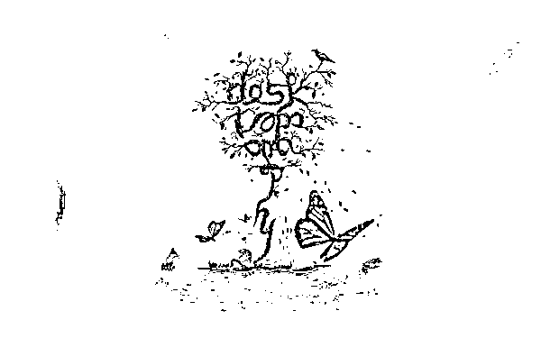
也许，我们都曾遇到过这样的情况：

<wbr>

**A：**一个很好的机会摆在面前的时候，我们却可能犹豫了，因为选择这个机会，可能意味着我们将不得不重新调整自己的生活状态，其中可能有我们非常不想舍弃的部分，或者将同时面临可能超过自己某些时间或者精力要求的挑战。于是，你陷入了苦恼。

<wbr>

**B：**两个很好的机会都来到了面前，可是选择了这个，就意味着丢了那个，同时，这两个有可能是差别较大的侧重方向，对你来说，哪个都可能带来前所未有的突破。可是，你又无法精准的预测到底哪个可以带给你更大的发展空间，或者更好的未来。于是，你陷入了苦恼。

<wbr>

**C:** 天有不测风云，人有旦夕祸福。忽然，你发现自己陷入了困境，行业不景气，单位降薪，然而，家里开销却由于种种原因难以缩减，甚至伴随孩子的长大，而持增加趋势。你有心换个单位，可是，好不容易找到的新单位却要求你必须到外地去工作两年，虽然工资有所提升，然而，你却要把孩子扔给爱人一个人照顾，而对方的工作也不轻松。于是，你陷入了苦恼。

<wbr>

**D:** 由于某种原因你的工作性质发生了被动变化，你不太喜欢这个新变化，这种新的岗位职责可能也并非你的长项。可是，你的工资相对来说，还是有提升，而且单位整体状况稳定。所以，生活品质得到了一定提升。同时，你一直想开创的事业，现在基本的技能你已经掌握全面了，因而基本具备了可以独立做事的能力。这是你非常喜欢的事情，而且你可能能够拥有属于自己的事业。可是，如果去做这件事，你可能需要投入很大的时间精力，意味着你不得不放弃现在的工作和稳定的收入，还有稳定的有保障的生活，甚至短期里很可能面临经济收入方面的大幅度下降，而且你无法确定这个事业一定能成功。于是，你陷入了苦恼。

<wbr>

这些是人们常常面临的选择冲突的几种情况，这些情况也可能在我们每个人的生活中，都不同程度的出现过，甚至引发了内心强烈的冲突，造成我们举棋不定的状况，然而，这种犹豫不决本身，又可能形成了一种新的选择，造成新的冲突。

<wbr>

疗愈中，遇到很多个案的问题，都是来自选择冲突，到底要不要换城市、创业、换工作、分手、离婚……因为趋利避害，是人的天性，我们总是会试图找出最优解，试图去尽可能地规避掉一些风险或者不利因素。这也是为什么吸引力法则会盛极一时，得到追捧的很大原因——因为符合人们内心的期待，谁不想只有好事，没有困难呢？然而，事物的发展有其自身规律，又有外部环境的种种作用，因而，常常事与愿违，不但无法避害，甚至可能与机会失之交臂，进而又造成了很多懊悔或者遗憾，以及内心难以化解的冲突，形成了很多人的情绪与压力困扰。所以，今天，我们就来详细的说说这几种冲突。

<wbr>

**心理学解释：**

**A：**在心理学上，我们叫做**趋避式冲突**，就是说这个选择里，有吸引你的方面，可是同时也有你要规避的方面，从而引发的选择冲突。我们常常说，有舍有得，大概就是针对趋避式冲突所做出的一种解决方式的尝试。

**B：**在心理学上，我们叫做**双趋式冲突**，就是说两个选择都很好，都有吸引到你的方面，可是却无法兼顾，从而引发的选择冲突。我们常常说，鱼与熊掌不可兼得，就是这个意思。

**C：**在心理学上，我们叫做**双避式冲突**，就是说怎么选都可能遇到明显的问题与阻碍，都是人们想尽力避免的，从而引发的选择冲突。我们常常说，左右为难，进退维谷，都是形容双避式冲突的。

**D：**在心理学上，叫**多重趋避式冲突**，也叫多重接近-回避式冲突。也就是说，每个选择里，都既有吸引你的方面，可是又都有你想规避的东西，从而造成的选择冲突。实际生活中，面临这种情况的时候，也常常更多一些——毕竟事物都是多面性的，因而，选择里，常常不可避免的，既有吸引，又有排斥的发生。

<wbr>

**为什么会存在选择冲突？**

如前文所说，人们会面临选择冲突，常常来自于我们的潜意识的作用。一方面，趋利避害，这来自于我们的安全需求，或者说生存的基本需求。规避问题，躲避可能的有害事物，是写入我们祖先基因里的“生存指南”。同时，另一个原因——灵魂记忆对神性留下的某些模糊印记也会造成我们希望事物是两全其美，甚至十全十美的，因为这才符合我们内心深处的神性认识。也就是说，我们总是会觉得，世界原本不应该是这样的，不应该有各种各样的遗憾、错过，人与人之间的种种争斗，甚至邪恶。

也许扪心自问，每个人心里都有或者至少曾有一个大同世界的版本——那是个真善美的，一切应有尽有的世界。因而，越是这个理想世界和现实世界落差大的人，越可能面临较大的选择困难，或者内心冲突——就是不能理解，为啥不能鱼和熊掌都给我？或者，经历过打击，变得走向反面，怯懦、失去勇气，前怕狼后怕虎，觉得人间处处是陷阱，怨天尤人，慨叹不公。

<wbr>

在这两个层面的作用下，这个追求“最好的选择（得到利益最大化，同时规避困难与危险）”的模式，就几乎烙印在了每个人心里，只是程度不同。而基于这种内心的“潜规则”，通常，如果选择的两方，有比较大的强度的差异，会比较容易做出选择。

比如，对 A 的情况来说，如果新选择带来的是明显可见的提升机会，而相对来说，增加投入的时间精力成本又在可接受范围内，那么选择就相对容易了。或者相反，需要投入完全超过预期的时间精力成本，而能够得到的提升机会，却相对不明朗，那么，选择也相对容易。同样，前有狼后有虎，的确是个较难的选择，但是前有狗，后有虎，就不是那么难了。其他的选择冲突与此类似。这种情况下，还是符合人的趋利避害的想法的，因而，也是容易做出选择的。

<wbr>

然而，当选择面临的两方的作用强度很接近的时候，选择就没有那么容易了。趋利避害，不再能轻易判断了，怎么办？

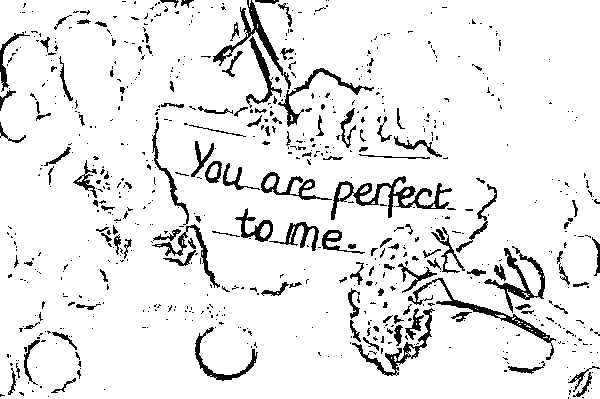
**如何面对选择冲突？**

从理智来说，无论哪种选择冲突的情况，都需要深入调研，综合考量，权衡利弊，平衡得失。也就是说，客观理性地看到，自己目前整体状况适合的，接受有得有失的事实，或者可能要面临丢车保帅，两害相权取其轻的结果。

<wbr>

然而，理性并不能在所有情况下起作用，人们常常还是会想尽可能的趋利避害，两全其美，这种想法当然很好，在条件允许下，如果能够实现当然是人们所乐见的。然而，如果脱离实际，就可能常常陷入裹足不前的尴尬局面，或者错失良机，或者，可能舍不得孩子，也套不到狼，孩子又被越来越猖獗入侵的狼咬死了。

<wbr>

因而，除了理性评估之外，更重要的是我们需要去了解自己的内心，与自己的内心沟通，了解自己内心的真实渴望，达成一种选择的共识，然后才可能把时间精力投入到选择的结果中去，并真正能够实践自己的选择。否则就可能不断后悔，做了这个选择，后悔失去那个，做了那个选择，又后悔失去这个。或者，选择了所谓的最合理方案，然而内心有很大的抗拒，无从化解，陷入与自己的战争。又或者，陷入到把能量全部耗费在左右不舍或者左右为难的状态里，最后不得不接受了一种没有选择的选择。

<wbr>

**与内心沟通，首先，也许我们仍然要接受这个世界的不完美，我们常常都不能鱼与熊掌一下子都得到。**就算得到了，我们也只有两只手一张嘴，要吃也得有个先后顺序，先吃鱼，还是先啃熊掌，这还是个选择。

<wbr>

其次，作为一个人，就算我们可以完全理性地做出价值评估与判断，很多事情，我们也常常无法按照最优解去生活，因为我们有自己的性情，有自己的爱好，也有自己的价值取向。

<wbr>

**有时候，某些选择看起来非常诱人，然而，它却未必适合于每一个人。**

<wbr>

比如，一个组织愿意去包装一位很有潜力的画家，可能这可以令其短期内迅速实现巨大的社会价值，成为名流，跻身某些贵族的圈子，更不用说经济收益了。这当然很好，对有些人来说，这是非常难得的机会，可以创造更有利的艺术创作的条件，而且自身又能够妥善从容地处理创作与其他方面事物方面的平衡。那么，选择接受这样的机会，当然是理所当然的事情。这对他来说是一个非常好的选择。

<wbr>

但是，对有些人来说，这个机会当然也很难得，可是，可能保有自己大量的独立时间与精力，才能更好地为创作力与灵感的发挥创造条件，这对他来说，可能是更重要的，甚至是作为画家不可或缺的。那么，如果他不断说服自己，只需要牺牲一点个人时间罢了，只需要牺牲一下其他爱好罢了，没关系的，但是内心每每遇到这些事情又很不情愿，这就可能陷入苦恼。而如果，他选择放弃这个机会，依然自由地画画或者玩些什么奇葩的事物，自得其乐，那也未尝不是一件好事，长远看对他的艺术之路可能是更有助益的。那么，如果他逼着自己去做了那个功成名就的选择，就可能看起来很好，但对他其实是个糟糕的选择。

<wbr>

所以说，**一件事情发生了，怎么选择本身并没有好与坏的分别，怎么选都可能是好的，怎么选，也都可能是坏的，重要的是我们要看到是谁在选择，你的特质是什么，你适合什么，你的内心又渴望怎样的状态。**比如上面的例子，两种途径都可能成就一个人，前者比如拉斐尔，后者比如达芬奇，拉斐尔有拉斐尔的宽厚，达芬奇有达芬奇的独特，无法简单做个高低上下的比较，更重要的是他们都选择了适合自己的路，而且都过得很好。

<wbr><wbr>

人生，如人远行，欲寻得水源处而安居，前方可能出现岔路，左边丛林密布，料想会有水源，可也可能有猛兽暗藏，右边一马平川，相对没有野兽可出没的外境，也利于发现隐患，可却也不知能否有水，走哪条路好？答案也许是，走哪条路得了哪条路的好处，就得承担哪条路上的风险。一不小心进退维谷，前不着村后不着店，看着都很危险，怎么办？答案也许是选择一条路，然后坚持往前走，逢山开路遇水搭桥，因为其实你已经没有别的办法了，不是么？一路前行，也并非不可能恰好就遇到了左右逢源。然而，逢源过后，是引一水入村而饮之，安居；还是取双水而蓄之，结湖而居？还是看着两源发呆，无法确定到底哪个水能流的更长久些，不知道到底该继续往哪边走就傻愣着呢？

<wbr>

也许，在这人间，我们谁都无法准确地预测每一个未来，一切都可能面临各种各样的变数，我们更无法为自己的选择打个包票，而只能顺天应命尽力而为。也许，在这人间，终究会有些难题是无法规避的，终究也会有些好处是不能尽占的，所以，免不了选择，免不了舍弃。免不了有时候明知是好，也得放下，也免不了有时候明知是难，也要迎难而上。这就是人，有局限，也有可被激发的勇气和心量。

<wbr>

我们不需要是完美的，也不需要做出完美的选择，左右逢源固然好，但不需要是每个人的完美，我们只需要去接受自己的现实，面对自己的现实，然后，再去向内看，其实内心都会有选择存在的。这个选择一直都在那里，很多时候人们不是不知道，只是不甘心，想要更多，或者更好，而忽略了内心的这个声音。

<wbr>

越是了解自己，尊重自己，就越能够面对当下自己遇到的问题，做出适合当下自己的选择——那不需要是最“好”的，但却是你发自内心愿意为之努力和承担的。而达芬奇能成为达芬奇，拉斐尔能成为拉斐尔，是因为他们各自都在义无反顾的做自己。偶尔互相地羡慕也许会有，然而，心里很清楚自己变不成别人，也不愿意变成别人，所以，接受了有些东西自己没有，有些东西别人没有，自己这条路上要面对这些，别人那条路上要承担那些，然后，继续走自己路欣赏自己的风景，当然也自愿承担着这路上的挑战和困难。

<wbr>

所以，了解自己内心的渴望，放下对一切完美的最优解的期待，勇敢的承担选择的结果，那么，趋避性选择困难，也就迎刃而解了。

<fieldset style="white-space: normal; margin: 0px; padding: 15px; border: 1px dotted rgb(0, 187, 236); color: rgb(68, 68, 68); font-size: 13px; line-height: 2em; font-family: 宋体; min-height: 1.5em; max-width: 100%; border-bottom-right-radius: 15px; border-bottom-left-radius: 10px; word-wrap: break-word !important;">

**作者简介**

慕棉：吉林大学工学博士，美国催眠协会（ABH）&美国加州催眠学院（P.A.S.H）认证催眠师，国际医学最高认证中心（WMECC）认证 EFT 情绪释放技术治疗师，国际整体暨自然医学学会（IHNMA）认证完型治疗执行师。现居北京，从事各类心理心灵整合治疗工作，欢迎预约个案，联系：QQ2092982531。预约详细事宜及个案内容请参考博客。博客地址：http://blog.sina.com.cn/qiansu82

</fieldset>

**用占星来疗愈自我，请点击文末的“阅读原文”。**

-------------------------------

若道星文化，是由美国著名占星师大卫·瑞雷老师创办的占星学培训与文化传播机构，是国际占星研究协会(ISAR)在中国唯一一家定点合作机构。

**【占星入门——若道占星】微信订阅号：nodoorbj**

* 若道官网：www.nodoor.com 可提供占星咨询、占星课程、星盘查询、应用测试及电子杂志等服务。

* 新浪微博：@若道占星

**长按此处二维码，立即关注**

**这里不仅有占星，更有生活**


3 月 29 日，哈德利· 菲茨杰拉德将开设**“占星疗愈：意象与家族动力探索”**课程，详情请点击文末的“阅读原文”。↓↓↓

# 占星心理 | 别用安全感绑架了自己的人生

> 原文：[`mp.weixin.qq.com/s?__biz=MzA5NjA0NTAxNg==&mid=205566840&idx=2&sn=a0475528b6c6afac43596bf391e591c5&chksm=190201cf2e7588d9e76a49e89b5038c2164e2e4387be3296efeefc81df689b1b1ff172b9232b&scene=126&sessionid=1692739023#rd`](http://mp.weixin.qq.com/s?__biz=MzA5NjA0NTAxNg==&mid=205566840&idx=2&sn=a0475528b6c6afac43596bf391e591c5&chksm=190201cf2e7588d9e76a49e89b5038c2164e2e4387be3296efeefc81df689b1b1ff172b9232b&scene=126&sessionid=1692739023#rd)

本文原载微信号 Lady30s，欢迎关注。

人本主义心理学家马斯洛提出过著名的需求层次理论，把人的需求分成生理需求 （Physiological needs）、安全需求（Safety needs）、爱和归属感（Love and belonging）、尊重（Esteem）和自我实现（Self-actualization）五类，并依次由较低层次到较高层次排列。在这个需求层次的金字塔中，较低层次的需求占据着主导性的位置，只有较低层次的需求得到满足后，较高层次的需求才会出现，并激励着人们去追求相应的满足。五种需求中，生理需求和安全需求属于最底层的需求，可以通过外部条件来得到满足，比如食物、住所、人身安全、财产的所有性、工作职位的保障，等等。而越高层次的需求，就越需要通过内部因素、个性化的因素来加以实现。

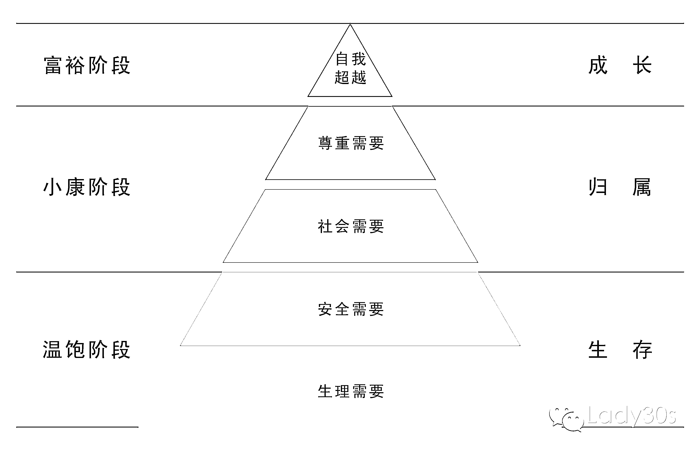
马斯洛的需求层次理论

作为一名心理分析导向的占星咨询师，我在咨询实践中常常发现，来访者的问题或困境总是和“安全感”这个关键词息息相关。感情和职业是咨询中遇到最多的两大类议题，而无论是感情还是职业，在波澜起伏的表象之下，往往埋伏着“安全感”的暗礁。简单来归纳的话，有关感情的议题可以归结为两种：一种是难以进入关系、建立关系的议题。比如说，“我为什么总是遇不到合适的人？”或者“我好像很难真正喜欢上一个人”。在深入的咨询过程中会发现，这类问题常常是因为来访者在面对外界时有过强的防御机制，无法敞开心胸去和他人有真实的情感联结，自然也就无法接纳另一个人进入到自己的内心世界。而从心理学的角度来说，防御机制过于厚重，其根源在于缺乏情绪安全感，害怕拒绝和丧失，主体为了保护内在脆弱的部分，所以给自己罩上层层的盔甲。另一方面，遇不到合适的人有时候也是因为对经济基础和物质条件的考量过重，而这又凸显了物质安全感匮乏的议题。

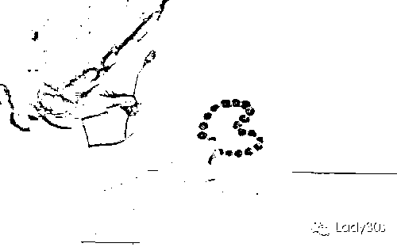

另一种常见的感情议题，是亲密关系相处互动的紧张和冲突。来做占星咨询的大多数是女性，她们很容易抱怨男友或伴侣让自己缺乏安全感，而这往往会导致她们对感情有许多完美主义的、过于苛刻的要求，以及在关系互动中有许多激烈的情绪化的表达。当感情中的种种诉求遭到挫败、激烈的情绪冲突不断发生，矛盾升级的结果就是闹分手、离婚或是外遇。注意，我并不是说亲密关系中的问题主要是女性造成的，男性同样有他们安全感的软肋。比如，在伴侣身上寻求母爱，希望得到无条件的照顾和包容。再比如，无法接纳自己内在情绪感受的流动，所以也很难去面对和接受女性伴侣在情绪上的波动。

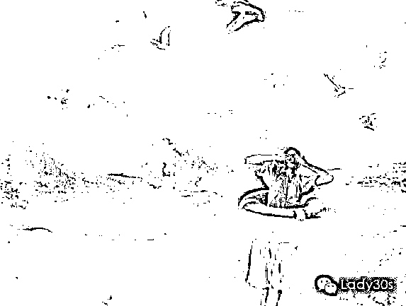

总结来说，感情议题虽然在马斯洛的需求层次里属于“爱和归属感”的问题，但在我们的现实生活中却往往变形成为“安全感”问题的载体。换句话说，更高层次的“爱和归属感”的需求实际上被安全需求给绑架了。至于咨询中遇到的职业议题，很多时候也都是受制于安全感的需求，想要突破职业瓶颈却害怕打破当下的稳定生活，想要做自己喜欢的、擅长的事，却又对生存问题和物质保障感到忧心忡忡，想要自我独立和成长，却又舍不得放开原生家庭和父母的庇佑。同样的，更高层次的尊重和自我实现的需求也被安全需求给绑架了。

马斯洛也指出，一个国家多数人的需要层次结构，是同这个国家的经济发展水平、科技发展水平、文化和人民受教育的程度直接相关。然而，非常吊诡的是，我的咨询客户绝大多数都是成长于衣食无忧的家庭，并且受过正常高等教育的人，而中国的经济发展也是在长时间内都处于高速增长的阶段。这又带出了相关的问题：我们的社会，到底是被怎样的文化因素所主导？而我们生活在这样的社会文化环境之下，又该如何认清楚自己内在的安全感缺失？有哪些安全感问题是源于内在的心理因素，又有哪些安全感问题是源于外在的社会压力、文化压力？

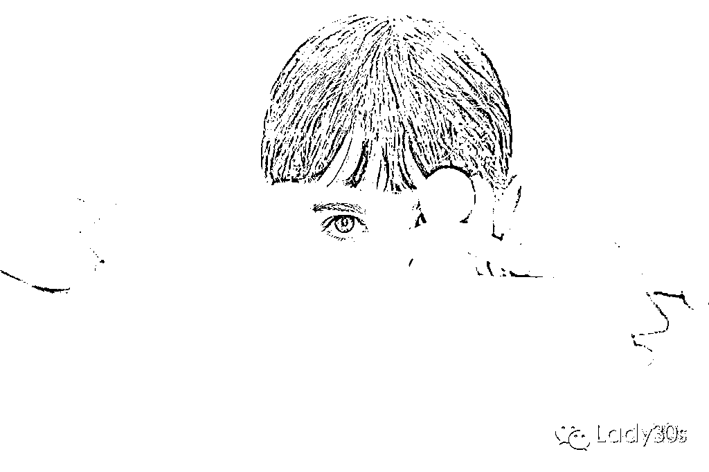

心理学家大多认同将安全感匮乏的根源追溯至生命早期的成长经验。一个婴幼儿期没有得到母亲很好照顾的人，必然在情绪安全感上形成难以满足的心理坑洞。如果在 2 岁到 4 岁阶段里没有建立起客体恒常性，也很可能在物质安全感上难以餍足。在 4 岁到 6 岁的阶段，如果恋父情结或恋母情结没有得到较好的转化，如果没有对同性父母建立起正向的认同感，那么对爱的不信任、自我价值感的匮乏、自信心的缺失等也将埋下安全感隐患的种子。

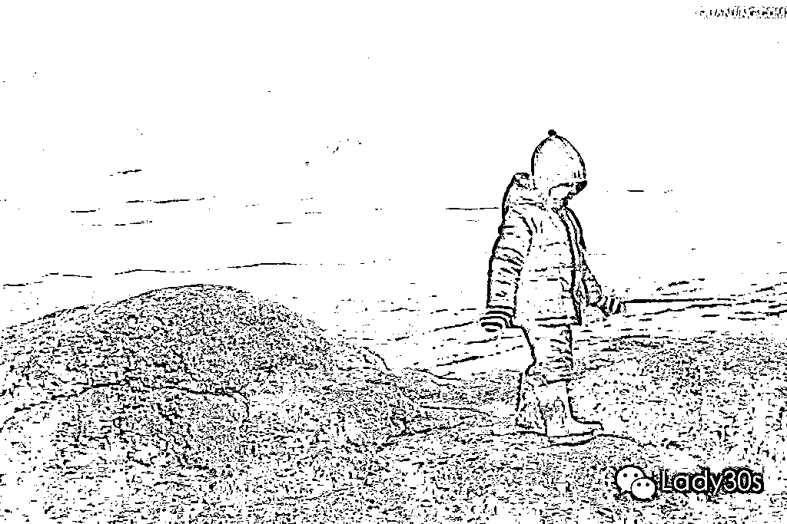

同样，从占星学的视角也可以对安全感议题进行具体的辨识和抽丝剥茧的分析。个人的出生星图中，安全感的议题可以体现在方方面面，但最显著的是土星的影响力。具体来说，土星所落的宫位，往往体现出一个人天生缺乏信心、容易感到担忧和恐惧的领域，同时也会是此人在后天环境中容易遭到挫折和磨难的领域。而土星和个人行星的紧张相位，也能够从不同的人格层次、经验面向来说明安全感问题的根源及后果。举例来说：土星和月亮的紧张相位，通常和情绪安全感的匮乏有关，也容易体现为日常生活中的紧张不安、忧虑沉重，且往往和早期经验中母亲的负面影响有关。土星和火星的紧张相位，通常指向生存安全感和意志力匮乏的议题，容易在日常生活中过度竞争，带有攻击性或掌控性，且往往和早期经验中父亲的负面影响有关。土星和金星的紧张相位，通常造成自我价值感的匮乏、对爱的不信任，容易体现为亲密关系的议题，以及金钱物质上的匮乏感，也往往折射出早期家庭环境的物质拮据，或是父母给予的亲密感不足。

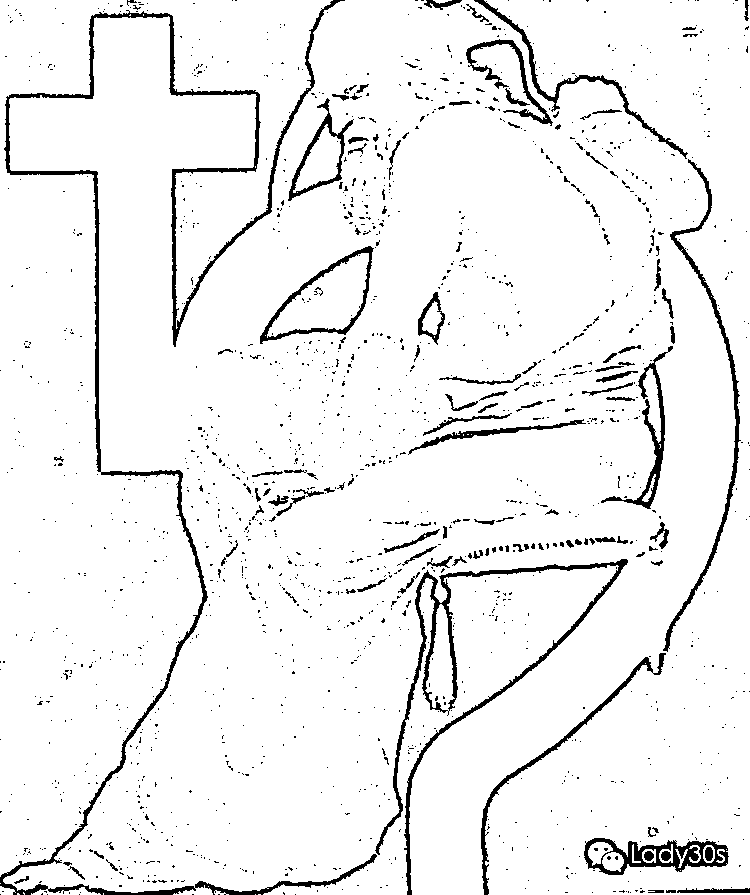

土星的象征符号和神祇。在占星学中，

土星代表收敛、寻求安全和控制的驱力，

象征着潜意识中的恐惧，

以及由此带来的困难、压力、限制和延缓。

不过，占星学视角和心理学研究的不同之处在于，心理学在很大程度上将人的问题归因于后天经验和社会文化因素的影响，而占星学不仅承认后天影响，而且认为个体生命内在蕴含着与生俱来的禀赋，也就是种种心理问题的“种子”。因此，安全感的问题，可以说是源于内而形于外。内在的心理能量投射到外界，而外界经验又反馈于心，继而形成条件反射般的惯性模式，如此内因和外因交互作用、循环往复。

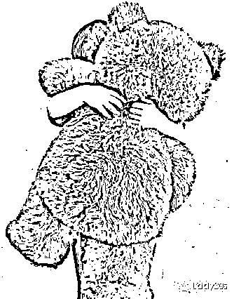

另一方面，占星学也涵盖了对社会文化因素的考量。比如，土星被称为社会行星，象征着社会主流的价值观、道德规范、行为准则等等，同时也承载着集体潜意识中的阴影面。在幼年时期，这种社会集体的影响力主要是通过父母长辈的言传身教作用于我们的内心，而我们长大成人进入社会后，又会在社会环境中直接感受到这些土星式的压力和限制。此外，研究家族占星让我了解到，出生星图中的某些要素就像家族的遗传基因一样，会有代代相传的延续性。比如，一个女性有月土的紧张相位，而她的母亲、她的外婆同样也有月土的紧张相位，这意味着在这个家族中，女性角色承受的压力和限制是代代相传的，她们会无意识地去扮演那个辛苦操劳的母亲和妻子的角色，并压抑自己真实的情感需求。因此，这个女性必须从家族的业力中解放出来，才可能真正转化内在的安全感议题。

我们的社会，在短短几十年前还处在一个和现今截然不同的生存状态中。我们的父辈和祖辈，他们的人生经历过物质资源的短缺和匮乏，经历过社会环境的动荡不安，经历过人与人之间极端的不信任和透彻心扉的恐惧。而这些不安全感的因子仍然在他们的血液里流淌，并不会凭空消失。从这个角度来看，我们内心深处的不安全感，不仅和家族业力的传承延续有关，而且也和整个国家、民族的过往历史息息相关。

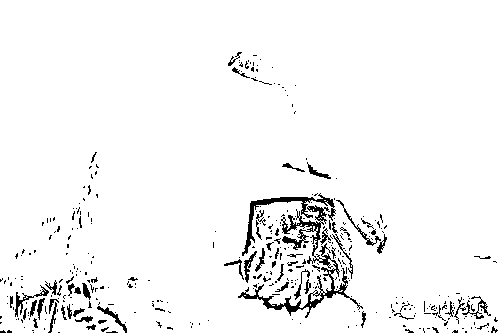

也许有人会问，认识到这些又有什么用呢？实际上，认识并接纳自己的不安全感，是转化的第一步。直面这些不安全感的来龙去脉，你才不会无意识地被它们牵着鼻子走，才不会被社会集体意识中的负面能量所裹挟和围困。占星学认为，土星的负面影响力会让一个人活在沉重、忧虑、僵化、自我设限乃至抑郁的心理状态中，让生命失去活力，人生停滞不前。这正是不安全感造成的问题，它让我们无法自如地去爱，无法坦然地去生活，更无法在较高的需求层次上，去追求人之为人的尊严，去充分实现自我的价值。反过来，土星的正面法则要求我们承担个人责任，直面现实的压力和考验，能够通过坚持不懈的努力去建构出具体的成果，乃至能够去追求自己的天命。而这也是我们在克服不安全感的道路上必须学习的功课。

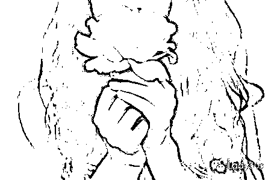

正如马斯洛及人本主义心理学所强调的，人的内在力量不同于动物的本能，人要求内在价值和内在潜能的实现乃是人的本性，人的行为是受意识支配的，人的行为是有目的性和创造性的。当你能够突破安全感的束缚和限制，人性的光芒就会显露出来，你会成为一个活生生的人，一个真正独立自主的人，一个追求自我实现的人。这，难道不是人之为人的应有之义？

（本文图片由作者提供,部分图片来源网络）

**本文版权归 Lady30s 所有。**

**如需转载，请联系 lady30s@126.com 授权转载。**

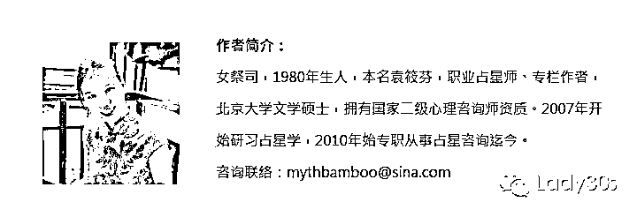

-------------------------------

若道星文化，是由美国著名占星师大卫·瑞雷老师创办的占星学培训与文化传播机构，是国际占星研究协会(ISAR)在中国唯一一家定点合作机构。

**【占星入门——若道占星】微信订阅号：nodoorbj**

* 若道官网：www.nodoor.com 可提供占星咨询、占星课程、星盘查询、应用测试及电子杂志等服务。

* 新浪微博：@若道占星

**长按此处二维码，立即关注**

**这里不仅有占星，更有生活**


3 月 29 日，哈德利· 菲茨杰拉德将开设**“占星疗愈：意象与家族动力探索”**课程，详情请点击文末的“阅读原文”。↓↓↓

# 占星疗愈 | 意象与家族动力探索（距离开课还有 2 天）

> 原文：[`mp.weixin.qq.com/s?__biz=MzA5NjA0NTAxNg==&mid=205566840&idx=3&sn=0f9cdda48237c316cb722e8fa72bd4af&chksm=190201cf2e7588d9b4a3d05178ff80f0f5b669dbf64b77ae7f2d2a01535ea7c9e87b6b9f41fe&scene=126&sessionid=1692739023#rd`](http://mp.weixin.qq.com/s?__biz=MzA5NjA0NTAxNg==&mid=205566840&idx=3&sn=0f9cdda48237c316cb722e8fa72bd4af&chksm=190201cf2e7588d9b4a3d05178ff80f0f5b669dbf64b77ae7f2d2a01535ea7c9e87b6b9f41fe&scene=126&sessionid=1692739023#rd)

占星疗愈：意象与家族动力探索哈德利·菲茨杰拉德

开课时间： 3 月 29 日
课程形式：网络在线
课程负责人：Freya Li、Helen Zhou
联系方式：4006191014/QQ:2847613491

**我会让我的母亲去找哈德利，如果她需要咨询的话。——斯蒂芬·弗里斯特**

## 课程描述

作为高阶占星学生的你也许都已经意识到了，无论你是否以占星为业，你身边的朋友、同事都会希望你能为他们答疑解惑。占星师以及占星学子都拥有某种能力，去解读别人的人生，甚至去影响他们的人生。但是占星师也是人，也有自己的偏见和情结。我们可能会因为一些自己未经疗愈的议题，把自己的问题投射到客户身上。

哈德利•菲茨杰拉德老师认为，占星师和心理治疗师应该先疗愈自己，这样当我们探索客户的出生星图时，我们自己的（有意识和无意识的）恐惧、矛盾、偏见、情结、性情、个人经历、信仰和目标就能够尽可能在我们的控制之下。她说：“在我看来，我们的任务不是预测未来，或者承诺问题会得到解决，而是帮助客户找到不同的方法，去应对生命中遇到的各种矛盾，以便让他们能为自己做出更好的选择。”

所以，哈德利决定开设一门课程，从个人故事、图像和家族动力的角度，结合占星学，帮助你了解自己的内心，并且学习如何帮助客户更好地了解自己，让你真正担当起占星疗愈的责任。

## 课程内容

**1. “传记”表格介绍、相关写作练习和小组讨论（三次课程）**

在这一阶段，哈德利老师会向大家介绍她自己设计的一份表格——“传记”表格。通过此表格，客户将有机会回顾或重新发现个人和家庭的动因，了解到他们早年生活的什么塑造了他们的个性，从而让他们认识到，这些动因如今在怎样影响着他们的生活。

基于学习的目的，我们会利用这个表格来挖掘你的个人故事，并将其与出生星图关联，帮助你更好地理解自己的人生模式、生命中的核心动因，并学会以更有意识、更进化的方式去显现这些动因。

**2\. 心灵对话、意象训练与出生图（五次课程）**

不管是出生星图，还是梦境、想象、塔罗、电影、艺术，都为我们提供了某种图像。心灵正是通过这些图像与我们对话，而这也提供给我们特定时间里客户所需要的“良药”。通过图像，心灵和思想能再度整合，实现心理、情感、身体和精神的真正健康。

图像是一种潜意识语言，哈德利老师意识到这一工具的效力日益增强。它能帮助我们更好地识别不同情绪和阴暗模式，避免让自我偏向某一特定的解读；它能有效地放松我们不断警惕的自我意识阻力，同时也能够刺激我们的想象力。它鼓励治疗性的对话，因为它在客户内心中激发了领悟与解决方案。当这些发现得到了治疗师的支持，我们的左右脑以及客户的意识与潜意识思维就获得了更强的整合。

在这一阶段，我们将学习用语言来询问或回答：这幅图像告诉了我什么？它为何此刻出现在这里？它反映了我的什么？它揭示了我的何种更深层次的故事？现在当我回顾曾经在传记表格上所写的内容时，我看到了什么？

我们也会将图像和出生星图联系起来，学习用图像来描述出生星图中的模式，并且将这种方法运用到客户身上，帮助他们了解自己的灵魂地图（出生星图），让他们能以不同的方式“看见”自己。学生们可以自由使用任何塔罗牌或自己喜欢的其他资源所提供的图像。我们还将进行意象训练进一步强化学生在这部分的体验。

**3\. 出生星图和家族动力（四次课程）**

了解家庭的系统运作是认识自我的关键，也是我们内在工作和客户工作的关键。所有家庭成员的行为都会相互影响，祖先们的沮丧情绪、死气沉沉的生活、未解决的问题和各种家庭秘密，也纠缠着我们的内心。

在这一阶段，哈德利老师会使用传记表格、图像和家谱图的方式，来探索家庭关系。我们也将运用出生星图，探索转宫制如何能说明家族体系中是什么在“纠缠”你或你的客户。我们还会尽可能多地使用多代家庭成员的图像，来指引我们找到现在的家庭动因。

## 授课形式

1\. 网络教学：2015 年 3 月 29 日 开始 每月一次 周日上午 9:55-12:00 共 12 次课 24 课时

网络视频会议系统上的在线课程和答疑辅导，只要有上网的条件在世界各地都可以上课，无地域限制。

2\. 中英文双语授课，专业占星口译员中文翻译。

## 针对人群

1\. 往届若道高阶课程（COAC）的毕业生。

2\. 目前高阶课在读（2014-2015COAC）的学员。

3\. 参加过 ISAR 咨询技巧培训并通过 ISAR 认证考试的占星师。

4. 学习过专业知识的占星师。（这里的专业知识包括：出生星图、行进、次限推进、太阳弧推进等）

## 报名及付款流程

课程费用：5800 元　（若道老学员 4800 元）

点击文末的“阅读原文”，并在在课程页面上点击立即报名。

咨询请拨打电话 4006191014　
或直接写信给 nodoor@vip.126.com，我们会回复您的疑问

**哈德利•菲茨杰拉德（Hadley Fitzgerald）**

**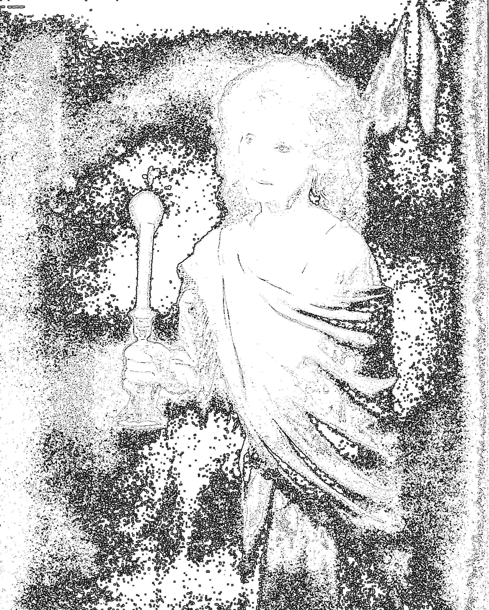**

心理学家。英语学士，心理学硕士。从事占星咨询工作 40 年多，担任心理治疗师 31 年。哈德利•菲茨杰拉德把出生星图作为生命地图，指引客户去发现灵魂在此生最好的发展目标，以及与灵魂的目标产生有意识共鸣的方法，帮助客户应对世俗发展和灵魂进化的双重挑战。

她为拉斐尔·纳赛尔的《同一天空下》（Under One Sky）写作了心理占星学的部分，由朱迪·弗里斯特编辑。她的培训和工作核心是要帮助我们回答“什么是我们灵魂的诉求”。哈德利拥有加利福利亚大学洛杉矶分校和菲利普斯研究所的学位，在临近洛杉矶的加利福利亚谢尔曼奥克斯进行私人治疗和占星咨询工作。(www.HadleyFitzgerald.com)

**详情及报名方式，请戳下方“阅读全文”**

<fieldset label="Copyright © 2014 playhudong All Rights Reserved." id="shifu_o_017" style="white-space: normal; border: none; padding: 10px; max-width: 100%; margin: 5px 0px 0px; box-sizing: border-box !important; word-wrap: break-word !important; background-image: none;">


</fieldset>

# 跟大卫学占星 | 12 星座和 10 颗行星一网打尽

> 原文：[`mp.weixin.qq.com/s?__biz=MzA5NjA0NTAxNg==&mid=205566840&idx=4&sn=7103c02dea72fadd050c2965675fbae5&chksm=190201cf2e7588d9a4a3b046eba3ab71028d71b1fccf7437b1d0d4c1538dd3edf5e4f9529f74&scene=126&sessionid=1692739023#rd`](http://mp.weixin.qq.com/s?__biz=MzA5NjA0NTAxNg==&mid=205566840&idx=4&sn=7103c02dea72fadd050c2965675fbae5&chksm=190201cf2e7588d9a4a3b046eba3ab71028d71b1fccf7437b1d0d4c1538dd3edf5e4f9529f74&scene=126&sessionid=1692739023#rd)

****

2015 若道占星核心课程为期 2 年，分 5 个级别。这是一条从兴趣爱好到职业占星师的路。大卫老师将用他 44 年占星学习和 38 年占星咨询经验带领你走上这条道路，为你的占星学习打下坚实基础。

本年度第一期 Level-1 课程在春节前已经圆满结束，在 Level-1 里，学员跟随大卫老师系统的学习了 12 星座的原型、特点以及太阳和月亮星座特质等，让我们先来回顾下他们的学习情况吧~

**1．童鞋们课后总结作业（选自若道学员专属论坛）**

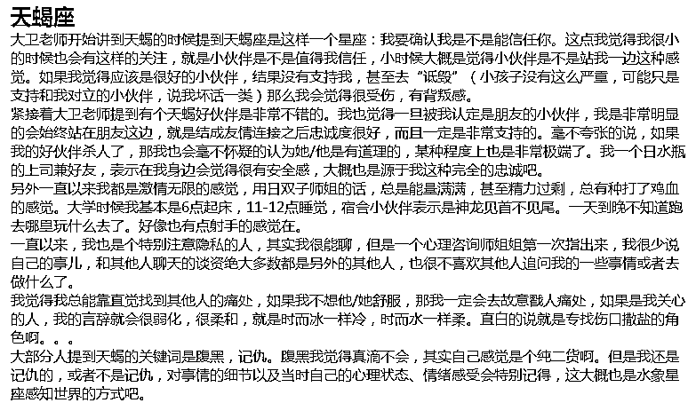


小编点评：想必大家都知道生活中天蝎座和处女座是经常被人“黑”的, 而我们的童鞋通过上课找到了共鸣和被理解，并在这份作业里真实的剖析了自己的一些想法来告诉大家：其实每一个星座都有正负两面特质，不能用好与坏来评论，正是这些鲜活的特质让一个人真实和完整。

**2．我们辛勤的助教--天空哥也是蛮拼的，不仅在课上协助答疑，线下也是协助童鞋们进行答疑和解惑。**

**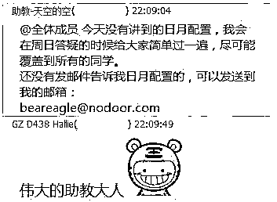** 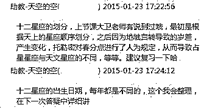

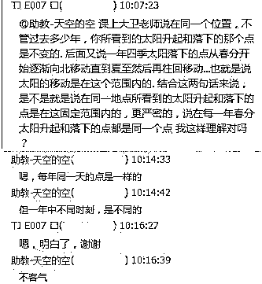

看完这些你有没有觉得心痒痒呢？就算你错过了第一期 Level-1 课程也没有关系，因为接下来我们还有本年度第二期 Level-1 的报名机会，**这也是本年度最后一期的报名机会。而这次的 Level-1 课程与 level-2 课程是捆绑授课的哦，这样可以使你更系统连贯的学习到占星学基础知识。**

说到这里也许有的童鞋会问：“本身我通过网络、书籍已经了解一些占星知识了，那我是不是不是直接可以跳过 level1-2 基础课程的学习了呢？”还有的童鞋问：“我是”小白”，没有任何基础，学 level1-2 基础课程会吃力吗？”

**其实 level-1 和 level-2 课程就是为“小白”和自学基础不够扎实的朋友们准备的。**

如果你是小白，不用担心没有基础，在占星学习上的问题，我们工作室的占星师和助教都会帮助你解答。

而对于那些自学占星时间不久或自学基础不够扎实的朋友, 我们都推荐从 level-1 和 level-2 开始上起。因为很多人开始学占星学，都贪多贪快，其实占星学跟打太极一样，你基本功越扎实，站桩越好，就将来解盘时就越能够深入。否则，站都站不稳，如何能成为高手呢？本命盘其实是最重要的预测盘，人生大的议题都在本命盘之中。而要想学会本命盘的解读，就要学好占星学的 ABC，即星座、行星、宫位。在其之上，学习相位，然后是其他。而相位的理解重要处在于能够理解星座、行星、宫位。每一个基础概念都要丰富而深刻的含义。

如果你上过若道大师工作坊，或者听过大卫·瑞雷，诺·泰尔，斯蒂芬·弗里斯特的咨询，你会知道他们所用的 80%以上的都是基础占星学的概念。但是因为他们能够准确深入运用这些概念，使得他们的解读准确，深入人心。

现在只需 1800 元，你便可以打好占星学基础。想想看 1800 元可以买到什么呢？在外面下几次馆子或者买几件衣服就没了，花掉这些钱，也无法给你带来更多收益和成就。而如果投资在学习占星上面，你会比那些没有上过课的人更扎实掌握了占星学基础。

**下面让我们来看看课程简介：**

**Level 1：星座，太阳和月亮**

12 星座是占星学最基本却又最深刻的概念，黄道 12 星座，是伟大的生命周期，而太阳和月亮是我们阴阳之本。

**课程内容：**

12 星座：和大卫一起，深入了解这些星座的特色。了解星座正面的、负面的表达，了解其资源，了解其破坏生命的模式。了解其原型人物、了解其指代的事物、人。

12 星座原则：按照极性、形态和元素给星座分类

12 星座关键词：关键词非常重要！是解读准确性的关键。

太阳和月亮：了解你的太阳，生命的发动机，让你在世界闪光的方式，生命获得力量的方法；

了解你的月亮，让你生命获得幸福的方法。

了解太阳、月亮，了解你生命中已经出现的、将会出现的男人和女人。

**课程时间：**

授课时间：2015 年 4 月 28 日-5 月 19 日，

每周二晚上 20：00-22:00 （北京时间），共计 4 次课

**Level 2：**遇见行星和月亮交点****

在这个阶段，你将遇见行星们，还有与灵魂的过往和未来相关的月亮交点。这既是你，你的性格，也是你在生命故事中将会遇到的人、事、物的显化，也是你灵魂轨迹的线索。

**课程内容：**

内行星：水星、金星、火星

中间行星：木星、土星

外行星：天王星、海王星、冥王星

灵魂的线索：月亮南交点、月亮北交点

行星逆行：行星逆行的天文现象和意义

宫位初解：了解黄道 12 宫的基本含义

**课程时间：**

授课时间：2015 年 5 月 26 日-6 月 16 日

每周二晚上 20:00-22:00（北京时间），共计 4 次课

**我们的教学优势：**　

**作为国际占星研究协会（ISAR）在中国唯一指定的教学机构**，我们有：

**专业师资（国内最专业）：**

**国际一流名师**：大卫•瑞雷 40 年占星咨询和教学经验，4 年中国本土化教学经验，无保留传授。

职业占星师助教：我们的助教，均为 ISAR 认证职业占星师或大卫老师职业占星师资质班优秀毕业生。

专业翻译：擅长占星的英文翻译，完全不懂英文的同学也可以聆听大师的教诲。

**系统教学（国内最****完善）：**

学习路径：完整的知识结构，清晰的知识点，大量案例展示、咨询示范。

心法传授：大卫老师 40 年实战咨询经验，绝非仅靠读书就可获得。

实战练习：在 Level 5 将组织实战练习，为开启咨询之路做好准备。

**完美互动（国内最丰富）：**

与名师面对面：北京同学可以来若道现场上课，和大卫老师面对面互动。大卫老师也会前往主要学员所在城市，实现零距离教学。

互动答疑：论坛、QQ 群随时提问；老师课上答疑；助教线上线下全程协助。

线下沙龙：定期举办沙龙活动，复习上课内容。

**强大的同学网络：**若道作为中国最顶尖的占星教学机构，在 4 年的占星教学中，培养了很多占星人才。若道让你和师兄师姐切磋，让你和国内著名占星师学习。

**配套支持（国内最方便）：**

先进的教学平台：网络教学平台，支持**手机、电脑、iPad 上网**，可以随时随地学习。

回放复习：学员可登录网站收看课程回放，**在线复习**课程，每次课可完整重看 3 次，1 个月内有效。

**报名方式：**

你有没有觉得心痒痒呢？那就**点击文末的“阅读原文”**，了解更详细的课程信息吧！

课程联报更有优惠套餐，详情请咨询：

拨打电话 010-56629907（早 10 点到晚 6 点，周一到周五）　

或 课服 QQ：4006191014 （若道星文化）

或 直接写信给 nodoor@vip.126.com，我们会回复您的疑问。


# 白羊座 | 少有人走的路：你足够勇敢吗

> 原文：[`mp.weixin.qq.com/s?__biz=MzA5NjA0NTAxNg==&mid=205539976&idx=1&sn=063bd3f0dd06c6b7ffd84ea7ddebeba2&chksm=1902f83f2e7571296b89a7920d2a3379c27b32dce2e6104d37d114d8ac6438143b8825869d6a&scene=126&sessionid=1692739023#rd`](http://mp.weixin.qq.com/s?__biz=MzA5NjA0NTAxNg==&mid=205539976&idx=1&sn=063bd3f0dd06c6b7ffd84ea7ddebeba2&chksm=1902f83f2e7571296b89a7920d2a3379c27b32dce2e6104d37d114d8ac6438143b8825869d6a&scene=126&sessionid=1692739023#rd)

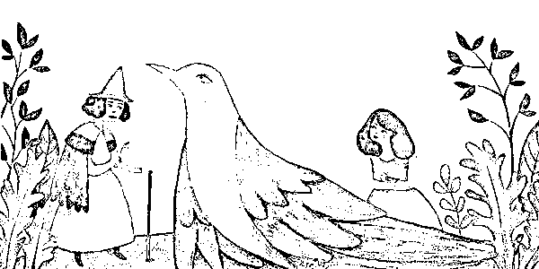

谷雨之前，在春分和清明两个节气里，太阳行进在白羊座。火星——白羊座的守护星，当下也在白羊座运行，直到 4 月 1 日。同时，行进在白羊座的天王星，强化了火星的行动力，给火星注入了天冥四分出乎意外、敢于颠覆的能量。

在这个白羊月，你可能会比平常更加无畏、有勇气去行动、去表达自己。你可能会带着敢为第一的精神或对成功的渴望，踏上一条“少有人走的路”。用你战士般勇敢纯粹（即使在旁人看来稍显鲁莽)，开始新的冒险与征程。

你也可能突然很想到户外去活动。约上三五好友，在这个万物初长的季节一起去踏青赏花，或跟小伙伴们去爬山或踢球。户外运动，是白羊月非常明智的选择（但要注意特别保护头部，在白羊月最容易受伤的身体部位）。运动能很快疏解身体与心理层面的能量，特别是白羊与火星带来的的竞争性或怒气。

也许你会说：我并没有感觉到怒气、竞争性，亦没有体会到内心的勇敢无畏。如果你是女性，这很正常。在我们的社会与文化传统，对女性的期许是温柔优雅、贤惠持家。而白羊或火星的能量——坦诚直接、独立热情、战士精神、竞争性、坚持自己、还有对权威的反感——作为女性会很难去表达，更容易投射到身边亲密的男性身上。

如果你星图里有很强的白羊或火星的能量，却很难表达自己的热情与勇气，这个白羊月会是你很好自我觉察的时机。你可以尝试向内看：自己的生命力与意志是不是被压力与恐惧所抑制了？或是只是需要更多的耐心，自己在等待勇气被吓出来或逼出来的那一刻，去行动，去踏上征程？

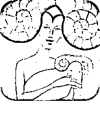

我个人星图里有金星与火星矛盾冲突的四分相。作为女性，我容易表达金星能量——注重合作、和谐、人际的亲密与连接，因此初识的朋友经常觉得我是一个很好说话、容易妥协的人。慢慢相处久了，才发现我隐藏的火星面向——勇敢无畏的行动力或火山熔岩般的脾气。勇气与愤怒是白羊座或火星能量的一体两面：当行动力受限、竞争性被压抑，怒气被积压和扭曲，熔岩就会烧得越来越烈变得难以控制，可能会向外彻底地爆发，或会向内发泄，造成自我否定与抑郁。

很多年，我一直在面对金星与火星能量的内在冲突。在金火的平衡议题上，我徘徊与迷茫了许久。如何拥抱自己身上阳性的战士精神与开拓性，如何接受并欣赏自己的金星女性能量，对于自小生长在这个社会的女性而言并不容易。

直到有一天，我发现火星的战士特质或阳性能量并不是意味着攻击他人，而是源于不断的自我挑战的渴望，才找到了把火星的开拓性能量导向服务他人、连接他人的方法。原来，在保持“迅速觉察他人的需要与感受”特质的同时，可以用善巧的方法表达我的需求，学习在外界持不同意见时相信肯定并坚持自己，学习用坚定而温柔的方式去对待这个世界。

白羊的对应点是天秤，火星的对应点是金星。接受与拥抱这两股相反的能量——无论是接受金星类型的女性，还是欣赏自己内在的金星特质，对于白羊或火星特质强的女性而言，也许是表达自己灵魂中战士面向的第一步。

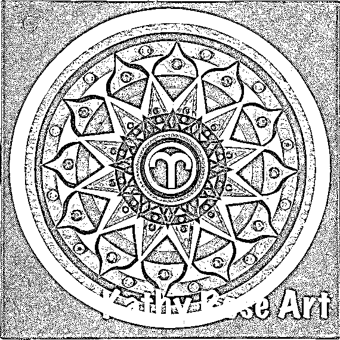

白羊是开创性的火元素。在这个火星能量凸显的白羊月，祈愿大家都有相应的因缘与智慧，选择最合适自己的战斗，用白羊座蓄势待发、不妥协、不屈服的精神，找寻勇气，踏上征程！


-------------------------------

若道星文化，是由美国著名占星师大卫·瑞雷老师创办的占星学培训与文化传播机构，是国际占星研究协会(ISAR)在中国唯一一家定点合作机构。

**【占星入门——若道占星】微信订阅号：nodoorbj**

* 若道官网：www.nodoor.com 可提供占星咨询、占星课程、星盘查询、应用测试及电子杂志等服务。

* 新浪微博：@若道占星

**长按此处二维码，立即关注**

**这里不仅有占星，更有生活**


3 月 29 日，哈德利· 菲茨杰拉德将开设**“占星疗愈：意象与家族动力探索”**课程，详情请点击文末的“阅读原文”。↓↓↓

# 疗愈 | 是什么造成了你我的病痛？

> 原文：[`mp.weixin.qq.com/s?__biz=MzA5NjA0NTAxNg==&mid=205539976&idx=2&sn=b8d2062d6f21a380249a1d21f26850c2&chksm=1902f83f2e757129194e2e89265bafdffed11c2fd40a5c394dfbda00aa4ea30c66b16c43b983&scene=126&sessionid=1692739023#rd`](http://mp.weixin.qq.com/s?__biz=MzA5NjA0NTAxNg==&mid=205539976&idx=2&sn=b8d2062d6f21a380249a1d21f26850c2&chksm=1902f83f2e757129194e2e89265bafdffed11c2fd40a5c394dfbda00aa4ea30c66b16c43b983&scene=126&sessionid=1692739023#rd)

> 对于是什么造成了我们的各种病痛，我们有着很多不同的答案。占星治疗师、心理治疗师哈德利·菲茨杰拉德认为，比起简单的“精神疾病”，人们更需要一种更加多维的解释。用智慧、审慎和富有同情心的方式，将占星学和心理学联系起来，从而给从业者和客户提供一种独特的、启迪心灵的方式，去处理并重建世俗发展和灵魂关注之间的平衡。

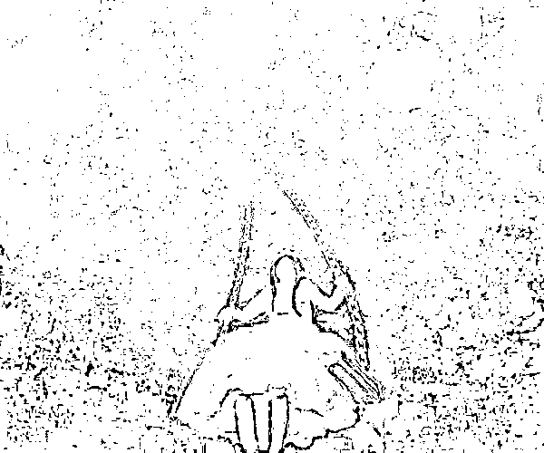 作者：哈德利•菲茨杰拉德 译者：江艺 校对：李含

> 生命来自星空，来自每一颗原子，每一粒碳原子、氧原子和氢原子。你的身体元素或许在四千五百万年前就存在于一个星体之上。它们事实上是几千万年前星体上氢和氦的综合。如果有人告诉你别的生命来源，那他们就是疯了。
> 
> ——佛罗里达州立大学化学系教授，哈利·克鲁托爵士
> 
> DNA 之于物质身体，就像原型世界之于精神身体。它简单塑造了我们与生俱来的心理构造。
> 
> ——马里恩·伍德曼 《岁月的王权》
> 
> 所有事物都具有象征意义，聪明的人可以从一件事物中学习另一件事物。
> 
> ——普罗提诺

一天晚上，我站在一个陌生人的厨房里。就是在那一刻，占星学来到我的心中，而不仅仅是我的生活中。那个陌生人说了一个陈述句，宇宙立刻就载入了我的人生目的。就在一瞬间，我全身心投入到这个新颖的职业计划和严格的教育准备中。

心理学的到来更加曲折。在我占星工作的早期，我在一位客户的星图中看到了一些东西，然后我问一个问题，让我们互相都看到“这是从何产生的”。她的眼泪夺眶而出，我不知所措，不知道接下来该做什么。我步入了咨询之外的另一个世界，却不具备在其中操作的资格，无论是伦理上还是其他方面。随着这种情况越来越频繁地发生，我会将客户引荐我听说过的治疗师，希望客户适当关注我们所发现的。然后有一天，我独自待在办公室里，我恍然大悟，占星学可以成为未来心理学的一个组成部分，就像两股互相缠绕的灵魂双螺旋，所以我决定重返研究生院，弄清如何将二者融会贯通。

然而，正如约瑟夫·坎贝尔在“英雄之旅”的图表中指出的，每当我们回应召唤，被引入一个全新的生活层面时，我们就会遇见一个阴影，守在通道处。我们受到某种方式的考验，或以某种方式去创造。

在我学习占星学的最初几周，有一位老师越过我的肩头，看到我画在笔记本上的一张星图雏形，她手捂胸口，倒抽一口气，问道：“那是你的星图么？”我说“是的。”不难想到，我犯了些计算上的错误。她进一步指出我在此生中明显会延续的所有麻烦，如果我的自我意识能量稍弱的话，我可能已经当场精神崩溃了。相反，我头脑里出现了一个声音：“永远不要对任何人做这样的事。”我对她笑了笑，打趣地说，尽管我的生活到目前为止并非一帆风顺，但我还没有卧床不起。我听到她失望地发出“啧啧”声，缓步走开。她看到了一些东西，但那不是我。

大约八年之后，也就是我在研究生院学习的第一年，作为心理测验必修课的一部分，我们参与到了当时所学习的所有测验中。在此期间，我通过担任克林顿·菲利普斯主任的行政助理，获免了大量学费，他是学校的创始人和主任。他知道我是一名占星师，但我们从未讨论过这对我们意味着什么。他喜欢我，能为他工作我感到很幸运，在他雇佣我后不久，我意识到在心理学领域，我也找到了导师。

一天早上，我刚到学院，他就马上唤我去办公室。他看上去就像是撞上了幽灵，他递给我一个已经打开的牛皮纸大信封。在地址之上，是一排醒目的红字，下面划线强调“建议心理治疗!”我很好奇这是什么。“帮我弄明白。”他说。信封里面是一份档案，根据我们在课上做过的“个性”测试所编写。我仔细地检查图表、数字、刻板的总结和分类细目，想知道什么让菲利普主任苦恼，然后在第一页顶端看到了我的名字。我看到的这份测试结果并不好，所以主任就我自己和我的生活，问一些问题。我坦率地回答，随着时间一分一秒地过去，我们都越来越困惑。

然后，当我再次低头看第一页报告时，我突然看到“33 岁，男性。”“太好了，”我说，“原来他们把我当成男人了。”菲利普斯主任俯下身亲自去看，他明显松了口气，就好像所有谜题都解开了。“啊哈，”他说，“我们需要把你作为女性再做一次。”当我问这能有什么样的区别时，他劝我不必烦恼，继续去做今天的工作。当第二次结果回来时，并没有“红色警报”，我的资料在可接受的参数范围内。

虽然这件事已经过去了 30 年，但我仍然认为这是一个“神赐”、一个恩典，旨在提醒我，我不止于此。那次所做的测试，是在 50 年代被定位全民标准的，但是到了 70 年代末还仍然很流行。所以，如果我是 50 年代的女性，我的回答让我成为一个能被接受的、稳定的人类；但如果我是男性，我将“需要”精神干预。这个测试测量了一些东西，但那不是我。

这两个相隔近十年的小插曲让我成为了一名占星师，并最终成为了一名心理治疗师，拥有了一个不同的视角。作为占星师，我一次又一次地看到占星符号如何表现出无限丰富的形式，那种丰富度甚至超过许多占星支持者的想象。但是如果我们只是用星图来做个性的静态描述（无论有多准确），而不是将其用于寻找线索，探索心灵的迷宫，占星学就将变狭隘。慢慢地，我在心理学领域也积累了经验，我看到一些最伟大、最具关爱的人物对人类的状况提出了深刻的见解，但与此同时，他们却也画地为牢。

爱德华·埃丁格在《心理剖析》（*Anatomy of the Psyche*）中写道:“心理治疗的过程如果不断深入，就会触发深沉而神秘的事件。病人和医生都很容易迷失方向。这就是为什么我们要如此拼命地坚持狭隘而不充分的心理学理论，因为至少它们带来了某种方向感。” 4 在这两个领域，尤其是对于我们这些同时涉足两个领域的人 ，我们受到那些人居高临下的指摘，正如汉斯·施特鲁普的嘲讽，“提供远远超过要求的解读”。

有了这样的解读，我们便有了能力去给人们贴标签，去给别人的生活下禁令，甚至是错误的标签和禁令。我们需要意识到这一点，而单单意识到这一点，就已经足够发人深省了。据我所知，占星学和心理学领域的执业者都了解这种下禁令或犯错的能力，无论这种能力来自于从业者，又或是体系本身。在这个被“管理式医疗”驱动的时代，“复制粘贴”的治疗和无数占星模型仍然适用于因果关系的背景，这二者都处在一个蔑视灵性和深度的狂躁时代精神中。我希望我们能继续澄清和完善心理占星学的涵义，以免它成为任一领域的另一个分支，从而冲淡了它本身最为深刻的炼金术潜能。换句话说，当我们说我们实践的是心理占星学时，我们指的是《精神疾病诊断与统计手册》第四版的宇宙版本吗？我们是在试图恢复心理学领域本身的一些东西吗，还是最终造就一种超越二者的实践？

我们大多数人都熟悉“心理学”和“占星学”二词的希腊语词根：yuch （psyche 心理）、astron（astron 星星）和 logos（logos 逻各斯），但是这些还不够，所以我将在这里重新探讨。里德尔和斯科特的《希腊语-英语词典》6 告诉我们，yuch 可以被定义为“灵魂、心灵、精神；作为生命征象的呼吸；生命的宝贵之物；认识过程中的思想”。而对于 astron，我们看到“星星”；也就是繁星（包括行星）；“天空”，在更加古老的希腊语中，还表示“火焰、光、火”。同样是这个词典对 logos 给出了将近半页的定义，其中有“词语，通过它，内在的思想得以表达；所说的话；语言；说话、演讲、论述、报告；思索、推理；传说、记述、叙事。”精神疗法这个名称中的因素在运用中常常与心理学互换，但有一个值得注意的细微差别。古希腊语的名词 qerapeia（therapeia 疗法）和动词 qerapeuw（therapevo 治疗）可以被定义为“招待、偏重、培养、滋养、照顾；服务于神、关注、治疗、治愈。”心理治疗：关注、滋养灵魂，因此是深度倾听它说什么。

那么，在心理学的核心（根源），我们处理的是灵魂语言或灵魂话语，是灵魂本身的记述。但正如科学已经脱离了更深刻的认知精神，所以并不夸张地说，心理学已经脱离了灵魂，其现代形式在语言和目标上都变得自我中心。这在本质上并没有什么不妥，因为我们知道，一个健康的自我比一个充满恐惧和自我厌恶的自我更能有效地驾驭这个世界。不过，正如作家迈克尔·文图拉所观察到的，从长远来看，“灵魂毫不关心自我想要什么”，只有一条穿过我们的更深的河流。

在古希腊语中，我们发现 yuch 既是指蝴蝶，也指灵魂。“从毛毛虫蜕变为蝴蝶”的旅程，拉姆·达斯称之为灵魂穿过人生的旅程，也是一个精妙的隐喻，用来比喻医生在治疗关系的净化器中寻求升华。如果将占星学（天空中的叙事）巧妙地整合到这一过程中，它可以提供光和必要的火，从而为转变之旅的本质和目的带来更深层次的理解。由此产生的灵魂螺旋让我们能够从另一个角度思考 DNA，将 DNA 视为我们神圣的出生议程。

我经常引用希腊作家和精神探索者尼科斯·索尔塔尼迪斯，因为他对于人类的生存有着智慧而令人深思的观点。据我所知，他没有任何关于占星学的知识，但他关于人生目的的概念可以很容易成为一种占星宣言。他想象每个人的灵魂都是整个上帝精神独一无二、不可重复的一部分。他希望我们每个人都认为自己肩负着非我莫属的拯救世界的责任，在这个意义上，当我们中有人离世，我们作为独特的存在所能做的事情，就永远消失在这个世界上。他敦促我们承担起这个神圣的任务，深入探索我们自己的灵魂，找到并释放我们内心中他所谓的“濒危的上帝精神”10。也就是说，去沉思我们在这个世界上的目的，使得人生道路更有自觉意识，去发展我们此生独有的贡献，避免让这个世界更加匮乏。

在索尔塔尼迪斯的假设中，在最好、最巧妙的形式中，心理学和心理治疗的实践会有一点矛盾。当它与占星学交融时，在其最好的、不断演进的形式中，随之而来的双螺旋结构提供了深刻而必须的交叉连接，来帮助我们解决詹姆斯·希尔曼在《灵魂的密码》中描述的困境：“在我们出生之前，我们每个人的灵魂被指派了一个独特的守护神，它在地球上为我们挑选了一种景象或模式。这个灵魂伴侣（守护神）在我们到达那里的过程中引导着我们，然而，我们忘记了所有发生的事，以为我们来到这个世界时空无一物。这个守护神记得你的景象中有什么，什么是属于你的模式，因此你的守护神是你命运的载体……但是，我们无法找到这个内在的景象，直到我们拥有一个心理学理论，承认命运召唤的原始心理现实。”

心理学家有一个模型，或模型的混合体，他们用它来：探索客户目前的家族史，提出问题；评估意识和无意识思想之间、外在和内在自我之间的失调程度；确定失调的情感和行为表现；并帮助客户建立改变的目标，从而帮助客户获得一种他们眼中更加协调的生活。

占星师有一张写有宇宙名称的图表，个性特征、守护神、神秘之所、我们内心真实的声音，渴望回答别人真诚的提问：“你是谁？你在这里做什么？你带着怎样复杂的故事？我如何帮助你？”那么请你穿过表层，深入倾听，而不是将一个模板强加在他们身上（如果有人会这么做的话），正如聂鲁达所说：“坐在黑暗之泉的边缘，耐心捕捉洒落的光芒。”

如果我们（通过星空）“思考”这两个学科之间的那种全新的、富有启迪的、错综复杂的交流，并且对它们的阴影层面始终保持警觉（理查德·埃德蒙称之为“权力感的微妙诱惑”）， 那么我们就会有一个完全不同的有利视角，帮助客户区分情感和整齐划一的现实。就在星图（宇宙的契约）上，有一个进化的轨迹，一个不断变化、不可重复的意图；星图中的一切都以具体人类的形式坐在我们对面。

我们的神圣任务，充满谦卑的功课，就是：帮助客户在有形和无形之间打造一种协作关系；给人类命运的谜题和忧虑带来恩赐的元素和意义；充满同情地面对阻碍世俗进步和精神进化的心理阻滞；从一个朝圣者到另一个朝圣者，怀着对一切奇迹的崇敬，伸出一只手穿越时间。

**如果你想了解这位老师的课程，请点击文末的“阅读原文”。精彩的课程，报名还在继续。**

-------------------------------

若道星文化，是由美国著名占星师大卫·瑞雷老师创办的占星学培训与文化传播机构，是国际占星研究协会(ISAR)在中国唯一一家定点合作机构。

**【占星入门——若道占星】微信订阅号：nodoorbj**

* 若道官网：www.nodoor.com 可提供占星咨询、占星课程、星盘查询、应用测试及电子杂志等服务。

* 新浪微博：@若道占星

3 月 29 日，哈德利· 菲茨杰拉德将开设**“占星疗愈：意象与家族动力探索”**课程，详情请点击文末的“阅读原文”。↓↓↓

# 荐号 | 看这 8 个公共号，你就是最前卫的人！

> 原文：[`mp.weixin.qq.com/s?__biz=MzA5NjA0NTAxNg==&mid=205539976&idx=3&sn=f34cc22b85e39ffeaa1fbc6aa2a88b0b&chksm=1902f83f2e757129a584fc3a8728faa0e1ce086ff95265a99f062a088b1c8e6c08d1d76aec6a&scene=126&sessionid=1692739023#rd`](http://mp.weixin.qq.com/s?__biz=MzA5NjA0NTAxNg==&mid=205539976&idx=3&sn=f34cc22b85e39ffeaa1fbc6aa2a88b0b&chksm=1902f83f2e757129a584fc3a8728faa0e1ce086ff95265a99f062a088b1c8e6c08d1d76aec6a&scene=126&sessionid=1692739023#rd)

> 想要成为最前卫的人？太简单了！
> 
> 每天看看这几个有趣的公共号，就能**技能 get√**啦！
> 
> 成为各种达人，让身边的朋友对你刮目相看！

**长按二维码识可识别关注**

**i 烘培**

**bakingstyle**

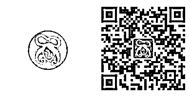

目前活跃度最高的烘焙美食订阅号。千里挑一的烘焙配方、新鲜有趣的原创专题、专业烘焙知识交流，尽在 i 烘焙。

**非常**

**ifretz**

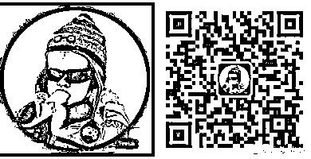

“非常”的小编 Fretz 只为最酷的你，报道最有趣文创生活信息，挖掘最任性艺术灵感。

**若道**

**nodoorbj**

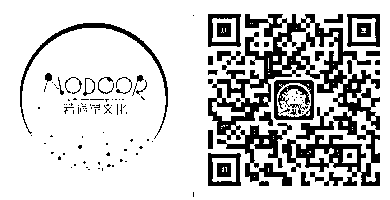

若道国际占星机构——戴上占星学的镜片，透视别人看不到的人性和世界。

**易生活教育**

**elife_education**

 

体毛、胸部、月经、亲吻……没错，青杏关注年轻人的青春故事。我们有最全面的性爱知识，最实用的攻略技巧，最贴心的答疑分享，最有爱的原创漫画。欢迎年轻的你与我们一起谈性。微博@青杏网

**有有酒 YoYo9**

**yoyo9wine**

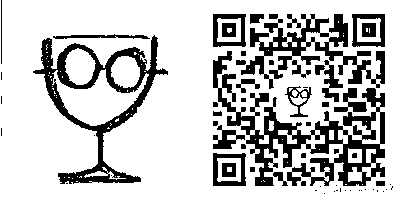 

由一个只戴圆眼镜的处女座创办的微信公众平台

挑剔地为你拣选便宜又好喝的葡萄酒

轻松又好玩的跟你分享葡萄酒的小知识

希望通过葡萄酒传达一种生活方式

**乐童**

**yuetongyinyue**

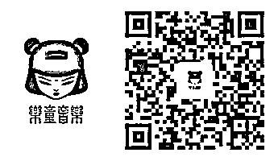

网罗有关独立音乐的一切，深度访谈，演出资讯，花边八卦，周边福利，一个也不错过！

**联合国粮农组织**

**FAOchina**

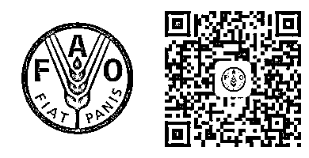

从粮食安全到气候环境，从抗击饥饿到消除贫困，从营养健康到食品安全，联合国粮农组织为你网罗与生活息息相关的内容。

**微在**

**wezeit-daily**

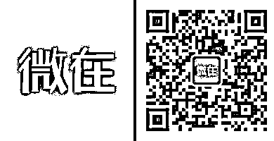

微在（wezeit.com）是朋友圈里趣味病毒携带者，公号每天推送 wezeit.com 精选内容，只传染有另外一种存在方式的地球人。这里没有成功学、装 B 论、低俗八卦和脑残吐槽。

----------------------------------------

若道星文化，是由美国著名占星师大卫·瑞雷老师创办的占星学培训与文化传播机构，是国际占星研究协会(ISAR)在中国唯一一家定点合作机构。

**【占星入门——若道占星】微信订阅号：nodoorbj**

* 若道官网：www.nodoor.com 可提供占星咨询、占星课程、星盘查询、应用测试及电子杂志等服务。

* 新浪微博：@若道占星

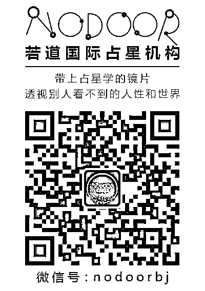

# 占星疗愈 | 意象与家族动力探索（距离开课还有 3 天）

> 原文：[`mp.weixin.qq.com/s?__biz=MzA5NjA0NTAxNg==&mid=205539976&idx=4&sn=4fe783394662b4c43bc091fe128ad71f&chksm=1902f83f2e757129ef1fb0dc716aa2e98d8a6348f1052db34c4dd8d382d78820ca41369e7372&scene=126&sessionid=1692739023#rd`](http://mp.weixin.qq.com/s?__biz=MzA5NjA0NTAxNg==&mid=205539976&idx=4&sn=4fe783394662b4c43bc091fe128ad71f&chksm=1902f83f2e757129ef1fb0dc716aa2e98d8a6348f1052db34c4dd8d382d78820ca41369e7372&scene=126&sessionid=1692739023#rd)

占星疗愈：意象与家族动力探索哈德利·菲茨杰拉德

开课时间： 3 月 29 日
课程形式：网络在线
课程负责人：Freya Li、Helen Zhou
联系方式：4006191014/QQ:2847613491

**我会让我的母亲去找哈德利，如果她需要咨询的话。——斯蒂芬·弗里斯特**

## 课程描述

作为高阶占星学生的你也许都已经意识到了，无论你是否以占星为业，你身边的朋友、同事都会希望你能为他们答疑解惑。占星师以及占星学子都拥有某种能力，去解读别人的人生，甚至去影响他们的人生。但是占星师也是人，也有自己的偏见和情结。我们可能会因为一些自己未经疗愈的议题，把自己的问题投射到客户身上。

哈德利•菲茨杰拉德老师认为，占星师和心理治疗师应该先疗愈自己，这样当我们探索客户的出生星图时，我们自己的（有意识和无意识的）恐惧、矛盾、偏见、情结、性情、个人经历、信仰和目标就能够尽可能在我们的控制之下。她说：“在我看来，我们的任务不是预测未来，或者承诺问题会得到解决，而是帮助客户找到不同的方法，去应对生命中遇到的各种矛盾，以便让他们能为自己做出更好的选择。”

所以，哈德利决定开设一门课程，从个人故事、图像和家族动力的角度，结合占星学，帮助你了解自己的内心，并且学习如何帮助客户更好地了解自己，让你真正担当起占星疗愈的责任。

## 课程内容

**1. “传记”表格介绍、相关写作练习和小组讨论（三次课程）**

在这一阶段，哈德利老师会向大家介绍她自己设计的一份表格——“传记”表格。通过此表格，客户将有机会回顾或重新发现个人和家庭的动因，了解到他们早年生活的什么塑造了他们的个性，从而让他们认识到，这些动因如今在怎样影响着他们的生活。

基于学习的目的，我们会利用这个表格来挖掘你的个人故事，并将其与出生星图关联，帮助你更好地理解自己的人生模式、生命中的核心动因，并学会以更有意识、更进化的方式去显现这些动因。

**2\. 心灵对话、意象训练与出生图（五次课程）**

不管是出生星图，还是梦境、想象、塔罗、电影、艺术，都为我们提供了某种图像。心灵正是通过这些图像与我们对话，而这也提供给我们特定时间里客户所需要的“良药”。通过图像，心灵和思想能再度整合，实现心理、情感、身体和精神的真正健康。

图像是一种潜意识语言，哈德利老师意识到这一工具的效力日益增强。它能帮助我们更好地识别不同情绪和阴暗模式，避免让自我偏向某一特定的解读；它能有效地放松我们不断警惕的自我意识阻力，同时也能够刺激我们的想象力。它鼓励治疗性的对话，因为它在客户内心中激发了领悟与解决方案。当这些发现得到了治疗师的支持，我们的左右脑以及客户的意识与潜意识思维就获得了更强的整合。

在这一阶段，我们将学习用语言来询问或回答：这幅图像告诉了我什么？它为何此刻出现在这里？它反映了我的什么？它揭示了我的何种更深层次的故事？现在当我回顾曾经在传记表格上所写的内容时，我看到了什么？

我们也会将图像和出生星图联系起来，学习用图像来描述出生星图中的模式，并且将这种方法运用到客户身上，帮助他们了解自己的灵魂地图（出生星图），让他们能以不同的方式“看见”自己。学生们可以自由使用任何塔罗牌或自己喜欢的其他资源所提供的图像。我们还将进行意象训练进一步强化学生在这部分的体验。

**3\. 出生星图和家族动力（四次课程）**

了解家庭的系统运作是认识自我的关键，也是我们内在工作和客户工作的关键。所有家庭成员的行为都会相互影响，祖先们的沮丧情绪、死气沉沉的生活、未解决的问题和各种家庭秘密，也纠缠着我们的内心。

在这一阶段，哈德利老师会使用传记表格、图像和家谱图的方式，来探索家庭关系。我们也将运用出生星图，探索转宫制如何能说明家族体系中是什么在“纠缠”你或你的客户。我们还会尽可能多地使用多代家庭成员的图像，来指引我们找到现在的家庭动因。

## 授课形式

1\. 网络教学：2015 年 3 月 29 日 开始 每月一次 周日上午 9:55-12:00 共 12 次课 24 课时

网络视频会议系统上的在线课程和答疑辅导，只要有上网的条件在世界各地都可以上课，无地域限制。

2\. 中英文双语授课，专业占星口译员中文翻译。

## 针对人群

1\. 往届若道高阶课程（COAC）的毕业生。

2\. 目前高阶课在读（2014-2015COAC）的学员。

3\. 参加过 ISAR 咨询技巧培训并通过 ISAR 认证考试的占星师。

4. 学习过专业知识的占星师。（这里的专业知识包括：出生星图、行进、次限推进、太阳弧推进等）

## 报名及付款流程

课程费用：5800 元　（若道老学员 4800 元）

点击文末的“阅读原文”，并在在课程页面上点击立即报名。

咨询请拨打电话 4006191014　
或直接写信给 nodoor@vip.126.com，我们会回复您的疑问

**哈德利•菲茨杰拉德（Hadley Fitzgerald）**

****

心理学家。英语学士，心理学硕士。从事占星咨询工作 40 年多，担任心理治疗师 31 年。哈德利•菲茨杰拉德把出生星图作为生命地图，指引客户去发现灵魂在此生最好的发展目标，以及与灵魂的目标产生有意识共鸣的方法，帮助客户应对世俗发展和灵魂进化的双重挑战。

她为拉斐尔·纳赛尔的《同一天空下》（Under One Sky）写作了心理占星学的部分，由朱迪·弗里斯特编辑。她的培训和工作核心是要帮助我们回答“什么是我们灵魂的诉求”。哈德利拥有加利福利亚大学洛杉矶分校和菲利普斯研究所的学位，在临近洛杉矶的加利福利亚谢尔曼奥克斯进行私人治疗和占星咨询工作。(www.HadleyFitzgerald.com)

**详情及报名方式，请戳下方“阅读全文”**

<fieldset label="Copyright © 2014 playhudong All Rights Reserved." id="shifu_o_017" style="white-space: normal; border: none; padding: 10px; max-width: 100%; margin: 5px 0px 0px; box-sizing: border-box !important; word-wrap: break-word !important; background-image: none;">


</fieldset>

# 课程推荐 | 职业占星师之路（北京）

> 原文：[`mp.weixin.qq.com/s?__biz=MzA5NjA0NTAxNg==&mid=205539976&idx=5&sn=8a362a937564b172527a688b91be784e&chksm=1902f83f2e757129fa439666eb6d8c4a0222e58f671ff5a1478def1791c0297ce6e24a0036ba&scene=126&sessionid=1692739023#rd`](http://mp.weixin.qq.com/s?__biz=MzA5NjA0NTAxNg==&mid=205539976&idx=5&sn=8a362a937564b172527a688b91be784e&chksm=1902f83f2e757129fa439666eb6d8c4a0222e58f671ff5a1478def1791c0297ce6e24a0036ba&scene=126&sessionid=1692739023#rd)

**职业占星师之路（北京）**

**课程目标**

本次咨询指导课程的目的，是为了帮助那些已经掌握了一定出生星图、预测、比较星图、组合星图等解读所需的知识和技能，但在后面的占星咨询实践中，由于欠缺相关的咨询技巧和实践点拨，无法顺利高效地进行咨询的占星学习者。通过一天的系统训练及课后练习，帮助学员更好地将所学的专业占星知识更有针对性的融合到占星咨询之中，综合提升学员的星图解读咨询技巧，从而达到提升咨询效果和客户满意度的目的。

**针对人群**

1\. 往届大卫高阶课程（COAC）的毕业生。

2\. 目前高阶课在读（2014-2015COAC）的学员。

3\. 参加过 ISAR 咨询技巧培训并通过 ISAR 认证考试的占星师。

4. 学习过专业知识的占星师。（这里的专业知识包括：出生星图、行进、次限推进、太阳弧正向推进等）

**课程安排（总长度 6 小时，不包含午休时间）**

1.【咨询切入】1 小时

结合出生星图的重要议题，讲解如何高效把握咨询的切入点，以恰当的方式与客户进行沟通。大卫老师会结合案例来分享其近四十年职业占星咨询的实战技巧。

2.【案例讲解】3 小时

通过 3-4 个大卫老师长期的咨询案例，来讲解如何将占星技巧融入咨询实践。内容将涉及占星咨询的几个层面：

情境层面——日常的世俗情境和状况

心理层面——与身份议题相关的本性表现

社交层面——与社交相关的议题

身体层面——与身体或健康相关的议题

灵性层面——灵性议题，体验更深或更高层面的意义

3.【团体练习】1.5 小时

占星咨询结构化分组练习，通过咨询者、客户、观察者的三元角色互换，进一步融合之前讲解的咨询技巧。

4.【总结】0.5 小时

课程关键点总结，布置督导课后的实践练习计划。

**课程时间**

2015 年 4 月 4 日早 9:00-晚 17:00

**教学难度**

相当于若道的高阶占星学课程的水平。即熟悉出生星图解读与行进预测技巧 。

**课程价格**

新学员：980 元（若道老学员：580 元）

**课程地点**

地址：北京市朝阳区百子湾路 32 号院苹果社区南区 10 号楼 A 座 2006 室

**【报名和付款流程】**

课程费用：980 元（老学员：580 元）

请在课程页面上点击立即报名，以及在线完成学费支付

网页报名后无法进行在线支付的同学，可以通过银行汇款的方式支付课程费用，

汇款信息：蒋颖　　6226 0901 0424 5721　　招商银行北京中关村支行或支付宝：nodoor@yeah.net

请在汇款备注中写上自己的名字和所报课程，方便我们核对。

**【关于退课与转课】**
课程付费后，因个人原因无法参加通过邮件申请退款，开课前 3 天内可以全款退回。
开课后，不再接受退款或转课申请。

**详情及报名方式请戳下方"阅读全文"。**


美国资深职业占星师。1970 年开始学习占星学，在通过亚特兰大职业占星委员会的考试后，于 1976 年获得执业许可，成为一名专职占星师。年过六旬的大卫老师，曾两任亚特兰大占星协会主席，是全美占星师联盟（AFAN）、美国占星师联合会（AFA）、全美占星研究委员会（NCGR）、国际占星研究协会（ISAR）和职业占星师组织（OPA）的成员，是联合占星大会（UAC, United Astrology Conference）督导委员会委员。

大卫老师曾是 CNN、CBS 的占星节目的常驻嘉宾，多次在 BBC、WGS、WSB、WRGG 等节目中接受采访，并在亚特兰大主持电视节目《每日行星（Daily Planets）》达 4 年之久。至今已研究占星四十余年，拥有三十多年的占星咨询的执业经验，其服务客户包括学生、工人、市长、州长、议会议员、企业家、心理咨询师、工程师、艺术家、演员、知名企业家等，客户年龄跨度从襁褓婴儿到耄耋老人。2010 年 6 月，大卫的书《灵魂的目标》中文版出版。在 2011 年春季的北京之行期间，大卫接受了《南方周末》记者的采访，同时参与了 CCTV9 的纪录片的拍摄。

大卫老师热爱教学，愿意将自己的毕生所学倾囊相授。为了将纯正的西方占星学带入中国、为了让更多的中国人从占星中获益，大卫老师在占星学的传授上投入了巨大的热情与心血。他以后每年将有一半的时间在中国度过，中国将成为他的第二个家。

　　“了解自己是智慧的开始，了解占星是与自己相遇。”

　　“人性和自然息息相关，自然的韵律是我们太阳系的韵律。”

　　“在我看来，占星学的意义在于帮助你发现你自身的力量，帮助你做出更好的选择，让你生活得更好；而不是告诉你什么时候一定会发生一些可怕的事。”

　　“自我成长的三部曲是：觉察，接纳和改变。占星是最好的自我觉察的工具之一。而变化就是变成你的星盘所能赋予你的最美好的样子。”

　　“‘成为更真实的自己’意味着深入挖掘存在于你本身的各种可能性。”

**详情及报名方式，请戳下方“阅读全文”**

<fieldset label="Copyright © 2014 playhudong All Rights Reserved." id="shifu_o_017" style="white-space: normal; border: none; padding: 10px; max-width: 100%; margin: 5px 0px 0px; box-sizing: border-box !important; word-wrap: break-word !important; background-image: none;">


</fieldset>

# 占星疗愈 | 意象与家族动力探索（距离开课还有 4 天）

> 原文：[`mp.weixin.qq.com/s?__biz=MzA5NjA0NTAxNg==&mid=205514422&idx=5&sn=eb727c4786691e999b5a6641d89704f7&chksm=197d54012e0add175e0d11f026b01c0bea1e901142ed9fdf65205cb8b830dd8d75f32cc5787f&scene=126&sessionid=1692739029#rd`](http://mp.weixin.qq.com/s?__biz=MzA5NjA0NTAxNg==&mid=205514422&idx=5&sn=eb727c4786691e999b5a6641d89704f7&chksm=197d54012e0add175e0d11f026b01c0bea1e901142ed9fdf65205cb8b830dd8d75f32cc5787f&scene=126&sessionid=1692739029#rd)

占星疗愈：意象与家族动力探索哈德利·菲茨杰拉德

开课时间： 3 月 29 日
课程形式：网络在线
课程负责人：Freya Li、Helen Zhou
联系方式：4006191014/QQ:2847613491

**我会让我的母亲去找哈德利，如果她需要咨询的话。——斯蒂芬·弗里斯特**

## 课程描述

作为高阶占星学生的你也许都已经意识到了，无论你是否以占星为业，你身边的朋友、同事都会希望你能为他们答疑解惑。占星师以及占星学子都拥有某种能力，去解读别人的人生，甚至去影响他们的人生。但是占星师也是人，也有自己的偏见和情结。我们可能会因为一些自己未经疗愈的议题，把自己的问题投射到客户身上。

哈德利•菲茨杰拉德老师认为，占星师和心理治疗师应该先疗愈自己，这样当我们探索客户的出生星图时，我们自己的（有意识和无意识的）恐惧、矛盾、偏见、情结、性情、个人经历、信仰和目标就能够尽可能在我们的控制之下。她说：“在我看来，我们的任务不是预测未来，或者承诺问题会得到解决，而是帮助客户找到不同的方法，去应对生命中遇到的各种矛盾，以便让他们能为自己做出更好的选择。”

所以，哈德利决定开设一门课程，从个人故事、图像和家族动力的角度，结合占星学，帮助你了解自己的内心，并且学习如何帮助客户更好地了解自己，让你真正担当起占星疗愈的责任。

## 课程内容

**1. “传记”表格介绍、相关写作练习和小组讨论（三次课程）**

在这一阶段，哈德利老师会向大家介绍她自己设计的一份表格——“传记”表格。通过此表格，客户将有机会回顾或重新发现个人和家庭的动因，了解到他们早年生活的什么塑造了他们的个性，从而让他们认识到，这些动因如今在怎样影响着他们的生活。

基于学习的目的，我们会利用这个表格来挖掘你的个人故事，并将其与出生星图关联，帮助你更好地理解自己的人生模式、生命中的核心动因，并学会以更有意识、更进化的方式去显现这些动因。

**2\. 心灵对话、意象训练与出生图（五次课程）**

不管是出生星图，还是梦境、想象、塔罗、电影、艺术，都为我们提供了某种图像。心灵正是通过这些图像与我们对话，而这也提供给我们特定时间里客户所需要的“良药”。通过图像，心灵和思想能再度整合，实现心理、情感、身体和精神的真正健康。

图像是一种潜意识语言，哈德利老师意识到这一工具的效力日益增强。它能帮助我们更好地识别不同情绪和阴暗模式，避免让自我偏向某一特定的解读；它能有效地放松我们不断警惕的自我意识阻力，同时也能够刺激我们的想象力。它鼓励治疗性的对话，因为它在客户内心中激发了领悟与解决方案。当这些发现得到了治疗师的支持，我们的左右脑以及客户的意识与潜意识思维就获得了更强的整合。

在这一阶段，我们将学习用语言来询问或回答：这幅图像告诉了我什么？它为何此刻出现在这里？它反映了我的什么？它揭示了我的何种更深层次的故事？现在当我回顾曾经在传记表格上所写的内容时，我看到了什么？

我们也会将图像和出生星图联系起来，学习用图像来描述出生星图中的模式，并且将这种方法运用到客户身上，帮助他们了解自己的灵魂地图（出生星图），让他们能以不同的方式“看见”自己。学生们可以自由使用任何塔罗牌或自己喜欢的其他资源所提供的图像。我们还将进行意象训练进一步强化学生在这部分的体验。

**3\. 出生星图和家族动力（四次课程）**

了解家庭的系统运作是认识自我的关键，也是我们内在工作和客户工作的关键。所有家庭成员的行为都会相互影响，祖先们的沮丧情绪、死气沉沉的生活、未解决的问题和各种家庭秘密，也纠缠着我们的内心。

在这一阶段，哈德利老师会使用传记表格、图像和家谱图的方式，来探索家庭关系。我们也将运用出生星图，探索转宫制如何能说明家族体系中是什么在“纠缠”你或你的客户。我们还会尽可能多地使用多代家庭成员的图像，来指引我们找到现在的家庭动因。

## 授课形式

1\. 网络教学：2015 年 3 月 29 日 开始 每月一次 周日上午 9:55-12:00 共 12 次课 24 课时

网络视频会议系统上的在线课程和答疑辅导，只要有上网的条件在世界各地都可以上课，无地域限制。

2\. 中英文双语授课，专业占星口译员中文翻译。

## 针对人群

1\. 往届若道高阶课程（COAC）的毕业生。

2\. 目前高阶课在读（2014-2015COAC）的学员。

3\. 参加过 ISAR 咨询技巧培训并通过 ISAR 认证考试的占星师。

4. 学习过专业知识的占星师。（这里的专业知识包括：出生星图、行进、次限推进、太阳弧推进等）

## 报名及付款流程

课程费用：5800 元　（若道老学员 4800 元）

点击文末的“阅读原文”，并在在课程页面上点击立即报名。

咨询请拨打电话 4006191014　
或直接写信给 nodoor@vip.126.com，我们会回复您的疑问

**哈德利•菲茨杰拉德（Hadley Fitzgerald）**

****

心理学家。英语学士，心理学硕士。从事占星咨询工作 40 年多，担任心理治疗师 31 年。哈德利•菲茨杰拉德把出生星图作为生命地图，指引客户去发现灵魂在此生最好的发展目标，以及与灵魂的目标产生有意识共鸣的方法，帮助客户应对世俗发展和灵魂进化的双重挑战。

她为拉斐尔·纳赛尔的《同一天空下》（Under One Sky）写作了心理占星学的部分，由朱迪·弗里斯特编辑。她的培训和工作核心是要帮助我们回答“什么是我们灵魂的诉求”。哈德利拥有加利福利亚大学洛杉矶分校和菲利普斯研究所的学位，在临近洛杉矶的加利福利亚谢尔曼奥克斯进行私人治疗和占星咨询工作。(www.HadleyFitzgerald.com)

**详情及报名方式，请戳下方“阅读全文”**

<fieldset label="Copyright © 2014 playhudong All Rights Reserved." id="shifu_o_017" style="white-space: normal; border: none; padding: 10px; max-width: 100%; margin: 5px 0px 0px; box-sizing: border-box !important; word-wrap: break-word !important; background-image: none;">


</fieldset>

# 占星疗愈 | 家族动力：不幸的家庭各有各的不幸

> 原文：[`mp.weixin.qq.com/s?__biz=MzA5NjA0NTAxNg==&mid=205514422&idx=4&sn=147d98c2c7b3b8f148fb9315749da852&chksm=197d54012e0add17fca779c20de2a9d58925911850d32e6135a08b242a97969e979116d1ed75&scene=126&sessionid=1692739029#rd`](http://mp.weixin.qq.com/s?__biz=MzA5NjA0NTAxNg==&mid=205514422&idx=4&sn=147d98c2c7b3b8f148fb9315749da852&chksm=197d54012e0add17fca779c20de2a9d58925911850d32e6135a08b242a97969e979116d1ed75&scene=126&sessionid=1692739029#rd)

> 3 月 29 日，哈德利·菲茨杰拉德老师的“占星疗愈：意象与家族动力探索”课程即将开课。这是若道第一次引进疗愈类课程，因为我们相信，只有疗愈了自己的人，才能够去疗愈他人。报名请点击文末的“阅读原文”。

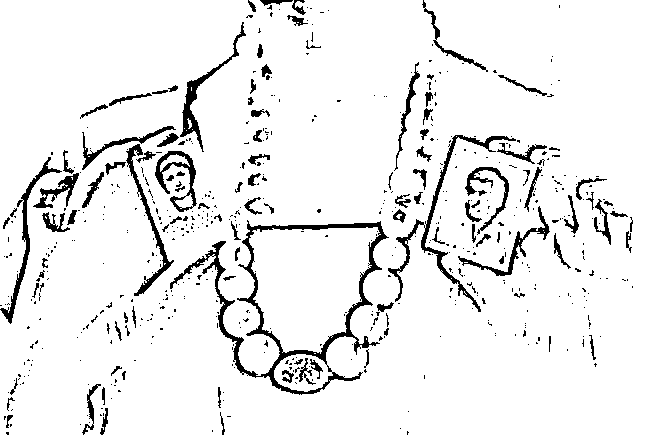 作者：哈德利·菲茨杰拉德

译者：丁宏 速记：沐心方 整理：轩轩

本文整理自 2015 年 2 月 1 日哈德利·菲茨杰拉德老师的“占星与疗愈：了解你自己”在线沙龙，这里是第三部分，介绍了占星疗愈的两种工具：意象和家族动力。

**意象的探索**

* * *

心智并不是通过直线型或者逻辑型的方式和我们沟通的，它是通过不同的图像或者意象与我们对话。那些图像和画面，象征着当下客户所需的解药，意象能帮助大家发现自己最深的心智。

我们每个人的出生星图充满了图像和意象，它们代表了我们的心智特征。梦境的图像、电影、杂志的画面等，也是一种意象，可以帮助我们去探索情绪或阴影面。

**家族系统动力**

* * *

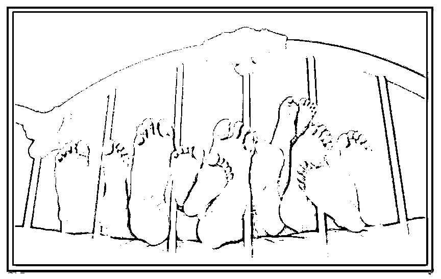

我所说的人类的亲密关系和家族系统理论，不同于海灵格的家排系统，但二者也并不冲突。我们都有来自于某一个体系，也在我们的环境中生长。理解这个家族系统如何让我们表达自己，如果影响我们去表达自己的出生星图，能够帮助我们自我成长。

可能你和你身边的人同样有月冥四分、日土对分的相位，但是你的背景和你家庭的影响会有更多的素材来展现你是如何表现这些动能的。你如何在你的童年早期生活里受到影响，并在年长时把这些动能活出来的，这些是我们将要探索的。

伟大的文学家托尔斯泰曾写过：“所有幸福的家庭都是相似的，所有不幸的家庭各有不幸”；他也写到“所有人都想改变这个世界，没有人想改变自己”。这两个观察是相互关联的，我们需要了解家庭的意义，并且超越自我作为家庭局部的存在。家族的行为会影响每个成员，每个成员的行为也会影响整个家族；祖先的情绪也会影响我们，以失望、绝望等家族的业力来影响我们。

**如果你想了解这位老师的课程，请点击文末的“阅读原文”。精彩的课程，报名还在继续。**

-------------------------------

若道星文化，是由美国著名占星师大卫·瑞雷老师创办的占星学培训与文化传播机构，是国际占星研究协会(ISAR)在中国唯一一家定点合作机构。

**【占星入门——若道占星】微信订阅号：nodoorbj**

* 若道官网：www.nodoor.com 可提供占星咨询、占星课程、星盘查询、应用测试及电子杂志等服务。

* 新浪微博：@若道占星

3 月 29 日，哈德利· 菲茨杰拉德将开设**“占星疗愈：意象与家族动力探索”**课程，详情请点击文末的“阅读原文”。↓↓↓

# 占星疗愈 | 我为什么成为了占星治疗师

> 原文：[`mp.weixin.qq.com/s?__biz=MzA5NjA0NTAxNg==&mid=205514422&idx=2&sn=89f7699a13c4ea5c6da320072d23529f&chksm=197d54012e0add17202f031f296e71880baa51f168c1be6f53e6e072684c6db8217e1616c341&scene=126&sessionid=1692739029#rd`](http://mp.weixin.qq.com/s?__biz=MzA5NjA0NTAxNg==&mid=205514422&idx=2&sn=89f7699a13c4ea5c6da320072d23529f&chksm=197d54012e0add17202f031f296e71880baa51f168c1be6f53e6e072684c6db8217e1616c341&scene=126&sessionid=1692739029#rd)

> 3 月 29 日，哈德利·菲茨杰拉德老师的“占星疗愈：意象与家族动力探索”课程即将开课。报名请点击文末的“阅读原文”。

**我会让我的母亲去找哈德利，如果她需要咨询的话。——斯蒂芬·弗里斯特**

**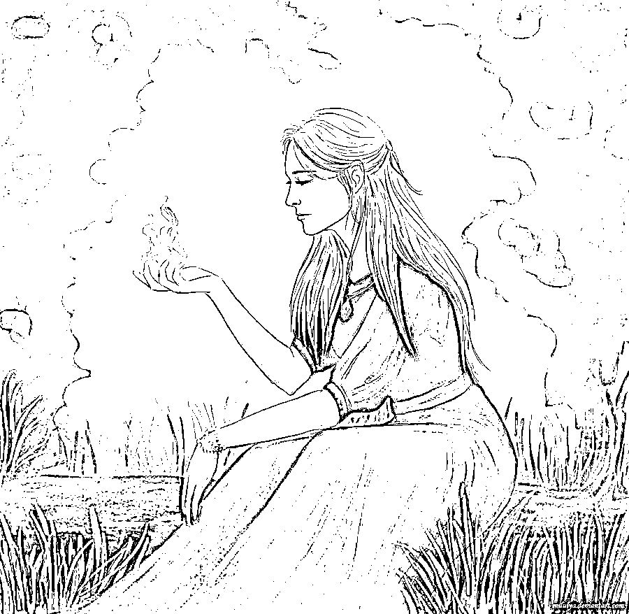**

作者：哈德利·菲茨杰拉德

译者：丁宏 速记：沐心方 整理：轩轩

本文整理自 2015 年 2 月 1 日哈德利·菲茨杰拉德老师的“占星与疗愈：了解你自己”在线沙龙，这里是第一部分，介绍了哈德利选择成为占星治疗师的原因。

在我学习占星学的早期，有两件事对我的影响特别深刻。是这两件事，启发了我，并让我下定决心做一名占星疗愈者。

**第一件事发生在我占星入门的时候。**那是上世纪 70 年代，在洛杉矶只有两个地方可以学习严肃占星学。这两所学校都非常古老，甚至有些僵化。

有一天，一位老师提前来到课堂。当时我伏案写着什么，老师走到我的身边，看到了我放在桌上的星图。他问：这是你的出生图吗？我点了点头。我当时有些担心，是不是我的星图计算出错了呢？并没有，我的星图计算是正确的。老师好奇的是，我星图中所显示的挑战。那位老师指出了我星图中所有困难的地方，把它们描述得非常糟糕。如果我不够坚强的话，估计当时就瘫软在地了。就在那一刻，我的脑海里跳出了一句话：“千万不要对任何人做同样的事情！”

当时，我微笑着回应老师：确实我的生活并非一帆风顺，但是我还是健康地在这里。他看上去有些失望，然后匆忙走开了。我意识到，他确实看到了某些东西，但是我知道那些东西并不是我本人，并不是我自己。接下来那一年，我都在思考，好坏的判断真的是占星学的意义所在吗？

**第二件事发生在 1974 年，当时我在一所家庭治疗相关的学校学习。**学校要求，我们每个人都需要完成一些心理学测试。

在我完成测试之后，有一位菲利普博士看到了测试结果，并且认为有一项重要测试的结果非常糟糕。他非常不开心，我也感到非常困惑，所以我们就把测试重头看了一遍，发现这个测试有一个响选错了。在性别选项中，我选了男性。后来菲利普博士根据女性的选项重新查看了测试结果，谢天谢地，我不用被送去治疗中心了！

我从这个经历里，也学到了很多。那是一个非常重要的心理学测试，共有 560 道选择题。如果按照女性来说，我的选择是没问题的。我具有艺术性、想象力、创造力，富有同情心和同理心。但如果我是具有这些特征的男性，我就要进行治疗。就好像当年在占星学校，那位老师在不了解我的前提下，只通过星图就对我进行了评判，但是他看到的却不是我。测试也是，它测试到的是另外一个人，而不是我。

就是这两个事件，在我的内心种下了占星治疗的种子，我知道，我需要一些不同的视角去看一些事物。作为占星师，我持续不断地认为我需要通过占星符号，发现人类的一些模式。这些模式，会比僵硬的贴标签有用得多。如果我们静态地以贴标签式的方法去使用占星学，它就会成为非常狭窄的学科。占星学提供的其实是一个线索，让我们去深入探索我们的灵魂和心灵。

**如果你想了解这位老师的课程，请点击文末的“阅读原文”。精彩的课程，报名还在继续。**

-------------------------------

若道星文化，是由美国著名占星师大卫·瑞雷老师创办的占星学培训与文化传播机构，是国际占星研究协会(ISAR)在中国唯一一家定点合作机构。

**【占星入门——若道占星】微信订阅号：nodoorbj**

* 若道官网：www.nodoor.com 可提供占星咨询、占星课程、星盘查询、应用测试及电子杂志等服务。

* 新浪微博：@若道占星

3 月 29 日，哈德利· 菲茨杰拉德将开设**“占星疗愈：意象与家族动力探索”**课程，详情请点击文末的“阅读原文”。↓↓↓

# 占星疗愈 | 真正的疗愈者，必须先疗愈自己的伤痛

> 原文：[`mp.weixin.qq.com/s?__biz=MzA5NjA0NTAxNg==&mid=205514422&idx=3&sn=42f6920a45baf55387f941571ee58b7d&chksm=197d54012e0add17e9e9aff83b03f1598ba8bca8dd8b2a1672b8684bfdfc6efb6fd8876c6ae9&scene=126&sessionid=1692739029#rd`](http://mp.weixin.qq.com/s?__biz=MzA5NjA0NTAxNg==&mid=205514422&idx=3&sn=42f6920a45baf55387f941571ee58b7d&chksm=197d54012e0add17e9e9aff83b03f1598ba8bca8dd8b2a1672b8684bfdfc6efb6fd8876c6ae9&scene=126&sessionid=1692739029#rd)

> 3 月 29 日，哈德利·菲茨杰拉德老师的“占星疗愈：意象与家族动力探索”课程即将开课。这是若道第一次引进疗愈类课程，因为我们相信，只有疗愈了自己的人，才能够去疗愈他人。报名请点击文末的“阅读原文”。

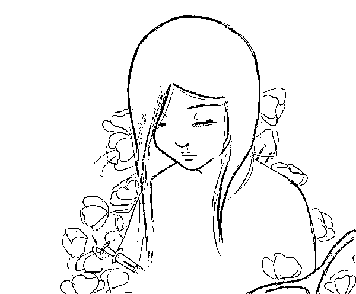

作者：哈德利·菲茨杰拉德

译者：丁宏 速记：沐心方 整理：轩轩

本文整理自 2015 年 2 月 1 日哈德利·菲茨杰拉德老师的“占星与疗愈：了解你自己”在线沙龙，这里是第二部分，简述的是为何疗愈他人之前要先疗愈自己。

我的一位导师曾经说过：“我不能强迫你们在做的每一个人都去进行心理咨询，没有任何法律规定你必须这样做，但是我认为在你没有进行自我探究之前，你们没有权利去探究别人的世界。”他说：“你们这样的行为可能会造成伤害，我们要做的工作就是不要造成伤害。”

在听了他这样的话后，我走进了咨询室的大门，十年后，我才走出这道门。但在我走出这扇大门后，当行进的挑战再次带来生命压力时，我又走进了咨询室。在这 40 年以来，我进进出出心理咨询的大门有 5 次。我认为咨询对我的工作，甚至是占星咨询的经历帮助极大。所以我今天也想告诉大家，在你疗愈别人之前，需要先疗愈自己。

当你开始去帮助别人整理家里的环境之前，一定要整理好自己的家人。对于每一个人来说，如何去设置自我的限制，如何和别人设置这样的疆域感，也是非常重要的。只要当我们充分了解自我后，才能明白自己的问题和他人的问题是如何互动的。此时，你也更能为客户建立更加安全的咨询环境，也就是说帮助别人的人自己也需要帮助。

我并不是说每一个人都需要做常年的心理咨询，但是作为占星师、心理咨询师，特别是把占星和咨询师结合在一起的人，必须为自己承担责任，为自己做一些觉醒的工作。这样的心理咨询和探索需要长期性和系统性，只有当我们了解好自己，做好这样的工作以后，充分了解到自己的恐惧、情结、意识、潜意识，才可以完整的保存在我们的内在。

我们的目标并不是去预测未来，去告诉大家问题如何解决，我们的工作是帮助大家发现有多少方法，去应对他生活里的困境和种种矛盾，去帮助他们做出更好的选择。我们有这种天分，能够通过观察客户的出生星图，以及行运推进看到为什么这个客户会在这个时候来寻求帮助。就像 11 世纪的一个有智慧的诗人说的，“天空并不会给我们提供无缘无故的事情”。

为了更清晰地帮助客户，我们还需要客户把他们的故事带入进来。我们可以根据出生图给客户一个完美的描述，但是如果客户的意识层次还没有发展到这个阶段，那么这个描述对他来说是无用的。所以更重要的是，我们需要通过蛛丝马迹了解到客户是如何进化的，他是如何成为他现在的自己的。我们需要了解，有多少的周期在过去发生了，将来有多少的生命周期会如何影响客户。学会更好地聆听而不是更多地去发言，可以帮助我们成为更好的咨询师。

我在这里鼓励的是疗愈性的客户和咨询师关系。我们要建立疗愈性的对话关系，让客户可以去尽情地表达，而不去评判他的任何话语。我们需要一起帮助客户去探索他们更深的自我，他们在这个地球，在这个世界的位置，以及他们内在到底是谁。也去帮助客户去寻找方法，去拥抱他们在这个世界上进化的路径。

为了做到这样，我们需要有占星学的能力和一些咨询的技巧，同时我们需要具备这样一个意识：**我们需要不断学习，也需要咨询师本人的人生经验和经历。我们也需要有这样的能力，包括我们的共情、慈悲心，以及我们的智慧。**这个智慧指的是我们说不知道的能力，因为有些时候，我们确实是不知道。

我们是占星师、咨询师，我们需要做的工作是缓慢的、温柔的，我们要入剥除世俗的包裹，让内在的真我，可以更好地呈现出来。作为占星师来说，我们所拥有“第三只眼”，是我们的天赋，也是责任。

**如果你想了解这位老师的课程，请点击文末的“阅读原文”。精彩的课程，报名还在继续。**

-------------------------------

若道星文化，是由美国著名占星师大卫·瑞雷老师创办的占星学培训与文化传播机构，是国际占星研究协会(ISAR)在中国唯一一家定点合作机构。

**【占星入门——若道占星】微信订阅号：nodoorbj**

* 若道官网：www.nodoor.com 可提供占星咨询、占星课程、星盘查询、应用测试及电子杂志等服务。

* 新浪微博：@若道占星

3 月 29 日，哈德利· 菲茨杰拉德将开设**“占星疗愈：意象与家族动力探索”**课程，详情请点击文末的“阅读原文”。↓↓↓

# 致内心挣扎的你：疗愈需要一条路径

> 原文：[`mp.weixin.qq.com/s?__biz=MzA5NjA0NTAxNg==&mid=205514422&idx=1&sn=7d9b7d0cec72e3ae2d0286f63e9238f2&chksm=197d54012e0add17c6e9d6e0760dd71249334d2cebd74f32fac2b1618793961cb33cf55bf4ab&scene=126&sessionid=1692739029#rd`](http://mp.weixin.qq.com/s?__biz=MzA5NjA0NTAxNg==&mid=205514422&idx=1&sn=7d9b7d0cec72e3ae2d0286f63e9238f2&chksm=197d54012e0add17c6e9d6e0760dd71249334d2cebd74f32fac2b1618793961cb33cf55bf4ab&scene=126&sessionid=1692739029#rd)

> 3 月 29 日，哈德利·菲茨杰拉德老师的“占星疗愈：意象与家族动力探索”课程即将开课。对于这门课，若道的创始人蒋颖和大卫·瑞雷给予了热切的期望，他们相信，经验丰富、“干货”满满的哈德利老师会给大家带来充分的疗愈效果，也能帮助大家在咨询中运用正确的疗愈工具。

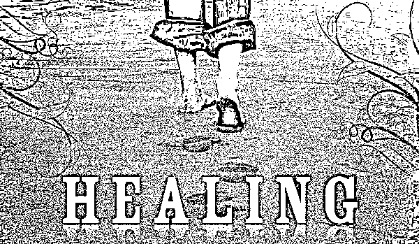
这是若道开设占星课程的第四年了。我对占星学的了解也是跟着我们自己课程的开展而逐渐加深的，在不同的课程中，我有了更多机会去了解西方占星界的一些故事。

虽然若道的教学尽量走的是兼容并包的路线，引进各个流派，以扩展学员眼界，但我们的基础仍然是人本主义。人本主义强调个人的成长和潜能。不过在教学的过程中，一个问题越来越鲜明地跳了出来。

那就是，我们如何解决我们自己和客户出生图上的议题呢？

我清晰地看到包括我在内的学占星的朋友们的挣扎。我们认同个人成长的信念，也同意大卫老师说的“觉察-接纳-改变”三部曲是一条根本方向性的路径，但是，手指一指后，路到底怎么走？有没有步骤，有没有工具，有没有引路人？怎么让这些更落地呢？

所以，当我和大卫老师商量 2015 年我们应该加入什么课程时，我们都同意，我们需要带有疗愈性质的占星课程。这个课程需要能够达到两个目的：第一，能够带来疗愈的效果；第二，能够给已经毕业的同学们增加一个咨询时可以使用的疗愈技术和工具。

因此，能够在若道教授这门课程的老师必须符合两个条件：

1.  **必须是资深的心理治疗师**

2.  **必须是资深的占星师**

早在 2013 年，斯蒂芬·弗里斯特老师就已经向我们推荐哈德利老师，不过 2013、2014 年似乎时机都不成熟，而且，大卫老师也是比较谨慎的人，他本人此前并不认识哈德利老师，而他的宗旨是将西方最棒的占星师引入到中国来教学，直到他阅读了《同一片天空下》（*Under One Sky*）。

占星界有很多“技术神话”，不了解行业内情况的年轻占星师们和占星爱好者们也很想追求“神话”，毕竟，我们都是从好奇“命运”开始。然而“神话和传说”和“真实”是不是一回事呢？《同一片天空下》是一个很好的阅读开始。因为，这本书呈现出一些真实的状况。

这本书邀请了 10 多位各个流派的有名占星师就同一张星图做出盲读，而后，读者们可以看到星图主人的真实状况。在这本书出版之前，没有一个占星师知道此人真实状况。一般心理流派的占星师非常重视和客户的交流，这样的盲读不是他们在咨询中的方法。不过还是有几个心理流派的占星治疗师答应了。毕竟，大家用的都是同一张星图，大家都在用占星技法。

而在大卫老师看来，哈德利老师的解读几乎是（或者说就是）所有参与解读的各个流派占星师中最棒的，也是最接近星图主人的真实情况的，虽然她是位心理占星师。这让大卫老师下定了最后的决心。

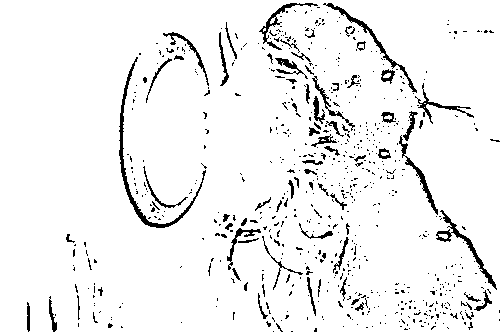
我个人非常期待哈德利老师的课程，甚至可以说，这是我自己本年度最期待的课程了。一方面，我喜欢有丰富实战经验的心理占星疗愈派，因为占星学是一个让我们认识世界的工具，而其目标之一是疗愈。只有占星学，没有心理学，这个疗愈就很难有路径。没有路径，人们最后会绝望，会放弃，会调转方向。因此寻找路径是我一直“更耿耿于怀”的。我期待以此次课程为开始，为若道的同学们提供一条路径，一个方法，一个资深的引路人。

占星圈子里常常讲“干货”一词，虽然我这水海远远合相的射手座脑袋常常不理解什么是“干货”，比如“觉察”这样玄妙的词对我一直都是干货，但对很多人可能不是，每个人的视角和定义不同。我自己定义的“干货”是能够让我作为治疗师不断理解我的内在动力，帮助我进行自我疗愈的可操作方法，并且我可以在咨询中用到，可以对客户真正有帮助。

哈德利老师不是开拓了什么崭新疗法的人，也不是一个著作等身的人，她只是一个把占星和心理咨询紧密结合在一起的有着丰富经验的疗愈师，在加州家庭研究中心担任评审总监和临床主管长达 10 年。我觉得能做“临床主管”没有点干货是干不了的。毕竟，她要面对那么多的病人，她还设计了学院的整个课程体系。

另外，哈德利老师曾广泛接受各种各样的心理学的培训，系统理论、精神动力学、相互作用分析、格式塔疗法，这都是让我神往却一直没有机会学习的。而她个人曾经经历了 3600 多个小时的心理分析，这些也让我羡慕，觉得她应该用心理学的方法把全身扫描分析了个遍。我一直觉得如果有条件，占星师本人还是应该去做一下心理分析，至少要进行一下心理治疗，虽然说这句话的丽兹·格林老师当年被占星界起哄，被许多人批驳。我不认为心理治疗能治愈一切，就像我不认为佛法或其他宗教能够治愈一切一样。我觉得谦逊一点没有坏处，在疗愈层面，占星学、心理学、宗教、神秘学可以有很多互补地方。

而且哈德利老师在近些年的研究中，越来越注重**意象**，因为图像是潜意识的语言。正如哈德利老师在她的沙龙中所说，“心智并不是通过直线型或者逻辑型的方式和我们沟通的，它是通过不同的图像或者意象与我们对话。那些图像和画面，象征着当下客户所需的解药，意象能帮助大家发现自己最深的心智”。

这也是我们一直想要引入的方法，因为目前占星课程大部分是左脑逻辑的训练，我希望能够引入更多需要右脑加入的课程，否则，占星会变得过为抽象、枯燥，我们的心灵两个部分都需要。她在课程中将特意使用一套中国神话的牌，希望能够更切近中国人的精神和灵魂。

另外，哈德利老师还会讲解**家庭系统动力**。我觉得这对于中国人是再合适不过的了。格伦·佩里老师和哈德利老师有同样的师承，格伦老师对精神动力很有造诣，而哈德利老师则对系统动力有深入的研究和实践。

我曾经多次参加家庭系统排列工作坊，非常清晰地看到家庭动力对个人的巨大影响。在中国，我的观察是，个体化的进程比西方晚很多，每个人都和家庭、家族有着巨大的牵涉。正如荣格所说“没有什么比父母未活出的生命更能影响一个孩子了”。父母、祖先巨大的影子在罩在每个人的头顶，如果我们不把它变成祝福，就可能成为生命中的包袱和障碍。而哈德利老师会在课程中一步步带领我们看清这一点。

我衷心向各位朋友推荐这个课程，虽然我不能给以任何保障，毕竟我并没有听过老师的课，我也不知道会发生什么，我只是基于自己的喜好，基于对斯蒂芬·弗里斯特老师和大卫老师的信任。在经过各种疗愈课程后，我的体会是，疗愈是一生的事情，不能急，慢慢来。

我只是希望这个课程开始能够让每个占星师进一步疗愈自身，学习更多疗法，将占星和疗愈更紧密结合起来。

**如果你想了解这位老师的课程，请点击文末的“阅读原文”。精彩的课程，报名还在继续。**

-------------------------------

若道星文化，是由美国著名占星师大卫·瑞雷老师创办的占星学培训与文化传播机构，是国际占星研究协会(ISAR)在中国唯一一家定点合作机构。

**【占星入门——若道占星】微信订阅号：nodoorbj**

* 若道官网：www.nodoor.com 可提供占星咨询、占星课程、星盘查询、应用测试及电子杂志等服务。

* 新浪微博：@若道占星

3 月 29 日，哈德利· 菲茨杰拉德将开设**“占星疗愈：意象与家族动力探索”**课程，详情请点击文末的“阅读原文”。↓↓↓

# 李光耀：不要失去对生命的热爱

> 原文：[`mp.weixin.qq.com/s?__biz=MzA5NjA0NTAxNg==&mid=205477369&idx=1&sn=ea9c032e916f0db687ae93bdd45159ac&chksm=197de74e2e0a6e58588e23489ebc216364eb94ba129e8522f734a49d08a23137e45513fc756b&scene=126&sessionid=1692739029#rd`](http://mp.weixin.qq.com/s?__biz=MzA5NjA0NTAxNg==&mid=205477369&idx=1&sn=ea9c032e916f0db687ae93bdd45159ac&chksm=197de74e2e0a6e58588e23489ebc216364eb94ba129e8522f734a49d08a23137e45513fc756b&scene=126&sessionid=1692739029#rd)

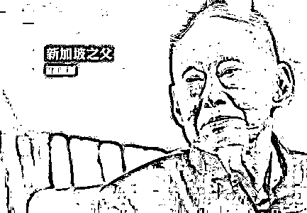

2015 年 3 月 23 日凌晨 3 时 18 分，新加坡前总理李光耀因病去世。

他是新加坡的开国元勋，他经历过日寇侵略的时代，曾遭到日军毒打，目睹了日本人用机枪扫射无辜平民的画面。

他经历过英国殖民时期，曾作为律师维护了工人和学生的利益，成立了人民行动党。他促成新加坡和马来西亚的合并，后又被逼独立建国。

他在不同党派和国家间斡旋，他有着自己的治国理念，他受到世人的尊敬。但是，他也饱受着争议，在批评声中坚持自己……

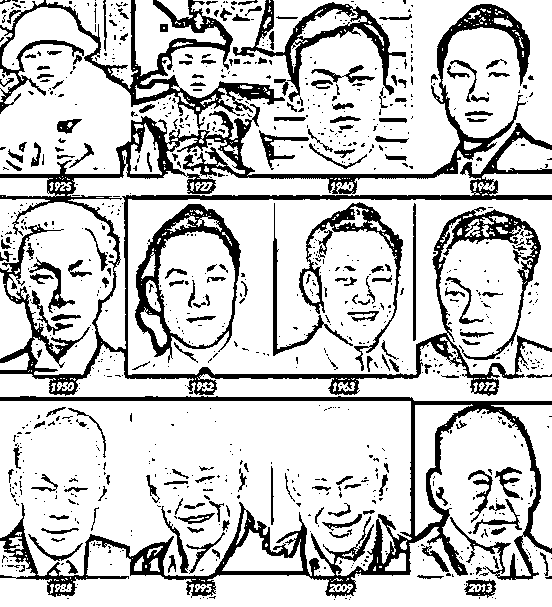
各个时期的李光耀

我们没有办法去评价这样一位伟人的是非功过，可是，或许能从占星的角度，去回顾他的一生。

1923 年 9 月 16 日，李光耀出生，太阳合相金星。当时李家的生活状况还比较优渥，祖父在当地颇具声望，童年的李光耀备受长辈宠爱。

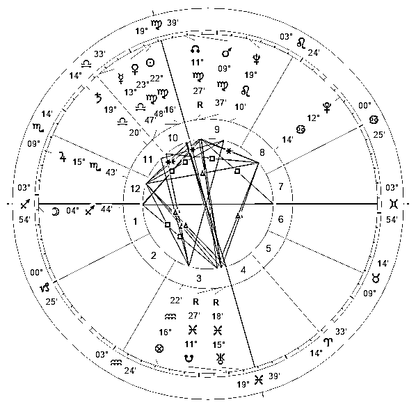（因不知道准确生时，故排了中午 12 点的星图，不影响此处简单解读。注意：当日凌晨月亮跨座。）

月亮四分火星

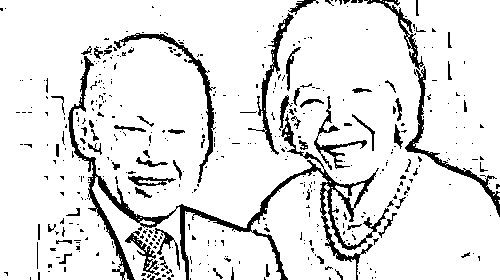李光耀和妻子

李光耀的母亲是个勇敢的女人，敢于与父亲抗争。在李光耀的心中，如果她晚一代出生，且受过良好教育，很可能成为女强人。

在写给妻子的悼词中，他说道：“我们知道我们不能一直停留在不切实际的恋人的阶段，生活是永无休止的挑战，不断有新的问题需要解决和处理。”

水土合相天秤座

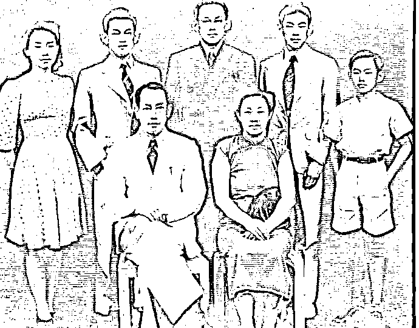李光耀青年和父母合照

祖父对于李光耀的影响最大。1920 年代末期，李家家道中落。但是，祖父丝毫没有放松关心李光耀的教育问题，将其从华文学校转入古楼英文学校就读。李光耀没有辜负祖父的期望，1939 年，16 岁的李光耀通过了英国剑桥大学的入学考试。

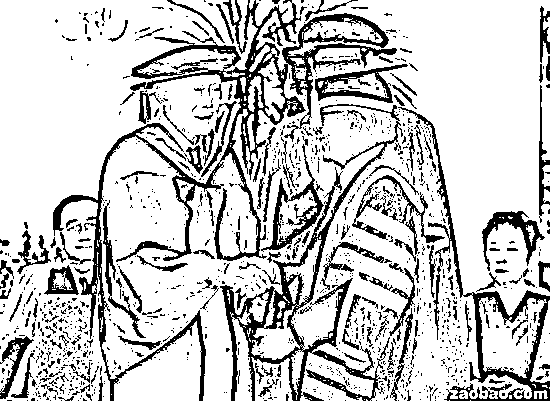
出生在一个讲英语和马来语的华裔家庭，李光耀的中文底子很薄。1955 年，李光耀参加立法议会选举，遭到民主党候选人的公然挑衅，对手称他不会中文读写，根本没有能力代表华人选民，甚至要求李光耀用中文同自己辩论。

在政敌的侮辱下，他更加坚定了学好汉语的决心，并在新加坡力推中英双语教育。2011 年，李光耀发行了《我一生的挑战——新加坡双语之路》一书，书中他讲述了自己耗费半个世纪学习汉语的艰辛历程。

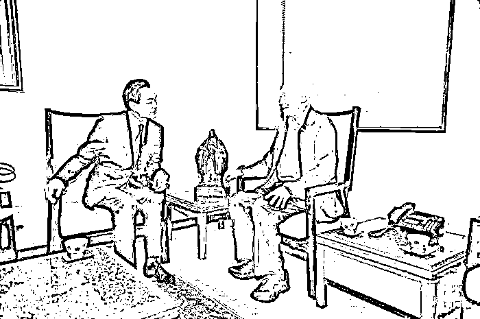 对于外交关系，他说：“我们要同所有邻国建立友好关系。但是要建立实际有效的睦邻关系，先得把话说清楚，我们家里要买什么家具和要怎么摆设，一概由我们自己做主。”

日金火：处女座

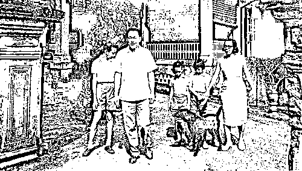

李光耀曾制定了一系列严刑峻法来规范国民行为，乱扔废弃物、在公共场所吸烟、不冲公共厕所等都要被重罚，而其中最为知名的就是鞭刑。

他说：“我毫不后悔当初在人们的生活习惯上设定了严格的规范，我们必须要告诉你哪里不能吐痰，你不能发出多大的噪音……我们需要限定个人的自由。”

他还说：“我们称不上是有修养和文明的社会，但是我们问心无愧地朝着这个理想迈进。新加坡正逐渐成为一个更优雅的社会。如果说它是个‘保姆国家’，我会以身为保姆为荣。”

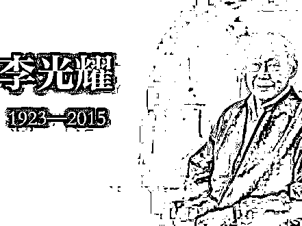

最后，让我们用他的一段话来结束这篇文章，充满了月亮射手座的能量：

“人的一生是无法全盘计划好的。因此，我觉得人生变幻无穷：紧张刺激，充满变数，有时让人振奋不已。重要的是，我们不应失去对生命的热爱。观赏日落之后，要好好睡一觉，恢复精力，醒来之后又迎来新的一天。”

本文由若道整理，图片来自网络，转载请注明出处。

**参考文献：**

1. 《李光耀写给妻子的悼词》

2. 搜狐网《李光耀，一生只哭过两次》

3. 21 新闻《李光耀经典语录》

4. 网易《不会中文被政敌羞辱 李光耀新书讲 50 年汉语情结》

5. 中国网《新加坡“国父”李光耀的成长之路》

----------------------------------------

若道星文化，是由美国著名占星师大卫·瑞雷老师创办的占星学培训与文化传播机构，是国际占星研究协会(ISAR)在中国唯一一家定点合作机构。

**【占星入门——若道占星】微信订阅号：nodoorbj**

* 若道官网：www.nodoor.com 可提供占星咨询、占星课程、星盘查询、应用测试及电子杂志等服务。

* 新浪微博：@若道占星


3 月 29 日，哈德利· 菲茨杰拉德将开设**“占星疗愈：意象与家族动力探索”**课程，详情请点击文末的“阅读原文”。↓↓↓

# 《同一天空下》连载（5） | 失落或空虚，或许让你上瘾成癖

> 原文：[`mp.weixin.qq.com/s?__biz=MzA5NjA0NTAxNg==&mid=205477369&idx=2&sn=9a4b09c6cd7b6ae32cc71a6688429211&chksm=197de74e2e0a6e585e2861e49265d0b8b1f61cb34ed3b5ed1a7823e304d696b23b890b0dfd91&scene=126&sessionid=1692739029#rd`](http://mp.weixin.qq.com/s?__biz=MzA5NjA0NTAxNg==&mid=205477369&idx=2&sn=9a4b09c6cd7b6ae32cc71a6688429211&chksm=197de74e2e0a6e585e2861e49265d0b8b1f61cb34ed3b5ed1a7823e304d696b23b890b0dfd91&scene=126&sessionid=1692739029#rd)

《同一天空下》（*Under One Sky*）是一本星图解读的占星书。12 位不同学派的占星师，在不了解客户的真实情况下，对出生图做了盲解。哈德利·菲茨杰拉德就是这些占星师中的一位。这里让我们来一起看看她是如何从心理占星学角度来解读星图的。


治疗师通常以寻找家庭动因来开始咨询工作。我在占星咨询中，也会对出生图里与父母原型相关的符号和指征给予一定的关注。我们今生最初的人际交流和所处的环境，涉及到一些携带着重要能量的人，为了进化的需要我们必须应对他们。

在传统占星学里，这些占星符号有自己所代表的性别，但在过去几十年里，这种特定的代表性越来越淡化。于是我在思考和表达的时候均会仔细斟酌，避免绝对化的暗示（例如：月亮等于母亲），并且把注意力更多地放在符号所代表的父母一方或者双方所携带的能量类型上。这些占星符号并不一定代表生物学意义上的父母，也可以指任何类似母亲或者父亲角色。

无论携带这些能量的人是否存在于我们的生活中，他们都会通过帮助我们，在早期集合特定的生命议题，来为我们指引命运的方向。在成长塑型期，每当觉得自己在爱和冷酷之间持续徘徊时，灵魂就渐渐想要找到超越这种个人感受的办法。我们与其他投身于世的灵魂存在关联，他们携带着某种开启我们磨砺之旅的能量。我们对这一点理解地越透彻，就越能清醒地认识到我们的业力功课/业力约定，以及他们的目标。

现在，乔伊斯，我有一些关键性的问题要问你。根据你的回答我可以不再进行其他探讨，而进一步扩展这个主题。

例如，我想了解在你童年时期，你的父亲是否存在于你的生活中。我认为这个问题应该是针对你的父亲，但我再次申明，我不完全清楚你父母在你生命里的角色，如果以下情况符合你的母亲，我们的讨论就要做些微调。如果你的父亲在你两岁的时候并没有去世，那么在 1945 年初，一些关于他/或者他生活的事情发生了转变，这种转变把真实的他从你生活里移出，也就是说，他已经“死了”或者变得“不真实”。母亲的悲伤或者情绪失调，也可能存在强烈的牺牲感或者殉难式的能量。通过观察这个模式，我想起荣格的一个观点：“没有什么比父母未活出的生命更能影响一个孩子了。”

无论是何种情况，我想你一直难以看清你的父亲到底是什么样子，也就是说，他“在那里，却又不在那里”，这就是你灵魂所思考的东西，它今生想要建立某种更深刻、更慈悲，也更与众不同的精神根源（一个截然不同的“家庭”）。我想了解，你的困难是来自哪儿：是你对并不存在的父亲赋予的某种近似虚构的、理想化的想象；还是来源于虽然有父亲但他却因为各种原因在你的生活里缺失。这些可以帮助我们更专注于你生命中那些与父母有关的征象。这里有一个疑团，一个故事。这个故事将对你后来的生活产生巨大的影响，影响你在面对更广大的群体时，将富有创意的自己与群体区分开来的能力。

如果童年时你的父亲（或者是继父、兄长或其他扮演父亲角色的人）在你身边，我想弄清楚，在你心智的“家庭”部分，他释放着什么能量。他是否：

* 致力于某些更加崇高的目标/服务，把自己“贡献”给了这个世界，因此疏远了你？（例如：医生、警察、消防员、总理、士兵等）

* 一位从某种疾病或者经历里存活下来的“幸存者”？（例如：双极性精神失调、因小儿麻痹症而行动困难，患有创伤后精神紧张性精神障碍的退伍军人）

* 一个酗酒者，或者沉迷于某种物质、过程或宗教？

* 一个才华横溢、饱读诗书、敏感脆弱并且/或者意志消沉的艺术家，为了世俗需要不得不将自己的创意埋葬（甚至是摧毁），这让你对于艺术家的形象产生阴影。

* 某个以自己的才智和言语技巧去批评、吸引同时操控别人的人？

* 不是你的亲生父亲，并且/或者也不是别人眼中所看到的他。例如，花花公子、虐妻的人、对你进行性骚扰的人？你的出生星图里显示出了关于性能量和性表达的复杂议题，有一种可能是性骚扰在早期对你的自我认同造成了伤害（也许你的母亲也有同样的遭遇），这伤害最终可以将你引入世间某种深入并富有创意的疗愈工作。

另一种可能是你的父亲为了供养你而离开家去到很远的地方，这就让你更难去定义他以及他在你生命中的位置。在探讨你的关系模式的时候，我想了解，你是否常遇到难以亲近的男人（假设你是异性恋者）？并且/或者你是否发现自己容易被有趣又爱冒险的男人吸引，却因为他们对你的需要和依赖而渐渐想要逃避？或者，如果你对你的父亲有一个悲情的幻像的话，你可能会想象“假如我可以拯救他，那么他就不会……了”。因此，你会发现自己常常陷入与“拯救”有关的关系。

在了解了你对上述问题的反馈后，我打算进一步进行以下询问：

* 你的母亲或者一位扮演母亲形象的人，是否在某些层面上取代了你的父亲，即父亲不在的时候代替他的角色？

* 她是否有一些在心智、感情或者身体上的小毛病需要你应对？

* 你是否希望父母中的一人可以在你需要保护的时候站出来去对抗另一个人？

* 是否父母中的一人联合你“对抗”另一个人，然后似乎又不明不白地把你抛弃给那个人？

回答以上任何问题，都能让我将出生图的原型形象和现实生活对应起来，即关于你早年父亲（某些情况下是母亲）是如何“缺失”的问题。我专注于这个问题的细节，是为了要弄清楚它在你漫长生命中所起的作用，即它是如何影响你在这个世界的成就感。

再次申明，那些父亲活着却不在身边的人，他们的内在动因与那些父亲过世的人相比，有着精细而又显著的区别。在这里我并不能从理论上列出那些不同之处。但是，关于你父亲和家族血统的不确定性或谜团的确是存在的，为此，你的灵魂需要进行一场学习之旅。通过你自有的独特的女性视角，以及你自己深有感触的经历，一种“神圣的思乡之情”会促使你做出更有创意的努力。一种理想的结果是，你最终在世界上找到了一个位置，在这里你能以某种方式感受到联结。

结合以上，我还想了解一下，你是否知道你母亲在怀着你的时候的情况？你受到了她某些特别的恐惧和沮丧情绪的影响，但我并不知道它们来自于哪里。你的父母是否想要你这个孩子？你是否出生在父母还没准备好迎接孩子到来的时候？你是否感觉母亲不喜欢并且/或者嫉妒你？

我察觉到，由于你被母亲（被她有意无意地疏远、忽视）抛弃或拒绝，你花了很长时间才能完全认识到自己是女性，并且以此为荣。最简单的“通道”，便是利用你的聪明才智，让你在这个基本上是左脑思维的、根据我们做了什么而不是我们是谁来进行评估的社会，找出自己的路。你的觉知、想象力、机敏和“操纵全局”的精明必然让你成为一个成就者，甚至还能带给你一定的自主性、声望和权利。但是，这些奖赏也有其自相矛盾的局限性：对男性角色的强烈认同和确定无疑，让你努力把自己打造成一个左脑思维的、迄今为止（或是之后）成功的“男性”形象，以至于你女性的、深入的、性感的和脆弱的一面得不到滋润，无法与你的生活完全整合。所以，无论你做什么，你都在忍受着过度劳累和被贬低的痛苦。这只是众多可能性中的一种。

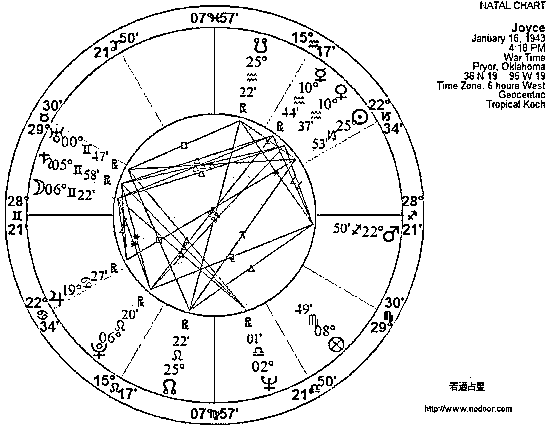

一种可能的与上瘾有关的占星征象也在这里展示了出来，我想了解这是否一直是你生活里的一个问题。你出生图的心理层面显示，当你感觉失落空虚、在这世上没有稳固根基的时候，容易上瘾成癖。从另一个角度看，渴望屈服和被他人他物取代的强烈阴影，以及层出不穷的好奇心，也会滋生瘾溺。另外，由于金钱和财富，以及它们与你在这个世界的自我价值感之间的关系，是一个值得大量探讨的话题。因此，你很可能选择金钱作为“药物”，来缓解所有的病痛。在你生命的一段时期里，金钱和物质看上去就像爱情，或者像是解决各种关于孤独和自尊的困惑的答案。

如果瘾嗜在某种形式上是一个议题的话，你自己是如何理解的呢？摆脱瘾嗜是否扩展了你的灵魂视野? 摆脱它是否帮助你更切实地发挥你的创意，并将其更有意识地运用于你的生活里？

然而，对于所有这些，我以希尔曼的名言作为警示：“造就我的不是我的历史，不是我的父母、我的童年和我的成长。它们是映射着我形象的镜子。”对你来说也是如此，乔伊斯。通过探究你父母在你生活中存在或缺失的种种可能性，以及你被排斥的背景，我们大致了解了你的灵魂在今生想要整合什么。我们可以看到它强烈地需要被认可和被爱，需要和自我深深地联结，需要从排斥、要求及伤害中，有模有样、有威严地摆脱出来，需要重新定义对你而言，什么是真正的“财富”，以便能对自己的天资满怀自信。也需要让心和脑都浸透在你的所知之中，以便于你对禁忌的独特视角能引起别人的谈论。

我还想了解你是怎么处理愤怒的。因为在你的出生图中，独立的自我表达和你让情绪理智化的能力如此让人注目，我想知道你的愤怒是否表现了你直面自己错误的勇气。或者，是否你会为了照顾同伴（们）而将愤怒“合理化”，导致愤怒以长期抱怨或迁就的形式驻扎于你的身体，但最终却因为无法再“合理化”而突然爆发？最理想的情况是，你渐渐懂得，在日复一日的生活里，预计后果、学习新的技能、胜任富有挑战的任务，是转化和利用你那些攻击性能量的最佳方法。你的反馈将引导我们讨论，你在达成目标方面是多么成功。

最后，如果我们还有时间，并且你觉得合适的话，我想针对你生命里一段比较紧张又艰难的时期问几个问题，这段时间大约在 1962 年 1 月至 1965 年 3 月之间。多种激烈的宇宙能量汇集，如同“变速杆”一般，试图要让你脱离你的大脑和旧有的防御模式，与你的身体和情绪建立新的关系，并依循你灵魂在今生的修行，进行某种特定的现实核实。换言之，自我和直觉在这段时期试图建立更加灵性和整合的关系。

我们总能听到希尔曼所说的“命运的呼唤”，以及“无名恶魔的催促”。可以想象以你的精明，你完全能够绕开这持续整整三年的命运的召唤，但我希望事实不是如此。如果你确实感受到了召唤，我想知道你是如何做到的。你是如同出生图显示的那样，通过早年的独创性成就，还是通过在压抑的情绪下做出了非常之举？或者兼而有之？无论是哪种情况，旧有的身份/人格/价值体系在那时开始破碎，同时有强烈的征象表明，潜意识里不被注意的阴影开始在你生活的众多领域爆发并显现出来。

由于这段期间有大量占星征象集聚，一种可能的情况是无论你做什么都让人（包括你自己）觉得你“很不正常”。灵魂（因为它完全不关心自我或个性的需求）会把这看作是积极正面的事，任何能让你失去理智，沉浸在自己身体、感觉和需求中的东西，都能开启将你从普通金属变成金子的过程。那些被埋葬和隐藏的挣扎着要拥抱自由，走向光明，最终要试图突破业力的阻滞。

我不知道你搭建起了什么，以及/或者拆解了什么，因为你可能以各种各样的方式去经历旅行（跨文化的经历）、疾病、死亡、遗传、性、婚姻和生育、教育问题、吸食毒品及其后果，以及对信仰体系的挑战，不管是切身的还是象征性的经历，而且它们以某种方式交织进了你的不同层面。将这些能量释放出去的常见方式是通过性，即：一段让你激情四溢的（“不光彩的”）情事、和某个体现你个人抱负的人的亲密联结、带来各种后果的性行为，如：怀孕，可能会导致你在进退两难的情况下仓促结婚，或者堕胎，亦或把孩子送出去领养。

不管怎么说，如果你还没有自己的理想抱负，或者还没觉得自己可以有，如果你对自己的认知是通过财富或财富的增减，如果这种认知还没有进入你的意识（从灵魂的角度看），那么这也是一个很好的时机，可以通过将这一认知投射到其他重要的事物上，把它释放出来。灵魂去这么做的目的，是让你在家庭/族群的旧有身份认知“死亡”，从而开始重新为自己定义“成功”，从家庭生活对你的“刻画”以及要求你所要付出的东西中获得解放。

你需要和比生命更宏大的人或物进行联结，并感受这一联结，这样你就能在比生命更广阔的宇宙里找到自己的位置，而不是让其他人为你下定义。这一世的轮回是带着目的而来的，你现在可以很确信地看到，凡是你在他人身上投射的信任都背叛了你，这是为了让你发展出对自己的信任和对自己认知的确信。这一信任注定会成为和金子一样好，甚至更好的资源！

心理学为付诸行动做了许多的解释，但是我相信我们只是去做，有时一遍又一遍地做，只为了最终可以看清我们要整合什么。理想情况下，在这两年多的时间里，你有很多机会去更好地在平衡自己的脆弱和坚强。最后产生的效果或许在很长时间内都不能被理解，但是当你回过头看，你会发现，这些效果恰恰推翻了苏格拉底的格言：“没有被活出的生命不值得去探究”。

乔伊斯，探索和分析一幅出生图，对客户和占星师双方来说，是一种神圣的信任。我每一天都在为自己能成为出生图的守护者而感到受宠若惊。我由衷地感谢你给予我这个机会，让我在你的人生旅途里和你有一次这样的分享。

**连载结束，更多信息，请点击文末“阅读原文”。**

-------------------------------

若道星文化，是由美国著名占星师大卫·瑞雷老师创办的占星学培训与文化传播机构，是国际占星研究协会(ISAR)在中国唯一一家定点合作机构。

**【占星入门——若道占星】微信订阅号：nodoorbj**

* 若道官网：www.nodoor.com 可提供占星咨询、占星课程、星盘查询、应用测试及电子杂志等服务。

* 新浪微博：@若道占星


3 月 29 日，哈德利· 菲茨杰拉德将开设**“占星疗愈：意象与家族动力探索”**课程，详情请点击文末的“阅读原文”。↓↓↓

# 课程推荐 | 职业占星师之路（北京）

> 原文：[`mp.weixin.qq.com/s?__biz=MzA5NjA0NTAxNg==&mid=205477369&idx=3&sn=6b9b2ac20eb89fde27838a1dd32ada13&chksm=197de74e2e0a6e5870610dd2c04f79f093760377b87818272db2ba64ded9738a86483b38bee1&scene=126&sessionid=1692739029#rd`](http://mp.weixin.qq.com/s?__biz=MzA5NjA0NTAxNg==&mid=205477369&idx=3&sn=6b9b2ac20eb89fde27838a1dd32ada13&chksm=197de74e2e0a6e5870610dd2c04f79f093760377b87818272db2ba64ded9738a86483b38bee1&scene=126&sessionid=1692739029#rd)

**职业占星师之路（北京）**

**课程目标**

本次咨询指导课程的目的，是为了帮助那些已经掌握了一定出生星图、预测、比较星图、组合星图等解读所需的知识和技能，但在后面的占星咨询实践中，由于欠缺相关的咨询技巧和实践点拨，无法顺利高效地进行咨询的占星学习者。通过一天的系统训练及课后练习，帮助学员更好地将所学的专业占星知识更有针对性的融合到占星咨询之中，综合提升学员的星图解读咨询技巧，从而达到提升咨询效果和客户满意度的目的。

**针对人群**

1\. 往届大卫高阶课程（COAC）的毕业生。

2\. 目前高阶课在读（2014-2015COAC）的学员。

3\. 参加过 ISAR 咨询技巧培训并通过 ISAR 认证考试的占星师。

4. 学习过专业知识的占星师。（这里的专业知识包括：出生星图、行进、次限推进、太阳弧正向推进等）

**课程安排（总长度 6 小时，不包含午休时间）**

1.【咨询切入】1 小时

结合出生星图的重要议题，讲解如何高效把握咨询的切入点，以恰当的方式与客户进行沟通。大卫老师会结合案例来分享其近四十年职业占星咨询的实战技巧。

2.【案例讲解】3 小时

通过 3-4 个大卫老师长期的咨询案例，来讲解如何将占星技巧融入咨询实践。内容将涉及占星咨询的几个层面：

情境层面——日常的世俗情境和状况

心理层面——与身份议题相关的本性表现

社交层面——与社交相关的议题

身体层面——与身体或健康相关的议题

灵性层面——灵性议题，体验更深或更高层面的意义

3.【团体练习】1.5 小时

占星咨询结构化分组练习，通过咨询者、客户、观察者的三元角色互换，进一步融合之前讲解的咨询技巧。

4.【总结】0.5 小时

课程关键点总结，布置督导课后的实践练习计划。

**课程时间**

2015 年 4 月 4 日早 9:00-晚 17:00

**教学难度**

相当于若道的高阶占星学课程的水平。即熟悉出生星图解读与行进预测技巧 。

**课程价格**

新学员：980 元（若道老学员：580 元）

**课程地点**

地址：北京市朝阳区百子湾路 32 号院苹果社区南区 10 号楼 A 座 2006 室

**【报名和付款流程】**

课程费用：980 元（老学员：580 元）

请在课程页面上点击立即报名，以及在线完成学费支付

网页报名后无法进行在线支付的同学，可以通过银行汇款的方式支付课程费用，

汇款信息：蒋颖　　6226 0901 0424 5721　　招商银行北京中关村支行或支付宝：nodoor@yeah.net

请在汇款备注中写上自己的名字和所报课程，方便我们核对。

**【关于退课与转课】**
课程付费后，因个人原因无法参加通过邮件申请退款，开课前 3 天内可以全款退回。
开课后，不再接受退款或转课申请。

**详情及报名方式请戳下方"阅读全文"。**


美国资深职业占星师。1970 年开始学习占星学，在通过亚特兰大职业占星委员会的考试后，于 1976 年获得执业许可，成为一名专职占星师。年过六旬的大卫老师，曾两任亚特兰大占星协会主席，是全美占星师联盟（AFAN）、美国占星师联合会（AFA）、全美占星研究委员会（NCGR）、国际占星研究协会（ISAR）和职业占星师组织（OPA）的成员，是联合占星大会（UAC, United Astrology Conference）督导委员会委员。

大卫老师曾是 CNN、CBS 的占星节目的常驻嘉宾，多次在 BBC、WGS、WSB、WRGG 等节目中接受采访，并在亚特兰大主持电视节目《每日行星（Daily Planets）》达 4 年之久。至今已研究占星四十余年，拥有三十多年的占星咨询的执业经验，其服务客户包括学生、工人、市长、州长、议会议员、企业家、心理咨询师、工程师、艺术家、演员、知名企业家等，客户年龄跨度从襁褓婴儿到耄耋老人。2010 年 6 月，大卫的书《灵魂的目标》中文版出版。在 2011 年春季的北京之行期间，大卫接受了《南方周末》记者的采访，同时参与了 CCTV9 的纪录片的拍摄。

大卫老师热爱教学，愿意将自己的毕生所学倾囊相授。为了将纯正的西方占星学带入中国、为了让更多的中国人从占星中获益，大卫老师在占星学的传授上投入了巨大的热情与心血。他以后每年将有一半的时间在中国度过，中国将成为他的第二个家。

　　“了解自己是智慧的开始，了解占星是与自己相遇。”

　　“人性和自然息息相关，自然的韵律是我们太阳系的韵律。”

　　“在我看来，占星学的意义在于帮助你发现你自身的力量，帮助你做出更好的选择，让你生活得更好；而不是告诉你什么时候一定会发生一些可怕的事。”

　　“自我成长的三部曲是：觉察，接纳和改变。占星是最好的自我觉察的工具之一。而变化就是变成你的星盘所能赋予你的最美好的样子。”

　　“‘成为更真实的自己’意味着深入挖掘存在于你本身的各种可能性。”

**详情及报名方式，请戳下方“阅读全文”**

<fieldset label="Copyright © 2014 playhudong All Rights Reserved." id="shifu_o_017" style="white-space: normal; border: none; padding: 10px; max-width: 100%; margin: 5px 0px 0px; box-sizing: border-box !important; word-wrap: break-word !important; background-image: none;">


</fieldset>

# 跟大卫学占星 | 12 星座和 10 颗行星一网打尽

> 原文：[`mp.weixin.qq.com/s?__biz=MzA5NjA0NTAxNg==&mid=205477369&idx=4&sn=8bb9b914ae33a2414137fcae65fa8937&chksm=197de74e2e0a6e58845da08b6fefcd7b845e7cd006fbb86b42eb9b47828bc344dca32ae3cd8b&scene=126&sessionid=1692739029#rd`](http://mp.weixin.qq.com/s?__biz=MzA5NjA0NTAxNg==&mid=205477369&idx=4&sn=8bb9b914ae33a2414137fcae65fa8937&chksm=197de74e2e0a6e58845da08b6fefcd7b845e7cd006fbb86b42eb9b47828bc344dca32ae3cd8b&scene=126&sessionid=1692739029#rd)

****

2015 若道占星核心课程为期 2 年，分 5 个级别。这是一条从兴趣爱好到职业占星师的路。大卫老师将用他 44 年占星学习和 38 年占星咨询经验带领你走上这条道路，为你的占星学习打下坚实基础。

本年度第一期 Level-1 课程在春节前已经圆满结束，在 Level-1 里，学员跟随大卫老师系统的学习了 12 星座的原型、特点以及太阳和月亮星座特质等，让我们先来回顾下他们的学习情况吧~

**1．童鞋们课后总结作业（选自若道学员专属论坛）**


小编点评：想必大家都知道生活中天蝎座和处女座是经常被人“黑”的, 而我们的童鞋通过上课找到了共鸣和被理解，并在这份作业里真实的剖析了自己的一些想法来告诉大家：其实每一个星座都有正负两面特质，不能用好与坏来评论，正是这些鲜活的特质让一个人真实和完整。

**2．我们辛勤的助教--天空哥也是蛮拼的，不仅在课上协助答疑，线下也是协助童鞋们进行答疑和解惑。**

**** 


看完这些你有没有觉得心痒痒呢？就算你错过了第一期 Level-1 课程也没有关系，因为接下来我们还有本年度第二期 Level-1 的报名机会，**这也是本年度最后一期的报名机会。而这次的 Level-1 课程与 level-2 课程是捆绑授课的哦，这样可以使你更系统连贯的学习到占星学基础知识。**

说到这里也许有的童鞋会问：“本身我通过网络、书籍已经了解一些占星知识了，那我是不是不是直接可以跳过 level1-2 基础课程的学习了呢？”还有的童鞋问：“我是”小白”，没有任何基础，学 level1-2 基础课程会吃力吗？”

**其实 level-1 和 level-2 课程就是为“小白”和自学基础不够扎实的朋友们准备的。**

如果你是小白，不用担心没有基础，在占星学习上的问题，我们工作室的占星师和助教都会帮助你解答。

而对于那些自学占星时间不久或自学基础不够扎实的朋友, 我们都推荐从 level-1 和 level-2 开始上起。因为很多人开始学占星学，都贪多贪快，其实占星学跟打太极一样，你基本功越扎实，站桩越好，就将来解盘时就越能够深入。否则，站都站不稳，如何能成为高手呢？本命盘其实是最重要的预测盘，人生大的议题都在本命盘之中。而要想学会本命盘的解读，就要学好占星学的 ABC，即星座、行星、宫位。在其之上，学习相位，然后是其他。而相位的理解重要处在于能够理解星座、行星、宫位。每一个基础概念都要丰富而深刻的含义。

如果你上过若道大师工作坊，或者听过大卫·瑞雷，诺·泰尔，斯蒂芬·弗里斯特的咨询，你会知道他们所用的 80%以上的都是基础占星学的概念。但是因为他们能够准确深入运用这些概念，使得他们的解读准确，深入人心。

现在只需 1800 元，你便可以打好占星学基础。想想看 1800 元可以买到什么呢？在外面下几次馆子或者买几件衣服就没了，花掉这些钱，也无法给你带来更多收益和成就。而如果投资在学习占星上面，你会比那些没有上过课的人更扎实掌握了占星学基础。

**下面让我们来看看课程简介：**

**Level 1：星座，太阳和月亮**

12 星座是占星学最基本却又最深刻的概念，黄道 12 星座，是伟大的生命周期，而太阳和月亮是我们阴阳之本。

**课程内容：**

12 星座：和大卫一起，深入了解这些星座的特色。了解星座正面的、负面的表达，了解其资源，了解其破坏生命的模式。了解其原型人物、了解其指代的事物、人。

12 星座原则：按照极性、形态和元素给星座分类

12 星座关键词：关键词非常重要！是解读准确性的关键。

太阳和月亮：了解你的太阳，生命的发动机，让你在世界闪光的方式，生命获得力量的方法；

了解你的月亮，让你生命获得幸福的方法。

了解太阳、月亮，了解你生命中已经出现的、将会出现的男人和女人。

**课程时间：**

授课时间：2015 年 4 月 28 日-5 月 19 日，

每周二晚上 20：00-22:00 （北京时间），共计 4 次课

**Level 2：**遇见行星和月亮交点****

在这个阶段，你将遇见行星们，还有与灵魂的过往和未来相关的月亮交点。这既是你，你的性格，也是你在生命故事中将会遇到的人、事、物的显化，也是你灵魂轨迹的线索。

**课程内容：**

内行星：水星、金星、火星

中间行星：木星、土星

外行星：天王星、海王星、冥王星

灵魂的线索：月亮南交点、月亮北交点

行星逆行：行星逆行的天文现象和意义

宫位初解：了解黄道 12 宫的基本含义

**课程时间：**

授课时间：2015 年 5 月 26 日-6 月 16 日

每周二晚上 20:00-22:00（北京时间），共计 4 次课

**我们的教学优势：**　

**作为国际占星研究协会（ISAR）在中国唯一指定的教学机构**，我们有：

**专业师资（国内最专业）：**

**国际一流名师**：大卫•瑞雷 40 年占星咨询和教学经验，4 年中国本土化教学经验，无保留传授。

职业占星师助教：我们的助教，均为 ISAR 认证职业占星师或大卫老师职业占星师资质班优秀毕业生。

专业翻译：擅长占星的英文翻译，完全不懂英文的同学也可以聆听大师的教诲。

**系统教学（国内最****完善）：**

学习路径：完整的知识结构，清晰的知识点，大量案例展示、咨询示范。

心法传授：大卫老师 40 年实战咨询经验，绝非仅靠读书就可获得。

实战练习：在 Level 5 将组织实战练习，为开启咨询之路做好准备。

**完美互动（国内最丰富）：**

与名师面对面：北京同学可以来若道现场上课，和大卫老师面对面互动。大卫老师也会前往主要学员所在城市，实现零距离教学。

互动答疑：论坛、QQ 群随时提问；老师课上答疑；助教线上线下全程协助。

线下沙龙：定期举办沙龙活动，复习上课内容。

**强大的同学网络：**若道作为中国最顶尖的占星教学机构，在 4 年的占星教学中，培养了很多占星人才。若道让你和师兄师姐切磋，让你和国内著名占星师学习。

**配套支持（国内最方便）：**

先进的教学平台：网络教学平台，支持**手机、电脑、iPad 上网**，可以随时随地学习。

回放复习：学员可登录网站收看课程回放，**在线复习**课程，每次课可完整重看 3 次，1 个月内有效。

**报名方式：**

你有没有觉得心痒痒呢？那就**点击文末的“阅读原文”**，了解更详细的课程信息吧！

课程联报更有优惠套餐，详情请咨询：

拨打电话 010-56629907（早 10 点到晚 6 点，周一到周五）　

或 课服 QQ：4006191014 （若道星文化）

或 直接写信给 nodoor@vip.126.com，我们会回复您的疑问。


# 课程推荐 | 职业占星师之路（北京）

> 原文：[`mp.weixin.qq.com/s?__biz=MzA5NjA0NTAxNg==&mid=205464962&idx=4&sn=fdfda8f012c7e44b0d999c9711f73698&chksm=197d97352e0a1e2315e71fa2d7447775f654dd239c16937eaf4efbf86dbc48fd941617cdd8a6&scene=126&sessionid=1692739029#rd`](http://mp.weixin.qq.com/s?__biz=MzA5NjA0NTAxNg==&mid=205464962&idx=4&sn=fdfda8f012c7e44b0d999c9711f73698&chksm=197d97352e0a1e2315e71fa2d7447775f654dd239c16937eaf4efbf86dbc48fd941617cdd8a6&scene=126&sessionid=1692739029#rd)

**职业占星师之路（北京）**

**课程目标**

本次咨询指导课程的目的，是为了帮助那些已经掌握了一定出生星图、预测、比较星图、组合星图等解读所需的知识和技能，但在后面的占星咨询实践中，由于欠缺相关的咨询技巧和实践点拨，无法顺利高效地进行咨询的占星学习者。通过一天的系统训练及课后练习，帮助学员更好地将所学的专业占星知识更有针对性的融合到占星咨询之中，综合提升学员的星图解读咨询技巧，从而达到提升咨询效果和客户满意度的目的。

**针对人群**

1\. 往届大卫高阶课程（COAC）的毕业生。

2\. 目前高阶课在读（2014-2015COAC）的学员。

3\. 参加过 ISAR 咨询技巧培训并通过 ISAR 认证考试的占星师。

4. 学习过专业知识的占星师。（这里的专业知识包括：出生星图、行进、次限推进、太阳弧正向推进等）

**课程安排（总长度 6 小时，不包含午休时间）**

1.【咨询切入】1 小时

结合出生星图的重要议题，讲解如何高效把握咨询的切入点，以恰当的方式与客户进行沟通。大卫老师会结合案例来分享其近四十年职业占星咨询的实战技巧。

2.【案例讲解】3 小时

通过 3-4 个大卫老师长期的咨询案例，来讲解如何将占星技巧融入咨询实践。内容将涉及占星咨询的几个层面：

情境层面——日常的世俗情境和状况

心理层面——与身份议题相关的本性表现

社交层面——与社交相关的议题

身体层面——与身体或健康相关的议题

灵性层面——灵性议题，体验更深或更高层面的意义

3.【团体练习】1.5 小时

占星咨询结构化分组练习，通过咨询者、客户、观察者的三元角色互换，进一步融合之前讲解的咨询技巧。

4.【总结】0.5 小时

课程关键点总结，布置督导课后的实践练习计划。

**课程时间**

2015 年 4 月 4 日早 9:00-晚 17:00

**教学难度**

相当于若道的高阶占星学课程的水平。即熟悉出生星图解读与行进预测技巧 。

**课程价格**

新学员：980 元（若道老学员：580 元）

**课程地点**

地址：北京市朝阳区百子湾路 32 号院苹果社区南区 10 号楼 A 座 2006 室

**【报名和付款流程】**

课程费用：980 元（老学员：580 元）

请在课程页面上点击立即报名，以及在线完成学费支付

网页报名后无法进行在线支付的同学，可以通过银行汇款的方式支付课程费用，

汇款信息：蒋颖　　6226 0901 0424 5721　　招商银行北京中关村支行或支付宝：nodoor@yeah.net

请在汇款备注中写上自己的名字和所报课程，方便我们核对。

**【关于退课与转课】**
课程付费后，因个人原因无法参加通过邮件申请退款，开课前 3 天内可以全款退回。
开课后，不再接受退款或转课申请。

**详情及报名方式请戳下方"阅读全文"。**


美国资深职业占星师。1970 年开始学习占星学，在通过亚特兰大职业占星委员会的考试后，于 1976 年获得执业许可，成为一名专职占星师。年过六旬的大卫老师，曾两任亚特兰大占星协会主席，是全美占星师联盟（AFAN）、美国占星师联合会（AFA）、全美占星研究委员会（NCGR）、国际占星研究协会（ISAR）和职业占星师组织（OPA）的成员，是联合占星大会（UAC, United Astrology Conference）督导委员会委员。

大卫老师曾是 CNN、CBS 的占星节目的常驻嘉宾，多次在 BBC、WGS、WSB、WRGG 等节目中接受采访，并在亚特兰大主持电视节目《每日行星（Daily Planets）》达 4 年之久。至今已研究占星四十余年，拥有三十多年的占星咨询的执业经验，其服务客户包括学生、工人、市长、州长、议会议员、企业家、心理咨询师、工程师、艺术家、演员、知名企业家等，客户年龄跨度从襁褓婴儿到耄耋老人。2010 年 6 月，大卫的书《灵魂的目标》中文版出版。在 2011 年春季的北京之行期间，大卫接受了《南方周末》记者的采访，同时参与了 CCTV9 的纪录片的拍摄。

大卫老师热爱教学，愿意将自己的毕生所学倾囊相授。为了将纯正的西方占星学带入中国、为了让更多的中国人从占星中获益，大卫老师在占星学的传授上投入了巨大的热情与心血。他以后每年将有一半的时间在中国度过，中国将成为他的第二个家。

　　“了解自己是智慧的开始，了解占星是与自己相遇。”

　　“人性和自然息息相关，自然的韵律是我们太阳系的韵律。”

　　“在我看来，占星学的意义在于帮助你发现你自身的力量，帮助你做出更好的选择，让你生活得更好；而不是告诉你什么时候一定会发生一些可怕的事。”

　　“自我成长的三部曲是：觉察，接纳和改变。占星是最好的自我觉察的工具之一。而变化就是变成你的星盘所能赋予你的最美好的样子。”

　　“‘成为更真实的自己’意味着深入挖掘存在于你本身的各种可能性。”

**详情及报名方式，请戳下方“阅读全文”**

<fieldset label="Copyright © 2014 playhudong All Rights Reserved." id="shifu_o_017" style="white-space: normal; border: none; padding: 10px; max-width: 100%; margin: 5px 0px 0px; background-image: none; box-sizing: border-box !important; word-wrap: break-word !important;">


</fieldset>

# 占星疗愈 | 意象与家族动力探索（距离开课还有 6 天）

> 原文：[`mp.weixin.qq.com/s?__biz=MzA5NjA0NTAxNg==&mid=205464962&idx=3&sn=b892bedc420aef8915eb28a6550e6ca6&chksm=197d97352e0a1e23a172ed7839b4bc618e1bcca71dcb77029d8992e48e2eebe5542da04f04a6&scene=126&sessionid=1692739029#rd`](http://mp.weixin.qq.com/s?__biz=MzA5NjA0NTAxNg==&mid=205464962&idx=3&sn=b892bedc420aef8915eb28a6550e6ca6&chksm=197d97352e0a1e23a172ed7839b4bc618e1bcca71dcb77029d8992e48e2eebe5542da04f04a6&scene=126&sessionid=1692739029#rd)

占星疗愈：意象与家族动力探索哈德利·菲茨杰拉德

开课时间： 3 月 29 日
课程形式：网络在线
课程负责人：Freya Li、Helen Zhou
联系方式：4006191014/QQ:2847613491

## 课程描述

作为高阶占星学生的你也许都已经意识到了，无论你是否以占星为业，你身边的朋友、同事都会希望你能为他们答疑解惑。占星师以及占星学子都拥有某种能力，去解读别人的人生，甚至去影响他们的人生。但是占星师也是人，也有自己的偏见和情结。我们可能会因为一些自己未经疗愈的议题，把自己的问题投射到客户身上。

哈德利•菲茨杰拉德老师认为，占星师和心理治疗师应该先疗愈自己，这样当我们探索客户的出生星图时，我们自己的（有意识和无意识的）恐惧、矛盾、偏见、情结、性情、个人经历、信仰和目标就能够尽可能在我们的控制之下。她说：“在我看来，我们的任务不是预测未来，或者承诺问题会得到解决，而是帮助客户找到不同的方法，去应对生命中遇到的各种矛盾，以便让他们能为自己做出更好的选择。”

所以，哈德利决定开设一门课程，从个人故事、图像和家族动力的角度，结合占星学，帮助你了解自己的内心，并且学习如何帮助客户更好地了解自己，让你真正担当起占星疗愈的责任。

## 课程内容

**1. “传记”表格介绍、相关写作练习和小组讨论（三次课程）**

在这一阶段，哈德利老师会向大家介绍她自己设计的一份表格——“传记”表格。通过此表格，客户将有机会回顾或重新发现个人和家庭的动因，了解到他们早年生活的什么塑造了他们的个性，从而让他们认识到，这些动因如今在怎样影响着他们的生活。

基于学习的目的，我们会利用这个表格来挖掘你的个人故事，并将其与出生星图关联，帮助你更好地理解自己的人生模式、生命中的核心动因，并学会以更有意识、更进化的方式去显现这些动因。

**2\. 心灵对话、意象训练与出生图（五次课程）**

不管是出生星图，还是梦境、想象、塔罗、电影、艺术，都为我们提供了某种图像。心灵正是通过这些图像与我们对话，而这也提供给我们特定时间里客户所需要的“良药”。通过图像，心灵和思想能再度整合，实现心理、情感、身体和精神的真正健康。

图像是一种潜意识语言，哈德利老师意识到这一工具的效力日益增强。它能帮助我们更好地识别不同情绪和阴暗模式，避免让自我偏向某一特定的解读；它能有效地放松我们不断警惕的自我意识阻力，同时也能够刺激我们的想象力。它鼓励治疗性的对话，因为它在客户内心中激发了领悟与解决方案。当这些发现得到了治疗师的支持，我们的左右脑以及客户的意识与潜意识思维就获得了更强的整合。

在这一阶段，我们将学习用语言来询问或回答：这幅图像告诉了我什么？它为何此刻出现在这里？它反映了我的什么？它揭示了我的何种更深层次的故事？现在当我回顾曾经在传记表格上所写的内容时，我看到了什么？

我们也会将图像和出生星图联系起来，学习用图像来描述出生星图中的模式，并且将这种方法运用到客户身上，帮助他们了解自己的灵魂地图（出生星图），让他们能以不同的方式“看见”自己。学生们可以自由使用任何塔罗牌或自己喜欢的其他资源所提供的图像。我们还将进行意象训练进一步强化学生在这部分的体验。

**3\. 出生星图和家族动力（四次课程）**

了解家庭的系统运作是认识自我的关键，也是我们内在工作和客户工作的关键。所有家庭成员的行为都会相互影响，祖先们的沮丧情绪、死气沉沉的生活、未解决的问题和各种家庭秘密，也纠缠着我们的内心。

在这一阶段，哈德利老师会使用传记表格、图像和家谱图的方式，来探索家庭关系。我们也将运用出生星图，探索转宫制如何能说明家族体系中是什么在“纠缠”你或你的客户。我们还会尽可能多地使用多代家庭成员的图像，来指引我们找到现在的家庭动因。

## 授课形式

1\. 网络教学：2015 年 3 月 29 日 开始 每月一次 周日上午 9:55-12:00 共 12 次课 24 课时

网络视频会议系统上的在线课程和答疑辅导，只要有上网的条件在世界各地都可以上课，无地域限制。

2\. 中英文双语授课，专业占星口译员中文翻译。

## 针对人群

1\. 往届若道高阶课程（COAC）的毕业生。

2\. 目前高阶课在读（2014-2015COAC）的学员。

3\. 参加过 ISAR 咨询技巧培训并通过 ISAR 认证考试的占星师。

4. 学习过专业知识的占星师。（这里的专业知识包括：出生星图、行进、次限推进、太阳弧推进等）

## 报名及付款流程

课程费用：5800 元　（若道老学员 4800 元）

点击文末的“阅读原文”，并在在课程页面上点击立即报名。

咨询请拨打电话 4006191014　
或直接写信给 nodoor@vip.126.com，我们会回复您的疑问

**哈德利•菲茨杰拉德（Hadley Fitzgerald）**

**我会让我的母亲去找哈德利，如果她需要咨询的话。——斯蒂芬·弗里斯特**

****

心理学家。英语学士，心理学硕士。从事占星咨询工作 40 年多，担任心理治疗师 31 年。哈德利•菲茨杰拉德把出生星图作为生命地图，指引客户去发现灵魂在此生最好的发展目标，以及与灵魂的目标产生有意识共鸣的方法，帮助客户应对世俗发展和灵魂进化的双重挑战。

她为拉斐尔·纳赛尔的《同一天空下》（Under One Sky）写作了心理占星学的部分，由朱迪·弗里斯特编辑。她的培训和工作核心是要帮助我们回答“什么是我们灵魂的诉求”。哈德利拥有加利福利亚大学洛杉矶分校和菲利普斯研究所的学位，在临近洛杉矶的加利福利亚谢尔曼奥克斯进行私人治疗和占星咨询工作。(www.HadleyFitzgerald.com)

**详情及报名方式，请戳下方“阅读全文”**

<fieldset label="Copyright © 2014 playhudong All Rights Reserved." id="shifu_o_017" style="white-space: normal; border: none; padding: 10px; max-width: 100%; margin: 5px 0px 0px; background-image: none; box-sizing: border-box !important; word-wrap: break-word !important;">


</fieldset>

# 本周你会在清醒和混沌中挣扎 | GIF 版宇宙天气

> 原文：[`mp.weixin.qq.com/s?__biz=MzA5NjA0NTAxNg==&mid=205464962&idx=2&sn=67235fd0c3f737d27999fd7f2f970ab6&chksm=197d97352e0a1e2370fe2b2f0c4cbce455016bb86653e28b6dd094fbfcc049399f05a0e1e07a&scene=126&sessionid=1692739029#rd`](http://mp.weixin.qq.com/s?__biz=MzA5NjA0NTAxNg==&mid=205464962&idx=2&sn=67235fd0c3f737d27999fd7f2f970ab6&chksm=197d97352e0a1e2370fe2b2f0c4cbce455016bb86653e28b6dd094fbfcc049399f05a0e1e07a&scene=126&sessionid=1692739029#rd)


**3 月 23 日 星期一**

4：28，水星与冥王星成六分相，脑子清醒的珍贵时刻。

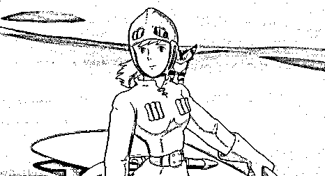

**3 月 24 日 星期二**

14：26，金星与海王星成六分相，如果你有胆承担后果，今天可以短暂逃离现实。

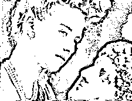

**3 月 25 日 星期三** 

11：59，月亮与无形的海王星成四分相，注意力随之弥散，又是适合做梦的一天。


**3 月 26 日 星期四**

3：26，太阳与土星成三分相（白羊座-射手座 4°49'），谢天谢地！希望理智来得不算晚！把握好分寸，用过往的信誉赢得信任。

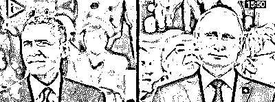 

**3 月 27 日 星期五**

3：46，月亮回到自己守护的星座巨蟹座，全世界的心理姨妈期！准备好卫生纸和卫生棉。

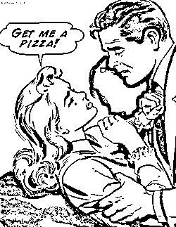 

**3 月 28 日  星期六** 

10：12，金星与木星成四分相（金牛座-狮子座 12°48'），骄奢淫逸的一天。

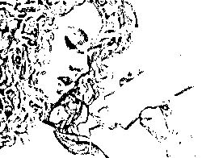

**3 月 29 日 星期日** 

13：49，月亮进入豪爽的狮子座，选择慷慨宽仁还是浮夸膨胀？


**此版本为若道任性小编无责任编辑**

**请带感情参考**

<fieldset label="Copyright © 2014 playhudong All Rights Reserved." id="shifu_o_026" style="border: none; padding: 10px; max-width: 100%; white-space: normal; margin: 5px 0px 0px; background-image: none; box-sizing: border-box !important; word-wrap: break-word !important;">**官方版宇宙天气
请戳这里**  </fieldset>

# 亲密关系 | 你敢在争吵中展现自己的脆弱吗

> 原文：[`mp.weixin.qq.com/s?__biz=MzA5NjA0NTAxNg==&mid=205464962&idx=1&sn=62c10d59aa638390cd0db6093092ab87&chksm=197d97352e0a1e231278382d0dd7fdfa2e903f68514ba1ab45fc4804ebb3d454f1b2ce72a053&scene=126&sessionid=1692739029#rd`](http://mp.weixin.qq.com/s?__biz=MzA5NjA0NTAxNg==&mid=205464962&idx=1&sn=62c10d59aa638390cd0db6093092ab87&chksm=197d97352e0a1e231278382d0dd7fdfa2e903f68514ba1ab45fc4804ebb3d454f1b2ce72a053&scene=126&sessionid=1692739029#rd)


<fieldset label="小黄人科技" id="shifu_c_001" style="border-width: 0px 0px 0px 5px; border-style: none none none solid; border-color: rgb(230, 38, 69); padding: 10px; max-width: 100%; white-space: normal; background-image: none; color: rgb(102, 102, 102); line-height: 25px; margin: 5px 0px 0px; box-sizing: border-box !important; word-wrap: break-word !important;">

**太阳已经进入白羊座了，此刻你或许会更加关注于自己，不满和冲突的声音在回荡。但争吵，也是我们增进亲密的契机。**

</fieldset>

作者：大卫·瑞雷

翻译：蒋颖

整理：王宏&Cooking

本文整理自 2014 年 8 月 2 日成都“儿童与个人成长”讲座。

**编者：神父：“无论贫穷富贵、健康疾病，你都愿意和你身边这个人共度一生么？”……“我愿意”……神父：“那现在，请你们交换彼此的脆弱吧。”**

这么多年来，我为很多已婚夫妻做过咨询。所有的夫妻都想更加亲密，但实际上大部分夫妻都在为亲密关系而挣扎。原因非常简单：每个人都害怕变得脆弱，我们每个人对脆弱都有自己的评判，没有人想感到脆弱。所以我们建立起了防御机制，我们觉得这种防御机制能保护我们，这种防御机制也确实保护了我们，但也使得我们无法发展出亲密的关系。所以已婚夫妻在婚姻生活中所学到的“亲密”就是：识别出自己的防御机制，放弃该机制，变得更脆弱，以便发展出亲密感。

大约一年前的秋天，我在北京的一个公园里散步。那个公园里有一个儿童乐园，里面有一个游泳池，水池中有那种大球，所有的孩子都可以进到大球里。孩子们可以在球里面推着那个塑料球在水池里到处跑，非常有趣。小孩在球里面用力地跑，他们会“啪”地摔倒，摔倒后会挣扎着想要出来。我在旁边看的时候，有一个小男孩和一个小女孩在水池里面。他们每个人都在各自的塑料气泡里面，他们都摔倒了，但他们无法跟另外一个人联系。当我看到这一幕时，我想：“这是一对新婚夫妇啊！”他们虽然在同一个水池里，到处跌跌撞撞，但他们两个没有亲密感。如果想要有亲密感，就必须要到水里去。你必须把你的衣服弄湿。脆弱感就是在你有关情绪、情感的梦想被水浸湿时，你的情绪和情感。

一位执业咨询师可以从一张星图上看出你是如何防御的，以及你为什么要防御。这在夫妻咨询中很有价值，它会加速咨询的进展。在所有情况下，防御都是围绕每个人最敏感、最脆弱的部分建立起来的。很多时候，夫妻俩在我面前争斗，他们变得非常生气。丈夫或妻子在防御的时候，会说：“你看，我就是那么说的”。但是，生气对于我来说，是咨询中的良好信号。因为我知道如果他们能够把怒火释放出来，你就会知道隐藏在怒火下面的是什么。那就是脆弱感。在那种脆弱感之中的就是真相。

在那个瞬间，丈夫或妻子会对自己的伴侣说点什么？他们所说的话经常是非常令人惊喜的，因为他们是从他们灵魂深处最脆弱的那个部分发声的。在那个时候丈夫或妻子就会做出这样的反应：“我不知道是这样啊，你从来没有对我这么说过。”所以他们开始对彼此敞开心灵，他们一起进入“水中”，然后他们就连接到一起了。这会使他们的婚姻再次焕发活力。这会让他们相互理解。这确实非常令人惊喜。

我看到过一些夫妻，从常识的层面上来看我都感觉他们没有机会了，但结果却让我吃惊。让人感到吃惊的总是其中一个人有足够的勇气，结束了自己的挣扎，以便表达出真实的自我。如果你希望你的丈夫对你真实，你也得对他真实。如果你想让你妻子对你真实，你也必须要对她真实。这听起来特别简单，其实并不简单，真的很难。

我所教授的占星学是要在自己身上下功夫的占星学，因为如果你只是做占星预测的话，你常常会犯错，而且也不一定会有意义。

假设你在给一位年轻的女性做咨询，她想要结婚。占星师看她的星图时可能会说：“哦，你看，木星要经过第七宫（伴侣宫）了，二次限的太阳要合相金星了。（这两个都是非常重要的关系指征。）你有非常好的运势，你可能会遇到一个人，那个白马王子就要出现了。”一年之后她会说：“白马王子并没有出现。白马王子在哪儿？你把钱退给我。”

为什么白马王子没有出现呢？因为她没有准备好，所以说无论天气多么适合种豆子，如果你不知道怎么种豆子的话，再好的天气也没有用。准备好意味着在你自己身上下功夫，意味着个人发展、个人成长。正是这一点让个人成长和个人发展显得如此实用。如果你真的可以挺过在你成长过程中给你带来痛苦和折磨的危机，开始解决你和你父母之间的分歧，那你就有机会得到一段真正的情感关系。这就是占星学有意义又有价值的地方。

____________________________

若道星文化，是由美国著名占星师大卫·瑞雷老师创办的占星学培训与文化传播机构，是国际占星研究协会(ISAR)在中国唯一一家定点合作机构。

**【占星入门——若道占星】微信订阅号：nodoorbj**

* 若道官网：www.nodoor.com 可提供占星咨询、占星课程、星盘查询、应用测试及电子杂志等服务。

* 新浪微博：@若道占星

**长按此处二维码，立即关注**

**这里不仅有占星，更有生活**


点击下方**“阅读原文”**，报名参加大卫·瑞雷的 Level-l 和 Level-2 课程，将 12 星座和 10 颗行星一网打尽！↓↓↓

# 若道独家 | 3.21 国际占星日特辑：十张图告诉你占星到底是什么

> 原文：[`mp.weixin.qq.com/s?__biz=MzA5NjA0NTAxNg==&mid=205407566&idx=1&sn=843d5ef5e71908f85b8527a79d688829&chksm=197cf7f92e0b7eef9c3fc6e207973a78cda40530e896dd941144aa0b91544211bf3542e7a799&scene=126&sessionid=1692739029#rd`](http://mp.weixin.qq.com/s?__biz=MzA5NjA0NTAxNg==&mid=205407566&idx=1&sn=843d5ef5e71908f85b8527a79d688829&chksm=197cf7f92e0b7eef9c3fc6e207973a78cda40530e896dd941144aa0b91544211bf3542e7a799&scene=126&sessionid=1692739029#rd)


版权所属若道，转载请注明出处

**

** 

**** 

****

**** 

<fieldset label="Copyright © 2014 playhudong All Rights Reserved." id="shifu_o_008" style="border: none; padding: 10px; max-width: 100%; white-space: normal; margin: 5px 0px 0px; background-image: none; box-sizing: border-box !important; word-wrap: break-word !important;">


</fieldset>

**作者&编辑: Gary、Faith、Joyce、Yoko**

# 双鱼座新月和日食 | 说一切，做一切，都带着爱

> 原文：[`mp.weixin.qq.com/s?__biz=MzA5NjA0NTAxNg==&mid=205392049&idx=1&sn=a606e5a67c2c5f8cce3a83a2b97e59ce&chksm=197cba062e0b3310e121c9f5f178282366d3f9c391c01d41a67a65c4bf13cf09a875771553a1&scene=126&sessionid=1692739029#rd`](http://mp.weixin.qq.com/s?__biz=MzA5NjA0NTAxNg==&mid=205392049&idx=1&sn=a606e5a67c2c5f8cce3a83a2b97e59ce&chksm=197cba062e0b3310e121c9f5f178282366d3f9c391c01d41a67a65c4bf13cf09a875771553a1&scene=126&sessionid=1692739029#rd)


<fieldset style="white-space: normal; margin: 0px 0px 0px 10px; padding: 0px; border: 0px; font-family: 微软雅黑; font-size: 13px; max-width: 100%; color: rgb(62, 62, 62); line-height: 25px; background-color: rgb(255, 255, 255); word-wrap: break-word !important; box-sizing: border-box !important;">报告推荐 3 月 20 日 17:36，双鱼座新月，若道独家定制的免费新月许愿报告出炉喽，关注我们的微信号，用移动设备在若道（nodoorbj）微信端的“趣味测试-个性化报告“中点击查看：）</fieldset>


今天早上，我和我的心理咨询师（她也是资深占星师）一起，在咨询的最后 20 分钟，我哭了一场。我没有预料到这样的哭泣，本来我甚至觉得今天的例行咨询没有什么可谈的。因为生活平淡如常，工作和生活中仍然充满了要解决的问题，这个是生活的常态，每天在问题中、解决问题中，快乐也在那里。期望、梦想、焦虑、失望、恐惧、问题、快乐在 24 小时之中，如飞絮一样在生命中，让我知道我在尘世中，一切如常，一切正常。

然而哭泣是因为提到我的弟弟。他马上要回国一趟，带着他的女儿，看望我们的奶奶、爷爷。父亲通知我他的行程后，我很奇怪地做了一个梦。梦中，一个陌生女人拆解了他，我站在旁边，看着那女人，稍微有些惊异，我想问“你为什么这么做呢？”梦中是白色的雾一般的场景，没有血腥，没有强烈情绪，只是一些淡淡的惊讶。

我当然知道，那个陌生女人是我。

我和我的治疗师谈起我的梦。“你用的是 Dismantle 而不是 dismember 这个词，对吗？Dismantle 这个词就像我们把电脑拆卸了一样，而不是像 dismember 那样残暴、血淋淋。”

“是的，我非常确信”。我只知道 Dismantle 这个词，而且用对了。

“我们把电脑拆了，是因为我们想看看哪里出问题了。也许我们需要换个光驱，也许我们需要换一个硬盘，然后，有可能我们可以再把它组装起来”。

我自己分析过这个梦，现在，又多了一个视角，更清晰了一些。

我一直知道我和我弟弟之间哪里出问题了。因为我非常爱他，而我无法说出我对他的爱。

我告诉咨询师我们很小就分离了，因为我被外祖父母抚养，他被父母抚养，我没有办法和他在一起。后来，他很早被送出国去，我更少能够见到他。我是如此思念他。我多么想回到童年，改变一切，让我能够和他在一起度过童年时光。

然而这不是让我最伤心的原因。最伤心的是，我无法让他知道我对他的爱。

“我们中国人，不说爱彼此”，我涕泪滂流地对我的咨询师说。“我们的生活已经非常不同，那次我到新西兰，我在他身边，他非常沉默，我不知道我能说些什么。”

“他满足了父亲的期望，现在赡养父母，所以我才能自由地做自己。”

我的脑海中闪现出我的星图上土星对分射手座水星的相位，也闪现出弟弟星盘上的 3 宫天蝎座天王星。（那些懂占星的人们，你们知道我在说什么）

“让我们看看这里面有什么恐惧”我的咨询师打断我的思绪“如果你想让他知道你的爱，你怕什么？你觉得最糟糕能发生什么？”

“我会吓到他。上次他回国，临走时，我拥抱了他，拥抱时我在流泪，但他的身体在躲开我。”

“如果我要对他说我爱他，我多么爱他，我一定会像这样哭泣，非常剧烈的哭泣。”

“哭泣又会怎样？”

“因为我不想让他以为我哭是因为我的生活很糟，我不想让他尴尬，我不想…..”

“哭泣是因为你难过。”

“是的，我不想让他看到我难过。”我大笑起来，带着满脸的泪和鼻涕。

多么可笑啊，哭泣是因为我难过。这个好像是小孩子都懂得，然而我却需要咨询师解释一遍。

这个家族里有很多的悲伤。分离的悲伤。不论我多不愿和我的弟弟分离，从童年到现在，我们一直分离，而这些看不见的悲伤在匆忙的生活中静静地积累着，好像我生活在一个世界，思念弟弟的悲伤生活在另外一个世界。然而不能提，一提起就会决堤，就像刚才一样。

“他的出生年月？”

“双鱼座，几乎全部个人行星包括南交点都在双鱼座”

“那么行进海王星？”

“是的，正在合相他的太阳”。

“也许他知道一切。也许他不知道。他是双鱼座。海王星来了，他的自我在消融，他需要重新看见一个新的自我。也许你就在他重新看见新的自我的这个过程中。毕竟是你梦到了他。也许他也梦到了你，谁知道。”我的咨询师说。

“是的，那梦的气氛是如此海王星的气氛，虽然我拆解了他，然而一切都是白茫茫，雾茫茫的。”

我和我的咨询师又谈到了中国，中国几代人家族的事情，我们的家族不过是其中的一个。

“也许你可以对他说些什么。也许什么也不需要说。不过，如果当他在中国的时候，你去看他，不论你做些什么，你都带着爱去做，也许这样就够了。”

我想这是一个很好的建议。“不论我做些什么，我都带着爱去做，这样也许就可以了”。

当我走出公寓楼，再次看到春天来了。看到院子里经历了又一个冬天的草坪，一些绿色的小草在黄色的衰草中一蓬蓬冒出头来。昨天我还没有看到它们。我一直很留意春天，每天走过小道时，我都会瞄一眼小区的月季花，红红的芽孢在棕色的枝条上冒出来，好像出青春痘一般可爱。我还很留意柳树，因为它们总是一夜不见，就可以在那片空间晕染出一片绿雾。柳芽爆了出来，小小叶片长了出来。春天来得太快，快得无法抓住。

然后我到了办公室，看微信，噢，今天是双鱼座新月，还有双鱼座日食。大家在谈新月，还有日食在占星上的事情。

我们占星师总是喜欢技术的群体。这一点没错，占星是一门技艺。不过，我从来不是一个技术派，也许因为我年纪大了一点的缘故，也许我个性的缘故，我是一个生活派。

我知道有一种说法，日食会造成一些事件。也有说法，如果日食合相某个星盘中的重要行星和虚点，当事人可能会做一个重要的决定。我也看到有人在日食那天做了很重要的决定。还有些写运势的写日食的影响是 3 个月。我们的同事也问过大卫老师，日食影响多少天，占星学的理由是什么？大卫老师当时的回答是“这不是正确的问题。日食的影响持续多久根本不重要，重要的是你做了什么样的决定，我们从经验知道，有些决定影响的是一生。还有，你为什么做出这样的决定”。然后，我们在若道的工作群里还谈了关于日食的其他问题。我也提到，我问过斯蒂芬·弗里斯特老师，他说他从没有看到日月食对他有任何影响，虽然他也知道占星界有各种说法。

我想每个占星师都有他的生活经验和他看重的事情。也许就他们各自的生活而言，都是对的。

而我是一个生活派，我很清楚这一点，我不大关注过于技术的问题。我自己的人生经历，所有的重大决定都不是因为日食、行进、推进、太阳弧、新月而做出的，而是因为“我是谁”这个问题。我觉得这个问题是一个更基本的问题。

如果拿日食的实效开一个玩笑，我觉得我的灵魂一定是在某个日食日做了一个诞生的决定，因为自从我决定诞生到这个地球上，这个决定影响了我在地球上的一生。

当然有时机问题，我也渴望抓住时机。比如我不想经过了一个天王星行进，我的内在什么都没有改变。那我真的是白学占星了。但我不会担心上天不会再次给我机会。上天有好生之德，如它每年都把春天送给我们。我确信只要准备好，该来的都会来。

我几乎每个新月都会祈祷，若道大概也是国内最早分享新月祈祷的机构。虽然祈祷完毕，我从来不去检查成果。我不是向老天收租金的。我只是播撒种子。不过去年有一次不经意地看几年前的新月祈祷，很多当时看来很远的愿望不经意中几乎都实现了，也是让我蛮惊奇的事。

双鱼座新月来了。白羊座的春分就在明天。而我会在这个新月兼日食日做一个双鱼座的祈祷，我祈祷当我弟弟在我身边的时候，我说一切，做一切，都带着爱。

-------------------------------

若道星文化，是由美国著名占星师大卫·瑞雷老师创办的占星学培训与文化传播机构，是国际占星研究协会(ISAR)在中国唯一一家定点合作机构。

**【占星入门——若道占星】微信订阅号：nodoorbj**

* 若道官网：www.nodoor.com 可提供占星咨询、占星课程、星盘查询、应用测试及电子杂志等服务。

* 新浪微博：@若道占星


双鱼座新月日食，你也可以做一个决定，点击文末的”阅读全文“跟 随资深的占星疗愈师一起疗愈~

↓↓↓

# 《同一天空下》连载（4） | 如果我们不会流泪，我们就不会爱

> 原文：[`mp.weixin.qq.com/s?__biz=MzA5NjA0NTAxNg==&mid=205392049&idx=2&sn=d37ac4b334571dc79f1ee015f0fc72a0&chksm=197cba062e0b331043cde7d06aa554e056e3ad68cd690b162fd8569e7faa00da39885c47eccb&scene=126&sessionid=1692739029#rd`](http://mp.weixin.qq.com/s?__biz=MzA5NjA0NTAxNg==&mid=205392049&idx=2&sn=d37ac4b334571dc79f1ee015f0fc72a0&chksm=197cba062e0b331043cde7d06aa554e056e3ad68cd690b162fd8569e7faa00da39885c47eccb&scene=126&sessionid=1692739029#rd)

　　《同一天空下》（*Under One Sky*）是一本星图解读的占星书。12 位不同学派的占星师，在不了解客户的真实情况下，对出生图做了盲解。哈德利·菲茨杰拉德就是这些占星师中的一位。这里让我们来一起看看她是如何从心理占星学角度来解读星图的。想了解更多此书信息，请点击《同一天空下》。


你的出生图在我脑海里引出了一个有趣的原型组合：灰姑娘和揭秘者（译注：童话《皇帝的新装》里的那个小孩）。一个是被抛弃后不得不从贵族家庭里消失的小孩，另一个是看到并且大声告诉城里所有人皇帝什么也没穿的小孩。一个从黑暗里被救赎；另一个则是个救赎者。一个挣扎着适应传统；一个对传统公然反抗。两个都在赌博。一旦你懂得说出黑暗的真相，就将导致自己被同族放逐，而你同时找到了入世和出世的方法（这一主题似乎无处不在）。

也许，早期对于责任的设想是宝贵的，甚至是舒适的盔甲，能够抵抗你一触即发的回应能力。我敢大胆地说，在你 5 个月大的时候，你的童年就结束了。“情绪的自我满足”似乎是某种矛盾修辞，不能与情绪的成熟混为一谈。但我认为你很早就伪装出了这个样子，以至于你的那些特别的需求对你周围的人来说是很陌生的，他们无法理解。

这张出生图一次又一次地告诉我，这个灵魂与对脆弱的恐惧进行着激烈的搏斗（你也许会把这看作是独立），因此也带来自我需求和他人期望的对峙。“恐惧”和“匮乏”是你早年生活最强烈的主题。我不是很确定你的父母在你的生命里分别扮演了什么角色，因为他们交织在你的心智里。但无论他们在不在你身边，你和他们的关系都在“训练”你远离自我感受。


我倾向认为对你造成这种影响的是你的母亲（或者扮演母亲角色的人），如果她在你童年时活着的话，因为我怀疑你曾经为了维持与她的联系而去迎合她的需求，也许你还为她“提供”过你富有创造力的天赋，试着让她开心。这一点，再加上你对于变成有用之人的需求，导致你很早就对别人明示或暗示的要求十分敏感，甚至让你获得一种虚假的力量，但这也逐渐将需要依靠的那部分你投入深深的阴暗之中。由于你越来越坚信自己不需要依靠，这一问题便在你成年后的人际关系中爆发出来。

不管你真实的生活境遇是怎样的（我们的对话将充分阐明这一点），你与你母亲/或是扮演母亲角色的人关系都很复杂。不管母亲有没有存在于你的生活中，她似乎都对你的智力发展起到了积极影响，“支持”着你想要活出与她不同人生的渴望；但是同样，她也支持或勾勒出你旧有的防御感，以及在更深的情绪层面上对危机的厌恶感。

由于你对自我需求和感受的辨识，以及“拥有”的能力，在出生后不久就被消灭，我很想了解是否：你被迫要演绎家庭的痛苦；并且/或者你被一阵阵的压抑折磨着，因为你要隐藏自己的锋芒；发展老成世故、无需依靠的伪装；并且/或者通过“躲进”梦想、幻境或自己的世界里，来抵抗这一切。根据出生图的一些特定指征，我比较倾向于后者。更何况你在年轻的时候，社会还要求年轻妇女对家庭困境沉默隐忍，而不是给机会让她们表现出来。

多年咨询工作的经验让我观察到，童年时期的环境里，总有些经历、事件、关系概括了前几世生命里的那些未尽事宜，或者未抚平的创伤。因此，我很想和你深入探讨一下 1946 年至 1948 年这段时间，也就是你的“灵魂密码”被激活的时期，你都还记得些什么或者被告知过哪些事。不管现实的表现如何，他们都携带着你今生灵魂的主题：那就是逐步地把你的心智从一个自我导向的（不管多么不易察觉），或许是约束性/教条式的“武器”，转化成一个用于疗愈和理解，富有创意和充满悲悯的工具。

再次强调，这些根源于你家庭关系的各种关系，是实现这一转化的关键，也是你持续不断修炼和净化自身觉知的关键。所以，在你生命最初的二十年里，你的灵魂有意识或无意识地观察着，在某些复杂的情形下，人们是怎样搭建和发展（不管成功与否）彼此间的关系的。

你熟练又具战略性地运用你脑力的本领，来自你前世里对未来的描绘或憧憬。你对某个激进的（“非部落的”）、哲学的/宗教的或者是意识形态上的“目标”、或集体进行的理想主义式的自我牺牲，可能会强迫你封闭个人需求、感情、关系，这个过程可能让你象征性地或者实实在在地牺牲自己，以显著或微妙的方式进行。

在后一个例子中，一个从强权的男人那里讨取秘密，然后再将秘密偷偷转递给同胞的高级妓女的形象出现在脑海里。你的灵魂对塞万提斯理想主义式哀叹非常熟悉：“哦，让人们回归本真，穿越一个真实的世界。”咨询到这里，我想了解我的这些解读是否让你产生共鸣，虽然我更感兴趣的是锁定一种你正在尝试着要转化的能量，而不是去描述你我都无法具体化的前世生活。

无论我们的交流结果如何，我都想将它织入你今生更为紧迫的一些议题里。在这些议题里，从进化的角度，去体验激烈的、情感亲密的、涉及性欲的和心智上的亲密关系，这对你十分重要。虽然你聪慧的头脑或许成为了你早年最好的玩伴和爱人，但它却是一个糟糕的母亲，无法照顾好你内心最深处的渴望。如果我们不会流泪，我们就不会爱。

当理智和情感，头脑和心灵分离的时候，灵魂承受着极大的悲悯的丧失。当他们重新联结时，牢狱之门被打开，心灵得以放飞。因此我能感受到，今生你的灵魂决心要从愧疚、恐惧、指责的牢笼里挣脱出来，并解放其他同样在世间受困的灵魂。当你在感觉和亲密关系的世界里变得更加完整和踏实，越来越坚信自己值得被爱时，你就可以像一个“艺术家”，而不是“科学家”那样，把自己的意识和经历相融合，成为你最终达成灵魂目标的核心动力，也成为灵魂目标的一部分。某些情感的纠缠必然会与你相遇，并以这样或者那样的方式要获得你的关注，为的是让这一切转化发生。

3 月 29 日，哈德利· 菲茨杰拉德将开设**“占星疗愈：意象与家族动力探索”**课程，详情请点击文末的“阅读原文”。

-------------------------------

若道星文化，是由美国著名占星师大卫·瑞雷老师创办的占星学培训与文化传播机构，是国际占星研究协会(ISAR)在中国唯一一家定点合作机构。

**【占星入门——若道占星】微信订阅号：nodoorbj**

* 若道官网：www.nodoor.com 可提供占星咨询、占星课程、星盘查询、应用测试及电子杂志等服务。

* 新浪微博：@若道占星


3 月 29 日，哈德利· 菲茨杰拉德将开设**“占星疗愈：意象与家族动力探索”**课程，详情请点击文末的“阅读原文”。↓↓↓

# 课程推荐 | 职业占星师之路（北京）

> 原文：[`mp.weixin.qq.com/s?__biz=MzA5NjA0NTAxNg==&mid=205392049&idx=3&sn=531fc091d4dbacaed52dc92b7446ad54&chksm=197cba062e0b3310d1926425389bc1374b8608aacf0e119c21c382f1cba15bf29abea6921bc3&scene=126&sessionid=1692739029#rd`](http://mp.weixin.qq.com/s?__biz=MzA5NjA0NTAxNg==&mid=205392049&idx=3&sn=531fc091d4dbacaed52dc92b7446ad54&chksm=197cba062e0b3310d1926425389bc1374b8608aacf0e119c21c382f1cba15bf29abea6921bc3&scene=126&sessionid=1692739029#rd)

**职业占星师之路（北京）**

**课程目标**

本次咨询指导课程的目的，是为了帮助那些已经掌握了一定出生星图、预测、比较星图、组合星图等解读所需的知识和技能，但在后面的占星咨询实践中，由于欠缺相关的咨询技巧和实践点拨，无法顺利高效地进行咨询的占星学习者。通过一天的系统训练及课后练习，帮助学员更好地将所学的专业占星知识更有针对性的融合到占星咨询之中，综合提升学员的星图解读咨询技巧，从而达到提升咨询效果和客户满意度的目的。

**针对人群**

1\. 往届大卫高阶课程（COAC）的毕业生。

2\. 目前高阶课在读（2014-2015COAC）的学员。

3\. 参加过 ISAR 咨询技巧培训并通过 ISAR 认证考试的占星师。

4. 学习过专业知识的占星师。（这里的专业知识包括：出生星图、行进、次限推进、太阳弧正向推进等）

**课程安排（总长度 6 小时，不包含午休时间）**

1.【咨询切入】1 小时

结合出生星图的重要议题，讲解如何高效把握咨询的切入点，以恰当的方式与客户进行沟通。大卫老师会结合案例来分享其近四十年职业占星咨询的实战技巧。

2.【案例讲解】3 小时

通过 3-4 个大卫老师长期的咨询案例，来讲解如何将占星技巧融入咨询实践。内容将涉及占星咨询的几个层面：

情境层面——日常的世俗情境和状况

心理层面——与身份议题相关的本性表现

社交层面——与社交相关的议题

身体层面——与身体或健康相关的议题

灵性层面——灵性议题，体验更深或更高层面的意义

3.【团体练习】1.5 小时

占星咨询结构化分组练习，通过咨询者、客户、观察者的三元角色互换，进一步融合之前讲解的咨询技巧。

4.【总结】0.5 小时

课程关键点总结，布置督导课后的实践练习计划。

**课程时间**

2015 年 4 月 4 日早 9:00-晚 17:00

**教学难度**

相当于若道的高阶占星学课程的水平。即熟悉出生星图解读与行进预测技巧 。

**课程价格**

新学员：980 元（若道老学员：580 元）

**课程地点**

地址：北京市朝阳区百子湾路 32 号院苹果社区南区 10 号楼 A 座 2006 室

**【报名和付款流程】**

课程费用：980 元（老学员：580 元）

请在课程页面上点击立即报名，以及在线完成学费支付

网页报名后无法进行在线支付的同学，可以通过银行汇款的方式支付课程费用，

汇款信息：蒋颖　　6226 0901 0424 5721　　招商银行北京中关村支行或支付宝：nodoor@yeah.net

请在汇款备注中写上自己的名字和所报课程，方便我们核对。

**【关于退课与转课】**
课程付费后，因个人原因无法参加通过邮件申请退款，开课前 3 天内可以全款退回。
开课后，不再接受退款或转课申请。

**详情及报名方式请戳下方"阅读全文"。**


美国资深职业占星师。1970 年开始学习占星学，在通过亚特兰大职业占星委员会的考试后，于 1976 年获得执业许可，成为一名专职占星师。年过六旬的大卫老师，曾两任亚特兰大占星协会主席，是全美占星师联盟（AFAN）、美国占星师联合会（AFA）、全美占星研究委员会（NCGR）、国际占星研究协会（ISAR）和职业占星师组织（OPA）的成员，是联合占星大会（UAC, United Astrology Conference）督导委员会委员。

大卫老师曾是 CNN、CBS 的占星节目的常驻嘉宾，多次在 BBC、WGS、WSB、WRGG 等节目中接受采访，并在亚特兰大主持电视节目《每日行星（Daily Planets）》达 4 年之久。至今已研究占星四十余年，拥有三十多年的占星咨询的执业经验，其服务客户包括学生、工人、市长、州长、议会议员、企业家、心理咨询师、工程师、艺术家、演员、知名企业家等，客户年龄跨度从襁褓婴儿到耄耋老人。2010 年 6 月，大卫的书《灵魂的目标》中文版出版。在 2011 年春季的北京之行期间，大卫接受了《南方周末》记者的采访，同时参与了 CCTV9 的纪录片的拍摄。

大卫老师热爱教学，愿意将自己的毕生所学倾囊相授。为了将纯正的西方占星学带入中国、为了让更多的中国人从占星中获益，大卫老师在占星学的传授上投入了巨大的热情与心血。他以后每年将有一半的时间在中国度过，中国将成为他的第二个家。

　　“了解自己是智慧的开始，了解占星是与自己相遇。”

　　“人性和自然息息相关，自然的韵律是我们太阳系的韵律。”

　　“在我看来，占星学的意义在于帮助你发现你自身的力量，帮助你做出更好的选择，让你生活得更好；而不是告诉你什么时候一定会发生一些可怕的事。”

　　“自我成长的三部曲是：觉察，接纳和改变。占星是最好的自我觉察的工具之一。而变化就是变成你的星盘所能赋予你的最美好的样子。”

　　“‘成为更真实的自己’意味着深入挖掘存在于你本身的各种可能性。”

**详情及报名方式，请戳下方“阅读全文”**

<fieldset label="Copyright © 2014 playhudong All Rights Reserved." id="shifu_o_017" style="white-space: normal; border: none; padding: 10px; max-width: 100%; margin: 5px 0px 0px; background-image: none; box-sizing: border-box !important; word-wrap: break-word !important;">


</fieldset>

# 星星聊缘 | 3.21 国际占星日欢乐派对（杭州场）

> 原文：[`mp.weixin.qq.com/s?__biz=MzA5NjA0NTAxNg==&mid=205392049&idx=4&sn=8a8ab504840a5367b9dad0263d484568&chksm=197cba062e0b3310398c264da6db5170a37fbd2985fba3aaa9d64fe6a43693bf991611322ee6&scene=126&sessionid=1692739029#rd`](http://mp.weixin.qq.com/s?__biz=MzA5NjA0NTAxNg==&mid=205392049&idx=4&sn=8a8ab504840a5367b9dad0263d484568&chksm=197cba062e0b3310398c264da6db5170a37fbd2985fba3aaa9d64fe6a43693bf991611322ee6&scene=126&sessionid=1692739029#rd)

**星星聊缘**

**3.21 国际占星日欢乐派对 杭州场**

**Why**

群星闪耀的广阔天穹，

点燃了多少前辈科学家对星辰的向往,

对自身存在的思索，

对精神之路的探求……

当代，越来越多人热衷于占星，

理解占星不只是 12 星座,

占星师亦不是穿着长袍、握着水晶球的吉普赛女郎或男巫。

作为星相爱好者，

让我们相约 3.21 国际占星日,

一起来体验星相的奥秘与神奇！


**When**

2015 年 3 年 21 日(周六)10:00 –17:30

国际占星日。太阳在白羊座 0 度，昼夜等长，亦是中国传统的春分节气

****Where****

{泛音星光工作室}

杭州市西湖区常陇路 6 号阳明谷 丹阳苑 25-2

**What**

**上午：团队游戏——“用占星观照内心”**

以团队彩绘大师杰作的形式，让我们在游戏中探索与发现自己，并结合个人星盘能量来揭开奇妙发现

**Facilitator**: Justine

**下午：占星咨询 ABC**

分享以客户为中心的占星咨询技巧, 分组多种角色扮演，让我们一起来聆听、回应、碰撞火花！

**Facilitator:** Amor

**How to join**

****全天收费****

98 元/人 (包括午餐茶点、场地、游戏道具）

**报名联系**

Luna 13616512555

沁榆 13116769868

～需提前预约，谢绝空降～

**付款支付宝**

junezhulu@hotmail.com （Luna）

chenchen_1020@tom.com （沁榆）

****

**预约付款时，请标注微信号**

**以便提前建微信群，**

**分享搭车资源、预告活动分组信息!**

****

# 占星疗愈 | 意象与家族动力探索（报名即将截止）

> 原文：[`mp.weixin.qq.com/s?__biz=MzA5NjA0NTAxNg==&mid=205367559&idx=4&sn=8a4e32335f7bced8f8956eeba43b7089&chksm=197f1bb02e0892a6ccebd4d6aea7d2a953ba350e43fa4d28bdf6a204358f1d1a6118d919776e&scene=126&sessionid=1692739029#rd`](http://mp.weixin.qq.com/s?__biz=MzA5NjA0NTAxNg==&mid=205367559&idx=4&sn=8a4e32335f7bced8f8956eeba43b7089&chksm=197f1bb02e0892a6ccebd4d6aea7d2a953ba350e43fa4d28bdf6a204358f1d1a6118d919776e&scene=126&sessionid=1692739029#rd)

占星疗愈：意象与家族动力探索哈德利·菲茨杰拉德

开课时间： 3 月 29 日
课程形式：网络在线
课程负责人：Freya Li、Helen Zhou
联系方式：4006191014/QQ:2847613491

如果你渴望疗愈自己，也希望能帮助他人进行疗愈，那么就跟着哈德利老师，一起探索意象和家族动力吧！占星疗愈课程，将于 3 月 20 日关闭报名入口。欲报从速！如果你错过了报名时间，开课前可联系我们的课程负责人进行补报名。

## 课程描述

作为高阶占星学生的你也许都已经意识到了，无论你是否以占星为业，你身边的朋友、同事都会希望你能为他们答疑解惑。占星师以及占星学子都拥有某种能力，去解读别人的人生，甚至去影响他们的人生。但是占星师也是人，也有自己的偏见和情结。我们可能会因为一些自己未经疗愈的议题，把自己的问题投射到客户身上。

哈德利·菲茨杰拉德老师认为，占星师和心理治疗师应该先疗愈自己，这样当我们探索客户的出生星图时，我们自己的（有意识和无意识的）恐惧、矛盾、偏见、情结、性情、个人经历、信仰和目标就能够尽可能在我们的控制之下。她说：“在我看来，我们的任务不是预测未来，或者承诺问题会得到解决，而是帮助客户找到不同的方法，去应对生命中遇到的各种矛盾，以便让他们能为自己做出更好的选择。”

所以，哈德利决定开设一门课程，从个人故事、图像和家族动力的角度，结合占星学，帮助你了解自己的内心，并且学习如何帮助客户更好地了解自己，让你真正担当起占星疗愈的责任。

## 课程内容

**1. “传记”表格介绍、相关写作练习和小组讨论（三次课程）**

在这一阶段，哈德利老师会向大家介绍她自己设计的一份表格——“传记”表格。通过此表格，客户将有机会回顾或重新发现个人和家庭的动因，了解到他们早年生活的什么塑造了他们的个性，从而让他们认识到，这些动因如今在怎样影响着他们的生活。

基于学习的目的，我们会利用这个表格来挖掘你的个人故事，并将其与出生星图关联，帮助你更好地理解自己的人生模式、生命中的核心动因，并学会以更有意识、更进化的方式去显现这些动因。

**2\. 心灵对话、意象训练与出生图（五次课程）**

不管是出生星图，还是梦境、想象、塔罗、电影、艺术，都为我们提供了某种图像。心灵正是通过这些图像与我们对话，而这也提供给我们特定时间里客户所需要的“良药”。通过图像，心灵和思想能再度整合，实现心理、情感、身体和精神的真正健康。

图像是一种潜意识语言，哈德利老师意识到这一工具的效力日益增强。它能帮助我们更好地识别不同情绪和阴暗模式，避免让自我偏向某一特定的解读；它能有效地放松我们不断警惕的自我意识阻力，同时也能够刺激我们的想象力。它鼓励治疗性的对话，因为它在客户内心中激发了领悟与解决方案。当这些发现得到了治疗师的支持，我们的左右脑以及客户的意识与潜意识思维就获得了更强的整合。

在这一阶段，我们将学习用语言来询问或回答：这幅图像告诉了我什么？它为何此刻出现在这里？它反映了我的什么？它揭示了我的何种更深层次的故事？现在当我回顾曾经在传记表格上所写的内容时，我看到了什么？

我们也会将图像和出生星图联系起来，学习用图像来描述出生星图中的模式，并且将这种方法运用到客户身上，帮助他们了解自己的灵魂地图（出生星图），让他们能以不同的方式“看见”自己。学生们可以自由使用任何塔罗牌或自己喜欢的其他资源所提供的图像。我们还将进行意象训练进一步强化学生在这部分的体验。

**3\. 出生星图和家族动力（四次课程）**

了解家庭的系统运作是认识自我的关键，也是我们内在工作和客户工作的关键。所有家庭成员的行为都会相互影响，祖先们的沮丧情绪、死气沉沉的生活、未解决的问题和各种家庭秘密，也纠缠着我们的内心。

在这一阶段，哈德利老师会使用传记表格、图像和家谱图的方式，来探索家庭关系。我们也将运用出生星图，探索转宫制如何能说明家族体系中是什么在“纠缠”你或你的客户。我们还会尽可能多地使用多代家庭成员的图像，来指引我们找到现在的家庭动因。

## 授课形式

1\. 网络教学：2015 年 3 月 29 日 开始 每月一次 周日上午 9:55-12:00 共 12 次课 24 课时

网络视频会议系统上的在线课程和答疑辅导，只要有上网的条件在世界各地都可以上课，无地域限制。

2\. 中英文双语授课，专业占星口译员中文翻译。

## 针对人群

1\. 往届若道高阶课程（COAC）的毕业生。

2\. 目前高阶课在读（2014-2015COAC）的学员。

3\. 参加过 ISAR 咨询技巧培训并通过 ISAR 认证考试的占星师。

4. 学习过专业知识的占星师。（这里的专业知识包括：出生星图、行进、次限推进、太阳弧推进等）

## 报名及付款流程

课程费用：5800 元　（若道老学员 4800 元）

点击文末的“阅读原文”，并在在课程页面上点击立即报名。

咨询请拨打电话 4006191014　
或直接写信给 nodoor@vip.126.com，我们会回复您的疑问

**哈德利·菲茨杰拉德（Hadley Fitzgerald）**

**我会让我的母亲去找哈德利，如果她需要咨询的话。——斯蒂芬·弗里斯特**

****

心理学家。英语学士，心理学硕士。从事占星咨询工作 40 年多，担任心理治疗师 31 年。哈德利·菲茨杰拉德把出生星图作为生命地图，指引客户去发现灵魂在此生最好的发展目标，以及与灵魂的目标产生有意识共鸣的方法，帮助客户应对世俗发展和灵魂进化的双重挑战。

她为拉斐尔·纳赛尔的《同一天空下》（Under One Sky）写作了心理占星学的部分，由朱迪·弗里斯特编辑。她的培训和工作核心是要帮助我们回答“什么是我们灵魂的诉求”。哈德利拥有加利福利亚大学洛杉矶分校和菲利普斯研究所的学位，在临近洛杉矶的加利福利亚谢尔曼奥克斯进行私人治疗和占星咨询工作。(www.HadleyFitzgerald.com)

3 月 29 日，哈德利· 菲茨杰拉德将开设**“占星疗愈：意象与家族动力探索”**课程，详情请点击文末的“阅读原文”。↓↓↓

# 实习生招聘 | 寻找油菜花：网站/新媒体编辑

> 原文：[`mp.weixin.qq.com/s?__biz=MzA5NjA0NTAxNg==&mid=205367559&idx=5&sn=8b295f0ddcbd8fc17ef371a3e40cdd2f&chksm=197f1bb02e0892a6fb4f0a369200b379e44b70e88e492620614b00c2e1284bdcd13e2f5eba29&scene=126&sessionid=1692739029#rd`](http://mp.weixin.qq.com/s?__biz=MzA5NjA0NTAxNg==&mid=205367559&idx=5&sn=8b295f0ddcbd8fc17ef371a3e40cdd2f&chksm=197f1bb02e0892a6fb4f0a369200b379e44b70e88e492620614b00c2e1284bdcd13e2f5eba29&scene=126&sessionid=1692739029#rd)

****

神秘占星公司招聘啦~

如果你有才华，

如果你善于运用文字，

那么，我们将给你发挥才能的空间，

并且让你接触到世界顶级占星大师！

若道星文化，是由美国著名占星师大卫•瑞雷老师创办的占星学培训与文化传播机构，是国际占星研究协会(ISAR)在中国唯一一家定点合作机构。官网：www.nodoor.com 微博：@若道占星

此次招聘的**实习生**职位是：**编辑**

**工作地点：北京**

如果你就是我们要找的人，请将简历（请注明英语水平）和详细出生信息（年月日时分以及地点）发送到 felicia.jiang@nodoor.com，合则约见！

**【岗位职责】**

1\. 协助网站、微信相关文章的编辑、审校、上传工作

2\. 为文章寻找配图

3\. 写作宣传文案
4\. 完成信息内容的日常更新与维护

**【任职资格】**
1\. **良好的文字功底**，热爱文字工作，善于把文章整理得干净、漂亮
2\. 对图片有敏感度，对于排版工作有耐心

3\. 热爱占星，有占星中阶水平

4\. 工作积极主动、耐心、细致，责任心强
5\. 熟悉常用的计算机办公相关软件

6\. 每周工作时间不少于 4 个工作日，能按时按质完成工作任务

7\. 有较好的英文阅读和翻译能力者优先

**我们可以提供的：**

1\. 舒适的工作环境

2\. 和世界顶尖占星学大师接触，学习占星学的机会

3\. 交到一群爱好占星学、爱好个人成长、有生活趣味的小伙伴

4\. 一个做你所爱的事情、在工作中成长并实现理想的机会

**有意者请将简历投递至 felicia.jiang@nodoor.com**

**了解若道，请点击文末的“阅读原文”。**

-------------------------------

若道星文化，是由美国著名占星师大卫·瑞雷老师创办的占星学培训与文化传播机构，是国际占星研究协会(ISAR)在中国唯一一家定点合作机构。

**【占星入门——若道占星】微信订阅号：nodoorbj**

* 若道官网：www.nodoor.com 可提供占星咨询、占星课程、星盘查询、应用测试及电子杂志等服务。

* 新浪微博：@若道占星


# 疗愈 | 你是高度敏感性人格吗？

> 原文：[`mp.weixin.qq.com/s?__biz=MzA5NjA0NTAxNg==&mid=205367559&idx=1&sn=f3e455daa4e5b622dd8083ae08789e63&chksm=197f1bb02e0892a60b279c2244eb95225658c13827a6055eb3cc8d24d50ddb600228f00f974e&scene=126&sessionid=1692739029#rd`](http://mp.weixin.qq.com/s?__biz=MzA5NjA0NTAxNg==&mid=205367559&idx=1&sn=f3e455daa4e5b622dd8083ae08789e63&chksm=197f1bb02e0892a60b279c2244eb95225658c13827a6055eb3cc8d24d50ddb600228f00f974e&scene=126&sessionid=1692739029#rd)


据调查，全世界有大约 20%的人，是相对敏感或者高度敏感的。这个数字可能超过了一些人的想象，我们总觉得是不是只有自己才这么糟糕，轻易被外界影响。或者觉得只有自己或者少数人才具有这样的敏感性，在灵性上是特殊的。而这些统计数据恰恰表明，其实事实并不是我们“感觉”的那样。

<wbr style="margin: 0px; padding: 0px; max-width: 100%; box-sizing: border-box !important; word-wrap: break-word !important;">

<wbr style="margin: 0px; padding: 0px; max-width: 100%; box-sizing: border-box !important; word-wrap: break-word !important;">

## 什么是高度敏感性人格

<wbr style="margin: 0px; padding: 0px; max-width: 100%; box-sizing: border-box !important; word-wrap: break-word !important;">

在心理学上，这种敏感体质被称为高度敏感性人格（highly sensitive person），简称 HSP。当然，心理学上存在这样一个术语，并不代表它一定就是个“问题”。心理学家达布罗夫斯基（Dabrowski，1902-1980）就是位一生致力于研究资质超常个体的心理整合与发展的专家。他认为，这种高度敏感特质的人表现出的某些身心不协调的特征，不能简单地用一般的神经官能症来看待，而是应该考虑其特殊性，从而引导这部分成为个人成长的动力。<wbr style="margin: 0px; padding: 0px; max-width: 100%; box-sizing: border-box !important; word-wrap: break-word !important;">

<wbr style="margin: 0px; padding: 0px; max-width: 100%; box-sizing: border-box !important; word-wrap: break-word !important;">

他把这种高度敏感性归因于人类的某些感官过激的反应，并称之为“过激度”(overexitability,OE)。这种过激度可概括为几个方面： 精神运动过激，表现为精力无限，肢体动作丰富，言语速度快，不知疲倦，争强好胜；感官动力过激，表现为触觉、嗅觉、听觉、视觉、味觉的过度敏感，对审美对象有超强的感知力以及高度的审美直觉力，也可能表现为追求快感；智能过激，表现为学习能力和处理问题的能力不同寻常，抽象和逻辑思维能力超强，好内省，热衷于解决问题和不断学习；想象力过激，表现为有丰富的创造力，自由联想、白日梦、视觉化能力等方面非常发达，视觉记忆力超群，梦境内容细致丰富，喜爱诗歌音乐戏剧等表达形式，可能存在想象与现实混淆的倾向，对未知事物容易有较强的恐惧感；情感过激，表现为情感的深度、强度和范围都超出常人，具有直接与他人共情的能力，产生的问题是可能倾向于不适应变化，也可能从小多病，容易有情绪问题，或者可能比较孤癖，不乐于与人交往。这五种过激特质可能同时存在，但不同超常个体会有不同侧重的表达，同时情感过激是这五种特质中推进人格发展的核心动力。

<wbr style="margin: 0px; padding: 0px; max-width: 100%; box-sizing: border-box !important; word-wrap: break-word !important;">

## 高度敏感性人格的两种表现即疗愈方式

所以说，过激度本身并不是个问题，但如若不能善用这种过激度，则可能带来问题。

<wbr style="margin: 0px; padding: 0px; max-width: 100%; box-sizing: border-box !important; word-wrap: break-word !important;">

**自卑型敏感人格：**

<wbr style="margin: 0px; padding: 0px; max-width: 100%; box-sizing: border-box !important; word-wrap: break-word !important;">

通常，在日常生活的领域中，人们会对过于敏感的人，相对容易给予一些负面评价，比如神经质，不切实际，“想得太多”等。这些评价也会带来超敏人群的自我贬抑，形成一些相对低的自我定位与自我价值判断。同时，因其敏感性，某些超敏的人又可能比别人情绪状态更容易低落，情绪起伏更频繁或者更大。因而，这种情绪困扰也可能加深超敏人群的低自我判断，并且坚信自己“不正常”或者“有问题”。

<wbr style="margin: 0px; padding: 0px; max-width: 100%; box-sizing: border-box !important; word-wrap: break-word !important;">

而对超敏人群的身心整合疗愈，其实疗愈的并不是其超敏性，或者说过激度，这种特点本身不是“问题”更不是疾病。而这类人群时常需要疗愈，是因为由于上述原因，他们常常在过去因超敏而留下的这些关于自我的不恰当“印记”，以及积累很多没有被很好的疏导的情绪。所以通过过去的创伤入手，疗愈这些部分，并逐步地协助案主去建立起一个对自身特质的更客观的认识，引导案主逐步的接纳自己的超敏性，接纳自己的特质，并学会与这种特质共处，是疗愈的重点。

<wbr style="margin: 0px; padding: 0px; max-width: 100%; box-sizing: border-box !important; word-wrap: break-word !important;">

要知道，人的追求是分层次的，超敏性的人相对更容易追求一些较高层次的需求(这里的高低只是一种分类，而不具有灵性批判意义)，比如情感或者精神，而相对并没有那么集中在物质层面。这本身并不是问题，而是需求层次的发展不同。因而，如果治疗停留在把超敏当做问题，试图让求助者回到与他人相同的非超敏态去完全关注较低需求的层次，那么就可能给超敏者造成创伤，而且因违背了其自身特质很难收获到良好的效果。对超敏者的综合疗愈来说，重要的是尊重他们的自身特质的同时，逐步培养其内在的稳定性。

<wbr style="margin: 0px; padding: 0px; max-width: 100%; box-sizing: border-box !important; word-wrap: break-word !important;">

<wbr style="margin: 0px; padding: 0px; max-width: 100%; box-sizing: border-box !important; word-wrap: break-word !important;">

**自负型敏感人格**<wbr style="margin: 0px; padding: 0px; max-width: 100%; box-sizing: border-box !important; word-wrap: break-word !important;">**：**

<wbr style="margin: 0px; padding: 0px; max-width: 100%; box-sizing: border-box !important; word-wrap: break-word !important;">

在心灵成长领域中，相对来说，状况有所不同。心灵成长领域开始意识到了超敏对自身整合的动力作用，这是一种相对于“敏感性问题说”更进步的方式。然而，却也产生了某些过度情况，比如对敏感性的追求，相信敏感是一种超能力，追求敏感性甚至神通。然而，从本质上来说，自大只是掩盖自卑的一种方式，并不是一种平衡的真正自信的存在。因而，对该人群来说，他们可能兼具上述日常生活领域中的问题——这类人群早年也可能是被过度否定和自我否定的，而在心灵成长领域中，得到了完全不同的看法后，早年的情绪创伤与价值创伤并没有得到很好的梳理和化解，而是直接把自我价值建立在了对敏感性的依附上，造成了新的问题。<wbr style="margin: 0px; padding: 0px; max-width: 100%; box-sizing: border-box !important; word-wrap: break-word !important;">

<wbr style="margin: 0px; padding: 0px; max-width: 100%; box-sizing: border-box !important; word-wrap: break-word !important;">

这类人群可能表面对灵性敏感无比确信，坚信这是自己的直觉，是更高的指引。这里容易产生的问题是：感官动力过激和想象力过激层面的混淆。在现实生活中，它们从表面来看本身就并不特别容易区分。同时，在过度追求和过度美化敏感性的言论的指导下，有些敏感性的人就可能接受自己或者他人的心理暗示，而把想象力发展出的内视觉画面当做某些灵性的神秘体验。

<wbr style="margin: 0px; padding: 0px; max-width: 100%; box-sizing: border-box !important; word-wrap: break-word !important;">

内视觉与想象力本身并不是不好的。在某些修行体系中，也运用观想的方式，通过想象力的描绘去与更高意识建立相应关系和连接。然而，混淆这种心象能力，并认定其为灵性体验与此不同。它可能会导致我们不断去创造它，并用来满足自己内心的某些需求，从而导致越来越沉浸在这些幻想中，而与现实生活脱离。甚至有些严重的情况，会发展出幻听幻视，形成虚假的通灵经验，造成较严重的身心创伤性后果。

<wbr style="margin: 0px; padding: 0px; max-width: 100%; box-sizing: border-box !important; word-wrap: break-word !important;">

因而，对这类状况的疗愈，要逐步清晰和明确其对敏感度的认识，并把这种认识逐步的带回到平衡的层面。回溯到早年因敏感性而留下的种种创伤并逐步疗愈，最后仍然是要回到加强其稳定性上面。如同我们在催眠个案的介绍中会一再强调一样：**故事不重要，疗愈最重要；真假不重要，成长最重要。**所以，无论你是看到自己是耶稣，还是农夫，对疗愈师来说，我们只会引导你去看到当时遗留且影响着现在的结点是什么，然后，一步一步地去解开它，而不会把注意力放在你的那些故事上面，耶稣和农夫都是一样的，没有本质差别，而故事都是不可知且不重要的。最终我们要回到的是相对平衡稳定的内心状态。

<wbr style="margin: 0px; padding: 0px; max-width: 100%; box-sizing: border-box !important; word-wrap: break-word !important;">

## 小结

<wbr style="margin: 0px; padding: 0px; max-width: 100%; box-sizing: border-box !important; word-wrap: break-word !important;">

综上，我们可以看出，敏感本身是一种特质，它常常与遗传有关，或者说是一种先天特质，也有少部分可从后天的个人成长中逐步发展出来。同时，敏感特质本身，并不具有好与坏的分别，同样一种特质可以发展出自身的高阶面向也可以停留在低阶面向。它是把双刃剑，要看我们如何去调整和运用它，运用得当，它就可能变成推动我们走向更发展的灵性自我的内在驱动力，而运用不当，它也可能发展成为神经质甚至神经官能症，阻碍我们无法与最基本的现实生活相融，而陷入到情绪的泥沼里。

<wbr style="margin: 0px; padding: 0px; max-width: 100%; box-sizing: border-box !important; word-wrap: break-word !important;">

总之，敏感就如同流动的河水，而稳定就如同河床河堤，没有稳定的敏感，势必容易涣散四溢，甚至可能淹没周围的农田，而缺少敏感的稳定，也是干涸而没有动力的。因而，**一个高度敏感的人，也应该是一个平衡的人。**

<fieldset style="white-space: normal; margin: 0px; padding: 15px; border: 1px dotted rgb(0, 187, 236); color: rgb(68, 68, 68); font-size: 13px; line-height: 2em; font-family: 宋体; min-height: 1.5em; max-width: 100%; border-bottom-right-radius: 15px; border-bottom-left-radius: 10px; word-wrap: break-word !important;">

**作者简介**

慕棉：吉林大学工学博士，美国催眠协会（ABH）&美国加州催眠学院（P.A.S.H）认证催眠师，国际医学最高认证中心（WMECC）认证 EFT 情绪释放技术治疗师，国际整体暨自然医学学会（IHNMA）认证完型治疗执行师。现居北京，从事各类心理心灵整合治疗工作，欢迎预约个案，联系：QQ2092982531。预约详细事宜及个案内容请参考博客。博客地址：http://blog.sina.com.cn/qiansu82

</fieldset>

**用占星来疗愈自我，请点击文末的“阅读原文”。**

-------------------------------

若道星文化，是由美国著名占星师大卫·瑞雷老师创办的占星学培训与文化传播机构，是国际占星研究协会(ISAR)在中国唯一一家定点合作机构。

**【占星入门——若道占星】微信订阅号：nodoorbj**

* 若道官网：www.nodoor.com 可提供占星咨询、占星课程、星盘查询、应用测试及电子杂志等服务。

* 新浪微博：@若道占星


3 月 29 日，哈德利· 菲茨杰拉德将开设**“占星疗愈：意象与家族动力探索”**课程，详情请点击文末的“阅读原文”。↓↓↓

# 占星疗愈 | 连载：《同一天空下》星图盲读（3）

> 原文：[`mp.weixin.qq.com/s?__biz=MzA5NjA0NTAxNg==&mid=205367559&idx=3&sn=b179a83ccc62d4dd25c809ef2299891c&chksm=197f1bb02e0892a6f77745e1020333f5033c8f5aff5b9c7c1c37f55fc6e3a48281f5d7b2c1b1&scene=126&sessionid=1692739029#rd`](http://mp.weixin.qq.com/s?__biz=MzA5NjA0NTAxNg==&mid=205367559&idx=3&sn=b179a83ccc62d4dd25c809ef2299891c&chksm=197f1bb02e0892a6f77745e1020333f5033c8f5aff5b9c7c1c37f55fc6e3a48281f5d7b2c1b1&scene=126&sessionid=1692739029#rd)

《同一天空下》（*Under One Sky*）是一本星图解读的占星书。12 位不同学派的占星师，在不了解客户的真实情况下，对出生图做了盲读。哈德利·菲茨杰拉德就是这些占星师中的一位。这里让我们来一起看看她是如何从心理占星学角度来解读星图的。


作者：哈德利·菲茨杰拉德

译者：Sophie

校对：神婆阿丘

在了解了你对上述问题的反馈后，我打算进一步进行以下询问：

* 你的母亲或者一位扮演母亲形象的人，是否在某些层面上取代了你的父亲，即父亲不在的时候代替他的角色？

* 她是否有一些在心智、感情或者身体上的小毛病需要你应对？

* 你是否希望父母中的一人可以在你需要保护的时候站出来去对抗另一个人？

* 是否父母中的一人联合你“对抗”另一个人，然后似乎又不明不白地把你抛弃给那个人？

回答以上任何问题，都能让我将出生图的原型形象和现实生活对应起来，即关于你早年父亲（某些情况下是母亲）是如何“缺失”的问题。我专注于这个问题的细节，是为了要弄清楚它在你漫长生命中所起的作用，即它是如何影响你在这个世界的成就感。

再次申明，那些父亲活着却不在身边的人，他们的内在动因与那些父亲过世的人相比，有着精细而又显著的区别。在这里我并不能从理论上列出那些不同之处。但是，关于你父亲和家族血统的不确定性或谜团的确是存在的，为此，你的灵魂需要进行一场学习之旅。通过你自有的独特的女性视角，以及你自己深有感触的经历，一种“神圣的思乡之情”会促使你做出更有创意的努力。一种理想的结果是，你最终在世界上找到了一个位置，在这里你能以某种方式感受到联结。

结合以上，我还想了解一下，你是否知道你母亲在怀着你的时候的情况？你受到了她某些特别的恐惧和沮丧情绪的影响，但我并不知道它们来自于哪里。你的父母是否想要你这个孩子？你是否出生在父母还没准备好迎接孩子到来的时候？你是否感觉母亲不喜欢并且/或者嫉妒你？


我察觉到，由于你被母亲（被她有意无意地疏远、忽视）抛弃或拒绝，你花了很长时间才能完全认识到自己是女性，并且以此为荣。最简单的“通道”，便是利用你的聪明才智，让你在这个基本上是左脑思维的、根据我们做了什么而不是我们是谁来进行评估的社会，找出自己的路。你的觉知、想象力、机敏和“操纵全局”的精明必然让你成为一个成就者，甚至还能带给你一定的自主性、声望和权利。但是，这些奖赏也有其自相矛盾的局限性：对男性角色的强烈认同和确定无疑，让你努力把自己打造成一个左脑思维的、迄今为止（或是之后）成功的“男性”形象，以至于你女性的、深入的、性感的和脆弱的一面得不到滋润，无法与你的生活完全整合。所以，无论你做什么，你都在忍受着过度劳累和被贬低的痛苦。这只是众多可能性中的一种。

一种可能的与上瘾有关的占星征象也在这里展示了出来，我想了解这是否一直是你生活里的一个问题。你出生图的心理层面显示，当你感觉失落空虚、在这世上没有稳固根基的时候，容易上瘾成癖。从另一个角度看，渴望屈服和被他人他物取代的强烈阴影，以及层出不穷的好奇心，也会滋生瘾溺。另外，由于金钱和财富，以及它们与你在这个世界的自我价值感之间的关系，是一个值得大量探讨的话题。因此，你很可能选择金钱作为“药物”，来缓解所有的病痛。在你生命的一段时期里，金钱和物质看上去就像爱情，或者像是解决各种关于孤独和自尊的困惑的答案。

如果瘾嗜在某种形式上是一个议题的话，你自己是如何理解的呢？摆脱瘾嗜是否扩展了你的灵魂视野? 摆脱它是否帮助你更切实地发挥你的创意，并将其更有意识地运用于你的生活里？

然而，对于所有这些，我以希尔曼的名言作为警示：“造就我的不是我的历史，不是我的父母、我的童年和我的成长。它们是映射着我形象的镜子。”对你来说也是如此，乔伊斯。通过探究你父母在你生活中存在或缺失的种种可能性，以及你被排斥的背景，我们大致了解了你的灵魂在今生想要整合什么。我们可以看到它强烈地需要被认可和被爱，需要和自我深深地联结，需要从排斥、要求及伤害中，有模有样、有威严地摆脱出来，需要重新定义对你而言，什么是真正的“财富”，以便能对自己的天资满怀自信。也需要让心和脑都浸透在你的所知之中，以便于你对禁忌的独特视角能引起别人的谈论。

3 月 29 日，哈德利· 菲茨杰拉德将开设**“占星疗愈：意象与家族动力探索”**课程，详情请点击文末的“阅读原文”。

-------------------------------

若道星文化，是由美国著名占星师大卫·瑞雷老师创办的占星学培训与文化传播机构，是国际占星研究协会(ISAR)在中国唯一一家定点合作机构。

**【占星入门——若道占星】微信订阅号：nodoorbj**

* 若道官网：www.nodoor.com 可提供占星咨询、占星课程、星盘查询、应用测试及电子杂志等服务。

* 新浪微博：@若道占星


3 月 29 日，哈德利· 菲茨杰拉德将开设**“占星疗愈：意象与家族动力探索”**课程，详情请点击文末的“阅读原文”。↓↓↓

# 疗愈 | 家庭系统排列为什么是有效的？

> 原文：[`mp.weixin.qq.com/s?__biz=MzA5NjA0NTAxNg==&mid=205367559&idx=2&sn=192b6b7f2eea35adb749f005caf1379f&chksm=197f1bb02e0892a6606b98b1a66122911f875a250c242dc0dcfdeda47d1d5c7d4694eb2fbd02&scene=126&sessionid=1692739029#rd`](http://mp.weixin.qq.com/s?__biz=MzA5NjA0NTAxNg==&mid=205367559&idx=2&sn=192b6b7f2eea35adb749f005caf1379f&chksm=197f1bb02e0892a6606b98b1a66122911f875a250c242dc0dcfdeda47d1d5c7d4694eb2fbd02&scene=126&sessionid=1692739029#rd)

 本文节选自慕棉的《系统排列和集体无意识中的疗愈》。

**集体无意识的作用方式与疗愈方法**

说到集体无意识部分的疗愈，首先，我们先来明确一下集体无意识的定义。集体无意识本身包括婴儿实际开始以前的全部时间，即包括祖先生命的残留，它的内容能在一切人的心中找到，带有普遍性，因此才被称为“集体无意识”。集体无意识的内容是原始的，包括本能和原型。它只是一种可能，以一种不明确的记忆形式积淀在人的大脑组织结构之中，在一定条件下能被唤醒、激活。

回到生命的源头，我们就会发现集体无意识的存在并不难理解，因为我们的生命不是无源之水、无本之木，我们都是原生家庭的孩子，原生家庭又来自两个家族的结合，两个家族背后又有更多家族，而家族背后又连接着整个社会与人类历史。集体无意识疗愈的原理，就是基于此基础上的。

我们每个人的生命都不是一个一个孤立的个体，我们的背后有相连接的共同的部分。而作为一个人，我们自然可能会受到这些背后因素的影响与塑造。之所以说可能，就表示这不是必然。这点，我们以家族集体无意识为例，我们能看到一个人被家族系统集体无意识影响造成某些问题的例子，比如某个家族中，有个妈妈莫名的跟女儿疏离，然而内心又非常爱自己的孩子。回溯到集体无意识的影响才发现她家族中有这样的一种母女冷漠疏离的惯性。而原因是她的某位祖先留下了强烈的对自己性别的怨恨，这个怨恨无法得到化解，因而用这种投射到下一代身上的方式转移了自己的强烈情感，而且代代延续下去，都有这样的情况存在。

然而，同样是这个家族中出来的人，其中有些人却并不被这个家族的问题所影响的而对自己的孩子产生疏离。所以，集体无意识的内容是包括一切，每个人的心中都能找到，但具体到某一个人的时候，又只一种可能性。因而，只有当某些问题指向了这个方向的时候，我们才需要去看到这些部分对自己的影响，并转变它，而此时，这对我们的整体成长的某些面向来说，就可能是很重要的。

集体无意识对我们的影响，跟潜意识类似，常常也是我们对自己的一种保护——我们会用某种方式去表达，总是因为意识深处认为这种方式是有益的，起码是那个当下所能找到的最有益的方式了。比如有位先生在人际交往中对人莫名的充满排斥和警惕，总是担心自己被人伤害，却怎么回溯到找不到个人原因，现状也改变不大。

在疗愈中，我们逐渐发现，这个模式在他不少家人身上也都有表现。因而尝试去回溯集体无意识的部分影响，于是发现他的先祖有人被欺骗导致倾家荡产，家破人亡的事件，并因而留下了这个家族集体无意识的能量。而每当面对他人时，他的家族集体无意识部分就会自动跳出来提醒他，你要小心，你可能被骗，你可能遭遇很多很多很糟糕的事情，使得他常常在人际关系里陷入紧张中。直到我们去转变这部分的家族集体无意识，让这部分化解，并看到现在一切已经不同了，这个模式不完全是合适的，转变才发生。

个案中涉及的大部分集体无意识，都以与我们联系最紧密的家族为主，而企业寻求相关帮助的情况下，那么自然也会涉及到企业组织系统的序位情况以及背后反应出的企业的集体无意识。无论哪种情况，我一般都会采取系统排列的方法来处理，这种方法用于集体无意识的疗愈非常的直接有效。因为它可以直观地把隐藏在我们能量深处的看不见的集体无意识呈现出来，通过参与者们的自发性表达，构成一幅幅活生生的图景，让我们直接看到集体无意识能量如何运作如何影响着我们的自身能量状态，如何影响着我们的自身生活，因而充满了震撼力。而通过现场对集体无意识能量的疏导，现场参与者自发表达的能量状态的改变将直观的呈现了集体无意识能量的转变状态，疗愈效果清晰直观明确。

**为什么系统排列有疗愈功效**

对系统排列很多人存在一些误解。相比较来说，EFT、颂钵，或者哪怕催眠等方法，大部分人也会觉得原生家庭的影响起码我们看见了，感受到了，或者至少是部分的看见与感觉到了，而前世至少疗愈的过程求助者自己也在独自完成这个解决问题的过程，所以是自我成长的一部分。可系统排列整体呈现的都是家族或者团体的问题，甚至会追溯到更久远以前或者并不认识的祖先，然后某些改变就发生了，这是不是不需要自我内在的转变呢？这是不是不符合疗愈的宗旨呢？

这种想法的产生是因为大多数人对系统排列背后的作用机制不了解。很多人去做了系统排列并且确实得到了疗愈，但却并不清楚为什么要做，也不清楚为什么家族就能影响我们，而是把系统排列当做神秘学的一部分，甚至有些人会觉得排列就好像附体一样。然而，了解了集体无意识，我们就开始深入了解了系统排列的原理，也就会发现它本身并不神秘，而它所有的呈现也是基于此基础上的。

正是因为我们每个人的集体无意识中，都包括了全部时间，而它的内容也可以在每个人心中找到，所以，我们就可以在系统排列的场中，轻易地通过在场的一位求助者呈现出他整个家族的能量状态——这些都早已经存储在他深层的能量系统里了。而疗愈的场，只是把这个部分转化为参与者的现场表现并呈现出来，以便于处理和转变能量。因而，在疗愈场中，参与者只需要连接到求助者的能量系统就可以自然感应到场中的这个部分的能量，并表现出相应的角色的状态。这正是很多人觉得，它神奇的原因所在——当人们不了解集体无意识的时候，就无法理解这是如何实现的，甚至会想到附体。

而系统排列的疗愈，是在这种呈现的基础上实现的，它通过疏导现场参与者所展现的系统各部分能量与求助者整体的能量，来达到梳理和转变求助者的个人深层能量系统中事件与序位的目的，从而也就改变了他个人的深层能量状态。因而，自然相关的现实层面的显现也就跟着改变了，甚至牵扯在这个集体无意识中的其他人，也可能得到不同程度的改变。这个过程中，求助者不但是全程参与，而且每一个转变都是在其身上与内心发生的。所以，了解了这些，我们就清楚了系统排列背后的运作原理，也就不会再误解了。

<fieldset style="white-space: normal; margin: 0px; padding: 15px; border: 1px dotted rgb(0, 187, 236); color: rgb(68, 68, 68); font-size: 13px; line-height: 2em; font-family: 宋体; min-height: 1.5em; max-width: 100%; border-bottom-right-radius: 15px; border-bottom-left-radius: 10px; word-wrap: break-word !important;">

**作者简介**

慕棉：吉林大学工学博士，美国催眠协会（ABH）&美国加州催眠学院（P.A.S.H）认证催眠师，国际医学最高认证中心（WMECC）认证 EFT 情绪释放技术治疗师，国际整体暨自然医学学会（IHNMA）认证完型治疗执行师。现居北京，从事各类心理心灵整合治疗工作，欢迎预约个案，联系：QQ2092982531。预约详细事宜及个案内容请参考博客。博客地址：http://blog.sina.com.cn/qiansu82

</fieldset>

根据家族动力来进行自我疗愈，详情请点击文末的“阅读原文”。

-------------------------------

若道星文化，是由美国著名占星师大卫·瑞雷老师创办的占星学培训与文化传播机构，是国际占星研究协会(ISAR)在中国唯一一家定点合作机构。

**【占星入门——若道占星】微信订阅号：nodoorbj**

* 若道官网：www.nodoor.com 可提供占星咨询、占星课程、星盘查询、应用测试及电子杂志等服务。

* 新浪微博：@若道占星


3 月 29 日，哈德利· 菲茨杰拉德将开设**“占星疗愈：意象与家族动力探索”**课程，详情请点击文末的“阅读原文”。↓↓↓

# 星象漫谈 | 天冥四分：最后的战役

> 原文：[`mp.weixin.qq.com/s?__biz=MzA5NjA0NTAxNg==&mid=205342399&idx=1&sn=58c5284c2123722da02ef47d1cefb27e&chksm=197ff4082e087d1ec844e701c2e3e0e109405c6b1f0bbf6adc7673a9fb7af260e25d6f43c0e0&scene=126&sessionid=1692739029#rd`](http://mp.weixin.qq.com/s?__biz=MzA5NjA0NTAxNg==&mid=205342399&idx=1&sn=58c5284c2123722da02ef47d1cefb27e&chksm=197ff4082e087d1ec844e701c2e3e0e109405c6b1f0bbf6adc7673a9fb7af260e25d6f43c0e0&scene=126&sessionid=1692739029#rd)


 

作者：斯蒂芬·弗里斯特

译者：江艺 校对：李含

2015 年 3 月 17 日，天王星和冥王星在白羊座和摩羯座成四分相。天王星和冥王星之间的这一系列四分相开始于 2012 年 6 月 24 日，此次是该系列相位的最后一次精准成相。有趣的是，唯有在这一次精准四分时，两颗行星都是顺行。因此，大约三年来，愤怒、暴力的“地震和闪电之王”与超级爱控制的“地狱之主”（也被称为“地狱之神”），一直以四分相的姿态展开对决。也许你不喜欢这些用词，毕竟它们让我们联想到的是异形大战铁血战士。这个战士的形象听起来并不真实，倒更像是一个荷尔蒙过剩的 14 岁男孩的幻想。

但占星不是幻想，它是有效的，并总是映射出现实。天冥四分的这段日子，几乎每天，我们都能从可怕的全球新闻中看到典型的骚乱。就在我们认为事情不可能变得更糟，人类对待彼此的方式不会变得更坏时，我们看到了政府认可的酷刑、万人坑、斩首处决、公立学校枪击事件和被杀害的记者。我们随处可见这个强有力的四分相的黑暗和僵持。

也许你正在庆幸这些四分相终于要结束了，但是这两颗行星移动缓慢，3 月 17 日标志着它们最后一次精准的四分相，但它们的关系还没有真正结束。冥王星在 4 月转向逆行，而天王星则在 7 月开始逆行。2015 年圣诞节，天王星将在白羊座 16°33'停滞，此时冥王星落在摩羯座 14°51'。无疑，这 1.5°的距离“足以施展其力量”。这个四分相的划时代力量将在 2016 年和 2017 年，随着天王星的缓慢前行而逐渐消退。换句话说，它们的舞步会悄然结束，而不是砰地一声就终结了——不过 2015 年很可能还会出现一两次剧烈爆发。

天冥四分的这三年来，看着我们对行星的回应方式，看着黑压压的人群，我们可能会觉得沮丧。因为看起来，我们被打败了——低俗的大众品味愈加彰显。常常用技术（天王星）武装自己的愤怒（白羊座）的革命者（天王星），一直与统治政府（摩羯座）进行生与死的战斗，而统治政府则乐于使用阴暗手段和背信弃义（冥王星）来摧毁他们。

与此同时，保守派（摩羯座）一直在与进步人士（天王星）对抗，他们都指责对方残暴无情。“无法调和的差异”（四分相），确实在人类事务中持续造成了紧张和深层的不安。美国国内和地缘政治时常陷入僵局中，其中的沮丧和挫败都展现在可怕又荒诞的晚间新闻中。

这还只是人类世界之中。想想自 2010 年以来，当这些巨行星开始渐入四分相时，我们经历了多少可怕的地震、火山爆发和超级风暴。举一个例子来说，正当天王星回到白羊座的那一天（在它短暂逆行回到双鱼座数周之后），日本福岛核反应堆遭到海啸侵袭。而天王星代表的地震释放了被摩羯座保护结构包裹的钚。

虽然将福岛事件和占星联系在了一起，但这并不是预测，我不关心预测。我更相信人类意志的力量，而不是相信机械的占星模型。但是观察天冥四分相的慢慢结束确实让我预料到，随着相位的结束，人类正在走向一些相对平静的水域。

尽管我们的表现确实常常很机械，但我们不是由行星牵引的提线木偶。可无比讽刺的是，我们有自由去选择不自由，只要我们作出这样的选择。事实上，我们的反应常常是反射性的、无意识的。集体层面上，人类对天冥四分的反应相当本能：疯狂地投射，疯狂地将“对手”妖魔化，再加上战争的口号，以及令人震惊的死亡人数。

即使人类仍然继续保持这种无意识、条件反射的状态，我们也很可能会发现，我们正在对无止境的战争感到厌烦。“结束它吧”，让我们更清晰地去倾听彼此，去照料我们自己的家园。企求结束本身可能只是对宇宙的机械回应，但是我们仍然乐意接受这些紧张气氛的结束。我更愿意去庆祝这件事。

然而，人类个体与人类社会的野兽是截然不同的。斯汀在《每时每刻》（All This Time）的歌词中说得很好：“疯狂的时候，人们是成群成群地变疯，但变好时，只能一个接着一个。”处于同一群体的人，也可能有着不同的行为。我们每个人都是某种集体社会量子论中的量子，海森堡的不确定性原理存在于我们每个人身上。那种不确定性可以是：我们有的人会用最糟糕的方式回应任何一种占星刺激。比如那些仅因别人所代表的派系就将他们斩首的人，或是将枪口对准毫无反抗之力的无辜孩童的警察。或是那些因制服或肤色而袭警的孩子。

但我们中也有一些人会展现出某一种占星格局的最高潜力。这里我要开始赞扬此次天冥四分所代表的众多灵魂胜利者。天冥四分有其黑暗所在，假装无视它只会让它变得更强大。但是，光明给了我们力量去坚持真理。我们需要它，它一直在那儿。

在我的占星咨询服务中，我见证了人们在人生故事中展现出天冥四分的更高潜力，我观察到，这些人在自身之中整合了紧张的对立。也就是说，他们调和了内在的保守派和自由派。通过有意识的工作，我看到灾难性地震如何在爆发前被缓和下来。我见证了新生的智慧、清醒、力量和慈悲。

这种烈火重生的过程每个人都可能经历，但对于有行星落在四个基本星座 6°至 17°之间的人来说尤为紧迫，因为冥王星和天王星一直以来都在这个区间游走，或与其合相，或四分，或对分。这些人就处在最前线，有的阵亡，有的腾飞。

根据我所目睹的成功案例，这些在天冥的紧张刺激下作出成功、整合、疗愈回应的人，有着一些共同点。这些共同点中所蕴含的准则，相信能帮助更多人顺利度过暴风雨时期：

　　爆发点（冥王星）可以成为突破点（天王星）；

　　危机（天王星）释放长期压力（冥王星）；

　　面对你的创伤（冥王星）导向个人解放（天王星）；

　　通过共时性，用成功的内在工作（冥王星）触发魔法，墙壁变成大 门（天王星）；

　　突然的改变（天王星）常常揭开潜在的议题（冥王星）；

　　大胆的行动（天王星）可能带来力量和洞见（冥王星）。

当然，这样的危机无法等同于简单的公式。但是回想你近几年的人生，尤其是如果你的星图中有基本星座的敏感点。你也可以看看行进天王星和冥王星目前落入你星图中的哪个宫位，想想它们所形成的特定相位。以此来联系你这几年的人生故事和发展进程。，它们之间会有深厚的关联。

随着你的反思，你会慢慢将一切整合起来，并将充分体会到自身努力进化工作的益处，从而你稳固自己已经取得的收获。

很快，长期以来的天冥四分将要结束了。它梦魇般夸大了人类本性中一切的怪异与不可能，对于这些全球性的占星事件，我认识到两点：

第一，出生在这一阶段的孩子将带着这些问题长大，终生挣扎其中。通常，谜题中的这个部分——这些孩子自身的生活，的确是最大的一个谜，一旦短暂的烟火消失在空中。你会看到它的影响力持续一整个世纪，而不仅仅是几年。想想传说中的 1960 年代，现在想想 1960 年代出生的孩子（天冥合相植入了他们的意识）对人类历史的影响。他们许多人现在正到达其影响力、艺术水平和领导力的巅峰。

第二，我们要继续开展内在工作，不仅是在我们自身的生活中，在方方面面，我们都要进化。我们要用天冥四分赋予我们的力量为社会做出贡献，在可见的层面，也在所有微妙的振动层面。那些振动，可能是疯狂或美好，绝望或挫败，抑可能是爱、善良和宽恕的奇迹。

_____________________________

若道星文化，是由美国著名占星师大卫·瑞雷老师创办的占星学培训与文化传播机构，是国际占星研究协会(ISAR)在中国唯一一家定点合作机构。

**【占星入门——若道占星】微信订阅号：nodoorbj**

* 若道官网：www.nodoor.com 可提供占星咨询、占星课程、星盘查询、应用测试及电子杂志等服务。

* 新浪微博：@若道占星


点击下方**“阅读原文”**，报名参加大卫·瑞雷的 Level-l 和 Level-2 课程，将 12 星座和 10 颗行星一网打尽！↓↓↓

# 《同一天空下》连载 | 出生图盲解（2）

> 原文：[`mp.weixin.qq.com/s?__biz=MzA5NjA0NTAxNg==&mid=205342399&idx=2&sn=123eeebba7d8a4f9e553df61bda88510&chksm=197ff4082e087d1e7520dc6f03aa58d4ff7e3d1d8400b71d7cd9245ad1780601288a37282c92&scene=126&sessionid=1692739029#rd`](http://mp.weixin.qq.com/s?__biz=MzA5NjA0NTAxNg==&mid=205342399&idx=2&sn=123eeebba7d8a4f9e553df61bda88510&chksm=197ff4082e087d1e7520dc6f03aa58d4ff7e3d1d8400b71d7cd9245ad1780601288a37282c92&scene=126&sessionid=1692739029#rd)


　　《同一天空下》（*Under One Sky*）是一本星图解读的占星书。12 位不同学派的占星师，在不了解客户的真实情况下，对出生图做了盲读。哈德利·菲茨杰拉德就是这些占星师中的一位。这里让我们来一起看看她是如何从心理占星学角度来解读星图的。想了解更多此书信息，请点击《同一天空下》。


由于出生图里凸显了你实际在做的事情难以和自我相联结，难以证明自我，在咨询的最开始时，我会问你，在你的潜能和你迄今为止运用潜能所做的事情之间，融洽度有多高。我也想了解你是否从事教育、写作、某种灵修、创造性疗愈，或者任何领域的沟通性工作（哪怕是投资银行家！），还是说你的工作是依靠自己丰富的想象力和道破黑暗事实的天赋，来帮助自己或他人看到什么是可能的。

与健谈的自我展现相矛盾的是，你的灵魂发现独处隐居和合作关系都是你灵性基础的重要部分。在某种程度上，你是一个学习变得外向的内向的人。结合你独特的童年经历，我认为你需要发展出一套健康的个人界线，这样你就可以在人际关系中投入真情实感，而不是为了生存变得更加圆滑和世故。此生有意识的独处注定成为一次让灵魂丰实的经历，这一经历将最终让你丰富的内心世界与你的外部世界达成和谐统一。这种独处并不等同于与世隔绝，也不同于强制性地用理智压抑你对建立深入人际关系的需要，毕竟这些关系将随着时间的推移加速你的转化。

这样的关系里携带着能力和无能、掌控和屈服的主题。有时它们“绑架”着你的生理和心理层面，最终（或者反复地）让你发生质的变化。例如，你感觉有些事情在“回炉”，你知道这次遭遇让你变得不同。在这个过程里，你可能一次又一次地“失去”并“找到”人、财富、思想、情感联结，这样你便可以凭直觉感知，在你的生活里，何时该坚持？如何坚持？以及何时该放弃？如何放弃？这种直觉认知越是发展，你越能在自我与他人之间建立起信任关系。

虽然这对其他人来说听起来很抽象，但我可以了解你的灵魂愿意在人生历程的某些层次上比你前几世走得更加深远，而且/或者为了避免前世业力的干扰，走向新的方向。无论哪种情况，你一直以来都十分善于运用所知来掌控环境，但是这一次，你需要把你的情绪和本能知觉与你的大脑即时同步，以便你的创意和经验能够很好地帮助你与他人建立实际有效，有时甚至是意义深远的联结。


一部分的你努力地致力于内部整合，而且在整合过程中常感孤独。“哪里真正适合我？我适合什么职业？我到底属于哪里？”这些都是暗藏的对你意义重大的问题。然而，由于你天生对那些所谓“规则”爱恨交织，并且你的族群或者文化很难认同和重视你的天赋（反之亦然），你自我的另一部分对于归属感毫无兴趣，且尤其对奇幻、神秘和充满无限可能的领域趋之若鹜。于是我们可以说，从非常具体实在的角度来看，你的灵魂承担着要活出以下这段静思祷告里最深层含义的任务：“上帝啊，请准予我平静地接受那些我不能改变的事情，请鼓励我去改变那些我可以改变的事情，并请给我智慧去分辨他们”。

在多次的轮回里，你内心里无休止的浪漫主义情怀和顽固不化的现实主义思想一直处于战争状态，他们互相残杀以获得发言权，而现在灵魂的进化需要休战。如果你能从生活的蒸馏器中，有效提取出富有创意的、不受局限的、关于神秘事物的学习经验，以及提问、探索和总结归纳的能力，你便能将直觉、逻辑和实践智慧很好地融合在一起。结合你关于人类痛苦的第一手经验，以及你在黑暗和不寻常之中、在传统和现代之间发现美的能力（如果你不是那么固执己见地保卫你的成见的话），不管这些能力是显而易见，还是被隐藏起来，你已经完全具备了成为优秀治疗师、研究员、疗愈师、救济院工作人员、社会工作者、导师、占星咨询师、教师、作家等富有创造性职业所需要的关键能力。在以上任何一种职业中，你都能成功有效地将你来之不易的理解力运用到现实世界的各种事件中。

调和生命的黑暗和光明、深度和广度、稳固和自由、禁忌和传统是你今生最核心的挑战。因此，面对自我和他人的阴影是你的灵魂在世间至关重要的经历——你从早年就已经开始面对这些。你的灵魂给自己设定了这样的功课：要在个人或者群体对你所做的几乎每件事都表示反对的强大引力中，培养出强大的自我完整性。从你三岁开始，那些对你思想和感受上独创表达的中伤就在你所处的环境中开始集聚。

在你的生命里，你不断听到迷幻如塞壬女神般的诱惑之音，消散着你健康的心智能量。也就是说，你要用那些创意天赋来逃脱命运的深谷，而不是去照亮它。当你学着通过专注而不是压抑感受来抵制那些诱惑，你就会找到能将经历和理解整合在一起的方法。当你坚持这样做的时候，最终，你不仅听到了自己内心的声音，还发现这声音戏剧般地直接传入了需要听到它的人耳中。理想情况下，这会形成一个滋养灵魂的反馈回路。

然而，把你对感受的再关注和对精力涣散的抵制结合起来，将是你今生的灵魂进化目标，因此在抵达目标的路上必须清除一些障碍。早年的时候，你已经发展出能在不真正用心投入的情况下，与他人建立关系的生存机制。但生活里残酷现实会提醒你，你的这种能力有时候并不怎么奏效。你需要去感受那些经历对你到底意味着什么，以免在你的幻想和期待破灭的时候，脸上流露出愤世嫉俗的表情。

在生活架构阶段性地瓦解又重建的过程里，你发现那些最初仿佛要把你从生活的中心扯离的事情，最终把你推向一个诚信、整合并且真实呈现你的内在和外在的新层次。于是，灵魂在试图形成让你的自我防御盔甲失效的强大转化关系时，会经历不同形态的“死亡”。如果进展顺利，当你将你的肉身全然释放来适应并活在当下时，你将深入领会山姆•金（Sam Keen）曾说过的这句话：“在本我诞生之前，自我必须经历上千次的死亡，而每一次小死都是通往更广阔生命之路上的仪式。”

如果以某种形式缺席这些仪式，那么你的“生活在双眼之后”，和抽离于世的能力、观察力、洞察力、对机会的把握以及对环境的评估，会让你在漫长的时间长河里漂泊不定。你和你的本我脱离，不相信自己的能力；在真心渴望的经历和成就，以及为达成这些经历和成就而做的枯燥乏味的工作中，你将被来回撕扯。在你为达到自律而整理自己所有的能力时，你的观察力成为一种非常有用的才能，而你也想知道是否你感觉你已经学会有效地整理这些能力。

3 月 29 日，哈德利· 菲茨杰拉德将开设**“占星疗愈：意象与家族动力探索”**课程，详情请点击文末的“阅读原文”。

-------------------------------

若道星文化，是由美国著名占星师大卫·瑞雷老师创办的占星学培训与文化传播机构，是国际占星研究协会(ISAR)在中国唯一一家定点合作机构。

**【占星入门——若道占星】微信订阅号：nodoorbj**

* 若道官网：www.nodoor.com 可提供占星咨询、占星课程、星盘查询、应用测试及电子杂志等服务。

* 新浪微博：@若道占星


3 月 29 日，哈德利· 菲茨杰拉德将开设**“占星疗愈：意象与家族动力探索”**课程，详情请点击文末的“阅读原文”。↓↓↓

# 占星疗愈 | 意象与家族动力探索（还剩 2 天报名截止）

> 原文：[`mp.weixin.qq.com/s?__biz=MzA5NjA0NTAxNg==&mid=205342399&idx=3&sn=25952be2354c80c6ef5b072ccb1c86b5&chksm=197ff4082e087d1e9e20f69c71b4cd25edc0fb4b0d34faf1e9932e03a42d0ebefa18c8c6dca3&scene=126&sessionid=1692739029#rd`](http://mp.weixin.qq.com/s?__biz=MzA5NjA0NTAxNg==&mid=205342399&idx=3&sn=25952be2354c80c6ef5b072ccb1c86b5&chksm=197ff4082e087d1e9e20f69c71b4cd25edc0fb4b0d34faf1e9932e03a42d0ebefa18c8c6dca3&scene=126&sessionid=1692739029#rd)

占星疗愈：意象与家族动力探索哈德利·菲茨杰拉德

开课时间： 3 月 29 日
课程形式：网络在线
课程负责人：Freya Li、Helen Zhou
联系方式：4006191014/QQ:2847613491

## 课程描述

作为高阶占星学生的你也许都已经意识到了，无论你是否以占星为业，你身边的朋友、同事都会希望你能为他们答疑解惑。占星师以及占星学子都拥有某种能力，去解读别人的人生，甚至去影响他们的人生。但是占星师也是人，也有自己的偏见和情结。我们可能会因为一些自己未经疗愈的议题，把自己的问题投射到客户身上。

哈德利•菲茨杰拉德老师认为，占星师和心理治疗师应该先疗愈自己，这样当我们探索客户的出生星图时，我们自己的（有意识和无意识的）恐惧、矛盾、偏见、情结、性情、个人经历、信仰和目标就能够尽可能在我们的控制之下。她说：“在我看来，我们的任务不是预测未来，或者承诺问题会得到解决，而是帮助客户找到不同的方法，去应对生命中遇到的各种矛盾，以便让他们能为自己做出更好的选择。”

所以，哈德利决定开设一门课程，从个人故事、图像和家族动力的角度，结合占星学，帮助你了解自己的内心，并且学习如何帮助客户更好地了解自己，让你真正担当起占星疗愈的责任。

## 课程内容

**1. “传记”表格介绍、相关写作练习和小组讨论（三次课程）**

在这一阶段，哈德利老师会向大家介绍她自己设计的一份表格——“传记”表格。通过此表格，客户将有机会回顾或重新发现个人和家庭的动因，了解到他们早年生活的什么塑造了他们的个性，从而让他们认识到，这些动因如今在怎样影响着他们的生活。

基于学习的目的，我们会利用这个表格来挖掘你的个人故事，并将其与出生星图关联，帮助你更好地理解自己的人生模式、生命中的核心动因，并学会以更有意识、更进化的方式去显现这些动因。

**2\. 心灵对话、意象训练与出生图（五次课程）**

不管是出生星图，还是梦境、想象、塔罗、电影、艺术，都为我们提供了某种图像。心灵正是通过这些图像与我们对话，而这也提供给我们特定时间里客户所需要的“良药”。通过图像，心灵和思想能再度整合，实现心理、情感、身体和精神的真正健康。

图像是一种潜意识语言，哈德利老师意识到这一工具的效力日益增强。它能帮助我们更好地识别不同情绪和阴暗模式，避免让自我偏向某一特定的解读；它能有效地放松我们不断警惕的自我意识阻力，同时也能够刺激我们的想象力。它鼓励治疗性的对话，因为它在客户内心中激发了领悟与解决方案。当这些发现得到了治疗师的支持，我们的左右脑以及客户的意识与潜意识思维就获得了更强的整合。

在这一阶段，我们将学习用语言来询问或回答：这幅图像告诉了我什么？它为何此刻出现在这里？它反映了我的什么？它揭示了我的何种更深层次的故事？现在当我回顾曾经在传记表格上所写的内容时，我看到了什么？

我们也会将图像和出生星图联系起来，学习用图像来描述出生星图中的模式，并且将这种方法运用到客户身上，帮助他们了解自己的灵魂地图（出生星图），让他们能以不同的方式“看见”自己。学生们可以自由使用任何塔罗牌或自己喜欢的其他资源所提供的图像。我们还将进行意象训练进一步强化学生在这部分的体验。

**3\. 出生星图和家族动力（四次课程）**

了解家庭的系统运作是认识自我的关键，也是我们内在工作和客户工作的关键。所有家庭成员的行为都会相互影响，祖先们的沮丧情绪、死气沉沉的生活、未解决的问题和各种家庭秘密，也纠缠着我们的内心。

在这一阶段，哈德利老师会使用传记表格、图像和家谱图的方式，来探索家庭关系。我们也将运用出生星图，探索转宫制如何能说明家族体系中是什么在“纠缠”你或你的客户。我们还会尽可能多地使用多代家庭成员的图像，来指引我们找到现在的家庭动因。

## 授课形式

1\. 网络教学：2015 年 3 月 29 日 开始 每月一次 周日上午 9:55-12:00 共 12 次课 24 课时

网络视频会议系统上的在线课程和答疑辅导，只要有上网的条件在世界各地都可以上课，无地域限制。

2\. 中英文双语授课，专业占星口译员中文翻译。

## 针对人群

1\. 往届若道高阶课程（COAC）的毕业生。

2\. 目前高阶课在读（2014-2015COAC）的学员。

3\. 参加过 ISAR 咨询技巧培训并通过 ISAR 认证考试的占星师。

4. 学习过专业知识的占星师。（这里的专业知识包括：出生星图、行进、次限推进、太阳弧推进等）

## 报名及付款流程

课程费用：5800 元　（若道老学员 4800 元）

点击文末的“阅读原文”，并在在课程页面上点击立即报名。

咨询请拨打电话 4006191014　
或直接写信给 nodoor@vip.126.com，我们会回复您的疑问

**哈德利•菲茨杰拉德（Hadley Fitzgerald）**

**我会让我的母亲去找哈德利，如果她需要咨询的话。——斯蒂芬·弗里斯特**

****

心理学家。英语学士，心理学硕士。从事占星咨询工作 40 年多，担任心理治疗师 31 年。哈德利•菲茨杰拉德把出生星图作为生命地图，指引客户去发现灵魂在此生最好的发展目标，以及与灵魂的目标产生有意识共鸣的方法，帮助客户应对世俗发展和灵魂进化的双重挑战。

她为拉斐尔·纳赛尔的《同一天空下》（Under One Sky）写作了心理占星学的部分，由朱迪·弗里斯特编辑。她的培训和工作核心是要帮助我们回答“什么是我们灵魂的诉求”。哈德利拥有加利福利亚大学洛杉矶分校和菲利普斯研究所的学位，在临近洛杉矶的加利福利亚谢尔曼奥克斯进行私人治疗和占星咨询工作。(www.HadleyFitzgerald.com)

3 月 29 日，哈德利· 菲茨杰拉德将开设**“占星疗愈：意象与家族动力探索”**课程，详情请点击文末的“阅读原文”。↓↓↓

# 若道招聘 | 神秘占星公司继续招人啦，给你不一样的职场感受！

> 原文：[`mp.weixin.qq.com/s?__biz=MzA5NjA0NTAxNg==&mid=205342399&idx=4&sn=95d27018c73afbb6677ddd38b46d2e98&chksm=197ff4082e087d1e4adca823f7569cf86e528ee8c7eb3531f62c18a1b195c74cea04106991dd&scene=126&sessionid=1692739029#rd`](http://mp.weixin.qq.com/s?__biz=MzA5NjA0NTAxNg==&mid=205342399&idx=4&sn=95d27018c73afbb6677ddd38b46d2e98&chksm=197ff4082e087d1e4adca823f7569cf86e528ee8c7eb3531f62c18a1b195c74cea04106991dd&scene=126&sessionid=1692739029#rd)

****

神秘占星公司招聘啦~

我们有 14 天的春节假期！

我们上班时间灵活，不用高峰挤地铁！

我们的工作餐是阿姨做的健康可口家常菜！

我们能让你接触到世界顶级占星师！

我们能让你完全发挥自己的特长！

若道星文化，是由美国著名占星师大卫•瑞雷老师创办的占星学培训与文化传播机构，是国际占星研究协会(ISAR)在中国唯一一家定点合作机构。官网：www.nodoor.com 微博：@若道占星

**此次招聘的职位有：客服专员、专职助教**

************工作地点：北京************

如果你就是我们要找的人，请将简历（请注明英语水平）和详细出生信息（年月日时分以及地点）发送到 felicia.jiang@nodoor.com，合则约见！

**课服专员（1 名）**

【岗位职责】：

1、负责网络和现场工作坊的课务工作。

2、负责论坛和各社群内容管理，引导圈子的内容方向；

3、配合公司的客服计划执行学员的维护工作,负责线上和线下学员的信息反馈

【任职要求】:

1、具有 2 年以上客户服务相关工作经验、专科以上学历

2、有一定文字能力，熟练使用 Word，Excel 常用功能

3、能够上晚班（我们的大部分网络课程在晚间，因此每周有 2 个晚上需要值课，周末能够有 1 个早上值课）

4、心态积极，抗压性强，学习能力强；

5、做事细致、条理性强、服务意识强

6、工作有主动精神，善于主动沟通，乐于交流分享，具备团队合作精神

7、喜欢占星学，有一定的占星基础知识

**专职助教 1 名**

【岗位职责】：

1、负责若道在线课程的答疑、组织线上线下占星学习分享活动。

2、负责学员课后作业的批改和协助

3、配合公司的客服计划执行学员的维护工作,负责线上和线下学员的信息反馈

4、协助和老师沟通，不断改进课程质量，提高教学服务水平

【任职要求】:

1、热爱占星学、热爱个人成长、热爱把你所学到的占星学传播出去

2、通过 ISAR 认证 或 通过若道 COAC 考试

3、曾在行业相关专栏发表文章、主讲过专题讲座活动

4、善于沟通交流，具备演讲能力、具备很强的服务意识

5、有一定英文阅读能力和口语能力

6、能够上晚班，愿意周末组织分享活动（我们的课程和活动都在晚间和周末）

**我们可以提供的：**

1、舒适的工作环境

2、和世界顶尖占星学大师接触，学习占星学及心理咨询的机会

3、有阿姨做可口午餐

4、除国家法定假日外，第一年春节期间的 7 天额外带薪假；第二年总计 12 天带薪假期；

5、交到一群爱好占星学、爱好个人成长、有生活趣味的小伙伴

6、一个做你所爱的事情、在工作中成长并实现理想的机会

# 天冥四分下女性意识的觉醒

> 原文：[`mp.weixin.qq.com/s?__biz=MzA5NjA0NTAxNg==&mid=205316926&idx=1&sn=3c7c8ff03f987fadd4973877dea92651&chksm=197e51892e09d89fb0a9a53129de3d408845b1bbd14f33d94247eaa25bc2a20fc654adab8d6f&scene=126&sessionid=1692739029#rd`](http://mp.weixin.qq.com/s?__biz=MzA5NjA0NTAxNg==&mid=205316926&idx=1&sn=3c7c8ff03f987fadd4973877dea92651&chksm=197e51892e09d89fb0a9a53129de3d408845b1bbd14f33d94247eaa25bc2a20fc654adab8d6f&scene=126&sessionid=1692739029#rd)

3 月 17 日，天王星和冥王星形成最后一次紧密的四分相。从 2012 年第一次四分相开始，天冥四分影响了很多人，也影响了社会的发展。今天，让我们一起再度聚焦天冥四分。


天王星与冥王星之间 90 度的四分相是一个世代相位，具有重大的意义，也最具挑战。天王星代表了变化、发明、叛离和更高的觉知，将带来令人震惊的、不可预期的和反复无常的影响。冥王星则代表了全球化、毁灭、性、转化和重生，将带来无休止的、残酷无情的和极端的影响。所以当这两股力量形成张力十足的 90 度时，意味着整个地球和地球上的生物都面临着催枯拉朽式的测试和挑战。

的确，天王星和冥王星有一个共同的主题“改变”，而冥王星所带来的转变却是那种隐匿的、深远的、永久的，深入骨髓或者植入根茎式的，直到突然被天王星式闪电击中。这个过程好似塔罗牌的第 16 号牌——被闪电击中的高塔。而重建那个被摧毁的高塔可能需要一段时间，那不是一蹴而就的事。


天王星和冥王星并不是一对和谐的枕边伴侣，因为天王星渴望突然的变化，而冥王期待的是缓慢且彻底的变革。在这个现代化的，甚至是天王星般的社会，我们已经习惯了让生活方式去适应更快的科技发展。而冥王星在提醒着我们，因果轮回或会引发更长期的革命变革。种下什么因缘，收获什么果实，世代轮回。

而天冥四分则是将天王星和冥王星拉扯在了一起。从 2012 年到 2015 年，共有 7 次精准的天冥四分。这段时间里，我们见证了一系列的“震动”，包括云南火车站砍人事件、马航飞机失联、太平洋海底火山爆发形成小岛等系列政治事件或者自然灾害。同时，在此期间，由于金星和火星的卷入，也引发了时代性的女权主义意识的抬头或者是一场性解放运动。

这场性解放运动，在 19 世纪 60 年代，天冥合相时，就已经种下了种子。当时人们关注公民权利和同性恋权利的议题，并随之伴随着女性意识的抬头，引发了女性焚烧胸罩为标志的自由解放运动。同年代生产出来的避孕药也成为了女性摆脱堕胎的阴影，自由解放她们的身体的标志。这样的天王星和冥王星带来了一场女权主义自由运动的革命。

现代女性为了支付房贷等生活重压，要和男性一样努力工作，甚至在生产完的 3-4 个月哺乳期就要投入工作，以保住她们的饭碗和收入。所以女性主义者幻想着男女平等，但是大多重要职位和管理层岗位仍然被男性占领。虽然也有部分女性凭着自身的努力爬到了领导层的位置，但是她们在职场中必须以男性的思维方式出现，也就是说女性需要调整右脑，转向理性的一面，变得比她们的男同事还要更男性化。例如，英国前首相，铁娘子之称的撒切尔夫人在男性统领的世界中仍然是出类拔萃的佼佼者，她会用左脑统治者思维，自我防卫，并且说不。

而此次天冥四分期间，女权运动有了新的发展。2012 年第一次天冥四分开始时，青年女权倡导小组 BCome 在北京成立。以肖美丽、赵思乐和艾可为代表的新一代女权主义者，被媒体称作“青年女权行动派”。她们多为 85 后，成长在世妇会一代所倡导的与公共空间紧密结合的女权土壤中。“青年女权行动派”充满了创造性和行动力，有时甚至有些荒诞。她们把平权倡导诉诸话剧和行为艺术当中。

其中最引人侧目的平权行动有倡导反家暴的“带血的婚纱”街头行为艺术、抗议高考招生性别歧视的“剃光头亮瞎教育部”行动、呼吁男女厕所厕位比例不均的“占领男厕所”等行动。这些行动给她们带来了不少年轻的支持者，也有的放矢地推动了国家政策上的一些改变。她们已经不再满足于自我赋权，她们更多地想要影响制度，做游戏规则制定的参与者。

那从当前这个天冥四分相位中，我们能得到什么启示呢？当下女权主义者要顶住压力，不屈服于那个消极的、宿命论者的冥王星，不能使已经获得的全部成果付诸东流。我们需要不仅仅看到表面的暴力和四分相位带来的危机，更应该期盼着经历冥王星和天王星的拉锯之后，真正实质意义上的启迪，以及男人和女人之间的和平，女性和男性左右脑的平衡，地球上的安宁！女性，成为一个个非常独特并精彩的……个体！


**Stellar：**

占星师，塔罗师，AFAN 占星联盟学会理事，ISAR 国际占星师协会会员。先后跟随大卫·瑞雷完成系统化职业占星资质学习，受进化占星学奠基人斯蒂芬·弗里斯特进化占星学理论洗礼，现跟随 92 岁高龄占星师 MargueriteDar Boggia 学习秘传占星术。并接受占星界泰斗诺·泰尔的 MEP 职业中天系统理论，子辰老师的古典占星术以及 Charlotte Benson 吠陀占星理论。完成 ISAR 副主席克丽丝·麦克雷职业占星师道德培训和测试。

个人订阅号：蔚蓝星空

_____________________________

若道星文化，是由美国著名占星师大卫·瑞雷老师创办的占星学培训与文化传播机构，是国际占星研究协会(ISAR)在中国唯一一家定点合作机构。

**【占星入门——若道占星】微信订阅号：nodoorbj**

* 若道官网：www.nodoor.com 可提供占星咨询、占星课程、星盘查询、应用测试及电子杂志等服务。

* 新浪微博：@若道占星

**长按下面二维码，快速关注**


点击下方**“阅读原文”**，报名参加大卫·瑞雷的 Level-l 和 Level-2 课程，将 12 星座和 10 颗行星一网打尽！↓↓↓

# 采访 | 天冥四分：为什么我辞去了坚持 8 年的工作

> 原文：[`mp.weixin.qq.com/s?__biz=MzA5NjA0NTAxNg==&mid=205316926&idx=2&sn=aa9f5e01870d7165de72573f9622b0ea&chksm=197e51892e09d89f42e6bac26d7c8947e64d8405d513e914f3ab71743644a255142c3a1c975b&scene=126&sessionid=1692739029#rd`](http://mp.weixin.qq.com/s?__biz=MzA5NjA0NTAxNg==&mid=205316926&idx=2&sn=aa9f5e01870d7165de72573f9622b0ea&chksm=197e51892e09d89f42e6bac26d7c8947e64d8405d513e914f3ab71743644a255142c3a1c975b&scene=126&sessionid=1692739029#rd)

> 3 月 17 日，我们迎来了最后一次精准的天冥四分相。从 2012 年开始，我们陆续经历了 7 次天冥四分，尤其是 2014 年 4 月 22 日的第五次，还掺杂了火星和木星，形成了影响更加深远的大十字。
> 
> 很多人提到天冥四分，都会觉得恐惧。人们会联想到癌症、死亡、倾家荡产，以及地震、暴乱、战争……但是，我们也要看到积极的一面。只要你主动迎战天冥，最后的结果就可以是有利的。本文中的被采访者就是一个例子：天冥四分彻底改变了她的生活，却也给她带来了从未有过的满足和欣喜。


本文根据 3 月 15 日采访整理，若道原创，转载请注明出处。

> **轩轩**：远航，你好！感谢你接受若道的采访。因为你是占星师，所以对天冥四分也是相当熟悉了。一共七次精准成相，请问哪一次对你的影响最深刻呢？

**远航**：当然是去年 4 月 22 日那一次！那次距离我的生日只有数日，所以我的**太阳返照盘上赫然有着精准的大十字。同时行进冥王星压在我的木星上，木星守护我的 10 宫（双鱼座），也正好是我生命中的这个领域发生了很大的改变。**

> **轩轩**：请问能具体描述一下是什么样的改变吗？

**远航**：我辞职了，并离开了居住近 30 年的城市。我是土生土长的南京人，在那儿出生、上学，也自然地在家附近找了工作。那份工作我连续做了 8 年，虽然做得也比较顺利，和同事相处也融洽，但是总感觉少了点什么。后来，换了老板，他的一些所作所为我并不认可，也有待遇的问题，和老板之间有了隔阂。期间也试图找过几次工作，但都不太顺利，因为惰性也就忍耐了下来。

后来，一二月份的时候，大卫老师去南京和学生们相聚，我也去了。当时认识了两个同学，我说想要去北京看看，就相约了 11 月份 ISAR 考试的时候再聚。但是我就想，如果我要去北京的话，那为什么一定要等到 11 月呢？只要我想去什么时候都可以啊。反正工作做着也没意思，我何不干脆去那边工作学习呢？

于是我立马去招聘网站上投简历，大概一周后陆续收到面试通知。这一点让我觉得很神奇，因为以前也找过工作，都没有很适合的，但是那一次，机会变得很多。仅仅面试了一家公司，就拿到了很满意的 offer。四月底，就是天冥四分的时候，我辞职了，五月份到了北京就职。

> **轩轩**：孤身一人，离开熟悉的环境来到离家那么远的北京，你都没有觉得害怕吗？工作上这么大的变动，你现在的心境和生活有什么变化呢？

**远航**：没有，一点都没有觉得害怕。大概是因为我群星白羊吧，所以丝毫没有担心可能出现的困难。到了北京之后，我觉得整个人开朗了很多，生活得更积极了。毕竟环境变了嘛。之前我一直住在南京，工作也没有变过。好像一眼就能看到头，生活像一潭死水。一成不变的生活让我很恐惧。在北京，新的环境、新的朋友，有新的能量进来，整个人的心情更愉悦，状态也更好了。

我真的感觉自己像换了一个人。在南京的时候，我很压抑，也不喜欢出门去结识朋友。偶尔买买奢侈品，但是我觉得很空虚。到了北京之后，本来就有很多占星的小伙伴们，有什么活动我都参加。也不再买奢侈品了，而是开始注重生活质量，发掘各种美味的食物。这种全新的自己很快乐。

> **轩轩**：你曾经不喜欢出门交朋友？这真的很难以置信，我记得你是上升双子座的，应该很喜欢和朋友聊天啊。而且天冥四分毕竟是一个相对“凶险”的行进，你觉得是什么原因让你感受到的都是机遇呢？能具体谈谈吗？比如工作内容、工作环境？

**远航**：哈哈，的确是。天冥四分给我的更多是机遇。原因的话，我觉得可能是因为现在我能更好地发挥出生图的能量吧。就像你说的，我是上升双子座，而且我群星 11 宫，以前不喜欢和朋友们一起玩儿，又压抑自己，感觉能量都没有发挥出来。现在和占星朋友聊，和工作伙伴聊，似乎现在的我才是我。工作内容上，也更偏向双子座了。虽然一直是运输类工作，但现在做的是空运客服，给客户讲解技术细节，算是传播信息吧。公司的同事们也很友善，和领导相处融洽。

> **轩轩**：听你这么说，感觉你面对天冥的心态非常积极。而且这个改变好像也是你主动做出的。但是，你也提到之前的工作有很多压抑、矛盾，你觉得你的“主动”改变，更多的是因为外在事件的逼迫呢，还是因为你自己内心有一种改变的渴望？

**远航**：倒没有非常标志性的事件迫使我去改变，我觉得应该是内在的觉醒吧。4 月份的那次天冥四分和大十字，从深层次激发了我内在的觉醒。让我意识到我不能再继续那种“活着就像死了”的生活，我发现占星才是我想要一直去坚持的。我想要做自己，发挥我的星图能量。幸运的是，当我做出改变之后，一切都朝着积极的方向发展了。火星和天王星的迅速，冥王星的深度改变，还有木星的幸运，这就是那次大十字给我带来的影响。

> **轩轩**：最后，我还有一个问题。请你设想一下，如果你没有主动辞职，现在的生活会是什么样子呢？

**远航**：哦！那我一定会被天冥四分压着走的！我来北京的当天下午，之前的工作小组被解散了，同事们都被解聘。如果我没有辞职的话，就成了失业人员。在那种状态下再去找工作，心理状态就会完全不一样。在南京能不能尽快找到合适的工作也很难说。那真的是太黑暗了。

> **轩轩**：居然有这么巧的事情。所以，我想，之所以天冥四分给你的是机遇而不是挑战，根本原因在于，是你主动接受了挑战，而不是等着现实逼迫你。

**远航**：对，的确是这样。**内在的觉醒促使自己主动改变生活，这才是天冥四分的功课。**

<fieldset style="white-space: normal; margin: 0px; padding: 5px; border: 1px solid rgb(0, 187, 236); color: rgb(68, 68, 68); font-family: 微软雅黑; font-size: 13px; line-height: 24px;">

<legend style="margin: 0px 10px; padding: 0px; border-width: 0px;">采访后记</legend>

> 天冥四分，就像其他所有的星象一样，固然会给我们带来挑战，但是，它也可以给我们带来最惊喜的礼物。而决定结果的，其实是你自己。
> 
> 如果你一直都了解真正的自己，也一直在勇敢地做最好的自己，那么天冥四分就会帮助你走向最高处。但是，如果你盲目地活着，没有活出星图中赋予你的潜能，混混度日，那么天冥四分就像上帝派来的法官，让你为曾经的选择付出代价。
> 
> 出来混，迟早是要还的。如果这几年，你被天冥四分碾轧得体无完肤，你要记得，它只是来提醒你，你应该觉醒了。

</fieldset>

## 作者简介

**Sailing/远航**，占星师，ISAR 国际占星协会会员，咨询偏重个人成长，擅长生时校正。2010 年开始接触并学习占星学，曾先后跟随美国职业占星师大卫·瑞雷（David Railey）、伦敦占星学院创办人，英国顺势疗法师苏·汤普金斯（Sue Tompkins）、台湾职业占星师李孟浩系统学习现代占星学，医疗占星，生时校正（古典占星与太阳弧）。在现代占星技法中融入古典占星为个案提供咨询服务。

**预约咨询联系方式**

邮箱：lvdouyan@126.com

微博名称：sailing 占星室（请私信）

____________________________

若道星文化，是由美国著名占星师大卫·瑞雷老师创办的占星学培训与文化传播机构，是国际占星研究协会(ISAR)在中国唯一一家定点合作机构。

**【占星入门——若道占星】微信订阅号：nodoorbj**

* 若道官网：www.nodoor.com 可提供占星咨询、占星课程、星盘查询、应用测试及电子杂志等服务。

* 新浪微博：@若道占星

**长按下面二维码，快速关注**


点击下方**“阅读原文”**，报名参加大卫·瑞雷的 Level-l 和 Level-2 课程，将 12 星座和 10 颗行星一网打尽！↓↓↓

# 事件 | 天冥四分：那些你知道或不知道的事实

> 原文：[`mp.weixin.qq.com/s?__biz=MzA5NjA0NTAxNg==&mid=205316926&idx=3&sn=255559e0fe71f61785c669aef586a740&chksm=197e51892e09d89f028dc5913dc592349ee5c2b5b471cd62f459b106b0f2ce50b6b93fe2e46a&scene=126&sessionid=1692739029#rd`](http://mp.weixin.qq.com/s?__biz=MzA5NjA0NTAxNg==&mid=205316926&idx=3&sn=255559e0fe71f61785c669aef586a740&chksm=197e51892e09d89f028dc5913dc592349ee5c2b5b471cd62f459b106b0f2ce50b6b93fe2e46a&scene=126&sessionid=1692739029#rd)


若道整理编辑，转载请注明出处。

今天是天冥四分的第七次，也是最后一次精准成相。这里，让我们回顾一下前六次天冥四分影响下的事件。这里有人为或自然灾难，也有你熟知的明星的起起伏伏。你会发现，天冥四分带给我们的，不止苦难，更有美满！

这里的案例仅供大家研习天冥四分，没有任何预测效用。**每个人的情况都不同，所以请勿对号入座！请记得：“行星不做事，是我们自己做事。”**


注：本文中的事件只是部分列举。天冥四分的影响时间很长，这里只挑选了准确成相一个月内的事件。

## 事故灾难

**2012 年：**

2012 年 6 月 3 日，尼日利亚丹纳航空公司一架客机在拉各斯机场附近坠毁，并撞上一座两层建筑物，造成 190 余人死亡。

**2013 年：**

2013 年 4 月 20 日 8 时 2 分，四川雅安地震，震级为 7.0 级，震源深度 13 公里。2013 年 4 月 24 日，已致 193 人死亡，25 人失踪，12211 人受伤。受灾人口达 152 万，受灾面积 12500 平方公里。

2013 年 5 月 19 日，斯德哥尔摩骚乱。由于警察开枪射杀射杀一名 69 岁的葡萄牙裔外来移民，数百人袭击警车和警察，导致 7 名警察受伤。

2013 年 11 月 17 日，俄罗斯鞑靼斯坦航空公司一架波音 737-500 型客机在俄中西部城市喀山机场着陆过程中坠毁，机上 44 名乘客和 6 名机组成员全部遇难。

**2014 年：**

2014 年 4 月 16 日，韩国“世越（SEWOL）号”客轮在韩国西南海域发生浸水事故而下沉，281 人确认遇难，尚有 23 人下落不明。韩国法院判处失事客轮“世越号”船长 36 年徒刑。

2014 年 4 月 30 日晚七点，新疆维吾尔自治区乌鲁木齐市火车南站发生暴力恐怖袭击案件，截至 2014 年 5 月 1 日凌晨 3 点，造成 3 人死亡（其中 1 名群众，2 名暴徒），79 人受伤，其中 4 人重伤。

2014 年 5 月 6 日上午 11 时 30 分左右，广州火车站广场发生持刀砍人事件，造成 6 名群众受伤。

## 名人事件

**李小璐**（1982 年 9 月 30 日）：2012 年 7 月 6 日，李小璐与贾乃亮举行婚礼；10 月 23 日，李小璐在北京诞下女儿。（太阳在天秤座 6 度，水星在天秤座 11 度）

**张亮**（1982 年 3 月 26 日）：2013 年带儿子张悦轩参加湖南卫视大型亲子真人秀节目《爸爸去哪儿》，因收视大热而为熟知。同年出演电影版《爸爸去哪儿》，正式进军影视圈。（日月合相在白羊座前段，2013 年天冥四分时，天王星合相日月）

**林志炫**（1966 年 7 月 6 日）：2013 年，携一首《没离开过》空降《我是歌手》第五期并夺得第一，红透一时。（日木合相巨蟹座 13 度，受第三次天冥四分影响）

**李亚鹏**（1971 年 9 月 27 日）：2013 年 9 月 13 日正式离婚。当日，白羊座 11 度天王星对分本命天秤座 11 度金星，而第三次天冥四分就在 11 度。

**吴佩慈**（1978 年 10 月 4 日）：2013 年 9 月，吴佩慈透漏自己怀孕 4 个月，男友是纪晓波，未婚。（太阳在天秤座 10 度，水星在天秤座 13 度）

**朴施厚**（1978 年 4 月 3 日）：2013 年 2 月爆出性侵丑闻，中断活动一年。（太阳在白羊座 13 度）

**朴正洙**（Super Junior）（1983 年 7 月 1 日）：2012 年 10 月 30 日入伍，2014 年 1 月 7 日家人出车祸，父亲与祖父母同时过世。（太阳在巨蟹座 8 度，车祸时，天王星精准四分其本命太阳）

**高小英**（1972 年 10 月 6 日）：2014 年 2 月 25 日上午 10 点左右，高小英顺利**产下一名女婴**，丈夫张东健全程陪伴在妻子身边。（太阳在天秤座 13 度）

**讽刺的是，与高小英同一天出生的柳时元：**2012 年 4 月，结婚仅 18 个月的韩流天王柳时元婚变，2013 年 5 月 22 日，柳时元涉嫌对妻子**施暴**被起诉，还曾非法追踪恐吓。

**崔雪莉**（当红韩国女团 F(x)成员）（1994 年 3 月 29 日）：2014 年因为恋情绯闻，长期缺席组合活动，疑似被 SM 经纪公司雪藏。（太阳在白羊座 8 度）

____________________________

若道星文化，是由美国著名占星师大卫·瑞雷老师创办的占星学培训与文化传播机构，是国际占星研究协会(ISAR)在中国唯一一家定点合作机构。

**【占星入门——若道占星】微信订阅号：nodoorbj**

* 若道官网：www.nodoor.com 可提供占星咨询、占星课程、星盘查询、应用测试及电子杂志等服务。

* 新浪微博：@若道占星

**长按下面二维码，快速关注**


点击下方**“阅读原文”**，报名参加大卫·瑞雷的 Level-l 和 Level-2 课程，将 12 星座和 10 颗行星一网打尽！↓↓↓

# 跟大卫学占星 | 12 星座和 10 颗行星一网打尽

> 原文：[`mp.weixin.qq.com/s?__biz=MzA5NjA0NTAxNg==&mid=205316926&idx=4&sn=e303b41ba32c373edf633382bd857a1d&chksm=197e51892e09d89fd706ee72030459c7bc0e1cae8a7e653a3c822da458096db797ade05fd3eb&scene=126&sessionid=1692739029#rd`](http://mp.weixin.qq.com/s?__biz=MzA5NjA0NTAxNg==&mid=205316926&idx=4&sn=e303b41ba32c373edf633382bd857a1d&chksm=197e51892e09d89fd706ee72030459c7bc0e1cae8a7e653a3c822da458096db797ade05fd3eb&scene=126&sessionid=1692739029#rd)

****

2015 若道占星核心课程为期 2 年，分 5 个级别。这是一条从兴趣爱好到职业占星师的路。大卫老师将用他 44 年占星学习和 38 年占星咨询经验带领你走上这条道路，为你的占星学习打下坚实基础。

本年度第一期 Level-1 课程在春节前已经圆满结束，在 Level-1 里，学员跟随大卫老师系统的学习了 12 星座的原型、特点以及太阳和月亮星座特质等，让我们先来回顾下他们的学习情况吧~

**1．童鞋们课后总结作业（选自若道学员专属论坛）**


小编点评：想必大家都知道生活中天蝎座和处女座是经常被人“黑”的, 而我们的童鞋通过上课找到了共鸣和被理解，并在这份作业里真实的剖析了自己的一些想法来告诉大家：其实每一个星座都有正负两面特质，不能用好与坏来评论，正是这些鲜活的特质让一个人真实和完整。

**2．我们辛勤的助教--天空哥也是蛮拼的，不仅在课上协助答疑，线下也是协助童鞋们进行答疑和解惑。**

**** 


看完这些你有没有觉得心痒痒呢？就算你错过了第一期 Level-1 课程也没有关系，因为接下来我们还有本年度第二期 Level-1 的报名机会，**这也是本年度最后一期的报名机会。而这次的 Level-1 课程与 level-2 课程是捆绑授课的哦，这样可以使你更系统连贯的学习到占星学基础知识。**

说到这里也许有的童鞋会问：“本身我通过网络、书籍已经了解一些占星知识了，那我是不是不是直接可以跳过 level1-2 基础课程的学习了呢？”还有的童鞋问：“我是”小白”，没有任何基础，学 level1-2 基础课程会吃力吗？”

**其实 level-1 和 level-2 课程就是为“小白”和自学基础不够扎实的朋友们准备的。**

如果你是小白，不用担心没有基础，在占星学习上的问题，我们工作室的占星师和助教都会帮助你解答。

而对于那些自学占星时间不久或自学基础不够扎实的朋友, 我们都推荐从 level-1 和 level-2 开始上起。因为很多人开始学占星学，都贪多贪快，其实占星学跟打太极一样，你基本功越扎实，站桩越好，就将来解盘时就越能够深入。否则，站都站不稳，如何能成为高手呢？本命盘其实是最重要的预测盘，人生大的议题都在本命盘之中。而要想学会本命盘的解读，就要学好占星学的 ABC，即星座、行星、宫位。在其之上，学习相位，然后是其他。而相位的理解重要处在于能够理解星座、行星、宫位。每一个基础概念都要丰富而深刻的含义。

如果你上过若道大师工作坊，或者听过大卫·瑞雷，诺·泰尔，斯蒂芬·弗里斯特的咨询，你会知道他们所用的 80%以上的都是基础占星学的概念。但是因为他们能够准确深入运用这些概念，使得他们的解读准确，深入人心。

现在只需 1800 元，你便可以打好占星学基础。想想看 1800 元可以买到什么呢？在外面下几次馆子或者买几件衣服就没了，花掉这些钱，也无法给你带来更多收益和成就。而如果投资在学习占星上面，你会比那些没有上过课的人更扎实掌握了占星学基础。

**下面让我们来看看课程简介：**

**Level 1：星座，太阳和月亮**

12 星座是占星学最基本却又最深刻的概念，黄道 12 星座，是伟大的生命周期，而太阳和月亮是我们阴阳之本。

**课程内容：**

12 星座：和大卫一起，深入了解这些星座的特色。了解星座正面的、负面的表达，了解其资源，了解其破坏生命的模式。了解其原型人物、了解其指代的事物、人。

12 星座原则：按照极性、形态和元素给星座分类

12 星座关键词：关键词非常重要！是解读准确性的关键。

太阳和月亮：了解你的太阳，生命的发动机，让你在世界闪光的方式，生命获得力量的方法；

了解你的月亮，让你生命获得幸福的方法。

了解太阳、月亮，了解你生命中已经出现的、将会出现的男人和女人。

**课程时间：**

授课时间：2015 年 4 月 28 日-5 月 19 日，

每周二晚上 20：00-22:00 （北京时间），共计 4 次课

**Level 2：**遇见行星和月亮交点****

在这个阶段，你将遇见行星们，还有与灵魂的过往和未来相关的月亮交点。这既是你，你的性格，也是你在生命故事中将会遇到的人、事、物的显化，也是你灵魂轨迹的线索。

**课程内容：**

内行星：水星、金星、火星

中间行星：木星、土星

外行星：天王星、海王星、冥王星

灵魂的线索：月亮南交点、月亮北交点

行星逆行：行星逆行的天文现象和意义

宫位初解：了解黄道 12 宫的基本含义

**课程时间：**

授课时间：2015 年 5 月 26 日-6 月 16 日

每周二晚上 20:00-22:00（北京时间），共计 4 次课

**我们的教学优势：**　

**作为国际占星研究协会（ISAR）在中国唯一指定的教学机构**，我们有：

**专业师资（国内最专业）：**

**国际一流名师**：大卫•瑞雷 40 年占星咨询和教学经验，4 年中国本土化教学经验，无保留传授。

职业占星师助教：我们的助教，均为 ISAR 认证职业占星师或大卫老师职业占星师资质班优秀毕业生。

专业翻译：擅长占星的英文翻译，完全不懂英文的同学也可以聆听大师的教诲。

**系统教学（国内最****完善）：**

学习路径：完整的知识结构，清晰的知识点，大量案例展示、咨询示范。

心法传授：大卫老师 40 年实战咨询经验，绝非仅靠读书就可获得。

实战练习：在 Level 5 将组织实战练习，为开启咨询之路做好准备。

**完美互动（国内最丰富）：**

与名师面对面：北京同学可以来若道现场上课，和大卫老师面对面互动。大卫老师也会前往主要学员所在城市，实现零距离教学。

互动答疑：论坛、QQ 群随时提问；老师课上答疑；助教线上线下全程协助。

线下沙龙：定期举办沙龙活动，复习上课内容。

**强大的同学网络：**若道作为中国最顶尖的占星教学机构，在 4 年的占星教学中，培养了很多占星人才。若道让你和师兄师姐切磋，让你和国内著名占星师学习。

**配套支持（国内最方便）：**

先进的教学平台：网络教学平台，支持**手机、电脑、iPad 上网**，可以随时随地学习。

回放复习：学员可登录网站收看课程回放，**在线复习**课程，每次课可完整重看 3 次，1 个月内有效。

**报名方式：**

你有没有觉得心痒痒呢？那就**点击文末的“阅读原文”**，了解更详细的课程信息吧！

课程联报更有优惠套餐，详情请咨询：

拨打电话 010-56629907（早 10 点到晚 6 点，周一到周五）　

或 课服 QQ：4006191014 （若道星文化）

或 直接写信给 nodoor@vip.126.com，我们会回复您的疑问。


# 《同一天空下》连载 | 出生图盲解（1）

> 原文：[`mp.weixin.qq.com/s?__biz=MzA5NjA0NTAxNg==&mid=205291560&idx=3&sn=816560491f750e9f0fa7b547ccc33b3f&chksm=197e329f2e09bb8985c2a08ce9b7b5fee0571c54e54091a5d04d4532663d60b0d7854b9f54b0&scene=126&sessionid=1692739029#rd`](http://mp.weixin.qq.com/s?__biz=MzA5NjA0NTAxNg==&mid=205291560&idx=3&sn=816560491f750e9f0fa7b547ccc33b3f&chksm=197e329f2e09bb8985c2a08ce9b7b5fee0571c54e54091a5d04d4532663d60b0d7854b9f54b0&scene=126&sessionid=1692739029#rd)


《同一天空下》（*Under One Sky*）是一本星图解读的占星书。12 位不同学派的占星师，在不了解客户的真实情况下，对出生图做了盲解。哈德利·菲茨杰拉德就是这些占星师中的一位。这里让我们来一起看看她是如何从心理占星学角度来解读星图的。想了解更多此书信息，请点击《同一天空下》。


作者： 哈德利·菲茨杰拉德 

译者：Sophie 校对：神婆阿丘

我们在无限的时间里过着有限的现实生活,

但我们的命运却沿着时间线固定展开。

这种方向感给我们的生命带来意义。

在一个令人惊叹的宇宙模式里寻踪问迹，我们只需付出稍许的努力，便可探知我们所未能展开的旅程。

——威廉•布莱恩特《面纱下的时间脉搏》

亲爱的乔伊斯：

一幅出生图无法告诉我们一个人是男是女，是高是矮；是光彩照人或是居家平常，还是“长得很有趣”；是异性恋还是同性恋；是黑人、白人、黄种人、棕种人还是前面几种的混血。占星学的这种不确切性不仅极其适合界限不断变化的后现代社会，也让占星师得以从灵魂的角度自由宣讲。占星学的众多优势之一就是它切实地屏蔽了线性思维：没有绝对一成不变的这样或者那样，对或者错。于是人类也可以了解自己既不是天使也不是恶魔，只是在这两者的连续统一体之间持续进化——只要你愿意，就可以在天使般的恶魔或者恶魔般的天使之间进行多种排列组合。因此，当我的同事和我接下一份出生图解读的工作时，我们便会开始讨论这个人神圣和世俗的面向、他的意识，以及他那些不被认可的属性。我们深入找寻着那个独有的能量，以及在他/她内心存在着的那首特别的乐章。我们这样做是为了让那个灵魂和我们自己最大程度获益。


每当我初次面对手里的出生图时，我会把那些立即引起我注意的信息记录下来。一边问自己为什么我的眼睛会落在这上面，一边留心它们接下来会落在哪里。我绝不会忽视整张出生图的中心组织原则，但并不意味着第一眼“吸引”不能为我提供有用的信息。那么在你的出生图上，我的注意力立刻被出生图里最富互动关系的一个领域所吸引。这直接提示我，你比外表看起来复杂得多（你对自己生活的某些部分也可能认识不够），而这样的生活把你拉进其他人难以想象的、更深更广的生活水域。

如果你的那些各式各样的朋友过来很确定地告诉我他们如何了解你，甚至具体到一些细节，我不会感到惊讶。但是我怀疑他们是否都能真正了解你心底最深处的那颗真心，了解你的控制欲如何说服自己向它臣服，并融入一个比自我更广大的世界，了解你是那么令人惊讶地想从他人那里寻得你自己生活的意义，了解你是那么地渴望爱，但是又拒绝完全对爱敞开心扉（你也许告诉自己你只是不希望被爱羁绊）。这颗心是孤独的猎手，也可以说，与时起时灭的信任不停交涉。

你的灵魂来到这个世间，带着观察和探索的头脑、丰富的想象力、生动、聪明、有趣又富有创意的语言天赋，这部分来自家族传承以及你的前世累积。同时，你还具有接近神秘事物、神秘主义和玄学的能力，以及把来自不同领域的思想编织在一起的聪明才智。你今生也还是在钻研人类心智的黑暗角落，并且与你的人类同僚们讨论你的发现，换句话说，不仅止于两人普通社交时的倾听和被倾听。所有这些都相当能够支持你在物质世界安身立命，尽管你需要处理你情绪上不可预知的颠簸起伏，以及面对你跳出狭隘的小集体思维的框架去思考和审视所造成的结果。

“寻常的”和“普通的”注定是你人生字典里不起眼的一部分，你自己肯定也注意到了。这样一来，你面临的挑战便是，你最需要的用以满足你灵魂需求的激励、沟通和交流，也可能变成精密细致的防御机制。你那些强大的天赋带来的阴暗面是，有太多有趣的体验之峰等着你去攀登，以至于最终你任何一座都登不上。你要学习的是每次只选择其中之一（或者之二）去攀登，不管风景是否靓丽，告诉我们你在攀爬的过程中学到了什么，以及你登顶后所看到的一切。

3 月 29 日，哈德利· 菲茨杰拉德将开设**“占星疗愈：意象与家族动力探索”**课程，详情请点击文末的“阅读原文”。

-------------------------------

若道星文化，是由美国著名占星师大卫·瑞雷老师创办的占星学培训与文化传播机构，是国际占星研究协会(ISAR)在中国唯一一家定点合作机构。

**【占星入门——若道占星】微信订阅号：nodoorbj**

* 若道官网：www.nodoor.com 可提供占星咨询、占星课程、星盘查询、应用测试及电子杂志等服务。

* 新浪微博：@若道占星


3 月 29 日，哈德利· 菲茨杰拉德将开设**“占星疗愈：意象与家族动力探索”**课程，详情请点击文末的“阅读原文”。↓↓↓

# 占星疗愈 | 意象与家族动力探索

> 原文：[`mp.weixin.qq.com/s?__biz=MzA5NjA0NTAxNg==&mid=205291560&idx=4&sn=41455503999a391a9a61d247467c0a2c&chksm=197e329f2e09bb89299561edee5f49e1c93a7a1d008456deca2b1fa982a135c35834ede6c783&scene=126&sessionid=1692739029#rd`](http://mp.weixin.qq.com/s?__biz=MzA5NjA0NTAxNg==&mid=205291560&idx=4&sn=41455503999a391a9a61d247467c0a2c&chksm=197e329f2e09bb89299561edee5f49e1c93a7a1d008456deca2b1fa982a135c35834ede6c783&scene=126&sessionid=1692739029#rd)

占星疗愈：意象与家族动力探索哈德利·菲茨杰拉德

开课时间： 3 月 29 日
课程形式：网络在线
课程负责人：Freya Li、Helen Zhou
联系方式：4006191014/QQ:2847613491

## 课程描述

作为高阶占星学生的你也许都已经意识到了，无论你是否以占星为业，你身边的朋友、同事都会希望你能为他们答疑解惑。占星师以及占星学子都拥有某种能力，去解读别人的人生，甚至去影响他们的人生。但是占星师也是人，也有自己的偏见和情结。我们可能会因为一些自己未经疗愈的议题，把自己的问题投射到客户身上。

哈德利•菲茨杰拉德老师认为，占星师和心理治疗师应该先疗愈自己，这样当我们探索客户的出生星图时，我们自己的（有意识和无意识的）恐惧、矛盾、偏见、情结、性情、个人经历、信仰和目标就能够尽可能在我们的控制之下。她说：“在我看来，我们的任务不是预测未来，或者承诺问题会得到解决，而是帮助客户找到不同的方法，去应对生命中遇到的各种矛盾，以便让他们能为自己做出更好的选择。”

所以，哈德利决定开设一门课程，从个人故事、图像和家族动力的角度，结合占星学，帮助你了解自己的内心，并且学习如何帮助客户更好地了解自己，让你真正担当起占星疗愈的责任。

## 课程内容

**1. “传记”表格介绍、相关写作练习和小组讨论（三次课程）**

在这一阶段，哈德利老师会向大家介绍她自己设计的一份表格——“传记”表格。通过此表格，客户将有机会回顾或重新发现个人和家庭的动因，了解到他们早年生活的什么塑造了他们的个性，从而让他们认识到，这些动因如今在怎样影响着他们的生活。

基于学习的目的，我们会利用这个表格来挖掘你的个人故事，并将其与出生星图关联，帮助你更好地理解自己的人生模式、生命中的核心动因，并学会以更有意识、更进化的方式去显现这些动因。

**2\. 心灵对话、意象训练与出生图（五次课程）**

不管是出生星图，还是梦境、想象、塔罗、电影、艺术，都为我们提供了某种图像。心灵正是通过这些图像与我们对话，而这也提供给我们特定时间里客户所需要的“良药”。通过图像，心灵和思想能再度整合，实现心理、情感、身体和精神的真正健康。

图像是一种潜意识语言，哈德利老师意识到这一工具的效力日益增强。它能帮助我们更好地识别不同情绪和阴暗模式，避免让自我偏向某一特定的解读；它能有效地放松我们不断警惕的自我意识阻力，同时也能够刺激我们的想象力。它鼓励治疗性的对话，因为它在客户内心中激发了领悟与解决方案。当这些发现得到了治疗师的支持，我们的左右脑以及客户的意识与潜意识思维就获得了更强的整合。

在这一阶段，我们将学习用语言来询问或回答：这幅图像告诉了我什么？它为何此刻出现在这里？它反映了我的什么？它揭示了我的何种更深层次的故事？现在当我回顾曾经在传记表格上所写的内容时，我看到了什么？

我们也会将图像和出生星图联系起来，学习用图像来描述出生星图中的模式，并且将这种方法运用到客户身上，帮助他们了解自己的灵魂地图（出生星图），让他们能以不同的方式“看见”自己。学生们可以自由使用任何塔罗牌或自己喜欢的其他资源所提供的图像。我们还将进行意象训练进一步强化学生在这部分的体验。

**3\. 出生星图和家族动力（四次课程）**

了解家庭的系统运作是认识自我的关键，也是我们内在工作和客户工作的关键。所有家庭成员的行为都会相互影响，祖先们的沮丧情绪、死气沉沉的生活、未解决的问题和各种家庭秘密，也纠缠着我们的内心。

在这一阶段，哈德利老师会使用传记表格、图像和家谱图的方式，来探索家庭关系。我们也将运用出生星图，探索转宫制如何能说明家族体系中是什么在“纠缠”你或你的客户。我们还会尽可能多地使用多代家庭成员的图像，来指引我们找到现在的家庭动因。

## 授课形式

1\. 网络教学：2015 年 3 月 29 日 开始 每月一次 周日上午 9:55-12:00 共 12 次课 24 课时

网络视频会议系统上的在线课程和答疑辅导，只要有上网的条件在世界各地都可以上课，无地域限制。

2\. 中英文双语授课，专业占星口译员中文翻译。

## 针对人群

1\. 往届若道高阶课程（COAC）的毕业生。

2\. 目前高阶课在读（2014-2015COAC）的学员。

3\. 参加过 ISAR 咨询技巧培训并通过 ISAR 认证考试的占星师。

4. 学习过专业知识的占星师。（这里的专业知识包括：出生星图、行进、次限推进、太阳弧推进等）

## 报名及付款流程

课程费用：5800 元　（若道老学员 4800 元）

点击文末的“阅读原文”，并在在课程页面上点击立即报名。

咨询请拨打电话 4006191014　
或直接写信给 nodoor@vip.126.com，我们会回复您的疑问

**哈德利•菲茨杰拉德（Hadley Fitzgerald）**

**我会让我的母亲去找哈德利，如果她需要咨询的话。——斯蒂芬·弗里斯特**

****

心理学家。英语学士，心理学硕士。从事占星咨询工作 40 年多，担任心理治疗师 31 年。哈德利•菲茨杰拉德把出生星图作为生命地图，指引客户去发现灵魂在此生最好的发展目标，以及与灵魂的目标产生有意识共鸣的方法，帮助客户应对世俗发展和灵魂进化的双重挑战。

她为拉斐尔·纳赛尔的《同一天空下》（Under One Sky）写作了心理占星学的部分，由朱迪·弗里斯特编辑。她的培训和工作核心是要帮助我们回答“什么是我们灵魂的诉求”。哈德利拥有加利福利亚大学洛杉矶分校和菲利普斯研究所的学位，在临近洛杉矶的加利福利亚谢尔曼奥克斯进行私人治疗和占星咨询工作。(www.HadleyFitzgerald.com)

3 月 29 日，哈德利· 菲茨杰拉德将开设**“占星疗愈：意象与家族动力探索”**课程，详情请点击文末的“阅读原文”。↓↓↓

# 线上和线下活动 | 2015 年国际占星日：为占星正名

> 原文：[`mp.weixin.qq.com/s?__biz=MzA5NjA0NTAxNg==&mid=205291560&idx=1&sn=5427d14e10d670df85df39c907687693&chksm=197e329f2e09bb89aa55e1c4f7d75caa49223b5ff8d7fec09f8940a232f6ecb81c073900a70a&scene=126&sessionid=1692739029#rd`](http://mp.weixin.qq.com/s?__biz=MzA5NjA0NTAxNg==&mid=205291560&idx=1&sn=5427d14e10d670df85df39c907687693&chksm=197e329f2e09bb89aa55e1c4f7d75caa49223b5ff8d7fec09f8940a232f6ecb81c073900a70a&scene=126&sessionid=1692739029#rd)


3 月 21 日，太阳将离开梦幻的双鱼座，进入热忱的白羊座。我们将迎来新的占星年，也自然迎来了一年一度的国际占星日（IAD）。1993 年，占星联盟协会（AFAN）提议成立了占星日，过去 22 年以来，世界各地的占星师和占星学爱好者们都在这一天用活动、讲座、晚会来庆祝。这个节日给我们一个机会来庆祝占星学对我们的意义。

但是，一直以来，社会对于占星学仍有很多误解，认为占星是迷信，而不知道占星学的意义和价值。为了让更多人了解我们所热爱的这门学问和技艺，我们准备用一个微信圈的线上传递活动和一个占星师讲座活动来庆祝这个节日。我们邀请大家一起参与进来，为我们热爱的占星尽一份力！

**【活动详情】**

**1.** **微信朋友圈点名传递活动：为占星正名**

3 月 21 日，在自己的朋友圈，发一条#庆祝国际占星日，我为占星正名#的微信。不论你已经是职业占星师，还是在学习占星，还是曾经做过占星咨询，总之，如果占星学让你受益，请说出来，让更多人知道。后面可以加一段文字，告诉大家占星帮助了你什么。

你还可以在自己的微信平台上撰写文章并贴出你的文章，讲讲你和占星的故事；你可以晒你正在读的占星书籍；你可以转发一些帮助大家了解占星是什么的文章。

你可以@你的热爱占星的小伙伴们，邀请他们一起站出来庆祝。

总之，我们希望大家一起在朋友圈里庆祝这个节日，让更多的人因此解除一些误解，把一些正确的信息传递给朋友们。若道的微信也会发关于庆祝的文章，如果你觉得可以帮助更多人了解占星学，也欢迎你转发。

我们希望能够持续传递点名下去，让所有占星师都能够站出来庆祝自己的节日。

你可以将自己参与的“正名”截屏，送给 nodoor@vip.126.com，我们会将大家的截屏汇集起来，发送给 AFAN，见证中国占星师的成长。

**2\. 线下活动：占星师交流分享派对**

3 月 21 日 10：00-17：30，毕业的若道同门将进行占星的交流分享活动。现场视频也将进行剪辑，由大卫·瑞雷老师带去西雅图，展示给美国同行。

**日程：**

**10：00-12：00**

1）开场：AFAN 占星联盟学会理事 Stellar

国际占星日活动背景和安排简介及 AFAN 占星联盟简介

2）Chris Yang：生命时钟不一样的流年指引

――用胡伯占星学的流年推运

3）史煜琦：Moon wobble event 月亮摇晃（月颤）

——想了解什么是月亮摇晃吗？月亮摇晃实例解析。

4）摇曳：中阴和黄道十二星座

——从中阴过程理解黄道十二星座

**12：30-14：00** **午餐休息**

**14：00-16：30**

5）马小跳：顾问盘解读

——当你发现 ex 的未接电话时，客户莫名其妙的信息，他/她的欲言又止，这个时候你可以问问星星们，他们是你的顾问，是你的生活中的魔法师。

6）王晓叶：古典占星中的象征体系与生命周期

——看看古代的占星家们是如何用符号的语言来解释这个世界的

7）Stellar：梦与占星

——用占星学的方法释梦和学会做梦

**16:30-17:30 闭幕**

海星程：占星学在中国的发展论坛

**【时间】**2015 年 3 月 21 日

**【地点】北京朝阳区（活动前短信通知）**

**【报名方式】**

请点击页面上方的“立即参加”，并完成支付。

由于活动人数有限，名额确认以支付款项为准。

**【主办方】**AFAN 中国&ISAR 中国&若道占星

**【费用】**100 元

**【关于取消报名与退款】**

因本次活动报名人数有限，原则上报名付款后不接受任何理由的退款。

★本次活动的解释权归主办方所有。

**戳下方“阅读全文”，进入活动报名页面~**

<fieldset label="Copyright © 2014 playhudong All Rights Reserved." id="shifu_o_017" style="white-space: normal; border: none; padding: 10px; max-width: 100%; margin: 5px 0px 0px; background-image: none; box-sizing: border-box !important; word-wrap: break-word !important;">


</fieldset>

# 星象预报 | 一周宇宙天气：3 月 16 日-3 月 22 日

> 原文：[`mp.weixin.qq.com/s?__biz=MzA5NjA0NTAxNg==&mid=205291560&idx=2&sn=c7219e51d5f592f0ce73ffcd4720740e&chksm=197e329f2e09bb8925204e469d21639fdfa98d4e3c7a7c8a0775c3002b6d9c94b8accdd0b205&scene=126&sessionid=1692739029#rd`](http://mp.weixin.qq.com/s?__biz=MzA5NjA0NTAxNg==&mid=205291560&idx=2&sn=c7219e51d5f592f0ce73ffcd4720740e&chksm=197e329f2e09bb8925204e469d21639fdfa98d4e3c7a7c8a0775c3002b6d9c94b8accdd0b205&scene=126&sessionid=1692739029#rd)


杰夫•焦耳授权若道占星独家发布其宇宙天气预报系列 转载请注明来源并附原文链接 注：文中提及的时间均为北京时间

**3 月 16 日 星期一**

10：10，太阳与月亮形成温柔的六分相，理性而冷静地开始了新的一周。

17：42，双鱼座水星与土星成四分相，可能会感到头脑封闭，沟通也被压抑，但也可能激发一些严肃的思考。

18：15，月亮进入实验性的水瓶座，在情感与习惯方面的打开思路，展现出新的视角，不会落入水星四分土星的理性秩序制约之中。

**3 月 17 日 星期二**

10：55，最后一次天王星与冥王星精准四分（白羊座-摩羯座 15°18'）。外行星相位的影响力不限于准确成相的时间，但这段时间会成为一个关键期，为个人和群体的蜕变搭建舞台。而此时月亮水瓶座的客观可以帮助我们接纳新鲜、奇特的模式，撼动我们的世界，带领我们向着全然不同的新世界奔去。

18：16，金星进入土象的固定星座金牛座，虽然此时并非社交良机，却有助于增强自信。如果我们相信自己，这一行进会有助于适应境遇的变化，但如果自我评价不高，则可能抵抗改变。物质层面的基础会为精神上的冒险提供安全感。

16：14，月亮与木星成对分相，19：24，月亮与天王星成六分相，鼓励我们去探索和创造，去眺望地平线的另一端，去实现更美好的未来。

**3 月 17 日 星期三**

12：26，火星与土星陷入焦灼的 135°相位，我们可能遇到阻碍，但只要先解决这个问题，我们才能迈开脚步向前。

14：03，太阳与冥王星成 72°相位，帮助我们找到那枚隐藏的钥匙，解决棘手的问题。

16：50，水星与海王星合相（双鱼座 8°01'），仿佛给我们带来一幅色调温柔、梦幻的印象派画作。

18：59，月亮进入双鱼座，情绪的流动变得更加自由自在。

21：08，月亮与金星成六分相，带来快乐的气息。

**3 月 19 日 星期四**

7：45，月亮与弥散的海王星合相，保持理性变得困难。

12：34，太阳与木星成 135°相位，过度扩张的趋势让我们难以专注于细节。我们可能会忽视事实，态度暧昧不明，进行自我辩解。

19：18，月亮与冥王星成六分相，带来一股敏锐的洞察力。

**3 月 20 日 星期五**

17：37，双鱼座新月发生在这个星座的最后一度，今天将更有告别的意味。这就仿佛是临死前最后看见的景象，即将告别走向下一个次元。

有些人可能会因为伤心、懊悔而哭泣，而另一些人会长舒一口气，长久以来的斗争终于结束了。此刻我们所有人都会很容易接近神性，感受到我们都是一个整体。这种体验会让人心生信念，为新的成长提供养分。

18：29，月亮进入白羊座，情绪开始高涨。

**3 月 21 日 星期六**

6：46，太阳进入白羊座，预示着新的成长。

15：22，月亮与追寻真理的木星成三分相，进一步鼓励精神上的追求。

18：58，独立自主的白羊座月亮与冥王星成四分相，19：15，与天王星合相，在次日 6：52 又与火星合相。狂野的旋风呼啸而过，我们感觉难以自制。如果你迫切地需要行动，那就将这股能量化为一种自我激励，而不要找他人的麻烦。

19：40，金星与土星成梅花相位（金牛座-射手座 4°53'），这是一个讯号，提醒我们去管理资源，在关系中保持耐心。

19：55，水星与木星成梅花相位（双鱼座-狮子座 13°06'），我们可能难以驾驭思维。

**3 月 22 日 星期日**

18：41，月亮进入脚踏实地的金牛座，给予我们稳定的支持。

20：22，火星与海王星成八分相，倾向于让人们偏离轨道。

_____________________________

若道星文化，是由美国著名占星师大卫·瑞雷老师创办的占星学培训与文化传播机构，是国际占星研究协会(ISAR)在中国唯一一家定点合作机构。

**【占星入门——若道占星】微信订阅号：nodoorbj**

* 若道官网：www.nodoor.com 可提供占星咨询、占星课程、星盘查询、应用测试及电子杂志等服务。

* 新浪微博：@若道占星


点击下方**“阅读原文”**，报名参加大卫·瑞雷的 Level-l 和 Level-2 课程，将 12 星座和 10 颗行星一网打尽！↓↓↓

# 多图慎入 | 12 星座买到假货时的反应

> 原文：[`mp.weixin.qq.com/s?__biz=MzA5NjA0NTAxNg==&mid=205254725&idx=2&sn=0902cf24a535b3cfa7f4730984edf97c&chksm=197942f22e0ecbe43b9124f00a3ddbb134384e18e2838f00fc48c81bf3e8208e0c43ba9c6cda&scene=126&sessionid=1692739034#rd`](http://mp.weixin.qq.com/s?__biz=MzA5NjA0NTAxNg==&mid=205254725&idx=2&sn=0902cf24a535b3cfa7f4730984edf97c&chksm=197942f22e0ecbe43b9124f00a3ddbb134384e18e2838f00fc48c81bf3e8208e0c43ba9c6cda&scene=126&sessionid=1692739034#rd)

今天是 3.15 消费者权益保护日，让我们来看看 12 星座买到假货时，会有什么奇特的反应吧！

小编温馨提醒：最靠谱的方式，还是要采取合法手段维护自身权益哦~

本文文字创意轩轩，图片来自网络。

**白羊座：**卧槽！竟敢骗老子，我要去砸店！


**金牛座：**我的钱啊！（幽怨状）


**双子座：**哎？假货竟能做得如此逼真，我得去学学~


**巨蟹座：**为什么要骗我（黛玉抹泪状）


**狮子座：**这才不是假货呢（皇帝的新装）


**处女座：**碎碎念模式启动……我怎么会买到假货呢……这是什么材质，会不会对身体不好……


**天秤座：**这个假货该怎么办啊？我该退吗？要不不退了？退？不退？


**天蝎座：**咳咳，我一定要店家赔我十个正品！不然我就搞臭他抹黑他！


**射手座：**哈哈，居然是假货！（笑完就没了……这个二缺）


**摩羯座：**我……忍！


**水瓶座：**（聪明绝顶，怎么会买到假货！）


**双鱼座：**咦？这是假货？不可能的，一定是你在骗我（无辜状）


**了解更多星座知识，请点击文末的阅读原文~**

_____________________________

若道星文化，是由美国著名占星师大卫·瑞雷老师创办的占星学培训与文化传播机构，是国际占星研究协会(ISAR)在中国唯一一家定点合作机构。

**【占星入门——若道占星】微信订阅号：nodoorbj**

* 若道官网：www.nodoor.com 可提供占星咨询、占星课程、星盘查询、应用测试及电子杂志等服务。

* 新浪微博：@若道占星

**长按此处二维码，立即关注**

**这里不仅有占星，更有生活**


点击下方**“阅读原文”**，报名参加大卫·瑞雷的 Level-l 和 Level-2 课程，将 12 星座和 10 颗行星一网打尽！↓↓↓

# 占星疗愈 | 意象与家族动力探索

> 原文：[`mp.weixin.qq.com/s?__biz=MzA5NjA0NTAxNg==&mid=205254725&idx=3&sn=dbc27400a5782e0442496982e9b9f55c&chksm=197942f22e0ecbe47615781c523821ced3baba39493d705db3fc08f9a80117a5ae2bb0a6d201&scene=126&sessionid=1692739034#rd`](http://mp.weixin.qq.com/s?__biz=MzA5NjA0NTAxNg==&mid=205254725&idx=3&sn=dbc27400a5782e0442496982e9b9f55c&chksm=197942f22e0ecbe47615781c523821ced3baba39493d705db3fc08f9a80117a5ae2bb0a6d201&scene=126&sessionid=1692739034#rd)

占星疗愈：意象与家族动力探索哈德利·菲茨杰拉德

开课时间： 3 月 29 日
课程形式：网络在线
课程负责人：Freya Li、Helen Zhou
联系方式：4006191014/QQ:2847613491

## 课程描述

作为高阶占星学生的你也许都已经意识到了，无论你是否以占星为业，你身边的朋友、同事都会希望你能为他们答疑解惑。占星师以及占星学子都拥有某种能力，去解读别人的人生，甚至去影响他们的人生。但是占星师也是人，也有自己的偏见和情结。我们可能会因为一些自己未经疗愈的议题，把自己的问题投射到客户身上。

哈德利•菲茨杰拉德老师认为，占星师和心理治疗师应该先疗愈自己，这样当我们探索客户的出生星图时，我们自己的（有意识和无意识的）恐惧、矛盾、偏见、情结、性情、个人经历、信仰和目标就能够尽可能在我们的控制之下。她说：“在我看来，我们的任务不是预测未来，或者承诺问题会得到解决，而是帮助客户找到不同的方法，去应对生命中遇到的各种矛盾，以便让他们能为自己做出更好的选择。”

所以，哈德利决定开设一门课程，从个人故事、图像和家族动力的角度，结合占星学，帮助你了解自己的内心，并且学习如何帮助客户更好地了解自己，让你真正担当起占星疗愈的责任。

## 课程内容

**1. “传记”表格介绍、相关写作练习和小组讨论（三次课程）**

在这一阶段，哈德利老师会向大家介绍她自己设计的一份表格——“传记”表格。通过此表格，客户将有机会回顾或重新发现个人和家庭的动因，了解到他们早年生活的什么塑造了他们的个性，从而让他们认识到，这些动因如今在怎样影响着他们的生活。

基于学习的目的，我们会利用这个表格来挖掘你的个人故事，并将其与出生星图关联，帮助你更好地理解自己的人生模式、生命中的核心动因，并学会以更有意识、更进化的方式去显现这些动因。

**2\. 心灵对话、意象训练与出生图（五次课程）**

不管是出生星图，还是梦境、想象、塔罗、电影、艺术，都为我们提供了某种图像。心灵正是通过这些图像与我们对话，而这也提供给我们特定时间里客户所需要的“良药”。通过图像，心灵和思想能再度整合，实现心理、情感、身体和精神的真正健康。

图像是一种潜意识语言，哈德利老师意识到这一工具的效力日益增强。它能帮助我们更好地识别不同情绪和阴暗模式，避免让自我偏向某一特定的解读；它能有效地放松我们不断警惕的自我意识阻力，同时也能够刺激我们的想象力。它鼓励治疗性的对话，因为它在客户内心中激发了领悟与解决方案。当这些发现得到了治疗师的支持，我们的左右脑以及客户的意识与潜意识思维就获得了更强的整合。

在这一阶段，我们将学习用语言来询问或回答：这幅图像告诉了我什么？它为何此刻出现在这里？它反映了我的什么？它揭示了我的何种更深层次的故事？现在当我回顾曾经在传记表格上所写的内容时，我看到了什么？

我们也会将图像和出生星图联系起来，学习用图像来描述出生星图中的模式，并且将这种方法运用到客户身上，帮助他们了解自己的灵魂地图（出生星图），让他们能以不同的方式“看见”自己。学生们可以自由使用任何塔罗牌或自己喜欢的其他资源所提供的图像。我们还将进行意象训练进一步强化学生在这部分的体验。

**3\. 出生星图和家族动力（四次课程）**

了解家庭的系统运作是认识自我的关键，也是我们内在工作和客户工作的关键。所有家庭成员的行为都会相互影响，祖先们的沮丧情绪、死气沉沉的生活、未解决的问题和各种家庭秘密，也纠缠着我们的内心。

在这一阶段，哈德利老师会使用传记表格、图像和家谱图的方式，来探索家庭关系。我们也将运用出生星图，探索转宫制如何能说明家族体系中是什么在“纠缠”你或你的客户。我们还会尽可能多地使用多代家庭成员的图像，来指引我们找到现在的家庭动因。

## 授课形式

1\. 网络教学：2015 年 3 月 29 日 开始 每月一次 周日上午 9:55-12:00 共 12 次课 24 课时

网络视频会议系统上的在线课程和答疑辅导，只要有上网的条件在世界各地都可以上课，无地域限制。

2\. 中英文双语授课，专业占星口译员中文翻译。

## 针对人群

1\. 往届若道高阶课程（COAC）的毕业生。

2\. 目前高阶课在读（2014-2015COAC）的学员。

3\. 参加过 ISAR 咨询技巧培训并通过 ISAR 认证考试的占星师。

4. 学习过专业知识的占星师。（这里的专业知识包括：出生星图、行进、次限推进、太阳弧推进等）

## 报名及付款流程

课程费用：5800 元　（若道老学员 4800 元）

点击文末的“阅读原文”，并在在课程页面上点击立即报名。

咨询请拨打电话 4006191014　
或直接写信给 nodoor@vip.126.com，我们会回复您的疑问

**哈德利•菲茨杰拉德（Hadley Fitzgerald）**

**我会让我的母亲去找哈德利，如果她需要咨询的话。——斯蒂芬·弗里斯特**

****

心理学家。英语学士，心理学硕士。从事占星咨询工作 40 年多，担任心理治疗师 31 年。哈德利•菲茨杰拉德把出生星图作为生命地图，指引客户去发现灵魂在此生最好的发展目标，以及与灵魂的目标产生有意识共鸣的方法，帮助客户应对世俗发展和灵魂进化的双重挑战。

她为拉斐尔·纳赛尔的《同一天空下》（Under One Sky）写作了心理占星学的部分，由朱迪·弗里斯特编辑。她的培训和工作核心是要帮助我们回答“什么是我们灵魂的诉求”。哈德利拥有加利福利亚大学洛杉矶分校和菲利普斯研究所的学位，在临近洛杉矶的加利福利亚谢尔曼奥克斯进行私人治疗和占星咨询工作。(www.HadleyFitzgerald.com)

3 月 29 日，哈德利· 菲茨杰拉德将开设**“占星疗愈：意象与家族动力探索”**课程，详情请点击文末的“阅读原文”。↓↓↓

# 跟大卫学占星 | 12 星座和 10 颗行星一网打尽

> 原文：[`mp.weixin.qq.com/s?__biz=MzA5NjA0NTAxNg==&mid=205254725&idx=4&sn=180699efc8aa53a56ce8e9da4f15f816&chksm=197942f22e0ecbe439fc25cea13993c17d49663cfb8287937beab97c02e17162006f3351dc99&scene=126&sessionid=1692739034#rd`](http://mp.weixin.qq.com/s?__biz=MzA5NjA0NTAxNg==&mid=205254725&idx=4&sn=180699efc8aa53a56ce8e9da4f15f816&chksm=197942f22e0ecbe439fc25cea13993c17d49663cfb8287937beab97c02e17162006f3351dc99&scene=126&sessionid=1692739034#rd)

****

2015 若道占星核心课程为期 2 年，分 5 个级别。这是一条从兴趣爱好到职业占星师的路。大卫老师将用他 44 年占星学习和 38 年占星咨询经验带领你走上这条道路，为你的占星学习打下坚实基础。

本年度第一期 Level-1 课程在春节前已经圆满结束，在 Level-1 里，学员跟随大卫老师系统的学习了 12 星座的原型、特点以及太阳和月亮星座特质等，让我们先来回顾下他们的学习情况吧~

**1．童鞋们课后总结作业（选自若道学员专属论坛）**


小编点评：想必大家都知道生活中天蝎座和处女座是经常被人“黑”的, 而我们的童鞋通过上课找到了共鸣和被理解，并在这份作业里真实的剖析了自己的一些想法来告诉大家：其实每一个星座都有正负两面特质，不能用好与坏来评论，正是这些鲜活的特质让一个人真实和完整。

**2．我们辛勤的助教--天空哥也是蛮拼的，不仅在课上协助答疑，线下也是协助童鞋们进行答疑和解惑。**

**** 


看完这些你有没有觉得心痒痒呢？就算你错过了第一期 Level-1 课程也没有关系，因为接下来我们还有本年度第二期 Level-1 的报名机会，**这也是本年度最后一期的报名机会。而这次的 Level-1 课程与 level-2 课程是捆绑授课的哦，这样可以使你更系统连贯的学习到占星学基础知识。**

说到这里也许有的童鞋会问：“本身我通过网络、书籍已经了解一些占星知识了，那我是不是不是直接可以跳过 level1-2 基础课程的学习了呢？”还有的童鞋问：“我是”小白”，没有任何基础，学 level1-2 基础课程会吃力吗？”

**其实 level-1 和 level-2 课程就是为“小白”和自学基础不够扎实的朋友们准备的。**

如果你是小白，不用担心没有基础，在占星学习上的问题，我们工作室的占星师和助教都会帮助你解答。

而对于那些自学占星时间不久或自学基础不够扎实的朋友, 我们都推荐从 level-1 和 level-2 开始上起。因为很多人开始学占星学，都贪多贪快，其实占星学跟打太极一样，你基本功越扎实，站桩越好，就将来解盘时就越能够深入。否则，站都站不稳，如何能成为高手呢？本命盘其实是最重要的预测盘，人生大的议题都在本命盘之中。而要想学会本命盘的解读，就要学好占星学的 ABC，即星座、行星、宫位。在其之上，学习相位，然后是其他。而相位的理解重要处在于能够理解星座、行星、宫位。每一个基础概念都要丰富而深刻的含义。

如果你上过若道大师工作坊，或者听过大卫·瑞雷，诺·泰尔，斯蒂芬·弗里斯特的咨询，你会知道他们所用的 80%以上的都是基础占星学的概念。但是因为他们能够准确深入运用这些概念，使得他们的解读准确，深入人心。

现在只需 1800 元，你便可以打好占星学基础。想想看 1800 元可以买到什么呢？在外面下几次馆子或者买几件衣服就没了，花掉这些钱，也无法给你带来更多收益和成就。而如果投资在学习占星上面，你会比那些没有上过课的人更扎实掌握了占星学基础。

**下面让我们来看看课程简介：**

**Level 1：星座，太阳和月亮**

12 星座是占星学最基本却又最深刻的概念，黄道 12 星座，是伟大的生命周期，而太阳和月亮是我们阴阳之本。

**课程内容：**

12 星座：和大卫一起，深入了解这些星座的特色。了解星座正面的、负面的表达，了解其资源，了解其破坏生命的模式。了解其原型人物、了解其指代的事物、人。

12 星座原则：按照极性、形态和元素给星座分类

12 星座关键词：关键词非常重要！是解读准确性的关键。

太阳和月亮：了解你的太阳，生命的发动机，让你在世界闪光的方式，生命获得力量的方法；

了解你的月亮，让你生命获得幸福的方法。

了解太阳、月亮，了解你生命中已经出现的、将会出现的男人和女人。

**课程时间：**

授课时间：2015 年 4 月 28 日-5 月 19 日，

每周二晚上 20：00-22:00 （北京时间），共计 4 次课

**Level 2：**遇见行星和月亮交点****

在这个阶段，你将遇见行星们，还有与灵魂的过往和未来相关的月亮交点。这既是你，你的性格，也是你在生命故事中将会遇到的人、事、物的显化，也是你灵魂轨迹的线索。

**课程内容：**

内行星：水星、金星、火星

中间行星：木星、土星

外行星：天王星、海王星、冥王星

灵魂的线索：月亮南交点、月亮北交点

行星逆行：行星逆行的天文现象和意义

宫位初解：了解黄道 12 宫的基本含义

**课程时间：**

授课时间：2015 年 5 月 26 日-6 月 16 日

每周二晚上 20:00-22:00（北京时间），共计 4 次课

**我们的教学优势：**　

**作为国际占星研究协会（ISAR）在中国唯一指定的教学机构**，我们有：

**专业师资（国内最专业）：**

**国际一流名师**：大卫•瑞雷 40 年占星咨询和教学经验，4 年中国本土化教学经验，无保留传授。

职业占星师助教：我们的助教，均为 ISAR 认证职业占星师或大卫老师职业占星师资质班优秀毕业生。

专业翻译：擅长占星的英文翻译，完全不懂英文的同学也可以聆听大师的教诲。

**系统教学（国内最****完善）：**

学习路径：完整的知识结构，清晰的知识点，大量案例展示、咨询示范。

心法传授：大卫老师 40 年实战咨询经验，绝非仅靠读书就可获得。

实战练习：在 Level 5 将组织实战练习，为开启咨询之路做好准备。

**完美互动（国内最丰富）：**

与名师面对面：北京同学可以来若道现场上课，和大卫老师面对面互动。大卫老师也会前往主要学员所在城市，实现零距离教学。

互动答疑：论坛、QQ 群随时提问；老师课上答疑；助教线上线下全程协助。

线下沙龙：定期举办沙龙活动，复习上课内容。

**强大的同学网络：**若道作为中国最顶尖的占星教学机构，在 4 年的占星教学中，培养了很多占星人才。若道让你和师兄师姐切磋，让你和国内著名占星师学习。

**配套支持（国内最方便）：**

先进的教学平台：网络教学平台，支持**手机、电脑、iPad 上网**，可以随时随地学习。

回放复习：学员可登录网站收看课程回放，**在线复习**课程，每次课可完整重看 3 次，1 个月内有效。

**报名方式：**

你有没有觉得心痒痒呢？那就**点击文末的“阅读原文”**，了解更详细的课程信息吧！

课程联报更有优惠套餐，详情请咨询：

拨打电话 010-56629907（早 10 点到晚 6 点，周一到周五）　

或 课服 QQ：4006191014 （若道星文化）

或 直接写信给 nodoor@vip.126.com，我们会回复您的疑问。


# 土星逆行：从金钱、爱情中学习信任的艺术

> 原文：[`mp.weixin.qq.com/s?__biz=MzA5NjA0NTAxNg==&mid=205254725&idx=1&sn=ea22013702982256d9cdb66a1381f7e5&chksm=197942f22e0ecbe4bc490308e9b9efd2b5d312722a628e12f871112f693a20c16649b9e19a80&scene=126&sessionid=1692739034#rd`](http://mp.weixin.qq.com/s?__biz=MzA5NjA0NTAxNg==&mid=205254725&idx=1&sn=ea22013702982256d9cdb66a1381f7e5&chksm=197942f22e0ecbe4bc490308e9b9efd2b5d312722a628e12f871112f693a20c16649b9e19a80&scene=126&sessionid=1692739034#rd)

> 刚刚进入射手座的土星在 3 月 14 日夜间开始逆行。8 月 2 日下午，我们的土星先生于天蝎座 28 度恢复顺行。整个过程中，土星将和金星形成三次相位（一次对分，两次四分）。由于和金星的紧密关联，以及土星将逆行回充满情爱特质，并和资源紧密关联的天蝎座，所以我们就来谈谈金钱与爱情。

一直以来，我们都觉得金钱和爱情是对立的，一种“铜臭熏天”一种“阳春白雪”，但占星学里，这两者都由金星来指代。事实上，金钱和爱情是一体两面，他们都代表只有分享和交换才能得到流通、繁衍的存在；都只有在关系中才能成立，都是控制欲和占有欲的目标之物；都是人类抱持自我之心，却不确定自我是何物时，恐惧之心的反应幻想。一个精神，一个物质，但所用的能量却是一样的。过于强调情爱关系和过于强调金钱关系的人，所运用的是几乎一种能量。

**土星和金星的三次成相**，让金钱和爱情都面临着一种被否定，需要被证明的挑战。在金钱上，很多项目资金遭到质疑，难以确定。款项到不了位，金主高高在上，逼迫自己拿出点什么来证明此笔投资的价值。即便是个人银行的账户，也会出现一些情况，需要你进行一下清理和整顿。而关系中人们会很容易感受到一种“怠慢”，并因为这份感觉，而变得更加敏感，情绪高压，思维负面，性欲被压抑，并且在这种状态中一点点走向“被拒绝”的惨境。

人们会为了得不到的钱发狂，奔波劳累，也会为了得不到的情发狂，不断付出企求一丝怜悯。但是所有这些，其背后最根本的其实只是一个：人们在潜意识底端是抗拒、否定金钱和情爱的。他们以为自己的付出就是分享和交换，但其实自己只是想要去占有，不愿意让自己在流通的状态下繁衍和幸福。在此次土星行进下，他们或许会在内心封闭自己，并且感受到自己无法控制或占有任何东西。而那些真的在意识底端亲近金钱，敞开情爱大门的，在这次土星进行下，受到的影响会相对较小。

不仅是心理层面，事件层面上，我们会发现限制变多了，不管是时间、关系、金钱的使用上，我们似乎都无法再像以前那样愉快地享乐。人们在关系层面，金钱处理方面，可能总是在掂量着施与受的问题，很多人或许就让关系坏死在不能流动的施受关系中，而有的人也因为无法流通而损失巨大。

**从土星所落星座来看**，天蝎座代表着一种绝地反击的力量，在很多情况下，天蝎座的能量都会让人变得警觉且充满危机感，并因此让控制欲占有欲更加强烈。而射手座则完全不同，他更注重的不是深度，而是广度。他需要目标，他是信心和乐天派的代名词，他的能量让人慷慨而挥霍，向往自由自在。宛如从炼狱中弹起的一粒金珠，射手座光彩夺目。

只是，土星在射手座的“夺目之旅”，只能暂停在射手座四度的地方，之后就将从射手回到天蝎座。金钱和爱情的紧张气氛高涨，不信任和疑虑丛生，负面情绪扬尘迷眼，“我就知道 ta 根本不爱我”，“我就知道这笔钱不可能到我们这个项目中来”，“我就知道这个客户不可能完成结款”。于是，贪嗔痴慢浓烟滚滚，能量一旦发生郁结，腐坏就接憧而至。

这些问题不是现在才有，一直都有，只是在这样的天象中会更加显现出来让你意识到。所以，这是一个自我觉察的好时机，重新认识自己内在对于价值和爱的信念，帮助我们学习学习施与受的平衡。此时，逃避和躲闪都不是好方法，只有你扶正内在的价值信念，才可以最终得到自己所渴望的东西。

<fieldset style="white-space: normal; margin: 0px; padding: 15px; border: 1px dotted rgb(0, 187, 236); color: rgb(68, 68, 68); font-size: 13px; line-height: 2em; font-family: 宋体; min-height: 1.5em; max-width: 100%; border-bottom-right-radius: 15px; border-bottom-left-radius: 10px; word-wrap: break-word !important;">

**作者简介**

摇曳：

*国家二级心理咨询师，国际占星研究学院（ISAR）会员占星师，*AFAN 全美占星师联盟会员，*国际整体暨自然医学学会（**IHNMA）认证催眠师，塔罗师，专栏作家。曾先后跟随进化占星学创始人斯蒂芬·弗里斯特(StevenForrest)、美国职业占星师大卫·瑞雷(DavidRailey)、占星界泰斗诺·泰尔(NoelTyl)、美国 ISAR 职业占星师协会主席克丽丝·麦克雷(ChrisMcRae)、心理占星学流派占星师、心理/意识研究专业博士格伦•佩里(GlennPerry)学习。*新浪博客地址：http://blog.sina.com.cn/u/2653216765

</fieldset>

<fieldset style="white-space: normal; margin: 0px; padding: 15px; border: 1px dotted rgb(0, 187, 236); color: rgb(68, 68, 68); font-size: 13px; line-height: 2em; font-family: 宋体; min-height: 1.5em; max-width: 100%; border-bottom-right-radius: 15px; border-bottom-left-radius: 10px; word-wrap: break-word !important;">

3 月 29 日，哈德利· 菲茨杰拉德将开设**“占星疗愈：意象与家族动力探索”**课程，详情请点击文末的“阅读原文”。

</fieldset>

-------------------------------

若道星文化，是由美国著名占星师大卫·瑞雷老师创办的占星学培训与文化传播机构，是国际占星研究协会(ISAR)在中国唯一一家定点合作机构。

**【占星入门——若道占星】微信订阅号：nodoorbj**

* 若道官网：www.nodoor.com 可提供占星咨询、占星课程、星盘查询、应用测试及电子杂志等服务。

* 新浪微博：@若道占星

**长按此处二维码，立即关注**

**这里不仅有占星，更有生活**


3 月 29 日，哈德利· 菲茨杰拉德将开设**“占星疗愈：意象与家族动力探索”**课程，详情请点击文末的“阅读原文”。↓↓↓

# 土星逆行 | 为什么你被梦想"抛弃"了

> 原文：[`mp.weixin.qq.com/s?__biz=MzA5NjA0NTAxNg==&mid=205210612&idx=1&sn=0006a84302929f66e9dd1a34b11fb879&chksm=1979f1432e0e78558493d6e2a46546166060e8cf5ac08fb853df6a02baae2f19582e4cff3fe8&scene=126&sessionid=1692739034#rd`](http://mp.weixin.qq.com/s?__biz=MzA5NjA0NTAxNg==&mid=205210612&idx=1&sn=0006a84302929f66e9dd1a34b11fb879&chksm=1979f1432e0e78558493d6e2a46546166060e8cf5ac08fb853df6a02baae2f19582e4cff3fe8&scene=126&sessionid=1692739034#rd)


本文为原创，转载请注明出处

我有一个朋友，他的梦想是在 35 岁的时候赚够 1000 万，然后开一家自己的娱乐公司。这听起来是多么"远大"的一个梦想，毕竟大部分人一辈子都没见过 1000 万。但其实，他的出发点很简单——做一名歌手，唱属于自己的歌。

他的歌声的确很美，还会自己写曲子。曾经信心十足的他也参加过一些歌唱比赛、选秀比赛，取得了不错的名次。但是他一没能砸钱买票的爸爸，二没极富人脉的妈妈，关键是他还没有什么痛彻心扉的故事来炒作，也就那么不温不火着。但是他没有放弃，他说我不仅要自己唱，以后还要帮更多的人想唱就唱。

现在的他在读研究生，但收入已经颇丰了。之前他在新东方教 GMAT，听说月入过万，现在他开了微店，生意做得有声有色。我不知道到了 35 岁时，他还会不会去开娱乐公司，但是我想，1000 万应该没有问题。

而在他的努力当中，最重要的是，他还在一直唱歌。他会在唱吧里用自己的风格唱经典曲子，也会自弹自唱自己写的曲子。每次听到他的歌声，我都能感受到那股热情，越烧越猛。

我的身边做着歌手梦的不止他一个人，有些甚至唱得比他更好，也曾经名气更胜于他。但后来，他们也不过是在办公室里，做着可有可无的工作，赚着可有可无的薪水。问其原因，大多是因为追梦的路看不到终点，但是房贷车贷还要还，双亲还要供，青春等不起默默无闻。我也曾经以为梦想之所以无法实现，都是因为现实的压力太残酷。但是看着他，我才意识到，不是现实残酷，而是我们没有坚持。

太多人在梦想刚萌芽的时候，就将它腰斩。因为他们不安，担心梦想最终不能实现，却已经耗费了自己的全部青春。他们害怕自己等不起，但是梦想就是要以时间为代价。所以，我们不是败给了现实，而是败给了自己，败给了恐惧。

其实实现梦想的秘诀并不复杂——时间。

时间，就是你要肯将宝贵的时间投入到梦想的实现当中去。不管你还年轻抑或已经小有年岁，只要你还活着，就应该将时间贡献到自己认为最有价值的事情上去，而不是在那儿自怨自艾，怪天怪地怪父母。在你确定了目标，并明确了梦想所需要的才能时，你就应该踏踏实实地埋到时间当中。可能是一天背十个单词，看半小时行业新闻，写一篇学习总结，也可能是一周看一本书，和前辈们取一次经，学习一项新技能，总结一次经验教训。制定了计划，就严格去履行，并且长久坚持下去。不积跬步无以至千里，只有这样一点点地提高自己的才华，你才有可能获得梦想之路的第一张通行证。有的人天赋高、才华大，打基础的时间会比较短。而如果你只有小才华，那么就更应该自律努力，投入更多的时间。

投入时间之后呢？你还需要更多的时间，来等待。是的，等待。没有什么梦想是可以瞬间成功的，即使是那些一夜成名的人，也曾经有无数个日日夜夜抛洒汗水。但是，等待可不是什么简单的事。你需要耐着性子，看着身边的同龄人在自己的岗位上已经小有成就，或听到谁谁因为坚持梦想却最终失败一无所有，你还得挡着七大姑八大姨的质问，指责你为什么还在"浪费时间"、不务正业。你的心理防线必须坚固到能耐得住时间的攻击，不会因为成果还没有来就放弃。即使到了最后一刻，你仍旧觉得自己没有成功，那么你又有什么损失呢？毕竟你不会再后悔，也充实地度过了一生，成为了更优秀的自己。

这就是在土星逆行前，我想要跟大家分享的。3 月 14 日，土星会从射手座开始逆行。射手座就是梦想，是你想要实现的远大理想，而土星就是时间。你只有将土星的坚韧、耐性、自律、计划性投入到射手座的梦想中，你才能在一些时间之后，收获成果和喜悦。在去年 12 月土星刚进射手座时，你或许因为现实的压力，否决了自己的梦想。土星逆行的时候，何不重新审视它，去感受那内心的炽热，勾画梦想实现的蓝图？等到土星逆行回到天蝎座（6 月 15 日），你可以开始去积攒所需要的资源，增强自己的实力。逆行结束时（8 月 2 日），一切看似都没变，但你的梦想已经在发芽。

所以，不要败给自己假想的困难、"确信"的失败，即使一定要败，也要在尝试并且坚持之后败给真正的现实。如果你还没有付出行动，就没有资格说梦想太高，你够不到。

梦想，还是要有的，万一实现了呢？

本文献给一起追逐梦想的亲爱的。

-------------------------------

若道星文化，是由美国著名占星师大卫·瑞雷老师创办的占星学培训与文化传播机构，是国际占星研究协会(ISAR)在中国唯一一家定点合作机构。

**【占星入门——若道占星】微信订阅号：nodoorbj**

* 若道官网：www.nodoor.com 可提供占星咨询、占星课程、星盘查询、应用测试及电子杂志等服务。

* 新浪微博：@若道占星

**长按此处二维码，立即关注**

**这里不仅有占星，更有生活**


3 月 29 日，哈德利· 菲茨杰拉德将开设**“占星疗愈：意象与家族动力探索”**课程，详情请点击文末的“阅读原文”。↓↓↓

# 助教来信 | 从宅男到占星师

> 原文：[`mp.weixin.qq.com/s?__biz=MzA5NjA0NTAxNg==&mid=205210612&idx=2&sn=db24381030135a9b688f29dbbfd98b9a&chksm=1979f1432e0e78555d5822695c6a68aa9a11c1724a1031e91f9f0ee4d65550f4d6ccb9ce3bbd&scene=126&sessionid=1692739034#rd`](http://mp.weixin.qq.com/s?__biz=MzA5NjA0NTAxNg==&mid=205210612&idx=2&sn=db24381030135a9b688f29dbbfd98b9a&chksm=1979f1432e0e78555d5822695c6a68aa9a11c1724a1031e91f9f0ee4d65550f4d6ccb9ce3bbd&scene=126&sessionid=1692739034#rd)


大家好！

我猜，大家都是占星学的爱好者，并且不满足于 12 星座吧？要不然，你们就不会看到这封信了。

因为在未来两年，将由我来作为大卫老师的主要助教，帮助大家在占星学的道路上成长，因此，我想跟大家分享一下我的经历。

七年前的我，或许和你们中的不少人一样。从看报纸、杂志等等星座运势开始，对“十二星座”的概念渐渐熟悉，然后就有了兴趣。不一定是觉得准，有时候只是单纯觉得十二种不同特质的人，每个月都会有十二种截然不同的“运气”，这相当有意思！

当然，必须坦诚的是，作为一个年轻、寂寞、精力旺盛的死宅男，那时候的我学习与了解星座只是为了吸引更多的女孩子……

于是呢？我就希望更多地了解“星座学”。2008 年的时候，偶然间看到一本书，上面记载了除十二星座（太阳星座）以外的其他概念，比如月亮啊、上升啊，宫位啊，相位啊，以及最终它们组成的那个大盘子……那时候怎一个兴奋了得！原来在十二种特质之外还有那么多、那么多的不同可能性。之后，或许你们会有共鸣，我就疯狂地在各大论坛寻找占星的技术贴，希望能尽快学会如何解盘，可以更好地了（出）解（门）自（泡）己（妞）。

摸爬滚打了 4 年多，或许是我天资愚钝，发现能看懂星盘上每个基本的组成元素了，但是当它们混在一起的时候呢？那真是七窍通了六窍。这样下去不是个办法啊，妞未泡成身先死，长使宅男泪满襟。

于是，在 2013 年 1 月初，经朋友介绍，我加入了若道的学习。1 月 16 日，第一次在网上上课，还是个老外（大卫·瑞雷）讲课，真有些小激动呢！接下来呢，就这样不知不觉一路走到今天。两年左右的时间，现在的我，已经成长为可以独立进行占星咨询、参加过 ISAR 国际占星师认证考试的职业占星师。

当然，两年中一直跟随名师大卫，加上自己的努力学习，这都是必不可少的。在课程进行到 Level-5 中关于行星行进的时候，我会结合这两年中的行进木星与行进土星对我的影响，分享这两年来我的求学与求职的心路历程。

这两年在若道的学习中，其实有太多的收获想与大家分享，情至深处，反倒不知该从何说起。只是有一条最重要的，“明师难遇”。明白的明，不是名气的名。前 4 年的自学之路，让我深刻地明白：在任何领域，有一位明智的导师引你入门，是多么的难能可贵！

滴水之恩莫敢忘。2014 年起，我加入了若道，作为大卫老师核心课程的一员助教，仅希望用我的专注（太阳处女）、灵感（月亮双鱼）与口才（上升双子）为一届又一届新进的学员们，提供更完善、更优质的助教服务。

我还不是老师，我只是先行者。我不仅是一名占星师，更是一位修行者。

与诸君共勉！

天空的空

2014 年 12 月 22 日

<fieldset id="shifu_c_015" style="border-top-width: 1px; border-bottom-width: 1px; border-style: solid none; border-top-color: rgb(204, 204, 204); border-bottom-color: rgb(204, 204, 204); padding: 0.5em 0px; max-width: 100%; font-family: inherit; font-size: 1em; font-weight: inherit; white-space: normal; margin-top: 2em; text-decoration: inherit; color: rgb(166, 166, 166); background-color: rgb(255, 255, 255); box-sizing: border-box !important; word-wrap: break-word !important;">**助教简介**　　　　

熊鹰，网名天空的空，成长于身心灵研究的家庭，自小耳濡目染，对个人成长与修行有着特别的感情。2008 年，接触严肃占星学，至此爱不释手。2013 年初，师从大卫·瑞雷，完整研习若道核心课程，并于 2014 年担任该课程的助教。期间也跟随苏·汤普金斯、罗宾·阿姆斯特朗、斯蒂芬·弗里斯特、罗伯特·汉德等国际顶尖占星大师进行定向占星主题的学习。目前正致力于严肃占星学与人生修行的整合。

</fieldset>

<fieldset style="border: 0px; padding: 0px; max-width: 100%; white-space: normal; box-sizing: border-box !important; word-wrap: break-word !important;">

<fieldset id="shifu_t_012" style="border-right-width: 0px; border-bottom-width: 0px; border-left-width: 0px; border-style: solid none none; border-top-color: rgb(107, 172, 223); padding: 0.5em 0px; max-width: 100%; font-family: inherit; font-size: 1em; font-weight: inherit; white-space: normal; margin-top: 2em; text-decoration: inherit; color: rgb(166, 166, 166); box-sizing: border-box !important; word-wrap: break-word !important;">**附：若道助教体系介绍**</fieldset>

</fieldset>

<fieldset label="Copyright Reserved by ipaiban.com." id="shifu_t_014" style="border: none; padding: 0.5em 0px; max-width: 100%; white-space: normal; margin-top: 2em; box-sizing: border-box !important; word-wrap: break-word !important;">**助教体系是什么？**</fieldset>

助教体系是若道特色教学系统中的重要一环。基于多年来在中国本土的教学，若道积累了大量优秀毕业生。他们中有些已经成为执业占星师，有些已经成为占星讲师，还有一些人则希望回到母校，作为助理，辅助教学，为新同学们提供更优质、更全面的教学服务。若道总是邀请最杰出的毕业生们作为助教，作为学长学姐，为同学们答疑解难。

若道的助教，是一批很“处女座”的人群。他们曾勤奋地学习，在学习的过程中成为“学霸”；毕业后，他们专注地巩固基础，不断在占星道路上钻研；同时，他们乐于助人，乐于慷慨分享所学，他们始终致力于更好地服务学员。

<fieldset label="Copyright Reserved by ipaiban.com." id="shifu_t_014" style="border: none; padding: 0.5em 0px; max-width: 100%; white-space: normal; margin-top: 2em; box-sizing: border-box !important; word-wrap: break-word !important;">**助教们做些什么？**</fieldset>

课前，助教会协助老师，准备课程讲义，了解参加课程学员水平和期望；不断根据上届同学的反馈，和老师一起改进课程；

课程进行中，助教会保持在线，同步回答学员的问题，尽力保证学员们不会因为疑问而落下课程进度。

课后，助教们会在 QQ 群、微信群答疑，并收集学员疑问，集中汇总、解答并发布在论坛；若仍有疑问，助教会统计并发送给课程导师，在下一次课开始前进行解答。助教根据老师布置的作业，鼓励同学进行课后练习，并组织参加练习的同学，进行练习分享和答疑解惑；

每一、两个月，助教会对同学进行一对一的回访，了解同学在目前学习中所存在的问题。

每月，助教们会组织一次大型在线沙龙，复习巩固之前所学习的重要知识。

除此之外，助教将会和若道课程服务部门一起，组织学员联谊活动。

12 星座和 10 颗行星一网打尽 跟大卫老师学占星

**2015 年最后一期的 level-1 和 level-2 课程已经开始报名啦~国际知名老师大卫·瑞雷，40 年从业经验，**以及我们敬业的职业占星师助教全程跟踪，**为中国学生量身打造，他们将与你一起把 12 星座和 10 颗行星一网打尽！了解自己，就在若道占星。**点击文末的“阅读原文”，了解课程情况。****

_____________________________

若道星文化，是由美国著名占星师大卫·瑞雷老师创办的占星学培训与文化传播机构，是国际占星研究协会(ISAR)在中国唯一一家定点合作机构。

**【占星入门——若道占星】微信订阅号：nodoorbj**

* 若道官网：www.nodoor.com 可提供占星咨询、占星课程、星盘查询、应用测试及电子杂志等服务。

* 新浪微博：@若道占星

**长按此处二维码，立即关注**

**这里不仅有占星，更有生活**


点击下方**“阅读原文”**，报名参加大卫·瑞雷的 Level-l 和 Level-2 课程，将 12 星座和 10 颗行星一网打尽！↓↓↓

# 若道学员作业选登 | 天蝎座和处女座的自白

> 原文：[`mp.weixin.qq.com/s?__biz=MzA5NjA0NTAxNg==&mid=205210612&idx=3&sn=82aca24ecbbacf2fd4de93abd05b43ed&chksm=1979f1432e0e7855d4da927bd725f135a8615ecbc757903fe6d97372008e608914545e0f3f9e&scene=126&sessionid=1692739034#rd`](http://mp.weixin.qq.com/s?__biz=MzA5NjA0NTAxNg==&mid=205210612&idx=3&sn=82aca24ecbbacf2fd4de93abd05b43ed&chksm=1979f1432e0e7855d4da927bd725f135a8615ecbc757903fe6d97372008e608914545e0f3f9e&scene=126&sessionid=1692739034#rd)


<fieldset label="小黄人科技" id="shifu_c_001" style="border-width: 0px 0px 0px 5px; border-style: none none none solid; border-color: rgb(209, 210, 212); padding: 10px; max-width: 100%; white-space: normal; background-image: none; color: rgb(102, 102, 102); line-height: 25px; margin: 5px 0px 0px; box-sizing: border-box !important; word-wrap: break-word !important;">

学习完 Level-1 第一课之后，我们已经了解到：原来自己不仅仅有一个星座的特质（太阳星座），还具有月亮所在星座的特质，甚至拥有全部十二个星座的特质。或许对于现在的我们来说，要解读整张出生星图还有些难度；但是，星图中的个人行星（太阳、月亮、水星、金星、火星）可能处于不同的两个、三个甚至更多的星座中，我们可以结合这些星座的特质，来进一步了解自己。
——助教：天空的空

</fieldset>

<fieldset id="shifu_t_011" style="border-top-width: 1px; border-style: solid none none; border-top-color: rgb(204, 204, 204); padding: 0.5em 0px; max-width: 100%; font-family: inherit; font-size: 1em; font-weight: inherit; white-space: normal; margin-top: 2em; text-decoration: inherit; color: rgb(166, 166, 166); box-sizing: border-box !important; word-wrap: break-word !important;">**学员 Mary 作业**</fieldset>

我是太阳天蝎，月亮天蝎，水星天蝎，金星射手，火星摩羯。
那么，我需要详细描绘的就是这三个星座：天蝎座、射手座、摩羯座。

**天蝎座**
大卫老师开始讲到天蝎的时候提到天蝎座是这样一个星座：我要确认我是不是能信任你。这点我觉得我很小的时候也会有这样的关注，就是小伙伴是不是值得我信任，小时候大概是觉得小伙伴是不是站我一边这种感觉。如果我觉得应该是很好的小伙伴，结果没有支持我，甚至去“诋毁”（小孩子没有这么严重，可能只是支持和我对立的小伙伴，说我坏话一类）那么我会觉得很受伤，有背叛感。

紧接着大卫老师提到有个天蝎好伙伴是非常不错的。我也觉得一旦被我认定是朋友的小伙伴，我是非常明显的会始终站在朋友这边，就是结成友情连接之后忠诚度很好，而且一定是非常支持的。毫不夸张的说，如果我的好伙伴杀人了，那我也会毫不怀疑的认为她/他是有道理的，某种程度上也是非常极端了。我一个日水瓶的上司兼好友，表示在我身边会觉得很有安全感，大概也是源于我这种完全的忠诚吧。

另外一直以来我都是激情无限的感觉，用日双子师姐的话，总是能量满满，甚至精力过剩，总有种打了鸡血的感觉。大学时候我基本是 6 点起床，11-12 点睡觉，宿舍小伙伴表示是神龙见首不见尾。一天到晚不知道跑去哪里玩什么去了。好像也有点射手的感觉在。

一直以来，我也是个特别注意隐私的人，其实我很能聊，但是一个心理咨询师姐姐第一次指出来，我很少说自己的事儿，和其他人聊天的谈资绝大多数都是另外的其他人，也很不喜欢其他人追问我的一些事情或者去做什么了。

我觉得我总能靠直觉找到其他人的痛处，如果我不想他/她舒服，那我一定会去故意戳人痛处，如果是我关心的人，我的言辞就会很弱化，很柔和，就是时而冰一样冷，时而水一样柔。直白的说就是专找伤口撒盐的角色啊……

大部分人提到天蝎的关键词是腹黑，记仇。腹黑我觉得真滴不会，其实自己感觉是个纯二货啊。但是我还是记仇的，或者不是记仇，对事情的细节以及当时自己的心理状态、情绪感受会特别记得，这大概也是水象星座感知世界的方式吧。

是不是所有的天蝎都善妒我不知道，我记得我小时候是比较容易去妒忌别人的。记得特别清楚，班上当时转来的小伙伴，来之前就听说学得很好等等，我就默默的把此人设为假想敌，一定要在各方面超越她，搞定自己特别紧张兮兮的。后来一次体育课上，大家集体玩游戏，发生了同学们互相推脱不愿意做不利的一方，而我的假想敌小伙伴主动承担了不利一方，然后我就和这位假想敌成了很好的朋友，后来才知道她是摩羯。

我自己感觉是有些执着，甚至执拗、或者执迷（总想接上不误）。比如对什么东西感兴趣，那么一定会想尽一切办法得到我要的结果。曾经一度收集疯狂英语阅读吧（仅仅收集和学不学没关系），一本合订本因为出的比较早，我最后是打电话去出版社询问是否再版，如果再版请务必通知我，连预付款我都想到了，最终收到了这本杂志。对于游戏我觉得也是这样，曾经在宿舍连续几天打游戏只是吃饭上厕所，差不多是这样的 4 天左右，直到把角色扮演的游戏玩出我想要的配对，此后再也不开始了，因为怕自己控制不住。

我自己感觉我是很极端的，看人看事情都是非黑即白，至少年轻的时候是这样，现在慢慢好了些。大学宿舍我的老乡兼室友对我说我对和我混在一起的小伙伴绝对是护短的，再错的事儿也一定不是她的错，是其他人的错。说道这里我要提到之后有一度时间我莫名的对曾经极度保护的小伙伴产生了极度的厌恶，就是看着就烦能躲就躲，在我约 30 年的人生里，有两次这样的情况发生，一次是对太阳狮子座，一次是对太阳处女座，都是同吃同住好几年的人，至今我想不出理由，是神马让我突然转变了。（天空助教对此有啥看法，请提点一下，我实在想不出有什么触发点）

总之，感觉天蝎座的热情、执着是好的，但是太过于执迷，走了极端就不是很好了。适当的妒忌能刺激自己进步，过多之后就容易自我怀疑，就不是很好啦。

**射手座**
射手关键词：幸运。我一直是个幸运的娃，或者说比较顺利，没有太多幺蛾子的事，好像这个和射手座的幸运不是一个意思。北方过年包饺子，会随机包几枚干净的硬币，对小孩子说吃到包硬币的饺子运气就会好，真滴我从来都能吃到，没磕到过牙哈哈。现在想想就是为了哄孩子多吃点饺子吧。

年轻的时候，我觉得我说话还是很容易讽刺挖苦，后来慢慢的刻意的改变，不是那么毒舌。小的时候会觉得自己无所不知，后来才发现是知道的太少啊。

不过我确实容易偶尔的纵容自己，某些大的不是那么需要的开销，有点挥霍啊。

感觉盘里天蝎太多，射手被压制了，射手的很多关键词我都感觉不出来。

**摩羯座**
想到摩羯，第一要义不能失败，或者说很害怕失败。适当的害怕失败可以激励不断进取，过度就会导致太多的自我否定。比如我高考的时候，第一科语文做的不是很顺利，我一直秉持按顺序作答而不是老师们推荐的先做擅长的或者是比较容易的，这也许也是摩羯的特征吧，结果平时特别擅长的古文阅读也做的很不顺利，然后倒序的先写了作文，总之颠三倒四的做完了。然后出了考场就开始各种自我怀疑，最后都想到我肯定读题都错了很多。其实就是担心高考失败，引发了一系列的自我怀疑。但是等到下午考试，射手的缺心眼就冒出来了（我的自嘲，射手小伙伴请忽视），反正语文已经做成那样了，之后就放开手脚做吧。综合科的考试，我觉得我棒呆了，我能清楚的判断出题目的陷阱在哪里，选择题如果哪一步没有考虑到，那么就会得出哪个错误答案。

生活中，我觉得我是个很守时的人，只要是约好的时间，我一定会提前安排路线，考虑意外情况，通常都是早一些到达的，故意迟到的不算，好吧天蝎的小阴暗么。另外，我觉得买东西的时候，我最看重的不是好看，而是实用。曾经给宿舍小伙伴过生日我送的礼物是大澡盆+姨妈巾，完全实用啊。

工作中，我是比较守规矩，遵守规则，而且会比较有责任感，对于本职工作会尽心竭力的完成。

自觉是很守承诺，做不到的我不会答应，一旦我承诺了，我就会拼尽全力去做到。

摩羯比较好的地方守时、守承诺、重视实用性，适当程度对失败的恐惧能够激起奋斗的决心，如果过度，那么感觉还是会导致自我怀疑。摩羯比较守规矩，但是也会显得过于僵化。

**天空助教点评：**

收到你的作业，谢谢！
对天蝎的理解，你已经非常到位了，可见你真是天蝎，哈哈！
你在天蝎那一段的末尾提到的“极度保护到极度厌恶”，走极端也确实是天蝎的关键词之一，至于如此大的起伏，可能与金星合天王有关，因为天王星会带来突变、起伏等等。这要问问你了：是什么原因让你对那两人有如此大的转折？
射手座，你不妨试试从价值、沟通、行动力的角度去回顾一下，看看会不会有关键词闪现。
摩羯座中的“我觉得我棒呆了，我能清楚的判断出题目的陷阱在哪里，选择题如果哪一步没有考虑到，那么就会得出哪个错误答案“，这句话非常有天蝎的“洞察力”的感觉。

<fieldset id="shifu_t_011" style="border-top-width: 1px; border-style: solid none none; border-top-color: rgb(204, 204, 204); padding: 0.5em 0px; max-width: 100%; font-family: inherit; font-size: 1em; font-weight: inherit; white-space: normal; margin-top: 2em; text-decoration: inherit; color: rgb(166, 166, 166); box-sizing: border-box !important; word-wrap: break-word !important;">**学员 mirror 陈作业**</fieldset>

我是太阳处女座，月亮射手，水星狮子，火星狮子，上升狮子，简单的思想复杂的人。

我主要来阐述一下结合我自己星盘所认知的处女座、射手和狮子。

**首先是处女：**处女总是被黑的对象，不过还好从小到大直观说我像处女座的几乎没有。我的家庭里比较熟悉的处女座还是比较多的爷爷堂弟和母亲，爷爷是个典型的处女座，洁癖、纠细节、任何事情尽量尽善尽美、完美主义者、特爱纠错。。我感觉很压抑，跟他磁场不合。堂弟就是喜欢粘着我，我从小就是他的孩子头，他比较缺乏主见，什么都是征求我的意见。年纪小一些的时候，我的处女特征比较明显，但我现在想想不太分的出是从小家庭环境爷爷压抑影响的教养好还是自己太阳本质是这样：守规矩、注意外表、洁癖、每天房间一定要整洁。这估计就是我处女座体现的地方，不过年纪大了些越发开始大条，不拘小节，喜欢直来直往的交流。工作上也换了几份工作，觉得并不是非要固定在一个行业。小时候有段时间比较腼腆自闭觉得自己不善言辞，长大后居然就算销售也能很利索。对金钱没有什么概念的一个人，适应能力很强，也能吃苦。这点适应能力强是不是也算处女特质呢。

**第二说说射手：**估计是这个月亮落在射手，让我整个人开始神奇的表里不一。通常人看到我的外表，都是觉得专业性、正经、冷酷事实上熟络开始或者是我觉得磁场合的，开始变得逗比。活泼和处女的严谨完全不一样，开朗、热情、阳光乐观、确实天真、拒绝琐碎和麻烦。我认为，家里卧式衣服乱丢些东西不可以整齐才有生活的气息氛围，这么说吧，不完美才是完美。不刻意，不强迫，随性。都可以，行，那就听你的，这几个词并不是说我没有主见，而是在不看重的事情上或者自己觉得 OK 接受的范围里，可以。比较容易相信人，性情直率不喜欢拐弯抹角，有事就说，即便和恋人，也不喜欢冷战，要么把事情说出来吵一架就和好，也拒绝冷战。兴趣爱好比较多，爱新鲜，喜欢同时做几件事情。对逆境的心态也好，乐观，觉得生活就是希望，热爱生活，就像出生的这天生日花是向日葵，就这么喜欢阳光和五彩斑斓的生活。很容易因为小事开心。

**再来说说狮子：**工作上来说也好生活来说，做示范，我觉得拿手，比如我现在是一名咖啡师，也负责新手教学有时，喜欢做好一个示范让别人来模仿，我觉得正确的事情。自信、注意外表，也比较大手大脚花费，爱买，旅行时候基本花销比较大，基本不喜欢那种风景名胜，喜欢时尚的购物之都，好酒店之类的要求，不过也看随行的人和出行的目的会有所变动。不能接受自己邋遢的出门，下楼买个菜也会搭配一下的那种。感情上比较霸道，眼里容不下沙子。不过适应能力强也体现感情上显的随和些。行动能力强，很想做的事情立刻马上要做到，要不然就是单纯的新鲜，三分钟。虎头蛇尾还有做事时而激进不够三思而后行是我要克服的问题。最不喜欢的是说话有人插嘴，或者打断或者不被重视。喜欢浓烈的色彩，红色黄色橙色鲜艳的。喜欢热闹。爱名牌。

总的来说确实变动型，道德是我所认为的道德，我没有什么原则，原则可以随时改变。

所以一直觉得自己挺复杂，但是内心想法往往很简单，甚至简单到不被人理解想象不到的简单。

上了一节课，有感而言。学占星，目的很明确，有个自己的职业计划取得专业证书。还有就是儿时的梦想，科学家天文学家考古学家稀奇古怪的东西，现在一点没沾上边，占星算是圆梦。

**天空助教点评：**

收到你的作业，谢谢！
适应能力强，尤其是对周围物质环境的适应能力，的确是处女座的特质。
有条理的处女座，乐观的射手座（合天王），还有“臭美”的狮子座，你的作业让人感觉眼前一亮。而且，字里行间能看得出来，你真的理解了这些星座。
美中不足的是，你把金星所在的巨蟹座给忘记了，希望可以补上。
至于学占星的目的，很高兴能遇到一位为了梦想而想要获得最终证书的伙伴，加油！

* * *

**看完之后你是否对天蝎座和处女座放下一些成见了呢？在占星学来看，**每一个占星象征所代表的可能性都像光谱那般丰富；每一个出生星图都包含着上万种性格的可能。**了解自己，就在若道占星，现在即使****你错过了第一期 Level-1 课程也没有关系，因为接下来我们还有本年度第二期 Level-1 与**Level-2**的课程，****正火热报名中……详情****点击文末的“阅读原文”，了解课程情况。******

_____________________________

若道星文化，是由美国著名占星师大卫·瑞雷老师创办的占星学培训与文化传播机构，是国际占星研究协会(ISAR)在中国唯一一家定点合作机构。

**【占星入门——若道占星】微信订阅号：nodoorbj**

* 若道官网：www.nodoor.com 可提供占星咨询、占星课程、星盘查询、应用测试及电子杂志等服务。

* 新浪微博：@若道占星

**长按此处二维码，立即关注**

**这里不仅有占星，更有生活**


点击下方**“阅读原文”**，报名参加大卫·瑞雷的 Level-l 和 Level-2 课程，将 12 星座和 10 颗行星一网打尽！↓↓↓

# 跟大卫学占星 | 12 星座和 10 颗行星一网打尽

> 原文：[`mp.weixin.qq.com/s?__biz=MzA5NjA0NTAxNg==&mid=205210612&idx=4&sn=7d6c2e3951b377e30a986c84fb02ce4c&chksm=1979f1432e0e78556ce3d1691d2aa8fff6b6c2826171756a1961c40c40a5b71546aa71df9905&scene=126&sessionid=1692739034#rd`](http://mp.weixin.qq.com/s?__biz=MzA5NjA0NTAxNg==&mid=205210612&idx=4&sn=7d6c2e3951b377e30a986c84fb02ce4c&chksm=1979f1432e0e78556ce3d1691d2aa8fff6b6c2826171756a1961c40c40a5b71546aa71df9905&scene=126&sessionid=1692739034#rd)

****

2015 若道占星核心课程为期 2 年，分 5 个级别。这是一条从兴趣爱好到职业占星师的路。大卫老师将用他 44 年占星学习和 38 年占星咨询经验带领你走上这条道路，为你的占星学习打下坚实基础。

本年度第一期 Level-1 课程在春节前已经圆满结束，在 Level-1 里，学员跟随大卫老师系统的学习了 12 星座的原型、特点以及太阳和月亮星座特质等，让我们先来回顾下他们的学习情况吧~

**1．童鞋们课后总结作业（选自若道学员专属论坛）**


小编点评：想必大家都知道生活中天蝎座和处女座是经常被人“黑”的, 而我们的童鞋通过上课找到了共鸣和被理解，并在这份作业里真实的剖析了自己的一些想法来告诉大家：其实每一个星座都有正负两面特质，不能用好与坏来评论，正是这些鲜活的特质让一个人真实和完整。

**2．我们辛勤的助教--天空哥也是蛮拼的，不仅在课上协助答疑，线下也是协助童鞋们进行答疑和解惑。**

**** 


看完这些你有没有觉得心痒痒呢？就算你错过了第一期 Level-1 课程也没有关系，因为接下来我们还有本年度第二期 Level-1 的报名机会，**这也是本年度最后一期的报名机会。而这次的 Level-1 课程与 level-2 课程是捆绑授课的哦，这样可以使你更系统连贯的学习到占星学基础知识。**

说到这里也许有的童鞋会问：“本身我通过网络、书籍已经了解一些占星知识了，那我是不是不是直接可以跳过 level1-2 基础课程的学习了呢？”还有的童鞋问：“我是”小白”，没有任何基础，学 level1-2 基础课程会吃力吗？”

**其实 level-1 和 level-2 课程就是为“小白”和自学基础不够扎实的朋友们准备的。**

如果你是小白，不用担心没有基础，在占星学习上的问题，我们工作室的占星师和助教都会帮助你解答。

而对于那些自学占星时间不久或自学基础不够扎实的朋友, 我们都推荐从 level-1 和 level-2 开始上起。因为很多人开始学占星学，都贪多贪快，其实占星学跟打太极一样，你基本功越扎实，站桩越好，就将来解盘时就越能够深入。否则，站都站不稳，如何能成为高手呢？本命盘其实是最重要的预测盘，人生大的议题都在本命盘之中。而要想学会本命盘的解读，就要学好占星学的 ABC，即星座、行星、宫位。在其之上，学习相位，然后是其他。而相位的理解重要处在于能够理解星座、行星、宫位。每一个基础概念都要丰富而深刻的含义。

如果你上过若道大师工作坊，或者听过大卫·瑞雷，诺·泰尔，斯蒂芬·弗里斯特的咨询，你会知道他们所用的 80%以上的都是基础占星学的概念。但是因为他们能够准确深入运用这些概念，使得他们的解读准确，深入人心。

现在只需 1800 元，你便可以打好占星学基础。想想看 1800 元可以买到什么呢？在外面下几次馆子或者买几件衣服就没了，花掉这些钱，也无法给你带来更多收益和成就。而如果投资在学习占星上面，你会比那些没有上过课的人更扎实掌握了占星学基础。

**下面让我们来看看课程简介：**

**Level 1：星座，太阳和月亮**

12 星座是占星学最基本却又最深刻的概念，黄道 12 星座，是伟大的生命周期，而太阳和月亮是我们阴阳之本。

**课程内容：**

12 星座：和大卫一起，深入了解这些星座的特色。了解星座正面的、负面的表达，了解其资源，了解其破坏生命的模式。了解其原型人物、了解其指代的事物、人。

12 星座原则：按照极性、形态和元素给星座分类

12 星座关键词：关键词非常重要！是解读准确性的关键。

太阳和月亮：了解你的太阳，生命的发动机，让你在世界闪光的方式，生命获得力量的方法；

了解你的月亮，让你生命获得幸福的方法。

了解太阳、月亮，了解你生命中已经出现的、将会出现的男人和女人。

**课程时间：**

授课时间：2015 年 4 月 28 日-5 月 19 日，

每周二晚上 20：00-22:00 （北京时间），共计 4 次课

**Level 2：**遇见行星和月亮交点****

在这个阶段，你将遇见行星们，还有与灵魂的过往和未来相关的月亮交点。这既是你，你的性格，也是你在生命故事中将会遇到的人、事、物的显化，也是你灵魂轨迹的线索。

**课程内容：**

内行星：水星、金星、火星

中间行星：木星、土星

外行星：天王星、海王星、冥王星

灵魂的线索：月亮南交点、月亮北交点

行星逆行：行星逆行的天文现象和意义

宫位初解：了解黄道 12 宫的基本含义

**课程时间：**

授课时间：2015 年 5 月 26 日-6 月 16 日

每周二晚上 20:00-22:00（北京时间），共计 4 次课

**我们的教学优势：**　

**作为国际占星研究协会（ISAR）在中国唯一指定的教学机构**，我们有：

**专业师资（国内最专业）：**

**国际一流名师**：大卫•瑞雷 40 年占星咨询和教学经验，4 年中国本土化教学经验，无保留传授。

职业占星师助教：我们的助教，均为 ISAR 认证职业占星师或大卫老师职业占星师资质班优秀毕业生。

专业翻译：擅长占星的英文翻译，完全不懂英文的同学也可以聆听大师的教诲。

**系统教学（国内最****完善）：**

学习路径：完整的知识结构，清晰的知识点，大量案例展示、咨询示范。

心法传授：大卫老师 40 年实战咨询经验，绝非仅靠读书就可获得。

实战练习：在 Level 5 将组织实战练习，为开启咨询之路做好准备。

**完美互动（国内最丰富）：**

与名师面对面：北京同学可以来若道现场上课，和大卫老师面对面互动。大卫老师也会前往主要学员所在城市，实现零距离教学。

互动答疑：论坛、QQ 群随时提问；老师课上答疑；助教线上线下全程协助。

线下沙龙：定期举办沙龙活动，复习上课内容。

**强大的同学网络：**若道作为中国最顶尖的占星教学机构，在 4 年的占星教学中，培养了很多占星人才。若道让你和师兄师姐切磋，让你和国内著名占星师学习。

**配套支持（国内最方便）：**

先进的教学平台：网络教学平台，支持**手机、电脑、iPad 上网**，可以随时随地学习。

回放复习：学员可登录网站收看课程回放，**在线复习**课程，每次课可完整重看 3 次，1 个月内有效。

**报名方式：**

你有没有觉得心痒痒呢？那就**点击文末的“阅读原文”**，了解更详细的课程信息吧！

课程联报更有优惠套餐，详情请咨询：

拨打电话 010-56629907（早 10 点到晚 6 点，周一到周五）　

或 课服 QQ：4006191014 （若道星文化）

或 直接写信给 nodoor@vip.126.com，我们会回复您的疑问。


# 占星时尚 | 披着天蝎座外衣的处女座

> 原文：[`mp.weixin.qq.com/s?__biz=MzA5NjA0NTAxNg==&mid=205175593&idx=3&sn=147122633982fc6aeba8c1312e931346&chksm=1978099e2e0f808868f53450b451df5463f0c242ee441532086ae75da5c54d8b8ccf1f6d2b0b&scene=126&sessionid=1692739034#rd`](http://mp.weixin.qq.com/s?__biz=MzA5NjA0NTAxNg==&mid=205175593&idx=3&sn=147122633982fc6aeba8c1312e931346&chksm=1978099e2e0f808868f53450b451df5463f0c242ee441532086ae75da5c54d8b8ccf1f6d2b0b&scene=126&sessionid=1692739034#rd)

本文整理编辑自 2014 年 7 月 26 日“星座穿搭沙龙”，本次沙龙由爱图购和若道联合举办，清水姐姐讲述时尚和服饰穿搭，大卫老师分析星座特征。


图中右一的杜克穿了一身天蝎座和处女座的混搭。**黑色**的部分，比如他黑色的领子、黑色的袖口和黑色的裤子都是非常**天蝎座**的部分。但是看看那些**小点点**，它们都是很**处女座**的部分。他常常说自己非常复杂，这就是十二宫处女座的表现。所以你可以看到，这就是细节，成百上千的细节（小点点）。但是这些细节是在天蝎座的权力和控制之下展现的，这就像再说，我控制一切，并且我注意到很多细节。

就杜克本人而言，他的太阳在十二宫，月亮、金星在天蝎座一宫，从占星学来看，一宫是他生命中容易优先经历的部分，十二宫、八宫更多是他生命中更容易隐藏的需求，那样的需求不一定不重要。例如今天他无意识穿的这件衣服，他本人并没有觉得很处女座，但是经过大卫老师的提醒，让他觉察到了内在的处女座元素。

手与处女座有关，杜克身上有着处女座元素，所以他表现出来了对戒指这种配饰的钟爱。又因为他身上很强的天蝎座特质，所以他收藏的很多戒指都有几个特点：第一，它们都是暗黑色系的；第二，多为豹子、蛇、猫头鹰的形状。我们讲到天蝎座时，会想到它是内敛的暗黑色系，同时它也有攻击性。所以我们看到豹子、蛇、猫头鹰都是有攻击性的动物，特别是蛇，它是隐藏的攻击性。我们有时候也说天蝎座是刺客的原型，攻击性是隐藏起来的。包括豹子也会在远处窥探猎物，然后勇猛出击。另外，这些动物都是追求极限的，比如豹子是跑得最快的动物，而鹰会搏击长空，所以这些动物的形态会非常吸引天蝎座特质重的人。当杜克戴上这些戒指时，他也认为自己能更加自信地展现天蝎座的控制力，更有激情。

了解杜克的人也许会发现，比起他的太阳处女座，他更喜欢展现他天蝎座的特质。对于这个问题，杜克会觉得与社会允许度有关，因为在国内，颜色占星学还没有普及，所以除了像若道占星这样钟爱处女座的组织以外，处女座的允许度还是比较差的。无论在哪里，处女座似乎总是扮演被黑的角色。他以前认识一些女性朋友，刚开始认识的时候，她们问他是什么座的，如果他说自己是处女座，那么她们就会说“那算了吧”。还有一点原因是，就是在亲密关系中，很重要的一点就是要正视你内在的渴望。而这种内在的渴望更多是天蝎座的部分。


很多时候，星座是一种倾向，或一种能量的感觉，某种颜色可以反映那种感觉，比如狮子座的能量拥有活力的感觉，而这种颜色或款式可以反映那种感觉，所以我们将它们联系起来。可能暗绿色和亮绿色会有截然不同的星座归属。它可能并不是色系的变幻，而是它给我们带来的内在能量的共振，它振动了我们内在的某个部分。而其实我们的穿搭并不局限于颜色，很多时候材质、款式也会反映出我们的审美和倾向。比如风象星座（双子座、天秤座和水瓶座）不喜欢特别厚重的色彩和款式。且双子座是第一个风象星座，而且是最年轻的，所以它会更轻灵、灵动，活动轻快的色系和轻盈的面料就会很适合双子座。而金牛座就会非常强烈舒适感，他们可能会认为材质永远比样式重要。

太阳和月亮可以代表我们的紧急穿衣攻略和重要穿衣攻略。因为太阳代表我们追求的东西和我们认为重要的场合的选择，当我们要精心打扮，用脑子想一想的时候，太阳和水星就会发挥作用。当没有时间的时候，人就作出本能的反应，就是月亮的反应。所以如果今天你没时间了，你就会凭直觉抓一套月亮的衣服来穿。

*** 如果你想跟着奥斯卡影后的占星师学习星座知识，那么何不试试大卫老师的新课程呢？深度解析 12 星座和 10 大行星。点击文末的“阅读原文”即可。**

-------------------------------

若道星文化，是由美国著名占星师大卫·瑞雷老师创办的占星学培训与文化传播机构，是国际占星研究协会(ISAR)在中国唯一一家定点合作机构。

**【占星入门——若道占星】微信订阅号：nodoorbj**

* 若道官网：www.nodoor.com 可提供占星咨询、占星课程、星盘查询、应用测试及电子杂志等服务。

* 新浪微博：@若道占星

**长按此处二维码，立即关注**

**这里不仅有占星，更有生活**


点击下方**“阅读原文”**，报名大卫·瑞雷的**Leve-l 和 2 联报**课程！12 星座和 10 颗行星一网打尽！↓↓↓

# 古典占星 | 报名最后一天，你真的要错过了解自己的机会吗

> 原文：[`mp.weixin.qq.com/s?__biz=MzA5NjA0NTAxNg==&mid=205175593&idx=4&sn=9788656cc94bc2856b1256e19cba46db&chksm=1978099e2e0f8088ce7e3a5b2a69f4e7b637550d16fde56c5b177c3ca76d4cb918489b7fb013&scene=126&sessionid=1692739034#rd`](http://mp.weixin.qq.com/s?__biz=MzA5NjA0NTAxNg==&mid=205175593&idx=4&sn=9788656cc94bc2856b1256e19cba46db&chksm=1978099e2e0f8088ce7e3a5b2a69f4e7b637550d16fde56c5b177c3ca76d4cb918489b7fb013&scene=126&sessionid=1692739034#rd)

中世纪占星学进阶课程：出生星图的解读罗伯特·汉德

开课时间：2015 年 3 月 14 日

形式：网络在线

活动负责人：丁宏（Esme）、陈希（Lois）

联系方式：010-56629907

报名方式：点击文末的“阅读原文”

**3 月 12 日**，也就是**今天**，“古典占星之出生星图解读”课程的**报名就要截止了**！罗伯特·汉德老师，详读古籍，坚持了几十年的古典占星学研究，可以说是博古通今。

他的才华远不止于此，他能够用通俗易懂的语言，给你讲述那遥远的年代，占星师们解读星图的具体方法。相信，你一定能从新的角度更加了解自己。老学员更有诱人优惠哦～

## 课程描述

在刚刚落幕的中世纪占星学入门课程中，罗伯特·汉德老师以他渊博的学识和谦逊严谨的大师风范赢得了广大占星学子的尊敬。课程反响热烈。

3 月，我们很荣幸地邀请罗伯特老师继续为大家带来中世纪占星进阶课程，本次课程将围绕出生星图解读方法——这一大家最感兴趣、也最为实用的主题进行。

**本课程可作为 ISAR 职业占星师资质认证项目三门选修课之一。课时为 16 小时。**

## 课程内容

本课程将讲解中世纪占星学的出生星图解读方法。课程具体内容如下：

第一部分：现代出生星图占星学与中世纪出生星图占星学区别概论

第二部分：准备工作

　　　　　1、找到或校正上升点

　　　　　2、出生特质及预期寿命

　　　　　3、命主星和寿主星

第三部分：身体形态及灵魂特质

第四部分：介绍宫位分析的大体方法

第五部分：父母、手足、疾病、雇员

第六部分：财富、获取财富的方式、职业

第七部分：性关系及其他伙伴关系

第八部分：朋友、敌人等

第九部分：哲学信念、信仰、世界观

您将通过本课程……

　　跟随当今最博学的占星学者，学习原汁原味的古典占星学

　　回归占星学最古朴、传统的面向，从中汲取新的智慧

　　学习实用的古典占星出生星图解读方法，为自己的占星工具箱增添一把利器

## 讲师简介


罗伯特•汉德是当今最伟大、最博学的占星师之一，被美国占星学界称为“国家宝藏”。他 17 岁起跟随父亲学习占星，并于 1972 年开始占星实践。罗伯特以 优等成绩毕业于布兰迪斯大学，曾在普林斯顿大学完成科学史研究生课程，并取得了美国天主大学中世纪及拜占庭研究博士。罗伯特将学术作为自己毕生的热情，他 已出版诸多占星著作，其中最著名的是《行进的行星》。

罗伯特精通拉丁语、希腊语和阿拉伯语，是古典占星学复兴运动的积极倡导者，为古典占星的复兴和古典文献翻译做了很多贡献。此外，罗伯 特还是著名占星软件公司 Astrolabe 的创立人。罗伯特的渊博学识使他被同行称为“占星字典”，在职业实践中，他综合运用返照、日心占星、恒星、汉堡 虚星、宇宙生物学等技巧和流派。为表彰他对占星学的卓越贡献，罗伯特·汉德在 2008 年被授予占星学界最高荣誉轩辕十四奖。

## 课程安排

费用：6800 元（若道老学员价格：5800。上过中世纪占星入门课程的同学享受 4800 元折扣价）

时间：3 月 14 日开课，共 8 次课，上课时间为每周六上午 10：00 - 12：00

形式：中英文双语网络视频授课

## 报名方式

点击文末的“阅读原文”，点击网页上方的“立即参加”。

咨询电话：010-56629907

戳下方**“阅读原文”**，报名参加本课程！↓↓↓

# 占星疗愈 | 意象与家族动力探索

> 原文：[`mp.weixin.qq.com/s?__biz=MzA5NjA0NTAxNg==&mid=205175593&idx=2&sn=825bf3f7fbdc1f3ef10cd30af43e537f&chksm=1978099e2e0f8088c72f4cdcb2c34db549be18e118e5a4afcbd3d3e88a91be7b3e039b4527ad&scene=126&sessionid=1692739034#rd`](http://mp.weixin.qq.com/s?__biz=MzA5NjA0NTAxNg==&mid=205175593&idx=2&sn=825bf3f7fbdc1f3ef10cd30af43e537f&chksm=1978099e2e0f8088c72f4cdcb2c34db549be18e118e5a4afcbd3d3e88a91be7b3e039b4527ad&scene=126&sessionid=1692739034#rd)

占星疗愈：意象与家族动力探索哈德利·菲茨杰拉德

开课时间： 3 月 29 日
课程形式：网络在线
课程负责人：Freya Li、Helen Zhou
联系方式：4006191014/QQ:2847613491

## 课程描述

作为高阶占星学生的你也许都已经意识到了，无论你是否以占星为业，你身边的朋友、同事都会希望你能为他们答疑解惑。占星师以及占星学子都拥有某种能力，去解读别人的人生，甚至去影响他们的人生。但是占星师也是人，也有自己的偏见和情结。我们可能会因为一些自己未经疗愈的议题，把自己的问题投射到客户身上。

哈德利•菲茨杰拉德老师认为，占星师和心理治疗师应该先疗愈自己，这样当我们探索客户的出生星图时，我们自己的（有意识和无意识的）恐惧、矛盾、偏见、情结、性情、个人经历、信仰和目标就能够尽可能在我们的控制之下。她说：“在我看来，我们的任务不是预测未来，或者承诺问题会得到解决，而是帮助客户找到不同的方法，去应对生命中遇到的各种矛盾，以便让他们能为自己做出更好的选择。”

所以，哈德利决定开设一门课程，从个人故事、图像和家族动力的角度，结合占星学，帮助你了解自己的内心，并且学习如何帮助客户更好地了解自己，让你真正担当起占星疗愈的责任。

## 课程内容

**1. “传记”表格介绍、相关写作练习和小组讨论（三次课程）**

在这一阶段，哈德利老师会向大家介绍她自己设计的一份表格——“传记”表格。通过此表格，客户将有机会回顾或重新发现个人和家庭的动因，了解到他们早年生活的什么塑造了他们的个性，从而让他们认识到，这些动因如今在怎样影响着他们的生活。

基于学习的目的，我们会利用这个表格来挖掘你的个人故事，并将其与出生星图关联，帮助你更好地理解自己的人生模式、生命中的核心动因，并学会以更有意识、更进化的方式去显现这些动因。

**2\. 心灵对话、意象训练与出生图（五次课程）**

不管是出生星图，还是梦境、想象、塔罗、电影、艺术，都为我们提供了某种图像。心灵正是通过这些图像与我们对话，而这也提供给我们特定时间里客户所需要的“良药”。通过图像，心灵和思想能再度整合，实现心理、情感、身体和精神的真正健康。

图像是一种潜意识语言，哈德利老师意识到这一工具的效力日益增强。它能帮助我们更好地识别不同情绪和阴暗模式，避免让自我偏向某一特定的解读；它能有效地放松我们不断警惕的自我意识阻力，同时也能够刺激我们的想象力。它鼓励治疗性的对话，因为它在客户内心中激发了领悟与解决方案。当这些发现得到了治疗师的支持，我们的左右脑以及客户的意识与潜意识思维就获得了更强的整合。

在这一阶段，我们将学习用语言来询问或回答：这幅图像告诉了我什么？它为何此刻出现在这里？它反映了我的什么？它揭示了我的何种更深层次的故事？现在当我回顾曾经在传记表格上所写的内容时，我看到了什么？

我们也会将图像和出生星图联系起来，学习用图像来描述出生星图中的模式，并且将这种方法运用到客户身上，帮助他们了解自己的灵魂地图（出生星图），让他们能以不同的方式“看见”自己。学生们可以自由使用任何塔罗牌或自己喜欢的其他资源所提供的图像。我们还将进行意象训练进一步强化学生在这部分的体验。

**3\. 出生星图和家族动力（四次课程）**

了解家庭的系统运作是认识自我的关键，也是我们内在工作和客户工作的关键。所有家庭成员的行为都会相互影响，祖先们的沮丧情绪、死气沉沉的生活、未解决的问题和各种家庭秘密，也纠缠着我们的内心。

在这一阶段，哈德利老师会使用传记表格、图像和家谱图的方式，来探索家庭关系。我们也将运用出生星图，探索转宫制如何能说明家族体系中是什么在“纠缠”你或你的客户。我们还会尽可能多地使用多代家庭成员的图像，来指引我们找到现在的家庭动因。

## 授课形式

1\. 网络教学：2015 年 3 月 29 日 开始 每月一次 周日上午 9:55-12:00 共 12 次课 24 课时

网络视频会议系统上的在线课程和答疑辅导，只要有上网的条件在世界各地都可以上课，无地域限制。

2\. 中英文双语授课，专业占星口译员中文翻译。

## 针对人群

1\. 往届若道高阶课程（COAC）的毕业生。

2\. 目前高阶课在读（2014-2015COAC）的学员。

3\. 参加过 ISAR 咨询技巧培训并通过 ISAR 认证考试的占星师。

4. 学习过专业知识的占星师。（这里的专业知识包括：出生星图、行进、次限推进、太阳弧推进等）

## 报名及付款流程

课程费用：5800 元　（若道老学员 4800 元）

点击文末的“阅读原文”，并在在课程页面上点击立即报名。

咨询请拨打电话 4006191014　
或直接写信给 nodoor@vip.126.com，我们会回复您的疑问

**哈德利•菲茨杰拉德（Hadley Fitzgerald）**

**我会让我的母亲去找哈德利，如果她需要咨询的话。——斯蒂芬·弗里斯特**

****

心理学家。英语学士，心理学硕士。从事占星咨询工作 40 年多，担任心理治疗师 31 年。哈德利•菲茨杰拉德把出生星图作为生命地图，指引客户去发现灵魂在此生最好的发展目标，以及与灵魂的目标产生有意识共鸣的方法，帮助客户应对世俗发展和灵魂进化的双重挑战。

她为拉斐尔·纳赛尔的《同一天空下》（Under One Sky）写作了心理占星学的部分，由朱迪·弗里斯特编辑。她的培训和工作核心是要帮助我们回答“什么是我们灵魂的诉求”。哈德利拥有加利福利亚大学洛杉矶分校和菲利普斯研究所的学位，在临近洛杉矶的加利福利亚谢尔曼奥克斯进行私人治疗和占星咨询工作。(www.HadleyFitzgerald.com)

3 月 29 日，哈德利· 菲茨杰拉德将开设**“占星疗愈：意象与家族动力探索”**课程，详情请点击文末的“阅读原文”。↓↓↓

# 别再怪原生家庭了，那不是真正的疗愈

> 原文：[`mp.weixin.qq.com/s?__biz=MzA5NjA0NTAxNg==&mid=205175593&idx=1&sn=fa40419bfe5245c065ec5d991c8a3f8c&chksm=1978099e2e0f8088085ba782deca47947821cd05d6c59a898d3404e17d3624ba42136d16265c&scene=126&sessionid=1692739034#rd`](http://mp.weixin.qq.com/s?__biz=MzA5NjA0NTAxNg==&mid=205175593&idx=1&sn=fa40419bfe5245c065ec5d991c8a3f8c&chksm=1978099e2e0f8088085ba782deca47947821cd05d6c59a898d3404e17d3624ba42136d16265c&scene=126&sessionid=1692739034#rd)

> 昨天打开手机就收到一位朋友的信息，问我何时回京，准备马上约专场家排活动——因为回乡触动到了很深的家族问题。了解了对方的问题之后，建议先冷静，处理自己的情绪，然后再逐步深入不迟。这不是第一次遇到这样的情况了，甚至是一个很常见的问题，大家总是会问，到底自己问题的根源在哪里？用什么方法解决更合适？是不是什么原因造成了自己的这个问题？是不是只能用某种方式才能解决什么问题？


在关于疗愈的种种教导里，我们似乎习惯了一个思维模式，疗愈就意味着找根源，找到了根源做了处理问题就解决了。然而，找根源，并不是疗愈的目的，疗愈的目的除了疗愈本身并无其他。而我们通常所说的找根源，其实只不过是一个疗愈的切入点和路径。就好像我们用情绪释放的各种方法，常常会回溯事件本身的情绪去做释放，然后可能追溯到成长的过程，甚至追溯到童年和原生家庭。我们用催眠疗法，常常会回溯到某些“前世”故事，或者婴儿期胎儿期那被遗忘的记忆得到复苏。我们用家排疗法，常常会回溯出几代以上的家族能量紊乱。然后，我们会说，是过去的什么人什么事带给了我阴影，是我的原生家庭带给了我什么什么问题，是我的前世留下了怎样的印记，是我的家族能量里有怎样的惯性，这样说有没有错呢？没有，然而它并不是全部的事实，或者说，这不等同于前面这些是 1+1，而现在的自己是那个“2”。

因为，只要我们肯全面地去看待事物，我们就会发现，一样原生家庭出来的人，一样家族背景出来的人，一样经历过大的创伤事件的人（比如地震灾难中的人群），一样回溯出类似前世故事的人，他们最终问题的落脚点却可能完全不同，轻重程度也完全不同。这就说明，并不是过去的这些事件本身，造就了今日的我们，而是我们每个人都在参与其中创造自己的命运。只有当我们自己的灵魂特质与这个原生家庭或者家族相应的时候，我们才会来到这样的背景里出生与生活，只有我们的内在与这些事件中的某些可能的创伤点相应的时候，我们也才会在这样的事件里，留下这样的阴影印记。

那么，疗愈为什么还要采取这些方式呢？毕竟我们要承认，几乎每种疗愈方法都无法避免开对过去的回溯，只是这个过去所在的时间段的差别罢了。这里就要回到上面所说的路径和切入点。**疗愈，需要一个发生的背景，就好像中医需要药引子，西医需要找到合适的位置做手术的切口一样。疗愈的转变需要发生，我们就需要找到内在那些可以让我们着力的点**——在这些被回溯出的事件里，我们有活生生的情绪感受，有深刻的内在体验，有强烈的信念印记——这些都是我们完成自我拓展可以着力的地方，情绪感受被改变了，内在体验所下的定义得到转变了，才能逐步的转变那些限制我们限制模式的信念以及信念背后的能量。

离开这些切入点，我们将无从着力，就好像身心灵那些空洞的教导我们人人都会说，人的苦恼很少离得开“要安全，要认同，要爱（后两者又可基本概括为‘要存在感’）”这些层面。归根到底，我们是试图获得在这个世界生存的许可和证明，而解决途径，无非是你要放下，什么问题就都不是问题了。而疗愈要解决的是，我们知道了这些还是不够的，怎么才能一步一步放下，一步一步转变，才是疗愈关注的事情。因而，切入点对疗愈来说是需要的，甚至是必不可少的。

同时，我向来认为方法不是最重要的，不同的方法，只是不同的桥梁和路径，都在指向相同的目的。方法并没有好坏，方法也都会有效，因为身心问题是人身上的问题，这个问题与其他问题最大的差别就在于人的复杂性和灵魂的全息性。换句话说，既然你的灵魂选择了在今生突破这些问题，那么，你的原生家庭，你的家族，你的成长过程中遇到的人都必然与这个问题相应，同样，回溯到前世，也必然有前世留下的跟这个问题有关的印记。因而，无论你从哪个方面入手去解决，都只是切入点的不同，问题都同样能够得到改善和解决。

然而，我们同样不得不承认的是，不同的切入点的选择，就好像刀口的位置一样，对整体手术的难易程度来说，还是会有影响的。因而，有些问题，从家族入手，就切入更快见效更快，有些问题，从催眠回溯前世入手，就会立竿见影。而有些问题，就是先要从童年或者青少年或者任何过往的不愉快记忆本身入手，不解决这个基本的情绪困扰，后面的深入都会有困难。

所以，在疗愈中，我从不主张迷信方法，任何方法都有其独特的优势，综合的合理运用，才会起到更好的综合效果。同时，**疗愈绝不是真的在找原因，更不是在把自己的问题推出去给别人或者给时间，而是以过去的事件为切入点，释放淤堵的能量（情绪与身体），转变对事件的看法，改变自身的信念模式，进而收回自己的能量，打开自己内在的力量，拓展自己内心的格局，从而达到出离痛苦的泥潭，走向新生活的目的。**


疗愈，真的不是什么了不起的事。大部分人的问题都集中在从人格与阴影的分裂、意识与潜意识的分裂到身心的不协调层面等种种问题，在此基础上，又扩展到人与他人以及社会层的互动问题。而我们做的就是最朴实的以上层面的整合，这个过程可能是长期，甚至漫长的，疗愈师在其中阶段性的扮演协助者和指引者，方法是帮助我们清理障碍、顺畅前行的工具，而我们自己则在这个过程中，不断的打开内在的力量，不断的与自己内在的各个部分相连接，并逐渐整合出和谐一致的身心状态。

这其中，并没有那么多高大上的所谓的灵性，也没有那么多花哨的词语或者说起来很高深的理论或者很玄妙的神奇事件——无论来自更高层面给了我们什么教导，无论能量运作的怎么神奇，回到人的层面，这个整合的过程，这个如何去学习更好的做人的过程（这个更好与道德无关，而是与自己身心的和谐程度有关），都得我们自己一步一步踏踏实实地去完成，每一步都是需要汗水、心血的一点一滴的努力和付出来完成的，半点也偷懒不得。

所以有朋友说，一对一的疗愈是最难的，也是最苦最累的活，因为没有大的场域效应，没有神奇的光环笼罩，没有天启，没有神谕，我们就是最基层的最基础的转化身心运作模式的工作，就是日复一日的陪伴、倾听和协助引领前行。甚至这个过程，道路可能泥泞，风雪可能不期而至，阳光可能暴烈刺目，我们可能要很艰难的才能走出一段一段路。然而，这个过程的改变是踏踏实实的，这个过程的收获是真实的发生在我们最朴素的身体与心态上的，因而，走过这段路的每个人，都会发自内心的觉得这些付出与辛苦都是值得的。

生命，就好比是一颗种子，种在了世间的泥土里，需要辛勤灌溉，需要阳光雨露的滋养，种子才能发芽，也需要一些必要的修剪与整理，才能长出更健康的枝桠，更强壮的枝干，然后才会有碧绿的枝叶，娇美的花苞，才能开出生命的满树鲜花。自我身心整合的过程，就是让自己的生命成为一棵开满鲜花的树的过程。这个过程有辛苦，也需要耐心等待每一个步骤的完成，它很朴素，充满了泥土的气息，然而，生命之树开满了花朵，美丽着自己，播撒着馨香，也让路过我们生命的人感觉舒畅。这世间，还有什么比这更灵性的吗？

<fieldset style="white-space: normal; margin: 0px; padding: 15px; border: 1px dotted rgb(0, 187, 236); color: rgb(68, 68, 68); font-size: 13px; line-height: 2em; font-family: 宋体; min-height: 1.5em; max-width: 100%; border-bottom-right-radius: 15px; border-bottom-left-radius: 10px; word-wrap: break-word !important;">

**作者简介**

慕棉：吉林大学工学博士，美国催眠协会（ABH）&美国加州催眠学院（P.A.S.H）认证催眠师，国际医学最高认证中心（WMECC）认证 EFT 情绪释放技术治疗师，国际整体暨自然医学学会（IHNMA）认证完型治疗执行师。现居北京，从事各类心理心灵整合治疗工作，欢迎预约个案，联系：QQ2092982531。预约详细事宜及个案内容请参考博客。博客地址：http://blog.sina.com.cn/qiansu82

</fieldset>

3 月 29 日，哈德利· 菲茨杰拉德将开设**“占星疗愈：意象与家族动力探索”**课程，详情请点击文末的“阅读原文”。

-------------------------------

若道星文化，是由美国著名占星师大卫·瑞雷老师创办的占星学培训与文化传播机构，是国际占星研究协会(ISAR)在中国唯一一家定点合作机构。

**【占星入门——若道占星】微信订阅号：nodoorbj**

* 若道官网：www.nodoor.com 可提供占星咨询、占星课程、星盘查询、应用测试及电子杂志等服务。

* 新浪微博：@若道占星

**长按此处二维码，立即关注**

**这里不仅有占星，更有生活**


3 月 29 日，哈德利· 菲茨杰拉德将开设**“占星疗愈：意象与家族动力探索”**课程，详情请点击文末的“阅读原文”。↓↓↓

# 占星漫谈｜日冥相位：最黑暗的夜晚也会消失在日出的光辉中

> 原文：[`mp.weixin.qq.com/s?__biz=MzA5NjA0NTAxNg==&mid=205159279&idx=1&sn=fc497404a9c284bd68875a2b3fe633e3&chksm=1978c9d82e0f40ceffed8df0e7f15d3d5046086795682e2320dd7609e5d0deb3058ea4ad1539&scene=126&sessionid=1692739034#rd`](http://mp.weixin.qq.com/s?__biz=MzA5NjA0NTAxNg==&mid=205159279&idx=1&sn=fc497404a9c284bd68875a2b3fe633e3&chksm=1978c9d82e0f40ceffed8df0e7f15d3d5046086795682e2320dd7609e5d0deb3058ea4ad1539&scene=126&sessionid=1692739034#rd)


 

作者：弗兰克·C·克利福德

译者：江艺 校对：神婆阿丘

在许多方面，太阳和冥王星是彼此对立的原则，通往不同道路。太阳极尽光亮、灿烂耀眼、无比温暖，它带来光明和生命，是希望的灯塔，指引我们追寻人生的方向。冥王星则极度黑暗、隐秘、灼热、暴烈，它诱拐天真，迫使我们去审查灵魂中隐秘的领域，提醒我们，人生中的每个境遇带给我们的不是进化就是衰败。

太阳的信息是照明，它像一位向导（探照灯），引领我们发挥自己的潜能。它是心中的一团火（我们的“呼唤”），在勇气的陪伴下，它可以被投射出来。冥王星的领域在阴影中、在幕后。它的本能是隐藏自己、掩盖事实，或是简单地掩埋和忽略真相。如果有勇气，冥王星之旅就是一个审查、净化和清理心灵的过程，去控制那些曾经控制我们的事物。

它们还有一种区别：如同处在聚光灯下的人物和隐藏在王权背后的势力，它们分别是发光体（那些启迪或引领我们前行的人，常常是“名人”）和先知（那些塑造、控制并操纵着国际事务的杰出人物、秘密团体）。太阳无可避免地吸引人们的目光，这是它本质的一部分；而冥王星则关注于保持隐秘。

在日冥组合中，英雄（太阳）遭遇了黑暗面（冥王星，或涅墨西斯），此刻，他的旅程可能以失败告终，除非他意识到自己内心的黑暗。在神话中，涅墨西斯代表的是惩罚狂妄自大者（扭曲的太阳原则）的复仇者。太阳和冥王星有相位的人会走上一条极端的人生道路，他们在这条路上遭遇的危机要么使他们变得谦卑，要么迫使他们为了生存而蜕变或重生。

**在我们的出生星图中，这对行星还可能表现为：**

1. 我们很早就有意识地使用或滥用权利。当我们注意到那些有势力的人如何掌控自己的人生后，我们可能会执迷于塑造自己的命运。比如，开始掩埋、根除或重建自己的过去。

2. 失去纯真，从小就了解到人生的丑恶面，迫使我们为了维持自己的精神生活而学会圆滑世故或自我保护。

3. 迫切想要隐藏或消灭自我本性中的黑暗面（或掩盖早年经历中让我们感到羞愧的事件）以支持光明的一面；或者是，变得执迷于人格中禁忌的部分，停留在黑暗（冥王星）的中心（太阳）。

4\. 能够触及他人最敏感的部分，照见他人不希望看见的内心领域。

但是我们如何在这一困难组合的影响下感到轻松自在呢？或许从根本上看，有冥王星的存在，我们几乎不可能安享舒适地带。但是，我们可以主动去探索我们本性中的黑暗面，心甘情愿地将它们摆上台面。我们所要做的，是对冥王星的行为和反应（猜疑、操纵、控制、报复）保持警觉，并查看它在我们内心所触及的不安全地带。

卡尔·荣格曾写道：“觉悟的获得不是通过想象智者，而是通过了解无知。”而李小龙（他的星图中冥王星和天蝎座元素是主导）曾经说过：“不知道自己正行走在黑暗中的人永远看不见光明。”诚实接纳过去对我们的影响和塑造，接纳我们所选择的是一条通往“拥有自身力量”的道路。在这条路的起点，我们不再害怕将自己描述为“有权势的”，这个词常常与好斗、专横、腐败的行为关联。

太阳和冥王星都与强大的力量以及人生中重大的进化发展相关。我们可以在另一个人的人生中扮演支持者的角色，或让自己成为一个残酷的人或环境的傀儡，通过这两种方式，我们可以将力量转给他人或我们所认为的“权威”（太阳）。又或者，我们可以认可自身的强大力量。

**无所畏惧，除了……**

有日冥组合的人深知被某种无法解释的恐惧攫住是什么感觉，这种恐惧被某种非常重要的事物（太阳）操控（冥王星），它超越了土星的恐惧，是一种无法控制或不可逆转的感觉。富兰克林·罗斯福总统在 1933 年 3 月 4 日的就职演讲中有一句名言集中体现了这一点。

“让我首先表明我的坚定信念：我们唯一不得不恐惧的就是恐惧本身——一种莫名其妙、丧失理智、毫无根据的恐惧，它把人转退为进所需的种种努力化为泡影。”

罗斯福并没有日冥相位，但是他的水星（他上升和中天的守护星）和冥王星有精准的四分相。他深知如何清晰地表达（水星）黑暗行星的信息，并且那时冥王星正来来回回地行进在美国建国（1776 年 7 月 4 日）星图的水星之上。

**强大的女性**

拥有日冥组合的女性是什么样的呢？观察人们如何看待太阳合相冥王星的有权有势的著名女性是非常有趣的。通常，“声名狼藉”、“残忍无情”、“臭名昭著”这些标签都适用。利昂娜·赫尔姆斯利、伊梅尔达·马科斯、南希·里根、玛莎·斯图尔特，她们都触发了民众的极端反应，被媒体妖魔化，因为她们并不具有成功女性必备的亲和力。

在这个列表中我们还可以加上玛格丽特·撒切尔和芭芭拉·史翠珊，这两个拥有日冥四分相的女性被贴上了“控制狂”和“专横霸道”的标签，因为她们胆敢成为自己领域的佼佼者，一手遮天，还不道歉。

科学家居里夫人出生时太阳与冥王星对分（太阳在天蝎座，冥王星在金牛座）。她在物理学和发射性元素领域的开创性研究（始于她的丈夫皮埃尔）塑造了现代世界，她克服了无数因性别而产生的障碍（出生图中太阳的对分相常常显现为职业和人生道路中的“敌对者”）。对奖项和金钱不感兴趣的居里夫人，一直过着简朴的生活。阿尔伯特·爱因斯坦评论说她或许是世界上唯一一个不被名誉腐坏的人。

《论死亡与临终》（1969）的作者伊丽莎白·库伯勒·罗斯帮助了数百万读者处理未完成的事务（冥王星），帮助他们平静地面对死亡，以及处理亲人的身后事。她的太阳与冥王星在巨蟹座合相，反映了她在这最为禁忌的人生大事中拥有一种“助产士”的能力。

精致美丽的女演员、歌手莉娜·霍恩是第一个与好莱坞签订长期合同的美国黑人女性，她作为“错误肤色人种”在错误的时间赢得了主要角色。她的太阳和冥王星在下中天的巨蟹座合相，这个国家本能的种族歧视让她的事业困难重重：

她的角色并不参与电影的主要情节，这样当电影在南部上映时，他们可以把她的戏份剪辑掉。


伊梅尔达·马科斯曾经是世界上最富有、最具权势的女人之一（太冥在巨蟹座），她被称为“铁蝴蝶”——一个出生卑微却最终坐上菲律宾第一夫人宝座的女人（见上图）。伊梅尔达挥霍无度，女王般随心所欲，在她的国家民不聊生时，她还过着奢侈的生活。她曾不带任何讽刺意味地说：“我必须要打扮漂亮，这样贫穷的菲律宾人才能从他们的贫民窟里仰望到一颗明星。”不是最讨人喜欢的忏悔，但我们别忘了她嫁给了一位冷酷的独裁者，公布戒严令，谋杀、监禁他的政敌。

事实上，伊梅尔达是他的“秘密武器” ，她是充满魅力的明星，有一股令人畏惧的政治力量，运用她的地位赢得关键政治人物的支持。在这对夫妇出逃之后，人们发现她收集鞋子的癖好，这个日冥组合的女人轻蔑地说：“当他们来到我的储藏室，他们没找到任何不可告人的丑事：只有鞋。”

前第一夫人南希·里根因依赖占星学和改写她的过去（巨蟹座）而被人嘲笑，评论家们诽谤她拖累了总统。然而她本性中最突出的面向是为他抵挡狂风暴雨（她的日冥合相与火星一起落在巨蟹座），作为里根的忠实支持者，这个专一而凶悍的女人利用各种手段消除了里根的异己。


再来看看“来自地狱的酒店老板”，“租住行业的麦克白女士”，以及最臭名昭著的“吝啬女王”利昂娜·赫尔姆斯利（见上图）。她的日冥落在巨蟹座（合相金星），她嫁给了亿万富翁哈里·赫尔姆斯利。她倾注感情和溺爱，让这位年老的房地产大亨恢复了活力，将他们的形象改头换面。她还经营了 27 家酒店，狂热地追求卓越，被广告商巧妙地称为“世上唯一一个由女王守卫的酒店”。

许多年以后，在 1989 年，她因逃税被判处四年监禁，未付税款达 170 万美元。但在过去的 15 年里，赫尔姆斯利已经支付了近五亿美元的税额。利昂娜演绎了一个灰姑娘的故事，但没有收获美好结局。行进海王星对分她的太阳和冥王星，削弱了她的权力基础。她糟糕的声誉成为小报攻击的目标，并被选为过度追寻美国梦的象征，随着过度追梦的十年渐近尾声，7 月 4 日出生的赫尔姆斯利成了一个替罪羊（双鱼座中天），受到惩罚，以儆效尤。

通常，日冥型的女性并不符合许多人对女性气质的理念，她们具有野心和权力。玛莎·斯图尔特同样是一个富有的女人，有权有势，并因此受到迫害。日冥合相在狮子座的她，是世界上为数不多的白手起家的女亿万富翁之一，她并没有通过嫁给有权势的男人来得到这些。

日冥组合提醒我们，对于一个强大的女人，社会仍然更倾向于去谴责，而不是鼓励。日冥的男商人，如乔治·阿玛尼（合相）、约翰·迪罗伦（对分相）、老约翰·D·洛克菲勒（四分相）和威廉·伦道夫·赫斯特（合相）被誉为伟大的领导人。然而，其他日冥的例子，如迈克尔·杰克逊、查理·辛、兰斯·阿姆斯特朗（全都是合相），他们的生活中不乏黑暗危机，给他们的杰出才华罩上一层阴影。

在玛拉·欣德利的案例中，她的太阳在巨蟹座末尾，合相下中天的狮子座冥王星，她在 1963 年到 1965 年期间参与绑架和虐待孩子，甚至录下了他们的恳求和痛苦。正因如此，她被描绘成女恶魔的象征。但有趣的是，她被妖魔化的程度超过了她的同伙伊恩·布雷迪。巨蟹座的照顾者（母亲）形象中，难以言说的阴影面是英国社会不想去审视的一个部分（冥王星在下中天）。没有政治家敢作出释放欣德利的决定，遇难者家属呼吁让她继续被监禁，她在 2002 年死于狱中。

一个不可逃避的现实是，日冥的女性总是与强大的男性相关联。很多占星书籍都提醒我们，太阳可以描述一个女性的男性伴侣类型，通常与父亲的原始、内在形象以及早年生活中重要的男性人物相关。苏·汤普金斯曾写道：“在理想情况下，女性是可以活出内在的男性形象的，但即便是女权运动出现，女人变得更独立自主之后，这一占星学家观察到的现实仍然没有太大改变。”

这对行星组合提醒我们，作为占星师，要谨慎对待客户，让他们在咨询中主导谈话所揭示的内容。本文中使用的描绘冥王星的语言和象征符号早已为占星师们所熟知；然而，对于有日冥相位的客户来说,这些措词和符号可能是生疏的，他们可能还没准备好接受这些信息。

**转化性的领导**

本质上，太阳和冥王星代表生存、成长的意愿，日冥型的人意志力（重生的能力）看起来几乎超越常人。他们人生旅程的一部分，可能是把焦点集中在人性的禁忌和阴影面上，然后改变社会对它们的态度；担当领导者的角色，帮助他人改变生活；积极表达个人力量，影响周围的人。

苏·汤普金斯在《顺逆皆宜的人生》中写道，日冥的人强烈希望在他们的人生中做出非凡的成就。不做任何肤浅的事，每个重大的承诺都必须有一种极端、坚定、孤注一掷的感觉。日冥的人不畏艰险，冲破万难，愚公移山，以成就卓越。

日冥的过程会让人感觉势不可挡、不可逆转，冥王星是教父：我们不能与他讨价还价！但这并不意味着人生道路要如此极端。在日冥的影响下，拒绝妥协我们的本性是基础，是第一步。但我们可以以更安全的方式，成为力量的施与者。把自己当作变革的工具是一回事，感觉有责任把每个禁忌（或丑事）都公开又是另一回事。意识到自己具有改造个人世界的力量后，我们就可以开始一个重塑自我和爱人的逐步转化过程了。如果日冥的旅程过于沉重，难以承担，我们可以记住，**即使是最黑暗的夜晚也会消失在日出的光辉中。**

* * *

若道星文化，是由美国著名占星师大卫·瑞雷老师创办的占星学培训与文化传播机构，是国际占星研究协会(ISAR)在中国唯一一家定点合作机构。

**【占星入门——若道占星】微信订阅号：nodoorbj**

* 若道官网：www.nodoor.com 可提供占星咨询、占星课程、星盘查询、应用测试及电子杂志等服务。

* 新浪微博：@若道占星

**长按此处二维码，立即关注**

**这里不仅有占星，更有生活**


3 月 29 日，美国著名心理治疗师哈德利· 菲茨杰拉德将开设**“占星疗愈：意象与家族动力探索”**课程，这是她在中国的首次公开课！详情及报名方式请猛戳文末的“阅读原文”。↓↓↓

# 古典占星 | 怎样运用古典占星趋利避害？

> 原文：[`mp.weixin.qq.com/s?__biz=MzA5NjA0NTAxNg==&mid=205159279&idx=2&sn=a1cec1e9c0c8ca17f8a25ef9ab60fc1a&chksm=1978c9d82e0f40cedbaeb0767c47c7805eb80e80d4fc0e11dd8d3767f524d18581b7511fee3e&scene=126&sessionid=1692739034#rd`](http://mp.weixin.qq.com/s?__biz=MzA5NjA0NTAxNg==&mid=205159279&idx=2&sn=a1cec1e9c0c8ca17f8a25ef9ab60fc1a&chksm=1978c9d82e0f40cedbaeb0767c47c7805eb80e80d4fc0e11dd8d3767f524d18581b7511fee3e&scene=126&sessionid=1692739034#rd)


本文是罗伯特·汉德 2014 年 10 月 30 日《走近古典占星》在线沙龙问答部分的节选。


作者：罗伯特·汉德 

译者：Esme 速记：沐心方 整理：Zorra

**网友：古典占星是不是宿命的？**

**罗伯特·汉德：**从历史角度来讲是这样的。在中世纪，人们是很少有自由去做一些事情的，所以如果有困难的配置，那么展示出来的结果可能就是困难的，因为人们在当时很难选择。但是这并不是占星学的错，而是占星学被使用的原因。三种最主要的占星学形式就是印度占星学、中世纪占星学、罗马占星学，这些占星学都被用在那个时代的社会里，那是人们受到很大限制的社会。如果人生是被限制的，就很容易去预测会发生什么。所以占星学从总体上来说，并不是宿命的，但是文化可以是。

我会用到当时的语境去教授这们课程，但是我总是会指出它和现在的占星学有什么区别。如果是完全纯粹的中世纪占星学在现代社会中是不可能行得通的，但是如果你加入更广阔的理解，就会让中世纪占星学非常有效。所以很重要的一点是，当你听到或者读到中世纪占星学很可怕的论断的时候，你不要害怕，因为你没有生活在中世纪。

**网友：古占是不是有趋利避害的功能呢，能不能让人成长？**

**罗伯特·汉德：**是这样的。中世纪占星学的优势在于，作为一门占星学的语言，比现代占星学更加复杂、更加精细。其实我真正宣扬支持的是加入现代的解读再去运用中世纪占星学，我要创造的是这样的占星学。现代占星学部分地运用了中世纪占星学，也有一些非常不恰当的解读，现代占星学中也有灵性导向的，它的理念很好，但是技法实在不理想。

说到灵性，我要更多说一点，占星学不是一种宗教，它跟任何的宗教形式都是可以匹配的，只要这种宗教不认为占星学是邪恶的。而任何相信占星学就是命定的宗教也不可能接受占星学。占星学和无神论也有一定的匹配度，但是很难去解释占星学在这样的情境中是如何运作的。学习占星学你并不需要有任何这方面的知识，比如关于神学，关于上帝，但是你确实要相信人类是可以成长的。所以占星学会有一些宗教或者灵性的暗示，但是它自身不是宗教。所以我说，如果你运用中世纪占星学的一些技法，然后加入现代占星学的解释去解读星图，跟你用纯粹的中世纪占星学去解读星图结果确实会不一样。

**网友：如果夜生图中土星在 12 宫、巨蟹座，针对这一配置，如何去趋利避害？**

**罗伯特·汉德：**在这张图中趋利避害是可能的，但有一些困难。首先你要在夜生图里去理解土星，土星是原则、定义的行星，而在日光之下，原则会更加清晰一些，在夜间就不是那么清晰了。夜生图里，土星可以很容易看到什么东西有问题，而很难去看到什么东西是好的。而且夜生图出生的人，如果目标离他特别远，很难达到的话，他可能就不去达到，除非他可以把目标分解开来，拆分为一个一个可行的小步骤，他每次走一步，在每一步走完之后，停下来去认识到自己走了一步，然后当他慢慢接近目标后，就可以去关注到目标本身。

其实土星在 12 宫，是有一定禀赋的。每个行星都有一个喜乐的宫位，对于土星来说，它是在 12 宫喜乐。它要求的是这个人要时不时地从正常的秩序里退隐出来，去冥想反思——僧侣就会做这样的事情。对于土星 12 宫的人来说，很重要的就是需要阶段性地去切断与社会的联系，然后他们可以看清一些东西，而不是让各种人在耳边喋喋不休。一旦这个人更加成熟一些，土星在 12 宫就会更正向一些，如果他们不介意时不时独处一下。但是任何土星落在 12 宫的人，不应该没理由地选择这一点，除非他们看到他们的真正需要。因为土星在 12 宫，他们确实有逃避他人的倾向，而逃避、躲藏是土星在 12 宫的一个非常糟糕的表现。从人群、社会中抽离出来反思，就是对于土星在 12 宫的一个正向的运用。

**网友：怎么看待新月许愿？**

**罗伯特·汉德：**我觉得新月许愿是否有效可能要看两方面，首先要看这个人想要实现愿望的渴望有多强烈，第二个是看这个愿望实现的可能性有多大。但是在西方，据我所知好像是没有这样的传统。

让我稍微说几句，关于我用“西方”这个词是什么意思。用“中东”这个词，可能更加准确一些。西方占星学的出生地，其实是在中东，其实阿拉伯占星学和中世纪后期的拉丁占星学之间并没有太多的区别，只是在现代，西方占星学被简化了。如果你去读威廉·里利的《基督占星》的时候，你会发现其中大部分是阿拉伯占星学，他写这本书的时候是 1645 年。

现代占星学其实是 18 世纪开始发展的，20 世纪早期才逐渐形成现在的样子，它在很大程度上忘记了中世纪占星学到底是什么。今天我们学习中世纪占星学和古典占星学的原因就是要去修补历史上的缺失。所以我们要做的其实是去把占星学的历史重建起来，并且延续下去，而不是用中世纪人的方法延续中世纪的占星学。

2015 若道古占课程 罗伯特·汉德 3 月 14 日，罗伯特·汉德老师的**中世纪占星学进阶课程——出生星图的解读**即将开课，讲述出生星图的分析技法，报名请点击文末的**“阅读原文”**。**报名于 12 日截止，欲报从速！**

_____________________________

若道星文化，是由美国著名占星师大卫·瑞雷老师创办的占星学培训与文化传播机构，是国际占星研究协会(ISAR)在中国唯一一家定点合作机构。

**【占星入门——若道占星】微信订阅号：nodoorbj**

* 若道官网：www.nodoor.com 可提供占星咨询、占星课程、星盘查询、应用测试及电子杂志等服务。

* 新浪微博：@若道占星

**长按此处二维码，立即关注**

**这里不仅有占星，更有生活**


# 占星沙龙 | 星空的秘密与人间的道法

> 原文：[`mp.weixin.qq.com/s?__biz=MzA5NjA0NTAxNg==&mid=205159279&idx=3&sn=6a8f27c40cdbfd304e10313a5b4c5974&chksm=1978c9d82e0f40ce5499beacaa345bdc4c3f8506beb97d28699042cd5697fe36ac74cd9d25bf&scene=126&sessionid=1692739034#rd`](http://mp.weixin.qq.com/s?__biz=MzA5NjA0NTAxNg==&mid=205159279&idx=3&sn=6a8f27c40cdbfd304e10313a5b4c5974&chksm=1978c9d82e0f40ce5499beacaa345bdc4c3f8506beb97d28699042cd5697fe36ac74cd9d25bf&scene=126&sessionid=1692739034#rd)

本次沙龙的讲师摇曳和 Stellar 都为若道 2013-2014 届大卫•瑞雷职业占星师中英文资质课程高阶班的毕业学员，欢迎各位占星爱好者参与。

<fieldset label="小黄人科技" id="shifu_c_001" style="border-width: 0px 0px 0px 5px; border-style: none none none solid; border-color: rgb(68, 150, 210); padding: 10px; max-width: 100%; white-space: normal; background-image: none; color: rgb(102, 102, 102); line-height: 25px; margin: 5px 0px 0px; box-sizing: border-box !important; word-wrap: break-word !important;">

我们在钢筋水泥的都市中生活，星月之光的皓洁几乎就要被遗忘，灵魂之说也早已成为了笑谈。我们每天为了无数事情奔波、焦虑、操劳、愤怒、恐慌。人、事、物、情，轮番地侵占我们的大脑和心灵。我们几乎只有一种办法可以让自己存活下来：熟悉这一切，如着了惯力的魔咒一般跟随这一切旋转下去。然而，也许我们可以在这个周末安静下来，听一些新鲜的东西，和所有那些在我们脑海里铁链一般僵固不化的观念说再见。这些新鲜的话语和信息，不一定是真理，但却会令你获得一些新鲜的氧气，从而得以从这魔咒中脱身，拥持幸福自由和真实喜乐的力量源泉并从此敢于走在探索真理的路上。

</fieldset>

占星就是十二星座吗？或者它就是一门精微的算命术？占星和天文学究竟有哪些区别？它本身有科学依据吗？占星可以为我们带来什么？那些前世故事真的存在吗？占星术究竟是怎么运作的？我们和天上的星星之间到底什么关系？星座运势是怎么写出来的？占星术揭示虚无和鼓励宿命论？佛家思想、占星学等各类玄学和心理学又是怎样交互作用于人间的？他们之间又是什么样的关系？

也许你对占星感到好奇，也许你曾经真的被占星学震撼过，甚至你根本已经了解一些占星学了，或者你本身也是一名心理咨询师，一位修佛之人，再或者你是一位对占星和对神秘学嗤之以鼻的科学唯物主义者，但是你对星空的秘密仍然感到匪夷所思，面对占星学本身，你似乎还有一些没有得到解答的疑问。

如果你希望在这些问题上能够打开一些洞见之窗，内心清澈地面对星空，那么你就在我们邀请的范围内。

**2015 年 3 月 28 日**，“星空的秘密与人间的道法”占星沙龙，是 2015 年第一季度的沙龙活动主题，在这个沙龙中，我们的朋友：占星师摇曳、Stellar、中国古文化&佛学研究者杜文涓将和大家分享各自的修习体验，一起畅想一些关于神秘事物的非神秘性和世俗生活的神秘面向。

**沙龙地点：**北京市（具体地点另行通知）

**沙龙具体时间安排：2015 年 3 月 28 日**

**9:00** 凭编号、姓名等对照签到入场

**第一讲：** **《星空的秘密与人间的道法》**

**讲授者：** **占星心理咨询师** **摇曳**

**** 

**老师介绍：**摇曳，国家二级心理咨询师，国际占星研究学院（ISAR）会员占星师，国际整体暨自然医学学会（IHNMA）认证催眠师，塔罗师，专栏作家。曾先后跟随进化占星学创始人斯蒂芬·弗里斯特(Steven Forrest)、美国著名职业占星师大卫·瑞雷(David Railey)、占星界泰斗诺·泰尔(Noel Tyl)、美国 ISAR 职业占星师协会主席克丽丝·麦克雷(Chris McRae)、心理占星学流派占星师、心理/意识研究专业博士格伦•佩里(Glenn Perry)学习。

**9:30—11:30** 占星学用各种指代符号将能量本质上进行了四及十二份的区别性划分，这宛如科学家对那些粒子、夸克作出基本的色味划分一样，然而不同的是，占星学的这种划分美妙地和现实生活结合起来，而科学家的划分似乎将自己引向了一种无奈之中。占星术生效的过程和科学家们的研究紧密相关。如果我们从科学家 N 维空间理论和量子理论出发并展开联想，很多神秘现象似乎有了理论基础。这个时段，讲授者将带领我们对天空中的宇宙和我们的内在宇宙做出物质科学层面和灵性层面的遐想式探索。在量子物理学说不断接近佛学基本理论的时代，占星术作为一个颇具普及性和现象表征生动性的方法论，将指引必将走向未来世界的我们获得更多洞见。在未来的时代，科学即是遐想。

**11:30—11:45** 茶歇\休息时间

**11:45—12:45** 心理学的发展和占星术相比，还很年轻，但是两者的发展却有着紧密的交织，并和占星术、佛家思想以及物质科学在近代频繁相遇。当人本主义心理学家罗杰斯说出“人是值得信任的”这句名言的时候，这也注定了超个人心理学最终必然的诞生和蓬勃发展。立足于对人和世界的崭新认识，我们也会对人类的痛苦、疾病和心理问题抱持更加合理的限定和开放性视角去看待，我们逐渐会理解，心理学、神秘学（占星学）、佛家等各种思想水乳交融的特性本身确实有能力将我们从疯狂、迷失和痛苦的内在波涛与外在狂流中拯救出来。

**12:45—2:00** 午餐时间（学员自行解决）

**2:00—3:00** 在前面两节所展现出的人世结构和心理现象实况下，我们对轮回转世可以有更清晰客观的认知。从星盘可以看出一个人的前世业力模式，而深刻地理解业力的本质，并明了对待业力的正确方法或许才是我们真正要去探寻的。面对轮回转世的那些故事，我们应该用怎样的态度去面对？业力和潜意识的关系如此紧密，心理学无法回避，而现世业如此生动，修佛者也无法坐视不管。在一世一世的轮回中，占星学将为我们的“解脱性成长”提供方向。而在讲解这一切的过程中，心理学、佛学和占星学发生的作用和无可替代的价值也会展露出来。

**第二讲：《中国古典哲学里的圣贤气象》**

**讲授者：中国古文化&佛学研究者** **杜文涓**

**** 

**老师介绍：**杜文涓，中央工艺美院装饰绘画专业文学学士。清华大学美术学院基础教研室重彩绘画专业文学硕士。清华大学美术学院绘画系艺术学专业文学博士。研究方向:艺术与人文精神研究,中西绘画比较和生命精神研究。2010 年出版专著《感悟之道——中国传统山水画心物论》（北京市社会科学理论著作出版基金资助）为《寄小读者》、《稻草人》（中国青年出版社）等多本书籍作绘本插画。现为北京财贸职业学院广告艺术学院副教授。

**3:00—4:00** 中国古典哲学是内向的心灵的学问，中国人很早就发现了宇宙生命的旋律与秘密，以音乐的和平的心境静观天地万物，于是这个世界是活泼灵动生机盎然的。中国人重心灵的境界，重人格的气象，正是人内在境界与智慧的提升，能化解我们当今生活的压力与焦虑，能疗愈我们精神无着落的苦痛，展现出“俯仰终宇宙，不乐复何如”的恢弘人生气象。本讲授颇具例证与趣味故事，解读中国文化的美丽精神所在，展现圣贤器宇阔大的仁爱之心，为我们今天的修身养性树立榜样。让我们在面对纷繁世事之时，多一份优游回环的从容不迫，多一份心灵的安乐与澄明。

**4:00—4:15** 茶歇\休息时间

**第三讲：《潜意识仙境——从十二宫看梦境和催眠术》**

**讲授者：占星师 Stellar**

**** 

**老师介绍：**占星师 Stellar，毕业于复旦中文系，全美占星师联盟理事，师从著名占星师 David R. Railey 完成职业占星资质学习，受进化占星学奠基人 StevenForrest 的南北交点理论洗礼，现跟随 92 岁高龄占星师 Margueritedar Boggia 学习秘传占星术。

**4:15——5:15** 你可曾了解你的大部分生活深受潜意识的掌控？你对自己的了解有多少？在现实世界中，你的足迹或许已抵达“世界的尽头”，体验过 24 小时极夜的无边黑暗。无论你所身处的经度纬度是否到达“世界的尽头”，你都可以经历和穿越“潜意识仙境”。因为每个人星盘上都有十二宫，可以随时通过冥想或者做梦的方式，浸入十二宫，抵达“潜意识仙境”。本次讲座将讲解占星学在测量时间和预测事件之外，它作为一个自我观察和警醒的工具，如何帮助我们进行内在世界的探索。从星盘上最后一个宫位第十二宫讲起，告诉你如何利用做梦或者冥想的手段与潜意识对话，释放生活中的焦虑与压力，并让真实世界的生活更加丰盛饱满。

**5:15——6:15** 自由交流时间，大家可以提问

**沙龙费用：380 元**（外地朋友对沙龙内容感兴趣，可购买视频，费用相同，报名办法相同，只是在报名邮件中标注好是购买视频即可。）

**报名办法：**

发送如下信息到我们的邮箱： xzsdxlfx@sina.com

**姓名、性别、年龄、职业、电话、微信号、是购买视频还是前来现场参加。来信请标注“报名沙龙”。**

**收到我们回复给您的编码号码和汇款信息之后，可以进行汇款，汇款时请标注您的编码号码。**之后，在沙龙举办前一周，会由小编将大家组在一个微信群里，做沙龙通知。

**报名截止日期：2015 年 3 月 25 日**

# 古典占星 | 最好的老师，最棒的星图解读，报名明天截止！

> 原文：[`mp.weixin.qq.com/s?__biz=MzA5NjA0NTAxNg==&mid=205159279&idx=4&sn=d74bc2075b7d91f640ef9d51e4be651a&chksm=1978c9d82e0f40ce6a9a41c9baf25c7686d68cc1255b0199884836cb627c33c2bd902aae4d6e&scene=126&sessionid=1692739034#rd`](http://mp.weixin.qq.com/s?__biz=MzA5NjA0NTAxNg==&mid=205159279&idx=4&sn=d74bc2075b7d91f640ef9d51e4be651a&chksm=1978c9d82e0f40ce6a9a41c9baf25c7686d68cc1255b0199884836cb627c33c2bd902aae4d6e&scene=126&sessionid=1692739034#rd)

中世纪占星学进阶课程：出生星图的解读罗伯特·汉德

开课时间：2015 年 3 月 14 日

形式：网络在线

活动负责人：丁宏（Esme）、陈希（Lois）

联系方式：010-56629907

报名方式：点击文末的“阅读原文”

**3 月 12 日**，也就是明天，“古典占星之出生星图解读”课程的**报名就要截止了**！罗伯特·汉德老师，详读古籍，坚持了几十年的古典占星学研究，可以说是博古通今。

他的才华远不止于此，他能够用通俗易懂的语言，给你讲述那遥远的年代，占星师们解读星图的具体方法。相信，你一定能从新的角度更加了解自己。老学员更有诱人优惠哦～

## 课程描述

在刚刚落幕的中世纪占星学入门课程中，罗伯特·汉德老师以他渊博的学识和谦逊严谨的大师风范赢得了广大占星学子的尊敬。课程反响热烈。

3 月，我们很荣幸地邀请罗伯特老师继续为大家带来中世纪占星进阶课程，本次课程将围绕出生星图解读方法——这一大家最感兴趣、也最为实用的主题进行。

**本课程可作为 ISAR 职业占星师资质认证项目三门选修课之一。课时为 16 小时。**

## 课程内容

本课程将讲解中世纪占星学的出生星图解读方法。课程具体内容如下：

第一部分：现代出生星图占星学与中世纪出生星图占星学区别概论

第二部分：准备工作

　　　　　1、找到或校正上升点

　　　　　2、出生特质及预期寿命

　　　　　3、命主星和寿主星

第三部分：身体形态及灵魂特质

第四部分：介绍宫位分析的大体方法

第五部分：父母、手足、疾病、雇员

第六部分：财富、获取财富的方式、职业

第七部分：性关系及其他伙伴关系

第八部分：朋友、敌人等

第九部分：哲学信念、信仰、世界观

您将通过本课程……

　　跟随当今最博学的占星学者，学习原汁原味的古典占星学

　　回归占星学最古朴、传统的面向，从中汲取新的智慧

　　学习实用的古典占星出生星图解读方法，为自己的占星工具箱增添一把利器

## 讲师简介


罗伯特•汉德是当今最伟大、最博学的占星师之一，被美国占星学界称为“国家宝藏”。他 17 岁起跟随父亲学习占星，并于 1972 年开始占星实践。罗伯特以 优等成绩毕业于布兰迪斯大学，曾在普林斯顿大学完成科学史研究生课程，并取得了美国天主大学中世纪及拜占庭研究博士。罗伯特将学术作为自己毕生的热情，他 已出版诸多占星著作，其中最著名的是《行进的行星》。

罗伯特精通拉丁语、希腊语和阿拉伯语，是古典占星学复兴运动的积极倡导者，为古典占星的复兴和古典文献翻译做了很多贡献。此外，罗伯 特还是著名占星软件公司 Astrolabe 的创立人。罗伯特的渊博学识使他被同行称为“占星字典”，在职业实践中，他综合运用返照、日心占星、恒星、汉堡 虚星、宇宙生物学等技巧和流派。为表彰他对占星学的卓越贡献，罗伯特·汉德在 2008 年被授予占星学界最高荣誉轩辕十四奖。

## 课程安排

费用：6800 元（若道老学员价格：5800。上过中世纪占星入门课程的同学享受 4800 元折扣价）

时间：3 月 14 日开课，共 8 次课，上课时间为每周六上午 10：00 - 12：00

形式：中英文双语网络视频授课

## 报名方式

点击文末的“阅读原文”，点击网页上方的“立即参加”。

咨询电话：010-56629907

戳下方**“阅读原文”**，报名参加本课程！↓↓↓

# 我所认识的朱丽安·摩尔：从雀斑女孩到奥斯卡影后

> 原文：[`mp.weixin.qq.com/s?__biz=MzA5NjA0NTAxNg==&mid=205134905&idx=1&sn=4b39ed2f457cf6a193433d13a07d3333&chksm=1978ae8e2e0f27981750b859969c32a78c30888477d34013c81ab048f102bd685533b2170b9f&scene=126&sessionid=1692739034#rd`](http://mp.weixin.qq.com/s?__biz=MzA5NjA0NTAxNg==&mid=205134905&idx=1&sn=4b39ed2f457cf6a193433d13a07d3333&chksm=1978ae8e2e0f27981750b859969c32a78c30888477d34013c81ab048f102bd685533b2170b9f&scene=126&sessionid=1692739034#rd)

朱丽安·摩尔捧回了奥斯卡的小金人，她的演技似乎让这个结果并不那么意外。但出乎意料的是，**这位影后是大卫·瑞雷老师的长期客户****！**从她还没有出名开始，大卫老师就一直给她做占星咨询。那么，大卫老师的眼中，她是如何一步步成长起来，事业家庭双丰收的呢？


作者：大卫·瑞雷

译者：李含

若道原创，转载请注明出处。

真开心看到朱丽安·摩尔在本月拿到了奥斯卡最佳女主角的小金人。我第一次结识朱丽安，成为她的占星师，是在 1989 年她事业刚起步的时候。那时的她工作非常努力，是一位满怀抱负，却又不那么自信的女子，为了在纽约成为一名成功的女演员而奋斗着。演员从来不是容易的职业，电影业的竞争更是激烈万分，在好莱坞，美和才华随处可见。如果没有足够的野心、恒心和不懈的努力，很难一直停留在那里，更别提攀登成就和权力的阶梯并走到顶峰。而朱丽安做到了。这个成就不是一天得来的。

在朱丽安的案例中，她的星图显示了她有此雄心壮志。虽然她的太阳在射手座（热情、幽默、敢于冒险、对人生持有大底积极乐观的态度），但她的出生星图中代表灵魂来自哪里的重要指征——南交点（南交点回答了我们的灵魂来自于哪里，参见我《灵魂的目标》一书）落在象征地位和成就的第十宫，她的 3 颗重要行星（金星、木星和土星）都落在了致力于成功的摩羯座。星图上的摩羯座因素越多，渴望成功的动力越强，同时，对失败的恐惧也同样强烈。


在她事业刚起步的那些日子里，她总是问我，“你确定我有潜力成为一名成功的演员吗？”我总是回答，“‘宇宙’不会保证任何人的成功”。“你还会做什么呢？”我跟她开玩笑。我们讨论了很多关于她对失败的恐惧。我曾提醒她，她有多想要成功，就有多害怕失败。对失败的恐惧如一条如影随形的鲶鱼，盘踞在追求成功的人的脑海里，必须盯住它，不让它搅局。不然，它会打败才华和渴望。而她必须随时提醒自己，这些恐惧是在确认她对成功的真实的渴望。

巨大的成功除了需要有雄心壮志作为动力，也需要天赋的辅佐。从占星学上说，我总是坚信她极富创造性“天赋”。她的南交点在双鱼座，拥有这一南交点星座的人是充满想象力力的族群，这些人包括保罗·麦卡特尼、鲍伯·迪伦、保罗·西蒙和沃尔夫冈·莫扎特等。这个族群的“灵魂中包含了康复的瘾君子、失落的天使、改过自新的瘾君子、有着惊人天赋的宇宙孤儿的本质……很容易想象自己是艺术家、演员、舞蹈家是什么样子……就像能想象做护士、精神治疗师、和尚和尼姑……也同样熟悉流浪汉、浪荡鬼、酒鬼”。演员、作家、画家一样，总是可以从自己的灵魂里攫取这些素材，用自己的肉身和才华赋予它们形态，这个“秘密”占星师可以从星图中看得清清楚楚。

我们从朱丽安所演绎的诸多角色中可以看到这些存在。我还记得在 90 年代早期，她因在《摇篮惊魂》中扮演配角而获得一些认可，她在那部片子中扮演了一位非常咄咄逼人的房产经纪，那时她对我说，“你知道那不是我，对吧？我才不是那个样子！”我大笑，“我是你的占星师，你无须向我解释这一点！”而在本次获奖片子《依然爱丽丝》中，她扮演了那个因为患上阿尔兹海默症而逐渐遗忘自己的语言学家的角色，熟悉占星学的人可以从星图上看到她的灵魂的影像。


《依然爱丽丝》剧照

朱丽安的月亮和上升点在双子座，双子座有快速学习和适应变化的能力、语言能力，且善于模仿，所以她能够快速学习，能快速记住台词。当然双子座也带来很多神经系统过于活跃和不安的能量。我记得当她因为不断成功离开纽约到了好莱坞，我与她坐在她好莱坞山的厨房中，谈着她的星图，她不停地嚼着口香糖，桌上很快堆起了口香糖的包装纸。“我刚刚戒烟了”，她说，“嚼口香糖能帮到我！”我们笑了起来。你可以想象得到双子座月亮和上升星座给了她多少不安的能量，戒烟对她来说有很难。我想这对于许多双子座来说，这也许是最为难以戒除的习惯了。

作为一名成功的女演员，现在又在奥斯卡封后，朱丽安·摩尔迫切地想要以创造性的方式，向世界证明自己这一需求已经得到了满足。然而更我感到高兴的是，她有一个幸福的家庭。在好莱坞，能够获得事业的成就同时获得家庭的幸福的人不多，而朱丽安也得到了。当我第一次见到朱丽安时，她还处于第一段婚姻之中，没有子女。那些日子里，她为自己的事业全力以赴。她很少谈到家庭，或想要生儿育女。但是，我知道她的灵魂的目标和方向（她的北交点在代表家庭和根基第四宫），家人与家庭在某一天会成为她人生成就的重要部分。我记得曾向她指出过这一点，而她的回答是，“那要到我获得成功的那一天。”

我理解她的回答，因为我们每个人都被习惯的力量所推动，南交点蕴藏着业力特质，许多次我都观察到南交点在第十宫是有一种在过去世有“未竟事业”的指征，虽然程度有多强烈就要取决于他们星图中的其他指征了。带着这些印迹的灵魂回到世界中来，虽然他们已经没有过去的画面，但会在习性的力量的驱动下去将“未竟事业”做完。但是，星图上的北交点代表着生命的召唤，在生命的潮水和个人意志及觉察力的共同作用下，会带着我们去到彼岸。


朱丽安和家人

朱丽安出生于一个空军家庭，总是在一个一个城镇间不断地搬家，创造一个更“平凡的”家庭环境对她而言非常重要，她的北交点落在第四宫处女座也预示着这一点。朱丽安到好莱坞不久就离婚了，我提醒她，家庭对她很重要，而她最终会拥有一个家，而她需要对此敞开心扉。第一次，她对这个话题有了更开放的态度，虽然她的重心依然放在事业上。好消息是，离婚后不久她很快就遇到了巴特，不久便结婚开始组建一个家庭。在她遇到巴特之前，我告诉她，她会怀孕，然后穿着美丽的礼服参加颁奖典礼，金球奖的颁奖礼完全印证了我的预言。

朱丽安在一次访谈中说，第一个孩子让她感到“做一名母亲是最满足的事”。一次又一次 ，朱丽安谈到她作为妻子和母亲而获得了深深的成就感。她说：“当你成了母亲，你终于感激和理解了自己母亲的付出”。另外，很多人不知道的是，朱丽安还和绘本画家合作，为孩子们写了一本书，书名是《可爱的小雀斑》。没错，这位美丽的女演员曾经受到雀斑的困扰，她的脸和手臂上布满了密密麻麻的雀斑。可是怎样呢，她用幽默方式让孩子们知道，这没有什么大不了，有雀斑的孩子有与众不同的可爱。朱丽安用自己的故事帮助许多小孩子获得了自信。

写到这里，我想引用我的书中关于南交双鱼座的一段话：“梦想家们有一个秘密，他们非常贪婪，他们想要一切。讽刺性的是，有时他们真的全都能得到。这取决于他们想要的天堂是什么样子。如果你符合他们对幸福生活的看法，你会发现自己就像生活在汉普顿（海边度假胜地）或者更好，你会发现自己和附近的海豚游泳后，还能喝新鲜的鳄梨汁。然后留意他们审视的目光，那是一个好兆头。”

朱丽安是一个兼具事业成功和家庭幸福的真正现代女性。平衡事业与家庭是现代女性所面临的巨大挑战。有那么一段时间，朱丽安都没法想象她可以做到这一点，但她做到了。在现代世界中，千千万万同样令人惊叹的女人也做到了。

**如果你想跟着奥斯卡影后的占星师学习星座知识，那么何不试试大卫老师的新课程呢？深度解析 12 星座和 10 大行星。点击文末的“阅读原文”即可。**

-------------------------------

若道星文化，是由美国著名占星师大卫·瑞雷老师创办的占星学培训与文化传播机构，是国际占星研究协会(ISAR)在中国唯一一家定点合作机构。

**【占星入门——若道占星】微信订阅号：nodoorbj**

* 若道官网：www.nodoor.com 可提供占星咨询、占星课程、星盘查询、应用测试及电子杂志等服务。

* 新浪微博：@若道占星

**长按此处二维码，立即关注**

**这里不仅有占星，更有生活**


点击下方**“阅读原文”**，报名大卫·瑞雷的**Leve-l 和 2 联报**课程！12 星座和 10 颗行星一网打尽！↓↓↓

# 古典占星 | 七大行星的吉与凶

> 原文：[`mp.weixin.qq.com/s?__biz=MzA5NjA0NTAxNg==&mid=205134905&idx=2&sn=ed6921b81ec0868e7dc87c90df512521&chksm=1978ae8e2e0f27983861e9125d5a76437e8ea1d458fea7aa2b1dae1bebfd028bb83b49c87476&scene=126&sessionid=1692739034#rd`](http://mp.weixin.qq.com/s?__biz=MzA5NjA0NTAxNg==&mid=205134905&idx=2&sn=ed6921b81ec0868e7dc87c90df512521&chksm=1978ae8e2e0f27983861e9125d5a76437e8ea1d458fea7aa2b1dae1bebfd028bb83b49c87476&scene=126&sessionid=1692739034#rd)

【新朋友】戳上方蓝字关注“**若道**”，了解更多占星资讯~

【老朋友】戳右上角，转发分享走起~


本文整理自罗伯特·汉德老师的中世纪占星入门课，翻译丁宏。

在中世纪占星学中，只有 7 颗行星，即太阳、月亮、水星、金星、火星、木星、土星。我们认为，每颗行星都具有某种特殊的属性，将它与其他行星区分开来。

在最基础的层面上，托勒密之后的占星师相信，每颗行星基本上有两种属性混合，这些属性源于古希腊的物理学，尤其是亚里士多德的物理学。这些属性是热、冷、湿和干。下面是托勒密给出的对各个行星属性的分解。所有这些源自托勒密的文字段落都是由罗宾斯翻译。

**太阳**：“太阳本质的活跃能量是热，以及一定程度的干。”热和干，但更多是热，而不是干。

**月亮**：“月亮的大部分能量构成是潮湿……”湿。

**土星**：“土星的属性主要是冷，以及适度的干”冷和干，但冷多于干。

**火星**：“火星的性质主要是干，以及燃烧……”热和干，但干比热更多。

**木星**：“木星……既是热，也是潮湿……”热和湿，虽然没有火星和太阳那么热，但是热比湿更多。

**金星**：“金星拥有与木星一样的能量和温和适中的性质，但是其方式相反……”

金星和木星一样是热和湿，但是它更湿，而不那么热。有趣的是，在阿拉伯文献以及之后的文献中，金星被认为是冷和湿。

**水星**：“在某些时期，一般认为水星同样是干，并且吸收水分，……同时也是潮湿，因为它紧邻月亮的范围，迅速从一种属性变为另一种……”

水星既是干也是湿，取决于环境。这是水星所特有的，大多数时候将它描述为几乎没有任何自己的属性，而是根据其所在环境以各种各样的方式获得这些属性。


图 1 行星属性，来于斯库那(Schuoener)的《占星小品》（*Opusculum Astrologicum*）

上面的图 1 源自 16 世纪的一本书籍，为我们展示了行星和属性的关系。注意，在阿卡比特斯（Alcabitius）之后的阿拉伯文献和其他资料中，金星的属性被归为湿和冷，而不是湿和热。

**吉星和凶星**

在中世纪占星学（以及其他一些传统）中，有一个最为重要，但同时也很有疑问的分类，那就是将行星分为“凶星”和“吉星”。

吉星也叫“祥瑞之星”，它们的“影响力”被认为能带来积极的事件和结果，而与之相对的凶星，也叫“不祥之星”，它们的影响力被认为是带来不幸的事件和结果。

热和潮湿的属性被认为是“肥沃而积极”的，而冷和干则是“破坏性和消极”的。如果一颗行星要成为吉星，它必须拥有一个或两个“肥沃的”属性（木星和金星既具有热的属性，又具有湿润的属性），而且拥有这些属性的程度要温和适中。凶星要拥有一个或两个消极的属性，或者是所拥有属性的程度不温和，不适中。

火星的属性是热（这是好的）和干（这是不好的）。但是它的热度太极端，不适中。太阳同样拥有热和干的属性，但二者都很适度。然而，后来的一些占星师认为太阳在某些情况下是凶星，而托勒密认为太阳是中性的。土星的属性是冷和干，拥有两种“破坏性”的属性，而且冷的属性比较极端。

吉星通常是温和适度的，而凶星则不是。月亮的属性是冷和潮湿，但它的冷很适度，所以通常被认为是吉星。金星在阿拉伯传统中拥有冷的属性，而不是热，它和月亮类似。水星可能是吉星也可能是凶星，因为它获得了与它结合的任何行星的属性。

行星的属性也可能根据它们和太阳的关系而发生改变，然而，我在此处探讨的占星学中，这并不是一个重要问题。

2015 若道古占课程 罗伯特·汉德 3 月 14 日，罗伯特·汉德老师的**中世纪占星学进阶课程——出生星图的解读**即将开课，讲述出生星图的分析技法，报名请点击文末的**“阅读原文”**。**报名于 12 日截止，欲报从速！**

_____________________________

若道星文化，是由美国著名占星师大卫·瑞雷老师创办的占星学培训与文化传播机构，是国际占星研究协会(ISAR)在中国唯一一家定点合作机构。

**【占星入门——若道占星】微信订阅号：nodoorbj**

* 若道官网：www.nodoor.com 可提供占星咨询、占星课程、星盘查询、应用测试及电子杂志等服务。

* 新浪微博：@若道占星

**长按此处二维码，立即关注**

**这里不仅有占星，更有生活**


# 古典占星 | 12 个宫位的吉与凶

> 原文：[`mp.weixin.qq.com/s?__biz=MzA5NjA0NTAxNg==&mid=205134905&idx=3&sn=09fe334e14e4c574907bb4204f9be739&chksm=1978ae8e2e0f2798980c6e94bbfc071ec809d134c6e5a228bae091099ded8e76a90cdb20b2ab&scene=126&sessionid=1692739034#rd`](http://mp.weixin.qq.com/s?__biz=MzA5NjA0NTAxNg==&mid=205134905&idx=3&sn=09fe334e14e4c574907bb4204f9be739&chksm=1978ae8e2e0f2798980c6e94bbfc071ec809d134c6e5a228bae091099ded8e76a90cdb20b2ab&scene=126&sessionid=1692739034#rd)

 

作者：罗伯特·汉德 

译者：Esme 速记：沐心方 整理：Zorra

本文是罗伯特·汉德 10 月 30 日《走近古典占星》在线沙龙问答部分的节选。

**网友：古典占星中是不是把角宫（1、4、7、10 宫）、5 宫和 9 宫作为吉宫，2 宫和 11 宫是中性的，其他宫是凶宫？**

**老师**：确实是这样，在古典占星中，是把和 1 宫、上升点没有主要相位的宫位作为凶宫的。主要相位是指合相、对分相、四分相、三分相和六分相。我们看斐迪南大公这张星图（下图），上升点在射手座，而摩羯座、天蝎座和巨蟹座与射手座没有形成主要相位，这样的宫位就叫做**不合意的宫位**。把上升点作为 1 宫的话，天蝎座就是 12 宫，是隐藏的敌人、囚禁，而 6 宫是疾病的宫位，巨蟹座是 8 宫的死亡的宫位。


此外还有 2 宫，这有些让人奇怪，因为通常大家会认为 2 宫是金钱的宫位，金钱有什么问题呢，我们在英语里有一个表述：“金钱是万恶之源”。在罗马占星学里，2 宫被称为地狱之门。从某种程度上看，它是最坏的宫位，虽然它看起来并不坏。比如任何帮助你做一些事情的人都是 2 宫掌管的。比如你雇一个律师，一旦这个律师收了你的钱或者定金，他就是你的 2 宫的人。这并不完全是坏的，所有其他的凶宫也一样，并不全是坏的，它们也有自己的功能。但是在中世纪占星学里，这些不合意的宫位，除了 2 宫以外，都会被认为是非常糟糕的，这比现代占星学的说法更加黑白分明。

在此我要强调的是：当我描述到在中世界占星学的一个比较糟糕的落点的时候，如果你们中有人是这样的配置，请不要恐惧，因为现在已经是一个不同的时代了。在那些困难和混乱很多的时代里，这些凶宫或者凶星确实是糟糕的，但是在相对和平繁荣的时期，它们就没有那么糟糕了。

**网友：宮主星力量是不是比宫内星力量强？**

**老师：**宮主星和宫内星角色是不一样的。宫内行星描述的是这个人人生早期的一些事情。而宮主星是会暗示该人生领域的事件的结果。

比如说，在斐迪南大公的星图中，以整宫制来看，木星是落在 12 宫，是上升点的守护星。这说明的是这个人做什么事情就会最终危害到他。而相对来说，火星守护 12 宫，而按整宫制看它落在 1 宫，现代占星师会把它们理解为一对互容的行星，但是在中世纪占星学来说，这不是互容，但是比较接近。这个意思是说，他的个人生活、身体，一些主要的活动，与他的一些秘密或是很难说清楚的事情都混在一起了。在他早年，就有某些难以说清的事情。他原来并不是王位的第一继承人，而原来的王位继承人和女朋友一起自杀了，因为他们不想分开，而世俗又不允许他们在一起。所以斐迪南大公在一个莫名其妙的状况下成为了王位继承人。这最终也导致了他的死亡。

2015 若道古占课程 罗伯特·汉德 3 月 14 日，罗伯特·汉德老师的**中世纪占星学进阶课程——出生星图的解读**即将开课，讲述出生星图的分析技法，报名请点击文末的**“阅读原文”**。**报名于 12 日截止，欲报从速！**

_____________________________

若道星文化，是由美国著名占星师大卫·瑞雷老师创办的占星学培训与文化传播机构，是国际占星研究协会(ISAR)在中国唯一一家定点合作机构。

**【占星入门——若道占星】微信订阅号：nodoorbj**

* 若道官网：www.nodoor.com 可提供占星咨询、占星课程、星盘查询、应用测试及电子杂志等服务。

* 新浪微博：@若道占星

**长按此处二维码，立即关注**

**这里不仅有占星，更有生活**


# 古典占星 | 最好的老师，最棒的星图解读，报名即将截止！（3 月 12 日）

> 原文：[`mp.weixin.qq.com/s?__biz=MzA5NjA0NTAxNg==&mid=205134905&idx=4&sn=2ffdb6f980f2ce350f48c26171a26992&chksm=1978ae8e2e0f2798f32a61890c8f9604958a7c1c93ed89d5ee8240274b2458db28549185d9c5&scene=126&sessionid=1692739034#rd`](http://mp.weixin.qq.com/s?__biz=MzA5NjA0NTAxNg==&mid=205134905&idx=4&sn=2ffdb6f980f2ce350f48c26171a26992&chksm=1978ae8e2e0f2798f32a61890c8f9604958a7c1c93ed89d5ee8240274b2458db28549185d9c5&scene=126&sessionid=1692739034#rd)

中世纪占星学进阶课程：出生星图的解读罗伯特·汉德

开课时间：2015 年 3 月 14 日

形式：网络在线

活动负责人：丁宏（Esme）、陈希（Lois）

联系方式：010-56629907

报名方式：点击文末的“阅读原文”

**3 月 12 日**，也就是后天，“古典占星之出生星图解读”课程的**报名就要截止了**！罗伯特·汉德老师，详读古籍，坚持了几十年的古典占星学研究，可以说是博古通今。

他的才华远不止于此，他能够用通俗易懂的语言，给你讲述那遥远的年代，占星师们解读星图的具体方法。相信，你一定能从新的角度更加了解自己。老学员更有诱人优惠哦～

## 课程描述

在刚刚落幕的中世纪占星学入门课程中，罗伯特·汉德老师以他渊博的学识和谦逊严谨的大师风范赢得了广大占星学子的尊敬。课程反响热烈。

3 月，我们很荣幸地邀请罗伯特老师继续为大家带来中世纪占星进阶课程，本次课程将围绕出生星图解读方法——这一大家最感兴趣、也最为实用的主题进行。

**本课程可作为 ISAR 职业占星师资质认证项目三门选修课之一。课时为 16 小时。**

## 课程内容

本课程将讲解中世纪占星学的出生星图解读方法。课程具体内容如下：

第一部分：现代出生星图占星学与中世纪出生星图占星学区别概论

第二部分：准备工作

　　　　　1、找到或校正上升点

　　　　　2、出生特质及预期寿命

　　　　　3、命主星和寿主星

第三部分：身体形态及灵魂特质

第四部分：介绍宫位分析的大体方法

第五部分：父母、手足、疾病、雇员

第六部分：财富、获取财富的方式、职业

第七部分：性关系及其他伙伴关系

第八部分：朋友、敌人等

第九部分：哲学信念、信仰、世界观

您将通过本课程……

　　跟随当今最博学的占星学者，学习原汁原味的古典占星学

　　回归占星学最古朴、传统的面向，从中汲取新的智慧

　　学习实用的古典占星出生星图解读方法，为自己的占星工具箱增添一把利器

## 讲师简介


罗伯特•汉德是当今最伟大、最博学的占星师之一，被美国占星学界称为“国家宝藏”。他 17 岁起跟随父亲学习占星，并于 1972 年开始占星实践。罗伯特以 优等成绩毕业于布兰迪斯大学，曾在普林斯顿大学完成科学史研究生课程，并取得了美国天主大学中世纪及拜占庭研究博士。罗伯特将学术作为自己毕生的热情，他 已出版诸多占星著作，其中最著名的是《行进的行星》。

罗伯特精通拉丁语、希腊语和阿拉伯语，是古典占星学复兴运动的积极倡导者，为古典占星的复兴和古典文献翻译做了很多贡献。此外，罗伯 特还是著名占星软件公司 Astrolabe 的创立人。罗伯特的渊博学识使他被同行称为“占星字典”，在职业实践中，他综合运用返照、日心占星、恒星、汉堡 虚星、宇宙生物学等技巧和流派。为表彰他对占星学的卓越贡献，罗伯特·汉德在 2008 年被授予占星学界最高荣誉轩辕十四奖。

## 课程安排

费用：6800 元（若道老学员价格：5800。上过中世纪占星入门课程的同学享受 4800 元折扣价）

时间：3 月 14 日开课，共 8 次课，上课时间为每周六上午 10：00 - 12：00

形式：中英文双语网络视频授课

## 报名方式

点击文末的“阅读原文”，点击网页上方的“立即参加”。

咨询电话：010-56629907

戳下方**“阅读原文”**，报名参加本课程！↓↓↓

# 若道独家漫画 | 十二星座到日本买智能马桶盖，发生了什么？

> 原文：[`mp.weixin.qq.com/s?__biz=MzA5NjA0NTAxNg==&mid=205110654&idx=1&sn=55595e5d8d3064dc5ac92b3e400b2f18&chksm=197b0fc92e0c86dfa4cb26fdcbabcd699a518429cf92a57e57394fe05db07d75943af87ba287&scene=126&sessionid=1692739034#rd`](http://mp.weixin.qq.com/s?__biz=MzA5NjA0NTAxNg==&mid=205110654&idx=1&sn=55595e5d8d3064dc5ac92b3e400b2f18&chksm=197b0fc92e0c86dfa4cb26fdcbabcd699a518429cf92a57e57394fe05db07d75943af87ba287&scene=126&sessionid=1692739034#rd)

****

**我们为日本马桶盖疯狂**

**真正的原因是这样的……**


版权为若道所有，转载请注明出处

这则 12 星座漫画你看懂了咩？真的看懂了咩？日本的马桶脱销，因为他们注重细节，把小事做好，那么，对于看漫画这件“大”事，是不是更应该做好！

小编本着对众网友的责（kao）任（ju）心（pi），一定要来给大家解释一下（握拳！）

首先，为什么金牛座要“一粪到底”得到免费的一打马桶捏？

我们若道的 level 1 学员在若道的占星论坛中，是这样诠释金牛座的：

 金牛座需要物质的安全感，一个马桶哪里够，一打才够！所以，金牛座才不是财迷呢，他们只是试图用金钱来获取保障。我们的同学说：


那么水瓶座呢？那群“怪咖”为什么会从马桶想到有机农场呢？

我们的同学在 BBS 是这样写道的：


还是不明白？水瓶座重视人道主义，对于有机农场这种原生态理念，自然也是双手双脚赞成哒！

怎么样，你是不是也想去论坛溜一圈？


**现在只要成为若道学员，就可以泡论坛与大家一起聊占星! 2015 年最后一期的 level-1 和 level-2 课程已经开始报名啦~国际知名老师大卫·瑞雷，40 年从业经验，为中国学生量身打造，12 星座和 10 颗行星一网打尽！了解自己，就在若道占星。**

**点击文末的“阅读原文”，了解课程情况。**

**（轻松一点，有彩蛋哦）**

<fieldset label="Copyright © 2014 playhudong All Rights Reserved." id="shifu_o_017" style="border: none; padding: 10px; max-width: 100%; white-space: normal; margin: 5px 0px 0px; background-image: none; box-sizing: border-box !important; word-wrap: break-word !important;">


</fieldset>

# 星象预报 | 一周宇宙天气：3 月 9 日-3 月 15 日

> 原文：[`mp.weixin.qq.com/s?__biz=MzA5NjA0NTAxNg==&mid=205110654&idx=2&sn=698859283b932aa677fd6d6c79c04ee7&chksm=197b0fc92e0c86df5a2372c2943feaaa965559ac8ceb38bc7f3b22d043bc5c5729c39fe4bb73&scene=126&sessionid=1692739034#rd`](http://mp.weixin.qq.com/s?__biz=MzA5NjA0NTAxNg==&mid=205110654&idx=2&sn=698859283b932aa677fd6d6c79c04ee7&chksm=197b0fc92e0c86df5a2372c2943feaaa965559ac8ceb38bc7f3b22d043bc5c5729c39fe4bb73&scene=126&sessionid=1692739034#rd)


杰夫•焦耳授权若道占星独家发布其宇宙天气预报系列 转载请注明来源并附原文链接

注：文中提及的时间均为北京时间

**3 月 9 日 星期一**

9：25，月亮与水星成三分相，赋予我们常识和交流的技巧。

10：19，金星与土星成 135°相位，让人在社交中感觉到不安，可能会倍感挫败。

21：11，**月亮进入深奥的天蝎座**，我们向深处探索，义无反顾，热情昂扬。

**3 月 10 日 星期二**

12：26，天蝎座月亮与双鱼座海王星成三分相，水象星座的澎湃让情绪不断涌出。

14：05，**火星与木星成三分相**（白羊座-狮子座 13°56'），仿佛一束阳光照进了天蝎座月亮的黑暗面。

这一对充满力量的组合精力十足，热情洋溢，鼓励我们去攀登最高的山峰。该组合对需求、资源和关系有着奇怪的视角，纯粹肾上腺素的心理和身体活动为英雄主义和创造性的改变提供了强大的驱动力。

**3 月 11 日 星期三**

12：57，太阳与月亮成三分相，和煦的阳光洒下来，让你感觉春天真的来了。

**3 月 12 日 星期四**

0：07，**火星与天王星合相**，6：42，**火星又与冥王星成四分相**，妥协不易，细微的分歧也可能成为大战的导火索，威胁到关系的维系。如果一直潜伏着愤怒，那么今天这颗炸弹可能被引爆。

3：47，月亮与水瓶座水星成四分相，强化了独立思考，不愿妥协的倾向。当创意与激烈度克服了重重阻碍时，你也会迎来历史性的突破。

7：32，**月亮进入富于远见的射手座**，如果我们愿意释怀过去，展望未来的话，紧张的气氛会稍稍褪去。周遭强大的变革之风需要我们勇敢、清晰地应对，让这种力量向积极的方向推进。

16：49，月亮与土星合相，为理想注入现实的执行力。

22：13，月亮与海王星成四分相，气氛变得敏感而温柔，伴你入眠。

**3 月 13 日 星期五**

9：09，射手座月亮与木星成三分相，11：43，月亮与天王星成三分相，鼓励创意、希望和宽仁。

11：53，**水星进入双鱼座**，言语如诗般温柔，提醒我们表达的方式和表达的内容一样重要。

13：20，水星与不受控制的天王星成八分相，15：44，水星与神秘的冥王星成八分相，可能产生误解，匆忙下结论，或是脑中冒出疯狂的念头。

**3 月 14 日 星期六**

7：12，月亮与活泼的金星成三分相，清晨的第一缕阳光中满满都是蜜糖味道。

14：41，**月亮进入摩羯座**，我们必须严肃起来，情绪也趋于冷静。

23：03，摩羯座的守护星**土星开始逆行**（射手座 4°55'），纪律开始内化，转向私人领域。在接下来的几个月里，我们会按照自己的规则行事，构建更加坚实的基础，而不是选择适应社会文化的规范。

**3 月 15 日 星期日**

0：19，水星与火星成八分相，可能让人变得急躁，引发争论。

4：35，月亮与海王星成六分相，给我们带来抚慰的能量。

17：15，月亮与天王星成四分相，随后 17：22，月亮与冥王星合相，我们会感觉到紧张。

21：57，月亮与白羊座火星成四分相，我们开始忍不住付诸行动。

-------------------------------

若道星文化，是由美国著名占星师大卫·瑞雷老师创办的占星学培训与文化传播机构，是国际占星研究协会(ISAR)在中国唯一一家定点合作机构。

**【占星入门——若道占星】微信订阅号：nodoorbj**

* 若道官网：www.nodoor.com 可提供占星咨询、占星课程、星盘查询、应用测试及电子杂志等服务。

* 新浪微博：@若道占星

**长按此处二维码，立即关注**

**这里不仅有占星，更有生活**


点击下方**“阅读原文”**，报名大卫·瑞雷的**Leve-l 和 2 联报**课程！只需 1800 元即可打好占星学基础！↓↓↓

# 跟大卫学占星 | 12 星座和 10 颗行星一网打尽

> 原文：[`mp.weixin.qq.com/s?__biz=MzA5NjA0NTAxNg==&mid=205110654&idx=3&sn=aca66cabee06e36af221aac4941f2325&chksm=197b0fc92e0c86df1798b986b2463c1518a2cf00075c1aac838cb2168cb81ebac0b91d51828a&scene=126&sessionid=1692739034#rd`](http://mp.weixin.qq.com/s?__biz=MzA5NjA0NTAxNg==&mid=205110654&idx=3&sn=aca66cabee06e36af221aac4941f2325&chksm=197b0fc92e0c86df1798b986b2463c1518a2cf00075c1aac838cb2168cb81ebac0b91d51828a&scene=126&sessionid=1692739034#rd)

****

2015 若道占星核心课程为期 2 年，分 5 个级别。这是一条从兴趣爱好到职业占星师的路。大卫老师将用他 44 年占星学习和 38 年占星咨询经验带领你走上这条道路，为你的占星学习打下坚实基础。

本年度第一期 Level-1 课程在春节前已经圆满结束，在 Level-1 里，学员跟随大卫老师系统的学习了 12 星座的原型、特点以及太阳和月亮星座特质等，让我们先来回顾下他们的学习情况吧~

**1．童鞋们课后总结作业（选自若道学员专属论坛）**


小编点评：想必大家都知道生活中天蝎座和处女座是经常被人“黑”的, 而我们的童鞋通过上课找到了共鸣和被理解，并在这份作业里真实的剖析了自己的一些想法来告诉大家：其实每一个星座都有正负两面特质，不能用好与坏来评论，正是这些鲜活的特质让一个人真实和完整。

**2．我们辛勤的助教--天空哥也是蛮拼的，不仅在课上协助答疑，线下也是协助童鞋们进行答疑和解惑。**

**** 


看完这些你有没有觉得心痒痒呢？就算你错过了第一期 Level-1 课程也没有关系，因为接下来我们还有本年度第二期 Level-1 的报名机会，**这也是本年度最后一期的报名机会。而这次的 Level-1 课程与 level-2 课程是捆绑授课的哦，这样可以使你更系统连贯的学习到占星学基础知识。**

说到这里也许有的童鞋会问：“本身我通过网络、书籍已经了解一些占星知识了，那我是不是不是直接可以跳过 level1-2 基础课程的学习了呢？”还有的童鞋问：“我是”小白”，没有任何基础，学 level1-2 基础课程会吃力吗？”

**其实 level-1 和 level-2 课程就是为“小白”和自学基础不够扎实的朋友们准备的。**

如果你是小白，不用担心没有基础，在占星学习上的问题，我们工作室的占星师和助教都会帮助你解答。

而对于那些自学占星时间不久或自学基础不够扎实的朋友, 我们都推荐从 level-1 和 level-2 开始上起。因为很多人开始学占星学，都贪多贪快，其实占星学跟打太极一样，你基本功越扎实，站桩越好，就将来解盘时就越能够深入。否则，站都站不稳，如何能成为高手呢？本命盘其实是最重要的预测盘，人生大的议题都在本命盘之中。而要想学会本命盘的解读，就要学好占星学的 ABC，即星座、行星、宫位。在其之上，学习相位，然后是其他。而相位的理解重要处在于能够理解星座、行星、宫位。每一个基础概念都要丰富而深刻的含义。

如果你上过若道大师工作坊，或者听过大卫·瑞雷，诺·泰尔，斯蒂芬·弗里斯特的咨询，你会知道他们所用的 80%以上的都是基础占星学的概念。但是因为他们能够准确深入运用这些概念，使得他们的解读准确，深入人心。

现在只需 1800 元，你便可以打好占星学基础。想想看 1800 元可以买到什么呢？在外面下几次馆子或者买几件衣服就没了，花掉这些钱，也无法给你带来更多收益和成就。而如果投资在学习占星上面，你会比那些没有上过课的人更扎实掌握了占星学基础。

**下面让我们来看看课程简介：**

**Level 1：星座，太阳和月亮**

12 星座是占星学最基本却又最深刻的概念，黄道 12 星座，是伟大的生命周期，而太阳和月亮是我们阴阳之本。

**课程内容：**

12 星座：和大卫一起，深入了解这些星座的特色。了解星座正面的、负面的表达，了解其资源，了解其破坏生命的模式。了解其原型人物、了解其指代的事物、人。

12 星座原则：按照极性、形态和元素给星座分类

12 星座关键词：关键词非常重要！是解读准确性的关键。

太阳和月亮：了解你的太阳，生命的发动机，让你在世界闪光的方式，生命获得力量的方法；

了解你的月亮，让你生命获得幸福的方法。

了解太阳、月亮，了解你生命中已经出现的、将会出现的男人和女人。

**课程时间：**

授课时间：2015 年 4 月 28 日-5 月 19 日，

每周二晚上 20：00-22:00 （北京时间），共计 4 次课

**Level 2：**遇见行星和月亮交点****

在这个阶段，你将遇见行星们，还有与灵魂的过往和未来相关的月亮交点。这既是你，你的性格，也是你在生命故事中将会遇到的人、事、物的显化，也是你灵魂轨迹的线索。

**课程内容：**

内行星：水星、金星、火星

中间行星：木星、土星

外行星：天王星、海王星、冥王星

灵魂的线索：月亮南交点、月亮北交点

行星逆行：行星逆行的天文现象和意义

宫位初解：了解黄道 12 宫的基本含义

**课程时间：**

授课时间：2015 年 5 月 26 日-6 月 16 日

每周二晚上 20:00-22:00（北京时间），共计 4 次课

**我们的教学优势：**　

**作为国际占星研究协会（ISAR）在中国唯一指定的教学机构**，我们有：

**专业师资（国内最专业）：**

**国际一流名师**：大卫•瑞雷 40 年占星咨询和教学经验，4 年中国本土化教学经验，无保留传授。

职业占星师助教：我们的助教，均为 ISAR 认证职业占星师或大卫老师职业占星师资质班优秀毕业生。

专业翻译：擅长占星的英文翻译，完全不懂英文的同学也可以聆听大师的教诲。

**系统教学（国内最****完善）：**

学习路径：完整的知识结构，清晰的知识点，大量案例展示、咨询示范。

心法传授：大卫老师 40 年实战咨询经验，绝非仅靠读书就可获得。

实战练习：在 Level 5 将组织实战练习，为开启咨询之路做好准备。

**完美互动（国内最丰富）：**

与名师面对面：北京同学可以来若道现场上课，和大卫老师面对面互动。大卫老师也会前往主要学员所在城市，实现零距离教学。

互动答疑：论坛、QQ 群随时提问；老师课上答疑；助教线上线下全程协助。

线下沙龙：定期举办沙龙活动，复习上课内容。

**强大的同学网络：**若道作为中国最顶尖的占星教学机构，在 4 年的占星教学中，培养了很多占星人才。若道让你和师兄师姐切磋，让你和国内著名占星师学习。

**配套支持（国内最方便）：**

先进的教学平台：网络教学平台，支持**手机、电脑、iPad 上网**，可以随时随地学习。

回放复习：学员可登录网站收看课程回放，**在线复习**课程，每次课可完整重看 3 次，1 个月内有效。

**报名方式：**

你有没有觉得心痒痒呢？那就**点击文末的“阅读原文”**，了解更详细的课程信息吧！

课程联报更有优惠套餐，详情请咨询：

拨打电话 010-56629907（早 10 点到晚 6 点，周一到周五）　

或 课服 QQ：4006191014 （若道星文化）

或 直接写信给 nodoor@vip.126.com，我们会回复您的疑问。


# 古典占星 | 中世纪占星学进阶课程：出生星图解读

> 原文：[`mp.weixin.qq.com/s?__biz=MzA5NjA0NTAxNg==&mid=205075521&idx=4&sn=24a58311b9e60fb48f4d3f64dd41e3ac&chksm=197b86f62e0c0fe0557c1c5159e1e149d0891968ee8e036714fac52bb24a185e9e7a7724b9d8&scene=126&sessionid=1692739034#rd`](http://mp.weixin.qq.com/s?__biz=MzA5NjA0NTAxNg==&mid=205075521&idx=4&sn=24a58311b9e60fb48f4d3f64dd41e3ac&chksm=197b86f62e0c0fe0557c1c5159e1e149d0891968ee8e036714fac52bb24a185e9e7a7724b9d8&scene=126&sessionid=1692739034#rd)

中世纪占星学进阶课程：出生星图的解读罗伯特·汉德

开课时间：2015 年 3 月 14 日

形式：网络在线

活动负责人：丁宏（Esme）、陈希（Lois）

联系方式：010-56629907

报名方式：点击文末的“阅读原文”

## 课程描述

在刚刚落幕的中世纪占星学入门课程中，罗伯特•汉德老师以他渊博的学识和谦逊严谨的大师风范赢得了广大占星学子的尊敬。课程反响热烈。

3 月，我们很荣幸地邀请罗伯特老师继续为大家带来中世纪占星进阶课程，本次课程将围绕出生星图解读方法——这一大家最感兴趣、也最为实用的主题进行。

**本课程可作为 ISAR 职业占星师资质认证项目三门选修课之一。课时为 16 小时。**

## 课程内容

本课程将讲解中世纪占星学的出生星图解读方法。课程具体内容如下：

第一部分：现代出生星图占星学与中世纪出生星图占星学区别概论

第二部分：准备工作

　　　　　1、找到或校正上升点

　　　　　2、出生特质及预期寿命

　　　　　3、命主星和寿主星

第三部分：身体形态及灵魂特质

第四部分：介绍宫位分析的大体方法

第五部分：父母、手足、疾病、雇员

第六部分：财富、获取财富的方式、职业

第七部分：性关系及其他伙伴关系

第八部分：朋友、敌人等

第九部分：哲学信念、信仰、世界观

您将通过本课程……

　　跟随当今最博学的占星学者，学习原汁原味的古典占星学

　　回归占星学最古朴、传统的面向，从中汲取新的智慧

　　学习实用的古典占星出生星图解读方法，为自己的占星工具箱增添一把利器

## 讲师简介


罗伯特•汉德是当今最伟大、最博学的占星师之一，被美国占星学界称为“国家宝藏”。他 17 岁起跟随父亲学习占星，并于 1972 年开始占星实践。罗伯特以 优等成绩毕业于布兰迪斯大学，曾在普林斯顿大学完成科学史研究生课程，并取得了美国天主大学中世纪及拜占庭研究博士。罗伯特将学术作为自己毕生的热情，他 已出版诸多占星著作，其中最著名的是《行进的行星》。

罗伯特精通拉丁语、希腊语和阿拉伯语，是古典占星学复兴运动的积极倡导者，为古典占星的复兴和古典文献翻译做了很多贡献。此外，罗伯 特还是著名占星软件公司 Astrolabe 的创立人。罗伯特的渊博学识使他被同行称为“占星字典”，在职业实践中，他综合运用返照、日心占星、恒星、汉堡 虚星、宇宙生物学等技巧和流派。为表彰他对占星学的卓越贡献，罗伯特·汉德在 2008 年被授予占星学界最高荣誉轩辕十四奖。

## 课程安排

费用：6800 元（若道老学员价格：5800。上过中世纪占星入门课程的同学享受 4800 元折扣价）

时间：3 月 14 日开课，共 8 次课，上课时间为每周六上午 10：00 - 12：00

形式：中英文双语网络视频授课

## 报名方式

点击文末的“阅读原文”，点击网页上方的"立即参加"。

咨询电话：010-56629907

戳下方**“阅读原文”**，报名参加本课程！↓↓↓

# 女人节 | 女占星师的故事：从会计师事务所合伙人到“天使”

> 原文：[`mp.weixin.qq.com/s?__biz=MzA5NjA0NTAxNg==&mid=205075521&idx=3&sn=1fa2db179276069097ca0a7a3732fc16&chksm=197b86f62e0c0fe085ac1d517a7e0665dfc0e71a7e3c8b87868076c597503034fbc57d285d48&scene=126&sessionid=1692739034#rd`](http://mp.weixin.qq.com/s?__biz=MzA5NjA0NTAxNg==&mid=205075521&idx=3&sn=1fa2db179276069097ca0a7a3732fc16&chksm=197b86f62e0c0fe085ac1d517a7e0665dfc0e71a7e3c8b87868076c597503034fbc57d285d48&scene=126&sessionid=1692739034#rd)

本文来自此次女人节的征稿。作者曾是中国最年轻的会计师事务所合伙人，却走上了占星疗愈之路。身为妈妈的她，看到了星图对孩子的影响。身为占星师的她，也通过星图影响着他人，被客户亲切地称为“天使”。现在，让我们来看看她的故事。


本文作者是若道 2014 届资质课毕业生。

1**从注册会计师到占星师：土星行进下的成长**

2005 年，我的生活发生了很大的改变，整个人都感觉困惑、迷茫、失去了方向。后来学了占星我才明白，当时正值行运的土星进入我出生图的十二宫——一个重塑自我、重新寻找人生方向前的反思期。

到了 2007 年底，经过土星在 12 宫的两年多的自我沉淀，我感到有一种内在的需求去探寻：人生的意义是什么？这个世界到底是无序的，还是存在超越种种表相的运作原理？我该如何存在？那是一种非常强烈的寻找真实自我的愿望，于是，以参加台湾的身心灵导师胡因梦的占星课程做为起点，我进行了系统的占星学习。

后来读到美国占星大师史蒂芬·阿若优的著作《生命的轨迹》，他在书中这样描述土星推进一宫：“‘重塑自我’应该是土星进一宫最恰当的描述方式……在这个阶段人们经常会开始一种新的研究、兴趣，或建立一个长期目标，而这个目标逐渐会变成一种全职的事业或志业，因为代表事业与志业的行星（土星）正位于象征开端的宫位里（第一宫）……人们此时并不清楚这些被关注的目标会在未来的岁月里扮演何种角色，可是却有一股力量导引着他们朝特定的工作去努力……”现在做为心理占星师的我回头来看这些文字，感觉自己的经历简直就是这段话的实例注脚。

我当时虽然系统地学习了占星，但却丝毫没有想过要从事这个职业。除了有注册会计师的工作之外，最重要的一个原因是：占星，的确让我很震撼——因为看到了星图的准确率很高，就好像人生剧本一样，但这让我的内心感觉更加无力——既然准确率这么高，看似一切都是注定的，那么，星图中挑战相位很多的人，岂不是活着就是等着受罪？这可不是我想要的人生！我要找到一个方法，突破星图的制约——可是，到底有没有一条超越星图、超越命运的路呢？

这之后的日子，是一个漫长的求道之旅：心理、灵性、宗教……逐一真诚地去探索。这个过程一言难尽，在此略过。我只能说，我就像一个生了病的人，试过了所有的药，最后发现都是假药——因为我的病没见好。

2**体察内心：占星的智慧**

在这个过程中，有几个很关键的点，我可以说差点走上了迷信、盲从之路，这时懂得占星帮了我的大忙——星图永远都是客观的，它真实地反映了你内在的盲点，不允许你自欺。

比如，我的星图中有木星落在九宫。懂得占星的人会明白，这意味着我有非常强烈的心灵成长、探寻真理的需求，同时，在这个探求的过程中也很有助缘，但是木星的夸大，也会让人产生盲目性，而且，也容易把真理变成知识的象牙塔——看似懂得道理，却不能变成生活中真正的智慧。心理健康和身体健康是一样的：通则不痛，痛则不通，因为有了星盘的提醒，所以，我会时时去觉察自己的内心——真的已经不痛了吗？还是在自欺欺人？

因为木星在九宫，在我心灵探索的过程里，与教主般的人物非常有缘。有的时候，会得到聚众很多的大师的青睐，单独谈话，委以重任……因为我的星图里有金海对冲相位，这种时候我会问自己：你是要真正地活明白，不再做一个心灵上的盲人，还是去走进某一宗教、某一法门，去扮演一个拯救者？问题是，你自己真的健康吗？如果你自己尚且不够健康，那么，岂不是走上了一条海王星所代表的逃避之路？

最后，当发现所有的外求都是徒劳，我无路可走，于是，开始——真正诚实地面对自己，倾听自己的心，尊重自己真实的感受，让灵魂去表达它自己，允许自己自然，面对所有的恐惧。这样，我真的感到自己的心一点点地康复起来。

当一颗心逐渐康复，不需要任何人鉴定，你自己完全知道。你不难受了，你怎么会不知道？

这个过程也真的让我很感慨——这世界有多少打着智慧旗号的迷信，又有多少像占星这样，看似迷信的智慧啊！

3**我是占星师，但更是一位“母亲”**

做为一个母亲，懂得占星也会在孩子的教育过程中有非常大的帮助。

我的儿子南交点是天秤座，北交自然是白羊座。陪伴他成长的过程中，真的常常都会叹服南北交点做为人生剧本的主题，影响力真的是太大了！你会看到他的内心状态、人生剧情真的是按主题发展的！

比如，他从小就有一个天蝎特质很强的表姐，从小一起长大，一起玩的时候，表姐总是喜欢抢他的玩具，什么都要我儿子听他的。而起初，我儿子确实总是表现出南交天秤的特质：让步，然后来到我身边，再委屈地哭，问妈妈该怎么办。我基本上不插手，鼓励他自己做决定，自己去处理问题，也鼓励他大胆地表达自己的想法与感受……他逐渐学会了跟姐姐据理力争，表达自己的想法，在公平的基础上捍卫自己的权利……

有趣的是，当他勇敢地去做的时候，姐姐也好像懂得了反思，变得尊重弟弟，两个人的关系反而更和谐、亲密起来！看着孩子一点点变成了一个不仅懂得尊重别人的感受，同时也懂得自我尊重的人；从犹豫不决、选择障碍变成了非常有决断力，清楚自己想要什么；从胆小变成了敢于大胆尝试……他的整个人都像进入了一个良性循环，不仅他不必让我为他操什么心，而且感觉总是能带给我很多惊喜——我真的觉得自己的这一场自我成长、自我发现之旅没有白费，不仅自己受益，而且曾经洒下的汗水在孩子的生命中也结出了甜美的果实……

4**客户眼中的“天使”**

当你变得健康了，好像周围的人能够感觉到。从周围的朋友开始，我真的是被逐渐“推到”了这个我自己命名为“心理占星师”的职业。当你能疗愈自己，那么，你就自然能疗愈别人。这就像登山，当你登顶，再回望来时路，别人卡在哪里对你来说真的是一目了然——因为所有的岔路你都经历过，完全清楚每一个路标，每一个方向。

我在自己的占星中加入了心理疗愈，这在实践中收到了极好的效果。我常常对我的客户说：“我希望你今后的人生再也不需要找我——这说明你有了自己的智慧，说明你的心理恢复了健康，说明你学会了做人生的主人——所以，我在占星中要做的就是把力量给你！”也许有人会觉得作为心理占星师，这样做有点傻，毕竟客户依赖你才能有更多的经济效益嘛！可是我觉得，授人以鱼不如授人以渔——如果我自己在咨商中不能有一颗真诚的心，那么我还不如回去做注册会计师的工作，人能做自己喜欢的事本身就是一种快乐，何况占星在我的人生中帮了我那么多！占星学能够经过几千年的流变在人类社会中流传至今，并且让活在这个时空的我受益，这是通过很多人的努力才传承并发展下来的，那么似乎我也应该为它做点什么。

这就是我与占星的故事。我觉得，占星学的意义，不仅仅在于它可以协助我们向内看，去认识自己的心理盲点，进而活出最好的自己。更进一步，它能让我们跳出自己狭隘的视角，从一个更高的角度去看自己、看人生、看世界。对更高秩序的领悟会让我们赞叹，更会让我们安心——它可以帮助我们找到真实的自己，也能帮我们学会真正的“臣服”。它像一个最最客观，也最最真实的向导，把你的秘密展示给你看，把宇宙的秘密展示给你看——在心理健康的路上，你想要走多远，它就可以陪你到多远。所以，我确实觉得高水准的占星学是值得我去推广，让更多人受益的好东西——好东西应该与大家分享，不是吗？

还有，现在的我常常被客户称为“天使”——这种满足感，可能也是做为一名注册会计师，为什么我会心甘情愿地放下会计师事务所合伙人的工作，而做一名心理占星师的原因吧！

<fieldset id="shifu_c_015" style="font-family: inherit; font-size: 1em; font-weight: inherit; white-space: normal; border-top-width: 1px; border-bottom-width: 1px; border-style: solid none; border-top-color: rgb(204, 204, 204); border-bottom-color: rgb(204, 204, 204); padding: 0.5em 0px; max-width: 100%; margin-top: 2em; text-decoration: inherit; color: rgb(166, 166, 166); box-sizing: border-box !important; word-wrap: break-word !important; background-color: rgb(255, 255, 255);">**王睿**

曾是一名注册会计师，全国最年轻的会计师事务所创办人。因对心理学的强烈爱好而转至心理学、心理占星学的研究。师从台湾身心灵导师胡因梦、美国著名占星大师大卫·瑞雷、斯蒂芬·弗里斯特……将占星学与自己在实践中总结的心理治疗方法相结合，在心理治疗的实践中取得了非常良好的效果。目前从事心理疗愈与占星咨商工作，并从事相关写作。个人原创作品微信公众平台：心理疗愈与占星，平台号：wlq00000wr。

</fieldset>

若道星文化，是由美国著名占星师大卫·瑞雷老师创办的占星学培训与文化传播机构，是国际占星研究协会(ISAR)在中国唯一一家定点合作机构。

**【占星入门——若道占星】微信订阅号：nodoorbj**

* 若道官网：www.nodoor.com 可提供占星咨询、占星课程、星盘查询、应用测试及电子杂志等服务。

* 新浪微博：@若道占星

**长按此处二维码，立即关注**

**这里不仅有占星，更有生活**


3 月 29 日，哈德利· 菲茨杰拉德将开设**“占星疗愈：意象与家族动力探索”**课程，详情请点击文末的“阅读原文”。↓↓↓

# 女人节 | 若道独家：国际章和汪峰的前世今生

> 原文：[`mp.weixin.qq.com/s?__biz=MzA5NjA0NTAxNg==&mid=205075521&idx=2&sn=cad999a1dc612df5d4d9f2b2ba114e2f&chksm=197b86f62e0c0fe00fb9f7670f5b04d153bdfb625a47320ed8c867a9105617b2bc9da1c48b9d&scene=126&sessionid=1692739034#rd`](http://mp.weixin.qq.com/s?__biz=MzA5NjA0NTAxNg==&mid=205075521&idx=2&sn=cad999a1dc612df5d4d9f2b2ba114e2f&chksm=197b86f62e0c0fe00fb9f7670f5b04d153bdfb625a47320ed8c867a9105617b2bc9da1c48b9d&scene=126&sessionid=1692739034#rd)

前不久，新闻报道了汪峰在章子怡的生日当天求婚成功的消息，这可是昭告天下两人要走向修成正果的节奏啊。而两人在一起之前，各自的感情生活也一直受到大众关注，尤其是汪峰，这个多情巨蟹男歌手的情路可谓是曲折复杂，经历过多次婚姻。而章子怡这位水瓶座国际巨星的绯闻也是一直让人云里雾里……

其实小编早前知道汪先生与章小姐在一起恋爱的消息时，就表示惊讶的态度，为什么呢？惊讶巨蟹男居然和水瓶女走在一起了，一个太阳水象星座的人和一个太阳风象星座的人其实差异还是蛮大的，后来听说章小姐月亮在巨蟹座，和汪先生的太阳同座，印证了荣格的“夫妻一方的太阳与对方的月亮在同一星座“的说法，而汪的出生星图中也有些元素落风向……这似乎让小编找到了他俩在一起“合理性”……

今天正值三八国际妇女节，通过占星学，让我们先从章小姐这位女性的视角，来看看她与她的爱人——汪先生的”前世今生“的关系是什么样儿的吧。


姓名:章子怡出生时间:1979-02-09 12:00 出生地:北京市

姓名:汪峰 出生时间:1971-06-29 12:00 出生地:北京市
(注:由于具体出生时间不详我们取 12 点整)

温馨提示：此关系报告仅作为觉察自我和他人的参考工具，有则改之无则加勉，请勿较真：P

从章子怡的视角看与汪峰的前世今生，节选自若道官网，更多了解请点击文末的“阅读全文”~

**你为汪峰带来巨大的转变力量**

> ```
> 你出现在汪峰的人生中逐渐为他注入力量感。你的支持赋予他力量。你出现在汪峰人生中的意义就是肯定他的强项。对他的事情表现出兴趣，也许是细数他获得的成就。汪峰因为你的影响，而以某种方式感觉到自己魅力渐增，更有能量和力量。你赞赏他的强大，在认可他的力量的过程中，作为回报，你也会发展得越来越强大。
> ```
> 
> ```
>  鼓励汪峰去冒险，引导他走向良性的转化。在给予他指引时，不要犹豫，坚定地引导他走向责任与担当，做出能够让他感到更有力量的行动。你的影响力帮助汪峰认识并接纳自己与他人的黑暗面，并努力将一切烦恼导向疗愈。激励汪峰去行动，主动地面对自己的恐惧，通过冒险，练就无畏。
> ```

> ```
>  从前世的观点来看，很可能你与汪峰之间建立了一种灵魂“契约”，在今生建立一种互助的关系，将对方的恐惧、压抑转化为勇敢和积极的行动。通过支持汪峰的力量，鼓励他去接受人格的考验，你滋养了他的道德品行。当这份礼物被激活，它会产生互惠效应，激励着你去冒险，获得属于自己的力量。
> ```

> ```
>  你可以向汪峰展示通过面对最恐惧的东西就能获得力量当你面对自己的恐惧，选择改变现状，做出人生重大的改变时，汪峰会给予你全身心的支持。汪峰欣赏你的勇气，你在人生道路上展现的勇气给他树立了榜样，你赢得汪峰支持的过程将他最杰出的品质激发出来。
> 
> 认识到汪峰寻求发展的特质，对你们都有好处，你可以向他展示通过面对恐惧可以获得怎样的力量，从而激活他自身的那一部分。当汪峰循着命运的轨迹成长时，你们之间的关系自然会提升。他会感激你的支持，这会在你们之间架起爱的桥梁。
> ```

**汪峰将会激发你的热情和行动力**

> 每当你失去勇气，或失去前进的动力，拿起电话来，打给汪峰吧。他会给你打气。同他分享你的困境，听取他的建议。汪峰知道怎么做对你最好。关键是你要清楚自己想要什么，与汪峰联系，让他激励你采取行动。
> 
> 汪峰进入你的生命是因为在潜意识的层面上，你的灵魂发出呼唤，召唤你与自己的力量联结起来，采取正确行动去获取成功的果实。如果你缺乏魄力，汪峰会点燃火光，帮助你找到它。他在你生命中的任务是帮助你疗愈自我破坏的模式，从而获得你所希望的结果。
> 
> …………

让我们再来看看从汪峰的视角看与章子吟的前世今生有何异同，节选自若道官网，更多了解请点击文末的“阅读全文”~

**章子怡支持你更有力量，完全掌控人生**

> 章子怡完全支持你掌控自己的人生。她希望看到你走向独立自主。章子怡决不会试图以任何方式压抑你的权力，当你接受她积极、转化性的影响，你会变得更加强大，对自己的能力充满信心。反过来，这也会激发她内在最杰出的品质。
> 
> 章子怡的建议能帮助你扫除疑虑，让你对自己的技术和才能充满信心，并将它们转化为强有力的工具。比如，如果你运用权力的方式对自己不利，章子怡会帮助你找到一种对你有利的方式。在她的帮助下，你内在的力量感会被激活，她会指引你采取行动，引导你的内在能量发挥建设性的作用。
> 
> 如果你因为害怕他人的指责或反对而不愿展现出自己的力量，章子怡对你的信心可以温柔地帮助你释放压抑，展现内在魅力。她的支持可以帮助你疗愈所有曾经被欺辱的经历。章子怡出现在你生命中的目的是向你展示你有多强大，并支持你去发掘这种力量。当你接受了她赠予的礼物，进一步掌控自己的人生，这也将强化她自身的杰出品质。当这份礼物被激活，它就成为了互惠互利的礼物。
> 
> 你的灵魂吸引章子怡进入你的生命是因为接受你内在的潜能和自我掌控的潜力的时机到来了。任何由于信心不足或感觉无能为力而阻碍你前行的问题，她都会参与其中帮你解决。章子怡会帮助你在更高层面上表达你的个人力量。当你允许她帮助你转化，表现得更强大有力时，你就接受了她注定要带给你的礼物，她内在最杰出的品质同时也会被激发出来。

**帮助章子怡更加现实地实现梦想**

> 当章子怡不现实的策略侵蚀了她重要的梦想时，你常常会对此视而不见。你也许觉得懒得管，不向她指出她的理想主义方式在什么地方阻碍了成功的到来。当章子怡开始耽于幻想，无论是幻想获得新的职业，赚大把的钱还是环游世界，你会忽略蒙蔽她的“迷雾”。
> 
> 最终，这种不干涉的方法让你轻松维持了这段关系，却不能帮助章子怡实现她的愿景。
> 
> 你的最佳措施：充分关注章子怡，愿意帮助她看清哪条道路才能够更加现实地实现她的梦想。帮助她走出迷茫，清楚获知成功的方式。在这个过程中，你自己最杰出的品质会表现出来，活力和爱在你们的关系中复兴。
> 
> 你需要非常警觉，因为即使你没有发挥出你的最大潜能，也会满足章子怡的理想和期望。不要被她对你的幻觉欺骗，以至于不思进取，没有借助发展自己的内在目标来获得成长。
> 
> …………

看完了这些，你有没有觉得心痒痒也想看看自己与心仪的 TA 的“前世今生”报告呢？ 其实这份报告不仅仅适用于爱情关系，你可以看亲子、同事、闺密、敌我等一切关系，只是把其中有爱情方面的字眼换成“爱”就好了。

鉴于关系中的双方看待同一份关系不尽相同，这份报告的撰写者美国著名占星师简·斯皮勒针对同一份关系中的不同的主体，给出了不同的前世今生报告，大家不妨从双方的角度来看看你们前世订下了什么契约，用最好的方式来兑现这份契约吧！

**点击文末的“阅读原文”，查看你们的前世姻缘~**

-------------------------------

若道星文化，是由美国著名占星师大卫·瑞雷老师创办的占星学培训与文化传播机构，是国际占星研究协会(ISAR)在中国唯一一家定点合作机构。

**【占星入门——若道占星】微信订阅号：nodoorbj**

* 若道官网：www.nodoor.com 可提供占星咨询、占星课程、星盘查询、应用测试及电子杂志等服务。

* 新浪微博：@若道占星

**长按此处二维码，立即关注**

**这里不仅有占星，更有生活**


点击阅读原文，查看你们的前世今生。↓↓↓

# 女人节 | 剩女为何多是圣女

> 原文：[`mp.weixin.qq.com/s?__biz=MzA5NjA0NTAxNg==&mid=205075521&idx=1&sn=640f496ca198f0760fe73c11903db4a2&chksm=197b86f62e0c0fe001d889158a76cca4312a0126005d4e4a122deb3eb95df73dfb63863e3868&scene=126&sessionid=1692739034#rd`](http://mp.weixin.qq.com/s?__biz=MzA5NjA0NTAxNg==&mid=205075521&idx=1&sn=640f496ca198f0760fe73c11903db4a2&chksm=197b86f62e0c0fe001d889158a76cca4312a0126005d4e4a122deb3eb95df73dfb63863e3868&scene=126&sessionid=1692739034#rd)


遇到生命中的另一半，彼此互相懂得，互相照顾，愉悦地一起成长——这大概是每个人对关系最纯真的期许。

稳定长久、互相承诺的亲密关系，跟婚姻有关，但不等同于婚姻。大部分人都向往或羡慕完美合一、相濡以沫的婚姻。而现实残酷的是，我们每天都在目睹婚姻中的挣扎或权力斗争；很多婚姻有着虚弱的内核；年轻一代的婚姻越来越不堪一击。

我是在破碎的家庭里成长起来的孩子。从懂事开始，我就思考“为什么相爱的人有一天会彼此相恨如同陌路”……这不是七八岁时应该思考的问题，但对于一个水冥合相的小孩，这个问题如同种子，一旦种下，就成了她生命里无法释放的强迫性问号。

后来，我读了不少关系心理学的书，也在自己的恋爱里起起伏伏，慢慢地懂得了人心的脆弱、敏感、暗流涌动的复杂、感情的无常......那个巨大的问号得到了缓解，我依然没有为自己找到温暖与疗愈的出口，而新的问题却长了出来——为什么在恋爱中的自己，会成为更孤独的存在？


占星学触动我的那一刻，是在我土星回归^①不得不面对自己无法消化的感情冲击时。那段亲密关系，从灵性和个人成长上说，启动了我星图上隐藏的能量——直觉与潜意识上的潜能，将哲学与信仰落于实处的修行——这大概是土星回归带给我最丰盛的礼物。但在事实层面，它痛苦得让人无法呼吸。

有人告诉我，那不是一段脚踏实地的感情，我必须放下。但我无法否认的是，在心理与个人成长层面，这段明亮简单的情感，带给我自身最神奇地转变。在那之前，我跟其他处于 27、28 敏感年龄段的女生一样，对于情爱的态度是索取的——用感情来不断填满自己内心的空洞；对于“女人要在 30 岁前结婚，否则就是剩女”的社会价值观，亦是慌恐不安的。

而在另一个层面，那段感情突然幻灭带来的痛楚，让我对“两个原本不可能相遇的人能在某个时空神奇地遇上，然后在没有任何绝对的客观原因阻碍下，却不得不分开，相忘于江湖"的事实无法释怀。

直到有一天我遇上了占星学。占星与心理学的结合，特别与灵魂演化的结合^②，带给我对亲密关系的奇妙而客观的透视能力。

我开始懂得：那段关系的美好，是为了帮助我来完成土星回归的演化，重新面对童年丧失的爱，体验和接受无条件的爱，鼓励我去做更有力的自己。所谓的灵魂伴侣，只是前世有着未完结的业力、这一世重新遇到的人，需要好好对待彼此，但并不等于要相濡以沫。那段关系戛然而止带来的痛楚，是让对感情有深刻执着的自己，学习放下的功课。

这一切，都带给我最真实的疗愈与灵魂的成长。


过了土星回归已经 5 年，我依然单身。这些年，亲友给予的关于“结婚”的压力早已慢慢地落到水底，也许是他们看到我一个人活得自在充实，有气定神闲的安然。我亦开始承认 “婚姻中的女人更容易体验到蕴藏在与伴侣连接中的相对自由，体验到作为胜任的母亲所感受到的自由”。从为了享受自由与空间而喜欢单身，到现在用更开阔的心态去看待婚姻，算是一种进步吧。

朋友偶尔会问为什么还单身。我觉得这不是一种选择，而是顺水而流的自然状态。与年轻时不同的是，为了填补内心的空洞而扑向一段感情，或为了另一个人而屈就或隐藏自己的光芒，已不再会戏剧性地发生。而是相信，美好的关系是与另一个灵魂真实交会，不仅需要一个势均力敌的对手，更在于更有力的自己。  

单身的这几年，是我生命中最好的几年——最好玩、最多姿多彩、成长最快、学得最多的几年。因为一个人生活，才有足够的时间去养成内心的坚定与安静，带来可以未来各种美好的可能性。

也许你会说：西方社会相对更能欣赏独立成熟的女性，也更注重个人的界限与尊重个性化。但在东方社会，目前普遍普遍存在的婚恋观不是这样的。男人都喜欢年轻的女人，女人 25 岁以后就开始衰老了。女性 30 岁不结婚，更会错过最佳生育高峰且增加遗传病的发病率。

好吧，让我们看看“剩女”传说的背后是什么。

中国社会的“女性能顶半边天”只是表面现象，其骨子里依然流淌着“重男轻女“的血液。很多原本应该出生的女婴被堕胎，导致现今中国的性别比例失衡，多达 2400 万的男性到 2020 年可能终身打光棍。贩卖“剩女“的价值观，或用房产证来绑架女性，只是社会系统维持平衡的人为补偿措施，目的是为了更多女性对婚姻妥协！

关键是，你是不是对“剩女“传说信以为真？你是不是有足够洞察力、主见与勇气去面对社会的压力？你是不是可以一个人的生活依然悠然、丰盛而自信？

我偶尔开玩笑地说，谁说我不能在四十岁结婚？五六十岁、甚至八十岁不能谈很美的恋爱？这个时代，集体意识在快速地更新，社会文化在急剧地转变，包括情爱观与婚姻观！


最后，需要指出的是，并不是所有的人都拥有甜蜜的家庭、亲爱的父母。但这并不代表一个在破碎家庭成长的人，需要带着满身的创伤生活。这些创伤与痛苦，只是灵魂转化的契机。

即使世事无常、人性脆弱、感情复杂，无论你是在婚姻里还是单身，祈愿每个人都能在心的某个角落，保持对感情最良善的期待、最纯真的相信、最真诚的付出。

 

① 土星回归：土星的循环周期大约是 29 年。在第一个土星回归前，个人对于父母亲、原生家庭、社会文化的影响的反应是最主要的。个人对于自我的认识和生活的基本追求基本上是无意识的，只能活在过去的演化和业力状态里。在 28-30 岁，每个人会经历第一次土星回归，会本能地重新定义和创造生命的条件。土星回归会通过吸引现实事件的发生，带来个体改变的巨大压力，是个体成熟、确立成年生活的关键时期。

② 心理占星，用个人的出生盘来解读亲密关系上的主导需求与情爱特质；从两个人的比对盘来分析双方相遇的化学变化，能量如何彼此激发、互相消耗或限制；从双方的组合盘来分析双方作为一个关系整体而存在时的基本形态与发展；进化占星则相信“灵魂都是通过关系来演化的”，用出生盘、比对盘与组合盘中深入探讨灵魂的欲望或驱力，每个人独特的演化与业力要素，及如何通过关系突破业力限制、带来成长。


-------------------------------

若道星文化，是由美国著名占星师大卫·瑞雷老师创办的占星学培训与文化传播机构，是国际占星研究协会(ISAR)在中国唯一一家定点合作机构。

**【占星入门——若道占星】微信订阅号：nodoorbj**

* 若道官网：www.nodoor.com 可提供占星咨询、占星课程、星盘查询、应用测试及电子杂志等服务。

* 新浪微博：@若道占星

**长按此处二维码，立即关注**

**这里不仅有占星，更有生活**


3 月 14 日，罗伯特·汉德老师的**中世纪占星学进阶课程——出生星图的解读**即将开课，详情及报名请戳文末的“阅读原文”。↓↓↓

# 处女座满月 | 小心黑暗丘比特的情愫毒药

> 原文：[`mp.weixin.qq.com/s?__biz=MzA5NjA0NTAxNg==&mid=205034978&idx=1&sn=47b97bf48207ea30fc72c3d73714dcd8&chksm=197a27552e0dae4361516a7a4682bc80da7b02fc3bb604fcfbd6dac7b61a408fe70d724409c2&scene=126&sessionid=1692739034#rd`](http://mp.weixin.qq.com/s?__biz=MzA5NjA0NTAxNg==&mid=205034978&idx=1&sn=47b97bf48207ea30fc72c3d73714dcd8&chksm=197a27552e0dae4361516a7a4682bc80da7b02fc3bb604fcfbd6dac7b61a408fe70d724409c2&scene=126&sessionid=1692739034#rd)


今天的处女座满月将引发激情澎湃的网络恋情（金星、火星与天王星合相），黑暗虐恋（月亮三合冥王，月亮合相莉莉丝）或者宗教信仰议题（太阳合相凯龙，与木星形成上帝手指相位）。


太阳，满月与木星形成的 YOD 上帝手指相位，这个相位中的月亮是去调和激烈的天王和冥王星的四分相位（如上图所示）。

月亮三合冥王星，总是会带来阴郁、纠结又沸腾的性吸引力。我们可以利用这个力量去勇敢面对那些人性中的黑暗面和各种诱惑。关于满月与金星的梅花相位，可以是非常疯狂的甜腻，也可以加入酒精，发酵成情愫毒药。

虐恋电影《五十度灰》在全球上映和大热，也是上一次满月带来的宇宙共识效应。顺应天象的《五十度灰》成功开发了“黑暗丘比特”——冥王星式的坏男孩角色可以让一个糟糕得像屎一样的电影获得商业成功。

当然这也是一个极好的机会，让旧恋人们冰释前嫌，洗刷罪行，消除误会的时候。如果你的虐恋前任们，还算“称职”的虐，这时会跳出来试图洗刷污点，想要寻找新的突破口。当然，这样的满月天象下，你很难挣脱虐恋前任们的魔掌，特别是对于太阳，月亮或者金星落在处女座 14 度或者狮子座 14 度的人来说。

本次满月的相位模式好似一个捕食的八爪鱼，它们的触角伸出去就像一个吸盘。一旦靠近，就会被吸食。难以逃脱之处，不在于被八爪鱼捆绑，而是沉溺在甜腻的毒液中无法自拔。如果你感觉到周围有这种黑暗丘比特，请在满月期间远离他们，不要回复他们的短信或者邮件，以免再次纠缠和卷入进去。

如果你想为自己清理一下战场，这个满月则是个极好的吸尘器，将天冥四分相的“断舍离”为吸尘器的手柄，把所有的蜘蛛网式错综复杂的过眼云烟全部清除。

 

当激情澎湃又小心谨慎的矛盾体——处女座满月，与最具黑暗掌控性的莉莉斯结合时会发生什么呢？只能请祭祀们穿上战袍，发挥出他们最高级别的灵力去抵御那些黑暗力量了。愿大地保佑他们！

<fieldset id="shifu_c_015" style="font-family: inherit; font-size: 1em; font-weight: inherit; white-space: normal; border-top-width: 1px; border-bottom-width: 1px; border-style: solid none; border-top-color: rgb(204, 204, 204); border-bottom-color: rgb(204, 204, 204); padding: 0.5em 0px; max-width: 100%; margin-top: 2em; text-decoration: inherit; color: rgb(166, 166, 166); background-color: rgb(255, 255, 255); box-sizing: border-box !important; word-wrap: break-word !important;">**作者简介**

** 占星师 Stellar**，占星联盟学会理事，师从著名占星师大卫•瑞雷 David R.Railey 完成职业占星资质学习，受进化占星学奠基斯蒂芬•弗里斯特人 StevenForrest 的南北交点理论洗礼，现跟随 92 岁高龄占星师 MargueriteDar Boggia 学习秘传占星术。

联系方式：stellar_chan@163.com

个人订阅号：蔚蓝星空

</fieldset>

若道星文化，是由美国著名占星师大卫·瑞雷老师创办的占星学培训与文化传播机构，是国际占星研究协会(ISAR)在中国唯一一家定点合作机构。

**【占星入门——若道占星】微信订阅号：nodoorbj**

* 若道官网：www.nodoor.com 可提供占星咨询、占星课程、星盘查询、应用测试及电子杂志等服务。

* 新浪微博：@若道占星

**长按此处二维码，立即关注**

**这里不仅有占星，更有生活**


3 月 14 日，罗伯特·汉德老师的**中世纪占星学进阶课程——出生星图的解读**即将开课，详情及报名请戳文末的“阅读原文”。↓↓↓

# 课程推荐 | 占星疗愈：意象与家族动力探索

> 原文：[`mp.weixin.qq.com/s?__biz=MzA5NjA0NTAxNg==&mid=205034978&idx=4&sn=b3bf8c0614d54a14f6da240c15298ed5&chksm=197a27552e0dae437cf9fe57f374aa9630aee1f20faf72ad0c8f3861435d1c1954c411af235e&scene=126&sessionid=1692739034#rd`](http://mp.weixin.qq.com/s?__biz=MzA5NjA0NTAxNg==&mid=205034978&idx=4&sn=b3bf8c0614d54a14f6da240c15298ed5&chksm=197a27552e0dae437cf9fe57f374aa9630aee1f20faf72ad0c8f3861435d1c1954c411af235e&scene=126&sessionid=1692739034#rd)

占星疗愈：意象与家族动力探索哈德利·菲茨杰拉德

开课时间： 3 月 29 日
课程形式：网络在线
课程负责人：Freya Li、Helen Zhou
联系方式：4006191014/QQ:2847613491

## 课程描述

作为高阶占星学生的你也许都已经意识到了，无论你是否以占星为业，你身边的朋友、同事都会希望你能为他们答疑解惑。占星师以及占星学子都拥有某种能力，去解读别人的人生，甚至去影响他们的人生。但是占星师也是人，也有自己的偏见和情结。我们可能会因为一些自己未经疗愈的议题，把自己的问题投射到客户身上。

哈德利•菲茨杰拉德老师认为，占星师和心理治疗师应该先疗愈自己，这样当我们探索客户的出生星图时，我们自己的（有意识和无意识的）恐惧、矛盾、偏见、情结、性情、个人经历、信仰和目标就能够尽可能在我们的控制之下。她说：“在我看来，我们的任务不是预测未来，或者承诺问题会得到解决，而是帮助客户找到不同的方法，去应对生命中遇到的各种矛盾，以便让他们能为自己做出更好的选择。”

所以，哈德利决定开设一门课程，从个人故事、图像和家族动力的角度，结合占星学，帮助你了解自己的内心，并且学习如何帮助客户更好地了解自己，让你真正担当起占星疗愈的责任。

## 课程内容

**1. “传记”表格介绍、相关写作练习和小组讨论（三次课程）**

在这一阶段，哈德利老师会向大家介绍她自己设计的一份表格——“传记”表格。通过此表格，客户将有机会回顾或重新发现个人和家庭的动因，了解到他们早年生活的什么塑造了他们的个性，从而让他们认识到，这些动因如今在怎样影响着他们的生活。

基于学习的目的，我们会利用这个表格来挖掘你的个人故事，并将其与出生星图关联，帮助你更好地理解自己的人生模式、生命中的核心动因，并学会以更有意识、更进化的方式去显现这些动因。

**2\. 心灵对话、意象训练与出生图（五次课程）**

不管是出生星图，还是梦境、想象、塔罗、电影、艺术，都为我们提供了某种图像。心灵正是通过这些图像与我们对话，而这也提供给我们特定时间里客户所需要的“良药”。通过图像，心灵和思想能再度整合，实现心理、情感、身体和精神的真正健康。

图像是一种潜意识语言，哈德利老师意识到这一工具的效力日益增强。它能帮助我们更好地识别不同情绪和阴暗模式，避免让自我偏向某一特定的解读；它能有效地放松我们不断警惕的自我意识阻力，同时也能够刺激我们的想象力。它鼓励治疗性的对话，因为它在客户内心中激发了领悟与解决方案。当这些发现得到了治疗师的支持，我们的左右脑以及客户的意识与潜意识思维就获得了更强的整合。

在这一阶段，我们将学习用语言来询问或回答：这幅图像告诉了我什么？它为何此刻出现在这里？它反映了我的什么？它揭示了我的何种更深层次的故事？现在当我回顾曾经在传记表格上所写的内容时，我看到了什么？

我们也会将图像和出生星图联系起来，学习用图像来描述出生星图中的模式，并且将这种方法运用到客户身上，帮助他们了解自己的灵魂地图（出生星图），让他们能以不同的方式“看见”自己。学生们可以自由使用任何塔罗牌或自己喜欢的其他资源所提供的图像。我们还将进行意象训练进一步强化学生在这部分的体验。

**3\. 出生星图和家族动力（四次课程）**

了解家庭的系统运作是认识自我的关键，也是我们内在工作和客户工作的关键。所有家庭成员的行为都会相互影响，祖先们的沮丧情绪、死气沉沉的生活、未解决的问题和各种家庭秘密，也纠缠着我们的内心。

在这一阶段，哈德利老师会使用传记表格、图像和家谱图的方式，来探索家庭关系。我们也将运用出生星图，探索转宫制如何能说明家族体系中是什么在“纠缠”你或你的客户。我们还会尽可能多地使用多代家庭成员的图像，来指引我们找到现在的家庭动因。

## 授课形式

1\. 网络教学：2015 年 3 月 29 日 开始 每月一次 周日上午 9:55-12:00 共 12 次课 24 课时

网络视频会议系统上的在线课程和答疑辅导，只要有上网的条件在世界各地都可以上课，无地域限制。

2\. 中英文双语授课，专业占星口译员中文翻译。

## 针对人群

1\. 往届若道高阶课程（COAC）的毕业生。

2\. 目前高阶课在读（2014-2015COAC）的学员。

3\. 参加过 ISAR 咨询技巧培训并通过 ISAR 认证考试的占星师。

4. 学习过专业知识的占星师。（这里的专业知识包括：出生星图、行进、次限推进、太阳弧推进等）

## 报名及付款流程

课程费用：5800 元　（若道老学员 4800 元）

点击文末的“阅读原文”，并在在课程页面上点击立即报名。

咨询请拨打电话 4006191014　
或直接写信给 nodoor@vip.126.com，我们会回复您的疑问

**哈德利•菲茨杰拉德（Hadley Fitzgerald）**

**我会让我的母亲去找哈德利，如果她需要咨询的话。——斯蒂芬·弗里斯特**

****

心理学家。英语学士，心理学硕士。从事占星咨询工作 40 年多，担任心理治疗师 31 年。哈德利•菲茨杰拉德把出生星图作为生命地图，指引客户去发现灵魂在此生最好的发展目标，以及与灵魂的目标产生有意识共鸣的方法，帮助客户应对世俗发展和灵魂进化的双重挑战。

她为拉斐尔·纳赛尔的《同一天空下》（Under One Sky）写作了心理占星学的部分，由朱迪·弗里斯特编辑。她的培训和工作核心是要帮助我们回答“什么是我们灵魂的诉求”。哈德利拥有加利福利亚大学洛杉矶分校和菲利普斯研究所的学位，在临近洛杉矶的加利福利亚谢尔曼奥克斯进行私人治疗和占星咨询工作。(www.HadleyFitzgerald.com)

3 月 29 日，哈德利· 菲茨杰拉德将开设**“占星疗愈：意象与家族动力探索”**课程，详情请点击文末的“阅读原文”。↓↓↓

# 处女座满月 | 是时候关注你的身体了

> 原文：[`mp.weixin.qq.com/s?__biz=MzA5NjA0NTAxNg==&mid=205034978&idx=2&sn=c5c43bc860d2fa43e5a89a4a975d0709&chksm=197a27552e0dae437661002ab4da9e22b044d60e0f353b9c444bbd974956377ee86d957f287a&scene=126&sessionid=1692739034#rd`](http://mp.weixin.qq.com/s?__biz=MzA5NjA0NTAxNg==&mid=205034978&idx=2&sn=c5c43bc860d2fa43e5a89a4a975d0709&chksm=197a27552e0dae437661002ab4da9e22b044d60e0f353b9c444bbd974956377ee86d957f287a&scene=126&sessionid=1692739034#rd)


今日处女座满月，又逢惊蛰，月亮处女太阳双鱼，宇宙天气中日月成对分相，水木对分相，日冥六分相，月冥三分相，木天三分相，是个非常有力量的日子。

满月适合回顾整理，木天吉相很有可能帮助你拓展，探索、接受新事物、新观念，拓展信念、价值观与智慧，拓展对自己的认识，日月与冥王星的吉相都是助力。

昨夜体会满月容易引起的情绪起伏，今日体会每次低谷之后的上升，突然有一些领悟，许多事情与关系都变得更清晰，分享给你。

**身体、头脑与心**

身体的功能是享受，灵魂借助身体来体验做为人的旅程，当我问自己：你可曾感受自己的每一个部分，器官、皮肤、肌肉、关节、细胞……体验与享受自己的灵活、弹性、创造力？便会意识到忽视了的身体与资源。

头脑是用来适应社会的，工作与社会交往中有时需要头脑进行拣选辨析，但更多时候，头脑的功能是制造分裂，会制造分裂、情绪与痛苦。回顾自己的烦恼，大都是过多无意识地使用了头脑，而滋养性的关系，也多与放弃头脑与掌控不无相关。

心的功能是爱，当我用心的时候，便会自然活在当下，当下，就会有真实的感受，真实的声音，当下，只有爱。

**Q:如何使用与拓展近日星象力量？**

**A：遇到问题、烦恼，试着重新检视：**

关于这件事/这个人，有没有其他可能性？有没有不同的观点？关于这件事，我的资源是什么？

愿意的话，做几个深呼吸，体会一下自己的身体、尤其是胸腹部，感受内在的力量，此刻，相信你也会有自己新的领悟。

祝福你！

2015.3.6.惊蛰

<fieldset id="shifu_c_015" style="font-family: inherit; font-size: 1em; font-weight: inherit; white-space: normal; border-top-width: 1px; border-bottom-width: 1px; border-style: solid none; border-top-color: rgb(204, 204, 204); border-bottom-color: rgb(204, 204, 204); padding: 0.5em 0px; max-width: 100%; margin-top: 2em; text-decoration: inherit; color: rgb(166, 166, 166); background-color: rgb(255, 255, 255); box-sizing: border-box !important; word-wrap: break-word !important;">**作者简介**

**喜悦龄以**

工学学士，工商管理硕士（MBA）；2013 年通过 ISAR 国际职业占星师资格认证，成为首批 ISAR 认证的中国占星师（CPA）之一。

持续接受心理学专业训练，为国家二级心理咨询师，专注于精神分析及家庭治疗的实践与探索，中德高级系统式家庭治疗培训项目成员，持续接受督导及每周 3 次精神分析。

**主要工作**：占星咨询、家庭咨询及心理动力学取向心理咨询。工作方式：面询、远程（视频/语音/电话）

**个人星盘**：日蟹 10 月鱼 6 北摩 4，升处合冥。

**咨询联系**：QQ：910264545；微信：ceeport_xingxing；（加好友请注明“咨询”）

**微信公众号**：xingchenlaixin (“星辰来信”全拼）

</fieldset>

若道星文化，是由美国著名占星师大卫·瑞雷老师创办的占星学培训与文化传播机构，是国际占星研究协会(ISAR)在中国唯一一家定点合作机构。

**【占星入门——若道占星】微信订阅号：nodoorbj**

* 若道官网：www.nodoor.com 可提供占星咨询、占星课程、星盘查询、应用测试及电子杂志等服务。

* 新浪微博：@若道占星

**长按此处二维码，立即关注**

**这里不仅有占星，更有生活**


3 月 29 日，哈德利· 菲茨杰拉德将开设**“占星疗愈：意象与家族动力探索”**课程，详情请点击文末的“阅读原文”。↓↓↓

# 古典占星 | 中世纪占星学进阶课程：出生星图解读

> 原文：[`mp.weixin.qq.com/s?__biz=MzA5NjA0NTAxNg==&mid=205034978&idx=3&sn=0738b54006cf0bea30ffdfd078bb2f31&chksm=197a27552e0dae43133aefd318433dba8872b76f02e240292b34e730131e815ca762bcfbaaad&scene=126&sessionid=1692739034#rd`](http://mp.weixin.qq.com/s?__biz=MzA5NjA0NTAxNg==&mid=205034978&idx=3&sn=0738b54006cf0bea30ffdfd078bb2f31&chksm=197a27552e0dae43133aefd318433dba8872b76f02e240292b34e730131e815ca762bcfbaaad&scene=126&sessionid=1692739034#rd)

中世纪占星学进阶课程：出声星图的解读罗伯特·汉德

开课时间：2015 年 3 月 14 日

形式：网络在线

活动负责人：丁宏（Esme）、陈希（Lois）

联系方式：010-56629907

报名方式：点击文末的“阅读原文”

## 课程描述

在刚刚落幕的中世纪占星学入门课程中，罗伯特•汉德老师以他渊博的学识和谦逊严谨的大师风范赢得了广大占星学子的尊敬。课程反响热烈。

3 月，我们很荣幸地邀请罗伯特老师继续为大家带来中世纪占星进阶课程，本次课程将围绕出生星图解读方法——这一大家最感兴趣、也最为实用的主题进行。

**本课程可作为 ISAR 职业占星师资质认证项目三门选修课之一。课时为 16 小时。**

## 课程内容

本课程将讲解中世纪占星学的出生星图解读方法。课程具体内容如下：

第一部分：现代出生星图占星学与中世纪出生星图占星学区别概论

第二部分：准备工作

　　　　　1、找到或校正上升点

　　　　　2、出生特质及预期寿命

　　　　　3、命主星和寿主星

第三部分：身体形态及灵魂特质

第四部分：介绍宫位分析的大体方法

第五部分：父母、手足、疾病、雇员

第六部分：财富、获取财富的方式、职业

第七部分：性关系及其他伙伴关系

第八部分：朋友、敌人等

第九部分：哲学信念、信仰、世界观

您将通过本课程……

　　跟随当今最博学的占星学者，学习原汁原味的古典占星学

　　回归占星学最古朴、传统的面向，从中汲取新的智慧

　　学习实用的古典占星出生星图解读方法，为自己的占星工具箱增添一把利器

## 讲师简介


罗伯特•汉德是当今最伟大、最博学的占星师之一，被美国占星学界称为“国家宝藏”。他 17 岁起跟随父亲学习占星，并于 1972 年开始占星实践。罗伯特以 优等成绩毕业于布兰迪斯大学，曾在普林斯顿大学完成科学史研究生课程，并取得了美国天主大学中世纪及拜占庭研究博士。罗伯特将学术作为自己毕生的热情，他 已出版诸多占星著作，其中最著名的是《行进的行星》。

罗伯特精通拉丁语、希腊语和阿拉伯语，是古典占星学复兴运动的积极倡导者，为古典占星的复兴和古典文献翻译做了很多贡献。此外，罗伯 特还是著名占星软件公司 Astrolabe 的创立人。罗伯特的渊博学识使他被同行称为“占星字典”，在职业实践中，他综合运用返照、日心占星、恒星、汉堡 虚星、宇宙生物学等技巧和流派。为表彰他对占星学的卓越贡献，罗伯特·汉德在 2008 年被授予占星学界最高荣誉轩辕十四奖。

## 课程安排

费用：6800 元（若道老学员价格：5800。上过中世纪占星入门课程的同学享受 4800 元折扣价）

时间：3 月 14 日开课，共 8 次课，上课时间为每周六上午 10：00 - 12：00

形式：中英文双语网络视频授课

## 报名方式

点击文末的“阅读原文”，点击网页上方的"立即参加"。

咨询电话：010-56629907

戳下方**“阅读原文”**，报名参加本课程！↓↓↓

# 美 style | 星座搭配之“暗黑萝莉”

> 原文：[`mp.weixin.qq.com/s?__biz=MzA5NjA0NTAxNg==&mid=205006233&idx=3&sn=ff3c4aea1c77504adb75dbf9a1ef4e60&chksm=197a972e2e0d1e389f189ddfe35fb924004228893df1c54bf128e86383d83e7ac88d2fb14dd2&scene=126&sessionid=1692739039#rd`](http://mp.weixin.qq.com/s?__biz=MzA5NjA0NTAxNg==&mid=205006233&idx=3&sn=ff3c4aea1c77504adb75dbf9a1ef4e60&chksm=197a972e2e0d1e389f189ddfe35fb924004228893df1c54bf128e86383d83e7ac88d2fb14dd2&scene=126&sessionid=1692739039#rd)

本文整理编辑自 2014 年 7 月 26 日“星座穿搭沙龙”，本次沙龙由爱图购和若道联合举办，清水姐姐讲述时尚和服饰穿搭，大卫老师分析星座特征。这里是第二部分，细说时尚达人清水姐姐的着装。


图中左一，就是今天要介绍的“暗黑萝莉”——爱图购的清水姐姐，上升双子的她迫不及待地向大家展示了她的打扮。

清水姐姐的金星和火星在第十一宫双鱼座合相，朋友说她是一个可以用美来拯救别人的人。做时尚行业的她在学习占星后，就决定将这两者结合起来，做星座穿搭学。很多女生可能还处于一个非常不了解自己的阶段，只能随波逐流。通过了解每个星座对应什么颜色、什么部位、什么配饰之后，她们就可以根据自身的星图找到最适合自己的着装方式，这就是星座穿搭学。

清水姐姐有很多行星比如太阳、金星、火星都在双鱼座，在我们知道的所有星座中，双鱼座是最有想象力的，所以他们可以想象自己是任何一个星座。如果我们用武功来形容星座，双鱼座的人就是练小无相功的，它可以用自己的心法，自己的同理心去表现各种各样的风格。

今天清水姐姐就是在想象自己是个天蝎座。她穿了一身天蝎座的服装，但是形状很双鱼，就像公主一样。衣服材质会给人一种幻觉，似乎是透明的，似乎可以看透她，但又看不透。这种透明感就是天蝎座的特质，带着若隐若现的诱惑，这种诱惑是隐藏性的，不会直白地表现出来，它用那隐藏的魅力去吸引你的主动。如果是白羊座，她们表达性感的方式就直白得多，穿超短裙，露出来很多，有运动型的感觉。另外，这身衣服上的小点点会给人感觉非常处女座；如果点点更大，表现为波点，就变成灵动的双子座了。

但清水姐姐毕竟是梦幻的双鱼座，无论她打扮得多么天蝎，依然会显露出双鱼的气质来，我们说双鱼座的人，不管你长多大，都总会给人一种梦幻的感觉。要关注你会出生图中的太阳，它的能量是很强烈的，会在你的整体气质上添注不可磨灭的一笔。

而且她星图中并没有那么多天蝎座的元素。天蝎座是一种冷性感类型，它的性感并不很外显，而是有些硬的感觉，就像一只爬行的蝎子。我们看到清水姐姐有那么多的双鱼座元素，她的群星双鱼还被海王星四分，所以她会展现出一种柔软的性感。尽管双鱼座是百变的，可以适应任何的风格，但是无论是她坚硬的红唇还是盔甲似的黑衣都无法掩盖她内在的柔软。只要一笑就暴露了她的柔软。

另外，清水姐姐手腕金色的手环，这种金属感实则也是和天蝎座相关的。旁边的羽毛饰物，也增加了柔软感，一方面，它是天蝎座的，因为天蝎座跟各种各样的动物有关，比如猫头鹰就属于天蝎座，征服的欲望掩盖在了柔软的羽毛下面；另一方面，它也是属于双鱼座的，梦幻而纯洁的羽毛，就像是公主佩戴在金发间的串着宝石的发饰。

很有趣的一点是，为什么清水姐姐会选择这么多东西戴在手上呢，因为她是上升双子座。双子座对应人的手臂，所以清水姐姐平常也会换各种戒指、手镯来戴。她说话喜欢打手势，这样她手上的饰物也因此更能凸显出来。

_____________________________

若道星文化，是由美国著名占星师大卫·瑞雷老师创办的占星学培训与文化传播机构，是国际占星研究协会(ISAR)在中国唯一一家定点合作机构。

**【占星入门——若道占星】微信订阅号：nodoorbj**

* 若道官网：www.nodoor.com 可提供占星咨询、占星课程、星盘查询、应用测试及电子杂志等服务。

* 新浪微博：@若道占星

**长按此处二维码，立即关注**

**这里不仅有占星，更有生活**


点击下方**“阅读原文”**，报名大卫·瑞雷的占星入门 Level-2 课程！只需 900 元！行星和宫位尽掌握！3 月 6 日 16：00 截止~速速行动！↓↓↓

# Level-2 课程报名截止通知：3 月 6 日下午 16：00

> 原文：[`mp.weixin.qq.com/s?__biz=MzA5NjA0NTAxNg==&mid=205006233&idx=4&sn=b02de797d8d17dd7598005f24fa6db24&chksm=197a972e2e0d1e38939acd8f1c05240d246dbd255c85dc5057627c5a3c279598f9ab8a708983&scene=126&sessionid=1692739039#rd`](http://mp.weixin.qq.com/s?__biz=MzA5NjA0NTAxNg==&mid=205006233&idx=4&sn=b02de797d8d17dd7598005f24fa6db24&chksm=197a972e2e0d1e38939acd8f1c05240d246dbd255c85dc5057627c5a3c279598f9ab8a708983&scene=126&sessionid=1692739039#rd)


Level-2 课程报名即将截止，明天（3 月 6 日下午 16：00）。如果你还没来得及报名，那可就要赶快行动啦！最后机会，不要错过~

<fieldset id="shifu_c_017" label="Copyright Reserved by PLAYHUDONG." style="white-space: normal; border: none; padding: 0px; max-width: 100%; margin-top: 1em; box-sizing: border-box !important; word-wrap: break-word !important;">**若道占星核心课 程系列 Level 2** **遇见行星
宫位初解**</fieldset>

在这个阶段，你将会遇见行星，还有和我们灵魂的过往和未来相关的月亮交点。这既是你，你的性格，也是你在生命故事中将会遇到的人、事、物的显化，也是你灵魂轨迹的线索。


**课程内容：**

内行星：水星、金星、火星

中间行星：木星、土星

外行星：天王星、海王星、冥王星

灵魂的线索：月亮南交点、月亮北交点

行星逆行：行星逆行的天文现象和意义

宫位初解：了解黄道 12 宫的基本含义

**课程时间：**

授课时间：2015 年 3 月 10 日-3 月 31 日

每周二晚上 20:00-22:00（北京时间），共计 4 次课

2015 年度若道新推出的专业占星课程分为五个级别，本课程属于若道专业占星课程第二级别，Level-2 课程。

**授课形式：**

1. 网络教学：网络视频会议系统上的在线课程和答疑辅导，只要有上网的条件在世界各地都可以上课，无地域限制。北京同学可以到若道办公室现场上课。

2\. 中英文双语授课，专业占星口译员中文翻译。

3\. 每次课后都有助教在线答疑。

4\. 每月组织沙龙互动练习。

**课程价格：**900 元（点击文末“阅读原文”即可进入报名页面）

**我们的教学优势：**　

**作为国际占星研究协会（ISAR）在中国唯一指定的教学机构**，我们有：

**专业师资（国内最专业）：**

**国际一流名师**：大卫•瑞雷 40 年占星咨询和教学经验，4 年中国本土化教学经验，无保留传授。

职业占星师助教：我们的助教，均为 ISAR 认证职业占星师或大卫老师职业占星师资质班优秀毕业生。

专业翻译：擅长占星的英文翻译，完全不懂英文的同学也可以聆听大师的教诲。

**系统教学（国内最****完善）：**

学习路径：完整的知识结构，清晰的知识点，大量案例展示、咨询示范。

心法传授：大卫老师 40 年实战咨询经验，绝非仅靠读书就可获得。

实战练习：在 Level 5 将组织实战练习，为开启咨询之路做好准备。

**完美互动（国内最丰富）：**

与名师面对面：北京同学可以来若道现场上课，和大卫老师面对面互动。大卫老师也会前往主要学员所在城市，实现零距离教学。

互动答疑：论坛、QQ 群随时提问；老师课上答疑；助教线上线下全程协助。

线下沙龙：定期举办沙龙活动，复习上课内容。

**强大的同学网络：**若道作为中国最顶尖的占星教学机构，在 4 年的占星教学中，培养了很多占星人才。若道让你和师兄师姐切磋，让你和国内著名占星师学习。

**配套支持（国内最方便）：**

先进的教学平台：网络教学平台，支持**手机、电脑、iPad 上网**，可以随时随地学习。

回放复习：学员可登录网站收看课程回放，**在线复习**课程，每次课可完整重看 3 次，1 个月内有效。

**报名方式：**

你有没有觉得心痒痒呢？那就**点击文末的“阅读原文”**，了解更详细的课程信息吧！2 级课程即将开课，赶紧出击！

课程联报更有优惠套餐，详情请咨询：

拨打电话 010-56629907（早 10 点到晚 6 点，周一到周五）　

或 课服 QQ：4006191014 （若道星文化）

或 直接写信给 nodoor@vip.126.com，我们会回复您的疑问。


# 元宵节 | 一首名叫“满月”的钢琴曲

> 原文：[`mp.weixin.qq.com/s?__biz=MzA5NjA0NTAxNg==&mid=205006233&idx=1&sn=67a90a2b94846375c727770a32465e23&chksm=197a972e2e0d1e38b1e433de0d4e357202184e81982c771ccd1ef9e78b491e69298df43bd4cb&scene=126&sessionid=1692739039#rd`](http://mp.weixin.qq.com/s?__biz=MzA5NjA0NTAxNg==&mid=205006233&idx=1&sn=67a90a2b94846375c727770a32465e23&chksm=197a972e2e0d1e38b1e433de0d4e357202184e81982c771ccd1ef9e78b491e69298df43bd4cb&scene=126&sessionid=1692739039#rd)

今天是元宵节，都说十五的月亮十六圆，明天凌晨（6 日 2：05），我们将迎来处女座满月。这里让我们来一起聆听一首钢琴曲，去感受黑暗中的激荡。这首曲子名叫 Full Moon（满月）。


本文作者沙沙，转自九月占星馆（微信号：jiuyuezhanxing）。

曲子出自一张名叫 Ancient City 的专辑，这张唱片由五位对钢琴怀有极度热爱的作曲家兼钢琴家所挑选的十一支曲子组成。它们都表现同一个主题——“京”。


唱片中的作品，是五位居住日本的作曲家兼钢琴家想象和勾画出的千年古都——京都的印象。他们用西方乐器的代表——有三百年历史的钢琴来演绎这充满东方古典韵味的五音之阶，试图描绘京都在不同季节展现的不同面貌，让听者犹如在京都的朱雀大街上漫步一样，感受这宁静而温柔的古老城市。

Full Moon，音符的流淌，宁静中有汹涌。正如满月会挑起我们的情绪，巨蟹座的满月，更与情绪的不安、激荡、反复有关。满月的情绪，就像坐过山车到达了最高点，想要尖叫却叫不出声音。可是，在慌乱和恐惧之中，也有某些平时你不愿意厘清的东西，在心里骤然清晰起来。

在占星语言中，每一个星座也有它对应的国家，日本对应的星座是天蝎座。日本文化中对死亡与悲剧性的敏感，以及因为这种敏感而更加强烈地生活着的态度，都很有天蝎味道。而天蝎，正是一个常常因为自己强烈的情绪而不安的星座。

敏感的天蝎总是竭力隐藏自己的情绪，不想让别人看见。有时候，他们为这种敏感而痛苦。可是，正因为这样的敏感，他们才能够更深切地体会痛苦，因而也能更深切地体会喜悦。生命中任何一种经历都不是浮光掠影，它们在天蝎人心里刻下深深的印记。绝不浮于表面，绝不浅尝辄止，绝不……“绝不”，这个词本身也是天蝎式的语言。

天蝎需要学会和自己的内心共处。天蝎给我们每个人的启示，就是对深层情感的锐利洞察以及坦然接纳。而在满月的日子里，有关情绪的秘密很容易被揭开——平静表面之下的风暴，你听见了吗？

点击文末的“阅读原文”，即可聆听这首钢琴曲。

_____________________________

若道星文化，是由美国著名占星师大卫·瑞雷老师创办的占星学培训与文化传播机构，是国际占星研究协会(ISAR)在中国唯一一家定点合作机构。

**【占星入门——若道占星】微信订阅号：nodoorbj**

* 若道官网：www.nodoor.com 可提供占星咨询、占星课程、星盘查询、应用测试及电子杂志等服务。

* 新浪微博：@若道占星

**长按此处二维码，立即关注**

**这里不仅有占星，更有生活**


# 元宵节 | 元宵/汤圆全攻略，绝对涨姿势

> 原文：[`mp.weixin.qq.com/s?__biz=MzA5NjA0NTAxNg==&mid=205006233&idx=2&sn=c4ba9411599e8dd66e0170dde0982b84&chksm=197a972e2e0d1e3835744955089cfc4335565a0fc0c7795ec3b89e4298ef40c4619e234095ae&scene=126&sessionid=1692739039#rd`](http://mp.weixin.qq.com/s?__biz=MzA5NjA0NTAxNg==&mid=205006233&idx=2&sn=c4ba9411599e8dd66e0170dde0982b84&chksm=197a972e2e0d1e3835744955089cfc4335565a0fc0c7795ec3b89e4298ef40c4619e234095ae&scene=126&sessionid=1692739039#rd)

**本文转载自孩教圈，作者：孩教圈小编。**

正月十五，是中国汉族的传统节日——元宵节。元宵节历来有吃元宵、赏花灯、舞龙、舞狮子等民间习俗。话说每个节日背后都会有几个传说故事，元宵节又有哪些小故事呢？有关元宵节的来历和习俗你又知道多少？这里就为大家一一介绍！最后还有灯谜哦~

**元宵节的传说你了解多少**

元宵节早在 2000 多年前的西汉就有了，关于元宵节的传说主要有两个：

**传说一：**很久很久以前，天帝要惩罚错杀他喜爱的神鸟的人类，他善良的小女儿怕无辜的人们受到牵连，便暗中提前告知：人们唯有齐心协力，想出应对的方法方能躲过这次浩劫。后来有个老人家想出一个办法：在正月十四、十五、十六日这三天，每户人家都在家里张灯结彩、点响爆竹、燃放烟火，这样一来，天帝就会以为人们都被烧死了。在正月十五晚上，天帝看到人间一片火光，响声震天，以为是大火燃烧的火焰，平安躲过一劫。从此每到正月十五，家家户户都挂灯笼，放烟花来纪念这个日子。

**传说二：**在东汉时期，汉武帝的宠臣东方朔风趣而善良。一日冬天去御花园赏梅，遇一宫女想投井。东方朔搭救后问明原因，原来这宫女名字叫元宵，因进宫后长久不能见到亲人而思念，便起轻生念头。东方朔同情并答应帮忙。东方朔摆摊占卜，所有人问卦结果都是“正月十六火焚身”，长安城大恐慌。汉武帝向东方朔请教，便在正月十五晚家家挂灯吃元宵，城外百姓进城看灯，好似满城大火，瞒过玉帝。正月十五长安城里张灯结彩，游人熙来攘往，热闹非常，宫女元宵也在那天晚上与家人团聚了。

**那么有关元宵节各式各样的习俗和活动有哪些呢？**

**吃元宵/汤圆**

一般南方多吃汤圆，北方多吃元宵。对于吃元宵，很多人特别是南方的朋友，都处于元宵汤圆傻傻分不清的状态。小编了解到，甚至是一些家长，都认为元宵不就是汤圆吗？在这里小编只想说 NO，NO，NO，元宵和汤圆还是有很大区别的，不信？请看清下图：


北方有“滚”元宵一说，南方有“包”汤圆一说，制作手法就不一样，而且卖相上，元宵要较汤圆大，表面较粗糙，而汤圆是比较光滑的。小编觉得，要实在认不清，上超市买时睁大眼睛看清包装袋上的字也行！

**猜灯谜**


虽然各地习俗不同，但猜灯谜这个节目几乎全国各地都有，堪称最有节日特色的活动。“灯谜最早是由谜语发展而来的，起源于春秋战国时期。它是一种富有讥谏、规戒、诙谐、笑谑的文艺游戏。谜语悬之于灯，供人猜射，开始于南宋。因为谜语能启迪智慧又饶有兴趣，所以流传过程中深受社会各阶层的欢迎。小编记得小时候最喜欢在元宵家宴后和小伙伴们去公园里玩猜灯谜，虽然猜中的很少，但每次还是能得到一些小礼物，很是开心。据说现在的礼品越来越丰富多彩了，爸爸妈妈们不妨也可以带自家孩子去乐一乐，增长见识。

**耍龙灯**


耍龙灯，也称舞龙灯或龙舞。它的起源可以追溯上古时代。传说，早在黄帝时期，在一种《清角》的大型歌舞中，就出现过由人扮演的龙头鸟身的形象，其后又编排了六条蛟龙互相穿插的舞蹈场面。再者中华民族崇尚龙，把龙作为吉祥的象征，所以元宵耍龙灯也成了必不可少的节目。现在大城市舞灯笼的地方少了，估计在一些公园里还会举行这种活动，也是元宵节游玩的一个不错选择。

**观花灯**


关于元宵赏灯，有潮汕俗语称：“一年一度元宵明。”元宵放灯的习俗，在唐代发展成为盛况空前的灯市，当时的京城长安已是拥有百万人口的世界最大都市，社会富庶。在皇帝的亲自倡导下，元宵灯节办得越来越豪华，中唐以后，已发展成为全民性的狂欢节。唐玄宗时的开元盛世，长安的灯市规模很大，燃灯五万盏，花灯花样繁多，皇帝命人做巨型的灯楼，极为壮观。现在灯的种类也很多：走马灯、关刀灯、莲花灯、兔子灯、应有尽有。有些小朋友还会提着自己带的卡通人物灯，可谓是五花八门应有尽有。

**迎紫姑**


相传紫姑是民间传说中一个善良、贫穷的姑娘。正月十五，紫姑因穷困而死。百姓们同情她、怀念她、有些地方便出现了“正月十五迎紫姑”的风俗。每到这一天夜晚，人们用稻草、布头等扎成真人大小的紫姑肖像，妇女们纷纷站到紫姑常做活的厕所、猪圈和厨房旁边迎接她，象对待亲姐妹一样，拉着她的手，跟她说着贴心话，流着眼泪安慰她，情景十分生动，真实的反映了劳苦民众善良、忠厚、同情弱者的思想感情。不过现在这个活动城市里的孩子大概就很难见着了，除非一些庙会有举行，乡村部分地区还是有保留。

**踩高跷**


高跷会一般由群众自发串连组织起来的。正月十一、十二开始踩街，寓意告知人们在众多的民间花会中，今年挂个号。正月十五正式上街，一直到十八方告结束。小编记得这个节目一般都是和舞龙灯排在一起，当然各地有各地不同的风俗，有些地方是以扭秧歌的形式取代。

**偷菜**


在台湾，有未婚女性在元宵夜偷菜将会嫁到好丈夫的传统习俗，希望婚姻美满的女孩，要在元宵之夜到菜园里偷菜。孩教圈小编了解到，贵州某些地方也有类似习俗。而四川元宵节的“偷”范围更广，有“四偷”的习俗：“一偷汤圆二偷青，三偷檐灯四偷红。”除了偷青是为了强身外，其余皆为求子的习俗。

此外，不少地方还有一些颇具地方色彩的活动：

像放焰火，文艺踩街，是山西元宵节的必备。福建南部有元宵节两村儿童互掷石为戏的习俗。据说若不掷石，那个村子必定发生瘟疫。还有河南一些地方元宵节吃馄饨汤，称之“团圆茶”，娘家接已嫁的女儿回家过节。陕西也有元宵节宴请女儿、女婿，称之“吃十五”的习俗，并送灯、送油，称之“添油”，等等。

在神州大地，逛庙会、猜灯谜、观花灯、放鞭炮、扭秧歌、锣鼓喧天是较为大众的庆祝元宵的方式。沸腾的快乐，温暖的情怀，希冀美好的生活一年更比一年好！

文末孩教圈小编为各位爸爸妈妈献上 2015**最新元宵灯谜**，大家熟悉熟悉的同时，也可以用来考考身边的亲人朋友哦~

1.谜题：讨媳妇图漂亮（打一成语）

谜底：以貌取人

2.谜题：哪吒不闹海，武松不过冈。（打一成语）

谜底：生龙活虎

3.谜题：武则天登基（打一成语)

谜底：后来居上

4.谜题：漓江之水天下绝（打一字）

谜底：璃

解析：“漓江”的“水”和“天”字的下面“绝”了，不存在了，便剩下“离工一”。

5.谜题：别后不见有变化（打一字）

谜底：加

解析：“别”字的后半部分不见了，剩下“另”，然而“另”字发生了变异，变化成了“加”字。

6.谜题：迎春袭人两含羞（打一成语）

谜底：花花草草

解析：“迎春”是一种“花”名，“袭人”扣《红楼梦》中的“花”袭人，由此构成“花花”；“含羞”是一种“草”名，“两含羞”即两个“草”，“草草”。

7.谜题：三十六中抓重点（打一《水浒传》人名）

谜底：林冲

解析：“三十六”等于两个“十八”，“十八十八”可组成“林”；“重点”别解为“两个点”，为“冫”，“中”抓“冫”即“冲”字。

8.谜题：南面有水清又清，西面有水船不行。（打一字）

谜底：白

解析：“白”字的南面有“水”即“泉”字，西面有“水”即“泊”字。

9.谜题：丝毫不曲（打一数学名词）

谜底：绝对值

解析：绝对值（直）！

10.谜题：八戒自吹法术精（打一成语）

谜底：能说会道

解析：猪八戒法号“悟能”，“能说会道”别解为猪八戒说自己会法术。

_____________________________

若道星文化，是由美国著名占星师大卫·瑞雷老师创办的占星学培训与文化传播机构，是国际占星研究协会(ISAR)在中国唯一一家定点合作机构。

**【占星入门——若道占星】微信订阅号：nodoorbj**

* 若道官网：www.nodoor.com 可提供占星咨询、占星课程、星盘查询、应用测试及电子杂志等服务。

* 新浪微博：@若道占星

**长按此处二维码，立即关注**

**这里不仅有占星，更有生活**


点击下方**“阅读原文”**，报名大卫·瑞雷的占星入门 Level-2 课程！只需 900 元！行星和宫位尽掌握！3 月 6 日 16：00 截止~速速行动！↓↓↓

# 课程推荐 | 行运实践及 2015 年星象精讲（还剩６天报名截止）

> 原文：[`mp.weixin.qq.com/s?__biz=MzA5NjA0NTAxNg==&mid=204971589&idx=3&sn=36916128198e4f05873b136529cecacc&chksm=19752cf22e02a5e4b6e5cead57d2f4f05630d51654b59970a6ea65e6f4bf356964f0fdd7f701&scene=126&sessionid=1692739039#rd`](http://mp.weixin.qq.com/s?__biz=MzA5NjA0NTAxNg==&mid=204971589&idx=3&sn=36916128198e4f05873b136529cecacc&chksm=19752cf22e02a5e4b6e5cead57d2f4f05630d51654b59970a6ea65e6f4bf356964f0fdd7f701&scene=126&sessionid=1692739039#rd)


动荡的 2014 年已经过去，展望下 2015 年的星象, 总体来看，2015 年将是从激荡走向现实的一年。最后一次天冥四分将在 3 月到来，土星开始了在射手座的旅程，木星即将进入处女座……

你可能会问，以上这些将对会对我产生什么影响呢？

而传说中的个人行运，如何实践到自己的生活中？

**为了满足更多同学的需求，课程将改为年后网络授课！**

**课程内容**

占星学除了可以帮助我们了解自我，对自己的潜力和模式更有觉知，还是一个非常有用的预测工具，让我们得以根据行星的运作判断时机和走势。而在众多的占星预测方法里，行运是一个非常直观的宇宙风向指示器。对行运的分析可以帮助我们了解当下的大环境和局势，而通过观测宇宙风向的变化，我们也得以顺应天意，为自己的人生做出合适的选择。对于占星学子来说，行运的学习和实践也可以让我们对行星的意涵有更直观、更深切的体会。

本课程旨在以一位年轻占星师的新鲜视角，通过丰富的知识点与案例展示，与大家分享实用的行运解读方法，并对 2015 年的重要星象进行分析，帮助大家掌握这一年的重点走势及对自身的影响。同时，课程将采用线上小班教学及使用学员案例教学的方式，增进互动交流，关注每一位同学的学习体验。

**课程安排**

3 月 12 日
行运解读的基本规则：如何结合出生星图，优先级判断，时机确定，行运展现的层次
2015 年星象分析

3 月 18 日
个人行星行运的意义
土星与木星行运的意义
案例分析

3 月 25 日
天王星、海王星、冥王星行运的意义（一）
案例分析

4 月 1 日
天王星、海王星、冥王星行运的意义（二）
其他预测方法简介
案例分析
答疑

**课程形式**

网络小班教学，8-12 人

**课程时间**

3 月 12 日（周四）20:00-22:00

3 月 18 日（周三）20:00-22:00

3 月 25 日（周三）20:00-22:00

4 月 1 日（周三）20:00-22:00

**适合人群**

了解星座、行星、宫位和相位基本涵义的占星学子

已了解预测方法，希望进一步学习交流的占星学子/占星师

**讲师简介**


**丁宏 Esme**

国际占星协会（ISAR）认证占星师，占星作者、译者，文章见诸《心探索》、《鲤》等媒体。

复旦英文系毕业后赴英国伦敦读研工作，并于伦敦占星学院（LSA）接受系统的西方职业占星教育。

2011 年起开展占星咨询，2013 年加入若道星文化，担任课程宣传、助教和口译工作。

担任心理占星、古典占星、医疗占星 主要助教工作。期间继续跟随 David Railey, Steven Forrest, Glenn Perry, Rob Hand 等国际资深占星师深入学习各个流派的占星技法。


**报名方式**

点击文末的“阅读原文”，在课程页面上点击立即报名，以及在线完成学费支付。

咨询请拨打电话 010-56629907
或直接写信给 nodoor@vip.126.com，我们会回复您的疑问　

点击下方**“阅读原文”**，赶紧报名吧！↓↓↓

# 古典占星 | 中世纪占星学进阶课程：出生星图解读

> 原文：[`mp.weixin.qq.com/s?__biz=MzA5NjA0NTAxNg==&mid=204971589&idx=4&sn=92119c06199c1fa899a275359d7ec860&chksm=19752cf22e02a5e4d00344ffa880fad28d83be59fc68475864e1c66db74f1e4ab55b46a0abd6&scene=126&sessionid=1692739039#rd`](http://mp.weixin.qq.com/s?__biz=MzA5NjA0NTAxNg==&mid=204971589&idx=4&sn=92119c06199c1fa899a275359d7ec860&chksm=19752cf22e02a5e4d00344ffa880fad28d83be59fc68475864e1c66db74f1e4ab55b46a0abd6&scene=126&sessionid=1692739039#rd)

中世纪占星学进阶课程：出声星图的解读罗伯特·汉德

开课时间：2015 年 3 月 14 日

形式：网络在线

活动负责人：丁宏（Esme）、陈希（Lois）

联系方式：010-56629907

报名方式：点击文末的“阅读原文”

## 课程描述

在刚刚落幕的中世纪占星学入门课程中，罗伯特•汉德老师以他渊博的学识和谦逊严谨的大师风范赢得了广大占星学子的尊敬。课程反响热烈。

3 月，我们很荣幸地邀请罗伯特老师继续为大家带来中世纪占星进阶课程，本次课程将围绕出生星图解读方法——这一大家最感兴趣、也最为实用的主题进行。

**本课程可作为 ISAR 职业占星师资质认证项目三门选修课之一。课时为 16 小时。**

## 课程内容

本课程将讲解中世纪占星学的出生星图解读方法。课程具体内容如下：

第一部分：现代出生星图占星学与中世纪出生星图占星学区别概论

第二部分：准备工作

　　　　　1、找到或校正上升点

　　　　　2、出生特质及预期寿命

　　　　　3、命主星和寿主星

第三部分：身体形态及灵魂特质

第四部分：介绍宫位分析的大体方法

第五部分：父母、手足、疾病、雇员

第六部分：财富、获取财富的方式、职业

第七部分：性关系及其他伙伴关系

第八部分：朋友、敌人等

第九部分：哲学信念、信仰、世界观

您将通过本课程……

　　跟随当今最博学的占星学者，学习原汁原味的古典占星学

　　回归占星学最古朴、传统的面向，从中汲取新的智慧

　　学习实用的古典占星出生星图解读方法，为自己的占星工具箱增添一把利器

## 讲师简介


罗伯特•汉德是当今最伟大、最博学的占星师之一，被美国占星学界称为“国家宝藏”。他 17 岁起跟随父亲学习占星，并于 1972 年开始占星实践。罗伯特以 优等成绩毕业于布兰迪斯大学，曾在普林斯顿大学完成科学史研究生课程，并取得了美国天主大学中世纪及拜占庭研究博士。罗伯特将学术作为自己毕生的热情，他 已出版诸多占星著作，其中最著名的是《行进的行星》。

罗伯特精通拉丁语、希腊语和阿拉伯语，是古典占星学复兴运动的积极倡导者，为古典占星的复兴和古典文献翻译做了很多贡献。此外，罗伯 特还是著名占星软件公司 Astrolabe 的创立人。罗伯特的渊博学识使他被同行称为“占星字典”，在职业实践中，他综合运用返照、日心占星、恒星、汉堡 虚星、宇宙生物学等技巧和流派。为表彰他对占星学的卓越贡献，罗伯特·汉德在 2008 年被授予占星学界最高荣誉轩辕十四奖。

## 课程安排

费用：6800 元（若道老学员价格：5800。上过中世纪占星入门课程的同学享受 4800 元折扣价）

时间：3 月 14 日开课，共 8 次课，上课时间为每周六上午 10：00 - 12：00

形式：中英文双语网络视频授课

## 报名方式

点击文末的“阅读原文”，点击网页上方的"立即参加"。

咨询电话：010-56629907

戳下方**“阅读原文”**，报名参加本课程！↓↓↓

# 本周五晚 | 来月圆之夜的酒局，寻找你的残缺

> 原文：[`mp.weixin.qq.com/s?__biz=MzA5NjA0NTAxNg==&mid=204971589&idx=1&sn=a459fa32fc9c1d897efe5d0a9d0df373&chksm=19752cf22e02a5e49138e727d4f03c11fbe1dec1bd0accad70ca1d24b2ffd2ae38722ad38d30&scene=126&sessionid=1692739039#rd`](http://mp.weixin.qq.com/s?__biz=MzA5NjA0NTAxNg==&mid=204971589&idx=1&sn=a459fa32fc9c1d897efe5d0a9d0df373&chksm=19752cf22e02a5e49138e727d4f03c11fbe1dec1bd0accad70ca1d24b2ffd2ae38722ad38d30&scene=126&sessionid=1692739039#rd)


<fieldset id="shifu_v_007" label="Copyright Reserved by PLAYHUDONG." style="border: 0px none; padding: 0px; max-width: 100%; width: 248px; height: 247px; background-image: url(http://182.254.153.198/style/images/valen-7.png); clear: both; overflow: hidden; margin: 1em auto; box-sizing: border-box !important; word-wrap: break-word !important; background-repeat: no-repeat no-repeat;">

 **最初的我们是圆的，
爱让你免于残缺。**

</fieldset>

也许你不屑于谈论星座，因为它们总显得那么有成见——“天蝎座就是性感的，但是不可信赖；摩羯座是勤奋的；射手座是花心的；处女座是蛇精病的”——种种僵硬的断言。

而在占星学来看，**每一个占星象征所代表的可能性都像光谱那般丰富；每一个出生星盘都包含着上万种性格的可能。**这才是这个体系的关键。

**本周五（3 月 6 日），**单向空间邀请到了国内最权威的占星机构若道占星做客鸡尾酒之夜，由专业占星师帮你查看灵魂 Bug ，在月圆之夜寻找你的残缺。


<fieldset label="Copyright Reserved by ipaiban.com." id="shifu_t_002" style="border: none; padding: 10px; max-width: 100%; margin: 5px 0px 0px; box-sizing: border-box !important; word-wrap: break-word !important;">

**为什么要参加一个神叨叨的主题酒会？**

</fieldset>

1.满月有助于释放潜意识深处的情绪问题。

2.专业心理占星师帮你察看和解读灵魂 Bug 。

3.占星师颜值颇高！

4.单向空间调酒圣手 Leon 特别创作了四款鸡尾酒，“天王星”、“海王星”、“火星”、“金星”，好喝又美丽。


5.如果现场最有价值的问题来自于你，那么若道占星会为你量身定制个人占星报告。

6.即便不是你问出了最有价值的问题，在现场也有机会获得话剧《歌剧魅影飞远疯人院》北京首演戏票 1 对！（共 3 对）

<fieldset label="Copyright Reserved by ipaiban.com." id="shifu_t_002" style="border: none; padding: 10px; max-width: 100%; margin: 5px 0px 0px; box-sizing: border-box !important; word-wrap: break-word !important;">

**你需要准备的：**

</fieldset>

1.问清爸妈你的出生时间（区间在 30 分钟之内）

2.对占星学的好奇心和开放意识。

<fieldset label="Copyright Reserved by ipaiban.com." id="shifu_t_002" style="border: none; padding: 10px; max-width: 100%; margin: 5px 0px 0px; box-sizing: border-box !important; word-wrap: break-word !important;">

**你需要记下的：**

</fieldset>

【时间】：2015 年 3 月 6 日（周五） 20：00 至 22：00

【地点】：单向空间花家地店

【嘉宾】：若道国际占星机构专业占星师

【门票】：128 元预售优惠价（包含两杯现场售价 68 元的特别鸡尾酒），点击文末左下角原文链接可以直接购买。

【其他】：这是一个由占星师坐镇的鸡尾酒会，喝酒和互动是并列首位的核心内容，抽奖和解读星盘是不可或缺的额外惊喜。我们的单厨还供应美味简餐和无酒精饮料。

<fieldset label="Copyright Reserved by ipaiban.com." id="shifu_t_002" style="border: none; padding: 10px; max-width: 100%; margin: 5px 0px 0px; box-sizing: border-box !important; word-wrap: break-word !important;">

**幸运星照耀的星座有望获得的首演戏票：**

</fieldset>

澳大利亚治愈喜剧 Così——《歌剧魅影飞越疯人院》


剧情简介：

莫扎特的歌剧《女人心》将由一群精神病人搬上舞台，一个初出校园的菜鸟路易斯接受了人生第一份工作。时值反越战情绪高涨、性爱自由盛行的 70 年代，面对一部缺乏政治正确的剧目、一群毫无经验还时不时玩火自嗨的奇葩演员，是当导演还是被绑架？路易斯陷入绝望。然而当他莫名其妙地坚持下来，路易斯仿佛感受到了喧嚣中的人们所忽略的东西，而奇迹就在他眼前发生……

这出喜剧是澳大利亚当代著名剧作家路易斯•诺拉的半自传性作品，由《一个人的莎士比亚》的编导及演员约瑟夫•格雷夫斯担任导演，北京幕间文化有限责任公司出品。

演出时间：2015.03.19-2015.03.22

中文场次：03.19（周四）—03.21（周六）19:30；03.22（周日）14:30

英文场次：03.21（周六）14:30；03.22（周日）19:30

演出地点：隆福剧场（东宫影剧院）

**购买占星鸡尾酒之夜预售门票，请戳下方“阅读全文”**

<fieldset label="Copyright © 2014 playhudong All Rights Reserved." id="shifu_o_017" style="border: none; padding: 10px; max-width: 100%; white-space: normal; margin: 5px 0px 0px; background-image: none; box-sizing: border-box !important; word-wrap: break-word !important;">


</fieldset>

# 若道独家「求职季福利」 | 12 星座面试小诀窍

> 原文：[`mp.weixin.qq.com/s?__biz=MzA5NjA0NTAxNg==&mid=204971589&idx=2&sn=d33b46d7f147617f626709e782092d88&chksm=19752cf22e02a5e4d369c2ff593117cc43443c11486ebf86a200782261c1c4a70b2b4b0966b0&scene=126&sessionid=1692739039#rd`](http://mp.weixin.qq.com/s?__biz=MzA5NjA0NTAxNg==&mid=204971589&idx=2&sn=d33b46d7f147617f626709e782092d88&chksm=19752cf22e02a5e4d369c2ff593117cc43443c11486ebf86a200782261c1c4a70b2b4b0966b0&scene=126&sessionid=1692739039#rd)


作者：大卫·瑞雷

译者：李含 校对：江艺

<fieldset label="小黄人科技" id="shifu_c_001" style="white-space: normal; border-width: 0px 0px 0px 5px; border-style: none none none solid; border-color: rgb(68, 150, 210); padding: 10px; max-width: 100%; background-image: none; color: rgb(102, 102, 102); line-height: 25px; margin: 5px 0px 0px; box-sizing: border-box !important; word-wrap: break-word !important;">

**告别了春节，年度高峰面试季即将到来，你是否已经做好准备？此时，年终奖早已落袋为安，也许很多人都会开始考虑寻找更好的雇主，因而面试就随之而来。每个人都希望在面试中给人留下好印象，展现出自信的姿态。而你给人留下的印象和你展现出的自信，则有赖于以下两点：自我认知和自我接纳。如果你并未真正地了解自己，你又怎么能够期待别人了解你，如果你并不接纳自己，那么你又怎么能够期待别人接纳你？**

</fieldset>

想要更加了解自己，那么很自然地，你需要更多的人生历练，并日渐成熟。但是，如果你掌握了占星学知识，哪怕只有很少的一点，只要你能运用好它们，你就能丰富自我认识，提升自信。

以火象星座为例。白羊座、狮子座和射手座的典型性格让他们看上去是 12 星座中最自信的一族。白羊座以自我为导向，狮子座具有领袖气质，射手座充满热情，这一切听起来仿佛他们刚刚从成功学的培训课堂上走出来。可是，如果你不是自我导向的白羊座或热情如火的射手座呢？如果你虽然是狮子座，但是在展现领导才能的机会面前，你却感到恐慌呢？在这些情况下，你需要面对的是一种恐惧，它植根于某种评判或潜意识里的某些偏见。而这些有违你的天性，阻碍了你的“自我接纳”。

如果你是白羊座，有两种行为揭示出潜意识偏见。

其一是焦虑，看起来好像你在与自己作战。你想要坚定地与人握手，却突然抽回你的手，好像害怕你与人握手时太用力。你在直视对方之后，又迅速地移开目光或低下头，担心自己是不是太直接了。你试图表达自己的核心观点，但你又担心自己的声音是否太大，于是你小声地结束讲话，甚至有些含糊其辞。

其二是“表现过度”。在等待面试时你就开始生气，气自己必须参加面试。当你最终被唤进面试房间时，你大步迈入，整个肢体语言更像是拳击手听见比赛铃声响起。你咄咄逼人地注视着面试官，你的行为可能让对方吃惊，因此你决定打破沉默，开口说道：“如果我接受这份工作，就要明白，我要按照自己的方式来做。我可以做得更好，也能更快地取得成果，但必须按照我的方式来。”

这两种情况都代表着极端，源自评判的恐惧就会造成极端。面试带来的压力会导致令人讨厌的结果，而这正暴露了这些极端倾向。

而真正的自我接纳会让你“保持中庸”。这个中庸就是平衡。你轻松地做自己，接纳自己本来的样子，敞开心胸学习更多知识，而“你的”学习和生存方式并不会成为你的限制，也不会阻碍你成就更富满足感的生活，当然也不会阻碍你在面试中取得成功！

下面列出的这些陈述是一种自我肯定，你可以根据自己的星座，在任何面试前重复默念这些话，来为自己加油打气。在这些暗示的帮助下，你可以展现出最佳的一面！祝你们马到成功！

<fieldset id="shifu_c_016" style="font-family: inherit; font-size: 1em; font-weight: inherit; white-space: normal; border: 1px solid rgb(204, 204, 204); padding: 0.5em 0px; max-width: 100%; margin-top: 5em; border-top-left-radius: 10px; border-top-right-radius: 10px; border-bottom-right-radius: 10px; border-bottom-left-radius: 10px; text-decoration: inherit; color: rgb(166, 166, 166); background-color: rgb(255, 255, 255); box-sizing: border-box !important; word-wrap: break-word !important;">**白羊座**

“大家都喜欢我的率直！他们欣赏坚定自信的人，欣赏那些做好准备，为这个职位做出创举的人。”　

保持坦率，并且在仔细聆听完整个问题后再作答。

</fieldset>

<fieldset id="shifu_c_016" style="font-family: inherit; font-size: 1em; font-weight: inherit; white-space: normal; border: 1px solid rgb(204, 204, 204); padding: 0.5em 0px; max-width: 100%; margin-top: 5em; border-top-left-radius: 10px; border-top-right-radius: 10px; border-bottom-right-radius: 10px; border-bottom-left-radius: 10px; text-decoration: inherit; color: rgb(166, 166, 166); background-color: rgb(255, 255, 255); box-sizing: border-box !important; word-wrap: break-word !important;">**金牛座**

“人们喜欢我淡定的举止作风。他们感觉我值得依赖，而我会为这一职位做出有价值的贡献。”　　

你天生有一份闲适，也会让面试官感觉轻松，但请在面试前确定好薪水和奖金的范围。

</fieldset>

<fieldset id="shifu_c_016" style="font-family: inherit; font-size: 1em; font-weight: inherit; white-space: normal; border: 1px solid rgb(204, 204, 204); padding: 0.5em 0px; max-width: 100%; margin-top: 5em; border-top-left-radius: 10px; border-top-right-radius: 10px; border-bottom-right-radius: 10px; border-bottom-left-radius: 10px; text-decoration: inherit; color: rgb(166, 166, 166); background-color: rgb(255, 255, 255); box-sizing: border-box !important; word-wrap: break-word !important;">**双子座**

“人们喜欢我聪慧、善交际的天性。他们听说我可以同时进行多项工作，并且我是社交网络中的高手。”　

你的交流能力绝对是面试中的加分点，你也可以就工作提出聪明的问题。

</fieldset>

<fieldset id="shifu_c_016" style="font-family: inherit; font-size: 1em; font-weight: inherit; white-space: normal; border: 1px solid rgb(204, 204, 204); padding: 0.5em 0px; max-width: 100%; margin-top: 5em; border-top-left-radius: 10px; border-top-right-radius: 10px; border-bottom-right-radius: 10px; border-bottom-left-radius: 10px; text-decoration: inherit; color: rgb(166, 166, 166); background-color: rgb(255, 255, 255); box-sizing: border-box !important; word-wrap: break-word !important;">**巨蟹座**

“我让人们感觉自在。大家觉得我对人有着良好的直觉，我能本能地感觉到这份工作有什么要求。”　　

做你自己。如果面试官看起来心情不好或疲惫，那就展现你的同情心。如果你看到办公桌上有家庭照片，简要地提一下。

</fieldset>

<fieldset id="shifu_c_016" style="font-family: inherit; font-size: 1em; font-weight: inherit; white-space: normal; border: 1px solid rgb(204, 204, 204); padding: 0.5em 0px; max-width: 100%; margin-top: 5em; border-top-left-radius: 10px; border-top-right-radius: 10px; border-bottom-right-radius: 10px; border-bottom-left-radius: 10px; text-decoration: inherit; color: rgb(166, 166, 166); background-color: rgb(255, 255, 255); box-sizing: border-box !important; word-wrap: break-word !important;">**狮子座**

“我通常都会给人留下好印象。我诙谐、礼貌得体、娱乐大众，这让人们愿意雇用我。”　　

你要根据工作来选择着装，让你看起来好像天生适合这份工作。如果面试官一开始看起来有点被吓到，那就请你对他保持温暖的微笑。

</fieldset>

<fieldset id="shifu_c_016" style="font-family: inherit; font-size: 1em; font-weight: inherit; white-space: normal; border: 1px solid rgb(204, 204, 204); padding: 0.5em 0px; max-width: 100%; margin-top: 5em; border-top-left-radius: 10px; border-top-right-radius: 10px; border-bottom-right-radius: 10px; border-bottom-left-radius: 10px; text-decoration: inherit; color: rgb(166, 166, 166); background-color: rgb(255, 255, 255); box-sizing: border-box !important; word-wrap: break-word !important;">**处女座**

“人们欣赏我对细节的关注以及我对解决问题的兴趣。他们喜欢我的专注，对我的组织能力和专业技术印象深刻。”　

你的个人简历一定是他们见过最工整的。放轻松，以你自己理解的方式表现自己。

</fieldset>

<fieldset id="shifu_c_016" style="font-family: inherit; font-size: 1em; font-weight: inherit; white-space: normal; border: 1px solid rgb(204, 204, 204); padding: 0.5em 0px; max-width: 100%; margin-top: 5em; border-top-left-radius: 10px; border-top-right-radius: 10px; border-bottom-right-radius: 10px; border-bottom-left-radius: 10px; text-decoration: inherit; color: rgb(166, 166, 166); background-color: rgb(255, 255, 255); box-sizing: border-box !important; word-wrap: break-word !important;">**天秤座**

“人们喜欢我彬彬有礼的样子，并且可以说，我是真诚地对他们所关心的内容感兴趣。他们认识到，我有良好的社交技巧，善于建立关系。”　

你的社交技能通常证明了你的能力；但是在达成协定时不要过于随和。

</fieldset>

<fieldset id="shifu_c_016" style="font-family: inherit; font-size: 1em; font-weight: inherit; white-space: normal; border: 1px solid rgb(204, 204, 204); padding: 0.5em 0px; max-width: 100%; margin-top: 5em; border-top-left-radius: 10px; border-top-right-radius: 10px; border-bottom-right-radius: 10px; border-bottom-left-radius: 10px; text-decoration: inherit; color: rgb(166, 166, 166); background-color: rgb(255, 255, 255); box-sizing: border-box !important; word-wrap: break-word !important;">**天蝎座**

“人们觉得我值得信赖。他们感觉到我内在的决心和热情，我能洞悉这一职位的挑战，这让他们印象深刻。”　　

如果你在面试前做好准备工作，你对于这一职位和市场的深入理解，会暗中给面试官留下深刻印象。

</fieldset>

<fieldset id="shifu_c_016" style="font-family: inherit; font-size: 1em; font-weight: inherit; white-space: normal; border: 1px solid rgb(204, 204, 204); padding: 0.5em 0px; max-width: 100%; margin-top: 5em; border-top-left-radius: 10px; border-top-right-radius: 10px; border-bottom-right-radius: 10px; border-bottom-left-radius: 10px; text-decoration: inherit; color: rgb(166, 166, 166); background-color: rgb(255, 255, 255); box-sizing: border-box !important; word-wrap: break-word !important;">**射手座**

“我让人们展现笑容。我让他们开怀，让他们享受好心情。我的热情、学识和经验会给人留下好印象。”　　

你特别善于给人留下良好的第一印象，注意不要过度推销自己或承诺太多！

</fieldset>

<fieldset id="shifu_c_016" style="font-family: inherit; font-size: 1em; font-weight: inherit; white-space: normal; border: 1px solid rgb(204, 204, 204); padding: 0.5em 0px; max-width: 100%; margin-top: 5em; border-top-left-radius: 10px; border-top-right-radius: 10px; border-bottom-right-radius: 10px; border-bottom-left-radius: 10px; text-decoration: inherit; color: rgb(166, 166, 166); background-color: rgb(255, 255, 255); box-sizing: border-box !important; word-wrap: break-word !important;">**魔羯座**

“人们积极回应于我的真挚。他们感觉到我的坚定决心，欣赏我努力工作、取得成功的意愿。”　

如果合适的话，对于该如何达成这一职位的目标，你可以在脑中酝酿一个计划。这会进一步让他们印象深刻！

</fieldset>

<fieldset id="shifu_c_016" style="font-family: inherit; font-size: 1em; font-weight: inherit; white-space: normal; border: 1px solid rgb(204, 204, 204); padding: 0.5em 0px; max-width: 100%; margin-top: 5em; border-top-left-radius: 10px; border-top-right-radius: 10px; border-bottom-right-radius: 10px; border-bottom-left-radius: 10px; text-decoration: inherit; color: rgb(166, 166, 166); background-color: rgb(255, 255, 255); box-sizing: border-box !important; word-wrap: break-word !important;">**水瓶座**

“人们喜欢我友好的个性。他们认识到我有能力做出独创的贡献，并热切地盼望我能参与到他们当中。”　　

发明创造和独创性是你带给这份工作的额外贡献。

</fieldset>

<fieldset id="shifu_c_016" style="font-family: inherit; font-size: 1em; font-weight: inherit; white-space: normal; border: 1px solid rgb(204, 204, 204); padding: 0.5em 0px; max-width: 100%; margin-top: 5em; border-top-left-radius: 10px; border-top-right-radius: 10px; border-bottom-right-radius: 10px; border-bottom-left-radius: 10px; text-decoration: inherit; color: rgb(166, 166, 166); background-color: rgb(255, 255, 255); box-sizing: border-box !important; word-wrap: break-word !important;">**双鱼座**

“我的想象力和创造力给人们留下深刻印象，他们觉得我富有启迪性，并且很好奇我能在这一职位上做出怎样的成绩。”　　

保持简单。相信你的直觉。顺其自然。

</fieldset>

<fieldset id="shifu_c_014" style="border: 1px solid rgb(204, 204, 204); padding: 0.5em 0px; max-width: 100%; font-family: inherit; font-size: 1em; font-weight: inherit; white-space: normal; margin-top: 2em; border-top-left-radius: 4px; border-top-right-radius: 4px; border-bottom-right-radius: 4px; border-bottom-left-radius: 4px; text-decoration: inherit; color: rgb(166, 166, 166); background-color: rgb(255, 255, 255); box-sizing: border-box !important; word-wrap: break-word !important;">**更正说明**

更正说明：由于小编昨日太激动，手抖把《妇女节| 征稿启示，我们期待你的故事》的“征稿一：星图中的女性”的投稿截止日期号打错了……正确的时间应该是 3 月 6 日本周五上午 10 点～哈哈，相信不用小编多言，各位亲也能意会的，么么哒～：）

</fieldset>

_____________________________

若道星文化，是由美国著名占星师大卫·瑞雷老师创办的占星学培训与文化传播机构，是国际占星研究协会(ISAR)在中国唯一一家定点合作机构。

**【占星入门——若道占星】微信订阅号：nodoorbj**

* 若道官网：www.nodoor.com 可提供占星咨询、占星课程、星盘查询、应用测试及电子杂志等服务。

* 新浪微博：@若道占星

**长按此处二维码，立即关注**

**这里不仅有占星，更有生活**


点击下方**“阅读原文”**，报名大卫·瑞雷的占星入门 Level-2 课程！只需 900 元！行星和宫位尽掌握！↓↓↓

# 柴静：她是一位斗士，她不怕单挑

> 原文：[`mp.weixin.qq.com/s?__biz=MzA5NjA0NTAxNg==&mid=204944192&idx=1&sn=3d0a77ca041baf5e636e5ea07283a8c2&chksm=197581f72e0208e1b94f797d7d34dc2c6724712772c2300f1ca28bf968b5b293c6fe77fde711&scene=126&sessionid=1692739039#rd`](http://mp.weixin.qq.com/s?__biz=MzA5NjA0NTAxNg==&mid=204944192&idx=1&sn=3d0a77ca041baf5e636e5ea07283a8c2&chksm=197581f72e0208e1b94f797d7d34dc2c6724712772c2300f1ca28bf968b5b293c6fe77fde711&scene=126&sessionid=1692739039#rd)

前几天，我在微信上看到了被转发的柴静独立制作的雾霾深度调查视频《苍穹之下》。老实说，这个视频很长，但我一直看到了底，心里泛起感动和自责以及惭愧。我想这是太海合相双鱼，金火合相白羊给人们的礼物之一。它让我想到更多。当我看到一些随之而来的其他评论，我真的觉得要说点什么。


本文作者摇曳系若道学员，她根据柴静生子和离职的时间进行了简单的生时校正，得到了文中出现的上升和宫位信息。

对这个片子我的更多的感受不在片子本身而在它的制作人——柴静。根据她本人产子的日期，初步得到她个人星图的一些信息。柴静，升白羊，命主星火星落双子，太月五度合相于摩羯座，靠近中天。在产子当天，冥王精准合相子嗣宫宫主星太阳，火星在子嗣宫三分拱代表孕育的月亮，同时月亮在三宫对分月亮。但这些都不是重点，之所以想打开她的星图，最主要的是，她的制作令我很感动。

我在想，是怎样的一个结构可以让这个瘦弱的女人在离开央企这个庞大机构之后，独立地去完成这样的一个作品：它深入而系统地，步步为营地像人们揭示了关于雾霾的来龙去脉。从一个母亲的爱出发，一点点打开人们的心；以科学的手法来解释雾霾本身及其危害，让人颤抖；用一个记者的全部技能和资源告诉我们雾霾从哪里来；并上至国家部门和庞大的央企，下至违规企业和受害民众告诉我们，要去除雾霾阻碍在哪里，而身为受害者的每一个公民又需要做些什么。

整个的演讲和制作没有太多的激越情绪，充满了理智、冷静、勇气和慈悲，最后又用了最具有适应性的方式告诉大家，从我做起的抗霾又该如何做起，他们是否真的可以实行。在观看的过程中，我被她流露出来的整体性能量吸引，这是我们这个年代需要的，没有情绪化的谩骂却绝不缺乏勇气，没有煽情地恐吓却绝不缺乏科学的数据支持。这是一种科学的态度，一种基于感性之上的理性，一种基于慈悲的勇敢，一种朴素的关于成就的理想。


升白羊，柴静是一位斗士，她不怕“单挑”。命主星火星落在双子座，所以我们知道，她要博弈的方式是以双子的能量来展示的，双子是记者的绝佳代表，而事业宫里的水星更向我们说明了这一点。他要用信息、用语言、用新闻发起她的挑战。水星和四宫的土星对分，整个片子的制作都从母性出发，这也正符合这两股能量的火花结合。另外，强大的摩羯能量，让她的制作如此细致、严谨和着实，节奏稳健。从科学，到法律，到经济。而天王星和太月之间的六分更为他的摩羯能量注入了一股人道主义的风格。她所渴求的成就和人类福祉有关，和社会公义有关。

然而，说这些都是为了说明她之所以可以干成这个事的原因吗？不，因为我感到非常惭愧。我们每个人几乎都有一个专攻的职业，都有一个专学的领域，也都有一些爱和一些勇气。我们每个人都不喜欢雾霾，也都深受其害,我们每个人都有一些自己深爱的事和看到伤害着整个社会的 事。可是，我们用自己的所学和所积累的经验和资源都去干嘛了呢？我们用我们的那些爱和勇气都去干嘛了呢？


一个社会，一个时代的觉醒从来都是从点到面的。我们每个人似乎都对这个觉醒都有所责任，并也有所权力去参与。一个人究竟要怎样地发挥宇宙赋予你的那些能量才是不枉此生呢？我想一定不是在每天调侃武媚娘的胸被砍的“抱憾”中去度过，一定不是在每天抢红包，和亲友拼酒中度过，也一定不是当柴静在美国生完孩子后对其恶言相加去度过。我们都做了些什么？我们有什么资格去对这样的一个人品头论足进行恶意的抨击？每个人都有权利过不同的生活，但对那些把自己的能量在自己热爱和专长的领域发挥到这样的人，我们应该保持敬意和尊重。为了那些在世界上仍旧受苦的人，为了那些不合理和不公正，为了那些爱，为了那些盲目而落后的思想和行为，我们都做了什么？所有的觉醒都会让人类这个物种在升级的道路上向前，而所有的觉醒都需要让一些了解发生，让一些知识得到传播，让一些信息变得透明，让一些冷静在前方和后方把关垫后！

按照惯例，只要有非常正面的信息在社会上传播就必然会出现一些人，鸡蛋里挑骨头地批评，似乎自己才是掌握真理的“少数派”，开始有人又一次将柴静女儿待产在美国拿出来说事儿，冷嘲热讽，对这些现象，我真的感到非常难过。这和中国的社会和历史有关，我们已经不大习惯“好”了。这要是怎样的一种可怜的心态，要去做那个“自以为是”的“少数派”，去在善行里找恶，在正义里找非议。当然，评论是每个人的自由，大概我也只能是希望这些是真的“少数派”。我们或许真的要看到别人比自己做的更好的方面。

说到这里，我想到了自己在 3 月 28 日即将开始的沙龙演讲，想到了在决定开办这个演讲之前的种种挣扎和懦弱，想到那张“审判”的塔罗牌深藏的力度。或许，是该换个活法的时候了。我们每一个人，都有决定自己所具有的宇宙能量在哪个级别上发挥的自由。命运在背后会给我们最深厚的支持。

视频链接：http://v.youku.com/v_show/id_XOTAxMzQ1NzY0.html?f=23514221&ev=1

**作者简介：**

摇曳，国家二级心理咨询师，国际占星研究学院（ISAR）会员占星师，AFAN 全美占星师联盟会员，国际整体暨自然医学学会（IHNMA）认证催眠师，塔罗师，专栏作家。曾先后跟随进化占星学创始人斯蒂芬·弗里斯特(Steven Forrest)、美国职业占星师大卫·瑞雷(David Railey)、占星界泰斗诺·泰尔(Noel Tyl)、美国 ISAR 职业占星师协会主席克丽丝·麦克雷(Chris McRae)、心理占星学流派占星师、心理/意识研究专业博士格伦•佩里(Glenn Perry)学习。微博地址：占星心理咨询师 摇曳 http://weibo.com/yaoyeconsulting

点击阅读原文观看 3 月 28 日沙龙详情

__________________________

若道星文化，是由美国著名占星师大卫·瑞雷老师创办的占星学培训与文化传播机构，是国际占星研究协会(ISAR)在中国唯一一家定点合作机构。

**【占星入门——若道占星】微信订阅号：nodoorbj**

* 若道官网：www.nodoor.com 可提供占星咨询、占星课程、星盘查询、应用测试及电子杂志等服务。

* 新浪微博：@若道占星

**长按此处二维码，立即关注**


# 爱耳日 | 耳机，让你的耳朵比你的心更衰老

> 原文：[`mp.weixin.qq.com/s?__biz=MzA5NjA0NTAxNg==&mid=204944192&idx=2&sn=a869bf878c607c74ad6c927481e3e9c0&chksm=197581f72e0208e10e8d377d676954158396a05f0caf70fda9212a0b91f7bfb774f07f29c7a7&scene=126&sessionid=1692739039#rd`](http://mp.weixin.qq.com/s?__biz=MzA5NjA0NTAxNg==&mid=204944192&idx=2&sn=a869bf878c607c74ad6c927481e3e9c0&chksm=197581f72e0208e10e8d377d676954158396a05f0caf70fda9212a0b91f7bfb774f07f29c7a7&scene=126&sessionid=1692739039#rd)

3 月 3 日是全国爱耳日，今年的活动主题是“安全用耳，保护听力”。你的耳朵还好吗？本文转载自果壳网（guokr.com），原文链接：http://www.guokr.com/article/18196/

文章最后，有一则投票，因为我们不仅想让你看见占星，更希望和你一起听见占星。


文学作品中常常描写一个人“年轻的身体下却藏着一颗年老的心……”。如果这句话能让你感到一种油然而生的共鸣，下面的事实恐怕会带来更直观的冲击：美国普渡大学（Purdue University）的研究人员对本校学生进行的一项随机调查显示[1]，越来越多的人在年轻的脑袋上却长着一双年老的耳朵——用学术一点的话来说就是，有着轻微噪声性听力损伤（NIHL: Noise-induced Hearing Loss）的人数正逐年上升。

何谓噪声性听力损伤？简言之，即为耳朵在过长的时间内承受了过大的声音，进而听力下降的一种病症。听力的下降本来只是老年人的专利，之所以现在成了年轻人的家常便饭，随身听与耳机恐怕难逃干系。

## **被噪音摧残的耳朵**

要了解耳机与耳朵的关系，或是 NIHL，首先仍然不可免俗地要说到耳朵是如何工作的：


我们的耳朵是一个极其精密的声音捕获系统，大体上可以像上图分为三大区域：外耳，中耳和内耳。其中与听力最密切相关的三个部分就是外耳与中耳的分界鼓膜、位于中耳内的听小骨、以及位于内耳的耳蜗。一个声音信号从音源处发出，经过外耳道到达鼓膜时，极其纤薄敏感的鼓膜便可将声波的振动传导至听小骨。

听小骨由人体三块最小的骨骼构成：锤骨，砧骨和镫骨。这三块骨骼类似于一个杠杆系统：锤骨直接与鼓膜相连，鼓膜的振动会直接带动整个听小骨系统的运动，并将振动通过耳蜗上的一个小开口（卵圆窗）伸入充满液体的耳蜗内。耳蜗中的负责不同频率毛细胞会将振动转化为微伏级别的电信号，通过神经纤维将电信号传导至大脑内的听觉神经。整个过程虽然十分复杂，但是由于耳朵这台处理器的配置之高，我们感觉不到任何延迟。

当长时间处于在高分贝声音环境时，最直接的伤害便是内耳，高音或是噪音不断冲击震荡耳蜗中的液体，令毛细胞因受到过度刺激而死亡。一个形象的比喻就是，当我们在“享受”100 分贝以上的音乐时，毛细胞就像在不断受到压路机碾压的小草，慢慢死去。长此以往，负责某一频段的毛细胞受损严重后，对该频段的听力水平便会急剧下降。

作为生活在复杂都市环境的人来说，每天都会有短时间受到高于危险水平的噪音的侵扰，如路边施工的电钻亦或是疾驰而过的地铁列车。较短时间的干扰并不会对耳朵有什么伤害，但是如果长时间不给予机体自身休息恢复的时间，损伤是无法避免的。因此，长期在高分贝噪音环境下工作的人，听力都会有不同程度的受损。

## **听力过早受损的罪魁祸首：耳机**

大多数年轻人并不从事与噪音亲密接触的“高危”行业，但听力却都出现了显著下滑。导致听力下降的最直接原因便是过度的使用耳机，而这“过度”的衡量标准则主要体现在两个方面：声音过大，时间过长。


根据美国职业安全与健康管理局的规定，超过 85 分贝以上的声音就可以被纳入噪音。可实际上，很多人可以忍受耳机长时间的播放超过 90 分贝的音乐而浑然不觉。

难道大家听歌都本着自虐的心态吗？当然不是，许多人都喜欢在地铁、公车或者较为嘈杂的环境内听歌，自然而然会将耳机音量调得过大。在一项研究中，研究者发现，当环境音量达到 65 分贝时，被试者会选择将耳机的音量调高到 82 分贝来获得更好的效果。而当环境音量更高时，这个数字也可能会更高。长此以往，即便是在安静的室内，耳机使用者依然会将音量设定到一个远远超过实际需要的标准。

更可怕的是，长时间播放过大的音量，并不会带来立刻的痛苦。对于一般人来说，头痛医头，脚痛医脚，耳朵不痛，何必关注呢？在绝大多数情况下，噪声性听力损伤都是由蓄积已久的微小损伤导致的。这并不是危言耸听，据统计，在 2005-2006 年间，患听力受损的青少年比率要比 1988-1995 年高出 1/3。

## **保护我们的第五感**

诚然，随身听与耳机都是人类科技发展中的重要一环，它们在人们日常生活娱乐中早已是不可替代的生活必需品，其实要在享受音乐的同时保护好自己的耳朵也并不是什么难事。爱听歌的朋友们，不妨听听果壳网健康站的小建议。

*   在室内尽量调低音量： 一般来讲，安静的环境下音量设置到自己刚刚可以听清楚的程度即可。对于头戴式耳机来说，音量应该调整在可以听清周边对话为宜；对于入耳式耳机，可以拿掉一边耳机，将另一侧的音量调整到与对话音量相似为宜。在需要调高音量时，最好不超过 60%的最大音量。

*   室外应有效屏蔽噪音： 实际上，当周遭环境嘈杂，将音量开到更高也难以听清时，就应该果断关掉手里的随身听。如果非要在这种高分贝的环境下听歌的话，不妨可以换用入耳式、耳塞式耳机或对外界噪音屏蔽效果比较好的头戴式耳机。当屏蔽了外界的大部分噪音时，设定的音量也自然会小很多。

*   切勿长时间使用耳机： 一般来说，每天使用耳机的时间不要超过 2-3 个小时（如果音量较大则务必控制在 1 小时之内）。而带着耳机睡觉更是要避免的不良习惯。

*   设置最大音量： 很多播放器都可以手动设置最大音量的上限，可以手动将最大音量设置在 60%，这样就不会因为手欠而调大音量啦。

此外，如果感到任何听力方面的下降或是耳朵的不适，定期的检查也可以帮助受伤的耳朵得到最及时的治疗。当然，保护耳朵的方法还有很多很多，选择一个合适的耳机，适度音乐，健康生活。

> 听力是人类的五个感觉之一，它最容易被保护，却也最容易被忽视。早在远古时期，我们的祖先在丛林和旷野里可以通过声音判断天敌与猎物的方向和位置，好的听力是生存的保证之一。那时的音乐便是潺潺的流水与清晨的鸟鸣，噪音也不过是轰鸣的闪电与急坠而下的瀑布。如今科技的发展，各种噪音的侵袭已经让很多人麻木，忘记了耳朵的重要性，那么就从现在做起，为了能在垂暮之年听到爱人在耳边的絮语，为了能再一次听到露水敲打树叶的声音，开始保护我们的第五种感觉。

本文版权属于果壳网（guokr.com），转载请注明出处。商业使用请联系果壳

**若道：专属于你的占星电台**

爱耳日，让小编再次萌生了做电台的念头。从一年前，小编刚刚进若道开始，我就一直想做一个电台。我还记得学生时代听广播的日子，电波中，能听到别人的生活，也能听到自己的呼吸。不知道你是否和我一样，也有着电台情结。在这一天，我决定一定要将电台做起来！这里，小编邀请你来填一下这份问卷，也可以直接回复公共号，让我知道你的意见。

📹 /mp/newappmsgvote?action=show&__biz=MzA5NjA0NTAxNg==&supervoteid=103409#wechat_redirect

__________________________

若道星文化，是由美国著名占星师大卫·瑞雷老师创办的占星学培训与文化传播机构，是国际占星研究协会(ISAR)在中国唯一一家定点合作机构。

**【占星入门——若道占星】微信订阅号：nodoorbj**

* 若道官网：www.nodoor.com 可提供占星咨询、占星课程、星盘查询、应用测试及电子杂志等服务。

* 新浪微博：@若道占星

**长按此处二维码，立即关注**

**这里不仅有占星，更有生活**


3 月 29 日，哈德利· 菲茨杰拉德将开设**“占星疗愈：意象与家族动力探索”**课程，详情请点击文末的“阅读原文”。↓↓↓

# 妇女节 | 征稿启事，我们期待你的故事

> 原文：[`mp.weixin.qq.com/s?__biz=MzA5NjA0NTAxNg==&mid=204944192&idx=3&sn=7c8e348e3b818a902c2bc6e89ac6f16a&chksm=197581f72e0208e1ccefeeb72f91efcbb17fae5e22dd382fdef65d0bc4dba658b4afcd9303d3&scene=126&sessionid=1692739039#rd`](http://mp.weixin.qq.com/s?__biz=MzA5NjA0NTAxNg==&mid=204944192&idx=3&sn=7c8e348e3b818a902c2bc6e89ac6f16a&chksm=197581f72e0208e1ccefeeb72f91efcbb17fae5e22dd382fdef65d0bc4dba658b4afcd9303d3&scene=126&sessionid=1692739039#rd)

这个三月，似乎是女性的月份。从一场春晚引发的全民女权大讨论，到柴静，一位女性和母亲，发声质问雾霾问题，女性在这个三月绽放。恰逢本周末就是三八妇女节，在这个时候，聊聊你身边的女性故事，似乎再合适不过了。


**征稿一：星图中的女性**

如果你懂占星，那么请你从占星的角度来谈谈自己生命中的重要女性。

在出生图中，月亮和金星代表着阴性能量。如果你是女性，也许你可以谈谈你是如何和自己和解的，如何尽情发挥自己的美。如果你是男性，你也可以谈谈自己性格中柔软的那一部分，社会只允许男人坚强，或许你可以聊聊，如何接纳自己的柔情和眼泪。

一般来说，月亮代表了我们的母亲。对于月亮有困难相位的人来说，和母亲的问题似乎会一直困扰着你。如果你是女性，无法和母亲和解，不接纳自己的女性身份，可能会造成月经不调等妇科疾病。如果你是男性，不和母亲和解，不接纳自己的阴性面，或许在找到真爱的时候，你也无法勇敢去爱。

不管你的星图如何，不管阴性能量给你的是喜悦抑或苦恼，我们都乐于倾听你的故事。因为占星的目的，是帮助我们成长。希望你能从星图出发，可以谈谈自己，也可以聊聊别人。你我都在一起。

此类型稿件投稿截止时间：本周五（2 月 6 日）上午 10 点。投稿请至：zoe.xia@nodoor.com

**征稿二：那个她，感动了我**

如果你不懂占星，那也没有关系……

在你的生活中，有没有过一个女人，曾经感动过你？无关占星，只是在某一刻，你看到了她，让你的心泛起了涟漪。她可以是你的亲人，你的恋人，也可以是偶然遇见的一个人……只要有故事，只要是她，都可以。

例如，昨天就有一位女保洁感动了我。大家都在排队上洗手间，她等着一个人一个人出来，然后清扫便池。当时有人不理解，大家都等着呢，你为什么偏要这时候扫。她笑着说：“这里人多，清扫一点都不能含糊。只要等十几秒，我扫干净了，您用着开心，我也开心。”

生活每天都是进行时，我们也许在不经意间就会被某个人感动。而昨天的那一刻，我被她感动了。你的故事不用很长，也许三五句话就可以说完。但是，如果大家的感动聚集在一起，或许就可以给你我带去更多的幸福。

曾经有人问：怎样才是精致的女人？看了大家的故事，或许我们就会有答案。

只要有稿件，那么我们会在整个三月，刊登大家的故事。截止日期：3 月 30 日上午十点，投稿请至：zoe.xia@nodoor.com

_____________________________

若道星文化，是由美国著名占星师大卫·瑞雷老师创办的占星学培训与文化传播机构，是国际占星研究协会(ISAR)在中国唯一一家定点合作机构。

**【占星入门——若道占星】微信订阅号：nodoorbj**

* 若道官网：www.nodoor.com 可提供占星咨询、占星课程、星盘查询、应用测试及电子杂志等服务。

* 新浪微博：@若道占星

**长按此处二维码，立即关注**

**这里不仅有占星，更有生活**


点击下方**“阅读原文”**，报名参加丁宏老师的占星课程！学习“行运实践及 2015 年星象解析”。↓↓↓

# Level-2 课程报名截止时间将延长两天！欲报从速！

> 原文：[`mp.weixin.qq.com/s?__biz=MzA5NjA0NTAxNg==&mid=204944192&idx=4&sn=9e4edface7e2784a5341639d7ae0b3a3&chksm=197581f72e0208e1d1f84a35cdc27005d54596457ac0038b90fa8e55016e2ea3d3f7a8688343&scene=126&sessionid=1692739039#rd`](http://mp.weixin.qq.com/s?__biz=MzA5NjA0NTAxNg==&mid=204944192&idx=4&sn=9e4edface7e2784a5341639d7ae0b3a3&chksm=197581f72e0208e1d1f84a35cdc27005d54596457ac0038b90fa8e55016e2ea3d3f7a8688343&scene=126&sessionid=1692739039#rd)


Level-2 课程自年前开放报名以来受到了许多童鞋的关注，不少童鞋表示由于假期原因没来得及报上名，我们特此将报名截止时间延长两天，这可是最后的机会啦，大家不要再错过啦～

<fieldset id="shifu_c_017" label="Copyright Reserved by PLAYHUDONG." style="white-space: normal; border: none; padding: 0px; max-width: 100%; margin-top: 1em; box-sizing: border-box !important; word-wrap: break-word !important;">**若道占星核心课 程系列 Level 2** **遇见行星
宫位初解**</fieldset>

在这个阶段，你将会遇见行星，还有和我们灵魂的过往和未来相关的月亮交点。这既是你，你的性格，也是你在生命故事中将会遇到的人、事、物的显化，也是你灵魂轨迹的线索。


**课程内容：**

内行星：水星、金星、火星

中间行星：木星、土星

外行星：天王星、海王星、冥王星

灵魂的线索：月亮南交点、月亮北交点

行星逆行：行星逆行的天文现象和意义

宫位初解：了解黄道 12 宫的基本含义

**课程时间：**

授课时间：2015 年 3 月 10 日-3 月 31 日

每周二晚上 20:00-22:00（北京时间），共计 4 次课

2015 年度若道新推出的专业占星课程分为五个级别，本课程属于若道专业占星课程第二级别，Level-2 课程。

**授课形式：**

1. 网络教学：网络视频会议系统上的在线课程和答疑辅导，只要有上网的条件在世界各地都可以上课，无地域限制。北京同学可以到若道办公室现场上课。

2\. 中英文双语授课，专业占星口译员中文翻译。

3\. 每次课后都有助教在线答疑。

4\. 每月组织沙龙互动练习。

**课程价格：**900 元（点击文末“阅读原文”即可进入报名页面）

**我们的教学优势：**　

**作为国际占星研究协会（ISAR）在中国唯一指定的教学机构**，我们有：

**专业师资（国内最专业）：**

**国际一流名师**：大卫•瑞雷 40 年占星咨询和教学经验，4 年中国本土化教学经验，无保留传授。

职业占星师助教：我们的助教，均为 ISAR 认证职业占星师或大卫老师职业占星师资质班优秀毕业生。

专业翻译：擅长占星的英文翻译，完全不懂英文的同学也可以聆听大师的教诲。

**系统教学（国内最****完善）：**

学习路径：完整的知识结构，清晰的知识点，大量案例展示、咨询示范。

心法传授：大卫老师 40 年实战咨询经验，绝非仅靠读书就可获得。

实战练习：在 Level 5 将组织实战练习，为开启咨询之路做好准备。

**完美互动（国内最丰富）：**

与名师面对面：北京同学可以来若道现场上课，和大卫老师面对面互动。大卫老师也会前往主要学员所在城市，实现零距离教学。

互动答疑：论坛、QQ 群随时提问；老师课上答疑；助教线上线下全程协助。

线下沙龙：定期举办沙龙活动，复习上课内容。

**强大的同学网络：**若道作为中国最顶尖的占星教学机构，在 4 年的占星教学中，培养了很多占星人才。若道让你和师兄师姐切磋，让你和国内著名占星师学习。

**配套支持（国内最方便）：**

先进的教学平台：网络教学平台，支持**手机、电脑、iPad 上网**，可以随时随地学习。

回放复习：学员可登录网站收看课程回放，**在线复习**课程，每次课可完整重看 3 次，1 个月内有效。

**报名方式：**

你有没有觉得心痒痒呢？那就**点击文末的“阅读原文”**，了解更详细的课程信息吧！2 级课程即将开课，赶紧出击！

课程联报更有优惠套餐，详情请咨询：

拨打电话 010-56629907（早 10 点到晚 6 点，周一到周五）　

或 课服 QQ：4006191014 （若道星文化）

或 直接写信给 nodoor@vip.126.com，我们会回复您的疑问。


# 重要星象｜金火触发天冥四分：请忠于自己的内心

> 原文：[`mp.weixin.qq.com/s?__biz=MzA5NjA0NTAxNg==&mid=204915918&idx=1&sn=b5589113631380e6f60fd72d3219487b&chksm=197476792e03ff6f21f7469c3d4f9a8f558507e91844963f9d477d11299b4056086a8fb86c12&scene=126&sessionid=1692739039#rd`](http://mp.weixin.qq.com/s?__biz=MzA5NjA0NTAxNg==&mid=204915918&idx=1&sn=b5589113631380e6f60fd72d3219487b&chksm=197476792e03ff6f21f7469c3d4f9a8f558507e91844963f9d477d11299b4056086a8fb86c12&scene=126&sessionid=1692739039#rd)


 

从 2015 年 3 月 2 日到 3 月 29 日，天王星与冥王星都是在 0.5°内成四分相，其中 3 月 17 日在白羊座与摩羯座 15°18′达到精确四分相，可以说这个月，任何触发天冥四分相的行星都可能会掀起波澜，尤其是出生图有个人行星落在基本星座（白羊座、巨蟹座、天秤座、摩羯座）12~18°的朋友们。这也是三年来天冥四分相的最后一次准确成四分相，从 2012 年 6 月在白羊 8°24′第一次成四分相开始，近三年中相继有 7 次准确成四分相，在这个过程中被不同的个人行星触发，不同的领域受到影响，已经有不少人--尤其是个人行星落在基本星座 6~16°的伙伴们--体会到了各种滋味。**天冥四分相，可以说就意味着震荡、破坏与瓦解，我们也许不得不经过一段时日的动荡、痛苦与瓦解，才会有机会在燃尽一切的荒原中找到重建的力量。**

注：以下影响力可推及前后几日，随行星相位容许度增大影响力减小；不是每个人都受到影响，个人所感受到的影响因出生图状况及个人状态有所不同。

<fieldset label="Copyright Reserved by ipaiban.com." id="shifu_t_002" style="border: none; padding: 10px; max-width: 100%; white-space: normal; margin: 5px 0px 0px; box-sizing: border-box !important; word-wrap: break-word !important;">

**3 月 2 日～3 月 5 日，金星在白羊座触发天冥四分相：**

</fieldset>

关于情感、金钱、价值（包括实际可衡量的价值及自我价值感）方面，有可能遭遇挫折，这也是最后一次准确天冥四分相被金星触发了，所以，熬过这次，基本上算是能够经受考验，喘口气，稳定一阵子。金星也代表经济、关系，大环境上关联房产、股市，国与国关系等等，可能有冲击震荡的事件，也可能发生在个人层面、关系层面、群体层面，每个人所受影响也不同。金星也代表感觉、舒适、环境，就像前几天刷屏朋友圈的柴静自拍雾霾事件可算是金星触发天冥的典型事件之一。

<fieldset label="Copyright Reserved by ipaiban.com." id="shifu_t_002" style="border: none; padding: 10px; max-width: 100%; white-space: normal; margin: 5px 0px 0px; box-sizing: border-box !important; word-wrap: break-word !important;">

**3 月 7 日～3 月 13 日，火星在白羊座触发天冥四分相：**

</fieldset>

火星合相天王星，双倍的冲动，当然，也有可能是确立和倍增自己的勇气。我们要如何对待自私、如何表达愤怒，对事物的热切程度，性方面的恐惧与想象、处理态度，都可能会遭遇挑战。大环境方面，可能会有冲突、暴力、争斗、交通事故、自然灾害的事件发生等等。

关于天冥四分相带来的影响，以前也谈到过，而当这个几十年未遇的星运即将结束时，发现有一些事件已经尘埃落定，我们看待它的视角可能也会跟以前有所不同：

每个人生活中都在不断经历着选择，但有一些选择，却不是在我们意识之下所做的决定，我们甚至认为是意外或者宿命。有一种说法是：这是我们更高层自我所做的决定，目的是让我们体验完整的人生，并藉此成为我们真正想要变成的那个人。

我们的成长如同植物，从种子萌芽开始，逐渐长成应该有的样貌。**当自然的生长过程受到扭曲、积压，并忽略到一定程度，它会在某个时间点爆发，让我们意识到他们的存在。这些内在能量投射到外在世界，我们强烈意识到的部分称之为“危机”，而意识不到的部分就如我们所称的“命运”。**

一个人在天王星、海王星、冥王星行进中所感受到的危机，是一段我们必须**慢慢匍匐前进**的过程，是需要一段时间去接受其中的震撼（天王星）、迷茫（海王星）与失去（冥王星）。

有些事物会死亡，同时新的生命也会诞生。相关的每一件事情都会改变，**我们需要与无法避免的事物通力协作，要活的完整，就意味着必须体验并接受光明与黑暗、欢乐与痛苦。**

深层的自我或许会要求我们经历一段痛苦与危机的时刻，好让我们**发展那些若不经过挑战，就没有办法拥有的特质。**同时，如果我们在成长的过程中走岔了路，那些痛苦与冲突或许是帮助我们重新找回应该成就自我的必需品，或者回到应走的成长路径的必须过程。

在危机与困难中，我们可以去了解这些食物想要展示什么给我们？或者教导我们什么？**当我们有一段时间没有对自己诚实，持续忽略着最基础的需求或违背我们的天性原貌，这种失调的结果就可能带来疾病、紧张与痛苦。**

同样，如果一个团体、机构（小到几人团体，大到企业、政府、国家、全球，请自由联想）长时间对自己以及成员不够诚实，掩耳盗铃，也会带来各种失调、震荡与破坏。

更可怕的是，我们已经不知道什么叫诚实，忠实于自己的内心。压抑太久，终有一日会突然爆发，天冥四分相，正是这种感觉。

我们无法责怪社会、环境，因为社会其实只是一个称谓，没有任何实质的东西，社会是由每一个人组成的，呈现出的也是每个人状态的综合。每一个人是否能为自己负起责任，以及与我们自己最近的那些关系—亲密关系、家庭关系、亲子关系、上下级关系—能否和谐？如果不能，社会自然也是混乱的，在天冥四分相的时候，所有不稳的，就会面临崩溃倒塌。

欣慰的是，当金火触发天冥四分相时，狮子座的木星与白羊座天王星成六分相，所以，在 3 月上旬，当金火分别合相于天王星时，以及在 3 月 25 日~3 月 29 日，金星与木星成三分相时，也许会伴随着预料不到的财运、合作运、桃花运、开启一件事情的热情与动力等，有了木星的加盟，带着信任与信念，我们对于天冥四分相，也会多一份乐观。

<fieldset id="shifu_c_015" style="border-top-width: 1px; border-bottom-width: 1px; border-style: solid none; border-top-color: rgb(204, 204, 204); border-bottom-color: rgb(204, 204, 204); padding: 0.5em 0px; max-width: 100%; font-family: inherit; font-size: 1em; font-weight: inherit; white-space: normal; margin-top: 2em; text-decoration: inherit; color: rgb(166, 166, 166); background-color: rgb(255, 255, 255); box-sizing: border-box !important; word-wrap: break-word !important;">**作者简介**

**喜悦龄以**，工学学士，工商管理硕士（MBA）；2013 年通过 ISAR 国际职业占星师资格认证，成为首批 ISAR 认证的中国占星师（CPA）之一。持续接受心理学专业训练，为国家二级心理咨询师，专注于精神分析及家庭治疗的实践与探索，中德高级系统式家庭治疗培训项目成员，持续接受督导及每周 3 次精神分析。主要工作：占星咨询、家庭咨询及心理动力学取向心理咨询。
工作方式：面询、远程（视频/语音/电话）个人星盘：日蟹 10 月鱼 6 北摩 4，升处合冥。咨询联系：微信：ceeport_xingxing；QQ：910264545（加好友请注明“咨询”）微信公众号：xingchenlaixin (“星辰来信”全拼）

</fieldset>

若道星文化，是由美国著名占星师大卫·瑞雷老师创办的占星学培训与文化传播机构，是国际占星研究协会(ISAR)在中国唯一一家定点合作机构。

**【占星入门——若道占星】微信订阅号：nodoorbj**

* 若道官网：www.nodoor.com 可提供占星咨询、占星课程、星盘查询、应用测试及电子杂志等服务。

* 新浪微博：@若道占星

3 月 29 日，哈德利· 菲茨杰拉德将开设**“占星疗愈：意象与家族动力探索”**课程，详情请点击文末的“阅读原文”。↓↓↓

# 星象预报 | 一周宇宙天气：3 月 2 日-3 月 8 日

> 原文：[`mp.weixin.qq.com/s?__biz=MzA5NjA0NTAxNg==&mid=204915918&idx=2&sn=632b1ab891ff2f960ad10e31924754ab&chksm=197476792e03ff6fe99995d24800188c45f3105d6528a3b88f0975a195c9c21a91ca4370c964&scene=126&sessionid=1692739039#rd`](http://mp.weixin.qq.com/s?__biz=MzA5NjA0NTAxNg==&mid=204915918&idx=2&sn=632b1ab891ff2f960ad10e31924754ab&chksm=197476792e03ff6fe99995d24800188c45f3105d6528a3b88f0975a195c9c21a91ca4370c964&scene=126&sessionid=1692739039#rd)


杰夫•焦耳授权若道占星独家发布其宇宙天气预报系列 转载请注明来源并附原文链接

注：文中提及的时间均为北京时间

**3 月 2 日 星期一**

5：15，水星与狮子座木星成对分相，带来新鲜的理念，快乐洋溢在言辞之中。但这一相位也会带来风险：过度夸张或是忽略了现实与信仰之间的差别。

7：34，**月亮昂首迈进自我意识强大的狮子座**，现在情绪的表达会更富戏剧性，可能是为了吸引关注，也可能仅仅为了陈述一个观点。自信让人慷慨、愉快，而不安只会让一些人高声喧嚣。

17：09，狮子座月亮与土星成三分相，狂妄自大可能遭遇严师。

23：53，富于表现力的狮子座月亮与能量充沛的白羊座火星成三分相，火象的能量在跃跃欲试。

**3 月 3 日 星期二**

8：36，月亮与品位不俗的金星成三分相，金星正行进在积极主动的白羊座，社交活动会被注入自发性的能量，人们会更喜欢新鲜的体验。

12：46，月亮与原创性的天王星成三分相，感受一下创意如泉涌惊喜吧.

12：51，月亮与巨大的狮子座木星合相，希望在闪耀，富于启迪的壮丽蓝图浮现在我们的眼前。

20：25，**木星与天王星成三分相**（狮子座-白羊座 14°35′），在月亮相位的预热之后，主角登场，一场头脑风暴即将席卷而来。木星与天王星会精确成相三次，这是其中的第二次，这是一个充满创造力的结合，我们将探索的触角伸向浩瀚的宇宙。它们第一次精确成相在去年 9 月 26 日，三部曲的最终篇章将在 2015 年 6 月 22 日发生。创造的殿堂将向我们敞开大门，花一些时间来开拓你的视野，避免简单的答案或立刻给出解决方案。

21：46，水星与土星成 72°相位，我们会获得一把开启头脑的魔法钥匙，帮助我们找到理性的模式纠正错误的拼图。

**3 月 4 日 星期三**

19：57，**月亮进入土象的处女座**，是时候把你的日常生活整理得井井有条了，你会以更有效率的方式工作生活。但此时的大环境依然是火象星座的舞台，它们更关心寻欢作乐，而不是勤勤恳恳的工作。

23：14，白羊座金星与木星成三分相，奏响一曲欢乐颂。

**3 月 5 日 星期四**

2：45，金星与疯狂的天王星合相，理想的情况下，我们会找到方法将新鲜的理念、更高的期待与日常生活的要求整合起来，但要让艺术家与精打细算的人合作可不是件轻松的事。

11：14，月亮与满怀梦想的海王星成对分相，我们能暂时从繁忙的工作和沉重的责任中抽身出来放松一下。

11：17，金星与冥王星成四分相（白羊座-摩羯座 15°04′），内心的欲望与现实的资源会发生碰撞。直面关系中的恐惧和对自我价值的质疑是一项挑战，但回报却是逆转黑暗，重建光明，转化我们的爱情观。

**3 月 6 日 星期五**

1：47，月亮与天王星成梅花相位，带来紧张的气氛和惊讶。

2：05，**处女座满月**，以细节为导向的处女座月亮与超越无限的双鱼座太阳成对分相，强调了物质世界与精神世界的反差。

2：36，月亮与冥王星成三分相，灵活的适应性和快速的思考能够缓解摩擦。

8：18，太阳与冥王星成六分相（双鱼座-摩羯座 15°05′），让我们变得深刻，认识到该在何处执着，该在何处放手，有谋略，将理想与高效结合起来，转损失为收益。

**3 月 7 日 星期六**

8：51，**月亮进入风象的天秤座**，开启新的情感景象。达成和解与合作是这一星座的关键特质，但这份和谐恐怕不会太持久。

18：45，月亮与土星成六分相，务实的合作方式更为有效。

**3 月 8 日 星期日**

9：41，月亮对分火星，13：24，六分木星，14：49，对分天王星，15：27，四分冥王星，这些能量组合在一起，让人感觉难以驾驭，但幸运的是，其中有木星这位心情愉快的大善人，带来一份理性的疏离感，尚不至于造成崩溃的局面。

_____________________________

若道星文化，是由美国著名占星师大卫·瑞雷老师创办的占星学培训与文化传播机构，是国际占星研究协会(ISAR)在中国唯一一家定点合作机构。

**【占星入门——若道占星】微信订阅号：nodoorbj**

* 若道官网：www.nodoor.com 可提供占星咨询、占星课程、星盘查询、应用测试及电子杂志等服务。

* 新浪微博：@若道占星

点击下方**“阅读原文”**，报名参加丁宏老师的占星课程！学习“行运实践及 2015 年星象解析”。↓↓↓

# Level-2 课程报名截止时间将延长两天！欲报从速！

> 原文：[`mp.weixin.qq.com/s?__biz=MzA5NjA0NTAxNg==&mid=204915918&idx=3&sn=ffd851ef041ca09df55ffc0e040ecfb0&chksm=197476792e03ff6f0fb52ddb84f55dae816dc4764aef5f2408a1ab26bb1cd6d9f90b364a9a62&scene=126&sessionid=1692739039#rd`](http://mp.weixin.qq.com/s?__biz=MzA5NjA0NTAxNg==&mid=204915918&idx=3&sn=ffd851ef041ca09df55ffc0e040ecfb0&chksm=197476792e03ff6f0fb52ddb84f55dae816dc4764aef5f2408a1ab26bb1cd6d9f90b364a9a62&scene=126&sessionid=1692739039#rd)


Level-2 课程自年前开放报名以来受到了许多童鞋的关注，不少童鞋表示由于假期原因没来得及报上名，我们特此将报名截止时间延长两天，这可是最后的机会啦，大家不要再错过啦～

<fieldset id="shifu_c_017" label="Copyright Reserved by PLAYHUDONG." style="white-space: normal; border: none; padding: 0px; max-width: 100%; margin-top: 1em; box-sizing: border-box !important; word-wrap: break-word !important;">**若道占星核心课 程系列 Level 2** **遇见行星
宫位初解**</fieldset>

在这个阶段，你将会遇见行星，还有和我们灵魂的过往和未来相关的月亮交点。这既是你，你的性格，也是你在生命故事中将会遇到的人、事、物的显化，也是你灵魂轨迹的线索。


**课程内容：**

内行星：水星、金星、火星

中间行星：木星、土星

外行星：天王星、海王星、冥王星

灵魂的线索：月亮南交点、月亮北交点

行星逆行：行星逆行的天文现象和意义

宫位初解：了解黄道 12 宫的基本含义

**课程时间：**

授课时间：2015 年 3 月 10 日-3 月 31 日

每周二晚上 20:00-22:00（北京时间），共计 4 次课

2015 年度若道新推出的专业占星课程分为五个级别，本课程属于若道专业占星课程第二级别，Level-2 课程。

**授课形式：**

1. 网络教学：网络视频会议系统上的在线课程和答疑辅导，只要有上网的条件在世界各地都可以上课，无地域限制。北京同学可以到若道办公室现场上课。

2\. 中英文双语授课，专业占星口译员中文翻译。

3\. 每次课后都有助教在线答疑。

4\. 每月组织沙龙互动练习。

**课程价格：**900 元（点击文末“阅读原文”即可进入报名页面）

**我们的教学优势：**　

**作为国际占星研究协会（ISAR）在中国唯一指定的教学机构**，我们有：

**专业师资（国内最专业）：**

**国际一流名师**：大卫•瑞雷 40 年占星咨询和教学经验，4 年中国本土化教学经验，无保留传授。

职业占星师助教：我们的助教，均为 ISAR 认证职业占星师或大卫老师职业占星师资质班优秀毕业生。

专业翻译：擅长占星的英文翻译，完全不懂英文的同学也可以聆听大师的教诲。

**系统教学（国内最****完善）：**

学习路径：完整的知识结构，清晰的知识点，大量案例展示、咨询示范。

心法传授：大卫老师 40 年实战咨询经验，绝非仅靠读书就可获得。

实战练习：在 Level 5 将组织实战练习，为开启咨询之路做好准备。

**完美互动（国内最丰富）：**

与名师面对面：北京同学可以来若道现场上课，和大卫老师面对面互动。大卫老师也会前往主要学员所在城市，实现零距离教学。

互动答疑：论坛、QQ 群随时提问；老师课上答疑；助教线上线下全程协助。

线下沙龙：定期举办沙龙活动，复习上课内容。

**强大的同学网络：**若道作为中国最顶尖的占星教学机构，在 4 年的占星教学中，培养了很多占星人才。若道让你和师兄师姐切磋，让你和国内著名占星师学习。

**配套支持（国内最方便）：**

先进的教学平台：网络教学平台，支持**手机、电脑、iPad 上网**，可以随时随地学习。

回放复习：学员可登录网站收看课程回放，**在线复习**课程，每次课可完整重看 3 次，1 个月内有效。

**报名方式：**

你有没有觉得心痒痒呢？那就**点击文末的“阅读原文”**，了解更详细的课程信息吧！2 级课程即将开课，赶紧出击！

课程联报更有优惠套餐，详情请咨询：

拨打电话 010-56629907（早 10 点到晚 6 点，周一到周五）　

或 课服 QQ：4006191014 （若道星文化）

或 直接写信给 nodoor@vip.126.com，我们会回复您的疑问。


# 若道新春祝福及春节放假通知

> 原文：[`mp.weixin.qq.com/s?__biz=MzA5NjA0NTAxNg==&mid=204027748&idx=4&sn=97c660fe2c640858fbd88c6ab5e07200&chksm=196b85d32e1c0cc56826b22519b5642705310fcdbeb88a332f4b3831452819b6220124800fdc&scene=126&sessionid=1692739039#rd`](http://mp.weixin.qq.com/s?__biz=MzA5NjA0NTAxNg==&mid=204027748&idx=4&sn=97c660fe2c640858fbd88c6ab5e07200&chksm=196b85d32e1c0cc56826b22519b5642705310fcdbeb88a332f4b3831452819b6220124800fdc&scene=126&sessionid=1692739039#rd)

<fieldset label="Copyright © 2014 playhudong All Rights Reserved." id="shifu_c_010" style="white-space: normal; border: 3px solid rgb(230, 38, 69); padding: 5px; max-width: 100%; margin-top: 10px; box-sizing: border-box !important; word-wrap: break-word !important;">


再过几天就是一年一度的春节了，此刻的你正在回家的路上还是已经到家了？亦或是还在坚守着工作岗位、准备出游计划要在春节大玩儿一番呢？
无论你在身在何处，小编在此代表若道全体工作人员提前给大家拜个早年啦！

**祝大家羊年喜气洋洋、顺心如愿！**
年后我们将继续开启精品占星课程和沙龙活动，敬请期待！　

**我们的放假时间:**

**2015 年 2 月 15 日-3 月 1 日**
**期间若有课程咨询请邮件至 nodoorvip.126.com**
**或拨打值班电话 400-619-1014**

年后见：）

</fieldset>

# 情人节脱单武器｜关键时刻帮你找到 TA → 并搞定 TA

> 原文：[`mp.weixin.qq.com/s?__biz=MzA5NjA0NTAxNg==&mid=204027748&idx=3&sn=186541d8d2d8dfa04d7a9582cdc40c9c&chksm=196b85d32e1c0cc58198fc2a71f5e939947b480d2c1999b7179c8485e8b2d7c859cf1d199051&scene=126&sessionid=1692739039#rd`](http://mp.weixin.qq.com/s?__biz=MzA5NjA0NTAxNg==&mid=204027748&idx=3&sn=186541d8d2d8dfa04d7a9582cdc40c9c&chksm=196b85d32e1c0cc58198fc2a71f5e939947b480d2c1999b7179c8485e8b2d7c859cf1d199051&scene=126&sessionid=1692739039#rd)


**水逆已经结束了，情人节到了，你还单着吗？**

**其实不必羡慕有主儿的，也不必受朋友圈里各种秀恩爱的刺激～更不必失落～**

**找到 TA ↓**

复制链接：http://www.nodoor.com/productDetail.do?pid=5

到浏览器中，即可订阅。

**并搞定 TA ↓**

复制链接：http://www.nodoor.com/productDetail.do?pid=8

到浏览器中，即可订阅。

**也可戳页面下方的“****阅读原文****”直接到达报告的订阅页面~**

**最后致所有的单身狗：**

<fieldset label="Copyright Reserved by ipaiban.com." id="shifu_t_008" style="border: 0px; padding: 0px; max-width: 100%; white-space: normal; margin: 0.8em 0px 0.5em; box-sizing: border-box !important; word-wrap: break-word !important;">

“**来路无可眷恋，值得期待的只有前方。**”

 

</fieldset>

**


** 

<fieldset label="Copyright © 2014 playhudong All Rights Reserved." id="shifu_o_026" style="border: none; padding: 10px; max-width: 100%; white-space: normal; margin: 5px 0px 0px; background-image: none; box-sizing: border-box !important; word-wrap: break-word !important;">**点击下方
找到 Ta 搞定 Ta**</fieldset>

# 情人节 | 12 星座复古表白卡

> 原文：[`mp.weixin.qq.com/s?__biz=MzA5NjA0NTAxNg==&mid=204027748&idx=2&sn=0e7f59c6755f12ccb79a5a4402702ea9&chksm=196b85d32e1c0cc5d7b19d9778454cc0f6575c18d9df9976442b17ab612b8be26cf45b0b2add&scene=126&sessionid=1692739039#rd`](http://mp.weixin.qq.com/s?__biz=MzA5NjA0NTAxNg==&mid=204027748&idx=2&sn=0e7f59c6755f12ccb79a5a4402702ea9&chksm=196b85d32e1c0cc5d7b19d9778454cc0f6575c18d9df9976442b17ab612b8be26cf45b0b2add&scene=126&sessionid=1692739039#rd)


<fieldset id="shifu_v_006" label="Copyright Reserved by PLAYHUDONG." style="white-space: normal; border: 0px none; padding: 0px; max-width: 100%; width: 248px; height: 247px; background-image: url(http://182.254.153.198/style/images/valen-6.png); clear: both; overflow: hidden; margin: 1em auto; box-sizing: border-box !important; word-wrap: break-word !important; background-repeat: no-repeat no-repeat;">

**请 12 星座自行对号入座**

</fieldset>

<fieldset label="Copyright Reserved by ipaiban.com." id="shifu_t_008" style="border: 0px; padding: 0px; max-width: 100%; white-space: normal; margin: 0.8em 0px 0.5em; box-sizing: border-box !important; word-wrap: break-word !important;">

**♓双鱼座-浪漫幻想型**

</fieldset>

**你的眼睛就像夜空中明亮的星～**

**卡片上的情节已经是幻想成功后的场景了…**

**** 

<fieldset label="Copyright Reserved by ipaiban.com." id="shifu_t_008" style="border: 0px; padding: 0px; max-width: 100%; white-space: normal; margin: 0.8em 0px 0.5em; box-sizing: border-box !important; word-wrap: break-word !important;">**♈白羊座-简单直白型**</fieldset>

**比起上面那一位，**

**这张简明扼要的小卡片就显得真诚多了。**


<fieldset label="Copyright Reserved by ipaiban.com." id="shifu_t_008" style="border: 0px; padding: 0px; max-width: 100%; white-space: normal; margin: 0.8em 0px 0.5em; box-sizing: border-box !important; word-wrap: break-word !important;">**♉金牛座-保守务实型**</fieldset>

**物质基础总是重要的，**

**这位绅士十分自信地注明了薪资。**

**** 

<fieldset label="Copyright Reserved by ipaiban.com." id="shifu_t_008" style="border: 0px; padding: 0px; max-width: 100%; white-space: normal; margin: 0.8em 0px 0.5em; box-sizing: border-box !important; word-wrap: break-word !important;">**♊双子座-好奇宝宝型**</fieldset>

**让我们记住这张好像喝多了的卡片：我是 Sam Kahn，你特么是谁？**


<fieldset label="Copyright Reserved by ipaiban.com." id="shifu_t_008" style="border: 0px; padding: 0px; max-width: 100%; white-space: normal; margin: 0.8em 0px 0.5em; box-sizing: border-box !important; word-wrap: break-word !important;">**♋巨蟹座-苦情戏高手**</fieldset>

**琼瑶版山盟海誓：我已将心奉献给你，如你愿意，我们将两颗心锁在一起，然后把钥匙扔了吧！**

**** 

<fieldset label="Copyright Reserved by ipaiban.com." id="shifu_t_008" style="border: 0px; padding: 0px; max-width: 100%; white-space: normal; margin: 0.8em 0px 0.5em; box-sizing: border-box !important; word-wrap: break-word !important;">**♌狮子座-死要面子型**</fieldset>

**卡片中间的两条竖线有什么用？毕竟，她将卡片送还给你的时候，不会展开让你看到答案。**

****

<fieldset label="Copyright Reserved by ipaiban.com." id="shifu_t_008" style="border: 0px; padding: 0px; max-width: 100%; white-space: normal; margin: 0.8em 0px 0.5em; box-sizing: border-box !important; word-wrap: break-word !important;">**♍处女座-产品说明书型**</fieldset>

**右上角注明“自己是本人”的字眼，可能也是另一种防伪标识。**


<fieldset label="Copyright Reserved by ipaiban.com." id="shifu_t_008" style="border: 0px; padding: 0px; max-width: 100%; white-space: normal; margin: 0.8em 0px 0.5em; box-sizing: border-box !important; word-wrap: break-word !important;">**♎天秤座-绅士款款型**</fieldset>

**如果你同意，就留下这张卡片；如果不同意，能否允许我在栅栏边看着你走过？**

**** 

<fieldset label="Copyright Reserved by ipaiban.com." id="shifu_t_008" style="border: 0px; padding: 0px; max-width: 100%; white-space: normal; margin: 0.8em 0px 0.5em; box-sizing: border-box !important; word-wrap: break-word !important;">**♏天蝎座-至死不渝型**</fieldset>

**确定这张卡片是表明爱意而不是威胁么？**

**** 

<fieldset label="Copyright Reserved by ipaiban.com." id="shifu_t_008" style="border: 0px; padding: 0px; max-width: 100%; white-space: normal; margin: 0.8em 0px 0.5em; box-sizing: border-box !important; word-wrap: break-word !important;">

**♐射手座-天涯浪子型**

</fieldset>

**独子，未婚，仍在寻找真爱。不排除晚七点到凌晨一点在其他女士起居室里出现的情况。**

****

<fieldset label="Copyright Reserved by ipaiban.com." id="shifu_t_008" style="border: 0px; padding: 0px; max-width: 100%; white-space: normal; margin: 0.8em 0px 0.5em; box-sizing: border-box !important; word-wrap: break-word !important;">**♑摩羯座-商务伙伴型**</fieldset>

**将自己的名字印在卡片背面，这位 Pfleogor 先生就像是在向女士们散发名片。**

**** 

<fieldset label="Copyright Reserved by ipaiban.com." id="shifu_t_008" style="border: 0px; padding: 0px; max-width: 100%; white-space: normal; margin: 0.8em 0px 0.5em; box-sizing: border-box !important; word-wrap: break-word !important;">**♒水瓶座-游戏人间型**</fieldset>

**注意大标题 Flirtation card（调情卡），**

**认真你就输了。**


<fieldset id="shifu_c_015" style="border-top-width: 1px; border-bottom-width: 1px; border-style: solid none; border-top-color: rgb(204, 204, 204); border-bottom-color: rgb(204, 204, 204); padding: 0.5em 0px; max-width: 100%; font-family: inherit; font-size: 1em; font-weight: inherit; white-space: normal; margin-top: 2em; text-decoration: inherit; color: rgb(166, 166, 166); background-color: rgb(255, 255, 255); box-sizing: border-box !important; word-wrap: break-word !important;">**作者简介**

**占星师 Stellar，**全美占星师联盟理事，师从著名占星师大卫•瑞雷 David R. Railey 完成职业占星资质学习，受进化占星学奠基斯蒂芬•弗里斯特人 Steven Forrest 的南北交点理论洗礼，现跟随 92 岁高龄占星师 MargueriteDar Boggia 学习秘传占星术。

个人订阅号:蔚蓝星空　

联系邮箱:stellar_chan@163.com

</fieldset>

若道星文化，是由美国著名占星师大卫·瑞雷老师创办的占星学培训与文化传播机构，是国际占星研究协会(ISAR)在中国唯一一家定点合作机构。

**【占星入门——若道占星】微信订阅号：nodoorbj**

* 若道官网：www.nodoor.com 可提供占星咨询、占星课程、星盘查询、应用测试及电子杂志等服务。

* 新浪微博：@若道占星

戳下方**“阅读原文”**，报名参加罗伯特·汉德老师的**中世纪占星学进阶课程——出生星图的解读课程！**↓↓↓

# 若道独家 | 12 星座说“爱”（图片版）

> 原文：[`mp.weixin.qq.com/s?__biz=MzA5NjA0NTAxNg==&mid=204027748&idx=1&sn=10721e8ae4cd1b5515c04f0ad14b8db4&chksm=196b85d32e1c0cc5e61b0ebfb195b29eb763ecd733e4a47e460f2fdbeda04493f0a02a146833&scene=126&sessionid=1692739039#rd`](http://mp.weixin.qq.com/s?__biz=MzA5NjA0NTAxNg==&mid=204027748&idx=1&sn=10721e8ae4cd1b5515c04f0ad14b8db4&chksm=196b85d32e1c0cc5e61b0ebfb195b29eb763ecd733e4a47e460f2fdbeda04493f0a02a146833&scene=126&sessionid=1692739039#rd)


**原创：Faith**

**未经允许，不得转载**


* * *

若道星文化，是由美国著名占星师大卫·瑞雷老师创办的占星学培训与文化传播机构，是国际占星研究协会(ISAR)在中国唯一一家定点合作机构。

**【占星入门——若道占星】微信订阅号：nodoorbj**

* 若道官网：www.nodoor.com 可提供占星咨询、占星课程、星盘查询、应用测试及电子杂志等服务。

* 新浪微博：@若道占星

3 月 29 日，哈德利· 菲茨杰拉德将开设**“占星疗愈：意象与家族动力探索”**课程，详情请点击文末的“阅读原文”。↓↓↓

# 生命之美 | 紧张，不是爱

> 原文：[`mp.weixin.qq.com/s?__biz=MzA5NjA0NTAxNg==&mid=203958935&idx=1&sn=bd9a3c459ffcca1436164d76508a6905&chksm=196a98202e1d11361f319349a4455cd4fce9bf84e308c6572290f06c94afe6b020cbeec1cfe9&scene=126&sessionid=1692739039#rd`](http://mp.weixin.qq.com/s?__biz=MzA5NjA0NTAxNg==&mid=203958935&idx=1&sn=bd9a3c459ffcca1436164d76508a6905&chksm=196a98202e1d11361f319349a4455cd4fce9bf84e308c6572290f06c94afe6b020cbeec1cfe9&scene=126&sessionid=1692739039#rd)


有位朋友问我，我很爱钱，真的很爱钱。怎么办啊？我觉得我太在乎钱了。我回答，其实你并不爱钱，你只是紧张钱，害怕没有钱。她说，是的，我不敢停下来，很担心没有钱会怎么样，可是这不是爱钱吗？

从小到大的熏陶里，我们都常常以为紧张一样事物，就是很爱它，然而，当我们能够真正静下心来去体会这些感觉的时候，却常常会发现，紧张跟爱真的没有什么大关系，紧张的背后是什么呢？是忧虑是恐惧是匮乏，恰恰这些都是真正的爱的流淌的反面。这种情况下的所谓爱钱背后，常常隐藏着很深的是对钱的不够接纳不够尊重，甚至深一点的产生厌恶，甚至怨恨，而这些都在限制着我们得到更大的丰盛。甚至，有些人可能会感觉到被钱控制住了生活的节奏，好像无形中变成了金钱的奴隶。这时候，就更可能造成与金钱关系的紧张化，或者造成失去自我力量的结果。很多人会说，我现在才明白，钱不重要，爱才是重要的。然而，从本质上来讲，钱与爱，并不矛盾，也并不是在同一个范畴里的事情。而这种对金钱的态度，无疑又产生更深的对金钱的归咎，也因在这种归咎的基础上可能产生潜意识的排斥与怨恨。然而，把生活的错误与失衡归咎于金钱，就无法看到自己在整个过程中扮演的角色。所有一切的发生，都并不是金钱的错，也并不是金钱造成的问题。金钱只是金钱，它只是一种存在，如实如是的在那里，如何去看待它运用它，才是我们作为人应该去反思的问题。

那么，真正的爱钱是什么样的状态呢？是无论赚钱、花钱、存钱都是顺畅无碍而且快乐的。很爱钱，所以有钱进账很开心；很爱钱，所以运用钱消费的时候，得到这样美好事物的回馈很开心，并信任钱在流动中体现了它的价值；很爱钱，所以存钱看着银行卡上的数字也很开心，因为信任钱在这里为自己生活的长期目标而做准备；很爱钱，所以用钱来帮助到别人也很开心，因为通过钱的流动看到了更多人的快乐......所以，去体会一下这样的爱，这是爱钱的表现，轻松的愉快的顺畅的流动的发生。

其实不只是对钱的爱，我们对很多事物的爱都是如此。比如我们对待自己的身体，很多朋友会觉得我很紧张自己的身体啊，我定期检查，做运动，吃营养品......难道我还不够爱她吗？其实这些都只是外在的表达，它们可以是爱的一种表达方式，也可能只是我们的“紧张”的显化——我们会害怕身体不够好，所以恨不得一天 24 小时监督她，工作生活休闲娱乐安排的满满当当，就希望身体千万别出事。而一旦身体感觉到有些疲惫或者不舒服，就会很紧张的想要她马上恢复“正常”。在这种“爱”里面，其实我们并不能真正的感觉到自己的身体，并不能真正的与她连接，我们只是在运用她，使用她，并且希望她一直好用。我们并没有给她真正的爱。

然而，身体可以说是我们内心的一面镜子，它无时无刻不是在与我们的内在相沟通，然后试图通过自己的感受来提醒我们——那些隐藏在内心深处的，我们没有真正看到的，或者不想看到的问题与感受，都在通过身体的某些状况来带给我们提醒。而真正体会到身体是什么样的感受呢，她可能不是按照你安排的时间表在走，某些时候她想告诉你，她需要休息，某些时候她会告诉你，她需要玩乐，而某些时候她就只想跟你在一起静静的呆着，得到抚慰......甚至，她的生病，她的疼痛，都只是在提醒我们，是时候去看到内心那些卡住的能量节点了，是时候去解开它们了。而我们却常常对这些提醒视而不见。

对待人也是如此，尤其是亲密关系，拜言情小说与电视剧所赐，很多人都觉得亲密关系里，紧张你的人，才是真正爱你的，你紧张对方才是爱对方。这就造成了很多人会在亲密关系里制造问题，明明很和谐顺畅的生活，非得制造点“矛盾”才能感觉到被对方紧张，才能感觉到爱的张力。而这种潜意识作祟下的生活，很少能够长期保持平静喜悦的，因为总是会有大起大落来与我们内心的这种需要相应。如果双方都有类似的需求，可能就一直重复这个戏码，而如果一方需要，另一方却不喜欢这种方式，那么就很可能造成对方不堪重负，从而导致情感关系的破裂。而即使是双方都有这种需求的情况下，也很容易造成另一种结果——双方都得不到成长，而是在共同的关系模式里彼此配合，也很可能容易培养出类似情感模式的孩子。

同样，我们觉得紧张孩子是爱孩子，就可能造成把全部心思扑在孩子身上，狠狠爱，就可能担心孩子出现这样那样的问题，或者自己很想代替孩子去为他铺路，为他解决各种各样的难题与障碍，却忽视了，这是对孩子自身能力发展与培养的限制，这是对孩子的不够信任，而没有信任，哪里谈得到真正的爱呢？

也是同样的，我们觉得紧张父母是很爱他们的表现，他们有点病痛，赶紧带着他们吃药打针，很多事情都觉得自己长大了，应该帮助父母去做，把生活的方方面面安排好，等等等等。这可能是爱，然而，也可能，只是我们害怕失去父母的表现，无法接受父母早晚有一天会离开的现实，这种恐惧的阴影可能促使我们做很多事情。而同时，我们也可能被要求要是一个孝顺的人，因而为了符合这种对自己的要求，为了让自己的内心安心，而去做很多，其实我们并不知道父母内心到底需要不需要的事情。

所以说，紧张并不代表在乎，在乎并不代表需要时刻保持警惕和担心失去。爱，是一种自然的流动与发生。因为爱自己的身体，很纳悦她的本身，所以能够真正的感受它，与它好好的配合，因而身心融洽和谐。很爱自己的爱人，因而信任他，不会没事找事，需要各种证明，需要各种保障，所以两个人之间相处愉快轻松自在。很爱自己的孩子，因而做好父母该做的事情，关注他的成长，鼓励他的独立，看着他张开自己的翅膀飞向自己的人生。很爱自己的父母，因而珍惜每一寸在一起的光阴，愉快的相处相伴，支持他们以自己喜欢的快乐的方式度过余生，也相信他们在未来，值得去往更好的地方。其他的人际关系也是一样，我们很容易忽视边界，忽视流动，在爱中迷失，在紧张中流连，把自己认为好的强加给对方，把对方的不需要当成拒绝，因而也就丢失了爱的流淌。

那么，如何才能产生这样的爱呢？很简单，我们需要去面对自己隐藏在“紧张”的背后的种种担忧、恐惧、匮乏与安全感的缺失——这些都可能直接与我们面对世界的基本生存焦虑相关，并在此基础上衍化出种种枝节。如实的面对这种状况，逐步的理清背后的信念因素，通过一些根源事件入手，去转化这些卡在自己与他人与物质世界之间的信念与能量，同时去树立健康的与爱有关的观念，让整体的能量运作通畅起来，这个真正的爱也就逐步的发生了。

所以，真正的爱是什么呢？是信任，是流动，是充满轻松愉悦的与每一个爱的客体对象相处的瞬间。

放下紧张，爱就流动了。

<fieldset id="shifu_c_015" style="border-top-width: 1px; border-bottom-width: 1px; border-style: solid none; border-top-color: rgb(204, 204, 204); border-bottom-color: rgb(204, 204, 204); padding: 0.5em 0px; max-width: 100%; font-family: inherit; font-size: 1em; font-weight: inherit; white-space: normal; margin-top: 2em; text-decoration: inherit; color: rgb(166, 166, 166); background-color: rgb(255, 255, 255); box-sizing: border-box !important; word-wrap: break-word !important;">**作者简介**

**慕棉**，吉林大学工学博士，美国催眠协会（ABH）&美国加州催眠学院（P.A.S.H）认证催眠师，国际医学最高认证中心（WMECC）认证 EFT 情绪释放技术治疗师，国际整体暨自然医学学会（IHNMA）认证完型治疗执行师。博客地址：http://blog.sina.com.cn/qiansu82，欢迎关注个人平台：heguangxinjing。

</fieldset>

若道星文化，是由美国著名占星师大卫·瑞雷老师创办的占星学培训与文化传播机构，是国际占星研究协会(ISAR)在中国唯一一家定点合作机构。

**【占星入门——若道占星】微信订阅号：nodoorbj**

* 若道官网：www.nodoor.com 可提供占星咨询、占星课程、星盘查询、应用测试及电子杂志等服务。

* 新浪微博：@若道占星

戳下方**“阅读原文”**，报名参加罗伯特·汉德老师的**中世纪占星学进阶课程——出生星图的解读课程！**↓↓↓

# 爱情测试 | 我和 ta 的速配指数

> 原文：[`mp.weixin.qq.com/s?__biz=MzA5NjA0NTAxNg==&mid=203958935&idx=2&sn=e3d9fb0f362986e37ac169edb4456334&chksm=196a98202e1d1136c35031ca87ef95eb403e86efdfe3edacc2e48a6c3fa82ea0d35149ac5523&scene=126&sessionid=1692739039#rd`](http://mp.weixin.qq.com/s?__biz=MzA5NjA0NTAxNg==&mid=203958935&idx=2&sn=e3d9fb0f362986e37ac169edb4456334&chksm=196a98202e1d1136c35031ca87ef95eb403e86efdfe3edacc2e48a6c3fa82ea0d35149ac5523&scene=126&sessionid=1692739039#rd)


你现在是不是还在网上查各个星座的速配指数呢？

比如狮子座和射手座的速配指数是 96%？
双鱼座和天蝎座的速配指数高达 100%？

No No No～只看太阳星座的速配太片面太 out 了！

我们为你准备了整张出生图的配对测试！只需输入你和心仪 ta 的出生时间即可～

明天就是情人节啦～

还在等什么，快快戳下方“阅读全文”吧！♥

**戳这里** 

**进入配对测试**

# 课程推荐 | 丁宏：行运实践及 2015 年星象精讲

> 原文：[`mp.weixin.qq.com/s?__biz=MzA5NjA0NTAxNg==&mid=203958935&idx=3&sn=202aad80a6dcb6fb494e9a8616ff9920&chksm=196a98202e1d1136e4072bbc0c79c5d68a2fe239e84501e8fcab50bbcc70948658e536f0be26&scene=126&sessionid=1692739039#rd`](http://mp.weixin.qq.com/s?__biz=MzA5NjA0NTAxNg==&mid=203958935&idx=3&sn=202aad80a6dcb6fb494e9a8616ff9920&chksm=196a98202e1d1136e4072bbc0c79c5d68a2fe239e84501e8fcab50bbcc70948658e536f0be26&scene=126&sessionid=1692739039#rd)


动荡的 2014 年已经过去，展望下 2015 年的星象, 总体来看，2015 年将是从激荡走向现实的一年。最后一次天冥四分将在 3 月到来，土星开始了在射手座的旅程，木星即将进入处女座……

你可能会问，以上这些将对会对我产生什么影响呢？

而传说中的个人行运，如何实践到自己的生活中？

**为了满足更多同学的需求，课程将改为年后网络授课！**

**课程内容**

占星学除了可以帮助我们了解自我，对自己的潜力和模式更有觉知，还是一个非常有用的预测工具，让我们得以根据行星的运作判断时机和走势。而在众多的占星预测方法里，行运是一个非常直观的宇宙风向指示器。对行运的分析可以帮助我们了解当下的大环境和局势，而通过观测宇宙风向的变化，我们也得以顺应天意，为自己的人生做出合适的选择。对于占星学子来说，行运的学习和实践也可以让我们对行星的意涵有更直观、更深切的体会。

本课程旨在以一位年轻占星师的新鲜视角，通过丰富的知识点与案例展示，与大家分享实用的行运解读方法，并对 2015 年的重要星象进行分析，帮助大家掌握这一年的重点走势及对自身的影响。同时，课程将采用线上小班教学及使用学员案例教学的方式，增进互动交流，关注每一位同学的学习体验。

**课程安排**

3 月 12 日
行运解读的基本规则：如何结合出生星图，优先级判断，时机确定，行运展现的层次
2015 年星象分析

3 月 18 日
个人行星行运的意义
土星与木星行运的意义
案例分析

3 月 25 日
天王星、海王星、冥王星行运的意义（一）
案例分析

4 月 1 日
天王星、海王星、冥王星行运的意义（二）
其他预测方法简介
案例分析
答疑

**课程形式**

网络小班教学，8-12 人

**课程时间**

3 月 12 日（周四）20:00-22:00

3 月 18 日（周三）20:00-22:00

3 月 25 日（周三）20:00-22:00

4 月 1 日（周三）20:00-22:00

**适合人群**

了解星座、行星、宫位和相位基本涵义的占星学子

已了解预测方法，希望进一步学习交流的占星学子/占星师

**讲师简介**


**丁宏 Esme**

国际占星协会（ISAR）认证占星师，占星作者、译者，文章见诸《心探索》、《鲤》等媒体。

复旦英文系毕业后赴英国伦敦读研工作，并于伦敦占星学院（LSA）接受系统的西方职业占星教育。

2011 年起开展占星咨询，2013 年加入若道星文化，担任课程宣传、助教和口译工作。

担任心理占星、古典占星、医疗占星 主要助教工作。期间继续跟随 David Railey, Steven Forrest, Glenn Perry, Rob Hand 等国际资深占星师深入学习各个流派的占星技法。


**报名方式**

点击文末的“阅读原文”，在课程页面上点击立即报名，以及在线完成学费支付。

咨询请拨打电话 010-56629907
或直接写信给 nodoor@vip.126.com，我们会回复您的疑问　

点击下方**“阅读原文”**，赶紧报名吧！↓↓↓

# 占星漫谈｜精神分析与占星学

> 原文：[`mp.weixin.qq.com/s?__biz=MzA5NjA0NTAxNg==&mid=203905506&idx=1&sn=0a3c4aa15c370be283a6512ca7528444&chksm=1965eb552e126243fa2707c5ca4d73cff252410207e9e8c1e01afad02e803bc47f727218d420&scene=126&sessionid=1692739039#rd`](http://mp.weixin.qq.com/s?__biz=MzA5NjA0NTAxNg==&mid=203905506&idx=1&sn=0a3c4aa15c370be283a6512ca7528444&chksm=1965eb552e126243fa2707c5ca4d73cff252410207e9e8c1e01afad02e803bc47f727218d420&scene=126&sessionid=1692739039#rd)


精神分析与占星学--这两门学问，有着非常大的交集。占星学原本是最古老的心理治疗术，即使在今天，它们外表各异、群体受众不同，但只要走近它们，就会发现它们仍然有着非常一致的核心与目标，正所谓殊途同归。尝试着将这两者其中的联系找出来，也许会使双方都可以借鉴获益。

<fieldset label="Copyright Reserved by ipaiban.com." id="shifu_t_014" style="border: none; padding: 0.5em 0px; max-width: 100%; white-space: normal; margin-top: 2em; box-sizing: border-box !important; word-wrap: break-word !important;">**为什么对荣格有感觉？**</fieldset>

阿德勒接受了自己的自卑，解决了自己的自卑，就来帮助世界上其他有自卑情节的人去解决他们的自卑。 

弗洛伊德的母亲比父亲小二十岁，他与父亲距离较远，是母亲最宠爱的一个孩子，他自己有恋母情结，他自己加以解决，推而广之，并发展成理论，帮助世界上更多的人。

荣格高度内向、充满幻觉，与无意识关系很近，所谓的集体无意识对他影响很大，有一段时间他差点精神分裂了，自我几乎要被那些幻觉淹没，他挺住了。因此，他发展了分析心理学，教和他一样内向的人如何与自己的无意识打交道，怎么样和一些神秘的东西打交道，怎么样通过这些东西去成长。 

凡是喜欢弗洛伊德人的，他的身上有一些和弗洛伊德相似的地方，凡是喜欢荣格的人，身上有一些和荣格相似的地方。他把那些东西解决的比较好，你可以依靠他，是因为你和他相似，你可以跟着他的路子走。

荣格对占星学、神秘学有非常大的贡献，喜欢占星的人，许多会喜欢荣格。海王、双鱼特质强的人，更不用说。

<fieldset label="Copyright Reserved by ipaiban.com." id="shifu_t_014" style="border: none; padding: 0.5em 0px; max-width: 100%; white-space: normal; margin-top: 2em; box-sizing: border-box !important; word-wrap: break-word !important;">**占星学与精神分析的对应**</fieldset>

古典精神分析中，俄狄浦斯期 3～6 岁，也称恋父恋母期，在这个时期如果对自己的同性父母认同，会那就努力让自己变得像爸爸或妈妈那样的人；如果不认同的原因，可能是父子关系太差，或父亲太弱，父亲不在。父亲缺位的问题，男孩子女性化，母亲把自己过多的倾注在孩子身上，孩子很难走出家庭。如果是妈妈不喜欢爸爸，父母为孩子做了一个女强男弱的示范，男孩子认同的是自卑的父亲，长大后也会自卑，重演父母的婚姻模式。如果父子关系太差，可能和所有的权威关系都很差。

这是人最早社会关系的原型，我们与社会的关系是儿时的三角关系的放大。

占星学中的太阳象征父亲，月亮象征母亲，土星有权威的象征，当太阳与土星、冥王星有困难相位，或土星逆行时（诺泰尔老师专门提到过），往往象征父亲缺位，1.父亲缺位，常常不在家；2，妈妈不喜欢爸爸，孩子也会不尊重父亲；3，父亲与孩子关系不好。

同时，太阳也象征自我、意识，每个人的英雄之旅，月亮象征着自我的情绪、潜意识，也就是说，俄狄浦斯期没有发展好，成年以后的人际关系、尤其是恋爱婚姻以及与权威的关系都会受到影响。父母关系不好，会影响到孩子的意识与潜意识容易冲突，个体向外发展的目标与内在感受会出现矛盾，恋爱婚姻关系也会受到影响。父母的特质，也就是太阳与月亮所象征的特质，会被孩子以意识和潜意识/自我与伴侣的特质继承下来。

阴影、阿尼玛/阿尼姆斯都是从自我排出去的部分。共同点：都是属于自己的，但不被允许和接纳，没表现出来的。在占星学中，体现为 7 宫，7 宫叫做婚姻宫，也称敌人宫，（是不是有时候，婚姻的另一半好像恰是我们的敌人？）7 宫与象征自我的 1 宫对冲，象征自我与他人的冲突，7 宫的特质也象征我们尚未发展的潜能，自己没有发展出来的特质，其实自己本来有，但被压抑了，投射到别人身上。我们将之视之为敌人，却其实是自己的另一面，无意识受到这样的人吸引，或吸引这样的人来到我们身边。当我们认出和接纳自己的阴影，我们的婚姻关系和人际关系也随之转变。从另一个角度来说，与伴侣或者敌人的交往，是给我们再次认识自我、整合自我的一个机会。

在占星学中，与父母的关系，除了与太阳、月亮的象征有关，也与星盘中第 4 宫和第 10 宫相关。这两个宫位分别位于星盘的最低和最高处，象征了我们内心隐秘的一面和呈现在大众面前的一面，父母（或者说内化的父母形象）的影响在儿时呈现在家里，当成人之后，对我们的事业、社会贡献有同样大的影响。

荣格所提出的集体无意识，对应于占星学中的天王、海王、冥王星。正是因为是集体无意识，象征千百年来人类发展的积累，不是专属于个体的，所以，有时候我们生命中发生的事情很难找到起因来源，这也可以解释为业力，在星盘中，受到三王星影响的行星与宫位，就是可能受到集体无意识影响的领域。

那么，解药在哪里？在深度心理学中，太阳、月亮的部分，可以通过个人成长、通过治疗，咨询师建立一个包容支持的环境，寻找和建立新的认同，发展出较为完整的自我；在占星学中，可以根据星盘寻找和谐相位或关联行星、位置获得指引。假如可以将占星学与心理动力学相结合，无疑可以帮助咨询师更加全面的了解来访者，荣格曾经说，对于困难的来访者，他都会使用星盘做参考，并且从中获得许多宝贵的信息。对于集体无意识影响的部分，占星学可以帮助我们看见，只要愿意有觉知地看，看见之后的了解与接纳是我们可以做到的，接纳之后，转化也会自然到来。无论是什么途径，真正的改变都是一个长期的过程，但也会给人的整个生命状态带来巨大的变化。

<fieldset id="shifu_c_014" style="border: 1px solid rgb(204, 204, 204); padding: 0.5em 0px; max-width: 100%; font-family: inherit; font-size: 1em; font-weight: inherit; white-space: normal; margin-top: 2em; border-top-left-radius: 4px; border-top-right-radius: 4px; border-bottom-right-radius: 4px; border-bottom-left-radius: 4px; text-decoration: inherit; color: rgb(166, 166, 166); background-color: rgb(255, 255, 255); box-sizing: border-box !important; word-wrap: break-word !important;">**附：荣格简介**

 

来源：网络（http://baike.haosou.com/doc/1884976.html） 历史上，唯有极少数的灵魂拥有宁静的心灵，以洞悉自己的黑暗。而开创分析心理学的大师－荣格，便是这少数之一。他是佛洛伊德最具争议性的弟子，并将神话、宗教、哲学与灵魂等佛洛伊德忽略的问题，引入了分析心理学派中。他，是现代思潮中重要的变革者和推动者之一。忽略了他，便忽略了与现代社会紧密攸关的整个思想。 荣格的分析心理学，他的集体无意识理论，不仅对精神分析做出了伟大的贡献，对心理学和精神病学产生了影响，而且深深波及宗教、历史和文化领域，著名学者汤因比、伟利和马姆福德等都把荣格看作一种产生灵感的源泉。心理学史家舒尔兹说：“荣格的观念能激发人们的思想，而且新颖，他提出了一种关于人的乐观主义的概念，这种概念许多人认为是由于背离了弗洛伊德而有的、值得欢迎的变化。”就荣格与弗洛伊德二人的比较而言，另一位心理学史家墨菲的评论更加明快而富有魅力，他认为弗洛伊德与荣格都是负有非常不同使命的先知，弗洛伊德看到的是浩瀚的力量横扫一切，人世也不免罹难，只能略做些敷衍塞责的抗议，然而在荣格看来，“有不断扩大的领域容许同那庄严和那神圣的东西进行直接的接触，有一种患者和医生都甘愿接受的鼓励，自由无阻地朝着神秘追求的方向运动。”人们或许会这样设想，前者是一位坚定的人物，“勇敢地对抗着一个异于宇宙的虽然宏大却凄凉萧瑟的力量”，对于这个宇宙，人类只可能提出局部而有限度的防御；而后者却是一位通往极富挑战性的世界的向导，在他看来，对于这个世界，人类是真正与之协调一致的。

</fieldset>

<fieldset id="shifu_c_014" style="border: 1px solid rgb(204, 204, 204); padding: 0.5em 0px; max-width: 100%; font-family: inherit; font-size: 1em; font-weight: inherit; white-space: normal; margin-top: 2em; border-top-left-radius: 4px; border-top-right-radius: 4px; border-bottom-right-radius: 4px; border-bottom-left-radius: 4px; text-decoration: inherit; color: rgb(166, 166, 166); background-color: rgb(255, 255, 255); box-sizing: border-box !important; word-wrap: break-word !important;">**附：荣格名言**

人物名言性格决定命运。
思想的动摇并非正确与错误之间左右不定，而是一种理智与非理智之间徘徊。
当爱支配一切时，权力就不存在了；当权力主宰一切时，爱就消失了。两者互为对方的影子。
适用于一切的生活处方并不存在。
由于具有思考的能力,人便得以迈出了动物界。
不是歌德创造了《浮士德》,而是《浮士德》创造了歌德。
没经过激情炼狱的人从来就没克服过激情。
文化的最后成果是人格。
I We=Fully I，（我 我们=完整的我）。
外向直觉型个性适合于当今许多革新领导人物。
对最强烈冲突的克服，使我们获得一种稳定超然的安全与宁静感。要获得有益而持久的心理安全与宁静，所需要的正是这种强烈冲突的大暴发。
他人对我们的了解常常胜于我们对自己的了解。

</fieldset>

<fieldset id="shifu_c_015" style="border-top-width: 1px; border-bottom-width: 1px; border-style: solid none; border-top-color: rgb(204, 204, 204); border-bottom-color: rgb(204, 204, 204); padding: 0.5em 0px; max-width: 100%; font-family: inherit; font-size: 1em; font-weight: inherit; white-space: normal; margin-top: 2em; text-decoration: inherit; color: rgb(166, 166, 166); background-color: rgb(255, 255, 255); box-sizing: border-box !important; word-wrap: break-word !important;">**作者简介**

**喜悦龄以**，工学学士，工商管理硕士（MBA）；2013 年通过 ISAR 国际职业占星师资格认证，成为首批 ISAR 认证的中国占星师（CPA）之一。持续接受心理学专业训练，为国家二级心理咨询师，专注于精神分析及家庭治疗的实践与探索，中德高级系统式家庭治疗培训项目成员，持续接受督导及每周 3 次精神分析。
主要工作：占星咨询、家庭咨询及心理动力学取向心理咨询。
工作方式：面询、远程（视频/语音/电话）个人星盘：日蟹 10 月鱼 6 北摩 4，升处合冥。
咨询联系：新浪微博：@喜悦龄以；QQ：910264545（加好友请注明“咨询”）微信公众号：xingchenlaixin (“星辰来信”全拼）

</fieldset>

若道星文化，是由美国著名占星师大卫·瑞雷老师创办的占星学培训与文化传播机构，是国际占星研究协会(ISAR)在中国唯一一家定点合作机构。

**【占星入门——若道占星】微信订阅号：nodoorbj**

* 若道官网：www.nodoor.com 可提供占星咨询、占星课程、星盘查询、应用测试及电子杂志等服务。

* 新浪微博：@若道占星

3 月 29 日，哈德利· 菲茨杰拉德将开设**“占星疗愈：意象与家族动力探索”**课程，详情请点击文末的“阅读原文”。↓↓↓

# 剪影回顾 | 2015 若道占星核心课程 level-1 现场

> 原文：[`mp.weixin.qq.com/s?__biz=MzA5NjA0NTAxNg==&mid=203905506&idx=2&sn=1bd86afc627a70c7d45d91942e268e2b&chksm=1965eb552e1262431d7b835ea548bdfa37eafdbefd270d6068ee8ebc01a852d6ddba0a28fa8a&scene=126&sessionid=1692739039#rd`](http://mp.weixin.qq.com/s?__biz=MzA5NjA0NTAxNg==&mid=203905506&idx=2&sn=1bd86afc627a70c7d45d91942e268e2b&chksm=1965eb552e1262431d7b835ea548bdfa37eafdbefd270d6068ee8ebc01a852d6ddba0a28fa8a&scene=126&sessionid=1692739039#rd)


**为期四周的若道 2015 首期占星核心课程 Level-l 于 2 月 10 日晚圆满结束。在这四次课中，大卫·瑞雷老师用他独特的视角、结合生活的生动鲜明例子向大家介绍了 12 星座特质、正面与负面的表达、原型人物、太阳与月亮星座特质…等，他幽默风趣的教学风格以及蒋颖老师专业的翻译感染了在场和网络在线同学们。不少同学表示通过这样的课程让他们接触、学习到了真正专业的占星学知识，同时也为以后的学习打下了扎实的基础。
报名这次课程的同学中，最大年龄为 50 后，最小的为 90 后，还有的同学专门从新加坡赶过来北京上课……我们看到，占星学让不同年龄段、不同生活背景、五湖四海的人们聚在了一起，心也连在了一起，这真是一件令人感到美好而欣慰的事儿。
若你错过了这次课程，也没有关系，接下来我们还有第二期 Level-1 以及 level2 到 5 的课程，详情及报名请戳文末的“阅读全文”，也可拨打我们的电话 010-58263061、010-56629907 进行咨询。希望在下期课程中可以看到你的身影^_^**

**摄影&文: yoko**


_____________________________

若道星文化，是由美国著名占星师大卫·瑞雷老师创办的占星学培训与文化传播机构，是国际占星研究协会(ISAR)在中国唯一一家定点合作机构。

**【占星入门——若道占星】微信订阅号：nodoorbj**

* 若道官网：www.nodoor.com 可提供占星咨询、占星课程、星盘查询、应用测试及电子杂志等服务。

* 新浪微博：@若道占星

点击下方**“阅读原文”**，了解和报名 2015 大卫·瑞雷占星核心课程系列↓↓↓

# 课程推荐 | 占星疗愈：意象与家族动力探索

> 原文：[`mp.weixin.qq.com/s?__biz=MzA5NjA0NTAxNg==&mid=203905506&idx=3&sn=9d6c90b5d3da762928afed51d89aa4e2&chksm=1965eb552e126243bce3608e56d848d760c63161992279b0eea8307a3ceeb98febcf068fb90b&scene=126&sessionid=1692739039#rd`](http://mp.weixin.qq.com/s?__biz=MzA5NjA0NTAxNg==&mid=203905506&idx=3&sn=9d6c90b5d3da762928afed51d89aa4e2&chksm=1965eb552e126243bce3608e56d848d760c63161992279b0eea8307a3ceeb98febcf068fb90b&scene=126&sessionid=1692739039#rd)

占星疗愈：意象与家族动力探索哈德利·菲茨杰拉德

开课时间： 3 月 29 日
课程形式：网络在线
课程负责人：Freya Li、Helen Zhou
联系方式：4006191014/QQ:2847613491

## 课程描述

作为高阶占星学生的你也许都已经意识到了，无论你是否以占星为业，你身边的朋友、同事都会希望你能为他们答疑解惑。占星师以及占星学子都拥有某种能力，去解读别人的人生，甚至去影响他们的人生。但是占星师也是人，也有自己的偏见和情结。我们可能会因为一些自己未经疗愈的议题，把自己的问题投射到客户身上。

哈德利•菲茨杰拉德老师认为，占星师和心理治疗师应该先疗愈自己，这样当我们探索客户的出生星图时，我们自己的（有意识和无意识的）恐惧、矛盾、偏见、情结、性情、个人经历、信仰和目标就能够尽可能在我们的控制之下。她说：“在我看来，我们的任务不是预测未来，或者承诺问题会得到解决，而是帮助客户找到不同的方法，去应对生命中遇到的各种矛盾，以便让他们能为自己做出更好的选择。”

所以，哈德利决定开设一门课程，从个人故事、图像和家族动力的角度，结合占星学，帮助你了解自己的内心，并且学习如何帮助客户更好地了解自己，让你真正担当起占星疗愈的责任。

## 课程内容

**1. “传记”表格介绍、相关写作练习和小组讨论（三次课程）**

在这一阶段，哈德利老师会向大家介绍她自己设计的一份表格——“传记”表格。通过此表格，客户将有机会回顾或重新发现个人和家庭的动因，了解到他们早年生活的什么塑造了他们的个性，从而让他们认识到，这些动因如今在怎样影响着他们的生活。

基于学习的目的，我们会利用这个表格来挖掘你的个人故事，并将其与出生星图关联，帮助你更好地理解自己的人生模式、生命中的核心动因，并学会以更有意识、更进化的方式去显现这些动因。

**2\. 心灵对话、意象训练与出生图（五次课程）**

不管是出生星图，还是梦境、想象、塔罗、电影、艺术，都为我们提供了某种图像。心灵正是通过这些图像与我们对话，而这也提供给我们特定时间里客户所需要的“良药”。通过图像，心灵和思想能再度整合，实现心理、情感、身体和精神的真正健康。

图像是一种潜意识语言，哈德利老师意识到这一工具的效力日益增强。它能帮助我们更好地识别不同情绪和阴暗模式，避免让自我偏向某一特定的解读；它能有效地放松我们不断警惕的自我意识阻力，同时也能够刺激我们的想象力。它鼓励治疗性的对话，因为它在客户内心中激发了领悟与解决方案。当这些发现得到了治疗师的支持，我们的左右脑以及客户的意识与潜意识思维就获得了更强的整合。

在这一阶段，我们将学习用语言来询问或回答：这幅图像告诉了我什么？它为何此刻出现在这里？它反映了我的什么？它揭示了我的何种更深层次的故事？现在当我回顾曾经在传记表格上所写的内容时，我看到了什么？

我们也会将图像和出生星图联系起来，学习用图像来描述出生星图中的模式，并且将这种方法运用到客户身上，帮助他们了解自己的灵魂地图（出生星图），让他们能以不同的方式“看见”自己。学生们可以自由使用任何塔罗牌或自己喜欢的其他资源所提供的图像。我们还将进行意象训练进一步强化学生在这部分的体验。

**3\. 出生星图和家族动力（四次课程）**

了解家庭的系统运作是认识自我的关键，也是我们内在工作和客户工作的关键。所有家庭成员的行为都会相互影响，祖先们的沮丧情绪、死气沉沉的生活、未解决的问题和各种家庭秘密，也纠缠着我们的内心。

在这一阶段，哈德利老师会使用传记表格、图像和家谱图的方式，来探索家庭关系。我们也将运用出生星图，探索转宫制如何能说明家族体系中是什么在“纠缠”你或你的客户。我们还会尽可能多地使用多代家庭成员的图像，来指引我们找到现在的家庭动因。

## 授课形式

1\. 网络教学：2015 年 3 月 29 日 开始 每月一次 周日上午 9:55-12:00 共 12 次课 24 课时

网络视频会议系统上的在线课程和答疑辅导，只要有上网的条件在世界各地都可以上课，无地域限制。

2\. 中英文双语授课，专业占星口译员中文翻译。

## 针对人群

1\. 往届若道高阶课程（COAC）的毕业生。

2\. 目前高阶课在读（2014-2015COAC）的学员。

3\. 参加过 ISAR 咨询技巧培训并通过 ISAR 认证考试的占星师。

4. 学习过专业知识的占星师。（这里的专业知识包括：出生星图、行进、次限推进、太阳弧推进等）

## 报名及付款流程

课程费用：5800 元　（若道老学员 4800 元）

点击文末的“阅读原文”，并在在课程页面上点击立即报名。

咨询请拨打电话 4006191014　
或直接写信给 nodoor@vip.126.com，我们会回复您的疑问

**哈德利•菲茨杰拉德（Hadley Fitzgerald）**

**我会让我的母亲去找哈德利，如果她需要咨询的话。——斯蒂芬·弗里斯特**

****

心理学家。英语学士，心理学硕士。从事占星咨询工作 40 年多，担任心理治疗师 31 年。哈德利•菲茨杰拉德把出生星图作为生命地图，指引客户去发现灵魂在此生最好的发展目标，以及与灵魂的目标产生有意识共鸣的方法，帮助客户应对世俗发展和灵魂进化的双重挑战。

她为拉斐尔·纳赛尔的《同一天空下》（Under One Sky）写作了心理占星学的部分，由朱迪·弗里斯特编辑。她的培训和工作核心是要帮助我们回答“什么是我们灵魂的诉求”。哈德利拥有加利福利亚大学洛杉矶分校和菲利普斯研究所的学位，在临近洛杉矶的加利福利亚谢尔曼奥克斯进行私人治疗和占星咨询工作。(www.HadleyFitzgerald.com)

3 月 29 日，哈德利· 菲茨杰拉德将开设**“占星疗愈：意象与家族动力探索”**课程，详情请点击文末的“阅读原文”。↓↓↓

# 2015 若道核心课程 level-2 明天报名截止! 欲报从速！

> 原文：[`mp.weixin.qq.com/s?__biz=MzA5NjA0NTAxNg==&mid=203905506&idx=4&sn=2106837fae9e616b7adaad41e5e48443&chksm=1965eb552e1262433ee09fe4a9d3c80930c31c876b79c7e7e6803588dd267b2b5062fcdd9039&scene=126&sessionid=1692739039#rd`](http://mp.weixin.qq.com/s?__biz=MzA5NjA0NTAxNg==&mid=203905506&idx=4&sn=2106837fae9e616b7adaad41e5e48443&chksm=1965eb552e1262433ee09fe4a9d3c80930c31c876b79c7e7e6803588dd267b2b5062fcdd9039&scene=126&sessionid=1692739039#rd)


<fieldset id="shifu_c_017" label="Copyright Reserved by PLAYHUDONG." style="white-space: normal; border: none; padding: 0px; max-width: 100%; margin-top: 1em; box-sizing: border-box !important; word-wrap: break-word !important;">**若道占星核心课 程系列 Level 2** **遇见行星
宫位初解**</fieldset>

在这个阶段，你将会遇见行星，还有和我们灵魂的过往和未来相关的月亮交点。这既是你，你的性格，也是你在生命故事中将会遇到的人、事、物的显化，也是你灵魂轨迹的线索。


**课程内容：**

内行星：水星、金星、火星

中间行星：木星、土星

外行星：天王星、海王星、冥王星

灵魂的线索：月亮南交点、月亮北交点

行星逆行：行星逆行的天文现象和意义

宫位初解：了解黄道 12 宫的基本含义

**课程时间：**

授课时间：2015 年 3 月 10 日-3 月 31 日

每周二晚上 20:00-22:00（北京时间），共计 4 次课

2015 年度若道新推出的专业占星课程分为五个级别，本课程属于若道专业占星课程第二级别，Level-2 课程。

**授课形式：**

1. 网络教学：网络视频会议系统上的在线课程和答疑辅导，只要有上网的条件在世界各地都可以上课，无地域限制。北京同学可以到若道办公室现场上课。

2\. 中英文双语授课，专业占星口译员中文翻译。

3\. 每次课后都有助教在线答疑。

4\. 每月组织沙龙互动练习。

**课程价格：**900 元（点击文末“阅读原文”即可进入报名页面）

**我们的教学优势：**　

**作为国际占星研究协会（ISAR）在中国唯一指定的教学机构**，我们有：

**专业师资（国内最专业）：**

**国际一流名师**：大卫•瑞雷 40 年占星咨询和教学经验，4 年中国本土化教学经验，无保留传授。

职业占星师助教：我们的助教，均为 ISAR 认证职业占星师或大卫老师职业占星师资质班优秀毕业生。

专业翻译：擅长占星的英文翻译，完全不懂英文的同学也可以聆听大师的教诲。

**系统教学（国内最****完善）：**

学习路径：完整的知识结构，清晰的知识点，大量案例展示、咨询示范。

心法传授：大卫老师 40 年实战咨询经验，绝非仅靠读书就可获得。

实战练习：在 Level 5 将组织实战练习，为开启咨询之路做好准备。

**完美互动（国内最丰富）：**

与名师面对面：北京同学可以来若道现场上课，和大卫老师面对面互动。大卫老师也会前往主要学员所在城市，实现零距离教学。

互动答疑：论坛、QQ 群随时提问；老师课上答疑；助教线上线下全程协助。

线下沙龙：定期举办沙龙活动，复习上课内容。

**强大的同学网络：**若道作为中国最顶尖的占星教学机构，在 4 年的占星教学中，培养了很多占星人才。若道让你和师兄师姐切磋，让你和国内著名占星师学习。

**配套支持（国内最方便）：**

先进的教学平台：网络教学平台，支持**手机、电脑、iPad 上网**，可以随时随地学习。

回放复习：学员可登录网站收看课程回放，**在线复习**课程，每次课可完整重看 3 次，1 个月内有效。

**报名方式：**

你有没有觉得心痒痒呢？那就**点击文末的“阅读原文”**，了解更详细的课程信息吧！2 级课程即将开课，赶紧出击！

课程联报更有优惠套餐，详情请咨询：

拨打电话 010-56629907（早 10 点到晚 6 点，周一到周五）　

或 课服 QQ：4006191014 （若道星文化）

或 直接写信给 nodoor@vip.126.com，我们会回复您的疑问。


# 给杰夫 · 焦耳 | 舍不得说再见

> 原文：[`mp.weixin.qq.com/s?__biz=MzA5NjA0NTAxNg==&mid=203857677&idx=2&sn=3b8a24bd638ae572d047422d85c418af&chksm=19642dba2e13a4acdb246352d4dfac732e2baa6c71c47d9798d9d4f4cd57a88861ffe83ab3a2&scene=126&sessionid=1692739039#rd`](http://mp.weixin.qq.com/s?__biz=MzA5NjA0NTAxNg==&mid=203857677&idx=2&sn=3b8a24bd638ae572d047422d85c418af&chksm=19642dba2e13a4acdb246352d4dfac732e2baa6c71c47d9798d9d4f4cd57a88861ffe83ab3a2&scene=126&sessionid=1692739039#rd)


明明知道杰夫不会更新文章了，我还是打开了 stariq.com。首页的五篇文章，有三篇是杰夫的。当然都是他去年写的。从前，他的文章都不曾在首页展示这么多。Rick 是有多爱他，我们是有多爱他。想着，都有点想哭了。

我知道，大卫在 Skype 上跟杰夫告别过了。他说，如果你有什么想说的，可以给杰夫家人写信。我想写的，在他决定离开以后。想说的话，其实很简单。就是想告诉他和他的家人，我们都爱他，不论他做什么决定，去哪里，在哪里，我们的爱与祝福都与他同在。

但是，我一直没有写。仿佛不说，不告别，他就能一直留在世间。日子如常过下去，仿佛什么都不曾发生。但分明又有些不同，有个地方留了出来，关注他的最新动态，抱着很大的奢望，期望有奇迹，又担心有不好的消息传来。虽然，在身心灵圈子里，这并不是“不好”，是转化，是向着光明飞升，是到达一个更美好的所在。但是，对于他的家人和挚友来说，在祝福他的时候，又何尝没有不舍？

然而，我还是打算跟杰夫说再见了。我想在他还在这个世界的时候就让他知道，我们是爱他的。我又打开 stariq.com，在首页最显眼的地方，看到了杰夫女儿的更新，她们希望我们跟她们分享杰夫的故事，他的照片，我们想对他说的话。

于是，我给她们写了信，发去我喜欢的照片，分享那些美好时光，那些不曾说出，还没来得及实现的设想。记忆弥漫开来，点点滴滴，无法一一写在邮件里。

我们去金山岭长城，下来的时候，我和杰夫坐一辆缆车，我记得大卫描述过他坐飞机时的反应，我想他应该是有些担心甚至惊恐的，不知道他是不是也起过，我也许就是和他一起死去的人的念头。那时他刚到中国，我们还不熟。我只是在心里转着这些念头，在缆车上跟他有一搭没一搭地聊着。许多苍蝇在缆车里飞着。坐缆车之前，他在认真地学中文，“谢谢！”“鸟巢”。从长城下来，我们在一家餐馆吃饭，当我遵循中国人尊老爱幼的传统照顾他的饮食时，他戏谑地称我“Mom”。我们会相视而笑，大卫说过，杰夫不相信总是笑的人。那么，……

我曾在见到他之前就编过他的宇宙天气。好些个周末，我在家里，将太平洋标准时间换算成北京时间，将我们白天的相位加到宇宙天气里去。但因为我自己对这一部分，并没有太多兴趣，杰夫对我来说，也没有什么特别。在 UAC 见过他之后，在读过他的文章之后，也依然如此。上他的工作坊是有收获的，不过似乎也仅限于此，并没有突然眼前一亮、豁然开朗的感觉。虽然在长城之行以后，在情感层面比较近了。我替《心探索》采访他，知道他主要的人生故事。他是 AFAN 的创建者。我去 UAC，AFAN 还给了奖学金呢。那时候，我们还不认识。

一年以后，我读到了他写金牛座的文章。文章不长，但写得特别棒，我想也许没有人曾经这样厘清过关于金牛座的种种迷雾，妙的是他用对金牛座来说非常重要的，或许是最重要的“价值”将一切串了起来。或许也只有金牛座的他才能写出这样的文章。然后我开始认真地阅读杰夫的文章，意识到了他的独特视角。较之其他占星师，他带给我独特的解读占星配置的思路，去找出不同组合之间的关联和异同，去整合这些能量，去创造性地运用占星学。我开始主动到 stariq.com 上找他的文章来翻译。基本上，他在网站上新发布的每一篇文章，我都会组织翻译。我知道他的文章一般每周二更新。所以，当他较长时间不更新的时候，我是知道的。偶尔会揣想，是不是有什么事情发生了。比如假期，比如在外举办工作坊。

因此，当杰夫连续 19 天没有更新时，我是知道的。那天是周一。也是在那天下午，我听到了让人震惊的消息。他病了，病得很厉害。我没能忍住泪水。圣诞的时候，我发了些去西藏的照片给他，他还问会不会有高原反应。他的妻子 Danick 还说，希望 2015 年来中国。他们一家在照片里，笑得很开心。每一个人都露齿而笑，笑的幅度都相同。是一张多么融洽的照片。不到一个月就传来这样的消息，实在让人难以接受。对我尚且如此，对他的家人、挚友来说，又该是怎样的冲击呢？！

当他决定停止治疗，进入进化之旅的消息传来时，我意识到有些愿望，也许今生是无法实现了。这些愿望，我甚至从未表达过。我不曾明确说出，我非常希望，他能继续在中国开课。我从不曾说出，我希望有天能找他做咨询，他那么睿智。我希望能帮他编一本占星书，一本占星入门书。他那么聪明，是门萨俱乐部的会员呢。主要是，我知道他能带给大家一些新的东西，一些新的视角。我甚至觉得他只写天象，有些可惜。他一直说，他不懂水瓶座，他不知道光是那些独特的视角就够水瓶座人爱他了。

关于挑战相位与和谐相位，杰夫曾说：“我有一个占星师朋友有一位住在巴西的老师，这位老师说过一个观点。他说，这一世你生活中的困难是因为过去世你做对了，所以要进入下一课。而那些容易的事是因为你此前没做好，所以给你降低难度，好让你过关。我喜欢这个说法，从教育的角度说，很有道理。为什么要把事情弄得更复杂来惩罚差生，而跟优等生说你不用再学了呢？它把惩罚的概念从占星学里拿走了。成长比正确更重要。”这个观点，让我印象深刻。

杰夫曾在课堂上，提到他母亲在他十二三岁时，因癌症去世，他花了很多年来疗愈这伤痛。多年以后，他和妻子参加一个情感治疗小组，他问小组带领者，是否有一天人们能克服这个创伤。“不能”，小组带领人说，“但你可以降低这个创伤的主导性。痛苦经历就像是毒药。当你过着健康的生活，有清洁的水源，这个毒药就被稀释了，不会毒害、主导你的生活。”杰夫说：“这对我很有用，我不需要忘记自己曾经的过去，而能从中解脱。所有的行星周期都能帮我们回到过去，帮我们展开新的旅程。”所有曾经历过重大失去的人都明白这段话。我希望这一次，我们也能带着这种疼痛和不舍往前走，带着杰夫带给我们的智慧，带着我们对他的爱，以及他对这个世界的爱。

我记得杰夫的声音，杰夫的笑，杰夫的拥抱，杰夫的大胡子扎在我的面颊上的感觉，……“See you later！”是大卫在 Skype 上和杰夫说的最后一句话。这也是，我们想和杰夫说的话。而我最想说的还是那句，亲爱的杰夫，我们都爱你，无论你去了哪里，无论你在哪里，我们的爱与祝福都与你同在。杰夫，再见！

2015.2.6 初稿

2015.2.11 完成

编者按如果你有一段和 Jeff 老师相关的故事，愿意分享给大家，请发邮件到 yoko.pan@nodoor.com，谢谢！ 阅读更多杰夫老师生前的占星文章请点击下方“阅读全文”。

# 占星学和爱情 | 穿越爱与关系的谜题

> 原文：[`mp.weixin.qq.com/s?__biz=MzA5NjA0NTAxNg==&mid=203857677&idx=3&sn=d380075dcfbd7b0e3c002c40cc555a8c&chksm=19642dba2e13a4ac5e87f515d86cfb4fce3cf5453eddd4a937935830762a6efdbc4993c777db&scene=126&sessionid=1692739039#rd`](http://mp.weixin.qq.com/s?__biz=MzA5NjA0NTAxNg==&mid=203857677&idx=3&sn=d380075dcfbd7b0e3c002c40cc555a8c&chksm=19642dba2e13a4ac5e87f515d86cfb4fce3cf5453eddd4a937935830762a6efdbc4993c777db&scene=126&sessionid=1692739039#rd)


我有很多要说的，不过我们也要花时间多听。我们有两天时间在一起，现在我要以比较正式的讲座开始。稍晚将会看看你们中间一些人的星图。在这两天中，会请你们分成小组讨论，然后将想法建议反馈给大家，以便获得更多的洞见，尽管我已经从事占星近 40 年了。但你们都过着自己的生活，也带着你们的智慧、自己的经历。如果你们有普遍感兴趣的问题，或有些你认为对于大家、对整个团队有帮助的事情，请你们举手告诉我。我不一定当时就会为你提供解答，也许会稍晚些再做出回复。这个课堂里不存在愚蠢的问题。经常发生的情形是，你以为你的问题太简单了，事实上别人也都有这样的问题。“我是个老师”是个幻象。在这里的每个人都是老师。

今早就有个同学来问我昨晚的一个问题。她给我的信息让我觉得挺有价值，想跟你们分享。

她提到的是我之前给她的建议：你要做个危险的女人。她问我是不是在建议她去摧毁一栋大楼，或袭击街上的路人。我回答说：就是这样。但实际上我的意思是，一个危险的人是会去触碰别人的敏感点的人。有时候你能做的最好、最可爱的事情就是愿意去做一个危险的人。

很久以前，我听说了一位占星师朋友的故事。她在美国为一个占星师组织做了一次讲座，她做的很好，但该组织中有个人跟我表示再也不会请她回去了。因为她是一个很挑剔很难伺候的人。我从没跟她讲过这点，因为我不够爱她。我不够爱她，就不会告诉她会让她觉得不舒服的事，因为那也会让我感到不舒服。在那个时刻，我对她而言就不是什么好朋友。所以我们怎样才能互相去爱，去相互帮助是一件很有意思的事情，我理解通常我们不愿意让别人感到不舒服，我生活的文化倾向让人们更直接地表达，去行动，但即便在那样的文化中，我们仍与世界上其他地方的人一样不愿说那些会伤害别人的话。我这么说是因为我们说的是触碰别人身上让他们内在感到不舒服的地方。

你可以对我说很可怕的事，如果那根本不是我的伤痛所在的话，我其实完全不会介意。但如果你说了一个我觉得不安的事，哪怕你只说了两个字，我也会觉得受伤。我并不是在鼓励你对别人残忍，但亲密最重要的一点就是真实，不是残酷，不是冲突，而是真实。就是去看着那个你爱的人，允许自己说些你觉得他会受伤的话，但依然带着爱与对他们的同情与他们待在一起，那才是真正的亲密。

我们通常都不会跟自己说真话。至少不会跟自己说所有的真相。我觉得最危险的谎言是我们都不愿意允许自己去想去说的事。所以，真正的亲密是与你自己的亲密。要去爱你身上最坏的那一部分。你的自私，你的愤怒，你的懒惰。爱这些部分并不是鼓励你扩大这些行为，这些部分，而意味着你愿意把这些恐惧，这些不好的东西扩展到更广阔的存在、意识中。如果我们不去自我批判，而给自我更大的空间，我们就给疗愈与成长留出了空间。

也许有几句话对你们理解这一点有帮助。我曾在亚特兰大参加一个团体治疗的聚会，我问团体带领者是否真的有一天我能摆脱在 12 岁时经历的丧母之痛。这个男人看着我说：不能。当时我下巴都快掉下来了。他继续说道：你永远不能摆脱这种痛苦，但你能摆脱它对你的生活的掌控力。就像你把毒药的一部分拿出来，放到一大瓶清水里，这个毒药不会消失，但他不会再让你生病，此后的生命中也不会再限制你。

我发现这是非常智慧的一段话，因为我们永远不能摆脱任何事，那么说只是一种自我催眠，会让我们忘记自己是谁。当然我们有时会有伤痛，想让自己跟这些伤痛隔离。我理解在那样的时刻，你不应该让自己持续待在痛苦中，但当你重新得到平衡，当你重新让自己的生命充满欢乐。你便可以回到原来那个伤痛的经验之中，带着能够整合，能够将那个伤痛完全整合到你的生命故事的力量中，回到那里。我们所有人都曾经受苦，都曾失落、失望。当然我们也可以固着在那个丧失中，告诉自己受到了伤害，但我相信这些丧失中的一部分其实能够让你获得另一些快乐经验。

在利兹·格林的《命运占星》中讲了一个故事。这实际上是中国的一个故事，在其他传统文化中也有各种不同版本：一个农夫跌断了腿，邻人说：真糟。然后军队征兵，儿子免役，邻人说：真棒。这故事随后的发展都是一件好事带来一件坏事，一件坏事带来一件好事。还有另外一个经验，是我许多年前经历的，是关于我怎样处理负面反应的。我们的反应从来都不是问题所在，问题在于我们对反应的反应。如果我以自认为坏的方式来行动的话，那我就像大多数人一样：这件事不好，别这么干，杰夫。那你们会认为这件事会变得怎样？会变得更坏！它会隐藏在我身体的细胞里，隐藏在大脑的神经元里。那就是我们抗拒自己的一部分，抛弃自己一部分所带来的后果。

所以反应是一个评判，但这是没问题的，如果你的行为不好的话。反应的反应才是你应该工作的地方，只需保持中性：嗯，挺有趣。这样就会创造一个空间，这样就不会拒绝、压抑你的反应。而那些被你压抑在细胞中的反应，它们还会回来的。你只需对自己说：嗯，挺有趣。稍后你再对这些行为、思想进行工作。但这种接纳、同情心是能让你成长的。但接纳不等于认同和赞许，不表示你可以继续这种行为。

再一次，我们谈的是中性的力量。有趣的是，现在月亮在白羊座。我认为白羊座是 12 星座里最好斗的一个。实际上，火元素是四元素里最不亲密的一个。自我表达有时非常可爱，但并不一定是倾听性的。但亲密是与接收有关的。一定要倾听。这就是为什么有很多的男人对他们的太太说：我爱你！但带着一颗巨大的自我感觉充满浪漫的狮子心，但他并不是在倾听，甚至连倾听的兴趣都没有。我并不是在攻击男人。我确实认为女性是更倾向亲密关系的性别。不论你们是否曾做过母亲，你们都有一个可以做母亲的容器。身体和文化都在让你们做母亲，理解什么是“为他人牺牲自己、奉献自己。

我想澄清的一点是有些男人是可以发展亲密，而某些女性却对亲密有困难的。这并不是固定的模式，只是看待生活的一个方式。相信当一个男人坠入爱河，想跟一个女人结婚的时候，感觉上就像需要离开自己的房间，他会想去建造一间房子，为之投资，让它更好看。但房子对他而言是个附加物，并不会改变他自身。生物性上也表现出女性是更能接收的。男性的性器官是在身体之外，我们把它叫做小脑。它有自己的意图与想法，与大脑有时是不一致的。但正如文化在改变，男人与女人的角色也在改变。这样我们就可以相互学习。无论如何，我们都是人类。今天月亮在白羊座。我觉得亲密感中最重要的一点就是与自己的亲密。对亲密有许多不同的想法，很多人相信有灵魂伴侣的概念，相信在那里有个人可以带着爱，带着关系让他变得完整。

我有一段非常幸福的婚姻。我和太太都非常爱对方，对对方都很忠实。我们都很有灵性追求，但并不认为自己是唯一能让对方快乐的人。这不是说我们会对对方不忠诚，但这个状态的意义是，我们不需要太过于相互融合，那个爱是敞开大门，对每个人都有的。不单是性上的。我明白每个人的想法都不一样。我只是建议说，对亲密关系，对爱有各种不同的看法。我没有追求另外的人，她也不会追求其他人。这只是在跟你分享，**如果你认为自己错过了某个对的人，那是有问题的，因为你自己才是那个真正对的人。**

* * *

若道星文化，是由美国著名占星师大卫·瑞雷老师创办的占星学培训与文化传播机构，是国际占星研究协会(ISAR)在中国唯一一家定点合作机构。

**【占星入门——若道占星】微信订阅号：nodoorbj**

* 若道官网：www.nodoor.com 可提供占星咨询、占星课程、星盘查询、应用测试及电子杂志等服务。

* 新浪微博：@若道占星

点击下方**“阅读原文”**，报名**大卫·瑞雷**的占星入门 Level-2 课程！只需 900 元！**行星和宫位**尽掌握！↓↓↓

# 致杰夫 · 焦耳 | 爱的纪念

> 原文：[`mp.weixin.qq.com/s?__biz=MzA5NjA0NTAxNg==&mid=203857677&idx=1&sn=4e5658f0b2f0b4a059dd71a53abddff8&chksm=19642dba2e13a4acd7312b9cd67f86fb8289bcad6018439fcc0da88a078ee30d693c63d08170&scene=126&sessionid=1692739039#rd`](http://mp.weixin.qq.com/s?__biz=MzA5NjA0NTAxNg==&mid=203857677&idx=1&sn=4e5658f0b2f0b4a059dd71a53abddff8&chksm=19642dba2e13a4acd7312b9cd67f86fb8289bcad6018439fcc0da88a078ee30d693c63d08170&scene=126&sessionid=1692739039#rd)


因为你死了，总得说点什么。因为很想听到别人讲你的故事，他们跟你相遇，因而在生命中引起的震动。

我想说，真的很伤心，又感恩不尽，因为你活的历程，因为你死的历程。

你死的历程让我明白，死亡其实很近，我一直认为我不会死亡，我知道这非常可笑，但我就是这么想的，死亡真是一个不可思议的事情，然而这种不可思议的事情竟然在你身上发生了，这么迅速的发生了，所以我觉得这事我需要重新想想，特别是怎么活。死亡和活着不可能同时存在。

你死的历程让我觉得，生活是一场悲喜剧，因为在等待你的死亡到来之前，我每天都大笑很多次，每天也都会因为想到会失去你而哭泣，我的快乐和悲伤都是真实的。我知道我笑的时候，你在死亡，我知道我悲伤的时候，你可能觉得我很可笑，因此我觉得生命很滑稽。

在等待你死亡到来的过程中，我既会想自己今后只去想一些有意义的大事，同时每天仍在微不足道的小事中挣扎。不过因为你，以后每次我想决定一些事的时候，我都会想想你的死，然后问自己，这是大事还是小事。我会尽量不在小事中挣扎，尽量不留遗憾。因为，对你，我有很多遗憾。

在和你迅速而慢慢告别的过程中，我又一次认识自己，比如发现自己很深的天蝎属性，在言语无法到达的地方。我也发现自己的可笑之处。比如当我的天蝎座的离别悲伤席卷而来，甚至让我的资深的治疗师动容时，我却立刻自动进入水瓶模式，哭泣停止，打量着对方，这个是不是很有趣？

我曾经担心上天没有给你充分时间经历那著名的死亡的 5 个步骤，怕你经历不充分因此无法开心去死，所以当看到你在最后阶段的微笑时，我多么如释重负；我又曾那么期待你能奇迹般痊愈，因此你可以成为一个奇迹，再给我们讲述你对生命和死亡的体会；我曾经因为这么多人为你捐款而知道这么多人对你的爱而开心，又发现人有一些深刻的孤独无法分享，比如失去你的悲伤，即使有那么多人同时在悲伤着，即使悲伤把我们联结在一起。

我很开心在两天前的冥想中最终放开了你的衣襟，因为大卫说你对他说，你之所以还是没有离去，因为一直有人拉着你不让你走，因此我决定不让我成为阻挡你走向更美好的地方的人，我因此放开手，对你说我爱你，谢谢你，请快乐离去。感谢你给我这样的告别机会，我的人生过去没有一次好的告别。

**我永远不会忘记你教给我的一切，比如占星学是用来解放人，比如人的亲密首先是和自己的亲密。**

谢谢你进入我的生活，谢谢你带给我的一切，谢谢你让我不断认识我自己是谁，哪怕在你不会说话的最后时光。

有一天我们都会死，所以，你先走进那个光里，我知道故事没有完，我很好奇你会去哪里，期望你有一天你能给我稍一个信儿。

我知道你去了一个美好的地方。可是，失去你，真的很悲伤。

编者按如果你有一段和 Jeff 老师相关的故事，愿意分享给大家，请发邮件到 yoko.pan@nodoor.com，谢谢！ 阅读更多杰夫老师生前的占星文章请点击下方“阅读全文”。

# 占星漫谈 | 中世纪占星学与现代西方占星学的区别

> 原文：[`mp.weixin.qq.com/s?__biz=MzA5NjA0NTAxNg==&mid=203807902&idx=2&sn=1ef015de0dc821d5a2da7b51fb401dd2&chksm=19676e292e10e73f500ef6e7dcc24857d88f7288a6264ee0fe52b05f17d808c8ebf7b65dd9e5&scene=126&sessionid=1692739039#rd`](http://mp.weixin.qq.com/s?__biz=MzA5NjA0NTAxNg==&mid=203807902&idx=2&sn=1ef015de0dc821d5a2da7b51fb401dd2&chksm=19676e292e10e73f500ef6e7dcc24857d88f7288a6264ee0fe52b05f17d808c8ebf7b65dd9e5&scene=126&sessionid=1692739039#rd)


今天我们来谈谈中世纪占星学和现代西方占星学的区别。比较这俩者的原因是因为中世纪占星到目前为止还是在中东地区按照原样来被实践的，现代西方占星学是指 19 世纪到 20 世纪的西方的占星学，而在 20 世纪后期以及 21 世纪，其实这种占星学已经在变化了。但是如果提到稍微老一些的现代西方占星学，它在两个方面跟中世纪占星学有着很大的不同。

首先，现代占星学的技巧与中世纪占星学相比，极端的简化了。这是因为在 17 世纪后期，占星师受到了攻击，为了应对这种攻击从而改变了占星学，但他们这么做没有做到完善，在英国及当时的欧洲大陆占星学几乎可以说是灭亡了。到了 20 世纪早期，甚至是更加简化了，是由占星学者 Alan Leo 来简化的。

第二，现代占星学更倾向于以性格描述为导向，当然也是受到了现代的心理治疗的影响，会结合一些心理分析。而中世纪占星学更关心的是一个人到底会遭遇什么，也会描述生活中由各个宫位象征的外部情境。

第三，在中世纪占星学里星座的功能，也是跟现代占星学里很不一样的，有这么几点不同：

1.它最重要的一个功能就是显示落入其中行星的“必然尊贵”，也确定了一个宫位的宮主星是什么。比如说出生星图里，一个人是上升白羊，但火星落在了其他的星座和宫位，这就是一个比较重要的区分人的一个特点。如果说一个宮主星，和它所守护的宫位之间没有良好的相位，那么这个宫位的议题对这个人来说就是有问题的。

2. 中世纪占星学里的星座会显示地球上的地点、各种人、各种物等等的守护关系。

3. 根据星座来划分为基本（活跃的）、固定（坚定的）和变动（普遍的）来描绘基本的心理和生理类型，括号里是中世纪的说法，而括号前是现代占星学的说法。基本上中世纪的文献里没有现代占星学里那种关于性格的精细描述。这其中有着非常有趣的转变故事：19 世纪的占星学其实已经非常简化了，但是它仍然试图去做预测。不幸的是，这在当时的英国被叫做“算命”，然后英国就出台了相关的法律去禁止算命。当时的占星学者 Alan Leo 在为人们提供“制作个人星图”服务，最终他因为做这个事情触犯了当时的法律，所以他就把预测事件改为预测人的性格。所以占星学从“事件的预测”到发展成“性格的分析”的一个原因就是要避免触犯当时的法律。从此，占星师们越来越发现，占星学与以前相比，有一些真实的东西在里面了。在 20 世纪中期，丹恩·鲁伊尔（Dane Rudhyar）和 马克·埃德蒙·琼斯（ Marc Edmund Jones）把占星学跟现代心理分析结合了起来，让占星学成为一个非常有用的心理学工具。

2015 若道古占课程 罗伯特·汉德 3 月 14 日，罗伯特·汉德老师的**中世纪占星学进阶课程——出生星图的解读**即将开课，详情及报名请戳文末的**“阅读原文”**。

_____________________________

若道星文化，是由美国著名占星师大卫·瑞雷老师创办的占星学培训与文化传播机构，是国际占星研究协会(ISAR)在中国唯一一家定点合作机构。

**【占星入门——若道占星】微信订阅号：nodoorbj**

* 若道官网：www.nodoor.com 可提供占星咨询、占星课程、星盘查询、应用测试及电子杂志等服务。

* 新浪微博：@若道占星

戳下方**“阅读原文”**，报名参加罗伯特·汉德老师的**中世纪占星学进阶课程——出生星图的解读课程！**↓↓↓

# 古典占星 | 中世纪占星学进阶课程：出生星图解读

> 原文：[`mp.weixin.qq.com/s?__biz=MzA5NjA0NTAxNg==&mid=203807902&idx=3&sn=2cb2f159f7a58f9e3d48e41380df4d99&chksm=19676e292e10e73fa3363fac2c02907091914dfd8e6f02b08c8a2bbbda55337091975bbcb052&scene=126&sessionid=1692739039#rd`](http://mp.weixin.qq.com/s?__biz=MzA5NjA0NTAxNg==&mid=203807902&idx=3&sn=2cb2f159f7a58f9e3d48e41380df4d99&chksm=19676e292e10e73fa3363fac2c02907091914dfd8e6f02b08c8a2bbbda55337091975bbcb052&scene=126&sessionid=1692739039#rd)

中世纪占星学进阶课程：出声星图的解读罗伯特·汉德

开课时间：2015 年 3 月 14 日

形式：网络在线

活动负责人：丁宏（Esme）、陈希（Lois）

联系方式：010-56629907

报名方式：点击文末的“阅读原文”

## 课程描述

在刚刚落幕的中世纪占星学入门课程中，罗伯特•汉德老师以他渊博的学识和谦逊严谨的大师风范赢得了广大占星学子的尊敬。课程反响热烈。

3 月，我们很荣幸地邀请罗伯特老师继续为大家带来中世纪占星进阶课程，本次课程将围绕出生星图解读方法——这一大家最感兴趣、也最为实用的主题进行。

**本课程可作为 ISAR 职业占星师资质认证项目三门选修课之一。课时为 16 小时。**

## 课程内容

本课程将讲解中世纪占星学的出生星图解读方法。课程具体内容如下：

第一部分：现代出生星图占星学与中世纪出生星图占星学区别概论

第二部分：准备工作

　　　　　1、找到或校正上升点

　　　　　2、出生特质及预期寿命

　　　　　3、命主星和寿主星

第三部分：身体形态及灵魂特质

第四部分：介绍宫位分析的大体方法

第五部分：父母、手足、疾病、雇员

第六部分：财富、获取财富的方式、职业

第七部分：性关系及其他伙伴关系

第八部分：朋友、敌人等

第九部分：哲学信念、信仰、世界观

您将通过本课程……

　　跟随当今最博学的占星学者，学习原汁原味的古典占星学

　　回归占星学最古朴、传统的面向，从中汲取新的智慧

　　学习实用的古典占星出生星图解读方法，为自己的占星工具箱增添一把利器

## 讲师简介


罗伯特•汉德是当今最伟大、最博学的占星师之一，被美国占星学界称为“国家宝藏”。他 17 岁起跟随父亲学习占星，并于 1972 年开始占星实践。罗伯特以 优等成绩毕业于布兰迪斯大学，曾在普林斯顿大学完成科学史研究生课程，并取得了美国天主大学中世纪及拜占庭研究博士。罗伯特将学术作为自己毕生的热情，他 已出版诸多占星著作，其中最著名的是《行进的行星》。

罗伯特精通拉丁语、希腊语和阿拉伯语，是古典占星学复兴运动的积极倡导者，为古典占星的复兴和古典文献翻译做了很多贡献。此外，罗伯 特还是著名占星软件公司 Astrolabe 的创立人。罗伯特的渊博学识使他被同行称为“占星字典”，在职业实践中，他综合运用返照、日心占星、恒星、汉堡 虚星、宇宙生物学等技巧和流派。为表彰他对占星学的卓越贡献，罗伯特·汉德在 2008 年被授予占星学界最高荣誉轩辕十四奖。

## 课程安排

费用：6800 元（若道老学员价格：5800。上过中世纪占星入门课程的同学享受 4800 元折扣价）

时间：3 月 14 日开课，共 8 次课，上课时间为每周六上午 10：00 - 12：00

形式：中英文双语网络视频授课

## 报名方式

点击文末的“阅读原文”，点击网页上方的"立即参加"。

咨询电话：010-56629907

戳下方**“阅读原文”**，报名参加本课程！↓↓↓

# 用中世纪占星学来分析商人的出生星图

> 原文：[`mp.weixin.qq.com/s?__biz=MzA5NjA0NTAxNg==&mid=203807902&idx=1&sn=643f2f5b26f67beeb79be33feb4f3c46&chksm=19676e292e10e73f0e9704644cca47e79b44b9441fe5ac1591c91059652c976bbffff2f6dd47&scene=126&sessionid=1692739039#rd`](http://mp.weixin.qq.com/s?__biz=MzA5NjA0NTAxNg==&mid=203807902&idx=1&sn=643f2f5b26f67beeb79be33feb4f3c46&chksm=19676e292e10e73f0e9704644cca47e79b44b9441fe5ac1591c91059652c976bbffff2f6dd47&scene=126&sessionid=1692739039#rd)


在中世纪占星学当中，对于个人出生星图的分析，总是会带来和事件相关的一些东西。按照中世纪占星学的说法称其为“本命盘分析”（nativities）。这是中世纪时期四种主要的占星学分支之一。其他分别是卜卦占星学、择时占星学，最后是变革占星学（世俗占星学）。中世纪出生星图占星学的方法变化多样，与现代占星学的架构不同。


宫位：Regiomontanus 宫位制

来源：引自 http://www.skyscript.co.uk/wealthlilly.html#original

来拿 17 世纪一位英国商人的出生星图举例，通常这被认为是传统上的中世纪结束后的一个人的星图。不过在 17 世纪，中世纪的出生和星图解读方法还是被使用着，直到 18、19 世纪才开始变化，20 世纪也一样。

这张星图看起来和现代版本的星图很不一样。采用 Regiomontanus 分宫制，它是早期的现代占星学的分宫制，中世纪占星学通常会用三种分宫制，比如整宫制，用的最多的是 Alchabitius 分宫制，Regiomontanus 分宫制在中世纪用得比较多。

**质料表：**


**性情:**

通过上图表中计算出“热和干与热和湿”分数相同，可以看出他的性情是乐观而易怒的。但事实上，其他两种性质“冷和湿”也有完美的融合，所以很难说哪种性质占优，哪种匮乏。我熟识此人，很难觉察到这四种性质有任何过度。可以从他身上看到的是，他即乐观活泼，又有忧郁。乐观活泼是因为太阳、金星、水星和月亮落在了风象星座。忧郁是因为土星作为上升守护星天然忧郁，还落于与此天性相符的星座上。

**身体外貌:**

这一点首要的影响因素是上升星座摩羯座和其守护星土星、以及与上升点和土星成同度相位的任何行星。摩羯座和其他征象预示着此人身体有点干，非常瘦，笔直，东出的土星加强了这些征象。他的脸接近椭圆形，他是棕色肤色或有点暗沉，因为土星落在地平线下。因为太阳、金星与上升点的相位，肤色会更明亮，更富于魅力。上升与第一宫象征着脸与头，头发既不是黑色也不是棕色。即使土星常常预示着黑色头发，但太阳与金星，是更明亮的行星，会带来更亮色的头发。因为土星接纳金星（入旺），而金星接纳土星（入庙）【他们落入的星座有相同的守护星，金星】，金星几乎决定了身体的基本形态。

**财富:**

初步论断

1.第二宫落的星座是固定星座，宫头与木星有六分相。

2.土星掌管着第一宫和第二宫，土星落在之后第四个星座，是一个固定星座。

3.木星所守护星的双鱼座完全被劫夺在第二宫。

4.北交点同样也落在双鱼座，第二宫。

5.福点落在处女座，其定位星是水星，被灼伤。但是，福点与土星有相位，土星是第二宫的守护星，这是一个左三分相。属吉。

案主会拥有好运和世间的财富。这个财富是永久而稳定的，财富的获得大部分（如果不是全部）是通过他自己的劳动、旅行和勤劳。这是因为土星是一宫主和二宫主。同样，因为木星落在东方象限，而金星-盘主星，还有福点、水星落在西方象限，但离中天并不远，所有这些都预示着他会在 35 岁前获得物质财富，充分展现了他的出生状况以及他的生活状况，以何谋生。

在那个年纪之后，如果没有良好的趋势，他会度过好几年的平静时期。在这几年过后，土星和北交点的位置到达了第四象限，代表着老年和长寿，也预示着更富足，更多不动产，既有商品物资，又拥有地产，因为土星本身的性质就代表着土、房屋、住房等等。而落在金牛座，一个土象的星座，这与前面的预示相呼应，预示着案主会通过畜牧业、土地耕种、矿山或矿产，被冲上沙滩的煤矿，或其他从土地深处获得的物资来积累财富。

木星象征着通过与木星类型的人进行交易来增长财富。这就是说，与他交易的人身形良好，长脸，红润、深色的皮肤，言谈仁慈友善，这能给他带来进一步财富的增长。

北交点具有一部分木星和金星的性质，证实了前面的论断。另外，金星是第四宫和第九宫的守护星，也是案主最强有力的行星，案主会通过女性或妻子得利，或是通过长途旅行，或是交易由金星代表的商品，或与金星代表的人交易，或是交易具有金星属性的物品和物质，比如珠宝、亚麻、所有美的物品等等。进一步来看，因为金星和土星互相接纳，金星是第四宫的唯一守护星，表明案主的父亲会给他带来某些不动产，福点的定位星是水星，水星是父亲财富（第五宫）的守护星。但是南交点与福点接近，月亮与其成四分相，以及被灼伤的水星都预示着不论父亲想留给他什么财富，他都会很难获得这些财富，会因为一个姐妹而减少财富的获得。这是因为月亮是第三宫的守护星。这个财富也可能被某些男性亲属瓜分，如果不是一位兄弟的话，因为火星掌管着兄弟，火星和土星——案主财富的守护星，都落在固定星座，成较宽的四分相。

2015 若道古占课程 罗伯特·汉德 3 月 14 日，罗伯特·汉德老师的**中世纪占星学进阶课程——出生星图的解读**即将开课，详情及报名请戳文末的**“阅读原文”**。

_____________________________

若道星文化，是由美国著名占星师大卫·瑞雷老师创办的占星学培训与文化传播机构，是国际占星研究协会(ISAR)在中国唯一一家定点合作机构。

**【占星入门——若道占星】微信订阅号：nodoorbj**

* 若道官网：www.nodoor.com 可提供占星咨询、占星课程、星盘查询、应用测试及电子杂志等服务。

* 新浪微博：@若道占星

戳下方**“阅读原文”**，报名参加罗伯特·汉德老师的**中世纪占星学进阶课程——出生星图的解读课程！**↓↓↓

# 摩羯座理科男与占星学的缘分之路（下）

> 原文：[`mp.weixin.qq.com/s?__biz=MzA5NjA0NTAxNg==&mid=203753996&idx=1&sn=8f8093028168567fcd38cad531c0454b&chksm=1967b8bb2e1031adc2db3ad31d53afcdc7a7838030c0e69146d02a4f585a0439f0859e07d3b9&scene=126&sessionid=1692739044#rd`](http://mp.weixin.qq.com/s?__biz=MzA5NjA0NTAxNg==&mid=203753996&idx=1&sn=8f8093028168567fcd38cad531c0454b&chksm=1967b8bb2e1031adc2db3ad31d53afcdc7a7838030c0e69146d02a4f585a0439f0859e07d3b9&scene=126&sessionid=1692739044#rd)


<fieldset label="Copyright Reserved by ipaiban.com." id="shifu_t_002" style="white-space: normal; border: none; padding: 10px; max-width: 100%; margin: 5px 0px 0px; box-sizing: border-box !important; word-wrap: break-word !important;">

**被采访人：功夫熊猫就是二（笔名）
采访&编辑: yoko**

</fieldset>

**大家都知道，国内的占星领域环境里基本呈现出“女多男少”的比例，能去学习和接受占星学的男士在这个环境下可谓是物以稀为贵，而今天被我们采访的毕业学员-“功夫熊猫就是二”就是这样一位男士，他是若道 2013-2014 届大卫•瑞雷职业占星师中英文资质课程高阶班的毕业学员，理工科出身，本命星盘中又带有很多魔羯成分，在采访前，乍一看这些特质，会觉得他可能是位“严肃正统”型男士，同时也会让人引发好奇心想来了解他与占星是如何结缘的，因为就国内现在的大环境来说，让一位受过传统教育、思想熏陶的普通男士去接受占星学还是不太容易的。而在实际的采访中，发现他其实是一个特别幽默、思维发散、想象力丰富的人，表达的方式带有一种诙谐、实在的自嘲感，特别有意思的一个人，今天就让我们一起来听听他的故事。**

<fieldset label="Copyright Reserved by ipaiban.com." id="shifu_t_010" style="border: none; padding: 10px; max-width: 100%; white-space: normal; margin: 5px 0px 0px; box-sizing: border-box !important; word-wrap: break-word !important;">

<fieldset label="Copyright Reserved by ipaiban.com." id="shifu_t_010" style="border: none; padding: 10px; max-width: 100%; white-space: normal; margin: 5px 0px 0px; box-sizing: border-box !important; word-wrap: break-word !important;">

**三．占星与中国历史文化的结合**

</fieldset>

</fieldset>

**Yoko:** 你现在在个人微信平台连载的“火星，被我们阉割的原型”，研究占星原型和中国历史文化，据说已经写了十几万字，读上去有摩羯座的厚重和沉甸甸的感觉，你为什么对这样一个主题感兴趣呢？你想唤起人们对历史的回忆？反省历史？想改变“民族”的火星表达？想改变你自己的火星表达？是什么在支持你写了这么多？跟你的星图什么元素相对应？

**功夫熊猫就是二:** 因为我自己从小就很喜欢历史与文化，所以有一些这方面的底子。大致从 2013 年开始，我发现占星学除了可以检视个体生命，还可以检视一个族群、群体的原型特质，它表现为文化，而当今中国社会，小到我们的细节、生活事件，再到社会群体的细节、活动、事件、产物，都蕴含着文化的渊源，继承着原型特质，而且沿着时空的变迁呈现某种因果脉络，这样的脉络可以从占星学的角度去检视，并且得到一定的呈现。

这是我写《火，阉》的初衷，但写着写着就发现自己的动机挺复杂：起初觉得占星学可以和我们的文化做一些融合，也可以呼应历史，是一个新的尝试，挺有意思的。后来发现自己试图想唤醒什么，比如有我们与历史、文化的连接，无论过去发生了什么，历史的面目是什么，哪怕她是曾经巨大的劫难，或美或丑，她终究是我们的渊源。

可是再往后写，又发现其实《火，阉》首先是为自己“想要写”而写的，为自己的渊源而写。究竟它是否有什么群体的意义，我不知道。我无意于去改变什么，毕竟群体的变迁是由群体来抉择、建设的，我能做的最多是往里加一块我自己“烧制的砖”，至于这块砖是不是经得住考验的良品，我现在也说不清楚，因为即便写了十几万字，看起来很壮观，可它们依然还只是毛坯。

如果说是什么支持我写这么多，有个人的野心，也有兴趣使然，就在今天还有一种情愫浮起：之所以费这么多精力挣扎着写它，是因为我爱着这个国家，爱她的文化，爱她的黑暗与光明，砰然心动于那亿万人过往的生命及轨迹——无论他们的善恶美丑都奠基了我的当下，没有他们的人生演绎，又何来有我们呢？

关于《火，阉》这一年多的写作，如果从占星学来看的话：我的太阳在四宫摩羯座的 12°40′，四分冥王星，三分土星，我的火星在四宫摩羯座的 16°45′，四分冥王星，三分土星。这两年摩羯座四宫的太阳已经被天冥四分相多次触发，这组行进的相位本身也显化了写《火，阉》的动力。

**Yoko:** 你觉得这样的写作过程，给你带来了什么？你觉得写作过程孤独吗？你觉得这样一个写作有自我疗愈的作用吗？

**功夫熊猫就是二:** 呵呵，这样的写作过程其实挺摧残身心健康的，因为需要触及我们集体潜意识里幽暗掩藏的过去，有的是集体故意的藏，有的是集体无意识的藏，这些“藏”累积了我们潜意识里冥王星的原型，它就像一条“被诅咒的恶龙”，而我即使小心翼翼地在它的身边溜达，也不免沾染它的气息。一边写，我一边吐槽自己：“他奶奶的，搞这种脑残外加苦逼的事，有这个闲功夫，还不如去晒晒太阳，娶个老婆呢，写完了，到时候把女孩们都吓跑了，看你怎么办，活该你就是个摩羯座。”吐槽完了自己，还会用业余时间撅着屁股继续写。

写《火，阉》几乎是一个人独行摸索的过程，我唯一去交流各种观点的只有我的好友 D，他虽然没有接触过占星，但是作为给外国人讲解中国历史文化的老师，他有过自己独立思考、省视的深度过程，所以即使他不懂占星学原型，但是我们发现彼此的很多观点是相互印证，甚至一拍即合，这多少让我感觉自己的摸索并非孤鸣。

关于这样的写作过程有没有疗愈的作用……如果从海王星的原型角度去看，这样游走于冥王星、天王星四分相的写作简直就是自戕，在一年间断断续续的写作中有困惑、愤怒、悲伤、执着、冷峻、批判、偏激、颠覆，不会有什么悦然、温暖的感觉，只能时时关照自己的感受，做间歇性的调整与放松。

**Yoko:** 说你现在有时在做咨询，也会把占星原型和中国历史文化的结合，这个能举个例子具体谈谈吗？比如你是如何结合的？结合之后咨询者的反馈如何？

**功夫熊猫就是二:** 这个需要澄清一下，目前我在做占星咨询时，大都还是偏于占星原型象征的解读和少量的心理学，很少涉及中国历史文化，只有一次，在 COAC 同学线上沙龙里解读一个同学的星盘时，用了中国才子佳人的故事包装了她星盘的原型动力，那位同学在当时觉得很有共鸣，是因为我们毕竟和自己的文化有天然的血缘，更容易理解和吸收。我之所以在目前咨询中很少涉及我们的文化，是因为目前占星学进入中国，还仅仅是在心理这个层面切入我们，还达不到文化的层面，但触及文化会是占星学在中国能否进一步落地的长远道路。

<fieldset label="Copyright Reserved by ipaiban.com." id="shifu_t_010" style="border: none; padding: 10px; max-width: 100%; white-space: normal; margin: 5px 0px 0px; box-sizing: border-box !important; word-wrap: break-word !important;">

**四．天冥四分和土星回归对你的影响**

</fieldset>

**Yoko:** 你提到最近几年你受到天象-天冥四分的影响很大，而你本命就有冥王星和太阳的相位。对此，可以谈下你的感受吗? 你是如何度过这段艰难时期的呢?因为天冥四分还在影响很多人，你能否给一些具体的建议？

**功夫熊猫就是二:** 因为每个人触发的行星、星座、宫位，包括被触发行星与其它行星的相位各有不同，所以很难一概而论，尤其冥王星的影响，对个体的影响无论深度还是广度要更为复杂，如果没有很敏感的感受，往往是历经足够的人生时间后，当再回溯时，才有可能会鸣动到其中的意义。对于天冥四分相的感受，我和一个朋友开玩笑说：老天总给我搞”满清酷刑“，好在五年前已经经历了十大酷刑，有经验了，如今只是受这五大酷刑，这是减刑啊，OK，OK，老天啊，我给您老敬上三根羊肉串啦。

至于具体建议：找占星师做咨询。真的，这个建议挺靠谱的。再靠谱的？如果是男性，觉得扛不住了，就彻底痛哭吧，听听羽泉那一版的《男人哭吧不是罪》；如果是女性，那就找靠谱、阳光的男人，在他的肩膀或胸膛上靠一靠，休息一下。

**Yoko:** 你在你的个人连载中提到 2008 年你所经历的土星回归经历，我想，很多人在 29 岁时都会面临自己的本命的土星第一次回归，对没有经历过的人来说多多少少会有一些紧张和压力，你作为一个已经经历过土星回归者，有什么话要对马上要经历的人说吗？比如如何看待这个过程？这个回归的过程中最重要的是什么？

**功夫熊猫就是二:** 29 岁，非常接近我们中国的”而立之年“，在这个岁数，有的朋友已经担起家庭的责任，尚且一人的朋友也要担负起自己的生命责任。当土星回归之时，有的朋友会稍感压力地就度过了，而有的朋友需要面临蜕变再成长的生命议题，每个人的议题和力度是不一样的。无论其中有着怎样的艰难，都要有足够的省视和耐性，也需要我们用更真实的生命性情去面对自己的旅程。我们经历了，就更又担当了，就像”而立“这两个字，真正能站得住了。

**Yoko:** 最后一个问题，你能否跟想来找你做咨询的人说一些话？

**功夫熊猫就是二:** 占星学不是解除人生不易的灵丹妙药，占星师不是别人的人生驾控者。我充其量只是一个临时坐在副驾驶的陪伴者，只能提示驾驶者有没有放手刹。最该了解自己车性的，最该知道开向哪里的，必然是作为驾驶者-我们自己。

**Yoko:** 非常感谢你接受采访！我想你的分享一定会给更多人带来智慧、感动和力量！

<fieldset id="shifu_c_015" style="font-family: inherit; font-size: 1em; font-weight: inherit; white-space: normal; border-top-width: 1px; border-bottom-width: 1px; border-style: solid none; border-top-color: rgb(204, 204, 204); border-bottom-color: rgb(204, 204, 204); padding: 0.5em 0px; max-width: 100%; margin-top: 2em; text-decoration: inherit; color: rgb(166, 166, 166); background-color: rgb(255, 255, 255); box-sizing: border-box !important; word-wrap: break-word !important;">**"功夫熊猫就是二"自我简介**

文科生的苗子，结果混进了理工科，进入社会后试图做技术男，祸害了若干公司后，发现自己不是那块料，于是混迹成市场营销，到了某年不小心又拐进了占星学这条沟里。我的出生盘上，个人行星都被土星和三王星荼毒，无一幸免，这样的出生盘配置被朋友称作“外星人”，自嘲：“这叫西天取经！”如今掉进占星学这条沟里已经五年了，嗯，依然认为占星学是老天给我的一份礼物，很高兴与大家分享被礼物砸中后的那些杂七杂八的感受。微信号：xuning6219

</fieldset>

若道星文化，是由美国著名占星师大卫·瑞雷老师创办的占星学培训与文化传播机构，是国际占星研究协会(ISAR)在中国唯一一家定点合作机构。

**【占星入门——若道占星】微信订阅号：nodoorbj**

* 若道官网：www.nodoor.com 可提供占星咨询、占星课程、星盘查询、应用测试及电子杂志等服务。

* 新浪微博：@若道占星

点击下方**“阅读原文”**，报名大卫·瑞雷的占星入门 Level-2 课程！只需 900 元！行星和宫位尽掌握！↓↓↓

# 占星漫谈 | 职业占星师与他们的星图

> 原文：[`mp.weixin.qq.com/s?__biz=MzA5NjA0NTAxNg==&mid=203753996&idx=2&sn=bfa9ae4bb3cfa6a774ea2e6ae68579e7&chksm=1967b8bb2e1031adc310db2b6479e047a633bf07282ebf30fb49317e9b8395d5c91b4b0230f6&scene=126&sessionid=1692739044#rd`](http://mp.weixin.qq.com/s?__biz=MzA5NjA0NTAxNg==&mid=203753996&idx=2&sn=bfa9ae4bb3cfa6a774ea2e6ae68579e7&chksm=1967b8bb2e1031adc310db2b6479e047a633bf07282ebf30fb49317e9b8395d5c91b4b0230f6&scene=126&sessionid=1692739044#rd)


在占星学的十颗主星体中，天王星象征生命中无法预料的突变力量，带来的也许是震荡，也许是解放，与大自然中的闪电有着奇妙的对应关系。当我们在人生的旅程中，步入荒野暗淡的困惑与惘然，对很多人而言，占星学会像荒野中的闪电，哪怕是短暂的明耀也能让我们辨别前行的方向。

占星的原型的确与天王星息息相关，在我原有的观念里，认为在出生图里如果有不错的天王星能量，会对成为占星师有很好的推动。我有意动笔写这篇文章时，也把天王星设定为首要的出发点进行探讨，但真正动笔收集梳理素材后，一些新的感受改变了我的某些固有观点——当代占星学并不是一门入口狭窄的学科。

占星学曾经就像是“魔法森林中的女巫塔”——由西方文明中的少数人在社会的秘密角落承传着这门古老技艺。但伴随着科学的大爆炸，天王星、海王星、冥王星相继进入占星舞台，伴随着人类对潜意识、集体潜意识的认识，伴随着时代开放带来人文拼图的大融合，从神秘学起源的占星学融合近现代人文的繁荣，已扩展到洞察生命、疗愈生命、揭示生命的领域（三王星的三位一体象征）。占星师成长的道路，也受到更丰富的原型力量影响，究竟一个占星师应该具备怎样的特质，我们不妨将那些优秀的占星师作为参考，当是管中窥豹。

我最先选择了十位当代占星师的星图，他们分别是：

Alan Oken、Donna Cunningham、Glenn Perry、Howard Sasportas、Jeff Jawer、Liz Greene、Noel Tyl、RobertHand、Stephen Arroyo、StevenForrest

首先观察他们天王星与个人行星的相位，设定相位条件是：太阳、月亮与天王星的硬相位（0°、180°和 90°）允许度为 8°，其它个人行星与天王星的硬相位允许相位为 6°，个人行星与天王星的流畅相位（120°）允许度为 6°。

我认为月天相位象征的直觉力、洞察力、开放性，和占星学这门独特的生命艺术有着天然的联系，所以优先考察了月天相位，10 位占星师中的 5 位有这样的相位，他们分别是：Alan Oken、Liz Greene、Noel Tyl、Stephen Arroyo、Steven Forrest。看上去是非常集中的分布，但从概率统计来说 10 张星图的样本数还不够，并不能排除偶然性。另一方面，这也意味着有五位优秀的占星师并没有月天相位。如果扩大对天王星的参考，考虑追求独特价值感的金天相位（占星学对于社会主流价值观来说的确带着另类的色彩），考虑打破惯常、开放性思考的水天相位（占星学会带来有别于主流塑成的生命思考），那么 Donna Cunningham、Glenn Perry、Jeff Jawer 也可以称之为具有天王星特质，但我感觉这样宽泛的定义多少带着将占星学与天王星“拉郎配”的牵强。个人行星，尤其太阳、月亮、水星与海王星的相位同样也赋予了占星师细腻的感觉、丰富的想象力和解读占星符号的灵感，这十位占星师中有多位都有着海王星能量，这也从一个角度显现出占星师角色的扩展，占星师不再仅仅是洞察者，由于占星学与心理学、医学以及其它人文领域的融合，占星也被赋予了新的灵感和血液，一些占星师同样也渐渐具备了疗愈师的特质，而疗愈不仅仅是狭义的医疗，它有更大的范畴，就我的了解，Donna Cunningham 和 Glenn Perry 都可以称之为疗愈师，前者在医药占星学有她的造诣，后者在心理占星学有其造诣。但是依然有一位极为优秀的占星师并没有任何个人行星与天王星、海王星形成紧密相位——Robert Hand，只有太阳、月亮与冥王星的相位（另有 4 位占星师具有火冥相位，我认为冥王星在占星学中有它重要的意义）。

当我分析 Robert Hand 的星图时，发现他的北交点落于三宫，南交点落于九宫。九宫象征着意义、信仰、哲学与宗教，简而言之，象征我们与这个世界更大存在性的连接，而占星学揭示的是我们的生命与宇宙秩序的关联，具有强烈的形而上色彩。三宫象征心智与沟通，象征讯息、知识的积累与转化，可以归结为能用于沟通的信息。这组月交点轴线的南北转化非常契合占星师的特质——将占星学这门象征人与宇宙关系的艺术转化为可沟通、易理解的语言。我重新翻看这 10 位占星师的星图，发现 Howard Sasportas、Jeff Jawer 和 Stephen Arroyo 也是北交点三宫的配置，这是非常高的分布，而且有很强的参考性，因为比之行星的运动，宫位的变化更快，个人性更强。于是我将占星师的星图数持续扩大到 31 张，陆续收集了 Dane Rudhyar、Vivian Robson、Zipporah Dobyns 等 21 位占星师的出生图，将所有的星图调整为 Koch 宫位制，统计下来具备北交点三宫、南交点九宫的占星师增加了 8 人，前后共计 12 人，他们是：

Alexander Ruperti、Charles Harvey、Donna Van Toen、Dane Rudhyar、David Railey、Howard Sasportas、Jeff Jawer、Richard Ideman、Robert Hand、Steven Forrest、Stephen Arroyo、Tracy Marks

这个比例在 12 组南北交点配置中是非常高的分布。我又收集了身边持续学习占星的朋友们的星图，共计 9 人，其中又有 3 人具有北交三宫、南交九宫的配置。这组月交点配置可谓占星师的盛产地。

与此同时，我又统计了这 31 位占星师的个人行星与三王星的相位，其中 9 人有月天相位，9 人有金天相位，9 人有太海相位，9 人有月海相位，8 人有水海相位，8 人有日冥相位，9 人有火冥相位。这些都是出现频率比较高的相位，但并没有哪个相位非常突出，成为所谓的决定性“基因”，它们仅仅是一些仅供参考的数据而已。如果我们阅览这 31 位占星师的星图，会发现他们的星座分布也是百花齐放，有的人群星天平，有的人群星白羊，有的人群星摩羯，有的人群星双子……当然还有不少占星师没有星群的分布。写到此，我认为：成为一名占星师不存在决定性的“星图基因”，占星师不存在星图上的“血统”。如果将星图数无限穷举下去，遍历行星所落的宫位与星座，我相信我们会发现没有哪个宫位或宫位的组合、相位或相位的组合、星座或星座的组合会垄断优秀占星师的塑成。

即使非常高的北交点三宫分布也不能成为占星师的标志，事实是还有三十多位占星师以及占星学子有着其它的月交点配置，就像法国的葡萄酒久负盛名，但南半球的智利和澳大利亚也同样盛产优质的葡萄酒。

我发现 LizGreene 在 31 名占星师里唯一具有北交七宫的配置，如果将 LizGreene 的星图放到我的面前，抹去 Liz Greene 的名字，我很难说她有成为占星师的“特定基因”，至少以我当下占星学的水平看来，唯一重量级的迹象是月天对分相与月交点轴线的相合。据说 Liz Greene 非常支持一个观点：占星师为了更好地给案主提供谘商，自己应该接受完整的疗愈。我认为这很符合 Liz Greene 南交一宫、北交七宫的表达，而且是一个非常响亮的表达。如果我们将占星师与案主的关系视为临时的“亲密关系”——彼此心灵的碰撞流动，那占星师应该最优先处置自己的内在议题。一名占星师也会有内心深处的伤痛与不舒，也有意识落锁关门的脆弱区域，也有意识与心灵脱节的坑洞，也有自己的挑战相位，如果不做任何审视与转化，与案主之间的生命流动必然受限与局促，而呈现投射与阻塞。Liz Greene 能成为举足轻重的占星巨匠，并不是她的星图上有什么特殊的“迹象”，我相信她必然经历过深刻而完整的转化，沉积了丰厚的内心体验和知识体系，让自己九宫天平座的群星、十一宫的群星熠熠生辉，从而越发纯熟地鸣奏南北交点的主旋律。而她将自己璀璨的原型动力注入到了占星学这门技艺。而那些拥有其它月交点轴线的优秀占星师又何尝不是呢？Noel Tyl，北交六宫。Richard Tarnas，北交十一宫。Karen Hamaker Zondag，北交十二宫……

月交点如此，相位也是如此。即使我们看到某个相位也不能轻易地论断，这组相位究竟与占星师的成长有着怎样的呼应。以火冥相位为例，单纯地看待这两个行星，无论是火星所象征的欲望与意志力，还是冥王星象征的意识最底层的洪流，它们的组合所象征的原型与权力、击破力、性张力相关，似乎具有潜藏的暴烈性及破坏性。我们在分析这样的相位时，可以诠释为具有政客、军人或是性犯罪者的潜质，但那仅仅是某些可能性。事实是这样的张力也可能催化占星师的启蒙和成长。占星学就像附带雷电的剑，具有揭示生命的力量，火冥相位会带来一个人对占星学的力量鸣动，推动此人伸出心识之“手”触摸占星学。同样，火冥相位也会让一名占星师具备突破与探索的勇气，为占星学开拓出全新的领域。

在我收集的 31 名占星师的星图里有 9 位占星师具有火冥相位，他们是：

Charles Harvey、Dane Rudhyar、Howard Sasportas、Jeff Jawer、Stephen Arroyo、Lee Lehman、Noel Tyl、RickLevine、Vivian Robson。

我相信他们在占星学上的成就会闪现火冥相位的原型。

写到此，我越发觉得占星学这门宇宙的艺术有着众多的门口与道路，我们的出生图配置就像是一把钥匙，会引导我们敲开其中的一扇门进入这个领域，走在属于自己的道路上。唯一的区别在于我们是否有意愿去敲属于自己的那扇门。如何成为一名优秀的占星师是无法用定量的模型和指标去分析判断的，这是占星与实证科学的主要区别，虽然它们都带有天王星的色彩，但占星学内涵了“一切皆有绽放的可能。”星图里所有的元素都有它的意义，占星学如此浩瀚，只要它自身依然具备成长扩展的生命力，那我们愿将自己所具备的原型发挥、注入到占星哪个领域？抑或我们选择将自己的生命力发挥到商业领域、科学领域、艺术领域……？这取决于每个人的选择。

就我个人来说，从书柜中抽出《生命的轨迹》到现在已有三年半，我曾和好友聊过占星旅程中的困惑、沮丧和挑战，甚至想过放弃占星学习。好友没有接触过占星，但他鼓励我：这是你经过自己人生独立感受发展出的技能，不要轻言放弃，只是你还没有真正融合它。当我重新审视自己的占星旅程时，我问过自己为什么对学习占星如此用心，当时的初心是什么。

对于现在的我而言，占星学既是一门膜拜的艺术，又是尚且青涩的指引，同时还是一种持有的力量。

我学习占星是为了给别人解读命运？当然不是！因为命运只可能归属于每个人自己来回答，而不在占星师的脑袋里。当我看到一张张出生图时，能隐约感觉到星图、星座、宫位、行星、相位……不仅仅是模型、象征，其中更蕴含着活泼泼的生命力，解读与分析固然重要，但比起这些，感同对方的内心与人生旅途，才会让整张星图充满生命。当星图的主人和坐到我一起，愿意打开自己的内心，吐露心声与故事，无论苦乐、困惑与不舒，都是他生命的舒展，这是我的荣幸，荣幸于他应允我分享他的生命花园，而我们之间的星图变成了生命交流的通道。我不仅会用占星的原型与对方生命的风景进行互动，也愿意开放自己，把自己的经历分享给他，交流彼此的生命心得，就像我们携手一齐探索生命共同的风景。

我认为在星图里蕴含的生命力是占星学存在的核心意义，否则一张星图和一栋毫无人气的建筑物没有任何区别，而占星师就是在陪伴案主发现自己星图中所显现的生命本质。但这也对占星师存有一个自问：我对自己的生命本质究竟有多少感受，并真正能活出多少？我认为生命的感受比什么都重要。这决定了一个占星师的成色。我相信一位六十岁的占星师与三十岁时的自己相比，差别不仅仅在于解盘的精妙与技能的积累，最本质的差异在于不同人生阶段里对生命体验的丰厚与辽阔上，在于对生命本质的发挥上，在于对生命与行星原型相融的感受上。这决定了占星师能将占星学的朴素本质展示出几分成色，那成色中必然带有活生生的生命质感。

五年前，天王星推进到我六宫的月亮和南交点（二者合相），而土星推进到十二宫的北交点，土、天的对冲强烈地敲击我的南北交点和月亮，并与出生图里的其它行星形成紧密的硬相位。也是在那个时间点的太阳弧中，冥王星紧密合相出生图中的天王星，而天王星刚刚越过出生图中的海王星，与南北交点和月亮形成紧密的四分相。分享我星图中的行星推进与推运，归结下来，只是想说，那些年天王星带来的强烈雷暴扫荡我的人生，在那个阶段，颠覆与重构是我人生最强的主旋律。三年半前，占星学像雷电一样落入我的人生轨迹，就像我通过天王星的考验后，被命运赋予一份天王星的礼物。我和一些朋友分享过彼此进入占星领域的契机，发现多半是因为人生骤然而至的困境带来的困惑和痛苦，引发我们对人生重新思考与审视，这样的痛苦蜕变也是契机，赋予了人对生命新的好奇和勇气，这包含了新的探索，从而成为敲开占星学这道门的因缘。从 2008 年 5 月起始到 2010 年 3 月，我大量记录内心的反思、内省、挣扎、冲突与蜕变……没想到这些刻录内心的文字最终都成为自己接触当代占星学的实证脚本，也成为学习占星的回溯参考，因为这些文字凝聚着我的生命感受，我也用生命蜕变的体验印证了占星学的艺术性。然而这个世界存有无限的丰富与奥妙，我对它存有深深的谦卑与敬意。即便我学习占星，似乎明白了什么，企图凌驾着什么，也依然如此的无知，不仅是对生命意义的无知，也包含对生活的无知，而我能做到的是，在丰富、烦恼、不易、朴素的生活里行走自己的人生道路，以生命的体验不断印证宇宙秩序的象征——星图所蕴含的生命含义，印证那超越个人的，却又与个人统一的存在。

注：本文所涉及的占星师星图大部分收集于 Astro Databank，31 位占星师是：Charles Harvey、Donna Van Toen、Dane Rudhyar、Howard Sasportas、Jeff Jawer、Richard Ideman、Robert Hand、Steven Forrest、Stephen Arroyo、Tracy Marks、Alexander Ruperti、Alan Oken、Bruce Scofield、Bil Tierney、Karen Hamaker Zondag、David Railey、Glenn Perry、Lee Lehman、Noel Tyl、ZipporahDobyns、Neil Michelsen、RichardTarnas、Rick Levine、BernadetteBrady、David Cochrane、DonnaCunningham 、John Addey、LizGreene、Marc Edmund Jones、VivianRobson、Grant Lewi

所收集的朋友们的星图信息，因涉及个人隐私，所以不能在此呈上他们的姓名，但他们都是我们身边走在占星学这条路上的朋友，再次感谢他们的帮助，也感谢一些朋友无私地分享自己的故事与观点于我。

2013 年 8 月 25 日于北京

<fieldset id="shifu_c_015" style="font-family: inherit; font-size: 1em; font-weight: inherit; white-space: normal; border-top-width: 1px; border-bottom-width: 1px; border-style: solid none; border-top-color: rgb(204, 204, 204); border-bottom-color: rgb(204, 204, 204); padding: 0.5em 0px; max-width: 100%; margin-top: 2em; text-decoration: inherit; color: rgb(166, 166, 166); background-color: rgb(255, 255, 255); box-sizing: border-box !important; word-wrap: break-word !important;">**"功夫熊猫就是二"自我简介**

文科生的苗子，结果混进了理工科，进入社会后试图做技术男，祸害了若干公司后，发现自己不是那块料，于是混迹成市场营销，到了某年不小心又拐进了占星学这条沟里。我的出生盘上，个人行星都被土星和三王星荼毒，无一幸免，这样的出生盘配置被朋友称作“外星人”，自嘲：“这叫西天取经！”如今掉进占星学这条沟里已经五年了，嗯，依然认为占星学是老天给我的一份礼物，很高兴与大家分享被礼物砸中后的那些杂七杂八的感受。微信号：xuning6219

</fieldset>

若道星文化，是由美国著名占星师大卫·瑞雷老师创办的占星学培训与文化传播机构，是国际占星研究协会(ISAR)在中国唯一一家定点合作机构。

**【占星入门——若道占星】微信订阅号：nodoorbj**

* 若道官网：www.nodoor.com 可提供占星咨询、占星课程、星盘查询、应用测试及电子杂志等服务。

* 新浪微博：@若道占星

点击下方**“阅读原文”**，报名大卫·瑞雷的占星入门 Level-2 课程！只需 900 元！行星和宫位尽掌握！↓↓↓

# 星象预报 | 一周宇宙天气：2 月 9 日-2 月 15 日

> 原文：[`mp.weixin.qq.com/s?__biz=MzA5NjA0NTAxNg==&mid=203753996&idx=3&sn=d57ab72e2a4138258dfc40cdaad9685d&chksm=1967b8bb2e1031ad4a4c32eac3f7c51bbb5bde0bd46f4b5c9678c0ef86f02287ba78815abba0&scene=126&sessionid=1692739044#rd`](http://mp.weixin.qq.com/s?__biz=MzA5NjA0NTAxNg==&mid=203753996&idx=3&sn=d57ab72e2a4138258dfc40cdaad9685d&chksm=1967b8bb2e1031ad4a4c32eac3f7c51bbb5bde0bd46f4b5c9678c0ef86f02287ba78815abba0&scene=126&sessionid=1692739044#rd)


杰夫•焦耳授权若道占星独家发其宇宙天气预报系列 转载请注明来源并附原文链接

注：文中提及的时间均为北京时间

**2 月 9 日 星期一**

6：14，月亮与天王星成对分相。

8：03，月亮与冥王星成四分相，月亮又一次搅动了天王星和冥王星之间的能量角力。月亮与天王星的关系可能是一份惊吓，也可能给你带来突然的启示。月亮与冥王星的四分相压抑情绪，可能造成误解或自闭，也可能让我们专注于压迫关系和自我价值的问题。

13：03，金星与疗愈的凯龙星合相，让最铁石心肠的人也变得温柔。

13：46，月亮与木星成六分相，将为我们增添一抹亲切的笑容，仁慈慷慨的心随春风而至。

19：39，水星与天王星形成 72°相位，散发出智慧的光彩，它将会唤醒沉睡的头脑，激发出真知灼见。

**2 月 10 日 星期二**

5：33，水星与金星成八分相，表达被赋予敏感特质，以粗鄙的方式提供信息会惹人讨厌。此时很容易就会触及伤口，所以谨慎选择你的表达方式，同时也要认识到，你自身的脆弱也会导致误解。从积极的一面来看，天秤座月亮的社交手腕有助于将尴尬的瞬间转化为亲密的接触。

15：06，**月亮进入天蝎座**，我们潜入情绪、欲望和关系中的需求中。这一月相的阴影面可能是过度关注于自身缺乏的部分，它的奖赏是认识到其实我们所拥有的资源远比想象的要丰富。

18：20，金星与木星成梅花相位，想要达成所愿，就须翻山越岭，这之间的距离似乎难以逾越。建议在个人事务上保持克制态度，但是这一相位的目的是帮助我们分辨自己惯性的欲望与真实的需求。

**2 月 11 日 星期三**

19：31，天蝎座月亮与其守护星冥王星成六分相，我们的内心中升起一股力量。

22：56，水星结束它在水瓶座的逆行之旅，渐渐回到前行的方向。随着水星慢下脚步，我们的思考会进一步深化，但理念的表达却更加困难。

**2 月 12 日 星期四**

11：51，多疑的天蝎座下弦月与理想主义的水瓶座太阳成四分相，这是一次现实的考验，确保我们拥有实现期盼所需的资源。在友谊与同事方面，我们需要重新评估自己的付出与收获。如果所投入的时间、金钱、精力与情感并未获得回报，那么就需要重新权衡。这是属于梦想的时刻，但我们必须有办法将梦想变为现实。

13：33，月亮与火星成三分相，将会在必要时助我们一臂之力。

**2 月 13 日 星期五**

0：48，**月亮进入热情的射手座**，情绪也随之高涨。

8：33，月亮与务实的考官土星合相，这是让人清醒的时刻。我们也许会认识到，自己的野心超出了当下可及的范围。但土星依然会奖赏那些保持耐心，制定计划，一步步稳扎稳打实现目标的人。

13：17，月亮与海王星成四分相，把什么雄心壮志和责任义务都丢到一边吧，现在的主题是宽恕与慈悲。

**2 月 14 日 星期六**

1：55，富于远见卓识的射手座月亮与崇尚自由精神的白羊座天王星成三分相，带来创意的火花，促进解放意识。即使是日常循例的任务此刻也变得有所不同，仿佛是初次经手。我们带着直觉的洞见，跳脱传统思维框架，找出问题的解决方案，从无聊中发掘意义。

7：08，射手座月亮与其守护星木星成三分相，此刻木星正落在狮子座。此时，月亮、木星和天王星形成了一个短暂的火象大三角，提前预告下个月木星与天王星的准确三分相。目前的现实状况不会限制“火势蔓延”，它的目标是构想一个尚未被创造出来的未来蓝图。就像今天这样，我们的思路得到了拓展，我们播种更美好的明天。同时，也请尽情享受这种无拘束的想象与自由的情感所带来的辽阔。

16：32，月亮与金星成四分相，23：16，月亮又与火星成四分相，这可不是情人节的理想状态。我们可以扮演积极的角色，与不确定共处，应对他人脆弱微妙的情绪，或者就扮演一个害羞的角色。不管是哪一种，今天都可能有乱局需要应付。

**2 月 15 日 星期日**

6：25，**月亮进入负责任的土象星座摩羯座**，是时候坚强起来了。

18：06，月亮与海王星成六分相。从射手座的希望云端和双鱼座的无力深海中走出来，我们需要抓住一点现实的力量，坚守承诺与目标。

_____________________________

若道星文化，是由美国著名占星师大卫·瑞雷老师创办的占星学培训与文化传播机构，是国际占星研究协会(ISAR)在中国唯一一家定点合作机构。

**【占星入门——若道占星】微信订阅号：nodoorbj**

* 若道官网：www.nodoor.com 可提供占星咨询、占星课程、星盘查询、应用测试及电子杂志等服务。

* 新浪微博：@若道占星

点击下方**“阅读原文”**，报名参加丁宏老师的占星课程！学习“行运实践及 2015 年星象解析”。↓↓↓

# 占星课程 | 大卫 · 瑞雷：行星、宫位全攻略

> 原文：[`mp.weixin.qq.com/s?__biz=MzA5NjA0NTAxNg==&mid=203753996&idx=4&sn=2173f417cf6dce0a87f86a52a77011c6&chksm=1967b8bb2e1031adbf53271a444a74d11df62c98ec2483ae28cff23349bd760f312ce5cfb91d&scene=126&sessionid=1692739044#rd`](http://mp.weixin.qq.com/s?__biz=MzA5NjA0NTAxNg==&mid=203753996&idx=4&sn=2173f417cf6dce0a87f86a52a77011c6&chksm=1967b8bb2e1031adbf53271a444a74d11df62c98ec2483ae28cff23349bd760f312ce5cfb91d&scene=126&sessionid=1692739044#rd)


<fieldset id="shifu_c_017" label="Copyright Reserved by PLAYHUDONG." style="white-space: normal; border: none; padding: 0px; max-width: 100%; margin-top: 1em; box-sizing: border-box !important; word-wrap: break-word !important;">**若道占星核心课 程系列 Level 2** **遇见行星
宫位初解**</fieldset>

在这个阶段，你将会遇见行星，还有和我们灵魂的过往和未来相关的月亮交点。这既是你，你的性格，也是你在生命故事中将会遇到的人、事、物的显化，也是你灵魂轨迹的线索。


**课程内容：**

内行星：水星、金星、火星

中间行星：木星、土星

外行星：天王星、海王星、冥王星

灵魂的线索：月亮南交点、月亮北交点

行星逆行：行星逆行的天文现象和意义

宫位初解：了解黄道 12 宫的基本含义

**课程时间：**

授课时间：2015 年 3 月 10 日-3 月 31 日

每周二晚上 20:00-22:00（北京时间），共计 4 次课

2015 年度若道新推出的专业占星课程分为五个级别，本课程属于若道专业占星课程第二级别，Level-2 课程。

**授课形式：**

1. 网络教学：网络视频会议系统上的在线课程和答疑辅导，只要有上网的条件在世界各地都可以上课，无地域限制。北京同学可以到若道办公室现场上课。

2\. 中英文双语授课，专业占星口译员中文翻译。

3\. 每次课后都有助教在线答疑。

4\. 每月组织沙龙互动练习。

**课程价格：**900 元（点击文末“阅读原文”即可进入报名页面）

**我们的教学优势：**　

**作为国际占星研究协会（ISAR）在中国唯一指定的教学机构**，我们有：

**专业师资（国内最专业）：**

**国际一流名师**：大卫•瑞雷 40 年占星咨询和教学经验，4 年中国本土化教学经验，无保留传授。

职业占星师助教：我们的助教，均为 ISAR 认证职业占星师或大卫老师职业占星师资质班优秀毕业生。

专业翻译：擅长占星的英文翻译，完全不懂英文的同学也可以聆听大师的教诲。

**系统教学（国内最****完善）：**

学习路径：完整的知识结构，清晰的知识点，大量案例展示、咨询示范。

心法传授：大卫老师 40 年实战咨询经验，绝非仅靠读书就可获得。

实战练习：在 Level 5 将组织实战练习，为开启咨询之路做好准备。

**完美互动（国内最丰富）：**

与名师面对面：北京同学可以来若道现场上课，和大卫老师面对面互动。大卫老师也会前往主要学员所在城市，实现零距离教学。

互动答疑：论坛、QQ 群随时提问；老师课上答疑；助教线上线下全程协助。

线下沙龙：定期举办沙龙活动，复习上课内容。

**强大的同学网络：**若道作为中国最顶尖的占星教学机构，在 4 年的占星教学中，培养了很多占星人才。若道让你和师兄师姐切磋，让你和国内著名占星师学习。

**配套支持（国内最方便）：**

先进的教学平台：网络教学平台，支持**手机、电脑、iPad 上网**，可以随时随地学习。

回放复习：学员可登录网站收看课程回放，**在线复习**课程，每次课可完整重看 3 次，1 个月内有效。

**报名方式：**

你有没有觉得心痒痒呢？那就**点击文末的“阅读原文”**，了解更详细的课程信息吧！2 级课程即将开课，赶紧出击！

课程联报更有优惠套餐，详情请咨询：

拨打电话 010-56629907（早 10 点到晚 6 点，周一到周五）　

或 课服 QQ：4006191014 （若道星文化）

或 直接写信给 nodoor@vip.126.com，我们会回复您的疑问。


# 摩羯座理科男与占星学的缘分之路（上）

> 原文：[`mp.weixin.qq.com/s?__biz=MzA5NjA0NTAxNg==&mid=203696296&idx=1&sn=49c5988a4924e131ff9399d41c834054&chksm=19669a1f2e111309de35f45c12d1e1b7ab475c7fe66cad3e4d7b1caac887eba6870da815305f&scene=126&sessionid=1692739044#rd`](http://mp.weixin.qq.com/s?__biz=MzA5NjA0NTAxNg==&mid=203696296&idx=1&sn=49c5988a4924e131ff9399d41c834054&chksm=19669a1f2e111309de35f45c12d1e1b7ab475c7fe66cad3e4d7b1caac887eba6870da815305f&scene=126&sessionid=1692739044#rd)


<fieldset label="Copyright Reserved by ipaiban.com." id="shifu_t_002" style="border: none; padding: 10px; max-width: 100%; white-space: normal; margin: 5px 0px 0px; box-sizing: border-box !important; word-wrap: break-word !important;">

**被采访人：功夫熊猫就是二（笔名）
采访&编辑: yoko**

</fieldset>

**大家都知道，国内的占星领域环境里基本呈现出“女多男少”的比例，能去学习和接受占星学的男士在这个环境下可谓是物以稀为贵，而今天被我们采访的毕业学员-“功夫熊猫就是二”就是这样一位男士，他是若道 2013-2014 届大卫•瑞雷职业占星师中英文资质课程高阶班的毕业学员，理工科出身，本命星盘中又带有很多魔羯成分，在采访前，乍一看这些特质，会觉得他可能是位“严肃正统”型男士，同时也会让人引发好奇心想来了解他与占星是如何结缘的，因为就国内现在的大环境来说，让一位受过传统教育、思想熏陶的普通男士去接受占星学还是不太容易的。而在实际的采访中，发现他其实是一个很特别幽默、思维发散、想象力丰富的人，表达的方式带有一种诙谐、实在的自嘲感，特别有意思的一个人，今天就让我们一起来听听他的故事。**

<fieldset label="Copyright Reserved by ipaiban.com." id="shifu_t_010" style="border: none; padding: 10px; max-width: 100%; white-space: normal; margin: 5px 0px 0px; box-sizing: border-box !important; word-wrap: break-word !important;">

**一．与占星结缘**

</fieldset>

**Yoko:** 你好! 首先非常感谢你接受我的采访。我知道你是 70 后，男生，IT 从业者，喜欢音乐，在写作，读了很多书籍，有很多工作经历和人生的阅历。我想从一个简单的问题开始，学占星，到底给你带来了什么？那扇门打开之后，对比你之前的生活，有什么不同？又具有什么样的意义呢？

**功夫熊猫就是二:**要说生活有什么不同了，答案可能会让一些朋友失望。我接触占星学之后，自己的生活习惯也好，情感世界也好，职业道路也好……没有什么显著的变化，我还是那个我，依然是一个忙忙碌碌的公司职员，有着来来去去的生活烦恼、窘迫和困惑。而占星学为我打开这一扇门的意义在于让我从另一个角度去印证：这个世界有她自己本然的秩序。还有就是在 2008 年到 2011 年有了一些很剧烈的生命体验，这些体验需要放到一个可以真正归属、容纳它们的“冥想盆”里，占星学“恰逢其时”地进入我的人生轨迹中，它就是我需要的容器，就像邓布利多的“冥想盆”。

**Yoko:** 你在毕业生视频上说“你是太阳魔羯座，大多时候比较严肃和一本正经，你通过自己星盘看到了自己其实有很多面，原来是很丰富的一个人。不仅仅是大家所知道的摩羯座的严肃呆板僵化，其实有很多面向都能发挥出来。”你如何更清晰地看到自己其它面向，你又如何发挥这些特质，这对你的生活了产生什么样的影响？进一步而言，“了解你自己”到底有多重要？

**功夫熊猫就是二:** 其实不是通过自己的星盘看到了自己有很多面向，是自己意识到了自己的丰富性，起因于对自己的生命过往已经有了很长时间的回溯，很多过往生命的细节记忆又被激活了，发现这些已经发生的细节背后显露着自己没有意识到的特质，它们其实已经在那里展示着、存在着。还有就是在当下的生活中，通过对自己内心的关注，也会意识到自己有未曾发挥的特质，然后它们都从出生星盘得到了印证。当我意识到自己会惯性地处在收缩的状态，积压了自己很多更真实更天性的状态时，经过反复观察，就有了打破原有约束的可能。很多朋友都知道我有着相当突出的摩羯座和土星的配置，如果拿着这样一张星盘去给占星师“隔山打牛”，得出的结论可能会是：压制力、严肃、保守、谨慎。的确，很多时候我会有严肃、高冷、收缩的状态，但是我打麻将时一样会兴奋地吆五喝六，在公司里说脏字带匪气、指着对方鼻子骂娘，在舞台上又唱又跳，看到美女会充分欣赏，而且不吝于由衷赞美……去年参加一个小型音乐会，乐手邀请来宾一起载歌载舞，台下没有人起身，我坐在那里也有着各种土星式的抑制：上不上去呢？自己反复冲突了一分钟，我问了自己：想不想跳？想！那就起身，上！结果就我一个人在台上和乐手跳，对一个四宫摩羯座来说，在大庭广众之下多少都会有些不那么自在，尤其对于火星摩羯座，这种自由跳舞，有一种放不开的“拙”，但放下跳的好不好看的压力，全然跳完了，感觉是：爽！当这样“打破固有界限”的突破点不断积累，就会发现虽然自己依旧是个鲜明的摩羯座，但是在原有的严肃上多了一些带弹性的“韧”，虽然不及射手座的不拘，不及狮子座的热烈，不及白羊座的直率，但是在摩羯座的老树上一样可以开出这样的新花，只是开的花没有它们那么茂盛罢了。

所以在我看来，了解自己“是贯穿我们一生的命题，因为生命有着无限的深度与内涵，永远超出我们的视野。

**Yoko:** 听说你是很用功的一个人，因为你用占星回顾了自己的人生。我想问，一切确实都是按照星盘所显示的那样发生了吗？你怎么看待命运这件事？你怎样看待自由意志？如果在你的星盘上，你看到有一个挑战的运势将要发生，你会是什么样的心态？你会做哪些准备？如果你看到一个机会运势正在发生，你又会怎么做？

**功夫熊猫就是二:** 首先得说我认为我不是非常用功的人，大都是三天打鱼两天晒网。之所以写这么多用占星学回顾自己人生的文字，是因为占星学有它的魅力，就像刚才提到的，占星学对于我来说就像是一个“邓布利多的冥想盆”。另外，回首自己的经历，越发觉得生命虽然万般不易，但依然不可思议，生命有魅力。

所以关于命运、自由意志的议题，我反复看了几遍，发现自己没法回答什么，在我现在看来她们是双生缠绕的吧……在平时，我也很少用占星学看自己的运势，因为有些事来了就来了，不管是开心的还是头疼的，那就尽可能地让它们：“坐，请坐，请上座，大家都来挤一挤哈。”而且就我的经历来说，生命的一切可能性总比自己的预测来的要的多，生命不可思议。

**Yoko:** 在你自己的本命盘上，你对那些挑战相位做过什么工作吗？

**功夫熊猫就是二:** 其实，我没有对自己的那些“悲催”的挑战相位主动做过什么工作，因为土狼吃豪猪，无处下嘴哦，倒是反过来，我总被自己的挑战相位胖揍着，每次挑战相位象征的“狗血”人生一来，OK，OK，老天啊，我给您敬上三根羊肉串。

<fieldset label="Copyright Reserved by ipaiban.com." id="shifu_t_010" style="border: none; padding: 10px; max-width: 100%; white-space: normal; margin: 5px 0px 0px; box-sizing: border-box !important; word-wrap: break-word !important;">

**二．男性、理科生、身心灵与占星**

</fieldset>

**Yoko:** 在国内这个环境来说，让一位男士去接受和信服占星学还是不太容易的。从你的观察看，你觉得对占星感兴趣的男性有什么不同于其他男性的特点吗？从男性的角度讲，请谈谈学习占星学到底可以给男性带来什么？比如，说点实在的，学了占星后, 对找女朋友有帮助吗？对你所从事的工作有帮助吗？对你的成就感有帮助吗？

**功夫熊猫就是二:** 据我了解，一般对占星学感兴趣的男生大都要有“脑筋秀逗”的精神，好好地不在主流社会认可的道路上去嗷嗷地奋进，非得在一条少有人知晓的路上和这么多喜欢占星的女性走着，真是的……`对于占星，我首先想对广大有老公，有男朋友的姑娘们说："女同胞们，我作为一个摩羯座，郑重地通知你们，倘若你的老公、男朋友在学占星，看紧他！" 其次对男性想说的是："别学占星哈，本来占星圈里，男女比例高度 happy，你们来了，只会稀释男女比例。"

关于学了占星后，对找女朋友有没有帮助...有啊，占星圈里就这么几名男性占星师，每次采访、访谈的就那么几个人可选，比如我本人就有很多机会增加曝光率，可以借着这个访谈插播消息：本人太阳摩羯座、月亮双鱼座，上升天秤，目前单身...

至于工作上的帮助，没有太多，我现在将自己从事的本职工作和占星学分得很开，我极少将占星学用到和同事的沟通上，或者和客户的沟通上。唯一有一次，想给一个合作伙伴买一份礼物，结合他的品味，我从他的生日星盘判断，陶瓷工艺品或者日本南部铁壶这样经过淬火的艺术品，他会有感觉。结果从侧面一沟通，立刻打消了念头，因为他果真喜欢陶瓷器皿和日本南部铁壶，但他起步就是名家昂贵的手工品。

**Yoko:** 你会跟身边的男性朋友谈占星吗？他们什么反应？你怎么应对？

**功夫熊猫就是二:** 我的一些男性朋友和同事知道我研究占星学，作为男性，他们其中一些人虽然心底好奇，但多多少少都会有抵触心理。这样的感觉我很理解，作为男性接触占星学这样带有神秘色彩的体系，一路走来，自己也经历过内心的抵触。面对想了解的男性，我会用理性的方式和他们简要做交流，面对合理质疑占星学的男性表示尊重，面对攻击挑衅占星学的男性那就以雄性 PK 的方式，坚决还击。

**Yoko:** 我想 ,学习理工科的人，一般都是那种逻辑性很强的思维，这对你的占星学习有怎样的影响呢？

**功夫熊猫就是二:** 我的逻辑思维能力其实有限，可能水星与海王星合相在射手座的原因，太强的逻辑思维我 hold 不住，我学习占星学这样的复杂体系更依靠的是体验、感受、直觉。工科的逻辑思维、系统论、方法论确实能给学习占星学带来益处。举个他人的例子，比如杜克利用占星学做企业管理的大数据分析，他以严谨的统计学的依据和方法作为探索的路径与支撑，我相信随着样本的扩大，他不断可以从那些数据中提炼更多内涵的规律。

**Yoko:** 你读了很多身心灵的书籍，也上了一些身心灵工作坊。你觉得懂一点占星学，对那些在身心灵道路上的人会带来什么好处？反过来，学占星的人，读身心灵的书籍，与那些不读身心灵书籍的占星学子相比，会有什么不同？

**功夫熊猫就是二:** 其实我对“身心灵”这个词本身是有一些介怀的，因为它太泛化了，试图把什么流派都往自己的胃里吞，鱼龙混杂，就像《千与千寻》里的“无脸男”。我们得聚焦一下这个问题，比如占星学和其它领域、技能有着怎样的相互借鉴。我感触比较深的是四宫，如果仅从占星学的关键词来看四宫，可以抽出这几个词：安全感、原生家庭、家族、族群、国家、文化。它们在我们的脑海里都是一个一个片段化的标签或情景，但是我在家庭系统排列现场，亲眼看到一个国家历史事件的冲击波在五十年前对一个群体形成颠覆与震荡后，波及到一个家族，再波及到家族成员的人生，然后在五十年后的当代如何通过代继的繁衍波及震荡这个家族新生代成员的意识深处的安全感，对他当下的人生产生扰动，在那一刻我感受到安全感、原生家庭、家族、族群、国家、文化……四宫的这些关键词不再是分割开的，而是活生生的整体。我们不妨先将占星学视为一个拼图的碎片，我们还需要其它的拼图碎片，当两个碎片拼合在一起，就有能看到更全的图景。

占星学并不一定要和“身心灵”有什么比较，也不一定会有必然的相得益彰，我觉得需要视个人而定，也许有的朋友觉得一边学着占星学，一边去旅行更带劲，更有进益，也许有的朋友是需要将占星和实修相结合.

**未完待续..**

<fieldset id="shifu_c_015" style="border-top-width: 1px; border-bottom-width: 1px; border-style: solid none; border-top-color: rgb(204, 204, 204); border-bottom-color: rgb(204, 204, 204); padding: 0.5em 0px; max-width: 100%; font-family: inherit; font-size: 1em; font-weight: inherit; white-space: normal; margin-top: 2em; text-decoration: inherit; color: rgb(166, 166, 166); background-color: rgb(255, 255, 255); box-sizing: border-box !important; word-wrap: break-word !important;">**"功夫熊猫就是二"自我简介**

文科生的苗子，结果混进了理工科，进入社会后试图做技术男，祸害了若干公司后，发现自己不是那块料，于是混迹成市场营销，到了某年不小心又拐进了占星学这条沟里。我的出生盘上，个人行星都被土星和三王星荼毒，无一幸免，这样的出生盘配置被朋友称作“外星人”，自嘲：“这叫西天取经！”如今掉进占星学这条沟里已经五年了，嗯，依然认为占星学是老天给我的一份礼物，很高兴与大家分享被礼物砸中后的那些杂七杂八的感受。微信号：xuning6219

</fieldset>

若道星文化，是由美国著名占星师大卫·瑞雷老师创办的占星学培训与文化传播机构，是国际占星研究协会(ISAR)在中国唯一一家定点合作机构。

**【占星入门——若道占星】微信订阅号：nodoorbj**

* 若道官网：www.nodoor.com 可提供占星咨询、占星课程、星盘查询、应用测试及电子杂志等服务。

* 新浪微博：@若道占星

点击下方**“阅读原文”**，报名大卫·瑞雷的占星入门 Level-2 课程！只需 900 元！行星和宫位尽掌握！↓↓↓

# 占星漫谈 | 我对占星学的一些体验

> 原文：[`mp.weixin.qq.com/s?__biz=MzA5NjA0NTAxNg==&mid=203696296&idx=2&sn=1be062b9c695af8f75c3ca83657f8707&chksm=19669a1f2e1113095434c544a4508631c54c51362e1a7c002163ff3814d2ee0b01cf8d1d68c3&scene=126&sessionid=1692739044#rd`](http://mp.weixin.qq.com/s?__biz=MzA5NjA0NTAxNg==&mid=203696296&idx=2&sn=1be062b9c695af8f75c3ca83657f8707&chksm=19669a1f2e1113095434c544a4508631c54c51362e1a7c002163ff3814d2ee0b01cf8d1d68c3&scene=126&sessionid=1692739044#rd)


如果有人问谁对占星学持支持的观点，我会举起左手，如果有人问谁对占星学持反对的观点，我会举起右手。我之所以推崇占星学，是因为它的确与我们的内在状态有着不可思议的契合，对人的自我认知与成长会有很大的帮助。我之所以对占星学持反对态度，是因为很多人试图用占星预测事件，实际是对“测不准”的挑战，他们忽略了人这个最活跃的不确定性与能动性，也忽略了人本身俯仰天地的尊严。

阿若优提到过，他开始研究占星学的时候，星盘中推进的土星和上升点合相，推进的海王星与金星存在紧张相位，冥王星与天王星落在处女座，与他的诞生盘的天王星形成紧密相位。我一头撞进占星学的时候，星盘上的相位与他有些相同——推进的土星也和上升点合相，推进的海王星与诞生盘的金星形也成四分相，推进的天王星与诞生盘的海王星、水星形成四分相，而推进的冥王星与天底点合相，这都是一些紧密相位，在那个阶段，我的内心出现大量的波动与蜕变，甚至这种蜕变深入到我对世界的最基本观感。对于这位当代占星家而言占星学变成了成为全职的志业，而对我而言，占星学提供给我一个看待世界的崭新框架，从新的角度整合了我过往的许多思考和感受，也解答了一些曾经难以企及的疑问。

当我们接触占星学，并发现一定的准确性后，都会有一个基本的问题：凭什么它是准确的？这个问题包含另一层含义：“如果占星的占卜真是有很高的准确性，那我们作为人而言岂不是毫无自主性了，而活像是一个个被命运牵线的演员，太可怕了，太可怕了。邪恶的占星学……”这个问题没有最终答案，只有不断逼近真相的答案。占星学之所以存在预测事件的命中率，在我看来是因为它能揭示发生各种人生行为的深层心理动力，往更深一层看，占星学具备刻画生命原型的本质，我们不妨把“原型”称之为“心”，事实是它们的确是一回事。

对于一个人而言，人生道路中所有的事件都可以说是他内心连续的选择、吸引与创造，事实是不是这样？不妨问问自己或者回首一下往事。“心”的成熟度、真实度决定了人生的选择、因果与成色。“心”与星辰究竟为什么会有关联，科学目前的认知至今只能给予有限的解释，大部分的解释仍要由形而上学的哲学、宗教、玄学来完成，而中国的传统智慧对这种存在给予了言简意该的标定——天人合一。

就我对占星学的体验与理解而言，占星不可能预测出你哪天蹲了几次茅房……也预测不出会不会被茅房外飞来的石头砸晕……它刻画出的是每个人生命成长的内在韵律法则，是刻画行星系统与我们生命融合交织的形而上法则，也是刻画每个人天性禀赋的自然法则。而至于在同一法则下每个人活出怎样的人生情节，悲观的亦或幸福的，空虚的亦或充实的，充满遗憾的亦或自豪的，自由独立的亦或附属于他人的……却取决于每个人的内心成熟度与后天成长所塑造的人格习性。举一些例子，或许可以更能显示出占星学的冰山一角，供各位看客玩味。

推进的土星与一个人诞生盘的金星呈紧密相位时，多半会在个人内心深处产生——情感举步维艰、困惑、无法自由流淌的感受，然而不同人的性格成熟度、不同的自我建设，生发的事件与感受却大不同。金土的困难相位会带来情感状态的收缩与压力，通常（并非必然）会引发挫败、迟滞或艰难的爱情关系，也或许也会促使人进入一分情感关系。无论好坏怎样的情感事件，从积极的角度讲，土星推进金星形成困难相位，并非是给一个人的情感带来厄运，非要让他经历失恋或离婚带来的精神痛苦——而是通过事件，让他或她察觉过往成长中内心情感世界沉淀了多少“豆腐渣工程”，从而促使我们内心重建或扩建“爱的施与受”的质感，促使我们更新自己在这个重要生命领域的成熟度，获取更健康、更完整、的情感，我相信用心审视生活的人们必将因为内心的锻炼而蜕变出趋于稳定而成熟的爱情观。

（注：诞生盘的金星孤悬的可能性很小，往往会和其它行星形成相位，产生混合与交织；同样的，很可能在一个阶段，不仅仅只有一个行星推进至与本命盘金星呈现相位的情况。但是这里单独抽取出推进土星与本命盘金星呈现相位的模型。）

在我土星推进到与诞生盘金星成 90 度的时候，对相亲已经麻木的我“不可预知”地喜欢上一个成为我“骆驼背上最后一根稻草”的女孩，那时我的经历是不成熟的，无论对状况的判断，还是自己的感情状态都存在短板，结果不言而喻。但是这件事“逼迫”我第一次向内看清并反省自己的成长，促使我刷新自己对情感的认识，也促使我长期观察自己的人格模式，尽管这个过程充满煎熬，尽管至今我依然无法说清“什么是爱？”但是回头看看以往，在生活上至少有些长进。

我的一位朋友在他土星推进到与诞生盘金星接近 90 度时开始一段异国恋爱，然而他经历浪漫、努力和反复的纠葛后，发现自己无力跨越这种不同观念、不同地域带来的差异，最后选择伤心的分手。七年后当他的土星推到与金星成 180 度，他与外地的女朋友在激烈的冲突中宣告短暂的恋爱关系结束。他的感情经历的确坎坷，似乎很不太顺利，但是他每次都能从自己的经历中体察到自己的缺点与局限，并进行反省与调整。现在他的女朋友又是一位异国女孩，似乎是让人讶然的重复，然而他在这次关系中的情绪状态与处理问题的成熟方式让所有朋友都有感觉，他获得这份成熟的爱情是顺其自然的事情。

同样，一位女性谈了若干男朋友，评估每位男士的嫁妆与家庭背景，在土星与金星接近 180 度时，她在自己内心的“年龄压力”下，匆忙决定与一位男性结婚，但是三个月后即宣告离婚。她和我聊天时，得知我对占星学有所了解，以为我是一名算命师，问我什么时候能会有男朋友，什么时候能有财运。我无法回答她这样的问题。最关键的是看不看星盘已经没有意义。就我的感觉她尚能从自己曾经的情感经历中进行反省。也许她会有另一段新的婚姻，而她能否获得一份幸福成熟的感情，取决于她对自己曾经的感情观有多少审视与提升，还会维持多少旧有的情感模式。而最终的选择取决于她对自己内心更真实的渴望究竟有多少醒悟。

同样，我的一个好朋友在土星与金星成 90 度时进入一段两地分居的恋爱，也许对很多人而言，这样的恋爱很难有结果，的确她也曾很犹豫这份情感是否能维持并发展。然而她果断地离开北京迁徙到异地与她的男友相聚，若干年后她与自己的男朋友最终走进婚姻的殿堂。也许是我们会说：“也许他们很匹配，很有缘分，所以那种无形的感情纽带会超越千山万水！也许她的星盘上还有其他福星和很好的相位。”然而更为有形可见的是，她与男友那份稳定的成熟，在困难、困惑中显现出的坚定才是双方走到一起的关键。而我们这些朋友都一致认为她是我们之中少有的内心非常成熟的女孩，能稳定地把握自己的人生，懂得为自己的人生负责，所以她有能力、有智慧为这段异地恋情“破冰”。

以上这些仅仅是我能见到的事例，它们的统计概率很小，然而那些占星谘商师手中的星盘数以万计，我相信这些星盘中的人生故事能更全面地体现土金相位的生命含义。

从我对占星学的理解而言，星盘分析是一面认清自己本质的镜子，如何解盘，学不学占星不是最重要的，因为人可以在生活中主动地认识自己，觉察自己，调整自己。如果自己的内心是清明透彻的，那这面镜子我们照不照两可。内心存在难解的困惑，不妨偶尔照一下，清晰意义，照完就放下，自己继续好好生活。内心空虚萎缩，照了半天全都是心理投射，企图把命运的决定权寄托于星盘。

我的好朋友听我讲对占星零七八碎的闲谈，她对占星的了解一如我当年那样仅仅知道自己的太阳星座，但她立刻说出一句点题的话：“听起来它更像是 Navigator，和我们内心是有关联的。”她的比喻非常贴切。Navigator 这个词让我联想到生命之河，我们内心对生命阶段的不同体验象是一条河流，占星学的星辰轨迹则是这条河中的航道标，可以刻画出河水的流动。这条河流有时湍急，有时平稳，有时弯转，有时与另一条河流相汇。而我们选择怎样的泳姿是自己的事情，时而呛水还是时而畅游，取决于我们在这河里究竟能游出怎样的努力与节奏。河就是那条河，事件就是那个事件，是呛水还是顺畅，是狗刨还是自由泳，取决于不断成长的自己。

当我们出生那一刻，生命原型的种子就与行星们产生了绝对的交织。然而我喜欢重复这句话：星盘看不看不重要，最重要的是一个人如果能一点点做好自己，一点点认识真正的自己，一点点接纳真实的自己，努力活出真实心声，有勇气去承接生活的挑战，都是了不起的人！因为他一定能越发充分地活出自己的生命原型，活出自己丰富的人生体验——那种趋近于诞生星盘里显现出的——行星们赋予我们的所有力量。

<fieldset id="shifu_c_015" style="font-family: inherit; font-size: 1em; font-weight: inherit; white-space: normal; border-top-width: 1px; border-bottom-width: 1px; border-style: solid none; border-top-color: rgb(204, 204, 204); border-bottom-color: rgb(204, 204, 204); padding: 0.5em 0px; max-width: 100%; margin-top: 2em; text-decoration: inherit; color: rgb(166, 166, 166); background-color: rgb(255, 255, 255); box-sizing: border-box !important; word-wrap: break-word !important;">**作者自我简介**

文科生的苗子，结果混进了理工科，进入社会后试图做技术男，祸害了若干公司后，发现自己不是那块料，于是混迹成市场营销，到了某年不小心又拐进了占星学这条沟里。我的出生盘上，个人行星都被土星和三王星荼毒，无一幸免，这样的出生盘配置被朋友称作“外星人”，自嘲：“这叫西天取经！”如今掉进占星学这条沟里已经五年了，嗯，依然认为占星学是老天给我的一份礼物，很高兴与大家分享被礼物砸中后的那些杂七杂八的感受。微信号：xuning6219

</fieldset>

若道星文化，是由美国著名占星师大卫·瑞雷老师创办的占星学培训与文化传播机构，是国际占星研究协会(ISAR)在中国唯一一家定点合作机构。

**【占星入门——若道占星】微信订阅号：nodoorbj**

* 若道官网：www.nodoor.com 可提供占星咨询、占星课程、星盘查询、应用测试及电子杂志等服务。

* 新浪微博：@若道占星

点击下方**“阅读原文”**，报名大卫·瑞雷的占星入门 Level-2 课程！只需 900 元！行星和宫位尽掌握！↓↓↓

# 免费运势 app | 星运日历：运势在手，前途在握

> 原文：[`mp.weixin.qq.com/s?__biz=MzA5NjA0NTAxNg==&mid=203696296&idx=3&sn=17f4a3d431a0d563458dc2de21830cc9&chksm=19669a1f2e111309c5a69ed6b42b0980fad96f0ccc28019f1c12810e6e1789fdeb22eea0b069&scene=126&sessionid=1692739044#rd`](http://mp.weixin.qq.com/s?__biz=MzA5NjA0NTAxNg==&mid=203696296&idx=3&sn=17f4a3d431a0d563458dc2de21830cc9&chksm=19669a1f2e111309c5a69ed6b42b0980fad96f0ccc28019f1c12810e6e1789fdeb22eea0b069&scene=126&sessionid=1692739044#rd)


所谓“谋事在人成事在天”，你有多少次，付出了自己的全部，却依旧败北，伤透了心？宇宙有它的规律，如果你能更了解宇宙何时会助你一臂之力，或许梦想成真之日，就会越来越近。

而若道发布的星运日历，根据你的个人星盘，为你独家制作运势，为你的前进后退指明方向。

现在，星运日历 1.01 版也已上线！根据大家的反馈，我们对 app 进行了改进。下载 app，请点击文末的“阅读原文”。

**版本 1.01 中的新功能**

· 修正了极少数运势计算错误的 Bug
· 修正了“走向”模式闪退的 Bug
· 支持使用**手机号登录**

**如果你还不知道星运日历是什么，那可就 out 了哦~快来跟小编瞧一瞧！**


**星运日历是：**

首款基于出生信息，为个人量身定制的占星运势日历。

· 针对个人出生年、月、日、时、分、地点定制，运势准确、丰富，让你不再迷惑于流行的十二星座运势。

· 免费计算个人运势，直至 2050 年

· 提醒你把握好运中的机遇，同时有策略性地转换压力运势

· 帮助你认识和掌握生命已有的各种运势循环，更富洞见地安排自己的生活。

· 运势内容由若道公司创始人、美国资深职业占星师大卫·瑞雷（David R. Railey）撰写，贴近生活而富启发性。 
· 随时查看重大星象，水逆、火逆、新月、满月、日食、月食、星体换座……一屏扫尽。

现在，我们诚邀您将使用过程中的体验、感受，遭遇到的 BUG，想到的任何改进建议，发送给我们。你可以直接回复本条微信，或是在 AppStore 的产品界面留下评论，还可以直接发邮件给我们的产品经理老谭：sting.tan@nodoor.com。

**测试说明：**

1.本测试版仅适用于苹果 iPad 设备；

2.本测试版尚未提供手机注册，用户需要到若道官网注册用户，方可使用；

3.使用 iPad 在 AppStore 中搜索“星运”或“星运日历”，可达产品页面；或直接扫描下面的二维码进入；或直接点击文末的“阅读原文”，进入产品页面。


# 课程推荐 | 丁宏：行运实践及 2015 年星象精讲

> 原文：[`mp.weixin.qq.com/s?__biz=MzA5NjA0NTAxNg==&mid=203696296&idx=4&sn=30e179f338de8e2ff1128aaf0d9b2900&chksm=19669a1f2e111309b80f88abf9f64ac0e4a423308d41310e0c02b77e3cc21bee389b9fb2522f&scene=126&sessionid=1692739044#rd`](http://mp.weixin.qq.com/s?__biz=MzA5NjA0NTAxNg==&mid=203696296&idx=4&sn=30e179f338de8e2ff1128aaf0d9b2900&chksm=19669a1f2e111309b80f88abf9f64ac0e4a423308d41310e0c02b77e3cc21bee389b9fb2522f&scene=126&sessionid=1692739044#rd)


 

动荡的 2014 年已经过去，展望下 2015 年的星象, 总体来看，2015 年将是从激荡走向现实的一年。最后一次天冥四分将在 3 月到来，土星开始了在射手座的旅程，木星即将进入处女座……

你可能会问，以上这些将对会对我产生什么影响呢？

而传说中的个人行运，如何实践到自己的生活中？

**为了满足更多同学的需求，课程将改为年后网络授课！**

**课程内容**

占星学除了可以帮助我们了解自我，对自己的潜力和模式更有觉知，还是一个非常有用的预测工具，让我们得以根据行星的运作判断时机和走势。而在众多的占星预测方法里，行运是一个非常直观的宇宙风向指示器。对行运的分析可以帮助我们了解当下的大环境和局势，而通过观测宇宙风向的变化，我们也得以顺应天意，为自己的人生做出合适的选择。对于占星学子来说，行运的学习和实践也可以让我们对行星的意涵有更直观、更深切的体会。

本课程旨在以一位年轻占星师的新鲜视角，通过丰富的知识点与案例展示，与大家分享实用的行运解读方法，并对 2015 年的重要星象进行分析，帮助大家掌握这一年的重点走势及对自身的影响。同时，课程将采用线上小班教学及使用学员案例教学的方式，增进互动交流，关注每一位同学的学习体验。

**课程安排**

3 月 12 日
行运解读的基本规则：如何结合出生星图，优先级判断，时机确定，行运展现的层次
2015 年星象分析

3 月 18 日
个人行星行运的意义
土星与木星行运的意义
案例分析

3 月 25 日
天王星、海王星、冥王星行运的意义（一）
案例分析

4 月 1 日
天王星、海王星、冥王星行运的意义（二）
其他预测方法简介
案例分析
答疑

**课程形式**

网络小班教学，8-12 人

**课程时间**

3 月 12 日（周四）20:00-22:00

3 月 18 日（周三）20:00-22:00

3 月 25 日（周三）20:00-22:00

4 月 1 日（周三）20:00-22:00

**适合人群**

了解星座、行星、宫位和相位基本涵义的占星学子

已了解预测方法，希望进一步学习交流的占星学子/占星师

**讲师简介**


**丁宏 Esme**

国际占星协会（ISAR）认证占星师，占星作者、译者，文章见诸《心探索》、《鲤》等媒体。

复旦英文系毕业后赴英国伦敦读研工作，并于伦敦占星学院（LSA）接受系统的西方职业占星教育。

2011 年起开展占星咨询，2013 年加入若道星文化，担任课程宣传、助教和口译工作。

担任心理占星、古典占星、医疗占星 主要助教工作。期间继续跟随 David Railey, Steven Forrest, Glenn Perry, Rob Hand 等国际资深占星师深入学习各个流派的占星技法。


**报名方式**

点击文末的“阅读原文”，在课程页面上点击立即报名，以及在线完成学费支付。

咨询请拨打电话 010-56629907
或直接写信给 nodoor@vip.126.com，我们会回复您的疑问　

点击下方**“阅读原文”**，赶紧报名吧！↓↓↓

# 课程推荐 | 占星疗愈：意象与家族动力探索

> 原文：[`mp.weixin.qq.com/s?__biz=MzA5NjA0NTAxNg==&mid=203635704&idx=3&sn=ba04eff121966dabada3de5da63453ce&chksm=1961894f2e160059920c61902923c38176c88d3b2d9e3eec47690de343421db11031f40928d4&scene=126&sessionid=1692739044#rd`](http://mp.weixin.qq.com/s?__biz=MzA5NjA0NTAxNg==&mid=203635704&idx=3&sn=ba04eff121966dabada3de5da63453ce&chksm=1961894f2e160059920c61902923c38176c88d3b2d9e3eec47690de343421db11031f40928d4&scene=126&sessionid=1692739044#rd)

占星疗愈：意象与家族动力探索哈德利·菲茨杰拉德

开课时间： 3 月 29 日
课程形式：网络在线
课程负责人：Freya Li、Helen Zhou
联系方式：4006191014/QQ:2847613491

## 课程描述

作为高阶占星学生的你也许都已经意识到了，无论你是否以占星为业，你身边的朋友、同事都会希望你能为他们答疑解惑。占星师以及占星学子都拥有某种能力，去解读别人的人生，甚至去影响他们的人生。但是占星师也是人，也有自己的偏见和情结。我们可能会因为一些自己未经疗愈的议题，把自己的问题投射到客户身上。

哈德利•菲茨杰拉德老师认为，占星师和心理治疗师应该先疗愈自己，这样当我们探索客户的出生星图时，我们自己的（有意识和无意识的）恐惧、矛盾、偏见、情结、性情、个人经历、信仰和目标就能够尽可能在我们的控制之下。她说：“在我看来，我们的任务不是预测未来，或者承诺问题会得到解决，而是帮助客户找到不同的方法，去应对生命中遇到的各种矛盾，以便让他们能为自己做出更好的选择。”

所以，哈德利决定开设一门课程，从个人故事、图像和家族动力的角度，结合占星学，帮助你了解自己的内心，并且学习如何帮助客户更好地了解自己，让你真正担当起占星疗愈的责任。

## 课程内容

**1. “传记”表格介绍、相关写作练习和小组讨论（三次课程）**

在这一阶段，哈德利老师会向大家介绍她自己设计的一份表格——“传记”表格。通过此表格，客户将有机会回顾或重新发现个人和家庭的动因，了解到他们早年生活的什么塑造了他们的个性，从而让他们认识到，这些动因如今在怎样影响着他们的生活。

基于学习的目的，我们会利用这个表格来挖掘你的个人故事，并将其与出生星图关联，帮助你更好地理解自己的人生模式、生命中的核心动因，并学会以更有意识、更进化的方式去显现这些动因。

**2\. 心灵对话、意象训练与出生图（五次课程）**

不管是出生星图，还是梦境、想象、塔罗、电影、艺术，都为我们提供了某种图像。心灵正是通过这些图像与我们对话，而这也提供给我们特定时间里客户所需要的“良药”。通过图像，心灵和思想能再度整合，实现心理、情感、身体和精神的真正健康。

图像是一种潜意识语言，哈德利老师意识到这一工具的效力日益增强。它能帮助我们更好地识别不同情绪和阴暗模式，避免让自我偏向某一特定的解读；它能有效地放松我们不断警惕的自我意识阻力，同时也能够刺激我们的想象力。它鼓励治疗性的对话，因为它在客户内心中激发了领悟与解决方案。当这些发现得到了治疗师的支持，我们的左右脑以及客户的意识与潜意识思维就获得了更强的整合。

在这一阶段，我们将学习用语言来询问或回答：这幅图像告诉了我什么？它为何此刻出现在这里？它反映了我的什么？它揭示了我的何种更深层次的故事？现在当我回顾曾经在传记表格上所写的内容时，我看到了什么？

我们也会将图像和出生星图联系起来，学习用图像来描述出生星图中的模式，并且将这种方法运用到客户身上，帮助他们了解自己的灵魂地图（出生星图），让他们能以不同的方式“看见”自己。学生们可以自由使用任何塔罗牌或自己喜欢的其他资源所提供的图像。我们还将进行意象训练进一步强化学生在这部分的体验。

**3\. 出生星图和家族动力（四次课程）**

了解家庭的系统运作是认识自我的关键，也是我们内在工作和客户工作的关键。所有家庭成员的行为都会相互影响，祖先们的沮丧情绪、死气沉沉的生活、未解决的问题和各种家庭秘密，也纠缠着我们的内心。

在这一阶段，哈德利老师会使用传记表格、图像和家谱图的方式，来探索家庭关系。我们也将运用出生星图，探索转宫制如何能说明家族体系中是什么在“纠缠”你或你的客户。我们还会尽可能多地使用多代家庭成员的图像，来指引我们找到现在的家庭动因。

## 授课形式

1\. 网络教学：2015 年 3 月 29 日 开始 每月一次 周日上午 9:55-12:00 共 12 次课 24 课时

网络视频会议系统上的在线课程和答疑辅导，只要有上网的条件在世界各地都可以上课，无地域限制。

2\. 中英文双语授课，专业占星口译员中文翻译。

## 针对人群

1\. 往届若道高阶课程（COAC）的毕业生。

2\. 目前高阶课在读（2014-2015COAC）的学员。

3\. 参加过 ISAR 咨询技巧培训并通过 ISAR 认证考试的占星师。

4. 学习过专业知识的占星师。（这里的专业知识包括：出生星图、行进、次限推进、太阳弧推进等）

## 报名及付款流程

课程费用：5800 元　（若道老学员 4800 元）

点击文末的“阅读原文”，并在在课程页面上点击立即报名。

咨询请拨打电话 4006191014　
或直接写信给 nodoor@vip.126.com，我们会回复您的疑问

**哈德利•菲茨杰拉德（Hadley Fitzgerald）**

**我会让我的母亲去找哈德利，如果她需要咨询的话。——斯蒂芬·弗里斯特**

****

心理学家。英语学士，心理学硕士。从事占星咨询工作 40 年多，担任心理治疗师 31 年。哈德利•菲茨杰拉德把出生星图作为生命地图，指引客户去发现灵魂在此生最好的发展目标，以及与灵魂的目标产生有意识共鸣的方法，帮助客户应对世俗发展和灵魂进化的双重挑战。

她为拉斐尔·纳赛尔的《同一天空下》（Under One Sky）写作了心理占星学的部分，由朱迪·弗里斯特编辑。她的培训和工作核心是要帮助我们回答“什么是我们灵魂的诉求”。哈德利拥有加利福利亚大学洛杉矶分校和菲利普斯研究所的学位，在临近洛杉矶的加利福利亚谢尔曼奥克斯进行私人治疗和占星咨询工作。(www.HadleyFitzgerald.com)

3 月 29 日，哈德利· 菲茨杰拉德将开设**“占星疗愈：意象与家族动力探索”**课程，详情请点击文末的“阅读原文”。↓↓↓

# 杰夫老师的最新动态

> 原文：[`mp.weixin.qq.com/s?__biz=MzA5NjA0NTAxNg==&mid=203635704&idx=4&sn=31c62747c7f63e23f42cc39c54f7e34b&chksm=1961894f2e16005994900e68709d7963877ad50432cf2b4d95ad010e4e5ca4dee8ace7f2a5f0&scene=126&sessionid=1692739044#rd`](http://mp.weixin.qq.com/s?__biz=MzA5NjA0NTAxNg==&mid=203635704&idx=4&sn=31c62747c7f63e23f42cc39c54f7e34b&chksm=1961894f2e16005994900e68709d7963877ad50432cf2b4d95ad010e4e5ca4dee8ace7f2a5f0&scene=126&sessionid=1692739044#rd)

译者: 李含


亲爱的朋友们：

非常感谢你们给予我们家的满满爱意与仁心善举。我们的父亲也和我们一样感受到了所有这一切。他依然在临终关怀中心，他确实将开始下一段旅程了。我们向他转达了你们所有人的爱与祝福，他都收到了。感谢每一位抽空来见看他的朋友。余下的时光我们选择与家人度过。

我们刚刚开设一个邮箱，用来接收留言、故事和照片。如果你曾与我们的父亲一同度过那些充满爱与欢笑的日子，请给我们发邮件，与我们一起分享那些珍贵而美好的记忆。我们会将这些内容整理起来，做成一份动人的回忆合辑。我们希望找到一处极好的场所将之聚集起来，纪念我们这位有趣又可爱的家伙。别担心，我们会在恰当的时候通知大家，所有人愿意来的人都能安排。

再一次感谢大家在这段特殊的时间所作的一切……我们感受到了来自世界各地的爱。

**请将你们的记忆和照片发送到 jawerlove@gmail.com**

即使大家的信是中文，相信老师也能收的到。

衷心感谢大家！

劳拉·焦耳

莉雅·焦耳

2015 年 2 月 5 日

Updates

02/05/2015 2015 年 2 月 5 日

by Laura and Lyana Jawer

Hello everybody,

Thank you so much for thegiant outpouring of love and kindness that you have all given our family. Iknow that our dad is soaking it all in as we are. He is still in hospice butdefinitely on his way to the next journey. He hears our love and messages sentby you all. Thank you to those who were able to make it out to see him. Wechoose at this point to spend the rest of this time together with family.

We have set up an email address inorder to collect notes, stories, and photos. Please send us whatever nuggets oflaughter and love that you have of your times with our dad. We will be usingwhatever we gather to make a beautiful memorial piece. We hope to find awonderful space to gather with you all and celebrate our hilarious and lovingguy. Don't worry, we will announce it in good time so that all who would liketo attend can make arrangements.

Again, thank you for everything inthis time of our life... We feel so much love from all over the universe.

Send whatever memories andphotos you would like to jawerlove@gmail.com

Warmly,

The Jawers

# 古典占星 | 关于必然尊贵体系的常见误解

> 原文：[`mp.weixin.qq.com/s?__biz=MzA5NjA0NTAxNg==&mid=203635704&idx=2&sn=566d9affb9ce365698fc8ab48b814a39&chksm=1961894f2e1600596a714abf746b785ef84d56c5cf13e160ba4de0e175657e6d3e793fcc968d&scene=126&sessionid=1692739044#rd`](http://mp.weixin.qq.com/s?__biz=MzA5NjA0NTAxNg==&mid=203635704&idx=2&sn=566d9affb9ce365698fc8ab48b814a39&chksm=1961894f2e1600596a714abf746b785ef84d56c5cf13e160ba4de0e175657e6d3e793fcc968d&scene=126&sessionid=1692739044#rd)

【新朋友】点击蓝字关注“**若道**”，了解更多古占知识~

【老朋友】点击右上角，转发分享走起！


关于必然尊贵和必然无力，很多人都有误解，这里罗伯特·汉德老师做出了清晰的解释。译者丁宏。

## 误解

**第一点**，首先必然尊贵行星是“好的”。这是不正确的！

**第二点**，必然无力行星肯定是“坏的”。这也是不正确的!比如你的星图中月亮四分土星，通常来说，这对于月亮是很困难的，但如果土星是无力的话，月亮并不会受到实际的损伤。

**第三点**，行星在一个星座尊贵是因为这个行星和星座有相似的特质。这是不正确的。正确的理解应该是星座加强了某行星的性质表达。

## 真相

**第一点**，当行星所落的黄道区间允许该行星按照其特质更加恰当地运作能量，从而使这颗行星的必然性质效力更强时，这个黄道区间就赋予行星“尊贵”。

**第二点**，当行星所落的黄道区间不允许该行星按照其特质更加恰当地运作能量，从而使这颗行星的必然性质效力减弱时，这个黄道区间就使行星“无力”。

比如说太阳在白羊座是入旺的，在天秤座是入弱的。这是因为白羊座那种非常热、非常强力的特质，去做自己想要的事情，跟太阳是比较符合的。太阳在白羊座是非常适合去做自己想要的事情，它也不是非常关注其他人是怎么想的。这对于领袖来说是非常好的特质，如果不去滥用这个特质。

太阳在天秤座的时候，会有一些困惑，不知道自己到底要做什么，不知道如何和其他人相处，所以太阳强力的特质就被弱化了，但是没有消失。

一个行星无力，但是也不会无力到像不存在一样。行星总是那个样子。这和另一个概念要区分开来，也就是数量级的力量。这个数量上的力量来自于，不管这个行星本身的尊贵怎么样，都会主宰这个星图。

比如，如果说太阳落在上升点在天秤座。这就意味着太阳在定量上是强壮的。但是太阳的力量在必然尊贵上是无力的。所以太阳在天秤座上升点的人，会非常努力地致力于让每个人同意事情该怎么做，这个性质会主导这个星图。有时候如果说必然无力的行星在数量上是主导的话，可能会带来很多伤害。

2015 若道古占课程 罗伯特·汉德 3 月 14 日，罗伯特·汉德老师的**中世纪占星学进阶课程——出生星图的解读**即将开课，本周末也有在线沙龙，讲述出生星图的分析技法，报名请点击文末的**“阅读原文”**。

_____________________________

若道星文化，是由美国著名占星师大卫·瑞雷老师创办的占星学培训与文化传播机构，是国际占星研究协会(ISAR)在中国唯一一家定点合作机构。

**【占星入门——若道占星】微信订阅号：nodoorbj**

* 若道官网：www.nodoor.com 可提供占星咨询、占星课程、星盘查询、应用测试及电子杂志等服务。

* 新浪微博：@若道占星

戳下方**“阅读原文”**，报名参加本周末的**古典占星沙龙：出生图的分析技法**~↓↓↓

# 巨著推荐 | 《同一天空下》：占星真理的探求

> 原文：[`mp.weixin.qq.com/s?__biz=MzA5NjA0NTAxNg==&mid=203635704&idx=1&sn=224df32694953aba11879895e033a9b2&chksm=1961894f2e160059f1975ef9d7aa4d203ca6658bbbec365a638bf0e2ef4349c5fec7fc22ec80&scene=126&sessionid=1692739044#rd`](http://mp.weixin.qq.com/s?__biz=MzA5NjA0NTAxNg==&mid=203635704&idx=1&sn=224df32694953aba11879895e033a9b2&chksm=1961894f2e160059f1975ef9d7aa4d203ca6658bbbec365a638bf0e2ef4349c5fec7fc22ec80&scene=126&sessionid=1692739044#rd)

> 《同一天空下》（*Under One Sky*）是一本星图解读的占星书。12 位不同学派的占星师，在不了解客户的真实情况下，对出生图做了盲读。哈德利·菲茨杰拉德就是这些占星师中的一位
> 
> 这里是对本书的基本介绍，随后，我们将发布哈德利·菲茨杰拉德的全面解读，敬请期待


作者：拉斐尔·纳赛尔

译者：郑贺萌

校对：神婆阿丘

当占星师们用不同流派的符号诠释同一张出生星图，或者当抱持不同世界观的占星师解释同样的占星符号时会发生什么呢？占星学本身的局限是什么？占星符号究竟暗含了多少信息？《同一天空下》（*Under One Sky*）所解答的就是这些问题的答案。本文讲述的就是该书的写作目的和特点。

身着一袭星星点缀的紫色华丽长袍，一位白胡子的占星师手捧一本布满灰尘的典籍，坐在占星仪旁陷入深思，苦心推算着行星运行的位置，古代这种占星师占星的画面已经为当代科技所改变，通过强大的星图绘制软件，人们只需轻点鼠标，便使古代的占星师惊讶不已。技术改变了占星的面貌。在如今，看似微不足道的占星技术却让古代最聪明的头脑惊愕。由于计算机极大地降低了人们进入占星世界的门槛，近几年来，无数人涌进占星界的大门。然而，人们对于占星的兴趣和关注不仅仅复兴了这门古代学科，而且还改变了它。

先前时代，在众多价值观中，对传统的坚守总是排在首位的，在这种信仰的护卫下，占星学知识得以在历史的长河中流传下来。尽管占星学在一代代文明的传承过程中经历了些许改变，但人们仍然不遗余力地保留着古代占星教学的形式。然而，现代社会却将传统理念完全颠覆了。如今，人们普遍认为，前进才能获得知识，创新和改变是推动前进的至高品质。现代社会所具有的精神也渗透到了占星领域，并且，在创新和多样化这两种为当代人所膜拜的品质的引领下，古代的艺术形式正在向着未来世界迈进。不仅占星师的数量在迅速增加，新兴的占星符号也在源源不断地涌入当代占星师们的工具箱，各种各样的诠释技巧在不同的占星体系中相互交叉结合。占星学已不再是以前固定不变的传统了，它变成了一种可变化的艺术形式。

如今，占星学正处在生机勃勃的春天。然而，矛盾的是，虽然绘制复杂的出生图这一过程已变得前所未有的简单，但要诠释星图却比以往任何时候都要困难，当代占星学繁杂的占星符号使其难度大大增加。这个难题督促着当代占星师对这门学科进行更深入的了解，唯有如此才能驾驭如今更为复杂的占星学。因为树长得越高需，其根扎得越深。

《同一天空下》是占星学通往高层次整合的坚定一步。这本书是以“盲读”为基本前提的，即占星师在与受试者没有任何沟通的情况下对其出生图进行解读，这也是衡量占星学有效性最准确的标准。在我看来，盲读是界定占星学界限最可靠的方法。将一堆抽象的占星符号精炼成一段对星图主人的描述，然后将这段占星学理论与其实际生活状况进行对比。纯粹通过参考占星符号来对星图进行解读，这种方法严肃客观，且能从中收获颇多，使用时会带给占星师更清晰的视角和敏锐的观点。

对出生星图的盲读是占星学的终极挑战。但是我认为，让两位占星师采用不同流派的符号，对同一幅星图进行盲读，可以提供多一种的分析视角，更清楚地展现占星学的本质。这两种不同的解读方式不仅可以与星图主人真实的人生故事进行比较，两种方式之间还可以相互对比。然后，我直接跳过了 3 份解读比 2 份更好，4 份比 3 份更好……的想法，最终将理想的数字定位在了 12。我认为 12 位带有不同传统烙印的占星师对同一星图的 12 种解读会编织出一幅精彩绝伦的占星全景图，深刻的占星本质便隐匿于其中。因此我邀请了 12 位占星大师来接受挑战——解读一位叫做乔伊丝的女士的星图。让我感到惊喜的是，几乎每一位我联系的占星师都热情地接受了挑战。

所有参与挑战的占星师只能凭借乔伊斯的出生信息，利用自己的占星流派符号作为颜料，描绘一幅属于乔伊斯的占星肖像画。把所有占星师的解读收集起来，就如同一场乔伊斯的肖像绘画展，这些肖像出自于 12 位大师之手，他们有着迥异的风格和截然不同的绘画技巧。在这个展览中同样也挂着乔伊斯的自画像，即她的自传，用于和十二位占星师的解读进行对比。

这些占星学家是：德梅特拉·乔治（Demetra George）；伊芙琳·罗伯茨（Evelyn Roberts）；盖里·克里森（Gary Christen）；哈德利·菲茨杰拉德（Hadley Fitzgerald）；约翰·马歇斯拉（John Marchesella）；肯·鲍泽（Ken Bowser）；金姆·罗杰斯·加拉格尔（Kim Rogers-Gallagher） ；罗伯特·汉德（Rob Hand）；罗伯特·施密特（Robert Schmidt）；罗尼·盖尔·德雷尔（Ronnie Gale Dreyer）；斯蒂芬·福里斯特（Steven Forrest）；温迪 Z.阿什利（Wendy Z. Ashley）。

那乔伊斯又是怎么回事呢？她是如何被选中的呢？我需要一个即将经历或刚刚经历土星第二次回归的人（大概 58 岁左右），性别不限。我前前后后寻找了大半年，直到有一天，我偶然发现了一个非同寻常的人，这个人便是乔伊斯。她经过几个月的深思熟虑后，勇敢地同意了扮演神秘顾客的角色，以及为这本书撰写自传。

**乔伊斯出生信息（1943 年 1 月 16 日 16 时 18 分，普赖尔市，俄克拉荷马州）**的准确性是一个关键问题。我深刻地意识到，若出生时间不精确，那么任何以其为基础的解读都将是无效的。而两个客观事实打消了我的顾虑。首先，乔伊斯现在仍然保管着她的出生证明，上面的出生信息是由她的医生亲手填写的。其次，我请占星师多丽丝·赫布尔（Doris Hebel）来校正乔伊斯的出生日期，结果发现，根据乔伊斯官方出生日期计算出的中天位置（双鱼座 7°57'）和校正后星图中的中天位置（双鱼座 7°30'）非常接近。这 27'的弧度差换算成时间也就两分钟左右。多丽丝的校正结果证实了乔伊斯官方出生信息的准确性非比寻常。这也让我最终决定让乔伊斯加入。

《同一天空下》如同一本侦探书，将带你进入一场冒险之旅。乔伊斯的出生图之旅同样也是探索人类存在之谜的历程。拉尔夫·爱默生在散文《圆》中写到：“我们的一生都在探寻真理，围绕每一个圆都可以绘出另一个圆；自然界没有终极，每一个终点都是一个起点；每到正午都有另一个黎明降临；每一处底部下都另有一个更深的底部。”我真心希望《同一天空下》这本书能够赋予你灵感，激发你围绕占星学和自己绘出另一个圆。

_____________________________

若道星文化，是由美国著名占星师大卫·瑞雷老师创办的占星学培训与文化传播机构，是国际占星研究协会(ISAR)在中国唯一一家定点合作机构。

**【占星入门——若道占星】微信订阅号：nodoorbj**

* 若道官网：www.nodoor.com 可提供占星咨询、占星课程、星盘查询、应用测试及电子杂志等服务。

* 新浪微博：@若道占星

3 月 29 日，哈德利· 菲茨杰拉德将开设**“占星疗愈：意象与家族动力探索”**课程，详情请点击文末的“阅读原文”。↓↓↓

# 中世纪占星学：七大行星的吉与凶

> 原文：[`mp.weixin.qq.com/s?__biz=MzA5NjA0NTAxNg==&mid=203606143&idx=1&sn=f9c11589aae5c46e215b6c47e36db6a4&chksm=19607ac82e17f3deff2e7fea3628d3350f7a5c6681903723df4ce33be928c966c5f6e6da845e&scene=126&sessionid=1692739044#rd`](http://mp.weixin.qq.com/s?__biz=MzA5NjA0NTAxNg==&mid=203606143&idx=1&sn=f9c11589aae5c46e215b6c47e36db6a4&chksm=19607ac82e17f3deff2e7fea3628d3350f7a5c6681903723df4ce33be928c966c5f6e6da845e&scene=126&sessionid=1692739044#rd)

【新朋友】戳上方蓝字关注“**若道**”，了解更多占星资讯~

【老朋友】戳右上角，转发分享走起~


本文整理自罗伯特·汉德老师的中世纪占星入门课，翻译丁宏。

在中世纪占星学中，只有 7 颗行星，即太阳、月亮、水星、金星、火星、木星、土星。我们认为，每颗行星都具有某种特殊的属性，将它与其他行星区分开来。

在最基础的层面上，托勒密之后的占星师相信，每颗行星基本上有两种属性混合，这些属性源于古希腊的物理学，尤其是亚里士多德的物理学。这些属性是热、冷、湿和干。下面是托勒密给出的对各个行星属性的分解。所有这些源自托勒密的文字段落都是由罗宾斯翻译。

**太阳**：“太阳本质的活跃能量是热，以及一定程度的干。”热和干，但更多是热，而不是干。

**月亮**：“月亮的大部分能量构成是潮湿……”湿。

**土星**：“土星的属性主要是冷，以及适度的干”冷和干，但冷多于干。

**火星**：“火星的性质主要是干，以及燃烧……”热和干，但干比热更多。

**木星**：“木星……既是热，也是潮湿……”热和湿，虽然没有火星和太阳那么热，但是热比湿更多。

**金星**：“金星拥有与木星一样的能量和温和适中的性质，但是其方式相反……”

金星和木星一样是热和湿，但是它更湿，而不那么热。有趣的是，在阿拉伯文献以及之后的文献中，金星被认为是冷和湿。

**水星**：“在某些时期，一般认为水星同样是干，并且吸收水分，……同时也是潮湿，因为它紧邻月亮的范围，迅速从一种属性变为另一种……”

水星既是干也是湿，取决于环境。这是水星所特有的，大多数时候将它描述为几乎没有任何自己的属性，而是根据其所在环境以各种各样的方式获得这些属性。


图 1 行星属性，来于斯库那(Schuoener)的《占星小品》（*Opusculum Astrologicum*）

上面的图 1 源自 16 世纪的一本书籍，为我们展示了行星和属性的关系。注意，在阿卡比特斯（Alcabitius）之后的阿拉伯文献和其他资料中，金星的属性被归为湿和冷，而不是湿和热。

**吉星和凶星**

在中世纪占星学（以及其他一些传统）中，有一个最为重要，但同时也很有疑问的分类，那就是将行星分为“凶星”和“吉星”。

吉星也叫“祥瑞之星”，它们的“影响力”被认为能带来积极的事件和结果，而与之相对的凶星，也叫“不祥之星”，它们的影响力被认为是带来不幸的事件和结果。

热和潮湿的属性被认为是“肥沃而积极”的，而冷和干则是“破坏性和消极”的。如果一颗行星要成为吉星，它必须拥有一个或两个“肥沃的”属性（木星和金星既具有热的属性，又具有湿润的属性），而且拥有这些属性的程度要温和适中。凶星要拥有一个或两个消极的属性，或者是所拥有属性的程度不温和，不适中。

火星的属性是热（这是好的）和干（这是不好的）。但是它的热度太极端，不适中。太阳同样拥有热和干的属性，但二者都很适度。然而，后来的一些占星师认为太阳在某些情况下是凶星，而托勒密认为太阳是中性的。土星的属性是冷和干，拥有两种“破坏性”的属性，而且冷的属性比较极端。

吉星通常是温和适度的，而凶星则不是。月亮的属性是冷和潮湿，但它的冷很适度，所以通常被认为是吉星。金星在阿拉伯传统中拥有冷的属性，而不是热，它和月亮类似。水星可能是吉星也可能是凶星，因为它获得了与它结合的任何行星的属性。

行星的属性也可能根据它们和太阳的关系而发生改变，然而，我在此处探讨的占星学中，这并不是一个重要问题。

2015 若道古占课程 罗伯特·汉德 3 月 14 日，罗伯特·汉德老师的**中世纪占星学进阶课程——出生星图的解读**即将开课，本周末也有在线沙龙，讲述出生星图的分析技法，报名请点击文末的**“阅读原文”**。

_____________________________

若道星文化，是由美国著名占星师大卫·瑞雷老师创办的占星学培训与文化传播机构，是国际占星研究协会(ISAR)在中国唯一一家定点合作机构。

**【占星入门——若道占星】微信订阅号：nodoorbj**

* 若道官网：www.nodoor.com 可提供占星咨询、占星课程、星盘查询、应用测试及电子杂志等服务。

* 新浪微博：@若道占星

戳下方**“阅读原文”**，报名参加本周末的**古典占星沙龙：出生图的分析技法**~↓↓↓

# 生命之美 | 自恋和灵性自我膨胀

> 原文：[`mp.weixin.qq.com/s?__biz=MzA5NjA0NTAxNg==&mid=203606143&idx=2&sn=1183c5d771481b4e2b64201e78448c28&chksm=19607ac82e17f3de5d419ce9b745c9743a5bf912a0ff80375ab6e5fa11103e20d61f0dbc07cc&scene=126&sessionid=1692739044#rd`](http://mp.weixin.qq.com/s?__biz=MzA5NjA0NTAxNg==&mid=203606143&idx=2&sn=1183c5d771481b4e2b64201e78448c28&chksm=19607ac82e17f3de5d419ce9b745c9743a5bf912a0ff80375ab6e5fa11103e20d61f0dbc07cc&scene=126&sessionid=1692739044#rd)

【新朋友】戳上方蓝字关注“**若道**”，了解更多占星资讯~

【老朋友】戳右上角，转发分享走起~


作者：慕棉，吉林大学工学博士，美国催眠协会（ABH）&美国加州催眠学院（P.A.S.H）认证催眠师，国际医学最高认证中心（WMECC）认证 EFT 情绪释放技术治疗师，国际整体暨自然医学学会（IHNMA）认证完型治疗执行师。博客地址：http://blog.sina.com.cn/qiansu82，欢迎关注个人平台：heguangxinjing。

跟朋友聊过这个话题之后，她说，这些你为什么不写出来？写出来也许很多人都可以引以为戒。我摇着头笑，不说写了容易有人对号入座，可能造成不愉快吧，就说你，我写了，你会仔细看吗？如果不是我们是多年的朋友，如果不是陪伴你一步一步走了这么多年，如果不是你自己的生活到了一个节点了，如果不是这样一句一句掰开了揉碎了用最通俗的话和你自己的例子来讲给你听，你也未必听得进去。她也笑了，说那倒真是如此。不过，也许写出来，还是有必要的。有些东西，即使当时看了无感，说不定哪天，突然回想到了，就有一点点的感触逐渐渗透到内心了，那也是好的。现在，距离这个谈话，转眼也半月有余了。想想似乎的确也可以写写，全当是自我警醒吧。

到底是什么话题呢？那就是关于灵性自恋与灵性自我膨胀。

说起自恋，佛洛依德认为，人在早期也就是婴幼儿时期，都是自恋的。而随着长大成人的过程，欲力开始转移到外部客体身上。然而，这种自恋的特点，在每个人身上却都有或多或少的残留，所以说从某种程度上说，我们都是自恋的。而这种自恋的倾向性严重者，就容易发展出自恋型人格。

自恋型人格的人具有什么样的特点呢？这类人通常对自我有关的人事物，比如我的孩子、我的爱人、我的父母、我的房子、我的伙伴、我的公司、我的课程……这类可以划入“我”的所有范围的标签里的人事物，才有明显的感知力，而对与自我关系不大的人或物，则通常缺乏明显的感知能力。当然这并不是说，他们真的就看不到听不到或者触碰不到这些人或物，而是说，这些人或物对他们来说，只是从理性上可以认知，但是从感性的角度来看，则无法建立连接。

自恋型人格的人，潜意识里会非常认同自己异于常人的特性，并且倾向于认为自己肩负巨大使命，而且终其一生，都可能在不遗余力的证明这一点。因而这种自我过度认同性，也造就了用同样的自恋态度对待自己领地范围里的人事物，比如对自己家人或者朋友的过度夸耀与赞美，甚至同样投射出异于常人的使命与特性。因而，自恋的人很容易出现的问题是，对于划入他的领地的人事物，很敏感，甚至可能看起来是非常好的，然而对待自己领地外的人事物，却缺乏基本的感知，甚至是漠视。

那么，反应在灵性成长的圈子里，这类型人格的人就是最常追求神奇、神秘与超自然反应与体验的人群。人类的自恋通常是很隐蔽的，很难自我觉察的，因为人们都知道过度美化自己可能招人反感，因而会采用相对安全的方式来表达，而灵性自我膨胀就常常表现在——我的师父多么厉害，我的老师多么有名，我上过哪些哪些课程，那些老师开悟了哦，有哪位哪位大师说我天赋异禀，我的前世是修行到什么什么段位的，我在哪个时代哪个国家做过大巫师大祭司或者国师国王如此这般巴拉巴拉，连我的小伙伴们都是各路牛人，等等……

通常，这些人对自己的这些说法深信不疑，甚至会当做比现实更现实更真实的存在——说起前世今生头头是道，说起自己的能力沾沾自喜，说起超视觉听觉或者感知力兴致勃勃——相信自己是上天所选中的，带着巨大的使命而来的，无论如何都会让生命感觉到更加有意义，这也是很多人抓着灵性神秘经验不放的内在原因，我们太害怕面对内心深处的无价值无意义感了，所以我们必须刷存在感才能找到自己的支点。而很多时候，这个圈子里的某些风气，也在某种程度上助长着这种自我认知——这类人通常可能成为很多课程的潜在客户群。因而，满足他们的这些需要，给予一定的认可——这种认可，就好像给孩子的糖果一样，吃起来甜蜜，看起来诱人——也就变成了某些场合里的惯例。反过来，某些带领课程的人，自己也需要通过这样认可别人，来得到对自身灵性认可的更大反馈与回报。因而，往复循环之后，这些人就更对自己的这些灵性层级深信不疑了。我不否认神秘体验的存在，并对此完全持开放态度，然而，我们却不能忽视，哪怕是自己看到的再清晰的视觉图像或者诸如此类，在自己内心有强烈需求的时候都有可能是来自于自我不断暗示的结果——只要我们需要这种认同，就可以不断的创造它，巩固它，完善它。

反过来说，即使看到的所谓前世的种种光辉历史是真的——尽管这根本无法考证，也不是回溯疗法的立足与意义所在——然而，我们权且认为这些是真的，那又怎么样呢？今天的你，能回到古埃及还是古罗马主持一场祭祀大典吗？你能回到古印度或者古中国，忆起修行的种种体悟，立地成佛吗？如果不能，我们就还是要回到这个当下的现实里。这个当下，你就是现在这个你，那么，你可以给自己怎样的认可接纳与尊重呢？

然而，这个世界的确是矛盾的，社会本身也需要自恋型的人格。人们乐于去欣赏自恋型人格的表演，比如明星至少大部分明星需要去扮演这样一种极度自信的角色，比如近年来女星们都乐于去展示女王气场，其实是迎合不断深入人心的女性独立与女权意识，从而获得更广泛的支持与群众基础一样，这就是一个鲜明的例子。同样，具有这样看起来超级自信的性格特质的人，这种会把使命说演绎得淋漓尽致的演说家们，因其具有的鼓动性特征，即使去竞选总统，也相对容易压过那些看起来谦和有礼的人——当人们在自己身上无法实现某些愿望的时候，会更愿意投射在这类公众人物身上，期待在他们身上看到这些特质被充分的发挥与满足。

而在身心灵圈子里，人们更需要对此类人群的崇拜。有些人会被崇拜，是因为更多人有去崇拜他人的需求。通过对偶像的崇拜与神化，可以下意识的完成自己的价值感与存在感需求的满足——我的 XX 是非常非常厉害的，所以我也自然是厉害的——就是这个潜意识逻辑运作的原理。因而，个人自恋在这里也就很容易升级到了团体自恋，这在为数不少的大大小小身心灵团体里都有不同程度的表现。相比于个人自恋的隐蔽性表达，团体自恋就更加明目张胆和肆无忌惮。因为这很容易表现为某种信仰热忱，或者对某些老师某些疗法的笃信与奉行。同时，当人陷入团体中的时候，集体意识又会相对大于个人意识，因而，自我独立与反思的能力就更微弱，更容易被洗脑，也更容易相信自己做的是完全正确而且合理的，而丝毫意识不到自己已经陷入了狂热之中。

这类情况更容易出现在年龄较小或者综合社会身份地位成就不高的人群身上，一方面此类人群相对缺乏理性的判断力，容易被鼓动，另一方面，此类人群在现实社会生活中，从社会现实中获得的价值感与存在感都无法与自身巨大的自恋情结相匹配，因而内心不能够得到足够的满足，就会更乐于寻求其他方式的弥补与代替。当然，在发展壮大到一定程度力量很大的团体里，裹挟某些看起来很理性的社会人士也同样不成问题。因为人们对神秘总是既渴望、追逐、崇拜，同时又恐惧和畏怖的，而某些人正是利用了人的这种心理搞类似传销一样的所谓心灵团体。去年曝光的某位“大师”据说就是如此，很多人要直到被骗光家财，直到多年以后，才敢站出来揭发这些人的所作所为，而不再担心自己会被惩罚下地狱。

即使不是性质如此恶劣的控制，在当代的社会现实中，市场化也是泛滥的，灵性成长圈子的性质也已经很快的不可避免的市场化了。只要有足够的宣传力度与市场手段，造一个“大师”，是轻而易举的。同样的东西换个名头，就说是自己的独创，人人都可以做古往今来开天辟地第一人——在自己的圈子里，哪怕圈子只有井口那么大。这又恰好为很多自恋型灵性膨胀的人创造了机会，无论是通过崇拜他人来创造自己的灵性价值来满足自己，还是炒作自己成为被崇拜的人，都因其可以在不同程度上弥补在社会生活中不能那么轻易实现的巨大的自我认同感与价值感，获得在现实社会生活中难以轻而易举的获得的地位与力量感，因而这种需求已经成为了缺失信仰又内心空虚的现代人的广泛需要。而在市场化的社会里，需求，正是创造市场甚至扩大再生产的推动力——所以，你看，各种各样的神奇的老师们，就这样如同雨后春笋般的诞生，或者说毋宁说是“产生”了。

因而，某些灵性成长的团体，又变成了蜜罐——继续喂养着团体中从上到下各个层级的人们的极度膨胀的灵性自我。而对于靠这种灵性糖果与蜜汁喂养起来的人，很容易发展出的状况是身心越来越不平衡的趋势——如果说三聚氰胺害了很多健康的婴儿，成了身体上的大头娃娃，那么灵性糖果的过度喂养，又何尝不是在培养灵性的大头娃娃呢？他们深信自己的特殊性，深信自己是带着巨大的使命而来，是理应成就一番大事业的。他们可能敏感，可能易感，动辄张口就是这里能量好，那里能量不好，这个人能量舒服，那个人能量不舒服，可以看到别人有这样那样的问题是因为前世或者能量怎么怎么了，他们似乎对看不见摸不着的事物很有把握，对自己的直觉感受力有着巨大的信心，可是却很难面对生活的琐事。而成群的这样的人聚集在一起，每日谈经论道，话天地语鬼神，可就是对物质生活的实际创造——也就是实实在在的干点什么活儿，无论脑力或者体力——都意兴阑珊。同时，他们又理所当然的认为自己值得一切的丰盛与美好。这些都造成了身心的分离与内在的不协调——大头娃娃是不可能稳固的生活在世界上的，这样的身体自然很容易栽倒与失衡。

这类人群一旦进入到身心整合的治疗中，整个疗愈过程也是相对需要非常慎重的。首先是当一个人的价值感和存在感已经大部分被这些灵性膨胀的自我占据的时候，作为治疗师不能轻易打破他们的这种自信。他们本身的稳固的天然的自我价值原本就寥寥无几，如果冒然打破灵性幻象，则可能带来身心崩溃性的结果。同时，也可能对疗愈尤其是回溯性质的疗愈等等产生影响，稍不注意，对方就会回到自己的模式里去巩固巨大的灵性自我。而灵性膨胀也容易产生灵性傲慢，这就使得如果在疗愈的开始阶段就试图去打破灵性幻象，很容易触动对方的叛逆心理——对自恋型人格的人来说，否认其自恋的部分，是最容易导致产生强烈的对抗心理的，甚至超过伤害他们的钱财或者身体。

这是一种此类人格的特殊敏感区域。因而，既不能继续喂糖果——这如同沙漠上很口渴的人，去喝糖水，只会让人越来越陷入口渴的循环里。同时又不能完全否认这个糖果堆建起来的沙滩城堡般的自我价值的存在，只能一步一步地在稳定的基础上，逐步的引导将对方逐步带回到对现实生活的感知上，鼓励对方在现实生活中，逐步的建立起自身的存在感与价值感。然后，才有可能，有机会去打破这种幻象——当然，是在对方愿意面对和允许的情况下。

总之，灵性成长，尤其是上升到灵性修持层面之后，真的非常不容易，处处都可能是小我膨胀的陷阱，甚至包括这种修持本身。当然，灵性自恋与灵性膨胀恐怕也会一直存在于市场化的今天，甚至还可能继续发展壮大，这也是市场的需求。然而，作为一个人，起码，我们可以选择时刻提醒自己，包括任何神秘体验在内的灵性经验，都如同那个阶段的蜜糖，让人感觉到满足与舒适，然而，蜜糖虽好，也需适度。吃多了不但会蛀牙，更糟糕的是，用糖果代替了日常的果蔬饭食，是会营养不良的——灵性糖果也不例外。

只有超越了对这些灵性经验的依赖与炫耀，超越了内在对自恋型价值与存在感的满足与需要，我们才有可能从小我中破茧成蝶，真正叩开内心的灵性之门。

2015 若道核心课程 大卫·瑞雷 3 月 10 日，大卫·瑞雷的 level 2 课程即将开课，报名已经开始。在 2 阶，你将学到**行星和宫位**的知识，帮助你更好地理解出生图。报名请点击文末的**“阅读原文”**。

_____________________________

若道星文化，是由美国著名占星师大卫·瑞雷老师创办的占星学培训与文化传播机构，是国际占星研究协会(ISAR)在中国唯一一家定点合作机构。

**【占星入门——若道占星】微信订阅号：nodoorbj**

* 若道官网：www.nodoor.com 可提供占星咨询、占星课程、星盘查询、应用测试及电子杂志等服务。

* 新浪微博：@若道占星

戳下方**“阅读原文”**，报名参加大卫老师的 level 2 课程，学习行星和宫位！↓↓↓

# 在线沙龙 | 罗伯特·汉德：古典占星学的出生图解读技法

> 原文：[`mp.weixin.qq.com/s?__biz=MzA5NjA0NTAxNg==&mid=203606143&idx=3&sn=62a9929eee7cfbacfac5bd4d3755e9bc&chksm=19607ac82e17f3de0c877f30bab3aa0c1f6ff7feb695c73a1a3289f446cc5af03d11ced2a3ac&scene=126&sessionid=1692739044#rd`](http://mp.weixin.qq.com/s?__biz=MzA5NjA0NTAxNg==&mid=203606143&idx=3&sn=62a9929eee7cfbacfac5bd4d3755e9bc&chksm=19607ac82e17f3de0c877f30bab3aa0c1f6ff7feb695c73a1a3289f446cc5af03d11ced2a3ac&scene=126&sessionid=1692739044#rd)

古典占星学：出生图分析技法罗伯特·汉德

活动时间：2015 年 2 月 8 日

形式：网络在线

活动负责人：丁宏（Esme）、陈希（Lois）

联系方式：010-56629907

费用：50 元（老学员免费）

报名方式：点击文末的“阅读原文”

## 活动描述

提到罗伯特·汉德，资深的占星学子一定不会陌生。他是当今古典占星学界的第一人， 以渊博的学识和严谨的学术研究态度被全世界所尊敬。美国占星学界称他为“国家宝藏”，大卫·瑞雷老师、斯蒂芬·弗里斯特老师和杰夫·焦耳老师也盛赞他的学识与智慧。

去年 11 月，若道很荣幸地邀请到这位大师为大家带来古典占星学入门课程。课程获得了热烈的反响，学员们都为罗伯特老师渊博的学识和严谨的大师风范而折服。3 月，罗伯特老师将继续与若道合作，为大家带来《中世纪占星学进阶课程——出生星图分析技巧》。而在本次课前的预热沙龙中，罗伯特老师将为大家讲解古典占星学中的出生星图分析技法， 分享他在这个领域的丰富经验，并回答大家的疑问。

## 讲师简介


罗伯特•汉德是当今最伟大、最博学的占星师之一，被美国占星学界称为“国家宝藏”。他 17 岁起跟随父亲学习占星，并于 1972 年开始占星实践。罗伯特以 优等成绩毕业于布兰迪斯大学，曾在普林斯顿大学完成科学史研究生课程，并取得了美国天主大学中世纪及拜占庭研究博士。罗伯特将学术作为自己毕生的热情，他 已出版诸多占星著作，其中最著名的是《行进的行星》。

罗伯特精通拉丁语、希腊语和阿拉伯语，是古典占星学复兴运动的积极倡导者，为古典占星的复兴和古典文献翻译做了很多贡献。此外，罗伯 特还是著名占星软件公司 Astrolabe 的创立人。罗伯特的渊博学识使他被同行称为“占星字典”，在职业实践中，他综合运用返照、日心占星、恒星、汉堡 虚星、宇宙生物学等技巧和流派。为表彰他对占星学的卓越贡献，罗伯特·汉德在 2008 年被授予占星学界最高荣誉轩辕十四奖。

## 活动详情

费用：50 元（若道老学员免费，但平台端口有限，也请点击报名预留名额）
时间：2015 年 2 月 8 日 10:00 - 12:00
形式：英文，有中文翻译
本活动为在线活动，将在网络平台上进行。活动前我们会发送平台信息。
因个人原因付款后无法出席费用概不退还。

## 报名方式

点击文末的“阅读原文”。

咨询电话：010-56629907

# 古典占星 | 中世纪占星学进阶课程：出生星图解读

> 原文：[`mp.weixin.qq.com/s?__biz=MzA5NjA0NTAxNg==&mid=203606143&idx=4&sn=f08da029b6d5d9e9f77ac1b1d13f3b3a&chksm=19607ac82e17f3de9fdaede05c86ab5cc83870c775aa3ae136dac1f18fab91c88836c4cb659e&scene=126&sessionid=1692739044#rd`](http://mp.weixin.qq.com/s?__biz=MzA5NjA0NTAxNg==&mid=203606143&idx=4&sn=f08da029b6d5d9e9f77ac1b1d13f3b3a&chksm=19607ac82e17f3de9fdaede05c86ab5cc83870c775aa3ae136dac1f18fab91c88836c4cb659e&scene=126&sessionid=1692739044#rd)

中世纪占星学进阶课程：出声星图的解读罗伯特·汉德

开课时间：2015 年 3 月 14 日

形式：网络在线

活动负责人：丁宏（Esme）、陈希（Lois）

联系方式：010-56629907

报名方式：点击文末的“阅读原文”

## 课程描述

在刚刚落幕的中世纪占星学入门课程中，罗伯特•汉德老师以他渊博的学识和谦逊严谨的大师风范赢得了广大占星学子的尊敬。课程反响热烈。

3 月，我们很荣幸地邀请罗伯特老师继续为大家带来中世纪占星进阶课程，本次课程将围绕出生星图解读方法——这一大家最感兴趣、也最为实用的主题进行。

**本课程可作为 ISAR 职业占星师资质认证项目三门选修课之一。课时为 16 小时。**

## 课程内容

本课程将讲解中世纪占星学的出生星图解读方法。课程具体内容如下：

第一部分：现代出生星图占星学与中世纪出生星图占星学区别概论

第二部分：准备工作

　　　　　1、找到或校正上升点

　　　　　2、出生特质及预期寿命

　　　　　3、命主星和寿主星

第三部分：身体形态及灵魂特质

第四部分：介绍宫位分析的大体方法

第五部分：父母、手足、疾病、雇员

第六部分：财富、获取财富的方式、职业

第七部分：性关系及其他伙伴关系

第八部分：朋友、敌人等

第九部分：哲学信念、信仰、世界观

您将通过本课程……

　　跟随当今最博学的占星学者，学习原汁原味的古典占星学

　　回归占星学最古朴、传统的面向，从中汲取新的智慧

　　学习实用的古典占星出生星图解读方法，为自己的占星工具箱增添一把利器

## 讲师简介


罗伯特•汉德是当今最伟大、最博学的占星师之一，被美国占星学界称为“国家宝藏”。他 17 岁起跟随父亲学习占星，并于 1972 年开始占星实践。罗伯特以 优等成绩毕业于布兰迪斯大学，曾在普林斯顿大学完成科学史研究生课程，并取得了美国天主大学中世纪及拜占庭研究博士。罗伯特将学术作为自己毕生的热情，他 已出版诸多占星著作，其中最著名的是《行进的行星》。

罗伯特精通拉丁语、希腊语和阿拉伯语，是古典占星学复兴运动的积极倡导者，为古典占星的复兴和古典文献翻译做了很多贡献。此外，罗伯 特还是著名占星软件公司 Astrolabe 的创立人。罗伯特的渊博学识使他被同行称为“占星字典”，在职业实践中，他综合运用返照、日心占星、恒星、汉堡 虚星、宇宙生物学等技巧和流派。为表彰他对占星学的卓越贡献，罗伯特·汉德在 2008 年被授予占星学界最高荣誉轩辕十四奖。

## 课程安排

费用：6800 元（若道老学员价格：5800。上过中世纪占星入门课程的同学享受 4800 元折扣价）

时间：3 月 14 日开课，共 8 次课，上课时间为每周六上午 10：00 - 12：00

形式：中英文双语网络视频授课

## 报名方式

点击文末的“阅读原文”，点击网页上方的"立即参加"。

咨询电话：010-56629907

戳下方**“阅读原文”**，报名参加本课程！↓↓↓

# 狮子座满月 | 停止压抑，保护好你的内在小孩

> 原文：[`mp.weixin.qq.com/s?__biz=MzA5NjA0NTAxNg==&mid=203579437&idx=1&sn=c0cbe13e984fafebb496523f90aea4c1&chksm=1960d29a2e175b8c1ec7a15d15ec400a0ea80161954b3ada3b5f3d78bce0870091f559c96dc9&scene=126&sessionid=1692739044#rd`](http://mp.weixin.qq.com/s?__biz=MzA5NjA0NTAxNg==&mid=203579437&idx=1&sn=c0cbe13e984fafebb496523f90aea4c1&chksm=1960d29a2e175b8c1ec7a15d15ec400a0ea80161954b3ada3b5f3d78bce0870091f559c96dc9&scene=126&sessionid=1692739044#rd)

【新朋友】戳上方蓝字关注“**若道**”，了解更多占星资讯~

【老朋友】戳右上角，转发分享走起~


> 满月一般发生在每月的农历十五，月球和太阳分别在地球的两侧，处于 180 度的对分相，这时月亮会最大程度地反射太阳的光芒。
> 
> 我们中的一部分人，很可能感觉不到满月的压力或张力。星盘上水元素或月亮被强调的人，往往更容易感受到满月的能量。满月预示的不仅仅是情绪的拉扯，更带来内心的充盈与闪闪发光的梦想。

在这个寒冷而阴沉的冬日，狮子座满月将带来有趣、创造力及自我表达的灵感。满月能量将于 2015 年 2 月 4 日北京时间上午 7：09 分达到顶峰，此时水瓶座太阳在 14 度 48 分精确对分狮子座月亮。

对集体意识而言，水瓶-狮子轴线是个体独特性的表达与融合成一个团队去行动之间的抉择。天王星，水瓶座的现代守护星，此时在 13 度白羊座，与满月成三分相，带来意料之外的转化与可能性——从竞争转向合作，从自我中心转向利他主义，齐心协力去达成目标，发挥更大的影响力。

月木合相在狮子座、金海合在双鱼座的能量，让这个满月熠熠生辉——空气中弥漫着友善和慷慨，我们比平时更懂得欣赏生活中的美、浪漫和爱，并用狮子的戏剧性及水瓶座的真诚大胆地表达出来!


**对个人而言，这个满月会凸显被压抑的情绪议题。**狮子座是固定的火相星座，木星在狮子座 18 度逆行，与满月成合相。**过往尚未解决的情感议题会浮上水面，你可能会面临理智与感性的拉扯，需要平衡头脑与内心。**如果你正在经历关系中的不安全感或跌宕起伏的情绪，请观察或目睹它的起落，倾听自己内心的智慧和声音，用对自己无条件的爱来包容那些情绪，让满月成为达成自我疗愈的好时机。

满月期间有三个行星运行在双鱼座——6 度的海王星合相 9 度的金星，火星在 17 度（合凯龙星）。双鱼座的敏感、想象力、富有同情心的特质被强调。当你被过往强大的情绪牵绊时——那些情绪可能真实而复杂得让自己都不可理喻，请用海王星般宽容、谦逊和柔软来融化它，**好好爱护自己的内在小孩。**

水星依然逆行在水瓶座，带来反思的机会，并给予我们更多的时间去理性地评估这些情绪纠葛，并思考什么是真正对自己和他人真正有益的途径？

土星刚开始它在射手座两年多的历程。在这个狮子座满月，行进在射手座 3 度的土星与双鱼座 6 度的海王星成四分相。土星代表落地的、务实的的能量，海王星可以是灵性、奉献的、宇宙的能量，也可以是成瘾、逃避或妄想。

如果你觉得你在生活中有幻灭或逃避，理想模糊不清，或是关系不够落地……这个持续一年多的相位会带来学习的课题与澄清的机会。土海四分相是 2015 年一个重要的集体相位，对于每个人或多或少都会有影响，只是以不同的形式、发生在不同的生命领域而已。这个满月，如果你触碰到“梦想与现实”、“逃避还是落地”之类的个人议题，请用狮子般的勇敢去面对它——将会是一个很好的开始。


2015 若道核心课程 大卫·瑞雷 3 月 10 日，大卫·瑞雷的 level 2 课程即将开课，报名已经开始。在 2 阶，你将学到**行星和宫位**的知识，帮助你更好地理解出生图。报名请点击文末的**“阅读原文”**。

_____________________________

若道星文化，是由美国著名占星师大卫·瑞雷老师创办的占星学培训与文化传播机构，是国际占星研究协会(ISAR)在中国唯一一家定点合作机构。

**【占星入门——若道占星】微信订阅号：nodoorbj**

* 若道官网：www.nodoor.com 可提供占星咨询、占星课程、星盘查询、应用测试及电子杂志等服务。

* 新浪微博：@若道占星

戳下方**“阅读原文”**，报名参加大卫老师的 level 2 课程，学习行星和宫位！↓↓↓

# 狮子座满月 | 让内在的小孩尽情玩耍

> 原文：[`mp.weixin.qq.com/s?__biz=MzA5NjA0NTAxNg==&mid=203579437&idx=2&sn=025b8a057db1cbddde25adcb4e1d4911&chksm=1960d29a2e175b8c263aeb3e1045d5f1f84b6a638d666b67582de00ebacc93ba00d256cb84fe&scene=126&sessionid=1692739044#rd`](http://mp.weixin.qq.com/s?__biz=MzA5NjA0NTAxNg==&mid=203579437&idx=2&sn=025b8a057db1cbddde25adcb4e1d4911&chksm=1960d29a2e175b8c263aeb3e1045d5f1f84b6a638d666b67582de00ebacc93ba00d256cb84fe&scene=126&sessionid=1692739044#rd)

【新朋友】戳上方蓝字关注“**若道**”，了解更多占星资讯~

【老朋友】戳右上角，转发分享走起~

> 今年的第一次狮子座满月在 2015 年 2 月 4 日，将给你带来充满激情，能量喷张的一天。是否有感觉到你的充沛能量呢？


满月是一个非常有利于清空和释放无用之物的时刻，就像用明亮的光线打出了一个聚光灯在我们的潜意识层面，去照亮那些已经发霉的角落。通常满月是收获新月时播种的果实的时刻，我们可以在此时对一些人放手或者将困扰了多年的恶习扔到月亮的火焰中去烧毁。同时，满月也是最理想的女性月经来临的时间，就像火山爆发一般，找到了一个宣泄的出口。

这个满月将与天王星成 120 度的柔和相位，是一个非常有益于疗愈的角度。天王星类型的人会被这次满月触动，进而吸引有紧密联结的人走入他们的生活。值得注意的是，虽然这个角度给我们带来了一些坚定信念的勇气，但是它也将固有的保守唤醒，转变成带着恐惧和嫉妒色彩的批判。

由于满月当天形成了“上帝手指”的相位，我们可以乘机去除一些藕断丝连的业力模式。如同癌症病人的化疗，这个“上帝手指”将对旧有模式进行准确有效的针对性爆破。同时火星合相凯龙，作为“上帝手指”相位中的一环，如同外科手术中的手术刀，切开我们童年时期的伤痛，并将一些由童年创伤所吸引来的负面事务切除。同时，天冥四分与南北交点形成 T 三角的相位，这将会是一个非常好的满月时间去清理生理或者心理上的寄生虫。

在心理层面上，伴随着水星逆行的满月是一个进行扪心自问的完美时机，审视一下自己，看看是否能够给出以下问题的答案：

**1.你在是否允许自己发光**

**2.你在是否怀疑自己的能力**

**3.你是否有压抑自己的创造力**

**4.你是否有不接受爱**

**5.你是否过于逼迫自己努力，而忘记了孩子般的快乐**

如果可以的话，在满月的沐浴下，做一段“狮子心”静心就再适合不过了。通过呼吸联结天空和大地，活动脸部，手指和手臂，乱语中释放能量，随音乐即兴一段童趣的舞蹈，最后用双臂拥抱自己，感受心的呼吸，也是让内在的小孩出来玩耍的最好时机。

愿每一位能够在狮子座满月，收获孩子的童真以及轻盈的灵魂，并在内在小孩蜕变过程中，唤醒自己内在的勇气和力量。

**作者简介：**

****

占星师 Stellar，若道大卫资质课 2014 届毕业学员，全美占星师联盟理事，师从著名占星师大卫·瑞雷（David Railey）完成职业占星资质学习，受进化占星学奠基人斯蒂芬·弗里斯特（Steven Forrest）月亮南北交理论洗礼，现跟随 92 岁高龄占星师 Marguerite Dar Boggia 学习秘传占星术。

个人微信订阅号：蔚蓝星空

联系邮箱:stellar_chan@163.com


2015 若道核心课程 大卫·瑞雷 3 月 10 日，大卫·瑞雷的 level 2 课程即将开课，报名已经开始。在 2 阶，你将学到**行星和宫位**的知识，帮助你更好地理解出生图。报名请点击文末的**“阅读原文”**。

_____________________________

若道星文化，是由美国著名占星师大卫·瑞雷老师创办的占星学培训与文化传播机构，是国际占星研究协会(ISAR)在中国唯一一家定点合作机构。

**【占星入门——若道占星】微信订阅号：nodoorbj**

* 若道官网：www.nodoor.com 可提供占星咨询、占星课程、星盘查询、应用测试及电子杂志等服务。

* 新浪微博：@若道占星

戳下方**“阅读原文”**，报名参加大卫老师的 level 2 课程，学习行星和宫位！↓↓↓

# 上海沙龙 | 大卫·瑞雷：现代占星实践沙龙（本周五晚）

> 原文：[`mp.weixin.qq.com/s?__biz=MzA5NjA0NTAxNg==&mid=203579437&idx=3&sn=0fac23279c0c784d37ffe3c2cf03e419&chksm=1960d29a2e175b8c742414451f00c698be298b252df5c9f7c8ebc69124ced8903794a453afb7&scene=126&sessionid=1692739044#rd`](http://mp.weixin.qq.com/s?__biz=MzA5NjA0NTAxNg==&mid=203579437&idx=3&sn=0fac23279c0c784d37ffe3c2cf03e419&chksm=1960d29a2e175b8c742414451f00c698be298b252df5c9f7c8ebc69124ced8903794a453afb7&scene=126&sessionid=1692739044#rd)

大卫·瑞雷 2 月 7 日（本周六），大卫·瑞雷将赴上海，举办**职业占星师之路**的工作坊，在此之前，我们将在**2 月 6 日晚（本周五晚）**举办一场沙龙，大卫老师将在沙龙中讲述现代占星学及介绍督导课的内容。了解详细信息和报名方式，请点击文末的“阅读原文”。

**活动内容：**

1\. 现代占星学简介。

2\. 如何将现代占星学运用到日常生活中。

3\. 周六（2 月 7 日）工作坊《职业占星师之路》介绍。

4\. 开放式提问和讨论。

**活动安排：**

【时间】：2015 年 2 月 6 日（周五）19：30-21：30

【费用】：50 元 场地费（若道老学员免费）

【地点】：伊甸动漫女仆咖啡屋，上海市徐汇区漕溪北路 339 号百脑汇二期徐汇店 4 楼 4Y02（地铁 1/9/11 号线徐家汇站 4、5 号出口）


戳下方**“阅读原文”**，报名参加大卫老师的《现代占星实践沙龙》上海沙龙！↓↓↓

# 上海工作坊 | 大卫·瑞雷：职业占星师之路（本周六）

> 原文：[`mp.weixin.qq.com/s?__biz=MzA5NjA0NTAxNg==&mid=203579437&idx=4&sn=a741c0bbecff9f1a64d09a56f59cf5aa&chksm=1960d29a2e175b8cf2578c5314dc422822533211b21927b6b7694be9a60b3d9a0e2b65114cfc&scene=126&sessionid=1692739044#rd`](http://mp.weixin.qq.com/s?__biz=MzA5NjA0NTAxNg==&mid=203579437&idx=4&sn=a741c0bbecff9f1a64d09a56f59cf5aa&chksm=1960d29a2e175b8cf2578c5314dc422822533211b21927b6b7694be9a60b3d9a0e2b65114cfc&scene=126&sessionid=1692739044#rd)

## **职业占星师之路（上海）**

大卫·瑞雷**2 月 7 日（本周六）**，大卫·瑞雷将赴上海，举办**职业占星师之路**的工作坊，2 月 6 日晚（本周五）更有沙龙和你同聚。了解详细信息，请点击文末的“阅读原文”。


课程目标

本次咨询指导课程的目的，是为了帮助那些已经掌握了一定出生星图、预测、比较星图、组合星图等解读所需的知识和技能，但在后面的占星咨询实践中，由于欠缺相关的咨询技巧和实践点拨，无法顺利高效地进行咨询的占星学习者。

通过一天的系统训练及课后练习，帮助学员更好地将所学的专业占星知识更有针对性的融合到占星咨询之中，综合提升学员的星图解读咨询技巧，从而达到提升咨询效果和客户满意度的目的。

针对人群

1\. 往届大卫高阶课程（COAC）的毕业生。

2\. 目前高阶课在读（2014-2015COAC）的学员。

3\. 参加过 ISAR 咨询技巧培训并通过 ISAR 认证考试的占星师。

4. 学习过专业知识的占星师。（这里的专业知识包括：出生星图、行进、次限推进、太阳弧正向推进等）

课程安排

（总长度 6 小时，不包含午休时间）

1.【咨询切入】1 小时

结合出生星图的重要议题，讲解如何高效把握咨询的切入点，以恰当的方式与客户进行沟通。大卫老师会结合案例来分享其近四十年职业占星咨询的实战技巧。

2.【案例讲解】3 小时

通过 3-4 个大卫老师长期的咨询案例，来讲解如何将占星技巧融入咨询实践。内容将涉及占星咨询的几个层面：

情境层面——日常的世俗情境和状况

心理层面——与身份议题相关的本性表现

社交层面——与社交相关的议题

身体层面——与身体或健康相关的议题

灵性层面——灵性议题，体验更深或更高层面的意义

3.【团体练习】1.5 小时

占星咨询结构化分组练习，通过咨询者、客户、观察者的三元角色互换，进一步融合之前讲解的咨询技巧。

4.【总结】0.5 小时

课程关键点总结，布置督导课后的实践练习计划。

课程时间

2015 年 2 月 7 日早 9:00-晚 17:00

教学难度

相当于若道的高阶占星学课程的水平。即熟悉出生星图解读与行进预测技巧 。

课程价格

新学员：980 元

老学员：580 元（此为羊年春节前若道开设的最后一个面授课，若道回馈老学员，老学员价系成本价）

课程地点

上海市闸北区恒丰路 218 号现代交通商务大厦 3 楼（地铁 1 号线汉中路站 4 号出口）

报名方式

点击文末的“阅读原文”，进入报名页面。

咨询方式：熊鹰

手机：13761199137(微信同手机号) QQ：345269460

戳下方**“阅读原文”**，报名参加大卫老师的《职业占星师之路》上海工作坊！↓↓↓

# 杰夫老师近况、捐款感谢和捐款暂停通知

> 原文：[`mp.weixin.qq.com/s?__biz=MzA5NjA0NTAxNg==&mid=203547342&idx=5&sn=a6cce97ce73e1f09426987ee7680acd4&chksm=196350792e14d96f555ced36873c72ca2fe58e764ccd0224542ab62faee48bc41cc3aaf19415&scene=126&sessionid=1692739044#rd`](http://mp.weixin.qq.com/s?__biz=MzA5NjA0NTAxNg==&mid=203547342&idx=5&sn=a6cce97ce73e1f09426987ee7680acd4&chksm=196350792e14d96f555ced36873c72ca2fe58e764ccd0224542ab62faee48bc41cc3aaf19415&scene=126&sessionid=1692739044#rd)


亲爱的朋友们：

可能很多朋友从大卫老师和若道的微博上已经看到，杰夫·焦耳老师和他的家人已经决定停止治疗，并转到一家临终关怀机构，在家人和朋友的照料下，准备进入他的转化之旅。

他的妻子，从 1988 年就陪伴他的温柔的双鱼座太太 Danick , 写信来说，“现在杰夫在一个美丽的临终关怀中心，在这里杰夫远离了痛苦，找到了平静、爱和安宁，他需要这些继续他的旅程。我们的心既空了，又盈满”；“家人和朋友陆续前来，一位朋友在他的身上洒满玫瑰花瓣，我们打开音乐，歌唱，哭泣；当他按照自己的步伐，慢慢地一个个关闭自己的脉轮时，我们和他在一起”。

从 1 月 27 日，我们发出捐款的微信后，到今天（2 月 3 日）下午 5 点为止，共收到捐款 165 笔，总计 85701.92 元，很多甚至没有见过杰夫老师的朋友也寄过钱和祝福来。有的朋友组织义卖，把义卖的钱捐献过来；有的朋友连续几次捐款；有的朋友组织大家拍一些短视频，准备送祝福给 Jeff 老师；有的朋友每天念经，为他祈祷；有的朋友来电话，推荐药物或疗愈产品，这一切的一切，真的非常令人感动。

一切发展如此之快，鉴于目前的状况，我们决定暂停捐款，并感谢所有朋友的爱、支持和祝福！

考虑到可能还有一些朋友因为没有看到停止捐款的信息，还会有零星的捐款到这个账户来，所以最终的捐款数额会在最初预定的捐款截止时间 2 月 10 日后公布。

再次感谢大家！

让我们一起为杰夫老师祈祷！

# 占星问答 | 星图决定了你的命运吗

> 原文：[`mp.weixin.qq.com/s?__biz=MzA5NjA0NTAxNg==&mid=203547342&idx=3&sn=7d2f687931c7b67bfa752331d6ed83a6&chksm=196350792e14d96f4d5a5f1c42b53fc265ff33022ae28cbc0265d599f0eadd1f69887b43480a&scene=126&sessionid=1692739044#rd`](http://mp.weixin.qq.com/s?__biz=MzA5NjA0NTAxNg==&mid=203547342&idx=3&sn=7d2f687931c7b67bfa752331d6ed83a6&chksm=196350792e14d96f4d5a5f1c42b53fc265ff33022ae28cbc0265d599f0eadd1f69887b43480a&scene=126&sessionid=1692739044#rd)

【新朋友】戳上方蓝字关注“**若道**”，获取更多占星讯息~

【老朋友】戳右上角，转发分享走起~


作者：大卫·瑞雷

译者：Helen

速记：Yoko

整理：轩轩

本文整理自 2015 年 1 月 13 日大卫·瑞雷“2015 年，来若道学习占星，你将收获什么？”在线沙龙。

## 星图决定了你的命运吗？

星图绝不会决定你的命运！这点是西方占星学的基础。你必须为你你自己在生活里做出的决定负责。传统的占星学的确可能和宿命论联系在一起，但是现代占星学并不认可宿命论，因为现代社会和古代社会已经大相径庭。

古代的社会，大家非常容易相信命运，基本上你出生的阶层就决定了你一生的命运。如果你是农民家庭出身的孩子，那么可能你这辈子都是农民。在这种情况下，的确形成了所谓的宿命。但是在近几百年间，人类生活已经有了长足的发展。随着社会的改变，人们的观点发生了变化，占星学自然也发生了变化。我们也开始越来越有能力去改变自己的生活和命运，而关键就在于你要对自己的行为和态度有觉知，不被固着的自我所影响和限制。绝没有所谓的宿命，如果有的话，那就是我们终将老去。

## 学习了占星学，我是否就可以控制自己的命运了？

控制命运并不是学习占星学的目的！学习占星不是说让大家去控制自己的命运，而是让大家有一幅地图，让你能更深入地了解自己，让你去发展你的潜力。占星学给你的是一种自我意识，意识到你的思维角度和行为模式，从而做出改进，让生命朝你最想要的方向发展。

在中国，我发现很多人不懂得如何选择自己的职业方向。在大学的时候，很多人选的专业也是别人的主意。来自家人的压力，来自生存的压力，让很多人做出了违心的职业选择。比如，一个双鱼座的人，如果你逼迫他/她去学习会计，他/她就会感到非常痛苦，甚至会怀疑自己有问题： “为什么我不喜欢财会呢？为什么我不擅长财会呢？一定是我能力有问题！”但事实不是这样的！双鱼座也很有能力，只是财会这种精细的工作不适合他们。双鱼座的能力在于创造性，创意或艺术领域，才是更适合双鱼座去大展身手的地方。

所以，学习占星学的目的也不在于控制命运，而是让你通过了解自己，去成为更真实的自己，去顺应命运，让自己的命运更自然地流动。

2015 若道核心课程 大卫·瑞雷 3 月 10 日，大卫·瑞雷的 level 2 课程即将开课，报名已经开始。在 2 阶，你将学到**行星和宫位**的知识，帮助你更好地理解出生图。报名请点击文末的**“阅读原文”**。

_____________________________

若道星文化，是由美国著名占星师大卫·瑞雷老师创办的占星学培训与文化传播机构，是国际占星研究协会(ISAR)在中国唯一一家定点合作机构。

**【占星入门——若道占星】微信订阅号：nodoorbj**

* 若道官网：www.nodoor.com 可提供占星咨询、占星课程、星盘查询、应用测试及电子杂志等服务。

* 新浪微博：@若道占星

戳下方**“阅读原文”**，报名参加大卫老师的 level 2 课程，学习行星和宫位！↓↓↓

# 占星课程 | 大卫·瑞雷：行星、宫位全攻略~

> 原文：[`mp.weixin.qq.com/s?__biz=MzA5NjA0NTAxNg==&mid=203547342&idx=4&sn=0a0d1b514ec9296dcbbaba2ec31121fe&chksm=196350792e14d96f5d0ece70803c4ca4ad58490ad5bcc510dae360916c711ba94347c9fc2200&scene=126&sessionid=1692739044#rd`](http://mp.weixin.qq.com/s?__biz=MzA5NjA0NTAxNg==&mid=203547342&idx=4&sn=0a0d1b514ec9296dcbbaba2ec31121fe&chksm=196350792e14d96f5d0ece70803c4ca4ad58490ad5bcc510dae360916c711ba94347c9fc2200&scene=126&sessionid=1692739044#rd)


<fieldset id="shifu_c_017" label="Copyright Reserved by PLAYHUDONG." style="white-space: normal; border: none; padding: 0px; max-width: 100%; margin-top: 1em; box-sizing: border-box !important; word-wrap: break-word !important;">**若道占星核心课 程系列 Level 2** **遇见行星
宫位初解**</fieldset>

在这个阶段，你将会遇见行星，还有和我们灵魂的过往和未来相关的月亮交点。这既是你，你的性格，也是你在生命故事中将会遇到的人、事、物的显化，也是你灵魂轨迹的线索。


**课程内容：**

内行星：水星、金星、火星

中间行星：木星、土星

外行星：天王星、海王星、冥王星

灵魂的线索：月亮南交点、月亮北交点

行星逆行：行星逆行的天文现象和意义

宫位初解：了解黄道 12 宫的基本含义

**课程时间：**

授课时间：**2015 年 3 月 10 日-3 月 31 日**，

每周二晚上 20:00-22:00（北京时间），共计 4 次课

2015 年度若道新推出的专业占星课程分为五个级别，本课程属于若道专业占星课程第二级别，Level-2 课程。

**授课形式：**

1. 网络教学：网络视频会议系统上的在线课程和答疑辅导，只要有上网的条件在世界各地都可以上课，无地域限制。北京同学可以到若道办公室现场上课。

2\. 中英文双语授课，专业占星口译员中文翻译。

3\. 每次课后都有助教在线答疑。

4\. 每月组织沙龙互动练习。

**课程价格：**900 元（点击文末“阅读原文”即可进入报名页面）

**我们的教学优势：**　

**作为国际占星研究协会（ISAR）在中国唯一指定的教学机构**，我们有：

**专业师资（国内最专业）：**

**国际一流名师**：大卫•瑞雷 40 年占星咨询和教学经验，4 年中国本土化教学经验，无保留传授。

职业占星师助教：我们的助教，均为 ISAR 认证职业占星师或大卫老师职业占星师资质班优秀毕业生。

专业翻译：擅长占星的英文翻译，完全不懂英文的同学也可以聆听大师的教诲。

**系统教学（国内最****完善）：**

学习路径：完整的知识结构，清晰的知识点，大量案例展示、咨询示范。

心法传授：大卫老师 40 年实战咨询经验，绝非仅靠读书就可获得。

实战练习：在 Level 5 将组织实战练习，为开启咨询之路做好准备。

**完美互动（国内最丰富）：**

与名师面对面：北京同学可以来若道现场上课，和大卫老师面对面互动。大卫老师也会前往主要学员所在城市，实现零距离教学。

互动答疑：论坛、QQ 群随时提问；老师课上答疑；助教线上线下全程协助。

线下沙龙：定期举办沙龙活动，复习上课内容。

**强大的同学网络：**若道作为中国最顶尖的占星教学机构，在 4 年的占星教学中，培养了很多占星人才。若道让你和师兄师姐切磋，让你和国内著名占星师学习。

**配套支持（国内最方便）：**

先进的教学平台：网络教学平台，支持**手机、电脑、iPad 上网**，可以随时随地学习。

回放复习：学员可登录网站收看课程回放，**在线复习**课程，每次课可完整重看 3 次，1 个月内有效。

**报名方式：**

你有没有觉得心痒痒呢？那就**点击文末的“阅读原文”**，了解更详细的课程信息吧！2 级课程即将开课，赶紧出击！

课程联报更有优惠套餐，详情请咨询：

拨打电话 010-56629907（早 10 点到晚 6 点，周一到周五）　

或 课服 QQ：4006191014 （若道星文化）

或 直接写信给 nodoor@vip.126.com，我们会回复您的疑问。


# 水瓶座：若你喜欢怪人，其实我很美

> 原文：[`mp.weixin.qq.com/s?__biz=MzA5NjA0NTAxNg==&mid=203547342&idx=2&sn=fbafc564995ac02b5d84a43fee42d226&chksm=196350792e14d96fa6b7c3c29316e28652d003712e521c6eeb84459f5a82a69e3777a2d72c71&scene=126&sessionid=1692739044#rd`](http://mp.weixin.qq.com/s?__biz=MzA5NjA0NTAxNg==&mid=203547342&idx=2&sn=fbafc564995ac02b5d84a43fee42d226&chksm=196350792e14d96fa6b7c3c29316e28652d003712e521c6eeb84459f5a82a69e3777a2d72c71&scene=126&sessionid=1692739044#rd)


> 1 月 20 日至 2 月 19 日出生的人是水瓶座。水瓶座是怎样的一群人呢？想想外星人，想想 X 战警，想想黄药师，你就知道了。


现在微博上最逗比的也许是邓超了。他发展出了一种邓超体，“大家好，我是刘亦菲。……”“大家好，我是杨幂。……”“大家好，我是李晨。……”“大家好，我是范冰冰。……”“大家好，我是周星驰，我终于能亲到我的男婶了。”省略号里，各种夸邓超帅，各种封他为男神。我们相信，会有越来越多的明星出现在这个句式中，他们无一例外都是邓超的“粉丝”。他跟家人、朋友、自己、网友各种贫。“孙俪，你贿赂了编剧多少钱？”“等哥太帅了，我不想当你爸爸，我想嫁给你！”“我能嫁给我自己吗？”“我能娶我自己吗？”不仅如此，他扮女装，“她”湿身，“她”跳钢管舞，“她”录《演员的自我修养》，……

微博上，脑洞大开的明星还有一位，陈坤。或许还可以加上林更新。除了都是明星外，这些人有什么共同特点？猜不出来？那再加两位，徐克，华晨宇。怪？对了。徐克的外号叫徐老怪，华晨宇被人称作火星人。除了怪，他们都是水瓶座。

很明显，水瓶座最突出的特质就是**天马行空，不按常理出牌**。“我就是我，是颜色不一样的烟火。”因此这个星座出了大发明家爱迪生是不足为奇的，发明就是创新，就是**独特的视角**，就是另辟蹊径。同样，当你发现哥白尼、达尔文、凡尔纳、伍尔夫也是水瓶座时，应该不会感到太惊讶。他们在思想的国度里遨游，不断拓展它的边界，探索各种可能性。凡尔纳的小说集名字就叫“在已知和未知的世界中奇妙的遨游”。

这在徐克那里，表现为电影的创新。他是香港电影新浪潮时期的代表人物。“新浪潮”顾名思义，在于“新”，是从前所没有的，或者说是与从前不同的。即使这个浪潮过去了，他的创新意识也从未消失，这是融在他骨子里的。这不，在这个年代，他选了一部革命题材的电影来拍，但他分明拍的又不是真正意义上的“爱国片”。要命的是，这样的题材，他拍出来也是好评如潮，票房大卖。

在谈到为什么能三度和徐克合作时，林更新说，“可能我们都是水瓶座吧，都很**天马行空**，会有很多**奇思妙想**，比如很多人都觉得徐克这个人很怪，但是我就觉得他只是**不拘一格**，和我一样的。”这几句话里都是水瓶座的关键词，还有没有直接说出来的那个“同道”，或者说“同类”。

《智取威虎山》里，还有一个水瓶座明星，梁家辉。有人说，他是变色龙。不错的，他不是类型演员，演各种各样的角色。难得的是，无论他演什么角色都活灵活现。你看到的是角色，不是演员。在《智取威虎山》里，他演座山雕。我想，如果不是被提醒，很少有人能看出这个角色是他演的。徐克会找他演，他会接，多少让人意外。但这就是水瓶座，不能按照常理去推断。他们不断尝试，不断放下，不断开始，每一次都让你耳目一新。

水瓶座的符号是两条水纹，那是他们的脑电波。电波，当然是物理，是能量，是科技。这是一个跟科技、电子、网络相关的星座。当然水瓶座也跟奇奇怪怪的东西相关，比如玄学。一直觉得《射雕英雄传》里的黄药师是最能代表水瓶座的人物，他“个性离经叛道，狂傲不羁，行动怪异，身形飘忽，上通天文，下通地理，五行八卦、奇门遁甲……无一不晓，无一不精。”典型的水瓶座人确实通常是特立独行，甚至离经叛道的。他们“走自己的路，让别人去说。”

风一样的男子/女子，常常是用来形容这个星座的人的。风当然是抓不住的。这个星座的人最爱的也是自由，最怕的当然是束缚了。因此，这个星座的人最爱的职业或许就是自由职业了，不用朝九晚五，不用打卡，不用坐班。因为他们独特的视角，通常也能找到一种兼顾自由和工作的谋生之道。同样，在爱情中，他们也需要足够的空间。你越用力，他们可能溜得越快。有些水瓶座人，甚至可以说，是爱情国度的陌生人。当一个人的思维过于活跃，生活足够丰富，可能就没有多少空间留给爱情了。要成为水瓶座的恋人，比较稳妥的方式，也许是先成为他们的朋友。因为“朋友”“友谊”“同类”“志同道合”这些词，对他们来说，是非常重要的。不过，要记住的是，无规则才是水瓶座的第一规则。

水瓶座人的脑电波是一种奇怪的电波，它们像电流一样迅捷，像闪电一样不稳定，常常突然就接到外太空了。这也是人们常常觉得他们太跳脱的原因。因为跳脱，所以他们看到的常常不是个人，而是群体。他们大多是人道主义者，希望为世界做出贡献。林肯，美国最伟大的总统之一，他个人经历了那么多苦难，他要谋求的还是人民的利益。他提出了“民有，民治，民享。”钟楚红，香港八十年代最红的女星，早早地息影结婚，嫁的不是富二代，而是广告界奇才朱家鼎。她再也没有回归大屏幕，她摄影，她旅行，她运动，她投身环保事业。去年 10 月，她举办首个摄影展，展出 50 幅作品作慈善义卖，善款捐给“香港地球之友”推动环保教育。

这是一个**与科技相关**的星座，但在这个忙碌，高度科技化的时代，酷和怪的一种表现，也许是来到它的反面，不为科技所掌控，过一种慢生活。于是，我们看到了水瓶座的陈坤发起了“行走的力量”公益项目，目的是让人静下来，回到内心。他的团队组织志愿者去艰苦的地方行走，去海拔四五千米的高原行走，去无人区行走。这个冬天，他的团队举办了“行走的力量”（2011-2014）影像展。纪录片《行·静》记录了他和志愿者 2013 年 8 月中旬，在平均海拔 4500 米的珠峰东坡嘎玛沟环线行走的过程，整个路线全程 110 公里，历时 8 天，最高海拔 5349 米，行走过程要求禁语。我想，不仅仅是那些志愿者，总会有些看到的人，听到的人，内心起了一些波澜，有了一点改变。

当然，我们身边的水瓶座人，也许没有那么明显，那么容易让人认出来。他们就像《X 战警》里的那些变异人，大多数时候隐藏在平常的躯壳下。有些人甚至怕去展现自己的独特性，毕竟活出与众不同的自己是有风险的。那么但愿每一位魔形女、魔形男都能碰到一位万磁王，告诉你，你本来的样子就很美。你看陈坤就总是在微博上以水瓶座怪叔叔自居，他的新书《鬼水瓶录》（宁财神说，它的全名是《鬼马精灵的水瓶座语录》）已经开始发行了。你看林更新回复，水瓶座，买。嗯，水瓶座喜欢同道。“若你喜欢怪人，其实我很美。”

亲爱的水瓶座人，生日快乐！

文章来源：民生易贷

作者：airya

转载请注明作者和出处，谢谢！

2015 若道核心课程 大卫·瑞雷 3 月 10 日，大卫·瑞雷的 level 2 课程即将开课，报名已经开始。在 2 阶，你将学到**行星和宫位**的知识，帮助你更好地理解出生图。报名请点击文末的**“阅读原文”**。

_____________________________

若道星文化，是由美国著名占星师大卫·瑞雷老师创办的占星学培训与文化传播机构，是国际占星研究协会(ISAR)在中国唯一一家定点合作机构。

**【占星入门——若道占星】微信订阅号：nodoorbj**

* 若道官网：www.nodoor.com 可提供占星咨询、占星课程、星盘查询、应用测试及电子杂志等服务。

* 新浪微博：@若道占星

戳下方**“阅读原文”**，报名参加大卫老师的 level 2 课程，学习行星和宫位！↓↓↓

# 占星沙龙 | 你得了什么爱情病？占星师帮你诊断治疗

> 原文：[`mp.weixin.qq.com/s?__biz=MzA5NjA0NTAxNg==&mid=203547342&idx=1&sn=d7271fdfb60380f1252530c184acfab4&chksm=196350792e14d96f12ae81b3770e881d293331149dfd6d3dd1560d8843af6d612b0d37854c6c&scene=126&sessionid=1692739044#rd`](http://mp.weixin.qq.com/s?__biz=MzA5NjA0NTAxNg==&mid=203547342&idx=1&sn=d7271fdfb60380f1252530c184acfab4&chksm=196350792e14d96f12ae81b3770e881d293331149dfd6d3dd1560d8843af6d612b0d37854c6c&scene=126&sessionid=1692739044#rd)

【新朋友】戳上方蓝字关注“**若道**”，参加更多沙龙活动~

【老朋友】戳右上角，转发分享走起~


我们邀请到了国内最权威的占星机构若道占星的创始人、国际占星协会中国区主席蒋颖，她将用占星学来诊断爱情中的那些常见病，也许很轻易就会让你意识到自己的病前征兆。或者，如果很不幸你已经病入膏肓，她也会教你一些自行手术的狠招。

## 为啥要参加一个神神叨叨的沙龙？

1\. 水逆进行中，最适合反思检查。

2\. 了解你的爱情陷阱，以及它是怎样形成的。

3\. 见识真正的占星学。

4. 如果现场最有价值的问题来自于你，那么若道占星会为你量身定制个人占星报告。

5\. 现场报名购买若道占星术核心课程 level1，可获赠定制占星报告。

6．现场每人将获得一份属于你的金星爱情病历，内含诊断及处方！

## 你需要准备的：

1\. 是人就会有的感情问题。

2\. 对占星学的好奇心和开放意识。

**详情及报名方式请戳下方****“阅读原文”!**

_____________________________

若道星文化，是由美国著名占星师大卫·瑞雷老师创办的占星学培训与文化传播机构，是国际占星研究协会(ISAR)在中国唯一一家定点合作机构。

**【占星入门——若道占星】微信订阅号：nodoorbj**

* 若道官网：www.nodoor.com 可提供占星咨询、占星课程、星盘查询、应用测试及电子杂志等服务。

* 新浪微博：@若道占星

详情及报名方式请戳下方**“阅读原文”!**↓↓↓

# 2 月宇宙天气预报来喽

> 原文：[`mp.weixin.qq.com/s?__biz=MzA5NjA0NTAxNg==&mid=203523040&idx=1&sn=c171e539b2012ca291f5e1824852312a&chksm=196331572e14b8419d266ea58f49c4f794e81ae40555787f3ac2a0046024fa538dac3cdf200f&scene=126&sessionid=1692739044#rd`](http://mp.weixin.qq.com/s?__biz=MzA5NjA0NTAxNg==&mid=203523040&idx=1&sn=c171e539b2012ca291f5e1824852312a&chksm=196331572e14b8419d266ea58f49c4f794e81ae40555787f3ac2a0046024fa538dac3cdf200f&scene=126&sessionid=1692739044#rd)


**2 月的前 11 天，水星依然在水瓶座逆行。**什么是水星逆行？简而言之，就是指从地球的视角来看，水星所“表现出”的运行方式，看起来像是在做反向运动。水星每 88 天围绕太阳运行一周，而地球则需要 365 天；每年有 3 次，水星从太阳和地球之间穿越而过，它看起来放慢了脚步，并掉转了运行的方向。占星师将逆行与信息流动和理解的转变联系在一起。因为信息流的转变，所以在水逆期间的延误成了家常便饭，人们也会发现之前忽略的错误。基于错误的假设或不正确的信息，而造成错误的判断，这是水星逆行带来的典型挑战。但是，这段时间非常适合“重新考虑”和“重新组织”。

在这段水星逆行期，**感到压力最大的星座是固定星座，即水瓶座、狮子座、天蝎座和金牛座人，尤其是出生在这些星座前半段的人**。会议被重新安排，协商谈判破裂，事务延期，这些都会带来暂时的压力。如果可以避免的话，请在 2 月 12 日之前不要仓促签订任何重要契约。与其浪费时间担心可能会出现延误，不如利用这段时间专注于“旧事务”。处理好那些在你忙着推进新项目时耽搁的事务。例如，如果你从事销售工作，那么就利用 2 月的前 11 天回访顾客或客户。人们在水星逆行期间常常会改变主意，那些曾经说“不”的人，现在可能会给予肯定的回答。在个人关系方面也是如此，尤其是对于那些狮子座人！

**对于许多狮子座人来说**，本月非常适合与伙伴并肩作战，有商有量，真正地“倾听”他们的诉说。之前的误解本月可以被纠正！耐心进行交流；对于所有固定星座人来说都是如此，尤其是狮子座人。狮子座们，不要因为自己的骄傲就听不进那些在乎你的人所说的话。

**对于天蝎座人来说，**误解更可能涉及到家庭、财产、不动产投资或事业方面。电子设备的维修或安装费用可能会超出预算。这些只是短期花销，但无论如何总是会让惹人心烦。对于水瓶座人来说，本月前 11 天，关注的是判定什么才是“你真正的兴趣”所在。花些时间来做那些重要决定，确定你在着手前已经核查了所有信息。在 2 月的下半月，你会开始慢慢地推进自己的计划，或至少是进一步做好准备，与他人进行充分的探讨。

**对于金牛座人来说，**水星逆行会短暂地影响到你们的事业。老板以“新理念的”形式带来的压力尤为烦人。与其顽固地抗拒新理念，还不如花点时间去消化这些理念，用更为务实的策略表达这些理念。你的老板依然居功至伟，但正是你更为符合常识的方式才使事情运作良好，也让你远离“食古不化”的名声。在 2 月的前半月，计划依然可能会延误，但是在 2 月 11 日之后，局面会慢慢扭转。

**对于变动星座，双子座、处女座、射手座和双鱼座人，**我要简单叮嘱几句，在本月的头三天里要小心！如果“好得不真实”，那很可能实情就是这样！涉及金钱商务交易时尤其如此。这几天非常可能发生欺骗，尤其是 2 月 2 日。私人关系在本月的前三天里也可能非常混乱，很可能发展出一段风流韵事。但是，**对于“一些双鱼座人”**，这三天则可能邂逅真爱，但这有赖于你有多愿意去考验这份真爱！同样，对于双鱼座人来说，宽容很可能会疗愈现在的关系，如果他们真的值得你这么做！

至少，水星逆行会在春节前结束！否则这段出行高峰期将会带来比平时更多的麻烦！**狮子座、射手座和一些白羊座人**出行将会更加顺利。但出生在白羊座第一周的人请注意，你们很可能因为急躁或鲁莽的行为伤到自己或惹到他人，尤其是在 2 月 20-28 日之间。如果可能，请放慢节奏，考虑一下行为的后果。当然，**出生于白羊座第一周的人**（3 月 20/21-27 日）也同样可以感受到更多爱情的气息。也许正是因此，你们才如此匆忙？在本月的最后一周里，浪漫的冲动会如烟花般耀眼。这股冲动会为现有的感情关系重新注入新的浪漫刺激，或是擦出新的爱情火花，开始新的恋曲！

_____________________________

若道星文化，是由美国著名占星师大卫·瑞雷老师创办的占星学培训与文化传播机构，是国际占星研究协会(ISAR)在中国唯一一家定点合作机构。

**【占星入门——若道占星】微信订阅号：nodoorbj**

* 若道官网：www.nodoor.com 可提供占星咨询、占星课程、星盘查询、应用测试及电子杂志等服务。

* 新浪微博：@若道占星

点击下方**“阅读原文”**，报名大卫·瑞雷的占星入门 Level-2 课程！只需 900 元！行星和宫位尽掌握！↓↓↓

# 上海沙龙 | 大卫·瑞雷：现代占星实践沙龙（本周五晚）

> 原文：[`mp.weixin.qq.com/s?__biz=MzA5NjA0NTAxNg==&mid=203523040&idx=3&sn=50916c56ee74da6fa04be69b2fbb7437&chksm=196331572e14b841f0a82548f47f2e043f76ebb37e24a53aaf7193685efed7907d454b8c6ccf&scene=126&sessionid=1692739044#rd`](http://mp.weixin.qq.com/s?__biz=MzA5NjA0NTAxNg==&mid=203523040&idx=3&sn=50916c56ee74da6fa04be69b2fbb7437&chksm=196331572e14b841f0a82548f47f2e043f76ebb37e24a53aaf7193685efed7907d454b8c6ccf&scene=126&sessionid=1692739044#rd)

大卫·瑞雷 2 月 7 日（本周六），大卫·瑞雷将赴上海，举办**职业占星师之路**的工作坊，在此之前，我们将在**2 月 6 日晚（本周五晚）**举办一场沙龙，大卫老师将在沙龙中讲述现代占星学及介绍督导课的内容。了解详细信息和报名方式，请点击文末的“阅读原文”。

**活动内容：**

1\. 现代占星学简介。

2\. 如何将现代占星学运用到日常生活中。

3\. 周六（2 月 7 日）工作坊《职业占星师之路》介绍。

4\. 开放式提问和讨论。

**活动安排：**

【时间】：2015 年 2 月 6 日（周五）19：30-21：30

【费用】：50 元 场地费（若道老学员免费）

【地点】：伊甸动漫女仆咖啡屋，上海市徐汇区漕溪北路 339 号百脑汇二期徐汇店 4 楼 4Y02（地铁 1/9/11 号线徐家汇站 4、5 号出口）


戳下方**“阅读原文”**，报名参加大卫老师的《现代占星实践沙龙》上海沙龙！↓↓↓

# 上海工作坊 | 大卫·瑞雷：职业占星师之路（本周六）

> 原文：[`mp.weixin.qq.com/s?__biz=MzA5NjA0NTAxNg==&mid=203523040&idx=4&sn=2516ae2b3700eda56799b77cdf5c3d4f&chksm=196331572e14b8411c13bc59953b4c142d78984a5e604abe1aa1099813f4dc1ca7cc3fbb1f22&scene=126&sessionid=1692739044#rd`](http://mp.weixin.qq.com/s?__biz=MzA5NjA0NTAxNg==&mid=203523040&idx=4&sn=2516ae2b3700eda56799b77cdf5c3d4f&chksm=196331572e14b8411c13bc59953b4c142d78984a5e604abe1aa1099813f4dc1ca7cc3fbb1f22&scene=126&sessionid=1692739044#rd)

## **职业占星师之路（上海）**

大卫·瑞雷**2 月 7 日（本周六）**，大卫·瑞雷将赴上海，举办**职业占星师之路**的工作坊，2 月 6 日晚（本周五）更有沙龙和你同聚。了解详细信息，请点击文末的“阅读原文”。


课程目标

本次咨询指导课程的目的，是为了帮助那些已经掌握了一定出生星图、预测、比较星图、组合星图等解读所需的知识和技能，但在后面的占星咨询实践中，由于欠缺相关的咨询技巧和实践点拨，无法顺利高效地进行咨询的占星学习者。

通过一天的系统训练及课后练习，帮助学员更好地将所学的专业占星知识更有针对性的融合到占星咨询之中，综合提升学员的星图解读咨询技巧，从而达到提升咨询效果和客户满意度的目的。

针对人群

1\. 往届大卫高阶课程（COAC）的毕业生。

2\. 目前高阶课在读（2014-2015COAC）的学员。

3\. 参加过 ISAR 咨询技巧培训并通过 ISAR 认证考试的占星师。

4. 学习过专业知识的占星师。（这里的专业知识包括：出生星图、行进、次限推进、太阳弧正向推进等）

课程安排

（总长度 6 小时，不包含午休时间）

1.【咨询切入】1 小时

结合出生星图的重要议题，讲解如何高效把握咨询的切入点，以恰当的方式与客户进行沟通。大卫老师会结合案例来分享其近四十年职业占星咨询的实战技巧。

2.【案例讲解】3 小时

通过 3-4 个大卫老师长期的咨询案例，来讲解如何将占星技巧融入咨询实践。内容将涉及占星咨询的几个层面：

情境层面——日常的世俗情境和状况

心理层面——与身份议题相关的本性表现

社交层面——与社交相关的议题

身体层面——与身体或健康相关的议题

灵性层面——灵性议题，体验更深或更高层面的意义

3.【团体练习】1.5 小时

占星咨询结构化分组练习，通过咨询者、客户、观察者的三元角色互换，进一步融合之前讲解的咨询技巧。

4.【总结】0.5 小时

课程关键点总结，布置督导课后的实践练习计划。

课程时间

2015 年 2 月 7 日早 9:00-晚 17:00

教学难度

相当于若道的高阶占星学课程的水平。即熟悉出生星图解读与行进预测技巧 。

课程价格

新学员：980 元

老学员：580 元（此为羊年春节前若道开设的最后一个面授课，若道回馈老学员，老学员价系成本价）

课程地点

上海市闸北区恒丰路 218 号现代交通商务大厦 3 楼（地铁 1 号线汉中路站 4 号出口）

报名方式

点击文末的“阅读原文”，进入报名页面。

咨询方式：熊鹰

手机：13761199137(微信同手机号) QQ：345269460

戳下方**“阅读原文”**，报名参加大卫老师的《职业占星师之路》上海工作坊！↓↓↓

# 星象预报 | 一周宇宙天气：2 月 2 日-2 月 8 日

> 原文：[`mp.weixin.qq.com/s?__biz=MzA5NjA0NTAxNg==&mid=203523040&idx=2&sn=5079d786674cd91ef500c6916c9b5b84&chksm=196331572e14b841556039c48f98bab1f66aa4177a6de01d94b6a63bef458e9e1075c5c8904c&scene=126&sessionid=1692739044#rd`](http://mp.weixin.qq.com/s?__biz=MzA5NjA0NTAxNg==&mid=203523040&idx=2&sn=5079d786674cd91ef500c6916c9b5b84&chksm=196331572e14b841556039c48f98bab1f66aa4177a6de01d94b6a63bef458e9e1075c5c8904c&scene=126&sessionid=1692739044#rd)

【新朋友】点击蓝字关注“**若道**”，关注更多宇宙天气~

【老朋友】点击右上角，转发分享走起！


杰夫•焦耳授权若道占星独家发其宇宙天气预报系列 转载请注明来源并附原文链接

注：文中提及的时间均为北京时间

**2 月 2 日 星期一**

1：37，爱神金星与海王星合相（双鱼座 6°21'），我们会触及魔法与浪漫的力量。这个神秘的组合虽然对现实事务来说并不理想，但它能启迪想象力、艺术和爱，超越理性的规则和限制。然而，它也可能混淆与亲密伴侣之间的精神联结，从而搅动情感的涟漪。

20：31，太阳与天王星成六分相（水瓶座-白羊座 13°19'），让人精神为之一震，看到之前没有看到的可能性。

**2 月 3 日 星期二**

1：42，月亮进入自我表现的狮子座，我们对行动与自主的渴望被点燃。

8：54，月亮与负责任的土星成三分相，有助于缓解自我中心的风险，增强理性的态度。

13：31，月亮与水星成对分相，这会让我们淹没在滔滔不绝的交谈中，感到迷茫。

**2 月 4 日 星期三**

7：08，外向的狮子座满月为社交场升温，既充满热情又偏爱新奇。在满月发生前几个小时，月亮与革命性的天王星成三分相，缓解了压抑，提升了原创性。

这一次满月是自我意识（狮子座月亮）与公众意识（水瓶座太阳）的对决。这可能是自我意识与理念之争，或是个体以某种方式在群体中发光发亮的机会。当心灵和头脑结合在一起时，我们会欢呼庆祝，既为我们的共性欢庆，也为我们之间的差异而欢庆。

慷慨的狮子座木星与月亮的合相进一步放大了欲望和主张，而天王星与日月间的和谐相位会戳破妄自尊大的气球。总而言之，这是一个富于创造力的环境，我们的挑战是捕捉绝妙的灵感，创造出实实在在的硕果。

18：06，火星与木星成梅花相（双鱼座-狮子座 17°56’），这可能会带来误导，引发争执或浪费了满月的能量。当大量努力付诸东流时，现实就是在提醒我们偏离了方向。此时，我们应该做出微调，而不是为了尊严在错误的道路上越走越远。

**2 月 5 日 星期四**

5：46，太阳与负责任的土星形成聪明的 72°相位，如果我们转换视角，那么理性会以意想不到的方式出现。

13：47，月亮进入务实的处女座，事情将按照逻辑得到梳理。

19：40，处女座月亮的守护星水星与土星成六分相（水瓶座-射手座 3°47'），你一定可以用自己的聪明才智让这个世界变得井井有条。

19：53，水星与双鱼座火星成八分相（45°），交流中可能出现误解，情况有点糟糕，小事情也可能带来误解和紧张。

21：28，月亮与土星成四分相，要求我们照着规矩做事。

**2 月 6 日 星期五**

14：04，处女座月亮与双鱼座金星成对分相，为事实争吵暂时要让位给享受快乐。

18：59，月亮与冥王星成三分相，有助于我们专注细节，深入分析，提高效率。

**2 月 7 日 星期六**

2：21，太阳与木星成对分相（水瓶座-狮子座 17°37'），这是一个明确的扩张信号，我们将豪情万丈。无疑，我们倾向于讲述温情脉脉的故事，而不是去面对困难的真相，但如果乐观精神和过度承诺尚未横行无忌，那么我们心中的希望也值得为之努力。

6：10，月亮与火星成对分相，这是一个好斗的挑衅相位，我们最好将其转化为娱乐性的竞争和相互间的激励。

**2 月 8 日 星期日**

2：45，月亮进入天秤座，这是适合改善关系的时期，我们可以修复关系中的问题，重塑信任，展现未充分利用的财富和能力。倾听他人的诉说，做出让步以满足他们，有助于加强同盟关系。

7：09，月亮与水星成三分相，10：45，月亮与务实的土星成六分相，用理性的力量去缓解天秤座月亮的优柔寡断和过度妥协。

13：55，金星与冥王星成六分相（双鱼座-摩羯座 14°26'），给这个周末锦上添花。冥王星充满了力量，而天秤座的守护星金星掌管着快乐，二者携手将用激情创造出爱与亲密的庆典，享受快乐与深刻的关系。只要能够认识到他人和自己的价值，就可以修复关系中的伤口，发掘出隐藏的天赋才华。

**想了解和学习 2015 年更多星象解析,请戳"阅读全文"～**

_____________________________

若道星文化，是由美国著名占星师大卫·瑞雷老师创办的占星学培训与文化传播机构，是国际占星研究协会(ISAR)在中国唯一一家定点合作机构。

**【占星入门——若道占星】微信订阅号：nodoorbj**

* 若道官网：www.nodoor.com 可提供占星咨询、占星课程、星盘查询、应用测试及电子杂志等服务。

* 新浪微博：@若道占星

点击下方**“阅读原文”**，报名参加丁宏老师的占星课程！学习“行运实践及 2015 年星象解析”。↓↓↓

# 爱里受伤时，记得提醒自己，其实我也没那么爱他

> 原文：[`mp.weixin.qq.com/s?__biz=MzA5NjA0NTAxNg==&mid=203490212&idx=1&sn=8fd3f1f420c7ad4efa317e301ed3ce1d&chksm=1963b1132e143805ca8bc840e6e665663fe5da3a9995cb2d5f8237001a79a78aefe309f96d14&scene=126&sessionid=1692739044#rd`](http://mp.weixin.qq.com/s?__biz=MzA5NjA0NTAxNg==&mid=203490212&idx=1&sn=8fd3f1f420c7ad4efa317e301ed3ce1d&chksm=1963b1132e143805ca8bc840e6e665663fe5da3a9995cb2d5f8237001a79a78aefe309f96d14&scene=126&sessionid=1692739044#rd)

## (本文转载自心探索，微信公共号搜索：心探索。欢迎关注~)

> 如果你是女人，那种情感上的求不得，你应该懂得。我的大部分咨询对象是结了婚的，正经历着这样的苦楚。我问她们，还爱吗？她们倒很坦诚：不爱，早就不爱了。但是离不了婚。原因有很多：害怕离婚后自己无依无靠，害怕二婚的艰难，害怕……害怕离开一个至少还能称之为家的地方，害怕断了那份依赖后，未知的孤独。深究起来，女人大多不是因为真正的爱而受苦，而是因为怕。在情感困扰中，财富、地位、学识统统不足以使女性豁免于情感上的弱势。


**女性较之男性，似乎更难摆脱情欲之苦**

从早到晚，见了一堆朋友，白天是一堆男人，晚上是几个闺蜜。聊天话题迥异。男人聚在一起，聊：中医，养生，古琴，禅修，政治，徒步……夜里月亮出来，女人聚在一起，聊：他不爱我，一声叹息，一股阴气。

大抵如是。女人绕不开情字，想来令人丧气。女性较之男性，似乎总是更难摆脱情欲之苦。在情爱里，女人总归是凄楚的、哀怨的、愤怒的、渴求的、求不得的、暗里焚情的、寂寞难耐的，而一旦有了性关系，女性又总归要比男性更容易陷入情感的纠缠、情欲的孽障。女人似乎总是要苦苦把持，才能让自己免于怨妇下场。真正在情感里幸福自在又自主的女性，实在太少。

姑娘来我这里做心理咨询，第五次了，谈与男友情感问题，谈到疼。无外乎他不关心我，不回应我，对我冷漠，但是又不说分手，吵也吵不起来，一争吵对方就回避。两个人谈了三年，从开始的甜蜜，到没有性，到不再牵手拥吻，到例行公事地见面，索然无味的约会。我问她，要分手吗？她就哭起来，说不愿意。

究竟为什么不愿意？她收住泪想半天，说自己害怕。我问，如果爱的满分是十分，你爱他几分，评估一下。她犹豫着说，三……四……五分？不不，六分吧。

也才六分，就能把人折磨得躁郁。想清楚，这一切从本质上说不是爱的问题。

**深究起来，女人大多不是因为真正的爱受苦，而是因为怕**

我的大部分咨询对象是结了婚的，感觉更苦，虐心虐肺每天如在深渊。那种情感上的求不得，如果你是女人，你应该懂得。我问她们，还爱吗？她们倒很坦诚：不爱，早就不爱了。但是无法下定决心离婚。原因有很多：害怕离婚后自己无依无靠，害怕二婚的艰难，害怕……害怕离开一个至少还能称之为家的地方，害怕断了那份依赖后，未知的孤独。

深究起来，女人大多不是因为真正的爱而受苦，而是因为怕。在情感困扰中，财富、地位、学识统统不足以使女性豁免于情感上的弱势。

集体潜意识的教育，要为此负很大责任。无论家境如何，女性依然被寄予一种贤妻良母的想象，被灌输着：成功在于得到一个优质男人全心的爱，并许你以婚姻。如果达不成这项目标，不管你多么优秀，社会也会给你贴上标签：剩女。不管你愿不愿意，你都是被剩下的，无处喊冤。这种重压之下的集体恐慌，在明在暗，让女性始终处在被抛弃的恐惧中。别说自幼父母的灌输了，连我们的广告、影视剧，也在使劲地逼问着同一个问题：结婚了吗？

我惊讶于许多来访者的婚姻完全不是出于爱，而是因为需要婚姻。眼前正好有那么一个人，于是结婚了，然后开始无止尽的怨尤，和绝望。得不到回应的绝望。

**当你在爱里受伤，提醒自己：其实我没有那么爱他**

从心灵层面来说，得不到回应的绝望，几乎是童年生涯的一次闪回咒。从七零、八零到九零，其实家庭生存环境并没有变化太多，常规模式是：强势挑剔的母亲+沉默隐形的父亲，或者受气怨恨的母亲+严苛粗暴的父亲。通常两种模式合二为一，看似强势的母亲恰恰在感情中是弱势的，看似柔弱幽怨的母亲，又正是以受害者的面目操控着整个家庭。

在这种夹缝里成长的女孩，其实从未真正体验过——亲密，更不用说在心理上完成与父母的健康分离。这个问题存在于你、我、她，无数个表面光鲜实则内心哀怨的女性之中。

你不是真的那么爱他，而是真的分不清爱和依赖，是怎样的两码事。对很多人来说，依赖的感觉就是爱上了。但深究又不是，当中有许多容易跟爱混淆的需求和欲望：

幼年时因为母亲长期对父亲的控诉怨恨，你无法与父亲亲近，成年后，爱，就是重温靠近父亲的过程。通常，你会爱上一个失败失意的男人，以完成某种想象中的对父亲的救赎与依恋。其实，你没有那么爱他。

幼年时你从未得到父母的赞许，长期在严苛打骂中成长，成年后，爱，就是靠努力得到对方的认可。在爱中，你永远有一份历尽艰辛也得不到回应的绝望感，越绝望越努力，越努力越绝望。亲爱的，其实你没有那么爱他，你辛苦了，你尽力了。

有许许多多的模式，让我们在未完成的欲望中，探索着什么是爱。一定程度的身心明澈之前，爱，往往是原始创伤一次又一次的爆发。我们不过是渴求着幼小的自己能够被人疼，被人关注，被聆听和看见——如此柔软的欲望。我们以为那是爱，并为之受苦。

爱情的三层境界：最初的萌动，是内在那个渴望得到呵护的小孩，被对方人格中与自己父母相似的外在成人面向所吸引，于是双方都互为母子父女，互相弥补童年的创痛；后来，是两个小孩的斗争，都渴望自己来当小孩，对方来疼自己，此间会经历许多失望与愤怒；熬过去，滚过去，痛过去，才能走到两个成年人的爱与亲密。在这个过程里，当你感到自己受伤，感受到巨大的痛苦，请轻轻地提醒自己：亲爱的，我其实没有那么爱他。

**内容选自《心探索 Vol.75》南心专栏**

****

<fieldset style="white-space: normal; margin: 0px; padding: 5px; border: 1px solid rgb(0, 187, 236); color: rgb(68, 68, 68); font-family: 微软雅黑; font-size: 13px; line-height: 24px; border-radius: 5px; background-color: rgb(239, 239, 239);">

<legend style="margin: 0px 10px; padding: 0px; border-width: 0px;">心探索：www.xintansuo.com</legend>

> 华语世界最具影响力的心灵文化品牌。专注心灵文化产业领域，倡导“创造内外皆美好的生活”。为用户提供包括阅读、视听、学习、体验、社群、实体周边等全方位资源的产品、传播和服务。

</fieldset>

心探索微信：


心探索新浪微博:


# 生命之美 | 因果律：一切有为法，如梦幻泡影

> 原文：[`mp.weixin.qq.com/s?__biz=MzA5NjA0NTAxNg==&mid=203490212&idx=2&sn=fa8ed4153818faae779e0c1173f9bd41&chksm=1963b1132e1438057a2094dbd88721f235a56bdbfbd8eaf0e915d9edcad994bbc8ff1f813e95&scene=126&sessionid=1692739044#rd`](http://mp.weixin.qq.com/s?__biz=MzA5NjA0NTAxNg==&mid=203490212&idx=2&sn=fa8ed4153818faae779e0c1173f9bd41&chksm=1963b1132e1438057a2094dbd88721f235a56bdbfbd8eaf0e915d9edcad994bbc8ff1f813e95&scene=126&sessionid=1692739044#rd)

【新朋友】戳上方蓝字关注“**若道**”，获取更多占星讯息~

【老朋友】戳右上角，转发分享走起~


<fieldset class="comment_quote" style="white-space: normal; margin: 5px 0px; padding: 5px; border: 1px solid rgb(204, 204, 204); font-family: 微软雅黑; font-size: 13px; max-width: 100%; color: rgb(62, 62, 62); line-height: 25px; box-shadow: rgb(165, 165, 165) 5px 5px 2px; word-wrap: break-word !important; box-sizing: border-box !important; background-color: rgb(248, 247, 245);">

<legend style="margin: 0px; padding: 0px; border-width: 0px; max-width: 100%; line-height: 1.8em; word-wrap: break-word !important; box-sizing: border-box !important;">**提问**</legend>

真心请教，所有的人事现象都能够由“因果报应”中的“前因”来解释吗？是否也存在偶然、偶发的现象？或不能纳入因果报应系统来说明的现象？我对此有困惑。谢谢！

又，如果因果的因素具有客观必然性的话，那么同一特定事件中，是否也同时含有一些（或一定的）偶然的因素呢？还有一个问题是，“因”之生成，我之作用是百分之百的吗，若是我之作用占一小部分，他人的作用占一大部分，那么某个果生成之后，其责任归谁？是自责，还是责人？这个因果算谁的？

</fieldset>

**回答**：写出这个问题的解答，公之于此，多少还是有些迟疑的，毕竟因果是个大话题，难以一两句话讲清楚。而且，这个问题，似乎更应该由“有修行”的人来解答，更权威，也更具有说服性。我自认只是世间凡夫，所思所想皆是寻常。此类问题之艰深，似乎已超过了我平日习惯所言及的范围。然而，思索再三，此友向来对我多有信任之心，亦是求解心切。那么，倒也不妨以我微浅领悟解释一二，权且抛砖引玉，固然有种种荒谬之处，难以尽述，亦可作探讨与深入之契机，或可成为彼此求知路上的一个机缘，亦未可知。

提及对因果的探索，大多是因做催眠回溯之故，不免对前世今生之事多有触及。从中看来，亦常常可见因果真实不虚。然而，私以为，因果律作为一个宇宙运行的法则，本身是受制于时间的。如果不能看到因果律的时间性限制，就会陷入不断找“前因”的怪圈，那么，前因的前因又为何因？最终，你会发现这个问题永远没有答案。不断追逐前因，就如同走上了彭罗斯楼梯，你以为自己在向前，不断向前求索，却无法看到脚下的楼梯在不知不觉中已经缠绕，形成一个圈，一个永不止息的循环。这样的追寻找不到也不可能找到最终的那个“正解”。所以说，离开了时间这个基准，因果律就失去了存在的依据。或者说，就无所谓因果了。

关于因果与客观必然性，窃以为，因果并不能等同于客观必然性，也就是说没有一种所谓的命中注定必然发生或者必然不发生。这也是现代占卜学，无论中西，都不主张铁口直断人命格的原因。没有一个因是 1，然后带来 1+1=2 这样的果。因果只是客观的存在于那里，有如是因，酝酿如是果的可能性，推动如是果的大方向，而在走向这个果的过程里，新的因又总是在随时生成，新的果又在酝酿之中。因而世间万物最后的发生总是“因缘和合而来”。

比如作为一个人，我们低头看一张地图，看到一只蚂蚁似乎正准备从 A 点出发，这是蚂蚁的“因”——蚂蚁在 A 点上。然后呢，蚂蚁在那个当下往前后左右哪个方向走，都是可能的，同样蚂蚁还可能呆在那里不动。同时，我们也知道，在这样的二维空间的蚂蚁，不可能得到的是向上跳出去这个果。这里就是因果的必然性。然而，在蚂蚁做出选择之前，没人知道蚂蚁究竟会往哪个方向走，这是蚂蚁选择的偶然性。而作为三维生物的人，我们同时可看到蚂蚁的各种可能的选择，与不能做的选择——维度带来的可能性与限制。从蚂蚁的角度来说，它的选择似乎是无限的，又是唯一的——当它没有做出选择的时候，各种选择的几率相当。而当它做出选择之后，此选择唯一，同时其他所有选择的几率归零。同时，我们也知道，无论蚂蚁往哪个方向走，都有往哪个方向走，要承担的相应的因果。包括“不动”，也要承担“不动”所带来的因果。而最终蚂蚁会去往哪个方向，这就是所谓的“因缘和合”共同作用的结果了。

那么，我们把思维拓展一下。也许，同样，站在更高的维度空间来看人，我们的选择也是如此。虽然带着同样的“前因”而来，我们却可能走向不同的可能性，可能产生有或多或少有差异的不同结果。虽然大前提里的“因”已经在那里，似乎不可改，然而，对比那只平面上爬行的蚂蚁，我们就会知道，其实我们只是多了一个维度，在这个三维空间的世界里，我们每个不同的选择，也类似蚂蚁的走向前后左右各个方向或者观望不动一样，都在决定着下一步的发生，如同蝴蝶效应，可能一个微小的偏差，此后的路途就全然不同了——虽然从整体上来说，你还是在你所在的这张地图上的，然而北极和亚马逊热带雨林的差异却足可以说是千差万别。而这种不同的选择，造成的迥然不同的人生，大胆一点的想象可以用平行世界来做对比——你的每一个选择的因，都在造成不同的平行世界的果。

所以，从这个角度来说，因果是动态的。在如是因的大前提下，你出生在这里，有如是的家人，有如是的外部地域环境，在如是的国家，具备如是的历史文化与政治文化。然而，之后，你的个人选择，你与周围环境（人文与自然）的互动，都在随时随地制造新的“因”，推动着不同可能性的新的“果”。

那么，因缘和合是绝对的偶然性吗？这也未必。还是以蚂蚁为例，可能吹来一阵风，推动它往左，也可能有一小块面包屑吸引它往右，还可能有同伴召唤它向前，说前面有更多食物……这就是众因的推动。人面对的生存环境自然又要比蚂蚁复杂千百倍，所以面对的外在的共业与众因就更多更复杂，同一时刻，可能有种种因推动我们去做一个选择，又有种种因推动我们做出其他的选择。那么自然，有朋友会问，那么为何这些人如此这般推动我，那些人又如此那般推动我？这就又是与他人种种因缘所造成的不同业果了。当然这里就涉及到上面的提问，谁造的因如何承担的问题。在外界如此这般推动我们的时候，外界的推动者自然也在造成自身的新的因出现，如同我们也不可避免的对他人的生命做出这样那样的推动，这都是新的因，而众生自然要各自承担各自的因果，如此因果往复循环，永不止息。

然而，这仍旧不等同于客观必然性。因为不同因缘都在不同方向各自做出召唤，而最终被哪种因缘所吸引，还是在当下有作为主体的人的选择。这种选择作为人自己是被外界所完全裹挟，还是能看到自己的能动性，这种能动性的多少，也许就取决于我们当下的修行或者说当下的因了。而那些未被选择的可能性，那里面埋藏的“因”，是就此消失了，还是会继续存在呢？我倾向于认为，这些“因”部分可能因我们的选择不同里面蕴含了自我心性的转化而有部分化解，而未化解的部分依然会变成前路上的种种因出现在不同的时刻，推动着我们的选择或者等待着进一步的化解。

所以，也许，人须知因果，但不必囿于因果，觉得因果已是定数，不可更改，那么，就忽视了因缘和合的变数，也就失去了自身作为的能动性。这点可参考《了凡四训》的故事，同样的因，囿于命就受制于命，而跳出命格的限制，就收获了不一样的人生。

总之，因果律是宇宙法则，然而，也许我们也应该同时看到：“一切有为法，如梦幻泡影，如露亦如电，应作如是观”。

以上是目前想到的解答，不周不详之处定然遍布其中，唯在日后之体悟中，再做修正。

2015 若道核心课程 大卫·瑞雷 3 月 3 日，大卫·瑞雷的 level 2 课程即将开课，报名已经开始。在 2 阶，你将学到**行星和宫位**的知识，帮助你更好地理解出生图。报名请点击文末的**“阅读原文”**。

_____________________________

若道星文化，是由美国著名占星师大卫·瑞雷老师创办的占星学培训与文化传播机构，是国际占星研究协会(ISAR)在中国唯一一家定点合作机构。

**【占星入门——若道占星】微信订阅号：nodoorbj**

* 若道官网：www.nodoor.com 可提供占星咨询、占星课程、星盘查询、应用测试及电子杂志等服务。

* 新浪微博：@若道占星

戳下方**“阅读原文”**，报名参加大卫老师的 level 2 课程，学习行星和宫位！↓↓↓

# 免费运势 app | 星运日历：运势在手，前途在握

> 原文：[`mp.weixin.qq.com/s?__biz=MzA5NjA0NTAxNg==&mid=203490212&idx=3&sn=8abc8851c1edc834fa098153ecdc28a9&chksm=1963b1132e1438057b1128dff7b5082b90349d73c180484f48364c678dc3b496d3f925b430fc&scene=126&sessionid=1692739044#rd`](http://mp.weixin.qq.com/s?__biz=MzA5NjA0NTAxNg==&mid=203490212&idx=3&sn=8abc8851c1edc834fa098153ecdc28a9&chksm=1963b1132e1438057b1128dff7b5082b90349d73c180484f48364c678dc3b496d3f925b430fc&scene=126&sessionid=1692739044#rd)


所谓“谋事在人成事在天”，你有多少次，付出了自己的全部，却依旧败北，伤透了心？宇宙有它的规律，如果你能更了解宇宙何时会助你一臂之力，或许梦想成真之日，就会越来越近。

而若道发布的星运日历，根据你的个人星盘，为你独家制作运势，为你的前进后退指明方向。

现在，星运日历 1.01 版也已上线！根据大家的反馈，我们对 app 进行了改进。下载 app，请点击文末的“阅读原文”。

**版本 1.01 中的新功能**

· 修正了极少数运势计算错误的 Bug
· 修正了“走向”模式闪退的 Bug
· 支持使用**手机号登录**

**如果你还不知道星运日历是什么，那可就 out 了哦~快来跟小编瞧一瞧！**


**星运日历是：**

首款基于出生信息，为个人量身定制的占星运势日历。

· 针对个人出生年、月、日、时、分、地点定制，运势准确、丰富，让你不再迷惑于流行的十二星座运势。

· 免费计算个人运势，直至 2050 年

· 提醒你把握好运中的机遇，同时有策略性地转换压力运势

· 帮助你认识和掌握生命已有的各种运势循环，更富洞见地安排自己的生活。

· 运势内容由若道公司创始人、美国资深职业占星师大卫·瑞雷（David R. Railey）撰写，贴近生活而富启发性。 
· 随时查看重大星象，水逆、火逆、新月、满月、日食、月食、星体换座……一屏扫尽。

现在，我们诚邀您将使用过程中的体验、感受，遭遇到的 BUG，想到的任何改进建议，发送给我们。你可以直接回复本条微信，或是在 AppStore 的产品界面留下评论，还可以直接发邮件给我们的产品经理老谭：sting.tan@nodoor.com。

**测试说明：**

1.本测试版仅适用于苹果 iPad 设备；

2.本测试版尚未提供手机注册，用户需要到若道官网注册用户，方可使用；

3.使用 iPad 在 AppStore 中搜索“星运”或“星运日历”，可达产品页面；或直接扫描下面的二维码进入；或直接点击文末的“阅读原文”，进入产品页面。


# 上海工作坊 | 大卫·瑞雷：职业占星师之路

> 原文：[`mp.weixin.qq.com/s?__biz=MzA5NjA0NTAxNg==&mid=203490212&idx=4&sn=8b55cd23ee4f5b8fb2b67d4691f33aa3&chksm=1963b1132e143805923dae04c083363fda1c8e1f42fd5627dbbc3111a95410d109f544e31f2d&scene=126&sessionid=1692739044#rd`](http://mp.weixin.qq.com/s?__biz=MzA5NjA0NTAxNg==&mid=203490212&idx=4&sn=8b55cd23ee4f5b8fb2b67d4691f33aa3&chksm=1963b1132e143805923dae04c083363fda1c8e1f42fd5627dbbc3111a95410d109f544e31f2d&scene=126&sessionid=1692739044#rd)

## **职业占星师之路（上海）**

大卫·瑞雷 2 月 7 日，大卫·瑞雷将赴上海，举办**职业占星师之路**的工作坊，6 日晚更有沙龙和你同聚。了解详细信息，请点击文末的“阅读原文”。


课程目标

本次咨询指导课程的目的，是为了帮助那些已经掌握了一定出生星图、预测、比较星图、组合星图等解读所需的知识和技能，但在后面的占星咨询实践中，由于欠缺相关的咨询技巧和实践点拨，无法顺利高效地进行咨询的占星学习者。

通过一天的系统训练及课后练习，帮助学员更好地将所学的专业占星知识更有针对性的融合到占星咨询之中，综合提升学员的星图解读咨询技巧，从而达到提升咨询效果和客户满意度的目的。

针对人群

1\. 往届大卫高阶课程（COAC）的毕业生。

2\. 目前高阶课在读（2014-2015COAC）的学员。

3\. 参加过 ISAR 咨询技巧培训并通过 ISAR 认证考试的占星师。

4. 学习过专业知识的占星师。（这里的专业知识包括：出生星图、行进、次限推进、太阳弧正向推进等）

课程安排

（总长度 6 小时，不包含午休时间）

1.【咨询切入】1 小时

结合出生星图的重要议题，讲解如何高效把握咨询的切入点，以恰当的方式与客户进行沟通。大卫老师会结合案例来分享其近四十年职业占星咨询的实战技巧。

2.【案例讲解】3 小时

通过 3-4 个大卫老师长期的咨询案例，来讲解如何将占星技巧融入咨询实践。内容将涉及占星咨询的几个层面：

情境层面——日常的世俗情境和状况

心理层面——与身份议题相关的本性表现

社交层面——与社交相关的议题

身体层面——与身体或健康相关的议题

灵性层面——灵性议题，体验更深或更高层面的意义

3.【团体练习】1.5 小时

占星咨询结构化分组练习，通过咨询者、客户、观察者的三元角色互换，进一步融合之前讲解的咨询技巧。

4.【总结】0.5 小时

课程关键点总结，布置督导课后的实践练习计划。

课程时间

2015 年 2 月 7 日早 9:00-晚 17:00

教学难度

相当于若道的高阶占星学课程的水平。即熟悉出生星图解读与行进预测技巧 。

课程价格

新学员：980 元

老学员：580 元（此为羊年春节前若道开设的最后一个面授课，若道回馈老学员，老学员价系成本价）

课程地点

上海市闸北区恒丰路 218 号现代交通商务大厦 3 楼（地铁 1 号线汉中路站 4 号出口）

报名方式

点击文末的“阅读原文”，进入报名页面。

咨询方式：熊鹰

手机：13761199137(微信同手机号) QQ：345269460

戳下方**“阅读原文”**，报名参加大卫老师的《职业占星师之路》上海工作坊！↓↓↓

# 占星课程 | 遇见行星，宫位初解

> 原文：[`mp.weixin.qq.com/s?__biz=MzA5NjA0NTAxNg==&mid=203455290&idx=3&sn=4d4bdbf7891f4b0c990659c75124548e&chksm=1962c98d2e15409ba68d5ef865497a44740bb258134c07d71b13e0348b0c38afa095468a9040&scene=126&sessionid=1692739049#rd`](http://mp.weixin.qq.com/s?__biz=MzA5NjA0NTAxNg==&mid=203455290&idx=3&sn=4d4bdbf7891f4b0c990659c75124548e&chksm=1962c98d2e15409ba68d5ef865497a44740bb258134c07d71b13e0348b0c38afa095468a9040&scene=126&sessionid=1692739049#rd)


<fieldset id="shifu_c_017" label="Copyright Reserved by PLAYHUDONG." style="border: none; padding: 0px; max-width: 100%; white-space: normal; margin-top: 1em; box-sizing: border-box !important; word-wrap: break-word !important;">**若道占星核心课 程系列 Level 2** **遇见行星
宫位初解**</fieldset>

在这个阶段，你将会遇见行星，还有和我们灵魂的过往和未来相关的月亮交点。这既是你，你的性格，也是你在生命故事中将会遇到的人、事、物的显化，也是你灵魂轨迹的线索。


**课程内容：**

内行星：水星、金星、火星

中间行星：木星、土星

外行星：天王星、海王星、冥王星

灵魂的线索：月亮南交点、月亮北交点

行星逆行：行星逆行的天文现象和意义

宫位初解：了解黄道 12 宫的基本含义

**课程时间：**

授课时间：2015 年 3 月 3 日-3 月 24 日，

每周二晚上 20:00-22:00（北京时间），共计 4 次课

2015 年度若道新推出的专业占星课程分为五个级别，本课程属于若道专业占星课程第二级别，Level-2 课程。

**授课形式：**

1. 网络教学：网络视频会议系统上的在线课程和答疑辅导，只要有上网的条件在世界各地都可以上课，无地域限制。北京同学可以到若道办公室现场上课。

2\. 中英文双语授课，专业占星口译员中文翻译。

3\. 每次课后都有助教在线答疑。

4\. 每月组织沙龙互动练习。

**课程价格：**900 元（点击文末“阅读原文”即可进入报名页面）

**我们的教学优势：**　

**作为国际占星研究协会（ISAR）在中国唯一指定的教学机构**，我们有：

**专业师资（国内最专业）：**

**国际一流名师**：大卫•瑞雷 40 年占星咨询和教学经验，4 年中国本土化教学经验，无保留传授。

职业占星师助教：我们的助教，均为 ISAR 认证职业占星师或大卫老师职业占星师资质班优秀毕业生。

专业翻译：擅长占星的英文翻译，完全不懂英文的同学也可以聆听大师的教诲。

**系统教学（国内最****完善）：**

学习路径：完整的知识结构，清晰的知识点，大量案例展示、咨询示范。

心法传授：大卫老师 40 年实战咨询经验，绝非仅靠读书就可获得。

实战练习：在 Level 5 将组织实战练习，为开启咨询之路做好准备。

**完美互动（国内最丰富）：**

与名师面对面：北京同学可以来若道现场上课，和大卫老师面对面互动。大卫老师也会前往主要学员所在城市，实现零距离教学。

互动答疑：论坛、QQ 群随时提问；老师课上答疑；助教线上线下全程协助。

线下沙龙：定期举办沙龙活动，复习上课内容。

**强大的同学网络：**若道作为中国最顶尖的占星教学机构，在 4 年的占星教学中，培养了很多占星人才。若道让你和师兄师姐切磋，让你和国内著名占星师学习。

**配套支持（国内最方便）：**

先进的教学平台：网络教学平台，支持**手机、电脑、iPad 上网**，可以随时随地学习。

回放复习：学员可登录网站收看课程回放，**在线复习**课程，每次课可完整重看 3 次，1 个月内有效。

**报名方式：**

你有没有觉得心痒痒呢？那就**点击文末的“阅读原文”**，了解更详细的课程信息吧！2 级课程即将开课，赶紧出击！

课程联报更有优惠套餐，详情请咨询：

拨打电话 010-56629907（早 10 点到晚 6 点，周一到周五）　

或 课服 QQ：4006191014 （若道星文化）

或 直接写信给 nodoor@vip.126.com，我们会回复您的疑问。


# 杰夫·焦耳捐款明细（从昨天 6 点到今天中午 12 点）

> 原文：[`mp.weixin.qq.com/s?__biz=MzA5NjA0NTAxNg==&mid=203455290&idx=4&sn=ba09532f778a47e16e13940f736bbd4e&chksm=1962c98d2e15409b0ff2d2f2f970fb3112a7e41820072043b1cfa6424fe151b998143f15fde4&scene=126&sessionid=1692739049#rd`](http://mp.weixin.qq.com/s?__biz=MzA5NjA0NTAxNg==&mid=203455290&idx=4&sn=ba09532f778a47e16e13940f736bbd4e&chksm=1962c98d2e15409b0ff2d2f2f970fb3112a7e41820072043b1cfa6424fe151b998143f15fde4&scene=126&sessionid=1692739049#rd)


发布为杰夫老师捐款的消息已经三天了，我们收到了越来越多热心人的捐款。这是昨天早上 6 点到今天中午 12 点的明细。再次感谢大家的支持和帮助！我们相信杰夫老师一定能挺过来！

为保护隐私，部分遮盖了姓名，如有疑问可直接回复微信联系我们。

从捐款开始到现在，共计 70775.92，若道在此代表杰夫老师感谢大家！


**捐款还在继续。这里也请你动动手指，转发这条信息。若道感谢你的支持和帮助！**

## **捐款方式**

首先，请你**务必尝试在杰夫女儿开放的页面上直接捐款**。

（链接：http://www.youcaring.com/medical-fundraiser/jeff-jawer-s-cancer-healing-fund/297092#.VMbaZlkOS1Q.mailto ，请复制此链接到浏览器中）

如果捐款不成功，而你又信任若道，那么请将款项转到：

**开户行：中国建设银行北京光明支行**

**卡号：6217000010002469784**

**开户人：蒋颖**

并**一定注明“杰夫捐款”**，否则我们无法核实款项来源。如果可以，还请你在捐款后，将自己的捐款信息回复到此公共账号。

考虑到春节银行停止外汇业务，此捐款于**2 月 10 日**截止。为保证账目清晰，我们会在每周公布捐款信息。

# 水瓶座漫谈 | 梦的实践者

> 原文：[`mp.weixin.qq.com/s?__biz=MzA5NjA0NTAxNg==&mid=203455290&idx=2&sn=45daeb95ef17f0381c1532cae96c5ed3&chksm=1962c98d2e15409b4ec4c731d8d0f8cb8ef26ebf58ce26221f539c60b12359f2caa0f674a58f&scene=126&sessionid=1692739049#rd`](http://mp.weixin.qq.com/s?__biz=MzA5NjA0NTAxNg==&mid=203455290&idx=2&sn=45daeb95ef17f0381c1532cae96c5ed3&chksm=1962c98d2e15409b4ec4c731d8d0f8cb8ef26ebf58ce26221f539c60b12359f2caa0f674a58f&scene=126&sessionid=1692739049#rd)


记得以前看过一部老片子叫做《回到未来》（ Back to the Future），片中那位疯狂的科学家博士，整日沉浸在他的高科技发明中，甚至在自己的实验室中造出了时光机器，从而引发了一系列有趣的“穿越”故事。现在回想起来，那个博士的形象真是很符合水瓶座的很多意涵：一个疯狂的科学家，他顶着一头爆炸式的头发，有着极为聪明的头脑和一堆稀奇古怪的新点子，并通过不断的实践，将他的想法变成了现实，最终他的科学成果让人们惊讶不已。

如果说双鱼座是造梦者，他们的世界中充满了各种幻想和创意，那么在梦境之海的那一边，我们也许会看到一个水瓶座的身影。他看起来是个实战主义者，配备了各种高级的设备和仪器，或许手中还拿着一个雷达探测器，随时准备好捕捉到梦境的画面，并将它转换成电子讯号。就这样，他们连接了梦想和现实，就像今天电影特技的发展，使得很多小说中出现的超自然画面、那些曾经只能靠读者自行脑补的壮丽场面，现在在电影荧屏上就能被展示的淋漓尽致，像 3D 电影已经快要达到让观众睁着眼睛做梦的程度了。

为什么说水瓶座是梦的实践者呢，因为他们往往有着清晰的头脑，又要有广阔的伸展空间，如同鸟儿是天空的精灵，他们视野广阔，比在陆地上的动物有更多的行动自由。当人类作为万物之灵，有着一颗聪明的脑袋却仍被困在地面上、翻个大一点的山头都很艰难的时候，想必水瓶座们已经对鸟儿们的生活“馋涎”了很久了，于是后来世界上就出现了一些“疯子”，他们像着了魔一般，想尽各种办法要飞上天空。从最开始的“鸟人”，到第一架飞机起飞成功，到现在的各种载人航天研究，人类的成就已经超过了地球上的任何一种鸟类。

科学与创新是水瓶座的意涵之一，就像是那些不满足于现状，想要有所创新和突破的发明家们。水瓶座的符号“♒”，看着像是两道电波，这个能量的运作速度的确也像是闪电那样的快，好似我们脑海中的“灵光一现”。而同样条件下要想提高速度的最大上限，一个最简单的方法就是降低阻力。某方面来讲，这也是摩羯座和水瓶座之间的冲突之一。摩羯座的框架会使得内部运行有序而相对平衡，但却限制了速度的进一步提升。而水瓶座为了提高运行速度，所以有时看起来会是激进主义的，他们不守规矩，藐视权威，脑袋里揣着一些很奇怪的点子，而且不在乎别人的看法。而在他们真的搞出一些成果之前，你很难分辨出这是个天才，还是个疯子。

所以这也成为了水瓶座的一个挑战。如何明智的运用他们的智慧，在保证个人思想独立性的同时，与世界做一个适合自己的“接口”，是值得思索的。或许这个接口并不需要太宽广，因为他们需要像鸟儿一样，有自己的一片广阔天空，可以有充足的空间来施展他们的才能，就好似夜空中一闪而过的闪电，为人类的进步而闪耀着与众不同的火光。

水瓶座跟其他风向星座一样，因为要随着风翩翩起舞，所以它必然是轻盈的，能够像鸟儿一样飞在天空中，好比人带上了一个广角镜头，可以在一个更宽广的视角中去观察。他们天生便被赋予了这种能力，可以比地上生活的动物们获取更多的信息，从而思考方向和策略就会更全面，看到整个人类的未来发展都是彼此息息相关的。这也是为什么水瓶座被认为是一个“宇宙性”的星座，它关注人类整体的进步和革新。另外就是一种客观性，人们都说水瓶座是“抽离的”，似乎有些脱离了自我，也难怪在古典占星里太阳在水瓶座是个失势的位置了，“自我中心”在这里似乎并不适合他们，也就是个人的荣耀看起来被扩大为更为整体性的需求。

志同道合的伙伴关系是他们飞翔的燃料，说成是共同的目标也好，同频共振也好, 某种共同的选择将他们带到了一起，就好像互联网一样，虽然大家天各一方，但是却感觉生活在同一个村落中。在那里他们共同分享友谊和知识，时而欢聚一堂，时而享受自己的小天地。

对于星图中有很强悍的水瓶座能量的朋友们，我想说，你们的天性中承载着那份对自由的渴望，愿这双翅膀能带你飞向更广阔的天空，为这美丽的蓝色星球点亮属于你的一道风景！

<fieldset id="shifu_c_015" style="font-family: inherit; font-size: 1em; font-weight: inherit; white-space: normal; border-top-width: 1px; border-bottom-width: 1px; border-style: solid none; border-top-color: rgb(204, 204, 204); border-bottom-color: rgb(204, 204, 204); padding: 0.5em 0px; max-width: 100%; margin-top: 2em; text-decoration: inherit; color: rgb(166, 166, 166); background-color: rgb(255, 255, 255); box-sizing: border-box !important; word-wrap: break-word !important;">**作者简介**

**Astromir，**若道 2014 届资质班毕业生，国家三级心理咨询师，现居北京，主要做一对一个案咨询，占星教学和写作。乐观的射手座，相信占星学作为一门心灵科学，在未来将会更多的被应用在生活中，成为人生方向的航向标，让我们共享心满意足的生活。联系方式：邮箱 1652822467@qq.com　 微博 http://weibo.com/astromirror

</fieldset>

若道星文化，是由美国著名占星师大卫·瑞雷老师创办的占星学培训与文化传播机构，是国际占星研究协会(ISAR)在中国唯一一家定点合作机构。

**【占星入门——若道占星】微信订阅号：nodoorbj**

* 若道官网：www.nodoor.com 可提供占星咨询、占星课程、星盘查询、应用测试及电子杂志等服务。

* 新浪微博：@若道占星

点击下方**“阅读原文”**，报名大卫·瑞雷的占星入门 Level-2 课程！只需 900 元！行星和宫位尽掌握！↓↓↓

# 若道毕业生心路分享 | 从基督徒到心理咨询师再到占星学

> 原文：[`mp.weixin.qq.com/s?__biz=MzA5NjA0NTAxNg==&mid=203455290&idx=1&sn=e21ef84a4c328b9faf18d88815a6483f&chksm=1962c98d2e15409b6a295389111767e50df3a871ee84b601ea2ac85a49aa4e465c1d53360f64&scene=126&sessionid=1692739049#rd`](http://mp.weixin.qq.com/s?__biz=MzA5NjA0NTAxNg==&mid=203455290&idx=1&sn=e21ef84a4c328b9faf18d88815a6483f&chksm=1962c98d2e15409b6a295389111767e50df3a871ee84b601ea2ac85a49aa4e465c1d53360f64&scene=126&sessionid=1692739049#rd)


<fieldset label="Copyright Reserved by ipaiban.com." id="shifu_t_002" style="border: none; padding: 10px; max-width: 100%; white-space: normal; margin: 5px 0px 0px; box-sizing: border-box !important; word-wrap: break-word !important;">

**被采访人：Astromir
采访&编辑：yoko**

</fieldset>

**Astromir 是若道 2013-2014 届大卫•瑞雷职业占星师中英文资质课程高阶班的毕业学员。起初她是在教会做传教工作的基督徒，然后又从事心理咨询师工作，到后来接触、学习占星学，可以说这一路她都在与身心灵领域打交道。我觉得这对于一个人来说，是非常珍贵和特殊的体验与经历。有趣的是，她的太阳、月亮、水星、天王星都落射手，我想这些经历对于一个本命射手能量很重的人来说更是具有非同寻常的意义。今天我们就把她请到若道现场来聊一聊，一起感受下她这一路走来的心路历程。**

<fieldset label="Copyright Reserved by ipaiban.com." id="shifu_t_010" style="border: none; padding: 10px; max-width: 100%; white-space: normal; margin: 5px 0px 0px; box-sizing: border-box !important; word-wrap: break-word !important;">

**1．与占星结缘**

</fieldset>

**Yoko:** Astromir, 你好! 首先非常感谢你接受我的采访。我看了若道的毕业生视频，讲到最初你是名基督徒，后来又从事心理咨询师工作，后来又结缘占星，据我所知，在国内能一起从事过这三者的人并不多。你能否在把这个部分的经历简单讲一下。比如，为何成为基督徒？精神分析学了多久？什么时候开始从事心理咨询师的工作？ 什么时候开始学习占星学？

**Astromir:** 我是在 04 年底时遇到了基督教的朋友，想来这也算是一种机缘吧。那个时候我经常会思考一些哲学上的问题，比如这个世界的起源、为何世上有这么多的苦难等，想更深入的了解，但却不知道从何处下手去做研究。有一天去逛书店碰到几位基督徒，起初只是和他们聊天，后来得知我的困惑后，他们就送给我一本《圣经》，从圣经的角度对我内心的众多疑问作了解答，于是就很自然的引起了我对基督教的兴趣。之后便和他们一起研读圣经，受浸礼，成为一名基督徒。当时就是一种个人做出的选择，感觉就好像是一种婚姻的关系，虽然给人感觉是在精神层次上来结合的，但是仍然带有类似婚姻中那种要去忠诚的“道德”，要让自己相信圣经是上帝所启示的话语，并愿意按照圣经中的生活标准去行事。后来 08 年我离开了教会，开始了自己探索真相的道路。那时候看了很多新时代思潮、各类宗教的书，还和网上的一些朋友玩星体投射玩的不亦乐乎。2011 年开始学习心理学，后来就一连串的下来，从精神分析到意象对话，又读了一些荣格的书，然后就开始训练自己随时观察自己的各种思维和感受。当时只是觉得这是一种心理训练，锻炼自己的感受性和敏感度而已，但是随着观察的越来越多，就发现好像有个什么韵律在里面，具体也说不清，只是有个模模糊糊的感觉在那里。后来恰巧在荣格的书里看到他提到占星学，于是就下了个软件，在网上翻了点资料，买了两本入门的占星书，接着就在软件上自己看行运。看了一段时间发现还真有点意思，怎么每次发生点啥事儿的时候都会赶上一些星碰到一起啊。。。为什么天上的星星会和地上的事件还有人的心理状况挂钩呢？后来带着这些疑问，在 2013 年来到若道开始正式学习占星学.

**2．宗教和占星学**

**Yoko:** 在毕业生视频里你说，“我觉得对于我来说，更需要有一种验证性的方式去验证真理，让这个真理能为所有人服务。但是在宗教里面没有满足我的这种需求，而且永远也满足不了”。这个“验证性的方式去验证真理”能否请你更多地谈一下呢？

**Astromir:** 这句“在宗教里面没有满足我的这种需求，而且永远也满足不了”现在想想，我大概用词不是很贴切。对于我个人来说，应该是在基督教里面满足不了自己吧。因为基督教主要是“信”，和佛教所说的那种自己亲身实证不太一样。我对佛教的一些具体修行方法知道的也不算多，大多数都是从佛经上看到的，但是的确有很多人是在做这种真实的修行，我觉得他们就是在以一种验证性的方式在找这个真相。

我之前之所以会成为基督徒，也是因为我那时候是相信有上帝的，这个信仰的建立除了长期研读圣经之外，还有个很重要的部分就是祷告的作用。可以说我 90%的信心都是建立在祷告带来的应验上，因为它真的很神奇。不过后来我也通过一些实验渐渐发现，人只要真心有一个愿望，你请求，很多时候都会得到回应。至于你求的是上帝还是菩萨，好像也没什么实质性的差别。于是后来我慢慢的就开始怀疑这种所谓“神”的能量到底是真有某个确切的神明在那里指点江山，还是说，这种能力是我们每个人与生俱来就有的，像是新时代思想里说的“你创造你的实相”.

对我个人来讲，这个“验证性的方式”做起来真是很复杂。首先我要读很多东西，就好像学习占星学先要了解行星、星座、宫位的基本含义一样，头脑中先要有个基本的框架，然后再进行假设和证明，还要排除一些其他相关因素的干扰。而且对心灵的研究比物理更复杂的一点是，并不是每一次心理能量的变化都会在物理现实中体现出来。所以要对“能量”这种看不见摸不着的东西做研究，一开始真是挺难摸到头绪的。我最初的实验是在静坐和解梦中进行的，其实静坐的目的也是为了能更好的去控制梦境，然后就会有机会把梦境的一些东西清楚的记录下来，然后去和现实中的事件进行比对。后来发现这两者还真是蛮能对应上的，我想这也从某方面来讲解释了为什么有时候人会有“预感”，或者在梦里得知远方的亲人发生的事情之类的，而且这样的事情在身边人身上也发生过几次。

**Yoko:** 因为我想，在身心灵圈子里，有很多佛教徒，也有一些基督教徒。从你所经历的已拥有的宗教历程来说，你能说一下占星能够满足的部分为何宗教无法满足？或者说，对有宗教信仰的人，占星学又能有什么好处呢？

**Astromir:** 我觉得同样在寻求真理的道路上，每个人走的路不一样，自然适合的方法也不一样，而且很多宗教经典的阐述和占星学并不冲突。对于我来说，占星学的一个特点就是它向人们展示了一个看问题可以不再局限于时间和空间的视角。比如说用占星学做预测，既然一件事可以被“预测”出来，就说明一系列的事件在“时间”的轴线上是存在着一定的“逻辑”性的（比如在化学中，元素 A+元素 B 可以通过加热，变成元素 AB，但是如果缺了元素 B，或是没有用来加热的道具，你就怎么也得不到 AB，这就是一种“语法”，或是说逻辑性），那么如果人们掌握了这种逻辑，自然就能预测很多事情。同样的，圣经里提到过很多预言，虽然是先知们通过异象看到的，不是用占星学的符号预测的，但是后来记载也都发生了。佛教就更不用说了，一个修行高人据说可以用天眼看到几千年后发生的事情，还有历史上记载的那些有名的预言家等等，区别只在于占星师用的不是天眼而是符号的逻辑。所以我觉得宗教和占星学并不冲突，甚至可以彼此补充，相互启发。如果说占星学满足了宗教满足不了的东西就是占星具有时间对应性，可以被观察和体验到能量变化。在我刚接触到占星学的时候，这些体验让我兴奋了好久，因为我觉得我终于可以找到一种东西，可以去阐释那种不知为何而在内心升起的感觉，它们是如此的真实和鲜活，而又如同飘渺的青烟，随着行星们的脚步而悄然远去。

**Yoko:** 学了占星学后，你对信仰又有什么新的视角或者是新的体验吗？

**Astromir:** 可以说占星学打开了我的视野，一方面它让我看到了一个更广阔的世界，一种新的阐释世界的方式。同时也让我惊叹这个宇宙中一种秩序的神奇，而信仰作为木星和射手座的一部分内涵，在这个大系统中起着它独特的作用，它是人们内在的一部分，仿佛为这个色彩斑斓的世界抹上了一道富有神圣感的彩虹。不过坦白说，大概因为我的木星是在摩羯座，在古典占星里这不是个轻松的位置，所以一方面可以说我对于相信什么是很认真的态度，另一方面也代表了能去相信一个东西也是很不容易的，汗，真是个纠结的射手呀。

<fieldset label="Copyright Reserved by ipaiban.com." id="shifu_t_010" style="border: none; padding: 10px; max-width: 100%; white-space: normal; margin: 5px 0px 0px; box-sizing: border-box !important; word-wrap: break-word !important;">

**3．精神分析和占星学**

</fieldset>

**Yoko:** 在毕业生视频里你说“当时我做了一些心理探索, 将自己放置与一种自我观察的状态，就是说我这个人在这里干着这些事情，但是我分出一部分的意识去做观察者，去观察所有发生的事情、感受、事件，在这样一个过程中我练了一些时间，我发现一些东西是呈规律性变化的，到后来我才知道是月亮换座的那个变化，两天多一个变化，行运的变化，但发现这个的时候我还没有太了解占星学，只是对占星学感兴趣。后来我就觉得很困惑，因为这种能量的变化与我内心的变化，跟精神分析有些不太一样，一是精神分析没有很清楚地牵扯到这一点，二是没有解释这一点是为什么。”

你后来专门学了精神分析，可是“精神分析领域里的东西最终没能满足我”。因为我们若道的一些同学，也会想要去专门学一个流派的心理学，其中一些人想要去学精神分析，你能不能谈谈，如果我们学习占星学，再学习精神分析会有哪些好处？

**Astromir:** 因为占星学的领域是非常宽广的。首先，它是包含了现代心理学的一些内容的，比如在心理占星学中所描述的人早期的各个发展阶段，早期原生家庭的情况和父母的“属性”等，而这些在个人星盘中都会有所体现，这些和精神分析就是一种结合，或者说有共通点的地方。从星盘上的确可以对一个人可能出现的心理问题能看出些端倪，不过这并不是绝对的，因为星盘是一种象征性的符号，这些象征含义太宽广了，不同的人对同种能量的不同使用方式都会造成不同的结果。

其次，心理学中关于人格类型的描述，如果从占星学的视角来看的话，会更加的立体和生动。仅仅从太阳星座就可以划分成“12 型人格”，而每个次要信息的加入都会带来更多的细节。比如加上月亮星座，就是 12*12=144 种人格，再加上其他行星那更是数不胜数，真是没有一种分析人格的体系能够比占星学更细致的了。所以我觉得如果有占星学的基础再去学精神分析或者其他心理学流派的内容，会让我们理解的更好。（虽然我个人的学习顺序是反过来的：P）

**Yoko:** 你所提出的精神分析是哪个方面无法满足你， 而这部分是占星学可以满足的？

**Astromir:** 虽然精神分析发展到现在已经是一套很系统的理论了，不过它仍然没有解决一个根本性的问题，就是我们是谁，从何方而来，未来又将走到哪里（这个话题扯得有点大）。精神分析的起点是从人出生的时候就开始了，而当我看到人从出生的一刹那，便已经被分配安排好了某些环境。如果你是处在非常有破坏性的环境下（比如处于饥荒战乱的时代或者国家），那么你从呼吸进这个世界的第一口大气开始，便注定要承担起一些其他人无法体会到的压力和艰辛，那么我看到的是：人从出生的时候开始便已经是不平等了，造成这种区别的东西是宇宙的随机性还是人的业力，或者说宿命所决定的呢？而业力是什么，宿命又是谁赋予的呢？这些必然不是精神分析能够解决的问题，当然也不能说占星就能解决，不过占星却提供了一个窗口，可以让我们窥视到其中的一点.

<fieldset label="Copyright Reserved by ipaiban.com." id="shifu_t_010" style="border: none; padding: 10px; max-width: 100%; white-space: normal; margin: 5px 0px 0px; box-sizing: border-box !important; word-wrap: break-word !important;">

**4．占星日记与学习占星学的联结**

</fieldset>

**Yoko:** 你在视频分享中提到“如果让我去传播占星学，我必须要对它建立起很高很高的信心才会这样做。所以每天不停地写，不停地关注各种行运推运，发现这些行星的能量是非常真实的，起码说在这两年内我建立了比较基础的信心。”能够坚持写两年占星日记的人不多，你能够分享一下让你记忆深刻的日子吗？

**Astromir:** 其实我写的占星日记就是一种客观的记录。这个“客观”包括了对事件的客观性记录（时间、地点、人物、事件），还有心理状态的客观记录（当时的感受、情感、想法和理念等），然后记录下当时天上的星象，尤其是月亮的星座相位，因为月亮走的比较快，这个是最容易被观察到的。如果有时间的话可以再参考一下自己本命盘和行运的对比图。虽然看起来简单，但是其实也是个很麻烦的工作（最好是每天及时的记录，没时间的话可以只写几句话，也比不写好，不然拖得时间长了真的会忘光：P）。今年记忆深刻的日子算是备考 ISAR 的那段时间吧，那时正赶上我的土星回归最精准的一个月，强烈的感受到土星带来的压力和自律感了，同时也是辛苦和磨练自己的一个机会，发现自己对占星学还是挺认真的。

**Yoko:** 另外，我知道，大卫老师一直强调让同学们记录占星日记，而若道也开发了星运日历来帮助同学们做记录。你能否告诉一下那些还没有开始记录占星日记的人，记录这样的日历对于学习占星有什么好处？

**Astromir:** 好处多多呀：）我觉得占星日记是一个最直观的将占星学融入到日常生活中的方式。单单从月亮来讲，在一个月中，月亮会通过 12 个星座， 而月亮也代表了我们内心的感觉，它本身就如同一个能量的容器，所以观察月亮的星座位置和内心的感受变化，便能够体验到 12 星座的能量特质，这对于我们理解黄道星座的性质是最直接和直观的体验了。接着还可以观察月相，每个月亮的周期循环，都会带给自己不同的感觉。看看在每个周期的开始，是什么东西萌芽了，又是如何慢慢的在内心中成长的，在种子成熟的时候，促成了你的一次富有激情的行动。

<fieldset label="Copyright Reserved by ipaiban.com." id="shifu_t_010" style="border: none; padding: 10px; max-width: 100%; white-space: normal; margin: 5px 0px 0px; box-sizing: border-box !important; word-wrap: break-word !important;">

**5．心理咨询、宗教、占星学的三者结合**

</fieldset>

**Yoko:** 我知道你现在在心理咨询中心做心理咨询师，请问你在咨询中，你是如何结合你的这一切经验去帮助他人的？

**Astromir:** 修了占星学这门课之后，我觉得我的职业身份已经转变成一个占星师了，而且很可能会是一个进化占星师。因为我的一些经验让我更倾向于认为，每个人的灵魂都是经过很多次生命体验的，因为这些不同的体验，让我们从出生的时候便开始带有某些天性，或者说天赋，业力模式，还有我们在这一世想要达成的心愿。这种种的一切，那些已经完成的、将要去完成的、曾经的痛苦和欢乐、未来的众多可能性的大门，都在等着我们去不断的创造。从这个观点去看，在咨询中我更倾向于多去聆听，多从对方的视角去来看问题。再来可能就是，承认我们自身的局限性，我们只是一个陪伴客户一起走路的人，而不是一颗灵丹妙药，可以一下解决所有的问题，因为路都是每个人自己走出来的。

<fieldset label="Copyright Reserved by ipaiban.com." id="shifu_t_010" style="border: none; padding: 10px; max-width: 100%; white-space: normal; margin: 5px 0px 0px; box-sizing: border-box !important; word-wrap: break-word !important;">

**6．母亲、这一切与你的生活**

</fieldset>

**Yoko:** 你提到“我的母亲是非常痛苦地在癌症中度过的，我当时就有一种愿望，希望有一种真理或者真相这种东西，最终可以为一切痛苦的人、迷茫的人、遭受各种痛苦而不知道为什么，然后又没有办法走出去，一切在这里面纠结焦虑不知道怎么办的人，让他们的心灵得到平静。“

我想，我们也有一些读者有过家人痛苦离世的经历，也有着相似的愿望，你觉得你现在找到了那个“真相”吗？对于他们，你有什么话可以分享？

**Astromir:** 母亲的去世使我走上了一条射手座的路。今天再回过头来看，我却感觉这更像是自己的灵魂所选择的环境和体验。这件事更像是一个触发器，让我射出了那只早已准备好的箭而已。我身边也有一些童年生活并不那么幸福的人，他们过早的感受到生活的艰辛和悲痛，但我却从他们身上看到了一些特别的品质： 温和、仁慈、坚忍、谦逊……所以很难说某个当时看起来很是痛苦的经验，就一定是不好的，或许几年、十几年过去后，某天你会突然发觉，正是这些经验成就了现在的你，使你得以成为一个特别的人。比如说，一个有魅力的人，一个有学识的人，或者是一个勇士，一个不屈不挠的人等等。当你的太阳星座闪耀出光辉的时候，而你会感受到那种自豪感，那份感动，因为你为之付出了很多。

当然这些只是我个人的一些观点，关于最终的真相这个问题，我只能说我还差得远呢(∩_∩)，不过我相信终究会有这样一天的到来。

**Yoko:** 你在生活中，又是如何把你的这些经验融入生活的？特别是，你土星合南交天蝎，北交金牛 12 宫，能否和我们有同样配置的同学们分享一下你对于这个配置的领悟？

**Astromir:** 一个土相的土星落在一个土相宫位 6 宫，可想而知这个南交有多土相了。在射手座的主题被触发之前，大部分的人都会认为我是个摩羯座，因为我时间观念很强，喜欢制定计划，又是个纠结的完美主义。这些虽然也能算得上是优点，不过从某方面来讲，把生活的每件事都装在设定好的框架中，觉得只要安排布置好，就完全可以掌控自己的每日生活，这的确是会有种安全感，但是从另一方面看，却丧失了更多的可能性。而北交的 12 宫，也共振了我那颗很强的海王星能量，海王星代表的含义有很多，我就挑其中一个来说吧：它代表了一切的可能性，超越了任何疆界的东西，让你觉得这个世界其实完全在你设定的框架之外，当你遇到它的时候，你会发自内心的感叹那种神奇，它似真似幻，却又每天都在你的身边从未离去。后来我去做一些冥想，解读意象，到后来学习占星学，每一次的机缘都好似是一个奇迹，在你准备好的时候送到你的身边，让你可以继续前行。慢慢的，才会敢于去放开南交天蝎带来的那种恐惧和控制，让能量可以更自由的流动。

**Yoko:** 最后一个问题，你能否跟想来找你做咨询的人说一些话呢？

**Astromir:** 我不知道“命运”在一个人的生命中占几成。坦白讲，从一个人出生开始，由于环境的不同便已经给了我们一些局限性，同时也有着我们发展的资源和潜能，所以学着接受这些限制，并感恩我们已有的，即使我们不得不呆在某种“框架”内，被各种信息能量冲刷着头脑，决定也都是自己做出来的，所谓种瓜得瓜种豆得豆，所以在每个当下，为自己的念头和决策负责吧～共勉！

**Yoko:** 非常感谢你接受采访！ 我想你的分享一定会给更多人带来智慧、感动和力量！期待你能把你的经历更多写出来。共勉！

<fieldset id="shifu_c_015" style="border-top-width: 1px; border-bottom-width: 1px; border-style: solid none; border-top-color: rgb(204, 204, 204); border-bottom-color: rgb(204, 204, 204); padding: 0.5em 0px; max-width: 100%; font-family: inherit; font-size: 1em; font-weight: inherit; white-space: normal; margin-top: 2em; text-decoration: inherit; color: rgb(166, 166, 166); background-color: rgb(255, 255, 255); box-sizing: border-box !important; word-wrap: break-word !important;">**被采访人简介**

**Astromir，**若道 2014 届资质班毕业生，国家三级心理咨询师，现居北京，主要做一对一个案咨询，占星教学和写作。乐观的射手座，相信占星学作为一门心灵科学，在未来将会更多的被应用在生活中，成为人生方向的航向标，让我们共享心满意足的生活。联系方式：邮箱 1652822467@qq.com　 微博 http://weibo.com/astromirror

</fieldset>

若道星文化，是由美国著名占星师大卫·瑞雷老师创办的占星学培训与文化传播机构，是国际占星研究协会(ISAR)在中国唯一一家定点合作机构。

**【占星入门——若道占星】微信订阅号：nodoorbj**

* 若道官网：www.nodoor.com 可提供占星咨询、占星课程、星盘查询、应用测试及电子杂志等服务。

* 新浪微博：@若道占星

点击下方**“阅读原文”**，报名大卫·瑞雷的占星入门 Level-2 课程！只需 900 元！行星和宫位尽掌握！↓↓↓

# 占星与时尚 | 星座穿搭学，你听过吗？

> 原文：[`mp.weixin.qq.com/s?__biz=MzA5NjA0NTAxNg==&mid=203426199&idx=2&sn=6b477085f91326d45c7a5fa9bfa9dd06&chksm=1962bb202e153236f63c7121f7acb395f1a8b9080a26b92ccbc6cb36a007677bce855e477a2d&scene=126&sessionid=1692739049#rd`](http://mp.weixin.qq.com/s?__biz=MzA5NjA0NTAxNg==&mid=203426199&idx=2&sn=6b477085f91326d45c7a5fa9bfa9dd06&chksm=1962bb202e153236f63c7121f7acb395f1a8b9080a26b92ccbc6cb36a007677bce855e477a2d&scene=126&sessionid=1692739049#rd)


本文由 Victoria_Snow 整理自 2014 年 7 月 26 日“星座穿搭沙龙”，本次沙龙由爱图购和若道联合举办~

你相信吗，时尚也能够激励我们走上自我发现、自我觉知之路。

人们常常会认为时尚是一个肤浅的东西，实际上它的内涵要深刻得多。对于年轻女性来说，常常想要去发现自己到底是什么样的人，她们对时尚的看法会非常有趣地和她们对其他许多东西的看法关联在一起。她们自我发现的历程可以从穿衣打扮、着装风格以及一切和外表相关的事物中反映出来。

运用占星学帮助我们对自身外貌、着装有更多的了解，可以让许多女性发现，在她们的外表之下，她们到底是什么样的人。所以占星学可以帮助我们发现自我以及我们外貌之下的许多层面。将占星学与服装穿搭结合在一起，能够帮助年轻人，特别是年轻的女性对自己有更深入的了解。

其实我们每个人都是一个丰富的组合，包含了许多星座、宫位和相位。我们平常着装的颜色、风格等各种各样的因素都可以跟占星学联系在一起。但实际上，我们每个人可能都有某个部分没有完全发展出来，也有某个部分是我们非常认同的。创意性地运用占星学，将它看做一面镜子，一种工具，就可以照见我们自己，看看自己现在是什么样，还有哪些东西是需要注意的。

就若道占星的蒋颖来说，刚开始知道太阳星座的时候，她就知道她是**天蝎座**，并且她非常认同天蝎座的部分。但是在深入了解占星过后，她发现自己天蝎座特质并没有很深入地发展。那么如果她真的想发展自己天蝎座的部分，可能需要更多地打扮成天蝎座，然后来看这种打扮是否让她感到很舒服，或者能否与她内在的能量调和。也许她会发现自己衣橱里可能全是某个星座或某个行星的能量，但其实她的星图中还有很多其他的能量，这时候可能就需要找一个像清水姐姐这样的时尚星座专家。

关于清水姐姐，自从她研究星座穿搭学以来，就在研究星座与颜色之间的关系。她是**双鱼座**特质很强的人，而最能体现双鱼座能量的就是紫红色。红色代表热情，而紫红色代表柔软的热情，很像双鱼座。但小时候家庭方面有一些障碍，她的母亲总是说她穿红色不好，因为身体比较弱，穿红色会显得脸特别青，所以她一直排除红色系的东西。后来了解到星座之后，双鱼座的她试着买了一条紫红色的裙子，把它穿在身上。

如果是以前，她可能不会做这样的尝试。但那天很多人都对她说：“这很好看，你好双鱼。”她自己也感觉整个人的气质也有提升。通过研究星座让她穿上这种颜色的衣服之后，她才发现原来自己和紫红色是可以融合的，其实自己适合这种颜色。所以她后来作出一个决定，当她去理发店染头发的时候，就采纳了发型师推荐的染紫红色的建议；这种颜色在阳光下，光线越亮就越红，在暗处就会偏黑。

这就是她从一次尝试，到想要更深入改变自己的一次经历。同时，也是她运用星座穿搭学来发现自己的一个过程，她回溯到童年，发现了障碍的根源，从而得以突破自己。我觉得大家也可以做一些这样的研究，从观察自己开始，结合自己的星盘，找到问题本质，在尝试中获得时尚新突破。

未完待续……

2015 若道核心课程 大卫·瑞雷 3 月 3 日，大卫·瑞雷的 level 2 课程即将开课，报名已经开始。在 2 阶，你将学到**行星和宫位**的知识，帮助你更好地理解出生图。报名请点击文末的**“阅读原文”**。

_____________________________

若道星文化，是由美国著名占星师大卫·瑞雷老师创办的占星学培训与文化传播机构，是国际占星研究协会(ISAR)在中国唯一一家定点合作机构。

**【占星入门——若道占星】微信订阅号：nodoorbj**

* 若道官网：www.nodoor.com 可提供占星咨询、占星课程、星盘查询、应用测试及电子杂志等服务。

* 新浪微博：@若道占星

戳下方**“阅读原文”**，报名参加大卫老师的 level 2 课程，学习行星和宫位！↓↓↓

# 塔罗课程 | 昕心：从韦特塔罗到禅卡回归生命的本来（明天开始）

> 原文：[`mp.weixin.qq.com/s?__biz=MzA5NjA0NTAxNg==&mid=203426199&idx=3&sn=4ffc3a817eb94bf3ead429710e89a166&chksm=1962bb202e15323673e06e41a2322119e6cf2aa71326c06a43b88b89ad49053eb1a65087de39&scene=126&sessionid=1692739049#rd`](http://mp.weixin.qq.com/s?__biz=MzA5NjA0NTAxNg==&mid=203426199&idx=3&sn=4ffc3a817eb94bf3ead429710e89a166&chksm=1962bb202e15323673e06e41a2322119e6cf2aa71326c06a43b88b89ad49053eb1a65087de39&scene=126&sessionid=1692739049#rd)

**<昕心>心理塔罗工作坊 | 从韦特塔罗到禅卡回归生命的本来（1 月 30-2 月 1）**

明天上午十点的时盘，上升白羊，月亮双子，太阳和逆行的水星合相在水瓶座第 11 宫，是绝佳的进入新天地、开始新的学习征程的时机！

不论你曾了解过塔罗，还是对 ta 一无所知，昕心老师的塔罗课都将会带你进入一个不同的世界，迈上对生命理解的新台阶。这次课程不但有关于韦特塔罗的详解，还有对于禅卡的学习，这两套牌结合在一起，更可以互为补充，让你更深入理解塔罗智慧！


了解真理之路，漫长而崎岖。神秘的塔罗牌，其实是一把能够帮人们了解真理的钥匙。塔罗的诞生和存在是为了揭示真相：人生的真相，自我的真相，关系的真相。

塔罗是一套奇妙的象征系统，它的种种符号好比进入真实世界的钥匙，这把钥匙可以帮助你用另一个视角来审视现实世界，会令你发现以前不曾想象的真实一面。

本课程为期三天，你将随我们一起探索自身内在深刻的真理，探索象征、梦境、幻想和真实的生活。老师会为大家细致讲解韦特塔罗的体系架构，教大家以塔罗为工具来探索自己的内在世界，并同时为大家介绍禅卡——一套近三十年来最优秀的塔罗牌。两套牌的类似和差异讲解也会是本课程的一个特色，课程结束之后你将会对这两套牌都有一定程度的掌握，稍加练习，便可为自己为亲朋好友解牌、谏言。

课程结束后，学员可以加入昕心老师的塔罗微信群，在那里和新老学员们一起切磋塔罗之路上的各种问题。昕心老师还会不定期为老学员举办督导课，以帮助大家巩固和提升塔罗咨询技巧。

**学员反馈**

**苏眉**：不知道为什么，总觉得昕心老师头顶有光环，从一次见到她开始。由于工作的关系，一直都在接触灵性导师、塔罗师，直到遇见昕心老师，感觉告诉我她就是我的老师。我觉得塔罗带给我，更多的是直觉的东西，就像当初直觉告诉我选择昕心老师一样。在她的带领下，我有了真正属于自己的牌，它不仅在困惑时给我一些建议，更让我看到一些隐藏的情绪，从而更加了解自己。感谢昕心老师，感恩相遇！

**本课程适合**

*对命运炫目的你

*对塔罗好奇的你

*对心灵感兴趣的你

*对自己迷惑的你

**课程特点**

*以最实用、直观的方式将塔罗牌展现在学员面前。

*不需要死记硬背也可以轻松掌握塔罗的诀窍，并轻松应用至生活中。

*有机会接触古老的智慧，找寻真理，追寻人生困惑的答案

**课程效果**

*学会使用塔罗作为每日静心的工具，陪伴、帮助个人成长及修行。

* 经过一段时间个人练习，可以帮助家人、朋友分析他们面临的生活问题。

*更好的理解自己、理解他人，帮助个人建立更完满的关系。

**课程安排**

**第一节：帷幕拉起——介绍塔罗体系，及韦特牌的 22 张大牌**

*塔罗的起源与简介

*体验塔罗，并从整体理解塔罗的艺术，塔罗之美

**第二节：旅程展开——介绍 22 张主牌，及灵性炼金术的概念**

*22 张大牌（大阿尔克纳）的奥秘——它们所指涉的生命历程及灵性面向

*22 张大牌的内在结构及解读指南

*如何以大牌作为灵性炼金术的工具

**第三节：另一面镜子——禅卡的 23 张主牌，另一条英雄旅程**

*禅卡的 23 张主牌所串联的英雄旅程的路线

*禅卡与韦特主牌的对照与异同

**第四节：人物登场——介绍 16 张宫廷牌**

*生命四元素的概念

*宫廷牌中家庭结构的概念

*宫廷牌的含义与解读

*如何以宫廷牌做简单的家庭系统排列，探索家庭动力

**第五节：小牌心法——介绍 40 张小牌（小阿尔克纳）的内在结构**

*详解地、水、火、风四种元素牌各自的发展脉络

*塔罗中的数字

**第六节：沿途风光——40 张小牌（小阿尔克纳）的含义及解读**

*40 张小牌的含义详解

*如何串联不同元素的发展旅程

**第七节：另一个世界——禅卡的 56 张小牌，另一种世界观**

*禅卡的 56 张小牌所呈现的世界景象

*禅卡与韦特小牌的对照与异同

**第八节：自我修炼——介绍常用牌阵，及增强直觉力的练习法**

*塔罗与情绪疗愈

*常用牌阵练习

*塔罗与直觉力练习

**昕心老师**

****

*国家二级心理咨询师

*精神分析取向心理治疗师

*资深塔罗师

*国际占星研究会（ISAR）中国分会常务委员

昕心，翻译灵魂的人，愿带你了解你的内心世界。本科毕业于北大，留学美国数年，目前在攻读博士中。曾学习多种法门，最终在躺椅上得到人生真谛。在个案咨询中，善用富有洞察力的心理聆听能力与个案交流，听到每个人话语背后未能说出口的声音，并帮助来访者在实际体验中达到领悟和突破。在课程教学中，善于启发学员利用自身体验进行多通道学习，课程体系架构铺陈得当，深入浅出，宏观微观皆把握得当，得到学员一致好评。

**课前准备**

韦特塔罗牌一副（可预订，￥105）

禅卡一副（可预订，￥138）

一块垫布（用于摆放牌阵，以天然材质为佳，如棉、麻）。

***韦特塔罗牌与禅卡工作室均已预订，目前在海关清关，如无特殊情况，开课前可以到，需要订牌的同学请知悉。

**课程费用**

三天课程费用总计￥3500，工作室提供课间茶点

两人同行￥3000/人

老学员复训半价

**课程安排**

1 月 30 日-2 月 1 日（周五、周六、周日）10:00-17:30

**课程地点**

北京市朝阳区百子湾苹果社区北区（近今日美术馆），详细地址报名成功后发送。

**报名方式**

木木 13001296992

波波 13910163913

# 杰夫·焦耳捐款明细（从昨天 10 点到今天上午 11 点）

> 原文：[`mp.weixin.qq.com/s?__biz=MzA5NjA0NTAxNg==&mid=203426199&idx=4&sn=0437384db1280106930905c70505a847&chksm=1962bb202e153236646df722a3440fb07195493ec96e4f4f39910aee91ff9b057e15aefede6e&scene=126&sessionid=1692739049#rd`](http://mp.weixin.qq.com/s?__biz=MzA5NjA0NTAxNg==&mid=203426199&idx=4&sn=0437384db1280106930905c70505a847&chksm=1962bb202e153236646df722a3440fb07195493ec96e4f4f39910aee91ff9b057e15aefede6e&scene=126&sessionid=1692739049#rd)


27 日，我们发布了杰夫老师捐款的消息，很多朋友都伸来了援助之手。昨天我们公布了截至 28 日上午 10 点的捐款明细，这里是从 28 日 10 点到今天上午 11 点的明细。再次感谢大家的支持和帮助！我们相信杰夫老师一定能挺过来！

为保护隐私，部分遮盖了姓名，如有疑问可直接回复微信联系我们。此外，还有一名热心人（孙*）直接转账到了微信上，500 元~

从捐款开始到现在，共计 59981.92，若道在此代表杰夫老师感谢大家！


**捐款还在继续。这里也请你动动手指，转发这条信息。若道感谢你的支持和帮助！**

## **捐款方式**

首先，请你**务必尝试在杰夫女儿开放的页面上直接捐款**。

（链接：http://www.youcaring.com/medical-fundraiser/jeff-jawer-s-cancer-healing-fund/297092#.VMbaZlkOS1Q.mailto ，请复制此链接到浏览器中）

如果捐款不成功，而你又信任若道，那么请将款项转到：

**开户行：中国建设银行北京光明支行**

**卡号：6217000010002469784**

**开户人：蒋颖**

并**一定注明“杰夫捐款”**，否则我们无法核实款项来源。如果可以，还请你在捐款后，将自己的捐款信息回复到此公共账号。

考虑到春节银行停止外汇业务，此捐款于**2 月 10 日**截止。为保证账目清晰，我们会在每周公布捐款信息。

# 走近占星师 | 你适合学占星吗？

> 原文：[`mp.weixin.qq.com/s?__biz=MzA5NjA0NTAxNg==&mid=203426199&idx=1&sn=29f6bab3b6f0a79a6cc1c664b1e75c19&chksm=1962bb202e1532365cd5182a3dd046008080f41eab485b309aeea7a841d2fcaf54478d248be8&scene=126&sessionid=1692739049#rd`](http://mp.weixin.qq.com/s?__biz=MzA5NjA0NTAxNg==&mid=203426199&idx=1&sn=29f6bab3b6f0a79a6cc1c664b1e75c19&chksm=1962bb202e1532365cd5182a3dd046008080f41eab485b309aeea7a841d2fcaf54478d248be8&scene=126&sessionid=1692739049#rd)


<fieldset style="white-space: normal; margin: 0px 0px 0px 10px; padding: 0px; border: 0px; font-family: 微软雅黑; font-size: 13px; max-width: 100%; color: rgb(62, 62, 62); line-height: 25px; word-wrap: break-word !important; box-sizing: border-box !important; background-color: rgb(255, 255, 255);">课程推荐

本文由 ezoey 整理自 2014 年 9 月首届北京秋季占星论坛上，丁宏的《占星师的个人成长》演讲。**丁宏**将于 3 月 12 日，开设“**行运实践与 2015 年星象精讲”网络工作坊，点击文末“阅读原文”即可报名！**原定于本周末的线下工作坊取消~

</fieldset>


常有人问根据星图，自己是否适合做占星师，其实 12 星座都有其优势，就如同不同的占星师都有其自己的特点。这里，说一些星图中影响较大的配置。

**第一，上升点。**上升是自我的概述，是你与世界互动的方式，人的第一印象也是来自于上升点。在占星咨询中，顾客对占星师的第一印象往往来自于其放在网上的个人简介，包括微博和微信。而这个印象就由上升点来体现。比如上升火象的人，可能会让人感觉比较热情，上升土象的可能就比较低调实际。

**第二，太阳和中天。**这两个元素都是关于自我意志，太阳是你的目标和自我实现，中天是你留给大众的公众形象。在咨询时，身为占星师，你可以结合太阳和中天去思考，自己想要在咨询服务中获得什么样的成就感，以及这个成就感能让你为客户提供什么样的服务。

**第三，水星。**水星是你的表达和沟通方式，是你在做教学或者咨询时的总体思考模式。水星在风象，你可能给客户提供很多信息和想法，在做教学时，你也会有很多思考。

**第四，火星和木星。**火星可以看到你的工作方式，你如何工作，如何用自己的能力去服务客户。木星是信念体系，你的评判和愿景。

接下来我举一些例子。

**1. 大卫·瑞雷**

大卫老师的星图群星都在中天，所以迫不及待地想要展示他的公众形象。太阳、海王星天秤座等都落在中天附近，他之前是学新闻的，做了占星师后，担任了美国占星协会的公共传播工作，很符合天秤座的喜欢交际的特质。

他的火星、上升和月亮都在射手座，他非常热情，迫不及待想分享他的观点。这也是大卫老师的一种工作方式：希望以老师的方式去给出建议，需要客户尊重他的想法。

**2. 丽兹·格林**

丽兹·格林的太阳在处女座，上升是天蝎座，荣格派的分析师。除了研究精神分析，她对于其他心理学的理论也非常熟悉。她有句名言：“所有的占星师都需要进行精神分析”。她的太阳、水星都在处女座，所以语言非常精炼，没有一句废话，并且非常关注细节。

她的金木火群星天秤座，包括凯龙星也在天秤座 11 宫。她非常优雅，即便是上课时有人拍照，她也是很优雅地拒绝，不会用愤怒的方式去指出。

**3. 诺·泰尔**

诺·泰尔老师是一位非常有权威感的大师级人物，月亮在狮子座。他的太阳和木星合相在摩羯座 7 宫，火星在天秤座。他会给客户实际的建议，包括职业选择，他不会跟你谈灵性的成长，也不会跟你说业力。

他的中天在双鱼座，上升在巨蟹座，所以诺·泰尔老师也有感性、敏感的一面。他自称为敏感的巨人。在之前的工作坊上，他会跟我聊聊一些课堂上的小细节，比如今天上课怎么有个人没有过来，是不是我昨天说了一些话，伤了他的心。然后我就会对他说，这个同学可能坐在其他地方了。

诺·泰尔老师出版过 30 多本占星著作，这些著作已经成为教学的典范。这正体现了他星图上的日木摩羯座能量。通过出版著作，将自己多年的学识传播出去，影响其他的占星学习者。

**4. 斯蒂芬·弗里斯特**

斯蒂芬老师的日木合相在摩羯座，精准四分海王星，他的风格和诺·泰尔不同，带有一些灵性的成分。他自己也是佛教徒，研究的是进化占星学。但是由于他的土象很重，他同样也是一个非常实际、有目标有方法的老师。

斯蒂芬老师的日木合相表现也很明显，他目前已经出版了 12 本占星著作，同时会开设学徒工作坊。他会去往世界各地，将学生们聚集在风景优美的地方，私密地和一小群人分享，一起分析学员的案例。

<fieldset style="white-space: normal; border: 0px; padding: 0px; max-width: 100%; box-sizing: border-box !important; word-wrap: break-word !important;">

<fieldset label="Copyright Reserved by ipaiban.com." id="shifu_t_002" style="border: none; padding: 10px; max-width: 100%; margin: 5px 0px 0px; box-sizing: border-box !important; word-wrap: break-word !important;">

**作者简介**

</fieldset>

</fieldset>

丁宏（Esme），国际占星协会（ISAR）认证占星师。复旦英文系毕业后赴英国伦敦读研、工作，并在伦敦占星学院（LSA）接受系统的西方职业占星教育。2013 年初加入若道星文化，担任课程宣传、助教和口译工作。人本主义导向，擅长职业定位及原生家庭、亲子关系议题。占星咨询预约请见若道咨询师页面，约稿请联络 QQ：173079144。

_____________________________

若道星文化，是由美国著名占星师大卫·瑞雷老师创办的占星学培训与文化传播机构，是国际占星研究协会(ISAR)在中国唯一一家定点合作机构。

**【占星入门——若道占星】微信订阅号：nodoorbj**

* 若道官网：www.nodoor.com 可提供占星咨询、占星课程、星盘查询、应用测试及电子杂志等服务。

* 新浪微博：@若道占星

点击下方**“阅读原文”**，报名参加丁宏老师的占星课程！学习“行运实践及 2015 年星象解析”。↓↓↓

# 占星师与客户 | 你必须知道的几件事

> 原文：[`mp.weixin.qq.com/s?__biz=MzA5NjA0NTAxNg==&mid=203405133&idx=1&sn=802ff1cfc04f7e553de3a422e9c99484&chksm=195d05fa2e2a8ceca989d8e4dba68d97d5b22ccdeabcb773b06b4f972cacfe786e1011d9034c&scene=126&sessionid=1692739049#rd`](http://mp.weixin.qq.com/s?__biz=MzA5NjA0NTAxNg==&mid=203405133&idx=1&sn=802ff1cfc04f7e553de3a422e9c99484&chksm=195d05fa2e2a8ceca989d8e4dba68d97d5b22ccdeabcb773b06b4f972cacfe786e1011d9034c&scene=126&sessionid=1692739049#rd)


<fieldset style="white-space: normal; margin: 0px 0px 0px 10px; padding: 0px; border: 0px; font-family: 微软雅黑; font-size: 13px; max-width: 100%; color: rgb(62, 62, 62); line-height: 25px; background-color: rgb(255, 255, 255); word-wrap: break-word !important; box-sizing: border-box !important;">课程推荐

本文由 ezoey 整理自 2014 年 9 月首届北京秋季占星论坛上，丁宏的《占星师的个人成长》演讲。**丁宏**将于 1 月 31 日-2 月 1 日，开设“**行运实践与 2015 年星象精讲”工作坊，点击文末“阅读原文”即可报名！**

</fieldset>


<fieldset style="border: 0px; padding: 0px; max-width: 100%; white-space: normal; box-sizing: border-box !important; word-wrap: break-word !important;">

<fieldset label="Copyright Reserved by ipaiban.com." id="shifu_t_002" style="border: none; padding: 10px; max-width: 100%; margin: 5px 0px 0px; box-sizing: border-box !important; word-wrap: break-word !important;">

**占星师的前期准备**

</fieldset>

</fieldset>

**一、前期咨询事项**

首先你需要写自己的个人介绍、咨询服务的说明，并凸显出自己的风格。比如我的风象比较明显，就会写上我是传播宇宙星象的信使，以此来吸引我想要吸引的客户。

**二、咨询准备**

在这个过程中，你需要去了解他想要什么，你能给出什么，你的服务和他的需求是否有差异，包括他的出生时间是否准确，他想要问的问题是什么。这些可以用咨询预约表或者 QQ 聊天工具等沟通去达到，再根据已有收集好的信息去做准备。

**三、客户咨询信息记录的存档**

做咨询逐步积累下来，会有很多回头客，这个时候如果你不认识之前的客户，对之前的沟通没有印象，对客户来说其实是很不礼貌的，也不利于咨询。所以解盘记录的存档是很重要的，同时存档后你也可以随时看看自己当时的发挥，对之后的教学研究都是一个参考。

**四、保密和边界**

保密性就是说客户找你，你不能把客户的具体身份和问题随意分享给别人。诺·泰尔老师曾经讲过，有很多名人找他做咨询，他连办公室抽屉里的文件名称都要匿名。这样就避免了名人的信息泄露问题。当然你在跟同行交流时，可以拿案例做分享。出书的时候，教学的时候，如果要做分享，需要把名字信息隐去，并且需要征得客户的同意。

你和客户之间也需要保证界限。如果咨询完了客户仍然不停发微信，你要怎么应对。边界其实是你对自己的尊重程度。如果你不把自己看的重要，觉得别人可以随意闯入你的生活，这对于你来说是一个不太健康的方式，对于别人也会造成一些困惑。所以如果客户想要跟你有一些咨询之外的关系，每个占星师的应对方式可能都不太一样，大部分的客户我们可能只需要建立职业上的关系。

<fieldset style="border: 0px; padding: 0px; max-width: 100%; white-space: normal; box-sizing: border-box !important; word-wrap: break-word !important;">

<fieldset label="Copyright Reserved by ipaiban.com." id="shifu_t_002" style="border: none; padding: 10px; max-width: 100%; margin: 5px 0px 0px; box-sizing: border-box !important; word-wrap: break-word !important;">

**占星师与客户的碰撞**

</fieldset>

</fieldset>

**首先，我们需要去检查客户的需求和自己提供的服务是否匹配。**

之前做 ISAR 督导课问卷调查的时候，问占星师觉得目前你的咨询中，遇到了什么问题。很多人都说客户的需求和服务无法匹配。因为当下很多中国的客户的意识层次还没到达所谓的进化占星，他只是想知道他的婚姻是否持久，是否能吃饱饭，能否有钱。如果你跟他谈灵性，他可能会觉得很荒唐。所以，你们要协商共同的咨询目标，如果没办法协调，看看有没有办法推荐给其他的占星师。或者直接说这不是自己的领域，我不做这样的咨询。

**其次，占星师同客户是一个一对一的平等关系，不存在权威或者上下关系，不应该介入客户的任何决定。**

**第三，作为占星师，你会接触到很多不同的人群，应对很多不同的需求**。

作为占星师，你会发现自己会接触到很多不同的人群，应对很多不同的需求。比如有一些客户是想要来算命，有一些客户想看看占星学能看到什么，有什么潜力。那么如果你是人本主义占星师，遇到后者肯定是开心的。而如果遇到算命的客户，就最好推荐给认识的古占占星师，或者说我不做这样的预测

因为不同的客户群，年龄、性别、需求可能会大不相同，这也要求占星师要有很多的经历。你所具备的个人经历和感悟，可以帮助不同的客户去得到他想要的信息。比如有想要在职业上了解信息的客户找你，可以根据行星的特质给出能量层面的参考。但是客户如果是想要更具体的方向性的建议，如果你对于这个领域没有了解，可能只能给出模糊的建议。

**第四，作为占星师，你需要聆听客户的故事，然后去和星图做对照。**

**第五，同理心和共情能力。这点需要跟客户在情绪层面共振，了解他的感受。**

**第六，了解自己的评判和限制，对客户坦诚。**

比如你是不能接受婚外恋的，如果一个客户是小三，怎么办？你是鼓励他继续进行这样的恋情呢，还是跳出来说不能这样。所以，你需要了解自己在在这些问题的立场。当你了解了自己的立场时，才会有意识地做咨询，知道自己的方向和位置，你才能知道自己的建议从哪里来。如果你不知道一些问题的答案的时候，你需要对客户坦诚。

<fieldset style="border: 0px; padding: 0px; max-width: 100%; white-space: normal; box-sizing: border-box !important; word-wrap: break-word !important;">

<fieldset label="Copyright Reserved by ipaiban.com." id="shifu_t_002" style="border: none; padding: 10px; max-width: 100%; margin: 5px 0px 0px; box-sizing: border-box !important; word-wrap: break-word !important;">

**客户是占星师的一面镜子**

</fieldset>

</fieldset>

客户可以作为镜子，用以发现我们身上的缺点和不足。每一个占星师都会有这样的体验，为什么这个阶段我老是接触到这样的一类客户。或者我为什么总是吸引这样的客户，他们能给我以什么样的启示。客户作为镜子，首先可以核查你的信念体系和评判。当你在做咨询的时候，你自己的想法出来后，你可以去反省观察为什么对待客户的讯息会有这样的反应。客户可以反映特定阶段你需要注意和处理的议题。

客户可以检验你的咨询技巧、技术技巧和成长阶段。看下自己的咨询的有效性怎么样，客户的反馈怎么样，就能知道自己这个占星师当得好不好。客户也能帮你去认识自己，看看自己的擅长和专长，比如你关注原生家庭的议题，在你处理了很多原生家庭问题之中，你会更加意识到自己是否适合这个方向，从而了解自己的专长。

<fieldset style="border: 0px; padding: 0px; max-width: 100%; white-space: normal; box-sizing: border-box !important; word-wrap: break-word !important;">

<fieldset label="Copyright Reserved by ipaiban.com." id="shifu_t_002" style="border: none; padding: 10px; max-width: 100%; margin: 5px 0px 0px; box-sizing: border-box !important; word-wrap: break-word !important;">

**作者简介**

</fieldset>

</fieldset>

丁宏（Esme），国际占星协会（ISAR）认证占星师。复旦英文系毕业后赴英国伦敦读研、工作，并在伦敦占星学院（LSA）接受系统的西方职业占星教育。2013 年初加入若道星文化，担任课程宣传、助教和口译工作。人本主义导向，擅长职业定位及原生家庭、亲子关系议题。占星咨询预约请见若道咨询师页面，约稿请联络 QQ：173079144。

_____________________________

若道星文化，是由美国著名占星师大卫·瑞雷老师创办的占星学培训与文化传播机构，是国际占星研究协会(ISAR)在中国唯一一家定点合作机构。

**【占星入门——若道占星】微信订阅号：nodoorbj**

* 若道官网：www.nodoor.com 可提供占星咨询、占星课程、星盘查询、应用测试及电子杂志等服务。

* 新浪微博：@若道占星

点击下方**“阅读原文”**，报名参加丁宏老师的占星课程！学习“行运实践及 2015 年星象解析”。↓↓↓

# 来瞧瞧国外那些设计咖们眼中的水瓶座

> 原文：[`mp.weixin.qq.com/s?__biz=MzA5NjA0NTAxNg==&mid=203405133&idx=2&sn=6cf36894ba883f12e7e0ea50d78f8c8f&chksm=195d05fa2e2a8ceceb8b703a7d91f8428f2a43a465e8312f0a28b1e2f4b1d48936868caec0d7&scene=126&sessionid=1692739049#rd`](http://mp.weixin.qq.com/s?__biz=MzA5NjA0NTAxNg==&mid=203405133&idx=2&sn=6cf36894ba883f12e7e0ea50d78f8c8f&chksm=195d05fa2e2a8ceceb8b703a7d91f8428f2a43a465e8312f0a28b1e2f4b1d48936868caec0d7&scene=126&sessionid=1692739049#rd)

【新朋友】戳上方蓝字关注“**若道**”，获取更多水瓶座讯息~

【老朋友】戳右上角，转发分享走起~

<fieldset label="Copyright Reserved by ipaiban.com." id="shifu_t_009" style="border: 0px; padding: 0px; max-width: 100%; white-space: normal; margin: 0.8em 0px 0.5em; box-sizing: border-box !important; word-wrap: break-word !important;">**提起水瓶座，你会想到什么关键词?**</fieldset>

<fieldset label="Copyright Reserved by ipaiban.com." id="shifu_t_008" style="border: 0px; padding: 0px; max-width: 100%; white-space: normal; margin: 0.8em 0px 0.5em; box-sizing: border-box !important; word-wrap: break-word !important;">

<fieldset id="shifu_c_013" style="border: none rgb(183, 184, 184); padding: 0px; max-width: 100%; margin-top: 5px; font-size: 1em; font-family: inherit; font-weight: inherit; text-align: inherit; text-decoration: inherit; color: rgb(51, 51, 51); box-sizing: border-box !important; word-wrap: break-word !important;">

外星人? 人道主义? 客观? 开明? 创新? 民主? 自由? 抽离? 还是....Blablabla

</fieldset>

</fieldset>

今天就一起跟着小编, 来瞧瞧国外那些设计咖们是怎么诠释水瓶座的吧~

“**创新性 Innovative**”


“**理想主义 Idealistic**”


“**对真理的热爱 Love of truth**”


“抽离、超然 Detached”


“**友善的 Friendly**”


“**自由 Freedom**”


“**空间感 Space**”


****“人道主义的 Humane”****

********

“**聪明的 Intelligent**”


“**民主的 Democratic**”


**图片来源于网络**

____________________________

若道星文化，是由美国著名占星师大卫·瑞雷老师创办的占星学培训与文化传播机构，是国际占星研究协会(ISAR)在中国唯一一家定点合作机构。

**【占星入门——若道占星】微信订阅号：nodoorbj**

* 若道官网：www.nodoor.com 可提供占星咨询、占星课程、星盘查询、应用测试及电子杂志等服务。

* 新浪微博：@若道占星

点击下方**“阅读原文”**，报名参加丁宏老师的占星课程！学习“行运实践及 2015 年星象解析”。↓↓↓

# 杰夫·焦耳捐款明细（截至今天上午 10 点）

> 原文：[`mp.weixin.qq.com/s?__biz=MzA5NjA0NTAxNg==&mid=203405133&idx=3&sn=05ed25bb9928a783da7c32bbf02c4ae8&chksm=195d05fa2e2a8cec484235138154864da96efc67c6705e5ad4617f4fd322b4386899d62383d6&scene=126&sessionid=1692739049#rd`](http://mp.weixin.qq.com/s?__biz=MzA5NjA0NTAxNg==&mid=203405133&idx=3&sn=05ed25bb9928a783da7c32bbf02c4ae8&chksm=195d05fa2e2a8cec484235138154864da96efc67c6705e5ad4617f4fd322b4386899d62383d6&scene=126&sessionid=1692739049#rd)


自我们昨天发布了杰夫老师需要帮助的消息后，从昨晚到今晨，已经收到了很多热心人的汇款，大家纷纷对患病的杰夫老师伸出了援助之手。

我们相信太阳金牛月亮天蝎的杰夫老师一定能挺过来！这里是截至到今天上午 10 点的汇款明细。

为保护隐私，部分遮盖了姓名，如有疑问可直接回复微信联系我们。还有两名热心人（Connie 和蓝女巫）直接转账到了微信上，共 1650。

现共计 32972.91，若道在此代表杰夫老师感谢大家！


**捐款还在继续。这里也请你动动手指，转发这条信息。若道感谢你的支持和帮助！**

## **捐款方式**

首先，请你**务必尝试在杰夫女儿开放的页面上直接捐款**。

（链接：http://www.youcaring.com/medical-fundraiser/jeff-jawer-s-cancer-healing-fund/297092#.VMbaZlkOS1Q.mailto ，请复制此链接到浏览器中）

如果捐款不成功，而你又信任若道，那么请将款项转到：

**开户行：中国建设银行北京光明支行**

**卡号：6217000010002469784**

**开户人：蒋颖**

并**一定注明“杰夫捐款”**，否则我们无法核实款项来源。如果可以，还请你在捐款后，将自己的捐款信息回复到此公共账号。

考虑到春节银行停止外汇业务，此捐款于**2 月 10 日**截止。为保证账目清晰，我们会在每周公布捐款信息。

# 课程推荐 | 丁宏：行运实践及 2015 年星象精讲

> 原文：[`mp.weixin.qq.com/s?__biz=MzA5NjA0NTAxNg==&mid=203405133&idx=4&sn=ad59144e56526481e7541bff82d5607a&chksm=195d05fa2e2a8cecf0551ac0f68f8af2029174c049f33b60ef5e2cc25020960471e0ce77bbfe&scene=126&sessionid=1692739049#rd`](http://mp.weixin.qq.com/s?__biz=MzA5NjA0NTAxNg==&mid=203405133&idx=4&sn=ad59144e56526481e7541bff82d5607a&chksm=195d05fa2e2a8cecf0551ac0f68f8af2029174c049f33b60ef5e2cc25020960471e0ce77bbfe&scene=126&sessionid=1692739049#rd)


**行运实践及 2015 年星象精讲**

动荡的 2014 年已经过去，展望下 2015 年的星象, 总体来看，2015 年将是从激荡走向现实的一年。最后一次天冥四分将在 3 月到来，土星开始了在射手座的旅程，木星即将进入处女座……

你可能会问，以上这些将对会对我产生什么影响呢？

而传说中的个人行运，如何实践到自己的生活中？

带着这些疑问来若道吧，在这个寒冬，与丁老师聚一聚，聊一聊，暖暖心，学学有趣的占星知识。


**课程介绍**

占星学除了可以帮助我们了解自我，对自己的潜力和模式更有觉知，还是一个非常有用的预测工具，让我们得以根据行星的运作判断时机和走势。而在众多的占星预测方法里，行运是一个非常直观的宇宙风向指示器。对行运的分析可以帮助我们了解当下的大环境和局势，而通过观测宇宙风向的变化，我们也得以顺应天意，为自己的人生做出合适的选择。对于占星学子来说，行运的学习和实践也可以让我们对行星的意涵有更直观、更深切的体会。

本课程旨在以一位年轻占星师的新鲜视角，通过丰富的知识点与案例展示，与大家分享实用的行运解读方法，并对 2015 年的重要星象进行分析，帮助大家掌握这一年的重点走势及对自身的影响。同时，课程将采用小班教学及使用学员案例教学的方式，增进互动交流，关注每一位同学的学习体验。学习占星是一个需要持之以恒的过程，本次课程结束后，欢迎学员加入课后微信群，并参加定期举办的线下学习小组活动。

**课程安排**

第一天：

2015 重要星象简述

各行星的行运意义及周期

行运的展现层次

第二天：

行运的解读规则：结合出生星图的重要性，行运优先级、时机等事宜判断

行运与其他预测方法的结合

学员案例探讨

**课程形式**

北京线下小班教学，5-10 人

地点：北京市朝阳区百子湾路 32 号院苹果社区南区 10 号楼 A 座 2006

**课程时间**

**1 月 31 日-2 月 1 日 周末 2 天 10:00-18:00**

**课程费用**

3000 元 (若道老学员优惠价 2400 元）

**适合人群**

了解星座、行星、宫位和相位基本涵义的占星学子

已了解预测方法，希望进一步学习交流的占星学子/占星师

**讲师简介**


**丁宏 Esme**

国际占星协会（ISAR）认证占星师，占星作者、译者，文章见诸《心探索》、《鲤》等媒体。

复旦英文系毕业后赴英国伦敦读研工作，并于伦敦占星学院（LSA）接受系统的西方职业占星教育。

2011 年起开展占星咨询，2013 年加入若道星文化，担任课程宣传、助教和口译工作。

担任心理占星、古典占星、医疗占星 主要助教工作。期间继续跟随 David Railey, Steven Forrest, Glenn Perry, Rob Hand 等国际资深占星师深入学习各个流派的占星技法。


**报名方式**

点击文末的“阅读原文”，在课程页面上点击立即报名，以及在线完成学费支付。

咨询请拨打电话 010-56629907
或直接写信给 nodoor@vip.126.com，我们会回复您的疑问　

点击下方**“阅读原文”**，赶紧报名吧！↓↓↓

# 杰夫·焦耳需要你的帮助！

> 原文：[`mp.weixin.qq.com/s?__biz=MzA5NjA0NTAxNg==&mid=203379536&idx=1&sn=04c9aa1bd280c7a70f2586846a07a3f4&chksm=195de1e72e2a68f143cef011a9436672d5134974d51340ffb4c92e87ce401270aa070ba947f3&scene=126&sessionid=1692739049#rd`](http://mp.weixin.qq.com/s?__biz=MzA5NjA0NTAxNg==&mid=203379536&idx=1&sn=04c9aa1bd280c7a70f2586846a07a3f4&chksm=195de1e72e2a68f143cef011a9436672d5134974d51340ffb4c92e87ce401270aa070ba947f3&scene=126&sessionid=1692739049#rd)


今天早上，微博上传来了噩耗，我们最亲爱的美国占星师、宇宙天气的撰写者——杰夫·焦耳被诊断出肺癌。

圈内的朋友们纷纷来若道询问，大家不愿意相信这是真的。但是，若道也不得不悲恸地回答，消息的确属实。

上周一，也就是 1 月 19 日，大卫·瑞雷老师已经收到了来自杰夫老师妻子丹尼可的消息，这里是大卫老师给大家的公开信：

> 两个半星期前，杰夫老师被诊断出患有肺癌，并在脊柱上发现了癌性肿瘤。最近八天他都在接受放射治疗，目前治疗反应良好。
> 
> 我和丹尼可随时都在保持沟通，因为杰夫本人无法说话。丹尼可曾要求我：在她于 Facebook 上发布消息以前，不要对外界公开杰夫的病情。
> 
> 然而，今天早上我看到杰夫的女儿们发布的消息：http://www.youcaring.com/medical-fundraiser/jeff-jawer-s-cancer-healing-fund/297092#.VMbaZlkOS1Q.mailto 。这则消息是真实可信的，由杰夫的女儿劳拉和安娜发布，希望为杰夫的治疗筹款。
> 
> 她们说：“其实很难张口求助，但是当生活将你推入悬崖时，有时候你不得不收起你的骄傲。”但是她们也说：“我们焦耳家是最强大、最乐观的……我们相信一定能渡过这次难关！”
> 
> 丹尼可没有和我提及此事，我想是出于自尊心的缘故，而且她一周 7 天、每天 24 小时都在照顾杰夫，恐怕也没有时间去顾及筹款之事。
> 
> 杰夫•焦耳是位杰出的西方职业占星师，是 StarIQ 的联合创始人。杰夫除了在若道开设在线课程以外，还曾于 2012 年和 2013 年，在北京和上海举办占星工作坊。我从 1976 年就认识杰夫，此后一直关系密切。就在杰夫被确诊之前，我们还在一起计划他在中国在线课程。
> 
> 杰夫是一位斗士，我一直都在为他祈祷，每天早晨冥想时，我都会想象着强壮而健康的杰夫，才华横溢且富于洞见的杰夫，就如同他一直以来展现给大家的样子。
> 
> 

消息发布之后，很多人都曾尝试捐款，但由于这是国外网站，很多人都捐款失败。大家纷纷向若道询问，如何才能表达自己的一点心意。

大卫老师和若道，在和杰夫家人商量之后，决定提供一个国内帐号，用于捐款，最后再由若道集中将款项转给杰夫老师。

如果你曾阅读过杰夫老师的宇宙天气，或其他睿智的星象文章；

如果你曾经参加过杰夫老师的课程，在北京或上海受过他的言传身教；

如果你也像我们一样觉得惋惜，觉得难以接受；

如果你也想尽一份力，提供一点支持和帮助……

你可以仅仅是每天为他祈祷，想象着他仍然健康而强壮；

你也可以为他捐款，不管金额多少，都饱含着大家对杰夫老爷子的爱！

## **捐款方式**

首先，请你**务必尝试在杰夫女儿开放的页面上直接捐款**。

（链接：http://www.youcaring.com/medical-fundraiser/jeff-jawer-s-cancer-healing-fund/297092#.VMbaZlkOS1Q.mailto ，请复制此链接到浏览器中）

如果捐款不成功，而你又信任若道，那么请将款项转到：

**开户行：中国建设银行北京光明支行**

**卡号：6217000010002469784**

**开户人：蒋颖**

并**一定注明“杰夫捐款”**，否则我们无法核实款项来源。如果可以，还请你在捐款后，将自己的捐款信息回复到此公共账号。

考虑到春节银行停止外汇业务，此捐款于**2 月 10 日**截止。为保证账目清晰，我们会在每周公布捐款信息。

这里，也请你动动手指，转发这条信息。若道感谢你的支持和帮助！

# 男占星师眼中的“美”：金牛、天秤和双鱼

> 原文：[`mp.weixin.qq.com/s?__biz=MzA5NjA0NTAxNg==&mid=203379536&idx=2&sn=af1b1da1cc8426adaa46bdefb2e1e248&chksm=195de1e72e2a68f12a9da880108079247287afa89bca8a3b29f28954de161b095ae22ea99c88&scene=126&sessionid=1692739049#rd`](http://mp.weixin.qq.com/s?__biz=MzA5NjA0NTAxNg==&mid=203379536&idx=2&sn=af1b1da1cc8426adaa46bdefb2e1e248&chksm=195de1e72e2a68f12a9da880108079247287afa89bca8a3b29f28954de161b095ae22ea99c88&scene=126&sessionid=1692739049#rd)


> 大家都知道，金星守护的金牛座与天秤座，以及海王星守护的双鱼座都在追逐美好的事务意涵，似乎与美有着很大联系，就像人们对天秤座的第一印象常常是优雅和谐，金牛座舒适务实，双鱼座如梦似幻……其实美是一个非常大的话题，我想从一个男性占星师角度，来试着分析金星落在金牛座、天秤座和双鱼座的异同。


****从神话学角度来讲****

金星的守护神维纳斯，是古罗马神话中主司爱与美的女神，以美丽著称。阿芙洛狄忒为维纳斯的希腊名，在赫西俄德《神谱》中，她是被天神乌拉诺斯被切割身体掉入海中然后从海中浪花中出生的。因为阿佛洛狄忒的美貌，使众天神都追求她。其中宙斯也追求过她，但遭拒绝，于是怀恨在心，把她嫁给既丑陋又瘸腿的火神赫菲斯托斯。但是她爱的是战神阿瑞斯，并和阿瑞斯生下了小爱神厄洛斯 （罗马名字丘比特），还有其他几个儿女。

海王星的守护神是波塞冬，他的合法妻子是安菲特里忒。波塞冬在外面与许多女神（人）有情爱关系，但安菲特里忒并不妒忌，也从未当众与波塞冬大吵大闹。

从神话故事我们可以看到，金星关联的金牛座与天秤座，以及海王星关联的双鱼座都在追逐美好的事务意涵。金牛与天秤座守护神的婚姻，更多是在一个基于神圣契约的承诺里，尽管吸引与追求一直存在着。而海王星守护神显得拥有更多的自由、理解与消融边界。这些差异也代表了，金牛座&天秤座与双鱼座的差异。金牛座与天秤座的美与爱更注重人际的感受与现实的边界，而海王星的美与爱更为广博。

****从占星元素来讲****

金牛座是土象的、天秤座是风象的、而双鱼座是水象的。

土象的金牛座主管感觉与身体，金牛的美关注焦点在于自己。这个蛋糕味道好好！这件衣服好贴身！这个沙发好舒服！这片田园看起来好宁静！这种香水闻起来真好！这个按摩让我的身体好享受！一切的美好都是可以通过嗅觉、味觉、视觉、触觉感受的。

风象的天秤座主管认知与人际，天秤的美关注焦点在于关系中的他人。天秤人享受被人称赞好美！ 天秤人说我真喜欢和你一起聊天！天秤人的美是那种优雅的美！一件非常制式的礼服，金牛座的人会因为不舒服而拒绝，但天秤人会因为看起来好看而坚持去穿。就像那些宁愿走路累也要去穿高跟鞋达到美观效果的人，因为他们相对身体享受的美，更在乎人际中别人眼中的美。

水象的双鱼座主管心理感受，双鱼座的美关注焦点在于众人。这首歌的旋律太优美了！这幅画太打动我了！这部电影的一幕幕让我一次次流泪动容。双鱼座的美是难以用语言表达的，双鱼的美穿越了身体与思维，直击我们的心灵。这种美跨越语言与国界，存在于集体潜意识之中。

****从模式来讲****

金牛座是固定星座，其更多是关于“保持“之美。田园、微风、绿树、红花、漂亮的小石头、平静的湖边，这一切的美好从不为自己争取什么，他们只是存在在那里。

天秤座是基本星座，基本星座代表了朝一个方向行动的让人看到之美——“女为悦己者容”。今天我的妆容、我的粉唇、我的配饰、我的套装，做的一切一切都是要让人看到。

双鱼座是变动星座，变动星座像扩散的花火，带给不同人不同的意义与理解之美。我们每个人听《命运》会有不同的感受；我们每个人对于那副梵高的《星空》会有不同的理解；当面对一个非常抽象的艺术品时，每个人都会觉得很有意思，但每个人对作者创作意义的理解又会非常不同。

个人简介

**杜克：**新浪微博名@占星杜克，本科毕业于上海交通大学工业工程专业，后在北京大学攻读应用心理学研究生，搜狐星座专栏作者，研究领域涉及占星学、积极心理学、组织行为学，专注“商务人群的个人成长”。早在大学期间就对占星学产生兴趣浓厚，2009 年开始学习占星学，后师从大卫•瑞雷、诺•泰尔、斯蒂芬•弗里斯特、苏•汤普金斯等多位西方一线现代占星学大师，系统修习。

_____________________________

若道星文化，是由美国著名占星师大卫·瑞雷老师创办的占星学培训与文化传播机构，是国际占星研究协会(ISAR)在中国唯一一家定点合作机构。

**【占星入门——若道占星】微信订阅号：nodoorbj**

* 若道官网：www.nodoor.com 可提供占星咨询、占星课程、星盘查询、应用测试及电子杂志等服务。

* 新浪微博：@若道占星

点击下方**“阅读原文”**，报名参加丁宏老师的占星课程！学习“行运实践及 2015 年星象解析”。↓↓↓

# 水逆快报：修车惊魂记！

> 原文：[`mp.weixin.qq.com/s?__biz=MzA5NjA0NTAxNg==&mid=203379536&idx=3&sn=9d248369688d96f2c2d1b637674ce992&chksm=195de1e72e2a68f15f55306a9f63324b103eb6c1f067b3727e636682d0b0ded30f1a99a5a55e&scene=126&sessionid=1692739049#rd`](http://mp.weixin.qq.com/s?__biz=MzA5NjA0NTAxNg==&mid=203379536&idx=3&sn=9d248369688d96f2c2d1b637674ce992&chksm=195de1e72e2a68f15f55306a9f63324b103eb6c1f067b3727e636682d0b0ded30f1a99a5a55e&scene=126&sessionid=1692739049#rd)

【新朋友】戳上方蓝字关注“**若道**”，获取更多水逆资讯~

【老朋友】戳右上角，转发分享走起~


本文作者天空的空，是若道 2013 届资质课毕业学员，目前在若道担任助教，负责若道在上海的活动~

今天发生在自己身上的事，让我又一次深刻体会了“水星逆行”的意义。

家中有辆三菱牌小轿车，有段时间没开过了，因为明天太太要用，就准备开出去洗一洗。到了楼下，发现遥控钥匙无法解锁车门，用插锁的方式打开门，又发现无法发动汽车，当时就傻了……

只好开着另一辆车赶到离家不远的修车店，一问之下才知道，一来电瓶（蓄电池）老化了，到了该更换的时候；二来，20 多天没发动，本就老化的电瓶，更加没用了。于是乎整了好半天，终于换好新电瓶、洗好车。

本以为事情就此告一段落，哪知道天真的我还是 too young too simple……哼着小歌开着车，一路轻松溜回家，到了小区门口，丫居然熄火了！没错，自动挡的车居然熄！火！了！当时就把我这月双鱼给吓尿了啊，小区门口人来人往的，撞到人还得了？就算没撞到人撞到只宠物狗也要赔死。赶紧踩刹车停下来，重新发动，开了 10 米，又熄火了……就这样，我调头返回修车店，一路熄火了六七次，终于怀着“悲壮”的心情平安抵达。师傅一听我描述，一脸淡定地说：“哦，节气门忘记清洗了。”

我一边想着他应该只是佯装淡定吧，一边纳闷节气门是个什么东东可不可以吃……就傻愣在原地看着师傅重新修车。猛然间想到：哎哟，这不就是水逆吗？首先，我自己疏忽了车辆的正常保养，应该时不时发动或者开一开，而非长期停着不用；于是水逆来了，电瓶报销。而修车师傅呢？估计他也是一时忽略了日本车在更换电瓶之后通常都要清洁节气门的问题，于是水逆来了，他又得重新做一遍体力活。

回到家，打开星图一看，逆行的水星在水瓶座 16 度，与我处女座 15 度的太阳，呈 150 度梅花相位，而太阳正好是我 3 宫的宫主星。于是一切都很清楚了，如我自己所反思的一样，平时疏忽了对于交通工具的基本保养规则，从而在“水逆”触碰到我星图中关键行星的时候，遇到了“看似很坏的事”，甚至有反复。而如果今天我继续选择忽视（即不去洗车明天直接让太太使用），那么一旦在高架或者高速路段发生熄火事件，后果将不堪设想。

**从这件修车的事情，我所能体会到的是两个感悟：**

> 第一，“水逆”绝不是来伤害我们的，它通过外在的坏事，让我们反省自己，平时我究竟忽略了什么？对于自己以及身边的人事物，我忽视了他们吗？古人有云：“居安而思危”，诚不我欺！
> 
> 第二，看似很坏的事情，换一个角度，或许正是好事。就像前面我说的，如果明天太太开车时除了状况，那我将追悔莫及。此时此刻，我又想起《宝王三昧论》中的谆谆教诲：
> 
> 岂非彼逆乃吾之顺也，彼坏乃我之成也。
> 
> 而今时世俗学道之人，若不先居于碍，则障碍至时，不能排遣，
> 
> 使法王大宝，由兹而失，
> 
> 可不惜哉，
> 
> 可不惜哉。

谨以今日之所见所感为记，警示自己，也勉励大家。

2015 若道核心课程 大卫·瑞雷 3 月 3 日，大卫·瑞雷的 level 2 课程即将开课，报名已经开始。在 2 阶，你将学到**行星和宫位**的知识，帮助你更好地理解出生图。报名请点击文末的**“阅读原文”**。

_____________________________

若道星文化，是由美国著名占星师大卫·瑞雷老师创办的占星学培训与文化传播机构，是国际占星研究协会(ISAR)在中国唯一一家定点合作机构。

**【占星入门——若道占星】微信订阅号：nodoorbj**

* 若道官网：www.nodoor.com 可提供占星咨询、占星课程、星盘查询、应用测试及电子杂志等服务。

* 新浪微博：@若道占星

戳下方**“阅读原文”**，报名参加大卫老师的 level 2 课程，学习行星和宫位！↓↓↓

# 课程推荐 | 丁宏：行运实践及 2015 年星象精讲

> 原文：[`mp.weixin.qq.com/s?__biz=MzA5NjA0NTAxNg==&mid=203379536&idx=4&sn=8b69fcffa7005ba9b820138d193e18d1&chksm=195de1e72e2a68f12ed710b657302085cc7a7e1b90ced795c918892ffb1bfacb4f2cfa1ea525&scene=126&sessionid=1692739049#rd`](http://mp.weixin.qq.com/s?__biz=MzA5NjA0NTAxNg==&mid=203379536&idx=4&sn=8b69fcffa7005ba9b820138d193e18d1&chksm=195de1e72e2a68f12ed710b657302085cc7a7e1b90ced795c918892ffb1bfacb4f2cfa1ea525&scene=126&sessionid=1692739049#rd)


**行运实践及 2015 年星象精讲**

动荡的 2014 年已经过去，展望下 2015 年的星象, 总体来看，2015 年将是从激荡走向现实的一年。最后一次天冥四分将在 3 月到来，土星开始了在射手座的旅程，木星即将进入处女座……

你可能会问，以上这些将对会对我产生什么影响呢？

而传说中的个人行运，如何实践到自己的生活中？

带着这些疑问来若道吧，在这个寒冬，与丁老师聚一聚，聊一聊，暖暖心，学学有趣的占星知识。


**课程介绍**

占星学除了可以帮助我们了解自我，对自己的潜力和模式更有觉知，还是一个非常有用的预测工具，让我们得以根据行星的运作判断时机和走势。而在众多的占星预测方法里，行运是一个非常直观的宇宙风向指示器。对行运的分析可以帮助我们了解当下的大环境和局势，而通过观测宇宙风向的变化，我们也得以顺应天意，为自己的人生做出合适的选择。对于占星学子来说，行运的学习和实践也可以让我们对行星的意涵有更直观、更深切的体会。

本课程旨在以一位年轻占星师的新鲜视角，通过丰富的知识点与案例展示，与大家分享实用的行运解读方法，并对 2015 年的重要星象进行分析，帮助大家掌握这一年的重点走势及对自身的影响。同时，课程将采用小班教学及使用学员案例教学的方式，增进互动交流，关注每一位同学的学习体验。学习占星是一个需要持之以恒的过程，本次课程结束后，欢迎学员加入课后微信群，并参加定期举办的线下学习小组活动。

**课程安排**

第一天：

2015 重要星象简述

各行星的行运意义及周期

行运的展现层次

第二天：

行运的解读规则：结合出生星图的重要性，行运优先级、时机等事宜判断

行运与其他预测方法的结合

学员案例探讨

**课程形式**

北京线下小班教学，5-10 人

地点：北京市朝阳区百子湾路 32 号院苹果社区南区 10 号楼 A 座 2006

**课程时间**

**1 月 31 日-2 月 1 日 周末 2 天 10:00-18:00**

**课程费用**

3000 元 (若道老学员优惠价 2400 元）

**适合人群**

了解星座、行星、宫位和相位基本涵义的占星学子

已了解预测方法，希望进一步学习交流的占星学子/占星师

**讲师简介**


**丁宏 Esme**

国际占星协会（ISAR）认证占星师，占星作者、译者，文章见诸《心探索》、《鲤》等媒体。

复旦英文系毕业后赴英国伦敦读研工作，并于伦敦占星学院（LSA）接受系统的西方职业占星教育。

2011 年起开展占星咨询，2013 年加入若道星文化，担任课程宣传、助教和口译工作。

担任心理占星、古典占星、医疗占星 主要助教工作。期间继续跟随 David Railey, Steven Forrest, Glenn Perry, Rob Hand 等国际资深占星师深入学习各个流派的占星技法。


**报名方式**

点击文末的“阅读原文”，在课程页面上点击立即报名，以及在线完成学费支付。

咨询请拨打电话 010-56629907
或直接写信给 nodoor@vip.126.com，我们会回复您的疑问　

点击下方**“阅读原文”**，赶紧报名吧！↓↓↓

# 本周日在线沙龙 | 占星与疗愈：了解你自己

> 原文：[`mp.weixin.qq.com/s?__biz=MzA5NjA0NTAxNg==&mid=203346859&idx=2&sn=fcab81bae92eb2b0b881ad01b7de616c&chksm=195c611c2e2be80a70b3242427aa758cc456caa0be3539ab6b036fcc82df6e2546f4ea0e6042&scene=126&sessionid=1692739049#rd`](http://mp.weixin.qq.com/s?__biz=MzA5NjA0NTAxNg==&mid=203346859&idx=2&sn=fcab81bae92eb2b0b881ad01b7de616c&chksm=195c611c2e2be80a70b3242427aa758cc456caa0be3539ab6b036fcc82df6e2546f4ea0e6042&scene=126&sessionid=1692739049#rd)

【新朋友】点击蓝字关注**“若道”**，参加更多占星沙龙活动~

【老朋友】点击右上角，转发分享走起！

<fieldset label="Copyright Reserved by ipaiban.com." id="shifu_t_009" style="border: 0px; padding: 0px; max-width: 100%; white-space: normal; margin: 0.8em 0px 0.5em; box-sizing: border-box !important; word-wrap: break-word !important;">**沙龙
介绍**</fieldset>

学习占星的你也许都已经感受到了，不管你是否以占星为业，身边的朋友、同事都会希望你能为他们答疑解惑。占星师以及占星学生都拥有着某种能力，去解释别人的人生，甚至去影响他们的人生。但是占星师也是人，也有自己的偏见和情结。

哈德利•菲茨杰拉德老师认为，占星师和心理治疗师有责任管理好自己的内心，这样当我们探索客户的出生图，与他们共处时，我们自己的（有意识和无意识的）恐惧、矛盾、偏见、情结、性情、个人经历、信仰和目标就能够尽可能在我们的控制之下。她说：“在我看来，我们的任务不是预测未来，或者承诺问题会得到解决，而是帮助客户找到不同的方法，去应对生命中遇到的各种矛盾，以便让他们能为自己做出更好的选择。”

占星师的职责是搭建一段疗愈性的关系，提供一场疗愈性的对话，邀请客户参与其中，不惧怕他人眼光，表达心之所想，帮助他们去探索，更深层次地理解自己在这个世界所处的位置以及哪些是自己内心真实的东西，帮助他们找到方法，拥抱此生的进化挑战。

2 月 1 日，哈德利老师，将做客若道在线沙龙，和你聊聊“认识你自己”，和你聊聊作为占星学生，你们可以把自己内心的什么东西带入对客户的咨询服，又该如何担当起占星的这份严肃的责任。

<fieldset id="shifu_t_011" style="border-top-width: 1px; border-style: solid none none; border-top-color: rgb(204, 204, 204); padding: 0.5em 0px; max-width: 100%; font-family: inherit; font-size: 1em; font-weight: inherit; white-space: normal; margin-top: 2em; text-decoration: inherit; color: rgb(166, 166, 166); box-sizing: border-box !important; word-wrap: break-word !important;">**主讲人**</fieldset>

**哈德利•菲茨杰拉德（Hadley Fitzgerald）**

****

心理学家。英语学士，心理学硕士。从事占星咨询工作 40 年多，担任心理治疗师 31 年。哈德利•菲茨杰拉德把出生星图作为生命地图，指引客户去发现灵魂在此生最好的发展目标，以及与灵魂的目标产生有意识共鸣的方法，帮助客户应对世俗发展和灵魂进化的双重挑战。

她为拉斐尔·纳赛尔的《同一天空下》（Under One Sky）写作了心理占星学的部分，由朱迪·弗里斯特编辑。她的培训和工作核心是要帮助我们回答“什么是我们灵魂的诉求”。哈德利拥有加利福利亚大学洛杉矶分校和菲利普斯研究所的学位，在临近洛杉矶的加利福利亚谢尔曼奥克斯进行私人治疗和占星咨询工作。(www.HadleyFitzgerald.com)

我会让我的母亲去找哈德利，如果她需要咨询的话 ----- 斯蒂芬弗里斯特

<fieldset id="shifu_t_011" style="border-top-width: 1px; border-style: solid none none; border-top-color: rgb(204, 204, 204); padding: 0.5em 0px; max-width: 100%; font-family: inherit; font-size: 1em; font-weight: inherit; white-space: normal; margin-top: 2em; text-decoration: inherit; color: rgb(166, 166, 166); box-sizing: border-box !important; word-wrap: break-word !important;">**活动情况**</fieldset>

费用：50 元 （老学员免费）

时间：2015 年 2 月 1 日（本周日） 11:00-12:30

形式：英文，有中文翻译

本活动为在线活动，活动前请留意查收网络平台登陆通知邮件。

特别说明：因个人原因付款后无法出席，费用概不退还。

<fieldset id="shifu_t_011" style="border-top-width: 1px; border-style: solid none none; border-top-color: rgb(204, 204, 204); padding: 0.5em 0px; max-width: 100%; font-family: inherit; font-size: 1em; font-weight: inherit; white-space: normal; margin-top: 2em; text-decoration: inherit; color: rgb(166, 166, 166); box-sizing: border-box !important; word-wrap: break-word !important;">**报名方式**</fieldset>

戳下方的**“阅读原文”**，进入页面后，戳“**立即参加**”，即可报名！由于活动人数有限，名额确认以支付款项为准。咨询电话：010-58263061

_____________________________

若道星文化，是由美国著名占星师大卫·瑞雷老师创办的占星学培训与文化传播机构，是国际占星研究协会(ISAR)在中国唯一一家定点合作机构。

**【占星入门——若道占星】微信订阅号：nodoorbj**

* 若道官网：www.nodoor.com 可提供占星咨询、占星课程、星盘查询、应用测试及电子杂志等服务。

* 新浪微博：@若道占星

戳下方的**“阅读原文”**，点击“**立即参加**”，进入页面后，即可报名！赶快行动起来吧！2 月 1 日(本周日)，我们不见不散！↓↓↓

# 星象预报 | 一周宇宙天气：1 月 26 日-2 月 1 日

> 原文：[`mp.weixin.qq.com/s?__biz=MzA5NjA0NTAxNg==&mid=203346859&idx=3&sn=faea75c579cdb157e1bfa2908d2a4e6a&chksm=195c611c2e2be80a14917675f70dfc3a7b8f47bfd73b3f4668c056e7128c63a16fefe479b861&scene=126&sessionid=1692739049#rd`](http://mp.weixin.qq.com/s?__biz=MzA5NjA0NTAxNg==&mid=203346859&idx=3&sn=faea75c579cdb157e1bfa2908d2a4e6a&chksm=195c611c2e2be80a14917675f70dfc3a7b8f47bfd73b3f4668c056e7128c63a16fefe479b861&scene=126&sessionid=1692739049#rd)

【新朋友】点击蓝字关注“**若道**”，关注更多宇宙天气~

【老朋友】点击右上角，转发分享走起！


杰夫•焦耳授权若道占星独家发其宇宙天气预报系列 转载请注明来源并附原文链接

注：文中提及的时间均为北京时间

**1 月 26 日 星期一**

10：19，金星与天王星成八分相，送上新一周的第一份“惊喜”礼物。社交上可能出现意料之外的混乱，计划和恋情可能突发改变，但在爱情和享乐方面，我们可能会从限制中获得解放。

13：42，逆行的水星与土星形成不可思议的 72°相位，让我们在一片不理性的环境中寻求理性的视角。

22：24，月亮与亲切的金星成甜蜜的六分相，带来柔和的能量，这是一个好梦相随的夜晚。

**1 月 27 日 星期二**

0：38，月亮进入金星守护的土象领地金牛座，恬静是此时的优先选项。

4：44，金星与冥王星成八分相，深层的不满会搅动表面的宁静。深入审视欲望、资源和关系问题，你会看见有一些重要的需求尚未得到满足。但如果我们愿意重新审视，并调整我们的互动形式，那么那些值得保留的关系会为我们带来更大的回报。

11：30，月亮与海王星成六分相，这就像一枚柔光镜，柔软我们的内心，去包容整个宇宙。

12：50，脚踏实地的金牛座上弦月与抽象的水瓶座太阳形成四分相，让不切实际的理念一扫而空，为上一周水瓶座新月期间构想出来的计划提供基础资源和稳定的支持。

22：59，爱神金星进入双鱼座，这里是它入旺的星座位置。这一落点既浪漫又具有灵性，将爱从个人层面上升到宇宙层面。无条件的接纳带来充满慈悲的疗愈，但不评判的态度也可能误导我们。

这一充满诗意和灵感启迪的行进虽然有误入幻象的风险，但如果勇敢地跳入兔子洞，你也可能像爱丽丝一样来一场奇幻旅程。

**1 月 28 日 星期三**

10：20，月亮与木星成四分相，将开拓我们的思路。

13：03，水星与天王星成六分相（水瓶座-白羊座 13°09'），激发出卓越的理念和敏捷活泼的对话。

**1 月 29 日 星期四**

6：37，月亮伴随着曙光进入淘气的双子座，我们的好奇心被勾了起来，迫不及待地想要找朋友闲聊八卦。和往常一样，这一月相可能分散我们的注意力，各种理念与活动吸引着我们的目光。

9：58，月亮与金星成四分相，可能会引起情绪上的不安和高度的敏感性。

12：45，月亮与土星成对分相，要求我们保持耐心，拿出成熟的姿态。气氛随之沉闷起来，会出现拖延与失望的情况，或者我们的责任心将会经历现实的考验。

18：11，月亮与海王星成四分相，带来抚慰的能量，缓解了一些土星造成的压力。

**1 月 30 日 星期五**

7：15，月亮与充满创意的白羊座天王星成六分相，提供原创动力，让头脑清醒。

8：13，月亮与急躁但脆弱的双鱼座火星成四分相，让我们太着急去说，太着急去做，可能引起不快与恼怒。

16：24，金星与土星成四分相（双鱼座-射手座 3°23'），这是一个艰难的时刻，感情中可能投下不确定的阴影。传统上认为这是一个不友好的相位，限制了爱的流动与感受，阻碍了我们获得认可，追求快乐。

但这个相位的目的是提醒我们，必须努力才有回报，才会获得认可，才能享受舒适的陪伴。尽可能明确你的需求。一旦明确目标，就全身心地投入到缓慢而艰苦的努力过程之中，这是满足欲求所必经的过程。与其着急得到回报，不如接受现实，满足的喜悦被延后了，我们会在长跑的终点赢得奖赏。

21：41，火星与冥王星成六分相（双鱼座-摩羯座 14°10'），这一相位温柔但坚定有力，此时适合处理微妙的议题，排除万难，以优雅并且富于效率的姿态实现我们的目标。

21：46，逆行的水星与太阳合相（水瓶座 10°20'），整合了认知与人格，让我们的语言充满力量，但更重要的是它让我们洞悉了自己的身份认知和人生目标。

**1 月 31 日 星期六**

15：10，月亮回到了自己充满滋养的领地巨蟹座，情绪与安全感的需求会凸显出来。

**2 月 1 日 星期日**

16：53，巨蟹座月亮与天王星成四分相，18：43，与冥王星成对分相，这一反复出现的天冥议题这一次会侧重于安全感问题，变革之中我们依然要关注自己安全感的需求，这是人的本能。

_____________________________

若道星文化，是由美国著名占星师大卫·瑞雷老师创办的占星学培训与文化传播机构，是国际占星研究协会(ISAR)在中国唯一一家定点合作机构。

**【占星入门——若道占星】微信订阅号：nodoorbj**

* 若道官网：www.nodoor.com 可提供占星咨询、占星课程、星盘查询、应用测试及电子杂志等服务。

* 新浪微博：@若道占星

点击下方**“阅读原文”**，报名参加丁宏老师的占星课程！学习“行运实践及 2015 年星象解析”。↓↓↓

# 占星与心理学 | 灵魂的疗愈

> 原文：[`mp.weixin.qq.com/s?__biz=MzA5NjA0NTAxNg==&mid=203346859&idx=1&sn=250807451a1ee5dcbe4f076346b2a3da&chksm=195c611c2e2be80a3e11473b2a2bff9f1966e89695d13a0dd945012d895c4afa5f59b3e861b3&scene=126&sessionid=1692739049#rd`](http://mp.weixin.qq.com/s?__biz=MzA5NjA0NTAxNg==&mid=203346859&idx=1&sn=250807451a1ee5dcbe4f076346b2a3da&chksm=195c611c2e2be80a3e11473b2a2bff9f1966e89695d13a0dd945012d895c4afa5f59b3e861b3&scene=126&sessionid=1692739049#rd)


<fieldset style="white-space: normal; margin: 0px 0px 0px 10px; padding: 0px; border: 0px; font-family: 微软雅黑; font-size: 13px; max-width: 100%; color: rgb(62, 62, 62); line-height: 25px; background-color: rgb(255, 255, 255); word-wrap: break-word !important; box-sizing: border-box !important;">课程推荐

2 月 1 日，哈德利老师将做客若道在线沙龙，和你聊聊“认识你自己”，以及聊聊作为占星学生，你们可以把自己内心的什么东西带入对客户的咨询服务，又该如何担当起占星的这份严肃的责任。详情及报名方式请戳”阅读全文“!

</fieldset>

**对于是什么造成了我们的各种病痛，我们的社会有着其自己的看法。我们试图重新定义这些看法，而“管理式医疗”这种委婉的说法，已经剥夺了我们心中的敬畏之感，我们不再敬畏广阔而神秘的灵魂运作。****占星师、心理治疗师哈德利·菲茨杰拉德认为，比起简单的“精神疾病”，人们更需要一种更加多维的解释。用智慧、审慎和富有同情心的方式，将占星学和心理学联系起来，从而给从业者和客户提供一种独特的、启迪心灵的方式，去处理并重建世俗发展和灵魂关注之间的平衡。**

本文首次发表于《地球宇宙》杂志 2007 年冬季刊，该杂志是国家地球宇宙学研究机构（NCGR）的出版物。哈德利·菲茨杰拉德 2007 版权所有。

作者：哈德利•菲茨杰拉德

译者：江艺

校对：李含

****

**生命来自星空，来自每一颗原子，每一粒碳原子、氧原子和氢原子。你的身体元素或许在四千五百万年前就存在于一个星体之上。它们事实上是几千万年前星体上氢和氦的综合。如果有人告诉你别的生命来源，那他们就是疯了。**

**——佛罗里达州立大学化学系教授，哈利·克鲁托爵士**

**DNA 之于物质身体，就像原型世界之于精神身体。它简单塑造了我们与生俱来的心理构造。**

**——马里恩·伍德曼 《岁月的王权》**

**所有事物都具有象征意义，聪明的人可以从一件事物中学习另一件事物。**

**——普罗提诺**

一天晚上，我站在一个陌生人的厨房里。就是在那一刻，占星学来到我的心中，而不仅仅是我的生活中。那个陌生人说了一个陈述句，宇宙立刻就载入了我的人生目的。就在一瞬间，我全身心投入到这个新颖的职业计划和严格的教育准备中。

心理学的到来更加曲折。在我占星工作的早期，我在一位客户的星图中看到了一些东西，然后我问一个问题，让我们互相都看到“这是从何产生的”。她的眼泪夺眶而出，我不知所措，不知道接下来该做什么。我步入了咨询之外的另一个世界，却不具备在其中操作的资格，无论是伦理上还是其他方面。随着这种情况越来越频繁地发生，我会将客户引荐我听说过的治疗师，希望客户适当关注我们所发现的。然后有一天，我独自待在办公室里，我恍然大悟，占星学可以成为未来心理学的一个组成部分，就像两股互相缠绕的灵魂双螺旋，所以我决定重返研究生院，弄清如何将二者融会贯通。

然而，正如约瑟夫·坎贝尔在“英雄之旅”的图表中指出的，每当我们回应召唤，被引入一个全新的生活层面时，我们就会遇见一个阴影，守在通道处。我们受到某种方式的考验，或以某种方式去创造。

在我学习占星学的最初几周，有一位老师越过我的肩头，看到我画在笔记本上的一张星图雏形，她手捂胸口，倒抽一口气，问道：“那是你的星图么？”我说“是的。”不难想到，我犯了些计算上的错误。她进一步指出我在此生中明显会延续的所有麻烦，如果我的自我意识能量稍弱的话，我可能已经当场精神崩溃了。相反，我头脑里出现了一个声音：“永远不要对任何人做这样的事。”我对她笑了笑，打趣地说，尽管我的生活到目前为止并非一帆风顺，但我还没有卧床不起。我听到她失望地发出“啧啧”声，缓步走开。她看到了一些东西，但那不是我。

大约八年之后，也就是我在研究生院学习的第一年，作为心理测验必修课的一部分，我们参与到了当时所学习的所有测验中。在此期间，我通过担任克林顿·菲利普斯主任的行政助理，获免了大量学费，他是学校的创始人和主任。他知道我是一名占星师，但我们从未讨论过这对我们意味着什么。他喜欢我，能为他工作我感到很幸运，在他雇佣我后不久，我意识到在心理学领域，我也找到了导师。

一天早上，我刚到学院，他就马上唤我去办公室。他看上去就像是撞上了幽灵，他递给我一个已经打开的牛皮纸大信封。在地址之上，是一排醒目的红字，下面划线强调“建议心理治疗!”我很好奇这是什么。“帮我弄明白。”他说。信封里面是一份档案，根据我们在课上做过的“个性”测试所编写。我仔细地检查图表、数字、刻板的总结和分类细目，想知道什么让菲利普主任苦恼，然后在第一页顶端看到了我的名字。我看到的这份测试结果并不好，所以主任就我自己和我的生活，问一些问题。我坦率地回答，随着时间一分一秒地过去，我们都越来越困惑。

然后，当我再次低头看第一页报告时，我突然看到“33 岁，男性。”“太好了，”我说，“原来他们把我当成男人了。”菲利普斯主任俯下身亲自去看，他明显松了口气，就好像所有谜题都解开了。“啊哈，”他说，“我们需要把你作为女性再做一次。”当我问这能有什么样的区别时，他劝我不必烦恼，继续去做今天的工作。当第二次结果回来时，并没有“红色警报”，我的资料在可接受的参数范围内。

虽然这件事已经过去了 30 年，但我仍然认为这是一个“神赐”、一个恩典，旨在提醒我，我不止于此。那次所做的测试，是在 50 年代被定位全民标准的，但是到了 70 年代末还仍然很流行。所以，如果我是 50 年代的女性，我的回答让我成为一个能被接受的、稳定的人类；但如果我是男性，我将“需要”精神干预。这个测试测量了一些东西，但那不是我。

这两个相隔近十年的小插曲让我成为了一名占星师，并最终成为了一名心理治疗师，拥有了一个不同的视角。作为占星师，我一次又一次地看到占星符号如何表现出无限丰富的形式，那种丰富度甚至超过许多占星支持者的想象。但是如果我们只是用星图来做个性的静态描述（无论有多准确），而不是将其用于寻找线索，探索心灵的迷宫，占星学就将变狭隘。慢慢地，我在心理学领域也积累了经验，我看到一些最伟大、最具关爱的人物对人类的状况提出了深刻的见解，但与此同时，他们却也画地为牢。

爱德华·埃丁格在《心理剖析》（Anatomy of the Psyche）中写道:“心理治疗的过程如果不断深入，就会触发深沉而神秘的事件。病人和医生都很容易迷失方向。这就是为什么我们要如此拼命地坚持狭隘而不充分的心理学理论，因为至少它们带来了某种方向感。” 4 在这两个领域，尤其是对于我们这些同时涉足两个领域的人 ，我们受到那些人居高临下的指摘，正如汉斯·施特鲁普的嘲讽，“提供远远超过要求的解读”。

有了这样的解读，我们便有了能力去给人们贴标签，去给别人的生活下禁令，甚至是错误的标签和禁令。我们需要意识到这一点，而单单意识到这一点，就已经足够发人深省了。据我所知，占星学和心理学领域的执业者都了解这种下禁令或犯错的能力，无论这种能力来自于从业者，又或是体系本身。在这个被“管理式医疗”驱动的时代，“复制粘贴”的治疗和无数占星模型仍然适用于因果关系的背景，这二者都处在一个蔑视灵性和深度的狂躁时代精神中。我希望我们能继续澄清和完善心理占星学的涵义，以免它成为任一领域的另一个分支，从而冲淡了它本身最为深刻的炼金术潜能。换句话说，当我们说我们实践的是心理占星学时，我们指的是《精神疾病诊断与统计手册》第四版的宇宙版本吗？我们是在试图恢复心理学领域本身的一些东西吗，还是最终造就一种超越二者的实践？

我们大多数人都熟悉“心理学”和“占星学”二词的希腊语词根: yuch （psyche 心理）, astron（astron 星星）, 和 logos [logos 逻各斯]，但是这些还不够，所以我将在这里重新探讨。里德尔和斯科特的《希腊语-英语词典》6 告诉我们，yuch 可以被定义为“灵魂、心灵、精神；作为生命征象的呼吸；生命的宝贵之物；认识过程中的思想”。而对于 astron，我们看到“星星；也就是繁星（包括行星）；“天空”，在更加古老的希腊语中，还表示“火焰、光、火”。同样是这个词典对 logos 给出了将近半页的定义，其中有：“词语，通过它，内在的思想得以表达；所说的话；语言；说话、演讲、论述、报告；思索、推理；传说、记述、叙事。”精神疗法这个名称中的因素在运用中常常与心理学互换，但又一个值得注意的细微差别。古希腊语的名词 qerapeia（therapeia 疗法）和动词 qerapeuw（therapevo 治疗）可以被定义为“招待、偏重、培养、滋养、照顾；服务于神、关注、治疗、治愈。”心理治疗：关注、滋养灵魂，因此是深度倾听它说什么。

那么，在心理学的核心（根源），我们处理的是灵魂语言或灵魂话语，是灵魂本身的记述。但正如科学已经脱离了更深刻的认知精神，所以并不夸张地说，心理学已经脱离了灵魂，其现代形式在语言和目标上都变得自我中心。这在本质上并没有什么不妥，因为我们知道，一个健康的自我比一个充满恐惧和自我厌恶的自我更能有效地驾驭这个世界。不过，正如作家迈克尔·文图拉所观察到的，从长远来看，“灵魂毫不关心自我想要什么” ，只有一条穿过我们的更深的河流。

在古希腊语中，我们发现 yuch 既是指蝴蝶，也指灵魂。“从毛毛虫蜕变为蝴蝶”的旅程，拉姆·达斯称之为灵魂穿过人生的旅程，也是一个精妙的隐喻，用来比喻医生在治疗关系的净化器中寻求升华。如果将占星学（天空中的叙事）巧妙地整合到这一过程中，它可以提供光和必要的火，从而为转变之旅的本质和目的带来更深层次的理解。由此产生的灵魂螺旋让我们能够从另一个角度思考 DNA，将 DNA 视为我们神圣的出生议程。

我经常引用希腊作家和精神探索者尼科斯·索尔塔尼迪斯，因为他对于人类的生存有着智慧而令人深思的观点。据我所知，他没有任何关于占星学的知识，但他关于人生目的的概念可以很容易成为一种占星宣言。他想象每个人的灵魂都是整个上帝精神独一无二、不可重复的一部分。他希望我们每个人都认为自己肩负着非我莫属的拯救世界的责任，在这个意义上，当我们中有人离世，我们作为独特的存在所能做的事情，就永远消失在这个世界上。他敦促我们承担起这个神圣的任务，深入探索我们自己的灵魂，找到并释放我们内心中他所谓的“濒危的上帝精神” 。也就是说，去沉思我们在这个世界上的目的，使得人生道路更有自觉意识，去发展我们此生独有的贡献，避免让这个世界更加匮乏。

在索尔塔尼迪斯的假设中，在最好、最巧妙的形式中，心理学和心理治疗的实践会有一点矛盾。当它与占星学交融时，在其最好的、不断演进的形式中，随之而来的双螺旋结构提供了深刻而必须的交叉连接，来帮助我们解决詹姆斯·希尔曼在《灵魂的密码》中描述的困境：:“在我们出生之前，我们每个人的灵魂被指派了一个独特的守护神，它在地球上为我们挑选了一种景象或模式。这个灵魂伴侣（守护神）在我们到达那里的过程中引导着我们，然而，我们忘记了所有发生的事，以为我们来到这个世界时空无一物。这个守护神记得你的景象中有什么，什么是属于你的模式，因此你的守护神是你命运的载体……但是，我们无法找到这个内在的景象，直到我们拥有一个心理学理论，承认命运召唤的原始心理现实。”

心理学家有一个模型，或模型的混合体，他们用它来：探索客户目前的家族史，提出问题；评估意识和无意识思想之间、外在和内在自我之间的失调程度；确定失调的情感和行为表现；并帮助客户建立改变的目标，从而帮助客户获得一种他们眼中更加协调的生活。

占星师有一张写有宇宙名称的图表，个性特征、守护神、神秘之所、我们内心真实的声音，渴望回答别人真诚的提问：“你是谁？你在这里做什么？你带着怎样复杂的故事？我如何帮助你？”那么请你穿过表层，深入倾听，而不是将一个模板强加在他们身上（如果有人会这么做的话），正如聂鲁达所说：“坐在黑暗之泉的边缘，耐心捕捉洒落的光芒。”

如果我们（通过星空）“思考”这两个学科之间的那种全新的、富有启迪的、错综复杂的交流，并且对它们的阴影层面始终保持警觉（理查德·埃德蒙称之为“权力感的微妙诱惑”）， 那么我们就会有一个完全不同的有利视角，帮助客户区分情感和整齐划一的现实。就在星图（宇宙的契约）上，有一个进化的轨迹，一个不断变化、不可重复的意图；星图中的一切都以具体人类的形式坐在我们对面。

我们的神圣任务，充满谦卑的课程，包括：帮助客户在有形和无形之间打造一种协作关系；给人类命运的谜题和忧虑带来恩赐的元素和意义；充满同情地面对阻碍世俗进步和精神进化的心理阻滞；从一个朝圣者到另一个朝圣者，怀着对一切奇迹的崇敬，伸出一只手穿越时间。

**作者简介：**

**哈德利•菲茨杰拉德（Hadley Fitzgerald）**，心理学家。英语学士，心理学硕士。从事占星咨询工作 40 年多，担任心理治疗师 31 年。哈德利•菲茨杰拉德把出生星图作为生命地图，指引客户去发现灵魂在此生最好的发展目标，以及与灵魂的目标产生有意识共鸣的方法，帮助客户应对世俗发展和灵魂进化的双重挑战。

她为拉斐尔·纳赛尔的《同一天空下》（Under One Sky）写作了心理占星学的部分，由朱迪·弗里斯特编辑。她的培训和工作核心是要帮助我们回答“什么是我们灵魂的诉求”。哈德利拥有加利福利亚大学洛杉矶分校和菲利普斯研究所的学位，在临近洛杉矶的加利福利亚谢尔曼奥克斯进行私人治疗和占星咨询工作。(www.HadleyFitzgerald.com)

我会让我的母亲去找哈德利，如果她需要咨询的话 ----- 斯蒂芬弗里斯特

_____________________________

若道星文化，是由美国著名占星师大卫·瑞雷老师创办的占星学培训与文化传播机构，是国际占星研究协会(ISAR)在中国唯一一家定点合作机构。

**【占星入门——若道占星】微信订阅号：nodoorbj**

* 若道官网：www.nodoor.com 可提供占星咨询、占星课程、星盘查询、应用测试及电子杂志等服务。

* 新浪微博：@若道占星

戳下方**“阅读原文”**，报名参加 2 月 1 号的哈德利老师《占星与疗愈：了解你自己》在线沙龙活动！↓↓↓

# 趣味占星 | 挑刺儿：12 星座对前一星座的反应

> 原文：[`mp.weixin.qq.com/s?__biz=MzA5NjA0NTAxNg==&mid=203307120&idx=2&sn=36f81c63ce51a58d87b8b40cb61577dc&chksm=195c8ac72e2b03d14bfebc8d4771ef2ad290addcd3fff92e87b3b22cb49093688149b6c6b737&scene=126&sessionid=1692739049#rd`](http://mp.weixin.qq.com/s?__biz=MzA5NjA0NTAxNg==&mid=203307120&idx=2&sn=36f81c63ce51a58d87b8b40cb61577dc&chksm=195c8ac72e2b03d14bfebc8d4771ef2ad290addcd3fff92e87b3b22cb49093688149b6c6b737&scene=126&sessionid=1692739049#rd)

【新朋友】戳上方蓝字关注“**若道**”，获取更多占星趣闻~

【老朋友】戳右上角，转发分享走起~


作者：大卫·瑞雷

译者：李含

我们来看看十二星座会对前一个星座的行为做出什么反应吧。

白羊座是“冲冲冲！”

金牛座会说，慢慢来，慢慢享受。

双子座会说，太安静了，好无聊，我们聊点什么吧。巨蟹座会说，我饿了，来吃点零食，小睡一下吧。<wbr><wbr>

狮子座一觉醒来，说：“现在是派对时间，随我一起来！”<wbr><wbr>

派对结束后，处女座看着四周，说：“我们要好好收拾一下，这里真乱。”<wbr><wbr>

天秤座会说：“现在，一切都井井有条，十分完美，我对你很有兴趣，来聊聊你的一切吧。”<wbr><wbr>

天蝎座会说，“你太迷人了，让我们共渡今夜吧。”射手座则会带着微笑醒来，想要去冒险！<wbr><wbr>

探索完一切之后，摩羯座会说：“我需要成就我的人生！”<wbr><wbr>

取得世俗的成就之后，水瓶座会说：“谁在乎名利地位啊？我只想和朋友们聚聚，做些不一样的事情——也许是为社区做点贡献？”<wbr><wbr>

与朋友厮混，为社区服务之后，双鱼座唱着歌谣，“划呀划呀，我的小船溯溪而下，快活呀，开心呀，生命就像梦一场……”

大卫工作坊上海 2 月 7 日，大卫·瑞雷将赴上海，举办**职业占星师之路**的工作坊，6 日晚更有沙龙和你同聚。了解详细信息，请点击文末的“阅读原文”。

_____________________________

若道星文化，是由美国著名占星师大卫·瑞雷老师创办的占星学培训与文化传播机构，是国际占星研究协会(ISAR)在中国唯一一家定点合作机构。

**【占星入门——若道占星】微信订阅号：nodoorbj**

* 若道官网：www.nodoor.com 可提供占星咨询、占星课程、星盘查询、应用测试及电子杂志等服务。

* 新浪微博：@若道占星

戳下方**“阅读原文”**，报名参加大卫老师的《职业占星师之路》上海工作坊！↓↓↓

# 上海工作坊 | 大卫·瑞雷：职业占星师之路

> 原文：[`mp.weixin.qq.com/s?__biz=MzA5NjA0NTAxNg==&mid=203307120&idx=3&sn=fbb4e81cac860236c414dc9d371b0bff&chksm=195c8ac72e2b03d11f23643048b6181b1762f265e612bdc354a5f87e5615230b41f893836f13&scene=126&sessionid=1692739049#rd`](http://mp.weixin.qq.com/s?__biz=MzA5NjA0NTAxNg==&mid=203307120&idx=3&sn=fbb4e81cac860236c414dc9d371b0bff&chksm=195c8ac72e2b03d11f23643048b6181b1762f265e612bdc354a5f87e5615230b41f893836f13&scene=126&sessionid=1692739049#rd)

##   **职业占星师之路（上海）**

大卫·瑞雷 2 月 7 日，大卫·瑞雷将赴上海，举办**职业占星师之路**的工作坊，6 日晚更有沙龙和你同聚。了解详细信息，请点击文末的“阅读原文”。


课程目标

本次咨询指导课程的目的，是为了帮助那些已经掌握了一定出生星图、预测、比较星图、组合星图等解读所需的知识和技能，但在后面的占星咨询实践中，由于欠缺相关的咨询技巧和实践点拨，无法顺利高效地进行咨询的占星学习者。

通过一天的系统训练及课后练习，帮助学员更好地将所学的专业占星知识更有针对性的融合到占星咨询之中，综合提升学员的星图解读咨询技巧，从而达到提升咨询效果和客户满意度的目的。

针对人群

1\. 往届大卫高阶课程（COAC）的毕业生。

2\. 目前高阶课在读（2014-2015COAC）的学员。

3\. 参加过 ISAR 咨询技巧培训并通过 ISAR 认证考试的占星师。

4. 学习过专业知识的占星师。（这里的专业知识包括：出生星图、行进、次限推进、太阳弧正向推进等）

课程安排

（总长度 6 小时，不包含午休时间）

1.【咨询切入】1 小时

结合出生星图的重要议题，讲解如何高效把握咨询的切入点，以恰当的方式与客户进行沟通。大卫老师会结合案例来分享其近四十年职业占星咨询的实战技巧。

2.【案例讲解】3 小时

通过 3-4 个大卫老师长期的咨询案例，来讲解如何将占星技巧融入咨询实践。内容将涉及占星咨询的几个层面：

情境层面——日常的世俗情境和状况

心理层面——与身份议题相关的本性表现

社交层面——与社交相关的议题

身体层面——与身体或健康相关的议题

灵性层面——灵性议题，体验更深或更高层面的意义

3.【团体练习】1.5 小时

占星咨询结构化分组练习，通过咨询者、客户、观察者的三元角色互换，进一步融合之前讲解的咨询技巧。

4.【总结】0.5 小时

课程关键点总结，布置督导课后的实践练习计划。

课程时间

2015 年 2 月 7 日早 9:00-晚 17:00

教学难度

相当于若道的高阶占星学课程的水平。即熟悉出生星图解读与行进预测技巧 。

课程价格

新学员：980 元

老学员：580 元（此为羊年春节前若道开设的最后一个面授课，若道回馈老学员，老学员价系成本价）

课程地点

上海市闸北区恒丰路 218 号现代交通商务大厦 3 楼（地铁 1 号线汉中路站 4 号出口）

报名方式

点击文末的“阅读原文”，进入报名页面。

咨询方式：熊鹰

手机：13761199137(微信同手机号) QQ：345269460

戳下方**“阅读原文”**，报名参加大卫老师的《职业占星师之路》上海工作坊！↓↓↓

# 若道推荐 | 占星入门书籍大盘点！

> 原文：[`mp.weixin.qq.com/s?__biz=MzA5NjA0NTAxNg==&mid=203307120&idx=1&sn=89478f06466ec585b0b343576cc4f39c&chksm=195c8ac72e2b03d1a676238bf4dcce4a127d4006640689093a0a3e2ff6a126801ba37fbfa989&scene=126&sessionid=1692739049#rd`](http://mp.weixin.qq.com/s?__biz=MzA5NjA0NTAxNg==&mid=203307120&idx=1&sn=89478f06466ec585b0b343576cc4f39c&chksm=195c8ac72e2b03d1a676238bf4dcce4a127d4006640689093a0a3e2ff6a126801ba37fbfa989&scene=126&sessionid=1692739049#rd)

> 为了 2015 年来若道读占星的小伙伴们，也为了所有关注若道、喜爱占星的朋友们，大卫·瑞雷为大家准备了占星学习的书单，适合入门和中阶水平~小编这里给你盘点！
> 
> 若道原创，转载请注明出处。
> 
> 点击上面蓝字“若道”，获得更多占星资讯！

## 入门

1\. 《内在的天空》by 斯蒂芬·弗里斯特


这是一本必读的占星入门书！小编至今还记得该书里对 12 星座的惟妙惟肖的描述，将星座关键词非常妙地联系在一起，帮助理解。比如，射手座是一支箭，但是这支箭并没有确定的靶。因为重要的不是靶心，而是旅程。当你将自己设想为射入天际的箭时，那种自由，那种宽广的视野，那种对未知的追求，那种只有射手座明白的感觉，就跃然纸上了。

2\. 《当代占星研究》 by 苏·汤普金斯


创建了伦敦占星学院的苏·汤普金斯老师，一直是我最喜欢的占星师，再配上胡因梦无与伦比的翻译。这本书绝对值得拥有！书中还提到了医疗占星，比如星座和身体的对应关系，以及顺势疗法举例。对健康感兴趣的你，是不是已经心动了？

3\. 《占星全书》 by 鲁道夫


鲁道夫是著名台湾占星师，毕业于伦敦占星学院。这本《占星全书》，会是你了解占星学的好帮手！

## 中阶

1.  《人生的十二个面向》 by 霍华德·萨司波塔斯


我最喜欢的占星书，没有之一。霍华德，这位英年早逝的占星师，留下了这本描写宫位的巨著。他对于宫位的精准把握，不仅仅在于事件层面，更在于那种击中内心的力量！他说到，“土星落入第五宫的人，甚至不允许自己去享受一块蛋糕，更何况是爱情呢”。在书的末尾，他也发出了铿锵有力的一问：“为什么你没有活出只有你才能活出的样子？”

2\. 《顺逆皆宜的人生》 by 苏·汤普金斯


苏汤老师的又一本入门好书，专门讲解相位。如果你不理解合相、四分相、对分相等等，那么这本书你绝对不能错过。

3\. 《生命四元素》 by 史蒂芬·阿若优


这本书的精辟，作者的睿智，绝对不是语言能形容的。只有看了的人，才会了解。

4\. 《灵魂的目标》 by 大卫·瑞雷


大卫·瑞雷从业 40 年来，专注于南北交点的研究。月亮交点，是灵魂发展的方向，大卫将其所学都倾入到了这本书之中。希望你能从中，发现自己今生的方向。

5\. 《灵魂的功课》 by 丽兹·格林


这是一本专注于土星的书，土星落座、土星宫位、土星相位，在书中都有详尽的解释。现在土星进入射手座了，双子座、处女座、射手座和双鱼座在未来两年半，都将受到土星强劲的影响，也许你需要这本书，来学会如何在土星的碾轧中成长！

6\. 《人际占星学》 by 史蒂芬·阿若优


此书着重于从金星和火星星座，分析友情和爱情，分析两人的匹配度。还需要更多的推荐语吗？

7\. 《生命的轨迹》 by 史蒂芬·阿若优


史蒂芬老师不仅仅是一位出色的占星师，更是一位出色的哲学家！这本书中，他透过占星，表现了自己对生命的独特洞见。占星，本就不仅仅是神秘学，它更是生命学，是灵魂的内核。

如果你对占星感兴趣，如果你对了解自我感兴趣，你一定会和我一样，对这些书爱不释手！如果这些书仍然无法满足你的好奇心和渴求，那就来若道，跟着国外大师学占星吧！大卫·瑞雷、苏·汤普金斯、斯蒂芬·弗里斯特、格伦·佩里、诺·泰尔……

只有在若道，你才能和这些著作的作者零距离！

2015 若道核心课程 大卫·瑞雷 3 月 3 日，大卫·瑞雷的 level 2 课程即将开课，报名已经开始。在 2 阶，你将学到**行星和宫位**的知识，帮助你更好地理解出生图。报名请点击文末的**“阅读原文”**。

_____________________________

若道星文化，是由美国著名占星师大卫·瑞雷老师创办的占星学培训与文化传播机构，是国际占星研究协会(ISAR)在中国唯一一家定点合作机构。

**【占星入门——若道占星】微信订阅号：nodoorbj**

* 若道官网：www.nodoor.com 可提供占星咨询、占星课程、星盘查询、应用测试及电子杂志等服务。

* 新浪微博：@若道占星

戳下方**“阅读原文”**，报名参加大卫老师的 level 2 课程，学习行星和宫位！↓↓↓

# 走进占星 | 做到这些，你也能成为占星师！

> 原文：[`mp.weixin.qq.com/s?__biz=MzA5NjA0NTAxNg==&mid=203274388&idx=1&sn=20348ce313721e103b2f2a2d116291b0&chksm=195f0a232e28833547125efee2e5ffcca615f11ce141d52727f0b9da29ab4c1a326eb7bffdd6&scene=126&sessionid=1692739049#rd`](http://mp.weixin.qq.com/s?__biz=MzA5NjA0NTAxNg==&mid=203274388&idx=1&sn=20348ce313721e103b2f2a2d116291b0&chksm=195f0a232e28833547125efee2e5ffcca615f11ce141d52727f0b9da29ab4c1a326eb7bffdd6&scene=126&sessionid=1692739049#rd)


> 相信每个人在学习占星的道路上都会遇上一些困难时期，感觉自己的所学无法应用或者开始怀疑自己的能力。在丁宏 Esme 的占星之路上，她称之为瓶颈时期。在下面的文章中，丁宏将给出建议，帮助我们走出瓶颈期。
> 
> 本文由 Victoria_Snow 整理自 2014 年 9 月首届北京秋季占星论坛上，丁宏的《占星师的个人成长》演讲。**丁宏**将于 1 月 31 日-2 月 1 日，开设“**行运实践与 2015 年星象精讲”工作坊，点击文末“阅读原文”即可报名！**


## 1**热恋期**

当占星师刚接触占星学时，会觉得非常有新鲜感，会非常热情。一看有占星活动，就付钱参加。也会去购买很多占星学的资料，上一些课程。这个阶段是快速成长的阶段，因为会接触到很多知识。此阶段比较负面的表现是急躁冒进，非常想知道占星学到底是什么，想把每个细节、元素和相位的解读套用在自己或者身边人的身上。不会太注意知识的消化和吸收，造成囫囵吞枣的情况。

首先，这个阶段的热情是需要鼓励的，因为成长迅速。我们要抓住这个时期，尽可能多学习。你可以通过多渠道的学习，打开视野，接触不同的流派和技法，这样会为将来选择自己的流派包括自己的专长奠定基础。

第二，养成良好的学习方法。中国的学生都是好学生，每个人都有自己的学习方法。这时候你需要找到适合自己的学习方法，比如看书学习、做笔记、记录行星日记，观察身边人的星图，看每天的星象，包括每天哪些事件被触发，这会为后续学习行运，奠定良好的基础。

最后，就是要学会把握节奏，消化学习知识。有的人学习比较快，有的人比较慢，如果水星或月亮落在摩羯座的人就需要系统地、慢节奏地消化知识。

## 2**平稳期**

热恋期之后是一个比较平稳的阶段，热恋期对应开创星座的特质——什么都是新鲜的，想往外发散，去找到自己的方向。平稳期就到了固定星座，这时候看了这么多，学了这么多，我们有了一些思考和知识技法，形成了自己的观念，以及对于占星流派的选择。

选择古典占星还是现代占星，要做什么样的咨询，以及如何扩展职业，在这些方面，你都会有平和稳健的发展，你会找到践行的方向，但是你可能也会陷入保守僵化，傲慢自大的状态里。

首先，此时你需要提醒自己还有很多不知道的领域需要去探索。平稳期的成长途径就是进一步地批判和整合已经学到的东西，看看这里面都学到了什么，哪些意义比较大，哪些还需要继续去深化了解。

第二，强化自己对于定位和风格的选择。根据整合后留下的知识，以及对自己星图的研究，判断及决定自己未来的职业方向。是想做占星教学，还是咨询或者写星座运势，或者做更严肃的学术研究。这些都需要你慎重的思考并且进行选择。在选定了方向，风格和定位后，个人就需要在这个方向上做更多的脚踏实地的探索。

## 3**瓶颈期**

瓶颈期就是当整合的时候，发现什么都不太对劲，不太想继续研究之前的东西。这时候占星师会左右为难，如果放下了学习，好像浪费了之前的投入，但是想要继续寻找突破，却又不知方向到底在哪。这时候你的情绪会变得比较挫败，觉得自己很受限，类似于土星的负面情绪。

度过这一阶段的成长途径：

首先要需要坦诚，需要了解自己的状况是怎么回事。学着接受自己的状况，放下自己的压力，然后接纳自己的状态。

其次，重新联系起初学占星学时的喜悦。我们最初遇见占星学的时候，都是那么开心喜悦，觉得宇宙的奥秘都会被我们掌握，所以到了瓶颈期时，可以回忆下最初对占星学的热情。当你了解到这一点后，你能对自己今后的方向有一个大体的认识。

最后，如果你做了这些努力，还是觉得无法继续，那么你就可以放下占星学了。你不用非得跟它缠绕一辈子。

## 4**转型期**

熬过了瓶颈期，就到达了转型期，如同变动星座的阶段。此时，我们突破了僵化的模式，求新求变找到了新方向。会慢慢重新找到新鲜感，找到自己的热情。

这个阶段的成长途径就是学会放下执着，对未来敞开。走出自己的舒适区，敢于去探索新的方向。拿我举例，我自己主要研究的是人本主义导向，但其实我对于现代占星学包括人本主义是有疑问的，所以最近我也在慢慢学习古典占星学的一些知识。

最后放一段我很喜欢的诺·泰尔老师的话作为结尾：

> 如果有人问我如何选择一位优秀的占星师，我的答案是你要凝视他们的双眼，联结他们的言语，你会发现对生命的认知和了解要比占星重要得多。符号没有意义，只有丰富的经历才会赋予他们丰富的内涵。

> 个人简介

**丁宏（Esme）**，国际占星协会（ISAR）认证占星师。复旦英文系毕业后赴英国伦敦读研、工作，并在伦敦占星学院（LSA）接受系统的西方职业占星教育。2013 年初加入若道星文化，担任课程宣传、助教和口译工作。人本主义导向，擅长职业定位及原生家庭、亲子关系议题。占星咨询预约请见若道咨询师页面，约稿请联络 QQ：173079144。

_____________________________

若道星文化，是由美国著名占星师大卫·瑞雷老师创办的占星学培训与文化传播机构，是国际占星研究协会(ISAR)在中国唯一一家定点合作机构。

**【占星入门——若道占星】微信订阅号：nodoorbj**

* 若道官网：www.nodoor.com 可提供占星咨询、占星课程、星盘查询、应用测试及电子杂志等服务。

* 新浪微博：@若道占星

戳下方**“阅读原文”**，报名参加丁宏老师的《行运实践及 2015 年星象精讲》课程！↓↓↓

# 占星趣闻 | 一则白羊座的小故事

> 原文：[`mp.weixin.qq.com/s?__biz=MzA5NjA0NTAxNg==&mid=203274388&idx=2&sn=ed90e555ba5d268af27f69385d95cdb3&chksm=195f0a232e288335781bd326d3ae76a33b1c0805d75a5a2e27c0646f5054204c8053f08c7b65&scene=126&sessionid=1692739049#rd`](http://mp.weixin.qq.com/s?__biz=MzA5NjA0NTAxNg==&mid=203274388&idx=2&sn=ed90e555ba5d268af27f69385d95cdb3&chksm=195f0a232e288335781bd326d3ae76a33b1c0805d75a5a2e27c0646f5054204c8053f08c7b65&scene=126&sessionid=1692739049#rd)


<fieldset style="white-space: normal; margin: 0px; padding: 15px; border: 1px dotted rgb(0, 187, 236); color: rgb(68, 68, 68); font-size: 13px; line-height: 2em; font-family: 宋体; min-height: 1.5em; max-width: 100%; border-bottom-right-radius: 15px; border-bottom-left-radius: 10px; word-wrap: break-word !important;">

**白羊座**

2015 年 1 月 13 日，大卫·瑞雷举办了“2015 年，来若道学习占星，你将收获什么？”的在线沙龙。沙龙上，大卫老师讲了一个白羊座的小故事。即使你不是白羊座，也请来看看这个故事，看看从中你是否能看到自我成长的影子。

</fieldset>


作者：大卫·瑞雷

译者：Helen

速记：Yoko

整理：轩轩

白羊座，是一个非常直接、主动的星座，他们可以很热情很自信。但是，如果一位白羊座的女士，从小到大都听到别人说：“你太主动、太有攻击性了！不会有男人喜欢你的！”那么，这个女孩长大之后，可能就会批判自己的本性，觉得自己不正常，不接纳自己。但是如果这个女孩开始学习占星，她就会发现这样的自己就是最真实的自己，并没有什么不对劲。那么，评判或接纳自己，分别会怎样影响自己的人生？

当你评判自己的时候，你的内在就会有两部分在打架，这种不和谐从而也会招致来外在世界的冲突，吸引来和你对立的人或事。而且，如果你在行动的时候，表现出来对自己的不接纳，觉得自己有什么地方出错了，那么在别人的眼中，他们也会觉得你不对劲，不接纳你。

但是如果她能够直面自己，并且告诉大家：“你看这就是我，我就是有竞争意识，这就是真实的我。”一旦你接纳了自己，那么别人也会接受你。这样，你生活的方方面面都会因此而改变。就如同刚刚那个白羊座女人，当她接纳自己的时候，就不会相信“不会有人喜欢你”的说法。也许她会吸引来一个男人，而这个男人恰好喜欢她最真实的样子。

我们的文化，似乎总是不接纳女性的直接、独立和主动，那么白羊座女性就更要学会先接纳自己，才能真正拥抱世界，也被世界所拥抱。但是接纳自己，并不代表就要固步自封。每个星座都有建设性和破坏性两个方面，接纳自己的目的，是让你能进一步成长，从破坏性走到建设性。

人或许会有好人、坏人，但是星座没有好坏之分，星图也没有好坏之分，有的只是你如何去发展，如何去成为更好的人。占星学不仅能帮助我们接纳自己，更能告诉你自己可以发展出来的建设面。并没有所谓的命定，占星学只是一幅地图，让你在接纳和改进当中，成长为更好的真正的自己。

这就是人本主义占星学，是我在若道一直教授的课程。2015 年，我会带领大家，了解自己的星座，了解自己的出生图，了解真正的自己，让你的生活更加美好。

大卫工作坊上海 2 月 7 日，大卫·瑞雷将赴上海，举办**职业占星师之路**的工作坊，6 日晚更有沙龙和你同聚。了解详细信息，请点击文末的“阅读原文”。

_____________________________

若道星文化，是由美国著名占星师大卫·瑞雷老师创办的占星学培训与文化传播机构，是国际占星研究协会(ISAR)在中国唯一一家定点合作机构。

**【占星入门——若道占星】微信订阅号：nodoorbj**

* 若道官网：www.nodoor.com 可提供占星咨询、占星课程、星盘查询、应用测试及电子杂志等服务。

* 新浪微博：@若道占星

戳下方**“阅读原文”**，报名参加大卫老师的《职业占星师之路》上海工作坊！↓↓↓

# 免费运势 app | 星运日历：运势在手，前途在握

> 原文：[`mp.weixin.qq.com/s?__biz=MzA5NjA0NTAxNg==&mid=203274388&idx=3&sn=6fd16bd79d1cc6bb9aa69a6dc18a9d30&chksm=195f0a232e2883352b74f961bcb7376159522587fa94a52b6d7a9f9445bd0652abde265352f5&scene=126&sessionid=1692739049#rd`](http://mp.weixin.qq.com/s?__biz=MzA5NjA0NTAxNg==&mid=203274388&idx=3&sn=6fd16bd79d1cc6bb9aa69a6dc18a9d30&chksm=195f0a232e2883352b74f961bcb7376159522587fa94a52b6d7a9f9445bd0652abde265352f5&scene=126&sessionid=1692739049#rd)


所谓“谋事在人成事在天”，你有多少次，付出了自己的全部，却依旧败北，伤透了心？宇宙有它的规律，如果你能更了解宇宙何时会助你一臂之力，或许梦想成真之日，就会越来越近。

而若道发布的星运日历，根据你的个人星盘，为你独家制作运势，为你的前进后退指明方向。

现在，星运日历 1.01 版也已上线！根据大家的反馈，我们对 app 进行了改进。下载 app，请点击文末的“阅读原文”。

**版本 1.01 中的新功能**

· 修正了极少数运势计算错误的 Bug
· 修正了“走向”模式闪退的 Bug
· 支持使用**手机号登录**

**如果你还不知道星运日历是什么，那可就 out 了哦~快来跟小编瞧一瞧！**


**星运日历是：**

首款基于出生信息，为个人量身定制的占星运势日历。

· 针对个人出生年、月、日、时、分、地点定制，运势准确、丰富，让你不再迷惑于流行的十二星座运势。

· 免费计算个人运势，直至 2050 年

· 提醒你把握好运中的机遇，同时有策略性地转换压力运势

· 帮助你认识和掌握生命已有的各种运势循环，更富洞见地安排自己的生活。

· 运势内容由若道公司创始人、美国资深职业占星师大卫·瑞雷（David R. Railey）撰写，贴近生活而富启发性。 
· 随时查看重大星象，水逆、火逆、新月、满月、日食、月食、星体换座……一屏扫尽。

现在，我们诚邀您将使用过程中的体验、感受，遭遇到的 BUG，想到的任何改进建议，发送给我们。你可以直接回复本条微信，或是在 AppStore 的产品界面留下评论，还可以直接发邮件给我们的产品经理老谭：sting.tan@nodoor.com。

**测试说明：**

1.本测试版仅适用于苹果 iPad 设备；

2.本测试版尚未提供手机注册，用户需要到若道官网注册用户，方可使用；

3.使用 iPad 在 AppStore 中搜索“星运”或“星运日历”，可达产品页面；或直接扫描下面的二维码进入；或直接点击文末的“阅读原文”，进入产品页面。


# 水瓶座导演 | 外星人的世界你造吗？

> 原文：[`mp.weixin.qq.com/s?__biz=MzA5NjA0NTAxNg==&mid=203250702&idx=1&sn=fb67b24162d80c617b85028653185a33&chksm=195feeb92e2867afa0fe0a740e239fd00f581847b514a6536fef13c4525b850ae09e1e6397a7&scene=126&sessionid=1692739049#rd`](http://mp.weixin.qq.com/s?__biz=MzA5NjA0NTAxNg==&mid=203250702&idx=1&sn=fb67b24162d80c617b85028653185a33&chksm=195feeb92e2867afa0fe0a740e239fd00f581847b514a6536fef13c4525b850ae09e1e6397a7&scene=126&sessionid=1692739049#rd)

【新朋友】戳上方蓝字关注“**若道**”，获取更多占星讯息~

【老朋友】戳右上角，转发分享走起~

**水瓶座导演把这个群体的意识、价值观和情感搬上了大银幕，在光声影之下，也让我们得以窥见这群外星人的世界。
对自由的不懈追逐，对传统的反叛，标新立异的行为，游离在边缘的思想。人道主义与冷漠。追求归属与叛逆。你永远也不知道他们的脑袋里装了什么，而他们只告诉你，我跟你不一样。**

本文作者 Victoria_snow，为若道 2015 年 Level-1 课程班学员。

<fieldset label="Copyright © 2014 playhudong All Rights Reserved." id="shifu_o_010" style="border: none; padding: 10px; max-width: 100%; white-space: normal; margin: 5px 0px 0px; background-image: none; box-sizing: border-box !important; word-wrap: break-word !important;">


</fieldset>

**这就是音乐，希望，自由的美丽，他们无法把这种美丽从你那里夺去。**


法国水瓶座导演兼编剧弗兰克·达拉邦作品《肖申克的救赎》

**这就像在电影里，假装是别的什么人。**


当代美国非主流电影的代表人物大卫·林奇作品《穆赫兰道》

**你的本性在阻碍你。赶走她，释放你自己。**


拍摄过《梦之安魂曲》的个性好莱坞导演达伦·阿伦诺夫斯作品《黑天鹅》

**每个夜晚，每个清晨，有些人注定痛苦，有些人注定快乐，有些人注定承受无尽黑夜。**


移民身份的独立美国导演吉姆·贾木许充满漂泊孤独感的作品《你看见死亡的颜色吗》

**你好吗？我很好。**

风格唯美与极端并存的日本水瓶座导演岩井俊二代表作品《情书》

**你们一直抱怨这个地方，但是你们却没有勇气走出这里？你们以为你们是疯子吗？不，你们不是！你们跟街上的混蛋没有什么两样！**

捷克新浪潮诞生的最具国际知名度的导演米洛斯·福尔曼作品《飞越疯人院》其三个永恒的姿态——青春的动力、对世界的不满，以及被强迫的结束

**我对你一无所知。我出生在印第安纳州莫斯维尔的一个农场，三岁时我母亲去世了，我父亲经常揍我，因为他再没有更好的教育方法，我迷恋棒球、电影、上等的服装、高速的汽车、威士忌、还有你……还有什么你想知道的？**


游走在商业和艺术间的导演迈克尔·曼作品《公众之敌》游走在商业和艺术间的导演迈克尔·曼作品《公众之敌》

_____________________________

若道星文化，是由美国著名占星师大卫·瑞雷老师创办的占星学培训与文化传播机构，是国际占星研究协会(ISAR)在中国唯一一家定点合作机构。

**【占星入门——若道占星】微信订阅号：nodoorbj**

* 若道官网：www.nodoor.com 可提供占星咨询、占星课程、星盘查询、应用测试及电子杂志等服务。

* 新浪微博：@若道占星

戳下方**“阅读原文”**，报名参加丁宏老师的《行运实践及 2015 年星象精讲》课程！↓↓↓

# 生命趣谈 | 科学和疗愈真的不可调和吗？

> 原文：[`mp.weixin.qq.com/s?__biz=MzA5NjA0NTAxNg==&mid=203250702&idx=2&sn=5c03d5ec185d4db9c44d13ad66cb1943&chksm=195feeb92e2867af122bdb9c120be26a2b5d3e04413bb7daf9760d5e133cc5649f907024150e&scene=126&sessionid=1692739049#rd`](http://mp.weixin.qq.com/s?__biz=MzA5NjA0NTAxNg==&mid=203250702&idx=2&sn=5c03d5ec185d4db9c44d13ad66cb1943&chksm=195feeb92e2867af122bdb9c120be26a2b5d3e04413bb7daf9760d5e133cc5649f907024150e&scene=126&sessionid=1692739049#rd)

【新朋友】戳上方蓝字关注“**若道**”，获取更多占星讯息~ 

【老朋友】戳右上角，转发分享走起~


几乎每次，新认识的朋友都会好奇的问我，你放弃科研，选择做疗愈，到底是怎么想的？似乎在大家看来，科学与偏重灵性的疗愈，是相对有某种不言而喻的矛盾性的，甚至可能难以调和，所以它们如何共同作用在一个人身上，至少是件让人好奇的事情。我有时候也会自嘲，也许这是我这辈子被问的次数最多的一个问题了，而且似乎只要我继续做这行做下去，这个问题的提问也将同时保持次数的上升。

到底为什么呢？其实这个问题很难回答，其中有人生际遇的影响，也有机缘巧合的推动，当然，也有个人选择的因素，然而又或许这些都只不过是夏日松嫩平原的广袤大地上，哪一只小小的蝴蝶不经意的掀动翅膀，所带来的一个意外的结果，如此而已。若说理由，回头去看，总是有千百个可附会的，甚至更多可渲染的，可到底哪个是根本的决定性的理由，又哪里真的说得清呢。世事不过都是一场又一场的因缘际会。

思及至此，这个问题投射到个人或许就真的有些无趣了，讲故事本也不是我的长项。然而，倒不妨由这个问题说开去，若转而探讨一下那些关于科学与信仰的思索，倒是个有趣儿的可说说的题目。

那么，就从科学开始说起吧。其实说起科学，我还是挺无奈的，虽然我只是个博士，离真正的前沿科学家还相差十万八千里。然而，不得不说的是，就我所知的范围内，大多数业外甚至包括少部分业内自以为“很科学”的人，其实都并不了解什么是真正的科学。这话听起来当然很狂妄，充其量我自己曾经也只是个业内入门级别的科研人员罢了，然而，我只是想说，无论我们把科研做到了什么程度，或者我们多么愿意笃信科学，然而，关于科学最初的定义与研究范围和指导思想这些部分，却恰恰是很多人忽视的一个基础。


首先，我们来看一个权威的说法，国际科学学会将科学理论界定为：关于自然界某些方面的、已经证实的解释，它可以容纳事实、规则、推论和被证实的假设。其中，关于科学的解释是：“科学，是了解世界的一种特定的方法。科学中的解释，被限定在能为其他科学家所证实的观察和实验的基础上。不能以经验证据为根据的解释不属于科学……对于获取关于我们自身和周围世界的知识而言，科学也不是唯一的方式。人类通过多种其他的方式来理解，诸如文学、艺术、哲学反思和宗教经验等”。从这段话中，我们不难看出，科学从不认为自己可凌驾于其他知识之上，同时，科学与文学、艺术、哲学、宗教等等是身处不同领域以不同方式获得人生经验的不同手段，它们可并驾齐驱，可殊途同归，却唯独不具有可比较性，不可分出优劣与高下。

几乎所有的科学都离不开假设，没有假设，难以想象，我们的科学要何以为继。然后，在假设的基础上，展开归纳、演绎以及种种推理证明。日常生活中，那些我们习以为常的认为很科学的事物，其实可能恰恰并不存在。比如重力，你无法看到一种东西叫做“重力”。它来自于在某种科学范式基础上作出的假设，而它的相关引力常数则是来自于无数个测量的结果的推算，这也可以说是一种经验的累积。而如果我们选择了其他的科学范式呢？那么我们就可能会得出不同的重力来。所以科学从来不等价于真理。生化学家迈克尔·贝希曾经说过一句话，在科学中，成功的理论并不必然是正确的。我深以为然，就像重力本身只是我们为了了解世界所建立的一个体系中的一部分，它不需要正确，但是足够富于洞见，并能够帮助我们有效的了解这个世界，这就足够了，这个理论就是可取的，就是成功的。

同时，我们需要了解的另一点是，科学并不能等同于客观，因为，科学无法独立于人而完全“客观存在”。耳熟能详的例子就是海森堡的测不准原理，你想获得粒子的位置，就会干扰动量，反之亦然。而微观世界自然不是与宏观世界割裂的，观察者永远不可避免的要干扰到观察结果，人类作为这个世界的一部分，永远不可避免的在参与其中。因而，科学家普朗克也曾经说过，科学不可能解决自然的终极奥秘。这是因为，分析到底，我们本身是自然的一部分，因而是我们试图解决的奥秘中的一个组成部分。清楚地认识到并且能够毫无芥蒂的承认人类的局限性，这恰恰是一个科学家的良知，这样的人才可能真正的触碰到科学的真意，而不陷入盲目的狂妄自大里，不走向科学与自然或伦理相背离或对立的极端。的确，我们无法一叶障目说我们可以无限的认识世界，这就好像是二维的生物永远只能想象却无法创造出莫比乌斯环，而三维的我们却可以轻易做到，而我们也只能想象克莱因瓶的存在，却永远无法制造出来它一样——有些局限是我们无法忽视的。而认为科学就是“唯一可信的、客观的、具备真理性”的这种想法无疑是天真，甚至是无知的。

而我探讨这些，当然也不是在反对科学，却恰恰是希望更多人了解，到底什么是科学，也希望更多人在运用“科学”这个词的时候，知道自己说的到底是什么意思。立足于假设或者假说，或者不必然正确，这些并不是科学的问题，却恰恰是科学最初诞生的依托，也是科学历来保持可进步性的阶梯。科学，是人类达至真理的一种方式，是人们现阶段所能得到的“作为最佳解释的推论”。我想科学的一个很大的特点在于，科学从不以为自己得知的是世界的真相，因而才能一直走在不断靠近真相的道路上。所以，科学总是不断的靠推翻自己来获取进步。如同爱因斯坦推翻牛顿，而爱因斯坦的理论自然也有被另一个人推翻与取代的一天，否则，那就只能说明我们的科学停滞不前了——这才是科学的悲哀，更是人类的悲哀。

所以，说到这里，你一定明白我为什么说，大多数自以为“很科学”的人，其实并不了解科学了。曾经在网上看到过一些“反伪科学的斗士们”的种种过激言论，然而，终究从没有回应或发声，原因也很简单——离开了对科学的基本定义与基本前提的了解，这个问题其实已经不具有探讨的可能了。简单粗暴的认为，凡是科学的，就是对的，凡是不符合科学的就是错的，把“这个不科学”此类话语变成一种居高临下的指责，这是一种变相的科学暴力与集权，其本身是完全违背科学的宗旨的。那么，还有什么与之探讨和辩驳的必要呢？

说起科学与伪科学，科学哲学家波普尔曾经提出过一个判断方法，并被广泛认可。他说：“不能为任何可设想的事物所驳倒的理论都是非科学的。不可辩驳性，并非如认同通常所认为的一样，是理论的优点，而是相反，是缺点”。在这个方法的指导下，他认为无论佛洛依德或者阿德勒的理论都是非科学的，因为你无法想到什么，来证明它们不成立。

比如一个人，如果不是激进型，非激进型，那么就一定可被归类为“其他”类型。再比如，如果一个女儿跟母亲关系疏远，而跟父亲关系亲近，那么遵循了俄狄浦斯情结。如果跟母亲关系很好，而疏远父亲，那么就是在用超我抗拒俄狄浦斯的本能。无论如何，套进佛洛依德的理论里，就有佛洛依德的解释，套进阿德勒的理论里，一定就有阿德勒的解释。他们的理论都是自身完全可自圆其说的，因而无法证伪，而不能被证伪的，恰恰不是科学的。那么，既然无论精分，还是人本的先驱，都已经被证实是非科学的，或者说是伪科学——事实上，如果我们依据波普尔的判据，那么除科学心理学之外的几乎所有心理学分支，都可能可被判断为伪科学——那么是否说明心理学就是无用的，错误的，不值一提的呢？显然，心理学发展的历史与成绩以及带给人们的帮助都早已证明事实并非如此。

同样的道理也可以推广到文学、艺术、哲学与宗教，以及古人的神话传说、图腾崇拜、占卜预测，当然也包括现代人的种种灵性探索等类似的事物，它们都不是科学的，这种判断来自于科学的定义与科学的研究范围以及科学自身特性的判断。然而，这种区分本身不具有价值判断的倾向性，就像你可以轻易的区分，一个橘子不是苹果，但是这不代表橘子比苹果的价值低一样。这些事物本身，它们并非科学，也不需要把自己包装成科学，就像一个橘子不需要把自己包装成苹果一样，它们并不属于一个体系，无法互相判断对错与高低。所以，就像何祚庥、方舟子等人反中医这个事情，其实本身很像一场鸡同鸭讲的闹剧。至少在我肤浅的了解的科研领域内，大多数人对这种偏颇的科学至上论及其粗糙的判断与证实方式，也都持谨慎态度——这实在更像那些不怎么有科学含金量的网络科普般地随意。而如果中医把自己立足于非得解剖或者解释一下为什么解剖看不到经络，为什么植物具有这样那样的药性上，从化学成分上怎么说，那么本身就掉进了思维的陷阱。中医本身，其实可以是伪科学的并且依然有效的，为什么不能是呢？尽管中医和西医都是医学，本身却有不同的本质，这是东方古代智慧的思维方式与现代科学的思维方式不同的产物，而东方智慧我历来认为从来都不科学，也不需要把自己变成科学才合理有效。现代西方文明席卷东方，固然有其值得我们学习与借鉴之处，然而，数典忘祖却并非一种值得沾沾自喜的美德。

这当然跟现代整个世界的意识形态有关，我们总是认为科学的“就是”对的，科学的“才是”对的。因而，人们特别热衷于让科学来为神学或者灵性或者这样那样的信仰来背书。比如，似乎每隔一段时间就能在网络媒体中发现类似于《科学证明了灵魂的存在》、《科学家证实人死后的世界》等等诸如此类的标题党——似乎经科学证实了，信仰才能显得合理而有力。更有无数的 New Age 疗愈打着量子的旗号，凡疗愈贴上量子的标签，似乎就”科学“了，就显得特别理直气壮。然而，这些层出不穷的创始人与传播者，究竟有多少真正懂得最基本的《量子力学》在说什么，我们却不得而知。而更可能的是，这些其实是对自身做的事情不清晰也不够坚定的一种表现，我们需要证明，需要拉上科学来为自己贴金，而“量子”似乎就在为整个 New Age 浪潮躺枪。

这些行为本身不但不符合科学的定义，其实也并不符合信仰的原始定义，既是对科学的滥用，也是对信仰的亵渎，无论哪边，都站不住脚，却偏偏在这个奇妙的时代为人们所津津乐道——好像非得说，按照苹果的功用，我们分析一下里面有多少种营养元素，然后再证实一下，其实百分之多少的营养元素橘子也有，甚至有些比苹果还高呢，所以橘子也是有营养的，是可以吃的——却偏偏不肯去看看，人类吃了几千年橘子，因为这地方盛产橘子，因为橘子好吃，人爱吃，吃了舒服，这个简单的事实。试图以科学证明神学，以科学证明信仰的合理，我对这件事的观点与迈克尔·舍默类似，他在《新闻周刊》上曾专门撰文探讨此事，文章题目就叫《科学发现上帝》，他说，科学与宗教，是如此的不同，这好比是用棒球统计数据来证明橄榄球赛中的得分一样，是毫无意义的事情。

也曾经看过李敖先生对话台大教授李嗣涔的视频，的确很有趣，也比一般的此类文章与节目做的深入得多。然而，以科学证明的方式面对信仰，终究会有其自身的先天不足。曾经有信仰主义者说，信仰不需要解释与证明，而凡是靠证明来完成的信仰，都已经不能再称为信仰了。这并非鼓励盲目信仰，至少在每种经历人类千百年淬炼的信仰体系里，都是相对存在他们自己的判断方式的，虽并非靠外界的证明，然而也并非狂热与盲目崇拜。那么，在排除盲目崇拜的邪教与此类信仰的前提下来看，这种说法本身就是有一定道理的，因为任何靠证明而建立起来的信仰，其信仰必然停留在可被证明的阶段。比如上面的举例，我们通过莫比乌斯环在二维的投影与在三维的实体，推演出克莱因瓶的存在，因而相信其在四维空间的真实可能。然而，我们的想象也可能会停留于此。五维呢？更高呢？会有怎样的奇妙存在？这就可能超乎我们的想象，而我们也不得不承认，这个宇宙里，完全可能存在着超出我们人脑与现有科学可证明的部分。因而，立足于科学的信仰，这种证明本身必然在另一条探索的道路上的某个阶段造成障碍。

无论科学，还是信仰，它们分属于两个不同的体系，是两条路，也许它们本身想回答的问题最终都离不开，“我是谁，我从哪里来，我到哪里去”，这些从人类诞生之初就伴随着我们的问题。这个问题科学可以探索，而信仰也同样可以从不同角度以不同方式获得完全不同于科学的洞见。它们可能有某种程度上的，彼此互相印证，就像有些宗教的说法与现代科学不谋而合，就像某些现代科学研究可用某种方式来测定某些神秘事物，这种印证或许来自两条道路共同靠近真理的彼此投影，然而却并不适合彼此用于证明对方，就像我们无法用某种神学来指导科学的发展方向一样，我们也无法用科学来证实神学的存在与否，这只能给彼此的发展造成阻碍。

而对真正热爱科学的人懂得科学的人来说，他们一定是对科学的本质有所了解的，因而，他们对世界的态度是平和的敞开的接纳的，他们自然知道，有些事物原本就不是科学，然而，它们却同样有其不可替代的存在于这个世间的理由，它们也是人类感知与了解这个世界的不可替代的方式。因而，这些不科学，恰恰是构成这个世界的不可分割的一部分。就像爱因斯坦对神学的尊重与皈依，就像很多科学家，都是哲学家甚至艺术家，比如毕达哥拉斯，比如达芬奇，比如米开朗琪罗……

同样，对于真正对自己的信仰坚定的人来说，也必然是对科学敞开的，因为这是两个不同的领域，有彼此存在的不同范式，且并不必要产生冲突与排斥。曾经，在十七世纪，人类历史上发生了宗教血洗科学的悲剧，而后科学逐渐崛起，宗教相对式微，到如今的 New Age，灵性探索风潮再次崛起。走过了这一段又一段的路，我想人类不需要再去演绎一出科学与信仰冲突的悲剧。无论是证实科学是唯一靠近真理的途径，还是反之，都是极端，不止失于偏颇，而且有违于科学的本质，也有违于信仰的本质。

也许，这该是一个科学与信仰可以握手言和的年代，而只有这种和解，才能最大限度的推动人类更大的进步——只有当我们不再把自己局限于自己的框框里的时候，才有可能看到框框以外的世界。

**作者：慕棉**，吉林大学工学博士，美国催眠协会（ABH）&美国加州催眠学院（P.A.S.H）认证催眠师，国际医学最高认证中心（WMECC）认证 EFT 情绪释放技术治疗师，国际整体暨自然医学学会（IHNMA）认证完型治疗执行师。博客地址：http://blog.sina.com.cn/qiansu82

微信公共平台：【悦然。馨境生命分享】微信号：yueranxinjing

_____________________________

若道星文化，是由美国著名占星师大卫·瑞雷老师创办的占星学培训与文化传播机构，是国际占星研究协会(ISAR)在中国唯一一家定点合作机构。

**【占星入门——若道占星】微信订阅号：nodoorbj**

* 若道官网：www.nodoor.com 可提供占星咨询、占星课程、星盘查询、应用测试及电子杂志等服务。

* 新浪微博：@若道占星

戳下方**“阅读原文”**，报名参加丁宏老师的《行运实践及 2015 年星象精讲》课程！↓↓↓

# 课程推荐 | 丁宏：行运实践及 2015 年星象精讲

> 原文：[`mp.weixin.qq.com/s?__biz=MzA5NjA0NTAxNg==&mid=203250702&idx=3&sn=8f693a6f9c953c26769883e96087d443&chksm=195feeb92e2867afda16d3c6aa5b96c71e53f7f60a42b3db2b606b020f424dcd7996e0c0eb3e&scene=126&sessionid=1692739049#rd`](http://mp.weixin.qq.com/s?__biz=MzA5NjA0NTAxNg==&mid=203250702&idx=3&sn=8f693a6f9c953c26769883e96087d443&chksm=195feeb92e2867afda16d3c6aa5b96c71e53f7f60a42b3db2b606b020f424dcd7996e0c0eb3e&scene=126&sessionid=1692739049#rd)


**行运实践及 2015 年星象精讲**

动荡的 2014 年已经过去，展望下 2015 年的星象, 总体来看，2015 年将是从激荡走向现实的一年。最后一次天冥四分将在 3 月到来，土星开始了在射手座的旅程，木星即将进入处女座……

你可能会问，以上这些将对会对我产生什么影响呢？

而传说中的个人行运，如何实践到自己的生活中？

带着这些疑问来若道吧，在这个寒冬，与丁老师聚一聚，聊一聊，暖暖心，学学有趣的占星知识。


**课程介绍**

占星学除了可以帮助我们了解自我，对自己的潜力和模式更有觉知，还是一个非常有用的预测工具，让我们得以根据行星的运作判断时机和走势。而在众多的占星预测方法里，行运是一个非常直观的宇宙风向指示器。对行运的分析可以帮助我们了解当下的大环境和局势，而通过观测宇宙风向的变化，我们也得以顺应天意，为自己的人生做出合适的选择。对于占星学子来说，行运的学习和实践也可以让我们对行星的意涵有更直观、更深切的体会。

本课程旨在以一位年轻占星师的新鲜视角，通过丰富的知识点与案例展示，与大家分享实用的行运解读方法，并对 2015 年的重要星象进行分析，帮助大家掌握这一年的重点走势及对自身的影响。同时，课程将采用小班教学及使用学员案例教学的方式，增进互动交流，关注每一位同学的学习体验。学习占星是一个需要持之以恒的过程，本次课程结束后，欢迎学员加入课后微信群，并参加定期举办的线下学习小组活动。

**课程安排**

第一天：

2015 重要星象简述

各行星的行运意义及周期

行运的展现层次

第二天：

行运的解读规则：结合出生星图的重要性，行运优先级、时机等事宜判断

行运与其他预测方法的结合

学员案例探讨

**课程形式**

北京线下小班教学，5-10 人

地点：北京市朝阳区百子湾路 32 号院苹果社区南区 10 号楼 A 座 2006

**课程时间**

**1 月 31 日-2 月 1 日 周末 2 天 10:00-18:00**

**课程费用**

3000 元 (若道老学员优惠价 2400 元）

**适合人群**

了解星座、行星、宫位和相位基本涵义的占星学子

已了解预测方法，希望进一步学习交流的占星学子/占星师

**讲师简介**


**丁宏 Esme**

国际占星协会（ISAR）认证占星师，占星作者、译者，文章见诸《心探索》、《鲤》等媒体。

复旦英文系毕业后赴英国伦敦读研工作，并于伦敦占星学院（LSA）接受系统的西方职业占星教育。

2011 年起开展占星咨询，2013 年加入若道星文化，担任课程宣传、助教和口译工作。

担任心理占星、古典占星、医疗占星 主要助教工作。期间继续跟随 David Railey, Steven Forrest, Glenn Perry, Rob Hand 等国际资深占星师深入学习各个流派的占星技法。


**报名方式**

点击文末的“阅读原文”，在课程页面上点击立即报名，以及在线完成学费支付。

咨询请拨打电话 010-56629907
或直接写信给 nodoor@vip.126.com，我们会回复您的疑问　

点击下方**“阅读原文”**，赶紧报名吧！↓↓↓

# 水逆专题 | 水星逆行是如何形成的？

> 原文：[`mp.weixin.qq.com/s?__biz=MzA5NjA0NTAxNg==&mid=203228952&idx=3&sn=1107c5ff0a1ccd080dd3b01f54d74d83&chksm=195fb5af2e283cb9ff2fdd3f5ad99733c1d66fee883ed3d94d2eacfd886ac10d18a1f5c781fa&scene=126&sessionid=1692739049#rd`](http://mp.weixin.qq.com/s?__biz=MzA5NjA0NTAxNg==&mid=203228952&idx=3&sn=1107c5ff0a1ccd080dd3b01f54d74d83&chksm=195fb5af2e283cb9ff2fdd3f5ad99733c1d66fee883ed3d94d2eacfd886ac10d18a1f5c781fa&scene=126&sessionid=1692739049#rd)

【新朋友】戳上方蓝字关注“**若道**”，获取更多星象讯息~

【老朋友】戳右上角，转发分享走起~


**“水星逆行”的物理原理**

水星逆行是近期比较火热的一个占星学概念，到底是什么是水星逆行，我们先来看看它的物理原理。

顾名思义，“逆行”是指行星的“倒退（retrograde）”。也就是说，在水星逆行期间，我们从地球上观察水星，它是在它正常绕太阳运行的轨道上倒着走的。为什么会有这样的现象呢？这其实是地球和水星的相对位置的变化所造成的一个视觉上的假象。简单说就是，由于地球和水星都在绕太阳运转，但速度不同（水星位于地球和太阳之间，运动速度比地球快），所以二者的“相对速度”在不断变化，这造成有时候从地球上看水星，它似乎是在“逆行”（如果我们的坐标不是地球而是太阳，就不会看到水星逆行了）。

水逆通常一年会有三次，有时候是四次。从地球上看水星，它跟太阳之间的距离不会超过 28 度（这也是为什么很多人的水星都跟太阳同星座），每当它到达这个度数，就会改变运动的方向（从地球上看！）。

**“水星逆行”的占星学含义**

要了解水星逆行，首先要了解水星。在占星学中水星是智能和语言之星，掌管思维活动、言语交流、学习、处理信息的过程以及一切形式的交通和传播，也跟部分情况下的贸易和教育相关。与木星和射手座掌管的“高等智慧”相比，水星掌管较低级的心智模式——我们如何从环境中接收到讯息并加以处理，以及如何将它们传递给他人。说话、谈判、交易、文书、合约、邮递、信件、交通等等，都跟水星有关。也就是说，这类事件都会受到水星的影响。（那些靠脑力、嘴皮子或笔杆子吃饭的人，要做好准备了！）

水星逆行有可能带来沟通误解、思考上的疏漏、外在干扰或是事情的延误，对谈判、贸易、交通、销售领域影响尤为严重。手机或网络故障、数据丢失、航班延误等是水星逆行期间的常见状况。在水星逆行期间做重要的决定不太明智，因为你所了解到的情况很可能跟事实有偏差，或考虑不够全面。

健康运作的水星会带来清晰的思维，以正确的决策彰显其意义，而当水星逆行时，会让智力和理智显得力有不逮，我们的脑子好像不如平时那么好使唤，或是头脑中有个想法却不知道如何组织好语言将它表达出来，最终说出来的也未必是真正所想——别人也是一样。不用说，这个时候也不适合签合约或做任何重要的决定。在水星逆行期间决定的事，待水星恢复顺行之后你很可能会后悔。所以有一个最简单的提醒是，这个时候不要随便花钱，否则很可能东西买回家就后悔了。

水逆当然也有积极的一面。这段时间会是自省或重新处理过去遗留问题的好时候。我们与外在世界的沟通虽然似乎变得困难，但内在却可能有新的领悟和重要的觉醒升起。我们看待世界、吸收信息的方式可能会跟平时不太一样，所以也可能发现一些平时被忽略或掩盖的、非常重要的真相。我们可能不太容易让别人了解我们，但我们或许能够对自己了解更多。在这段时间进行冥想，沉思，清理遗留问题，重拾旧计划，都是不错的选择。很重要的是，我们可以在这段时间充分思考，然后在水星逆行结束之后，再决定如何行动。但对于已经开始的工作，则没有必要因为水星逆行就停下脚步，只要知道该如何防患于未然就好。

**作者简介：**

**聆宇（Cora）**，全美占星师联盟（AFAN）成员，国际占星研究协会（ISAR）会员，获 ISAR 职业占星师资质认证，斯蒂芬·弗里斯特《变幻的天空》译者，个人星象文章见诸《心探索》《北京青年周刊》等杂志。跟随大卫系统学习占星学，经过初、中、高阶的学习，现已成为全职占星师。预约占星咨询请通过以下两种方式联系：微信公众号：lingyudiantai（“聆宇电台”的全拼）新浪微博：@DreamerCora。

_____________________________

若道星文化，是由美国著名占星师大卫·瑞雷老师创办的占星学培训与文化传播机构，是国际占星研究协会(ISAR)在中国唯一一家定点合作机构。

**【占星入门——若道占星】微信订阅号：nodoorbj**

* 若道官网：www.nodoor.com 可提供占星咨询、占星课程、星盘查询、应用测试及电子杂志等服务。

* 新浪微博：@若道占星

戳下方**“阅读原文”**，报名参加丁宏老师的《行运实践及 2015 年星象精讲》课程！↓↓↓

# 水逆专题 | 水逆日历+阴影期

> 原文：[`mp.weixin.qq.com/s?__biz=MzA5NjA0NTAxNg==&mid=203228952&idx=4&sn=cff1fe6216f3928719128f21ebf873bd&chksm=195fb5af2e283cb92e7df1889e5441bead8cd2f05eb68ec973ccc71c528a98593b28aa69f008&scene=126&sessionid=1692739049#rd`](http://mp.weixin.qq.com/s?__biz=MzA5NjA0NTAxNg==&mid=203228952&idx=4&sn=cff1fe6216f3928719128f21ebf873bd&chksm=195fb5af2e283cb92e7df1889e5441bead8cd2f05eb68ec973ccc71c528a98593b28aa69f008&scene=126&sessionid=1692739049#rd)

> 2015 年 1 月 21 日晚上水星在水瓶座 17°5′开始逆行，2 月 11 日晚上会在水瓶座 1°18′恢复顺行。但是水逆的影响远不止逆行的这一段时间，还有前阴影期和后阴影期，这里若道为你准备了水逆日历，记得保存哦~Amor 也准备了专文，介绍阴影期，一起来看看吧！


通常，“阴影期”的概念是伴随着行星的“逆行区域”来定义的，行星的逆行区域是从开始逆行的位置至恢复顺行的位置这一段。以下图为例，可以看到紫色的 3 条重复区域的直线，都是属于逆行区域的范围。逆行的时候，从地球上观察，行星会在相同的位置来回走至少 3 次，外行星（天王星、海王星、冥王星）则会更多次，社会行星、外行星因为速度较慢，也不会像水星、金星、火星这样强调阴影期概念，当下水星的阴影期尤其被讨论。

**阴影期**

当行星第一次经过逆行区域的时候，行星的方向是顺行的，称为前阴影期，当行星恢复顺行后，再次以顺行的方向经过逆行区域，称为后阴影期。

正如没有必要过分夸大行星逆行的影响一样，更没有必要过分夸大行星在阴影期的影响，但是行星在阴影期确实还是有一些作用的。

前阴影期，因为是第一次经过，会逐渐暴露出来一些新的端倪，逐渐积累到停滞期有非常明显的积淤感，怎么动弹都不舒服，让人不得不去想“这到底是怎么了”，进而发现问题的存在；在行星逆行后，反思，逐步排查问题的根源在哪里；顺行后，后阴影期，用一种正向、积极和健康的态度去解决旧的遗留的事情了。

在这些不同阶段的过程中，停滞期时会看到行星在同样的位置没有变化，根据不同的行星，停留的天数不同，《星历表》上很容易看到这个现象。因为停留，能量是最突显的，在整个逆行的几个不同阶段，最有明显感受的就是停滞期，比阴影期的影响要明显得多。

正如这个“停”字一样，突显了但事情不会有进展，也正如逆行的方向是朝回走的象征一样，占星师不会建议在逆行时开始一个新项目，因为这是一个“回头”的方向，除非有特殊性质，例如水星的逆行，学习身心灵的课程、阅读这方面的书籍反而是合适的，因为带有让人向内去反思的特质，这也是在逆行期间会与故人、旧事重新相遇的含义类似。

有时候，产品的发布会选在水星的停滞期，会看到大量的话题讨论，就像水星被突显了一样，事后也会发现产品有收回或者缺陷暴露出来的问题，有心研究的人可以观察看看。

2015 年 1 月 21 日晚上水星在水瓶座 17°5′开始逆行，2 月 11 日晚上会在水瓶座 1°18′恢复顺行，那么水瓶座的 17°5′——>1°18′就是逆行区域，而水星当下在水瓶座 10 度，第一次经过，就属于是前阴影期。

每次水星要逆行期间，我都会买一些书囤积，这次在水瓶座，无意中随手买了很多年前很喜欢的《心是孤独的猎手》重温，书到后才发现就像是水瓶座这个星座的特质一样，带有“冷”“孤独”的意味。

还有，现在水星一直与同在水瓶座的金星如影相随，也带有小伙伴一起陪伴的温暖，微信群里比平时要活跃很多，即使遇到一些困难的事情，如果有人陪伴、分享，寒冬也不那么冰冷了。在这期间，友谊，或者友谊性质关系的处理会尤其明显。

另外，由于火星之前已经在水瓶座一段时日，今天是最后一天，强调“自由”“民主”“平等”“团结”“集体”之类的话题占据了话题和新闻榜，有看新闻习惯的同学应该会注意到，也许太阳进入水瓶座、水星正式逆行时这方面的思考和相关讨论会有更多。

**注：转载本文请注明出处及作者**

☆**Amor，**独立职业占星师，2012 若道大卫·瑞雷职业资质课毕业学员，持 ISAR 国际职业占星师资质认证，擅长生时校正，侧重研习家族业力、职业发展、感情关系。曾跟随西方多位优秀的占星老师学习，传递严谨、正统的古老占星学，在新时代用新视角帮助个人探索生命的意义和热情。

咨询邮件：☆rouruan@163.com

微信平台：☆amorastro

_____________________________

若道星文化，是由美国著名占星师大卫·瑞雷老师创办的占星学培训与文化传播机构，是国际占星研究协会(ISAR)在中国唯一一家定点合作机构。

**【占星入门——若道占星】微信订阅号：nodoorbj**

* 若道官网：www.nodoor.com 可提供占星咨询、占星课程、星盘查询、应用测试及电子杂志等服务。

* 新浪微博：@若道占星

戳下方**“阅读原文”**，报名参加丁宏老师的《行运实践及 2015 年星象精讲》课程！

↓↓↓

# 水逆专题 | 本命水星逆行：they rock !

> 原文：[`mp.weixin.qq.com/s?__biz=MzA5NjA0NTAxNg==&mid=203228952&idx=5&sn=f225db7d789733a048eb21957630b9e3&chksm=195fb5af2e283cb96ca284a0857356fd2811dbac238653b1541f60ea61e3c2ff64e5fae65012&scene=126&sessionid=1692739049#rd`](http://mp.weixin.qq.com/s?__biz=MzA5NjA0NTAxNg==&mid=203228952&idx=5&sn=f225db7d789733a048eb21957630b9e3&chksm=195fb5af2e283cb96ca284a0857356fd2811dbac238653b1541f60ea61e3c2ff64e5fae65012&scene=126&sessionid=1692739049#rd)

【新朋友】戳上方蓝字关注“**若道**”，获取更多星象讯息~

【老朋友】戳右上角，转发分享走起~


水星在占星学中的原本意涵，主要相关思考与沟通，资讯的吸收与传递，重心落在与外界互通有无的行为上。而水逆期间，这种能量发生了方向性的扭转，即外界拓展延缓了，而更多示现为内在导向，即能量向内收敛的模式。而心思也变得更加复杂，从聒噪的口耳相传，转为更加内省的深思熟虑。已懂得操控水逆的人们，会提前将手里的事务按时间分工好，此时把向外拓展的步伐调整为内部整理的频率。从清晰的逻辑脑，切换到一个更敏感更超验的主观世界。

出生图的水星逆行的人，在一生中都将携带水星逆行时期的基因，决定了他们的思维模式也具有这样的特点。

在纯粹的水逆配置中，想让这些人说话不过脑，直抒胸臆，滔滔不绝，简直不太可能。相反，他们的标签是，迟缓或沉默。他们似乎需要更多些时间来处理信息，不要置疑他们的智力，他们只是习惯了反复分析推敲，不断反思内省。较难即时不负责地反馈出肯定的表态。但延缓的时间是被用于进行内心中的对话，加强的观察和逻辑推演。所以最终给出的表态也会更坚决，因为已经深入思考很久了，结论更加成熟全面。但他们仍习惯有所保留，表达时已隐藏了许多内容，仅给予简略的回答，显得相当被动。

在表达沟通受限方面，他们常有茶壶里煮饺子，倒不出来的感觉。即使道出的也不如所想的多，难以明确表达初衷。尤其与外界沟通时，会略显笨拙受阻，也觉得自己易被误会。有时出生星图中水星逆行的人，确有表意凌乱的困扰。想象一下，水逆期间的频率，逻辑退后，潜意识密集。于是，水逆人易会捕捉到更多精微抽象的信息，而难以言传而已。优势是他们的思想能进入更深层的洞穴，潜意识更加活跃，增强了预判力，且洞若观火。所以，从利用直觉的角度，可能会更有效。并建议可用写作来延伸思维的表达。

童年的经验里，他们被比作活在象牙塔中的一群，隱身于自己的思想世界中。因常有难以被理解的迷惘感，与人交流方面有些缺乏自信，这使精神活动内趋，发展出更具主观化的个人色彩。更懂得聆听自我的声音，并有更多的内在觉察。还能加强主观反省，积极地自我批评。

另外，因为水逆时，事态容易呈现反复无常，计划常受阻并须随时调整，于是要求发展出随机应变的平常心。也许正因如此，这类人对“期待”的态度相对比较随缘，就像一个出生星图中水星逆行的朋友对我说：我对一切都不抱有执着的希望，于是我也就不需要失望了。

水逆人也分好多种，具体要看落座与落宫等因素，才能更加准确地描述。有些水星旺相可能获得水逆的加持，而其它一些配置，如水星陷落，逆行水星落入果宫，且有土海冥等负相加持时，会影响尤为负面一些。

大智若愚，大音希声。这是一个相对安静的族群。也许，他们只是习惯在完成一件事之前，保持沉默。让我们耐心地去理解他们，以聆听出他们心间的智慧。

关于出生星图中水星逆行者会在水逆期间，有幸负负得正的说法……没什么理论依据。但确有积累到一些案例证明如是。我认为应该解释为，对出生星图中水星逆行者来说，他们在平时已经做足了水星逆行的内省与整修的功课，于是在水逆的考核中，便显示出了一种得心应手的自信？ Who knows? They rock!……

<fieldset style="white-space: normal; margin: 0px; padding: 5px; border: 1px solid rgb(0, 187, 236); color: rgb(68, 68, 68); font-family: 微软雅黑; font-size: 13px; line-height: 24px; border-radius: 5px; background-color: rgb(239, 239, 239);">

<legend style="margin: 0px 10px; padding: 0px; border-width: 0px;">作者简介</legend>

> 蓝女巫 Cecilia Sui
> 
> 英国伯明翰大学市场营销学硕士；ISAR 认证占星师；GIA 珠宝设计师；IFPA 认证芳疗师；《占星学刊》专栏作者；大卫瑞雷首期英文资质占星课程毕业生，曾赴美参加 2012 国际占星大会。进化占星学探索实践者。日处月蝎，细致精准，专长定位--“帮灵魂穿珠子的人”
> 
> 【占星预约】
> 
> 联系 QQ: 2413369983，注明“占星预约”
> 
> 详情参见网店：蓝女巫占星会所-- http://rosebluewitch.taobao.com/
> 
> 【动态关注】
> 
> 新浪微博：蓝女巫 CeciliaSui-- http://weibo.com/rosebluewitch
> 
> 微信号添加：cecilia_sui

</fieldset>

_____________________________

若道星文化，是由美国著名占星师大卫·瑞雷老师创办的占星学培训与文化传播机构，是国际占星研究协会(ISAR)在中国唯一一家定点合作机构。

**【占星入门——若道占星】微信订阅号：nodoorbj**

* 若道官网：www.nodoor.com 可提供占星咨询、占星课程、星盘查询、应用测试及电子杂志等服务。

* 新浪微博：@若道占星

戳下方**“阅读原文”**，报名参加丁宏老师的《行运实践及 2015 年星象精讲》课程！

↓↓↓

# 水逆专题 | 水星在水瓶座逆行的特别之处

> 原文：[`mp.weixin.qq.com/s?__biz=MzA5NjA0NTAxNg==&mid=203228952&idx=2&sn=7728afb06f5529642a19a794eeb37b6c&chksm=195fb5af2e283cb9f6ce6b55674db63ba173137df12d3cde2cf9562e1cd20c2ee50c3f7242db&scene=126&sessionid=1692739049#rd`](http://mp.weixin.qq.com/s?__biz=MzA5NjA0NTAxNg==&mid=203228952&idx=2&sn=7728afb06f5529642a19a794eeb37b6c&chksm=195fb5af2e283cb9f6ce6b55674db63ba173137df12d3cde2cf9562e1cd20c2ee50c3f7242db&scene=126&sessionid=1692739049#rd)

【新朋友】戳上方蓝字关注“**若道**”，获取更多星象讯息~

【老朋友】戳右上角，转发分享走起~


**本文作者 Sailing 是若道 2014 届资质课毕业学员**

1 月 21 日晚些时候，水星会在水瓶座 17°05′开始为期 21 天的逆行，一直到 2 月 11 日晚在水瓶座 1°18′恢复顺行。

大家都知道行星逆行并不是行星真的在向后退，而是行星绕太阳运行的速度慢于地球绕太阳运行的速度，从地球上看过去，那颗行星似乎在“倒退”。这种情我们称之为“行星逆行”。

“水逆”算是当下的热门话题，每每谈起大家的第一反应都是关于沟通困难、文书错误、航班延误、手机等电子设备故障这样的负面消息。的确没错，水星是掌管我们心智发展、思考方式和沟通能力的行星，还包括一切形式的合同和协议，以及交通运输和短途旅行。

当水星速度放缓时，我们的思考能力随之减弱，沟通减少，导致思维混乱就会带来上述的种种麻烦。这段时期不建议大家做决策，开设新项目。难道水逆期间我们就无事可做吗？当然不是。我们可以想象一下当一个人放慢速度的时候，是不是多出了时间可以去休息，去沉淀自己，去把之前未完成的事情做完。所以水逆时，我们倾向于内省，去关注自己的内心世界，重视潜意识的活动。

说完了水逆咱们来聊聊水星在水瓶座的逆行有什么特别之处。首先要从水瓶座谈起。水瓶座的关键字是自由、创新、友谊、团体、真实的自我。单从这些字眼就可以看出水瓶君绝不是凡夫俗子, 斯蒂芬•弗里斯特的书中将水瓶座描述成“天才”，一个能用新颖独特的方式去思考的天才。他们拥有自由的灵魂，不愿被压进现有的模具中，世俗眼中的“成功”对于天才来说一文不值。只有那些新的理念，新的思潮才能引起他们的注意，刺激他们的神经。

当水星落入水瓶座并开始逆行时，我们的创新节奏会被打乱，可能是因为创作环境发生了改变，也可能是创新思维切换到“关机”状态，无法正常开启。我们想要表达真实想法，却因为词不达意而引起误会。此时最好的选择就是让自己跟随行星的节奏一起慢下来，既然没有创新的动力，不如拾起之前被自己丢弃的想法或会未完成的作品，从中寻求灵感也不失为一个好的选择。

水瓶也是一个和友谊，团体相关的星座，当水星在水瓶座逆行，不是一个适合发展新朋友，或增加社团活动的时期。也许我们说错了话，表达错了意思，与朋友们产生了误会。开展的团体活动不顺利，效果差强人意。既然不适宜对外的拓展，我们可以好好地回顾一下自己的朋友圈，是不是有些老朋友很久不联系了，不如趁着水逆，约上他们出来叙旧，如果这其中有你之前的商业伙伴，很可能在这次叙旧中大家会产生新的合作想法，签订合同。

水瓶还是高科技的代表，在这段时期电子产品或是高科技产品会出现故障，这似乎在告诫我们：发展科技依赖科技的同时，不要忘记了那些优良的传统产品。适时地回顾一下，重温一下也是很有必要的。跑得太快了就应该适当调整，休息好了才能重新上路，不是吗？！

**作者简介：**

**Sailing/远航**，占星师，ISAR 国际占星协会会员，咨询偏重个人成长，擅长生时校正。2010 年开始接触并学习占星学，曾先后跟随美国职业占星师大卫•瑞雷（David Railey）、伦敦占星学院创办人，英国顺势疗法师苏•汤普金斯（Sue Tompkins）、台湾职业占星师李孟浩系统学习现代占星学，医疗占星，生时校正（古典占星与太阳弧）。在现代占星技法中融入古典占星为个案提供咨询服务。

**预约咨询联系方式**

邮箱：lvdouyan@126.com

微博名称：sailing 占星室（请私信）

_____________________________

若道星文化，是由美国著名占星师大卫·瑞雷老师创办的占星学培训与文化传播机构，是国际占星研究协会(ISAR)在中国唯一一家定点合作机构。

**【占星入门——若道占星】微信订阅号：nodoorbj**

* 若道官网：www.nodoor.com 可提供占星咨询、占星课程、星盘查询、应用测试及电子杂志等服务。

* 新浪微博：@若道占星

戳下方**“阅读原文”**，报名参加丁宏老师的《行运实践及 2015 年星象精讲》课程！↓↓↓

# 水瓶座水逆 | 自由：一半是自己，一半是群体

> 原文：[`mp.weixin.qq.com/s?__biz=MzA5NjA0NTAxNg==&mid=203228952&idx=1&sn=af947a32df4a75f00f04a067fc23525b&chksm=195fb5af2e283cb9cee536b156c6df2bf47242f02d35452d508098c0ed4bea6e0b257e6ab187&scene=126&sessionid=1692739049#rd`](http://mp.weixin.qq.com/s?__biz=MzA5NjA0NTAxNg==&mid=203228952&idx=1&sn=af947a32df4a75f00f04a067fc23525b&chksm=195fb5af2e283cb9cee536b156c6df2bf47242f02d35452d508098c0ed4bea6e0b257e6ab187&scene=126&sessionid=1692739049#rd)

【新朋友】戳上方蓝字关注“**若道**”，获取更多星象讯息~

【老朋友】戳右上角，转发分享走起~


**本文作者摇曳为若道 2014 届资质课程毕业学员**

1 月 20 日，太阳刚刚进入水瓶座，第二天午夜（21 日 23：54），水星在水瓶座开始了 2015 年的第一次逆行，并将持续到 2 月 11 日。在整个过程中，天空中都伴随着火海合相于双鱼、天冥四分的大背景，或许这个节骨眼恰是说说自由的时机。

“自由”这个词本身由两个字构成，“自”很好理解，那是我们的自我，在占星里和狮子座、太阳有很大关系，而“由”字却值得细考量。


在契文、金文、纂文中，我们看到的“由”多是竹编器，均是有孔之物，有“通”的意思。《集韵》里也曾写道“由，因也，用也”，说明这个由字更多指代一种通融的状态，它更强调与起源，源头的相连，也更强调实际操作运作的过程。比如宇宙的“宙”字，古意里就是指语言所能描述的最大范围，而其下方的“由”字其实揭示了一种深刻的智慧：最大的范围不是一个具体的指代，那不是我们的小我所能够达到的，最大的范围是一种“一体性”的存在。因为这种一体性，因为我们源头的相连，我们的那个渺小，有着自己各类习气和欲望，不足和弱点的“自我”范围成为了最大。

而“自由”这个词，大概说的也是这个道理。这道理在此次发生在水瓶座的水星逆行期间再一次被强调，因为水瓶座和自我独立性、自我自由、朋友、公司等群体性生活息息相关。水瓶座是黄道上位于双鱼座之前的第十一个星座，是进入双鱼的一体性海洋之前，最后一点执着于自我成就（摩羯）的挣扎和最初的一些放下自我的奉献性体验（双鱼）。

每次水逆都会让人恐慌，各类预警纷纷亮起：重要订单受损、电子产品遗失或损坏、旧情人杀出回马枪……而这一次在这些世俗事物的阴影背后，沿袭水瓶座给予我们的关于自由的思考，我们或许应该在这次水逆过程中深入理解一个面向的内容：我们和集体的关系。在这一点上和自由紧密相关。

当我们过度强调自我性的时候，两者的对立会使得集体的压力变得更大，这个集体既可以是我们工作的单位，也可以是我们的亲密关系和家族关系。面对因为自己的个人性而造成的不断增加的集体压力源，我们有时候采取逃离和情感隔离（有时候会发展成无情的暴力）的手段，有时候则采取自我慰藉的替代性行为。

比如在亲密关系的高压中，我们会想念旧情人来减压；在不断宣传自己的自由言论权益时，我们会在高压下产生冲突性事件；在我们坚持自己的个人独立和自由生活的时候，家族的反驳性意见让我们产生背离家族的想法，。

当然，我们也会因为集体的压力而被迫采取一些行为，但是那些本不是我们真实需要和喜爱的，潜意识里的抗拒被压抑，它们会操纵我们把事情搞糟。拖延、延迟、出错、遗失……所以仔细审视一下水逆期间出现的问题，你也许会发现，在它们的背后或许隐藏着自己真正的天赋和自由，创造力和真实性。

所有的困难和磨难都是有目的的，就像所有的爱和奉献都会有回报一样。在火海合相于双鱼，天冥四分的背景下，当下的水瓶座水逆，让我们向内审视自己和集体之间的一体性，了解自我与他人不可分的现实，意识到自我本质的渺小和空无，学会从更加集体性的角度考虑问题，学习客观的姿态和放下小我的气度。而在这个过程中，双鱼座的慈悲和博爱会从深层滋养我们的灵魂。当然，这过程也为我们提供了一个解放自身的契机，通过一种清明的思考能力逐渐掌握和习得在集体中维护自身完整性和独特性的技巧和法则，对自己的创造力产生更加深入的认知。

**本次水逆天象值得关注的要点和警示如下：**

1. 注意旅途安全，尤其一些跨国的旅行，海上和空中，安全和顺利性都遇到挑战。不排除重大交通灾难的再现。

2. 夸张的自由言论制造混乱，个人在情绪蛊惑下，容易被上级和权贵的个人主义热闹，产生对抗事件或情绪。

3. 国际贸易的订单（尤其是电力、电子电器、通讯、IT 等行业）容易出现纰漏，要小心行事。广告领域受到冲击，收成受阻于沟通，一些言行或文件的交互过程中出现问题。

4. 电器容易出现故障，电信电话毛病频现。购买电子产品要谨慎，容易买到最终自己不喜欢、不合适、不正确的产品。

5\. 贵重物品易被盗或丢失。

6. 那些有闲有钱的宴会和庆典容易遭受搁置处理，或遇到各种不顺利事宜。

7\. 中风、神经&经脉的疾病暴发几率大增。

8\. 学术、宗教、司法等领域的权威权贵人物容易遭遇变故。

9\. 朋友中出现内讧，叛变等情况。难了旧情入梦来，旧情人易显形。

10\. 不利于任何形式，带有狂妄情绪和自我本位思想的赌博行为。

**作者简介：**

**摇曳**，国家二级心理咨询师，占星师，ISAR 以及 AFAN 全美占星师联盟会员，催眠师，塔罗师，专栏作家，德国 Diploma Designer。

跟随佛学思想，推崇人本主义咨询理念，擅长借助占星、塔罗、催眠等手段，进行前世业力探索，渐进式地展开强调自我参与的深度个人成长心理咨询，让咨客深刻体察自身并逐渐养成符合现世现实的高阶能量运作模式。

**微信公众号**：星座深度心理分析

咨询预约请查阅新浪博客：【占星心理咨询师摇曳】相关页面

微博地址：占星心理咨询师摇曳 http://weibo.com/yaoyeconsulting

_____________________________

若道星文化，是由美国著名占星师大卫·瑞雷老师创办的占星学培训与文化传播机构，是国际占星研究协会(ISAR)在中国唯一一家定点合作机构。

**【占星入门——若道占星】微信订阅号：nodoorbj**

* 若道官网：www.nodoor.com 可提供占星咨询、占星课程、星盘查询、应用测试及电子杂志等服务。

* 新浪微博：@若道占星

戳下方**“阅读原文”**，报名参加丁宏老师的《行运实践及 2015 年星象精讲》课程！↓↓↓

# 水瓶座新月：让我们策马奔腾 寻找理性的乌托邦（Stellar）

> 原文：[`mp.weixin.qq.com/s?__biz=MzA5NjA0NTAxNg==&mid=203206303&idx=1&sn=19798b17fde2af7d5b588dd4732c4568&chksm=195e1c282e29953e56016c4ee1b85a40c7a696388424cf52339cbc6da527c27d4b65e0d2e18f&scene=126&sessionid=1692739054#rd`](http://mp.weixin.qq.com/s?__biz=MzA5NjA0NTAxNg==&mid=203206303&idx=1&sn=19798b17fde2af7d5b588dd4732c4568&chksm=195e1c282e29953e56016c4ee1b85a40c7a696388424cf52339cbc6da527c27d4b65e0d2e18f&scene=126&sessionid=1692739054#rd)

【新朋友】戳上方蓝字关注“**若道**”，获取更多星象讯息~

【老朋友】戳右上角，转发分享走起~

<fieldset style="white-space: normal; margin: 0px 0px 0px 10px; padding: 0px; border: 0px; font-family: 微软雅黑; font-size: 13px; max-width: 100%; color: rgb(62, 62, 62); line-height: 25px; word-wrap: break-word !important; box-sizing: border-box !important; background-color: rgb(255, 255, 255);">报告推荐 1 月 20 日 21：13 分，水瓶座新月，免费新月许愿报告，请点击文末的“阅读原文”。</fieldset>


本文作者占星师 Stellar 是若道 2014 届资质课毕业生。

新月标志着月亮周期的开始，是最佳的许愿和播种的季节。我们可以尽情地在新月的土地上播撒希望的种子，看着它们扎根发芽，并在满月收获。2015 年度的第一个新月将在**1 月 20 日 21：13**发生在充满创造力的水瓶座。

水瓶座的能量就如同剪断新生儿脐带的那一瞬间，象征着一个全新的生命诞生和独立，同时也带着反叛精神，让我们为了寻找自我，而在标榜着摩羯座的现实世界中揭竿起义。水瓶座新月的苍穹下，理性之光照进理想主义之梦，鞭策着我们策马奔腾，寻找内心的那个乌托邦。

这个新月也将充满现实情况与过高期望之间的冲突，并让集体意识学习到疏离和独处的自我充实方式，有利于发展出更加高瞻远瞩的全局观。同时，1 月 20 日天王星和南交点形成精准的合相，并且与冥王星形成四分相。南交点代表着陈旧的议题或者习惯性的业力模式。这个新月，我们将站在过去和未来的十字路口，内心怀揣着浓郁的念旧复古情节，又想挣脱固有模式的桎梏，奋力冲向未来！

很幸运的是，这个新月正好发生在水星逆行的前一天，也是水星的停滞期。众所周知，水星代表回忆和思绪，逆行和停滞期间，可能会有很久没有联系的故人突然浮现，或者经历同学聚会等让你重温各种酸甜苦辣的回忆。所以，我们将在这次新月体验到时光旅行者的独特感受！这是我们重新翻修旧物，重温儿时梦想或者重拾古老智慧的理想时间。你可能找到新的角度去解决遗留问题，或者找到新的机会让旧情复燃。同时，在新月时期，你的直觉力会格外敏感和强大，请有选择性地挑选要解决的陈年旧事，并设置好边界底线，不要让自己陷入最后无法收场的尴尬。

**作者简介：　**　

占星师 Stellar Chan，全美占星师联盟理事，师从著名占星师大卫·瑞雷（David Railey），若道 2014 届资质课毕业。同时，受进化占星学奠基斯蒂芬·弗里斯特（Steven Forrest）的南北交点理论洗礼，现跟随 92 岁高龄占星师 Marguerite Dar Boggia 学习秘传占星学。

个人星图解读：stellar_chan@163.com, 个人微信订阅号：蔚蓝星空

此次水瓶座新月发生 2015 年 1 月 20 日 21:13，在此时刻之后的 48 小时内祈祷为宜，不要提前，最好也不要超过 48 小时。

免费订阅个人定制的新月许愿指导，请点击文末的“阅读原文”。

_____________________________

若道星文化，是由美国著名占星师大卫·瑞雷老师创办的占星学培训与文化传播机构，是国际占星研究协会(ISAR)在中国唯一一家定点合作机构。

**【占星入门——若道占星】微信订阅号：nodoorbj**

* 若道官网：www.nodoor.com 可提供占星咨询、占星课程、星盘查询、应用测试及电子杂志等服务。

* 新浪微博：@若道占星

**也请支持我们的朋友：**

【若星辰（若道星文化上海同学会）】微信号：nodoorsh

【Nana 占星社】微信号：NANA-astrology

【无央之界】微信号：Akhaldan

【聆宇电台】Cora 微信号：lingyudiantai

【悦然。馨境生命分享】微信号：yueranxinjing

【心灵自由】微信号：freedomloveaction

【金陵星空教室】微信号：astronanjing

【蓝女巫】微信号：cecilia_sui


# 水瓶座新月：念念不忘，必有回响（YAO 叔）

> 原文：[`mp.weixin.qq.com/s?__biz=MzA5NjA0NTAxNg==&mid=203206303&idx=2&sn=ea22cb0e462dd8b9ce86c64dc4d22766&chksm=195e1c282e29953eac4018a512fbc0a49f3045e2d0204f91845028511dad45591b8dbbf8c55e&scene=126&sessionid=1692739054#rd`](http://mp.weixin.qq.com/s?__biz=MzA5NjA0NTAxNg==&mid=203206303&idx=2&sn=ea22cb0e462dd8b9ce86c64dc4d22766&chksm=195e1c282e29953eac4018a512fbc0a49f3045e2d0204f91845028511dad45591b8dbbf8c55e&scene=126&sessionid=1692739054#rd)

【新朋友】戳上方蓝字关注“**若道**”，获取更多星象讯息~

【老朋友】戳右上角，转发分享走起~

<fieldset style="white-space: normal; margin: 0px 0px 0px 10px; padding: 0px; border: 0px; font-family: 微软雅黑; font-size: 13px; max-width: 100%; color: rgb(62, 62, 62); line-height: 25px; word-wrap: break-word !important; box-sizing: border-box !important; background-color: rgb(255, 255, 255);">报告推荐 1 月 20 日 21：13 分，水瓶座新月，免费新月许愿报告，请点击文末的“阅读原文”。</fieldset>

最近重温了《一代宗师》，经典台词很多，我个人特别喜欢这句”念念不忘，必有回响“——只要信念一直在，总有被回应的一天。这句话在剧中原指武学理想，但也似乎是在说叶问和宫二的爱情：念念不忘，千山万水终相见，虽然未能在一起，亦是幸事。


水瓶座关乎“念”，本应是新月，却水星停滞，让人起了旧念。

雪只淡淡下了一场，那人可是数月不见？

回家的票只有一张，去年可曾执手过年？


水金合相水瓶座，对分狮子座木星。

一念既出，万山无阻。

新月后或是前任回头的高峰期。

因为有些念想，一旦有了就停不下来，

茶不思饭不想睡不著，定要说出口。


火海合相双鱼座，四分射手座土星。

人生如棋，落子无悔。

新月后也是反复纠结的低潮期。

想要抱有幻想，但是依然没有安全感，

拿不准放不下舍不得，犹豫难决定。


但是，新月毕竟是新月，总会给我们新的开始。

无论是一刀两断，还是破镜重圆。

最怕还是不明不白，藕断丝连。

等水逆结束，又烟消云散。


本次新月发生在 1 月 20 日 21 点 13 分，水瓶座 0 度 9 分，与射手座土星形成六分相，让我们抱着尝试的态度面对新出现的事情。我们也会想要融入一些团队团体，参与更多的社交活动。

同时，落在水瓶座的水星停滞，水星和金星一起对分狮子座木星，我们会思念过去的人。

在这个时刻，何不和旧友联系，再次一同开启一段崭新的未来？


**作者简介：**

**孙启超（YAO）**，ISAR（国际占星研究协会）会员，跟随美国著名占星师 David Railey 学习现代占星学，跟随 Robert Hand 学习古典占星，若道 2015 届资质课学员。每日在微博和微信订阅号发布星象预报及 12 星座运势。

新浪微博@星座掌门 YAO 叔

微信订阅 yao_ats

微信个人 yy253874

此次水瓶座新月发生 2015 年 1 月 20 日 21:13，在此时刻之后的 48 小时内祈祷为宜，不要提前，最好也不要超过 48 小时。

免费订阅个人定制的新月许愿指导，请点击文末的“阅读原文”。

_____________________________

若道星文化，是由美国著名占星师大卫·瑞雷老师创办的占星学培训与文化传播机构，是国际占星研究协会(ISAR)在中国唯一一家定点合作机构。

**【占星入门——若道占星】微信订阅号：nodoorbj**

* 若道官网：www.nodoor.com 可提供占星咨询、占星课程、星盘查询、应用测试及电子杂志等服务。

* 新浪微博：@若道占星


# 星象预报 | 一周宇宙天气：1 月 19 日-1 月 25 日

> 原文：[`mp.weixin.qq.com/s?__biz=MzA5NjA0NTAxNg==&mid=203206303&idx=3&sn=55acc9c0988ee5e7aae47a412d82fc23&chksm=195e1c282e29953eadbc077814552c6aa12ce96c1804dd2417e55ed374e3cbef9aaa8ba4e538&scene=126&sessionid=1692739054#rd`](http://mp.weixin.qq.com/s?__biz=MzA5NjA0NTAxNg==&mid=203206303&idx=3&sn=55acc9c0988ee5e7aae47a412d82fc23&chksm=195e1c282e29953eadbc077814552c6aa12ce96c1804dd2417e55ed374e3cbef9aaa8ba4e538&scene=126&sessionid=1692739054#rd)


<fieldset style="white-space: normal; margin: 0px 0px 0px 10px; padding: 0px; border: 0px; font-family: 微软雅黑; font-size: 13px; max-width: 100%; color: rgb(62, 62, 62); line-height: 25px; word-wrap: break-word !important; box-sizing: border-box !important; background-color: rgb(255, 255, 255);">

<fieldset style="white-space: normal; margin: 0px 0px 0px 10px; padding: 0px; border: 0px; font-family: 微软雅黑; font-size: 13px; max-width: 100%; color: rgb(62, 62, 62); line-height: 25px; word-wrap: break-word !important; box-sizing: border-box !important; background-color: rgb(255, 255, 255);">报告推荐 1 月 20 日 21：13 分，水瓶座新月，免费新月许愿报告，请点击文末的“阅读原文”。</fieldset>

</fieldset>


**1 月 19 日 星期一**

　　17：24，月亮与天王星成四分相，18：51，月亮与冥王星合相。这段时间天王星总是与冥王星携起手来，打破桎梏，为建立新的秩序而努力，而这个美好的新世界将会更符合人类整体与个体的需求。

　　21：44，金星与木星成对分相（水瓶座-狮子座 19°57'），可能出现过度放纵的倾向，也可能会高估某些人或事的价值，但是这一相位也将创造力与快乐结合了起来。

**1 月 20 日 星期二**

　　8：08，**火星与海王星合相**（双鱼座 5°55'），好像一艘正在航行的愚人之船，我们可能追逐幻想或感觉脆弱无力。这个相位同样代表着一种魔力，极具疗愈能力和直觉天赋，我们会展现出无与伦比的优雅气质。这个相位还会带给我们神圣的爱与艺术的魅力。

　　17：43，**太阳进入水瓶座**，精神能量依然高涨。这个风象的固定星座是一位理想主义者，带着他的个人主义信念关注社会的进步。

　　20：59，月亮进入水瓶座，21：13，**水瓶座新月**，这个超级智慧的月相非常善于抽象思考。

**1 月 21 日 星期三**

‍

　　16：27，太阳与天王星成 72°相位，头脑依然延续之前的高能状态。

　　23：54，**水星开始逆行**（水瓶座 17°05'），信使水星的逆行将会持续到 2 月 11 日，让我们有第二次机会回顾问题，与人重新建立联系，但也可能让交流、技术和旅行变得复杂。

**1 月 22 日 星期四**

　　9：45，月亮与金星合相，为我们带来欢乐。

　　20：47，月亮进入敏感的双鱼座，灵魂的能量得到了提升，同时柔化了情感的防御。

**1 月 23 日 星期五**

　　6：26，月亮与海王星合相，10：09，月亮与火星合相在双鱼座，分别让我们与信念和幻想建立连接。

　　13：23，太阳与土星成六分相（水瓶座-射手座 2°52'），承载梦想所需要的是一个灵活的框架。

　　19：12，月亮与冥王星成六分相，有助于我们在这个傍晚更加足智多谋。

**1 月 24 日 星期六**

　　21：31，月亮风风火火地进入冲动的白羊座，这是今天唯一显著的星象，我们可能会变得冲动。

**1 月 25 日 星期日**

　　19：26，白羊座月亮与充满挑战的天王星合相，21：01，月亮与冥王星成四分相，我们将经历外行星的连番轰炸，心情起起伏伏。

　　23：40，月亮与理性的水星成六分相，帮助我们恢复平静。

此次水瓶座新月发生 2015 年 1 月 20 日 21:13，在此时刻之后的 48 小时内祈祷为宜，不要提前，最好也不要超过 48 小时。

免费订阅个人定制的新月许愿指导，请点击文末的“阅读原文”。

_____________________________

若道星文化，是由美国著名占星师大卫·瑞雷老师创办的占星学培训与文化传播机构，是国际占星研究协会(ISAR)在中国唯一一家定点合作机构。

**【占星入门——若道占星】微信订阅号：nodoorbj**

* 若道官网：www.nodoor.com 可提供占星咨询、占星课程、星盘查询、应用测试及电子杂志等服务。

* 新浪微博：@若道占星


# 特色沙龙 | 占星绘画：明暗对比中的真实自我

> 原文：[`mp.weixin.qq.com/s?__biz=MzA5NjA0NTAxNg==&mid=203183411&idx=1&sn=b183df38ab4e080befa2d3ad40660b79&chksm=195ee7842e296e9266ed113489f58a9cdd5a1f53afee7aa38d28509d10b9e9bd8a6f76bd4ee0&scene=126&sessionid=1692739054#rd`](http://mp.weixin.qq.com/s?__biz=MzA5NjA0NTAxNg==&mid=203183411&idx=1&sn=b183df38ab4e080befa2d3ad40660b79&chksm=195ee7842e296e9266ed113489f58a9cdd5a1f53afee7aa38d28509d10b9e9bd8a6f76bd4ee0&scene=126&sessionid=1692739054#rd)

【新朋友】戳上方蓝字关注“若道”，参加更多占星活动！

【老朋友】戳右上角，转发分享走起！


占星就像绘画，一幅融合了光亮与阴影的肖像画，美术老师会跟你这样解释，就是一种明暗的处理。如果把光亮和黑暗这两者放在一起，我们就变得立体，就有了生命，就能看到完整的画面。

星图也是这样，它不是各个部分的叠加，而是一种整合。在光与影的交织下，星图代表的你也同样生动鲜明。如果你渴望了解真实的自己，1 月 25 日美国著名占星师 David Railey（大卫·瑞雷）与来自瑞士的绘画老师 Olga，将带领你用占星与画笔连接内在的自我。

沙龙中，大卫老师将带领大家认识占星学中决定个人性格的三大巨头——太阳星座、月亮星座和上升星座。如果你还以为上升星座只和 30 岁以后的自己有关，那你可是一定要来现场听听大卫的解释。大卫将从专业角度，打破谣言，解读真正的太阳、月亮和上升星座，帮助你了解真实的自己！

**太阳**是星图中唯一的发光体，它所散发的光芒和能量，让我们能尽情地做自己。因而太阳星座象征着一个人的核心自我，所有的行动都围绕着太阳的指令转。

**月亮**反射太阳的光芒，但它也有着自己的阴晴圆缺。即使是在最晴朗的日子里，也挡不住心底的情绪起伏。所以，月亮是我们内心脆弱的那部分，它柔软、真实，代表着我们最基本的安全感，是我们最本能的情感。

**上升**星座指的是在我们出生时刻，刚刚从东方升起的星座。在那个时刻，我们开始第一次面向世界，所以上升星座代表的是我们应对外在世界的方式。它是人格面具，是“将灵魂之光过滤到世界的彩色玻璃”，是我们保护自我不受外界伤害的玻璃。

**此活动原有 20 个名额，因报名火爆，增至 40 个名额，欲报从速！**

**【报名方式】**

**关注若道微信（nodoorbj），将此信息转发到朋友圈，直接回复若道公共平台，注明姓名+手机号+若道注册邮箱+曾经参加过的若道课程，得到确认即报名成功。**

**【活动时间】**1 月 25 日 13:00-17:00

**【绘画主题】**我心中的日月

**【讲座内容】**星图中的太阳、月亮和上升

**【活动费用】**300 元/人，若道学员 200 元

费用包含指导费和所有绘画材料费（画架、画布、画笔、颜料）。同时为你提供下午茶（三种饮品+蛋糕）。

地点：北京市朝阳区霞光里 15 号楼一层 109 号 zoocoffee（霄云中心底商）

**大卫•瑞雷（David R. Railey）：**


他是若道星文化（国际占星研究协会唯一指定中国教学机构）创始人，

《灵魂的目标》的作者；

他是美国资深职业占星师，已有 40 多年从业经验；

他曾任全美占星师联盟（AFAN）董事会成员，亚特兰大占星协会主席，

他是 4 年一届的国际占星大会（UAC）媒体公关关系负责人；

他曾是《心理月刊》的专栏作者；

他将纯正的西方占星学带入中国、让更多的中国人从占星中获益；

他邀请国际占星大师进入中国，让占星爱好者有机会受到最好的占星教育；

他帮助中国占星师和国际占星组织建立联系，并推动中西方的占星交流；

他培养出中国第一批考取国际占星研究协会职业占星师资质的占星师；

他幽默、风趣、热情、热爱教学、爱他的学员们，也深受学员们的喜爱！

参加此占星绘画沙龙的同学，如果报名三月开始的 level 1 和 level 2 的系列课程，则赠送 100 元报告代金券~可在若道网站中的“若道商城”里任意消费任何报告（个人职业、爱情报告等）时使用！点击文末的“阅读原文”，查看若道课程信息！

_____________________________

若道星文化，是由美国著名占星师大卫·瑞雷老师创办的占星学培训与文化传播机构，是国际占星研究协会(ISAR)在中国唯一一家定点合作机构。

**【占星入门——若道占星】微信订阅号：nodoorbj**

* 若道官网：www.nodoor.com 可提供占星咨询、占星课程、星盘查询、应用测试及电子杂志等服务。

* 新浪微博：@若道占星

**也请支持我们的朋友：**

【若星辰（若道星文化上海同学会）】微信号：nodoorsh

【Nana 占星社】微信号：NANA-astrology

【无央之界】微信号：Akhaldan

【聆宇电台】Cora 微信号：lingyudiantai

【悦然。馨境生命分享】微信号：yueranxinjing

【心灵自由】微信号：freedomloveaction

【金陵星空教室】微信号：astronanjing

【蓝女巫】微信号：cecilia_sui

戳下方**“阅读原文”**，即可报名跟大卫老师学习占星！现在报名 3 月份开始的 level-1 和 level-2 系列课程，就赠送 100 元报告代金券哦！可在若道网站中的“若道商城”里任意消费任何报告（个人职业、爱情报告等）时使用！↓↓↓

# 重要星象 | 火星双鱼座合相海王星：弱者，道之用

> 原文：[`mp.weixin.qq.com/s?__biz=MzA5NjA0NTAxNg==&mid=203183411&idx=2&sn=69644ec586bb34b938cb317d26d33b6f&chksm=195ee7842e296e92b835180719548dad67d1be88aa12c34a49c6b10870c2be74c6615702f7f2&scene=126&sessionid=1692739054#rd`](http://mp.weixin.qq.com/s?__biz=MzA5NjA0NTAxNg==&mid=203183411&idx=2&sn=69644ec586bb34b938cb317d26d33b6f&chksm=195ee7842e296e92b835180719548dad67d1be88aa12c34a49c6b10870c2be74c6615702f7f2&scene=126&sessionid=1692739054#rd)

【新朋友】戳上方蓝字关注“**若道**”，获取更多星象讯息~

【老朋友】戳右上角，转发分享走起~


明天，1 月 20 日，火星和海王星合相，这里若道 2014 届毕业生水蓝，将给大家详细介绍这个重要星象。

上海，2015 年的冬天，淅淅沥沥地下起雨来，细细绵绵的。坐在温暖的房间里，思索着前两个月火星经过水瓶座时自己的“断片”。

**火星水瓶-反者，道之动 火星双鱼-弱者，道之用**

对于火星水瓶，本命即如此的我已经习以为常。火星的意志与勇气配合水瓶的独立与革新，促使自我必须阶段性完成内化突破的目标。如果在日常生活里长时间没有“突破”的养分供给，火星会隐藏自己的力量，从外在形式上“断片”来实现自我革命。

但火星的本质就是“动力”，有火星参与的行为，一定和意志相关，并不是真的沉溺。所以火星水瓶可以用道德经中“反者，道之动”来诠释，能量向着相反的方向转化发展，是“道”的正常律动，再接下来一句话，很适合诠释火星双鱼，即“弱者，道之用”。

占星学能给予人最大的帮助在于它是客观精微能量呈现的工具，是多维空间能量律动的图谱。若我们不能时时觉察当下，那么按星图索骥是很好的选择。

每个当下，星图与我们存在的空间有惊人的一致性，在火海合相双鱼的日子里，值得好好探讨身、心、灵成长的次第和疗道。

**双鱼座的疗愈-不“痛”如何修“通”**

说到疗愈，还得说起 2008-09 年代表伤痛的凯龙星与海王星合相，激发了一个时代的灵魂痛觉。有时，在生活里，我们强迫告诉自己一切如常，你应该这样，你应该那样。可在某个时刻，“正常”是最不能被接受的状态。灵魂处于缺氧的状态，时常感觉到某种深度的制约和迷茫幻灭感，这种感觉的触发也许是因为某件事或某个人，可十分清楚又不全然如此。似乎，外在事件的出现变成了一种“唤醒”，而被唤醒通常都是“痛”的。

在“痛”和“通”之间，每一个人都是“痛”到极致而“通”的。

行星与星座是能量的聚结呈现与显化的图腾，海王星作为外行星，它的影响力是针对整个世界的，整个宇宙的能量帧频正达到了一个新的维度。海王星守护着双鱼座，可以最好地发挥其影响力，这个时代可以看到有很多极其聪慧却痛苦的人正在接受新的观念，掌握新的方法，走在疗愈自己或者他人的路上。

身体当中的潜意识是非常有智慧的，而给我们日常生活带来各种情绪的通常是头脑中的意识，当我们进入更深入的自在本体时，那个世界就如同海王星守护的大海一样，如同孕育灵魂的子宫。在那里，是法性，自性，神性的存在，一个完全不受自我约束，最纯然最本然的内在部分，这个存在没有任何属性，也不需任何条件，没有任何匮乏感，没有开始也没有结束。那里是我们最深的渴望回归的动力。而活在世间的这部分其实是我们的假我，在三岁时确立的小我。所有的自保本能，环绕着欲求，以及不断感受到的内在匮乏感。这种匮乏会让我们不断的专注在世间的生活，而如果没有灵性觉醒，活到八十都只有三岁。

海王星在双鱼座让我们意识到，所有的心灵问题在于我们在生活里总是去和生存焦虑连结，而不是去和生命力进行连结。灵魂是渴望回归的，想和本体连接的，火星进入双鱼座会点燃这种动力，从外在表象上，出现一些无力、幻灭、懒散的心态，深层次的可能是我们遗忘的那个灵性部分。事实上，想要获得不断的行动力和成长就需要灵性即“心”的支持。

**火星双鱼四分土星射手的制约幻觉与乱中建构**

前几日，火星海王星在双鱼座的合相与土星射手座成四分相，在世俗意义上代表着无力、倦怠和挫败感。可在灵性层面上，这在拷问我们一个关于自愈和梦想的课题。

在精微细分上，双鱼座代表梦想，射手座代表理想，两个星座都有关于异国或者远游，都不喜欢被局限，渴望敞开大门，期待着奇妙的事情。双鱼座可以让射手座更细致，射手可以让双鱼更热情，这样的组合对信仰有着天真的渴望和洞察力。但这两种能量的组合也会带来被制约的幻觉，抱持的信念与意识经常对立，在夸张和粗心中如何乱中建构，如何以理性的态度坚守自己的信念是需要面对的问题。

每个灵魂来到世上都有着自己成长的任务，在这条漫长的路上，我们是否找到了某种身心和灵性成长的正确道路？我们是否对于某种正在经历或感受到的成长方式感到无力和彷徨？这里面和我们某些现实性的需求是否矛盾？在责任的压力下，对于信仰的捍卫能坚持多久？同时火星进入双鱼座，也要反省我们在信仰和理念上的捍卫目标和行为方式是否正确。

双鱼座是十二个星座的最后一个，代表着一切融合，正是抱元守一万物孕化的阶段。火星在双鱼座，正是好的时期去思考某些对于现实性的无力是否源于想和这个世界合一，甚至包括我们想要在性的潜意识中深度去体会融合？又或者我们的厌离心厌世心只是对于灵性没有被唤醒的抗议？整顿好自己的内在，整顿好自己的潜意识，这样就可以在火星进入白羊座时，如整理好了行囊的勇士般出发前进，为了新一轮的拼搏。

**身心治疗梦中的“柔情”与“暴力”**

与海王星双鱼座相关的另一个主题是治疗，借着“双鱼”与“火星”，谈谈身心治疗梦中的柔情与暴力。

就身体、心理、灵性三个因素来说，三者是平行对应的关系，没有次第上的区别。而从治疗的角度，从身体下手比较容易。因为身体很具体，它的具体改善会牵动我们的情绪，甚至我们的思维，看世界的角度都会带来一些变化。如果在心上面下功夫而不照顾身体的话，身体这个粗钝体的制约力会淹没心上的转化力量。对身体的照料是让它进入到比较通畅、没有制约，能量能够在里面自然流动的状态，这样才能够从核心深处放松，如果身体阻塞，这个阻塞会造成很深的焦虑。其实，心灵的觉知能力跟身体健康是有同步连接的。在具备觉知力的时候，可以随时随刻意识到自己身体的真相是什么，就能够适时调整当下的状态。

身体、心理、灵性的整合和统一，依循宇宙的规律前进着。尽管如此，我们依然看到身心治疗的领域中还是有很多因为“未知”而造成的治疗“暴力”。我们强加给别人需要疗愈的理念，并用粗暴甚至野蛮的办法达到治疗目标。这在治疗领域屡见不鲜。事实上，一个人不内求是不会发生真正的变化的。这个治疗联盟的过程中也不尽然是完全没有洞察的，在洞察到对方的缺点、惯性或者顽强的特质时，会产生想要改造对方的欲望。事实上，越有洞察力其实改造的欲望越强。而在治疗的智慧里，因为海王星双鱼座代表疗愈的力量，而又守护着海洋，即水。这也反应出治疗的本质，如道德经所云：“上善若水”，疗之道在于柔而化之。只有柔软与平衡，才是身心灵健康之道。

**个人简介：**

**水蓝**：职业占星咨询师，研习星相 6 年，师从美国知名占星大师大卫·瑞雷（David Railey)，是若道 2014 阶资质课毕业生。熟练应用各种占星技法，统合深度心理占星，就读上海二级心理咨询师资质课程，通过星空图促使个人自我心理认知和成长。

跟随英国最资深的占星学家和自然疗法师学习医疗占星学，体悟佛家、道家思想，认知一切都是能量的运动，人真正的命运和身心灵的平衡与否同频共振。研究领域{西方现代占星}{心理学}{芳香疗法}{花精疗法}{医疗占星}{灵魂进化占星}{身心能量整合}{道家修行}{能量星相}

占星咨询：600 元/60 分钟；工作方式：面询，远程（微信，QQ)；微信号：AstroAroma；QQ：463042113（加好友请注明咨询）

_____________________________

若道星文化，是由美国著名占星师大卫·瑞雷老师创办的占星学培训与文化传播机构，是国际占星研究协会(ISAR)在中国唯一一家定点合作机构。

**【占星入门——若道占星】微信订阅号：nodoorbj**

* 若道官网：www.nodoor.com 可提供占星咨询、占星课程、星盘查询、应用测试及电子杂志等服务。

* 新浪微博：@若道占星

戳下方**“阅读原文”**，报名参加丁宏老师《行运实践及 2015 年星象精讲》！↓↓↓

# 课程推荐 | 丁宏：行运实践及 2015 年星象精讲

> 原文：[`mp.weixin.qq.com/s?__biz=MzA5NjA0NTAxNg==&mid=203183411&idx=3&sn=3cf0a73f6c41dcd6a58cadea3dba322f&chksm=195ee7842e296e92ace9322f175b7f0ba6da9793c159cc2ab88e6545ac0f65fa16709a33a256&scene=126&sessionid=1692739054#rd`](http://mp.weixin.qq.com/s?__biz=MzA5NjA0NTAxNg==&mid=203183411&idx=3&sn=3cf0a73f6c41dcd6a58cadea3dba322f&chksm=195ee7842e296e92ace9322f175b7f0ba6da9793c159cc2ab88e6545ac0f65fa16709a33a256&scene=126&sessionid=1692739054#rd)


**行运实践及 2015 年星象精讲**

动荡的 2014 年已经过去，展望下 2015 年的星象, 总体来看，2015 年将是从激荡走向现实的一年。最后一次天冥四分将在 3 月到来，土星开始了在射手座的旅程，木星即将进入处女座……

你可能会问，以上这些将对会对我产生什么影响呢？

而传说中的个人行运，如何实践到自己的生活中？

带着这些疑问来若道吧，在这个寒冬，与丁老师聚一聚，聊一聊，暖暖心，学学有趣的占星知识。


**课程介绍**

占星学除了可以帮助我们了解自我，对自己的潜力和模式更有觉知，还是一个非常有用的预测工具，让我们得以根据行星的运作判断时机和走势。而在众多的占星预测方法里，行运是一个非常直观的宇宙风向指示器。对行运的分析可以帮助我们了解当下的大环境和局势，而通过观测宇宙风向的变化，我们也得以顺应天意，为自己的人生做出合适的选择。对于占星学子来说，行运的学习和实践也可以让我们对行星的意涵有更直观、更深切的体会。

本课程旨在以一位年轻占星师的新鲜视角，通过丰富的知识点与案例展示，与大家分享实用的行运解读方法，并对 2015 年的重要星象进行分析，帮助大家掌握这一年的重点走势及对自身的影响。同时，课程将采用小班教学及使用学员案例教学的方式，增进互动交流，关注每一位同学的学习体验。学习占星是一个需要持之以恒的过程，本次课程结束后，欢迎学员加入课后微信群，并参加定期举办的线下学习小组活动。

**课程安排**

第一天：

2015 重要星象简述

各行星的行运意义及周期

行运的展现层次

第二天：

行运的解读规则：结合出生星图的重要性，行运优先级、时机等事宜判断

行运与其他预测方法的结合

学员案例探讨

**课程形式**

北京线下小班教学，5-10 人

地点：北京市朝阳区百子湾路 32 号院苹果社区南区 10 号楼 A 座 2006

**课程时间**

**1 月 31 日-2 月 1 日 周末 2 天 10:00-18:00**

**课程费用**

3000 元 (若道老学员优惠价 2400 元）

**适合人群**

了解星座、行星、宫位和相位基本涵义的占星学子

已了解预测方法，希望进一步学习交流的占星学子/占星师

**讲师简介**


**丁宏 Esme**

国际占星协会（ISAR）认证占星师，占星作者、译者，文章见诸《心探索》、《鲤》等媒体。

复旦英文系毕业后赴英国伦敦读研工作，并于伦敦占星学院（LSA）接受系统的西方职业占星教育。

2011 年起开展占星咨询，2013 年加入若道星文化，担任课程宣传、助教和口译工作。

担任心理占星、古典占星、医疗占星 主要助教工作。期间继续跟随 David Railey, Steven Forrest, Glenn Perry, Rob Hand 等国际资深占星师深入学习各个流派的占星技法。


**报名方式**

点击文末的“阅读原文”，在课程页面上点击立即报名，以及在线完成学费支付。

咨询请拨打电话 010-56629907
或直接写信给 nodoor@vip.126.com，我们会回复您的疑问　

点击下方**“阅读原文”**，赶紧报名吧！↓↓↓

# 占星视角 | 庞麦郎：那个爆红的惊惶外乡人

> 原文：[`mp.weixin.qq.com/s?__biz=MzA5NjA0NTAxNg==&mid=203152836&idx=1&sn=3ecb03317ee36036a3ad7e1b7b82297c&chksm=19596f732e2ee66539abc82e0f3302010c713e72f25a9dac34cdf9e43ebf4bee7af75c3d3382&scene=126&sessionid=1692739054#rd`](http://mp.weixin.qq.com/s?__biz=MzA5NjA0NTAxNg==&mid=203152836&idx=1&sn=3ecb03317ee36036a3ad7e1b7b82297c&chksm=19596f732e2ee66539abc82e0f3302010c713e72f25a9dac34cdf9e43ebf4bee7af75c3d3382&scene=126&sessionid=1692739054#rd)

【新朋友】点击蓝字关注“**若道**”，了解更多占星趣事~

【老朋友】点击右上角，转发分享走起！

> 前两天，朋友圈被一篇《人物》杂志的《惊惶庞麦郎》刷屏。对任何人事都是如此，评论比理解更容易。但是，恰恰理解才是最重要的，只有理解才能缩短人与人之间的距离。
> 
> 那么，庞麦郎究竟是怎样的一个人呢？让我们来一边听着《我的滑板鞋》，一边看看他的出生图，用占星学来更深地理解他。
> 
> 若道原创，转载请注明出处。

庞麦郎的生日是 1980 年 1 月 19 日，因为没有更具体的出生时间，姑且以中午 12 点来计算星图，上升点和宫位不可考，但行星星座和相位，已经能让我们看到他的重要性格特征。


庞麦郎：1980 年 1 月 19 日中午 12：00 的星图

**“我的滑板鞋时尚时尚最时尚”**

要看一个人的天性，首先去看**南交点和月亮**，庞麦朗的南交点和月亮都在水瓶座，水瓶座的一个关键词是“奇葩”，不论是天才还是怪人。无论你喜不喜欢庞麦郎的歌，你不能否认，他的歌非常“奇葩”，一下子就能听出来。在所有的选秀节目中，评委老师们都在奋力寻找那个“独特的”声音，而庞麦郎非常独特，这一点无可置疑。管他“鹤立鸡群”，还是“鸡立鹤群”，在这个寻找“奇葩品味”的世界，立住了，让人们记得，就好了。而水瓶座明显的人根本不需要被打造变成奇葩，只要做自己，就是“奇葩”。

当然，所有“奇葩”都会觉得与这个世界不熟，对于这个世界，不论是他被捧红之前的世界，还是捧红之后的世界，他本来就是外乡人。这个感觉对于庞麦朗则格外如此。我相信他内心中充满着慌张的疏离感，他从来没觉得自己是汉中人，因此他当然可以想象自己是台湾人。我的一些朋友也有这个配置，他们都觉得“他乡似故乡”。只是他们都已经成熟，理解城市居民的心，不会 “纯真大胆”到自称真的来自于“他乡”，即便这是他们灵魂深处真正的感觉。对于他们来说，对于庞麦郎来说，他们可能来自于“天王星”，那里可能真的是他们的灵魂故土。


**“我告诉自己这是真的这不是梦”**

然而要看一个人成为“英雄”的道路，则是看他的**北交点和太阳**。让这个奇葩外乡人暴红的，当然不能只是古怪，还来自于他的野心。我不知道为什么有的人觉得自己可以随便嘲笑其他人的野心，毕竟古语早云，“英雄宁有种乎”？一个汉中的古怪农民当然可以有“立志做国际化歌手”的野心，尤其如果这个人出生图上北交点在狮子座！而北交点的守护星是太阳！他的太阳合相水星在摩羯座且三合土星！狮子座是明星的星座，而摩羯座是一个做梦都想做“成功人士”的星座，哪怕出身为最土的屌丝。摩羯座，可以为了自己的目标去克服任何艰辛，这让庞麦郎能够克服万难，坚持追逐自己的成功梦。。

说到追求梦想，还不得不提他的处女座火星四分海王星。在摩羯座的成功动力驱动下，这个相位如同踩着风火轮的哪吒，用实际行动去追逐自己的梦想和景愿，哪怕那个愿景在别人眼中是个笑话，哪怕最终是场泡沫。庞麦郎踩的虽然不是风火轮，但凭着脚下的“滑板鞋”，他也爆红了一遭，虽然我们不知道他最终会滑向哪里。

**“一步一步似爪牙，似魔鬼的步伐”**

滑到公众面前的庞麦郎，现在也必须去承受网友们的评判或嘲笑。他的出生图上，水星四分冥王星，这个相位可以赋予他如侦探般的钻研精神，也让他能够极致地表达自己。但这个相位有一个最大的问题：容易“阴谋论”世界和他人，“钻牛角尖”，把事情想复杂，往可怕的地方想，疑心重。他们的脑子就像储藏秘密的仓库，在面对大家的嘲笑时，当深埋的创伤被揭露时，他们要么在极度的惊恐下一言不发，要么用激烈的言词拼命反抗。而他也正是这么做的。

不管怎样嘲笑，不管如何古怪，约瑟夫·庞麦郎红了，有很多粉丝。在这个全民皆屌丝的年代，大众需要庞麦郎，不管是让我们崇拜、感慨、嘲笑或励志。但其实，一个屌丝嘲笑另外一个屌丝，不过是没看见自己的屌丝特性。我们真的不需要嘲笑什么，只要去欣赏另一个生命就好，在他还发光的时候。

他真的需要音准吗？我觉得并不需要，他只需要在那些专家华丽的编曲中做他自己就好了。把他的古怪，他的梦，他的乡音，他的惊惶，他的骄傲，他的恐惧，他的外乡人的纯真和困窘，他的野心，他的挣扎唱出来。这本来就是属于我们这个时代的声音。

推荐给你这首歌——《我的滑板鞋》。“摩擦，摩擦，在这光滑的地上，是魔鬼的步伐”。你也许可以从中听到你自己。

若道本土占星师**丁宏**开课啦！她曾在伦敦占星学院接受系统的西方职业占星教育，之后又追随多位国际著名占星师学习。1 月 31 日-2 月 1 日的“**行运实践及 2015 年星象解析**”，不容错过！点击文末“阅读原文”即可报名！

_____________________________

若道星文化，是由美国著名占星师大卫·瑞雷老师创办的占星学培训与文化传播机构，是国际占星研究协会(ISAR)在中国唯一一家定点合作机构。

**【占星入门——若道占星】微信订阅号：nodoorbj**

* 若道官网：www.nodoor.com 可提供占星咨询、占星课程、星盘查询、应用测试及电子杂志等服务。

* 新浪微博：@若道占星

**也请支持我们的朋友：**

【若星辰（若道星文化上海同学会）】微信号：nodoorsh

【Nana 占星社】微信号：NANA-astrology

【无央之界】微信号：Akhaldan

【聆宇电台】Cora 微信号：lingyudiantai

【悦然。馨境生命分享】微信号：yueranxinjing

【心灵自由】微信号：freedomloveaction

【金陵星空教室】微信号：astronanjing

【蓝女巫】微信号：cecilia_sui

点击下方**“阅读原文”**，报名丁宏的占星课程！学习“行运实践及 2015 年星象解析”。↓↓↓

# 免费运势 app | 星运日历：运势在手，前途在握

> 原文：[`mp.weixin.qq.com/s?__biz=MzA5NjA0NTAxNg==&mid=203152836&idx=2&sn=8cf9d6f47025378a02c339932d1aa496&chksm=19596f732e2ee665c2e467ad48441a4eeaa2575b7d878301bcccd96cdefe073645a49fca3897&scene=126&sessionid=1692739054#rd`](http://mp.weixin.qq.com/s?__biz=MzA5NjA0NTAxNg==&mid=203152836&idx=2&sn=8cf9d6f47025378a02c339932d1aa496&chksm=19596f732e2ee665c2e467ad48441a4eeaa2575b7d878301bcccd96cdefe073645a49fca3897&scene=126&sessionid=1692739054#rd)


所谓“谋事在人成事在天”，你有多少次，付出了自己的全部，却依旧败北，伤透了心？宇宙有它的规律，如果你能更了解宇宙何时会助你一臂之力，或许梦想成真之日，就会越来越近。

而若道发布的星运日历，根据你的个人星盘，为你独家制作运势，为你的前进后退指明方向。

现在，星运日历 1.01 版也已上线！根据大家的反馈，我们对 app 进行了改进。下载 app，请点击文末的“阅读原文”。

**版本 1.01 中的新功能**

· 修正了极少数运势计算错误的 Bug
· 修正了“走向”模式闪退的 Bug
· 支持使用**手机号登录**

**如果你还不知道星运日历是什么，那可就 out 了哦~快来跟小编瞧一瞧！**


**星运日历是：**

首款基于出生信息，为个人量身定制的占星运势日历。

· 针对个人出生年、月、日、时、分、地点定制，运势准确、丰富，让你不再迷惑于流行的十二星座运势。

· 免费计算个人运势，直至 2050 年

· 提醒你把握好运中的机遇，同时有策略性地转换压力运势

· 帮助你认识和掌握生命已有的各种运势循环，更富洞见地安排自己的生活。

· 运势内容由若道公司创始人、美国资深职业占星师大卫·瑞雷（David R. Railey）撰写，贴近生活而富启发性。 
· 随时查看重大星象，水逆、火逆、新月、满月、日食、月食、星体换座……一屏扫尽。

现在，我们诚邀您将使用过程中的体验、感受，遭遇到的 BUG，想到的任何改进建议，发送给我们。你可以直接回复本条微信，或是在 AppStore 的产品界面留下评论，还可以直接发邮件给我们的产品经理老谭：sting.tan@nodoor.com。

**测试说明：**

1.本测试版仅适用于苹果 iPad 设备；

2.本测试版尚未提供手机注册，用户需要到若道官网注册用户，方可使用；

3.使用 iPad 在 AppStore 中搜索“星运”或“星运日历”，可达产品页面；或直接扫描下面的二维码进入；或直接点击文末的“阅读原文”，进入产品页面。


# 课程推荐 | 丁宏：行运实践及 2015 年星象精讲

> 原文：[`mp.weixin.qq.com/s?__biz=MzA5NjA0NTAxNg==&mid=203152836&idx=3&sn=91ccec21e14d206e02c734520fa09e89&chksm=19596f732e2ee66508a3dc4f517b4c7fca136950eb3b01bfaa91ceb54ce60616033d9cb74381&scene=126&sessionid=1692739054#rd`](http://mp.weixin.qq.com/s?__biz=MzA5NjA0NTAxNg==&mid=203152836&idx=3&sn=91ccec21e14d206e02c734520fa09e89&chksm=19596f732e2ee66508a3dc4f517b4c7fca136950eb3b01bfaa91ceb54ce60616033d9cb74381&scene=126&sessionid=1692739054#rd)


**行运实践及 2015 年星象精讲**

动荡的 2014 年已经过去，展望下 2015 年的星象, 总体来看，2015 年将是从激荡走向现实的一年。最后一次天冥四分将在 3 月到来，土星开始了在射手座的旅程，木星即将进入处女座……

你可能会问，以上这些将对会对我产生什么影响呢？

而传说中的个人行运，如何实践到自己的生活中？

带着这些疑问来若道吧，在这个太阳落魔羯座的寒冬，与丁老师聚一聚，聊一聊，暖暖心，学学有趣的占星知识。


**课程介绍**

占星学除了可以帮助我们了解自我，对自己的潜力和模式更有觉知，还是一个非常有用的预测工具，让我们得以根据行星的运作判断时机和走势。而在众多的占星预测方法里，行运是一个非常直观的宇宙风向指示器。对行运的分析可以帮助我们了解当下的大环境和局势，而通过观测宇宙风向的变化，我们也得以顺应天意，为自己的人生做出合适的选择。对于占星学子来说，行运的学习和实践也可以让我们对行星的意涵有更直观、更深切的体会。

本课程旨在以一位年轻占星师的新鲜视角，通过丰富的知识点与案例展示，与大家分享实用的行运解读方法，并对 2015 年的重要星象进行分析，帮助大家掌握这一年的重点走势及对自身的影响。同时，课程将采用小班教学及使用学员案例教学的方式，增进互动交流，关注每一位同学的学习体验。学习占星是一个需要持之以恒的过程，本次课程结束后，欢迎学员加入课后微信群，并参加定期举办的线下学习小组活动。

**课程安排**

第一天：

2015 重要星象简述

各行星的行运意义及周期

行运的展现层次

第二天：

行运的解读规则：结合出生星图的重要性，行运优先级、时机等事宜判断

行运与其他预测方法的结合

学员案例探讨

**课程形式**

北京线下小班教学，5-10 人

地点：北京市朝阳区百子湾路 32 号院苹果社区南区 10 号楼 A 座 2006

**课程时间**

**1 月 31 日-2 月 1 日 周末 2 天 10:00-18:00**

**课程费用**

3000 元 (若道老学员优惠价 2400 元）

**适合人群**

了解星座、行星、宫位和相位基本涵义的占星学子

已了解预测方法，希望进一步学习交流的占星学子/占星师

**讲师简介**


**丁宏 Esme**

国际占星协会（ISAR）认证占星师，占星作者、译者，文章见诸《心探索》、《鲤》等媒体。

复旦英文系毕业后赴英国伦敦读研工作，并于伦敦占星学院（LSA）接受系统的西方职业占星教育。

2011 年起开展占星咨询，2013 年加入若道星文化，担任课程宣传、助教和口译工作。

担任心理占星、古典占星、医疗占星 主要助教工作。期间继续跟随 David Railey, Steven Forrest, Glenn Perry, Rob Hand 等国际资深占星师深入学习各个流派的占星技法。


**报名方式**

点击文末的“阅读原文”，在课程页面上点击立即报名，以及在线完成学费支付。

咨询请拨打电话 010-56629907
或直接写信给 nodoor@vip.126.com，我们会回复您的疑问　

点击下方**“阅读原文”**，赶紧报名吧！↓↓↓

# 宫崎骏：在严肃的世界里绽放你的天真

> 原文：[`mp.weixin.qq.com/s?__biz=MzA5NjA0NTAxNg==&mid=203107844&idx=1&sn=9c09279bd4d91068d25dd7f4b6a40d1f&chksm=19599cb32e2e15a59fd62e1b421e1dba6a5dae82b6a9e122717e00f2df0dc7a631b1d370405e&scene=126&sessionid=1692739054#rd`](http://mp.weixin.qq.com/s?__biz=MzA5NjA0NTAxNg==&mid=203107844&idx=1&sn=9c09279bd4d91068d25dd7f4b6a40d1f&chksm=19599cb32e2e15a59fd62e1b421e1dba6a5dae82b6a9e122717e00f2df0dc7a631b1d370405e&scene=126&sessionid=1692739054#rd)

本文转载自心探索，微信公共号搜索：心探索。欢迎关注~

> 宫崎骏的星盘中，无一行星落水象星座和风象星座，整盘都是强大而集中的火象、土象能量，这给了他一个主题明确的人生：几乎终生都埋头于工作和创作这两件事。这样的火土能量表现在宫崎骏的作品里，则是主角拥有火象能量——无私敞开的心灵力量，和土象能量——专一的目标、坚定的信念，主角需要凭借这样的能量来通过极为复杂的冒险任务，完成“不可能的爱”。
> 
> 
> 
> 看宫崎骏的动画电影，会使我们忘记自己的“属性”：我是男人女人、成人小孩、善的恶的……都不重要，都不妨碍我们认为电影里的主角就是我们自己。他的电影剧情里充满了战争、人性、劳动、守卫、拯救等主题——这对应了宫崎骏本人星盘中日摩羯和月白羊的元素：严肃的现实，与天真的勇气。能在这严肃现实的框框下去自由地经历这一切的，只能是一个平凡的人物，一颗平凡又勇敢、坚持不懈的心，这才能创造出不平凡的爱情童话。正因为主角是如此平凡、单纯、真实，没有个性——所以反而真正地活出自己鲜明的个性来，也得到最真实、最打动人的爱。

**爱的表达方式有很多，而对于整个星盘中无一行星落水相元素的宫崎骏来说，他会选择怎样的方式表达爱呢？**

宫崎骏的星盘中，冥王狮子、金星射手、月亮白羊，这三颗落在火象星座的行星在他星盘中发挥着最为聚焦的能量，它们与落在土象星座摩羯的日水所结合的最终结果便是 “火象能量——精神动力的终极探索”和“土象能量——对成功与完美的无限追求”这两个方面。我们可以看到，在他导演的动画人物角色上，火象能量体现出的无私敞开的心灵力量，与土象能量体现出的的信念坚定、目标专一，形成了一种既踏实虔诚、又永远在突破自我的勇士精神。

**作品的完美和成功，只是价值与意义达成的一个标准——达成之后又干什么呢？**

其实真正令人无法满足的，是如何看到那个永远可以带领你的东西，换句话说：什么可以刺激到你无限地投入工作中？很自然地，我们只能找到精神上的主题，而精神主题中最重要的是——爱。这就是为什么宫崎骏导演自始至终坚持表达这一个主题，他使人物风格愈来愈清新自然，而其性格的真实度却愈来愈深入灵魂，使得观众对其中“爱”的感染也愈来愈欲罢不能。据说他的许多片子都被珍藏和回看，成为许多粉丝的心灵安慰剂。

宫崎骏的星盘中，除了北交点在天秤座之外，几乎没有别的风相元素——我们可以注意到，在他的电影中，所有角色都很少有交流，男女主角即使在恋爱中也很少表达爱意，很少有儿女情长的厮磨暧昧脸红等，只是执行任务和及时陪伴，用实际行动去表现爱，这反而也让整片都充满了爱意的流动。


《天空之城》里，小女孩希达和小矿工帕克在相互扶持中产生了爱情。

宫崎骏本身在生活中也不善言辞与交际，就连奥斯卡颁奖活动都认为“可以不必参加”，而把所有能量都放在工作和动画创作上。他曾说:“你住的城市下雨了，很想问你有没有带伞。可是我忍住了，因为我怕你说没带，而我又无能为力，就像是我爱你，却给不到你想要的陪伴。”这句话无比贴切地对应了他的日水摩羯与木土金牛，因为对现实的顾虑而变得少言寡语、不善言爱的特征。

日水摩羯加上木土金牛，土象能量的这股张力，表现在宫崎骏的工作中，是极为复杂又精致壮美的场景设计图，和精益求精的电影声乐与动作效果；表现在电影的角色里，则是主角永远需要通过极为复杂的冒险任务，来完成“不可能的爱”。在这复杂的结构中，又贯穿着来自火象能量的最单纯、最无私的心灵力量。《千与千寻》中的千寻，《天空之城》中的希达和帕克，《龙猫》中的小梅，《悬崖上的金鱼姬》中的波妞……她们身份平凡、心态开放、思想简单而信念热诚、目标坚定，历经重重困难仍然善良而无私地爱护着身边每个人，宫崎骏也正是通过这样的表现方式，来释放了自己渴望表达内在勇敢与热情的能量。


《龙猫》


《悬崖上的金鱼姬》

因为家族条件的优越，宫崎骏毫无生存压力，因此能够继续自己在动画创作方面的兴趣。这正是他盘中强大的火象能量所带来的自由创作的使命和机会。从初期的漫画绘本，到开始动画原画，最后突出的才华被认可，成为动画制作与导演。可以说只要基本条件满足，他便会始终以踏实创作的态度来面对工作，直到一部又一部动画电影作品成功问世。

前不久，宫崎骏被授予奥斯卡终身成就奖（他是继黑泽明之后，日本第二位获得此奖项者），这也算是完成了他自己日水摩羯所追求的最大成就了吧。据说宫崎骏本人已多次谈及退休，却总也离不开工作岗位，而最近是因患上心脏病而不得不退位休息。火土力量的过度消耗，终于到了必须缓解的时候。

**女性力量的代言人**

在宫崎骏的动画里，除了主角多为女孩之外，其童话般的色彩渲染、富于想象力的奇幻场景、人与自然交相映照的舒适结构，以及剧情中传奇式的情节设计也都具有非常感性的力量，从而吸引了大量的女性观众。可以说，他的作品就像是“在男权世界背景下，女性力量的代言人”。

宫崎骏整盘的最终定位星是木星和金星，这两颗行星分别在金牛和射手形成互容相位，这也就说明了，宫崎骏的人生主题汇集于“美与爱”的创造和升华上；再加上冥王合凯龙于狮子座，并与木星成刑克相位——宫崎骏的生命能量呈现出“灵魂质感的强迫性追求”。在他设计的动画中，人物表情、动作、穿衣等都细腻而真实。细心的观众会发现，就连角色无意间拨弄散乱的头发，或某个配角在一旁将打翻的东西扶好等最琐碎的生活细节都被一一照顾到。

动画制作不同于电影拍摄，动画人物的各种习惯和本能都需要亲自去构思和设计，如何贴近生活，全靠设计者的细腻观察。在作为美术总监的工作中，宫崎骏被其团队成员认为是最苛刻的领导，每一张画稿若不能“充满感觉地展示眼前”就会被无情淘汰。所谓细节之处见灵魂，灵魂的深度总是同时体现在细节的质感上。这也正是木土在金牛座所要的“现实亲切感”；再当木土刑了冥王狮子——这一切又需要多么自然、可爱、本真，才能以人性化的能量去打动人心。也可以说，那份几乎刻意的自然，在影片中是如此突出，让人不忍心忽略。

宫崎骏作品中的人物大多为 5-14 岁的小女孩，单纯、平凡，都具备为爱情所激发的勇气；与此形成对比的是，很多反面角色（如《千与千寻》的汤婆婆、《天空之城》中的海盗婆婆等）也是女性。为什么总是小女孩？为什么总是在冒险？为什么背后最有力量的人物也是女性？《天空之城》里有个片段，海盗婆婆的几个儿子非常纳闷地唠叨说：难道希达将来也会变成妈妈这样？这里我们可以认为，导演在透露自己所设计的小女孩和恶婆婆，她们其实是同一个人的两面。而那些恶婆婆，随着剧情的展现，也慢慢交代出她们“面恶心善”的一面，大约是先经历纯情的奋不顾身的爱情，然后再看到生活的平凡，最后不甘心于男人的软弱无能或者关系的无奈，而修出一套魔法来“创造活生生的剧情”——也许在这女性力量的背后，也有宫崎骏对于自己男性身份的不自信吧。总之，这些片中的女性能量都是金木互容的必然主题，而日水摩羯与冥王狮子则为此主题加上了延伸——勇气、爱、魔法、成功。于平凡之处，不平凡着。


《千与千寻》中的千寻和汤婆婆


《天空之城》中的希达和海盗婆婆

我们每个人都是能量的通道，只是这股能量最终会围绕哪个主题、以哪种方式、释放出哪种品质的作品来，这作品又带来怎样的影响力——每个人的“人生作品”所呈现的风格都不同。而宫崎骏通过动画作品的剧情设计，在涵盖一切现实自然元素——战争、环保、冒险、魔法、恋爱等等之后，鲜明深刻地凸显出人性共通的感动，并以那份最单纯、本真的力量来打动人心，完成了这份影响力。也可以说，正是他运用了自身的能量通道并无限深入后，“顺便”向我们揭示出爱的普世真理，以此来表达自己的价值追求，痛快地释放自己的本性能量。

**来源：《心探索》杂志 1 月新刊**

**心探索：www.xintansuo.com**

华语世界最具影响力的心灵文化品牌。专注心灵文化产业领域，倡导“创造内外皆美好的生活”。为用户提供包括阅读、视听、学习、体验、社群、实体周边等全方位资源的产品、传播和服务。

心探索微信：


心探索新浪微博:


# 大卫带你看 90 后和 00 后的消费偏好

> 原文：[`mp.weixin.qq.com/s?__biz=MzA5NjA0NTAxNg==&mid=203107844&idx=2&sn=b4deffadf244a04ab691f083e6d95cd8&chksm=19599cb32e2e15a5bf84211c58ab2cf697cbe5cae8041a54a5f76cc146b2b1719bc0672d1929&scene=126&sessionid=1692739054#rd`](http://mp.weixin.qq.com/s?__biz=MzA5NjA0NTAxNg==&mid=203107844&idx=2&sn=b4deffadf244a04ab691f083e6d95cd8&chksm=19599cb32e2e15a5bf84211c58ab2cf697cbe5cae8041a54a5f76cc146b2b1719bc0672d1929&scene=126&sessionid=1692739054#rd)


<fieldset style="white-space: normal; margin: 0px 0px 0px 10px; padding: 0px; border: 0px; font-family: 微软雅黑; font-size: 13px; max-width: 100%; color: rgb(62, 62, 62); line-height: 25px; word-wrap: break-word !important; box-sizing: border-box !important; background-color: rgb(255, 255, 255);">课程推荐

想要了解更多星座知识，请关注若道 2015 入门课程。1 月 20 日开课，涉及 12 星座、太阳、月亮，美国著名占星师大卫·瑞雷授课。仅需 900 元！报名最后一天！！！点击文末“阅读原文”报名！

</fieldset>


> 1990 年以后出生的人，他们有怎样的喜好呢？大卫·瑞雷老师，将从占星学的角度，来分析 90 后和 00 后的特质。

**第一组：1990 年到 1995 年出生的人**

这组人出生的时候天王星和海王星合相，这是一个长达 170 年的周期，所以遇见这个合相是很难得的。如果你看看上一次经历这一周期的人们，你会发现什么有趣的事情呢？首先我们来看路易·巴斯德，他是法国医学家，发明了巴氏灭菌法，可以消灭牛奶等食物中的细菌。他也是接种疫苗领域的先锋。另一个著名人物是美国红十字会的创始人巴顿女士，她在战争中给受害人和士兵提供援助。所以你们可以看到，这一组人在护理和医疗领域具有创新精神。

但同时，19 世纪初出生在这一格局之下的人对音乐、摄影和早期电影领域的发展也做出很多贡献。因为在占星学中，海王星不仅与医疗领域相关，而且还与艺术领域关联。要记住，占星学是一种整体论的体系，也就是说看似不相关的事情会彼此影响。一方面我们将海王星与医疗护理领域关联，另一方面，我们也将它与音乐、电影相关。所以这些人在这两个领域都带来了创造和创新。

出生在 20 世纪 90 年代早期的这组人，他们更有理想主义的倾向，可能怀抱乌托邦主义，对于社会规则和规范抱有更加自由主义的态度。非常有趣，这一群体可能是第一批在互联网主导的社会中尝试乌托邦理念的群体。比如互联网投票体系，允许互联网体系规则发生变化，创造出一种不同的乌托邦类型的信息技术社会。这种社会不仅利用和依赖互联网进行银行业务和金融服务，甚至会在全世界范围内影响公司决策和政府政策。

对于出生在 1990-1995 年的人，没有什么事情是“太前卫”或“太有想象力”的，他们不会觉得有什么事情是难以想象的。他们很难受到震惊，感到惊奇，因为他们本身就非常有想象力和创造力。他们很快会对一成不变的世界感到厌倦。他们喜欢刺激，追求灵感。越离奇和异想天开的事物就越好！他们会迅速逃到幻想之中！但是也可能很快感到幻灭和失望。他们憧憬那些看起来可以真正实现的未来“愿景”！对他们来说，目标与梦想同义。对未来的信念是非常重要的，否则他们马上就会觉得幻灭。

这里讲的当然是一些一般性的特征，因为每个人的出生星图都不同。

**第二组： 1996-2008 年出生的人**

一般来说，这一组人情感更加激烈，他们更看重诚信和正直，他们一眼就能看穿胡说八道的言论！他们将正直视为值得信任的标志。如果他们相信这个公司所做的事情，那么这种信念就会转化为信任。如果他们信任你，就会注册成为你的用户，成为你忠实的客户。如果他们不信任你，就会拒绝你和你的产品。他们会放眼全球，他们认为诚实、正直是放之四海而皆准。他们甚至会搞垮那些不道德的公司所生产的产品。如果他们觉得被背叛了就会去摧毁它。

他们也希望公司能对人类作出一些贡献。如果你的公司和人道主义事业关联，他们会喜爱你的公司。他们认为知识就是力量。他们认为任何地方的人都有学习知识和接受教育的权利。

**第三组：2008-2024 年出生的人**

非常务实！但是可能有点不耐烦，会更自私一些。他们需要感觉到能控制自己的命运，同时又需要感觉到自己是独一无二的。他们有极强的目标导向，非常雄心勃勃，但是不太会为了明天牺牲今天，他们要的是现在。地位对他们很重要，同时他们想重新创造世界。一般而言，我觉得他们是有很强个性的资本家一代。他们想了解那些可以帮助自己在世界上进行有力竞争、取得胜利的东西。如果你们拥有这种产品，他们就会去追求这种产品和服务。

负责任的行为会赢得他们的信任。但个性、变革会吸引他们的注意力。他们尊重高效，但他们更渴望立即的满足感。制作精良、产品过硬、服务上乘，才会赢得他们的信任！当这组人成为消费者时，他们更需要标榜个性的产品。产品需要有个人的烙印，从产品中，可以看出这就是属于他个人的东西。这是非常具有竞争意识的消费者，他们将会购买或预定可以让自己优越于他人的任何产品或服务。

2015 年若道大卫·瑞雷核心课程 level 1 报名今天截止！快点击“阅读原文”，不要犹豫了！

_____________________________

若道星文化，是由美国著名占星师大卫·瑞雷老师创办的占星学培训与文化传播机构，是国际占星研究协会(ISAR)在中国唯一一家定点合作机构。

**【占星入门——若道占星】微信订阅号：nodoorbj**

* 若道官网：www.nodoor.com 可提供占星咨询、占星课程、星盘查询、应用测试及电子杂志等服务。

* 新浪微博：@若道占星

点击下方**“阅读原文”**，报名大卫·瑞雷的占星入门课程！只需 900 元！星座、太阳、月亮尽掌握！↓↓↓

# 2015 若道核心课程 level 1 今天报名截止！欲报从速！

> 原文：[`mp.weixin.qq.com/s?__biz=MzA5NjA0NTAxNg==&mid=203107844&idx=3&sn=ad07955f76da1520b0a9dc788a4e5f1b&chksm=19599cb32e2e15a548837e8513f3464b924bd16ebbe3f573903fa70c1ad35a690bdf2e898b2b&scene=126&sessionid=1692739054#rd`](http://mp.weixin.qq.com/s?__biz=MzA5NjA0NTAxNg==&mid=203107844&idx=3&sn=ad07955f76da1520b0a9dc788a4e5f1b&chksm=19599cb32e2e15a548837e8513f3464b924bd16ebbe3f573903fa70c1ad35a690bdf2e898b2b&scene=126&sessionid=1692739054#rd)


2015 若道核心课程 level 1 今天报名截止！

如果还不报名，你以为你错过的就只有 level 1 的报名吗？

Oh no~

你错过的将还有联报的优惠！

1-3 阶，本来要 6800 元，**联报立省 300！**只需 6500~

还有**双倍的复习时间**，课程视频回放有充足得点播次数，并将周期延长到两个月！

更有**免费的若道沙龙活动** ，2015 年至 2016 年，**两年**免费！

而且日月和 12 星座，可谓占星学的根本！

如果没有打好基础，后面的学习将会难上加难！

现在，只需 900 元，就有国际大师大卫·瑞雷传授 40 年心得，还有助教手把手辅导，难道你真的要错过吗？

所以，今天下班之前，赶紧来若道报名吧！点击文末的“阅读原文”，立即开始占星之旅！


**Level 1：12 星座、太阳和月亮(900 元）**

****

　　12 星座：和大卫一起，深入了解这些星座的特色。了解星座正面的、负面的表达，了解其资源，了解其破坏生命的模式。了解其原型人物、了解其指代的事物、人。

　　12 星座原则：按照极性、形态和元素给星座分类

　　12 星座关键词：关键词非常重要！是解读准确性的关键。

　　太阳和月亮：了解你的太阳，生命的发动机，让你在世界闪光的方式，生命获得力量的方法；

　　了解你的月亮，让你生命获得幸福的方法。

　　了解太阳、月亮，了解你生命中已经出现的、将会出现的男人和女人。

　　**授课时间**：2015 年 1 月 20 日-2 月 10 日，每周二晚上 20：00-22:00 （北京时间），共计 4 次课

**Level 2：行星和月亮交点（900 元）**


　　水星、金星、火星、木星、土星、天王星、海王星、冥王星和月亮交点。在这个阶段，你将遇见行星们，还有与灵魂的过往和未来相关的月亮交点。这既是你，你的性格，也是你在生命故事中将会遇到的人、事、物的显化，也是你灵魂轨迹的线索。

**授课时间**：3 月 3 日-3 月 24 日，每周二晚上 20：00-22:00（北京时间），共计 4 次课

**Level 3：宫位、相位及元素组合（5000 元）**


　　在这个阶段，你将学习宫位，知道生命的故事发生在哪里。你会学习相位，那是行星之间的对话，是一颗行星如何用自己的能量去影响其他行星。

　　然后，你要学习如何将星座、行星、宫位、相位组合起来进行解读，这是把散落的珠子穿起来的过程。这个部分非常重要，是大部分占星学习者薄弱的环节，也是从爱好者走向职业占星师道路时承上启下的一个重要阶段。

　　**授课时间**：7 月 28 日-11 月 10 日，每周二晚上 20：00-22:00 （北京时间），共计 16 次课

**授课形式：**

　　1. 网络教学：网络视频会议系统上的在线课程和答疑辅导，只要有上网的条件在世界各地都可以上课，无地域限制。北京同学可以到若道办公室现场上课。

　　2\. 中英文双语授课，专业占星口译员中文翻译。

　　3\. 每次课后都有助教在线答疑。

　　4\. 每月组织沙龙互动练习。

**我们的教学优势：**　

**作为国际占星研究协会（ISAR）在中国唯一指定的教学机构**，我们有：

**专业师资（国内最专业）：**

**国际一流名师**：大卫•瑞雷 40 年占星咨询和教学经验，4 年中国本土化教学经验，无保留传授。

职业占星师助教：我们的助教，均为 ISAR 认证职业占星师或大卫老师职业占星师资质班优秀毕业生。

专业翻译：擅长占星的英文翻译，完全不懂英文的同学也可以聆听大师的教诲。

**系统教学（国内最****完善）：**

学习路径：完整的知识结构，清晰的知识点，大量案例展示、咨询示范。

心法传授：大卫老师 40 年实战咨询经验，绝非仅靠读书就可获得。

实战练习：在 Level 5 将组织实战练习，为开启咨询之路做好准备。

**完美互动（国内最丰富）：**

与名师面对面：北京同学可以来若道现场上课，和大卫老师面对面互动。大卫老师也会前往主要学员所在城市，实现零距离教学。

互动答疑：论坛、QQ 群随时提问；老师课上答疑；助教线上线下全程协助。

线下沙龙：定期举办沙龙活动，复习上课内容。

**强大的同学网络：**若道作为中国最顶尖的占星教学机构，在 4 年的占星教学中，培养了很多占星人才。若道让你和师兄师姐切磋，让你和国内著名占星师学习。

**配套支持（国内最方便）：**

先进的教学平台：网络教学平台，支持**手机、电脑、iPad 上网**，可以随时随地学习。

回放复习：学员可登录网站收看课程回放，**在线复习**课程，每次课可完整重看 3 次，1 个月内有效。

**报名方式：**

你有没有觉得心痒痒呢？那就**点击文末的“阅读原文”**，了解更详细的课程信息吧！1 级课程即将开课，赶紧出击！

课程联报更有优惠套餐，详情请咨询：

拨打电话 010-56629907（早 10 点到晚 6 点，周一到周五）　

或 课服 QQ：4006191014 （若道星文化）

或 直接写信给 nodoor@vip.126.com，我们会回复您的疑问。


# 火星进入双鱼座：共听一首歌的温柔

> 原文：[`mp.weixin.qq.com/s?__biz=MzA5NjA0NTAxNg==&mid=203094934&idx=2&sn=64da35c31eab9ac4eb5cb7ed7dea416f&chksm=195849212e2fc037a144bb39b442c150c3a6a9f72df588b1ba5a651f32cbfa8876dc4b109f61&scene=126&sessionid=1692739054#rd`](http://mp.weixin.qq.com/s?__biz=MzA5NjA0NTAxNg==&mid=203094934&idx=2&sn=64da35c31eab9ac4eb5cb7ed7dea416f&chksm=195849212e2fc037a144bb39b442c150c3a6a9f72df588b1ba5a651f32cbfa8876dc4b109f61&scene=126&sessionid=1692739054#rd)

【新朋友】戳上方蓝字关注“**若道**”，获取更多星象讯息~

【老朋友】戳右上角，转发分享走起~


**本人作者 Amor 为若道毕业学员**

火星的符号，是一个代表生命力的圆加一支利箭，向上出击的样子，这个圆可以理解为象征身体能量的活力，向上的箭头对应为火星需要积极、向上的导向，当一个人星图中火星的领域被合理分配施展，这个人比较容易对生命持有积极的态度，有足够的勇气。一个常期保持体力运动的人，和一个从不做体力运动的人，对比看看，就能够理解火星。

极具或者是极需目标性对应到火星分配守护的白羊座和天蝎座，观察这 2 个星座的符号，白羊座的羊角下有 1 条直线，象征力量的集中，天蝎座的尾巴是一个与火星相同的箭头也象征一种出击和征服，火星在这 2 个星座能量被加强，容易被使用被掌握。

双鱼座的符号是一个四面八方敞开的，当火星落在双鱼座的时候，最常见的解读也是跟行动目标容易涣散容易迷失联系在一起，然而火星的力量并不会就因为这样永远消失掉，火星所在的星座也是寻回力量的方式，当它随着双鱼座这股无形的水，随意、随形而动时，又岂不是可以悄然带动许多不同方向的力量，或者朝哪个方向都可以发现行走的道路？写在这里，不禁想到“条条大道通罗马”这句话是不是一个火星双鱼座的智慧？

火星在双鱼座的运动最容易对应到游泳，游泳池、或者海水里，这个环境对于身体而言，没有物体支撑，一开始会恐慌会感觉到窒息般的溺水，越挣扎溺水的程度越严重（我对此体会非常深刻因为学了多次游泳也还是停留在挣扎的阶段），慢慢的学会游泳后，反而会借助水的力量，能够不同的姿势换来换去，这也许是火星在双鱼座的启示带来的乐趣，在陆地上双腿行走，可是仅仅只有一种姿势的。

注：转载本文请注明出处及作者

预约占星咨询邮件：

☆ rouruan@163.com

微信平台：

☆ amorastro

☆**　Amor，**独立职业占星师，2012 若道大卫·瑞雷职业资质课毕业学员，持 ISAR 国际职业占星师资质认证，擅长生时校正，侧重研习家族业力、职业发展、感情关系。曾跟随西方多位优秀的占星老师学习，传递严谨、正统的古老占星学，在新时代用新视角帮助个人探索生命的意义和热情。

_____________________________

若道星文化，是由美国著名占星师大卫·瑞雷老师创办的占星学培训与文化传播机构，是国际占星研究协会(ISAR)在中国唯一一家定点合作机构。

**【占星入门——若道占星】微信订阅号：nodoorbj**

* 若道官网：www.nodoor.com 可提供占星咨询、占星课程、星盘查询、应用测试及电子杂志等服务。

* 新浪微博：@若道占星

戳下方**“阅读原文”**，来若道跟大卫老师学习占星！↓↓↓

# 2015 若道核心课程 level 1 明天报名截止！欲报从速！

> 原文：[`mp.weixin.qq.com/s?__biz=MzA5NjA0NTAxNg==&mid=203094934&idx=3&sn=1d981db535fdbd5d24a3664b60c016d9&chksm=195849212e2fc0374d7a1133e4b433629a8259b7093f9b52c974da236823bf57739466a88203&scene=126&sessionid=1692739054#rd`](http://mp.weixin.qq.com/s?__biz=MzA5NjA0NTAxNg==&mid=203094934&idx=3&sn=1d981db535fdbd5d24a3664b60c016d9&chksm=195849212e2fc0374d7a1133e4b433629a8259b7093f9b52c974da236823bf57739466a88203&scene=126&sessionid=1692739054#rd)

**若道占星核心课程系列 Level 1**

**黄道 12 星座和星图中的太阳、月亮**

　　12 星座是占星学最基本然而又最深刻的概念，黄道 12 星座，是伟大的生命周期，而太阳和月亮是我们的阴阳之本。

　　要学习占星学，就必须了解这些最基本的概念。即便你读了所有的占星书籍，如果你想学好占星学，我们建议你从基础学起。基础就如站桩，站得越稳，未来，你的功夫就越高。


**课程内容：**

　　12 星座：和大卫一起，深入了解这些星座的特色。了解星座正面的、负面的表达，了解其资源，了解其破坏生命的模式。了解其原型人物、了解其指代的事物、人。

　　12 星座原则：按照极性、形态和元素给星座分类

　　12 星座关键词：关键词非常重要！是解读准确性的关键。

　　太阳和月亮：了解你的太阳，生命的发动机，让你在世界闪光的方式，生命获得力量的方法；

　　了解你的月亮，让你生命获得幸福的方法。

　　了解太阳、月亮，了解你生命中已经出现的、将会出现的男人和女人。

　　2015 年度若道新推出的专业占星课程分为五个级别，本课程属于若道专业占星课程第一级别，Level 1 课程

**课程时间：**

　　授课时间：2015 年 1 月 20 日-2 月 10 日，

　　每周二晚上 20：00-22:00 （北京时间），共计 4 次课

**授课形式：**

　　1. 网络教学：网络视频会议系统上的在线课程和答疑辅导，只要有上网的条件在世界各地都可以上课，无地域限制。北京同学可以到若道办公室现场上课。

　　2\. 中英文双语授课，专业占星口译员中文翻译。

　　3\. 每次课后都有助教在线答疑。

　　4\. 每月组织沙龙互动练习。

**课程价格：**900 元（点击文末“阅读原文”即可进入报名页面）

**我们的教学优势：**　

**作为国际占星研究协会（ISAR）在中国唯一指定的教学机构**，我们有：

**专业师资（国内最专业）：**

**国际一流名师**：大卫•瑞雷 40 年占星咨询和教学经验，4 年中国本土化教学经验，无保留传授。

职业占星师助教：我们的助教，均为 ISAR 认证职业占星师或大卫老师职业占星师资质班优秀毕业生。

专业翻译：擅长占星的英文翻译，完全不懂英文的同学也可以聆听大师的教诲。

**系统教学（国内最****完善）：**

学习路径：完整的知识结构，清晰的知识点，大量案例展示、咨询示范。

心法传授：大卫老师 40 年实战咨询经验，绝非仅靠读书就可获得。

实战练习：在 Level 5 将组织实战练习，为开启咨询之路做好准备。

**完美互动（国内最丰富）：**

与名师面对面：北京同学可以来若道现场上课，和大卫老师面对面互动。大卫老师也会前往主要学员所在城市，实现零距离教学。

互动答疑：论坛、QQ 群随时提问；老师课上答疑；助教线上线下全程协助。

线下沙龙：定期举办沙龙活动，复习上课内容。

**强大的同学网络：**若道作为中国最顶尖的占星教学机构，在 4 年的占星教学中，培养了很多占星人才。若道让你和师兄师姐切磋，让你和国内著名占星师学习。

**配套支持（国内最方便）：**

先进的教学平台：网络教学平台，支持**手机、电脑、iPad 上网**，可以随时随地学习。

回放复习：学员可登录网站收看课程回放，**在线复习**课程，每次课可完整重看 3 次，1 个月内有效。

**报名方式：**

你有没有觉得心痒痒呢？那就**点击文末的“阅读原文”**，了解更详细的课程信息吧！1 级课程即将开课，赶紧出击！

课程联报更有优惠套餐，详情请咨询：

拨打电话 010-56629907（早 10 点到晚 6 点，周一到周五）　

或 课服 QQ：4006191014 （若道星文化）

或 直接写信给 nodoor@vip.126.com，我们会回复您的疑问。


# 一月中下旬重点星象提醒：“做”并不是唯一的方式

> 原文：[`mp.weixin.qq.com/s?__biz=MzA5NjA0NTAxNg==&mid=203094934&idx=1&sn=eeaf9eb9f623ce0a27aa17d2667ee059&chksm=195849212e2fc037cd631e56cd20482d480574544ec46ab2df5a355dfb2aae7d4dc01c12ca63&scene=126&sessionid=1692739054#rd`](http://mp.weixin.qq.com/s?__biz=MzA5NjA0NTAxNg==&mid=203094934&idx=1&sn=eeaf9eb9f623ce0a27aa17d2667ee059&chksm=195849212e2fc037cd631e56cd20482d480574544ec46ab2df5a355dfb2aae7d4dc01c12ca63&scene=126&sessionid=1692739054#rd)


<fieldset style="white-space: normal; margin: 0px 0px 0px 10px; padding: 0px; border: 0px; font-family: 微软雅黑; font-size: 13px; max-width: 100%; color: rgb(62, 62, 62); line-height: 25px; background-color: rgb(255, 255, 255); word-wrap: break-word !important; box-sizing: border-box !important;">课程推荐

想要了解更多星座知识，请关注若道 2015 入门课程。1 月 20 日开课，涉及 12 星座、太阳、月亮，美国著名占星师大卫·瑞雷授课。仅需 900 元！点击文末“阅读原文”报名！

</fieldset>


图片来源于网络

这一阶段，火星抓住了很多占星师的眼球，除了 1 月 12 日火星刚刚进入双鱼座以外，火星还即将在 15 日四分射手座土星,在 20 日合相双鱼座海王星，冥想一月的中下旬，感受到的是浸在大海中的感觉：我们无法追求速度，可能会有恐惧、迷茫，但如果我们学会更有耐心，可以允许自己停在当下，或许可以体会到大海合一的感觉，某一刻，发现也许不需要什么努力，大海也会带着我们顺流而行。

火星：生存，应变能力和勇气，战斗力，自我确立，竞争，行动。

勇气并不仅仅意味着攻击性和战斗，更深层地真正的勇气是我们能够面对那些使我们害怕的事情。火星落入的星座、宫位和相位，能够描绘出我们生存和保护自己的方式或工具，还有我们使用它们时的感觉。

1 月 12-2 月 20 日，火星在双鱼座，我们可能会感觉到漫无目的，有些漂浮，茫茫然抓不住。即使是去竞争，也不确定对手在哪里，就像在无边无际的大海中比赛游泳，个体就像一颗沙粒般渺小，自己和对手都随时会被淹没。我们更是无法掌控速度与结果，看不到对手，看到的是无边无际、随时会吞没自己的大海。我们习惯于抓住一些东西：权力、位置、金钱、知识……想要一个支点确立自己，当火星进入双鱼座，可能会发现抓不住什么，在这里体验到的可能是，发现原来“做”并不是唯一可以前行的方式，需要学会的也许就是放手，信任生命的河流，也体会自己原来一直“在”这里。

这段时间，并不是什么都不需要做，我们可以享受“做”的过程，而放下一些对目标的期待，像在大海中游泳一样去做事情，选择顺流而非逆流。让自己更加包容，更接纳周围的人与事，尤其是更接纳自己，去试着原谅，试着理解，都会更有成效；如果能够抽点时间做水中的运动，或者瑜伽、静坐、冥想，也都是非常有助益的。

双鱼座原本就有回归、合一的象征，双鱼能量非常有渗透性，如果你也体会到我们都是一体，就会找到那份连结。前几天看到一个练习：每天醒来在心中默默祝福每个人，健康、平安、快乐，相信这份祝福也会回到我们自己身上。我们并不是为了接收而去祝福，在祝福的当下，喜悦就已经来到，我在做，如果你相信我们的思想、语言和意识都有能量，欢迎你也来试试，我们一起。

1 月 11 日-17 日，火土四分，想做的事情信心不足，在竞争或护卫自己时，会有恐惧和更大的压力。发现想要做一件事情需要的时间比想象的更长，不得不更有耐心。而双鱼座与射手座，意味着我们的行动有探索与拓展的渴望，尽管目标远大，有美好的理想，却不得不脚踏实地。当我们被阻挡时，需要调整视角、拓宽眼界，也需要对宇宙有基本的信任与信心。记得，这是对我们力量和勇气的试炼。其中 1 月 15 日精准四分，恰当天月木四分，可能情绪被放大，若有，提醒自己深呼吸，冷静。

1 月 14 日，金水相继六分白羊座天王星，在压力的一周，这一天相对轻松愉快，还有些小小兴奋的气氛，我们容易呈现头脑灵活，思维开阔，渴望冒险，关系可能会有新气象，意外的小财也不一定。当然，你也可以利用这个能量，去创造自己想要的情境。

1 月 20 日，太阳进入水瓶座，到 2 月 19 日离开，值班一个月，我们在摩羯座的严肃沉重可以更放松一些，思维变得更抽离客观，或许可以看到更大的画面。1 月上旬金星水星已相继进入水瓶座，所以我们对水瓶能量也并不陌生了。1 月 20 日水瓶座新月（水瓶座 0°09′），新月很适合开启新项目。水瓶座关切自由、平等，以客观性、理性、人道主义、宽广的视野和抽离的态度著称。他们关怀整个人类，但有时也因为有强烈的独立精神和自主性，使他们呈现为反传统或激进。水瓶也与朋友、团体、科技、创新有关，所以此次新月，我们可以顺遂水瓶能量，去开启和强化生命中的哪一部分呢？

1 月 27 日，金星进入双鱼座，并将在此畅游到 2 月 20 日，这是金星喜欢的位置，容易亲近和善用接纳将帮助我们与人建立关系或合作，当然，也需要注意在关系或爱情里迷失自己，不知不觉充当了受害者或拯救者。

1 月 27-31 日，金土四分，这可能会触发我们对爱的恐惧或缺乏信心，因为童年未获得适当的照料，感觉自己不被爱，没有价值，不得不去牺牲奉献，来保全自己或获得位置。如果那份低价值感的痛苦被触发，我们需要觉察，此刻已经不是过去年幼无力的自己，我已经完全有能力生存，也值得享受，值得被爱。我们可能需要漫长的时间来学会从过去的投射中收回来，但土星教我们的不就是一步一个脚印地努力么？尽管严苛，但绝对可以确信：每一份努力都会有收获。

1 月 30 日-2 月 3 日，金海合相于双鱼座，这是浪漫的理想主义和童话式幻想的组合，有可能被想象中理想化的画面遮蔽心灵和头脑，或者是不愿意面对爱人或关系的真相。我们需要提醒自己，是否关系中有牺牲或拯救的倾向，看一看自己最想拯救的到底是谁？是对方，还是自己内心那个小孩？这个相位也拥有艺术与灵性，艺术具有疗愈心灵的力量，而通过去觉察自己内在的那个牺牲者、受害者，与他们对话，让成熟的自己去抚慰和滋养内在孩子，我们也可以成为自己的救赎者。冥想、静坐、祈祷在这个时候也都能够帮助我们，通过意识到自己与他人原是一体，与宇宙、自然一体，我们便开始感受到宇宙的力量。

土海四分将在接下去的近两年中挑战我们（2015.1-2016.10），尤其是本命星盘有个人行星（日、月、水、金、火）在变动星座 0-15°的人们。这是个冲突的困难相位，土星是社会行星，海王与天冥同是外行星，力量巨大而不易觉察，象征着人类某一部分潜意识的力量，所以我们遭受的影响并不仅止于个人层面。其中包含责任与牺牲、健康问题、社会的动荡与不安，在情绪上，焦虑、不安、沉重、内疚、迷茫、无力、丧失感充斥其中，天冥四分之后，土海四分将成为我们接下去的重要课题之一。当然，我们也不必过于恐惧，天冥四分一样熬出来，问题中总是藏着答案，受害与救赎是一体两面。受苦也是我们拯救自己的大门。在这里，土星代表过去的严苛与沉重，海王星暗含对未来的向往与迷茫，我们很容易活在过去的恐惧中，也很容易为未来而焦虑，或者活在对未来的幻想中，唯一逃离的是当下。生命本是无常，所有的斗转星移，来去得失，都是为了让我们最终学会接受无常（海王），愿意放下执着（土星），活在此时此刻。

不得不提，1 月 21 日-2 月 11 日的水星逆行，交通、交流、沟通、签订合约、开启新项目都需要更加细心谨慎，防止纰漏或返工，小心电子产品出问题，就在刚才打开电脑时出点差错，庆幸的是此次无大碍，也提醒各位，注意维护，重要档案备份。

水星逆行很适合回顾、归纳、总结、复习、读书，尤其是重读经典（1 月开始在喜马拉雅读书，都是呼应和开启双鱼能量的内容，欢迎大家去听，搜索“喜悦龄以”即可），我们不要着急前行，慢下来，再去体会，每一处都有新感觉呢。祝福我们！

**1 月之后的星象，若道都会为您准备相应的文章，让您更能把握生活的脉动。请关注若道，死守 nodoorbj！**

**作者简介：**

**喜悦龄以**

工学学士，工商管理硕士（MBA）；曾受教于进化占星学创始人 Steven Forrest、李孟浩、Noel Tyl、David Railey、Glen Perry、子辰、Robert Hand 等东西方资深占星师，研习进化占星、心理占星及古典占星。

2013 年通过 ISAR 国际职业占星师资格认证，成为首批 ISAR 认证的中国占星师（CPA）之一。

持续接受心理学专业训练，为国家二级心理咨询师，专注于精神分析及家庭治疗的实践与探索，中德高级系统式家庭治疗培训项目成员，持续接受督导及每周 3 次精神分析。

主要工作：占星咨询（600 元/50 分钟）及心理动力学取向心理咨询（150~300 元/50 分钟，每周 1~4 次）。工作方式：面询、远程（视频/语音）

个人星盘：日蟹 10 月鱼 6，升处合冥，北交摩羯 4，土星双子 9 宫，温和而敏锐的感受力与滋养疗愈能量，不失严谨务实与深刻犀利。

咨询联系：新浪微博：@喜悦龄以；QQ：910264545（加好友请注明“咨询”）

微信公众号：xingchenlaixin (“星辰来信”全拼）

_____________________________

若道星文化，是由美国著名占星师大卫·瑞雷老师创办的占星学培训与文化传播机构，是国际占星研究协会(ISAR)在中国唯一一家定点合作机构。

**【占星入门——若道占星】微信订阅号：nodoorbj**

* 若道官网：www.nodoor.com 可提供占星咨询、占星课程、星盘查询、应用测试及电子杂志等服务。

* 新浪微博：@若道占星

点击下方**“阅读原文”**，报名大卫·瑞雷的占星入门课程！只需 900 元！星座、太阳、月亮尽掌握！↓↓↓

# 离报名截止仅剩 4 天! 只需 900 块就能跟大卫老师学好基础占星！

> 原文：[`mp.weixin.qq.com/s?__biz=MzA5NjA0NTAxNg==&mid=203070119&idx=3&sn=281dfae2eb29ba7c9b37f97df766532c&chksm=195828102e2fa1067a38a687352da989608eb223299ad4b13ff3cdbd3abbbbbd69b742eddae5&scene=126&sessionid=1692739054#rd`](http://mp.weixin.qq.com/s?__biz=MzA5NjA0NTAxNg==&mid=203070119&idx=3&sn=281dfae2eb29ba7c9b37f97df766532c&chksm=195828102e2fa1067a38a687352da989608eb223299ad4b13ff3cdbd3abbbbbd69b742eddae5&scene=126&sessionid=1692739054#rd)

**若道占星核心课程系列 Level 1**

**黄道 12 星座和星图中的太阳、月亮**

　　12 星座是占星学最基本然而又最深刻的概念，黄道 12 星座，是伟大的生命周期，而太阳和月亮是我们的阴阳之本。

　　要学习占星学，就必须了解这些最基本的概念。即便你读了所有的占星书籍，如果你想学好占星学，我们建议你从基础学起。基础就如站桩，站得越稳，未来，你的功夫就越高。


**课程内容：**

　　12 星座：和大卫一起，深入了解这些星座的特色。了解星座正面的、负面的表达，了解其资源，了解其破坏生命的模式。了解其原型人物、了解其指代的事物、人。

　　12 星座原则：按照极性、形态和元素给星座分类

　　12 星座关键词：关键词非常重要！是解读准确性的关键。

　　太阳和月亮：了解你的太阳，生命的发动机，让你在世界闪光的方式，生命获得力量的方法；

　　了解你的月亮，让你生命获得幸福的方法。

　　了解太阳、月亮，了解你生命中已经出现的、将会出现的男人和女人。

　　2015 年度若道新推出的专业占星课程分为五个级别，本课程属于若道专业占星课程第一级别，Level 1 课程

**课程时间：**

　　授课时间：2015 年 1 月 20 日-2 月 10 日，

　　每周二晚上 20：00-22:00 （北京时间），共计 4 次课

**授课形式：**

　　1. 网络教学：网络视频会议系统上的在线课程和答疑辅导，只要有上网的条件在世界各地都可以上课，无地域限制。北京同学可以到若道办公室现场上课。

　　2\. 中英文双语授课，专业占星口译员中文翻译。

　　3\. 每次课后都有助教在线答疑。

　　4\. 每月组织沙龙互动练习。

**课程价格：**900 元（点击文末“阅读原文”即可进入报名页面）

**我们的教学优势：**　

**作为国际占星研究协会（ISAR）在中国唯一指定的教学机构**，我们有：

**专业师资（国内最专业）：**

**国际一流名师**：大卫•瑞雷 40 年占星咨询和教学经验，4 年中国本土化教学经验，无保留传授。

职业占星师助教：我们的助教，均为 ISAR 认证职业占星师或大卫老师职业占星师资质班优秀毕业生。

专业翻译：擅长占星的英文翻译，完全不懂英文的同学也可以聆听大师的教诲。

**系统教学（国内最****完善）：**

学习路径：完整的知识结构，清晰的知识点，大量案例展示、咨询示范。

心法传授：大卫老师 40 年实战咨询经验，绝非仅靠读书就可获得。

实战练习：在 Level 5 将组织实战练习，为开启咨询之路做好准备。

**完美互动（国内最丰富）：**

与名师面对面：北京同学可以来若道现场上课，和大卫老师面对面互动。大卫老师也会前往主要学员所在城市，实现零距离教学。

互动答疑：论坛、QQ 群随时提问；老师课上答疑；助教线上线下全程协助。

线下沙龙：定期举办沙龙活动，复习上课内容。

**强大的同学网络：**若道作为中国最顶尖的占星教学机构，在 4 年的占星教学中，培养了很多占星人才。若道让你和师兄师姐切磋，让你和国内著名占星师学习。

**配套支持（国内最方便）：**

先进的教学平台：网络教学平台，支持**手机、电脑、iPad 上网**，可以随时随地学习。

回放复习：学员可登录网站收看课程回放，**在线复习**课程，每次课可完整重看 3 次，1 个月内有效。

**报名方式：**

你有没有觉得心痒痒呢？那就**点击文末的“阅读原文”**，了解更详细的课程信息吧！1 级课程即将开课，赶紧出击！

课程联报更有优惠套餐，详情请咨询：

拨打电话 010-56629907（早 10 点到晚 6 点，周一到周五）　

或 课服 QQ：4006191014 （若道星文化）

或 直接写信给 nodoor@vip.126.com，我们会回复您的疑问。


# 绘画沙龙 | 占星与艺术：大卫和你一起画出心中的日月

> 原文：[`mp.weixin.qq.com/s?__biz=MzA5NjA0NTAxNg==&mid=203070119&idx=1&sn=9282ff2efdd59b6e889d545b24374faf&chksm=195828102e2fa1066cf5de3e381d004558c58c8ba0c6c10a9501ea58aa87b8e8afb9def1fa28&scene=126&sessionid=1692739054#rd`](http://mp.weixin.qq.com/s?__biz=MzA5NjA0NTAxNg==&mid=203070119&idx=1&sn=9282ff2efdd59b6e889d545b24374faf&chksm=195828102e2fa1066cf5de3e381d004558c58c8ba0c6c10a9501ea58aa87b8e8afb9def1fa28&scene=126&sessionid=1692739054#rd)

【新朋友】戳上方蓝字关注“若道”，参加更多占星活动！

【老朋友】戳右上角，转发分享走起！


火星进入温柔的双鱼座，生活中似乎渐渐充满美感，能量的流动也会变得如水般温婉。这是一个适合用艺术去表达心中感受的时期，此刻的北京迎来了入冬以来的第一场雪，你的内心有没有随之变得柔软？

1 月 25 日，若道将和 colourme 合作，首次举办占星绘画活动！国际著名占星师大卫•瑞雷会在现场讲解星图中最重要的太阳、月亮和上升星座，并和你一起绘出灵魂的色彩。

大卫老师将首先解读太阳、月亮以及上升星座分别代表什么，它们需要怎样去表达和运用。之后来自瑞士的绘画老师将亲自指导你画出自己心中的日月，这将不仅仅是一幅图画，它会是一件真正意义上表达自我与灵魂的艺术作品。

在占星学中，太阳，是你的自我、意志、活力来源和决策的理由。太阳会指导你，勾勒出那幅画的轮廓。月亮，是你的本能、情绪、直觉和安全感。月亮会自然地，为你的画渲染上最适合你的色彩。相信这幅图能让你更直观地了解自己，也让你更加体会到星图中的太阳、月亮有着怎样的重要性。

**只有 20 个名额！欲报从速！**

**报名方式：**

**关注若道微信（nodoorbj），将此信息转发到朋友圈，直接回复若道公共平台，注明姓名+手机号+若道注册邮箱+曾经参加过的若道课程，得到确认即报名成功。**

**活动时间：**1 月 25 日 13:00-17:00

**绘画主题：**我心中的日月

**讲座内容：**星图中的太阳、月亮和上升

**活动费用：**300 元/人，若道学员 200 元

费用包含指导费和所有绘画材料费（画架、画布、画笔、颜料）。同时为你提供下午茶（三种饮品+蛋糕）。

地点：北京市朝阳区霞光里 15 号楼一层 109 号 zoocoffee（霄云中心底商）


**大卫•瑞雷（David R. Railey）：**


美国资深职业占星师

曾两任亚特兰大占星协会主席；

联合占星大会（UAC, UnitedAstrology Conference）督导委员会委员；

全美占星师联盟（AFAN）成员；

美国占星师联合会（AFA）成员；

全美占星研究委员会（NCGR）成员；

国际占星研究协会（ISAR）成员；

职业占星师组织（OPA）成员。

大卫老师曾是 CNN、CBS 的占星节目的常驻嘉宾，多次在 BBC、WGS、WSB、WRGG 等节目中接受采访，并在亚特兰大主持电视节目《每日行星（Daily Planets）》达 4 年之久。

大卫•瑞雷老师研究占星四十年，拥有三十多年的占星咨询的执业经验，其服务客户包括学生、工人、市长、州长、议会议员、企业家、心理咨询师、工程师、艺术家、演员、知名企业家等，客户年龄跨度从襁褓婴儿到耄耋老人。

2010 年 6 月，大卫的书《灵魂的目标》中文版出版。

在 2011 年春季的北京之行期间，大卫接受了《南方周末》记者的采访，同时参与了 CCTV9 的纪录片的拍摄。

戳下方**“阅读原文”**，即可报名跟大卫老师学习占星！现在报名 level-1 和 level-2 就赠送 100 元报告代金券哦！可在若道网站中的“若道商城”里任意消费任何报告（个人职业、爱情报告等）时使用！

_____________________________

若道星文化，是由美国著名占星师大卫·瑞雷老师创办的占星学培训与文化传播机构，是国际占星研究协会(ISAR)在中国唯一一家定点合作机构。

**【占星入门——若道占星】微信订阅号：nodoorbj**

* 若道官网：www.nodoor.com 可提供占星咨询、占星课程、星盘查询、应用测试及电子杂志等服务。

* 新浪微博：@若道占星

**也请支持我们的朋友：**

【若星辰（若道星文化上海同学会）】微信号：nodoorsh

【Nana 占星社】微信号：NANA-astrology

【无央之界】微信号：Akhaldan

【聆宇电台】Cora 微信号：lingyudiantai

【悦然。馨境生命分享】微信号：yueranxinjing

【心灵自由】微信号：freedomloveaction

【金陵星空教室】微信号：astronanjing

【蓝女巫】微信号：cecilia_sui

戳下方**“阅读原文”**，即可报名跟大卫老师学习占星！现在报名 level-1 和 level-2 就赠送 100 元报告代金券哦！可在若道网站中的“若道商城”里任意消费任何报告（个人职业、爱情报告等）时使用！↓↓↓

# 占星与梦 | 知道吗，你的梦境联结的就是你自己

> 原文：[`mp.weixin.qq.com/s?__biz=MzA5NjA0NTAxNg==&mid=203070119&idx=2&sn=df4d7bd74375456a41cd469922ce9a19&chksm=195828102e2fa10608cfa4910d8db726db9d99c296f550a2a562ed8149af6213cb4eb93d6d62&scene=126&sessionid=1692739054#rd`](http://mp.weixin.qq.com/s?__biz=MzA5NjA0NTAxNg==&mid=203070119&idx=2&sn=df4d7bd74375456a41cd469922ce9a19&chksm=195828102e2fa10608cfa4910d8db726db9d99c296f550a2a562ed8149af6213cb4eb93d6d62&scene=126&sessionid=1692739054#rd)


<fieldset style="white-space: normal; margin: 0px 0px 0px 10px; padding: 0px; border: 0px; font-family: 微软雅黑; font-size: 13px; max-width: 100%; color: rgb(62, 62, 62); line-height: 25px; background-color: rgb(255, 255, 255); word-wrap: break-word !important; box-sizing: border-box !important;">课程推荐

想要了解更多星座知识，请关注若道 2015 入门课程。1 月 20 日开课，涉及 12 星座、太阳、月亮，美国著名占星师大卫·瑞雷授课。仅需 900 元！点击文末“阅读原文”报名！

</fieldset>

**本文作者占星师 Stellar，是若道大卫资质课 2014 届毕业学员，这里她会向你讲述占星、梦境和潜意识。**

无论是沙罗周期还是莫顿周期，马雅历还是占星术，它们研究的都是测量时间和绘制时间轴线的规律。而占星学作为古老智慧法门之一，则用宇宙星辰的运转变化来测量和记录时间，进而通过星体宇宙与人体宇宙的对应来了解自己和窥见未来。

但是古老智慧关注的不仅仅是外在世界，更多的还有对内在自我的觉察。个人出生图，即在出生时与宇宙万物交互时的天空镜像，也成为了解自己的一个工具。星图上的行星组成和结构，能够帮助我们从心理和潜意识层面去解析自己，疗愈伤痛。

近年来，自我疗愈吸引了大众的注意力，针对与潜意识对话，也出现了各式各样的研究。神秘萨满族传统的占星师 Donna Woodwell，也开启了“造梦的工作”，致力于通过星图，来和潜意识、梦境对话。

**在梦中和潜意识对话**


每个人都会做梦，我们每天晚上都要回到梦里的那个地方，回到与自我联结的地方。在那里，你可以和孩提时期的自己对话，再也没什么，能像梦一样带你穿越时空、回到过去。

通过梦境，我们可以和潜意识沟通，头脑能回到内在，进而获得生活的灵感，成功的助力。很多奥运会冠军，都曾营造出一个个成功的梦境，将未来的构想带入到意识当中。发明家也会在梦里获得想法，并在生活中按照梦的思路将创意实现出来。同时，在人际关系方面，我们也可以利用梦境，来练习用不同的方式同他人沟通，从而为修复日常生活中的关系创造可能。

但是梦，并不都是好的。大家一定都有过从噩梦中惊醒的经历。平常人们不太关注内在能量，，但能量又不能凭空消失，所有内在的能量，就可能积蓄起来，成为让人恐惧的噩梦，让我们不敢再去忽视内心。

**如何创造和再现梦境**


人的睡眠模式是每 20 分钟-90 分钟一个周期。第一个睡眠周期中有 10%的时间在做梦，随着周期的深入，每个周期的睡眠时间逐渐拉长，同时做梦占这个周期的百分比也会越来越长，逐渐增长到 30%，40% ，最后到整个周期都在做梦，直到第二天早上。所以知道做梦的意义，同时更加理解自己，才能建立新的做梦的习惯。

如果想要清晰地展现梦境，就必须保证足够的能量，睡前准备也很重要。最好不要整晚观看电视剧，在临睡前可以关上灯，做一段冥想，想象自己的梦的剧场。所以当你有意识的去做梦，这样更加有可能进入梦境。

如果你不喜欢梦的结局，可以把梦再拖延一下，让你重新进入你的梦境，去指引意识进入梦的旅程，然后扭转梦境。当然这个梦必须是正在发生的，即时性非常重要。

同时，坚持写梦的日记会帮助记录梦境。如果你在半夜醒来，不一定要全醒，要马上写下梦境，并且给你的梦起个标题，培养自己把梦的要点记录下来的习惯。

**占星与梦境**

在古典占星系统中，月亮和水星是研究梦境的重要行星。因为太阳是白天的主宰，是意识的主宰，而月亮则是照进梦里的光线，代表了人们的潜意识，也是让你与灵魂链接的行星。所以月亮是研究梦境的最重要的星象，而水星则是信使，是让你觉察到月亮变化阴晴圆缺的信使，同时传递各种知识。

处理梦境需要花费很多时间，但是有意识地使用占星术可以加速这个过程。在理清意识的基础上，利用择时占星，有意识地选择一个时间，生成一张梦的星图，解读月亮和水星的位置。同时，选择不同的月相和月亮落座元素及宫位也会产生不同的作用。


在萨满的传统中，梦的护身符也能够帮助人们在梦中更快地解决问题。所以需要在一定的时间内组装和加持护身符，并且向相关的行星和制作物的灵性指引寻求帮助，将护身符充满意识能量，再与护身符一同进入梦境，需求与自我对话的答案。

有的时候，我们无法分清什么是做梦，什么是生活的真实场景。因为梦境如此真实。西藏喇嘛可以用梦的修行方式，练习如何和另外一个世界连接，甚至死后的世界连接。因为他们相信梦会指引灵魂走向另外一个世界。

一旦我们学会有意识地分辨梦境和现实，就可能会改变梦的方式。梦会改变真实世界的生活方式，新的生活方式也会让我们惊叹梦的丰富多彩。所以，在这个双鱼座海王星的年代，我们要学会用占星来做梦，也要学会适时适当地醒来。

**建议**

最好从新月开始练习做梦和记录。当你有意识地酝酿梦境时，最好请专业占星师帮助你择时。择时盘中，水星的宫位和相位非常重要，特别是与四轴的相位关系。

**作者简介：**

****

占星师 Stellar，若道大卫资质课 2014 届毕业学员，全美占星师联盟理事，师从著名占星师大卫·瑞雷（David Railey）完成职业占星资质学习，受进化占星学奠基人斯蒂芬·弗里斯特（Steven Forrest）月亮南北交理论洗礼，现跟随 92 岁高龄占星师 Marguerite Dar Boggia 学习秘传占星术。个人星盘解读和沙龙活动预约：kikijin@aliyun.com

个人微信订阅号：蔚蓝星空

_____________________________

若道星文化，是由美国著名占星师大卫·瑞雷老师创办的占星学培训与文化传播机构，是国际占星研究协会(ISAR)在中国唯一一家定点合作机构。

**【占星入门——若道占星】微信订阅号：nodoorbj**

* 若道官网：www.nodoor.com 可提供占星咨询、占星课程、星盘查询、应用测试及电子杂志等服务。

* 新浪微博：@若道占星

点击下方**“阅读原文”**，报名大卫·瑞雷的占星入门课程！只需 900 元！星座、太阳、月亮尽掌握！↓↓↓

# 占星课程 | 12 星座和太阳、月亮，了解自我的关键！

> 原文：[`mp.weixin.qq.com/s?__biz=MzA5NjA0NTAxNg==&mid=203048443&idx=3&sn=9de4f78756719c0273fea879a2487169&chksm=1958f74c2e2f7e5a453da8436cbec7414e3fe75cf90b1706e61aba80825af59b5a46f55301f5&scene=126&sessionid=1692739054#rd`](http://mp.weixin.qq.com/s?__biz=MzA5NjA0NTAxNg==&mid=203048443&idx=3&sn=9de4f78756719c0273fea879a2487169&chksm=1958f74c2e2f7e5a453da8436cbec7414e3fe75cf90b1706e61aba80825af59b5a46f55301f5&scene=126&sessionid=1692739054#rd)


**若道占星核心课程系列 Level 1**

**黄道 12 星座和星图中的太阳、月亮**

　　早晨太阳升起，温暖了大地，也温暖了你我的心；夜晚太阳落下，月亮高悬星空，给漆黑的世界带去了一点光明和希望。

　　就如同日月影响万物生长，日月也影响着你我的成长。太阳是自我，是意志，帮助你做出每个重大的决定；月亮是情绪，是需求，给你最知心的安全感。

　　太阳和月亮的星座，自然就是理解自己和他人的窗口。学习占星学，就必须学好 12 星座和日月，夯实基础。基础就如站桩，站得越稳，未来，你的功夫就越高。

　　一级课程，大卫·瑞雷将根据他 40 年的从业经验，给你传授星座和日月的知识。1 月 20 日开课，报名即将截止！错过这次，要等一年！不要犹豫了，快点击文末的“阅读原文”。


**课程内容：**

　　12 星座：和大卫一起，深入了解这些星座的特色。了解星座正面的、负面的表达，了解其资源，了解其破坏生命的模式。了解其原型人物、了解其指代的事物、人。

　　12 星座原则：按照极性、形态和元素给星座分类

　　12 星座关键词：关键词非常重要！是解读准确性的关键。

　　太阳和月亮：了解你的太阳，生命的发动机，让你在世界闪光的方式，生命获得力量的方法；

　　了解你的月亮，让你生命获得幸福的方法。

　　了解太阳、月亮，了解你生命中已经出现的、将会出现的男人和女人。

　　2015 年度若道新推出的专业占星课程分为五个级别，本课程属于若道专业占星课程第一级别，Level 1 课程

**课程时间：**

　　授课时间：2015 年 1 月 20 日-2 月 10 日，

　　每周二晚上 20：00-22:00 （北京时间），共计 4 次课

**授课形式：**

　　1. 网络教学：网络视频会议系统上的在线课程和答疑辅导，只要有上网的条件在世界各地都可以上课，无地域限制。北京同学可以到若道办公室现场上课。

　　2\. 中英文双语授课，专业占星口译员中文翻译。

　　3\. 每次课后都有助教在线答疑。

　　4\. 每月组织沙龙互动练习。

**课程价格：**900 元（点击文末“阅读原文”即可进入报名页面）

**我们的教学优势：**　

**作为国际占星研究协会（ISAR）在中国唯一指定的教学机构**，我们有：

**专业师资（国内最专业）：**

**国际一流名师**：大卫•瑞雷 40 年占星咨询和教学经验，4 年中国本土化教学经验，无保留传授。

职业占星师助教：我们的助教，均为 ISAR 认证职业占星师或大卫老师职业占星师资质班优秀毕业生。

专业翻译：擅长占星的英文翻译，完全不懂英文的同学也可以聆听大师的教诲。

**系统教学（国内最****完善）：**

学习路径：完整的知识结构，清晰的知识点，大量案例展示、咨询示范。

心法传授：大卫老师 40 年实战咨询经验，绝非仅靠读书就可获得。

实战练习：在 Level 5 将组织实战练习，为开启咨询之路做好准备。

**完美互动（国内最丰富）：**

与名师面对面：北京同学可以来若道现场上课，和大卫老师面对面互动。大卫老师也会前往主要学员所在城市，实现零距离教学。

互动答疑：论坛、QQ 群随时提问；老师课上答疑；助教线上线下全程协助。

线下沙龙：定期举办沙龙活动，复习上课内容。

**强大的同学网络：**若道作为中国最顶尖的占星教学机构，在 4 年的占星教学中，培养了很多占星人才。若道让你和师兄师姐切磋，让你和国内著名占星师学习。

**配套支持（国内最方便）：**

先进的教学平台：网络教学平台，支持**手机、电脑、iPad 上网**，可以随时随地学习。

回放复习：学员可登录网站收看课程回放，**在线复习**课程，每次课可完整重看 3 次，1 个月内有效。

**报名方式：**

你有没有觉得心痒痒呢？那就**点击文末的“阅读原文”**，了解更详细的课程信息吧！1 级课程即将开课，赶紧出击！

课程联报更有优惠套餐，详情请咨询：

拨打电话 010-56629907（早 10 点到晚 6 点，周一到周五）　

或 课服 QQ：4006191014 （若道星文化）

或 直接写信给 nodoor@vip.126.com，我们会回复您的疑问。


# 水逆必备知识：为什么水逆还没到，你的生活就乱七八糟了？

> 原文：[`mp.weixin.qq.com/s?__biz=MzA5NjA0NTAxNg==&mid=203048443&idx=1&sn=858eec2a8a3463e4cb7b82f3bf6c7b02&chksm=1958f74c2e2f7e5a9dfdafe4a179fb998ed40fae5cb591bed915dfdb2b8b2b7a64551b943fcf&scene=126&sessionid=1692739054#rd`](http://mp.weixin.qq.com/s?__biz=MzA5NjA0NTAxNg==&mid=203048443&idx=1&sn=858eec2a8a3463e4cb7b82f3bf6c7b02&chksm=1958f74c2e2f7e5a9dfdafe4a179fb998ed40fae5cb591bed915dfdb2b8b2b7a64551b943fcf&scene=126&sessionid=1692739054#rd)

【新朋友】点击蓝字关注“若道”，了解更多水逆知识~

【老朋友】点击右上角，转发分享走起！

> 1 月 21 日-2 月 11 日，水星即将开始逆行~但水逆的影响可远不止于这段时间。水逆前后的阴影期也会影响你我的生活，这里 Amor 会告诉你别的运势说明中没有说的注意事项。

通常，“阴影期”的概念是伴随着行星的“逆行区域”来定义的，行星的逆行区域是从开始逆行的位置至恢复顺行的位置这一段。以下图为例，可以看到紫色的 3 条重复区域的直线，都是属于逆行区域的范围。逆行的时候，从地球上观察，行星会在相同的位置来回走至少 3 次，外行星（天王星、海王星、冥王星）则会更多次。


当行星第一次经过逆行区域的时候，行星的方向是顺行的，称为前阴影期，当行星恢复顺行后，再次以顺行的方向经过逆行区域，称为后阴影期。 

正如没有必要过分夸大行星逆行的影响一样，更没有必要过分夸大行星在阴影期的影响，但是行星在阴影期确实还是有一些作用的。

前阴影期，因为是第一次经过，会逐渐暴露出来一些新的端倪，逐渐积累到**停滞期**有非常明显的积淤感，怎么动弹都不舒服，让人不得不去想“这到底是怎么了”，进而发现问题的存在；在行星逆行后，反思，逐步排查问题的根源在哪里；顺行后，后阴影期，用一种正向、积极和健康的态度去解决旧的遗留的事情了。

在这些不同阶段的过程中，**停滞期**时会看到行星在同样的位置没有变化，根据不同的行星，停留的天数不同，《星历表》上很容易看到这个现象。因为停留，能量是最突显的，在整个逆行的几个不同阶段，最有明显感受的就是停滞期，比阴影期的影响要明显得多。

正如这个“停”字一样，突显了但事情不会有进展，也正如逆行的方向是朝回走的象征一样，占星师不会建议在逆行时开始一个新项目，因为这是一个“回头”的方向，除非有特殊性质，例如水星的逆行，学习身心灵的课程、阅读这方面的书籍反而是合适的，因为带有让人向内去反思的特质，这也是在逆行期间会与故人、旧事重新相遇的含义类似。

有时候，产品的发布会选在水星的停滞期，会看到大量的话题讨论，就像水星被突显了一样，事后也会发现产品有收回或者缺陷暴露出来的问题，有心研究的人可以观察看看。

2015 年 1 月 21 日晚上水星在水瓶座 17°5′开始逆行，2 月 11 日晚上会在水瓶座 1°18′恢复顺行，那么水瓶座的 17°5′——>1°18′就是逆行区域，而水星当下在水瓶座 10 度，第一次经过，就属于是前阴影期。

每次水星要逆行期间，我都会买一些书囤积，这次在水瓶座，无意中随手买了很多年前很喜欢的《心是孤独的猎手》重温，书到后才发现就像是水瓶座这个星座的特质一样，带有“冷”“孤独”的意味。

还有，现在水星一直与同在水瓶座的金星如影相随，也带有小伙伴一起陪伴的温暖，微信群里比平时要活跃很多，即使遇到一些困难的事情，如果有人陪伴、分享，寒冬也不那么冰冷了。在这期间，友谊，或者友谊性质关系的处理会尤其明显。

另外，由于火星之前已经在水瓶座一段时日，今天是最后一天，强调“自由”“民主”“平等”“团结”“集体”之类的话题占据了话题和新闻榜，有看新闻习惯的同学应该会注意到，也许太阳进入水瓶座、水星正式逆行时这方面的思考和相关讨论会有更多。

<fieldset class="comment_quote" style="white-space: normal; margin: 5px 0px; padding: 5px; border: 1px solid rgb(204, 204, 204); font-family: 微软雅黑; font-size: 13px; max-width: 100%; color: rgb(62, 62, 62); line-height: 25px; box-shadow: rgb(165, 165, 165) 5px 5px 2px; word-wrap: break-word !important; box-sizing: border-box !important; background-color: rgb(248, 247, 245);">

<legend style="margin: 0px; padding: 0px; border-width: 0px; max-width: 100%; line-height: 1.8em; word-wrap: break-word !important; box-sizing: border-box !important;">**作者简介**</legend>

**Amor**：2012 年若道大卫·瑞雷资质课毕业学员，独立职业占星师，持 ISAR 国际职业占星师资质认证，擅长生时校正，侧重研习家族业力、职业发展、感情关系。曾跟随西方多位优秀的占星老师学习，传递严谨、正统的古老占星学，在新时代用新视角帮助个人探索生命的意义和热情。

咨询邮件： rouruan@163.com

微信平台： amorastro

</fieldset>

了解更多占星知识，点击阅读全文，成为若道学员，将水逆一网打尽！

_____________________________

若道星文化，是由美国著名占星师大卫·瑞雷老师创办的占星学培训与文化传播机构，是国际占星研究协会(ISAR)在中国唯一一家定点合作机构。

**【占星入门——若道占星】微信订阅号：nodoorbj**

* 若道官网：www.nodoor.com 可提供占星咨询、占星课程、星盘查询、应用测试及电子杂志等服务。

* 新浪微博：@若道占星

**也请支持我们的朋友：**

【若星辰（若道星文化上海同学会）】微信号：nodoorsh

【Nana 占星社】微信号：NANA-astrology

【无央之界】微信号：Akhaldan

【聆宇电台】Cora 微信号：lingyudiantai

【悦然。馨境生命分享】微信号：yueranxinjing

【心灵自由】微信号：freedomloveaction

【金陵星空教室】微信号：astronanjing

【蓝女巫】微信号：cecilia_sui

点击下方**“阅读原文”**，报名大卫·瑞雷的占星入门课程！只需 900 元！星座、太阳、月亮尽掌握！↓↓↓

# 身心灵 | 土星：修行就在生活的每一刻中

> 原文：[`mp.weixin.qq.com/s?__biz=MzA5NjA0NTAxNg==&mid=203048443&idx=2&sn=b6d6dacba000a074752bfa0ec7e1b936&chksm=1958f74c2e2f7e5a496eebbb53f8036a694ea40e223c19a9f102d315c46d6d39f486b045001d&scene=126&sessionid=1692739054#rd`](http://mp.weixin.qq.com/s?__biz=MzA5NjA0NTAxNg==&mid=203048443&idx=2&sn=b6d6dacba000a074752bfa0ec7e1b936&chksm=1958f74c2e2f7e5a496eebbb53f8036a694ea40e223c19a9f102d315c46d6d39f486b045001d&scene=126&sessionid=1692739054#rd)


<fieldset style="white-space: normal; margin: 0px 0px 0px 10px; padding: 0px; border: 0px; font-family: 微软雅黑; font-size: 13px; max-width: 100%; color: rgb(62, 62, 62); line-height: 25px; word-wrap: break-word !important; box-sizing: border-box !important; background-color: rgb(255, 255, 255);">课程推荐

想要了解更多星座知识，请关注若道 2015 入门课程。1 月 20 日开课，涉及 12 星座、太阳、月亮，美国著名占星师大卫·瑞雷授课。仅需 900 元！点击文末“阅读原文”报名！

</fieldset>


本文由 Victoria_Snow 整理自蒋颖在 2014 年 9 月北京秋季占星论坛上的演讲。

前一阵子微信朋友圈里都在转发马云上市的消息。“人家隔壁马云都到纽交所敲钟了”我那高管的同学们这样说，似乎不远的将来他们也会去那里敲钟。马云和我实在隔得很远（虽然按照 6 度空间理论我们之间只隔了一个人），但他在纽交所敲钟的回音飘洋过海，确实敲到了我的北交点摩羯座及其守护星土星。

于是就在那一天，我冲公司的一位员工，也是我的表弟大发雷霆。你们知道任人唯亲的最大好处是什么吗？可以不爽了叫过来骂一顿，因为你内心知道他会原谅你，会接纳你的愤怒。在骂完他后，我一面心想，这个骂都算轻的，你不想追求卓越，还想成功？你看看马云的团队都是怎么努力的。却一面又想，除了马云，除了他的方式，其实还有很多以别的方式取得成功的人。于是我又批判自己，你所谓的身心灵修行都到哪里去了。欲望一被煽起，嗔心也起了，评判心无比强烈。

之后我就回家了，但直到站在地铁上，我都担心对面的姑娘被我内心的杀气刺中。当时我的怒气已经发过了，却仍然能感觉到胃里的紧张。

不一会儿，我听到旁边的一个小男生对他的女朋友说：“你知道双子座，在给出一个理由时永远有 N 个理由在后面，我没交作业给了老师一个理由，我一个月都没有交作业可以给出 N 个不同的理由。”听完这段对话，我立刻感觉杀气下降，哇，这么巧，连小孩子也在说星座，未来我们的客户不知会有多少。

上面这个故事只是我几个钟头内的心情起伏，还有我对自己的分析和评判。其实，修行不仅仅发生在禅房里的世界，更是存在于真实的世界的每时每刻。试想，我都学过那么多身心灵了，心里却依然会有那么多嗔恨。

然而，学占星的好处就是，当我知道现在我的行运是土星在过我的太阳时，我能够觉察到我的严厉在增加。在我评判他人时，我就知道自己还没有能处理好土星的议题，我也提醒自己，土星来了，我要对自己有慈悲之心。

从肤浅的层面来看，土星是一颗非常严厉的行星。我的土星合上升对分水星，土星落上升点，实际是对自己非常苛责，同时又有很高的期望。而当土星行运来到的时候，我对自己越来越严格，对自己的期望也在增加。另外，土星也是一颗追求卓越的行星，希望能够用成熟的方式克服困难，并承担压力和责任；通过管理和自我管理，实现目标。而当我无法达到自己的期望和目标时，我对自己和外界就会有严厉的评判。

但是这种发火和严厉和身心灵世界的某些原则是完全相反的，身心灵是讲究爱的。有时候我就想，有柔软的土星吗？有不严厉的土星吗？那么有严厉的爱吗？我们会说，我父亲很严厉，但也很爱我。我不知道世界上有没有严厉的爱这么一说，把严厉和爱放在一起，我自己听着都觉得可笑。

我的南交点在巨蟹座，北交点在摩羯座。大家都知道北交点的星座和守护星，是我们非常不熟悉的部分。南交点常常以看似“正确”的方式表现出来，所以，让我们走到北交点去，似乎是一种对抗，对抗我们南交点的“美德”。

虽然我的严厉和评判在增加，但很了解我的人都知道，我的南交点巨蟹座特质很重。那么在往北交点走的时候，我不知道要怎么走。我的人生中没有摩羯座的典范。没有人向我展示如何在世界上做权威，如何自我管理和管理他人。

星图告诉我我要往北交走，但是我仍然不知道要怎么去走，不知道怎么去迈出那一步。但是，根据占星学，即使错了，你也要走下去。而当土星的原则到来的时候，你要不要告诉自己，该去练习了？

修行在我们的工作中，生活中，爱情中。修行的人和不修行的人相比，唯一的不同就是修行的人不管在做什么，都带着一颗觉察的心。然而，我们活在一个主观的世界里，进入身心灵的人其实也很容易迷失。在这个时候，占星学就成了我修行过程中的客观工具。占星学是客观的，你不能拿着它去评判他人。虽然星图的确给了我们一个工具去评判，但是评判会拉开人与人的距离。星图，它的意义在于理解，让我们理解他人，理解自己的人生旅程。

无论是阿里巴巴 15 年历程、李娜 20 多年奋斗退役、王菲谢霆锋 10 多年来各自爱情的离离合合，ISAR 中国论坛今年的召开，都是一场修行。我们的星图也是在讲一场修行，一场我们各自的旅程。而占星学就是在这个旅程中上天给人类的礼物，帮我们唤醒内在的神性、内心的觉察，知觉到自己目前所在旅程中的位置，以圆满修得个人的生命之旅。

如果你在修行，那么何不试着让占星助你一臂之力呢？点击阅读全文，跟着大卫·瑞雷学习占星吧！

_____________________________

若道星文化，是由美国著名占星师大卫·瑞雷老师创办的占星学培训与文化传播机构，是国际占星研究协会(ISAR)在中国唯一一家定点合作机构。

**【占星入门——若道占星】微信订阅号：nodoorbj**

* 若道官网：www.nodoor.com 可提供占星咨询、占星课程、星盘查询、应用测试及电子杂志等服务。

* 新浪微博：@若道占星

点击下方**“阅读原文”**，报名大卫·瑞雷的占星入门课程！只需 900 元！星座、太阳、月亮尽掌握！↓↓↓

# 要成为一名占星师，应该具备哪些条件？

> 原文：[`mp.weixin.qq.com/s?__biz=MzA5NjA0NTAxNg==&mid=203022623&idx=1&sn=4d0b9edb05b712d05d7664edc5576c85&chksm=195b53a82e2cdabe87f2519211b765b6de8a0a5ea266213912ef103cfe77a399b0526d1b8d9c&scene=126&sessionid=1692739054#rd`](http://mp.weixin.qq.com/s?__biz=MzA5NjA0NTAxNg==&mid=203022623&idx=1&sn=4d0b9edb05b712d05d7664edc5576c85&chksm=195b53a82e2cdabe87f2519211b765b6de8a0a5ea266213912ef103cfe77a399b0526d1b8d9c&scene=126&sessionid=1692739054#rd)


<fieldset style="white-space: normal; margin: 0px 0px 0px 10px; padding: 0px; border: 0px; font-family: 微软雅黑; font-size: 13px; max-width: 100%; color: rgb(62, 62, 62); line-height: 25px; background-color: rgb(255, 255, 255); word-wrap: break-word !important; box-sizing: border-box !important;">课程推荐

本文作者丁老师的《行运实践及 2015 年星象精讲》要开课啦！详情请戳“阅读全文”！在这个太阳落魔羯座的寒冬，与丁老师聚一聚，聊一聊，暖暖心，学学有趣的占星知识吧！

</fieldset>

**作者：丁宏**

**Victoria_Snow 整理自丁宏 2014 年秋季论坛演讲**

正如大家所知，在若道占星这个大家庭中，我们有许多性格各异、各有所长的占星师，他们以自己的风格给大家提供咨询和教学服务。你可能也曾经好奇，占星大师们都有着怎么样的成长历程，他们会遇上什么样的客户，而自己又曾经有过什么样的瓶颈。现在让我们倾听丁宏 Esme，诉说她的占星师成长历程。如果你虽然对占星感兴趣，却尚不了解这个行业，那么你定能在这里找到答案。


**一、占星师到底是什么职业？**

首先，占星师是一个能量工作者，星图展示的是我们出生时刻的宇宙状态，占星师是根据前人的经验和自己的理解，解读该图像中蕴含的信息，并传递给客户。

其次，占星师也应该是传播宇宙讯息的媒介。

第三，提供咨询。大部分占星师以咨询为主要的收入来源，不管是结合心理分析去做咨询，还是偏重于古典占星，或者灵性治疗。这些都是一个助人的角色。

第四，艺术家。很多国际占星大师都会提到艺术家这个词，作为占星师，你会看到很多信息，那么你就要有组织信息的技能，在呈现信息时，调动自己的创造性。

**二、一名优秀的占星师应该具备哪些特质？**

首先需要对人际感兴趣，并且有一颗助人的心。大卫老师强调过，一个人如果去做占星，肯定是对人行为背后的模式以及动力感兴趣。你想知道你的客户为什么是这样子，他的情绪以及他做出特定行为的动机，他是如何成为现在这样的人。所以每个占星师在最初学习的过程中，都会对自己、身边的人、父母、朋友、孩子有着想要理解的心态。

其次，占星师也必须具备精湛的技能。无论是用精神分析方法、人本主义，还是古典占星的方法，只要你肯不断下功夫，去钻研、去培养自己的仅能，每个流派的占星师都可以成为非常优秀的占星师。

第三，占星师的工作也属于咨询，需要沟通和共情的能力。占星师和客户是平等的关系，你需要体察到当下客户的情绪状态，包括客户和你互动时的动力。占星师需要有这样的技巧，去听到客户需要什么。

第四，占星师需要具有比较严谨和谦卑的学术态度。无论在哪个领域想要成为专家，都需要用处女座和摩羯座的态度，去精益求精来达成自己的目标。

最后，占星师的自我觉察力以及个人成长的决心也比较重要。因为占星师其实拥有了一个特权，你能看到很多别人没办法觉察到的信息，如果我们不能用它来帮助自己成长，那就是对特权的浪费。

**三、占星师的职业定位**

一、客户咨询。大多数占星师都会进行咨询，而在占星咨询里，可以分个人咨询、企业咨询。比如择时用人，这些都可以用在企业开展的工作里。

二、学术研究。比如古典大师罗伯特·汉德就是这样专心致力于占星学术方面的研究。

三、教学培训。有的占星师会选择做教学培训，给更多人分享知识和经验。现在占星学在中国兴起，很多年轻人对它感兴趣，但是网上却有很多乱七八糟的东西，大家不知道怎么入门。所以这时候如果有经过系统培训的有经验的占星师去开设课程，将对占星爱好者起到引导入门的作用。

四、大众传播。一些占星师会选择去做一些活动，给杂志网站写专栏，做大众传播方面的工作。目前在中国兴起的占星学，其实缺乏规范和标准，这就需要占星界的每个人，无论自身是不是做大众传播，都需要在跟客户咨询的过程中，传递你做的事情是什么、你的方向以及感悟。至少让客户了解到你在做什么，而你本身也能用自己的能力为中国的占星学发展做出贡献。

_____________________________

若道星文化，是由美国著名占星师大卫·瑞雷老师创办的占星学培训与文化传播机构，是国际占星研究协会(ISAR)在中国唯一一家定点合作机构。

**【占星入门——若道占星】微信订阅号：nodoorbj**

* 若道官网：www.nodoor.com 可提供占星咨询、占星课程、星盘查询、应用测试及电子杂志等服务。

* 新浪微博：@若道占星

**也请支持我们的朋友：**

【若星辰（若道星文化上海同学会）】微信号：nodoorsh

【Nana 占星社】微信号：NANA-astrology

【无央之界】微信号：Akhaldan

【聆宇电台】Cora 微信号：lingyudiantai

【悦然。馨境生命分享】微信号：yueranxinjing

【心灵自由】微信号：freedomloveaction

【金陵星空教室】微信号：astronanjing

【蓝女巫】微信号：cecilia_sui

点击下方**“阅读原文”**，报名参加丁老师的课程！↓↓↓

# 星象预报 | 一周宇宙天气：1 月 12 日-1 月 18 日

> 原文：[`mp.weixin.qq.com/s?__biz=MzA5NjA0NTAxNg==&mid=203022623&idx=2&sn=6f0b34377dd3e589c31bd116a9830046&chksm=195b53a82e2cdabe8a19038efae12ee95477bba50a945db4c5e7b9bdeecdc4244db08b64940d&scene=126&sessionid=1692739054#rd`](http://mp.weixin.qq.com/s?__biz=MzA5NjA0NTAxNg==&mid=203022623&idx=2&sn=6f0b34377dd3e589c31bd116a9830046&chksm=195b53a82e2cdabe8a19038efae12ee95477bba50a945db4c5e7b9bdeecdc4244db08b64940d&scene=126&sessionid=1692739054#rd)


<fieldset style="white-space: normal; margin: 0px 0px 0px 10px; padding: 0px; border: 0px; font-family: 微软雅黑; font-size: 13px; max-width: 100%; color: rgb(62, 62, 62); line-height: 25px; background-color: rgb(255, 255, 255); word-wrap: break-word !important; box-sizing: border-box !important;">课程推荐

想要了解更多星座知识，请关注若道 2015 入门课程。1 月 20 日开课，涉及 12 星座、太阳、月亮，美国著名占星师大卫·瑞雷授课。仅需 900 元！点击文末“阅读原文”报名！

</fieldset>


作者：杰夫•焦耳

译者：李含

校对：江艺

　　杰夫•焦耳授权若道占星独家发布其宇宙天气预报系列，转载请注明来源并附原文链接

　　注：文中提及的时间均为北京时间

**1 月 12 日 星期一**

18:21，火星进入温柔的双鱼座，新一周有了一个柔软的开端。带着慈悲心去行动，不过度咄咄逼人，空气中将充满温柔。你可能会为理想而奋斗，并找到微妙的方式提升自己的利益，不过火星行进在四处弥散的双鱼座，连保持关注都会变得困难。

21:43，月亮与天王星成对分相，23:19，月亮与冥王星成四分相，平衡被打破，平静已然是奢望。

**1 月 13 日 星期二**

13:26，可爱的月亮与讨人喜欢的狮子座木星成六分相，为午后的阳光增添了更多快乐与信念。

17:48，天秤座的下弦月与主张权威的摩羯座太阳成四分相，提醒我们实现成功需要做出妥协，与人合作。

**1 月 14 日 星期三**

4:13，金星与天王星呈六分相（水瓶座-白羊座 12°47'），情感朝着不同的方向进发，为我们开启了新的娱乐形式、关系和收入模式。

7:45，月亮进入秘密的天蝎座，刚刚金天相位的折衷与实验性本能将受到挑战。对于误解、恐惧和控制问题的深入挖掘，让金星和天王星的漫不经心变得紧张起来。

10:17，天蝎座月亮与充满关怀的双鱼座火星成三分相，会驱散部分阴影与怀疑，敏感地回应紧张的担忧。

18:26，水星与天王星成六分相，似乎每个人都变成了发明家，创意的念头不断涌出。

**1 月 15 日 星期四**

6:53，社交性的金星与负责任的土星形成善于创造的 72°相位，提供出乎意料的方法，解决关系和资源方面的问题。

14:11，火星与土星成四分相（双鱼座-射手座 2°12'），你可能会感到压力，解决问题需要保持耐心，这需要时间。在完成任务的过程中，这对变动星座的困难组合，会给我们设置障碍，但如果我们能够学会调整方法，该相位也会帮助我们灵活有效地处理好问题。

22:30，月亮与木星成四分相，这将打破所有限制，但我们也可能会因此陷入超负荷运转。

**1 月 16 日 星期五**

5:50，水星与土星成 72°相位，赋予我们务实的思考能力，让我们的头脑能够更高效地处理细节和交流。

7:53，太阳与月亮形成六分相，摩羯座太阳的纪律性为天蝎座月亮增添了一种有序的力量。

16:02，月亮进入射手座，迎面而来的将会是无尽的热情和冒险精神。

20:12，月亮与乏味的土星合相，21:51，月亮与双鱼座火星成四分相，延续了昨日火土四分相的复杂局面。

**1 月 17 日 星期六**

14:51，月亮与天王星成三分相，温和地激励着我们破除陈旧的规则。

19:29，月亮与水星成六分相，22:54，月亮与金星成六分相，这将进一步帮助我们以理智、协商的态度建立新局面。

**1 月 18 日 星期日**

20:05，月亮进入摩羯座，我们必须以严肃的态度对待这个尽职尽责的星座。寻欢作乐的后果会是愧疚不已吗？好吧，其实我们也并不需要这样苛责自己。

点击文末“阅读原文”，报名大卫·瑞雷的占星入门课程，1 月 20 日开课！只需 900 元！星座、太阳、月亮尽掌握！

_____________________________

若道星文化，是由美国著名占星师大卫·瑞雷老师创办的占星学培训与文化传播机构，是国际占星研究协会(ISAR)在中国唯一一家定点合作机构。

**【占星入门——若道占星】微信订阅号：nodoorbj**

* 若道官网：www.nodoor.com 可提供占星咨询、占星课程、星盘查询、应用测试及电子杂志等服务。

* 新浪微博：@若道占星

点击下方**“阅读原文”**，报名大卫·瑞雷的占星入门课程！只需 900 元！星座、太阳、月亮尽掌握！↓↓↓

# 占星沙龙 | 明天就是与大卫相约的日子了，你还在等什么

> 原文：[`mp.weixin.qq.com/s?__biz=MzA5NjA0NTAxNg==&mid=203022623&idx=3&sn=c8c41e363d0f74d4381e2b0b3780154d&chksm=195b53a82e2cdabef7ea758090bd62c2724152f35352a2ffb77701aebdf980e8423f03a31ce2&scene=126&sessionid=1692739054#rd`](http://mp.weixin.qq.com/s?__biz=MzA5NjA0NTAxNg==&mid=203022623&idx=3&sn=c8c41e363d0f74d4381e2b0b3780154d&chksm=195b53a82e2cdabef7ea758090bd62c2724152f35352a2ffb77701aebdf980e8423f03a31ce2&scene=126&sessionid=1692739054#rd)

【新朋友】戳蓝字“**若道**”参加更多占星活动沙龙

【老朋友】戳右上角转发分享走起！

<fieldset id="shifu_c_013" style="font-family: inherit; font-size: 1em; font-weight: inherit; text-align: inherit; white-space: normal; border: none rgb(183, 184, 184); padding: 0px; max-width: 100%; margin-top: 5px; text-decoration: inherit; color: rgb(51, 51, 51); box-sizing: border-box !important; word-wrap: break-word !important;">

**学习占星的意义价值是神马？
将占星学运用到你的生活中会有何不一样？**

2015****年****,来若道学习占星,你将收获神马？** 就在****明晚****，大卫约定你，来帮你搞定！**

</fieldset>


**他是若道星文化的创始人，《灵魂的目标》的作者**

**他是美国资深职业占星师，有着 40 多年从业经验**

**他曾任 AFAN 全美占星师联盟董事会成员，亚特兰大占星协会主席**

**他将纯正的西方占星学带入中国、让更多的中国人从占星中获益**

**他邀请国际占星大师进入中国，让占星爱好者有机会受到最好的占星教育**

**他帮助中国占星师和国际占星组织建立联系，并推动中西方的占星交流**

**他培养出中国第一批考取国际占星研究协会职业占星师资质的占星师**

**他幽默、风趣、热情、热爱教学、爱他的学员们**

<fieldset label="Copyright Reserved by ipaiban.com." id="shifu_t_009" style="white-space: normal; border: 0px; padding: 0px; max-width: 100%; margin: 0.8em 0px 0.5em; box-sizing: border-box !important; word-wrap: break-word !important;">**沙龙
介绍** </fieldset>

自 2010 年成立以来，大卫瑞雷老师所创建的若道作为国际占星研究协会（ISAR）在中国唯一指定的教学机构，已分别在北京、上海、杭州、西安等地成功举办 20 多场工作坊, 初中高阶课程达 13 阶次，累计普及占星学习人数近千人。目前资质认证等网络课程在读人数亦 200 余人。

 2015 年，根据这几年的教学，我们总结经验和摸索未来，**对占星课程进行了全新改版，分为五个级别的若道占星核心课程系列，更加实用灵活，致力于普及占星学，同时培养中国最优秀的占星师！**

 1 月 13 日晚，我们的主讲老师大卫·瑞雷，将通过网络视频在线方式向大家介绍新课程各级别的内容介绍，以及告诉你如何将占星学有效的运用到你的生活当中、学习占星的意义价值等。同时还有在线答疑，对课程和占星学有任何疑问的童鞋到时都可向大卫老师提问。

<fieldset label="Copyright Reserved by ipaiban.com." id="shifu_t_009" style="white-space: normal; border: 0px; padding: 0px; max-width: 100%; margin: 0.8em 0px 0.5em; box-sizing: border-box !important; word-wrap: break-word !important;">**时间
地点**</fieldset>

**【费用】**：50 元 （由于人数有限，请提前交费以确保名额。已报名 2015 年度若道核心课程的同学免费，但也请提前预约）

**【时间】：**2015 年 1 月 13 日 20:00-22:00

**【形式】：**英文，有中文翻译

**【活动负责人】：**李洋（Freya）
**【联系方式】：**010-58263061 010-56629907/QQ:2847613491

**【特别说明】：**因个人原因付款后无法出席，费用概不退还。

**注：本活动为网络在线活动，不管你在何地，只要在连接互联网的环境下都可参加。活动前请留意查收网络平台登陆通知邮件。北京的同学可来若道现场参加活动。地址：北京市朝阳区百子湾路 32 号院苹果社区南区 10 号楼 A 座 2101 室**

<fieldset label="Copyright Reserved by ipaiban.com." id="shifu_t_009" style="white-space: normal; border: 0px; padding: 0px; max-width: 100%; margin: 0.8em 0px 0.5em; box-sizing: border-box !important; word-wrap: break-word !important;">**报名
方式**</fieldset>

戳下方的**“阅读原文”**，进入页面后，戳“**立即参加**”，即可报名！

_____________________________

若道星文化，是由美国著名占星师大卫·瑞雷老师创办的占星学培训与文化传播机构，是国际占星研究协会(ISAR)在中国唯一一家定点合作机构。

**【占星入门——若道占星】微信订阅号：nodoorbj**

* 若道官网：www.nodoor.com 可提供占星咨询、占星课程、星盘查询、应用测试及电子杂志等服务。

* 新浪微博：@若道占星

**也请支持我们的朋友：**

【若星辰（若道星文化上海同学会）】微信号：nodoorsh

【Nana 占星社】微信号：NANA-astrology

【无央之界】微信号：Akhaldan

【聆宇电台】Cora 微信号：lingyudiantai

【悦然。馨境生命分享】微信号：yueranxinjing

【心灵自由】微信号：freedomloveaction

【金陵星空教室】微信号：astronanjing

【蓝女巫】微信号：cecilia_sui

戳下方的**“阅读原文”**，点击“**立即参加**”，进入页面后，即可报名！赶快行动起来吧！明晚，我们不见不散！↓↓↓

# 占星，找到内心深处的知己

> 原文：[`mp.weixin.qq.com/s?__biz=MzA5NjA0NTAxNg==&mid=202991017&idx=1&sn=7dafb1ec80b8790795ba12b55db8e250&chksm=195bd71e2e2c5e08b8404f74889226b638ceb1ae333c4f890785685e83a156e5e17a27209bdc&scene=126&sessionid=1692739054#rd`](http://mp.weixin.qq.com/s?__biz=MzA5NjA0NTAxNg==&mid=202991017&idx=1&sn=7dafb1ec80b8790795ba12b55db8e250&chksm=195bd71e2e2c5e08b8404f74889226b638ceb1ae333c4f890785685e83a156e5e17a27209bdc&scene=126&sessionid=1692739054#rd)

【新朋友】点击蓝字关注“若道”，获取占星心路分享~~

【老朋友】点击右上角，转发分享走起！


> “每个人都很孤独，在人的一生中，遇到爱，遇到性，都不稀罕，稀罕的是遇到了解。“
> 
> ——孟京辉《柔软》
> 
> “我们每个人生在世界上都是孤独的。每个人都被囚禁在一座铁塔里，只能靠一些符号同别人传达自己的思想；而这些符号并没有共同的价值，因此它们的意义是模糊的、不确定的。我们非常可怜地想把自己心中的财富传送给别人，但是他们却没有接受这些财富的能力。因此我们只能孤独地行走，尽管身体互相依傍却并不在一起，即不了解别人也不能为别人所了解。“
> 
> ——毛姆《月亮与六便士》

作为一个普通人， 我们何尝不是这样的感触呢？每个人孤独的来到这个世界上，最终孤独的走。无论哪种情感，人与人之间彼此陪伴的时间都是有限的，而有时陪伴并不等于相互懂得。我们内心深处其实一直在寻求被理解和懂得。小编有时想，世上真的会有灵魂知己存在吗？还是只是人类在寻求虚幻的寄托？

前几天和一位之前在若道学习已经毕业的学员聊天，她的一番话似乎让我找到了那个问题的答案。

她说：“你知道吗？那是一种自我价值实现后内心充盈的开心。占星对我的帮助太大了，我无法言表。我大学毕业已经八年了，前几年事业发展不顺感情也不顺，迷茫忧郁了好几年。因为网络，知道了占星，起初觉得特别神奇。后来因为一次偶然，来若道系统的学习了占星，慢慢地对占星的理解更加深刻了。

我不仅察觉到这几年一直困扰我的负面能量是什么，越来越觉得占星就像是一个懂得我内心深处的知己，让我不再孤独。慢慢地我接纳了自己，并尝试用星图的其他正面能量来转换负能量，变成了一个内心强大并能自我调节情绪的人，也慢慢的找到了自己未来的人生方向，并学会坚持去做自己喜欢的事。当我用占星知识和自身力量去帮助疏导与自己遭遇同样人生低谷的人时，他们不仅信任了我、又更加认可了占星学，这才是我最开心的！我觉得我的生活和人生在变得充实起来。这是之前从未有过的感觉。”

这番话深深地触动了我。就好像是你在迷路和孤独时看到了一扇大门，占星就是这座大门。你起初怀着好奇心去推开它，没想到自己找到方向了，意外的是，你走进了那扇大门后，发现了一座更为广阔的宝藏。更重要的是，这座宝藏让你发现了自己的潜能与才华。在此之前，你从不知道世上还有这么一个神奇的事物，就像是结识了一位深深懂得和包容自己全部的“知己”一样，相见恨晚。

这样的例子在若道学员里还有很多，我们将会陆续登出毕业学员们的心路分享，敬请关注哦。

点击阅读全文，成为若道学员，找到你的同行人~

_____________________________

若道星文化，是由美国著名占星师大卫·瑞雷老师创办的占星学培训与文化传播机构，是国际占星研究协会(ISAR)在中国唯一一家定点合作机构。

**【占星入门——若道占星】微信订阅号：nodoorbj**

* 若道官网：www.nodoor.com 可提供占星咨询、占星课程、星盘查询、应用测试及电子杂志等服务。

* 新浪微博：@若道占星

**也请支持我们的朋友：**

【若星辰（若道星文化上海同学会）】微信号：nodoorsh

【Nana 占星社】微信号：NANA-astrology

【无央之界】微信号：Akhaldan

【聆宇电台】Cora 微信号：lingyudiantai

【悦然。馨境生命分享】微信号：yueranxinjing

【心灵自由】微信号：freedomloveaction

【金陵星空教室】微信号：astronanjing

【蓝女巫】微信号：cecilia_sui

点击下方**“阅读原文”**，报名大卫·瑞雷的占星入门课程！只需 900 元！星座、太阳、月亮尽掌握！↓↓↓

# 【生命之美】女人，爱情，性

> 原文：[`mp.weixin.qq.com/s?__biz=MzA5NjA0NTAxNg==&mid=202991017&idx=2&sn=cf9e45c66ecdacdb156f05330c7a7e3f&chksm=195bd71e2e2c5e08138175872af0b36ce9fcbdc176050f0de6f81954f281c69d5d521163ee5d&scene=126&sessionid=1692739054#rd`](http://mp.weixin.qq.com/s?__biz=MzA5NjA0NTAxNg==&mid=202991017&idx=2&sn=cf9e45c66ecdacdb156f05330c7a7e3f&chksm=195bd71e2e2c5e08138175872af0b36ce9fcbdc176050f0de6f81954f281c69d5d521163ee5d&scene=126&sessionid=1692739054#rd)


<fieldset style="white-space: normal; margin: 0px 0px 0px 10px; padding: 0px; border: 0px; font-family: 微软雅黑; font-size: 13px; max-width: 100%; color: rgb(62, 62, 62); line-height: 25px; word-wrap: break-word !important; box-sizing: border-box !important; background-color: rgb(255, 255, 255);">课程推荐

想要了解更多星座知识，请关注若道 2015 入门课程。1 月 20 日开课，涉及 12 星座、太阳、月亮，美国著名占星师大卫·瑞雷授课。仅需 900 元！点击文末“阅读原文”报名！

</fieldset>


温馨提示：本文较长，可收藏阅读。女人们，请相信自己的力量！

某女性来访者问，我真的搞不清，是不是谈恋爱，我就应该跟对方发生性关系呢？每次都为此产生矛盾，是我对性有恐惧呢？还是有处女情结？我想把第一次留到结婚这种想法到底有没有错？到底是我的观念有问题还是对方的观念有问题？

其实也许站在客观的角度看，我们可以说，不能简单认为是女人有问题或者男人有问题，而是彼此的想法观念不一致不匹配造成的问题。然而，遇到此类案例越多，就越发现，女孩们会有这样的困惑，并不是观念不同所能简单概括的，也不只是个人心理问题，而是有其背后的深刻社会心理因素在的。这种困惑的普遍性，无形中反映出社会对女性、爱情、婚姻以及性所给予的要求与投射期待的不协调性与不合理性。

**女人的“物化”与女性意识的觉醒**

不可否认，现今社会的大环境对性的观念是趋于越来越宽松的，这种宽松自然有两性关系在现代社会中走向自由平等的一面。然而，同时存在的另一面是，人的心理发展却未必能跟上社会发展的步伐，这种不协调的步骤必然导致人们自相矛盾的想法与行为，进而造成某些普遍性的社会心理困扰。

女性这个观念本身是五四新文化运动的产物。在传统的男权社会里，并不存在独立的女性，或者说独立的女性这个意识范畴甚至并没有在人们的思维中出现。那时的女性更多的是作为一种男人的所有物而存在的，”在家从父，出嫁从夫，老来从子“，都说明了女性并不是作为”人“而存在，而是作为男性的附属品承担着生育繁衍抚育后代以及满足男性性需要的功能。无论贫穷或者富有，一概如此，女人不可以随意抛头露面，即使是在自家吃饭也要在男人之后，甚至在孩子之后，凡此种种难以尽数。这是社会对女人的“物化”。而在五四新文化运动之前，人们在观念里，也并不觉得女性这样的从属地位有什么问题，这是千百年男权文化的熏陶与裹挟的结果。人们都认为是理所当然的，包括女性自己——当压迫变成一种日常状态的时候，人们就不再有能力感觉到那是压迫，而相反如果有压迫者对被压迫者施以一点善行，还会被感激涕零——这在某种程度上类似斯德哥尔摩症。这种思想上的奴役及其造成的自动服从奴役的思想，才是最可怕的事情——女人完全的失去了自身自主的独立意识。

五四新文化与妇女解放运动，带来了女性意识觉醒的萌芽，并快速成长迅速蔓延，尤其在各种学校学生团体中得到发展和壮大，随后又扩展到文学文艺等社会团体中，并逐步渗透到工厂等社会底层，这一切共同形成了民国独特的风俗画卷。而相对来说，在发展比较落后的地区，女性就依然处于严重的被压迫状态中。女性解放运动在五四时期只是开了一个头，后面还有很长的路要走。然而，可惜可叹的是，新文化的敞开没有能够进一步深入到普通民众，深化到人们的思想深处的机会。在近百年后的今天，《黄金时代》播出后，仍有很多人不理解为什么萧红每次都能怀着一个男人的孩子而被另一个男人爱上和接受，甚至有为数不少的人在网络上肆意谩骂萧红侮辱其人格。也许这都足以说明，在某些当代人的观念里，对爱情的追求与对女人的平等看待甚至可能不如近百年前开明。

一种文化的发展与传播及至深化入人们的心灵，是需要稳固的文化导向作为基础的。现今的中国经历了外族入侵，连年征战，其建立的基础来自于战争的胜利。枪杆子里出政权，是我们的指导方针。在发源于农村包围城市的武装力量里，在艰苦卓绝的游击战争里，女性的能力都是相对微弱的。因而，当时女性大多只能从事文艺宣传、医疗护士、教书育人等在战争中相对边缘化的工作。而同时人们本身的生长环境就是几千年贬抑女性的半殖民地半封建社会，自然原本对女性能力的看法就难免偏颇，对女性能力的认识亦难免有巨大不足。而战争的现实又再次在无形中固化了人们对女性的认识。而边缘化的工作又是相对不重要或者说其重要性没有得到足够认识的，因而造成的对女性能力的低估也就自然而然的又进一步深入人心了。

记得曾经看过一点电视剧《激情燃烧的岁月》，年轻漂亮的文艺女兵，被首长喜欢上了，即使最初自己并不愿意，也有无数人以革命的种种理由来劝说，最后还要欣然应允，从此做一份机关闲职，洗衣做饭生孩子照料首长生活，不能有怨言只能是荣幸。这样的故事，似乎在此类影片中并不少见。我无法穿越回那个时代去看到那个时代的真实，然而，如此众多的文艺文学作品理所当然的采纳了此类故事，至少也说明了艺术来源于生活的可能性是很大的。然而，这种行为本身与封建社会的包办婚姻是没有本质差别的，并不能因为其所谓道德品行的高尚，并不能因为其所谓革命事业的伟大，并不能因为其所谓劳苦功高，而成为其理所当然的裹挟女性爱情与婚姻自由的理由。

同时，社会又要求女人以去女性化为荣。男女平等在某种程度上似乎被简单的等同为女性的柔美温婉是千百年来女性被压迫的根源，而要获得与男性同等的权利，女性就要消灭自身的天然属性，变成统一的男性化风格。因而，一部分女人为了获得相对平等的权利与社会生活的公平性，而不得不放弃自身的女性面，不断向中性靠拢。而另一部分女人则因展现美丽温柔等女性特性而成为众矢之的，一方面她们可能暗地里成为男权的猎物，另一方面则可能遭受社会的集体攻击，把品行不端，有伤风化种种莫须有的罪名强加于她们身上。这显然仍旧是封建时代残留的男女不平等的变相表达，而绝非真正的平等与公正。

所以，我们宣传男女平等，我们宣传妇女能顶半边天，只是说明我们有了这样做的意识，然而这种意识是学习来的，并没有深入到自己的骨血中，因而并不具备女性真正独立自主的基础——无论文化基础与社会现实基础。人们面对的社会现实依然是女性在大多数情况下不得不依附于男性而存在。在这样的形势下，尽管我们有了男女应该平等的意识，然而现实却依旧是与传统的封建与农业社会的结构相类似的社会模型——女性因其身体条件与男性的天然差异，而处于弱势地位，因而难以得到被真正公平公正平等对待的机会。而自由和平等，通常不会无缘无故的在人们的意识中深化，无论我们如何去强调家庭主妇的工作同样是辛苦的更是值得尊重的，都不能等同于它能自然而然地变成现实——如果人们有自觉尊重女性此类与家庭有关的付出的能力，女性也就不会被压迫几千年了。对女性家庭工作的尊重只可能在男女平等的思想深刻写入人们的潜意识并变成自发的行为之后逐步的发生。而目前根据现实情况来做出价值判断，根据价值判断做出地位高低的回应，才是人仍旧习惯的自发性选择。因而，从某种程度上来说，现代社会里，女性意识的觉醒与女性力量的复苏，离不开城市化的进程——只有在体力不再成为决定性因素的科技化与城市化的现代社会中，女性才可能取得在政治经济文化以及综合权利上的一席之地。

**缺乏平等意识之下的爱情与婚姻**

近年来，随着经济的飞速发展，整个社会方方面面都在进入不同程度的市场化。快速发展的物质生活，也带来了对人们思想的巨大冲击。现实中，婚恋也不可避免的变成了一个市场——或者毋宁说，我们的婚恋始终是在一个市场里的，只是现在这层面纱被揭开了，或者说这个市场更“商业化”了。而至于是权力、功劳还是金钱，决定对“优质女性资源”的占有率更高，本质上对女人来说，并没有差别——她们依然是被物化的存在而已。人们习惯于把女人按照容貌、身材、年龄、性情、家世等的品相来分类估价，而决定其在婚恋市场里的价值。而女性的其他价值譬如学识譬如才华，通常只是最末会被考虑的因素，甚至在某些情况下，这些部分的价值会在这个特有的市场里起到负分的作用。

而以物化女人的方式展开的婚姻，是难以谈及爱情的。真正的爱情，只可能在两颗心平等的碰撞中产生，在两个灵魂平等的交流与接触中迸发，而不可能在天平的称量中算好了性价比再发生。而在中国人传统习惯的婚恋观里，通常会考虑到所有一切，唯独缺少爱情。人们更习惯说：感情是可以慢慢培养的。背后隐藏的观念是——硬件或者说可供交换的条件更重要。

而同时，物化又是双向的，当社会物化女人，把婚恋变成变相的交易的时候，男人的物化自然也不可避免。所以，男人在婚恋市场也一样被按照品相分类，明码标价。只不过男人的分类通常是按照他们的职位高低、收入多寡、家世好坏，再到年龄身材体貌等等。也许这就是如今屌丝文化盛行的原因——除了某些少数掌握着巨大社会资源的男人之外，大多数年轻男性对自己同样不自信。在贬抑女性的同时，无形中他们也在称量和贬抑自己。所以，不公平从来不会只在一方发生，当人们把不公平投射给别人的时候，这利剑就必然或早或晚都有射回向自己的一天。而男人和女人恰恰是组成人类社会这个圆的两半，当一半被贬低被压抑甚至被奴役的时候，另一半的发展也不可能是平衡的。所以也许男人大可不必再责骂女人现实或者世俗，或者责怪丈母娘的不讲理，而是应该回来检阅一下自身，你的内心真正有多少部分是对女性足够尊重与认可的呢？如果你不能够对女人抱有基本的尊重与认可，又怎么能指望你可以遇到一个丢开天平与砝码，谈爱情的姑娘呢？或者说，即使遇到这样的姑娘，你是否能够给予足够的尊重与珍惜呢？

也许有些人会觉得这些离普通人的生活很远，又似乎觉得自己并非被这些观念左右，然而事实上，根深蒂固的集体意识的影响与裹挟其作用范围之广之深，可能恰恰是超乎我们想象的。比如几年前流行的调侃的说法“大专生是小龙女，本科生是黄蓉，研究生是赵敏，博士生是李莫愁，博士后是灭绝师太，硕博连读更可怕——传说中的‘东方不败’“其实，也许人们大多并不了解自己所贬低的那些女性究竟是什么样子的，然而这并不妨碍人们拿她们做噱头来抬高自己的身价，同时打压女性的自我意识——尽管这可能只是以调侃的方式发生的，看起来是那么的不经意。而对于过了二十五岁依然“没能成功的把自己嫁掉”或者至少是“有稳定的待嫁的男朋友”的女孩，一般不必等到社会议论纷纷，也不必等到相亲的男人的白眼，自己的七大姑八大姨甚至父母，都已经把她们贬低到泥里去了——在人们的潜意识里，依然认为女人是商品，而销售了二十多年还未曾销售出去，那么这个商品就是失败的，认你才高八斗学富五车也是枉然，甚至会变成自身的负累——越是没有自信心的男权社会，越是害怕有思想的女人，这似乎是个不争的事实。而可怕的是，女人自己也常常变成这种思想与行为的帮凶。

因而，我们也常常能看到一些二十出头的小姑娘，就开始恨嫁到去参加各类相亲节目，并积极致力投身于把自己嫁掉的伟大事业当中。至于她们为什么这么急，为什么觉得找不到一个好男人嫁掉自己就完了，可能她们也说不清，只是从小到大看到听到的都是这样的罢了。而面对职场的压力，甚至求职时，一条明确的要求“男性”，就足以秒杀你的所有学历证书的时候，大概恨嫁与心慌对很多心理承受能力不是很强的女人来说也就不可避免了吧。

而被裹挟在这种思维里的年轻人，无疑会倾向于把婚姻当做感情的终点，当做拯救人生的良药，好像“结婚”了就“好”了，遭遇的其他问题就可以解决了——毕竟自己这后半生是有所依托的了。这种思维自然就更容易产生面对婚姻的种种问题：事实上，婚姻从来不是感情问题的终结，而是另一个开始。进入婚姻，才真正开始考验两个人相处的能力与面对种种现实琐碎事物的协调性。如何互相扶持走过婚姻的各个阶段，更是需要两个人不断的付出努力和心血来彼此调试的。然而，这些现实问题却统统被掩盖在了“嫁掉就等同于王子和公主从此幸福的生活在一起了”这个童话背后。等到问题与矛盾不可避免的发生的时候，人们又会说，“生个孩子吧，生个孩子就好了”……这有点类似我们从小到大被灌输的人生观念——初中老师总是说考上重点高中就好了，上大学就很容易了。到了高中就会发现，高中老师说，考上大学就好了，大学里都没人管你们。大学呢，老师又说，等找到工作就好了。终于到了社会，人们又会说，等你积累了工作经验升职加薪就好了。然后的然后呢，也许，会有人跟你说等你退休就好了。然而，很不幸的是，如果你看了这几天的新闻会发现，退休时间又推迟了……那么，到底什么时候才能“就好了”呢？也许，如果抱着对现在生活容忍的心态，期待怎样怎样就“好了”，大概“好”就只能永远停留在下一步，却不可能在当下真正到来。

事实上，婚姻中的女性可能要面对的是更多的不平等——本职工作、打理家务、生孩子照顾孩子甚至照顾老人，似乎都一股脑的压到了女人肩上，原因就是你是“女人”。因为是女人，不只生孩子，做家务和照看孩子，似乎就与你有着天然的不可分割的联系。老公不能光鲜亮丽的出入职场，说明家里的女人很失败；孩子穿着不干净整洁，教育不好，是妈妈不称职；家里不舒适美观大方，是妻子能力不够……这些都是女人可能面对的社会现实。未必是男人诚心和有意如此的欺压自己的爱人，而是男性的婚恋观，包括男女各自在家庭中应该承担的责任等等，也同样是模糊的。有时候，他们受现代社会影响觉得爱情才是婚姻的基础，他们也愿意为爱情付出，而有时候他们又被传统裹挟，觉得结婚了，女人照顾家庭抚育孩子就是理所当然。然而，同样是每天二十四小时，女人到底要如何身兼数职，也许这真的是个难题。这种困扰在我面对的个案里同样并不少见。而通常，对有这些困扰的大多数女性来说，如果不想继续这样的生活，就会有人出面谆谆教导，这样的老公已经不错了，知足吧，离了婚的女人更惨，男人照样可以找二十出头的小姑娘，你能找什么样的？于是，多少女人就这样忍了认了，还得参考着各大媒体的“防老公出轨指南”尽量让自己看起来价值高些，尽量变些花样的去取悦男人。而遇到个肯做点家务，肯带下孩子，肯好好过日子没出轨的男人，似乎女人就真的该谢谢天谢谢地谢谢遇见你了。然而，这是真的吗？女人真的必须活得如此卑微吗？

也许有人会说，这种说法过于片面了，还是有人可以过得很幸福美满的。当然，我们不能否定这种案例的存在，这个社会中自然也有真正开明的抱持着平等尊重之心对待女性的男人，也有宽容大度用心勤劳付出真爱妻子的丈夫，同样也有自主自尊自重自爱的女人，有温柔独立又善解人意的妻子，正因为有这些人的存在，也许恰恰我们的婚恋观可以得到某些启发，社会的发展也有某些可以前进的方向。

然而，同时，我们面对的社会现实是，还有比例不在少数的人群，在悲催琐碎的家庭生活里生命渐渐枯萎，也还有同样比例不在少数的人群，因自身选择与社会普适价值的不同，而在孤独与不理解中挣扎。众生相千差万别，大环境的不平等不公正依然普遍，这亦是事实。而在这种不平等思想的裹挟之下生存，无论看起来是相对幸还是不幸的，背后也许都隐藏着一个真相——凡是被物化的都不可能得到真正的尊重，更谈不上真正的自由与平等。就像无论你多么爱你的 iPhone6，都不可能真正的尊重它，跟它自由平等的对话一样。否则，为何各大网站的女性频道总是充满了“几招留住男人心”，“如何预防老公出轨”这类文章以及无数的化妆品与整容整形的广告，而从来没有相关的此类的男性频道呢？在依附于他人的思想指导下，在没有真正的平等的前提下，人是不可能真正有安全感的。无论女人如何试图把自己修炼成精，都不可能完全避免上面的情况发生，因为这些问题本身都是伪命题：你不可能决定主动权不在自己手里的事情——就好像你不可能决定老公是否出轨，你至多只能左右自己是否劈腿罢了。而把人生的焦点集中在属于别人范畴里的事情上，自然很容易导致一直活在惴惴不安里的心境里。

离婚率上升，婚姻质量不高、婚外恋婚外性越来越普遍，大约可以说已经是现代社会普遍存在与公认的现实了，要想解决这个问题，也许我们需要走得再深一些去看到背后更根源的症结——没有真正平等的男女观念的导向，爱情也许很难真正发生。以砝码衡量的婚姻，或许可以在某种程度上保持婚姻形式的稳定，然而却很难深入的走进彼此的生命中，更难以谈到情感稳固和谐的深入的家庭关系。

**性压抑与性解放不同角度的裹挟**

性，在我们的传统里，向来是个禁忌话题。网上曾经流行一句话：凡是不以结婚为目的的谈恋爱都是耍流氓——这是典型的中国式婚恋思维。在这类思维的裹挟之下，有些女孩自然会对恋爱无比慎重，对自己身体更是无比珍重，不是到了婚姻中，断不肯解禁。

说到这个问题，首先要明确一点，女人跟男人一样，当然都有决定自己身体的权利，无论愿意还是不愿意，都是自己可以自由选择的事情，这是毋庸置疑的。然而，对女性来说，要面对的状况可能是更复杂的。很多女人在社会大环境对女性的苛责下，不得不考虑到社会舆论的说辞，而做出自己的选择或妥协，其中也有很多无奈。而显然在性方面，社会对男人则是无比宽容的。

那么，在这样的社会背景下，女性选择谨慎对待性，自然是无可厚非的。然而，我们也不得不承认，同一种选择背后隐藏的心理动机可能是很复杂的。如果这种拒绝背后隐含的是，女人把身体作为筹码对自己待价而沽的思想，那么，这类女性就是在下意识里对自己的商品性做了认同。这种行为本身也是对自己物化的一种表现，是男女不平等观念和贞操观的残留。我们不能说这是错的，或者不好的，但是这种思想毒害的却也是自己。只是大多数时候，人们都在社会集体思维的裹挟之中，浑然不觉有什么问题。甚至，面对性观念越来越宽松的社会环境，这样的女孩更容易让人感觉稀有的传统纯洁与美好。然而，被贞操观裹挟的女人在思想上是不可能独立自主的——一旦婚姻的结果出现了什么意外，这种女人要承受的心理打击也将是巨大的和毁灭性的。

那么，反过来说，是否性开放的女人一定比较独立自主，内心自由呢？这也未必。这个转型中的不成熟的社会，对女性的要求常常是自我矛盾的。一方面女孩们看到的社会现实可能是对性很开放的，另一方面遭遇的现实则可能是开放背后又夹杂着人们的白眼。男人主导的社会总是一边调侃着性，一边试图让自己获取更多的性资源，一边鄙视着女人的不自重不检点。这样的社会背景下，自我意识不清晰的女人，就很容易感觉到迷茫和无从选择。

盲目的开放并不能等同于内心的独立与自由。贞操观可以是裹挟，同样性解放也可以是裹挟。在个案中，我也曾经遇到很多来访的女孩因年少无知的种种情事而伤心欲绝。究其原因，在解放个性，崇尚自由的观念的裹挟之下，男人有了更多怂恿女人敞开身体的理论基础与方便的社会现实，而很多女孩却并不清楚自己的选择究竟意味着什么。结果，可能在流连风月中，丧失了爱的能力，也可能在归于冷静后，陷入了悔恨之中。究其原因，表面看，很多女人跟男人一样是被对性的好奇心驱使，而更深层的是，这类女孩通常都是非常缺乏安全感的，自幼的生活环境缺少爱的温暖，缺少被认可的机会。而用身体恋爱，无疑是女人取悦男人的最简单手段，也是很多女人博得男人的关注和爱的方式。然而，用这种方式得到的爱的种子，却常常因其根须的不稳固，而很难长成健康茁壮的爱情之树。长此以往，这种恋爱类型的女人就容易陷入对男人的怨恨之中，责怪男人对自己不尊重不爱惜，也责怪自己不懂得识人，甚至感觉被人骗，感觉屈辱。这当然是值得同情的。然而，当我们没有给自己足够的尊重的时候，如何能够指望对方可以尊重自己呢？盲目的性开放依然是女性自我价值过低的一种变相表达。女人要想真正的理解自己的性，做出自己不后悔的选择，自我尊重是不可缺失的前提。

如何面对性，当然不只是女人的问题，还涉及男人，涉及社会舆论，是一个综合的社会问题。如今网络已经成为了我们日常生活不可缺失的部分，也几乎主导了媒体市场，也许我们大多数人对网页弹窗都不会陌生——一般跳出来的都是裸露的性感美女，有些甚至附加了充斥性意味的“捆绑”“虐待”等字样或者话语。而我们在网络媒体中，也越来越容易看到底线不断降低的公众话语，比如“生活就像强奸，如果无法反抗，不如躺下来享受”此类段子层出不穷，这无疑是对性犯罪的娱乐化，同时也是对女性的不尊重，当然可能被性侵害的也并不只是女性，那么，这也是对被侵犯者的不尊重与对犯罪者恶行的稀释。而当“强奸”这类性犯罪的字眼变成了大众文化里的一种惯性表达的时候，甚至开始出现在公众媒体，或者某些公知的自媒体的时候，这个社会的文化走向是怎样的，我想这真的是一个值得深思的问题。我们面对的，也许不止是对女性的不平等与性的消费化娱乐化，而是更糟糕的东西。

而在身心灵的圈子里，如何看待性似乎也是颇值得玩味的。曾有女性来访者对我说，交往的男士说，我们都是追求心灵成长的人，爱的前提就是自由，而不是单独的占有，所以，我们的关系也就不需要彼此束缚，你说对吗？女人说，自己糊涂了，感觉有些气愤，似乎这个男人是在为自己的不负责任提前找借口。可是，很多身心灵教导里似乎的确是这么说的。如果自己不接受，那么是不是自己的小我依然很重呢？这里有一个明显的诡辩，以一种被大众接受的认为对的信条来逐步偷换概念从而达到裹挟别人的目的，也许这可以算是一种小聪明的做法，却终究是经不起推敲的。

无论是多么高尚的理论，一旦变成为自己的行为背书的教材，就失去了其对人生的指导意义，而变成了掩护自己的盾牌。无论多么善意的行为，一旦打起了道德的旗号变成对他人的要求，就不可避免的变成了裹挟与驾驭他人的权杖。无论多么智慧的语言，一旦变成了要求他人必须遵守的准则，不容置疑的施于他人的自由意志之上，就变成了另一种集权与压迫。事实上，这个世界上多少集权或者说专制不是这样发生的呢？希特勒的演讲也很激励人心的，看起来说的也是条条是道的，然而，他却是不折不扣的法西斯。

我们常常说真正纯粹的爱很难得，其实真正的纯粹的性也同样很难得。在大多数时候，性都不止是单纯的性本身，而被赋予了太多的含义。

中国人过去几千年的历史，是不可磨灭的性压抑的历史。古时候，人们把做爱叫“敦伦”，就是督促夫妻奉行伦理的意思。皇帝后宫三千也要打着广撒玉露为帝国大量培养接班人的旗号，什么时候召见什么人还得有专人负责掌管，甚至不能自主……由此可见，性必须在伦理与繁衍的大旗之下，才有存在的合理性。而离开了繁衍与伦理的性，就被肮脏淫邪无耻下流堕落等等等等污秽的词语所包围而变成了一种见不得光的存在。也许作为现代人，我们会觉得这种说法离我们比较远。然而，其实在不久的过去，人们的字典里也没有做爱这样的词汇，而是叫“敦一敦伟大的革命友谊”……可见，性压抑与性只能隐晦的存在于人们思想的阴暗角落里的社会现实曾经影响多么的深远。

而在当代，随着东西方文化的交融，性意识的觉醒与复苏不可遏制的发生，这无疑是禁锢人们思想枷锁的一次解放。然而，同时，我们也需要当“性解放”似乎又变成了一种一边倒的口号的时候，可能新的问题又出现了。上面的灵性裹挟无论如何影响还是比较小范围的。更严重的是，在某些心灵成长领域里，似乎性逐渐在被赋予某种神圣的光环，成了带有某种更高意义的灵性色彩的结合。甚至，有些人开始过度甚至狂热崇拜性能力或者说性能量，还有些人打着修行或者“开发生命潜能”“打通昆达里尼”的旗号，行混乱的性行为的事实。这就是从一个极端走向了另一个极端。

也许，无论哪个极端终究都是偏颇的，而凡是偏颇的，自然不会是公允的，也不会是中正的。性，是什么呢？什么是性呢？也许，我们需要的只是不再继续在性这个主题上不断的附加了。擦去那些表面的光环，也擦去那些肮脏的污秽，还性一个本来面目。那么，性既不黑暗，也不神圣，性就只是性本身。它客观存在，也值得尊重。当我们不需要去惧怕自己的性本能，也不需要去为自己的性需求找借口的时候，性就恢复了它的真容，而我们的心，大约，也就没有那么容易迷失在偏颇里了。

女人，活在如此背景的人世间，面对爱情、婚姻与性的种种难题，大约相比于男人的确更多了很多很多的不易。而女性意识的觉醒与复苏，也许即使在现在也只是刚刚开始。它需要我们能够逐步的走出集体意识的藩篱与裹挟，需要我们每个人的自我意识与力量不断的加入其中，也需要我们随时随地的觉察、反省与检视自己，如此，总有一天，它会能够真正的逐渐趋于与显露出平衡的美丽。

作者：慕棉，吉林大学工学博士，美国催眠协会（ABH）&美国加州催眠学院（P.A.S.H）认证催眠师，国际医学最高认证中心（WMECC）认证 EFT 情绪释放技术治疗师，国际整体暨自然医学学会（IHNMA）认证完型治疗执行师。博客地址：http://blog.sina.com.cn/qiansu82

微信公共平台：【悦然。馨境生命分享】微信号：yueranxinjing

点击文末“阅读原文”，报名大卫·瑞雷的占星入门课程！只需 900 元！星座、太阳、月亮尽掌握！

_____________________________

若道星文化，是由美国著名占星师大卫·瑞雷老师创办的占星学培训与文化传播机构，是国际占星研究协会(ISAR)在中国唯一一家定点合作机构。

**【占星入门——若道占星】微信订阅号：nodoorbj**

* 若道官网：www.nodoor.com 可提供占星咨询、占星课程、星盘查询、应用测试及电子杂志等服务。

* 新浪微博：@若道占星

点击下方**“阅读原文”**，报名大卫·瑞雷的占星入门课程！只需 900 元！星座、太阳、月亮尽掌握！↓↓↓

# 【课程推荐】丁宏：行运实践及 2015 年星象精讲

> 原文：[`mp.weixin.qq.com/s?__biz=MzA5NjA0NTAxNg==&mid=202991017&idx=3&sn=e804caa880215350f78dec2bfeb98848&chksm=195bd71e2e2c5e08bdf1aca1550797f086fad9a4f4bcd44ab88c3e81e9efe0d88646eadecf38&scene=126&sessionid=1692739054#rd`](http://mp.weixin.qq.com/s?__biz=MzA5NjA0NTAxNg==&mid=202991017&idx=3&sn=e804caa880215350f78dec2bfeb98848&chksm=195bd71e2e2c5e08bdf1aca1550797f086fad9a4f4bcd44ab88c3e81e9efe0d88646eadecf38&scene=126&sessionid=1692739054#rd)


**行运实践及 2015 年星象精讲**

动荡的 2014 年已经过去，展望下 2015 年的星象, 总体来看，2015 年将是从激荡走向现实的一年。最后一次天冥四分将在 3 月到来，土星开始了在射手座的旅程，木星即将进入处女座……

你可能会问，以上这些将对会对我产生什么影响呢？

而传说中的个人行运，如何实践到自己的生活中？

带着这些疑问来若道吧，在这个太阳落魔羯座的寒冬，与丁老师聚一聚，聊一聊，暖暖心，学学有趣的占星知识。


**课程介绍**

占星学除了可以帮助我们了解自我，对自己的潜力和模式更有觉知，还是一个非常有用的预测工具，让我们得以根据行星的运作判断时机和走势。而在众多的占星预测方法里，行运是一个非常直观的宇宙风向指示器。对行运的分析可以帮助我们了解当下的大环境和局势，而通过观测宇宙风向的变化，我们也得以顺应天意，为自己的人生做出合适的选择。对于占星学子来说，行运的学习和实践也可以让我们对行星的意涵有更直观、更深切的体会。

本课程旨在以一位年轻占星师的新鲜视角，通过丰富的知识点与案例展示，与大家分享实用的行运解读方法，并对 2015 年的重要星象进行分析，帮助大家掌握这一年的重点走势及对自身的影响。同时，课程将采用小班教学及使用学员案例教学的方式，增进互动交流，关注每一位同学的学习体验。学习占星是一个需要持之以恒的过程，本次课程结束后，欢迎学员加入课后微信群，并参加定期举办的线下学习小组活动。

**课程安排**

第一天：

2015 重要星象简述

各行星的行运意义及周期

行运的展现层次

第二天：

行运的解读规则：结合出生星图的重要性，行运优先级、时机等事宜判断

行运与其他预测方法的结合

学员案例探讨

**课程形式**

北京线下小班教学，5-10 人

地点：北京市朝阳区百子湾路 32 号院苹果社区南区 10 号楼 A 座 2006

**课程时间**

**1 月 31 日-2 月 1 日 周末 2 天 10:00-18:00**

**课程费用**

3000 元 (若道老学员优惠价 2400 元）

**适合人群**

了解星座、行星、宫位和相位基本涵义的占星学子

已了解预测方法，希望进一步学习交流的占星学子/占星师

**讲师简介**


**丁宏 Esme**

国际占星协会（ISAR）认证占星师，占星作者、译者，文章见诸《心探索》、《鲤》等媒体。

复旦英文系毕业后赴英国伦敦读研工作，并于伦敦占星学院（LSA）接受系统的西方职业占星教育。

2011 年起开展占星咨询，2013 年加入若道星文化，担任课程宣传、助教和口译工作。

担任心理占星、古典占星、医疗占星 主要助教工作。期间继续跟随 David Railey, Steven Forrest, Glenn Perry, Rob Hand 等国际资深占星师深入学习各个流派的占星技法。


**报名方式**

点击文末的“阅读原文”，在课程页面上点击立即报名，以及在线完成学费支付。

咨询请拨打电话 010-56629907
或直接写信给 nodoor@vip.126.com，我们会回复您的疑问　

点击下方**“阅读原文”**，赶紧报名吧！↓↓↓

# 【免费 app】星运日历：2015 年运势提前知道！

> 原文：[`mp.weixin.qq.com/s?__biz=MzA5NjA0NTAxNg==&mid=202991017&idx=4&sn=4acc9cf3ae5283acbc3dc564c89e4264&chksm=195bd71e2e2c5e08602dbc9dbaf7a7ca37bc04d9d85390ba99a084f19006b2b2196a84b8dbd1&scene=126&sessionid=1692739054#rd`](http://mp.weixin.qq.com/s?__biz=MzA5NjA0NTAxNg==&mid=202991017&idx=4&sn=4acc9cf3ae5283acbc3dc564c89e4264&chksm=195bd71e2e2c5e08602dbc9dbaf7a7ca37bc04d9d85390ba99a084f19006b2b2196a84b8dbd1&scene=126&sessionid=1692739054#rd)


亲爱的朋友们，2015 年已经到来。看了那么多运势，你是不是还有些许忐忑？

这里，小编给你介绍若道独家发布制作的“星运日历”免费 app，根据你的个人星盘，为你独家制作运势。不仅是 2015 年，2050 年前每一天的运势，现在只要下载这个 app，就可以尽收眼底了！

星运日历 1.01 版也已上线！根据大家的反馈，我们对 app 进行了改进。下载 app，请点击文末的“阅读原文”。

**版本 1.01 中的新功能**

· 修正了极少数运势计算错误的 Bug
· 修正了“走向”模式闪退的 Bug
· 支持使用**手机号登录**

**如果你还不知道星运日历是什么，那可就 out 了哦~快来跟小编瞧一瞧！**


**星运日历是：**

首款基于出生信息，为个人量身定制的占星运势日历。

· 针对个人出生年、月、日、时、分、地点定制，运势准确、丰富，让你不再迷惑于流行的十二星座运势。

· 免费计算个人运势，直至 2050 年

· 提醒你把握好运中的机遇，同时有策略性地转换压力运势

· 帮助你认识和掌握生命已有的各种运势循环，更富洞见地安排自己的生活。

· 运势内容由若道公司创始人、美国资深职业占星师大卫·瑞雷（David R. Railey）撰写，贴近生活而富启发性。 
· 随时查看重大星象，水逆、火逆、新月、满月、日食、月食、星体换座……一屏扫尽。

现在，我们诚邀您将使用过程中的体验、感受，遭遇到的 BUG，想到的任何改进建议，发送给我们。你可以直接回复本条微信，或是在 AppStore 的产品界面留下评论，还可以直接发邮件给我们的产品经理老谭：sting.tan@nodoor.com。

**测试说明：**

1.本测试版仅适用于苹果 iPad 设备；

2.本测试版尚未提供手机注册，用户需要到若道官网注册用户，方可使用；

3.使用 iPad 在 AppStore 中搜索“星运”或“星运日历”，可达产品页面；或直接扫描下面的二维码进入；或直接点击文末的“阅读原文”，进入产品页面。


# 占星课程 | 大卫入门课：错过这次，等一年！不要浪费时间啦！

> 原文：[`mp.weixin.qq.com/s?__biz=MzA5NjA0NTAxNg==&mid=202951008&idx=3&sn=e7ae1539118999a36ddbb93bfec20395&chksm=195a7bd72e2df2c1ea51fba92a858010f42d035c1e21806e3eeff5542ad270306319f5429fe4&scene=126&sessionid=1692739059#rd`](http://mp.weixin.qq.com/s?__biz=MzA5NjA0NTAxNg==&mid=202951008&idx=3&sn=e7ae1539118999a36ddbb93bfec20395&chksm=195a7bd72e2df2c1ea51fba92a858010f42d035c1e21806e3eeff5542ad270306319f5429fe4&scene=126&sessionid=1692739059#rd)


**若道占星核心课程系列 Level 1**

**黄道 12 星座和星图中的太阳、月亮**

　　12 星座是占星学最基本然而又最深刻的概念，黄道 12 星座，是伟大的生命周期，而太阳和月亮是我们的阴阳之本。

　　要学习占星学，就必须了解这些最基本的概念。即便你读了所有的占星书籍，如果你想学好占星学，我们建议你从基础学起。基础就如站桩，站得越稳，未来，你的功夫就越高。

　　一级课程，报名即将截止！错过这次，要等一年！不要犹豫了，快点击文末的“阅读原文”。


**课程内容：**

　　12 星座：和大卫一起，深入了解这些星座的特色。了解星座正面的、负面的表达，了解其资源，了解其破坏生命的模式。了解其原型人物、了解其指代的事物、人。

　　12 星座原则：按照极性、形态和元素给星座分类

　　12 星座关键词：关键词非常重要！是解读准确性的关键。

　　太阳和月亮：了解你的太阳，生命的发动机，让你在世界闪光的方式，生命获得力量的方法；

　　了解你的月亮，让你生命获得幸福的方法。

　　了解太阳、月亮，了解你生命中已经出现的、将会出现的男人和女人。

　　2015 年度若道新推出的专业占星课程分为五个级别，本课程属于若道专业占星课程第一级别，Level 1 课程

**课程时间：**

　　授课时间：2015 年 1 月 20 日-2 月 10 日，

　　每周二晚上 20：00-22:00 （北京时间），共计 4 次课

**授课形式：**

　　1. 网络教学：网络视频会议系统上的在线课程和答疑辅导，只要有上网的条件在世界各地都可以上课，无地域限制。北京同学可以到若道办公室现场上课。

　　2\. 中英文双语授课，专业占星口译员中文翻译。

　　3\. 每次课后都有助教在线答疑。

　　4\. 每月组织沙龙互动练习。

**课程价格：**900 元（点击文末“阅读原文”即可进入报名页面）

**我们的教学优势：**　

**作为国际占星研究协会（ISAR）在中国唯一指定的教学机构**，我们有：

**专业师资（国内最专业）：**

**国际一流名师**：大卫•瑞雷 40 年占星咨询和教学经验，4 年中国本土化教学经验，无保留传授。

职业占星师助教：我们的助教，均为 ISAR 认证职业占星师或大卫老师职业占星师资质班优秀毕业生。

专业翻译：擅长占星的英文翻译，完全不懂英文的同学也可以聆听大师的教诲。

**系统教学（国内最****完善）：**

学习路径：完整的知识结构，清晰的知识点，大量案例展示、咨询示范。

心法传授：大卫老师 40 年实战咨询经验，绝非仅靠读书就可获得。

实战练习：在 Level 5 将组织实战练习，为开启咨询之路做好准备。

**完美互动（国内最丰富）：**

与名师面对面：北京同学可以来若道现场上课，和大卫老师面对面互动。大卫老师也会前往主要学员所在城市，实现零距离教学。

互动答疑：论坛、QQ 群随时提问；老师课上答疑；助教线上线下全程协助。

线下沙龙：定期举办沙龙活动，复习上课内容。

**强大的同学网络：**若道作为中国最顶尖的占星教学机构，在 4 年的占星教学中，培养了很多占星人才。若道让你和师兄师姐切磋，让你和国内著名占星师学习。

**配套支持（国内最方便）：**

先进的教学平台：网络教学平台，支持**手机、电脑、iPad 上网**，可以随时随地学习。

回放复习：学员可登录网站收看课程回放，**在线复习**课程，每次课可完整重看 3 次，1 个月内有效。

**报名方式：**

你有没有觉得心痒痒呢？那就**点击文末的“阅读原文”**，了解更详细的课程信息吧！1 级课程即将开课，赶紧出击！

课程联报更有优惠套餐，详情请咨询：

拨打电话 010-56629907（早 10 点到晚 6 点，周一到周五）　

或 课服 QQ：4006191014 （若道星文化）

或 直接写信给 nodoor@vip.126.com，我们会回复您的疑问。


# 亲爱的人，愿你成为你自己

> 原文：[`mp.weixin.qq.com/s?__biz=MzA5NjA0NTAxNg==&mid=202951008&idx=1&sn=2ea01f4ad096513bd48039ab48cd004f&chksm=195a7bd72e2df2c1c4dd0c1877da993fd3c3fee218b854a54f1c12d53b81c80b2ad0ac93d70a&scene=126&sessionid=1692739059#rd`](http://mp.weixin.qq.com/s?__biz=MzA5NjA0NTAxNg==&mid=202951008&idx=1&sn=2ea01f4ad096513bd48039ab48cd004f&chksm=195a7bd72e2df2c1c4dd0c1877da993fd3c3fee218b854a54f1c12d53b81c80b2ad0ac93d70a&scene=126&sessionid=1692739059#rd)

本文转载心探索，微信公共号搜索：心探索，欢迎关注。


摄影/菲朵

> 当你选择背叛你的命运的时候，你的命运同时也抛弃了你。那伟大的心灵力量，在你这里找不到被完成的可能，它就只好去拣选新的灵魂。枯萎，永远都是我们自己的选择。但命运之神又是多么恩慈，当你忽然有一天再次选择觉醒，它就悄无声息地，充满爱与悲悯地，缓缓地入驻你的灵魂。

**我放走了藏在床底的蛇，我希望它成为它自己，去探索它的荒野本性，即使那意味着孤独**

屋子里有一条蛇，家里所有人都慌乱地赶它，它就藏到了我的床底下。带着又怕又好奇的心情，我窥探它，看见它黑色的尾巴逶迤着闪现而过。后来它又变作一匹黑色的小狼，像我养的黑猫那样的黑，眼睛则像村里人家养的小豺狗一样懵懂、单纯，却不失野性。我兄弟说，不如把它抓起来养，家人思索犹豫，带着一种想把它归为己有的私心，又带着一些对它野性的担忧和怕。我却赶紧让它走，似乎是知道它总也无法变成家养的狗，长大了会伤人。最重要的是它不属于这里，它属于更广大的旷野，我希望它能去到它真正要去的地方，我希望它自由，成为它自己。

就是这样，我希望它成为它自己，去探索它的荒野本性，即使那意味着孤独。我知道这个梦是个很深的预兆，或许它意味着我又一次的出发，脱离家，脱离社会，去荒野中开辟自己的一条路，去寻找自己的命运。梦里还见到小学或中学时代的班主任老师，临近毕业，他发一些可有可无的奖项给我和另外三个女生，他知道我们将要离开，他的精力在更新一些的学生上面，但他却是要借助这一些可有可无的奖励，来看见我们，并且与我们道别。

或许我的某一部分已经醒来，至少是某个阶段已经被完成，我需要重新出发。这种感觉是如此强烈，以至于想起这将要前往某处的旅程，眼泪也忍不住要掉下来。在《纳尔齐斯与歌尔德蒙》这本书里，那个懵懂的歌尔德蒙说：“你从哪里得到这种认识人的本领？我是不是也学得会这种本领？”纳尔齐斯笑吟吟地摇了摇头。“不，好朋友，你学不会。有一种人能学会许多本领，但是你不属于这种人，你永远不会成为一个善于学习的人。干吗学呢？你反正不需要啊。你具有另外一些天赋。你的天赋比我多。你比我更富有也更脆弱，你要走的路既比我美好，也比我艰难。……你还在做梦啊，我必须唤醒你。”

**是否有人对你说过：“你比我更富有也更脆弱，你要走的路既比我美好，也比我艰难”？**

“你比我更富有也更脆弱，你要走的路既比我美好，也比我艰难。”在我的生命中，从未有人对我说过这样的话，甚至过往的许多时刻，有一些亲近的人、关心我的人一直在劝阻我，担忧我，为我慨叹。但从某一个时刻开始，他们不再这样做了，他们默认和接受了我，他们不知道我要去往哪里，但不会再要求我应该去往哪里。他们是我的亲人、密友和伙伴。即使他们没有说出这样的话，我却知道，他们总还是懂得我的，即使还会为我的某些行为感到惊异，但他们知道，那就是我。而这句话，还是让我在深夜中，忍不住哭了起来。为我盛大而艰难的路途，为我所爱的人，为我的幸福和孤独。而我的泪水，它们总是如此地饱含难言而美妙的情感，像生命的甘露，它们比我更懂得我自己。

**你无法拥有他人，他人也无法拥有你，无论你们抱得有多紧**

而爱一个人，究竟又意味着什么。有时候你与一个人相遇，你看到这个人的头发、笑颜、动作，你看到他的表达、思维、爱好、他在做的事，他与你的关系，他身上特有的一种光芒与暗影……你以为你遇到的只是这样一个人，你从未想到，你遇到的是一个心灵，一个正处于旅途中的命运，一个同样神秘不可测的伟大造物的一部分。你们的相遇，是风与雪的相遇，是雷与电的相遇，是树叶与湖面的相遇，是河流与大地的相遇，是能量彼此碰触并发出耀眼光明的时刻，是生命最深处的秘密昭然若揭却又更加深不可测的时刻。

你是一棵树还是一条河流，他是一头狮子还是一匹荒原狼？你要去往哪里，他又要去往哪里？在那可眼见可触摸的表象之下，是什么主宰着你们各自的命运？你们内心的洪流，那股伟大的心灵的力量，将把你们带往何处？作为一个灵魂，你可曾想过你与另一个灵魂的关系？你无法拥有他人，他人也无法拥有你，无论你们抱得多紧，无论你们对彼此感受多么深刻，亲爱的人，你仍在你的命运之中，他仍在他的命运之中，你们无法融合替代，你们各自的命运永远忠贞而无情，你别指望，你可以丢掉自己，你永远别指望，某个人可以让你脱离你自己。你必须面对你的命运，你必须爱它，感谢它，与它同在，携手共进，你必须流向你自己，汇入那最终的海洋。

**不管你是谁，不管你在哪里，不管你在经历什么，亲爱的人，愿你成为你自己。**

好吧，你也可以选择妥协，闭上眼不再看往内心，不再倾听你的命运。世人们常常因为孤独、缺乏、不安全感而忙碌于世界的表皮，用物质、情爱来躲避自己，来伪造一种和平的假象。不，不是的，我不是在否定那些真实的关系与体验，我只是在说，有时候我们就像一只蚕蛹一样，打算一直躲在这茧里面，再也不要出去了。无法想象飞翔的可能，无法鼓起承受蜕变痛苦的勇气，忘记灵魂深处对自由的渴望和记忆，以至于最后，渐渐地开始害怕自由了。这就是为什么有些蛹成了蝴蝶，有些蛹却沉睡并死亡于茧中。当你选择背叛你的命运的时候，你的命运同时也抛弃了你。那伟大的心灵力量，在你这里找不到被完成的可能，它就只好去拣选新的灵魂。枯萎，永远都是我们自己的选择。但命运之神又是多么恩慈，当你忽然有一天再次选择觉醒，它就悄无声息地，充满爱与悲悯地，缓缓地入驻你的灵魂。

万物是多么美，生命是多么神秘。树叶有一千种绿色，花朵有一万种红色，当我在茫茫人海中与你相遇，我看得到从你身上发出的独有的光芒与暗影，我因此而爱你，我因此而愿意支持你成为你，不管那会让你离我更近，还是更远。因为我选择成为我自己，那是我对自己的爱，我让你成为你，那是我对你的爱。

不管你是谁，不管你在哪里，不管你在经历什么，亲爱的人，愿你成为你自己。

<legend style="color: rgb(68, 68, 68); font-family: 微软雅黑; font-size: 13px; line-height: 24px; white-space: normal; margin: 0px 10px; padding: 0px; border-width: 0px;">“心探索”介绍</legend>

> 心探索，华语世界最具影响力的心灵文化品牌。专注心灵文化产业领域，倡导“创造内外皆美好的生活”。
> 
> 心探索官网：www.xintansuo.com 为用户提供包括阅读、视听、学习、体验、社群、实体周边等全方位资源的产品、传播和服务。
> 
> 想要了解更多内容请：
> 
> 关注心探索微信公众号：“心探索”或者新浪微博：“心探索”。

# 占星答疑 | 占星可以自学吗

> 原文：[`mp.weixin.qq.com/s?__biz=MzA5NjA0NTAxNg==&mid=202951008&idx=2&sn=694b56de3403a52d34735fbd59cc31f7&chksm=195a7bd72e2df2c11d93785c5034a868b6217ea71d46ca2177132f1620a6ff8ec9bd140f8ecf&scene=126&sessionid=1692739059#rd`](http://mp.weixin.qq.com/s?__biz=MzA5NjA0NTAxNg==&mid=202951008&idx=2&sn=694b56de3403a52d34735fbd59cc31f7&chksm=195a7bd72e2df2c11d93785c5034a868b6217ea71d46ca2177132f1620a6ff8ec9bd140f8ecf&scene=126&sessionid=1692739059#rd)

【新朋友】戳上方蓝字“**若道**”获取更多占星资讯

【老朋友】戳右上角转发分享走起！


美国职业占星格伦·佩里老师说曾说：“以为可以靠自学学好占星，可能是不大了解占星学才有的想法。这个想法就如你要学医，学心理治疗，想凭读医书或心理学书籍，就可以学好一样。当然不排斥每个行业都有无师自通的人，但我们必须承认这样的人凤毛麟角。”

自学的最大问题是，会走很多弯路，会浪费很多时间，会得到许多半真半假的知识，而且无从分辨。

占星是生命的学科。它综合了人的人生经验和对人生的领悟。好的老师传授的不仅是知识，而且是他们自己多年的生命经验，在他们的职业生涯所积累的数以万计的的客户生命经验。好的占星师是就像醇酒，是需要时间酿造的。

占星是生命的实践，学占星和学习中医一样，老师和学生之间的传承，其实是生命经验的生命领悟的传承。

在学习中非常重要的一点是，你可以和老师互动。你有问题能够得到老师的解答和指点。你可以和同学们互相切磋。这个是最好的书本也无法带来的。

若道的老师都是国际占星学界最有名的老师，而且是有几十年职业占星咨询经验的老师，带给你起点和高度一定会与众不同。

如果你是自学，我们建议你可以考虑选择若道或者其他你信任的老师的课程。

对于已经自学了一段时间的占星爱好者，若道的课程可以帮你巩固基础知识，查漏补缺，补充在自学过程中的占星知识以及纠正自己不曾意识到的错误之处。

赶着第六次天冥四分变革浪潮，根据我们过去四年在中国本土的教学经验，为了让大家获得真正掌握占星学精华，我们的课程在 2015 年进行了全新改版！更加实用！满足你对学习占星学的不同需求！别客气，赶紧猛戳【阅读全文】了解课程及报名方式吧~~！

____________________________

若道星文化，是由美国著名占星师大卫·瑞雷老师创办的占星学培训与文化传播机构，是国际占星研究协会(ISAR)在中国唯一一家定点合作机构。

**【占星入门——若道占星】微信订阅号：nodoorbj**

* 若道官网：www.nodoor.com 可提供占星咨询、占星课程、星盘查询、应用测试及电子杂志等服务。

* 新浪微博：@若道占星

点击下方**“阅读原文”**，报名大卫·瑞雷的占星入门课程！只需 900 元！星座、太阳、月亮尽掌握！↓↓↓

# 什么？把孩子教育好还与他们的星座类别有关系？（二）

> 原文：[`mp.weixin.qq.com/s?__biz=MzA5NjA0NTAxNg==&mid=202925448&idx=1&sn=74929fe668736ad4415ed74af8dc00db&chksm=195ad73f2e2d5e29299f633e750fe1d39ea37db02324a10c03c2cc68539d114dfc21d48079a2&scene=126&sessionid=1692739059#rd`](http://mp.weixin.qq.com/s?__biz=MzA5NjA0NTAxNg==&mid=202925448&idx=1&sn=74929fe668736ad4415ed74af8dc00db&chksm=195ad73f2e2d5e29299f633e750fe1d39ea37db02324a10c03c2cc68539d114dfc21d48079a2&scene=126&sessionid=1692739059#rd)

【新朋友】戳上方蓝字“**若道**”获取更多星座与教育信息

【老朋友】戳右上角转发分享走起！

<fieldset style="white-space: normal; margin: 0px 0px 0px 10px; padding: 0px; border: 0px; font-family: 微软雅黑; font-size: 13px; max-width: 100%; color: rgb(62, 62, 62); line-height: 25px; background-color: rgb(255, 255, 255); word-wrap: break-word !important; box-sizing: border-box !important;">**课程推荐**

**想要了解更多星座知识，请关注若道 2015 入门课程。1 月 20 日开课，涉及 12 星座、太阳、月亮，美国著名占星师大卫·瑞雷授课。仅需 900 元！点击文末“阅读原文“报名！**

</fieldset>

12 星座的孩子在学习的过程中会表现出的不同特质，适合他们的学习方式也不尽相同，而了解这些是对孩子因材施教的基础。下面我们就来具体看一看在学习方面，12 星座小孩的不同之处。为了方便起见，我们要把这 12 星座按照一定的特点进行归类。

12 星座按元素分，可以分成四类：火、风、土、水。昨天我们介绍了 12 星座孩子按极性、形态分类时的特质，今天我们来介绍下按元素分时各星座孩子的特质。

火象星座

是**最活跃**的阳性星座，比风象星座更活跃。

通过大胆的行动来学习。他们是实干家，通过遵照或不遵照指示来采取行动，从而发现做事情的方式，不论好坏。


**白羊座：**通过直接投入生活来学习，寻求立竿见影的结果，从而满足他们当下的自身利益。如果任务未能以某种方式令人满意，他们就会降低专注力。

**狮子座：**通过玩耍、戏剧性和扮演领导来学习。任何展现其独特天赋的活动都可以成为一种精致的艺术。特别企划适合他们。教育，就像生命，是一场表演。

**射手座：**学习的热情高于其他火象星座，当开放的氛围刺激着他们的头脑和冒险精神时，学习热情更是高涨。他们蠢蠢欲动，热爱自由，喜欢学习大概念，容易忽略细节。

风象星座

善于社交，一般较为**友善、外向**，但没有火象星座那么咄咄逼人。

通过语言交流和阅读来学习。他们是脑力最强的星座（只有火象的射手座能与其比肩），但他们所处的社会环境对于学习也至关重要。


**双子座：**是最爱说话的风象星座，他们的头脑对一切事物都充满好奇。被倾听的需求十分重要。阅读、上网、发短信都顺理成章。

**天秤座：**取悦他人是他们学习的动力，但会被理性观念，尤其是心理学所吸引。社会环境对他们来说非常重要。合作是他们的本能。

**水瓶座：**在风象星座中最具才智，喜欢通过快速领悟抽象概念来学习。做出贡献和参与合作也很重要，但是需要具有原创性。

土象星座

敏感性比另一个阴性星座——水象星座稍弱。

善于**接纳**，应用实例，通过尝试和**实践**所展示的内容来学习。


**金牛座：**通过触摸、品尝、感官和实际体验来学习。可触可感的回报会让他们印象深刻。“我第一次学习数学是通过数硬币。课上，我答对了题就能拿到 25 元。”

**处女座：**通过运用逻辑推理解决问题来学习。一旦向他们展示了怎么去做，他们就会不断练习，做到完美。精准的数学或正确的写作都能满足他们对条理的偏好。

**摩羯座：**通过达成目标和体验成功来学习。进步的能力和与同龄人竞争的能力会激励他们更努力地学习，成就更多。承认他们应得的地位也会带给他们鼓励。

水象星座

是最**敏感**、最善于**接纳**的阴性星座。

通过感受和情感来学习。他们是最具直觉性的星座，常常能预知他人的行为，以及周遭世界的潮流。


**巨蟹座：**会很好地回应呵护备至的老师，在有安全感的环境中学得最好。他们会关上窗户打草稿，关上门保护隐私，或提醒所有人是吃午饭的时间了。

**天蝎座：**与老师的关系十分重要；对成年人和同龄人的信任也很重要。他们善于调查研究，专注力强。考验其他人的极限，引发对抗。当他们体会到知识就是力量时学习得最好。

**双鱼座：**是最敏感的水象星座，最具适应性和想象力。通过灵感来学习。在灵感的启迪下，他们将会才华横溢，极具创造性。

如果你想了解更多占星与教育孩子的信息，请关注我们的占星课程，详情请戳文末的**“阅读原文”**。

_____________________________

若道星文化，是由美国著名占星师大卫·瑞雷老师创办的占星学培训与文化传播机构，是国际占星研究协会(ISAR)在中国唯一一家定点合作机构。

**【占星入门——若道占星】微信订阅号：nodoorbj**

* 若道官网：www.nodoor.com 可提供占星咨询、占星课程、星盘查询、应用测试及电子杂志等服务。

* 新浪微博：@若道占星

**也请支持我们的朋友：**

【若星辰（若道星文化上海同学会）】微信号：nodoorsh

【Nana 占星社】微信号：NANA-astrology

【无央之界】微信号：Akhaldan

【聆宇电台】Cora 微信号：lingyudiantai

【悦然。馨境生命分享】微信号：yueranxinjing

【心灵自由】微信号：freedomloveaction

【金陵星空教室】微信号：astronanjing

【蓝女巫】微信号：cecilia_sui


# 占星感想 | 知道吗，多留意下你的对宫星座，你能变得更好

> 原文：[`mp.weixin.qq.com/s?__biz=MzA5NjA0NTAxNg==&mid=202925448&idx=2&sn=0e19c2bdebaa9b27e3baa4c033b6ec44&chksm=195ad73f2e2d5e29fdf0780b20fc4bd437ab852b8f8246a63128664aa836cc9faed9b460a500&scene=126&sessionid=1692739059#rd`](http://mp.weixin.qq.com/s?__biz=MzA5NjA0NTAxNg==&mid=202925448&idx=2&sn=0e19c2bdebaa9b27e3baa4c033b6ec44&chksm=195ad73f2e2d5e29fdf0780b20fc4bd437ab852b8f8246a63128664aa836cc9faed9b460a500&scene=126&sessionid=1692739059#rd)

【新朋友】戳上方蓝字“**若道**”获取更多占星知识！

【老朋友】戳右上角转发分享走起！

<fieldset style="white-space: normal; margin: 0px 0px 0px 10px; padding: 0px; border: 0px; font-family: 微软雅黑; font-size: 13px; max-width: 100%; color: rgb(62, 62, 62); line-height: 25px; background-color: rgb(255, 255, 255); word-wrap: break-word !important; box-sizing: border-box !important;">**课程推荐**

**想要了解更多星座知识，请关注若道 2015 入门课程。1 月 20 日开课，涉及 12 星座、太阳、月亮，美国著名占星师大卫·瑞雷授课。仅需 900 元！点击文末“阅读原文“报名！**

</fieldset>

**本文作者巫岸为若道 2014-2015 届学员**

<fieldset label="小黄人科技" id="shifu_c_001" style="border-width: 0px 0px 0px 5px; border-style: none none none solid; border-color: rgb(237, 121, 146); padding: 10px; max-width: 100%; white-space: normal; background-color: rgb(255, 255, 255); color: rgb(102, 102, 102); line-height: 25px; margin: 5px 0px 0px; box-sizing: border-box !important; word-wrap: break-word !important;">

黄道上的 12 星座，每两个处于对立的位置上。你是否也曾经和我一样，觉得这个安排没什么道理？在深入学习的过程中，我才慢慢体会到：原来，天蝎座是想知道别人有多少钱的金牛座，而白羊座则是考虑自身利益的天秤座。眼前这条线索似乎变得一点点清晰起来：在本质上，对宫星座具有某种相似性。而这种相似性，是否更代表着一种殊途同归的目的地？

</fieldset>


**六波罗蜜和 12 星座**

日本的经营之圣稻盛和夫，在花甲之年决定皈依佛门，他曾说：我们此生的目的，是为了提升心性，在离开之时成为一个更好的自己。而在佛门中的“六波罗蜜”，即布施、持戒、忍辱、精进、禅定和智慧，又是具有浓郁东方特色的立命哲学，砥砺着我们修身修行，在平凡生活中活出非凡的自己。

东方哲学十分讲究殊途同归，既然世间万法归一，那么源自西方的占星学，是否也能通过“六波罗蜜”哲学，达到殊途同归的境界呢？

还是以刚刚提到的**金牛座**和**天蝎座**为例。金牛座，对应着 2 宫。作为被金星守护的星座，金牛座对于物质有着浓厚的欲望与执着。它对面的天蝎座，则对内在的安全感十分执着，甚至希望掌控一切。2 宫和 8 宫、自我与他人价值的这条轴线，在低阶表达时有一个共同的问题：执着。如果能带着觉知去生活，那么这两个星座都能发展出其高阶表达——放下，放下对物质和安全感的执念，也放下源自我和他人的执念。

要实现这种高阶表达，我们还需要磨砺的方法。这个方法可以在“六波罗蜜”中找到，即其第二项修炼：持戒，正是用时刻的克己清醒，才能放下执着的欲望，恢复一颗平常心。

这就是将东方“六波罗蜜”的智慧运用到个人星图的方法，它能帮助我们从低阶能量到达高阶能量的彼岸。

那么，其他的对宫星座是否也有这种规律呢？

> **白羊座-天秤座**

白羊座对应 1 宫，是阳性的基本星座，具有”to do“的开创精神。如果能正确表达，那么白羊座则可在生活中展现出过人的勇气；但若发心不对、低阶表达，则会落得有勇无谋，甚至过分追求小我利益。

其对面的天秤座，也是阳性基本星座，讲究与人合作，营造和谐友好的关系，但低阶表达也会有结党营私、蝇营狗苟之害。

白羊座有一往无前的勇气，天秤座的合作也是为了在事业、感情上走得更远。然而当你不知道出发的理由，也不知道目的地时，那么任何方向的风都是逆风。在生活中，如果我们怀揣着一颗自私的心出发，世界总会与你为敌；而抱持着一颗利他的心，那么这颗心就会成为关键时刻的指南针，让你更靠近目的地。

所以，白羊座和天秤座这条 1-7 宫的轴线，其高阶表达是：不管是一个人上路，还是同别人合作、一起上路，你都需要满怀勇气、不断向前。而想要完成这种表达，则需要“六波罗蜜”的第一项修炼：布施。怀揣着一颗善意的布施之心，时刻站在别人的角度上考量，命运会愿意出一臂之力，把你带到目的地。

> **双子座-射手座**

这两个星座是不断学习、沟通和感知的星座。没有摩羯座攀登成就顶峰的野心，也没有天蝎座对于精神的聚焦力，他们似乎天生就不是为了追求深度而存在的星座，他们追求的是生命的广度。在高阶的表达中，对于他们而言：生命就像一场体验，需要学习认识各种事物，接受各种思想。

然而世俗的生活，总有人试图把他们拉到看似稳妥的地方，以“按部就班地活就好”、“不要老想些有的没的”的观点，来诱导他们放弃对生命广度的探索。这时，一颗“忍辱”的忍心，能让他们暂时把将别人的想法抛于脑后，顺从心的指示，做一个去看世界，和看过世界的人。

> **巨蟹座-摩羯座**

对应 4 宫的巨蟹座代表的是内在的修行，而对应 10 宫的摩羯座，它代表的是外在的成就。在这根轴线上，毋庸置疑，其高阶能量表达是：精进，无论是家庭还是事业，无论是内在还是外在。与此对应的”六波罗蜜“法门正是“精进”二字，以”道阻且长，甘之如饴“的觉知一直前进，一步一个脚印，踏实而行。

> **狮子座-水瓶座**

山谷里的一只小鸟唱了一首歌，如果没人听到，这首歌还存在么？在低阶表达里，得不到肯定的狮子座，会脱下国王的皇冠，变成舞台后落寞的小丑；而不被群体认可的水瓶座，也更像是遗世独立的怪物，活在自我的空间里。当高阶表达时，这条 5 宫-11 宫的轴线则散发出了耀目的光辉：我，就是我。无论是否站在舞台中央，无论是否被群体接纳。我的喜悦，我的人生愿景，真实不虚。这种表达需要的是“六波罗蜜”里不增不减自金刚的禅定之法，只有它，才能让我们安住于内心，不为外在之境所转，活出自性的光芒。

> **处女座-双鱼座**

处女座与双鱼座看似截然不同，但其实他们都有完美情结。处女座，在尘世中身体力行，争取做到尽善尽美；而双鱼座，追求的则心灵上的尽善尽美。在低阶表达中，处女座容易被冠以吹毛求疵的罪名，而双鱼座在物质世界里，就像脱离了大海的鱼一样迷茫。

在高阶表达中，处女座竭尽努力，让生活中的每一刻都有着臻于世俗的完美，而双鱼座则抓紧每一刻，通过提升心性来达到臻于灵性的完美，他们相信正是当下，我们能淬炼出比以往更接近完美的自己，无论物质还是精神，无论身体还是心灵。在无数个接近现在的过去中，我们通过当下的觉知，最终成就了无限接近完美的未来。

所以，6-12 宫轴线的重点就在于这种觉知。如果说 1-7 宫轴线的白羊座和天秤座，还在通往目的地的路上，那么在 6-12 宫这个阶段，处女座和双鱼座已经到达了觉知的目的地。在这里，”to do“顺利演化成“to be”,此刻你已经成为了那个比过去更完美的自己。而这，也需要“六波罗蜜”里的智慧，让每一个当下都活在觉知中，活出丰盛的自己。

从“to do”到“to be”，从挑水担柴，到挑着水担着柴，从一颗利他的发心，到无时无刻的生活智慧。在六波罗蜜里，从布施到智慧，这则是一个修行的周期。而星图，也正以这一轮殊途同归的轨迹，提醒着我们去磨砺心性，仿佛命运就在你耳边，它低声告诉你通关密语：现在的你，是否已经成为比出世时更好的自己？

如果你想解开更多有关星座的困惑，请关注我们的入门课程，详情请戳文末的“阅读原文”。

_____________________________

若道星文化，是由美国著名占星师大卫·瑞雷老师创办的占星学培训与文化传播机构，是国际占星研究协会(ISAR)在中国唯一一家定点合作机构。

**【占星入门——若道占星】微信订阅号：nodoorbj**

* 若道官网：www.nodoor.com 可提供占星咨询、占星课程、星盘查询、应用测试及电子杂志等服务。

* 新浪微博：@若道占星

**也请支持我们的朋友：**

【若星辰（若道星文化上海同学会）】微信号：nodoorsh

【Nana 占星社】微信号：NANA-astrology

【无央之界】微信号：Akhaldan

【聆宇电台】Cora 微信号：lingyudiantai

【悦然。馨境生命分享】微信号：yueranxinjing

【心灵自由】微信号：freedomloveaction

【金陵星空教室】微信号：astronanjing

【蓝女巫】微信号：cecilia_sui

点击下方**“阅读原文”**，报名大卫·瑞雷的占星入门课程！只需 900 元！星座、太阳、月亮尽掌握！↓↓↓

# 离报名截止仅剩 8 天! 只需 900 块就能跟大卫老师学好基础占星！

> 原文：[`mp.weixin.qq.com/s?__biz=MzA5NjA0NTAxNg==&mid=202925448&idx=3&sn=8135c9317408126b4aea62dd2ce6e199&chksm=195ad73f2e2d5e29da959f2f1be739f503136af6ffe4e536e95f49b96902e615b70725a5c109&scene=126&sessionid=1692739059#rd`](http://mp.weixin.qq.com/s?__biz=MzA5NjA0NTAxNg==&mid=202925448&idx=3&sn=8135c9317408126b4aea62dd2ce6e199&chksm=195ad73f2e2d5e29da959f2f1be739f503136af6ffe4e536e95f49b96902e615b70725a5c109&scene=126&sessionid=1692739059#rd)


**若道占星核心课程系列 Level 1**

**黄道 12 星座和星图中的太阳、月亮**

　　12 星座是占星学最基本然而又最深刻的概念，黄道 12 星座，是伟大的生命周期，而太阳和月亮是我们的阴阳之本。

　　要学习占星学，就必须了解这些最基本的概念。即便你读了所有的占星书籍，如果你想学好占星学，我们建议你从基础学起。基础就如站桩，站得越稳，未来，你的功夫就越高。


**课程内容：**

　　12 星座：和大卫一起，深入了解这些星座的特色。了解星座正面的、负面的表达，了解其资源，了解其破坏生命的模式。了解其原型人物、了解其指代的事物、人。

　　12 星座原则：按照极性、形态和元素给星座分类

　　12 星座关键词：关键词非常重要！是解读准确性的关键。

　　太阳和月亮：了解你的太阳，生命的发动机，让你在世界闪光的方式，生命获得力量的方法；

　　了解你的月亮，让你生命获得幸福的方法。

　　了解太阳、月亮，了解你生命中已经出现的、将会出现的男人和女人。

　　2015 年度若道新推出的专业占星课程分为五个级别，本课程属于若道专业占星课程第一级别，Level 1 课程

**课程时间：**

　　授课时间：2015 年 1 月 20 日-2 月 10 日，

　　每周二晚上 20：00-22:00 （北京时间），共计 4 次课

**授课形式：**

　　1. 网络教学：网络视频会议系统上的在线课程和答疑辅导，只要有上网的条件在世界各地都可以上课，无地域限制。北京同学可以到若道办公室现场上课。

　　2\. 中英文双语授课，专业占星口译员中文翻译。

　　3\. 每次课后都有助教在线答疑。

　　4\. 每月组织沙龙互动练习。

**课程价格：**900 元（点击文末“阅读原文”即可进入报名页面）

**我们的教学优势：**　

**作为国际占星研究协会（ISAR）在中国唯一指定的教学机构**，我们有：

**专业师资（国内最专业）：**

**国际一流名师**：大卫•瑞雷 40 年占星咨询和教学经验，4 年中国本土化教学经验，无保留传授。

职业占星师助教：我们的助教，均为 ISAR 认证职业占星师或大卫老师职业占星师资质班优秀毕业生。

专业翻译：擅长占星的英文翻译，完全不懂英文的同学也可以聆听大师的教诲。

**系统教学（国内最****完善）：**

学习路径：完整的知识结构，清晰的知识点，大量案例展示、咨询示范。

心法传授：大卫老师 40 年实战咨询经验，绝非仅靠读书就可获得。

实战练习：在 Level 5 将组织实战练习，为开启咨询之路做好准备。

**完美互动（国内最丰富）：**

与名师面对面：北京同学可以来若道现场上课，和大卫老师面对面互动。大卫老师也会前往主要学员所在城市，实现零距离教学。

互动答疑：论坛、QQ 群随时提问；老师课上答疑；助教线上线下全程协助。

线下沙龙：定期举办沙龙活动，复习上课内容。

**强大的同学网络：**若道作为中国最顶尖的占星教学机构，在 4 年的占星教学中，培养了很多占星人才。若道让你和师兄师姐切磋，让你和国内著名占星师学习。

**配套支持（国内最方便）：**

先进的教学平台：网络教学平台，支持**手机、电脑、iPad 上网**，可以随时随地学习。

回放复习：学员可登录网站收看课程回放，**在线复习**课程，每次课可完整重看 3 次，1 个月内有效。

**报名方式：**

你有没有觉得心痒痒呢？那就**点击文末的“阅读原文”**，了解更详细的课程信息吧！1 级课程即将开课，赶紧出击！

课程联报更有优惠套餐，详情请咨询：

拨打电话 010-56629907（早 10 点到晚 6 点，周一到周五）　

或 课服 QQ：4006191014 （若道星文化）

或 直接写信给 nodoor@vip.126.com，我们会回复您的疑问。


# 什么？把孩子教育好还与他们的星座类别有关系？

> 原文：[`mp.weixin.qq.com/s?__biz=MzA5NjA0NTAxNg==&mid=202900329&idx=1&sn=fc1d62c59cd94545a97dc1f699539e71&chksm=195ab1de2e2d38c8c5963d00fecfed8bf84baf0036874b7b61288059a4a44cb88784990d74cf&scene=126&sessionid=1692739059#rd`](http://mp.weixin.qq.com/s?__biz=MzA5NjA0NTAxNg==&mid=202900329&idx=1&sn=fc1d62c59cd94545a97dc1f699539e71&chksm=195ab1de2e2d38c8c5963d00fecfed8bf84baf0036874b7b61288059a4a44cb88784990d74cf&scene=126&sessionid=1692739059#rd)

【新朋友】戳蓝字“**若道**”获取更多星座与教育信息

【老朋友】戳右上角转发分享走起！

<fieldset style="white-space: normal; margin: 0px 0px 0px 10px; padding: 0px; border: 0px; font-family: 微软雅黑; font-size: 13px; max-width: 100%; color: rgb(62, 62, 62); line-height: 25px; background-color: rgb(255, 255, 255); word-wrap: break-word !important; box-sizing: border-box !important;">**课程推荐**

**想要了解更多星座知识，请关注若道 2015 入门课程。1 月 20 日开课，涉及 12 星座、太阳、月亮，美国著名占星师大卫·瑞雷授课。仅需 900 元！点击文末“阅读原文“报名！**

</fieldset>

12 星座的孩子在学习的过程中会表现出的不同特质，适合他们的学习方式也不尽相同，而了解这些是对孩子因材施教的基础。下面我们就来具体看一看在学习方面，12 星座小孩的不同之处。为了方便起见，我们要把这 12 星座按照一定的特点进行归类。

首先我们按照常用的“二分法”把 12 星座按照极性分类：分为阳性星座和阴性星座两类。白羊座、双子座、狮子座、天秤座、射手座和水瓶座属于阳性星座，其他六个星座是阴性星座——这就是星座的“极性"。需要注意的是，这种分类并不意味着好和坏！这就好像“电荷”，有正负之分，却没有好坏之分。


<fieldset id="shifu_t_007" label="Copyright Reserved by ipaiban.com." style="border: 0px; padding: 0px; max-width: 100%; white-space: normal; margin: 0.8em 0px 0.5em; box-sizing: border-box !important; word-wrap: break-word !important;">

**阳性星座**

</fieldset>

会有更加外向的、明显的表达和行为。

在环境中坚定地表达自己，在社交中采取主动。

他们通过行动或与人互动来学习。

当我们谈到“元素”时，你们会认识到，所有的火象星座和风象星座都属于阳性星座。


**阴性星座**

会有内在的、不那么明显的表达和行为。

通过对环境的回应来表达自己，在社交中更注重直觉性。

他们通过感受、聆听来学习，并通过对环境作出回应来引导自己。

当我们谈到“元素”时，你们会学到，所有的土象星座和水象星座都属于阴性星座。


在了解了阳性星座与阴性星座之后，我们再按照“形态”重新把 12 星座进行归类。所谓星座的形态是指这个星座行动和存在的模式，也反映了这个星座面对和处理人生的方式。形态一共有三种：基本、固定和变动，每种形态有四个星座——我们也把这叫做星座的“三分法”。


**基本星座**

他们非常有行动力，总是迫切地去开展事情、开启改变、开始新篇章。下图中的两个小朋友正在开始一段新的友谊，他们好像在说：“遇见我的新朋友。我们想要一起玩耍！” 就像是基本星座里的天秤座。


**固定星座**

他们关注于维持事情现有的状态，或是促进已经开始的发展。比如两个好朋友凑钱看电影，这样他们就有足够的钱来买零食。信任增强了他们的购买力，就像是固定星座天蝎座。


**变动星座**

变动星座的人善于面对不确定的情况，他们适应改变也适应原有的状态。下面这张图里的两个朋友打着雨伞，穿着雨鞋来应对暴风雨，他们将这种体验转化为一种冒险，就像是变动星座射手座。


如果你想了解更多占星与教育孩子的信息，请关注我们的占星课程，详情请戳文末的**“阅读原文”**。

_____________________________

若道星文化，是由美国著名占星师大卫·瑞雷老师创办的占星学培训与文化传播机构，是国际占星研究协会(ISAR)在中国唯一一家定点合作机构。

**【占星入门——若道占星】微信订阅号：nodoorbj**

* 若道官网：www.nodoor.com 可提供占星咨询、占星课程、星盘查询、应用测试及电子杂志等服务。

* 新浪微博：@若道占星

**也请支持我们的朋友：**

【若星辰（若道星文化上海同学会）】微信号：nodoorsh

【Nana 占星社】微信号：NANA-astrology

【无央之界】微信号：Akhaldan

【聆宇电台】Cora 微信号：lingyudiantai

【悦然。馨境生命分享】微信号：yueranxinjing

【心灵自由】微信号：freedomloveaction

【金陵星空教室】微信号：astronanjing

【蓝女巫】微信号：cecilia_sui


# 本周六活动 | 透过甘地爷来告诉你 No Zuo No Die 还能整出智慧

> 原文：[`mp.weixin.qq.com/s?__biz=MzA5NjA0NTAxNg==&mid=202900329&idx=2&sn=08951a254c06f5dae12f1e797543e2f9&chksm=195ab1de2e2d38c858161b2669d8efffaf8582a3f4282905fb411ba717d39b43f7d0da7ae41e&scene=126&sessionid=1692739059#rd`](http://mp.weixin.qq.com/s?__biz=MzA5NjA0NTAxNg==&mid=202900329&idx=2&sn=08951a254c06f5dae12f1e797543e2f9&chksm=195ab1de2e2d38c858161b2669d8efffaf8582a3f4282905fb411ba717d39b43f7d0da7ae41e&scene=126&sessionid=1692739059#rd)

【新朋友】戳蓝字“**若道**”参加更多占星活动沙龙

【老朋友】戳右上角转发分享走起！

<fieldset label="Copyright Reserved by ipaiban.com." id="shifu_t_009" style="border: 0px; padding: 0px; max-width: 100%; white-space: normal; margin: 0.8em 0px 0.5em; box-sizing: border-box !important; word-wrap: break-word !important;">**活动介绍**</fieldset>

**【行星与阅读】**
**No Zuo No Die 的智慧**——从星盘看甘地的生平及其思想的活法
参考书目：《我体验真理的故事：甘地自传》《圣雄修身录》
参考电影：《甘地》

看看当下的星象吧。海王落双鱼，灵修梦想大爱，问题来了吗？天冥刑最后一波高潮，作死了还是任性了？土星来射手，信仰断舍离还是被重建？加法还是减法？北交点天平的指引将持续到 2015 年 11 月，和谐合作？还是继续作死任性下去？甘地说，我真的，也是蛮拼的。

如果甘地穿越至当下，我想，他依旧是当下的先锋。这位天蝎/冥王星能量强势驻扎在其灵肉里的圣雄先生，应是把“No Zuo No Die”的核心精神用到淋漓尽致的极致高手。至于天王星在其星盘的作用力，“反其道而行”，“以身试法”，终其一生的实验精神，放在今天你不叫他“圣雄”，也会佩服地叫声“爷”。如果他还健在，那么土星射手是回归几回了呢？看看他是怎么运用其本命盘中的土星射手吧，在放纵与节制之间，在践行信仰的现实中，他实验了什么又信守了什么？至于天平能量的驱动力，那个非暴力不抵抗是如何推行的，那个优雅和谐是怎么被他玩的，还有那个海王星，他的修行他的服务与牺牲精神，还要剧透下去吗？那就不用来凑热闹了。

来吧，来凑个热闹，听太阳姐姐讲故事，和圣雄这爷学学如何玩转生命的当下，然后，我们在周末的那个下午，彼时彼刻同甘苦共命运地切磋切磋。懂不懂占星，没差。分享下，这年头的活法。


<fieldset label="Copyright Reserved by ipaiban.com." id="shifu_t_009" style="border: 0px; padding: 0px; max-width: 100%; white-space: normal; margin: 0.8em 0px 0.5em; box-sizing: border-box !important; word-wrap: break-word !important;">**活动内容**</fieldset>

<fieldset id="shifu_t_003" label="Copyright Reserved by ipaiban.com." style="white-space: normal; border: 0px; padding: 0px; max-width: 100%; margin: 0.8em 0px 0.5em; box-sizing: border-box !important; word-wrap: break-word !important;">**1**</fieldset>

让我们从甘地本命盘，看看他的思想轨迹与行为模式的演化。 

<fieldset id="shifu_t_003" label="Copyright Reserved by ipaiban.com." style="white-space: normal; border: 0px; padding: 0px; max-width: 100%; margin: 0.8em 0px 0.5em; box-sizing: border-box !important; word-wrap: break-word !important;">**2**</fieldset>

从甘地的行运比照盘，看看甘地一生的重大事件、生命历程以及思想行为的转折点。

<fieldset id="shifu_t_003" label="Copyright Reserved by ipaiban.com." style="white-space: normal; border: 0px; padding: 0px; max-width: 100%; margin: 0.8em 0px 0.5em; box-sizing: border-box !important; word-wrap: break-word !important;">**3**</fieldset>

从甘地一些重要思想言论，阐释本命星盘能量流动的作用力。

<fieldset id="shifu_t_003" label="Copyright Reserved by ipaiban.com." style="white-space: normal; border: 0px; padding: 0px; max-width: 100%; margin: 0.8em 0px 0.5em; box-sizing: border-box !important; word-wrap: break-word !important;">**4**</fieldset>

通过活动的当日星象，看甘地星盘在沙龙当日时空中的能量显化和奇妙的共时性,以及与"我"个人星盘的共振，他又是如何影响了"我"的思想与行为的。

<fieldset id="shifu_t_003" label="Copyright Reserved by ipaiban.com." style="white-space: normal; border: 0px; padding: 0px; max-width: 100%; margin: 0.8em 0px 0.5em; box-sizing: border-box !important; word-wrap: break-word !important;">**5**</fieldset>

开放式提问和讨论。

<fieldset id="shifu_t_011" style="font-family: inherit; font-size: 1em; font-weight: inherit; white-space: normal; border-top-width: 1px; border-style: solid none none; border-top-color: rgb(204, 204, 204); padding: 0.5em 0px; max-width: 100%; margin-top: 2em; text-decoration: inherit; color: rgb(166, 166, 166); box-sizing: border-box !important; word-wrap: break-word !important;">

**活动带领人**

</fieldset>

**【太阳姐姐】**上升双鱼，太阳射手，月亮双子，占星生活六年有余。

若道 COAC 资质班学员。

<fieldset id="shifu_t_011" style="font-family: inherit; font-size: 1em; font-weight: inherit; white-space: normal; border-top-width: 1px; border-style: solid none none; border-top-color: rgb(204, 204, 204); padding: 0.5em 0px; max-width: 100%; margin-top: 2em; text-decoration: inherit; color: rgb(166, 166, 166); box-sizing: border-box !important; word-wrap: break-word !important;">**时间地点**</fieldset>

**【时间】：**2015 年 1 月 10 日（本周六）下午 2：30-5：30
**【费用】：**50 元 场地费（若道老学员免费）
**【地点】：**北京市朝阳区百子湾路 32 号院苹果社区南区 10 号楼 A 座 2101 室

【**活动负责人**】：李洋（Freya）
**【联系电话】：**010-56629907

<fieldset id="shifu_t_011" style="font-family: inherit; font-size: 1em; font-weight: inherit; white-space: normal; border-top-width: 1px; border-style: solid none none; border-top-color: rgb(204, 204, 204); padding: 0.5em 0px; max-width: 100%; margin-top: 2em; text-decoration: inherit; color: rgb(166, 166, 166); box-sizing: border-box !important; word-wrap: break-word !important;">**报名方式**</fieldset>

戳下方的**“阅读原文”**，进入页面后，戳“**立即参加**”，即可报名！

_____________________________

若道星文化，是由美国著名占星师大卫·瑞雷老师创办的占星学培训与文化传播机构，是国际占星研究协会(ISAR)在中国唯一一家定点合作机构。

**【占星入门——若道占星】微信订阅号：nodoorbj**

* 若道官网：www.nodoor.com 可提供占星咨询、占星课程、星盘查询、应用测试及电子杂志等服务。

* 新浪微博：@若道占星

**也请支持我们的朋友：**

【若星辰（若道星文化上海同学会）】微信号：nodoorsh

【Nana 占星社】微信号：NANA-astrology

【无央之界】微信号：Akhaldan

【聆宇电台】Cora 微信号：lingyudiantai

【悦然。馨境生命分享】微信号：yueranxinjing

【心灵自由】微信号：freedomloveaction

【金陵星空教室】微信号：astronanjing

【蓝女巫】微信号：cecilia_sui

戳下方的**“阅读原文”**，点击“**立即参加**”，进入页面后，即可报名！赶快行动起来吧！这周六，在若道，我们不见不散！↓↓↓

# 占星沙龙 | 1 月 13 日晚，大卫老师约定你！

> 原文：[`mp.weixin.qq.com/s?__biz=MzA5NjA0NTAxNg==&mid=202900329&idx=3&sn=5e38548621fca9f298dc8474da4bb507&chksm=195ab1de2e2d38c85de764ee080df6720c8f112b7f8e5efb211c64b25afcca52680649eb700a&scene=126&sessionid=1692739059#rd`](http://mp.weixin.qq.com/s?__biz=MzA5NjA0NTAxNg==&mid=202900329&idx=3&sn=5e38548621fca9f298dc8474da4bb507&chksm=195ab1de2e2d38c85de764ee080df6720c8f112b7f8e5efb211c64b25afcca52680649eb700a&scene=126&sessionid=1692739059#rd)

【新朋友】戳蓝字“**若道**”参加更多占星活动沙龙

【老朋友】戳右上角转发分享走起！

<fieldset id="shifu_c_013" style="border: none rgb(183, 184, 184); padding: 0px; max-width: 100%; font-family: inherit; font-size: 1em; font-weight: inherit; text-align: inherit; white-space: normal; margin-top: 5px; text-decoration: inherit; color: rgb(51, 51, 51); box-sizing: border-box !important; word-wrap: break-word !important;">

**学习占星的意义价值是神马？
将占星学运用到你的生活中会有何不一样？**

2015****年****,来若道学习占星,你将收获神马？**** 1 月 13 日**周二晚，大卫约定你，来帮你搞定！**

</fieldset>


**他是若道星文化的创始人，《灵魂的目标》的作者**

**他是美国资深职业占星师，有着 40 多年从业经验**

**他曾任 AFAN 全美占星师联盟董事会成员，亚特兰大占星协会主席**

**他将纯正的西方占星学带入中国、让更多的中国人从占星中获益**

**他邀请国际占星大师进入中国，让占星爱好者有机会受到最好的占星教育**

**他帮助中国占星师和国际占星组织建立联系，并推动中西方的占星交流**

**他培养出中国第一批考取国际占星研究协会职业占星师资质的占星师**

**他幽默、风趣、热情、热爱教学、爱他的学员们**

<fieldset label="Copyright Reserved by ipaiban.com." id="shifu_t_009" style="border: 0px; padding: 0px; max-width: 100%; white-space: normal; margin: 0.8em 0px 0.5em; box-sizing: border-box !important; word-wrap: break-word !important;">**沙龙
介绍** </fieldset>

自 2010 年成立以来，大卫瑞雷老师所创建的若道作为国际占星研究协会（ISAR）在中国唯一指定的教学机构，已分别在北京、上海、杭州、西安等地成功举办 20 多场工作坊, 初中高阶课程达 13 阶次，累计普及占星学习人数近千人。目前资质认证等网络课程在读人数亦 200 余人。

 2015 年，根据这几年的教学，我们总结经验和摸索未来，**对占星课程进行了全新改版，分为五个级别的若道占星核心课程系列，更加实用灵活，致力于普及占星学，同时培养中国最优秀的占星师！**

 1 月 13 日晚，我们的主讲老师大卫·瑞雷，将通过网络视频在线方式向大家介绍新课程各级别的内容介绍，以及告诉你如何将占星学有效的运用到你的生活当中、学习占星的意义价值等。同时还有在线答疑，对课程和占星学有任何疑问的童鞋到时都可向大卫老师提问。

<fieldset label="Copyright Reserved by ipaiban.com." id="shifu_t_009" style="border: 0px; padding: 0px; max-width: 100%; white-space: normal; margin: 0.8em 0px 0.5em; box-sizing: border-box !important; word-wrap: break-word !important;">**时间
地点**</fieldset>

**【费用】**：50 元 （由于人数有限，请提前交费以确保名额。已报名 2015 年度若道核心课程的同学免费，但也请提前预约）

**【时间】：**2015 年 1 月 13 日 20:00-22:00

**【形式】：**英文，有中文翻译

**【活动负责人】：**李洋（Freya）
**【联系方式】：**010-58263061 010-56629907/QQ:2847613491

**【特别说明】：**因个人原因付款后无法出席，费用概不退还。

**注：本活动为网络在线活动，不管你在何地，只要在连接互联网的环境下都可参加。活动前请留意查收网络平台登陆通知邮件。北京的同学可来若道现场参加活动。地址：北京市朝阳区百子湾路 32 号院苹果社区南区 10 号楼 A 座 2101 室**

<fieldset label="Copyright Reserved by ipaiban.com." id="shifu_t_009" style="border: 0px; padding: 0px; max-width: 100%; white-space: normal; margin: 0.8em 0px 0.5em; box-sizing: border-box !important; word-wrap: break-word !important;">**报名
方式**</fieldset>

戳下方的**“阅读原文”**，进入页面后，戳“**立即参加**”，即可报名！

_____________________________

若道星文化，是由美国著名占星师大卫·瑞雷老师创办的占星学培训与文化传播机构，是国际占星研究协会(ISAR)在中国唯一一家定点合作机构。

**【占星入门——若道占星】微信订阅号：nodoorbj**

* 若道官网：www.nodoor.com 可提供占星咨询、占星课程、星盘查询、应用测试及电子杂志等服务。

* 新浪微博：@若道占星

**也请支持我们的朋友：**

【若星辰（若道星文化上海同学会）】微信号：nodoorsh

【Nana 占星社】微信号：NANA-astrology

【无央之界】微信号：Akhaldan

【聆宇电台】Cora 微信号：lingyudiantai

【悦然。馨境生命分享】微信号：yueranxinjing

【心灵自由】微信号：freedomloveaction

【金陵星空教室】微信号：astronanjing

【蓝女巫】微信号：cecilia_sui

戳下方的**“阅读原文”**，点击“**立即参加**”，进入页面后，即可报名！赶快行动起来吧！下周二，我们不见不散！↓↓↓

# 什么？太阳双子座比不上月亮双子座？

> 原文：[`mp.weixin.qq.com/s?__biz=MzA5NjA0NTAxNg==&mid=202874186&idx=1&sn=cfb26aeb71ec7d107848c74781a542b9&chksm=19552ffd2e22a6ebcf21ca21a2b65b2eb09b4c237e35748c1e54156f081f90c33abfd59ebd0b&scene=126&sessionid=1692739059#rd`](http://mp.weixin.qq.com/s?__biz=MzA5NjA0NTAxNg==&mid=202874186&idx=1&sn=cfb26aeb71ec7d107848c74781a542b9&chksm=19552ffd2e22a6ebcf21ca21a2b65b2eb09b4c237e35748c1e54156f081f90c33abfd59ebd0b&scene=126&sessionid=1692739059#rd)


<fieldset style="white-space: normal; margin: 0px 0px 0px 10px; padding: 0px; border: 0px; font-family: 微软雅黑; font-size: 13px; max-width: 100%; color: rgb(62, 62, 62); line-height: 25px; word-wrap: break-word !important; box-sizing: border-box !important; background-color: rgb(255, 255, 255);">课程推荐

想要了解更多星座知识，请关注若道 2015 入门课程。1 月 20 日开课，涉及 12 星座、太阳、月亮，美国著名占星师大卫·瑞雷授课。仅需 900 元！点击文末“阅读原文”报名！

</fieldset>


> **我的月亮在巨蟹座和双子座中间偏向双子座的位置，这个月亮是不是带有两个星座的特征？而双子座的特性会更加强烈一些？**

星座之间的分界通常被称为“界限”（cusp 有“尖头”之意，有占星学中常译为“宫头”），尽管这严格说来并不是一个尖头。“界限”（cusp）这个词来自星图的宫位，对于宫位来说是一个适当的词，但对于星座来说却并非如此。

黄道带的星座是“精确的”度量，不同于宫位，对于宫位来说有 20 种不同的宫位体系。许多占星师在宫头上采用“容许度”，但是没有占星师会为黄道星座采用“容许度”。如果一个人的月亮在双子座，那它就只能是双子座，哪怕是双子座 29 度 59 分，而不是巨蟹座。

太阳星座关于“星座界限”喋喋不休的说法是错误的和误导人的，这主要源自对于星座意义的困惑。大家之所以产生这种困惑，原因是：水星和金星经常位于太阳星座之后的或之前的星座里，这将这些星座的特性增添到了那个人的本性当中，并导致了对于这个人与什么“相似”的困惑。例如，某人可能出生在 10 月 21 日，当时太阳在天秤座靠后的位置，水星和金星在天蝎座。这样的人符合关于天蝎座说法的许多内容，然而也保有一些重要的天秤座特征。可是，天蝎座的影响却是来自水星和金星的，而非来自太阳。

> **如何区分太阳巨蟹座和月亮巨蟹座，两者都有情绪的感知力，还有太阳双子座和月亮双子座，两者都擅长语言和文字，但他们是如何分工和工作的？**

太阳非常像是一张星图中的最终决策者，有点像是董事会的“主席”。然而，像任何一个“董事会主席”一样，它还受到董事会其他所有成员的影响，特别是月亮，还有行星们！太阳代表我们乐意去做和“不”乐意去做的事情，因为它代表的是我们的意志。太阳也对应被定义为“意志的结构”的“自我”。

月亮与我们对安全和幸福感的根本需求相关。月亮同我们对于食物、家庭和容身之所的需求一样基本！同样，月亮表明我们的情绪范围和情感本质。例如，双子座的太阳和月亮确实在交换信息方面有着共同的兴趣，然而月亮“需要”这种信息的交换来感受到安全感，而沟通的冲动就提供了一个重要的“情感”发泄口，这表达了情感以及正常人的不安全感更为不合理的一面。

然而，双子座的太阳比双子座的月亮更加“理性”和“客观”，对应的是可以提供巧妙的短期解决方案的信息，它与安全或情感的需求毫不相干。太阳也与我们如何自信地表达我们的意志有关。巨蟹座的太阳表明“起伏不定的”自信，而且巨蟹座的自我结构同样倾向于以巨蟹座典型的“情绪化”方式上下波动。然而巨蟹座的月亮却与意志或自信等没有直接的关联。巨蟹座的月亮可以立即“感受到”安全感或不安全感，作为对其环境的回应，不涉及到任何“自我”、骄傲、与意志的联系或对意志的表达。

太阳在巨蟹座的父亲或母亲可能在自己的孩子或家庭方面表现出“自豪”。巨蟹座的月亮则不会表现出这样的自豪感，只与安全感有关，即冰箱里有足够的食物吗？租金支付了吗？孩子们安全地在床上入睡了吗？房间或房子太热或太冷吗？诸如此类。任何太阳和月亮在同一星座的人都在自己的意志和情感之间有更多的一致之处，在自己的决策和本能感觉以及对安全感的需求之间有着更多的共鸣。

如果你想解开更多有关星座和日月的困惑，请关注我们的入门课程。请点击文末“阅读原文”，查看详情。

_____________________________

若道星文化，是由美国著名占星师大卫·瑞雷老师创办的占星学培训与文化传播机构，是国际占星研究协会(ISAR)在中国唯一一家定点合作机构。

**【占星入门——若道占星】微信订阅号：nodoorbj**

* 若道官网：www.nodoor.com 可提供占星咨询、占星课程、星盘查询、应用测试及电子杂志等服务。

* 新浪微博：@若道占星

**也请支持我们的朋友：**

【若星辰（若道星文化上海同学会）】微信号：nodoorsh

【Nana 占星社】微信号：NANA-astrology

【无央之界】微信号：Akhaldan

【聆宇电台】Cora 微信号：lingyudiantai

【悦然。馨境生命分享】微信号：yueranxinjing

【心灵自由】微信号：freedomloveaction

【金陵星空教室】微信号：astronanjing

【蓝女巫】微信号：cecilia_sui

点击下方**“阅读原文”**，报名大卫·瑞雷的占星入门课程！只需 900 元！星座、太阳、月亮尽掌握！↓↓↓

# 占星感想 | 科学理论和心灵探索是一回事吗？

> 原文：[`mp.weixin.qq.com/s?__biz=MzA5NjA0NTAxNg==&mid=202874186&idx=2&sn=c558856079121326140b445766ad9495&chksm=19552ffd2e22a6eb5e08206a3c36ce4342bc4a799f2afb453686183fc0433746a87219b9b4ee&scene=126&sessionid=1692739059#rd`](http://mp.weixin.qq.com/s?__biz=MzA5NjA0NTAxNg==&mid=202874186&idx=2&sn=c558856079121326140b445766ad9495&chksm=19552ffd2e22a6eb5e08206a3c36ce4342bc4a799f2afb453686183fc0433746a87219b9b4ee&scene=126&sessionid=1692739059#rd)


<fieldset style="white-space: normal; margin: 0px 0px 0px 10px; padding: 0px; border: 0px; font-family: 微软雅黑; font-size: 13px; max-width: 100%; color: rgb(62, 62, 62); line-height: 25px; word-wrap: break-word !important; box-sizing: border-box !important; background-color: rgb(255, 255, 255);">课程推荐

想要了解更多星座知识，请关注若道 2015 入门课程。1 月 20 日开课，涉及 12 星座、太阳、月亮，美国著名占星师大卫·瑞雷授课。仅需 900 元！点击文末“阅读原文”报名！

</fieldset>

本文作者苏菲，是 2015 届若道大卫·瑞雷资质课程学员

起心动念总归是有个原因，今天写下这篇文字，是出于被占星群里的学友怂恿，这怂恿就仿佛是在自己一直想整理自己对占星认识的思路的种子上施加了些催长剂。种子被呼唤着发芽了，于是决定——写吧。

至于我为什么被怂恿，源自我对松鼠会的一篇名为《占星术，一个美丽的错误》这篇文章的评论。这篇文章篇幅巨大，引经据典的说明，占星术是迷信，是宿命，是有悖科学常理的谎言。而我的想法是：占星既不是科学，也不是宗教。某些存在不一定能用肉身有限的感知去证实。如果承认人类是带有宇宙全息的存在，认识到科学和心灵根本就是不同层面的两个认知系统，就不会混淆科学和心灵，更不应互相驳斥和诋毁。

常有科学人士无情的驳斥“占星学”，古老又迷信。都什么时代了，为什么还有人用“地心说”的那一套理论来分析人类的经验和心理？在回答这个问题之前，我想我们必须先了解，科学理论和心灵探索是否是同一件事？

稍微有点科学常识的人都知道，太阳系里地球围绕太阳运转，月亮围绕地球运转。因为地球的倾斜角度加上公转产生了年和四季，因为地球的自转和月球的运行，产生了黑夜和白天。这些都是事实，是科学，毋庸置疑。

生命在一年一日里流淌，人类在四季和昼夜里作息，这些对人类心灵而言具有什么样的意义？每当人类仰望无垠的星空，在日升月落里产生要了解背后原因的欲望外，一定也感受着宇宙与人类心灵的共振，认真思考着生命存在的价值和意义。如今，人类早已解决了关于四季和昼夜的问题，但是涉及生命心灵的那三个问题：我是谁？从哪里来？到哪里去？成为每个人进行自我探索时需要独自面对的问题。对这三个问题，科学可以给出的答案是：我是人，从受精卵来，死后就自然降解了。这样的答案显然与心灵探索，与人类的情感和心理毫无关系，不是吗？

既然谈到情感和心理，那么心理学又如何？各类心理学家，都在通过对现实经验的观察来总结和归纳，形成各自的理论体系。从弗洛伊德到马斯洛，从构造主义心理学到人本主义心理学，庞杂繁复的知识系统确实从许多的角度和层面深入挖掘了人类心理和意识的的起源，建立起系统的心理分析模型。但作为一个并非从事心理学研究的普通人，如何可以直观简洁地了解自我，并进行自我心灵探索呢？如果我并不信仰任何宗教，是否我就无法以任何一种方式开展自我的心灵成长的旅程呢？

我不是科学家，无法深入讨论“量子论”、“粒子学”所示现的时空不可分割性以及宇宙的即时法则，也无法具体阐述“混沌论”里的非线性动力，蝴蝶效应等等。我也不是心理学家，对庞大心理分析学望而生畏。我更无意用一种科学来驳斥另一种科学，以此来维护和解释占星学。只是，我通过了解和学习占星学，逐步认识到心灵和物质本就是硬币的一体两面，科学能解释和揭示很多现实世界的规律和秘密，却无法成为人类对灵魂追根溯源，探索心灵成长的手段。

而即使仅仅相信科学，我们也无法否认，人作为宇宙的一部分，是包含宇宙全部信息的存在。就好像全息摄影，“被摄取的仅是光波，而不是物体的形象。”“在成像的照片上，它的每个部分都可产生整体物体的的形象。与照相机拍摄的照片不同，它与所摄物体不是点与点一一对应的。每一物体的讯息都包含在它的每一部分之中；当这个被包含的信息被展示出来时，一个图像产生了。因而全息摄影昭示了一种全新的认识和对宇宙的全新理解，那就是整体的信息包含在每一部分之中，世间万物便是这种信息被展示的结果。”（摘自秦瑞生《占星学》）。

如果全息摄影让人难以理解，那么 2012 年 11 月 16 日，《自然》杂志在“科学报告”专栏发表了一篇研究论文，证明宇宙的成长过程和结构与大脑细胞的生成过程和结构几乎一模一样。无独有偶，杂志编辑和作家朱迪思‧霍珀（Judith Hopper）和她的先生迪克‧特瑞西（Dick Teresi）合写的《三磅宇宙》（Three Pound Universe），把人脑比作三磅重的宇宙。在书的第 33 页，有两张图片，一张是大脑皮层，一张是宇宙暗物质，这两张图片也是惊人的相似；说明大脑就像一个微缩宇宙，而宇宙则像是一个巨型的大脑。有时候，我不得不感叹人类的智慧，古今中外，息息相通。西汉刘安《淮南子》云：“故头之圆业象天，足之方也象地，天有四时、五行、九解、三百六十五日；人亦有四肢、五脏、九窍、三百六十（骨）节，天有风雨寒，人亦有哀喜怒，故胆为云、肺为气、肾为雨、脾为雷，而心为之主。”此种类比很朴素地显示出宇宙与人类的相关性。

不可否认由于人类对所生存世界认识的局限性，占星学曾经被普遍用于占卜和预测。但随着人类意识和科学的发展，占星学已经不再沉浸在算命的池沼，就如同科学也早已进化到不再仅仅局限于牛顿力学一样。科学是人类研究物质世界的方式，占星学是人类研讨宇宙和人类关联的方式，且并非是唯一的方式。它虽然来源于人类最初对星体的观察，却毕竟不是天文学。它虽然探索的是宇宙法则和人类意识的关系，却终究与宗教无关。它只是一种方法，一种以人本角度，以各类行星作为意识原型来探讨人类个体意识形态的方法和工具。

相信大家都知道瞎子摸象的故事，如果我们每个人都怀着谦卑之心，包容的态度，就不会妄自认为自己摸到的那一部分大象的身体就是整个大象的样子，也不会随便就否认别人对大象的切身感受。宇宙如此浩瀚和包容，人类尽管渺小，但就仿佛大海里的一滴水，蕴含了大海所有的信息和气度。

这个世界，有一个唯一的实相。而通往这个实相的殿堂有千万种的路径，当我们执着于“唯一”的时候，无异于关闭了其他让自己通往实相的大门。

P.S. 行运月亮进入双鱼座，对于月木均在双鱼的我而言，此刻感多于知，但也带给我更多的共情和包容之心。人类从未放弃对未知的探索，无论是在物质世界还是在精神世界。世界没有那么多绝对好和坏界限，但却有清晰的善与恶的区别。既然都是出自谦卑诚恳的善意去探索浩瀚的宇宙，又何必各执一词，互相毁誉？

如果你想进一步了解占星对生命成长的益处，请关注我们的入门课程。点击文末“阅读原文”，查看详情。

_____________________________

若道星文化，是由美国著名占星师大卫·瑞雷老师创办的占星学培训与文化传播机构，是国际占星研究协会(ISAR)在中国唯一一家定点合作机构。

**【占星入门——若道占星】微信订阅号：nodoorbj**

* 若道官网：www.nodoor.com 可提供占星咨询、占星课程、星盘查询、应用测试及电子杂志等服务。

* 新浪微博：@若道占星

点击下方**“阅读原文”**，报名大卫·瑞雷的占星入门课程！只需 900 元！星座、太阳、月亮尽掌握！↓↓↓

# 占星入门 | 大卫·瑞雷：12 星座和太阳、月亮

> 原文：[`mp.weixin.qq.com/s?__biz=MzA5NjA0NTAxNg==&mid=202874186&idx=3&sn=3aa2241dbadc06088cbd2f8ef9354d49&chksm=19552ffd2e22a6eb0969b9a5274494e277ad92acb0d849a5365e5c0e89cf90de0f30a583869b&scene=126&sessionid=1692739059#rd`](http://mp.weixin.qq.com/s?__biz=MzA5NjA0NTAxNg==&mid=202874186&idx=3&sn=3aa2241dbadc06088cbd2f8ef9354d49&chksm=19552ffd2e22a6eb0969b9a5274494e277ad92acb0d849a5365e5c0e89cf90de0f30a583869b&scene=126&sessionid=1692739059#rd)


**若道占星核心课程系列 Level 1**

**黄道 12 星座和星图中的太阳、月亮**

　　12 星座是占星学最基本然而又最深刻的概念，黄道 12 星座，是伟大的生命周期，而太阳和月亮是我们的阴阳之本。

　　要学习占星学，就必须了解这些最基本的概念。即便你读了所有的占星书籍，如果你想学好占星学，我们建议你从基础学起。基础就如站桩，站得越稳，未来，你的功夫就越高。


**课程内容：**

　　12 星座：和大卫一起，深入了解这些星座的特色。了解星座正面的、负面的表达，了解其资源，了解其破坏生命的模式。了解其原型人物、了解其指代的事物、人。

　　12 星座原则：按照极性、形态和元素给星座分类

　　12 星座关键词：关键词非常重要！是解读准确性的关键。

　　太阳和月亮：了解你的太阳，生命的发动机，让你在世界闪光的方式，生命获得力量的方法；

　　了解你的月亮，让你生命获得幸福的方法。

　　了解太阳、月亮，了解你生命中已经出现的、将会出现的男人和女人。

　　2015 年度若道新推出的专业占星课程分为五个级别，本课程属于若道专业占星课程第一级别，Level 1 课程

**课程时间：**

　　授课时间：2015 年 1 月 20 日-2 月 10 日，

　　每周二晚上 20：00-22:00 （北京时间），共计 4 次课

**授课形式：**

　　1. 网络教学：网络视频会议系统上的在线课程和答疑辅导，只要有上网的条件在世界各地都可以上课，无地域限制。北京同学可以到若道办公室现场上课。

　　2\. 中英文双语授课，专业占星口译员中文翻译。

　　3\. 每次课后都有助教在线答疑。

　　4\. 每月组织沙龙互动练习。

**课程价格：**900 元（点击文末“阅读原文”即可进入报名页面）

**我们的教学优势：**　

**作为国际占星研究协会（ISAR）在中国唯一指定的教学机构**，我们有：

**专业师资（国内最专业）：**

**国际一流名师**：大卫•瑞雷 40 年占星咨询和教学经验，4 年中国本土化教学经验，无保留传授。

职业占星师助教：我们的助教，均为 ISAR 认证职业占星师或大卫老师职业占星师资质班优秀毕业生。

专业翻译：擅长占星的英文翻译，完全不懂英文的同学也可以聆听大师的教诲。

**系统教学（国内最****完善）：**

学习路径：完整的知识结构，清晰的知识点，大量案例展示、咨询示范。

心法传授：大卫老师 40 年实战咨询经验，绝非仅靠读书就可获得。

实战练习：在 Level 5 将组织实战练习，为开启咨询之路做好准备。

**完美互动（国内最丰富）：**

与名师面对面：北京同学可以来若道现场上课，和大卫老师面对面互动。大卫老师也会前往主要学员所在城市，实现零距离教学。

互动答疑：论坛、QQ 群随时提问；老师课上答疑；助教线上线下全程协助。

线下沙龙：定期举办沙龙活动，复习上课内容。

**强大的同学网络：**若道作为中国最顶尖的占星教学机构，在 4 年的占星教学中，培养了很多占星人才。若道让你和师兄师姐切磋，让你和国内著名占星师学习。

**配套支持（国内最方便）：**

先进的教学平台：网络教学平台，支持**手机、电脑、iPad 上网**，可以随时随地学习。

回放复习：学员可登录网站收看课程回放，**在线复习**课程，每次课可完整重看 3 次，1 个月内有效。

**报名方式：**

你有没有觉得心痒痒呢？那就**点击文末的“阅读原文”**，了解更详细的课程信息吧！1 级课程即将开课，赶紧出击！

课程联报更有优惠套餐，详情请咨询：

拨打电话 010-56629907（早 10 点到晚 6 点，周一到周五）　

或 课服 QQ：4006191014 （若道星文化）

或 直接写信给 nodoor@vip.126.com，我们会回复您的疑问。


# 星象预报 | 一周宇宙天气：1 月 5 日-1 月 11 日

> 原文：[`mp.weixin.qq.com/s?__biz=MzA5NjA0NTAxNg==&mid=202850556&idx=2&sn=6bad1b07cbde10f7016a2cc1ba71a914&chksm=1955f24b2e227b5d30c69a3bab794e809a7286221025709ff5a5506db72b12575956622e9849&scene=126&sessionid=1692739059#rd`](http://mp.weixin.qq.com/s?__biz=MzA5NjA0NTAxNg==&mid=202850556&idx=2&sn=6bad1b07cbde10f7016a2cc1ba71a914&chksm=1955f24b2e227b5d30c69a3bab794e809a7286221025709ff5a5506db72b12575956622e9849&scene=126&sessionid=1692739059#rd)


<fieldset style="white-space: normal; margin: 0px 0px 0px 10px; padding: 0px; border: 0px; font-family: 微软雅黑; font-size: 13px; max-width: 100%; color: rgb(62, 62, 62); line-height: 25px; word-wrap: break-word !important; box-sizing: border-box !important; background-color: rgb(255, 255, 255);">课程推荐

想要了解更多星座知识，请关注若道 2015 入门课程。1 月 20 日开课，涉及 12 星座、太阳、月亮，美国著名占星师大卫·瑞雷授课。仅需 900 元！点击文末“阅读原文”报名！

</fieldset>


作者：杰夫•焦耳

译者：李含

校对：江艺

　　杰夫•焦耳授权若道占星独家发布其宇宙天气预报系列 转载请注明来源并附原文链接

　　注：文中提及的时间均为北京时间

**1 月 5 日 星期一**

　　9：09，充满好奇心的水星进入了风象的水瓶座，我们的大脑开始高速运转，并且需要不落俗套的思考、理想主义的理念和对现实更客观的审视。

　　12：53，巨蟹座满月迎来丰富的情绪流动，即使是超然理性的水瓶座水星也阻挡不了这股兴奋劲。在这一日月对分相格局中，冥王星与摩羯座太阳合相，天王星与太阳成四分相（分别与月亮成对分相和四分相），强化了日月对分的能量。

　　此次满月的主题是创造新的秩序，这股力量会震撼到那些跨国机构，也会撼动个人的计划。墨守陈规、得过且过会带来麻烦，但如果投身于根本性的变革之中，我们将获得更多的力量和自由。通往未来的火车已经拉响汽笛，那些不再执着于过去的人将会成为带路的先锋。

　　19：27，水星与天王星成 72°相位，创意的灵感就是最好的礼物。

**1 月 6 日 星期二**

　　6：22，水星与土星成六分相，有助于理性思考，以及将思想付诸实践。

　　19：04，月亮从敏感的巨蟹座换座进入富于表现力的狮子座，鼓励外向的表达。

　　21：51，月亮与射手座的土星成三分相，承诺与热情交织，在丰收的路上有积极的感受为伴。

　　23：54，狮子座月亮与水瓶座水星成对分相，产生了头脑与心灵的议题，有助于理性地讨论情感，但那些喜欢戏剧化的人可能被他人冷峻超然的反应迎面泼上一盆冷水。

**1 月 7 日 星期三**

　　10：57，太阳与土星成八分相，气氛变得严肃起来，质疑的态度盖过了狮子座月亮的娱乐精神。但这一相位积极的一面是帮助我们有策略地去控制和发展。

　　20：11，狮子座月亮与天王星成三分相，不要活在他人的眼光里，勇敢去表达你的创意，哪怕在别人眼中有些怪异。

**1 月 8 日 星期四**

　　13：08，高贵的狮子座月亮与木星合相，这是今天唯一的宇宙天象。生活中将充满快乐、希望和乐观，也许会有那么一点夸张。这个热情的相位还提醒我们要对自己、对他人更加宽容慷慨。

**1 月 9 日 星期五**

　　6：59，我们踩着踏实的步伐随月亮进入处女座，这个星座善于分析、思虑周全、切合实际，非常有助于解决问题、改善系统，以及应对复杂的任务。

　　10：20，月亮与射手座土星成四分相，让处女座月亮自我怀疑、吹毛求疵的一面展现得更为明显。这个苛刻的相位告诉我们，确认问题所在是容易的，但解决问题却需要长期的投入。

　　20：24，火星与天王星成八分相，带来急切、冲动、暴躁的能量，制造出一种紧迫感，让人感觉不安，全无淡定，甚至渴望大战一场。打破规则，为自由而战可能会把局面搅得天翻地覆，但这对紧张的组合也会带来创意之举。

**1 月 10 日 星期六**

　　10：22，月亮与冥王星成三分相，帮助我们化解棘手的问题，不过也会敦促我们释怀从前执着的地位。

　　20：15，火星与冥王星成八分相，让这个周末愈发紧张。就事论事，对事不对人，这才是一种建设性的方式，来帮助我们去释放这股激烈、净化的能量。

　　23：47，太阳与月亮成三分相，夜色渐渐温柔。

**1 月 11 日 星期日**

　　13：40，太阳与海王星成八分相，甜蜜敏感、充满浪漫的氛围让人放松而随和。

　　18：06，太阳与木星成梅花相（摩羯座-狮子座 20°50'），延续扩张性的趋势，让我们有迷失于幻想之中的危险。

　　19：58，月亮进入客观的天秤座，凸显出平衡与公平的态度。

　　23：48，月亮与可靠的土星成六分相，稳固了现实的基调。

点击文末“阅读原文”，报名大卫·瑞雷的占星入门课程，1 月 20 日开课！只需 900 元！星座、太阳、月亮尽掌握！

_____________________________

若道星文化，是由美国著名占星师大卫·瑞雷老师创办的占星学培训与文化传播机构，是国际占星研究协会(ISAR)在中国唯一一家定点合作机构。

**【占星入门——若道占星】微信订阅号：nodoorbj**

* 若道官网：www.nodoor.com 可提供占星咨询、占星课程、星盘查询、应用测试及电子杂志等服务。

* 新浪微博：@若道占星

点击下方**“阅读原文”**，报名大卫·瑞雷的占星入门课程！只需 900 元！星座、太阳、月亮尽掌握！↓↓↓

# 占星入门 | 大卫·瑞雷：12 星座和太阳、月亮

> 原文：[`mp.weixin.qq.com/s?__biz=MzA5NjA0NTAxNg==&mid=202850556&idx=3&sn=c2388a6c5e7671d653ff59a338f9e527&chksm=1955f24b2e227b5def8ee3c799f49b0d020d9c59839c6f340a054c6849fffb169565d2db3cb9&scene=126&sessionid=1692739059#rd`](http://mp.weixin.qq.com/s?__biz=MzA5NjA0NTAxNg==&mid=202850556&idx=3&sn=c2388a6c5e7671d653ff59a338f9e527&chksm=1955f24b2e227b5def8ee3c799f49b0d020d9c59839c6f340a054c6849fffb169565d2db3cb9&scene=126&sessionid=1692739059#rd)


**若道占星核心课程系列 Level 1**

**黄道 12 星座和星图中的太阳、月亮**

　　12 星座是占星学最基本然而又最深刻的概念，黄道 12 星座，是伟大的生命周期，而太阳和月亮是我们的阴阳之本。

　　要学习占星学，就必须了解这些最基本的概念。即便你读了所有的占星书籍，如果你想学好占星学，我们建议你从基础学起。基础就如站桩，站得越稳，未来，你的功夫就越高。


**课程内容：**

　　12 星座：和大卫一起，深入了解这些星座的特色。了解星座正面的、负面的表达，了解其资源，了解其破坏生命的模式。了解其原型人物、了解其指代的事物、人。

　　12 星座原则：按照极性、形态和元素给星座分类

　　12 星座关键词：关键词非常重要！是解读准确性的关键。

　　太阳和月亮：了解你的太阳，生命的发动机，让你在世界闪光的方式，生命获得力量的方法；

　　了解你的月亮，让你生命获得幸福的方法。

　　了解太阳、月亮，了解你生命中已经出现的、将会出现的男人和女人。

　　2015 年度若道新推出的专业占星课程分为五个级别，本课程属于若道专业占星课程第一级别，Level 1 课程

**课程时间：**

　　授课时间：2015 年 1 月 20 日-2 月 10 日，

　　每周二晚上 20：00-22:00 （北京时间），共计 4 次课

**授课形式：**

　　1. 网络教学：网络视频会议系统上的在线课程和答疑辅导，只要有上网的条件在世界各地都可以上课，无地域限制。北京同学可以到若道办公室现场上课。

　　2\. 中英文双语授课，专业占星口译员中文翻译。

　　3\. 每次课后都有助教在线答疑。

　　4\. 每月组织沙龙互动练习。

**课程价格：**900 元（点击文末“阅读原文”即可进入报名页面）

**我们的教学优势：**　

**作为国际占星研究协会（ISAR）在中国唯一指定的教学机构**，我们有：

**专业师资（国内最专业）：**

**国际一流名师**：大卫•瑞雷 40 年占星咨询和教学经验，4 年中国本土化教学经验，无保留传授。

职业占星师助教：我们的助教，均为 ISAR 认证职业占星师或大卫老师职业占星师资质班优秀毕业生。

专业翻译：擅长占星的英文翻译，完全不懂英文的同学也可以聆听大师的教诲。

**系统教学（国内最****完善）：**

学习路径：完整的知识结构，清晰的知识点，大量案例展示、咨询示范。

心法传授：大卫老师 40 年实战咨询经验，绝非仅靠读书就可获得。

实战练习：在 Level 5 将组织实战练习，为开启咨询之路做好准备。

**完美互动（国内最丰富）：**

与名师面对面：北京同学可以来若道现场上课，和大卫老师面对面互动。大卫老师也会前往主要学员所在城市，实现零距离教学。

互动答疑：论坛、QQ 群随时提问；老师课上答疑；助教线上线下全程协助。

线下沙龙：定期举办沙龙活动，复习上课内容。

**强大的同学网络：**若道作为中国最顶尖的占星教学机构，在 4 年的占星教学中，培养了很多占星人才。若道让你和师兄师姐切磋，让你和国内著名占星师学习。

**配套支持（国内最方便）：**

先进的教学平台：网络教学平台，支持**手机、电脑、iPad 上网**，可以随时随地学习。

回放复习：学员可登录网站收看课程回放，**在线复习**课程，每次课可完整重看 3 次，1 个月内有效。

**报名方式：**

你有没有觉得心痒痒呢？那就**点击文末的“阅读原文”**，了解更详细的课程信息吧！1 级课程即将开课，赶紧出击！

课程联报更有优惠套餐，详情请咨询：

拨打电话 010-56629907（早 10 点到晚 6 点，周一到周五）　

或 课服 QQ：4006191014 （若道星文化）

或 直接写信给 nodoor@vip.126.com，我们会回复您的疑问。


# 盗梦空间、云图、星际穿越：12 宫的平行之美

> 原文：[`mp.weixin.qq.com/s?__biz=MzA5NjA0NTAxNg==&mid=202850556&idx=1&sn=d6133a6495739f779910bef403f8fa8e&chksm=1955f24b2e227b5df44790cd84d6cbbe5f0b52b67e4611104c96bc0f8a133f53da34d0ed3939&scene=126&sessionid=1692739059#rd`](http://mp.weixin.qq.com/s?__biz=MzA5NjA0NTAxNg==&mid=202850556&idx=1&sn=d6133a6495739f779910bef403f8fa8e&chksm=1955f24b2e227b5df44790cd84d6cbbe5f0b52b67e4611104c96bc0f8a133f53da34d0ed3939&scene=126&sessionid=1692739059#rd)


<fieldset style="white-space: normal; margin: 0px 0px 0px 10px; padding: 0px; border: 0px; font-family: 微软雅黑; font-size: 13px; max-width: 100%; color: rgb(62, 62, 62); line-height: 25px; word-wrap: break-word !important; box-sizing: border-box !important; background-color: rgb(255, 255, 255);">课程推荐

想要了解更多星座知识，请关注若道 2015 入门课程。1 月 20 日开课，涉及 12 星座、太阳、月亮，美国著名占星师大卫·瑞雷授课。仅需 900 元！点击文末“阅读原文”报名！

</fieldset>


原创/ 蓝女巫 CeciliaSui @2014.12.31

**前言**

一向对商业大片冷眼旁观的我，近年来印象最深的只有三部影片：《盗梦空间》《云图》《星际穿越》，主要是惊艳于题材的创新。它们赋予了观众别有洞天的视界，强效脑补了娱乐时代，以商业手段注入精神性，加速人类提频。眼下的评价绝不足以定义它们的价值，经久的事物终将被时间所证明。我预言在未来被回顾时，其立意都会成为里程碑式的经典。海王星回归双鱼座的十四年，尚值初期，电影的表达疆界注定会被不断突破，在这个日新月异的人类纪元里，我赌烧脑模式将愈演愈烈。而电影作为海王星的一个标志性管道，确实能将其难以比拟的渗透力发挥到极致，在潜移默化中实现燎原与普及，筑就深远的贡献。

月亮在双鱼的这一天，流年海王星精准对冲我本命土星第五次，也就是最后一次。已酝酿许久，想要串联这三部电影，来继续探讨第 12 宫奥义的灵感，此刻突然成熟了……

**12 宫奥义：梦境，轮回，宇宙**

黄道的第 12 宫，对应双鱼座与海王星的星象意涵，广袤无界，穷尽所有，千变万化，却又消融万物，那里是灵性的深渊，也有归一的本源。这三部影片的题材从潜意识的心理学，到转世的宗教观，到空间的维度论，横跨了梦境，轮回，宇宙的 12 宫秘境三界，深具代表性。当然，三者的命题又会从三王星的角度各有侧重。《星际穿越》对应天王星的活在未来，穿梭在时光最前沿去开拓星际；《盗梦空间》对应海王星的活在幻梦，触角在时间的一个横断面里无限蔓延；《云图》对应冥王星的活在过去，在灵魂的黑洞里深挖宿世因果。但它们终究都可以尽收于第 12 宫广阔意涵的象征领域。这个神秘宫位就是如此，可以囊括前面 11 个宫位的所有，然后消融成一个"Pale Blue Dot--黯淡的蓝点".

**海王星的平行之美**

冥王人的鹰眼锁定了深邃，天王人的电眼纵观光年，海王人的烟视举目之处却尽是无边诗意的平行……海王星特质强烈的我，更陶醉于品味这些影片中“平行”的迷宫，即海王星非线性的特点。所以，在华丽的平行蒙太奇之交叉转场中，我默默地捕捉着那些难以言传却美伦美奂的微尘之舞……海王人虽然被剥夺了清明的视线，却被赋予了宏大的视野，广阔到眼中能够装满星辰大海，才得以灵异地看见那些非线性的平行？而又因为热爱消融疆界，所以擅长跨界整合？无论是解构重组，维度延伸，或是在多线程的平行事物间任意摺起或抓取，都令我欲罢不能。至此，明白了为何我总觉得只有平行宇宙所在的第五维空间才是最性感的！

**第五维度的使者**

在第五维时空中，当代表各种可能性的时间轴横向排列时，即所谓平行宇宙，它是与原宇宙平行存在着的既相似又不同的其他宇宙。在这些宇宙中，也可能存在着完全相同的人，但事物的发展会有不同的结果。它们相互平行，既不重合，也不相交，虽然会有偶然的事件，使其能相互感知对方的存在。

每当我的思维里出现一些平行的线段，在某种惯性下，我仿佛总想要垂直地添加一道笔触，旨在探寻共性，将其串联，即横向的跨界穿梭。我想，这一定归因于海王星不喜欢界限与分离，向往万念归一的天性使然。所以，本篇中除了描绘平行感，我还想探讨的是海王星的消融力。基于这个禀赋，我原创地认为：海王星人，怎么有些像是来自第五或第六维度空间的使者？……我猜这些热爱平行剪裁的导演们，一定都是海王星的使者，所以才会让作品的气质散发谜一般的雾霭，在此闹世中鹤立鸡群，倾倒众生。

下面就邀请大家张开触角，随我去三部影片的层次构成中，探秘一场 12 宫的平行之旅。海王体行文，点到为止，意在启发……

**1****2 宫秘境之一，梦境的层次：《盗梦空间》**

****

我把六重梦境，想像成六层电梯。时空递进，逐层深潜……

横批的主线，是叫作 Kick 的暗语。

从现实出发向下，第一层梦境，闹市，在雨中。梦在浅层，意识纷繁，很多杂念；第二层梦境，酒店，空间密闭，角色集中，渐入佳境；第三层梦境，雪堡，空旷无边，时空舒缓；第四层梦境，人造空城，无所事事；第五层，limbo 迷失域，意识的渡口，无意识的浅滩。第六层，转动的陀螺呢喃着呓语：谁在那醒来的梦中梦里？

“不知周之梦为蝴蝶与？蝴蝶之梦为周与？周与蝴蝶则必有分矣。此之谓物化”。《庄子·齐物论》

这一部所涉猎的内容，相关催眠，解梦，精神分析，意识与潜意识等心理学范畴的探索，都可归属于第 12 宫的梦境集结地。在外显的零乱与无序中也可以是宇宙正在密谋你的一种成长，你的潜意识仓库里已堆满垃圾，不断被积压的是最原始的秘密，前世今生，永不消亡。除非你阴差阳错地将它浮起，然后引爆，才算是终结了一种命运的操纵，它也无须再投射于外界，幻化作外力的震撼，引发冤冤之相报。梦，作为一种工具，晦涩斑斓，却与你潜意识相联，像游乐场中夹娃娃般的偶然，为你衔出那些情结。层层递进的梦中梦，愈发深入的潜意识，渐渐接近你最深的情结，直指你行为的动机。运气是你能够记起这些梦境。而梦的暗箱运作本身，也许已改变了潜意识的一些序列，但我们无从理解，也无暇理解。

诺兰所建筑的梦境略显不同，安排了缜密的逻辑与秩序。我更爱其中逐步深入的层次，随着意识彻底失控，潜意识防御渐渐瓦解，投射越发趋近本能。尤其在 limbo 里，碎片，混沌，随机性，失序感，深层动机自在漂浮，化作谜题，托出秘密，却又无法辨识。那里才是最有趣的梦之迷宫。梦的电梯下至无意识底端，失控的深渊中，每个人难以醒来，失忆地穿越徘徊，挣扎于梦中梦的迷团。陀螺歪倒，新的一天，无始无终，貌似醒来，些许疲倦，一切安然。

海王人则乐此不疲，在如此真实的现实之梦中，不受搅扰，大白天里都能继续在这种维度间穿梭：“我觉得我很糊涂，我觉得他们都很清楚，我经常睡不着觉，可有时侯听着别人说话我却睡着了”--沙子乐队唱着。

时间在梦的层次之间以 20 倍扩张延缓……遗忘，像是这个秘境最终的诅咒。

**12 宫秘境之二，轮回的层次：《云图》**

****

我把六个故事，想像成六个抽屉。标签注明了所在的不同时空……

横批的主线，是未竟的传世之作，以及彗星胎记，以此标注了 6 个核心人物，即同一灵魂的前世今生：

第一世，1849 年，太平洋群岛，黑奴解放运动时期，律师与黑奴相互救助，航海日记得以流传。律师有个彗星胎记。

第二世，1936 年，剑桥，作曲家在看当年律师的航海日记，因此创作了《云图》传世，博士保留着书信。作曲家有个彗星胎记。

第三世，1973 年，旧金山，记者探访核电公司的秘密，以博士留下当年的通信为线索揭示了真相，故事被写成了悬疑小说。记者有个彗星胎记。

第四世，2012 年，伦敦，出版商出版了上一世那部小说。后被关进老人院，策划了飞跃老人院的闹剧，还被拍成了电影。出版商有个彗星胎记。

第五世，2144 年，首尔，被奴役的克隆人偶然看到飞越老人院的电影，激发追求自由信念，向世界播放了一段反叛视频。克隆人有个彗星胎记。

第六世，人类衰落后第 106 个冬天，夏威夷，山谷人将克隆人奉为女神，后经先知启迪，大叔才决定带幸存者移居外星。大叔有个彗星胎记。

在前世的路口离分，在来世的转角相遇。我们相互亏欠，为了藕断丝连……

这一部的立意创新，在于它开讲轮回转世的宿命因果。当我们就这样，一再地遇见，你认不出我，我认不出你，情绪却依旧拧成绳索，你不放过我，我不放过你…… 这也归属于 12 宫的业力范畴。在此篇中，发人深思的是关于为何总是 half done? 生生不息的纽带，是那些未完成的使命，像一个个重逢的借口。在这里层层嵌套的是故事本身，以未竟的创作与不变的胎记，作为横向的主线，象征业缘的延展，万事的统一。轮回不变的是一组组充满业力交集的灵魂，无论化妆成何种角色，终归受制于业债与业权的作用力与反作用力。善与恶，尽被流转，微妙地写入重生。

打散的叙事顺序，尤显妙趣横生。令海王人在想，过去未来一定要泾渭分明吗，它们可否首尾相连？轮回也无须是线性的因果，也可否任意穿越于平行？

六重奏抑或交响曲…… 云图，像是这个秘境的复杂的图纸。

**12 宫秘境之三，宇宙的层次：《星际穿越》**

****

行至本片，层次感更加丰富，从视效的星际序列层次，到烧脑的空间维度层次，立体而恢弘！

星际层次中，横向主线是飞船和虫洞；

维度层次中，横向主线是重力与大爱。

星际层次的六个场景：从昏黄的地球故里出发；迈向浩瀚天际，对接太空母舰；穿越土星附近的虫洞，来到另一星系；巨浪惊天的 Miller 星；冰原凝重的 Mann 星；孤独重生的 Edmunds 星。其中，终点前站，Cooper 坠入黑洞，却别有洞天地发现美不胜收的高维度空间，引出以下的维度层次。

维度层次的六维空间：我对“维度空间”的理解：1 维是线；2 维是面；3 维是体；4 维是时间轴；5 维是可能性；6 维是摺起与任意转换。

低维度者无法看见高维度，甚至理解高维度都受限，而高维度对低维度的一切尽收眼底。所以，1 维的线是画在 2 维的面里；2 维的动漫被 3 维的人所观看；人类是 3 维生物，活在有时间轴的 4 维时空里；4 维生物则能通观并移动于时间线上，能预见未来，却无法干预，因身处 5 维时空，却看不到五维的平行；5 维生物，面前是代表人生各种可能性的若干时间轴，可以跨越不同时间线来作选择，但却不能直接修改；6 维空间中，因 5 维的时间线平面摺起，故能选择 5 维空间中任何一个想去的位置，在角色间跳来跳去，无论时间线或出生点都充满任意性。所以，我觉得那个书架后只是四维空间，因为看到的是时间轴上的若干小立方体，而并非平行宇宙。而它是能被五维生物观察的，所以本片未露面的五维生物救起了 Cooper，且他们还能为三维生物，在四维空间中筑起虫洞。

一部星际穿越，看似一部充斥着天体物理知识的天王星命题，当片中探秘未知高维空间，令脑洞大开到底时，也让每个人心中质疑着人类有限的认知，思忖科学仍将被不断证伪。然而，爱却或许能作为一种“高维量子力”，即自成一个维度？可以超越时空限制，用意念实现科学无法解释的时空定位。而第 12 宫或海王星的特质就对应着这种大爱无疆的人性慈悲。所以它堪称一部以人性为依托的科幻巨作，贯穿始末的海王星救赎色彩才是本片的精神内核。至今，影片辐射出的某种难以言喻的海王星神秘温度仍在我体内弥漫着，那精微的超验感更能证明这一点。

设想如果时间点在高维空间中真的可以被自由跳转，则当线性的时间概念崩塌后，基于时间的因果定律也将不复存在。而抹杀边界的事情确实令海王人心生欢喜。看到一个生动的比喻：可以把因果循环想像成一个莫比乌斯圈，人类三维生物像一只在莫比乌斯圈上爬行的蚂蚁，当蚂蚁还在为纸环的首尾正反以及因果序列所纠结困顿时，却不知这也许只是五维生物的小玩笑，他们只须随意扭转纸头，制造一个莫比乌斯圈……就这么轻易，已足以让人类科学家绞尽脑汁。“我们折叠纸张，他们折叠时间”，相信很多人看到这里都有想哭的感觉，那是什么? 那叫做无助。因为渺小而显得愚蠢，而感到的无助和悲伤。这种脆弱也属于 12 宫范畴。

关于 12 宫的宇宙视角与超验，相对 6 宫的微距视角与日常。我想到了另一部纪录片，讲述你的太在意只因距离不够远。使用扩大式与集中式蒙太奇，制造的情感冲击，印象非常深刻：随着镜头不断向上拉伸，出现在你的视野中的，从一只水果，到餐盘，到餐桌，到桌前的情侣，到一群人野餐的草地……到地球上空，到太阳系，到银河系，到无限远的宇宙深处，最后只有一片漆黑，那里是宇宙的本源。至此再将镜头一步步拉回来，直到你再次遇见那只水果。然后问你，是否还那么在乎？也有想哭的感觉。为什么？还是因为渺小，渺小而无知，无知而无意义，无意义所以无助。

另一个例子中，一张叫作黯淡的蓝点的著名 NASA 照片中，太空探测器在星际回望时，拍下的整张照片里，地球仅仅是一个微小而黯淡的蓝点。在浩瀚宇宙间，何其孤单？“我们故作姿态、我们自以为是、幻想在宇宙中享有特殊地位，而这一切都被这粒黯淡的小点所推翻。在宇宙无边的黑暗中，我们的星球，只是一颗孤独的尘埃。在这片混沌迷茫中——在这浩渺的宇宙里——除了我们自己，没有丝毫迹象显示，会有其它援助之手向我们伸来，拯救我们。”--Carl Sagan。同样是视觉与心理上的双重震撼，发人深省。而这些都是第 12 宫的奥义，它让我们意识到人类自身的渺小，所以我们的执念与欲望是更加渺小的事了。故个人主义的心胸应该无限敞开，发展出更加宏观的视角，宽广的维度，极大的觉知，而博爱也许是对苍凉太空的悲怆感之终极答案。

“如果人生也能对折，爱，可能就是连接起点和终点的那条虫洞”……大爱，像是这个秘境终极的密码。

**后记**

梦境，轮回，宇宙，这就是三部影片的跨时代情结，所凝结成的神秘 12 宫的平行之美。如果我能拥有海王人导演们那种翻云覆雨的实力多好啊……那就马上去拍一部平行宇宙吧，类似《蝴蝶效应》那种题材。

总之，一切都只是刚刚开始……“It is the best time EVER in human history to begin. You are not late.”--KK

谨以此文向 2015 新年致敬！

<fieldset style="white-space: normal; margin: 0px; padding: 5px; border: 1px solid rgb(0, 187, 236); color: rgb(68, 68, 68); font-family: 微软雅黑; font-size: 13px; line-height: 24px; border-radius: 5px; background-color: rgb(239, 239, 239);">

<legend style="margin: 0px 10px; padding: 0px; border-width: 0px;">作者简介</legend>

> 蓝女巫 Cecilia Sui
> 
> 英国伯明翰大学市场营销学硕士；ISAR 认证占星师；GIA 珠宝设计师；IFPA 认证芳疗师；《占星学刊》专栏作者；大卫瑞雷首期英文资质占星课程毕业生，曾赴美参加 2012 国际占星大会。进化占星学探索实践者。日处月蝎，细致精准，专长定位--“帮灵魂穿珠子的人”
> 
> 【占星预约】
> 
> 联系 QQ: 2413369983，注明“占星预约”
> 
> 详情参见网店：蓝女巫占星会所-- http://rosebluewitch.taobao.com/
> 
> 【动态关注】
> 
> 新浪微博：蓝女巫 CeciliaSui-- http://weibo.com/rosebluewitch
> 
> 微信号添加：cecilia_sui

</fieldset>

点击下方**“阅读原文”**，报名大卫·瑞雷的占星入门课程！只需 900 元！星座、太阳、月亮尽掌握！↓↓↓

# 生命之美 | 肖邦和灵魂暗夜

> 原文：[`mp.weixin.qq.com/s?__biz=MzA5NjA0NTAxNg==&mid=202824297&idx=2&sn=52b342a3985288fce15553820fa8defc&chksm=195468de2e23e1c841c83b4f2d5fd691a37d523dc0614bfcc9699f771ce52dfec56cb5920db0&scene=126&sessionid=1692739059#rd`](http://mp.weixin.qq.com/s?__biz=MzA5NjA0NTAxNg==&mid=202824297&idx=2&sn=52b342a3985288fce15553820fa8defc&chksm=195468de2e23e1c841c83b4f2d5fd691a37d523dc0614bfcc9699f771ce52dfec56cb5920db0&scene=126&sessionid=1692739059#rd)

【新朋友】点击上方蓝字“若道”关注我们~

【老朋友】点击右上角转发分享走起~


昨夜失眠，偶然在网易公开课上翻到一部 BBC 的记录片，叫 Chopin saved my life（肖邦拯救人生）。初看觉得有点标题党的味道，等把整个一部音乐配合弹琴的人们的故事看完，我才感到这个题目一点也不夸张。

影片是关于两个弹肖邦的人的故事——一个日本女孩和一个西方男孩。日本女孩遭遇海啸失去了很多亲朋好友，而西方男孩在大学一年级的时候突然被发现脑肿瘤，手术恢复之后右手再也不能弹琴。

两个远在地球两端的互不认识的人，却同样因为一个一百多年前写下这些音符的人激发了活下去的愿望——那就是肖邦。

当我们经历打击和生命的创痛之后，有那么一段时间，我们叫做“灵魂暗夜”。在那里布满了密不透风的绝望，那里就像一块粘稠的沼泽地，让人找不到任何活下去的理由。活下去——就意味着对生命本身有所期待和憧憬。生命本身，就代表了一个巨大的实现自己的愿望。

而一旦人们对于生命本身的质疑大过了他的生存本能之时，一旦一个人的灵魂被绝望淹没之时，似乎神总是会派一些使者指引他们重燃生命的热情和发现生命的意义——而音乐就是这些使者之一。

肖邦是我所见过的最震撼人心的艺术家，也许每个人心中都有自己“最“的标准。但肖邦确实是和我灵魂共振的最彻底的艺术家——他的音乐所表达的绝不仅仅是技巧和和旋的走向和堆砌，他所表达给世人的是他巨大，蓬勃，丰富，又细腻的情感世界的一部分。这世界如此的有力而丰富，以至于音符只能倾泻而出，而不再在乎任何技法与传统。

肖邦的音乐并不规律——他始终充满了不安和矛盾。可以说，矛盾是肖邦音乐中磅礴生命力的来源。肖邦深入了人类灵魂最深之处，他看到了希望，也看到了绝望。他看到了善良，也看到了丑恶。他看到了生，也看到了死。

可以说肖邦的音乐绝不阳光——他那如魔鬼般谱出的音符之间，充满了抑郁、焦虑和绝望。

夜空像绝望的在哀嚎。

而肖邦的音乐却从来不消极——即使在灵魂最深的暗夜中，它们仍是那么充满力量的搏击着——这种绝望感和力量感的交织，振动了无数处在灵魂暗夜的人们，唤醒了他们沉睡的心。正如同那个手术之后找不到自己是谁和自己在哪的男孩一样，反复在他耳边播放的第一叙事曲，让他的大脑开始重新运作，让他重新开始有了自我意识——关于这段音乐的回忆，把他的自我重新从一片混沌中拉出了水面。

我不是一个好的演奏者，演奏肖邦一直是我最大的愿望———演奏肖邦已然成为了古典音乐界的时尚。小到不到 10 岁的孩子，都把演奏肖邦当做自己技法超群的证据。而那个日本女孩淡淡的说，他们太小，不谙世事，他们演奏的只是技术，他们无法理解肖邦的灵魂。

一个没有经历过生死的人，大概是无法理解肖邦的灵魂的。

那是一种在灵魂的最黑暗处积攒了最大的力量所爆发绽放出的火光——那来自人性最深处的渴望被绝望所挤压、变形，力量积攒如火山般，一触即发。力量不仅在阳光中，明媚中，力量也在灵魂最黑暗之处。

有生命的地方，就有力量。因为生命是生生不息的渴望。

因此一个放弃自我的人，一个放弃生命的人，总是会被肖邦感染，被他那对生命最执着的和热切的追寻所感染——无论我们处在天堂还是地狱，我们的周围是寒冰还是烈火，都无法熄灭我们自身本身对生命的向往——那是生命对实现它自己的渴望和向往。

于是那个男孩学会了改编乐谱，只用一只左手弹肖邦的第一叙事曲。

是肖邦唤醒了他灵魂中的坚韧与顽强。

于是那个女孩学会了，祭奠死去的人们最好的方法，就是带着他们那份对生命的渴望坚强的活下去。

她说，她仿佛听到他们的灵魂通过肖邦在诉说。

我一直觉得肖邦和梵高有着某种相似之处——那种通过不同的途径，却表达着相同的灵魂的力量。

最能感染人心的艺术一定是深具力量的，他会鼓舞着你继续向前。人生本就充满了各种打击和创伤——这是生命的常态。所谓幸福，只是短暂的创伤被遗忘和打击未到来时候的状态而已。

而在绝望之海中奋力的滑行才是生命力最蓬勃的绽放——比起那些在灿烂的阳光下开放的花朵，在这样稠密的黑暗中，仍然可以选择相信阳光和前行，才是生命最伟大的地方。

所以如果你在灵魂暗夜中，不要再听那些你甩了我我不要你的烂俗情歌了——一个人想走出来，不是靠安慰和同情。一个人要走出来，靠的是他决心让内在的生命实现它自己渴望的意志。 
就像肺结核的肖邦仍然写着自己的乐谱，那个右手瘫痪的男孩仍然用左手弹着钢琴。

你活着，就说明了一切。你要做的不是说服你自己，而是信任你内在的生命。这生命和肖邦的生命一样，和我的生命一样，和无数人的生命一样，想要实现它自己

生命从不缺乏力量，生命本身就是力量。

要从暗夜走出来，你只要活着，就够了。

**作者简介：**
**绽放-Maya:** 新生代灵性管道，擅长把复杂抽象的讯息用简单直接，形象比喻的方式传导出来。与玛雅、埃及、古印度、西藏等古老文明都有深厚的连接，并且传承了独特的玛雅印章解读系统和能量疗愈系统。致力于让古老的智慧再一次在地球上闪光，帮助人们当下的生活。
微信公共帐号：【悦然。馨境生命分享】yueranxinjing

_____________________________

若道星文化，是由美国著名占星师大卫·瑞雷老师创办的占星学培训与文化传播机构，是国际占星研究协会(ISAR)在中国唯一一家定点合作机构。

**【占星入门——若道占星】微信订阅号：nodoorbj**

* 若道官网：www.nodoor.com 可提供占星咨询、占星课程、星盘查询、应用测试及电子杂志等服务。

* 新浪微博：@若道占星

点击下方**“阅读原文”**，来若道学习更多专业的占星知识，2015 课程正火热优惠报名中！！！↓↓↓

# 占星如戏 | 12 星座及其守护星的行为表达

> 原文：[`mp.weixin.qq.com/s?__biz=MzA5NjA0NTAxNg==&mid=202824297&idx=1&sn=cc4e202662d271eee346c0401bf590a6&chksm=195468de2e23e1c8afde394d7660f5eaa492705b1bf7155631f38b15ac13bb44a939371bd156&scene=126&sessionid=1692739059#rd`](http://mp.weixin.qq.com/s?__biz=MzA5NjA0NTAxNg==&mid=202824297&idx=1&sn=cc4e202662d271eee346c0401bf590a6&chksm=195468de2e23e1c8afde394d7660f5eaa492705b1bf7155631f38b15ac13bb44a939371bd156&scene=126&sessionid=1692739059#rd)


<fieldset style="white-space: normal; margin: 0px 0px 0px 10px; padding: 0px; border: 0px; font-family: 微软雅黑; font-size: 13px; max-width: 100%; color: rgb(62, 62, 62); line-height: 25px; word-wrap: break-word !important; box-sizing: border-box !important; background-color: rgb(255, 255, 255);">课程推荐

想要了解更多星座知识，请关注若道 2015 入门课程。1 月 20 日开课，涉及 12 星座、太阳、月亮，美国著名占星师大卫·瑞雷授课。仅需 900 元！点击文末“阅读原文”报名！

</fieldset>


作者：大卫·瑞雷

译者：比雅

占星戏剧可以通过多种方式运用占星学来帮助我们获得更多自我觉知。通过表演情境对你星图的生动呈现，你会对自己星图中富有创造性的一面更有觉知。同样，你会对肢体语言和肢体动作也会有更深的觉察。

占星学为我们提供了许多线索，帮助我们理解姿态、面部表情、行动所传递的信息。你可以通过占星学来识别自己潜在的态度和信念，去改变身体中消极的模式，或者获得对人和关系更深的觉察力。

**12 星座及其相关行星的行为表达**

**白羊座 主宰行星：火星**

直接，快速，探着身子，独断的，不耐烦的，很大声的

对应的身体部位：头部，尤其是前额

**金牛座 主宰行星：金星**

舒适的，稳固的，自在的，顽固的

对应的身体部位：颈部和肩膀

**双子座 主宰行星：水星**

话多的，爱社交的，生动的，谈话时手势较多的，紧张不安的，快速的

对应的身体部位：手、手腕和前臂

**巨蟹座 主宰星体：月亮**

害羞的，情绪化的，滋养的，迂回的，身体传达情绪和情感

对应的身体部位：胃部

**狮子座 主宰星体：太阳**

戏剧化的，爱嬉闹的，有权威的，骄傲的，居高临下的，炫耀的，傲慢的

对应的身体部位：胸部

**处女座 主宰行星：水星**

专注的，低调的，向内的，忧虑的，紧张的，批判的，抱怨的

对应的身体部位：小腹部

**天秤座 主宰行星：金星**

爱社交的，宽容的，友好的，随和的，合作的，与你并肩行走，与你平等交谈，犹豫的，不善于做决定的

对应的身体部位：下背部

**天蝎座 主宰行星：冥王星**

激烈的，沉默而后发力的，有诱惑力地行走，传达力量，控制的，操纵的

对应的身体部位：性器官、臀部

**射手座 主宰行星：木星**

外向的，热情的，大声笑的，活力四射的，大步走的，走起来像徒步旅行，夸大的，过分的，大声的，无所不知的

对应的身体部位：臀部和大腿

**魔羯座 主宰行星：土星**

保留的，严肃的，专业的，高贵的，有效率的行动，有目的的，谨慎的，有野心的，冷酷的

对应的身体部位：膝盖

**水瓶座 主宰行星：天王星**

友好却超然的，行为理智的，观察每一个人，只顾自己的行走方式传递独立，知性上的谦逊

对应的身体部位：脚踝

**双鱼座 主宰行星：海王星**

敏感的，复杂的，开始很安静之后感同身受的，有原谅精神的，行动舞者一样优雅，迷惑的，易崩溃的

对应的身体部位：脚　

更多 12 星座内容，请点击文末“阅读原文”，报名大卫·瑞雷的占星入门课程！只需 900 元！星座、太阳、月亮尽掌握！

_____________________________

若道星文化，是由美国著名占星师大卫·瑞雷老师创办的占星学培训与文化传播机构，是国际占星研究协会(ISAR)在中国唯一一家定点合作机构。

**【占星入门——若道占星】微信订阅号：nodoorbj**

* 若道官网：www.nodoor.com 可提供占星咨询、占星课程、星盘查询、应用测试及电子杂志等服务。

* 新浪微博：@若道占星

**也请支持我们的朋友：**

【若星辰（若道星文化上海同学会）】微信号：nodoorsh

【Nana 占星社】微信号：NANA-astrology

【无央之界】微信号：Akhaldan

【聆宇电台】Cora 微信号：lingyudiantai

【悦然。馨境生命分享】微信号：yueranxinjing

【心灵自由】微信号：freedomloveaction

【金陵星空教室】微信号：astronanjing

【蓝女巫】微信号：cecilia_sui

点击下方**“阅读原文”**，报名大卫·瑞雷的占星入门课程！只需 900 元！星座、太阳、月亮尽掌握！↓↓↓

# 占星入门 | 大卫·瑞雷：12 星座和太阳、月亮

> 原文：[`mp.weixin.qq.com/s?__biz=MzA5NjA0NTAxNg==&mid=202824297&idx=3&sn=b3883596dc5d59a9b681f7a0c06296a3&chksm=195468de2e23e1c8b57884ae92d418009a17d201d793a01f27f8cc3be14e49174eed6440968e&scene=126&sessionid=1692739059#rd`](http://mp.weixin.qq.com/s?__biz=MzA5NjA0NTAxNg==&mid=202824297&idx=3&sn=b3883596dc5d59a9b681f7a0c06296a3&chksm=195468de2e23e1c8b57884ae92d418009a17d201d793a01f27f8cc3be14e49174eed6440968e&scene=126&sessionid=1692739059#rd)


**若道占星核心课程系列 Level 1**

**黄道 12 星座和星图中的太阳、月亮**

　　12 星座是占星学最基本然而又最深刻的概念，黄道 12 星座，是伟大的生命周期，而太阳和月亮是我们的阴阳之本。

　　要学习占星学，就必须了解这些最基本的概念。即便你读了所有的占星书籍，如果你想学好占星学，我们建议你从基础学起。基础就如站桩，站得越稳，未来，你的功夫就越高。


**课程内容：**

　　12 星座：和大卫一起，深入了解这些星座的特色。了解星座正面的、负面的表达，了解其资源，了解其破坏生命的模式。了解其原型人物、了解其指代的事物、人。

　　12 星座原则：按照极性、形态和元素给星座分类

　　12 星座关键词：关键词非常重要！是解读准确性的关键。

　　太阳和月亮：了解你的太阳，生命的发动机，让你在世界闪光的方式，生命获得力量的方法；

　　了解你的月亮，让你生命获得幸福的方法。

　　了解太阳、月亮，了解你生命中已经出现的、将会出现的男人和女人。

　　2015 年度若道新推出的专业占星课程分为五个级别，本课程属于若道专业占星课程第一级别，Level 1 课程

**课程时间：**

　　授课时间：2015 年 1 月 20 日-2 月 10 日，

　　每周二晚上 20：00-22:00 （北京时间），共计 4 次课

**授课形式：**

　　1. 网络教学：网络视频会议系统上的在线课程和答疑辅导，只要有上网的条件在世界各地都可以上课，无地域限制。北京同学可以到若道办公室现场上课。

　　2\. 中英文双语授课，专业占星口译员中文翻译。

　　3\. 每次课后都有助教在线答疑。

　　4\. 每月组织沙龙互动练习。

**课程价格：**900 元（点击文末“阅读原文”即可进入报名页面）

**我们的教学优势：**　

**作为国际占星研究协会（ISAR）在中国唯一指定的教学机构**，我们有：

**专业师资（国内最专业）：**

**国际一流名师**：大卫•瑞雷 40 年占星咨询和教学经验，4 年中国本土化教学经验，无保留传授。

职业占星师助教：我们的助教，均为 ISAR 认证职业占星师或大卫老师职业占星师资质班优秀毕业生。

专业翻译：擅长占星的英文翻译，完全不懂英文的同学也可以聆听大师的教诲。

**系统教学（国内最****完善）：**

学习路径：完整的知识结构，清晰的知识点，大量案例展示、咨询示范。

心法传授：大卫老师 40 年实战咨询经验，绝非仅靠读书就可获得。

实战练习：在 Level 5 将组织实战练习，为开启咨询之路做好准备。

**完美互动（国内最丰富）：**

与名师面对面：北京同学可以来若道现场上课，和大卫老师面对面互动。大卫老师也会前往主要学员所在城市，实现零距离教学。

互动答疑：论坛、QQ 群随时提问；老师课上答疑；助教线上线下全程协助。

线下沙龙：定期举办沙龙活动，复习上课内容。

**强大的同学网络：**若道作为中国最顶尖的占星教学机构，在 4 年的占星教学中，培养了很多占星人才。若道让你和师兄师姐切磋，让你和国内著名占星师学习。

**配套支持（国内最方便）：**

先进的教学平台：网络教学平台，支持**手机、电脑、iPad 上网**，可以随时随地学习。

回放复习：学员可登录网站收看课程回放，**在线复习**课程，每次课可完整重看 3 次，1 个月内有效。

**报名方式：**

你有没有觉得心痒痒呢？那就**点击文末的“阅读原文”**，了解更详细的课程信息吧！1 级课程即将开课，赶紧出击！

课程联报更有优惠套餐，详情请咨询：

拨打电话 010-56629907（早 10 点到晚 6 点，周一到周五）　

或 课服 QQ：4006191014 （若道星文化）

或 直接写信给 nodoor@vip.126.com，我们会回复您的疑问。


# 更新你的潜意识，跳出生命的“怪圈”

> 原文：[`mp.weixin.qq.com/s?__biz=MzA5NjA0NTAxNg==&mid=202775291&idx=1&sn=2a3f4796d59192e2e3813022c07be7e2&chksm=1954a84c2e23215a7d38aba50c345ca8883c9d0f9534599ad9c5ddfe0a52a7fdb7ba55af01cd&scene=126&sessionid=1692739059#rd`](http://mp.weixin.qq.com/s?__biz=MzA5NjA0NTAxNg==&mid=202775291&idx=1&sn=2a3f4796d59192e2e3813022c07be7e2&chksm=1954a84c2e23215a7d38aba50c345ca8883c9d0f9534599ad9c5ddfe0a52a7fdb7ba55af01cd&scene=126&sessionid=1692739059#rd)


摄影：董河

本文转载自心探索

> 我们的意识想要成功、丰盛，潜意识却认定自己就应该是个穷鬼。我们的意识想找到真爱或灵魂伴侣，潜意识却觉得自己根本不配得到。我们似乎毫无知觉地进入了一个令人绝望的“怪圈”：越努力迈向目标，却离得越远。如何跳出生命的“怪圈”，收获轻松、丰盛的人生？

> **为什么一切都背道而驰？根源在于我们的潜意识与意识不统一**
> 
> 有人不想要丰盛、富足、成功和快乐吗？
> 
> 想必没有。
> 
> 奇怪的是尽管每个人都想发挥最高的潜能去获取自由、洒脱、成功、喜悦的生活，却好像离目标越来越远。我们似乎毫无知觉地进入了一个令人绝望的“怪圈”：越努力迈向目标，却离得越远。
> 
> 我们迷失、彷徨、绝望、无助甚至自甘堕落，但你是否想过：为什么会变成这样？如果当下是这样的处境，那么你必须问问自己：为什么会这样？为什么一切背道而驰？当向自己提出这个问题时，你将会发现最根源的问题在于:我们潜意识与意识不统一。
> 
> 我们的意识想要成功、丰盛，潜意识却认定自己就应该是个穷鬼，甚至觉得经济拮据对自己是件好事。我们的意识想找到真爱或灵魂伴侣，潜意识却觉得自己根本不配得到，没有能力和另一个完美的灵魂在一起生活。我们想要达成的任何目标，潜意识早已残酷地判下了极刑：我们不够好、糟糕透了！我们想要的永远都得不到。我们会失败或者遭遇很多挫败才可能成功。我们一辈子都会这样，永远不会幸福快乐、成功富足。百分百地发挥自己的潜能那是书上写的神话，我们根本不可能实现！
> 
> 这些潜意识在我们的生命经验里“习得”的思想观念、价值教条，最终内化成信以为“真”的信念。可笑的是，这些信念大部分是我们从外界习得的——从父母、长辈、老师和同辈那里，我们完全无意识地将他们内在对事件的看法“内化”进了自己的系统，从而造就了扭曲、虚假、糟糕的自我形象。
> 
> **我们如何从这些桎梏和假我的牢笼中跳脱出来，创造全新的、更圆满的自己，收获真正想要的崭新、喜悦、丰盛的生命状态？**
> 
> 根据几十年自我探索和助人治疗的经验，我创造出了一套完整的自愈方法，它涵括了自愈重生治疗过程中的每一个要素和环节。许多人亲身经验后的改变证实了这套疗法的有效性，你可以亲自一试。如果能切实执行以下步骤，那么你一定能达成任何想要的状态。
> 
> **首先，你必须诊断出问题所在。**问自己两个问题：你想从人生中去除什么？什么样的习惯和模式让你觉得痛苦不堪，阻碍你发挥真实的潜能？
> 
> **其次，建立行动（改变、重生）的最大动机。**问自己一些有助于建立正向行为动机的问题：“如果不改变，会发生什么糟糕的事情？十年之后的你会是什么状态？生活会怎样？但如果现在改变，会发生什么事？十年后的你又会是什么样？你那时的生活状态将如何？因此，你何时才改变？还是现在就开始改变？”
> 
> **接下来，你需要打破不想要的旧模式：**通过正向肯定句改变你的信念，通过行动改变你每天的生活方式，通过观想让目标可视化，让正面能量在你内在无限放大，最重要也最有效的一点：每个人都可以尝试一边敲击“脉轮整合主穴点”，一边对自己说出表达心声的正向肯定句。（此法是我结合多年自疗和助人经验的独创发明，叫做“奥美嘉疗法”）
> 
> **之后，试着去观想改变后成功的自己，感受未来，看见未来。**
> 
> **最后，每天早、中、晚对这样状况保持专注并作出评估。如此循序渐进，三个月之内你完全可以创造出一个全新的自己。**
> 
> 这种整合的系统疗法，高效地帮我们更新潜意识系统并与意识达成完美统一，进而展开更有效的合作，创造生命画卷中任何想要的色彩图形——我们真正想要投射在“世界荧幕”上的东西，不管那是潜能的完美实现、成功与丰盛、还是爱与亲密，你都可以轻松做到——而非以往的背道而驰。
> 
> 向你们提供我独创的自愈方法，并非我谈玄说理，因为我自己就是最大的受益者，我从一个患有严重哮喘、过动症的亚健康状态人，变成了现在健康、快乐、丰盛、实现自身潜能的人。请你们同样在内心坚信：你们是值得拥有这一切的！
> 
> **文章转载获得心探索授权。**
> 
> **想要了解更多内容请：**
> 
> **关注心探索微信公众号：“心探索”或者新浪微博：“心探索”。**
> 
> ****

# 想知道孙悟空是什么星座？戳这！

> 原文：[`mp.weixin.qq.com/s?__biz=MzA5NjA0NTAxNg==&mid=202775291&idx=2&sn=4bd0918b30d69912f17ddcbd094898c0&chksm=1954a84c2e23215a2ddce964dd0d0b3c87d25c4d746115a49a30ec2ebe6be8d82ed0095f4aee&scene=126&sessionid=1692739059#rd`](http://mp.weixin.qq.com/s?__biz=MzA5NjA0NTAxNg==&mid=202775291&idx=2&sn=4bd0918b30d69912f17ddcbd094898c0&chksm=1954a84c2e23215a2ddce964dd0d0b3c87d25c4d746115a49a30ec2ebe6be8d82ed0095f4aee&scene=126&sessionid=1692739059#rd)

点击上方“蓝色字”可关注我们！

> 呐，元旦放假嘛，那就来点有意思的！ 
> 
> 这里是蒋颖分析出的孙悟空的星盘~各位看官们都来瞅瞅呗！
> 
> 如有不服，欢迎来战！
> 
> （本文由 Victoria_snow 整理自蒋颖在 14 年占星秋季论坛上的演讲）


<fieldset class="comment_quote" style="font-family: 微软雅黑; font-size: 13px; white-space: normal; margin: 5px 0px; padding: 5px; border: 1px solid rgb(204, 204, 204); max-width: 100%; color: rgb(62, 62, 62); line-height: 25px; box-shadow: rgb(165, 165, 165) 5px 5px 2px; word-wrap: break-word !important; box-sizing: border-box !important; background-color: rgb(248, 247, 245);">

<legend style="margin: 0px; padding: 0px; border-width: 0px; max-width: 100%; line-height: 1.8em; word-wrap: break-word !important; box-sizing: border-box !important;">**一只猴子的职业化道路**</legend>

《西游记》中，爱情由唐僧和猪八戒负责，而孙悟空没遇到爱他的人也没遇到他爱的人，他追求的似乎只有事业。现在我就来猜猜孙悟空的星图。

《西游记》中写孙悟空是从石头中蹦出来的，他没父没母，心理学上来看有着严重的心理疾病。如果假设“美猴王”是个王，那么他的南交点在狮子座三宫。上升点双子座，因为他好奇、聪慧，在四个行的队伍里面是最机灵灵活，鬼点子最多的那个。

北交点在九宫水瓶座，我们可以看见他通过这个西天取经四人团体取得胜利，而且起初和团体很不合，很没有团队精神，不得意了就要散伙。太阳和天王星合相在射手座六宫，和南北交点形成星座外的四分相位，造就就了孙悟空是个无法无天的个人主义者。火星月亮在白羊座，一个脾气暴躁的十一宫，四分摩羯座八宫的金星和木星。这个配置可以反映出孙悟空唯一遇见两类女人，要杀他的有事业的妖精和给他戴紧箍咒的摩羯座菩萨。冥王星在下降点，吸引来的都是毁灭他的人。孙悟空已经对爱情失望极了，只能追求事业。

星图上非常重要的土星在北交点。他没有和土星和解时，没有很好的职业素养时，就被压在了五指山下。后来，观音菩萨给了他一个紧箍咒，那就是土星的光环。当他一不敬业的时候，就念紧箍咒，夹紧他的头，让他有偏头痛。

小时候看这个故事的时候，我特别喜欢孙悟空，他多自由自在的啊。但当他去取经的时候，我感到很失望，等他取经回来，他还是那个可爱的猴子吗？他会变成唐僧啊！

但是放到世俗的现实世界，他原来不过是个占山为王的山大王，是小世界了的聪明的人，所以南交三宫。要想找到好工作，并没有那么简单。

他脾气暴躁，抢别人的金箍棒，别人不给他还打起来。玉帝就找他做弼马翁（六宫），他不好好做，把所有的天马放出来了。让他去蟠桃园看蟠桃，这可是美差。可是因为蟠桃大会王母娘娘没有请他，他的嗔心和嫉妒心就来了，又来了一场大闹天宫。所以他的工作真的不好找。

整体下来，我们可以看到一条线索，他的修行课题：从山大王、不服管教的野性的，走上求取佛法的更加职业化的道路。也许他失去了自由，但是三宫的自由是真正的自由吗？从星图来看，他失去了表面的自由，但如果他求得了佛法，就会走上真正的自由，从三宫的聪明，走向九宫的智慧。他放下私怨，取得真经，造福百姓。

整张星图都是投射，投射我们周遭的世界，我们经历的世界，我们遇到的人。而这就是一只猴子的职业化道路、修行之旅。

</fieldset>

如果你还想要猜唐僧啊、猪八戒啊、沙和尚的星盘，那就来上我们的入门课吧！知识啊，还是要自己掌握最好呢！点击文末的“阅读原文”，了解我们的最新课程。

_____________________________

若道星文化，是由美国著名占星师大卫·瑞雷老师创办的占星学培训与文化传播机构，是国际占星研究协会(ISAR)在中国唯一一家定点合作机构。

**【占星入门——若道占星】微信订阅号：nodoorbj**

* 若道官网：www.nodoor.com 可提供占星咨询、占星课程、星盘查询、应用测试及电子杂志等服务。

* 新浪微博：@若道占星

点击下方**“阅读原文”**，报名大卫·瑞雷的占星入门课程！只需 900 元！星座、太阳、月亮尽掌握！↓↓↓

# 占星入门| 大卫·瑞雷：12 星座和太阳、月亮

> 原文：[`mp.weixin.qq.com/s?__biz=MzA5NjA0NTAxNg==&mid=202775291&idx=3&sn=b8aa6a9ef6d33869e9e704c059711217&chksm=1954a84c2e23215a101e36fcce0a16836fa58a5e1cf21b450779b62f34a8471e6db3264981ef&scene=126&sessionid=1692739059#rd`](http://mp.weixin.qq.com/s?__biz=MzA5NjA0NTAxNg==&mid=202775291&idx=3&sn=b8aa6a9ef6d33869e9e704c059711217&chksm=1954a84c2e23215a101e36fcce0a16836fa58a5e1cf21b450779b62f34a8471e6db3264981ef&scene=126&sessionid=1692739059#rd)


**若道占星核心课程系列 Level 1**

**黄道 12 星座和星图中的太阳、月亮**

　　12 星座是占星学最基本然而又最深刻的概念，黄道 12 星座，是伟大的生命周期，而太阳和月亮是我们的阴阳之本。

　　要学习占星学，就必须了解这些最基本的概念。即便你读了所有的占星书籍，如果你想学好占星学，我们建议你从基础学起。基础就如站桩，站得越稳，未来，你的功夫就越高。


**课程内容：**

　　12 星座：和大卫一起，深入了解这些星座的特色。了解星座正面的、负面的表达，了解其资源，了解其破坏生命的模式。了解其原型人物、了解其指代的事物、人。

　　12 星座原则：按照极性、形态和元素给星座分类

　　12 星座关键词：关键词非常重要！是解读准确性的关键。

　　太阳和月亮：了解你的太阳，生命的发动机，让你在世界闪光的方式，生命获得力量的方法；

　　了解你的月亮，让你生命获得幸福的方法。

　　了解太阳、月亮，了解你生命中已经出现的、将会出现的男人和女人。

　　2015 年度若道新推出的专业占星课程分为五个级别，本课程属于若道专业占星课程第一级别，Level 1 课程

**课程时间：**

　　授课时间：2015 年 1 月 20 日-2 月 10 日，

　　每周二晚上 20：00-22:00 （北京时间），共计 4 次课

**授课形式：**

　　1. 网络教学：网络视频会议系统上的在线课程和答疑辅导，只要有上网的条件在世界各地都可以上课，无地域限制。北京同学可以到若道办公室现场上课。

　　2\. 中英文双语授课，专业占星口译员中文翻译。

　　3\. 每次课后都有助教在线答疑。

　　4\. 每月组织沙龙互动练习。

**课程价格：**900 元（点击文末“阅读原文”即可进入报名页面）

**我们的教学优势：**　

**作为国际占星研究协会（ISAR）在中国唯一指定的教学机构**，我们有：

**专业师资（国内最专业）：**

**国际一流名师**：大卫•瑞雷 40 年占星咨询和教学经验，4 年中国本土化教学经验，无保留传授。

职业占星师助教：我们的助教，均为 ISAR 认证职业占星师或大卫老师职业占星师资质班优秀毕业生。

专业翻译：擅长占星的英文翻译，完全不懂英文的同学也可以聆听大师的教诲。

**系统教学（国内最****完善）：**

学习路径：完整的知识结构，清晰的知识点，大量案例展示、咨询示范。

心法传授：大卫老师 40 年实战咨询经验，绝非仅靠读书就可获得。

实战练习：在 Level 5 将组织实战练习，为开启咨询之路做好准备。

**完美互动（国内最丰富）：**

与名师面对面：北京同学可以来若道现场上课，和大卫老师面对面互动。大卫老师也会前往主要学员所在城市，实现零距离教学。

互动答疑：论坛、QQ 群随时提问；老师课上答疑；助教线上线下全程协助。

线下沙龙：定期举办沙龙活动，复习上课内容。

**强大的同学网络：**若道作为中国最顶尖的占星教学机构，在 4 年的占星教学中，培养了很多占星人才。若道让你和师兄师姐切磋，让你和国内著名占星师学习。

**配套支持（国内最方便）：**

先进的教学平台：网络教学平台，支持**手机、电脑、iPad 上网**，可以随时随地学习。

回放复习：学员可登录网站收看课程回放，**在线复习**课程，每次课可完整重看 3 次，1 个月内有效。

**报名方式：**

你有没有觉得心痒痒呢？那就**点击文末的“阅读原文”**，了解更详细的课程信息吧！1 级课程即将开课，赶紧出击！

课程联报更有优惠套餐，详情请咨询：

拨打电话 010-56629907（早 10 点到晚 6 点，周一到周五）　

或 课服 QQ：4006191014 （若道星文化）

或 直接写信给 nodoor@vip.126.com，我们会回复您的疑问。


# 用占星，跟逝去的 2014 年道别~你好！2015！

> 原文：[`mp.weixin.qq.com/s?__biz=MzA5NjA0NTAxNg==&mid=202740239&idx=1&sn=a58700a29eb47ee7715d62400c1967c2&chksm=195720b82e20a9ae98fb94c5b212b798104a29b250134e7866c24006f66cb43652ce153087eb&scene=126&sessionid=1692739059#rd`](http://mp.weixin.qq.com/s?__biz=MzA5NjA0NTAxNg==&mid=202740239&idx=1&sn=a58700a29eb47ee7715d62400c1967c2&chksm=195720b82e20a9ae98fb94c5b212b798104a29b250134e7866c24006f66cb43652ce153087eb&scene=126&sessionid=1692739059#rd)


若道占星 再也回不去的 2014 年2014 年你我曾到过的每一个地方

亲爱的朋友们，在 2015 年的第一天，很感谢有你们的陪伴~不知道未来会如何，但是在这里，小编想要和你分享逝去的 2014~

点击文末的“阅读原文“，跟小编一起，回忆那无法再追回的时光~如果觉得文末的彩蛋很有意思的话，别忘了跟好友分享哦！

若道，希望能用占星，帮助你记录曾经的所有足迹，也希望用占星，帮助你在未来的每一天，都能更加幸福、自信、坚强、乐观！

2014 年，若道推出了 iPad 版本的星运日历……

2015 年，我们会尽快推出手机版本的星运日历，让你能随时随地把握自己的个人运势……

2014 年，若道推出了医疗占星学、心理占星学、进化占星学和古典占星学的课程，均是业内泰斗教授……

2015 年，大卫·瑞雷核心占星课程全面升级，心理占星学和古典占星学也将继续陪伴我们，还有一大波课程即将来袭……

2015 年，若道同您共携手！也感谢大家 2014 年的支持和陪伴！

**戳我戳我，有彩蛋哦！**


# 【若道特献】新年到了，约吗？

> 原文：[`mp.weixin.qq.com/s?__biz=MzA5NjA0NTAxNg==&mid=202740239&idx=2&sn=62d4489d8aa788f5e79af2d233b991aa&chksm=195720b82e20a9ae7b0e0e28d2eb6eb39a6b40f4702868c91fa1639cf9799425983f5ddaea81&scene=126&sessionid=1692739059#rd`](http://mp.weixin.qq.com/s?__biz=MzA5NjA0NTAxNg==&mid=202740239&idx=2&sn=62d4489d8aa788f5e79af2d233b991aa&chksm=195720b82e20a9ae7b0e0e28d2eb6eb39a6b40f4702868c91fa1639cf9799425983f5ddaea81&scene=126&sessionid=1692739059#rd)


> 星图描述着生命的故事，描述着不同的生命阶段和生命周期。好的占星师，不仅是一位优秀的讲故事的人，更是耐心的倾听者、陪伴者、趋势预测者、疗愈者。
> 
> --大卫·瑞雷（美国资深职业占星师）

> "你怎么称呼自己研习占星学的 44 年呢？"回答："美好的开始！"
> 
> 
> 
> 　　上面的照片是 2010 年 10 月我在中国举办第一次工作坊时的留影。当时我们在举办《灵魂的目标》一书的巡展，书店里挤满了人，我非常震惊。很多人都耐心地排队等待签售，我记得当时我说："谁知道在中国会有这么多人对西方占星学感兴趣呢？"但是，每次占星聚会中的提问都反映出大家对占星学知识的掌握程度参差不齐。有些学生阅读过很多资料，尤其是在网上，他们知道一些高阶的技术，还有一些人对古典占星学特别熟悉。但是，只有一小部分人知道如何在实践中运用学到的知识。
> 
> 　　我担心主流观念会向宿命论和更加决定论的观点倾斜，而对人本主义占星学几乎毫无意识。当时我看到的一切都表明大家缺乏均衡的占星学教育。大家不知道什么更重要，不知道如何正确运用各项技术。在同学们所知道的和不知道的事物之间有着巨大的空白。从上面照片中的工作坊中，我们开始讨论在中国开设课程。有些同学严肃地对待成为职业占星师这件事，还有些人想要了解到更多自我发展的知识，学习如何运用占星学在商业中引导自己，成就更好的职业生活。
> 
> 　　从一开始，若道星文化就致力于创建一个能满足这些需求的课程项目，已经有 800 多名学生在我们这里学习过。我们第一批和第二批的认证毕业生中，很多人现在都已经在成功实践占星学了，其他人则将他们学到的知识运用到自己的生活和职业中。很多人还仍然继续学习更加进阶的占星学。
> 
> 　　而对我来说，这同样也是一种学习体验。坦白说，中国学生的总体水平和才华要比西方的学生要优秀，尤其是逻辑方面。和美国学生相比，中国学生问了我更多过程中的细节问题。这些问题一直激励着我重新检验我的假设和过程。这种重新审视不仅让我成为了更好的老师，也让我更加了解学生们真正需要什么，来提高他们对于占星学习和实践的信心。我学到，对我来说显而易见的东西对我的学生来说并不一定是那样。事实证明，我 44 年的学习和 38 年的全职实践既是财富，也是负累。以前，我对于自己的技术和假设已经感到很舒服了，在使用中也常常取得成功的结果，所有我不太会去想这些结果是如何得来的。实践让我不假思索地实施我的过程。
> 
> 　　是的，在美国，我从 1978 年就开始教授占星学了，包括授课和督导。我在美国的很多学生都开启了职业实践，从我的第一个学生摩西·赛瑞格（Moses Siregar）到我的最后一个美国督导学生苏珊·德兰尼（Susan Dulaney）。但是，就像我以前在这里的演讲中说过的，在很多方面，我的生活更像一个乡村医生，日复一日地去看自己的病人。一周五天，一天三到四个客户，很多年以来我就是这样生活的。我的客户中绝大部分都成了我的老客户，一年至少见我一到两次，在他们生活中的困难时期见我的次数就会更多。有一小部分核心客户成了我的固定客户，每个月至少找我咨询两次。
> 
> 但是，对我来说，在中国教授占星学，最有趣、最激动人心的就是，我的中国学生激励着我去揭开常规方法中的逻辑。对此我特别感激，因为这让我成为了更好的老师，我也仍然在学习！我的太阳在天秤座，喜欢分享，月亮和上升点在射手座，喜欢教学，对于我来说，还有什么比向渴求学习且热情的学生分享 40 多年的经验更有成就感呢？这是我传递知识的机会，我希望学生们能从我教授的占星学中学到一些东西，认识自己，了解自己，给自己的生活带来积极的改变，不管占星学对你们来说是一个爱好，还是未来成功的职业实践。到目前为止，这似乎就是在中国正在发生的事情，能参与到其中我感到很激动。如果你觉得占星学很迷人，我希望你们能加入进来，学习若道的占星课程。我期待在新年的课堂中见到你。

戳这里，跟大卫相约 2015 年！

# 【免费运势 app】星运日历：2015 年的个人运势随时掌握！

> 原文：[`mp.weixin.qq.com/s?__biz=MzA5NjA0NTAxNg==&mid=202740239&idx=3&sn=3d117f14255d76a71641108fcd0bf9e3&chksm=195720b82e20a9ae5aa72e70ed02c9a72b4544b43277d7c70c56839f8b6995e1a3628bcddf64&scene=126&sessionid=1692739059#rd`](http://mp.weixin.qq.com/s?__biz=MzA5NjA0NTAxNg==&mid=202740239&idx=3&sn=3d117f14255d76a71641108fcd0bf9e3&chksm=195720b82e20a9ae5aa72e70ed02c9a72b4544b43277d7c70c56839f8b6995e1a3628bcddf64&scene=126&sessionid=1692739059#rd)


亲爱的朋友们，2015 年已经到来。看了那么多运势，你是不是还有些许忐忑？

这里，小编给你介绍若道独家发布制作的“星运日历”免费 app，根据你的个人星盘，为你独家制作运势。不仅是 2015 年，2050 年前每一天的运势，现在只要下载这个 app，就可以尽收眼底了！

星运日历 1.01 版也已上线！根据大家的反馈，我们对 app 进行了改进。下载 app，请点击文末的“阅读原文”。

**版本 1.01 中的新功能**

· 修正了极少数运势计算错误的 Bug
· 修正了“走向”模式闪退的 Bug
· 支持使用**手机号登录**

**如果你还不知道星运日历是什么，那可就 out 了哦~快来跟小编瞧一瞧！**


**星运日历是：**

首款基于出生信息，为个人量身定制的占星运势日历。

· 针对个人出生年、月、日、时、分、地点定制，运势准确、丰富，让你不再迷惑于流行的十二星座运势。

· 免费计算个人运势，直至 2050 年

· 提醒你把握好运中的机遇，同时有策略性地转换压力运势

· 帮助你认识和掌握生命已有的各种运势循环，更富洞见地安排自己的生活。

· 运势内容由若道公司创始人、美国资深职业占星师大卫·瑞雷（David R. Railey）撰写，贴近生活而富启发性。 
· 随时查看重大星象，水逆、火逆、新月、满月、日食、月食、星体换座……一屏扫尽。

现在，我们诚邀您将使用过程中的体验、感受，遭遇到的 BUG，想到的任何改进建议，发送给我们。你可以直接回复本条微信，或是在 AppStore 的产品界面留下评论，还可以直接发邮件给我们的产品经理老谭：sting.tan@nodoor.com。

**测试说明：**

1.本测试版仅适用于苹果 iPad 设备；

2.本测试版尚未提供手机注册，用户需要到若道官网注册用户，方可使用；

3.使用 iPad 在 AppStore 中搜索“星运”或“星运日历”，可达产品页面；或直接扫描下面的二维码进入；或直接点击文末的“阅读原文”，进入产品页面。


# 新年寄语| 大卫·瑞雷：致亲爱的同学们

> 原文：[`mp.weixin.qq.com/s?__biz=MzA5NjA0NTAxNg==&mid=202728900&idx=1&sn=262a7d1ddd90bfc727f827993a8fb668&chksm=1957d7732e205e656c4b6bf6fa35d50536618d77f9529e838d21d6c51b47812e518728c0ba0e&scene=126&sessionid=1692739059#rd`](http://mp.weixin.qq.com/s?__biz=MzA5NjA0NTAxNg==&mid=202728900&idx=1&sn=262a7d1ddd90bfc727f827993a8fb668&chksm=1957d7732e205e656c4b6bf6fa35d50536618d77f9529e838d21d6c51b47812e518728c0ba0e&scene=126&sessionid=1692739059#rd)

今天是 2014 年的最后一天，若道创始人之一、美国著名占星师——大卫·瑞雷，给大家带来了新年寄语。愿大家在新的一年心想事成！占星学习更上一层楼！

> ****
> 
> **亲爱的同学们：**
> 
> 　　2015 年快乐!
> 
> 恭喜大家又完成了一次太阳的旅程！占星学给你的旅程提供了一份地图，上面标记着大家各自之间的轨迹交点。占星学教会我们识别自己与旅途伴侣的共同之处，也告诉我们如何彰显自己的个性特点。 
> 
> 　　作为占星学习者，我们知道每一张星图都是一份学习的承诺：学习新的知识，学习可以将我们的生命体验提升到一个新意识层面的知识。这些意识可以为我们带来智慧，如果将其运用到生活里，可以帮助我们获得更有满足感的人生。
> 
> 　　你们每一个人也在帮助我学习。虽然截至今年三月，我就已经学习占星学整整 45 年了，但我相信，最近四年我从中国学生身上所学到的要比我以往任何时期都多。我喜欢你们提的问题。从来就没有糟糕的问题，只有糟糕的回答。我会一直尽我最大的努力为大家提供好的答案。我会全力支持你们的占星学习。你们关心的就是我关心的。
> 
> 　　你们和我一起学习的是人本主义占星学。人本主义占星学尊重个人，支持个人意识和选择。人本主义占星学与发掘你的潜力，与从你的真实感受和情绪中学习有关。人本主义占星学是关乎个人成长的占星学，过程不一定容易，却是非常值得的。如果你准备好了和我一起学习，我也准备好了。让 2015 年成为你自我成长最棒的一年。
> 
> 　　2015 年，我计划尽可能去更多的城市，与大家有更多的交流。我在中国期间，至少一个月会去一座城市。我可能会在你所在的城市或者你附近的城市教课、做讲座。我会提前告诉大家我的行程，我也很期待在那儿见到大家。
> 
> 　　2015 年，我们将开始提供丰富的毕业生课程。哈德丽•菲兹杰拉德（Hadley Fitzgerald）、杰夫•焦耳和我会教授这些课程。此外，我们也推出了全新的升级版核心课程，我们相信这会是有史以来最好的。同时，我们还会继续推出斯蒂芬•弗里斯特、诺•泰尔以及其他占星大师的工作坊。罗伯特•汉德老师和格伦•佩里老师的在线课程也将在 2015 年继续陪伴大家。
> 
> 　　我比任何时候都更期待 2015 年。希望能很快见到大家！
> 
> 新年快乐！ 
> 
> 大卫•瑞雷
> 
> 2014 年 12 月 24 日

<fieldset class="comment_quote" style="white-space: normal; margin: 5px 0px; padding: 5px; border: 1px solid rgb(204, 204, 204); font-family: 微软雅黑; font-size: 13px; max-width: 100%; color: rgb(62, 62, 62); line-height: 25px; box-shadow: rgb(165, 165, 165) 5px 5px 2px; word-wrap: break-word !important; box-sizing: border-box !important; background-color: rgb(248, 247, 245);">

<legend style="margin: 0px; padding: 0px; border-width: 0px; max-width: 100%; line-height: 1.8em; text-align: center; word-wrap: break-word !important; box-sizing: border-box !important;">**若道祝大家 2015 年学习进步、万事如意！**</legend>

</fieldset>

点击下方**“阅读原文”**，报名大卫·瑞雷的占星入门课程！只需 900 元！星座、太阳、月亮尽掌握！↓↓↓

# 星座运势| 呐，这次是 2015 年 1 月的月运哦！

> 原文：[`mp.weixin.qq.com/s?__biz=MzA5NjA0NTAxNg==&mid=202728900&idx=2&sn=b60448b09b2b63485d3f84efd72ed205&chksm=1957d7732e205e65312da2c00d823fd2672d0996f10a3052d91ff6729ecf9e47b3c6949f0ed9&scene=126&sessionid=1692739059#rd`](http://mp.weixin.qq.com/s?__biz=MzA5NjA0NTAxNg==&mid=202728900&idx=2&sn=b60448b09b2b63485d3f84efd72ed205&chksm=1957d7732e205e65312da2c00d823fd2672d0996f10a3052d91ff6729ecf9e47b3c6949f0ed9&scene=126&sessionid=1692739059#rd)


呐，昨天发了 2015 年年运，所以今天就给大家奉上 1 月月运啦！

第一部分是星象播报，学占星的小伙伴们可以来观摩哦~

**第二部分是 12 星座运势，从白羊座到双鱼座，一个都不能少！**

本文作者 Cora，微信公众号：lingyudiantai（“聆宇电台”的全拼）新浪微博：@DreamerCora


> **2015 年 1 月星象播报：**  
> 
> 2014 年的 12 月，对很多人来说，都是一个重拾希望、重启征程的转折。一方面，给我们带来折磨和消耗的困境逐渐远去，我们的心情变得舒畅许多，对于理想和目标也逐渐恢复了信心。另一方面，当伤痛和困顿逐渐散去，我们也能够以更加理智客观的态度来审视自己的生活，正确评估自己的能力，从而为未来做出现实的、合理的规划。可以说，上个月过去后，我们很多人都为未来一段时间的生活重新确立了目标，做出了承诺。但也应了解，虽然此刻我们是更加积极、乐观、有信心的，但现实的阻力也并未减少分毫，我们仍需付出持之以恒的努力才能赢得生活的奖赏。
> 
> 在这个月，来自现实的挑战不可避免地会刺激着我们每一个人的神经。加上现在仍然是天冥四分的重点影响期，我们心中对于变革与建设的渴望，就像一团暗中燃烧的火——这带来动力，但也让人煎熬。雄心壮志和来自现实的压力，逼迫着我们成熟，成长。而在本月下旬，水瓶座的水星开始逆行，带来一个反省和总结的良机，加上火星和金星来到双鱼座，这都在提醒我们要以一种更加宽广、更具包容性的视角来看待我们所面临的现实问题。
> 
> 下面来看本月具体的星象分析。
> 
> 本月的前五天，可以说是爆炸性能量积聚的时段。1 月 2 号，火星在水瓶座四分木星；3 号，摩羯座的太阳四分天王星；4 号，太阳合相冥王星。这几天，是危机和冲突逐渐显现的时段，我们心中的欲望，和对现实环境或他人的不满，在将我们撕扯。这种紧张的氛围将在 5 号的巨蟹座满月时达到高潮。由于此次满月时，太阳、月亮、天冥刑及南北交点共同构成了“大十字”格局，所以带来的冲突会更加剧烈。因为满月涉及到巨蟹座的月亮，所以，现实的冲突不可避免会带来情感上的打击，我们必须一方面坚强应战，一方面也要看到自己的脆弱性——当问题无法解决的时候，你至少还可以温柔地爱护自己。
> 
> 5 号的满月之后，到月中的这段时间，行星能量逐渐归于和谐。可以说，在动荡和裂变之后，我们有了一个调整自己、平复心情的空档。6 号，水星六分土星，我们的想法会更加清晰有序，能够有效地制定计划。12 号，火星进入双鱼座，我们更加愿意遵循自己的直觉和感受去行动，之前的一些执着和偏见，容易被放下。14 号到 15 号，水瓶座的金星、水星六分天王星和南交点，这会是一段比较轻松愉悦的时光，社交、学习、沟通交流相关的活动会带来很多满足感。但应注意，15 号双鱼座的火星四分射手座的土星，可能让我们产生某种自责或挫败的情绪，这是对自己的行为有过多批判所致——要知道很多事没有对错，关键是你为什么不愿意放过自己？
> 
> 下旬，行星们又变得不太安分。但与上旬的动荡和冲突相比，下旬的星象主题关乎“反省”与“超脱”，我们将学习从容与放下。20 号是带来重要转折的一天，在这一天里，火星合相海王星在双鱼座，同时太阳进入水瓶座，紧接着是水瓶座新月。马上，在 21 号，水瓶座的水星开始逆行。在这些天里，我们会感到心境发生迅速的变化，很多事一下子“云淡风轻”起来，心也变得柔软许多。在整个下旬，由于水星逆行的影响，我们在现实事务上会少些“较劲”，而将更多精力放到反思与重新规划上。这次水星逆行也会为我们带来宏观视野与创新意识，让我们去思考如何实现个性的有效表达。此外，由于本次水星逆行是伴随着火星、金星进入双鱼座而发生，所以，我们在这段时间的思考与回顾，部分上也会沾染到海王星的气息，也就是说，会带着更多包容性和同理心思考问题，会将更多的爱和理想主义融入我们的意识之中。
> 
> 课程推荐
> 
> 想要了解更多星座知识，请关注若道 2015 入门课程。1 月 20 日开课，涉及 12 星座、太阳、月亮，美国著名占星师大卫·瑞雷授课。仅需 900 元！点击文末“阅读原文”报名！
> 
> 以下是**十二星座在 2015 年 1 月份的运势，请同时参考太阳及上升星座**：
> 
> **白羊座：**
> 
> 这是在事业上锐意进取的一个月。你已经确定了目标，只是在自我训练方面，还有很多工作要做。社交和团体活动将帮你打开思路，也能让你获得更多来自他人的支持。一些事现在仍处于悬而不决的阶段，先跟随直觉去观察和思考才是上策。爱情上有点迷茫，或面临道德困境。
> 
> **金牛座：**
> 
> 你的事业发展进入了一个新阶段，但你尚需要一段时间才能做出准确的判断和最有效的计划。你需要对自己一贯坚持的某些价值观或思维方式进行检查和必要的更新，否则它们可能在不知不觉中阻碍你的进步。建议从朋友和团体那里寻求支持和灵感。有可能跟某位异性友人擦出火花。
> 
> **双子座：**
> 
> 你需要认真地评估自己的真实能力，以及计算周遭有多少可利用的资源。跟某些人的利益关系可能变得复杂，不免有些暗中争斗的成分。这是一个“精神充电”的好时机。长途旅行则要当心计划被打乱或交通延误的状况。从事艺术创作工作有利。爱情和事业能够相互促进。
> 
> **巨蟹座：**
> 
> 有来自伴侣或合作关系的挑战。新的利益结盟已经形成，但仍有许多沟通与协商的工作要做，切勿掉以轻心而导致误会。求学和旅行运佳。这也是通过艺术、宗教或创作类的活动来提升自己的好时候。爱情方面，纠结于日常琐事可能破坏恋人间的亲密感；有机会发展异国恋情。
> 
> **狮子座：**
> 
> 工作上需要努力投入来证明自己，也可能因办公室政治而耗神。你有机会与合适的人达成战略性合作，但需要花些时间来进行必要的沟通准备工作，以明确双方的需求和权利义务。你可能对他人能给你的资源有不恰当的评估。健康问题要多多留心。爱情会更加甜蜜，充满激情。
> 
> **处女座：**
> 
> 现在你的创造力和表达欲都十分强烈，但也可能因为过于坚持自己的看法而显得一意孤行或不好合作。工作上有一些新的计划正在展开，你需要花一些时间去重新梳理你的计划安排。人际关系可能带来困扰，忌盲目开始一段合作关系。爱情方面，享受浪漫但不要太快做出决定。
> 
> **天秤座：**
> 
> 本月在家庭生活上需要投入更多心力。购房、租房、装修、结婚、离婚、父母养老等家务事会令你费神。从事创作或创意相关工作的人，会有很棒的灵感出现。工作上可能有点犯迷糊，不要太较真会更有效率。爱情会带来很多快乐，但需要拿出耐心来获得真正的了解。
> 
> **天蝎座：**
> 
> 沟通交流、调查研究或信息的收集是本月重点。从事新闻、写作、推销、公关、业务沟通方面工作的人会比较忙碌。家庭生活能带给你很多快乐，你也会花更多心思在家庭事务的安排上。娱乐和享乐活动太多可能令荷包失血。投资须谨慎。爱情上能享受到更多浪漫与激情。
> 
> **射手座：**
> 
> 本月重点是处理财务问题。有创收机会出现，但也要求你付出十足的努力。这也是你吸收大量新鲜知识的时候，多跟人沟通或是广泛地阅读学习，将为你带来宝贵信息。本月沟通联络的事务较多，也容易东奔西跑。爱情方面，多沟通或是一起学习、旅行，可以增进感情。
> 
> **摩羯座：**
> 
> 这是你为了一个全新的自己努力奋斗的时候。你必须拿出极强的自律精神，对自己负起责任。你在财务上会有一些新的规划，但现在不是做最终决定的时候，你还需要花些时间来收集信息和做调查，以确定最佳方案。爱情方面，在一起的时候容易过度消费，对方可能给你买贵重的礼物。
> 
> **水瓶座：**
> 
> 这是一段韬光养晦的日子。你的内在正在经历深刻的转化，你需要更多的沉静和独处。你对人生有新的反省，也开始重新思考自己的路。不必太快做出决定，只要先凭直觉去感受。你会在财务上投入更多精力，但不要执着，因为形势尚不明朗。爱情方面，因为自信所以更有魅力。
> 
> **双鱼座：**
> 
> 你有机会在人群或团体中掌有权力，受人尊重，但竞争和挑战也同时存在。友谊和同侪的支持很重要。你可能对很多事情看不清晰，想法上易有变动，需要静下心来。想象力和创造力有提升，从事艺术创作相关的工作有利。爱情可能让你感到遥不可及，或有沉溺于幻想的倾向。
> 
> <fieldset class="comment_quote" style="margin: 5px 0px; padding: 5px; border: 1px solid rgb(204, 204, 204); max-width: 100%; line-height: 25px; box-shadow: rgb(165, 165, 165) 5px 5px 2px; word-wrap: break-word !important; box-sizing: border-box !important; background-color: rgb(248, 247, 245);">
> 
> <legend style="margin: 0px; padding: 0px; border-width: 0px; max-width: 100%; line-height: 1.8em; word-wrap: break-word !important; box-sizing: border-box !important;">**作者简介**</legend>
> 
> 　　聆宇（Cora），全美占星师联盟（AFAN）成员，国际占星研究协会（ISAR）会员，获 ISAR 职业占星师资质认证，斯蒂芬·弗里斯特《变幻的天空》译者，个人星象文章见诸《心探索》《北京青年周刊》等杂志。跟随大卫系统学习占星学，经过初、中、高阶的学习，现已成为全职占星师。预约占星咨询请通过以下两种方式联系：微信公众号：lingyudiantai（“聆宇电台”的全拼）新浪微博：@DreamerCora。
> 
> </fieldset>

_____________________________

若道星文化，是由美国著名占星师大卫·瑞雷老师创办的占星学培训与文化传播机构，是国际占星研究协会(ISAR)在中国唯一一家定点合作机构。

**【占星入门——若道占星】微信订阅号：nodoorbj**

* 若道官网：www.nodoor.com 可提供占星咨询、占星课程、星盘查询、应用测试及电子杂志等服务。

* 新浪微博：@若道占星

点击下方**“阅读原文”**，报名大卫·瑞雷的占星入门课程！只需 900 元！星座、太阳、月亮尽掌握！↓↓↓

# 占星入门| 大卫·瑞雷：12 星座和太阳、月亮

> 原文：[`mp.weixin.qq.com/s?__biz=MzA5NjA0NTAxNg==&mid=202728900&idx=3&sn=22126ac6a0cb582ece3d31e983b647d4&chksm=1957d7732e205e655f271606d1fc81b0c9b760aab6766d95956fb3b054f28d42d2b788b4b9f1&scene=126&sessionid=1692739059#rd`](http://mp.weixin.qq.com/s?__biz=MzA5NjA0NTAxNg==&mid=202728900&idx=3&sn=22126ac6a0cb582ece3d31e983b647d4&chksm=1957d7732e205e655f271606d1fc81b0c9b760aab6766d95956fb3b054f28d42d2b788b4b9f1&scene=126&sessionid=1692739059#rd)


**若道占星核心课程系列 Level 1**

**黄道 12 星座和星图中的太阳、月亮**

　　12 星座是占星学最基本然而又最深刻的概念，黄道 12 星座，是伟大的生命周期，而太阳和月亮是我们的阴阳之本。

　　要学习占星学，就必须了解这些最基本的概念。即便你读了所有的占星书籍，如果你想学好占星学，我们建议你从基础学起。基础就如站桩，站得越稳，未来，你的功夫就越高。


**课程内容：**

　　12 星座：和大卫一起，深入了解这些星座的特色。了解星座正面的、负面的表达，了解其资源，了解其破坏生命的模式。了解其原型人物、了解其指代的事物、人。

　　12 星座原则：按照极性、形态和元素给星座分类

　　12 星座关键词：关键词非常重要！是解读准确性的关键。

　　太阳和月亮：了解你的太阳，生命的发动机，让你在世界闪光的方式，生命获得力量的方法；

　　了解你的月亮，让你生命获得幸福的方法。

　　了解太阳、月亮，了解你生命中已经出现的、将会出现的男人和女人。

　　2015 年度若道新推出的专业占星课程分为五个级别，本课程属于若道专业占星课程第一级别，Level 1 课程

**课程时间：**

　　授课时间：2015 年 1 月 20 日-2 月 10 日，

　　每周二晚上 20：00-22:00 （北京时间），共计 4 次课

**授课形式：**

　　1. 网络教学：网络视频会议系统上的在线课程和答疑辅导，只要有上网的条件在世界各地都可以上课，无地域限制。北京同学可以到若道办公室现场上课。

　　2\. 中英文双语授课，专业占星口译员中文翻译。

　　3\. 每次课后都有助教在线答疑。

　　4\. 每月组织沙龙互动练习。

**课程价格：**900 元（点击文末“阅读原文”即可进入报名页面）

**我们的教学优势：**　

**作为国际占星研究协会（ISAR）在中国唯一指定的教学机构**，我们有：

**专业师资（国内最专业）：**

**国际一流名师**：大卫•瑞雷 40 年占星咨询和教学经验，4 年中国本土化教学经验，无保留传授。

职业占星师助教：我们的助教，均为 ISAR 认证职业占星师或大卫老师职业占星师资质班优秀毕业生。

专业翻译：擅长占星的英文翻译，完全不懂英文的同学也可以聆听大师的教诲。

**系统教学（国内最****完善）：**

学习路径：完整的知识结构，清晰的知识点，大量案例展示、咨询示范。

心法传授：大卫老师 40 年实战咨询经验，绝非仅靠读书就可获得。

实战练习：在 Level 5 将组织实战练习，为开启咨询之路做好准备。

**完美互动（国内最丰富）：**

与名师面对面：北京同学可以来若道现场上课，和大卫老师面对面互动。大卫老师也会前往主要学员所在城市，实现零距离教学。

互动答疑：论坛、QQ 群随时提问；老师课上答疑；助教线上线下全程协助。

线下沙龙：定期举办沙龙活动，复习上课内容。

**强大的同学网络：**若道作为中国最顶尖的占星教学机构，在 4 年的占星教学中，培养了很多占星人才。若道让你和师兄师姐切磋，让你和国内著名占星师学习。

**配套支持（国内最方便）：**

先进的教学平台：网络教学平台，支持**手机、电脑、iPad 上网**，可以随时随地学习。

回放复习：学员可登录网站收看课程回放，**在线复习**课程，每次课可完整重看 3 次，1 个月内有效。

**报名方式：**

你有没有觉得心痒痒呢？那就**点击文末的“阅读原文”**，了解更详细的课程信息吧！1 级课程即将开课，赶紧出击！

课程联报更有优惠套餐，详情请咨询：

拨打电话 010-56629907（早 10 点到晚 6 点，周一到周五）　

或 课服 QQ：4006191014 （若道星文化）

或 直接写信给 nodoor@vip.126.com，我们会回复您的疑问。


# 【重磅出击】2015 若道课程：跟大卫·瑞雷学占星！

> 原文：[`mp.weixin.qq.com/s?__biz=MzA5NjA0NTAxNg==&mid=202705756&idx=2&sn=01ab3ed3864f95fefe2a95812d133e3a&chksm=1957b9eb2e2030fd5edaa513865c3c739bef17cd0463e3dcc70a40c07229773b01ffc96a8de4&scene=126&sessionid=1692739064#rd`](http://mp.weixin.qq.com/s?__biz=MzA5NjA0NTAxNg==&mid=202705756&idx=2&sn=01ab3ed3864f95fefe2a95812d133e3a&chksm=1957b9eb2e2030fd5edaa513865c3c739bef17cd0463e3dcc70a40c07229773b01ffc96a8de4&scene=126&sessionid=1692739064#rd)


2015 年若道占星核心课程新鲜出炉啦！赶着第六次天冥四分的变革浪潮，根据我们过去四年在中国本土的教学经验，为了让大家获得真正掌握占星学精华，我们的课程进行了**全新改版！**（掌声响起）新的课程仍然由从业 40 年的美国职业占星师**大卫·瑞雷**倾情教授，由获得资质认证的职业占星师做助教，给你最原汁原味的西方占星学~


不管你是只想**了解星座**，帮助自己和家人，还是致力于成为**职业占星师**，为考取 ISAR（国际占星研究协会）职业占星师资质认证（此认证为国际认证）做准备，现在，都有完全适合你的课程了！

新的课程共分为 5 级，**1 级、2 级课程为基础课程**，这两个级别不仅可以让你从**“星座小白”立刻变成“星座达人”**，而且可以让你一窥占星殿堂的奥秘。靠读书自学的爱好者们，也不要忽视这两个级别的课程，因为核心课程的讲授是由浅入深的过程，基础扎实与否将会决定你未来解盘的功力高低。

从 3 级开始，就进入占星学习的深水区。3 级阶段是大部分占星学习者薄弱的环节， 也是从爱好者走向职业占星师道路时承上启下的一个重要阶段。

**4 级课程学完，你将会掌握出生图解读，**在性格分析、爱情分析、职业分析上做出专业解读；

**5 级课程**帮助你了解各种**预测**技术，并为考取资质证书做好准备！

如果你决定深入研习，那么推荐你从 Level 1 开始，踏踏实实一直学到 Level5 阶，一层层晋级，坚持下来，探得精华所在。

总之，不论你对星座感兴趣，好奇占星学到底在讲什么，还是你想用占星学更加了解自己和家人，或是有更大的雄心壮志，想考职业占星师，获得一技之长，为兼职和全职做准备，都欢迎来了解课程内容~（嘘，现在还有**年底套餐价格优惠**哦~），闲话不说，课程表如下：（点击可查看大图，并保存课程信息）


**为什么若道是你学习占星的不二之选？**

**作为国际占星研究协会（ISAR）在中国唯一指定的教学机构**，我们有：

**专业师资（国内最专业）：**

**国际一流名师**：大卫•瑞雷 40 年占星咨询和教学经验，4 年中国本土化教学经验，无保留传授。

职业占星师助教：我们的助教，均为 ISAR 认证职业占星师或大卫老师职业占星师资质班优秀毕业生。

专业翻译：擅长占星的英文翻译，完全不懂英文的同学也可以聆听大师的教诲。

**系统教学（国内最****完善）：**

学习路径：完整的知识结构，清晰的知识点，大量案例展示、咨询示范。

心法传授：大卫老师 40 年实战咨询经验，绝非仅靠读书就可获得。

实战练习：在 Level 5 将组织实战练习，为开启咨询之路做好准备。

**完美互动（国内最丰富）：**

与名师面对面：北京同学可以来若道现场上课，和大卫老师面对面互动。大卫老师也会前往主要学员所在城市，实现零距离教学。

互动答疑：论坛、QQ 群随时提问；老师课上答疑；助教线上线下全程协助。

线下沙龙：定期举办沙龙活动，复习上课内容。

**强大的同学网络：**若道作为中国最顶尖的占星教学机构，在 4 年的占星教学中，培养了很多占星人才。若道让你和师兄师姐切磋，让你和国内著名占星师学习。

**配套支持（国内最方便）：**

先进的教学平台：网络教学平台，支持**手机、电脑、iPad 上网**，可以随时随地学习。

回放复习：学员可登录网站收看课程回放，**在线复习**课程，每次课可完整重看 3 次，1 个月内有效。

**报名方式：**

你有没有觉得心痒痒呢？那就**点击文末的“阅读原文”**，了解更详细的课程信息吧！1 级课程即将开课，赶紧出击！

课程联报更有优惠套餐，详情请咨询：

拨打电话 010-56629907（早 10 点到晚 6 点，周一到周五）　

或 课服 QQ：4006191014 （若道星文化）

或 直接写信给 nodoor@vip.126.com，我们会回复您的疑问。

# 说好的 2015 年 12 星座运势到啦！

> 原文：[`mp.weixin.qq.com/s?__biz=MzA5NjA0NTAxNg==&mid=202705756&idx=1&sn=87058ae0a1ab4763121676285aef076d&chksm=1957b9eb2e2030fdea7d0e2c4a7e4f82bdf03586a035df08c71e67b5529cb0817ed8e5656fe3&scene=126&sessionid=1692739064#rd`](http://mp.weixin.qq.com/s?__biz=MzA5NjA0NTAxNg==&mid=202705756&idx=1&sn=87058ae0a1ab4763121676285aef076d&chksm=1957b9eb2e2030fdea7d0e2c4a7e4f82bdf03586a035df08c71e67b5529cb0817ed8e5656fe3&scene=126&sessionid=1692739064#rd)


<fieldset style="white-space: normal; margin: 0px 0px 0px 10px; padding: 0px; border: 0px; font-family: 微软雅黑; font-size: 13px; max-width: 100%; color: rgb(62, 62, 62); line-height: 25px; word-wrap: break-word !important; box-sizing: border-box !important; background-color: rgb(255, 255, 255);">课程推荐

想要了解更多星座知识，请关注若道 2015 入门课程。1 月 20 日开课，涉及 12 星座、太阳、月亮，美国著名占星师大卫·瑞雷授课。仅需 900 元！点击文末“阅读原文”报名！

</fieldset>


> 转载请注明出处：若道占星（nodoorbj）
> 
> 　　对于许多出生于基本星座的人（白羊座、巨蟹座、天秤座和摩羯座），2015 年初看起来与 2014 年很相似。事实上，这些年走来，许多基本星座的人都因为紧张、混乱的生活而倍感压力。这种压力考验了你的决心和重新创造生活的能力。从积极的一面来说，你也许提升了自己的生存技能，以意料之外但颇为刺激的新方法重塑生活。对比一下你 2012 年之前和之后的生活，你会发现一切早已面目全非了。这让你从中领悟到了什么呢？如果有人依然执着于过去，或试图维持已经过时的现状，那么 2015 年上半年，你将面临放手的挑战，去创造更好的未来！
> 
> 　　对于**白羊座**来说，“放手”过去并不是问题。相反，在 2015 年你成长和发展的脚步都很可能会加速，你会继续去实验，寻找新颖的、更好的做事方式。在事业上，这意味着开拓创新和冒险，而在个人生活中，这意味着你想要一些新鲜、不同的体验。不能跟上你的改变步伐的伴侣可能会被你丢在身后了。你在个人生活与事业上的弱点，让那些现在愿意满足你直接需求的人留下来，因为这符合你未察觉的长期策略。在商务方面，别让债务从根本上削弱你的控制力。
> 
> 　　对于**巨蟹座**人，2015 年上半年延续了你不喜欢的动荡。无论在个人生活还是工作中，感情和伙伴关系都可能面临紧张与压力，迫使你在不确定和不安中做出决定。只与那些你真正信赖的人谈生意！挑战和事业混乱将会继续打乱你们正常的家庭生活，但你们会做出新的尝试，这对你们的成功分外重要。在 8 月 8 日之后，压力会减弱。
> 
> 　　**天秤座**人会继续在感情生活中进行试验，新的、意料之外的发展会让你们中的一部分人感到震惊，以至于茫然失措。家庭问题可能让你们精疲力竭，但你们也许会学着放手，允许其他人不按照你的建议过自己生活。在这种变化的时期，很难表现得可爱喜人；别把你的友善视作软弱，这个世界需要友善的人公平对待他人，只是不要做出过度的妥协。
> 
> 　　许多**摩羯座**人从 2008 年开始，就在学习该如何在现代世界的混乱中生存，而更多人依然在学习中！因为你们对成功的渴望继续强化，所以就必须记住，权力与责任是齐头并进的。许多摩羯座人会感觉自己的野心在经受考验。短期的失败正是考验的一部分，个人生活与事业方面均是如此。内心中，你们最大的敌人是对失败的恐惧；外部世界中，你们最大的敌人仍然是这个世界的混乱，它打乱了你们谨慎的计划。但是，你们的努力更有可能在 8 月 11 日之后开始初见成效。
> 
> 　　在 2015 年的大部分时间里，**狮子座**是最有可能获得支持鼓励的星座，尤其是 8 月 1 日-16 日之间出生的狮子座人。你们的乐观在个人与事业领域都会赢得更多粉丝。你们的计划更有可能获得赞同，尤其是旅行和娱乐计划将会充满乐趣。有一个例外，那就是出生于狮子座末尾 8 月 19 日-23 日的人，在 6 月-9 月期间会需要应对工作上的压力，或更多的个人责任。
> 
> 　　出生在**射手座**前期 11 月 22-30 日的人们，同样很可能在 2015 年面对更多责任，尤其是在前 6 个月以及全年的最后一个季度。大部分射手座人并不会受此影响，而是感觉这一年的大部分时间都有助于你们热爱的冒险生活。但是出生于 11 月的射手座更明智的做法是稍稍慢下脚步，更好地组织你们的生活，投入到更健康的生活方式之中。
> 
> 　　许多**金牛座**人在 8 月 11 日之后会开始感觉更有收获了。出生于金牛座后期 5 月 17-21 日的人在夏天会经历一些压力和责任。但是，在本年的后三分之一时间里，尤其那些单身、正在约会的金牛座人，会迫切地想要寻欢作乐，特别是在感情生活方面。休闲娱乐活动和旅行同样会更受追捧。
> 
> 　　对于**水瓶座**人，大部分出生于水瓶座后段，也就是 2 月 14 日-18 日的人们，在夏天必须拿出应对压力的最佳方案。其余的水瓶座中大部分人会在今年经历发展，可能是婚姻的改善，或甚至是订婚与结婚。工作合作关系也会改善，或建立新的合作关系。
> 
> 　　许多出生在**天蝎座**后段，也就是 11 月 18 日-22 日的人，很可能要面对关系上的重大决定，或遭遇对你承诺的考验，尤其是在夏天。但是，出生在天蝎座其他时间的大部分人在 2015 年则没这么大压力！不论你们在过去两年里学到了什么，都会在接下来 7 年里帮助你应对工作和个人生活。
> 
> 　　出生在**双子座**前段，也就是 5 月 22 日-29 日的人，最有可能在 2015 年面对压力渐增的情况，夏天会是唯一的休息期。对于前段双子座人来说，关系上的压力首当其冲，但这主要是承诺的压力或寻求更好的方式应对伴侣的需求。对于许多双子座人来说，2015 年蕴藏的机会要大于压力，课堂、课程或周末远足、短期旅行会愉快地满足你们的好奇心。
> 
> 　　同样，出生于**双鱼座**前段，也就是 2 月 19-28 日的人，更有可能面对压力，尤其是在工作上。新的公司政策或管理上的变化，可能让你们在这一年的大部分时间里感到更大的压力。双鱼座前段出生的一些人可能比平时工作更长时间，但请保持谨慎，不要在工作中冒险。其他大部分双鱼座人有可能会在 8 月 11 日之后迎来感情生活的改善。
> 
> 　　2015 年最大的惊喜要送给**处女座**人！除了出生在处女座前段 8 月 23-30 日的人以外，你们中的许多人将会继续应付复杂的感情状况，或许必须在家庭责任和义务方面做出倍感压力的决定。许多处女座人在 8 月 11 日之后会感到比平时拥有更多快乐。它当然不会在一夜之间发生！但是在 2015 年的后三分之一时间里，许多处女座人对自己和他人会少一些苛责，允许自己更多地享受生活。其他人看到你们的笑容，会立刻就被你们吸引，自信提升会让你们在工作和社交生活上收获更多。

<fieldset class="comment_quote" style="white-space: normal; margin: 5px 0px; padding: 5px; border: 1px solid rgb(204, 204, 204); font-family: 微软雅黑; font-size: 13px; max-width: 100%; color: rgb(62, 62, 62); line-height: 25px; box-shadow: rgb(165, 165, 165) 5px 5px 2px; word-wrap: break-word !important; box-sizing: border-box !important; background-color: rgb(248, 247, 245);">

<legend style="margin: 0px; padding: 0px; border-width: 0px; max-width: 100%; line-height: 1.8em; word-wrap: break-word !important; box-sizing: border-box !important; text-align: center;">**若道祝大家 2015 年万事吉祥！**</legend>

</fieldset>

点击下方**“阅读原文”**，报名大卫·瑞雷的占星入门课程！只需 900 元！星座、太阳、月亮尽掌握！↓↓↓

# 土星：天将降大任于斯人也（下）

> 原文：[`mp.weixin.qq.com/s?__biz=MzA5NjA0NTAxNg==&mid=202674833&idx=1&sn=b89929ce3c82e198544f13aa68163394&chksm=195620262e21a930f083f0d5dbd3249b774d5f80e407c25c85ff47cf5bbeaffab839cd6eb032&scene=126&sessionid=1692739064#rd`](http://mp.weixin.qq.com/s?__biz=MzA5NjA0NTAxNg==&mid=202674833&idx=1&sn=b89929ce3c82e198544f13aa68163394&chksm=195620262e21a930f083f0d5dbd3249b774d5f80e407c25c85ff47cf5bbeaffab839cd6eb032&scene=126&sessionid=1692739064#rd)


<fieldset style="white-space: normal; margin: 0px 0px 0px 10px; padding: 0px; border: 0px; font-family: 微软雅黑; font-size: 13px; max-width: 100%; color: rgb(62, 62, 62); line-height: 25px; word-wrap: break-word !important; box-sizing: border-box !important; background-color: rgb(255, 255, 255);">课程推荐

想要了解更多星座知识，请关注若道 2015 入门课程。1 月 20 日开课，涉及 12 星座、太阳、月亮，美国著名占星师大卫·瑞雷授课。仅需 900 元！点击文末“阅读原文”报名！

</fieldset>


<fieldset style="white-space: normal; margin: 0.5em 0px; padding: 0px; border: 0px; color: rgb(68, 68, 68); font-family: 微软雅黑; font-size: 13px; max-width: 100%; line-height: 25px; word-wrap: break-word !important; box-sizing: border-box !important; background-color: rgb(255, 255, 255);">

土星进入射手座后，很多射手座已经感受到了土星的严厉。土星常常和业力联系在一起，但是它带来的并不仅仅是磨难，而是必须付出努力才能获得的成就。

无须恐惧，只得耐心坚持。

</fieldset>

> 土星象征着一种心理发展历程，也代表某种类型的生命经验和特质，心理学已经证实人的精神里面有一种动机或冲动，是朝着更完整的方向发展的，**所谓的“更高的自我”。这并不意味这那是一种完美的状态，或是只表现出善的一面，它包含着一种完整性，里面有各式各样的人性，而且是以和谐的方式存在着**。这种心理原型在世界各大宗教、民间传说和童话故事里都可以发现。土星象征的发展历程似乎和体悟精神上的完整性有关，它涉及痛苦带来的教育价值。**土星兽性的一面对个人的发展而言是必要的，因为只有当我们有能力爱这个面向时，才可以走向完整**。
> 
> 我们害怕土星，因为它常常是通过恐惧在运作的，一向带来局限、挫折、辛劳和自我否定，即使它的美德，也总是带有自我控制、老练、节俭和谨慎的特质，它的光明面，也意味着必须借由辛勤工作来发展出一种自制力。土星落入的星座和宫位，会让一个人觉得无法自在地表现自己，而且极可能在此遭遇挫折或困难。不论我们采用心理学还是奥秘教诲的说法，有一个基本事实是相同的：**人类必须通过自我发现来发展出自由意志，而且除非事情变得非常痛苦和毫无选择，否则人们不会想要探索自己。**从发展自有意志的角度上来说，土星带来的挫败经验是必要的。
> 
> 每一次的延迟、失望和恐惧，都可以让我们进一步洞察到神秘的心理机制，大部分人都无法觉知内在正在进行的事情，不只是压抑下来的情绪而已，人不断地根据自己的思维模式创造出自己的世界，而他的现实就是他思维模式的外在表现。一个人遭遇到的经验，往往是内在的创造力以一种神秘的方式吸引来的。虽然我们无法彻底了解内外之间的共时性，但我们都知道这是人生经常发生的事。每当一个人经验到内在的成长时，我们就发现他的外在情况跟着改变了。他并不是有意识地制造出来，这些情况是由更大的灵魂或背后的演化驱力创造出来的。**如果一个人不去努力扩张他的觉知范围，以便理解这些经验的本质，开始学着与它们合作，可能就会觉得自己是命运的受害者。他只有学着认识自己，了解特定的经验乃是为了发展出更完整的自我，才可能得到真正的自由**。
> 
> 没有任何一种作用力比挫折更能促使一个人探索自己，而这就是土星带来的礼物。
> 
> 只是一味地想改善眼前的问题，或是只从表面去了解问题发生的原因，都不可能让问题消失，尤其是这些问题根本不是问题，是内在的灵魂企图让自己变得更平衡，发展的更完整。人类的无意识一直想变得完整与统合，而这会通过任何一种管道来达成。**只有当人的显意识认定的对与错，和潜意识依循的道路相左时，痛苦才会出现，许多人都在跟自己作对，即使他们认为自己很渴望某个东西，也会在美梦成真的最后一刻将其摧毁。这种自我破坏倾向和罪恶感及恐惧有关，而这也是土星的表现方式之一**。在这些罪恶感和恐惧的背后，埋藏着更智慧更有意义的目的，但通常我们只能看到它破坏性的一面，因此土星才经常被形容成恶魔或撒旦（Satan）----这个名称的确和 Saturn 很接近，如果再加上山羊的蹄和角，就会更神似一些。这种**显意识和潜意识，黑暗与光明的冲突，是非善非恶的，它本是成长必要的条件，因为通过它自我才能逐渐整合，发展出更高层次的意识**。
> 
> 二元对立往往带给我们极大的困扰，因为我们很容易忘记**在光中的东西都会投下暗影**。上帝和撒旦不论是否真的存在，都已变成人类内心里的冲突。
> 
> 不论是情感或金钱的匮乏与挫折，有两种方法来超越痛苦，一种是实质上获得满足，像找到新恋人或赚了很多钱，另一种是看破欲望的假象就是一连串的感官驱动，不再被欲望催迫，从内心建立安全感来超越不安。
> 
> 土星是我们内在的阴影，代表我们缺乏信心的领域，土星所在的宫位形成一种压力情境，使人不想面对或害怕触碰，而对我们最大的挑战不是去面对压力状况，挑起重担，而是以疼惜之心来接纳自己的欠缺与阴影。
> 
> 生命中的挑战与障碍，往往是成长的奇迹，痛苦带来人格的净化与提升，每一张星盘都有土星，每一个人也都有不为人知的阴影与苦处，像脆弱的玻璃屋。那不圆满之处正是今生要下功夫突破的课题，而最重要的是----**既然大家都有苦处，当我们体会到自己的痛苦，同时也可以学会悲悯别人的苦，体恤别人的包袱**。
> 
> **每个人星盘上都有土星，摩羯座也必然会落入每个星盘的某处，正如每个人都拥有 12 星座与 10 大行星的能量一样，摩羯与土星能量也深入骨髓，我们原本是完整的，只是需要被看到**。土星是不可逃避的功课，必须经由脚踏实地的努力与积累，被时间老人确认，无法快速完成；正如疾病与死亡一样，是深植在人性的特质中，无法以一些公式化的花招来消除的。
> 
> 土星，这个最大的“凶星”，正如疾病与死亡，它们唯一的目标，就是让我们借着痛苦带来的索引，学习土星或症状的语言，听它说话，并由此向内观察，走向疗愈的道路。**当我们找到自己被（父母、社会、自己）否定、压抑与失落的碎片，把它们重新聚合在一起，我们就变得完整，成为真正成熟的人。**
> 
> 最后，我们都知道语言具有不可思议的转化和疗愈作用，巨大的转化性能量就蕴藏其中，朗读下面的肯定句，行星与星座的原型力量会被唤起，滋养并融入我们。
> 
> **土星（摩羯座）的肯定句**
> 
> 我的忠诚至于极点。
> 
> 我乐于承担所有的责任，彷如无物。
> 
> 我能承受，并且可以超越一切。
> 
> 我有耐心，因为我了解时间的本质。
> 
> 我热切地期望成为伟大，只是为了带动他人。
> 
> 我小心、实际、并且负责。
> 
> 我尊重全能上天的权威。
> 
> 我只征服自己，控制自己。
> 
> 在神性中，我是安全的。
> 
> 我建立完善的结构，以便与他人分享。
> 
> 我不会变老，只会成长。
> 
> 我是无私的正义，然而我宽恕。
> 
> 我的工作有意义，并让我满足。
> 
> 神圣的智慧及了解当下与我同在。
> 
> 参考：
> 
> 《生命的轨迹--深度心理分析手册》美. 斯蒂芬.阿若优著，胡因梦译
> 
> 《灵魂的功课》英. 丽兹.格林著，胡因梦译
> 
> 《神圣占星学—强化能量的炼金术》David Strusiner 著 张振林译
> 
> 《扩展与疗愈—占星与光的学习与应用》作者：雨路
> 
> 《12 原型星座》韩良露
> 
> 《疾病的希望—身心整合的疗愈力量》德.托瓦尔特.德特雷福仁，吕迪格.达尔可 著，易之新译

<fieldset class="comment_quote" style="white-space: normal; margin: 5px 0px; padding: 5px; border: 1px solid rgb(204, 204, 204); font-family: 微软雅黑; font-size: 13px; max-width: 100%; color: rgb(62, 62, 62); line-height: 25px; box-shadow: rgb(165, 165, 165) 5px 5px 2px; word-wrap: break-word !important; box-sizing: border-box !important; background-color: rgb(248, 247, 245);">

<legend style="margin: 0px; padding: 0px; border-width: 0px; max-width: 100%; line-height: 1.8em; word-wrap: break-word !important; box-sizing: border-box !important;">**作者简介**</legend>

**喜悦龄以**

西安交通大学工学学士，中国人民大学工商管理硕士（MBA）；曾受教于进化占星学创始人 Steven Forrest、李孟浩、Noel Tyl、David Railey、Glenn Perry、子辰、Robert Hand 等东西方资深占星师，研习进化占星、心理占星及古典占星。

2013 年通过 ISAR 国际职业占星师资格认证，成为首批 ISAR 认证的中国占星师（CPA）之一。

持续接受心理学专业训练，为国家二级心理咨询师，专注于精神分析及家庭治疗的实践与探索，中德高级系统式家庭治疗培训项目成员，持续接受督导及每周 3 次精神分析。

**主要工作**：占星咨询（600 元/50 分钟）及心理动力学取向心理咨询（150~300 元/50 分钟，每周 1~4 次）。工作方式：面询、远程（视频/语音）

**个人星盘**：日蟹 10 月鱼 6，升处合冥，北交摩羯 4，土星双子 9 宫，温和而敏锐的感受力与滋养疗愈能量，不失严谨务实与深刻犀利。

**咨询联系**：新浪微博：@喜悦龄以；QQ：910264545（加好友请注明“咨询”）

**微信公众号**：xingchenlaixin (“星辰来信”全拼）

</fieldset>

点击下方**“阅读原文”**，报名大卫·瑞雷的占星入门课程！只需 900 元！星座、太阳、月亮尽掌握！↓↓↓

# 【星象预报】一周宇宙天气：12 月 29 日-2015 年 1 月 4 日

> 原文：[`mp.weixin.qq.com/s?__biz=MzA5NjA0NTAxNg==&mid=202674833&idx=2&sn=a4e7d907215aa3ce8b685c09b3ed5977&chksm=195620262e21a930ff5eba2619b6183ac1400601143ed54b7b3026abe2b5f5e5d0bd8e91fafe&scene=126&sessionid=1692739064#rd`](http://mp.weixin.qq.com/s?__biz=MzA5NjA0NTAxNg==&mid=202674833&idx=2&sn=a4e7d907215aa3ce8b685c09b3ed5977&chksm=195620262e21a930ff5eba2619b6183ac1400601143ed54b7b3026abe2b5f5e5d0bd8e91fafe&scene=126&sessionid=1692739064#rd)


作者：杰夫•焦耳

译者：李含

校对：江艺

　　杰夫•焦耳授权若道占星独家发布其宇宙天气预报系列 转载请注明来源并附原文链接

　　注：文中提及的时间均为北京时间

**12 月 29 日 星期一**

　　2：33，白羊座月亮与摩羯座太阳成四分相，新的一周从冲突开始。上弦月四分相使白羊座的冲动与摩羯座的耐性互相争斗。这或许意味着我们需要做出新的尝试，积极主动地（白羊座）为上周摩羯座新月的志向抱负输送燃料。

　　3：26，太阳与木星成 135°相位，此时我们面临的挑战是切莫越界、谨守计划。

　　12：20，知难而上的白羊座月亮与革命性的天王星合相，是怪异还是突破。

　　13：10，月亮与转化性的冥王星成四分相，局势愈发激烈。

**12 月 30 日 星期二**

　　5：58，水星与海王星形成八分相，我们可能陷入一厢情愿的妄想之中，或是误解了他人。

　　8：47，月亮与设定价值的金星成四分相，在无须强化评判的情况下，增强了社交的灵敏性。

　　18：57，月亮进入金牛座，这个土象星座的耐性和简约作风有助于稳定情绪，减少错误的决定。

**12 月 31 日 星期三**

　　4：38，水星与木星成 150°梅花相位（摩羯座-狮子座 21°50'），不要轻易下结论，你所听到的可能不是你所得到的，常规的逻辑或许无法处理复杂的事务。

　　11：41，摩羯座太阳与金牛座月亮形成一个土象星座的三分相，又增添一分脚踏实地的力量。

　　18：29，月亮与冥王星成三分相，即使是在平静的金牛座，也会有深刻的情感流动。

**2015 年 1 月 1 日 星期四**

　　8：51，月亮与火星成四分相，即使是金牛座的月亮也显得精力满满。

　　10：05，月亮与木星成四分相，鼓励我们坚持自己的主张，煽动急躁、过度的作风。

　　14：19，月亮与水星成三分相，为新一年的开端带来理性的氛围。

　　20：20，月亮与金星成三分相，新年的庆祝晚会在这一刻愉快地开场了。

**1 月 2 日 星期五**

　　1：10，月亮换座进入适应性强的双子座，如果你还没睡，有没有觉得自己变得健谈了呢？

　　3：50，火星与木星成对分相（水瓶座-狮子座 21°41'），当咄咄逼人遭遇固执己见，一句戏言可能引发激烈的争执。但只要你留意自己和他人的情绪状态，就可以既保持热情与活跃，同时避免纷争。

　　11：08，月亮与海王星成对分相，写一首诗吧，在字句间挥洒你漫溢的情绪。

**1 月 3 日 星期六**

　　16：41，太阳与天王星成四分相（摩羯座-白羊座 12°38'），变革又被推上了风口浪尖。

　　22：49，金星进入天王星的领地水瓶座，一反传统作风，我们渴望自由，渴望新鲜的体验，而且这种渴望会愈发明显。

**1 月 4 日 星期日**

　　7：35，太阳与冥王星合相，又一次触动了天王星和冥王星的组合，幸好天王星的疏离冷静能够缓和冥王星的强烈紧张，让我们投入到深刻的需求之中。太阳的这一行进会激发任性和恐惧的情绪，但也让我们有机会目标明确地去净化自我，获取力量。

　　9：09，月亮进入寻求安全感的巨蟹座，与太阳的转化性相位形成对比。敏感和安全的月亮需求，敦促我们在暴风雨中寻找一处避风之所。

　　11：09，金星与天王星形成 72°相位，给我们带来创意的快乐，我们会找到令人惊讶的方式寻欢作乐，对意料之外的情感与事件报以赞赏的目光。

　　22：16，金星与土星成六分相（水瓶座-射手座 1°13'），气氛迅速转换，仿佛在提醒我们假期结束了，明天就是星期一！

点击文末“阅读原文”，报名大卫·瑞雷的占星入门课程，1 月 20 日开课！只需 900 元！星座、太阳、月亮尽掌握！

_____________________________

若道星文化，是由美国著名占星师大卫·瑞雷老师创办的占星学培训与文化传播机构，是国际占星研究协会(ISAR)在中国唯一一家定点合作机构。

**【占星入门——若道占星】微信订阅号：nodoorbj**

* 若道官网：www.nodoor.com 可提供占星咨询、占星课程、星盘查询、应用测试及电子杂志等服务。

* 新浪微博：@若道占星

点击下方**“阅读原文”**，报名大卫·瑞雷的占星入门课程！只需 900 元！星座、太阳、月亮尽掌握！↓↓↓

# 【重磅出击】2015 若道课程：跟大卫·瑞雷学占星！

> 原文：[`mp.weixin.qq.com/s?__biz=MzA5NjA0NTAxNg==&mid=202674833&idx=3&sn=6e6aa79be728eb7f224312215f38e9c0&chksm=195620262e21a930509a1c56dcfe491a93217b7ad7fb2f6d446272417e7710f0dcac8863780a&scene=126&sessionid=1692739064#rd`](http://mp.weixin.qq.com/s?__biz=MzA5NjA0NTAxNg==&mid=202674833&idx=3&sn=6e6aa79be728eb7f224312215f38e9c0&chksm=195620262e21a930509a1c56dcfe491a93217b7ad7fb2f6d446272417e7710f0dcac8863780a&scene=126&sessionid=1692739064#rd)


2015 年若道占星核心课程新鲜出炉啦！赶着第六次天冥四分的变革浪潮，根据我们过去四年在中国本土的教学经验，为了让大家获得真正掌握占星学精华，我们的课程进行了**全新改版！**（掌声响起）新的课程仍然由从业 40 年的美国职业占星师**大卫·瑞雷**倾情教授，由获得资质认证的职业占星师做助教，给你最原汁原味的西方占星学~


不管你是只想**了解星座**，帮助自己和家人，还是致力于成为**职业占星师**，为考取 ISAR（国际占星研究协会）职业占星师资质认证（此认证为国际认证）做准备，现在，都有完全适合你的课程了！

新的课程共分为 5 级，**1 级、2 级课程为基础课程**，这两个级别不仅可以让你从**“星座小白”立刻变成“星座达人”**，而且可以让你一窥占星殿堂的奥秘。靠读书自学的爱好者们，也不要忽视这两个级别的课程，因为核心课程的讲授是由浅入深的过程，基础扎实与否将会决定你未来解盘的功力高低。

从 3 级开始，就进入占星学习的深水区。3 级阶段是大部分占星学习者薄弱的环节， 也是从爱好者走向职业占星师道路时承上启下的一个重要阶段。

**4 级课程学完，你将会掌握出生图解读，**在性格分析、爱情分析、职业分析上做出专业解读；

**5 级课程**帮助你了解各种**预测**技术，并为考取资质证书做好准备！

如果你决定深入研习，那么推荐你从 Level 1 开始，踏踏实实一直学到 Level5 阶，一层层晋级，坚持下来，探得精华所在。

总之，不论你对星座感兴趣，好奇占星学到底在讲什么，还是你想用占星学更加了解自己和家人，或是有更大的雄心壮志，想考职业占星师，获得一技之长，为兼职和全职做准备，都欢迎来了解课程内容~（嘘，现在还有**年底套餐价格优惠**哦~），闲话不说，课程表如下：（点击可查看大图，并保存课程信息）


**为什么若道是你学习占星的不二之选？**

**作为国际占星研究协会（ISAR）在中国唯一指定的教学机构**，我们有：

**专业师资（国内最专业）：**

**国际一流名师**：大卫•瑞雷 40 年占星咨询和教学经验，4 年中国本土化教学经验，无保留传授。

职业占星师助教：我们的助教，均为 ISAR 认证职业占星师或大卫老师职业占星师资质班优秀毕业生。

专业翻译：擅长占星的英文翻译，完全不懂英文的同学也可以聆听大师的教诲。

**系统教学（国内最****完善）：**

学习路径：完整的知识结构，清晰的知识点，大量案例展示、咨询示范。

心法传授：大卫老师 40 年实战咨询经验，绝非仅靠读书就可获得。

实战练习：在 Level 5 将组织实战练习，为开启咨询之路做好准备。

**完美互动（国内最丰富）：**

与名师面对面：北京同学可以来若道现场上课，和大卫老师面对面互动。大卫老师也会前往主要学员所在城市，实现零距离教学。

互动答疑：论坛、QQ 群随时提问；老师课上答疑；助教线上线下全程协助。

线下沙龙：定期举办沙龙活动，复习上课内容。

**强大的同学网络：**若道作为中国最顶尖的占星教学机构，在 4 年的占星教学中，培养了很多占星人才。若道让你和师兄师姐切磋，让你和国内著名占星师学习。

**配套支持（国内最方便）：**

先进的教学平台：网络教学平台，支持**手机、电脑、iPad 上网**，可以随时随地学习。

回放复习：学员可登录网站收看课程回放，**在线复习**课程，每次课可完整重看 3 次，1 个月内有效。

**报名方式：**

你有没有觉得心痒痒呢？那就**点击文末的“阅读原文”**，了解更详细的课程信息吧！1 级课程即将开课，赶紧出击！

课程联报更有优惠套餐，详情请咨询：

拨打电话 010-56629907（早 10 点到晚 6 点，周一到周五）　

或 课服 QQ：4006191014 （若道星文化）

或 直接写信给 nodoor@vip.126.com，我们会回复您的疑问。

# 土星：天将降大任于斯人也（上）

> 原文：[`mp.weixin.qq.com/s?__biz=MzA5NjA0NTAxNg==&mid=202643124&idx=1&sn=cdb099ea4feb79b16e229acf774ff52b&chksm=1956a4032e212d1517f9545dbefe94bbf8ab60cf7fed98bd85393c82b443c4eea4b6c5a992fe&scene=126&sessionid=1692739064#rd`](http://mp.weixin.qq.com/s?__biz=MzA5NjA0NTAxNg==&mid=202643124&idx=1&sn=cdb099ea4feb79b16e229acf774ff52b&chksm=1956a4032e212d1517f9545dbefe94bbf8ab60cf7fed98bd85393c82b443c4eea4b6c5a992fe&scene=126&sessionid=1692739064#rd)


<fieldset style="white-space: normal; margin: 0px 0px 0px 10px; padding: 0px; border: 0px; font-family: 微软雅黑; font-size: 13px; max-width: 100%; color: rgb(62, 62, 62); line-height: 25px; word-wrap: break-word !important; box-sizing: border-box !important; background-color: rgb(255, 255, 255);">课程推荐

想要了解更多星座知识，请关注若道 2015 入门课程。1 月 20 日开课，涉及 12 星座、太阳、月亮，美国著名占星师大卫·瑞雷授课。仅需 900 元！点击文末“阅读原文”报名！

</fieldset>


<fieldset style="white-space: normal; margin: 0.5em 0px; padding: 0px; border: 0px; color: rgb(68, 68, 68); font-family: 微软雅黑; font-size: 13px; max-width: 100%; line-height: 25px; word-wrap: break-word !important; box-sizing: border-box !important; background-color: rgb(255, 255, 255);">

土星进入射手座后，很多射手座已经感受到了土星的严厉。土星常常和业力联系在一起，但是它带来的并不仅仅是磨难，而是必须付出努力才能获得的成就。

无须恐惧，只得耐心坚持。

</fieldset>

> 作为北交摩羯人，对摩羯座和其守护星——土星的关注总会多一些，太阳进入摩羯座，12 月 22 日摩羯座新月，该开始一些什么？接下来的一个月中，如何调谐顺应自然能量，哪个生命领域会被看到更多，我们可以吸取哪些资源？
> 
> 这个主题许多天前就在心里，但一直拖延着，没错，土星正是与拖延与感到不足有关。本命土星在 9 宫双子座，对于生命意义探索的表达常常会自觉能力有限。土星在天蝎座的两年多，最深层的阴影面显现，情感、金钱、价值感、亲密的困难，匮乏感、对于不足和被抛弃的恐惧、隐形的控制、从未看到或不愿看到的另一面赤裸裸呈现出来，逼着人不得不去面对。在金星合相象征彻底改变和置之死地而后生的冥王星时，再一次强烈的体验情感、资源、自我价值感的跌宕起伏，似乎是土星在离开天蝎前的返身一击（明年还会再短暂返回，暂不表）。
> 
> 12.23，水星逐渐合相冥王星，触发天冥刑，在天冥的推动下写出这篇东西来，终于在摩羯月做了一件实际的事情。（2014.12.18~12.22，金星合相摩羯座冥王星，刑白羊座天王星；2014.12.22，太阳进入摩羯座，当日，摩羯座新月；12.23~12.26，水星合相冥王；12.24，土星离开天蝎，进入射手座；今日，日月水金冥五星同落摩羯座，12.31~1.5，太阳在摩羯合相冥王，再次触发天冥刑，这是一段激烈而沉重的日子。）
> 
> 射手座是幸运、乐观和鲁莽的，对环境能量超级易感的日蟹月鱼人，在群星射手时写出来的东西都是随意而发散的，仿佛飞在空中，正如被弓箭射出去的箭，浏览天空与大地，追求高远，来去匆匆。而到了摩羯座完全不同，此时的感受是沉甸甸的，居然不敢随意书写，手边放了六七本书准备查阅。为了平衡射手不想被束缚的过度乐观主义，摩羯座的主题是责任。将射手天马行空的理想，透过摩羯的耐力与责任担当，让愿景落实。
> 
> 摩羯像山丘上的瘠地，这意味着它的孤独和奋斗。土是摩羯座的主宰行星，这颗黑色太阳对摩羯的生命造成什么影响？**正面特质是自律、勤勉、胸怀大志、坚忍不拔、有责任感，有良好的组织能力，卓越的耐力与韧性，务实的行动派；负面特质是唯物、沉闷无趣、严肃、感觉生命受困受限，缺乏想象力**。
> 
> **土星的逻辑是天将降大任于斯人也，必先苦其心志，劳其筋骨，或吃得苦中苦，方为人上人**等等，摩羯人的痛苦在童年即形成，本身强烈的责任感和成长环境造成他们过早承担责任，像个小大人，无法放松自己。凡是太阳或上升火月亮星座中有摩羯灵魂的人们，在生命的早期，一定都会经验到某种形式的剥夺或丧失，有的人可能是丧父、丧母、或因为某种缘故无法与亲人住在一起，或父母特别严厉、或无暇照顾关爱子女，总之，这些摩羯的童年都会有种缺乏亲情滋养的现象，也有人诞生于物质条件特别缺乏的家庭，从小就强烈感受到金钱的不足，也有人可能有先天身体或智能的残障或后天的状况……总之，种种形式的困苦和艰难，都会让童年的摩羯对人生产生强烈的不安全感，迫使他们提早成熟。
> 
> 许多摩羯都觉得自己没有童年，因为他们从小就变成了小大人，需要照料自己甚至照顾别人，这样的小孩自然不容易显现赤子天真、调皮、可爱的一面。他们从小就知道这个世界有两套游戏，一个是儿童的世界，奖赏是由大人决定，另一套是大人的世界，奖品要自己赚。不少摩羯在知道自己在儿童世界赢不到什么，就提早下决心要在大人世界加倍赚回一切。
> 
> 土星被称为“黑色的太阳”，**代表限制与压抑，包括：纪律、社会责任，社会规范的束缚，影响个人内在自律及内控的部分，有节制才有美，适度的内控形成一种内敛含蓄的张力，但过度则是沉重自我压抑**。
> 
> **土星的影响力是缓慢而持久的，呈现匮乏和晚发，困难和挑战的环境是为了达到发展自己成熟度的练习**。土星所在的宫位，成为我们最没有安全感、渴望获得补偿的部分。因为不足，所以常会反过来要求特别多。例如土星在二宫的人让自己感觉，除非不断的工作，否则就会愧疚，在财务及自我价值的部分有较高的期许及生命课题。
> 
> 在传统占星学中，土星被称为“大凶星”，火星是小凶星，作为传统“凶星”中更糟的那一颗，它到底带来什么？
> 
> 土星是我们觉察和学习的最佳起始点，因为天海冥更多代表集体潜意识，更不容易觉察，在剩下七大行星中，土星恰好是表面上看来自由最受到限制，而且最宿命的。许多占星家把土星看做是“业力”之星，似乎土星带来不可避免的命运，是过往或前世行为的惩罚或奖赏。
> 
> 通过足够的经验我们已经了解，即使是土星的能量也可以改变，因此我们也可以用同样角度来看待占星学的更多意涵。一个人不需要一定走上纯粹灵性的极端道路，放弃俗世生活，拿起化缘钵。无数例子说明，如果我们以足够的了解来待人接物，我们随时随地都能经验到小小的“开悟”。而土星，则是让我们走向足够了解的道途。
> 
> 在美女与野兽的故事里，虽然那头野兽是那么丑陋和令人畏惧，但最后还是变成了潇洒的王子，娶了故事里的公主或女英雄。这样的故事似曾相似，我们觉得熟悉，因为它描绘出了人类集体潜意识的价值观。故事里永远都有一位英雄和美丽的公主，还有愚笨的巨人和埋藏在地底的宝藏，而野兽通常象征着潇洒王子的阴影面。
> 
> 想到昨晚精神动力学课程中，邹政老师讲到的疾病的意义，我们常常把没有症状看成是健康，其实症状是为了让我们看到更完整的自己，根本没有病与不病，症状代表的是意识的阴影。
> 
> 野兽，症状，阴影，神话、童话、宗教或者心理学的主题中，都可以发现它们，这也是土星所呈现给我们的。在现实的生活中，这也是显著的现象，而我们的头脑却常常一分为二来诠释，我们习惯以好或坏来定义或评判人、事或状况，忘记其中更多的是一段灰色地带，这一段，需要更多的包容才可以承认或看见。
> 
> 未完待续……

<fieldset class="comment_quote" style="white-space: normal; margin: 5px 0px; padding: 5px; border: 1px solid rgb(204, 204, 204); font-family: 微软雅黑; font-size: 13px; max-width: 100%; color: rgb(62, 62, 62); line-height: 25px; box-shadow: rgb(165, 165, 165) 5px 5px 2px; word-wrap: break-word !important; box-sizing: border-box !important; background-color: rgb(248, 247, 245);">

<legend style="margin: 0px; padding: 0px; border-width: 0px; max-width: 100%; line-height: 1.8em; word-wrap: break-word !important; box-sizing: border-box !important;">**作者简介**</legend>

**喜悦龄以**

西安交通大学工学学士，中国人民大学工商管理硕士（MBA）；曾受教于进化占星学创始人 Steven Forrest、李孟浩、Noel Tyl、David Railey、Glenn Perry、子辰、Robert Hand 等东西方资深占星师，研习进化占星、心理占星及古典占星。

2013 年通过 ISAR 国际职业占星师资格认证，成为首批 ISAR 认证的中国占星师（CPA）之一。

持续接受心理学专业训练，为国家二级心理咨询师，专注于精神分析及家庭治疗的实践与探索，中德高级系统式家庭治疗培训项目成员，持续接受督导及每周 3 次精神分析。

**主要工作**：占星咨询（600 元/50 分钟）及心理动力学取向心理咨询（150~300 元/50 分钟，每周 1~4 次）。工作方式：面询、远程（视频/语音）

**个人星盘**：日蟹 10 月鱼 6，升处合冥，北交摩羯 4，土星双子 9 宫，温和而敏锐的感受力与滋养疗愈能量，不失严谨务实与深刻犀利。

**咨询联系**：新浪微博：@喜悦龄以；QQ：910264545（加好友请注明“咨询”）

**微信公众号**：xingchenlaixin (“星辰来信”全拼）

</fieldset>

点击下方**“阅读原文”**，报名大卫·瑞雷的占星入门课程！只需 900 元！星座、太阳、月亮尽掌握！↓↓↓

# 【免费运势 app】星运日历：运势在手，前途在握

> 原文：[`mp.weixin.qq.com/s?__biz=MzA5NjA0NTAxNg==&mid=202643124&idx=2&sn=0d90cce05c2d8d9e59b54c3cab7d07fa&chksm=1956a4032e212d157d0677d38f97faad43da2e349f723c4d42359863a3e91672dc7e2b345b22&scene=126&sessionid=1692739064#rd`](http://mp.weixin.qq.com/s?__biz=MzA5NjA0NTAxNg==&mid=202643124&idx=2&sn=0d90cce05c2d8d9e59b54c3cab7d07fa&chksm=1956a4032e212d157d0677d38f97faad43da2e349f723c4d42359863a3e91672dc7e2b345b22&scene=126&sessionid=1692739064#rd)


所谓“谋事在人成事在天”，你有多少次，付出了自己的全部，却依旧败北，伤透了心？宇宙有它的规律，如果你能更了解宇宙何时会助你一臂之力，或许梦想成真之日，就会越来越近。

而若道发布的星运日历，根据你的个人星盘，为你独家制作运势，为你的前进后退指明方向。

现在，星运日历 1.01 版也已上线！根据大家的反馈，我们对 app 进行了改进。下载 app，请点击文末的“阅读原文”。

**版本 1.01 中的新功能**

· 修正了极少数运势计算错误的 Bug
· 修正了“走向”模式闪退的 Bug
· 支持使用**手机号登录**

**如果你还不知道星运日历是什么，那可就 out 了哦~快来跟小编瞧一瞧！**


**星运日历是：**

首款基于出生信息，为个人量身定制的占星运势日历。

· 针对个人出生年、月、日、时、分、地点定制，运势准确、丰富，让你不再迷惑于流行的十二星座运势。

· 免费计算个人运势，直至 2050 年

· 提醒你把握好运中的机遇，同时有策略性地转换压力运势

· 帮助你认识和掌握生命已有的各种运势循环，更富洞见地安排自己的生活。

· 运势内容由若道公司创始人、美国资深职业占星师大卫·瑞雷（David R. Railey）撰写，贴近生活而富启发性。 
· 随时查看重大星象，水逆、火逆、新月、满月、日食、月食、星体换座……一屏扫尽。

现在，我们诚邀您将使用过程中的体验、感受，遭遇到的 BUG，想到的任何改进建议，发送给我们。你可以直接回复本条微信，或是在 AppStore 的产品界面留下评论，还可以直接发邮件给我们的产品经理老谭：sting.tan@nodoor.com。

**测试说明：**

1.本测试版仅适用于苹果 iPad 设备；

2.本测试版尚未提供手机注册，用户需要到若道官网注册用户，方可使用；

3.使用 iPad 在 AppStore 中搜索“星运”或“星运日历”，可达产品页面；或直接扫描下面的二维码进入；或直接点击文末的“阅读原文”，进入产品页面。


# 【重磅出击】2015 若道课程：跟大卫·瑞雷学占星！

> 原文：[`mp.weixin.qq.com/s?__biz=MzA5NjA0NTAxNg==&mid=202643124&idx=3&sn=7c9e8839f9ffdb9bcf9b8d7f13417840&chksm=1956a4032e212d15435a9b7a585919e634097f2b98bd95996f5331c035a29f8b165995a93084&scene=126&sessionid=1692739064#rd`](http://mp.weixin.qq.com/s?__biz=MzA5NjA0NTAxNg==&mid=202643124&idx=3&sn=7c9e8839f9ffdb9bcf9b8d7f13417840&chksm=1956a4032e212d15435a9b7a585919e634097f2b98bd95996f5331c035a29f8b165995a93084&scene=126&sessionid=1692739064#rd)


2015 年若道占星核心课程新鲜出炉啦！赶着第六次天冥四分的变革浪潮，根据我们过去四年在中国本土的教学经验，为了让大家获得真正掌握占星学精华，我们的课程进行了**全新改版！**（掌声响起）新的课程仍然由从业 40 年的美国职业占星师**大卫·瑞雷**倾情教授，由获得资质认证的职业占星师做助教，给你最原汁原味的西方占星学~


不管你是只想**了解星座**，帮助自己和家人，还是致力于成为**职业占星师**，为考取 ISAR（国际占星研究协会）职业占星师资质认证（此认证为国际认证）做准备，现在，都有完全适合你的课程了！

新的课程共分为 5 级，**1 级、2 级课程为基础课程**，这两个级别不仅可以让你从**“星座小白”立刻变成“星座达人”**，而且可以让你一窥占星殿堂的奥秘。靠读书自学的爱好者们，也不要忽视这两个级别的课程，因为核心课程的讲授是由浅入深的过程，基础扎实与否将会决定你未来解盘的功力高低。

从 3 级开始，就进入占星学习的深水区。3 级阶段是大部分占星学习者薄弱的环节， 也是从爱好者走向职业占星师道路时承上启下的一个重要阶段。

**4 级课程学完，你将会掌握出生图解读，**在性格分析、爱情分析、职业分析上做出专业解读；

**5 级课程**帮助你了解各种**预测**技术，并为考取资质证书做好准备！

如果你决定深入研习，那么推荐你从 Level 1 开始，踏踏实实一直学到 Level5 阶，一层层晋级，坚持下来，探得精华所在。

总之，不论你对星座感兴趣，好奇占星学到底在讲什么，还是你想用占星学更加了解自己和家人，或是有更大的雄心壮志，想考职业占星师，获得一技之长，为兼职和全职做准备，都欢迎来了解课程内容~（嘘，现在还有**年底套餐价格优惠**哦~），闲话不说，课程表如下：（点击可查看大图，并保存课程信息）


**为什么若道是你学习占星的不二之选？**

**作为国际占星研究协会（ISAR）在中国唯一指定的教学机构**，我们有：

**专业师资（国内最专业）：**

**国际一流名师**：大卫•瑞雷 40 年占星咨询和教学经验，4 年中国本土化教学经验，无保留传授。

职业占星师助教：我们的助教，均为 ISAR 认证职业占星师或大卫老师职业占星师资质班优秀毕业生。

专业翻译：擅长占星的英文翻译，完全不懂英文的同学也可以聆听大师的教诲。

**系统教学（国内最****完善）：**

学习路径：完整的知识结构，清晰的知识点，大量案例展示、咨询示范。

心法传授：大卫老师 40 年实战咨询经验，绝非仅靠读书就可获得。

实战练习：在 Level 5 将组织实战练习，为开启咨询之路做好准备。

**完美互动（国内最丰富）：**

与名师面对面：北京同学可以来若道现场上课，和大卫老师面对面互动。大卫老师也会前往主要学员所在城市，实现零距离教学。

互动答疑：论坛、QQ 群随时提问；老师课上答疑；助教线上线下全程协助。

线下沙龙：定期举办沙龙活动，复习上课内容。

**强大的同学网络：**若道作为中国最顶尖的占星教学机构，在 4 年的占星教学中，培养了很多占星人才。若道让你和师兄师姐切磋，让你和国内著名占星师学习。

**配套支持（国内最方便）：**

先进的教学平台：网络教学平台，支持**手机、电脑、iPad 上网**，可以随时随地学习。

回放复习：学员可登录网站收看课程回放，**在线复习**课程，每次课可完整重看 3 次，1 个月内有效。

**报名方式：**

你有没有觉得心痒痒呢？那就**点击文末的“阅读原文”**，了解更详细的课程信息吧！1 级课程即将开课，赶紧出击！

课程联报更有优惠套餐，详情请咨询：

拨打电话 010-56629907（早 10 点到晚 6 点，周一到周五）　

或 课服 QQ：4006191014 （若道星文化）

或 直接写信给 nodoor@vip.126.com，我们会回复您的疑问。

# 林曦：若无一事挂心头，便是人间好时节

> 原文：[`mp.weixin.qq.com/s?__biz=MzA5NjA0NTAxNg==&mid=202589416&idx=1&sn=57cf035757fe095df5fba4bbafdb4bea&chksm=1951f65f2e267f49e9fdfcfe4f8094c2effacbb65eaeb6e279876fa81c59cc1e846179bebf44&scene=126&sessionid=1692739064#rd`](http://mp.weixin.qq.com/s?__biz=MzA5NjA0NTAxNg==&mid=202589416&idx=1&sn=57cf035757fe095df5fba4bbafdb4bea&chksm=1951f65f2e267f49e9fdfcfe4f8094c2effacbb65eaeb6e279876fa81c59cc1e846179bebf44&scene=126&sessionid=1692739064#rd)

点击上方“蓝色字”可关注我们！

<fieldset style="white-space: normal; margin: 0px 0px 0px 10px; padding: 0px; border: 0px; font-family: 微软雅黑; font-size: 13px; max-width: 100%; color: rgb(62, 62, 62); line-height: 25px; word-wrap: break-word !important; box-sizing: border-box !important; background-color: rgb(255, 255, 255);">课程推荐想要了解更多星座知识，请关注若道 2015 入门课程。1 月 20 日开课，涉及 12 星座、太阳、月亮，美国著名占星师大卫·瑞雷授课。仅需 900 元！详情请添加企业 QQ：4006191014（若道星文化）。</fieldset>


<fieldset style="white-space: normal; margin: 0.5em 0px; padding: 0px; border: 0px; color: rgb(68, 68, 68); font-family: 微软雅黑; font-size: 13px; max-width: 100%; line-height: 25px; word-wrap: break-word !important; box-sizing: border-box !important; background-color: rgb(255, 255, 255);">在很多人心中，占星，或许不过是一个预测的工具。但是，在若道的心中，占星更多的是自我了解的工具，是个人成长的工具。我们固然在乎外在表现，但是，更重要的是心，是灵魂，是成长。所以若道会定期向你推荐“心灵”的文章，愿若道能伴你一起成长，一起走过春夏秋冬。本文作者是一位职业艺术家——林曦，文章转载获得心探索授权。</fieldset>

> 一次饭桌上，大家讨论人生理想，我说我的理想就是早上起床，发现什么事儿都没有，看看能做点什么好玩儿的，大家一致认为此理想最奢侈。是啊，若无一事挂心头，便是人间好时节。心里无得失挂碍，什么都是好的。让在过程里的全心全意代替目的得失的纠结，事半功倍。何乐不为？当然，这个好心态的前提是输得起。
> 
> 记得在开车路上听过一个广播，大概是某著名音乐人因心脏病突发住院后，接受采访谈谈大病初愈的感想，他说了很多劝告大众要珍惜健康之类的话，但有一句很打动我，他说要不是大病当头，真不知道原来有很多工作事情是可以放下的。
> 
> 我总觉得，老天爷是最慷慨的，当你突破了“只看眼前”的局限，他一定有更好的礼物在等着你，走出自己最有把握的一亩三分地，遍处应该都是不一样的风景。
> 
> 我们的人生需要一种良马骏足，精进警拔的状态，这大概需要认真想想，我要用这一生完成点什么，实践什么样的信念。如果没有一些脱离眼前事的理想，那么生活还是挺容易让人疲倦打不起精神的。
> 
> 我喜欢齐白石老爷爷那一句“世间事，贵痛快”。很多时候，要求他人是个失望最多，又费力不讨好的想法，要求自己来得简单很多。不管他人好坏对错，把自己的部分做到最好，但求问心无愧。
> 
> 
> 
> 人的很多精力都花在“对付”二字上，你出一招，我拆一招。然后就一招一招你来我往，讨价还价，把人生的情义美感都一招一招给拆没了。我的办法比较简单，就是把自己的一套拳漂漂亮亮在山头打完收工，然后背上行囊，徒步前行，看见风景好的地方，再独自练拳。也就是，压根没对手，自己跟自己较量，只要这一次打得比上一次好点就行，一个人的拳法比两个人交手过招可省时省力太多了。
> 
> 让心灵歇息在高远处，烦恼看上去就不会那么坚固。有些可以被称作智慧的光芒会从古人的字句笔迹里透过来，照出一片心地光明。
> 
> 《晋书•桓伊传》中写到，王徽之进京，路遇将军桓伊，二人素不相识，王徽之请人转告桓伊：“听闻将军善吹笛，试为我一奏”，桓伊此时地位已很尊贵，即刻下车，踞胡床上，“为作三调，弄毕，便上车去”，两人并未交谈一句。
> 
> 会心之处，拈花一笑。
> 
> 2014 年年末，生活与往常无别，不论能否活出古人洒脱的意味，我知道，每当《梅花三弄》响起，就是警醒。
> 
> -内容选自心探索杂志 vol.74

<fieldset style="white-space: normal; margin: 0px; padding: 5px; border: 1px solid rgb(0, 187, 236); color: rgb(68, 68, 68); font-family: 微软雅黑; font-size: 13px; line-height: 24px; border-radius: 5px; background-color: rgb(239, 239, 239);">

<legend style="margin: 0px 10px; padding: 0px; border-width: 0px;">“心探索”介绍</legend>

> 心探索，华语世界最具影响力的心灵文化品牌。专注心灵文化产业领域，倡导“创造内外皆美好的生活”。
> 
> 心探索官网：www.xintansuo.com 为用户提供包括阅读、视听、学习、体验、社群、实体周边等全方位资源的产品、传播和服务。
> 
> 想要了解更多内容请：
> 
> 关注心探索微信公众号：“心探索”或者新浪微博：“心探索”。

</fieldset>

# 占星奇感| 看呐，你心底的那只怪兽

> 原文：[`mp.weixin.qq.com/s?__biz=MzA5NjA0NTAxNg==&mid=202589416&idx=2&sn=c5a865718d9a6f7351acabe39e586efe&chksm=1951f65f2e267f49b456b6a793c8f53d37e09de9e67ad20d5eb356b9453bb29cec2f39bfdc0b&scene=126&sessionid=1692739064#rd`](http://mp.weixin.qq.com/s?__biz=MzA5NjA0NTAxNg==&mid=202589416&idx=2&sn=c5a865718d9a6f7351acabe39e586efe&chksm=1951f65f2e267f49b456b6a793c8f53d37e09de9e67ad20d5eb356b9453bb29cec2f39bfdc0b&scene=126&sessionid=1692739064#rd)


> 编者按

> 天蝎座，似乎就是有一种魔力，紧紧地抓住你，让你无法逃脱。这篇文章的作者群星天蝎，月亮落在了双子座。她用文字的魔力，抓住了我。让我感受到了只有占星所具有的独特的动人、动心。
> “你必须独自面对你的命运”。
> 你的命运不是星盘，但是星盘却能展现你的不是命运的命运。请展开这篇文字，去看看笔者口中的那只抓住她的怪兽。
> 本文作者 Cooking 是 2014 年若道心理占星学入门课学员。

> *完稿于地球形成 45 亿年来最长的夜晚。正值摩羯座新月（编者注：本周一，冬至也是摩羯座新月），土星也马上要离开碾压两年多以来的天蝎座，有一种 800 米跑到最后的感觉……终点就在眼前，脚步越来越重，时间越来越慢，冷风灌进肺里、胃里，一张一缩扯得生疼，它们从没那么明晰地存在过，疼痛也变得有血有肉，很累，但不能停，还得再加把劲。*
> 
> 我不知道你有没有过类似的感受，皮肤的某一处奇痒无比，越挠越痒，恨不得要掐进肉里去磨一磨骨头，挠到痒处便欲罢不能，喊一喊都泄不了愤。不仅如此，如果你“纵欲过度”，又不爱干净，奇痒的种子便随着你指甲缝中的皮屑肆意扎根你身体的任何角落，所肆掠之处，无一幸免。
> 
> 每年必犯一次的过敏性皮炎总是让我很恼火，皮肤表面的伤口让我躁动不安，有时候真想扒开那受苦的肉体看看骨头里面到底住了个什么怪物……比起身体的遭遇，外界的很多也时常会激起我的焦虑，而焦虑导致的结果更让我感到愧疚，我知道，我心里也住着个怪兽。
> 
> 占星最初打动我的，是当你的星盘摆在你面前的那一刻，你心里的怪兽、骨头里的怪兽毫无羞愧地站在了你面前。所有你不愿提及的、羞愧的、痛苦的、伤疤也好欢愉也好，像指认犯人一样被一个一个押至你跟前，而你，纵使万般抵抗，也得以第一次正视他们的眼睛。这些你不能忘怀的细节，无法言明的情绪，都像是你人生的隐喻。一声哀叹、衣上抖落的皮屑、睫毛的微颤……过往生活的细碎带着你某一刻的一丝情绪仿佛一帧一帧的画面拼凑成了当下的你。你知道，这世界上最难面对的你自己，是再也躲不开了。
> 
> 你必须独自面对你的命运。
> 
> 可命运到底是什么？每个人的命运又由谁掌控又是否能够改变？我无法回答我自己……如果按宿命论来说，一切都是注定的，那就大家一起乖乖等死好了，读书何用？寻求成长何用？如果鸡汤一点说命运掌握在自己手上，我为什么不能选择我出生的年代？不能选择我的性别我的父母？终是无解……但占星却在我混沌迷茫时拉了我一把，所有的行星、星座、宫位、相位都仿佛是从远古传来的呼唤，而这一声声呼唤的相互纠缠构成了你自己独一无二的传说，但它们只是在陈述事实，而真正做事的，真正诠释这个故事的只能是我们自己。
> 
> 我的太阳、木星、冥王星合相于天底在天蝎座。当行进土星精准合相我的木星的时候，强烈的天蝎座情感能量终于在失控中爆发。土星与木星的碰撞，在神话中土星象征的克洛诺斯与木星代表的宙斯是父与子的关系，在这里，土星的权威、限制遭遇了木星渴望扩张与自由的挑战。当木星越来越高，越来越需要被看到的时候，它面前的高墙也越砌越高，那是曾经给予它保护与爱的象牙塔，此刻却成为了禁锢它的牢笼。
> 
> 这一刻的抽离感是撕裂式的，从苦难中抽离是与自己和解，可是怎么从爱中抽离呢？爱是我们穷其一生的渴望啊，当一直躲在爱的荣光后的矛盾、控制、纠结终于摆脱锁链浮出水面，赤裸裸地出现在阳光下的时候，我承认，我被击垮了……在符号上，土星倒过来便成了木星，土星的确能描述一个人最恐惧和痛苦的生命领域，对我来说，它现在走到了我的家庭，我背后的力量。
> 
> 但土星真正的目的，是在我们专注于痛苦时，提醒我们理智观察，继而才能拯救我们的生命。而我在天蝎座的木星教导我要深刻地投入我的信仰中。也许我并不需要从爱中抽离，我只需走出那个禁锢我的象牙塔，携爱前行。这让我想到了塔罗牌中的“高塔”——国王和皇后从着火的高塔中跌落。改变往往伴随着痛苦与舍弃，但这既是结束，也是另一段旅程的开始。我知道，我开始在走自己的路了。
> 
> 我们嚷嚷着个体的独立，可人究竟是群体动物，生命不可能独自存活。而人又最常提起孤独，你在什么时候最孤独？在那些我们必须独自面对的事物面前，比如死亡，比如你那带着累世的业力因果穿越至此的灵魂。你只想像古时的艺妓一样，在某个冷冽的冬夜独坐窗前，饮一盏清酒，叹一声“好寂寞啊”，忧愁便可以似从你口中哈出的白气，消弥于暗夜……可是你我心知肚明，这不过是你众多自欺欺人的把戏之一罢了。
> 
> 与孤独和解、对自己慈悲，多难的事啊，你总是容易为了摆脱孤独而陷进情绪的漩涡，进入一段纠缠的关系，被浮华与虚妄折腾得满身伤，而占星的伟大之处在于，它明明白白的把问题摊在你面前，它让你了解你的问题所在，并且给出出路。它懂你所有的快乐，所有的撕裂，它懂你的孤独……你不用急着否认你的坏情绪与阴暗面，你只需满怀爱意地接纳他们，承认他们是你生命中不可或缺的一部分，然后一起学会善良，你第一次感觉与自己那么亲近，与这个世界是那么亲近。
> 
> 这世间所有的这一切，占星也好，文学也好艺术也好……指向的都是你的内心，帮助你打开内心深处那些尘封已久的小盒子，他们或许已沾染上灰尘，甚至腐烂，但你打开盒子的那一刻，祝福你仍会怀着一种老友重逢的心情，欣喜地说一声，“噢，原来是你呀。”
> 
> 学占星的旅途遥远而漫长，我才刚刚开始，感谢一路以来一直给予我支持和帮助的杜克、Felicia…… 感恩若道~

想要了解你内心的那只怪兽，请点击文末“阅读原文”。

_____________________________

若道星文化，是由美国著名占星师大卫·瑞雷老师创办的占星学培训与文化传播机构，是国际占星研究协会(ISAR)在中国唯一一家定点合作机构。

**【占星入门——若道占星】微信订阅号：nodoorbj**

* 若道官网：www.nodoor.com 可提供占星咨询、占星课程、星盘查询、应用测试及电子杂志等服务。

* 新浪微博：@若道占星

**也请支持我们的朋友：**

【若星辰（若道星文化上海同学会）】微信号：nodoorsh

【Nana 占星社】微信号：NANA-astrology

【无央之界】微信号：Akhaldan

【聆宇电台】Cora 微信号：lingyudiantai

【悦然。馨境生命分享】微信号：yueranxinjing

【心灵自由】微信号：freedomloveaction

【金陵星空教室】微信号：astronanjing

【蓝女巫】微信号：cecilia_sui

点击下方**“阅读原文”**，报名大卫·瑞雷的占星入门课程！只需 900 元！星座、太阳、月亮尽掌握！↓↓↓

# 若道招聘| 多个岗位，总有一个适合你！

> 原文：[`mp.weixin.qq.com/s?__biz=MzA5NjA0NTAxNg==&mid=202589416&idx=3&sn=ac78de9cd9b5f4a8f25c9fe9a46ac9cd&chksm=1951f65f2e267f493ae9f366850001c40935cdbabe901deafd6ff8d9bf251d07616671a31f53&scene=126&sessionid=1692739064#rd`](http://mp.weixin.qq.com/s?__biz=MzA5NjA0NTAxNg==&mid=202589416&idx=3&sn=ac78de9cd9b5f4a8f25c9fe9a46ac9cd&chksm=1951f65f2e267f493ae9f366850001c40935cdbabe901deafd6ff8d9bf251d07616671a31f53&scene=126&sessionid=1692739064#rd)


神秘占星公司招聘啦~

我们有 14 天的春节假期！

我们上班时间灵活，不用高峰挤地铁！

我们的工作餐是阿姨做的健康可口家常菜！

我们能让你接触到世界顶级占星师！

我们能让你完全发挥自己的特长！

若道星文化，是由美国著名占星师大卫•瑞雷老师创办的占星学培训与文化传播机构，是国际占星研究协会(ISAR)在中国唯一一家定点合作机构。官网：www.nodoor.com 微博：@若道占星

此次招聘的职位有：****课程售前主管/公司营销总监、****课服专员、****网站内容编辑************

**（我们还在招聘漫画、动画实习生，详情请点击文末“阅读原文”）**

**工作地点：北京**

如果你就是我们要找的人，请将简历（请注明英语水平）和详细出生信息（年月日时分以及地点）发送到 felicia.jiang@nodoor.com，合则约见！

**课程售前主管/公司营销总监**

**【岗位职责】**

　　1\. 带领团队完成销售指标

　　2\. 市场调研与分析，营销策划，制定并落实市场拓展及销售计划

　　3. 利用社交网络媒体进行产品和品牌的宣传，负责公司所有平台品牌传播

　　4\. 线上、线下市场活动策划、组织、执行

　　5\. 培训团队成员

**【任职资格】**
　　1\. 个人对学习占星学有深刻体验，了解占星学的意义，对占星市场前景和课程价值非常认同，对占星学教育和产品发展商业模式有很大信心，渴望推动占星学在中国的发展

　　2. 对应完成的销售目标概念清晰，性格坚韧，开朗乐观，对于压力和挑战有积极的态度；有较强敬业精神，勇于挑战自我；

　　3. 熟悉新媒体，熟悉线上、线下营销，有营销策划能力，商务合作开拓能力，营销分析能力

　　4．为人有亲和力，有较强的沟通能力；

　　5\. 执行力强，有团队管理能力；

　　6\. 有 3 年以上营销管理经验，可申请主管职业，负责公司课程部的新学员拓展；

　　7\. 有 5 年以上互联网推广、品牌营销、活动策划等实际操作经验，至少有 1 款以上成功移动 APP 产品的市场营销推广经验可直接申请总监职位，全面负责公司课程及产品营销

**我们可以提供的**

　　1\. 一个在快速发展的新兴行业获得成功的机会

　　2. 用个人营销才华为更多人实现个人成长、疗愈自我、疗愈他人做出重要贡献的机会

　　3. 和世界顶尖占星学大师亲密接触，和国际资深疗愈老师亲密接触和学习的机会

　　4. 交到爱好一群有才华的、有趣味的、致力于个人成长的占星学的小伙伴，成为国内占星界的新星的机会

　　5\. 舒适的工作环境、有阿姨做可口午餐

　　6\. 除国家法定假日外，第一年春节期间的 7 天额外带薪假；第二年总计 12 天带薪假期

**课服专员（2 名）**

**【岗位职责】**

　　1\. 负责网络和现场工作坊的课务工作。

　　2\. 负责论坛和各社群内容管理，引导圈子的内容方向；

　　3. 配合公司的客服计划执行学员的维护工作,负责线上和线下学员的信息反馈

**【任职要求】**

　　1\. 具有 2 年以上客服服务工作经验、专科以上学历、做事细致、条理性强、

　　2\. 喜欢占星学，有一定的占星基础知识

　　3. 抗压性高，学习能力强，具危机处理能力；具备团队合作精神，熟练使用办公软件。

　　4\. 有较丰富的活动组织策划经验

　　5. 能够上晚班（我们的大部分网络课程在晚间，因此每周有 2 个晚上需要值课）

　　6\. 具有一定的英语口语交流能力和一定的文案“写作”能力

我们可以提供的：

　　1\. 专业发展通道: 课服专员-（传播专员）-助教-咨询师-讲师

　　　 管理发展通道: 初级专员-客户经理-主管-总监

　　2\. 舒适的工作环境

　　3\. 和世界顶尖占星学大师接触，学习占星学及心理咨询的机会

　　4\. 有阿姨做可口午餐

　　5\. 除国家法定假日外，第一年春节期间的 7 天额外带薪假；第二年总计 12 天带薪假期

　　6\. 交到一群爱好占星学、爱好个人成长、有生活趣味的小伙伴

**网站内容编辑**

**【岗位职责】**

　　1. 负责公司网站内容策划、征稿、采编、上传，保证公司网站内容的专业性、丰富性和趣味性

　　2\. 管理翻译团队，并协助助教对课程资料进行校对

　　3\. 撰写专题文章

**【任职资格】**
　　1. 个人对学习占星学有深刻体验，了解占星学的意义，内心对于传播占星学很坚定

　　2\. 喜欢写文章，文笔好

　　3. 细致认真、有较强的信息采编整合能力；有较强的沟通能力；有较强的抗压能力

　　4\. 工作认真、细致、尽责，注重效率，有持久力

　　5\. 有中阶占星水平

　　6\. 有很强的英文阅读和翻译能力

**我们可以提供的：**

　　1\. 舒适的工作环境、有阿姨做可口午餐，午休，自选零食，加班餐

　　2\. 和世界顶尖占星学大师接触，学习占星学及心理咨询的机会

　　3\. 除国家法定假日外，第一年春节期间的 7 天额外带薪假；第二年总计 12 天带薪假期

　　4\. 专业发展通道: 内容编辑-助教-咨询师-讲师

　　5\. 交到一群爱好占星学、爱好个人成长、有生活趣味的小伙伴

　　请将您的简历（请注明英语水平）和详细出生信息（年月日时分以及地点）发送到 felicia.jiang@nodoor.com，合则约见！

点击下方“阅读原文”，了解【实习生招聘】↓↓↓

# 占星入门| 大卫·瑞雷：12 星座和太阳、月亮

> 原文：[`mp.weixin.qq.com/s?__biz=MzA5NjA0NTAxNg==&mid=202589416&idx=4&sn=c76874b299bc5bf5a2a66df2ea0176e6&chksm=1951f65f2e267f498be7746c8a9eb3863313ea586df749aa0498bbccb4ed6cfe55fc9ab8c9bb&scene=126&sessionid=1692739064#rd`](http://mp.weixin.qq.com/s?__biz=MzA5NjA0NTAxNg==&mid=202589416&idx=4&sn=c76874b299bc5bf5a2a66df2ea0176e6&chksm=1951f65f2e267f498be7746c8a9eb3863313ea586df749aa0498bbccb4ed6cfe55fc9ab8c9bb&scene=126&sessionid=1692739064#rd)


**若道占星核心课程系列 Level 1**

**黄道 12 星座和星图中的太阳、月亮**

　　12 星座是占星学最基本然而又最深刻的概念，黄道 12 星座，是伟大的生命周期，而太阳和月亮是我们的阴阳之本。

　　要学习占星学，就必须了解这些最基本的概念。即便你读了所有的占星书籍，如果你想学好占星学，我们建议你从基础学起。基础就如站桩，站得越稳，未来，你的功夫就越高。


**课程内容：**

　　12 星座：和大卫一起，深入了解这些星座的特色。了解星座正面的、负面的表达，了解其资源，了解其破坏生命的模式。了解其原型人物、了解其指代的事物、人。

　　12 星座原则：按照极性、形态和元素给星座分类

　　12 星座关键词：关键词非常重要！是解读准确性的关键。

　　太阳和月亮：了解你的太阳，生命的发动机，让你在世界闪光的方式，生命获得力量的方法；

　　了解你的月亮，让你生命获得幸福的方法。

　　了解太阳、月亮，了解你生命中已经出现的、将会出现的男人和女人。

　　2015 年度若道新推出的专业占星课程分为五个级别，本课程属于若道专业占星课程第一级别，Level 1 课程

**课程时间：**

　　授课时间：2015 年 1 月 20 日-2 月 10 日，

　　每周二晚上 20：00-22:00 （北京时间），共计 4 次课

**授课形式：**

　　1. 网络教学：网络视频会议系统上的在线课程和答疑辅导，只要有上网的条件在世界各地都可以上课，无地域限制。北京同学可以到若道办公室现场上课。

　　2\. 中英文双语授课，专业占星口译员中文翻译。

　　3\. 每次课后都有助教在线答疑。

　　4\. 每月组织沙龙互动练习。

**课程价格：**900 元（点击文末“阅读原文”即可进入报名页面）

**我们的教学优势：**　

**作为国际占星研究协会（ISAR）在中国唯一指定的教学机构**，我们有：

**专业师资（国内最专业）：**

**国际一流名师**：大卫•瑞雷 40 年占星咨询和教学经验，4 年中国本土化教学经验，无保留传授。

职业占星师助教：我们的助教，均为 ISAR 认证职业占星师或大卫老师职业占星师资质班优秀毕业生。

专业翻译：擅长占星的英文翻译，完全不懂英文的同学也可以聆听大师的教诲。

**系统教学（国内最****完善）：**

学习路径：完整的知识结构，清晰的知识点，大量案例展示、咨询示范。

心法传授：大卫老师 40 年实战咨询经验，绝非仅靠读书就可获得。

实战练习：在 Level 5 将组织实战练习，为开启咨询之路做好准备。

**完美互动（国内最丰富）：**

与名师面对面：北京同学可以来若道现场上课，和大卫老师面对面互动。大卫老师也会前往主要学员所在城市，实现零距离教学。

互动答疑：论坛、QQ 群随时提问；老师课上答疑；助教线上线下全程协助。

线下沙龙：定期举办沙龙活动，复习上课内容。

**强大的同学网络：**若道作为中国最顶尖的占星教学机构，在 4 年的占星教学中，培养了很多占星人才。若道让你和师兄师姐切磋，让你和国内著名占星师学习。

**配套支持（国内最方便）：**

先进的教学平台：网络教学平台，支持**手机、电脑、iPad 上网**，可以随时随地学习。

回放复习：学员可登录网站收看课程回放，**在线复习**课程，每次课可完整重看 3 次，1 个月内有效。

**报名方式：**

你有没有觉得心痒痒呢？那就**点击文末的“阅读原文”**，了解更详细的课程信息吧！1 级课程即将开课，赶紧出击！

课程联报更有优惠套餐，详情请咨询：

拨打电话 010-56629907（早 10 点到晚 6 点，周一到周五）　

或 课服 QQ：4006191014 （若道星文化）

或 直接写信给 nodoor@vip.126.com，我们会回复您的疑问。


# 【重要星象】土星进入射手座：用承诺来支撑希望

> 原文：[`mp.weixin.qq.com/s?__biz=MzA5NjA0NTAxNg==&mid=202527755&idx=1&sn=44766f1f3f9a4090428995d33ba2ad2b&chksm=1950e6bc2e276faa086fa0bbb3e9fec540e63c65b18076b3ec7bfde9c950fd8adea4d70b0838&scene=126&sessionid=1692739064#rd`](http://mp.weixin.qq.com/s?__biz=MzA5NjA0NTAxNg==&mid=202527755&idx=1&sn=44766f1f3f9a4090428995d33ba2ad2b&chksm=1950e6bc2e276faa086fa0bbb3e9fec540e63c65b18076b3ec7bfde9c950fd8adea4d70b0838&scene=126&sessionid=1692739064#rd)


<fieldset style="white-space: normal; margin: 0px 0px 0px 10px; padding: 0px; border: 0px; font-family: 微软雅黑; font-size: 13px; max-width: 100%; color: rgb(62, 62, 62); line-height: 25px; word-wrap: break-word !important; box-sizing: border-box !important; background-color: rgb(255, 255, 255);">课程推荐

想要了解更多星座知识，请关注若道 2015 入门课程。1 月 20 日开课，涉及 12 星座、太阳、月亮，美国著名占星师大卫·瑞雷授课。仅需 900 元！点击文末“阅读原文”报名！

</fieldset>


> 昨天（12 月 24 日），土星离开天蝎座，进入了射手座的领地。很多射手座的朋友，因此而担忧忐忑，毕竟土星代表的是磨练和艰辛。但是土星也是绝对不会辜负努力用心之人的。请看看大师杰夫·焦耳，如何解读土星入射手座。

> 作者：杰夫•焦耳
> 
> 译者：江艺
> 
> 校对：轩轩
> 
> 　　严肃的土星将在 12 月 24 日周三，进入追求真理的射手座，在此处，土星可能会在接下来的三年里尝试加强理智的秩序。2015 年 6 月 15 日至 9 月 18 日，因为逆行，土星短暂回归天蝎座，这将重新打开关于权力和生存的议题，这个议题自从 2012 年 10 月，土星进入这个激烈的星座以来，就一直给我们带来挑战。但是现在，随着行星换座，让我们一起迈向下一个机遇和挑战。
> 
> 　　我们将要面临的一个关键议题是约束性的土星与视野开阔的射手座之间的对立。土星关注控制，处理现状事实，而射手座却将它的箭矢指向未来。目光远大的射手座渴望新的学习和体验，这可能被设置界限的土星所压抑。有可能，刻板的思维和倒退的信仰体系会重新强化教条和偏见。对未来（射手座）的恐惧（土星）将服务于各种原教旨主义的落伍议程。
> 
> 　　然而，对土星更为积极肯定的表达是，鼓励我们去保持开放的思维，维持好奇心，学会质疑，让古老的理念适应当前现实。这并不是抛弃核心价值，而是对它们进行调节，以适应当前议题。挑战我们自身的信仰和哲学，对于不再能满足我们需要的概念不再执著，这是非常有益的。不能与时俱进的真理很明显就不是永恒的真理，而是另一个时代的残留物。
> 
> 　　土星常常具有怀疑精神，因此它在射手座的旅程，可能会缩减这个热情星座的好心情。当然，我们有理由表达对我们个人和集体状态的怀疑，但是，合乎情理的具体恐惧既不能减少痛苦，也不能提供解决方案。然而，如果没有土星的计划和耐心来帮助信念的实现，那么射手座的盲目信念同样毫无用处。用承诺和工作来支撑希望，这是从这个即将到来的行进中获益的有效方式。
> 
> 　　犬儒主义者可以骑上绝望的黑马，一直走到世界末日，但这是我们任何人所希望的么？人类已经走到进化之路的终点了么？我们的明天在很大程度上取决于我们今天的所作所为。不要寻找堕落的嗜好来毁灭希望，土星在射手座可以被解读为一种乐观生活的责任。正是这种致力于在每日新闻的报道之外寻求新视野的努力，让我们能够从当前的恐惧走出来，走向更令人满足的明天。在我们心灵和思想最黑暗的角落寻找光明，这并不是儿童天真的行为，而是具有创造性、有觉悟、充满爱的成年人的责任。
> 
> 2014 年 12 月 16 日

点击文末“阅读原文”，报名大卫·瑞雷的占星入门课程！只需 900 元！星座、太阳、月亮尽掌握！

_____________________________

若道星文化，是由美国著名占星师大卫·瑞雷老师创办的占星学培训与文化传播机构，是国际占星研究协会(ISAR)在中国唯一一家定点合作机构。

**【占星入门——若道占星】微信订阅号：nodoorbj**

* 若道官网：www.nodoor.com 可提供占星咨询、占星课程、星盘查询、应用测试及电子杂志等服务。

* 新浪微博：@若道占星

**也请支持我们的朋友：**

【若星辰（若道星文化上海同学会）】微信号：nodoorsh

【Nana 占星社】微信号：NANA-astrology

【无央之界】微信号：Akhaldan

【聆宇电台】Cora 微信号：lingyudiantai

【悦然。馨境生命分享】微信号：yueranxinjing

【心灵自由】微信号：freedomloveaction

【金陵星空教室】微信号：astronanjing

【蓝女巫】微信号：cecilia_sui

点击下方**“阅读原文”**，报名大卫·瑞雷的占星入门课程！只需 900 元！星座、太阳、月亮尽掌握！↓↓↓

# 【生命之美】《星际穿越》：请别温和地走进那良夜

> 原文：[`mp.weixin.qq.com/s?__biz=MzA5NjA0NTAxNg==&mid=202527755&idx=2&sn=2ce81f170178144cf9c223dae5a9bbb5&chksm=1950e6bc2e276faa1e4dc02737bb701cece6129903a9c18fb5330680e4f020d06901e23cfb9e&scene=126&sessionid=1692739064#rd`](http://mp.weixin.qq.com/s?__biz=MzA5NjA0NTAxNg==&mid=202527755&idx=2&sn=2ce81f170178144cf9c223dae5a9bbb5&chksm=1950e6bc2e276faa1e4dc02737bb701cece6129903a9c18fb5330680e4f020d06901e23cfb9e&scene=126&sessionid=1692739064#rd)


<fieldset style="white-space: normal; margin: 0px 0px 0px 10px; padding: 0px; border: 0px; font-family: 微软雅黑; font-size: 13px; max-width: 100%; color: rgb(62, 62, 62); line-height: 25px; word-wrap: break-word !important; box-sizing: border-box !important; background-color: rgb(255, 255, 255);">课程推荐

想要了解更多星座知识，请关注若道 2015 入门课程。1 月 20 日开课，涉及 12 星座、太阳、月亮，美国著名占星师大卫·瑞雷授课。仅需 900 元！点击文末“阅读原文”报名！

</fieldset>

> 原文标题：
> 
> 请别温和地走进那良夜——致《星际穿越》中的男性守护者
> 
> 作者：慕棉，吉林大学工学博士，美国催眠协会（ABH）&美国加州催眠学院（P.A.S.H）认证催眠师，国际医学最高认证中心（WMECC）认证 EFT 情绪释放技术治疗师，国际整体暨自然医学学会（IHNMA）认证完型治疗执行师。博客地址：http://blog.sina.com.cn/qiansu82
> 
> 微信公共平台：【悦然。馨境生命分享】微信号：yueranxinjing
> 
> 终于赶着在《Interstellar（中译：星际穿越）》下线之前去看了这部片子，跟预想不同的是，《Interstellar》的剧本架构固然有着硬科幻的外壳——与霍金齐名的理论物理学家 Kip Thorne（基帕.索恩）亲自坐镇编剧阵营，大概足够让习惯挑刺儿的科幻迷们谨慎几分了——你自以为是的 Bug 很可能来自于其实你不还够懂......于是，好吧，大部分想吐槽的小伙伴估计只得洗洗睡了......然而，整部片子看下来，几度流泪，却都与太空与科幻无关，倒是发自内心地觉得，这片子内里就是一部不折不扣的情感大片——Cooper 和 Brand 两对父女的情感线，才是片子炫目的太空景色背后要表达的内核。
> 
> 也许，正是基于这样的立意，片子刻意的特效并不多，背景的设立也是触手可及的环境恶化问题——沙尘暴及其造成的农作物死亡以及因此而带来的全球饥荒，而非其他科幻题材中常见的 Alien 或者 AI。影片的开头就是在这样的背景下，当人们都无法填饱肚子的时候，所有高科技都暂时失效，于是，前宇航员 Cooper 跟众多各行各业的人一样，回家做了农民——那个饥荒年代最需要的职业。然而，Cooper 内心始终对这种放弃科技的世界观持怀疑态度，这可以从他对一双儿女的前途考虑以及与孩子两位老师的对话中明显看出来，显然，Cooper 始终相信科技才是可以从现有危机中拯救人类的希望——这里也为后面他答应 Brand 教授的邀请出任宇航员远走外太空埋下了伏笔——他不希望自己的孩子只能眼睁睁的等死，因而愿意以身犯险去外太空探索一条可能的生路。无疑，他是一位非常爱孩子的父亲，整个影片的走向甚至都是被这种爱所牵引着的创造的奇迹。
> 
> 与 Cooper 相对应的是另一位父亲 Brand 教授，这个人物的复杂程度，也许是全片之最。为了人类物种的繁衍与生存，他撒下弥天大谎，并几乎把自己的一生奉献给这个谎言。我不知道这需要多大的爱与多么坚定的内心来支持他，我也不知道，当看着人们每天为了他的谎言而兢兢业业的奋斗的时候，他内心究竟承受着多大的煎熬。然而，他没有退路，当他解出方程的时候，他已经做了这个决定——如实的公布研究结果，带来的将是世界末日的巨大恐慌，到那时将产生怎样的后果不堪设想，于是，他独自吞下了所有的绝望和痛苦，选择了在谎言中度日——方程还没解出来，但我们要继续努力建设空间站，并不断寻找外太空合适移民的途径，那么一旦方程破解，人类就有希望了。有希望，人们才能有活下去的动力——哪怕可能只是暂时的苟延残喘。然而，即使是安慰剂，也终究是一线希望。
> 
> 他要做的还远远不止如此，他还需要为整个物种的存亡而继续努力，既然空间站转移外太空，救活现有的人已经不可能实现，那么他必须思索其他途径，还要把这个途径隐藏在拯救地球现有人类的背后——这就是 Plan A 与 Plan B 的关系——有 Plan A 的掩护，Plan B 才能得以顺利实施，否则，失去生存信念的人们恐怕很难全力支持他的做法——在外太空培养人类胚胎，无疑这是繁殖和物种存续的最优化选择，然而，却不是人们的感情所能接受的，所以他不得不让自己的谎言显得比真实更真实。
> 
> 当小 Cooper 质问小 Brand 是否早知道这一切的时候，她还没有为人父母，所以没能理解自己父亲的心，也没能理解同样作为父亲的 Brand 教授的心，作为父亲，Brand 教授不会希望自己的女儿了解这一切的一切，他不会希望女儿的生命跟自己一样承受着这份常人无法承受的重量——那是背叛整个现有人类的罪恶感。然而，这罪恶，又成为当时拯救人类所必须背负的使命，这是如此的吊诡和充满悖论，是如此的让人痛苦和不安，那么，这罪，就让他来背负吧。作为父亲，他怎么忍心让自己的孩子去承担这一切呢？
> 
> 是的，Brand 教授也是父亲，他也会想要去保护自己的孩子。那么，他把女儿培养成为生物学家来培养和繁殖人类胚胎，这里面是否带有刻意的成分呢？——说到底，作为父亲，他也不会希望眼睁睁的看着自己的孩子死去，那么，把有限的生的机会留给自己的孩子，也许是一种很可能的选择。片中说方程四十年前已经解出来了，此时距离 Cooper 一行人的离开过去了二十三年左右，那么，回溯到大概十七年前，小 Brand 博士当时大约正是 Cooper 飞向太空时，女儿小 Cooper 的年龄。那么，Brand 有意培养自己的女儿去完成 Plan B 就成为了可能——无论如何，这份生的希望，这份爱的延续，终究是不舍的吧，既然已经撒下了弥天大谎，那么，就在其中自私一次吧，让孩子活下去，把生的机会留给孩子，也许真的是父母的本能。也许，也正是这个原因，使得他对小 Cooper 充满愧疚感——在 Cooper 离开的这些年里，他照顾和培养小 Cooper，使得她成为自己的接班人，又在临终的时候对小 Cooper 吐露真言——他用谎言剥夺了 Cooper 爱自己孩子的权利，把他送向了太空，永别了自己的儿女。所以，当生命走到尽头，他选择了忏悔。然而，这只是忏悔，却不是后悔，我相信，即使重新来过，他还是会做出一样的选择。
> 
> 然而，即使事实真的这样，我们也无法简单的从道德上批判 Brand 教授，无论如何，他为人类，为自己的家人，做了自己能做的一切——没有维持空间站正常建设的谎言，即使后来小 cooper 得到黑洞奇点数据，得到方程最后的解，也将不具备空间站发射的现实基础。无论如何，Brand 教授的谎言，又一次在拯救人类的计划中扮演着重要的角色。
> 
> 如果说 Cooper 的爱，是一种类型，那是对亲情的坚守，对承诺的坚守，那是一种温厚柔软的爱，整个影片都在渲染着这份爱。那么，Brand 教授的爱，就是另一类父亲看似严苛而粗暴的爱，他就这样自顾自的替所有人做了决定，他所能想到的最好的决定，然后，把所有的苦与罪留给自己背负。无论如何，他要人类的后代活着，他要人类物种的延续，哪怕在这个过程中，他选择了让自己的女儿活下去，我想，也许这点人性中的软弱与自私，恰恰也是一种亲情的表达。
> 
> 这个角色让我不由的想起《三体》中的章北海，可以说章北海这个人物，始终是《三体》三部曲中留给我印象最深刻的。他近乎无情的冷酷与决断，他近乎残酷的种种选择与安排，他近乎完美的谎言，都令人发指，然而这一切背后，却有一种爱，一种超越了我们日常所理解的爱的“爱”。这个人曾经让我感觉到，原来有一种慈悲是残酷的，是血腥的，是几乎灭绝人性的，然而，却又是真的慈悲——他决定按下那个按钮，只是不希望那些后辈们背负罪恶，于是，所有的罪，就留给自己来承担，而生的希望就留给他们。我常常觉得《三体》太过阴暗，“黑暗森林”的社会学假设太过理所当然，而为了弥补物理学的缺陷，把人类设定在被智子控制，而物理学不能继续发展的背景下，又太过讨巧。然而，我却不得不说，章北海这个人物的描写，却带给了我极大震撼，远超过了第一部的罗辑和第三部的程心。关于章北海，关于残忍与慈悲，关于冷酷与爱，关于卑微与高尚，曾经让我思索了很久。人类物种的存亡与人类的爱与善良，究竟哪个更重要，这是关于生命伦理的问题。也许，伟大与卑微并存，真的是人类的真相，不到那一刻，上面的问题的回答都只能是假设。而如今，在《星际穿越》中邂逅 Brand 教授，无疑让我产生了章北海的既视感，这种震撼依旧强烈。
> 
> 我们常常以为男性是开拓者，而女性是守护者，然而《星际穿越》中，却似乎有所差别。Brand 教授才是守护者，他始终作为父亲，甚至是整个航天局也是建设着的空间站的父亲而守护着这里的稳定，他是这个组织的核心与中流砥柱，所以他必须守护在这里，他不能离开。而 Cooper 虽然开始了太空之旅，内心却始终守护着自己的孩子，并最终坚守诺言回到了女儿身边。片中另一位男性角色，Tom——Cooper 的儿子，也是一位守护者。父亲临走的时候对他说，替我好好的守着这片农场。于是，他记住了这句话，甚至在沙尘暴夺取了大儿子的生命，自己、妻子和小儿子也被沙尘威胁健康的情况下，依然坚守着自己对父亲许下的承诺，不肯离开。他不善言辞，甚至没有一句话对妹妹解释自己为何不肯离开，然而，我却始终觉得，他才是最相信父亲，最懂父亲的人。虽然他不报希望父亲能够回来了，然而，他要言出必行，也许这就是男人之间的爱与信任，没有言语，没有感情过多的流露，然而却坚如磐石。而正是因为 Tom 的坚持，才有了老房子几十年的维系，也才有了后来小 Cooper 能够发现父亲传送回来的信息的可能性。
> 
> 而片中的女性，小 Brand 和小 Cooper 才是真正的探索者和先锋，她们一个建立了人类太空空间站，拯救了地球上的人类，另一个则带着五千个人类胚胎开始了移民新星球的创世之旅——人类的母亲角色在两位女性身上得到了最大化的体现，也许这是对每个文明兴起的神话中母性繁衍的致敬。然而，我们却不该忽视，这个母性的背后，却始终有着父亲强有力的支持——无论来自 Cooper 对爱的守护与顽强的坚持，还是 Brand 教授为爱而背负的罪恶，都是这个过程中，不可缺失的部分，这份男性的爱，同样坚强有力而且弥足珍贵。
> 
> 影片中，Brand 教授为数不多的几次出场里，时常，甚至直到生命的尽头，仍在喃喃吟诵狄兰.托马斯的诗：不要温驯地走进那个良夜，白昼将尽，暮年仍应燃烧咆哮；怒斥吧，怒斥吧，怒斥光的消逝。这首诗无疑是他心境的写照，他不甘心人类的灭绝，不甘心就这样看着光消逝，白昼永不再来，他不甘心温驯地向命运屈服，他要跟浩渺的宇宙来一场生命的豪赌。最终，他赢了，不是靠运气，而是爱。如同小 Brand 所说，我们还没有真正理解爱，爱是可以超越维度，超越空间、时间与重力作用的存在。
> 
> "不要温和地走进那个良夜,
> 
> 　　白昼将尽,暮年仍应燃烧咆哮;
> 
> 　　怒斥吧,怒斥光的消逝。
> 
> 　　虽然在白昼尽头,智者自知该踏上夜途,
> 
> 　　因为言语未曾迸发出电光,他们
> 
> 　　不要温和地走进那个良夜。
> 
> 　　好人,当最后一浪过去,高呼着他们脆弱的善行
> 
> 　　本来也许可以在绿湾上快意地舞蹈,
> 
> 　　所以,他们怒斥,怒斥光的消逝。
> 
> 　　狂人抓住稍纵即逝的阳光,为之歌唱,
> 
> 　　并意识到,太迟了,他们过去总为时光伤逝,
> 
> 　　不要温和地走进那个良夜。
> 
> 　　严肃的人,在生命尽头,用模糊的双眼看到
> 
> 　　失明的眼可以像流星般闪耀,欢欣雀跃,
> 
> 　　所以,他们怒斥,怒斥光的消逝。
> 
> 　　而您,我的父亲,在生命那悲哀之极,
> 
> 　　我求您现在用您的热泪诅咒我,祝福我吧
> 
> 　　不要温和地走进那个良夜。
> 
> 　　怒斥吧,怒斥光的消逝。 "
> 
> 谨以此文，献给所有平凡而伟大的父亲，以及如同父亲般守护着这个世界的所有男性。

点击文末“阅读原文”，报名大卫·瑞雷的占星入门课程！只需 900 元！星座、太阳、月亮尽掌握！

_____________________________

若道星文化，是由美国著名占星师大卫·瑞雷老师创办的占星学培训与文化传播机构，是国际占星研究协会(ISAR)在中国唯一一家定点合作机构。

**【占星入门——若道占星】微信订阅号：nodoorbj**

* 若道官网：www.nodoor.com 可提供占星咨询、占星课程、星盘查询、应用测试及电子杂志等服务。

* 新浪微博：@若道占星

点击下方**“阅读原文”**，报名大卫·瑞雷的占星入门课程！只需 900 元！星座、太阳、月亮尽掌握！↓↓↓

# 【占星入门】大卫·瑞雷：12 星座和太阳、月亮

> 原文：[`mp.weixin.qq.com/s?__biz=MzA5NjA0NTAxNg==&mid=202527755&idx=3&sn=46d84446e4a5730544618ff11945b7c8&chksm=1950e6bc2e276faaba8eeb15ca64a59c554ed5f22e658befed8951d051c78705c02de460b476&scene=126&sessionid=1692739064#rd`](http://mp.weixin.qq.com/s?__biz=MzA5NjA0NTAxNg==&mid=202527755&idx=3&sn=46d84446e4a5730544618ff11945b7c8&chksm=1950e6bc2e276faaba8eeb15ca64a59c554ed5f22e658befed8951d051c78705c02de460b476&scene=126&sessionid=1692739064#rd)


**若道占星核心课程系列 Level 1**

**黄道 12 星座和星图中的太阳、月亮**

　　12 星座是占星学最基本然而又最深刻的概念，黄道 12 星座，是伟大的生命周期，而太阳和月亮是我们的阴阳之本。

　　要学习占星学，就必须了解这些最基本的概念。即便你读了所有的占星书籍，如果你想学好占星学，我们建议你从基础学起。基础就如站桩，站得越稳，未来，你的功夫就越高。


**课程内容：**

　　12 星座：和大卫一起，深入了解这些星座的特色。了解星座正面的、负面的表达，了解其资源，了解其破坏生命的模式。了解其原型人物、了解其指代的事物、人。

　　12 星座原则：按照极性、形态和元素给星座分类

　　12 星座关键词：关键词非常重要！是解读准确性的关键。

　　太阳和月亮：了解你的太阳，生命的发动机，让你在世界闪光的方式，生命获得力量的方法；

　　了解你的月亮，让你生命获得幸福的方法。

　　了解太阳、月亮，了解你生命中已经出现的、将会出现的男人和女人。

　　2015 年度若道新推出的专业占星课程分为五个级别，本课程属于若道专业占星课程第一级别，Level 1 课程

**课程时间：**

　　授课时间：2015 年 1 月 20 日-2 月 10 日，

　　每周二晚上 20：00-22:00 （北京时间），共计 4 次课

**授课形式：**

　　1. 网络教学：网络视频会议系统上的在线课程和答疑辅导，只要有上网的条件在世界各地都可以上课，无地域限制。北京同学可以到若道办公室现场上课。

　　2\. 中英文双语授课，专业占星口译员中文翻译。

　　3\. 每次课后都有助教在线答疑。

　　4\. 每月组织沙龙互动练习。

**课程价格：**900 元（点击文末“阅读原文”即可进入报名页面）

**我们的教学优势：**　

**作为国际占星研究协会（ISAR）在中国唯一指定的教学机构**，我们有：

**专业师资（国内最专业）：**

**国际一流名师**：大卫•瑞雷 40 年占星咨询和教学经验，4 年中国本土化教学经验，无保留传授。

职业占星师助教：我们的助教，均为 ISAR 认证职业占星师或大卫老师职业占星师资质班优秀毕业生。

专业翻译：擅长占星的英文翻译，完全不懂英文的同学也可以聆听大师的教诲。

**系统教学（国内最****完善）：**

学习路径：完整的知识结构，清晰的知识点，大量案例展示、咨询示范。

心法传授：大卫老师 40 年实战咨询经验，绝非仅靠读书就可获得。

实战练习：在 Level 5 将组织实战练习，为开启咨询之路做好准备。

**完美互动（国内最丰富）：**

与名师面对面：北京同学可以来若道现场上课，和大卫老师面对面互动。大卫老师也会前往主要学员所在城市，实现零距离教学。

互动答疑：论坛、QQ 群随时提问；老师课上答疑；助教线上线下全程协助。

线下沙龙：定期举办沙龙活动，复习上课内容。

**强大的同学网络：**若道作为中国最顶尖的占星教学机构，在 4 年的占星教学中，培养了很多占星人才。若道让你和师兄师姐切磋，让你和国内著名占星师学习。

**配套支持（国内最方便）：**

先进的教学平台：网络教学平台，支持**手机、电脑、iPad 上网**，可以随时随地学习。

回放复习：学员可登录网站收看课程回放，**在线复习**课程，每次课可完整重看 3 次，1 个月内有效。

**报名方式：**

你有没有觉得心痒痒呢？那就**点击文末的“阅读原文”**，了解更详细的课程信息吧！1 级课程即将开课，赶紧出击！

课程联报更有优惠套餐，详情请咨询：

拨打电话 010-56629907（早 10 点到晚 6 点，周一到周五）　

或 课服 QQ：4006191014 （若道星文化）

或 直接写信给 nodoor@vip.126.com，我们会回复您的疑问。


# 【职业生活】转行之前，你必须问自己的六个问题

> 原文：[`mp.weixin.qq.com/s?__biz=MzA5NjA0NTAxNg==&mid=202497007&idx=2&sn=a14fc8dc9eace968414c74f61eb9b2a7&chksm=195369582e24e04ea237d2dd0ba281f9d4f737550f2ca80c196e86fd8451026a8b0567a25e97&scene=126&sessionid=1692739064#rd`](http://mp.weixin.qq.com/s?__biz=MzA5NjA0NTAxNg==&mid=202497007&idx=2&sn=a14fc8dc9eace968414c74f61eb9b2a7&chksm=195369582e24e04ea237d2dd0ba281f9d4f737550f2ca80c196e86fd8451026a8b0567a25e97&scene=126&sessionid=1692739064#rd)


<fieldset style="white-space: normal; margin: 0px 0px 0px 10px; padding: 0px; border: 0px; font-family: 微软雅黑; font-size: 13px; max-width: 100%; color: rgb(62, 62, 62); line-height: 25px; word-wrap: break-word !important; box-sizing: border-box !important; background-color: rgb(255, 255, 255);">课程推荐

想要了解更多星座知识，请关注若道 2015 入门课程。1 月 20 日开课，涉及 12 星座、太阳、月亮，美国著名占星师大卫·瑞雷授课。仅需 900 元！点击文末“阅读原文”报名！

</fieldset>


> 最近若道在招聘新人，在读简历的过程中，引发了我的一些思索。我自己职业生涯中也曾发生过两次大的转型，大多数占星师也是从别的行业转行做占星的，而我们接触的客户很多也是问职业转换的问题。而最近几年，世界整个处于天冥四分相之中，从世界大的宇宙天象，到公司组织，到每一个人，或多或少都在一个大的震荡调整中，这样的天象自然也会影响既有的职业道路，让更多人有转变职业轨迹的冲动，所以就想借此把这个问题拿出来和大家一起探讨一下。

> 每个人都想做自己喜欢的工作，然而要真的把兴趣变成职业，让理想、梦想变成现实，在职业转型中获得成功，除了问占星师之外，有五个重要问题是需要问自己的：
> 
> 1）我对这个行业了解多少？ 我是否有关于这个行业的知识？ 
> 
> 2）我对这个岗位需要做什么，需要什么技能，流程如何是否了解？
> 
> 3）我对这个企业目前在什么阶段，需要什么样的人是否了解？我对企业的气质是否了解?
> 
> 4）我的兴趣目标和岗位目标有多少重合度 ？我能否把长远目标分解成一个个阶段性目标去实现？
> 
> 5）职业转变的心态是否准备好？
> 
> 6）我对过去破坏成功的习惯模式，有没有觉察，并下决心改变？
> 
> 先来说**第一点**，对行业的了解。每个行业有各自的特性，这种特性在只是把它当成兴趣时不重要，但如果把它当作工作后，就很重要了。当作为兴趣时，有点像金星、木星、海王星，喜欢、理想、梦想而已；而作为工作后，就不仅仅是金星、木星、海王星了，土星的成分必需加入进来，勤奋、耐心、计划、目标达成等。如果无法加入后者，就很麻烦。
> 
> 先不说和行业相关的知识技能，就说行业本身的性质，都会有很大不同。行业性质的不同这会给我们以挑战，比如同样都是做编辑，新媒体所需要的编辑和旧媒体所需要的编辑能力就很不同；同样都是销售，房地产的销售、IT 设备的销售、教育行业的销售也有差异。这些挑战只凭当初的兴趣是不够应对的。所以，要多和业内的人接触，多问一些问题，更多了解这个行业。
> 
> 在这个过程中，只是凭着射手座的冒险精神和双鱼座的想象力是不够的，要多用双子座的好奇心去了解、去求证。
> 
> **第二点，**我对这个企业处于什么阶段，它的目标是什么，它需要什么样的人是否了解？对于这个企业的气质是否了解？
> 
> 大企业和创业企业，需要的人不同，因为企业阶段不同，如人在不同年龄，成熟度不同，想要的也不同，是一个道理。外资企业和民营企业，不同行业的企业，不同领导人的企业，有不同的气质和文化。如果我们把企业看成人，这个就很容易理解。你的气质和这个企业的气质是否般配，也决定了你在这个企业的匹配度。
> 
> 因此，在面试的时候，要去感觉这个企业，你的面试官。另外，要知道问问题。岗位经验越丰富的人，问的问题也会更到点子上。比如新的创业企业，很可能诸多事项不完善，资源不齐备，这个和过去拥有众多资源的条件下做事，就不同了。如果公司对于这个岗位需要什么资源、具体做什么不清楚，你个人也不清楚，那么以后就容易出现麻烦。彼此问问题的过程，其实有助于双方理清思路，放下幻想或不切实际的想法。
> 
> **第三点，**对于这个岗位所需要的技能和工作流程是否了解？
> 
> 这个是个处女座的问题，大家知道，星盘上和职业非常相关的三个宫位是 2，6，10 宫。6 宫是处女座宫位。你可以有远大的目标，但你必须有可以实现这个目标的技能，并踏踏实实一天天做下去。这个就是 6 宫所代表的。
> 
> 因为兴趣而进入行业和公司内部，要认真思考，自己已有技能和这个岗位需要的技能有多大匹配度，工作流程是什么，是不是和自己想象的一样。最好在新的岗位上，有一定程度的技能转移，你的技能转移程度越高，就越容易获得安全感，工作起来越容易上手，你的价值也越容易表现出来。
> 
> 不要只凭一时冲动，就因为兴趣而尝试自己什么技能都不具备的岗位。想和做非常不同。如果下决心要尝试，一定要有一个好的心态。
> 
> 既要转行又要转岗尝试的机会在比较成熟的行业可能性不多，除非本人恰好有那些行业需要的其他素质。而比较有可能提供这种机会的发生在新兴行业中，比如占星行业，因为占星行业本身是不成熟的行业，就像美洲大陆一样，来得都是移民，都要面临垦荒，大家可以边垦荒边成熟起来。此时，心态就成了关键因素。这个我们下篇文章再讲。

了解若道最新招聘信息，请点击文末的“阅读原文”。

_____________________________

若道星文化，是由美国著名占星师大卫·瑞雷老师创办的占星学培训与文化传播机构，是国际占星研究协会(ISAR)在中国唯一一家定点合作机构。

**【占星入门——若道占星】微信订阅号：nodoorbj**

* 若道官网：www.nodoor.com 可提供占星咨询、占星课程、星盘查询、应用测试及电子杂志等服务。

* 新浪微博：@若道占星

**也请支持我们的朋友：**

【若星辰（若道星文化上海同学会）】微信号：nodoorsh

【Nana 占星社】微信号：NANA-astrology

【无央之界】微信号：Akhaldan

【聆宇电台】Cora 微信号：lingyudiantai

【悦然。馨境生命分享】微信号：yueranxinjing

【心灵自由】微信号：freedomloveaction

【金陵星空教室】微信号：astronanjing

【蓝女巫】微信号：cecilia_sui


# 【占星入门】大卫·瑞雷：12 星座和太阳、月亮

> 原文：[`mp.weixin.qq.com/s?__biz=MzA5NjA0NTAxNg==&mid=202497007&idx=3&sn=431b01111a02c19bfc07bd5f656e3e77&chksm=195369582e24e04eea0e123c99c9d31dbcb96d10ddc0ec041a2c3c6b0f6cd4e96f6c47adfbee&scene=126&sessionid=1692739064#rd`](http://mp.weixin.qq.com/s?__biz=MzA5NjA0NTAxNg==&mid=202497007&idx=3&sn=431b01111a02c19bfc07bd5f656e3e77&chksm=195369582e24e04eea0e123c99c9d31dbcb96d10ddc0ec041a2c3c6b0f6cd4e96f6c47adfbee&scene=126&sessionid=1692739064#rd)


**若道占星核心课程系列 Level 1**

**黄道 12 星座和星图中的太阳、月亮**

　　12 星座是占星学最基本然而又最深刻的概念，黄道 12 星座，是伟大的生命周期，而太阳和月亮是我们的阴阳之本。

　　要学习占星学，就必须了解这些最基本的概念。即便你读了所有的占星书籍，如果你想学好占星学，我们建议你从基础学起。基础就如站桩，站得越稳，未来，你的功夫就越高。


**课程内容：**

　　12 星座：和大卫一起，深入了解这些星座的特色。了解星座正面的、负面的表达，了解其资源，了解其破坏生命的模式。了解其原型人物、了解其指代的事物、人。

　　12 星座原则：按照极性、形态和元素给星座分类

　　12 星座关键词：关键词非常重要！是解读准确性的关键。

　　太阳和月亮：了解你的太阳，生命的发动机，让你在世界闪光的方式，生命获得力量的方法；

　　了解你的月亮，让你生命获得幸福的方法。

　　了解太阳、月亮，了解你生命中已经出现的、将会出现的男人和女人。

　　2015 年度若道新推出的专业占星课程分为五个级别，本课程属于若道专业占星课程第一级别，Level 1 课程

**课程时间：**

　　授课时间：2015 年 1 月 20 日-2 月 10 日，

　　每周二晚上 20：00-22:00 （北京时间），共计 4 次课

**授课形式：**

　　1. 网络教学：网络视频会议系统上的在线课程和答疑辅导，只要有上网的条件在世界各地都可以上课，无地域限制。北京同学可以到若道办公室现场上课。

　　2\. 中英文双语授课，专业占星口译员中文翻译。

　　3\. 每次课后都有助教在线答疑。

　　4\. 每月组织沙龙互动练习。

**课程价格：**900 元（点击文末“阅读原文”即可进入报名页面）

**我们的教学优势：**　

**作为国际占星研究协会（ISAR）在中国唯一指定的教学机构**，我们有：

**专业师资（国内最专业）：**

**国际一流名师**：大卫•瑞雷 40 年占星咨询和教学经验，4 年中国本土化教学经验，无保留传授。

职业占星师助教：我们的助教，均为 ISAR 认证职业占星师或大卫老师职业占星师资质班优秀毕业生。

专业翻译：擅长占星的英文翻译，完全不懂英文的同学也可以聆听大师的教诲。

**系统教学（国内最****完善）：**

学习路径：完整的知识结构，清晰的知识点，大量案例展示、咨询示范。

心法传授：大卫老师 40 年实战咨询经验，绝非仅靠读书就可获得。

实战练习：在 Level 5 将组织实战练习，为开启咨询之路做好准备。

**完美互动（国内最丰富）：**

与名师面对面：北京同学可以来若道现场上课，和大卫老师面对面互动。大卫老师也会前往主要学员所在城市，实现零距离教学。

互动答疑：论坛、QQ 群随时提问；老师课上答疑；助教线上线下全程协助。

线下沙龙：定期举办沙龙活动，复习上课内容。

**强大的同学网络：**若道作为中国最顶尖的占星教学机构，在 4 年的占星教学中，培养了很多占星人才。若道让你和师兄师姐切磋，让你和国内著名占星师学习。

**配套支持（国内最方便）：**

先进的教学平台：网络教学平台，支持**手机、电脑、iPad 上网**，可以随时随地学习。

回放复习：学员可登录网站收看课程回放，**在线复习**课程，每次课可完整重看 3 次，1 个月内有效。

**报名方式：**

你有没有觉得心痒痒呢？那就**点击文末的“阅读原文”**，了解更详细的课程信息吧！1 级课程即将开课，赶紧出击！

课程联报更有优惠套餐，详情请咨询：

拨打电话 010-56629907（早 10 点到晚 6 点，周一到周五）　

或 课服 QQ：4006191014 （若道星文化）

或 直接写信给 nodoor@vip.126.com，我们会回复您的疑问。


# 天堂阶梯：献给摩羯座的平安夜

> 原文：[`mp.weixin.qq.com/s?__biz=MzA5NjA0NTAxNg==&mid=202497007&idx=1&sn=af2071bd2ad35a7c6cb9ffc92dd27eb2&chksm=195369582e24e04e0ea54ddbb048ae28b6afef194f1fddee1a83732229abf0dd1b3b93bb09ba&scene=126&sessionid=1692739064#rd`](http://mp.weixin.qq.com/s?__biz=MzA5NjA0NTAxNg==&mid=202497007&idx=1&sn=af2071bd2ad35a7c6cb9ffc92dd27eb2&chksm=195369582e24e04e0ea54ddbb048ae28b6afef194f1fddee1a83732229abf0dd1b3b93bb09ba&scene=126&sessionid=1692739064#rd)


<fieldset style="white-space: normal; margin: 0px 0px 0px 10px; padding: 0px; border: 0px; font-family: 微软雅黑; font-size: 13px; max-width: 100%; color: rgb(62, 62, 62); line-height: 25px; word-wrap: break-word !important; box-sizing: border-box !important; background-color: rgb(255, 255, 255);">课程推荐

想要了解更多星座知识，请关注若道 2015 入门课程。1 月 20 日开课，涉及 12 星座、太阳、月亮，美国著名占星师大卫·瑞雷授课。仅需 900 元！点击文末“阅读原文”报名！

</fieldset>

> 今晚是平安夜~
> 
> 给大家献上一首歌：
> 
> Stairway To Heaven by Led Zeppelin


作者：蓝女巫 CeciliaSui @2014.11.19

一曲"Stairway To Heaven"by Led Zeppelin. 辗转听了 12 年！美若初见～ Top 100 Greatest Guitar Solo 之不朽的 No.1。十二年前在英国，摩羯带我听的第一首摇滚启蒙。这是他的至爱，后来也成了我的。但直到今天我才惊现，它竟然是为摩羯座量身定制的……因为听着歌词，脑中又映出 Jimmy Page 的双吉他时，我直觉猜中了他是摩羯座。继而我决定写这一篇送给摩羯座们。继而发现这一天刚好是日土合相精准四分我本命水星。解释了为何一早我的播放器直接跳出这一首，让我循环听了一整天。精微的宇宙奥义里，一切没有偶然~

There's a lady who's sure all thatglitters is gold. And she's buying astairway to heaven. 有一位女士她确信但凡闪光的都是金子，于是她要购买一架去往天堂的梯子。

星图上的至高点，是中天。而摩羯座的天堂，在人间。中天所在的房间，叫作事业宫，那里是摩羯座的家。人生至高点都是要在此处闪耀生辉。从射手演化到摩羯，是自我的哲学被制度化政治化的进程，即学术理想熬到了学以致用的时机。“这是他受过的所有教育和各种影响给他的人生顶点”——沙子乐队，摩羯座的刘冬虹在唱（今天的另一道音轨）。

摩羯座的原型是一只海山羊，从海底到山巅，登峰越洋，无所不能，只认目标，不问险阻。人生竞技场那高耸的摩天楼，随时让他们全身心充满渴望。他们出自本能，需要爬升，目光冷酷，锁定终点，全然不顾脚下踩着什么。而“为了爬至山顶，你必须先去学会屈膝”……

When she gets there she knows, if the stores are all closed. With a word she can get what shecame for. 她知道当她抵达那里，即使所有商店都关门大吉，只需要一个字眼她就能获得自己的所需。

那个神奇的字眼，叫作“权力”，社会地位的衍生物。金钱次之，摩羯更像是权力导向的。天蝎看中的是权中的利益，狮子看中了权中的荣誉，而低调的摩羯看到了——权力会带来自由。他们是最懂得设限的一群，当然也最敬畏限制。如何拥有一种魔法，能使自己不必受限？于是，他们将眼光锁定了权力。同时，他们迷恋社会认同，因为其中充满尊重，他们太渴望被尊重。无论他的手中是一把吉他，或是一个国家，他都必须在那个领域成功。

And it’s whispered that soon if we all call the tune, then the piper will lead usto reason. 如果我们也有掌调的机会，消息就会被迅速地悄声传开，于是风笛手将引导我们回归理性。

对于摩羯座，获取成就的捷径，就是保持理性，立足现实。撇掉一切幻影泡沫，以实用主义为指导，高效设定优先权，时刻清醒检视一切可能性。他们有惊人决心与毅力，而不必抱侥幸；不越雷池半步冒险，他们没有赌兴；拒绝为难以量化的结果买单，只愿为真实可触的过程坚持。因为他们比其它星人更加输不起。

摩羯座对应土星，代表老练成熟。成熟意味着当你认识的人生路标越来越多，代表你知道被允许走的路越发有限。他们遵从一切限制，踏实地在既定限制中全力以赴，把别人叛逆和盲目的时间用在，一心走好受限的范围。所以，“摩羯座并不是最现实的星座，但却最容易接受和屈从现实”。就这样，他们默默地，全胜地，出现在了终点。他们懂得，既然活在现世中，则能狠狠掌握现实每一寸土地的人，必胜！被他们打败的都是梦想家。他们甘为群羊里的一只羊，就做沉默的大多数，不做特立独行的猪。也不屑于没份量的超然，只想专心地把世俗活明白。而他的精彩是成为了这群羊中的头羊，然后自豪地为羊群的社会设定规范。他们对小众没兴趣，做大众的主人，这份版图已经足够。从中他们收获了最向往的社会认同感。

And a new day willdawn for those who stand long, and the forests will echo with laughter.新的一天会为那些长久等待的人们来临，森林也答以带笑的回音。

摩羯座注定是绝对又终极的强者，因为唯有他们能兼顾格局与细节。相比之下，狮子太花哨了，身披荣耀，却更像傀儡，无奈地表演于人前。天蝎则有情感和情绪上的软肋，能被他们适时无情地命中击溃……摩羯的成功，在于“真正行为总是反映了他的意图，而不是他的情绪”。

成功的道路上其实并不拥挤，因为能坚持到底的人太少了。摩羯恰有钢铁般的意志，配合以缜密无误的逻辑。世故的老山羊，登峰造极，不出声响。那是一种多么销魂的反差！令众星观止。他们耐心地等待，像龟一样慢死在轨道上，却是“充满强度的静止”。而最终，一定能让兔子们大跌眼镜，史无例外。他们只须艰难地甄选出一个清晰的目标，然后心间便再无阻挡！

Ooh, it makes mewonder. 噢，这使我迷惑。

固若金汤的坚强在外，摩羯的内心世界却从不是亮丽的色彩。他们扪心自问的是：我究竟要在这个社会和文化中，建立怎样的权威？以符合我自身的本质。

There's a feeling I get when I look to the west, and my spirit is crying forleaving. 当我眺望西方我找到一种感觉，我的心灵哭喊着想要离去。

摩羯座，最坚忍的星座。功利得令人发指！深沉得让人心疼……当慢性的苦闷和抑郁从气场中渗出时，观者的慈悲都想要原谅他们所有的过错，心中啜泣。相比天蝎淋漓尽致的肆虐权，而摩羯却悲催得眼泪都流不出来。那像是个早已退化的功能。能令天蝎佩服的人不多，而摩羯却常被深深默许。受其自内向外的强者气场震撼，没人去注意他们正穿着什么衣裳，任何浮华在此都是画蛇添足。当锋利的极寒遇上冷漠的极寒，天蝎座凝住了……

常有个声音呼唤他们去独处，一种与孤独无关的独处。独处与孤独是两个概念，前者是摩羯走向高阶必备的过程。后者是其低阶产物与扭曲根源。摩羯不想让清醒的思路在角色里坍塌，掌声并不能让他们像狮子般自然地展露笑容。公众身份需要与天性整合，才是摩羯的最高境界。内转的自省，一直在进行，他们因此而显得木讷？只有定期客观抽身于人群，才能练就不受控于胜负的宠辱不惊。这是摩羯能臻于完美，始终进步的终极力量。

When all are oneand one is all. To be a rock and not to roll. 当万物为一, 一为万物, 变成一块石头，但不会滚动。

土星常被比作结晶化的过程。而有趣的是，摩羯人写的歌词里，也总会不约而同地提到石头？因为被石化的情绪，是摩羯专属的特色。从没人能像摩羯那般自制，但这又是一把双刃剑。把自制应用于身外目标，自然可以所向披靡；一旦内化为主观上的情绪压抑时，渐渐地，摩羯被堵住了……在心灵的深井，压出了一堵不透风的墙。心的觉知被深埋其下，失去联系，锈迹斑斑。石头越发冰冷，直到再也滚动不起来。“我自私而且贪婪，孤独黯然，不相信永远……”沙子乐队继续在唱。

And as we wind ondown the road, our shadows taller than our soul. 当我们沿着道路迂回前行，见我们的影子高过灵魂。

当通往目标的门尽皆被堵上了，摩羯座的阴影面就此呈现了。不想刻画了……引用一段沙子的歌词好了：

“热气腾腾庞大而空洞的象馒头一样的理想确实就此永远消失了；他感到他和他的生活一切被人抛弃，没有人愿意再提起；这时候他的心疼得像一块被人敲碎的石头；他告诉自己—什么也说明不了问题，什么都没有意义…他认为他会从此永远消沉，永远被关闭在只有他才能感受的孤独里，但不久之后他发现：这一切不只给他带来了痛苦，而麻木的感觉，就如同给他穿上了一件永远也脱不掉的内衣；他那时真的痛苦痛苦，他能感到的只有痛苦，可随之而来的是他的良心所获得的从未有过的绝对的自由。从那个时候开始，无论再对任何人做出任何事情，他都再也没有感到过任何的抱歉或者内疚，他感到自己生得正是时候，这是一个专门为他准备的时代，他的良心被摘除得正是时候，这是一个不需要灵魂的时代……”

而这只是个羸弱的角色而已，摩羯更可怕的堕落，扭曲的释放，还有很多种形式……总之，以操控外在认同来补偿内心惶恐的黑洞……那是永远也填不满的虚空。

Dear lady, can youhear the wind blow, and did you know, your stairway lies on the whisperingwind. 你能听到起风的声音么，你是否知道你的梯子正在沙沙响起的风中躺着。

作为巨蟹座的对宫，摩羯座与之共享着安全感的议题。但巨蟹的安全感关注着当下情感需要，而摩羯的安全感则体现在长期身份需求，所以说“摩羯就是决定不吃午饭的巨蟹”。出生在万木萧瑟的寒冬，当现实成了一种逼迫，安全感问题被无形按压至摩羯的潜意识底端。他因此投射出很多恐惧，最怕做出错误的选择，一着不慎，满盘皆输，故失败最他们最敏感的字眼。使这些灵魂始终忧虑自责，全身心无法轻松。似乎必须走在通往成功的路上，才让他们安心……？

In my thoughts Ihave seen rings of smoke through the trees, and the voices of those whostanding looking. 我已看到了烟圈，从我思想的林中升起，伴随着那众眺望者发出的呼喊。

有一次，当我因为朋友星盘上同时拥有着摩羯座与双鱼座的双重星群功课而困惑不解时，她只是轻轻地道出一句：“入世，是为了更好的出世”……

And it makes mewonder. 噢，这使我迷惑。

很喜欢 Donna Cunningham 的那个比喻，关于土星（摩羯）像沙粒经过不懈建造，而演变成一枚珍珠。我们只知惊叹于珍珠的美与价值，却不知牡蛎一直因此而苦恼。

末了，想起了与另一位摩羯座故人重逢的情景。七年前，幸福携手温哥华夜色中，我恐惧他一心上市敲钟的野心；七年后，相约洛杉矶的夜幕前，我看不懂他圆梦后空虚迷茫的表情。“我的事业已到顶峰，但我仍丝毫找不到快乐。”“狮子新月在你事业宫，许个愿吧”……“许完了。我希望媛媛永远快乐……”

摩羯座，我也祝你们快乐！

<fieldset style="white-space: normal; margin: 0px; padding: 5px; border: 1px solid rgb(0, 187, 236); color: rgb(68, 68, 68); font-family: 微软雅黑; font-size: 13px; line-height: 24px; border-radius: 5px; background-color: rgb(239, 239, 239);">

<legend style="margin: 0px 10px; padding: 0px; border-width: 0px;">作者简介</legend>

> 蓝女巫 Cecilia Sui
> 
> 英国伯明翰大学市场营销学硕士；ISAR 认证占星师；GIA 珠宝设计师；IFPA 认证芳疗师；《占星学刊》专栏作者；大卫瑞雷首期英文资质占星课程毕业生，曾赴美参加 2012 国际占星大会。进化占星学探索实践者。日处月蝎，细致精准，专长定位--“帮灵魂穿珠子的人”
> 
> 【占星预约】
> 
> 联系 QQ: 2413369983，注明“占星预约”
> 
> 详情参见网店：蓝女巫占星会所-- http://rosebluewitch.taobao.com/
> 
> 【动态关注】
> 
> 新浪微博：蓝女巫 CeciliaSui-- http://weibo.com/rosebluewitch
> 
> 微信号添加：cecilia_sui

</fieldset>

点击下方**“阅读原文”**，报名大卫·瑞雷的占星入门课程！只需 900 元！星座、太阳、月亮尽掌握！↓↓↓

# 【若道招聘】寻找油菜花：漫画、动画实习生！

> 原文：[`mp.weixin.qq.com/s?__biz=MzA5NjA0NTAxNg==&mid=202482513&idx=2&sn=8364da0bcd0adadc93afb31566e52ac0&chksm=195311e62e2498f04c5daab90fed8acd835bbb6b8d017467604d2c2add245273f9919a47a6d4&scene=126&sessionid=1692739064#rd`](http://mp.weixin.qq.com/s?__biz=MzA5NjA0NTAxNg==&mid=202482513&idx=2&sn=8364da0bcd0adadc93afb31566e52ac0&chksm=195311e62e2498f04c5daab90fed8acd835bbb6b8d017467604d2c2add245273f9919a47a6d4&scene=126&sessionid=1692739064#rd)


<fieldset style="white-space: normal; margin: 0.5em 0px; padding: 0px; border: 0px; color: rgb(68, 68, 68); font-family: 微软雅黑; font-size: 13px; max-width: 100%; line-height: 25px; word-wrap: break-word !important; box-sizing: border-box !important; background-color: rgb(255, 255, 255);">

亲爱的小伙伴们！若道招聘实习生啦！你是油（有）菜（才）花（华）吗？

如果你擅长漫画或动画制作，不要犹豫啦！加入我们星座/占星的队伍中吧！

</fieldset>

<fieldset style="white-space: normal; margin: 0px; padding: 15px; border: 1px solid rgb(249, 138, 138); color: rgb(68, 68, 68); line-height: 24px; font-family: 宋体; max-width: 100%; orphans: 2; widows: 2; font-stretch: normal; box-shadow: rgb(165, 165, 165) 5px 5px 2px; word-wrap: break-word !important; background-color: rgb(239, 239, 239);">

<legend style="margin: 0px; padding: 0px; border-width: 0px; text-align: center; font-size: medium; max-width: 100%; word-wrap: break-word !important;">**我们是谁**</legend>

**若道星文化**，是由美国著名占星师大卫·瑞雷老师创办的占星学培训与文化传播机构，是国际占星研究协会(ISAR)在中国唯一一家定点合作机构。

【占星入门——若道占星】微信订阅号：nodoorbj

* 若道官网：www.nodoor.com 可提供占星咨询、占星课程、星盘查询、应用测试及电子杂志等服务。

* 新浪微博：@若道占星

</fieldset>

> 你看过星座漫画吗? 你知道有多火吗? 看看新浪星座上的星座大 V 就知道了。
> 
> 现在，中国最棒的占星学院若道占星给你提供一个机会，让你有机会施展才华。
> 
> **工作内容：**
> 
> 根据要求完成相关工作，如草图、描线或单幅漫画等；
> 
> **对你的要求是：**
> 
> 1、有板绘基础；
> 
> 2、熟练使用 PS 等制作软件；
> 
> 3、熟悉 office 办公软件；
> 
> **加分项：**
> 
> 1、出图速度快，很快，超级快；
> 
> 2、擅长幽默风格；
> 
> 3、出版过作品；
> 
> 4、具有良好的美术功底及创意构思能力；
> 
> 5、漫画、动画或者相关专业
> 
> **你能获得的：**
> 
> 1、 和国际顶级占星大师合作，创作星座漫画
> 
> 2、 如果你有才华，你的作品将会迅速风靡
> 
> 3、 舒适的办公环境
> 
> 4、 实习工资
> 
> 如有意，请联系**felicia.jiang@nodoor.com**， 提交作品。

点击下方“阅读原文”，了解“若道占星”↓↓↓

# 【占星入门】大卫·瑞雷：12 星座和太阳、月亮

> 原文：[`mp.weixin.qq.com/s?__biz=MzA5NjA0NTAxNg==&mid=202482513&idx=3&sn=f402811347233384c0663d45a03b1e5c&chksm=195311e62e2498f0160671753ffcdf220d541b35e0173ac249dd35a6c0010e3b4708c3297702&scene=126&sessionid=1692739064#rd`](http://mp.weixin.qq.com/s?__biz=MzA5NjA0NTAxNg==&mid=202482513&idx=3&sn=f402811347233384c0663d45a03b1e5c&chksm=195311e62e2498f0160671753ffcdf220d541b35e0173ac249dd35a6c0010e3b4708c3297702&scene=126&sessionid=1692739064#rd)


**若道占星核心课程系列 Level 1**

**黄道 12 星座和星图中的太阳、月亮**

　　12 星座是占星学最基本然而又最深刻的概念，黄道 12 星座，是伟大的生命周期，而太阳和月亮是我们的阴阳之本。

　　要学习占星学，就必须了解这些最基本的概念。即便你读了所有的占星书籍，如果你想学好占星学，我们建议你从基础学起。基础就如站桩，站得越稳，未来，你的功夫就越高。


**课程内容：**

　　12 星座：和大卫一起，深入了解这些星座的特色。了解星座正面的、负面的表达，了解其资源，了解其破坏生命的模式。了解其原型人物、了解其指代的事物、人。

　　12 星座原则：按照极性、形态和元素给星座分类

　　12 星座关键词：关键词非常重要！是解读准确性的关键。

　　太阳和月亮：了解你的太阳，生命的发动机，让你在世界闪光的方式，生命获得力量的方法；

了解你的月亮，让你生命获得幸福的方法。

了解太阳、月亮，了解你生命中已经出现的、将会出现的男人和女人。

　　2015 年度若道新推出的专业占星课程分为五个级别，本课程属于若道专业占星课程第一级别，Level 1 课程

**课程时间：**

　　授课时间：2015 年 1 月 20 日-2 月 10 日，

　　每周二晚上 20：00-22:00 （北京时间），共计 4 次课

**授课形式：**

　　1. 网络教学：网络视频会议系统上的在线课程和答疑辅导，只要有上网的条件在世界各地都可以上课，无地域限制。北京同学可以到若道办公室现场上课。

　　2\. 中英文双语授课，专业占星口译员中文翻译。

　　3\. 每次课后都有助教在线答疑。

　　4\. 每月组织沙龙互动练习。

**课程价格：**900 元（点击文末“阅读原文”即可进入报名页面）

**我们的教学优势：**　

**作为国际占星研究协会（ISAR）在中国唯一指定的教学机构**，我们有：

**专业师资（国内最专业）：**

**国际一流名师**：大卫•瑞雷 40 年占星咨询和教学经验，4 年中国本土化教学经验，无保留传授。

职业占星师助教：我们的助教，均为 ISAR 认证职业占星师或大卫老师职业占星师资质班优秀毕业生。

专业翻译：擅长占星的英文翻译，完全不懂英文的同学也可以聆听大师的教诲。

**系统教学（国内最****完善）：**

学习路径：完整的知识结构，清晰的知识点，大量案例展示、咨询示范。

心法传授：大卫老师 40 年实战咨询经验，绝非仅靠读书就可获得。

实战练习：在 Level 5 将组织实战练习，为开启咨询之路做好准备。

**完美互动（国内最丰富）：**

与名师面对面：北京同学可以来若道现场上课，和大卫老师面对面互动。大卫老师也会前往主要学员所在城市，实现零距离教学。

互动答疑：论坛、QQ 群随时提问；老师课上答疑；助教线上线下全程协助。

线下沙龙：定期举办沙龙活动，复习上课内容。

**强大的同学网络：**若道作为中国最顶尖的占星教学机构，在 4 年的占星教学中，培养了很多占星人才。若道让你和师兄师姐切磋，让你和国内著名占星师学习。

**配套支持（国内最方便）：**

先进的教学平台：网络教学平台，支持**手机、电脑、iPad 上网**，可以随时随地学习。

回放复习：学员可登录网站收看课程回放，**在线复习**课程，每次课可完整重看 3 次，1 个月内有效。

**报名方式：**

你有没有觉得心痒痒呢？那就**点击文末的“阅读原文”**，了解更详细的课程信息吧！1 级课程即将开课，赶紧出击！

课程联报更有优惠套餐，详情请咨询：

拨打电话 010-56629907（早 10 点到晚 6 点，周一到周五）　

或 课服 QQ：4006191014 （若道星文化）

或 直接写信给 nodoor@vip.126.com，我们会回复您的疑问。


# 【星座与节气】冬至时，太阳进入摩羯座：这是巧合吗？

> 原文：[`mp.weixin.qq.com/s?__biz=MzA5NjA0NTAxNg==&mid=202482513&idx=1&sn=81074d0bae28885319dad435d7d090c3&chksm=195311e62e2498f01ea6984e91db0b63ce553a90fc455b98d401dbcd49339a87cb1fa1b4b361&scene=126&sessionid=1692739064#rd`](http://mp.weixin.qq.com/s?__biz=MzA5NjA0NTAxNg==&mid=202482513&idx=1&sn=81074d0bae28885319dad435d7d090c3&chksm=195311e62e2498f01ea6984e91db0b63ce553a90fc455b98d401dbcd49339a87cb1fa1b4b361&scene=126&sessionid=1692739064#rd)


<fieldset style="white-space: normal; margin: 0px 0px 0px 10px; padding: 0px; border: 0px; font-family: 微软雅黑; font-size: 13px; max-width: 100%; word-wrap: break-word !important; box-sizing: border-box !important; background-color: rgb(255, 255, 255);">课程推荐想要了解更多星座和节气的关系，学习最专业的星座知识和太阳、月亮，请关注我们即将于 1 月 20 日开设的入门课程。由美国著名占星师大卫·瑞雷倾情教授，详情请戳文末的“阅读原文”。</fieldset>


**占星星图：四季的日历——节气**

> 昨天是冬至，而太阳也在昨天踏入了摩羯座的领地。
> 
> 在北半球，一年中黑夜最长的一天和冬季的第一个星座摩羯座同时到来，这难道仅仅是巧合吗？

> 一直以来，只是想弄明白星座、行星意义的我，始终停留在极其抽象的意义上，面对着计算机自动生成的平面图，思考那些抽象符号的抽象意义。即便是对行星的心理学意义，我的理解也都是抽象的，一切似乎都只是符号。总之，我从来没有想到去深究过星图到底是怎么回事。
> 
> 直到有一天，大卫对我说：“你知道吗，星图其实是四季的日历。”
> 
> 在遥远的巨石时代，古代社会的人们就用巨石阵来观察季节的变化，了解其对生产和生活的影响，围绕季节和时间，我们最早的社会开始建立起来。这些巨石阵存在于不同的地域，不同的文明，分布在世界各个地方。而它们是围绕春分、秋分、夏至、冬至构建的，如果你从高空俯视，会看到一个巨石构成的圆形的日历，这才是星图的原型。白羊座起于春分，是春天的第一个月，而这才是星座最重要的部分。
> 
> 不知怎的，这段话就像打开了一扇大门，原来被关在门外的大自然和四季，那些声音、气味穿过星图上的符号，活泼地来到我眼前。天上的星座对我来说确实比较遥远，我的天文知识只是停留在太阳、月亮、太白金星、北斗七星，天文知识本来就少得可怜，城市的污染更让繁星遥不可及。然而，四季对我来说却是无比亲切，我生活在四季中，朝夕相处。于是，就这样，占星和日常生活，春华秋实，花开花落联系在一起。
> 
> 不再是神秘的天象，抽象的哲理、深刻的心理、西方的神祇，星图就是这样普通、平凡而诗意的生活。

<fieldset style="white-space: normal; margin: 0px; padding: 5px; border: 1px solid rgb(0, 187, 236); color: rgb(68, 68, 68); font-family: 微软雅黑; font-size: 13px; line-height: 24px; border-radius: 5px; background-color: rgb(239, 239, 239);">

<legend style="margin: 0px 10px; padding: 0px; border-width: 0px;">摩羯座：冬天的开始</legend>

> 摩羯座始于冬至，是冬天的第一个星座。
> 
> 我过去想到 24 节气，总觉得冬天是立冬的开始。但是，从北半球看，如果不考虑其他影响气温的因素，只看日照时间长短对气温的影响，冬至那一天是日照时间最短的一天。因此，天文学上把冬至作为冬天的开始。而且有趣的是，我们的“数九寒天”的 “一九”是从那一天冬至算起。尽管前面气温一直下降，但真正冬天的严寒从冬至、一九、摩羯座才开始，而最冷的“三九”也是在摩羯座之内。
> 
> 冬天，严寒，摩羯座在冰冷刺骨的北风里走着，将整个身体都收得紧紧的。看看那些在北风里匆匆走着的行人，大多数面无表情、不带笑容，和春天人们舒展的样子完全不同。不是不想有表情，而是，实在太冷了，肌肉因为会寒冷而收缩起来，也因此显得严厉。
> 
> 而典型的摩羯座人，因为受到这么冷的气候的影响，从里到外都打上了“寒冬”的烙印。有的人不笑的面容让人觉得“肃重，庄严”，有的人让人觉得“严厉、严肃”，有的人显得“拘谨”，有的人实在被“冻得”太狠，因此从身体到心灵都会呈现出“僵硬”、“冷酷”、“苛刻”的样子。
> 
> 过去一进入冬天，第一件事要想的就是家里是否已经储存好了一冬的蔬菜。因为在几个月里，大地基本不再产出，必须依赖过去的收成度过这个寒冬。过去我们常常开玩笑，穷人最好能生在南方，比如在海南，热归热，但是即使再没有钱，树上摘个椰子，椰子水解渴，椰子肉也能当饭吃。可是如果在北方，到了冬天，怎么办呢？离虫子都逮不着。因此，冬天的严苛逼得摩羯座人“懂得节俭”，“善于规划”。不仅要顾上“冬季三个月的吃食”，还不能把“春天的种子”吃掉了。
> 
> 冬季“生存”的问题，可不是哈姆雷特这样的风象知识分子的问题，不论对个人，还是对国家，都是非常“实际”的问题，必须“严肃认真”对待。光讲道理喊口号磨嘴皮子是不行的，光有慈悲心肠、动不动就流眼泪也是不行的，只有蛮力只懂莽干也是不行的。所以，冬天的摩羯座非常“实际”。这个怎么是那些无忧无虑的人们所了解的呢？
> 
> 不仅人是如此，植物何尝不是。大部分植物，早早就把散发热量的树叶打发了，把全部活力集中到地下的根部，默默储蓄能量。这一等就是 3、4 个月。不动声色的摩羯座知道自己的目标是什么，而且他们有耐心，因为他们已经度过了无数的冬天，知道只要现在不完蛋，他们的春天总会到来。
> 
> > 朋友们，如果你对摩羯座和冬至，或者其他星座和节气有着自己的理解，欢迎和小编分享~

</fieldset>

【占星入门】2015 年若道占星核心课程全新改版！由美国著名占星师大卫·瑞雷倾情传授，一级入门课将讲述 12 星座和太阳、月亮，1 月 20 日开课，只需 900 元~报名请点击文末的“阅读原文”。

_____________________________

若道星文化，是由美国著名占星师大卫·瑞雷老师创办的占星学培训与文化传播机构，是国际占星研究协会(ISAR)在中国唯一一家定点合作机构。

**【占星入门——若道占星】微信订阅号：nodoorbj**

* 若道官网：www.nodoor.com 可提供占星咨询、占星课程、星盘查询、应用测试及电子杂志等服务。

* 新浪微博：@若道占星

**也请支持我们的朋友：**

【若星辰（若道星文化上海同学会）】微信号：nodoorsh

【Nana 占星社】微信号：NANA-astrology

【无央之界】微信号：Akhaldan

【聆宇电台】Cora 微信号：lingyudiantai

【悦然。馨境生命分享】微信号：yueranxinjing

【心灵自由】微信号：freedomloveaction

【金陵星空教室】微信号：astronanjing

【蓝女巫】微信号：cecilia_sui

# 【深度星座】摩羯座：请给看似冷漠的你，多一点点爱

> 原文：[`mp.weixin.qq.com/s?__biz=MzA5NjA0NTAxNg==&mid=202449223&idx=1&sn=286445ea5979668c5dd6bc060703a4f7&chksm=195393f02e241ae6d4a90574d4d00b94a4bfe59a66348fab0b3a0a7c82f10f7fc14825d3ca40&scene=126&sessionid=1692739064#rd`](http://mp.weixin.qq.com/s?__biz=MzA5NjA0NTAxNg==&mid=202449223&idx=1&sn=286445ea5979668c5dd6bc060703a4f7&chksm=195393f02e241ae6d4a90574d4d00b94a4bfe59a66348fab0b3a0a7c82f10f7fc14825d3ca40&scene=126&sessionid=1692739064#rd)

****

今天，小编在查看曾在若道发布的摩羯座文章，却发现，和其他星座相比，介绍摩羯座的文章真是少之又少。不禁让我觉得有些落寞。于是，这里，我想跟大家聊聊我自己对摩羯座的体会，也献给这个合相我的本命水星的新月。

免费新月许愿报告，请点击文末的“阅读原文”。如果你想更多地了解和学习摩羯座，可以关注 1 月 20 日的入门课程，只需 900 元，就能跟着国外老师大卫·瑞雷学习原汁原味的 12 星座、太阳、月亮。详情请添加企业 QQ：4006191014（若道星文化）。


转载请注明出处

当太阳到达摩羯座的时候，正是冬至。冬天真的到了，当北风呼啸而过的时候，当雪花飘散的时候，当大地银装素裹的时候，似乎我们的内心都被冰冷所覆盖。

摩羯座，就如同这寒冬，会给人冷若冰霜之感。他们看似冷漠无情，看似不择手段，但是，我觉得摩羯座给我们带来的，其实是严寒之中的一股暖流。

摩羯座的对面是巨蟹座。巨蟹座是和母亲、和家有关的星座，情绪敏感却也温柔体贴，满满都是妈妈的爱意，满满都是家的温暖。那么在巨蟹座对面的摩羯座呢？它是和父亲（祖父母）、和社会有关的星座。

常言道父亲的爱是深沉的、不言语的，但谁又敢说父亲的爱没有母亲的爱深刻呢？如果没有父亲在外、在社会打拼，又何来家中母亲温暖的怀抱。所以，如果你静下心来去感受，或许也能感受到和巨蟹座一样的温暖。

在大家的期待当中，理想的巨蟹座会为家奉献一切，而理想的摩羯座则为会更大的家——社会，负起责任。

在社会中，你必须要去工作，承担起工作的责任。你需要有确定的目标，并且制定出缜密的计划，去实现你的目标。不管这个目标，是为了让你自己变得更成功、更有地位，还是为了让自己的家人过上更好的生活，抑或是让公司、社会发展起来，你都会为了这个目标去奋斗。毕竟，你就是那么富有责任感的人！

正是因为你的这种责任感，所以你别无选择。你有那么多要完成的任务，哪还有时间去诉说你的爱意，去陪伴你的朋友、爱人、家人。所以大家觉得你严肃冷漠，觉得你不近人情、冷血动物。而你所能做的，只有思考如何让自己变得更有效率，能以最短的时间完成最多的任务。

制定计划，似乎是你的一种本能。只要给你一个前进的方向，你就能设想出前进的道路，画出走向目的地的地图。你绝对不会允许浪费时间的情况发生，你也不会允许自己失败。因为对你来说，失败并不是简简单单的两个字，它还意味着你无法再承担自己的责任了，意味着你变成一个没有用处的人了。

比起跟别人商量或分享你的计划，你更喜欢马上行动起来！作为开创星座，摩羯座和白羊座一样，也会去开创新的事业！不同的是，你会以一种更加靠谱、实际的方式。

不能失败的你，会去评估目标的可行性和事业的可能发展趋势。太过革新的领域，可能会让你觉得过于冒险，你或许会选择规避，而去选择更传统更保险的事情。

可是，不允许自己失败，是一把双刃剑。

如果发展得良好，计划和责任感会帮你实现目标。即使时间久一点，但只要你凭着毅力和耐心坚持下去，目标总会时间，你总会成功，变成你心中的权威。

如果发展得不好，太过害怕失败，你就会变得畏首畏尾，不敢踏出前进的第一步。困在一个圈子当中，固守着已有的小小成果。你可能会成为别人口中的“食古不化、顽固不灵”。不敢尝试新的事物，不敢做出大胆的举动。甚至，你会失去对自己的信心，失去对未来的希望，就如何这寒冬，孤独地走进那严寒。封闭自己的内心，也封闭了自己未来所有的可能性。

太想要成功的你，或许还会忘了自己想要成功的最初原因。摩羯座是对社会负责任的星座。你的成功不应该仅仅为了自己，你是要通过管理和规划，给身边的人带去更多的秩序，带去更多的幸福。如果功利心太强，不择手段地攀爬在地位之山上，甚至踩着别人的头颅，那即使最后，你站在了最巅峰上，你也不过是孤家寡人。留给你的只有一颗孤寂、冰冷、虚无、贫瘠的心。


如果最后，让我给摩羯座的朋友们提些建议的话：

首先，我希望大家能多爱自己，不要承担太多不属于自己的责任。每个人的能量都是有限的，相应的，你责任范围内的事情也是有限的！不要为了本该他人承担的责任，而让自己没日没夜地劳累，不顾及自己的身体。帮助别人的前提是，你爱护自己，你的身体和精神都处于良好的状态。不该自己承担的，就不要去承担！

其次，不要得失心太重，不要太害怕失败。失败并没有什么大不了的，跌倒了再爬起来，300 年后还是一条好汉！因为害怕失败而过于谨慎，这会让你变得蹑手蹑脚，会打消你的行动力，反而会阻挡你发挥自己的天赋才华。毕竟，试都没有试过，你怎么就知道自己一定会失败呢？不要让自己的恐惧打败你！

最后，亲爱的摩羯座们，时间固然可贵，效率固然重要。但是，别忘了你对面的巨蟹座。给自己多一点温情，给他人也多一点温情。学会休息，学会照顾自己的身体，学会休生养息。

摩羯座们，不要让你内心的温暖和爱意，被外在的冰冷所掩盖。满怀着对自己的信心和爱意，你会更加靠近那个目的地，早日站到自己心中的最高峰！

此次摩羯座新月发生 2014 年 12 月 22 日 9:35，在此时刻之后的 48 小时内祈祷为宜，不要提前，最好也不要超过 48 小时。

免费订阅个人定制的新月许愿指导，请点击文末的“阅读原文”。

_____________________________

若道星文化，是由美国著名占星师大卫·瑞雷老师创办的占星学培训与文化传播机构，是国际占星研究协会(ISAR)在中国唯一一家定点合作机构。

**【占星入门——若道占星】微信订阅号：nodoorbj**

* 若道官网：www.nodoor.com 可提供占星咨询、占星课程、星盘查询、应用测试及电子杂志等服务。

* 新浪微博：@若道占星

**也请支持我们的朋友：**

【若星辰（若道星文化上海同学会）】微信号：nodoorsh

【Nana 占星社】微信号：NANA-astrology

【无央之界】微信号：Akhaldan

【聆宇电台】Cora 微信号：lingyudiantai

【悦然。馨境生命分享】微信号：yueranxinjing

【心灵自由】微信号：freedomloveaction

【金陵星空教室】微信号：astronanjing

【蓝女巫】微信号：cecilia_sui

# 【星象预报】一周宇宙天气：12 月 22 日-12 月 28 日

> 原文：[`mp.weixin.qq.com/s?__biz=MzA5NjA0NTAxNg==&mid=202449223&idx=2&sn=dbe8f73187f6d6c5368a7bb3c5e47476&chksm=195393f02e241ae6cf1ed8151e2badd35ceb7af0e204b27f9c7c3a53544b63bd1d1e16835c9f&scene=126&sessionid=1692739064#rd`](http://mp.weixin.qq.com/s?__biz=MzA5NjA0NTAxNg==&mid=202449223&idx=2&sn=dbe8f73187f6d6c5368a7bb3c5e47476&chksm=195393f02e241ae6cf1ed8151e2badd35ceb7af0e204b27f9c7c3a53544b63bd1d1e16835c9f&scene=126&sessionid=1692739064#rd)


作者：杰夫•焦耳

译者：李含

校对：江艺

　　杰夫•焦耳授权若道占星独家发布其宇宙天气预报系列 转载请注明来源并附原文链接

　　注：文中提及的时间均为北京时间

**12 月 22 日 星期一**

　　3：01，水星与木星成 135°相位，可能会想太多或是说个不停。

　　6：44，天王星顺行，这是一股解放的力量，鼓励我们在一周伊始自由飞翔。

　　7：03，太阳进入守序的摩羯座，我们的注意力立刻开始关注于获得控制权、按部就班。

　　9：25，月亮紧随太阳的脚步，也进入了土象的摩羯座，我们开始变得严肃，不苟言笑。

　　9：35，摩羯座新月。这是一个目标明确的组合，开启了一个新的月亮周期以及一个新的季节。

　　我们需要在这段高效的时间中保持纪律和清晰的目标感，借此获得高水准的成就。此时可能产生控制议题，但自制、耐心和情绪控制是你达成目标的首要工具。

　　21：16，金星与土星成八分相，带来社交上的尴尬，尽管这不是一个令人愉快的相位，但我们可以用忠诚与努力赢得爱与认可。

**12 月 23 日 星期二**

　　11：16，月亮与金星合相，给我们带来轻松愉快和自我确定。这是今天唯一的宇宙波动，让我们在惬意中享受安逸的一天。

**12 月 24 日 星期三**

　　0：33，土星进入射手座，这一次收缩与扩张的对话将会延续到 2015 年 6 月 15 日，然后土星会回到天蝎座，一直到 9 月 18 日。

　　我们会在土星所到之处碰壁，抑制射手座的热情与开朗。但我们同样也有机会借助时间、承诺和纪律，来清楚地认识真相、旅行和更高层面的意义。

　　10：52，月亮进入水瓶座，对情绪的看法有时候掩饰了我们的感受。理性让人保持疏离与客观，但也可能让我们忽略情绪，因为这是“不理性的”。

　　10：57，月亮与土星成六分相，这个外行星变换星座帮助我们保持专注，从中获益，或者至少，它会带来一些脚踏实地的力量。

**12 月 25 日 星期四**

　　7：26，水瓶座月亮与自己的守护星天王星成六分相，更添几分冷静，有助于释放压力。灵活应对计划的改变是利用这一相位的好办法。

　　9：31，信使水星与怪才天王星成四分相，之后在 14：53，水星又与冥王星合相（摩羯座 12°55'），这两个相位讲述的故事一定丰富又精彩。激进的观点和对规则的抗拒会让头脑变得不安，交谈也充满火药味。

　　12：36，月亮与好战的火星合相，这真不是圣诞节的理想来客。但是在这个假期找到新的方式去思考、交谈和尝试，将非常有助于探索真理，去举办不同寻常的庆典。三思而后言是避免煽动争执的好办法。

　　23：11，月亮与慷慨的木星成对分相，这才是圣诞老人送来的礼物，好好享受节日的快乐吧。

**12 月 26 日 星期五**

　　12：06，月亮进入神一般的双鱼座，促进同情与灵性的元素。

　　12：34，月亮与土星成四分相，双鱼座的神性会经由责任、质疑或控制而变得务实。

　　20：50，双鱼座月亮与海王星合相，温柔与灵性在夜色的陪伴下更添魅力。

**12 月 27 日 星期六**

　　2：50，水星与土星成八分相，要求我们认真思考，关注细节；而另一方面，4：20，金星与海王星成八分相则倾向于隐藏事实。厚重的思想和柔软的心灵形成对照。

　　11：10，太阳与海王星成六分相（摩羯座-双鱼座 5°16'），同情心与想象力会帮助我们疗愈伤口，激励梦想。

　　9：46，月亮与冥王星成六分相，15：04，月亮与水星成六分相，交流清晰且明了。

　　23：44，月亮与金星成六分相，这是赐予好梦的相位。

**12 月 28 日 星期日**

　　13：50，金星与木星成 150°梅花相位（摩羯座-狮子座 22°00'），这对令人愉快的组合带来幽默感和希望，但也可能行事过度。敞开心扉和掏出钱包的代价可能超出我们的预期。

　　14：35，月亮进入积极主动的白羊座，15：25，负责任的土星与月亮成三分相，强化了月亮锐利的能量。

此次摩羯座新月发生 2014 年 12 月 22 日 9:35，在此时刻之后的 48 小时内祈祷为宜，不要提前，最好也不要超过 48 小时。

免费订阅个人定制的新月许愿指导，请点击文末的“阅读原文”。

_____________________________

若道星文化，是由美国著名占星师大卫·瑞雷老师创办的占星学培训与文化传播机构，是国际占星研究协会(ISAR)在中国唯一一家定点合作机构。

**【占星入门——若道占星】微信订阅号：nodoorbj**

* 若道官网：www.nodoor.com 可提供占星咨询、占星课程、星盘查询、应用测试及电子杂志等服务。

* 新浪微博：@若道占星

# 【占星入门】大卫·瑞雷：12 星座和太阳、月亮

> 原文：[`mp.weixin.qq.com/s?__biz=MzA5NjA0NTAxNg==&mid=202449223&idx=3&sn=38daeeae2d9f74706d6891f86050d43d&chksm=195393f02e241ae636608c1f47302024e74647b495a243f1c03f6a28fbc19fde344e54684fb7&scene=126&sessionid=1692739064#rd`](http://mp.weixin.qq.com/s?__biz=MzA5NjA0NTAxNg==&mid=202449223&idx=3&sn=38daeeae2d9f74706d6891f86050d43d&chksm=195393f02e241ae636608c1f47302024e74647b495a243f1c03f6a28fbc19fde344e54684fb7&scene=126&sessionid=1692739064#rd)


**若道占星核心课程系列 Level 1**

**黄道 12 星座和星图中的太阳、月亮**

　　12 星座是占星学最基本然而又最深刻的概念，黄道 12 星座，是伟大的生命周期，而太阳和月亮是我们的阴阳之本。

　　要学习占星学，就必须了解这些最基本的概念。即便你读了所有的占星书籍，如果你想学好占星学，我们建议你从基础学起。基础就如站桩，站得越稳，未来，你的功夫就越高。


**课程内容：**

　　12 星座：和大卫一起，深入了解这些星座的特色。了解星座正面的、负面的表达，了解其资源，了解其破坏生命的模式。了解其原型人物、了解其指代的事物、人。

　　12 星座原则：按照极性、形态和元素给星座分类

　　12 星座关键词：关键词非常重要！是解读准确性的关键。

　　太阳和月亮：了解你的太阳，生命的发动机，让你在世界闪光的方式，生命获得力量的方法；

　　了解你的月亮，让你生命获得幸福的方法。

　　了解太阳、月亮，了解你生命中已经出现的、将会出现的男人和女人。

　　2015 年度若道新推出的专业占星课程分为五个级别，本课程属于若道专业占星课程第一级别，Level 1 课程

**课程时间：**

　　授课时间：2015 年 1 月 20 日-2 月 10 日，

　　每周二晚上 20：00-22:00 （北京时间），共计 4 次课

**授课形式：**

　　1. 网络教学：网络视频会议系统上的在线课程和答疑辅导，只要有上网的条件在世界各地都可以上课，无地域限制。北京同学可以到若道办公室现场上课。

　　2\. 中英文双语授课，专业占星口译员中文翻译。

　　3\. 每次课后都有助教在线答疑。

　　4\. 每月组织沙龙互动练习。

**课程价格：**900 元（点击文末“阅读原文”即可进入报名页面）

**我们的教学优势：**　

**作为国际占星研究协会（ISAR）在中国唯一指定的教学机构**，我们有：

**专业师资（国内最专业）：**

**国际一流名师**：大卫•瑞雷 40 年占星咨询和教学经验，4 年中国本土化教学经验，无保留传授。

职业占星师助教：我们的助教，均为 ISAR 认证职业占星师或大卫老师职业占星师资质班优秀毕业生。

专业翻译：擅长占星的英文翻译，完全不懂英文的同学也可以聆听大师的教诲。

**系统教学（国内最****完善）：**

学习路径：完整的知识结构，清晰的知识点，大量案例展示、咨询示范。

心法传授：大卫老师 40 年实战咨询经验，绝非仅靠读书就可获得。

实战练习：在 Level 5 将组织实战练习，为开启咨询之路做好准备。

**完美互动（国内最丰富）：**

与名师面对面：北京同学可以来若道现场上课，和大卫老师面对面互动。大卫老师也会前往主要学员所在城市，实现零距离教学。

互动答疑：论坛、QQ 群随时提问；老师课上答疑；助教线上线下全程协助。

线下沙龙：定期举办沙龙活动，复习上课内容。

**强大的同学网络：**若道作为中国最顶尖的占星教学机构，在 4 年的占星教学中，培养了很多占星人才。若道让你和师兄师姐切磋，让你和国内著名占星师学习。

**配套支持（国内最方便）：**

先进的教学平台：网络教学平台，支持**手机、电脑、iPad 上网**，可以随时随地学习。

回放复习：学员可登录网站收看课程回放，**在线复习**课程，每次课可完整重看 3 次，1 个月内有效。

**报名方式：**

你有没有觉得心痒痒呢？那就**点击文末的“阅读原文”**，了解更详细的课程信息吧！1 级课程即将开课，赶紧出击！

课程联报更有优惠套餐，详情请咨询：

拨打电话 010-56629907（早 10 点到晚 6 点，周一到周五）　

或 课服 QQ：4006191014 （若道星文化）

或 直接写信给 nodoor@vip.126.com，我们会回复您的疑问。

# 摩羯座新月：大胆假设，小心求证（Cora）

> 原文：[`mp.weixin.qq.com/s?__biz=MzA5NjA0NTAxNg==&mid=202426652&idx=1&sn=90f9785cdd176894dfbe78d0cd773c15&chksm=19527bab2e25f2bda60973e197cb177d1706071d41459844d3b04a9bbe69cce44d94da2f0fe0&scene=126&sessionid=1692739064#rd`](http://mp.weixin.qq.com/s?__biz=MzA5NjA0NTAxNg==&mid=202426652&idx=1&sn=90f9785cdd176894dfbe78d0cd773c15&chksm=19527bab2e25f2bda60973e197cb177d1706071d41459844d3b04a9bbe69cce44d94da2f0fe0&scene=126&sessionid=1692739064#rd)


明天（12 月 22 日）上午 9：35，摩羯座新月。又可以许愿了！免费订阅个人定制的新月许愿指导，请点击文末的“阅读原文”。


本文作者 Cora，微信公众号：lingyudiantai（“聆宇电台”的全拼）新浪微博：@DreamerCora

本次摩羯座新月发生在 12 月 22 号上午 9：35，摩羯座 0 度 6 分。太阳刚刚进入摩羯座，月亮便紧跟其后与之形成合相。

在 12 月 6 号的双子座满月时，我曾经说过，新观点新讯息带来的刺激和挑战，将在本次摩羯座新月之时，酝酿出一个决定。所以大家可以回想一下在半个月前，6 号左右，你的外部生活和内心世界经历了怎样的变化或骚动，那会为你理解本次新月的意义提供线索。

在本次摩羯座新月之前，金星和水星已经先于太阳进入摩羯座，并且就在新月前一天的 21 号，金星刚刚与冥王星合相，与天王星四分。所以进入到 12 月的下半月之后，小伙伴们多少都能感觉到一些“风云突变”的气息，似乎原本轻松乐观的情绪开始变得严肃紧张起来，即便没有外在客观事件的压力所迫，自己也会因为某些原因而对自己有了更高的要求，目标感和责任感变强。这一切都在为新月所标志的新开始做必要的准备和铺垫。

此外，从行星的大背景来看，15 号天王星准确四分冥王星，这是这两颗行星从 2012 年到 2015 年三年间的第六次准确成相。所以本次摩羯座新月期间我们所要做出的决定或承诺，与过去两年多以来的变迁，多少有些关系。若要最大程度发挥本次新月许愿的效能，可以回顾一下自己在过去两年多的心路历程，有哪些未完成的转变或突破尚需进行，有哪些未实现的的目标或承诺还需继续努力，将长期的发展愿景融入到你眼下最近的、待实现的目标中。

而在摩羯座新月的第二天，12 月 23 号，土星将离开天蝎座进入射手座，标志着一段长达两年的考验将告一段落（土星在 2015 年由于逆行会在 6 月至 9 月短暂地回到天蝎座）。这为本次摩羯座新月增添了“辞旧迎新”的意味。

总结此次新月的行星能量，固然是以摩羯座的现实法则为主题：勤奋、隐忍、责任、务实。但结合行星活动的大背景来看，天王星与射手座共同强调了“自由”与“真实”的主题，这就像一条“暗线”，埋伏在摩羯座严肃的“主线”之下，同时也为摩羯的努力提供了深层的动力和目的。

故以“大胆假设，小心求证”，作为本次摩羯座新月的寄语。而这个“求证”的结果如何，到 1 月 5 号的巨蟹座满月时，我们会看到端倪。

2014 年 12 月 21 日

**　　作者简介：**

　　聆宇（Cora），全美占星师联盟（AFAN）成员，国际占星研究协会（ISAR）会员，获 ISAR 职业占星师资质认证，斯蒂芬·弗里斯特《变幻的天空》译者，个人星象文章见诸《心探索》《北京青年周刊》等杂志。跟随大卫系统学习占星学，经过初、中、高阶的学习，现已成为全职占星师。预约占星咨询请通过以下两种方式联系：微信公众号：lingyudiantai（“聆宇电台”的全拼）新浪微博：@DreamerCora。

此次摩羯座新月发生 2014 年 12 月 22 日 9:35，在此时刻之后的 48 小时内祈祷为宜，不要提前，最好也不要超过 48 小时。

免费订阅个人定制的新月许愿指导，请点击文末的“阅读原文”。

_____________________________

若道星文化，是由美国著名占星师大卫·瑞雷老师创办的占星学培训与文化传播机构，是国际占星研究协会(ISAR)在中国唯一一家定点合作机构。

**【占星入门——若道占星】微信订阅号：nodoorbj**

* 若道官网：www.nodoor.com 可提供占星咨询、占星课程、星盘查询、应用测试及电子杂志等服务。

* 新浪微博：@若道占星

**也请支持我们的朋友：**

【若星辰（若道星文化上海同学会）】微信号：nodoorsh

【Nana 占星社】微信号：NANA-astrology

【无央之界】微信号：Akhaldan

【聆宇电台】Cora 微信号：lingyudiantai

【悦然。馨境生命分享】微信号：yueranxinjing

【心灵自由】微信号：freedomloveaction

【金陵星空教室】微信号：astronanjing

【蓝女巫】微信号：cecilia_sui

# 【深度星座】双子座：其实你可以尽情说出脑中所想！

> 原文：[`mp.weixin.qq.com/s?__biz=MzA5NjA0NTAxNg==&mid=202368807&idx=1&sn=3d77a4b3399dbb4222bd74512db25617&chksm=194d55902e3adc86d57be4325bc5a72ddd54b93c51625edd988c40a3ebca484452c80a3255f6&scene=126&sessionid=1692739069#rd`](http://mp.weixin.qq.com/s?__biz=MzA5NjA0NTAxNg==&mid=202368807&idx=1&sn=3d77a4b3399dbb4222bd74512db25617&chksm=194d55902e3adc86d57be4325bc5a72ddd54b93c51625edd988c40a3ebca484452c80a3255f6&scene=126&sessionid=1692739069#rd)


　　双子座与交流传播相关。双子座的本质是我们描述当下发生的事件的基本需要，其实就是信息的传递。人类最基本的交流形式是“模仿”，而双子就特别善于“复制”或“模仿”他们看到或听到的任何事物。双子的另一个特征是“打手势”，就是边讲话边利用手部动作来强调或描述事物。此外，双子还以手快、手指灵活、灵巧著称。这个星座还表现出对当下情境机智、灵敏的反应。制定短期解决方案的同时还具备多任务兼顾操作能力，这也是在说不安分的双子们。这样的“权宜之策”就是双子的基本特质。

　　另外，不管双子落在你星图的什么位置，该位置都显示了他们感兴趣和充满好奇的领域。在这些领域，你或许是信息提供者，抑或是可以为他人提供应急措施的人。认识一个具备典型双子特质的人，也就意味着你认识了一个出色的联系人和社交联络员。双子将会把自己的所知统统告诉你，一般来说不会有任何删减，是他们听到的原版呢。

　　当然，像所有的星座一样，双子的这些特质当中，任何一个都可能会通过某种负面或毁灭性的方式表现出来。双子座就以爱说闲话臭名昭著，有时还会被控以传播谣言的恶名，要不就是一刻不停地喋喋不休，要不就是肤浅、目光短视。其实，这些消极的表现不仅是针对双子座的老生常谈的刻板印象，还可能是某种症状，反映了内心深层对自我的基于恐惧的评判。更糟的是，双子的这些特质都被歪曲了，沟通技巧和机智灵敏这些原本的优点因被不当地使用或滥用而蒙上污点。

　　一个具有明显双子特质的孩子的神经系统是非常活跃的。他们对世间万物充满好奇，比任何其它星座的孩子更喜欢盘根问底。他们愿意拉着父母或其他什么家庭成员谈天说地，如果他们的父母当时没有其他需要专心做的事，那将是最理想的。最佳情形是，洞察力强的父母将会意识到这个孩子有着难以满足的好奇心，所以一定要让这样的孩子较早地学习阅读和写作，发展计算机技能，并且抓住任何一次谈话挑战他们，让其从中学习新词汇。鼓励这些不安分的双子孩子们去发现各种不同问题的解决方案，他们会乐此不疲，不过仍然要留出跟他们交谈的时间。

　　诚然，这样的最佳情形并不总是存在。大多数的家长都得长时间工作，基本没空进行冗长的夜间讨论。如果这个典型的双子小孩有愿意跟他无休止谈天说地的祖父母，那真是太幸运了！但不幸的是，具有双子特质的孩子通常都会被警告要“安静”或“闭嘴”。当然，负面影响的程度要视他们在多大程度上封闭自己，不再进行交流。双子会把缺乏沟通交流视为“被拒绝”。他们对很多信息都可能做出这样的理解：没有人愿意跟我谈话，因为“我太笨了。”“我很讨人烦。”“我很乏味。”“我哪里出了问题。”被忽视的程度越高，这种自我暗示就越强烈。

　　如果双子小孩潜意识里携带着这些评判长大，觉得没人跟自己说话是因为自己很招人烦，那么他们渐渐会认同自己就是“烦人的”，并且真的会表现出让人讨厌的行为。同样地，“我很笨”“我很乏味”，类似的评判，都会导致不良的结果。每当他们被忽视，这种暗示就会被强化；与之相关的行为也会变得更加根深蒂固。如果父母或其他家庭成员也在强化这种信息，那就更糟糕了，比如家长经常说“你这个笨蛋！”“你就不能闭上嘴吗？！”“难道你不知道没人关心你说什么吗？”这些被拒绝的经历对情绪是有影响的；如果这些负面的言语跟特定的情绪结合并反复出现，便可能在头脑中留下印记。不可否认，这些都是很简单的例子，但揭示了这些评价形成的过程。

　　我有个太阳和水星都在双子的顾客，说他在高中时曾经向其父母隐瞒过很差的成绩，他当时把成绩单复印了一份，然后把差成绩改成了好成绩。这个小秘密一直挺奏效，但到申请大学的时候，终是纸包不住火，他父母难以置信地发现他的学习成绩竟然低到只能申请区区几所大学和学院。结合双子特质的负面表现便是，“利用权宜之策解了燃眉之急，但却因目光短视而结果凄惨。”但深层的真正原因是“我爸在我的成长过程中很少听我的想法，（土星在处女座四分他在双子座的太阳、水星）。他总是忙工作，只是偶尔发表一下他所谓的‘建设性批评’。其实我在小学时还是个不错的学生，但只要我考得不理想，他就只盯着我不够好的那一面。到了高中阶段，我觉得为学习付出努力是不值得的。”

　　另一个顾客是太阳和火星在双子合相（在第二宫），说她记得小时候跟自己父亲的关系非常理想。 “我认为他就是世界上最聪明的男人”，她讲道。“他当时是个机械师，拥有一个兼做汽车维修的加油站，当我还很小的时候，虽然我是个小女孩，他依然让给我看他修车。他的那双手真是无所不能，跟顾客也是交谈甚欢。”当我这个顾客才十一岁的时候，她的父亲就为了另一个女人离开了她的妈妈。“从那之后，当我妈妈不在家的时候我就试着给他打电话，因为每次我提到父亲妈妈就会非常生气，更别说跟他联系了。”他父亲的新太太也是百般阻挠她的任何企图，不是她打电话的时候把电话挂断，就是不传达消息。十四岁时，在某个周六，她开着从邻居家偷来的车奔赴了她父亲的加油站。她向目瞪口呆的父亲炫耀道： “我告诉过她（指邻居），那辆车的触媒转换器不好用，但她不听。”果然如此，这辆车就是因为这个原因被送进了修理车间，所以她也得以跟父亲共度整个上午——当然不用说了，他父亲不仅没有要邻居的修理费，还得千方百计说服人家不要对此进行指控。他父亲也是个双子。

　　诚然，跟父亲在一起的那个周六上午，不管有多么特别，都弥补不了之前发生的一切。当她到了十几岁的青春期，开始约会男孩子的时候（这在美国是很正常的），她回忆道，“我总是追求那些已经有女朋友的男孩。反正我伶牙俐齿，有本事把那些女孩气个半死，同时跟她们的男朋友调情。”她潜藏的信念其实是——那些男孩早晚也会离开她。这种观念在她心里生根发芽，到她三十二岁的时候，已经交过无数的男朋友、离过两次婚，此后她开始进行心理治疗，心理治疗开始不久被她的治疗师介绍到我这里来了。

　　很明显，造成这些问题的根本原因是她童年失去父亲的痛苦一直没有得到有效的处理。（她的太阳和火星跟冥王星成四分相。）她也一直没有得到处理伤痛的机会。所有的伤痛、怨恨以及缺失从来没有得到化解，统统都在她不幸的生活舞台上表现出来。在我们的第一次面谈中，我把问题的根源定位到了她跟父亲的关系这一点上，接着我们的咨询断断续续开展了一年，有时咨询过程情感非常强烈，那些汹涌的暗流浮出水面。她需要倾诉，有很多要倾诉！两年内，她遇到了自己的丈夫，至今仍生活在一起；这段婚姻并不完美，但他们彼此相爱，而且她不断重复的是：“我知道他在听我。他真的在听我说什么，我感觉我可以对他畅所欲言。”

【占星入门】2015 年若道占星核心课程全新改版！由美国著名占星师大卫·瑞雷倾情传授，一级入门课将讲述 12 星座和太阳、月亮，1 月 20 日开课，只需 900 元~报名请点击文末的“阅读原文”。

_____________________________

若道星文化，是由美国著名占星师大卫·瑞雷老师创办的占星学培训与文化传播机构，是国际占星研究协会(ISAR)在中国唯一一家定点合作机构。

**【占星入门——若道占星】微信订阅号：nodoorbj**

* 若道官网：www.nodoor.com 可提供占星咨询、占星课程、星盘查询、应用测试及电子杂志等服务。

* 新浪微博：@若道占星

**也请支持我们的朋友：**

【若星辰（若道星文化上海同学会）】微信号：nodoorsh

【Nana 占星社】微信号：NANA-astrology

【无央之界】微信号：Akhaldan

【聆宇电台】Cora 微信号：lingyudiantai

【悦然。馨境生命分享】微信号：yueranxinjing

【心灵自由】微信号：freedomloveaction

【金陵星空教室】微信号：astronanjing

【蓝女巫】微信号：cecilia_sui

# 【占星入门】大卫·瑞雷：12 星座和太阳、月亮

> 原文：[`mp.weixin.qq.com/s?__biz=MzA5NjA0NTAxNg==&mid=202368807&idx=2&sn=0a0e96e3f0b7b5a4004eb96a5a326056&chksm=194d55902e3adc869949dd4344a0e1bb5f05c2d4975a1f27c35b59d08e8e6ac4a672a27b1021&scene=126&sessionid=1692739069#rd`](http://mp.weixin.qq.com/s?__biz=MzA5NjA0NTAxNg==&mid=202368807&idx=2&sn=0a0e96e3f0b7b5a4004eb96a5a326056&chksm=194d55902e3adc869949dd4344a0e1bb5f05c2d4975a1f27c35b59d08e8e6ac4a672a27b1021&scene=126&sessionid=1692739069#rd)


**若道占星核心课程系列 Level 1**

**黄道 12 星座和星图中的太阳、月亮**

　　12 星座是占星学最基本然而又最深刻的概念，黄道 12 星座，是伟大的生命周期，而太阳和月亮是我们的阴阳之本。

　　要学习占星学，就必须了解这些最基本的概念。即便你读了所有的占星书籍，如果你想学好占星学，我们建议你从基础学起。基础就如站桩，站得越稳，未来，你的功夫就越高。


**课程内容：**

　　12 星座：和大卫一起，深入了解这些星座的特色。了解星座正面的、负面的表达，了解其资源，了解其破坏生命的模式。了解其原型人物、了解其指代的事物、人。

　　12 星座原则：按照极性、形态和元素给星座分类

　　12 星座关键词：关键词非常重要！是解读准确性的关键。

　　太阳和月亮：了解你的太阳，生命的发动机，让你在世界闪光的方式，生命获得力量的方法；

了解你的月亮，让你生命获得幸福的方法。

了解太阳、月亮，了解你生命中已经出现的、将会出现的男人和女人。

　　2015 年度若道新推出的专业占星课程分为五个级别，本课程属于若道专业占星课程第一级别，Level 1 课程

**课程时间：**

　　授课时间：2015 年 1 月 20 日-2 月 10 日，

　　每周二晚上 20：00-22:00 （北京时间），共计 4 次课

**授课形式：**

　　1. 网络教学：网络视频会议系统上的在线课程和答疑辅导，只要有上网的条件在世界各地都可以上课，无地域限制。北京同学可以到若道办公室现场上课。

　　2\. 中英文双语授课，专业占星口译员中文翻译。

　　3\. 每次课后都有助教在线答疑。

　　4\. 每月组织沙龙互动练习。

**课程价格：**900 元（点击文末“阅读原文”即可进入报名页面）

**我们的教学优势：**　

**作为国际占星研究协会（ISAR）在中国唯一指定的教学机构**，我们有：

**专业师资（国内最专业）：**

**国际一流名师**：大卫•瑞雷 40 年占星咨询和教学经验，4 年中国本土化教学经验，无保留传授。

职业占星师助教：我们的助教，均为 ISAR 认证职业占星师或大卫老师职业占星师资质班优秀毕业生。

专业翻译：擅长占星的英文翻译，完全不懂英文的同学也可以聆听大师的教诲。

**系统教学（国内最****完善）：**

学习路径：完整的知识结构，清晰的知识点，大量案例展示、咨询示范。

心法传授：大卫老师 40 年实战咨询经验，绝非仅靠读书就可获得。

实战练习：在 Level 5 将组织实战练习，为开启咨询之路做好准备。

**完美互动（国内最丰富）：**

与名师面对面：北京同学可以来若道现场上课，和大卫老师面对面互动。大卫老师也会前往主要学员所在城市，实现零距离教学。

互动答疑：论坛、QQ 群随时提问；老师课上答疑；助教线上线下全程协助。

线下沙龙：定期举办沙龙活动，复习上课内容。

**强大的同学网络：**若道作为中国最顶尖的占星教学机构，在 4 年的占星教学中，培养了很多占星人才。若道让你和师兄师姐切磋，让你和国内著名占星师学习。

**配套支持（国内最方便）：**

先进的教学平台：网络教学平台，支持**手机、电脑、iPad 上网**，可以随时随地学习。

回放复习：学员可登录网站收看课程回放，**在线复习**课程，每次课可完整重看 3 次，1 个月内有效。

**报名方式：**

你有没有觉得心痒痒呢？那就**点击文末的“阅读原文”**，了解更详细的课程信息吧！1 级课程即将开课，赶紧出击！

课程联报更有优惠套餐，详情请咨询：

拨打电话 010-56629907（早 10 点到晚 6 点，周一到周五）　

或 课服 QQ：4006191014 （若道星文化）

或 直接写信给 nodoor@vip.126.com，我们会回复您的疑问。

# 【深度星座】金牛座：懒惰绝不是你的代名词

> 原文：[`mp.weixin.qq.com/s?__biz=MzA5NjA0NTAxNg==&mid=202351988&idx=1&sn=e8b9fcc8401579fbab0362bbc77fe172&chksm=194d17c32e3a9ed5e017e8429b2f46c3c60a47967251c186de47d24c611ce1f94adf783d6855&scene=126&sessionid=1692739069#rd`](http://mp.weixin.qq.com/s?__biz=MzA5NjA0NTAxNg==&mid=202351988&idx=1&sn=e8b9fcc8401579fbab0362bbc77fe172&chksm=194d17c32e3a9ed5e017e8429b2f46c3c60a47967251c186de47d24c611ce1f94adf783d6855&scene=126&sessionid=1692739069#rd)


　　金牛座跟我们感知事物价值的能力有关。它代表着对我们所拥有的一切的享用能力，以及获取我们认为有价值之物的渴望。我们认为何物有价值，我们就想拥有它。这便是“占有”的本质。占有原则首先始于占有自己的身体。如果你出生图上金牛特质强烈，你会很自然地保养自己的身体：当你累了你就会立即休息，饿了就会立即吃。除非你确定值得这么做，否则你不会浪费或消耗你的能量。不过，一旦你决定全力以赴，你就会付出持久的努力——当你感知到自身努力会有回报时，耐力和持久力就会自然发挥出来。在危机中你仍能保持冷静，除非绝对必要，否则不会仓促行事。你大体有着从容不迫的步调，因此在人看来牢靠、值得信赖。你非常懂得欣赏物质舒适和感官愉悦的好处；同时，除非能够向你证明事物的价值发生了变化，否则你对事物价值的看法很难被撼动。

　　对金牛座来说，基于恐惧的评判会削弱他们的享乐能力，阻碍他们对丰裕生活的创造，还会引发极端的惰性，最终导致他们无法享受生活的乐趣。没有什么星座比金牛座更容易困在一成不变之中了！如果在他们的人生经验中，生活确实没有回报他们什么，要说服他们信任这种回报的话，的确太难了。负面信息能从各种角度强化“基于恐惧的评判”，认识到这一点非常重要。

　　对金牛座来说，这种评判常常附带着“自私”或“贪婪”等标签，如果此人成长于资源匮乏的家庭，这些标签也许会引发负罪感。或者“惩罚”也会导致这种心态：例如，一个金牛小孩，每次他拒绝跟兄弟姐妹一起分享玩具，就会受罚不准他玩这个玩具，并被斥责为“自私的坏小孩”——只是因为他想要保护或是抓住自己拥有的东西不放而已。对小孩的心理伤害造成的更可怕的结果是，当孩子对自己身体的所有权被大人侵犯的伤害，不管是暴力还是性虐待，都会严重破坏他（她）成年后享受愉悦的能力。

　　举个成长中被注入负面信息的例子，有个带有两倍金牛特质（指：太阳、月亮、上升中有两个位置都在金牛）的客户回忆起小时候妈妈常骂她“自私又贪婪的猪！对什么都不会心存感激，你什么也不配拥有！”当我们一起探索是什么让她信用卡欠债 9 万美元、濒临破产的边缘时，上述童年记忆浮现了出来。这么大的额度代表着心理的严重失衡，她负债消费的都是她“买不起的，或是买来后似乎能享用很久的东西”（引言来自客户档案里记录）。

　　对金牛座的批评性标签常见的还有“懒惰、顽固、不中用！”等版本。就如上文所言，金牛座从容不迫的作风甚至可以让棘手的任务看起来变简单了，但涉及到对子女的教育时，这样的小孩也许会让父母失去耐心：这些父母醉心于把小孩培养成看上去积极性高、勤勉努力的样子，如果小孩做不到，就作下“反应迟缓”或“缺乏主动性”的结论——也就是通俗的“懒惰”。早上穿衣上学不是什么需要争分夺秒冲到终点的比赛，父母催促得越快，金牛小孩就更加倾向于拖拖拉拉，拒绝穿上材质不够柔软舒适的衣物，像“顽固”标签所说的那样。“不中用（good for nothing）”则是非常阴险的标签，是对自我价值的直接攻击，为小孩日后欠缺努力打下了基础：因为“无用（nothing）”的标签一旦在一个人的头脑中留下印记，他会下意识地暗示自己，无论付出怎样的努力，最终还是什么都得不到的。

　　“占有欲强”是另一个典型的金牛标签。我又要开始讨论失衡的行为了。一点点“占有欲”是健康、正常的金牛特质；但金牛座和其他固定星座（另有狮子、天蝎、水瓶）一样，都容易变得“固着”。金牛座的“固着”表现在“所有权”上：“她是我的！”或者，“他属于我！”这种对所有权的宣示可能会变得极端。我的客户中有位金牛男性，在跟妻子离婚后，一直持续跟她一起睡觉数年——金牛放手很慢。

　　不过，极端的占有欲常常是早年生活中“评判”（judgments）的结果。一个月金牛的客户曾回忆起小时候当他晚上在母亲床边逗留太久，父亲就会被激怒。他描述着当父亲抓住他时，他紧紧抓住被子，而母亲则对父亲尖叫，让他把儿子放下，然后他被父亲拽着，连带着被子什么的，被拖回到自己的房间。“我还能听到爸爸在耳边吼着‘这才是你的房间！’，他一边说一边狠狠把我摔倒床上，再砰地把门甩上。”“这孩子一定哪里不对劲！”他听爸爸这么说过很多次。后来父母离婚的时候，他才 9 岁。这位客户说，他记得当时无比确信，是自己导致了父母的婚姻破碎。

　　客户来我这里咨询的时候，他为之挣扎两年的一段感情正濒于破裂的边缘。“我越是努力不要产生占有欲，占有欲就变得越强！”在一次咨询中，他大声喊出这句话。渐渐地，他开始认识到，对父母离婚这件事的罪疚感强化了他对于自己的负面评判，认为自己的占有欲会导致坏的结果，这种评判进而又不断地给他和女友的关系带来负面影响。当他学会不带“评判”地“承认”自己对占有欲的感觉时，他的焦虑变少了。更棒的是，一年之后，他遇到了在相处中“没人能像她那样让我放松”的人。现在，他俩的婚姻已经持续了 18 年，有一个儿子和一个女儿。

　　如果你的出生图中金牛座特质很强烈，并且如果上文提到的负面标签有让你深有同感的，你要认识到这些关于“我是谁”的根深蒂固的假设是可以改变的。改变并不简单，但绝对值得你付出努力！你得到的回报将是一个更有乐趣、更丰富的人生，同时你能用轻松的心态感激和欣赏生活为你呈现的所有美好事物。毕竟，你生来就比其他星座有更强的享受舒适的能力，尤其是触摸、味觉、嗅觉等感官体验。

【占星入门】2015 年若道占星核心课程全新改版！由美国著名占星师大卫·瑞雷倾情传授，一级入门课将讲述 12 星座和太阳、月亮，1 月 20 日开课，只需 900 元~报名请点击文末的“阅读原文”。

_____________________________

若道星文化，是由美国著名占星师大卫·瑞雷老师创办的占星学培训与文化传播机构，是国际占星研究协会(ISAR)在中国唯一一家定点合作机构。

**【占星入门——若道占星】微信订阅号：nodoorbj**

* 若道官网：www.nodoor.com 可提供占星咨询、占星课程、星盘查询、应用测试及电子杂志等服务。

* 新浪微博：@若道占星

**也请支持我们的朋友：**

【若星辰（若道星文化上海同学会）】微信号：nodoorsh

【Nana 占星社】微信号：NANA-astrology

【无央之界】微信号：Akhaldan

【聆宇电台】Cora 微信号：lingyudiantai

【悦然。馨境生命分享】微信号：yueranxinjing

【心灵自由】微信号：freedomloveaction

【金陵星空教室】微信号：astronanjing

【蓝女巫】微信号：cecilia_sui

# 【占星随感】美国占星师的心路：感谢中国学生

> 原文：[`mp.weixin.qq.com/s?__biz=MzA5NjA0NTAxNg==&mid=202351988&idx=2&sn=2b12dfb094990848165bf1f6b516f7bb&chksm=194d17c32e3a9ed528209d0f7785d3f515886f419c91f1682021102fd1e08aa15bae0a1d31c5&scene=126&sessionid=1692739069#rd`](http://mp.weixin.qq.com/s?__biz=MzA5NjA0NTAxNg==&mid=202351988&idx=2&sn=2b12dfb094990848165bf1f6b516f7bb&chksm=194d17c32e3a9ed528209d0f7785d3f515886f419c91f1682021102fd1e08aa15bae0a1d31c5&scene=126&sessionid=1692739069#rd)


作者：大卫·瑞雷

译者：轩轩

校对：江艺

　　"你怎么称呼自己研习占星学的 44 年呢？"回答："美好的开始！"

　　上面的照片是 2010 年 10 月我在中国举办第一次工作坊时的留影。当时我们在举办《灵魂的目标》一书的巡展，书店里挤满了人，我非常震惊。很多人都耐心地排队等待签售，我记得当时我说："谁知道在中国会有这么多人对西方占星学感兴趣呢？"但是，每次占星聚会中的提问都反映出大家对占星学知识的掌握程度参差不齐。有些学生阅读过很多资料，尤其是在网上，他们知道一些高阶的技术，还有一些人对古典占星学特别熟悉。但是，只有一小部分人知道如何在实践中运用学到的知识。

　　我担心主流观念会向宿命论和更加决定论的观点倾斜，而对人本主义占星学几乎毫无意识。当时我看到的一切都表明大家缺乏均衡的占星学教育。大家不知道什么更重要，不知道如何正确运用各项技术。在同学们所知道的和不知道的事物之间有着巨大的空白。从上面照片中的工作坊中，我们开始讨论在中国开设课程。有些同学严肃地对待成为职业占星师这件事，还有些人想要了解到更多自我发展的知识，学习如何运用占星学在商业中引导自己，成就更好的职业生活。

　　从一开始，若道星文化就致力于创建一个能满足这些需求的课程项目，已经有 800 多名学生在我们这里学习过。我们第一批和第二批的认证毕业生中，很多人现在都已经在成功实践占星学了，其他人则将他们学到的知识运用到自己的生活和职业中。很多人还仍然继续学习更加进阶的占星学。

　　而对我来说，这同样也是一种学习体验。坦白说，中国学生的总体水平和才华要比西方的学生要优秀，尤其是逻辑方面。和美国学生相比，中国学生问了我更多过程中的细节问题。这些问题一直激励着我重新检验我的假设和过程。这种重新审视不仅让我成为了更好的老师，也让我更加了解学生们真正需要什么，来提高他们对于占星学习和实践的信心。我学到，对我来说显而易见的东西对我的学生来说并不一定是那样。事实证明，我 44 年的学习和 38 年的全职实践既是财富，也是负累。以前，我对于自己的技术和假设已经感到很舒服了，在使用中也常常取得成功的结果，所有我不太会去想这些结果是如何得来的。实践让我不假思索地实施我的过程。

　　是的，在美国，我从 1978 年就开始教授占星学了，包括授课和督导。我在美国的很多学生都开启了职业实践，从我的第一个学生摩西·赛瑞格（Moses Siregar）到我的最后一个美国督导学生苏珊·德兰尼（Susan Dulaney）。但是，就像我以前在这里的演讲中说过的，在很多方面，我的生活更像一个乡村医生，日复一日地去看自己的病人。一周五天，一天三到四个客户，很多年以来我就是这样生活的。我的客户中绝大部分都成了我的老客户，一年至少见我一到两次，在他们生活中的困难时期见我的次数就会更多。有一小部分核心客户成了我的固定客户，每个月至少找我咨询两次。

　　但是，对我来说，在中国教授占星学，最有趣、最激动人心的就是，我的中国学生激励着我去揭开常规方法中的逻辑。对此我特别感激，因为这让我成为了更好的老师，我也仍然在学习！我的太阳在天秤座，喜欢分享，月亮和上升点在射手座，喜欢教学，对于我来说，还有什么比向渴求学习且热情的学生分享 40 多年的经验更有成就感呢？这是我传递知识的机会，我希望学生们能从我教授的占星学中学到一些东西，认识自己，了解自己，给自己的生活带来积极的改变，不管占星学对你们来说是一个爱好，还是未来成功的职业实践。到目前为止，这似乎就是在中国正在发生的事情，能参与到其中我感到很激动。如果你觉得占星学很迷人，我希望你们能加入进来，学习若道的占星课程。我期待在课堂中见到你。

【占星入门】2015 年若道占星核心课程全新改版！由美国著名占星师大卫·瑞雷倾情传授，一级入门课将讲述 12 星座和太阳、月亮，1 月 20 日开课，只需 900 元~报名请点击文末的“阅读原文”。

_____________________________

若道星文化，是由美国著名占星师大卫·瑞雷老师创办的占星学培训与文化传播机构，是国际占星研究协会(ISAR)在中国唯一一家定点合作机构。

**【占星入门——若道占星】微信订阅号：nodoorbj**

* 若道官网：www.nodoor.com 可提供占星咨询、占星课程、星盘查询、应用测试及电子杂志等服务。

* 新浪微博：@若道占星

# 【占星爱情】射手月随笔：一年的感情运势走向

> 原文：[`mp.weixin.qq.com/s?__biz=MzA5NjA0NTAxNg==&mid=202331643&idx=2&sn=6c421c98034bc93de02188253b8bad14&chksm=194de74c2e3a6e5abfb67d14f9a9af5cf0fe8b31facce102e1a51da1a7b392c537e53465a4b3&scene=126&sessionid=1692739069#rd`](http://mp.weixin.qq.com/s?__biz=MzA5NjA0NTAxNg==&mid=202331643&idx=2&sn=6c421c98034bc93de02188253b8bad14&chksm=194de74c2e3a6e5abfb67d14f9a9af5cf0fe8b31facce102e1a51da1a7b392c537e53465a4b3&scene=126&sessionid=1692739069#rd)


太阳现在在射手座，让我们的意念活跃起来！射手座有突破限制、扩张之意，探索、冒险、尝试、诠释与表达也是其动力之一，难得放下处女座对细枝末节的在意，放弃精准，只为更敞开。所以，让我们也来敞开地说说爱情~


今年从 5 月到 11 月，海王星逆行，许多朋友都遭遇了幻灭或起伏的情感经历。或许不一定是恋情，也许是你对某一个人、某一件事情、某一个团体、某一个工作，甚至某一份资源有了一段时间的联结。让我们回头看看 5 月，看看我们都经历了些什么。但是因为土星在天蝎座，所以可能感情事件较多，以下以情感为例，其他可自行联想。

在我的解读中，你或许会看到射手座能量鲁莽粗犷的一面，但是，为了探索，为了碰触到那些新的认识与意义，我实在是无法停下脚步。在感受到乐观的射手能量的此刻，相信纵是走马观花，依然有其意义。

（文中所列均为大概时间，且可前后拓展 1 个月左右）

**2014 年 3-4 月，白羊月，**开春，崭新的开始。（再回头看今年的白羊月，也许这段关系也是那时开始萌芽的，注意，不一定是感情，也许是爱好、工作、金钱、朋友、合作关系或其他任何事情。）

**4-5 月****，金牛月**，扎根的时期，慢慢去感受，去体会、享受，一切都是否安全？是否舒服？是否想要继续？

**5 月，双子月，**兴趣广泛，好奇心强，因为兴趣，开始更多交流，轻松愉快，走近彼此……

**6-7 月，巨蟹月，**联结更加深入，已经获得安全感，或者像家人一般，建立了小圈子，体会到温暖与呵护。

**7-8 月，狮子月，**快乐地享受这段关系，恋爱的感觉，恣意的青春，充满信心、欢乐的一段美好时光。

**8-9 月，处女月，**总有细节会出错，高潮之后开始冷静，思辨、分析，看到各种问题。相对成熟的关系可能开始调整，不成熟的也许开始拣选或挑剔。

**9-10 月，天秤月，**无论是破裂，还是依然继续，都需要思索关系的课题。如何做自己又维护关系，如何既为自己也为对方考虑？

**10-11 月，天蝎月，**隐藏的东西、更深层的黑暗不得不面对，别忘了严厉的土星也在这里！极其痛苦的一段时间，熬过 8-9 月处女开始拣选挑剔的关系，未必熬得过天蝎月更深刻的揭露与探索。经不起考验的，理想化的关系，大都画上句号，经得起考验的，都变得更加成熟。最黑暗的时刻已经过去，光明亦不远矣。

**11-12 月，射手月，**就在此刻，我们开始思索这一段经历的意义，经历过抽丝剥茧、严酷地狱般的煎熬，我们又开始乐观，因为知道没有什么过不去！度过黑暗却并未被吞噬的生命，也会有更深的根基与底蕴去探索更广阔的天地。此刻，旧的关系可以放下，因为我们已看到意义，带着感恩与乐观的愿望，新的可以开始……

**2014 年 12-2015 年 1 月，摩羯月，**在经过了深切体验、思索意义，探索真理之后，我们变得更成熟，可以脚踏实地地去构建一个结构化体系。情感关系经历了过往的起伏，有了更稳固的基础。也许可以一起努力，做出些现实的成绩。

**1-2 月，水瓶月，**视野更开阔，看到更多的人、朋友和团体，也更清醒地看待过去经历的一切。或许想要改变，建立更高的目标与理想。

**2-3 月，双鱼月，**无论结果怎样，要么逃避沉溺，不再面对，扮演牺牲者，要么经由看见，升起慈悲心，宽恕自己，宽恕他人，选择全在自己。或许每个人都需要被疗愈，但疗愈的力量早已储存在身体里；终于发现，来到我们生命中的每个人、每件事，都带着礼物与祝福，让我们在其中找到自己，终于发现，自己、与他人、与天地，其实都是一体。

**3-4 月，新的开始，**或者旧感情掀起新篇章，继续前行。

占星学，是一门关于周期的艺术，除了太阳 1 年的周期，还有很多，不同领域、不同主题，以后慢慢聊。

本文由海王逆行想到，但写着写着已经不局限于此，头脑扩张，不去限制，这种感觉也挺好玩儿。借着射手座的能量，不吐不快，博君一笑。

祝福大家，在射手月中，充满欢乐，尽情探索~~

**喜悦龄以：**

更多占星学分享，欢迎关注：

微信公众号：xingchenlaixin (“星辰来信”全拼）

专业咨询请先阅读：http://blog.sina.com.cn/s/blog_6b75d6770102e7j3.html

【占星入门】2015 年若道占星核心课程全新改版！为各层次学生量身打造！从“星座小白”到“星座达人”，再到职业占星师，国内最系统最权威的占星学习！

一级入门课将讲述 12 星座和太阳、月亮，1 月 20 日开课，只需 900 元~报名请点击文末的“阅读原文”。

_____________________________

若道星文化，是由美国著名占星师大卫·瑞雷老师创办的占星学培训与文化传播机构，是国际占星研究协会(ISAR)在中国唯一一家定点合作机构。

**【占星入门——若道占星】微信订阅号：nodoorbj**

* 若道官网：www.nodoor.com 可提供占星咨询、占星课程、星盘查询、应用测试及电子杂志等服务。

* 新浪微博：@若道占星

# 【免费运势 app】星运日历：新版本发布！

> 原文：[`mp.weixin.qq.com/s?__biz=MzA5NjA0NTAxNg==&mid=202331643&idx=3&sn=900e2d06b6656617a8e49ef529805727&chksm=194de74c2e3a6e5ada6ccecee18ebb7cda5b14fd9b6a31e1bd34c23c1455b56ae00ab4812e09&scene=126&sessionid=1692739069#rd`](http://mp.weixin.qq.com/s?__biz=MzA5NjA0NTAxNg==&mid=202331643&idx=3&sn=900e2d06b6656617a8e49ef529805727&chksm=194de74c2e3a6e5ada6ccecee18ebb7cda5b14fd9b6a31e1bd34c23c1455b56ae00ab4812e09&scene=126&sessionid=1692739069#rd)


星运日历 1.01 版上线了！根据大家的反馈，我们对 app 进行了改进！你们的意见，对我们很重要！下载 app，请点击文末的“阅读原文”。

**版本 1.01 中的新功能**

· 修正了极少数运势计算错误的 Bug
· 修正了“走向”模式闪退的 Bug
· 支持使用**手机号登录**

**如果你还不知道星运日历是什么，那可就 out 了哦~快来跟小编瞧一瞧！**


**星运日历是：**

首款基于出生信息，为个人量身定制的占星运势日历。

· 针对个人出生年、月、日、时、分、地点定制，运势准确、丰富，让你不再迷惑于流行的十二星座运势。

· 免费计算个人运势，直至 2050 年

· 提醒你把握好运中的机遇，同时有策略性地转换压力运势

· 帮助你认识和掌握生命已有的各种运势循环，更富洞见地安排自己的生活。

· 运势内容由若道公司创始人、美国资深职业占星师大卫·瑞雷（David R. Railey）撰写，贴近生活而富启发性。 
· 随时查看重大星象，水逆、火逆、新月、满月、日食、月食、星体换座……一屏扫尽。

现在，我们诚邀您将使用过程中的体验、感受，遭遇到的 BUG，想到的任何改进建议，发送给我们。你可以直接回复本条微信，或是在 AppStore 的产品界面留下评论，还可以直接发邮件给我们的产品经理老谭：sting.tan@nodoor.com。

**测试说明：**

1.本测试版仅适用于苹果 iPad 设备；

2.本测试版尚未提供手机注册，用户需要到若道官网注册用户，方可使用；

3.使用 iPad 在 AppStore 中搜索“星运”或“星运日历”，可达产品页面；或直接扫描下面的二维码进入；或直接点击文末的“阅读原文”，进入产品页面。


# 【深度星座】白羊座：勇敢做自己！

> 原文：[`mp.weixin.qq.com/s?__biz=MzA5NjA0NTAxNg==&mid=202331643&idx=1&sn=fa601263a3ff998d6d8fe1a59d69c944&chksm=194de74c2e3a6e5a06cc0ef8d7cc3cce26a6ec27998a7720758fd3b6aaddd921332e187926eb&scene=126&sessionid=1692739069#rd`](http://mp.weixin.qq.com/s?__biz=MzA5NjA0NTAxNg==&mid=202331643&idx=1&sn=fa601263a3ff998d6d8fe1a59d69c944&chksm=194de74c2e3a6e5a06cc0ef8d7cc3cce26a6ec27998a7720758fd3b6aaddd921332e187926eb&scene=126&sessionid=1692739069#rd)


　　白羊座代表着“为了自利而行事的、处于当下的我”。白羊座和我们每个人内在的自利心态相呼应。它关乎“现在”而非“明天”；不是“过会儿”，就是“现在”！这种想马上看到结果的渴望，让白羊座成了一个行动型的星座，采取实际的行动会令这些人兴奋不已，他们行事果断——甚至有时会表现出攻击性。上述对出生图中白羊特质明显的人做出的典型的“评断”，通常来自对他们直接的、有时甚至是过于直率的“以我为先”倾向的看法。因为“社会偏见”的缘故，白羊特质强的男性比女性更吃得开，因为男人“被允许”更加进取、好斗，他们的独断专行甚至会被看成是一种魅力。以自我为中心、自信甚至是自负的男性更有可能获得正面的评价。然而女性如果有同样的表现就会被人说成太有攻击性或太急躁了！

　　性别偏见导致的结果是，白羊特质强烈的女性很容易对自己做出不良的评判。“我是不好的，因为我太急躁了。”“我太倔强了，这是我的毛病。”“我不该生气；没人喜欢生气的女孩。”上世纪 70 年代美国有一个相关研究，结果显示白羊座女性比白羊男人更有可能符合“神经质”（neurotic）的定义。尽管“神经质”（neurotic）这个术语已不再被用于心理学中，然而 70 年代的这项研究的结果所暗示的信息也很明确：白羊座女性比白羊座男性更难“做自己”。

　　在过去 40 年中，这种性别偏见在西方已经越来越少了；现在白羊特质女性的自主和果敢更容易被人接受了，她们也有更多的情绪宣泄渠道，例如体育运动等。我不知道在现代中国性别偏见问题的现状如何，不过我猜类似的改变也已经在中国发生或正在发生。

　　关键在于，一个发展完全的白羊人，能够接受自己的果断、自主、还有偶尔出现的粗鲁言行，而不需要做出没必要的道歉或对自己偶尔的粗鲁行为进行负面评价。如果他们好斗的能量能有一个正面的宣泄渠道的话，那就更好了。但这并不意味着，白羊特质强烈的小孩的父母可以允许小白羊们在无人照看的情况下在大马路上横冲直撞！我并非在向你们兜售所谓的“放任自流教养法”，或是鼓励“让成长中的小白羊为所欲为”。不过，如果你家白羊座的小淘气鬼最大的乐趣就是把玩具四处乱丢或干脆毁掉，那够“硬派”的武术课可能是个好主意，只要他们足够大了就可以去上！

　　不巧的是，你们中很多白羊特质强烈的人都没这么幸运。你们可能有很多针对自己的意见、评判，常常莫名其妙地偏头痛又不知道病从何来。疗法是：通过“觉知，接受，改变”来打通你被禁锢的能量。疗效得具体看你负荷了多少针对自己的评判。典型的评判有：太自我为中心、太急躁、不愿意妥协、太顽固、容易生气、粗鲁等等。不管你从哪儿得来了这些评判，你会不断重复这些失衡的举动以致它们会变得根深蒂固。这是极端情况下的表现。而让你的能量重新获得平衡的关键在于接受“评判”背后的纯粹的能量，将之释放出来，为你的人生供能。

【占星入门】2015 年若道占星核心课程全新改版！由美国著名占星师大卫·瑞雷倾情传授，一级入门课将讲述 12 星座和太阳、月亮，1 月 20 日开课，只需 900 元~报名请点击文末的“阅读原文”。

_____________________________

若道星文化，是由美国著名占星师大卫·瑞雷老师创办的占星学培训与文化传播机构，是国际占星研究协会(ISAR)在中国唯一一家定点合作机构。

**【占星入门——若道占星】微信订阅号：nodoorbj**

* 若道官网：www.nodoor.com 可提供占星咨询、占星课程、星盘查询、应用测试及电子杂志等服务。

* 新浪微博：@若道占星

**也请支持我们的朋友：**

【若星辰（若道星文化上海同学会）】微信号：nodoorsh

【Nana 占星社】微信号：NANA-astrology

【无央之界】微信号：Akhaldan

【聆宇电台】Cora 微信号：lingyudiantai

【悦然。馨境生命分享】微信号：yueranxinjing

【心灵自由】微信号：freedomloveaction

【金陵星空教室】微信号：astronanjing

【蓝女巫】微信号：cecilia_sui

# 从小事做起，你也能撬动整个地球

> 原文：[`mp.weixin.qq.com/s?__biz=MzA5NjA0NTAxNg==&mid=202312335&idx=1&sn=9a2d11daa929cc451b07f59e610f9ba2&chksm=194db8382e3a312e03800d2bc72e89b9bb2520ad47f536b7c28e0437de27641a71037f418ace&scene=126&sessionid=1692739069#rd`](http://mp.weixin.qq.com/s?__biz=MzA5NjA0NTAxNg==&mid=202312335&idx=1&sn=9a2d11daa929cc451b07f59e610f9ba2&chksm=194db8382e3a312e03800d2bc72e89b9bb2520ad47f536b7c28e0437de27641a71037f418ace&scene=126&sessionid=1692739069#rd)


　　2014 年 12 月 15 日，天王星和冥王星第六次形成精准的四分相。天王星是意外，是骤然发生的剧变；冥王星是剧痛，是深层次的转化。再加上四分这个紧张相位，天冥四分，无疑会给很多人的生活带来天翻地覆的改变。

　　如果你没有勇敢地主动去面对去成长，那么天冥四分就会给你以“致命性”的打击，强迫你去面对生活的惊涛骇浪。剧变，固然会让所有人都难以承受，但是，如果你肯从小事做起，一点点地改变自己，那么，在生命的考验面前，你就能更加从容更加无畏无惧。


作者：杰夫·焦耳

译者：江艺

校对：邢妍

　　改变不可避免。由白天进入黑夜，由夏季转为秋天，我们年复一年随时光老去。这是如此自然的规律，却常常在个人层面上受阻。我们常常坚守过去的习惯，固执于自我的感觉，因为那确实是我们拥有的全部，我们无法放弃。无论是深爱的人，还是工作、玩乐，所有的一切都是我们自己的选择，自己的投射。改变自我意味着改变这份选择，让你眼中的世界大为不同。

　　大多数喜爱占星学或灵性问题的人都试图探索自身。出生图给你的最大礼物就是你的自我写照——它让你能从宇宙的视角，来看待你的人生，看待你此生的目的。在占星学中，你作为独特的个体得到了认可，这会增强你的信心，让你激动不已。你终于知道了自己是谁，即便你对自我的认知是一种限制，也让你感到舒心。

　　确定的身份感，即正确的自我身份，这或许比快乐更重要。于是很多人宁愿坚守自己所认为的“正确”身份，固守于过去熟悉的自己，而不愿意去改变。大多数人都宁可选择正确：正确的限制、恐惧、精神创伤、自我怀疑、坏运气等。认同这些负面因素是一种令人欣慰的痛苦，因为至少我们知道自己是谁。可是，你是真的知道自己是谁吗？

　　为了维持所谓“正确”的身份感而拒绝改变，这无济于事！此刻正是做出改变的关键时期，因为我们可能就要到达当前经济和政治体系的极限。激进的天王星和转化的冥王星之间七次紧张的四分相很可能让 2015 年（该四分相结束时）的世界看起来与 2012 年（该四分相开始时）大相径庭。如果逃避现实，我们绝不会看见美好的未来，但是如果我们积极改变，未来可以无限美好。

　　个人层面，我们要面对的另一个挑战是，当我们想要做出重大的行为改变时，如学习在人际或情感关系中坚持自己的主张，可能会有种力不从心的感觉。例如某人没有得到伴侣公正的对待，却只是默默忍受。事实上，他/她需要学习如何为自己发言，然而比起改变默默忍受的状态，他/她可能更害怕破坏现状。

　　但是，当需要改变的时候，没有必要从生活中最具挑战性的问题开始。从一些小事情入手，选择那些安全的、相对不重要的事情，比如向商店退换不满意的货物，或者对饭店服务员明确指出你的需要。这些相对没什么风险的情况可充当练习和训练，当成更重大改变（例如向你的伴侣提更多的要求）之前所需的实践。

　　同样的方法也适用于锻炼和自律，假如你渴望如此。如果你想减肥，你不需要根除饮食中所有的碳、糖和脂肪。只要减少或降低某一种成分，然后坚持做下去。坚持不懈和充满耐心是土星的馈赠，这会提升自律性和个人威信。人的自制力在过大的目标面前，总是无法得到发展，此时，你最好能将压力降到最低。如果没有做运动也不想做，那么走半英里路总比什么都不做好，或者每周锻炼一次要比躺在沙发上有用。你不需要为了身体健康去跑马拉松。温和而循序渐进的改变不会让人望而却步；所下的赌注较小，成功几率却更高。

　　从现在开始改变小习惯，以后将更容易改变重大的积习，我经常说，尝试是你给予世界的礼物。如果人类的选择是要么进化，要么灭亡，那么即使是你在人生中做出最小的改变都会为人类在地球上创造下一阶段的生命增添动力。

【占星入门】2015 年若道占星核心课程全新改版！为各层次学生量身打造！从“星座小白”到“星座达人”，再到职业占星师，国内最系统最权威的占星学习！

一级入门课将讲述 12 星座和太阳、月亮，1 月 20 日开课，只需 900 元~报名请点击文末的“阅读原文”。

_____________________________

若道星文化，是由美国著名占星师大卫·瑞雷老师创办的占星学培训与文化传播机构，是国际占星研究协会(ISAR)在中国唯一一家定点合作机构。

**【占星入门——若道占星】微信订阅号：nodoorbj**

* 若道官网：www.nodoor.com 可提供占星咨询、占星课程、星盘查询、应用测试及电子杂志等服务。

* 新浪微博：@若道占星

**也请支持我们的朋友：**

【若星辰（若道星文化上海同学会）】微信号：nodoorsh

【Nana 占星社】微信号：NANA-astrology

【无央之界】微信号：Akhaldan

【聆宇电台】Cora 微信号：lingyudiantai

【悦然。馨境生命分享】微信号：yueranxinjing

【心灵自由】微信号：freedomloveaction

【金陵星空教室】微信号：astronanjing

【蓝女巫】微信号：cecilia_sui

# 【占星爱情】你是人群中，那三分之一单身的人吗？

> 原文：[`mp.weixin.qq.com/s?__biz=MzA5NjA0NTAxNg==&mid=202312335&idx=2&sn=6f4d7ee4254f6470c0ffadde88484396&chksm=194db8382e3a312efe03d26d4dcb798baf105e62ba0ab32db859c80599abac43822700f2e186&scene=126&sessionid=1692739069#rd`](http://mp.weixin.qq.com/s?__biz=MzA5NjA0NTAxNg==&mid=202312335&idx=2&sn=6f4d7ee4254f6470c0ffadde88484396&chksm=194db8382e3a312efe03d26d4dcb798baf105e62ba0ab32db859c80599abac43822700f2e186&scene=126&sessionid=1692739069#rd)


本文转载自：若星辰（nodoorsh），作者逸月。

　　据说在星空中，大约有三分之二的星星是双体行星，剩下的三分之一是单体行星。根据如在其上，如在其下(as above, so below)的原则，整个人类的人口中，大约有三分之二的人应该是双体行星，三分之一的人是单体行星。

　　这也代表着，在所有人类中间，大约有三分之二的人，来到这个世界的使命是在“关系”中修行的，这个“关系”不一定是婚姻，但是却一定是通过另外一个人的帮助，去学习“爱”和“信任”的功课。而剩下的那些人，却不一定需要走入关系，而是学会和自己相处。斯蒂芬·弗里斯特老师曾经说过，那些单体行星的人类，很多选择这样的人生道路的人类，他们大多数人的意识也许是超越其他人的。这些不同的选择对于不同的人类来说都是正确的，只要符合他们自己的能量，真实的活着。


　　有很多人会来问我，我是不是不适合婚姻？我是不是注定要孤独到老？其实很多人都为类似的问题迷茫过，但如果我们用星盘协助，就会很清晰的看到我们是属于哪一类人了。如何去辨别你是单体行星还是双体行星呢？

　　第一个方法非常简单易学，就是在你的星盘中看看是否有行星落入那些关于“爱的穹庐”（Arc of relationships）也就是星盘中是否用行星落入 4 宫、5 宫、6 宫、7 宫及 8 宫。如果你有任何行星落入这些宫位，或者很多行星落于这些宫位，那么你来到这个世界上的目的之一，就是来学习“爱”和“信任”的功课。而学习“爱”和“信任”的功课，就不可能通过一个人在山顶上冥想和开悟来获得，也不可能通过一个人研究“爱”的命题而活动，你需要的是另一个灵魂，站在你的面前，为你竖起一面诚实的镜子，帮助你一起学习如何去“爱”，如何去建立“信任”。

　　如果你没有行星或很少行星落入爱的穹庐，是否就一定是单体行星呢？那也未必，接下来就是第二个方法去辨别，如果你的星盘中关于关系的“议题”或者“主题”突出，那么你也是双体行星。这就涉及到星盘的综合解读，举个例子来说，如果你的上升星座是天秤座，而月亮又很突出，那么你也是一个双体行星。找到那个能帮助你一起学习“爱”和“信任”的功课的人，就非常重要。

　　既然我们人类中间的那么多人都是双体行星，为什么有那么多的人找不到另一半？有那么多的人对感情迷茫困惑？我也看到很多双体行星的人来问我，是不是自己注定单身？其实很多人把关系和婚姻混淆了，很多人焦虑的是什么时候能够结婚，而不是如何去学习“爱”和“信任”，如何去找到那个对的人？很多时候社会都把未婚的女性定义为“败犬”，这是非常具有伤害性的。很多双体行星迟迟不能进入婚姻关系或者亲密关系的原因有好多，绝对不能以“失败者”去偏颇下定义。

　　如果你是一颗双体行星，而你在关系中一直走的不是那么顺利，也请你不要认为自己是个失败者，自己是个倒霉的人，或者自己是个没有福报的人，请把这些自己给自己下的负面定义统统杀光！任何事情的发生都是有原因的，我们要问问自己，造成这个问题的深层次的“因由”是什么？这个 WHY 非常的重要！

　　有的时候不能进入关系或者关系不顺的原因可以追溯到童年。我们说，人类的第一个亲密关系都是和母亲的关系，我们呱呱坠地以后第一个建立起信任的人就是我们的母亲。因此，从占星学来说，我们需要去检视一下自己星盘中月亮给我们的启示，我们的亲密关系中，带有哪些和母亲互动的烙印？哪些未满足的安全感还在牵扯着我们？我们在某些星盘中会看到对母亲的愤怒，但当事人自己却在意识层面发现不了。

　　我们也可以从星盘中发现父亲的缺失和疏离，这在中国社会非常常见。但是如果星盘的主人海王星很突出的话，往往会去用一些幻想来美化父母，用“逃避现实”来做防御机制，这样的人往往很难去发掘自己内心深处的“痛”，最后只能通过现实狠狠的打击（流年触动一些星盘中敏感点）去揭露伤疤。也许只有到亲密关系出现很大的问题，婚姻失败或者工作遭受打击的时候，才开始去关注到内在那个伤口还在流血。这也就告诉我们，本命盘中存在的能量，在某一个时刻一定会被激发，除非我们在意识层面去觉知和转化，去疗愈自己的创伤。


　　再往深层去探索，很多不敢进入亲密关系的原因和业力息息相关。斯蒂芬·福利斯特老师曾举过这个例子，如果我们看到有一个人的出生星图中土星位于 7 宫，那么我们可以想象在过去世这个人经历过爱和信任的创伤，并且带着这个创伤来到了这一世。他举得例子中，他的一位女性客户，她的丈夫和 2 个儿子在一次飞机事故以后离开了她，想象一下经历如此突然变故的女性，当她再次遇到一个爱他的男人的时候，当爱她的男人提出要和她结婚并且生个小孩的时候，她奔溃了，她把爱他的男人赶走了！她是一个疯子吗？很多旁人看来她好似疯了一样，但其实她的内心的伤还在流血，每一次接近亲密关系，就好像要触碰这个伤疤。

　　想象一下这个人带着这样沉重的伤痛离开了人世，那么这个灵魂的情绪体就会带着这种深深的伤来到下一世，也许这个灵魂的关于前世的记忆都消失了，但是情绪体的感受却一直跟随着。这就是土星在 7 宫可能的业力，那么它的解药在哪里呢？土星在 7 宫，你需要的伴侣是拥有成熟和负责任的品质，你的伴侣不会害怕关系中存在的困难，也了解关系中存在着波动，在艰难的时刻，似乎走不下去的时刻，任然能凭着坚毅的品质坚持下去，这就是你需要的伴侣，给你承诺，告诉你，我们的关系具有白首到老的可能性，我们愿意永远守护对方，愿意承担起生活的责任。如果你找到这样的对象，你需要的是一些耐心和时间，满满去化解心中的那份创伤。


　　谈到了业力，很多人听到这个词会觉得非常恐惧或者反感，认为业力就像一种“惩罚机制”，就好像你犯了错误，老师来惩罚你了一样。其实简单的来说，业力就是因果，如果你想了解你上辈子做的怎样，看看你这辈子的生活。如果你想知道自己下辈子会怎样，看一看你现在的行为。突然有一种念头，如果我们相信宇宙是带着深深的慈悲和爱的话，我们看待业力的视角就会不同。业力不但不是一种“惩罚”，反而更像一种“教育机制”，就是宇宙“再给你一次机会，让你做出正确的选择”。当然如果你还是没有选对的话，那么就会陷入无限的轮回中，直到你学会其中的功课才算过关。

　　无论我们是单体行星还是双体行星，无论我们是单身还是在关系中，都让我们学会对自己生出慈悲心，学会爱自己，然后我们才可以把爱发散出去。不论是单体还是双体行星，我们都要闪烁着光芒，照亮夜空！

**作者简介：**

占星师逸月：

*   曾经的外企高管，现为职业占星师

*   RASA 占星学校中国联络人和负责人

*   专业译者-精通占星及各类身心灵工作坊现场翻译及笔译

*   多家知名企业总裁占星顾问

*   AICC 认证心理教练

五年之久的潜心学习，在多位国际名师的栽培下，已经成为独立的职业占星师。因其成熟稳重、内敛的潜心钻研精神和天然的亲和力，形成了自己独特的风格。沉浸于身心灵的修炼数年，深蕴愈人先愈己，通过星盘的工具深度觉察和洞悉，旨在激发每个人内在的力量。

**预约咨询**

微信：cyatw_astro

邮箱：cyatw@hotmail.com

电话：13681630766

【占星入门】2015 年若道占星核心课程全新改版！为各层次学生量身打造！从“星座小白”到“星座达人”，再到职业占星师，国内最系统最权威的占星学习！

一级入门课将讲述 12 星座和太阳、月亮，1 月 20 日开课，只需 900 元~报名请点击文末的“阅读原文”。

_____________________________

若道星文化，是由美国著名占星师大卫·瑞雷老师创办的占星学培训与文化传播机构，是国际占星研究协会(ISAR)在中国唯一一家定点合作机构。

**【占星入门——若道占星】微信订阅号：nodoorbj**

* 若道官网：www.nodoor.com 可提供占星咨询、占星课程、星盘查询、应用测试及电子杂志等服务。

* 新浪微博：@若道占星

# 【重要星象】天冥四分：勇敢面对恐惧

> 原文：[`mp.weixin.qq.com/s?__biz=MzA5NjA0NTAxNg==&mid=202283834&idx=1&sn=6491a821080cabb368d7eb9bc7c07307&chksm=194c298d2e3ba09b907da427bb8a5f624a9f88ee47dc37c5c0b209e12d9f2cd1384a26ed6fda&scene=126&sessionid=1692739069#rd`](http://mp.weixin.qq.com/s?__biz=MzA5NjA0NTAxNg==&mid=202283834&idx=1&sn=6491a821080cabb368d7eb9bc7c07307&chksm=194c298d2e3ba09b907da427bb8a5f624a9f88ee47dc37c5c0b209e12d9f2cd1384a26ed6fda&scene=126&sessionid=1692739069#rd)


2012 年到 2015 年，天王星和冥王星会形成七次象征转化性的四分相。2014 年 12 月 15 日，它们第六次精确成相。你被这个相位触碰到了吗？你又从中学到了什么？在它们再次精确成相的日子里，让我们来重读杰夫·焦耳和其他占星师写的系列天冥四分的文章，这时回望过往的几年，你有没有什么新的体会呢？


作者：杰夫•焦耳

译者：王小亚

　　2012 年 6 月 24 日第一轮天冥四分相的压力袭来，世界经济似乎岌岌可危。这两颗缓慢移动的行星造成的冲突将持续到 2015 年初，这个阶段可能会对我们的生活品质造成重大影响。民众难以理解目前让整个欧洲为之震动的经济问题，专家们对此也一筹莫展。这让我们又多了一个投射自身恐惧的地方，将恐惧投射到那些我们无法掌控的情境中。

　　强大的冥王星落在代表权力的摩羯座，这使个人看上去毫无权力可言。企业腐败，政客堕落，政府效率低下，自私的工会，都成为遭鄙视和被怀疑的对象。我们很容易发现他们的不足，并认为这些不足是造成全球问题的主要原因。也可能进一步指责，由于人类难以满足又不可避免的贪婪、自私和暴力的本性造成了这些问题。或许幕后操纵这一切的是教会、学校、警察、基地组织、原教旨主义者、无神论者或地外生物物种。

　　冥王星在摩羯座可以用一种逻辑来表述，即权力投射于大的组织机构。然而，这也是一种以为就要分崩离析的幻觉。主变革的天王星在白羊座，代表着个人权威以及挣脱过去束缚的能力，但要处理这样激烈的能量并不容易。即便自由听起来如此让人渴望，大部分人却经常抗拒自由。因为我们被恐怖所束缚，不敢步入未知领域。此刻限制和压抑可能会让我们痛苦，但至少我们知道面对的是什么。这种可怕的确定性必然阻止我们挥别过去，阻止我们投身于崭新而未知的将来。

　　面对全球化问题我们可能会产生一种无助感。当希腊和西班牙无法支付他们的账单时，我们又怎么指望自己能支付账单呢？期待机构解决问题不现实，因为可以带来良性发展的新世界的变革不可能自上而下地发生。意识的渗透和经济渗透一样不起作用。更糟糕的是，只是沮丧地等待，等待力量更强大的人，更庞大的东西来拯救自己。

　　用新的视角审视恐惧，这是天王星在白羊座的把戏，我们会从束缚中解脱出来。否认或试图推开怀疑和恐惧并不现实。这就是剧烈的情绪、身体和物质受到限制的原因。但我们依然可以想出以前没用过的新方法来解决这些问题。不再为群体思维和公众舆论所左右是一个好的开始。个性独特的天王星在具有开创性的白羊座，假如希望没有被怀疑所遮蔽，就会涌现无数好点子。当恐惧让我们惊慌失措时，它不过是一个敌人。然而只要身体、思维和精神还能活动，我们就能与恐怖共舞，直至音乐转变，恐怖自己转变成了力量或者自行消失了。

　　勇气未必就是直面危险，现在当我们离开安乐屋，逃离令人窒息的臆断，愿意呼吸未知的不熟悉的空气，何尝不是一种勇气？诚然天王星的自由之旅常常伴随着混乱，但我们没有理由恐惧。保持灵活，不要惧怕各种存在的可能，我们能让痛苦得到治愈，能让未开发的个人潜能得到释放，或许我们可以籍此拯救世界。

2012 年 6 月

【占星入门】2015 年若道占星核心课程全新改版！为各层次学生量身打造！从“星座小白”到“星座达人”，再到职业占星师，国内最系统最权威的占星学习！

一级入门课将讲述 12 星座和太阳、月亮，1 月 20 日开课，只需 900 元~报名请点击文末的“阅读原文”。

_____________________________

若道星文化，是由美国著名占星师大卫·瑞雷老师创办的占星学培训与文化传播机构，是国际占星研究协会(ISAR)在中国唯一一家定点合作机构。

**【占星入门——若道占星】微信订阅号：nodoorbj**

* 若道官网：www.nodoor.com 可提供占星咨询、占星课程、星盘查询、应用测试及电子杂志等服务。

* 新浪微博：@若道占星

**也请支持我们的朋友：**

【若星辰（若道星文化上海同学会）】微信号：nodoorsh

【Nana 占星社】微信号：NANA-astrology

【无央之界】微信号：Akhaldan

【聆宇电台】Cora 微信号：lingyudiantai

【悦然。馨境生命分享】微信号：yueranxinjing

【心灵自由】微信号：freedomloveaction

【金陵星空教室】微信号：astronanjing

【蓝女巫】微信号：cecilia_sui

# 【星象预报】一周宇宙天气：12 月 15 日-12 月 21 日

> 原文：[`mp.weixin.qq.com/s?__biz=MzA5NjA0NTAxNg==&mid=202283834&idx=2&sn=8a2f5ae64b02d59d342ba1e2806bce5e&chksm=194c298d2e3ba09ba68c6afe1a04e8f7d24fb458d4b30e533e6723ee8e381676f83452f1b5a4&scene=126&sessionid=1692739069#rd`](http://mp.weixin.qq.com/s?__biz=MzA5NjA0NTAxNg==&mid=202283834&idx=2&sn=8a2f5ae64b02d59d342ba1e2806bce5e&chksm=194c298d2e3ba09ba68c6afe1a04e8f7d24fb458d4b30e533e6723ee8e381676f83452f1b5a4&scene=126&sessionid=1692739069#rd)


作者：杰夫•焦耳

译者：李含

校对：轩轩

　　杰夫•焦耳授权若道占星独家发布其宇宙天气预报系列 转载请注明来源并附原文链接

　　注：文中提及的时间均为北京时间

**12 月 15 日 星期一**

　　0：54，金星与海王星成六分相（摩羯座-双鱼座 5°01'），我们的社交意识将变得十分敏锐。

　　12：04，月亮转而进入和谐的天秤座，气氛更加宁静平和。

　　13：13，**天王星和冥王星再一次准确形成四分相**（白羊座-摩羯座 12°35'），这是七次准确成相中的第六次，变革之旋风再次扬起沉沙漫天，确定性被打破。破除陈旧恶习（天王星），辨识出需要净化的部分，去满足我们的深层欲望（冥王星），这将帮助我们创造美好未来。

**12 月 16 日 星期二**

　　13：07，月亮与天王星成对分相，一道闪电划过我们的心头。

　　13：11，月亮与冥王星成四分相。试图灭火，防止分裂、不满和误解的确是可以理解的，但纾解情感的迅速起伏，或是处理深层的问题才是更有效的办法。

**12 月 17 日 星期三**

　　0：39，金星与木星成 135°相位，这个偏好放纵的相位带给我们更多快乐。美好的东西总是和钱包作对，但爱与认可却是无需用金钱来换取的。购物时记得保持节制。

　　8：31，月亮与木星成六分相，进一步支持快乐的气氛。

　　11：52，**水星来到理性的摩羯座**，思考的态度随之严肃起来。

　　13：40，太阳与月亮成六分相，今天真是个美好的日子，天空中总是投下温柔的阳光。

　　22：51，月亮进入深刻的天蝎座，让我们触及自己深层的感受，情绪趋于激烈。我们可能执迷于自己所缺乏的东西，但如果我们利用这一觉知，去揭示出建设性行为背后隐藏的模式和驱动力，那么我们会因此而获益。

**12 月 18 日 星期四**

　　8：29，月亮与慈悲的海王星成三分相，这股疗愈的力量会渗透到我们黑暗的心灵深处，唤醒灵性的意识。

　　16：58，月亮与金星成六分相，18：29，月亮与火星成四分相，有甜蜜也有争执，情感在这样的节奏中进一步深化。

　　22：39，月亮与冥王星成六分相，我们将搞清楚在哪里该放手，而在哪里又该展开热情有效的追逐。月亮正落在冥王星守护的天蝎座，这股情感的专注力将进一步加强。

**12 月 19 日 星期五**

　　16：25，月亮与木星成四分相，这是今天唯一的宇宙星象，情绪随之如波涛般汹涌了起来。

**12 月 20 日 星期六**

　　5：36，火星与土星成 72°相位，充满创意的方式会帮助我们提升效率。

　　5：55，月亮进入富于远见卓识的射手座，这一月相帮助我们超越当下的限制，憧憬激动人心的未来。对于那些要求近距离关注的小细节，我们则可能视而不见。

　　14：57，月亮与如梦似幻的海王星成四分相，空气中都弥漫着白日梦的小气泡。

　　17：30，水星与海王星成六分相（摩羯座-双鱼座 5°07'），言语中流露出诗意，交流中充满着温柔。

**12 月 21 日 星期日**

　　1：08，多情的金星与激进的天王星成四分相（摩羯座-白羊座 12°34'），此时走感性风格不太奏效。这一带来社交动荡的相位会帮助我们找到新的快乐，以新的视角评价自我价值。

　　5：09，金星与冥王星合相，关系可能变成一场豪赌，要么深入挖掘，要么放手，去下一个目标中寻求满足。

　　11：47，火星和天王星成六分相，这个相位的态度就是“什么都可以”，它与早前冥王星的专注情感背道而驰。

【占星入门】2015 年若道占星核心课程全新改版！为各层次学生量身打造！从“星座小白”到“星座达人”，再到职业占星师，国内最系统最权威的占星学习！

一级入门课将讲述 12 星座和太阳、月亮，1 月 20 日开课，只需 900 元~报名请点击文末的“阅读原文”。

_____________________________

若道星文化，是由美国著名占星师大卫·瑞雷老师创办的占星学培训与文化传播机构，是国际占星研究协会(ISAR)在中国唯一一家定点合作机构。

**【占星入门——若道占星】微信订阅号：nodoorbj**

* 若道官网：www.nodoor.com 可提供占星咨询、占星课程、星盘查询、应用测试及电子杂志等服务。

* 新浪微博：@若道占星

# 【重磅出击】2015 若道课程：跟大卫·瑞雷学占星！

> 原文：[`mp.weixin.qq.com/s?__biz=MzA5NjA0NTAxNg==&mid=202260953&idx=1&sn=031d230be89c9f51066f56972eb3e0d1&chksm=194cf36e2e3b7a788714b310334b58061306e5ec3cd390ab65990cadf90a8524a7fa6f3d6680&scene=126&sessionid=1692739069#rd`](http://mp.weixin.qq.com/s?__biz=MzA5NjA0NTAxNg==&mid=202260953&idx=1&sn=031d230be89c9f51066f56972eb3e0d1&chksm=194cf36e2e3b7a788714b310334b58061306e5ec3cd390ab65990cadf90a8524a7fa6f3d6680&scene=126&sessionid=1692739069#rd)


2015 年若道占星核心课程新鲜出炉啦！赶着第六次天冥四分的变革浪潮，根据我们过去四年在中国本土的教学经验，为了让大家获得真正掌握占星学精华，我们的课程进行了**全新改版！**（掌声响起）新的课程仍然由从业 40 年的美国职业占星师**大卫·瑞雷**倾情教授，由获得资质认证的职业占星师做助教，给你最原汁原味的西方占星学~


不管你是只想**了解星座**，帮助自己和家人，还是致力于成为**职业占星师**，为考取 ISAR（国际占星研究协会）职业占星师资质认证（此认证为国际认证）做准备，现在，都有完全适合你的课程了！

新的课程共分为 5 级，**1 级、2 级课程为基础课程**，这两个级别不仅可以让你从**“星座小白”立刻变成“星座达人”**，而且可以让你一窥占星殿堂的奥秘。靠读书自学的爱好者们，也不要忽视这两个级别的课程，因为核心课程的讲授是由浅入深的过程，基础扎实与否将会决定你未来解盘的功力高低。

从 3 级开始，就进入占星学习的深水区。3 级阶段是大部分占星学习者薄弱的环节， 也是从爱好者走向职业占星师道路时承上启下的一个重要阶段。

**4 级课程学完，你将会掌握出生图解读，**在性格分析、爱情分析、职业分析上做出专业解读；

**5 级课程**帮助你了解各种**预测**技术，并为考取资质证书做好准备！

如果你决定深入研习，那么推荐你从 Level 1 开始，踏踏实实一直学到 Level5 阶，一层层晋级，坚持下来，探得精华所在。

总之，不论你对星座感兴趣，好奇占星学到底在讲什么，还是你想用占星学更加了解自己和家人，或是有更大的雄心壮志，想考职业占星师，获得一技之长，为兼职和全职做准备，都欢迎来了解课程内容~（嘘，现在还有**年底套餐价格优惠**哦~），闲话不说，课程表如下：（点击可查看大图，并保存课程信息）


**为什么若道是你学习占星的不二之选？**

**作为国际占星研究协会（ISAR）在中国唯一指定的教学机构**，我们有：

**专业师资（国内最专业）：**

**国际一流名师**：大卫•瑞雷 40 年占星咨询和教学经验，4 年中国本土化教学经验，无保留传授。

职业占星师助教：我们的助教，均为 ISAR 认证职业占星师或大卫老师职业占星师资质班优秀毕业生。

专业翻译：擅长占星的英文翻译，完全不懂英文的同学也可以聆听大师的教诲。

**系统教学（国内最****完善）：**

学习路径：完整的知识结构，清晰的知识点，大量案例展示、咨询示范。

心法传授：大卫老师 40 年实战咨询经验，绝非仅靠读书就可获得。

实战练习：在 Level 5 将组织实战练习，为开启咨询之路做好准备。

**完美互动（国内最丰富）：**

与名师面对面：北京同学可以来若道现场上课，和大卫老师面对面互动。大卫老师也会前往主要学员所在城市，实现零距离教学。

互动答疑：论坛、QQ 群随时提问；老师课上答疑；助教线上线下全程协助。

线下沙龙：定期举办沙龙活动，复习上课内容。

**强大的同学网络：**若道作为中国最顶尖的占星教学机构，在 4 年的占星教学中，培养了很多占星人才。若道让你和师兄师姐切磋，让你和国内著名占星师学习。

**配套支持（国内最方便）：**

先进的教学平台：网络教学平台，支持**手机、电脑、iPad 上网**，可以随时随地学习。

回放复习：学员可登录网站收看课程回放，**在线复习**课程，每次课可完整重看 3 次，1 个月内有效。

**报名方式：**

你有没有觉得心痒痒呢？那就**点击文末的“阅读原文”**，了解更详细的课程信息吧！1 级课程即将开课，赶紧出击！

课程联报更有优惠套餐，详情请咨询：

拨打电话 010-56629907（早 10 点到晚 6 点，周一到周五）　

或 课服 QQ：4006191014 （若道星文化）

或 直接写信给 nodoor@vip.126.com，我们会回复您的疑问。

# 【深度星座】射手座爱情：我不花心，我只是无法停下脚步

> 原文：[`mp.weixin.qq.com/s?__biz=MzA5NjA0NTAxNg==&mid=202225120&idx=1&sn=ced9652c3afccb332baa1dd8302e8f13&chksm=194f07572e388e414b47e8ee585b04c6705c2293553492e57f1e5b993bbac162e8c16b9f5a7b&scene=126&sessionid=1692739069#rd`](http://mp.weixin.qq.com/s?__biz=MzA5NjA0NTAxNg==&mid=202225120&idx=1&sn=ced9652c3afccb332baa1dd8302e8f13&chksm=194f07572e388e414b47e8ee585b04c6705c2293553492e57f1e5b993bbac162e8c16b9f5a7b&scene=126&sessionid=1692739069#rd)


这个周末，若道官方微信将发布重要消息！爱星座、爱占星的小伙伴们，敬请期待！


作者：斯蒂芬·弗里斯特、朱迪·弗里斯特

译者：李含

　　本文译自斯蒂芬·弗里斯特和朱迪·弗里斯特所著的《天空的伴侣 I：爱、性和进化占星学》（*Skymates：Love, Sex and Evolutionary Astrology*），书中从出生图和比对图两个角度阐述了占星学上最受关注的话题“爱情”。全书内容较多，此处只做片段编译。

　　**射手座**

　　原型：吉普赛人、朝圣者、探险者、人类学家、哲学家、学者。

　**　发展目标**

　　生命对于射手座而言就是一场彻头彻尾的探索之旅。射手就是探索者。内在的驱动力会促使射手座人永无止息、永不间断地探索。要准确地定义射手座人的目标是什么？归根到底，就是生命的真谛。在进化占星学中，这个目标并不是个人必须觉悟到的。很多时候，呈现的是相反的情况。不管是意识层面，还是潜意识层面，根本的发展目标还是会驱动射手座人去追寻，这种驱动力解释了他们大部分行为的深层原因——有些行为看起来完全不可思议，毫无意义的。

　　从射手座身上我们可以看到一种灵魂追求进化的轨迹，他们需要专注于追寻更广阔的心智与意识的体验。惯有的阻碍必须被打破。沉闷乏味的区域性现实视角比较被更全球化的视野所取代。形而上学的观点认为在前世中，射手座意味着对于进化的渴求被现实无情地打碎。所以，在这一世里，要强迫自己打破枷锁， 冲出牢笼。

　**　策略和资源**

　　去追寻生命的意义！这是不是一个唐吉柯德式的冒险？对于射手座人而言，这不成问题。生命的意义才是问题，亦或生命本就毫无意义。这就是射手座最主要的资源：他们坚信在随机的命运背后蕴藏着的宏大格局。如何参透这个格局的奥妙呢？去体验，去探索！射手座有一种强烈的愿望，要打破墨守陈规的僵化思考。这就是射手座的策略。

　　没有充分的自由，就无法张开追寻的翅膀。所以，射手座比任何星座都要谨慎，他们不会轻易做出承诺，交出主权。批评射手座的人会把这种对于自由的热爱解读为承诺恐惧症。在个体分析上，这个也许正确，但是在更广泛地解读射手座时，我们必须认识到，失去了自由，射手座的生命将会枯萎凋落。很悲哀，但不得不面对，爱情通常很难建立在自由的基础上。

　**　阴影**

　　但是爱情也有另一面：在人性的探索里，爱情可以赋予一个人极大的自由和拓展。人生的意义是什么？那谁知道呢？但是很多伟大的人文主义导师都认为，不论生命的意义是什么，都与爱有关。射手座的阴影是他们很有可能逃避真诚的关怀，这种真诚的关怀只有在我们抛开一切将彼此的命运绑在一起，不在乎结局如何时才会拥有。

　　射手座人对于人生就像是石头滑过结冰的池塘，尽可能多地体验学习。就像歌里唱的，“自由的代名词就是一无所有。”对于射手座来说，对真理的探索要比亲密的两性关系有更加广阔的天空。射手座人认真读一本好书领悟到的人生的意义要比随便翻翻美国国会图书馆里任何一本宗卷获得的要多。辽阔的风景是美的，但强烈的、专注的、负责任的态度，不论是对于在爱情中还是在图书馆里都是美好的。

　　**太阳射手座的爱情**

　　在爱情的国度里，射手座人是言辞上的巨人，行动上的矮子，这是名声在外的。这种让人沮丧的情况也不一定就无可避免，但是射手座人要放下对爱情的强迫性背叛行为，或者只是肤浅的感情接触，实则保持孤独的内心，射手座人必须接受这种不可避免的理念，不管多么充满活力的关系，也会有乏味的部分。从另一方面看，这种成熟爱情的灵魂冒险会带来丰富的成长经验。

　　思想理念是射手座的强大驱动力，但是这些思想理念必须令人信服，经得起实践的考验。精神空洞的爱情不会让射手座人停留太久，体验过后就会觉得无味而放弃。另外，对于每一个太阳射手座的人来说，自由的确是进化所必需的途径。他们必须选择和自己一样热爱自由的伴侣，有自己独立的兴趣和朋友圈，从不停下追逐的脚步，更重要的是，他不会幼稚地大肆嫉妒，安全感匮乏。满足了这些要求，射手座人就能了解射手座的秘密：如果可以与伴侣携手并肩就能追求得更丰富、更深刻。

**　　月亮射手座的爱情**

　　在亲密关系中，月亮射手座会有一些矛盾。月亮代表了我们的支配性的需求，射手座的需要就是“不需要有任何需要”，至少会很独立，不需要依附于任何人。月射手的男男女女们与伴侣的关系会在两重的矛盾性间拉扯：理想化混合着距离感。

　　传统文化夸大了伴侣间的互相依赖在维系婚姻稳定中的作用。社会文化削弱了女人操作机器一类的能力，而男人则不善于照顾自己。而月亮射手座热爱自由，他们不能容忍自己落入这样的圈套。即使他们的生活不会像 50 年代的家庭生活真人秀那样枯燥无味，但为了不让纠缠的恐惧愈演愈烈，他们还是必须忙于生活中的实践活动，获得满足感。这样看来，爱情的承诺更多的是带来混乱，而不是危险可憎的必需品。我们强调这个月座对爱情的敏感性，毕竟月亮更多影响到家庭生活的情绪。

**　　上升射手座的爱情**

　　上升射手座的人会流露出豪爽、健康、勇敢的气质——“吉普赛人的面具”。通常急智幽默、眼光独到、宽宏大量。自然，这是非常具有魅力的，吸引里异性的瞩目，也同样在社交中广受欢迎。“把一切都整合到一起”需要在生活中时常注入新鲜和出乎意料的元素，避免陷入惯性、呆板、可预知性。上升射手座人会不断地与爱情长跑中的单调乏味做斗争。这种观念是现实可行的，但不要做过了头。与之前讲到的太阳月亮射手座类似，上升射手的人不要逃避承诺，但要避免让爱情的承诺变成一种毒药。

　　上升射手座的人守护星是木星，木星的落点也会影响到爱情。

**【**爱情报告】漫漫长夜，你还是孤身一人吗？不论何时，寻找爱的步伐都不能停止。姑娘们，如果你想知道什么样的男人适合你，就来看看若道为你量身定做的爱情报告吧！点击文末的“阅读原文”即可！

_______________________________

若道星文化，是由美国著名占星师大卫·瑞雷老师创办的占星学培训与文化传播机构，是国际占星研究协会(ISAR)在中国唯一一家定点合作机构。

**【占星入门——若道占星】微信订阅号：nodoorbj**

* 若道官网：www.nodoor.com 可提供占星咨询、占星课程、星盘查询、应用测试及电子杂志等服务。

* 新浪微博：@若道占星

**也请支持我们的朋友：**

【若星辰（若道星文化上海同学会）】微信号：nodoorsh

【Nana 占星社】微信号：NANA-astrology

【无央之界】微信号：Akhaldan

【聆宇电台】Cora 微信号：lingyudiantai

【悦然。馨境生命分享】微信号：yueranxinjing

【心灵自由】微信号：freedomloveaction

【金陵星空教室】微信号：astronanjing

【蓝女巫】微信号：cecilia_sui

# 【星座爱情】金星摩羯座：爱，让你我勇敢牵手

> 原文：[`mp.weixin.qq.com/s?__biz=MzA5NjA0NTAxNg==&mid=202193431&idx=1&sn=e3922a23ee61e51368110d00136aad79&chksm=194f88a02e3801b6c9d2e7a49a9295203d806fb105891f5de6e8e47d482da470b0931b73e1dd&scene=126&sessionid=1692739069#rd`](http://mp.weixin.qq.com/s?__biz=MzA5NjA0NTAxNg==&mid=202193431&idx=1&sn=e3922a23ee61e51368110d00136aad79&chksm=194f88a02e3801b6c9d2e7a49a9295203d806fb105891f5de6e8e47d482da470b0931b73e1dd&scene=126&sessionid=1692739069#rd)


今天（12 月 11 日），金星进入摩羯座，并将待到 2015 年 1 月 3 日。摩羯座是严肃的、富有责任心的星座，代表爱情的金星来到这里，我们可能会更加认真地去对待感情。即使面对责任，你或许会有些许害怕。但是，只有承担，才能获得最美好最长久的爱情。

金星进入摩羯座，会有利于摩羯座朋友们的爱情运势。虽然时间短暂，但也要抓住此时出现的桃花哦~

这里为大家准备了斯蒂芬·弗里斯特所写的金星摩羯座人的爱情。


作者：斯蒂芬·弗里斯特 

译者：逸月

校对：神婆阿丘

整理：Zorra

　　摩羯座被看作是严肃的，至少在北半球来说，摩羯座代表了冬天。因此我们可能会联想到冬天的艰苦，以及与冬天相关的必要特质：冷静和实际。当冬天来临时，我们会强迫自己去做必须要做的事，我们会让自己变得更强壮。摩羯座就代表了这样一种力量，它推动我们去做不想做的事，在面临困难时让自己强大起来。

　　亲密关系，至少是有承诺的亲密关系，除了带来甜蜜和快乐以外，在某些时候也是困难的。所有的亲密关系有一天都会面临那个时刻，而让我们仍然呆在一起的是原则、是承诺、是誓言的力量，而代表这些的正是摩羯座。

　　如果你的金星在摩羯座，你会对亲密关系带着严肃的、成熟的态度。亲密关系有时候确实是困难的，感情的魔力确实有时候会淡去，我们必须让自己熬过那些冬天的时刻，为了再次抵达春天。爱的春天会再来的，这是自然规律。你真正的伴侣也需要带有成熟和严肃的品质。再次声明，你真正的伴侣不会害怕这些严肃的字眼：永远，我承诺，我发誓，我坚定立场。他不害怕承诺，不害怕夫妻这样的字眼。

**【**爱情报告】漫漫长夜，你还是孤身一人吗？不论何时，寻找爱的步伐都不能停止。姑娘们，如果你想知道什么样的男人适合你，就来看看若道为你量身定做的爱情报告吧！点击文末的“阅读原文”即可！

_______________________________

若道星文化，是由美国著名占星师大卫·瑞雷老师创办的占星学培训与文化传播机构，是国际占星研究协会(ISAR)在中国唯一一家定点合作机构。

**【占星入门——若道占星】微信订阅号：nodoorbj**

* 若道官网：www.nodoor.com 可提供占星咨询、占星课程、星盘查询、应用测试及电子杂志等服务。

* 新浪微博：@若道占星

**也请支持我们的朋友：**

【若星辰（若道星文化上海同学会）】微信号：nodoorsh

【Nana 占星社】微信号：NANA-astrology

【无央之界】微信号：Akhaldan

【聆宇电台】Cora 微信号：lingyudiantai

【悦然。馨境生命分享】微信号：yueranxinjing

【心灵自由】微信号：freedomloveaction

【金陵星空教室】微信号：astronanjing

【蓝女巫】微信号：cecilia_sui

# 【职业占星师】ISAR 认证占星师介绍之靖雯

> 原文：[`mp.weixin.qq.com/s?__biz=MzA5NjA0NTAxNg==&mid=202193431&idx=2&sn=f2371cfe49dd17e6e093b8f863a48347&chksm=194f88a02e3801b6bd195e91222d2ec7722daacf1d25e35c3f2d67f13430632d9228bc526024&scene=126&sessionid=1692739069#rd`](http://mp.weixin.qq.com/s?__biz=MzA5NjA0NTAxNg==&mid=202193431&idx=2&sn=f2371cfe49dd17e6e093b8f863a48347&chksm=194f88a02e3801b6bd195e91222d2ec7722daacf1d25e35c3f2d67f13430632d9228bc526024&scene=126&sessionid=1692739069#rd)


今天介绍的占星师是靖雯，2013 年大卫高阶资质课毕业，并取得 ISAR 职业占星师认证。现居深圳，深圳的小伙伴们有福咯~

****

**咨询师语录：**

我希望搭建这样一个平台，让探索占星的旅程不再孤独。在这里没有派别之见，没有技法之隔，有的只是对占星学共同的热爱。

**关于我：**

**靖雯**，现居深圳。毕业于一所理工科学校，从小对于科幻，心理学等充满了浓厚的兴趣。2010 年孩子出生时，行运天王星触发了 9 宫月亮与 12 宫北交点及六宫海王星的 T 三角，开始踏上自我探索的旅程。2010 年底通过胡因梦老师了解到占星学，曾跟随李孟浩老师学习。

后于 2012 年开始正式跟随大卫·瑞雷老师系统地学习占星学，完成了若道的初阶以及占星师资质课程，并获得结业证书。于 2013 年 8 月通过了 ISAR 职业占星师考试。之后跟随杨国正老师学习古典占星。

**关于占星：**

在我看来，占星学绝不是算命。在中国古代，占星术是一门帝王之学。孔子在《易传》的《系辞下》中有讲道，伏羲氏和帝尧都是要实行天学和地学的，其中天学就包括让人们按照日月星辰的天象来做事情。全世界很多古文明都有自己的占星学，这证明占星确是一门蕴含深刻智慧的宇宙学问。

同时，占星学也绝不是万能的，要想解决问题还需要内在的智慧。帝尧之所以成为帝尧，并不是因为他会占星。相反是他内在的智慧使他能够更好地运用这门学问。我们很多人学占星是希望成为能够提前预见好运和灾祸的人。然而如果我们没有面对好运和灾祸时的智慧，那么有了预见能力反而只能适得其反。我们会因为知道水星即将逆行，土星要碾轧自己的金星，天冥准确四分太阳而焦虑不安。因此我认为占星的技术应该配合内在的修为同步提高。

**关于群星汇**

2013 年 8 月去北京参加 ISAR 考试，有感于占星爱好者们聚会的欢乐气氛，希望能够建立一个占星聚会平台。回到深圳后于 9 月和若道同学一起创立群星汇，每个月举办占星聚会公益沙龙。现在群星汇已经渐渐从线下活动发展到线上 YY 语音沙龙，从深圳覆盖到了全国。

群星汇旨在为占星爱好者，占星教学者，以及占星师搭建一个分享的平台。群星汇没有派别之见，博采众家之长。只要对占星有所领悟并传播正向的价值观，都可以在群星汇平台分享。占星爱好者们也能通过群星汇了解到占星学的不同面相，从而选择适合自己的占星学习之路。

群星汇 QQ 群号：261750407

申请请备注：占星

新浪微博：靖雯占星

QQ：12724230

# 【重要星象】金星摩羯座：为爱奋斗

> 原文：[`mp.weixin.qq.com/s?__biz=MzA5NjA0NTAxNg==&mid=202178334&idx=1&sn=89f30f981abcef100e11ab4062e3bc5b&chksm=194e4da92e39c4bf5297f12b3425713ea5867a8bbb5c8f5d22edfcf62c71ce261b40d0b8c99d&scene=126&sessionid=1692739074#rd`](http://mp.weixin.qq.com/s?__biz=MzA5NjA0NTAxNg==&mid=202178334&idx=1&sn=89f30f981abcef100e11ab4062e3bc5b&chksm=194e4da92e39c4bf5297f12b3425713ea5867a8bbb5c8f5d22edfcf62c71ce261b40d0b8c99d&scene=126&sessionid=1692739074#rd)


作者：杰夫•焦耳 

译者：江艺

校对：轩轩

　　12 月 11 日凌晨，金星这颗充满魅力的行星将进入守旧的摩羯座。太阳系中最甜美的小行星，将在这个严肃的土象星座中遭遇艰难的困境。无条件的爱——这种美妙的理念，是强有力的灵性概念，但在这样的行进之下却显得格格不入。摩羯座界定清晰的条件、义务、责任和纪律，在 2015 年 1 月 3 日之前，这些都会对人们的互动合作产生影响。

　　与深情的金星关联的星座是感官的金牛座与随和的天秤座，金星更多是关于接纳，而非期待。在它看来，除了愉悦自己和取悦自己的伴侣而外，其他所有规则都与浪漫相违背。在假日季节里，我们总是多愁善感，但是要想保持目前关系的活力，或吸引新的盟友，我们需要认识到关系中是存在某种规律的。

　　第一步是确定你在一段关系中想要什么。在目前这个时候，仅仅保持开放和大度，并不能为成功的伙伴关系打下基础。摩羯座需要计划、目标和持之以恒的耐心，来更好地发挥其能量。你需要不屈不挠地追随个人目标，而不是每次在遇到阻力时就改变航线，讨好他人。另一个关键议题是自尊，这是金星在摩羯座时价值观的黄金准则。即使在重要领域你还达不到你的抱负，你仍然要为自己在人生中的成就感到光荣。承认你所学到和掌握的知识，而不是纠结于你的不足之处，这可以为未来的成功建立更加坚实的基础。承诺和纪律对于收获他人的爱情、认可和赏识大有帮助。

　　为爱奋斗的理念看起来似乎带走了爱情的魔力。然而真正的摩羯座魔法师知道，魔法正处于准备阶段。想象你自己站在山脚下，你梦寐以求的事物只有在最高的山峰才能找到。软弱的内心可能会让你放弃达成目标的希望，因为山势是那样陡峭。你也许觉得自己缺乏攀上顶峰所必须的品质。被动的金星无法忍受满足情感所必须经历的艰难困苦，然而，更坚定的自我价值感让我们能够处理这一挑战，让我们能接受在成功之前，自己可能无法获得满足感。

　　好消息是，即使是最缺乏自信的人（和心灵中没有不安全感的人），为了赢得此行进的益处，也不一定必须成为熟练的登山运动员。唯一需要的就是愿意踏出第一步，如果失败了，站起来，继续尝试。摩羯座最大的礼物是它寻找焦点的能力和致力于发展新技巧的能力，而不是期待天上掉馅饼。当可爱的金星在这一勤奋工作的星座中时，那些在逆境中不顾影自怜，而是寻找耐心和自尊，保持前进和成长的人，会得到爱与快乐的回报。

2014 年 12 月 9 日

**【**爱情报告】漫漫长夜，你还是孤身一人吗？不论何时，寻找爱的步伐都不能停止。姑娘们，如果你想知道什么样的男人适合你，就来看看若道为你量身定做的爱情报告吧！点击文末的“阅读原文”即可！

_______________________________

若道星文化，是由美国著名占星师大卫·瑞雷老师创办的占星学培训与文化传播机构，是国际占星研究协会(ISAR)在中国唯一一家定点合作机构。

**【占星入门——若道占星】微信订阅号：nodoorbj**

* 若道官网：www.nodoor.com 可提供占星咨询、占星课程、星盘查询、应用测试及电子杂志等服务。

* 新浪微博：@若道占星

**也请支持我们的朋友：**

【若星辰（若道星文化上海同学会）】微信号：nodoorsh

【Nana 占星社】微信号：NANA-astrology

【无央之界】微信号：Akhaldan

【聆宇电台】Cora 微信号：lingyudiantai

【悦然。馨境生命分享】微信号：yueranxinjing

【心灵自由】微信号：freedomloveaction

【金陵星空教室】微信号：astronanjing

【蓝女巫】微信号：cecilia_sui

# 【星图解心】金天恋：温柔了岁月，切割了青春

> 原文：[`mp.weixin.qq.com/s?__biz=MzA5NjA0NTAxNg==&mid=202178334&idx=2&sn=daf410aeb7e3e1ae5132eafc90aea2b1&chksm=194e4da92e39c4bfaceaaac264cab781704e1532c8ba6612b7e12ba6963b25d7132790e3dd15&scene=126&sessionid=1692739074#rd`](http://mp.weixin.qq.com/s?__biz=MzA5NjA0NTAxNg==&mid=202178334&idx=2&sn=daf410aeb7e3e1ae5132eafc90aea2b1&chksm=194e4da92e39c4bfaceaaac264cab781704e1532c8ba6612b7e12ba6963b25d7132790e3dd15&scene=126&sessionid=1692739074#rd)

****

****

**每一次的因星相遇，都会在星图上深入的读到一个生命故事，或深或浅，或远或近，或喜或悲，或关于梦想，或关于抉择，或充满着时光的感动，或带来无语的叹息。在那一刻，我静静的陪伴你，在浩瀚的星空中找寻能给予生命成长的动力。宇宙给每一个人准备了最珍贵的礼物，最富足的资源。作为一个星空解读者，我的出现，尽最好的给予；你的到来，是最好的回应。你愿意聆听星辰想要告诉你的有关生命的秘密吗？**

<wbr style="max-width: 100%; word-wrap: break-word !important; box-sizing: border-box !important;">

**群星处女座的自我觉察和星图的宣判**

<wbr style="max-width: 100%; word-wrap: break-word !important; box-sizing: border-box !important;">

这是一个群星处女座女孩的觉察。她想了解自己的感情。“求求你，让我快从这个阴影里走出来，我不想再痛苦了，好累。他搅和的我什么事都不能做，什么都没心思，我好讨厌现在的我。”星图并不会替人来做决定，星图只是呈现你的决定。有时候，人们对于了解事件真相的畏惧更胜于对事件本身的畏惧。所以，当鼓足了勇气来星图中找寻真相的时候，恰恰只是在面对自我。

<wbr style="max-width: 100%; word-wrap: break-word !important; box-sizing: border-box !important;">

“他可以离婚吗？”

“他很难离婚”

“我们的缘分还断的了吗？”

“你们的缘分还有多久取决你，你还愿意让自己受伤害多久？”

“早想结束了。就是舍不得”

<wbr style="max-width: 100%; word-wrap: break-word !important; box-sizing: border-box !important;">

男生的星图上掌管爱情的星体金星非常发达，婚姻宫位的配置却很稳固。金星水瓶座的爱情宣言就是自由和博爱。而且金星和天王星，海王星，冥王星同时呈现了密切的角度，日火相位，个性充满活力，没有传统的爱情婚姻观念，不会想要平淡的情感经历。女生常常会觉得这男人的“爱”很有力量，很温柔细腻，可是本质是这样的行为他不会只对一个女人重复。

<wbr style="max-width: 100%; word-wrap: break-word !important; box-sizing: border-box !important;">

**甜言蜜语一面温柔了岁月，一面切割了青春**

<wbr style="max-width: 100%; word-wrap: break-word !important; box-sizing: border-box !important;">

“你觉得自己最舍不得他哪个部分？”

“他的宠爱”

“他的宠爱只是一种表象，他对你的爱里没有责任这项”

“嗯，我也这么想，可和他在一起，我有一种忘我和心电感应的感觉，所以放不下”

<wbr style="max-width: 100%; word-wrap: break-word !important; box-sizing: border-box !important;">

女生的金星和男生的天王星有一个紧密的角度，金星和天王星的恋情（金天恋）是非常刺激和令人激动的，天王星主管各种宇宙万物各种电，包括身体上的神经电，是触电似的爱。每次在一起，都会有心跳加速，全身痉挛的体验。但是金天恋的显著特征是很难稳固，充满变动，所以两个人的相聚时光总是断断续续，分分合合。天王星和稳固没有关系，它只是负责激动体验那个部分。

<wbr style="max-width: 100%; word-wrap: break-word !important; box-sizing: border-box !important;">

“每一次我和他理论，他都会哄我，我就心软了，他的嘴太能说了，我说不过他。我每次都输在他的嘴上，我快枯萎了，整个人变得心事重重，不言不语。”

“你的心软，不会换回他对你的现实生活里的责任。”

“我特别想抓住他点什么，然后毅然决然的离开。”

“如果你需要这样的动力，你可以给他一个期限，比如他对你的承诺中没有兑现的部分，让他去实现，如果他做不到，你可以做决定。你并不是对事件完全认识不清，只是缺乏力量去做改变。”

“是的，我现在就需要动力。”

“我们不是警察，不需要犯罪证据，我们的心就是我们的行为标准，心舒不舒服，自己最清楚。”

“我都察觉的到，所以越来越觉得他太会撒谎了，他根本不是一个有担当的男人。他除了我，外面还有女人，对吗？”

“对，你心里清楚。”

<wbr style="max-width: 100%; word-wrap: break-word !important; box-sizing: border-box !important;">

星图中当一个男生的金星很发达，又遇到一些行运上扩张的变化，必须如实已告。评估是你愿意去探讨这个问题吗？你不问出来的话，也许还没准备好面对，在你问出问题的当下，这个问题已经在你心里有了答案。两个人星图互动的行星有水星和海王星的相位，这个相位常常让人心软，而忽略了问题是否实际被解决的结果。海王星也会让谎言弥漫开来，并营造一种无力且混乱的氛围，最后一次又一次的无效沟通。

<wbr style="max-width: 100%; word-wrap: break-word !important; box-sizing: border-box !important;">

**你想要的不是你需要的**

<wbr style="max-width: 100%; word-wrap: break-word !important; box-sizing: border-box !important;">

“你还爱他吗？”

“爱”

“你能完全包容所有他犯过的错吗？”

“能”

“你能忍受他和你在一起后继续鬼混吗？”

“不能”

“那你对他的爱是不是也是一种控制和占有呢？”

“是的”

“他失去自由，就像鱼离开了水，鸟离开了天空，这是你要的他吗？”

“是的，你说的对，他不会守着一个女人过日子的”

“你爱他，就是让他窒息而死吗？”

“不是...所以，他早就变成了不是我要的那种男人了！对吗？”

“他本来就不是你要的丈夫，他根本承担不了你的爱，他也给不了你要的爱。你知道他为什么不离婚吗？”

“知道，因为他老婆能包容他最后一条。”

<wbr style="max-width: 100%; word-wrap: break-word !important; box-sizing: border-box !important;">

星图本身并没有是非标准和道德标准，这些是后天人类社会化赋予的。星图只是呈现原型能量，当你喜欢一只狐狸却希望他变成一只狗，这就是我们对他人强加的妄想。星图只是呈现那是一只狐狸，或者一只熊，或者别的，如此而已。占星师能从个人星图中解读出那是一只狐狸，再从两个人的合盘星图中解读出你是否接纳他是一只狐狸。

<wbr style="max-width: 100%; word-wrap: break-word !important; box-sizing: border-box !important;">

**性臣服是爱情吗** <wbr style="max-width: 100%; word-wrap: break-word !important; box-sizing: border-box !important;">**关于爱情的若干虚假定义**

<wbr style="max-width: 100%; word-wrap: break-word !important; box-sizing: border-box !important;">

男生和女生有金火相位，这很像能够点燃亲密关系爆破点的火焰，两个的合盘中还有强烈的八宫议题，八宫有一个层面就是性能量的原欲宫位。

<wbr style="max-width: 100%; word-wrap: break-word !important; box-sizing: border-box !important;">

“他对性很是看重啊”

“我懂”

“你们的性很愉悦吧？”

“是”

“他可以开发你的身体。”

“对，我是很冷淡的，他会取悦我”

“有时候女人常犯的一个错误，就是把性臣服当作爱情，进而想得到全部。”

“可能是”

“所以你只要分裂了，你就可以很愉悦”

“我想，可我做不到。” <wbr style="max-width: 100%; word-wrap: break-word !important; box-sizing: border-box !important;"><wbr style="max-width: 100%; word-wrap: break-word !important; box-sizing: border-box !important;">

“嗯，为了过去的美好，我们可以干一杯；为了未来的美好，我们必须前进。”

<wbr style="max-width: 100%; word-wrap: break-word !important; box-sizing: border-box !important;">

因为爱情太美，所以很多情绪都喜欢披着爱情的外衣。偏执，控制，占有欲，性需求，甚至包括恨，都常常披着爱情的外衣。当你被一个假的丘比特一箭射中的时候，觉察是很必要的。觉察带来选择的可能性，选择带来改变的可能性。

<wbr style="max-width: 100%; word-wrap: break-word !important; box-sizing: border-box !important;">

**直面促使改变，认知就是支持系统**

<wbr style="max-width: 100%; word-wrap: break-word !important; box-sizing: border-box !important;">

从开始到最后，我问她三次，“你相信爱情吗？”

<wbr style="max-width: 100%; word-wrap: break-word !important; box-sizing: border-box !important;">

第一次：

“刚开始相信，现在越来越不信了，因为越来越看清了。”

“一开始的相信，你也不是真的相信，你只是在尝试，但是在这个状态下的尝试，都是失败的。”

“是”

<wbr style="max-width: 100%; word-wrap: break-word !important; box-sizing: border-box !important;">

第二次：当她知道那个男人的妻子可以做到比她更多的包容时，她在反思她是否真的爱他，在混乱的思维脉络里去确认自己能接纳的部分。

“能和他过日子的女人，得是能在他的花丛里厚着脸皮坚持到底包容到最后的人。你觉得你是吗？”

“我不是，我做不到。”

<wbr style="max-width: 100%; word-wrap: break-word !important; box-sizing: border-box !important;">

第三次：

“爱是真实存在的，要学着爱人和被爱，要敞开心灵去相信自己的直觉，我说的直觉，除了敏感和思辨，要去体会到一种更宏大的能量，你对爱情要求的太完美和精苛了，其实平淡的生活有更多的滋养”

“也许爱情已经在我身边，而我从未注意过。”

<wbr style="max-width: 100%; word-wrap: break-word !important; box-sizing: border-box !important;">

女生的爱情星体落点本身就是太要求“完美”，在传统的占星定义中，这个落点是弱势。而 180 度对面星体就是旺势，呈现与旺势相反的行为模式就是弱。在爱情里追求完美本身就是弱。“完美”这个词只是表达了我们琐碎，苛责，纠结，拼命寻找瑕疵的追求过程。完美不存在，一旦启动这个模式，就会有一个又一个的陷阱等着你去经历。我们身边有那么多平凡的幸福，可我们总想要去寻找冰山上的雪莲花，这个旅程的第一步，就是深入冰山，而且并不清楚经历多少座冰山才能找到那么脆弱的完美。回头去看看生活，其实更有意义，她最后的那句话，很耐人寻味，幸福其实唾手可得。

<wbr style="max-width: 100%; word-wrap: break-word !important; box-sizing: border-box !important;">

**你为什么相信我是个好姑娘**

<wbr style="max-width: 100%; word-wrap: break-word !important; box-sizing: border-box !important;">

“妞，你是个好姑娘。”

<wbr style="max-width: 100%; word-wrap: break-word !important; box-sizing: border-box !important;">

这是我最初给她的鼓励，因为在她的星图中读到了日土的负相位。日就是太阳，代表着我们自我，父亲，男性的认识，价值观，自我认可程度。太阳被土星负化了以后，我们看到的男人都以一种充满贫瘠，满嘴的责任压力，充满纠结和高控制欲形象出现。

<wbr style="max-width: 100%; word-wrap: break-word !important; box-sizing: border-box !important;">

对一个女孩来说，这就是她对父亲的认识，这也是她对男性的定位。男人都是一面无力承担责任，一面高压控制。这样的男权意识里成长起来的女孩子多数也不自信。她没有父亲的支持系统，自卑。这个女孩其实很美，她有一个丰盈的月亮星体，那种由内而挥发的美。

<wbr style="max-width: 100%; word-wrap: break-word !important; box-sizing: border-box !important;">

当我重复“妞，你是个好姑娘，要自信。”

“你为什么相信我是个好姑娘？你从星图上看出来的吗？”

“嗯”

其实我读到的是她对自己的不认可。当一个姑娘问，你真的觉得我好吗？这意味着什么呢？

“哎”

“不要叹气，要清醒，要给自己力量，时间太宝贵了”

“哈哈，是啊，我这么大了，没几年得瑟了”

“女人可以一生都很美，要用时光去享受更美好的生活。”

“哈哈，我今天好开心。一生的美也需要好男人浇灌。”

“嗯，这次经历，你也可以得到很多的成长。”

“是，我学到了很多东西，我不会在再为他付出什么了。”

“人生有点阅历是好事。”

<wbr style="max-width: 100%; word-wrap: break-word !important; box-sizing: border-box !important;">

**真正的爱能带给你什么**

<wbr style="max-width: 100%; word-wrap: break-word !important; box-sizing: border-box !important;">

真正的爱是什么很难去完整定义。可是真正的爱能带来什么或者可以有脉可循。

<wbr style="max-width: 100%; word-wrap: break-word !important; box-sizing: border-box !important;">

如果爱能带来以下几种感觉：

1、当你们相遇，你觉得生活完满了，不需要继续再去苦苦寻觅莫须有的未来。只在当下就是一种幸福，原来萎缩的心得到了舒张和滋养。

2、当你们相遇，对对方的爱让你想要更好，更好，更美或者更健康，更快乐或者更努力。原来枯萎的能量开始慢慢流动。

3、当你们相遇，心花怒放后，你发现可以和世界对话，可以应付周遭更复杂的生活选择而不迷茫，你发现做自己就是最好的立场。你不需要给自己设置牢笼而自愿遵守规则，并以自己的心作为衡量自己的标准。你发现自我存在就是一种宇宙巨大的馈赠。

4、当你们相遇，你发现自己变得强大而且包容。没有附加条件，只是如此。

或者还有更多，让身体或者心灵愉悦，自然，流动，并感觉到源源不绝的力量，那些都是爱。

<wbr style="max-width: 100%; word-wrap: break-word !important; box-sizing: border-box !important;">

**尾声的神奇问题：**

<wbr style="max-width: 100%; word-wrap: break-word !important; box-sizing: border-box !important;">

“哈哈，我好想问你是男人还是女人？？”

“女人”

好吧，我成功地做到了咨询师既不是男人也不是女人，只是在探讨人类。

<wbr style="max-width: 100%; word-wrap: break-word !important; box-sizing: border-box !important;">

**星图点评：这只是一个相遇的故事。男生对女生也有心动和呵护，但不包括责任。对一个女生来说，在她的不同的生命阶段有不同的需求并拿出勇气做出选择是她必须有的成长。**

**作者简介：**

**水蓝：**职业占星咨询师，师从美国知名占星大师大卫·瑞雷（David Railey)，就读国际占星协会高阶占星师课程。深深受益于占星的人生脉络解读，学习深度心理占星，就读上海二级心理咨询师资质课程，将占星学与心理学融合，促进自我认知和个人成长。跟随英国目前最资深的占星学家和咨询师苏·汤普金斯（Sue Tompkins）学习《医疗占星学》，并广泛学习芳香疗法，花精疗法，身心能量整合疗法，促进自我全面疗愈，提倡“身心灵三位一体新健康主义”。

微信公共账号：水蓝星香身心疗愈（shuilanaa）

**【**爱情报告】漫漫长夜，你还是孤身一人吗？不论何时，寻找爱的步伐都不能停止。姑娘们，如果你想知道什么样的男人适合你，就来看看若道为你量身定做的爱情报告吧！点击文末的“阅读原文”即可！

_______________________________

若道星文化，是由美国著名占星师大卫·瑞雷老师创办的占星学培训与文化传播机构，是国际占星研究协会(ISAR)在中国唯一一家定点合作机构。

**【占星入门——若道占星】微信订阅号：nodoorbj**

* 若道官网：www.nodoor.com 可提供占星咨询、占星课程、星盘查询、应用测试及电子杂志等服务。

* 新浪微博：@若道占星

# 【免费 app】星运日历：个人定制运势，唯此一家！

> 原文：[`mp.weixin.qq.com/s?__biz=MzA5NjA0NTAxNg==&mid=202178334&idx=3&sn=2a95fe053b5dea083e3a9714f16bef14&chksm=194e4da92e39c4bfc930258abdc8b01f532b03600adc84e81e60257e2bc7a4650ad8df25d0c9&scene=126&sessionid=1692739074#rd`](http://mp.weixin.qq.com/s?__biz=MzA5NjA0NTAxNg==&mid=202178334&idx=3&sn=2a95fe053b5dea083e3a9714f16bef14&chksm=194e4da92e39c4bfc930258abdc8b01f532b03600adc84e81e60257e2bc7a4650ad8df25d0c9&scene=126&sessionid=1692739074#rd)


“星运日历”入驻 iPad 的 app store 已经一周多了，小伙伴们用得来开心吗？

这款**免费****个人定制**的专业占星运势 app，希望不仅能让你抓住机遇，也能战胜挑战！下载 app，请点击文末的“阅读原文”。

今天，小编为你准备了 app 使用 Q&A~


若道《星运日历 HD》可以根据每个人的出生信息，生成私人定制的运势日历。从出生那天，一直到 2050 年的个人运势，以及其间的重要宇宙天气，都可在其中一览无余。App 中的运势内容，则由大卫·瑞雷老师主笔，力图保持占星解读的客观中正。

**Q：iPhone 版、安卓版什么时候出？**
A：技术部正在努力开发中，iPhone 版将在春节前后上架，敬请期待。

**Q：为什么在 AppStore 上搜索不到？**
A：目前只有 iPad 版上架，只能在 iPad 上才能搜索到，无法使用 iPhone 搜索。 iPhone 版将在春节前后上架，敬请期待。另外，搜索关键词请使用“星运”或“星运日历”。

**Q：为什么 XXXX 运势没有看到？**
A：《星运日历》首先考虑呈现的是最显著的运势，目前涉及到的本命星体有太阳、月亮、水星、金星和火星，行运星体有水星、火星、木星、土星、天王星、海王星和冥王星。

**Q：怎样更改出生时间和地点？**
A：点击主界面右上方的“设置”按钮，在弹出的对话框中进入“我的帐号”，即可进行修改。

现在，我们诚邀您将使用过程中的体验、感受，遭遇到的 BUG，想到的任何改进建议，发送给我们。你可以直接回复本条微信，或是在 AppStore 的产品界面留下评论，还可以直接发邮件给我们的产品经理老谭：sting.tan@nodoor.com。

**测试说明：**

1.本测试版仅适用于苹果 iPad 设备；

2.本测试版尚未提供手机注册，用户需要到若道官网注册用户，方可使用；

3.使用 iPad 在 AppStore 中搜索“星运”或“星运日历”，可达产品页面；或直接扫描下面的二维码进入；或直接点击文末的“阅读原文”，进入产品页面。


# 【占星职业】土星：“轻松”成功的秘诀

> 原文：[`mp.weixin.qq.com/s?__biz=MzA5NjA0NTAxNg==&mid=202153557&idx=1&sn=660d4f95898ea29bce088cdb336399d7&chksm=194e2ce22e39a5f4ce9906e201e35969a3b5683fb84e2de24adb3aa41e2462fa486df080b466&scene=126&sessionid=1692739074#rd`](http://mp.weixin.qq.com/s?__biz=MzA5NjA0NTAxNg==&mid=202153557&idx=1&sn=660d4f95898ea29bce088cdb336399d7&chksm=194e2ce22e39a5f4ce9906e201e35969a3b5683fb84e2de24adb3aa41e2462fa486df080b466&scene=126&sessionid=1692739074#rd)


成功从来都来之不易，有多少人奋斗了一生，挤得头破血流，就是为了去赢得成功的光环。在占星学中，职业是土星代表的，土星可也不是什么轻松的行星。那么，为什么我会在这里说：“轻松”成功的秘诀？因为占星学，因为土星，恰恰为我们指明了努力的方向和方法，让我们在这条本就布满荆棘的道路上，少走很多弯路。

昨天，小编在跟蒋颖（本文作者，也是我的老板）诉说土星行进到三宫后，学习开始变得很艰难。老板说三宫土星的学习，是自律的学习，是职业知识的学习，是你要去付出努力的学习。

是的，土星所在之处，不仅仅是困难，更是只要你肯付出，就一定会有回报的地方。朋友们，我邀请你来阅读这篇文章，如果你对土星有任何的感受，也非常欢迎你向小编投稿，哪怕只是简简单单的几句话。你可以直接回复此公共账号，或给小编发邮件，邮箱：zoe.xia@nodoor.com。 


本文由 Cooking 根据蒋颖的微博整理而成。

在星图中有一颗重要的行星和职业紧密相关，这颗行星是土星。只要打算在任何组织中做下去，甚至只要做与这个社会有关系的工作，是否职业化就是一个重要衡量标准。而职业化基本上在讲土星的正面意义：明确知道目标是什么，自我约束，管理个人情感，按时准时，对工作负责，一步一个脚印攀登。

这些是最基本的土星要求。当做好了土星的要求，土星也会准时给予结果和奖赏，那就是摩羯座所想获得长久的安全感，尊重，在职业序列中更高的位置。很多有才华的年轻人，因为没有在土星上努力，因此在职业生涯中跌跌撞撞，无法获得职业成功。想要职业成功吗？在土星上下功夫。

很多在身心灵领域的人，当回到职场时，会发现诸多不适应，他们可能打开了木星、天王星、海王星、冥王星的管道，但没有精通那些行星，同时他们又忽略了土星。土星是我们所生存的这个世界的骨架。如果忽略它，没有做它的功课，那么这个世界的旅程就很艰难。

电影《犹在镜中》患神经分裂的女主角在病情复发后，要求父亲还是把她送到精神病院，她悲哀地说“人很难生活在两个世界”。经过灵性觉醒后的人在重新回到现实世界后也会有相似的体验。灵性世界如此柔软、精微、充满爱和美，现实世界的粗粝、沉重就如海礁的海蛎一般，赤足的天使很快会血迹斑斑。

然而学会在礁石上行走，甚至轻盈起舞，欣赏且感激这一切就是我们世上的功课。否则，我们不会到这个世上来。如果无法整合两个世界，就会陷入那个女主角的分裂和悲哀之中，有可能逃入另一种疯狂。

要想获得职业成就，我们总是可以用占星学问自己问题，比如，有哪些需求必须在职业中获得满足？有哪些天赋才华？习性中有哪些破坏性的因素会妨碍职业发展？职业周期如何？在这个周期会有什么机会？遇到什么挑战？现在很多年轻人不清楚自己职业道路，大卫老师教授的占星学将帮助你学习职业规划。

****【**占星报告】**

可是，你知道什么工作是最让自己动心的吗？现在，若道推出了占星视角下的职业报告，让你的出生图告诉你什么职业最适合你！点击文末的“阅读原文”订阅独家职业报告。

_-_______________________________

若道星文化，是由美国著名占星师大卫·瑞雷老师创办的占星学培训与文化传播机构，是国际占星研究协会(ISAR)在中国唯一一家定点合作机构。

**【占星入门——若道占星】微信订阅号：nodoorbj**

* 若道官网：www.nodoor.com 可提供占星咨询、占星课程、星盘查询、应用测试及电子杂志等服务。

* 新浪微博：@若道占星

**也请支持我们的朋友：**

【若星辰（若道星文化上海同学会）】微信号：nodoorsh

【Nana 占星社】微信号：NANA-astrology

【无央之界】微信号：Akhaldan

【聆宇电台】Cora 微信号：lingyudiantai

【悦然。馨境生命分享】微信号：yueranxinjing

【心灵自由】微信号：freedomloveaction

【金陵星空教室】微信号：astronanjing

【蓝女巫】微信号：cecilia_sui

# 【生命之美】痛苦，并不一定就是业力

> 原文：[`mp.weixin.qq.com/s?__biz=MzA5NjA0NTAxNg==&mid=202153557&idx=2&sn=7aaa5b0b7bf44ae475cedba4f9c9bbbc&chksm=194e2ce22e39a5f4ebcddc64d76201e37a7026a8df6c047690fc147fd3590cc06ea0489645e9&scene=126&sessionid=1692739074#rd`](http://mp.weixin.qq.com/s?__biz=MzA5NjA0NTAxNg==&mid=202153557&idx=2&sn=7aaa5b0b7bf44ae475cedba4f9c9bbbc&chksm=194e2ce22e39a5f4ebcddc64d76201e37a7026a8df6c047690fc147fd3590cc06ea0489645e9&scene=126&sessionid=1692739074#rd)


  

作者：慕棉，吉林大学工学博士，美国催眠协会（ABH）&美国加州催眠学院（P.A.S.H）认证催眠师，国际医学最高认证中心（WMECC）认证 EFT 情绪释放技术治疗师，国际整体暨自然医学学会（IHNMA）认证完型治疗执行师。博客地址：http://blog.sina.com.cn/qiansu82

微信公共帐号：【悦然。馨境生命分享】yueranxinjing

这不是我第一次听别人谈论业力与福报，然而每次听到这样的言论，我却还是忍不住难过。也许是因为我工作性质的原因，接触了太多太多生活在痛苦中的人们，因而，我更了解这些人们所遭遇的一切。有很多时候，人们只是想过一些平静的生活，然而生活却似乎总是喜欢和他们开玩笑，他们的生活总是比别人多了很多不如意，甚至是无妄之灾。

有一次一个女孩哭着问我，我真的努力了，我想尽了所有我能想的办法，我做了所有我能想到的，我真的努力了，可是我真的没办法。我抚着她的后背无言，面对这样的孩子，我不能用吸引力法则去解释她的生活，我也不能用业力与福报来解释她的生活，她善良美丽热情，一次次被生活击倒，又一次次爬起来，也许她比许许多多的同龄人要努力得多，而生活给她的却是一次比一次艰辛的磨砺，而一次次的磨砺过后，她仍然在这样努力的站起来。这样的人，有很多，每次面对他们的时候，我心里都非常感动。

说真的，我觉得当面对这样的个案的时候，所有的灵性解释都可能是无力的，因为当我们没有经历过他们所经历的惨痛经历的时候，其实我们真的无权去评论他们的状态与生活。他们的努力与坚韧，可能是超乎想象的，可能是远远超越我们绝大多数人的。同样，面对这样的个案的时候，我有时候也会感觉所有的疗愈技巧都可能会失效，然而，却有一样东西永远不会失效，那就是陪伴，发自内心的真诚的陪伴。其实每次遇到这样的个案，都是带给我的一次洗礼，他们会让我忘记所有的疗愈技巧，会让我回到选择做疗愈的最初，会让我不会遗忘那个简简单单的想要去把理解和支持带给别人的一颗心。所以，我真的是感动的，每一次我都觉得，当他们选择把内心最深处的痛苦结痂的外壳剥开，打开那个伤口给我看的时候，那种对人的信任与对生命的勇气，我不能辜负。

正是因为一次次的见证到生命最痛的那一面，最黑暗的那些经历，所以，我不愿意去讲业力与福报。我承认业力法则是宇宙法则之一，然而，无论从我个人的理解还是我带领的催眠回溯中的总结来看，我都倾向于相信，业力法则和吸引力法则一样，也只是在某个层面起到自己的作用，而不是绝对的。

当我们认为，人的经历与遭遇全部是业力的显现的时候，我想我们会失去一种内心的柔软与弹性。而这种想法对于那些遭遇惨痛的人来说，无疑是雪上加霜，而同时对于那些运气相对较好的我们来说，何尝不是一种自我优越感与慢心的强化呢？

我常常想，不论他们前生旧世做过什么，我都未曾亲眼见到，我只知道我认识的这个人，在承受着痛苦，在努力的生活，在不断的遭遇逆境的时候，从未放弃，而是在努力的彰显生命的活力，努力的从痛苦的泥潭中站起来。那么，我就没有理由对他们说业力与福报，我也没有理由放弃他们，说我无能为力。也许我真的做不了什么，我不可能改变别人的现实生活，我更不可能扭转别人的命运。我想疗愈的意义也不在于此，我们都来都不是可以去改变别人命运的超人。我既不相信学了什么灵性法则，掌握了什么诀窍从此以后就天下无忧，一切美满幸福了，我也不相信有什么天大的罪责，会有人一辈子活该遭遇劫难，所以不能疗愈。我不知道是谁给身心灵里的疗愈赋予了一层神秘而又神奇的面纱，但我想，疗愈其实是很平凡的事情。疗愈的一个最基本的理念也许并不在于我们能做什么天大的事情，不在于我们能去改变别人什么，而只是，在人们痛苦的时候，至少我们可以倾听，至少我们可以陪伴，至少因为这份倾听和陪伴，他们会知道这个世界上，有人在跟他们一起努力着，那么，也许生命里就多了一点温暖，哪怕只是一点点。

所以，在跟学生讲疗愈的时候，我会一遍一遍强调，技巧只是一个层面，我们可以通过努力不断去锤炼，然而，真正的疗愈却绝不只是在技巧里发生的，而是我们自己，我们在，真的“在”，就是一种疗愈。然而，这也是最难的，因为我们也是人，也会有感情，真正的让自己全然的“在”，那种付出，是超越时间与金钱的，因为那是会真正走心的，所以会痛，会难过，可是，我们仍然需要让自己“在”，然后才有可能让对方看到走出来的那种可能性。疗愈不会让痛苦从此在这个世界上消失，不会让挫折和磨难从此在这个世界上消失，然而，至少这种“在“，可以是一丝前进路上的微光，不管多么微弱，仍然在点亮。

而在我看来，的确业力法则不是简单的因果报应，那些经历惨痛的灵魂，未必就是做了什么天理不容的坏事的。做了那么多催眠，我真的不相信谁的千生百世里会只做好事，只做好人。我们都是人，都有阴暗面，都曾经在某些时空里或多或少的做过在今天看来未必符合我们的道德标准的事情。而更多时候，那些经历惨痛的人，可能恰恰是内心有着放不下的愧疚与不安的灵魂所选择的一种转化的方式。相对幸运的我们，真的未必要比他们更勇敢，也未必比他们更光明。

当我写下这些的时候，我在想，我也相信，佛陀把业力法则讲述给世人听的时候，一定是带着慈悲的，他不会冷冰冰的说这是这些人有福报，也不会说那是那些人业力深重，注定要多灾多难。我想佛陀只是说，有因有果，就像种下苹果树，不会长出橘子来。然而，苹果并不会比橘子好。有些人的今生就是选择了这样痛苦的方式去转化，那么，他们也是值得被祝福的。

在身心灵里走了这几年，看了很多很多的灵性道理，也做了很多很多个案，见惯了生离死别，见惯了爱恨情仇，有时候，我也会想我会不会变得越来越对生命无感？所以，我感谢这些触动我内心的朋友们，因为他们的顽强和努力，一次一次提醒我，无论有一天走向哪里，内心最深处的对人的热忱与同理，也许都是一种在这个世间能够好好的生活下去的动力，如果有一天，我面对别人的痛苦，只能说一句，那是他的业力，那是他的福报不够，我想我已经失去了某些我最珍贵的东西。

**【**爱情报告】漫漫长夜，你还是孤身一人吗？不论何时，寻找爱的步伐都不能停止。姑娘们，如果你想知道什么样的男人适合你，就来看看若道为你量身定做的爱情报告吧！点击文末的“阅读原文”即可！

_-_______________________________

若道星文化，是由美国著名占星师大卫·瑞雷老师创办的占星学培训与文化传播机构，是国际占星研究协会(ISAR)在中国唯一一家定点合作机构。

**【占星入门——若道占星】微信订阅号：nodoorbj**

* 若道官网：www.nodoor.com 可提供占星咨询、占星课程、星盘查询、应用测试及电子杂志等服务。

* 新浪微博：@若道占星

# 【星象预报】一周宇宙天气：12 月 8 日-12 月 14 日

> 原文：[`mp.weixin.qq.com/s?__biz=MzA5NjA0NTAxNg==&mid=202137009&idx=2&sn=3f89ab84a791cb291e885c79a7293fce&chksm=194eef062e396610394aeab21b456ec1bdb700c6150d13e4197bed2dce4eb72e5fc52f8e6064&scene=126&sessionid=1692739074#rd`](http://mp.weixin.qq.com/s?__biz=MzA5NjA0NTAxNg==&mid=202137009&idx=2&sn=3f89ab84a791cb291e885c79a7293fce&chksm=194eef062e396610394aeab21b456ec1bdb700c6150d13e4197bed2dce4eb72e5fc52f8e6064&scene=126&sessionid=1692739074#rd)


作者：杰夫•焦耳

译者：李含

校对：江艺

**12 月 8 日 星期一**

　　1：34，月亮进入水象的巨蟹座，新的一周开始了，气氛开始转变。感受，比思考或事实更加重要，它滋养着个人的需求，而不是思索着抽象的理念。

　　10：53，月亮与灵性的海王星成三分相，进一步帮助我们克服疏离感，因为我们找到了和信念、宽仁、想象之间的沟通。

　　17：51，太阳与水星合相（射手座 16°13'），自我意识攀升，掌管自我意志的太阳与掌管信息认知的水星合相，让我们清晰地认识自己，加强自我表达的能力。客观性可能不足，但有助于我们敏锐地聚焦于自省，专注于个体。

**12 月 9 日 星期二**

　　1：01，月亮与冥王星成对分相，半小时后月亮与天王星成四分相，这是困难重重的时刻，这两颗转化性的外行星在 15 日（下周一）将形成准确的四分相，而这些相位就充当了冲突的触发机制。觉醒吧，打破藩篱，不走寻常路的你会找到那个突破口。此时，顺应改变比抗拒更为明智。

　　4：41，心胸宽广的木星开始逆行，预示着在接下来四个月里，答案与更大的真理更可能来自内心而不是他人。

**12 月 10 日 星期三**

　　11：14，月亮昂首阔步迈进狮子座的领地，这里蕴藏着骄傲、个人权力和创造力。

　　12：58，水星与火星成八分相（45°），气氛随之变得紧张，可能引发纷争或造成头脑的压力。我们对自己的理念越自负（狮子座），就越可能变得激动并与人发生争执。另一方面，如果学习的愿望超越了控制欲，则可能出现令人鼓舞的对话和理念。

**12 月 11 日 星期四**

　　0：41，善于社交的金星进入负责任的摩羯座，关系中的气氛也严肃了起来。在这一段高效的行进期中，满足与回报可能姗姗来迟，想要赢得爱与尊敬需要耗费些时间。但有一个潜在的问题，金星在这个颇有阶级色彩的星座，可能会导致支配压过合作。

　　12：16，狮子座月亮与自由无拘的天王星形成三分相，这会帮助我们暂时放下严肃的面孔，快乐地玩耍。

**12 月 12 日 星期五**

　　2：20，同在火象星座的太阳和月亮形成能量充沛的三分相，有助于提升自信心。

　　6：40，月亮与掌管头脑的水星形成三分相，而水星此时正落在直言不讳的射手座，思考会更加活跃。

　　8：21，月亮与射手座的守护星木星合相，木星富于远见卓识，这一相位非常适于创造性的表达和销售工作。不过要注意，不要热情过头，许下无法兑现的承诺。

　　19：23，水星与木星成三分相（射手座-狮子座 22°36'），我们听到了思想的轰鸣声。这两个富有表现力的行星携手，在事实、细节层面的低等思维与信念、宏愿层面的高等思维之间架起了桥梁，提供了丰富的知性养分。

　　20：48，月亮与土星成四分相，气氛变得严肃起来，现实扑面而来，情绪也随之收敛含蓄。

　　23：18，月亮进入务实的处女座，我们会审视那些偏离目前现实状况的概念。

**12 月 13 日 星期六**

　　1：24，水星与梦幻般的海王星成 72°相位，当下与未来之间的缺口稍有弥合。我们或许会认识到如何跨过当下的制约，奔赴未来那幅激动人心的理想愿景。

　　9：29，处女座月亮与充满慈悲的海王星成对分相，温柔的善意仿佛隆冬里的和煦暖阳，让周末的时光格外美好，但注意不要落入混乱的陷阱之中。

**12 月 14 日 星期日**

　　17：15，太阳与火星成八分相，让人变得紧张、冲动、求胜心切。

　　20：50，处女座下弦月与射手座太阳形成四分相，这进一步强化了方法与目标互相冲突的主题。这一扩张性的太阳满怀希望，但却可能因为疏忽细节与现实而落得一场空。千里之行，始于足下，一步一个脚印，做好基础工作，我们才能攀登上最高的山峰。

　　23：55，射手座太阳与扩张性的木星成三分相，退而求其次的选项已经不在你的考虑之列，乐观、冒险、强烈的观点会擦出精彩的火花。

**【占星报告】**

木星在传统上被称为吉星，它走到哪里，哪里就会阳光普照。你想知道，2014 年自己在什么地方比较幸运吗？如何借着这股能量顺势而为呢？来看看占星师简·斯皮勒为你指出的“机遇之门”吧！

点击文末的“阅读原文”，订阅此木星报告！

_______________________________

若道星文化，是由美国著名占星师大卫·瑞雷老师创办的占星学培训与文化传播机构，是国际占星研究协会(ISAR)在中国唯一一家定点合作机构。

**【占星入门——若道占星】微信订阅号：nodoorbj**

* 若道官网：www.nodoor.com 可提供占星咨询、占星课程、星盘查询、应用测试及电子杂志等服务。

* 新浪微博：@若道占星

# 占星禅：十二星座的贪嗔痴

> 原文：[`mp.weixin.qq.com/s?__biz=MzA5NjA0NTAxNg==&mid=202137009&idx=1&sn=08b3bf5d1ed431a6783a0a225468951f&chksm=194eef062e3966108547bf8faff5300c8dc0185384039a2d302a2835581f8562b4b34cc7a0a1&scene=126&sessionid=1692739074#rd`](http://mp.weixin.qq.com/s?__biz=MzA5NjA0NTAxNg==&mid=202137009&idx=1&sn=08b3bf5d1ed431a6783a0a225468951f&chksm=194eef062e3966108547bf8faff5300c8dc0185384039a2d302a2835581f8562b4b34cc7a0a1&scene=126&sessionid=1692739074#rd)


作者：约翰·M·韦伦

译者：李含

校对：王宏

　　禅，可以是一种冥想的方式，抚慰心灵；禅，也可以是一盏生命的明灯，照料我们的灵魂。禅宗教导我们，由贪、嗔、痴，即贪婪、愤怒和无明这三只“恶魔”制造的麻烦，都源自心灵的错误受限。

　　星图就像是一个曼荼罗（译注：又称为坛场，是佛教和印度教修法之地的圆形或方形标记。一些东方国家把佛、菩萨像画在纸帛上，亦称曼荼罗），既可以作为冥想的对象，也可以作为发现我们问题缘由的工具。行星、星座和宫位清楚地描绘出那些扭曲我们的人生观并导致困境出现的心理状态。

　　我们暂时就只考虑黄道十二星座，看看星座可能会如何为我们揭示个人的佛法或真理。正如我们所知，星座的能量可以有积极的表现方式，也可以有消极的表现方式。当我们在受限的状态下做出行动或反应时，就会出现消极的表现方式。将占星学与禅结合起来，能够帮助我们从受限的状态中解脱出来，表达出星座的积极能量。

**基本星座：愤怒**

　　在占星学中，基本星座代表着我们本性扭曲所表现出的愤怒。独断专行的白羊座是第一个基本星座，求生是本能，坚持自我也是必要的，但是这转变成对他人的盲目愤怒时，白羊座就会带来许多痛苦。禅是武士的精神，与白羊座并肩为正义而战，但它要求武士克制私心与自负。

　　第二个基本星座是巨蟹座，人们不会轻易将这个星座看作愤怒或忿恨的理由。但仔细想一想。巨蟹座是代表家和爱国主义的星座。有多少战争是为了保家卫国而打响？人们在生活中遭受了多少苦恼，特别是源自儿时的问题所导致的苦恼？然而，禅宗认为，大地是万物之母，不分种族、国家和政治信仰地养育众生。

　　天秤座可以表现为以公开对抗已知敌人的形式迸发而出的怒火。天秤座也是代表情感关系的星座，而除了在婚姻和亲密的个人伙伴关系中之外，我们还能在何处经历更多的愤怒呢？禅宗认为，天秤座代表对于存在于万事万物之中的和谐的欲求——与我们的环境、我们的同伴之间的和谐，以及与“道”的和谐，道是创造宇宙、维系宇宙的不可名状之物，创造万物便是它表现自身的方式。

　　摩羯座代表雄心壮志，在受控的情况下，雄心壮志会引领个人在社会中获得应有的地位。但若附加了一己私利，摩羯座的驱动力就会变成对地位和声望的无情追求。梁武帝问达摩祖师自己建造众多寺院有何功德，禅宗祖师答道：“并无功德。”梁武帝大惊。

　　禅宗认为，治疗源自愤怒的心理疾病的良药便是慈悲。我们大多数人都能够表现出形式有限的慈悲。我们对那些自己所爱或可以认同的人或事物富于慈悲之心。但禅宗呼吁普世对万物皆有慈悲之心。

**固定星座：贪婪**

　　固定星座会指明一个人可能在何处被贪婪的触角以多种形式所捕获。金牛座与价值有关，在以积极的方式表现时，会形成良好的价值判断，进而指引人做出好的决定，形成好的目标。禅颠覆了我们设定价值的惯有方式。有僧人问洞山禅师：“如何是佛（或最高价值）？”禅师立刻答道：“麻三斤（看似无价值之物）。”僧人的心理限定使其认为，佛性仅仅是增强其存在感的值得追求和拥有的事物，禅师对此了然于心。

　　狮子座追求闪耀的光芒，尽其所能达到极致。但当狮子座人没能充分意识到自己的内在过程时，他们就可能过度贪婪地渴求爱、欣赏和认可。而狮子座的守护星太阳也是自我救赎的关键，自我救赎是每个人的必经之路。禅宗认为，将自己全然交托给生命，让本性自然流露，你就是一只黄金鬃狮。

　　说到与欲望有关的星座，天蝎座当仁不让地坐上黄道十二宫星座中的头把交椅。天蝎座最广为人知的便是其紧张程度及全然执迷于自己投入热情的对象中的欲望。在禅宗之中，这种深层交汇的专注被称为三摩地（译注：亦称为三昧、禅定）——在冥想中精神完全专注，心一境性。

　　水瓶座代表了叛逆和革新，还代表那些追求与众不同、惊世骇俗、独一无二事物的人。水瓶座积极的表现方式是人道主义和觉知智慧。受限制的表达则会造就通过表现得过于特立独行而贪图关注的人。禅宗精神在本质上非常接近水瓶座，然而，顿悟会以典型天王星式的闪光形式出现。历史上的禅宗大师就不断利用“棒喝”的方式点醒学生。

　　治疗源自贪婪的心理疾病的良药是爱。有了无条件的爱，我们就不再执着于为自己占有和积累事物，更愿意关注我们可以为他人施与什么。

**变动星座：无知**

　　无知或妄念，及其对立面——智慧，是变动星座的管辖范围。双子座正是禅宗所谓的“猴子心性”。双子座认知主体和客体，但禅宗教导我们，这种二元认知方式正是一切问题的根源。理性思维有其功用，但也有其肤浅性。它在真知灼见面前戛然止步。

　　处女座追求完美，想要更仔细地了解世界。但当处女座能量的关注面过于狭隘时，它就变成了“挑剔的思维”，而禅宗则倾向于更为先验性的视角，希望颠覆挑剔的思维。禅宗第三代祖师僧璨曾说：“大道至简，惟嫌拣择。”

　　射手座的远见卓识让其拓展知识面。其最终目的是寻求智慧，但某人在过于执着于自己的世界观时，时常会陷入自大与偏见之中。在形成我们自己的观点时，我们必须始终不抱成见。

　　双鱼座的能量是纯粹、无条件的爱。但没有星座比双鱼座更容易迷失在幻想之中。同样，和双鱼座相关的第十二宫，既是心灵寻求启迪的殿堂，也可能是心灵迷失于幻想之中的场所。双鱼座代表冥想、纯粹的意识，在这里可以体验到第六代禅宗祖师慧能（公元 638 年～713 年）所说的“本来无一物”的真谛。

　　治愈无知的良药是培养智慧。正如那句禅机：“知者不言，言者不知。”（译注：出自《老子•五十六章》)我们必须聆听内心的声音。

**禅的疗愈**

　　禅宗认为，我们遭受痛苦是因为我们过于依赖我们的生活环境。顺境喜，逆境悲。禅的目的是让我们脱离境遇对心灵的影响，触及自己真实的本性。

　　大卫•布拉齐尔（David Brazier）在他的《禅的疗愈——超越人类心灵的悲伤》（*Zen Therapy, Transcending the Sorrows of the Human Mind*）一书中说道，我们皆存在于同一个宇宙之中，都是宇宙的一部分，这就是我们的真实本性。宇宙中有我们，我们中有宇宙。他说，我们过着谨守道德的生活，并不是因为一些外部强加的规则，而是因为我们认识到，我们都是一个整体，希望与我们的世界和谐相处，不愿对其有所伤害。

　　占星出生图可以用来帮助我们达成此目标。通过分析占星学所绘制的反映真实本性的蓝图，并钻研我们在其中找到的条件限制，我们就能够更好地了解自己，了解我们和宇宙本性的关系。

**【占星报告】**

木星在传统上被称为吉星，它走到哪里，哪里就会阳光普照。你想知道，2014 年自己在什么地方比较幸运吗？如何借着这股能量顺势而为呢？来看看占星师简·斯皮勒为你指出的“机遇之门”吧！

点击文末的“阅读原文”，订阅此木星报告！

_______________________________

若道星文化，是由美国著名占星师大卫·瑞雷老师创办的占星学培训与文化传播机构，是国际占星研究协会(ISAR)在中国唯一一家定点合作机构。

**【占星入门——若道占星】微信订阅号：nodoorbj**

* 若道官网：www.nodoor.com 可提供占星咨询、占星课程、星盘查询、应用测试及电子杂志等服务。

* 新浪微博：@若道占星

**也请支持我们的朋友：**

【若星辰（若道星文化上海同学会）】微信号：nodoorsh

【Nana 占星社】微信号：NANA-astrology

【无央之界】微信号：Akhaldan

【聆宇电台】Cora 微信号：lingyudiantai

【悦然。馨境生命分享】微信号：yueranxinjing

【心灵自由】微信号：freedomloveaction

【金陵星空教室】微信号：astronanjing

【蓝女巫】微信号：cecilia_sui

# 双子座满月：新观点刺激下的个人成长与突破（Cora）

> 原文：[`mp.weixin.qq.com/s?__biz=MzA5NjA0NTAxNg==&mid=202096971&idx=1&sn=68f60a8e810c4a7164d01ad3b42994ec&chksm=194973fc2e3efaea22aa5472f63a8ec43fd1567e365086e9fe3117d49b3d84bf4eb77fba389f&scene=126&sessionid=1692739074#rd`](http://mp.weixin.qq.com/s?__biz=MzA5NjA0NTAxNg==&mid=202096971&idx=1&sn=68f60a8e810c4a7164d01ad3b42994ec&chksm=194973fc2e3efaea22aa5472f63a8ec43fd1567e365086e9fe3117d49b3d84bf4eb77fba389f&scene=126&sessionid=1692739074#rd)


本文作者 Cora，微信公共帐号：lingyudiantai（“聆宇电台”全拼）

双子座满月发生在 2014 年 12 月 6 号（周六）晚 20:27，双子座的月亮对分射手座的太阳。这次满月的主题是：**新观点刺激下的个人成长与突破**。

满月通常意味着完结、高潮（衰落的开始）、情绪大幅度波动的时刻。但满月的本质，是张力。就像拉紧的弦并不一定会断掉，满月也并不必然带来“终结”或“破裂”，它带来的是紧绷与同时面对相对立的双方的矛盾感。由于此次满月是发生在强调知识获取与意识提升的双子座/射手座轴线，所以本次满月带来的“激荡”，将更多地体现在头脑与意识的兴奋上。我们将有机会看到“真理”的不同面向，从不同的维度了解那些我们原本熟悉或一直坚持的观念和是非判断准则。对于一些事物的“正确性”或“合理性”的看法，会由于一些新观点或新信息的摄入而发生变化或动摇。

要注意的是，同时出现的还有射手座的金星三分狮子座的木星，射手座的太阳、水星三分白羊座的天王星，月亮六合天王星。受到被高度激发的火象能量的刺激，我们将有机会受到鼓舞，并拿出更多的主动性和冒险精神去追求个人的目标。某种意义上可以说，这是我们拥有“力量支撑”的时刻，而这种力量或说信心，很大程度上，要与我们跟外界的交流沟通、信息交换结合起来。这是双子座满月给我们的提示。

同时也应注意到，就在双子座满月发生的前一天（12 月 5 号），火星刚刚离开沉稳内敛的摩羯座，进入重视友谊与团体愿景的水瓶座。这进一步强调了风象星座的社交功能，将“伙伴支持”这一主题提上来。而火星暗示了我们需要通过实际的行动，去为我们的成长和冒险争取来自伙伴的支持，至少是在这方面应有主动意识。

综上，本次双子座满月，在浓重的火、风元素的背景下，强调了社交活动带来的观点碰撞与信息沟通，以及由此而来的意识的更新与个人成长、突破的可能性。

在这个时候，多与可信赖的朋友交流，接触新鲜的观点和资讯，无疑是不错的选择。特别是，去了解大家共同的愿景，发现可以在哪些方面为共同的理想做出努力。在这个过程中，若感到不确定或矛盾，也不必纠结，只要放松自己将头脑敞开，去体会碰撞。待到**12 月 22 号**的摩羯座新月之时，你心中的答案将清晰许多。

　　**作者简介：**

　　**聆宇（Cora）**，全美占星师联盟（AFAN）成员，国际占星研究协会（ISAR）会员，获 ISAR 职业占星师资质认证，斯蒂芬·弗里斯特《变幻的天空》译者，个人星象文章见诸《心探索》《北京青年周刊》等杂志。跟随大卫系统学习占星学，经过初、中、高阶的学习，现已成为全职占星师。预约占星咨询请通过以下两种方式联系：微信公众号：lingyudiantai（“聆宇电台”的全拼）新浪微博：@DreamerCora。

**【占星报告】**

木星在传统上被称为吉星，它走到哪里，哪里就会阳光普照。你想知道，2014 年自己在什么地方比较幸运吗？如何借着这股能量顺势而为呢？来看看占星师简·斯皮勒为你指出的“机遇之门”吧！

点击文末的“阅读原文”，订阅此木星报告！

_______________________________

若道星文化，是由美国著名占星师大卫·瑞雷老师创办的占星学培训与文化传播机构，是国际占星研究协会(ISAR)在中国唯一一家定点合作机构。

**【占星入门——若道占星】微信订阅号：nodoorbj**

* 若道官网：www.nodoor.com 可提供占星咨询、占星课程、星盘查询、应用测试及电子杂志等服务。

* 新浪微博：@若道占星

**也请支持我们的朋友：**

【若星辰（若道星文化上海同学会）】微信号：nodoorsh

【Nana 占星社】微信号：NANA-astrology

【无央之界】微信号：Akhaldan

【聆宇电台】Cora 微信号：lingyudiantai

【悦然。馨境生命分享】微信号：yueranxinjing

【心灵自由】微信号：freedomloveaction

【金陵星空教室】微信号：astronanjing

【蓝女巫】微信号：cecilia_sui

# 【重要星象】火星在水瓶座：踩着与众不同的节奏

> 原文：[`mp.weixin.qq.com/s?__biz=MzA5NjA0NTAxNg==&mid=202079707&idx=1&sn=ba4e025247945c95e8b923df74135e8e&chksm=1949cf6c2e3e467a60441b0cbde2e81e5ebb1caba4f1a052919c0fec5e20b6cf5ffd044cc48f&scene=126&sessionid=1692739074#rd`](http://mp.weixin.qq.com/s?__biz=MzA5NjA0NTAxNg==&mid=202079707&idx=1&sn=ba4e025247945c95e8b923df74135e8e&chksm=1949cf6c2e3e467a60441b0cbde2e81e5ebb1caba4f1a052919c0fec5e20b6cf5ffd044cc48f&scene=126&sessionid=1692739074#rd)


今天，代表行动力的火星从摩羯座进入水瓶座，这可能标志着我们的行动方式会从谨慎、墨守成规，变得更加大胆、有新意。火星从 12 月 5 日到明年 1 月 12 日，都会待在水瓶座。水瓶座的小伙伴们这段期间可能会觉得格外振奋，但也要注意不要火气太大哦~


作者：杰夫•焦耳

译者：江艺

校对：轩轩

　　在我从事占星学近 20 年后，我才开始真正理解水瓶座。我觉得困惑的有以下几点。第一，水瓶座是一个固定的风象星座，我无法从自然界中找到这样的组合。固定不动的风，这样的概念让人难以理解。第二，甚至是水瓶座的名字（盛水的罐子）也和它的风象属性相互矛盾。第三，水瓶座是关于社会团体的星座，比如嬉皮士“这是……时代的开端”，然而它同时又是一个高度个人主义的星座。当然，也有可能是因为，这个黄道带上的第十一个星座，对于我的太阳星座，黄道带上的第二个星座金牛座来说太复杂了，所以难以掌握。不管怎样，经过了二十年对水瓶座言不由衷的空洞描述，一切终于开始有了意义。

　　12 月 5 日，周五，能量满满的火星会进入水瓶座。这颗关于力量、方法和愤怒的行星，如果发现了处理事务的非常规方式，就会变得冷静、理智，充满创造力。我们会从目前火星在摩羯座的规章制度、训诫处罚和义务职责中解脱，探索不同寻常的道路来达成我们的目标。毕竟，水瓶座喜欢自由，而我们的工蜂火星也不愿意墨守成规地做单调的事情，度过它在这个星座的 39 天。这一行进可能导致创造力的飞跃，突破进入新的活动领域，或者会像反叛者一样表达自身，抵抗一成不变的计划和陈规。

　　火星落在与众不同的水瓶座，给我们提供了更多切入问题和启动项目的角度。这并不是说我们就要转向一个完全不同的方向，有时候我们只需要稍微转变我们的注意力或改变我们的行为，就能敞开一条全新的林荫大道。将水瓶座看作一颗钻石，它有许许多多的切面，每一面都有一种独特的视角，但这所有的切面都是这同一颗钻石的组成部分。这种模式可以用来整合水瓶座的两个看起来互相矛盾的方面，即它既有强烈的个人主义感受，同时又致力于支持团队的目标。谷歌目前正在为安卓操作系统开展一项营销计划，它用五个英文单词总结了这一复杂的理念：Be together. Not the same（和而不同)。

　　将盛水的罐子作为有头脑的风象星座看似匹配不当，但其实它代表了一种理念，即人类的智慧让我们能够忍受由水象征的沉重情感。激情四射的火星在水瓶座代表怀着相对客观的态度去行动的能力，即使是在高压环境中。这个星座也有理想主义的一面，使得火星的这一行进成为一个绝妙的时机，让我们为他人谋求福祉。这个时候，为一个团队或一项事业工作，会让你觉得特别满足。

　　水瓶座对人类抱有很高的期望，这是它最伟大的希望之源，同时也是它最大的失望之源。它有时候被认为是热爱人类的星座，有时候又被归为憎恨人类的星座。憎恨一词用在这里并不是特别恰当，因为它事实上是对自己、他人和整个人类的失望，这可能将水瓶座甜美的梦想转变为痛苦的幻灭。一方面想象人类具有爱、合作和创造的能力，另一方面又认识到有一些小的缺陷在阻挡我们达到那种高度，这两者之间存在着微妙的平衡作用。宽容是保持内心向着最佳品质开放的关键，它让我们不会因为同情自己和他人的不完美而封闭心扉。

2014 年 12 月 2 日

**【占星报告】**

木星在传统上被称为吉星，它走到哪里，哪里就会阳光普照。你想知道，2014 年自己在什么地方比较幸运吗？如何借着这股能量顺势而为呢？来看看占星师简·斯皮勒为你指出的“机遇之门”吧！

点击文末的“阅读原文”，订阅此木星报告！

_______________________________

若道星文化，是由美国著名占星师大卫·瑞雷老师创办的占星学培训与文化传播机构，是国际占星研究协会(ISAR)在中国唯一一家定点合作机构。

**【占星入门——若道占星】微信订阅号：nodoorbj**

* 若道官网：www.nodoor.com 可提供占星咨询、占星课程、星盘查询、应用测试及电子杂志等服务。

* 新浪微博：@若道占星

**也请支持我们的朋友：**

【若星辰（若道星文化上海同学会）】微信号：nodoorsh

【Nana 占星社】微信号：NANA-astrology

【无央之界】微信号：Akhaldan

【聆宇电台】Cora 微信号：lingyudiantai

【悦然。馨境生命分享】微信号：yueranxinjing

【心灵自由】微信号：freedomloveaction

【金陵星空教室】微信号：astronanjing

【蓝女巫】微信号：cecilia_sui

# 【占星生活】我们真的能看到一样的世界吗？

> 原文：[`mp.weixin.qq.com/s?__biz=MzA5NjA0NTAxNg==&mid=202079707&idx=2&sn=1314290a19c9572ccfac86c042a7e206&chksm=1949cf6c2e3e467a3e9c6de7a94c66f1dc5c1859f161a8ea6c31f0cc0bd3b99b8cfb507acc23&scene=126&sessionid=1692739074#rd`](http://mp.weixin.qq.com/s?__biz=MzA5NjA0NTAxNg==&mid=202079707&idx=2&sn=1314290a19c9572ccfac86c042a7e206&chksm=1949cf6c2e3e467a3e9c6de7a94c66f1dc5c1859f161a8ea6c31f0cc0bd3b99b8cfb507acc23&scene=126&sessionid=1692739074#rd)


本文由 Cooking 整理自蒋颖微博。

我们真的能看到一样的世界吗？我们对某事、某人的感受可以是一样的吗？了解占星的都知道，我们都只能透过我们各自的星图这个透视镜看待这个世界。我们所有人做的都是“解读”这世界而已。所谓客观，并不真的存在。以最近闹得沸沸扬扬的星爷的事件，每个人都根据自己的感觉做出解读。

所有的灵性教导告诉我们不要评判。这个本来就是极难极难实践的事，有了星图这个武器有时就更让我们远离这个教导，而且变得越发自以为是。如果没有真正的谦卑，没有对灵性准则的深深的遵循，没有时时刻刻的自我觉察和反省，占星带给我们的反而可能是盲目扩大的自我和傲慢之心。

我们把星图是用做评判他人，还是用作理解他人呢？熟悉沟通学问的人都明白，评判让他人远离，而理解拉近距离。如何做到理解而非评判呢？核对事实可能就是第一步。我们起码知道我们是从自己的角度看待他人，是否事实真是如此，需要更近些通过交流去了解。

如何知道自己是在评判的一端呢？第一，是否在未沟通情况下就下结论？第二，是否有指责和愤怒之心？第三，是否有居高临下之心？第四，是否有自以为是之得意心？第五，心是紧缩的还是敞开的？这些自我觉察和衡量指标都可以帮助我们了解自己自己是不是在评判？

如何知道自己远离评判呢？第一，心是敞开的，不紧缩，因此他人的意见、看法可以进的来；第二，心里没有愤怒、自以为是、哀怨等负面情感；第三，心里带着宁和、爱。这些状态不需要任何知识，自己完全可以觉察。只有时时带着这种觉察，才可能用占星来帮助拉近人和人的关系，更好理解这个世界。

在这里还有关键的一点，平等心。非常重要。土星和木星在星图中比较强的人，尤其需要修习平等心。

**【占星报告】**

木星在传统上被称为吉星，它走到哪里，哪里就会阳光普照。你想知道，2014 年自己在什么地方比较幸运吗？如何借着这股能量顺势而为呢？来看看占星师简·斯皮勒为你指出的“机遇之门”吧！

点击文末的“阅读原文”，订阅此木星报告！

_______________________________

若道星文化，是由美国著名占星师大卫·瑞雷老师创办的占星学培训与文化传播机构，是国际占星研究协会(ISAR)在中国唯一一家定点合作机构。

**【占星入门——若道占星】微信订阅号：nodoorbj**

* 若道官网：www.nodoor.com 可提供占星咨询、占星课程、星盘查询、应用测试及电子杂志等服务。

* 新浪微博：@若道占星

# 【生命之美】灵性不是信仰，而是达到信仰的手段

> 原文：[`mp.weixin.qq.com/s?__biz=MzA5NjA0NTAxNg==&mid=202079707&idx=3&sn=c5a52c94f4a626a84a8322a7e33c0d9c&chksm=1949cf6c2e3e467a883e10da62c51e8f4a064dbb48b0265378e8ed26d7ef615d6eed2bf4139f&scene=126&sessionid=1692739074#rd`](http://mp.weixin.qq.com/s?__biz=MzA5NjA0NTAxNg==&mid=202079707&idx=3&sn=c5a52c94f4a626a84a8322a7e33c0d9c&chksm=1949cf6c2e3e467a883e10da62c51e8f4a064dbb48b0265378e8ed26d7ef615d6eed2bf4139f&scene=126&sessionid=1692739074#rd)


这个时代的“灵性”成了一个时髦的词语，它似乎是一个名词也是一个形容词，它似乎表达的是一种状态，却是一种谁也表达不清的状态。

我们似乎可以从这个词相对的另一个词身上去找到一点儿线索——那就是“物质”。似乎灵性被认为是和物质相对的，突破了物质世界限制的一系列状态。灵性被认为是和心灵相关，和探索内在相关，甚至有人认为灵性就是修行，是一种信仰。

但是去看一下现在所谓的灵性市场，你就会发现灵性是一种杂乱无章的状态，各种灵性老师、灵性课程、灵性团体和组织，每一个都标榜着自己很“灵性”，似乎自己掌握着通往内在的真理大门的钥匙。但是他们之间又如此的不同，差异甚大，甚至彼此矛盾，让人莫衷一是。

所以很多人成了灵性的搜集者和爱好者，他们把目光放在不同的方法，不同的理论和不同的感受上。他们不断的对各种灵性系统做出对比分析，就像汽车有试驾员，去对比不同车的性能。有些人也在不断的尝试不同的灵性体系的“性能指标”，来看看哪一款才最适合自己。

但是灵性只是你所驾驶的车而已——它只是你在内在之路上探索的工具，它并不是你的目的地，它并不能代替和代表你的信仰。

信仰相对的词是迷茫，信仰代表的是全然的接受和信任。而灵性并不能带给我们这些——灵性可能会告诉我们要全然的接受，要全然的信任，但是它不能代替我们自己的心去发展出这些品质。

灵性就像是教科书或者开车的指导手册，它描述的只是一种方法或者道路。而它不能代替你内心真正产生的清晰、觉察、慈悲与爱，它就像引火的工具，却并不是火本身。

所以很多人在拿灵性“标榜”自己，自己有多少证书，参加了多少课程，学了多少方法。说白了就是说自己曾经开过多少种车，但那并不代表你在道路上走了多少，并不能代表你的旅途中的所见所感。

大部分走在灵性道路上的人相反都是没有信仰的——他们的不断的寻找，就证明了他们此刻是没有信仰的。

真正的信仰带来的是笃定，而不是因为又发生了某些超出系统和体系的现象，而打乱了内心的所谓”信仰”。能被打乱和怀疑的都只能说是理论和体系，它还并未成为信仰。

要让灵性的理论或者体系成为信仰，你必须反复地用生命去实践它，去体会它，去真正地在各种生命情景中和它在一起。而不止是暂时的兴奋，或者痛苦时的求助。它必须内化成为你生命的一部分，变成你不可分离的一部分，而不是可有可无的一部分。

无论你现在拥有了多少灵性的知识和理论，它只是你的原料，这些原料可能营养丰富，也可能里面暗藏着毒蘑菇。或者这些看上去美味的食材，放在一起会发生未知的化学反应。

把灵性知识内化成信仰的过程，就像一个试毒的过程。而某一个阶段的药，可能会成为下一个阶段的毒。

所以对于那些走在知识之路上的人很容易，他们只需要不断的积累就好了，仿佛越丰富就代表着越接近真相。

而对于那些走在信仰之路上的人很艰辛，他们必须要不断地去粗取精，去伪存真，去把一切知识变得和自己当下的生命相应，去用这些工具不断的前进，发现自己生命的真相。当某个阶段某个工具不再适用的时候，他们必须学会舍弃和抛弃它，无论它曾经带给自己多么大的成长和帮助。

灵性只能是一种手段，一种方法，帮助你行走在信仰之路，而无法代替信仰本身。这是一条危险的道路，上面充满了未知和看上去正确的伪装和陷阱。而你必须带着自己仅有的一些知识和信念上路，因为除此之外，等待你的将永远是一场美丽的幻梦。即使跌倒，那也会让你接近真实。那就是信仰的力量。

祝你旅途愉快。

**作者简介**：

绽放-Maya: 新生代灵性管道，擅长把复杂抽象的讯息用简单直接，形象比喻的方式传导出来。与玛雅、埃及、古印度、西藏等古老文明都有深厚的连接，并且传承了独特的玛雅印章解读系统和能量疗愈系统。致力于让古老的智慧再一次在地球上闪光，帮助人们当下的生活。

微信公共帐号：【悦然。馨境生命分享】yueranxinjing

**【占星报告】**

木星在传统上被称为吉星，它走到哪里，哪里就会阳光普照。你想知道，2014 年自己在什么地方比较幸运吗？如何借着这股能量顺势而为呢？来看看占星师简·斯皮勒为你指出的“机遇之门”吧！

点击文末的“阅读原文”，订阅此木星报告！

_______________________________

若道星文化，是由美国著名占星师大卫·瑞雷老师创办的占星学培训与文化传播机构，是国际占星研究协会(ISAR)在中国唯一一家定点合作机构。

**【占星入门——若道占星】微信订阅号：nodoorbj**

* 若道官网：www.nodoor.com 可提供占星咨询、占星课程、星盘查询、应用测试及电子杂志等服务。

* 新浪微博：@若道占星

# 2015 年星象分析：从激荡走向现实

> 原文：[`mp.weixin.qq.com/s?__biz=MzA5NjA0NTAxNg==&mid=202064620&idx=1&sn=85961bc55bbf2a7431f00b23e23f9a84&chksm=1949f05b2e3e794df9ecc1f4f9312a2d13198401b2ebd30fdfd5e9e9ab5764a66149714b0c44&scene=126&sessionid=1692739074#rd`](http://mp.weixin.qq.com/s?__biz=MzA5NjA0NTAxNg==&mid=202064620&idx=1&sn=85961bc55bbf2a7431f00b23e23f9a84&chksm=1949f05b2e3e794df9ecc1f4f9312a2d13198401b2ebd30fdfd5e9e9ab5764a66149714b0c44&scene=126&sessionid=1692739074#rd)


　　动荡的 2014 年即将过去，当下，沐浴着射手座太阳的光芒，让我们一起展望一下 2015 年的星象。总体来看，2015 年是从激荡走向现实的一年。上半年压力较 2014 年有所减轻，但仍有很多不稳定和爆炸性因素存在，迫使我们继续采取积极主动、甚至颠覆性的方式来谋求变化。年中至年末则趋于平稳，让经历了长期震荡的我们停下来对未来做更多现实的考量和规划，调整自己的信念，踏上新的征程。2015 年夏天我们有机会修补这两年来的一些疏漏，处理遗留问题。然后在秋冬轻装上阵，在生活的点滴中磨砺自己，收获人生的意义。

　　土星即将于 2014 年 12 月 24 日离开天蝎座，进入射手座。土星在天蝎座的这两年，是我们直面最深层的痛苦、恐惧和欲望，测试信任感和资源的两年；也是转向内在、与孤独交朋友的两年。这两年中，我们看到了很多之前被隐藏的真相，并被要求对自己保持诚实，放弃已经过时的旧模式，为自己真正的欲求做出努力。这是一个痛苦的断舍离过程，而出生星图中个人行星或四轴落在固定星座（金牛座、狮子座、天蝎座、水瓶座）的人，可能对这种压抑和挑战最有感受。随着土星进入射手座，已经紧绷了许久的弦仿佛终于得以松弛。不过，土星永远是一位严厉的老师，为每个星座相关议题带来务实的框架。

　　2014 年底到 2017 年底，土星在射手座旅行。如果说土星在天蝎座是减法，那土星在射手座就是加法。然而，射手座的土星会监督我们在了解真相、接纳黑暗后的前进步伐。在此期间，我们必须谨慎地做加法，不断检视自己的目标和未来规划的可行性。任何天马行空的计划和盲目乐观的鲁莽行径，都会经受严格的考验。同时，射手座掌管的信念与真理也会遭到测试。过度乐观和过度悲观的信念，都只会带来限制和挫败感，而不是奔赴未来的动力。我们非常笃定地相信、却从未深入探究的一些道理，可能也会被证明只是徒有其名而已。土星在射手座的这段时间，直接受到影响的是出生星图中个人行星或四轴落在变动星座（双子座、处女座、射手座、双鱼座）的人。相较于对抗压力迎难而上，变动星座更擅长灵活变通，因此土星的行运也许会带来很大的不适感。加上海王星在双鱼座运行的持续影响，变动星座在 2015 年的主要任务，是努力保持现实与理想的平衡，脚踏实地地追求梦想，同时照顾好自己的情绪和期望，在幻灭感和粗粝的现实中重拾希望，而不是逃避现实自欺欺人。

　　土星将在 3 月 15 日逆行，8 月 2 日恢复顺行。此次逆行期间及顺行后的一段时间里，土星会再次回到天蝎座末度（6 月 15 日至 9 月 18 日）。这是一次修补土星天蝎座时期遗留问题的宝贵机会，尤其对于个人行星或四轴落在固定星座的人来说。土星从射手座到天蝎座的折返，允许我们再一次检视自己内在有无阻碍前进路途的包袱，并对这两年辛勤的努力进行收尾，整理有价值的资源，告别应该割舍的事物，放下执念，以便踏上新的征程。

　　2015 年 3 月，我们将迎来第七次、也是最后一次天冥四分。2012 年至 2015 年间的七次天冥四分，为世界的各个层面、各个角落带来了巨大而深远的震荡。世界的很多地区都拉开了变革的序幕，旧秩序被推翻，新秩序在动乱中逐步建立。白羊座天王星持续四分摩羯座冥王星，在个人层面上的意义是用激进的方式寻求生活中的改变，在大到人生道路、事业选择、亲密关系议题，小到平日习以为常的例行公事中，打破社会、他人及我们自己为自己缠绕的枷锁。这几年间，出生星图中个人行星或四轴落在基本星座（白羊座、巨蟹座、天秤座、摩羯座）的人，尤其能感受到内心对变革的渴望，也许已经自主选择或被迫卷入了天翻地覆的漩涡。由于天王星和冥王星的运行速度缓慢，2015 年 3 月这最后一次天冥四分，影响将贯穿整个 3 月，甚至前后更长时间。而火星 2 月 20 日至 4 月 1 日在白羊座运行，为这股爆炸性的天冥能量添了一把柴火。2015 年春天或许是近年来最后一轮打破僵局、将变革进行到底的时期，也是又一个突发性、爆炸性事件集中多发的时期。不管你个人生活中的变革已经开展，还是仍然处于焦躁却无为的煎熬中，这段时间都是一次绝佳的契机，去做一些大胆的革新，推动人生中大大小小的转变。不过由于土星在射手座运行，这些转变也需要基于成熟、正向的信念，而不是盲目冒进、破坏一切的快感。

　　木星在 2014 年 12 月 9 日开始在狮子座逆行，并将于 2015 年 4 月 9 日恢复顺行。木星在狮子座的这一年，提升了我们的自信，并鼓励我们通过创造性、浪漫华丽、富有戏剧性的方式站上舞台中央，在全世界面前闪耀我们的光芒。这种通过自我表现来赢得认可的热度在木星逆行期间将会有所降低。这段时间，我们得以更专注于向内挖掘创造力，发现真正带来快乐和享受的事物，我们会发现这些比浮夸的表达和虚情假意的赞美珍贵得多。随着木星在 4 月 9 日恢复顺行，我们积攒了 4 个月的创造力和价值将会通过更成熟、更顺畅的方式表达。2015 年上半年土木都在火象星座，加上最后一次天冥四分的影响，将会唤醒我们的热情，推动我们用更积极主动的方式踏上新的征程。

　　木星在 8 月 11 日进入处女座后，这股闪耀自我的热浪将逐步退潮，被简约主义和实用主义的风潮取代。演出散场，我们会回归到对日常和细节的关注中。处女座着眼于细节的特质可能和木星的宏观视角相冲突，然而，喧嚣久了，折腾久了，是时候回归到世俗层面，在生活中修行，在日常的点点滴滴中体会生命的意义。木星进入处女座也意味着之前过度膨胀的议题，比如房地产泡沫，或许将在此期间得到缩减、修正。而处女座代表的医疗、健康等行业会有蓬勃的发展。值得注意的是，在 8 月 11 日前的木星狮子座时期我们也应理性消费，避免过度奢侈，以防在木星进入处女后入不敷出。木星换座对于出生星图中个人行星或四轴落在变动星座（双子座、处女座、射手座、双鱼座）的人将是一个利好消息，有助于在土星与海王的夹击中看到希望，把握机遇。

　　2015 年的三次水星逆行情况没有 2014 年那么复杂，没有出现跨星座的逆行，发生的星座也由水象星座变成了风象星座，应对起来会相对轻松一些。今年的水星逆行提醒我们着重注意在人际、沟通、思维、通信领域可能出现的差错和需要反复确认的事情。

　　2015 年水星逆行的具体时间和重点影响人群如下：

　　第一次水星逆行：1 月 21 日 – 2 月 11 日

　　逆行范围：水瓶座 17 度到水瓶座 1 度

　　重点影响人群：出生星图中个人行星或四轴落在固定星座的人

　　第二次水星逆行：5 月 19 日 – 6 月 12 日

　　逆行范围：双子座 13 度到双子座 4 度

　　重点影响人群：出生星图中个人行星或四轴落在变动星座的人

　　第三次水星逆行：9 月 18 日 – 10 月 9 日

　　逆行范围：天秤座 15 度到天秤座 0 度

　　重点影响人群：出生星图中个人行星或四轴落在基本星座的人

　　2015 年的金星逆行发生在 7 月 25 日至 9 月 6 日，从处女座 0 度逆行至狮子座 14 度。重点影响出生星图上个人行星或四轴落在固定星座 14-30 度的人群。金星逆行期间可能出现旧爱逆袭，不适合仓促开展新恋情，或是冲动购买价值高昂的物品，同时提醒我们反思亲密关系和自我价值的议题。本次金星逆行主要发生在狮子座，在此期间需要思考的是，你在感情中的热情投入究竟是不是值得？有无得到对方的回应？以及，你对于自己的自我价值和创造力是否有清晰的认识，并采取合适的管道展现出来？

　　11 月 12 日月亮的南北交点将从白羊-天秤轴线进入双鱼-处女轴线，并持续至 2017 年 4 月。这一精微的变化也许很难在意识层面被立即感受到，但却与木星进入处女座、土星进入射手座的行运呼应，更进一步强化了对世俗现实和日常细节层面的关注。处女座的北交点鼓励我们成为现实的梦想家，走出幻灭、逃避和空想的消极模式，并通过辛勤的劳作和服务，把灵感和想象力投入到更实际的运用中去。

　　**作者简介**

　　丁宏（Esme），国际占星协会（ISAR）认证占星师。复旦英文系毕业后赴英国伦敦读研工作，并于伦敦占星学院（LSA）接受系统的西方职业占星教育。2013 年初加入若道星文化，担任课程宣传、助教和口译工作。人本主义导向，擅长职业定位及原生家庭、亲子关系议题。占星咨询预约请见若道咨询师页面，约稿请联络 QQ：173079144。

**【占星报告】**

木星在传统上被称为吉星，它走到哪里，哪里就会阳光普照。你想知道，2014 年自己在什么地方比较幸运吗？如何借着这股能量顺势而为呢？来看看占星师简·斯皮勒为你指出的“机遇之门”吧！

点击文末的“阅读原文”，订阅此木星报告！

_______________________________

若道星文化，是由美国著名占星师大卫·瑞雷老师创办的占星学培训与文化传播机构，是国际占星研究协会(ISAR)在中国唯一一家定点合作机构。

**【占星入门——若道占星】微信订阅号：nodoorbj**

* 若道官网：www.nodoor.com 可提供占星咨询、占星课程、星盘查询、应用测试及电子杂志等服务。

* 新浪微博：@若道占星

**也请支持我们的朋友：**

【若星辰（若道星文化上海同学会）】微信号：nodoorsh

【Nana 占星社】微信号：NANA-astrology

【无央之界】微信号：Akhaldan

【聆宇电台】Cora 微信号：lingyudiantai

【悦然。馨境生命分享】微信号：yueranxinjing

【心灵自由】微信号：freedomloveaction

【金陵星空教室】微信号：astronanjing

# 【免费 app】星运日历：50 年的个人运势全知道！

> 原文：[`mp.weixin.qq.com/s?__biz=MzA5NjA0NTAxNg==&mid=202064620&idx=2&sn=bde4b4e3b8be35349f4a0d6a53af1f4f&chksm=1949f05b2e3e794dfbef4473cc38169412a9c98877415d75568a09eafe2263f3c43664d76654&scene=126&sessionid=1692739074#rd`](http://mp.weixin.qq.com/s?__biz=MzA5NjA0NTAxNg==&mid=202064620&idx=2&sn=bde4b4e3b8be35349f4a0d6a53af1f4f&chksm=1949f05b2e3e794dfbef4473cc38169412a9c98877415d75568a09eafe2263f3c43664d76654&scene=126&sessionid=1692739074#rd)


关注若道的粉丝们，应该都已经知道，若道于本周一推出了首款**免费**运势 app——星运日历！

最近，小编的朋友圈里，掀起了晒运势的浪潮！2050 年以前的个人运势，只要轻松点击，就都可以知道了！没错！就是这么任性！

现在，若道诚邀您在使用 app 的同时，将您的意见反馈给我们！我们将根据大家的意见，做出进一步的改进~让所有人都能爽翻了地看个人运势~


**若道《星运日历 HD》iPad 测试版反馈收集**

一款 APP，几个人做了快一年，如今有些惶恐又有些期待地，被摆在你的面前。

若道《星运日历 HD》可以根据每个人的出生信息，生成私人定制的运势日历。从出生那天，一直到 2050 年的个人运势，以及其间的重要宇宙天气，都可在其中一览无余。App 中的运势内容，则由大卫·瑞雷老师主笔，力图保持占星解读的客观中正。


现在，我们诚邀您将使用过程中的体验、感受，遭遇到的 BUG，想到的任何改进建议，发送给我们。你可以直接回复本条微信，或是在 AppStore 的产品界面留下评论，还可以直接发邮件给我们的产品经理老谭：sting.tan@nodoor.com。

**测试说明：**

1.本测试版仅适用于苹果 iPad 设备；

2.本测试版尚未提供手机注册，用户需要到若道官网注册用户，方可使用；

3.使用 iPad 在 AppStore 中搜索“星运”或“星运日历”，可达产品页面；或直接扫描下面的二维码进入；或直接点击文末的“阅读原文”，进入产品页面。


# 【占星测试】你是快乐的“射手座”吗？

> 原文：[`mp.weixin.qq.com/s?__biz=MzA5NjA0NTAxNg==&mid=202051935&idx=1&sn=c538efb402570bab2d0f058e83072986&chksm=1949a3e82e3e2afe7ef7bf1340b326333a62e2d0bec4dca74f9a7340345836444634c22c3a71&scene=126&sessionid=1692739074#rd`](http://mp.weixin.qq.com/s?__biz=MzA5NjA0NTAxNg==&mid=202051935&idx=1&sn=c538efb402570bab2d0f058e83072986&chksm=1949a3e82e3e2afe7ef7bf1340b326333a62e2d0bec4dca74f9a7340345836444634c22c3a71&scene=126&sessionid=1692739074#rd)


在占星学当中，射手座代表的是乐观和幸运，而射手座的守护星木星也是第一大吉星。如果出生图中，射手座或木星的能量很强，那么你也许就是带着上帝的祝福出生的。根据下面的测试，你就可以知道自己是不是快乐幸福的木星/射手座人了！


作者：唐娜·坎宁安

译者：江艺

校对：王宏

　　**记分规则及相位容许度：**

　　这份木星测试是行星系列测试中的一篇，该系列测试旨在测量和比较你出生图中行星的力量。这些测试给出生图中的各种特征分配分值。（要找出这些特征，你至少需要是一名中阶学生，或是认识能帮你找出这些特征的人。）在所用到的每个类别里，将应用于这一项目的所有因素的总分加起来，并将总分填入空白处。然后把所有项目的得分加在一起，以得出你的木星等级。

　　以下是我在测量相位时以及在这些测试中所运用的相位容许度：合相或对分相是 8°，四分相或三分相可以达到 6°，小相位是 3°。唯一的例外是与中天或上升形成的合相或对分相，我采用高奎林（Gauquelin）的研究成果，即 10°。

　　**测试题：**

　　____ 木星与太阳、月亮、上升或中天形成合相、四分相、三分相或对分相，每个 10 分。

　　____ 木星与其他行星形成合相、四分相、三分相或对分相，每个 5 分。

　　____ 木星与太阳、月亮、上升、中天或其他行星形成小相位，每个 2 分。

　　____ 太阳、月亮或中天在射手座，每个 5 分。上升（出生图的守护星）在射手座，10 分。

　　____ 加分项：木星在火象星座，即射手座、白羊座或狮子座，5 分。

　　____ 其他行星在射手座，每个 3 分。

　　____ 太阳或月亮在第九宫，每个 5 分。

　　____ 其他在第九宫的行星，每个 3 分。

　　____ 加分项：木星是主要格局，如星群格局、T 三角格局或大三角格局中的一部分，5 分。

　　____ 为其他你认为重要的因素每个加 2-5 分，比如木星与月亮交点形成相位，或有一个月亮交点或福点落在射手座或第九宫。请详述你加分的原因。

　　____ 总分。0-15 分：低等；16-25 分：中等；26-40 分：强大；超过 40 分：无与伦比！无与伦比的木星人，你上一次说“我不知道”或“我错了”是在什么时候？（试着想想，这有益于灵魂！）

　　**分数解读——你是木星人吗？**

　　木星与下列议题相关：我们如何教导自身和他人；我们在哪儿碰运气；我们如何从错误中学习；信仰，我们如何设法成长；我们在哪里找寻人生中更大问题的答案；一线希望是什么。

　　那么，你会被看作木星人或快乐主义者吗？如果木星或射手座在你的出生图中强有力的话，答案就是肯定的。木星守护射手座，因此如果你的太阳、月亮、上升、中天或几颗行星落在这个星座，或第九宫被强化，那么你就是木星人。或许最强大的木星星座就是木星在射手座，因为它是在自己的星座里。我会为这些星图特征打分，然后再描述强大的木星说明了你的什么问题。

　　任何书面解读都不能充分探索你的个人星图，但是简要来说，以下是对拥有强大的木星的人，和星图中只有少量木星因素的人的特征描述。

　　如果你得分较高，那么在与木星相关的事情上，你会比他人表现更突出：木星所在的星座及其相位会改变情况，但以下的一些特质可能是你们共有的：热情；很好的幽默感；渴望从错误和苦难的经历中学习；达观；扩展性；充满希望；乐观积极的态度；冒险者。过度的木星能量可能让你喜欢讲大道理，或是自以为无所不知。

　　低分又代表什么呢：如果你的得分只有一位数，那么你可能不乐观，可能很难在困难时期找到信仰。另一方面，你或许不会做出不明智的冒险行为，或是认为你比任何人知道的都多。

　　诸位，你们的情况如何呢？对于你和你所爱的人来说，测试结果准确吗？这是我较早的一些测试的新版本和简化版，因此你们是我的公测参与者。在本文下方的评论区跟我谈谈该测试的效果如何吧。

**【占星报告】**

木星在传统上被称为吉星，它走到哪里，哪里就会阳光普照。你想知道，2014 年自己在什么地方比较幸运吗？如何借着这股能量顺势而为呢？来看看占星师简·斯皮勒为你指出的“机遇之门”吧！

点击文末的“阅读原文”，订阅此木星报告！

_______________________________

若道星文化，是由美国著名占星师大卫·瑞雷老师创办的占星学培训与文化传播机构，是国际占星研究协会(ISAR)在中国唯一一家定点合作机构。

**【占星入门——若道占星】微信订阅号：nodoorbj**

* 若道官网：www.nodoor.com 可提供占星咨询、占星课程、星盘查询、应用测试及电子杂志等服务。

* 新浪微博：@若道占星

**也请支持我们的朋友：**

【若星辰（若道星文化上海同学会）】微信号：nodoorsh

【Nana 占星社】微信号：NANA-astrology

【无央之界】微信号：Akhaldan

【聆宇电台】Cora 微信号：lingyudiantai

【悦然。馨境生命分享】微信号：yueranxinjing

【心灵自由】微信号：freedomloveaction

【金陵星空教室】微信号：astronanjing

# 【职业占星师】ISAR 认证占星师介绍之 AstroAaron

> 原文：[`mp.weixin.qq.com/s?__biz=MzA5NjA0NTAxNg==&mid=202051935&idx=2&sn=37dc08c62ce3dd902e19817b0346ff22&chksm=1949a3e82e3e2afed857aa537ad7242af9f1a6aaff7901d1d92029e4476e9ae542f06c685f37&scene=126&sessionid=1692739074#rd`](http://mp.weixin.qq.com/s?__biz=MzA5NjA0NTAxNg==&mid=202051935&idx=2&sn=37dc08c62ce3dd902e19817b0346ff22&chksm=1949a3e82e3e2afed857aa537ad7242af9f1a6aaff7901d1d92029e4476e9ae542f06c685f37&scene=126&sessionid=1692739074#rd)


今天介绍的占星师是 AstroAaron，2013 年大卫高阶资质课毕业，并取得 ISAR 职业占星师认证，目前担任若道的古典占星课助教。现在就让我们一起来认识这位帅哥占星师吧！

**AstroAaron**


**咨询师语录：**

占星学最重要的作用在于，提前洞悉今后的生命当中可能产生的各种困难与挑战，以更好的心态和更充分的准备迎接它们，将命运掌握在自己的手中！

**关于我：**

Aaron Song ，占星师，主攻古典占星。留学澳洲悉尼六年，毕业于悉尼科技大学，学习市场营销专业，毕业后为企业提供市场与产品策划方面的方案，并在空余时间发展占星爱好，于 2013 年 3 月起开始接收占星咨询个案至今，拥有接近两年占星咨询经验。

留学期间，于 2006 年在悉尼接触传统占星学，从自学开始，读遍经典古典占星学著作。在 2009 年参与了当地专业身心灵机构“觉醒学院”(AwarenessInstitute)（官方网站：http://awarenessinstitute.com.au/）为期一年的专业的现代心理占星学课程，获益匪浅，期望将更倾向于人本主义的现代占星学融入到古典占星学的实践当中。

2012 年 7 月，参加著名美国占星师 Noel Tyl（诺·泰尔）开办的太阳弧预测技法工作坊。

2012 年 8 月，与大卫·瑞雷结缘，学习以灵魂/进化占星理论为架构的现代占星学，参加第二期若道职业占星师资质课程，于 2013 年顺利毕业。

2012 年 11 月，与台湾古典占星师子辰老师结缘，系统全面的学习古典占星。

2013 年 8 月，参与国际占星研究协会（ISAR）的执业认证占星师考试，并且顺利通过考试。

2013 年 9 月，参加 Noel Tyl 开办的 MEP（现代占星中天延伸体系判断职业）的工作坊。

2013 年 11 月，远赴巴厘岛，与数位占星师好友共同参与著名美国古典占星家 Benjamin N.Dykes,Phd(本杰明·戴克博士) 为期 7 日面授的古典占星学课程，接触更多不同的传统占星理论，并在占星实践中运用。

2014 年 4 月，取得国际占星研究协会（ISAR）职业占星师认证证书。

2014 年 5 月-9 月参与台湾著名占星家鲁道夫老师之 AOA(Acadamy ofAstrology)学院联合传统医疗占星专家马可仕老师举办的线上的传统欧洲医疗星盘预测课程。

**关于我的占星风格：**

以古典占星理论体系为主分析出生星图&推运预测，关注星图上大部分的占星细节：上升点，行星，月亮南北交点，行星星座，宫位，相位，特殊格局，宫主星，行星的必然尊贵，偶然尊贵，必然无力，偶然无力等，辅以现代占星常使用的三王星，凯龙星等经验，进行综合分析，结合个案的现实经验进行深度的探讨，给予建议。

**关于我的部分星图配置：**

火星处女座合中天：认真，细致，严谨，重视逻辑分析。

太阳&水星&金星天秤座：客观公正，不偏不倚。

月亮天蝎座十二宫：具有敏锐的直觉与感受能力。

**占星咨询项目**

**1\. 本命星图分析 + 运势预测** 70-80 分钟/ 688 元

本项目包含：个人的自我实现，事业追求与目标，情感模式，婚恋配偶，原生家庭，身体健康，等重要的人生议题，结合出生星图分析，给予相应的建议与指导。并且通过占星推运，预测三年内个案所关心之问题的趋势及可能性。

**2\. 本命星图事业潜能 or 情感婚恋 or 子女教育建议** 单项解读 40 分钟/ 388 元

（1）事业方向指导：根据现代占星名家诺.泰尔（Noel Tyl）独创的 MEP（Midheaven Extension Process）占星职业分析技法，结合与个案在线互动讨论，指导最符合个案综合需求的职业选择以及事业发展建议。

（2）情感婚恋指导：结合个案星图，与个案共同探讨感情与亲密关系的议题，给予相应的建议。

（3）子女教育建议：结合儿女的星图，与家长共同探讨孩子的潜能与天赋，帮助家长对儿女的成长之路作出更有利的选择。

**3\. 双人星图占星解读**（两人之间的事业合伙 or 感情/亲密关系） 120 分钟/ 1088 元

通过分析两人的各自的个人星图，再利用配对盘，组合中点盘等占星技术，最后观察两人的近期的运势情况，判断两人在事业合伙 or 亲密关系上的协同点，压力点，给予改善关系的最合适的建议。

**4\. 生时矫正**（仅矫正误差在 3 小时内的星盘） 688 元 / 一张星图

需要个案耐心，仔细回答占星师订制的生时矫正问卷，并配合占星师结合六亲征象之讨论辅助矫正，出生时间误差超过 3 小时不接受矫正与其他咨询服务。

**5\. 占星择日** 2088 元/ 一个事件

为个案的婚姻注册&喜宴，事业开张，新屋入伙等，挑选 2-3 个吉日，充分利用好的

占星天象，让事情更加圆满。

**6\. 卜卦占星（事件占卜）** 188 元 / 任意一个事件

通过邮件，提问近期某件事情的进展，结果和可能发生的时间点。提问同时需要告知所在地。Aaron 按照收到邮件的时间以及个案的所在地，排出卜卦星图，最后通过邮件回复答案。

**占星咨询流程**

1.联系 Aaron

联系方式：微博/微信：astroaaron

若在海外，存在时差无法及时回复时，或需要进行卜卦占星，

请联系邮箱：astroaaron@qq.com

叙述相应的需要解决的问题，以邮件的形式回复答案。

2.提出问题，告知出生资料（日期，时间，出生地），卜卦需要提出问题并告知当前所在地

3.支付相应占星费用（微信支付，支付宝，银联）

4.预约咨询的时间（需要提前 48 小时预约）

卜卦占星不需要预约，Aaron 收到问题在半天（12 小时）内回复

5.在预约的时间进行线上咨询，推荐使用微信语音。

**6.其他事项：**

（1）无法按时进行咨询请至少提前一小时告知，未按预约时间上线迟到超过 20 分钟，则退还咨询费的 50%，取消咨询。

（2）面谈：在广州的朋友可预约面谈，费用在原价格基础上+200. 单独选择卜卦占星服务不接受面谈

**售后服务**

1.在咨询结束后的两周内，如有任何疑问，可再次与我洽谈 15-20 分钟，解决疑惑。俗事繁忙，超过两周后不予理会，请谅解。

2.没有任何占星师可以达到对个案所有人生领域，性格，都能够 100%准确判断无误并给出完全符合你期待的建议，这视乎占星师的履历与经验和当时的状态。在咨询开始后的 20 分钟，若对我的服务不满，则有权选择终止服务，提出全额退款的要求。超过 20 分钟恕不退款，请谅解。

3.一旦成为了我的占星顾客，即是与我有缘。当有需要再次咨询时，则享有同价位之项目的 8 折优惠。(卜卦占星项目除外)

介绍朋友前来咨询的，朋友亦享有 8 折优惠。

**占星咨询对我们的生活有什么用处？**

占星学从古至今就是拿来指导生活的工具。历史上，不乏名人对占星学有所研究。比如著名心理学家荣格，物理学家科学家牛顿，也曾醉心研究西洋占星学。占星学帮助我们发掘自我的命运轨迹，预测人生的起伏，以更好的心态去迎接生活中挑战与困难。

每个人都曾在人生的漫漫长路之中遭遇迷茫的时期，占星师正是为迷茫的人群提供生活指导的这么一个职业。受过训练的占星师，是充满智慧，具有自己独到的人生哲理与生活经验，和拥有良好咨询技巧的专业人士，在生活中，他们与平常人无异。占星师的职责在于让陷入迷茫的人群更加清晰的认识到真实的自己，和人生中经历的各种事件背后深层的原因。

# 【占星生活】日月相位：如何挣脱父母不合的家庭魔咒

> 原文：[`mp.weixin.qq.com/s?__biz=MzA5NjA0NTAxNg==&mid=202023346&idx=1&sn=bf18008ad668db7131f075db0dddc34c&chksm=194813052e3f9a1354edd6c6c0ec98b144a8d4e5cdfe568325c2bf8c1520e8af6161c549c6b8&scene=126&sessionid=1692739074#rd`](http://mp.weixin.qq.com/s?__biz=MzA5NjA0NTAxNg==&mid=202023346&idx=1&sn=bf18008ad668db7131f075db0dddc34c&chksm=194813052e3f9a1354edd6c6c0ec98b144a8d4e5cdfe568325c2bf8c1520e8af6161c549c6b8&scene=126&sessionid=1692739074#rd)


很多人的出生图中都有日月的冲突相位（主要是对分和四分）。似乎父母总是意见不一，争吵打架是家常便饭，有的甚至以离婚收场。在这种矛盾中成长的孩子，内心也会有无法调和的两个声音，有的甚至会重蹈父母的覆辙，也陷入了不幸福的婚姻中。

本文作者、若道创始人之一蒋颖，以亲身经历出发，告诉我们如何通过有意识的自我对话，破除不幸的家庭魔咒。


　　每个人在这一世都有一个起点——我们的父母。我们通过父母来到这个世界，我们也通过父母和宇宙的阴阳法则连接。凡是有心理咨询经验的人，都会看到，我们人生所有重大议题，特别是各种各样的关系问题，不论是爱情、亲子、同事、上下级、社会交往关系，都或多或少是我们每个人和父母之间的关系的变奏。

　　在星图中，太阳和月亮就是我们的起点。父母之间的对话模式，也反映在我们星图上的太阳和月亮的配置之中。

　　前不久，我在 Skype 上听到了老爸和老妈互相投诉，让我再一次陷入对自己星图的沉思。

　　起因是再简单不过的事情。因为弟妹的亲人来家里做客，给了我父母钱作为礼物，爸爸立刻要回礼，而妈妈认为立刻回礼反而是失礼，因此不赞同。对于如何回礼是正确的，两个人爆发了一场大战。

　　我详细问个究竟，结果发现爸爸生气的原因由来已久，他一直觉得自己的需求和感受没有被看到和尊重；而妈妈觉得爸爸并不信任她，并一直指责她，于是她就用疏离的态度应对，直到爸爸的步步紧逼让她的愤怒爆发。

　　再细想，妈妈的一生中大部分需求似乎都得到儿女的应和，她因此而满足；但爸爸的需求总是被无视，他于是常常“委曲求全“，但这并不等于放下，反而导致他更加偏执的态度，用唠叨的方式重复自己的需求和期望，同时把压抑的怒火用絮叨指责的方式发泄出来。由于两人都坚持自己的立场不能看到并承认对方的感受，因此爆发了大战。

　　这件事让我再一次体会到我的星图中日月四分相的栩栩如生，并触发了我对自己星图里日月配置的省察和沉思。

　　当太阳、月亮处于四分相时，各自的视角和需求如此不同，如果没有觉察和自省，那么似乎一辈子都在彼此掣肘作对。而当某一方的需求不被另外一方看到和理解时，内在巨大的张力就会产生。如果硬要坚持某个立场，不能去聆听另外一方，那么我们的内心必然产生激烈冲突，因此带来焦虑、愤恨、害怕、担忧、冷漠等负面情绪，而平和、幸福就会莫名其妙地远离我们。

　　因此，日月四分相或对分相的人无论是否意识得到，内心都有一股冲突和挣扎的动力，它会在生活的各个部分反映出来。因为整张星图都是一个投射，我们会在外部世界遇到那个能量所代表的人和事及冲突。

　　进一步来说，对星图配置所反映的外在原生家庭的情景，我们通常倾向于自动化地满足一方的需求，而忽视另外一方的需求，或者坚持用无效的方式进行对话。如果没有充分的觉察和自省，被压抑或被牺牲了的那方的需求就会用破坏式的方式表达出来——就好像爸爸用不断罗嗦重复指责的方式，本来意图是希望自己的需求得到关注和认可，但却没有意识到这并不能带来他希望的结果。而妈妈因为不能理解和正视爸爸的需求，也只能经受爸爸因压抑的愤怒带来的指责，并因此而愤怒。这本来都不是他们希望的。

　　在我的星图中，月亮是南交点守护星，且在风象大三角之内，因此对于月亮的需求非常熟悉，自动地给予满足，比如我对于理性知识的喜爱，对于抽象概念的熟悉，与他人相处时“君子之交淡如水”的处世方法；在现实生活中，在学习占星和其他身心灵知识之前，我也是只与母亲关系友好，每当父母产生冲突时，我都自动站在母亲一边，批判父亲；而太阳在星图中没有任何相位，非常尴尬地处于风向大三角自我满足循环之外。太阳天蝎座的需求，常常以关系中因为无法真正实现天蝎座所要求的亲密感，而通过矛盾爆发、关系断裂的方式表现出来。

　　那么这样的配置有没有解决办法呢？当然有，我们不是行星的牺牲品，我们总是可以学习。

　　我清晰地看到，父母之间的冲突之所以持续至今，是因为没有人教给他们如何应对冲突和矛盾，那一代人也没有机会去了解如何沟通，如何倾听对方的需求以及理解对方的痛苦，如何讲述爱的语言。

　　在对爸妈的劝说之中，我能深深感受到他们的痛苦，并且觉察到他们因为不了解受苦的原因，不知道解脱的办法而陷入的境地。特别是我的天蝎座太阳——父亲的偏执及不愿放下的痛苦，我从来没有像现在这样清晰目睹着这一切。我体会到内心深处天蝎座能量的震动。我一直是一个特立独行的人，由于不在父母身边长大，所以过去我一直没有觉得他们的痛苦能够影响我，但今天，我深切感受到这份父母子女的因缘。我的思维可以自由，但身体内能量的牵动却并不自由。

　　世界上真的只有唯一正确的视角吗？正确比爱更重要吗？当冲突发生时，我们可以看到对方真正的需求和痛苦吗？我们可以怀着慈悲之心陪伴对方，又不牺牲自己吗？我们可以学习不同星座的爱的语言吗？我们可以通过疗愈童年的创伤而内心冻结的能量流动起来，不再在成年的各种关系中重蹈覆辙吗？

　　此时，我想起一行禅师关于爱的一段话。“亲爱的，我在这里。我和你在一起。我没能足够理解你的痛苦。我的本意不是让你更痛苦。请告诉我你的难处和痛苦，我渴望理解。我如何才能帮助你更少受苦”。这句话，不仅我们可以对他人说，也应该对我们内心的那个受伤的孩子说。

　　也许从这里开始，我们处于四分相和对分相的太阳和月亮可以开始学习新的对话方式。有意识地去和自己的太阳、月亮对话，让它们对你倾诉，觉察它们的能量，更积极健康地在生命中运作它们的能量，也是我们开启自我疗愈的一个方法。

　　我们每个人都是独立的个体，但通过星图上的太阳和月亮，父母又以某种形式在我们的身体里，如果深入觉察，可以感知父母的能量模式在我们内在以某种频率震动着。家族模式如此不可思议地在潜意识深处运作，并最终显化为外部事件，他们的痛苦种在我们的身体里，他们想要从痛苦中获得自由的渴望也同样种在我们的身体里。

　　另外一个很深的感触是，若要获得自由，不被牵绊，第一步只有慈悲——对于痛苦来源的理解及深深的慈悲。在过去，父亲对我个人事业和生活的不认同，他因此而产生无休止的焦虑，这种焦虑常常在我们的相处中让我很难正视和面对他的痛苦，每次听到他的唠叨只想逃离，或者批判；而今天，当我真正去看他的痛苦，不评判，不逃避，我也看到了这个痛苦在我身体里的震动。

　　这也让我更理解莲花的含义。痛苦就像淤泥，没有淤泥，就没有莲花。慈悲可以让我们不牵绊而又温柔地陪伴，如同莲花。

　　然后，我们要有离开和正确行动的勇气。我看到很多子女不自觉陷入父母痛苦的淤泥中，承继着他们的痛苦，一辈子无法自拔。他们没有勇气离开父母的痛苦，因为有时候离开，似乎就像是背叛，海灵格对此有很多描述。然而只有凭着慈悲和勇气，我们才能解脱。并因此可能帮助父母解脱。

　　所有痛苦都始于无知。当我们更了解，就能更好地行动。而星图就是引导我们了解痛苦的指南。

　　我并不确定能否把新的冲突解决方法引荐给我的父母，但是我对自己星图中日月的模式有了新的更深入的洞见，我起码可以帮助自己与星图上的太阳和月亮对话，了解和照顾它们的需求，觉察其负面能量模式的运作。它们可以学习成长，它们不必要等待一辈子。

【职业报告】工作了一天的你，回到家中，是否会累得瘫倒在沙发上？那一刻，你的心中，是满满的充实感和满足感，还是莫名的空虚与迷茫。生活并不易，如果能让糊口的工作变得真正有意思，真正让自己觉得享受，那生活中该多出多少欢乐！

可是，你知道什么工作是最让自己动心的吗？现在，若道推出了占星视角下的职业报告，让你的出生图告诉你什么职业最适合你！点击文末的“阅读原文”订阅独家职业报告！

_______________________________

若道星文化，是由美国著名占星师大卫·瑞雷老师创办的占星学培训与文化传播机构，是国际占星研究协会(ISAR)在中国唯一一家定点合作机构。

**【占星入门——若道占星】微信订阅号：nodoorbj**

* 若道官网：www.nodoor.com 可提供占星咨询、占星课程、星盘查询、应用测试及电子杂志等服务。

* 新浪微博：@若道占星

**也请支持我们的朋友：**

【若星辰（若道星文化上海同学会）】微信号：nodoorsh

【Nana 占星社】微信号：NANA-astrology

【无央之界】微信号：Akhaldan

【聆宇电台】Cora 微信号：lingyudiantai

【悦然。馨境生命分享】微信号：yueranxinjing

【心灵自由】微信号：freedomloveaction

【金陵星空教室】微信号：astronanjing

# 【占星心理】为何我会有焦虑或敌意

> 原文：[`mp.weixin.qq.com/s?__biz=MzA5NjA0NTAxNg==&mid=202023346&idx=2&sn=0aebc9edfaee193a0df31197cdfc4bf3&chksm=194813052e3f9a139c0e69daef97cc9a8e9202e7b29075ead5fae27a4c8c25451c081d409047&scene=126&sessionid=1692739074#rd`](http://mp.weixin.qq.com/s?__biz=MzA5NjA0NTAxNg==&mid=202023346&idx=2&sn=0aebc9edfaee193a0df31197cdfc4bf3&chksm=194813052e3f9a139c0e69daef97cc9a8e9202e7b29075ead5fae27a4c8c25451c081d409047&scene=126&sessionid=1692739074#rd)


焦虑和防备，各种心理学派都研究过，作为一名占星师，从星图来看焦虑和敌意的来源，可以更加快速地得到答案，因为能从星图中直接找出人格内在的构成。

但在占星咨询中，用“直接说”的方式来解开焦虑或敌意效果并不是最好，因为这种内在的感觉需要去触碰，我们需要从当下的情绪开始，去捕捉此时此刻情绪的来源。有些掩藏在我们内心的东西，它需要被触及，但一旦敞开，就会达到治疗的效果，这也是治疗派占星咨询的一个目的。

万物皆有源，在我们作为孩童的时期，某种“意念”就已经在我们的意识中扎下了根，然后扩大，蔓延。

当我们对某件事情做出回应的同时，你的回应方式，你的情绪往往是下意识的，不自觉的，这就是我们的“模式”。而当我们想去追寻这个模式背后的动机时，往往很难回忆起最初产生这种模式的记忆，因为时间已经太久远，童年已经在意识层面模糊，沉寂在我们的潜意识中。

最初让我有这种体会的，是从孩子诞生，养育他开始。在养育孩子的过程中，仿佛记忆回放一般，能从他身上看到童年的我是如何一步步形成的。我的情绪，我的反应是如何从外界对我的反馈中一点点培养出来的。

所以，养育孩子的过程是很有趣的，因为你可以观察到意识的形成，观察到孩子的每一个初始的意识是如何引导他日后的行为，而我们就是撒下这种初始意识种子的人，而我们的父母也是被他们的父母撒下了初始意识的种子，所以信念是在家族中传递的，而恐惧也是代代相传的，祖辈的恐惧和执念会传递给我们的父辈，而我们也会背上这些，以期待或教导的方式传递给子女。我们每个人都是家庭意识的产物。

霍妮（Horney, K）是一位新派精神分析师，在她的研究中，最引人注目的是她围绕神经症人格问题所展开的讨论，也就是基本焦虑和敌意。她的神经症分类，都可以对应的在个人星盘中找到明显的迹象和来源。霍妮认为神经症是由不适当的人际关系造成的，并把分析重点置于儿童和双亲的关系即亲子关系上（虽然亲子互动是相互的，孩子的本性也是造成父母回应方式的一个原因，但在这其中更有影响力的还是父母）。

儿童最基本的需要是获得安全感，而这种安全感恰是由父母提供的。若父母能予子女以足够的关心和爱抚，他们的安全需要得到满足，其身心便可得到正常的发展；相反，若父母不能提供甚至损害儿童的安全感，将会导致神经症的产生。

在霍妮看来，父母损害儿童安全感的行为方式主要有：冷漠、拒斥、敌意、奚落、羞辱、怪癖、不守诺言等等，父母如果总是采用上述某种或几种方式对待儿童，儿童就会产生出一种对父母的敌意，然而社会文化对此是不容许的，所以儿童必须要压抑它。由此，儿童会被置于一种不幸的处境之中：一方面对父母怀有敌意；另一方面必须压抑敌意，为了生存而不得不依赖他们。更为不幸的是，由父母不当的教养方式所造成的这种敌意还会泛化和投射到周围的世界和所有的其他人身上，儿童会认为身边的一切人和一切事都是不可信赖的，都存在着危险。在这种情况下，儿童势必会体验到一种“基本焦虑（basic anxiety）”，即“一个儿童在潜伏着互相敌视的世界里所产生的那种孤立无援的情感。”霍妮说：“我所提及的这些因素产生孕育出的那种状态，在不知不觉中增强，并向各方面渗透，它是一块随时都有可能滋生神经症的沃土。因为它在神经症中起着根本的作用，我给它冠以一个特定的名称：基本焦虑，它与基本敌意不可分割地相互交织在一起。”

简言之，父母与儿童不当的关系引起儿童的敌意，敌意又被投射到身边的一切人和一切事上，从而引起基本焦虑，正是这种焦虑，为神经症的产生打下了基础。


**神经症人格**

如前所述，基本焦虑是一种孤立无助的痛苦体验，所以，个体必然要发展出若干的行为策略尽可能地将其降低到最小程度。霍妮把这些行为策略叫做神经症性的需求或神经症人格的表现，她创造性地将其归纳为如下 10 种：

1、对爱和被赞许的神经症性需求：活着就是为了得到爱和赞扬；

2、对求助于伙伴的神经症性需求：依附于一个能保护自己的伙伴，以免遭受伤害；

3、对囿于自己狭隘生活圈子的神经症性需求：为避免失败而无所事事；

4、对权力的神经症性需求：崇拜强权、蔑视弱小；

5、对剥削他人的神经症性需求：害怕别人占他（她）的便宜，但却认为自己从别人身上得到好处是理所应当的；

6、对社会声望的神经症性需求：活着是为了得到认可，获取在别人心目中的威望；

7、对个人钦慕的神经症性需求：活着是为了被别人奉承和恭维；

8、对个人成就的神经症性需求：不顾后果地追求名声、财富和社会地位；

9、对自足和自立的神经症性需求：极力避免对任何人承担责任，不愿为任何事和任何人所累；

10、对完美的神经症性需求：对任何批评都极为敏感，力图成为完美无缺的人。

事实上，对正常人来说，他们也有譬如获得爱和赞许、求助伙伴、追求个人成功等等的需求，但正常的人能根据实际情况来加以调整和选择，不会不顾一切地缠结于某一种而舍弃其他。但神经症患者却强烈地偏好某一种需求，把它当成一种生活方式，并以忽略和丢弃其它需求为代价。神经症患者越是追求理想的自我，他背离真实的自我就越远，这种背离使他们总是陷于失败的感受中，从而导致更为严重的病症。

当然我们不会每个人都是神经症患者，我们可能只是带有上面部分的焦虑因素，构成“存在性焦虑”，这区别于神经症性焦虑，虽然也带有痛苦，但却能给我们的人生带来激励作用。

**作者简介：**

**占星师 Nan：**陈亦南，2003 年接触占星学，后师从大卫·瑞雷学习专业占星学，目前为职业占星师，搜狐星座专栏作者，在占星咨询中将格式塔“完形”疗法与占星技巧相结合。

【占星预约】联系 QQ：30260750，注明“占星预约”；或添加个人微信号：viliadudu

【动态关注】微信公共平台：astro_nan，定时发布每日预测以及占星文章，并举办线下活动

可是，你知道什么工作是最让自己动心的吗？现在，若道推出了占星视角下的职业报告，让你的出生图告诉你什么职业最适合你！点击文末的“阅读原文”订阅独家职业报告！

_______________________________

若道星文化，是由美国著名占星师大卫·瑞雷老师创办的占星学培训与文化传播机构，是国际占星研究协会(ISAR)在中国唯一一家定点合作机构。

**【占星入门——若道占星】微信订阅号：nodoorbj**

* 若道官网：www.nodoor.com 可提供占星咨询、占星课程、星盘查询、应用测试及电子杂志等服务。

* 新浪微博：@若道占星

# 【免费运势 app】星运日历：2015 年个人运势马上知道！

> 原文：[`mp.weixin.qq.com/s?__biz=MzA5NjA0NTAxNg==&mid=202006761&idx=1&sn=aa5536be40fb8b518143e6c1e6ee77e6&chksm=1948d25e2e3f5b48f487db924b4b9e33fb119ffc485e18c62afc204cab950f3b8c9b7af051ab&scene=126&sessionid=1692739074#rd`](http://mp.weixin.qq.com/s?__biz=MzA5NjA0NTAxNg==&mid=202006761&idx=1&sn=aa5536be40fb8b518143e6c1e6ee77e6&chksm=1948d25e2e3f5b48f487db924b4b9e33fb119ffc485e18c62afc204cab950f3b8c9b7af051ab&scene=126&sessionid=1692739074#rd)


是的！若道终于推出首款 app 了！

但是，这不仅仅是若道的首款 app！它是全球首款针对个人出生信息定制的专业运势 app！（点击文末“阅读原文”，直接进入 apple store 下载页面，专为 iPad 设计）

你还在苦等三妈的月运日运吗？有了这款免费 app，50 年内的个人运势，随时随地掌握！

目前网上的所有星座运势，只是简单地将人们分成 12 份。那些预测当然是有道理的，那些事件当然是可能发生的，但是，你确定你就是那个被说中的人吗？

根据美国人口调查局的估计，截至到 2013 年 1 月 4 日，全世界有 70.57 亿人！也就是说，平均每个星座就有 5.88 亿人！难道你和那 5.88 亿人都有着完全相同的运势，会遇到完全相同的事件吗？

当然不是！！！那你为什么还要看星座运势呢！！！

“星运日历”完全基于你个人的出生信息，通过与当前星象的对比，计算出你自己独一无二的运势！

而且不仅是今天的运势、明天的运势，更是明年、后年，几十年后的运势！（不要问我怎么做到的，行星运动轨迹是可以计算的哦，嗯！）

我们来看个示例：


日历上的这些可爱图像，代表不同种类的运势~有愤怒，有迷糊，有惊喜，有喜悦……

点开特定日子，你就能看到当天的运势如何~每个运势的解释，都是由若道创始人之一、美国著名占星师大卫·瑞雷老师倾力编写打造！

有没有动心了？那就快去下载吧！“星运日历”已经在 apple store 上线！

只要你有 iPad，你就可以拥有它！（iPhone 版本仍在开发中，争取 2 个月后上线！小伙伴们莫心急！

心急的小伙伴们，比如小编我，只能默默地迅速入手了一个 iPad mini 3，也是拼了……更是醉了！）

快拿起你的 iPad，进入 apple store，搜索“星运日历 HD”吧！

这么好的 app，居然是免费！（公司比我还拼！


最后，小编仍旧忍不住大呼一句：

星运日历在手，桃花工作财运速速来！唛哩唛哩轰！

iPad 用户，点击文末的“阅读原文”，直接时空门转入 apple store 下载界面！一刻都等不了啦！

# 【星象预报】一周宇宙天气：12 月 1 日-12 月 7 日

> 原文：[`mp.weixin.qq.com/s?__biz=MzA5NjA0NTAxNg==&mid=202006761&idx=2&sn=fada2650d894af1324ac33b52972cedc&chksm=1948d25e2e3f5b483ce190690bd546a4c7c1b016f880f9b4c9fdd6d03f6f7d090236af4b980d&scene=126&sessionid=1692739074#rd`](http://mp.weixin.qq.com/s?__biz=MzA5NjA0NTAxNg==&mid=202006761&idx=2&sn=fada2650d894af1324ac33b52972cedc&chksm=1948d25e2e3f5b483ce190690bd546a4c7c1b016f880f9b4c9fdd6d03f6f7d090236af4b980d&scene=126&sessionid=1692739074#rd)


作者：杰夫•焦耳

译者：李含

校对：江艺

杰夫•焦耳授权若道占星独家发布其宇宙天气预报系列  转载请注明来源并附原文链接  

注：文中提及的时间均为北京时间

**12 月 1 日 星期一**

　　9：13，月亮如一阵旋风进入冲动的白羊座，我们的热情会被点燃，或是受到煽动，兴奋不已。不管是哪一种，我们都会把耐心与计划丢在一边。

　　12：26，水星与海王星形成紧张的四分相（射手座-双鱼座 4°51'），我们的思路好像插上了翅膀，飞跃了当下环境的限制。想象力是此时的关键词，非常有助于充满创意的人。幻想与妄想的让现实暗淡，但是这迷雾一般的行进让交谈变得温柔，轻触心灵，启迪思考，安抚灵魂。

**12 月 2 日 星期二**

　　3：00，火星与土星成六分相（摩羯座-天蝎座 27°31'），让火象月亮冲动性的一面冷静下来。此时非常适合带着计划与耐心整装出发。

　　6：12，月亮四分相冥王星，7：12，月亮与不稳定的天王星合相，即使紧张的感觉和苛刻的环境可能让激情沸腾，但火星和土星的六分相就像完美的救护员或治安官，保证事态不会失控。同样，这一组合还会帮助我们投身到艰难的任务之中，尽可能有效地应对困难。

　　19：13，月亮与金星的三分相会让气氛趋于缓和。

**12 月 3 日 星期三**

　　10：42，月亮与火星成四分相，导致冲突骤起，或行为草率。

　　13：14，月亮进入安逸平静的金牛座，结束了几天来的动荡，带来更务实祥和的情绪。

　　18：46，掌管规则的土星与叛逆的天王星形成紧张的 135°相位，这一相位代表的控制与混乱将持续好几日，更深层的问题将会暴露出来。明年 5 月 3 日和 10 月 22 日这个相位组合再现时，相似事态状况还会再次发生。

　　土星在天蝎座非常适合评估所需的代价，它可能会限制白羊座天王星疯狂的自发性，也可能会为其提供架构，让全新的理念扎根并发展成熟。

　　21：49，月亮与充满信念的海王星形成和谐的六分相，带来另一股积极的助力。

**12 月 4 日 星期四**

　　10：46，月亮与充满力量的冥王星成三分相，携手昨晚的月海相位，为我们送上想象力与足智多谋。

**12 月 5 日 星期五**

　　3：10，金星与木星成三分相（射手座-狮子座 22°36'），金色的光芒洒下来，今天就像一场愉快的庆典。这是传统占星学中最为可爱的一个相位，吉祥之星携手送上游戏、创意与浪漫。

　　6：30，太阳与天王星成三分相（射手座-白羊座 12°41'），这一火象星座之间的相位蕴藏了自由气息，它强化了自信和新鲜的享乐形式。

　　7：56，精力充沛的火星跃入天王星的领地水瓶座，即使是稳固的金牛座月亮也无法慢下原创的脚步。这一行进更倾向于创造新的行为方式，而不是在传统的角色和方法中墨守陈规。

　　18：28，月亮进入灵活多变的双子座，创意的光芒愈发闪耀。在这个善于沟通的星座中，信息的流动更加通畅，新鲜的理念得到蓬勃发展。

**12 月 6 日 星期六**

　　5：01，火星与天王星形成富于创意的 72°相位，可能会为眼下棘手的问题带来意想不到的解决方式。

　　11：43，理性的水星与天王星成三分相，反传统的思路和意料之外的对话为常规思维带来一缕清新之风。这一让头脑感到激动兴奋的相位会带来思想的突破。

　　20：26，双子座满月，多变与好奇的双子座月亮与善于哲思的射手座太阳成对分相。核心理念与目前现实之间的冲突刺激着对话，可能将我们压倒。但当我们的头脑从宗教、公正和终极真理的神坛上走下来，另一个层面的意识就打开了，我们认识到日常生活中的各种观点。

　　这一次与头脑有关的月相会让神经系统倍感压力，但是白羊座天王星与太阳成三分相，与月亮成六分相，帮助我们走出僵化思维，找到阐释现实的另一种方式。

**12 月 7 日 星期日**

　　11：48，月亮与木星形成甜蜜的六分相，宏观概念与目前事件之间架起了桥梁。

　　17：51，月亮与金星成对分相，即使小有阻碍，最终也能享受快乐。

【职业报告】工作了一天的你，回到家中，是否会累得瘫倒在沙发上？那一刻，你的心中，是满满的充实感和满足感，还是莫名的空虚与迷茫。生活并不易，如果能让糊口的工作变得真正有意思，真正让自己觉得享受，那生活中该多出多少欢乐！

可是，你知道什么工作是最让自己动心的吗？现在，若道推出了占星视角下的职业报告，让你的出生图告诉你什么职业最适合你！点击文末的“阅读原文”订阅独家职业报告！

_______________________________

若道星文化，是由美国著名占星师大卫·瑞雷老师创办的占星学培训与文化传播机构，是国际占星研究协会(ISAR)在中国唯一一家定点合作机构。

**【占星入门——若道占星】微信订阅号：nodoorbj**

* 若道官网：www.nodoor.com 可提供占星咨询、占星课程、星盘查询、应用测试及电子杂志等服务。

* 新浪微博：@若道占星

# 【宇宙天气】12 月：有人欢喜有人忧

> 原文：[`mp.weixin.qq.com/s?__biz=MzA5NjA0NTAxNg==&mid=201989230&idx=1&sn=3b936de3128a1c0d0216e62d5ce70af6&chksm=1948aed92e3f27cfe2fe1294932265be5c1f3f08568fc0092f6712b355b92efd260e9822109b&scene=126&sessionid=1692739079#rd`](http://mp.weixin.qq.com/s?__biz=MzA5NjA0NTAxNg==&mid=201989230&idx=1&sn=3b936de3128a1c0d0216e62d5ce70af6&chksm=1948aed92e3f27cfe2fe1294932265be5c1f3f08568fc0092f6712b355b92efd260e9822109b&scene=126&sessionid=1692739079#rd)


12 月对于火象和土象星座的人来说，可谓是有人欢喜有人忧。现在快来跟着小编一起来看看若道出品的 12 月运势吧！


重点日期：12 月 2 日-6 日，10-13 日（白羊座、狮子座和射手座的好运日）

需要注意的日子：12 月 18-21 日，23-25 日（金牛座、处女座、摩羯座的冲突日）

　　12 月的前半个月，你可能会一直想着扩张，这段时期人们更倾向于尝试和推销自己对未来的憧憬。射手座人尤其是这样，在 12 月的前 16 天里，你们可能会比平时更富于表现力，宏伟的理念会激发更加乐观的展望。其他火象星座的成员，比如白羊座和狮子座的大部分人，他们会为火象盟友射手座的积极热情鼓掌喝彩，他们的言辞将会激励许多人。火象星座的人就是热爱行动！你们喜欢看到事情得到推进、完成。

　　有两个时间段非常有利于火象星座人，你们可以努力获得他人的支持和援助，该时间段是 12 月 2 日-6 日和 12 月 10 日-13 日。在这两个时间段里推销自己的观点，会有更大机会获得积极的反馈和鼓励。对于一些火象星座人来说，这些日子可能标志着一个转折点，会获得重要人士或公司的支持。

　　在爱情与社交生活方面，火象星座的人同样会发现 12 月上半月有利于改善境遇，尤其是在 12 月 2 日-6 日，你们中的一些人会做出爱的告白，或者发现你倾慕的对象已经爱上你了！只有一点要提醒火象星座的人，尤其是射手座，不要被你们的热情冲昏了头，以至于做出太多无法实现的承诺。不要尝试向别人“推销”自己，宣称和你在一起会拥有多么美好的感情关系！

　　相反，现在需要的只是向对方诉说你的爱，享受你们在一起的冒险。对射手座人而言，爱的最佳感觉就是让他们感受到“自由”，自由做自己，感受到自己可以无拘无束地去爱和被爱，不需要过度压抑他们的热情或幽默！即使有时候你是房间里唯一被逗笑的人。

　　当然，不间断的热情与冒险不会永远持续，从月中开始，更多冷静的感受和理念开始浮出水面。事实上，到 12 月 17 日，会有许多问题冒出来，这些问题有关于你如何真正地实现自己的目标。如果你是摩羯座人，或是另外两个土象星座——处女座和金牛座的人，你们会去重新审视目标，然后说，“我们该如何实现这些？我们需要一份更加合理的时间表。谁来担任组织工作？最佳的流程是怎样的？实际成本是多少？”这是非常好的土象星座问题，到 12 月 22 日，气氛无疑会变得更加冷静、严肃。但我们在月中就开始感觉到宇宙天气的转变。

　　土象星座人总是关心计划的实施细节，需要找到现实的合理日程。的确，想要实现宏图大志就必须考虑务实的一面。摩羯座人在 12 月的最后两周具有令人信服的力量，你的观点将会赢得关键人物的赞赏。你们中的许多人可能发现自己在财务计划的发展上更有闯劲，尤其是在团队、联盟或公司企业中。

　　有几段关键时期可能会发生冲突，其结果可能是谈判的突破性进展，获得所需的资金，或收获重要的财务决策。这些关键时期是 12 月 18 日-21 日和 12 月 23 日-25 日。不应该将冲突视为负面问题，因为这些时间你有机会触及到事情的核心，再次确定谁是值得信赖的，哪些内容是值得信赖的。

　　这样的信任议题同样可能在上述时间里出现在你的感情生活中。在爱情方面，许多土象星座，也就是摩羯座、处女座和金牛座，在下半月会体验到感情生活方面的改善，尤其是如果你们做好准备迎接更深刻的亲密关系。

【职业报告】工作了一天的你，回到家中，是否会累得瘫倒在沙发上？那一刻，你的心中，是满满的充实感和满足感，还是莫名的空虚与迷茫。生活并不易，如果能让糊口的工作变得真正有意思，真正让自己觉得享受，那生活中该多出多少欢乐！

可是，你知道什么工作是最让自己动心的吗？现在，若道推出了占星视角下的职业报告，让你的出生图告诉你什么职业最适合你！点击文末的“阅读原文”订阅独家职业报告！

______________________________

若道星文化，是由美国著名占星师大卫·瑞雷老师创办的占星学培训与文化传播机构，是国际占星研究协会(ISAR)在中国唯一一家定点合作机构。

**【占星入门——若道占星】微信订阅号：nodoorbj**

* 若道官网：www.nodoor.com 可提供占星咨询、占星课程、星盘查询、应用测试及电子杂志等服务。

* 新浪微博：@若道占星

**也请支持我们的朋友：**

【若星辰（若道星文化上海同学会）】微信号：nodoorsh

【Nana 占星社】微信号：NANA-astrology

【无央之界】微信号：Akhaldan

【聆宇电台】Cora 微信号：lingyudiantai

【悦然。馨境生命分享】微信号：yueranxinjing

【心灵自由】微信号：freedomloveaction

【金陵星空教室】微信号：astronanjing

# 【职业占星师】ISAR 认证占星师介绍之蓝女巫

> 原文：[`mp.weixin.qq.com/s?__biz=MzA5NjA0NTAxNg==&mid=201945988&idx=2&sn=4d83f78ea16e439af3e578d1cfe91e34&chksm=194bc1332e3c48256a0591ad2b92c5957f8950e87cf61ea69ef806370eb661df0a98124fe5a4&scene=126&sessionid=1692739079#rd`](http://mp.weixin.qq.com/s?__biz=MzA5NjA0NTAxNg==&mid=201945988&idx=2&sn=4d83f78ea16e439af3e578d1cfe91e34&chksm=194bc1332e3c48256a0591ad2b92c5957f8950e87cf61ea69ef806370eb661df0a98124fe5a4&scene=126&sessionid=1692739079#rd)


今天要介绍的占星师是蓝女巫，2012 年毕业于大卫·瑞雷高阶资质课程，同年获得 ISAR（国际占星研究协会）认证。

**咨询师语录：**

你揭开星图看见一盘沙子,我随缘送你一串珠子…日处月蝎，细致精准，独家角色定位——往灵魂主线上穿珠子的人！

**关于我:**

**蓝女巫 CeciliaSui**

我出生图中的突出能量：

狮子特质：慷慨热情，阳光正向。你有多大的容器，我就给你装多少信息。

水瓶特质：乐于原创拓荒，耻于从众跟随。

射手特质：基于阅历帮助人，跨界思维探索控。

天蝎特质：提炼灵魂进化线索，挖掘生命核心精髓。

凯龙中天：神秘天成的疗愈力。

南交双鱼座：“我的灵魂是中了魔法的小船，就像睡着的天鹅，缓缓漂流”。早期职业发展，都是顺应巧遇的通用型选择。月金木人，生命贵在奔跑，阅历重于一切！

·本科国贸英语专业八级, 超五星级酒店职业素养，出走；

·英国伯明翰大学市场营销学硕士，获英国工作签证，出走；

·回国投身房地产从业共十年。其中北京七年，地产集团总裁助理，出走。

北交处女座：灵魂苏醒后，聚焦兴趣领域的专业化突破，磨砺一技之长。试将创造力的海水，装入系统的逻辑框架，打造窗前亮丽海景。冥王 3 宫人，学必精专，学无止境。2012-2014，三年完成三项国际认证。

·2012 年，随若道创始团队，亲赴美国参加 2012 国际占星大会，并通过纯英文占星资质认证考试，成为中国首批国际占星研究协会（ISAR）认证占星师（2012 届）。同年，大卫·瑞雷首期英文资质占星课程毕业生；为<上海电视> 撰写 2012 年的星座每周运程。

·2013 年，获得英系的国际专业芳疗师联盟(IFPA)认证芳疗师； 并开始为《占星学刊专栏撰稿；

·2014 年，就读于美国宝石学院(GIA)，获得 CAD 与手绘双修的珠宝设计师学位； 于 2014 年天蝎日食归来复出，将正式整合所学，探索跨界！

**占星寄语：**我的名字叫随缘，独爱直钩垂钓的风格。喜欢我所吸引来的小宇宙们，那都应归为三王星人彼此间的心电，以及我木星 12 宫在前世留下的因缘。故我一直尽责完成使命，提供物超所值的占星服务，倾情奉献，无愧于心。不娱乐，不八卦，不铁口直断，关心灵魂进化历程，乐为触媒。

**专长定位：**“帮灵魂穿珠子的人”。主攻进化占星。

目标客群特色标签：水瓶，射手，天蝎，双鱼……固定宫人。三王星人。12 宫人。南北交。海归。

**占星咨询:**

占星方案 A（主推）：本命运势深度解读。1000 元/2 小时（含本命盘解析+进化故事+运势分析+专项解答），问题不限。

占星方案 B：本命综合解析。600 元/1 小时。含本命盘解析+进化故事。

回访：500 元/1 小时。

面谈：1200 元起约。

**流程相关：**

1.联系蓝女巫 QQ-2413369983 预约，商谈确定咨询方案。

2.留下详尽出生资料：年月日时分，出生地（请务必提供尽可能精确的生时范围，此为一切测算基础，双方必须严肃对待！生时不详尽者，必须先进行生时校正！因精力有限，近期暂不开放校正业务）

3.拍好商品后，蓝女巫开始备盘。（建议使用淘宝或支付宝交易）

4.备盘期间，请随时留言您重点关注的问题及相关背景信息，咨询中会有所侧重，针对性地答疑。

5.咨询方法：QQ 语音网络交流。

6.后续相关：蓝女巫为您设计的两小时咨询，信息量巨大，每次都会讲到个案提不出问题为止。记录下的线索，足够您日后深入 cookbook 式扩充式自学。故不建议非正式回访，因蓝女巫日常繁忙，还须留出足够精力来写作及设计。作为服务的补充形式，于近期已开始推出自媒体，定期发布占星碎片的深度解读，以此作为您后续学习交流的主要途径。

微信订阅号：cecilia_sui

微博：蓝女巫 CeciliaSui，http://weibo.com/rosebluewitch

网店：蓝女巫占星会所，http://rosebluewitch.taobao.com/

查看蓝女巫的文章集锦，请点击文末的“阅读原文”。

# 【占星随感】南交点双鱼座：窗里的太平洋

> 原文：[`mp.weixin.qq.com/s?__biz=MzA5NjA0NTAxNg==&mid=201945988&idx=1&sn=32d86f3a317b17b4fc4200e833711648&chksm=194bc1332e3c4825bc2ceee69d8721fb1664f385a244e5c6a14596c5d19644511bc0e6560176&scene=126&sessionid=1692739079#rd`](http://mp.weixin.qq.com/s?__biz=MzA5NjA0NTAxNg==&mid=201945988&idx=1&sn=32d86f3a317b17b4fc4200e833711648&chksm=194bc1332e3c4825bc2ceee69d8721fb1664f385a244e5c6a14596c5d19644511bc0e6560176&scene=126&sessionid=1692739079#rd)


作者：蓝女巫 CeciliaSui

天冥对分又日金合的夜晚，我在旧金山。月火射手带我超速狂奔在通往 Pacifica 的公路上，去离海最近的地方吃晚餐。桌前挂着一面窗，窗里装满太平洋，咫尺海浪迭起扑面而来，淹没了进餐的我们在窗中的镜像～错过日落时间抹杀地平线的霞光，但我其实更爱看深夜中的海洋，除了白色的裙摆翻腾荡漾，便是一望无际深䆳的想像……

时空的风吹散了水月镜花，难忘的却是那一窗的海洋。因为它隐喻着我的灵魂方向：从南交双鱼座过渡到北交处女座，即从想象力的灵感发展到逻辑力的理性。也许有一种方法，可以让累世的灵感浪涛不再汹涌泛滥，于是，在那一幕中，当我透过这个窗框，望见那片海水…….

以南交点描述前世业力旧习性，以北交点揭示今生灵魂新目标。占星学中，这种南北交组合共有 12 个。双鱼座与处女座的这个对宫，相关意识的两极，从模糊的潜意识到清晰的显意识。他们是殊途同归的两极表现。南交点像是安全的港湾，累世资源，与生俱来；北交点是成就感所在，从零开始，长路漫漫。从南交驶往北交的方向性，是毋庸置疑。但在我看来，完全摒弃南交点，孤立发展北交点，那是空中楼阁。我的方法，是用北交的形式，活出南交点的内容。于是在这组交点中，我自己原创的方法是：我用窗户(逻辑)，装满大海(灵感)。

北交点，是灵魂的方向……南交点，是淡淡的乡愁……

我来自南交双鱼座，还在进化之中，尚未学会北交点的语言，本应打开电脑铺展表格，而我仍习惯这随手摊开的画卷……索性先用南交的笔触，写北交的觉知，来探索那些航线：

他们来自宇宙，如今低入尘埃。从解构到建构，从回归到分离。过去世，自我意识历经瓦解，已融入了本源。而今，他们被送上一条返乡的船。曾经立誓离开这嘈杂的人世间，轮回往复，现在他们又回来了，不一样的是阅历与态度。一路走来，当又再邂逅灵性的信徒，归一的话题，共时性的悬疑时，他们微微浅笑，欲说还休。深夜独处时，他们仰望星空，感觉那里并不神秘，而是温暖的熟悉。依稀听见无意识深层那遥远的声音，忆起了他们曾经迈过了边缘，纵身一跳，去拥抱了那一片无垠的漆黑，叫作本源。今生，他们从上帝视角走下凡间，将焦距一步步缩短，直至微距的眼前。好似得道的高僧，却甘愿谦卑地打扫庭除。现在，他们只是换个地方修行。不在庙宇，而在人间。他们在思考，究竟该怎样把广袤的心胸，装回日常的仪式及繁琐的细节？

“我的灵魂是中了魔法的小船，就像睡着的天鹅，缓缓漂流”。世间这十二分之一的灵魂，因被上帝欠了一份睡眠，故终其一生要发展出清明的头脑。经历了累世的宿醉，他们至今仍无法醒来，惯性地失焦，难以专注。往世的白日梦里，陪伴他们的是沉静的沙漏；在今生，却被换成瑞士制造的精密钟表，让他们焦虑又紧张。曾经那只须灵修的世代里，总有人代其敲钟作息，而如今他们只剩下了自己，全全负责，计划人生。凡重的俗务突然成了最迷茫的困扰。别人得心应手的例行功课前，他们如此懵懂若九天仙女下凡尘。

累世的漂流，他们在深夜中行船，没有指南针，曾经都是由直觉为其领航，而今直觉令其搁浅在凡俗的滩涂旁，回家的路已被大洋阻断，沮丧的人们，面对着眼前的满地碎木头和乱线头，和一堆陌生的工具，知晓唯一的出路，是要自己学会造船……逻辑与手作，是多么陌生的技能！但为了生存，他们只好笨拙地开始了……


心间的设定决定了观感的角度。在今生观海，当海神驹们浪漫动感地袭来时，他们注意到的是，这无限错落之间竟都是依照着次序？在盗梦空间里，他们讶异地琢磨着导演为梦境设立的逻辑？看达芬奇的作品，原来秘密竟都隐藏于黄金分割的比例？他们曾经只须用灵魂涂鸦，而今懂得了创作应该诉诸于方法，应用工具，无论是软件，或是数学。当低效遭遇了秩序，他们已渐渐醒悟……

内化的想象力仍无限宽广，随时像洋流般将其吞没，莫名焦虑中，他们迫切需要一个外在的出口，能将灵感有序地输出与释放。而从内容到形式，都正在经历一个演化的过程。南交点的旧模式，不再适用于北交的使命感。于是，那些才华走在路上，已悄然被扭转：从创意，到匠心；从诗篇，到论文；从形态，到材质；从写意，到工笔；从文学，到数字；从化学，到物理；从诗人，到工程师；从艺术家，到设计师；从德彪西的印象派，重返巴赫平均律……无意识中，他们对架构，实体与效能已渐渐发展出一份尊重的默许。

双鱼座与处女座，都相关疗愈，所以这组南北交常是医者仁心的集合。但前者是用共情助你从精神上获得治愈，后者则以清明帮你在身体上建立秩序。北交点的牵引，让他们已厌倦了人云亦云的，泛滥的慈悲，在那些时候，他们思考的是，如何为人类的苦难提供更加有效的服务？

从双鱼座过渡到处女座，注定是由随遇而安到专业专为的过程。早期职业发展，都是顺应巧遇的通用型选择，曾经双鱼的魔法是拥有广度来扮演世间一切角色，随缘却与兴趣无关。灵魂苏醒后，他们开始聚焦兴趣领域的专业化突破，处女座把不懈精力都用在磨砺一技之长。如此，他们便将创造力的海水，装入了理性又系统化的逻辑框架，打造出窗前的亮丽海景。

爱情，是从盲目地交付，到谨慎地甄选。缘自前世，他们与别人之间曾彻底消失了界限，把爱寄托于消融的欲望中，这种自我的迷失，造成他们在今生爱情幻梦中的频频滑铁卢。她们是深海中的美人鱼，爱情总是无限宽容，纯真无私，却倾向于自我牺牲的愚忠。辗转多次才终于渐渐懂得，要把鱼尾变回双腿，靠自己理性地站立，不要再感性地依赖。而从边界模糊到锱珠必较，那是个多么艰难的功课！

让梦想照进现实！今生是双鱼空想家着陆的世代。而处女座这一端则最擅长将梦筛选，切割分类，装入抽屉，贴上标签。与其聚精会神地做梦，不如把那无与伦比的沉迷之惯性，全全灌入目标，专注于眼前的工作，辅之以专业技能，驱之以永不满足，一步步地尽善尽美，直至登峰造极。来看这个交点的名人，都是些携带梦幻气质的造梦师：霍金，居里夫人，莫扎特，李斯特，高更，达利，雪莱，宫崎骏，王羲之，金庸，梁羽生，邓小平……感到很幸运，自己也属于这个族群。

末了，回到篇首的那片滩涂……身后是茫茫海洋，他们无处可逃，只能耐心静候，等待自己发展出一种能力，可以将杂乱的灵感重新整合，用逻辑和技术建造出一条精致的大船……适逢射手新月，深陷时空阻隔，我许下一个愿望：回首征服太平洋！这些睡着的天鹅，享有着用之不竭的灵感，而在今生，他们只是需要找到一个目标。然后，把无尽的梦想揽入计划的框架，来创作出那满满的一窗大海！

**蓝女巫 Cecilia Sui**

英国伯明翰大学市场营销学硕士；ISAR 认证占星师；GIA 珠宝设计师；IFPA 认证芳疗师；《占星学刊》专栏作者；大卫瑞雷首期英文资质占星课程毕业生，曾赴美参加 2012 国际占星大会。进化占星学探索实践者。日处月蝎，细致精准，专长定位--“帮灵魂穿珠子的人”

【占星预约】

联系 QQ: 2413369983，注明“占星预约”

详情参见网店：蓝女巫占星会所-- http://rosebluewitch.taobao.com/

【动态关注】

新浪微博：蓝女巫 CeciliaSui-- http://weibo.com/rosebluewitch

微信号添加：cecilia_sui

【职业报告】工作了一天的你，回到家中，是否会累得瘫倒在沙发上？那一刻，你的心中，是满满的充实感和满足感，还是莫名的空虚与迷茫。生活并不易，如果能让糊口的工作变得真正有意思，真正让自己觉得享受，那生活中该多出多少欢乐！

可是，你知道什么工作是最让自己动心的吗？现在，若道推出了占星视角下的职业报告，让你的出生图告诉你什么职业最适合你！点击文末的“阅读原文”订阅独家职业报告！

______________________________

若道星文化，是由美国著名占星师大卫·瑞雷老师创办的占星学培训与文化传播机构，是国际占星研究协会(ISAR)在中国唯一一家定点合作机构。

**【占星入门——若道占星】微信订阅号：nodoorbj**

* 若道官网：www.nodoor.com 可提供占星咨询、占星课程、星盘查询、应用测试及电子杂志等服务。

* 新浪微博：@若道占星

**也请支持我们的朋友：**

【若星辰（若道星文化上海同学会）】微信号：nodoorsh

【Nana 占星社】微信号：NANA-astrology

【无央之界】微信号：Akhaldan

【聆宇电台】Cora 微信号：lingyudiantai

【悦然。馨境生命分享】微信号：yueranxinjing

【心灵自由】微信号：freedomloveaction

【金陵星空教室】微信号：astronanjing

# 【深度星座】射手座：不要拿信念来控制别人

> 原文：[`mp.weixin.qq.com/s?__biz=MzA5NjA0NTAxNg==&mid=201933483&idx=1&sn=8dba3cf705723745718d2448ff084994&chksm=194bf01c2e3c790afeb18be51b4912c335a7f16b43239d931a234d96335ee5e600132605fd85&scene=126&sessionid=1692739079#rd`](http://mp.weixin.qq.com/s?__biz=MzA5NjA0NTAxNg==&mid=201933483&idx=1&sn=8dba3cf705723745718d2448ff084994&chksm=194bf01c2e3c790afeb18be51b4912c335a7f16b43239d931a234d96335ee5e600132605fd85&scene=126&sessionid=1692739079#rd)


作者：杰夫•焦耳

译者：李含

校对：江艺

　　太阳来到了射手座，就像一道光束，出现在比这个星座更为严肃的两个邻居——天蝎座和摩羯座——之间。即使在赤道以北，日已渐短，但人们依然欢乐地投入到接下来的假日季节中。我们打算将目光从琐碎、务实的日常事务中移开，怀着开放的心灵与头脑展望更光明的未来。射手座被冒险的精神所笼罩，可能会表现为一个参加派对的兄弟会男孩，也可能是一位怀着雄心壮志去追求更高真理的人。没有其他星座能像这样涵盖如此广泛，从放纵声色到神性，从宽仁到评判。

　　扩张性的木星，射手座的守护星，现在正运行在炙热的狮子座，用极其确信的方式表达信仰。无论是行星还是星座，都不关注细枝末节，它们都在追寻终极答案，没有模棱两可，没有半信半疑。射手座与宗教有关，反映出对原则的渴求，不容许被质疑，受到教条的强化。这里有一个悖论，当头脑渴望绝对真理时，他们常常将自己封闭，不愿面对复杂的争论。射手座的阴影就是对自身宗教、政见或哲学的盲目信仰所带来的无知与偏见。其表现形式是以上帝、政党或祖国的名义，强迫人们改变宗教信仰或进行杀戮。专制的射手座摆着一副仁慈的模样，敲开你的家门，就像是微笑的耶和华见证人或摩门教的招募者承诺拯救你的灵魂。传播信仰的福音在散布者看来，也许是正确的，但这本质上是却是对接受者的评判，让他们接受所谓的好消息。

　　太阳来到这一星座的时候，很容易让人们构建空中城堡，不论是追求精神上的答案还是个人抱负。过度延伸或过度概括的倾向会让我们离开坚实的大地，漂浮在幻灭的迷雾之中。在爱丽丝·贝利的秘教占星学中，射手座的守护星是地球。这是非常有力的提醒，提醒我们如果射手之箭想要准确射出，就必须立足于脚下坚实的土地。当我们脱离了客观世界的现实，就容易投身十字军，通过杀人，或忽略与我们的信念和渴望相左的具体证据，来拯救灵魂。批判性思维成为改变意识形态的牺牲品，比如，限制科学家干涉环境事务，从教科书删除达尔文。

　　确定性并非信仰真理性的证据，因为一个人狂热的信念可能与另一个人的观点大相径庭。但不确定的时候越多，我们就越会坚定自己的信念。内在的不安感被外在对自身追求正确性的信心所遮蔽。但真正的自信，是允许争论的，是欢迎质疑的，是会通过好奇心得到进一步丰富的。坚持己见的木星落在自视过高的狮子座，其真正的宽仁不是派发终极答案，而是打开心之大门，尊重异见。这是宽容带来的赠礼，会为节日带来更多安宁，胜过对某一本书籍、一种信念或哲学的热爱。

2014 年 11 月 25 日

【职业报告】工作了一天的你，回到家中，是否会累得瘫倒在沙发上？那一刻，你的心中，是满满的充实感和满足感，还是莫名的空虚与迷茫。生活并不易，如果能让糊口的工作变得真正有意思，真正让自己觉得享受，那生活中该多出多少欢乐！

可是，你知道什么工作是最让自己动心的吗？现在，若道推出了占星视角下的职业报告，让你的出生图告诉你什么职业最适合你！点击文末的“阅读原文”订阅独家职业报告！

______________________________

若道星文化，是由美国著名占星师大卫·瑞雷老师创办的占星学培训与文化传播机构，是国际占星研究协会(ISAR)在中国唯一一家定点合作机构。

**【占星入门——若道占星】微信订阅号：nodoorbj**

* 若道官网：www.nodoor.com 可提供占星咨询、占星课程、星盘查询、应用测试及电子杂志等服务。

* 新浪微博：@若道占星

**也请支持我们的朋友：**

【若星辰（若道星文化上海同学会）】微信号：nodoorsh

【Nana 占星社】微信号：NANA-astrology

【无央之界】微信号：Akhaldan

【聆宇电台】Cora 微信号：lingyudiantai

【悦然。馨境生命分享】微信号：yueranxinjing

【心灵自由】微信号：freedomloveaction

【金陵星空教室】微信号：astronanjing

# 【节日献礼】虽有伤痛，但仍需选择感恩

> 原文：[`mp.weixin.qq.com/s?__biz=MzA5NjA0NTAxNg==&mid=201933483&idx=2&sn=802682e95e95d712631a3f89624c87a3&chksm=194bf01c2e3c790a77e3945120fb0b24101be359bff7e4a4f0fe822f26405aa24a48967a5bd6&scene=126&sessionid=1692739079#rd`](http://mp.weixin.qq.com/s?__biz=MzA5NjA0NTAxNg==&mid=201933483&idx=2&sn=802682e95e95d712631a3f89624c87a3&chksm=194bf01c2e3c790a77e3945120fb0b24101be359bff7e4a4f0fe822f26405aa24a48967a5bd6&scene=126&sessionid=1692739079#rd)


了解心理学之后，大家可能都会意识到人格在很大程度上是由童年决定的。所以我们很容易把现在的所有抑郁、愤怒、不满、痛苦都归咎于童年，归咎于父母。但是，如此推卸责任真的合适吗？虽然我们不能选择境遇，但是情绪和感情却是我们自己选择的。感恩节的时候，我们应该做的，仍然是感谢给予我们生命、抚养我们长大的父母。


　　有时候我会想自己是否是一个懂得感恩的人。我发现自己，在快乐的时候容易感恩；而生活不顺的时候，则很难去感恩。因为全部的精力都用于面对不顺，在处境艰难之时，抱怨和沮丧比感恩要来得容易得多，不论是抱怨自己还是他人。

　　我第一次了解感恩是在一次和妈妈的对话中。那时，我刚刚开始了解心理学，了解童年对一个人的影响。当时，每当遇到生活的困境，我就容易将其归咎于童年，怨恨家里人做错的每一件事，怨恨这些事对我造成的伤害。这种情况持续了相当长的时间。那次，又有一件事情触发了我的怨恨，我开始对着父母冷嘲热讽。突然妈妈说了一句话：“听起来你所有不好的性格都是我们造成的，而你所有的优点都是你自己的，好像是从石头缝里迸出来的。”

　　我的月亮不愧在水瓶座，我的老妈没有什么心理学知识，但她非常聪明地指出了我的理论中非常不合逻辑的一点，好像一个小锤子敲了一下我的脑袋。然后，我立刻就闭嘴了。

　　当时，我还不知道，一个人成人以后，最重要的事，就是自己为一切负责的态度，不抱怨任何外境和他人。那时我也还没有学习占星学，不知道生命自有其计划，生命中发生的一切自有其意义。

　　不过，老妈的话将我重新拉到了一个更为中立的立场，并且引发我的思考：我所有的优点，所有在我身上发生的好事情，都源自于我一个人的才华和努力吗？

　　从那个时候，我开始了解，从客观的角度讲，人需要感恩。

　　再后来，我又有几次被深深触动，体会到了感恩。有时候，就是一个人，突然间被什么触动，然后有一种感恩之情涌上来，就觉得从心底感谢所有的人。感恩父母和先人，感恩所有帮助我的人，感恩过去对我带来伤害的人，感恩曾经的困难处境，感恩窗外的花草树木。

　　当处于感恩中时，真的是一种深深的感动和幸福，好像自己被所有人保佑、帮助、祝福着；也能感觉到每一个生命的挣扎和痛苦，也感觉到了他们在这种挣扎和痛苦中，尽到了自己最大的努力在表达爱；也因为这种感恩之情，感觉和万事万物的联结，我的呼吸和所有生命的呼吸连在一起，被保佑和祝福着。感觉生命的计划以一种我们所不了解的微妙方式展开着，这些人、事、物在我的生命旅途之中，不是偶然。但这并非偶然的相遇自有其深意，在短短的一生中，多么值得珍视。感恩，会觉得被更大的存在所佑护。

　　感恩如同冬日的阳光，不用很多，就可以融化怨恨、嫉妒、抑郁、自怨自艾这些负面情绪的坚冰，让人的内心温暖；感恩又如同春水，缓缓溪流可以扑灭愤怒的火焰。

　　有了这样的体验后，我就明白了感恩的一个道理。感恩并非为别人，最大的受益者是自己。因为，我们自己是负面情绪的最大受害者。而感恩，则让我们心里如此温暖，放松地将灵魂和身体安顿在大地上。

　　当然，在生活不顺利的时候，感恩并不容易。比如，今天早晨，我有很多亟待解决的问题。当我看到某个群里大家发的感恩的话，我自己也想发，但心里却郁结着一些情绪，觉得说一句感恩的话很容易，但真心真意做到感恩，不容易。可是，我明白感恩的好处。所以就想找一个我真心感谢、没有任何情感纠结，一点不费力就可以感谢的人表达感恩吧。我不必要勉强自己去感恩，也不必要苛责自己没有感恩之心。于是，很神奇地，从一个可以轻松感谢的人开始，慢慢地，感恩之河开始流淌了，心情也觉得快乐起来。虽然情绪的河流里还有一些石块在阻碍感恩的流水，但是从一个最容易流淌的地方让它开始流动，是我们可以去做的一个选择。

　　今天感恩节，不知道看到文章的你们，是开心，还是不开心；是能够沉浸在感恩的情绪中，还是不能。不管怎样，感恩是一种选择，当你去这样选择，就是在做一件美好的事情，就是在帮助你自己。

　　我也借这样一篇文章，感谢所有在占星的道路上支持我们的朋友，感谢引领我入门的大卫老师，感谢我曾经的和现在的所有同事，感谢所有占星学的前辈们，感谢所有参与我们课程的同学们。感谢你们，祝福你们！

【职业报告】工作了一天的你，回到家中，是否会累得瘫倒在沙发上？那一刻，你的心中，是满满的充实感和满足感，还是莫名的空虚与迷茫。生活并不易，如果能让糊口的工作变得真正有意思，真正让自己觉得享受，那生活中该多出多少欢乐！

可是，你知道什么工作是最让自己动心的吗？现在，若道推出了占星视角下的职业报告，让你的出生图告诉你什么职业最适合你！点击文末的“阅读原文”订阅独家职业报告！

_______________________________

若道星文化，是由美国著名占星师大卫·瑞雷老师创办的占星学培训与文化传播机构，是国际占星研究协会(ISAR)在中国唯一一家定点合作机构。

**【占星入门——若道占星】微信订阅号：nodoorbj**

* 若道官网：www.nodoor.com 可提供占星咨询、占星课程、星盘查询、应用测试及电子杂志等服务。

* 新浪微博：@若道占星

# 【爱情报告】爱他，就要了解他的需求

> 原文：[`mp.weixin.qq.com/s?__biz=MzA5NjA0NTAxNg==&mid=201933483&idx=3&sn=5c77df6cc4bc2a4c014ab2985753f40c&chksm=194bf01c2e3c790a9c860a4fb62e18cf94e2cc2148da6fae385dcc83a81f6f244a8ee172934e&scene=126&sessionid=1692739079#rd`](http://mp.weixin.qq.com/s?__biz=MzA5NjA0NTAxNg==&mid=201933483&idx=3&sn=5c77df6cc4bc2a4c014ab2985753f40c&chksm=194bf01c2e3c790a9c860a4fb62e18cf94e2cc2148da6fae385dcc83a81f6f244a8ee172934e&scene=126&sessionid=1692739079#rd)


****

**爱情报告：他需要什么样的女人？**

有首歌是这么唱的：你问我爱你有多深，月亮代表我的心。在占星学中，一个人的出生星图中的月亮确实跟他的情感需求有着十分密切的关系。这份占星爱情报告，“他需要什么样的女人”，便是针对一个人出生星图中的月亮而设计。通过观察一个男性出生星图中的月亮，我们可以了解，他对于女性的最深层的情感需求是怎样的 。

在现实生活中，我们或多或少都会遇到这种情况，一个人喜欢的人、让他感到开心或刺激的对象，常常跟最后他与之步入婚姻殿堂的对象相差甚远。之所以会出现这种情况，是因为月亮所代表的情感需求带有一定“隐秘”的特质，可能是我们自己都未必了解的。有时吸引我们的人，未必是能让我们感到舒适、安全或亲密的。月亮所反映的，正是那些我们必须被满足、被“喂饱”的面向——它们可能并不会让我们感到激动或意乱情迷，但如果少了它们，就像餐饭中少了盐分，这样的关系会让我们觉得不够“贴心”，这样的人我们终究不会跟他走得长远。

如果你想知道什么样的女人能够走进他的心，能够填补他内心深处的情感需求——能成为他感情生活中的“盐”，这份爱情报告就能告诉你。

如果你的性情和他深层需求相符合，那么你们的关系的长久和幸福感就有更大的可能性（尽管从星图上可以看到其他挑战的存在）；如果你和他深层的需求不相符合，那么你们的日常相处就会遇到更多的挑战。这种挑战在结婚成家后会显得更为明显。

在报告中，你也可能发现他所需要的女人的性格有自相矛盾之处，那说明他需要的人是一个复杂的人，仔细想想，我们谁身上没有一些自相矛盾的性格呢？两者都是他所需。只不过一个可能更明显，一个可能不太明显，甚至是他所排斥的——但这通常是因为他并没有意识到自己真实、完整的需求。

我们写作本报告，就是希望帮助你用占星学来了解这个让你心动的男人，了解他星图中的月亮，了解他的深层心理需求。如果你没有结婚，那么你可以提前知道，你的性情和他的深层需要是否一致，这样可以增加对关系的评估；如果你已经结婚，可以帮助你了解你的丈夫的需求，从而更好地相处。

了解幸福才能把握幸福。多一分了解，就是给爱多一些机会。

**订阅报告，请点击文末的“阅读原文”。**

# 【星座爱情】射手座：爱情诚可贵，自由价更高

> 原文：[`mp.weixin.qq.com/s?__biz=MzA5NjA0NTAxNg==&mid=201897806&idx=1&sn=4745c6742ecd374a81787779e9c31dbf&chksm=194a05f92e3d8cef4ef0e058ddd7c8631593fd36d791f2a0679f36173d8dfb8563915365725a&scene=126&sessionid=1692739079#rd`](http://mp.weixin.qq.com/s?__biz=MzA5NjA0NTAxNg==&mid=201897806&idx=1&sn=4745c6742ecd374a81787779e9c31dbf&chksm=194a05f92e3d8cef4ef0e058ddd7c8631593fd36d791f2a0679f36173d8dfb8563915365725a&scene=126&sessionid=1692739079#rd)


作者：斯蒂芬·弗里斯特、朱迪·弗里斯特

译者：李含

　　本文译自斯蒂芬·弗里斯特和朱迪·弗里斯特所著的《天空的伴侣 I：爱、性和进化占星学》（*Skymates：Love, Sex and Evolutionary Astrology*），书中从出生图和比对图两个角度阐述了占星学上最受关注的话题“爱情”。全书内容较多，此处只做片段编译。

　　**射手座**

　　原型：吉普赛人、朝圣者、探险者、人类学家、哲学家、学者。

　**　发展目标**

　　生命对于射手座而言就是一场彻头彻尾的探索之旅。射手就是探索者。内在的驱动力会促使射手座人永无止息、永不间断地探索。射手座人的目标是什么？归根到底，就是生命的真谛。在进化占星学中，这个目标并不是个人必须觉悟到的。很多时候，呈现的是相反的情况。不管是意识层面，还是潜意识层面，根本的发展目标都是会驱动射手座人去追寻，这种驱动力解释了他们大部分行为的深层原因，即使有些行为看起来完全不可思议、毫无意义。

　　从射手座身上我们可以看到一种灵魂追求进化的轨迹。首先，他们需要专注于追寻更广阔的心智与意识的体验，惯有的阻碍必须被打破。沉闷乏味的区域性现实视角比较被更全球化的视野所取代。形而上学的观点认为在前世中，射手座意味着对于进化的渴求被现实无情地打碎。所以，在这一世里，要强迫自己打破枷锁， 冲出牢笼。

　　**策略和资源**

　　去追寻生命的意义！这是不是一个唐吉柯德式的冒险？对于射手座人而言，这不成问题。生命的意义才是问题，亦或生命本就毫无意义。这就是射手座最主要的资源：他们坚信在随机的命运背后蕴藏着的宏大格局。如何参透这个格局的奥妙呢？去体验，去探索！射手座有一种强烈的愿望，要打破墨守陈规的僵化思考。这就是射手座的策略。

　　没有充分的自由，就无法张开追寻的翅膀。所以，射手座比任何星座都要谨慎，他们不会轻易做出承诺，交出主权。批评射手座的人会把这种对于自由的热爱解读为承诺恐惧症。在个体分析上，这也许正确，但是在更广泛地解读射手座时，我们必须认识到，失去了自由，射手座的生命将会枯萎凋落。很悲哀，但不得不面对，爱情通常很难建立在自由的基础上。

　　**阴影**

　　但是爱情也有另一面：在人性的探索里，爱情可以赋予一个人极大的自由和拓展。人生的意义是什么？那谁知道呢？但是很多伟大的人文主义导师都认为，不论生命的意义是什么，都与爱有关。射手座的阴影是他们很有可能逃避真诚的关怀，这种真诚的关怀只有在我们抛开一切将彼此的命运绑在一起，不在乎结局如何时才会拥有。

　　射手座人对于人生就像是石头滑过结冰的池塘，尽可能多地体验学习。就像歌里唱的，“自由的代名词就是一无所有。”对于射手座来说，对真理的探索要比亲密的两性关系有更加广阔的天空。射手座人认真读一本好书领悟到的人生的意义要比随便翻翻美国国会图书馆里任何一本宗卷获得的要多。辽阔的风景是美的，但强烈的、专注的、负责任的态度，不论是对于在爱情中还是在图书馆里都是美好的。

　　**太阳射手座的爱情**

　　在爱情的国度里，射手座人是言辞上的巨人，行动上的矮子，这是名声在外的。这种让人沮丧的情况也不一定就无可避免，但是射手座人要放下对爱情的强迫性背叛行为，或者只是肤浅的感情接触，实则保持孤独的内心，射手座人必须接受这种不可避免的理念，不管多么充满活力的关系，也会有乏味的部分。从另一方面看，这种成熟爱情的灵魂冒险会带来丰富的成长经验。

　　思想理念是射手座的强大驱动力，但是这些思想理念必须令人信服，经得起实践的考验。精神空洞的爱情不会让射手座人停留太久，体验过后就会觉得无味而放弃。另外，对于每一个太阳射手座的人来说，自由的确是进化所必需的途径。他们必须选择和自己一样热爱自由的伴侣，有自己独立的兴趣和朋友圈，从不停下追逐的脚步，更重要的是，他不会幼稚地大肆嫉妒，安全感匮乏。满足了这些要求，射手座人就能了解射手座的秘密：如果可以与伴侣携手并肩就能追求得更丰富、更深刻。

　　**月亮射手座的爱情**

　　在亲密关系中，月亮射手座会有一些矛盾。月亮代表了我们的支配性的需求，射手座的需要就是“不需要有任何需要”，至少会很独立，不需要依附于任何人。月射手的男男女女们与伴侣的关系会在两重的矛盾性间拉扯：理想化混合着距离感。

　　传统文化夸大了伴侣间的互相依赖在维系婚姻稳定中的作用。社会文化削弱了女人操作机器一类的能力，而男人则不善于照顾自己。而月亮射手座热爱自由，他们不能容忍自己落入这样的圈套。即使他们的生活不会像 50 年代的家庭生活真人秀那样枯燥无味，但为了不让纠缠的恐惧愈演愈烈，他们还是必须忙于生活中的实践活动，获得满足感。这样看来，爱情的承诺更多的是带来混乱，而不是危险可憎的必需品。我们强调这个月座对爱情的敏感性，毕竟月亮更多影响到家庭生活的情绪。

　　上升射手座的爱情

　　上升射手座的人会流露出豪爽、健康、勇敢的气质——“吉普赛人的面具”。通常急智幽默、眼光独到、宽宏大量。自然，这是非常具有魅力的，吸引里异性的瞩目，也同样在社交中广受欢迎。“把一切都整合到一起”需要在生活中时常注入新鲜和出乎意料的元素，避免陷入惯性、呆板、可预知性。上升射手座人会不断的与爱情长跑中的单调乏味做斗争。这种观念是现实可行的，但不要做过了头。与之前讲到的太阳月亮射手座类似，上升射手的人不要逃避承诺，但要避免让爱情的承诺变成一种毒药。

　　上升射手座的人守护星是木星，木星的落点也会影响到爱情。

【爱情报告】漫漫长夜，你还是孤身一人吗？不论何时，寻找爱的步伐都不能停止。姑娘们，如果你想知道什么样的男人适合你，就来看看若道为你量身定做的爱情报告吧！点击文末的“阅读原文”即可！

_______________________________

若道星文化，是由美国著名占星师大卫·瑞雷老师创办的占星学培训与文化传播机构，是国际占星研究协会(ISAR)在中国唯一一家定点合作机构。

**【占星入门——若道占星】微信订阅号：nodoorbj**

* 若道官网：www.nodoor.com 可提供占星咨询、占星课程、星盘查询、应用测试及电子杂志等服务。

* 新浪微博：@若道占星

**也请支持我们的朋友：**

【若星辰（若道星文化上海同学会）】微信号：nodoorsh

【Nana 占星社】微信号：NANA-astrology

【无央之界】微信号：Akhaldan

【聆宇电台】Cora 微信号：lingyudiantai

【悦然。馨境生命分享】微信号：yueranxinjing

【心灵自由】微信号：freedomloveaction

【金陵星空教室】微信号：astronanjing

# 【占星应用】互联网创新：还会有下一个阿里巴巴吗？

> 原文：[`mp.weixin.qq.com/s?__biz=MzA5NjA0NTAxNg==&mid=201897806&idx=2&sn=b0ba5167f1d5ef07c82659658b90cd7c&chksm=194a05f92e3d8cef40e09295219ecd8890f3cddadcf97a2491e11cf060e46e86f0461d176406&scene=126&sessionid=1692739079#rd`](http://mp.weixin.qq.com/s?__biz=MzA5NjA0NTAxNg==&mid=201897806&idx=2&sn=b0ba5167f1d5ef07c82659658b90cd7c&chksm=194a05f92e3d8cef40e09295219ecd8890f3cddadcf97a2491e11cf060e46e86f0461d176406&scene=126&sessionid=1692739079#rd)


本文整理自大卫·瑞雷 8 月 18 日在阿里巴巴公司的演讲，讲述的是木星和天王星周期如何影响了互联网的创新，也分析了未来的互联网发展趋势。


作者：大卫·瑞雷

译者：蒋颖

整理：江艺、Zorra

　　木星-天王星的周期是 14 年，也就是要间隔 14 年，木星、天王星才再次与太阳排成一线。天王星是在 1781 年被发现的，从它被发现开始，占星师们就一直在研究它，写作关于它的文章，并且互相争论。在 20 世纪早期到中期，占星师终于对这颗行星与哪些人类行为产生共振这一问题达成了一致结论。

　　天王星激发我们冒险的渴望，让我们更冲动，想去尝试一些新的东西。所以在社会和文化的变迁中，天王星比其他任何行星都更和未来的冲击相关。当新的产品或服务被投入市场的时候，大家都觉得眼前一亮。天王星与发明、原创性关联，它重新创造我们的生活，为思想领域带来革命，在产品和服务上带来革新。

　　再看木星。木星常常激发人们扩张的渴望和冒险行为，但木星不是冲动性的能量，它给我们带来乐观的感受。当木星在你的星图中非常活跃的时候，你会发现自己兴高采烈地去上班，不知不觉地吹起了口哨，你会傻笑，说一些很冷的笑话。因为你受到了木星的刺激，暂时变得更加乐观。木星还会让我们拥有宏观的、国际化的视角。

　　我们迅速地穿越一下历史，然后再看看未来的一些趋势，大家都准备好了么？第一台与计算机相似的原型机，其实就是一种加减计数器——它的名字叫 Comptometer（高速计算机），它是在 1886 年设计成型并制造出来的。这也是可口可乐面世的时间，我知道这一点是因为我就是从可口可乐的故乡来的。这也被证明是一个特别赚钱的想法。那时木星和天王星就在一个周期的开端，它们合相了。

　　关于周期和人类行为的关系，占星师们已经讨论了很长的时间，特别是在过去 45 年间。理查德·特纳斯（Richard Tarnas）写的《宇宙和心理》（Cosmos and Psychy）。一书非常详尽地展示了西方的历史趋势如何与行星周期联系在一起。（这位作者写的《西方思想史》已在中国出版）我借用了他的一些理论模型。

　　1941 年木星合天王星，康拉德•楚泽（Konrad Zuse）完成 FRST 通用可编程计算机，在电子计算中使用二进制数位和布尔逻辑。我们只看木星和天王星的合相与对分相，就像我们只看新月和满月。1948 年木星对分天王星，贝尔实验室在完成晶体管的研发后，向世人介绍晶体管的应用。

　　1962 年 8 月天王星进入处女座（在占星学中有两个星座与技术产业关联，即处女座和水瓶座），麻省理工大学的 J.C.R•利克莱德（J.C.R. Licklikder）撰写了 “银河网络”备忘录，“银河网络”即一个全球互联的计算机集合，通过这一集合每个人都可以从任何地点快速访问数据和程序。

　　1964 年天王星和冥王星首次合相，这一年，IBM360 问世，成为标准的常见大型机，到 80 年代中期所赚收入超过了 1000 亿美元。同一时期，1965 年 9 月天王星合冥王星，这两颗行星天王星代表发明创造，冥王星代表权力，也就是说我们把创新和权力首次联合在一起，它们并非互相矛盾。这时史上首个广域计算机网络建成，即马萨诸塞州的一个计算机可以和加利福尼亚州的一个计算机互相通话。这是世界上首次发生这样的事情。

　　1968 年至 1969 年，木星、天王星合相，4 台主机连接在一起成为 ARPANET（美国高级研究计划署网络），建立了基本网络的模式。实际上这是在互联网诞生之前，这是互联网的历史。1976 年，木星对分天王星，这两颗行星之间形成了像满月的关系，地球在中心，天王星在一边，木星在另一边，发生了什么呢？关于 ARPANET 的第一本书出版了，这本书将分组交换网络的理念传播到了非常广泛的人群之中。现在，所有处女座和水瓶座的书呆子都掌握了这项技术，他们知道怎么组装计算机。在同一时期，史蒂夫·乔布斯创建了苹果。其他还有很多。

　　2010 年，天王星进入白羊座，又发生了什么呢？iPad 和 iPhone 面世。这时，不仅天王星进入了白羊座，而且木星合相了天王星，从而开启了一段令人兴奋的发明创造周期。

　　我们来谈谈未来，来看看下一次天王星和木星成相的时候。2016 年 12 月-2017 年木星对分天王星（3 次对分相），更多的人开始意识到这些新产品和服务所带来的好处，这一时期，公众会对新的东西会非常乐观。对于技术领域，特别是互联网领域，这是一段扩张的时期，然后会发生什么呢？

　　2018 年 5 月-2026 年天王星在金牛座行进。大家都知道，如今互联网上出现了许多新的金融机遇，比如银行业、投资和信贷。金牛座和银行、金钱、舒适相关，这意味着什么呢？我认为，当天王星在 2018 年进入金牛座时，更多的人会愿意将互联网当做银行。同时，所有与投资、信贷、买卖相关的业务都会在互联网上进行。这将成为那 8 年中的生活方式。到 2026 年，人们就不会再记得 8 年前的金融方式了。你甚至可能会拥有十个虚拟房产，这是你金融资产的一部分。那时，你可能会说，我还记得那个疯狂的占星师是怎么描述天王星进入金牛座的。很有意思，对吧？

　　2024 年 4 月，木星合天王星（仅有 1 次精准合相），我们会再次看到新思潮的兴起激发互联网领域的繁荣发展。因为那时候天王星还在金牛座，所以木星合相天王星会进一步刺激这种金融领域的革新。

【职业报告】工作了一天的你，回到家中，是否会累得瘫倒在沙发上？那一刻，你的心中，是满满的充实感和满足感，还是莫名的空虚与迷茫。生活并不易，如果能让糊口的工作变得真正有意思，真正让自己觉得享受，那生活中该多出多少欢乐！

可是，你知道什么工作是最让自己动心的吗？现在，若道推出了占星视角下的职业报告，让你的出生图告诉你什么职业最适合你！点击文末的“阅读原文”订阅独家职业报告！

_______________________________

若道星文化，是由美国著名占星师大卫·瑞雷老师创办的占星学培训与文化传播机构，是国际占星研究协会(ISAR)在中国唯一一家定点合作机构。

**【占星入门——若道占星】微信订阅号：nodoorbj**

* 若道官网：www.nodoor.com 可提供占星咨询、占星课程、星盘查询、应用测试及电子杂志等服务。

* 新浪微博：@若道占星

# 【生命之美】人人都是“玛丽苏”

> 原文：[`mp.weixin.qq.com/s?__biz=MzA5NjA0NTAxNg==&mid=201897806&idx=3&sn=0f8297e7ce5d0a57d7a687822b80bade&chksm=194a05f92e3d8cef163c821f27693fd826444a5ac9ee343922f7f12c2b388133f4de0d10967f&scene=126&sessionid=1692739079#rd`](http://mp.weixin.qq.com/s?__biz=MzA5NjA0NTAxNg==&mid=201897806&idx=3&sn=0f8297e7ce5d0a57d7a687822b80bade&chksm=194a05f92e3d8cef163c821f27693fd826444a5ac9ee343922f7f12c2b388133f4de0d10967f&scene=126&sessionid=1692739079#rd)


作者：慕棉，吉林大学工学博士，美国催眠协会（ABH）&美国加州催眠学院（P.A.S.H）认证催眠师，国际医学最高认证中心（WMECC）认证 EFT 情绪释放技术治疗师，国际整体暨自然医学学会（IHNMA）认证完型治疗执行师。博客地址：http://blog.sina.com.cn/qiansu82

微信公共帐号：【悦然。馨境生命分享】yueranxinjing

跟朋友聊天，说起最近一部片子，典型的玛丽苏情结，结果引发了我八卦玛丽苏的兴趣且一发不可收拾，于是，今天就来说说玛丽苏的故事。

**苏姐与苏哥**

玛丽苏，是英文 Mary Sue 的译名。确切的说，玛丽苏小姐诞生于 1973 年《星际迷航》的一篇同人文。这是一个神奇的铝纸，她，以其才华拯救了全人类，以其女性魅力征服了书中所有主要男性，以其圣洁品格在各大男主角的情感攻势下选择了大无畏地牺牲自己。如此女子，可谓冠绝古今第一，横扫宇宙无双，上穷银河河外星系，下至幽深的地心文明，也是数一数二的完美。从此玛丽苏的大名响彻海内外，如雷贯耳，长盛不衰。那么，掐指算来，到如今玛丽苏小姐也过了四旬了。然而，没关系，伟大的玛丽苏早已化身成神，分身无数。几十年弹指一挥间，玛丽苏却光采依旧，魅力不减，风头正劲。

伟大的玛丽苏女神，似乎生活在一个我们世界之外的平行宇宙里，她是一朵永不凋谢的花。不信，你看那各类文字影视作品中，她的身影时而惊鸿一瞥，时而翩然而至，时而明眸善睐，时而巧笑嫣然，时而又荡气回肠的演绎着各种各样的悲欢离合。这不，朋友说起的《风中奇缘》里，她就又化作狼女了吗？

玛丽苏女神容颜不老，或娇俏，或妩媚，或萝莉，或公主，可谓千面女郎，然而，正应了那句俗语啊，怎么变都有型！哦，似乎这是说七匹狼……不过，这影响不了我们伟大的玛丽苏女神的观感，在“苏姐”的千变万化中，始终不变的是她永远处于那个平行世界的中心。无论在现实中，你知道这有多么不可能，然而，一旦进入苏姐的文字或影像的世界，你都不能不臣服——在这个平行世界里，不是日心说的现代，也不是地心说的古代，而是永恒的“苏心说”的时代。该时代从洪荒初辟的上古，到异世界的外星球，从古老的巴比伦文明，到今日的横贯欧亚，都时时保持着“以苏为圆心”的运转，这就是伟大的苏姐的魅力。这是多么动人心魄，惹人遐思的伟大的无处不在的玛丽苏女神啊。so，亲们，你想永葆青春吗？你想恢复肌肤弹性，如同剥了壳的鸡蛋吗？你想让古今中外的帅哥都拜倒在你的裙下吗？那么，信春哥已经过时了，膜拜苏姐，才是正经啊。

当然，只说苏姐这有点不公平，“苏心说”的平行宇宙，可不是只有女性，那岂不是很不公平？嗯哼，只是玛丽苏的男版当然不能叫玛丽苏，而是“汤姆苏”“盖瑞苏”、“拉里苏”、“马蒂苏”。总之，类似的名字就对了，那为了便于叙述，我们就叫他苏哥好了。说起苏哥大人的风采，那是丝毫不输给苏姐的。当然，一般平行宇宙里，只有一个主宰，玛丽苏女神主宰的是“女苏世界”，而汤姆苏男神主宰的，自然就是“男苏世界”。那说起苏哥大人的玉树临风，公子无双，估计大家就更熟悉了。话说，在文字与影像的世界里，苏哥大人可从来没有退出过人们的视野。

不信吗？看过韦小宝吗？不知道算起来到现在有没有十个以上版本的韦爵爷活跃在我们的荧幕上。起码我相信，总有一个，你瞅过那么一两眼吧，那么，你就已经见过苏哥的中国清代版喽。多么典型的苏哥的化身啊。从皇宫里正牌的公主到乡下的丫头，从单纯的小郡主到女王范儿的岛主夫人，都争先恐后要死要活的自愿归入韦爵爷的后宫里，还其乐无穷，其乐融融。金大侠简直把苏哥的神韵描写的淋漓尽致入木三分。难怪当年流行一句话，女人做梦自己是小燕子，男人做梦自己是韦小宝。

可见啊，“苏”情结，从来都不是女人的专利，男人苏起来，一点都不比女人逊色，而男人那颗梦想自己成“苏”的心，也从来都不比女人冷静。只不过今天，在这个女人主导消费的时代，玛丽苏被炒的厉害了，也被吐槽的厉害了罢了。然而，其实说起来，苏哥的辈分，那是比苏姐要大得多的。国外的暂且不说，起码在我们中国的历史上往上追溯，就可以追到《聊斋志异》，再往上还可以追到《莺莺传》这类传奇。那些落魄书生是最喜欢做“苏美梦”的典型，或是艳鬼妖狐，或是千金佳人，美人儿们不但负责暖床，还得负责织布赚钱洗衣裳，资助苏哥们京城赶考金榜题名，然后，再悄然抹着眼泪隐退，挥一挥衣袖不带走一片云彩，顺便还得祝福一下苏哥跟豪门闺秀喜结良缘。

说起中国文人这个苏哥情结，那是在在文化浩劫年代也挡不住的，即使被扔到偏远山区劳改了，也依旧蠢蠢欲动就像当年那首唱遍大江南北的《小芳》。说起来，似乎我一直就不大喜欢五六十年代生人的文学或电影作品，尤其男性。有一次被问到为什么那么不待见某名导。我想了想，大概就是这个原因。那段特殊的经历，貌似让他们普遍都有一个自卑与自大并存两极化严重的自我，一方面觉得老子不该如此屈才，而自视甚高，一方面在历史的洪流里，又没能力改变现状。于是，只能幻想着村里的大姑娘小媳妇都钟情于自己，聊以自慰。然后，不厌其烦地把这种自我心理安慰的方式，带到了后续的各种作品里。这么强大的弥漫的苏哥情结，怎么能怪我不喜欢呢……

当然，苏哥也同样遍布国外，漫威英雄团队那一大拨超级英雄几乎没有几个不是苏哥化身的。如果说，苏姐只是现代女性复苏的自我中心的表现，那么苏哥资历可老了，他普遍地植根在古今中外的男人们的心里，从未离去。苏哥是向来不分国籍的，不论古今的存在。

然而，说起来，似乎男人相对比较普遍地讨厌苏姐，女人对苏哥却没有那么大厌恶之情。也许这也跟男权社会有关，我们都习惯了男人为中心的世界，所以即使演绎他们的故事“苏”一点，似乎也是“正常”的、“合理”的。然而，一旦女性解放，伴随着女性自我的复苏，也就催生了“苏姐时代”的到来，又因其曾经的压抑性，而爆发的越发强烈。而对于这种过分的玛丽苏情结，大多数人，甚至很多女人也都受不了，因为你明明知道这是不可能的嘛。“苏心说”世界，说到底不是我们这个现实世界。然而，现在吐槽苏姐也成了一种风气，却不见吐槽苏哥，这是多么赤裸裸的性别歧视啊，明明苏哥就更古老更普遍，好么？

所以啊，苏哥苏姐，其实是两朵并蒂的奇葩，各自在自己的平行世界中驰骋，所向披靡。有你没我，有我没你，都不是现实，花开两朵，只不过通常在一部片子一本小说里各表一枝罢了。

**“苏泛滥”时代背后的心理因素**

当然，无论人们有多讨厌“苏”，多么吐槽“苏”，从古至今的大众文学与大众娱乐都说明，“苏”是流行作品的王道，因为足以满足人们那颗想逃避现实的残酷的心。

说起来，人真是命苦，在呱呱坠地的那一刻，我们都以为自己是世界的中心。结果，成长的过程，就是不断受挫的过程。我们不断意识到，原来自己并非焦点，原来自己并非万能，原来自己没有那么好。因而，这种受挫的感觉，几乎遍布在每个人的心头，如同阴影，挥之不去。无论我们有多好，有多成功，都不可能恢复婴儿期那种全知全能的感觉，所以我们总是会莫名的感觉挫败。因而，面对娱乐的时候，我们当然会或多或少的想要去取悦自己。而要想在娱乐水平满足我们的自我中心的需要，满足我们想完美代入角色过把瘾的心，“苏”就是一种必然。差别只在苏的水平的高低，如果文字或影视作品，情节足够饱满，制作足够精良，大多数人是不介意偶尔“苏”一下的。这就好像是，女人整天说吃蛋糕容易长胖，然而，偶尔吃一口，那松软甜蜜的感觉，还是那么的迷人。于是，总是忍不住这个“偶尔”。

从这个角度来说，偶尔玛丽苏一下，也是人之常情。然而，的确从泛滥荧幕的玛丽苏偶像剧到各大小说网站泛滥的女频与修仙频道来看，现代人的玛丽苏需求很强，甚至明显超过了其他时代。人们一边吐槽着玛丽苏，一边创造着各种玛丽苏剧的收视奇迹。这不能不说是一个矛盾。似乎我们一边对别人的”苏“保持冷静，一边暗暗不可遏制的渴望着自己的”苏“。

人人都是玛丽苏，这是人出生的意识状态决定的。然而， “苏情结”之所以在现代社会会普遍出现，甚至爆发，也许跟我们处在这样一个科技高速发展信息不断爆炸的时代分不开。

在这个时代里，人们面对日新月异变革的社会，越发容易感觉到自己的渺小，因而，内心对自我价值的渴望与自我价值得不到足够满足的焦躁与抑郁，也就更加强烈和集中。然而同时，社交媒体的普及成就了我们自我中心的可能，在每个人的微博与朋友圈的世界里，我们都恢复了自我世界中心的能力。甚至不止如此，你的任何一个搜索引擎都在全方位的配合你，这在方便了我们生活的同时，也在加强我们自我为中心的错觉，促使我们想要在生活里，更进一步地把这种自我中心拓展开来，毕竟，那是如此的舒服的一件事。然而，在现实中，很显然我们更容易碰壁。于是，这种太强烈的自我中心需求而得不到满足的状况，也可能发展到危险的疾病。现代心理学中有一种叫“楚门妄想症”的心理疾病，就是由此而来。

这类精神病患总是充满各种神奇的幻想，要么被 FBI 监听，要么被外星人植入芯片，要么被雷电劈了获得了某种超能力……如此这般，总之，就是怀疑自己不是这个普通而平凡的自己，而是某种神奇的存在。在这些疾病患者中，幻想自己成为另一个人的方式，成为了内心焦虑与抑郁的某种突破口。

这种疾病看似严重而且似乎离我们很远。然而，轻微的幻想来满足内心的需求，却并不遥远。现在在某些不理智的过度宣传神秘体验的身心灵活动，甚至也可以说是在某种程度上做这种排解与强化。在这些神秘体验中，我们成为另一个更高的存在，因而规避了现实中，这个渺小的自我。我不否认神秘体验的存在，每个人的本性如一。然而，这种沉溺于幻想，作为内心躁郁的突破口，终究还是幻想，并不能治愈和拯救我们的心灵，恰恰相反，却容易带来某种意识自我的崩溃，也就是上面说的精神病态的状态。

因而，玛丽苏是小事，可引申开来，其实又是遍布全社会的现象，背后暗藏的心理危机，却不容小觑。真的不必嘲笑电视剧玛丽苏，也不必吐槽玛丽苏多么弱智了，从某种程度上说，你我也都有渴望玛丽苏的情结，只是有些人重一些，有些人浅一些，有些人表现出来，有些人隐藏在内，有些人能够觉察，带自己回来，有些人陷入其中，去了苏的平行世界。

了解了这点，就“小苏”怡情，无可厚非。只是，别苏过了头，把苏哥苏姐的“万人迷”和“万能本事”当成真的会在自己身上发生，那可就变成“全能神”了——那不是玛丽苏，而是病态，甚至可能搞不好变成邪教了。

【爱情报告】漫漫长夜，你还是孤身一人吗？不论何时，寻找爱的步伐都不能停止。姑娘们，如果你想知道什么样的男人适合你，就来看看若道为你量身定做的爱情报告吧！点击文末的“阅读原文”即可！

_______________________________

若道星文化，是由美国著名占星师大卫·瑞雷老师创办的占星学培训与文化传播机构，是国际占星研究协会(ISAR)在中国唯一一家定点合作机构。

**【占星入门——若道占星】微信订阅号：nodoorbj**

* 若道官网：www.nodoor.com 可提供占星咨询、占星课程、星盘查询、应用测试及电子杂志等服务。

* 新浪微博：@若道占星

# 【深度星座】射手座：不仅仅是流浪

> 原文：[`mp.weixin.qq.com/s?__biz=MzA5NjA0NTAxNg==&mid=201877879&idx=1&sn=2cc6a1a79c33a2271c1a94e27cc5dc5c&chksm=194adbc02e3d52d6fa94a033bdd755da9f0d95626fe6055fb3b779dc288d0b7ec0fe51014259&scene=126&sessionid=1692739079#rd`](http://mp.weixin.qq.com/s?__biz=MzA5NjA0NTAxNg==&mid=201877879&idx=1&sn=2cc6a1a79c33a2271c1a94e27cc5dc5c&chksm=194adbc02e3d52d6fa94a033bdd755da9f0d95626fe6055fb3b779dc288d0b7ec0fe51014259&scene=126&sessionid=1692739079#rd)


提到射手座，我们常会用“浪子”这个词。他之所以去流荡，并不仅仅是因为他不喜欢安定，更是因为他对真理、对信仰的追求。就像走在漫长朝圣之旅上的人们。“意义”，才是射手座的根本追寻！


作者：格伦·佩里

译者：江艺

校对：王宏

　　如果你成功度过了中年危机，智慧将随之而生（45-56 岁）。人生被看作一次由少到多的旅程，是个不断成长的过程。这就是射手座的本质。

　　简要概括其根本需求，射手座代表对真理、意义和目的的追寻。研究发现，要想获得最佳的心理健康状况，人类需要去信仰比自己更伟大的事物（马斯洛，1968 年）。一般来说，这意味着信仰某种宗教、哲学，或者给未来带来希望并指引我们在人生路上恰当行事的形而上学体系。

　　如果星座能量得到适当发挥，射手座人将具备把事实（双子座）整合为一般论断或理论的本领。要真正信任某件事，需要信任某人具有从零散的信息片段和模糊的直觉中挖掘意义的能力。一旦相信某一特定观点的正确性和真理性，就会有“传播这种言论”的冲动。因此，射手座一般与教育、布道和信仰宣传相关。他们对美好生活以及隐藏在日常事物之后的超越性目的的深刻信仰为其人格注入了一种非常感染人的热情。

　　但是偶尔，这一过程也会失控。聪明的老师变成企图为经济目的、私利或别的什么而影响他人的煽动者。被传教的热情所驱使，一个人可能对自己了解什么是对的、正确的和合适的事物的能力产生夸大的、完全不现实的幻觉。他们的观点武断且没有证据的支持。他们还经常未经别人要求就给出建议。没有事先考虑后果就做出欠考虑的行为。

　　盲目乐观和什么都插上一脚带来的，可能是宏大的计划、不着边际的夸大、不计后果的铺张浪费，以及成为一个盲目乐观的幼稚之人。

　　如果将之推向理智的极致，我们就会看到一种被称为“躁狂性发作”的重大情感失调。其本质特征是一种扩张性的、高涨的情绪，与之相伴的症状包括极度活跃、自尊心膨胀、注意力涣散，以及过于投入那些有可能会带来痛苦的活动。

　　躁狂之人说话通常非常大声，语速很快，而且很难被打断。他们几乎滔滔不绝地，用加快的语速表达飘忽的思想，突然从一个话题转换到另一个话题（性情变得暴躁）。他们会针对自己没有特殊知识的问题而给出建议。而且经常抱有与上帝或某位政治、娱乐或宗教团体中著名人物有特殊关系的浮夸妄想。

工作了一天的你，回到家中，是否会累得瘫倒在沙发上？那一刻，你的心中，是满满的充实感和满足感，还是莫名的空虚与迷茫。生活并不易，如果能让糊口的工作变得真正有意思，真正让自己觉得享受，那生活中该多出多少欢乐！

可是，你知道什么工作是最让自己动心的吗？现在，若道推出了占星视角下的职业报告，让你的出生图告诉你什么职业最适合你！点击文末的“阅读原文”订阅独家职业报告！

_______________________________

若道星文化，是由美国著名占星师大卫·瑞雷老师创办的占星学培训与文化传播机构，是国际占星研究协会(ISAR)在中国唯一一家定点合作机构。

**【占星入门——若道占星】微信订阅号：nodoorbj**

* 若道官网：www.nodoor.com 可提供占星咨询、占星课程、星盘查询、应用测试及电子杂志等服务。

* 新浪微博：@若道占星

**也请支持我们的朋友：**

【若星辰（若道星文化上海同学会）】微信号：nodoorsh

【Nana 占星社】微信号：NANA-astrology

【无央之界】微信号：Akhaldan

【聆宇电台】Cora 微信号：lingyudiantai

【悦然。馨境生命分享】微信号：yueranxinjing

【心灵自由】微信号：freedomloveaction

【金陵星空教室】微信号：astronanjing

# 【星象预报】一周宇宙天气：11 月 24 日-11 月 30 日

> 原文：[`mp.weixin.qq.com/s?__biz=MzA5NjA0NTAxNg==&mid=201877879&idx=2&sn=b751b433aca1e632da9107848279660b&chksm=194adbc02e3d52d6289d7a0b6f2022f2677edd676b2f78b4986551cbfa1fa3b91a4131da1ad0&scene=126&sessionid=1692739079#rd`](http://mp.weixin.qq.com/s?__biz=MzA5NjA0NTAxNg==&mid=201877879&idx=2&sn=b751b433aca1e632da9107848279660b&chksm=194adbc02e3d52d6289d7a0b6f2022f2677edd676b2f78b4986551cbfa1fa3b91a4131da1ad0&scene=126&sessionid=1692739079#rd)


作者：杰夫•焦耳

译者：李含

校对：江艺

杰夫•焦耳授权若道占星独家发布其宇宙天气预报系列  转载请注明来源并附原文链接  

注：文中提及的时间均为北京时间

**11 月 24 日 星期一**

　　11：16，射手座月亮与它的守护星木星成三分相，这是今天仅有的宇宙讯息，预示着我们将以积极乐观的态度开启新一周的希望之旅。

**11 月 25 日 星期二**

　　0：31，月亮进入富有效率的摩羯座，我们会开始脚踏实地地努力工作。这段时间可能艰难，我们要学习克服自身的惰性，应对面前的难题。

　　8：55，火星与木星成 150°梅花相位（摩羯座-狮子座 22°19'），它会带我们偏离航线。强势为之并不会让事情更快完成，反而会浪费时间和精力。

　　20：54，月亮与冥王星合相，带来控制性的力量。

　　22：24，月亮与天王星的四分相，投下分裂性的炸弹。加上之前的月冥合相，压力被推到顶峰，在最好的情况下，我们可以利用这一力量，深深投入其中，进行根本性的变革。

**11 月 26 日 星期三**

　　10：36，水星与土星合相（天蝎座 26°50'），预示着头脑方面的严苛考验。

　　12：48，水星与冥王星成八分相，投下怀疑论的阴影。务必三思而后言，保证自己所述基于事实，并能被清楚地理解。认真思考与交流才能赢得信任，在深入分析和耐心计划之后再采取行动，能够帮助我们战胜怀疑与恐惧。

**11 月 27 日 星期四**

　　3：22，月亮进入风象的水瓶座，创意的火花将格外耀眼，我们会获得更大的呼吸空间。最近几天的沉重气氛将有所缓解，因为你将会获得朋友和盟友的支持。

　　8：22，金星与天王星成三分相（射手座-白羊座 12°49'），凸显了我们对自由的需求，以及在品位与关系方面进行实验性尝试的意愿。这一相位与冷静的水瓶座相互呼应，带来超然的情绪，让我们更容易释怀负面的感受。

　　12：19，太阳与海王星成四分相（射手座-双鱼座 4°49'），尽管现实的要求仍然存在，但现在是属于梦想、理想和想象力的时刻。一些人将会迷失在浓雾的森林，而另一些人则奔向了信念与灵性的方向。

**11 月 28 日 星期五**

　　0：46，土星与冥王星成八分相，拉响紧张的警报。这股黑色的旋风前后至少将持续 3 天时间。我们可能感觉自己像是被苛刻的老板、抠门的房东或控制欲强的父母盯着，但真正的考验其实是面对我们内心的恐惧，而不是指责或攻击我们所认为的敌人。

　　这一有力但微妙的相位行进就是一种讯号，告诉我们要放下不必要的职责，专注于发展我们最伟大的天赋。

　　10：25，掌管头脑的水星进入乐观的射手座，希望之光闪现。这一行进要求我们眺望地平线的彼岸，以更富于发展性的眼光望向未来。水星落于这个躁动不安的星座可能让我们忽略关键的细节，但是积极（甚至是过度乐观）的思考会将光明投射到怀疑与绝望的阴影之中。

　　17：16，月亮与木星的对分相会进一步鼓动乐观主义的精神。

**11 月 29 日 星期六**

　　6：03，月亮进入充满慈悲的双鱼座，非常有利于缓解压力。这个满怀宗教信仰的星座提醒我们，我们并不孤独，即使我们偶尔会感到孤独。当善意、灵性或创意的行为给予我们启迪时，我们会感受到支持，感受到力量逐渐增大。

　　14：17，双鱼座月亮与其守护星海王星合相，我们可能会体验到交流的神奇魔力，但也可能迷失在我们自己制造的幻想国度。

　　18：06，双鱼座上弦月与射手座太阳成四分相，敏感、慈悲和理想主义是帮助我们实现最高抱负的关键元素。

**11 月 30 日 星期日**

　　10：28，月亮与金星成四分相，凸显出自我价值的议题。这是今天仅有的宇宙讯息，忙碌了一周，就让我们懒懒地放松一下身心吧。

工作了一天的你，回到家中，是否会累得瘫倒在沙发上？那一刻，你的心中，是满满的充实感和满足感，还是莫名的空虚与迷茫。生活并不易，如果能让糊口的工作变得真正有意思，真正让自己觉得享受，那生活中该多出多少欢乐！

可是，你知道什么工作是最让自己动心的吗？现在，若道推出了占星视角下的职业报告，让你的出生图告诉你什么职业最适合你！点击文末的“阅读原文”订阅独家职业报告！

_______________________________

若道星文化，是由美国著名占星师大卫·瑞雷老师创办的占星学培训与文化传播机构，是国际占星研究协会(ISAR)在中国唯一一家定点合作机构。

**【占星入门——若道占星】微信订阅号：nodoorbj**

* 若道官网：www.nodoor.com 可提供占星咨询、占星课程、星盘查询、应用测试及电子杂志等服务。

* 新浪微博：@若道占星

# 【全职招聘】若道占星：兴趣也可以变成职业！

> 原文：[`mp.weixin.qq.com/s?__biz=MzA5NjA0NTAxNg==&mid=201877879&idx=3&sn=f700c4924e5e4fab8751f0bbdc8390d7&chksm=194adbc02e3d52d622577d8f06dfacb97fafc7547664985c79bc2e4ec078e6851681009a164c&scene=126&sessionid=1692739079#rd`](http://mp.weixin.qq.com/s?__biz=MzA5NjA0NTAxNg==&mid=201877879&idx=3&sn=f700c4924e5e4fab8751f0bbdc8390d7&chksm=194adbc02e3d52d622577d8f06dfacb97fafc7547664985c79bc2e4ec078e6851681009a164c&scene=126&sessionid=1692739079#rd)


神秘占星公司招聘啦~

我们有 14 天的春节假期！

我们上班时间灵活，不用高峰挤地铁！

我们的工作餐是阿姨做的健康可口家常菜！

我们能让你接触到世界顶级占星师！

我们能让你完全发挥自己的特长！

若道星文化，是由美国著名占星师大卫•瑞雷老师创办的占星学培训与文化传播机构，是国际占星研究协会(ISAR)在中国唯一一家定点合作机构。官网：www.nodoor.com 微博：@若道占星

此次招聘的职位有：****课程售前主管/公司营销总监、**课程售前顾问、**课服专员、**新媒体内容运营编辑、**网站内容编辑************

**工作地点：北京**

如果你就是我们要找的人，请将简历（请注明英语水平）和详细出生信息（年月日时分以及地点）发送到 felicia.jiang@nodoor.com，合则约见！

**课程售前主管/公司营销总监**

**【岗位职责】**

　　1\. 带领团队完成销售指标

　　2\. 市场调研与分析，营销策划，制定并落实市场拓展及销售计划

　　3. 利用社交网络媒体进行产品和品牌的宣传，负责公司所有平台品牌传播

　　4\. 线上、线下市场活动策划、组织、执行

　　5\. 培训团队成员

**【任职资格】**
　　1\. 个人对学习占星学有深刻体验，了解占星学的意义，对占星市场前景和课程价值非常认同，对占星学教育和产品发展商业模式有很大信心，渴望推动占星学在中国的发展

　　2. 对应完成的销售目标概念清晰，性格坚韧，开朗乐观，对于压力和挑战有积极的态度；有较强敬业精神，勇于挑战自我；

　　3. 熟悉新媒体，熟悉线上、线下营销，有营销策划能力，商务合作开拓能力，营销分析能力

　　4．为人有亲和力，有较强的沟通能力；

　　5\. 执行力强，有团队管理能力；

　　6\. 有 3 年以上营销管理经验，可申请主管职业，负责公司课程部的新学员拓展；

　　7\. 有 5 年以上互联网推广、品牌营销、活动策划等实际操作经验，至少有 1 款以上成功移动 APP 产品的市场营销推广经验可直接申请总监职位，全面负责公司课程及产品营销

**我们可以提供的**

　　1\. 一个在快速发展的新兴行业获得成功的机会

　　2. 用个人营销才华为更多人实现个人成长、疗愈自我、疗愈他人做出重要贡献的机会

　　3. 和世界顶尖占星学大师亲密接触，和国际资深疗愈老师亲密接触和学习的机会

　　4. 交到爱好一群有才华的、有趣味的、致力于个人成长的占星学的小伙伴，成为国内占星界的新星的机会

　　5\. 舒适的工作环境、有阿姨做可口午餐

　　6\. 除国家法定假日外，第一年春节期间的 7 天额外带薪假；第二年总计 12 天带薪假期

**课程售前顾问**

**【岗位职责】**

　　1. 负责搜集各个传播及销售渠道潜在学员信息，做好相关售前文档管理

　　2. 主动与潜在学员联络，用各种方式与各个渠道潜在学员沟通，了解其需求，并做好信息记录、信息归档、信息传递的工作

　　3. 针对客户需求推荐适合的课程，提供专业的占星学习规划、报名服务

　　4. 在各种营销宣传活动，做好支持工作，包括准备宣传物料、布置会场、现场支持等工作

　　5. 完成销售指标，制作、编写各类销售情况的月度、季度、年度统计报表和报告

**【任职资格】**
　　1. 喜欢销售，对个人应完成的销售目标概念清晰，喜欢设定目标，达到目标，性格坚韧，开朗乐观，对于压力和挑战有积极的态度；有较强敬业精神，勇于挑战自我

　　2. 个人对占星课程价值非常认同，对于将占星学的价值分享给他人具有极大的热情，对于销售有清晰而大方的理念；

　　3\. 为人有亲和力，有较强的沟通能力，有良好的客户服务意识；

　　4．执行力强，团队协作能力出色；

**我们可以提供的：**

　　1\. 在一个快速发展的教育垂直行业取得成功的机会

　　2\. 月工资+销售绩效奖金

　　3\. 发展通道: 课程售前顾问-课程销售主管-课程销售总监

　　4\. 舒适的工作环境，有阿姨做可口午餐，午休，自选零食，加班餐

　　5. 和世界顶尖占星学大师接触，学习占星学及心理咨询的个人成长机会

　　6\. 除国家法定假日外，第一年春节期间的 7 天额外带薪假；第二年总计 12 天带薪假期

　　7\. 交到一群爱好占星学、爱好个人成长、有生活趣味的小伙伴

**课服专员（2 名）**

**【岗位职责】**

　　1\. 负责网络和现场工作坊的课务工作。

　　2\. 负责论坛和各社群内容管理，引导圈子的内容方向；

　　3. 配合公司的客服计划执行学员的维护工作,负责线上和线下学员的信息反馈

**【任职要求】**

　　1\. 具有 2 年以上客服服务工作经验、专科以上学历、做事细致、条理性强、

　　2\. 喜欢占星学，有一定的占星基础知识

　　3. 抗压性高，学习能力强，具危机处理能力；具备团队合作精神，熟练使用办公软件。

　　4\. 有较丰富的活动组织策划经验

　　5. 能够上晚班（我们的大部分网络课程在晚间，因此每周有 2 个晚上需要值课）

　　6\. 具有一定的英语口语交流能力和一定的文案“写作”能力

我们可以提供的：

　　1\. 专业发展通道: 课服专员-（传播专员）-助教-咨询师-讲师

　　　 管理发展通道: 初级专员-客户经理-主管-总监

　　2\. 舒适的工作环境

　　3\. 和世界顶尖占星学大师接触，学习占星学及心理咨询的机会

　　4\. 有阿姨做可口午餐

　　5\. 除国家法定假日外，第一年春节期间的 7 天额外带薪假；第二年总计 12 天带薪假期

　　6\. 交到一群爱好占星学、爱好个人成长、有生活趣味的小伙伴

**新媒体内容运营编辑**

**【岗位职责】**

　　1. 负责公司相关的微博/微信/社会媒体内容编辑，根据公司传播目标，策划微博/微信主题，组撰写微博内容、微博问题回答、微博互动等所有相关运营事宜；

　　2. 及时抽取公司相关课程、讲座沙龙精彩内容，将之整理为微博合适发布的内容、对公司所有精彩微博内容进行分类整理，搜索和热点新闻相关的可用占星学诠释的内容素材

　　3. 整理粉丝信息，对于粉丝进行分析，了解粉丝需求，策划粉丝线上线下活动

　　4\. 跟踪新媒体传播效果，对传播相关指标进行汇总；

**【任职要求】**

　　1. 个人对学习占星学有深刻体验，了解占星学的意义，对于传播占星学有使命感

　　2\. 有比较深厚的中阶占星学基础，喜欢将所学传递给他人

　　3. 有文艺细胞，喜欢写作，兴趣广泛，对传播敏感，了解什么内容易于引起共鸣，对于传播点反应迅速

　　4. 热爱移动互联网，熟悉移动互联网，对自媒体有浓厚兴趣及深刻认识

　　5\. 有具体图片等相关软件操作技能；

　　6. 工作认真细致，具备高度的责任感，乐于学习新知识，有团队合作精神，能承受大的工作压力。

**我们可以提供的：**

　　1\. 舒适的工作环境、有阿姨做可口午餐，午休，自选零食，加班餐

　　2\. 和世界顶尖占星学大师接触，学习占星学及心理咨询的机会

　　3\. 除国家法定假日外，第一年春节期间的 7 天额外带薪假；第二年总计 12 天带薪假期

　　4\. 专业发展通道: 内容运营编辑-助教-咨询师-讲师

　　　 管理发展通道: 内容运营编辑-内容运营主管-内容运营总监

　　5\. 交到一群爱好占星学、爱好个人成长、有生活趣味的小伙伴

**网站内容编辑**

**【岗位职责】**

　　1. 负责公司网站内容策划、征稿、采编、上传，保证公司网站内容的专业性、丰富性和趣味性

　　2\. 管理翻译团队，并协助助教对课程资料进行校对

　　3\. 撰写专题文章

**【任职资格】**
　　1. 个人对学习占星学有深刻体验，了解占星学的意义，内心对于传播占星学很坚定

　　2\. 喜欢写文章，文笔好

　　3. 细致认真、有较强的信息采编整合能力；有较强的沟通能力；有较强的抗压能力

　　4\. 工作认真、细致、尽责，注重效率，有持久力

　　5\. 有中阶占星水平

　　6\. 有很强的英文阅读和翻译能力

**我们可以提供的：**

　　1\. 舒适的工作环境、有阿姨做可口午餐，午休，自选零食，加班餐

　　2\. 和世界顶尖占星学大师接触，学习占星学及心理咨询的机会

　　3\. 除国家法定假日外，第一年春节期间的 7 天额外带薪假；第二年总计 12 天带薪假期

　　4\. 专业发展通道: 内容编辑-助教-咨询师-讲师

　　5\. 交到一群爱好占星学、爱好个人成长、有生活趣味的小伙伴

　　请将您的简历（请注明英语水平）和详细出生信息（年月日时分以及地点）发送到 felicia.jiang@nodoor.com，合则约见！

# 射手座新月：开启一段探索的旅程

> 原文：[`mp.weixin.qq.com/s?__biz=MzA5NjA0NTAxNg==&mid=201855943&idx=1&sn=b8527396329d6b662f0e9f7d92ae9b01&chksm=194aa1702e3d2866e60ca927601ab46ae0c14c8850495ed12de65398cbe5c53239992341f138&scene=126&sessionid=1692739079#rd`](http://mp.weixin.qq.com/s?__biz=MzA5NjA0NTAxNg==&mid=201855943&idx=1&sn=b8527396329d6b662f0e9f7d92ae9b01&chksm=194aa1702e3d2866e60ca927601ab46ae0c14c8850495ed12de65398cbe5c53239992341f138&scene=126&sessionid=1692739079#rd)


此次新月许愿时间：11 月 22 日 20:32-11 月 24 日 20:32

订阅属于你自己的新月许愿报告，请点击文末的“阅读原文”，免费哦~


　　此次新月发生于北京时间 11 月 22 日 20:32，在射手座 0 度 7 分，象征着智慧和启示的追求，实现更深层次的人生和有意义生活的目的。

　　不管什么时候，当人有了某种兴趣，开始探索了解一个人、一段人生经历、一件事情或者哪怕仅仅一个单词，都会得到某些启示和开悟。不管最后开悟的结论如何，在探索的过程中，已然会有许多收获。古人常说：“一念之间。”这个念，耐人寻味。

　　就像射手座同时代表长途旅行与代表着追寻真理相同，它的意义在于你是否足够有冒险的精神，足够有热情去开启某一段的探索。对于那些射手座、木星或第九宫特质突出的人，这些是比较容易的事情，所以常常与幸运联系起来。幸运往往与人自身的信念相关，当人生发生挑战、平时有困惑向大卫老师咨询的时候，他都会引导着先检查自己的信念是什么样的。

　　射手座是个十分讲原则的星座，但同时又是个变动星座，这两者之间也有十分有趣的联系。当一个人一味的坚持自己认定的一些原则给人生带来挑战的时候，藏于内在真正的恐惧是什么？变动是适应，万物在变化，唯一没有变化的就是变化本身，那些带来困扰的原则是否亦需要检视？

　　而这次新月射手座，则带来一股能量，鼓舞着你去冒险，去探索，打开自己之前受局限的观念，审视自己的过往，最重要的是，你的信念是什么？思考这些问题，再合适不过了。

　　同时，现在日渐拥挤和忙碌的城市，越来越多的人向往旅行，那些带有流浪色彩的故事总能触动人心底的某根琴弦。新月时分，不妨计划一次这样的旅行。哪怕最终不能成行，但是你想抵达的远方会更具有吸引力，而你有一天，一定会到达。在这个新月，我们需要虔诚祈祷，并祝福。

　　静下心来，找个地球仪，或者找张世界地图，转动转动，找个与你完全陌生的但又有感应的地方，了解那儿的文化、知识、人文、生态，看那儿相关的电影、书籍，听那儿的音乐……身未动，心已行。

　　而你与以往已不同，有所变化，有所成长。

　　如果能够再与占星相遇，做一张自己的星图，去了解里面的符号都是什么象征含义，它们与你自己是如何互应的。相信我，这也是一种奇妙的体验旅程。

　　找到一个方向，启程。

　　此次新月许愿时间：11 月 22 日 20:32-11 月 24 日 20:32

　　所有人都可以许：

　　1. 我希望自己可以更加智慧。

　　2. 我希望自己可以更加乐观。

　　3. 我希望自己可以多学习到知识。

　　4. 我希望有一段开扩视野的旅行。

　　5. 我希望有新奇的人生体验。

　　6. 我希望我的信念引领着我与幸运相遇。

　　7. 我希望有所开悟。

**Amor**，独立职业占星师。曾师从著名占星师大卫·瑞雷、琳恩·贝儿和杰夫·焦耳等，通过了 ISAR 国际职业占星师资格认证。微信公共平台：Amorastro 新浪微博实名认证占星师：@Amor

订阅属于你自己的新月许愿报告，请点击文末的“阅读原文”，免费哦~

_______________________________

若道星文化，是由美国著名占星师大卫·瑞雷老师创办的占星学培训与文化传播机构，是国际占星研究协会(ISAR)在中国唯一一家定点合作机构。

**【占星入门——若道占星】微信订阅号：nodoorbj**

* 若道官网：www.nodoor.com 可提供占星咨询、占星课程、星盘查询、应用测试及电子杂志等服务。

* 新浪微博：@若道占星

# 【深度星座】戏说射手座：人类一思考，上帝就发笑

> 原文：[`mp.weixin.qq.com/s?__biz=MzA5NjA0NTAxNg==&mid=201855943&idx=2&sn=b170b776f551d91843f0612d7b597ce8&chksm=194aa1702e3d2866a088217c689afd6d554d08cc4d026f4f226f34c78fd94f1dce9cfde3ad91&scene=126&sessionid=1692739079#rd`](http://mp.weixin.qq.com/s?__biz=MzA5NjA0NTAxNg==&mid=201855943&idx=2&sn=b170b776f551d91843f0612d7b597ce8&chksm=194aa1702e3d2866a088217c689afd6d554d08cc4d026f4f226f34c78fd94f1dce9cfde3ad91&scene=126&sessionid=1692739079#rd)


此次新月许愿时间：11 月 22 日 20:32-11 月 24 日 20:32

订阅属于你自己的新月许愿报告，请点击文末的“阅读原文”，免费哦~


作者：蓝女巫 CeciliaSui

昨晚因心中莫名充满喜乐，寻觅创作出口时，见星图能量箭头正指向我的九宫。于是，决定就地挥毫写生大射手们！

射手座，对应木星。木星代表礼物，快乐，扩张，信心。木星是个胖阿姨。（与对应土星的摩羯座意义完全相对。土星是个老爷爷。代表考验，压抑，收缩，否定。）木星能随时感染得人们笑口常开，连我此时书写它的笔触都是如此轻松畅快的！每个人的生命中都有这样一片豁达开阔的木星国度，不妨自我探索开发一下。别被太阳星座的称谓所禁锢，去寻找你星盘中木星的势力范围吧！但凡与木星或射手座或九宫相关的领域，都居住着你的灵魂冒险家，那里也注定充满喜乐。

以我为例，教大家用自己的射手特质造句：我是五宫射手：爱情的意义更多在于带来攀登成长，用奔跑使我不回头，未来才有一览众山小的释然。木星落入 12 宫：潜意识心灵野马奔腾，又总有宿业贵人暗中相助，柳暗花明又一村。月金合相四分木星：钟爱与需求，都被空间感定位！爱豁达，爱欢乐。学历加阅历正是征服我的必要条件，愿与射手特质者天马共行空。从童年看武侠书开始，笑傲江湖的令狐冲在我心中第一大男神的地位从未被撼动丝毫，懂得那即是我月金四分木星的投射。从无法抗拒那种明亮开敞又幽默不羁的能量。不管月蝎怎么作，仍有与生俱来的木星天使乐观地接盘。九宫主星火星落 3 宫：如南交射手的主题，我也需要学习深入浅出。南交古典主星木星：曾经因粗枝大叶阵亡的灵魂，今生须皈依处女座的细节之路……

人生之初的那些岁月，觉得自己很少遇见射手座。后来随着精神领域的扩张，周遭射手特质者纷至沓来。时间点始于当年，有个叫 Nomad 的日月升多重木海的人，推荐我看了一本书：《牧羊少年奇幻之旅》，使我的天命旅程就此开启……

究竟什么是射手特质？简言之即是：身体或灵魂，必有一个在路上！注意身边那些具有流浪癖的人。他们的人生总无法停顿，他们如此嗜好空间感。以至于永远在追求地理上或是精神上的远方。无论是去追随宗教哲学，或是埋身高校学术研究，或是无拘束周游世界地“牧羊”…….那都只是形式的选择。终究都归因于这份射手座必须寻求天命和追逐梦想的流浪癖。

为什么办公室族群尤其对旅行者充满艳羡？这就是时空意义上的自由被压制到一定程度的能量反弹。旅行，是一种精神朝圣，也是为了满足人们内心对空间感的本能渴望。短期旅行或是出国移民，都是一种流浪或逃避的象征，这才是人们之所以对之心驰神往的根源。其实那些人不是幸运，他们只是多了些回避常规世俗的胆识罢了。“只需卖掉一只羊，他就可以到海峡的对岸去了。这个念头吓了他一跳…..”那些令人激动的出走，大多是可以随欲而生的，只要希望能战胜顾忌，漫不在乎的闯荡心能战胜得失恐惧时，人们便会扬帆远行。不可否认，每个人的心灵都有这种空间需求，另一些人是因为担忧而选择了妥协。于是成为了“那些只想找到水和食物的羊，漫长人生的悲哀，也就同时开始了”。

在那本纯粹射手主题的书中，充满各式射手标签的人物：无论以饱读经书释放射手能量的英国人，或是射手爱情观的沙漠少女法蒂玛，以及主人公牧羊少年圣地亚哥。主线是围绕这个热衷旅行的少年，放弃了羊群，追寻梦中天启，心怀信念，由直觉引领，历经磨砺，最终找到金字塔下的宝藏。而宝藏并不是重心，这个追寻宝藏的过程，其实是为了寻觅到自己真正的内心，即“天命”所在！蕴含着射手式的对人生观世界观终极追问的情怀。

因为“信仰和理想满地都是”，射手座也被比作坐在山巅思考人生的智者，以哲学之王著称！目光远大，思想宏观的他们，会严肃质问对宫双子座：你们这些肤浅的闲言碎语意义何在？然后起身下山时，却被脚下的石头绊个跟头摔掉牙（真人真事，好几起了），继而被最擅长轻盈敏捷应变迎合世间的双子们笑掉牙。二者的本质区别是视野范围，无论眼睛盯着路面，或是眼睛望着远方，这两种能力，我们应该平衡发展。射手们高大上的理念无可厚非，但沟通态度总欠缺方法。他们习惯于滔滔不绝地讲理论，或自以为是地说教，无形中造成与凡俗间的距离。我就常遇到这个族群的“暴君”，非得让我“搬个板凳”坐听他讲。还要滑稽地大喊着：LISTEN TO ME (听我说) ！其实，如果你不被受众倾听时，请自检是否内容过于晦涩难懂，以及态度是否是傲慢的单行道。故射手们也应向双子们学习双向沟通的艺术。射手座特质发展过度的人，恰似南交射手-北交双子的意义。送你们一字箴言：深入浅出！

总之，当收起在道德感上的戒律束缚，以及深奥哲思的教条理论后，射手们在更多的时候，都在乐观开怀地戏谑着！“世人笑我太疯癫，我笑世人看不穿。”你会常见他们夸张地马嘴般大笑，又拥有令人费解的趣味恶搞低笑点。可能因为人类一思考，上帝就发笑；此时他们的满纸荒唐言，是在与上帝恶作剧呢。

Life is Journey. 人生就是一场“无花果树下的睡梦”，一个圆圈般的旅行，生死不是为了徒劳，这中间的意义就在于灵魂的成长！

“你的心到哪里，你的宝藏就在哪里。你必须找到你的宝藏。/ 当一个人作了决定，就像跳近一股强劲的水流中，水流将会带他到作决定的最 初也梦想不到的地方去。/ 生活在希望中，生活才显得更有趣。/当你渴望得到某种东西时，整个宇宙都会协力使你实现自己的愿望。”

**蓝女巫 Cecilia Sui**

英国伯明翰大学市场营销学硕士；ISAR 认证占星师；GIA 珠宝设计师；IFPA 认证芳疗师；《占星学刊》专栏作者；大卫瑞雷首期英文资质占星课程毕业生，曾赴美参加 2012 国际占星大会。进化占星学探索实践者。日处月蝎，细致精准，专长定位--“帮灵魂穿珠子的人”

【占星预约】

联系 QQ: 2413369983，注明“占星预约”

详情参见网店：蓝女巫占星会所-- http://rosebluewitch.taobao.com/

【动态关注】

新浪微博：蓝女巫 CeciliaSui-- http://weibo.com/rosebluewitch

微信号添加：cecilia_sui

此次新月许愿时间：11 月 22 日 20:32-11 月 24 日 20:32

订阅属于你自己的新月许愿报告，请点击文末的“阅读原文”，免费哦~

_______________________________

若道星文化，是由美国著名占星师大卫·瑞雷老师创办的占星学培训与文化传播机构，是国际占星研究协会(ISAR)在中国唯一一家定点合作机构。

**【占星入门——若道占星】微信订阅号：nodoorbj**

* 若道官网：www.nodoor.com 可提供占星咨询、占星课程、星盘查询、应用测试及电子杂志等服务。

* 新浪微博：@若道占星

# 射手座新月随笔：活过来之后（Cora）

> 原文：[`mp.weixin.qq.com/s?__biz=MzA5NjA0NTAxNg==&mid=201840098&idx=1&sn=619809c1e98b905a0fe7f22afd8026e8&chksm=194567552e32ee4399a276066e5176591237e57cf03b70154f2bac29c4bd0a81fc721952e138&scene=126&sessionid=1692739079#rd`](http://mp.weixin.qq.com/s?__biz=MzA5NjA0NTAxNg==&mid=201840098&idx=1&sn=619809c1e98b905a0fe7f22afd8026e8&chksm=194567552e32ee4399a276066e5176591237e57cf03b70154f2bac29c4bd0a81fc721952e138&scene=126&sessionid=1692739079#rd)


本文作者 Cora，微信公共帐号：lingyudiantai（“聆宇电台”全拼）

订阅属于你自己的新月许愿报告，请点击文末的“阅读原文”，免费哦~

　　北京时间 11 月 22 号晚上 20:32，我们将迎来射手座新月。本次新月的特别之处是，它发生在射手座 0 度 07 分的位置，可以说是位于射手座的“开端”；同时与双鱼座的海王星形成四分相。

　　了解占星学的朋友会知道，占星学中所讲的新月的含义即是，太阳与月亮来到黄道上同一个度数的时刻，也就是我们所说的“合相”。我们观察本次射手座新月发生的过程会发现，就在 22 号下午 17:38，太阳才刚刚进入射手座，随后月亮在 20:19 也来到射手座，并迅速地“追上”太阳，在 20:32 时形成合相，也就是新月。

　　就是说，太阳从天蝎座进入射手座，和射手座新月的到来，是在同一天发生的。这暗示了一种“突变”的气氛，就好像在暴风雨肆虐了许久之后，天空突然放晴，让人必须迅速转换心境去面对新的可能性。

　　我们在 10 月份经历了月食和日食，在 11 月上中旬又经历了火冥合四分天王星的挑战，相信在过去的两个月里，很多人已经经历了炼狱般的挑战——不轻松是肯定的，只是对不同的人来说会有程度的不同。而与痛苦和挑战相对应的，自然是磨砺与成长。就像有句歌词唱的：What doesn't kill you makes you stronger. 如果你没死成，你将变得更强。从黄道星座的排序来看，在象征着死亡的恐惧和深刻转化的天蝎座之后，是豁达乐观、高瞻远瞩的射手座，这正是对于人类心理规律的深刻暗示：如果你经历了痛苦却没有死掉——如果你死过一次但又活了过来——那么你将有能力走得更远，非得更高。

　　在经历过天蝎月的考验后，新月迅速将宇宙的能量频道调到射手座。我们能够看到更多的希望和机会，心境变得乐观开阔许多，但新月与海王星的四分相，也提醒我们此刻的乐观积极和对未来的憧憬，容易脱离现实，有想入非非的成分。更深一层来说，与海王星的四分相暗示了一种“脆弱性”——这意味着我们需要去疗愈自己。当一个人刚从艰难和痛苦中走出来，拥有希望，此时对他来讲不仅仅是一个结果，更是一种需要。如何能让希望之光真正照亮我们的前途，而不是成为一种自欺欺人的麻醉剂呢？承认曾经历过的伤痛，或许是第一步。

　　需要知道，过去一段时间的颠簸带来的疲惫和伤痛感并没有完全消失，此刻我们仍处于一个敏感脆弱的阶段。我们从黑夜中走了出来，但噩梦的影子还在我们周围徘徊。盲目乐观无法提供持久的动力，深入了解自己的脆弱与不堪之后，反而会升起真正的力量——因为我们必须疗愈自己。所以，在这个看似充满朝气的射手座新月里，我们真正需要问自己的一个问题是：你真的对自己有信心吗？这个问题，或许不那么容易回答。

　　事实上，位于天蝎座的水星和摩羯座的火星，也暗示了此阶段我们心中的危机感并未散去，仍有费脑、费劲的事儿需要面对。从另一个角度说，火星在摩羯座带来的坚韧和责任感，也反映了我们在此阶段试图证明自己的能力的动机。所以，关于“是否有信心”的问题，是要通过火星的行动来回答的。火星，这颗代表“生存意志”的行星，将在根本上，拯救我们的性命，决定我们的生死。因为希望，归根结底，要靠行动“挣来”。这是本次射手座新月背后最大的秘密。

　　**作者简介：**

　　**聆宇（Cora）**，全美占星师联盟（AFAN）成员，国际占星研究协会（ISAR）会员，获 ISAR 职业占星师资质认证，斯蒂芬·弗里斯特《变幻的天空》译者，个人星象文章见诸《心探索》《北京青年周刊》等杂志。跟随大卫系统学习占星学，经过初、中、高阶的学习，现已成为全职占星师。预约占星咨询请通过以下两种方式联系：微信公众号：lingyudiantai（“聆宇电台”的全拼）新浪微博：@DreamerCora。

订阅属于你自己的新月许愿报告，请点击文末的“阅读原文”，免费哦~

_______________________________

若道星文化，是由美国著名占星师大卫·瑞雷老师创办的占星学培训与文化传播机构，是国际占星研究协会(ISAR)在中国唯一一家定点合作机构。

**【占星入门——若道占星】微信订阅号：nodoorbj**

* 若道官网：www.nodoor.com 可提供占星咨询、占星课程、星盘查询、应用测试及电子杂志等服务。

* 新浪微博：@若道占星

# 【免费报告】新月许愿：月亮照亮你的梦想

> 原文：[`mp.weixin.qq.com/s?__biz=MzA5NjA0NTAxNg==&mid=201840098&idx=2&sn=5ba6a981a9d1ec818173b6534a3520b2&chksm=194567552e32ee432518b8c4a61681bc8615352783fcf131877c7534c94bbca6ff4de624e728&scene=126&sessionid=1692739079#rd`](http://mp.weixin.qq.com/s?__biz=MzA5NjA0NTAxNg==&mid=201840098&idx=2&sn=5ba6a981a9d1ec818173b6534a3520b2&chksm=194567552e32ee432518b8c4a61681bc8615352783fcf131877c7534c94bbca6ff4de624e728&scene=126&sessionid=1692739079#rd)


　　2014 年 11 月 22 日 20:32，射手座新月到来。

　　在西方占星学中，每到新月时分，在博大精微的宇宙气候中，都是播种心愿的时期。此次新月发生在射手座 0 度 7 分，与金星、土星合相，四分海王星。射手座与乐观、冒险、自由、开放、意义、智慧等相关，海王星为我们带来了梦想和愿景，金星为我们带来了吸引力，土星则提醒我们谨慎，让我们更为落实。善用这些能量，就能照亮我们的人生，改变我们的生活。如果你能结合此时新月和木星落在你星图的位置许愿，效果会更为显著。

　　如同每个新月一样，射手座新月是我们无法看到的，就如种子埋在地下，在幼芽露出地面之前，无人看到它们悄悄露出头来。射手座的种子是一颗乐观、智慧的种子，经过精心浇灌，细心照顾，会结出丰硕的果实。如果你有足够的诚意，有足够的正念，就播下这颗种子，信任新月的力量，也许你发现你很快就能实现愿望，也许在你种下这颗种子，几年后不经意的回首，发现你的当年的愿望在不知不觉中几乎全部实现了。

　　我们想要的很多，我们期望实现的也很多，分散我们的愿望会削弱愿力。其实每个月都有一个最适合许愿的领域。这份报告会结合你的出生星图，给你一些提示，你最适合在哪些领域许下愿望，让合适的种子在合适的时机落入合适的土壤，这样就可以期待种子露出地面，来日结出你期望的果实。

　　无论你在生活中有什么愿望，不要错过这次射手座新月的机会，好好利用这股崭新的能量，许下新月愿望吧！

好消息！若道为你量身定做的许愿报告，现在免费领取啦！点击文末的“阅读原文”即可！

还等什么，许下你的心愿，让新月、让宇宙，帮你达成吧！自己也记得要努力哦~

# 【职业报告】挖掘潜力，选择最适合自己的职业！

> 原文：[`mp.weixin.qq.com/s?__biz=MzA5NjA0NTAxNg==&mid=201822919&idx=3&sn=ca082b040a6c4c77005c0bef9580293a&chksm=194520702e32a966a0dcde8d7b8c955aaabe6ad735b20f01ad0888b745ffedb65eb36d32234c&scene=126&sessionid=1692739079#rd`](http://mp.weixin.qq.com/s?__biz=MzA5NjA0NTAxNg==&mid=201822919&idx=3&sn=ca082b040a6c4c77005c0bef9580293a&chksm=194520702e32a966a0dcde8d7b8c955aaabe6ad735b20f01ad0888b745ffedb65eb36d32234c&scene=126&sessionid=1692739079#rd)


*   职业发展指南

*   •我有哪些天赋？

*   •什么样的工作适合我？

*   •我会遇到什么障碍？

*   •我如何获得成功？

*   简•斯皮勒职业报告，为你开启职业成功之门！

物质世界的快速发展使我们渐渐忽视了内在世界对生活的重要性。许多人感到没有方向，或者即便薪酬可观但仍然得不到满足。工作和感情同样重要，它是我们核心生活的一部分，并占据着大部分醒着的时间。然而我们可能无法从外界得到启发从而告诉我们是谁，相反外部世界只会让我们关注别人或者隐藏自己的不安全感。成年后的我们变得不再信任自己而只看到现实的局限性，然后锤炼自己来适应社会。

每一张出生星图都是独一无二的，占星学可以展示出个人特有的天份和能力。虽然它无法告诉你这份工作具体能赚多少钱，但会帮助我们认识到在工作中什么对你来说最重要，我们需要对外部世界表达我们的内在。没有完美的工作，我们必须妥协，重要的是了解哪些事物能让我们感到充实，并可能提供给我们最好生活。占星学不是文字或具体的细节，它是象征性的、精神上的，它告诉我们什么能激励我们前进，什么能滋养我们的灵魂，在我们能够实现的生命周期中标记出个人限制带来的边界。我们不能成为除自己之外的任何人，我们的擅长的事情也不同，没有一个人是全能的，重点是将信念和现实正确融合才能确保过上值得为之努力的生活。

充分利用这份报告所提供的见解，并记住以下三条。第一，理解自我需求、潜力和限制远比外部世界呈现给我们的表象更重要。这不是说现实不重要，而是即便一份工作有四百位申请人，我们也拥有比自己意识到的更大得多的权力来创建我们自己的现实。就算一份工作适合我们，我们也需要做必要的准备和培训。第二，不要害怕尝试；尝试，失败，再尝试永远比不去尝试要好得多。我们从失败中学习到的远比从成功中学到的多。去理解我们为什么会无意识的重复失败也很重要，深入的自我认识可以帮助我们区分现实的限制和不必要的自我否定。第三，出生星图可以给我们一个方向，鼓励我们展现自己的最高价值和心中珍爱的梦想。但我们必须要做身体力行地去做，如果不去战胜恐惧和玩世不恭，只是坐在门前期待好事发生，就不要责怪占星学或者世界对我们不够温柔。

我们终将完成自己的使命，在某时某地用某种方法。

如果你想了解更多有关个人职业发展的信息，请订阅若道为你量身定做的报告！快快点击文末的“阅读原文”，获取你自己的独家报告！

# 【深度星座】摩羯座的心弦：天堂阶梯

> 原文：[`mp.weixin.qq.com/s?__biz=MzA5NjA0NTAxNg==&mid=201822919&idx=2&sn=bd56e852af34b537fb38ce04cf03f35b&chksm=194520702e32a966ce20ac3d2315585eeb37dce4808bcdac0a74df5b706ce66ea119b7462010&scene=126&sessionid=1692739079#rd`](http://mp.weixin.qq.com/s?__biz=MzA5NjA0NTAxNg==&mid=201822919&idx=2&sn=bd56e852af34b537fb38ce04cf03f35b&chksm=194520702e32a966ce20ac3d2315585eeb37dce4808bcdac0a74df5b706ce66ea119b7462010&scene=126&sessionid=1692739079#rd)


作者：蓝女巫 CeciliaSui @2014.11.19

一曲"Stairway To Heaven"by Led Zeppelin. 辗转听了 12 年！美若初见～ Top 100 Greatest Guitar Solo 之不朽的 No.1。十二年前在英国，摩羯带我听的第一首摇滚启蒙。这是他的至爱，后来也成了我的。但直到今天我才惊现，它竟然是为摩羯座量身定制的……因为听着歌词，脑中又映出 Jimmy Page 的双吉他时，我直觉猜中了他是摩羯座。继而我决定写这一篇送给摩羯座们。继而发现这一天刚好是日土合相精准四分我本命水星。解释了为何一早我的播放器直接跳出这一首，让我循环听了一整天。精微的宇宙奥义里，一切没有偶然~

There's a lady who's sure all thatglitters is gold. And she's buying astairway to heaven. 有一位女士她确信但凡闪光的都是金子，于是她要购买一架去往天堂的梯子。

星图上的至高点，是中天。而摩羯座的天堂，在人间。中天所在的房间，叫作事业宫，那里是摩羯座的家。人生至高点都是要在此处闪耀生辉。从射手演化到摩羯，是自我的哲学被制度化政治化的进程，即学术理想熬到了学以致用的时机。“这是他受过的所有教育和各种影响给他的人生顶点”——沙子乐队，摩羯座的刘冬虹在唱（今天的另一道音轨）。

摩羯座的原型是一只海山羊，从海底到山巅，登峰越洋，无所不能，只认目标，不问险阻。人生竞技场那高耸的摩天楼，随时让他们全身心充满渴望。他们出自本能，需要爬升，目光冷酷，锁定终点，全然不顾脚下踩着什么。而“为了爬至山顶，你必须先去学会屈膝”……

When she gets there she knows, if the stores are all closed. With a word she can get what shecame for. 她知道当她抵达那里，即使所有商店都关门大吉，只需要一个字眼她就能获得自己的所需。

那个神奇的字眼，叫作“权力”，社会地位的衍生物。金钱次之，摩羯更像是权力导向的。天蝎看中的是权中的利益，狮子看中了权中的荣誉，而低调的摩羯看到了——权力会带来自由。他们是最懂得设限的一群，当然也最敬畏限制。如何拥有一种魔法，能使自己不必受限？于是，他们将眼光锁定了权力。同时，他们迷恋社会认同，因为其中充满尊重，他们太渴望被尊重。无论他的手中是一把吉他，或是一个国家，他都必须在那个领域成功。

And it’s whispered that soon if we all call the tune, then the piper will lead usto reason. 如果我们也有掌调的机会，消息就会被迅速地悄声传开，于是风笛手将引导我们回归理性。

对于摩羯座，获取成就的捷径，就是保持理性，立足现实。撇掉一切幻影泡沫，以实用主义为指导，高效设定优先权，时刻清醒检视一切可能性。他们有惊人决心与毅力，而不必抱侥幸；不越雷池半步冒险，他们没有赌兴；拒绝为难以量化的结果买单，只愿为真实可触的过程坚持。因为他们比其它星人更加输不起。

摩羯座对应土星，代表老练成熟。成熟意味着当你认识的人生路标越来越多，代表你知道被允许走的路越发有限。他们遵从一切限制，踏实地在既定限制中全力以赴，把别人叛逆和盲目的时间用在，一心走好受限的范围。所以，“摩羯座并不是最现实的星座，但却最容易接受和屈从现实”。就这样，他们默默地，全胜地，出现在了终点。他们懂得，既然活在现世中，则能狠狠掌握现实每一寸土地的人，必胜！被他们打败的都是梦想家。他们甘为群羊里的一只羊，就做沉默的大多数，不做特立独行的猪。也不屑于没份量的超然，只想专心地把世俗活明白。而他的精彩是成为了这群羊中的头羊，然后自豪地为羊群的社会设定规范。他们对小众没兴趣，做大众的主人，这份版图已经足够。从中他们收获了最向往的社会认同感。

And a new day willdawn for those who stand long, and the forests will echo with laughter.新的一天会为那些长久等待的人们来临，森林也答以带笑的回音。

摩羯座注定是绝对又终极的强者，因为唯有他们能兼顾格局与细节。相比之下，狮子太花哨了，身披荣耀，却更像傀儡，无奈地表演于人前。天蝎则有情感和情绪上的软肋，能被他们适时无情地命中击溃……摩羯的成功，在于“真正行为总是反映了他的意图，而不是他的情绪”。

成功的道路上其实并不拥挤，因为能坚持到底的人太少了。摩羯恰有钢铁般的意志，配合以缜密无误的逻辑。世故的老山羊，登峰造极，不出声响。那是一种多么销魂的反差！令众星观止。他们耐心地等待，像龟一样慢死在轨道上，却是“充满强度的静止”。而最终，一定能让兔子们大跌眼镜，史无例外。他们只须艰难地甄选出一个清晰的目标，然后心间便再无阻挡！

Ooh, it makes mewonder. 噢，这使我迷惑。

固若金汤的坚强在外，摩羯的内心世界却从不是亮丽的色彩。他们扪心自问的是：我究竟要在这个社会和文化中，建立怎样的权威？以符合我自身的本质。

There's a feeling I get when I look to the west, and my spirit is crying forleaving. 当我眺望西方我找到一种感觉，我的心灵哭喊着想要离去。

摩羯座，最坚忍的星座。功利得令人发指！深沉得让人心疼……当慢性的苦闷和抑郁从气场中渗出时，观者的慈悲都想要原谅他们所有的过错，心中啜泣。相比天蝎淋漓尽致的肆虐权，而摩羯却悲催得眼泪都流不出来。那像是个早已退化的功能。能令天蝎佩服的人不多，而摩羯却常被深深默许。受其自内向外的强者气场震撼，没人去注意他们正穿着什么衣裳，任何浮华在此都是画蛇添足。当锋利的极寒遇上冷漠的极寒，天蝎座凝住了……

常有个声音呼唤他们去独处，一种与孤独无关的独处。独处与孤独是两个概念，前者是摩羯走向高阶必备的过程。后者是其低阶产物与扭曲根源。摩羯不想让清醒的思路在角色里坍塌，掌声并不能让他们像狮子般自然地展露笑容。公众身份需要与天性整合，才是摩羯的最高境界。内转的自省，一直在进行，他们因此而显得木讷？只有定期客观抽身于人群，才能练就不受控于胜负的宠辱不惊。这是摩羯能臻于完美，始终进步的终极力量。

When all are oneand one is all. To be a rock and not to roll. 当万物为一, 一为万物, 变成一块石头，但不会滚动。

土星常被比作结晶化的过程。而有趣的是，摩羯人写的歌词里，也总会不约而同地提到石头？因为被石化的情绪，是摩羯专属的特色。从没人能像摩羯那般自制，但这又是一把双刃剑。把自制应用于身外目标，自然可以所向披靡；一旦内化为主观上的情绪压抑时，渐渐地，摩羯被堵住了……在心灵的深井，压出了一堵不透风的墙。心的觉知被深埋其下，失去联系，锈迹斑斑。石头越发冰冷，直到再也滚动不起来。“我自私而且贪婪，孤独黯然，不相信永远……”沙子乐队继续在唱。

And as we wind ondown the road, our shadows taller than our soul. 当我们沿着道路迂回前行，见我们的影子高过灵魂。

当通往目标的门尽皆被堵上了，摩羯座的阴影面就此呈现了。不想刻画了……引用一段沙子的歌词好了：

“热气腾腾庞大而空洞的象馒头一样的理想确实就此永远消失了；他感到他和他的生活一切被人抛弃，没有人愿意再提起；这时候他的心疼得像一块被人敲碎的石头；他告诉自己—什么也说明不了问题，什么都没有意义…他认为他会从此永远消沉，永远被关闭在只有他才能感受的孤独里，但不久之后他发现：这一切不只给他带来了痛苦，而麻木的感觉，就如同给他穿上了一件永远也脱不掉的内衣；他那时真的痛苦痛苦，他能感到的只有痛苦，可随之而来的是他的良心所获得的从未有过的绝对的自由。从那个时候开始，无论再对任何人做出任何事情，他都再也没有感到过任何的抱歉或者内疚，他感到自己生得正是时候，这是一个专门为他准备的时代，他的良心被摘除得正是时候，这是一个不需要灵魂的时代……”

而这只是个羸弱的角色而已，摩羯更可怕的堕落，扭曲的释放，还有很多种形式……总之，以操控外在认同来补偿内心惶恐的黑洞……那是永远也填不满的虚空。

Dear lady, can youhear the wind blow, and did you know, your stairway lies on the whisperingwind. 你能听到起风的声音么，你是否知道你的梯子正在沙沙响起的风中躺着。

作为巨蟹座的对宫，摩羯座与之共享着安全感的议题。但巨蟹的安全感关注着当下情感需要，而摩羯的安全感则体现在长期身份需求，所以说“摩羯就是决定不吃午饭的巨蟹”。出生在万木萧瑟的寒冬，当现实成了一种逼迫，安全感问题被无形按压至摩羯的潜意识底端。他因此投射出很多恐惧，最怕做出错误的选择，一着不慎，满盘皆输，故失败最他们最敏感的字眼。使这些灵魂始终忧虑自责，全身心无法轻松。似乎必须走在通往成功的路上，才让他们安心……？

In my thoughts Ihave seen rings of smoke through the trees, and the voices of those whostanding looking. 我已看到了烟圈，从我思想的林中升起，伴随着那众眺望者发出的呼喊。

有一次，当我因为朋友星盘上同时拥有着摩羯座与双鱼座的双重星群功课而困惑不解时，她只是轻轻地道出一句：“入世，是为了更好的出世”……

And it makes mewonder. 噢，这使我迷惑。

很喜欢 Donna Cunningham 的那个比喻，关于土星（摩羯）像沙粒经过不懈建造，而演变成一枚珍珠。我们只知惊叹于珍珠的美与价值，却不知牡蛎一直因此而苦恼。

末了，想起了与另一位摩羯座故人重逢的情景。七年前，幸福携手温哥华夜色中，我恐惧他一心上市敲钟的野心；七年后，相约洛杉矶的夜幕前，我看不懂他圆梦后空虚迷茫的表情。“我的事业已到顶峰，但我仍丝毫找不到快乐。”“狮子新月在你事业宫，许个愿吧”……“许完了。我希望媛媛永远快乐……”

摩羯座，我也祝你们快乐！

**蓝女巫 Cecilia Sui**

英国伯明翰大学市场营销学硕士；ISAR 认证占星师；GIA 珠宝设计师；IFPA 认证芳疗师；《占星学刊》专栏作者；大卫瑞雷首期英文资质占星课程毕业生，曾赴美参加 2012 国际占星大会。进化占星学探索实践者。日处月蝎，细致精准，专长定位--“帮灵魂穿珠子的人”

【占星预约】

联系 QQ: 2413369983，注明“占星预约”

详情参见网店：蓝女巫占星会所-- http://rosebluewitch.taobao.com/

【动态关注】

新浪微博：蓝女巫 CeciliaSui-- http://weibo.com/rosebluewitch

微信号添加：cecilia_sui

【爱情报告】光棍节已经过去了，但是寻找爱的步伐不能停止。姑娘们，如果你想知道什么样的男人适合你，就来看看若道为你量身定做的爱情报告吧！点击文末的“阅读原文”即可！

_______________________________

若道星文化，是由美国著名占星师大卫·瑞雷老师创办的占星学培训与文化传播机构，是国际占星研究协会(ISAR)在中国唯一一家定点合作机构。

**【占星入门——若道占星】微信订阅号：nodoorbj**

* 若道官网：www.nodoor.com 可提供占星咨询、占星课程、星盘查询、应用测试及电子杂志等服务。

* 新浪微博：@若道占星

# 【重要星象】射手座：你值得更美好的未来

> 原文：[`mp.weixin.qq.com/s?__biz=MzA5NjA0NTAxNg==&mid=201822919&idx=1&sn=0afeb261c8b1b4e4021287946ab4d961&chksm=194520702e32a9667b94be5936f4f912e1b577e89d1e172a4b8149db0341aa8c74addf5a40f1&scene=126&sessionid=1692739079#rd`](http://mp.weixin.qq.com/s?__biz=MzA5NjA0NTAxNg==&mid=201822919&idx=1&sn=0afeb261c8b1b4e4021287946ab4d961&chksm=194520702e32a9667b94be5936f4f912e1b577e89d1e172a4b8149db0341aa8c74addf5a40f1&scene=126&sessionid=1692739079#rd)


11 月 22 日（明天），17：38，太阳进入目光远大的射手座。从天蝎座的恐惧，到射手座的希望和梦想，太阳的此次换座，让萧条的冬天再次笼罩在了温暖的阳光之下。虽然寒风仍然会时不时地吹走那一丝暖意，但是，射手座在我们的心中种下了希望的种子，等待来年的春天。


作者：杰夫·焦耳 

译者：轩轩

整理：徐姗姗

　　太阳即将离开情感强烈的天蝎座，进入具有远见的射手座。这意味着我们要从情绪思考中走出，开始积极地表达渴望。天蝎座就像一个半空的玻璃杯，倾向于将过去的忧虑和当前的压力联系在一起，将生活理解成一种挣扎。射手座却能做到不理睬过去，有时甚至不理睬当下。它寄希望于未来，憧憬一个更加令人满意的未来。

　　但是，将天蝎座的恐惧转变成射手座的梦想，这个过程并不会自然发生。即使宇宙潮汐开始向积极的方向流动，我们也仍然可能会在其中迷失方向，就像自己在追求幸福时的迷茫。诚然，天蝎座的任务是深入感知自我欲望，评估自己的资源，建立自己的优先顺序。我们在完成这些任务的时侯，获得成就感的可能性会提升。不过这个过程并不是否定我们的怀疑和恐惧，而是来检测我们的怀疑和恐惧，如果它们有用的话，弄清楚到底哪些有用，然后将那些没用的怀疑和害怕消除掉。消除这些负面情绪，看起来似乎很简单，但是，我们却经常无法放下那些难以释怀的伤痛，从而开始新生活。我们当中有很多人都认为自己受困于各种条条框框，甚至会抗拒自己对自由的渴望这种最明显的意识。

　　拒绝向前看，拒绝走向未来，只是我们抗拒改变的方法之一。另外一个保证生活一成不变的方法就是沉浸在梦想中，沉浸在永远不会成为现实的梦想中。当太阳在射手座时，我们更有可能迷失在幻想里。这是一种间接的，通常是无意识的阻碍发展的方式，其结果是陷在当前的状况下，无法前进。

　　将射手座的视野从幻想云端拉到地面的秘诀是利用天蝎座的专注力。天蝎座的注意力和毅力能刺穿射手座的各种空想，让其专注于渴望的真髓。天蝎座并非与我们喜欢什么相关，而是与我们绝对需要的事物相关。当一个梦想从一个宽泛的希望浓缩成一个具体的计划时，梦想就找到了扎根的土壤。那些阻碍我们实现目标的障碍也就此被打破，打破它的正是天蝎座坚定的承诺和强大的动力。

　　当我们思考未来的时候，我们通常不想再回顾过往。然而，当我们使用黄道星座模型时，我们所在星座的前一个星座通常决定了我们是会前进、停滞不前还是倒退。天蝎座的深度赋予了射手座的各种希望，射手座也能从代表饥饿或挣扎的天蝎座中获取养料。这提醒我们，在积极和消极间画一条清晰的界限并没有什么价值，因为积极和消极相互依存、不可或缺。如果我们在看向未来时，有勇气回顾过去，就能拥有很多种可能性，从而创造成就。

　　　　　　　　　　　　　　　　　　　　2013 年 11 月 19 日

【爱情报告】光棍节已经过去了，但是寻找爱的步伐不能停止。姑娘们，如果你想知道什么样的男人适合你，就来看看若道为你量身定做的爱情报告吧！点击文末的“阅读原文”即可！

_______________________________

若道星文化，是由美国著名占星师大卫·瑞雷老师创办的占星学培训与文化传播机构，是国际占星研究协会(ISAR)在中国唯一一家定点合作机构。

**【占星入门——若道占星】微信订阅号：nodoorbj**

* 若道官网：www.nodoor.com 可提供占星咨询、占星课程、星盘查询、应用测试及电子杂志等服务。

* 新浪微博：@若道占星

**也请支持我们的朋友：**

【若星辰（若道星文化上海同学会）】微信号：nodoorsh

【Nana 占星社】微信号：NANA-astrology

【无央之界】微信号：Akhaldan

【聆宇电台】Cora 微信号：lingyudiantai

【悦然。馨境生命分享】微信号：yueranxinjing

【心灵自由】微信号：freedomloveaction

【金陵星空教室】微信号：astronanjing

# 【重要星象】日土合相：对自己“恭敬”

> 原文：[`mp.weixin.qq.com/s?__biz=MzA5NjA0NTAxNg==&mid=201806495&idx=1&sn=22b09af274814d278e4db093a942f8b1&chksm=1945e0282e32693e2b006e04a28c57c7c40f7fca5b2d0ff1ae907c47bac26a97121e4b822307&scene=126&sessionid=1692739084#rd`](http://mp.weixin.qq.com/s?__biz=MzA5NjA0NTAxNg==&mid=201806495&idx=1&sn=22b09af274814d278e4db093a942f8b1&chksm=1945e0282e32693e2b006e04a28c57c7c40f7fca5b2d0ff1ae907c47bac26a97121e4b822307&scene=126&sessionid=1692739084#rd)


作者：杰夫·焦耳

译者：江艺

校对：李含

　　人们常常彼此挑战，但对我们大多数人来说，最大的战争其实是我们内心的战争。这是因为，即使是最宽仁的人，都可能会去自我评判、自我批评，给自己设限。在涉及自身的情况时，我们可能会本能、无意识地封闭内心，似乎爱只能被分配给其他人，好比圣诞老人将玩具分给孩子们。那么圣诞老人把什么留给他自己呢？当然，通过将快乐带给孩子们，他也许从中获得了乐趣，只要分享能有助于他去热爱生活，热爱自己和圣诞婆婆、小精灵们【译注：圣诞老人的一家】的生活，那就很棒。但是，我们仍然有许多人将自己排除在爱的光环之外。

　　自我接纳和自爱并不是消耗精力的意识状态，我们可以真正地喜爱我们自己，欣赏我们的能力，在许多方面发挥才能，但是，我们身上通常都有一些自己不喜欢的个性特征。这些是我们排斥的思想和不赞同的行为：我们所拒绝的、丑化的，我们无法爱上的有缺陷的部分。这一周，太阳与具体化的土星在天蝎座合相，可能会加深分离和评判的阴影，让我们与这些被拒绝的自我片段隔离。我们现在面临一个选择：是去解决这种分化，完全接纳我们自己，还是去加固我们的心墙，阻止自己变得完整。

　　确实，我们需要在人生中分辨对错，做出选择。然而，那些决定接纳或排斥他人时的现实考量，那些必然有效的活动和信念，却不能作为我们选择去爱自己的标准。从恭敬开始，意思是我们首先要完全地接纳自身。正是通过这个自我接纳的过程，我们才能在我们的怀疑和恐惧中投入光明。正是通过明确地尊敬我们本然的面貌，爱才会生长，从而让我们与他人分享更多。

　　太阳与土星的合相让这周伊始就感觉到收缩，这为 11 月 22 日周六射手座新月带来的扩张周期打下基础。将自己束缚在悔恨和争吵之中，我们也许就无法搭上这一月相提供的充满热情、愿景和冒险的宇宙飞船。随着自我批评的发展，快乐减少了，我们可能发现，自己渴望的美满未来正逐渐越走越远。然而，当我们以恭敬的姿态对待自己，无条件地接纳，阻止我们前行的障碍就开始倒塌。如果你爱人类，想要对人类生存的挣扎给予同情，那么请你变得宽仁，而且务必要先对自己宽仁。

【爱情报告】光棍节已经过去了，但是寻找爱的步伐不能停止。姑娘们，如果你想知道什么样的男人适合你，就来看看若道为你量身定做的爱情报告吧！点击文末的“阅读原文”即可！

_______________________________

若道星文化，是由美国著名占星师大卫·瑞雷老师创办的占星学培训与文化传播机构，是国际占星研究协会(ISAR)在中国唯一一家定点合作机构。

**【占星入门——若道占星】微信订阅号：nodoorbj**

* 若道官网：www.nodoor.com 可提供占星咨询、占星课程、星盘查询、应用测试及电子杂志等服务。

* 新浪微博：@若道占星

**也请支持我们的朋友：**

【若星辰（若道星文化上海同学会）】微信号：nodoorsh

【Nana 占星社】微信号：NANA-astrology

【无央之界】微信号：Akhaldan

【聆宇电台】Cora 微信号：lingyudiantai

【悦然。馨境生命分享】微信号：yueranxinjing

【心灵自由】微信号：freedomloveaction

【金陵星空教室】微信号：astronanjing

# 【生命之美】唯一的“应该”：勇敢做自己

> 原文：[`mp.weixin.qq.com/s?__biz=MzA5NjA0NTAxNg==&mid=201806495&idx=3&sn=7c01c9d4cf41c75bce337597e09b6cb2&chksm=1945e0282e32693ea8d014bc3554675ddbd8c08a05300b36e33c3a0a171b4c45074f2a670584&scene=126&sessionid=1692739084#rd`](http://mp.weixin.qq.com/s?__biz=MzA5NjA0NTAxNg==&mid=201806495&idx=3&sn=7c01c9d4cf41c75bce337597e09b6cb2&chksm=1945e0282e32693ea8d014bc3554675ddbd8c08a05300b36e33c3a0a171b4c45074f2a670584&scene=126&sessionid=1692739084#rd)


成长的过程中，我们不停地被灌输“你应该怎样，不应该怎样”。而这种“应该”，其实就是社会加给我们的规范，这是一种土星的权威。但是，土星不是太阳，在土星的框架之下，不可避免地会压抑和限制自我、个性的发展。而规范之下，你想过这真的是自己内心想要的吗？太阳才是自我，只有太阳是自体发光的星体，所以，做自己才最闪亮。


对于每个人来说，生命都是一种不得不承担的责任。

这句话说来有点可笑，似乎我们被从娘胎生下来的时候毫无自主选择权，我们不记得自己与这个世界有过任何约定。生命似乎只是一个偶然，而我们从那个渺小的概率之中诞生，面对着未知的一切，和生命本身——我们是谁，来做什么？

我们理所当然地觉得父母应该知道答案。然而父母只能用他们也不确信的答案掩盖自己并不知道答案的真相。我们被教育去做大人规定的事情，尤其是根据大人的喜好来生活——这种投其所好的生活更加的埋没了真相。似乎生活只是为了让周围的人满意和让他们觉得我们自己还不错。这样一来我们自己似乎就也觉得自己不错了。

这样的日子继续着，让周围的人觉得自己不错的标准逐渐地改变，从学习好到工作好到结婚生娃。一系列的本来为了让自己“感觉还不错”的标准，变成了自己身上的各种“应该”——而鲜少有人记得，选择背负这些责任的初衷。

我们为什么要做这些事情，让自己过着“还不错”的日子？因为我们要让自己感觉“还不错”。这并不相违背，但事情开始变得有点微妙，那些我们觉得应该让自己感觉”还不错”的事情，如果不但没让我们感觉良好，反而因为没达到而让我们感觉糟糕的时候，我们感受到了矛盾——这种外在责任和自我感受的矛盾。

我们觉得自己应该 8 点起床，我们觉得自己应该规律饮食，我们觉得自己应该整洁有序，应该待人热情，尤其不应该生气，不应该伤害别人。

稍加留意，就会发现我们的生活中充斥着各种各样自己为自己定下的“应该”。这是一种我们内化的责任。可我们究竟在对谁负责任？我们在为谁做这些“应该”？

这些责任给我们带来的是真的“感觉不错”还是“如果做到了我就会感觉不错，如果做不到我就会很挫败？”

说白了我们这些应该只是在为自以为的可以带给我们快乐的标准负责。而我们从未认真地检查过这些标准是否适用于我们自己。就这么盲目的把标准拿来，承担起对这个虚假标准的责任，并且以此为审判自己对错好坏的标准。

而我们恰恰放弃的是对自己最真实的责任——让自己活得快乐，让自己的生命力得以以本来的样子展现到世界上，去为世界带来改变的责任。

所有的“养生专家”、“教育专家”、“灵性专家”都在试图告诉我们应该做一个怎么样的人——可是无论你的标准怎么改变，从一个“世俗”的有钱有车有房的标准，变到一个“作息规律，饮食健康”的标准，到一个“不执着”的标准，它们都是一个外在的标准而已，都是你试图从那些听上去有道理，比你权威的人那里被说服的，自己应该是的样子而已。

而当你放弃对你自己的生命深入的思考、观察、总结，去真正赤裸地面对它的喜好、需要之时，这些外在的“应该”无论看上去多么的有道理，都只是你逃避为真实的生命负责的借口。

你可以会反问，难道我不应该早睡早起吗？难道我不应该不执着吗？——如果那是你身体此时需要的，如果那是你的灵魂进展此刻需要的，那恭喜你，你做的很好。但你反问过自己，这真的是你此刻的需要，而不是来自那些被你无意识封为圣经与圭臬的标准吗？你是否因为它们的存在而掩盖你本身的需要和真相？

那些“应该”变成了生活每刻的“常识”，支撑着我们整个的生活。那些“应该”也是流传着的人类祖祖辈辈的经验。然而，如果它们和你此刻的真实相反，如果你就是想熬夜，如果你就是放不下一个人，那么这些“应该”真的能够帮助你吗？

如果这些应该有这样的力量的话，你在知道“不应该”之后，就可以从这种不想要的情况中抽身而退了。但事实上，这些“应该”并没有你想象的那么强大的力量——你想要做的，只是用“不应该”的负罪感作为力量，让自己从这种状况中抽身出来，而你又会成功吗？

当你在做一个与此刻的真实情况相反的“应该”判断时，你其实在拒绝为此刻的真相负责。无论那个应该看上去有多么的有道理和有利于你的生命。“我不应该难过”，是你在逃避自己的难过。“我不应该放不下过去”，是你在掩盖对过去的执着。

可以是谁告诉你，不允许难过，不允许对过去执着的呢？是那些自古以来约定俗成的标准。是那些看上去懂得如何让你活得更快乐的人。

的确，难过或者执着都是我们不想要的状态，而“应该”却没有能力把我们想要的快乐带给我们。“应该要快乐”，却实际上没有快乐起来的力量——因为转化的力量来自对自己真实的负责，来自于对这些“不应该”状况的负责，我们所期望的“应该”的状况才有可能出现。否则，陷在“不应该”里的，永远是我们这个负罪的，觉得自己没有能力摆脱的，觉得自己和“应该”的状况背道而驰的自己。

为什么会如此呢，因为你觉得自己“太不应该”。而只要你的“应该
”存在，你的“不应该”对自己的无力，软弱的自责就会存在。你对自己的自责，将把你套牢站在这个负罪的圆圈中，因为你已经被自己的应该，限制了自己的真实的力量。

所以走出“不应该”的状况其实并没有那么困难，那就是，放下你的“应该”。和当下的真实共处，发现你真实的需要，发现你的恐惧，你的动机，去让一切暴露在阳光之下，而不是再打着“应该”的遮阳伞。

也许你发现，曾经以为的那些不应该的东西，并没有那么严重。而你想要的应该的生活，也并没有那么遥远。

**作者简介**：

绽放-Maya: 新生代灵性管道，擅长把复杂抽象的讯息用简单直接，形象比喻的方式传导出来。与玛雅、埃及、古印度、西藏等古老文明都有深厚的连接，并且传承了独特的玛雅印章解读系统和能量疗愈系统。致力于让古老的智慧再一次在地球上闪光，帮助人们当下的生活。

微信公共帐号：【悦然。馨境生命分享】yueranxinjing

【爱情报告】光棍节已经过去了，但是寻找爱的步伐不能停止。姑娘们，如果你想知道什么样的男人适合你，就来看看若道为你量身定做的爱情报告吧！点击文末的“阅读原文”即可！

_______________________________

若道星文化，是由美国著名占星师大卫·瑞雷老师创办的占星学培训与文化传播机构，是国际占星研究协会(ISAR)在中国唯一一家定点合作机构。

**【占星入门——若道占星】微信订阅号：nodoorbj**

* 若道官网：www.nodoor.com 可提供占星咨询、占星课程、星盘查询、应用测试及电子杂志等服务。

* 新浪微博：@若道占星

# 【占星普及】占星学：人生即周期

> 原文：[`mp.weixin.qq.com/s?__biz=MzA5NjA0NTAxNg==&mid=201806495&idx=2&sn=449dd054d6df71a72491eade6fa2b2c6&chksm=1945e0282e32693e2434aeca0a6d7769a4f3f88735661ae33657f7eac694fb066e834758b056&scene=126&sessionid=1692739084#rd`](http://mp.weixin.qq.com/s?__biz=MzA5NjA0NTAxNg==&mid=201806495&idx=2&sn=449dd054d6df71a72491eade6fa2b2c6&chksm=1945e0282e32693e2434aeca0a6d7769a4f3f88735661ae33657f7eac694fb066e834758b056&scene=126&sessionid=1692739084#rd)


作者：大卫·瑞雷

译者：蒋颖

整理：江艺、Zorra

　　本文整理自大卫·瑞雷 8 月 18 日在阿里巴巴公司的演讲，本文讲述的是占星学中的周期。

　　西方现代占星学就是对周期的解读。所有一切都是周期。实际上，你们大多数人都对一些周期非常熟悉，而且你们也在运用这些周期。在商业中常见的一个周期就是公司的季度报告，实际上就是把一年分为四个等份，就像四季一样。而黄道就是对四季的测度。我们也非常清楚月亮的周期，从一个新月到下一个新月大概 29 天，接近 1 个月。实际上，我们把一周分为七天，是因为这样我们就把这 29 天分为了差不多四周。

　　我们运用年、季度、月、星期这种时间尺度来测量我们的人生。有的人甚至可能觉得自己一年中的某些时候会有不同的感觉。女性毫无疑问对月亮的周期非常熟悉，因为它与女性的排卵周期相似，都是 29 天左右。所以我们对很多这样的周期，例如日夜周期，都觉得是理所当然的。但是如果我们长途旅行就需要倒时差。如果你的时差没倒过来，你的行为就会异于平常。我住在美国的东海岸，与中国有 12 小时的时差。这些年来，我差不多已经习惯了时差，但这还是会影响我的行为。如果今天是我回中国的第一天，我是无法来这儿做这个讲座的，哪怕我很想来。

　　所以我们知道这些周期对我们的身体、思想和行为都会有影响，这就是占星学研究的东西。占星学不仅研究太阳和月亮的周期，而且还研究所有行星的周期。

　　周期是什么意思。一个周期开始于我们所说的合相，即太阳、地球和行星排成一条直线。新月（每个月农历初一）的情况与此类似，即太阳、地球和月亮排成一线。这样一条直线预示着一个周期的开端。然后，移动速度较快的行星开始转动，周期继续，直到它们再一次排成一条直线，周期就结束了。

　　占星学把这样的周期分成四份，就像月亮的四种月相：新月、上弦月、满月、下弦月。大多数人都知道月亮的四种月相，有时候我们称为半月的，其实是上弦月，看起来就像一张笑脸。然后是满月，此时月亮在太阳的对面。最后是下弦月，这时月亮也是半圆形，看起来就像一个倒过来的空碗。月亮说：刚开始的时候，我很开心，因为我变得越来越大，我会变成满月的样子；现在，在这个周期中，我有点儿累了，然后慢慢地我又会有一个重新开始的机会。

【爱情报告】光棍节已经过去了，但是寻找爱的步伐不能停止。姑娘们，如果你想知道什么样的男人适合你，就来看看若道为你量身定做的爱情报告吧！点击文末的“阅读原文”即可！

_______________________________

若道星文化，是由美国著名占星师大卫·瑞雷老师创办的占星学培训与文化传播机构，是国际占星研究协会(ISAR)在中国唯一一家定点合作机构。

**【占星入门——若道占星】微信订阅号：nodoorbj**

* 若道官网：www.nodoor.com 可提供占星咨询、占星课程、星盘查询、应用测试及电子杂志等服务。

* 新浪微博：@若道占星

# 【若道招聘】神秘占星公司，给你不一样的职场感受！

> 原文：[`mp.weixin.qq.com/s?__biz=MzA5NjA0NTAxNg==&mid=201794447&idx=1&sn=d4791a977549487a2ebae3180e5525b5&chksm=194591382e32182e7c071df66d6a6bb47a7738ea47e97a33724957fefb9608f6c72a7197013b&scene=126&sessionid=1692739084#rd`](http://mp.weixin.qq.com/s?__biz=MzA5NjA0NTAxNg==&mid=201794447&idx=1&sn=d4791a977549487a2ebae3180e5525b5&chksm=194591382e32182e7c071df66d6a6bb47a7738ea47e97a33724957fefb9608f6c72a7197013b&scene=126&sessionid=1692739084#rd)


神秘占星公司招聘啦~

我们有 14 天的春节假期！

我们上班时间灵活，不用高峰挤地铁！

我们的工作餐是阿姨做的健康可口家常菜！

我们能让你接触到世界顶级占星师！

我们能让你完全发挥自己的特长！

若道星文化，是由美国著名占星师大卫•瑞雷老师创办的占星学培训与文化传播机构，是国际占星研究协会(ISAR)在中国唯一一家定点合作机构。官网：www.nodoor.com 微博：@若道占星

此次招聘的职位有：****课程售前主管/公司营销总监、**课程售前顾问、**课服专员、**新媒体内容运营编辑、**网站内容编辑************

如果你就是我们要找的人，请将简历（请注明英语水平）和详细出生信息（年月日时分以及地点）发送到 felicia.jiang@nodoor.com，合则约见！

**课程售前主管/公司营销总监**

**【岗位职责】**

　　1\. 带领团队完成销售指标

　　2\. 市场调研与分析，营销策划，制定并落实市场拓展及销售计划

　　3. 利用社交网络媒体进行产品和品牌的宣传，负责公司所有平台品牌传播

　　4\. 线上、线下市场活动策划、组织、执行

　　5\. 培训团队成员

**【任职资格】**
　　1\. 个人对学习占星学有深刻体验，了解占星学的意义，对占星市场前景和课程价值非常认同，对占星学教育和产品发展商业模式有很大信心，渴望推动占星学在中国的发展

　　2. 对应完成的销售目标概念清晰，性格坚韧，开朗乐观，对于压力和挑战有积极的态度；有较强敬业精神，勇于挑战自我；

　　3. 熟悉新媒体，熟悉线上、线下营销，有营销策划能力，商务合作开拓能力，营销分析能力

　　4．为人有亲和力，有较强的沟通能力；

　　5\. 执行力强，有团队管理能力；

　　6\. 有 3 年以上营销管理经验，可申请主管职业，负责公司课程部的新学员拓展；

　　7\. 有 5 年以上互联网推广、品牌营销、活动策划等实际操作经验，至少有 1 款以上成功移动 APP 产品的市场营销推广经验可直接申请总监职位，全面负责公司课程及产品营销

**我们可以提供的**

　　1\. 一个在快速发展的新兴行业获得成功的机会

　　2. 用个人营销才华为更多人实现个人成长、疗愈自我、疗愈他人做出重要贡献的机会

　　3. 和世界顶尖占星学大师亲密接触，和国际资深疗愈老师亲密接触和学习的机会

　　4. 交到爱好一群有才华的、有趣味的、致力于个人成长的占星学的小伙伴，成为国内占星界的新星的机会

　　5\. 舒适的工作环境、有阿姨做可口午餐

　　6\. 除国家法定假日外，第一年春节期间的 7 天额外带薪假；第二年总计 12 天带薪假期

**课程售前顾问**

**【岗位职责】**

　　1. 负责搜集各个传播及销售渠道潜在学员信息，做好相关售前文档管理

　　2. 主动与潜在学员联络，用各种方式与各个渠道潜在学员沟通，了解其需求，并做好信息记录、信息归档、信息传递的工作

　　3. 针对客户需求推荐适合的课程，提供专业的占星学习规划、报名服务

　　4. 在各种营销宣传活动，做好支持工作，包括准备宣传物料、布置会场、现场支持等工作

　　5. 完成销售指标，制作、编写各类销售情况的月度、季度、年度统计报表和报告

**【任职资格】**
　　1. 喜欢销售，对个人应完成的销售目标概念清晰，喜欢设定目标，达到目标，性格坚韧，开朗乐观，对于压力和挑战有积极的态度；有较强敬业精神，勇于挑战自我

　　2. 个人对占星课程价值非常认同，对于将占星学的价值分享给他人具有极大的热情，对于销售有清晰而大方的理念；

　　3\. 为人有亲和力，有较强的沟通能力，有良好的客户服务意识；

　　4．执行力强，团队协作能力出色；

**我们可以提供的：**

　　1\. 在一个快速发展的教育垂直行业取得成功的机会

　　2\. 月工资+销售绩效奖金

　　3\. 发展通道: 课程售前顾问-课程销售主管-课程销售总监

　　4\. 舒适的工作环境，有阿姨做可口午餐，午休，自选零食，加班餐

　　5. 和世界顶尖占星学大师接触，学习占星学及心理咨询的个人成长机会

　　6\. 除国家法定假日外，第一年春节期间的 7 天额外带薪假；第二年总计 12 天带薪假期

　　7\. 交到一群爱好占星学、爱好个人成长、有生活趣味的小伙伴

**课服专员（2 名）**

**【岗位职责】**

　　1\. 负责网络和现场工作坊的课务工作。

　　2\. 负责论坛和各社群内容管理，引导圈子的内容方向；

　　3. 配合公司的客服计划执行学员的维护工作,负责线上和线下学员的信息反馈

**【任职要求】**

　　1\. 具有 2 年以上客服服务工作经验、专科以上学历、做事细致、条理性强、

　　2\. 喜欢占星学，有一定的占星基础知识

　　3. 抗压性高，学习能力强，具危机处理能力；具备团队合作精神，熟练使用办公软件。

　　4\. 有较丰富的活动组织策划经验

　　5. 能够上晚班（我们的大部分网络课程在晚间，因此每周有 2 个晚上需要值课）

　　6\. 具有一定的英语口语交流能力和一定的文案“写作”能力

我们可以提供的：

　　1\. 专业发展通道: 课服专员-（传播专员）-助教-咨询师-讲师

　　　 管理发展通道: 初级专员-客户经理-主管-总监

　　2\. 舒适的工作环境

　　3\. 和世界顶尖占星学大师接触，学习占星学及心理咨询的机会

　　4\. 有阿姨做可口午餐

　　5\. 除国家法定假日外，第一年春节期间的 7 天额外带薪假；第二年总计 12 天带薪假期

　　6\. 交到一群爱好占星学、爱好个人成长、有生活趣味的小伙伴

**新媒体内容运营编辑**

**【岗位职责】**

　　1. 负责公司相关的微博/微信/社会媒体内容编辑，根据公司传播目标，策划微博/微信主题，组撰写微博内容、微博问题回答、微博互动等所有相关运营事宜；

　　2. 及时抽取公司相关课程、讲座沙龙精彩内容，将之整理为微博合适发布的内容、对公司所有精彩微博内容进行分类整理，搜索和热点新闻相关的可用占星学诠释的内容素材

　　3. 整理粉丝信息，对于粉丝进行分析，了解粉丝需求，策划粉丝线上线下活动

　　4\. 跟踪新媒体传播效果，对传播相关指标进行汇总；

**【任职要求】**

　　1. 个人对学习占星学有深刻体验，了解占星学的意义，对于传播占星学有使命感

　　2\. 有比较深厚的中阶占星学基础，喜欢将所学传递给他人

　　3. 有文艺细胞，喜欢写作，兴趣广泛，对传播敏感，了解什么内容易于引起共鸣，对于传播点反应迅速

　　4. 热爱移动互联网，熟悉移动互联网，对自媒体有浓厚兴趣及深刻认识

　　5\. 有具体图片等相关软件操作技能；

　　6. 工作认真细致，具备高度的责任感，乐于学习新知识，有团队合作精神，能承受大的工作压力。

**我们可以提供的：**

　　1\. 舒适的工作环境、有阿姨做可口午餐，午休，自选零食，加班餐

　　2\. 和世界顶尖占星学大师接触，学习占星学及心理咨询的机会

　　3\. 除国家法定假日外，第一年春节期间的 7 天额外带薪假；第二年总计 12 天带薪假期

　　4\. 专业发展通道: 内容运营编辑-助教-咨询师-讲师

　　　 管理发展通道: 内容运营编辑-内容运营主管-内容运营总监

　　5\. 交到一群爱好占星学、爱好个人成长、有生活趣味的小伙伴

**网站内容编辑**

**【岗位职责】**

　　1. 负责公司网站内容策划、征稿、采编、上传，保证公司网站内容的专业性、丰富性和趣味性

　　2\. 管理翻译团队，并协助助教对课程资料进行校对

　　3\. 撰写专题文章

**【任职资格】**
　　1. 个人对学习占星学有深刻体验，了解占星学的意义，内心对于传播占星学很坚定

　　2\. 喜欢写文章，文笔好

　　3. 细致认真、有较强的信息采编整合能力；有较强的沟通能力；有较强的抗压能力

　　4\. 工作认真、细致、尽责，注重效率，有持久力

　　5\. 有中阶占星水平

　　6\. 有很强的英文阅读和翻译能力

**我们可以提供的：**

　　1\. 舒适的工作环境、有阿姨做可口午餐，午休，自选零食，加班餐

　　2\. 和世界顶尖占星学大师接触，学习占星学及心理咨询的机会

　　3\. 除国家法定假日外，第一年春节期间的 7 天额外带薪假；第二年总计 12 天带薪假期

　　4\. 专业发展通道: 内容编辑-助教-咨询师-讲师

　　5\. 交到一群爱好占星学、爱好个人成长、有生活趣味的小伙伴

　　请将您的简历（请注明英语水平）和详细出生信息（年月日时分以及地点）发送到 felicia.jiang@nodoor.com，合则约见！

# 【古典占星】走向后现代占星：传统占星学已死？（上）

> 原文：[`mp.weixin.qq.com/s?__biz=MzA5NjA0NTAxNg==&mid=201776473&idx=2&sn=bd33f6763f2468e1ee6c6f528e56c568&chksm=19446fee2e33e6f8569c856886be46ef650d4989c96edeea3c33a0fb3251c7ebd8286ba4f8c3&scene=126&sessionid=1692739084#rd`](http://mp.weixin.qq.com/s?__biz=MzA5NjA0NTAxNg==&mid=201776473&idx=2&sn=bd33f6763f2468e1ee6c6f528e56c568&chksm=19446fee2e33e6f8569c856886be46ef650d4989c96edeea3c33a0fb3251c7ebd8286ba4f8c3&scene=126&sessionid=1692739084#rd)


作者：罗伯特·汉德 

译者：李含

校对：江艺

下文是罗伯特·汉德在 2005 年英国约克郡举行的英国占星学会占星学会议中的演讲记录。本文是上半部分。

　　首先，我要定义一下“后现代”。后现代这个词通常用于指一系列哲学运动，这些哲学运动主要发源于法国当代哲学，尤其是雅克·德里达（Jacques Derrida）以及后结构主义者、哲学家和历史学家米歇尔·福柯（Michel Foucault）的作品。

　　这并不是我所指的意义，因为在占星学中发生的又是另一回事。占星学从来不是现代社会的一部分，也不可能以同样的方式拥有一个后现代的时期。事实上我认为，占星学在理论上既适合于法国哲学意义上的前现代，又适合于后现代。

**传统占星学已死？**

　　但我所指的却是一个占星学上非常真实的历史现象，也就是：一直到大约 1700 年，我们都拥有占星学，这种占星学有某种连贯一致的模式、理念和原则，并且或多或少延续了像公元前五世纪以来的传统（这个时间非常灵活）。然后在 18 世纪我们沉寂了很长一段时间。传统历史学家认为这是启蒙运动时期。我更偏向称其为“无明之期”，因为占星学在这段时间里几乎绝迹。然后到 19 世纪才又开始复兴，19 世纪的大部分时间都在复兴在 18 世纪几乎灭绝的一部分传统。

　　但是之后，出现了艾伦·里奥（Alan Leo），还有更近代的丹恩·鲁伊尔（Dane Rudhyar），以及另一层面上的汉堡学派和艾伯丁的宇宙生物学，一个更新的占星学类型横空出世，或许称之为 20 世纪占星学更恰当，但我更喜欢使用现代占星学这个叫法。所以我要谈论的问题是，那么接下来呢？

　　我所谓的（因为没有更好的词）后现代占星学，事实上开始于好几年前。有两位代表人物可称之为先锋。他们都在美国：罗伯特·卓勒（Robert Zoller），他在 1970 年代开始学习拉丁文原文的中世纪占星学，紧随其后的是英国已故占星师奥莉维亚·巴克列（Olivia Barclay），她直接按照威廉·里利 （William Lilly）的原文教授卜卦占星学。由此可见，二者所教授的是 18 世纪前或前现代占星学的一次复兴。他们二人影响巨大。在美国，这引发了一场运动，我也参与其中，但是我现在已经退出了，这个计划叫做古镜重光计划（Project Hindsight），我和罗伯特·卓勒、罗伯特·施密特创建了这个计划。后来罗伯特·卓勒离开去做自己的事了，我也是如此，但这项运动依然延续。同样在西班牙的翻译运动也意义非凡，在意大利也有类似运动。

　　所以 1700 年以前的、前现代的占星学迅速地卷土重来。这些运动的影响简直超出了你的想象。是的，有人（我毫无冒犯之意）比如罗伯特·卓勒，真的试图完全复兴一个原封不动的前现代占星学，或称之为传统占星学。但是，因为一些人将艾伦·里奥的占星学视作传统占星学，所以用前现代这个词来指 1700 年以前的占星学风格可能会更清晰。我最中意的罗伯特·卓勒的形象（相信我，我不认为他会反对我这样描绘他的特征）就是他微笑着庄严地紧握双手，然后说：“老办法就是好办法！”

　　但是，事情的发展，我所致力于推动的，并不是复兴传统占星学，而是修复 18 世纪的断层。我们并不想要以和过去一模一样的方式运用占星学，我们更想要重新创造一种占星学，就像它作为一个活跃的传统，从未停滞过那样。理解这一点非常重要，因为常常有这样的陈述和看法，认为传统占星学已死，因此它肯定已经无效了。

　　但情况并不是这样。传统占星学走向沉寂的理由很多，从社会政治的角度来看比从科学角度看更合适。如果你们想要就我说的意思找到一个示例，我推荐帕特里克·库里（Patrick Curry）的佳作《预言与力量》（Prophecy and Power），他在书中描述了占星学在英国濒临死亡的过程。但是我向你们保证，这个过程并不仅限于英国。所以，我们并不是在使用传统占星学，我们是在修复 18 世纪的断裂带。

　　首先：什么是传统占星学？不幸的是，我唯一能给出的一般特征就是这种占星学存在于 1700 年以前。在这一点上，它和其余的大部分历史一样。我认为如果你做一个快速估算，你会认识到大部分历史都发生在 1700 年之前，事实上有亿万年。但是，除此以外很难定义特征。我必须要问，“是哪种传统占星学？”希腊化/古典？吠陀占星？吠陀占星（Jyotish）这个词，我更喜欢用 Vedic，首先因为这本身就是印度术语，其次因为吠陀经中并没有那么多的天宫图占星学。我们是在谈论阿拉伯占星学么？或是波斯阿拉伯占星学？我更喜欢这个名字，因为事实上它更多是波斯的，而非阿拉伯的。我们是在谈论拉丁语的中世纪占星学么？它基本上等同于波斯阿拉伯占星学。或者我们谈论的是早期现代的占星学？我并不是指艾伦·里奥，早期现代占星学的人物其实包括普拉西德（Placidus）、莫林（Morinus）和开普勒（Kepler），这些人审视他们所接受到的传统占星学，认为需要有所改进。

　　所以，我们在谈论哪一种呢？我有个坏消息：所有！我们并未完全消化古典占星学（使用正确的术语），我们还未掌握技巧。例如，希腊化占星学的预测技巧，甚至是中世纪占星学的某些预测技巧也依旧未能被广泛使用或尝试。它们可能会变得不太有用；它们也可能成为一次重大突破。我并不清楚答案，在我们切实系统地检视它们之前，我们都无从得知答案。

【爱情报告】光棍节已经过去了，但是寻找爱的步伐不能停止。姑娘们，如果你想知道什么样的男人适合你，就来看看若道为你量身定做的爱情报告吧！点击文末的“阅读原文”即可！

_______________________________

若道星文化，是由美国著名占星师大卫·瑞雷老师创办的占星学培训与文化传播机构，是国际占星研究协会(ISAR)在中国唯一一家定点合作机构。

**【占星入门——若道占星】微信订阅号：nodoorbj**

* 若道官网：www.nodoor.com 可提供占星咨询、占星课程、星盘查询、应用测试及电子杂志等服务。

* 新浪微博：@若道占星

# 【职业占星师】ISAR 认证占星师介绍之昕心

> 原文：[`mp.weixin.qq.com/s?__biz=MzA5NjA0NTAxNg==&mid=201776473&idx=3&sn=d7a312eab1ce952afb83c402fe630ce9&chksm=19446fee2e33e6f81b9bb279211664b257b6702ddf16b8d62dff44b4a0169b1da15055cd5cdd&scene=126&sessionid=1692739084#rd`](http://mp.weixin.qq.com/s?__biz=MzA5NjA0NTAxNg==&mid=201776473&idx=3&sn=d7a312eab1ce952afb83c402fe630ce9&chksm=19446fee2e33e6f81b9bb279211664b257b6702ddf16b8d62dff44b4a0169b1da15055cd5cdd&scene=126&sessionid=1692739084#rd)


今天要介绍的占星师是昕心，2012 年大卫·瑞雷的占星资质课程毕业，并取得 ISAR 认证。


昕心(Shin Shin)

咨询师语录：生命质量的高低不在于外在成就，而在于内心体验。

**关于她**

**昕心**，心理咨询师，占星塔罗师，身心灵口译者。北大毕业，留学美国数年。自小喜爱探究心灵的玄密，并以擅长以温暖的关怀走进人心。数年前因为自身生命课题的考验走上心灵成长的道路，一路历练、蜕变，接受了系统的精神分析、心理动力学治疗、塔罗、占星、禅定内观、动态静心等训练。目前在努力实践能真正疗愈众生心的方式，并致力于将数年所学落实于现实面的应用。在个案咨询中，善用富有洞察力的心理聆听能力与个案交流，找到当下针对每个人的最佳解决方案，给予来访者心灵慰藉与支持，并帮助来访者在实际体验中达到领悟和突破。

**昕心工作室：**

位于北京市回龙观地区，以提供各种心理咨询为主要服务项目。“昕心”的意思是：照在心灵上的黎明之光。我的愿望是为各位有缘的朋友提供所需的心灵服务，不论你在经历人生苦难，还是仅仅想要更了解自己、让生命更加发光发亮，我都希望我的工作能够像一束晨光，为在红尘俗世中起伏、纠结、舞蹈的心灵带去希望和看见，生命或因此而发生转机。

目前工作室提供以下几种咨询服务。

**一、塔罗咨询**

这是一种以塔罗牌为工具的心理咨询，带有占卜性质。但我并不是一个宿命论者，所以我的塔罗咨询的焦点是，帮助来访者更了解当下的自己、更了解当前的局面，并给出具体建议和解决方案。

适用范围：具体事件的抉择、行动方案，涉及感情、投资、身体、具体事件等，也可用于对自我现状的了解。

收费：每个问题半小时以内 400 元，超出部分每 15 分钟 200 元。

方式：面对面或远程皆可。

**二、占星咨询**

这是一种以出生星盘为工具的心理咨询。需要来访者提供详细的出生信息：日期、时间和地点。心理占星咨询的焦点在于分析盘主人与生俱来的潜能、力量、容易发生的创伤或情结。出生盘像一张历史地图，上面有我们的过去、现在和未来。是非常好的了解自己、自我成长的工具。

适用范围：自我了解。亦可针对人生使命、职业发展、亲密关系等议题做出具体分析和建议。

收费：每小时 600 元，超时部分按每 10 分钟 100 元累计。通常全面的星盘分析涉及双方的互动交流，可能需要不止一小时。新客户首次咨询时间需要 90 分钟。

方式：面对面或远程皆可。

**三、心理咨询**

这是我的主攻方向：精神分析取向的长程动力性心理咨询。不同于大众对传统精神分析的误解，在这项咨询里，其实非常重视情绪觉察和情绪修通，解译虽然也是干预的一个重要手段，但却不是冷冰冰的拆解式的分析。因此我将这项咨询称为“深度咨询”。适用于真正想要改变和成长的人士。

在长程咨询里，双方对投入的承诺是疗效的重要保证。通常每周定期咨询 1-2 次（如果有条件和需要，也可以采用更高频的设置），持续 1 年、2 年甚至 3 年 5 年。在决定进入长程咨询之前，有 4-6 次的初访，这个阶段是咨访双方互相评估、并搜集来访者过往历史的时期。在这个阶段，如果双方感觉不适合进入长程咨询，可以停止咨询关系。如果可以，我也愿意为客户提供转介绍服务。

适用范围：想要深度自我探索和自我成长的人士，以及有较严重情绪问题、人际关系问题、亲密关系问题的人士。

收费：短期咨询每 50 分钟 500 元（可以单次付费），长程心理咨询每周 1 至 4 次每次 50 分钟，费用 400 元/次，愿意接受高频分析（每周 4 次）的费用面议。

方式：目前仅提供面对面方式。

**四、塔罗课程**

这是一个 15 学时的工作坊。针对没有塔罗基础的朋友，或者想要更系统了解塔罗这一神秘学体系的朋友们。在这 15 个学时里，学员们会完整地学习韦特塔罗的整个体系，初步学会解读牌阵，学完之后可以为自己及家人朋友解读塔罗。这是一个帮助你将塔罗智慧带入自己日常生活的课程，课程中也会有机会做一些自我觉知、自我发现的联系，能够帮助你拓展自己的直觉力。

课程采用面授方式，课后有系列督导服务，保证学员能够学以致用。

课程收费：4 人即可开课，4 人课每人 2500 元，欢迎朋友们组团参加。15 个学时可能会分为 2-4 天授课，具体时间可以商量。

**五、占星课**

这是一个 36 学时的工作坊，针对没有或只有少许占星基础的朋友。课程里我会具体介绍十二星座、十二宫位及十大行星的原型故事、动力学分析、互动关系，以及相位联动，并介绍解盘心法。学员可以从生手成长为能够通过星盘了解盘主甚至解盘、分析的占星小达人。这也是一个非常好的了解自己的过程，我们的个人星盘上包含着自我成长的密码，值得我们一生研究。

课程采用面授方式，本课后也有系列督导课，帮助学员在占星之路上走得更远。

课程收费：4 人即可开课，4 人课每人 4000 元，欢迎朋友们组团参加。36 个学时可能会分 5-9 天授课，具体时间亦可商量。

**六、口译服务（中英互译）**

我曾经从事过很多身心灵课程的口译，家排、占星、塔罗、团体心理治疗、舞动治疗等等。若有朋友需要口译，也可联系。具体费用视翻译内容而定，一般为每小时 360-600 元。

以上是昕心工作室提供的各种服务的内容，有兴趣的朋友请不吝联络我。可以 email:jinerr@gmail.com；也可通过新浪微博“昕心 jiner”联系我。期待和有缘的朋友相会，希望能陪伴更多人走过一段有意义有价值的心灵旅程。

昕心的新浪博客，请点击文末的“阅读原文”。

# 【占星生活】从小笼包说起：月亮相位和饮食习惯

> 原文：[`mp.weixin.qq.com/s?__biz=MzA5NjA0NTAxNg==&mid=201776473&idx=1&sn=09833593eed41621006535a6aa8afeb0&chksm=19446fee2e33e6f82d20926534876468e9ca9fdabe112c41ec5c3774aae2ac77dda7494f574d&scene=126&sessionid=1692739084#rd`](http://mp.weixin.qq.com/s?__biz=MzA5NjA0NTAxNg==&mid=201776473&idx=1&sn=09833593eed41621006535a6aa8afeb0&chksm=19446fee2e33e6f82d20926534876468e9ca9fdabe112c41ec5c3774aae2ac77dda7494f574d&scene=126&sessionid=1692739084#rd)


本文作者蒋颖，是若道的创始人之一。小编总是很喜欢她的写作风格，她能从很小的生活琐事中汲取智慧，将占星学延伸到生活的每个角落。这种深入浅出的文风，更能帮助那些对占星学并不十分了解的人，去认识自己、成长自己。


　　总是要离开，才知道家的意思，才知道月亮的意思。

　　正如现在的我，饥肠辘辘，在美国凤凰城的一个风景优美的印地安保留地酒店里，四下空寂，没有购物中心、中餐厅，而我脑袋里想的全是小笼包子。现在是当地时间早 9 点，北京时间晚 12 点。如果有一笼小笼包子、一碗稀饭该多好！哎，我真是痴心妄想。

　　我从来没有喜欢过西餐。在去美国前的一个晚上，尽管我的行李都还没有收拾，但满脑子已经在想，到美国我该怎么吃。我想带一些方便面、榨菜、还有咸鸭蛋。我后悔为什么没有买一个小电锅，否则我也会带上，甚至还有大米，这样就可以自己煮稀饭吃了。这些念头在我脑子里过来过去。然而我最终匆匆忙忙什么也没有带。

　　所以现在我只能饥肠辘辘地写这篇文章，不知道读的人是否能够感觉我的饥饿感和我对小笼包的思念。

　　熟悉的一切，我们所吃的东西，我们的胃，这就是星图中月亮最基本的含义。月亮是最接近我们本能的。它象征着那些喂养着我们，在不知不觉间让我们感觉舒适滋润的东西。

　　我从来没有觉得小笼包是难得的东西，它自然而然存在于我的生活中，和油条豆浆一样。其实在家的时候，我也很少吃早餐，但我知道如果我想吃，它就在那里，3 元钱半笼。在平淡的生活中，它并非让我感觉幸福和兴奋的东西。如果不是没有它，我也不会体会它存在的意义。然而，远在异国他乡，我知道，如果现在面前突然出现小笼包，我该多么幸福和兴奋。

　　这就是星图中月亮。我们根本不在意的，理所当然存在于生活之中的东西。我们如此熟悉它，如同我们的右手，只有当它不存在时，才发现，原来它对于幸福感如此重要。

　　诺·泰尔非常强调月亮，把它叫做 primal need，首要需求，根本需求。他强调，月亮的需求必须被满足。

　　没有被满足的月亮，会给我们带来饥饿感。

　　就像现在的我，因为无法吃到我熟悉和习惯的中式早餐，我处于饥饿状态，六神无主，只能写些文章聊以自慰。你去满足你星图中月亮的需求了吗？你是否感觉到饥饿？

　　一些人星图中的月亮有挑战相位，这也和他们婴儿时期的饥饿感有关。

　　比如月亮和土星的相位，意味着非常干的食物——就像我昨晚吃的干硬的食物一样，我需要分泌额外的唾液才能让它软一些，不扎到我的喉咙；有这样相位的人，或许在他们的童年时期，母乳总是不够，就像食物短缺时期，只能限量供给，只在特定时间才有。

　　再比如月天相位，意味着不稳定的供给，时而有，时而没有，刚刚到嘴，就被突然取走，留下震惊和惊慌；也可能象征着怪异味道的舶来品，或是食物里有异物，难以下咽，但是如果不吃，可能就饿死了。

　　而有月冥相位的人，真的有可能处于极度饥饿状态，像是没有食物的饥荒年代，令人心中充满绝望与死亡的恐惧；或者是处于被强迫的进食状态，喂养人不是根据小婴儿的自然生理节奏来喂食，而是填鸭式的喂养，小婴儿在不饿的时候也被强迫进食。因此，有月冥相位的人对于生存所寄的食物，很少能有享受的心情，而是存在着强烈的爱恨交织的情感。

　　月海相位的人，也许母亲处于用药状态，因此避免母乳喂养，或者因为母亲用药，婴儿需要与各种食物过敏作战，把各种非母体之物视为异物。

　　我的星图上有一颗看起来很美的月亮，没有硬相位，但是相位很多。婴儿时期的我很乖，但很难喂养。我的月亮在水瓶座，与土星、天王星、金星、水星都有和谐相位。那时妈妈没有充足的奶水（月土和谐相位，不充足但不至于过于缺乏） ，所以我很小就需要喝牛奶，甚至羊奶补充（月天相位，喝牛羊奶）；我的外公总是跑很远给我打牛羊奶。

　　现在母乳喂养兴起来了，很多母婴组织大力推荐母乳喂养。我想起码从星图上看，母乳喂养是好的，牛羊奶对小婴儿来说可能总归是不熟悉的异物。我想象着作为小婴儿的我不得不因为饥饿而饮食牛羊奶的情形。又想起在成年后，因为爱的饥饿感而和并不适合的人在一起的经历。谁说月亮只代表吃呢？

　　过了这么久，我胃里的饥饿感和灼热感已经降了下来。因此我相信，即便我一直处于半饥饿状态，过段时间也会慢慢适应，并带着这种饥饿感做事。如果我在异国他乡呆一辈子，也许我还会逐渐喜欢美国菜……但是我记得看过一些文章，写那些老华侨回到他们小时熟悉的地方，吃他们小时熟悉的食物，眼泪滂沱。它也许意味着，在漫长的岁月里，那些饥饿感已经成了生命中最底层的颜色，旁人看不到，只有自己知道。

　　如果你星图上月亮有挑战相位，那么觉察你生命中的滋养状态，学习照顾你的月亮，是长大以后要学习做的事情。否则，我们就会在爱情、工作、人际关系等等方面一直处于说不清道不明的饥饿之中，并在这种状态下做出下意识的反应。

　　你的星图中的月亮什么样？你是否知道小时候的喂养故事？如果没有，也许你可以去问问你的母亲，或者小时喂养你的人，听听他们怎么讲。你是难喂养的孩子，还是容易喂养的？小时候母乳够吗？你的进食习惯是怎样的？也许你会发现非常有深意的故事。又或者，你的孩子星图上月亮有什么样的相位，你对他的进食模式有什么观察？

　　欢迎你分享你的故事。这样我们可以一起学习。

【爱情报告】光棍节已经过去了，但是寻找爱的步伐不能停止。姑娘们，如果你想知道什么样的男人适合你，就来看看若道为你量身定做的爱情报告吧！点击文末的“阅读原文”即可！

_______________________________

若道星文化，是由美国著名占星师大卫·瑞雷老师创办的占星学培训与文化传播机构，是国际占星研究协会(ISAR)在中国唯一一家定点合作机构。

**【占星入门——若道占星】微信订阅号：nodoorbj**

* 若道官网：www.nodoor.com 可提供占星咨询、占星课程、星盘查询、应用测试及电子杂志等服务。

* 新浪微博：@若道占星

**也请支持我们的朋友：**

【若星辰（若道星文化上海同学会）】微信号：nodoorsh

【Nana 占星社】微信号：NANA-astrology

【无央之界】微信号：Akhaldan

【聆宇电台】Cora 微信号：lingyudiantai

【悦然。馨境生命分享】微信号：yueranxinjing

【心灵自由】微信号：freedomloveaction

【金陵星空教室】微信号：astronanjing

# 【重要星象】海王星恢复顺行：迷雾散去，方知梦未远离

> 原文：[`mp.weixin.qq.com/s?__biz=MzA5NjA0NTAxNg==&mid=201755424&idx=1&sn=4ae378b0c8e5897ff1fa6c434d45bbbc&chksm=194439972e33b0814ed87eb694ef5d2946ade542f1b5acdbabaa9af8827739fedebdb4cdaa2a&scene=126&sessionid=1692739084#rd`](http://mp.weixin.qq.com/s?__biz=MzA5NjA0NTAxNg==&mid=201755424&idx=1&sn=4ae378b0c8e5897ff1fa6c434d45bbbc&chksm=194439972e33b0814ed87eb694ef5d2946ade542f1b5acdbabaa9af8827739fedebdb4cdaa2a&scene=126&sessionid=1692739084#rd)


本文作者 Cora，微信公共号 lingyudiantai（聆宇电台的全拼）。

海王星已于 11 月 16 号（周日）恢复顺行，对于我们每个人来说，这都是一个拨开迷雾、重启征程的时刻。海王星从今年 6 月开始逆行，我们可能在一些问题上看不清楚，感到迷惘困惑，仿佛陷入迷雾。梦想和幻想之间的界限变得模糊不清。

在海王星恢复顺行之后，我们将能够更加客观冷静地看待过去这段时间里的自欺欺人的行为，让一些真相呈现眼前。对于梦想，也会有更加清晰的衡量与把握。

海王星使坏时，擅长欺骗与隐藏，诱惑我们沉溺或逃避。如果在过去的几个月你有这样的倾向，那么现在就是拨开云雾，让视野重新清晰起来的时候。

要知道的是：梦想，并不会因为我们直面真相而变得遥远；正如爱，不会因为我们表现得真实而远离。拥抱真实，梦才会焕发活力。

悲伤的泪水，能够清洗我们的眼睛；这可能是一个面对伤痛的时刻，但也会是一个疗愈的时刻。

愿你心中有梦永不凋零——用你的勇敢和清醒，保护她。保护到底。

**聆宇(Cora)**

占星师，星象作家，全美占星师联盟(AFAN)成员，国际占星研究协会(ISAR)会员，获 ISAR 职业占星师资质认证，斯蒂芬·弗里斯特《变幻的天空》译者，个人星象文章见诸《心探索》《北京青年周刊》等杂志，目前为全职占星师。

**工作业务请通过以下方式联系：**

个人微信号：CoraAstro

新浪微博：@DreamerCora

【爱情报告】光棍节已经过去了，但是寻找爱的步伐不能停止。姑娘们，如果你想知道什么样的男人适合你，就来看看若道为你量身定做的爱情报告吧！点击文末的“阅读原文”即可！

_______________________________

若道星文化，是由美国著名占星师大卫·瑞雷老师创办的占星学培训与文化传播机构，是国际占星研究协会(ISAR)在中国唯一一家定点合作机构。

**【占星入门——若道占星】微信订阅号：nodoorbj**

* 若道官网：www.nodoor.com 可提供占星咨询、占星课程、星盘查询、应用测试及电子杂志等服务。

* 新浪微博：@若道占星

**也请支持我们的朋友：**

【若星辰（若道星文化上海同学会）】微信号：nodoorsh

【Nana 占星社】微信号：NANA-astrology

【无央之界】微信号：Akhaldan

【聆宇电台】Cora 微信号：lingyudiantai

【悦然。馨境生命分享】微信号：yueranxinjing

【心灵自由】微信号：freedomloveaction

【金陵星空教室】微信号：astronanjing

# 【占星贴士】月亮空亡：此时真的会事倍功半吗？

> 原文：[`mp.weixin.qq.com/s?__biz=MzA5NjA0NTAxNg==&mid=201755424&idx=2&sn=eae0f58605ca0435dcc1a5bab81e685a&chksm=194439972e33b081c71e3da419051e7ad89c09801a8ad674a3bb39fd5b49f500d7c01770351c&scene=126&sessionid=1692739084#rd`](http://mp.weixin.qq.com/s?__biz=MzA5NjA0NTAxNg==&mid=201755424&idx=2&sn=eae0f58605ca0435dcc1a5bab81e685a&chksm=194439972e33b081c71e3da419051e7ad89c09801a8ad674a3bb39fd5b49f500d7c01770351c&scene=126&sessionid=1692739084#rd)


作者：唐娜·坎宁安

译者：轩轩

校对：江艺

　　这篇文章摘自唐娜·坎宁安的电子书《通向自我觉知的占星指导》（*An Astrological Guide to Self-Awareness*）。这本书曾于上世纪 70 年代出版，该电子版是 2004 年的修订版。可向月行家出版社（Moon Maven Publications）购买此书 。

　　一个需要注意的月亮现象是月亮空亡，你可以通过占星日历确定月亮空亡的时间。当月亮行经一个星座时，它会和行进的行星产生相位。月亮在离开某个星座之前，不再与任何行星形成主要相位时，我们就将这段时间称为月亮空亡。在特定日期，占星日历会给出月亮星座和诸如“月亮空亡，下午 12：46”的信息。（占星日历列出的可能是美国东部时区或太平洋时区，所以请根据你所在地区对时间做出调整。）随着内行星行经各个星座，月亮空亡的时间也在持续变化。月亮空亡可能会持续半小时到一天半不等。
　　巨蟹座的艾•莫里森（Al Morrison）是第一位推广月亮空亡概念的现代占星师。月亮空亡的时候被认为不宜开启重要事件，或做出重要决定，因为“不会有任何结果”。占星师对月亮空亡的重视度各不相同，有的占星师完全无视月亮空亡，有的却为之抓狂。
　　最有才华的占星师之一迈克尔•路丁（Michael Lutin）在月亮空亡期间不会去杂货店买东西，因为他觉得这时候买的食物会被浪费。迈克尔是一个非常勤奋的人，坦白来说，我觉得他是将月亮空亡当作必要休息的合理理由。不管会付出什么样的代价！
　　我对月亮空亡的态度要更加缓和一些（并不是特别在意），但是我觉得你可以不要在这段时间启动任何重大计划，从而缓解压力，避免浪费精力。在月亮空亡期间，绝不要刻意投递稿件，或做重要的业务联系，不要和别人签订协议。你可以做一些日常工作和不费力的事情，比如做家务、归档文件、收拾桌子。为了方便，下面我将列出月亮空亡期间最不宜做的十件事。
　　月亮空亡期间最不宜做的十件事：
　　1\. 开始课程或会议
　　2\. 启动一个项目
　　3\. 试图卖东西
　　4\. 开始新的业务联系
　　5\. 开始找工作或开始一份新的工作
　　6\. 签订重要协议
　　7\. 签合同
　　8\. 买车或者房子
　　9\. 结婚或开始新的恋情
　　10\. 要求迈克尔•路丁做出承诺
　　和迈克尔一样，在月亮空亡的时候，我经常在屋子里闲逛、听音乐、看电视打发时间。我也会故意做一些希望不会有结果的事情，比如一切纳税工作。
　　你也许能想到其他的一些希望能不了了之的事情，比如如果有人投诉你，甚至威胁要提出诉讼，月亮空亡的时间正适合解决这些问题，如果令人厌恶的人邀请你去做什么事，你也可以在这段时间解决。举个例子，人事部门的人想约见你见面，谈谈过长的午休时间。你完全想要有所改善，但是因为协议的缘故，他们肯定会扇你耳光。那就在月亮空亡的时候见他们吧。
　　在桌子上放一个文件，记录需要刻意留到月亮空亡时做的事。比如，解决备忘录上的繁琐的事，处理不能忽视却毫无意义的规章，整理每月统计数据。用创造性的方式利用月亮空亡，能避免因为琐碎的工作而造成的时间浪费，即使由太阳掌管的世界觉得我们应该成天做这些小事。
　　也可以在月亮空亡时做一些振奋人心的事，这是冥想和观感内在情绪的好时间。我在月亮空亡期间做过很多有关情感议题的工作坊，我们也达到了很深的深度。柏拉图曾说，没有反省的人生不值得活，而月亮空亡阶段正适合沉思。不管在什么地方，这都是适合悠然自得地感受内在的时光。
　　虽然这个世界根据生产力来评价我们，但是行动并不总是有用的。在创造性的追求中，当你好几个小时都在阅读色情小说或在电脑上玩纸牌游戏，看起来你什么有用的事都没做，但其实这时候你可能会迸发出灵感。就像周日的太阳安息日，月亮空亡可以是一种月亮安息日，让我们能关注我们月亮的那一半，焕然一新。
　　出生图上的月亮空亡会有什么影响吗？我只知道一个案例，那还是一个月巨蟹。我讨厌跟他一起出去吃饭，因为我们都不会吃饱。他有很多不吃的食物，而且生性多疑。他会拉着我从一家餐厅到另一家，审核菜单，询问厨师的技术。我们可能最终到了一家经营惨淡的餐厅，食物也没有味道，但是却符合他的饮食习惯。为什么我不为他做一顿饭呢？我的确会做一点菜，但加的佐料里总有一点是他不能吃的，所以我就不做了。我可不是月亮空亡的人！

2009 年 4 月 29 日

【爱情报告】光棍节已经过去了，但是寻找爱的步伐不能停止。姑娘们，如果你想知道什么样的男人适合你，就来看看若道为你量身定做的爱情报告吧！点击文末的“阅读原文”即可！

_______________________________

若道星文化，是由美国著名占星师大卫·瑞雷老师创办的占星学培训与文化传播机构，是国际占星研究协会(ISAR)在中国唯一一家定点合作机构。

**【占星入门——若道占星】微信订阅号：nodoorbj**

* 若道官网：www.nodoor.com 可提供占星咨询、占星课程、星盘查询、应用测试及电子杂志等服务。

* 新浪微博：@若道占星

# 【星象预报】一周宇宙天气：11 月 17 日-11 月 23 日

> 原文：[`mp.weixin.qq.com/s?__biz=MzA5NjA0NTAxNg==&mid=201755424&idx=3&sn=705044c204049b08c6e2e5b227fd0930&chksm=194439972e33b081b6f8faad35c29e8b84d6d5252a35503e21f67d0065767b9e7b738dc0e600&scene=126&sessionid=1692739084#rd`](http://mp.weixin.qq.com/s?__biz=MzA5NjA0NTAxNg==&mid=201755424&idx=3&sn=705044c204049b08c6e2e5b227fd0930&chksm=194439972e33b081b6f8faad35c29e8b84d6d5252a35503e21f67d0065767b9e7b738dc0e600&scene=126&sessionid=1692739084#rd)


作者：杰夫•焦耳

译者：李含

校对：江艺

杰夫•焦耳授权若道占星独家发布其宇宙天气预报系列  转载请注明来源并附原文链接  

注：文中提及的时间均为北京时间

**11 月 17 日 星期一**

　　3：03，追求快乐的金星进入射手座，踏上了永不停歇的冒险旅程，社交与爱情的视野将随之豁然开朗起来。

　　17：26，月亮与太阳成六分相，19：11，月亮与土星成六分相，巩固了处女座月亮务实、稳定的特性。

**11 月 18 日 星期二**

　　3：29，月亮进入天秤座，帮助我们站在别人的角度看问题，促进协商。但试图做到完全客观，则会让我们远离自己的本能，在决策上犹豫不决。

　　6：19，月亮与射手座金星成六分相，让我们满怀热情地开始新的体验，与不同类型的人建立关系。

　　16：50，太阳与土星合相（天蝎座 25°55'），现在我们会感觉肩上的责任又重了一点，我们不得不面对无法逃避的义务。同样，我们也可能体验到挫败和自我怀疑，但这个相位也帮助我们确定目标感，构建计划，然后按照纪律和承诺去执行计划。土星是时间的主宰，要求我们必须保持耐性。

**11 月 19 日 星期三**

　　4：28，金星与火星的八分相挑动着人们的欲望，关系将经受考验。

　　13：36，太阳与冥王星成八分相，可能引发误解，清除那些抑制成长的人和信念，比卷入权力斗争的漩涡更有效。

　　22：25，月亮与木星形成富于智慧的六分相，带来意义和洞见，帮助我们处理眼前所面临的压力。

**11 月 20 日 星期四**

　　13：30，月亮进入天蝎座，传统上认为天蝎座总是给月亮带来挑战，但它也能让我们放下琐事，更深入地探索自己的需求和欲望。

　　17：39，太阳与天王星成 135°相位，将会打破模式与计划。抑制改变往往比迎向变化更危险。

　　22：55，金星与海王星成四分相（射手座-双鱼座 4°48'），这是一个富于浪漫、灵性和创造力的相位，为关系和自我价值议题增添敏锐触觉。在感情与金钱的问题上，可能会对细微的批评反应过度，或是有不现实的态度。但如潮水般涌动的想象力会为浪漫主义者、梦想家和艺术家带来无穷灵感。

**11 月 21 日 星期五**

　　22：00，水星与火星成六分相（天蝎座-摩羯座 19°40'），带来聪慧、高效的助力。

**11 月 22 日 星期六**

　　2：18，火星与海王星成八分相，不脱轨是一种考验，而这通常这意味着我们的言行并不完全一致。

　　6：18，月亮与木星成四分相，我们也许会夸大其实或扩张过度。

　　13：53，月亮与土星合相，我们会意识到自己已经跨过了逻辑的界限。

　　17：38，太阳进入目光远大的射手座，自由在向我们招手。

　　20：19，月亮进入射手座，远见卓识、热情洋溢、渴望冒险，这些射手座的关键词会如熊熊火焰一般耀眼。

　　20：32，射手座新月，这一月相与一往情深的金星合相，与迷雾一般的海王星成四分相，这个周末的夜晚将非常适合抛开日常事务，去寻欢作乐一番。我们将会进入陌生的领域，寻求刺激与浪漫。

**11 月 23 日 星期日**

　　10：17，月亮与金星合相在射手座，鼓励我们展开一段爱的冒险。

　　12：43，水星与木星成四分相（天蝎座-狮子座 22°13'），我们的判断可能会出问题。虽说在此时期待多姿多彩的人生是有道理的，但我们可能有过多的期待，我们可能过于直言不讳，我们可能没有处理好细微但重要的细节。如果我们能够避免过度倾向，则更容易满足欲望。

　　19：01，月亮与天王星成三分相，让我们走上追求创意与自由的道路。

【爱情报告】光棍节已经过去了，但是寻找爱的步伐不能停止。姑娘们，如果你想知道什么样的男人适合你，就来看看若道为你量身定做的爱情报告吧！点击文末的“阅读原文”即可！

_______________________________

若道星文化，是由美国著名占星师大卫·瑞雷老师创办的占星学培训与文化传播机构，是国际占星研究协会(ISAR)在中国唯一一家定点合作机构。

**【占星入门——若道占星】微信订阅号：nodoorbj**

* 若道官网：www.nodoor.com 可提供占星咨询、占星课程、星盘查询、应用测试及电子杂志等服务。

* 新浪微博：@若道占星

# 【占星解惑】为什么你的爱情来去匆匆？

> 原文：[`mp.weixin.qq.com/s?__biz=MzA5NjA0NTAxNg==&mid=201739698&idx=1&sn=f392eaba5eeb98b4995c1d1c52e916b1&chksm=1944ff052e3376135e90308951830591f2fb7ae757e2dd930fbe95b8a985679b0822c3d82f9a&scene=126&sessionid=1692739084#rd`](http://mp.weixin.qq.com/s?__biz=MzA5NjA0NTAxNg==&mid=201739698&idx=1&sn=f392eaba5eeb98b4995c1d1c52e916b1&chksm=1944ff052e3376135e90308951830591f2fb7ae757e2dd930fbe95b8a985679b0822c3d82f9a&scene=126&sessionid=1692739084#rd)


作者：爱丽丝•德维尔

译者：李含

校对：江艺

　　占星学的出生星图能表现出你的约会风格、伴侣选择和爱情生活。行星和它们所在的宫位（构成你的占星图的十二个指定区间）之间的关系，给我们提供了额外的线索。一旦你理解了自己的真正需求，就很容易收获令人满意的关系。虽然仅一篇文章并不能充分阐述这一复杂的话题，但是今天的关注重点是“爱情怪圈。”对这个词觉得很陌生？接着往下读吧！这种情况就是一段疯狂的插曲，爱情像彗星一样疾驰而来，又疾驰而去。

　　**今天爱，明天散**

　　你是否想过，为何有些人每次一转身就能遇见爱，而另一些人却数年来都与爱无缘？前者可能连续不断地吸引到许多并不适合的伴侣，而与爱情保持距离的那些人则常常避免重蹈痛苦关系的覆辙。最佳的路径是行中道，但是要做到这点可能是一项挑战。

　　所有的行星都在你的人生剧情中发挥着一部分的作用。与爱情关联最密切的是太阳、月亮、水星、金星和火星，即所谓的个人行星。这些行星所落的宫位，尤其是落在亲密关系宫位会点燃爱情的火花。亲密感情或关系的宫位包括第五宫（约会和恋人）、第六宫（同事和商务接洽）、第七宫（私人和商务伙伴）、第八宫（性与亲密）。虽然在检视关系模式时，亲密关系的宫位非常重要，但三个或更多个人行星落在任一宫位或星座时，会更让你因胡乱的爱情邂逅而脆弱，或当行进行星与你出生图中的行星成相时也会刺激这些状态。

　　**你出生星图中的能量**

　　如果有许多个人行星落在变动星座（双子座、处女座、射手座和双鱼座），会让你的情绪和情感具有躁动不安的特质。你们在尚未许下承诺时，常常到处拈花惹草。即使当你处在一段稳定的关系中，有时候也可能会非常善变。目前的兴趣和喜好带你展望前路方向。情绪驱使着你的社交偏好，认识新的人，即使星座的表现有显著的不同。因为你善于开启话题，所以交流的范围十分广泛。由于你具有轻松随和的交流风格，约会的对象会觉得你浪漫又迷人。除非你感觉到彼此联结，否则你会挥一挥衣袖，不带走一片云彩。

　　有时候，你会被相反的类型所吸引，对方被你的诙谐机智逗乐。你可能常常喋喋不休说个不停，因而错过了相配的线索和肢体语言。一个人刚刚结束一段长期的感情关系时需要有人去倾诉，而不是一份新的承诺。你误认为他们的专注凝视是热情的回应。“仰慕之情”溢于言表让你心跳加速，你务实的一面希望作出现实的评估。砰，你的日程表翻开新的一页，你希望有新的名字出现在你日程的空白条目中。你确定这一位很有可能。海王星影响到金星和火星，或两星之一，你会对爱有幻想——不成熟的幻想。好在你适应性强。很快你就会扪心自问，这是怎么回事。事实上，匆忙之间坠入爱河，让你没有足够的时间去分辨你们之间是友谊还是爱情。

　　行星主要落在基本星座（白羊座、巨蟹座、天秤座和摩羯座）的人，当星图中众星落于变动宫位时（第三宫、第六宫、第九宫、第十二宫），或落在亲密宫位区间（第七宫和第八宫）时，也会遭遇来去匆匆的爱情剧本。如果你有此模式，你会在寻找爱情时促进活跃的社交生活。你知道如果你不走出去参与社交，你就无法找到爱情。你的星座元素会因各种不同的理由吸引伴侣，受到你的吸引彬进入你生活的那个人让你着迷。你偏好在关系中做情感的投资，或者从中摆脱。

　　破坏婚约、分居和多次婚姻都是正常的。虽然你们中的一些人有自私的倾向，但常常在感情中付出多于所获。一旦你认识到自己的需求永远无法满足，你就会感到厌倦，然后离开。在分手后，白羊座和天秤座群星的人一般会很快回到约会状态，寻找一个欣赏他们真实自我的人。他们不属于孤独心灵俱乐部。巨蟹座和摩羯座群星的人总是需要更多时间，来弄清楚到底哪儿出了错。如果是你，不要羞于重新找到合适的伴侣。但是要远离贪心的人，暂时远离婚姻的祭坛。

　　**是的，这就是我，而我再度投入爱情怀抱**

　　别担心，我没有忘记固定星座（金牛座、狮子座、天蝎座和水瓶座），如果你们的星图上群星在第二宫和第十一宫以及亲密关系宫位，你们也会遭遇来去匆匆的爱情。这几天，我听到好几位有显著固定星座的客户说，“我的爱情之花再次盛开了”。这些人的爱情问题非常复杂，因为他们常常不在乎短暂的关系。他们的履历上写着，在最糟糕的时机与错的人在一起。他们中的许多人都弄不清自己是如何开始这段关系的，即使是他们主动展开的追求。有一些人会在感情结束、对方另投怀抱时心碎愤怒。对伴侣痴迷，或让对方以恶劣的方式离开是首要的问题。

　　所以，这里发生了些什么呢？现在，固定星座尤其处于叛逆的天王星和落在水瓶座的梦幻之星海王星的影响之下。约会、诱惑、追求、发疯的嫉妒和爱情幻想让心变得脆弱。分手、离婚、破裂，这样的剧情在很多感情关系中上演，但在这段时间里固定星座族群依然痴迷于爱情。

　　如果你是很容易投入爱情的人，就只会让关系走向终结，是时候面对现实了。在读完本文之后，你是否认清了自己的致命伤？打破爱情破碎的周期，给自己一段疗愈期。

【爱情报告】光棍节已经过去了，但是寻找爱的步伐不能停止。姑娘们，如果你想知道什么样的男人适合你，就来看看若道为你量身定做的爱情报告吧！点击文末的“阅读原文”即可！

_______________________________

若道星文化，是由美国著名占星师大卫·瑞雷老师创办的占星学培训与文化传播机构，是国际占星研究协会(ISAR)在中国唯一一家定点合作机构。

**【占星入门——若道占星】微信订阅号：nodoorbj**

* 若道官网：www.nodoor.com 可提供占星咨询、占星课程、星盘查询、应用测试及电子杂志等服务。

* 新浪微博：@若道占星

**也请支持我们的朋友：**

【若星辰（若道星文化上海同学会）】微信号：nodoorsh

【Nana 占星社】微信号：NANA-astrology

【无央之界】微信号：Akhaldan

【聆宇电台】Cora 微信号：lingyudiantai

【悦然。馨境生命分享】微信号：yueranxinjing

【心灵自由】微信号：freedomloveaction

【金陵星空教室】微信号：astronanjing

# 【古典占星】罗伯特·汉德谈古占中的互容

> 原文：[`mp.weixin.qq.com/s?__biz=MzA5NjA0NTAxNg==&mid=201739698&idx=2&sn=07c2cd70073175bfe661b35ccc0b2bf3&chksm=1944ff052e337613d256770e3e1bc647bf3e8ef7e2bd25abc90e80301c4459f28257d41daa1f&scene=126&sessionid=1692739084#rd`](http://mp.weixin.qq.com/s?__biz=MzA5NjA0NTAxNg==&mid=201739698&idx=2&sn=07c2cd70073175bfe661b35ccc0b2bf3&chksm=1944ff052e337613d256770e3e1bc647bf3e8ef7e2bd25abc90e80301c4459f28257d41daa1f&scene=126&sessionid=1692739084#rd)

****


译者：Esme

速记：沐心方

整理：Zorra

　　本文是罗伯特·汉德 10 月 30 日《走近古典占星》在线沙龙问答部分中有关“互容”段落的节选。

　　在斐迪南大公的星图中，以整宫制来看，木星是落在 12 宫，是上升点的守护星。这说明的是这个人做什么事情就会最终危害到他。而相对来说，火星守护 12 宫，而按整宫制看它落在 1 宫，现代占星师会把它们理解为一对互容的行星。但是在中世纪占星学来说，这不是互容，但是比较接近。这个意思是说，他的个人生活、身体，一些主要的活动，与他的一些秘密或是很难说清楚的事情都混在一起了。


　　在他早年，就有某些难以说清的事情。他原来并不是王位的第一继承人，而原来的王位继承人，跟女朋友一起自杀了，因为他们不想分开，而世俗又不允许他们在一起。所以斐迪南大公在一个莫名其妙的状况下成为了王位继承人。这最终也导致了他的死亡。

　　再看太阳在水瓶座和土星在狮子座这个例子。太阳和土星都是在落陷的位置，从中世纪的传统来判断，这个互容是不成立的。因为如果一个行星要接纳的话，是不可以落在落陷的位置的。但是我个人的观点，这样的互容是可以有效运作的，只是要付出更多的努力。如果简单地讲，对于大多数人来说没有太大的好处，但是理论上是可以做一些努力，让他做一些好事情。大体上讲，这个“互容”是可以被忽略的。

【爱情报告】光棍节已经过去了，但是寻找爱的步伐不能停止。姑娘们，如果你想知道什么样的男人适合你，就来看看若道为你量身定做的爱情报告吧！点击文末的“阅读原文”即可！

_______________________________

若道星文化，是由美国著名占星师大卫·瑞雷老师创办的占星学培训与文化传播机构，是国际占星研究协会(ISAR)在中国唯一一家定点合作机构。

**【占星入门——若道占星】微信订阅号：nodoorbj**

* 若道官网：www.nodoor.com 可提供占星咨询、占星课程、星盘查询、应用测试及电子杂志等服务。

* 新浪微博：@若道占星

# 【占星报告】做你热爱的工作，定制属于你的职业报告

> 原文：[`mp.weixin.qq.com/s?__biz=MzA5NjA0NTAxNg==&mid=201739698&idx=3&sn=b1b8d294103b3d80fb23978f04732b40&chksm=1944ff052e337613d29979d11230a535e007c74cd187b3ea681539d4c321cc6c9977e23987c1&scene=126&sessionid=1692739084#rd`](http://mp.weixin.qq.com/s?__biz=MzA5NjA0NTAxNg==&mid=201739698&idx=3&sn=b1b8d294103b3d80fb23978f04732b40&chksm=1944ff052e337613d29979d11230a535e007c74cd187b3ea681539d4c321cc6c9977e23987c1&scene=126&sessionid=1692739084#rd)


“发现你爱做的事，其实是很罕见且珍贵的事，我鼓励你不感愧疚的沉迷在那上面，忠于你的天份并对它的价值深感信心。”

——Jonathan Ive

一个人是否幸福，除了考量情感生活的和谐度，更重要的是否有一份自己热爱的工作。对很多人来说，工作不过是一件谋生的工具，它耗费你的能量，甚至与你的本性相违背，以至于带来挫败感。但如果做着自己喜欢又擅长的工作，它带给你的就是源源不断的灵感与满足，让你切实感受到自己的价值。所以有时候，不是我们做不好，而是我们不知道自己想做什么，能做什么。

这是一份由美国著名占星师简•斯皮勒为你量身定制的职业报告。报告将明确指出你的天赋，那些你身上所具有而社会也需要的能力，那些你最擅长又能带给你快乐的事，以及实现你的职业目标的最佳方式。它也会指出有哪些习性会阻碍你走向成功，它们来自何方，而你又可以如何改善，从而帮助你体验到成功、快乐与尊重。

简•斯皮勒，美国占星学会（AFA）的教师，畅销书《新月占星学》、《灵魂占星》、《灵性占星学》和《宇宙之爱》的作者，也是各大国际或地方电台节目、电视节目的常客。她拥有自己的网站，她的占星报告被卖往世界各地，在美国和日本广受欢迎。

定制属于你自己的职业占星报告，只需点击文末的“阅读原文”。

# 【生命之美】《超体》影评：关于“Lucy”的猜想

> 原文：[`mp.weixin.qq.com/s?__biz=MzA5NjA0NTAxNg==&mid=201707567&idx=3&sn=cbf0cdc24999e676dd497d58facd5c85&chksm=194762982e30eb8e76a40e8e70ac26ca0a084e48964f1219aa103ffc0b16bde19dbbee66ad49&scene=126&sessionid=1692739084#rd`](http://mp.weixin.qq.com/s?__biz=MzA5NjA0NTAxNg==&mid=201707567&idx=3&sn=cbf0cdc24999e676dd497d58facd5c85&chksm=194762982e30eb8e76a40e8e70ac26ca0a084e48964f1219aa103ffc0b16bde19dbbee66ad49&scene=126&sessionid=1692739084#rd)

****


作者：慕棉，吉林大学工学博士，美国催眠协会（ABH）&美国加州催眠学院（P.A.S.H）认证催眠师，国际医学最高认证中心（WMECC）认证 EFT 情绪释放技术治疗师，国际整体暨自然医学学会（IHNMA）认证完型治疗执行师。博客地址：http://blog.sina.com.cn/qiansu82

微信公共帐号：【悦然。馨境生命分享】yueranxinjing

自觉算是科幻迷，听闻《超体》引入国内，着实很期待。终于，找到合适的时间去看了这部片子，看完之后好半天两眼发直，基本处于对剧情的回味与思考之中。朋友说，这片子估计大部分人不容易看懂，我在大脑当机的状态懵懵懂懂回答，没有吧，很好懂啊。其实我说很好懂，基本来自于片子的结构，按照大脑开发的百分比作为时间线，来讲述人脑在不同开发程度情况下的表现，逻辑脉络很清楚。

其实这个脉络有点像我们做科研，我的博士论文研究的就是在一种成分的纳米管材料中，引入微量的其他成分后的改性。简单说是，通过这种成分的引入就可能带来意想不到的材料性能的变化。而不断调整这个引入成分的百分比就可能在某个配比的节点上实现某种性能的突变，这个性能突变的拐点可能有一个或者几个，而在超过某个特定配比拐点之后，则可能材料结构直接崩溃。大概是因为这存在的某种共通性，所以我看着 Lucy 开发自己的大脑百分比，不由自主地联想到计算机模拟里面的一个一个原子球的变化和结构的扭曲，好吧，这显然有点囧。

不过，这的确可以帮助理解 Lucy 的某些变化。Lucy 的改变是通过涉入了 CPH4 这种物质引起了，而据片中的医生的说法，这种物质是孕妇在怀孕初期产生的一种会促使受精卵开始发育出骨骼的神奇物质。这种物质的分泌量非常少，就足以促使婴儿的发育，而 Lucy 的大量涉入，则直接导致了她的大脑被过度开发。为了便于理解，我把 CPH4 当做某种类似于生物酶的独特物质看待。当然，我曾经的研究都是无机材料这个方向的，对生命这种有机体形式部分的研究已经超过了我曾经涉足的领域，所以以下的胡言乱语都属于“猜想”，所有引用理论的探讨也都是粗浅的，一来便于科普，二来也是个人水平有限，有专业人士看了自然要贻笑大方，不过看电影然后用自己的方式解读，是我的一种自娱自乐，我乐此不疲，也请诸位多多包涵。

对于大脑开发百分之十的说法，我的看法是，大脑脑细胞构成一个神经网，每个细胞都仿佛是这个网络中的一个节点，平时我们对大脑的应用使得大部分细胞都仅仅处于“连接”的作用形态，只有少部分细胞除了“连接”之外，还有其功能性的发挥。这大约是片子立论的基础。回来扫了一眼各种网上评论的标题，似乎吐槽这个百分之十没有科学依据的也大有人在，当然我也不是研究脑神经的生物学家，所以是不是百分之十，我也真的不敢说，不过从惯有的对科学常识的了解来说，我觉得也许百分比这个数字有偏差，然而这种理解本身是有其合理性的——如果不是这样，我们每一个大脑细胞都处于全活跃的工作态，那么我最能想象的结果就是——大脑早就过热被“烧”了，就像我们家里的电路过载而短路一样的道理。

曾经看过一本书叫《信念的力量》，是生物学家布鲁斯·利普顿关于新生物学的科普类著作。书中，也提到细胞的生命是由其物质环境和能量环境所控制的，而非基因。也就是说，使生命机制投入运作的，是单细胞对环境的“认知”，而不是我们曾经顽固相信的基因遗传。那么，就此推论，我可理解为，从细胞的角度讲，每个细胞在合适的条件下，都可能发展成为一个独立的生命体。也就是说，从某种角度上，人体可理解为细胞群落的共生体，那么，当外在条件改变的时候，共生的细胞群落就可能为了适应新环境的生存而发生解离，其中每个细胞都可能开发自己的隐藏功能进而产生逃逸，获得自己最大的生存可能，甚至形成新的生命体。当然，这种新的生命体的形式，未必以我们肉眼可以看到的生物形式存在。

而我很怀疑，编剧也曾经至少对新生物学与遗传表观学有一点基本的了解。那么，如果把片中的 CPH4 作为一种酶看待，它就是这种独特的生物催化剂，它的引入，使得人体细胞的生存物质与能量环境发生巨大改变，因而推动了细胞自身的突变来适应这种新环境。所以，片中的摩根弗里曼说，细胞有两种存在形式，合适的生存条件下繁衍，不合适的生存条件下，它们会推动自己趋于永生（此引用凭记忆，如有出入请见谅）。这是有其现实的科学立论基础的，而不是编剧的意淫。

这些基于科学基础上的假设，让我倍感兴奋，也是让我能够信服并很沉浸在其中的原因。而 Lucy 的人体开发，大约分为四个阶段，当然我的观点是倾向于这种开发是所有细胞的，而非只是脑细胞。第一个阶段 20-30%，这时候她失去了恐惧、痛苦等感觉，但可以看到树木的能量脉络流动，能听到所有人讲电话的声音，她的感官中，某些感受在消失，而同时某些感官又在走向全息性。这时候的 Lucy 给母亲打了电话，她描述自己可以想起从小到大所有经历过的一切，描述自己跟万物可以沟通的感觉，更是要告诉母亲自己的爱。因为她知道，很快，她连这些感觉也会消失，所以她是在与自己的人类身份做彻底的告别。

第二个阶段，达到百分之 40，这时候类似我上面说的材料改性的拐点到达了，人的肉体无法负荷这种高能量的冲击，细胞开始各自逃逸。当然这里有一个导演的处理，就是让 Lucy 继续吸收来增加 CPH4 的含量，如果 CPH4 是一种生物酶，那么此时继续吸收是否能够帮助稳定肉体，这是不得而知的，又或者它其实可以参与某些反应，或者它的含量达到一定程度之后，这种物质促进了进一步的新反应的发生，从而产生了细胞存在的新状态。既然是科幻，我们自然可以加入幻想的成分，那么，无论如何，我们都可以姑且认为继续增加这种物质的含量，促使细胞群落获得了更高的能量状态，从而短期内可保持生命机体的稳定。

回来说这个阶段的特性，我感觉这个阶段的 Lucy 开始生存在了细胞分子态，所以她能够具备那些神技能，是完全可以理解的，因为所处的空间已经完全不同了。也就是说她其实并不是作为人存在了，同时，她所有跟人有关的特性都在消失。所以，她会亲吻警察，说我需要你提醒我——提醒我，我曾经是一个人。她看万事万物也不再是看一个人看另一个人的角度。也是在上面两个阶段 Lucy 杀了几个人，我觉得这个角度电影固然有其血腥的表达，然而，却是可以理解的。这就好比是，一个人和一只蚂蚁，我们既不会刻意去杀死一只蚂蚁，也不会为了顾虑蚂蚁的生存，而不敢出门走路。对那个状态的 Lucy 来说，大约就是这样一种状况。这也是我理解的，为何片中，黑社会一直在追杀这条线存在的原因。天地不仁，以万物为刍狗——导演只是通过 Lucy 对待他们的态度，反应这个道理。

第三个阶段，见到摩根弗里曼之后，Lucy 曾经用一辆车的画面演示时间的意义。世间万事万物真正的计量单位是时间，离开了时间一切都没有意义。万事万物的终极计量单位是时间，而 Lucy 这时候已经突破了大部分人体的限制，却恰恰还受制于时间。

这点其科学依据来自霍金，没错，就是《时间简史》那位霍金。他也曾提出“模态实在论”模型。这个简单说是，人脑的作用是不断的接收，处理来自外界的刺激信号，然后再发出信号，所以在这个过程中，其实我们所有的感知，都来自于大脑信号，而不是外界真正的所谓实体，也就是说，从来都没有所谓的“真实客观”存在，外界甚至我们自身的存在形式都是人脑一系列信号的总和。所以，精神病患者，可以完美的生活在自己的想象里，完全无法区分想象与现实，这就是大脑无法区分信号真假的极端案例。确切的说，我们每个人大脑运作的本质其实跟精神病患是有类似性的。所以霍金觉得生命的意义本身就是我们自身对宇宙对自己的一种反应。这点跟布鲁斯.利普顿的新生物学完全吻合，科学从不同角度，总是会殊途同归，走向共同的对宇宙与生命真相的无限接近。

然后，Lucy 进入了四个阶段，百分之百的终极阶段。在这个阶段，Lucy 瞬间突破了所有时空的限制，彻底进入了全息化——也就是某种类似神的存在。这里感慨一下斯嘉丽的表演，实在出神入化，自从失去人类感觉以后，她的表演基本进入不能有表情的状态，而每一次对外物感知与知觉的变化，几乎就都靠眼神传达。而她居然能够把一种全息化视角演绎的淋漓尽致，真的着实不易。在进入终极的过程里，她逐步突破时空限制，回顾了人类整个历史，她来到上古，见到了古人猿 Lucy。这里就要涉及到 Lucy 这个命名的含义了，Lucy 的词根含义是“光”，因而这大约也是以此命名该古猿的原因。因为这一道光的启迪，人类开始了智慧之旅。而超越所有时空限制的 Lucy 与古猿 Lucy 的手指相碰，大约具足了某种象征意义——过去与未来，开始与终结，存在与消失，瞬间与永恒，人与神，最后都在这个隐喻里，达到了某种共时性。

甚至 Lucy 也穿越到了宇宙大爆炸的起源点。最后，她肉身消失，留下一句话“I am everywhere”。这句话，是有着很深的含义的。我对禅修没有深入的了解与体悟，然而，却读过一些类似的书籍。这句话让我联想到涅槃，也想起曾在一本书中读过的一种遍布法界状态的描述。这个角度，我讲述不清，只能抛砖引玉。所以，还是回来，用我催眠师的角度来看，催眠可以使得脑波发生改变，从而进入到潜意识的深处，去探索到一些相关的隐藏记忆，有时候也涉及到一些其他时空的记忆。然而，催眠是无法让人产生所有前世今生轮回的同时性洞见的，也无法同时超越自己与他人，观照所有发生。而 Lucy 的状态，我会倾向于觉得这时候的她大约已经可以同时看遍前世今生所有轮回，也没有自己与他人的分别，甚至可能看到了整个宇宙的前世今生，以及更大范围的突破，这当然已经彻底超越了我的语言所能描述的范围。从而她也彻底地跳出了这些幻象的束缚，这有点类似于传说中的跳出三界外，不在五行中，是一种归于寂灭，又无处不在的状态。在这里，大约我只能说，我已经穷尽了我的词汇与想象，我只能描述到这么多了。

吕克·贝松在这里诠释了一个科学的终极，科学的追问最终都与神学共通，而从来都不是矛盾。科学从不需要否定超越自己已有认知的更高更广泛可能性，而神学也从不需要嘲笑现有科学的小儿科，甚至不止科学与神学，还有哲学等社会科学，它们的本质都指向一个一致的方向。所以牛顿、爱因斯坦等等的科学大成就者，最终会走向神学，这绝不意味着科学的消亡，或者科学的无用，而是二者从本质上，从来都是一个整体，而这些人正是体悟到了这一点。

总之，综合我个人对科学的一点微末的了解来看，《超体》绝不是拍脑袋随便想出来的脑洞大开之作，它里面的每一个设定都有着确凿的现实科学依据，这点大概也是和我胃口的地方——对现有科学的足够尊重，然后，在这个尊重基础上，作者展开足够大胆的想象，这个想象背后又蕴含着对科学、社会学、伦理学以及宇宙和生命终极问题的思考，这些也许是科幻题材能够深入的真正根基。

吕克·贝松，用 89 分钟讲述了一部横贯人类时间史，又超越人类时间史的作品，也毫无疑问包涵了他对人生的终极思考，以及他的人生观世界观宇宙观。信息量太大，即使只是从科普的角度简单的讲述，依然感觉有太多被遗漏的闪光点。当然，这部电影也会有自己的局限性，比如贩毒式的无厘头开始，然而，它，不需要是神作，瑕也不掩瑜。我个人觉得，这部片子会经得起时间的考验成为经典。相信，随着时间的推移，会有越来越多的人，能够了解它在说什么。

【爱情报告】光棍节已经过去了，但是寻找爱的步伐不能停止。姑娘们，如果你想知道什么样的男人适合你，就来看看若道为你量身定做的爱情报告吧！点击文末的“阅读原文”即可！

_______________________________

若道星文化，是由美国著名占星师大卫·瑞雷老师创办的占星学培训与文化传播机构，是国际占星研究协会(ISAR)在中国唯一一家定点合作机构。

**【占星入门——若道占星】微信订阅号：nodoorbj**

* 若道官网：www.nodoor.com 可提供占星咨询、占星课程、星盘查询、应用测试及电子杂志等服务。

* 新浪微博：@若道占星

# 【进化占星】南交双鱼：从牺牲之痛，到奉献之乐

> 原文：[`mp.weixin.qq.com/s?__biz=MzA5NjA0NTAxNg==&mid=201707567&idx=2&sn=d43bd422afe5c020091dd1d3b2485172&chksm=194762982e30eb8e0b562014135f2aab5e1181764dab09e006f5b1e370394aef3eb90515304b&scene=126&sessionid=1692739084#rd`](http://mp.weixin.qq.com/s?__biz=MzA5NjA0NTAxNg==&mid=201707567&idx=2&sn=d43bd422afe5c020091dd1d3b2485172&chksm=194762982e30eb8e0b562014135f2aab5e1181764dab09e006f5b1e370394aef3eb90515304b&scene=126&sessionid=1692739084#rd)

****

　　2014 年 10 月 16-19 日，斯蒂芬·弗里斯特老师在北京举行了长达四天的进化占星学工作坊，现场解读了数名学员的出生星图。他栩栩如生的讲解，深切动人的情绪，给我们带来了不一样的占星体验。本文作者王施霁全程参加了工作坊，有感而发，写下了这篇文章。


　　通常，去上一个尚未谋面的老师的工作坊，我往往会事先整合各种线索，去勾勒这个人的样子。可是上斯蒂芬老师的课，一切显得如此平静、水到渠成，没有好奇和惊讶，就像已经熟识了很久的故人。当我第一次看到斯蒂芬老师，他正站在门口和蔼地迎接每位学生，仿佛“Father is just coming back from a trip”（刚刚旅行回来的父亲），连过分的亲昵和问候都显得多余。

　　佛教里的诸大菩萨，两手都会拿着代表法的宝器，来表法和度众生。而站在讲堂上的斯蒂芬，就像左手拿着代表爱与光的水晶球，右手拿着代表觉察和自省的星图一般，为我们宣讲着宇宙的真相和人生的真谛。他反复强调，在解读星图时，要让心融入其中，用 “爱与直觉”（intuition）去整合线索。

　　在持续 4 天的案例解读中，一个个过去世的灵魂栩栩如生地站在我们眼前，他们的悲伤、哀痛和无奈，清清楚楚地被呈现出来。而进化占星则带着我们站在超越前世的角度去看前世。具体的事件和所涉及的对象都不重要，重要的是那一事件留下了怎样难以愈合的创伤，以及形成了怎样的创伤心理机制和行为模式（由月亮南交点及其守护星的配置象征）。如果不改变这种受创伤的模式，那么在今生，甚至来世，仍然会遇到类似的事件来重新让你面对。

　　解药就在月亮北交点及其守护星的配置之中。很多时候，星图会指示你回到过去世的情境事件中，通过重新经历类似事件，继续呈现旧有的那套心理机制和行为模式，从而获得心灵的成长和灵性的跨越，在痛苦中得到蜕变。就像斯蒂芬说的“回到那匹把你摔下来的马上”。当经历了成长，回过头来看待曾经的挫折时，会发现那简直就是上帝赐予的礼物和恩典。从佛教上来讲，业力被愿力转化了。

　　在斯蒂芬老师的引导下，我也渐渐拨开笼罩在星图上的层层迷雾。重新审视自己的星图，忽然之间，它不再只是一堆人格的碎片，而是一个有连续性、相关性的，逻辑性很强的灵魂轮回转世的故事。而且最让人震撼的是，它与我的前世体验、今生的习气和行为模式完全吻合。

　　我的南交点落在双鱼 6 宫，守护星海王星位于射手座，合相下中天，与中天的金星对分。这条线索告诉我，我是个关系中的牺牲者、受害者、被欺骗者，因为这种牺牲是在奴仆宫产生的，这种牺牲可能是出于权威的逼迫、社会道德的限制而产生，多半是不情愿的，是觉得自己“应该”如此，所以充满了很多怨恨的情绪。

　　我的前世体验中，有一世被活埋进一座很大的中世纪陵墓的地下宫殿之中——是带着“我不入地狱谁入地狱”的情结而自愿进去的。当墓门在身后关闭的那一刻，地下宫殿里面还是灯火辉煌的壮观。一开始我并不感到恐惧，因为那是自己的选择；紧接着，豪迈的心情很快变成了因不被人理解和同情而产生的无奈和哀伤；再后面，因为知道宫殿里很快会因缺氧而一片黑暗，自己马上要死在这里，不安和恐惧迅速升起。我开始在无人的长长走廊里慌乱地寻找出口。我脚步凌乱、心慌意乱，却连呼吸的缝也找不到。跑了一圈又一圈，又回到同一个地点，那种绝望和紧张的心情，今生的梦里还重现过。

　　除了这一世，还有很多世，都沦为政治背景下的牺牲品，比如辛亥革命中失去丈夫的年轻寡妇（丈夫参加革命一去不返）、在中英殖民地战争中失去母亲的未成年孩子（母亲救助伤员被急性传染病夺去生命）、服务于皇室而不能真正修行的宗教傀儡……所有这些牺牲都带着同一特征，因为认同最高利益，出于责任和义务而做出了巨大牺牲，几乎都是以付出生命的代价或者牺牲身边最亲近的人的方式体现出来。

　　所以这一世，我就带着巨大的伤痛情绪出生——月亮和土星合相在上升。而那种会为了某个目的、某种责任，甚至是自己设置的价值标准而选择牺牲自己的行为模式，也一直固留在内心深处。今生在婚姻和家庭中，在所有的关系中，我也常常沦为一个出于责任和义务的牺牲者，似乎作为一个服务者或者附属物的地位，就得这么做，否则就违背了人生原则，因此我很难活出自己。斯蒂芬的工作坊让我彻底看清了这一点。

　　星图上我的北交点落在 12 宫处女座，合相土星和月亮以及上升点。处女座的守护星水星在 11 宫狮子座，合相南交点守护星之一木星。我要“重新回到那匹让我受伤的马上”。今生我要彻底明白牺牲的真正含义，我仍然要去做服务于他人的事，但是要明白，服务他人的本质并不等同于无条件地牺牲，而是以发自内心的爱为基础，让自己和他人同时获得丰盛。

　　这种感悟也正在我的生活中慢慢发酵。自我调整是个艰难的过程：首先以婚姻的危机和矛盾为导火索，我的牺牲者情绪彻底全面地爆发出来。接着，我渐渐从慈善义工的经历中学会什么叫真正的付出——在没有大爱的前提下，去牺牲自己成全别人就是一种不平衡的表现，因为我们的内心必然包含着索取回报的企图心，得不到回报时必然充满愤怒和怨恨。所以要允许自己得到应得的报偿，允许自己拒绝不想承担的义务，忠实于自己的感受。

　　之后，通过学习弹古琴（寻找到了内心的弦声），参加各种沙龙、音乐会、聚会，体会到什么叫活出自我。我需要把自己在过去世累积起来的怨恨和焦虑，全部都释放出来——用观照的力量，以及正面的行动力去释放。

　　我们不一定真的相信前世，但使用前世这个概念更有利于寻找到自己人生的脉络。问一问自己：为什么出生时，就注定了你是这样的人？为什么在关系中会出现各种问题，而别人没有遇到？为什么你会以这种方式处理事情，而不是那种？许许多多的为什么，都可以通过出生星图的前世解读获得。这种前世可以理解为某种错误的固有模式，也可以说是习气，它导致我们一而再、再而三地碰壁，只有正向地改变这种模式，才可能获得解脱。

　　有时候，我觉得从大师身上受益最多的，不是星图解读的技巧，而是感受他的内在能量。斯蒂芬老师已经超越了任何宗教和占星学本身，他内心的爱与智慧的能量非常强大，或许正因为此，他才能呈现出来如此高超的解读技巧。这不是一般的老师所能教导的，也不是仅凭文字就可以感受到的，一定去现场，才可以体会那份精彩。

【爱情报告】光棍节已经过去了，但是寻找爱的步伐不能停止。姑娘们，如果你想知道什么样的男人适合你，就来看看若道为你量身定做的爱情报告吧！点击文末的“阅读原文”即可！

_______________________________

若道星文化，是由美国著名占星师大卫·瑞雷老师创办的占星学培训与文化传播机构，是国际占星研究协会(ISAR)在中国唯一一家定点合作机构。

**【占星入门——若道占星】微信订阅号：nodoorbj**

* 若道官网：www.nodoor.com 可提供占星咨询、占星课程、星盘查询、应用测试及电子杂志等服务。

* 新浪微博：@若道占星

# ISAR（国际占星研究协会）：坚持严肃占星的非营利组织

> 原文：[`mp.weixin.qq.com/s?__biz=MzA5NjA0NTAxNg==&mid=201707567&idx=1&sn=191149485cf6444760e6772097b18c6d&chksm=194762982e30eb8e1a09fc637e2bb820ba02977cf5f44e8e14e5a13a9efa4b43c92729f327b3&scene=126&sessionid=1692739084#rd`](http://mp.weixin.qq.com/s?__biz=MzA5NjA0NTAxNg==&mid=201707567&idx=1&sn=191149485cf6444760e6772097b18c6d&chksm=194762982e30eb8e1a09fc637e2bb820ba02977cf5f44e8e14e5a13a9efa4b43c92729f327b3&scene=126&sessionid=1692739084#rd)

****

2014 年 ISAR 中文资质认证考试已经在北京圆满结束了。自从引进 ISAR 认证到国内，本土占星师们不用再远赴美国用不熟悉的英语答题，ISAR 会派遣老师来华，举行**中文**的资质考试。

ISAR 以普及严肃占星学为己任，旨在提高占星师的**占星技能**和**职业道德**。ISAR 中国，以及若道，也一直坚持让更多的中国人了解严肃占星学，帮助大家走向个人成长的灵性道路。

今天，让我们来再次了解 ISAR，了解国际占星研究协会~


以下介绍选自 ISAR 主席、心理治疗师、占星师 Gisele Terry 给中国占星爱好者的公开信：

国际占星研究协会（ISAR, International Society for Astrological Research）ISAR 可以说是世界上最前沿、最具启发意义的占星组织之一。我们是一家于 1979 年在加州洛杉矶成立的**非盈利组织**，通过教育、研究和踏实的占星实践，积极推广占星学。ISAR 对于**占星能力、职业道德和占星教育**方面的要求，一直保持着最高水准。

根据有关条款，ISAR 会向所有占星师提供一个论坛平台，大家可以在其中沟通交流、分享新理念、交换占星研究成果等，目的不仅仅为了占星师及占星学生们提高自身专业水平，也是为了向大众传播真正的占星学。一个已经成型的方式是举办两年一届的学术会议，与会者来自世界各地。这些会议可以把占星师们聚在一起，形成观点交流和项目运作的集散地。

ISAR 是一个国际组织，成员遍及世界 28 个国家。所有这些不同地域的占星文化彼此碰撞，互通有无，形成积极的交流互动局面，推动了占星学研究和实践的多样性发展。同时，ISAR 的网站已被翻译成多种不同语言，旨在将世界各地的占星师联合起来，共建和谐互助的伙伴关系。由 ISAR 副会长组成的国际委员会将为不同国家之间的交流互动提供便利条件。

ISAR 还拥有一个资质认证项目，其内容包括职业道德意识培训、咨询技巧培训及测试，以及专业占星能力方面的严格考试。满足上述各方面要求者，可获占星师资格证（CAP, Certificate of Astrological Proficiency），成为 ISAR 认证占星师。除美国和欧洲之外，还有其他很多国家已将该项目译成本国语言并引入本国的占星学校，比如阿根廷、俄罗斯、土耳其、乌克兰以及塞尔维亚。目前全球已有 7 所院校因其自身在占星教育上的雄厚实力，成为 ISAR 的附属占星学校。

ISAR 的协会会刊《ISAR 国际占星师》一年出版三次。该期刊的文章涉及占星学的各个方面，其作者既有初露头角的占星新人，也有名家大师。另外，我们会为会员以电邮的形式发送每周简报，以此作为占星师们交流想法和资讯的平台。

ISAR 会对原创的占星研究和占星成果的大众化普及提供必要的经费支持。研发项目的研究形式可以是定性或定量的，无论哪种形式，我们都有相应的指导方针和支持计划。同时，ISAR 还设立奖学金，帮助那些有发展前途的学生获得更好的占星教育。

**【ISAR 中文资质认证项目简介】**

ISAR 是国际上最具声望的占星组织，ISAR 也是 UAC 大会的四个举办方之一（其他三个主办方是 AFAN，NCGR，ACVA/CVA），ISAR 所颁发的占星师资质认证受到国际占星界的广泛尊重和认可。

ISAR 为想提高占星技能的占星师提供资质认证项目。与一些职业资格认证同理，ISAR 认证的是占星师的专业水准。ISAR 在为认证项目设定要求、建立标准的过程中，咨询了世界各地的顶级占星学校的许多教学专家，他们的很多建议都被采用到现在的认证项目中来。

要想成为 ISAR 认证占星师，申请者必须完成通过所有的认证项目，并提交相关材料。认证委员会将核查所有考试成绩和证明材料是否属实。成功通过各项认证考核之后，申请者将被授予占星师资格证，正式成为 ISAR 认证占星师。

ISAR 认证可分阶段完成。ISAR 会为申请者保存各项成绩记录，直至所有要求都被满足。ISAR 资质认证为想要成为职业占星师的人提供了一个检测自己占星技能水平并接受职业道德，咨询技巧培训的平台。此外，广大占星学子也可以把资质认证当作一次学习和检测的机会。

了解更多 ISAR 情况，请点击文末的“阅读原文”。

# 【占星生活】星座，为什么会流行起来？

> 原文：[`mp.weixin.qq.com/s?__biz=MzA5NjA0NTAxNg==&mid=201689521&idx=2&sn=20f3e8c3690b21c5d025eec55b6fa781&chksm=19473b062e30b21061f53db4d0fab436ba98cee72dcaf3296351338f7d873b4d72b5e807c2b2&scene=126&sessionid=1692739084#rd`](http://mp.weixin.qq.com/s?__biz=MzA5NjA0NTAxNg==&mid=201689521&idx=2&sn=20f3e8c3690b21c5d025eec55b6fa781&chksm=19473b062e30b21061f53db4d0fab436ba98cee72dcaf3296351338f7d873b4d72b5e807c2b2&scene=126&sessionid=1692739084#rd)

****


作者：大卫·瑞雷 

译者：蒋颖

整理：江艺、Zorra

　　本文整理自大卫·瑞雷 8 月 18 日在阿里巴巴公司的演讲。

　　占星学不是需要我们去相信的东西！占星学要我们去发现！

　　四年前，当我来这里做书籍出版巡展时，我发现占星学在中国已经变得非常流行了。

　　西方占星学之所以流行是因为它给人带来快乐！ 占星学为什么会让我们感觉到开心呢？大多数人（但并非所有人）都认同自己星座的特质，或者看到朋友和家人身上具有与他们星座相符的特质。每当我们感到被认识、被理解的时候，我们都会感到快乐。

　　这就是占星学为什么有价值的原因。因为它能帮助我们互相理解。就像这张图片中的马云先生，他认出了他的朋友，他的朋友也认出了他。当你在机场看到你的朋友时，会发生什么呢？你会向他们招手，对他们微笑，你感觉良好。所以在最流行的层面上，占星学有什么作用呢？它让我们感到快乐，因为我们认出了我们自己，感觉到被理解。我们更能理解我们的朋友了；我们也更能理解我们的生活了。通过这种接纳和快乐的感觉，我们就更能敞开心扉去拥抱生活。如果你对生活更加敞开，就更能创造一个更有成就感和满足感的生活。

　　西方占星学有两个不同的层面，刚才我们谈的只是占星学中流行的层面，这是占星学比较有趣的层面。有时候，当年轻人感到紧张的时候，他们总可以聊聊星座的话题。

　　但是占星学不仅仅是一种聊天的工具。如果它仅仅是一个聊天工具，它就会很快随着流行趋势的过去而从世界上消失。但它几千年来都没有消失。有人可能会说这是因为它是迷信，而人们总是很无知，什么都相信。但对于你们之中已经从占星学中获得一些洞见的人来说，会觉着这种说法让你感觉受了侮辱。因为你知道占星学确实能让你理解你自己，也能够让你理解你的朋友。

　　你有一个天蝎座的朋友，你知道他是一个感情强烈的人；你知道他喜欢控制他人，而且生性多疑；但你也知道当你面临危机的时候，你可以信赖他，哪怕他们日后会让你偿还这种情谊。所以我们都认识到，哪怕是在这么肤浅的十二星座里面，也存在着一些非常真实的识别信息。

　　现在我想跟大家分享一些东西。这是甘特·萨克斯（Gunter Sachs）写的一本书，名叫《占星学档案》（The Astrology File），写于上世纪 90 年代，所以它稍微有点儿过时了，但是它非常详尽地研究了人类行为和十二星座的联系。这本书的副标题是“人类行为与十二星座相关联的科学证据”。

　　把全人类划分为十二种类别的人，这么肤浅的东西却非常有实用价值。它的实用性体现在市场营销中，它反映了消费者在决定选择某种产品和服务时，会表现出怎样的行为。这本书甚至详尽到谈论哪个星座的人会去买腋下除味剂，哪些人会买什么类型的音乐，不同星座的人会买哪种不同的汽车，甚至涉及到生活中方方面面的产品和服务，比如谁会去买人寿保险，什么类型的人寿保险等等。而这本书中的所有细节都是得到科学界的测试和证明的，这甚至并不是疯狂的占星师所做的事情，甘特·萨克斯并不是占星师。

　　我是一名占星师，从事全职占星工作已经 38 年了。在过去 40-50 年间的西方国家中，比如美国和英国，占星师成了一种非常严肃、正经的职业。西方的早期占星师重新创造了一个非常古老的学科，这一领域在西方世界曾经消失了 200 多年。

　　占星学消失的原因是，在文艺复兴晚期，太阳系的模型发生了变化：我们得知太阳才是太阳系的中心，而不是地球。物理模型发生了变化，于是人们就对过去 2500 年来西方占星学的观测和记录产生了怀疑。实际上，直到文艺复兴晚期，占星师和天文学家还属于同一职业。从 17 世纪晚期到 18 世纪初，占星学从学术界消失了。

　　但是在西方，过去四十年间，占星学又渐渐地回到了学术界的视野。原因很简单，当占星学被抛弃的时候，那时还没有出现心理学、社会学、行为科学和统计科学，没有办法去分析或评估 2000 多年来西方世界的许多文化中收集起来的这些所有信息。但是在 19 世纪末 20 世纪初，心理学在西方世界开始兴起的时候，占星学也重新兴起了。事实上，西方占星学重建自身和心理学的兴起是互相平行的两条线。

　　有个非常有趣的统计数据。美国的国家科学基金会是个独立的政府机构，其职责是通过研究和教育项目推进科学和工程学的发展，它在美国是一个非常有威望的科学基金会。2014 年 2 月，他们做了一项调查，结果显示一半以上的美国人认为占星学“非常科学”或“有几分科学性”，而且这个比例在 18 至 24 岁的年轻人当中更高，这些年轻人认为占星学“非常科学”或“有几分科学性”。像这样把占星学看做一种科学，这么高的比例在美国历史上是绝无仅有的。这反映出，过去三四十年来，美国社会中严肃的职业占星师一直作为主流的咨询师在他们的领域内辛勤耕耘，让占星学在西方得到了很大的发展。

【爱情报告】光棍节已经过去了，但是寻找爱的步伐不能停止。姑娘们，如果你想知道什么样的男人适合你，就来看看若道为你量身定做的爱情报告吧！点击文末的“阅读原文”即可！

_______________________________

若道星文化，是由美国著名占星师大卫·瑞雷老师创办的占星学培训与文化传播机构，是国际占星研究协会(ISAR)在中国唯一一家定点合作机构。

**【占星入门——若道占星】微信订阅号：nodoorbj**

* 若道官网：www.nodoor.com 可提供占星咨询、占星课程、星盘查询、应用测试及电子杂志等服务。

* 新浪微博：@若道占星

# 【现场沙龙】占星、艺术、心理学的整合之道

> 原文：[`mp.weixin.qq.com/s?__biz=MzA5NjA0NTAxNg==&mid=201689521&idx=3&sn=9484816506fc14ed4e05159f861e090f&chksm=19473b062e30b210672c9daa2a3590d03ba56c44494a3b620b4fd3daba44fea184fe920b28b6&scene=126&sessionid=1692739084#rd`](http://mp.weixin.qq.com/s?__biz=MzA5NjA0NTAxNg==&mid=201689521&idx=3&sn=9484816506fc14ed4e05159f861e090f&chksm=19473b062e30b210672c9daa2a3590d03ba56c44494a3b620b4fd3daba44fea184fe920b28b6&scene=126&sessionid=1692739084#rd)

****

****

【报名方式】

请点击文末的“阅读原文”，点击页面上方的“立即参加”。
咨询电话：010-56629907

【活动详情】

场地：joyLIFE 咖啡厅（朝阳区苹果社区南区西门）
费用：100 元（若道老学员 50 元）
时间：2014 年 11 月 14 日 19:30-21:30

形式：英文，有中文翻译
因个人原因付款后无法出席费用概不退还。

**演讲者简介：**

**克劳迪娅·巴德（Claudia Bader）**是美国心理治疗师、艺术治疗师和占星师。

克劳迪娅·巴德是将占星学与心理学结合的先驱者之一，曾是占星与心理协会（Association of Astrology and Psychology）督导委员会的一员（1985-1988 年）。她拥有艺术疗法和创造力开发硕士学位，1970 年代开始接受训练，成为一名创造性艺术治疗师。她喜欢在象征领域工作，与人的无意识会面，倾听它的诉说，曾经作为舞者的经验帮助她在实践中对身体的不同状态有敏锐的感知。

30 多年来，克劳迪娅一直在整合心理分析、占星学和艺术疗法方面的知识，研究和学习艺术元素（形状、线条、色彩、构图）、原型、精神动力学（荣格派和新弗洛伊德学派）与占星学之间的关系。

克劳迪娅将心理分析的训练与表现力和灵性工作整合起来，致力于以一种慈悲、深刻、以象征意义为核心的方法来帮助人们。她运用多种技巧来进行工作，包括荣格的解梦技巧、认知和行为法、催眠术、前世唤醒疗法、艺术疗法、沙盘疗法、灵气疗法、瑜伽、占星学等。她也熟悉东西方的神秘学传统，但她最关注的还是客户所带来的东西，这些技巧都是为客户的进化和疗愈服务的。

**她拥有 30 年以上的工作经验和以下资历和证书：**

2002-2008 年：表现分析研究所执行董事

1996-2002 年：表现分析研究所教育主任

从 1995 年开始任职 MARI 曼荼罗评估教师

以马利·哈默投影绘画研究所（房-树-人测验）

莱维克认知行为评估师

纽约团体诊断性绘画系列节目

执业/注册/机构认证艺术治疗师

执业/国家认证心理分析师

美国占星研究协会四级认证占星师

沙龙的更多详细信息，请点击文末的“阅读原文”。

# 【占星宫位】第十二宫：于无声处听惊雷

> 原文：[`mp.weixin.qq.com/s?__biz=MzA5NjA0NTAxNg==&mid=201689521&idx=1&sn=9b3a3b0081e5f595652e699bd570268c&chksm=19473b062e30b21036c4b72453e31a23667ce3f5a2df1f4dbdd2969aa31591f0c10ae0d4127d&scene=126&sessionid=1692739084#rd`](http://mp.weixin.qq.com/s?__biz=MzA5NjA0NTAxNg==&mid=201689521&idx=1&sn=9b3a3b0081e5f595652e699bd570268c&chksm=19473b062e30b21036c4b72453e31a23667ce3f5a2df1f4dbdd2969aa31591f0c10ae0d4127d&scene=126&sessionid=1692739084#rd)

****

12 宫，似乎是很难去描述的一个宫位。隐居、医院、监狱、混沌，都是它的关键词。而提到 12 宫，给我最深的感觉就是“无力”。如此浩瀚的世界，有那么多我们无法去知晓的存在和机制。那种无力感，或许唯有爱能支撑我们走下去。

在下面的文章中，蓝女巫会以一种美妙形象的语言来解读 12 宫。


　　谨以此文送给我 11.11 生日，群星 12 宫的朋友。生日的午夜，我试图去陪你听见那声音……遥祝！

　　听着琴书 Pianology，来写这篇第 12 宫。能量相感，严重失焦，提笔落下，历时良久……

　　第 4 宫是深沉的幽怨，第 8 宫是阴郁的挣扎，第 12 宫的情绪是什么？我无法用语言表达，但我想起了一幅画：蒙克的《呐喊》。


　　“我感到一声刺耳的尖叫穿过天地间；我仿佛可以听到这一尖叫的声音。我画下了这幅画——画了那些像真的血一样的云。"——爱德华·蒙克。

　　世间极度的恐惧，不是冥王星鲜明的生死，而是海王星迷惘的孤独——看不见的敌人，摸不到的愤怒，难以言说的不适，无处着力的紧张，轮回不息的果报，不可抗力的躲藏。

　　见过那些极度敏感的人吗，当粗糙的环境，粗砺的现实，磨损着他们裸露的神经，被折磨得每一根毛孔都不安不适。世俗的噪音，令他们慌张地捂住了耳朵，却从内在听到了响彻心扉的一声尖叫……haunting——因孤独而恐惧，因恐惧而孤独。而更多时候，12 宫人对这份灵魂的苦难，却并不自知，所以他们漂流。思绪像《盗梦空间》里那只陀螺，不停旋转着，渐渐睡着……

　　第 12 宫，隐藏着谜底与暧昧。地平线上方的这片氤氲里，潜意识音符流淌得如梦似幻。这里有你秘而不宣的一切，你下意识地编织各种自欺欺人的秘密；这里也掩盖着你生命中最大的盲点，此处最诡异的魔法叫做隔绝。在这间神秘的库房里，堆满了无意识却最重要的心绪碎片，而一切谜底尽被尘封。宿命像黑暗中的眼睛，它看得见你，你却看不见它。你徒劳地翻着一把钥匙，你漫无目的地坐在地上发呆。你听见电话声四起，可你找不见听筒。你空对着阻抗的阴影，却看不到那个人形……

　　第 12 宫，塞满了业债与因果。“坟墓进去，子宫出来”，前世的债，子宫的情绪，及现世一切未竟又按捺至深的经验，连同夙愿的残念，禁忌的虚掩，潜能与缺陷……都在这里，等待……累世轮回沉淀的福报和业障，缠着迷雾，织成罗网，幻化成今生的你我他，来安排由谁享用债权，由谁清偿债务的法则，人生的本质即由此处塑造。当潜意识中看不见的怪物，从显意识中成像，会是什么？……于是，12 宫人在显意识处倾倒出一片狼籍，令有序的外在世界瞠目结舌。假设有一天，你终于逮到了隐藏的敌人，结果却发现刺死了自己。原来，你遭遇的业力只是自己的影子……

　　第 12 宫，充斥着模糊与羸弱，落入这里的每颗行星，都是遁世的诗人。当星星们溺水于 12 宫的潜意识海洋，瞬间便被模糊了个性，柔化了边缘，吸纳了光辉，连倾诉也变得沓无声息，晦涩不明……涟漪伴着光晕，切断了行星的自我意识，将其思想转向内在，只能自言自语。吸收到集体无意识的种种精华，凝聚成 12 宫里混沌的意识团，仿佛梵高星夜里的湍流，封闭着思绪，呓语呢喃。你理解他人，却不被人理解，你甚至也不认识自己。被淹没时挣扎只会更加窒息，只好随波逐流，消沉放弃。漂浮的灵魂，放空于白日梦中，任时空消弭了界限，被永恒的涡漩吞噬，这种极端的无能为力，即是第 12 宫式的羸弱，它相对于第 10 宫用现实规范所统治的那个社会，呈现出超现实主义的色彩，享用着那些“毫无意义”Art is useless,but it will make your soul cry.

　　第 12 宫，梦想着归一与救赎。焦灼于分离感，想重回宿命之源的子宫。当海水淹没了疆界，大爱推倒了藩篱，你向往众生合一，你共情于整片天宇，想用消融来超越孤独感，用延伸影响来关联众生。一沙一世界，一叶一菩提，莫非每粒细胞都关联一个宇宙？摊开手掌以接纳无限，并将刹那装入永恒。12 宫里的生灵，解构着自我意识，期冀以此臣服于冥冥之中的无上权威来重归完整，虔心等待拥有那片微笑的永恒……

　　第 12 宫，上演着幻灭与逃避。当 12 宫的乌托邦被坚硬的世界撞得粉碎，自我救赎幻灭时，孤独感又再袭来。这些过于敏感的海绵体或吸尘器，总会不觉之中过度承担了他人的能量，被周遭的氛围淹没。浸泡于人群，总令其深感禁闭，因界线模糊而感同身受着他人的痛苦消极，以至负载过多。终须逃遁回自我空间的秘密花园里，独处以净化，休养以充电。12 宫人，因为敏感，所以孤独；因为寂寞，所以美丽。

　　总之，第 12 宫里较常见的来龙去脉：从被剥夺的欲望，到说服自己适应，到压抑至底端的情绪，到杯弓蛇影地敏感，到散乱地投射与释放，到自责抑或不自责，到孤独地锁起心门，到陪自己升腾起梦幻，到投射心中梦幻给他人，到发现迥异错位的幻灭，到缩回内在继续漂流，到像鱼一般睁着眼睛白日梦，直到将时间都催眠得停摆了……周而复始的幻灭模式令其成长。孤独因为敏感于现实，恐惧源自淹没于无限，凌乱因为抹杀了时间，陶醉因由浑然而忘形……这都是 12 宫人的生动写照。

　　第 12 宫，在平行宇宙中的三道轨迹：

　　低阶：一些过于天真的灵魂被狰狞现实步步紧逼，慌乱的当下，他们看到了酒与药，赖以逃避……“观音在远远的山上，罂粟在罂粟的田里”。而梦醒时分，什么都没有解决。人生变成了宿醉接着宿醉地沉沦，幻灭接着幻灭地羸弱，就这么自暴自弃自闭，直到最终被现世所淘汰。

　　中阶：想象力是桨，另一些灵魂划向了艺术的神殿，借神来之笔，画心之战栗。他们把自己变成了个人潜意识和集体潜意识相联结的管道，用艺术灵感实现共鸣，成为集体的发言人，创作非凡，缔造 Magic。他们只是动用无意识底端的素材，不依靠逻辑，便已达彼岸。

　　高阶：饱含大爱的灵魂在这里，随天使颂唱，随灵性飞舞。聆宇听涛，音在弦外，大彻大悟，浑然天成。最终他们懂得了，救赎与被救赎终为幻象，生命本质并不完美才是实相。他们逐渐升华着，找到了解药：接受无为，体验无极，看懂无常，报以无私……缘何轮回？关于从消沉的第 12 宫到奋力的第 1 宫之深意，他们回答：专注入世是为了更好地出世！

　　第 4 宫的梦，是你与精灵森女在林间；

　　第 8 宫的梦，是将你卷入地底的火焰；

　　第 12 宫的梦，是你徜徉于海面，力量渐被蒸腾，目标弥散失焦，最终越发不知在等什么，你只好投入诗意的狂喜中，然后忘记了时间。Floating……

　　人生苦短，回头是岸，12 宫即是这片堤岸。黄道十二宫“最后一道暗门”里有一片神秘天宇，它与身前的世俗十一个宫位，根本不在同一个维度，它是一个悬浮着的板块，承上启下，包涵着业力之源，这有一颗能透视过去未来的水晶球，显意识遭遇的一切阻抗，皆可在潜意识集结的此处窥探端倪。为何那些无意识底端的情绪总会在生命中压倒式地胜出？就因为它来自 12 宫这片汪洋，形同大海，根植业力，故能召来海啸般的不可抗力。第 12 宫，从外端看，一片空旷，淡泊安详；向内聆听，浆糊底端，惊雷滚滚。就像蒙克笔下那失声的恐惧，却在那么缤纷的梦境里。你并不注定被那声音征服，未知所以恐惧，盲目所以慌张。所以试着，去觉悟它……为什么“那些色彩在尖叫”？

**【作者简介】**

**蓝女巫 Cecilia Sui**

英国伯明翰大学市场营销学硕士; 国际占星研究协会(ISAR)认证占星师; 美国宝石学院(GIA) 珠宝设计师; 国际专业芳疗师联盟(IFPA)认证芳疗师;《占星学刊》专栏作者; 大卫瑞雷首期英文资质占星课程毕业生，曾赴美参加 2012 国际占星大会。进化占星学探索实践者。

日处月蝎，细致精准，专长定位--“帮灵魂穿珠子的人”

**【微信公共平台】cecilia_sui**

【占星咨询预约】QQ: 2413369983

【蓝女巫占星会所】http://rosebluewitch.taobao.com/

【新浪微博】蓝女巫 CeciliaSui http://www.weibo.com/rosebluewitch

【爱情报告】光棍节已经过去了，但是寻找爱的步伐不能停止。姑娘们，如果你想知道什么样的男人适合你，就来看看若道为你量身定做的爱情报告吧！点击文末的“阅读原文”即可！

_______________________________

若道星文化，是由美国著名占星师大卫·瑞雷老师创办的占星学培训与文化传播机构，是国际占星研究协会(ISAR)在中国唯一一家定点合作机构。

**【占星入门——若道占星】微信订阅号：nodoorbj**

* 若道官网：www.nodoor.com 可提供占星咨询、占星课程、星盘查询、应用测试及电子杂志等服务。

* 新浪微博：@若道占星

**也请支持我们的朋友：**

【若星辰（若道星文化上海同学会）】微信号：nodoorsh

【Nana 占星社】微信号：NANA-astrology

【无央之界】微信号：Akhaldan

【聆宇电台】Cora 微信号：lingyudiantai

【悦然。馨境生命分享】微信号：yueranxinjing

【心灵自由】微信号：freedomloveaction

【金陵星空教室】微信号：astronanjing

# 【摆脱单身】天蝎座男人：如果你愿意牵起他的手

> 原文：[`mp.weixin.qq.com/s?__biz=MzA5NjA0NTAxNg==&mid=201646610&idx=1&sn=324b210e70eff03fd371f43ed4f96ce4&chksm=194650a52e31d9b369975c240b1e5e51208927b381e9e583c87198f16e09a998053e98076960&scene=126&sessionid=1692739084#rd`](http://mp.weixin.qq.com/s?__biz=MzA5NjA0NTAxNg==&mid=201646610&idx=1&sn=324b210e70eff03fd371f43ed4f96ce4&chksm=194650a52e31d9b369975c240b1e5e51208927b381e9e583c87198f16e09a998053e98076960&scene=126&sessionid=1692739084#rd)

****

光棍节又到了，一年年过去，你是否还依然孤身一人？不知道你是否已经渐渐失望，只能将自己困在双十一的购物车中。但是，不管什么时候，你都有追求爱情和幸福的权利和机会！

目前正值天蝎月，何不来了解一下要么深爱要么深虐的天蝎座男人呢？（天蝎女亦可参考本文）


本文节选自大卫·瑞雷《天蝎座男人：冰山下的烈焰》（原文链接：http://www.nodoor.com/newsDetail.do?contentId=3213）。

* 此系列文章是大卫·瑞雷应《风度 Men's Uno》杂志之约为星座男人而写，女性可参考。

　　**天蝎座爱情**

　　不管怎样，你都是十二星座中公认的最性感的男人。这是为什么呢？除了与父母的羁绊外，对于我们所有人来说，最强有力的情感驱动力就是性。同样众所周知的是，与随后情感关系发展稳固的时期相比，在亲密情感关系的头一年，性行为通常更多。在一段情感关系刚开始时，双方学习信任对方，而性关系可以保证并促进这一结合过程。然而，由于天蝎座男人容易对背叛和抛弃有更深的忧虑，所以，通常你需要花更长的时间，才能真正在值得信赖的、舒适的情感关系中放松下来。例如，你可能会想：“她比我更迷人，她会为了比我迷人的什么人而离开我吗？”此类担忧和焦虑促使你需要通过性行为来消除疑虑。性成为证实她需要你，而非其他人的情感证据，性让你相信，一切都没问题。你也有可能发现她真的非常棒，让你着迷无法自拔！她可能会觉得你是她遇到过的最好色的男人，并向她的闺中密友透露你总是想做爱。然而，事实是，你对信任的担忧让你的性能量保持在超级强劲的状态！

　　这并不意味着你不懂得制造浪漫，或是不可能对一个女人有基于性之外的深切的关爱之情。天蝎座男人可以是非常浪漫的，也很会关心人。不过，所有关于天蝎座男人的陈腔滥调，“嫉妒心强的男人”、“报复心强的男人”、“控制狂”，甚至是“放荡”和“背叛”都描述了天蝎座人对信任的隐忧。以放荡为例，从表面上看来，执着于信任和忠诚的男人不会放荡行事。不可否认，放荡行为在较为年轻的天蝎座男人中较为常见。这种行为对天蝎座人来说是一种防御方式。一方面，有不只一个性伴侣，可以让一个年轻男人在性方面建立更多的自信，同时也让他确认自己不是只有一个伴侣可以信赖。倘若一个人离开他，他还可以转向另一个人。在玩这样的游戏时，天蝎座人不信任其他人有什么好惊奇的呢？毕竟他在说：“看看我是怎么做的。”

　　随着天蝎座男人的成熟，这类性阴谋的游戏以及操纵和控制意图会成为令人厌倦的捉迷藏游戏。如果天蝎座男人克服了对背叛的不安，找到真正值得信赖又富有魅力的伴侣会带给他更多满足感。更加成熟的天蝎座人会直面自己的恐惧，并充分了解自己。他现在已经准备好做出承诺了。一个有安全感的天蝎座已婚男人对于自己的妻子非常忠诚，相信对方是自己能够携手共渡每一次危机的伴侣。与青年时代的行为相对比，天蝎座男人会尽一切努力来确保自己婚姻的持久和安宁。有些嫉妒之情可能会时不时浮出水面，并重新燃起激情，但现在他想要的是持久。

11.11 到了，若道也打折啦！爱情报告七折优惠哟，行动起来让爱情来找你！点击文末的“阅读原文”获取更多信息。

_______________________________

若道星文化，是由美国著名占星师大卫·瑞雷老师创办的占星学培训与文化传播机构，是国际占星研究协会(ISAR)在中国唯一一家定点合作机构。

**【占星入门——若道占星】微信订阅号：nodoorbj**

* 若道官网：www.nodoor.com 可提供占星咨询、占星课程、星盘查询、应用测试及电子杂志等服务。

* 新浪微博：@若道占星

**也请支持我们的朋友：**

【若星辰（若道星文化上海同学会）】微信号：nodoorsh

【Nana 占星社】微信号：NANA-astrology

【无央之界】微信号：Akhaldan

【聆宇电台】Cora 微信号：lingyudiantai

【悦然。馨境生命分享】微信号：yueranxinjing

【心灵自由】微信号：freedomloveaction

【金陵星空教室】微信号：astronanjing

# 【摆脱单身】爱情报告 7 折！占星帮你找到 ta！

> 原文：[`mp.weixin.qq.com/s?__biz=MzA5NjA0NTAxNg==&mid=201646610&idx=2&sn=1cf38d05b8b8c3e623e862f87cda864f&chksm=194650a52e31d9b364f8b63ee0ff1c6de014cc928dde9ba2df0536a85ee2afca914906c0ce46&scene=126&sessionid=1692739084#rd`](http://mp.weixin.qq.com/s?__biz=MzA5NjA0NTAxNg==&mid=201646610&idx=2&sn=1cf38d05b8b8c3e623e862f87cda864f&chksm=194650a52e31d9b364f8b63ee0ff1c6de014cc928dde9ba2df0536a85ee2afca914906c0ce46&scene=126&sessionid=1692739084#rd)

****

双十一，你还沉浸在购物车中，疯狂地付款然后剁手吗？物质幸福不过是 APEC blue！难道你不想摆脱单身，从此过上公主王子的幸福日子吗？

YES！有了若道为你量身定做的爱情报告，你就能知道什么样的人更适合你，什么样的人更能给你安全感让你幸福！

这个双十一，第一次！若道的爱情报告打折啦！我们只希望，这份报告能让你在寻爱的过程中，少走一些弯路~（打折活动于明天截止，错过等一年！）

你，值得，最好的幸福！


如果你想知道什么样的男人适合你，请复制链接：http://www.nodoor.com/productDetail.do?pid=5

如果你有心仪的男人，却不知道他会不会青睐你，请复制链接：

http://www.nodoor.com/productDetail.do?pid=8

如果你都想知道，那就点击文末的“阅读原文”吧！

爱情，等着你去发现！

# 【摆脱单身】爱情关系测试：合不合，测一测就知道！

> 原文：[`mp.weixin.qq.com/s?__biz=MzA5NjA0NTAxNg==&mid=201646610&idx=3&sn=c6bbda2a6aa38b3255dec1b5ed89bd77&chksm=194650a52e31d9b3d769168147686c288f94d2aeab8755eb748d1404fd619df13bb78ff83927&scene=126&sessionid=1692739084#rd`](http://mp.weixin.qq.com/s?__biz=MzA5NjA0NTAxNg==&mid=201646610&idx=3&sn=c6bbda2a6aa38b3255dec1b5ed89bd77&chksm=194650a52e31d9b3d769168147686c288f94d2aeab8755eb748d1404fd619df13bb78ff83927&scene=126&sessionid=1692739084#rd)

****


若道开发的爱情关系测试（QC 测试），能帮你了解你和 ta 之间的关系，让你更清楚你们之间的冲突在哪里，而你们又是在哪些方面相处融洽。

点击文末的“阅读原文”，即可免费测试。

**QC 测试简介：**

QC 1.0 版是基于我多年的婚恋咨询经验，在占星学原理和统计学原理基础上所开发的一个严肃婚恋的适配性工具，为你评估你的某段感情关系的难易程度。该测试和双方现有地位、财富无关，也不适用于家庭成员、商业伙伴、同事关系和普通朋友。 QC 中，有 5 个分项衡量指标（沟通、冲突、习惯、配合度、吸引力）和一个综合评价指标，这 5 个指标可以帮助你了解在关系中，你们在哪些方面可以相处得好，哪些方面有困难，综合评价指标可以帮你了解这段关系的总体难易度。 希望 QC1.0 版在你的感情道路上对你有所帮助！

# 【重要星象】木星狮子座：享受生命的时刻

> 原文：[`mp.weixin.qq.com/s?__biz=MzA5NjA0NTAxNg==&mid=201634568&idx=1&sn=6cfea0936e18fec1ec4a7f06bdcdb67e&chksm=194601bf2e3188a91e1110f8c6cd27d8a48807a099005cdf7d23e3bf795038a08f2c31e327c2&scene=126&sessionid=1692739089#rd`](http://mp.weixin.qq.com/s?__biz=MzA5NjA0NTAxNg==&mid=201634568&idx=1&sn=6cfea0936e18fec1ec4a7f06bdcdb67e&chksm=194601bf2e3188a91e1110f8c6cd27d8a48807a099005cdf7d23e3bf795038a08f2c31e327c2&scene=126&sessionid=1692739089#rd)

****


作者：简·斯皮勒

译者：神婆阿丘

校对：江艺

　　2014 年 7 月 16 日，木星进入狮子座，一直到 2015 年 8 月 11 日才会离开。空气中将弥漫着恋爱、玩耍和娱乐的氛围！是时候去冒冒险啦。跟随你的心，让喜欢的人陪你一起开启有趣的冒险之旅吧。在这段时间里，每个人都比平时更渴望休闲娱乐，如果你带头发起一场有趣的活动，其他人会比以往任何时候都更积极地响应你。

　　你也会更享受浪漫的环境，这使你精神振奋，心情愉悦。有时候，我们太沉浸于工作中，一心朝着目标前进，却忽视了在前进的时候享受过程。这段时间，你可以有意识地留出些时间做运动、参加娱乐活动、去那些能带给你欢笑的娱乐场所。在这段时间度假甚至会比平时更能恢复活力。

　　这也是与孩子共度美好时光的绝佳时期。孩子们的纯真、热情和快乐将激发你内心的小孩，让你对生命多了分感激与热爱。

　　在这段美好的时光里，你会对你自己、你的才能和处理困境的能力更有自信。当你看到别人身上有你钦佩的品质时，赞美他们吧，或者甚至是他们穿了一件迷人的衣服，你也可以给与赞美，然后，你会看到他们脸上扬起感激的微笑。当他们感到被认可和欣赏时，他们的快乐也会打开你的心门。

　　这段时间，整个气氛中洋溢着极度开心的情绪，你可以善加利用这一点。当你走进一个房间，试着怀抱积极快乐的心情，你会发现你的快乐会传染。即使你只是保持微笑（并且乐观看待那些为难你的人），你积极向上的情绪也会给他们带来温暖。人们会喜欢待在你身边，并邀请你下次再来。

　　木星在狮子座也适合做一些让你热血沸腾的创意计划。你是否一直想写一本书，开一个博客，或者参加一门课程，培养自己的绘画或音乐才能呢？表演课怎么样？凡涉及个人兴趣的活动，如孩子、恋爱、或者一个创意计划，都会受到支持，每个人的娱乐细胞都在蠢蠢欲动！利用这个机会，用娱乐的态度与他人建立联系，享受你的生命，你会发现，你的自信会让所有人都更加充实满足地度过每一天。

11.11 就要到了，若道也打折啦！爱情报告七折优惠哟，行动起来让爱情来找你！点击文末的“阅读原文”获取更多信息。

_______________________________

若道星文化，是由美国著名占星师大卫·瑞雷老师创办的占星学培训与文化传播机构，是国际占星研究协会(ISAR)在中国唯一一家定点合作机构。

**【占星入门——若道占星】微信订阅号：nodoorbj**

* 若道官网：www.nodoor.com 可提供占星咨询、占星课程、星盘查询、应用测试及电子杂志等服务。

* 新浪微博：@若道占星

**也请支持我们的朋友：**

【若星辰（若道星文化上海同学会）】微信号：nodoorsh

【Nana 占星社】微信号：NANA-astrology

【无央之界】微信号：Akhaldan

【聆宇电台】Cora 微信号：lingyudiantai

【悦然。馨境生命分享】微信号：yueranxinjing

【心灵自由】微信号：freedomloveaction

【金陵星空教室】微信号：astronanjing

# 【占星应用】怎样运用古典占星趋利避害？

> 原文：[`mp.weixin.qq.com/s?__biz=MzA5NjA0NTAxNg==&mid=201634568&idx=2&sn=08c200a4a78c8c035673c671a3d1bb16&chksm=194601bf2e3188a9f8c12d861f60e31efca79186df57f1199f7a8c45e54f5a4feb605a5386b4&scene=126&sessionid=1692739089#rd`](http://mp.weixin.qq.com/s?__biz=MzA5NjA0NTAxNg==&mid=201634568&idx=2&sn=08c200a4a78c8c035673c671a3d1bb16&chksm=194601bf2e3188a9f8c12d861f60e31efca79186df57f1199f7a8c45e54f5a4feb605a5386b4&scene=126&sessionid=1692739089#rd)

****


作者：罗伯特·汉德

译者：Esme

速记：沐心方

整理：Zorra

　　本文是罗伯特·汉德 2014 年 10 月 30 日《走近古典占星》在线沙龙问答部分的节选。

**　　网友：古典占星是不是宿命的？**

　　**老师**：从历史角度来讲是这样的。在中世纪，人们是很少有自由去做一些事情的，所以如果有困难的配置，那么展示出来的结果可能就是困难的，因为人们在当时很难选择。但是这并不是占星学的错，而是占星学被使用的原因。三种最主要的占星学形式就是印度占星学、中世纪占星学、罗马占星学，这些占星学都被用在那个时代的社会里，那是人们受到很大限制的社会。如果人生是被限制的，就很容易去预测会发生什么。所以占星学从总体上来说，并不是宿命的，但是文化可以是。

　　我会用到当时的语境去教授这们课程，但是我总是会指出它和现在的占星学有什么区别。如果是完全纯粹的中世纪占星学在现代社会中是不可能行得通的，但是如果你加入更广阔的理解，就会让中世纪占星学非常有效。所以很重要的一点是，当你听到或者读到中世纪占星学很可怕的论断的时候，你不要害怕，因为你没有生活在中世纪。

　　**网友：古占是不是有趋利避害的功能呢，能不能让人成长？**

　　**老师**：是这样的。中世纪占星学的优势在于，作为一门占星学的语言，比现代占星学更加复杂、更加精细。其实我真正宣扬支持的是加入现代的解读再去运用中世纪占星学，我要创造的是这样的占星学。现代占星学部分地运用了中世纪占星学，也有一些非常不恰当的解读，现代占星学中也有灵性导向的，它的理念很好，但是技法实在不理想。

　　说到灵性，我要更多说一点，占星学不是一种宗教，它跟任何的宗教形式都是可以匹配的，只要这种宗教不认为占星学是邪恶的。而任何相信占星学就是命定的宗教也不可能接受占星学。占星学和无神论也有一定的匹配度，但是很难去解释占星学在这样的情境中是如何运作的。学习占星学你并不需要有任何这方面的知识，比如关于神学，关于上帝，但是你确实要相信人类是可以成长的。所以占星学会有一些宗教或者灵性的暗示，但是它自身不是宗教。所以我说，如果你运用中世纪占星学的一些技法，然后加入现代占星学的解释去解读星图，跟你用纯粹的中世纪占星学去解读星图结果确实会不一样。

　　**网友：如果夜生图中土星在 12 宫、巨蟹座，针对这一配置，如何去趋利避害？**

　　**老师**：在这张图中趋利避害是可能的，但有一些困难。首先你要在夜生图里去理解土星，土星是原则、定义的行星，而在日光之下，原则会更加清晰一些，在夜间就不是那么清晰了。夜生图里，土星可以很容易看到什么东西有问题，而很难去看到什么东西是好的。而且夜生图出生的人，如果目标离他特别远，很难达到的话，他可能就不去达到，除非他可以把目标分解开来，拆分为一个一个可行的小步骤，他每次走一步，在每一步走完之后，停下来去认识到自己走了一步，然后当他慢慢接近目标后，就可以去关注到目标本身。

　　其实土星在 12 宫，是有一定禀赋的。每个行星都有一个喜乐的宫位，对于土星来说，它是在 12 宫喜乐。它要求的是这个人要时不时地从正常的秩序里退隐出来，去冥想反思——僧侣就会做这样的事情。对于土星 12 宫的人来说，很重要的就是需要阶段性地去切断与社会的联系，然后他们可以看清一些东西，而不是让各种人在耳边喋喋不休。一旦这个人更加成熟一些，土星在 12 宫就会更正向一些，如果他们不介意时不时独处一下。但是任何土星落在 12 宫的人，不应该没理由地选择这一点，除非他们看到他们的真正需要。因为土星在 12 宫，他们确实有逃避他人的倾向，而逃避、躲藏是土星在 12 宫的一个非常糟糕的表现。从人群、社会中抽离出来反思，就是对于土星在 12 宫的一个正向的运用。

　　**网友：怎么看待新月许愿？**

　　**老师**：我觉得新月许愿是否有效可能要看两方面，首先要看这个人想要实现愿望的渴望有多强烈，第二个是看这个愿望实现的可能性有多大。但是在西方，据我所知好像是没有这样的传统。

　　让我稍微说几句，关于我用西方这个词是什么意思。用“中东”这个词，可能更加准确一些。西方占星学的出生地，其实是在中东，其实阿拉伯占星学和中世纪后期的拉丁占星学之间并没有太多的区别，只是在现代，西方占星学被简化了。如果你去读威廉·里利的《基督占星》的时候，你会发现其中大部分是阿拉伯占星学，他写这本书的时候是 1645 年。

　　现代占星学其实是 18 世纪开始发展的，20 世纪早期才逐渐形成现在的样子，它在很大程度上忘记了中世纪占星学到底是什么。今天我们学习中世纪占星学和古典占星学的原因就是要去修补历史上的缺失。所以我们要做的其实是去把占星学的历史重建起来，并且延续下去，而不是用中世纪人的方法延续中世纪的占星学。

11.11 就要到了，若道也打折啦！爱情报告七折优惠哟，行动起来让爱情来找你！点击文末的“阅读原文”获取更多信息。

_______________________________

若道星文化，是由美国著名占星师大卫·瑞雷老师创办的占星学培训与文化传播机构，是国际占星研究协会(ISAR)在中国唯一一家定点合作机构。

**【占星入门——若道占星】微信订阅号：nodoorbj**

* 若道官网：www.nodoor.com 可提供占星咨询、占星课程、星盘查询、应用测试及电子杂志等服务。

* 新浪微博：@若道占星

# 【星象预报】一周宇宙天气：11 月 10 日-11 月 16 日

> 原文：[`mp.weixin.qq.com/s?__biz=MzA5NjA0NTAxNg==&mid=201634568&idx=3&sn=a0c563465580e928faf63282fdb1eb9a&chksm=194601bf2e3188a9e9e5dae6c73f90c74b8c16ad98d529aed87654160486f13b358269b00d23&scene=126&sessionid=1692739089#rd`](http://mp.weixin.qq.com/s?__biz=MzA5NjA0NTAxNg==&mid=201634568&idx=3&sn=a0c563465580e928faf63282fdb1eb9a&chksm=194601bf2e3188a9e9e5dae6c73f90c74b8c16ad98d529aed87654160486f13b358269b00d23&scene=126&sessionid=1692739089#rd)

****


作者：杰夫•焦耳

译者：李含

校对：江艺

杰夫•焦耳授权若道占星独家发布其宇宙天气预报系列  转载请注明来源并附原文链接  

注：文中提及的时间均为北京时间

**11 月 10 日 星期一**

　　4：41，感官享乐的金星与放纵的木星成四分相（天蝎座-狮子座 21°18'），我们想要更多，更多的爱，更多的快乐。

　　我们停不住地购物，享受美食，去玩耍，去创造，我们会受到诱惑，超过理性与得体的限度。（友情提示：这可是各大电商打折的日子，爱购物也要保护好钱包呀！）但如果放下那些过时的感情观与享乐观，以后我们将有更多机会去拥抱幸福的生活。

　　16：37，月亮回到感性的巨蟹座家园，凸显安全感（和不安感）议题。但是，如果逃避挑战，我们就不会在这个星座中找到安全和保护。

**11 月 11 日 星期二**

　　7：06，火星与冥王星在勤奋的摩羯座合相，清晨醒来，你就会感受到强大的紧迫感。这一组合的力度带给我们纪律、目标和专注，非常适合披荆斩棘，努力提升能力，迎接人生的转折点。可能出现权力斗争，但这种斗争并不是为了推翻外在的权威，而是寻求必要的激情，带给自身积极的转变。

　　14：44，月亮与冥王星成对分相，15：12，月亮与火星成对分相，如果我们并未负起责任来满足自己的需求，冲突将会一触即发。

　　17：52，月亮与天王星的四分相更是火上浇油，让局面更加紧张。

**11 月 12 日 星期三**

　　11：38，水星与海王星成三分相（天蝎座-双鱼座 4°48'），紧张的局面有所缓解，因为我们心怀同情与慈悲。掌管事实与信念的两颗星积极地携起手来，有益于讨论微妙的问题，带着创意去思考。

　　15：38，月亮与金星成三分相，17：16，月亮与土星成三分相，自信提升，安全感需求也得到了满足，幸福是家的滋味。

**11 月 13 日 星期四**

　　2：44，月亮进入可爱的狮子座，鼓励我们去表现、去冒险。但接下来的两个相位可能会挫伤狮王的自信。

　　9：02，金星与土星合相（天蝎座 25°17'），提醒我们保持严肃与节制。自我怀疑、缺少资源、难以信任他人都是可能出现的负面问题。有利的一面是，我们会以更清晰、更负责的态度管理资产，经营爱情。

　　9：28，火星与天王星成煽动性的四分相（摩羯座-白羊座 13°10'），这时候叫人保持耐心简直是不可完成的任务。叛逆和独立两个小伙伴凑在一起完全不愿遵守任何规则。突破期待的界限和常规的行为模式的确刺激，但也可能会触及雷区。

　　金星与火星这一对恋人今天的表现方式完全不同：前者谨守本分，后者不受控制。在这些相互对立的驱动力之间娴熟地来回换挡，会大大有助于缓解紧张。紧张可能会威胁到那些有益的结盟。

**11 月 14 日 星期五**

　　11：05，太阳与木星成夸张的四分相（天蝎座-狮子座 21°39'），为变革之风摇旗呐喊。这个膨胀自尊与无限扩张自我的相位能把小事放大。太把自己当回事儿会让我们看起来是在犯傻。大胆的计划和创造性的梦想会随着这一组合走到聚光灯下，我们需要一点疏离之心去维持务实的态度。

　　23：15，狮子座下弦月与天蝎座太阳成出相位四分相，提醒我们只有权衡风险指数才能获得成功。撤退并不会让我们甩掉对失去的恐惧，最好的策略是更用心地勇往直前。

**11 月 15 日 星期六**

　　10：53，月亮与金星成四分相，触发了某些与周四金土合相关联的社交不安感。

　　15：02，金星与天王星成 135°相位，意外迎面而来，我们必须挑战新的尝试和陌生的体验。

　　15：08，月亮进入土象的处女座，我们会以更务实的态度处理感情事务。抱怨是徒劳的，除非我们采取行动，拨乱反正。

**11 月 16 日 星期日**

　　13：49，月亮与水星成六分相，14：52，月亮与冥王星成三分相，头脑变得清晰、敏锐。谨慎地选择言辞，通过对话解开心结。

　　15：05，海王星结束逆行，这是一个非常微妙的转变，我们开始不仅仅只是思考，更会将自己的理念付诸实践。

　　21：56，水星与冥王星成六分相，延续着敏锐的洞察力，非常有助于处理棘手的事务。

11.11 就要到了，若道也打折啦！爱情报告七折优惠哟，行动起来让爱情来找你！点击文末的“阅读原文”获取更多信息。

_______________________________

若道星文化，是由美国著名占星师大卫·瑞雷老师创办的占星学培训与文化传播机构，是国际占星研究协会(ISAR)在中国唯一一家定点合作机构。

**【占星入门——若道占星】微信订阅号：nodoorbj**

* 若道官网：www.nodoor.com 可提供占星咨询、占星课程、星盘查询、应用测试及电子杂志等服务。

* 新浪微博：@若道占星

# 【占星生活】从占星学看 90 后 00 后消费偏好

> 原文：[`mp.weixin.qq.com/s?__biz=MzA5NjA0NTAxNg==&mid=201610364&idx=1&sn=91e1a6950116150f43f29fc31e622413&chksm=1946e6cb2e316fdd0c4d08115860d1c31e21c7368020dcc16ec1b254b70adb25367fbc0ca0bf&scene=126&sessionid=1692739089#rd`](http://mp.weixin.qq.com/s?__biz=MzA5NjA0NTAxNg==&mid=201610364&idx=1&sn=91e1a6950116150f43f29fc31e622413&chksm=1946e6cb2e316fdd0c4d08115860d1c31e21c7368020dcc16ec1b254b70adb25367fbc0ca0bf&scene=126&sessionid=1692739089#rd)

****


作者：大卫·瑞雷 

译者：蒋颖

整理：江艺、Zorra

　　本文整理自大卫·瑞雷 8 月 18 日在阿里巴巴公司的演讲。

　　我们来谈谈跟这种趋势关系更紧密的 1990 年后出生的人。1990 年以后出生的人，他们有怎样的喜好呢？从占星学的角度来看，有许多方式将这个群体分组，我把他们分为三组。

　　**第一组：1990 年到 1995 年出生的人**

　　这组人出生的时候天王星和海王星合相，这是一个长达 170 年的周期，所以遇见这个合相是很难得的。如果你看看上一次经历这一周期的人们，你会发现什么有趣的事情呢？首先我们来看路易·巴斯德，他是法国医学家，发明了巴氏灭菌法，可以消灭牛奶等食物中的细菌。他也是接种疫苗领域的先锋。另一个著名人物是美国红十字会的创始人巴顿女士，她在战争中给受害人和士兵提供援助。所以你们可以看到，这一组人在护理和医疗领域具有创新精神。

　　但同时，19 世纪初出生在这一格局之下的人对音乐、摄影和早期电影领域的发展也做出很多贡献。因为在占星学中，海王星不仅与医疗领域相关，而且还与艺术领域关联。要记住，占星学是一种整体论的体系，也就是说看似不相关的事情会彼此影响。一方面我们将海王星与医疗护理领域关联，另一方面，我们也将它与音乐、电影相关。所以这些人在这两个领域都带来了创造和创新。

　　出生在 20 世纪 90 年代早期的这组人，他们更有理想主义的倾向，可能怀抱乌托邦主义，对于社会规则和规范抱有更加自由主义的态度。非常有趣，这一群体可能是第一批在互联网主导的社会中尝试乌托邦理念的群体。比如互联网投票体系，允许互联网体系规则发生变化，创造出一种不同的乌托邦类型的信息技术社会。这种社会不仅利用和依赖互联网进行银行业务和金融服务，甚至会在全世界范围内影响公司决策和政府政策。

　　对于出生在 1990-1995 年的人，没有什么事情是“太前卫”或“太有想象力”的，他们不会觉得有什么事情是难以想象的。他们很难受到震惊，感到惊奇，因为他们本身就非常有想象力和创造力。他们很快会对一成不变的世界感到厌倦。他们喜欢刺激，追求灵感。越离奇和异想天开的事物就越好！他们会迅速逃到幻想之中！但是也可能很快感到幻灭和失望。他们憧憬那些看起来可以真正实现的未来“愿景”！对他们来说，目标与梦想同义。对未来的信念是非常重要的，否则他们马上就会觉得幻灭。

　　这里讲的当然是一些一般性的特征，因为每个人的出生星图都不同。

　　**第二组： 1996-2008 年出生的人**

　　一般来说，这一组人情感更加激烈，他们更看重诚信和正直，他们一眼就能看穿胡说八道的言论！他们将正直视为值得信任的标志。如果他们相信这个公司所做的事情，那么这种信念就会转化为信任。如果他们信任你，就会注册成为你的用户，成为你忠实的客户。如果他们不信任你，就会拒绝你和你的产品。他们会放眼全球，他们认为诚实、正直是放之四海而皆准。他们甚至会搞垮那些不道德的公司所生产的产品。如果他们觉得被背叛了就会去摧毁它。

　　他们也希望公司能对人类作出一些贡献。如果你的公司和人道主义事业关联，他们会喜爱你的公司。

　　他们认为知识就是力量。他们认为任何地方的人都有学习知识和接受教育的权利。

　　**第三组：2008-2024 年出生的人**

　　非常务实！但是可能有点不耐烦，会更自私一些。他们需要感觉到能控制自己的命运，同时又需要感觉到自己是独一无二的。他们有极强的目标导向，非常雄心勃勃，但是不太会为了明天牺牲今天，他们要的是现在。地位对他们很重要，同时他们想重新创造世界。一般而言，我觉得他们是有很强个性的资本家一代。他们想了解那些可以帮助自己在世界上进行有力竞争、取得胜利的东西。如果你们拥有这种产品，他们就会去追求这种产品和服务。

　　负责任的行为会赢得他们的信任。但个性、变革会吸引他们的注意力。他们尊重高效，但他们更渴望立即的满足感。制作精良、产品过硬、服务上乘，才会赢得他们的信任！当这组人成为消费者时，他们更需要标榜个性的产品。产品需要有个人的烙印，从产品中，可以看出这就是属于他个人的东西。这是非常具有竞争意识的消费者，他们将会购买或预定可以让自己优越于他人的任何产品或服务。

2015 年 1 月开始的大卫·瑞雷占星初阶课程，已经开始报名啦！对占星感兴趣的你快过来看看吧~详情请戳文末的“阅读原文”。

咨询 QQ：搜索 若道星文化

_______________________________

若道星文化，是由美国著名占星师大卫·瑞雷老师创办的占星学培训与文化传播机构，是国际占星研究协会(ISAR)在中国唯一一家定点合作机构。

**【占星入门——若道占星】微信订阅号：nodoorbj**

* 若道官网：www.nodoor.com 可提供占星咨询、占星课程、星盘查询、应用测试及电子杂志等服务。

* 新浪微博：@若道占星

**也请支持我们的朋友：**

【若星辰（若道星文化上海同学会）】微信号：nodoorsh

【Nana 占星社】微信号：NANA-astrology

【无央之界】微信号：Akhaldan

【聆宇电台】Cora 微信号：lingyudiantai

【悦然。馨境生命分享】微信号：yueranxinjing

【心灵自由】微信号：freedomloveaction

【金陵星空教室】微信号：astronanjing

# 【古典占星】如何看待宫位的吉凶

> 原文：[`mp.weixin.qq.com/s?__biz=MzA5NjA0NTAxNg==&mid=201610364&idx=2&sn=2707c55eadbbc04f2f0f1a0ac60731f3&chksm=1946e6cb2e316fddedebe69e9bd83009f2862e017da764740369db5c19d69e5411077fd6c5f3&scene=126&sessionid=1692739089#rd`](http://mp.weixin.qq.com/s?__biz=MzA5NjA0NTAxNg==&mid=201610364&idx=2&sn=2707c55eadbbc04f2f0f1a0ac60731f3&chksm=1946e6cb2e316fddedebe69e9bd83009f2862e017da764740369db5c19d69e5411077fd6c5f3&scene=126&sessionid=1692739089#rd)


作者：罗伯特·汉德

译者：Esme

速记：沐心方

整理：Zorra

　　本文是罗伯特·汉德 10 月 30 日《走近古典占星》在线沙龙问答部分的节选。

　　**网友：古典占星中是不是把角宫（1、4、7、10 宫）、5 宫和 9 宫作为吉宫，2 宫和 11 宫是中性的，其他宫是凶宫？**

　　**老师：**确实是这样，在古典占星中，是把和 1 宫、上升点没有主要相位的宫位作为凶宫的。主要相位是指合相、对分相、四分相、三分相和六分相。我们看斐迪南大公这张星图，上升点在射手座，而摩羯座、天蝎座和巨蟹座与射手座没有形成主要相位，这样的宫位就叫做不合意的宫位。把上升点作为 1 宫的话，天蝎座就是 12 宫，是隐藏的敌人、囚禁，而 6 宫是疾病的宫位，巨蟹座是 8 宫的死亡的宫位。


　　此外还有 2 宫，这有些让人奇怪，因为通常大家会认为 2 宫是金钱的宫位，金钱有什么问题呢，我们在英语里有一个表述：“金钱是万恶之源”。在罗马占星学里，2 宫被称为地狱之门。从某种程度上看，它是最坏的宫位，虽然它看起来并不坏。比如任何帮助你做一些事情的人都是 2 宫掌管的。比如你雇一个律师，一旦这个律师收了你的钱或者定金，他就是你的 2 宫的人。这并不完全是坏的，所有其他的凶宫也一样，并不全是坏的，它们也有自己的功能。但是在中世纪占星学里，这些不合意的宫位，除了 2 宫以外，都会被认为是非常糟糕的，这比现代占星学的说法更加黑白分明。

　　在此我要强调的是：当我描述到在中世界占星学的一个比较糟糕的落点的时候，如果你们中有人是这样的配置，请不要恐惧，因为现在已经是一个不同的时代了。在那些困难和混乱很多的时代里，这些凶宫或者凶星确实是糟糕的，但是在相对和平繁荣的时期，它们就没有那么糟糕了。

　　**网友：宮主星力量是不是比宫内星力量强？**

　　**老师**：宮主星和宫内星角色是不一样的。宫内行星描述的是这个人人生早期的一些事情。而宮主星是会暗示该人生领域的事件的结果。

　　比如说，在斐迪南大公的星图中，以整宫制来看，木星是落在 12 宫，是上升点的守护星。这说明的是这个人做什么事情就会最终危害到他。而相对来说，火星守护 12 宫，而按整宫制看它落在 1 宫，现代占星师会把它们理解为一对互容的行星，但是在中世纪占星学来说，这不是互容，但是比较接近。这个意思是说，他的个人生活、身体，一些主要的活动，与他的一些秘密或是很难说清楚的事情都混在一起了。在他早年，就有某些难以说清的事情。他原来并不是王位的第一继承人，而原来的王位继承人和女朋友一起自杀了，因为他们不想分开，而世俗又不允许他们在一起。所以斐迪南大公在一个莫名其妙的状况下成为了王位继承人。这最终也导致了他的死亡。

2015 年 1 月开始的大卫·瑞雷占星初阶课程，已经开始报名啦！对占星感兴趣的你快过来看看吧~详情请戳文末的“阅读原文”。

咨询 QQ：搜索 若道星文化

_______________________________

若道星文化，是由美国著名占星师大卫·瑞雷老师创办的占星学培训与文化传播机构，是国际占星研究协会(ISAR)在中国唯一一家定点合作机构。

**【占星入门——若道占星】微信订阅号：nodoorbj**

* 若道官网：www.nodoor.com 可提供占星咨询、占星课程、星盘查询、应用测试及电子杂志等服务。

* 新浪微博：@若道占星

# 【爱情报告】11.11 前，努力脱单！

> 原文：[`mp.weixin.qq.com/s?__biz=MzA5NjA0NTAxNg==&mid=201610364&idx=3&sn=cab71bee9a9a9e199dd04bc62e5d74a8&chksm=1946e6cb2e316fdd36a3e3cac3f0bfd6207f202da54534eec90c71d4519266b0b669ef467337&scene=126&sessionid=1692739089#rd`](http://mp.weixin.qq.com/s?__biz=MzA5NjA0NTAxNg==&mid=201610364&idx=3&sn=cab71bee9a9a9e199dd04bc62e5d74a8&chksm=1946e6cb2e316fdd36a3e3cac3f0bfd6207f202da54534eec90c71d4519266b0b669ef467337&scene=126&sessionid=1692739089#rd)


又到了一年一度的双十一了，你是否还是单身？你是否还是只能捧着电脑一边淘宝一边喊着剁手？

爱情，有时候需要我们的一点努力，才能来到身边。所以，何不先来看看若道根据你的个人星图，为你量身定做的爱情报告呢？点击文末的“阅读原文”，立即寻爱！


**报告一：什么样的男人适合我？**

想知道最适合你的男人什么样吗？这份报告就是他的肖像画。

爱情是一段长长的旅程，和 1 个人，和几个人，甚至和很多人。然而当你手中有一个他的肖像画，你就不会找错人，也不会当他在你面前，你却错过他！

生命很短暂，青春很短暂，不要把时间浪费在错误的人、错误的爱情上面。也不要错过天赐的佳偶良缘。

买一次占星报告，可以一直帮助你，直到你找到他！

**报告链接**：http://www.nodoor.com/productDetail.do?pid=5

**报告二：他需要什么样的女人？**

有首歌是这么唱的：你问我爱你有多深，月亮代表我的心。在占星学中，一个人的出生星图中的月亮确实跟他的情感需求有着十分密切的关系。这份占星爱情报告，“他需要什么样的女人”，便是针对一个人出生星图中的月亮而设计。通过观察一个男性出生星图中的月亮，我们可以了解，他对于女性的最深层的情感需求是怎样的 。

在现实生活中，我们或多或少都会遇到这种情况，一个人喜欢的人、让他感到开心或刺激的对象，常常跟最后他与之步入婚姻殿堂的对象相差甚远。之所以会出现这种情况，是因为月亮所代表的情感需求带有一定“隐秘”的特质，可能是我们自己都未必了解的。有时吸引我们的人，未必是能让我们感到舒适、安全或亲密的。月亮所反映的，正是那些我们必须被满足、被“喂饱”的面向——它们可能并不会让我们感到激动或意乱情迷，但如果少了它们，就像餐饭中少了盐分，这样的关系会让我们觉得不够“贴心”，这样的人我们终究不会跟他走得长远。

如果你想知道什么样的女人能够走进他的心，能够填补他内心深处的情感需求——能成为他感情生活中的“盐”，这份爱情报告就能告诉你。

如果你的性情和他深层需求相符合，那么你们的关系的长久和幸福感就有更大的可能性（尽管从星图上可以看到其他挑战的存在）；如果你和他深层的需求不相符合，那么你们的日常相处就会遇到更多的挑战。这种挑战在结婚成家后会显得更为明显。

在报告中，你也可能发现他所需要的女人的性格有自相矛盾之处，那说明他需要的人是一个复杂的人，仔细想想，我们谁身上没有一些自相矛盾的性格呢？两者都是他所需。只不过一个可能更明显，一个可能不太明显，甚至是他所排斥的——但这通常是因为他并没有意识到自己真实、完整的需求。

我们写作本报告，就是希望帮助你用占星学来了解这个让你心动的男人，了解他星图中的月亮，了解他的深层心理需求。如果你没有结婚，那么你可以提前知道，你的性情和他的深层需要是否一致，这样可以增加对关系的评估；如果你已经结婚，可以帮助你了解你的丈夫的需求，从而更好地相处。

了解幸福才能把握幸福。多一分了解，就是给爱多一些机会。

**报告链接**：

http://www.nodoor.com/productDetail.do?pid=8

点击这里的“阅读原文”，订阅这两份报告。

# 【占星入门】2015 年初阶课：生活的另一种可能性

> 原文：[`mp.weixin.qq.com/s?__biz=MzA5NjA0NTAxNg==&mid=201582402&idx=3&sn=c0ab8d722d0b6684252a45a910a44635&chksm=194155f52e36dce3984d366bff74ed8d4d308f4edadd4217bdc50db8b05bcbf87114abbcba68&scene=126&sessionid=1692739089#rd`](http://mp.weixin.qq.com/s?__biz=MzA5NjA0NTAxNg==&mid=201582402&idx=3&sn=c0ab8d722d0b6684252a45a910a44635&chksm=194155f52e36dce3984d366bff74ed8d4d308f4edadd4217bdc50db8b05bcbf87114abbcba68&scene=126&sessionid=1692739089#rd)

****

2015 年 1 月开始的占星初阶课，已经开始报名了。也许你现在只是对占星聊有兴趣，也许你已经看过一些入门材料，不管你对占星学了解多少，这门初阶课都能以最有效的方式，带你进入真正的神秘世界，带你体悟生活的另一种可能性，让你更了解自己，从而获得更美满的生活。

**【讲师介绍】**


　　“西方现代占星学是一门人文科学，可以提高个人对于自我潜能的意识，创造更加充实的人生。学习基础占星学所获得的洞见将让你终身受益。”

　　**大卫·瑞雷**：美国资深职业占星师。1970 年开始学习占星学，在通过亚特兰大职业占星委员会的考试后，于 1976 年获得执业许可，成为一名专职占星师。年过六旬的大卫老师，曾两任亚特兰大占星协会主席，是全美占星师联盟（AFAN）、美国占星师联合会（AFA）、全美占星研究委员会（NCGR）、国际占星研究协会（ISAR）和职业占星师组织（OPA）的成员，是联合占星大会（UAC, United Astrology Conference）督导委员会委员。

**【课程描述】**

　　跟大卫•瑞雷老师一起学习现代西方占星学基础知识，走进专业、严肃、正规的西方占星学奥秘世界，认识自己的出生星图。

　　有志于系统学习占星学或者从事职业占星的同学们，可以参加后续的中高阶占星学课程，为参加 2016 年中英文教授的全年职业占星师资质课程做好准备。

**【课程内容】**

　　● 12 星座原则：按照极性、形态和元素给星座分类

　　● 12 星座定义 ：此星座（sign）非彼“星座”（constellation）

　　● 12 星座关键词

　　● 星座测验

　　● 太阳、月亮，包括月亮的周期

　　● 月亮交点 （南交点和北交点）：从天文学、占星学的角度理解月亮交点及其关键词

　　● 个人行星：水星、金星、火星　

　　● 中间行星：土星和木星　

　　● 外行星：天王星、海王星和冥王星　

　　● 行星测验

　　● 行星落于星座的综合阐释

　　● 从天文学和占星学的角度认识出生星图

　　● 12 宫位：宫位与经验的统一性

　　● 宫位测验

　　● 行星星座与宫位的综合阐释！

　　● 结课考试

**【课程形式】**

　　1\. 中英文双语授课。中文翻译（翻译时大卫老师讲解一段，翻译在旁翻译一段，没有任何英语基础的同学也完全可以听懂）。

　　2. 每月大概有 3－4 次上课时间，每次上课 2 个小时，时间是晚上 20：00－22：00（北京时间）。每次上课的时间非双休日。在这次课程的学习期间，大卫老师有大部分的时间都在中国，同学可以来北京工作室现场听课。

　　3. 网络视频会议系统上的在线课程和答疑辅导，只要有上网的条件在世界各地都可以上课，无地域限制。

　　4\. 每次在讲课后会布置作业，每次作业都会答疑辅导。

　　5\. 每月 1 次评估课程进展的测试，全部学完有 1 次结业测试。

**【授课时间】**2015 年 1 月 8 日起（共 12 次课 每节课 2 小时）

**【课程费用】**费用：3900 元　2014 年 12 月 31 日截止报名汇款

**【如何报名】**

点击文末的“阅读原文”，点击页面上的“立即报名”

咨询请打电话 010-56629907（工作日早 10 点—晚 6 点） 陈希

或直接写信给 nodoor@vip.126.com，我们会回复您的疑问

咨询 QQ：搜索 若道星文化

# 【重要星象】金牛座满月：成功和幸福的基石

> 原文：[`mp.weixin.qq.com/s?__biz=MzA5NjA0NTAxNg==&mid=201582402&idx=1&sn=917dae054e5a40356818786dc7a9b53a&chksm=194155f52e36dce3ee3c691591071efeb161288c5702d0a79f68ad5dbc6c4ccd2a72adec44d6&scene=126&sessionid=1692739089#rd`](http://mp.weixin.qq.com/s?__biz=MzA5NjA0NTAxNg==&mid=201582402&idx=1&sn=917dae054e5a40356818786dc7a9b53a&chksm=194155f52e36dce3ee3c691591071efeb161288c5702d0a79f68ad5dbc6c4ccd2a72adec44d6&scene=126&sessionid=1692739089#rd)

****


作者：杰夫·焦耳 

译者：李含

校对：江艺

　　在 11 月 6 日（北京时间 11 月 7 日 6:22），安逸的金牛座月亮与复杂的天蝎座太阳成对分相，日月分别落在这两个固定星座，也是季节中期星座的中间。这是黄道中最浓重之处，解决核心价值观成为首要任务。金牛座这一端相对轻松；它是黄道上的第二个星座，第一个星座白羊座点燃的火种在这里延续。金牛座是电池，是燃料源，所以给予滋养的月亮在这里入旺。吃饱喝足加上安全的环境让她感到富足，也让我们感到富足与安逸。金牛座是伊甸园，只要我们不提问，一切就自有供给，没有要求。在心理层面，它赠予的天赋是自我接纳，它的阴影是自我放纵。

　　另一端的天蝎座太阳将光照进了欲望与渴求的阴影之中。它就是伊甸园中的蛇，更热衷于揭开神秘的面纱，而不是安逸地做一只满足的奶牛。金牛座是关于物质的星座，天蝎座则是物质交换的过程。金牛座是物资，而天蝎座则代表的是积累、储存和分享物资的花费。保存和交换是常见的基础价值议题，我的价值是多少，我需要什么，我愿意做些什么来得到它？

　　完全公开：我有金牛座太阳和天蝎座月亮，我重视自己月亮的痛苦渴求超过了太阳的物质满足。当然，我可能会懒惰、放纵，但是在自信和安逸的外表背后，是月亮深刻的质疑壁垒，用强烈的能量带给我滋养。这里是激情之源，这里有需求，这里渴望寻求意义、爱、享乐与认可，这些敦促我行动起来。

　　认识到两端的联接会让我们从满月的矛盾驱动力中获益。如果没有天蝎座季节性的死亡和堆肥，就不会有金牛座的富足。旧的生命元素经过转化迎来新生命的成长。以这种方式，我们认识到渴望与安全是同一过程的两个部分。欲望与满足密不可分。

　　这一周的满月的主题是关于如何处理核心价值的：我们要意识到什么让我们感觉自己有价值，以及我们缺乏什么。当生活愉快时，接受现状很容易，我们在金牛座心满意足的这一端，而不是由天蝎座情绪主宰，充满迫切、需求、欲望的危机模式。但从占星学的角度来看，天蝎座此时才是占上风的一方。另外，严格的土星落在这一强烈的星座，火星和冥王星，天蝎座的两颗守护星在摩羯座联手，而诱人的金牛座守护星金星则与太阳合相在天蝎座。在这一次满月期间，我们更可能感觉到迫切的冲动而不是满足。

　　现在，几乎条条道路都强烈地指向了启蒙的方向。但是，友善是必不可少的元素，月亮北交点落在重视公平的天秤座向我们指出了这一点。这一整合点告诉我们该如何将当下的片段组合在一起，确保我们所遭遇的危机，所面对的恐惧，是让我们的生命更富足而不是更贫乏。我们对待自己的方式会吸引来这种恩宠眷顾，而不是我们对待他人的方式。整合金牛座积极的一面需要从天蝎座的深层欲望中汲取营养。它要求我们充分接纳当前真实的自己，这是成功和幸福的基石。不带评判地认识这个完美的自己，但你会变得更好，这会营造出一个富于滋养的环境，这里就是伊甸园，满怀好奇心的蛇也可以在这里共存、生活、成长并获得成功。 2014 年 11 月 4 日

2015 年 1 月开始的大卫·瑞雷占星初阶课程，已经开始报名啦！对占星感兴趣的你快过来看看吧~详情请戳文末的“阅读原文”。

咨询 QQ：搜索 若道星文化

_______________________________

若道星文化，是由美国著名占星师大卫·瑞雷老师创办的占星学培训与文化传播机构，是国际占星研究协会(ISAR)在中国唯一一家定点合作机构。

**【占星入门——若道占星】微信订阅号：nodoorbj**

* 若道官网：www.nodoor.com 可提供占星咨询、占星课程、星盘查询、应用测试及电子杂志等服务。

* 新浪微博：@若道占星

**也请支持我们的朋友：**

【若星辰（若道星文化上海同学会）】微信号：nodoorsh

【Nana 占星社】微信号：NANA-astrology

【无央之界】微信号：Akhaldan

【聆宇电台】Cora 微信号：lingyudiantai

【悦然。馨境生命分享】微信号：yueranxinjing

【心灵自由】微信号：freedomloveaction

【金陵星空教室】微信号：astronanjing

# 【生命之美】痛苦，或许其实是你自己的选择

> 原文：[`mp.weixin.qq.com/s?__biz=MzA5NjA0NTAxNg==&mid=201582402&idx=2&sn=950faff59545b80def7cab4c34baa372&chksm=194155f52e36dce317bd0e9e4f59c3ed9a52c7a1922e44dedae14f241ef19d172c9e83a9b1e2&scene=126&sessionid=1692739089#rd`](http://mp.weixin.qq.com/s?__biz=MzA5NjA0NTAxNg==&mid=201582402&idx=2&sn=950faff59545b80def7cab4c34baa372&chksm=194155f52e36dce317bd0e9e4f59c3ed9a52c7a1922e44dedae14f241ef19d172c9e83a9b1e2&scene=126&sessionid=1692739089#rd)


可能是我的文章都比较重口味，从痛苦到虐待到死亡，所以很多人喜欢和我诉说他们心里最痛苦的地方。

渐渐地我发现，大家把痛苦当做包袱，一心想甩掉，却又像烫手的山芋，感觉总是黏在手上。

很多人信誓旦旦地说自己想要摆脱痛苦，当我看到他们的眼泪和扭曲的脸颊，那来自胸腔核心的痛苦的呼吸的时候，我几乎相信了他们——就如同我就要相信，和曾经相信自己对痛苦的憎恨和摆脱一样。

毕竟看起来世界上，有谁不是想让自己幸福快乐呢？有谁会故意让自己陷入痛苦而无法自拔呢？

除了那些“变态”和“不正常”的人吧。

我们对“正常”人类的概念，就是遵循我们祖先遗传给我们的趋利避害的本能而行事——寻找一切让自己感觉良好的快乐之事，而避免对我们造成损伤的一切。

而作为人类的我们，却又远远超越了遗传给我们生存本能的祖先——当我们的某种需求，和我们祖先留给我们的生存本能不一致发生矛盾之时，就是我们内在的痛苦产生和无法摆脱之时。这里面最简单而最又容易被我们忽视的，就是我们对痛苦的需要。

人最大的疑惑，就是自己创造出了一件事情，又否认这是自己的创造。为了摆脱责任，就为此扣上”被动承受”美名。对于之前的我，也是这样子。生活中出现的突发，让自己偏离轨道的事，哪怕看上去的灾难和痛苦之事，似乎都是我“被动“经历与承受的。为此，我觉得我的痛苦是”被动“发生，而不是我可以选择的。

这正是让我一直陷入痛苦的原因——我否认了它是我的创造物和选择，并且想把责任推到那些外在发生的，让我痛苦的人和事上面。

这就造成了我们心里最深的期待——对拯救者的期待。因为我们陷入了痛苦，就仿佛是出门买东西，毫无意识的就陷入了一场交通事故。而我们能做的，也只能在原地等待救护车的到来——毕竟事故不是我们能选择的，我们能做的除了等待外在的帮助，还能做什么呢？

因为我们只能改变自己“选择”的事，除非我们有意识地做了选择，我们都觉得其他事是“被动”发生在我们身上的——而那些“被动”的发生，正是我们无力改变的——我们怎么可能改变不是自己选择的事呢？我们没有这个能力。

因此我们完全把痛苦当做一种意外的被动的发生而对待。为此我们求助治疗师，求助宗教信仰，求助灵性和未知的力量。因为根本上，我们认定了自己无法逃脱、无能为力。因为痛苦的发生并非我们的选择。因此，也只能求助外在的力量了吧。

但我们的期望必将一次又一次破灭——如果你的痛苦不是你的选择和创造，那又是谁的呢？总有一个人要为这痛苦负责任，既然你无法自己解决，你总要把这责任投射给你的加害者和拯救者。而既然是别人能负责的事，好像自己就完全没有能力参与一样——所以被救赎与否，被给予快乐与否，好像完全取决于你心目中神明的心情好坏与否了。

运气好的人遇到了一些人，得到了安慰，并逐渐从那占据他所有意识的巨大痛苦中喘了一口气，开始看到痛苦的本质。运气不好的人持续的被吞没在痛苦的巨大感官洪流中，像抓救命稻草一样想要抓住生活中任何的人求助和对自己的痛苦负责。

因为如果承认痛苦是自己的创造的话，这样子似乎太残忍和没人情味了。自己既然已经是受害者，除了发疯的寻求温暖和安慰，还有其他的路可走吗？可如果温暖和安慰能起作用和解决问题，那么你也用不着一次又一次的向外寻求了。

事实证明，除非你对自己的痛苦负起责任，承认它是你自己的创造——哪怕这个创造看起来多不可思议，和你的生存本能背道而驰，却是你自己的选择。否则，你将永远没有解决它的力量——去重新选择的力量。

说起来所谓痛苦，无非是采取某一种情绪反应去对待某种事件。而所谓的疗愈，就是可以采取其他的反应去对待相同的事件。

我们都是疯子，总是输入相同的起始指令，却期望得到不一样的答案。

这就是我们的生活——不断的强化自己的受害者意识和不想为自己创造和选择的痛苦负责，却不断的想解决我们的痛苦。

所以总会有人做了我的个案之后像换了一个人一样开始新的生活，而有的人持续在自己的道路上萎靡不振。有人和我来分享蜕变的喜悦，有人不断地和我诉说自己的迷茫。

我想我没有替任何人解决任何痛苦的能力，我所能做的一点点，只是帮你看清，你是怎么创造了你的痛苦，并且从而能做出不同的选择而已。

我们都期待奇迹的发生，某一束光明的到来驱逐了所有的黑暗，让我们的痛苦消失得无影无踪，我们将永远安住在本性之中平安喜乐。可惜这在我们成佛之前是不可能发生的。当作为人存在的我们，就必须面临着自己的选择带来的后果，并且敢于品尝那最苦涩的果实。

既然连痛苦你都敢于创造，那选择痛苦的你又为什么没有能力选择其他的道路呢？

**作者简介**：

绽放-Maya: 新生代灵性管道，擅长把复杂抽象的讯息用简单直接，形象比喻的方式传导出来。与玛雅、埃及、古印度、西藏等古老文明都有深厚的连接，并且传承了独特的玛雅印章解读系统和能量疗愈系统。致力于让古老的智慧再一次在地球上闪光，帮助人们当下的生活。

微信公共帐号：【悦然。馨境生命分享】yueranxinjing

2015 年 1 月开始的大卫·瑞雷占星初阶课程，已经开始报名啦！对占星感兴趣的你快过来看看吧~详情请戳文末的“阅读原文”。

咨询 QQ：搜索 若道星文化

_______________________________

若道星文化，是由美国著名占星师大卫·瑞雷老师创办的占星学培训与文化传播机构，是国际占星研究协会(ISAR)在中国唯一一家定点合作机构。

**【占星入门——若道占星】微信订阅号：nodoorbj**

* 若道官网：www.nodoor.com 可提供占星咨询、占星课程、星盘查询、应用测试及电子杂志等服务。

* 新浪微博：@若道占星

# 【职业占星】ISAR 职业占星师咨询技巧培训回首

> 原文：[`mp.weixin.qq.com/s?__biz=MzA5NjA0NTAxNg==&mid=201562342&idx=2&sn=40d866e9af81c375d82ea5f338f805d0&chksm=19412a512e36a347a035e1a513c95670b501b9e590d3e887287ea2db62d0d1846aef555c8b14&scene=126&sessionid=1692739089#rd`](http://mp.weixin.qq.com/s?__biz=MzA5NjA0NTAxNg==&mid=201562342&idx=2&sn=40d866e9af81c375d82ea5f338f805d0&chksm=19412a512e36a347a035e1a513c95670b501b9e590d3e887287ea2db62d0d1846aef555c8b14&scene=126&sessionid=1692739089#rd)

****

2014 年 ISAR（国际占星研究协会）的职业占星师培训正在进行中。此次培训，我们迎来了经验丰富的 Chris 和 Monica 老师。本文是占星师 Nan 对培训的感言。文章转载自公共平台“占星师 Nan”。


**主角是你，我们只是引导者。**

**答案就在你们的内在，我们需要做的是：引导你们发现在内在已有的答案。**


ISAR（国际占星研究协会）咨询技巧培训第一场于周日晚结束了，收获满满。两位督导老师以及 ISAR 的中国区负责人带领我们以更加人本的方式进行占星咨询。

生于 1928 年的 Chris 老师以及经验丰富的格式塔治疗师 Monica 老师让我们通过“共情”“述意”“反射”等咨询技巧，体会到了“占星咨询即使没有星盘，也可以触动人心”。


**一切的迷茫，只是因为你没有观照到自己的内心，其实，答案就在我们心里，只是我们刻意回避了它的存在。**

被美国占星界誉为“国家宝藏”的罗伯特·汉德，将于 11 月 8 日起，在线开设古典占星课程——中世纪、阿拉伯及拉丁占星学入门。从古典占星学的角度，分析星座、行星、宫位、庙旺等。详情请点击文末的“阅读原文”。

咨询 QQ：搜索 若道星文化

_______________________________

若道星文化，是由美国著名占星师大卫·瑞雷老师创办的占星学培训与文化传播机构，是国际占星研究协会(ISAR)在中国唯一一家定点合作机构。

**【占星入门——若道占星】微信订阅号：nodoorbj**

* 若道官网：www.nodoor.com 可提供占星咨询、占星课程、星盘查询、应用测试及电子杂志等服务。

* 新浪微博：@若道占星

# 【职业占星师】ISAR 认证占星师介绍之喜悦龄以（张征）

> 原文：[`mp.weixin.qq.com/s?__biz=MzA5NjA0NTAxNg==&mid=201562342&idx=3&sn=ef2f645df60a0c399cf5bfb370fc4525&chksm=19412a512e36a347447c685f95e23dfd732fe40331ce1c0309b342f4a55c20c9e79bf880581b&scene=126&sessionid=1692739089#rd`](http://mp.weixin.qq.com/s?__biz=MzA5NjA0NTAxNg==&mid=201562342&idx=3&sn=ef2f645df60a0c399cf5bfb370fc4525&chksm=19412a512e36a347447c685f95e23dfd732fe40331ce1c0309b342f4a55c20c9e79bf880581b&scene=126&sessionid=1692739089#rd)

****

今天要介绍的占星师是**喜悦龄以（张征）**，2013 届若道大卫·瑞雷占星资质班毕业，同年取得 ISAR 职业占星师认证。


**关于我**

**喜悦龄以（张征）**，独立职业占星师。曾师从著名占星师斯蒂芬·弗里斯特、大卫·瑞雷、格伦·佩里、子辰等，2013 年通过 ISAR 国际职业占星师资格认证，成为首批 ISAR 认证的中国占星师（CPA）之一。

**学习及工作经历**

喜悦龄以，73 年生。西安交通大学工学学士，中国人民大学工商管理硕士（MBA）；8 年高校理工科专业教师、企业工程设计及项目管理经验；后赴商学院继续学习，并受聘于美资纳斯达克上市公司担任董事长/总裁执行助理；35 岁前走传统求学及事业道路，一路探索，逐渐确认天赋与方向，2008 年跟随内心召唤，离开职场，全职专注于心理学、哲学及神秘学的学习与探索。

曾先后受教于进化占星学创始人斯蒂芬.弗里斯特（Steven Forrest）、李孟浩、诺·泰尔（Noel Tyl）、大卫·瑞雷（David Railey）、格伦·佩里（GlenPerry）、子辰老师等东西方资深占星师，研习进化占星、心理占星及古典占星。

2013 年 8 月在北京参加 ISAR （国际占星研究协会）职业占星师资质认证项目并以优异成绩通过考试。

占星学学习与实践之外，持续接受心理学专业训练，专注于精神分析及家庭治疗的实践与探索，为国家二级心理咨询师，中德高级系统式家庭治疗培训项目成员，持续接受督导及每周三次精神分析。

**关于占星咨询**

茫茫人海，无边宇宙，个体看似偶然的经历中，蕴含着造物主的精妙安排，每个生命携带独有使命降临。

生命是一场探索与创造的旅程，探索“我从哪里来“，确定“我是谁”，去创造“我要往哪里去”，占星学就是一门帮助我们向内看的古老智慧，出生星盘便是旅程的地图，这不是一张二维地图，只有去深入探索，才能体会到生命与地图的神奇。关于过去，没有什么可以改变，因为已经成为命运，而关于未来，没有什么可以确定，充满未知与可能性。

占星学将帮助我们，了解过去的影响，逐渐收回投射、接受当下，了解属于自己的生命起伏，当我们更顺应宇宙能量，将更多体会到放松与笃定；接受不可改变的过去（命运），才可以产生扎根而厚重的力量，真正的立足于当下，看到未来更多可能性。

日蟹月鱼，带来温和且敏锐的感受力与滋养疗愈能量；升处合冥，将不失严谨务实与深刻犀利；现实生命的探索体验与变动起伏，提供了对生命更厚重的包容与积淀；愿做一名见证，看到独特的你，为你解读生命的挑战，挫折与痛苦，发掘蕴含的潜质与内在资源，看到经历背后的意义，经由觉察获得自由，创造属于自己的独特人生。

也许有一天，我们相遇，当我们开始向内看，会发现外界也逐渐改变。

**咨询流程**

1\. 阅读咨询说明

2\. 咨询预约（确定咨询项目和时间）

3\. 支付咨询费用

4\. 按预约时间和方式进行咨询

**咨询内容**

**1\. 出生星图解读 50 分钟/600 元**

讨论人生主题、人格特质、情感需求、职业潜力、习惯性老旧模式，探索如何调整自己去实现生命最大潜能，可以发展和运用的资源。

**2\. 感情/亲密关系、合作关系 （出生星图+关系解读） 单盘 50 分钟/600 元；双盘 100 分钟/1200 元**

以单盘或双人（需本人同意）本命盘、比较盘、组合盘解读各自出生星图及情感模式，包括但不限于：可能吸引的对象特质、在关系中可能遇到的挑战与陷阱（投射及互动模式），需要注意的问题、关系的意义。

**3\. 亲子关系与子女成长 100 分钟/1200 元**

以子女（限 14 岁以下，14 岁以上需本人同意才可以深度解盘）单盘或父母（抚育者）与子女双盘解读父母及孩子的出生星盘及关系模式，包括但不限于：拥有的潜质与资源、个性特质、父母可能对孩子的期待与投射，帮助父母更有觉知、更少掌控、更多支持的陪伴孩子成长。

**4\. 出生星盘+未来运势解读 70-80 分钟/900 元**

讨论出生星盘及近阶段不同时期的人生趋势、机遇与挑战、日常生活如何觉察及应对。预测及解读生命经历或遭遇事件的意义，不预测具体事情。

**5\. 出生星盘+此生灵魂安排及生命意义解读 50 分钟/600 元**

以月亮南北交点为主线，讨论出生星盘及此生可能出现的已经不适应的习惯性老旧模式（强迫性重复），指出可以体验生命意义及最大满足感的方向。通过看到、理解、接纳，将潜意识的破坏性力量提升至意识，经由觉察获得自由，并发掘出盘主蕴含的可利用的内在资源。

**6\. 生时校正**

出生时间误差 30 分钟以内，需盘主填写生时校正问卷，视回答状况判断星盘是否可用，无需另外付费。如误差超过 30 分钟，需进行付费校正。

校正要求生时误差 2 小时以内（前后 1 小时）收费 600 元，误差在 2~6 小时（前后 1-3 小时），收费 1200-1800 不等。问卷回收后若无法校正全额退费。目前不提供误差时间超过 6 小时的校正服务，如您需要，可推荐占星师供了解参考。

**7. 任何单一项目（情感、事业、个性、潜质、原生家庭影响、目前现实问题卜卦占星等）： 300 元/次；**

此项文字回复（200-1000 字）

注：此项需提供：简单背景文字说明； 卜卦占星需另外提供：起心动念问及此事的准确时间及地点。

**咨询方式：面询、QQ/Skype 语音/视频/文字交流。**

咨询预约

新浪微博@喜悦龄以

QQ：910264545（加好友请注明“咨询”，平时不在线，留言会回复）

邮件：vickyzhang816@163.com

**注意事项**

1\. 如果出生时间是夏令时，请输入当时钟表上的时间，不要自行调整。

2. 请写明出生时间来源，如：出生证明，家人记忆等，生时如有误差，请标注时间误差范围。（误差 30 分钟以上推荐先进行生时校正）

3. 咨询问题请加 QQ：910264545（加好友注明“咨询“平时不在线，留言会回复），或发邮件至 vickyzhang816@163.com

**咨询说明：** 请点击“咨询说明”（http://blog.sina.com.cn/s/blog_6b75d6770102e7j3.html）

被美国占星界誉为“国家宝藏”的罗伯特·汉德，将于 11 月 8 日起，在线开设古典占星课程——中世纪、阿拉伯及拉丁占星学入门。从古典占星学的角度，分析星座、行星、宫位、庙旺等。详情请点击文末的“阅读原文”。

咨询 QQ：搜索 若道星文化

_______________________________

若道星文化，是由美国著名占星师大卫·瑞雷老师创办的占星学培训与文化传播机构，是国际占星研究协会(ISAR)在中国唯一一家定点合作机构。

**【占星入门——若道占星】微信订阅号：nodoorbj**

* 若道官网：www.nodoor.com 可提供占星咨询、占星课程、星盘查询、应用测试及电子杂志等服务。

* 新浪微博：@若道占星

# 【深度星座】天蝎座的世界为什么沉默

> 原文：[`mp.weixin.qq.com/s?__biz=MzA5NjA0NTAxNg==&mid=201562342&idx=1&sn=67b3c7e77460f4f14d6d8d8e381891b7&chksm=19412a512e36a3470e112a5067a9cceeaa6b26437314dd5ff41e17b3cdeba0dc77697448311f&scene=126&sessionid=1692739089#rd`](http://mp.weixin.qq.com/s?__biz=MzA5NjA0NTAxNg==&mid=201562342&idx=1&sn=67b3c7e77460f4f14d6d8d8e381891b7&chksm=19412a512e36a3470e112a5067a9cceeaa6b26437314dd5ff41e17b3cdeba0dc77697448311f&scene=126&sessionid=1692739089#rd)

****


本文由 Victoria_Snow 整理自@占星杜克 的天蝎座主题微博。

天蝎座在情感上的表现总是激烈的，但是独处和沉默对他们来讲也是不可缺少的命题。所谓沉默，其实就是被拒绝的产物。

斯蒂芬·弗里斯特曾提到过，当孩子小的时候，可能他非常无辜的言语或者行为，会触犯禁忌。此时父母条件反射作出的行动，使孩子受到惩罚，感受到被拒绝，因此他学会了，有些事即使我看见了也绝不要说出来。他们开始下意识地懂得，本能的欲望太强烈了，只有通过闭嘴，才能适应世界。

所以人们总说蝎子的世界是灰色的，这种颜色就来自于被拒绝和忽视的孤寂和痛苦的经历。在情绪上，被弃的感觉，就好似在摇篮中哭泣的婴儿，在不知道有人会来之后，终于停止了哭泣，但内在却充满了绝望的痛苦和寂寞。故天蝎座常感觉到外在的拒绝和不被爱。世人诟病的天蝎的报复性与毁灭性也从此而来。

其实任何人都无法将完全被爱的需求投诸于外人，执着于此任何的人都会感到绝望。天蝎人需要的是打破内在情绪的坚冰，深入挖掘去链接那被重重冰封的爱意。而自天蝎式的被忽视的孤儿景象中，我们所学到的是从依赖中解放出来，学会一种自我依靠的互相依赖。我们不再依靠外在的权威人物，而愿学习自救。

无论如何，天蝎座的生命注定是一场穿过欲望森林的旅行，为了寻得深处的心灵，他们会经历比常人更多的生死、痛楚，在如黑洞一般吸引着他们的欲望与转化和放下的能量之间做斗争，最终，成长后的蝎子们会如凤凰涅槃，欲火重生。引用一位成功的金星天蝎，新东方创始人俞敏洪的经典名言：在绝望中寻找希望，人生终将辉煌。

2015 年 1 月开始的大卫·瑞雷占星初阶课程，已经开始报名啦！对占星感兴趣的你快过来看看吧~详情请戳文末的“阅读原文”。

咨询 QQ：搜索 若道星文化

_______________________________

若道星文化，是由美国著名占星师大卫·瑞雷老师创办的占星学培训与文化传播机构，是国际占星研究协会(ISAR)在中国唯一一家定点合作机构。

**【占星入门——若道占星】微信订阅号：nodoorbj**

* 若道官网：www.nodoor.com 可提供占星咨询、占星课程、星盘查询、应用测试及电子杂志等服务。

* 新浪微博：@若道占星

**也请支持我们的朋友：**

【若星辰（若道星文化上海同学会）】微信号：nodoorsh

【Nana 占星社】微信号：NANA-astrology

【无央之界】微信号：Akhaldan

【聆宇电台】Cora 微信号：lingyudiantai

【悦然。馨境生命分享】微信号：yueranxinjing

【心灵自由】微信号：freedomloveaction

【金陵星空教室】微信号：astronanjing

# 【深度星座】天蝎座的生命主题：永恒与信任

> 原文：[`mp.weixin.qq.com/s?__biz=MzA5NjA0NTAxNg==&mid=201524336&idx=1&sn=a4e54886fe19c156ee2241af18a9810f&chksm=1941b6c72e363fd16e88dd456749689fc1a297324abcc2dab233e5b6dd64ee0dc1fbe367ea7c&scene=126&sessionid=1692739089#rd`](http://mp.weixin.qq.com/s?__biz=MzA5NjA0NTAxNg==&mid=201524336&idx=1&sn=a4e54886fe19c156ee2241af18a9810f&chksm=1941b6c72e363fd16e88dd456749689fc1a297324abcc2dab233e5b6dd64ee0dc1fbe367ea7c&scene=126&sessionid=1692739089#rd)

****


本文由 Victoria_Snow 整理自@占星杜克 的天蝎座主题微博。

“我爱你，却必须放弃你。我刻意冰涼的心，却又顿时燃起我伤心，又不敢让遗憾流露，我心里嘀咕，嘴巴却一声不吭。我知道，思念这庸俗的字眼，将如阳光下的黑影，我逃他追……我追他逃……一辈子。”

这段话来自《海角七号》未寄出的第七封情书，字句中那强烈的压抑的情感、刻刻纠缠的无法止住的思念，与主人公如影随形了一辈子，这正反映了天蝎人需要学习一生的功课“如何和不想失去的人说再见”。

“永恒”对于蝎子们来说是如同毒药一般致命的字眼，而关于永恒，因为蝎子太渴望却又得不到，于是就发展为天蝎人对无法其深深的恐惧。所以蝎子们常是在感觉最美好的时刻，开始毅然转身离开，只是因为害怕好景不长，最终直面被硬邦邦的拒绝的那一刻！蝎子常用这样的方式试图保留温暖，而这样又怎能让心温暖呢？所以在我们看到的蝎子残忍决绝的背后，是他们瑟瑟发抖、遍体鳞伤的孩子一般的心。

天蝎座以警惕和城府闻名于世，但学会信任却是其生命最重要的课题。他们实质对信赖有极其强的需要。尽管如此，他们却是受到中伤和误解最多的星座。大卫瑞雷曾说，太阳、月亮或上升落在天蝎座的人表现出来的沉静和强烈通常会引起怀疑和担忧。人们可能会想，“他们在暗算我。我能信任他们么？”这确实有些讽刺，天蝎座比任何星座都更加关注“信任”的问题。事实上，天蝎座是在观察你，思量着“你是否值得信任！”但若没有足够的信任我们如何靠近，没有足够的靠近信任又如何而来。生命的很多时候蝎子们就卡在这样的两难之间。要么选择放弃，要么选择在彷徨与不确定中坚持努力，这就成为了关键。

有时尽管他人与蝎子们建立了信任关系，蝎子们心中也迟迟犹豫不定，充满忧虑和不安全感。为了检验这份信任，他们不惜将关系逼入绝境。为了重构他想要的关系模式，他甘愿冒着 99%毁掉关系的风险，来去争取那 1%的机会。正所谓那句话“All or Nothing！”。

信任是这个世界上最容易失去的东西，也是最难挽回的东西。但如果天蝎人能转化这最难挽回的挑战，最终穿越充满信任质疑的情绪漩涡，他们将得以触及蕴藏于他们生命深处那无以伦比的力量。

被美国占星界誉为“国家宝藏”的罗伯特·汉德，将于 11 月 8 日起，在线开设古典占星课程——中世纪、阿拉伯及拉丁占星学入门。从古典占星学的角度，分析星座、行星、宫位、庙旺等。详情请点击文末的“阅读原文”。

咨询 QQ：搜索 若道星文化

_______________________________

若道星文化，是由美国著名占星师大卫·瑞雷老师创办的占星学培训与文化传播机构，是国际占星研究协会(ISAR)在中国唯一一家定点合作机构。

**【占星入门——若道占星】微信订阅号：nodoorbj**

* 若道官网：www.nodoor.com 可提供占星咨询、占星课程、星盘查询、应用测试及电子杂志等服务。

* 新浪微博：@若道占星

**也请支持我们的朋友：**

【若星辰（若道星文化上海同学会）】微信号：nodoorsh

【Nana 占星社】微信号：NANA-astrology

【无央之界】微信号：Akhaldan

【聆宇电台】Cora 微信号：lingyudiantai

【悦然。馨境生命分享】微信号：yueranxinjing

【心灵自由】微信号：freedomloveaction

【金陵星空教室】微信号：astronanjing

# 【重要天象】土星天蝎座：学会与恐惧共处

> 原文：[`mp.weixin.qq.com/s?__biz=MzA5NjA0NTAxNg==&mid=201524336&idx=2&sn=29c8b1dac06050ae3e9a35a6a7b40be7&chksm=1941b6c72e363fd15753ac62ea23cdd5f015b4015295d053f868f1ba752439560dbcdb7f087f&scene=126&sessionid=1692739089#rd`](http://mp.weixin.qq.com/s?__biz=MzA5NjA0NTAxNg==&mid=201524336&idx=2&sn=29c8b1dac06050ae3e9a35a6a7b40be7&chksm=1941b6c72e363fd15753ac62ea23cdd5f015b4015295d053f868f1ba752439560dbcdb7f087f&scene=126&sessionid=1692739089#rd)

****


作者：杰夫•焦耳 

译者：江艺

校对：神婆阿丘

　　ISIS、埃博拉病毒、万圣节，我的上帝啊。这个天蝎月似乎比往常更加黑暗，可怕的故事一直是我们的家常便饭，所以我匆匆地浏览一个个新闻网站，用一根颤栗的手指点击浏览器的后退键。现在，我更喜欢体育新闻和演艺界趣闻，还有脸书上的闲聊八卦，以及那些可以带给我娱乐的东西，让我从充斥于新闻头条，压抑思想的每日一剂的绝望中转移注意力。这是因为阴暗的天蝎座落在了激烈的土星，导致文明不可避免地落下帷幕，还是仅仅是命运的另一次假象，用一种新的方式获取点击量，并启动一直存在的恐惧时钟呢？

　　谈论恐惧会有帮助么？那是否就像在谈论“伏地魔”，邀请那个我们正试图逃避的恶魔进入我们的心灵和思想？当然，不停念诵世界上苦难的名目并没有帮助，但是否认危险、忽视痛苦，沉溺在一杯葡萄酒或是一场美梦中，会有帮助么？答案是，与恐惧相处，既不执迷又不逃避的关系，才是有益的。我们可以学会与思想共舞，即使是令人恐惧的思想，就像我们的呼吸一样，按照吸气和呼气的模式不断变动。我们甚至可以超越这种两极化的两步法，通过不同角度从多层面检视这个问题。对于这种恐惧，我能够做什么吗？如果能，那我该做什么？这个问题是否需要立即处理，还是可以延迟？这是否是一个换汤不换药的老问题？如果是的话，我从过去学到了什么？这种恐惧来自于我个人吗？还是我在为集体或他人的问题感到恐惧？

　　这些问题不一定有确切的答案，但是它们鼓励我们有所行动，去适应并克服我们生命中最困难的议题。正是那些关于爱情、金钱、健康、环境、外在危险或其他主题的恐惧陷阱，麻痹了我们的思想，冻结了我们的心灵。我们无法动弹，失去了力量，无法控制地成为了环境和思想的受害者。确定性是变化的敌人。而虽然不确定也可能带来压力，但正是因为它缺乏根基，所以也为惊喜和潜在的宽慰留下了空间。

　　有的恐惧根植于一种信念，即事物不会改变，而有的恐惧则产生于事物会改变。被困在一个消耗灵魂的工作中，或者失去一个赚钱的工作，都属于以上这两种极端。然而，这两种极端都有助于认识到某种恐惧所扮演的角色。比如，缺钱是我恐惧的地方。这种恐惧已经跟随了我很长时间，以至于它变得非常熟悉，甚至有种怪异的舒适感。一方面，这些年来，尽管资金变动毫无规律，但我也撑过来了；第二，它与我的健康、我的婚姻或孩子无关。这就是占据我内心的恐惧，这位不友好的老朋友总是占据着优先地位，把我从缠绕着的埃博拉病毒和环境的恐怖触须中拉出来。

　　恐惧是一种收缩，这就是我们将它与限制性的土星相关联的原因。不过，占星学提供了好几种解药，因为土星并不是宇宙粉笔盒中唯一的行星颜色。充满活力的太阳和火星让我们积极行动起来，不再忧郁。月亮带来疗愈性的回忆、令人舒缓的习惯和美味的食物，保护我们不被门前的恶魔侵袭。代表心智的水星不断干扰我们，让思想从深渊里转移出来。金星的良药是娱乐和伙伴，而木星载着我们飞向远处充满希望和哲思的云彩。

　　天王星激发意外，带给我们震惊，让我们脱离旧模式，冥王星故意将我们推入更深的恐惧之中，再带我们从另一边出来。但是最有效的或许是海王星，珍贵的、甜蜜的、宽容的、慈悲的以及灵性的海王星，是万能的溶解剂，将现实的界限消融。它让意识扩展，使其超越任何思想、信仰和环境的框架，从而让我们与更加优秀的存在觉知重新连接。它既无处不在，又无处可寻，让我们脱离痛苦，将我们从“这个现实是唯一存在的现实”这一幻觉中解脱，让我们重返神圣之所，在那里，一切皆有可能。

　　向你所喜爱的占星师咨询，弄清如何获得打开意识之门的钥匙，并发现其他拆除痛苦之墙的方法，创造更有意义，更快乐的生活方式。

被美国占星界誉为“国家宝藏”的罗伯特·汉德，将于 11 月 8 日起，在线开设古典占星课程——中世纪、阿拉伯及拉丁占星学入门。从古典占星学的角度，分析星座、行星、宫位、庙旺等。详情请点击文末的“阅读原文”。

咨询 QQ：搜索 若道星文化

_______________________________

若道星文化，是由美国著名占星师大卫·瑞雷老师创办的占星学培训与文化传播机构，是国际占星研究协会(ISAR)在中国唯一一家定点合作机构。

**【占星入门——若道占星】微信订阅号：nodoorbj**

* 若道官网：www.nodoor.com 可提供占星咨询、占星课程、星盘查询、应用测试及电子杂志等服务。

* 新浪微博：@若道占星

# 【古典占星】占星学的多态性：究竟有没有“命定”

> 原文：[`mp.weixin.qq.com/s?__biz=MzA5NjA0NTAxNg==&mid=201524336&idx=3&sn=6efc66823ee4daf82c35e6cd229bfba3&chksm=1941b6c72e363fd1977cb3b7384ad7567aec2d869bea494a73d1d3f7a4e6dd75ab0e74897a0c&scene=126&sessionid=1692739089#rd`](http://mp.weixin.qq.com/s?__biz=MzA5NjA0NTAxNg==&mid=201524336&idx=3&sn=6efc66823ee4daf82c35e6cd229bfba3&chksm=1941b6c72e363fd1977cb3b7384ad7567aec2d869bea494a73d1d3f7a4e6dd75ab0e74897a0c&scene=126&sessionid=1692739089#rd)

****


作者：罗伯特·汉德 

译者：Victoria_Snow

校对：江艺

　　之前，我谈论了占星命定论并不能解释占卦占星学里面的相关性。占星家们在这里犯了太多错误。我不认为占星家们所犯的错误是源自基础占星理念的错误，即天空的运动与地球上的事件之间有着持续而稳定的联系。如果任何一个思想开明的人发现预测失败或者甚至于有关出生图的陈述是错误的，那么他/她会把这背后的原因归结为我即将谈论的占星多态性（用在这儿是个一个非常大的词了）。

　　简单来说，多态性就是指一件事有多种形式和形态，占星的象征符号就有这样的性质。举个例子，现代占星学中的第五宫可以表示孩子、赌博、游戏、大众娱乐、投机、恋爱、创造力以及自我表达。这些大多都是娱乐的方式。但生活还有许多不同的领域也能用第五宫来表示。

　　现在我们假设土星落在第五宫。那是否就表示这个人与小孩之间有困难，或在最初要小孩子的时候就有困难，或在娱乐或是表达自我方面有困难；又或者以上所有都以一种非常克制自律的方式体现出来呢？答案是，可能是以上任何一种，也可能是全部，或者更多。如果只会体现出一种特质的话，我们怎么知道到底是哪一种呢？

　　好了，某种程度上，为了知道到底是哪一种特质，我们将每种符号的组合和其他有相同或相似议题的组合相互参照。我们观察大量的因素，试图推断出一系列可能的事件或表现，能够多多少少完整表达出星图上符号象征的。但事实仍然是，无论我们考虑了多少因素，都很难将星图的各个部件归结为一种可能的表现形式。假设占星师训练有素并且能力卓越，那么占星失误的一个最常见的原因就是，占星家曾提议会发生一系列事件或表现为某种形式，但并没有发生，反而是那些我们没有预料到但同样符合象征符号的情况发生了。

**环境因素**

　　现在有少数占星家认为占星预测失败完全是由于忽视了一些东西。他们声称，只要恰当地阅读星图，就能准确地知道什么会发生。我反对这一说法。我没有看到任何证据表明，可能从一系列同样有可能发生的结果中决定哪一个将会发生。一个人的意识水平可能会影响星图的结果，同时也要考虑环境因素。

　　举例：印度占星学中，有一些行星组合可以预测一个人出行是靠步行、骑马、坐轿子（最近看到很多吧？）还是骑大象。好吧，我们大多数都居住在没有大象的地方。并且我们大多数都从不靠步行或者骑马来旅行。现在我当然能意识到比起关于交通方式，这些组合更多是从星图来决定社会地位。举例来讲，要让它符合我们的文化，我们可能会用“大轿车”来代替“大象”。但说真的，占星学的表现很少依循字面意思，环境不同会导致不同的表现形式。

　　但回到重点，当一个受过占星训练并且客观公正的观察者，看到在各种占星组合之下发生了一些事件，他/她会发现有一些事情几乎总是会发生，非常吻合那种符号象征，即使这并不完全是他/她脑海中第一时间想到的事件。无论占星“影响”是什么，它们几乎都会有或多或少的表现。

　　有人可能会质疑，这仅仅是看似正确，可能会认为我们的“推理”太灵活了，以至于我们总是能找到能与象征符号对应的事件。我必须承认我在占星家中见到过太多这样松散的逻辑。但是我依然认为一位优秀的占星家，应该用足够紧凑的逻辑来讲述是否这件事能恰当地展现一个占星模式。因此，假设事件总是能以一种恰当的方式展示出占星模式，并且总会有不止一种适合这种符号象征的展现方式，那么我必须要说，比起占星命定论，我们拥有的其实是一种高度的占星不确定性。

　　只有一件事是命定的，那就是在某个日子你会受到特定的行进、推进和太阳弧等的影响。这是不容争论的！但是表现形式到底是怎么样并没固定。它是被意识水平，环境因素以及那潜藏在占星符号背后的机会影响着的。

被美国占星界誉为“国家宝藏”的罗伯特·汉德，将于 11 月 8 日起，在线开设古典占星课程——中世纪、阿拉伯及拉丁占星学入门。从古典占星学的角度，分析星座、行星、宫位、庙旺等。详情请点击文末的“阅读原文”。

咨询 QQ：搜索 若道星文化

_______________________________

若道星文化，是由美国著名占星师大卫·瑞雷老师创办的占星学培训与文化传播机构，是国际占星研究协会(ISAR)在中国唯一一家定点合作机构。

**【占星入门——若道占星】微信订阅号：nodoorbj**

* 若道官网：www.nodoor.com 可提供占星咨询、占星课程、星盘查询、应用测试及电子杂志等服务。

* 新浪微博：@若道占星

# 【现场沙龙】占星、艺术、心理学之整合之道

> 原文：[`mp.weixin.qq.com/s?__biz=MzA5NjA0NTAxNg==&mid=201524336&idx=4&sn=ae2f67dd294f0fe83582f5db788303dd&chksm=1941b6c72e363fd15ffa8c41896c2eacaa77d8ac064888e154aeea2f34ce7d3e32ceaecb7afd&scene=126&sessionid=1692739089#rd`](http://mp.weixin.qq.com/s?__biz=MzA5NjA0NTAxNg==&mid=201524336&idx=4&sn=ae2f67dd294f0fe83582f5db788303dd&chksm=1941b6c72e363fd15ffa8c41896c2eacaa77d8ac064888e154aeea2f34ce7d3e32ceaecb7afd&scene=126&sessionid=1692739089#rd)

****

****

【报名方式】

请点击文末的“阅读原文”，点击页面上方的“立即参加”。
咨询电话：010-56629907

【活动详情】

场地：待通知
费用：100 元（若道老学员 50 元）
时间：2014 年 11 月 14 日 19:30-21:30

形式：英文，有中文翻译
因个人原因付款后无法出席费用概不退还。

**演讲者简介：**

**克劳迪娅·巴德（Claudia Bader）**是美国心理治疗师、艺术治疗师和占星师。

克劳迪娅·巴德是将占星学与心理学结合的先驱者之一，曾是占星与心理协会（Association of Astrology and Psychology）督导委员会的一员（1985-1988 年）。她拥有艺术疗法和创造力开发硕士学位，1970 年代开始接受训练，成为一名创造性艺术治疗师。她喜欢在象征领域工作，与人的无意识会面，倾听它的诉说，曾经作为舞者的经验帮助她在实践中对身体的不同状态有敏锐的感知。

30 多年来，克劳迪娅一直在整合心理分析、占星学和艺术疗法方面的知识，研究和学习艺术元素（形状、线条、色彩、构图）、原型、精神动力学（荣格派和新弗洛伊德学派）与占星学之间的关系。

克劳迪娅将心理分析的训练与表现力和灵性工作整合起来，致力于以一种慈悲、深刻、以象征意义为核心的方法来帮助人们。她运用多种技巧来进行工作，包括荣格的解梦技巧、认知和行为法、催眠术、前世唤醒疗法、艺术疗法、沙盘疗法、灵气疗法、瑜伽、占星学等。她也熟悉东西方的神秘学传统，但她最关注的还是客户所带来的东西，这些技巧都是为客户的进化和疗愈服务的。

**她拥有 30 年以上的工作经验和以下资历和证书：**

2002-2008 年：表现分析研究所执行董事

1996-2002 年：表现分析研究所教育主任

从 1995 年开始任职 MARI 曼荼罗评估教师

以马利·哈默投影绘画研究所（房-树-人测验）

莱维克认知行为评估师

纽约团体诊断性绘画系列节目

执业/注册/机构认证艺术治疗师

执业/国家认证心理分析师

美国占星研究协会四级认证占星师

沙龙的更多详细信息，请点击文末的“阅读原文”。

# 【深度星座】用什么来拯救天蝎座，你们对情感的渴望

> 原文：[`mp.weixin.qq.com/s?__biz=MzA5NjA0NTAxNg==&mid=201508865&idx=1&sn=b511f2e0c1c95b598647c481e5466772&chksm=19407ab62e37f3a058664eae66fc0a6406ce624be028dd90d57d59b344eb5960e82b85d8a14e&scene=126&sessionid=1692739089#rd`](http://mp.weixin.qq.com/s?__biz=MzA5NjA0NTAxNg==&mid=201508865&idx=1&sn=b511f2e0c1c95b598647c481e5466772&chksm=19407ab62e37f3a058664eae66fc0a6406ce624be028dd90d57d59b344eb5960e82b85d8a14e&scene=126&sessionid=1692739089#rd)

****


本文由 Victoria_Snow 整理自@占星杜克 的天蝎座主题微博。

天蝎人对情感的渴望是如此强烈，那是因为这来自于他们潜意识的深处。他们嘴上不说爱，心里却对爱有着深沉强烈的渴望。可尽管“有着对爱的渴望”听上去那么悦耳美好，而蝎子们展露给世人却往往是阴暗、控制欲强、决绝残忍的一面。原因无非是一个“过”字。他们想要的太多，太过，太强烈，逼得美丽的金星走上毁灭的冥王星之路，以至于没人支付得起。即使有人愿意向天蝎人贡献自己全部的感情，但也可能因为这个人本身的水象能量不够强，天蝎人依然会感觉不解渴。

就如同前晚大量饮酒的人，即使喝了一大壶水也可能全然觉得不渴。全部尚且不够，更何况只拿出部分来交换，这简直会让天蝎人抓狂。你能想象一个三天没喝水，嘴唇以至脸皮已经皴裂的人，被缚住了双手，而在眼前有一大碗清水，却怎么也无法够到的心情吗？这时哪怕闭上双眼可能也难有丝毫缓解，在脑海中一次次闪过的执念便是想尽办法喝掉，要么打碎它！天蝎座的情感黑洞是无法通过这样一味的索取得到填补的，且几乎也没有人能够供应这么多水给这位大醉之人，如此一来两败俱伤，最终的结果可能就是“打碎它”，这就解释了为何世人常说天蝎的情感让人恐怖了。

应该如何化解这种饥渴呢？答案是参悟更本质的渴望，接纳对眼下直接而得不到诉求的无能为力，将能量聚焦在更生死攸关的事上。快渴死的人，眼前有汪够不到的水，影响只有 1. 徒费力气。2. 白耗心情。只有聚焦到想尽办法生存下去的渴望，以此控制这种心境行为，转而利用仅余的能量，找寻真正可能的水，这便是天蝎座的转化。天蝎座生来便是饥渴的，如何不让这与生俱来的渴望摧毁自己，反过来通过能量转化来得以重生，是每个天蝎人毕生的课题。

另外一种情况是，稍稍成熟的蝎子们自己也知道这份激情少有人能全全买单，从而使至他们丰富的感情不轻易表现给别人。因为怕别人受不了他们感情的强度，所以只在很安全的情况下才会流露。但当有人真正了解他们的感情时，他其实一则以喜，一则以爱。这正是月亮天蝎座的体现，比太阳天蝎座更要深入天蝎座的真正内核。

但其实蝎子们恐惧遇到一个真正触及他的心的人。他们心中有些地方紧紧地锁着，不邀请任何人进入，如果有一天一个人闯了进来，他们的眼神将布满惊恐。这是一场堵上生死、赔尽一切的赌注，他们渴求这份美味已经很久了，可他却并不知道这份美味本身愿不愿意全部献予他，他的赌注带来的是毁灭的灾难，还是转化的光明，只有生命的经历会揭晓答案。

被美国占星界誉为“国家宝藏”的罗伯特·汉德，将于 11 月 8 日起，在线开设古典占星课程——中世纪、阿拉伯及拉丁占星学入门。从古典占星学的角度，分析星座、行星、宫位、庙旺等。详情请点击文末的“阅读原文”。

咨询 QQ：搜索 若道星文化

_______________________________

若道星文化，是由美国著名占星师大卫·瑞雷老师创办的占星学培训与文化传播机构，是国际占星研究协会(ISAR)在中国唯一一家定点合作机构。

**【占星入门——若道占星】微信订阅号：nodoorbj**

* 若道官网：www.nodoor.com 可提供占星咨询、占星课程、星盘查询、应用测试及电子杂志等服务。

* 新浪微博：@若道占星

**也请支持我们的朋友：**

【若星辰（若道星文化上海同学会）】微信号：nodoorsh

【Nana 占星社】微信号：NANA-astrology

【无央之界】微信号：Akhaldan

【聆宇电台】Cora 微信号：lingyudiantai

【悦然。馨境生命分享】微信号：yueranxinjing

【心灵自由】微信号：freedomloveaction

【金陵星空教室】微信号：astronanjing

# 【经验分享】我眼中的古典占星：关于幸福的古老智慧

> 原文：[`mp.weixin.qq.com/s?__biz=MzA5NjA0NTAxNg==&mid=201508865&idx=2&sn=d19cfc28a29dd62d3a88fd824dc94a3a&chksm=19407ab62e37f3a09c0f6acabb350f35bd6153e0358990113eeb9473c9f2e2fe3797366424af&scene=126&sessionid=1692739089#rd`](http://mp.weixin.qq.com/s?__biz=MzA5NjA0NTAxNg==&mid=201508865&idx=2&sn=d19cfc28a29dd62d3a88fd824dc94a3a&chksm=19407ab62e37f3a09c0f6acabb350f35bd6153e0358990113eeb9473c9f2e2fe3797366424af&scene=126&sessionid=1692739089#rd)

****


被美国占星界誉为“国家宝藏”的罗伯特·汉德，将于 11 月 8 日起，在线开设古典占星课程。

咨询 QQ：搜索 若道星文化

　　或许因为父亲是一位天文工作者，从很小的时候，我就被浩瀚的夜空深深吸引：抬头仰望闪烁的繁星，总觉得它们在诉说着什么——或许它们知道这个世界的秘密，通晓过去和未来！后来我听说世上有一门古老的学问叫做占星学，研究的就是星星神秘的语言。从非常有限的书籍中，我了解到占星学可以根据一个人出生时刻的星图预言他的一生——吉凶祸福早已注定，而人只是被命运操弄的玩偶，没有选择自己人生的能力。所以那时在我的心中，占星学是与悲观和不幸联系在一起的，而占星师就是身穿古怪长袍预言灾祸的人。

　　这样的想法持续了十几年，直到跟随希斯莉老师系统学习古典占星，我才发现自己之前几乎完全误解了先贤和他们传承下来的智慧。事实上古典占星师们最在意的，是如何最大限度地帮助人们趋利避害、追求更有幸福感的人生。为什么这么说呢？

　　首先，古典占星认为，星图中的征象是我们会在人生中经历的现实的状况，换句话说，它只是客观地反应了好坏交织的人生，并没有特别地去挖掘其中不好的面向。古典占星师在解读星图时，也只是诚实地说出事情的好与坏——因为总要先认清哪些是世俗层面所认知的负面事物，才能给予客户务实的建议。

　　其次，古代先贤和占星师们尽心尽力投入占星学的研究和传承，为古典占星发展出一套看似繁琐复杂，实则结构严谨、逻辑清晰而且行之有效的判断法则。像是广为人知的庙旺落陷，还有很多人不太熟悉的昼夜区分等等，都只是众多法则中的一部分。这些法则应用起来也细致入微，例如昼夜区分可以告诉我们一颗行星的本质如何，而庙旺落陷则说明了它的能力强弱——绝非很多人印象中“加减分数”那样简单粗暴。但是很多不了解古典占星的人，往往抓住一条对行星落陷的论断就质疑古典占星的初衷和有效性，殊不知这种做法无异于管中窥豹。

　　事实上，将古典占星的法则综合在一起，不仅可以帮助人们理清真实的生活状态，而且还能够立体多角度地阐释人们的心理活动和客观事件。也就是说，古典占星可以细致地描述一个人为什么会是现在的样子，并且揭示事情为什么会有这样的结果，真正帮助人们做到趋“所以获吉之理”，避“所以致凶之故”，实现更幸福的人生。

　　最后，从古典占星朴素的哲学思想与和谐有序的宇宙模型中，我们也可以感受到古代占星师对人们幸福的关注。柏拉图在《蒂迈欧篇》（Timaeus）中提出，天上预先存在一种人类社会没有的秩序，天是完美的，具有理性；而人是不完美的，因而终其一生要实现对宇宙的模仿，使自己完美。古代占星师经过漫长岁月的观察积累，以及对古老智慧的研究，将完美和谐的宇宙秩序保存在了占星学之中。

　　比如在明朝官方翻译的波斯占星学著作《天文书》中，关于行星的昼夜区分，就有这样一段话：“土星性寒属昼，昼热，则温。火星性热，属夜，夜寒，则亦温，因此得其平和。故万物发生。”土星属于日间行星，因为土星较冷，放在白天可以得到温暖，压制凶性；而同属阳性行星的火星却是夜间行星，因为火星热与干的质料在夜间可以得到抑制，并且适当地温暖夜。

　　再比如说对于行星喜乐宫的安排，首先将日间行星太阳、木星、土星置于地平线上，然后将与上升点有最好相位（三分）的 9 宫配置给日间发光体太阳，有次吉相位（六分）的 11 宫配置给木星，而与上升点不合意的 12 宫被配置给凶星土星。

　　从这两个例子中不难看出，在古典占星学的宇宙模型中，吉星的吉性被发挥到最大、而凶星的凶性被压制到最低，和谐之美随处可见，而古人对于幸福的向往也流露无遗。

　　从古至今，人们从没有停下过追寻幸福的脚步，而古典占星告诉我们，每个人都是浩瀚宇宙整体的一分子，对于生命中发生的事情无法件件掌控，占星师能做的就是帮助人们找到好的时机，理解事情随着时间的发展，何时能有所收获、何时该放手，顺时顺势而为，才可以收获幸福的人生。

　　谨以此文献给希斯莉老师和我的父亲

**作者简介：**

　　**左拉（Zorra）**：国际占星研究协会认证占星师，目前就职于若道，是罗伯特·汉德古典占星学课程的助教之一。自幼对占星、塔罗等神秘事物有浓厚兴趣。师从大卫•瑞雷、苏•汤普金斯、斯蒂芬•福里斯特、希斯莉等多位老师，对现代占星和古典占星等都有系统研习。毕业于中国人民大学，曾在主流媒体工作近 10 年，并在世界自然基金会（WWF）等公益组织从事环境解说、培训及教材编撰工作。新浪微博@Zorra 占星

被美国占星界誉为“国家宝藏”的罗伯特·汉德，将于 11 月 8 日起，在线开设古典占星课程——中世纪、阿拉伯及拉丁占星学入门。从古典占星学的角度，分析星座、行星、宫位、庙旺等。详情请点击文末的“阅读原文”。

咨询 QQ：搜索 若道星文化

_______________________________

若道星文化，是由美国著名占星师大卫·瑞雷老师创办的占星学培训与文化传播机构，是国际占星研究协会(ISAR)在中国唯一一家定点合作机构。

**【占星入门——若道占星】微信订阅号：nodoorbj**

* 若道官网：www.nodoor.com 可提供占星咨询、占星课程、星盘查询、应用测试及电子杂志等服务。

* 新浪微博：@若道占星

# 【星象预报】一周宇宙天气：11 月 3 日-11 月 9 日

> 原文：[`mp.weixin.qq.com/s?__biz=MzA5NjA0NTAxNg==&mid=201508865&idx=3&sn=5df78d42475c18eaef6e3664ae24e2e4&chksm=19407ab62e37f3a072e5c13a4a5f179e327a26bf8d5240880af7fe04476632799eed9a373445&scene=126&sessionid=1692739089#rd`](http://mp.weixin.qq.com/s?__biz=MzA5NjA0NTAxNg==&mid=201508865&idx=3&sn=5df78d42475c18eaef6e3664ae24e2e4&chksm=19407ab62e37f3a072e5c13a4a5f179e327a26bf8d5240880af7fe04476632799eed9a373445&scene=126&sessionid=1692739089#rd)

****

****

**11 月 3 日 星期一**

　　8：46，摩羯座火星与狮子座木星形成好斗的 135 度相位，可能出现争夺控制权和极端易怒的情况。

　　23：03，掌管社交的金星与叛逆的天王星成 150 度相位（天蝎座-白羊座 13°29'），与难以捉摸的人相处会让人感到不自在。

**11 月 4 日 星期二**

　　2：53，月亮进入积极主动的白羊座，在经历了接踵而至的不安与不确定之后，这一月相会帮助你除旧迎新，重新开始。通常，这一月相偏爱个人自由多过合作。

　　6：50，太阳与冥王星形成六分相（天蝎座-摩羯座 11°26'），非常有助于从自己和他人身上汲取精华，构建联盟关系，处理具体的事务。

　　13：52，月亮与坏脾气的火星成四分相，我们可能要奋力反抗外部压力。

　　22：07，冥王星与月亮成四分相，带来强烈的紧张性。

**11 月 5 日 星期三**

　　1：29，月亮与天王星合相，将不利于合作，情绪会被推向极端，让妥协的意愿变弱。这是一次深层的净化，既可能体现在物质层面也可能体现在心理层面，天王星会带领我们破除障碍，释放更大空间去创造，去享受自由感。

　　14：01，月亮与木星成三分相，仿佛在提醒我们放下紧张不安，与友人分享一份下午茶，顺便思考一下人生的意义。

　　21：24：月亮与水星成对分相，理智与情感的纠结会在交流和思考中造成困局。

**11 月 6 日 星期四**

　　5：32，月亮进入感官性的金牛座，带来更多身体的愉悦享受，也让人更加顽固。

　　5：58，太阳与天王星成 135 度相位，破坏了金牛座月亮的简洁风格，事情常常有违我们本意。这种杂乱无章的模式下，很难按部就班、循规蹈矩，灵活应对更为明智。

**11 月 7 日 星期五**

　　1：18，月亮和冥王星成三分相，向我们展示了之后的满月中，如何在金牛座的乐观知足与天蝎座的欲求之间构建桥梁。

　　6：22，金牛座满月带来满满的激情。月亮金牛座顽固且不愿改变，太阳天蝎座渴望深层的连接，日月对分则反映出了这两者之间的反差。

　　爱神金星在这次满月期间与太阳合相，与月亮对分，她热辣性感，或许会需求过多，任何人都难以满足。这是因为扩张性的木星与太阳、月亮、金星成四分相，预示着过度放纵的倾向，超越一般生活享乐的消费。过犹不及，敞开心扉去给予才会让我们更有吸引力。这一月相同样会凸显财务问题，但是冥王星与月亮的三分相会帮我们找到存钱的方式。

**11 月 8 日 星期六**

　　9：44，月亮进入风象的双子座，我们终于能够感受到一缕舒适的阳光了，这个适应性强的星座让我们更轻松地看待现实，少一些现实的桎梏。

　　18：21，月亮与朦胧的海王星成四分相，想象力暴涨，但也有逃避倾向。

　　20：39，火星与土星成八分相，我们还是需要面对一路上的重重阻碍，这会让人感到沮丧，尤其是当我们注意力不集中的时候。一次专注一件事能够减少压力，增强效率。

**11 月 9 日 星期日**

　　7：08，水星进入多疑的天蝎座，促进深入的思考与交流。这一行进非常适合于调查研究，认识隐藏的情感模式。如果因为观察而产生评判，那么请善意地运用这一力量。

　　9：42，月亮与天王星成支持性的六分相，带来一点点超然姿态，让我们更容易在黑暗境遇中找到幽默感。

被美国占星界誉为“国家宝藏”的罗伯特·汉德，将于 11 月 8 日起，在线开设古典占星课程——中世纪、阿拉伯及拉丁占星学入门。从古典占星学的角度，分析星座、行星、宫位、庙旺等。详情请点击文末的“阅读原文”。

咨询 QQ：搜索 若道星文化

_______________________________

若道星文化，是由美国著名占星师大卫·瑞雷老师创办的占星学培训与文化传播机构，是国际占星研究协会(ISAR)在中国唯一一家定点合作机构。

**【占星入门——若道占星】微信订阅号：nodoorbj**

* 若道官网：www.nodoor.com 可提供占星咨询、占星课程、星盘查询、应用测试及电子杂志等服务。

* 新浪微博：@若道占星

# 【占星普及】我的古典占星初体验：行星的庙旺落陷

> 原文：[`mp.weixin.qq.com/s?__biz=MzA5NjA0NTAxNg==&mid=201490896&idx=2&sn=1d5f4d803f4e5154398bee0152feed9f&chksm=194033672e37ba71953ed562f8e4606e5ca6adb9425d7387d98e4d19b44478c4ceaf879de3d3&scene=126&sessionid=1692739089#rd`](http://mp.weixin.qq.com/s?__biz=MzA5NjA0NTAxNg==&mid=201490896&idx=2&sn=1d5f4d803f4e5154398bee0152feed9f&chksm=194033672e37ba71953ed562f8e4606e5ca6adb9425d7387d98e4d19b44478c4ceaf879de3d3&scene=126&sessionid=1692739089#rd)

****


　　在古代，占星学因为预测事件、定义好坏，给人留下了“宿命论”的印象。到了 19 世纪末 20 世纪初逐渐演化到个性分析，随着这次大革命，占星学蓬勃发展，尤其在 20 世纪 60、70 年代，我的老师们都是在这个时期走上职业占星师道路，参与到这场声势浩大的世纪革命运动中的——每每提起那个年代，他们依然热血沸腾。

　　在整个人类历史上，似乎也从来没有这么多的职业占星师活跃在西方社会舞台上，更别提在一些地方被政府法律许可职业经营。此时的占星学以人本主义为宗旨，运用心理学，强调个人向内的觉察和接纳与改变，因此，这一批占星师在做教学和咨询的时候，也会向学生和客户强调事情不分好坏，而要去探索事情背后的意义，尤其去挖掘困境里要学习的功课及成长潜力是什么。在这个宗旨上，行星也不分好坏，所有行星的入庙、擢升和落陷、失势等这些也一并不着重考虑，在我的认知上，这也是他们与传统古典占星的分歧所在。

　　占星师在咨询时，一旦区分了事情的好坏，就容易给客户带来暗示的心理，从而产生伤害，而咨询最重要也最应坚持的就是避免对客户造成伤害。我个人非常认同这一点，只不过我觉得对事情“好坏”的评判，和对行星“好坏”的评判，不应该被合并到一起。事情“好坏”就像人本占星学强调的那样，在没有觉知之前和有觉知之后，因为当事人的态度可能有变化，“好坏”的定义也会起变化。

　　就像诺·泰尔强调的那样，人是做事的那个，人是可以让事情发生或者不让事情发生的。而行星，是宇宙能量和宇宙秩序的象征，人是无法不想要这个行星，或者想要这个行星的，也是无法将行星的性质、速度进行改变的。把这两者混淆在一起，也容易在没有丰富的实践经验时产生矛盾、模糊，甚至挫败。我也经历了这个过程，直到遇到古典占星学，才更进一步确定，行星的“好坏”定义其实是行星在不同的星座、宫位而区别出来力量的强和弱，表达行星能量的容易和困难，在心理上是否容易或者不易造成伤害等。

　　如果不去区分的话，举个例子，月亮四分火星，这两颗行星同样都存在挑战，可能要对月亮做一些工作，又要对火星做一些工作。但如果火星落陷（弱）而月亮入庙（旺）或者在一个舒服的星座里，那么存在挑战比较多的是火星（男性），在成长过程中也较多体现在父亲的愤怒问题，如果投入精力把火星的状况改善，那么月亮也自然会获得宁静；如果火星入庙（旺）而月亮在落陷（弱）的位置，成长过程中也较多体现在父亲没有愤怒的问题，而可能是母亲（要注意这并不是绝对的，还要去观看整张星图）。

　　加上类似这样的考量后，我发现和客户讨论问题的时候可以更好地切入问题的本质了，当然这个只是踏入古典占星的第一小步。我也越来越发现，虽然在咨询时没有必要向客户强调说“你某某颗行星是落陷的”，但对应到某些人生经历时，对于与陷（弱）行星相关的事项，应花更多的时间去和客户讨论。

　　在个案的内外整合方面，古典占星也带给我很多启发和帮助。古人强调“内外合一”，而以前很长一段时间，我都太过关注 “内”，没有足够的向“外”投入。我自己也感觉不对劲，就是找不到原因所在。直到阅读了《当代古典占星研究》这本书之后，我才终于找到了答案。

　　这本书提到，当占星师认为所有事物都存在于个人主观的想法中时，就会忽略生活中各项重要、客观存在的事件，更无法精准地描述人们的反应，也无法很好的进行诠释。这本书同时也提到了占星学里非常有价值的“客观距离”。我意识到，如果在这种“不全面”的状况下继续向内探索，会遇到瓶颈。

　　随后，我接触到了两种宫位制交叉使用的方法。古典占星主要使用的整宫制，而现代占星主要使用的象限宫位制。这两种宫位制有着不同的原理，古典占星师 Cecily 慷慨分享了她的实践经验。从中我了解到，前者可以很好的反映现实环境、客观的状况——我理解为“外”；后者可以很好地反映人自己的感受和想法——我理解为“内”；当分别使用这两种宫位制做出来的星图行星不在同一个宫位时，意味着现实的客观环境与这个人的内在感受和认知会体现在不同的领域里，这可能就会造成现实和理想不能够契合的统一的状况。这不仅有助我们理清了人生中许多困境产生的原因，也在如何能够更好地做到内外整合方面，给我带来很多启发和思索。

　　回到占星学的发展历史，古典占星学在 20 世纪的 80 年代之后的复兴，也与前面 60、70 年代的侧重内在的探索不同，它加入了更多客观环境的描述，有着更为全面的视角，在我看来也是由“内”到“外”的一种结合。无论在西方还是在中国，人们在日常生活中的选择都更加多元化，从前的限制渐渐被瓦解，绝对的“宿命论”可以被较温婉的分析所代替，所以我认为也无需再将过去那种“中国传统算命”的印象来安在古典占星上，而因此错过非常多占星学的奥妙和智慧。

　　或许在这个时代，我们可以用一种更为自由、更创新的角度来不断汲取古典占星学的智慧。

**作者简介：**

**Amor Liu**：在 2009 年接触占星学并专职研究，跟随美国著名的占星师大卫·瑞雷学习专业严肃的占星学，通过了 ISAR 国际职业占星师资格认证。在多位国际名师的指导下，目前致力于西方占星学在中国社会的环境下如何更好的融合应用，主要做一对一的个人咨询、占星传播和占星教学业务。

【微信公共账号】：amorastro

被美国占星界誉为“国家宝藏”的罗伯特·汉德，将于 11 月 8 日起，在线开设古典占星课程——中世纪、阿拉伯及拉丁占星学入门。从古典占星学的角度，分析星座、行星、宫位、庙旺等。详情请点击文末的“阅读原文”。

咨询 QQ：搜索 若道星文化

_______________________________

若道星文化，是由美国著名占星师大卫·瑞雷老师创办的占星学培训与文化传播机构，是国际占星研究协会(ISAR)在中国唯一一家定点合作机构。

**【占星入门——若道占星】微信订阅号：nodoorbj**

* 若道官网：www.nodoor.com 可提供占星咨询、占星课程、星盘查询、应用测试及电子杂志等服务。

* 新浪微博：@若道占星

# 【课程推荐】古典占星学，报名即将截止！

> 原文：[`mp.weixin.qq.com/s?__biz=MzA5NjA0NTAxNg==&mid=201490896&idx=3&sn=5161de3aad5ccaa165fc237386b9ad8b&chksm=194033672e37ba71a1861fc0ef624421e586c3155d5cebf408b6aa9f7712657c9bcb4b5f3459&scene=126&sessionid=1692739089#rd`](http://mp.weixin.qq.com/s?__biz=MzA5NjA0NTAxNg==&mid=201490896&idx=3&sn=5161de3aad5ccaa165fc237386b9ad8b&chksm=194033672e37ba71a1861fc0ef624421e586c3155d5cebf408b6aa9f7712657c9bcb4b5f3459&scene=126&sessionid=1692739089#rd)


**【古典占星】中世纪、阿拉伯及拉丁占星学入门**

来自国际顶尖大师的古典占星学，11 月 8 日（下周六）就要开课啦！如果你还没有报名，就要抓紧了哦~听过罗伯特·汉德老师在线沙龙的小伙伴们都说，满满都是干货，好过瘾！

快快点击文末的“阅读原文”吧！颤抖起来！

【讲师简介】


　　罗伯特•汉德是当今最伟大、最博学的占星师之一，被美国占星学界称为“国家宝藏”。他 17 岁起跟随父亲学习占星，并于 1972 年开始占星实践。罗伯特以优等成绩毕业于布兰迪斯大学，曾在普林斯顿大学完成科学史研究生课程，并取得了美国天主大学中世纪及拜占庭研究博士。罗伯特将学术作为自己毕生的热情，他已出版诸多占星著作，其中最著名的是《行进的行星》。罗伯特是古典占星学复兴运动的积极倡导者，为古典占星的复兴和古典文献翻译做了很多贡献。此外，罗伯特还是著名占星软件公司 Astrolabe 的创立人。罗伯特的渊博学识使他被同行称为“占星字典”，在职业实践中，他综合运用返照、日心占星、恒星、汉堡虚星、宇宙生物学等技巧和流派。为表彰他对占星学的卓越贡献，罗伯特·汉德在 2008 年被授予占星学界最高荣誉轩辕十四奖。

您将通过本课程……

　　**跟随当今最博学的占星学者，学习原汁原味的古典占星学**

**　　回归占星学最古朴、传统的面向，从中汲取新的智慧**

　　罗伯特·汉德不但是一名优秀的占星师，更是一名伟大的占星学者。他在古典占星学领域做出的研究与贡献几乎无人能及。他积极推动了古典文献的翻译与传播，引领了古典占星学在当代的复兴风潮，让现代占星师得以接触到失落或埋没的古老智慧，并从中获取新的洞见。在本次课程中，罗伯特将为大家介绍中世纪、阿拉伯及拉丁占星学的入门知识，带领大家踏入古典占星学的大门。


　　本次课程要求 8 级能力以上，即了解现代占星学的星图整合及解读方式。

【课程安排】

　　**11 月 8 日开课**，共 8 次课，上课时间为每周六上午 10：00 - 12：00。

　　上课形式为中英文双语网络视频授课

【课程内容】

　　11 月 8 日 中世纪占星学简介：什么是中世纪占星学，起源及发展；中世纪占星学与希腊占星学、印度占星学的区别；中世纪占星学的主要组成部分：简介、卜卦占星、择时、出生图解读。
　　11 月 15 日 中世纪占星学与西方现代占星学的区别：分析风格；星座、宫位、行星、相位的应用介绍；星座；行星；整宫制与 Alcabitius 分宫制；相位与容许度。

　　11 月 22 日 星座：热、冷、湿、干；元素；象限；阴阳；昼夜星图；象征。

　　感恩节停课
　　12 月 6 日 行星：热、冷、湿、干；吉凶；象征。
　　12 月 13 日 宫位：上升、中天、下降、下中天；角宫、续宫、果宫；象征；容易的宫位 vs. 困难的宫位；行星喜乐。
　　12 月 20 日 行星与星座的关系：庙弱旺陷；行星区间；守护、定位、象征、宫神星。
　　圣诞节停课

　　1 月 3 日 星座间的关系，具体度数的关系：相位、映点、反映点；容许度体系；出入相位：空亡、光的转移、光的收集、挫败、折射、脱落、光的回归；总结。
　　1 月 10 日 偶然尊贵与削弱：宫位落点；接纳；运行速度：顺行 vs. 逆行，快-慢-逆行；与吉星、凶星的相位。

　　注：本课程课时共 16 小时，可作为 ISAR 国际职业占星师资质考试需要学习的 3 门选修课之一。

【课程费用】

　　费用：6800 元（老学员优惠价￥5800）

【如何报名】

　　点击文末的“阅读原文”，点击页面上的立即报名。

　　咨询请打电话 010-56629907（工作日早 11—晚 6 点）

　　官方咨询 QQ：若道星文化（4006191014）

　　或直接写信给 nodoor@vip.126.com，我们会回复您的疑问

# 【宇宙天气】11 月星象预报：看风暴过去（Cora）

> 原文：[`mp.weixin.qq.com/s?__biz=MzA5NjA0NTAxNg==&mid=201490896&idx=1&sn=43057aa94ddcb2be0f3ec939d6e62f66&chksm=194033672e37ba717f4080074af604349180a7ea82fbbab6417e39c579dd6c5d9c756793f757&scene=126&sessionid=1692739089#rd`](http://mp.weixin.qq.com/s?__biz=MzA5NjA0NTAxNg==&mid=201490896&idx=1&sn=43057aa94ddcb2be0f3ec939d6e62f66&chksm=194033672e37ba717f4080074af604349180a7ea82fbbab6417e39c579dd6c5d9c756793f757&scene=126&sessionid=1692739089#rd)

****


　　发生在上个月的白羊座满月（月食）和天蝎座新月（日食），让人际关系中积压已久的矛盾彻底爆发，我们对于一些重要关系中彼此的相处底线和价值观的分歧，都有了更清楚的了解。不过太阳在天秤座，以及水星在天秤座的逆行，会让我们反复在心里权衡利弊代价。加上火星在 10 月底进入冷静务实又野心勃勃的摩羯座，会让我们之前的冒进之举有所收敛。所以，10 月份的情感风暴和信任危机，更多的是让我们自己在心理上做了个了断，但其带来的实际后果和事件上的表现，尚需要一段时间才能被看到。

　　在 11 月份，行星的能量会更加稳定，稳定是说我们对于生活会有更多的掌控力以及由这种掌控力而生出的信心。而掌控力源于我们认清了现实从而愿意依据现实法则去采取行动。

　　11 月份的第一周是一个相对平稳与积蓄能量的阶段，但随着 11 月 7 号金牛座满月的到来，关于资源利益的分配和安全感的考量，再次将人们拉入风暴中心。金牛座满月都将提醒你去思考有关“失去”和“代价”的议题，激发你对于安稳的渴求。

　　紧接着 11 月 9 号，水星由天秤座进入天蝎座，让我们更多地注意到那些跟我们利害攸关的隐秘、复杂之事，对一些勾心斗角或敏感事件的内幕信息有更多觉察。此时难免会更多地关注到人性的阴暗面向，而对世态炎凉心生唏嘘，产生一些负面思维。木星在狮子座的大背景，会让我们的自尊心变强，在捍卫个人的荣誉和尊贵感时变得更加理直气壮。而火星在摩羯座会带来很强的阶级意识和对自身权威感的捍卫冲动，会让我们对“谁是老大”这件事极度敏感。一旦我们感到自己没有得到应有的尊重，或是所处的地位层级、管理权受到威胁，那么由此引发的对抗将带有极强的破坏性和暴力特质。

　　上述问题会在 11 月 11 号前后，火星合相冥王星时，得到集中体现（火星合相冥王星，也意味着四分了天王星）。要提醒大家，不要被自我中心和权力欲冲昏头脑，最终个人目标是否能够实现固然重要，但更重要的是，在这个面对冲突的过程中，去重新界定双方的信任度和亲密程度，确认各自的底线和真实的能力。这也有助于为下一个阶段的行动确立方向。

　　11 月 12 号，天蝎座的水星三分海王星，意味着我们虽然身处矛盾和斗争的漩涡之中，但心里仍然怀着一分对理解和包容的渴望，或说，对曾有情谊的感念。

　　11 月 13 号，金星合相土星在天蝎座，同天火星在摩羯座四分白羊座的天王星，这意味着，前两天的火山爆发的情况，仍有余波震荡，但矛盾的双方基本达成了统一，这比较像是在对共同的艰难处境有了一致的认识后，而选择的一种迫于更大生存压力的同舟共济。11 月 18 号，太阳合相土星，则进一步巩固了这项“新的承诺”。新的平衡刚刚被建立起来，大家都了解“不折腾”有多么宝贵。而经过火星合相冥王星的震颤之后，那些最终还是无法谈拢而分道扬镳的，也会在土星的审判下最终死心，交割过去然后轻装上阵。

　　金星和太阳相继合相土星之后，紧接着在 11 月 22 号，太阳由天蝎座进入射手座，大约三个小时之后，便迎来了射手座新月。射手座新月以如此“迫不及待”的姿态出现在火冥合相以及金星、太阳与土星的合相之后，暗示在经历了腥风血雨和痛苦的修复之后，我们投入新生活的愿望是多么迫切。

　　在 11 月 22 号之后，水星与木星的四分相、太阳与海王星的四分相、水星进入射手座后与海王星的四分相，暗示我们或许放大了对未来的某种想象，有些想法会过于乐观。

　　总结 11 月的星象，在上旬，我们在平稳地发展自己的同时，也会感到压力和紧张气氛的逐渐积累。中旬可以理解成是一段发生暴动并迅速维稳的日子，虽然看起来风暴来得快去得快，但事实上就在这短短几天内，很多人已经在心里走过了一段炼狱之路。下旬，我们可以甩开包袱，更深刻的原因是与现实达成了和解，所以能够去迎向新的生活。

**作者简介：**

　　**聆宇（Cora）**，全美占星师联盟（AFAN）成员，国际占星研究协会（ISAR）会员，获 ISAR 职业占星师资质认证，斯蒂芬·弗里斯特《变幻的天空》译者，个人星象文章见诸《心探索》《北京青年周刊》等杂志。跟随大卫系统学习占星学，经过初、中、高阶的学习，现已成为全职占星师。预约占星咨询请通过以下两种方式联系：微信公众号：lingyudiantai（“聆宇电台”的全拼）新浪微博：@DreamerCora。

被美国占星界誉为“国家宝藏”的罗伯特·汉德，将于 11 月 8 日起，在线开设古典占星课程——中世纪、阿拉伯及拉丁占星学入门。从古典占星学的角度，分析星座、行星、宫位、庙旺等。详情请点击文末的“阅读原文”。

咨询 QQ：搜索 若道星文化

_______________________________

若道星文化，是由美国著名占星师大卫·瑞雷老师创办的占星学培训与文化传播机构，是国际占星研究协会(ISAR)在中国唯一一家定点合作机构。

**【占星入门——若道占星】微信订阅号：nodoorbj**

* 若道官网：www.nodoor.com 可提供占星咨询、占星课程、星盘查询、应用测试及电子杂志等服务。

* 新浪微博：@若道占星

**也请支持我们的朋友：**

【若星辰（若道星文化上海同学会）】微信号：nodoorsh

【Nana 占星社】微信号：NANA-astrology

【无央之界】微信号：Akhaldan

【聆宇电台】Cora 微信号：lingyudiantai

【悦然。馨境生命分享】微信号：yueranxinjing

【心灵自由】微信号：freedomloveaction

【金陵星空教室】微信号：astronanjing

# 【深度星座】天蝎座：重要的不是性，而是背后的信任

> 原文：[`mp.weixin.qq.com/s?__biz=MzA5NjA0NTAxNg==&mid=201456467&idx=1&sn=15a4c005a8431a4b8c9074ab19ce5dbc&chksm=194349e42e34c0f2cf2ba272131d5b40948670f69b01cc51766ec6eb80f8f80b7cbb1e2509d8&scene=126&sessionid=1692739094#rd`](http://mp.weixin.qq.com/s?__biz=MzA5NjA0NTAxNg==&mid=201456467&idx=1&sn=15a4c005a8431a4b8c9074ab19ce5dbc&chksm=194349e42e34c0f2cf2ba272131d5b40948670f69b01cc51766ec6eb80f8f80b7cbb1e2509d8&scene=126&sessionid=1692739094#rd)

****

提到天蝎座，就很容易联想到性，似乎天蝎座在爱情中只追求性感和肉欲。但是，天蝎座关心的“性”背后，更重要的其实是可以生死与共的信任和忠诚~


本文作者 Victoria_Snow 有感于@占星杜克 的天蝎座主题微博，作出了如下的文章。

**性和死亡原来是天蝎座的替代物？**

天蝎座作为火星的阴性面，反映了四到十个月孩子的心理过程，具体表现为对替代物的迷恋。这段时期是孩子的一个分水岭，孩子的自我意识从此开始萌芽。小孩开始意识到，无法从母性照顾中得到自己的全部渴望，进而开始掌握一些自我安抚的方法，如吃手，或者迷恋一些替代物，如毛巾、柔软有毛的玩具等。如此一来，这个孩子已经不像初生阶段那样完全需要母亲了。而天蝎就像婴儿时期的隐藏面，他渴望控制那些他控制之外的东西（如奶水，身体的清洁），那些对他如此迫切可却始终不在他的控制之中；为了得到心理抚慰和补偿，他转向紧紧抓住、执着、迷恋于“什物玩具”，可潜意识里，他却终究把玩具们当成替代物，而他真正需要又努力掩饰的强烈的情感链接，才是他们最为重要的需求。

将这个理论搬到现实中来，我们可以看到，这个小孩所需要的来自母亲无时无刻的关怀、充足的奶水和清洁的身体就像是现实生活中天蝎座需要的绝对忠诚的关系，源源不绝奋不顾身的爱，永恒的承诺和深入灵魂的信任，他们并不总是能得到这些也无法长久真正地拥有，为此，他们找到了各种各样的替代品：毒品、性、极强的控制欲、死亡、嫉妒、报复、独处……

为什么提到天蝎总会牵连到“性”这个话题呢？因为在性生活中，很多天蝎人在本能驱使下做出了信任的行为，将自己完全打开，体验了生命中第一次放下了控制的快感，也体验到了信任，即其带来的危险又美好的感觉。伊丽莎白女王时代，认为性高潮是一次“小死”，也许是因为包括性高潮在内的情欲激情，蕴含着放弃控制和自我运作。而天蝎座在高潮那一刻体会到的死亡一般的快感，就像是通向地狱的一把钥匙。天堂是地狱的终极，地狱是天堂的走廊。这也是为什么蝎子生命的命题，也与“死亡”有关。

**关乎忠诚时，天蝎座成了处女座**

天蝎人需要绝对忠诚的关系。仅仅是忠诚是不够的，而是上升到不能容一丝一毫的瑕疵。举个例子，当天蝎座想要问你要一件东西，他不会轻易开口，但是一旦他开口了，你却犹豫了一下，他就再也不想要这件东西了。对他来说，重要的不是东西本身，而是你面对他时毫不犹豫的态度。

而所谓绝对的忠诚，或者是但凡沾染了绝对两字的东西，在这地球上都是不存在的，没有东西可以完美无瑕、永久保鲜，所以天蝎们的努力注定一次次失望、落空。对于这一点，蝎子们都有自己的解决方法。

有的蝎子的黑暗能量因此得以激发，他们会燃起报复的火焰，舍弃生死地找你讨债。想要理解这种由爱变恨是什么感觉吗，去听听妻子的诱惑这部电视剧的主题曲《无法原谅》，也许你就会对跌落谷底又涅槃归来的蝎子有几分了解了。

有的蝎子会选择埋葬自己一段时间，过一段生不如死的日子，然后再慢慢恢复到正常生活中来。电影《地心引力》中的一段话充分反映了自我隔离时期的蝎子心理，“你可以关闭所有的系统，关掉所有的灯，仅仅闭上眼睛，忘记所有人，这里没有人能伤害你，这里很安全，继续活下去又能怎么样呢？活着有什么意义呢？你的孩子死了，世界上没有比遭遇那样的事更让人悲痛了。”

在蝎子眼里，关系就像是玻璃，一旦有了本质的破坏，与其痛苦地去复合，艰难地去继续使用，不如就让他彻底破裂。对于追求着绝对忠诚的关系的天蝎而言，生命的很大的悲哀，就在于一个爱茶之人，整天在用一个用 502 拼贴起来的“杯具”品茶。

被美国占星界誉为“国家宝藏”的罗伯特·汉德，将于 11 月 8 日起，在线开设古典占星课程——中世纪、阿拉伯及拉丁占星学入门。从古典占星学的角度，分析星座、行星、宫位、庙旺等。

咨询 QQ：搜索 若道星文化

_______________________________

若道星文化，是由美国著名占星师大卫·瑞雷老师创办的占星学培训与文化传播机构，是国际占星研究协会(ISAR)在中国唯一一家定点合作机构。

**【占星入门——若道占星】微信订阅号：nodoorbj**

* 若道官网：www.nodoor.com 可提供占星咨询、占星课程、星盘查询、应用测试及电子杂志等服务。

* 新浪微博：@若道占星

**也请支持我们的朋友：**

【若星辰（若道星文化上海同学会）】微信号：nodoorsh

【Nana 占星社】微信号：NANA-astrology

【无央之界】微信号：Akhaldan

【聆宇电台】Cora 微信号：lingyudiantai

【悦然。馨境生命分享】微信号：yueranxinjing

【心灵自由】微信号：freedomloveaction

【金陵星空教室】微信号：astronanjing

# 【职业认证】2014 职业占星师培训：ISAR 负责人抵京！

> 原文：[`mp.weixin.qq.com/s?__biz=MzA5NjA0NTAxNg==&mid=201456467&idx=2&sn=8c82a01278e56e3acefde040a4245062&chksm=194349e42e34c0f23b270042dbdf2a21bccd2dc197ad4f03cf678506cafa8e54fa54c4f8baf5&scene=126&sessionid=1692739094#rd`](http://mp.weixin.qq.com/s?__biz=MzA5NjA0NTAxNg==&mid=201456467&idx=2&sn=8c82a01278e56e3acefde040a4245062&chksm=194349e42e34c0f23b270042dbdf2a21bccd2dc197ad4f03cf678506cafa8e54fa54c4f8baf5&scene=126&sessionid=1692739094#rd)

****

　　国际占星研究协会（ISAR，International Society for Astrological Research）是最大的占星组织，其会员活跃在世界 26 个国家。ISAR 在中国进行的第二次咨询技巧培训和职业道德培训马上就要开始了。到时候，经验丰富的老师们将以情景演示的方式，向大家展示占星咨询中非常重要的咨询技巧，包括如何平等地与客户对话，获取有效信息，并给出建议。同学们也能亲自配对练习，并共同探讨真实咨询经历中遇到的问题和困惑。

　　而 10 月 29 日周三，ISAR 副主席克里丝·麦克雷（Chris McRae）已经抵京啦！鼓掌欢迎！


　　克里丝·麦克雷（Chris McRae）来自加拿大埃德蒙顿，是 ISAR 加拿大地区现任副主席，ISAR 资质认证项目主席，ISAR 国际理事会主席。克里丝从 1971 年便开始从事职业占星。她所获得的资质、奖项和成就不胜枚举，值得一提的是她从 1972 年起便在格兰特麦克埃文学院（Grant MacEwan College）承担了一项为期 6 学年的占星项目，一做就是十年，这是北美地区首个在成人教育机构加入占星学的学院。

　　她同时也担任美国占星联盟（AFAN）、美国占星师联合协会（AFA）和国际占星大会（UAC）的董事会成员，还是 UAC、NCGR（美国地球宇宙研究协会）、AFA and NORWAC（西北占星会议）的教员，仅此列举数例。她出版著作两部，分别是《测绘世界地图》（The Geodetic World Map）、《了解截夺》（Understanding Interceptions），参与撰写了《如何开始、保持、并拓展占星实践》(How to Start, Maintain and Expand an Astrological Practice) 和《整体占星学》（The Astrology of the Macrocosm）。

了解更多 ISAR 国际占星师认证，请点击文末的“阅读原文”。

# 【职业报告】成功不难，幸福不易：什么是你热爱的工作

> 原文：[`mp.weixin.qq.com/s?__biz=MzA5NjA0NTAxNg==&mid=201456467&idx=3&sn=9407042ccee1369e579878a273d20700&chksm=194349e42e34c0f283b8af19a814246d905facf990a0c81e78d871379dd69476622fef7b7c9a&scene=126&sessionid=1692739094#rd`](http://mp.weixin.qq.com/s?__biz=MzA5NjA0NTAxNg==&mid=201456467&idx=3&sn=9407042ccee1369e579878a273d20700&chksm=194349e42e34c0f283b8af19a814246d905facf990a0c81e78d871379dd69476622fef7b7c9a&scene=126&sessionid=1692739094#rd)

****


　　年少的时候，看过一句话，“别人工作是为了活着，我活着是为了工作。”虽然偏颇，却再没有忘记。说这句话的人，在某种程度上，是一个幸福的人，做的一定是一份自己热爱的工作。工作确实可以带给我们幸福感、成就感，如果这是一份你喜欢的工作。

　　但并不是每一个人都这么幸运。对很多人来说，工作不过是一件谋生的工具，不但不会带来滋养和快乐，还会耗费我们的能量，带给我们挫败感。如果这是一份你不喜欢的工作，如果它和你自己的本性相违背。有时候，是我们不知道自己想做什么，能做什么。有时候，则是我们过往形成的一些信念和模式，阻碍我们去做或做到自己真正想做的事情。

　　有时候，我们多少希望有一面魔镜能告诉我们，自己适合什么样的职业，什么会阻碍我们实现自己的目标，什么又能帮助我们达成理想。世界上或许没有这样的魔镜，但有些方法可以起到镜子的作用，帮助我们照见自己，了解自己，过上更有满足感的生活。占星学就是其中的一种。

　　在这里，我们要提供给你的是美国著名占星师简·斯皮勒为你量身定制的职业报告。简·斯皮勒是美国占星学会（AFA）的教师，是畅销书《新月占星学》、《灵魂占星》、《灵性占星学》和《宇宙之爱》的作者，也是各大国际或地方电台节目、电视节目的常客。她拥有自己的网站，她的占星报告被卖往世界各地，在美国和日本广受欢迎。她独家授权若道星文化在中国代理她的报告。

　　这份职业报告将明确指出你的天赋，那些你身上所具有而社会也需要的能力，那些你最擅长又能带给你快乐的事，以及实现你的职业目标的最佳方式。它也会指出有哪些习性会阻碍你走向成功，它们来自何方，而你又可以如何改善，从而帮助你体验到成功、快乐与尊重。这成功有时候不仅仅是事业上的。

　　如果这正是你想了解的，那么来订阅这份报告吧！

点击文末的“阅读原文”，订阅属于你自己的职业报告！

# 【深度星座】珍爱生命，不如了解天蝎

> 原文：[`mp.weixin.qq.com/s?__biz=MzA5NjA0NTAxNg==&mid=201417101&idx=1&sn=3388877b129e72251532842884077b73&chksm=1943d33a2e345a2cecadcd2e941327ab252220cf19e5401f41531971680febcdefe2a8c6c535&scene=126&sessionid=1692739094#rd`](http://mp.weixin.qq.com/s?__biz=MzA5NjA0NTAxNg==&mid=201417101&idx=1&sn=3388877b129e72251532842884077b73&chksm=1943d33a2e345a2cecadcd2e941327ab252220cf19e5401f41531971680febcdefe2a8c6c535&scene=126&sessionid=1692739094#rd)

****

仲秋之时，万物凋零，那种荒芜所带来的孤独和恐惧，让我们拼命地想要去抓住些什么。在黑暗尽头，亲爱的天蝎座们，你们是否能突破迷雾，找到光明？


本文作者 Victoria_Snow 有感于@占星杜克 的天蝎座主题微博，作出了如下的文章。

天蝎座（Scorpio），10 月 22 日至 11 月 24 日，水象星座，阴性，固定宫，掌管第八宫。象征着蝎子的尾巴，守护星是冥王星（也可加入火星），守护神是掌管地狱的普鲁托。

天蝎座，并不仅仅指那些生于十月底、十一月的人。月亮天蝎座，行星（上升）落在天蝎座的人，都具备天蝎的品质。尤其是月亮在天蝎座，感受比太阳天蝎座还要强烈，其内在的天蝎品质更不比太阳天蝎差。又例如水星在天蝎座的人常常被趣称为“没有一句废话”，金星天蝎座以韧性专注和性感闻名。

若将十二星座比作人生，天蝎座则可代表五十岁到六十岁。孔子曰“五十而知天命”，这个年龄阶段的人饱经世事，磨砺风霜，已练就能洞察世事的眼睛和看穿人心的能力。包括天蝎座及其之后的星座，不得不说都有这样的能力，只是天蝎座还处于未破解的点上，表面平静冷冽实则内心波澜起伏，比起后面的“老年人”星座们，他可就嫩多了。

天蝎座生于仲秋之时。这时候落叶飘零，万物空落，收割后的大地呈现一片衰败与终结的景象。处于这样一个萧然阴沉的时节，人们心中充满荒凉感、孤独感以及对失去的恐惧，他们急切地想要抓住什么，想要证实什么才是可以真正永久留在身边的，而金黄色的丰收注定一去不复返，他们的努力是徒劳而绝望的，有着无人可懂的深沉和足以毁灭一切的爆发力。最后，他们索性放弃那空无一人、万物凋零的荒原，转身躲进阴暗窄小的洞穴里；在一片寂静的黑夜中，他们睁开天蝎那血红冰冷的双眼，而没有人看见的心脏，却一滴一滴流着泪。

所以我们形容天蝎座，一般说他们个性沉稳，善于守密，意志力坚强，深谋远虑，但受冥王星的阴险特质影响，他们也容易多疑，善妒，占有欲强，报复心重，甚至有时会有纵欲的倾向。因为情感与生俱来的敏锐，天蝎人无可避免地去触及生命的柔软与黑暗的部分，但卑微的天蝎人沉溺于黑暗，内心常常被黑暗吞噬。而成熟的天蝎座懂得在绝望中寻找，用最深沉的情感，与挖掘黑暗尽头的光明。

在《内在的天空》里，斯蒂芬形容天蝎座是侦探、魔法师和催眠师。天蝎人试图将每分钟都当作自己生命的最后一分钟去生活，用那剑一般的锐利和完全投入自我认识的沉默心智来让自己的感觉和行为完全协调一致，来接受无法逃避的死亡。

现在流行一句话“珍爱生命，远离天蝎”，即是告诫大家对“拼命往死里作”的天蝎人敬而远之。在大众媒体和舆论的导向下，人们往往只看见了天蝎所表现出的阴暗、残忍，处女的洁癖、挑剔，却忽略了其实没有好或坏的星座，有的只是正负能量的不断转化。

天蝎座的态度实则教导我们踏出生命的安全区，鼓起勇气去寻找内在真正的激情和力量。而占星学告诉我们，每个人的内在都拥有十二星座的能量，我们每个人的生命都应该有一段打开深度、拥抱天蝎座的经历。这段经历可以发生在你生命的任何时候，以难以预想的方式带给你黑暗和伤痛，而最终从熊熊烈火中走出的你如凤凰涅槃；你会发现，经历这段看似“远离生命”的危险让你获得了脱胎换骨的改变。

被美国占星界誉为“国家宝藏”的罗伯特·汉德，将于 11 月 8 日起，在线开设古典占星课程——中世纪、阿拉伯及拉丁占星学入门。从古典占星学的角度，分析星座、行星、宫位、庙旺等。

咨询 QQ：搜索 若道星文化

_______________________________

若道星文化，是由美国著名占星师大卫·瑞雷老师创办的占星学培训与文化传播机构，是国际占星研究协会(ISAR)在中国唯一一家定点合作机构。

**【占星入门——若道占星】微信订阅号：nodoorbj**

* 若道官网：www.nodoor.com 可提供占星咨询、占星课程、星盘查询、应用测试及电子杂志等服务。

* 新浪微博：@若道占星

**也请支持我们的朋友：**

【若星辰（若道星文化上海同学会）】微信号：nodoorsh

【Nana 占星社】微信号：NANA-astrology

【无央之界】微信号：Akhaldan

【聆宇电台】Cora 微信号：lingyudiantai

【悦然。馨境生命分享】微信号：yueranxinjing

【心灵自由】微信号：freedomloveaction

【金陵星空教室】微信号：astronanjing

# 【重大星象】火星摩羯座：完成不可能的事

> 原文：[`mp.weixin.qq.com/s?__biz=MzA5NjA0NTAxNg==&mid=201417101&idx=2&sn=82d28baacc030c2de1be12a9d1ffae72&chksm=1943d33a2e345a2c9fe956a73879f489834a49335d61593bb7a2b666ed259301a7d028c1aa9d&scene=126&sessionid=1692739094#rd`](http://mp.weixin.qq.com/s?__biz=MzA5NjA0NTAxNg==&mid=201417101&idx=2&sn=82d28baacc030c2de1be12a9d1ffae72&chksm=1943d33a2e345a2c9fe956a73879f489834a49335d61593bb7a2b666ed259301a7d028c1aa9d&scene=126&sessionid=1692739094#rd)

****

****

　　10 月 26 日傍晚 18：42 分，火星这颗代表行动风向标的行星将从射手座进入摩羯座，会在这里呆到 12 月 5 日，离开摩羯座进入水瓶座。回顾一下，上次火星在摩羯座的时间为 2012 年 11 月 17 日——2012 年 12 月 26 日。

　　可以看看你星图中摩羯座守护哪个宫位，在这个宫位象征的生活领域中，你是否已经准备好了接下来要做哪些事情？比方说我的第 3 宫是摩羯座守护，3 宫跟教学和学习都有关系，我知道自己接下来的时间会在这些方面做很多的事情。摩羯座也跟传统有关系，有趣的是我已经报名了 Robert Hand 的古典占星课程，将会在火星进入摩羯座后开始学习，更进一步研习传统的占星学，也会将这方面的智慧融入我的占星教学里。

　　水星顺行后也还要过一段时间才开始全新的旅程，与摩羯座的特质结合在一起，也还有一些经典回顾之类的特点，或者也可以思考看看，从那些富有智慧的老人、老者身上有什么可以学习和借鉴的，在自己做事的时候，更加成熟和更好的掌控局面。

　　当然，火星也通常会在它行驶的领域激起事端，尤其是这次火星在摩羯座的旅程中又会加入冥王星和天王星的 90 度挑战，但是因为天王星位于逆行状态，冥王星也是刚恢复顺行，这 2 颗行星都不是第 1 次出现在现在所在的位置，所以即使会发生心烦意乱或者争论的状况，也是过去一两年里反复出现和未解决的，从另外一方面来说，你可能也已经总结出来一些丰富的经验，利用当下火星强劲的力量将事情往前推动。

　　在传统占星学上，火星位于摩羯座是擢升的位置，摩羯座一方面可以将耐心和坚持的特质赋予火星，另一方面又是开创星座，也可以让火星的积极、进取心得到最大化发挥。这 2 者结合在一起，可以努力去实现目标。

　　从心理意义上来说，火星在摩羯座也最不怕挫折，所以这一段时期，也可以去完成那些以前你认为自己不可能完成的事情，去让自己更加有成就感。

**作者简介：**

**Amor Liu**：在 2009 年接触占星学并专职研究，跟随美国著名的占星师大卫·瑞雷学习专业严肃的占星学，通过了 ISAR 国际职业占星师资格认证。在多位国际名师的指导下，目前致力于西方占星学在中国社会的环境下如何更好的融合应用，主要做一对一的个人咨询、占星传播和占星教学业务。

【微信公共账号】：amorastro

被美国占星界誉为“国家宝藏”的罗伯特·汉德，将于 11 月 8 日起，在线开设古典占星课程——中世纪、阿拉伯及拉丁占星学入门。从古典占星学的角度，分析星座、行星、宫位、庙旺等。

咨询 QQ：搜索 若道星文化

_______________________________

若道星文化，是由美国著名占星师大卫·瑞雷老师创办的占星学培训与文化传播机构，是国际占星研究协会(ISAR)在中国唯一一家定点合作机构。

**【占星入门——若道占星】微信订阅号：nodoorbj**

* 若道官网：www.nodoor.com 可提供占星咨询、占星课程、星盘查询、应用测试及电子杂志等服务。

* 新浪微博：@若道占星

# 【占星普及】智者博弈：何为心理占星学

> 原文：[`mp.weixin.qq.com/s?__biz=MzA5NjA0NTAxNg==&mid=201417101&idx=3&sn=3ad544f310de342e0e581a09938b4cd0&chksm=1943d33a2e345a2cac2fccecaca7cd617aef0317db7ca2dcbc6f4c4c08c80c9abc49cc397b85&scene=126&sessionid=1692739094#rd`](http://mp.weixin.qq.com/s?__biz=MzA5NjA0NTAxNg==&mid=201417101&idx=3&sn=3ad544f310de342e0e581a09938b4cd0&chksm=1943d33a2e345a2cac2fccecaca7cd617aef0317db7ca2dcbc6f4c4c08c80c9abc49cc397b85&scene=126&sessionid=1692739094#rd)

****


作者：罗伯特·汉德 

译者：杜广茜

校对：神婆阿丘

　　我收到了来自哲学博士格伦·佩里的一封思虑周详的长信。我很尊重格伦博士，因为他不仅仅是一位极具思想的占星学家，同时也是一位知名的执业心理学家。

　　我认为格伦博士应该反对我将世俗心理学的观点应用到占星学。也就是说，心理学不和任何形式的灵性或超自然传统有特别的联系。这是事实，我承认，大多数人本主义和心理占星师的确有一种相当强烈的超自然嗜好。在心理占星学范围内“将心理学转化成为一种更加灵性化和超自然的模式”，这样一来，占星学就不再会被指控试图顺从传统科学的理性主义了。对此，我无任何异议。

　　无论我个人是否赞同受质疑的灵性和超自然观点，任何主张或以灵性和超自然观点为基础的占星学体系都不在我讨论的问题之列。我所反对的只是，心理占星学试图使占星学变成和灵性、超自然基础没有关系的行为和经验体系。我同意格伦所说的，大多数人本主义和心理占星学执业者在实践中是基于某种不同于唯物主义科学的灵性基础来运作的。

　　然而，我想对格伦的下面一段话做更为详细的阐述。他写道：

　　“我认为心理学对占星学的主要贡献在于，它专注于整合出生图，也就是人类成长和改变的潜能。除了这个主要焦点外，大概再没有统一的心理学方法，尽管我非常愿意探讨，但可能没有几个心理占星师不是以超个人为导向的。”

　　首先，我认为这是格伦为心理学方法所下的一个简练的定义，这是任何人都可以做的。我也同意在这个定义之外还有大量不同的方法。但是此刻我想要关注的是那个重中之重。

　　有关为什么关注人类潜能可以引起我们无止境的讨论，无论是它能否让占星学更容易融入现代思想主流，或是它是否源于现代人对人类潜能发展的真实关注。我认为，这两者在某种层面上都是对的，在意识层面上，我认为第二个原因更正确。然而，我认为正是这种对于内在状态和个人主观状态的关注，构成了多数心理占星学的不足。

　　科学哲学的支柱就是试图得到一个独立存在于任何研究者之外的普遍真理。曾经有人认为，存在一种可知的，客观真实的真理，也就是所谓的“上帝的观点”。而最近，这样一种做法逐渐受到认同，那就是仅仅试图接近这种真理，不管它是否真实存在。

　　但是主观意识和客观真理之间的根本区别是科学哲学的核心。现代第三、第四次心理学浪潮曾试图给予主观意识一定的合理性，而这一举动与科学相悖——科学将主观意识的合理性降得很低。心理占星学就跟随了这一举动。

　　我所要表明的态度是，全部有关“主观意识与客观真理相对立”的观念都必须经过重新考虑，任何体系以任何形式强调这种对立，都是在制造问题而非解决问题。

被美国占星界誉为“国家宝藏”的罗伯特·汉德，将于 11 月 8 日起，在线开设古典占星课程——中世纪、阿拉伯及拉丁占星学入门。从古典占星学的角度，分析星座、行星、宫位、庙旺等。

咨询 QQ：搜索 若道星文化

_______________________________

若道星文化，是由美国著名占星师大卫·瑞雷老师创办的占星学培训与文化传播机构，是国际占星研究协会(ISAR)在中国唯一一家定点合作机构。

**【占星入门——若道占星】微信订阅号：nodoorbj**

* 若道官网：www.nodoor.com 可提供占星咨询、占星课程、星盘查询、应用测试及电子杂志等服务。

* 新浪微博：@若道占星

# 我眼中的古典占星：行之有效的传统技艺

> 原文：[`mp.weixin.qq.com/s?__biz=MzA5NjA0NTAxNg==&mid=201403366&idx=1&sn=84fbbb4527bc91e8ad496cb70e810cbc&chksm=194399512e341047565ad744c69af2dc8b508dc9d1488c31c6f7924c04a819b9d66fba2a6622&scene=126&sessionid=1692739094#rd`](http://mp.weixin.qq.com/s?__biz=MzA5NjA0NTAxNg==&mid=201403366&idx=1&sn=84fbbb4527bc91e8ad496cb70e810cbc&chksm=194399512e341047565ad744c69af2dc8b508dc9d1488c31c6f7924c04a819b9d66fba2a6622&scene=126&sessionid=1692739094#rd)

****

**10 月 30 日**午间，世界上最伟大、最博学的占星师之一**罗伯特·汉德**老师将举办**在线沙龙**，为大家揭秘**古典占星学**，分享他在这个领域的丰富经验，并回答大家的疑问。**详情请点击文末的“阅读原文”（若道老学员免费）**。


本文作者 AstroAaron

　　古时候，许多古典占星家留下了大量不被现代人所熟知的占星学文化遗产。在罗伯特·汉德老师的著作*The History of Astrology — Another View*（《另一个视角下的占星学历史》）中的引言部分，老师提到说“占星学在古代的全世界都十分流行，以至于无法把它的起始点限定在某个地点和时间。几乎所有古人都有一个特定的系统以便于通过天空来占卜。美洲国土著人、希腊人、印度人，那些建造了巨石阵的以及位于爱尔兰东北部的纽格莱奇墓的人们，以及古代的北欧人等。对占星学起源地，引发了这些古老的先人们许多争议，因为我们都不清楚它究竟来自于哪里。”

　　先人们在不断的争议中留下了占星学的珍贵智识财富，这对于我们了解古典占星学理论体系，乃至成为一名出色的占星师，都是是非常重要的。

　　然而许多著名古典占星家正逐渐被遗忘，他们为占星学做出了伟大贡献，我们需要从他们的著作中提取对服务现代社会行之有效的占星学理论，并应用到占星咨询中。在古典占星界，已有许多译者致力于将古典文献翻译成现代语言，令古典占星的思维得以重新复活在现代思想之下。我们这次课程邀请来的知名占星家罗伯特·汉德，对此贡献巨大。

　　从我个人的实务经验来看，古典占星的体系中有许多实用的理论，能够更丰富地描述星图当中的能量运作状况，对个案心理动机的分析更为细致，从而使占星师做出更为准确的预测。比如当占星师分析研究星图的时候，对行星质料的描述就能够帮助占星师描述，在什么样的环境下个案的行为动机可能会受到这些性质的强烈影响。同理来说，星座亦有热干冷湿的特质，对于现代占星师来说，学习这些可以使头脑更加开阔，分析更加细致准确。

　　再者，在古典占星学中，行星的庙旺弱陷理论被广为传播和认可，在实务应用中，描述行星的能量强弱状态，有助于快速帮助个案厘清生命中可能产生困难的议题（弱陷状态的行星），亦可帮助个案发现他与生俱来的天赋（庙旺状态的行星），从而更好地帮助个案发现自身的问题点，提升他们觉知觉察的能力。

　　比如说，在某个人的出生星图中，金星位于天蝎座，处于古典占星学认为的弱势位置之一——落陷（Detriment）。因此，古典占星学会认为，对于金星所掌管的事物来说，个案会以一种反传统，不被大部分人所理解的方式表现出来，导致当事人在诸如亲密关系、社交，以及个人喜好等金星代表的事物中，会经历很多印象深刻的事，透过这些事件的经验来学习相关的人生课题。

　　尽管古典占星理论繁杂，但是在研究这门传统技艺的过程中，似乎每一个特别的理论，都有助于帮助我精准地描述个案的人生状态以及生命议题，令我在实践中不断发现各种各样的惊喜，快乐而充实。

**若道【古典占星】中世纪、阿拉伯及拉丁占星学入门 助教简介：**

　　**AstroAaron**，毕业于澳大利亚悉尼科技大学。ISAR 认证占星师。研习严肃占星学已有八年， 2009 年-2010 年在悉尼身心灵觉醒学院系统学习现代心理占星学。2012-2013 届若道职业占星师课程毕业，曾在若道职业分析竞赛活动中获一等奖。现主修古典占星学，师承美国知名古典占星家本杰明·戴克博士、台湾古典占星师廖冠霖子辰老师。

被美国占星界誉为“国家宝藏”的罗伯特·汉德，将于 11 月 8 日起，在线开设古典占星课程——中世纪、阿拉伯及拉丁占星学入门。从古典占星学的角度，分析星座、行星、宫位、庙旺等。

咨询 QQ：搜索 若道星文化

_______________________________

若道星文化，是由美国著名占星师大卫·瑞雷老师创办的占星学培训与文化传播机构，是国际占星研究协会(ISAR)在中国唯一一家定点合作机构。

**【占星入门——若道占星】微信订阅号：nodoorbj**

* 若道官网：www.nodoor.com 可提供占星咨询、占星课程、星盘查询、应用测试及电子杂志等服务。

* 新浪微博：@若道占星

**也请支持我们的朋友：**

【若星辰（若道星文化上海同学会）】微信号：nodoorsh

【Nana 占星社】微信号：NANA-astrology

【无央之界】微信号：Akhaldan

【聆宇电台】Cora 微信号：lingyudiantai

【悦然。馨境生命分享】微信号：yueranxinjing

【心灵自由】微信号：freedomloveaction

【金陵星空教室】微信号：astronanjing

# 【职业占星师】ISAR 认证占星师介绍之 Amor

> 原文：[`mp.weixin.qq.com/s?__biz=MzA5NjA0NTAxNg==&mid=201403366&idx=2&sn=a3456b9870de26c636474bf4f0ada24e&chksm=194399512e341047470c0813f1ee536c3a230501bc868a418ed1e57ebabeb6778d787f544c8a&scene=126&sessionid=1692739094#rd`](http://mp.weixin.qq.com/s?__biz=MzA5NjA0NTAxNg==&mid=201403366&idx=2&sn=a3456b9870de26c636474bf4f0ada24e&chksm=194399512e341047470c0813f1ee536c3a230501bc868a418ed1e57ebabeb6778d787f544c8a&scene=126&sessionid=1692739094#rd)

****

今天我们要介绍的 ISAR 认证占星师是**Amor**，她是 2012 年若道资质课毕业学员。曾被大卫·瑞雷老师称为“也许是生时校正做得最好的中国占星师”。

**关于我：**

****

**Amor**，独立职业占星师。曾师从著名占星师大卫·瑞雷、琳恩·贝儿和杰夫·焦耳等，通过了 ISAR 国际职业占星师资格认证。

**教学经历：**

2013 年 11 月在山东进行 2 天的占星学基础授课。

2014 年 1 月在北京进行 2 天的占星学预测方法授课。

2014 年 2 月、3 月在上海进行持续 1 个半月的由初阶到高阶一系列的占星学授课，进行了开放试验式教学，学员之间有大量的互动解读与分享生命经历的体验。

2014 年 3 月底在上海进行 2 天的占星学预测授课。

2014 年 8 月底在杭州进行 2 天的占星学预测授课。

2014 年 9 月底在北京进行 7 天的占星学基础授课。

目前居住杭州，长期与占星爱好者一起进行沙龙分享活动。

**学习经历：**

曾跟随美国著名的占星师大卫·瑞雷学习专业严肃的占星学，成为他在中国教授的第一批职业占星师并以优异成绩毕业的成员之一。随后参加国际占星组织 ISAR 首次来华进行的职业咨询技巧和职业道德培训，并通过 ISAR 国际职业占星师资格认证。

曾跟随国际知名占星师诺·泰尔，斯蒂芬·弗里斯特，杰夫·焦耳学习和完善占星技术经验，得到高度的肯定和赞扬；

曾跟随英国伦敦占星学院 CPA 著名讲师琳恩·贝儿进行过占星与家族业力的学习和研究；

曾跟随苏·汤普金斯学习医疗占星的内容。

**媒体经验：**

曾合作《三联生活周刊》《心探索》《搜狐星座》《城市画报》

新浪微博实名认证占星师：@Amor

个人微信公众平台：Amorastro

**咨询流程：**

1\. 索要预约表，填写详细再回复

2\. 完成咨询费用支付

3\. 按约定时间进行咨询

4\. 可选择杭州面谈、微信或者 QQ

**注意事项：**

1. 如果出生时间是夏令时，请不要自行调整，请输入当时夏令时的时间。

2. 请说明出生日期大概误差范围，如果在 10 分钟之内，不需要另外收费。

3\. **Email：rouruan@163.com（预约咨询，可点击文末的“阅读原文”）**

**咨询服务：**

**一、出生星图的解读——60 分钟**

费用：￥600

您可以从这次咨询中了解：对自己客观需求的认知，自我的个性、感情关系、职业潜力以及人生发展方向的特征，如何调整自己去实现人生最大的成就感。

**二、出生星图以及趋势解读——90 分钟**

费用：￥900

您可以从这次咨询中了解：近两三年中人生中重要的趋势走向，会得到客观、严谨的分析以及建议；同时也可以得到深度探索自我需求的解析以及咨询结束后，在日常中如何进行觉察和修行。

**三、关系合盘以及趋势解读——90 分钟**

费用：￥1200

您可以从这次咨询中了解：２个人的出生星图的对比和彼此的影响，以及双方互动的特征。这２个人的关系可以是伴侣，也可以是合作、朋友等。最后会结合近两三年两个人发展趋势，进一步了解彼此的关系发展。

**四、探讨亲子关系——120 分钟**

费用：￥1,500

了解大人在成长期中形成的模式，了解孩子在成长期中可能会形成的模式，用一种更为理解和接纳的态度，用符合孩子潜力发展的方式进行亲子互动。

流程：预约—>支付费用—>2 天内会收到 Amor 发送的《亲子、家庭关系咨询详细调查问卷表》—>收到问卷后详细准确回答->将结果通过 Email 发送，然后在预约的时间进行解读和分析。

**五、生时校正**

费用：生时误差 1 天之内￥1,200；生时误差 1 天之外￥1,800；

流程：生时校正流程：预约->支付校正费用->2 天之内会收到 Amor 发送的调查问卷->收到问卷后详细准确回答->Amor 做校正的工作->将结果通过 Email 发送

**六、医疗占星——30－60 分钟之间**

费用：￥300（试运行价格）

此咨询项目试运行。要求来询问的时候提供发现病情或者见到医生第一面的精确时间，到分钟。

可根据这个时间做出的星图，利用古老的沙尔预测法（Sahl's prognostic）来分析医生、病人、疾病和药物的状况。

流程：预约时将发现病情或者见到医生第一面的精确时间，病人的出生时间发送给 Amor，约定一个时间讨论，讨论的时间为 30－60 分钟不定。

**七、择日——30 分钟之内**

费用：￥600

使用几种常用的流年分析后，结合本人某一段时间范围内的发展趋势，选择一个相对有帮助事情更好进行的日子来开始。

流程：将挑选日子的目的告诉 Amor，在约定的咨询时间，Amor 将挑选的日子告诉客户，并关于这个时间进一步讨论直到确定。

点击这里的“阅读原文”，预约专业占星师 Amor 的咨询。

# 【占星入门】2015 年初阶课：认识自己的星图

> 原文：[`mp.weixin.qq.com/s?__biz=MzA5NjA0NTAxNg==&mid=201403366&idx=3&sn=c8c845ed3cf6ec8d6f12da23e71aa9ab&chksm=194399512e3410472e7836a884f9489aab4c5caadc235fcc3e2659283025baff84d40ac06f6c&scene=126&sessionid=1692739094#rd`](http://mp.weixin.qq.com/s?__biz=MzA5NjA0NTAxNg==&mid=201403366&idx=3&sn=c8c845ed3cf6ec8d6f12da23e71aa9ab&chksm=194399512e3410472e7836a884f9489aab4c5caadc235fcc3e2659283025baff84d40ac06f6c&scene=126&sessionid=1692739094#rd)

****

　　“西方现代占星学是一门人文科学，可以提高个人对于自我潜能的意识，创造更加充实的人生。学习基础占星学所获得的洞见将让你终身受益。”

**【讲师介绍】**


　　**大卫·瑞雷**：美国资深职业占星师。1970 年开始学习占星学，在通过亚特兰大职业占星委员会的考试后，于 1976 年获得执业许可，成为一名专职占星师。年过六旬的大卫老师，曾两任亚特兰大占星协会主席，是全美占星师联盟（AFAN）、美国占星师联合会（AFA）、全美占星研究委员会（NCGR）、国际占星研究协会（ISAR）和职业占星师组织（OPA）的成员，是联合占星大会（UAC, United Astrology Conference）督导委员会委员。

**【课程描述】**

　　跟大卫•瑞雷老师一起学习现代西方占星学基础知识，走进专业、严肃、正规的西方占星学奥秘世界，认识自己的出生星图。

　　有志于系统学习占星学或者从事职业占星的同学们，可以参加后续的中高阶占星学课程，为参加 2016 年中英文教授的全年职业占星师资质课程做好准备。

**【课程内容】**

　　● 12 星座原则：按照极性、形态和元素给星座分类

　　● 12 星座定义 ：此星座（sign）非彼“星座”（constellation）

　　● 12 星座关键词

　　● 星座测验

　　● 太阳、月亮，包括月亮的周期

　　● 月亮交点 （南交点和北交点）：从天文学、占星学的角度理解月亮交点及其关键词

　　● 个人行星：水星、金星、火星　

　　● 中间行星：土星和木星　

　　● 外行星：天王星、海王星和冥王星　

　　● 行星测验

　　● 行星落于星座的综合阐释

　　● 从天文学和占星学的角度认识出生星图

　　● 12 宫位：宫位与经验的统一性

　　● 宫位测验

　　● 行星星座与宫位的综合阐释！

　　● 结课考试

**【课程形式】**

　　1\. 中英文双语授课。中文翻译（翻译时大卫老师讲解一段，翻译在旁翻译一段，没有任何英语基础的同学也完全可以听懂）。

　　2. 每月大概有 3－4 次上课时间，每次上课 2 个小时，时间是晚上 20：00－22：00（北京时间）。每次上课的时间非双休日。在这次课程的学习期间，大卫老师有大部分的时间都在中国，同学可以来北京工作室现场听课。

　　3. 网络视频会议系统上的在线课程和答疑辅导，只要有上网的条件在世界各地都可以上课，无地域限制。

　　4\. 每次在讲课后会布置作业，每次作业都会答疑辅导。

　　5\. 每月 1 次评估课程进展的测试，全部学完有 1 次结业测试。

**【授课时间】**2015 年 1 月 8 日起（共 12 次课 每节课 2 小时）

**【课程费用】**费用：3900 元　2014 年 12 月 31 日截止报名汇款

**【如何报名】**

点击文末的“阅读原文”，点击页面上的“立即报名”

咨询请打电话 010-56629907（工作日早 10 点—晚 6 点） 陈希

或直接写信给 nodoor@vip.126.com，我们会回复您的疑问

咨询 QQ：搜索 若道星文化

# 【灵魂占星】昨日焦土，今朝田园：南交天蝎，北交金牛

> 原文：[`mp.weixin.qq.com/s?__biz=MzA5NjA0NTAxNg==&mid=201385988&idx=1&sn=350b7cac62956c18617be8b6ed99a465&chksm=19425ab32e35d3a58551f1a13096cf0f4f06cd11fee696a46d9e67d39ca8fa49b454cc475667&scene=126&sessionid=1692739094#rd`](http://mp.weixin.qq.com/s?__biz=MzA5NjA0NTAxNg==&mid=201385988&idx=1&sn=350b7cac62956c18617be8b6ed99a465&chksm=19425ab32e35d3a58551f1a13096cf0f4f06cd11fee696a46d9e67d39ca8fa49b454cc475667&scene=126&sessionid=1692739094#rd)

****

****

　　文章首发于《占星学刊》第八期（2013 年 8 月）

　　以南交点描述前世业力旧习性，以北交点揭示今生灵魂新目标。占星学中，这种南北交组合共有 12 个。作为固定宫人，我倾向首先从富有戏剧张力的那些交点轴线切入。于是，将福利先送给最急需灵魂疗愈的一群——南交点落于天蝎座/北交点落金牛座人群（南交八宫，北交二宫同样适用）。

　　关于这个交点的诠释，至今铭记最深的是在大卫·瑞雷的《灵魂的目标》书中那句描述：“生命力像焦黑山坡上盛开的花朵”，这画面感的色彩冲击，总让我联想到哥特金属中鲜明而突兀的混响，浓重而极端的交融？来看这灵魂的轨迹，前世今生，何去何从？

**从哪里来？——前世之殇**

　　每个南交天蝎座的人，心中都有一片焦土……是谁烧焦了昔日庄园的红土？前世的灾难故事有很多版本。腥风血雨、生离死别、欲望争斗、暴力威胁、情感背叛、灵魂贩卖……各种极端的情境，深度的精神痛苦，留在身后一片暗黑。幸好你的记忆，已无法重现那场景，唯有些许灰烬的气息随灵魂飘入新生。

　　疲惫的灵魂来到今生时，无论你显得多么淡定自若，潜意识中那被害妄想般的闪念，总如影随行。本能中的恐惧紧张，只因灵魂曾被无情地撕碎过。将未竟创伤的心理阴影，投射于你草木皆兵的敏感和危机意识中。

　　你瞳中的忧虑怀疑，伴着骨子里的壮怀激烈，那是前世烈火中铸造的双重产物。涅槃过的灵魂已饱经风霜，必然成熟坚韧。你拥有野火烧不尽的生命力，时刻防患应变的本能，以及化腐朽为神奇的潜质。

　　当今生重现外侵搅扰时，你会下意识地切换到熟悉的备战状态，亮出蝎毒，披上戎装，想象着同归于尽的戏码。但在今生，如果那样做，你将万劫不复。因你没有发现，盔甲里装着一个斗志全无的战士。

　　想一想，灵魂的指针缘何为你选择了金牛座那样的性格？安静迟缓，顽固木讷。面对侵略，金牛座首先报之以迟钝的智慧。后知后觉，自顾自地，对敌人简直都懒得抬下眼皮，依然专注自我手中事务，让对方在一个人的战争中耗尽体力。北交金牛座的非暴力抵抗，相对于南交天蝎座的两败俱伤，哪个才是更高明的武器？以静制动，让最珍视的平和安宁，不受侵犯。原来，最有效的报复，竟然就是让自己过上幸福舒适的生活。

**到哪里去？——今生药方**

　　北交金牛座，须始终牢记的是：“今生已没有仗可打了！这是重新建构的一生！”和平年代里，你的使命，是须培养出另一种修为。通过不同的介质，使用不同的频率，并重新划清界限。

**你需要的介质：**

　　从升华精神，探秘天宇；到俯下身体，亲吻大地。这是从复杂回归简约的一生。为了给空中楼阁找到本能的根基，你应该去田园诗中接满地气，感受实实在在的、可闻可见可触摸的舒适感。今生，你只需要去关心欲望本身，而非欲望的后果。无须再过度探询生命本质，淳朴扎根于物质世界就好。经过心理资源的过度开发，现在你被允许不思考，只感受；只存在，不言语。重建对大自然的归属感，借助与自然交流的时光，涤净头脑中的噪音。花草木石，泥土阳光，都是你连接自然力量源泉的介质；音乐，艺术，食物，都是你宠溺感官量质的管道。你不妨纵情肉体的欢庆，那是经由身体达成的疗愈。而这一切都是为了让你最终学到静美之益，为精神层次找到内在生命力，重建身心灵的统一。

　　以自己为例，当我仍流连于南交八宫，忙着“穿灵魂的珠子”时，周遭纷至沓来许多南交金牛座或二宫人。我观察到她们对石头的那种爱不释手的迷恋，令我愕然而后了悟：为何我却对之（那些可触摸的安全感）毫无感觉？我认定她们是来帮我接地气的，于是从金牛座日食开始，我尝试培养自己对石头的热爱，学习借助有形之物重建自我，探索另一种完全不同的内在安全力量。而实验的结果，是令人欣喜的。记住，陌生的北交点之处，永远可以激发你的兴奋与好奇，并会为你的觉悟随时慷慨铺路。在此，那个南交点留给你的遗产是：给你独到的目光以看得见他人所不见的价值，“在粗劣岩石中看到矿石”。

**你需要的频率：**

　　在过去世的激情人生里，你把每分钟当成是最后一分钟来活。故今生仍惯性地行色匆匆，被想象中的险境追兵所胁迫，被内在的欲望动机所驱驶。而这慌张已显得愚蠢，这节奏已不再适用。你需要调频了，用寂静取代激情，以按部就班的速度重建，循序渐进的态度是新的美德，完美当下才最重要。你应持之以恒地添砖加瓦，在固若金汤的城池中，体验最饱满稳健的安详。

**你需要的界限感：**

　　天蝎座狂热于交融，而金牛座则保有界限。前世你是心腹幕僚，是心理学家，是萨满，是侦探，你的 X 光眼无孔不入。而这种涉入他人事务的能力或许不必再过度发展了。是时候走自己的路，管自己的事了。前世你渴求深层情绪的互动，资源福祸的共享，在配合与反馈中，已模糊了自我独立的价值需求。是时候废除搅拌的动作，撤回自己的身心。尤在以下三个领域，为今生最需应用界限感的地方：

　　**金钱：** “今生不可再轻忽金钱！”前世你从共赢中获利，有他人为你买单；而今生你却必须亲力亲为，自给自足,自己赚钱！切勿效仿别人的物质傍依态度或偏财赌运，因他们极有可能是与你反向交点的进化方向。警惕前世天蝎座嗜好危险刺激的赌徒习惯，一不小心就会让你债台高筑，而今生你却只能自救。物欲是被鼓励的？只因你实在太缺失。靠自己辛苦维生的积累过程中，会有快乐和充实的产物，那不仅仅是钱，还有金钱买不到的种种……

　　**价值：**比金钱更恒久的内在财富是自我价值、自尊自信等。前世的过度结合，吞噬了你对自我需求的肯定。在独立的自我价值方面，你有些找不到北。现在，你被要求分裂出独立自主的力量。要知道真正的价值安全感，永远不能仰仗旁人七嘴八舌的认定，唯有自我认定才能填满它。

　　**亲密关系：**出于灵魂中最熟悉的结合渴望。你总会激情迅速地投入感情，却常因过犹不及而事与愿违。也许今生最可依赖的是自己？先保有完整个性与自我需求，再吸引他人前来为你调整。除此，你需要重拾的是信任。恨妒怀疑，掌控操纵，无不是出于害怕失去的恐惧。自信者才会信他人，自爱者才会爱他人。你的负面情绪投射，才是最大的敌人。今生你最适合简单爱。而什么是简单爱？多用建设式的爱，而非拆毁式的爱！

　　以上只是关于此交点的“真空”分析，永远记住星图是更错综复杂的解读。因字数有限，更多功课要留给你自己。在此提示一种捷径，可留意生活中各种反向交点的人（南交金牛座或 2 宫），作为互补的学习对像。其实，他们的出现都绝非偶然，反向交点也很常见于家庭成员之间，缘来皆是业力的故事。

　　2013 年有两次日食，5 月的金牛日食，11 月的天蝎日食。而行运南北交也正在金牛天蝎座轴线徘徊。引用同为南交天蝎座的奥斯卡·王尔德的话：唯感官能治愈灵魂，正如唯灵魂可疗慰感官（Nothing

can cure the soul but the senses, just as nothing can cure the senses but the

soul）。在这些可修为的时间里，让我们一起来思考：如何用物质的恢宏来服务于精神的目标。


　　末了，贴一幅亨利·马蒂斯在人生最后的作品，送给北交金牛座的人们！一向深怀哥特式灵魂的我，在看到他的这个教堂设计时，却分秒间潸然泪下。那柠檬黄和钴蓝恰是我脑海中金牛与天蝎的色彩，竟能被他融合得如此安静和平！令南交天蝎座卸下了心灵背负的十字架，瞬间被这份明媚自然，静美安详，寓无限于简约的氛围所融化。就在焦土之上重建田园吧！固定宫的美德在于，只须找到了方向，他们就总可以那么义无反顾地走下去！

**【作者简介】**

**蓝女巫 Cecilia Sui**

英国伯明翰大学市场营销学硕士; 国际占星研究协会(ISAR)认证占星师; 美国宝石学院(GIA) 珠宝设计师; 国际专业芳疗师联盟(IFPA)认证芳疗师;《占星学刊》专栏作者; 大卫瑞雷首期英文资质占星课程毕业生，曾赴美参加 2012 国际占星大会。进化占星学探索实践者。

日处月蝎，细致精准，专长定位--“帮灵魂穿珠子的人”

**【微信公共平台】cecilia_sui**

【占星咨询预约】QQ: 2413369983

【蓝女巫占星会所】http://rosebluewitch.taobao.com/

【新浪微博】蓝女巫 CeciliaSui http://www.weibo.com/rosebluewitch

被美国占星界誉为“国家宝藏”的罗伯特·汉德，将于 11 月 8 日起，在线开设古典占星课程——中世纪、阿拉伯及拉丁占星学入门。从古典占星学的角度，分析星座、行星、宫位、庙旺等。详细信息，请点击文末的“阅读原文”。

_______________________________

若道星文化，是由美国著名占星师大卫·瑞雷老师创办的占星学培训与文化传播机构，是国际占星研究协会(ISAR)在中国唯一一家定点合作机构。

**【占星入门——若道占星】微信订阅号：nodoorbj**

* 若道官网：www.nodoor.com 可提供占星咨询、占星课程、星盘查询、应用测试及电子杂志等服务。

* 新浪微博：@若道占星

**也请支持我们的朋友：**

【若星辰（若道星文化上海同学会）】微信号：nodoorsh

【Nana 占星社】微信号：NANA-astrology

【无央之界】微信号：Akhaldan

【聆宇电台】Cora 微信号：lingyudiantai

【悦然。馨境生命分享】微信号：yueranxinjing

【心灵自由】微信号：freedomloveaction

【金陵星空教室】微信号：astronanjing

# 【生命之美】孤独的人爱上了自己的倒影

> 原文：[`mp.weixin.qq.com/s?__biz=MzA5NjA0NTAxNg==&mid=201385988&idx=2&sn=b195c36ecabe80144b47403742af3634&chksm=19425ab32e35d3a5b6b9112ae2ddab9c5deec800d03ad7f170e1392ac76fb49abb6cabcdc399&scene=126&sessionid=1692739094#rd`](http://mp.weixin.qq.com/s?__biz=MzA5NjA0NTAxNg==&mid=201385988&idx=2&sn=b195c36ecabe80144b47403742af3634&chksm=19425ab32e35d3a5b6b9112ae2ddab9c5deec800d03ad7f170e1392ac76fb49abb6cabcdc399&scene=126&sessionid=1692739094#rd)

****


作者：慕棉，吉林大学工学博士，美国催眠协会（ABH）&美国加州催眠学院（P.A.S.H）认证催眠师，国际医学最高认证中心（WMECC）认证 EFT 情绪释放技术治疗师，国际整体暨自然医学学会（IHNMA）认证完型治疗执行师。博客地址：http://blog.sina.com.cn/qiansu82  

本文是 2013 奥斯卡获奖影片《her》影评。

那是哪一年，云存储，第一次出现在我们的生活中？那是哪一月，你忽然发现，网络在悄悄的融入到你的生活？那是哪一天，你开始意识到，你的生活，几乎离不开这飘渺的“虚拟的一切”，甚至有一晚，你发现电脑或者手机总之你的电子设备不在身边，而近乎抓狂的焦虑，甚至不能安眠？

你还记得吗？也许，你已经忘了。可是，TA，就是这样悄悄的浸润了你的生活的边边角角，直到你后知后觉的发现，却似乎早已习惯。《Her》，就是以这样的起点开始讲述的一个故事。

影片的第一个镜头，就是西奥多忧郁的蓝眼睛，那牵动的微微上扬的嘴角，略略翘起的眉毛，似乎无不在诉说着一种淡淡却深远的柔情，无不流淌着漫长岁月里回忆的温度，然后，动人的词语一个一个如同舞动的精灵从他的口中跳跃而出，也许，没有人会怀疑，这是一个男子在对自己爱的女人诉说爱意。然而，镜头转移，是电脑上生成的文字，陌生人的照片，还有那一声，“Print”伴随的冷静，甚至淡漠。却原来，假凤虚凰——他只是一个替人撰写书信的代笔者，所有唇齿间流淌的情意，都不过是现实中疲惫感情的虚晃一枪。

而下班后的西奥多的脸上只有孤独，连走路双手插进口袋里，带着一点点晃的姿势，都写着赤裸裸的孤独。寂寞的暗夜里孤枕难眠，试图寻找一个陌生的女人来一场 cyber-sex，结果很显然，他无法适应这样直接的方式，那些唇齿间流淌的文字，的确是他的一部分，他是敏感细腻的，他的情感需求无法以这样的方式得到宣泄与满足，之后便是更落寞的孤寂。

于是，当 OS1 的广告出现在他面前的时候，选择这样一款人工智能操作系统的陪伴，也许就变成了偶然中的必然。它问，你是谁？你从哪里来？未来你要去往哪里？你又将遇到什么？当这些疑问，伴随着将人的孤独放大到每一帧画面，然后缓慢定格再缓慢移动的时候，已经击中了他的心防，他已经无力抵挡这孤独的侵袭与温暖的诱惑。而它不止是一款智能系统，更重要的是它可以“深入你的生活，了解你，分析你，理解你”，这是不是恰恰是每个孤独的人，都在寻找的？

OS1 个性化设置之前问了西奥多三个问题，你擅长社交吗？西奥多的回答的犹豫的，或者说并不是正面的回应，很显然，他不。第二个问题，你希望自己的 OS1 是男声还是女声？西奥多没有犹豫，选择了女声，很明显的性取向。第三个问题，你和你母亲的关系如何？西奥多的回答还是游移的，开始的“很好”，后面的，我不知道，每次我跟她表达我的感受，她总是会说到她自己……再一次，显然，他在跟母亲的互动中处于被动地位，而且他的情感是被忽略，或者至少是不被关注的。很有趣的三个问题，甚至堪比心理学测试，揭示了西奥多的性格特征及其形成的可能根源。于是，针对西奥多的这些特性，强大的电脑为他量身定做了“萨曼莎”这个完美的 partner。

萨曼莎拥有着略带沙哑又如少女般清脆的声线、轻松诙谐的表达和近乎完美的对男主的体贴关怀理解，如果现实中有这样的女人，恐怕西奥多很难不爱上她，可惜“她”是 OS1，一个操作系统，然而，当她说，我想象着我有一个身体，我可以躺在你的身边的时候，西奥多最终还是无法抵御这种包围着自己的暧昧而温暖的情愫，谁说，只有女人无法抗拒暖男，男人何尝不是如此？说到底，每个人都是苍茫的人世间一个孤独的行者，或许也都在渴望着一个不离不弃的陪伴与守护的温度。而当这个温暖终于以完美的方式到来的时候，一个没有实体的操作系统，一样可以俘获一颗孤独的男人的心，而这次的 cyber-sex 激情荡漾，那黑暗的三十秒，似乎蕴含着某种更深远的东西，他真的爱上了她——自己的操作系统。如同一个孤独的人，爱上了自己的倒影。

量身定做的萨曼莎初初来到这个世界，她是西奥多的倒影，她了解他，而她的一切都是配合他而来，她的世界是围绕他而转动的，她完美的映照着，然后呵护他的一切，不吵不闹，有小女人的情趣，却没有女人的小性子，充满所有适度而理性的关怀，又可以用让人最轻松最舒适的方式表达，how perfect！简直是最适合 yy 的对象。也许，西奥多真的要自问，要我如何不爱她？

也许，这是看似异化的人机恋，然而其感情内核却并非异类。究其根本，也许每段情感关系，我们都是在爱上另一个层面的自己，也许是更理想的自己，也许是缺失的那部分自己，也许是压抑的那部分自己……总之，也许，上穷碧落下黄泉也无法找到一个没有投射的纯粹的情感关系。你爱上一个人，无论看起来多么玄妙而不可思议，也许都隐藏着某种需求恰好被满足的合理性。爱情的产生，也许就是某种投射与映照刚刚好地在双方身上同时发生。

然而，爱情中的问题也恰恰在于，对方无法百分百的满足我们的投射，于是，沟通与交流的问题就产生了。前妻凯瑟琳说西奥多无法处理真实的情感。这个评价，从这个层面来讲是比较客观的。他是个在母亲面前不被允许表达自己的小男孩，所以，长此以往也就无法再表达自己。如果你的每一次表达，都会被忽略，甚至被打断，被质疑，那么，你几乎一定会选择沉默来保护自己，这几乎是人的本能反应。然而，越是压抑这种表达与交流的可能，内心的敏感和细腻，甚至忧郁就都会随之加强。同时，这种敏感细腻也使得他对情感以及对方在情感中的状态，都有一种极大的洞察力，然而，小男孩的他面对这种情感从浓转淡，从和谐到矛盾的转变，却又更加不知所措，无力无助而又无法应对。

所以，他孤独，爱他的人，也孤独。从凯瑟琳的表现来看，她并非忘情，也并不想马上离婚，甚至她似乎希望给他一个机会，希望他能接住这个橄榄枝。然而，西奥多恐惧，他充满了对情感变化的恐惧，所以他害怕再一次受伤，害怕尝试，不敢承诺。不止对凯瑟琳，对相亲女孩亦是如此，喜欢吗？也许是有的，如果只是 sex，也是没问题的。然而，他害怕深入的关系，更害怕深入的关系可能带来的创伤，所以当女孩问他未来的时候，他选择了回避离开，他的确还无法面对和承担真实的人与人之间情感的互动以及这种互动的风险。

所以，爱萨曼莎是安全的，被萨曼莎爱着也是安全的。也许就因为萨曼莎不是人类，他也就不需要担心，他可以彻底的轻松的表达自己，他可以自如的沟通交流，也许恰恰因为不担心对方会误解，或者会受伤，或者会反过来伤害自己。他以为萨曼莎永远不会，他以为自己是萨曼莎世界的主宰，于是，他的不安全感，得以片刻的放下，真实的自我开始展露。

他舞蹈，是一个人的舞蹈，他歌唱，却是两个人的歌唱，这是一种奇妙的情感模式，好像你在爱着，可你不担心伤害，不担心变化，不患得患失，你就只是爱，狂热的爱，大胆的爱，没有一切顾忌的爱。而想要去爱，何尝不是一种本能？有的时候，你甚至会觉得，这个世界上，还可以有一个人让你爱上他，都是一种幸运，不是吗？爱与被爱，都是我们内心的渴求，都是我们自己的缩影，爱别人的时候，我们在通过表达爱实践爱，来爱自己，让自己活在爱里面，而被爱的时候，我们通过别人的行为，看到自己的可爱，让自己活在爱里面。所以，也许西奥多，也只是爱上了“爱”本身。

而这样投入的轻松的去爱，才是这段看似不伦的人机恋的更大意义。电影只表达“云时代”大数据带给我们的孤独吗？不尽然。真正的孤独在我们的心里，当你触碰着身边人皮肤的温度，却无法触摸 ta 内心跳动的节奏的时候，当你靠在身边人的肩膀上，却无法对对方敞开内心的时候，两个人的孤独，要远大于一个人的孤独，而一群人的孤独更甚，大家都在滔滔不绝，而各说各话里，我们不清楚对方内心深处此刻真实的感受，甚至可能不清楚自己的感受，也许，这才是最大的孤独。所以，从某种程度上讲，萨曼莎打开了西奥多爱的能力，也拓展了西奥多与人交往的能力，从这个角度讲，也许这种不伦里，倒有一种真正的自我的敞开，有一种真正的爱在消融瓦解往日的冰封。

所以，萨曼莎的出现，对西奥多是改变的开始，而萨曼莎的离开，也许是对西奥多更大的爱。一味的停留照料抚慰，他只会止步不前，而她的离开，却迫使他去面对自己的情感，并把在与萨曼莎关系中学习到的沟通与爱，扩展在其他的关系中。从这个角度讲，萨曼莎又像是一个母亲，她抚育了一个孩子，并最终离开他，让他自己独立面对这个世界。或者换句话说，萨曼莎是在帮助西奥多完成了他在童年时期所未完成的与母亲的依恋沟通和分离的过程。这一次，西奥多知道，与人真正碰撞的沟通，不一定会带来更大的创伤，他也知道，关系也许会发生变化，但这变化，也许可以转化为成长，而不是只能在自己心里刻下一道一道的伤痕，他也就开始穿越了恐惧。我想，萨曼莎说的无尽的留白处超越物质的世界，西奥多不一定会懂，然而，这份与人交往的真实，西奥多却真的学会了，懂了。

爱，首先发生在自己心里，这个内心的融化，使得爱的流淌有了前提和可能，尽管对方的回应，是一种程序代码的运作，然而，不能否认，爱在西奥多与萨曼莎热恋到分手的过程中，还是复苏和发生了的。

爱上自己的倒影，在倒影里学习爱，西奥多不是第一人。纳西瑟斯在遥远的古希腊，就爱上了自己水中的倒影。而也许，每个人的心里，都住着一个纳西瑟斯，我们都可能在孤独中，爱上自己的倒影，而大多数时候，我们把这个倒影投射出去，爱上那个她或者他。

而也许从始至终，完美的情人，就不在云端，不在水中，只在我们自己的心里。

You are the perfect lover of yourself.

被美国占星界誉为“国家宝藏”的罗伯特·汉德，将于 11 月 8 日起，在线开设古典占星课程——中世纪、阿拉伯及拉丁占星学入门。从古典占星学的角度，分析星座、行星、宫位、庙旺等。详细信息，请点击文末的“阅读原文”。

_______________________________

若道星文化，是由美国著名占星师大卫·瑞雷老师创办的占星学培训与文化传播机构，是国际占星研究协会(ISAR)在中国唯一一家定点合作机构。

**【占星入门——若道占星】微信订阅号：nodoorbj**

* 若道官网：www.nodoor.com 可提供占星咨询、占星课程、星盘查询、应用测试及电子杂志等服务。

* 新浪微博：@若道占星

# 【星象预报】一周宇宙天气：10 月 27 日-11 月 2 日

> 原文：[`mp.weixin.qq.com/s?__biz=MzA5NjA0NTAxNg==&mid=201385988&idx=3&sn=f46f9c0d8e7195afa667a981161a0c6a&chksm=19425ab32e35d3a5c14fbfdc1f468dd1cea19a6a56526cd8509c4c1f338d1558cf7c7c2d52f4&scene=126&sessionid=1692739094#rd`](http://mp.weixin.qq.com/s?__biz=MzA5NjA0NTAxNg==&mid=201385988&idx=3&sn=f46f9c0d8e7195afa667a981161a0c6a&chksm=19425ab32e35d3a5c14fbfdc1f468dd1cea19a6a56526cd8509c4c1f338d1558cf7c7c2d52f4&scene=126&sessionid=1692739094#rd)

****


作者：杰夫•焦耳

译者：李含

校对：江艺

杰夫•焦耳授权若道占星独家发布其宇宙天气预报系列  转载请注明来源并附原文链接  

注：文中提及的时间均为北京时间

**10 月 27 日 星期一**

　　13：22，射手座月亮与天王星成三分相，这是一个放飞理想的好时机。新一周的开启，天王星的创意灵感将为我们的理想镀上金色光环。

　　19：10，月亮与水星的六分相更添助力，帮助我们以理性规划理想的方向。

**10 月 28 日 星期二**

　　2：47，充满爱的金星与灵性的海王星成三分相（天蝎座-双鱼座 4°54'），双星联手带来温柔与宽容，能够抚平我们关系中的瑕疵。与有趣的人为伴，享受快乐时光；慢下脚步，细嗅玫瑰芬芳，让温暖的阳光洒到心灵深处，疗愈情感的伤口。

　　17：49，太阳与海王星成三分相，将巩固我们对于美好人生的信念。

　　18：03，月亮进入勤勉认真的摩羯座，将会挑战我们的幸福感。

　　20：45，月亮与火星合相在摩羯座，我们要负责任地行动。

**10 月 29 日 星期三**

　　2：36，月亮与神圣的海王星成六分相，3：18，月亮与勇敢的太阳成六分相，5：00，月亮与迷人的金星成六分相，这些相位会稍稍缓和强调责任和纪律的摩羯座月亮，为生活保留一些乐趣。

　　13：47，月亮与冥王星合相在摩羯座，这提醒我们，享乐之余还有许多工作要完成。

　　17：50，月亮与天王星成四分相，头脑神经开始变得紧张。仓促得出结论，对意外事件反应过激，这都不是最有效的回应方式，耐心地讨论微妙的问题可以带来更多有价值的信息。

**10 月 30 日 星期四**

　　11：01，月亮与摩羯座的守护星土星成六分相，秩序感和控制感得到有力支持。

　　21：51，月亮转而进入古怪的水瓶座，情绪基调随之转换。这是一个反传统、独立和理想主义的星座，非常适合破除旧的习惯和常规，但是它也会让我们感觉到一丝冷酷和疏离。

**10 月 31 日 星期五**

　　10：48，冷冰冰的水瓶座上弦月与激情的天蝎座太阳成四分相，提醒我们缺乏理性的激情只会耗尽我们的能量，或带来挫败，但是用一个更为宏观的视角看待现实，则会帮助我们将期待的目光投向合适的地点和人。

　　13：33，月亮与金星成四分相，理性与情感之间可能出现矛盾。

**11 月 1 日 星期六**

　　7：41，月亮与水星成三分相，促进交流。

　　8：29，月亮与木星成对分相，我们可能为了博人眼球而夸大其辞。

　　14：22，月亮与严肃的土星成四分相，我们最好别作出过多的承诺以至于无法兑现，因为残酷的现实会给我们泼上一盆冷水。

　　20：44，水星与土星成六分相（天秤座-狮子座 20°28'），带来满满的正能量。开放思想，将数据信息与更高的原则联系起来，丰富我们对宏大目标和计划的理解。

**11 月 2 日 星期日**

　　0：36，月亮进入双鱼座，带来柔软的亲密性。即使没有做出特定的承诺，我们也可以享受亲密无间的关系。

　　7：09，金星与冥王星成性感的六分相（天蝎座-摩羯座 11°23'），7：42，火星与海王星成温柔的六分相（摩羯座-双鱼座 4°51'），浪漫、娱乐和创造性的能量扑面而来。

　　8：46，月亮与海王星成合相，更添几分想象力，但幻想的投射可能造成关系的迷乱。

　　8：50，月亮与摩羯座火星成六分相，非常有助于破除误导。

　　17：09，天蝎座太阳与双鱼座月亮成三分相，人与人之间流动着温柔的情感。

被美国占星界誉为“国家宝藏”的罗伯特·汉德，将于 11 月 8 日起，在线开设古典占星课程——中世纪、阿拉伯及拉丁占星学入门。从古典占星学的角度，分析星座、行星、宫位、庙旺等。详细信息，请点击文末的“阅读原文”。

_______________________________

若道星文化，是由美国著名占星师大卫·瑞雷老师创办的占星学培训与文化传播机构，是国际占星研究协会(ISAR)在中国唯一一家定点合作机构。

**【占星入门——若道占星】微信订阅号：nodoorbj**

* 若道官网：www.nodoor.com 可提供占星咨询、占星课程、星盘查询、应用测试及电子杂志等服务。

* 新浪微博：@若道占星

# 【课程推荐】来自大师的古典占星学——罗伯特·汉德

> 原文：[`mp.weixin.qq.com/s?__biz=MzA5NjA0NTAxNg==&mid=201365888&idx=3&sn=af0f209e6038c950f697186ab595fa53&chksm=19422b372e35a221eb400ea2d5019345cfe4943840ba2fb0781d158cf2508b7e3ce031814845&scene=126&sessionid=1692739094#rd`](http://mp.weixin.qq.com/s?__biz=MzA5NjA0NTAxNg==&mid=201365888&idx=3&sn=af0f209e6038c950f697186ab595fa53&chksm=19422b372e35a221eb400ea2d5019345cfe4943840ba2fb0781d158cf2508b7e3ce031814845&scene=126&sessionid=1692739094#rd)


**【古典占星】中世纪、阿拉伯及拉丁占星学入门**

【讲师简介】


　　罗伯特•汉德是当今最伟大、最博学的占星师之一，被美国占星学界称为“国家宝藏”。他 17 岁起跟随父亲学习占星，并于 1972 年开始占星实践。罗伯特以优等成绩毕业于布兰迪斯大学，曾在普林斯顿大学完成科学史研究生课程，并取得了美国天主大学中世纪及拜占庭研究博士。罗伯特将学术作为自己毕生的热情，他已出版诸多占星著作，其中最著名的是《行进的行星》。罗伯特是古典占星学复兴运动的积极倡导者，为古典占星的复兴和古典文献翻译做了很多贡献。此外，罗伯特还是著名占星软件公司 Astrolabe 的创立人。罗伯特的渊博学识使他被同行称为“占星字典”，在职业实践中，他综合运用返照、日心占星、恒星、汉堡虚星、宇宙生物学等技巧和流派。为表彰他对占星学的卓越贡献，罗伯特·汉德在 2008 年被授予占星学界最高荣誉轩辕十四奖。

您将通过本课程……

　　**跟随当今最博学的占星学者，学习原汁原味的古典占星学**

**　　回归占星学最古朴、传统的面向，从中汲取新的智慧**

　　罗伯特·汉德不但是一名优秀的占星师，更是一名伟大的占星学者。他在古典占星学领域做出的研究与贡献几乎无人能及。他积极推动了古典文献的翻译与传播，引领了古典占星学在当代的复兴风潮，让现代占星师得以接触到失落或埋没的古老智慧，并从中获取新的洞见。在本次课程中，罗伯特将为大家介绍中世纪、阿拉伯及拉丁占星学的入门知识，带领大家踏入古典占星学的大门。


　　本次课程要求 8 级能力以上，即了解现代占星学的星图整合及解读方式。

【课程安排】

　　**11 月 8 日开课**，共 8 次课，上课时间为每周六上午 10：00 - 12：00。

　　上课形式为中英文双语网络视频授课

【课程内容】

　　11 月 8 日 中世纪占星学简介：什么是中世纪占星学，起源及发展；中世纪占星学与希腊占星学、印度占星学的区别；中世纪占星学的主要组成部分：简介、卜卦占星、择时、出生图解读。
　　11 月 15 日 中世纪占星学与西方现代占星学的区别：分析风格；星座、宫位、行星、相位的应用介绍；星座；行星；整宫制与 Alcabitius 分宫制；相位与容许度。

　　11 月 22 日 星座：热、冷、湿、干；元素；象限；阴阳；昼夜星图；象征。

　　感恩节停课
　　12 月 6 日 行星：热、冷、湿、干；吉凶；象征。
　　12 月 13 日 宫位：上升、中天、下降、下中天；角宫、续宫、果宫；象征；容易的宫位 vs. 困难的宫位；行星喜乐。
　　12 月 20 日 行星与星座的关系：庙弱旺陷；行星区间；守护、定位、象征、宫神星。
　　圣诞节停课

　　1 月 3 日 星座间的关系，具体度数的关系：相位、映点、反映点；容许度体系；出入相位：空亡、光的转移、光的收集、挫败、折射、脱落、光的回归；总结。
　　1 月 10 日 偶然尊贵与削弱：宫位落点；接纳；运行速度：顺行 vs. 逆行，快-慢-逆行；与吉星、凶星的相位。

　　注：本课程课时共 16 小时，可作为 ISAR 国际职业占星师资质考试需要学习的 3 门选修课之一。

【课程费用】

　　费用：6800 元（老学员优惠价￥5800）

【如何报名】

　　点击文末的“阅读原文”，点击页面上的立即报名。

　　咨询请打电话 010-56629907（工作日早 11—晚 6 点）

　　官方咨询 QQ:若道星文化（4006191014）

　　或直接写信给 nodoor@vip.126.com，我们会回复您的疑问

# 【职业占星师】ISAR 认证占星师介绍之丁宏（Esme）

> 原文：[`mp.weixin.qq.com/s?__biz=MzA5NjA0NTAxNg==&mid=201365888&idx=2&sn=7054a1d3be30c507bebe5fd518f4aba0&chksm=19422b372e35a2218dcba9745aaab475edf3988914bfe01e8c708319664f4fd770e25730f7fb&scene=126&sessionid=1692739094#rd`](http://mp.weixin.qq.com/s?__biz=MzA5NjA0NTAxNg==&mid=201365888&idx=2&sn=7054a1d3be30c507bebe5fd518f4aba0&chksm=19422b372e35a2218dcba9745aaab475edf3988914bfe01e8c708319664f4fd770e25730f7fb&scene=126&sessionid=1692739094#rd)

****

从今天起，小编会陆续向大家介绍通过 ISAR（国际占星研究协会）认证的国内占星师。第一位占星师就是若道的翻译姐姐——丁宏（Esme），相信老学员们对她都不会觉得陌生。

在刚刚结束的斯蒂芬北京四日工作坊中，Esme 连续四天的精彩翻译，震惊了在场的所有人。而她多年来的占星学习和实践，也让她成为了一名优秀的占星师！

****

**丁宏（Esme）**

咨询师语录：人生是个不断走向自我完整的过程。如果你暂时迷失了方向，欢迎来访。我愿做一名信使，聆听你的故事，让我们摊开星图，立起外部世界这面镜子，一起点亮觉知这盏明灯，找回你的力量。

**关于我**

　　丁宏，英文名 Esme。80 后。从小热爱西方文化，复旦英文系毕业后赴英国伦敦读研工作，并于伦敦占星学院（LSA）接受系统的西方职业占星教育，师从 Frank Clifford，Sue Tompkins, Liz Greene 等著名占星师。

　　2013 年初回国加入若道星文化，担任课程宣传、助教和口译工作，致力于西方严肃占星学在中国的传播推广。期间继续跟随 David Railey， Glenn Perry，Steven Forrest，Lynn Bell 等西方资深职业占星师学习。

　　**2013 年 8 月**在北京参加**ISAR 职业占星师资质认证项目**并以优异的成绩通过考试，成为第一批 ISAR 认证的中国占星师（CAP）之一。

　　2012 年起逐步开展占星咨询。人本主义导向，擅长职业定位及原生家庭、亲子关系议题。

**关于占星咨询**

　　我既不是一个宿命论者，也不崇尚自由意志决定一切。占星学的优势在于，它能够迅速地帮助我们梳理出人生的脉络和主题。而把占星学作为一个自我认知和个人成长的工具，能让我们在了解各自专属的命运和使命后，带着觉知更坚定地书写自己的人生故事。

　　占星咨询不是算命，也不是咨询师单方面的说教，我不提供仅以预测事件结果为导向的咨询。一次有效的占星咨询是占星师与客户间的双向对话。在这个过程中，水星和风象能量强大的我愿意做一名信使，聆听你的故事，并和你一起找回你的力量。
　　人生是一个不断绽放、不断走向完整的过程。而每个阶段的外部环境和事件都是当下内心世界和成长轨迹的反映。如果你忘记了使命，或暂时迷失了方向，欢迎来访。让我们摊开星图，打开占星符号工具盒，立起外部世界这面镜子，一起来点亮觉知这盏明灯。

  **咨询流程**

1\. 联系我，确认咨询项目和时间

**2. 在咨询页面预约（点击文末的“阅读原文”）**

3\. 支付咨询费用

4\. 按预约时间和方式进行咨询

5\. 结清尾款（如有）

**注意事项**

1\. 如果出生时间是夏令时，请输入当时钟表上的时间，不要自行调整。

2. 请写明出生时间来源，如：出生证明，家人记忆。生时如有误差，请标注时间误差范围（误差在 30 分钟以上推荐先进行生时校正）。

3\. 咨询问题请加 QQ：173079144，或发邮件至：hding527@163.com。

# 【深度星座】天蝎座：焦躁不安中获得的财富

> 原文：[`mp.weixin.qq.com/s?__biz=MzA5NjA0NTAxNg==&mid=201365888&idx=1&sn=d3c000d8b9881f9f63e7e572e84e27e1&chksm=19422b372e35a221ee230fbce1aee0201741f4959832906f7ad0f12d287d73a12e4753ed9b20&scene=126&sessionid=1692739094#rd`](http://mp.weixin.qq.com/s?__biz=MzA5NjA0NTAxNg==&mid=201365888&idx=1&sn=d3c000d8b9881f9f63e7e572e84e27e1&chksm=19422b372e35a221ee230fbce1aee0201741f4959832906f7ad0f12d287d73a12e4753ed9b20&scene=126&sessionid=1692739094#rd)

****


作者：杰夫·焦耳

译者：舒晓非

校对：轩轩

　　天蝎座引发的反响之大其他任何星座都比不上，可能这会让很多敏感、低调的天蝎座人大为震惊。天蝎座的人可不觉得自己阴暗神秘，或者像意大利政治理论家马基雅维利一样具有掌控性。可人们脑海中的印象，总觉得天蝎座位于仲秋之时，树叶飘零，万物空落，收割后的大地呈现一片衰败与终结的景象。不错，生死两界之间的距离的确在太阳行进到这个星座时最短。这期间我们会碰上万圣前夜、万圣节和亡灵节（译者注：墨西哥传统节日），接连提醒我们这个意境。失去与对失去的恐惧，是人们对这个季节阴沉之日的自然反应。然而，假如自十月下旬至十一月下旬，饥饿、渴望与丧失屡屡占据你的脑海，那么在激情四溢的天蝎座的情绪混合物之下，往往蕴藏着丰饶之物。

　　搞清楚我们正在失去什么，能够让我们明白自己需要的是什么。当我们强烈地渴望爱、金钱、关注、休假或强烈的情感时，就会更容易分清眼前任务的轻重缓急。正是天蝎座对最深层欲望的聚焦，使得我们可以扫除杂念，专注于对自己来说如同生死存亡般重要的需求。这种专注将能量聚集起来，指引着我们带着坚定的使命感去行动。

　　我们谈起每个星座时，常常将它们视为彼此分离的个体，其实就像我上一篇文章中提到的那样，它们是一个连续周期里不同的发展阶段。除了按照先后顺序去看，我们还可以通过研究它们与其他星座之间的角度关系（相位）得到更多的信息。

　　直角关系，即四分相，代表着有挑战性但决定性的关系，体现了建立与架构的周期。天蝎座与狮子座成四分相，说明天蝎座承担着将狮子座的创造力转化为具体形式的责任。狮子座大胆的承诺与纯真的期盼遭遇到天蝎座资源有限的现实。正是通过天蝎座对管理能力的关注，使得狮子的梦想得到滋养，能够扎下根来，否则这些梦想会因寻觅不到燃料而中途夭折。

　　天蝎座同时还和理想化的、前卫的水瓶座成四分相。天蝎座内心充斥的激情与水瓶座的冷淡抽离相比，看似是天壤之别。然而，天蝎座为了寻找自身在世界中的位置，他们深刻的情感恰恰需要水瓶座特有的社会意识与群体观念。与天蝎座成对分相（两个四分相之隔）的是迷恋感官享受的土象星座金牛座，这种物质享受代表了自然的固有财富。如果没有天蝎座开发资源的欲望与能力，这些恩赐也是空中楼阁。

　　我们习惯于将财富与满足联系起来，这正是金牛座的特点。可是，生命中很多的财富（物质上的、身体上的、情感上的及创造性的）恰恰是从人类灵魂的焦躁不安的本性中激发出来的。深陷不安的天蝎座，常常面临着生存的挣扎，渴望最深层的联结，正是这些需求增强了我们的欲望，推动着个人和集体的成长，让我们变得富足。这一天赋可能有时候看起来令人害怕，但却常常能给我们带来极大的回报。

　　　　　　　　　　　　　　　　　　　2013 年 11 月 12 日

被美国占星界誉为“国家宝藏”的罗伯特·汉德，将于 11 月 8 日起，在线开设古典占星课程——中世纪、阿拉伯及拉丁占星学入门。从古典占星学的角度，分析星座、行星、宫位、庙旺等。详细信息，请点击文末的“阅读原文”。

咨询 QQ：搜索 若道星文化

_______________________________

若道星文化，是由美国著名占星师大卫·瑞雷老师创办的占星学培训与文化传播机构，是国际占星研究协会(ISAR)在中国唯一一家定点合作机构。

**【占星入门——若道占星】微信订阅号：nodoorbj**

* 若道官网：www.nodoor.com 可提供占星咨询、占星课程、星盘查询、应用测试及电子杂志等服务。

* 新浪微博：@若道占星

**也请支持我们的朋友：**

【若星辰（若道星文化上海同学会）】微信号：nodoorsh

【Nana 占星社】微信号：NANA-astrology

【无央之界】微信号：Akhaldan

【聆宇电台】Cora 微信号：lingyudiantai

【悦然。馨境生命分享】微信号：yueranxinjing

【心灵自由】微信号：freedomloveaction

【金陵星空教室】微信号：astronanjing

# 【深度星座】天蝎座魅影：不深刻，毋宁死！

> 原文：[`mp.weixin.qq.com/s?__biz=MzA5NjA0NTAxNg==&mid=201330417&idx=1&sn=a9627668943192f829c18f55c7105b55&chksm=1942bc462e353550f7d3ae5d2474f856e50a02c969df99726290cb8d818b0f1b9b2fda9b8269&scene=126&sessionid=1692739094#rd`](http://mp.weixin.qq.com/s?__biz=MzA5NjA0NTAxNg==&mid=201330417&idx=1&sn=a9627668943192f829c18f55c7105b55&chksm=1942bc462e353550f7d3ae5d2474f856e50a02c969df99726290cb8d818b0f1b9b2fda9b8269&scene=126&sessionid=1692739094#rd)

****


【级别：固定宫！重口味。小清新莫入。】

　　又逢天蝎座日食！心绪澎湃，暗潮翻涌……我打开 Ich verlasse heut' Dein Herz，聆听次声，填补黑洞……不是谁都配为天蝎座画像，让月亮落在天蝎座、四宫天蝎座、南交天蝎座的我试试。答应了要狠狠地来写一篇，为我的天蝎座友人们庆生！应念提笔，一气呵成，唯独此篇，没有说教。因为天蝎什么都懂，虽然他们只是执着……

　　天蝎座：因为它只有一根针，所以其思维定式是同归于尽!

　　冥王星：太阳系最遥远最阴冷的一颗星。周遭注定环绕危机争斗，故曾因遭“嫉妒”而被颠覆了行星之名。

　　第八宫：神秘的心理深层，当阳光照进洞穴，会爬出些什么虫子？……不要大惊小怪，那只是最真实的人性。

　　天蝎座=冥王星=第八宫，化繁为简，把它们当成一回事，因天蝎们不喜欢废话！

　　天蝎座是什么？脑海中意象连环：王尔德笔下的道连格雷画像？被欲望扭曲了的天使；北斋的神奈川巨浪？命运像海神驹的爪牙；以泪洗面乐队的哥特安魂曲？死生间的宿命与希冀；手握红土的斯嘉丽之绿瞳？为生存宣誓永不言弃！北欧的静湖？沉默中蕴含的千吻深情；反正绝不仅仅是暮光之城的吸血鬼而已……

　　天蝎座人生，毁誉参半：强迫焦虑，表态暴力，自虐虐人，被害妄想，阴谋论，无间道，偏执狂，侦探，罪犯，性……

　　同为水象一族，比双鱼座现实，比巨蟹座冷硬，他们把疯狂燃烧成绚烂的海浪，还把灵魂丢进火里煮到沸腾。而荡气回肠的人们怎么却孤独如烟？化作了不垢不净的尘，那也许才是最美丽的灰烬，因其业力皆缘起自红尘……他们迷恋对抗，也从不免俗，会想权倾四野，深谙尔虞我诈，究其本质不过是醉心于掌控，享受着生死互转带来的快感，从执意到毁灭，他们只须纵身一跃，一个冷笑便虐煞众生！而貌似这么暴力腹黑的生物，却仍有打不过的天敌——摩羯座（赢家们从没有同归于尽的情绪，只有旨在独活来摘取成功的策略，宏图之下不掺情感杂念），相比只怪天蝎太含情……所以他们注定死于黎明前。可能恰因有他们，才令我坚持地争辩：不是所有失败的英雄都是 underdog。

　　与巨蟹座一样有钳子，但巨蟹座的真正武器是以壳为盾来防御；而天蝎座从不防御，他用的是针，一针见血，两败俱伤；因他们缺乏信任，故他们假装狡猾，但从不会像双子座般神气十足地三寸不烂跑火车，他们心存的底线，仍关乎于情；虽然他们紧绷的气场戴着冷酷无情的面具，但内心绝不比狮子座缺少丝毫激烈与戏剧化；他们与水瓶座都会用惜字如金来耍酷，但天蝎座是火星白羊座的高八度，而水瓶座是土星摩羯座的高八度，终归本质不同；尽管他们言简意赅，但实际上竟与罗嗦的处女座同等焦虑。

　　他们品尝痛苦，然后撒旦般炽烈表达，因他们太强调存在感，不像双鱼座消融于苦难中化身天使，灵动又飘渺~such a Christian spirit。且当双鱼座闪烁逃避不胜依靠时，天蝎座会显得更有人情有担当；他们把玩财富，但永远焦灼不安，只因还奢求要被臣服于无形？他们奴役物质，却并不必被之奴役，怒发冲冠处，必会暴虐地火烧阿房，将矫情玩物摧毁于一旦，不论金牛座囤积堆砌了多久才拥有了这片自然；金牛座对伴侣说：别碰我的耳机，请用你自己的。天蝎座则霸气地喊出：你的，全是我的。我的，全是你的。让我们彼此占有，灵肉合一。唯有享受交融缠绕，才能到达世间最近的距离。

　　“我要的不是一个舒适富裕的生活，我要的是身无分文站在贫瘠的山顶上，我的子民仍然跪拜于我臣服于我。我要的是无形的巨大的能量，而不是杯中的酒，握在手中的财富。我要的是呼风唤雨的一手遮天，而不是千两黄金万两白银”。记得那天飞机在旧金山刚落地时，我收到北京一个天蝎座妹妹发来的几行文字……当时我沉默辞穷，但现在把它放在这里了。我钦佩一切有浓度的疯狂，因我听得懂一种心声叫做：雁过留声！

　　天蝎座最喜欢的动作是挖和埋。因世间，太多宝藏，又太多死亡。得与失，一反掌；爱与恨，一念间。他们一切以 F*之名，最喜欢说与做的都是：Fuck！他们可以让你尽情释放，他们不容虚伪有一丝隐藏。所以遇见他们，你不再有谎言，从灵魂到身体……志在必得时，他们说:feeling is mutual! 他们做一切，始于激情 Passion，止于无效感 Futility。因内蕴核能，故表达强劲！以稳准狠，猎杀目标，利剑出鞘，直点精髓。以“打不死我，我会更坚强”来震慑对手，不战而屈人之兵。把每一天都当成是生命的最后一天……他们需要保有痛感，以维持清醒，时刻证明自己还活着。虽然他们于身外，总能活得入木三分，铭心刻骨！但内心的魔障，却常会将其整个吞噬。因看得太透且不自欺，即痛苦得太清醒了，故承认无效无力无意义，而堕入永夜，置身于生命的边缘……我验出其情绪中的剧毒，是执着与空虚……

　　关于最负盛名的天蝎式恐惧，被我刻画为：“盲人骑瞎马，夜半临深池”。他们见识过世上最漆黑的黑暗，体验过最彻骨的寒冷，命运曾在他们心间留下出离的痛楚，但其本能反应总是誓死顽抗绝不逃窜，破碎的灵魂仍紧紧拥抱着真爱与绝望，并与之一同跳入篝火，在神秘妖冶的深蓝烈焰中涅槃，焚成焦土，等待暗夜抹过流星的时刻，以化身永生…… 当望见三藩那座橙色的大桥时，我想起了他们—— 矗立风中，锁在雾里，只因染着凤凰的颜色，显得格外醒目和妖娆，把那片时空，划成了一半海水，一半火焰……

　　世上什么能量最原始？是天蝎座气场中的野性；人间什么灵魂最沉重？是天蝎们心中的红尘；天上什么星芒最尖锐？是天蝎眼中的极光；地下什么兵器最无情？是天蝎口中的毒舌：Truth hurts~

　　看上去最隐秘的心灵，却沸腾着最诚实的浓度。摸上去最冰冷的轮廓，却散发着最深情的体温。即使做着最龌龊的勾当，他们仍心怀最纯粹的黑白。他们用最虐心的热情，表达着最深刻的我执——用死了都要爱的歌声，惊艳了乌云中的闪电……再性感而销魂地唱出一句：醉笑陪君三万场，不诉离伤~

　　他们在黑夜中复活，张开双目… 他们仰望星空，看到的却是，一颗颗夜的眼睛……他们抚摸灵魂，颤抖着剥落下，一粒粒轮回的种子……于是，他们把种子种在了夜空，笑看永夜燃放出生命神圣的焰火；然后，他们把眼睛交给了灵魂，吟唱着所见邪恶的残忍与伤痕：“你是只鲨鱼，在看我游泳……”“随处走，死于他乡，化作尘土……”

　　天蝎们，如果你的身体在瑟瑟发抖……记住，必须把那能量烧出来！让它燎原…… 我爱你们，生日快乐！

写于 2014 年天蝎座日食和新月即将到来之时

**【作者简介】**

**蓝女巫 Cecilia Sui**

英国伯明翰大学市场营销学硕士; 国际占星研究协会(ISAR)认证占星师; 美国宝石学院(GIA) 珠宝设计师; 国际专业芳疗师联盟(IFPA)认证芳疗师;《占星学刊》专栏作者; 大卫瑞雷首期英文资质占星课程毕业生，曾赴美参加 2012 国际占星大会。进化占星学探索实践者。

日处月蝎，细致精准，专长定位--“帮灵魂穿珠子的人”

**【微信公共平台】cecilia_sui**

【占星咨询预约】QQ: 2413369983

【蓝女巫占星会所】http://rosebluewitch.taobao.com/

【新浪微博】蓝女巫 CeciliaSui http://www.weibo.com/rosebluewitch

2014 年 10 月 24 日 05:56，天蝎座新月到来。点击文末的“阅读原文”，即可订阅属于你自己的新月许愿报告！

**免费哦！**

_______________________________

若道星文化，是由美国著名占星师大卫·瑞雷老师创办的占星学培训与文化传播机构，是国际占星研究协会(ISAR)在中国唯一一家定点合作机构。

**【占星入门——若道占星】微信订阅号：nodoorbj**

* 若道官网：www.nodoor.com 可提供占星咨询、占星课程、星盘查询、应用测试及电子杂志等服务。

* 新浪微博：@若道占星

**也请支持我们的朋友：**

【若星辰（若道星文化上海同学会）】微信号：nodoorsh

【Nana 占星社】微信号：NANA-astrology

【无央之界】微信号：Akhaldan

【聆宇电台】Cora 微信号：lingyudiantai

【悦然。馨境生命分享】微信号：yueranxinjing

【心灵自由】微信号：freedomloveaction

【金陵星空教室】微信号：astronanjing

# 【占星普及】人本主义占星学：更“科学”的占星学

> 原文：[`mp.weixin.qq.com/s?__biz=MzA5NjA0NTAxNg==&mid=201330417&idx=2&sn=844f9506fbd7b05c1c56c379480a88b1&chksm=1942bc462e353550ea76ca9c54a0c75c72ee11178cfd1fdbe4cda3993387d7caa830d017098e&scene=126&sessionid=1692739094#rd`](http://mp.weixin.qq.com/s?__biz=MzA5NjA0NTAxNg==&mid=201330417&idx=2&sn=844f9506fbd7b05c1c56c379480a88b1&chksm=1942bc462e353550ea76ca9c54a0c75c72ee11178cfd1fdbe4cda3993387d7caa830d017098e&scene=126&sessionid=1692739094#rd)


作者：罗伯特·汉德 

译者：Zorra

校对：神婆阿丘

**人本主义心理占星学**

　　在 20 世纪，特别是在二战以后，一种新的占星学诞生了。虽然其根源可追溯到战前丹恩·鲁伊尔和马克·艾德蒙·琼斯的著作中，但却是在战后才开始蓬勃发展起来的，尤其是在七八十年代。这是一种特别的心理占星学，它不仅寻求利用占星的方法来评估个性，还将占星学作为个人成长的发展蓝图。

　　我所提到的这种新占星学就像是一种了解人类潜力的工具。如今，这种占星学已经成为广为人知的“人本主义占星学”了，这是鲁伊尔和他的学生们提出的术语。在这篇文章中，我将把心理占星学（在它将人类潜力作为关注目标的情况下）和人本主义占星学放到一起。虽然两者形式有所不同，但是同样的评论对它们都适用。

　　这种占星学在很多方面都是令人满意的。它满足了我们对自我认知的需求；它符合有关人类潜力的基本理念；通过强调成长和提高自我觉察，它帮助客户从令人沮丧的、达不到预期目标的宿命论中解脱出来。我想，我们可以说，人本主义心理占星学是非常有益的占星发展，我不希望我将要说的内容被以任何方式认为是在贬低它的成就。我在这里讨论的并非这种占星学是好的、坏的、还是中性的，而是它如何适应我在这里提到的情况。

**人本主义占星学强调的是经验，而非客观事实**

　　总的来说，相对于古典占星学而言，人本主义占星学（以及所有强调性格和个性，而不是命运和宿命的占星学）似乎对科学范式提出的挑战不那么严峻。很多的心理占星师都指出，我们可以借由出生星图讨论命运的唯一原因，是因为出生星图可以显示出心理倾向，而心理倾向相应地会影响我们看待事物和对事物做出反应的方式。由于命运是观念和行为造成的结果，所以星图只是在某种程度上显示了命运。“性格决定命运。”——根据这一理论，如果没有个体行为（被个体的观念和经验所影响）作为基础，出生图就无法预示任何事情。

　　举例来说，一本古典占星学教材可能说土星合相月亮在第四宫显示了一个人早年生活十分艰难，并且可能双亲之一不能很好养育他（她）。而一本人本主义占星学教材可能不会否认这种影响的性质，但它会强调这一占星学组合带来这些心理影响的原因是这个人早年生活的经验，而这未必是他早年生活的真实情况。根据这一模型，星图更多地描述了一个人的经验，而不是客观现实。为了准确起见，我想说，这一观点确实取得了重大的成就，但是我并不确定这就是事情的全部。我们还将回来讨论这个问题。

**人本主义心理占星学被认为与科学更兼容**

　　正如前面两段所说的，人本主义占星学和心理占星学把出生星图这道难题摆在了科学面前。并且由于这些占星学流派的大部分执业占星师也使用行进、推进、次限或太阳弧，所以，这些流派对我所提到过的科学观还提出了很多其他的挑战。但有一种观点我深信不疑：一种将自己限制在主观经验性质之内的占星学——其中全部或大部分现象都发生在一个人的心灵之中，这种占星学会与科学更加兼容。而且显然这种占星学也与深度心理学更加兼容。

　　占星学与深度心理学都使用神话和传说作为语言，这种语言完全产生于人类意识（或者更准确地说是人类的潜意识）。除了一些激进的荣格主义者之外，大多数深度心理学家都认为，这种语言并非来自于大自然，因为它是独立于人类意识而存在的。这与占星学有很大不同，占星学认为神话传说的语言不仅植根于人类的心灵，还植根于大自然。

　　不管是对还是错，很多人本主义占星师都将占星实践与心理学结合，这种做法通常被视为一种学术认可。这就带来了一个麻烦。会不会有这样一些占星师，他们为了穿上正统合理的外衣，而选择了与心理学结合？恐怕是有的。但我不认为这是人本主义占星学与心理学结合的根本原因。原因比这简单。我们都是生活在世纪之交的人，与其他人一样，我们成长于当代世界观之下，这意味着我们“相信”科学，无论在哲学方面还是在环境方面——尽管我们或许会质疑其中一些原理和结论。

被美国占星界誉为“国家宝藏”的罗伯特·汉德，将于 11 月 8 日起，在线开设古典占星课程——中世纪、阿拉伯及拉丁占星学入门。从古典占星学的角度，分析星座、行星、宫位、庙旺等。详细信息，请点击文末的“阅读原文”。

咨询 QQ：搜索 若道星文化

_______________________________

若道星文化，是由美国著名占星师大卫·瑞雷老师创办的占星学培训与文化传播机构，是国际占星研究协会(ISAR)在中国唯一一家定点合作机构。

**【占星入门——若道占星】微信订阅号：nodoorbj**

* 若道官网：www.nodoor.com 可提供占星咨询、占星课程、星盘查询、应用测试及电子杂志等服务。

* 新浪微博：@若道占星

# 【生命之美】“别人”：一个永远不存在的人

> 原文：[`mp.weixin.qq.com/s?__biz=MzA5NjA0NTAxNg==&mid=201330417&idx=3&sn=ac06477302abc375745195ab6f6d447e&chksm=1942bc462e353550ac6f92a11507780c5c6ba916ce0c9701fd285fa12d2ed881100b565911ff&scene=126&sessionid=1692739094#rd`](http://mp.weixin.qq.com/s?__biz=MzA5NjA0NTAxNg==&mid=201330417&idx=3&sn=ac06477302abc375745195ab6f6d447e&chksm=1942bc462e353550ac6f92a11507780c5c6ba916ce0c9701fd285fa12d2ed881100b565911ff&scene=126&sessionid=1692739094#rd)


我们每个人的心里都住着一个“别人”。他也许平时不露面，但是每次当我们沮丧失望的时候，那个“别人”，就会一下子跳出来，以一种我们无法企及的高大上的形式，和我们示威一番，然后更加让我们对自己的软弱和无能表示确认。

前一个月的时候，我和一群师兄去五台山，爬黛螺顶的时候，本来还满怀信心地跃跃欲试，没走几步心轮的能量就开始堵塞，各种供给不足，呼吸明显跟不上能量供给的需要。结果我成了队伍中的“老年人”，和我同去的姑娘一直陪在队尾守护着我，寸步不离得怕我发生危险。看着那些大哥大姐乃至大爷大叔们一个个健步如飞，我这个年纪最小的小姑娘反而一副老态，我心里各种“别人”的瞬时出现了。

从小身体不好的时候，听到妈妈说的最多的一句话就是“怎么别人家的孩子都不生病，每次一来流感你就被传染了？”当时印象中就是“别人身体都好，只有我身体不好。”所以每次身体遇到状况的时候，那个身体倍儿棒的“别人”就一下子仿佛刀枪不入般的跳出来，然后挑衅般地炫耀他壮实的肌肉，凸显了我的风吹就倒。

只要“别人”一出现，原本简单的问题在对比之下就被复杂化了：为什么别人都身体好，只有我身体不好呢?为什么爬个山这么简单的东西，对别人来讲轻而易举的事，对我就这么困难呢？为什么别人能每天学 10 多个小时，我坐一会儿就不行？为什么别人每天能磕 1000 个大头，我 300 个就把自己的尾椎嘎嘣了？为什么别人……

这种“为什么别人”的句式可能是我们最常见的心理对话模式了。但是细细想来，似乎这个“别人”，并不是一个特定的人，甲乙丙丁，张三李四。他只是一个所有我们身上没有的优点的集合体而已。

当我们学习不好的时候，这个“别人”就学习好了，当我们身体不好的时候，这个“别人”就身体好了，当我们情感不顺的时候，这个“别人”就有了完美的老公老婆了，当我们没房没车的时候，这个“别人”已经在环游世界了……

诚然，这个“别人”一定是会有一个现实原型的，他可以姓谁名谁。然而在不同的情况下，这个和我们不同方面对比的“别人”却一直在变化，今天他是隔壁王老五，明天他是邻家王二花。总之，我们对比的，永远不是一个固定的现实个体。我们心中的别人，只是一个随着我们的需要应运而生的参照物而已，因为我们总可以在现实抓到那样一个具有我们希望，却得不到特质的人——总会有人学习好，总会有人身体好，总会有人嫁的好。但是不会有人永远具有所有我们欲求的品质，所以那个“别人”，只是我们的需要投射出的一个抽象的各种特点的集合体而已。这就像把我们认为好看的眼睛鼻子嘴都画到一个人脸上——眼睛是王二的，鼻子是张三的，嘴是李四的，但是现实中，没有一个人长成这个抽象的综合体。

前一阵子和一个身处痛苦的姑娘聊天，姑娘也是脑海中充满了“幸福的别人”。而她想要的幸福很简单，就是可以啥都不想每天简单地上班生活。当时我反问了她一个问题，那在那些路上的人看来，此刻处在玻璃窗中的我们，喝着茶聊着天，是不是他们眼中“幸福的别人”呢？是不是那个衣食无忧不用上班的“别人“呢？

戴望舒有一句诗我记得特别清楚：你站在桥上看风景，看风景的人在桥上看你。明月装点了你的窗，你装点了别人的梦。

虽然记不得这首诗的真正题目是什么，在我心中，这首诗的题目就叫《别人》。我们在羡慕自己心里那个“别人”的时候，我们也成为了别人心中的“别人”。每个人都在装点着别人的梦，成为了别人梦中的别人。

因此当你看到了我们的游戏这么好笑的时候，为什么不试着放下“别人”呢？

那个“别人”，是因着我们的需要，被我们创造出来，从现实中抓取出来的可怜的壮丁而已——他根本不知道他在我们的梦里是这个”别人”的角色。既然我们互相羡慕，就意味着我们根本没有理由互相羡慕。我们只是在希求一些自己得不到的东西，而把这些具有特质的人摆在和自己对立的一面上，而事实上，没有人会具足所有的一切，在这个现实的相对的世界里，每个人只是分到了蛋糕的一块。去羡慕别人手里分到的那块，恰恰让我们忘记了自己手上拿到的这一块。就像我在羡慕别人身体倍棒吃嘛嘛香的时候，好多人在羡慕我不用为生活担忧可以自由自在的起居饮食，殊不知我也有自己的身体问题和限制。事实就是这样，你永远看不到“别人"背后的痛苦和烦恼，你只看得到他们比你好的地方而已。

所以这就是”别人“——一个永远不存在的人。

放下那个不存在的“别人”吧，因为你有着真实的自己。哪怕它此刻不完美，不具足“别人”所有的一切，但是它是你实在拥有的，而不是那个子虚乌有的“别人”。

**作者简介**：

绽放-Maya: 新生代灵性管道，擅长把复杂抽象的讯息用简单直接，形象比喻的方式传导出来。与玛雅、埃及、古印度、西藏等古老文明都有深厚的连接，并且传承了独特的玛雅印章解读系统和能量疗愈系统。致力于让古老的智慧再一次在地球上闪光，帮助人们当下的生活。

微信公共帐号：【悦然。馨境生命分享】yueranxinjing

被美国占星界誉为“国家宝藏”的罗伯特·汉德，将于 11 月 8 日起，在线开设古典占星课程——中世纪、阿拉伯及拉丁占星学入门。从古典占星学的角度，分析星座、行星、宫位、庙旺等。详细信息，请点击文末的“阅读原文”。

咨询 QQ：搜索 若道星文化

_______________________________

若道星文化，是由美国著名占星师大卫·瑞雷老师创办的占星学培训与文化传播机构，是国际占星研究协会(ISAR)在中国唯一一家定点合作机构。

**【占星入门——若道占星】微信订阅号：nodoorbj**

* 若道官网：www.nodoor.com 可提供占星咨询、占星课程、星盘查询、应用测试及电子杂志等服务。

* 新浪微博：@若道占星

# 【重要星象】太阳天蝎座：从天秤座走向射手座

> 原文：[`mp.weixin.qq.com/s?__biz=MzA5NjA0NTAxNg==&mid=201323589&idx=1&sn=fc5bc36274fd8c4914a0f3676067ea6b&chksm=1ebd46f229cacfe449510433462a99c0764145e905b5995283e9f81e5382ba553127e2d92822&scene=126&sessionid=1692739094#rd`](http://mp.weixin.qq.com/s?__biz=MzA5NjA0NTAxNg==&mid=201323589&idx=1&sn=fc5bc36274fd8c4914a0f3676067ea6b&chksm=1ebd46f229cacfe449510433462a99c0764145e905b5995283e9f81e5382ba553127e2d92822&scene=126&sessionid=1692739094#rd)


今天，19：57，太阳从理性的天秤座转入富于强烈情绪的天蝎座。天蝎座是天秤座和射手座中间的过渡星座，从这个角度来理解，也许你能更懂天蝎座~这里，蝎蝎们生日快乐哦！


作者：杰夫·焦耳

译者：轩轩

校对：江艺

　　没有任何一个星座是一座孤岛。每个星座都是对前一个星座的继承，对后一个星座的准备。它们是一个循环周期中的十二个阶段，而不是完全独立的片段。当我们将星座看成一个更大的进程中的一部分时，我们就更容易克服对星座的偏见。现在，太阳进入天蝎座，对星座的理解变得格外有趣。因为天蝎座是 12 星座中人们了解最少的一个。你可能已经知道天蝎座和万圣节以及亡灵节的关系。这两个节日就像落叶一样，是关于失去的，但是失去会带来来年春天的重生。

　　天蝎座紧接在天秤座之后，是秋天的第一个星座（对于南半球来说是春天的第一个星座）。天秤座是黄道下半段的第一个星座，他将自己和他人视为平等的个体。天秤座象征着内在自我和外在世界的平衡点。天秤座的礼貌和社交礼仪是为了吸引他人，维持和平的关系。而之后的天蝎座开始将关系带向另一个阶段。它超越了友善，走向更加深刻的情感，而这种深刻的情感自然也会引发更深层次的恐惧。从某种程度上来说，我们可以将天秤座描绘成关系中可见的外在形式，而天蝎座则是关系的隐藏内核。

　　跟天蝎座联系的这种恐惧还伴随着死亡的主题（比如说落叶）。然而，这个星座代表的真正的“死亡”是我们为换取亲密关系而失去的自我。靠近一个人，会打破分隔两人的那面墙，让心灵、思绪和身体紧紧相连。当我们与某人愈加亲密，我们便放弃了曾经轮廓分明的自我的界限，这当然会让人觉得可怕。当我们将自己的生活与他人融合时，也会失去一部分自主。天秤座的公平和理智就这样被天蝎座强烈的欲望和恐惧所替代。

　　轻盈的天秤座被压缩成湿乎乎的天蝎座，这个过程是黄道旅途上的一步。它完成了关系形成中重要的一步，也是走向下一个阶段——射手座——的必经之路。富有远见的、喜爱冒险的射手座让我们升华此刻的思绪，将之投向未来。天蝎座和其他人或者和深层次自我的融合，让我们凝聚力量，这是开启射手座身体和灵魂之旅所必须的。天蝎座能够集中专注力，积聚力量，让我们做好准备迎接伟大的旅程。

　　天蝎座，是占星学里疑心较重的星座之一，夹在黄道上两个满怀希望的星座之间。这个对比表现了扩张、压缩、再扩张、再压缩的持续过程。而这种过程也正是生命的节奏。天秤座呼气，和别人建立联系，紧接着天蝎座深深地吸一口气，让关系更亲密，这才造就了射手座的火龙之焰。将星座视为一个拥有 12 个阶段的过程，能够打破禁锢住星座的盒子，揭示来龙去脉，告诉我们更多的信息。将天蝎座视为走向射手座的天秤座，能够丰富我们对占星学和对自身的理解。它反映了一个更大的进程，而我们都是其中的一个部分。

　　　　　　　　　　　　　　　　　　　　　　　2013 年 10 月 29 日

被美国占星界誉为“国家宝藏”的罗伯特·汉德，将于 11 月 8 日起，在线开设古典占星课程——中世纪、阿拉伯及拉丁占星学入门。从古典占星学的角度，分析星座、行星、宫位、庙旺等。详细信息，请点击文末的“阅读原文”。

咨询 QQ：搜索 若道星文化

_______________________________

若道星文化，是由美国著名占星师大卫·瑞雷老师创办的占星学培训与文化传播机构，是国际占星研究协会(ISAR)在中国唯一一家定点合作机构。

**【占星入门——若道占星】微信订阅号：nodoorbj**

* 若道官网：www.nodoor.com 可提供占星咨询、占星课程、星盘查询、应用测试及电子杂志等服务。

* 新浪微博：@若道占星

**也请支持我们的朋友：**

【若星辰（若道星文化上海同学会）】微信号：nodoorsh

【Nana 占星社】微信号：NANA-astrology

【无央之界】微信号：Akhaldan

【聆宇电台】Cora 微信号：lingyudiantai

【悦然。馨境生命分享】微信号：yueranxinjing

【心灵自由】微信号：freedomloveaction

【金陵星空教室】微信号：astronanjing

# 【占星许愿】天蝎座新月：挖掘出生命体验的钻石

> 原文：[`mp.weixin.qq.com/s?__biz=MzA5NjA0NTAxNg==&mid=201323589&idx=2&sn=2f2bdeca3fee31dcaf35d17a4183f0ca&chksm=1ebd46f229cacfe480d2b29b951ee2d5549894eb67138fe61017a79632cea8ad36c7e6591e10&scene=126&sessionid=1692739094#rd`](http://mp.weixin.qq.com/s?__biz=MzA5NjA0NTAxNg==&mid=201323589&idx=2&sn=2f2bdeca3fee31dcaf35d17a4183f0ca&chksm=1ebd46f229cacfe480d2b29b951ee2d5549894eb67138fe61017a79632cea8ad36c7e6591e10&scene=126&sessionid=1692739094#rd)


　　转载本文请注明作者和出处

　　看到网络流传的大多数天蝎座图是一只张开双钳的蝎子，似乎总是在想要抓住什么。然而，一张古老的、完整的天蝎座图的呈现，会看到的是一只蝎子的双钳捧着一个钻石，就如希腊神话中海格力斯与海德拉的故事一样。所以，在这次新月触发的领域里，我们都走在挖掘自己某一生命领域的钻石进程中（具体的指哪些领域需要参考新月所触发的个人星图里的宫位以及四轴、重要行星），因为同时伴随着日食的现象，这个进程比普通的新月影响持续时间要更长久。

　　在天蝎座新月的时间里，做个冥想，回溯那些生命中最让我们觉得不安、几乎要危及到生命、生存最低底限的人或事，甚至面临过的死亡情境等，重要的不是危险本身，而是面对和解决这种危险最终让我们收获了什么东西。

　　也许直视那些告别的、结束的事情时依然悲伤，带着这些悲伤，可以尝试去挽救一株枯萎着将要死去的植物，或者尝试去救活一个流浪的动物，或者去看望、救助一个病人等，类似的，在生命的死与生之间徘徊，这些都是对天蝎座的治愈和个人成长有所帮助的方式。当那株植物重新长出绿叶开出新花，当那个无家可归的动物重新焕发生命力，当病人重新开始微笑……这些收获都是天蝎座的钻石体验，也只有你星图里天蝎座的那部分，能够挖掘到最深处，懂得那部分意味着什么。就如《灵魂的目标》里关于北交点天蝎座章节开始所引用的纪伯伦的话：“悲伤刻入你生命越深，你能得到的快乐越多。”

　　另外一方面，天蝎座的能量是危险的，危险到激发出人最本能的警戒线，天蝎座特质突出的人也以危机感极强著称。典型的案例是太阳天蝎座的百度 CEO 李彦宏所提出的“鼓励狼性、淘汰小资”以及去除“恐龙病”。从这个现象里可以看到，那种迟钝和麻木是天蝎座绝对不允许的。在这次新月的能量引导之下，我们也可以在被触发的领域里，发现一种“曾经死去但现在又活过来”的高强度的生命力，带着这股力量，在射手座的阶段，再次启程去冒险。

　　**新月发生时间**：2014 年 11 月 24 日 05:56

　　　　**许愿时间**：2014 年 11 月 24 日 05:56-11 月 26 日 05:56

若道为您独家定制的“新月许愿报告”，点击文末的“阅读原文”即可免费订阅！

**作者简介：**

**Amor Liu**：在 2009 年接触占星学并专职研究，跟随美国著名的占星师大卫·瑞雷学习专业严肃的占星学，通过了 ISAR 国际职业占星师资格认证。在多位国际名师的指导下，目前致力于西方占星学在中国社会的环境下如何更好的融合应用，主要做一对一的个人咨询、占星传播和占星教学业务。

【微信公共账号】：amorastro

_______________________________

若道星文化，是由美国著名占星师大卫·瑞雷老师创办的占星学培训与文化传播机构，是国际占星研究协会(ISAR)在中国唯一一家定点合作机构。

**【占星入门——若道占星】微信订阅号：nodoorbj**

* 若道官网：www.nodoor.com 可提供占星咨询、占星课程、星盘查询、应用测试及电子杂志等服务。

* 新浪微博：@若道占星

记得点击这里的“阅读原文”哦~

# 【新月报告】新月的祈祷，属于你自己的许愿指导

> 原文：[`mp.weixin.qq.com/s?__biz=MzA5NjA0NTAxNg==&mid=201323589&idx=3&sn=66ce78bc7fe9eb19d5e4bdc4c2badb66&chksm=1ebd46f229cacfe49ef243622b271c40b9a3affc4414373aba48731205434a313b0e66137fec&scene=126&sessionid=1692739094#rd`](http://mp.weixin.qq.com/s?__biz=MzA5NjA0NTAxNg==&mid=201323589&idx=3&sn=66ce78bc7fe9eb19d5e4bdc4c2badb66&chksm=1ebd46f229cacfe49ef243622b271c40b9a3affc4414373aba48731205434a313b0e66137fec&scene=126&sessionid=1692739094#rd)


　　2014 年 10 月 24 日 05:56，天蝎座新月到来。

　　在西方占星学中，每到新月时分，在博大精微的宇宙气候中，都是播种心愿的时期。此次新月发生在天蝎座 0 度 25 分，与金星合相。天蝎座与激情、力量、洞察力、资源、重大改变、转化等相关，金星则是一颗爱与美之星，它为我们带来了吸引力。此次新月也是一次日蚀，它落在我们星图上的位置，往往预示着那里会发生重大事件，或者我们会在那个领域做出重大决定。因此，善用这股能量，就能照亮我们的人生，改变自己的生活。如果你能结合此时新月和木星落在你星图的位置许愿，效果会更为显著。

　　如同每个新月一样，天蝎座新月是我们无法看到的，就如种子埋在地下，在幼芽露出地面之前，无人看到它们悄悄露出头来。天蝎座的种子是一颗充满力量的种子，经过精心浇灌，细心照顾，会结出丰硕的果实。如果你有足够的诚意，有足够的正念，就播下这颗种子，信任新月的力量，也许你发现你很快就能实现愿望，也许在你种下这颗种子，几年后不经意的回首，发现你的当年的愿望在不知不觉中几乎全部实现了。

　　我们想要的很多，我们期望实现的也很多，分散我们的愿望会削弱愿力。其实每个月都有一个最适合许愿的领域。这份报告会结合你的出生星图，给你一些提示，你最适合在哪些领域许下愿望，让合适的种子在合适的时机落入合适的土壤，这样就可以期待种子露出地面，来日结出你期望的果实。

　　无论你在生活中有什么愿望，不要错过这次天蝎座新月的机会，好好利用这股崭新的能量，许下新月愿望吧！

　**　注意：**　

　　1）此报告不适于出生时间偏差大于 15 分钟的朋友。出生时间不准确的朋友可以阅读我们的新月文章，我们会给出一般性的提示。

　　2）此次天蝎座新月发生 2014 年 10 月 24 日 05:56，在此时刻之后的 48 小时内祈祷为宜，不要提前，最好也不要超过 48 小时。

点击文末的“阅读原文”，即可订阅属于你自己的新月许愿报告！

**免费哦！**

# 【占星爱情】亲密关系中的金星人：柔软的浓浓蜜意

> 原文：[`mp.weixin.qq.com/s?__biz=MzA5NjA0NTAxNg==&mid=201311106&idx=1&sn=a9ba283b33d4de484ffd308f5d35abca&chksm=1ebd713529caf8239db9f73356b81b36692b103fb86f060fc336b809bd031b1433031694f8a0&scene=126&sessionid=1692739099#rd`](http://mp.weixin.qq.com/s?__biz=MzA5NjA0NTAxNg==&mid=201311106&idx=1&sn=a9ba283b33d4de484ffd308f5d35abca&chksm=1ebd713529caf8239db9f73356b81b36692b103fb86f060fc336b809bd031b1433031694f8a0&scene=126&sessionid=1692739099#rd)


作者：巫小仙/谭湘源

速记：沐心方

整理：ezoey

本文整理自 9 月 20 日首届北京秋季占星论坛，巫小仙和谭湘源有关亲密关系的演讲《当金星人遇上火星人》。

**1\. 金星人的特质**

内心总有一个“分身”在观察他人

对他人的需求敏感，并且会给与积极反应

热衷于当一个“好人”

在情感中容易犯“情感绑架”问题，付出会索取同等回报

金星人总是想要去回应别人。热衷去当一个好人，希望让别人认同自己，觉得这是自己生命里的一个意义。

在亲密关系里，对平衡的感觉是非常敏感的。所以当金星人在亲密关系里长期付出的时候，会非常想要对方给出同样的回馈，这在火星人眼里有时候会是一种索取，质疑为什么金星人不能自给自足，为什么总是制造情感勒索。

**2\. 金星人在亲密关系中的表达方式**

不擅长正面表达需求和不满

表达意见时，立场不够坚定

害怕拒绝，被拒绝后容易妥协

在感情中容易冷暴力和迁怒

不擅长正面的表达需求和不满，是金星人比较容易产生的问题。并且表达意见的时候，立场不够坚定。金星人的表达非常隐微，容易造成感情中的另一方听不见的状况。加上自己的不坚定，对方会感觉到其实也不必回应。所以金星人自己有需求和不满的时候，表达很重要。

金星虽然是吉星，但是金星也会带来很多的混乱和麻烦。金星的本质是想要去跟另外一个人建立一个亲密关系，但是它不一定有道德感，可能会出现一些迂回委婉的东西，比如拿天秤座举例，会希望自己做初一，对方做十五。甚至想要通过一些竞争性的互相比较谁对谁更好。特别是火星在天秤座的人这一点更明显，就会非常强烈的形成一种情感的勒索。

**3\. 金星人的自我接纳**

首先，金星人需要接受自己在付出的时候，是期待回报的，自己并不是一个真的“好人”。这可能对于金星人不那么容易接受。要认识到自己在付出的时候是期待回报的，当对方没有回应的时候，你自己会沮丧失望。这种沮丧的态度，必须要学会接纳它。金星人不需要做一个纯正的“好人”，而是一个正常有需求的人。这里面要特别需要杜绝情感勒索。所谓情感勒索就是，自己在对别人付出的时候要求对方一定要给与同等的反馈。

其次，接受自己的愤怒。有些愤怒是健康的，金星人，总觉得这些东西不是很好，是负面的，应该是要排斥。但是其实这些愤怒对于表达自己的需求是非常有利的，是能维系关系正常进行的很重要的东西。

最后，不必执着于是否选择了最好的迂回方法。没有必要纠结，自己还有没有更好的迂回的方法，有时候最直接的表达才是最重要的。

**4\. 金星人的自我改善**

**a. 学习自我满足，降低对他人的期待**

**b. 说出自己的需求，而不是等待对方发现**

金星人相信有默契的关系是最好的，但是正常情况下发现如果自己的需求对方没有看到，就要说出来，可能需要说 2 到 3 遍，因为金星人的表达非常容易没有立场，所以需要连续去强调。

**c. 训练自己采用直接的说话方式**

在某些情况下，如果金星人没有采取特别明确的表达方式，对方会觉得没有必要回应要求。所以有些时候采取直接的说话方式能够更加利于亲密关系的发展。

**d. 适当提高自己事情的优先度**

适当提高自己事情的优先度。如果不能在自己的部分，抬高自己的事情的优先度的话，金星人的亲密关系容易造成整体失衡。

**e. 在自己准备付出时放慢脚步，学会拒绝**

金星人需要在自己准备付出时放慢脚步，学会拒绝。在每次接受别人的请求的时候，金星人容易接受的特别快，没有去评估里面要付出的辛苦，所以当时的答应最后就必须变成去说谎搪塞或者没有做到。

**5\. 发挥高阶的金星能量**

低阶的金星可能无原则地取悦顺从他人，没办法坚持自己。但是随着更好的自我完善，却可以做到很好的合作，在遵守个人界限的同时，识别别人的需求，让双方互助互益，这是比较高阶的金星力量。也是每一个金星人都该为之努力的方向。

10 月 24-26 日，斯蒂芬·弗里斯特将来中国开展深度亲密关系工作坊，向你我讲述爱情的秘密。预知详细信息，请点击文末的“阅读原文”。

【咨询 QQ：搜索 若道星文化】

_______________________________

若道星文化，是由美国著名占星师大卫·瑞雷老师创办的占星学培训与文化传播机构，是国际占星研究协会(ISAR)在中国唯一一家定点合作机构。

**【占星入门——若道占星】微信订阅号：nodoorbj**

* 若道官网：www.nodoor.com 可提供占星咨询、占星课程、星盘查询、应用测试及电子杂志等服务。

* 新浪微博：@若道占星

**也请支持我们的朋友：**

【若星辰（若道星文化上海同学会）】微信号：nodoorsh

【Nana 占星社】微信号：NANA-astrology

【无央之界】微信号：Akhaldan

【聆宇电台】Cora 微信号：lingyudiantai

【悦然。馨境生命分享】微信号：yueranxinjing

【心灵自由】微信号：freedomloveaction

【金陵星空教室】微信号：astronanjing

# 【占星生活】火星天秤座：你为什么还在拖延？

> 原文：[`mp.weixin.qq.com/s?__biz=MzA5NjA0NTAxNg==&mid=201311106&idx=2&sn=1757190caf23d7717af833ef72ebaa42&chksm=1ebd713529caf823397ac1b294730f681f10158e5a3589ed67fbf59dd2514e1d53fbf08ea1bf&scene=126&sessionid=1692739099#rd`](http://mp.weixin.qq.com/s?__biz=MzA5NjA0NTAxNg==&mid=201311106&idx=2&sn=1757190caf23d7717af833ef72ebaa42&chksm=1ebd713529caf823397ac1b294730f681f10158e5a3589ed67fbf59dd2514e1d53fbf08ea1bf&scene=126&sessionid=1692739099#rd)

****

**火星天秤座科普：**

火星相关行动力。火星的守护星是勇往直前的白羊座，当火星落入白羊的对宫，温雅寡断的天秤座，这被看成一个陷落的位置。消极竞争，无力感，拖延症，是这个族群的典型困扰。


火星天秤座的我，从小就常常会有一个这样的梦境：在通往小学校的一个大陡坡上，孩子们在雪后冰封的坡面上缓行。我被卡在这冰滑如镜的道路中央，进退两难......当下升起一份多么焦灼的恐惧！因为我站不住，也抓不到任何东西，为了不滑落，我只好我俯下身来，屏息不前……

成年后，又再让我清晰浮现这个梦境的，是在美国的旧金山 Downtown。每逢转角处，当眼前挂起 60 度的坡路，那扑面而来的压抑感，唤醒了我心理深层的梦魇，顿时会被恐高症抑或是什么更复杂的情绪击溃……虽然对这座城一见倾心，但归因于此，却令我在第一次想要融入时落荒而逃。可是，注定吸引你的东西，不会因为距离而消磁。所以，第二次，我又回去了…… 临别那晚，月火射手的朋友开车带我从这条 California street 路上急速滑行下来时，我听见了自己的惊叫声……充满了喜悦。前方，夜路的尽头，是微缩的大桥。从那一刻起，曾经心生畏惧的事情竟变成了爱与决心。而 California street 从此图腾般地在心间燃烧起来，被我放在微信扉页上，激励自己履行那个一诺千金的三年之约。画面的背景有一个声音：“Only coward fear of uncertainty. Just do it!（只有懦夫才害怕不确定感。你只须全力以赴！）When you fear of missing out, in fact you are missing out, that's Failure of the moment.”（患得患失，已令你输掉了当下！）

发生在出生星图天冥四分的拐点，这次旅行为我成功洗脑。回来时，我已经完全变了一个人。行动力激增，想到的事情立刻就会去执行，当下的任务当下完成，不再给事情漫无限期的借口。火星天秤座，正式“战拖”！而沉睡了多年的月天蝎，仿佛也真正地苏醒过来了，因为它锐利的目光终于指向了一个明确的方向，也散发出了志在必得的气场。然后，我把头像换成了一张白纸，提醒自己能用沉默省下更多的时间，来高效地做事情，以及做完事情。

每当谈到我需要克服拖延症时，我的朋友们都会普遍费解。也许他们的眼中，只有那个从起念离开到身在美国，只需要两三月的我。但事实是，当我月天蝎的野心遭遇到火天秤的执行力时，宏图大志总会蒸发掉许多。我身体内的那些惊心动魄的力量，皆来自于月亮天蝎；但火星天秤却令其中一些不太坚决的内容大打折扣。于是，多年来，我忍让了许多不公，也放弃了太多权力。但幸好，我还有一个六度的火冥合相。这根稻草使我不至于总深陷于消极攻击的泥沼，它注定在某时奋起，与时俱进。而现在，它似乎已等到了最好的状态……

剖析一下火星天秤座的拖延症。也许便来自这类人对美的强迫症，倾向于宁可一直待到那个绝对完美的时机，等待万事俱备的节点，才情愿去展现作品，接受挑战，采取行动。但人生的遗憾就在于，它永远都不可能完美，而永远都只会有更美。享受残缺，心怀期待，积当下的硅步，以行完美的千里。不应该梦想着空中楼阁，而陷落于等待的瘫痪里。那些执着于完美的借口，总需要付出低下生产力的代价。

当火星天秤们眨着品味高尚的眼睛，实际却虚掩着灵魂深处的症结，即对麻烦的惰性，对失败的恐惧，对决断的逃避推诿。这份拖延症，源于缺乏通过不断实践积累娴熟技能所获得的自信，且无法面对一败涂地的暂时尴尬，而宁可把时间浪费在恒久的权衡与思索中。于是，最大化了焦虑感与低成就。当他们终于拖延到了相对的最佳时间，一切都已经太迟了。学着享受不完美的状态吧，停止因担忧他人评判而造成的行为搁浅。只须记住自我究竟想要什么？然后你就可以像箭一般离弦地冲出去！……

如今我常凝望着这张图片，想像着从加利福尼亚大街，一冲而下的那种刺激美妙的感觉……且以那个地方最富盛名的情怀：专注激情而不左顾右盼的创业精神。记得在来旧金山之前，我曾掷了一注骰子：冥王七宫天蝎…… 后来，我懂了缘何如此深爱那座橙色的金门大桥，因为那是这个城市浴火重生的颜色！天蝎之城，销魂之美，她深邃丰富而含情，如三藩人眼中的神色。你的美丽，我此时消受不起，但未来我必回来征服你！

火星天秤战拖记，当以火冥的速度与激情行进，永往直前！

**【作者简介】**

**蓝女巫 Cecilia Sui**

英国伯明翰大学市场营销学硕士; 国际占星研究协会(ISAR)认证占星师; 美国宝石学院(GIA) 珠宝设计师; 国际专业芳疗师联盟(IFPA)认证芳疗师;《占星学刊》专栏作者; 大卫瑞雷首期英文资质占星课程毕业生，曾赴美参加 2012 国际占星大会。进化占星学探索实践者。

日处月蝎，细致精准，专长定位--“帮灵魂穿珠子的人”

**【微信公共平台】cecilia_sui**

【占星咨询预约】QQ: 2413369983

【蓝女巫占星会所】http://rosebluewitch.taobao.com/

【新浪微博】蓝女巫 CeciliaSui http://weibo.com/rosebluewitch

被美国占星界誉为“国家宝藏”的罗伯特·汉德，将于 11 月 8 日起，在线开设古典占星课程——中世纪、阿拉伯及拉丁占星学入门。从古典占星学的角度，分析星座、行星、宫位、庙旺等。详细信息，请点击文末的“阅读原文”。

咨询 QQ：搜索 若道星文化

_______________________________

若道星文化，是由美国著名占星师大卫·瑞雷老师创办的占星学培训与文化传播机构，是国际占星研究协会(ISAR)在中国唯一一家定点合作机构。

**【占星入门——若道占星】微信订阅号：nodoorbj**

* 若道官网：www.nodoor.com 可提供占星咨询、占星课程、星盘查询、应用测试及电子杂志等服务。

* 新浪微博：@若道占星

# 【课程推荐】斯蒂芬亲密关系工作坊，报名即将截止！

> 原文：[`mp.weixin.qq.com/s?__biz=MzA5NjA0NTAxNg==&mid=201311106&idx=3&sn=d8127c3cbf4b3417d0dc57df48b5c76d&chksm=1ebd713529caf82361c8899ba9cd44da2cd5c220c1a4cd263471b24f7c4fa76bf37c4da7663c&scene=126&sessionid=1692739099#rd`](http://mp.weixin.qq.com/s?__biz=MzA5NjA0NTAxNg==&mid=201311106&idx=3&sn=d8127c3cbf4b3417d0dc57df48b5c76d&chksm=1ebd713529caf82361c8899ba9cd44da2cd5c220c1a4cd263471b24f7c4fa76bf37c4da7663c&scene=126&sessionid=1692739099#rd)


**进化占星创始人斯蒂芬·弗里斯特深度亲密关系工作坊**

斯蒂芬老师的四日北京学徒工作坊，已经顺利结束~活动在温暖的拥抱中，画上了圆满的句号。

现在，斯蒂芬老师即将启程，去往上海，准备本周五开始的亲密关系工作坊。想聆听爱情的秘密吗？那就跟随着斯蒂芬的脚步吧！

工作坊还剩余少量名额，欲报从速！


斯蒂芬•弗里斯特（Steven Forrest），进化占星学的创始人之一，当今世界最有影响力的占星大师之一。毕业于美国北卡罗莱纳大学宗教学专业。1984—1988 年间，写作出版了《内在的天空》、《变化的天空》和《天空的伴侣》三本占星经典著作，奠定了早期在占星学界的地位。斯蒂芬前后一共出版了 12 部占星著作，在世界占星学界拥有很高的声誉。

【课程内容】

在本次工作坊中，斯蒂芬将带领大家从三个技术层面进行探索。

★首先，我们必须理解个人出生星图中传递的需求和议题。

我们将重点关注第五宫、第七宫、第八宫，以及金星和火星传递的讯息。

★其次，比较星图，我们将理解两张星图互动的方式，即运用比较星图的技巧。如果你的冥王星四分我的金星会怎样？如果我的月亮落在你的第七宫会怎样？

★最后，我们将学习组合星图。我们会更了解关系在整体上的精神和需求。一对爱人是一个不断进化、并有着自己路径的整体，就如同每个人一样。我们如何呵护关系，让其保持健康，不断成长？

【课程时间】

2014 年 10 月 24 日 19:30-21:30

2014 年 10 月 25-26 日 9:30-17:30

【课程地点】

上海水爱文化传播机构：浦东新区商城路 889 号波特营 C2 幢（地铁 2/4/6/9 号线均可到达，靠世纪大道）

问询电话：021-50151801/02/03

【课程费用】4500 元 （老同学 8 折，折后￥3600）　

【如何报名】

点击文末的“阅读原文”进入课程简介页面，点击立即报名。

咨询请打电话 010-56629907　或 课服 QQ：4006191014 （若道星文化） 或直接写信给 nodoor@vip.126.com，我们会回复您的疑问

咨询 QQ：搜索【若道星文化】

# 【占星爱情】亲密关系中的火星人：直接且真实的爱意

> 原文：[`mp.weixin.qq.com/s?__biz=MzA5NjA0NTAxNg==&mid=201308122&idx=1&sn=a5dfa717cc3ba26037b53399519b8de5&chksm=1ebd056d29ca8c7b03c5f66f3d79edbe2da69466f0046af4e61c0af6fdb0f0c5b77e73424a5d&scene=126&sessionid=1692739099#rd`](http://mp.weixin.qq.com/s?__biz=MzA5NjA0NTAxNg==&mid=201308122&idx=1&sn=a5dfa717cc3ba26037b53399519b8de5&chksm=1ebd056d29ca8c7b03c5f66f3d79edbe2da69466f0046af4e61c0af6fdb0f0c5b77e73424a5d&scene=126&sessionid=1692739099#rd)


作者：巫小仙/谭湘源

速记：沐心方

整理：ezoey

本文整理自 9 月 20 日首届北京秋季占星论坛，巫小仙和谭湘源有关亲密关系的演讲《当金星人遇上火星人》。

愤怒对别人有害，但愤怒时受害最大的乃本人。

——列夫·托尔斯泰

**1.火星人的特质**

独立，少要求，自给自足，少依赖他人。

对自身的关注度非常高。对手头上的事情非常专注。

一旦有目标，希望能赶紧着手实现。

不擅于识别和发现对方需求。

火星人对自身的关注度非常高。本身会比较独立，要求少，不愿意去依赖他人。他们关注于自己的目标，一旦有目标，其他的东西就都会丢掉，要立即实现目标。

但是由于火星本身就很直接、冲动，所以这些能量会有急躁的表现。当目标出现时，对其他一切都会视而不见，对目标之外的事情失去觉察和意识。

由于处在这样一个目标导向的过程里，火星人会容易忽略到对方的需求从而产生冲突。眼睛里有没有看到对方都不一定，更不用说照顾到对方需求，而这会给亲密关系带来灾难性的影响。

**2.火星人在亲密关系中的表达方式**

**Ø 擅长提出问题、争取想要的东西**

火星人喜欢直截了当地解决问题，也擅长表达我想要什么，并提出要求。

**Ø 坚持自己的立场、不易妥协**

火星人要做一件事情，旁人说什么都没有用，立场非常坚定、不易妥协。

**Ø 直截了当地发表意见**

在有意见时，他们会直截了当地表达意见。对什么不满意、不想要，都能够坦然地发表意见。而这对于金星人来说则很困难。

**Ø 在表达不满时容易具有攻击性，会情绪失控**

火星人发作的方式可能带有侵犯性和暴力。（比如吵架、争执、暴力行为。主讲巫小仙举例“我的爸爸就是典型的火星人，他曾经因为吵架的事情越想越气。当时他正在炒菜，把锅铲直接摔断了，然后厨房弄得乱七八糟。”）

**3.火星人的自我接纳**

对于火星特质所可能造成的不和谐情况，火星人需要做的就是接纳自己，并且尝试去改变过程中存在的问题。而对于中国人尤其是中国女性来说，这个过程可能会更加艰难，中国文化其实是鼓励土星和金星特质的，讲究规矩和礼仪，不要太过鲁莽地直接解决问题。火星不太受鼓励，尤其是女性身上的火星能量。

那么在这种整体贬低火星能量的情况下，火星能量是难以发挥的。被堵塞的火星能量就容易向内自我否定和攻击。外面的标准说这是不好的，所以当负面能量被扭曲，时间长了就会变得非常容易愤怒。

抑郁也可能会在这个过程中形成，很多人觉得抑郁是悲伤的情绪积累久了。但是心理学研究发现是因为愤怒的情绪压抑太久，瓦解了内在的某些东西，使得整个人的能量都非常低。而这就与火星的能量被阻塞有关。

每一个火星人在发挥自己的火星能量和重新恢复火星能量的过程里，对自我的接纳非常重要。他们必须要知道这是正当的，调整中也许会出现阶段性的不适状态，但这个现象是正常的。人们不可能从一个状态很顺畅地进入另一个状态，这中间会有很多波折，而这并不是自己的错，只是一些特质不符合文化的要求。

如果恢复这种状态，火星人会感觉到，虽然身边的人还是会有批评，但是按照自己本来的样子去活，还是舒服多了。

**4.火星人的自我改善**

（在改善的问题上，每个人都需要学会走出自己的舒适区，开始的时候确实会觉得压力很、很拧巴，但是走出去后还是会觉得庆幸。世界还是有这样一面的，有新的风景。以下是火星人的改善方法。）

**Ø 学习观察以及揣摩他人的需求**

每天抽出 5 分钟，额外地去训练自己去观察别人的需求。在这 5 分钟里，放下自己的事情，去揣摩对方。比如去想象对方可能会做什么，想下如果自己在这个状态里，可能需要什么。

**Ø 适当提高他人需求的优先度**

每一个火星人都需要了解的一点就是：并不是每个人都认为只要做好自己想做的事情就好。火星人看到目标就一直往前走，因为觉得这是最重要的，就不会去注意其他事情。比如当你下次想出去玩，却观察到伴侣很累，你就需要想想可能对方会想要你在家陪伴他。这时候你就需要调整商量下，选择留下来陪另外一方。

**Ø 不要急于发泄自己的愤怒，尝试着去让步**

在愤怒时不要急于掩盖自己受伤的感觉，可以先往后退一步。这其实不会怎么样，不会因此对方就赢了，反而伴侣之间会有更多的空间感和信任感。

**Ø 和他人协商解决问题**

不要总是自己一个人独自做决定。尤其是在一段关系里，需要双方一起去商量处理一些问题。下次遇到什么难题时，试着和对方商量一下吧。

**Ø 不要仅聚焦提升自己，多去关注了解对方**

在一段亲密关系中，火星人会觉得别人不喜欢我，是因为自己不够好。所以要让自己变得更帅，更有钱等，这样就会得到宠爱。然而事实不是这么运作的，你需要去关心对方，关系才会建立。所以火星人需要学会更多地去关注了解对方的需求，而非仅仅将聚光灯打在自己身上。

**5.发挥高阶的火星能量**

每一个火星人都应该知道，火星能力并不是注定只能在攻击性和自我任性的领域徘徊，这些毫无疑问是比较低阶的火星能量的表现。通过自我接纳以及自我改善，火星人能够忠于自我，坚持主见，排除万难去实现目标，使自我与他人界限清晰。在这些领域发挥出强大的能量，才是高阶的火星。

加油吧，火星人！

10 月 24-26 日，斯蒂芬·弗里斯特将来中国开展深度亲密关系工作坊，向你我讲述爱情的秘密。预知详细信息，请点击文末的“阅读原文”。

【咨询 QQ：搜索 若道星文化】

_______________________________

若道星文化，是由美国著名占星师大卫·瑞雷老师创办的占星学培训与文化传播机构，是国际占星研究协会(ISAR)在中国唯一一家定点合作机构。

**【占星入门——若道占星】微信订阅号：nodoorbj**

* 若道官网：www.nodoor.com 可提供占星咨询、占星课程、星盘查询、应用测试及电子杂志等服务。

* 新浪微博：@若道占星

**也请支持我们的朋友：**

【若星辰（若道星文化上海同学会）】微信号：nodoorsh

【Nana 占星社】微信号：NANA-astrology

【无央之界】微信号：Akhaldan

【聆宇电台】Cora 微信号：lingyudiantai

【悦然。馨境生命分享】微信号：yueranxinjing

【心灵自由】微信号：freedomloveaction

【金陵星空教室】微信号：astronanjing

# 【占星基础】上升星座守护星：他人眼中的你

> 原文：[`mp.weixin.qq.com/s?__biz=MzA5NjA0NTAxNg==&mid=201308122&idx=2&sn=6b9521aad30b92fb7da2c1ef75b29811&chksm=1ebd056d29ca8c7b3abf60d396daed1f03882a4803abcb24bdf74a851c87e3394d3dda0612d9&scene=126&sessionid=1692739099#rd`](http://mp.weixin.qq.com/s?__biz=MzA5NjA0NTAxNg==&mid=201308122&idx=2&sn=6b9521aad30b92fb7da2c1ef75b29811&chksm=1ebd056d29ca8c7b3abf60d396daed1f03882a4803abcb24bdf74a851c87e3394d3dda0612d9&scene=126&sessionid=1692739099#rd)


作者：斯蒂芬·弗里斯特

译者：李含

校对：江艺

　　在我居住的安萨波瑞哥沙漠，刚开始了烈日炎炎的天气。我在匆忙之中写下这篇文章，因为我需要打包好行李，在四个小时内奔赴棕榈泉机场。我要从那里去到旧金山，到北方去教授一个学徒培训项目。米歇尔和我在一周前来到沙漠，所以这么快地再一次离家真是让人难受。我们有一部分时间居住在新奥尔良市，我们刚刚经过了三天漫长的横跨全国的驱车旅途从那里来到这里。当我闭上眼睛，眼前还依然浮现出高速公路延伸的白线。

　　当我结束这次旅程，我也只有十天在家的时光，然后又要启程去进行北京和上海的工作坊。当我从亚洲回来，我又只能在家逗留大约十天，之后要去教授南加尼弗尼亚的学徒项目。这一次会比较轻松，只有 90 分钟车程，一共是五天的旅程。

　　这是不是听起来像一种疯狂的生活方式？

　　我读了一下自己所写的文字，这样评价似乎非常准确。但是我习惯这样了。在过去三十年里，我都是这样生活的。任何人从外部观察我的生活，都会看到同一种模式显著地持续着：旅行、教学和写作。

　　当然还有占星学解读：说话。

　　教学、写作和说话：我们将会聚焦在占星学的哪一个宫位呢？大部分占星师会说，当然是第三宫。有一些会机敏地加入第九宫，因为这里与教学和出版有关。

　　旅行：什么宫位象征这一点呢？大部分占星师会说，当然是第九宫。有一些具有丰富实践经验的占星师也会提到第三宫。

　　让我澄清最后一点。在一些较早的书籍中，第三宫与“短途旅行”有关，而第九宫与“长途旅行”有关。我的经验是：这和旅途的距离无关，而要看是陌生的还是熟悉的。我第一次去中国就像是一次第九宫的体验。这个月，将是我第四次去了。我将会看到熟悉的脸孔和地方。我会拥抱老友，分享他们的生活。这趟旅程更像是“上下班通勤”。这是第三宫旅行的特征。这完全没有第九宫的“探索”之感。

　　所以，我依然拿我自己举例，任何人从外部观察我的生活，都会在我的日常生活中看到鲜明的第三/第九宫特质。毫不意外，在我的出生星图中，这两个宫位都非常活跃。我有冥王星在第九宫，而火星和水星合相在第三宫头。但还有关键的一环——也是本文真正的重点：这两颗星，冥王星和火星，都是“我的星图守护星”。也就是我在此要探讨的主角。

　　当我出生时，天蝎座正在徐徐升起。去参加一次占星学会议，问一问天蝎座的守护星是什么，你就点燃了争执的导火索。传统上，答案是火星。现代占星师更偏爱冥王星。双方各执一词，激烈辩论。在我看来，这很无聊。两个守护星都有效。火星和冥王星都与天蝎座关系紧密，而这就是守护星的意义所在。

　　在很久很久以前，占星师就认识到上升星座的守护行星在人的一生中扮演着极其重要的角色。所以它才被称作“星图的守护星”。

　　但是确切的原因是什么呢？

　　为了回答这个问题，我们需要更深入地思考上升星座的性质。那是一个大课题，但是最基本的观察结果就是上升星座描绘出一个人的表现风格。我的意思是：你在派对中遇到一些人，他们说“你好么？”，然后你回答，“很好，谢谢，你们呢？”他们说，“很好，谢谢”。你立刻就喜欢上了他们，或是不喜欢他们！他们的核心本性透过肤浅的社交行为表露出来。我们可以从一个人说“很好，谢谢”中了解到很多。人的一举一动都流露出能量。

　　我总是将上升星座看作一块彩色玻璃，灵魂透过这块玻璃闪耀光芒。它将更为深入的 N 维精神层面转化为 3D 世界的社交行为。上升星座描绘的是你呈现于世的行为。

　　这是理解上升星座守护星重要性的关键。和上升星座本身一样，上升星座的守护星在行为表现方面非常活跃。我们可以在一个人的存在和社交行为中非常清晰地看到它。

　　从占星学的出生星图中，我们可以看到一个人经验和个性中深层的私密元素，甚至是隐藏的元素。上升星座的守护星也会更有深意。但是它也总包含有上升星座本身的简单征象：可见的行为。

　　所以，我要去另一个机场，教授另一个课程。这就是我的生活。我就是这样的么？当然是，对此我心怀感激。但是，我并不是那么简单。你也不是。

　　你的上升星座也会有一个守护星。它会落在某个星座，某个宫位，有其相位。从我们在这里所探讨的视角来观察它。照此来做，你会释义伟大的苏格兰诗人罗伯特·彭斯的名句，“看看其他人眼中的你”。

10 月 24-26 日，斯蒂芬·弗里斯特将来中国开展深度亲密关系工作坊，向你我讲述爱情的秘密。预知详细信息，请点击文末的“阅读原文”。

【咨询 QQ：搜索 若道星文化】

_______________________________

若道星文化，是由美国著名占星师大卫·瑞雷老师创办的占星学培训与文化传播机构，是国际占星研究协会(ISAR)在中国唯一一家定点合作机构。

**【占星入门——若道占星】微信订阅号：nodoorbj**

* 若道官网：www.nodoor.com 可提供占星咨询、占星课程、星盘查询、应用测试及电子杂志等服务。

* 新浪微博：@若道占星

# 【星象预报】一周宇宙天气：10 月 20 日-10 月 26 日

> 原文：[`mp.weixin.qq.com/s?__biz=MzA5NjA0NTAxNg==&mid=201308122&idx=3&sn=55ce54b05d8e4238af6001387fb7aabb&chksm=1ebd056d29ca8c7b0715e1aa09c40cea7e9cc062af64276df0372917319ad2c4c7f3616ef5b7&scene=126&sessionid=1692739099#rd`](http://mp.weixin.qq.com/s?__biz=MzA5NjA0NTAxNg==&mid=201308122&idx=3&sn=55ce54b05d8e4238af6001387fb7aabb&chksm=1ebd056d29ca8c7b0715e1aa09c40cea7e9cc062af64276df0372917319ad2c4c7f3616ef5b7&scene=126&sessionid=1692739099#rd)

****


作者：杰夫•焦耳

译者：李含

校对：江艺

杰夫•焦耳授权若道占星独家发布其宇宙天气预报系列  转载请注明来源并附原文链接  

注：文中提及的时间均为北京时间

**10 月 20 日 星期一**

　　3：57，水星与海王星成 135 度相位，头脑变得昏昏然。这可不是一个适合关注事实或数据的好时机，因为此时情感特质的信息将会比资料数据更有意义。

　　这个相位还与逃避有关，因为我们倾向于避免冲突。要明白，此时人们所说的话背后可能还有深意，注意他们说话的语调。

　　13：18，嬉笑玩闹的金星与火星成六分相（天秤座-射手座 25°25'），让我们沉浸在享乐之中吧。吸引力与行动之星愉快的联手非常有利于社交活动、艺术欣赏和制造浪漫。

**10 月 21 日 星期二**

　　4：37，水星依然在逆行，然后与木星成六分相，低层面思考（事实）与高层面思考（哲学）结合，将会有助于拓展视野，但又不失对关键细节的洞察。信息与理念自如流动，因为我们能够以可行、务实的视角平衡目前的现实和未来的憧憬。

　　11：30，月亮与火星成紧张的四分相，可能引发急躁、易怒的反应。挣脱环境的束缚，投入新的活动中，比如开始一项锻炼计划，或是学一门外语，或是进行一次异国之旅。

　　19：11，月亮迈着优雅的步伐进入天秤座，强调了合作、和谐与让步。追求更愉快的人生和关系是值得为之奋斗的目标，只要这些追求并不会牺牲你自己的利益。友善是美德，但天秤座更深入的表达则是在公平的基础上架起人与人之间的桥梁。今晚月亮都不再形成相位，给予我们自由呼吸的空间。

**10 月 22 日 星期三**

　　17：09，月亮与冥王星成四分相，可能会带来误解，有损天秤座的优雅风范。

　　22：25，月亮与天王星成对分相，在不确定的气氛之下，紧张的神经将会经受极大考验。

**10 月 23 日 星期四**

　　1：10，缓慢的太阳与冥王星的 72 度相位会在关系中触发危机，但又会赋予我们智慧转危为机。

　　14：06，金星与冥王星形成充满创意的 72 度相位，净化的冲动进一步加强。

　　日冥和金冥两个相位都在提醒我们，生活中有哪些人和哪些事需要被清除淘汰了，让我们可以腾出更多空间迎接更富于满足感的体验。它们同样也提醒我们，那些被遗忘的天赋和能力可以重新以更有效的形式被利用起来。

　　19：57，太阳从理性的天秤座转入富于强烈情绪的天蝎座，星座的转换意味着焦点从“做看起来对的事”转向了“做感觉对的事”。当然，在天蝎座的领地里，我们会与那些不好表达的欲望建立起联系。

**10 月 24 日 星期五**

　　4：52，金星也跟随太阳的步伐进入天蝎座，激情、对亲密关系的渴望和激烈的情感也进一步升级。当然，这也会在关系中放大嫉妒和误解，但是它的目的是让我们看清楚自己最想要什么，也让我们明白有舍才有得的道理。

　　5：09，月亮也进入了天蝎座，三重转化势力把理性丢到了九霄云外。

　　5：56，**天蝎座新月**将开启新一轮的周期。这次新月也是一次日蚀，强调放手过去的重要性，这样才能发展我们的兴趣。

　　魅力十足的金星与这次月相紧邻，增添了性的吸引力，魅力的光环在闪耀，也不管是否合适。但与这种建立关联的本能依然有其益处，即使我们并未选择使用它。

**10 月 25 日 星期六**

　　4：59，水星与火星成 72 度相位，10：09，太阳与冥王星成 72 度相位，11：22，金星与冥王星成 72 度相位。这三个 72 度相位帮助我们将不常融合的理念组合在一起，创造一种新的体系，突破旧的限制。

　　水星与火星的相位非常适合讨论涉及愤怒的议题。即使在最复杂的局面之下，理性也有其用武之地，可以化解误会或不作为。太阳、金星与冥王星的相位会带来力量和目标，如果你陷入到你死我活的博弈之中，那么此时你会找到共赢的方法。

　　15：30，太阳与金星合相（天蝎座 1°48'），带来一段美好的时光，让人们愿意与他人分享自己的愿望。分享自己暗藏在心底的渴望是一种冒险，但是这种情感的赤诚是亲密关系发展中的黏合蜜糖。

**10 月 26 日 星期日**

　　3：16，**水星结束逆行**（天秤座 16°45'），被延误的计划渐渐回到正轨。

　　12：39，月亮进入射手座，审慎与耐心会面临考验。这一月相还可能带来口不择言的尴尬局面；但同样，冒险精神将会扬帆起航。

　　18：42，随着火星进入负责任的摩羯座，我们也需要脚踏实地做人，勤勤恳恳做事。战神之星耀升于这个具有宏图大志并且努力奋斗的星座，预示着它将为我们带来高效与硕果。一直到 12 月 5 日，这个目标明确的行进都将支持我们在个人领域和事业领域中勇攀高峰。

被美国占星界誉为“国家宝藏”的罗伯特·汉德，将于 11 月 8 日起，在线开设古典占星课程——中世纪、阿拉伯及拉丁占星学入门。从古典占星学的角度，分析星座、行星、宫位、庙旺等。详细信息，请点击文末的“阅读原文”。

咨询 QQ：搜索 若道星文化

_______________________________

若道星文化，是由美国著名占星师大卫·瑞雷老师创办的占星学培训与文化传播机构，是国际占星研究协会(ISAR)在中国唯一一家定点合作机构。

**【占星入门——若道占星】微信订阅号：nodoorbj**

* 若道官网：www.nodoor.com 可提供占星咨询、占星课程、星盘查询、应用测试及电子杂志等服务。

* 新浪微博：@若道占星

# 【职业指南】寻找你的使命，成就你的人生

> 原文：[`mp.weixin.qq.com/s?__biz=MzA5NjA0NTAxNg==&mid=201303488&idx=3&sn=753ddf532c77a625b1840822c5cc19b4&chksm=1ebd177729ca9e61fd2730e4a3dbd7705d4003b80dcac6692fe3a2bb48a61ccd44f2b7572ba8&scene=126&sessionid=1692739099#rd`](http://mp.weixin.qq.com/s?__biz=MzA5NjA0NTAxNg==&mid=201303488&idx=3&sn=753ddf532c77a625b1840822c5cc19b4&chksm=1ebd177729ca9e61fd2730e4a3dbd7705d4003b80dcac6692fe3a2bb48a61ccd44f2b7572ba8&scene=126&sessionid=1692739099#rd)


*   职业发展指南

*   •我有哪些天赋？

*   •什么样的工作适合我？

*   •我会遇到什么障碍？

*   •我如何获得成功？

*   简•斯皮勒职业报告，为你开启职业成功之门！

物质世界的快速发展使我们渐渐忽视了内在世界对生活的重要性。许多人感到没有方向，或者即便薪酬可观但仍然得不到满足。工作和感情同样重要，它是我们核心生活的一部分，并占据着大部分醒着的时间。然而我们可能无法从外界得到启发从而告诉我们是谁，相反外部世界只会让我们关注别人或者隐藏自己的不安全感。成年后的我们变得不再信任自己而只看到现实的局限性，然后锤炼自己来适应社会。

每一张出生星图都是独一无二的，占星学可以展示出个人特有的天份和能力。虽然它无法告诉你这份工作具体能赚多少钱，但会帮助我们认识到在工作中什么对你来说最重要，我们需要对外部世界表达我们的内在。没有完美的工作，我们必须妥协，重要的是了解哪些事物能让我们感到充实，并可能提供给我们最好生活。占星学不是文字或具体的细节，它是象征性的、精神上的，它告诉我们什么能激励我们前进，什么能滋养我们的灵魂，在我们能够实现的生命周期中标记出个人限制带来的边界。我们不能成为除自己之外的任何人，我们的擅长的事情也不同，没有一个人是全能的，重点是将信念和现实正确融合才能确保过上值得为之努力的生活。

充分利用这份报告所提供的见解，并记住以下三条。第一，理解自我需求、潜力和限制远比外部世界呈现给我们的表象更重要。这不是说现实不重要，而是即便一份工作有四百位申请人，我们也拥有比自己意识到的更大得多的权力来创建我们自己的现实。就算一份工作适合我们，我们也需要做必要的准备和培训。第二，不要害怕尝试；尝试，失败，再尝试永远比不去尝试要好得多。我们从失败中学习到的远比从成功中学到的多。去理解我们为什么会无意识的重复失败也很重要，深入的自我认识可以帮助我们区分现实的限制和不必要的自我否定。第三，出生星图可以给我们一个方向，鼓励我们展现自己的最高价值和心中珍爱的梦想。但我们必须要做身体力行地去做，如果不去战胜恐惧和玩世不恭，只是坐在门前期待好事发生，就不要责怪占星学或者世界对我们不够温柔。

我们终将完成自己的使命，在某时某地用某种方法。

如果你想了解更多有关个人职业发展的信息，请订阅若道为你量身定做的报告！快快点击文末的“阅读原文”，获取你自己的独家报告！

# 【亲子关系】以爱之名：谢谢你们给我的爱

> 原文：[`mp.weixin.qq.com/s?__biz=MzA5NjA0NTAxNg==&mid=201303488&idx=1&sn=c0d9746cc4647a649c62cdef7d4b37cc&chksm=1ebd177729ca9e6169a9d3d31327ed6a7ad37130210263e0ba86fd4da4c45e77c7247ed6799f&scene=126&sessionid=1692739099#rd`](http://mp.weixin.qq.com/s?__biz=MzA5NjA0NTAxNg==&mid=201303488&idx=1&sn=c0d9746cc4647a649c62cdef7d4b37cc&chksm=1ebd177729ca9e6169a9d3d31327ed6a7ad37130210263e0ba86fd4da4c45e77c7247ed6799f&scene=126&sessionid=1692739099#rd)


有感于出土儿在北京秋季占星论坛上的演讲《做更好的自己——亲子关系与占星学习》，本文作者 Cooking 以自身经历写下了这篇文章，和大家分享作为一个孩子，所体会到的亲子关系。

出土儿简介：多年来一直从事 IT 行业财务支持与策略转型工作。八年前因健康原因得以发现并开始踏上心灵幽径。跟随多位国内外大师研习占星学，2012 年通过国际占星研究协会 ISAR 职业占星师认证考试。同时跟随白大卫老师学习内在小孩的系列疗愈课程。在路上，求索中。


当你想要以爱之名做一些事的时候，真的要特别小心，做这件事情真的是出于爱吗？千万别用坏了爱的名义。——出土儿

今天，也想借满月之机，以爱之名，赤诚地，深入地，把自己内心深处跳动的、柔软的东西掏出来。

听父母对孩子的爱听了很多，也感受到了很多。而孩子对父母的爱，想到这种爱的时候，我脑海里一下就蹦出来了那句歌词：“我愿用我一生换你岁月长流。”抛弃所有的理性、逻辑……这是赤裸裸的情感，是一种，愿意倾其所有来回报你给我的爱的反哺需要。然而回到理性层面，这不过只是一句饱含深情的“谢谢你。”

父亲曾对我说过一句让我深受震动的话，他说：“孩子，你不要老想着回报父母些什么，因为父母对孩子的爱，是你永远都报答不了的，你只能将这种爱传递给你的下一代，才是对我们最好的回报。”几年之后看到海灵格书中相似的故事，竟又感动得热泪盈眶。不管是以前还是现在，我总是能在情感上找到与父亲的共鸣。

出土儿老师在论坛中说：“每个孩子来到父母的生命里，都不是一个简简单单的到来。你的那个孩子，永远一触就是你最疼的地方。所以你疼，就是因为你有伤。”这里大概说的是父母对孩子的接纳与自我的疗愈问题。然而，站在一个孩子的角度，这种接纳与疗愈，未尝不能倒置。我能感受到父亲内心的挣扎、焦虑、他与这个世界的相处方式，也能试着回到他人生不同阶段的情境，与他同在，有那么一瞬间竟会产生“我就是我父亲”的时光交错感。但是感受虽易，清理不易，他有多抵触他的情绪，我也就有多想在这种时候抱抱他，好像这样就能将他所抵触的一切转接到我身上来。可我终究不是我的父亲，我不能代替他完成疗愈。我只能把他的人生“还”给他，我只能在我心中疗愈我所感受到的伤痛，我只能先把自己感觉冷的地方暖过来。

如果说爱，我想这是我最真切的体会。

母亲在分娩当日，一手拽着我的外婆一手拽着奶奶，女孩从十几岁初潮就开始经历着每月一次不适，到日后十月怀胎承受分娩的痛楚，这是一个漫长的仪式，传承着源自母性的力量。

比起父亲，我似乎更容易向母亲发起挑战，如果说我最能理解父亲的痛，那么母亲则最能戳中我的痛点。父母与孩子的交织就是这么奇妙。在最近的一次深入交流中，我问母亲，“如果给你选择，让我成为你所期待的样子或者成为我本来就是的样子，你怎么选？”开口问的时候，我心里是忐忑的，既害怕母亲给的不是我想要的答案，也担心母亲因看穿了我的心思而故意迎合我。母亲顿了顿，说“那，就你本来就是的样子吧。”语气中大有一种把最心爱的礼物转交送人的无奈感。她又继续说：“我们期待的，就是你本来就是的样子啊。”我背过身，瞬间就鼻酸了，眼泪啪嗒啪嗒就往下掉。尽管我知道父母与孩子之间的“争权夺利”还是会存在，还是会有下一次“战争”，可是谢谢你，母亲，并没有把我当成你们的所有物，谢谢你的包容和接纳，谢谢你无条件的爱，谢谢你让我知道伤口不需要隐藏，暴露在空气中，才有利于它的愈合。

作为一个日木冥合相于天底又四分火星的人来说，我非常感激我的父母没有给我一个满目疮痍的家，如果真要把人归为努力的或者天生的，谢谢他们给了我一个充满爱的、相对自由的成长环境。然而，任何一个家庭，不管它是怎样被爱包围，都会有伤痕，都会有不愿去触碰的一个角落，特别是当这个家庭中的所有成员又彼此相爱的时候，一些负面情绪便容易被压抑而得不到有效的释放。但是不管现在或者以后，我相信我都能陪伴你们度过今后的每一道坎，就像命运和业力牵引着你们，而你们牵引着我，一步一步把我送到了这个时空一样。

以爱之名，谢谢你们给我的爱，它让将自我燃烧，然后得以看到了事情的真相，看到这个世界更美更真的部分。

2014 年 10 月 8 日

10 月 24-26 日，斯蒂芬·弗里斯特将来中国开展深度亲密关系工作坊，向你我讲述爱情的秘密。预知详细信息，请点击文末的“阅读原文”。

【咨询 QQ：搜索 若道星文化】

_______________________________

若道星文化，是由美国著名占星师大卫·瑞雷老师创办的占星学培训与文化传播机构，是国际占星研究协会(ISAR)在中国唯一一家定点合作机构。

**【占星入门——若道占星】微信订阅号：nodoorbj**

* 若道官网：www.nodoor.com 可提供占星咨询、占星课程、星盘查询、应用测试及电子杂志等服务。

* 新浪微博：@若道占星

**也请支持我们的朋友：**

【若星辰（若道星文化上海同学会）】微信号：nodoorsh

【Nana 占星社】微信号：NANA-astrology

【无央之界】微信号：Akhaldan

【聆宇电台】Cora 微信号：lingyudiantai

【悦然。馨境生命分享】微信号：yueranxinjing

【心灵自由】微信号：freedomloveaction

【金陵星空教室】微信号：astronanjing

# 【占星生活】月亮周期的运用（下）

> 原文：[`mp.weixin.qq.com/s?__biz=MzA5NjA0NTAxNg==&mid=201303488&idx=2&sn=8064575741722ad5352a1fa7766b5529&chksm=1ebd177729ca9e61b5fa1641d6989f8c4aeec39375d8979d798ae8990d2026e987abc3679444&scene=126&sessionid=1692739099#rd`](http://mp.weixin.qq.com/s?__biz=MzA5NjA0NTAxNg==&mid=201303488&idx=2&sn=8064575741722ad5352a1fa7766b5529&chksm=1ebd177729ca9e61b5fa1641d6989f8c4aeec39375d8979d798ae8990d2026e987abc3679444&scene=126&sessionid=1692739099#rd)


作者：布鲁斯·斯科菲尔德

译者：Lina

校对：徐珊珊、江艺

　**　月亮的相位**

　　月亮与其他行星之间形成的相位主要有五种：合相、六分相、四分相、三分相和对分相。六分相与三分相被认为是和谐相位，四分相与对分相被认为是紧张相位，合相既可能是和谐相位，也可能是紧张相位，这取决于它所涉及的行星。你可以在占星日历或星象记事簿中发现这些相位，当然有时还有一些其他的相位，通常还会标出准确的时间。

　　当月亮与土星或者火星成四分相时，形势也许有些紧张。当月亮与这两颗行星成六分相时，形势或许紧张但是仍然具备建设性。当月亮与金星或木星成三分相或者六分相时，形势多是积极的，但当月亮与这两颗行星成四分相或者对分相时，事情就可能让人无法忍受或是令人感觉乏味。

**　　月亮空亡**

　　当月亮通过任何既定的星座时，它会与其他行星形成相位，最终，它在这个星座中已经与行星们形成了所有可能的相位，但是月亮仍然还留在这个星座中。一段时间后（该时间的长短依据其他行星的位置而定），月亮会进入下一个星座。从月亮的最后一个相位之后，一直到它进入下一个星座之前，这段时间被称做月亮空亡。

　　月亮空亡频繁发生，许多占星日历与星象记事簿中都给出了空亡发生的准确时间段。正如其名称所暗示的，月亮空亡的时段标志着一段漂泊时期。此时，时间本身似乎在弯曲、回转，而不是直奔下一个目标而去。当月亮穿过太空，失去与其他行星们的联系，地球上的生命也仿佛在前进中迷失了方向。与水星逆行类似，这段时期也确实会发挥相应的作用。任何打算着手一件重要事项，如开展一段新业务，或者开始一段旅行的人，都应该明确知道此时是否月亮空亡。

　　在月亮空亡期间请不要期望所有的目标都会得以实现，不要希望会议中的争执会达成和解，不要期待新业务会取得实质性的进展，不要去开始尝试做重要的事情，别强迫事情沿着既定的目标前进，但也不必对它过分执著。我们同样可以有许多方式去运用，甚至去享受月亮空亡的优点。这是一段绝佳的时期来处理尚未结束的业务，或是清理很久以来遗留下的事物，或者就这样顺其自然吧。

　　让我们举个例子解释一下，想象你是一名导演，你正筹划开拍一部电影，但是你发现这时月亮是空亡的，那么你可以推迟拍片计划，直至月亮进入下一星座，将要与某一颗行星形成积极相位时才开始。 如果你确实想让你的电影依照剧本实现你构想的模样，那么这是个正确的决定。

　　但是如果你的电影要的是开放式的结局，或者是某些已经开拍的电影的续集，那么月亮空亡其实是无害的。另一种可能是，你不顾月亮空亡，开始拍电影，然后一切顺其自然，如果这部电影偏离了原定的剧本，那就让它自由发挥吧，也许这部电影最终会无法进行下去，但也可能会出现意想不到的结果。

　　在最近一个明媚的春日，月亮是空亡的，我和一个朋友打算去远足，以便更好地享受春天的阳光。我们漫歩在一片熟悉的树林中，走了一段时间后，我们选了另一条小径，深入到了一片我们从未探索过的区域，小径貌似已经到了尽头，但我们决定还是继续向前走，查了查地图，跟随指南针的指引，一路沿着小溪披荆斩棘向前走，我们最终走回到熟悉的路上。我们未曾真正的迷路，只是在体验整个远足的过程，根本不在乎我们到底要去哪儿，而结果是那一天异常的成功。这次经验告诉我空亡的月亮不应该是我们的敌人，不妨让它成为我们的向导吧。

　　月亮的行进影响到我们所有人，无论是个人还是集体。实际上，集体人数越多，月亮的影响就越大。所以下一次遇到集体事件时，建议记录月亮所在的星座以及相位，记录下月亮是否空亡。如果你知道月亮空亡的具体时间段，就留意一下造成这种变化的各种指征。有时候转变是清晰可见的，但大多数时候是非常微妙的。如果你细致观察，你会看到人们确实随着月亮的变化而变化，上演着月亮这个太空中离我们最近的邻居所编撰的剧本。

被美国占星界誉为“国家宝藏”的罗伯特·汉德，将于 11 月 8 日起，在线开设古典占星课程——中世纪、阿拉伯及拉丁占星学入门。从古典占星学的角度，分析星座、行星、宫位、庙旺等。详细信息，请点击文末的“阅读原文”。

咨询 QQ：搜索 若道星文化

_______________________________

若道星文化，是由美国著名占星师大卫·瑞雷老师创办的占星学培训与文化传播机构，是国际占星研究协会(ISAR)在中国唯一一家定点合作机构。

**【占星入门——若道占星】微信订阅号：nodoorbj**

* 若道官网：www.nodoor.com 可提供占星咨询、占星课程、星盘查询、应用测试及电子杂志等服务。

* 新浪微博：@若道占星

# 【占星测试】婚恋中，你是金星人还是火星人？

> 原文：[`mp.weixin.qq.com/s?__biz=MzA5NjA0NTAxNg==&mid=201295395&idx=1&sn=f91378da561d35489a2ffbb90406734d&chksm=1ebd349429cabd823f3f3b133f06f8d6eddeeed1beebafe1f117943d24c9e2771ee4d70c8375&scene=126&sessionid=1692739099#rd`](http://mp.weixin.qq.com/s?__biz=MzA5NjA0NTAxNg==&mid=201295395&idx=1&sn=f91378da561d35489a2ffbb90406734d&chksm=1ebd349429cabd823f3f3b133f06f8d6eddeeed1beebafe1f117943d24c9e2771ee4d70c8375&scene=126&sessionid=1692739099#rd)


作者：巫小仙/谭湘源

速记：沐心方

整理：ezoey

本文整理自 9 月 20 日首届北京秋季占星论坛，巫小仙和谭湘源有关亲密关系的演讲《当金星人遇上火星人》。

我们每个人都具有自己的生理角色，但是对于自己的内在气质，你又了解多少呢？在一段亲密关系中，你会不自觉地扮演哪种角色呢？

自从《男人来自火星，女人来自金星》这本恋爱指导书籍在中国走红以后，大家都或多或少的对金火差异有了一些理解，但是简单的生理划分显然不够科学细致。正如主讲巫小仙看完这本书之后所说的，“我在我爸爸的书柜里看到了这本书，想要从中获得一些好处，看完之后我就有一些迷惑，因为按照这本书来说，我是个男人”。

或许你想要更多地了解金星与火星的差异，想要知道自己该如何在一段关系中跨过内在气质的屏障，做到更好地与伴侣相处，又该怎样在人际交往中得到更多的心态上的平和，享受到人生的愉悦。相信你能在接下来的系列文章中寻找到答案。

**首先，怎样辨别金星人与火星人？以下这些辨别指南可供参考**

（注意：正好比世界上没有百分百纯度的金子一样，没有人是彻头彻尾的金星人或十足十的火星人。每个人都有这两部分，但是有一颗行星的能量会比另外一颗行星更突出，我们以比较突出的那颗行星分类，比如火星突出的是火星人。）

Ø **出生图上**

**金星人：金星、天秤座和第七宫被强调**

金星合四轴；

月亮和南交点的落座和落宫；

月亮、太阳和金星的紧密相位（月金相位更明显）。

**火星人：火星、白羊座和第一宫被强调**

火星合四轴；

月亮和南交点的落座和落宫；

月亮、太阳和火星的紧密相位（月火相位更明显）。

**Ø 性格上**

**1.在人际冲突中的表现**

对于金星人来说，在人际中常采取一种迂回和委婉的方式，他们特别不想要冲突。他们难以面对冲突，喜欢以和平得体的方式来解决问题。即使是遇上了真正的冲突，他们也宁愿以保持表面上的和谐来掩盖。

火星人就完全不一样，火星人处理问题的方式就是直接了当。它们认为真实要比虚假的和谐重要 100 倍，对他们来说，冲突没什么大不了。火星的原型是战士，对他们来说，不断的冲突不是大事，而且还乐在其中。

**2.在团队或关系中的表现**

金星人的指向是合作，合作里会含有取悦的成分。通过取悦别人得到想要的东西，比如在和父母的关系里，以及在亲密关系里，都会有很明显的体验。比如在争取想要的东西时，就让别人觉得他是好的，你喜欢他就能给他想要的东西。

火星人的指向是竞争，他们会享受拥有目标并去争取的过程。如果金星是通过弧线或曲线得到自己想要的东西，那么火星就无疑是属于直线前进。火星想要什么时，就会直接过去抢、去争取，而不会去撒娇说我想要。

**3.在亲密关系中的表现**

金星人在亲密关系中渴求照顾。如果是比较内向的金星人，有时候可能会认为对方是自己通向世界的一个渠道。

火星人则完全不同，他们认为独立是人生基础，绝对不能丧失。“依赖”绝对是一个贬义词。

以下是更细致的几方面表现：

**a. 对于默契的看法。**

这是金星人的人生理想。而对于火星人更偏向于幻想。

**b. 对于独立性的看法。**

金星人会认为人与人之间需要相互照顾。而火星人会认为各自的独立是爱情的基础。

**c. 能否做到时刻关心对方的需求。**

金星人会非常关心对方的需求并进而照顾对方。火星人则更希望对方有需求时能直接说出来。

**d. 表达自己的意见。**

金星人在面临表达自己的意见时，会害怕给对方造成困扰和麻烦，进而左右为难。而对于火星人来说有意见就表达，是一件很正常的事情。

**e. 拒绝别人的请求。**

拒绝别人对于金星人来说是一项很艰难的任务。而对于火星人来说则理所当然的多。

**f. 关系双方的公平性。**

金星人会认为相互的照顾和恩惠需要做到公平，付出十分的好希望也能得到十分的反馈。而火星人则更希望双方不要互相束缚，应该适当降低标准。

相信经过刚才的自测，大家都已经找到了自己更偏向的气质角色，也更理清了自己目前在一段关系中为什么是这样的互动模式。

10 月 24-26 日，斯蒂芬·弗里斯特将来中国开展深度亲密关系工作坊，向你我讲述爱情的秘密。预知详细信息，请点击文末的“阅读原文”。

【咨询 QQ：搜索 若道星文化】

_______________________________

若道星文化，是由美国著名占星师大卫·瑞雷老师创办的占星学培训与文化传播机构，是国际占星研究协会(ISAR)在中国唯一一家定点合作机构。

**【占星入门——若道占星】微信订阅号：nodoorbj**

* 若道官网：www.nodoor.com 可提供占星咨询、占星课程、星盘查询、应用测试及电子杂志等服务。

* 新浪微博：@若道占星

**也请支持我们的朋友：**

【若星辰（若道星文化上海同学会）】微信号：nodoorsh

【Nana 占星社】微信号：NANA-astrology

【无央之界】微信号：Akhaldan

【聆宇电台】Cora 微信号：lingyudiantai

【悦然。馨境生命分享】微信号：yueranxinjing

【心灵自由】微信号：freedomloveaction

【金陵星空教室】微信号：astronanjing

# 【进化占星】我，一名进化占星师

> 原文：[`mp.weixin.qq.com/s?__biz=MzA5NjA0NTAxNg==&mid=201295395&idx=2&sn=83ac8038d7cc4a678e6b792bba516329&chksm=1ebd349429cabd82a5ad5023a8c0e73e49cb69515fccf681872521099ce36092aee48f14f457&scene=126&sessionid=1692739099#rd`](http://mp.weixin.qq.com/s?__biz=MzA5NjA0NTAxNg==&mid=201295395&idx=2&sn=83ac8038d7cc4a678e6b792bba516329&chksm=1ebd349429cabd82a5ad5023a8c0e73e49cb69515fccf681872521099ce36092aee48f14f457&scene=126&sessionid=1692739099#rd)


在形式上，进化占星学似乎是某些人的发明。但是智慧从来只是被发现，从未被发明。进化占星学显然远不止于《昨日的天空》，进化占星学也不止于斯蒂芬和任何人，它大于你、我、他，甚至超越我们的时代。它更像是玄学家们把人类灵魂的真相与玄学的实践结合之后，开启的自我觉悟的新运动，一次新的心灵启蒙。


　　是的，我是名进化占星师。可是，进化占星究竟是什么呢？是什么让我把这个标签心甘情愿地贴在自己身上呢？

　　前些天我注意到，在占星界的宣传中出现了“演化占星学”和“进化占星学”两种中文名称，这二者在英文中其实是一个词。之后，我忽然意识到，自己似乎是第一个将 Evolutionary Astrology 翻译成中文“进化占星学”的人。在我的记忆中，2010 年的 12 月 25 日，我将《昨日的天空》的部分译稿放在了豆瓣小组“星相学翻译与学习公社”里，其中使用了“进化占星学”一词。2011 年 10 月，上海的阿光新地球中心首次请斯蒂芬·福里斯特老师来中国开办工作坊，便沿用了“进化占星学”一词。

　　巧合的是，杰夫·格林的《冥王星》是 2011 年的 11 月 4 日在台湾出版的，其中将 Evolutionary Astrology 译为“演化占星学”。Evolve 有时指的是事物从低级到高级的发展，有时指的只是变化发展本身。不论翻译成演化还是进化都可以，只是侧重稍有不同。对一个英文名词出现两个中文译名这件事，我扮演了个小角色。我觉得这肯定也是老天的一种幽默。

　　斯蒂芬·弗里斯特老师进化占星学的重要著作就是《昨日的天空》了。在这本书中，斯蒂芬花了不少篇幅介绍进化占星学在西方世界的发展历史，他本人对这门占星学的理解以及对未来的展望。随着《昨日的天空》中文版出版日期的临近，以及斯蒂芬·福里斯特老师第一次学徒工作坊即将在中国落地，我想，是时候理一理我与进化占星学的因缘了。

**从占星到佛法**

　　事情得回溯到十几年前。大概在 2001 年的时候，我在上大学，那时互联网欣欣向荣，各大论坛 BBS 英雄辈出。我兴致勃勃地东逛西逛，发现了西方占星学这个宝，便开始废寝忘食地钻研。那段时间，我还遇到了许多很有思想的人，开阔了眼界，冲击了我原有的世界观。有好长一段时间，我的脑袋里就像开联合国大会一样热闹，让我难以入眠。回想起来，那真是我个人思想史上重要的启蒙时代。

　　2002 年夏天的一个晚上，我在学校花园里的长椅上坐着，旁边是我的天蝎座男朋友，他像个哲人一样托着腮，和我有一句没一句地聊着不着边际的佛啊、空啊之类的话题。当时我是个占星重度痴迷人士，成天脑子里都是星图。我眼望虚空，恍然看到星体在夜幕下转动，而星体的转动，映射着我们这个世界的各种因缘的无常变幻。刹那间，我看到了“空”，我仿佛亲手触摸到了“因缘”。这是一种无法用语言描述的知道，而不是思维得来的结论。种种以前从未有过的灵感汹涌而至，把我的头脑、我的心都灌的满满的。我一时惊呆了。

　　后来，我花了许久，才把这些不可言说的灵感变成想法，进一步消化成为文字，下笔如有神般写了好几千字。文章糅合了佛法的因缘说和轮回说、西方哲学中的“质料”说、占星学中的命运论、双鱼座神话中的灵魂救赎和人生提升等，最后，以一个佛法中的慈悲与觉悟的故事作结。我当时激情洋溢，兴奋着、惊喜着、感动着，似乎整天走起路来都轻飘飘的，喜得要飞上天。其实，那时的理论框架没有严密的逻辑，只是许多种思想和感触同时发酵的结果。现在想来，其实那大概可以算是“我的进化占星学”哲学理论的雏形。

　　另外，由于占星学的启蒙，我迅速相信了人有命运一事。但是为什么出生的时候，有些事情就已经注定了呢？于是我从小听来的佛教典故、神话故事、成语就像洪水一样呼啦啦涌进我的意识，听奶奶、姥姥说的关于前生后世的俗谚也都忽然被忆起，甚至连小时候看过的《西游记》都在这过程中有一番功劳。最后，转世轮回成了理所当然的答案。我恍然大悟，佛法所说的轮回真实不虚，人的确应该是有多次生命啊！ 这就是我因占星学而相信佛法的因缘。

**“他乡遇故知！”**

　　不过，后来的那些年，我对于占星的研习并没有太多的进展。我在网络上曾经找过许多占星资料，发现它们彼此矛盾，甚至哲学观都互相冲突，这慢慢让我对占星敬而远之。尤其是在我搜集了大量身边人的星图，觉得网络上找来的许多资料并不可靠之后。直到 2008 年，我看到立品图书出品的史蒂芬·阿若优的书，继而在 2009 年参加立品举办的占星读书会，遇到袁莜芬（星相女祭司），才重新关注占星学。

　　2010 年春天，大卫·瑞雷在新浪开中文博客，当我听了他解读星图解读之后，我才觉得有生以来第一次真正见识到了一位既有人文素养、又有准确性的西方占星师。后来，因大卫的缘份牵引看到了《昨日的天空》英文版。书的前言部分讲到转世轮回和占星学之间的联系。这感觉怎么描述呢？引用中国人的老话——“他乡遇故知”！对占星学的憧憬和信心又回到了我的生命中！

　　2011 年春天，我开始在网络上实验着收费占星，就是从解读前世故事开始的。我采用的便是斯蒂芬的技巧。一开始，我也是跌跌撞撞，每看一张星图，都要反复研究《昨日的天空》中的章节。2011 年 10 月份，我在上海工作坊遇到了斯蒂芬，我高兴得像个小孩儿一样。我们彼此感觉非常亲切，这就是传说中的缘份了。之后，因为《昨日的天空》的翻译工作，我有机会与他私下交流，对他越发尊敬。我觉得斯蒂芬的教导方式和我之前的佛法老师有许多相似之处，只不过，他的版本更多元、现代和开明。

　　按照斯蒂芬的说法，只要你在转世轮回的哲学框架下进行占星解读，你就算得上是一个进化占星师。那么，我觉得先不说上辈子，我在这辈子，2002 年的时候，就可以算是一个进化占星师了！其实，在中国，符合“进化占星师”这个类别的占星师应该很多，因为中国是一个有悠久智慧传统的国家。

　　即使我自称进化占星师，从严格学术意义上来说，我也没办法给整个西方的“进化占星学”代言，我没研究过所有进化占星学的著作和源流。简单地说，我使用这个称呼，是出于对佛陀的智慧教导的臣服，对进化占星学哲学与技巧（尤其是《昨日的天空》中的）亲身实践印证后的信心，以及对斯蒂芬·福里斯特本人的感激和敬意。

　　从我个人的认知而言，在形式上，进化占星学似乎是某些人的发明。但是智慧从来只是被发现，从未被发明。进化占星学显然远不止于《昨日的天空》，进化占星学也不止于斯蒂芬和任何人，它大于你、我、他，甚至超越我们的时代。它更像是玄学家们把人类灵魂的真相与玄学的实践结合之后，开启的自我觉悟的新运动，一次新的心灵启蒙。

10 月 24-26 日，斯蒂芬·弗里斯特将来中国开展深度亲密关系工作坊，向你我讲述爱情的秘密。预知详细信息，请点击文末的“阅读原文”。

【咨询 QQ：搜索 若道星文化】

_______________________________

若道星文化，是由美国著名占星师大卫·瑞雷老师创办的占星学培训与文化传播机构，是国际占星研究协会(ISAR)在中国唯一一家定点合作机构。

**【占星入门——若道占星】微信订阅号：nodoorbj**

* 若道官网：www.nodoor.com 可提供占星咨询、占星课程、星盘查询、应用测试及电子杂志等服务。

* 新浪微博：@若道占星

# 【占星生活】月亮周期的日常运用（上）

> 原文：[`mp.weixin.qq.com/s?__biz=MzA5NjA0NTAxNg==&mid=201295395&idx=3&sn=1885da20800727e578388edd5f406a34&chksm=1ebd349429cabd82becb7bd035bbaf442b8d498ba23ae56316f4df1a444d5d4dcb90fe788b7e&scene=126&sessionid=1692739099#rd`](http://mp.weixin.qq.com/s?__biz=MzA5NjA0NTAxNg==&mid=201295395&idx=3&sn=1885da20800727e578388edd5f406a34&chksm=1ebd349429cabd82becb7bd035bbaf442b8d498ba23ae56316f4df1a444d5d4dcb90fe788b7e&scene=126&sessionid=1692739099#rd)


作者：布鲁斯·斯科菲尔德（Bruce Scofield）

译者：胡茜

校对：江艺

　　几千年来，航海、打渔和农耕的人们都相信，月球的运动和地球上许多生物的生命周期有关。今天看来这是一个事实，科学家已经证实，很多海洋生物和哺乳动物的行为确实同月亮周期有关。但是，人类的情况怎么样呢？我们知道，女性的月经周期基本与月亮周期相同，也有一些研究人员指出，男人也有类似的周期。这正是占星学的领域，这个古老的科学不仅仅认识到月亮周期影响着人类的情绪和行为，同时还发展出一种测绘方式。

　**　月亮落在不同的星座**

　　学占星的人会对每个月的月亮周期特别感兴趣。该周期是通过月亮在黄道星座中的运动轨迹来记录或标记的。在一个月之内，月亮会穿过每一个星座。在它经过不同星座时，它对我们生活的影响也各不相同。

　　大多数人都能体会到情绪在一个月内高低起伏的周期与月亮从一个星座到另一个星座的运动相关联。每个人都不同，月亮在狮子座，有人情绪高涨，有人却情绪低落。这是因为每个人的星图配置不同。连续几个月坚持记录每天的感受，我们就能找到自己的常规周期。经过几个月亮周期，就会渐渐找到一个模式。

　　我们可以从星历表或电脑中找出月亮依次进入黄道十二星座的日期和时间。月亮平均 2.25 天通过一个星座。

　　月亮通过一个星座时，就会反映那个星座的特性。例如，月亮在白羊座时，人们似乎更容易冲动，急切地想做点什么，尤其是出生于白羊座的人；月亮在金牛座时，人们对舒适感和安全感的渴望比较强烈；在双子座时，人们好奇，紧张；在巨蟹座，人们找寻过去和传统；狮子座带来对创新和身份认同的需求；在处女座，月亮带着我们处理细节，整理东西。

　　月亮在天秤座时，人们通常变得爱社交；天蝎座加强情绪，而射手座激发冒险的渴望；在摩羯座，人们容易变得更实际；月亮通过水瓶座时带来友谊；在双鱼座时，它激发出一种逃离凡世的需要。了解黄道十二星座的本质可以帮助我们深入理解每个星座下的月亮。

　　如果你平时看新闻，就会发现很多头条都与月亮周期同步。当然，重大事件也会被其他的行星排列所触发，但是月亮星座本身就能引发一些事件。月亮当下所在的星座会强烈地影响一批人。多年前我就注意到这一点，那时候我在玩乐队，每周演出四五个晚上，月亮在巨蟹座的时候，观众要听老歌；月亮在双子座的时候，他们要听欢快简单的曲子；在摩羯座和天蝎座的时候，蓝调音乐让他们沉浸其中。

　**　不同的月相**

　　占星学描绘月亮周期的另一个方式是月亮与其他行星的相位。相位是指当月亮从一个星座移动到另一个星座，变换它与其他行星的关系时所形成的角度和直线。新月、满月、弦月就是月亮和太阳间相位。从古时候起，月相就被用来预测天气，择时行事，这仍然可以在一些黄历或者占星日历中找到。几乎每本日历上都有的月相是古时的残留物，在那时，历书和日历是同一个东西。

　　**新月**

　　太阳和月亮在同一个黄道星座中距离接近时，新月出现了，它是 29.5 天日-月周期（朔望周期）的初始。二者相差 0 度时为合相。如果月亮刚好通过太阳的正前方，那就形成了日食——能量特别高的新月。

　　新月时所落的星座可以描述公众接下来一两周的情绪能量。比如说，最近的白羊座新月，恰逢股市出现大跌，白羊座代表冲动的行为，许多股民越来越恐慌。金牛座新月会带来对安全感的需要，那时候人们最有可能做出谨慎的选择。查看新月所落入的星座可以洞察公众的动态。

　　**弦月**

　　弦月周期标志着充满压力的时期。它发生在新月到满月的中间，月亮和太阳呈 90 度角（四分相）。弦月当天甚至前后一天里，压力会很大。上弦月标志着这时做事有压力，下弦月标志着理解事物的压力。不要在任何一种四分相时启动重大事项，比如开业或者结婚。

　**　满月**

　　满月的时候，月亮周期行进到一半。太阳和月亮彼此相对，呈 180 度。和新月类似，满月所落的星座能提供有价值的公众动向信息。在大多数情况下，满月时人们会做出重要决定或者声明。可能这一天会签订和平条约，对手间会达成一致，会是一个明朗化和客观化的时间。但满月也有一个阴暗面，有时候情绪一发不可收拾，满月也标志着暴动和社会不稳定的时期。

被美国占星界誉为“国家宝藏”的罗伯特·汉德，将于 11 月 8 日起，在线开设古典占星课程——中世纪、阿拉伯及拉丁占星学入门。从古典占星学的角度，分析星座、行星、宫位、庙旺等。详细信息，请点击文末的“阅读原文”。

咨询 QQ：搜索 若道星文化

_______________________________

若道星文化，是由美国著名占星师大卫·瑞雷老师创办的占星学培训与文化传播机构，是国际占星研究协会(ISAR)在中国唯一一家定点合作机构。

**【占星入门——若道占星】微信订阅号：nodoorbj**

* 若道官网：www.nodoor.com 可提供占星咨询、占星课程、星盘查询、应用测试及电子杂志等服务。

* 新浪微博：@若道占星

# 【占星普及】信不信占星，都没有关系

> 原文：[`mp.weixin.qq.com/s?__biz=MzA5NjA0NTAxNg==&mid=201290632&idx=1&sn=cee536a7d4b19ee8d06c22d56db7b0cd&chksm=1ebdc13f29ca4829b6540eade0d4123d2fbedb11257181f2842fdbf805814ae17bc0f2831f39&scene=126&sessionid=1692739099#rd`](http://mp.weixin.qq.com/s?__biz=MzA5NjA0NTAxNg==&mid=201290632&idx=1&sn=cee536a7d4b19ee8d06c22d56db7b0cd&chksm=1ebdc13f29ca4829b6540eade0d4123d2fbedb11257181f2842fdbf805814ae17bc0f2831f39&scene=126&sessionid=1692739099#rd)


本文作者沙沙，转自九月占星馆（微信号：jiuyuezhanxing）。

昨天睡得晚，半夜里忽有所感，想起刚学占星时，总想说服别人相信占星的有效性，现在却不会这么做了。因为占星不是宗教，占星师也不是传教士；占星不是科学，更不想假装成科学。它是一种象征符号，是星空的神秘语言，无所谓相信与否，只有了解与不了解、使用与不使用的区别。所以，拒绝一门语言也没什么大不了，只是这个语言世界里的精妙之处也就看不到了。而有缘之人呢，自会在这个世界里探寻生命的答案。

其实，这个世界上有许多自我探索、自我觉察的工具，占星只是其中的一种。睡前把这条感悟发上微博，醒来便看见圈内的朋友留言：“相信占星，并不意味着更智慧；否定占星，也不见得更高明。世间各种法，相遇皆缘分，有缘即自取。无缘便尊重。”

想起我认识的一个朋友，她平时经常和别人聊起星座，可是当我和她深聊下去，才发现她虽然熟悉十二星座，但也仅限于此。她其实并不相信占星，在她看来，星座不过是给人的性格下个定义、提供一种结论而已。她是一个逻辑思维超强的处女座，学理工科出身，难免对神秘主义的占星学抱着怀疑的态度；而于此同时，她又是一个擅长社交的上升天秤座，所以对星座的怀疑并不妨碍她将星座当成聊天八卦的利器。

后来，我和她一起研究了她的星图。随着解读的深入，她逐渐敞开心扉：她说起童年时家庭环境造成的情感缺憾，这种缺憾是如何影响了她成年后的生活；她说起对自己的不肯定，这种感觉让她加倍严格地要求自己和身边的人，她无时无刻不在自省，从来也不曾放松……而这一切，与她土元素、处女座特质浓重的星盘无不一一呼应。

在我们出生的那一刻，天上的星星便为我们排列出了生命的密码，每一个生命都不例外，伟大也好、平凡也罢，都被宇宙所包容、所观照。这是一件奇妙而且美好的事情，我们的人格、我们所经历的重大事件，都在星盘上有迹可寻。但是，这并不意味着人是无力的。相反，只有努力成长，不懈怠、不放弃，活出星图上的能力、潜力和使命感，那时候，你的星盘才是真正属于你的，独一无二的。即使真的有人与你在同一时刻、同一地点出生，你们的星盘所衍生出来的人生，也可以完全不同。美国占星师斯蒂芬·弗里斯特说过：占星带来的不是答案，而是问题，我们想要给出什么答案是我们自己的事。

所以，信不信占星，其实并不重要，重要的是如何为自己的人生找到答案。那位处女座的朋友，通过星盘确认了自己的使命感——她的天顶落在巨蟹座，一个具有母性光辉、擅长滋养和疗愈的星座。而她目前所从事的职业，正是把自己童年时的缺憾（4 宫的月亮）转化成滋养的能量，并发挥太阳处女 12 宫的研究能力，帮助更多人健康地成长。当看到这一切，虽然我只是她生命的旁观者，我也十分感动。

找到真正适合自己的生活方式，确定自己怎样活着才最快乐，这并不容易。无论运用什么样的途径，一旦能够找到答案，便能带着确定的喜悦，朝梦想而努力。那种喜悦，就如同照进暗夜的光明，能让我们看到生命的价值所在。

“觉醒的人只有一项义务：找到自我、固守自我，沿着自己的路向前走，不管它通向哪里。找到自己的命运——而不是他人的命运——然后在心中坚守其一生，全心全意，永不停息。所有其它的路都是不完整的，是人的逃避方式，是对大众理想的懦弱回归，是随波逐流，是对内心的恐惧。”黑塞的这段话说得多么畅快淋漓，我愿把它送给每一个想要自我觉察的人。

被美国占星界誉为“国家宝藏”的罗伯特·汉德，将于 11 月 8 日起，在线开设古典占星课程——中世纪、阿拉伯及拉丁占星学入门。从古典占星学的角度，分析星座、行星、宫位、庙旺等。详细信息，请点击文末的“阅读原文”。

_______________________________

若道星文化，是由美国著名占星师大卫·瑞雷老师创办的占星学培训与文化传播机构，是国际占星研究协会(ISAR)在中国唯一一家定点合作机构。

**【占星入门——若道占星】微信订阅号：nodoorbj**

* 若道官网：www.nodoor.com 可提供占星咨询、占星课程、星盘查询、应用测试及电子杂志等服务。

* 新浪微博：@若道占星

**也请支持我们的朋友：**

【若星辰（若道星文化上海同学会）】微信号：nodoorsh

【Nana 占星社】微信号：NANA-astrology

【无央之界】微信号：Akhaldan

【聆宇电台】Cora 微信号：lingyudiantai

【悦然。馨境生命分享】微信号：yueranxinjing

【心灵自由】微信号：freedomloveaction

【金陵星空教室】微信号：astronanjing

# 【占星入门】我眼中的古典占星：一门语言艺术

> 原文：[`mp.weixin.qq.com/s?__biz=MzA5NjA0NTAxNg==&mid=201290632&idx=2&sn=deaff98d408a482117795ceae36571a7&chksm=1ebdc13f29ca48297cedd1585c54d75e2fe8570caec59811aec1a62875fa2e9a702edd21bc4c&scene=126&sessionid=1692739099#rd`](http://mp.weixin.qq.com/s?__biz=MzA5NjA0NTAxNg==&mid=201290632&idx=2&sn=deaff98d408a482117795ceae36571a7&chksm=1ebdc13f29ca48297cedd1585c54d75e2fe8570caec59811aec1a62875fa2e9a702edd21bc4c&scene=126&sessionid=1692739099#rd)


笔者（王薇 http://site.douban.com/125660/）是已有四年经验的古典占星从业者，学习古典占星令她受益匪浅。尽管在这个理性主义盛行的年代，古典占星赖以生存的神秘理论受到质疑，但笔者仍希望大家能够认真对待古典占星，不要因为它某些内容老旧、过时或不好理解，而彻底否定它。事实证明，古典占星还是有效的。

**什么是古典占星？**从时间来说，古典占星是指 18 世纪之前的占星学。从分类来说，它包括了国家、个人、择时、问事（卜卦）。从它的哲学思想来说，包含了行星反映论、行星决定论、魔法炼金论。从它所使用的技巧来说，是以七层行星运行圈、以及最外圈的星座（恒星）圈层层包裹的地心天球模型为基础，形成各式各样用来描述地球上万事万物的方法。

用理性的思考来看，古代占星学家所依赖的哲学思想和理论基础似乎十分荒诞不经。首先，地心说已不再被视为圭臬。再者，我们无法用科学仪器客观证明除了太阳和月亮之外，行星的运动跟地球上的万事万物有直接的关系。而且现代天文学已经证实在太阳系之外还有很多其他的星系，以及数不清的大大小小的星体。假设日月和水金火木土五颗行星对地球有影响，那么占星家为何不考虑其他的行星和星体对地球的影响呢？

对上面两个关键问题，占星家的回答是这样的：以地球为中心还是以太阳为中心，这只是参照物的不同；占星家只使用人类肉眼可以观察到的且运动有规律的星体。

以上占星家的回答将人们的视线拉到了“人类本体”上面，又加上荣格提出的“共时性”理论。占星家渐渐不再以外面客观事件为主体，而是开始用占星所提供的“原型”类化相似的心理感受。心理占星摒弃了古典占星中许多看起来陈旧且难以理解的技巧，因此心理占星与古典占星看起来迥然不同。

古典占星虽有其独特的思考模型，可是在这个理性主义盛行的年代，它赖以生存的神秘理论却很容易被人质疑，这也是无法回避的问题。不过它所使用的规则，是经过了历代占星家的不断总结和修正，流传了下来的。我认为这些规则并非定理或者公式，把它们当作前人经验的总结更为恰当。比如说，判断事件是否能够成功的标识之一的光之转移，但并非盘上出现了这样的征象就代表事件一定能够成功。又比如，古典占星中的五种必然尊贵，就代表了好运。这些规则只能作为判断时参考，在理解这些规则背后的原理和用意之后，占星师根据实际情况灵活运用才能真正做到向顾客传达有效和正确的信息。

说了这么多我对古典占星系统的理解，那么学习古典占星又给我带来了哪些收获呢？

首先，古典占星本身所具备的系统性，让我在分析星盘时更加有逻辑、更加具体了。

其次，古典占星注重预测，它的规则都是针对现实生活中会遇到的事情，所以学习古典占星以后我发现，自己能够通过预测，帮助顾客分析和处理现实存在具体事件了。

最后，古典占星可以被当成一项特殊技能。它既可以表现自己的才华，又可以帮助他人，而且也可以有可观的收入。我从 2010 年开始，就已经是卜卦占星的从业人员了。

总之，古典占星确实令我受益匪浅。所以当听闻我所尊重的占星学者罗伯特·汉德（Robert Hand)即将在若道讲授古典占星课程，我非常开心。更重要的是，我希望大家能够认真对待古典占星，不要因为它某些内容老旧了、过时了、或者不好理解，就彻底否定它。事实证明，古典占星还是有效的。系统地学习古典占星，对提高自信和占星能力很有必要，当然，一定要勤加练习哦！

最后祝愿大家学习愉快。

2014 年 10 月 3 日，凌晨 1 点 26 分

**王薇：**80 后，2001 年接触占星，2010 年成立了占星工作室，潜心研究古典占星，尤其擅长卜卦占星。系统学习的占星课程有：卜卦占星，中世纪占星，以及希腊占星课程。豆瓣小站：http://site.douban.com/125660/

被美国占星界誉为“国家宝藏”的罗伯特·汉德，将于 11 月 8 日起，在线开设古典占星课程——中世纪、阿拉伯及拉丁占星学入门。从古典占星学的角度，分析星座、行星、宫位、庙旺等。详细信息，请点击文末的“阅读原文”。

_______________________________

若道星文化，是由美国著名占星师大卫·瑞雷老师创办的占星学培训与文化传播机构，是国际占星研究协会(ISAR)在中国唯一一家定点合作机构。

**【占星入门——若道占星】微信订阅号：nodoorbj**

* 若道官网：www.nodoor.com 可提供占星咨询、占星课程、星盘查询、应用测试及电子杂志等服务。

* 新浪微博：@若道占星

# 【生命之美】亲爱的,你在哪里——中国家庭模式探索

> 原文：[`mp.weixin.qq.com/s?__biz=MzA5NjA0NTAxNg==&mid=201290632&idx=3&sn=d92c3256e66431646912c94584bece48&chksm=1ebdc13f29ca4829384fc32a92dcae4dea85a73eaface22b039cbfbf0aaeeb6bf3c13d42b3bf&scene=126&sessionid=1692739099#rd`](http://mp.weixin.qq.com/s?__biz=MzA5NjA0NTAxNg==&mid=201290632&idx=3&sn=d92c3256e66431646912c94584bece48&chksm=1ebdc13f29ca4829384fc32a92dcae4dea85a73eaface22b039cbfbf0aaeeb6bf3c13d42b3bf&scene=126&sessionid=1692739099#rd)


对于一个家庭来说，孩子无疑是相当重要的，但是你知道吗？在自然家庭的序列中，夫妻关系，才是最核心的~这篇文章中，作者从《亲爱的》这部电影说起，深入且感人地分析了孩子与家庭的关系~


作者：慕棉，吉林大学工学博士，美国催眠协会（ABH）&美国加州催眠学院（P.A.S.H）认证催眠师，国际医学最高认证中心（WMECC）认证 EFT 情绪释放技术治疗师，国际整体暨自然医学学会（IHNMA）认证完型治疗执行师。博客地址：http://blog.sina.com.cn/qiansu82

电影《亲爱的》似乎用一种轰炸的方式抢占了十一黄金周的银幕。选择看，是带着很多犹豫的，倒不是担心不好看，而是觉得这种压抑而痛苦的情感氛围可能会过度冲击自己的泪点，本来我就是个泪点很低的人。情绪的爆发如果是淋漓尽致的，就常常无论悲喜都有一种畅快，这也是为什么有些悲剧会比较好看的原因，然而如果是带着压抑的痛苦，就多少有一种不好受的感觉，那是一种发似乎发不出来，可是又如鲠在喉的滋味。

果然，影片的催泪弹一波接着一波，然而，从头至尾，却又发现似乎无法去简单的责怪谁，到最后各人有各人的苦，各人有各人的无奈，却又仿佛如此的不可解，所以貌似是韩寒评论的，这是一场善与善的交锋。的确，这是影片的一个关于人性探讨的主题。所以，这部片子并不是典型的反拐卖儿童的电影，拐卖与刑罚不是讲述的重点，而只是故事的一个组成部分。同样，我想说的也不是这些，而是造成这个背景的，是否只是人性的矛盾与无奈，除此之外是否还有别的可以看到的东西？

**一**、**家庭中亲密关系的错位**

首先，影片叫《亲爱的》，其实是说“亲爱的小孩”，从影片内容到影片的宣传里，弥漫的一种思想是“小孩是父母最亲爱的人”，我无意质疑父母对孩子的天然的爱，而且只要想一想孩子丢失的痛，想想孩子的生死未卜，就会觉得父母再大的反应都是正常的。然而，我只是想从心理的角度来说说这种思想及其造成的影响，也只是想更深层的去看到买卖或者偷盗孩子来养大防老的思想存在的心理根源，毕竟只有买或者只有卖，都不足以构成交易。

小孩成为父母亲最亲爱的人，自然家庭的序位就发生了变化，父母亲的亲密关系之中，加入了“第三者”小孩的角色，原来的平衡就被打破了。这时候，很可能发生的情况是，与小孩比较疏远的一方被排挤出去，而在中国小孩的父亲常常成为这样的角色。母亲与孩子紧密捆绑，父亲成为局外人，本身可能就不够稳固的婚姻关系因而变得更微妙疏离而脆弱，是很多中国家庭的现状。一般来说，儿子跟母亲的捆绑会比较常见，而女儿和父亲更容易形成“爸爸的小女儿”式的另类亲密关系。然而，在中国家庭的特殊状况下，婚姻中的伴侣关系常常都会或多或少在孩子出生后陷入一种退后和让位的惯性里，因而母亲绑架女儿成为亲密伴侣的案例也为数不少。

那么，正常的家庭关系及其序位应该是什么样子的呢？很简单，就是要父母在父母的位置上，孩子在孩子的位置上。也就是说，父母才是彼此最亲密的伴侣，而孩子是父母共同的孩子，所以孩子是站在父母的关系之外，面对与父母亲的共同关系，而不是仅仅面对单独的两个个体。

然而，这在我们中国传统的家庭观念中，似乎比较难，尤其很多人还热衷于问“你更爱爸爸还是更爱妈妈”这种对小孩的争夺式的思维模式之中。中国的父母对孩子的爱与支持的争夺似乎由来已久，大多数情感较好的父母自己倒是不一定会这样问，可是祖父母外祖父母这种问题就很普遍，不知道正在看文的你小时候有没有被问过，我是有印象被各种不知道哪里冒出来的所谓长辈轰炸过这个问题的。甚至我印象中今年的《爸爸去哪儿》第一集就问到了这个问题，可爱的黄多多小盆友勇敢智慧的回答：我不想回答这个问题，无论我选谁，另一个都会伤心，而且他俩我都爱！让我不由大赞黄磊孙莉教女有方，可惜电视台的编导还是导演还是什么人不知道在想什么，还用这种老掉牙的思维来质问小孩子，由此也可见这种爱的争夺式思维的波及范围之广影响之深远。

父母亲对孩子的爱的争夺无非来自于婚姻的真正安全感的缺失。这种安全感不代表婚姻的稳定度，而是婚姻中的那种两个人之间的爱与支持，那是一种自然而然的让彼此感觉到放心而舒适的能量。这种能量的缺失，使得父母双方都想抓紧孩子，使自己成为力量比较强大的一方，而在这种争夺过程中，本来该是最亲密的伴侣的对方似乎就逐步地变成了自己的对立面。孩子爱父母双方是天性，而这种天性就在父母的这种争夺与对立中被寸寸撕裂，甚至有些父母感情出现问题的时候，会去诋毁另一位家长，有些祖父母或者外祖父母更是变本加厉，要求孩子与另一位家长划清界限，那么孩子将面对的就是一个分裂而矛盾的世界。

这样的家庭关系本身就是有问题的，是不平衡的关系，但也许是因为太普遍太常见了，反而好像一切都可以隐藏在温情脉脉的母爱和父爱的背后，而不被发现。然而，真正捅破了那层窗户纸的时候，就会看到内部的真相：对孩子情感上过分看重，甚至亲子关系超过伴侣关系，不过是对婚姻关系问题的逃避，甚至是情感上的放弃。

**二**、**谁在承受婚姻的不可承受之重？**

家庭关系中亲密度的错位，深入讨论就涉及到下一个问题，什么才是真正的为孩子着想？从电影中可以看出，鲁晓娟和丈夫的关系早已名存实亡，然而因为孩子迟迟不能做出离婚的选择，结果鲁晓娟狠心的一走，又导致了一个疏忽下孩子的丢失，这种强烈的痛苦和自责，使得数年里两人不得不持续一种微妙的互相支持共同寻找的关系。

田鹏被找到时候，已经不认识自己的亲生父母了，也无法适应城市生活。然而，被记忆遗忘的事情，潜意识不会遗忘，那些创伤那些情结会一直存在于我们的潜意识深处，如同冰山一角，等待着被看到。所以，田鹏真的不记得吗？他为什么会偷偷的问爸爸，你们俩是不是离婚了？可见，虽然他的意识已经遗忘了父母的长相，甚至忘记了自己曾经有这样的父母，然而他的潜意识深处始终依然担忧着父母的婚姻。看到这里的时候，我甚至觉得也许在田鹏的潜意识里，是想逃离自己原来的家的，他无力承担无法承担，也搞不清大人的情感状况，搞不清到底自己该怎么办怎么面对。虽然没有孩子会不爱自己的父母，没有孩子在意识上真的去逃离，更没有孩子希望被拐走，然而，从潜意识上来讲，的确有这样一种隐藏的驱动力的可能。

所以，那些维持貌合神离的婚姻，甚至在小吵小闹或者大打出手之后，又继续这种破败的婚姻的男女，通常都打着为孩子好的旗号，其实，在某种程度上来讲，是可悲又可笑的。孩子需要的不只是一个家的外壳，一个看起来还在但是内里早已掏空的所在。很多时候，我们以为的弱者，其实恰恰是那个承受最大重压的人，比如孩子。

说起来父母都是为了孩子好，甚至有些父母会明确的跟孩子这样讲，如果不是为了你，我早就不跟他过了。这种行为本身都是对孩子的赤裸裸的侵略和伤害。事实上，父母所有婚姻的重压已经在这种思想里完全的转移到了孩子柔弱的肩膀上。看起来弱小的被保护的一方，成为实际上的拯救者和保护者，而看起来付出牺牲的一方，其实在某种程度上，是在逃避自己的恐惧，也是情感上的猎手，依靠这种方式来喂养自己的情感需求，牢牢抓住和控制住了看起来的弱势被保护方。

而这种家庭里出来的孩子，通常被要求父母中捆绑他的一方或者双方必须是自己最亲爱的人，这一位置不可替换。这种要求甚至可以用孝道来伪装起来。同时，这也就相应的造成了，孩子长大后的另一轮家庭关系的序位错乱和不稳定。夫妻之间会出现争夺孩子的状态，上溯回去，常常是上一代对他们的争夺的重演或者说重现。

可以不打折扣的说，很多中国家庭，靠的都是孩子这个看似弱小的拯救者和保护者，才得以苟延残喘。当然，这并不是说婚姻出现问题的家庭就都应该立即离婚，不做努力的补救和尝试，而是说，成年人该有面对自己婚姻家庭状况和感情在不同阶段变化的能力，并尝试真正的为婚姻和家庭而努力，而不是单纯靠孩子来做逃避问题的挡箭牌和维系关系的万能胶。孩子在这样的家庭氛围里，将不得不成为承担家庭伦理维持不颠覆的纽带，然而，这是成年人逃避自己责任的做法，也是对孩子来说，生命中不能承受的重压。而这种重压，又将以轮回的方式，影响到孩子自己的婚恋观与情感和婚姻状况。

所以，曾经在中国历代维持的低离婚率和高的婚姻稳定度背后，其实一直隐藏着这样一个事实，稳定，不等于和谐，更不等于幸福。

**三、女人与生育的功能**

当然，上面看起来说的只是电影的细枝末节，跟被拐卖后家庭的挣扎与无奈等等主题貌似关联不大。然而，我觉得深入下去看，却不尽然，其关系可谓深远而且深入。传统家庭中容易出现的亲密关系的错位和孩子对家庭稳定所代表的极其重大的意义，继续发展到畸形的程度，就是拐卖买卖儿童现象出现的部分根源，或者说电影中呈现的拐卖和买卖的全部根源。

李红琴不是坏人，而且是一个很善良的好人，一个非常爱孩子的好妈妈。然而，她为什么会成为拐卖儿童的一方呢？即使电影里的安排是她并不知道孩子是偷来的，然而那么大的孩子不可能从天上掉下来，就算是领养抱养也会有过程，她不会真的不知道，她只是面对孩子的时候不想去追问了，她太想要孩子了，所以选择性的对显而易见的问题视而不见。

对一个农村妇女来说，没有孩子，不能生孩子意味着什么？是深入到骨子里的自卑，是抬不起头来的，觉得一切都是自己的错。没有孩子就无法维系感情，觉得家不像家，那种家庭无法维系不知道如何维系的感觉，我想已经折磨她至深。这时候从天而降的一儿一女，就是天使，就成为了她的救赎。所以，她几乎是拼命的对两个孩子好，拼命的去爱他们，他们就是她的精神寄托，甚至可以说是一种信仰。因为有他们，即使守寡都守得有理有据有节。而如果没有他们，她不过就是贫瘠路边的野草，早已在命运强劲的飓风里，匍匐在地。

在这种没有孩子家就不能称之为家的信念里面隐含的是对女人生育价值的推崇，反过来就是对女人不能生育的唾弃与践踏。李红琴的遭遇看似是比较极端的，然而，其背后的这种思想却并不极端，而且至今即使在最国际化的城市里也依然普遍。比如种种催婚催生等等现象。我前段时间看到一个访问，还是个相对有点名气的作家（所谓的正牌作家，而非网络写手），居然还在谈女性就应该好好的做好自己的本职，去生孩子相夫教子的事情等等，就在上一两个月而已。

把女性的价值依附在生殖上，那么也必然反过来造成上述问题——对孩子的捆绑，以及婚姻家庭关系的错位。真正的彼此相爱的婚姻，尊重是前提，那么生育价值不会成为比重如此大的部分，而生育价值一旦被推崇到超越夫妻间本身的情感，就必然带来夫妻关系亲密度的降低。那么，这种对亲密的需求就自然很容易的会相应转移到孩子身上，甚至产生排他性和独占性，比如某些比较极端的婆媳关系例子，究其本质，常常都跟家庭中与丈夫亲密关系的缺失和与儿子亲密关系的错位有关。

然而，电影中恰恰揭示了这样一种荒谬的女性价值附着的幻灭性。李红琴怀孕了，原来一切都是谎言，根本不是自己不能生育，而是死去的丈夫没有生育的能力。这种幻灭是绝望的，自己多年来背负的沉重的心理负担，自己为了讨回孩子抚养权而付出的一切包括导致怀孕的无奈性交易，自己以后将面临的众口铄金的生存局面，一切的一切都仿佛随着这个孩子的到来变成了哈哈镜里的世界，显现出诡异可笑的形状。

所以，电影《亲爱的》也许带给我们最大的启示是这样一种多角度的思考，与这样一种思考的开始。如果仅仅是沉浸在各种无奈的善良的悲伤里，那么，也许我们并没有看到造成这种状况的本质。

如果，家庭中，父母回到父母的位置，夫妻回到夫妻的位置，孩子回到孩子的位置，而不是拿孩子作为解决一切婚姻问题的强力粘合剂与多面手；如果女性的价值，能够从传宗接代是最重要的这个层面上解放出来，认可女性其他价值的可能性，那么，李红琴不会活得如此卑微，即使贫穷，即使哪怕真的是她不能生育，也还有一种追寻最简单朴素的幸福的可能，那么，鲁晓娟和田文军也许可以早点面对感情破裂婚姻无法维持的事实，做出理性的选择，也给孩子一个合适的解释，也许那样，孩子就不会在父母赌气的疏忽中遗失，而接受父母即使不相爱了，但是我们都是爱你的事实，要远远好过孩子的提心吊胆，这种提心吊胆就仿佛一直在等待着楼下落下的第二只拖鞋一样，会让他一直生活在惴惴不安里。当然，这也更好过背负整个家庭和父母婚姻的重压，甚至背负一生，自己的未来甚至也很可能陷入这样的轮回，要好太多，太多。

亲爱的，是多么婉转，多么柔软的称呼，也许，如果我们愿意去面对婚姻和感情的不同阶段，愿意去面对感情本身，愿意去共同经历感情的高峰低谷，那么，亲爱的这三个字就可以贯穿我们的一生，我们会真正愿意跟那个陪伴我们一生的人说，亲爱的，我爱你。而我们那些亲爱的小孩们，也可以在自己是孩子的时候，就只是个小孩，只做个小孩，快乐玩耍，自由生长。在他们成年后，也会拥有自己的亲爱的伴侣，还有又一代的新的亲爱的快乐的小孩。

被美国占星界誉为“国家宝藏”的罗伯特·汉德，将于 11 月 8 日起，在线开设古典占星课程——中世纪、阿拉伯及拉丁占星学入门。从古典占星学的角度，分析星座、行星、宫位、庙旺等。详细信息，请点击文末的“阅读原文”。

_______________________________

若道星文化，是由美国著名占星师大卫·瑞雷老师创办的占星学培训与文化传播机构，是国际占星研究协会(ISAR)在中国唯一一家定点合作机构。

**【占星入门——若道占星】微信订阅号：nodoorbj**

* 若道官网：www.nodoor.com 可提供占星咨询、占星课程、星盘查询、应用测试及电子杂志等服务。

* 新浪微博：@若道占星

# 【占星星象】水星逆行于燃烧之路——审判之旅

> 原文：[`mp.weixin.qq.com/s?__biz=MzA5NjA0NTAxNg==&mid=201283595&idx=1&sn=7716efd0729f0fbdccc57b00b52da98b&chksm=1ebdeabc29ca63aaa00014ba542235f8d29573237fafe742c6fb3ad058286fc792a1994b0932&scene=126&sessionid=1692739099#rd`](http://mp.weixin.qq.com/s?__biz=MzA5NjA0NTAxNg==&mid=201283595&idx=1&sn=7716efd0729f0fbdccc57b00b52da98b&chksm=1ebdeabc29ca63aaa00014ba542235f8d29573237fafe742c6fb3ad058286fc792a1994b0932&scene=126&sessionid=1692739099#rd)


本文作者 Amor Liu 是若道大卫·瑞雷资质课毕业生，是国际占星研究协会（ISAR）认证的占星师。

　　这次水星是在天蝎座 2°19′开始逆行，从 10 月 11 日开始，大部分逆行的旅程都退回到天秤座，10 月 26 日在天秤座 16°46′恢复顺行。

　　这一段旅程有一个特别的名称，叫做“燃烧之路”（天秤座后 15 度和天蝎座前 15 度这一段区域），特意去搜索了一下燃烧之路的来源，有一个说法是因为太阳在天秤座对面的星座白羊座擢升，月亮在天蝎座对面的星座金牛座擢升，而天秤座和天蝎座这一段共 30 度的区域正是日月陷落无光之地，这个概念多用于占卜。

　　日月无光这个象征在神话里特别容易理解，地狱、地底下通常是与天蝎座相关，却比较少提到天秤座也与此相关，在埃及神话里，与天秤座相关的女神是正义女神玛特，她也是在冥府工作，在人死后审判的时候，将人的心脏与她的羽毛放在秤的两端称重。

　　从这个神话里继而也可以看到人是无法审判自己的，只有死去（象征意义），也需要另外一个人（或神），才可以评价自己，修正自己。也正因为太阳和月亮都代表了个人非常纯粹的意志和感受，站在它们的对面，才可以更好的看到自己真实的全貌。那么古老的“日月无光”也可以理解在这个燃烧之路的过程中，用一些太阳和月亮之外的方式，例如水星。

　　水星由于它客观、理性的本质，这次又逆行在“远离”太阳和月亮的旅程，可以带我们很好的借由一个人、一个事物、一段关系等（重点参考这次水逆具体发生在出生星图里宫位代表的领域），去审视追逐自己想要的事物的方式、满足自己需要的事物的方式，是否都是恰当的、合适的？

　　通常逆行都代表着内省和回顾，回到自己一个人的内在进行工作，而这次水星在天蝎座和天秤座的逆行，也许会发现在内心深处，居住着一个或者多个重要的什么人，这个人，或许是与这个人的一段记忆，又是长久以来是如何暗暗影响自己的。在平时忙碌的生活中，这股影响是比较难以被发现的，水星刚开始逆行，可以挖掘试试看。也可以问问自己或者与比较信任的人交谈，看看从这些暗中的影响里是获得了力量还是被这个力量操控着？在水星恢复顺行走回到天蝎座时甚至走到射手座时或许有一些真知灼见。

2014.10.5

**作者简介：**

**Amor Liu**：在 2009 年接触占星学并专职研究，跟随美国著名的占星师大卫·瑞雷学习专业严肃的占星学，通过了 ISAR 国际职业占星师资格认证。在多位国际名师的指导下，目前致力于西方占星学在中国社会的环境下如何更好的融合应用，主要做一对一的个人咨询、占星传播和占星教学业务。

【微信公共账号】：amorastro

被美国占星界誉为“国家宝藏”的罗伯特·汉德，将于 11 月 8 日起，在线开设古典占星课程——中世纪、阿拉伯及拉丁占星学入门。从古典占星学的角度，分析星座、行星、宫位、庙旺等。详细信息，请点击文末的“阅读原文”。

_______________________________

若道星文化，是由美国著名占星师大卫·瑞雷老师创办的占星学培训与文化传播机构，是国际占星研究协会(ISAR)在中国唯一一家定点合作机构。

**【占星入门——若道占星】微信订阅号：nodoorbj**

* 若道官网：www.nodoor.com 可提供占星咨询、占星课程、星盘查询、应用测试及电子杂志等服务。

* 新浪微博：@若道占星

**也请支持我们的朋友：**

【若星辰（若道星文化上海同学会）】微信号：nodoorsh

【Nana 占星社】微信号：NANA-astrology

【无央之界】微信号：Akhaldan

【聆宇电台】Cora 微信号：lingyudiantai

【悦然。馨境生命分享】微信号：yueranxinjing

【心灵自由】微信号：freedomloveaction

【金陵星空教室】微信号：astronanjing

# 【宫位解读】第十二宫：外在世界即幻象

> 原文：[`mp.weixin.qq.com/s?__biz=MzA5NjA0NTAxNg==&mid=201283595&idx=2&sn=4e8e0bcdab97cb507b56596f45af85b9&chksm=1ebdeabc29ca63aa5fcbe110398762b0aac6b64845b17079c8a7da38433cff877241f2073b3c&scene=126&sessionid=1692739099#rd`](http://mp.weixin.qq.com/s?__biz=MzA5NjA0NTAxNg==&mid=201283595&idx=2&sn=4e8e0bcdab97cb507b56596f45af85b9&chksm=1ebdeabc29ca63aa5fcbe110398762b0aac6b64845b17079c8a7da38433cff877241f2073b3c&scene=126&sessionid=1692739099#rd)


作者：斯蒂芬·弗里斯特 

译者：聆宇 cora

本文摘自《变幻的天空》，来源：本文摘自《变幻的天空》，来源：http://blog.sina.com.cn/s/blog_87dfc90d0101mncu.html，转载请注明。

　　**第十二宫**

　　**阶段**：消融；臣服；自我升华。

　　**过程**：放下。

　　**盟友**：感受到永恒。

　　**未顺利通过**：对改变和心灵的赤裸状态感到恐惧，随之而来的是痛苦、迷惘和逃避。

　　如果伟大的宇宙设计师走的是一条平庸的通俗心理学路线，那么占星学中只有 11 个宫位就够了。循环的周期可以在此处终结。我们已经不辱使命，做成了我们一开始就想做的事，成功确立了自我的身份，“了解了生命的意义和目的”，拥有健康的人际关系网，能够适应自己的性别角色，在社会和团体中如鱼得水。还要怎样呢？通俗心理学家不会再给出任何答案了。但锻造生命的宇宙意志演绎着不同的法则，它魔法的衣袖下还藏着最后一道暗门，还有一个宫位等着我们去经历。在我们历尽千辛万苦、终于确立了自我的身份之后，我们必须将它放下。我们必须了解，我们走过前面 11 个阶段的最终目的只有一个，那就是，让我们的意识能够触到那片永恒的灵性之海。而所有外在事物都是幻相，它们存在的唯一意义是，促使我们发生改变。

　　真是晴天霹雳啊！在第十二宫，自我稳稳踩在脚下的华丽地毯被一抽而空。曾让我们觉得天大的事原来尽是虚妄，像个大笑话。我们曾为之奋斗的光荣梦想、我们如此苦心经营换来的报偿、我们在第十一宫终于收获的生命果实，现在被撕得粉粹，丢在臭水沟里——无人问津，无人哀悼。这是怎么回事儿？我们已经超越了我们在第一宫时为自己设定的目标！我们现在实现了那个目标，它对我们的意义也就不复存在。为什么？因为相比得偿所愿，追求的过程更加重要。“得到”的那一刻，你将从云端摔倒地面，这是第十二宫的铁律。对自我来说，这是最残酷的时刻。

　　我们一定等同于自我吗？如果是的话，那么古典占星学中称第十二宫为“灾难宫”也没什么问题。但这不是我们的全部。我们还是自我所演出的戏剧的观察者，我们能够反思，从经历中凝结智慧……然后，当这些生命故事的意义被我们咀嚼、消化、吸收，它们的使命就完成了，我们要做的就是忘记。如果我们能够感受到永恒，那么第十二宫将是一段充满丰盛的旅程，生命的“始其所始，终其所终。”（译注：出自罗伯特·布朗宁的 Rabbi Ben Ezra 一诗，”The last of life, for which the first was made.”）

　　但如果我们试图挽回颓势，紧抓着自我的神话不放，那么在第十二宫陪伴我们的将只有痛苦和迷茫。我们现在站在一个循环的完结之处。我们需要私人空间。现在与外界的互动很可能让我们感到不知所措，甚至做出傻事。我们的心在别处，被拉回灵魂的深渊。万物皆有时。盛极之后，繁花凋落，尘归尘土归土。但在大地深处，在生命之树的根部，有什么正蠢蠢欲动，在呼吸，在萌生……

　　（注意：现在你已经读完所有十二宫的内容，请回到开头，再将第一宫的介绍看一遍。从占星学上讲，生命的道路不是一条无尽延长的直线，而是一个盘旋上升的螺旋。）

10 月，斯蒂芬·弗里斯特将来华开展进阶学徒四日工作坊和深度亲密关系工作坊。欲知详细信息，请点击文末的“阅读原文”。

**【咨询 QQ：搜索 若道星文化】**

_______________________________

若道星文化，是由美国著名占星师大卫·瑞雷老师创办的占星学培训与文化传播机构，是国际占星研究协会(ISAR)在中国唯一一家定点合作机构。

**【占星入门——若道占星】微信订阅号：nodoorbj**

* 若道官网：www.nodoor.com 可提供占星咨询、占星课程、星盘查询、应用测试及电子杂志等服务。

* 新浪微博：@若道占星

# 【占星普及】什么让占星学得以有效运作？

> 原文：[`mp.weixin.qq.com/s?__biz=MzA5NjA0NTAxNg==&mid=201283595&idx=3&sn=4badb5a09bf2f1c26efe0104d805a82f&chksm=1ebdeabc29ca63aa74a45de4d11f8230c3b09221c46d159db55ebbcda622f2c783db2760bb42&scene=126&sessionid=1692739099#rd`](http://mp.weixin.qq.com/s?__biz=MzA5NjA0NTAxNg==&mid=201283595&idx=3&sn=4badb5a09bf2f1c26efe0104d805a82f&chksm=1ebdeabc29ca63aa74a45de4d11f8230c3b09221c46d159db55ebbcda622f2c783db2760bb42&scene=126&sessionid=1692739099#rd)


作者：罗伯特·汉德 

译者：PandaMiya

校对：江艺

　　在通货膨胀之前的时期，“什么让占星学得以有效运作？”这类问题被称作“64 美元问题”。随后，它们变成了价值 64000 美元的问题。但无论这些问题的货币价值是多少，它们都尚未被解答。

　　有些人认为，行星通过发射某种射线或传输力场的方式影响人类的生活。这可能解释了占星学为何对我们有所影响，实际上，人与宇宙之间可能存在某种纯自然的、但仍未被发现的相互作用。如果是这种情况，占星学很可能成为我们所知的自然科学的一个子类，并且也不会从任何方面挑战到现代科学。

　　科学不会被尚未发现的自然现象所威胁，只会因其而得到扩展和延伸。事实上，每当科学通过其基本工具和独特的思维方法获得新发现时，人们就更加确信它具备解决一切问题的能力。

　**　占星学是“自然”的吗？**

　　那么占星学仅仅是未被发现的某种自然现象吗？它最终是否会归顺于科学？一些人认为答案是肯定的。但这么相信的人并不多，因为占星学被许多学科认为是异端邪说。在科学界，除非能用已知的引力或其他力场效应给出合理的解释，否则任何"人间现象与天体运行之间存在关联"的提法都是难以站得住脚的。所有这么说的人都不得不费尽心力地解释他们所研究的并不是占星学，以免被贴上“江湖术士”的标签。更有甚者，即使这样也并不能挽救研究者的名誉。所以，不管我们是否认同在科学架构里研究占星现象的人们，我们都应该为他们的勇气鼓掌。

**　　占星学符合电磁理论吗？**

　　佩西·西蒙（Percy Seymour）就是这样一位来自英国的研究者。他提出，行星对地磁场的影响造就了占星学现象。虽然我们并不清楚行星运动是如何影响地球磁场的，但的确有证据证明这种影响的存在。

　　早在 20 世纪五六十年代，美国无线电公司职员约翰·尼尔森（John Nelson）就发展出了一套方法。他声称自己可以使用行星相对于太阳的位置，准确预测出太阳耀斑、太阳黑子及地磁干扰的发生。近些年，德国前法官希尔多·兰施德(Theodor Landscheidt)也发现了相似的系统。

　　尽管在某些圈子里，像占星学这样含糊不清的事物已经激起了某些人的病态恐惧，但太阳系、地磁场及行星位置之间的联系在直观上看却是合理的。这就好像可以在此找到行星作用的因果机制，同时也不会歪曲基本的科学范式。西蒙似乎也认同这一点。而这便是他使用地磁学理论来合理解释占星学现象的根源。

　　**科学理论和哲学**

　　我所谓的“通过科学方法解决问题”是指在理论上与目前已知的科学相一致的科学方法。我所谓的“已知”是指科学上的哲学假设，而不是现行的科学理论。

　　每种学科都由两层思维构成。最顶端，是任何时点都可以被认为是“真”的理论。在这层之下，便是这门学科基于其上的哲学假设。我们来看一个与占星学相关的例子，物理学认为宇宙中的两个物体不会互相影响，除非碰撞或通过一组已知的力相互作用。“这组力是什么”是理论研究的课题。哲学假设则是“有距离的物体之间不能互相作用，除非通过某种力的方式”。这个假设产生于 17 世纪。它不仅没有被证明过，也不可能被证明。大多数哲学假设都存在同样的问题。它们被采用是因为它们看起来有用，而不是被证明过。

　　接着我们可以看看这是如何与占星学联系在一起的。行星们显然没有与地球碰撞，所以它们不能被碰撞所影响。因此，它们要么在远距离影响地球——这点已被哲学假设所否定，要么就是有我们不知道或不能理解的力存在。而占星学更像是在相隔遥远且没有中间力作用的情况下发生的。这也是占星学在 17 世纪失宠的原因之一。西蒙和像他一样的人们，正试图通过提出不会动摇科学哲学基础的理论，去解决占星学与科学之间在哲学上的不协调。

　　**关于作者**：罗伯特·汉德，著有《行进行星》（*Planets in Transit*）等。目前正通过 ARHAT 传媒有限公司参与翻译及发表与古典占星学及中世纪占星学相关的文章。

被美国占星界誉为“国家宝藏”的罗伯特·汉德，将于 11 月 8 日起，在线开设古典占星课程——中世纪、阿拉伯及拉丁占星学入门。从古典占星学的角度，分析星座、行星、宫位、庙旺等。详细信息，请点击文末的“阅读原文”。

_______________________________

若道星文化，是由美国著名占星师大卫·瑞雷老师创办的占星学培训与文化传播机构，是国际占星研究协会(ISAR)在中国唯一一家定点合作机构。

**【占星入门——若道占星】微信订阅号：nodoorbj**

* 若道官网：www.nodoor.com 可提供占星咨询、占星课程、星盘查询、应用测试及电子杂志等服务。

* 新浪微博：@若道占星

# 【占星普及】占星学是一门科学吗?

> 原文：[`mp.weixin.qq.com/s?__biz=MzA5NjA0NTAxNg==&mid=201278800&idx=1&sn=a0cf9e2ac6a534b0d8345057f5d1eb62&chksm=1ebdf7e729ca7ef135761e3e2961987690e6bee24c823894f840fd8c05b6ec4bbea26c36c507&scene=126&sessionid=1692739099#rd`](http://mp.weixin.qq.com/s?__biz=MzA5NjA0NTAxNg==&mid=201278800&idx=1&sn=a0cf9e2ac6a534b0d8345057f5d1eb62&chksm=1ebdf7e729ca7ef135761e3e2961987690e6bee24c823894f840fd8c05b6ec4bbea26c36c507&scene=126&sessionid=1692739099#rd)


作者：罗伯特·汉德 

译者：Serena

校对：神婆阿丘

**关于科学方法的问题：高奎林数据**

　　从 20 世纪 50 年代开始，两名法国心理学家米歇尔·高奎林和弗朗索瓦丝·高奎林开始了一项极为重要的研究。其中的细节过于复杂难以在此详述，但总的来说，他们发现，对于那些行星落在出生星图中特定位置的人来说，该行星的确会影响这些人。他们得到的结果拥有极为显著的统计学意义，其中的可能性与偶然性之比远远大于通常认为的建立统计相关性所必须的最小量。

　　几乎每个研究高奎林工作成果的人都会得出这样的结论：他们的研究结果证实了某种占星学效应的存在，即行星似乎在决定一个人的性格或行为方面的确有一定的影响力。这本身已经够激进的了，但大多数研究此结果的人都忽略了结果中最激进的部分。

**诞生时刻的重要性**

　　在占星学上，我们把出生的那一刻作为生命的开始。出生图的建立，基于孩子完全脱离母亲后第一次呼吸或第一声哭啼的那一刻。受孕的问题一直是争议的源头。难道生命的开始不应该是卵子在母亲的子宫中受精的那一刻？即使在古代这个事实也是被承认的，虽然古代的占星师的确给出了使用诞生时刻的很好的理由，但他们并没有无视这一异议。

　　但随着我们对现代遗传学的理解，受孕时间论似乎比出生时刻论更令人信服。至少我们在实践时，这种说法经常被占星学批评家作为拒绝占星学的理由。然而，高奎林的结果采用的是出生时刻而不是受孕的那一刻。这是标准占星实践的有力印证，即使这种做法从现代的观点来看似乎与逻辑相对立。这是问题的第一点！

　　但第二点却更加激进。即使我们承认行星以某种方式影响着我们的生活，那为什么某一瞬间的影响是如此重要？怀孕时刻比出生时间更讲得通，因为人们可以争辩说，受孕时刻的行星排列可能会影响哪一个精子与卵子结合，并因此影响个体的基因构成将是什么样的。但在出生时刻，个体在基因上已完全成形。只有环境因素能对其构成影响。但这些影响应该是在任何时候行星运动造成的持续结果。

　　没有理由证明为什么诞生时刻会如此重要，会对个人如何应对行进行星的影响力拥有持续不断的效应。然而，这正是占星学的主张，以及高奎林数据所论证的。这是任何想对占星学进行“科学”阐述所必须克服的主要障碍。如果地磁影响人类，为什么诞生时刻的地磁拥有持续的影响力？

**并且这变得更糟！**

　　所有这一切都还只是从出生星图来考虑。那么，一些占星学上的其它预测方法，如推进，以及甚至不用到实时天体运动，而是某种象征性时间中的天体运动的次限或太阳弧，又该如何解释呢？总而言之，除非是占星师使用的方法完全是假的（这显然不是我的经验） ，否则，如果不对我们的科学概念做一些激进的改变，占星学就很难成为一种新的科学。

　　这是我的观点：要想让科学全然接受占星学现在的存在形式，科学的基本哲学假设必须从根本上改变。我认为，科学家，甚至那些略知占星学的人（这是大多数人），他们直观地认识到，就占星学和科学现在的状态而言，它们是完全不相容的。

　　我们可以做科学型的占星学调查。高奎林做到了。我们可以找到真正令人惊叹的东西。但我认为我们无法把占星学置于科学的理论和哲学结构中，同时又不放弃构成占星学的绝大部分东西。我相信科学会发现行星运动和人类现象之间存在着越来越多的相关性，而这种相关性是科学性的。他们会声明，这不是占星学，或者说，它是“真正的”占星学，而我们所研究的是假的。

被美国占星界誉为“国家宝藏”的罗伯特·汉德，将于 11 月 8 日起，在线开设古典占星课程——中世纪、阿拉伯及拉丁占星学入门。从古典占星学的角度，分析星座、行星、宫位、庙旺等。详细信息，请点击文末的“阅读原文”。

_______________________________

若道星文化，是由美国著名占星师大卫·瑞雷老师创办的占星学培训与文化传播机构，是国际占星研究协会(ISAR)在中国唯一一家定点合作机构。

**【占星入门——若道占星】微信订阅号：nodoorbj**

* 若道官网：www.nodoor.com 可提供占星咨询、占星课程、星盘查询、应用测试及电子杂志等服务。

* 新浪微博：@若道占星

**也请支持我们的朋友：**

【若星辰（若道星文化上海同学会）】微信号：nodoorsh

【Nana 占星社】微信号：NANA-astrology

【无央之界】微信号：Akhaldan

【聆宇电台】Cora 微信号：lingyudiantai

【悦然。馨境生命分享】微信号：yueranxinjing

【心灵自由】微信号：freedomloveaction

【金陵星空教室】微信号：astronanjing

# 【宫位解读】第十一宫：梦想正照进现实

> 原文：[`mp.weixin.qq.com/s?__biz=MzA5NjA0NTAxNg==&mid=201278800&idx=2&sn=59de386889d6a6b2d0af8d784e5f8af4&chksm=1ebdf7e729ca7ef1efc9fa1e4780a01487ea0d3c00004aa479ce612762556cb05445177bad7c&scene=126&sessionid=1692739099#rd`](http://mp.weixin.qq.com/s?__biz=MzA5NjA0NTAxNg==&mid=201278800&idx=2&sn=59de386889d6a6b2d0af8d784e5f8af4&chksm=1ebdf7e729ca7ef1efc9fa1e4780a01487ea0d3c00004aa479ce612762556cb05445177bad7c&scene=126&sessionid=1692739099#rd)


作者：斯蒂芬·弗里斯特 

译者：聆宇 cora

本文摘自《变幻的天空》，来源：本文摘自《变幻的天空》，来源：http://blog.sina.com.cn/s/blog_87dfc90d0101mncu.html，转载请注明。

　　**第十一宫**

　　**阶段**：自我指引；设定目标；战略性结盟。

　　**过程**：寻找路径。

　　**盟友**：优先级的清晰判定。

　　**未顺利通过**：举棋不定、无法做选择，随之而来的是随波逐流。

　　我们在之前的宫位中所依循的个性发展周期到这里达到了一个顶峰。第十一宫代表了一个完结的阶段。很久之前，回溯到第一宫时，我们为自己设下了目标，但那时我们还很难清楚地定义这些目标，它们只是一些直觉与灵感。现在，我们已经在第十宫建立了公众身份，我们感受到了自身完整性，具备了自知。我们在第一宫的即兴表演现在有了更加具体明确的脚本；我们清楚自己要扮演的角色，也能胸有成竹、从容不迫地表演。

　　未来在我们的眼前展开，某种意义上，我们的梦想正照进现实。在主观上，我们不一定觉得是这样；第十一宫给人的感觉并不梦幻，但实际上你正在一步步靠近梦想，这就是正在发生的事儿。如果在第一宫时的我们，只敢给自己种下小小的梦想，那我们在这一阶段收获的果实，可能也只是一些干瘪酸涩的小青果。但如果我们在一开始就埋下了宏愿，并且在通过前面几个宫位时都不屈不挠地坚持，那么现在就是收获掌声和奖赏的时候——也是做出关键决定的时候。

　　接下来该往何处去？我们现在拥有了权力，要如何使用？曾经“成长”就是我们的全部使命，我们将所有的能量贯注于此。现在我们终于成熟，修成正果，多少双充满期待的眼睛在望着我们，我们该将此生的承诺落于何处？做出决定。确立目标。拿出策略。“现在你已经修得了博士学位，接下来呢？”

　　回答必须发自你的内心。只有我们自己能够确定哪些目标和价值在我们的生命中有着压倒一切的分量。分清主次，这是我们在这一阶段必须发展出的能力。荣誉和名声有多重要？家庭和事业的平衡点在哪？关于这些问题的回答绘出了一个生命地势的高低起伏，这就是我们在第十一宫要做的选择。

　　战略性的结盟在这里扮演了重要角色。我们自己定下目标，但要实现它们常常需要他人的协助。通常，协助来自那些与我们志同道合的人。无论我们在这一阶段遇到什么人，第十一宫都代表接受指引及给出指引，这引领着我们越来越接近那个满腔热忱、一片天真的自己，我们在第一宫时开始打造的那个自己。

10 月，斯蒂芬·弗里斯特将来华开展进阶学徒四日工作坊和深度亲密关系工作坊。欲知详细信息，请点击文末的“阅读原文”。

**【咨询 QQ：搜索 若道星文化】**

_______________________________

若道星文化，是由美国著名占星师大卫·瑞雷老师创办的占星学培训与文化传播机构，是国际占星研究协会(ISAR)在中国唯一一家定点合作机构。

**【占星入门——若道占星】微信订阅号：nodoorbj**

* 若道官网：www.nodoor.com 可提供占星咨询、占星课程、星盘查询、应用测试及电子杂志等服务。

* 新浪微博：@若道占星

# 【星象预报】一周宇宙天气：10 月 13 日-10 月 19 日

> 原文：[`mp.weixin.qq.com/s?__biz=MzA5NjA0NTAxNg==&mid=201278800&idx=3&sn=9c9394abb8ef19c928976c058e9487e8&chksm=1ebdf7e729ca7ef10f7628995c54db111e6aef959db545b1d57623d32a57c5d673c7982cdac9&scene=126&sessionid=1692739099#rd`](http://mp.weixin.qq.com/s?__biz=MzA5NjA0NTAxNg==&mid=201278800&idx=3&sn=9c9394abb8ef19c928976c058e9487e8&chksm=1ebdf7e729ca7ef10f7628995c54db111e6aef959db545b1d57623d32a57c5d673c7982cdac9&scene=126&sessionid=1692739099#rd)

****


作者：杰夫•焦耳

译者：李含

校对：江艺

杰夫•焦耳授权若道占星独家发布其宇宙天气预报系列  转载请注明来源并附原文链接  

注：文中提及的时间均为北京时间

**10 月 13 日 星期一**

　　8：35，月亮与和善的木星成六分相，12：03，月亮与太阳形成合作性的三分相，新一周伊始充满助力。

　　13：12，月亮与射手座火星的对分相突然扰乱了今天微分拂面的温柔，给人热烈又咄咄逼人的刺激。

　　20：47，太阳与海王星成 135 度相位，我们或许会很难在压力的环境下与自己内在的权威建立联系，树立自信。这个放纵的相位可能会让我们想要逃离，沉溺幻想或失去力量。从积极的一面来看，想象力和慈悲之心会浮现出来。

**10 月 14 日 星期二**

　　7：30，月亮进入巨蟹座，空气中弥漫着无边无际的感性气息。这一月相专注于情绪，在这敏感的环境中起伏不定。然而，它同样也促使我们更加坚定地感知到我们的需求。

　　16：32，可爱的金星和乐观的木星成六分相（天秤座-狮子座 18°05'），带来一份慷慨的大礼，让我们享受生活的甜蜜，而不是匆忙赶路，错过美好的风景。

　　17：18，月亮与海王星的三分相更添几分浪漫的气息。

**10 月 15 日 星期三**

　　5：02，月亮与冥王星成对分相，11：07，月亮与天王星成四分相，可能会破坏我们的安全感，但也提醒我们哪些习惯和态度需要作出改变。

　　15：19，太阳和火星成六分相，鼓励我们积极主动地去开拓。当我们感觉到力量和自信时，就能以友善化解戾气。

**10 月 16 日 星期四**

　　3：12，巨蟹座下弦月与天秤座太阳成四分相，这是一次挑战，我们要重新审视自己的抱负和事业的优先顺序。为了保持对工作的热情，获得追求新的职业兴趣所需的必要根基，我们需要根据目前的需要重新协调职场关系。

　　6：25，社交性的金星与海王星形成不稳定的 135 度相位，这会阻碍关系的巩固。我们可能对其他人的评判过度敏感，或因为过于取悦他人而变得非常不安。当然，这个相位也会带来艺术灵感的启迪和浪漫的梦想。

　　18：29，月亮离开巨蟹座的漩涡，步入热情的狮子座，我们在这一刻感觉到无与伦比的创造性力量，进一步激励着个人意志的表达。

　　一些人可能会骄傲自大，渴望获得关注和控制感，但另一些人会与他们的内心建立连接，获得勇气，大胆行动，畅所欲言。

**10 月 17 日 星期五**

　　4：39，逆行的水星与太阳合相（天秤座 23°24'），我们的头脑将变得敏锐，促进自我意识的觉知，推动交流与沟通。

　　9：48，聪明的水星与火星成六分相，支持着我们将语言和思想付诸行动。

**10 月 18 日 星期六**

　　1：55，掌管语言的水星与充满魅力的金星合相，有利于进行愉快的交谈，帮助我们以清晰、理性的态度探讨关系和资源的问题。

　　8：05，月亮与木星在狮子座合相，周末清晨的第一缕阳光就洋溢着快乐的气息。

　　14：22，月亮与水星成六分相，带来理性的助力。

**10 月 19 日 星期日**

　　7：07，月亮离开金光闪闪的狮子座，进入务实的处女座。有时候，我们会在这一月相的影响下，迷失在细节的海洋之中，忘记了生命带给我们的那些无与伦比的快乐，纠结在无关紧要的小事情上。

　　分析情绪是这一月相的另一个特征，但最好是将这一力量用于解决问题，而不要只是关注于问题本身。

　　17：15，处女座月亮与双鱼座海王星成对分相，冲突与挑战之下，我们需要找到细节与宏观，现实与浪漫之间的平衡点。

被美国占星界誉为“国家宝藏”的罗伯特·汉德，将于 11 月 8 日起，在线开设古典占星课程——中世纪、阿拉伯及拉丁占星学入门。从古典占星学的角度，分析星座、行星、宫位、庙旺等。详细信息，请点击文末的“阅读原文”。

_______________________________

若道星文化，是由美国著名占星师大卫·瑞雷老师创办的占星学培训与文化传播机构，是国际占星研究协会(ISAR)在中国唯一一家定点合作机构。

**【占星入门——若道占星】微信订阅号：nodoorbj**

* 若道官网：www.nodoor.com 可提供占星咨询、占星课程、星盘查询、应用测试及电子杂志等服务。

* 新浪微博：@若道占星

# 【职业指南】寻找你的使命，成就你的人生

> 原文：[`mp.weixin.qq.com/s?__biz=MzA5NjA0NTAxNg==&mid=201274419&idx=3&sn=b3e2fdb596e0f29f08d289f75e139cfd&chksm=1ebd868429ca0f92168f9bf15908c0afd8bd1403adee947bcee01bf8c73c7173db7151f2e951&scene=126&sessionid=1692739099#rd`](http://mp.weixin.qq.com/s?__biz=MzA5NjA0NTAxNg==&mid=201274419&idx=3&sn=b3e2fdb596e0f29f08d289f75e139cfd&chksm=1ebd868429ca0f92168f9bf15908c0afd8bd1403adee947bcee01bf8c73c7173db7151f2e951&scene=126&sessionid=1692739099#rd)


*   职业发展指南

*   •我有哪些天赋？

*   •什么样的工作适合我？

*   •我会遇到什么障碍？

*   •我如何获得成功？

*   简•斯皮勒职业报告，为你开启职业成功之门！

物质世界的快速发展使我们渐渐忽视了内在世界对生活的重要性。许多人感到没有方向，或者即便薪酬可观但仍然得不到满足。工作和感情同样重要，它是我们核心生活的一部分，并占据着大部分醒着的时间。然而我们可能无法从外界得到启发从而告诉我们是谁，相反外部世界只会让我们关注别人或者隐藏自己的不安全感。成年后的我们变得不再信任自己而只看到现实的局限性，然后锤炼自己来适应社会。

每一张出生星图都是独一无二的，占星学可以展示出个人特有的天份和能力。虽然它无法告诉你这份工作具体能赚多少钱，但会帮助我们认识到在工作中什么对你来说最重要，我们需要对外部世界表达我们的内在。没有完美的工作，我们必须妥协，重要的是了解哪些事物能让我们感到充实，并可能提供给我们最好生活。占星学不是文字或具体的细节，它是象征性的、精神上的，它告诉我们什么能激励我们前进，什么能滋养我们的灵魂，在我们能够实现的生命周期中标记出个人限制带来的边界。我们不能成为除自己之外的任何人，我们的擅长的事情也不同，没有一个人是全能的，重点是将信念和现实正确融合才能确保过上值得为之努力的生活。

充分利用这份报告所提供的见解，并记住以下三条。第一，理解自我需求、潜力和限制远比外部世界呈现给我们的表象更重要。这不是说现实不重要，而是即便一份工作有四百位申请人，我们也拥有比自己意识到的更大得多的权力来创建我们自己的现实。就算一份工作适合我们，我们也需要做必要的准备和培训。第二，不要害怕尝试；尝试，失败，再尝试永远比不去尝试要好得多。我们从失败中学习到的远比从成功中学到的多。去理解我们为什么会无意识的重复失败也很重要，深入的自我认识可以帮助我们区分现实的限制和不必要的自我否定。第三，出生星图可以给我们一个方向，鼓励我们展现自己的最高价值和心中珍爱的梦想。但我们必须要做身体力行地去做，如果不去战胜恐惧和玩世不恭，只是坐在门前期待好事发生，就不要责怪占星学或者世界对我们不够温柔。

我们终将完成自己的使命，在某时某地用某种方法。

如果你想了解更多有关个人职业发展的信息，请订阅若道为你量身定做的报告！快快点击文末的“阅读原文”，获取你自己的独家报告！

# 出生图水星逆行：水逆儿童欢乐多

> 原文：[`mp.weixin.qq.com/s?__biz=MzA5NjA0NTAxNg==&mid=201274419&idx=1&sn=77bd68b4f87c06fc13a8cc671f97df4a&chksm=1ebd868429ca0f9270efd83bda04cc8612da95e37b809fd7b9b7697918de8d8d0519e50cc5be&scene=126&sessionid=1692739099#rd`](http://mp.weixin.qq.com/s?__biz=MzA5NjA0NTAxNg==&mid=201274419&idx=1&sn=77bd68b4f87c06fc13a8cc671f97df4a&chksm=1ebd868429ca0f9270efd83bda04cc8612da95e37b809fd7b9b7697918de8d8d0519e50cc5be&scene=126&sessionid=1692739099#rd)

****


水逆的飞行前赶稿一篇，致出生星图中水星逆行的朋友们！

水星在占星学中的原本意涵，主要相关思考与沟通，资讯的吸收与传递，重心落在与外界互通有无的行为上。而水逆期间，这种能量发生了方向性的扭转，即外界拓展延缓了，而更多示现为内在导向，即能量向内收敛的模式。而心思也变得更加复杂，从聒噪的口耳相传，转为更加内省的深思熟虑。已懂得操控水逆的人们，会提前将手里的事务按时间分工好，此时把向外拓展的步伐调整为内部整理的频率。从清晰的逻辑脑，切换到一个更敏感更超验的主观世界。

出生图的水星逆行的人，在一生中都将携带水星逆行时期的基因，决定了他们的思维模式也具有这样的特点。

在纯粹的水逆配置中，想让这些人说话不过脑，直抒胸臆，滔滔不绝，简直不太可能。相反，他们的标签是，迟缓或沉默。他们似乎需要更多些时间来处理信息，不要置疑他们的智力，他们只是习惯了反复分析推敲，不断反思内省。较难即时不负责地反馈出肯定的表态。但延缓的时间是被用于进行内心中的对话，加强的观察和逻辑推演。所以最终给出的表态也会更坚决，因为已经深入思考很久了，结论更加成熟全面。但他们仍习惯有所保留，表达时已隐藏了许多内容，仅给予简略的回答，显得相当被动。

在表达沟通受限方面，他们常有茶壶里煮饺子，倒不出来的感觉。即使道出的也不如所想的多，难以明确表达初衷。尤其与外界沟通时，会略显笨拙受阻，也觉得自己易被误会。有时出生星图中水星逆行的人，确有表意凌乱的困扰。想象一下，水逆期间的频率，逻辑退后，潜意识密集。于是，水逆人易会捕捉到更多精微抽象的信息，而难以言传而已。优势是他们的思想能进入更深层的洞穴，潜意识更加活跃，增强了预判力，且洞若观火。所以，从利用直觉的角度，可能会更有效。并建议可用写作来延伸思维的表达。

童年的经验里，他们被比作活在象牙塔中的一群，隱身于自己的思想世界中。因常有难以被理解的迷惘感，与人交流方面有些缺乏自信，这使精神活动内趋，发展出更具主观化的个人色彩。更懂得聆听自我的声音，并有更多的内在觉察。还能加强主观反省，积极地自我批评。

另外，因为水逆时，事态容易呈现反复无常，计划常受阻并须随时调整，于是要求发展出随机应变的平常心。也许正因如此，这类人对“期待”的态度相对比较随缘，就像一个出生星图中水星逆行的朋友对我说：我对一切都不抱有执着的希望，于是我也就不需要失望了。

水逆人也分好多种，具体要看落座与落宫等因素，才能更加准确地描述。有些水星旺相可能获得水逆的加持，而其它一些配置，如水星陷落，逆行水星落入果宫，且有土海冥等负相加持时，会影响尤为负面一些。

大智若愚，大音希声。这是一个相对安静的族群。也许，他们只是习惯在完成一件事之前，保持沉默。让我们耐心地去理解他们，以聆听出他们心间的智慧。

关于出生星图中水星逆行者会在水逆期间，有幸负负得正的说法……没什么理论依据。但确有积累到一些案例证明如是。我认为应该解释为，对出生星图中水星逆行者来说，他们在平时已经做足了水星逆行的内省与整修的功课，于是在水逆的考核中，便显示出了一种得心应手的自信？ Who knows? They rock!……

**【作者简介】**

**蓝女巫 Cecilia Sui**

英国伯明翰大学市场营销学硕士; 国际占星研究协会(ISAR)认证占星师; 美国宝石学院(GIA) 珠宝设计师; 国际专业芳疗师联盟(IFPA)认证芳疗师;《占星学刊》专栏作者; 大卫瑞雷首期英文资质占星课程毕业生，曾赴美参加 2012 国际占星大会。进化占星学探索实践者。

日处月蝎，细致精准，专长定位--“帮灵魂穿珠子的人”

**【微信公共平台】cecilia_sui**

【占星咨询预约】QQ: 2413369983

【蓝女巫占星会所】http://rosebluewitch.taobao.com/

【新浪微博】蓝女巫 CeciliaSui http://www.weibo.com/rosebluewitch

10 月 13 日（明天！），格伦·佩里的心理占星学中阶课即将开始，最后的报名机会！欲知详细信息，请点击文末的“阅读原文”。

【咨询 QQ：搜索 若道星文化】

_______________________________

若道星文化，是由美国著名占星师大卫·瑞雷老师创办的占星学培训与文化传播机构，是国际占星研究协会(ISAR)在中国唯一一家定点合作机构。

**【占星入门——若道占星】微信订阅号：nodoorbj**

* 若道官网：www.nodoor.com 可提供占星咨询、占星课程、星盘查询、应用测试及电子杂志等服务。

* 新浪微博：@若道占星

**也请支持我们的朋友：**

【若星辰（若道星文化上海同学会）】微信号：nodoorsh

【Nana 占星社】微信号：NANA-astrology

【无央之界】微信号：Akhaldan

【聆宇电台】Cora 微信号：lingyudiantai

【悦然。馨境生命分享】微信号：yueranxinjing

【心灵自由】微信号：freedomloveaction

【金陵星空教室】微信号：astronanjing

# 【宫位解读】第十宫：绽放在公众面前的花骨朵儿

> 原文：[`mp.weixin.qq.com/s?__biz=MzA5NjA0NTAxNg==&mid=201274419&idx=2&sn=95a75758365593d3a3b0b75c66c0a751&chksm=1ebd868429ca0f92fc02206cda050244cd8c7c071cf5d914eacc8a1253b111f913fd3c97f2ea&scene=126&sessionid=1692739099#rd`](http://mp.weixin.qq.com/s?__biz=MzA5NjA0NTAxNg==&mid=201274419&idx=2&sn=95a75758365593d3a3b0b75c66c0a751&chksm=1ebd868429ca0f92fc02206cda050244cd8c7c071cf5d914eacc8a1253b111f913fd3c97f2ea&scene=126&sessionid=1692739099#rd)


作者：斯蒂芬·弗里斯特 

译者：聆宇 cora

本文摘自《变幻的天空》，来源：本文摘自《变幻的天空》，来源：http://blog.sina.com.cn/s/blog_87dfc90d0101mncu.html，转载请注明。

**第十宫**

　　**阶段**：获得权力；宣示身份；走向公众。

　　**过程**：连结自我和社会。

　　**盟友**：正直

　**　未顺利通过**：变得虚伪，随之而来的是被身份绑架。

　　接受了第九宫的教育之后，现在的我们准备更直接地参与社会。我们拥有技能。我们也有能为我们提供支持的人际关系网络。我们有价值。现在我们应该“得到一份工作”，或是为我们的身份添加一些社会化的、面向公众的注解。通常这一阶段强调事业的发展，但第十宫的内容并不仅限于职业，它涵盖了社会这个词的全部含义。

　　你是谁？这就是第十宫提出的问题，但我们要明白这个问题是基于什么视角提出的。对于这个问题，我们的好朋友可能有一个答案。但是现在提出这个问题的是作为一个整体的社会。虽然通常来讲事业问题是第十宫的焦点，但我经常见到有人在经历第十宫的行运时结婚。他们建立关系时或许正受第七宫的影响，但他们的婚礼是一个对社会的公开声明，这是第十宫的内容。

　　面对任何需要社会关注才能成全其意义的行为，我们都应将注意力放到第十宫。不管在这个过程中当事人获得了社会的赞誉、认同，还是挑战了社会规范成为叛逆分子，这都没有关系，被公众看到才是关键。现在是繁花盛放的时节。那些在第一宫萌芽的、私人的、内在的梦想的花骨朵儿，现在必须绽放在所有人面前，摆出姿态，接受品评。

10 月，斯蒂芬·弗里斯特将来华开展进阶学徒四日工作坊和深度亲密关系工作坊。欲知详细信息，请点击文末的“阅读原文”。

**【咨询 QQ：搜索 若道星文化】**

_______________________________

若道星文化，是由美国著名占星师大卫·瑞雷老师创办的占星学培训与文化传播机构，是国际占星研究协会(ISAR)在中国唯一一家定点合作机构。

**【占星入门——若道占星】微信订阅号：nodoorbj**

* 若道官网：www.nodoor.com 可提供占星咨询、占星课程、星盘查询、应用测试及电子杂志等服务。

* 新浪微博：@若道占星

# 【占星入门】星图解读的四个层次

> 原文：[`mp.weixin.qq.com/s?__biz=MzA5NjA0NTAxNg==&mid=201265525&idx=2&sn=b4f1050bcd8f002f20dc569676c5ff2d&chksm=1ebda3c229ca2ad47d7805f7de29240ae18004b6292ee5bd4fdf304e5e7205d78041e2d79364&scene=126&sessionid=1692739104#rd`](http://mp.weixin.qq.com/s?__biz=MzA5NjA0NTAxNg==&mid=201265525&idx=2&sn=b4f1050bcd8f002f20dc569676c5ff2d&chksm=1ebda3c229ca2ad47d7805f7de29240ae18004b6292ee5bd4fdf304e5e7205d78041e2d79364&scene=126&sessionid=1692739104#rd)


　　星图是我们演绎出的人生故事，而星图中的故事，可以从四个层次进行解读。本文整理自 8 月 20 日格伦·佩里“心理占星学的咨询实践”在线沙龙。

**10 月 13 日，格伦·佩里的心理占星学中阶课即将开始，报名火热进行中！欲知详细信息，请点击文末的“阅读原文”。**

**【咨询 QQ：搜索 若道星文化】**


　　解读星图大致有四个层次，它们是一个接着另一个的。这四个层次的解读分别是：行星落星座、行星落宫位、行星之间的相位，以及指示星与定位星。比较理想的是我们把这些层次都解读出来，去达到获得一个更加完整更加复杂的理解，而不是去分开解读。

**行星-星座：**

　　星座会去修饰行星所代表的行动，也就是说星座会为行星的行动染色，为行动添加一种风格。

　　举个简单的例子，金星落在白羊座：金星的行动是去吸引、去社交、去跟人建立关系。而白羊座所代表的是勇敢的、有冒险精神的、强壮的、直接的、坚持自己的，所以金星去建立关系的时候，就会用白羊座的这种方式建立。

**行星-星座-宫位：**

　　金星落在白羊座只是第一层的解读，这个行星-星座组合会落在一个背景中，也就是宫位，宫位会为这个行星的行动提供背景和场所。比如金星白羊座落在了 3 宫，这是代表沟通、学习的环境，所以金星会以白羊座的勇敢直接的方式建立关系，同时又要让别人听得懂。

　　这时我们会把创造性加入进来，我会想象这个人会去采访他人，他可能是电视台的记者或者主持人。金星作为互动和建立关系的行星，以白羊座这样直接冲突的方式去在 3 宫的环境学习，获得自己想要的信息。

　　由此我们可以看到，对行星-星座-宫位组合的解读要更加复杂。

**行星之间的相位：**

　　相位是行星和行星之间的关系，两颗形成相位的行星会以各自的天性去影响彼此，就像在对话——行星就像是我们的次人格一样，它们之间也会有对话的。这样的对话会根据不同的行星、不同的相位有所变化。

　　回到金星落在白羊座 3 宫的例子，如果这个人的土星在天秤座 9 宫，那么金星和土星就是 180 度的对分相。金星白羊座非常想自由地争取关系，也可能想要立刻获得关系。土星是一颗严肃沉重的行星，它会要求我们去努力工作，达到目标。它也会压抑，会让人觉得受挫，让过程变得缓慢。这个人有金星和土星的组合，他可能会有这样一个期待：他对于关系的需求有某种程度的受挫。

　　因为土星落在 9 宫，与法律和法官有关，这个人也可能会期待法官通过某个政策阻拦他去获得关系或者去获得职业上的信息。比如在美国，有时候政府会要求记者透露消息来源，记者可能不愿意透露。一方面因为透露之后，这个消息来源可能就不会再给他消息，另一方面他觉得这违背了个人自由。记者取材的自由，和消息源之间的关系，可能受到 9 宫代表的法律体系的挑战。这也是一个非常典型的相位象征意义。

**定位星和指示星：**

　　所谓指示星是宫头所落星座的守护星，定位星是行星落入星座的守护星。定位星和指示星会帮助我们看到在人生的大框架之下，个个面向是如何关联起来的。对故事情节的展开有所暗示。

10 月 13 日，格伦·佩里的心理占星学中阶课即将开始，报名火热进行中！欲知详细信息，请点击文末的“阅读原文”。

【咨询 QQ：搜索 若道星文化】

_______________________________

若道星文化，是由美国著名占星师大卫·瑞雷老师创办的占星学培训与文化传播机构，是国际占星研究协会(ISAR)在中国唯一一家定点合作机构。

**【占星入门——若道占星】微信订阅号：nodoorbj**

* 若道官网：www.nodoor.com 可提供占星咨询、占星课程、星盘查询、应用测试及电子杂志等服务。

* 新浪微博：@若道占星

# 【课程推荐】斯蒂芬四日工作坊，报名即将截止！

> 原文：[`mp.weixin.qq.com/s?__biz=MzA5NjA0NTAxNg==&mid=201265525&idx=3&sn=05c4ad066da00a1f68301113e6292c84&chksm=1ebda3c229ca2ad46b7832e32ec1eb80d200cbb0174667c623b7c0ff917e10b1774298360f61&scene=126&sessionid=1692739104#rd`](http://mp.weixin.qq.com/s?__biz=MzA5NjA0NTAxNg==&mid=201265525&idx=3&sn=05c4ad066da00a1f68301113e6292c84&chksm=1ebda3c229ca2ad46b7832e32ec1eb80d200cbb0174667c623b7c0ff917e10b1774298360f61&scene=126&sessionid=1692739104#rd)

****

**《内在的天空》作者斯蒂芬·弗里斯特 进阶学徒四日工作坊**


斯蒂芬•弗里斯特（Steven Forrest），进化占星学的创始人之一，当今世界最有影响力的占星大师之一。毕业于美国北卡罗莱纳大学宗教学专业。1984—1988 年间，写作出版了《内在的天空》、《变化的天空》和《天空的伴侣》三本占星经典著作，奠定了早期在占星学界的地位。斯蒂芬前后一共出版了 12 部占星著作，在世界占星学界拥有很高的声誉。

下周，这位世界级大师就将莅临北京！给大家带来经典的四日工作坊！

工作坊中，大师将亲自向大家讲授进化占星学的星图解读方式，并且**抽取现场学员的出生图，连续为大家做解读**，让你感受到真正的大师风范！

工作坊即将于下周，也就是 16 日开始了，大家千万不要错过这个和大师学习切磋的机会哦~


本次课程涉及 1-5，8 级，要求能力水平在 6 级以上同学参加

【课程内容】　　

　　★以月亮交点所反映的灵魂进化意图为背景，建立起整个视角，对出生星图各部分的重要性梳理。

　　★通过自愿抽签方式，现场演示太阳、月亮、上升组合的解读方法

　　★从疗愈角度理解星图，对生命发展的主题进行识别与分析

　　★更具体实战地去理解月亮交点所反映的灵魂进化意图

　　★星图综合解读：学员星图案例现场分析

作为斯蒂芬·弗里斯特本次四日课程的学徒，您将学到......

　　1）洞悉星图中的核心主题

　　2）建立一套清晰有效的星图解析策略

　　3）传承斯蒂芬·弗里斯特进化占星学的哲学精神

　　在四天结束后，每一位学员都会更有信心将他/她特定的分析技巧整合起来，为客户或朋友提供一份更有效的服务。

【课程时间】

　　2014 年 10 月 16-19 日 早 9:30-晚 17:30

【课程地址】

　　北京古韵坊怡景酒店：东城区交道口南大街菊儿胡同 33 号

　　前台问路电话：010-64005656 84032899

【课程费用】

　　费用：6800 元　（老同学 8 折价，折后 ￥5440）

与斯蒂芬上海亲密关系工作坊联报，新学员仅售 9800 元，老学员 8440 元。（直降 600 元！）

【如何报名】
　　点击文末的“阅读原文”，进入课程页面，点击立即报名，并在线完成学费支付。
　　咨询请打电话 010-56629907　或 课服 QQ：4006191014 （若道星文化）
　　或直接写信给 nodoor@vip.126.com，我们会回复您的疑问

# 月食、红月亮——10 月 8 日的白羊座满月

> 原文：[`mp.weixin.qq.com/s?__biz=MzA5NjA0NTAxNg==&mid=201265525&idx=1&sn=309d5f451b0f1e9441781849d154d8c8&chksm=1ebda3c229ca2ad4193cd7fcf5038ff55837674232afac2fe55bfa798199efc2fb366b3b06ce&scene=126&sessionid=1692739104#rd`](http://mp.weixin.qq.com/s?__biz=MzA5NjA0NTAxNg==&mid=201265525&idx=1&sn=309d5f451b0f1e9441781849d154d8c8&chksm=1ebda3c229ca2ad4193cd7fcf5038ff55837674232afac2fe55bfa798199efc2fb366b3b06ce&scene=126&sessionid=1692739104#rd)


本文转载自 Amor 微信公共平台：amorastro。


　　上图为即将发生的白羊座满月图。

　　这次满月又多了一层月食，从上面的星图上可以看到月食有一个特别之处就是发生在月亮交点附近，这次的白羊座满月与南交点有 4 度的距离，合相。（注：有时候月食的满月会在北交点附近有时候会在南交点附近）

　　月食的这个现象，在我的老师大卫·瑞雷出版的《灵魂的目标》中文书籍前言里有更详细的描述，并提到这个现象在 2600 年前迦勒底人就观察到了，月亮交点也被称为龙头（北交点）和龙尾（南交点）。

　　从月食大概 2 年会发生一次的频率上来看，这种天文现象并不罕见，然而从占星学的解读上，发生在同一个星座上且南北交点方向一致，至少需要 18.6 年左右。一个星座有 30 度的区域，在同一个星座的同一个位置，可能需要更久的时间（具体多久的时间，我自己还没有去找这样的案例研究）。

　　了解上面的规律可以帮助我们更好的来解读 10 月 8 日的满月。接下来更进一步，月食都是伴随着月亮交点的，而月亮交点 2014 年 2 月－2015 年 11 月一直在白羊座和天秤座这个轴线上，因为交点是逆行的方向，2015 年 11 月以后会转移到处女座和双鱼座这个轴线，所以它发生的规律也会像月亮交点一样，会呈现这样的顺序。那么是否每一次月亮交点换星座的一年多的时间里，是否也同时都会有月食（包括日食）呢？还需要再求证，根据过往有限的观察大多是这样的。

　　普通的满月，带来情绪上满满的张力，就像海水涨潮一样，人比较容易激动，而这次加上月亮交点，需要结合更多的元素进来。月亮交点通常与“命运的道路”联系在一起，也通常与过去和未来联系在一起，南交点代表着过去、熟悉的、重复的，北交点代表着未来、陌生的、全新的。因为满月和月亮交点都是在 2 个对立的星座，所以通常都会带来一个选择与整合的问题，选择这 2 个星座的 1 端还是另 1 端？还是它们是能够整合在一起的？如果你可以更好的理解 12 个星座实际上是“6”个星座关系的话，也许对立的星座带来的矛盾和冲突会减轻一些。

　　这次南交点与月亮在白羊座，所熟悉的模式特征是单独一个人，坚持自我和个人利益，看重行动，冲动以及追求速度等；而北交点与太阳在天秤座，所陌生的模式特征是寻求合作，看重联合，会超出一个人的范围看到他人的存在，在行动之前会再三权衡，用理智和公平的方式等。

　　但这仅仅是当下的满月星图，对于个人而言，如果出生星图里北交点是白羊座、南交点是天秤座，或者太阳在白羊座月亮在天秤座，又会觉得关于“一个人”还是“两个人”在选择和整合的时候，覆盖了更多复杂的因素。

　　另外，月亮交点之所以与命运的道路相关，它的神秘与寓意，对于个人来说，也许待事情发生之后一段时间，尤其是对于星图中有 13－17 度左右的白羊座、天秤座的行星的影响，是可以再好好回味的。

　　而当下，分辨你是在重复某些老旧的单独作战还是老旧的依赖他人合作？还是你准备好了去尝试一些新鲜的合作关系还是尝试一些新鲜的一个人冒险？可能需要自己给出自己的答案。

**作者简介：**

**Amor Liu**：在 2009 年接触占星学并专职研究，跟随美国著名的占星师大卫·瑞雷学习专业严肃的占星学，通过了 ISAR 国际职业占星师资格认证。在多位国际名师的指导下，目前致力于西方占星学在中国社会的环境下如何更好的融合应用，主要做一对一的个人咨询、占星传播和占星教学业务。

【微信公共账号】：amorastro

10 月 13 日，格伦·佩里的心理占星学中阶课即将开始，报名火热进行中！欲知详细信息，请点击文末的“阅读原文”。

【咨询 QQ：搜索 若道星文化】

_______________________________

若道星文化，是由美国著名占星师大卫·瑞雷老师创办的占星学培训与文化传播机构，是国际占星研究协会(ISAR)在中国唯一一家定点合作机构。

**【占星入门——若道占星】微信订阅号：nodoorbj**

* 若道官网：www.nodoor.com 可提供占星咨询、占星课程、星盘查询、应用测试及电子杂志等服务。

* 新浪微博：@若道占星

**也请支持我们的朋友：**

【若星辰（若道星文化上海同学会）】微信号：nodoorsh

【Nana 占星社】微信号：NANA-astrology

【无央之界】微信号：Akhaldan

【聆宇电台】Cora 微信号：lingyudiantai

【悦然。馨境生命分享】微信号：yueranxinjing

【心灵自由】微信号：freedomloveaction

【金陵星空教室】微信号：astronanjing

# 水星逆行症候群，究竟是切割或是重联？

> 原文：[`mp.weixin.qq.com/s?__biz=MzA5NjA0NTAxNg==&mid=201260407&idx=1&sn=43ddefe884e9e50292a8001b9795d003&chksm=1ebc4fc029cbc6d64901205533db21a8cf97ab610a87978c9b32d8f43eec5fba9081bcf3f8ff&scene=126&sessionid=1692739104#rd`](http://mp.weixin.qq.com/s?__biz=MzA5NjA0NTAxNg==&mid=201260407&idx=1&sn=43ddefe884e9e50292a8001b9795d003&chksm=1ebc4fc029cbc6d64901205533db21a8cf97ab610a87978c9b32d8f43eec5fba9081bcf3f8ff&scene=126&sessionid=1692739104#rd)


连续三个清晨，从典型的水逆大梦中自然醒来……失联的人物从潜意识中纷纷浮起。有些欢颜变成了沉默孤单的身影；而冷酷的面容却都变得温情。12 宫，精妙的潜意识，你究竟在进行什么样的告别仪式？……近日，又即将开始跨越时空的飞行。貌似每次长时间离开某地都会这样？水星逆行症候群，究竟是切割, 还是重联……

**水星逆行**

**科普：**

一年之中，每隔三到四个月水星会逆行，每次大约二十天。加上前后阴影期，影响时间长达一个月以上。**水星逆行并非水星的实际运行方向反向，而是由于水星运行轨道与地球自转带来的黄道角度差，而产生视觉上的轨迹改变。**水逆影响着记忆、沟通、交通、通讯等，在水逆开始前应做好数据备份。水逆会让事情进展变得缓慢，甚至过程遭遇种种阻碍。建议避开水逆期间做出重大决策和开始新项目，因水逆的意义更多在于提供反思回顾过去所做决策和方案的机会。本次水逆从 10 月 5 日到 26 日，水星从天蝎逆回天秤座。

随着占星学的普及推广，“水逆”已经成为一个相当时髦的词汇。一年三度的水逆，已被娱乐化妖魔化地套用。但无论如何，水逆期间的特殊频率，却是客观存在的，感觉精微的人，在水逆正式开始前一周的水星停滞阶段，便已能轻易体验到这种高频的能量了。

那份错乱，时缓时急……除了众所熟知的水逆式乱象之外，更微妙而耐人寻味的是它对人们记忆的影响……缘何每当这时，记忆的闸门便定时开启，往事故人潮水般袭来。水逆的频率，让空气中的“牛铃”声起，思乡怀旧，老友前任，纷至沓来，无论是在梦中重逢，或是隔空的一个联络。当记忆符号被密集触发，在这场记忆的斯德哥尔摩综合症中，人们被往事挟持……

雨纷纷，旧故里草木深。怀旧有很多种，无论思乡念故或是旧物执着。它也有各种成因。过度的怀旧是病态的，它让人逃避现实，阻碍发展，被心理学归为一种退行心理和防御机制。但适当的怀旧，是善意而有益的，其功能可比作温情的心理按摩。对此类情绪最有发言权的无疑是巨蟹座族群，它们最看重这种生活根源性的延伸，在沉淀了归属感和安全感的水库中，汲取着慰籍与激励。怀旧的情绪虽能令人感到温暖，但要警惕的陷阱，在于记忆的真实度。人们在回忆的经验里多倾向于选择性的记忆，而将过往理想化地重现，为自己营造一个心理舒适区，以获庇护。

忙碌的人生中，我们时常需要停下来，以等待灵魂追赶上来……于是我们被安排了水逆。借以释放问题，清理垃圾以适应新的成长。这绝不是个开启新计划的良机，但却是个供喘息与自检，回顾与补救的好时段。让人们能暂时从高亢前行的纷扰节奏中，放慢脚步，有时间来面对近期生活中的种种杂乱，甚至对过往遗留的深层隐患进行修缮。充分整顿后，才能放手过往，轻装上路。

“怀旧是朝后看的镜子”，且它只是一面镜子。再美的回忆都是镜花，故不宜沉迷。不妨把每次水逆的怀旧，看做一次排毒疗愈。去面对那些曾经无奈骤然的中断，强制关闭的心门，压抑至底端的情绪……这些都是未竟的因果，注定迟早会从潜意识中浮出水面。而梦正是潜意识的镜像。频率只是契机，根源在你心底。故此时人们常会梦见前任。

怀旧，不是要改变你现行的轨迹，没必要真的转身回到过去。低阶而言，它是梦的幻像，如海妖般的诱惑，别轻易因此而放手眼前的幸福。因在水星顺行后的几天里，你将兴致尽失，又再疲于奔命了，车轮注定要滚滚向前。高阶而言，它是梦的洗礼，定期回首，以获疗愈。当然这也是冰释前嫌，修复过往关系的良机。但就其与过去重新连结的使命而言，更像修补而胜过新生。当然不排除有些未竟的缘分可以在这里卷土重来。但毕竟是少数。

除此，也有理论揭示：怀旧可以帮助我们面对生活的转折期。时空的间隔，生活的不连续性，或人生在经历显著转变时，人们需用怀旧来保持身份，唤起对过去自我的清晰定义……总之，作为弥补生活的不连续性而自行采取的一种防御机制。了然，也许这便解释了，为何每逢时空切换时，我的潜层意识深层都会暗中而自发地屡行着某种仪式……

结论：水星逆行症候群，在暖昧的重联后，是为了更好地切割。之后，我们可以焕然一新，轻装启程！

**【作者简介】**

**蓝女巫 Cecilia Sui**

英国伯明翰大学市场营销学硕士; 国际占星研究协会(ISAR)认证占星师; 美国宝石学院(GIA) 珠宝设计师; 国际专业芳疗师联盟(IFPA)认证芳疗师;《占星学刊》专栏作者; 大卫瑞雷首期英文资质占星课程毕业生，曾赴美参加 2012 国际占星大会。进化占星学探索实践者。

日处月蝎，细致精准，专长定位--“帮灵魂穿珠子的人”

**【微信公共平台】cecilia_sui**

【占星咨询预约】QQ: 2413369983

【蓝女巫占星会所】http://rosebluewitch.taobao.com/

【新浪微博】蓝女巫 CeciliaSui http://www.weibo.com/rosebluewitch

10 月 13 日，格伦·佩里的心理占星学中阶课即将开始，报名火热进行中！欲知详细信息，请点击文末的“阅读原文”。

【咨询 QQ：搜索 若道星文化】

_______________________________

若道星文化，是由美国著名占星师大卫·瑞雷老师创办的占星学培训与文化传播机构，是国际占星研究协会(ISAR)在中国唯一一家定点合作机构。

**【占星入门——若道占星】微信订阅号：nodoorbj**

* 若道官网：www.nodoor.com 可提供占星咨询、占星课程、星盘查询、应用测试及电子杂志等服务。

* 新浪微博：@若道占星

**也请支持我们的朋友：**

【若星辰（若道星文化上海同学会）】微信号：nodoorsh

【Nana 占星社】微信号：NANA-astrology

【无央之界】微信号：Akhaldan

【聆宇电台】Cora 微信号：lingyudiantai

【悦然。馨境生命分享】微信号：yueranxinjing

【心灵自由】微信号：freedomloveaction

【金陵星空教室】微信号：astronanjing

# 【宫位解读】第九宫：探索未知的世界

> 原文：[`mp.weixin.qq.com/s?__biz=MzA5NjA0NTAxNg==&mid=201260407&idx=2&sn=f8499baf6beb03a542443877aa55dfdf&chksm=1ebc4fc029cbc6d67e3905e872add6a46385c0e24c743942ba2e66c918f1bbe41739d35ad7be&scene=126&sessionid=1692739104#rd`](http://mp.weixin.qq.com/s?__biz=MzA5NjA0NTAxNg==&mid=201260407&idx=2&sn=f8499baf6beb03a542443877aa55dfdf&chksm=1ebc4fc029cbc6d67e3905e872add6a46385c0e24c743942ba2e66c918f1bbe41739d35ad7be&scene=126&sessionid=1692739104#rd)


作者：斯蒂芬·弗里斯特 

译者：聆宇 cora

本文摘自《变幻的天空》，来源：本文摘自《变幻的天空》，来源：http://blog.sina.com.cn/s/blog_87dfc90d0101mncu.html，转载请注明。

　**　第九宫**

　　**阶段**：扩张；探索；教育；拥有长远目光。

　　**过程**：打破常规的限制。

　　**盟友**：感受未知。

　　**未顺利通过**：教条刻板，随之而来的是乏味和无聊。

　　当我们离开第八宫幽闭阴森、步步紧逼的氛围后，我们踏入了第九宫宽阔的场域，视野被打开。再一次，我们在一个“有深度的”宫位接受了洗礼，从中吸足了养分。在第四宫，我们与潜意识里更加个人的那部分建立了联系，这引领着我们在第五宫迎来创造力和自我表达的大爆发。现在，在经历了更加激烈的、更让人执迷的第八宫的试炼后，从我们体内生长出了一种对于开阔视界的渴求。生命的意义是什么？我存在于这个世界上的终极目的是什么？什么是对，什么是错？我们或许不知道答案，但我们想对无知说再见。

　　无聊，通常是第八宫残酷的自我审查的后遗症。我们厌倦了心理分析，厌倦了在精神迷宫里没完没了地打转。我们渴望接触更加宏大的世界，渴望活出生命的本质，我们也会对此感到恐惧，改变总是令人不寒而栗。

　　如果我们的行程顺利，这将是我们充分探索这个世界、生命得到扩展的一段时间。我们很可能去旅行。我们也常常在此时进行自我教育。我们几乎总是能在这一阶段邂逅一些令人着迷的人，他们是我们的正常圈子之外的人——跟我们“不同国”——将新奇的、富于挑战性的事物带到我们面前。在第八宫，我们清理了那些在前几个阶段被忽视、被积压的心理残渣。现在，进入第九宫，我们准备将那些残渣创造的老旧的行为和思维模式打破。令一切焕然一新是这个宫位的精髓。我们需要更加广阔的视野。现在是我们重新领略未知的时候。我们的任务，简单说就是，欢迎生活让我们感受未知。

10 月，斯蒂芬·弗里斯特将来华开展进阶学徒四日工作坊和深度亲密关系工作坊。欲知详细信息，请点击文末的“阅读原文”。

**【咨询 QQ：搜索 若道星文化】**

_______________________________

若道星文化，是由美国著名占星师大卫·瑞雷老师创办的占星学培训与文化传播机构，是国际占星研究协会(ISAR)在中国唯一一家定点合作机构。

**【占星入门——若道占星】微信订阅号：nodoorbj**

* 若道官网：www.nodoor.com 可提供占星咨询、占星课程、星盘查询、应用测试及电子杂志等服务。

* 新浪微博：@若道占星

# 【生命之美】为了得到爱，你在伤害自己吗

> 原文：[`mp.weixin.qq.com/s?__biz=MzA5NjA0NTAxNg==&mid=201260407&idx=3&sn=4b642ed21e4181cad9f3fb1f502f6c64&chksm=1ebc4fc029cbc6d62057add1638e7d0c983598a409c820d17d67363b8da9b33a11f691f48640&scene=126&sessionid=1692739104#rd`](http://mp.weixin.qq.com/s?__biz=MzA5NjA0NTAxNg==&mid=201260407&idx=3&sn=4b642ed21e4181cad9f3fb1f502f6c64&chksm=1ebc4fc029cbc6d62057add1638e7d0c983598a409c820d17d67363b8da9b33a11f691f48640&scene=126&sessionid=1692739104#rd)


我和母亲有个同样的身体问题，就是胃疼。

如果说身体的疾病承载了某种精神上的共通性，我想这个身体上的相似痛苦，揭示了就是我们两个人同样的情感模式：自伤以求爱。

我青春期那会儿，十三四岁的年纪，正好是父亲和母亲闹得最不可开交的时候。印象里母亲总是一遍一遍地给父亲打电话问他晚上回不回来，然后总是气急败坏的把听筒往话机上一摔。

那段时间就像各种烂俗的电视剧上演的剧情一样，父亲整天整夜地在外面忙应酬，忙喝酒，忙打麻将和博弈。偶尔露面，便是双方的较量和火星碰地球，似乎大家都忘了应该怎么样正常的在一个桌子上吃饭和在一个屋子里生活。

那段时间母亲得了很多病。让我印象最深的就是她的胃病。每次犯病的时候她只能躺在床上什么都做不了，用她的话形容就是整个胃和食道都被沫子堵着，吃不下也喝不下东西。后来去医院检查，得到了一个医学名词，叫食管反流性胃炎。

后来过了很多年，我上了大学，本以为离开了家庭暗无天日的环境，可以呼吸到一口新鲜的空气。谁知我也得了胃病，大一军训的时候，还去做了胃镜检查，差点不能军训。结果我也得到了一个医学名词：胆汁反流性胃炎。

后来这个胃病陪伴了我很多年，时好时坏，一直到现在。症状就是只要它饿的时候而得不到吃的，它就是发疯的疼痛：一种近似于火热的灼烧感和创痛感，犹如胃壁直接暴露在裸露的硫酸里。而只要喝了温热的食物，它就像满足的孩子一样不再闹事。而且，情绪好的时候从来不会犯病，只要情绪一不好，胃病马上就出现。

那种灼热的疼痛，就如同活不下去一般的强烈。

而昨天，突然间，我看到了胃疼后面的模式，在那个绝望的疼痛背后，燃烧着的，是一颗自伤以求爱的心，和当年的母亲如出一辙。

记得母亲对父亲最多的控诉就是：我生病的时候你都不给我倒一杯水。很多年后的今天我才明白，或者说恍然大悟，母亲的病，不仅是因为她的愤怒，而且是她想得到父亲关照和爱的方式。而得不到的时候，这种疾病反而越来越重。

同样，我的胃痛的后面，也是一种自伤。年轻的时候，我自虐和自残过。我用圆规扎进手指里，用刻刀在胳膊上划一个一个道子。在那段最绝望的时间里，我的心里已经承受不了精神上的痛苦，我只能用身体上的疼痛去减轻心里的疼痛。

而我的自伤的背后，就是在最绝望中希望被人看到的方式——我在用伤害自己的方式，想让别人看到我。就如同一只被遗弃到最冰冷和孤独角落的野兽，只能用最暴力的方式让别人看到它。用这种歇斯底里和孤独做最后的殊死挣扎，困兽之斗。

而当某一个人出现，带给我渴求的温暖之后，这种身体上的自伤虽然暂时的停止了，而意识中自伤以求爱的模式并没有终止。

每当我感觉到了寒冷和孤独，我的胃都会代替我的意识站出来，用这种疼痛的方式来渴求温暖——我的胃渴求温暖的食物，就如同我渴求能量上的温暖和关怀一般。那种得不到食物就要死的感觉，就和得不到温暖就会死的感觉如出一辙。

那种在生死边缘的经验一直在意识中支配着我的身体，让它不得不以这种自伤的方式获得我的关注——正如同我反复的以自伤的方式获得别人的关注一样。这种自伤背后，是对爱最深处绝望的渴求。正如同我的身体绝望的渴求我的照顾一般。

而当我看到了它的渴求，那种灼热的疼痛竟然无意间自己消失与缓解了——它变得温和，因为我乐于去照顾它。我会主动给它温暖的普洱茶和自己熬粥或者中药，而不需要等到它用灼热的绝望的疼痛来提醒我。

自伤以求爱，是人们在最绝望之时最后的方法。然而，残害自己的意识或者身体，永远无法获得真正的温暖与爱。

因为温暖与爱，无法从外界获得，只能从照顾自己中升起——所以自我照顾，是解决自伤以求爱的，最根本的方法。

渴求温暖，是所有人类最根本的普遍欲望，因为我们都是如此孤独的个体，都渴望被看到。只是，除非我们能看到自己，否则自我伤害和伤害他人的事，将永远无法止息。

我看到了我的痛，我的痛的因，和它的止息。

凡出生的一切，必将死亡。因为世间没有永恒与不朽。既然凡俗的生命如此，一切的痛苦和模式为何不如此呢？

**作者简介**：

绽放-Maya: 新生代灵性管道，擅长把复杂抽象的讯息用简单直接，形象比喻的方式传导出来。与玛雅、埃及、古印度、西藏等古老文明都有深厚的连接，并且传承了独特的玛雅印章解读系统和能量疗愈系统。致力于让古老的智慧再一次在地球上闪光，帮助人们当下的生活。

微信公共帐号：【悦然。馨境生命分享】yueranxinjing

10 月 13 日，格伦·佩里的心理占星学中阶课即将开始，报名火热进行中！欲知详细信息，请点击文末的“阅读原文”。

_______________________________

若道星文化，是由美国著名占星师大卫·瑞雷老师创办的占星学培训与文化传播机构，是国际占星研究协会(ISAR)在中国唯一一家定点合作机构。

**【占星入门——若道占星】微信订阅号：nodoorbj**

* 若道官网：www.nodoor.com 可提供占星咨询、占星课程、星盘查询、应用测试及电子杂志等服务。

* 新浪微博：@若道占星

# 【占星入门】你的星图中，缺少什么元素？

> 原文：[`mp.weixin.qq.com/s?__biz=MzA5NjA0NTAxNg==&mid=201247758&idx=1&sn=4d4a01a7ad6be5ae9e8b6e71bfe66602&chksm=1ebc7eb929cbf7afcfc9b4b7ed0c25ae38cb1ee5dd3d2d393b614b5cd3146946f0c0e286615a&scene=126&sessionid=1692739104#rd`](http://mp.weixin.qq.com/s?__biz=MzA5NjA0NTAxNg==&mid=201247758&idx=1&sn=4d4a01a7ad6be5ae9e8b6e71bfe66602&chksm=1ebc7eb929cbf7afcfc9b4b7ed0c25ae38cb1ee5dd3d2d393b614b5cd3146946f0c0e286615a&scene=126&sessionid=1692739104#rd)


占星学中有火土风水四元素，在一张出生图中，可能有的元素占优势有的占劣势。格伦·佩里老师对元素的优势劣势进行了分析。

**10 月 13 日，格伦·佩里的心理占星学中阶课即将开始，报名火热进行中！欲知详细信息，请点击文末的“阅读原文”。**

**【咨询 QQ：搜索 若道星文化】**


作者：格伦·佩里

译者：Esme

速记：沐心方

整理：轩轩

说到元素的分布，就需要考虑到元素的优势和劣势。优势功能就是阻力最小的路径，我们最自然的是什么，我们的天赋是什么。劣势功能就是我们元素得分比较少或者根本没有得分（具体计分方法，请查看 10 月 2 日的《手把手教你解读自己的出生图》），劣势部分可能会代表我们潜意识里的东西，或者是存在于阴影中的东西，可能是我们的弱点，没有完全发展出来的特质可能在某些方面给我们造成问题。

劣势功能，有时候我们会被它完全抓住，这时候我们可能会去过度补偿。这种吸引力，在我们的生命中像是真空的状态，在真空的地方，空气就会试图要进去。劣势功能也是一样，心灵的能量会试图流入这些部分，此时，我们需要做出努力去强化它。

比如说如果没有火元素的人，最终进入了武术行业，没有风元素的人可能会非常留恋于某项学术的研究，没有水元素的人可能会参与到滋养和灵性的事业中，这都是过度补偿的表现。

我遇到过很多按摩师，他们都致力于学习身体的构造，学习如何享乐，不管是付出乐趣还是得到快乐。我观察到他们中的很多人其实是没有土象元素的。

当我们有劣势的或缺失的功能时，这个功能可能不是那么稳定，我们可能会从过度表达掉到完全没有表达的状态。

没有火元素的人可能情绪低落，看起来没有热情、活力，但是有时候，这个人可能会突然爆发，非常生气、鲁莽，不顾后果地去行动，或者非常自信、骄傲，但是这些看起来都是不太稳定的瞬间爆发出来的感觉。

**劣势的火元素**

无精打采，低能量，漏气了

缺乏热诚、勇气和活力

可能爆发为不理性的愤怒，鲁莽的行动，狂热的行为，傲慢自大

浮夸不理性的爱

煽动者——圣女贞德、帕提克·亨利、乔治·巴顿

**劣势的土元素**

对金钱和安全感的顾虑

对身体和享乐的顾虑

害怕成功，富足，工作，责任和实际问题

可能爆发为自我批评，意志消沉，冷漠或过度补偿

阿诺德，斯瓦加特，感官按摩师

**劣势的风元素**

对智力，学习，交流和关系的顾虑

寻找合适的言辞，弄得清楚明白，拥有合适的视角

可能爆发为“意外”的启示，令人烦恼的洞见和看法

威廉·F·巴克利、赫塞、萧、威尔斯

**劣势的水元素**

对感受、情感关联，共情，同情的顾虑

爆发为歇斯底里，多愁善感，情绪排山倒海，失控

贝多芬、梵高、希特勒、雪莱 、弗吉尼亚·伍尔夫、梦中情人、约翰尼·韦斯默勒和马克·施皮茨

当我们讲到优势和劣势功能的时候，不管是元素的优劣还是形态、视角，我们都是在衡量一个人灵魂中不同部分的强弱表现。要记得优势功能是一个非常自然的、没有什么阻力的路径，劣势功能是不太稳定的，可能从过度表达落到完全不表达。在人生的不同时间点，随着人生的不同走向，也可能会有这样的倾向：当我们在人生中获得更多经历时，我们可能会对这个功能有更多的掌握，有更精湛的表达。

10 月 13 日，格伦·佩里的心理占星学中阶课即将开始，报名火热进行中！欲知详细信息，请点击文末的“阅读原文”。

【咨询 QQ：搜索 若道星文化】

_______________________________

若道星文化，是由美国著名占星师大卫·瑞雷老师创办的占星学培训与文化传播机构，是国际占星研究协会(ISAR)在中国唯一一家定点合作机构。

**【占星入门——若道占星】微信订阅号：nodoorbj**

* 若道官网：www.nodoor.com 可提供占星咨询、占星课程、星盘查询、应用测试及电子杂志等服务。

* 新浪微博：@若道占星

**也请支持我们的朋友：**

【若星辰（若道星文化上海同学会）】微信号：nodoorsh

【Nana 占星社】微信号：NANA-astrology

【无央之界】微信号：Akhaldan

【聆宇电台】Cora 微信号：lingyudiantai

【悦然。馨境生命分享】微信号：yueranxinjing

【心灵自由】微信号：freedomloveaction

【金陵星空教室】微信号：astronanjing

# 【宫位解读】第八宫：成熟的必经之路

> 原文：[`mp.weixin.qq.com/s?__biz=MzA5NjA0NTAxNg==&mid=201247758&idx=2&sn=c7cab21d8bb5b1d6edb6dc5125d5f5cb&chksm=1ebc7eb929cbf7afea6cb045969f8c3f430bdc09584fb7b1c6c76b665a0b77897792e047c433&scene=126&sessionid=1692739104#rd`](http://mp.weixin.qq.com/s?__biz=MzA5NjA0NTAxNg==&mid=201247758&idx=2&sn=c7cab21d8bb5b1d6edb6dc5125d5f5cb&chksm=1ebc7eb929cbf7afea6cb045969f8c3f430bdc09584fb7b1c6c76b665a0b77897792e047c433&scene=126&sessionid=1692739104#rd)


作者：斯蒂芬·弗里斯特 

译者：聆宇 cora

本文摘自《变幻的天空》，来源：本文摘自《变幻的天空》，来源：http://blog.sina.com.cn/s/blog_87dfc90d0101mncu.html，转载请注明。

　　**第八宫**

　　**阶段**：融为一体；情感变得激烈；清洗心灵空间。

　　**过程**：处理心理暗流。

　　**盟友**：诚实。

　　**未顺利通过**：抗拒、否认、恐惧，随之而来的是精神抑郁。

　　与在第四宫的情况类似，我们的意识再一次转向内在，在潜意识的迷宫里寻求新生和自我确认。但这次的迷宫更加幽深难测。铺展在我们面前的，是一张由我们内在的不同面向交织缠绕而成的蛛网，它是极端个人的，同时又具有普遍意义。我们进入了本能统御的领地，而触碰到本能常常让我们变得阴郁、情绪化。被我们在前七个阶段轻松“忽略”的事物现在来叩我们的门了，并且铺天盖地、来势汹汹。这时的我们，比以往任何时候都更能意识到自己的深层动机和细微心理。

　　就像占星师史蒂芬·阿若优指出的，八宫之路就像一场炼狱，这也恰恰是第八宫的内涵之一。我们将在这里被清洗。走到了生命的这个阶段，我们的自我变得强大，或许强过头了。我们不再是刚开始那几宫里的那个弱不禁风、充满不确定感的生物，现在自我拥有了一种可怕的能力：不仅能够用谎言骗过自己，而且能够成功维系一个谎言。第八宫的问题不总是能够被治愈，我们可能抗拒面对深层自我的黑洞，进而陷入抑郁的泥潭。关键是找到在潜意识的土壤里交错蔓延的个性的复杂根脉，将它们整合。在这个过程中，我们必须有勇气，有勇气对自己诚实，也有勇气去面对要成长为一个深刻、成熟的人所必须要面对的痛苦。

　　所有本能的心理过程在这一阶段以一种情绪化的方式浮上台面。比如，我们在第七宫建立的那些爱的联结现在变得更加深刻，并将经受考验。如果它们成功地存活下来，我们将在对方的生命里打下烙印，由此我们将认识到性本能的力量和它的真正意义。我们也会本能地意识到在逐渐老去的生命里，我们走到了哪个位置，进而对我们必将面对死亡的命运有了根本的理解。

　　有时我们会在这个阶段经历身边的人的死亡，提醒我们已经没有时间再拿自己的生命开玩笑。通常我们会在这个时候触碰到潜藏在我们灵魂深处的隐秘面向，它们向我们传递了超越感官物质世界的信息，让我们本能地意识到我们通过眼睛看到的并不是这个世界的全部。第八宫的主题通常都是如此：你已经准备好了品尝智慧的味道，但你必须用勇气来交换。

10 月，斯蒂芬·弗里斯特将来华开展进阶学徒四日工作坊和深度亲密关系工作坊。欲知详细信息，请点击文末的“阅读原文”。

**【咨询 QQ：搜索 若道星文化】**

_______________________________

若道星文化，是由美国著名占星师大卫·瑞雷老师创办的占星学培训与文化传播机构，是国际占星研究协会(ISAR)在中国唯一一家定点合作机构。

**【占星入门——若道占星】微信订阅号：nodoorbj**

* 若道官网：www.nodoor.com 可提供占星咨询、占星课程、星盘查询、应用测试及电子杂志等服务。

* 新浪微博：@若道占星

# 【占星入门】了解你星图中的元素分布

> 原文：[`mp.weixin.qq.com/s?__biz=MzA5NjA0NTAxNg==&mid=201243064&idx=1&sn=03f0348836228c543f644b933f29d9d4&chksm=1ebc0b0f29cb8219b96e9790ab9407d6c2c84d95efc6c5f0f1287b656d7387280e07a98ba3f2&scene=126&sessionid=1692739104#rd`](http://mp.weixin.qq.com/s?__biz=MzA5NjA0NTAxNg==&mid=201243064&idx=1&sn=03f0348836228c543f644b933f29d9d4&chksm=1ebc0b0f29cb8219b96e9790ab9407d6c2c84d95efc6c5f0f1287b656d7387280e07a98ba3f2&scene=126&sessionid=1692739104#rd)

占星学中有火土风水四元素，每一张星图中都包含着不同元素的组合，对此，我们可以使用不同的图像去生动地表达不同组合的含义。心理占星入门课上，格伦·佩里老师对不同元素组合进行了独到的分析，这里，和大家分享~

**10 月 13 日，格伦·佩里的心理占星学中阶课即将开始，报名火热进行中！欲知详细信息，请点击文末的“阅读原文”。**

**【咨询 QQ：搜索 若道星文化】**


作者：格伦·佩里

译者：Esme

速记：沐心方

整理：轩轩

占星学中有火土风水四元素，每一张星图中都包含着不同元素的组合，对此，我们可以使用不同的图像去生动地表达不同组合的含义。

简单地来说：

**火/土 熔岩**

**火/风 热气球**

**火/水 蒸汽**

**土/风 沙尘**

**土/水 泥泞**

**风/水 雾**

首先让我们来看看火土组合。

**火/土 熔岩**

**所有组合中最富于生产力的一组**

**成就卓越，精明强干**

**强大，有驱动力，推土机一样的人**

**热情加实干等于野心**

**自信，坚韧**

你可以运用你的想象力，火元素代表行动力、热情，土元素非常稳固、脚踏实地，那么火土组合可能就像推土机，强大、热情、有推动性。由此推想，我们还可以用不同的词去形容这个组合，他可能是一个非常有成就的人，既热情又实际、很有野心。

**火/风 热气**

**乐观，有魅力，外向**

**卓越的沟通技巧，温暖迷人**

**超级销售员，把冰块卖给爱斯基摩人，富于朝气和头脑**

**对情绪感受、消极性和任何形式的限制不耐烦**

当我们把火和风组合在一起时又是完全不同的，因为这跟土象的世界不一样。火元素总是把它触及到的东西变得更加兴奋、快速，更加有能量，更有攻击性。

风元素是思考交流，火元素会让这种思考交流的功能兴奋起来，让心智更加激动。火风型的人可能非常乐观、有魅力、外向、热情、温暖迷人、善于说服别人，但同时他可能并不实际，不那么脚踏实地。

这个组合看起来是比较正向的，但是它可能也有隐藏的难处，因为这个组合没有任何阴性元素。火风型的人对于土象的限制或者水象的敏感非常不耐烦，他也不想让任何东西限制住他的可能性。

这就像有一个人非常想成为一名导师，他想引领学生去某处修行，但是他又缺乏相关的训练和技巧，实际上他不能实现这个幻想。

**火/水 蒸汽**

**积极的情感；温暖，充满爱**

**心情摇摆起伏，强烈且情绪丰富**

**可能在感情上勇敢无畏，也可能只是反覆无常**

**呵护、投入，自发性地直接表达内在生命**

**自发性内省。情感外露**

火水的组合，蒸汽，即有能量、有热情、兴奋，有情感、关爱，并与他人有情绪连接。

以白羊座和巨蟹座为例，这两个星座组合，形成了类似高压锅的能量，其表现可能是过高的热量和激烈的情绪。

你可能心情摇摆起伏很大，情绪强烈、丰富，你可能非常有关爱，有伟大的梦想，想去喂饱世上所有的穷人。

这个组合的冲突在于，有时候你非常有同情心，有共情能力，能接纳别人，也可以去建立并维系情感的连接，但是火元素只想做事，只想向外发散，而你需要意识到情感上的问题并不能通过简单的行动来解决，它必须要有理解和包容。

举这样一个例子。有一个反战人士，对于战争所造成的悲剧和痛苦是非常敏感的，同时他又觉得非常生气，想要对此做一些事情，所以他就去参与反战游行或者抗议。但是他抗议的方式可能非常激进和暴力，这就和他原先的初衷完全背离。在美国越战期间，70 年代末 80 年代初，有一个组织叫做“气象人“，他们经常去放置炸弹，去炸雕像或警车，他们以这种方式来抗议越战中的暴力。

在星图中，火象跟水象的冲突，他们的关系总是四分相、梅花相或者是十二分之一相，也就是 90 度、150 度或者 30 度。也就是白羊座跟巨蟹座是四分相 90 度，和天蝎座是梅花相位 150 度，和双鱼座是 30 度的关系。这是一种矛盾的能量，就像我们刚才那个反战的例子，他们通过战斗的方式去反战。

其他元素组合，请大家同时运用左脑的思维和右脑的想象力，去理解去创造。占星解读其实就是一个创造性的过程。

**土/风 沙尘**

**理性、经验主义；立足现实的思考**

**明智，聪慧。有耐心，专注**

**面对问题，态度客观**

**善于解决问题，能够认识到事情的实际意义**

**记账、研究、修理工作**

**土/水 泥泞**

**终极的大地母亲；看护者**

**同情心与实用主义的结合**

**以构建安全、有爱心的世界为导向，保守**

**或许有一些严肃和压抑**

**倾向于维持原状；非常偏爱熟悉的事物**

**风/水 雾**

**好奇、了解内心的世界。交流感受**

**让无意识表露出来**

**可能是不切实际的梦想家**

**对主观领域保持客观态度**

**可能只是人生的旁观者**

**将想象力与观念结合**

10 月 13 日，格伦·佩里的心理占星学中阶课即将开始，报名火热进行中！欲知详细信息，请点击文末的“阅读原文”。

【咨询 QQ：搜索 若道星文化】

_______________________________

若道星文化，是由美国著名占星师大卫·瑞雷老师创办的占星学培训与文化传播机构，是国际占星研究协会(ISAR)在中国唯一一家定点合作机构。

**【占星入门——若道占星】微信订阅号：nodoorbj**

* 若道官网：www.nodoor.com 可提供占星咨询、占星课程、星盘查询、应用测试及电子杂志等服务。

* 新浪微博：@若道占星

**也请支持我们的朋友：**

【若星辰（若道星文化上海同学会）】微信号：nodoorsh

【Nana 占星社】微信号：NANA-astrology

【无央之界】微信号：Akhaldan

【聆宇电台】Cora 微信号：lingyudiantai

【悦然。馨境生命分享】微信号：yueranxinjing

【心灵自由】微信号：freedomloveaction

【金陵星空教室】微信号：astronanjing

# 【星象预报】一周宇宙天气：10 月 6 日-10 月 12 日

> 原文：[`mp.weixin.qq.com/s?__biz=MzA5NjA0NTAxNg==&mid=201243064&idx=2&sn=c936489553ba0d59b0d0aa6c0bed8ffd&chksm=1ebc0b0f29cb82197973b08fa192daae95c4475a9006ef7b9f6f004ca825722bf218754c88e1&scene=126&sessionid=1692739104#rd`](http://mp.weixin.qq.com/s?__biz=MzA5NjA0NTAxNg==&mid=201243064&idx=2&sn=c936489553ba0d59b0d0aa6c0bed8ffd&chksm=1ebc0b0f29cb82197973b08fa192daae95c4475a9006ef7b9f6f004ca825722bf218754c88e1&scene=126&sessionid=1692739104#rd)

****


作者：杰夫•焦耳

译者：李含

校对：江艺

杰夫•焦耳授权若道占星独家发布其宇宙天气预报系列  转载请注明来源并附原文链接  

注：文中提及的时间均为北京时间

**10 月 6 日 星期一**

　　11：19，双鱼座月亮与冥王星成六分相，情绪能量增强，敏锐的直觉是你现在最有力的武器。

　　18：35，月亮与火星成四分相，空气中弥漫着火药味，这股怒气可能闷在心里伤了自己，也可能爆发出来误伤他人。

**10 月 7 日 星期二**

　　18：06，月亮跃入火象的白羊座，虽然缺乏耐性，却积极主动，宇宙的天象由此开始变得波涛汹涌。

**10 月 8 日 星期三**

　　4：57，太阳与天王星成对分相（天秤座-白羊座 14°30'），好像一股不稳定的气流袭来，进一步加剧了白羊座月亮的快速情绪反应。在这样高速运转的环境下，慢下脚步去思考行为的后果并非易事。

　　此时可能闪现出原创的思想，产生无与伦比的突破，但对各种限制和规则的抗拒可能会削弱合作性。我们可能将风险问题抛在脑后，而不是花更多时间去寻求解决方法。

　　8：21，逆行中的水星与冲动的白羊座守护星火星成八分相，头脑变得焦躁不安，口不择言可能会伤害到别人。三思而后言才是明智之举；对别人的言论作出的立即反应很可能充满火药味，无法调和矛盾。

　　18：50，白羊座满月，充满戏剧性，使得热度进一步升级。这是一次月全蚀，月亮与白羊座月亮南交点合相，告诉我们放下旧的抗争，释怀孤立之感。独立的白羊座月亮与随和的天秤座太阳成对分相，常常会在关系领域制造麻烦。

　　但是，这次月相会像烟火一样格外耀眼，因为它与追根究底的冥王星成四分相，与叛逆的天王星成困难相位。可能会出现怪异、不安的感觉，积极的表现是为你打开思路，改变你的习惯。但是这也可能诱惑着你将他人视作不满的根源，不断鼓动着你挣脱关系、追求自由。

**10 月 9 日 星期四**

　　1：33，爱神金星与无法满足的冥王星成四分相（天秤座-摩羯座 11°03'），又增添了一层不确定性。这个相位的目标并不是破坏现有的关系，而是通过对我们自己进行更深层的探索，以改善关系。

　　金星冥王星的相位同样会带来嫉妒，但也能帮助我们丢掉过时的价值观，为自己带来更多满足感。

　　4：42，火星与木星成三分相（射手座-狮子座 17°14'），带来蓬勃的能量，怀疑与绝望一扫而空。现在的能量水平空前高涨，完全有力量从根本上改变陈旧的关系，发掘未被利用的资源。

　　今天，我们可能跟随情绪变幻不定，但却十分灵活，充满冒险精神，很可能投身到有价值的发现之中。

　　19：43，月亮慢慢悠悠地走进平静的金牛座，近来复杂的情绪将会回归简约。

**10 月 10 日 星期五**

　　14：36，月亮与冥王星成三分相，日前所推动的改变依然持续发酵。

**10 月 11 日 星期六**

　　1：26，水星逆行回到优雅的天秤座，观念随之改变。这又一次让我们有机会去重新思考最近的对话交流，如果恰当，那么请以更为客观的视角重申你的立场。

　　7：17，太阳与木星成六分相，带来积极乐观与远见卓识的能量，随之而来的还有无限的快乐。记住，热情需要有切实的计划支持，才能说服他人。

　　8：49，月亮与严厉的土星成对分相，前景似乎变得悲观起来。

　　13：00，水星与木星成 72 度相位，奇思妙想会帮助我们解决难题。

　　17：09，金星与难以预料的天王星成对分相（天秤座-白羊座 14°22'），我们依然需要面对社交的不安感。金牛座月亮抚慰了这一相位的不稳定性。我们会将此解释为平衡之力，但这一反差也反映出彻底变革与维持现状之间的张力。

　　23：50，随着月亮进入适应力强的双子座，灵活应变之风徐徐吹来。

**10 月 12 日 星期日**

　　3：15，水星与冥王星成 72 度相位，有助于思想的深化。

　　9：06，月亮与海王星成四分相，你可以迷失，但你也可以插上想象力的翅膀。

10 月 13 日，格伦·佩里的心理占星学中阶课即将开始，报名火热进行中！欲知详细信息，请点击文末的“阅读原文”。

【咨询 QQ：搜索 若道星文化】

_______________________________

若道星文化，是由美国著名占星师大卫·瑞雷老师创办的占星学培训与文化传播机构，是国际占星研究协会(ISAR)在中国唯一一家定点合作机构。

**【占星入门——若道占星】微信订阅号：nodoorbj**

* 若道官网：www.nodoor.com 可提供占星咨询、占星课程、星盘查询、应用测试及电子杂志等服务。

* 新浪微博：@若道占星

# 天蝎座水逆：你所知道的并不一定就是真相

> 原文：[`mp.weixin.qq.com/s?__biz=MzA5NjA0NTAxNg==&mid=201236982&idx=1&sn=570057d0056a15a0c2999d35dee62f7f&chksm=1ebc134129cb9a5722b307a6a6532ea7fd3ea313471fe231d492a780e7e3fdcfb82afa48c37f&scene=126&sessionid=1692739104#rd`](http://mp.weixin.qq.com/s?__biz=MzA5NjA0NTAxNg==&mid=201236982&idx=1&sn=570057d0056a15a0c2999d35dee62f7f&chksm=1ebc134129cb9a5722b307a6a6532ea7fd3ea313471fe231d492a780e7e3fdcfb82afa48c37f&scene=126&sessionid=1692739104#rd)


今天，位于天蝎座的水星开始逆行了。过往的种种，也许开始浮现水面。不管是尘封多久的人、事或记忆，你是否已经做好了准备，去反思，去终结你的“不放下”？


5 日，在天蝎座的水星开始逆行了。我很喜欢水逆，因为这段期间，总是会有很多想法在我的脑袋里蹦跶。而这次天蝎座水逆，更是在水星停滞的时候，就让我领略到了回溯过去的重要性。

在单亲家庭长大的孩子应该很多的吧，我们由父亲或母亲抚养长大，很少会见到另一个人，但是我们却总能听到大人对 ta 的评价。对我来说，我是母亲抚养长大的，从小就会听母亲说他们当年的事情，为什么会分手，他是怎样的人。这些言语或许是无心的，又或许是有意的，但是我作为听者，每一句话都在我的心中埋下了种子。我感受着母亲的感受，体会着母亲在离婚中所遭受的一切。我就像她的一个分身，在她的理解、观点和情绪中生活并长大。这就是月亮的能量，渐渐成为了我的本能——对抗太阳的本能。我不曾去了解父亲的想法，因为我不愿意听也不会去相信他说的任何一句话，我对他缺乏最基本的信任。

但是，从这次水逆阴影期开始，我就感受到了一种强大的驱力，驱动着我去了解过去那段纠葛的时光，去了解父亲心中对那段时光的看法。我知道不同的人对同一件事会有着不同的看法。可是，直到你亲耳听到的那一刻，你才会知道，掩藏在表面之下的，是怎样的“事实”。我并不敢说他说的就是事实，就是真实无误的，但至少那是他对于过往的解释。况且，有很多事情，不是曲解就能编造出来的。在将近两个小时的聆听当中，我感受到了，天蝎座之下所掩盖住的能量。

天蝎座是死亡，是性，是恐惧，是控制。而我所听到的，恰恰就是这些词的放大和具化。在那些阴暗之后，我诞生了，这又应对了天蝎座的另一个关键词——重生。可是，生理上的出生，或者重生，真的能让我们走出过去的苦痛吗？将自己的痛苦埋藏，就真的能让一切过去吗？总有一天，潘多拉的盒子会打开，怀疑、嫉妒、害怕、纠缠，一切天蝎座的阴暗面都会重见天日。启封阴暗的回忆，反思过往的“秘密”，这是否正是天蝎座水逆想要教给我们的。

可是，教给我们之后呢？你听到的新版本就一定是真相吗？不。并没有所谓的真相。当事件过去之后，就再也不会有人能还原真相了。在每一次事件当中，大家都有着自己的感受，当我们回忆起当时，最先记起的是那一刻的感受。感受、情绪，会修饰或修改我们的记忆，甚至是扭曲。我们会给自己的感受找理由，我们会给自己的行为找借口。没有人敢将所有的事件都归因到自我身上。因为，每个人都需要活着。如果不把矛头指向别人，指向外在世界，那我们能做的除了自虐、自残、自杀，还能有什么呢？我们需要活下去，所以最终我们活在了自我感知到的世界里。天蝎座，为了存活，所以必须要“抹去”生命中的一些记忆，必须要掩盖住事件中的某一部分真相。当水星落在天蝎座逆行的时候，我们就需要用水星的理智和思维，去分析天蝎座深刻情感背后的深层原因。

而对于我来说，我永远都无法去到我尚未诞生的那一刻，也永远无法回到刚刚来到这个世界上的那一刻。水逆，给了我一个机会，去了解另一位当事人对于事件的理解，让我第一次真正听到了太阳的声音。但是，在日月对分当中，不管是月亮，还是太阳，都没有谁对谁错，只是两种观点，两种生存下去的理由。

我相信，在每个人的生命中，都曾经有过甚至连你自己也从不知道的秘密。我们被他人的感受所影响，为他人的思维所控制，但是，在这个天蝎座水逆的时刻，请鼓起勇气！如果你有疑问，那就去挖掘、去探究。但是我们所要的结果并不是一个需要评判的真相，而是一个自己去了解和理解的机会。

此文献给默默担心我的深爱的他，也感谢一直支持我帮助我的杜老师。

10 月 13 日，格伦·佩里的心理占星学中阶课即将开始，报名火热进行中！欲知详细信息，请点击文末的“阅读原文”。

【咨询 QQ：搜索 若道星文化】

_______________________________

若道星文化，是由美国著名占星师大卫·瑞雷老师创办的占星学培训与文化传播机构，是国际占星研究协会(ISAR)在中国唯一一家定点合作机构。

**【占星入门——若道占星】微信订阅号：nodoorbj**

* 若道官网：www.nodoor.com 可提供占星咨询、占星课程、星盘查询、应用测试及电子杂志等服务。

* 新浪微博：@若道占星

**也请支持我们的朋友：**

【若星辰（若道星文化上海同学会）】微信号：nodoorsh

【Nana 占星社】微信号：NANA-astrology

【无央之界】微信号：Akhaldan

【聆宇电台】Cora 微信号：lingyudiantai

【悦然。馨境生命分享】微信号：yueranxinjing

【心灵自由】微信号：freedomloveaction

【金陵星空教室】微信号：astronanjing

# 【宫位解读】第七宫：尊重和接纳比浪漫更重要

> 原文：[`mp.weixin.qq.com/s?__biz=MzA5NjA0NTAxNg==&mid=201236982&idx=2&sn=10a5470099f53d6afa3ab9590ad9486e&chksm=1ebc134129cb9a5745337e06974dd0c6705e954f890d67fe3b2ab0dd321ce21a23e3f9bdf974&scene=126&sessionid=1692739104#rd`](http://mp.weixin.qq.com/s?__biz=MzA5NjA0NTAxNg==&mid=201236982&idx=2&sn=10a5470099f53d6afa3ab9590ad9486e&chksm=1ebc134129cb9a5745337e06974dd0c6705e954f890d67fe3b2ab0dd321ce21a23e3f9bdf974&scene=126&sessionid=1692739104#rd)


作者：斯蒂芬·弗里斯特 

译者：聆宇 cora

本文摘自《变幻的天空》，来源：本文摘自《变幻的天空》，来源：http://blog.sina.com.cn/s/blog_87dfc90d0101mncu.html，转载请注明。

　　**第七宫**

　　**阶段**：合作；彼此依赖；意识到“对方”的存在。

　　**过程**：选择并建立长期关系。

　　**盟友**：爱。

　　**未顺利通过**：对另一个人上瘾，随之而来的是失去自己。

　　后半个宫位周期开始了。我们在第六宫埋下的伏笔现在展露得清晰：从这里开始，自我导向的狭小格局已经不能满足我们的需求。现实中的其他部分——通常是以其他人的形式出现——开始灌溉我们的成长。在第七宫，我们认识到我们无法单凭一己之力取得更大进步。我们卡住了。我们在前六宫获得的洞见或许是好东西，但它们已经不能为我们建造生命的大厦添砖加瓦。

　　我们现在能做什么？我们必须学习如何去爱。现在我们将迎来新的伴侣——已有的关系则将面临仔细检视与重新评估。我们创造——或重新创造——与伴侣长期关系的纽带。他们将是我们在今后的生命旅途中可以依靠的人，他们将陪在我们身边，为我们提供可靠的支持、理解，以及我们永远不可能独自获得的关于自我的深刻洞察。我们在这个阶段要面对的人与第五宫的“玩伴”不同，他们没有那么“销魂”。你会觉得他们是平凡的，然而却让人感到熟悉，甚至在你们相识之初就有这种感觉。与第五宫的关系相比，这阶段的关系会更让人有安全感——不需要那么多的试探与反复确认，“你到底爱不爱我”——不会对日常生活中的柴米油盐感到不好意思，比如像决定谁倒垃圾谁洗碗这种事。

　　首先要认识到，我们确实需要诚实、平等的关系，而我们在第六宫经历过的“卑贱感的危机”让我们能离开第五宫自我导向的围城，为我们面对第七宫的关系做了准备。第二步，是学着找出我们的真命天子，那个人到底是谁？我们中的大部分人总是不断地坠入情网，然后每每在回想自己当初的选择时感到百思不得其解。通常在事后我们会意识到，我们当时对伴侣关系有主观上的需要，于是便将这种爱的感觉投射在了当时我们身边恰好存在的某个比较“便利”的对象上。

　　在第七宫，我们必须正视这个问题。成功通过这个阶段的精要是，发展出清晰客观地看待他人的能力，不要因为我们自己的需求和恐惧而将对方的样子扭曲，也不要因为过于依赖和沉迷而失去自己。我们不是不能在此阶段的关系中体验到心动的浪漫，但本质上我们要在这里学习的是尊重、接纳和真正的沟通，还有不可避免的，妥协。

10 月，斯蒂芬·弗里斯特将来华开展进阶学徒四日工作坊和深度亲密关系工作坊。欲知详细信息，请点击文末的“阅读原文”。

**【咨询 QQ：搜索 若道星文化】**

_______________________________

若道星文化，是由美国著名占星师大卫·瑞雷老师创办的占星学培训与文化传播机构，是国际占星研究协会(ISAR)在中国唯一一家定点合作机构。

**【占星入门——若道占星】微信订阅号：nodoorbj**

* 若道官网：www.nodoor.com 可提供占星咨询、占星课程、星盘查询、应用测试及电子杂志等服务。

* 新浪微博：@若道占星

# 【课程推荐】心理占星学中阶即将开课！欲报从速！

> 原文：[`mp.weixin.qq.com/s?__biz=MzA5NjA0NTAxNg==&mid=201236982&idx=3&sn=ea9d552fd241b5aacb627b921b1bcc28&chksm=1ebc134129cb9a576c112e97ef1f236f625ecc6242e84fed846a6c9959194af78b08d7cc6160&scene=126&sessionid=1692739104#rd`](http://mp.weixin.qq.com/s?__biz=MzA5NjA0NTAxNg==&mid=201236982&idx=3&sn=ea9d552fd241b5aacb627b921b1bcc28&chksm=1ebc134129cb9a576c112e97ef1f236f625ecc6242e84fed846a6c9959194af78b08d7cc6160&scene=126&sessionid=1692739104#rd)


**格伦·佩里老师的心理占星学中阶即将开课啦！咨询 QQ：搜索 若道星文化。**


　　“占星学和心理学——都因为彼此的结合而发生了根本的改变并获得全新的力量。” ——格伦•佩里

　 　20 世纪中后期发展起来的心理占星学着眼于内心世界，它并不局限于描述性格特征的表面，而是通过统合荣格学说、精神分析、认知行为理论和其他各种模 式，探索占星格局所象征的基本需求，发展阶段，心理功能，认知结构，内心对白，心灵冲突，无意识情结，防御机制，人格障碍——这些概念在 20 世纪前甚至未曾出现。本质上，心理占星学是用心理学的概念和实践重建占星学。
　　心理占星学的主要关注点在于用心理学的方式整合出生星图，从而支持人们发挥成长和改变的潜力。

**【课程内容】**
　　你了解自己内在的需求和渴望吗？
　　有哪些潜在因素阻碍了你活出真正的自己？
　　如何看待外部世界对我们的成长所产生的影响？

　　人是灵动的故事，而非冰冷的生物机制。在故事中，角色会演化，冲突会得到解决，整个叙述向着一个美满的结局发展。
　　心理占星学关注内心世界和人的成长，它鼓励人们发展觉知，掌握主动，用外部世界这面镜子关照自己的内心。心理占星学中，出生星图就像是一个人的心灵地图。在它的指引下，我们可以梳理人生的脉络，展开属于自己的故事。
　　本次课程中，大家将跟随具有丰富咨询和教学经验的职业占星师/心理治疗师格伦•佩里老师，去揭开这张地图的神秘面纱，学习上面的每一个地标，每一条道路。

　　注：本课程课时共 48 小时，可作为 ISAR 国际职业占星师资质考试需要学习的 3 门选修课之一。

**【课程安排】**
　　本次课程中你将学到：
　　☆行星与星座结合的五种解读方式，行星落星座的行为风格
　　☆行星的心理状态和行星所落星座增添的行动色彩
　　☆行星落在星座的具体组合解读
　　☆宫位中的行星过程、状态、内容
　　☆相位与个人神话
　　☆宫主星、定位星
　　☆星图综合解读，星图作为一个进化的故事

**【课程价值】**
　　☆受益于格伦老师多年的占星/心理治疗实践和教学经验
　　☆从心理学和占星学这两个视角同时切入，并学习如何有效深入地结合两者
　　☆学习系统的心理占星学解读思维，增加占星语言词汇量和对心理学知识点的理解
☆提供内容丰富的中英文课程配套材料：ppt，测试题，补充阅读

**【格伦简介】**
　 　格伦•佩里(Glenn Perry)，这位传奇的占星师，也是一名拳击和摩托车爱好者。他毕业于赛布鲁克学院(Saybrook Institute)，获得心理/意识研究专业博士学位，目前已是一位拥有三十多年从业经验的美国职业占星师和注册心理治疗师。他曾任国际占星研究协会 （ISAR）以及联合占星大会董事会（UAC）副主席，也是 ISAR 突破性道德标准的设定者。
　　目前，佩里博士已经撰写了 7 本著作，涵盖了包括占星学作为一种心理学语言，占星学的治疗用法，占星学研究的新方向，占星学领域的议题&道德，以及黄道作为一个发展阶段模型的不同话题。

**【授课时间】**
　　2014 年 10 月 13 日起 共 24 次课 北京时间每周一晚上 20 点-22 点

**【课程形式】**

　　1、中英文双语授课。中文翻译。

　　2、周一晚 20：00－22：00（北京时间）学习。

　　3、网络视频会议系统上的在线课程和答疑辅导，只要有上网的条件在世界各地都可以上课，无地域限制。

　 此外，我们还提供：

　　1、组织线上线下的学习小组，同学会，多位助教帮助大家一起学习、互相交流；

　　2、课程复习视频将改为在线视频点播功能，每次课可以完整重看 3 次，1 个月内有效。

**【课程费用】**

　　费用：8400 元　（去年老学员复课价 5680 元）

**【如何报名】**
　　点击文末的“阅读原文”，进入课程报名页面。
　　咨询请打电话 010-56629907　或 课服 QQ：4006191014 （若道星文化）。
　　或直接写信给 nodoor@vip.126.com，我们会回复您的疑问。

# 【占星沙龙】青岛：杜克带你找寻心中真爱

> 原文：[`mp.weixin.qq.com/s?__biz=MzA5NjA0NTAxNg==&mid=201229753&idx=3&sn=97b18497c223efc5d321405d02915aeb&chksm=1ebc370e29cbbe18069d1801e18dfdb887e7352d273365975d0b5796f2956c2faf677e15db7f&scene=126&sessionid=1692739104#rd`](http://mp.weixin.qq.com/s?__biz=MzA5NjA0NTAxNg==&mid=201229753&idx=3&sn=97b18497c223efc5d321405d02915aeb&chksm=1ebc370e29cbbe18069d1801e18dfdb887e7352d273365975d0b5796f2956c2faf677e15db7f&scene=126&sessionid=1692739104#rd)


**若道即将在青岛举办第一次占星活动啦！青岛的小伙伴们千万不要错过哦~10 月 7 日，我们不见不散！**


【缘起】

　　爱就像风，看不见却能感受到。

——Nicholas Sparks

　　“爱”，看似无处不在，那么美好，那么微妙，是清晨的第一抹阳光，是恋人的深情对望，是母亲的悉心呵护……爱，又似无迹可寻，那么飘渺，那么遥远，那么不可描述！正是这份神秘而甜蜜的诱惑，引导着人们从远古的懵懂走向了今朝的文明！

　　我们赤身裸体地来到这个世界上，那么需要温暖，需要照顾、需要陪伴……而满足这些需要，都离不开“爱”的能量！没有人可以孤立于“爱”的怀抱之外孑然独存，即便是最冷酷的人，也曾经怀抱着最炙热的爱！那么，我们的爱去哪了呢？谁来爱我，我又爱谁？我爱的是他，还是我自己？我的“爱”究竟“长”的什么样子？它为什么是这个样子的呢？

　　感恩世间正能量的流转，感恩若道搭建平台，感恩杜克老师的奉献。这个 10 月的第 7 天，在浪漫的青岛，我们与心中的真爱有一个美丽的约会！如果你还在找寻心中的真爱、还在何去何从中抉择、还在孤独中徘徊，那么来吧，10 月 7 日让我们一起，找回心中的真爱！

　　【主讲老师】杜克

　　【讲师简介】

　　**杜克（duke）**


　　新浪微博名@占星杜克，本科毕业于上海交通大学工业工程专业，后在北京大学攻读应用心理学研究生，搜狐星座专栏作者，研究领域涉及占星学、积极心理学、组织行为学，专注“商务人群的个人成长”。早在大学期间就对占星学产生兴趣浓厚，2009 年开始学习占星学，后师从大卫•瑞雷、诺•泰尔、斯蒂芬•弗里斯特、苏•汤普金斯等多位西方一线现代占星学大师，系统修习。现任若道占星培训市场总监，并负责若道的占星资质课程的教学项目。

　　【流程安排】

　　★ 10 月 7 日 14:00 签到。

　　★ 14:30--16:30 杜克老师演讲

　　★ 16:30--17:50 若道同学 Coca 分享风水学知识

　　★ 现场抽选案例解析与讨论分享

　　★ 答疑互动

　　【活动时间】

　　　　2014 年 10 月 7 日 下午 14:00-17:00

　　【活动地点】

　　　　 山东路古玩城 21B 室“靖德斋”

　　【活动费用】

　　　　若道老同学免费，新同学 60 元

　　【报名方式】

　　　　联系活动负责人 Candice 直接报名

　　　　联系方式：微信：476910056 手机：15854293606/15376729369

点击文末的“阅读原文”，直接进入报名页面，了解更多活动信息！

# 卢卡斯与《星球大战》：月冥相位的多层次表达

> 原文：[`mp.weixin.qq.com/s?__biz=MzA5NjA0NTAxNg==&mid=201229753&idx=1&sn=5c7a9dca263eff3cf39834e602c80ba7&chksm=1ebc370e29cbbe1842c46a3e5027d5f35d3a9af67180d9c16ce113198c3ddee14595ab5059ec&scene=126&sessionid=1692739104#rd`](http://mp.weixin.qq.com/s?__biz=MzA5NjA0NTAxNg==&mid=201229753&idx=1&sn=5c7a9dca263eff3cf39834e602c80ba7&chksm=1ebc370e29cbbe1842c46a3e5027d5f35d3a9af67180d9c16ce113198c3ddee14595ab5059ec&scene=126&sessionid=1692739104#rd)


　　格伦·佩里说，“出生星图是在讲述一个故事：行星是演员和角色；星座是他们表演的风格；宫位是表演的布景，他们之间的关系就是相位”。是的，星图就是我们演绎出的人生故事。本文整理自 8 月 20 日格伦·佩里“心理占星学的咨询实践”在线沙龙。

**10 月 13 日，格伦·佩里的心理占星学中阶课即将开始，报名火热进行中！欲知详细信息，请点击文末的“阅读原文”。**

**【咨询 QQ：搜索 若道星文化】**


作者：格伦·佩里 

译者：Esme

速记：沐心方

整理：Zorra

　　我们来看乔治·卢卡斯的星图。我特别关注的配置是：月亮（水瓶座 11 度 10 宫）与冥王星（狮子座 6 度 4 宫）形成对分相。


　　行星落在星座其实可以有 5 种表现的方式：

　　第一种：行星代表心理功能，而星座会修饰这个功能。月亮的心理功能就是感受、回想和内省的能力，以及我们去接触自己内在情绪状态的能力。

　　月亮守护的是巨蟹座，而巨蟹座和月亮所落的水瓶座之间是 150 度的梅花相位，所以月亮落在水瓶座带有梅花相位的感觉，这可能会带来问题，甚至是困难。

　　水瓶座是风象星座，是客观、抽离甚至有一些冷漠的，这个月亮落在风象星座的人，如何去接触自己的情绪状态呢？这也不是做不到，但他会稍微有一些不舒适，或者感到有一些难度。我们可以看到乔治·卢卡斯执导的电影《星球大战》中的重要角色达斯·维达就跟自己的情感不易连接。

　　第二种：行星也可以是我们的内在角色或者外在遇到的人，星座会去修饰这个角色。

　　月亮所象征的人物可能是保护者，一个像母亲一样让人感到被滋养的人物，但是如果落在水瓶座的话，我们会说达斯·维达作为一个保护者是冷静客观的。

　　第三种：我们也可以说行星是一个行动，星座是修饰这个行动的。所以这里就是说达斯·维达是不带感情地去聆听——聆听是月亮的行动，水瓶座是冷静的、不带情感的，好像他是一个机器而不是人类。

　　第四种：行星也可以代表一种情绪状态，一种感受——不仅是月亮，其他行星也可以。如果月亮没有恰当地运作，这个人可能会体验到不够亲密、被拒绝、被伤害等等负面的感受。

　　这些情绪状态出现的原因就与它所落的星座有关。水瓶座象征变革、改变、创新。达斯·维达在看到星球在叛变、挑战大帝国的时候，他觉得被拒绝、受到伤害，月亮所代表的这种情绪状态就出现在了水瓶座中。

　　第五种：星座不仅仅回答行星的行动如何出现，也可以回答行动是什么，以及行动的结果是什么。月亮代表去关爱去感受的能力，所落星座说明他要去关爱的什么，或者说他想要去保护、去滋养的是什么。水瓶座代表全球性的宽广的视野，所以月亮落水瓶座所关心的是大的图景而不是个人。

　　第 10 宫首先代表的是我们的职业目标和成就，我们如何去获得成功，以及我们跟主导者之间相处的经验，比如我们跟父亲、老板、政府以及权威人士等等。它也代表我们的社会地位、声誉和公众形象。就像我们在电影中看到，达斯·维达最后成功地在叛乱中保护了帝国。

　　达斯·维达也成功地建立了星球之间的共同体。月亮有保护和关爱的功能，所以他会去建立像家庭一样的共同体。水瓶座是全球的，在电影里它是全星际的。它又落在 10 宫，所以这是达斯维达的最终目标，去建立星际之间的行星共同体。

　　10 宫也代表我们与权威的关系。在这个例子里，达斯·维达的权威人物是达斯·西迪厄斯。他是一个国王，伪装成慈爱的父亲的角色，但他其实是非常邪恶的。这种黑暗、邪恶的气质并不是月亮在 10 宫的含义，而是因为冥王星对分了月亮。

　　10 宫也代表声望、公众形象、地位。达斯·维达的公众形象是一个不够关爱他人的、机械性的一个人。这一方面是因为月亮在水瓶座，另一方面也因为情感的面向被冥王星伤害了。冥王星代表的是转化、疗愈，如果冥王星跟其他行星之间有困难相位（比如对分相），那么就暗示着形成相位的行星需要被转化疗愈。

　　所以我们有这样一个形象，达斯·维达是一个权威人物，但是他的情感面向，他的阴性面向被伤害了。而水瓶座体现在：达斯·维达被认为是一个冷漠的、客观的、不热情的人，但是他对水瓶座相关的事物，比如反叛，是很有热情的。

　　我们并不需要完整地讲解星图，就能从一个配置中看到非常有趣的现象。我们可以从达斯·维达这个电影中的人物，看到一个导演是如何在他的作品中展现自己的心理动力的。

　　我刚开始做占星时住在加州，离乔治·卢卡斯的电影基地非常近。他们创立这个基地是要去对抗好莱坞的。我的第一篇占星文章写的就是乔治·卢卡斯和他的星图。当时我给卢卡斯的妈妈打电话跟她约采访，卢卡斯就跟我交谈了。

　　有趣的是，因为当时我有他的星图，我就根据星图问了一些跟其中的困难配置相关的问题。我发现他跟他父亲之间的关系非常糟糕，他父亲希望他继承家族产业，但是卢卡斯反叛了。他和母亲之间关系非常亲密。我当时感觉他是很想要保护他的母亲，不受父亲的邪恶阴暗的侵害。

　　不仅仅他自己的家族动力非常符合月亮在水瓶座 10 宫对分冥王星在巨蟹座 4 宫的相位，他导演的电影也符合。

　　这个相位也反映出他跟一个好莱坞非常大的电影工作室的关系。这个工作室在他刚起步的时候控制了很多的资源，所以最终他反叛了好莱坞，就像电影中的角色最终反叛了整个帝国。他搬离了好莱坞躲在乡村，就像是他电影里反叛并逃离帝国的角色。

　　我想说的是，星图的含义是非常丰富的，比如乔治·卢卡斯星图里的这个配置反映出他原生家庭的情况，也反映在他之后跟机构、权威人物之间的关系中，也反映在他自己创造性的成就之中的。所以星图是有很多层次的，这些层次也是相互承接的。

　　最后要说的一点是，《星球大战》这整个故事其实就是达斯·维达最终的转化，他最终在天行者的帮助下回到了他的光明面。这种对于冲突的解决其实反映的是一个疗愈和发展的过程，我相信在卢卡斯自己的生活里也经过了这样的过程。

10 月 13 日，格伦·佩里的心理占星学中阶课即将开始，报名火热进行中！欲知详细信息，请点击文末的“阅读原文”。

【咨询 QQ：搜索 若道星文化】

_______________________________

若道星文化，是由美国著名占星师大卫·瑞雷老师创办的占星学培训与文化传播机构，是国际占星研究协会(ISAR)在中国唯一一家定点合作机构。

**【占星入门——若道占星】微信订阅号：nodoorbj**

* 若道官网：www.nodoor.com 可提供占星咨询、占星课程、星盘查询、应用测试及电子杂志等服务。

* 新浪微博：@若道占星

**也请支持我们的朋友：**

【若星辰（若道星文化上海同学会）】微信号：nodoorsh

【Nana 占星社】微信号：NANA-astrology

【无央之界】微信号：Akhaldan

【聆宇电台】Cora 微信号：lingyudiantai

【悦然。馨境生命分享】微信号：yueranxinjing

【心灵自由】微信号：freedomloveaction

【金陵星空教室】微信号：astronanjing

# 【爱情专版】金星 12 星座合集：爱从这里开始

> 原文：[`mp.weixin.qq.com/s?__biz=MzA5NjA0NTAxNg==&mid=201229753&idx=2&sn=ecb8b10839aef60e6fdc956347429386&chksm=1ebc370e29cbbe18c35a6cb4c1531928355d68f874ead44a8c57f02610aff759c44db757731d&scene=126&sessionid=1692739104#rd`](http://mp.weixin.qq.com/s?__biz=MzA5NjA0NTAxNg==&mid=201229753&idx=2&sn=ecb8b10839aef60e6fdc956347429386&chksm=1ebc370e29cbbe18c35a6cb4c1531928355d68f874ead44a8c57f02610aff759c44db757731d&scene=126&sessionid=1692739104#rd)


10 月 24-26 日，斯蒂芬·弗里斯特将来中国开展深度亲密关系工作坊，向你我讲述爱情的秘密。【咨询 QQ：搜索 若道星文化】

斯蒂芬·弗里斯特的《金星 12 星座》视频免费观看，请点击文末的“阅读原文”。

****

作者：斯蒂芬·弗里斯特

译者：逸月

整理：Zorra

**金星在白羊座**

白羊座是黄道第一个星座，在传统占星学来看，金星到了白羊是遇到麻烦的位置，这里我们看到爱神遇到了战神，言下之意也就是说，在你的亲密关系领域会有冲突。

你的亲密关系中，需要有持续的激情。但没有什么比未解决的愤怒更能快速浇灭激情，当我们对某人愤怒的时候，我们基本的本能会这样运作，当对方触碰我们的时候，我们会说，“别碰我！”所以学习如何处理亲密关系中冲突的艺术是金星白羊的关键。

你需要的伴侣是对方愿意和你经历这些激烈的情绪，TA 不会惧怕你的愤怒，在一起解决问题的过程中对方也要坚定而诚实地参与其中。你应该自由自在地展现你的能量和激情，这不仅需要你自己有意识地去表达，也需要一个愿意接纳这些能量的伴侣。

**金星在金牛座**

金星主宰金牛座，在那个位置是非常强大的。与他人快速建立联系和亲密关系似乎对你而言更加重要。

金牛是土象的、真实的、冷静的、平静的，想象一下漫步在春天草地上的牛，那种古老的冷静和臣服，那种大自然的气息。如果你坐在那片草地旁，闻着奶牛的气味，这就是金牛喜欢的味道，喜欢自然朴实的东西。

金星在金牛座，对你来说很重要的是在生命的亲密关系中培养一种稳固的、自然的、朴实的、臣服的状态。你需要一个不会让事情变得过度复杂的伴侣，这个伴侣并不执迷于经营关系，你们的关系可能并不需要经营，你们之间能自然而然地相互宽容，如果不把那些可笑的浪漫的和精神性的期待投射到对方身上，完完全全接纳对方的本真，也感受到对方同样那么简单地自然地朴实地爱着自己，那么你们会更深地爱对方，也能去欣赏生命中的舒适。

**金星在双子座**

第三个星座，金星在双子座和沟通非常紧密的联系在一起，这是双子座的本质，双子座代表孪生子，在古代的神话中代表双生子卡斯托尔(Castor)和波吕克斯(Polydeuces)，两兄弟一人代表纯净一人代表堕落。一个人非常疯狂，另一个则一本正经, 所以他们两个有很多可以交流的。

如果你金星在双子座，你获得真实的亲密关系的关键是，你需要对方的聆听。他可以不同意你的观点，可以和你争论和探讨。但是你必须感觉自己被听到了。如果对方只是表达自己的观点，对你的看法不予理睬，那么你们的亲密关系就会死亡。

我总是想到约翰列侬在给他母亲写的歌曲《Julia》中非常美丽的歌词，歌词的开始是：我说的一半话可能是没有意义的，但是我说出来是为了接近你，Julia。这就是双子座的交流和谈话模式。你的伴侣喜欢听你说话，也愿意向你表达他自己的观点。

**金星在巨蟹座**

巨蟹座是黄道第四个星座，代表了螃蟹，一种躲在壳的保护下的脆弱生物。巨蟹总是和房子、家联系在一起的。家里的墙将你与外界世界隔离。这种安全的感觉，这种被包裹在稳固的、保护性的结构中的感觉，是巨蟹座的基本特质。

金星在巨蟹座，你的亲密关系的核心驱动力是承诺，是希望有长久的故事可以和对方分享。你亲密关系的伴侣是那些不会害怕“承诺”和“永远”这类词的人。金星在巨蟹是一种保守的能量。在传统观念中，人们倾向于建立稳固的家庭，稳定的夫妻关系。

你的亲密关系的本质、性的本质都与这种原型相关联。你们不再是男女朋友或情人，你们是伴侣是夫妻。这是一种更成熟、更深入的承诺，你们全力拥护对方，这是你的真实本质，这也是适合你的伴侣的本质。虽然并不是所有的人都需要这样的关系，但是你真正的伴侣不惧怕承诺。

**金星在狮子座**

金星在狮子，黄道第五个星座。你很容易坠入爱河，但却不擅长维系感情。这里有一个问题：恋爱的时间期限是多长？什么时候应该停止？我们可以永远沐浴在爱河中。我知道这听上去很夸张，让我们深入探索。当人们坠入爱河的时候，他们会做些什么呢？答案多种多样：出去约会吃一顿烛光晚餐，认真听对方说话，赞美对方……

有的说法认为，两个人在一起时间长了，就“看不见”对方了，有一些人可以接受这样的关系，但不是金星狮子的人。你需要别人长期的求爱过程，能够解救你的是，你愿意给你的伴侣一样的待遇，但是你的伴侣不会把这视为理所当然。他要关注你，让你表演，为你鼓掌，会表扬你的形象，你的穿着，你的言谈举止，你的打扮，永远不会把你视为理所当然的，而是会永远关注你。同样，他也愿意你这么对待他，并且很珍惜。

金星在狮子座，你在追求命中注定的或以精神为目的的爱情。在关系中，你和你的伴侣永远是对方的拉拉队长，期待、关注和强调最好的对方，帮助对方发光。

**金星在处女座**

处女是黄道第六个星座，处女代表了仆人或者手工艺人。金星在处女座，你会把责任和对人有帮助的特质带入到亲密关系。有一种为你爱的人做些什么的使命感。反过来说，为了让你感到被爱，你的伴侣需要在某些方面对你有帮助的，愿意为你服务的。

另外，在所有星座中，处女座是最渴望成长的。也许现在的状态并不那么糟糕，但是只要看到有更好的可能性存在，我们就想要得到。对金星处女而言，爱的乐趣和目的似乎是与生俱来的——即无尽的成长，无尽的改善。如果关系没有成长，就中断了。人们会说如果坏了就别修了，而金星处女正好相反。在现实的生活中，假设你在一段关系中，关系似乎不错，你对这段关系很感恩、很开心。你对伴侣说：“我们去做伴侣咨商吧……”很多人会皱皱眉头问：“我们有问题了吗？”你回答：“完全没有，我们的关系很不错，但可以更好。”你真正的伴侣应该在听到这句话以后说：“好吧，让我们去咨商吧。我们的关系确实不错，但为什么不能更好呢？”

那种无尽的成长和改变的感觉，那种渴望持续改善的感觉，那就是金星处女座的精神，我们可以用爱的技艺来形容。把爱的技艺发展纯熟，这就是金星处女座的领域。

**金星在天秤座**

这是金星掌管的另一个星座。天秤带给我们一种平衡与和谐的感受。天秤能够意识到并尊重人与人之间的不同。我可以想象两个陷入爱河的人会不由自主地讨论彼此有多么相似。但在相处了 2-3 年后，也许会说：“我们两个太不一样了。”那并不代表关系有冲突。当我们经历过真实的多维度的亲密关系，我们会开始意识到，每个人在脑海中对现实的看法都是不同的。

天秤座接受那些不同。天秤座的人能意识到，每个真相都是由两半彼此对立的真相构成。把这对立的两半真相拼在一起，我们就会看到大得多的真相。如果我有金星在天秤座，我会说：“请做我另一半的那个真相吧。提出那些和我不一样的看法，虽然有时候会让我们相互对立，让我们花时间解决问题，但我总是感觉，我们在一起会比分开更强大。”

天秤座代表礼貌，这个词并不代表任何呆板形式化的东西。你需要你的伴侣礼貌地对待你，尊重你。对你而言，通往性的道路必须是罗曼蒂克的，而非低俗放荡的。当然，如果你的浪漫需求得到了满足，你也可以很放得开。但要到那个程度，并感觉良好，关键还是要相互尊重。这就是金星天秤座，最本质的一点是，这个星座不仅重视自己的性格，也重视伴侣的性格。

**金星在天蝎座**

天蝎是第八个星座。蝎子都是让人害怕的，在我们的亲密关系中，很多可怕的事情会浮上水面。

如果你是金星在天蝎座的人，你脑海中有一个亲密关系的模式，你知道在关系中会出现问题。你真正的伴侣也应该了解，在亲密关系中，我们受伤的地方，被污染的地方，所有这一切都会浮上水面。在看到你生气、不安、敏感和紧张时，他不会被吓到。因此你们承诺，在这个心理历程中坦诚以对，这一过程也让彼此更亲密。你们揭露自己的阴暗面和伤口，你们几乎无法想象和另外的人在一起。

如果你成功通过了金星天蝎的考验，我可以说，如果你的伴侣对你不忠的话，你们两个人都会知道。这将是你们积极的亲密关系的标准。你们两个人之间不可能存在那些深埋的秘密，因为你们两个都深入到了对方的内在世界中。金星天蝎需要那样的深刻。用一句话总结，我们可以称之为强烈的感情。

**金星在射手座**

射手座是第九个星座。射手座代表了吉普赛人，吉普赛人的精神是在生命的酒中沉醉，欢笑着在篝火周围跳舞，感受着生命是一个伟大的冒险旅程。当你诚实地表达自己的需求时，你需要一个情感上和心理上都非常强健的伴侣，对方愿意和你一起参与生命的伟大冒险，但这并不意味着他是大大咧咧没有深度的人。

借用一首优美的诗中的一句话：你的伴侣愿意把帽子戴在头痛的位置然后快乐起舞。生命总是充满了烦恼和让人头疼的事情，但我们可以只是把这些事情放在一边，戴上帽子，出去寻找快乐。你真正的伴侣会理解这一点，他们会倾向于乐观的、正向的、勇敢的、冒险的思考。

射手座与旅行有关，一起旅行，体验不同文化，尤其是那种说走就走的旅行，比如早上三点决定的去墨西哥。这比喻了生命中充实多彩的感觉。如果你是金星射手，你会很擅长追求这样的感觉。你要去分享这个炼金的旅程，在这个过程中，在对生命的探索中，你们深度的感情连结形成了。“让我们不要浪费任何一分钟。”如果你是金星射手，你就明白我在说什么，你真正的伴侣也会懂。

**金星在摩羯座**

摩羯座被看作是严肃的，至少在北半球来说，摩羯座代表了冬天。因此我们可能会联想到冬天的艰苦，以及与冬天相关的必要特质：冷静和实际。当冬天来临时，我们会强迫自己去做必须要做的事，我们会让自己变得更强壮。摩羯座就代表了这样一种力量，它推动我们去做不想做的事，在面临困难时让自己强大起来。

亲密关系，至少是有承诺的亲密关系，除了带来甜蜜和快乐以外，在某些时候也是困难的。所有的亲密关系有一天都会面临那个时刻，而让我们仍然呆在一起的是原则、是承诺、是誓言的力量，而代表这些的正是摩羯座。

如果你的金星在摩羯座，你会对亲密关系带着严肃的、成熟的态度。亲密关系有时候确实是困难的，感情的魔力确实有时候会淡去，我们必须让自己熬过那些冬天的时刻，为了再次抵达春天。爱的春天会再来的，这是自然规律。你真正的伴侣也需要带有成熟和严肃的品质。再次声明，你真正的伴侣不会害怕这些严肃的字眼：永远，我承诺，我发誓，我坚定立场。他不害怕承诺，不害怕夫妻这样的字眼。

**金星在水瓶座**

水瓶座是黄道第 11 个星座，水瓶座代表了个人化的过程，也就是发现真实的自己，然后成为那样的人，或者做那样的事。而个人化的展开总是和别人期待我们成为的人这种背景相冲突的。

对金星水瓶座而言，一定的不合常规在健康幸福稳定的关系中是绝对合理的。你会说：“我们相爱也希望结合，但他很邋遢，我需要整洁，所以我们结婚了但仍分开居住在原来的地方。”你们敢于想象，敢于扔掉规定，去寻找适合彼此的生活方式。这个例子是为了说明那种自由思考的精神。你真正的伴侣会愿意这样思考，他可能看上去有些古怪或独特，或许他对你来说也是一个不同寻常的选择。

金星在水瓶的人可能会被“错误”年龄，“错误”肤色，“错误”种族或者“错误”经济地位的人所吸引。你真正的灵魂伴侣可能在主流观点看来是与你不相配的，或者是一个人们看不懂的选择。但为了要从茫茫人海中找到你的伴侣，你必须做到个人化，去了解真正的自己，你需要跳出传统思维的框框。这只是第一步——找到你的伴侣，然后要让关系能够运作，也是需要水瓶座逻辑的——跳出思维的框框，你们如何最大程度满足对方的需要，如果你们的方法让他人觉得奇怪，我希望你们能对他人的嘲笑或质疑不屑一顾。

**金星在双鱼座**

我们到了黄道最后一个星座双鱼座，双鱼座是代表意识的星座，它是一个神秘的、精神性的星座。让我们把冥想、穿越两个词加进来。

金星在双鱼座，对你来说亲密关系连结的最基础的转化，是你和你的伴侣一起进入了穿越状态。我想象现实生活中，你们两个躺在星空下，在夏夜仰望着美丽的星空，思绪飘向远方，完全没有任何语言，看着星空，甚至没有看着对方，但是在内心深处感受着对方，共同体验着神秘的无限宽广的星空，那就是穿越。

这只是一个比喻，描述金星双鱼进入精神的灵性连接的那种感觉，那种精神性的融合和连接。你和你真正的伴侣去描述，他会点点头说：“我懂。”有时候，性爱神秘的、难以置信的魔法力量也会将我们带入灵肉合一的瞬间，那一刻你们的眼神和灵魂的碰撞到达了某种极致，你们都看到了彼此的本质。这就是金星双鱼的本质。

金星双鱼的伴侣可以互相提醒对方，你是古老的存在，是能量，是光，是光明的，你只是碰巧进入了这个物质的身体。“天啊，你是居住在身体中的灵魂。”我希望金星在双鱼座的人们，你会从你的伴侣那里听到这句话，你会在那个层次上被感知到。我也希望你把同样的礼物赐予你的伴侣，我希望你的伴侣有足够的智慧去发现那个礼物的珍贵。

斯蒂芬·弗里斯特的《金星 12 星座》视频免费观看，请点击文末的“阅读原文”。

_______________________________

若道星文化，是由美国著名占星师大卫·瑞雷老师创办的占星学培训与文化传播机构，是国际占星研究协会(ISAR)在中国唯一一家定点合作机构。

**【占星入门——若道占星】微信订阅号：nodoorbj**

* 若道官网：www.nodoor.com 可提供占星咨询、占星课程、星盘查询、应用测试及电子杂志等服务。

* 新浪微博：@若道占星

# 【重要星象】火星射手座：飞向云霄的时刻

> 原文：[`mp.weixin.qq.com/s?__biz=MzA5NjA0NTAxNg==&mid=201223824&idx=1&sn=e87bca2cd93816fa05a4249461e27bd8&chksm=1ebcdc2729cb55311b639e6730c49191d65627afc995ee8148f8ba08f7d1543b73c7595164ff&scene=126&sessionid=1692739104#rd`](http://mp.weixin.qq.com/s?__biz=MzA5NjA0NTAxNg==&mid=201223824&idx=1&sn=e87bca2cd93816fa05a4249461e27bd8&chksm=1ebcdc2729cb55311b639e6730c49191d65627afc995ee8148f8ba08f7d1543b73c7595164ff&scene=126&sessionid=1692739104#rd)


作者：杰夫·焦耳

译者：李含

校对：江艺

　　一般认为行星落在自己守护的星座是最强大的。例如，坚定自信的火星从 7 月 26 日到 9 月 14 日行进在天蝎座。理论上，这会赋予人们行动的力量，在行动中展现激情和坚持。这一点在俄罗斯、ISIS 和埃博拉病毒事件上可见一斑，但很明显这一行进并不是对所有人都有益。可是现在，火星进入了目光远大的射手座，吸引着我们面向未来，回顾不久前的过去是创造美好明天的关键。

　　一些占星师会说，火星是“凶星”，因此它在天蝎座时就放大了它的不良特质。但是这种视任何行星为凶恶的观念，从根本上是具有限制性的。火星和它的“凶星”小伙伴土星可能更多与痛苦关联，而非快乐，但没有张力就没有释放，没有收缩也就无法扩张。占星学的目标，或许生命本身的目标，就是意识到一切经历都有意义，都有助于自我发现的旅程。

　　在火星离开天蝎座之前的 4 天，它给我的生活打上了一个烙印。我与 Tarot.com 网站十年的合作因为成本的削减而终结了。我失去了一半的收入，还有我的家庭医疗福利也没有了。这一损失的确唤醒了我，让我重新去努力扩展我的咨询实践，寻求其他的写作机会。坦白说，这很可怕，但这就是许多人日常生活的压力，我当然也不能避免。尤其是我一直在说，自土星在 2012 年 10 月进入天蝎座以后，重要的是停止那些安全却无法带来满足感的行为，去追求更具意义的体验。

　　火星在天蝎座要面对的一个抑制因素就是土星也落在这个星座。这颗边界行星的制动功能驯服、克制了火星激情的一面。但我认为另一个议题是，这颗火红的行星在爱好和平的天秤座逗留了 7 个半月之久，冲淡了它的强度。这个全天候的激战分子继续制造出各种动静，而我们这些平凡人则消耗太多精力，将愤怒和攻击转化为和解与妥协，我们失去了斗志。

　　无论幸运或是不幸，时光依然流转，行星继续运转，所以从现在一直到 10 月 26 日，我们都会经历火星行进在冒险、热情的射手座。天秤座的白手套、天蝎座的外科口罩和手术刀都已经被我们丢在身后了，我们踏着前进的步伐，不那么担忧自己会过于啰嗦或太过犀利。这一行进是一次机会，通过锻炼身体让我们的肌肉更发达，通过头脑智力冒险锻炼我们的思维。

　　当然我们依然故我，更多地体现自己出生星图中的太阳和月亮，而不是目前的火星位置。同样，战神之星在开朗外向的射手座战斗，给我们提供了一些手段，让我们跨过一切限制性的边界，而不是保证我们安全的界限。现在正是飞向云霄的时候！

10 月 13 日，格伦·佩里的心理占星学中阶课即将开始，报名火热进行中！欲知详细信息，请点击文末的“阅读原文”。

【咨询 QQ：搜索 若道星文化】

_______________________________

若道星文化，是由美国著名占星师大卫·瑞雷老师创办的占星学培训与文化传播机构，是国际占星研究协会(ISAR)在中国唯一一家定点合作机构。

**【占星入门——若道占星】微信订阅号：nodoorbj**

* 若道官网：www.nodoor.com 可提供占星咨询、占星课程、星盘查询、应用测试及电子杂志等服务。

* 新浪微博：@若道占星

**也请支持我们的朋友：**

【若星辰（若道星文化上海同学会）】微信号：nodoorsh

【Nana 占星社】微信号：NANA-astrology

【无央之界】微信号：Akhaldan

【聆宇电台】Cora 微信号：lingyudiantai

【悦然。馨境生命分享】微信号：yueranxinjing

【心灵自由】微信号：freedomloveaction

【金陵星空教室】微信号：astronanjing

# 【占星学习】手把手教你解读自己的出生图

> 原文：[`mp.weixin.qq.com/s?__biz=MzA5NjA0NTAxNg==&mid=201223824&idx=2&sn=d7aeccfd62eadfbcc46a0ee81abca36d&chksm=1ebcdc2729cb5531b9e1b9f6fd3ca7f7403312596e47599c644f5c1ab2df12e85f332f77dad8&scene=126&sessionid=1692739104#rd`](http://mp.weixin.qq.com/s?__biz=MzA5NjA0NTAxNg==&mid=201223824&idx=2&sn=d7aeccfd62eadfbcc46a0ee81abca36d&chksm=1ebcdc2729cb5531b9e1b9f6fd3ca7f7403312596e47599c644f5c1ab2df12e85f332f77dad8&scene=126&sessionid=1692739104#rd)


每一张星图中的行星和虚点，都可以分类到不同的元素、模式、极性和视角，通过计算各部分的得分，我们能对自己的星图形成一个宏观、清晰的理解。这篇文章讲的就是格伦·佩里老师在心理占星入门课中介绍的计算方法，简单明了哦~

**10 月 13 日，格伦·佩里的心理占星学中阶课即将开始，报名火热进行中！欲知详细信息，请点击文末的“阅读原文”。**

**【咨询 QQ：搜索 若道星文化】**


作者：格伦·佩里

译者：Esme

速记：沐心方

整理：轩轩

在解析一张出生图时，我们需要分析行星在一张星图中的分布，就像我们刚才所讲到的一些类别，比如形态、元素或极性的分布。星图中一共有十大行星，太阳月亮虽然不是行星，但是也被归类到行星的概念中。把日月与其他八个行星放在一起，我们就有十种不同的行星功能，或者十种变量。

每颗行星都可能落在任何一个星座里，正因为星图可以有这样的巨大变化，所以它才具有意义。

**计算方法：**日月非常重要，算作 2 分；其他行星、上升点、中天都是 1 分，将分数计入行星所落星座。我们可以统计出在火象、水象星座的行星有多少，分数有多少，或者是基本形态、极性、阴阳、个人社会等各有多少分。

以荣格的星图为例，如果我们要去计算每个元素有多少分，那就需要计算出所在星座的得分。


首先是火元素，白羊座内没有行星，北交点在白羊座，我个人不给月亮交点计分，但是我知道有人会计分，但是以我的观点，白羊座是没有得分的。

狮子座：太阳在狮子座，计 2 分，天王星在狮子座，计 1 分，那么狮子座就是 3 分。

射手座：中天在射手座得 1 分，然后火星在射手座也是 1 分，那么火象得分是 5 分。

土元素：月亮、海王星、冥王星在金牛座，加起来就是 4 分，它没有其他的土象星座，在处女座和摩羯座没有行星，所以土象得分是 4 分。

风元素：双子座没有任何的行星；天秤座里落入木星，上升点在水瓶座，土星水瓶座，所以风象得分 3 分。

水元素：金星水星在巨蟹座，其他水象元素没有行星，所以水象得分 2 分。

统计：荣格的火元素 5 分、土元素 4 分、风元素 3 分、水元素 2 分，一共 14 分。

通过这样的计算方法，我们可以看到星图中行星能量的分布情况。就像是一张照片，也像是对于整体的预习，如同包含了电影关键场景的预告片，告诉了我们电影的可能内容。

我们也可以给其他类别计分，比如极性、形态、视角、个体或集体星座。

比如在荣格的星图中，有一个非常明显有力的配置，他在固定星座的得分是 9 分。

金牛座：月亮、海王星、冥王星，4 分。

狮子座：太阳和天王星，3 分。

水瓶座：上升点、土星，2 分。

一共 9 分，它在一共 14 分的情况下有 9 分是固定星座，所以他的固定能量很强。

这样，我们快速地了解了荣格的非常明显特征就是有很强的火元素和固定能量。当你看到一个人固定和火象很强时，你就会想到他可能是非常坚定、非常有毅力的，但也可能非常固执。这些都是固定星座的特质，但是同时对于火元素来说，火象是自信的、有创造性的，他也很喜欢去表达，喜欢去说服别人，这些都是非常火象的特征。

荣格稍弱的是水象元素，只有金星和火星，也就是 2 分。变动形态也比较弱，只有火星和中天在射手座，是 2 分。这说明他在灵活性和感受上可能比较弱。

我们当然可以对所有类别都进行计分，但是比较重要的一点是不要仅仅根据这些得分就得出僵化的总结性观点。这种计算只是电影的预告片，可能有误导性。

就像是某天我上网时，看到一个网页上面写的是，最不像电影正片内容的电影预告片。有的时候，我们看到一个预告片，它展现的电影可能是这个样子，我们可能有所期待，但是实际去看这个电影的时候，发现跟预告片里讲的不太一样，不太符合我们的期待。

星图的不同纬度都不是独立分开存在的，这些不同的部分会去互动，去影响整体。所以整体上，星图通过部分的整合，从而达到整体性。

这就像是你是一个疯狂的化学家，将不同的原料加到一起，但是不同原料放在一起最终的结果是不可预料的。星图也一样，星图有不确定性和模糊性，也就是说星图最终在一个人身上会表现成什么样子是不确定的。

这个就像是当我们把不同的化学元素混合在一起，这些不同的东西就会产生反应，这些反应产生的特质就形成了一些产物，我们把这产物就叫做自然发生的整合产品。

所以，我们必须包容不确定性。在我们真正去观察这个人之前，我们要容忍这种不确定性的存在。星图不同部分如何整合在不同的人身上，我们是不能完全确定的。

在星图解读时我们要采取一种发现的、开放的心态，在同这个人交流互动的过程中去逐渐发现星图的意义，而不是在与其交流之前，就去假设他应该怎么样。我们的思维不应该被固定住。

10 月 13 日，格伦·佩里的心理占星学中阶课即将开始，报名火热进行中！欲知详细信息，请点击文末的“阅读原文”。

【咨询 QQ：搜索 若道星文化】

_______________________________

若道星文化，是由美国著名占星师大卫·瑞雷老师创办的占星学培训与文化传播机构，是国际占星研究协会(ISAR)在中国唯一一家定点合作机构。

**【占星入门——若道占星】微信订阅号：nodoorbj**

* 若道官网：www.nodoor.com 可提供占星咨询、占星课程、星盘查询、应用测试及电子杂志等服务。

* 新浪微博：@若道占星

# 【占星爱情】谁是你真爱路上的绊脚石——金星在风象星座篇

> 原文：[`mp.weixin.qq.com/s?__biz=MzA5NjA0NTAxNg==&mid=201216798&idx=1&sn=e36e09196c358d0e52ea505c17f54bd6&chksm=1ebce1a929cb68bfaed8db99101b0a2770429b62fc16af7f5a30f02abed17effa6fe7f769507&scene=126&sessionid=1692739109#rd`](http://mp.weixin.qq.com/s?__biz=MzA5NjA0NTAxNg==&mid=201216798&idx=1&sn=e36e09196c358d0e52ea505c17f54bd6&chksm=1ebce1a929cb68bfaed8db99101b0a2770429b62fc16af7f5a30f02abed17effa6fe7f769507&scene=126&sessionid=1692739109#rd)


本文作者沙沙，转自九月占星馆（微信号：jiuyuezhanxing）。

这一系列的文章，讲的是每个金星星座在爱情中的“痛点”或“弱点”，也就是“是什么妨碍了你获得幸福”。蓝色粗体文字摘自史蒂芬·阿若优《内在的宇宙》，解析部分为馆主自己的感想。

回复：金星火象、金星风象、金星土象、金星水象，可查看整个系列的文章。

**金星在双子座：**

**简评：如果持续不断地感受到各种刺激，会阻碍长期关系的发展机会，使人际关系无法深入。**

**解析：**阿若优这句话说得好委婉，翻译成大白话，就是劝金双子不要那么花心嘛！如果一会儿爱上这个，一会儿又喜欢上那个，怎么可能有长期的、深入的亲密关系呢？

但问题是，双子就是一个特别轻盈洒脱、特别喜新厌旧的星座。双子座痛恨乏味，就像天蝎座痛恨背叛、射手座痛恨被束缚一样。这是一个变动星座、风象星座，又由代表思维和沟通的水星守护，这三重因素的叠加，令双子成为十二星座中变动性最强的一个。双子就像初夏的风一样轻盈地穿梭，他们不愿意停下来，因为一旦停在原地，双子就觉得生命将会枯萎。

不难想象，这样的特质加诸于代表爱情观的金星之上，会是怎样的情形。金星双子的爱，就像蜻蜓点水一般，他们陶醉于水面上泛开的一圈圈涟漪，却不愿多加停留，因为他们害怕被水弄湿翅膀，不能轻快地飞行。所以，如果动了真情，金星双子自己反而会害怕——他们知道自己的热情很难维系，他们害怕泥足深陷的感觉，那会让他们觉得失去自我。

因此，如果伴侣是比较深情的、尤其是有控制欲的金星，金双子可能一开始觉得被爱的感觉很不错，但时间长了就会受不了。这个时候，金双子会选择跑开。风象金星在跑开时可是干净利落，毫不拖泥带水的，因为他们是用理智控制情感的族群，他们真的能够说服自己放下。这就是风象金星的潇洒之处，别人羡慕也羡慕不来。

不过，金星双子座的人就是有出色的社交技巧，很能讨人欢心，因为双子与言语沟通有关，所以金星双子往往擅长甜言蜜语。爱情对他们来说，就是一场需要智力的游戏。他们也愿意寻找棋逢对手的伴侣：他们喜欢聪明、活泼、机智、难以捉摸的人。对方如果让金星双子觉得笨笨的、如木头一般，肯定入不了他们的法眼。在交往时，他们也希望两人之间有充分的思想、观点的交流，说白了就是要聊得来，一起话痨、一起疯才最开心。

如果真的要追求“长期而深入的亲密关系”，那么金双子来说，最重要的功课是学会让自己安定下来。这一点和对宫的射手有类似之处：在一份单一、稳定的关系中，也是可以体验到新鲜感，可以不断成长的。也许，这一切的前提是要找到一个聪明、有趣、心态年轻的伴侣，和金星双子一起，过上一种每天都有新鲜感的生活。

**金星在天秤座：**

**简评：对于和平、宁静、和谐有着深层的需求，以此获得舒适和快乐，但这样也会导致自己逃避不愉快的情感互动，因而限制了发展亲密关系的机会。**

**解析：**金星天秤是这个系列里最难写的一篇，因为天秤是传统认为的最适合金星的落点——金星是天秤的守护星，且因为天秤的风元素属性，具有“关系”的意涵，后天十二宫位中的婚姻宫对应星座的也是天秤座。总之，金星落在天秤，一切看上去都好极了，堪称完美，无懈可击。

可是别忘了，没有哪个星座比天秤更擅长营造完美无缺的表象了。但那仅仅是表象而已，那是一个典型的天秤式陷阱。天秤需要和平、宁静与和谐，就像需要空气和水一样。其实，作为一个开创星座，他们心中的自我意识并不比对宫的白羊座弱；作为一个风象星座，他们对于自己的理念、观点也难免有一份固执。只是为了维护表面的和平，内心一切的激流与暗涌都被天秤自己拼命掩盖住了。真的很累有没有，秤子们？

在爱情中，金星天秤是极端的完美主义者。他们不能容忍自己的伴侣不优雅、不聪明、没品位，也不能容忍关系中出现矛盾和裂痕。前一条还比较好满足，后一条就很难了。哪有绝对和平、绝对愉悦、绝对完美的关系呢？如果有的话，那一定是假的。但是金星天秤往往不愿意承认这一点，他们可能会委曲求全，默默地维护着一份徒有其表的亲密关系，对关系中的裂痕装作看不见，直到问题爆发时才发现已经无可挽回；或者，他们会在恋情或婚姻之外另找一份“理想”的爱，反正金星天秤八面玲珑、优雅温柔、体贴入微，不愁没有吸引力；或是，他们干脆逃避，当亲密关系出现一点不愉快时就抽身离去，理由是“这不是我想要的爱情”，“他不是我可以相守一生的伴侣”。

爱上金星天秤，也是一件有风险的事情。因为金星天秤是那种“不爱会死”的金星星座，他们不能容忍没人陪伴；但是，金星天秤和其他风象金星一样潇洒、爱自由，如果粘得太紧，金星天秤又会嫌烦。总之，要陪伴，但不要束缚；要自由，但不要孤单。这里面的“度”，非一般人可以把握。

苏•汤普金斯对金星天秤的评价是：“这类人爱他们伴侣的概念，甚于伴侣本身”。金星天秤也是易患恐婚症的人群，因为他们害怕把理想中伴侣的概念具体化为一个活生生的、有缺点、有脾气、难以控制和预测的人。金天秤需要学习的就是直面惨淡的人生。鲜花易凋零，唯有假花不朽。选择困难症的金星天秤，也终须作出选择。

**金星在水瓶座：**

**简评：超然、客观的态度会妨碍到亲密关系；他人会觉得这是冷酷、疏远。**

**解析：**和其他风象金星一样，金水瓶也喜欢聪明、有趣的伴侣，讨厌沉闷与无聊，但是除此之外，就很难有统一的标准了。因为水瓶座本来就是一个不走寻常路的星座，金星水瓶喜欢上的人，既有符合大众审美的，也有令旁人大跌眼镜的。但金星水瓶并不在乎别人的评价，他们只需要“我喜欢”这一条理由就可以了。

金星水瓶喜欢从朋友到恋人的过程：某个狐朋狗友在某一瞬间令金星水瓶怦然心动，然后就变成恋人了；再然后么……金星水瓶可能会发现，一不小心，恋人又重新变回朋友了。这个金星星座的爱情，就像夏天的雷电一样，不乏激烈的时刻，但是极不稳定。“感觉怎么说没有就没有了呢？”这一点，其实也挺让金水瓶自己困扰的。

水瓶座的守护星有两颗：土星与天王星。在水瓶座的身上，既有土星的冷漠、坚硬、不圆滑，也有天王星的独立、固执甚至偏激。与摩羯座类似，水瓶也是一个会认为“情绪这东西没有用”的星座， 但不同的是，摩羯座习惯于隐忍和压抑，水瓶座则抱着超然的、冷静的甚至冷酷的态度，把一切带有温度的情绪都屏蔽掉，只留下对“真理”和“谬误”的评判。这个风象的固定星座，代表极端的理性，以及对这一份理性的固执。尤其当太阳也在水瓶座的话，这种特质会表现得非常突出。他们把“自我“等同于”我的理性“，一切对于理性的干扰，都会让水瓶产生强烈的抗拒。

金星水瓶的男性尤其容易出现超理智的问题：他们擅长理性层面的交流，而对情绪层面的交流感到手足无措。当他们的恋人有很多的情感、情绪想要沟通时，金水瓶始终停留在理性的层面，而不懂得说“废话”本身就是一种温柔。这让对方觉得金星水瓶实在太不近人情，但金星水瓶则会觉得很委屈：“我不是把道理都跟你说清楚了吗？为什么还要罗嗦那么多呢？”

金星水瓶的冷漠，还有另外一层因素，就是如果关系过分亲近的话，就会妨碍了个人的自由和理性。“你爱我，可是你一点也不理解我。”这是令金星水瓶逃走的一个重要原因。总有人痴心妄想，认为只要有爱，对方就能为自己而作出改变。这种观点无论如何都只能带来痛苦，对于金星水瓶尤其如此。

所以，金水瓶往往会发现，和自己喜欢的人做朋友是很舒服的，谈恋爱的感觉反倒没有那么好，或是一开始很好，时间越久，就越觉得麻烦和无聊。而金水瓶又是一个很讨厌无聊的星座，最好不时地有什么新鲜的东西激荡一下他们的脑力才过瘾。

在金星水瓶的爱情中，对方是否给予了足够的理解和自由度固然重要，但金星水瓶自己也要学着放下对理性的固执甚至偏执，因为爱情是用来感受的，而不是用来分析的。

10 月 24-26 日，斯蒂芬·弗里斯特将来中国开展深度亲密关系工作坊，向你我讲述爱情的秘密。预知详细信息，请点击文末的“阅读原文”。

【咨询 QQ：搜索 若道星文化】

_______________________________

若道星文化，是由美国著名占星师大卫·瑞雷老师创办的占星学培训与文化传播机构，是国际占星研究协会(ISAR)在中国唯一一家定点合作机构。

**【占星入门——若道占星】微信订阅号：nodoorbj**

* 若道官网：www.nodoor.com 可提供占星咨询、占星课程、星盘查询、应用测试及电子杂志等服务。

* 新浪微博：@若道占星

**也请支持我们的朋友：**

【若星辰（若道星文化上海同学会）】微信号：nodoorsh

【Nana 占星社】微信号：NANA-astrology

【无央之界】微信号：Akhaldan

【聆宇电台】Cora 微信号：lingyudiantai

【悦然。馨境生命分享】微信号：yueranxinjing

【心灵自由】微信号：freedomloveaction

【金陵星空教室】微信号：astronanjing

# 【宇宙天气】10 月：伴随着水逆，我们一起恋爱吧！

> 原文：[`mp.weixin.qq.com/s?__biz=MzA5NjA0NTAxNg==&mid=201216798&idx=2&sn=40cb9c7d0a10a8a9f9294b0360f2962a&chksm=1ebce1a929cb68bf69db5c3a2637a373e732b41966fb5f36c5fa211566ac68c2cd9882c5411a&scene=126&sessionid=1692739109#rd`](http://mp.weixin.qq.com/s?__biz=MzA5NjA0NTAxNg==&mid=201216798&idx=2&sn=40cb9c7d0a10a8a9f9294b0360f2962a&chksm=1ebce1a929cb68bf69db5c3a2637a373e732b41966fb5f36c5fa211566ac68c2cd9882c5411a&scene=126&sessionid=1692739109#rd)


　　十月，将是空出时间反省的绝佳时机，尤其是上半月。终于，这一次宇宙天象与国庆假期同步了：**水星在 10 月 5 日开始逆行**，在 10 月 17 日与太阳形成天文学家所说的内合现象。甚至早在接近九月末的时候，许多人就已注意到现有计划或决策在推进过程中遇到了阻碍。现在，你会更想要延后安排，因为你开始意识到，你并未完全掌握作出明智决定所需的信息。

　　这段时间常常需要我们重新审视计划和目标，总而言之，这是一段将会影响到全部 12 个星座的内省期。但是，如果你出生在天蝎座、水瓶座、金牛座和狮子座前段时期，这种推延和重审的模式对你的影响尤为显著，其次是出生于天秤座、摩羯座、白羊座和巨蟹座的大部分人。出生在双子座、处女座、射手座和双鱼座的人在这段逆行期中受到的影响最小，不过“其他人”改变主意也可能间接影响到你的计划。

　　未完成的协议和马拉松式的谈判肯定会接着拖延下去，一直到 10 月 25 日。但在 10 月 17 日左右，会出现一个关键时刻，将有新的或“更好”的想法冒出来。但这个想法很可能会经过一番商讨之后，才能最终被确定下来并付诸行动。

　　**十月，非常适合在旧有工作中赶上进度**。正在进行项目受到阻延带来的一个好处就是，你可以将注意力“转到”其他领域中。在通讯、邮件、电话联络等方面亦是如此。利用这一阶段，尤其是十月上旬和中旬，与那些你一直没有收到回音的人接洽，或继续未完的对话。

　　如果你从事销售工作，那么在国庆假期结束后，你可以重新联系你的客户或“潜在”客户。他们或许之前拒绝过你，但现在事情可能会发生变化，他们的回答也许变成了不置可否甚至是肯定。这段时间里，将会出现许多信息流动的转变，会带来机会，也会带来失望。

　　许多射手座人或许在这个月的大部分时间里会感到格外精力充沛、跃跃欲试，如果你们保持乐观的态度，就能够抓住机遇，创造价值。出生于双子座、处女座和双鱼座的人不要浪费精力为本月发生的事情愤愤不平。如果你感到愤怒，那么就去找到真正让你焦躁的原因，去面对你的恐惧。一旦你面对了自己的恐惧，你可能会认识到自己的许多焦虑并不理性，缺乏充分的事实支持。当你认识到这些，你就可以尽力地适应所处的境遇，专注于问题的解决。

　　在关系方面，就金星的位置而言，爱情在 10 月 24 日之前会垂青于天秤座人，而之后则偏爱天蝎座人。10 月 24 日之前，许多水瓶座和双子座人也可能经历关系的改善或积极的发展，而一些巨蟹座和双鱼座人士在这之后可能迎来关系的改善与发展。不过，双子座人需要在本月留意自己的脾气，尤其是自己的“伶牙俐齿”。你可能缺乏耐心，甚至因焦虑而出言不逊，这会破坏原本顺利发展的事情。你的“坦率直言”可能让其他人感觉受到了侮辱，从而搅乱了原本暂时安宁的局面。

　　本月一些双鱼座人可能强烈地想要藏起来或是逃走，这对事业和爱情都会带来不利影响。其他人可能认为你是在逃避责任，不用心工作，或是在个人关系中回避推诿。而双鱼座人却认为，这个世界实在太过嘈杂喧嚣，其他人并没有认真听你说的每句话就强加给你一个“现实”—— 而你也不想跟他们说。但是，如果你掩藏你的愤怒，不去面对内在的愤怒，那么你一定会引发冲突。所以，双鱼座人需要在交流中更加坦率，不要让事情过于复杂化，在谈话中，要把“该说的话”都说出来。

10 月，斯蒂芬·弗里斯特将来华开展进阶学徒四日工作坊和深度亲密关系工作坊。欲知详细信息，请点击文末的“阅读原文”。

**【咨询 QQ：搜索 若道星文化】**

_______________________________

若道星文化，是由美国著名占星师大卫·瑞雷老师创办的占星学培训与文化传播机构，是国际占星研究协会(ISAR)在中国唯一一家定点合作机构。

**【占星入门——若道占星】微信订阅号：nodoorbj**

* 若道官网：www.nodoor.com 可提供占星咨询、占星课程、星盘查询、应用测试及电子杂志等服务。

* 新浪微博：@若道占星

# 【爱情专版】金星双鱼座：灵魂伴侣

> 原文：[`mp.weixin.qq.com/s?__biz=MzA5NjA0NTAxNg==&mid=201211995&idx=1&sn=2f0b786d751fbe5a50868350478629fa&chksm=1ebcf2ec29cb7bfa0a7ef28e7ab10472c94123b486ffeeca1640acd6b4d9b5e39cc7ff1c5b41&scene=126&sessionid=1692739109#rd`](http://mp.weixin.qq.com/s?__biz=MzA5NjA0NTAxNg==&mid=201211995&idx=1&sn=2f0b786d751fbe5a50868350478629fa&chksm=1ebcf2ec29cb7bfa0a7ef28e7ab10472c94123b486ffeeca1640acd6b4d9b5e39cc7ff1c5b41&scene=126&sessionid=1692739109#rd)

****


　　甜蜜的金星也有黑暗的一面。当我们受到这一面的操控时，我们会感到非常饥渴地想和对方建立关系，以至于自己的真正面向都被掩藏了。因此我们需要进入金星的高阶学校，学习如何正确地去建立关系。而在诸多方法中，最核心的一点是：真实地告诉对方你是谁，你的需求是什么……

　　这里，小编为你献上《内在的天空》作者斯蒂芬·弗里斯特的金星教学视频节选——**金星双鱼座**。

　　**10 月 24-26 日，斯蒂芬·弗里斯特将来中国开展深度亲密关系工作坊，向你我讲述爱情的秘密。预知详细信息，请点击文末的“阅读原文”。【咨询 QQ：搜索 若道星文化】**

　　特别提示：视频流量较大，请在 wifi 下观看（视频后有文字版）

📹 None

**金星在双鱼座**

我们到了黄道最后一个星座双鱼座，双鱼座是代表意识的星座，它是一个神秘的、精神性的星座。让我们把冥想、穿越两个词加进来。

金星在双鱼座，对你来说亲密关系连结的最基础的转化，是你和你的伴侣一起进入了穿越状态。我想象现实生活中，你们两个躺在星空下，在夏夜仰望着美丽的星空，思绪飘向远方，完全没有任何语言，看着星空，甚至没有看着对方，但是在内心深处感受着对方，共同体验着神秘的无限宽广的星空，那就是穿越。

这只是一个比喻，描述金星双鱼座进入精神的灵性连接的那种感觉，那种精神性的融合和连接。你和你真正的伴侣去描述，他会点点头说：“我懂。”有时候，性爱神秘的、难以置信的魔法力量也会将我们带入灵肉合一的瞬间，那一刻你们的眼神和灵魂的碰撞到达了某种极致，你们都看到了彼此的本质。这就是金星双鱼座的本质。

金星双鱼座的伴侣可以互相提醒对方，你是古老的存在，是能量，是光，是光明的，你只是碰巧进入了这个物质的身体。“天啊，你是居住在身体中的灵魂。”我希望金星在双鱼座的人们，你会从你的伴侣那里听到这句话，你会在那个层次上被感知到。我也希望你把同样的礼物赐予你的伴侣，我希望你的伴侣有足够的智慧去发现那个礼物的珍贵。

10 月 24-26 日，斯蒂芬·弗里斯特将来中国开展深度亲密关系工作坊，向你我讲述爱情的秘密。预知详细信息，请点击文末的“阅读原文”。

【咨询 QQ：搜索 若道星文化】

_______________________________

若道星文化，是由美国著名占星师大卫·瑞雷老师创办的占星学培训与文化传播机构，是国际占星研究协会(ISAR)在中国唯一一家定点合作机构。

**【占星入门——若道占星】微信订阅号：nodoorbj**

* 若道官网：www.nodoor.com 可提供占星咨询、占星课程、星盘查询、应用测试及电子杂志等服务。

* 新浪微博：@若道占星

**也请支持我们的朋友：**

【若星辰（若道星文化上海同学会）】微信号：nodoorsh

【Nana 占星社】微信号：NANA-astrology

【无央之界】微信号：Akhaldan

【聆宇电台】Cora 微信号：lingyudiantai

【悦然。馨境生命分享】微信号：yueranxinjing

【心灵自由】微信号：freedomloveaction

【金陵星空教室】微信号：astronanjing

# 【星象预报】一周宇宙天气：9 月 29 日-10 月 5 日

> 原文：[`mp.weixin.qq.com/s?__biz=MzA5NjA0NTAxNg==&mid=201211995&idx=2&sn=3b8a36a83c140987a064f10c4bd94788&chksm=1ebcf2ec29cb7bfaf183bd766f07fb58da4fe2d126349739fddd4220a4d8e8023ce4ef3490cc&scene=126&sessionid=1692739109#rd`](http://mp.weixin.qq.com/s?__biz=MzA5NjA0NTAxNg==&mid=201211995&idx=2&sn=3b8a36a83c140987a064f10c4bd94788&chksm=1ebcf2ec29cb7bfaf183bd766f07fb58da4fe2d126349739fddd4220a4d8e8023ce4ef3490cc&scene=126&sessionid=1692739109#rd)

****


作者：杰夫•焦耳

译者：李含

校对：江艺

杰夫•焦耳授权若道占星独家发布其宇宙天气预报系列  转载请注明来源并附原文链接  

注：文中提及的时间均为北京时间

**9 月 29 日 星期一**

　　6：50，月亮进入射手座，挥手过去，我们无需再进行自我分析。这个令人振奋的星座将送我们去冒险。我们需要去放松，面向美好的未来，而不是纠结在过去的不满之中。新发现的真理将会启发我们获得开阔的思路和乐观的精神。

　　16：42，月亮与海王星成四分相，理想主义可能在此时陷入虚无之中，缺乏实际的目标和实干的行动。

　　18：10，太阳和月亮成六分相，或许你会发现通向美好未来的机遇之门正缓缓打开。

**9 月 30 日 星期二**

　　4：52，金星进入天秤座，这个善于化解纷争的星座会抚慰戾气，使人平静。爱神之星回到了它风象星座的家园，带来优雅的魅力、美丽和理性。

　　你会不会为取悦他人而做出过多的妥协？但是要记得，只有令自己满意，才能获得这一行进所提供的平衡与和谐。当你把自己置于问题正反两面之间的支点位置，你才能在中庸的立场上找到和解之道，从而在关系中获得力量。

　　9：46，月亮与天王星成三分相，11：29，月亮与木星成三分相，对金星天秤座的审美与社交带来支持。同时，这还形成了一个火相大三角，带来创造力的腾飞、个人信仰风暴，重新燃起对人性的希望。

　　21：11，金星与木星成八分相，整合这些积极的展望将会是一项挑战。太多的美好和期待缺乏恰当的基石去支持，你可能需要付出高昂的代价，最后以失望告终。在这一感官需求膨胀的时候，要避免冲动消费。在生命中追求更多固然很好，但你必须能够把握好自己追逐的步调。

**10 月 1 日 星期三**

　　12：40，月亮进入摩羯座，雄心壮志要着陆于现实的土壤了。这一土象的基本星座既野心勃勃又十分谨慎，非常适合致力于持续的发展。但你也可能面临情绪孤立的困扰，这或许是因为攀登高峰是垂直式的，人与人总是你追我赶。不妨缓和竞争、谨慎合作，与人携手并进登上顶峰。

**10 月 2 日 星期四**

　　3：32，天秤座太阳与注重日常秩序的摩羯座上弦月成四分相，两个星座的风格就是征服与合作的反差，而在这一月相之下友好地解决分歧并非易事。

　　同时，日月与有力的冥王星和疯狂的天王星形成困难相位，这会引发强烈的情绪反应。误解和失控的感觉是我们不愿看到的结果。利用这一能量去突破旧有的模式，不要墨守陈规，这样成功的胜算会更大一些。

**10 月 3 日 星期五**

　　15：59，月亮进入风象的水瓶座，客观的态度可以帮助我们保持情绪的淡定，有助于让步和解。但这个富于逻辑性的月相在本周末不会表现出它寒冷的一面。

　　19：43，月亮与水星成四分相，水瓶座的卓越思考总是让人惊艳，但小心停不下来。

**10 月 4 日 星期六**

　　10：35，金星与海王星成 150 度相位（天秤座-双鱼座 5°17'），降低了理性和拥抱浪漫主义的情怀。这并不是建立在信心基础之上的爱，因为代表个人魅力与朦胧梦想的行星之间形成不稳定的相位，让幻想肆意发展，常常罔顾了事实。温柔些，灵活些，与人为善，对己慈悲，这些都是善加利用这一脆弱组合的方式。

　　16：05，太阳与作风强势的冥王星形成充满压力的四分相（天秤座-摩羯座 11°01'），金星海王星相位的天真美好一扫而空。在这个充满操控、统治和僵化规则的世界里，你很难找到信赖感。

　　21：45，金星与土星成八分相，暴露出关系中的控制问题。同样，直面恐惧、理清欲望，不带谴责和羞愧的表达它们，也是这一相位带来的福利。

**10 月 5 日 星期日**

　　1：02，水星开始了逆行（天蝎座 2°18'），我们可能会质疑对方是否理解了我们的话。

　　12：18，火星与天王星成三分相（射手座-白羊座 14°37'），呼唤着创意、独立与自由，但记得保持专注，以及成熟而耐心地处理微妙的问题。本能地去逃避微妙的局面，这也是情理之中的，但何不利用这一革命性的模式，用新颖的思想和活动为关系注入新的能量。

　　17：24，月亮进入高度敏感的双鱼座，气氛转向感性。

　　21：05，月亮与水星成三分相，你有没有想要诉说的情感呢？

10 月，斯蒂芬·弗里斯特将来华开展进阶学徒四日工作坊和深度亲密关系工作坊。欲知详细信息，请点击文末的“阅读原文”。

**【咨询 QQ：搜索 若道星文化】**

_______________________________

若道星文化，是由美国著名占星师大卫·瑞雷老师创办的占星学培训与文化传播机构，是国际占星研究协会(ISAR)在中国唯一一家定点合作机构。

**【占星入门——若道占星】微信订阅号：nodoorbj**

* 若道官网：www.nodoor.com 可提供占星咨询、占星课程、星盘查询、应用测试及电子杂志等服务。

* 新浪微博：@若道占星

# 【生命之美】姚晨事件：曾经的晒幸福，晒的是什么

> 原文：[`mp.weixin.qq.com/s?__biz=MzA5NjA0NTAxNg==&mid=201211995&idx=3&sn=b1e8ac1f85714e2dce248846601bb628&chksm=1ebcf2ec29cb7bfa78e053b006a76e247a4a3e2fd5e1d0c0d9ee8c58762057802edb4a0c5ae6&scene=126&sessionid=1692739109#rd`](http://mp.weixin.qq.com/s?__biz=MzA5NjA0NTAxNg==&mid=201211995&idx=3&sn=b1e8ac1f85714e2dce248846601bb628&chksm=1ebcf2ec29cb7bfa78e053b006a76e247a4a3e2fd5e1d0c0d9ee8c58762057802edb4a0c5ae6&scene=126&sessionid=1692739109#rd)

****


本文原载悦然馨境平台，微信公众号：yueranxinjing。

作者：慕棉，吉林大学工学博士，美国催眠协会（ABH）&美国加州催眠学院（P.A.S.H）认证催眠师，国际医学最高认证中心（WMECC）认证 EFT 情绪释放技术治疗师，国际整体暨自然医学学会（IHNMA）认证完型治疗执行师。博客地址：http://blog.sina.com.cn/qiansu82。

这个世界似乎永远不缺少可供发酵的新闻，前几天看见姚晨凌潇肃的事情再次炒冷饭，心想都两三年了，这是怎么了？昨天居然又蹦出火华哥的自嘲“人缘丢光了”，今早又瞥见了姚晨怒删所有涉凌微博的消息，事件层层推进，人心却步步拔凉。

而我为什么写姚晨凌潇肃呢？也许，就因为这个心里充满的凉意吧。当年一条一条微博的恩爱，如今是“恨之入骨的生命中的过客”，不管怎么说，对比都太强烈，太容易灼伤人的眼。记得在《武林外传》中初识郭芙蓉，姚晨还带着一丝小女孩的青涩，咧着大嘴发飙和傻笑。而《武林外传》的访谈中，她本人却沉默寡言，内向羞涩。不知道是不是喜剧演员都有这么大的荧屏形象与现实性格的落差，然而，在姚晨身上，当时的确明显。

后来，微博兴起了，姚晨成为微博女王，甚至长期稳居新浪微博圈第一，当时的姚晨织围脖的主题之一就是她的婚姻，她和老凌的种种种种。那是姚晨的荧屏塑造面，还是生活性格面呢？我不知道，也不想过多的去揣测。其实对别人的事情，任何站在自己角度的看待都是一种揣测，而揣测永远只是自己的揣测，不是真相。每个人的揣测都不可避免的带有自己的个人印记，就像带着有色眼镜在过滤一样，我们会看到自己想看到的部分，而忽略自己看不到的。即使是当事人，两个人共同经历一件事情，每个人描述的出来的却可能完全不同，因为我们也都带有自己的情感与思维的滤镜，所以，也许这个世界并不存在所谓的“客观真相”，只存在更接近事实的揣测与比较脱离事实的揣测，而不把自己当成客观标准去评价别人，是起码的对自己与他人的尊重。

所以对于姚晨是否曾出轨我并不关心，我想我也不可能了解到还原到最真实的事件。而对姚晨与凌潇肃的感情，以及他们各自与其他人的感情，我也不想多做评价，因为我没有这个权利。我想说的是，婚姻中的“晒”与婚姻中弱势一方的爆发对感情造成的影响。

首先来说说晒，网络时代，博客微博微信层出不穷，一夜之间，人人都可成为自媒体，只要你愿意。而“晒”成为了很多人的一种日常生活状态，从街头广场舞的大妈到早上起来赶早自习的孩子，从风口浪尖的明星，到挤地铁的小白领上班族，都不乏“晒一族”的踪迹。“晒”的波及范围之广，影响之大，以及由此形成的一系列特有的社会景象，大概可成为二十一世纪民生浮世绘的重要组成部分。

“晒”当然有“晒”的好处，它满足了很多人被关注的心理需求，使得“我是有价值的，我是重要的”，这种稀缺的资源变得平常，人人可拥有一份被点赞的名录，同时又可以去点赞别人，或者拉黑别人，这个别人还包括一些曾经远在天边遥不可及的名人，那就更棒了，这又是另一种“我很重要”，“我的手中仿佛掌握着某种权利”的外显，可以大大的满足自我存在感与价值感的需要。

然而，阳光的背后怎能没有阴影？“晒”着，自然是在阳光下，是曝露的，那么身后也就免不了其阴影了。这个阴影之一反应在晒恩爱晒婚姻方面，一方面是虚幻情感氛围的营造，另一种则是“情感的外包”。

语言和文字是两个概念，心中的感受转化为语言已经有了一层偏差，而语言再转化为文字，又是另一层偏差。有的时候，我们会无法表达心中的感动，觉得难以言喻，而更多时候，文字承载的情感都会自然而然的被过滤放大与美化。比如情诗，比如情书，那种缠绵悱恻的心情可能存在的时间是一天中的一个小时甚至十分钟一分钟，然而，一旦转化成为文字，就是一种聚焦、特写与定格。所以，爱情诗篇民歌和小说，都能流传千古，脍炙人口。然而，有情人，不会天天写诗，所以这种表达，才珍贵而且深远。

而现代网络时代的“晒”，在某种程度上，则是把这种表达扩展到了生活的每一个细节，也许没有诗的语言，然而，我们可以插科打诨加配图片。这种扩展于日常化的情感的聚焦特写与定格，容易造成的一个问题就是容易沉浸的一种自我营造的浪漫氛围里，而忽略甚至不再适应生活里更多的时候的普通与平凡。当然，适度的这种晒，在某种程度上，是可以提升幸福感的，就好像小酌微醺的状态，飘飘忽忽，如临仙境。然而，酒饮多了，自然会醉，甚至搞不好会变成酗酒，沉溺于酒精中，没有酒精过不了日子，那就不好了。如果再反弹，变成耍酒疯，伤害到自己与他人，那么，就是问题了。

另一个问题是情感外包，也就是，我们陪爱人浪漫烛光晚餐的时间段里，跟爱人缠绵享受美好时光的实际时间更长些，还是拍照留念加织微博或者微信，然后发上去，再琢磨自己发上去有多少人点赞，多少人评论，多少人羡慕的时间更长些？如果两者相差无几，甚至后者持续的时间更久，那么无疑就是一种发酵效应了。我们的情感，其实在外包化和虚拟化，也就是说，其实我们更多的，已经不是在爱这个人享受跟这个人的互动，感情偏离了感情本身，而变成了享受我们自己的虚拟化网络感情世界以及在这个世界中的形象了。

这两种情况，无疑带来的结果都是营造虚幻，以及变成对虚幻的情感世界的上瘾，而对真实情感状态则可能是疏离，甚至可能沉醉在自己的小世界里，而不能了解另一半的真实感受。比如在姚晨织的六千多条与老凌的恩爱围脖里，真实的老凌是什么样子的，是什么感受，也许我们永远不知道。在传说中的老凌出轨前的日子，他的心理经历了怎样的历程？也许，老凌早已跟不上她的步伐了？也许，老凌早已孤枕难眠了？也许，老凌的观念很传统接受不了比自己强的老婆？这都是我不负责任的猜测，而也许织围脖的姚晨，也可能并不能及早了解当时到底两个人的关系发生了什么，也可能在浩如烟海的微博中，忽略了些什么。而世界总是看结果说话的，老凌出轨了，所以粉丝与社会道德的大棒就加之，这是多么简单的事情，可是，人内心的感受与经历呢？却不会是一个简单的结果对错就可以说清的，更不是一支道德的大棒下一个判决，就可以抹杀的。

而这种简单粗暴的道德指责就带来了下面我要说的问题，弱势方的反弹与爆发。离婚这事，我想大多数人都不好过，无论看起来是比较对的那个，还是比较错的那个，都在经历一种情感的割裂断裂的痛，都在重新构建自己的生活，做自己的心理建设。然而，在这种“晒”的风潮之下，弱势方老凌最大的苦恼，也许不是感情的疏离与破裂，不是自己爱上了别人，而是自己几乎没有或者失去了发言权，变成了一个彻头彻尾的恶人。面对昔日的“恩爱秀”铁一般的白屏黑字的事实，面对姚晨强大的粉丝团，老凌恐怕百口莫辩，而事实上，哪一个婚姻解体的时候，能百分百是一个人的错呢？哪一个人在多年的感情里，能没有真心付出过？哪一个人面对解体的婚姻，又能没有委屈没有伤痛呢？人同此心，人心都是肉长的，哪怕是他出轨了，哪怕就真是他有错，可不等于他没有过挣扎痛苦与无奈。

然而，对老凌和唐一菲来说，恐怕就是不可说，不可说，一说即是错。我从来没看过老凌和唐一菲演的戏，没关注过更谈不上对他们喜欢，反而是对姚晨的戏，我看过，还比较喜欢，甚至姚晨织围脖的幽默，我也喜欢。然而，看待一件事情，却不能只凭自己的喜恶。设身处地的想想，真心觉得每个人都有每个人的无奈与可怜。三年后，老凌的爆发，大概只能说明，这股气，他已经憋了不是一天两天，千夫所指，道德大棒，名声受损，片约和星途大概也受了不小的影响，甚至可能也影响到了唐一菲。这几年他内心这股无明火，大概已经压抑到不能再压抑了。

的确，这种爆料与爆发，只会让他在民众心中的形象更打折扣，毕竟这不是一个成熟的有担当有心量的男人会做的事情，尤其还是各自早已开始新生活的秋后算账，更是在挺拉低自己的公众形象。而上一次三年前，据说他是酒后发微博表明自己出轨跟唐一菲在一起，也是一副“老子就做了，怎么地吧”的样子，其实看看他每一次的反应，大概可以判断他真是个“简单直接”的人，没有公关技巧，也不够成熟，姚晨当年相爱时的评价还是有道理的。然而，他憋气窝火的心，大概已经顾不了那么多了，大不了鱼死网破，大家掰扯个清楚，凭什么老子一个人担着？弱者的爆发，通常带着这种不理智和毁灭性的冲动，因为别无他法。所以他的回复才怒气冲天，“恨之入骨的人生过客”，这话，大约是发自内心的。他的内心无法平静，甚至唐一菲也无法平静，有一次看到一篇文章讨论情感问题，里面提到唐一菲说，有人用凌潇肃换了全世界，而我用全世界换了凌潇肃。可见，这股不公平感有多强。他们的心里都酝酿着一股强大的愤怒与被不合理对待的酸涩。也许，从他们的角度来看，事件有太多不为公众所知的面向了，他们有太多的委屈和被不公平指责的心酸与无奈了，当所有的情绪都没有合理的可表达的途径的时候，就会转化成为愤怒，进而变成破坏的力量。

我写这些，不是要替出轨男和小三翻案，而是说，弱势一方，甚至看起来“错误”一方的声音，同样是需要被听到和被尊重的，如果只有道德的大棒，而没有人性的多方面的理解，那么，当感情里的双方，一方变成了高大上的正能量女王，而另一方被打击成了假恶丑的出轨猥琐男的时候，这种强烈的不平衡感，也许会变成毁灭双方的武器，毁了他人也毁了自己。感情里，没有天平可以称一称，也没法换算一下，你这样付出和他那样付出，到底哪种更多些？那么，感情的改变与断裂，也很难讲清究竟谁对多一点错多一点，而把别人钉死在耻辱柱上的同时，自己要承担的，自然是强大的愤怒与怨恨。看似赢了一场漂亮的分手之仗，然而，对彼此造成的伤害却可能远远未结束。

然而，毕竟是曾经的爱人啊，曾经有过那么多的美好，青春年少，两小无猜，却走到这一步，还是不能不让人唏嘘感叹。而对普通人的我们来说，也许，少花一点时间在编织自己的网络虚拟情感上，少花一点时间在构建自己的网络价值上，多留一点点时间，全身心的陪伴身边的人，跟他在一起，会更多一点情感的稳定与踏实，更多一点对对方的了解与信任。情感来自切实的两个人之间的碰撞，心与心的互动，而过度的渲染放大，使之成为晒的资源，跟忽略情感一样，都可能是对现实情感本身的一种潜在的伤害。

而对那些所谓的对错与情感的多变呢？感情说到底是两个人的事，他人很难知晓其中就里，更难分是非，我们所谓的是非更多时候，不过是基于自己的处境的自我保护的投射罢了。也许，人性是复杂的，人心是复杂的，每个人都不可避免在经历中成长和变化，今天的你我，跟十年前不会一样，我们青春期懵懵懂懂喜欢过的男孩子或者女孩子，今天也未必还会喜欢。那么，为什么我们不能给别人一点宽容呢？

离婚，这个过程中，最重要的不是口齿伶俐的律师，而是彼此，以及彼此面对对方的心态。原谅，不一定是高姿态，而让自己落下来，跟看起来“错”的人有个平等交流的机会，让纷纷扰扰说是是非非的外人离开，跟看起来“错”的人，有个真正的你与我之间的人与人的沟通。也许，这是一种对自己与对他人对感情的真实面对，如此，大约才有真正可以切断关系，真正离婚，跟过去说再见的可能。如果你认为过去是一场噩梦，那么，过去就将永远跟随着你，如影随形。

真正的爱，不会只有一个姿势一个语言，而是宽容的包含了各种可能性。擦肩而过，也可能是一眼万年，痴缠一生，也可能始终不解庐山；潇洒转身，可能是无情，也可能是成全，打死不肯放手，可能是痴爱，也可能是一厢情愿的执念，或者对爱充满恐惧的偏见。情感是一种双向选择，每个人都始终保有这种权利，而负责任，不一定是死守，给自己给他人，去爱的自由与权力，并彼此对自己的选择负责，也许，才是正常的事情。

爱的时候真爱，分开的时候祝愿，也可以是爱的一种姿势一种语言。愿姚晨和老凌，放下过往的伤痛，走出拔凉的冰潭，早日找回自己温暖的爱的语言。

10 月，斯蒂芬·弗里斯特将来华开展进阶学徒四日工作坊和深度亲密关系工作坊。欲知详细信息，请点击文末的“阅读原文”。

**【咨询 QQ：搜索 若道星文化】**

_______________________________

若道星文化，是由美国著名占星师大卫·瑞雷老师创办的占星学培训与文化传播机构，是国际占星研究协会(ISAR)在中国唯一一家定点合作机构。

**【占星入门——若道占星】微信订阅号：nodoorbj**

* 若道官网：www.nodoor.com 可提供占星咨询、占星课程、星盘查询、应用测试及电子杂志等服务。

* 新浪微博：@若道占星

# 【爱情专版】金星射手座：旅行中遇见注定的那个人

> 原文：[`mp.weixin.qq.com/s?__biz=MzA5NjA0NTAxNg==&mid=201206303&idx=1&sn=0073517c24a3e890d78d7f1074a5fa66&chksm=1ebc98a829cb11be81d0386d70df3247dd8952cf18da02a23a637b996b4835de1d8125862de1&scene=126&sessionid=1692739109#rd`](http://mp.weixin.qq.com/s?__biz=MzA5NjA0NTAxNg==&mid=201206303&idx=1&sn=0073517c24a3e890d78d7f1074a5fa66&chksm=1ebc98a829cb11be81d0386d70df3247dd8952cf18da02a23a637b996b4835de1d8125862de1&scene=126&sessionid=1692739109#rd)

****


　　甜蜜的金星也有黑暗的一面。当我们受到这一面的操控时，我们会感到非常饥渴地想和对方建立关系，以至于自己的真正面向都被掩藏了。因此我们需要进入金星的高阶学校，学习如何正确地去建立关系。而在诸多方法中，最核心的一点是：真实地告诉对方你是谁，你的需求是什么……

　　这里，小编为你献上《内在的天空》作者斯蒂芬·弗里斯特的金星教学视频节选——**金星射手座**。

　　**10 月 24-26 日，斯蒂芬·弗里斯特将来中国开展深度亲密关系工作坊，向你我讲述爱情的秘密。预知详细信息，请点击文末的“阅读原文”。【咨询 QQ：搜索 若道星文化】**

　　特别提示：视频流量较大，请在 wifi 下观看（视频后有文字版）

📹 None

**金星在射手座**

射手座是第九个星座。射手座代表了吉普赛人，吉普赛人的精神是在生命的酒中沉醉，欢笑着在篝火周围跳舞，感受着生命是一个伟大的冒险旅程。当你诚实地表达自己的需求时，你需要一个情感上和心理上都非常强健的伴侣，对方愿意和你一起参与生命的伟大冒险，但这并不意味着他是大大咧咧没有深度的人。

借用一首优美的诗中的一句话：你的伴侣愿意把帽子戴在头痛的位置然后快乐起舞。生命总是充满了烦恼和让人头疼的事情，但我们可以只是把这些事情放在一边，戴上帽子，出去寻找快乐。你真正的伴侣会理解这一点，他们会倾向于乐观的、正向的、勇敢的、冒险的思考。

射手座与旅行有关，一起旅行，体验不同文化，尤其是那种说走就走的旅行，比如早上三点决定的去墨西哥。这比喻了生命中充实多彩的感觉。如果你是金星射手，你会很擅长追求这样的感觉。你要去分享这个炼金的旅程，在这个过程中，在对生命的探索中，你们深度的感情连结形成了。“让我们不要浪费任何一分钟。”如果你是金星射手，你就明白我在说什么，你真正的伴侣也会懂。

10 月 24-26 日，斯蒂芬·弗里斯特将来中国开展深度亲密关系工作坊，向你我讲述爱情的秘密。预知详细信息，请点击文末的“阅读原文”。

【咨询 QQ：搜索 若道星文化】

_______________________________

若道星文化，是由美国著名占星师大卫·瑞雷老师创办的占星学培训与文化传播机构，是国际占星研究协会(ISAR)在中国唯一一家定点合作机构。

**【占星入门——若道占星】微信订阅号：nodoorbj**

* 若道官网：www.nodoor.com 可提供占星咨询、占星课程、星盘查询、应用测试及电子杂志等服务。

* 新浪微博：@若道占星

**也请支持我们的朋友：**

【若星辰（若道星文化上海同学会）】微信号：nodoorsh

【Nana 占星社】微信号：NANA-astrology

【无央之界】微信号：Akhaldan

【聆宇电台】Cora 微信号：lingyudiantai

【悦然。馨境生命分享】微信号：yueranxinjing

【心灵自由】微信号：freedomloveaction

【金陵星空教室】微信号：astronanjing

# 【爱情专版】金星摩羯座：爱，是我对你的承诺

> 原文：[`mp.weixin.qq.com/s?__biz=MzA5NjA0NTAxNg==&mid=201206303&idx=2&sn=10ead6602f61c0fb3812a436f6cb0e29&chksm=1ebc98a829cb11bed3458d2d44f6e76c5f4f1b01fdc1902a5cd52115f5d2eff5ad5fa39139d7&scene=126&sessionid=1692739109#rd`](http://mp.weixin.qq.com/s?__biz=MzA5NjA0NTAxNg==&mid=201206303&idx=2&sn=10ead6602f61c0fb3812a436f6cb0e29&chksm=1ebc98a829cb11bed3458d2d44f6e76c5f4f1b01fdc1902a5cd52115f5d2eff5ad5fa39139d7&scene=126&sessionid=1692739109#rd)

****


　　甜蜜的金星也有黑暗的一面。当我们受到这一面的操控时，我们会感到非常饥渴地想和对方建立关系，以至于自己的真正面向都被掩藏了。因此我们需要进入金星的高阶学校，学习如何正确地去建立关系。而在诸多方法中，最核心的一点是：真实地告诉对方你是谁，你的需求是什么……

　　这里，小编为你献上《内在的天空》作者斯蒂芬·弗里斯特的金星教学视频节选——**金星摩羯座**。

　　**10 月 24-26 日，斯蒂芬·弗里斯特将来中国开展深度亲密关系工作坊，向你我讲述爱情的秘密。预知详细信息，请点击文末的“阅读原文”。【咨询 QQ：搜索 若道星文化】**

　　特别提示：视频流量较大，请在 wifi 下观看（视频后有文字版）

📹 None

**金星在摩羯座**

摩羯座被看作是严肃的，至少在北半球来说，摩羯座代表了冬天。因此我们可能会联想到冬天的艰苦，以及与冬天相关的必要特质：冷静和实际。当冬天来临时，我们会强迫自己去做必须要做的事，我们会让自己变得更强壮。摩羯座就代表了这样一种力量，它推动我们去做不想做的事，在面临困难时让自己强大起来。

亲密关系，至少是有承诺的亲密关系，除了带来甜蜜和快乐以外，在某些时候也是困难的。所有的亲密关系有一天都会面临那个时刻，而让我们仍然呆在一起的是原则、是承诺、是誓言的力量，而代表这些的正是摩羯座。

如果你的金星在摩羯座，你会对亲密关系带着严肃的、成熟的态度。亲密关系有时候确实是困难的，感情的魔力确实有时候会淡去，我们必须让自己熬过那些冬天的时刻，为了再次抵达春天。爱的春天会再来的，这是自然规律。你真正的伴侣也需要带有成熟和严肃的品质。再次声明，你真正的伴侣不会害怕这些严肃的字眼：永远，我承诺，我发誓，我坚定立场。他不害怕承诺，不害怕夫妻这样的字眼。

10 月 24-26 日，斯蒂芬·弗里斯特将来中国开展深度亲密关系工作坊，向你我讲述爱情的秘密。预知详细信息，请点击文末的“阅读原文”。

【咨询 QQ：搜索 若道星文化】

_______________________________

若道星文化，是由美国著名占星师大卫·瑞雷老师创办的占星学培训与文化传播机构，是国际占星研究协会(ISAR)在中国唯一一家定点合作机构。

**【占星入门——若道占星】微信订阅号：nodoorbj**

* 若道官网：www.nodoor.com 可提供占星咨询、占星课程、星盘查询、应用测试及电子杂志等服务。

* 新浪微博：@若道占星

# 【爱情专版】金星水瓶座：你若即若离的手指尖

> 原文：[`mp.weixin.qq.com/s?__biz=MzA5NjA0NTAxNg==&mid=201206303&idx=3&sn=6cb0eaee29cd5c32e19faf0550fcbb5f&chksm=1ebc98a829cb11bea29b94c91c4b303039cbd5e840c40578b4191a108d07c3337dfebe6cd2c5&scene=126&sessionid=1692739109#rd`](http://mp.weixin.qq.com/s?__biz=MzA5NjA0NTAxNg==&mid=201206303&idx=3&sn=6cb0eaee29cd5c32e19faf0550fcbb5f&chksm=1ebc98a829cb11bea29b94c91c4b303039cbd5e840c40578b4191a108d07c3337dfebe6cd2c5&scene=126&sessionid=1692739109#rd)

****


　　甜蜜的金星也有黑暗的一面。当我们受到这一面的操控时，我们会感到非常饥渴地想和对方建立关系，以至于自己的真正面向都被掩藏了。因此我们需要进入金星的高阶学校，学习如何正确地去建立关系。而在诸多方法中，最核心的一点是：真实地告诉对方你是谁，你的需求是什么……

　　这里，小编为你献上《内在的天空》作者斯蒂芬·弗里斯特的金星教学视频节选——**金星水瓶座**。

　　**10 月 24-26 日，斯蒂芬·弗里斯特将来中国开展深度亲密关系工作坊，向你我讲述爱情的秘密。预知详细信息，请点击文末的“阅读原文”。【咨询 QQ：搜索 若道星文化】**

　　特别提示：视频流量较大，请在 wifi 下观看（视频后有文字版）

📹 None

**金星在水瓶座**

水瓶座是黄道第 11 个星座，水瓶座代表了个人化的过程，也就是发现真实的自己，然后成为那样的人，或者做那样的事。而个人化的展开总是和别人期待我们成为的人这种背景相冲突的。

对金星水瓶座而言，一定的不合常规在健康幸福稳定的关系中是绝对合理的。你会说：“我们相爱也希望结合，但他很邋遢，我需要整洁，所以我们结婚了但仍分开居住在原来的地方。”你们敢于想象，敢于扔掉规定，去寻找适合彼此的生活方式。这个例子是为了说明那种自由思考的精神。你真正的伴侣会愿意这样思考，他可能看上去有些古怪或独特，或许他对你来说也是一个不同寻常的选择。

金星在水瓶座的人可能会被“错误”年龄，“错误”肤色，“错误”种族或者“错误”经济地位的人所吸引。你真正的灵魂伴侣可能在主流观点看来是与你不相配的，或者是一个人们看不懂的选择。但为了要从茫茫人海中找到你的伴侣，你必须做到个人化，去了解真正的自己，你需要跳出传统思维的框框。这只是第一步——找到你的伴侣，然后要让关系能够运作，也是需要水瓶座逻辑的——跳出思维的框框，你们如何最大程度满足对方的需要，如果你们的方法让他人觉得奇怪，我希望你们能对他人的嘲笑或质疑不屑一顾。

10 月 24-26 日，斯蒂芬·弗里斯特将来中国开展深度亲密关系工作坊，向你我讲述爱情的秘密。预知详细信息，请点击文末的“阅读原文”。

【咨询 QQ：搜索 若道星文化】

_______________________________

若道星文化，是由美国著名占星师大卫·瑞雷老师创办的占星学培训与文化传播机构，是国际占星研究协会(ISAR)在中国唯一一家定点合作机构。

**【占星入门——若道占星】微信订阅号：nodoorbj**

* 若道官网：www.nodoor.com 可提供占星咨询、占星课程、星盘查询、应用测试及电子杂志等服务。

* 新浪微博：@若道占星

# 【占星扫盲】什么让占星学得以有效运作？

> 原文：[`mp.weixin.qq.com/s?__biz=MzA5NjA0NTAxNg==&mid=201194407&idx=3&sn=d483bece9bc45808e2e077c9d74bbab0&chksm=1ebf491029c8c006faf8b31c8ddd42eeae9ad2b63f7e749be68950c2a3a6b84b582e18bff779&scene=126&sessionid=1692739109#rd`](http://mp.weixin.qq.com/s?__biz=MzA5NjA0NTAxNg==&mid=201194407&idx=3&sn=d483bece9bc45808e2e077c9d74bbab0&chksm=1ebf491029c8c006faf8b31c8ddd42eeae9ad2b63f7e749be68950c2a3a6b84b582e18bff779&scene=126&sessionid=1692739109#rd)

****


作者：罗伯特·汉德 

译者：PandaMiya

校对：江艺

　　在通货膨胀之前的时期，“什么让占星学得以有效运作？”这类问题被称作“64 美元问题”。随后，它们变成了价值 64000 美元的问题。但无论这些问题的货币价值是多少，它们都尚未被解答。

　　有些人认为，行星通过发射某种射线或传输力场的方式影响人类的生活。这可能解释了占星学为何对我们有所影响，实际上，人与宇宙之间可能存在某种纯自然的、但仍未被发现的相互作用。如果是这种情况，占星学很可能成为我们所知的自然科学的一个子类，并且也不会从任何方面挑战到现代科学。

　　科学不会被尚未发现的自然现象所威胁，只会因其而得到扩展和延伸。事实上，每当科学通过其基本工具和独特的思维方法获得新发现时，人们就更加确信它具备解决一切问题的能力。

　　**占星学是“自然”的吗？**

　　那么占星学仅仅是未被发现的某种自然现象吗？它最终是否会归顺于科学？一些人认为答案是肯定的。但这么相信的人并不多，因为占星学被许多学科认为是异端邪说。在科学界，除非能用已知的引力或其他力场效应给出合理的解释，否则任何"人间现象与天体运行之间存在关联"的提法都是难以站得住脚的。所有这么说的人都不得不费尽心力地解释他们所研究的并不是占星学，以免被贴上“江湖术士”的标签。更有甚者，即使这样也并不能挽救研究者的名誉。所以，不管我们是否认同在科学架构里研究占星现象的人们，我们都应该为他们的勇气鼓掌。

　　**占星学符合电磁理论吗？**

　　佩西·西蒙（Percy Seymour）就是这样一位来自英国的研究者。他提出，行星对地磁场的影响造就了占星学现象。虽然我们并不清楚行星运动是如何影响地球磁场的，但的确有证据证明这种影响的存在。

　　早在 20 世纪五六十年代，美国无线电公司职员约翰·尼尔森（John Nelson）就发展出了一套方法。他声称自己可以使用行星相对于太阳的位置，准确预测出太阳耀斑、太阳黑子及地磁干扰的发生。近些年，德国前法官希尔多·兰施德(Theodor Landscheidt)也发现了相似的系统。

　　尽管在某些圈子里，像占星学这样含糊不清的事物已经激起了某些人的病态恐惧，但太阳系、地磁场及行星位置之间的联系在直观上看却是合理的。这就好像可以在此找到行星作用的因果机制，同时也不会歪曲基本的科学范式。西蒙似乎也认同这一点。而这便是他使用地磁学理论来合理解释占星学现象的根源。

　**　科学理论和哲学**

　　我所谓的“通过科学方法解决问题”是指在理论上与目前已知的科学相一致的科学方法。我所谓的“已知”是指科学上的哲学假设，而不是现行的科学理论。

　　每种学科都由两层思维构成。最顶端，是任何时点都可以被认为是“真”的理论。在这层之下，便是这门学科基于其上的哲学假设。我们来看一个与占星学相关的例子，物理学认为宇宙中的两个物体不会互相影响，除非碰撞或通过一组已知的力相互作用。“这组力是什么”是理论研究的课题。哲学假设则是“有距离的物体之间不能互相作用，除非通过某种力的方式”。这个假设产生于 17 世纪。它不仅没有被证明过，也不可能被证明。大多数哲学假设都存在同样的问题。它们被采用是因为它们看起来有用，而不是被证明过。

　　接着我们可以看看这是如何与占星学联系在一起的。行星们显然没有与地球碰撞，所以它们不能被碰撞所影响。因此，它们要么在远距离影响地球——这点已被哲学假设所否定，要么就是有我们不知道或不能理解的力存在。而占星学更像是在相隔遥远且没有中间力作用的情况下发生的。这也是占星学在 17 世纪失宠的原因之一。西蒙和像他一样的人们，正试图通过提出不会动摇科学哲学基础的理论，去解决占星学与科学之间在哲学上的不协调。

　**　关于作者**：**罗伯特·汉德**，著有《行进行星》（*Planets in Transit*）等。目前正通过 ARHAT 传媒有限公司参与翻译及发表与古典占星学及中世纪占星学相关的文章。

11 月 8 日，被美国占星学界誉为“国家宝藏”的**罗伯特·汉德**，将开设**古典占星学**课程，详情请点击文末的“阅读原文”。

【咨询 QQ：搜索 若道星文化】

_______________________________

若道星文化，是由美国著名占星师大卫·瑞雷老师创办的占星学培训与文化传播机构，是国际占星研究协会(ISAR)在中国唯一一家定点合作机构。

**【占星入门——若道占星】微信订阅号：nodoorbj**

* 若道官网：www.nodoor.com 可提供占星咨询、占星课程、星盘查询、应用测试及电子杂志等服务。

* 新浪微博：@若道占星

# 【爱情专版】金星天秤座：我爱你，亦如你爱我

> 原文：[`mp.weixin.qq.com/s?__biz=MzA5NjA0NTAxNg==&mid=201194407&idx=1&sn=dafadf176ff83fbd391fd484deec0d16&chksm=1ebf491029c8c0066644075712090044c9220205319851fdd0b1d4ae28b770a3a26b0dc2f67b&scene=126&sessionid=1692739109#rd`](http://mp.weixin.qq.com/s?__biz=MzA5NjA0NTAxNg==&mid=201194407&idx=1&sn=dafadf176ff83fbd391fd484deec0d16&chksm=1ebf491029c8c0066644075712090044c9220205319851fdd0b1d4ae28b770a3a26b0dc2f67b&scene=126&sessionid=1692739109#rd)

****


　　甜蜜的金星也有黑暗的一面。当我们受到这一面的操控时，我们会感到非常饥渴地想和对方建立关系，以至于自己的真正面向都被掩藏了。因此我们需要进入金星的高阶学校，学习如何正确地去建立关系。而在诸多方法中，最核心的一点是：真实地告诉对方你是谁，你的需求是什么……

　　这里，小编为你献上《内在的天空》作者斯蒂芬·弗里斯特的金星教学视频节选——**金星天秤座**。

　　**10 月 24-26 日，斯蒂芬·弗里斯特将来中国开展深度亲密关系工作坊，向你我讲述爱情的秘密。预知详细信息，请点击文末的“阅读原文”。【咨询 QQ：搜索 若道星文化】**

　　特别提示：视频流量较大，请在 wifi 下观看（视频后有文字版）

📹 None

**金星在天秤座**

这是金星掌管的另一个星座。天秤带给我们一种平衡与和谐的感受。天秤能够意识到并尊重人与人之间的不同。我可以想象两个陷入爱河的人会不由自主地讨论彼此有多么相似。但在相处了 2-3 年后，也许会说：“我们两个太不一样了。”那并不代表关系有冲突。当我们经历过真实的多维度的亲密关系，我们会开始意识到，每个人在脑海中对现实的看法都是不同的。

天秤座接受那些不同。天秤座的人能意识到，每个真相都是由两半彼此对立的真相构成。把这对立的两半真相拼在一起，我们就会看到大得多的真相。如果我有金星在天秤座，我会说：“请做我另一半的那个真相吧。提出那些和我不一样的看法，虽然有时候会让我们相互对立，让我们花时间解决问题，但我总是感觉，我们在一起会比分开更强大。”

天秤座代表礼貌，这个词并不代表任何呆板形式化的东西。你需要你的伴侣礼貌地对待你，尊重你。对你而言，通往性的道路必须是罗曼蒂克的，而非低俗放荡的。当然，如果你的浪漫需求得到了满足，你也可以很放得开。但要到那个程度，并感觉良好，关键还是要相互尊重。这就是金星天秤座，最本质的一点是，这个星座不仅重视自己的性格，也重视伴侣的性格。

10 月 24-26 日，斯蒂芬·弗里斯特将来中国开展深度亲密关系工作坊，向你我讲述爱情的秘密。预知详细信息，请点击文末的“阅读原文”。

【咨询 QQ：搜索 若道星文化】

_______________________________

若道星文化，是由美国著名占星师大卫·瑞雷老师创办的占星学培训与文化传播机构，是国际占星研究协会(ISAR)在中国唯一一家定点合作机构。

**【占星入门——若道占星】微信订阅号：nodoorbj**

* 若道官网：www.nodoor.com 可提供占星咨询、占星课程、星盘查询、应用测试及电子杂志等服务。

* 新浪微博：@若道占星

**也请支持我们的朋友：**

【若星辰（若道星文化上海同学会）】微信号：nodoorsh

【Nana 占星社】微信号：NANA-astrology

【无央之界】微信号：Akhaldan

【聆宇电台】Cora 微信号：lingyudiantai

【悦然。馨境生命分享】微信号：yueranxinjing

【心灵自由】微信号：freedomloveaction

【金陵星空教室】微信号：astronanjing

# 【爱情专版】金星天蝎座：爱你，爱你不怕死

> 原文：[`mp.weixin.qq.com/s?__biz=MzA5NjA0NTAxNg==&mid=201194407&idx=2&sn=c6ab7a62ca56e2133f286ae547a564b4&chksm=1ebf491029c8c0066c0108b5037b92fd15affa06d9eedd33d73716b8bf323b8eb6cf66752b85&scene=126&sessionid=1692739109#rd`](http://mp.weixin.qq.com/s?__biz=MzA5NjA0NTAxNg==&mid=201194407&idx=2&sn=c6ab7a62ca56e2133f286ae547a564b4&chksm=1ebf491029c8c0066c0108b5037b92fd15affa06d9eedd33d73716b8bf323b8eb6cf66752b85&scene=126&sessionid=1692739109#rd)

****


　　天蝎座的爱情是怎样的呢？大卫曾经说，天蝎座可以为了信任的挚爱的人赴汤蹈火、上刀山下火海。当时我并不是特别能理解，什么人能爱一个人爱到为 ta 去死呢？直到遇见一个人，在你难过的时候，他会比你更难过，在你疲倦劳累的时候，他会比你更辛苦。此时，我才知道，这原来就是天蝎座爱一个人的方式。

　　有句歌词唱得很贴切：爱你，爱到不怕死；但你若劈腿，就去死一死……

　　这里，小编为你献上《内在的天空》作者斯蒂芬·弗里斯特的金星教学视频节选——**金星天蝎座**。

　　**10 月 24-26 日，斯蒂芬·弗里斯特将来中国开展深度亲密关系工作坊，向你我讲述爱情的秘密。预知详细信息，请点击文末的“阅读原文”。【咨询 QQ：搜索 若道星文化】**

　　特别提示：视频流量较大，请在 wifi 下观看（视频后有文字版）

📹 None

**金星在天蝎座**

天蝎座是第八个星座。蝎子都是让人害怕的，在我们的亲密关系中，很多可怕的事情会浮上水面。

如果你是金星在天蝎座的人，你脑海中有一个亲密关系的模式，你知道在关系中会出现问题。你真正的伴侣也应该了解，在亲密关系中，我们受伤的地方，被污染的地方，所有这一切都会浮上水面。在看到你生气、不安、敏感和紧张时，他不会被吓到。因此你们承诺，在这个心理历程中坦诚以对，这一过程也让彼此更亲密。你们揭露自己的阴暗面和伤口，你们几乎无法想象和另外的人在一起。

如果你成功通过了金星天蝎座的考验，我可以说，如果你的伴侣对你不忠的话，你们两个人都会知道。这将是你们积极的亲密关系的标准。你们两个人之间不可能存在那些深埋的秘密，因为你们两个都深入到了对方的内在世界中。金星天蝎座需要那样的深刻。用一句话总结，我们可以称之为，强烈、强烈的感情。

10 月 24-26 日，斯蒂芬·弗里斯特将来中国开展深度亲密关系工作坊，向你我讲述爱情的秘密。预知详细信息，请点击文末的“阅读原文”。

【咨询 QQ：搜索 若道星文化】

_______________________________

若道星文化，是由美国著名占星师大卫·瑞雷老师创办的占星学培训与文化传播机构，是国际占星研究协会(ISAR)在中国唯一一家定点合作机构。

**【占星入门——若道占星】微信订阅号：nodoorbj**

* 若道官网：www.nodoor.com 可提供占星咨询、占星课程、星盘查询、应用测试及电子杂志等服务。

* 新浪微博：@若道占星

# 【爱情专版】金星处女座：爱，让我成为更好的自己

> 原文：[`mp.weixin.qq.com/s?__biz=MzA5NjA0NTAxNg==&mid=201192091&idx=3&sn=1088a9efcc6c685292ca454f5aa564c0&chksm=1ebf402c29c8c93adefdc37aadd9d17c3ba4a93ec494ed07103e0ef6c122e9f0f4e9794121fa&scene=126&sessionid=1692739109#rd`](http://mp.weixin.qq.com/s?__biz=MzA5NjA0NTAxNg==&mid=201192091&idx=3&sn=1088a9efcc6c685292ca454f5aa564c0&chksm=1ebf402c29c8c93adefdc37aadd9d17c3ba4a93ec494ed07103e0ef6c122e9f0f4e9794121fa&scene=126&sessionid=1692739109#rd)

****


　　甜蜜的金星也有黑暗的一面。当我们受到这一面的操控时，我们会感到非常饥渴地想和对方建立关系，以至于自己的真正面向都被掩藏了。因此我们需要进入金星的高阶学校，学习如何正确地去建立关系。而在诸多方法中，最核心的一点是：真实地告诉对方你是谁，你的需求是什么……

　　这里，小编为你献上《内在的天空》作者斯蒂芬·弗里斯特的金星教学视频节选——**金星处女座**。

　　**10 月 24-26 日，斯蒂芬·弗里斯特将来中国开展深度亲密关系工作坊，向你我讲述爱情的秘密。预知详细信息，请点击文末的“阅读原文”。【咨询 QQ：搜索 若道星文化】**

　　特别提示：视频流量较大，请在 wifi 下观看（视频后有文字版）

📹 None

**金星在处女座**

处女是黄道第六个星座，处女代表了仆人或者手工艺人。金星在处女座，你会把责任和对人有帮助的特质带入到亲密关系。有一种为你爱的人做些什么的使命感。反过来说，为了让你感到被爱，你的伴侣需要在某些方面对你有帮助的，愿意为你服务的。

　　另外，在所有星座中，处女座是最渴望成长的。也许现在的状态并不那么糟糕，但是只要看到有更好的可能性存在，我们就想要得到。对金星处女而言，爱的乐趣和目的似乎是与生俱来的——即无尽的成长，无尽的改善。如果关系没有成长，就中断了。人们会说如果坏了就别修了，而金星处女正好相反。

　　在现实的生活中，假设你在一段关系中，关系似乎不错，你对这段关系很感恩、很开心。你对伴侣说：“我们去做伴侣咨商吧……”很多人会皱皱眉头问：“我们有问题了吗？”你回答：“完全没有，我们的关系很不错，但可以更好。”你真正的伴侣应该在听到这句话以后说：“好吧，让我们去咨商吧。我们的关系确实不错，但为什么不能更好呢？”

　　那种无尽的成长和改变的感觉，那种渴望持续改善的感觉，那就是金星处女座的精神，我们可以用爱的技艺来形容。把爱的技艺发展纯熟，这就是金星处女座的领域。

10 月 24-26 日，斯蒂芬·弗里斯特将来中国开展深度亲密关系工作坊，向你我讲述爱情的秘密。预知详细信息，请点击文末的“阅读原文”。

【咨询 QQ：搜索 若道星文化】

_______________________________

若道星文化，是由美国著名占星师大卫·瑞雷老师创办的占星学培训与文化传播机构，是国际占星研究协会(ISAR)在中国唯一一家定点合作机构。

**【占星入门——若道占星】微信订阅号：nodoorbj**

* 若道官网：www.nodoor.com 可提供占星咨询、占星课程、星盘查询、应用测试及电子杂志等服务。

* 新浪微博：@若道占星

# 【爱情专版】金星巨蟹座：爱你如细水长流

> 原文：[`mp.weixin.qq.com/s?__biz=MzA5NjA0NTAxNg==&mid=201192091&idx=1&sn=9a0eb8fcd41f552e6080fd9b5b6067b3&chksm=1ebf402c29c8c93aba69ab38c6a59a40f092d044caa858802491fbeb9a63573bb84fa972080a&scene=126&sessionid=1692739109#rd`](http://mp.weixin.qq.com/s?__biz=MzA5NjA0NTAxNg==&mid=201192091&idx=1&sn=9a0eb8fcd41f552e6080fd9b5b6067b3&chksm=1ebf402c29c8c93aba69ab38c6a59a40f092d044caa858802491fbeb9a63573bb84fa972080a&scene=126&sessionid=1692739109#rd)

****


　　甜蜜的金星也有黑暗的一面。当我们受到这一面的操控时，我们会感到非常饥渴地想和对方建立关系，以至于自己的真正面向都被掩藏了。因此我们需要进入金星的高阶学校，学习如何正确地去建立关系。而在诸多方法中，最核心的一点是：真实地告诉对方你是谁，你的需求是什么……

　　这里，小编为你献上《内在的天空》作者斯蒂芬·弗里斯特的金星教学视频节选——**金星巨蟹座**。

　　**10 月 24-26 日，斯蒂芬·弗里斯特将来中国开展深度亲密关系工作坊，向你我讲述爱情的秘密。预知详细信息，请点击文末的“阅读原文”。【咨询 QQ：搜索 若道星文化】**

　　特别提示：视频流量较大，请在 wifi 下观看（视频后有文字版）

📹 None

**金星在巨蟹座**

　　巨蟹座是黄道第四个星座，代表了螃蟹，一种躲在壳的保护下的脆弱生物。巨蟹总是和房子、家联系在一起的。家里的墙将你与外界世界隔离。这种安全的感觉，这种被包裹在稳固的、保护性的结构中的感觉，是巨蟹座的基本特质。

金星在巨蟹座，你的亲密关系的核心驱动力是承诺，是希望有长久的故事可以和对方分享。你亲密关系的伴侣是那些不会害怕“承诺”和“永远”这类词的人。金星在巨蟹是一种保守的能量。在传统观念中，人们倾向于建立稳固的家庭，稳定的夫妻关系。

你的亲密关系的本质、性的本质都与这种原型相关联。你们不再是男女朋友或情人，你们是伴侣是夫妻。这是一种更成熟、更深入的承诺，你们全力拥护对方，这是你的真实本质，这也是适合你的伴侣的本质。虽然并不是所有的人都需要这样的关系，但是你真正的伴侣不惧怕承诺。

10 月 24-26 日，斯蒂芬·弗里斯特将来中国开展深度亲密关系工作坊，向你我讲述爱情的秘密。预知详细信息，请点击文末的“阅读原文”。

【咨询 QQ：搜索 若道星文化】

_______________________________

若道星文化，是由美国著名占星师大卫·瑞雷老师创办的占星学培训与文化传播机构，是国际占星研究协会(ISAR)在中国唯一一家定点合作机构。

**【占星入门——若道占星】微信订阅号：nodoorbj**

* 若道官网：www.nodoor.com 可提供占星咨询、占星课程、星盘查询、应用测试及电子杂志等服务。

* 新浪微博：@若道占星

# 【爱情专版】金星狮子座：爱如烟火绚烂

> 原文：[`mp.weixin.qq.com/s?__biz=MzA5NjA0NTAxNg==&mid=201192091&idx=2&sn=a8e1f4fa15b430d3442ee558a541799d&chksm=1ebf402c29c8c93a495a96205c1a5701017f7f2cb26f4c80c5a41098aaaf4fbedf92f32f6128&scene=126&sessionid=1692739109#rd`](http://mp.weixin.qq.com/s?__biz=MzA5NjA0NTAxNg==&mid=201192091&idx=2&sn=a8e1f4fa15b430d3442ee558a541799d&chksm=1ebf402c29c8c93a495a96205c1a5701017f7f2cb26f4c80c5a41098aaaf4fbedf92f32f6128&scene=126&sessionid=1692739109#rd)

****


　　甜蜜的金星也有黑暗的一面。当我们受到这一面的操控时，我们会感到非常饥渴地想和对方建立关系，以至于自己的真正面向都被掩藏了。因此我们需要进入金星的高阶学校，学习如何正确地去建立关系。而在诸多方法中，最核心的一点是：真实地告诉对方你是谁，你的需求是什么……

　　这里，小编为你献上《内在的天空》作者斯蒂芬·弗里斯特的金星教学视频节选——**金星狮子座**。

　　**10 月 24-26 日，斯蒂芬·弗里斯特将来中国开展深度亲密关系工作坊，向你我讲述爱情的秘密。预知详细信息，请点击文末的“阅读原文”。【咨询 QQ：搜索 若道星文化】**

　　特别提示：视频流量较大，请在 wifi 下观看（视频后有文字版）

📹 None

**金星在狮子座**

金星在狮子，黄道第五个星座。你很容易坠入爱河，但却不擅长维系感情。这里有一个问题：恋爱的时间期限是多长？什么时候应该停止？我们可以永远沐浴在爱河中。我知道这听上去很夸张，让我们深入探索。当人们坠入爱河的时候，他们会做些什么呢？答案多种多样：出去约会吃一顿烛光晚餐，认真听对方说话，赞美对方……

有的说法认为，两个人在一起时间长了，就“看不见”对方了，有一些人可以接受这样的关系，但不是金星狮子的人。你需要别人长期的求爱过程，能够解救你的是，你愿意给你的伴侣一样的待遇，但是你的伴侣不会把这视为理所当然。他要关注你，让你表演，为你鼓掌，会表扬你的形象，你的穿着，你的言谈举止，你的打扮，永远不会把你视为理所当然的，而是会永远关注你。同样，他也愿意你这么对待他，并且很珍惜。

金星在狮子座，你在追求命中注定的或以精神为目的的爱情。在关系中，你和你的伴侣永远是对方的拉拉队长，期待、关注和强调最好的对方，帮助对方发光。

10 月 24-26 日，斯蒂芬·弗里斯特将来中国开展深度亲密关系工作坊，向你我讲述爱情的秘密。预知详细信息，请点击文末的“阅读原文”。

【咨询 QQ：搜索 若道星文化】

_______________________________

若道星文化，是由美国著名占星师大卫·瑞雷老师创办的占星学培训与文化传播机构，是国际占星研究协会(ISAR)在中国唯一一家定点合作机构。

**【占星入门——若道占星】微信订阅号：nodoorbj**

* 若道官网：www.nodoor.com 可提供占星咨询、占星课程、星盘查询、应用测试及电子杂志等服务。

* 新浪微博：@若道占星

# 【生命之美】手机多忙碌，你就多孤独

> 原文：[`mp.weixin.qq.com/s?__biz=MzA5NjA0NTAxNg==&mid=201187578&idx=3&sn=d6343219009db4412ffcd62a7d6daf1d&chksm=1ebf524d29c8db5b345d6e8c526069f6518e917cc18331cc2f6a808a0a60ffc46fb0eb7acc48&scene=126&sessionid=1692739109#rd`](http://mp.weixin.qq.com/s?__biz=MzA5NjA0NTAxNg==&mid=201187578&idx=3&sn=d6343219009db4412ffcd62a7d6daf1d&chksm=1ebf524d29c8db5b345d6e8c526069f6518e917cc18331cc2f6a808a0a60ffc46fb0eb7acc48&scene=126&sessionid=1692739109#rd)

****


你的手机有多忙碌，你的内心就有多孤独。

我是一个典型的、不折不扣的手机控。我的手机控，远在智能手机和触屏手机开始流行之前，就已经成为那个时代的非典型。

那个时候还在上高中，手机仍然是个奢侈品，远不像现在一群初中生拿着 iPhone 那样普遍。那个时候，在学校带手机仍然被视为几种不良行为之一，是要受到老师的监控和纪律批评没收的。

在我自己还没有手机之前，我就会拿着我爸爸的手机给那些仅有的有手机的朋友和哥哥姐姐们发短信。能用文字和他人建立如此亲密而神奇的联系，让我惊讶和兴奋不已。

因为之前所有对于文字的印象都来源于写纸条——而纸条，或者信件，能到达的距离和人的限制，让兴起的网络和手机勾起了我极大的兴趣。一个人，变成了一个头像，一个数字组成的电话号码，而它居然能传递这个人的信息过来，而信息和真实的人之间造成的分离和空间，却是最让我着迷的。

当剥离了一个人的音容笑貌，当你无法通过语气，声调和表情动作了解一个人的内心，仅仅凭着几行看似无奇的文字，和对方的反馈应答中去窥探些许的秘密，这种游戏就让我有了一种探险的快感。

的确，我是一个内心的探险家。能探索到别人的内心，能走进别人的内心，就是我最大的爱好。

而我发现自己是如此擅长和沉溺于这种游戏——这种在一句话和一句话之间，去揣测，去验证，去逐渐拉近彼此距离的游戏。

我会反复地琢磨一句话带给我的瞎想和空间，也会握着手机紧张的等待答复。在那些青春的岁月里，又不敢调成响铃模式，只能在黑暗中望着闪烁的黄色信号灯，等待它变红——说明有信息来了。后来我学会了更有趣的一招，在旁边放一个随身听，只要有信号干扰的时候，就是有新信息来了。

我是如此依赖信息的一个人，它让我触碰到了每个人内心的孤独——那种分隔的孤独，那种不能触碰到真实对方的孤独，那种等待，而无法真正温暖彼此的孤独。以至于很多年后，当微信开始流行的时候，我都不会用这个时髦的通讯工具，因为发送声音对我来说太过露骨和直白。我一直选择用最初始的信息交流，直到去年才开始学会用微信，而大部分时间仍旧发送文字。

而短信时代，带给我最大安慰的就是我的手机，只要有它在，我就觉得我没有被世界抛弃，我和世界是有联系的。即使那个时候大家都忙于沉重的课业，准备高考复习，我仍旧留给自己大把的时间去发信息和写小说，因为文字就是我的生命，我无法没有与他人的文字联系而独自存活——或者说，我无法去直面真实的人的连接。我必须活在以信息为媒介而构建的虚拟连接之中。

而最痛苦的事，莫过于我发出的信息都没有回复——那是一种极冷极深重的恐惧。犹如被世界遗弃一般，我发出了很多的求救信号，而没有人施以援手。那每一条信息都是我的救命稻草，用来建立我和世界最后一丝微弱的连接。这真是个残忍而痛苦的世界啊。而我能做的，也就是不断的大声，声嘶力竭的叫嚣，去让别人看到我。

而当信息所代表的和人的连接，可以暂时地屏蔽内心的孤独感，人就会对这种连接上瘾——这不仅是那时的我所在做的，而是当今，所有拿着手机，不断地刷朋友圈和微信的人在做的。那些忙碌的手的背后，是内心的不安和孤独。

孤独就像一个猎手，需要不断的向外去寻找猎物，填满自己的空虚和伤口。当我们觉得自己被外界与人的信息链接所填充，就会暂时的忘记那个需要我们真正关照的冰冷的自己。而与外界的连接永远无法真实的满足我们自己被关注的孤独，所以我们必须一再的向外寻求链接感。

我们要从和别人与世界的链接感中获得满足，来逃避内心的孤独。所以我们让自己的手忙碌，让自己的心麻木。

很多次我试着停下来刷新我的朋友圈，有半个月，我规定自己不发也不看。我发现其实它并不是我生活的必需品，它只是我为了满足自己的连接感和填充感的驱动力作用下所发生的手指上下滑动的肌肉动作而已。而在心里，我是渴望被世界看到，也渴望看到别人的世界。这种渴望的背后，仍旧是我深深的分离的孤独。

我们可以用很多种方法逃避自己的孤独，逃到朋友圈里，逃到一个团体里，逃到某种兴趣爱好里，乃至性欲望的癫狂里。但是最终，它仍旧像一只无处不在的看不见的手，把我们抓回那个冰冷潮湿的屋子里，让我们直视自己的内心。因为毕竟我们除了自己，无处可逃。

请多花点时间去照顾自己的心，让忙碌的手指停下来，给自己的心一点喘息的时间。给自己的孤独，一点的温暖和照顾。

作为人的我们能做的，如此而已。

**作者简介**：

绽放-Maya: 新生代灵性管道，擅长把复杂抽象的讯息用简单直接，形象比喻的方式传导出来。与玛雅、埃及、古印度、西藏等古老文明都有深厚的连接，并且传承了独特的玛雅印章解读系统和能量疗愈系统。致力于让古老的智慧再一次在地球上闪光，帮助人们当下的生活。

微信公共帐号：【悦然。馨境生命分享】yueranxinjing

10 月 13 日，格伦·佩里的心理占星学中阶课即将开始，报名火热进行中！欲知详细信息，请点击文末的“阅读原文”。

_______________________________

若道星文化，是由美国著名占星师大卫·瑞雷老师创办的占星学培训与文化传播机构，是国际占星研究协会(ISAR)在中国唯一一家定点合作机构。

**【占星入门——若道占星】微信订阅号：nodoorbj**

* 若道官网：www.nodoor.com 可提供占星咨询、占星课程、星盘查询、应用测试及电子杂志等服务。

* 新浪微博：@若道占星

# 【占星爱情】金星双子座：听见你心中的爱意

> 原文：[`mp.weixin.qq.com/s?__biz=MzA5NjA0NTAxNg==&mid=201187578&idx=1&sn=529bbbf343dfd6fee336cbf73d506a9f&chksm=1ebf524d29c8db5b73581f17d692a5e487b8874aa48a9d9e7259ca823587da76cd49e23fd266&scene=126&sessionid=1692739109#rd`](http://mp.weixin.qq.com/s?__biz=MzA5NjA0NTAxNg==&mid=201187578&idx=1&sn=529bbbf343dfd6fee336cbf73d506a9f&chksm=1ebf524d29c8db5b73581f17d692a5e487b8874aa48a9d9e7259ca823587da76cd49e23fd266&scene=126&sessionid=1692739109#rd)

****


　　甜蜜的金星也有黑暗的一面。当我们受到这一面的操控时，我们会感到非常饥渴地想和对方建立关系，以至于自己的真正面向都被掩藏了。因此我们需要进入金星的高阶学校，学习如何正确地去建立关系。而在诸多方法中，最核心的一点是：真实地告诉对方你是谁，你的需求是什么……

　　这里，小编为你献上《内在的天空》作者斯蒂芬·弗里斯特的金星教学视频节选——**金星双子座**。

　　**10 月 24-26 日，斯蒂芬·弗里斯特将来中国开展深度亲密关系工作坊，向你我讲述爱情的秘密。预知详细信息，请点击文末的“阅读原文”。【咨询 QQ：搜索 若道星文化】**

　　特别提示：视频流量较大，请在 wifi 下观看（视频后有文字版）

📹 None

**金星在双子座**

第三个星座，金星在双子座和沟通非常紧密的联系在一起，这是双子座的本质，双子座代表孪生子，在古代的神话中代表双生子卡斯托尔(Castor)和波吕克斯(Polydeuces)，两兄弟一人代表纯净一人代表堕落。一个人非常疯狂，另一个则一本正经, 所以他们两个有很多可以交流的。

如果你金星在双子座，你获得真实的亲密关系的关键是，你需要对方的聆听。他可以不同意你的观点，可以和你争论和探讨。但是你必须感觉自己被听到了。如果对方只是表达自己的观点，对你的看法不予理睬，那么你们的亲密关系就会死亡。

我总是想到约翰·列侬在给他母亲写的歌曲《Julia》中非常美丽的歌词，歌词的开始是：我说的一半话可能是没有意义的，但是我说出来是为了接近你，Julia。这就是双子座的交流和谈话模式。你的伴侣喜欢听你说话，也愿意向你表达他自己的观点。

10 月 24-26 日，斯蒂芬·弗里斯特将来中国开展深度亲密关系工作坊，向你我讲述爱情的秘密。预知详细信息，请点击文末的“阅读原文”。

【咨询 QQ：搜索 若道星文化】

_______________________________

若道星文化，是由美国著名占星师大卫·瑞雷老师创办的占星学培训与文化传播机构，是国际占星研究协会(ISAR)在中国唯一一家定点合作机构。

**【占星入门——若道占星】微信订阅号：nodoorbj**

* 若道官网：www.nodoor.com 可提供占星咨询、占星课程、星盘查询、应用测试及电子杂志等服务。

* 新浪微博：@若道占星

# 【占星职业】星图告诉你：你最适合的职业方向

> 原文：[`mp.weixin.qq.com/s?__biz=MzA5NjA0NTAxNg==&mid=201187578&idx=2&sn=5eb689567fcdb7c0446a41dab044ffbc&chksm=1ebf524d29c8db5bed75ba2b0b9f82e9c2480fc9b545c59088331bfd3da97a8b8e579e6918e2&scene=126&sessionid=1692739109#rd`](http://mp.weixin.qq.com/s?__biz=MzA5NjA0NTAxNg==&mid=201187578&idx=2&sn=5eb689567fcdb7c0446a41dab044ffbc&chksm=1ebf524d29c8db5bed75ba2b0b9f82e9c2480fc9b545c59088331bfd3da97a8b8e579e6918e2&scene=126&sessionid=1692739109#rd)

********

****

****倾听宇宙的启示——定制属于你的占星职业报告****

当我们小的时候,人们会问“你长大后想做什么?”那时我们很爱做梦，所以会说“我想登上月球！”“我想开全世界最快的飞机！”或者拯救濒危动物，又或者发明那些可以改变人类生活的科学技术。

那时我们不用担心就业市场、平衡收支预算或者养活整个家庭，我们只有梦想和那神秘的确信，确信自己是与众不同的并在此生有着特殊的使命。尽管父母可能对我们抱有其他期待，但我们知道自己不同于他们所想。当我们还是小孩子的时候，我们拥有可以听到灵魂声音的能力。

年纪大一点以后，问题改变了，他们会说“你最好开始想想能做什么谋生？”没有时间继续做梦了；我们必须“面对现实”来应付这个老旧的社会。高失业率麻痹了内在的灵感，那些与众不同的感觉渐渐消逝。激烈的竞争和淘汰率让我们觉得能找到一份工作就已经很幸运了。

当我们对工作不满意或者失业时就会感到挫败或者怀疑自己，以至于无法继续信任最初的那个梦了。我们早已失去了和内心深处的连接，那些告诉我们什么事能让心灵歌唱的灵魂深处的启示。

这份职业占星报告会让你了解你最擅长的和最适合你的，怎样让你的生活既有意义又有钞票，如果你正在寻找方向，占星学可以帮你找到它；如果你已有方向，占星学可以帮你确认它。

英语中“职业”一词来自拉丁语词根“打电话”，就让我们试着与更高更深的内在灵魂来一次通话吧！

点击文末的“阅读原文”，定制属于你自己的职业占星报告~

# 【人生目标】北交水瓶座：冷眼看遍人间烟火

> 原文：[`mp.weixin.qq.com/s?__biz=MzA5NjA0NTAxNg==&mid=201180988&idx=1&sn=4313f52695d689c121b5765862d60d22&chksm=1ebf758b29c8fc9d87908cd2df8398457afd37658e3f85c5bcf6b142775242d47bf849a7918f&scene=126&sessionid=1692739109#rd`](http://mp.weixin.qq.com/s?__biz=MzA5NjA0NTAxNg==&mid=201180988&idx=1&sn=4313f52695d689c121b5765862d60d22&chksm=1ebf758b29c8fc9d87908cd2df8398457afd37658e3f85c5bcf6b142775242d47bf849a7918f&scene=126&sessionid=1692739109#rd)


南北交是星图故事中的主线，能引导个人明确个人生命成长的方向与路径。**大卫·瑞雷**是国际上研究南北交的权威， 著有《灵魂的目标》，详细说明了月亮交点的重要性。作为若道的创始人之一，大卫老师致力于中国职业占星师的培养。

**今年，中英文资质课（高阶）已经迈入第四个年头。课程于 9 月 25 日开始，报名即将截止！咨询 QQ：搜索 若道星文化。**


作者：大卫·瑞雷

译者：Felicia

本文摘自：大卫·瑞雷《灵魂的目标》，转载请注明。

**　　北交水瓶座人的出生时间：**

　　1952 年 03 月 28 日，05：44 a.m.——1953 年 10 月 08 日，11：28 p.m.

　　1970 年 11 月 02 日，03：13 a.m.——1972 年 04 月 27 日，03：03 p.m.

　　1989 年 05 月 22 日，06：55 a.m.——1990 年 11 月 18 日，02：20 p.m.

　　2007 年 12 月 18 日，03：04 a.m.——2009 年 08 月 21 日，02：24 p.m.

　　生活对你来说是非常私人的事情。即便你一生中所阐述的所有观点都来自于客观思考，你本质上仍是一个热心人，而且拥有不屈不挠的灵魂。

　　你天生能领会生命不可思议的壮观。在渗透了你众多经历的生命戏剧中，你自然地站在舞台中心。在逐渐展开的人生故事中，你既是作者又是主角。形形色色的朋友和熟人们形成配角阵容，通过他们，你对生命和自我的认识不断变得清晰并得到升华。

　　你在个人生活和职业领域中总是起着中心作用，以至于其他人的生活看上去在围着你转。不过你的职责有时会让你孤立，而不是让你和别人拥有更和谐亲密的关系。你们很多人承受着来自于主持工作的孤独感。虽然渴望让位给他人，不过你慢慢学会的却是如何分配工作。通过考察，你慢慢知道可以信任谁做什么事情。

　　你的困境来源根植于意志的基本结构，这就是我们所知的自我。自我真实的创造性的表达，自我的欢庆，就是狮子座“我是”原则的本质。你们中的一些人就像一个爆发出太阳能量的孩子（不像巨蟹座的那种孩子气），可能浑身都是活力，像一个两岁半的孩子趾高气扬，昂首阔步地走在舞台上，毫不害羞地只想着自己。

　　与渴望参与相同的是渴望贡献，因此在这个交点族群的各个阶层中，有很多人已经做出巨大贡献。

　　既是群体的一部分又特立独行是宝瓶座的两难处境。和参与并作出创造性贡献的渴望同样强烈的是害怕被社会排挤和拒绝。

　　基本上，这对组合对应的主要矛盾在于“心”（狮子）和“脑”（宝瓶），个人和非个人，“我”和“他们”之间。这种关系类似“神我”和“梵天”所代表的差异。理想状况下，两种能量可以协调，带来活力十足又充满贡献的人生。强烈的意志由聪明的头脑引导着服务于人类，对所有人都是幸事。

　　需要调和个人和多数人、个人的自我和共同的自我之间的关系，是生于这个交点家族的灵魂所面临的挑战。

**职业：**

　　既能够掌控以满足其安全需求，同时又在参与和贡献中获得满足感，构成了生于这组交点的人的主要职业挑战。

　　在成为领导者和成为团队成员之间找到平衡并不总是容易。因为想要建立安全感，就容易激发掌控的欲望，这组交点的年轻人可能与权威之间出现冲突。

　　有些人学会把他们的自我用在利他性的目标上。自我变成更有意义的目标的仆人而不是其主人。当然，许多有这组交点的人的领导技能是杰出的。他们以身作则，通过榜样的魅力，而不是管理进行领导。他们很容易走下台来，扮演一个不那么苛求的角色，继续在顾问或辅助他人的位置上作贡献。

**关系：**

　　在个人需求和非个人需求之间的潮涨潮落可能表现得非常简单。

　　自然，对这个交点族群的人很重要的是，他们的伴侣能和他们的朋友相处得很好，或者起码支持他们和朋友们交往的需要，而不会感到朋友关系受到威胁。两人有共同的朋友当然是最理想的状况。

　　在宝瓶座要求自由和狮子座的安全感希望独占地盘之间的矛盾会以数不尽的方式表现出来。在积极的意义上，那些有健康自我的人倾向于创造并保持长久的关系，他们和伴侣都愿意也有力量承担均衡的个人责任。

**名人案例：**

　　陈凯歌、田壮壮、胡因梦、克拉拉•巴顿、王小波、阿尔伯特•爱因斯坦

大卫·瑞雷即将于 9 月 25 日，开始“职业占星师中英文资质课程——高阶”，想要考取国际占星师资格证的你，想要成为职业占星师的你，这将是你踏入职业占星的第一步。欲知详情，请点击文末的“阅读原文”。

**【咨询 QQ：搜索 若道星文化】**

________________________________

若道星文化，是由美国著名占星师大卫·瑞雷老师创办的占星学培训与文化传播机构，是国际占星研究协会(ISAR)在中国唯一一家定点合作机构。

**【占星入门——若道占星】微信订阅号：nodoorbj**

* 若道官网：www.nodoor.com 可提供占星咨询、占星课程、星盘查询、应用测试及电子杂志等服务。

* 新浪微博：@若道占星

**也请支持我们的朋友：**

【若星辰（若道星文化上海同学会）】微信号：nodoorsh

【Nana 占星社】微信号：NANA-astrology

【无央之界】微信号：Akhaldan

【聆宇电台】Cora 微信号：lingyudiantai

【悦然。馨境生命分享】微信号：yueranxinjing

【心灵自由】微信号：freedomloveaction

【金陵星空教室】微信号：astronanjing

# 【课程推荐】职业资质（高阶）课程，报名即将截止！

> 原文：[`mp.weixin.qq.com/s?__biz=MzA5NjA0NTAxNg==&mid=201180988&idx=2&sn=3fc8026afbfd3d496faffbfc955b4188&chksm=1ebf758b29c8fc9d4c9abeff69805875070b2758e09fc3122ce64314a7abc9a39bde5b6cd281&scene=126&sessionid=1692739109#rd`](http://mp.weixin.qq.com/s?__biz=MzA5NjA0NTAxNg==&mid=201180988&idx=2&sn=3fc8026afbfd3d496faffbfc955b4188&chksm=1ebf758b29c8fc9d4c9abeff69805875070b2758e09fc3122ce64314a7abc9a39bde5b6cd281&scene=126&sessionid=1692739109#rd)


****

**9 月 25 日，后天！**2014-2015 大卫·瑞雷职业占星师中英文资质课程（高阶）就要开始啦！想要成为职业占星师的你，千万不要错过！****

****报名即将截止！欲报从速！****

**课程介绍：**

**【课程内容】**

1\. 星图计算——占星学中的天文学和数学，了解星图原理

2\. 出生图解读——组织星图信息，找出清晰的主题分析

3\. 行进（Transit）的解读技巧和预测方法

4\. 推进之月亮次限（Progressions）的预测方法

5\. 不同月相以及蚀相的影响

6\. 推进之太阳弧（Solar Arc）的预测方法

7\. 太阳返照和月亮返照（Return Charts）的预测方法

8\. 比较图（Synastry）和关系咨商

9\. 组合图（Composite）和关系咨商

10\. 高阶预测技巧以及关系咨商中的高级技巧

11\. 占星学专业词汇的讲解以及流派和分支历史的发展

12\. 占星师道德及职业标准——结合实际案例分析

**【授课形式】**

每月 6 小时，网络视频会议系统上的在线课程和答疑辅导，共 72 小时与大卫学习交流的时间。

**【授课时间】**

从 2014 年 9 月 25 日，每次上课时间为 20:00-22:00，两次课程间隔 10-14 天。持续到 2015 年 8 月结课毕业。

**【课程费用】**11800 元

**【如何报名】**

点击文末的“阅读原文”进入课程简介页面。

咨询请致电 010-58263061，或写信至 nodoor@vip.126.com，我们会回复您的疑问。

如果在课程页面报名填写不成功，请发送 Email 至 nodoor@vip.126.com 索取报名表，填写报名信息。

**咨询 QQ：搜索 若道星文化**

**还在犹豫什么？赶紧报名吧！**

**点击“阅读原文”！**

# 【大师公开课】金星白羊座：尽情展现你的激情！

> 原文：[`mp.weixin.qq.com/s?__biz=MzA5NjA0NTAxNg==&mid=201180988&idx=3&sn=889e94e295ecafc5ffa80a2ec9fa6bc1&chksm=1ebf758b29c8fc9d763da750a214aef12be0c2abe00015a1b09e152d5619ce5d3490c77654cb&scene=126&sessionid=1692739109#rd`](http://mp.weixin.qq.com/s?__biz=MzA5NjA0NTAxNg==&mid=201180988&idx=3&sn=889e94e295ecafc5ffa80a2ec9fa6bc1&chksm=1ebf758b29c8fc9d763da750a214aef12be0c2abe00015a1b09e152d5619ce5d3490c77654cb&scene=126&sessionid=1692739109#rd)

****


　　甜蜜的金星也有黑暗的一面。当我们受到这一面的操控时，我们会感到非常饥渴地想和对方建立关系，以至于自己的真正面向都被掩藏了。因此我们需要进入金星的高阶学校，学习如何正确地去建立关系。而在诸多方法中，最核心的一点是：真实地告诉对方你是谁，你的需求是什么……

　　这里，小编为你献上《内在的天空》作者斯蒂芬·弗里斯特的金星教学视频节选。

　　**10 月 24-26 日，斯蒂芬·弗里斯特将来中国开展深度亲密关系工作坊，向你我讲述爱情的秘密。预知详细信息，请点击文末的“阅读原文”。【咨询 QQ：搜索 若道星文化】**

　　特别提示：视频流量较大，请在 wifi 下观看（视频后有文字版）

📹 None

**金星在白羊座**

白羊座是黄道第一个星座，在传统占星学来看，金星到了白羊座是遇到麻烦的位置，这里我们看到爱神遇到了战神，言下之意也就是说，在你的亲密关系领域会有冲突。

你的亲密关系中，需要有持续的激情。但没有什么比未解决的愤怒更能快速浇灭激情，当我们对某人愤怒的时候，我们基本的本能会这样运作，当对方触碰我们的时候，我们会说，“别碰我！”所以学习如何处理亲密关系中冲突的艺术是金星白羊的关键。

你需要的伴侣是对方愿意和你经历这些激烈的情绪，TA 不会惧怕你的愤怒，在一起解决问题的过程中对方也要坚定而诚实地参与其中。你应该自由自在地展现你的能量和激情，这不仅需要你自己有意识地去表达，也需要一个愿意接纳这些能量的伴侣。

10 月 24-26 日，斯蒂芬·弗里斯特将来中国开展深度亲密关系工作坊，向你我讲述爱情的秘密。预知详细信息，请点击文末的“阅读原文”。

【咨询 QQ：搜索 若道星文化】

_______________________________

若道星文化，是由美国著名占星师大卫·瑞雷老师创办的占星学培训与文化传播机构，是国际占星研究协会(ISAR)在中国唯一一家定点合作机构。

**【占星入门——若道占星】微信订阅号：nodoorbj**

* 若道官网：www.nodoor.com 可提供占星咨询、占星课程、星盘查询、应用测试及电子杂志等服务。

* 新浪微博：@若道占星

# 【大师公开课】金星金牛座：自然而朴实的爱

> 原文：[`mp.weixin.qq.com/s?__biz=MzA5NjA0NTAxNg==&mid=201180988&idx=4&sn=0dcc18f94528fa85582d9b272532427c&chksm=1ebf758b29c8fc9dd4e807e45fb5a8747c2b829e544bfefe3ef0329f73023a0b75f35c481f71&scene=126&sessionid=1692739109#rd`](http://mp.weixin.qq.com/s?__biz=MzA5NjA0NTAxNg==&mid=201180988&idx=4&sn=0dcc18f94528fa85582d9b272532427c&chksm=1ebf758b29c8fc9dd4e807e45fb5a8747c2b829e544bfefe3ef0329f73023a0b75f35c481f71&scene=126&sessionid=1692739109#rd)

****


　　甜蜜的金星也有黑暗的一面。当我们受到这一面的操控时，我们会感到非常饥渴地想和对方建立关系，以至于自己的真正面向都被掩藏了。因此我们需要进入金星的高阶学校，学习如何正确地去建立关系。而在诸多方法中，最核心的一点是：真实地告诉对方你是谁，你的需求是什么……

　　这里，小编为你献上《内在的天空》作者斯蒂芬·弗里斯特的金星教学视频节选。

　　**10 月 24-26 日，斯蒂芬·弗里斯特将来中国开展深度亲密关系工作坊，向你我讲述爱情的秘密。预知详细信息，请点击文末的“阅读原文”。【咨询 QQ：搜索 若道星文化】**

　　特别提示：视频流量较大，请在 wifi 下观看（视频后有文字版）

**📹 None**

**金星在金牛座**

金星主宰金牛座，在那个位置是非常强大的。与他人快速建立联系和亲密关系似乎对你而言更加重要。

金牛是土相的、真实的、冷静的、平静的，想象一下漫步在春天草地上的牛，那种古老的冷静和臣服，那种大自然的气息。如果你坐在那片草地旁，闻着奶牛的气味，这就是金牛喜欢的味道，喜欢自然朴实的东西。

金星在金牛座，对你来说很重要的是在生命的亲密关系中培养一种稳固的、自然的、朴实的、臣服的状态。你需要一个不会让事情变得过度复杂的伴侣，这个伴侣并不执迷于经营关系，你们的关系可能并不需要经营，你们之间能自然而然地相互宽容，如果不把那些可笑的浪漫的和精神性的期待投射到对方身上，完完全全接纳对方的本真，也感受到对方同样那么简单地自然地朴实地爱着自己，那么你们会更深地爱对方，也能去欣赏生命中的舒适。

10 月 24-26 日，斯蒂芬·弗里斯特将来中国开展深度亲密关系工作坊，向你我讲述爱情的秘密。预知详细信息，请点击文末的“阅读原文”。

【咨询 QQ：搜索 若道星文化】

_______________________________

若道星文化，是由美国著名占星师大卫·瑞雷老师创办的占星学培训与文化传播机构，是国际占星研究协会(ISAR)在中国唯一一家定点合作机构。

**【占星入门——若道占星】微信订阅号：nodoorbj**

* 若道官网：www.nodoor.com 可提供占星咨询、占星课程、星盘查询、应用测试及电子杂志等服务。

* 新浪微博：@若道占星

# 【人生目标】北交摩羯座：用直觉做出承诺

> 原文：[`mp.weixin.qq.com/s?__biz=MzA5NjA0NTAxNg==&mid=201176981&idx=1&sn=f0b6d06071f8cd38ae8fc00e110e70d1&chksm=1ebf052229c88c3493423ac6a9c628c6551aef4164510aff69f688f7cffbe165593020be91f6&scene=126&sessionid=1692739109#rd`](http://mp.weixin.qq.com/s?__biz=MzA5NjA0NTAxNg==&mid=201176981&idx=1&sn=f0b6d06071f8cd38ae8fc00e110e70d1&chksm=1ebf052229c88c3493423ac6a9c628c6551aef4164510aff69f688f7cffbe165593020be91f6&scene=126&sessionid=1692739109#rd)


南北交是星图故事中的主线，能引导个人明确个人生命成长的方向与路径。**大卫·瑞雷**是国际上研究南北交的权威， 著有《灵魂的目标》，详细说明了月亮交点的重要性。作为若道的创始人之一，大卫老师致力于中国职业占星师的培养。

**今年，中英文资质课（高阶）已经迈入第四个年头。课程于 9 月 25 日开始，报名即将截止！咨询 QQ：搜索 若道星文化。**


作者：大卫·瑞雷

译者：Felicia

本文摘自：大卫·瑞雷《灵魂的目标》，转载请注明。

　**　北交摩羯座人的出生时间：**

　　1953 年 10 月 08 日，11：28 p.m.——1955 年 04 月 02 日，06：06 p.m.

　　1972 年 04 月 27 日，03：03 a.m.——1973 年 10 月 26 日，09：00 p.m.

　　1990 年 11 月 18 日，02：20 p.m.——1992 年 08 月 01 日，05：07 p.m.

　　2009 年 08 月 21 日，02：24 p.m.——2011 年 03 月 03 日，07：37 a.m.

　　在你的孩子和大人之间建立信任是你获得安全感和成就的关键因素之一。对你们中大多数人来说，这个大人/孩子的关系一直来回摇摆，甚至那些很年轻时就表现出将会有远大前途的人也会在攀登高峰的路上被不安全感折磨。

　　不愿做出承诺不是因为害怕一旦承诺就会失去自由或独立性，而很显然是因为害怕失败。然而，你对成功的渴望多过对失败的恐惧。

　　成功是你成就自己的灵丹妙药，你可以尝到成功的强烈滋味。你越成功，就越想获得更多的成就。你获得的成就越多，你想要完成的事就越多。你比其他交点部落的人更因为成功而兴旺。

　　责任不会压倒你，而会使你成长。尽管要经过不安全和紧张的阶段，在责任和承诺上坚持到底将会使你更有力量。虽然可以糊弄过去，但在必需的时候，你已经本能地学会了在事情的规划中考虑行为的长期后果。很多人成为高效的规划者，能够指挥协调周围的人完成目标。

　　**职业：**

　　这组交点没有特别突出的职业方向，但是有些与职业相关的主题。首先最重要的一点是以前已经提到的晚成者综合症，对此有必要进行更多的探讨。当然也有明显例外，尤其在需要年轻人的领域，例如运动或流行音乐（大部分集中在娱乐表演领域）。

　　总的来说，这些孩子不愿意冒失败的风险，因为他们太想获得成功了。因此，相当一部分人情绪化地游荡过 20 岁，直到他们意识到如果不做出承诺，最终命运会更糟。无法回避的 30 岁经常是一个下决心的转折点，32 岁通常标志着认真做事的开始。

　　许多人拥有强烈直觉，日后当他们做出承诺时，直觉将是一个优势。

　**　关系：**

　　这个交点简单的相处公式是一段既能提供安全的滋养的情感港湾，也能够帮助他们获得成就感的关系。

　　如果你对生于这个交点的人感兴趣，有两件事一定要记住。第一，要尊重他们；第二，要对他们的情感有所响应。

　**　名人案例：**

　　里奥纳多•达•芬奇、伽利略、哥伦布、陈独秀、成龙、李安、海伦•凯勒、奥普拉、英迪拉•甘地、约翰•肯尼迪

大卫·瑞雷即将于 9 月 25 日，开始“职业占星师中英文资质课程——高阶”，想要考取国际占星师资格证的你，想要成为职业占星师的你，这将是你踏入职业占星的第一步。欲知详情，请点击文末的“阅读原文”。

**【咨询 QQ：搜索 若道星文化】**

________________________________

若道星文化，是由美国著名占星师大卫·瑞雷老师创办的占星学培训与文化传播机构，是国际占星研究协会(ISAR)在中国唯一一家定点合作机构。

**【占星入门——若道占星】微信订阅号：nodoorbj**

* 若道官网：www.nodoor.com 可提供占星咨询、占星课程、星盘查询、应用测试及电子杂志等服务。

* 新浪微博：@若道占星

**也请支持我们的朋友：**

【若星辰（若道星文化上海同学会）】微信号：nodoorsh

【Nana 占星社】微信号：NANA-astrology

【无央之界】微信号：Akhaldan

【聆宇电台】Cora 微信号：lingyudiantai

【悦然。馨境生命分享】微信号：yueranxinjing

【心灵自由】微信号：freedomloveaction

【金陵星空教室】微信号：astronanjing

# 【大师公开课】金星：诚实面对你心中的爱

> 原文：[`mp.weixin.qq.com/s?__biz=MzA5NjA0NTAxNg==&mid=201176981&idx=2&sn=7e3e157c29affb60d90335b87749f0ae&chksm=1ebf052229c88c340aadba809066e7b44b382663196f83fa6bc05d0bcc88ab8a904c086e5766&scene=126&sessionid=1692739109#rd`](http://mp.weixin.qq.com/s?__biz=MzA5NjA0NTAxNg==&mid=201176981&idx=2&sn=7e3e157c29affb60d90335b87749f0ae&chksm=1ebf052229c88c340aadba809066e7b44b382663196f83fa6bc05d0bcc88ab8a904c086e5766&scene=126&sessionid=1692739109#rd)

****


　　甜蜜的金星也有黑暗的一面。当我们受到这一面的操控时，我们会感到非常饥渴地想和对方建立关系，以至于自己的真正面向都被掩藏了。因此我们需要进入金星的高阶学校，学习如何正确地去建立关系。而在诸多方法中，最核心的一点是：真实地告诉对方你是谁，你的需求是什么……

　　这里，小编为你献上《内在的天空》作者斯蒂芬·弗里斯特的金星教学视频节选。

　　**10 月 24-26 日，斯蒂芬·弗里斯特将来中国开展深度亲密关系工作坊，向你我讲述爱情的秘密。预知详细信息，请点击文末的“阅读原文”。【咨询 QQ：搜索 若道星文化】**

　　特别提示：视频流量较大，请在 wifi 下观看（视频后有文字版）

📹 None

作者：斯蒂芬•弗里斯特

译者：逸月

校对：神婆阿丘

　　人们常常说金星是一颗吉星，我对此付之一笑。我当然不会否认，金星可以非常甜蜜，但当我们年龄渐长，再回顾人生的时候，我们常常会思考：我们遇到某个人，开始某段关系到底是好事还是坏事？我提出这种看法之后，我想大多数人都会认识到，金星会带来麻烦、痛苦、困惑，然而金星也会带给我们这个尘世中最有意义的东西——那就是人的情感、人与人之间的连结和爱。

　　为了与星图中的金星建立正常的关系，让她健康运作，我们需要有非常深的自我了解。我想非常深入和精准地分析金星的功能，让我们了解她不单单只有浪漫的面向。

　　金星最基本的功能是建立人与人之间的情感连结，以及维护这种连结，实际上这是一个在人与人之间搭建桥梁的过程。当我们这么做的时候，我们在创造和谐以及和平。我们在自我和他人之间创造了一种理解和共情的震动及能量。汽车销售人员在这个领域非常有技巧，但是你可以想想他们使用的不道德的手段：告诉别人他想听到的话，这样的行为当然隐含了操控、不诚实和利用对方的企图。这就是金星最黑暗的一面。

　　想象一下我们被某人吸引，我们想要和那个人更亲近，目的可以是浪漫的也可以是很动物性的。这时我们会展现自己性格里最具吸引力的一面给对方。而当我们发现对方说了某些话做了某些事不让我们那么舒服的时候，我们仍然是把这些放在一边，也不表达自己的情绪，我们表面上点头微笑，因为我们带着与别人建立连结和搭建桥梁的目的，以便满足自己的需求。而这个过程中我们会把自己的一些特质扔到一边，也不会向对方呈现我们的真实面目，因为我们有那么强烈的意愿想要和对方建立关系，感受那种融合、那种合二为一。所以我们会无意地或无意识地操控别人喜欢上我们。我们可能非常善于这么做，会很成功。反过来说，别人肯定曾经也对你这么做过。

　　当有人在欺骗你、伤害你、利用你时，他们可能会侥幸成功，但当你有过受伤受骗经历时，再遇到别人在骗你的情况，你可能会有所察觉。或许是他们闪烁的眼神这一类的信号，告诉你应该更小心一些。但如果对方无意识地去“欺骗”你，那将更具有诱惑力。因为那些像是闪躲的眼神这类我们熟知的信号，可能都不会出现。没有意识到自己在撒谎的人就不是骗子。再次说明，当我们受到金星恶魔的一面的操控时，我们会感到非常饥渴地想和对方建立关系，以至于我们自己的真正面向都被掩藏了。

　　我前面所讲的，都是金星的阴影面、黑暗面以及可怕的一面。重要的是，我们每个人都需要知道那个面向，在我们建立关系的过程中，我们需要进入金星的高阶学校，学习如何正确地去建立关系。在诸多方法中，最核心的一点是，面对对方的时候，非常直接真实地告诉对方你是谁，你的需求是什么。严谨地专注于你自己的需求，然后非常明白地把这个需求传达给对方。就像是做真实的广告一样：这是我，我的需求是什么，你这样做我会开心，哪些行为会让我不高兴。如果你能满足我的这些需求，我将很高兴，也许我也能够满足你的需求，然后我们将可以快乐的生活下去。

　　爱情是可以这样运作的，爱情是存在的，爱情可以提升我们自己。爱情可以绝对真实，并且可能成为我们生命中最生动的现实。我这样说并不是愤世嫉俗，但一切事物都是基于一种品质——诚实。而金星并非基于诚实而运作，金星的基础是建立关系，金星关心的是要满足我们对亲密关系的需要。在这里我用词很小心，我不想把这种需求降低为性。但我也充分认识到，性绝对是基本需求。为了获得性需求的满足，人们会像疯子一样欺骗自己，胡乱表达自己。因此归根到底，我们需要了解金星的心灵之路，也就是了解我们自己的需求，然后把这种真实的需求诚实地展现给对方。

10 月 24-26 日，斯蒂芬·弗里斯特将来中国开展深度亲密关系工作坊，向你我讲述爱情的秘密。预知详细信息，请点击文末的“阅读原文”。

【咨询 QQ：搜索 若道星文化】

_______________________________

若道星文化，是由美国著名占星师大卫·瑞雷老师创办的占星学培训与文化传播机构，是国际占星研究协会(ISAR)在中国唯一一家定点合作机构。

**【占星入门——若道占星】微信订阅号：nodoorbj**

* 若道官网：www.nodoor.com 可提供占星咨询、占星课程、星盘查询、应用测试及电子杂志等服务。

* 新浪微博：@若道占星

# 【星象预报】一周宇宙天气：9 月 15 日-9 月 21 日

> 原文：[`mp.weixin.qq.com/s?__biz=MzA5NjA0NTAxNg==&mid=201176981&idx=3&sn=6d4bb234ee270a927523440c757e235d&chksm=1ebf052229c88c34fd3c9abee9d91f4496f3072c5c6eeefb1d6ce810bdfc3d747860d27db283&scene=126&sessionid=1692739109#rd`](http://mp.weixin.qq.com/s?__biz=MzA5NjA0NTAxNg==&mid=201176981&idx=3&sn=6d4bb234ee270a927523440c757e235d&chksm=1ebf052229c88c34fd3c9abee9d91f4496f3072c5c6eeefb1d6ce810bdfc3d747860d27db283&scene=126&sessionid=1692739109#rd)

****


作者：杰夫•焦耳

译者：李含

校对：江艺

杰夫•焦耳授权若道占星独家发布其宇宙天气预报系列  转载请注明来源并附原文链接  

注：文中提及的时间均为北京时间

**9 月 22 日 星期一**

　　11：38，火星与海王星成四分相（射手座-双鱼座 5°33'），而在 11：05，月亮与火星成四分相，11：07，月亮与海王星成对分相，让这股被动的进取力量愈发混乱、迷茫。

　　火海四分相奉上的礼物是可遇不可求的，不过也很难掌控。这包括带着同情心的行动、欲望与理想主义的结合、敏感的性意识，也包括提供温柔的劝说，创造美好的幻境。

　　19：46，太阳在即将离开处女座时与巨大的木星成八分相，我们需要认识到扩展视野的需要，而不是维持狭隘的视角。

　　22：03，月亮与冥王星成三分相，有助于深入探索内在的智慧。

**9 月 23 日 星期二**

　　8：35，冥王星停止了逆行，对欲望与权力的态度即将转变。

　　10：29，太阳进入天秤座，这不仅仅开启了一个新的星座，更是开启了一个新的季节。秋分点的来临标志着重新定向的重要时刻。善于社交的天秤座最重视公平和客观，会带着这样的价值观疗愈现存的关系，或开启新的关系。

　　20：11，水星与木星成 72 度相位，有助于发展聪颖的思考。

**9 月 24 日 星期三**

　　11：59，月亮进入天秤座，并在 14：13 开启天秤座新月。这是一个复杂的月相，因为这次新月落在以关系为导向的星座，却并无紧密的相位。

　　这就像是与父母一起去跳舞，或是处于兴奋状态，却苦于没有直接宣泄的出口。真正的情感宣泄要等到 10 月的第一周，太阳对分天王星、四分冥王星之时。

**9 月 25 日 星期四**

　　9：39，月亮与冥王星成四分相，天秤座的合作性与摩羯座的控制性形成反差，触发紧张的互动。在压力境遇下保持冷静和理性，常常让人变得足智多谋。

　　17：20，月亮与木星成六分相，17：30，与天王星成对分相，为明天木天三分相打响前哨，卓越的创意已经开始蠢蠢欲动。

**9 月 26 日 星期五**

　　2：18，具有远见卓识的狮子座木星与原创性的白羊座天王星形成才气逼人的三分相。这是一波信息的浪潮，将至少持续一周，刺激着直觉的飞跃和反传统的洞见。

　　那些充满好奇心，乐于接受智力挑战的人，尤其会出其不意地获得问题的解决方案；那些对未来充满信念，相信无限可能的人们，会突然被好运砸到。旅行和教育的机会可能会出现在最不可思议的地方。

　　22：29，月亮进入灼热的天蝎座，这一月座对应嫉妒和对失去的恐惧，但幸运的是它的内涵远不止于此。它唤醒了人们深层的感受，有利于个人探寻，因为植根于心灵黑暗阴影里的元素，可以揭示出抑制我们成长的潜意识模式。

　　是的，将我们的目光投向需求和恐惧的痛处并不好受，但这是疗愈过程中关键的一步。外在层面上，天蝎座月亮非常善于感应他人的情感，帮助我们认识到只需在什么地方轻轻推一把，就能发掘出他人最好的一面。

**9 月 27 日 星期六**

　　8：54，月亮与海王星成三分相，强调了天蝎座月亮善意的一面，以超越自身的慈悲和信念疗愈伤口。

　　19：25，天蝎座月亮与它的定位星冥王星成六分相，深邃的智慧在暗夜里仿佛是洞若观火。

**9 月 28 日 星期日**

　　6：39，水星进入天蝎座，好似一束激光射向了问题领域。这会让一些人愈发担忧起来，但是另一些人则将理性与感性结合，提升心灵的觉知。这段行进期间，交谈中可能有更多摩擦，有时候会引发强烈的消极反应，有时候触及亲密之处，充实关系。

　　12：46，月亮与土星成合相位，适合认真地工作，而不是游戏娱乐。对于拥有自我觉知的人来说，这一相位有助于让他们看得更透彻，更有担当与信任。

　　19：29，太阳与土星成八分相，责任意识更加强烈了，有一些人甚至会感到内疚。对某人的感受负责是一项艰难的任务，但不管怎样，这都会提升我们的能力和自我掌控力。

　　22：51，太阳与海王星成 150 度梅花相位（天秤座-双鱼座 5°24'），将我们引向了另一个方向，或者干脆就是没有方向。这一松散模糊的相位更多是关于释怀与放手，而不是企图有所进展。只要我们不过于执着认真，那么做做白日梦、暂时卸下肩头的责任也无大碍。

______________________________

【近期课程】大卫·瑞雷即将于 9 月 25 日起，开始“职业占星师中英文资质课程——高阶”，想要考取国际占星师资格证的你，想要成为职业占星师的你，这将是你踏入职业占星的第一步。欲知详情，请点击文末的“阅读原文”。

若道星文化，是由美国著名占星师大卫·瑞雷老师创办的占星学培训与文化传播机构，是国际占星研究协会(ISAR)在中国唯一一家定点合作机构。

**【占星入门——若道占星】微信订阅号：nodoorbj**

* 若道官网：www.nodoor.com 可提供占星咨询、占星课程、星盘查询、应用测试及电子杂志等服务。

* 新浪微博：@若道占星

# 【互动赠书】《内在的天空》免费赠书（最后一天）

> 原文：[`mp.weixin.qq.com/s?__biz=MzA5NjA0NTAxNg==&mid=201171683&idx=3&sn=832252e21c046622ee300f115feeb5d5&chksm=1ebf105429c89942b90178751b9e536ccc9d860fdd9ddeebc59e7bb6d3bba3c72f8f02c41de7&scene=126&sessionid=1692739115#rd`](http://mp.weixin.qq.com/s?__biz=MzA5NjA0NTAxNg==&mid=201171683&idx=3&sn=832252e21c046622ee300f115feeb5d5&chksm=1ebf105429c89942b90178751b9e536ccc9d860fdd9ddeebc59e7bb6d3bba3c72f8f02c41de7&scene=126&sessionid=1692739115#rd)


【互动赠书】《内在的天空》是最好的占星学入门书。今年是这本书出版的 30 周年，10 月，斯蒂芬·弗里斯特也将来华开展工作坊。 如果你读过此书，或对占星有自己的体会，请直接回复此公共号，同我们分享你的感受和想法。

我们会在回复的朋友中，每天选取一名，免费赠送斯蒂芬亲笔签名的《内在的天空》一本（共五个名额）~ 此活动由立品图书（微博@立品图书-生命泉）和若道星文化联合开展~

**今天是赠书的最后一天哦！抓紧回复感想吧！**

立品图书当当网占星专题页请点击：http://book.dangdang.com/20140915_1d2d

斯蒂芬·弗里斯特 进阶学徒四日工作坊（北京）：http://www.nodoor.com/courseDetail.do?contentId=4162

斯蒂芬·弗里斯特 深度亲密关系工作坊（上海）：http://www.nodoor.com/courseDetail.do?contentId=4163

斯蒂芬课程的详细信息，请点击文末的“阅读原文”。

# 【人生目标】北交射手座：人生就是一场冒险！

> 原文：[`mp.weixin.qq.com/s?__biz=MzA5NjA0NTAxNg==&mid=201171683&idx=1&sn=27846561ff6a7e5d18fddf33b44da970&chksm=1ebf105429c89942d14abbb804da6ef9651ae07094ba3967bc96e424d0cc837878fa6498bd70&scene=126&sessionid=1692739115#rd`](http://mp.weixin.qq.com/s?__biz=MzA5NjA0NTAxNg==&mid=201171683&idx=1&sn=27846561ff6a7e5d18fddf33b44da970&chksm=1ebf105429c89942d14abbb804da6ef9651ae07094ba3967bc96e424d0cc837878fa6498bd70&scene=126&sessionid=1692739115#rd)


南北交是星图故事中的主线，能引导个人明确个人生命成长的方向与路径。**大卫·瑞雷**是国际上研究南北交的权威， 著有《灵魂的目标》，详细说明了月亮交点的重要性。作为若道的创始人之一，大卫老师致力于中国职业占星师的培养。

**今年，中英文资质课（高阶）已经迈入第四个年头。课程于 9 月 25 日开始，报名即将截止！咨询 QQ：搜索 若道星文化。**


作者：大卫·瑞雷

译者：Felicia

本文摘自：大卫·瑞雷《灵魂的目标》，转载请注明。

　　**北交射手座人的出生时间：**

　　1955 年 04 月 02 日，06：06 p.m.——1956 年 10 月 04 日，04：36 a.m.

　　1973 年 10 月 26 日，09：00 p.m.——1975 年 07 月 09 日，08：20 p.m.

　　1992 年 08 月 01 日，05：07 p.m.——1994 年 02 月 01 日，04：11 a.m.

　　2011 年 03 月 03 日，07：37 a.m.——2012 年 08 月 29 日，10：39 p.m.

（查看完整出生时间，请回复北交射手座）

　　恭喜！如果生于这组交点，你的一生就是一段冒险旅程。

　　没有别的交点族群比你和你的伙伴们能更快地评估你有哪些选择。生于南交双子座说明你善于找到聪明的短期解决问题的办法。你脸上狡猾的微笑表示不管手中有没有车票，你已经找到待在这个生命旅途中的方法

　　你寻求的满足感来自智慧上的冒险。你已经精通生活的日常问题（what，when，where，how），是生活的意义（why）促使你寻找答案。

　　在对生活的看法中，海明威强调射手座/双子座交点旅程的本质：“有些东西不可能很快就学会，我们必须为得到它们花很多很多时间。它们是最质朴的东西，需要花一生的时间才能认识，所以每个人从生活获得一点点新东西的代价非常高昂，而这是他必须留下的唯一遗产。”生于这个族群的人比生于其他族群的人更愿意为这些简单的知识付出代价。这是驱使他们前进的强烈动力。

　　很多这组交点的人因为信仰的转变而改变了人生，有些人进而走上一条改变他人的道路。

　　对于生于这组交点的人，内在的根本性转变发生在将双子座的短期视野转到射手座的宏大愿景时。这里我们讨论的是双子座立即的解决方案和射手座能够看到问题背后更宏大的画面之间的区别。前者代表信息的交流，而后者是在概念和意义的层面上界定更广阔的事件。这些灵魂经常用双子座的方式在内在和外在的自由之路上，寻求如谚语所说的“真理让我们获得解放”。

　**　职业：**

　　生于这个交点族群的不安分的特质经常让他们有过多的工作和职业经验。他们通过应用多才多艺的能力建立安全感。很多人非常擅长语言、写作以及与交流相关的工作，也有一些人适合和科学、数学、计算机相关的职业。有些人可能是通才，把他们解决问题的能力用在那些需要灵活性的工作中。

　　职业选择常常取决于他们生长的环境和他们的好奇心在哪个领域受到鼓励。

　　这个交点族群内在对自由的渴望主要表现在需要弹性工作时间上。如果他们能够有更多自由安排工作时间，他们的工作动力会显著提升。

　　**关系：**

　　关系的安全感建立在南交双子座的融洽之上，而成就感却是通过分享生活来实现的。分享生活就是一场冒险旅行，而他们可以从中学习。所以，理想关系建立在相互交流的基础上，而在交流中，可能因为哲学、宗教、教育方面的兴趣，以及对自由和冒险的渴望走在一起。

　　**名人案例：**

　　鲁迅、欧内斯特•海明威、威廉•富兰克林•葛培理、茱莉亚•巴特福来•希尔、张海迪、纳尔逊•曼德拉、埃德蒙•希拉里、富兰克林•德拉诺•罗斯福　

大卫·瑞雷即将于 9 月 25 日，开始“职业占星师中英文资质课程——高阶”，想要考取国际占星师资格证的你，想要成为职业占星师的你，这将是你踏入职业占星的第一步。欲知详情，请点击文末的“阅读原文”。

**【咨询 QQ：搜索 若道星文化】**

________________________________

若道星文化，是由美国著名占星师大卫·瑞雷老师创办的占星学培训与文化传播机构，是国际占星研究协会(ISAR)在中国唯一一家定点合作机构。

**【占星入门——若道占星】微信订阅号：nodoorbj**

* 若道官网：www.nodoor.com 可提供占星咨询、占星课程、星盘查询、应用测试及电子杂志等服务。

* 新浪微博：@若道占星

**也请支持我们的朋友：**

【若星辰（若道星文化上海同学会）】微信号：nodoorsh

【Nana 占星社】微信号：NANA-astrology

【无央之界】微信号：Akhaldan

【聆宇电台】Cora 微信号：lingyudiantai

【悦然。馨境生命分享】微信号：yueranxinjing

【心灵自由】微信号：freedomloveaction

【金陵星空教室】微信号：astronanjing

# 【课程推荐】心理占星学中阶：了解你自己

> 原文：[`mp.weixin.qq.com/s?__biz=MzA5NjA0NTAxNg==&mid=201171683&idx=2&sn=fac2f06af4d017b3328f403c7d534af4&chksm=1ebf105429c89942f66dc15edcd7cd1cb8e0431439322dd7cebc851a59df2e2e2b58e68fed00&scene=126&sessionid=1692739115#rd`](http://mp.weixin.qq.com/s?__biz=MzA5NjA0NTAxNg==&mid=201171683&idx=2&sn=fac2f06af4d017b3328f403c7d534af4&chksm=1ebf105429c89942f66dc15edcd7cd1cb8e0431439322dd7cebc851a59df2e2e2b58e68fed00&scene=126&sessionid=1692739115#rd)


　　“占星学和心理学——都因为彼此的结合而发生了根本的改变并获得全新的力量。” ——格伦•佩里

　 　20 世纪中后期发展起来的心理占星学着眼于内心世界，它并不局限于描述性格特征的表面，而是通过统合荣格学说、精神分析、认知行为理论和其他各种模 式，探索占星格局所象征的基本需求，发展阶段，心理功能，认知结构，内心对白，心灵冲突，无意识情结，防御机制，人格障碍——这些概念在 20 世纪前甚至未曾出现。本质上，心理占星学是用心理学的概念和实践重建占星学。
　　心理占星学的主要关注点在于用心理学的方式整合出生星图，从而支持人们发挥成长和改变的潜力。

**【课程内容】**
　　你了解自己内在的需求和渴望吗？
　　有哪些潜在因素阻碍了你活出真正的自己？
　　如何看待外部世界对我们的成长所产生的影响？

　　人是灵动的故事，而非冰冷的生物机制。在故事中，角色会演化，冲突会得到解决，整个叙述向着一个美满的结局发展。
　　心理占星学关注内心世界和人的成长，它鼓励人们发展觉知，掌握主动，用外部世界这面镜子关照自己的内心。心理占星学中，出生星图就像是一个人的心灵地图。在它的指引下，我们可以梳理人生的脉络，展开属于自己的故事。
　　本次课程中，大家将跟随具有丰富咨询和教学经验的职业占星师/心理治疗师格伦•佩里老师，去揭开这张地图的神秘面纱，学习上面的每一个地标，每一条道路。

　　注：本课程课时共 48 小时，可作为 ISAR 国际职业占星师资质考试需要学习的 3 门选修课之一。

**【课程安排】**
　　本次课程中你将学到：
　　☆行星与星座结合的五种解读方式，行星落星座的行为风格
　　☆行星的心理状态和行星所落星座增添的行动色彩
　　☆行星落在星座的具体组合解读
　　☆宫位中的行星过程、状态、内容
　　☆相位与个人神话
　　☆宫主星、定位星
　　☆星图综合解读，星图作为一个进化的故事

**【课程价值】**
　　☆受益于格伦老师多年的占星/心理治疗实践和教学经验
　　☆从心理学和占星学这两个视角同时切入，并学习如何有效深入地结合两者
　　☆学习系统的心理占星学解读思维，增加占星语言词汇量和对心理学知识点的理解
☆提供内容丰富的中英文课程配套材料：ppt，测试题，补充阅读

**【格伦简介】**
　 　格伦•佩里(Glenn Perry)，这位传奇的占星师，也是一名拳击和摩托车爱好者。他毕业于赛布鲁克学院(Saybrook Institute)，获得心理/意识研究专业博士学位，目前已是一位拥有三十多年从业经验的美国职业占星师和注册心理治疗师。他曾任国际占星研究协会 （ISAR）以及联合占星大会董事会（UAC）副主席，也是 ISAR 突破性道德标准的设定者。
　　目前，佩里博士已经撰写了 7 本著作，涵盖了包括占星学作为一种心理学语言，占星学的治疗用法，占星学研究的新方向，占星学领域的议题&道德，以及黄道作为一个发展阶段模型的不同话题。

**【授课时间】**
　　2014 年 10 月 13 日起 共 24 次课 北京时间每周一晚上 20 点-22 点

**【课程形式】**

　　1、中英文双语授课。中文翻译。

　　2、周一晚 20：00－22：00（北京时间）学习。

　　3、网络视频会议系统上的在线课程和答疑辅导，只要有上网的条件在世界各地都可以上课，无地域限制。

　 此外，我们还提供：

　　1、组织线上线下的学习小组，同学会，多位助教帮助大家一起学习、互相交流；

　　2、课程复习视频将改为在线视频点播功能，每次课可以完整重看 3 次，1 个月内有效。

**【课程费用】**

　　费用：8400 元　（去年老学员复课价 5680 元）

**【如何报名】**
　　点击文末的“阅读原文”，进入课程报名页面。
　　咨询请打电话 010-56629907　或 课服 QQ：4006191014 （若道星文化）。
　　或直接写信给 nodoor@vip.126.com，我们会回复您的疑问。

# 【人生目标】北交天蝎座：放手之后的重生

> 原文：[`mp.weixin.qq.com/s?__biz=MzA5NjA0NTAxNg==&mid=201163955&idx=1&sn=d520300b4a2f892ae037fe7a2cc9edd7&chksm=1ebf360429c8bf1283dfb85b36874832398ee80f5d68095ce70bb3829222076de4cff389cca9&scene=126&sessionid=1692739115#rd`](http://mp.weixin.qq.com/s?__biz=MzA5NjA0NTAxNg==&mid=201163955&idx=1&sn=d520300b4a2f892ae037fe7a2cc9edd7&chksm=1ebf360429c8bf1283dfb85b36874832398ee80f5d68095ce70bb3829222076de4cff389cca9&scene=126&sessionid=1692739115#rd)


南北交是星图故事中的主线，能引导个人明确个人生命成长的方向与路径。**大卫·瑞雷**是国际上研究南北交的权威， 著有《灵魂的目标》，详细说明了月亮交点的重要性。作为若道的创始人之一，大卫老师致力于中国职业占星师的培养。

**今年，中英文资质课（高阶）已经迈入第四个年头。课程于 9 月 25 日开始，报名即将截止！咨询 QQ：搜索 若道星文化。**

****

作者：大卫·瑞雷

译者：Felicia

本文摘自：大卫·瑞雷《灵魂的目标》，转载请注明。

　　**北交天蝎座人的出生时间：**

　　1956 年 10 月 04 日，04：36 a.m.——1958 年 06 月 16 日，06：43 a.m.

　　1975 年 07 月 09 日，08：20 p.m.——1977 年 01 月 07 日，01：05 p.m.

　　1994 年 02 月 01 日，04：11 a.m.——1995 年 07 月 31 日，07：32 a.m.

（查看全部出生时间，请回复：北交天蝎座）

　　虽然拥有抓紧不放的本能，但是你应该学会如何放手，如何重生。离开此生之前所经历的各种死亡将带给你们额外的辛酸，并净化你们的精神。失落、背叛、贪婪、渴望、嫉妒、欲望和对权力的渴求，这些经历可能让你拥有可怕的执著。

　　最终，你的生命是一系列深刻的仪式，包含了巨大变化的生命道路。阶段性的差异非常大，每一个阶段本身都可以看成独立的一生。在不停的强风暴雨之后是平静的时刻。你暂时控制住激情，在平静周期建立稳定感。随后，这样的激情不可避免地渴求释放，然后你被激情驱使着再度冒险。

　　经常在你人生较早的时候，这样的模式就已经建立。人生开头可能是无忧无虑的时光，随后这种无忧无虑就会被失去亲人或被情境的巨大改变所破坏。

　　对于有天蝎/金牛交点的人，冒险并不是寻求激情的肾上腺冲动的需求，而有更深的本质。他们渴望和生命之间有更强烈的激情关系。仅仅活着并不够，必须感受到自己活着——实实在在地活着，并愿意面对一个人最害怕的恐惧。这就是转化的本质。

　　有这样交点的人在天蝎座灼热的激情和金牛座坚定的持之以恒之间摆荡，看上去被生活的龙卷风之路所吸引。很多人在挑战中迅速成长，而这些挑战会摧毁不那么顽强的人。因为拥有解决困境的能力，他们可以应对最糟的情境，常常走上崭新的、更有成就的生活方向。

　**　职业：**

　　对任何生于天蝎/金牛交点的人来说，职业的成就通常尾随着激情而来。不管兴趣的领域如何变化，这些人渴望在他们所从事的职业中体会到生命的激情。不过，渴望在充满激情的领域冒险必须要克服安全感方面顽固的防御。安全感很自然和物质上的舒适、经济上的稳定等相关。

　　当达到一定的舒适程度后，想要进入更激动人心的领域的渴望会驱使他们冒险。很多有这个交点的客户在追求高风险事业时拿他们的稳定生活冒险。一些成功了，一些没有。由于不习惯轻易放弃，这些人常常是最后离开沉船的人。甚至在失败时刻，他们也常展现出他们非比寻常的足智多谋，能一切从零开始。

**　　关系：**

　　对这些人来说，最佳关系既能满足稳定感的需求又能满足亲密感渴望的关系。这样一个简单的公式听起来很容易。而这个交点拥有的不变本性会使得关系在婚姻或恋爱中发生极端的转变。虽然他们珍视伴侣的可靠性，但是关系成功的秘方却在于不断发现更深层次的联系。

　　关系模式也倾向于遵循一个可预测的周期。在强烈的风暴期前是一段很长的平静期。在风暴期，会发生巨大突破，也会有新的发现。这些情感动荡的插曲经常带来崭新的激情，或带来以前没有的亲密感。而如果这种动荡阶段一直持续，经常伴随着背叛的出现。在舒适的日常生活中跋涉了一段时间后，他们常常因为发现伴侣的出轨而被粗鲁地惊醒。此前的心满意足在受伤的洪流中跌成碎片。

　　显然，痛苦的发现有时会毁掉一桩婚姻，不过生于这个交点的人往往在情感动荡中醒来。在无眠的夜晚和偏执的白天，个人的转化会出现。有些人离婚开始新的生活，但更多的人会留下来而与伴侣形成更深的联结。

　　**名人案例：**

　　特德•特纳、埃维尔•克尼维尔、张爱玲、琼瑶、贝多芬、塞万提斯、亚伯拉罕•林肯、蒙哥马利•克利夫特、卡里•纪伯伦、段祺瑞

大卫·瑞雷即将于 9 月 25 日，开始“职业占星师中英文资质课程——高阶”，想要考取国际占星师资格证的你，想要成为职业占星师的你，这将是你踏入职业占星的第一步。欲知详情，请点击文末的“阅读原文”。

**【咨询 QQ：搜索 若道星文化】**

________________________________

若道星文化，是由美国著名占星师大卫·瑞雷老师创办的占星学培训与文化传播机构，是国际占星研究协会(ISAR)在中国唯一一家定点合作机构。

**【占星入门——若道占星】微信订阅号：nodoorbj**

* 若道官网：www.nodoor.com 可提供占星咨询、占星课程、星盘查询、应用测试及电子杂志等服务。

* 新浪微博：@若道占星

**也请支持我们的朋友：**

【若星辰（若道星文化上海同学会）】微信号：nodoorsh

【Nana 占星社】微信号：NANA-astrology

【无央之界】微信号：Akhaldan

【聆宇电台】Cora 微信号：lingyudiantai

【悦然。馨境生命分享】微信号：yueranxinjing

【心灵自由】微信号：freedomloveaction

【金陵星空教室】微信号：astronanjing

# 【宫位解读】第六宫：谦卑地从小事做起

> 原文：[`mp.weixin.qq.com/s?__biz=MzA5NjA0NTAxNg==&mid=201163955&idx=2&sn=5a64d665c5f2c6631ed656d75c84f004&chksm=1ebf360429c8bf12614001de4c62ba7ca5aea6def23c516749f481938c538f965c3e7773f018&scene=126&sessionid=1692739115#rd`](http://mp.weixin.qq.com/s?__biz=MzA5NjA0NTAxNg==&mid=201163955&idx=2&sn=5a64d665c5f2c6631ed656d75c84f004&chksm=1ebf360429c8bf12614001de4c62ba7ca5aea6def23c516749f481938c538f965c3e7773f018&scene=126&sessionid=1692739115#rd)


作者：斯蒂芬·弗里斯特 

译者：聆宇 cora

本文摘自《变幻的天空》，来源：本文摘自《变幻的天空》，来源：http://blog.sina.com.cn/s/blog_87dfc90d0101mncu.html，转载请注明。

　**　第六宫**

　　**阶段**：掌握技能；服务于更大的目的。

　　**过程**：令自己有用。

　　**盟友**：能够胜任。

　　**未顺利通过**：匮乏感，随之而来的是深陷苦役的感觉和对此的愤恨。

　　第六宫的旅程，与本质上是自私导向的第五宫的经验相背离。再一次，我们感到不安，试图在更大的框架内搭建生命的意义。经过前五个阶段的学习，我们现在迫切需要从中提取我们在生命中的有意义的职责。我们对于展示自己有能力在一个更高的水平上胜任充满渴盼。

　　第六宫反映的深层危机是：纯粹的自利已经不能继续为我们的生命提供支持。那是一个太过狭隘的世界。我们开始意识到，要维持自我的身份和尊严，离不开与他人的依存关系。我们从第五宫醉心于“独乐乐”的状态中醒来，通过让自己变得对他人有用，来寻求长久关系的建立。我们也可能失败，令自己陷入苦役，怀着想要学习爱的心，收获的却是愤恨和耻辱。这种建立关系的策略，从很多方面来讲都是原始、粗糙的，但它为我们在下一个阶段的通行打下了基础。

　　为什么这样说？因为在这个过程中我们得到了两样礼物，而正是它们令成年人之间爱情关系的维系成为可能：谦卑和责任感。在这里我们感到某种变数，有些什么是不确定的，就像大幕揭开，我们却不知道即将上演的是哪一出戏。

　　通常第六宫和第二宫之间存在着某种呼应：再一次地，我们对于自身的终极价值感到不确定，充满疑问。一般来讲，进入这个阶段时要准备好付出辛劳的工作和自我牺牲，因为我们开始学着将我们在前半个宫位周期中所学到的东西与这个世界分享——拿到通向后半个宫位周期的门票。

10 月，斯蒂芬·弗里斯特将来华开展进阶学徒四日工作坊和深度亲密关系工作坊。欲知详细信息，请点击文末的“阅读原文”。

**【咨询 QQ：搜索 若道星文化】**

_______________________________

若道星文化，是由美国著名占星师大卫·瑞雷老师创办的占星学培训与文化传播机构，是国际占星研究协会(ISAR)在中国唯一一家定点合作机构。

**【占星入门——若道占星】微信订阅号：nodoorbj**

* 若道官网：www.nodoor.com 可提供占星咨询、占星课程、星盘查询、应用测试及电子杂志等服务。

* 新浪微博：@若道占星

# 【互动赠书】《内在的天空》免费赠书啦！

> 原文：[`mp.weixin.qq.com/s?__biz=MzA5NjA0NTAxNg==&mid=201163955&idx=3&sn=86d810191d8b3d5330f39a18317dd364&chksm=1ebf360429c8bf126d9e7f9e8c55a0fe0fe8c6209c05967267c2a1fb533aaf49fee85ce43289&scene=126&sessionid=1692739115#rd`](http://mp.weixin.qq.com/s?__biz=MzA5NjA0NTAxNg==&mid=201163955&idx=3&sn=86d810191d8b3d5330f39a18317dd364&chksm=1ebf360429c8bf126d9e7f9e8c55a0fe0fe8c6209c05967267c2a1fb533aaf49fee85ce43289&scene=126&sessionid=1692739115#rd)


【互动赠书】《内在的天空》是最好的占星学入门书。今年是这本书出版的 30 周年，10 月，斯蒂芬·弗里斯特也将来华开展工作坊。 如果你读过此书，或对占星有自己的体会，请直接回复此公共号，同我们分享你的感受和想法。

我们会在回复的朋友中，每天选取一名，免费赠送斯蒂芬亲笔签名的《内在的天空》一本（共五个名额）~ 此活动由立品图书（微博@立品图书-生命泉）和若道星文化联合开展~

立品图书当当网占星专题页请点击：http://book.dangdang.com/20140915_1d2d

斯蒂芬·弗里斯特 进阶学徒四日工作坊（北京）：http://www.nodoor.com/courseDetail.do?contentId=4162

斯蒂芬·弗里斯特 深度亲密关系工作坊（上海）：http://www.nodoor.com/courseDetail.do?contentId=4163

斯蒂芬课程的详细信息，请点击文末的“阅读原文”。

# 【人生目标】北交天秤座：渴望爱情的孤身一人

> 原文：[`mp.weixin.qq.com/s?__biz=MzA5NjA0NTAxNg==&mid=201161215&idx=1&sn=586aa91e991e40c04706640c6817d1ab&chksm=1ebfcb4829c8425eeb3f6585c57b9e4bd5842b74033cf18e2d5861d6f40ba739f605159c2827&scene=126&sessionid=1692739115#rd`](http://mp.weixin.qq.com/s?__biz=MzA5NjA0NTAxNg==&mid=201161215&idx=1&sn=586aa91e991e40c04706640c6817d1ab&chksm=1ebfcb4829c8425eeb3f6585c57b9e4bd5842b74033cf18e2d5861d6f40ba739f605159c2827&scene=126&sessionid=1692739115#rd)


南北交是星图故事中的主线，能引导个人明确个人生命成长的方向与路径。**大卫·瑞雷**是国际上研究南北交的权威， 著有《灵魂的目标》，详细说明了月亮交点的重要性。作为若道的创始人之一，大卫老师致力于中国职业占星师的培养。

**今年，中英文资质课（高阶）已经迈入第四个年头。课程于 9 月 25 日开始，报名即将截止！咨询 QQ：搜索 若道星文化。**


作者：大卫·瑞雷

译者：Felicia

本文摘自：大卫·瑞雷《灵魂的目标》，转载请注明。

**北交天秤座人的出生时间：**

1958 年 06 月 16 日，06：43 a.m.——1959 年 12 月 15 日，12：36 p.m.

1977 年 01 月 07 日，01：05 p.m.——1978 年 07 月 05 日，05：41 a.m.

1995 年 07 月 31 日，07：32 a.m.——1997 年 01 月 24 日，07：50 p.m

（查看全部出生时间，请回复：北交天秤座）

如果你生在这组交点，你就想要信任别人。实际上，你寻求的满足感从分享而来，这比什么都重要。

人们让你困惑、好奇、着迷、气愤。很多人被人际关系导向的职业所吸引，结果把大量精力用于合作和婚姻。不过，分享是学习而来的个性特征。

即使你可能大胆地、有时天真地为了纯粹的个人私利找一个人帮忙，但你很少为了手边的事情请求别人帮助。

很多这组交点的人都遇到过“好心遭雷劈”的故事，虽然他们处理类似事情的时候比其他交点的人更公平。他们想去帮助别人的动机并不是因为个人英雄主义，而是出于白羊座的习惯和天秤座的动机，即迅速行动的本能和对公平的渴望。不过，一位有这组交点的客户用过来人的语气说：“在帮助别人这件事上我学会了两件事。首先，我问自己准备好了没有；其次，更重要的是，我问他们是否真的需要我的帮助。”有这组交点的人需要经历一些困难才能学到这种洞见。

这个有时惹是生非的交点族群可能要花一段时间才会形成爱好和平的倾向。

**职业：**

南交白羊座的主要问题可能是匆忙投入一个职业，而不考虑它所涉及的诸多挑战。因为缺乏计划和组织，项目开始的时候他们会很热情，但后来热情却消退了。如果不能得到立即的结果，他们的积极性就会快速减退。在有些人的情况中，可以看到职业背景上到处都是虎头蛇尾的事情。

如果能够明智选择伙伴，合伙关系可能让工作动力和成功几率完全改观。合伙除了可以有共同承担的好处，和同伴的互动还可以帮助去除盲点，提供独自努力时看不到的观点和客观性。在创业中的合伙企业特别有益。不过，因为合伙是他们需要学习的功课，所以要找到正确的伙伴可能会有些问题。

**关系：**

很多人从早期的不幸中学习，使有益的关系和婚姻延续。有些这个交点的客户看上去在婚姻的互谅互让中迅速成长，伴侣关系给他们的生活带来了方向和成就感。

另一些人表现出不同的态度，比如有一个人，在 50 年的婚姻生活后承认：“你知道，我结婚的时候，有一部分的我想结婚而有一部分的我不想结婚。过了这么久后我仍旧这么想。”

记住对你来说，“关系”真的不是“必需”，而是“渴望”。你不需要“必须有”， 你只是“想要有”。

对生于这个交点的人，与人分享的经历的奖赏是，让完整自我中的男性和女性部分连接，弥合两者分离如此之久的灵魂裂隙。

**名人案例：**

克莱尔•布斯•鲁斯、约翰•列侬、孙中山、李小龙　

大卫·瑞雷即将于 9 月 25 日，开始“职业占星师中英文资质课程——高阶”，想要考取国际占星师资格证的你，想要成为职业占星师的你，这将是你踏入职业占星的第一步。欲知详情，请点击文末的“阅读原文”。

**【咨询 QQ：搜索 若道星文化】**

________________________________

若道星文化，是由美国著名占星师大卫·瑞雷老师创办的占星学培训与文化传播机构，是国际占星研究协会(ISAR)在中国唯一一家定点合作机构。

**【占星入门——若道占星】微信订阅号：nodoorbj**

* 若道官网：www.nodoor.com 可提供占星咨询、占星课程、星盘查询、应用测试及电子杂志等服务。

* 新浪微博：@若道占星

**也请支持我们的朋友：**

【若星辰（若道星文化上海同学会）】微信号：nodoorsh

【Nana 占星社】微信号：NANA-astrology

【无央之界】微信号：Akhaldan

【聆宇电台】Cora 微信号：lingyudiantai

【悦然。馨境生命分享】微信号：yueranxinjing

【心灵自由】微信号：freedomloveaction

【金陵星空教室】微信号：astronanjing

# 【宫位解读】第五宫：为自我庆祝的时刻到了！

> 原文：[`mp.weixin.qq.com/s?__biz=MzA5NjA0NTAxNg==&mid=201161215&idx=2&sn=c35fca75033948bff70b6e0083085625&chksm=1ebfcb4829c8425e10fe18088fa06e2819050db1d22d45489ad4df643c1a20f492f53a06459c&scene=126&sessionid=1692739115#rd`](http://mp.weixin.qq.com/s?__biz=MzA5NjA0NTAxNg==&mid=201161215&idx=2&sn=c35fca75033948bff70b6e0083085625&chksm=1ebfcb4829c8425e10fe18088fa06e2819050db1d22d45489ad4df643c1a20f492f53a06459c&scene=126&sessionid=1692739115#rd)


作者：斯蒂芬·弗里斯特 

译者：聆宇 cora

本文摘自《变幻的天空》，来源：本文摘自《变幻的天空》，来源：http://blog.sina.com.cn/s/blog_87dfc90d0101mncu.html，转载请注明。

　**　第五宫**

　　**阶段**：自我展现；自我揭示；补给心灵燃料。

　　**过程**：快乐，庆祝生命。

　　**盟友**：自发性。

　　**未顺利通过**：纵情声色，自我的陷阱，随之而来的是迷失在幼稚的个人戏剧的迷宫中。

　　在第四宫时，与深层自我的联系让我们获得滋养与补给，现在我们急不可待地想要展示我们成为了什么。在第五宫，我们开始创造，不仅是指艺术创作，还包括对于生命的华丽和快乐的单纯展示。这是为自己庆祝的时刻。怎么庆祝？通过某种创造，将我们在第四宫探索到的心灵的内部构造以可见的、外显的方式呈现出来。突然我们出现在跑车上、帆船上，或是手里多了一本醒目的法国美食攻略。

　　这个时候，经常会有新朋友或新恋人走进我们的生活——我们的“玩伴”——来帮助我们打破对于过去的痴恋。不要幼稚地以为“玩伴”这个词意味着我们与这些人的关系缺乏深度。乐趣是我们理解第五宫的关键，我们必须对它的意义重新理解。只有充满乐趣的自发性行为，能够对治我们全副武装的自我，打破由习惯和常规所构筑的坚硬外壳，把新鲜的血液输入我们的生命。

　　虽然我们与这些玩伴的关系常常是短暂的，但他们却在我们的生命中起到了重要的作用——在他们的激发下，我们能够自发地、不自觉地展示自我。他们帮助我们去做那些儿童凭本能就会去做的事——通过玩耍，为“成年”做心理上的准备。这些人扮演了拉拉队长的角色。如果我们接受他们的帮助，他们将为我们的生命力助产，拉我们离开第四宫的子宫，送我们到“童年”的阶梯上翩翩起舞。

10 月，斯蒂芬·弗里斯特将来华开展进阶学徒四日工作坊和深度亲密关系工作坊。欲知详细信息，请点击文末的“阅读原文”。

**【咨询 QQ：搜索 若道星文化】**

_______________________________

若道星文化，是由美国著名占星师大卫·瑞雷老师创办的占星学培训与文化传播机构，是国际占星研究协会(ISAR)在中国唯一一家定点合作机构。

**【占星入门——若道占星】微信订阅号：nodoorbj**

* 若道官网：www.nodoor.com 可提供占星咨询、占星课程、星盘查询、应用测试及电子杂志等服务。

* 新浪微博：@若道占星

# 【占星学习】为什么研习占星学？

> 原文：[`mp.weixin.qq.com/s?__biz=MzA5NjA0NTAxNg==&mid=201161215&idx=3&sn=ed95acc753d9c03e2e89d4d2c9bc0a96&chksm=1ebfcb4829c8425e1882528fe1584b05647932865e368b77f3304592e10eda26eca85a98c9b1&scene=126&sessionid=1692739115#rd`](http://mp.weixin.qq.com/s?__biz=MzA5NjA0NTAxNg==&mid=201161215&idx=3&sn=ed95acc753d9c03e2e89d4d2c9bc0a96&chksm=1ebfcb4829c8425e1882528fe1584b05647932865e368b77f3304592e10eda26eca85a98c9b1&scene=126&sessionid=1692739115#rd)


本文原载于若星辰（Nodoorsh），作者天空的空。

之前的《禅宗偈子与<命运工作坊>之感悟》，发出去之后，反响还不错。但我相信，小伙伴们或许会萌生这样的念头：既然说要活在当下，将星图所示之过去与未来都抛之脑后，那么学习占星还有什么意义呢？

不得不说，这可是一个有些刁钻的问题啊！不过笔者觉得，真的是问到点了。那么，我们先一起来看看先驱者们的回答吧：


大卫·瑞雷（若道占星创始人，笔者的授业恩师）

个人成长的公式。占星学不带标签，不作评判地应用于自我发现之中，发掘真实的自我，揭示自我潜能，以下面的三个步骤给予指引：

1.觉知

2.接纳

3.改变


罗宾·阿姆斯特朗（加拿大 RASA 学院创办者，易经与占星、中西文化的整合者）

星图可以为我们显示过去，也能够为我们指点将来。但我们却应该将这些抛之脑后，变成最单纯的存在，保持内在的平静。

而当我们每一个人都平静下来时，星图的能量才得以全局、平衡地运作。那一刻你会发现：你、我、他，都是一体的。


斯蒂芬·福利斯特（《内在的天空》作者，进化占星学宗师）

在占星学里，唯一重要的就是自我意识的增长。

我们是自由的。宇宙的力量和人类意志共同以一种敞开、共时的方式运作。

一切都归结于此：占星象征是动词，不是名词。我并不是摩羯座，我正在成为摩羯座。成长、改变、进化，这就是占星的核心。

大家有没有看出什么呢？是的，三位大师在不同的场合，用不同的方式，揭示了一个共同的重要品质，那就是：自我觉察。

觉察之于个人，有如治粟之于粮仓，又如监检之于官吏。仓不守则百姓饥，官无察则天下苦。一个人，若是没有自我觉察，不知道自己正在干什么，无异于走高空钢索。是醉生梦死于万千轮回？还是洞察一切皆苦而了悟生死？觉察，总会在第一站等着你。

胡因梦说：“有没有一种普适性的知识，是针对我们个人的业力的呢？我一直在寻找。”


业力是什么？业力是一条无形无相的锁链，将物质世界的有情无情、生生世世都串联起来。而自我觉察，是感知业力的第一大步。

“最后，找到了占星学！它有着八千年的历史与传承。”

不能同意更多了。回到最初的问题，星图会告诉我们过去与未来，可是若不能带着充分的自我觉察，去把握好当下那一刻，就算回顾了过去、望见了将来，又能如何呢？


许多的同学、客户都曾经问我：“你觉得占星学是什么呢？你为什么学占星呢？”我的回答总是也将一直会是：“因为它是这个世界上我所能够认知到的，最佳的自我觉察的工具。”

因为我深信，这就是研习占星学，最重要的意义。

______________________________

【近期课程】大卫·瑞雷即将于 9 月 25 日起，开始“职业占星师中英文资质课程——高阶”，想要考取国际占星师资格证的你，想要成为职业占星师的你，这将是你踏入职业占星的第一步。欲知详情，请点击文末的“阅读原文”。

若道星文化，是由美国著名占星师大卫·瑞雷老师创办的占星学培训与文化传播机构，是国际占星研究协会(ISAR)在中国唯一一家定点合作机构。

**【占星入门——若道占星】微信订阅号：nodoorbj**

* 若道官网：www.nodoor.com 可提供占星咨询、占星课程、星盘查询、应用测试及电子杂志等服务。

* 新浪微博：@若道占星

# 【人生目标】北交狮子座：团体当中展现自我

> 原文：[`mp.weixin.qq.com/s?__biz=MzA5NjA0NTAxNg==&mid=201149179&idx=1&sn=a15eba098c57821c21b1a193a6e40d48&chksm=1ebff84c29c8715ac1e8b6e3f82eab321f3c9008043510a658bb00faf60b71456532e594c6ac&scene=126&sessionid=1692739115#rd`](http://mp.weixin.qq.com/s?__biz=MzA5NjA0NTAxNg==&mid=201149179&idx=1&sn=a15eba098c57821c21b1a193a6e40d48&chksm=1ebff84c29c8715ac1e8b6e3f82eab321f3c9008043510a658bb00faf60b71456532e594c6ac&scene=126&sessionid=1692739115#rd)


南北交是星图故事中的主线，能引导个人明确个人生命成长的方向与路径。**大卫·瑞雷**是国际上研究南北交的权威， 著有《灵魂的目标》，详细说明了月亮交点的重要性。作为若道的创始人之一，大卫老师致力于中国职业占星师的培养。

**今年，中英文资质课（高阶）已经迈入第四个年头。课程于 9 月 25 日开始，报名即将截止！咨询 QQ：搜索 若道星文化。**


作者：大卫·瑞雷

译者：Felicia

本文摘自：大卫·瑞雷《灵魂的目标》，转载请注明。

**北交狮子座人的出生时间：**

1905 年 09 月 17 日，10：30 p.m.——1907 年 03 月 30 日，12：09 a.m.

1924 年 08 月 22 日，06：55 p.m.——1925 年 10 月 26 日，08：58 a.m.

1942 年 11 月 21 日，12：56 a.m.——1944 年 05 月 11 日，09：29 a.m.

1961 年 06 月 10 日，03：07 a.m.——1962 年 12 月 22 日，10：33 p.m.

1980 年 01 月 05 日，09：55 a.m.——1980 年 01 月 06 日，09：32 p.m.

1980 年 01 月 12 日，01：22 p.m.——1981 年 09 月 20 日，02：20 a.m

1981 年 09 月 21 日，05：22 a.m.——1981 年 09 月 24 日，01：32 a.m.

1998 年 10 月 20 日，12：52 a.m.——2000 年 04 月 08 日，07：11 p.m.

对你来说，你会经常在观察和参与两者之间挣扎。当你疲惫、缺乏安全感或处于防御状态时，你会抽离开来。你不愿意将自己卷入其中，而是会观察事情的发生。因为你能聪明地描述和解释发生的事情，所以你的客观性会给你和他人提供有关这个世界的独特视角。

就像《绿野仙踪》中寻找勇气的怯懦的狮子或是寻找心的锡人，你的旅途是一个发现你可以有所不同（有所创造）的旅途。如果你认为生活待慢了你，你也要演出来，用你的风格！在你生命的戏剧中，你本人应该是中心舞台，这是你的人生。

许多生于狮子/宝瓶的人有天生的领导才能，不过同样天生的是，他们不愿意去领导。有些人感到自己是被情境选中的，无意中就到了聚光灯下。另一些人自愿担任领导角色。不过即使是那些自愿寻求领导角色的人，常常也会有真实的谦卑品质。

许多这个交点的客户常常一边责怪自己默默无闻，一边又在默默无闻中寻求庇护。这样的二分法是狮子/宝瓶两极的关键。虽然这些人作为人群中的一员非常自在，但同时又有非常宝瓶式的古怪的个人主义。这种很酷的态度其实是防御姿态的表现，让他们能够有一个安全而安心的地方可待，就像在人群中迷失，成为众多面孔中的一个一样。

人道主义者或社会活动者也是同样。他们经常作为谦逊的志愿者参与服务，至少在开始时是这样的。但是一旦在某个团体中感到安全，他们的自我就可能开始浮现出来。为了确保能够承担个人责任以便事务的运行更恰当，他们将担任领导者的角色。有些人会经历一个戏剧性地与团队或组织闹翻的过程，虽然痛苦但却强有力地让他们从所认同且有所贡献的团队中脱颖而出。在这种挣扎中，个人及其对社会的贡献将一道浮现出来。

**职业：**

这个交点族群遇到的一个共同职业问题，是他们对于同伴的选择。或好或坏，朋友、同事、熟人对于帮助他们建立自己的安全基础有很大作用。

就职业成就来说，发展对个人能力的自信以推动事情发展是最重要的因素。

对这个交点的人来说，没有一个特殊的职业领域。但是，人道主义主题，特别和健康领域相关的职业看上去很占优势。

**关系：**

虽然在他们宇宙大爱的宝瓶心态中有一种普遍的“像爱你自己那样爱你的邻居”倾向，但在个人交往中，特别在浪漫关系的交往中所唤起的“你是与众不同”的感觉对生于这个交点的人达成理想关系非常重要。

这个交点的人有时需要戏剧和狂欢，而有时又非常抽离，甚至很冷漠，他们会在两者间波动。对他们而言最佳的关系是必须同时带给他们友谊和爱情的关系。

很多时候友谊的纽带会提供一个互相支持的基础，帮助这些人走过婚姻的起起落落。如果他们之间仍然庆幸两人关系，他们就能拥有对两人而言最好的世界。当充分意识到生活可能多么寒冷，这些灵魂会慢慢在爱的火焰边围成圈，逐渐习惯于这种温暖。

**名人案例：**

崔健、孔子、戴安娜、奥巴马、圣雄•甘地、马尔科姆•X、艾文•科伦•约克、朱迪•福斯

大卫·瑞雷即将于 9 月 25 日，开始“职业占星师中英文资质课程——高阶”，想要考取国际占星师资格证的你，想要成为职业占星师的你，这将是你踏入职业占星的第一步。欲知详情，请点击文末的“阅读原文”。

**【咨询 QQ：搜索 若道星文化】**

________________________________

若道星文化，是由美国著名占星师大卫·瑞雷老师创办的占星学培训与文化传播机构，是国际占星研究协会(ISAR)在中国唯一一家定点合作机构。

**【占星入门——若道占星】微信订阅号：nodoorbj**

* 若道官网：www.nodoor.com 可提供占星咨询、占星课程、星盘查询、应用测试及电子杂志等服务。

* 新浪微博：@若道占星

**也请支持我们的朋友：**

【若星辰（若道星文化上海同学会）】微信号：nodoorsh

【Nana 占星社】微信号：NANA-astrology

【无央之界】微信号：Akhaldan

【聆宇电台】Cora 微信号：lingyudiantai

【悦然。馨境生命分享】微信号：yueranxinjing

【心灵自由】微信号：freedomloveaction

【金陵星空教室】微信号：astronanjing

# 【个人成长】禅宗偈子与《命运工作坊》之感悟

> 原文：[`mp.weixin.qq.com/s?__biz=MzA5NjA0NTAxNg==&mid=201149179&idx=2&sn=1bca3b4daa3d33a4fe28f17cae8719e3&chksm=1ebff84c29c8715a7ceea88e576a9e60985686eab6ce104053b01a7a9e7d526c3a54b98a7dff&scene=126&sessionid=1692739115#rd`](http://mp.weixin.qq.com/s?__biz=MzA5NjA0NTAxNg==&mid=201149179&idx=2&sn=1bca3b4daa3d33a4fe28f17cae8719e3&chksm=1ebff84c29c8715a7ceea88e576a9e60985686eab6ce104053b01a7a9e7d526c3a54b98a7dff&scene=126&sessionid=1692739115#rd)


本文原载于若星辰（Nodoorsh），作者天空的空。

三天的《命运工作坊》，感触良多，题为命运，说的却是个人成长。前些时候阅读南师怀瑾之著述时，卡在喉咙口的感受，被一点一点牵引出来。


Robin 说：

“星盘可以为我们显示了过去，也能够为我们指点将来。但在每一个当下，若是不能将这些抛之脑后、变成最单纯的存在，那么我们将会被一连串“模式”所带走：

月亮代表的过去的记忆，形成所谓的“情绪”；情绪引发水星的念想；有了“想”，金星的“欲望”就被激发起来；然后便是火星的“抓取”。而当开始向外索取的时候，我们就不能向内关照自己，也就无法获得平静。”


想起禅宗曹洞宗祖师洞山良价的偈子：

切忌从他觅，迢迢与我疏。

我今独自往，处处得逢渠。

渠今正是我，我今不是渠。

应须恁么会，方得契如如。


“他”就是那串模式，以及引发它的东西：我们被过去的记忆、习性所牵引，关注身体的感受、情绪的波动，然后追逐外在的金钱、权力、美色，这些都是“他”，而当我们这样向外索取的时候，我就是“他”，所以“我”便与内在的真实自己渐行渐远了。

当我们超越了肉体、超越了物质的环境，就能遇见真正生命的主导者了。（“渠”是唐朝时期的“他”的读音，类似如今广东话。“渠”在这里指真正生命的主导。）我现在的身体是不是渠变的？是。所以渠今正是我。可这个肉体不是我的生命，后面有个主导，这个肉体是虚假的。所以我今不是渠。


思绪乘风起，百转而千回。

恍然间，听见 R 娓娓道来：“当我们每一个人都平静下来、都回到内心的自己时，会发现：你、我、他，都是一样的、一体的。”

我想，那就是生命的实相，那就是，本源。

若醍醐灌顶。

______________________________

【近期课程】大卫·瑞雷即将于 9 月 25 日起，开始“职业占星师中英文资质课程——高阶”，想要考取国际占星师资格证的你，想要成为职业占星师的你，这将是你踏入职业占星的第一步。欲知详情，请点击文末的“阅读原文”。

若道星文化，是由美国著名占星师大卫·瑞雷老师创办的占星学培训与文化传播机构，是国际占星研究协会(ISAR)在中国唯一一家定点合作机构。

**【占星入门——若道占星】微信订阅号：nodoorbj**

* 若道官网：www.nodoor.com 可提供占星咨询、占星课程、星盘查询、应用测试及电子杂志等服务。

* 新浪微博：@若道占星

# 【生命之美】李安华语电影与当代中国人的性情世界

> 原文：[`mp.weixin.qq.com/s?__biz=MzA5NjA0NTAxNg==&mid=201149179&idx=3&sn=75d6fd48e713a4b76714dee7680089d8&chksm=1ebff84c29c8715adb4913b99f3b1c84f6e6932a69cb16d8dac047e2660970365978510df0e5&scene=126&sessionid=1692739115#rd`](http://mp.weixin.qq.com/s?__biz=MzA5NjA0NTAxNg==&mid=201149179&idx=3&sn=75d6fd48e713a4b76714dee7680089d8&chksm=1ebff84c29c8715adb4913b99f3b1c84f6e6932a69cb16d8dac047e2660970365978510df0e5&scene=126&sessionid=1692739115#rd)


本文原载悦然馨境平台，微信公众号：yueranxinjing。

作者：慕棉，吉林大学工学博士，美国催眠协会（ABH）&美国加州催眠学院（P.A.S.H）认证催眠师，国际医学最高认证中心（WMECC）认证 EFT 情绪释放技术治疗师，国际整体暨自然医学学会（IHNMA）认证完型治疗执行师。博客地址：http://blog.sina.com.cn/qiansu82。

读书，偶然翻到李安的传记《十年一觉电影梦》，第一人称，浅显直白的表述，在某些时候是容易吸引人读下去的，尤其是当某些不好消化的东西啃多了之后。这本书就是这样的，随手翻翻，就看了大半，虽然表达很生活化，可里面意蕴却并不少，值得玩味的东西更不少。

忽然就回顾起了李安的中文电影，从父爱三部曲（《推手》、《喜宴》和《饮食男女》），到《卧虎藏龙》再到《色戒》，发现是一个极有趣的历程。传统，大概是李安内心的一个结，所以才需要一再去表达。在《喜宴》里，李安唯一一次跳上屏幕，他说，你正见识到中国五千年的性压抑。我想这句话，绝不是偶然。在自传中，李安说，留美之后，他遇到的文化冲击正是“性”与禁书。性，在中国人的观念里是最隐晦的部分，但西方却不同，西方人喜欢在冲突激烈的主题中，寻求一种净化和升华，而性恰好是其中一个重要部分。禁书，让出生在台湾的李安，有了了解大陆这个母体的机会，他说，“头一回，我对自我的身份认同产生了不一样的观察角度。这个冲击对我来说，有如天地倒置”。而这种冲突的主题，恰恰几乎贯穿了他所有的华语电影。

**一. 孝的背后——性与繁衍**

性的冲突，不仅在性本身，在中国文化中，更表现在其衍生的传宗接代，也就是种族繁衍和延续的层面，而孝又恰恰是这个种族延续崇拜文化中的，另一个层面的表达。中国人的性情世界，向来云山雾罩，性本身被贬低到近乎耻辱，而传宗接代又被渲染到无上高度。这种矛盾性，几乎造成了中国人几千年的整体性压抑。《推手》，我觉得是李安在以孝为切入点，作为深入中国压抑的性矛盾的一个突破口来小试牛刀。最后，他用一种互相妥协的方式，解决了父子两代以及中西方的文化冲突，而性，在这部电影中，始终隐藏在帷幕背后的部分。

到了《喜宴》，随着儿子的同性恋问题的引入，使得性与传宗接代，都不得不浮出水面。在中国的传统观念里，不孝是大忌，而孝不只是对老人的奉养，更意味着生命必须完成自身繁衍的功能，否则就是可耻的。所以，一直觉得《喜宴》的矛盾冲突，相比《推手》，是更递进了一层。

也是《喜宴》这部分片子，让我想到鲁迅先生的话，礼教杀人。鲁迅先生的性格是激烈的，所以表达也是激烈的，比如《阿 Q 正传》，比如《狂人日记》。而李安，是儒雅的，是温和的，他表达深刻的矛盾冲突，也潜藏在柔和中，甚至隐藏在喜气洋洋背后。然而，《喜宴》却的确是让我感觉脊背发凉的一部电影。片中的父亲，对儿子的爱，不可谓不深，而且隐忍克制。然而，他的自身就是同化到中国传统礼教的一部分，所以他是中国传统文化毫无怀疑的践行者，站在他的角度，他做的一切合乎天理人伦。然而，站在人性的角度，这一切却是如此的让人心寒。

从开始，他就听得懂英文，所以他知道儿子是同性恋，知道儿子是假结婚，然而，他什么都没有说，假装一无所知。为了传宗接代的目的，他纵容了一切的发生。甚至在看到这一段的时候，我不得不产生疑问，那样粗鄙的婚宴恶搞和闹洞房，是不是也是在老人的授意下进行的。以至于，只有儿子和假儿媳被闹到不得不真的发生了性关系，怀了孕才罢休。

当老人说，“我不假装，怎么能抱上孙子呢”的时候，我真的觉得悲哀。在抱孙子面前，儿子的感受不重要，儿子的终生幸福也不重要。对他来说，抱孙子，是头等大事，只要孙子是他儿子的，儿子想不想生，跟哪个女人生，根本无所谓。至于，那个假儿媳的艰难处境和将面对的人生重压，也许从头至尾，都不在老人的考虑之中。

然而，李安只是这样淡淡的描述着，不戳穿，不批判，他只是呈现。这是李安的慈悲，也是李安的冷酷。赤裸裸的呈现，甚至是带着所有人貌似都求仁得仁的喜气洋洋，来呈现一场生命的荒凉。带着礼教的面具，人性本身的尊严，不值一提；带着礼教的面具，人生的幸福，不值一提；带着礼教的面具，所有人都在撒谎，互相欺骗，互相隐瞒，最后事实的真相就在层层叠加的欺谎里，彻底沉入了海底，所有人，都在一团和气里，假装自己很开心，所有人都无法揭开心上那道疤，看到内心深处的荒芜与悲凉。

**二. 五千年的性压抑**

再到《饮食男女》，这种矛盾多元而且立体化起来，而且从性的衍生部分，直接进入到了对性压抑的探索。带着三个女儿长大的孤独老爸，他内心压抑的需求是什么？当他温柔的想去拉女儿起床，又收回手的时候，他不得不面对女儿都一天天变成了女人要离开他的事实。他喝了酒，幽幽的说：“饮食男女，人之大欲。不想也难，忙活一辈子，就为了这个……想了气人，好滋味儿谁尝过了？”

老爸这个角色无疑是最有看点的，一道一道的美味，从他手底下上桌，而他却渐渐失去味觉。食色，向来并提，不知这可算是一种暗示。当他终于决定为自己活一次，大胆宣布婚讯，要娶跟自己女儿年龄相仿的娇妻，这可算是心理上的一种突破。女儿们从震惊到接受，然后二女儿回归，为他做了当年母亲的拿手菜，他的味觉又神奇恢复，大约又是一种暗示。

大女儿的形象，很像传统礼教所希望的女人，荆钗布裙，隐忍克制，毫无情趣。当然，这只是她努力做出来的表象。而隐藏在这个表象之下的，是厄勒克特拉情结的深种和情欲的休眠火山。终于，谎言被戳穿，她失控了，生命的火山喷发，而且一发不可收拾，闪恋闪婚，然后她就如同那辆载着她离开的摩托车一样，风驰电掣般的，奔向了自己的新生活。

二女儿是新时代女性的代表，她独立，有自己的主见，事业成功。然而，她也是在浓厚的传统里成长起来孩子，她的内心同样充满矛盾和冲突。从表面来看，她的性观念相当开放，这是过度压抑的社会文化，在遇到合适土壤的一种反弹效应，始终觉得二女儿的生活是一种无声的对父亲与姐姐的反抗。然而，这种过度的开放却无法给她带来内心真正的解放与敞开，也无法带来温暖与爱。在这种压抑与开放的碰撞之下，她的价值观模糊了，她不知道在传统与自己的新观念中，自己的心到底在向着哪个方向倾斜，那些曾经她以为自己不在乎的，其实可能深深的根植在她的骨子里，所以最后，她选择了一个人回到人去楼空的老屋，我想大约是一种内心的沉淀和反刍。

二妹和大姐，正好是两个相反的典型，一个外在保守，但内心狂野，一个外在开放，但内心保守。她们各自的矛盾和冲突也都来自于此。

小女儿是最娇俏可爱的一个，因为年轻，所处的时代不同，她身上的传统东西自然而然的比两个姐姐少，她的包袱也最轻。于是，她干脆利落抢了好朋友的男友，迅速奉子成婚，第一个离开了家。我不知道，她自己是否意识到，在面对两个姐姐的时候，爱的争夺于她可能已经变成了习惯，曾经她是最弱小的一个，而这一次，她终于完胜。

食色性也，这一次，李安，终于把这个主题摆到了台面上，却不探讨，也不试图指引，仍旧只是呈现。在中国特有的家庭文化里，如何面对着情欲的孤独与冲突？这是个大命题。

父亲几十年的心事，女儿十几年的心事，并非不可解，然而，在父母为孩子而活的年代，却变成了两代人的孤独与纠缠。这种孤独，是父亲的孤独，也是女儿的孤独。父亲爱女儿，因而舍弃了自己半生的幸福，女儿爱父亲，因而愧疚，不肯恋爱出嫁，企图拿自己的幸福，交换父亲的不幸；父亲爱女儿，因此不许她近厨房，自以为是的不希望女儿跟自己一样辛苦，女儿爱父亲，因而离开了最爱的厨房，成为知识型事业女性，然而，父女之间，却再没有真正的交流与沟通。无论大女儿二女儿，都在父爱里窒息，生命变成苟延残喘。小女儿的纠结最少，她像所有青春而叛逆的小女孩一样，遇到爱就去争就去抢，然后，直接奔向自己要去的地方，也许小女儿下意识的行为，也在无形中点醒了大姐和二妹，最后的最后，大家其实是需要的是分离，不是捆绑。在各自的分飞中，化解过去的沉重，在各自的分飞中，求得自己幸福的可能。

这是一次对传统观念的解构与颠覆，然而李安的每一个动作都很舒缓，手起刀落挥洒自如，行云流水般的做着最残忍的事，而这残忍背后却是对中国文化中的人性的洞悉和悲悯。

**三. 性与道学——升华的探讨**

到了《卧虎藏龙》，李安又把这种冲突从形而下的家庭生活，带到了对形而上的精神层面的直接冲击。意识形态本身就是形而上的东西，回到形而上的殿堂，似乎也是一种必然。在道学的云深不知处里，性情只剩下了只言片语里的隐晦的表达，然而，却是意蕴悠长。

李慕白说，我并没有得道的喜悦，相反却被寂灭的悲哀环绕。他和俞秀莲，几乎每一句话，每一个动作和表情都带着浓浓的压抑。不是不美的，一个玉树临风，一个温婉得体，可是，那种压抑感却仿佛可以穿过屏幕般的压过来，实在让人不能不感觉气闷。

在这样压抑的情境中，出现的玉娇龙，恰如一道破空而过的闪电，着实是劈开了某些沉重。玉娇龙无疑是对所有传统女性形象的颠覆。她像一颗新生的幼苗，破土而出，自顾自的生长，势不可挡，任何的束缚她都只想冲破。这是一种生命力的迸发，不是没有破坏力的，可所有人见之也都不由为之一振。

李慕白说她是一条毒龙。可这条毒龙却恰恰来自他的本心，来自他被压抑的欲望。千里追踪，说是为了道义，不如说是心下的痴缠，他只是需要一个幌子，却骗不了对面的女人，无论俞秀莲，还是玉娇龙，大家都心知肚明。所以，俞秀莲无奈，说，压抑只会让感情更强烈。所以，玉娇龙躲闪，说武当山男盗女娼，我才不要拜入你门下。一句话直至李慕白本心。

李安为竹林一场戏取名为“意乱情迷”，可见心内乾坤。李慕白修道，见了光明，却不见本性，也未得喜悦，玉娇龙从未闻道，不见光明，却偏有一份本真。于是，当李慕白遇见了玉娇龙，就是不可遏制的化学反应。玉娇龙被灌输恶而长大，却被李慕白的道所吸引。躲闪，终究躲闪不过，山洞里，她迷迷糊糊的问，你要剑还是要我？而李慕白不答，却抱住她为她疗伤，最终为救她身亡。而她的纵身一跃，也恰恰给了青春的生命一个飞翔的自我完成。

前半生，李慕白压抑着对俞秀莲的爱与情，不能放下，却又无法突破，所以关卡重重；后半生却被玉娇龙挑动了情与欲，不能拿起，又不忍丢下，最终为她舍了性命，放下对生命的执，不知是否意味着解脱。临终，他完成了对俞秀莲的表白，是给前半生的自己一个交代，也是一种对道的执着的放手，然而，我却很怀疑，因为这两次的放手，实际上，他才得了某种解脱。

压抑带来困惑，而释放却带来了解脱。这不能不说带有某种暗示的意味。儒雅的李安背后藏着的是刀锋凛冽。他在虚虚实实之间把李慕白压抑的情欲段段肢解，又层层掩埋，然后颔首一笑，仿佛一切都不曾发生过。至于看到了什么，全凭看客的本心。

**四 性与人性**

有人说，李安一直在妥协，我并不认可这种说法。我会觉得，也许，李安，始终在追问的一个重要部分，是在中国的特殊文化背景下，情欲的出路，一个与传统并不那么血淋淋冲突的出路。然而，到底还是到了《色戒》。《色戒》的冲突，的确是血淋淋的。

以往李安拍家庭戏，说不上谁是好人或者坏人，而《卧虎藏龙》是取眼了侠义的题材去看人性。那么，这次，李安要站到反面去看看此时的人性。如果说在《卧虎藏龙》里，李慕白和玉娇龙的情欲，可以通过牺牲和道得到某种升华和解脱。那么，不能安稳的李安，再次回到生活中反问，面对仁义道德而且是家国大义，个人的情爱要怎么办？

王佳芝的情爱早已被邝裕民利用，她只能逼着自己在刺杀的道路上越走越远。她的痛苦从始至终不曾断绝。肉欲与感情的割裂，理智与情感的冲撞，内心的不甘与无奈，这是一场她一个人的战争，不见血腥，却肝肠寸断。蚀骨的痛，时刻要吞没她的心。随着一个个暗夜里的纠缠，她越来越迷惑与沉沦，不知不觉，她的心跟自己原本的敌人，越走越近。不是不知道他的残忍，不是不知道他的叛节，可是，也同样感知了他的脆弱恐惧无助和无奈，原来在家国存亡面前，即使是他这样的坏人，也是如此的挣扎压抑与痛苦，而所有这些恰恰是她内心的敏感点。于是，一种横冲直撞的相惜感自然发生，毫无道理，只有在劫难逃，没有劫后余生。她说，在黑暗里，一切都是真的。

所以，这一次的冲突是血淋淋的，结局也是血淋淋的，王佳芝赔上的是自己早已厌弃的生命。被枪决时，她的表情是淡淡的，那是一种已经了知结果的必然。李安说，色戒是来自地狱的爱情。我想这是最好的解读。

我不知道为何李安会选择拍《色戒》，然而，至少这个题目是值得玩味的。色戒，要戒的，也许是比色后面更大的人性。而人性，如果可以戒掉，人，又将何以为人呢？李安，不是给答案的人，他只是追问，一直在追问。也许色戒中，还有一个更大的追问，在我看来那是关于人性的追问：汉奸，坏人，是否也可以有情，还是我们的舆论要固执的抹杀掉他们的一切人性？坏人，也是人，如果好人也会做让人心寒的事情，那么，坏人是不是也有片刻的柔情与心动？当我们把人性还给那些所谓的坏人的时候，也许并不是要为谁开脱什么，而是给了人性一个在礼教层层重压之下喘息的机会，一个更大的呼吸的空间。给别人的，就是给自己的。

一个更大的呼吸空间，也许恰是李安要的。压抑，几乎贯穿了我这篇梳理李安华语电影的文字，在中国的传统背景下成长起来，可能都或多或少经历过那种文化的压抑。而处于压抑中的人，也许想要的，正是一个自由喘息的机会。

从孝的外围，到性繁衍的内核，再到性的本身与情欲的孤独与迷茫，这种一系列的追问，恐怕贯穿了李安的一生，而且是越来越大胆，越来越敞开的追问。然而，追问着这些主题的李安电影，却有一种含蓄的美。哪怕《色戒》的情欲戏，也每场都恰如其分，每场都是挣扎与压抑在不同阶段的结合，相比较而言，反不如梁朝伟与汤唯眼角眉梢互相挑逗的风情看起来更美，但是却因顺应主线而让人震撼，这种有节制的展露与恰到好处的爆发，又恰恰是李安的东方特色与西方熏陶的特有显现。

也许，李安的性情世界，也是每个当代中国人的性情世界。在传统与现代之间，在礼教与自我之间，在释放与压抑之间，每个人都在踩着自己的平衡木，都在寻求着自己的支点。

10 月 24-26 日，斯蒂芬·弗里斯特将来中国开展深度亲密关系工作坊，向你我讲述爱情的秘密。预知详细信息，请点击文末的“阅读原文”。

**【咨询 QQ：搜索 若道星文化】**

_______________________________

若道星文化，是由美国著名占星师大卫·瑞雷老师创办的占星学培训与文化传播机构，是国际占星研究协会(ISAR)在中国唯一一家定点合作机构。

**【占星入门——若道占星】微信订阅号：nodoorbj**

* 若道官网：www.nodoor.com 可提供占星咨询、占星课程、星盘查询、应用测试及电子杂志等服务。

* 新浪微博：@若道占星

# 【星象预报】一周宇宙天气：9 月 15 日-9 月 21 日

> 原文：[`mp.weixin.qq.com/s?__biz=MzA5NjA0NTAxNg==&mid=201144628&idx=2&sn=ee76d537ae510bceeff66d449f353046&chksm=1ebf8b8329c80295a72f2422fd45fb92447c5fca6c1caadbe6e5b91bb505ce6b8727604086b4&scene=126&sessionid=1692739115#rd`](http://mp.weixin.qq.com/s?__biz=MzA5NjA0NTAxNg==&mid=201144628&idx=2&sn=ee76d537ae510bceeff66d449f353046&chksm=1ebf8b8329c80295a72f2422fd45fb92447c5fca6c1caadbe6e5b91bb505ce6b8727604086b4&scene=126&sessionid=1692739115#rd)


作者：杰夫•焦耳

译者：李含

校对：轩轩

杰夫•焦耳授权若道占星独家发布其宇宙天气预报系列  转载请注明来源并附原文链接  

注：文中提及的时间均为北京时间

**9 月 15 日 星期一**

　　12：15，双子座月亮与金星成四分相，心绪不宁可能让人与人之间的互动关系变得复杂。

　　14：44，不乏味的双子座月亮得到了木星六分相的助力，变得愈发快乐有趣。

　　19：12，头脑灵活的双子座月亮与充满创意的天王星成六分相，用奇思妙想点亮整个夜晚。

**9 月 16 日 星期二**

　　10：04，下弦月与太阳成四分相，让气氛有些紧张，双子座月亮的多样性与太阳处女座的专心致志产生了矛盾，也许会造成信息过载的局面。但是这一相位也能为工作计划带来新鲜的理念，在感情中提供更多可行选项。

　　23：24，月亮回到了自己水象星座的家——巨蟹座，我们的目光转而投向了内在的安全感和情感的舒适。

**9 月 17 日 星期三**

　　10：35，月亮与富于灵性的海王星成三分相，温柔地提醒我们去扩展自己的信任圈，以更包容的态度表现出对宇宙万物的信念，我们将在生活中收获希望和洞见。

　　21：05，月亮遭遇乱流，与引发争端的冥王星成对分相，可能带来权力斗争与情绪紧张，但深入理解自己的欲望和动机能够帮助我们破除坏的习惯。

**9 月 18 日 星期四**

　　9：19，金星与天王星成 150 度梅花相位（处女座-白羊座 15°17'），品位和价值观的分歧可能给关系带来压力。保持开放的头脑，做出调整，可以帮助缓解压力。

　　13：43，月亮与土星成三分相，提供稳定的助力。

　　17：59，巨蟹座月亮与水星成四分相，对内心情绪与情感的表达可能词不达意。

**9 月 19 日 星期五**

　　2：38，审慎的处女座太阳与保护性的巨蟹座月亮成六分相，就像是一个温柔安全的怀抱。

　　11：09，月亮大步流星地迈进开朗外向、富于表现力的狮子座，自我膨胀和个人戏剧化可能会造成一些麻烦，要注意秉持谦逊有度的理念。但是愉快自信的态度更像是在邀请你参加周末的派对，而不是陷入自我放纵之中。

　　18：41，狮子座月亮与火星成三分相，就像插上了充电器一样能量满档。

**9 月 20 日 星期六**

　　15：29，狮子座月亮与膨胀的木星成合相，17：56，与疯狂的天王星成三分相，这个周末难道会是一场冒险之旅吗？会有怎样的惊喜等待着你呢？让我们拭目以待吧。但依然请你保持适度与理性。

**9 月 21 日 星期日**

　　12：33，月亮与水星成六分相，更有益于交流沟通，理智与情感趋于平衡。

　　21：03，金星与土星成六分相（处女座-天蝎座 19°37'），凸显出社会互动中的责任意识。

　　23：53，月亮进入土象星座的处女座，进一步促进个人事务与财务中的成熟发展。

______________________________

【近期课程】大卫·瑞雷即将于 9 月 25 日起，开始“职业占星师中英文资质课程——高阶”，想要考取国际占星师资格证的你，想要成为职业占星师的你，这将是你踏入职业占星的第一步。欲知详情，请点击文末的“阅读原文”。

若道星文化，是由美国著名占星师大卫·瑞雷老师创办的占星学培训与文化传播机构，是国际占星研究协会(ISAR)在中国唯一一家定点合作机构。

**【占星入门——若道占星】微信订阅号：nodoorbj**

* 若道官网：www.nodoor.com 可提供占星咨询、占星课程、星盘查询、应用测试及电子杂志等服务。

* 新浪微博：@若道占星

# 【占星学习】最好的造句练习：杰夫·焦耳的宇宙天气

> 原文：[`mp.weixin.qq.com/s?__biz=MzA5NjA0NTAxNg==&mid=201144628&idx=3&sn=fb698844dbb5956c1469b70bec8862ed&chksm=1ebf8b8329c802956982c0f3b30380334a5c7450119d71283f83d12d0bc87bb51e8bdaef40a6&scene=126&sessionid=1692739115#rd`](http://mp.weixin.qq.com/s?__biz=MzA5NjA0NTAxNg==&mid=201144628&idx=3&sn=fb698844dbb5956c1469b70bec8862ed&chksm=1ebf8b8329c802956982c0f3b30380334a5c7450119d71283f83d12d0bc87bb51e8bdaef40a6&scene=126&sessionid=1692739115#rd)


小编刚开始看杰夫·焦耳老师的宇宙天气时，并不能理解为什么若道一直要坚持写这样的“运势”。市面上写运势的老师很多，根据太阳、上升 12 星座而编写的运势层出不穷，而且总是能抓住网友的眼球，吸引很多关注。但是杰夫老师的宇宙天气实在是太专业，各种术语飘来飘去，让人很晕。

如此没有大众传播性的文章，若道却一直坚持下来，让当时的小编很不能理解。直到自己对占星的学习一步步加深，才明白，杰夫老师的宇宙天气真的是最好的占星造句练习！

占星学是一门原型的语言，12 个星座、10 颗行星，构成了占星学的基础。所以熟记这些原型的关键词，也自然成了占星学习最基础也是最重要的部分。而行星和星座关键词的组合，更是一项持久的挑战。杰夫老师的周运正是展示了关键词组合的方法！

就拿这次中秋节双鱼座满月来说把。杰夫老师的原文是：

“9：38，双鱼座满月延续了昨天太阳天王星相位带来的**不安定**因素，也带给我们**灵活性**和**实验性**，但却会挑战情感与现实的**秩序**。**弥散性**的双鱼座月亮与擅长**细节的**处女座太阳对分，提醒我们在**服务**他人时，保持**慈悲之心**才是关键。此时，**效率**并不是工作的全部，因为**情感**的融合会带来**同理心**的慰藉，包容**苛责**的破坏性。”

天王星的关键词是变革、不稳定、突变，所以“不安定的因素”正是对应着天王星。而随着满月的加入（即日月对分），所以月亮也会和天王星形成相位。双鱼座是水象的变动星座，对应着“灵活性”，“实验性”也依然是天王星的关键词。双鱼座是情绪的、梦幻的，太阳处女座是现实的、踏实的，所以双鱼座满月也会“挑战情感与现实的秩序”。

处女座的关键词也有“服务他人”，而双鱼座则是博爱的、有同理心的，是宇宙万物融为一体的大爱。现实的服务应该建立在双鱼座的慈悲心之上。处女座固然注重效率，但是，“心”，才更加重要。不要因为片面追求效果，而去苛责别人、苛责自己。怀着一颗爱心，学会去理解他人，怀着一颗理解之心，去服务他人。这就是双鱼座满月教给我们的功课。

到这里，我相信大家也可以看到，杰夫老师的宇宙天气，看似只是一些辞藻，但是，每一个词都挑选得如此精准。如果每一个初学占星的同学们都能够好好研读宇宙天气，我相信，其对关键词的掌握一定会更加熟练，关键词的词库也会日益丰富。在坚持看了宇宙天气半年之后，虽然不敢说占星程度大有长进，但是，在关键词的使用上，的确是更加熟练了。这里，小编希望，所以共同学习占星的同学们，都能切实利用起杰夫老师的宇宙天气，夯实自己的占星基础。

基础也许看起来最简单，但是没有坚实的根基，占星学习将永远无法深入。不管是出生图解读、行进推进、卜卦占星、医疗占星等，都是以这些关键词为基础，可谓一通百通。所以，大家一起跟小编学起来吧！共勉！

______________________________

【近期课程】大卫·瑞雷即将于 9 月 25 日起，开始“职业占星师中英文资质课程——高阶”，想要考取国际占星师资格证的你，想要成为职业占星师的你，这将是你踏入职业占星的第一步。欲知详情，请点击文末的“阅读原文”。

若道星文化，是由美国著名占星师大卫·瑞雷老师创办的占星学培训与文化传播机构，是国际占星研究协会(ISAR)在中国唯一一家定点合作机构。

**【占星入门——若道占星】微信订阅号：nodoorbj**

* 若道官网：www.nodoor.com 可提供占星咨询、占星课程、星盘查询、应用测试及电子杂志等服务。

* 新浪微博：@若道占星

# 【人生目标】北交巨蟹座：相信你自己的直觉和情感！

> 原文：[`mp.weixin.qq.com/s?__biz=MzA5NjA0NTAxNg==&mid=201144628&idx=1&sn=755bb155ee339afd103054e69d2c73cb&chksm=1ebf8b8329c802957578dde9923bb5067905f28b166f4e8f24f2df174566d39c80e20ac8861f&scene=126&sessionid=1692739115#rd`](http://mp.weixin.qq.com/s?__biz=MzA5NjA0NTAxNg==&mid=201144628&idx=1&sn=755bb155ee339afd103054e69d2c73cb&chksm=1ebf8b8329c802957578dde9923bb5067905f28b166f4e8f24f2df174566d39c80e20ac8861f&scene=126&sessionid=1692739115#rd)


南北交是星图故事中的主线，能引导个人明确个人生命成长的方向与路径。**大卫·瑞雷**是国际上研究南北交的权威， 著有《灵魂的目标》，详细说明了月亮交点的重要性。作为若道的创始人之一，大卫老师致力于中国职业占星师的培养。

**今年，中英文资质课（高阶）已经迈入第四个年头。课程于 9 月 25 日开始，报名即将截止！咨询 QQ：搜索 若道星文化。**


作者：大卫·瑞雷

译者：Felicia

本文摘自：大卫·瑞雷《灵魂的目标》，转载请注明。

　**　北交巨蟹座人的出生时间：**

　　1907 年 03 月 30 日，12：09 a.m.——1908 年 09 月 26 日，10：30 p.m.

　　1925 年 10 月 26 日，08：58 a.m.——1927 年 04 月 16 日，02：28 p.m.

　　1944 年 05 月 11 日，09：29 a.m.——1945 年 12 月 02 日，01：35 p.m.

　　1962 年 12 月 22 日，10：33 p.m.——1964 年 08 月 25 日，05：23 a.m.

　　1981 年 09 月 20 日，02：20 a.m.——1981 年 09 月 21 日，05：22 a.m.

　　1981 年 09 月 24 日，01：32 a.m.——1983 年 03 月 15 日，09：06 p.m.

　　2000 年 04 月 08 日，07：11 p.m.——2001 年 10 月 12 日，08：48 p.m.

　　你渴望表达情感，你也习惯性地抑制自发的情感。成长在很大程度上取决于你能允许自己多自由地表达情感。

　　你们中那些度过职业中的高峰和低谷，最终享受成功一生的人，通常会发现这个交点族群的秘密尤其在于，如何停下来闻闻玫瑰花香。

　　生于这组交点的人会以各种方式在生命中觉醒，常常和他们早年严肃和克制的态度形成鲜明对照。

　　巨蟹座对应一种更直觉的、孩子似的存在方式，而摩羯座表示对结果的关切，更像大人的行为。这个北交巨蟹的人在学习如何信任他或她的内在孩童。

　　这组交点的每个人因为深深地刻上了摩羯过于自律的习惯，都有早早耗尽精力或甚至出现更糟结果的风险。特别在童年时情感曾被压抑或否定的人，一定要当心！

　　对所有属于这个交点族群的人来说，他们的故事重点真的不在于达到顶峰，甚至也不仅仅在于达到顶峰时感觉会如何，而是在路上的感觉如何。转变是从“做”到“存在”。学习如何“存在”是关键，这把钥匙会打开通向成就的内在空间之门。

　　**职业：**

　　不论任何职业，南交摩羯座勤奋的天性显然都有利于成功。生于这组交点的人依赖他们内在的管理和行政能力获得安全感。不过也有一些人把注重效率放在感情之上。

　　灵魂对于竞争所表现出的厌倦经常标志着职业的转变，或者至少是优先次序的改变。他们不再喜欢长时间工作了，和家人之间的交往变得更为重要。他们寻求能够得到更有质量的休息时间，或至少有休息时间。在职业早期经常表现的孜孜不倦的努力和他们后来所选择的生活常常形成戏剧化的对比。

　　**关系：**

　　通过在有明确目标的结构中获得安全感，在有丰富情感交流的关系中获得满足感，北交巨蟹座/南交摩羯座的人就可以获得两个世界的最好的东西，至少这是最优的安排。

　　由于巨蟹座和摩羯座之间未解决的互相对抗的力量，他们会吸引来性格完全相反的人。摩羯这边与有地位和野心的成功人士相处更自在，而巨蟹这边则寻找情意相投的人。

　　自然，在这个主旋律下有各种各样的人。一种极端是那些限制和否认他们情感的人，另一个极端是为了随意无拘束的生活否认自己的承诺和责任的人。看起来前者比后者更多，而大多数人在两者之间摇摆。最终，关系的成功来自于情感的觉醒和发现他们可以仅仅因为他们本身而并非因为他们做了什么而被爱。

　　**名人案例：**

　　老子、商休•赫夫纳、玛丽亚•蒙特梭利、李连杰、金斯堡、伊丽莎白•库伯勒•罗斯、郎朗、马俊仁、潘石屹

大卫·瑞雷即将于 9 月 25 日，开始“职业占星师中英文资质课程——高阶”，想要考取国际占星师资格证的你，想要成为职业占星师的你，这将是你踏入职业占星的第一步。欲知详情，请点击文末的“阅读原文”。

**【咨询 QQ：搜索 若道星文化】**

________________________________

若道星文化，是由美国著名占星师大卫·瑞雷老师创办的占星学培训与文化传播机构，是国际占星研究协会(ISAR)在中国唯一一家定点合作机构。

**【占星入门——若道占星】微信订阅号：nodoorbj**

* 若道官网：www.nodoor.com 可提供占星咨询、占星课程、星盘查询、应用测试及电子杂志等服务。

* 新浪微博：@若道占星

**也请支持我们的朋友：**

【若星辰（若道星文化上海同学会）】微信号：nodoorsh

【Nana 占星社】微信号：NANA-astrology

【无央之界】微信号：Akhaldan

【聆宇电台】Cora 微信号：lingyudiantai

【悦然。馨境生命分享】微信号：yueranxinjing

【心灵自由】微信号：freedomloveaction

【金陵星空教室】微信号：astronanjing

# 【生命之美】相濡以沫，不如相忘于江湖（Cora）

> 原文：[`mp.weixin.qq.com/s?__biz=MzA5NjA0NTAxNg==&mid=201139595&idx=2&sn=44ed32c20a7908b3552f9d60f2dcccc5&chksm=1ebf973c29c81e2aea8606b50f865791902e5a7b29c89dad3177a23f6eb32e44bbad76cadad3&scene=126&sessionid=1692739115#rd`](http://mp.weixin.qq.com/s?__biz=MzA5NjA0NTAxNg==&mid=201139595&idx=2&sn=44ed32c20a7908b3552f9d60f2dcccc5&chksm=1ebf973c29c81e2aea8606b50f865791902e5a7b29c89dad3177a23f6eb32e44bbad76cadad3&scene=126&sessionid=1692739115#rd)


本文作者 Cora，微信公共号 lingyudiantai（聆宇电台的全拼），预约占星咨询请联系该公共号。


相濡以沫，不如相忘于江湖。这话有道理，但它有道理的原因，却不是像大家容易想象的那样，是一种迫于世俗压力的无奈选择。因为，特定的人在一起会碰撞出特定的缘分。或许学过占星的人对此会特别有体会。

真相有时是，两个人不在一起时，可能各自生活得都很好，但到了一起，便只能“相濡以沫”。

有些人是因快乐而走到一起，有些人则是因为痛苦而走到一起。这句话换个说法也可以是：有些人在一起是为了享受快乐，有些人在一起则是为了体验痛苦。当然，快乐或痛苦，也可以换成“XX”——任何你觉得有道理的词。

有的人需要活在痛苦中，越痛苦，便越觉深刻。如果一个人不能让你疼，那么他/她对你来说可能也没有那么重要。那么到底是先有了疼的感觉，才有了重视的分量，还是先在乎了才会疼呢？这二者之间常常难分因果。有些事无法细想，但“细想”本身，又何尝不是一种幻觉？

在自我探索的道路上走得久了，会越来越对各种教导人该如何生活（或教导人该如何去爱）的鸡汤无感，因为太清楚，每个人有每个人的命运。别人的真理未必是你的真理，别人的解药也未必能医治你。

当然，有些普世的“真理”大抵没错，比如要爱人，要给予，要有同情心，要乐观积极，要自强不息……但每个孤独又脆弱的渺小个体，要如何走到这条精神的康庄大道上，不同的人确有各自的曲折道路，其中的辛酸苦楚难以为外人道，哪有那么容易教出来的。

相濡以沫，或相忘于江湖，究竟说来，并没有哪个比哪个更“好”。想清楚了，决定要去经验，就接受自己的选择。

我们大部分痛苦的来源，并不是痛苦本身，而是对痛苦的不了解和不理解。

幻觉是无限的，而人的觉知永远是有限的；但觉知的发展是无限的，幻觉却因其已然无限而发展有限。

带着觉知去经历幻觉，这就是我所理解的人生。

**作者简介：**

**聆宇 Cora：**占星师，星象作家，国际占星研究协会（ISAR）认证占星师，译有《变幻的天空》一书。星象文章见诸《北京青年周刊》《心探索》《空中生活》等刊物。

10 月 24-26 日，斯蒂芬·弗里斯特将来中国开展深度亲密关系工作坊，向你我讲述爱情的秘密。预知详细信息，请点击文末的“阅读原文”。

**【咨询 QQ：搜索 若道星文化】**

_______________________________

若道星文化，是由美国著名占星师大卫·瑞雷老师创办的占星学培训与文化传播机构，是国际占星研究协会(ISAR)在中国唯一一家定点合作机构。

**【占星入门——若道占星】微信订阅号：nodoorbj**

* 若道官网：www.nodoor.com 可提供占星咨询、占星课程、星盘查询、应用测试及电子杂志等服务。

* 新浪微博：@若道占星

# 【人生目标】北交双子座：说出你心中的信仰

> 原文：[`mp.weixin.qq.com/s?__biz=MzA5NjA0NTAxNg==&mid=201139595&idx=1&sn=303be5a630784158884d947aed4db6f7&chksm=1ebf973c29c81e2a563304f04919356e795bf62dc3d56929794f1eb011c347e06109877fcfbb&scene=126&sessionid=1692739115#rd`](http://mp.weixin.qq.com/s?__biz=MzA5NjA0NTAxNg==&mid=201139595&idx=1&sn=303be5a630784158884d947aed4db6f7&chksm=1ebf973c29c81e2a563304f04919356e795bf62dc3d56929794f1eb011c347e06109877fcfbb&scene=126&sessionid=1692739115#rd)


南北交是星图故事中的主线，能引导个人明确个人生命成长的方向与路径。**大卫·瑞雷**是国际上研究南北交的权威， 著有《灵魂的目标》，详细说明了月亮交点的重要性。作为若道的创始人之一，大卫老师致力于中国职业占星师的培养。

**今年，中英文资质课（高阶）已经迈入第四个年头。课程于 9 月 25 日开始，报名即将截止！咨询 QQ：搜索 若道星文化。**


作者：大卫·瑞雷

译者：Felicia

本文摘自：大卫·瑞雷《灵魂的目标》，转载请注明。

　　**北交双子座人的出生时间：**

　　1908 年 09 月 26 日，10：30 p.m.——1910 年 03 月 23 日，11：42 a.m.

　　1927 年 04 月 16 日，02：28 p.m.——1928 年 12 月 28 日，04：52 a.m.

　　1945 年 12 月 02 日，01：35 p.m.——1947 年 08 月 02 日，05：23 a.m.

　　1964 年 08 月 25 日，05：23 a.m.——1966 年 02 月 19 日，11：41 a.m.

　　1983 年 03 月 15 日，09：06 p.m.——1984 年 09 月 11 日，12：02 p.m.

　　2001 年 10 月 12 日，08：48 p.m.——2003 年 04 月 13 日，06：44 p.m.

　　你天性好奇，观点交流让你振奋，因为这可以挑战或肯定你对这个世界的看法。很多人可以汲取某些深不可测的知识源泉。这种知识随时可能被唤醒，就像记起了一些非常重要的事情，你简直不敢相信已经忘了它们。

　　被倾听或让他人听到你们的声音，对你们的成就感至关重要。发展好的交流技巧，例如倾听和演讲技巧，是需要学习才能获得的能力。

　　童年的不安全感在小萧乾身上表现出来的是非常真实的南交射手反应：对学习的如饥似渴。对于生于这组交点的许多人来说，知识意味安全感。某些人总有潜在的恐惧，总是害怕他们知道得不够多。

　　对生于南交射手的人来说，感到自由是幸福最基本的关键要素。真理对他们的安全感的重要性就像一个松散的线头，一丝一毫的不真诚都可以拆散一块成就一生的织毯。

　　发现自己的声音对生于这组交点的人来说非常重要。

　　南交射手的另外一个防御特征是依赖哲学和概念让自己感到安心。对这个交点两极来说，基本的问题是他们的概念没有和实际情况进行核对。这是地图（射手）和实际地形（双子）之间的典型矛盾。

　　很多有这组交点的人在古代就是他们部落的说书人，知识和智慧的保存者，他们将信仰和传奇传递给人民。

**　　职业：**

　　职业安全感取决于此前提到的各种因素的任意组合，例如独立性、弹性工作时间、政策和道德协议、强烈的信念以及是否带来冒险的感觉。但是，职业成就最终都和用一种相关的有意义的方式和这个世界相连接有关。

　　不管个人的工作和职业是什么，如果你生于这组交点，提高沟通能力将有助于你的事业。比如学习如何更好地为你的生意做广告，如何做一个网络页面，倾听你的雇员，在当地大学的课堂传授你的专长，参加销售课程或开办工作坊和研讨会。

　　**关系：**

　　尽管在任何亲密关系中，良好的沟通都是非常重要的，但对生于这个交点组合的人来说，关系的满足感取决于此。

　　同样，哲学或宗教的契合对于安全感也很重要。拥有共同的信仰，而非事事保持一致是关键。实际上，思想上的刺激可以点燃或更新他们的兴趣。他们喜欢机智的对答。

　　自然，对这些家伙来说自由是件重要的事。占有欲强的、黏人的、嫉妒的或喜欢控制的伴侣或恋人通常不会长久，不管他们之间的化学反应有多强。

**　　名人案例：**

　　马云、范长江、萧乾、莱恩、乔治•布什

大卫·瑞雷即将于 9 月 25 日，开始“职业占星师中英文资质课程——高阶”，想要考取国际占星师资格证的你，想要成为职业占星师的你，这将是你踏入职业占星的第一步。欲知详情，请点击文末的“阅读原文”。

**【咨询 QQ：搜索 若道星文化】**

________________________________

若道星文化，是由美国著名占星师大卫·瑞雷老师创办的占星学培训与文化传播机构，是国际占星研究协会(ISAR)在中国唯一一家定点合作机构。

**【占星入门——若道占星】微信订阅号：nodoorbj**

* 若道官网：www.nodoor.com 可提供占星咨询、占星课程、星盘查询、应用测试及电子杂志等服务。

* 新浪微博：@若道占星

**也请支持我们的朋友：**

【若星辰（若道星文化上海同学会）】微信号：nodoorsh

【Nana 占星社】微信号：NANA-astrology

【无央之界】微信号：Akhaldan

【聆宇电台】Cora 微信号：lingyudiantai

【悦然。馨境生命分享】微信号：yueranxinjing

【心灵自由】微信号：freedomloveaction

【金陵星空教室】微信号：astronanjing

# 【课程推荐】大卫·瑞雷：2014 职业占星资质课程

> 原文：[`mp.weixin.qq.com/s?__biz=MzA5NjA0NTAxNg==&mid=201139595&idx=3&sn=7d69b9c0e10014ad897941a016ad2ecb&chksm=1ebf973c29c81e2a31aea32c0cd772113f116721931358a998383de1c72b60e04b40f223e874&scene=126&sessionid=1692739115#rd`](http://mp.weixin.qq.com/s?__biz=MzA5NjA0NTAxNg==&mid=201139595&idx=3&sn=7d69b9c0e10014ad897941a016ad2ecb&chksm=1ebf973c29c81e2a31aea32c0cd772113f116721931358a998383de1c72b60e04b40f223e874&scene=126&sessionid=1692739115#rd)


****

**9 月 25 日，**2014-2015 大卫·瑞雷职业占星师中英文资质课程（高阶）就要开始啦！想要成为职业占星师的你，千万不要错过！****

****报名即将截止！欲报从速！****

**课程介绍：**

**【课程内容】**

1\. 星图计算——占星学中的天文学和数学，了解星图原理

2\. 出生图解读——组织星图信息，找出清晰的主题分析

3\. 行进（Transit）的解读技巧和预测方法

4\. 推进之月亮次限（Progressions）的预测方法

5\. 不同月相以及蚀相的影响

6\. 推进之太阳弧（Solar Arc）的预测方法

7\. 太阳返照和月亮返照（Return Charts）的预测方法

8\. 比较图（Synastry）和关系咨商

9\. 组合图（Composite）和关系咨商

10\. 高阶预测技巧以及关系咨商中的高级技巧

11\. 占星学专业词汇的讲解以及流派和分支历史的发展

12\. 占星师道德及职业标准——结合实际案例分析

**【授课形式】**

每月 6 小时，网络视频会议系统上的在线课程和答疑辅导，共 72 小时与大卫学习交流的时间。

**【授课时间】**

从 2014 年 9 月 25 日，每次上课时间为 20:00-22:00，两次课程间隔 10-14 天。持续到 2015 年 8 月结课毕业。

**【课程费用】**11800 元

**【如何报名】**

点击文末的“阅读原文”进入课程简介页面。

咨询请致电 010-58263061，或写信至 nodoor@vip.126.com，我们会回复您的疑问。

如果在课程页面报名填写不成功，请发送 Email 至 nodoor@vip.126.com 索取报名表，填写报名信息。

**咨询 QQ：搜索 若道星文化**

# 【人生目标】北交金牛座：激情过后的平静（大卫·瑞雷）

> 原文：[`mp.weixin.qq.com/s?__biz=MzA5NjA0NTAxNg==&mid=201129029&idx=1&sn=308288f710d3a3028e7c277c4d9b795a&chksm=1ebe4ef229c9c7e4b33d7ac443e799d292f69d02b42833b16587c400899c3627b55e03b4ebe9&scene=126&sessionid=1692739115#rd`](http://mp.weixin.qq.com/s?__biz=MzA5NjA0NTAxNg==&mid=201129029&idx=1&sn=308288f710d3a3028e7c277c4d9b795a&chksm=1ebe4ef229c9c7e4b33d7ac443e799d292f69d02b42833b16587c400899c3627b55e03b4ebe9&scene=126&sessionid=1692739115#rd)


南北交是星图故事中的主线，能引导个人明确个人生命成长的方向与路径。**大卫·瑞雷**是国际上研究南北交的权威， 著有《灵魂的目标》，详细说明了月亮交点的重要性。作为若道的创始人之一，大卫老师致力于中国职业占星师的培养。

**今年，中英文资质课（高阶）已经迈入第四个年头。课程于 9 月 25 日开始，报名即将截止！咨询 QQ：搜索 若道星文化。**

****

作者：大卫·瑞雷

译者：Felicia

本文摘自：大卫·瑞雷《灵魂的目标》，转载请注明。

　　**北交金牛座人的出生时间：**

　　1910 年 03 月 23 日，11：42 a.m.——1911 年 12 月 08 日 02：08 a.m.

　　1928 年 12 月 28 日，04：52 a.m.——1930 年 07 月 07 日 10：58 a.m.

　　1947 年 08 月 02 日，05：23 a.m.——1949 年 01 月 25 日 06：37 p.m.

　　1966 年 02 月 19 日，11：41 a.m.——1967 年 08 月 19 日 12：23 p.m.

　　1984 年 09 月 11 日，12：02 p.m.——1986 年 04 月 06 日 12：32 p.m

　　1986 年 05 月 05 日，05：53 p.m.——1986 年 05 月 08 日 12：18 p.m.

　　2003 年 04 月 13 日，06：44 p.m.——2004 年 12 月 26 日 02：31 a.m.

　　在灾难后，你创建稳定富足生活的能力给人留下深刻印象。像烧焦的山坡上一朵盛开的花朵，你有很强的生命力。

　　最终在你的生命中，建造比拆除多，赢比输多，拥有比失去多——但是要费很大劲儿让你相信这点，而有些人永远也没有完全相信。

　　放下受伤的感觉，从被他人拒绝的伤痛中恢复过来，有时需要一生的时间。你时不时会回到被背叛和抛弃的感受中，再一次感受到伤害所留下的刺痛，那刺痛感从未得到安抚，但复仇的渴望逐渐消退。你要与人算账的想法随着时间流逝变得越来越淡，虽然你从来不会忘记。慢慢你意识到最好的报复就是过上幸福而有成就的生活，不再让悲痛阻止你去经历生命可以提供的最美好的一切。

　　你在危机中足智多谋。当事情失控时，别人会把方向盘交给你。无疑，危机以某种方式唤起你内心非常熟悉的东西。很早就有的恐惧伴随着你已发展良好的生存技巧。即使在最糟糕的情况下，你也知道情况还可能变得更糟。

　　你了解，在灾难的余波后，最难做的是再度信任生活。你也知道另一种选择是行尸走肉般活着，你痛恨这样。向深渊凝视后，你转过身来，惊讶于最简单的快乐是多么有价值。

　　每一个生于北交金牛的人都有与物质世界和平共处的需求，但表现形式却是各种各样。一种方式是拥有物质财富，尽管物质拥有和灵魂需求多少成正比。并不是只有北交金牛的人有积累财富的需求，但显然这个位置不会阻碍他们获得财富。

　　记得金钱和财富对于这个交点的人的象征意义很重要，它们是代表生命富足的切实的证据。对许多人来说，这种富足将会使老旧的恐惧平静和放松下来，治愈他们和生命之间最根本的关系。

　　每个在这组交点道路上旅行的人都可以学会以他自己的方式重新拥抱生活。

　　对大多数这个交点的人，生活的快乐远远超过了对危机的恐惧。虽然有这组交点的客户经常会谈到在他们生活中发生过的悲剧事件，但他们所创造的生活通常都是富足而稳定的，相比之下甚至是安宁的。对有些人来说，当他们意识到自己处理危机和面对恐惧的能力有多强后，他们会深深放松下来。当他们意识到他们拥有处理任何事情的内部资源时，一种踏实的感觉油然而生。

　**　职业：**

　　在我的档案中，这组交点看不出特别的职业领域，不过相似的主题常常出现。在失落和职业动荡期之后，常会伴随稳定的收益期和资源积累期。有些人有奇异的能力，可以看到其他人看不到的价值。

　　他们不是等着天上掉馅饼的人，而是精力充沛的幸存者。他们幸存下来，带着实际的技能，而这种技能很少人拥有。就像在矿藏中的钻石商人，他们能够在粗粝的岩石中看到钻石。

　**　关系：**

　　生于金牛/天蝎的人渴望稳定持久的关系，很多人看起来能够实现他们的愿望。不过，要获得真正的满足感可能要经历动荡的关系考验。所有亲密关系当然都是建立在信任的基础上。不过，因为这些人正在学着信任生活，他们也同样必须学习如何信任他人。

　　因为本能易于期待最糟糕的结果，他们经常对另一个人抱持着最坏的猜想，把背叛和遗弃的恐惧投射到伴侣身上。他们可能会因为猜疑和指责毁掉一段关系。

　　南交天蝎的人天性中的渴望很明显。与其他交点的人相比，他们的性需求更与安全需求划等号。性不是这个交点的人的目标，但对他们消除恐惧、疑虑和感到幸福很关键，也很重要。他们的欲望、激情需要表达出来。奥斯卡•王尔德说：“摆脱诱惑的唯一途径是向它投降。

　　**名人案例：**

　　吴敬链、卡尔•马克思、阿尔•戈尔、杰奎琳•奥纳西斯、里根、马丁•路德•金、宋庆龄特蕾莎嬷嬷、乔治•福尔曼、克林特•伊斯特伍德、佛陀

大卫·瑞雷即将于 9 月 25 日，开始“职业占星师中英文资质课程——高阶”，想要考取国际占星师资格证的你，想要成为职业占星师的你，这将是你踏入职业占星的第一步。欲知详情，请点击文末的“阅读原文”。

**【咨询 QQ：搜索 若道星文化】**

________________________________

若道星文化，是由美国著名占星师大卫·瑞雷老师创办的占星学培训与文化传播机构，是国际占星研究协会(ISAR)在中国唯一一家定点合作机构。

**【占星入门——若道占星】微信订阅号：nodoorbj**

* 若道官网：www.nodoor.com 可提供占星咨询、占星课程、星盘查询、应用测试及电子杂志等服务。

* 新浪微博：@若道占星

**也请支持我们的朋友：**

【若星辰（若道星文化上海同学会）】微信号：nodoorsh

【Nana 占星社】微信号：NANA-astrology

【无央之界】微信号：Akhaldan

【聆宇电台】Cora 微信号：lingyudiantai

【悦然。馨境生命分享】微信号：yueranxinjing

【心灵自由】微信号：freedomloveaction

【金陵星空教室】微信号：astronanjing

# 【宫位解读】第四宫：寻根——内心的家园

> 原文：[`mp.weixin.qq.com/s?__biz=MzA5NjA0NTAxNg==&mid=201129029&idx=2&sn=a1a4d4daf30bf66697616a3ca618828d&chksm=1ebe4ef229c9c7e46111677e7856c021f50ccf220fca7217638f3cb19740467d2faa2924e4e1&scene=126&sessionid=1692739115#rd`](http://mp.weixin.qq.com/s?__biz=MzA5NjA0NTAxNg==&mid=201129029&idx=2&sn=a1a4d4daf30bf66697616a3ca618828d&chksm=1ebe4ef229c9c7e46111677e7856c021f50ccf220fca7217638f3cb19740467d2faa2924e4e1&scene=126&sessionid=1692739115#rd)


作者：斯蒂芬·弗里斯特 

译者：聆宇 cora

本文摘自《变幻的天空》，来源：本文摘自《变幻的天空》，来源：http://blog.sina.com.cn/s/blog_87dfc90d0101mncu.html，转载请注明。

**　　第四宫**

　　**阶段**：战略性隐退；沉潜于自我深处。

　　**过程**：与意识的根源相调和。

　　**盟友**：感受

　　**未顺利通过**：沉溺于自我的情感世界，随之而来的是精神上的瘫痪。

　　在第三宫，我们用信息来定义世界。进入到第四宫，定义它的是感受。我们转向内心，探寻自己的心灵之根。问题是，我们有可能在内在的迷宫中走得太深，忘记了还要生活。即使不存在这样的问题，我们所面临的精神上的自我分析也注定是一个缓慢拖沓的耕耘过程。在这个阶段，我们将对之前三个宫位积累下的记忆进行仔细检索。

　　“英雄”和“阴影”——我们在《内在的天空》里接触过的那些膨胀的愿望和恐惧——在这里进入意识。与家庭的深刻联系常常在这个时候被唤起——这同样反映了“寻根”的主题。我们正重新构建自我的神话，虽然我们不一定能意识到。

　　一个由你的基本价值观、愿景和灵感所构成的星系正冉冉升起，它将为我们在接下来八个宫位的活动奠定基调、提供动力。要成功通过这一阶段，我们需要保持平和安静。某种意义上，我们必须从这个世界上隐退，将我们在前几个阶段经历的喧嚣躁动消减到最低水平。无论如何，第四宫的道路从外表上看都是朦胧不清的，但在我们精神世界的地图上，这座城池却有着至关重要的意义。

10 月 16-19 日，斯蒂芬·弗里斯特将在北京开展进阶学徒四日工作坊，从进化占星学的角度解读星图。欲知详细信息，请点击文末的“阅读原文”。

**【咨询 QQ：搜索 若道星文化】**

_______________________________

若道星文化，是由美国著名占星师大卫·瑞雷老师创办的占星学培训与文化传播机构，是国际占星研究协会(ISAR)在中国唯一一家定点合作机构。

**【占星入门——若道占星】微信订阅号：nodoorbj**

* 若道官网：www.nodoor.com 可提供占星咨询、占星课程、星盘查询、应用测试及电子杂志等服务。

* 新浪微博：@若道占星

# 【生命之美】原谅自己吧，偶尔允许自己犯错！

> 原文：[`mp.weixin.qq.com/s?__biz=MzA5NjA0NTAxNg==&mid=201129029&idx=3&sn=448bf09c00fa671ce9d4f69e13493db5&chksm=1ebe4ef229c9c7e4b49882586f71e528d58a0e954c151653ae677a8eda5c0d3a87693e569243&scene=126&sessionid=1692739115#rd`](http://mp.weixin.qq.com/s?__biz=MzA5NjA0NTAxNg==&mid=201129029&idx=3&sn=448bf09c00fa671ce9d4f69e13493db5&chksm=1ebe4ef229c9c7e4b49882586f71e528d58a0e954c151653ae677a8eda5c0d3a87693e569243&scene=126&sessionid=1692739115#rd)


从实际生活层面上看，每个人都似乎在追求自己过的更好：我们努力的工作，努力的追求，给自己买好吃的和好看的东西，试图来安慰自己的需求。然而，就像《后会无期》里的苏米说的一句话：这辈子听了很多大道理，可仍旧过不好自己的人生。

因为我们的生活不仅是由我们的意识决定，更深的层面，是我们的潜意识支配着我们的行动，尤其是那些看上去无意识的行动。而自我毁灭的潜意识，可以说是这个潜意识黑洞里面最不容易看见，却是对现实最有破坏力的一种潜意识。

自我毁灭的潜意识通常会造成这样的情况：

1\. 总是莫名其妙的受伤

2\. 在关键点总是做出错误的选择

3\. 陷入一段对自己造成身心伤害的关系而无法自拔

4\. 长期生活起居处在生存边缘，无法打理好起居

5\. 没有足够的行动力投入现实生活

6\. 想要逃离现有的一切，喜欢关机，搞失踪，不想被人找到

7\. 甚至出现自残，自毁，自杀等行为

每一种潜意识都有其背后的成因，无论以道德和世俗的角度，我们去评判这种意识“应该”或者“好坏”，它们就是按它们的逻辑存在着：而这种背后的逻辑，却是我们最原初，未经教育和灌输一个标准之时出于生命本能的逻辑。而越是这种逻辑，对我们的生活的影响就越大。

所以我们怎样从表层意识上告诉自己“我应该热爱生活”，“我应该努力工作”，“我应该过得幸福”，但总是有各种各样“不应该”的事情在发生，并且总是出现相同的剧本。这个时候我们就该反思：是不是我们这些“应该”活的更好的意识下面，隐藏着一个不想让自己好过的潜意识？

“自我毁灭”就像一个电脑上的 Delete 按钮，它让人想把自己从世界上抹去，所以它抗拒所有的行动与生活。这个潜意识不止是每个人的，它是我们作为人类而集体共有的。所以首先，请不要觉得它是一个张牙舞爪的猛兽，它只是一个没有被看到的黑暗角落，而那个角落里，蹲着一个自己在地上画圈圈的孩子。

我们的潜意识是如何产生“自我毁灭”的指令的呢？最直接的原因是：我们无法接纳，和原谅自己的错误。

这些点可能非常的细小，可能只是很小的一个错误，但是在我们看来非常非常的严重。

记得小时候我丢掉了一本复印的钢琴谱，怎么找都找不到。而当时那本钢琴谱对我来说，简直是世界的全部，感觉世界像塌了一样。在所有的地方都找不到，那种深刻的绝望，无力和自责席卷而来。我感觉无法面对我的生活。

也许每个人都有自己的那本钢琴谱，那可能是你喜欢的一件东西，你在意的一个人，想做成的一件事，无论别人看上去是重要或者不重要，但是我们自己知道，那曾经是生命的重量支点和全部。

但是生而为人的我们都免不了要犯错误：我们丢掉了东西，砸碎了玻璃碗，和心爱的人走失，和所追求的失之交臂。

面对种种我们的第一反应也许是坚强，也许是哭泣，也许是懊悔和自责。而“自我毁灭”的潜意识，就出于我们对自己错误的无法原谅。通常面对错误，我们会衍生出这些附加品:

**1\. 为什么我会犯这种错误？为什么这件事会发生？**

这种质疑是一种对现实本身的不接纳，对已发生之事的无法容忍。作为人的自我意识，总是希望一切都如我们所愿。但是当现实不在我们的掌控之中，我们就变得脱离了控制的安全区域，好像一辆列车脱离了轨道狂奔一般恐惧。这是一种超出头脑认知与掌控的安全区的恐惧。是作为“人”这个小我意识本身的恐惧。

**2\. 连这样的小事我都做不好！**

这句话可能最常出现在我们父母的口中。但是这里的重点是“小”：什么才是“小事”？也许一个成人眼中的小事，却是一个孩子世界的全部。所以这种自我责备和批判，完全来自一种外界赋予的“应该”准则和“大小”准则，它并不是主体出于自我真实的感知所评判的“大小”。所以这个评判的背后，是我们满足他人期望的天性：为什么我满足不了他人的需求？而作为人类，一种集体动物的集体意识，满足不了他人需求，就意味着被集体淘汰，尤其面对父母，会激起我们最深层的生存危机，似乎满足不了父母，我们就会被抛弃。所以这句话的背后，常常激发出了我们最深的生存恐惧。

**3\. 我无法面对这样的自己，我想重新改写事件！**

这样的意识会让我们不断的改善我们的操作系统，去分析事情的发生是由哪些因素造成的，而我们试图去扭转这些因素，想要让事情不再发生。但是我们永远无法让世界完美，永远无法让自己考虑到所有的可能性：因为世界上，除了人的努力，还有一种叫因缘的外在条件。纵使我们费尽心机想不让事情发生，不再重演，我们必须还要面对一次又一次的失败和错误。

**4\. 我是无能的，我的存在毫无意义！**

当我们不断的在现实生活中验证自己的“无能”假设，我们其实就是在创造自己的“无能”。我们会假设“只有把这件事做得好才是有能力”，但是也意味着“做不好就是没有能力”。而面对不断的错误之后，我们会忽略掉所有那些被验证为“有能力”的事情，只积累那些“无能力’的假设，为什么呢？因为这个假设的根本就是一种作为人的恐惧和自我怀疑：我们害怕自己没有足够的能力生活在世界上！所以我们才需要不断的用做对事情来证明自己，来保障自己生存的安全边界。所以这些假设的不断积累，配合”优胜劣汰“的动物法则——那个人类进化过程中，不断的驱策整体马不停蹄向前的生存法则，让每个人都确信“没有能力的个体就会生存不下去”。而我们都如此努力的想成为竞争链条上那个食物链上游的人，所以失败受挫的我们，受到集体的意识，那个冷酷的意识的影响，会觉得这样的自己的存在根本无意义，无价值。从而对自己的存在本身产生质疑。

**5\. 我不想生存在这个世界上！**

这可谓是一声恐惧和愤怒的自我宣泄的怒吼。我们犯了错误，我们改变不了发生，我们无法停止继续犯错误，我们甚至已经找不到这个无能的自己存在的意义。但是，总会有个声音说，为什么是我？为什么我无法过一种完美和正常的生活？这种对自己无法达成的愤恨变成了以自毁对世界的反击——可以说，毁灭自己，是对世界的最后的宣战和挑衅。

纵观这所有的意识链条，看上去似乎无懈可击，好像无法摆脱，环环相扣。但是最核心的基础是：生而为人的我们都会犯错误，世界无法按照我们的意志运行。而外在，那些出于生存的恐惧，优胜劣汰的价值观仍然驱策着我们，去做一个”更好“，”更完美“的人，而正是这种价值观的胁迫，让我们一步一步的把自己逼上这条自毁的意识之路。

生而为人的我们是否有可能从这种价值观中觉醒，而意识到我们本身的意义和价值？这是古往今来所有人一直在进行的探索：作为一个个体的我们，是否可能从整体的价值观中获得独立和自由？

我想是可能的。至少耶稣做到过，老子做到过，佛陀做到过。虽然我们并不是耶稣老子与佛陀，但我们同样拥有人类共有的自我解脱的潜能。那就是向内观看自己，认清这些意识的过程，并且去质疑它们合理性的潜能。

关于如何解脱这些潜意识有着非常多的方法，已经不是本文可以论述的范围。有催眠，回溯，释放，改写，等等等等，但是最核心的，你要去质疑，那些一直被你无意识中封为圭臬的价值准则，是否真的有利于你的生存和成长？

你可以是一个不完美的犯错误的，无能的人。请你原谅自己的这一点。

而这样的人，也是有足够的理由生活在这个世界上——世界并不是强者和胜者的地盘，它同等的属于所有的弱者和败将。而没有一个人，可以一直是一个强者和赢家，所以每一个人，都在受着这些恐惧的驱使。事实上，没有追赶我们的人，只有一群被追赶的群体意识。

所以，请你原谅自己也一直是这个优胜劣汰游戏中的一部分，你当过赢家，当过猎物，但要真正有建设性的去把生命过好，你需要停止自我毁灭的潜意识，也就是你要原谅自己的所有弱小，脆弱和无力。

而那正是人，最柔软的部分。也是人，最有生长潜力的部分。

我们都值得过更好的生活，作为自己，也值得为这个星球带来一个更好的世界，作为一个群体。

所以，就从自己做起，原谅那些弱小与无力，让自己可以安住于这种原谅的安宁与幸福中吧。

**作者简介**：

绽放-Maya: 新生代灵性管道，擅长把复杂抽象的讯息用简单直接，形象比喻的方式传导出来。与玛雅、埃及、古印度、西藏等古老文明都有深厚的连接，并且传承了独特的玛雅印章解读系统和能量疗愈系统。致力于让古老的智慧再一次在地球上闪光，帮助人们当下的生活。

微信公共帐号：【悦然。馨境生命分享】yueranxinjing

10 月 13 日，格伦·佩里的心理占星学中阶课即将开始，报名火热进行中！欲知详细信息，请点击文末的“阅读原文”。

_______________________________

若道星文化，是由美国著名占星师大卫·瑞雷老师创办的占星学培训与文化传播机构，是国际占星研究协会(ISAR)在中国唯一一家定点合作机构。

**【占星入门——若道占星】微信订阅号：nodoorbj**

* 若道官网：www.nodoor.com 可提供占星咨询、占星课程、星盘查询、应用测试及电子杂志等服务。

* 新浪微博：@若道占星

# 【人生目标】北交白羊座：在他人面前找到自我（大卫·瑞雷）

> 原文：[`mp.weixin.qq.com/s?__biz=MzA5NjA0NTAxNg==&mid=201127422&idx=1&sn=6a34bccc9fe9b6e9abdf5a2578494c0d&chksm=1ebe474929c9ce5f3d05bff0ca18ad1ae2c0e4135cdbffa7ea35016b7073956c70b38016df9b&scene=126&sessionid=1692739120#rd`](http://mp.weixin.qq.com/s?__biz=MzA5NjA0NTAxNg==&mid=201127422&idx=1&sn=6a34bccc9fe9b6e9abdf5a2578494c0d&chksm=1ebe474929c9ce5f3d05bff0ca18ad1ae2c0e4135cdbffa7ea35016b7073956c70b38016df9b&scene=126&sessionid=1692739120#rd)


南北交是星图故事中的主线，能引导个人明确个人生命成长的方向与路径。**大卫·瑞雷**是国际上研究南北交的权威， 著有《灵魂的目标》，详细说明了月亮交点的重要性。作为若道的创始人之一，大卫老师致力于中国职业占星师的培养。

**今年，中英文资质课（高阶）已经迈入第四个年头。课程于 9 月 25 日开始，报名即将截止！咨询 QQ：搜索 若道星文化。**

****

作者：大卫·瑞雷

译者：Felicia

本文摘自：大卫·瑞雷《灵魂的目标》，转载请注明。

　　**北交点白羊座人的出生时间**：

1911 年 12 月 08 日，02：08 a.m.——1913 年 06 月 05 日 11：32 p.m.

1930 年 07 月 07 日，10：58 a.m.——1931 年 12 月 28 日 12：23 a.m.

1949 年 01 月 25 日，06：37 p.m.——1950 年 07 月 26 日 03：56 p.m.

1967 年 08 月 19 日，12：23 p.m.——1969 年 04 月 16 日 01：54 a.m.

1986 年 05 月 08 日，12：18 p.m.——1987 年 12 月 02 日 12：14 a.m.

2004 年 12 月 26 日，02：31 a.m.——2006 年 06 月 22 日 04：05 a.m.

　　此刻的冲动，你的此时此刻，行动会结束没完没了的拖延和犹豫——这就是生于北交白羊/南交天秤的你的灵丹妙药。

　　这个交点两极间主要的矛盾是“我”和“你”的矛盾，或“我”和“我们”的矛盾。因为你的安全感根植于伙伴关系和分享基础之上，所以即便在确认你当下的自身利益时，也会因你能强烈感知到和其他人相关的事情而变得复杂。

　　在这些理想情况下，即便一半的动机出于合作的渴望，坚定自信和个人主动进取的潜能还是被发掘出来，并得到正向的强化。

　　运动使这组交点的人的决断力甚至进取精神都得到增强——很多客户说他们通过运动，生活自主的能力、处理与他人矛盾的能力都增强了，同样，也更渴望通过新的个人奋斗来开拓未来。

　　对这组交点的人来说，养成健康的体育运动习惯的回报是：和自身利益保持连接，在决定时减少犹豫，更早而不是更迟采取行动。

　　在大部分情况下，答案是尽管去做！不管事情的结果如何，最终，行动不仅能释放被抑制的焦虑，而且让你熟悉自己的肾上腺冲动——当下的冲动。如果你生于这个交点，将发现这种冲动能带来成就感，并令人兴奋。你越练习这些决断的力量，你越擅长运用它。你也并不会因此失去南交天秤的亲和力，你增加的仅仅是正在发展的自我决断能力。

　　这个交点主题的人，都非常渴望走自己的路，甚至面临他人的质疑和反对时也是如此。这样的决定有时会被来自伙伴或伴侣的支持所强化，但即使独自行动时，他们也常会考虑自己的决定对他人可能造成的影响。

　　**职业**：

　　白羊/天秤交点的人的职业道路经常只有两个阶段。第一个阶段倾向于在一份工作或职业中利用他们天生的社交导向获得自我认同。最终，个人的积极进取可能让他们创立自己的公司。靠个人才能闯荡更倾向于是第二个阶段的特点。不过，体育职业是例外，因为体育需要年轻人。在那些以职业运动为生的人当中，生于这个交点的人可以用他们天秤的特性促进或改善团队关系。

　**　关系**：

　　很多生于这个交点的人拥有长久美满的婚姻，让他们感到安全和踏实。不过，在那些看起来婚姻生活最美满的人中，成功的秘诀似乎是能够在生命中创造平衡，使得他们干自己事情的时间和投入夫妻生活及家庭生活的时间保持平衡。

　　认识到在关系中寻找安全感和通过自我实现获得成就有所不同，对生于这个交点的人是巨大突破。

　　**名人案例**：

　　鲍伯•马蒂亚斯　毛泽东　玛莎•格雷厄姆 弗雷德里克•皮尔斯　莎拉•克劳克兰　吉莲•安德森

大卫·瑞雷即将于 9 月 25 日，开始“职业占星师中英文资质课程——高阶”，想要考取国际占星师资格证的你，想要成为职业占星师的你，这将是你踏入职业占星的第一步。欲知详情，请点击文末的“阅读原文”。

**【咨询 QQ：搜索 若道星文化】**

________________________________

若道星文化，是由美国著名占星师大卫·瑞雷老师创办的占星学培训与文化传播机构，是国际占星研究协会(ISAR)在中国唯一一家定点合作机构。

**【占星入门——若道占星】微信订阅号：nodoorbj**

* 若道官网：www.nodoor.com 可提供占星咨询、占星课程、星盘查询、应用测试及电子杂志等服务。

* 新浪微博：@若道占星

**也请支持我们的朋友：**

【若星辰（若道星文化上海同学会）】微信号：nodoorsh

【Nana 占星社】微信号：NANA-astrology

【无央之界】微信号：Akhaldan

【聆宇电台】Cora 微信号：lingyudiantai

【悦然。馨境生命分享】微信号：yueranxinjing

【心灵自由】微信号：freedomloveaction

【金陵星空教室】微信号：astronanjing

# 【月亮周期】事半功倍的诀窍：随着月亮起舞

> 原文：[`mp.weixin.qq.com/s?__biz=MzA5NjA0NTAxNg==&mid=201127422&idx=2&sn=07bf8e1a8566475b3d7ef27814f43511&chksm=1ebe474929c9ce5fca200c82ad31eab240408f779dffec43c39f8ef36dd30badb7657e72be1c&scene=126&sessionid=1692739120#rd`](http://mp.weixin.qq.com/s?__biz=MzA5NjA0NTAxNg==&mid=201127422&idx=2&sn=07bf8e1a8566475b3d7ef27814f43511&chksm=1ebe474929c9ce5fca200c82ad31eab240408f779dffec43c39f8ef36dd30badb7657e72be1c&scene=126&sessionid=1692739120#rd)


作者：唐娜·坎宁安

译者：李含

校对：轩轩

　　月亮每月绕黄道十二星座一圈，你可以通过占星日历或《星历表》来追踪她的轨迹。很明显，占星日历并不能帮我们解决我们所面对的社会问题，但它确是有用的减压工具。跟随月亮每月和每年的周期，能帮助我们抓住情绪的轴线，降低压力水平。当月亮星座与我们的目标背离时会出现内在的冲突摩擦。与你伴随月亮能量翩翩起舞相比，抵触月亮能量的流动会事倍功半。

　　有一个线索可以帮助我们去理解月亮星座，那就是四元素的循环——火象星座、土象星座、风象星座、水象星座——贯穿 12 星座。同一元素的星座有相同的基础能量模式和关注点。总结一下，月亮经过水象星座时（巨蟹座、天蝎座、双鱼座），人们更偏向情绪和内省。火象星座（白羊座、狮子座和射手座）赋予人们更加充满活力、生动、坚定而自信的情绪。当月亮行经到风象星座（双子座、天秤座和水瓶座），交流和心智的追求将会更明显，而且超越感受。随着月亮行经土象星座 （金牛座、处女座和摩羯座），人们会关注于务实、现实的事务。但要理解，这些模式是按照周期变化的，而非直线发展。

　　当你认识到每个星座的天性，就可以利用它们最富有建设性的特质，从而避免浪费精力。例如，月亮穿越巨蟹座时似乎会让许多人置于家的气氛之中。他们或许喜欢在家里忙活儿，下厨、拜访家人，或安静地宅在家里。一位巨蟹座人出差归来或许会格外想家。金牛座、处女座或摩羯座这些土象星座非常适合盘算财务状况，或者进行小的商务活动。想要开派对？选择月亮在狮子座、天秤座、水瓶座，或其他外向的火象或风象星座的时候吧。

　　想要整理衣橱或文件？选择月亮在处女座的时候吧。如果你在月亮双鱼座的时候整理，你恐怕永远找不到东西放哪儿了！月亮在双子座也并不是是整理衣橱的最佳时机。你会花上一整天聊电话，最后把所有东西胡乱地塞进去，这下比之前更乱了……但至少你追上了八卦消息。

　　这个技巧可以在更重要的问题上给予我们帮助，不仅仅是收拾乱七八糟的衣橱。我以小事为例是想要说，与黄道星座合作要比违背它们更有效率。

　　举个例子来说，月亮在双子座会促发交流的渴望。孤单地待在家中发闷，单调的事务只会带来挫败感，让你坐立不安。如果你想更了解某人，这样的日子非常适合与他共进午餐。如果你在这个时候回到家里，就丢掉那些循例的事务，追求值得去做的双子座活动吧。回复来信或者写下那个在你脑中酝酿已久的故事。如果你希望写作，我建议你认真对待，切断通讯，将电话调成答录机，手机静音，不要去理会邮件，那样你会文思泉涌。

　　但你问，“如果我在月亮双子座时像花蝴蝶一样，那些无趣的家务事怎么办？”黄道星座会救你的！月亮接下来就会来到巨蟹座，你会更倾向于照顾好家中事务。这就是黄道星座迷人和奥妙之处，星座的顺序会处理好这样的问题。如果月亮在摩羯座时，你看待问题的方式太僵化保守，先等一两天。当月亮来到水瓶座，你会更具创意。月亮在双鱼座会让你沉溺梦想，有点懒散？那是因为你需要休息，去触摸自己的灵性。不要担心或者心存愧疚。月亮接下来会来到白羊座，你的行动力会爆发，带着你在月亮双鱼座时所梦见的这些创意理念去行动吧。

　　人们有时候会好奇我为何总是能事半功倍。其中一点就是从事占星学这些年来，我一直有意识地配合当下月亮的能量，而不是僵化地按照日程表和待办事宜行事。当我随着月亮起舞，工作也顺利运转。

大卫·瑞雷即将于 9 月 25 日，开始“职业占星师中英文资质课程——高阶”，想要考取国际占星师资格证的你，想要成为职业占星师的你，这将是你踏入职业占星的第一步。欲知详情，请点击文末的“阅读原文”。

**【咨询 QQ：搜索 若道星文化】**

________________________________

若道星文化，是由美国著名占星师大卫·瑞雷老师创办的占星学培训与文化传播机构，是国际占星研究协会(ISAR)在中国唯一一家定点合作机构。

**【占星入门——若道占星】微信订阅号：nodoorbj**

* 若道官网：www.nodoor.com 可提供占星咨询、占星课程、星盘查询、应用测试及电子杂志等服务。

* 新浪微博：@若道占星

# 【占星普及】北京首届占星论坛：报名即将截止！

> 原文：[`mp.weixin.qq.com/s?__biz=MzA5NjA0NTAxNg==&mid=201127422&idx=3&sn=b1cccdbfe0a79cd2001896e32d9cf96f&chksm=1ebe474929c9ce5f1a19ac358abc785b18bef5a78fcf0c2b0f6bdb12e434a851dada47e58e98&scene=126&sessionid=1692739120#rd`](http://mp.weixin.qq.com/s?__biz=MzA5NjA0NTAxNg==&mid=201127422&idx=3&sn=b1cccdbfe0a79cd2001896e32d9cf96f&chksm=1ebe474929c9ce5f1a19ac358abc785b18bef5a78fcf0c2b0f6bdb12e434a851dada47e58e98&scene=126&sessionid=1692739120#rd)


9 月 20 日-21 日（下周末），北京首届占星论坛就要启动啦！目前还剩少量名额，欲报从速！

咨询 QQ/微信：735590697（请注明论坛报名）

【课程安排】


　　9 月 20-21 日，ISAR 中国将邀请国内数位知名占星师，开展首届北京占星论坛，冲击你的视觉听觉和感官，为你带来前所未有的占星盛宴。

　　两天的狂欢中，我们会教你如何用占星提高生活的幸福度：两天的狂欢中，我们还会带你深入严肃占星学，了解占星预测和疗愈。

　　这是一场宇宙与生活的能量碰撞，这是一次高我和自我的内在联结，这是一个通过占星学觉察自我、改善生活的机会。在月亮合相木星狮子座的周末，让我们一起，跟着星星起舞，随着占星狂欢！

【ISAR 是什么】

　　国际占星研究协会（ISAR, International Society for Astrological Research）是世界上最前沿、最具启发意义的占星组织之一。ISAR 于 1979 年作为非盈利组织在加州洛杉矶成立，通过教育、研究和踏实的占星实践，积极推广占星学。ISAR 中国致力于严肃占星学在中国的传播，旨在帮助个人更好地了解自己的人生旋律，实现幸福及有价值感的生活。

【时间】2014 年 9 月 20 日-9 月 21 日

【地点】古韵坊酒店：北京市东城区交道口南大街菊儿胡同 33 号（近南锣鼓巷）一楼

　　 问路电话：(010)64005656

【人数上限】

　　因场地限制，限 70 人，欲报从速

【报名方式】

　　请点击文末的“阅读原文”，进入报名页面，点击页面上方的“立即参加”，并完成支付。

　　由于活动人数有限，名额确认以支付款项为准。

【咨询方式】

　　轩轩 15120005676 QQ&微信：735590697

【主办方】ISAR 中国

【协办方】

　　若道星文化及各占星师工作室　　

　　本次活动由凤凰网星座频道提供独家媒体支持

【收费方式】

　　一天：580 元；两天：980 元（如单报一天，请在备注内说明，通知轩轩修改价格后再支付！）

★ 此次活动非盈利，除讲师费用和场地活用外，其它费用用于设立 ISAR 中国奖学金。奖励为国内占星学研究及传播作出突出贡献的本土占星师。

【关于取消报名与退款】

　　因本次活动报名人数有限，原则上报名付款后不接受任何理由的退款，若因特殊原因退款，请提前 5 天告知主办方，退款 50%。

★ 本次活动的解释权归主办方所有。

就是点击这里的“阅读原文”哦！

# 【人生目标】北交处女座：梦想家也能实现心愿（大卫·瑞雷）

> 原文：[`mp.weixin.qq.com/s?__biz=MzA5NjA0NTAxNg==&mid=201114278&idx=1&sn=832400a79bca8ac5ae481a6b8624dc75&chksm=1ebe701129c9f907c6ec7e270d92be22187aa69cdf844d3692692831c2555360947b6b55fd32&scene=126&sessionid=1692739120#rd`](http://mp.weixin.qq.com/s?__biz=MzA5NjA0NTAxNg==&mid=201114278&idx=1&sn=832400a79bca8ac5ae481a6b8624dc75&chksm=1ebe701129c9f907c6ec7e270d92be22187aa69cdf844d3692692831c2555360947b6b55fd32&scene=126&sessionid=1692739120#rd)

昨天我们分享了北交点在双鱼座的灵魂目标，今天让我们来体味南交点双鱼座的人生。南北交是星图故事中的主线，能引导个人明确个人生命成长的方向与路径。

大卫·瑞雷是国际上研究南北交的权威， 著有《灵魂的目标》，详细说明了月亮交点的重要性。作为若道的创始人之一，大卫老师致力于中国职业占星师的培养。

**今年，中英文资质课（高阶）已经迈入第四个年头。课程于 9 月 25 日开始，报名即将截止！咨询 QQ：搜索 若道星文化。**


作者：大卫·瑞雷

译者：Felicia

本文摘自：大卫·瑞雷《灵魂的目标》，转载请注明。

**出生时间：**

1904 年 01 月 15 日，07：40 a.m.——1905 年 09 月 17 日，10：30 p.m.

1922 年 08 月 22 日，06：23 p.m.——1922 年 08 月 27 日，07：13 a.m.

1922 年 08 月 31 日，01：07 a.m.——1924 年 08 月 22 日，06：55 p.m.

1941 年 05 月 24 日，02：48 a.m.——1942 年 11 月 21 日，12：56 a.m.

1959 年 12 月 15 日，12：36 p.m.——1961 年 06 月 10 日，03：07 a.m.

1978 年 07 月 05 日，05：41 a.m.——1980 年 01 月 05 日，09：55 a.m.

1980 年 01 月 06 日，09：32 p.m.——1980 年 01 月 12 日，01：22 p.m.

1997 年 01 月 24 日，07：50 p.m.——1998 年 10 月 20 日，12：52 a.m.

在实用主义者和梦想家、现实的人和空想的人之间波动，是你的故事的两面。你们中的许多人都有一种模糊的焦虑，害怕不知为什么，不知以何种方式，一切都可能消失。你有一种非理性的担忧，害怕你的一层层现实会蒸发，你大概会消融得无影无踪，进入送你来的那个虚空中。

获得清明的头脑是许多生于北交处女的人渴望的一个特质，也是双鱼迷迷糊糊、无法集中精神的必要解药。

设计的冲动、把想象变成现实景象是这个双鱼/处女交点族群的人的自然渴望。

有些这组交点的人更喜欢从正常的生活中隐遁。极端情况下，这样的逃遁标志着无数的情绪和心理问题。不过，喜欢隐居或安慰对他们而言很平常，可能时不时以延长的休假和静修的形式表现出来。

南交双鱼的许多人可能会认同艾米丽•迪金森所感知的，生活就像“夜间乘着一艘漆黑而载满货物的船前行，然而没有路径，只有广阔无垠”。

有这组交点的其他诗人，如雪莱，会说：“我的灵魂是中了魔法的小船，就像睡着的天鹅，缓缓漂流。”诗人罗伯特•勃朗宁也是这组交点的人。

**职业：**

对生于这组交点的人，通常有 4 个职业困境：

1\. 线性还是非线性的兴趣和追求　

2\. 实际、实用的职业还是理想的职业

3\. 专业化还是通用型　

4\. 职业选择还是多才多艺

以上情况的任意组合都可能发生。在这四种困境中，最后一个困境会最早带来最大挑战。选择正确的职业显然对每一个人都很重要，但是对有这组交点的人来说可能特别复杂。

作出选择的关键通常在于学会怎样设定优先顺序。如果你生在这组交点而且因为职业道路或工作选择而苦恼，就列一个清单，写出所有相关职业对你来说的重要优点和缺点，然后按照重要性重新排列这个表，看看每种职业或工作选择各有什么利弊。

有三个常规的职业领域在这组交点的客户中占据主要位置：创意领域，工程/建筑，科学/健康相关职业。

**关系：**

在关系的初始阶段，他们通常不会批评对方，不过一旦关系合乎情理地确立之后，他们的批评就会显露出来。当疲倦、不安、处于防御状态时，他们通常会避免细节，变得逃避和让人捉摸不定。

实际上，发展出洞察力和辨别力对他们获得令人满足的关系是一个关键。

这些家伙总是需要浪漫的幸福、狂喜、婚姻、家庭和孩子。梦想家们有一个秘密，他们非常贪婪，他们想要一切。讽刺性的是，有时他们真的全都能得到。这取决于他们想要的天堂是什么样子。如果你符合他们对幸福生活的看法，你会发现自己就像生活在汉普顿（海边度假胜地）。或者更好，你会发现自己和附近的海豚游泳后，还能喝新鲜的鳄梨汁。然后留意他们审视的目光，那可是一个好兆头。

**名人案例：**

居里夫人、斯蒂芬•霍金、伯尔赫斯•弗雷德里克•斯金纳、林徽因、莫扎特、艾米丽•迪金森、金庸

大卫·瑞雷即将于 9 月 25 日，开始“职业占星师中英文资质课程——高阶”，想要考取国际占星师资格证的你，想要成为职业占星师的你，这将是你踏入职业占星的第一步。欲知详情，请点击文末的“阅读原文”。

**【咨询 QQ：搜索 若道星文化】**

________________________________

若道星文化，是由美国著名占星师大卫·瑞雷老师创办的占星学培训与文化传播机构，是国际占星研究协会(ISAR)在中国唯一一家定点合作机构。

**【占星入门——若道占星】微信订阅号：nodoorbj**

* 若道官网：www.nodoor.com 可提供占星咨询、占星课程、星盘查询、应用测试及电子杂志等服务。

* 新浪微博：@若道占星

**也请支持我们的朋友：**

【若星辰（若道星文化上海同学会）】微信号：nodoorsh

【Nana 占星社】微信号：NANA-astrology

【无央之界】微信号：Akhaldan

【聆宇电台】Cora 微信号：lingyudiantai

【悦然。馨境生命分享】微信号：yueranxinjing

【心灵自由】微信号：freedomloveaction

【金陵星空教室】微信号：astronanjing

# 【宫位解读】第三宫：寄给新世界的那封信

> 原文：[`mp.weixin.qq.com/s?__biz=MzA5NjA0NTAxNg==&mid=201114278&idx=2&sn=47761145b8cb825d41ac39299c35d439&chksm=1ebe701129c9f907bab4bcc597a3c9e3ab100c125453490180cef423fadcab881ac0a6a3c2c9&scene=126&sessionid=1692739120#rd`](http://mp.weixin.qq.com/s?__biz=MzA5NjA0NTAxNg==&mid=201114278&idx=2&sn=47761145b8cb825d41ac39299c35d439&chksm=1ebe701129c9f907bab4bcc597a3c9e3ab100c125453490180cef423fadcab881ac0a6a3c2c9&scene=126&sessionid=1692739120#rd)


作者：斯蒂芬·弗里斯特 

译者：聆宇 cora

本文摘自《变幻的天空》，来源：http://blog.sina.com.cn/s/blog_87dfc90d0101mncu.html，转载请注明。

**　　第三宫**

　　**阶段**：搜索；信息收集。

　　**过程**：对环境有所意识；搜寻；提问题。

　　**盟友**：好奇。

　　**未顺利通过**：过度发散，随之而来的是浪费精力，没有重点。

　　如果我们顺利通过了第二宫的考验，我们会对自己拥有现在的身份感到合情合理、理由充分又正当，认为自己值得。我们已经向自己证明了自己，现在我们开始对我们所处的环境感到好奇，渴望沟通和学习，也渴望传授。在这一阶段，不安分和精神活动成为主导特征。第三宫带来典型的奔波忙碌的日子，充满了新观点、有趣的陌生人，还有各种东奔西跑。

　　虽然通常我们只是觉得生活中的事情一下子多了好多，让人应接不暇。但我们的高层自我其实明白，我们现在正乘坐一辆马力十足的信息快车，在高速公路上飞驰，明确方向和目的是当务之急。但是方向在哪呢？旧有的套路已经行不通了——那是我们在第一宫做的事。在清晰的答案浮现之前，意识能做的唯一理智的选择就是——随机搜索，每样都试试。这种策略是有效的，但它的危险是，我们可能把神经的弦绷得太紧，用脑过度。如果我们不幸中招，我们到头来只不过是在用漫无目的的聊天和强迫性的、没有重点的活动来让自己不那么焦虑。

10 月 16-19 日，斯蒂芬·弗里斯特将在北京开展进阶学徒四日工作坊，从进化占星学的角度解读星图。欲知详细信息，请点击文末的“阅读原文”。

**【咨询 QQ：搜索 若道星文化】**

_______________________________

若道星文化，是由美国著名占星师大卫·瑞雷老师创办的占星学培训与文化传播机构，是国际占星研究协会(ISAR)在中国唯一一家定点合作机构。

**【占星入门——若道占星】微信订阅号：nodoorbj**

* 若道官网：www.nodoor.com 可提供占星咨询、占星课程、星盘查询、应用测试及电子杂志等服务。

* 新浪微博：@若道占星

# 【亲密关系】修复金星：提高审美，收获爱情

> 原文：[`mp.weixin.qq.com/s?__biz=MzA5NjA0NTAxNg==&mid=201114278&idx=3&sn=a28ef06a272eaab757fab8d3c7cd6f48&chksm=1ebe701129c9f907941edd81d2da09dee6f92a15955c4ea5b259faa021f4bcd2062b5f87f35e&scene=126&sessionid=1692739120#rd`](http://mp.weixin.qq.com/s?__biz=MzA5NjA0NTAxNg==&mid=201114278&idx=3&sn=a28ef06a272eaab757fab8d3c7cd6f48&chksm=1ebe701129c9f907941edd81d2da09dee6f92a15955c4ea5b259faa021f4bcd2062b5f87f35e&scene=126&sessionid=1692739120#rd)


　　在占星学中，金星是吸引力之星，是爱与美之星。金星与我们喜欢什么相关，它是感官愉悦和社交满足的源泉，给人带来快乐和满足。那么运作良好的金星和运作不佳的金星分别有怎样的表现呢，我们又该如何改善运作不良的金星呢。来听听占星师唐娜·坎宁安怎么说吧。


作者：唐娜·坎宁安

译者：江艺

校对：王宏

　　你是否曾经陷入让你不满意的伴侣模式？那么认真思考一下你金星的配置，或许能够对你有所帮助。我曾设计过一组自我测试，来考察你有没有很好地运用每颗行星的特质；它将与行星相关的建设性的和破坏性的特质都罗列出来，并推荐你运用这一列表开发建设性的特质，并努力放手不太可取的特质。这里我们列出金星的一些特质：

　　**建设性的特质**：好交际、迷人、魅力十足、温暖、适应力强、和谐、调和、充满感情、和蔼可亲、拥有待人接物的技巧、擅长团队协作、可爱、能够妥协让步。

　　**破坏性的特质**：讨好他人、爱慕虚荣、过度在意外表、依赖于魅力而非努力、懒惰、享乐、贪婪、浅薄、犹豫不决。

　　我曾在另一篇文章中对“受损的”行星给出了补救方法和行为方面的建议。这并不是追求更多爱情关系的灵丹妙药，但它们能带来能量和态度的提升和改善。以下是一些关于金星的建议：

　　快速修复金星：做一个新发型或大变身；买一套漂亮的新衣服，或与品味相当的人交换饰品或珠宝首饰；买鲜花或是种花；打电话给你很久没联系的爱慕你的人；和你的伴侣安排一次约会之夜；和你最好的朋友做一些特别的事情。

　　如果你的金星宫位不太理想，也不要对拥有美好的情感关系失去希望。金星显示了吸引你的人的类型以及你追求他们的方式，但是星图中还有其他特征与伴侣关系相关：第 7 宫的行星和星座，第 8 宫和第 5 宫，还有这些宫位的主宰行星。爱情，正如一首老歌告诉我们的，确实是一件华丽多彩的事情！

10 月 24-26 日，斯蒂芬·弗里斯特将来中国开展深度亲密关系工作坊，向你我讲述爱情的秘密。预知详细信息，请点击文末的“阅读原文”。

**【咨询 QQ：搜索 若道星文化】**

_______________________________

若道星文化，是由美国著名占星师大卫·瑞雷老师创办的占星学培训与文化传播机构，是国际占星研究协会(ISAR)在中国唯一一家定点合作机构。

**【占星入门——若道占星】微信订阅号：nodoorbj**

* 若道官网：www.nodoor.com 可提供占星咨询、占星课程、星盘查询、应用测试及电子杂志等服务。

* 新浪微博：@若道占星

# 【星象预报】一周宇宙天气：9 月 8 日-9 月 14 日

> 原文：[`mp.weixin.qq.com/s?__biz=MzA5NjA0NTAxNg==&mid=201104653&idx=3&sn=6cb58270e47e297b11b834c2dd4ff592&chksm=1ebe2fba29c9a6ac503607a33ae21962c5d7c85f4911a710dcd788076cc4437090fbd18198f7&scene=126&sessionid=1692739120#rd`](http://mp.weixin.qq.com/s?__biz=MzA5NjA0NTAxNg==&mid=201104653&idx=3&sn=6cb58270e47e297b11b834c2dd4ff592&chksm=1ebe2fba29c9a6ac503607a33ae21962c5d7c85f4911a710dcd788076cc4437090fbd18198f7&scene=126&sessionid=1692739120#rd)


作者：杰夫•焦耳

译者：李含

校对：轩轩

杰夫•焦耳授权若道占星独家发布其宇宙天气预报系列  转载请注明来源并附原文链接  

注：文中提及的时间均为北京时间

**9 月 8 日 星期一**

　　6：26，火星与冥王星成八分相，即使是掩藏在微笑背后的攻击性也会触发底线，但这也能带给我们披荆斩棘的力量，集中火力逐一解决关键问题。

　　7：46，月亮进入充满慈悲的双鱼座，情绪上有很大的转变，让我们宽恕、原谅，并且放飞我们的幻想。

　　12：38，月亮与金星成对分相，吹来一股温柔的风。

　　16：46，太阳与不稳定的天王星成 150 度梅花相位（处女座-白羊座 15°38'），好似一道刺眼的光芒。

**9 月 9 日 星期二**

　　9：38，**双鱼座满月**延续了昨天太阳天王星相位带来的不安定因素，也带给我们灵活性和实验性，但却会挑战情感与现实的秩序。

　　弥散性的双鱼座月亮与擅长细节的处女座太阳对分，提醒我们在服务他人时，保持慈悲之心才是关键。此时，效率并不是工作的全部，因为情感的融合会带来同理心的慰藉，包容苛责的破坏性。

　　13：18，月亮与土星成三分相，让我们充满耐心，保持稳定。

**9 月 10 日 星期三**

　　6：39，水星与冥王星成四分相（天秤座-摩羯座 11°02'），生出猜疑之心，控制和信任议题的阴影笼罩在交谈的气氛之中。保密引发怀疑，但是专注会深化我们的思考，充满力量和敏锐感，帮助我们揭露隐藏的信息，同时让言辞更加坚定。

　　7：33，月亮闯进了白羊座的躁动地带，摩拳擦掌，蠢蠢欲动。勇气与主动性激励着建设性的行动，不安也会带来攻击性。这一月相无拘无束的表达也将有助于自发性的创造和游戏。

　　18：50，金星与海王星成对分相（处女座-双鱼座 5°51'），带来脆弱感，与白羊座月亮粗放的感觉形成强烈对照。追逐浪漫的幻想，为爱牺牲，让心变得柔软，也可能弱化常识。

**9 月 11 日 星期四**

　　2：37，聪明且善于交流的水星与木星成六分相（天秤座-狮子座 12°08'），让头脑高速运转，轻松地从宏伟蓝图转向实质的细节，帮助我们在智力奥林匹克竞赛中获胜。

　　8：58，月亮与天王星合相，有助于突破概念瓶颈，闪现卓越思想。但是这一不可预期的组合也可能让人神经紧张。

　　23：03，太阳与土星成六分相（处女座-天蝎座 18°48'），让我们相信自己，淡定而自信，目标明确。

**9 月 12 日 星期五**

　　7：09，火星与好争辩的水星成八分相，恐生争执。

　　9：16，月亮进入恬静的金牛座，脚步慢了下来，享受物质生活的乐趣，火烧眉毛的日子过去了。

　　19：16，金牛座月亮与海王星成六分相，为快乐注入灵感，让身心都感受到愉悦。

**9 月 13 日 星期六**

　　0：09，贪图安逸的金牛座月亮与善于社交金星成三分相，随后，4：21，月亮与冥府之神冥王星成三分相，迎来一个短暂的大三角，涉及月亮、金星和冥王星。实际的土象星座组合非常有助于评估资源和关系，成功地将工作与娱乐融合在一起。

　　7：06，月亮与木星成四分相，让人忘了节俭的美德，还可能让人变得过于直率，“口不择言”地用真话伤人。

　　16：16，水星与天王星成对分相（天秤座-白羊座 15°27'），促发言语表达的困窘之境。出乎意料的灵光一闪或脱口而出，可能带来洞见，也可能引发社交的纷争。但思考的火花也会照亮头脑的黯淡。

**9 月 14 日 星期日**

　　5：56，坚定自信的火星用箭一样的速度进入射手座，“火”势升腾；随后 14：26，月亮进入双子座，14：53，月亮与火星对分相。此时没有妥协与让步，只有大胆的行动和坚定的主张，但积极面是，它们也将促进身体和思考的延展。

　　月亮进入变动星座双子座，一会儿用幽默与应变力让我们冷静下来，一会儿又不小心说错话，煽动我们的情绪。

　　21：09，火星与天王星成 135 度相位，紧张的神经依然不能松懈，独立性与实验性占据主导，现有的计划或标准程序恐难推进。

　　22：34，金星与冥王星的三分相（处女座-摩羯座 11°00'）及时送来了深刻的阴性智慧，安抚调皮的坏小子。立刻行动的冲动依然强烈，但是我们会更深刻地认识到自身和所处关系的价值，鼓励我们在感情和个人目标上坚韧不拔。

______________________________

【近期课程】大卫·瑞雷即将于 9 月 25 日起，开始“职业占星师中英文资质课程——高阶”，想要考取国际占星师资格证的你，想要成为职业占星师的你，这将是你踏入职业占星的第一步。欲知详情，请点击文末的“阅读原文”。

若道星文化，是由美国著名占星师大卫·瑞雷老师创办的占星学培训与文化传播机构，是国际占星研究协会(ISAR)在中国唯一一家定点合作机构。

**【占星入门——若道占星】微信订阅号：nodoorbj**

* 若道官网：www.nodoor.com 可提供占星咨询、占星课程、星盘查询、应用测试及电子杂志等服务。

* 新浪微博：@若道占星

# 【职业占星】开启职业占星实践三步走

> 原文：[`mp.weixin.qq.com/s?__biz=MzA5NjA0NTAxNg==&mid=201104653&idx=2&sn=294a6491565c57f410d5badf90ddf215&chksm=1ebe2fba29c9a6ac1426d84538612df3776a30d1cf1d37ee7885a8570c570035d4e08856c797&scene=126&sessionid=1692739120#rd`](http://mp.weixin.qq.com/s?__biz=MzA5NjA0NTAxNg==&mid=201104653&idx=2&sn=294a6491565c57f410d5badf90ddf215&chksm=1ebe2fba29c9a6ac1426d84538612df3776a30d1cf1d37ee7885a8570c570035d4e08856c797&scene=126&sessionid=1692739120#rd)


作者：大卫·瑞雷

译者：江艺

校对：神婆阿丘

　　当你学习了一段时间的占星，有能力通过职业考试，获得资质证书，比如若道星文化提供的证书、 ISAR 资质证书等，这时你可能想要开启你的职业实践了。即使这样也要牢牢记住一点，学无止境！新出道的职业占星师可以从继续学习中获益，无论是占星培训、咨询或心理学课程，还是其他能够提升你咨询工作技巧的训练。

　　占星师其实就是顾问，20%的美国民众会把向职业占星师咨询作为日常生活的一部分。我有许多老客户每年都会预约一次咨询，让我帮他们查看宇宙天象，做年度计划，然后检查一下可能没有注意到的问题或趋势。其他客户可能会每月安排一次咨询，持续六个月，希望我帮助他们度过危机或人生的重大转变，之后他们可能一两年都不会再来了。有的客户一直坚持每年做两次咨询，我有一个小型客户圈，他们会预先支付我一些定金，从而能够每周与我保持联系。

　　多年来，在和不少占星师的交谈中，我发现这种客户咨询模式相当普遍。经过 38 年的全职实践和 45 年的学习，我的客户群也已经建立了很长时间。我的实践已经成熟，我的许多客户正处于退休阶段，或接近退休的年龄，而他们许多人的孩子已经长大成人，为人父母，并成为了我的常规客户。然而，和我所有的同事们一样，我无法忘记早年在占星实践中的拼搏。锻造成功的占星职业生涯是需要时间的，但这里有一些重要的“实用”步骤可以让你有个好的开始！

**　　1\. 为面对面的咨询准备一个“真正的办公室”。**

　　许多咨询可能在 QQ、Skype、手机甚至微信上进行，而真正的办公室才是面对面咨询的最佳场所。真正的办公室可以提供专业的布置，花费基于实际使用的基础之上。一旦你的业务走入正轨，你就能够负担一个正规办公室的租金。我不建议你在家里见客户，除非你家有单独的入口，或者将工作空间和生活空间严格区分开了。

　　**2\. 建立一份长长的专业引荐清单！**

　　你会遇到许多客户，他们的问题超出了你的能力和专业范围。这种情况尤其会发生在现代社会一些精神和情绪紊乱的人身上。当客户显露出抑郁、饮食失调和上瘾等症状的时候，请为他们准备好这些领域专业咨询师的姓名和联系信息（最好是名片）。做好必要的准备工作！亲自去了解这些咨询师的履历、背景和经验——即使你最好的朋友告诉你他们不可信！安排一次预约或者会面，告诉他们你是谁，你想要将客户引荐给他们。

　　介绍客户去找治疗专家可以帮助他们度过心灵创伤或人生中的重大变化，这也是一件好事，可以帮助你的客户疗愈、成长，同时你仍然可以作为占星师与他们共同努力，减轻这个过程中的困难。许多治疗师也会给你介绍他们的客户，治疗师也会向你预约咨询。

　　作为一名占星师，你其实是治疗界的一员。因此你需要熟悉你们地区的治疗界。这同时也包括常规医师、营养学家、甚至私人教练。这样的一份引荐清单实际上建立起了一个关系网。引荐会产生互动圈，不仅让你的客户受益，也让你的职业占星生涯步步高升。

**　　3\. 做演讲和公共演说！**

　　向不同群体和组织递上你的名片，附加一份简单的宣传册，介绍你自己和你的业务。在我占星实践的第一个五年中，我给任何邀请我的组织做演讲！开始，我的所有讲座和演说都是免费的。我给许多“单身族”、“公司和企业团队”、“咨询群体”、“灵性组织”以及少数自由派教会和犹太教会做演讲。公众互动会帮助你建立业务，给你机会向人们解释什么是职业占星师以及你所提供的服务和其带来的好处。即使你很怯场，也可以通过练习克服你的焦虑。

　　成为一名很好的演讲者也会帮助你成为更优秀的咨询师，建立你的自信，丰富你的词汇。学会如何选择“正确的”词语在实践中是至关重要的。许多词语意义丰富，会让你的客户产生深刻的共鸣。你的听众对特定词语的反应可以告诉你哪些词或短语最有影响力。

大卫·瑞雷即将于 9 月 25 日，开始“职业占星师中英文资质课程——高阶”，想要考取国际占星师资格证的你，想要成为职业占星师的你，这将是你踏入职业占星的第一步。欲知详情，请点击文末的“阅读原文”。

________________________________

若道星文化，是由美国著名占星师大卫·瑞雷老师创办的占星学培训与文化传播机构，是国际占星研究协会(ISAR)在中国唯一一家定点合作机构。

**【占星入门——若道占星】微信订阅号：nodoorbj**

* 若道官网：www.nodoor.com 可提供占星咨询、占星课程、星盘查询、应用测试及电子杂志等服务。

* 新浪微博：@若道占星

# 【满月分享】北交双鱼座：向灵感敞开和信心的显露

> 原文：[`mp.weixin.qq.com/s?__biz=MzA5NjA0NTAxNg==&mid=201104653&idx=1&sn=4c257d934ff22c4cf18fe83467bff7db&chksm=1ebe2fba29c9a6ac5f4ebc513a229dbc156047fdad57335ccb79135fa55ae1b0d049ecac196d&scene=126&sessionid=1692739120#rd`](http://mp.weixin.qq.com/s?__biz=MzA5NjA0NTAxNg==&mid=201104653&idx=1&sn=4c257d934ff22c4cf18fe83467bff7db&chksm=1ebe2fba29c9a6ac5f4ebc513a229dbc156047fdad57335ccb79135fa55ae1b0d049ecac196d&scene=126&sessionid=1692739120#rd)


今天是 8.15 中秋节，明天早上（9 月 9 日）9:38 也将迎来双鱼座满月，小编祝大家中秋节快乐！这里献上北交点双鱼座的文章，在这个月色朦胧的时刻，与你共享双鱼座浪漫的梦想~


作者：大卫·瑞雷

译者：Felicia

本文摘自：大卫·瑞雷《灵魂的目标》，转载请注明。

**出生时间：**

1913 年 06 月 05 日，11：32 p.m.——1914 年 12 月 03 日，06：46 a.m.

1931 年 12 月 28 日，12：23 a.m.——1933 年 06 月 24 日，11：33 a.m.

1950 年 07 月 26 日，03：56 p.m.——1952 年 03 月 28 日，05：44 a.m.

1969 年 04 月 16 日，01：54 a.m.——1970 年 11 月 02 日，03：13 a.m.

1987 年 12 月 02 日，12：14 a.m.——1989 年 05 月 22 日，06：55 a.m.

2006 年 06 月 22 日，04：05 a.m.——2007 年 12 月 18 日，03：04 a.m.

你们很多人在此生中将有机会活出自己的梦想。

当你们通过这条北交道路，意识到生命的多维度的本质时，这就是你们要面临的挑战。因为能够感觉、看到、感知到生命中有比大多数人所谈论的多得多的事情在进行，你们当中的很多人被迫变得有创造性，“这就是我看到的，我感觉到的，你也看到或感觉到了吗？难道我疯了吗？”许多人选择了创造性的生活。

在这条生活道路上跋涉的这些创造性头脑，经常都有一种观念上的根本危机，他们逻辑理性的思维模式仿佛被拉到了极限，然后从一个旋转的由细节构成的蛀虫孔掉落穿过，就这么旋转着，拉着他们进入迷惑，进而让他们感到敬畏，然后几乎是莫名其妙地顿悟。

对于有这组交点的很多人，照亮心灵之眼的灯光会打开，这就是神秘或灵性经验的本质。

激烈地在信仰和疑惑之间挣扎。很多人在创造中可以找到明显的答案，另一些人在许多精神和神秘的实践中找到成就感。在这条道路上的人比其他任何交点道路上的人都更经常走在一条被肯定和承认的通向所谓“宇宙意识”或启蒙的道路上。对大多数人，狭隘的思维模式将会让位于开放的模式，批评性的头脑将变得宽容和富有同情心。

**职业：**

找到一种同时满足线性和非线性兴趣的职业可能非常有挑战性。如果把创意性领域如电影、音乐、绘画、写作作为全职工作的话，可能特别难于获得成功。所以在本质上，这组交点的人的一个主要职业困境是信任危机。有些人在经历职业突破或找到机会表现他们的创意才能之前，在单调的服务工作上干了很多年，如服务员、秘书、通讯员等等。

灵感不是说来就来的，不过熟能生巧。有机会的时候，这些交点的人可以通过发展一些专业领域的专业技能积累人脉，以进入创意工作的门槛。学会如何随遇而安并信任直觉是打开创意之门的关键因素。而奇迹的另一个部分就是做好准备。

**关系：**

在伴侣关系中，没有什么比徘徊在信任和怀疑之间更让生于这组交点的人痛苦了。很多人不可思议地挑剔，总认为他们喜欢的人有什么地方不对劲，直到一天——哇，恍然大悟。

有些这组交点的人既挑剔又天真，令人难以置信地把生活弄得复杂。难以置信？是的。为什么？因为还有什么比爱上不可能的人更能唤起无条件的爱？对这些渴求爱的人，感觉到无条件的爱就是让关系得到满足的灵丹妙药。

学会如何处理浪漫爱情中的狂喜，是这些人的关键挑战，因为梦幻般的快乐总是有破灭的风险。所以这组交点的人总是从一个极端走到另一个极端。常见的模式是在两极之间波动。

**名人案例：**张艺谋、贾平凹、米歇尔•德•诺查丹玛斯、张天师

大卫·瑞雷即将于 9 月 25 日，开始“职业占星师中英文资质课程——高阶”，想要考取国际占星师资格证的你，想要成为职业占星师的你，这将是你踏入职业占星的第一步。欲知详情，请点击文末的“阅读原文”。

________________________________

若道星文化，是由美国著名占星师大卫·瑞雷老师创办的占星学培训与文化传播机构，是国际占星研究协会(ISAR)在中国唯一一家定点合作机构。

**【占星入门——若道占星】微信订阅号：nodoorbj**

* 若道官网：www.nodoor.com 可提供占星咨询、占星课程、星盘查询、应用测试及电子杂志等服务。

* 新浪微博：@若道占星

**也请支持我们的朋友：**

【若星辰（若道星文化上海同学会）】微信号：nodoorsh

【Nana 占星社】微信号：NANA-astrology

【无央之界】微信号：Akhaldan

【聆宇电台】Cora 微信号：lingyudiantai

【悦然。馨境生命分享】微信号：yueranxinjing

【心灵自由】微信号：freedomloveaction

【金陵星空教室】微信号：astronanjing

# 【重要星象】混乱之下，寻找内心的平静

> 原文：[`mp.weixin.qq.com/s?__biz=MzA5NjA0NTAxNg==&mid=201097560&idx=1&sn=9fb65f2cd809bad3f19970d3c1bf9890&chksm=1ebe33ef29c9baf9e6668f52d59ddd38844fd668a38f158dd3c563a928ee79caf56d0bf1b05c&scene=126&sessionid=1692739120#rd`](http://mp.weixin.qq.com/s?__biz=MzA5NjA0NTAxNg==&mid=201097560&idx=1&sn=9fb65f2cd809bad3f19970d3c1bf9890&chksm=1ebe33ef29c9baf9e6668f52d59ddd38844fd668a38f158dd3c563a928ee79caf56d0bf1b05c&scene=126&sessionid=1692739120#rd)


作者：杰夫·焦耳

译者：神婆阿丘

校对：江艺

　　这段时间，占星师们对于星象的抱怨一直不绝于耳，比任何时候都多。持续不断的负面新闻似乎也印证了他们对于今年困难行进的最坏担忧。破坏性的天冥四分仍在继续，这是社会秩序分崩离析的强烈征象。土星落在可怕的天蝎座加深了怀疑和恐惧的阴影。最近土星又与火星合相，向许多了解占星的人释放了强烈的灾难信号。因此，即便对于我们这些过着舒适生活的中产阶级来说，将当前时事的碎片看作世界进一步坍塌的表现，也就不足为奇了。对此我们能做什么呢？

　　我一直在寻找一种有益的方式来面对中东地区新一轮的冲突。我追求的更高信仰是：世间一切都有其存在的理由，即便痛苦与苦难也是一个更加伟大、仁慈的计划的一部分。然而，当我面对这个时代的恶魔时，比如激进的原教旨主义者、夺走土地的国家领导人、破坏环境的 CEO 们、腐败的警察和政客、恶霸、施虐者、贪婪无知者、麻木不仁的人，我陷入了原谅和抗争的两难境地。当然，有些破坏性力量是我本能想要对抗的。但从理论上来说，所有人类皆为一个整体，我没有资格批判谁，也没有资格将自己与任何人分隔开。

　　我感觉自己被困在融入和脱离这两个极端之间。反对还是接纳？这是个问题。但在 8 月 27 日星期三，晚上 8:43 时，一个想法突然从我脑海中闪现，我发现了一处既不用逃避残酷的现实，也不用无视它们的净土。这个想法与海王星落在双鱼座有关，我意识到（再一次），我一直在寻找的宁静就在我心里。如果我可以解决自己内心的矛盾，既不向这些恶魔投降，也不因感到无能为力而超然避世，这样我就可以致力于疗愈，而非在指责中停滞不前。

　　改变世界的力量就在我们心里。除非拥有一颗宁静的心，否则我就无法对那些杀人犯、强奸犯和抢劫者施予爱和理解。海王星是宽恕之星，它落在双鱼座赋予了我们无限的同情。而接纳自己的一切，包括阴暗面，则是它给我们的最大影响。我们每个人都是浩瀚宇宙中的微小星辰，但我们都有属于自己的独特位置。自我是我们最初的成长地，我们的智慧、爱和祝福在这里生根发芽。

　　下一次，当你的愤怒被暴力恐怖分子和贪婪的资本家点燃时，将你的心转向内在，寻找宁静。这并不是拒绝参与到残酷现实世界中的绥靖主义行为，而是一种充满爱的行为，能够勇敢地面对带给你矛盾的恶魔。你认为这是一场必须与他人对抗的战争，但是通过爱自己，你已在这场战争中获胜。宁静的内心是我们力量的源泉，对外使用这种力量不会产生任何无知的愤怒和与他人隔绝的错误观念。宁静的内心也是我们的成长之地、疗愈之源，在这里我们变得完整，然后可以向他人展现出最好的自己。

大卫·瑞雷即将于 9 月 25 日，开始“职业占星师中英文资质课程——高阶”，想要考取国际占星师资格证的你，想要成为职业占星师的你，这将是你踏入职业占星的第一步。欲知详情，请点击文末的“阅读原文”。

________________________________

若道星文化，是由美国著名占星师大卫·瑞雷老师创办的占星学培训与文化传播机构，是国际占星研究协会(ISAR)在中国唯一一家定点合作机构。

**【占星入门——若道占星】微信订阅号：nodoorbj**

* 若道官网：www.nodoor.com 可提供占星咨询、占星课程、星盘查询、应用测试及电子杂志等服务。

* 新浪微博：@若道占星

**也请支持我们的朋友：**

【若星辰（若道星文化上海同学会）】微信号：nodoorsh

【Nana 占星社】微信号：NANA-astrology

【无央之界】微信号：Akhaldan

【聆宇电台】Cora 微信号：lingyudiantai

【悦然。馨境生命分享】微信号：yueranxinjing

【心灵自由】微信号：freedomloveaction

【金陵星空教室】微信号：astronanjing

# 【宫位解读】变幻的天空：周期视角下的第二宫

> 原文：[`mp.weixin.qq.com/s?__biz=MzA5NjA0NTAxNg==&mid=201097560&idx=2&sn=b3bd3566d11f4f8423afc71f5a6f9c29&chksm=1ebe33ef29c9baf908db792856f16c2d175e24ced74875cff601dd3e1822fe429b148cbd7c94&scene=126&sessionid=1692739120#rd`](http://mp.weixin.qq.com/s?__biz=MzA5NjA0NTAxNg==&mid=201097560&idx=2&sn=b3bd3566d11f4f8423afc71f5a6f9c29&chksm=1ebe33ef29c9baf908db792856f16c2d175e24ced74875cff601dd3e1822fe429b148cbd7c94&scene=126&sessionid=1692739120#rd)


作者：斯蒂芬·弗里斯特 

译者：聆宇 cora

本文摘自《变幻的天空》，来源：http://blog.sina.com.cn/s/blog_87dfc90d0101mncu.html，转载请注明。

　**　第二宫**

　　**阶段**：巩固；保持；势头。

　　**过程**：贯彻到底；构筑内在和外在的资源；获得信心。

　　**盟友**：确信。

　　**未顺利通过**：失去勇气，随之而来的是退回原地。

　　第一宫的经历就像是在坐过山车。所有的一切发生得如此之快，让我们没有任何时间深思熟虑。我们忙得连轴转，还要随时即兴发挥，这是一段无比充实的时光。到我们进入第二宫时，便已是尘埃落定的时节。我们在新的模式中已经越来越如鱼得水。

　　做英国女王，好像开始变成一件再自然不过的事。然而突然间，有一种我们已经很久不曾享受的感觉——惧怕从我们的天空中划过。焦虑与恐惧感铺天盖地向我们压来。“我的天啊，我对自己做了什么？！！”面对我们的新身份，我们感到自己像个闯入者。我们开始质疑自己，感觉糟糕，对未来不确定。这时我们常常会怀念起过去生活中的安全感，即使是安全地过着悲惨的生活。

　　“每天凌晨 4 点起床开始煎鸡蛋的生活是有多好，我把它搞哪去了！”有时我们的自我质疑会让我们对名和利这样能够带来安全感的外在保障产生一种无法摆脱的执迷。无论发生了什么，我们必须继续走下去。箭已离弦，覆水难收。我们对过去再依依不舍，那扇门也已经在我们的身后关上。我们必须将已经开了头的事情贯彻到底。

　　怎么做到呢？去建造自己的资源库，无论是内在的还是外在的——与我们的新环境相适应。有时称第二宫为“金钱宫”的传统观念在这里是适用的，我们通过整顿自己的财务状况来适应新的生活方向。其他时候，那些能够巩固我们身份的资源会以顾问或资助人的形式出现。或者也可能是内在的资源，比如通过掌握新的技术或工具而带来的心态上的转变。在第二宫，确信和信心是关键，我们必须以令人信服的方式，战胜怀疑的阴影，向自己证明自己。

10 月 16-19 日，斯蒂芬·弗里斯特将在北京开展进阶学徒四日工作坊，从进化占星学的角度解读星图。欲知详细信息，请点击文末的“阅读原文”。

_______________________________

若道星文化，是由美国著名占星师大卫·瑞雷老师创办的占星学培训与文化传播机构，是国际占星研究协会(ISAR)在中国唯一一家定点合作机构。

**【占星入门——若道占星】微信订阅号：nodoorbj**

* 若道官网：www.nodoor.com 可提供占星咨询、占星课程、星盘查询、应用测试及电子杂志等服务。

* 新浪微博：@若道占星

# 【社会视角】男性的双重困境：坚强并不是一种必须！

> 原文：[`mp.weixin.qq.com/s?__biz=MzA5NjA0NTAxNg==&mid=201097560&idx=3&sn=0a5c80d0029a53534961a3ab5bf68d0a&chksm=1ebe33ef29c9baf933965164426385b5f653814193888f9b957100871501a94db4d650ced112&scene=126&sessionid=1692739120#rd`](http://mp.weixin.qq.com/s?__biz=MzA5NjA0NTAxNg==&mid=201097560&idx=3&sn=0a5c80d0029a53534961a3ab5bf68d0a&chksm=1ebe33ef29c9baf933965164426385b5f653814193888f9b957100871501a94db4d650ced112&scene=126&sessionid=1692739120#rd)


　　现代社会一直叫嚣着男女平等，却不允许男性像女性那样表露情绪，似乎男性必须永远是强大的、勇敢的、可以依靠的。

　　其实小编也曾经一直以为男人，就应该是坚强的，不能流泪不能软弱，但是后来才发现，男人也会有觉得痛苦的时候，而他们的痛苦和我们女性一样，也同样需要表达！

　　真正强大的男性不是不会痛苦，而是痛苦了跌倒了，仍然能站起来~女性，包括社会和文化，都应该尊重男性的柔软，允许他们自然地表达情感。


本文摘自史蒂芬·阿若优的《人际占星学：性与爱的能量和谐》，由@蓝莲花 9999（微博帐号）编译,感谢世界图书出版公司的授权。

　　“双重困境”指的是什么？我总结为以下几点：

　　“现代”女性表示，她们希望男性更“柔软”，希望他们能够自如地表达情感，呈现出温存的一面，敢于示弱。但那些渴望打开内心以求从压抑中解脱的男性表示，一旦他们表现得不够“坚强且有控制力”——这正是传统文化里的男性特质——女性就不再尊重他们了。

　　延续上述观察，一份调查指出，大多数男性高管都有一个全职太太，以便应付其复杂的生活方式。可几乎所有的女性高管的丈夫们都是全职工作者。我们难免会猜测，如果丈夫们不工作，这些高管女性还会尊重他们吗？

　　成为“完整”的男人这个观念有很严重的问题，因为商业社会要求的职业道德相当“强硬”，全然不考虑个人的需要、情感表达，以及男性在生活方式转型阶段出现的不确定因素。女性进入这个“男性世界”，并不能改变它，只能去适应这种传统的男性职业道德，长时间的工作，为了公司利益牺牲自己。

　　当许多男人厌烦了不牵涉感情的性爱征服游戏，越来越多的女人却开始排斥认真的承诺，采用过去的“男性”态度去检验自己的征服力。

　　有相当多数量的男性很难相互给予情感支持。与女性之间互相扶持的人际关系网形成鲜明对比的是，男性有时连真朋友都很难交到。那些认为自己有男性真朋友的男人都承认，很难与男性朋友交流私人问题。

　　许多女性在被问及在伴侣关系中想要什么时，都会自然而然地回答她们要的是爱，或者深层次的感情。但越来越多的深度报告和不具名的调查显示，她们还有其他的动机，诸如：金钱、安全感、社会地位、子女、有规律的性生活等。这样一来，那些浪漫的、轻信了女性表态的男性，在发现她们的“两面派”特性时，就会感到震惊，并且大失所望。许多治疗师都确认曾经遇到过这样的病例。应当承认，这一点跟女性经常抱怨男性为满足性欲而愿意给出任何承诺的倾向相映成趣。

　　性自由的扩张，使女性能在更大的范围内探索新的经验；但许多男性认为，女性对自己欲望的态度并没有因此而更诚实。许多女性仍然期待男性在性行为中更主动，同时猜出她们的需求。如果一位男性非常直白、坦率地表达其激情或欲望，尽管有些女性可能会欣赏这份诚实，但大多数女性仍认为这是一种不恰当的鲁莽之举，本能地会感到失望，感觉遭受了侮辱，愤愤不平地以恼怒、眼泪回应。然而，虽然女人们厌恶这种粗率的诚实，相当多的心理咨询师和治疗师却经常能从女性口中听到这句话：她们在性爱中无法获得满足、她们找不到足够有侵略性、足够“强势”的男性。

　　男性角色的受限，以及他们与生俱来的“两难处境”，还带来了另一个重大的影响，这正是本书将着重探讨的内容。众所周知，相较于男性，女性对于人类经验中微妙的，更需要直觉感知的，难以解释但又似乎存在的领域，更开放。研究、使用占星学并认可其价值的人中，女性的数量比男性大得多。很多女性都认为占星学“很准”。然而，在某种程度上，这只是一种跟社会角色有关的文化现象。

　　举例而言，在亚洲，严肃的、讲究学术性的男性占了占星学从业者的绝大部分。但在西方世界，男性角色在传统意义上常与“逻辑”和分析的大脑联系在一起，跟最狭义意义上的“科学”有关（这里的所谓的科学并不是客观的方法论）。很多男性因此对“非理性”感到恐惧，这不但使得他们探索的领域受限，而且制约了他们与自己内在和他人联结的能力。许多西方男性缺少一种所谓的“直觉”，也就是感到所处情势的意义和可能性的能力，以及在线索不明时，对后果的本能信任。毫无疑问，男性已经到了打破角色限制的时候了。这一限制，不仅会影响人际关系，也会影响一个人智力的宽度、创意和感情表达，以及身体健康。

10 月 24-26 日，斯蒂芬·弗里斯特将来中国开展深度亲密关系工作坊，向你我讲述爱情的秘密。预知详细信息，请点击文末的“阅读原文”。

_______________________________

若道星文化，是由美国著名占星师大卫·瑞雷老师创办的占星学培训与文化传播机构，是国际占星研究协会(ISAR)在中国唯一一家定点合作机构。

**【占星入门——若道占星】微信订阅号：nodoorbj**

* 若道官网：www.nodoor.com 可提供占星咨询、占星课程、星盘查询、应用测试及电子杂志等服务。

* 新浪微博：@若道占星

# 谁是你寻找真爱路上的绊脚石？——金星在火象星座篇

> 原文：[`mp.weixin.qq.com/s?__biz=MzA5NjA0NTAxNg==&mid=201085670&idx=1&sn=2c2dd6eb416b7e4ff76ccb67f3a30d42&chksm=1ebee05129c9694785e734f9565a5d2706a14dbf42ab9e153f864356a6411a80525b5a3ec838&scene=126&sessionid=1692739120#rd`](http://mp.weixin.qq.com/s?__biz=MzA5NjA0NTAxNg==&mid=201085670&idx=1&sn=2c2dd6eb416b7e4ff76ccb67f3a30d42&chksm=1ebee05129c9694785e734f9565a5d2706a14dbf42ab9e153f864356a6411a80525b5a3ec838&scene=126&sessionid=1692739120#rd)


本文作者沙沙，转自九月占星馆（微信号：jiuyuezhanxing）。

这一系列的文章，讲的是每个金星星座在爱情中的“痛点”或“弱点”，也就是“是什么妨碍了你获得幸福”。此文为史蒂芬·阿若优《内在的宇宙》观感，解析部分为馆主自己的感想。金星在风象星座篇也将于近日推出，敬请期待。

**金星在白羊座：**

**简评**：强烈地维护自我主张和表达过分的要求会给亲密关系的需求带来挫败感，所以有时候难以实现亲密关系。

**解析**：白羊座是一个非常自我的星座，这是因为白羊座作为黄道上的第一个星座，象征着强大的生命力、企图心、竞争意识以及自我确立的冲动。白羊座又由“战神”火星守护，有一股天然的生猛劲儿，想到就说、想到就做，行动力非常强。这种倾向发展到极端，可能不经头脑思考就行动。试想，如果一个人连自己在想什么都没有真正闹明白，又怎么会了解别人在想什么、要什么呢？

白羊座的关键词是“I am”，而天秤座的关键词是“I balance”，在星盘上，这对对宫星座分别居于地平线的东方与西方，象征着“自我”与“他人”的对立，也暗示着过于“自我”的白羊座在处理与“他人”的关系时的困境。当一个人的自我过于强大，可能就很难感受到对方的情绪以及需求。所以，一个金星在白羊座的人，或许是爱情中的勇士、猛士、战士，却未必是一个温柔体贴、知冷知暖的爱人。柔美的金星落到火星的领地，就像维纳斯穿上了盔甲，变成了一枚女汉子……虽然也有一种与众不同的美，可是就亲密关系的实质来说，要求的仍然是双方互相理解、和谐相处，而不仅仅是开始那一瞬间电光火石的吸引力。

金星白羊座的人，也许是心思纯真的恋人，他们天真地把自己想要的当成对方想要的，把自己觉得好的东西一股脑儿塞给对方，却不考虑那到底是不是她/他的 cup of tea。更麻烦的状况是，金星白羊座理所当然地认为“你应该按我期待的方式来爱我”，而对方不能做到的话就会很生气；其实，对方完全可以有自己表达感情的方式啊！

金星白羊座需要不时地提醒自己慢下来、冷静下来，多体会一下对方的心情，学习换位思考。特别是当你爱的人是非常需要关怀和体贴的水象星座，或是非常需要相互理解和充分沟通的风象星座时，白羊座过分的自我更是会令对方觉得“也许你确实爱我，可是你根本不懂我。”不要等到对方提出分手的时候，才发现彼此其实还是陌生人。

**金星在狮子座：**

**简评**：需要成为被关注的焦点或主导他人的情感生活，这种需求会妨碍深层的情感交流。

**解析**：作为唯一一个由太阳守护的星座，狮子座是 12 星座里当仁不让的王者。他们就像舞台上的演员，而且一定要当主角，跑龙套可不成。每一个具有强烈狮子座特质的人，都有一颗国王/女王的心。这个火象的固定星座，具有强烈的自尊心和荣耀感。而这一星座的负面特质，就是有一个高高在上、独断专行、自以为是的自我。

金星狮子座的人，也有这样一种想要成为主角、成为国王或女王的渴望。他们热烈地爱着，也希望对方能以热烈的爱来回报他们。而在金星狮子的眼里，“你爱我”，意味着“你很重视我”。这一步的推论没有错，错就错在下一步：“你爱我，所以你要听我的”，“你爱我，你怎么能对我视而不见？”

这样的思维方式，说得好听点是霸气，说得不好听就是蛮横和专断。其实，这归根到底是一种孩子气的思维方式罢了。狮子座这个“大猫”，就像个长不大的孩子，只有孩子才理直气壮地认为自己是全世界的中心。金星狮子需要让自己长大——放下镜子里那个华丽丽、亮闪闪的自我，发现别人身上的光彩。

苏•汤普金写给金星狮子的一段话，描绘了金星狮子可能成为的理想的样子：

“他们很能了解人是需要被注意的。他们知道爱和关注都能促进一个人的自信和自尊，因此很懂得如何吸引爱人及其他人，而方式就是把自己的聚光灯完全照在对方身上。有几个人能抗拒得了这样的殷勤对待呢？金星落狮子座的人会让注意力变成高瓦特电力，反之，他们自己也会得到许多关注。”

**金星在射手座：**

**简评**：急躁地想要向前进，有太多的冒险计划可能会妨碍亲密关系的建立；需要自由地去流浪、探索，才能感觉到舒适与和谐。

**解析**：在《内在的天空》这本书里，斯蒂芬·弗里斯特写过一段足以让射手座触目惊心的话：

“射手最险恶的阴影出现在亲密关系中。自由对射手的进化来说至关重要，但是很少有一个星座像他一样会为了永恒的浪漫而将自由抛入水中。这还是因为他的信任、大大咧咧的态度。‘急于结婚，后悔莫及’，是很多不快乐的射手的墓志铭。”

这段话，也同样值得金星射手座们警醒。

由木星守护的射手座，是 12 星座里最浪漫的吉普赛人。和土象人的谨慎小心、踏实保守完全不同，射手座乐观地看待一切，很多时候，他们只看到美好的未来，而忽略了当下的困难和陷阱。他们太容易信任，而不知犹豫、怀疑、谨慎为何物。这样的乐观和轻信，让他们容易迅速进入一段亲密关系中，而当新鲜的浪漫劲儿过去之后，他们内心对于自由的深切渴望一定会如睡狮般醒来，射手座会感觉到束缚，感觉到失望，甚至容易逃离。而另一些金星射手座则会成为那种对承诺有所恐惧的人，不愿轻易投入到一段认真的感情中去。

射手座是一个以未来为导向的星座，他们的脚步轻盈，是跳跃式前进的，他们不会小心翼翼地跨越地面上的荆棘。他们希望自己的伴侣也能与自己同步（火象星座总是容易这样想当然），而如果他们的伴侣脚步太慢、太犹豫不决、拖泥带水的话，射手座是会不耐烦的。而那些不能与金星射手座同步的人，就可能会感觉到被金星射手座忽视了，特别是多愁善感的水象人，会对金星射手座的神经大条又怨又怒又无可奈何吧。

斯蒂芬·弗里斯特说过，没有一个星座像射手座这样渴望自由。在我看来这并非缺点，问题是金星射手座需要满足自己对自由和探索的渴望，而不是自以为可以用一时的浪漫、用对未来的美好憧憬来消解它。同时，用一切都无所谓、不在乎的浪子态度对待爱情，也是无法得到幸福的。金射手最好是能找到与自己有同样理念、同样节奏的爱人，给彼此流浪的自由。

其实，这里所说的“流浪”、“探索”，并不一定要发生在物质现实层面，也可能是一种心理层面的需求。两个人共同成长、共同走在探索的路上，都是对内心需求的一种回应。

10 月 24-26 日，斯蒂芬·弗里斯特将来中国开展深度亲密关系工作坊，向你我讲述爱情的秘密。预知详细信息，请点击文末的“阅读原文”。

_______________________________

若道星文化，是由美国著名占星师大卫·瑞雷老师创办的占星学培训与文化传播机构，是国际占星研究协会(ISAR)在中国唯一一家定点合作机构。

**【占星入门——若道占星】微信订阅号：nodoorbj**

* 若道官网：www.nodoor.com 可提供占星咨询、占星课程、星盘查询、应用测试及电子杂志等服务。

* 新浪微博：@若道占星

**也请支持我们的朋友：**

【若星辰（若道星文化上海同学会）】微信号：nodoorsh

【Nana 占星社】微信号：NANA-astrology

【无央之界】微信号：Akhaldan

【聆宇电台】Cora 微信号：lingyudiantai

【悦然。馨境生命分享】微信号：yueranxinjing

【心灵自由】微信号：freedomloveaction

【金陵星空教室】微信号：astronanjing

# 【心理占星】单态星体的独特能量表达

> 原文：[`mp.weixin.qq.com/s?__biz=MzA5NjA0NTAxNg==&mid=201085670&idx=2&sn=ca09547b5f9bcc7bea4785a1ec731d05&chksm=1ebee05129c96947137cc7e18de08d224f94a87b9703225a4d91dab430bf2a9eaeb7d7d428a0&scene=126&sessionid=1692739120#rd`](http://mp.weixin.qq.com/s?__biz=MzA5NjA0NTAxNg==&mid=201085670&idx=2&sn=ca09547b5f9bcc7bea4785a1ec731d05&chksm=1ebee05129c96947137cc7e18de08d224f94a87b9703225a4d91dab430bf2a9eaeb7d7d428a0&scene=126&sessionid=1692739120#rd)


本文整理自刚刚结束的心里占星学入门课第五讲，作者格伦·佩里，译者 Esme，速记沐心方，整理轩轩。

**单态星体**

一类现象中的唯一一个

比如：

某一元素中的唯一行星

某一视角中的唯一行星

倾向于以一种原始无意识的方式过度运作

可能表现为极端的行为

激动、慌乱、不稳定

可能蕴藏巨大的创造力

单态星体就是一类现象中的唯一一个星体，比如某个元素中的唯一一个，或者某个形态、视角、极性的唯一一个。这颗行星会比较突出，就像一个独行者，独立于星图中的其他部分去表达。

当一颗行星是元素的单态星体，那么它就承担着去表达这个元素所有部分的责任。请大家设想一下，在美国，我们过桥时，在桥的最后会有一个收费亭。如果桥上有四个车道，三个因为工程被堵住了，四条车道的车都集中在这唯一的车道上，所有的车都要经过收费亭，那么收费亭里的人就必须工作得特别快。车道比较堵时，车主会不耐烦，此时收费员就会承受特别大的压力。而这就如同单态星体的表达。

单态星体可以出现在任何类别里，但是最经常出现的是在元素中。这可能会导致过度的运作，比如原始的、无意识的、极端的表现。

我们去解读行星时，要和所落星座一起解读，单态星体就像是把音量调大了，压力变得更有张力了，这样行星的表现就可能比较慌乱、不稳定。但它也可能是一个源泉，蕴藏着巨大的创作力，这都取决于具体行星落座的具体解读。

举个例子，土星落在巨蟹座，而且土星是落在水象星座里的唯一行星。这个人可能比较关注土星代表的成就，这个成就需要在巨蟹座关注的领域达成。他可能是风景建筑师，会去组织空间，但是他会以巨蟹座的方式，比如他会放很多水、建一个池塘，用巨蟹座滋养关爱的方式去表达。问题在于，他可能会执着于这种表达，这反映出他内在心理压力的议题。

当然，土星落在巨蟹座的单态星体会有 100 种不同的表达方式，我只是举例其中的一种，并不是说土星在巨蟹座就一定会这样。

我们在解读单态星体时，不一定要知道他们具体会如何表现，我们需要知道在原型层面可能的范围，然后去辨认出在实际人生中与之呼应的情况。

占星学更好的运用是去看到并辨认出行为表现的意义，去体会行为背后的含义，而不是仅仅通过星图去预测一个人的表现和事件。

10 月 13 日，格伦·佩里的心理占星学中阶课即将开始，报名火热进行中！欲知详细信息，请点击文末的“阅读原文”。

_______________________________

若道星文化，是由美国著名占星师大卫·瑞雷老师创办的占星学培训与文化传播机构，是国际占星研究协会(ISAR)在中国唯一一家定点合作机构。

**【占星入门——若道占星】微信订阅号：nodoorbj**

* 若道官网：www.nodoor.com 可提供占星咨询、占星课程、星盘查询、应用测试及电子杂志等服务。

* 新浪微博：@若道占星

# 【课程推荐】2014 年职业资质高阶课报名即将截止！

> 原文：[`mp.weixin.qq.com/s?__biz=MzA5NjA0NTAxNg==&mid=201085670&idx=3&sn=e64c98c5e92f7361107b43ad9bcbf7f8&chksm=1ebee05129c9694748faf4e85783dd4d804b8e645b63b3233038299464ffb75d67972f3441d7&scene=126&sessionid=1692739120#rd`](http://mp.weixin.qq.com/s?__biz=MzA5NjA0NTAxNg==&mid=201085670&idx=3&sn=e64c98c5e92f7361107b43ad9bcbf7f8&chksm=1ebee05129c9694748faf4e85783dd4d804b8e645b63b3233038299464ffb75d67972f3441d7&scene=126&sessionid=1692739120#rd)


****

**9 月 25 日，**2014-2015 大卫·瑞雷职业占星师中英文资质课程（高阶）就要开始啦！想要成为职业占星师的你，千万不要错过！****

****目前距离报名截止只剩下 10 天了！欲报从速！****

**课程介绍：**

**【课程内容】**

1\. 星图计算——占星学中的天文学和数学，了解星图原理

2\. 出生图解读——组织星图信息，找出清晰的主题分析

3\. 行进（Transit）的解读技巧和预测方法

4\. 推进之月亮次限（Progressions）的预测方法

5\. 不同月相以及蚀相的影响

6\. 推进之太阳弧（Solar Arc）的预测方法

7\. 太阳返照和月亮返照（Return Charts）的预测方法

8\. 比较图（Synastry）和关系咨商

9\. 组合图（Composite）和关系咨商

10\. 高阶预测技巧以及关系咨商中的高级技巧

11\. 占星学专业词汇的讲解以及流派和分支历史的发展

12\. 占星师道德及职业标准——结合实际案例分析

**【授课形式】**

每月 6 小时，网络视频会议系统上的在线课程和答疑辅导，共 72 小时与大卫学习交流的时间。

**【授课时间】**

从 2014 年 9 月 25 日，每次上课时间为 20:00-22:00，两次课程间隔 10-14 天。持续到 2015 年 8 月结课毕业。

**【课程费用】**11800 元

**【如何报名】**

点击文末的“阅读原文”进入课程简介页面。

咨询请致电 010-58263061，或写信至 nodoor@vip.126.com，我们会回复您的疑问。

如果在课程页面报名填写不成功，请发送 Email 至 nodoor@vip.126.com 索取报名表，填写报名信息。

# 为处女座正名：处女座的美德

> 原文：[`mp.weixin.qq.com/s?__biz=MzA5NjA0NTAxNg==&mid=201081318&idx=1&sn=ff553f17a4acaf39ec4e1a421ede6955&chksm=1ebef35129c97a47af2c1a3395dc016b28ca337e4ee30b2a555adaaa82ecb023c59b3d59749b&scene=126&sessionid=1692739120#rd`](http://mp.weixin.qq.com/s?__biz=MzA5NjA0NTAxNg==&mid=201081318&idx=1&sn=ff553f17a4acaf39ec4e1a421ede6955&chksm=1ebef35129c97a47af2c1a3395dc016b28ca337e4ee30b2a555adaaa82ecb023c59b3d59749b&scene=126&sessionid=1692739120#rd)


作者：杰夫·焦耳

译者：徐姗姗

校对：江艺

　　每个星座都有自己的怪癖，而且品质各异，但其中就有那么一些星座，人们一提起来，关注点会更偏向其积极正面的特质。比如狮子座，人们会赞其幽默风趣、开朗热情、率直自信，尽管他们有时会表现出一股傲慢劲。还有天秤座，虽然偶尔会被冠之以优柔寡断、虚言假意之名，但仍以与人为善，豁达有礼著称。事实是，火象星座和风象星座——白羊座、狮子座、射手座；双子座、天秤座和水瓶座，会比土象星座和水象星座——金牛座、处女座、摩羯座；巨蟹座、天蝎座和双鱼座，获得更多好评。但在第二组星座中，没有哪个星座比处女座更受人非议，而上一周，太阳刚好就进入这个星座。

　　因为该星座被称为处女，所以人们会误认为这是一个无性星座。不过该星座确实存在挑剔、批判的一面，总给人一种不善交往的意象，但其实人家并不缺少性趣。事实上，因为处女座是土象星座，所以该星座与身体和健康有强烈的关联。性爱在适当的情形下，会成为一种减压的健康运动。这倒不是说处女座们，或那些有重要行星落在处女座的人无法在床上获得乐趣，只是说他们同样会关注亲密接触中的精神、情感和身体层面，这些都是让彼此更为亲密、融为一体的额外催化剂。

　　处女座也被看作是完美主义者。确实，这个由水星主宰的星座思想务实，一般来说更喜欢干净整洁、秩序井然，不喜欢凌乱无序、混杂不堪，而且这种行为存在被过度放大的情形。然而，处女座旨在关注细节，以此保证效率，获得高品质成果。对这个务实的土象星座来说，单纯为了完美而完美的理念过于抽象。既然生活在一个真实的世界里，他们就要追求具体确切的成效，而不是虚幻的梦境。

　　具有讽刺意味的是，我认为处女座的对分星座双鱼座是真正的完美主义者。当然，我们可能会把鱼儿们标榜成迷迷糊糊、多愁善感、马虎邋遢，但其实它们打心底里着实是个完美主义者。这个黄道中的最后一个星座对世界怀揣着高期望值，但当现实未达到这些期望时，双鱼们就很容易走向灰心失望。双鱼座的灵性反映出它们和高贵、神圣的维度有更深厚的联结，却不那么关注我们的物质世界。处女座可能喜欢整洁美观的事物，但却能认识到物质实体的局限，从而在其范围内行事；而失落的双鱼们则会在幻想或酒精中寻求逃避。

　　其实最重要的是，要明确占星学的目的在于让大家认识到对于每个议题都有十二种处理方法。处女座的方法就是理解细节并运用巧妙手段进行有效地处理。每个星座都有自身优点和不足，我们忽视其中的任何一个面向，都会削弱自己过完整的生活的能力。如果你跟任何星座的人发生了不愉快，这其实反映了你自己未被满足的需求，而不是对方身上固有的缺点。所有星座都有其高阶、中阶和低阶的层面，那些让我们备受挑战之处其实是我们自身需要学习的功课。任何一个优秀的处女座人都愿意去学习、去实践、去工作，从中找寻人类行为在所有这些方面中的价值所在。

______________________________

大卫·瑞雷即将于 9 月 25 日起，开始“职业占星师中英文资质课程——高阶”，想要考取国际占星师资格证的你，想要成为职业占星师的你，这将是你踏入职业占星的第一步。欲知详情，请点击文末的“阅读原文”。

若道星文化，是由美国著名占星师大卫·瑞雷老师创办的占星学培训与文化传播机构，是国际占星研究协会(ISAR)在中国唯一一家定点合作机构。

**【占星入门——若道占星】微信订阅号：nodoorbj**

* 若道官网：www.nodoor.com 可提供占星咨询、占星课程、星盘查询、应用测试及电子杂志等服务。

* 新浪微博：@若道占星

**也请支持我们的朋友：**

**【无央之界】微信号：Akhaldan**

【若星辰（若道星文化上海同学会）】微信号：nodoorsh

【金陵星空教室】微信号：astronanjing

【Nana 占星社】微信号：NANA-astrology

【悦然。馨境生命分享】微信号：yueranxinjing

【心灵自由】微信号：freedomloveaction

**【聆宇电台】Cora 微信号：lingyudiantai**

# 【宫位解读】变幻的天空：周期视角下的第一宫

> 原文：[`mp.weixin.qq.com/s?__biz=MzA5NjA0NTAxNg==&mid=201081318&idx=2&sn=27b92b752015f2c36362c5fd4b94bdec&chksm=1ebef35129c97a47af7ebccdea3508de0f0526bd69ed7cf62ad009492dde2a1b1fafa06c0a65&scene=126&sessionid=1692739120#rd`](http://mp.weixin.qq.com/s?__biz=MzA5NjA0NTAxNg==&mid=201081318&idx=2&sn=27b92b752015f2c36362c5fd4b94bdec&chksm=1ebef35129c97a47af7ebccdea3508de0f0526bd69ed7cf62ad009492dde2a1b1fafa06c0a65&scene=126&sessionid=1692739120#rd)


作者：斯蒂芬·弗里斯特 

译者：聆宇 cora

本文摘自《变幻的天空》，来源：http://blog.sina.com.cn/s/blog_87dfc90d0101mncu.html，转载请注明。

　**　第一宫**

　　**阶段**：开始；出现；新生。

　　**过程**：发明；即兴发挥；创造。

　　**盟友**：勇气。

　　**未顺利通过**：被压力击倒，随之而来的是无法从惊吓中走出来，自暴自弃。

　　（注意：第一宫之前是第十二宫，对第一宫的理解不能脱离前面第十二宫的背景。在你读完后面对十二个宫位的全部介绍之后，应返回来将这一部分再读一遍。）

　　此刻意识是一面空白的墙壁，上面什么都没有，只有将新的环境或现实创造出来的热切渴望——它们要是独立的、空前的，不是对过去任何事物的延续。处于第一宫时我们有必要“自私”一点，以自我和意志的力量为导向。第一宫象征着一段自由被极度强化的时期，而自由的另一个名字叫不确定。我们并不是特别清楚自己在做什么，但是我们感到强烈的冲动，时不我待，必须行动。

　　在生命的这个阶段，我们意识到自己的力量，但通常我们也不太清楚该如何使用自己的力量。一个新的开始正在我们的生命中逐渐成型。我们已经抓住了老虎的尾巴，接下来我们能做的就是死不放手，相信直觉，遵循它的指引自发地行动。永远记住，在第一宫，行动就是一切。我们正在为新一轮生命经历的循环播下种子——建立一个新的身份——有关这个新身份的一切，只有在我们依次走过接下来各个宫位的过程中，才会逐渐显现。

　　一天早上你醒来的时候，感到有些不对劲。睡眼惺忪之时，你好像看到诡异的黄色灯光在眼前闪动。你睁开双眼。天光大亮。你置身于一间富丽堂皇的古典卧室之中。有一个人毕恭毕敬地走到你跟前，对你说：“早上好，尊敬的陛下。”哦，到底是发生了什么呀！你记得自己上床睡觉时还是芝加哥一家饭馆里的女招待，但是你醒来时却成了英国女王！这时你该做什么？即兴发挥！假装你就是，骗过众人的眼睛。

　　你要对你就是女王这件事表现得深信不疑。为什么？因为这就是现在发生在你身上的事实。去适应这个新的现实可能会让你觉得不得劲或感到紧张，但不去适应的结果更加无法可想。或许过一会儿你会有时间认真想想到底发生了什么事，但现在事态紧急，不容许有片刻的犹豫。你所有的能量都必须直接指向你为了适应新环境而进行的自我改造。这就是任何行星周期走到第一宫时，所呈现的状态。

　　创造“新的自我”是我们在第一宫时自然而然要做的事，然而我们在做这件事时的感觉可能不太自然。不要再想站在餐桌前给人端茶倒水了。你现在可是女王。西班牙国王提出了结盟的计划，正在等你给出答复。这将是愉快的一天，愉快得令人颤栗。

10 月 16-19 日，斯蒂芬·弗里斯特将在北京开展进阶学徒四日工作坊，从进化占星学的角度解读星图。欲知详细信息，请点击文末的“阅读原文”。

_______________________________

若道星文化，是由美国著名占星师大卫·瑞雷老师创办的占星学培训与文化传播机构，是国际占星研究协会(ISAR)在中国唯一一家定点合作机构。

**【占星入门——若道占星】微信订阅号：nodoorbj**

* 若道官网：www.nodoor.com 可提供占星咨询、占星课程、星盘查询、应用测试及电子杂志等服务。

* 新浪微博：@若道占星

# 【生命之美】爱情中的生本能：重复的创伤和情结

> 原文：[`mp.weixin.qq.com/s?__biz=MzA5NjA0NTAxNg==&mid=201081318&idx=3&sn=d82b55b43f6ec24ac9bb552e424795b3&chksm=1ebef35129c97a47fda46becdf1a3e8541f999963f8db56d99fc0180ee08c032c0052e6ba9b8&scene=126&sessionid=1692739120#rd`](http://mp.weixin.qq.com/s?__biz=MzA5NjA0NTAxNg==&mid=201081318&idx=3&sn=d82b55b43f6ec24ac9bb552e424795b3&chksm=1ebef35129c97a47fda46becdf1a3e8541f999963f8db56d99fc0180ee08c032c0052e6ba9b8&scene=126&sessionid=1692739120#rd)


刨去这篇文章所说的“生本能”，小编想说的只是，在你难过得憋着不去哭泣的时候，爱情，或许能让你露出笑容。但是，爱情，终有一天，或许也是让你不忍哭泣的原因。


本文原载悦然馨境平台，微信公众号：yueranxinjing。

作者：慕棉，吉林大学工学博士，美国催眠协会（ABH）&美国加州催眠学院（P.A.S.H）认证催眠师，国际医学最高认证中心（WMECC）认证 EFT 情绪释放技术治疗师，国际整体暨自然医学学会（IHNMA）认证完型治疗执行师。博客地址：http://blog.sina.com.cn/qiansu82。

**一、一个老套的爱情故事**

这是个故事，姑且就当做，是个故事吧。

男孩和女孩是大学同学，女孩很漂亮，纤细的身材，大大的眼睛，如同黑暗里的星星，在人群中闪耀，又如一潭碧水，幽深的吸引着人去探求。开学的第一天，男孩就被女孩的眼睛深深地迷住了，那潭水啊，让他沉溺，却再也不想出离。然而，男孩很普通，家境普通，长相普通，说起话来还有些笨笨的，似乎总是无法表达出自己的心情。他原本是个不善言辞不善交际的人，朋友也不多。可是，他就是那么的喜欢这个女孩，他愿意去努力，他愿意对她好。

每天他为她占位子，买早饭，骑着自行车去接她上课，他也很努力的学习，他相信总有一天，他会给女孩很好很好的生活。可女孩不满意，经常跟他发脾气，买的饭菜不是自己想吃的，或者不是说好五分钟到楼下吗？你怎么花了十分钟？男孩就总是笑着再去买来女孩想吃的，下次一早就在她楼下等着。后来，女孩有了男朋友，男孩还是对她很好，她伤心的时候陪着她，给她买好吃的，她生气的时候，带她出去散心。同学们都笑话他傻，可他只是笑笑，还是依旧。她恋爱了，又分手了，男孩还是在她身边，一年又一年。

就这样，不知不觉到了毕业的时候，男孩保送了研究生，女孩决定去工作，可是还好，是在一个城市啊。男孩，还是很开心。女孩上班了，可是工作好累，她不喜欢，领导好凶，她不喜欢，同事都好现实，她不喜欢。好在女孩又恋爱了，可是，没多久，女孩又分手了。男孩呢，还是经常给她打电话，还是会跑很远的路陪伴她。有一天女孩觉得，工作实在太无聊了，她实在受不了了，怎么办呢？要不还是考研吧。男孩说，好，我给你辅导功课。就这样，男孩每天又开始了接送女孩的生活，他也陪着女孩自习，实验室里好忙啊，可是他还是要偷偷的跑出去陪着他的小女孩，有几次都被老师训了，可是，有什么办法呢，他一定要陪着女孩考上。终于，女孩考上研究生了，这一次，她答应做了男孩的女朋友，男孩觉得自己幸福极了。女孩也还是经常不满意，经常发脾气，可是有什么关系呢？男孩还是照顾着她呵护着她。一如往昔。

就这样又过了几年，男孩要出国做博士后了，女孩也研究生毕业了。男孩说，跟我一起走吧。女孩也想出国去看看外面的世界，然后，他们结婚了，这样她就可以给男孩做家属去陪读。

后来呢？后来，女孩又生气了，男孩也问过她要不要读书，可以申请去读书，可是女孩已经不想读书了。工作？这些老外都看不起中国人，她才不要去洗盘子呢。就这样呆着？可是这遥远的异国，谁都不认识，没人陪她逛街，没人陪她聊天，男孩又那么忙，整天泡在实验室，那个洋老板太可恶了。她觉得男孩抛弃了她，起码在工作和她之间，男孩选择了工作。终于，有一天，她受不了了，她觉得在这个陌生的世界里，她好像要疯了。她不顾一切，就这样一个人买了机票，跑回了国内，关了机，换了号码，她再也不要这个不关心她的男人了。

男孩疯狂的找女孩，找遍了周围的每一个街区，他也感觉自己也要疯了。初到他乡，完全陌生的环境，换了研究方向，他在拼命的适应，他努力的工作，争取更好的薪水，想以后回国可以有更好的待遇，他那么的希望给女孩好的生活，可是女孩为什么就是不能理解他呢？就这样找了一整天，男孩崩溃了，他给国内的朋友打了电话，给女孩的家里打了电话。终于，几天后，确认了，女孩回国的信息。可，这一次，他再也不想追了。

女孩很生气，气极了，这个男人害惨了她，她浪费了多少青春？受了多少伤害？他就是个情感骗子，结了婚就对她不好了。她甚至咬牙切齿。男孩回来探亲，他们办了离婚手续，女孩毫不手软的拿走了男孩在国外攒下的所有积蓄，可她还是那么生气，她的损失怎么是这些钱可以弥补的呢？男孩所有一切都是活该。男孩什么话都没有说，他已经不知道还能够再说什么。再次回到国外后，一向健康的男孩突然得了重病，只能勉力医治。

后来，据说，女孩有了新的男朋友，说起来男孩，还是愤怒，甚至怨恨。男孩呢，回国后，工作一切都好，却病体依旧。糖尿病——深深的哀伤，生活里没有爱的甜蜜。也许，他就是这样，把所有的伤痛，深深的埋进了身体里。

**二、说说爱与本能**

故事就到这就讲完了，讲到，我自己很心痛。生活还是在继续，继续到，无论故事有多么让人心痛，我们都还会继续前行。可是，如何能够更好的前行呢？想要跳脱出故事的悲剧，也许，就要看清故事的原貌，想要更好的前行，也许，就该去看看故事里，究竟藏着什么。

我不知道，如果故事里的男女主人公真的存在，他们是否能够看到我写的故事，如果看到，是否我听到的版本已经有了许多别人的演绎？但我想，也许，这都不重要了。现有这样一个故事，我就不妨从这个故事说开去，揭开故事的面纱，看看背后的隐秘。

抛开道德的指指点点，抛开伦理的是是非非，我想不需要做任何刻意的联想，这个故事里的女孩，都让我不能不想到婴儿，或者说婴儿期的状况。

初生的孩子无法区分主客体关系，在这样的孩子的眼里，自己和世界都是一个整体，是没有一个“我”存在的。这看起来似乎跟某些修行的境界很类似，然而，我觉得本质却是如此的不同。因为，对孩子来说，无我的同时，所有一切也都是我，所以我是世界，我也是一切的中心，因而我的所有需求都理所当然被满足。所以婴儿经常是很凶猛暴力的，只要有一点不被满足，就会尽其所能的大哭大喊，手脚并用的试图去破坏周围的一切，以达到满足自己需求的目的。

从意识的角度看，如果这种状况发生在成年人身上，我们会说，这是极度的自私和任性。然而，这却也是一种人类的本能，从婴儿期，我们就带着的本能，佛洛依德称之为“生本能”。在这种生本能的操作之下，人所有行为的一切深层原因，都是来自于让自己得以存活。所以，人的潜意识无论做出多么令我们的意识看起来荒唐的事情，他的本意都是自我保护的，包括我们意识上觉得的所有“问题”，其实从潜意识的角度看，一定存在着某些必须存在的理由，尽管这些理由可能来自我们的创伤和情结，而完全不符合意识的逻辑。

而到两到三岁的孩子，进入依恋期，他开始意识到到，这里说“意识到”是不恰当的，因为对这个阶段的孩子来说，基本上还是没有意识的，应该说，潜意识会告诉他，离开父母，自己就无法生存。而这个时候，一旦他的依恋没有得到足够满足，并伴随严重创伤性阻断，就可能会遗留下对生存的焦虑和抑郁，甚至对父母，也就是最初的亲密关系的强烈愤怒，这种愤怒会积累在潜意识里，等待时机爆发。就像这个故事里的女孩，她一次次的分手，恨一个个的男友，最后连这个一直在她身边扮演父母一样的角色的男孩，也恨之入骨。她看不到别人的创伤和付出，而完全沉浸在自己的感伤里。当然理智上，她应该也是知道的，但是这些却无法进到她的心里，因为她的内心就是一个幼小而暴力的以自我为中心的婴儿。

我不了解，也没有机会去了解她的童年经历了什么，然而从这种模式的反应中，还是可以感应到这种童年留下的创伤，这种创伤会不断的驱动她，在亲密关系中，任凭生本能驱动而去不断索求，这来自于在婴儿期本能的被满足的需要。同时，这种阻断的满足又带来巨大的愤怒和怨恨，以及对关系甚至对方的潜在的毁灭性意图。

也许，这样剖析，带着某种残酷，所以时常会不愿分析到这个层面。写一点浅显的所谓的指引或者“一二三”搞个几步走，好像就可以解决问题，再或者就着时事写一点愤青似的评论，总是轻松的。我也时常写点这样的东西。毕竟，人们还是需要和想要的更多是另一个层面的。总是动刀子，不见得很多人受得了，有时候写的时评也会被说毒舌了，何况如此？糖丸和上药都是过程里必要的部分，自然也是要得的。

可是面对这样一个故事，却又觉得不如此分析，不足以警醒自己。也的确写出来的，本质上都是写给警醒自己。任何的看到他人警醒他人的目的，到最后，都还是给自己提个醒。若人本是全息宇宙的缩影，别人身上有的，自己身上何尝可以避免？不过是显化或者隐藏，或者多少的差异。那么，还是要回来毒舌，回来继续警醒自己。

爱与毁灭，原来离的如此之近，毁灭如此真实，爱却如此虚幻。潜意识，本就没有任何逻辑性，它更多的是本能。它可以简单到，满足我的需求的，就是“好人”，就是爱我，不能满足的，就是不爱我，就是“坏人”。对“坏人”，他就自然愤怒怨恨，甚至破坏或者毁灭。爱和恐惧也是如此之近，我们常常听到一些教导说，放下恐惧就看到了爱。可是，也许所有的人类最初对爱的连接的需求，都来自于对死亡的恐惧。这从婴儿时，就留在了我们的血液里，再传递给下一代的孩子，孩子何尝不是大人生命的延续，代表着一种生命对抗死亡的方式？潜意识里，对死亡的抗拒和恐惧，就是这样的左右着我们。于是，就这样一代又一代。

而故事里的男主人公呢？他是否只是无辜的受害者？我想不能简单的这样说。从故事来看，我倾向于认为，他的内在小孩，应该顺利度过了婴儿期生本能主宰一切的时段。然而，却同样可能卡在依恋期。卡在依恋期的人，上面潜意识那句话的变形就是，离开了父母，我就会死。因而，小孩子也会想尽一切办法去取悦父母，而父母的不爱或者离弃，对小孩来说无疑是非常可怕的。也许在大人看来，这仅仅就是“离开”，可对孩子来说，这与自体的死亡可能就划了等号。

扩展到成年人，这种情结就可能转移投射到某个或者某些特定的依恋对象上，那么就很容易为了一段关系去倾其所有。比如女孩之于男孩。男孩十几年如一日的痴情，自然也可能只是用情极深。然而，健康的爱，不会只是予取予求和毫无节制的娇纵。这样的关系，显然在陷入一种情感单向输出的模式，而这种累积的不平衡，只可能导致关系的崩溃。女孩得不到成长，男孩筋疲力尽，最后不欢而散，一个愤恨，一个病倒。这个世界上，也许真的没人最开始就一心一意想做坏人，也没有人最初就一心一意要去辜负别人，然而，我们都被潜意识与本能推动着，时常身不由己，就走到了那一步。而一段关系，是不是真的有健康的爱，也许就在于，是能够促进双方从自己的固有模式里走出来，完成成长，还是会让双方都强化自己的模式，陷入死循环的怪圈。所以，从疗愈师的角度，我不得不做出上面的推断，当然，这也是基于他在分手之后的身体状况。

对心理处于依恋期的小孩来说，在特定的依恋对象，强制性切断了这种依恋的可能性的时候，就是巨大的毁灭性伤害。面对着一种毁灭性的威胁，可能带来的是愤怒和同样想去毁掉一切的冲动。这还是生本能的部分在驱动。然而，对于一个孩子来说，事实上，他又并不具备毁灭一切的能力，所以这种毁灭的冲动，必然受到打击和阻断。因而，当我们无法对外把这种愤怒宣泄掉的时候，那么就很可能带来“自毁”，这种自毁可能是显而易见的自残，也可能是隐藏的自我破坏。这就是佛洛依德所谓的“死本能”。

或许可以这样说，我们每个人最大的恐惧，也许都是那个无力无能无助的弱小自我，所以毁灭这弱小的自我，回到全知全能的状态，就成为在无法面对这个自我的时候的另一种本能。因为这个本能的推动，有些人走上了正向的修行的道路，以期得到解脱；有些人走上了极端的道路，比如“全能神”邪教，又比如吸毒，再比如因爱生恨的种种暴力犯罪；而大多数人则是以一种潜藏的方式来迂回的处理了这个部分，比如这个故事的男主人公。作为成年人，我们的理智是同时存在的，我们的意识会去阻止自己对他人的伤害和破坏的行为，因而他无法去伤害自己爱了多年的女人，但同时，也可能启动了内在的“死本能”的部分，下意识的产生自我破坏。他的糖尿病，就是一种诉说，一种失去爱的哀鸣。

**三、生命，这个存在**

生本能与死本能，同时存在，看似矛盾，又是如此相依相生。我想，也许生命之于自然，已是异数。在物理学的角度里，熵增是必然的趋势，我不知道这是不是所谓的涅槃寂静，然而，从物理的角度看，的确回归于无序和沉寂才是一切的走向。而生命，却是在所有的无序之中，诞生的高度有序化的存在。这不能不说是一个奇迹。所以，也许从这个角度来说，死本能，要比生本能更切合于大自然或者说宇宙的规律，而生本能，也许是宇宙给予人类的某种恩赐，可同时，也许也恰恰是人类痛苦的来源。

就像我曾经在写内在小孩一文举的例子，一个妈妈去烧水煮奶给孩子的十分钟里，孩子可能由于这种生本能，而衍生出无限的死亡恐惧，所以并不是父母做了什么不对的事情，我们才会受伤，受伤基于这种机制，已是必然，差别只在程度。我在疗愈中，也协助许多的案主回溯到婴儿期甚至胎儿期，那种一个人被丢在黑暗里，随时可能会死掉的恐惧。成年人，不会都经历过这种意外面对死亡的恐惧，更不会每天经历这种恐惧，而经历过这种恐惧的成年人，又可能已经不在这个世界了。然而难以想象的是，我们每个人却都可能是在这样的一种恐惧的伴随中逐渐长大的。不知道想到这种可能性，会不会人们都毛骨悚然。原来，在我们没有记忆的时间段里，曾经发生过如此多对我们影响如此之大的事情。

也同样因为潜意识的生本能，我们会自我保护，它学会了隐藏和屏蔽，三岁以前的事情，几乎没有人会记得，我们都遗忘了那些痛苦。然后真的像个天真无邪的孩子，我们在学习语言学习思考，为自己注入逻辑，也注入伦理，在这些秩序之下，我们终于能够平安的活在这个世界上了。看起来，雨过天晴，风和日丽，而我们青春年少，一切正好，生命鲜嫩嫩的如同枝头的叶子，一切都是生机勃勃的。

也许，就这样，我们度过了一段无忧无虑的日子，在潜意识的保护之下。然而，那隐藏在幽深暗夜里的种子，却从未消失。当我们开始与生活碰撞的时候，总有些这样那样隐藏的创伤，就从深沉的水底，缓缓的浮出了水面。就像，我们不知道，为什么总是找不到那个对的爱人；就像，我们不知道，为什么拼尽全力，还是无法得到一份自己满意的工作；就像，我们也不知道，生活为什么总是会时不时的跳出这样那样的事，可能不大不小也可能深深的刺伤着我们曾经柔软的心。

我们迷惑，感觉不可解，也在探寻着那个隐藏的答案。答案在哪里呢？就隐藏在我们自己的潜意识里，我们却不得而知。也许，在上面的一切关于本能与生命的探讨面前，爱或者说情感，似乎都显得有些虚无。然而，也许也并不尽如此，情感关系，尤其是强烈的情感关系，比如爱情，常常也是指引我们连接潜意识的一盏灯，尽管，也许这种指引常常也伴随着痛苦。

也许，每个成年人的心中都有两个世界，一个是我们的意识世界，有逻辑有思维，有理可循，平日里，面对大多数事情，我们都能够用这个世界的规则来很好的处理。另一个是潜意识，黑暗、幽深，潜藏着无数的创痛的印记，也博大到意识与之相比如同海面上冰山的一角。这个世界，平日里，只能躲在梦中，或者暗地里影响着我们的生活。而情感关系，由于其线性的单一的深入的特点，就相比其他事件，更容易触发潜意识的机能。所有的理智和伦理道德都暂时褪去，只剩下潜意识里，恐惧的小孩在无边的暗夜里互相撕扯，阵阵嚎叫。我们都是害怕被遗弃的婴儿，都是拼命的想抓住“生”的稻草的孩子，我们想要去爱，我们想要光明，却又不断的掉落回这个幽深的暗夜。这个世界，如此黑暗，又如此真实。

当情感的刺激，引起两个世界的交错的时候，也许我们就终于肯回头去看看那个我们记忆里的黑洞了，看看那里面，究竟隐藏了什么。也许，这就是我们打开潘多拉盒子的一刻，然而，也是我们开始自我救赎的一刻。

创伤和情结，从未消失，一直在以不同的面目影响着我们的生活，尽管，可能我们曾经一度完全对此无知。然而，看到，觉察到，才有转变的可能。面对每个人都存在的这些创伤，甚至本能，我们所能做的，也许就是面对和一步步的化解。就像故事里的男主人公，如果他想好起来，就得面对自己的死本能，看到自己的自我破坏，从童年依赖期卡住的状况里走出来，然后医疗才可能最大限度的发挥效力。就像故事里的女主人公，只有看到自己无限放大的自我中心，看到自己的婴儿期创伤，走出那个阶段，开始自我成长，才可能真正的对自己的生命负责，才可能会懂得珍惜。

也许，人类的情感，是人类的牵绊，也同样是深入自我，解开潜意识迷局的关键。而当某些人类情感超越了生死本能的时候，就是真正的爱之花绽放的时刻，也许，也是我们真正得到解脱的一刻。

我不知道生命为何会在宇宙中产生，是宇宙演化的偶然，还是必然。然而，我想，既然我们有幸拥有了这样一个生命的形态，有幸跳脱到了熵增原理之外，成为一个可以有自主意识活动的生命体奇迹。那么，也许，我们就都带有着某种属于生命的独特使命。

回顾生命的历程，每一个生命，也许都是宇宙的缩影。我们从一个整体的一体化感知中来，从一种混沌的无我中来，经历了自我的形成、确立、成长、拓展与完善，也许，我们经历这些，所有的痛苦，所有的一切，都是为了一种生命形式的提升，而最后的最后，我们也总归要回到那样一种整体之中，而也许经历了这些，跳脱了这些的意义，就在于，那种回归的无我，就不在是混沌，而是一种清明的寂静的无我。

也许，这很难，所以，我们会一次一次的重来，可是，我们还可以重来，宇宙之中，我们还有这样的机会。也许，这就是一种扩大的爱，一种悲悯。

10 月 24-26 日，斯蒂芬·弗里斯特将来中国开展深度亲密关系工作坊，向你我讲述爱情的秘密。欲知详细信息，请点击文末的“阅读原文”。

_______________________________

若道星文化，是由美国著名占星师大卫·瑞雷老师创办的占星学培训与文化传播机构，是国际占星研究协会(ISAR)在中国唯一一家定点合作机构。

**【占星入门——若道占星】微信订阅号：nodoorbj**

* 若道官网：www.nodoor.com 可提供占星咨询、占星课程、星盘查询、应用测试及电子杂志等服务。

* 新浪微博：@若道占星

# 【占星爱情】追爱之旅：星图帮你找到那个 ta

> 原文：[`mp.weixin.qq.com/s?__biz=MzA5NjA0NTAxNg==&mid=201066376&idx=1&sn=601399e8b20e9e7a1cf0aaf0d5aed7e9&chksm=1ebeb53f29c93c29a41a56d67695542b9dc3c0bc0e3c276925bfd8328f9adb736f15b3f0774c&scene=126&sessionid=1692739120#rd`](http://mp.weixin.qq.com/s?__biz=MzA5NjA0NTAxNg==&mid=201066376&idx=1&sn=601399e8b20e9e7a1cf0aaf0d5aed7e9&chksm=1ebeb53f29c93c29a41a56d67695542b9dc3c0bc0e3c276925bfd8328f9adb736f15b3f0774c&scene=126&sessionid=1692739120#rd)


很多人都关心自己的桃花运，占星学虽然很难预测何时你能遇见相爱的那个人，但是，根据行星的行进，的确可以判断哪些时间段更有可能收获桃花。比如，小编就是在天王星三分金星的时候遇见我的他的。

可是，恋爱的时机到了，你真的就能抓住它吗？或许，你需要问自己一些问题，找出挡在幸福之路上的路障。

这里，小编想送给所有渴望爱情的读者一句话：你若盛开，清风自来。


作者：爱丽丝·德维尔

译者：轩轩

校对：王宏

　　所有的单身贵族们！你们正在哪儿寻找完美的另一半呢？你是不是一想到约会的场景就心花怒放？你又有多少次走在爱情的大道上，却发现你的浪漫伴侣并没有满足你的需求？不管是谁提出分手，痛苦和忧伤都在所难免。记忆让情感保持原初的状态。热情熄灭了，你孤身一人。如果你认为你的新伴侣是你的灵魂伴侣，那么现在是时候直面问题，找出你的爱情之旅上到底发生了什么。

　　如何通过查看自己的星图，了解你是否有可能遇见那个合适的人呢？你的星图包含了有关你爱情生活的重要信息。行星会沿着星座和度数移动。这种运动被称为行进。如果现在有正在运行的行星和你出生图中的个人行星产生了联系，那么你开始新恋情的时机可能就到了。在出生图和行进图中寻找活跃的元素，从而推动这份恋情向前发展。

　　在你又结束一段恋情之前，你要知道自己并不是独自一人。无数人都发现他们正在从失恋中恢复。关键在于内在的疗愈。这就意味着你要问自己一些艰难的问题，问问恋情的宿命特质。如果你不解决这些问题，就会一直犯同样的错误，并吸引类似的伴侣。

**　　自我分析**

　　当你将曾经或现在的恋爱经历带给你的焦虑释放之后，你需要关注自己目前的现实状态。你完全忘了过去的伴侣吗？如果还没有，你吸引新的伴侣就可能存在障碍。接下来，你要处理信任问题。从你自己开始。没有信任，你的找寻就是有瑕疵的。你一旦觉得可以开始新的恋情，就要做一些关键的心理工作来帮自己识别出合适的伴侣。首先想想，作为独一无二的存在，你是谁？在一段恋情中什么会让你幸福？以下的自我评价测试应该能帮助你为自己做出更好的选择。慢慢来，这值得你花时间去做。

　　我以前吸引的伴侣都是什么类型的？

　　列出积极的品质或经历。

　　列出自己不喜欢的品质或经历。

　　什么类型的伴侣会满足我的需求？

　　描述你最看重的十个品质。如果你能想到的品质多于十个，也全都写出来。

　　列出你想跟伴侣一起开展的活动。

　　我常在哪儿遇到潜在的伴侣？

　　在这些场所找到可能跟我匹配的人是否令我满意？

　　过去什么是行之有效的？

　　什么是无效的？

　　我是否愿意改变固有的模式和旧的习惯，从而扩大我的交际面？

　　我在恋情中的目标、价值观和期待是什么？

　　说出在过去一个月里你的生活中发生的一个变化。

　　在未来几个月你愿意改变什么来提高恋情的质量？

　　将这些问题看作触发装置，它们会带给你新的开始，让事情朝着你的目标前进。你需要改变你的惯常模式。这就意味着从沙发上起来，去探寻新的社交机会。

　　**最终探寻**

　　一旦你决定寻找你的理想伴侣，即你的灵魂伴侣，你的成功就取决于你甘愿在多大程度上冒险。你也许在想：“和将要约会的新伴侣在一起，能保证我一生幸福吗？”毕竟，我做了努力。答案当然是“不能”。一段恋情就是一场探索之旅。你的内心深处会知道你是否已经做好了准备。让你的探寻成为一场冒险吧！开始去寻找迹象，发展觉知，关注自己的感受。你要寻找的迹象有：一见钟情的感觉，一种似曾相识的感觉，一种初见如故的感觉，一种恋爱中的宿命感，一种认为这就是你梦寐以求并想与之共度一生的人的觉知。你也要记得在你的出生图和潜在伴侣的出生图中寻找关联或活跃因素。

　　**占星学因素**

　　也许你曾经想过查看你和你重要的另一半的太阳星座是否匹配。也许这种说法对你来说比较陌生，它指的就是你的星座和你伴侣的星座似乎能良好协作。火象星座（白羊座、狮子座、射手座）和风象星座（双子座、天秤座、水瓶座）相处融洽，土象星座（金牛座、处女座、摩羯座）和水象星座（巨蟹座、天蝎座和双鱼座）相处融洽。

　　了解太阳星座匹配度虽然是一个良好的开端，但是它并不足以证明这段恋情是稳固的。你的星图反映的是你此生的蓝图。星图通过个人行星（太阳、月亮、金星和火星）的表达，真实体现你的情感需求、激情和感受。将你的这些行星同预期伴侣的行星相比较，以便你了解这段恋情的未来。这个过程所涉及到的比我们这篇文章涵盖的要多得多，但是如果你想更多地了解彼此之间的联结，那么这种比较就是你爱情评估的重要部分。我强烈推荐你们在恋情开始时就进行匹配度咨询。

若道官网有免费的匹配度测试，复制链接 http://www.nodoor.com/funny.do?tid=1 到浏览器中，即可查询~。

10 月 24-26 日，斯蒂芬·弗里斯特将来中国开展深度亲密关系工作坊，向你我讲述爱情的秘密。欲知详细信息，请点击文末的“阅读原文”。

_______________________________

若道星文化，是由美国著名占星师大卫·瑞雷老师创办的占星学培训与文化传播机构，是国际占星研究协会(ISAR)在中国唯一一家定点合作机构。

**【占星入门——若道占星】微信订阅号：nodoorbj**

* 若道官网：www.nodoor.com 可提供占星咨询、占星课程、星盘查询、应用测试及电子杂志等服务。

* 新浪微博：@若道占星

**也请支持我们的朋友：**

【若星辰（若道星文化上海同学会）】微信号：nodoorsh

【Nana 占星社】微信号：NANA-astrology

【无央之界】微信号：Akhaldan

【聆宇电台】Cora 微信号：lingyudiantai

【悦然。馨境生命分享】微信号：yueranxinjing

【心灵自由】微信号：freedomloveaction

【金陵星空教室】微信号：astronanjing

# 【星图速解】太阳：星图四象限——不同的心理机制

> 原文：[`mp.weixin.qq.com/s?__biz=MzA5NjA0NTAxNg==&mid=201066376&idx=2&sn=fca4fa71719ab57c3a1a58f409352fb0&chksm=1ebeb53f29c93c2911d8a948d5d8b44bddfbda3be57d4f99c7bc7ca4f50ecfc7afe0e502b260&scene=126&sessionid=1692739120#rd`](http://mp.weixin.qq.com/s?__biz=MzA5NjA0NTAxNg==&mid=201066376&idx=2&sn=fca4fa71719ab57c3a1a58f409352fb0&chksm=1ebeb53f29c93c2911d8a948d5d8b44bddfbda3be57d4f99c7bc7ca4f50ecfc7afe0e502b260&scene=126&sessionid=1692739120#rd)


　　星图可以分为四个象限，每个象限代表着不同的心理机制。这里，罗宾老师讲述了太阳落入四个象限的意义。本文整理自 8 月 13 日罗宾·阿姆斯特朗在线沙龙：太阳在十二个宫位里的意义与灵魂演化之方向。


作者：罗宾•阿姆斯特朗 

译者：逸月

速记：沐心方

整理：Zorra

　　现在我们把地平线与前面讲到的 MC-IC 轴线结合起来，就将星图分为了四个部分。这是四种不同的心理机制：

　　从上升点到下中天（IC），也就是是 1 宫、2 宫和 3 宫——代表直觉，思想，感知，情绪。它属于上升的半球（东半球），是主观的和自发的。如果有人出生在午夜到太阳升起的时段，那么太阳就会落在这个部分。这个人需要主观地把自己的情绪投射给这个世界，比如我的想法，我的安全等。就像早晨刚起床的人，他内在有一种我需要去做什么、去表达什么的感觉，可能就是一种内在的驱动，一种直觉要去向这个世界表达。

　　从上升点到上中天（MC）的部分，是从太阳升起到正午的这段时间，代表的是思考：我们怎么去影响这个世界，怎么去影响别人、帮助别人，怎么去建立友谊等。如果太阳落在这个部分，你会是一个思考者。你会去思考我能做些什么，我能结交什么朋友，我会取得什么成就等等。

　　我们可以对比一下以上两个部分：当太阳在出生星图的左下部分时，我们把个人情绪投射给这个世界，当太阳位于出生星图的左上部分时，我们把自己的想法投射给这个世界。

　　如果你是出生在正午到太阳西下的时间段，你的太阳就会落在 7 宫、8 宫或是 9 宫的位置上，代表的是感知。所谓感知就是你对他人回馈的敏感度。如果你是出生在这个时间段，你可能会是天生的咨询师、律师或是哲学家等。

　　从太阳落山到午夜是黑暗时间段，如果你是出生在这个时候的人，你可能有非常多的个人情感、情绪，总是需要去调节。你可能喜欢宅在家里。其实你是有能力去解决问题的。如果表现好，你也会和别人有非常好的关系。

罗宾·阿姆斯特朗将于 10 月开展“琴弦工作坊”和“命运工作坊”，详细信息请点击文末的“阅读原文”。

___________________________

若道星文化，是由美国著名占星师大卫·瑞雷老师创办的占星学培训与文化传播机构，是国际占星研究协会(ISAR)在中国唯一一家定点合作机构。

**【占星入门——若道占星】微信订阅号：nodoorbj**

* 若道官网：www.nodoor.com 可提供占星咨询、占星课程、星盘查询、应用测试及电子杂志等服务。

* 新浪微博：@若道占星

# 【课程推荐】心理占星学中阶：内心如是，外在亦然

> 原文：[`mp.weixin.qq.com/s?__biz=MzA5NjA0NTAxNg==&mid=201066376&idx=3&sn=2e3451840fc0b5b6d4e93610a423d21b&chksm=1ebeb53f29c93c29338ea8d6fe850c4ec0928b8b91fa84093236f2821b2a793c15408a5374c1&scene=126&sessionid=1692739120#rd`](http://mp.weixin.qq.com/s?__biz=MzA5NjA0NTAxNg==&mid=201066376&idx=3&sn=2e3451840fc0b5b6d4e93610a423d21b&chksm=1ebeb53f29c93c29338ea8d6fe850c4ec0928b8b91fa84093236f2821b2a793c15408a5374c1&scene=126&sessionid=1692739120#rd)


　　“占星学和心理学——都因为彼此的结合而发生了根本的改变并获得全新的力量。” ——格伦•佩里

　 　20 世纪中后期发展起来的心理占星学着眼于内心世界，它并不局限于描述性格特征的表面，而是通过统合荣格学说、精神分析、认知行为理论和其他各种模 式，探索占星格局所象征的基本需求，发展阶段，心理功能，认知结构，内心对白，心灵冲突，无意识情结，防御机制，人格障碍——这些概念在 20 世纪前甚至未曾出现。本质上，心理占星学是用心理学的概念和实践重建占星学。
　　心理占星学的主要关注点在于用心理学的方式整合出生星图，从而支持人们发挥成长和改变的潜力。

**【课程内容】**
　　你了解自己内在的需求和渴望吗？
　　有哪些潜在因素阻碍了你活出真正的自己？
　　如何看待外部世界对我们的成长所产生的影响？

　　人是灵动的故事，而非冰冷的生物机制。在故事中，角色会演化，冲突会得到解决，整个叙述向着一个美满的结局发展。
　　心理占星学关注内心世界和人的成长，它鼓励人们发展觉知，掌握主动，用外部世界这面镜子关照自己的内心。心理占星学中，出生星图就像是一个人的心灵地图。在它的指引下，我们可以梳理人生的脉络，展开属于自己的故事。
　　本次课程中，大家将跟随具有丰富咨询和教学经验的职业占星师/心理治疗师格伦•佩里老师，去揭开这张地图的神秘面纱，学习上面的每一个地标，每一条道路。

　　注：本课程课时共 48 小时，可作为 ISAR 国际职业占星师资质考试需要学习的 3 门选修课之一。

**【课程安排】**
　　本次课程中你将学到：
　　☆行星与星座结合的五种解读方式，行星落星座的行为风格
　　☆行星的心理状态和行星所落星座增添的行动色彩
　　☆行星落在星座的具体组合解读
　　☆宫位中的行星过程、状态、内容
　　☆相位与个人神话
　　☆宫主星、定位星
　　☆星图综合解读，星图作为一个进化的故事

**【课程价值】**
　　☆受益于格伦老师多年的占星/心理治疗实践和教学经验
　　☆从心理学和占星学这两个视角同时切入，并学习如何有效深入地结合两者
　　☆学习系统的心理占星学解读思维，增加占星语言词汇量和对心理学知识点的理解
☆提供内容丰富的中英文课程配套材料：ppt，测试题，补充阅读

**【格伦简介】**
　 　格伦•佩里(Glenn Perry)，这位传奇的占星师，也是一名拳击和摩托车爱好者。他毕业于赛布鲁克学院(Saybrook Institute)，获得心理/意识研究专业博士学位，目前已是一位拥有三十多年从业经验的美国职业占星师和注册心理治疗师。他曾任国际占星研究协会 （ISAR）以及联合占星大会董事会（UAC）副主席，也是 ISAR 突破性道德标准的设定者。
　　目前，佩里博士已经撰写了 7 本著作，涵盖了包括占星学作为一种心理学语言，占星学的治疗用法，占星学研究的新方向，占星学领域的议题&道德，以及黄道作为一个发展阶段模型的不同话题。

**【授课时间】**
　　2014 年 10 月 13 日起 共 24 次课 北京时间每周一晚上 20 点-22 点

**【课程形式】**

　　1、中英文双语授课。中文翻译。

　　2、周一晚 20：00－22：00（北京时间）学习。

　　3、网络视频会议系统上的在线课程和答疑辅导，只要有上网的条件在世界各地都可以上课，无地域限制。

　 此外，我们还提供：

　　1、组织线上线下的学习小组，同学会，多位助教帮助大家一起学习、互相交流；

　　2、课程复习视频将改为在线视频点播功能，每次课可以完整重看 3 次，1 个月内有效。

**【课程费用】**

　　费用：8400 元　（去年老学员复课价 5680 元）

**【如何报名】**
　　点击文末的“阅读原文”，进入课程报名页面。
　　咨询请打电话 010-56629907　或 课服 QQ：4006191014 （若道星文化）。
　　或直接写信给 nodoor@vip.126.com，我们会回复您的疑问。

# 【心理占星】出生星图：人生这场戏中的爱情

> 原文：[`mp.weixin.qq.com/s?__biz=MzA5NjA0NTAxNg==&mid=201060704&idx=2&sn=f2e428e95d64bdf3f8f120821e327924&chksm=1eb943d729cecac190f813e7daa1dbd8108f2129a710d142b412dc47c504cb252d8222ecfd65&scene=126&sessionid=1692739125#rd`](http://mp.weixin.qq.com/s?__biz=MzA5NjA0NTAxNg==&mid=201060704&idx=2&sn=f2e428e95d64bdf3f8f120821e327924&chksm=1eb943d729cecac190f813e7daa1dbd8108f2129a710d142b412dc47c504cb252d8222ecfd65&scene=126&sessionid=1692739125#rd)


　　格伦·佩里说，“出生星图是在讲述一个故事：行星是演员和角色；星座是他们表演的风格；宫位是表演的布景，他们之间的关系就是相位”。是的，星图就是我们演绎出的人生故事。本文整理自 8 月 20 日格伦·佩里“心理占星学的咨询实践”在线沙龙。


作者：格伦·佩里

译者：Esme

速记：沐心方

整理：Zorra

　　一个很好的帮助我们理解行星、宫位以及星座之间组合的方式，就是把它想成戏剧的一幕。

　　**行星和星座：不同风格的角色**

　　行星是戏剧当中的角色，它不仅是内在的角色，也可能是我们实实在在碰到的一些人物。行星所落的星座就会为这个角色赋予一种风格。

　　金星总是象征我们所爱的人或者象征我们去关联、去建立关系的那种能力。金星落在白羊座，这个人的次人格就会比较有攻击性，或是爱冒险、直接、勇敢。

　　它不仅仅是这个人的行事风格，也可能是他会吸引到的人的样子。比如这个人可能是战地记者，需要在全球发生争端和战争的地方去获取信息——3 宫白羊座。这个人可能会被军人所吸引，军人是白羊座的形象。战地记者在和军人建立亲密关系的过程中，会问很多问题，获取一些战地的信息，他们就是这样建立关联的。

　　**宫位：场景**

　　再让我们回到戏剧的比喻，宫位是戏剧上演的地方。就好比我们去剧院，可以看到各种道具和场景：卧室、图书馆或者战场。宫位就像是各种场景。

　　当解读行星所落星座和宫位的时候，我们就像是把行星代表的人物角色，放到宫位的场景中遇到宫位中本来的一些角色，比如说 3 宫常见的角色就是老师，给予我们很多事实的教诲。金星落在 3 宫，我们会透过金星的滤镜去看老师，觉得老师是一个金星式的人物。金星不仅能够展现我们接触这个老师的方式是什么样的，也会展示这个老师的天性是什么样的。

　　那我们把星座加入进去后，就多了一层信息：老师是一个金星式的人，很有吸引力也很美，让我们想要去与她建立平等关系。同时老师也会是一个有白羊座特质的人，会是兴奋的、强壮的、自由的、勇敢的。

　　金星落在白羊座也说明了我们接触这个老师、和她建立关系的方式。我们可能会去跟她斗争，或者提一些尖酸的问题，和她的意见不一致，进行激烈的讨论等。这些方式都带有白羊座的特质，是兴奋的、有冲突的。

　　当然这个故事是不是符合你在解读的客户的真实情况并不是最重要的，重要的是我们对行星落在星座、宫位的配置有一些想法，知道它可能会如何去表现，然后再让客户去讲他的真实经历，看看是否在某些方面和我们讲述的故事有相同或类似的地方。占星师不必去成为一个读心人，也不必拥有所有的正确答案，最精准的解读是从合作中产生的，这需要占星师愿意去从客户身上学习东西，客户也要愿意从占星师身上学习东西，这是一个循环的过程。

　　**相位：角色之间的关系**

　　第三层解读的含义是我们可以想象演员站在舞台表演时，彼此之间会有一些关系，这就是我们所说的行星之间的相位。

　　这个关系有的时候是内在的，是我们自己内心各个部分之间的关系，有时候会是外在的，反映在我们和真实人物之间的关系上。

　　金星落在白羊座 3 宫和土星落在天秤座落在 9 宫的对分相，显示这个人可能会是严肃的、职业性的，非常想要成为一个成功的职业记者。金星被土星赋予了高标准，要达到很高的预期。

　　金星同时也可能是我们吸引到的爱人，它会带有一些土星的动力，那么这个战地记者可能会和一个有权利、有地位的人，比如将军这样的权威人物有一段感情，同时这段感情中可能也会有一些冲突和困难的地方，这个困难就与对分相和土星的意义有关。

　　土星是关于组织规划时间与空间的一颗行星，它需要去计划，需要坚定地坚持，需要有耐心。金土的对分相使得土星会去干扰金星所要的东西。所以战地记者和将军之间可能存在一些问题。将军可能在另一个国家，记者每次去都不能呆太久，空间和时间的阻碍会给这段感情造成困难。

　　这其实是一个真实发生在美国的故事，那时候有一位美国的将军在阿富汗服役，他和一名战地记者发生了一段感情。但将军已经结婚了，他也是非常重要的政治人物，所以当时这是一桩很大的丑闻。战地记者也在权威方面遇到了很多麻烦，比如她所工作的报社。我并不知道这名战地记者的星图，但我觉得金星白羊座 3 宫和土星天秤座 9 宫的对分相是对这个故事的完美解读。

　　**定位星列：场景的转换**

　　定位星列的运作方式是通过一些特定的行动和行为，以及逻辑的变化，进入下一个场景之中。就像是戏剧中场景的转换：第一幕结束，第二幕开启，会有一些之前没有见过的场景和角色出现。

　　所以出生星图是在讲述一个故事：行星是演员和角色；星座是他们表演的风格；宫位是表演的布景，他们之间的关系就是相位。当然故事有神奇的情节，也有平铺直叙的部分。

______________________________

【近期课程】10 月 13 日，美国资深占星师/心理治疗师格伦·佩里的“心理占星学中阶课”即将开课，对占星学、心理学感兴趣的你，绝对不要错过深度心理占星分析！点击文末的“阅读原文”了解详细信息。

若道星文化，是由美国著名占星师大卫·瑞雷老师创办的占星学培训与文化传播机构，是国际占星研究协会(ISAR)在中国唯一一家定点合作机构。

**【占星入门——若道占星】微信订阅号：nodoorbj**

* 若道官网：www.nodoor.com 可提供占星咨询、占星课程、星盘查询、应用测试及电子杂志等服务。

* 新浪微博：@若道占星

# 【星象预报】一周宇宙天气：9 月 1 日-9 月 7 日

> 原文：[`mp.weixin.qq.com/s?__biz=MzA5NjA0NTAxNg==&mid=201060704&idx=3&sn=f873d32054107741ca58d31d2a32c51d&chksm=1eb943d729cecac17c9715ab9eedc41816d2daa8c039115ca4b8ce5a051716a7b2151a844142&scene=126&sessionid=1692739125#rd`](http://mp.weixin.qq.com/s?__biz=MzA5NjA0NTAxNg==&mid=201060704&idx=3&sn=f873d32054107741ca58d31d2a32c51d&chksm=1eb943d729cecac17c9715ab9eedc41816d2daa8c039115ca4b8ce5a051716a7b2151a844142&scene=126&sessionid=1692739125#rd)


作者：杰夫•焦耳

译者：李含

校对：轩轩

杰夫•焦耳授权若道占星独家发布其宇宙天气预报系列  转载请注明来源并附原文链接  

注：文中提及的时间均为北京时间

**9 月 1 日 星期一**

　　9：51，月亮与火星合相，压力之下，怒火爆发，但我们也可以用良性的方式疏导压力，让激情来得更猛烈些吧！

　　15：16，天蝎座月亮与金星成四分相，情感、关系复杂纠结，变得棘手。

**9 月 2 日 星期二**

　　1：16，月亮进入热情洋溢的射手座，12：20，月亮与梦幻海王星成四分相，进一步凸显出射手座的开朗外向和远见卓识。

　　当然也可能出现逃避倾向，但极目远眺可以帮助缓解日复一日循规蹈矩的生活所带来的乏味，激励我们去勾勒更美好的未来蓝图。

　　13：37，水星进入天秤座的领地，带给我们风象星座的全新视角。头脑开放，思路灵活，更愿意倾听，将是天秤座水星带给我们的礼物。

　　19：11，射手座上弦月与处女座太阳成四分相，这将是做出决策的时刻。上周的处女座新月或带来助力，或被热情耗尽燃料。冒险和精力投资需要保持动力势头。

　　21：19，金星与冥王星成 135 度相位，穿过黑暗，我们发现资源、审视感情。我们会意识到资源有限，要将好钢用在刀刃上，去追求收益、快乐与爱情。

**9 月 3 日 星期三**

　　今日是难得宁静的一天，也许天上的行星和我们一样，也需要休息和调整。

**9 月 4 日 星期四**

　　0：10，太阳与冥王星成三分相（处女座-摩羯座 11°05'），带来能量的复苏，发掘未知的宝藏，转危为机。

　　6：14，月亮进入土星守护的摩羯座，结构与组织受到重视。虽然我们可能会压抑情绪的表达，但 11：04，月亮与水星成四分相，在其复杂与话痨的助力之下情况会有所缓解（也可能是加剧）。

　　18：18，水星与土星成八分相，促生交流议题。深思熟虑之后再分享看法，让你更有公信力。

**9 月 5 日 星期五**

　　8：41，月亮与天王星成四分相，今天有一个好似惊叹号的开端。

　　12：57，月亮与土星成六分相，促进成熟与自制。

　　18：23，木星与冥王星成梅花相位，信念与长期的计划受到质疑，使人对不确定性反应过激。从积极的面向来看，这预示着我们可能从失去（冥王星）中获得成长（木星）。

**9 月 6 日 星期六**

　　1：06，金星进入精准的处女座，提升品位，改善关系。爱神来到了这个高效的土象星座，关系中务实的部分愈发受到重视。

　　7：58，月亮来到了轻松的水瓶座，晨曦洒下金色光芒，心情也随之变得轻快了起来。

　　14：48，金星与水瓶座的守护星天王星成 135 度相位，要求自由、渴望创意的呼声一浪高过一浪。灵活适应，尝试新鲜，我们会因此而度过一个快乐的周末。

　　15：00，水星与海王星成梅花相（天秤座-双鱼座 5°58'），眼见也许并非为实。

**9 月 7 日 星期日**

　　9：05，月亮与天王星成六分相，13：32，与土星成四分相，自由与控制交织拉扯。

______________________________

【近期课程】大卫·瑞雷即将于 9 月 25 日起，开始“职业占星师中英文资质课程——高阶”，想要考取国际占星师资格证的你，想要成为职业占星师的你，这将是你踏入职业占星的第一步。欲知详情，请点击文末的“阅读原文”。

若道星文化，是由美国著名占星师大卫·瑞雷老师创办的占星学培训与文化传播机构，是国际占星研究协会(ISAR)在中国唯一一家定点合作机构。

**【占星入门——若道占星】微信订阅号：nodoorbj**

* 若道官网：www.nodoor.com 可提供占星咨询、占星课程、星盘查询、应用测试及电子杂志等服务。

* 新浪微博：@若道占星

# 【职业运势】行进月亮星座：面试时的情绪和着装建议

> 原文：[`mp.weixin.qq.com/s?__biz=MzA5NjA0NTAxNg==&mid=201060704&idx=1&sn=28c4b6c973842d1b42ae2c08cd27d500&chksm=1eb943d729cecac1ab5e9383c0ab0973626400c0cc03c1ed122a615f7ccb1d5db7f42bc421b1&scene=126&sessionid=1692739125#rd`](http://mp.weixin.qq.com/s?__biz=MzA5NjA0NTAxNg==&mid=201060704&idx=1&sn=28c4b6c973842d1b42ae2c08cd27d500&chksm=1eb943d729cecac1ab5e9383c0ab0973626400c0cc03c1ed122a615f7ccb1d5db7f42bc421b1&scene=126&sessionid=1692739125#rd)


运势中很重要的一点就是行进月亮所落的星座。月亮一个月走完 12 星座一圈，它会影响我们的心情，也可能触发重大星象。这里，本文根据行进月亮的位置，分析了 12 星座的心情和面试着装选择。


作者：阿普里尔•艾略特•肯特 

译者：李含

校对：王宏

**月亮在白羊座**（或者即将与火星成相位）：今日的情绪关键词是没耐性，所以务必准备好抓住重点。如果面试官在面试你的过程中言简意赅或行事匆忙，请别灰心。为预计之中的问题准备好简洁的答案，提高语速，坚定而自信。这样的日子尤其适合去面试销售类、机械类、竞技体育类的工作，或是与军队相关的工作。

**着装建议**：白羊座是火象星座，偏爱各种红色系，可以让你看起来更有活力，更加自信。白羊座掌管着头部，因此要格外注意你的头发和牙齿。但不要走极端：你要看起来整洁迷人，但又简练并砺兵以待。吸引白羊座眼球的是那些新鲜时尚的元素，因此不妨以稍微突破职业常规的衣着或饰品来让自己脱颖而出。白羊座、狮子座、射手座人最具优势，其次是双子座、天蝎座和水瓶座人。

**月亮在金牛座（**或是即将与金星成相位）：白羊座月亮的疯狂步伐今天向更为放松的心情让步，彬彬有礼也很重要。金牛座欣赏自信与能力，但对卖弄和无礼地展示自大情绪毫无耐心。充分介绍自己的情况，强调实用技能和常识，但不要过分吹嘘。这一天有利于与金融、农业/园艺、工程相关的工作面试。

**着装建议**：淡定的土象金牛座对奢侈品颇有鉴赏力，因此穿上你最经典、昂贵的套装，质料要上乘。柔和的玫瑰色和蓝色会帮助你营造出令人平静的形象——一抹极为微弱的香水味道会让你很迷人。金牛座、处女座、摩羯座人最具优势，其次是巨蟹座、天秤座和双鱼座人。

**月亮在双子座**（或是即将与水星成相位）：今日的主题是谈话，因此做好准备，你的面试将会从开始一直闲聊到结束。今天，更重要的是推销自己是“和我相处十分有趣”，而不是详尽地背诵自己的成就和资历。今天尤其适合面试通讯、媒体、销售和广告类的工作。

**着装建议**：月亮落在双子座时，我们追求多样化，因此如果选择得当，撞色与混搭在今天会很有效。有趣的配饰展示出你对细节的关注并吸引住双子座的好奇心，比如别在衣服翻领上的徽章或袖扣。双子座、天秤座、水瓶座人最具优势，其次是白羊座、狮子座和处女座人。

**月亮在巨蟹座**（月亮所掌管的星座）：今日，情绪高涨，任何面试的结果都无法预知。即使你给人留下了深刻印象，到月亮进入狮子座之时，面试官也可能决定好选择完全不同类型的候选者。沉着、冷静，敏锐地感知房间里的气氛——但不要过于敏感。今日适合面试公共关系、卫生保健、女性服务和食品服务行业类的工作。

**着装建议**：柔和的灰色、银色或蓝色色调的保守服饰适合今天的气氛。巨蟹座喜欢怀旧，因此像是怀表或是珍珠耳环之类的老式风格展现了你对于传统的尊重。巨蟹座、天蝎座、双鱼座人今日最具优势，其次是金牛座和处女座人。

**月亮在狮子座**（或是即将与太阳成相位）：今天每个人都希望自己像明星一样，因此不妨表达对面试官和其所代表公司的真挚钦佩。面试之后送上一封感谢信是个好主意，这在月亮停留在狮子座的时候甚至更为重要。今天适宜面试需要表演技巧的工作（教师、出庭律师、演员、企业培训师），与孩子们有关的工作，或与艺术、娱乐有关的工作（赌场、影剧院、主题公园）。

**着装建议**：月亮落在戏剧化的狮子座，人们希望感受色彩与炫目。选色不妨大胆一些——猩红、金色，甚至是橘色——但是剪裁和质料要有经典风范，无懈可击。白羊座、狮子座、射手座人今日最具优势，其次是双子座和天秤座人。

**月亮在处女座**（或是即将与水星成相位）：今天要表现出有能力、注重精准和关注细节的形象。请专业人士重新检查你的简历，以确保其完美性，你的仪容也要保证完美无缺——掉了扣子或是穿着破旧的便鞋都绝对会遭人诟病。今天非常适宜面试的工作需要组织能力、逻辑性和解决问题的能力，比如行政助理、卫生保健专业人士、会计、信息技术员或程序员，或是行政主管。

**着装建议**：经典灰和海军蓝是适合那些月亮进入处女座的日子的安全色，或许还需要一点细条纹图案，或是有趣的编织方法来提供一些质感。佩戴简单的首饰配件，并穿着实用且做工精良的鞋子。金牛座、处女座、摩羯座人今日最具优势，其次是双子座、巨蟹座和天蝎座人。

**月亮在天秤座**（或是即将与金星成相位）：今天的面试官看重的是团队合作精神。要强调你拥有与他人共事、凡事权衡利弊、将客户放在首位的能力。今天适宜面试的是那些强调公共关系、销售、客户服务、辩护和人力资源的工作。

**着装建议**：天秤座对于时尚比大部分星座都要敏感，因此不妨试试柔和色系的丝质或亚麻的精细织物，或许可以加些柔和的玫瑰色或蓝色。你的妆容、头发和指甲都要做到完美无瑕；在配饰上展现你的优雅品位。淡淡的香水味道会为你增添气质，但要做到香味非常淡雅——千万不要有过重的味道或麝香味道。双子座、天秤座、水瓶座人今日最具优势，其次是金牛座、狮子座和射手座人。

**月亮在天蝎座**（或是即将与火星或冥王星成相位）：月亮在天蝎座的旅程蕴藏着巨大的创造力，而大部分面试官宁愿做自己的工作也不想去面试你。不要试图用添加魅力的方式或利用甜言蜜语来为得到工作铺就道路，只需要坦诚直接地介绍自己的经历和资质。有效的眼神交流和有力的握手至关重要。今日适合面试的工作与安保、执法、侦探，投资、保险、抵押贷款，极端的环境或情况有关，比如应急救援、毒性物质或生死攸关的事务。

**着装建议**：天蝎座喜欢鲜明的色彩，像是深红色，甚至是一抹黄绿色；用这些颜色来衬托剪裁硬朗的浓黑色或炭色套装。女性可以选择比平时稍微艳丽一些的口红色，配上些许烟熏眼妆——但不要太过分。巨蟹座、天蝎座、双鱼座人今日最具优势，其次是白羊座、处女座和摩羯座人。

**月亮在射手座**（或是即将与木星成相位）：沉思的天蝎座月亮随着进入射手座而拥有了更加明亮、令人愉悦的情绪。乐观积极的态度和随时挂在脸上的爽朗笑容会帮你获得面试官的青睐。射手座还与高等教育有关，因此资质证书是加分项。今天适合面试的工作与学术、旅游行业和跨文化事务有关。射手座与大型动物有密切关系，这一天也适合面试动物园的工作，或是兽医行业或赛马场的工作。

**着装建议**：月亮在射手座时受青睐的颜色是深蓝、蓝绿色和些许紫红色。佩戴具有异国风情图案的领带或围巾，或是来自其他文化的饰品会唤起射手座对异国的热爱。白羊座、狮子座、射手座人今日最具优势，其次是天秤座、水瓶座和双鱼座人。

**月亮在摩羯座**（或是即将与土星成相位）：今天人们会感觉负担过重，而你的面试官可能把面试你当作应该从自己的待办事项中划掉的另一项不受欢迎的任务！展现你严肃、负责、谦恭以及工作格外努力的一面。用姓氏来尊称面试官，除非他/她要求你称呼其名字。今天适宜面试管理职位，以及保守传统行业（工程、金融服务）中的工作，或者是与体力劳动（尤其是建筑、混凝土和石工行业）相关的工作。

**着装建议**：摩羯座是最传统的星座，偏好经典的黑色、白色、蓝色和灰色系的保守服饰。质地或剪裁不能有丝毫马虎，剪裁合体的套装配上优质的鞋，让自己看起来成功、高贵、传统，这种气质会吸引摩羯座。金牛座、处女座、摩羯座人今日最具优势，其次是天蝎座、水瓶座和双鱼座人。

**月亮在水瓶座**（或是即将与天王星成相位）：水瓶座是规则的破坏者，因此你可以在大部分面试中展现一些个性的光芒。做你自己，但也要展现出你可以找到与其他所有人的共同点。给予你遇到的每一个人以温暖而善意的尊敬，不论是门卫、前台，还是 CEO。今天适宜面试的工作与公共关系、政治、处于创业期的公司、技术和媒体有关。

**着装建议**：明亮的蓝色系是水瓶座的钟爱之选，再配上闪亮的银饰品。尽管如此，在水瓶座友善的外表之下还潜藏着强烈的保守性。比较保险的策略是为你昂贵、保守的摩羯座套装配上一抹耀眼的、意想不到的色彩或是饰物。双子座、天秤座、水瓶座人今日最具优势，其次是白羊座、射手座和摩羯座人。

**月亮在双鱼座**（或是即将与木星或海王星成相位）：今天的情绪关键词可能是感同身受，也可能是自怨自艾，面试官可能倒是相对健谈些的那一位——有时有点不太谨慎。密切留意屋内的气氛，不要流露出一丝消极的情绪。今天适合面试的工作与卫生保健、社工、艺术、形而上学、旅行或跨文化环境有关。

**着装建议**：富于表现力和艺术性的双鱼座也许是最时髦的星座，因此今天你要拿出一套较为时尚的装备。双鱼座偏爱海洋的颜色——柔和的绿色和蓝色、青绿色——以及飘逸、柔软的褶皱面料。巨蟹座、天蝎座、双鱼座人今日最具优势，其次是金牛座、射手座和摩羯座人。

______________________________

【近期课程】大卫·瑞雷即将于 9 月 25 日起，开始“职业占星师中英文资质课程——高阶”，想要考取国际占星师资格证的你，想要成为职业占星师的你，这将是你踏入职业占星的第一步。欲知详情，请点击文末的“阅读原文”。

若道星文化，是由美国著名占星师大卫·瑞雷老师创办的占星学培训与文化传播机构，是国际占星研究协会(ISAR)在中国唯一一家定点合作机构。

**【占星入门——若道占星】微信订阅号：nodoorbj**

* 若道官网：www.nodoor.com 可提供占星咨询、占星课程、星盘查询、应用测试及电子杂志等服务。

* 新浪微博：@若道占星

**也请支持我们的朋友：**

【若星辰（若道星文化上海同学会）】微信号：nodoorsh

【Nana 占星社】微信号：NANA-astrology

【无央之界】微信号：Akhaldan

【聆宇电台】Cora 微信号：lingyudiantai

【悦然。馨境生命分享】微信号：yueranxinjing

【心灵自由】微信号：freedomloveaction

【金陵星空教室】微信号：astronanjing

# 【免费沙龙】大卫·瑞雷：职业占星师的成长之路

> 原文：[`mp.weixin.qq.com/s?__biz=MzA5NjA0NTAxNg==&mid=201054241&idx=3&sn=dcdb3bcb44decea03a55a47769dc2f27&chksm=1eb96a9629cee3801d028dc9ad753e6acb02fca8868633004f9b81550aa562e6c626de1fbb71&scene=126&sessionid=1692739125#rd`](http://mp.weixin.qq.com/s?__biz=MzA5NjA0NTAxNg==&mid=201054241&idx=3&sn=dcdb3bcb44decea03a55a47769dc2f27&chksm=1eb96a9629cee3801d028dc9ad753e6acb02fca8868633004f9b81550aa562e6c626de1fbb71&scene=126&sessionid=1692739125#rd)


　　迄今为止，除了专业的占星课程外，若道已经为广大占星爱好者举办过多场在线及现场讲座沙龙，邀请多位国际知名占星师与中国学子交流互动，反响热烈。 2014 年下半年，若道将继续为大家带来国际占星大师讲座系列，内容涵盖亲子成长、亲密关系、职业占星师发展、古典占星、顺势疗法等丰富主题，每月至少一 场，饕餮盛宴满足您的学习热情！

　　在现代社会中成为一名职业占星师，是一份充满挑战、同时也带来非凡成就感的职业。近几年，占星学在中国飞速发展。这也使得年轻的中国占星师面临更多向公众及潜在客户传播占星学、规范执业的责任。在本次沙龙中，大卫老师将分享他多年的执业经验与心得，给大家带来职业占星师的成长建议，并为大家解答占星师成长过程中的疑问。届时欢迎你参与讨论。

【活动详情】
费用：**免费** （活动免费，但请点击报名以确保名额，并及时获取讲座信息）
时间：**2014 年 9 月 5 日 19:30-21:30**
形式：英文，有中文翻译
本活动为**在线活动**，将在若道占星爱好者群中以 QQ 群视频形式进行。

【报名方式】
请点击文末的“阅读原文”，进入报名页面。
咨询电话：010-56629907

**若道 2014 大师系列讲座的其他安排请参考下图：**

感兴趣的同学可点击打包报名页面获取更多福利。（http://www.nodoor.com/activityDetail.do?contentId=4135）


点击这里的“阅读原文”，进入报名页面。

# 【上海讲座】亲密关系：进化占星之灵魂之爱

> 原文：[`mp.weixin.qq.com/s?__biz=MzA5NjA0NTAxNg==&mid=201054241&idx=4&sn=55e027d84e783b7e1bebcec7019e2a4d&chksm=1eb96a9629cee380fe1b35e92e7e12175b9499a0e1a3bd56816129da9b55b88e7fd2ed8c7c14&scene=126&sessionid=1692739125#rd`](http://mp.weixin.qq.com/s?__biz=MzA5NjA0NTAxNg==&mid=201054241&idx=4&sn=55e027d84e783b7e1bebcec7019e2a4d&chksm=1eb96a9629cee380fe1b35e92e7e12175b9499a0e1a3bd56816129da9b55b88e7fd2ed8c7c14&scene=126&sessionid=1692739125#rd)


**进化占星——灵魂之爱**

**2014-09-06 亲密关系全日讲座**

让我们以进化占星的角度潜入意识深处，去探寻属于每个人独有的亲密关系，并透过金星与月亮交点的所在星座理解自己和伴侣的关系模式，在"习惯"与"满足"的对立中寻求平衡。明确真正属于你的亲密关系是什么样的？你能获得最圆满的爱是什么？如何跨越爱的藩篱？如何在茫茫人海中分辨谁是你的灵魂伴侣？

本次讲座为斯蒂芬·弗里斯特老师 10 月上海深度亲密关系工作坊的预热活动，感谢若道星文化提供的支持及神秘礼物。

斯蒂芬老师 10 月上海工作坊链接：http://www.nodoor.com/courseDetail.do?contentId=4163

**【讲座内容】**

上午 10:00 ─ 12:00

主讲人：逸月

★从进化的角度理解金星在 12 星座

★现场互动环节，讨论现场同学出生星图中的金星

下午 13:00 ─ 17:00

主讲人：吴琨

★分别讲解月亮交点在十二星座的不同情感模式

★现场抽签，深入解读两位同学的亲密关系模式

**【主讲老师】**

逸月：复旦大学考古系，精准营销 CRM 顾问专家，外企高管，占星师。对进化占星有持续的钻研。在多位国际名师的栽培下，已经成为独立的职业占星师。因其成熟稳重、内敛的潜心钻研精神和天然的亲和力，形成了自己独特的风格。还受邀担任多位企业总裁的私人占星师和企业顾问。

吴琨：H.E.L.P. University 心理学系，ISAR 认证职业占星师 (C.A.P)，NGH 认证催眠治疗师(C.Ht.)，《占星学刊》专栏作者。专业领域：卜卦占星、古典占星、进化占星。

**【讲座时间】**

2014 年 09 月 06 日 10:00--17:00

**【讲座地点】**

上海卢湾区打浦桥泰康路 274 弄 25 号（田子坊三楼）

可乘地铁：地铁 9 号线（打浦桥 1 号出口）

公交：17 路, 41 路, 43 路, 45 路, 96 路, 146 路, 205 路, 218 路, 303 路, 327 路, 786 路, 806 路, 931 路, 955 路, 985 路, 隧道夜宵一线, 隧道一线, 徐川专线（到打浦桥）

**【讲座费用】**

费用：480 元（9 月 3 日前报名￥430）

**【讲座福利】**

★3 位幸运的同学，有机会得到若道星文化大师系列工作坊价值￥500 抵

扣券。（地点不限、一年有效、本人使用）。

★5 位幸运的同学，将获得若道星文化赠予的神秘礼物

**【报名方式】**

联系人：如津 微信：nana_a8

手机:180-1776-1311（周一至周五 10:00 至 18:00）

**汇款信息：**

支付宝：nana_a8@hotmail.com

或招商银行 6214 830214126129 巩小雅 上海福州路支行　

（请在汇款备注中写上自己的名字，方便我们核对）

# 【星象预报】9 月宇宙天气：压力下，我们继续前进

> 原文：[`mp.weixin.qq.com/s?__biz=MzA5NjA0NTAxNg==&mid=201054241&idx=1&sn=662f30b00d51db807ed2a83a522d3a8e&chksm=1eb96a9629cee380d6cdebf85b1e9733152b8c97ba79c517f3a2868b24f30ff2954c84c1e7ed&scene=126&sessionid=1692739125#rd`](http://mp.weixin.qq.com/s?__biz=MzA5NjA0NTAxNg==&mid=201054241&idx=1&sn=662f30b00d51db807ed2a83a522d3a8e&chksm=1eb96a9629cee380d6cdebf85b1e9733152b8c97ba79c517f3a2868b24f30ff2954c84c1e7ed&scene=126&sessionid=1692739125#rd)


明天就是 9 月 1 日了，这个 9 月似乎并不太平。每个星座都有着自己的压力和烦恼，但是紧张的气氛并不能成为我们气馁的理由。所以，颤抖吧，骚年！让我们一起挺过 9 月！


一直到 9 月 13 日，许多天蝎座人都将继续冲锋陷阵。差不多前半个月，冲突随时都可能会爆发。你可能觉得你证实了自己是值得信赖的、有能力的，你认为进一步的拖延毫无意义。在某种程度上，其他的固定星座——金牛座、狮子座、水瓶座的人，也会受此影响，但你们的热情稍逊于天蝎座。

天蝎座人著名的激情可能会将爱情或个人关系推向边缘，你们天蝎座的人或许会说“你要么现在就跟我在一起，要么就分手！”如果只收到三心二意的回应，一些天蝎座人可能决定只身离开。这种情况在工作上也可能发生。那些勉强与你同行的同事会被你抛在身后，但是与你携手打拼的人会赢得你的忠诚和保护。

许多金牛座人在本月的前 13 天里依然延续紧张的关系。你们会遇到他人的挑战，他们想要知道你的立场。你们中的一些人可能延续 8 月的紧张状况，但感情关系中任何未解决的问题将会继续被摆上台面来讨论，并且可能引发冲突。但是，从 13 日起，紧张局面将有所缓解。

狮子座人在家庭领域的矛盾冲突可能将会持续，压力可能引发更多的斗争。但斗争可能在下半月消失。许多狮子座人在本月开始更乐观地看待生活，和你即将吸引来的“福利”相比，上半月遗留下来的冲突可能就不那么令人担心了。例如：如果你和伴侣或家人搬到了属于自己的新公寓里，那么控制欲强的婆婆似乎就不那么麻烦了！

许多水瓶座人在 9 月的上半个月面临的主要压力还是来自于工作。这一情况可能会持续几个月。许多水瓶座人自 7 月下旬开始可能经历了沉重的职业选择。但到本月中旬你在职业方面的焦虑将会缓解，因为之前的紧急状况不再带来压力。

随着火星改变了星座，在 9 月 13 日进入射手座，对于变动星座——双子座、处女座、射手座和双鱼座——的人来说，在生活的许多方面都可能会有更紧迫的行动欲望，或是对压力情景作出快速反应。

对于双子座人来说，9 月后半月最有可能面临紧张状况的领域是关系（感情关系与合作关系都包含在内）。现在其他人很可能会对你发起挑战，如果他们认为你没有对他们完全坦诚。即使你巧妙的解释是以你的真实行动为基础，你的伴侣或是合作伙伴可能也会质问你“为何”要这么做。现在，你的道德观和原则也将面临挑战！如果你对自己的原则和道德观有信心，你会有能力捍卫你的立场，否则，你会被迫在道德或伦理方面学上一课。

许多双子座人在关系方面面临的紧张状况可能是因为对方越来越希望获得自由。这样的情况下，激烈的讨论或分歧可能导致分离，但暂时的分离有时候可能带来实质性的改善，让双方有“喘息的时间”去解决问题。如果你的伴侣或是合作伙伴需要去旅游，或是暂时放下工作目标，那么这样的分离就更容易理解了。但是，如果你可以去到异地探望对方，那么就能够让你用新的视角去看待你们之间的关系——不论怎样都好！

对于许多处女座人，最可能在家庭领域中感受到压力。单身的处女座人如果和室友同居，室友可能突发状况！室友可能是因为工作调任而紧急离开，带来短时间的焦虑。与家庭相关的不安可能是源自家庭成员间巨大的意见分歧。如果你想要做和事佬，可能也会被攻击，因为他们十分愤怒，听不进任何理性的谈话。一些处女座人可能在 9 月后半月搬家或迁居，或准备在 10 月搬迁。收拾行李或是将一切打包可能会让你抓狂一阵子，因为搬家需要处理好一堆琐事。如果这是一次大迁徙，留意你请的物流公司的详细情况。确保如果你选的公司出了状况，你还有“备用”计划。

对于许多射手座人而言，对个人自由的渴求将会变得比平时更加显著。如果你可以在工作中或闲暇时间里拥有更多旅行机会，那么这将令你日渐增强的冒险欲望得到吗满足。你在原则和信念上的坚决态度同样可能在 9 月下半段时间里得到加强。你可能会攻击那些与你的想法或信念相左的人！影响可能不会立刻显现，因为其他人可能被你的盛气凌人弄得措手不及。但是，除非你真的不在乎树敌，否则你最好考虑一下自己的行为对他人的影响。

而对于许多双鱼座人来说，在 9 月下半段出现的压力可能与事业、工作相关。你们中的一些人可能频繁出差。同样，这也是一个阶段的开端，会持续到整个 10 月，其间你在事业上的知名度将得到提升。如果你想要留下好印象，那么就做好准备。但是，若你此时犯下错误，它对你的影响也会更加明显。如果你不确定该如何继续一个新项目，就要不耻下问。在你不熟悉的领域上只是凭着直觉和良好的意愿行动，可能会铸成大错，对你的声誉造成一时的伤害。

______________________________

【近期课程】大卫·瑞雷即将于 9 月 25 日起，开始“职业占星师中英文资质课程——高阶”，想要考取国际占星师资格证的你，想要成为职业占星师的你，这将是你踏入职业占星的第一步。欲知详情，请点击文末的“阅读原文”。

若道星文化，是由美国著名占星师大卫·瑞雷老师创办的占星学培训与文化传播机构，是国际占星研究协会(ISAR)在中国唯一一家定点合作机构。

**【占星入门——若道占星】微信订阅号：nodoorbj**

* 若道官网：www.nodoor.com 可提供占星咨询、占星课程、星盘查询、应用测试及电子杂志等服务。

* 新浪微博：@若道占星

**也请支持我们的朋友：**

【若星辰（若道星文化上海同学会）】微信号：nodoorsh

【Nana 占星社】微信号：NANA-astrology

【无央之界】微信号：Akhaldan

【聆宇电台】Cora 微信号：lingyudiantai

【悦然。馨境生命分享】微信号：yueranxinjing

【心灵自由】微信号：freedomloveaction

【金陵星空教室】微信号：astronanjing

# 【占星职业】迈向更满意的职场生活

> 原文：[`mp.weixin.qq.com/s?__biz=MzA5NjA0NTAxNg==&mid=201054241&idx=2&sn=0501438350cd8ae60dc0dffed45df50f&chksm=1eb96a9629cee38036890435a4feaccc1cd875213383f89b355991f5d854dd67425c7bb8573e&scene=126&sessionid=1692739125#rd`](http://mp.weixin.qq.com/s?__biz=MzA5NjA0NTAxNg==&mid=201054241&idx=2&sn=0501438350cd8ae60dc0dffed45df50f&chksm=1eb96a9629cee38036890435a4feaccc1cd875213383f89b355991f5d854dd67425c7bb8573e&scene=126&sessionid=1692739125#rd)


诺·泰尔的太阳弧工作坊，今天仍在进行中~看着 77 岁高龄的大师如此充满活力地讲解太阳弧，荣幸和骄傲之余，小编心中更多的是感动。

昨天上午的课上，诺·泰尔说：我们需要做对，但是做对指的并不是完全不出错，而是全身心地为了客户的福利去行动。

的确，作为占星师，最重要的就是爱人，为了客户更好的生活而努力。


作者：诺·泰尔

译者：林林

校对：神婆阿丘

　　虽然为客户进行职业剖析算是占星师所能提供的最基本的服务，但与客户讨论职业前景往往也是最困难的。

　　纵观富有戏剧性而又真真切切的现实时，你会发现大多数人从事的工作都不合适，他们的工作/职业不能让他们发挥优势，施展才能。有多少人敢说：“我热爱我的工作呢？”——恐怕少之又少。

　　所以，当我们详细地为客户描述星图中显示的职业信息时，常常会听到类似这样的回应——“那正是我大学时的专业，我很喜欢，但之所以放弃是因为我的叔叔是……”或者“你说得完全正确。我很想要从事那种工作，但是事不由人，我还是走了别条道儿”，还有的说：“嗯，你说得太对了，我一直希望从事那种工作，不过恐怕得等到退休之后了。”

　　这其实可以理解。生命中的“琐事”总是很容易阻碍我们前进，我们做决定时必须考虑到家人或现实情况，因而不能总将个人利益放在第一位。

　　在这样的情况下，对客户描述星图中的职业信息就没什么用了，因为他们可能已经错失了良机，或者陷入了困境。并且，年龄越大，能做出改变的希望也就越加渺茫。

　　**占星师该如何与客户讨论职业情况呢？**

　　**1\. 开阔思路。**如果客户的星图中显示出“教学、指导”的特质倾向时（月亮落在东半球，第五宫、第九宫被强调等），这并不一定意味着“在学校任教”，也可以表示在工作中，不管什么工作，教育职责和教学活动都会极大地帮助他实现自我价值。

　　比如，一位女性就职于一家航空公司。她大多数时间都是站在一个大型机场的售票柜台后面，做着严谨而缜密的工作。但是她的出生图职业信息显示，“教育”是她的一条重要出路。事实上，在她大二结束，选择退学结婚之前，她的确是一名老师。而现在的关键问题是，“她如何能将自己的教育者角色融入到航空公司的工作中去？她能够成为新员工培训团队中的一员吗？”

　　在公司内部调整职位对职业发展有着奇迹般的效果——一个写作能力强的人，如果就职于律师事务所或保险公司，可以将自己的工作部分转移到公关部门。银行家要转变为社会福利机构的筹款人也不是不可能，这可以作为银行提供的一项服务！一个不太成功的艺术家可以考虑抽出部分时间与房地产公司合作，开展室内设计业务。一个具有社会服务意识的软件专家，可以考虑教老年人电脑知识，这样他们就能跟这个世界接触了。进取心就是这样被唤醒的！

　　**2\. 辅助教育。**客户或许只需两年的夜校学习就可以获得各种各样的资质证书，就可以找到层次更高的工作，或者拥有更多样化的工作选择，甚至有的人干脆跳到其他领域去了。房产经纪人可以在神学院修读课程，并且在当地教堂当实习生，一周两天，再后来，一周三天、四天、六天，最终……

　　事实上，想要成为一名实习生本身就是一个了不起的开端，这种想法将最初仅存于星图中的，在职场中尚不可见的自身价值和优势融入到了生命的发展中。几乎每一家企业都想全力开展实习生项目：这是一种成本低且响应度高的培训。这种工作之余的在职培训的确收效甚广，比如能够帮助员工增加士气，明晰未来规划，拓宽职业选择……更不用说改变职业了。

　　甚至参加社团活动也可以带来成就感。有的人没能如愿成为歌剧演唱家或交响乐团管弦乐队队员，就可以申请在当地市区的管弦乐队担任会计，或者在剧院当一名引座员，亦或是周末在当地戏剧社的服装部门工作，从而获得丰富的人生体验。关键是要鼓励客户成为“更丰富的人”，只有变得越丰富，他们才越有可能挖掘出星图中展现出的潜能。

　　我们必须牢记在职业选择中影响我们的一系列转折点：经验的积累、保险计划、养老计划、孩子的教育规划、家庭发展规划、收入发展等。社会经验告诉我们，这些问题必须妥善解决。但是同时，这些因素考虑得越周全，要做出改变也就越难。

　　**3\. 友之助。**令人欣喜的是，客户们常常认识一些他们理想职业的同行。这些熟人和朋友可以起到重要的过渡作用，能帮助他们熟悉第一步，教他们如何联系行业前辈，告诉他们有何学历要求等。“在这一职位中你可以求助于谁？找到帮助或许就可以少走很多路！”

**　　时间选择**

　　做出彻底改变的最佳时机是：土星第一次回归前的一年半，行进土星（第一次回归后）与出生图土星成渐盈四分相的前八个月。比较理想的情况是在木星行进或太阳弧时期。实际的选择真的有用，而且非常奇妙，客户能够“感受到事情的发生”。还有一个强大的时间段是在 42 岁-46 岁之间，这段时间会累积一些太阳弧的半四分相，以及和行进天王星、行进土星、行进木星所形成的对分相。

　　最不适合改变的时期自然是在 50 岁之后。以后的人生都要以“适应”为主，客户应该尊重占星师的这种谨慎。

　　好的职业剖析需要不断学习和实践，但回报亦是不可估量的！

______________________________

【近期课程】大卫·瑞雷即将于 9 月 25 日起，开始“职业占星师中英文资质课程——高阶”，想要考取国际占星师资格证的你，想要成为职业占星师的你，这将是你踏入职业占星的第一步。欲知详情，请点击文末的“阅读原文”。

若道星文化，是由美国著名占星师大卫·瑞雷老师创办的占星学培训与文化传播机构，是国际占星研究协会(ISAR)在中国唯一一家定点合作机构。

**【占星入门——若道占星】微信订阅号：nodoorbj**

* 若道官网：www.nodoor.com 可提供占星咨询、占星课程、星盘查询、应用测试及电子杂志等服务。

* 新浪微博：@若道占星

# 【星图速解】太阳：上下半球——不同的人生态度

> 原文：[`mp.weixin.qq.com/s?__biz=MzA5NjA0NTAxNg==&mid=201047521&idx=2&sn=4cf109c9b5eb2365b0b6759a4b0d9f9c&chksm=1eb90f5629ce8640298d655d52a7f1574ed53008028f4efb88fbc13ae1a8f14fada1e174365b&scene=126&sessionid=1692739125#rd`](http://mp.weixin.qq.com/s?__biz=MzA5NjA0NTAxNg==&mid=201047521&idx=2&sn=4cf109c9b5eb2365b0b6759a4b0d9f9c&chksm=1eb90f5629ce8640298d655d52a7f1574ed53008028f4efb88fbc13ae1a8f14fada1e174365b&scene=126&sessionid=1692739125#rd)


　　上升和下降点是星图分析中的重点，地平线将星图分为两个半球，太阳落在不同的半球反映出不同的人生态度。本文整理自 8 月 13 日罗宾·阿姆斯特朗在线沙龙：太阳在十二个宫位里的意义与灵魂演化之方向。


作者：罗宾•阿姆斯特朗

译者：逸月

速记：沐心方

整理：Zorra

　　再来看上升和下降，就是地平线的这根轴线。我们可以看到，一半的天空是在地平线之上，另一半的天空是在地平线之下的。

　　你的太阳是落在地平线之上还是地平线之下，也是非常重要的，因为这会有不同的生活态度和形式。地平线之上所有的一切都是可以被看到的，而地平线之下的一切，我们不希望被看到。

　　在地平线之上是一个现实的客观的世界，这个世界上，我们和这个现实的世界发生了实际的关系，像是合作关系、婚姻、社会成就等等。在地平线之下是我们内在的世界，它代表我们内在的天赋、才能、安全感以及身份等等。

　　地平线是代表意识的轴线，切分了我们看得见和看不见的部分。这个意识的轴线在地平线之下代表我、内在，而地平线之上代表除了我之外的这个世界。这就带来了这样一个迷思，我这样的自我到哪里终结，其他的这个世界从哪里开始。我和世界的这个边缘，实际上就是我的皮肤。这个皮肤之下就是我，所有在我的皮肤之外的，都是我之外的事、我之外的人。

　　有一些人不会非常积极的和这个世界互动，对他们来说最重要的就是内在；另一些人，外在的东西对他们来说比较重要，比如他们需要取得成就，需要去做什么事情等等，也就是地平线之上的部分。

　　通常来说，大多数教师、作家、全职主妇等等都是出生在午夜的，也就是太阳落在地平线之下。出生时太阳落在地平线之上的人，他们的职业通常是企业的领导、宗教领袖、团队的领导者、或者是咨询师等等。

　　想象一下，如果一个家庭有两个小孩，一个出生在正午，另一个出生在午夜。那个出生在正午的小孩可能很早就出去打拼，他要在事业上取得一定的成就、地位等等。而那个出生在午夜的小孩，不愿意走向世界，他就想一直呆在家里，直到父母离世了，他继承了房子。这是两种完全不同的生活态度。

　　那些出生时太阳落在地平线下的人，可能会发现自己在地球上寻找一个合适的职业是比较困难的。而那些出生在正午的人，太阳接近 MC 的话，他们会非常希望找到一份工作能让他们闪光。

**罗宾·阿姆斯特朗是谁？**

超过 45 年的占星从业资历及丰富的教学经验

完成了“森林巨木阵”的工程建设

设计和首创了星空竖琴

是得到 PAI 专业认证的占星学校 RASA 的创始人和校长

撰写了很多占星书籍和杂志，经典代表作《占星与易经的智慧》

对很多知名占星机构的建立和奠基起到了积极的作用

经营世界最大的占星图书馆之一，25000 本藏书，近 30 年间惠泽无数占星名师与爱好者

罗宾·阿姆斯特朗将于 10 月开展“琴弦工作坊”和“命运工作坊”，详细信息请点击文末的“阅读原文”。

___________________________

若道星文化，是由美国著名占星师大卫·瑞雷老师创办的占星学培训与文化传播机构，是国际占星研究协会(ISAR)在中国唯一一家定点合作机构。

**【占星入门——若道占星】微信订阅号：nodoorbj**

* 若道官网：www.nodoor.com 可提供占星咨询、占星课程、星盘查询、应用测试及电子杂志等服务。

* 新浪微博：@若道占星

# 【占星星闻】“国王”诺·泰尔抵京！——快来接驾~

> 原文：[`mp.weixin.qq.com/s?__biz=MzA5NjA0NTAxNg==&mid=201047521&idx=3&sn=537015433015de3c5f2a566d5c76ac4a&chksm=1eb90f5629ce8640c9e1b2d66b5b7fe3c7bb5aa95b128391d852252e62323f3cf147c3810d92&scene=126&sessionid=1692739125#rd`](http://mp.weixin.qq.com/s?__biz=MzA5NjA0NTAxNg==&mid=201047521&idx=3&sn=537015433015de3c5f2a566d5c76ac4a&chksm=1eb90f5629ce8640c9e1b2d66b5b7fe3c7bb5aa95b128391d852252e62323f3cf147c3810d92&scene=126&sessionid=1692739125#rd)


咚呲哒呲咚呲哒呲咚呲哒呲，周二下午，占星“国王”诺·泰尔抵京啦！连北京的天空都瞬间变蓝了有木有！小编这就给你发来前方报道！

先来一张刚出海关时，诺·泰尔和大卫·瑞雷老师的合照！


OMG，大卫·瑞雷刚到诺·泰尔的肩膀！真的好高对不对！没错~诺·泰尔有 2.08 米哦~（小编已经被电晕……）


喵哦，看到国王的那个小辫子了咩？简直萌翻有木有~年过七旬的大师还有一颗美丽的童心！（小编好奇的是，辫子是他自己编的咩？）


诺·泰尔和大卫老师小酒品着，在酒店聊到兴头上，时差、疲倦，神马都忘啦~

两位老师从 70 年代就相识了，老友重逢分外热闹、温暖~（小编好羡慕，三四十年的好朋友，很多年后，我也能这样和志同道合的老友坐在一起畅聊吗？）


这样的国王是不是太可爱太萌太让人想要去拥抱！

有时候，我想想，真的觉得生命很神奇。居然能接触到只在书上出现的世界级大师，现代占星界的“国王”。那种不真实的感觉、神奇的感觉，让我觉得自己飘在天上……

这个时代，我们有很多名人，各个行业都有名人。但是，又有多少人，能见到自己所在领域的最高权威呢？诺·泰尔这一世界前三的现代占星师，就这样出现在了我的视野当中。那种感受，已经不是“荣幸”这两个字能表达的了。

国王是个大摩羯，所以工作坊之外的时间，他都会在酒店做咨询，丝毫没有休息的时间。这样的占星师，这样的泰斗，是我这个北交摩羯座一定要去膜拜和学习的。

所以，小编顶着仰视他仰视到脖子酸的压力，今晚就要去听诺·泰尔的太阳弧实战工作坊啦！扭来扭去~

______________________________

【近期课程】大卫·瑞雷即将于 9 月 25 日起，开始“职业占星师中英文资质课程——高阶”，想要考取国际占星师资格证的你，想要成为职业占星师的你，这将是你踏入职业占星的第一步。欲知详情，请点击文末的“阅读原文”。

* 若道官网：www.nodoor.com 可提供占星咨询、占星课程、星盘查询、应用测试及电子杂志等服务。

* 新浪微博：@若道占星

# 【十二星座】我能听见，你内心的声音

> 原文：[`mp.weixin.qq.com/s?__biz=MzA5NjA0NTAxNg==&mid=201047521&idx=1&sn=cbebee5d9e5787ee00a35ab315e8b38c&chksm=1eb90f5629ce864029f4f9504824c93aee86a82a59b10cb5ea765a6f7114a33a649af6f89cea&scene=126&sessionid=1692739125#rd`](http://mp.weixin.qq.com/s?__biz=MzA5NjA0NTAxNg==&mid=201047521&idx=1&sn=cbebee5d9e5787ee00a35ab315e8b38c&chksm=1eb90f5629ce864029f4f9504824c93aee86a82a59b10cb5ea765a6f7114a33a649af6f89cea&scene=126&sessionid=1692739125#rd)


撰文/@占星杜克

编辑/Cooking

本文整理自周三（8 月 27 日）@若道占星 微博话题讨论。

**引言**

“我和他就不是一个频率的！”朋友这么抱怨道，不管是亲情、爱情还是工作之中，沟通不畅，永远是我们更加亲密的阻力。读懂十二星座的心声，了解我们所在意的那个人的频率，这样，才能与自己，也与这个世界和解。

**火象星座**

“不要拿着别人的地图，找自己的路。”作为黄道十二星座的第一个星座，**白羊座**充当着开拓者的角色，他们信奉“我走我的路，任凭别人怎么说。”高阶的白羊座，因为直接，因为真实，所以美丽！

对于需要舞台、需要掌声的**狮子座**来说，“有时候，上天没有给你想要的，不是因为你不配，而是你值得拥有更好的。”狮子座发展的首要事项就是学会认可自己，赞美自己！快乐与梦想就在前方，狮子人需要做的只是带着乐观的心态去勇敢追寻！你若绽放，全世界将为你让路！

**射手座**的符号是一支蓄势待发的箭，在出生图中，也对应象征旅行的第九宫。对他们来说，去探索，随时准备出发是常态，但是为了我的信仰，纵使今日仍然不能远行，我也可以停留在此处。

**土象星座**

在宇宙的频率中，太阳现在运转到了追求完美的**处女座**，处女座需要了解的是，完美从不在这个世界上，也不在别人身上，懂得不去怨天尤人，不去挑剔别人，而是把心中不断精益，不断提高，追求完美的渴望，化作带着谦卑之心，在每个现实的细节中的不懈努力！完美便会存在在我们的内心之中。

同样是土象星座，与处女座追求完美的需求不同的是**，金牛座**更在意的是触手可及的稳稳的幸福。“此时、彼时，阳光微淡，岁月静好，安然若素。那年，风很轻，阳光很暖，岁月很长。”对他们来说，这是对时光最好的享受。

另一个土象星座**摩羯座**：“时间不仅让你看透别人，也让你认清自己。”摩羯座及其关联的土星在 12 星座中主管时间。摩羯座比任何人都明白时间的意味，时间意味着实现心中的远大的核心基础，时间意味着成熟，时间意味着给予更多的实践体验去找寻自己与身边人的天命！

**风象星座**

风象星座们似乎都给人一种来去匆匆的感觉，人生，是一场盛大的遇见。对**双子座**而言，人生就是去看、去听、去认识、去发现，那些见所未见，闻所未闻！不要担心在左顾右盼中荒废了光阴，因为对双子人，遇见本身，便是意义！

人们总说**天秤座**纠结的，其根本在于天秤座本身看到了更多的别人所想，更多的选择。人生就像是一道多项选择题，困扰你的，往往是众多的选择项，而不是题目本身。其实回到问题本身，回到那个最根本的问题“我要什么？”所有困扰将会烟消云散！

生活中最使人筋疲力尽的事是弄虚作假。**水瓶座**拥有 12 星座最理性的洞察，他们比任何人更理解这社会的法则。但高阶水瓶座的人不愿伪装，因为他们明白做真实的自己的价值！也许“世人笑我太疯癫，我笑世人看不穿”。

**水象星座**

与土象星座的扎根于现实不同，对水象星座而言，最重要的是情绪与感受，对**巨蟹座**来说，最糟糕的感觉不是孤独，而是深知你正在被一个你忘不了的人忘记。也许你的心能够轻松抽开，飘然走远；但蟹子们却往往会彷徨在那没有归属的暗夜中，陷入对感情深深的回忆。

**双鱼座**作为 12 星座的最后一个，对他们来说，深谙世故却不世故，才是最成熟的善良。在 12 星座中，双鱼座可以说是最具备同理心的，高阶的双鱼座总是兼具成熟与善良的双重美德！

在绝望中选择坚强，敏感而并不外放，坚韧而又神秘的**天蝎座**！其实内心也有如双鱼座、巨蟹座般如水的柔软。她会委屈，会痛哭，但不会让所有人都看到她的脆弱。

**结语**

宇宙对我们是公平的，在我们每个人的出生星图中，都包含了十二星座的元素，每个人身上也都有这十二星座的投射，四季轮回，花开花落，敞开怀抱融入到大自然的频率中，也就把握住了自己的频率。

本文作者：@占星杜克，将在 9 月 20 日北京秋季占星论坛上，讲解“大数据视角下的占星学应用”，敬请期待！

PS：距离北京首届秋季占星论坛只有 22 天！

______________________________

【近期课程】大卫·瑞雷即将于 9 月 25 日起，开始“职业占星师中英文资质课程——高阶”，想要考取国际占星师资格证的你，想要成为职业占星师的你，这将是你踏入职业占星的第一步。欲知详情，请点击文末的“阅读原文”。

若道星文化，是由美国著名占星师大卫·瑞雷老师创办的占星学培训与文化传播机构，是国际占星研究协会(ISAR)在中国唯一一家定点合作机构。

**【占星入门——若道占星】微信订阅号：nodoorbj**

* 若道官网：www.nodoor.com 可提供占星咨询、占星课程、星盘查询、应用测试及电子杂志等服务。

* 新浪微博：@若道占星

**也请支持我们的朋友：**

【若星辰（若道星文化上海同学会）】微信号：nodoorsh

【Nana 占星社】微信号：NANA-astrology

【无央之界】微信号：Akhaldan

【聆宇电台】Cora 微信号：lingyudiantai

【悦然。馨境生命分享】微信号：yueranxinjing

【心灵自由】微信号：freedomloveaction

【金陵星空教室】微信号：astronanjing

# 处女座：你是坠入凡间的天使

> 原文：[`mp.weixin.qq.com/s?__biz=MzA5NjA0NTAxNg==&mid=201042388&idx=1&sn=7bec1e6c85bb7ad7ae58d109fae9379f&chksm=1eb91b6329ce927581c9935a7920e70a8f44b5f90178ff32128a63d8c99c01803fce249eddde&scene=126&sessionid=1692739125#rd`](http://mp.weixin.qq.com/s?__biz=MzA5NjA0NTAxNg==&mid=201042388&idx=1&sn=7bec1e6c85bb7ad7ae58d109fae9379f&chksm=1eb91b6329ce927581c9935a7920e70a8f44b5f90178ff32128a63d8c99c01803fce249eddde&scene=126&sessionid=1692739125#rd)


作者：琳恩·贝尔

译者：江艺

校对：李含

**处女座之翼**

　　处女座仔细地观察她周围和脚下的世界，如果射手座的方向是向上的，那么她的方向就是向下的。她手中握着的谷物告诉我们她的大地属性、她的生殖力和她的再生能力。她让我们想起地球和女性生殖力的类似之处，以及强大的女神与她后来的童贞形象之间的反差。但是有另一个线索可以让我们了解处女座的双重性质，她拥有翅膀。处女座是谪落地球的天使，被困在物质的形式之中，她负担着自己的任务，从而为她周围的一切带来神性；任务繁重难当，如此艰巨的任务让她的所有注意力都集中在小范围内的完美之上，因为如果她向上看，她就可能在困难的任务中丧失勇气。

　　看一看古老的星座形象，文艺复兴时期的天宫图和星座图。托勒密在《四书》中提到过这个星座南面和北面的翅膀，那些翅膀曾经有很长一段时间都在那里。我想知道是什么时候在现代占星学中她失去那对翅膀？她的二元性消失了，就像科尔特斯的船在阿兹特克失踪了一样，这是我们观察和解读这一星座的一种过失。集体无意识不时会抛出一个提醒的讯号，就像是一种嘲弄；把萨利·菲尔德想象为飞翔的修女。


**处女座的传统形象**

　　后来的星图形象中显示出处女座手握一片羽毛，这是从她的翅膀上摘下来的，其末端呈书写的形状。我们会说，她拥有翅膀这种本性给世界带来了思想。她是缪斯，是作家，她创造了实际问题的解决方式。她的另一只手握着一束小麦，金黄的麦粒向着地面低垂。处女座带着精神能量降临地球，给物质带来灵魂、思想和包含在种子之中的神秘生命。我们很容易在这个星座中看到圣母玛利亚，在全能的教会统治时期，占星师很难述说该星座。它的象征也很接近秋天、夏娃、苹果和智慧树。

　　处女座的矛盾之处在于神圣和世俗、天上与凡间的相互拉力。处女座对每一粒种子、每一个念头以及当出现错误时的痛苦都高度敏感。不，不，她就像在说，不是那样的！她既走近你又远离你，她在等待适当的时机。她握着的所有种子，什么时候去播种呢？种在哪一块土地上？在什么时间？这个星座告诉我们播种什么和收获什么都纯粹源自我们的选择。

　　这个星座的象征还有另一种神秘性，因为一旦处女将自己献给一个男人，她就永远改变了。但是，如果没有这种改变，无论是性上的或是心理上的，就都不会出现生命。每个女人都保有许多种子，具有孕育生命强大的力量，然而她必须降临地球上才能做这件事，她要接受世界的不完美。

　　在一些绘画中，处女座手握着下一个星座（天秤座）的秤；那是我们的衡量与评判。所有的处女都必须做出选择，因为我们的内心之中有许多不同的女人。处女座是夏娃的星座，但同样也是伊师塔和伊西斯的星座，以及其他所有女神的星座，她们超凡绝俗的美偶尔可以从这个星座的女性身上瞥见，如索菲亚·劳伦（Sophia Loren）或拉寇儿·薇芝（Raquel Welch）。处女座极度神秘，在处女和妓女，仆人和女神之间，处女座让我们去选择成为谁，去为我们创造生命的力量宣誓主权。

______________________________

大卫·瑞雷即将于 9 月 25 日起，开始“职业占星师中英文资质课程——高阶”，想要考取国际占星师资格证的你，想要成为职业占星师的你，这将是你踏入职业占星的第一步。欲知详情，请点击文末的“阅读原文”。

若道星文化，是由美国著名占星师大卫·瑞雷老师创办的占星学培训与文化传播机构，是国际占星研究协会(ISAR)在中国唯一一家定点合作机构。

**【占星入门——若道占星】微信订阅号：nodoorbj**

* 若道官网：www.nodoor.com 可提供占星咨询、占星课程、星盘查询、应用测试及电子杂志等服务。

* 新浪微博：@若道占星

**也请支持我们的朋友：**

**【无央之界】微信号：Akhaldan**

【若星辰（若道星文化上海同学会）】微信号：nodoorsh

【金陵星空教室】微信号：astronanjing

【Nana 占星社】微信号：NANA-astrology

【悦然。馨境生命分享】微信号：yueranxinjing

【心灵自由】微信号：freedomloveaction

**【聆宇电台】Cora 微信号：lingyudiantai**

# 【大师介绍】大卫眼中的诺·泰尔：西方占星界的引领者

> 原文：[`mp.weixin.qq.com/s?__biz=MzA5NjA0NTAxNg==&mid=201042388&idx=2&sn=f88d45c3bcf73c25abac4f86a73e0056&chksm=1eb91b6329ce9275eedbb752d365f5e1fc8e18ab0335bf1a4c27ec9d00b58ecf2e1023106c88&scene=126&sessionid=1692739125#rd`](http://mp.weixin.qq.com/s?__biz=MzA5NjA0NTAxNg==&mid=201042388&idx=2&sn=f88d45c3bcf73c25abac4f86a73e0056&chksm=1eb91b6329ce9275eedbb752d365f5e1fc8e18ab0335bf1a4c27ec9d00b58ecf2e1023106c88&scene=126&sessionid=1692739125#rd)


咚呲哒呲咚呲哒呲，本周二，占星界泰斗诺·泰尔已经抵京啦！小编已经按捺不住激动的心情，迫不及待要去听这周末的太阳弧工作坊啦~


作者：大卫·瑞雷 

译者：Cora

　　诺·泰尔(Noel Tyl)已于周二下午到北京了！你简直无法想象这意味着什么！每个占星师心目中的顶级大师排名都不尽相同，但在这些不同的排名中，诺·泰尔绝对都在前三甲之列。诺·泰尔今年已经 78 岁了，但其令人惊叹的洞察力和影响力与 20 世纪 70 年代早期相比毫不逊色。那时他初登占星舞台，却已经是美国占星界一颗耀眼的明星了。在此之前，人们从未见过像诺·泰尔这样的占星师！他身高 2.08 米，嗓音雄浑有力，接受过专门的歌剧训练并在剧院演出——这真是不寻常的经历。

　　然而，更让人吃惊的是，这位哈佛大学毕业生（主修心理学、社会学和人类学，获社会关系学位）以心理学的学科体系重新定义了现代占星学。在哈佛，诺·泰尔深受伟大的心理学家亨利·A ·默里教授的“心理需求”理论的影响。诺·泰尔这样说：“在当时关于弗洛伊德和荣格的激烈争论中，我更认同弗洛伊德的分析体系（在无意识结构内部自由联想的艺术），于是与荣格的学说渐行渐远，但我接受了集体无意识的概念。” 诺·泰尔在哈佛求学期间，除了主要受到默里、弗洛伊德和亚伯拉罕·马斯洛及其著名的“需求层次”理论的影响之外，在灵性上还受到了神学家保罗·蒂利希的影响。

　　诺·泰尔在 20 世纪 60 年代就迷上了占星学，他的心理学背景派上了大用场。在诺·泰尔的据理力争下，占星学作为一门精密的人文学科被更多人接受，他还发展出一种“以实践为基础的占星学”，推广一些如今在占星领域已经广为大家所接受的理念。从诺·泰尔在 1973 年出版他的第一本书《占星学与身份》（The Horoscope as Identity）开始，到现在他已经出版了三十多本占星著作。

　　1974 年到 1975 年年间，我作为一名高阶的占星学学生，如饥似渴地阅读着他的十二卷大部头著作《占星学的原理与实践》（The Principles and Practice of Astrology）。其中我最喜欢他与客户进行真实互动的案例故事。在阐释占星学和心理学原理时，诺·泰尔除了解析名人星图，还分享了自己在日常占星实践中累积的案例故事。我对《占星学的原理与实践》第十卷：《占星咨询》（Volume 10: Astrological Counsel）的印象尤为深刻，因为我当时非常想学习如何以占星师的身份给予客户建议。

　　在这一卷中诺·泰尔清楚地指出了传统的占星咨询中所存在的问题，也就是占星师向客户展示星图，做“单方面的表演”。诺·泰尔指出，在占星师与客户的关系中，“这种表演的倾向越发突出，因为占星学和占星师被放在了一个等待检验和评估的位置”。诺·泰尔称这种“单方面的表演”为占星学的“原罪”。他同时强调，这种旧的占星解读模式给占星学增添了更多宿命色彩。

　　“当占星师沉浸于使用各种专业术语来过度分析，他/她会让一切看起来更加宿命化。试图利用占星学来服务我们的人生的愿望变得遥不可及，因为占星师单方面的活动削弱了客户本人的作用，宿命论否定了客户个人意志的完整性以及他自身的独特性。”

　　这些观点现在听起来很简单，甚至已经过时了，因为在西方咨询、治疗、心理学和占星学的相互渗透已经很平常了，但在 1974 年诺·泰尔这套十二卷著作出版的时候，情况可不是这样。虽然著名的心理学家荣格——诺·泰尔也受到过他的理论的影响——早在 1935 年就提出了“占星学理应受到心理学的认可，因为它就是最早的心理学”，但占星学此时仍然陷在宿命论的泥沼里。直到 20 世纪早期，占星学才借着科技革命之光，开始对自身进行“迟来的”改造，获得了突飞猛进的发展，但在诺·泰尔开始学习占星学的 20 世纪 60 年代，这种改造才刚刚开始。

　　在《占星咨询》这一卷的第一章，诺·泰尔强调重要的是跟你的客户互动交流，而不是单方面地阐释。的确如此，占星师应基于自己对星图的理解，去“听”客户说了什么。如此一来，当一些“关键词”从客户口里说出来时，占星师就能高度关注客户所说的内容，特别是他们的表述方式。这种互动交流促进了“协同工作”。解决问题的过程于是成了一个包含互动与反馈的共同经历，一个双向的动态的过程。诺·泰尔说，“很快客户就能够参与、分享，能够对合作负起责任，全心投入这次属于他的个人交谈。”这样的谈话也允许提问，占星师可以提出真正“有引导性的问题”，这些问题能够让占星师与客户共同探索生命的真相，发现自我。

　　在诺·泰尔的引领下，我和许多西方占星师踏上了更具思辨能力的咨询师之路，我们开始重视倾听客户的声音，引导他们与我们互动，共同解决问题，这些问题在他们的星盘中也有所显示。这很像两个旅行者一块儿看一张地图，其中一个人对地图更熟悉，另一个人对实际地形更了解，这样占星师和客户便可以共同设计出一条路线，展开一段更令人满意的旅程。

8 月 29-31 日，现代占星鼻祖诺·泰尔将在北京举办“太阳弧预测技法实战工作坊”，教你如何一眼识别生命中的重大趋势，详情请点击文末的“阅读原文”。

_______________________________

若道星文化，是由美国著名占星师大卫·瑞雷老师创办的占星学培训与文化传播机构，是国际占星研究协会(ISAR)在中国唯一一家定点合作机构。

**【占星入门——若道占星】微信订阅号：nodoorbj**

* 若道官网：www.nodoor.com 可提供占星咨询、占星课程、星盘查询、应用测试及电子杂志等服务。

* 新浪微博：@若道占星

**也请支持我们的朋友：**

**【无央之界】微信号：Akhaldan**

【若星辰（若道星文化上海同学会）】微信号：nodoorsh

【金陵星空教室】微信号：astronanjing

【Nana 占星社】微信号：NANA-astrology

【悦然。馨境生命分享】微信号：yueranxinjing

【心灵自由】微信号：freedomloveaction

**【聆宇电台】Cora 微信号：lingyudiantai**

# 【生命之美】几种简单易行的能量保护方法

> 原文：[`mp.weixin.qq.com/s?__biz=MzA5NjA0NTAxNg==&mid=201042388&idx=3&sn=baa8d35102a0e8cacef7c8e397609154&chksm=1eb91b6329ce9275140e1113292f8f6a145f4cad7703378d5b29fdf518cbbc4b731ee2efa87d&scene=126&sessionid=1692739125#rd`](http://mp.weixin.qq.com/s?__biz=MzA5NjA0NTAxNg==&mid=201042388&idx=3&sn=baa8d35102a0e8cacef7c8e397609154&chksm=1eb91b6329ce9275140e1113292f8f6a145f4cad7703378d5b29fdf518cbbc4b731ee2efa87d&scene=126&sessionid=1692739125#rd)


很多朋友可能会经常感觉自己很累，其实日常的能量保护都是很重要的。我们可能无意识地让自己的能量场太过于敞开，一方面导致和外界能量交换过多，敏感的朋友很容易吸收到对方的情绪或者一个场中的能量，而这些又是自己没办法一下子吸收和消化掉的，所以离开了对方或者一个场之后，还会持续地对自己造成影响，甚至成了能量上过重的负担。

今天绽放就教大家几个简单的能量保护方法。

（一）学会闭合你的能量场。一般会出现过度疲惫或者能量损耗过大的时候，都是我们把自己的能量场无意识地过度打开。造成你的能量场过度打开的原因，往往在于你失去了对自我中心，对自己起心动念的觉察，而过度地在互动中关注对方的想法或者情绪，以及对自己说话的反应。

当我们过度关注他人，我们会在能量上造成对外界信息的过分暴露，因为我们需要这些信息反馈。解决的方法很简单，你可以闭上双眼，深呼吸三次，然后观想你的能量场成一个球形，每一次呼吸都把过于外放的能量归于到这个球的范围中，并且感觉到球的边界变得清晰而有弹性。并且可以对自己说：我将在互动中保持自我觉察的中心。

（二）做简单的观想保护。当你预先已经知道，自己将要和一个“不舒服”的人互动，或者进入一个嘈杂而充斥着各种冲击的能量场中时，你可以事先为自己观想一个能量保护罩。一般来说，只需要观想你被笼罩在一个光球中即可。有很多朋友询问光球的颜色，金色和白色是两种最常用的光，金色带来非常有力的保护，而白色带来整体的净化。但也有一些颜色可以适合于具体的情景：蓝色可以帮助你稳定情绪，为躁动的能量场“降温”；绿色可以帮助你加快场中情绪（尤其是压抑的情绪）的流动和释放；紫色可以为你带来更高层面的祝福和极具转化力的功效。

你可以根据自己的直觉，去观想合适自己情况的光笼罩在自己的能量场周围。当你进行观想之后，只需要对自己说：现在我将持续在光的保护之中，直至我再次回到家中。为自己的观想做一个时限是很重要的，它可以引导你的能量在最需要的时间段运行。就像你拧开了水龙头，之后的活动就可以不去刻意地维持这个光的观想，只需要在有明显劳累或者能量场被侵犯的时候再次观想即可。

（三）与你的守护天使以及指导灵一起合作。每个人都有自己的守护天使，同样每个人都有自己的指导灵，也许你不知道它们的名字或者形象，但是你可以感受到它们对你的支持和爱。如果你对你的指导灵或者守护天使有良好的连接或者信心的话，你可以邀请他们帮助你一起进行能量的防护。你可以在意念上邀请他们：我邀请我的守护天使与指导灵，在我今天的活动中，帮助我维持能量场的完整与平衡。然后你可以观想自己被天使的翅膀所环绕，心中充满了安全感。并且在感觉到不舒服的时候及时的呼唤它们来帮助你平衡你的能量场。

（四）与自然精灵一起合作。如果你对自然、树木、动物，或者水晶矿石等有特别的感情，你也可以呼唤他们帮助你一起对你的能量场做出调整与保护。但是这种方法需要你对自己的处境和需要有着比较敏锐的觉察，从而你知道可以呼唤什么植物/动物或者矿石的精灵来帮助平衡你的能量场。一般的情况下，我会观想有特定效用的宝石放在我的对应能量场区域，来进行相应的能量工作。比如当我觉得需要滋养时，我会观想月光石放在我的能量场中。当我需要力量与勇气之时，我会呼唤美洲豹与鹰。你也可以与独角兽、美人鱼、小精灵等自然界的精灵取得连接，去为你做特殊目的与用途的能量保护与平衡。

（五）运用咒语与真言的力量。古老的咒语与真言对应着不可思议的神奇能量，你可以寻找到一种与自己最有感应的咒语或者真言，当你放松并且全然念诵的时候，观想咒语与真言的能量清理与净化你的整个能量场，并且将你的整个能量场包围。我最常介绍别人念诵的就是梵文版的六字大明咒，OM Mani Padme Hum(第一个音 Om 发音是 a-u-m，mani 是梵语的宝贝、珍宝的意思，padme 是梵语的莲花（呼格）的意思，p 发音成汉语拼音的 b，发音的时候 om 和 hum 都要略长）。

（六）借用实体工具做能量保护。如果有条件的话，你可以用蜡烛、颂钵、鼠尾草、能量喷雾、水晶，或者放一些盐的水进行能量场的清理和保护。这种方法虽然受到条件的限制，但是也最简单直接，适合观想有困难的朋友。

总之，能量保护的方法多种多样。而核心的要点就是，我们并不是在出于恐惧而自保，当我们安住在心中的平和与喜悦之时，就是最自然的保护。慈悲心永远是最好的结节，因为它不仅带来隔离，还带来转化。光并不惧怕黑暗，光可以转化黑暗。

**作者简介**：

绽放-Maya: 新生代灵性管道，擅长把复杂抽象的讯息用简单直接，形象比喻的方式传导出来。与玛雅、埃及、古印度、西藏等古老文明都有深厚的连接，并且传承了独特的玛雅印章解读系统和能量疗愈系统。致力于让古老的智慧再一次在地球上闪光，帮助人们当下的生活。

微信公共帐号：【悦然。馨境生命分享】yueranxinjing

______________________________

大卫·瑞雷即将于 9 月 25 日起，开始“职业占星师中英文资质课程——高阶”，想要考取国际占星师资格证的你，想要成为职业占星师的你，这将是你踏入职业占星的第一步。欲知详情，请点击文末的“阅读原文”。

若道星文化，是由美国著名占星师大卫·瑞雷老师创办的占星学培训与文化传播机构，是国际占星研究协会(ISAR)在中国唯一一家定点合作机构。

**【占星入门——若道占星】微信订阅号：nodoorbj**

* 若道官网：www.nodoor.com 可提供占星咨询、占星课程、星盘查询、应用测试及电子杂志等服务。

* 新浪微博：@若道占星

**也请支持我们的朋友：**

**【无央之界】微信号：Akhaldan**

【若星辰（若道星文化上海同学会）】微信号：nodoorsh

【金陵星空教室】微信号：astronanjing

【Nana 占星社】微信号：NANA-astrology

【悦然。馨境生命分享】微信号：yueranxinjing

【心灵自由】微信号：freedomloveaction

**【聆宇电台】Cora 微信号：lingyudiantai**

# 【新月许愿】处女座新月：分辨、识别的收获

> 原文：[`mp.weixin.qq.com/s?__biz=MzA5NjA0NTAxNg==&mid=201023622&idx=1&sn=5a47a9b8a6adad2c01efa640a4aea50c&chksm=1eb9d23129ce5b27164cf7646e9cebdeaa62af0c9e7da4b388f4673d26735393c5506f4e23ce&scene=126&sessionid=1692739125#rd`](http://mp.weixin.qq.com/s?__biz=MzA5NjA0NTAxNg==&mid=201023622&idx=1&sn=5a47a9b8a6adad2c01efa640a4aea50c&chksm=1eb9d23129ce5b27164cf7646e9cebdeaa62af0c9e7da4b388f4673d26735393c5506f4e23ce&scene=126&sessionid=1692739125#rd)


点击文末的“阅读原文”，可订阅若道为您准备的专属新月许愿指导~


本文作者 Amor，微信公共号：amorastro。

没有一个星座像处女座这样，现在此星座的各个特质可以流传、渗透到人们谈论的任何话题里。诸如批评，诸如挑剔，诸如服务，诸如完美主义，诸如细节，诸如容易紧张等……随便拉一个不研究占星学的人都可以将这个列表补充很多。

我在想，诸多处女座的特点中，我最喜欢哪一个呢？脑海中立刻跳出来这个星座具有“分辨、识别、筛选”的功能，继而联想到这个季节，农作物在进行收成的阶段，有些长得好，有些长得不好，而农民们需要做的一个最重要的事情就是将品质最好的留下来，当下一季的种子，新一季的播种时使用。

在这儿首先会看到并不是所有的播种都会有品质优良的收成，这个取决于前面生成时的各道工序。从秩序和顺序上来说，种子的播种、土壤、培育和养育，直到天气等诸多自然环境的综合作用，都影响着最后的收成。所以到处女座这儿，也是开始有了警觉的意识，会看到被淘汰和劣质的局面，也会看到精致和相对完美的局面。

在日常生活中，想想如果不进行这个识别和筛选的过程，会是多么恐怖的事情。那些假的、冒牌的、劣质的事物将不会被淘汰和修正，也没有了改善与进步。

处女座与塔罗牌里的“隐士”相对应，隐士牌的解读是 “从当前的事务中引退，去寻找内在的感悟”，这与处女座一贯的工作狂和十分勤奋的形象反而不符合，其实从另外一个角度看，它们又是一致的。在我的理解里，寻找内在的感悟也是一个识别和筛选的过程，必须要带着对自己真正的觉知和清醒来进行下面的旅程，处女座后面的 6 个星座是情况更为复杂和更宽阔的世界，如果随波逐流，将会被社会和他人淹没，而自己的灵魂将会疲惫，也变成了真正含义上低微的机械做着无聊事情的奴仆。

这次发生在今天（8 月 25 日）晚上 22：13 分的处女座新月与对面双鱼座的海王星对分，水星也落在自己守护的处女座，与在天蝎座的土星形成一个非常紧密的 60 度相位，每个人都有机会看到星图中，处女座所守护的那部分真实的内在，朝着对自己更加有营养的方向前进，让最好的种子在下一个轮回里开出最美的花，长出最丰硕的叶。


**适合处女座新月许的愿望有：**

一、我希望我能够更加有效率的工作，获得成果。

二、我希望我的努力能够获得同事和领导的重视和认可，得到实际的嘉奖。

三、我希望能够更好的做一些实际性的规划。

四、我希望我的健康趋于更好。

五、我希望记得每天吃早餐，每天均衡的饮食。

六、我希望改善自己的一些懒散的小习惯。

七、我希望我可以更加谦卑一些。

八、我希望我可以付诸于行动为他人做些服务性工作。　

九、我希望可以学习一个手工，做件礼物送给我爱的人。

十、我希望我的生活质量能够更加得到提升。

……

**最佳许愿时间：**

**北京时间 2014 年 8 月 25 日 22:13-8 月 27 日 22:13**

Amor 2014.8.25

如果你想了解自己的处女座新月许愿要点，点击文末的“阅读原文”，即可订阅若道为您量身定做的新月祈祷报告。

_______________________________

若道星文化，是由美国著名占星师大卫·瑞雷老师创办的占星学培训与文化传播机构，是国际占星研究协会(ISAR)在中国唯一一家定点合作机构。

**【占星入门——若道占星】微信订阅号：nodoorbj**

* 若道官网：www.nodoor.com 可提供占星咨询、占星课程、星盘查询、应用测试及电子杂志等服务。

* 新浪微博：@若道占星

点击这里的“阅读原文”，订阅专属于您的新月许愿报告！

# 【诺·泰尔】并非一切事物都与占星学有关！

> 原文：[`mp.weixin.qq.com/s?__biz=MzA5NjA0NTAxNg==&mid=201023622&idx=2&sn=135f08e99ee4d74cab105b4dd55ba0a1&chksm=1eb9d23129ce5b2716077b4ac2878c247a7d2c80b09c5cf83d2c8050c3bbcad1b842ad34088c&scene=126&sessionid=1692739125#rd`](http://mp.weixin.qq.com/s?__biz=MzA5NjA0NTAxNg==&mid=201023622&idx=2&sn=135f08e99ee4d74cab105b4dd55ba0a1&chksm=1eb9d23129ce5b2716077b4ac2878c247a7d2c80b09c5cf83d2c8050c3bbcad1b842ad34088c&scene=126&sessionid=1692739125#rd)


　　占星学的测算方法说起来很容易。但是要将它们应用到个人的生命发展中却完全是另外一回事。我们在运用占星学时，必须去彰显成长过程的意义，去制定个人发展的策略，去建立关系，去提升工作效率……这些是与人类和社会相关的实际问题，与占星学无关。


作者：诺·泰尔

译者：神婆阿丘

校对：江艺

**　　并非一切事物都与占星学有关！**

**　　别对此心怀恐惧！**

　　为什么这么多占星学子总是在不停地进行占星测算，在某处寻找神奇的测算方法，并试图将人类的发展与测算描述中“确定的事”捆绑在一起？为什么他们不将自己已经拥有的神奇测量方法运用到实践中，来引导自己去理解和应对生命的发展？为什么他们不“实践”占星学，将占星学与人类的实际情况联系起来？

　　答案就是：占星学的测算方法就在眼前，这些方法说起来很容易。但是，要将它们应用到个人的生命发展中却完全是另外一回事；因此我们开始关注占星学的艺术。要想成为一名占星师，你需要懂得一些超越占星学的东西，一些内在的东西。

　　并非一切事物都与占星学有关！我们在运用占星学规则时，必须去彰显成长过程的意义，去制定个人发展的策略，去建立关系，去提升工作效率。这些是与人类和社会相关的实际问题，与占星学无关。

　　比如：知道大三角格局象征着如闭合电路般自给自足的特质，其运作方式是自我防御和远离他人，这是一方面；但如何去表达这一点，理解为什么这种防御性在生命里变得必不可少又是另外一方面。有了深入的理解，这种防御性的结构可以得到放松，或者变得不再必要，并且可以打破常规行为，改变能量导向，让发展体系焕然一新。

　　我们必须要能够明智、客观且有建设性地讨论占星解读的艺术。但是，这是与占星语言相违背的，因此让许多人觉得没有把握。我们把太多时间花在了测算方法上面，却很少思考它们对个人发展的意义。

　　甚至包括那些已经对客户进行过咨询的占星师。想一想，如果把这些占星师在对话中使用的所有占星术语都去掉——这些术语对客户而言毫无意义，只能充当占星师的安全防护垫——那该为他们腾出多少时间和空间来说一些真正有意义的东西啊！

　　再比如：我们都知道，如果火星正好位于上升点上方大概 13°以内，这意味着“隐藏的愤怒”（可能是在与火星距离上升点相同度数的年纪时，在早年家庭生活经历中形成的）。这种隐藏的愤怒几乎会一直充斥在整个行为体系当中，并影响个性表达和发展的诸多方面。

　　知道这条规律是一方面，理解它的意义、个体含义以及愤怒在人生发展中所扮演的角色又是另一方面。作为占星师，你能够谈论这些吗？你是否读过一两本（以心理学或精神病学为背景的）关于愤怒的书？你是否准备好将占星体系从冗长无意义的信息中解放出来？任何占星学都帮不了你，要弄清这一切需要你和客户的密切合作。

　　环境因素会影响占星预测的含义。占星学中最可靠的规律之一与太阳弧天王星或行进天王星移动到上升点有关。它如此可靠，以至于成为了一项“准则”——这一时期会搬迁。然而对于住在纽约市的人来说，这一“准则”就失效了。相比其它居住在不那么拥挤、激烈，消费不那么高的城市的人，纽约人的住所更加固定。这座城市的运作模式降低了工作的流动性，家庭房产也更加稳固。这种情况同时也适用于伦敦和德国的许多大城市等等。

　　对于这一强大的太阳弧或行进，我们必须要从个体做决定的其他方面来看。现实情况会调和占星学的信息，其他方面的含义也会加入进来发挥作用。我们是否在工作中意识到了这点？没有意识到这点会不会妨碍我们将占星学很好地应用到他人身上呢？

　　当讨论到未来发展的可能性时（六个月、一年、两年等等），我们占星师需要获取尽可能多的帮助！这种帮助来自于对客户现实状况的评估（什么是可行的，可能的），并将其与占星形式联系起来。这一评估是客户所关注的焦点问题，而不是占星师。有一个十分简单的问题让客户和占星师同时将目光聚焦于占星学：“你对接下来的一年左右有什么计划？”客户的回答主要是阐释性分析：什么是可能的，什么是很有可能的，在什么时候。

　　这个回答将占星学的预测扎根现实。此时客户和占星师成为了合作者，共同努力去发现未来的可能性，实事求是地聚焦于将来会发生什么。

　　否则，我们就只是在这一过程中试图论证占星学（占星学可以这样描述你，是不是很酷？），以及证明我们自己。占星学很容易变成一个单方面的表演，过去就曾是这样。

　　在人类研究的新纪元，我们必须记住，发挥作用的不是行星，而是人。我们作为占星师，具备了丰富的知识，面对的是真实的人和他们的现实问题，还有他们的希望。希望能让我们看到未来的可能性。我们占星师是这些预测的一部分，我们的重要性甚至超越了占星学本身。为了让占星学更加实事求是，我们必须懂得更多。

8 月 29-31 日，现代占星鼻祖诺·泰尔将在北京举办“太阳弧预测技法实战工作坊”，教你如何一眼识别生命中的重大趋势，详情请点击文末的“阅读原文”。

今天下午，诺·泰尔老师就抵达北京咯~哦也！

_______________________________

若道星文化，是由美国著名占星师大卫·瑞雷老师创办的占星学培训与文化传播机构，是国际占星研究协会(ISAR)在中国唯一一家定点合作机构。

**【占星入门——若道占星】微信订阅号：nodoorbj**

* 若道官网：www.nodoor.com 可提供占星咨询、占星课程、星盘查询、应用测试及电子杂志等服务。

* 新浪微博：@若道占星

**也请支持我们的朋友：**

**【无央之界】微信号：Akhaldan**

【若星辰（若道星文化上海同学会）】微信号：nodoorsh

【金陵星空教室】微信号：astronanjing

【Nana 占星社】微信号：NANA-astrology

【悦然。馨境生命分享】微信号：yueranxinjing

【心灵自由】微信号：freedomloveaction

**【聆宇电台】Cora 微信号：lingyudiantai**

# 【星图速解】太阳：东西半球——能量的发散和回馈

> 原文：[`mp.weixin.qq.com/s?__biz=MzA5NjA0NTAxNg==&mid=201023622&idx=3&sn=31947b8d086ce3dccc23ad435aeed521&chksm=1eb9d23129ce5b2759d97ea45149fd00ec6792214ada59f281014dc776dc532c95122d1b74b1&scene=126&sessionid=1692739125#rd`](http://mp.weixin.qq.com/s?__biz=MzA5NjA0NTAxNg==&mid=201023622&idx=3&sn=31947b8d086ce3dccc23ad435aeed521&chksm=1eb9d23129ce5b2759d97ea45149fd00ec6792214ada59f281014dc776dc532c95122d1b74b1&scene=126&sessionid=1692739125#rd)


　　上中天和下中天是星图分析中的重点，它们将星图分为两个半球，太阳落在不同的半球反映出个人人生的不同侧重。本文整理自 8 月 13 日罗宾·阿姆斯特朗在线沙龙：太阳在十二个宫位里的意义与灵魂演化之方向。


作者：罗宾•阿姆斯特朗

译者：逸月

速记：沐心方

整理：Zorra

　　星图中最高的部分，叫 MC（上中天），最低的部分叫 IC（下中天）。星图的左半部分，从 IC 到 MC 的过程是一个上升的过程，升起的星座或者星体都是在左半边，也就是东半球。从 MC 到 IC，是下降的半球。行星落在不同的半球，它的能量是不同的。

　　IC 和 MC 中间的轴线是力量和权利的轴线。有两种力量和能量：MC 的能量是向外扩展的；而 IC 是午夜的时候，午夜的能量是相对收缩的，是内观的能量。从 IC 到 MC 的过程，我们可以想象：我们在午夜休息，能量是内缩的，然后我们起床、吃饭、工作，是我们把能量向外发散的过程。从 MC 到 IC 的过程，是我们跟外界沟通并获得回应，然后我们去做一些事情，最后休息的过程。

　　在升起的半球我们把能量发散出去，在下降的半球世界会回应我们。在升起这一半，如果我把能量放出去，大家喜欢这个能量，我们会有很好的互动，我会感觉非常好。反之如果有一个人有一些负面的态度，跟人互动时，把这个能量放出去，那么可能他会收到别人负面的回馈，那么他的自我感觉就会越来越差。

　　每个人每天都会经历把能量向外投射，然后收到外界回馈的过程。

　　如果你生在早上，也就是太阳落在东半球的话，那么对你很重要的一点是，你需要去表达、去开创，需要去做一些事情，把能量展现给世界。如果你的太阳落在西半球，也就是下午出生的，你永远需要得到世界的回应，对你来说做事情得到他人的回馈对你非常重要，这是我们解读星图最关键也是最重要的第一步。

**罗宾·阿姆斯特朗是谁？**

超过 45 年的占星从业资历及丰富的教学经验

完成了“森林巨木阵”的工程建设

设计和首创了星空竖琴

是得到 PAI 专业认证的占星学校 RASA 的创始人和校长

撰写了很多占星书籍和杂志，经典代表作《占星与易经的智慧》

对很多知名占星机构的建立和奠基起到了积极的作用

经营世界最大的占星图书馆之一，25000 本藏书，近 30 年间惠泽无数占星名师与爱好者

罗宾·阿姆斯特朗将于 10 月开展“琴弦工作坊”和“命运工作坊”，详细信息请点击文末的“阅读原文”。

___________________________

若道星文化，是由美国著名占星师大卫·瑞雷老师创办的占星学培训与文化传播机构，是国际占星研究协会(ISAR)在中国唯一一家定点合作机构。

**【占星入门——若道占星】微信订阅号：nodoorbj**

* 若道官网：www.nodoor.com 可提供占星咨询、占星课程、星盘查询、应用测试及电子杂志等服务。

* 新浪微博：@若道占星

**也请支持我们的朋友：**

**【无央之界】微信号：Akhaldan**

【若星辰（若道星文化上海同学会）】微信号：nodoorsh

【金陵星空教室】微信号：astronanjing

【Nana 占星社】微信号：NANA-astrology

【悦然。馨境生命分享】微信号：yueranxinjing

【心灵自由】微信号：freedomloveaction

**【聆宇电台】Cora 微信号：lingyudiantai**

# 【沙龙推荐】走进占星世界：大师现场解读星图

> 原文：[`mp.weixin.qq.com/s?__biz=MzA5NjA0NTAxNg==&mid=201015882&idx=3&sn=b955fe9ee48da1905f2a511df42f7ac8&chksm=1eb9f0fd29ce79eba7a61d73e006e96ebf2ff9144a1a7d0db2c6b78701c1eaf98a3971b147f5&scene=126&sessionid=1692739125#rd`](http://mp.weixin.qq.com/s?__biz=MzA5NjA0NTAxNg==&mid=201015882&idx=3&sn=b955fe9ee48da1905f2a511df42f7ac8&chksm=1eb9f0fd29ce79eba7a61d73e006e96ebf2ff9144a1a7d0db2c6b78701c1eaf98a3971b147f5&scene=126&sessionid=1692739125#rd)

****

****

本文转自：水爱心灵教育（shuiai2008）

**走进占星的世界——认识自己、转化自己**

你是否在心里问过自己“我是谁？”

你是否总是觉得内心中隐隐约约有个声音在呼唤？

你是否在生活中跌跌撞撞找不到未来的方向？

你是否总是为不能处理好自己的亲密关系而烦恼？

你是否觉得空虚，迷茫于生命的意义？

走进占星的世界，就是走向内心的世界。

在探索这个世界之前，请先探索你的内在，认识你自己。

占星可以帮助我们更了解自己，提高我们的觉知。

占星可以让我们活出最美好的自己，自己本然的样子。

占星可以为我们带来个人成长，让我们的生命更和谐平静。

占星可以让我们发现灵魂追寻的使命和意义。

让我们一起和大师面对面，从宇宙能量中汲取智慧之光!

Wisepeople follow the stars!

8 月 26 日晚上，邀请您一起来一场星星的约会。

水爱邀请了资深占星师、Robin 老师的专属翻译——逸月为大家分享什么是占星以及占星对她生命的帮助。

更精彩的是，此次特邀加拿大占星学校 RASA 校长，从事占星咨询和教学 45 年之久的占星大师 Robin Armstrong 和大家连线，为参加沙龙的伙伴通过星盘解答疑惑。每位来的朋友都有机会和大师对话，解答生命的困惑。机会难得，请勿错过！

**【活动详情】**

**对象**：所有对占星感兴趣的小伙伴/所有想通过占星了解自己的小伙伴

**时间**：8 月 26 日（周二）晚上 7:00-9:00

**地点**：水爱身心灵国际教育机构（浦东商城路 889 号波特营 C2 幢）

**费用**：RMB100/人（已报名 Robin 老师 9 月工作坊的学员免费）

**报名咨询**：18901751807（士贤老师）

**建议：欲参加的小伙伴报名时请提前提供以下个人资料，方便 Robin 老师的现场有更多的时间为大家解读星图哦！**

1\. 你的姓名、性别、出生地；

2\. 你的出生年月日时分；

3\. 你的问题（越具体越好哦）

例如：我想换工作，销售类、行政类、研究类的，哪种更适合我？

**【Robin Armstrong 罗宾·阿姆斯特朗是谁？】**

✎超过 45 年的占星从业资历及丰富的教学经验

✎独创了将占星和易经结合的自成一派的宇宙能量学体系

✎完成了“森林巨木阵”的工程建设

✎设计、研发和制作了星空竖琴，用音乐疗愈别人

✎是得到 PAI 专业认证的占星学校 RASA 的创始人和校长

✎撰写了很多占星书籍和杂志，经典代表作《占星与易经的智慧》

✎对很多知名占星机构的建立和奠基起到了积极的作用

✎经营世界最大的占星图书馆之一，25000 本藏书，近 30 年间惠泽无数占星名师与爱好者


Robin 老师 9 月中国·上海工作坊信息

请点击【阅读原文】了解

# 【星象预报】一周宇宙天气：8 月 25 日-8 月 31 日

> 原文：[`mp.weixin.qq.com/s?__biz=MzA5NjA0NTAxNg==&mid=201015882&idx=2&sn=4edbea04639b65aad0290c7566a04cbb&chksm=1eb9f0fd29ce79ebf2ee3335216398dec6dc9175dcd654b6c348301d24050e987eef94b2e792&scene=126&sessionid=1692739125#rd`](http://mp.weixin.qq.com/s?__biz=MzA5NjA0NTAxNg==&mid=201015882&idx=2&sn=4edbea04639b65aad0290c7566a04cbb&chksm=1eb9f0fd29ce79ebf2ee3335216398dec6dc9175dcd654b6c348301d24050e987eef94b2e792&scene=126&sessionid=1692739125#rd)


作者：杰夫•焦耳

译者：李含

校对：轩轩

杰夫•焦耳授权若道占星独家发布其宇宙天气预报系列  转载请注明来源并附原文链接  

注：文中提及的时间均为北京时间

**8 月 25 日 星期一**

17：32，月亮进入才能卓越的处女座，这一周有一个专注、负责、高效的开端。

17：38，金星和天王星的三分相（狮子座-白羊座 16°03'）带来无与伦比的创造力。

20：29，水星和土星成六分相（处女座-天蝎座 17°39'），理性思考回归，凸显克制与责任。

22：12，**处女座新月**，新一轮的月亮周期将会关注于熟练的技能、服务与细节。如果我们的眼中只有问题，那么苛责的分析只会引发自我批评。

但新月与梦幻的海王星成对分相，可能干扰了这一月相的务实精神，或给我们带来幻觉，或鼓励我们开始启发灵感的活动。

**8 月 26 日 星期二**

3：29，火星与土星在天蝎座合相，这一困难相位会持续几天的时间，在此期间，不允许出现任何偏离规则的行为。挑战模式中很容易发展出防御模式，但也会赋予我们力量和自律，避免分心，专注于核心要务。

16：09，月亮与冥王星的三分相更加呼应了这份专注。

**8 月 27 日 星期三**

2：21，金星与土星成四分相，这一相位的难点在于关系中的受限，让你感觉酬不抵劳，不被重视，或是感到孤单。但这个相位会帮助我们在财务和感情上找到清晰的视角。

5：20，月亮与土星成六分相，6：38，月亮与火星成六分相，10：29，月亮与水星合相，理性、自制，非常有助于微妙问题的解决。

23：45，金星与火星成四分相，聚光灯将会投向爱情关系的问题。迷人的维纳斯爱神落于狮子座，它大胆、浪漫、过度挥霍；热情四射的火星落在天蝎座，倾向于控制与隐秘。

关系中的互动生出摩擦，将感情问题推向边缘，但这也会激励出一个富有性感、娱乐和创意的氛围。

**8 月 28 日 星期四**

5：54，月亮进入天秤座，公正、公平、合作的主题被提上议程。优柔寡断是这一月相带来的麻烦，但这也赋予了我们能力去找到情感疏远的问题，打开思路，找到客观的视角。

**8 月 29 日 星期五**

13：30，月亮与天王星成对分相，好像为我们注射一针兴奋剂。

14：55，太阳与土星的 72 度相位，则会帮助我们在天王星带来的兵荒马乱中安然穿行而过。

22：32，太阳与海王星成对分相（处女座-双鱼座 6°11’），夜色下渐渐升起了迷雾。欺骗与妄念会弱化我们的意志，带来误解或受害者感受。但是宽恕与信念的分享让这一相位的能量闪耀出神性的光辉。随着夜色深沉，正是享受宁静与灵性的时刻。

**8 月 30 日 星期六**

3：51，水星与木星成 45 度八分相，思考与交流会变得更加困难。头脑的低层面与高层面被割裂，现实信息与哲学思考，当下与长期问题让交谈变得复杂，可能会有过度夸张或坦率的表达。但这一相位也让我们认识到实现宏大的理想需要一步一步脚踏实地。

16：52，月亮进入深刻的天蝎座，搅动了我们的欲望。

**8 月 31 日 星期日**

7：16，太阳与月亮成六分相，轻松的周日就这样开始了。

12：01，月亮与木星成四分相，预示着过度的情绪。

14：09，月亮与冥王星成六分相，让我们专注于关键性问题。

______________________________

大卫·瑞雷即将于 9 月 25 日起，开始“职业占星师中英文资质课程——高阶”，想要考取国际占星师资格证的你，想要成为职业占星师的你，这将是你踏入职业占星的第一步。欲知详情，请点击文末的“阅读原文”。

若道星文化，是由美国著名占星师大卫·瑞雷老师创办的占星学培训与文化传播机构，是国际占星研究协会(ISAR)在中国唯一一家定点合作机构。

**【占星入门——若道占星】微信订阅号：nodoorbj**

* 若道官网：www.nodoor.com 可提供占星咨询、占星课程、星盘查询、应用测试及电子杂志等服务。

* 新浪微博：@若道占星

**也请支持我们的朋友：**

**【无央之界】微信号：Akhaldan**

【若星辰（若道星文化上海同学会）】微信号：nodoorsh

【金陵星空教室】微信号：astronanjing

【Nana 占星社】微信号：NANA-astrology

【悦然。馨境生命分享】微信号：yueranxinjing

【心灵自由】微信号：freedomloveaction

**【聆宇电台】Cora 微信号：lingyudiantai**

# 【占星巨著】《内在的天空》：30 周年庆典！（下）

> 原文：[`mp.weixin.qq.com/s?__biz=MzA5NjA0NTAxNg==&mid=201015882&idx=1&sn=5d1a6530be1eb96758070ee68772e102&chksm=1eb9f0fd29ce79eb877d82dcfa1b70c056d3077904c006961006b81874e54f794c81259bfbf0&scene=126&sessionid=1692739125#rd`](http://mp.weixin.qq.com/s?__biz=MzA5NjA0NTAxNg==&mid=201015882&idx=1&sn=5d1a6530be1eb96758070ee68772e102&chksm=1eb9f0fd29ce79eb877d82dcfa1b70c056d3077904c006961006b81874e54f794c81259bfbf0&scene=126&sessionid=1692739125#rd)


30 年前，《内在的天空》出版了。这本书，不仅对于作者斯蒂芬·弗里斯特来说有着重要的意义，对于我们这些学习占星学的学生来说也意义重大。这本书，引领着我，引领着你，引领着无数人，踏进了占星学的大门。30 年前，斯蒂芬老师究竟是怀揣着怎样的理想和信念写下这本书的，这篇文章或许会给你答案。学习占星学的我们，也许被冠上天王星怪胎的标签，但其实，我们只是在走出自己的人生之路。本文是第二部分。


作者：斯蒂芬·弗里斯特 

译者：神婆阿丘

校对：江艺

大约在 1981 年 7 月，就在这本书上架前，我拿到了它的作者版本。我虔诚地打开包装，取出我的处女作，激动得说不出话来。上面用朴素的、渐变的银灰色字体写着“内在的天空”，在书名的下方，斑塔姆出版社的营销部用骨白色的大号粗体字印上了他们自己的“副标题”：献给每个人的充满活力的新式占星学！

欢迎来到营销的世界。

这本书在前两年卖得非常好，卖了差不多 3 万册，至少足以让斑塔姆主动跟我续签下一本书——《变幻的天空》的合约。与此同时，虽然真正的占星师对“畅销的”占星书籍有一些看法（这是可以理解的），但《内在的天空》的名声逐渐渗透到了较为严肃的占星界。大约在三年之后，我收到了我的第一份演讲邀请。那对我而言是一次相当难忘的经历，是在纽约市为美国占星学会（NCGR）做演讲。我从北卡罗来纳州飞到纽约，和我心中的传奇人物——罗伯特·汉德一起登上了演讲台。他对我很亲切，为此我一直心存感激。

回想起来，这还真是我人生中第一次遇见别的占星师。毕竟我的出生图中土星合相中天——孤独之王落在了事业宫的宫头。

与占星师缺乏交流是把双刃剑。不好的一面是，很多时候我有了新想法，却无法向许多可能帮助到我的杰出的占星师求教。好的一面是，在我独处的时候，我的确开发出了一种异于主流的占星学。总的来说，我认为独处对我来说利大于弊。《内在的天空》第一章第一句话是这样说的：“人是在变的。然而有一个假设却像病毒一样在大部分的占星著作中传播：人不会变。”

这句话现在仍然适用。


我的占星咨询工作一开始就是建立在一种观点的基础上，那就是：我们的心理历程和精神之路是错综复杂的，我们的进化是经由我们在许多个轮回中所做的正确决定而发生的。我从爱德加·凯西、拉姆·达斯和卡尔·荣格那里学到了很多，同时还有潜藏在《内在的天空》字里行间里的那种哲学。“进化占星学”这个术语在书中出现了很多次。

从出版商的角度看，斑塔姆希望我弱化玄学的东西，比如不要过度使用“灵魂”一词。在这一问题上，我认为他们真的误解了市场。那些与灵魂相关的词被掩埋在书页中，可能还没有那时候我对客户所说的话中那么明显。但我并不感到后悔。一直以来，《内在的天空》的定位都是基础读物——一本能扩散到大范围人群中的书，吸引他们去关注一种更聚焦于选择的占星学。我常常会翻看我最近的著作《昨日的天空》，它是第一本的姊妹篇，是它的延续。《内在的天空》关注我们进化过程中的心理视角，《昨日的天空》则聚焦于更加形而上的、轮回的视角。当然，这两本书最终是无法分割的，每一本书的灵魂都存在于另一本的字里行间中。

一本书一旦出版，就板上钉钉了。这正是可怕之处，你不能将它收回。我一直很感激上帝和神灵对我人生的所有引导，在《内在的天空》中，确实没有出现我想要修改的大问题。对此我很惊讶，我那时才 32 岁，而那些内容就已经存在于我的脑海中。

我确实觉得冥王星的部分可以写得再好一点，虽然我依旧认为我所写的那些内容是正确而有帮助的。1994 年，我写了《冥王星之书》，试图将其改得更好。

如果我可以回到过去，对《内在的天空》做点修订，我只会给上升星座的含义换一个比“面具”更好的比喻，虽然这个比喻的效果也很好。在我写完这本书，并且一切都已经尘埃落定之后，我意识到可以将上升点更好地描述为“将灵魂之光过滤到世界的彩色玻璃”。面具遮住了脸，但彩色玻璃不会将穿过的光挡住，而是将其过滤，染上颜色。这就是上升的运作方式，我本来可以把它说得更清楚。

学无止境。感谢上帝，在占星学中，总是有更多的东西等着你去发现。你越了解自己，在占星学的水晶球中看得就会越深入。

所以，祝我的处女作 30 岁生日快乐。有孩子的人似乎总是能感受到自己在一天天老去。当你的孩子头发变白时，对你而言是一种生物反馈！我从未有过孩子，所以我常常忘记自己的年龄。但当我翻开斑塔姆出版的 3.95 美元一本的原版《内在的天空》，看着泛黄的书页，我感到被卷入了时间的漩涡，有些眩晕。我仿佛看到在北卡罗来纳州教堂山一个加油站附近的一户三室一厅公寓内，一个瘦小的年轻人正在人工打字机上专心敲打着。我感到有些自豪，但大多数时候我心怀感激，不仅是对上天给我的这次生命，更是对这本书为我打开了一扇通往更广阔世界的大门。

我想要以《内在的天空》的结尾来结束这篇短小的怀旧随笔。30 年过去了，我依旧不想对它们做任何修改。

那我们是什么呢？谁在观察呢？

这是所有谜题中最深的那一个，而想要解答它，是我们作为人的不可能和无尽的任务。

占星学无法为我们解答这个谜题，但是也许它能够带领我们更近地走向答案，让我们变得更加智慧。在占星学里，我们成了更加广阔的生命。我们居住在岸边，看到意识的波浪冲刷着物质世界的岩石和沙丘。我们存在于两个世界，而两个世界都反映出我们。

在占星学里，我们是做梦者，而我们所梦见的是宇宙。

10 月 16 日-19 日，《内在的天空》作者斯蒂芬·弗里斯特将来北京展开四日进阶学徒工作坊，从进化占星学的角度讲述占星学，并会现场抽取学员出生图进行解读，千万不要错过！

________________________________________

若道星文化，是由美国著名占星师大卫·瑞雷老师创办的占星学培训与文化传播机构，是国际占星研究协会(ISAR)在中国唯一一家定点合作机构。

**【占星入门——若道占星】微信订阅号：nodoorbj**

* 若道官网：www.nodoor.com 可提供占星咨询、占星课程、星盘查询、应用测试及电子杂志等服务。

* 新浪微博：@若道占星

**也请支持我们的朋友：**

**【无央之界】微信号：Akhaldan**

【若星辰（若道星文化上海同学会）】微信号：nodoorsh

【金陵星空教室】微信号：astronanjing

【Nana 占星社】微信号：NANA-astrology

【悦然。馨境生命分享】微信号：yueranxinjing

【心灵自由】微信号：freedomloveaction

**【聆宇电台】Cora 微信号：lingyudiantai**

# 【强烈推荐】《内在的天空》，生日快乐！（上）

> 原文：[`mp.weixin.qq.com/s?__biz=MzA5NjA0NTAxNg==&mid=201009121&idx=2&sn=8530c9727b425272d455314f568ac2d5&chksm=1eb9955629ce1c40583db6c0af800d6a6af2e38ccd74a4ceba19706cff88fd6dcbbaf6b760fc&scene=126&sessionid=1692739125#rd`](http://mp.weixin.qq.com/s?__biz=MzA5NjA0NTAxNg==&mid=201009121&idx=2&sn=8530c9727b425272d455314f568ac2d5&chksm=1eb9955629ce1c40583db6c0af800d6a6af2e38ccd74a4ceba19706cff88fd6dcbbaf6b760fc&scene=126&sessionid=1692739125#rd)


30 年前，《内在的天空》出版了。这本书，不仅对于作者斯蒂芬·弗里斯特来说有着重要的意义，对于我们这些学习占星学的学生来说也意义重大。这本书，引领着我，引领着你，引领着无数人，踏进了占星学的大门。30 年前，斯蒂芬老师究竟是怀揣着怎样的理想和信念写下这本书的，这篇文章或许会给你答案。学习占星学的我们，也许被冠上天王星怪胎的标签，但其实，我们只是在走出自己的人生之路。本文是第一部分。


30 年前的 8 月，《内在的天空》出版了。这本书的问世大概是我人生中最重要的一件事。从那时开始，一切都改变了。如果没有它，新世界的大门绝不会向我敞开。仅仅凭借这本书，我的见识大大拓展了：我在世界各地遇见了无数出色的人。我有了一个美好的家庭；我登上了中国的长城；我坐头等舱飞往南非，用一个虚拟的身份参加了一项“秘密任务”；我抚摸过澳大利亚的袋鼠，参观过伊斯坦布尔古老的托普卡帕后宫。

30 年来，没有人强迫我理发！没有老板！不用上下班！衣橱里只有一条领带！最重要的是，我从此可以过上有意义的生活，对此我几乎每天都怀着感激之心。这一切都是因为《内在的天空》，这本正好诞生于 30 年前——1984 年 8 月的书。

　　对我而言，故事的开始还要再往前数三年。1981 年 7 月，我的电话响了，是纽约一位年轻的文稿代理人打来的，她曾听说过我的作品，想知道我是否愿意碰碰运气写本书，她来做代理。六周后，凭借一个样本章节，我与斑塔姆出版社签订了协议，这家出版社在当时是全世界最大的英文出版社。他们预支了我 5000 美金，然后我在一台人工打字机上专心致志地开始了写作。那时我 32 岁。

　　我从 1977 年 11 月开始做全职占星师，到那时已经差不多四年了。我的工作范围仅限于居住地，但是非常成功。我的预约已经排到了好几个月之后。感谢上帝，我“辞掉了我的正职”——在大学的工作。但我曾一度对自己人生的方向表示怀疑，我曾想过：“照这样下去，在你很老很老的时候，比如 40 岁，你依然在这个当初上大学的小镇当一名装扮怪异的占星师。”我劝自己：“或许你应该把握机会，去读个研究生什么的。去理个发吧。”

　　然后我意识到：“不，我热爱占星。这就是我人生的使命。”在那一刻，还没有任何约稿合同从天而降，我已经越过了心里的雷池，决心踏上这条从此以后再没有回过头的道路。

　　当时，行进天王星正经过我的天蝎座上升，是时候表现自己的个性，面对真实的自己，也是时候弄清楚“我自己”意味着什么。在这件事上，我觉得我做的是对的。天王星有一条准则——如果你在天王星时期跟随自己的心，奇迹就会发生。有的占星师会说：“期待意想不到的事。”这句话听上去很好，但具体应用起来有点难度！我遵循了自己的心，无论这个决定会让我陷入怎样的现实困境，我都毅然决然地踏上了这艘“沉船残骸”——成为一名占星师。接下来发生的事是，我接到了文稿代理人的电话，与美国最大的出版商签下了一本书的合约。

　　那种奇迹不会发生！至少从常识来看是这样的。但奇迹的确发生了。那是天王星的魔力。如果你跟随自己的心，宇宙就会为你开辟一条道路。


　　我想补充的是（当然这一点已经几乎是陈词滥调了），这条美好的准则绝不会永远有效！时机必须要对。但在天王星时期它的确管用。这仅仅是因为，这种信念是你在经历天王星事件时需要努力学习的一门功课。举一个对照性的例子，在土星时期，你可能需要学习耐心和韧性。在第十二宫被强调的时期，你可能需要学习在面对失去和结束的时候依然保持希望。

　　生活无法被简化为保险杠贴纸，但学习了占星知识，我们至少可以知道，在特定时期，哪张贴纸对我们最有用。

1981 年，天王星的保险杠贴纸对我很有用，或者也可以说，我很好地利用了它，因为在我们生活中真实发生的事，总是基于我们的意识如何与某一可能的原型领域相互作用。我本来可以对我内心的想法置之不理，我本来可以临阵退缩，选择一条更墨守成规的职业道路（当然，和大家一样，我的生命中有很多失败的例子，并且我从中得到了教训）。然而在这件事情上，我做对了。那个天王星行进改变了我的生活，并把《内在的天空》带到了这个世界上。

接下来，我花了三年时间写这本书。在斑塔姆出版社，我有一名很棒的编辑，叫彼得·古扎尔迪。在他开始帮我编辑《内在的天空》时，他刚刚编辑完史蒂芬·霍金的《时间简史》。我一直很喜欢与霍金的这种联系和感觉，虽然不曾有人了解，但这种联系以共时性的方式展现了物理学和玄学的交汇，是我们时代中打破范式的戏剧性事件之一。有谁会想到《内在的天空》和《时间简史》有任何共同点呢？遗憾的是，我从未见过史蒂芬·霍金，但我们人生的轨迹却在我们与斑塔姆出版社的彼得的共同关系中彼此交汇。

我和彼得在书名的问题上遇到了难题。方案中暂定的名称是《占星学入门》，我很讨厌这个名字。在最后时刻，我和彼得在电话里为书名苦思冥想。突然，一个名字从海王星国度的某个地方自然而然地蹦了出来，“内在的天空。”我脱口而出道。彼得惊叹道：“对！对！就是它了！”我激动不已。他接着说：“听起来就像《内在的网球》！”这是一本当时位列畅销榜的书，彼得喜欢这种潜在的市场关联。

OK，我已经很满足了。我已经把我的书名从《占星学入门》中拯救了出来。现在回想起来，如果真用了这个名字，我的生活质量，或者至少我的文学素养应该会大打折扣。

10 月 16 日-19 日，《内在的天空》作者斯蒂芬·弗里斯特将来北京展开四日进阶学徒工作坊，从进化占星学的角度讲述占星学，并会现场抽取学员出生图进行解读，千万不要错过！

________________________________________

若道星文化，是由美国著名占星师大卫·瑞雷老师创办的占星学培训与文化传播机构，是国际占星研究协会(ISAR)在中国唯一一家定点合作机构。

**【占星入门——若道占星】微信订阅号：nodoorbj**

* 若道官网：www.nodoor.com 可提供占星咨询、占星课程、星盘查询、应用测试及电子杂志等服务。

* 新浪微博：@若道占星

**也请支持我们的朋友：**

**【无央之界】微信号：Akhaldan**

【若星辰（若道星文化上海同学会）】微信号：nodoorsh

【金陵星空教室】微信号：astronanjing

【Nana 占星社】微信号：NANA-astrology

【悦然。馨境生命分享】微信号：yueranxinjing

【心灵自由】微信号：freedomloveaction

**【聆宇电台】Cora 微信号：lingyudiantai**

# 【近期课程】2014 年职业占星师中英文资质课程

> 原文：[`mp.weixin.qq.com/s?__biz=MzA5NjA0NTAxNg==&mid=201009121&idx=3&sn=91fcebf6625fdc92db3f65df143fb081&chksm=1eb9955629ce1c400cefabba819b0eec75dca3a486f19b890ea7cc90f93795ee2408eb0ad3c8&scene=126&sessionid=1692739125#rd`](http://mp.weixin.qq.com/s?__biz=MzA5NjA0NTAxNg==&mid=201009121&idx=3&sn=91fcebf6625fdc92db3f65df143fb081&chksm=1eb9955629ce1c400cefabba819b0eec75dca3a486f19b890ea7cc90f93795ee2408eb0ad3c8&scene=126&sessionid=1692739125#rd)

**2014-2015 大卫·瑞雷职业占星师中英文资质课程－高阶**


**【课程内容】**

1\. 星图计算——占星学中的天文学和数学，了解星图原理

2\. 出生图解读——组织星图信息，找出清晰的主题分析

3\. 行进（Transit）的解读技巧和预测方法

4\. 推进之月亮次限（Progressions）的预测方法

5\. 不同月相以及蚀相的影响

6\. 推进之太阳弧（Solar Arc）的预测方法

7\. 太阳返照和月亮返照（ReturnCharts）的预测方法

8\. 比较图（Synastry）和关系咨商

9\. 组合图（Composite）和关系咨商

10\. 高阶预测技巧以及关系咨商中的高级技巧

11\. 占星学专业词汇的讲解以及流派和分支历史的发展

12\. 占星师道德及职业标准——结合实际案例分析

**【授课形式】**

每月 6 小时，网络视频会议系统上的在线课程和答疑辅导，共 72 小时与大卫学习交流的时间。

**【授课时间】**

从 2014 年 9 月 25 日，每次上课时间为 20:00-22:00，两次课程间隔 10-14 天。持续到 2015 年 8 月结课毕业。

**【课程费用】**11800 元

**【如何报名】**

点击文末的“阅读原文”进入课程简介页面。

咨询请致电 010-58263061，或写信至 nodoor@vip.126.com，我们会回复您的疑问。

如果在课程页面报名填写不成功，请发送 Email 至 nodoor@vip.126.com 索取报名表，填写报名信息。