# 若道 201503-201511

来源：[`mp.weixin.qq.com`](http://mp.weixin.qq.com)

# 火星在天秤座 | 真强大才不会假妥协

> 原文：[`mp.weixin.qq.com/s?__biz=MzA5NjA0NTAxNg==&mid=400921710&idx=1&sn=228957e2d22e7cb3889977e668bbdf1c&chksm=02a726d935d0afcfa5f30b69c72ac304bfad8587a4976d67423bf2b94cb13063225b33ab231d&scene=126&sessionid=1692738907#rd`](http://mp.weixin.qq.com/s?__biz=MzA5NjA0NTAxNg==&mid=400921710&idx=1&sn=228957e2d22e7cb3889977e668bbdf1c&chksm=02a726d935d0afcfa5f30b69c72ac304bfad8587a4976d67423bf2b94cb13063225b33ab231d&scene=126&sessionid=1692738907#rd)

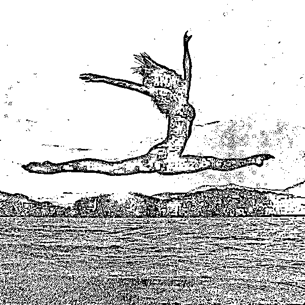

作者/杰夫·焦耳

译者/江艺 校对/王宏

2015 年 11 月 13 日火星进入天秤座，并将在此停留至 2016 年 1 月 3 日。火星上一次在天秤座运行是两年前，我们来重温杰夫·焦耳老师的旧文，检视一下自己较之两年前，是否有所成长呢？

火星来到天秤座

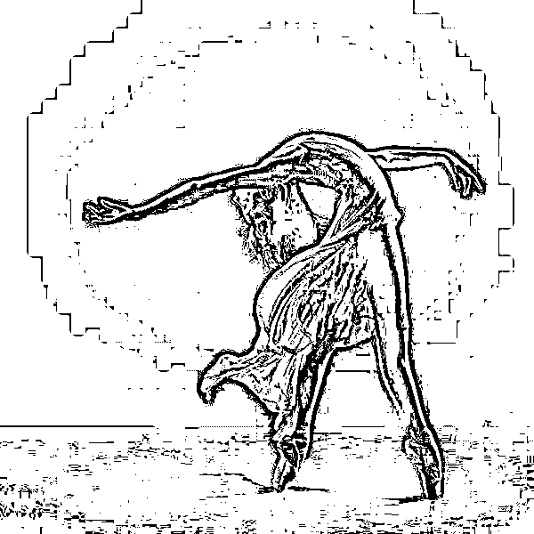

每颗行星都有其舒适地带，有与它的特质最契合的星座，也有与它的特质不那么契合的星座。例如，主动而果断的火星在白羊座、天蝎座（它守护的星座）及摩羯座（它在那里擢升）中会感觉安适自在。

● 行星的力量在这些给予它支持的星座中会得到增强，在这些星座中，它们的特性与星座的基本功能相契合。

● 而当一颗行星落在与其守护或擢升星座相对的星座中时，则被认为是受到了削弱。

火星进入天秤座在传统占星学的理论中就处于这种被削弱的位置。当火星在天秤座时，通过简单描述预期的困难来寻找简便的出路很有诱惑力。在这个亲切、随和、喜好寻求同伴且充满才智的星座中停留的七周里，火星的自发性、独立性、率直和激情都可能更难以展现。从传统占星学的视角来看，火星在天秤座是一个糟糕的位置。它削弱了这颗健壮行星的力量，暴露出粗糙的棱角，阻碍这个热爱和平的星座发展和谐。

这些观点虽然有其真实性，但是并没有完整表达出这一行进的意义和潜力。**将反差强烈的原则放在一起，当然会增加复杂性。**在诚实的同时保有社交敏锐度上的确非常具有挑战性。火星是战士，而天秤座是外交官，这种组合似乎注定要失败。制造战争和缔造和平显然是对立的。然而，**当我们能够在反差强烈的原则之间建立有益的联系时，我们便会产生促进重大突破的巨大能量。**

火星无论处在什么星座中，它仍旧是火星，即便它将战斗装置藏在蓬蓬裙之下。天秤座是美丽的街区，在那里，每个人的房屋都完美无瑕，草坪整齐，房间粉刷一新，视线所及毫无丑陋之处。粗暴的战士在这种如诗如画的环境中，感觉自己就像只野兽。他是教堂里的地狱天使，是产房中的地痞。

能量的消极运用

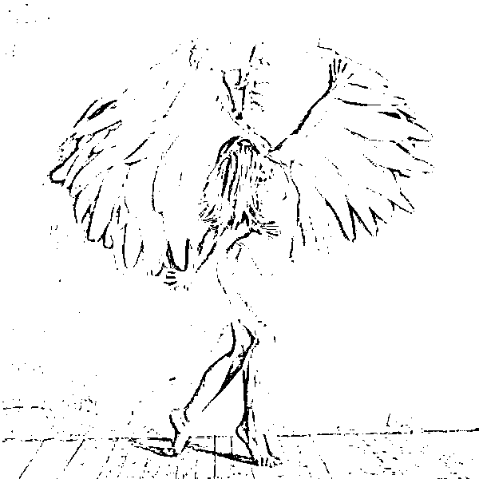 

**①消极攻击**

**消极攻击是火星在天秤座的一种令人遗憾的表现**。**因为愤怒被掩盖在微笑之下。**我们可以用操纵来伤害他人，而这种操纵是用来隐藏我们卑下的意图的。竞争的感觉或许被假装的合作所否认。

**②拒绝负责**

对这一行进的**另一种不当运用就是拒绝对自己的行为负责**。我们可能总想证明是别人让我们做出这样的行为，而不是我们自己造成的。如果天秤座的**犹豫不决强过了采取行动的渴望**，那么计划有可能会搁置。当我们否认自身的利益时，便会出现关于合作和对他人关爱的谎言和欺骗。然而，与其勉强认可一份列有将会持续七周的恐惧和挫败的列表，我们不如去寻找将有助于我们更有效地表达这种模式的意义。

能量的积极运用

  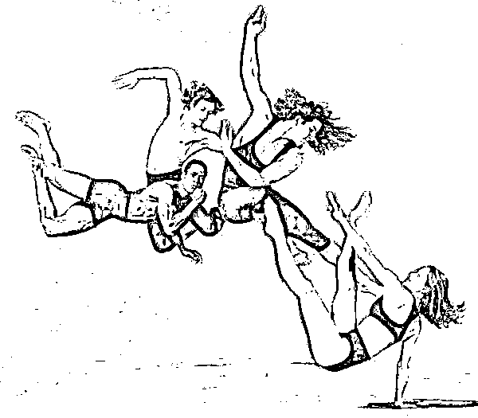

**①建立同盟**

火星在天秤座，**也是我们可以建立新的同盟或是乐意为保持当前同盟而战的时期**。在这里，力量邂逅优雅，革新遭遇艺术，交战双方、内部对立之间构筑起桥梁。讽刺的是，天秤座所寻求的和平与和谐常常需要火星的汗水和肌肉来维持。

事实上，**当我们真正强大的时候，我们才能在不迷失方向的同时做出妥协**。**我们可以寻求帮助，而不会感到无助，也可以去帮助他人，而不用自认高人一等**。天秤座也是关于平等的星座，这使得这一行进成为为正义而战的适当时机。

**②理智竞争**

**我们所假想的火星和天秤座的两极性掩盖了这样一个事实，即它们都与积极主动有关**。毕竟，天秤座是开始一个季节的基本星座，可能看似在抚慰人心，而本质上却是在与他人联合来实现特定目标。

**火星在天秤座时不用想象着好几个星期都会能量减弱且无力感增强**，火星在天秤座确实是理智和公平竞争的意识粉饰激情、缓和愤怒的时机。此时我们可以站在天秤座的天秤中央，优雅地走向任何一边。对他人需求和反应更为敏锐并不会成为幸福关系的障碍，而是通向更富有意义的关系的大门。

**也许火星在天秤座最大的价值就是意识到人生是一个互动过程**，**在这一过程中我们个人的特性与集体环境共存。我们不必独自划桨，筋疲力尽地去实现我们的目标；我们可以成为水手，知道如何御风而行，利用外部力量来实现更充实的旅程。**

* * *

**特别提醒：**希望将若道文章转载到各自公众号的朋友，**转载时请注明“转自若道微信公众平台”，并附上若道占星的 Logo**。谢谢！

**12 月 1 日****，**由**大卫**·瑞雷老师****主讲的****若道占星核心课程****[Level 4](http://mp.weixin.qq.com/s?__biz=MzA5NjA0NTAxNg==&mid=400203022&idx=2&sn=3518c0e8db3d8b01d99a055ff8c19869&scene=21#wechat_redirect)（点击可查看）****即将开课。**大卫老师会分别讲解如何通过出生星图进行性格分析********、爱情解读、事业分析。******了解**Level 4 课程**详情，请点击文末“**阅读原文**”。


# 顺势疗法治好了他的自闭症！

> 原文：[`mp.weixin.qq.com/s?__biz=MzA5NjA0NTAxNg==&mid=400921710&idx=2&sn=94af25e6399ca49525ddbd11dc61bbb1&chksm=02a726d935d0afcf3207c316c7fdfd9c6fd50d80bb4fd0f2040ef8b744b7f2fb620c5b26ad60&scene=126&sessionid=1692738907#rd`](http://mp.weixin.qq.com/s?__biz=MzA5NjA0NTAxNg==&mid=400921710&idx=2&sn=94af25e6399ca49525ddbd11dc61bbb1&chksm=02a726d935d0afcf3207c316c7fdfd9c6fd50d80bb4fd0f2040ef8b744b7f2fb620c5b26ad60&scene=126&sessionid=1692738907#rd)

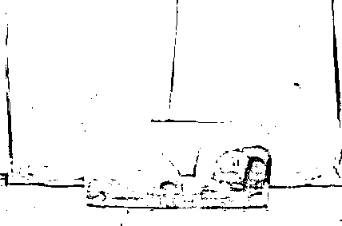 

来源/homeopathyplus 网站

译者/王宏

苏·汤普金斯老师将于 12 月 2 日开设“[顺势疗法家庭急救治疗及保健课程”](http://mp.weixin.qq.com/s?__biz=MzA5NjA0NTAxNg==&mid=400017180&idx=2&sn=845f6885f0197a6a97ea265d9bc638ab&scene=21#wechat_redirect)（点击可查看），今天分享的是一位患自闭症的男孩的故事。在接受顺势疗法 12 个月的治疗后，他已经改善到大部分人都不认为他有自闭症的地步。

**亚历克斯妈妈口述**

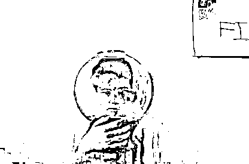 

我们于 2006 年 5 月开始使用顺势疗法。在此之前，我们已经节食过，吃过补充剂，试过脊椎按摩疗法——颅骨疗法。在进行任何干预之前，我的儿子患有严重的自闭症，他有着自闭症所有典型的标志、症状和行为特征。

在开始不含麸质、不含酪蛋白节食的 3 天内，我们有了眼神接触。而随着饮食的进一步改变，每加入一种新的补充剂，他便有了更进一步的改善。我们做了一些螯合作用，得到了更多的改善。他不再那么容易受到刺激，不怎么踮着脚走路了，还会说了很多话——可以指明物品并说出两三个词的短语，总体说来比我们刚开始时要好多了。

在进行了大约 16 个月的生物医学干预之后，我们开始了传统的顺势疗法，使用改善他体质的药物。在服用过头两剂之后，他实际上变得更加急躁。然而，在他服下第三剂 15 分钟之后（距离开始服药有一周的时间），他突然间改变了，变得更加平静，不再那么急躁。在他服下第三剂的两天里，我在日记中写道：“亚历克斯今天让人惊喜。”他在语言方面突飞猛进，既乐于倾听，也善于表达。他很平静。他学会了吹泡泡，突然间就会了，而我们之前一年都在试图让他吹泡泡，他一直都没学会。

他开始握我的手，之前他只会握我的一根手指。我们能带他去陌生的地方了，购物中心等地方，而他会握着我们的手，表现得就像一个正常的孩子一样。之前转变一直是巨大的问题，但突然间不再是问题了。我们能给他买新鞋并让他穿上新鞋了。对于他之前一直痴迷于的活动他变得不再那么痴迷了。

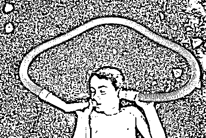 

这种药物让他的改善得以继续，而我们在他服下每一剂之后可以看到明显的改善。**在他需要服下一剂之前，他的状态会出现整体下滑，因此我们知道正是这种药物导致了那些改变。**随着时间的推移，我们需要改变剂量，之后又改换成其他药物。每次我们改变剂量或改换成新药物时，亚历克斯在语言、认知、行为等方面都会有非常明显的大幅进步。

**在进行顺势疗法治疗差不多 12 个月之后，亚历克斯已经改善到了大部分人都认为他没有自闭症的地步。**他在语言和其他技能方面仍有需要改进的地方，但已不再符合自闭症的标准。我相信正是顺势疗法使得他有了如此大的改善，然而我也相信，顺势疗法对我们来说效果会这么好是因为我们已经在开始顺势疗法之前通过节食和服用补充剂做了很多治疗工作。我相信脊椎按摩疗法——颅骨疗法也通过保持他所有的脉络、经络等通畅而对顺势疗法起到了帮助作用。

我们现在也将顺势疗法用于急救，例如说用于治疗发烧、肠胃不适、耳部感染和其他急性疾病。我们自从开始了顺势疗法之后就不必再用抗生素、扑热息痛、止疼药 Neurofen 这类东西了。

医师补充

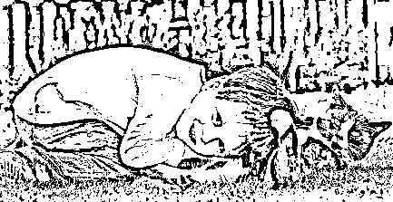

亚历克斯的妈妈在开始顺势疗法治疗两年后的报告中写道：“亚历克斯的状态非常好。他上个星期和他的几个朋友举办了他的‘第一次’生日聚会。他和他们每一个人打招呼，大声念他们送的卡片，在打开礼物时说：‘哇，非常感谢你们。’他非常尽兴。当所有人唱‘生日快乐’时，你真应该看看他的表情。这对我们来说是真正的里程碑，我们欣喜若狂。此外，我不知道其他家长是否知道亚历克斯曾患有自闭症，我认为他们很可能不知道。”

现在，亚历克斯是一个上了主流学校的快乐的小男孩，他最喜欢的就是忙于和自己的朋友们在一起。我仍然会根据亚历克斯的进展来不定期地为他做检查，并为他治疗会困扰所有成长中的男孩的咳嗽、感冒和擦伤。他不再被看作自闭症患者。

**其他顺势疗法的案例在下面哦：**  

[这个婴儿频繁夜惊、惧怕男性，现在都好了](http://mp.weixin.qq.com/s?__biz=MzA5NjA0NTAxNg==&mid=400901918&idx=2&sn=2c39821aa322bddc9d12dc6c8b128556&scene=21#wechat_redirect)

[不用再手术，肾结石轻松搞定！](http://mp.weixin.qq.com/s?__biz=MzA5NjA0NTAxNg==&mid=400879915&idx=2&sn=71944f0c596042332924e0de8c7bcf63&scene=21#wechat_redirect)

[它帮助抚平心理创伤和悲痛](http://mp.weixin.qq.com/s?__biz=MzA5NjA0NTAxNg==&mid=400858503&idx=2&sn=8ed07f16cdc736af776dce34aa9232cd&scene=21#wechat_redirect)

[50 年的鼻窦炎好了！](http://mp.weixin.qq.com/s?__biz=MzA5NjA0NTAxNg==&mid=400750777&idx=2&sn=e5dba7e9508a9ed7ec0dd18d445182c9&scene=21#wechat_redirect)

[一瓶药丸治好了困扰我四年的各种病症](http://mp.weixin.qq.com/s?__biz=MzA5NjA0NTAxNg==&mid=400555588&idx=1&sn=9d860beaa15bc1b9e6c627e1d3369afa&scene=21#wechat_redirect)

[妈妈心声 | 为了宝宝，我选择顺势疗法](http://mp.weixin.qq.com/s?__biz=MzA5NjA0NTAxNg==&mid=400490938&idx=2&sn=9ae026781f9119936ade05b2dc66655f#wechat_redirect)

[过敏、扭伤、关节炎、痛经、宠物疾病……全搞定！](http://mp.weixin.qq.com/s?__biz=MzA5NjA0NTAxNg==&mid=400260655&idx=1&sn=854005f3b4c5846959ece35907a94dba&scene=21#wechat_redirect)

* * *

**特别提醒：**希望将若道文章转载到各自公众号的朋友，**转载时请注明“转自若道微信公众平台”，并附上若道占星的 Logo**。谢谢！

**2015 年 12 月 2 日，**由**苏**·汤普金斯老师****亲授的**顺势疗法课程即将开课**。******顺势疗法**是目前全球使用最广泛的自然医学疗法，**对个体的身体、精神和情绪三个层面进行治疗，加强个体自身免疫力，提升个体生命能量**。本课程为那些想要增加自我和家庭身体保健和疗愈能力的人所设置。****欲详细了解，请点击文末“**阅读原文**”。


# 海王星在双鱼座 | 我们终将踏上自己的疗愈之旅

> 原文：[`mp.weixin.qq.com/s?__biz=MzA5NjA0NTAxNg==&mid=400901918&idx=1&sn=a2b00a4ec1130e4c4d6bf08b4f133d53&chksm=02a7f5a935d07cbf04211d681162498bca343a4ec61487b7fa6f7026d0470dcd1f5337036245&scene=126&sessionid=1692738907#rd`](http://mp.weixin.qq.com/s?__biz=MzA5NjA0NTAxNg==&mid=400901918&idx=1&sn=a2b00a4ec1130e4c4d6bf08b4f133d53&chksm=02a7f5a935d07cbf04211d681162498bca343a4ec61487b7fa6f7026d0470dcd1f5337036245&scene=126&sessionid=1692738907#rd)

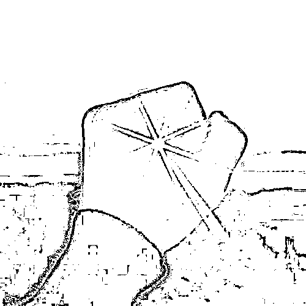

作者/大卫·瑞雷

译者/李含 校对/江艺

海王星于 2011 年 4 月~8 月初入双鱼座，2012 年 2 月正式进入双鱼座，经过来来回回的逆行，今晨再次在 7 度 1 分恢复顺行。许多双鱼座早期出生的人或者有个人行星或点在变动星座（双子座、处女座、射手座、双鱼座）的人，可能已经感受过双鱼座行进的影响了。你经历了什么，又有什么感悟呢？欢迎大家跟我们分享！这里，大卫给我们带来了一个双鱼座海王星故事。

海王星之梦

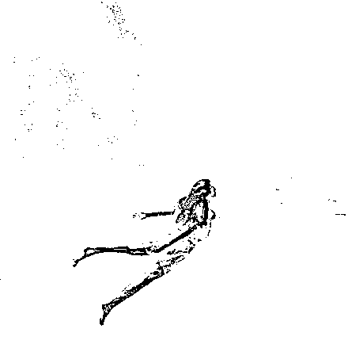

海王星是梦想之星，这里的梦想既包括真正的梦境，也包括在人生之中激励我们前行的梦想与蓝图。有关睡眠的研究表明，如果我们没有经历“眠梦期”就会很快从疲劳之中生出幻觉。所以做梦能让我们保持心理健康。灵感的启迪同样如此。人们会为了梦想奋不顾身，所作所为常常是他人“做梦都不敢想象的事情”。

当然，并不是我们所追求的每一个梦想都能 “梦想成真”，如愿以偿。因此，做梦的风险就是“梦想幻灭”。难以承受的幻灭之痛让我们倍感迷茫和空虚。我们将责备自己不切实际。然而怎么才算明智呢，做梦，还是不做梦？那些理想幻灭的人有可能再次做梦，被眼泪洗过的人生蓝图可能更有一番全新的色彩跃动其上。我们必须保持开放的心态，接受重新燃起的灵感之火，不论发生过什么，都能够原谅自己和他人。

在过去的 40 多年里，我看到了无数的客户以鼓舞人心的方式回应海王星的行进。

**个人选择以何种方式回应海王星的行进不仅会影响我们自己的生活，同样也会影响他人的生活。即使是处于天王星的混乱与冥王星的焦灼之中，在它自己守护的星座里的海王星，也能给我们的生活带来更多的启迪和激励。**客户的海王星故事

在这里我分享一位客户的经历，她的故事是自 2011 年 4 月海王星进入双鱼座之后，我听到的最生动的双鱼座海王星的故事了。征得了她的同意，我在这里和大家分享她的星图和故事。

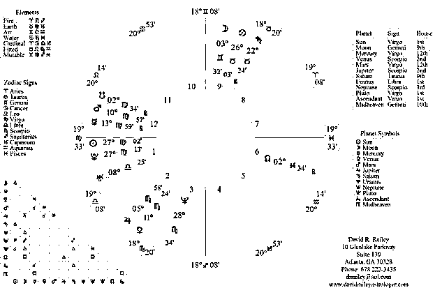 

看到她的星图，你一定会被她的群星处女座所震惊，她的太阳、上升以及月亮南交点都在处女座。处女座是双鱼座对面的星座，所以乍看之下你可能会认为她的星盘对于海王星和双鱼座能量并不友好。但很快你就注意到她有 3 个点落入 12 宫，其中两颗是个人行星——水星和火星，另外，她的北交点也落在双鱼座。

然而，对处女座的强调让她靠组织才能赚钱谋生。事实上，她成功地经营了一家活动策划公司，主要业务有婚礼策划、犹太人的成年礼庆祝活动以及一些社团活动。她自己创办了这家公司，符合太阳与冥王星合相在第一宫（自我之宫）的特征。同时，日冥合相的她“组织严谨”，颇有一副公司老板的形象，这意味着她会“掌控全局”。她对工作充满热情，是一个完美主义者。她的丈夫比她年长 21 岁；他们没有自己的子女——但她的丈夫在前一段婚姻中有 3 个已成年的子女。

我已经多年没有见过这位客户，她一进来咨询，我就说起她的海王星行进来。她来之前，我注意到她的星图中行进的海王星合相她的北交点，四分她的月亮，这些行进从去年开始，还将持续下去。所以，我开门见山地说，她的人生观将会发生重大改变，她的观念和态度很可能会趋于柔和。我告诉她，她正面临的挑战是以更加慈悲的态度宽恕他人，尤其是在复杂、敏感，或者不和睦的家庭环境中。我提醒她，她在工作上也会受到类似影响，她要学着体谅、同情她的雇员们。我还提到，她正处于一个极具创造力、令人兴奋的人生阶段，需要创造性的表达途径。

她点头称是，说自己正在学习让某些员工拥有更多的细节决定权（对于日冥合相在处女座的人来说，这真是一项艰巨的任务），这样她就能在工作中发挥更多的创意。她还提到，她有强烈的表达冲动，希望多写一些东西，在写作中表现出更多创意（月亮双子座）。

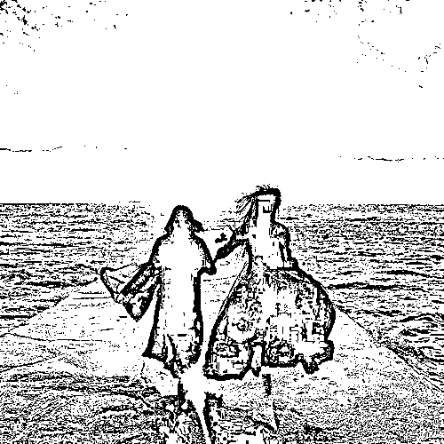 

接下来她就给我讲了那个最神奇的故事。她丈夫最小的女儿，现在已经 32 岁了，她天生就患有“唐氏综合症”和“妥瑞症”。我的客户和她的丈夫为了与他的前妻争夺这位发育严重迟缓的女儿的抚养权问题诉诸法庭，小女儿因为他的前妻的虐待而日渐消瘦。在他们最终赢得监护权时，女儿已经濒临死亡，体重只有 70 磅。

我这位客户的丈夫的北交点也落在双鱼座，他们夫妇俩的干预行为富有戏剧性，怀着深深的爱，投入了巨大的时间和财力，治疗这位疏于照顾的可怜女儿。她的体重渐渐增加，她学会了走路和说话。他们甚至带她去爬山！这一切都是从 2011 年 5 月开始的！这个奇迹般的真实故事还在延续。

参与继女的治疗让我这位客户和她的丈夫都感觉精疲力竭，日复一日的付出耗时又耗力。此外，我的客户还告诉我，她的继女有一个可怕而不受控的习惯，就是随时随地都在吐痰，几乎所有物品上都有她的痰迹。我听到这里，十分震惊，想象着她一个群星处女座的人怎么能够忍受有人在她干净、整洁、井井有条的家中乱吐口水！而且是每一天！

然而正因如此，她发现了生活的另一片领域，那是爱与慈悲，她和丈夫竭尽所能地努力寻找正确的治疗方案，帮助女儿建立有质量的生活。与这位续女之前遭遇的虐待相比，这简直就是奇迹。这就是海王星，奇迹之星。

我的客户在咨询中继续说，现在她感觉自己的灵魂已然重塑，继女的困境让她敞开了心扉。她补充道，继女的生存的抗争鼓舞着她。“她的心灵如此纯净，”她说，“我从她的双眼中看到，她的灵魂如此纯粹。她所需要的只有爱。”

海王星会在双鱼座一直停留到 2026 年，并且将多次对冲这位客户的处女座群星。然而现在，她已经踏上了慈悲之路——这是海王星的道路。我敢肯定，接下来的路上会有挑战，也会有启迪。 

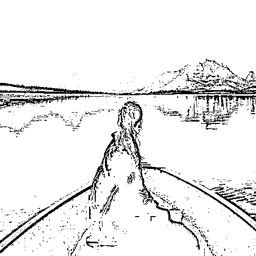 

**你的愿景是什么？**

这位客户的故事远没有结束，但她回应海王星行进的方式美妙得让人赞叹。她的故事告诉我们海王星在双鱼座意味着什么，以及将给每个人的生活带来什么样的影响。天堂不仅仅是一个有着阳光沙滩棕榈树的岛屿，它也是一个充满悲悯的岛屿，在那里我们每一个人的意识与行为中都满怀同情。

海王星还将在双鱼座停留很久。你希望自己的人生有怎样的风景呢？你希望生活在怎样的世界里呢？**海王星赋予我们一个人生的愿景。如果你正在经历海王星的行进，那么敞开心扉拥抱你的愿景，不论这愿景是什么，都开始生活于其中。**

记住，**海王星让我们学着与自己的灵感共舞**。我们在游泳，却不是在河流或海洋之中。我的老师曾经告诉我，如果你不理会大海，就很可能会葬身鱼腹。相比我们，海洋是那般宽广无垠，轻易将我们吞没。如果不与海王星“合作”，我们可能就被淹没，或是在生活的迷茫与紊乱之中挣扎。**海王星的行进往往都预示着一段疗愈的时期，在这段时间，经历幻灭，人生的新视野将会渐渐清晰起来。**我们所有人都将踏上属于自己的疗愈之路。

**更多海王星话题的传送门：**

[海王星在双鱼座 | 让梦想成为日常生活的一部分](http://mp.weixin.qq.com/s?__biz=MzA5NjA0NTAxNg==&mid=400879915&idx=1&sn=1419ccda08a7fae41e606b18b242d603&scene=21#wechat_redirect)

[那些行星教我们的事：海王星篇](http://mp.weixin.qq.com/s?__biz=MzA5NjA0NTAxNg==&mid=200719857&idx=1&sn=e3b98a9b6e28fede5f68b6bdbc084088&scene=21#wechat_redirect)

[海王星：你以为她只会给你带来幻灭？](http://mp.weixin.qq.com/s?__biz=MzA5NjA0NTAxNg==&mid=208123327&idx=2&sn=cab0323804252b053a584bbafc0f442c&scene=21#wechat_redirect)

[海王星在双鱼座：对自己悲悯](http://mp.weixin.qq.com/mp/appmsg/show?__biz=MzA5NjA0NTAxNg==&appmsgid=10014618&itemidx=1&sign=2392dfc1b555b0cac6250077cc5df21e#wechat_redirect)

* * *

**特别提醒：**希望将若道文章转载到各自公众号的朋友，**转载时请注明“转自若道微信公众平台”，并附上若道占星的 Logo**。谢谢！

**跟随大卫老师疗愈自己！12 月 1 日****，**由**大卫**·瑞雷老师****主讲的****若道占星核心课程****[Level 4](http://mp.weixin.qq.com/s?__biz=MzA5NjA0NTAxNg==&mid=400203022&idx=2&sn=3518c0e8db3d8b01d99a055ff8c19869&scene=21#wechat_redirect)（点击可查看）****即将开课。**大卫老师会分别讲解如何通过出生星图进行性格分析********、爱情解读、事业分析。******了解**Level 4 课程**详情，请点击文末“**阅读原文**”。


# 顺势疗法 | 这个婴儿频繁夜惊、惧怕男性，现在都好了

> 原文：[`mp.weixin.qq.com/s?__biz=MzA5NjA0NTAxNg==&mid=400901918&idx=2&sn=2c39821aa322bddc9d12dc6c8b128556&chksm=02a7f5a935d07cbf52651c84f9bf13fd06456beaba85f95ca4c1ceaa3ec283a687dcbf4998cd&scene=126&sessionid=1692738907#rd`](http://mp.weixin.qq.com/s?__biz=MzA5NjA0NTAxNg==&mid=400901918&idx=2&sn=2c39821aa322bddc9d12dc6c8b128556&chksm=02a7f5a935d07cbf52651c84f9bf13fd06456beaba85f95ca4c1ceaa3ec283a687dcbf4998cd&scene=126&sessionid=1692738907#rd)

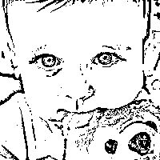 来源/homeopathyplus 网站

译者/王宏

苏·汤普金斯老师将于 12 月 2 日开设“[顺势疗法家庭急救治疗及保健课程”](http://mp.weixin.qq.com/s?__biz=MzA5NjA0NTAxNg==&mid=400017180&idx=2&sn=845f6885f0197a6a97ea265d9bc638ab&scene=21#wechat_redirect)（点击可查看），今天推荐给大家的是一个小婴儿的故事，她在长牙那段时间睡眠极其糟糕，另外她还有很多恐惧：怕穿深色衣服的男人、怕吸尘器、怕电梯等密闭空间……这些问题在她接受了顺势疗法治疗后都得到了解决。

**泰勒妈妈口述**

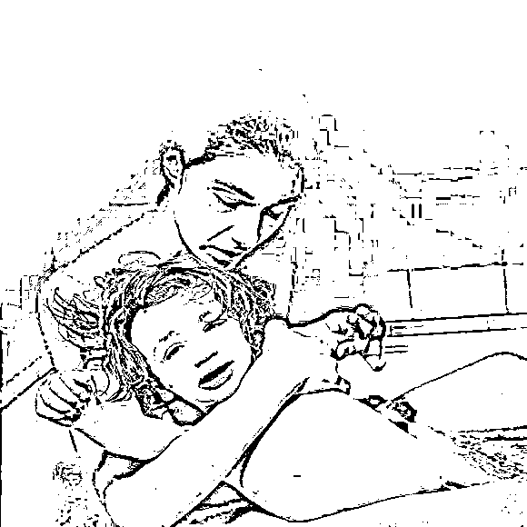 

我在几个月前因为 10 个月大的女儿的缘故，第一次去拜访了顺势疗法医师，当时我几乎被剥夺了睡眠，她是我们的第一个孩子。

她**睡眠一直不太好**，但在 5 个月大的时候情况变得更加糟糕。除此之外，她是个健康的小女孩。尽管她的**夜惊**已经得到了前一位顺势疗法医师的治疗，但她仍有着让人无法忍受的睡眠模式，特别是在她长牙这段可怕的时间前后。

她还有许多不同寻常的恐惧：她**惧怕真空吸尘器、电梯这类的密闭空间**，**以及除她父亲之外的所有男性——而如果他们穿着深色衣服的话情况会更糟。**

至于她的睡眠，或者说是缺乏睡眠，她在晚上可以轻易入睡，但无法一直安睡。**她首先会在午夜醒来，之后每小时醒一次，在整点时刻醒来。**

这种醒来会随着夜晚的持续而升级，她一次比一次更难安抚。我总是会感觉完全筋疲力尽，她最后会睡在我们的床上，这样我至少可以睡上几个小时。

现在，我可以坦诚地说，**经过了几个月的顺势疗法治疗，结果好得出乎意料。**

她看起来不再惧怕男性——无论他们是否穿深色衣服，她对着真空吸尘器大笑，当我们在电梯里时她会和陌生人聊天。她长牙时还会有些问题，但情况要好得多了。其中的一些改变在药物给出的几小时内或几天内就会发生，但最大的不同是她的睡眠。她每晚仍然平均要醒来两三次，我可能需要起来给她找奶嘴来安抚她，或是拍拍她，但我基本不用抱她起来，她通常会自己再次入睡。这真是太神奇了！

H.B.

新南威尔士

澳大利亚

医师点评

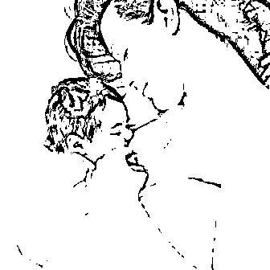 

这个小女孩所陷入的睡眠模式是我在一个婴儿身上所看到过的最糟糕的睡眠模式之一。她的母亲睡眼惺忪地努力保持清醒，而她的父亲无法再应对自己在缺乏睡眠的同时要完成工作任务的局面。他们认为必须要做些什么。

在咨询过程中我发现，除了她母亲在报告中所提及的种种问题，泰勒还有这些症状：

● 长期饱受水样酸性大便的折磨，这样的大便让她的臀部起了尿布疹

● 对其他婴儿有着不同寻常的兴趣

● 倾向于对她的母亲专横且要求多——甚至到了打她的地步

● 喜欢待在外面享受新鲜的空气，在她沮丧时这可以迅速安抚她

● 在她的后颈处长了豌豆大小的腺体

● 喜欢成为别人关注的焦点，尽管最初很羞涩

● 总是撅着屁股睡，或是趴着睡

几种药物适应于这些不同的症状和特性。

一种对应夜间的不安和酸性大便，另一种对应她的羞涩以及惧怕男性和陌生人，还有一种对应她对婴儿的着迷和她对自己母亲的专横的行为，还有对应她出牙时的麻烦和对噪音的敏感的。该怎么办呢？

很简单。我开了一个药方，这个药方看起来是最匹配，泰勒对该药方的最初反应会成为后续治疗的指导方针。

**3 天后我接到了泰勒妈妈的电话。泰勒平静了很多，不那么黏人了，一次也没有“崩溃”过，最好的消息是，她的睡眠好了很多。**这是一个良好的开端，因此我们继续使用了那一药物。

**在接下来的几个月里，泰勒的所有问题要么得到了显著的改善，要么就消失了**。她不断变化的症状模式需要定期更改匹配的药物，但令人吃惊的是，并不总是需要换在最开始看起来非常匹配的那些药物中的某一种。

现在，我很高兴地说，泰勒的家人目前有了更多的睡眠。她的妈妈仍然会在需要顺势疗法治疗时把她带来，而她的健康状况不断得到好转。

弗兰·谢菲尔德

顺势疗法医师

2011 年 4 月 29 日

**注：**

顺势疗法是一种安全的医疗体系，因此在难以做出选择的情况下同时给出几种药物可能看似是合理的，但这可能适得其反，尤其是在治疗慢性问题时。这可能扰乱症状情况（和开处方者），延缓治疗进程。出于这个原因，开出单一的处方是解决深层次问题的最佳方式。之后分析此人对药物的反应会很容易，以便在如何继续治疗方面做出明确的决定。如果症状因一次给出过多的药物而变得模糊不清，那就无法做出明确的决定了。

**其他顺势疗法的案例在下面哦：**  

[不用再手术，肾结石轻松搞定！](http://mp.weixin.qq.com/s?__biz=MzA5NjA0NTAxNg==&mid=400879915&idx=2&sn=71944f0c596042332924e0de8c7bcf63&scene=21#wechat_redirect)

[它帮助抚平心理创伤和悲痛](http://mp.weixin.qq.com/s?__biz=MzA5NjA0NTAxNg==&mid=400858503&idx=2&sn=8ed07f16cdc736af776dce34aa9232cd&scene=21#wechat_redirect)

[50 年的鼻窦炎好了！](http://mp.weixin.qq.com/s?__biz=MzA5NjA0NTAxNg==&mid=400750777&idx=2&sn=e5dba7e9508a9ed7ec0dd18d445182c9&scene=21#wechat_redirect)

[一瓶药丸治好了困扰我四年的各种病症](http://mp.weixin.qq.com/s?__biz=MzA5NjA0NTAxNg==&mid=400555588&idx=1&sn=9d860beaa15bc1b9e6c627e1d3369afa&scene=21#wechat_redirect)

[妈妈心声 | 为了宝宝，我选择顺势疗法](http://mp.weixin.qq.com/s?__biz=MzA5NjA0NTAxNg==&mid=400490938&idx=2&sn=9ae026781f9119936ade05b2dc66655f#wechat_redirect)

[过敏、扭伤、关节炎、痛经、宠物疾病……全搞定！](http://mp.weixin.qq.com/s?__biz=MzA5NjA0NTAxNg==&mid=400260655&idx=1&sn=854005f3b4c5846959ece35907a94dba&scene=21#wechat_redirect)

* * *

**特别提醒：**希望将若道文章转载到各自公众号的朋友，**转载时请注明“转自若道微信公众平台”，并附上若道占星的 Logo**。谢谢！

**2015 年 12 月 2 日，**由**苏**·汤普金斯老师****亲授的**顺势疗法课程即将开课**。******顺势疗法**是目前全球使用最广泛的自然医学疗法，**对个体的身体、精神和情绪三个层面进行治疗，加强个体自身免疫力，提升个体生命能量**。本课程为那些想要增加自我和家庭身体保健和疗愈能力的人所设置。****欲详细了解，请点击文末“**阅读原文**”。


# 海王星在双鱼座 | 让梦想成为日常生活的一部分

> 原文：[`mp.weixin.qq.com/s?__biz=MzA5NjA0NTAxNg==&mid=400879915&idx=1&sn=1419ccda08a7fae41e606b18b242d603&chksm=02a6439c35d1ca8ae3cca59dd78935438e732686d175ecba1ddc1c657643a2801de2d86126de&scene=126&sessionid=1692738907#rd`](http://mp.weixin.qq.com/s?__biz=MzA5NjA0NTAxNg==&mid=400879915&idx=1&sn=1419ccda08a7fae41e606b18b242d603&chksm=02a6439c35d1ca8ae3cca59dd78935438e732686d175ecba1ddc1c657643a2801de2d86126de&scene=126&sessionid=1692738907#rd)

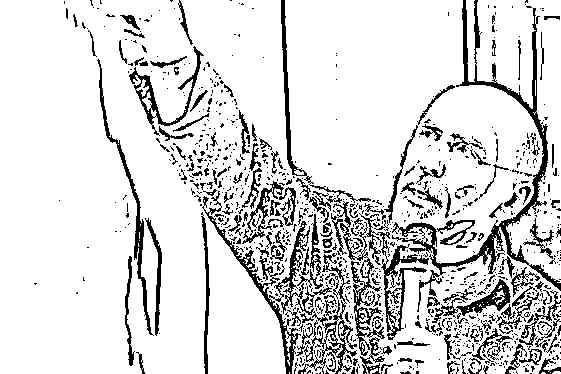

作者/杰夫·焦耳

译者/江艺 校对/一一、王宏

图片来源/花瓣网

**北京时间 2015 年 11 月 19 日**00:32，逆行的海王星终于恢复在双鱼座的顺行**，并会一直在双鱼座停留到 2026 年 1 月。许多占星师都对海王星在双鱼座发表过自己的见解，其中就有已故的著名占星师杰夫·焦耳。海王星确实有其黑暗面，不过在这篇写于 2012 年的文章中，杰夫·焦耳是从海王星与梦想、情感的关联解读它，提醒我们运用海王星的正面力量，即便在面对困难的行进时也是如此，这会为我们带来觉知和礼物。**

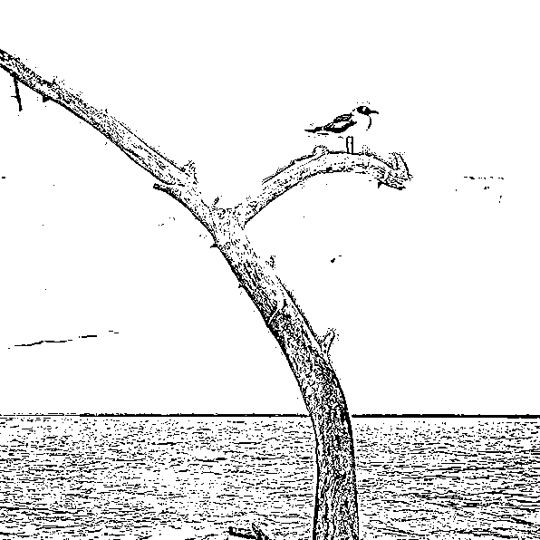

面对困难行进的两种态度

占星师们对各颗行星的意涵持有根本一致的看法。那些看得见的行星，从太阳一直到土星，两千多年以来一直被人们观测、解读，并被整理成一个体系。即使是那些在望远镜发明之后才被发现的行星——天王星、海王星和冥王星，人们对它们的意涵也持基本一致的看法。还有一些新近加入我们太阳系的行星，如凯龙星，也被一些从业者纳入他们的工作中。然而，对各颗行星，占星师们都有各自的评判，他们会偏好某些行星，而惧怕另一些。

例如土星，传统认为这是一颗会带来困难的行星，代表界限和限制。当它与出生星图中的行星形成困难相位，从而激活星图的时候，许多人都将这种情况主要看作是负面的，然而另一些人却强调这一事件蕴含丰富的创造性潜能。虽然这种解读的差异性部分取决于个人星图的不同，然而在很大程度上，也反映出占星师各自的观点。**我的一位同事强调在困难行进发生时，如何对问题做出防御，而我却常常鼓励大家参与其中，设法将痛苦转化为觉知。**

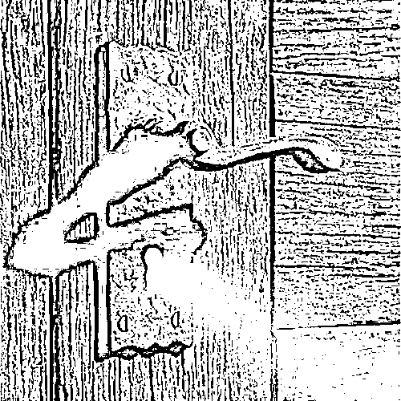

海王星在双鱼座的讯息

海王星是梦想之星、信仰之星、幻想之星和灵性之星，它所在的星座描述了我们在何处表达自身的最高愿望以及能如何用不切实际的期盼迷惑自己。海王星不太容易将我们更高层次的自我与物质现实联结起来，这似乎有些令人沮丧。

不过当海王星在双鱼座，从正面的意义来说，是**将信念和感觉联结起来，帮助我们消融彼此之间的界限，创造一个更加充满关爱的世界**。这对于形而上的探索、灵性工作、慈善和创造性的想象力来说是理想的。

与毫无梦想相比，去梦想一个更加美好的世界会更为健康。**让梦想成为你日常生活的一部分。**允许想象力驱动自由意志无疑会将我们带到一些不切实际的地方去，但是正是对我们内心和思想创造的信念才能将天堂带到人间。

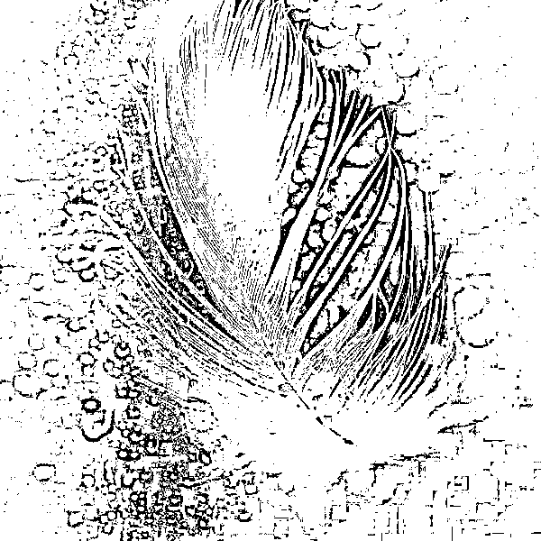

困难海王星行进的正面表达

我在中国时，经历了一件绝妙的事情，**原来可能会带来不良影响的行进以令人出人意料的积极方式表现出来**。我现在还在令人惊叹的中国北京，我已将其视为纽约广场。这座拥有两千万人口的城市似乎永远在新与旧、简单和奢华的交替中不断前行。

● 这趟教学之旅的主办者是一位亲切的天秤座人，他的月亮在爱冒险的射手座，对于一位生活在遥远国度的美国人来说，这是一个很合适的配置。**当时，代表梦想和幻想的海王星，正与他出生时的月亮形成非常具有挑战性的 90 度四分相。**

● 我在这里还遇见了另一位访问占星师，她是一位来自丹麦的可爱的双子座女士，**同样也在经历月亮与迷蒙的海王星之间的四分相。**

**从占星原理来说，我或许可以认为她或我的东道主此刻正经历迷失、困惑、高度敏感和妄想，然而事实似乎并非如此。**

**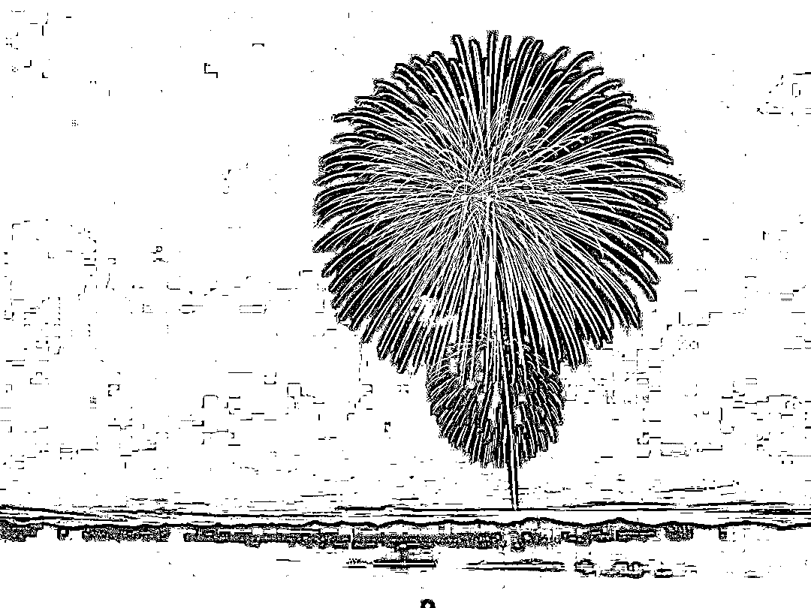** 

**比起在海王星的迷雾中徘徊，这颗行星的想象力和直觉力可以显露在最受人瞩目的地方。**

主办人夫妇、我，还有我的妻子要从我们的酒店乘坐漫长的地铁到巨大的潘家园市场。我们本应给丹麦朋友打电话，约定时间和具体的会面地点，然后见面，但却一直打不通她的电话。在潘家园很难找人，因为那儿就像一个最大的跳蚤市场，简直是人山人海。我们朝那儿走去，觉得一整天都不会找到我们的丹麦朋友。

然而就在我们四人到达那个市场的地铁站台时，我们的丹麦朋友面带着微笑突然出现在我们面前。在一个拥有两千万人口的城市中，没有约定会面的地点和时间，然而她就在一个完美的时刻出现了。早两分钟或晚两分钟，或者离我们有 100 码的距离，都不可能看到彼此。**充满直觉的海王星，梦幻般的、让人昏昏欲睡又迷迷糊糊的海王星实施了自己的魔法，让我们相遇了。**

这个故事的关键之处在于**每个占星格局（无论是在出生星图中还是在行进图中）都可以用多种方式来表达**。

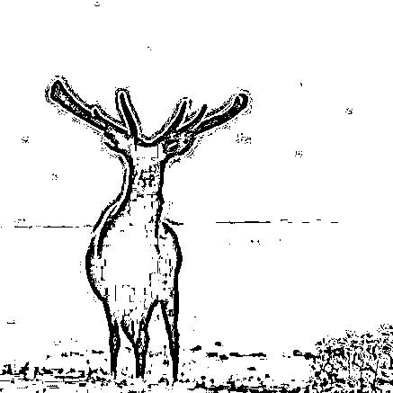 

“亲爱的勃鲁托斯，那错处并不在我们的命运，而在我们自己。”愿莎士比亚的话时刻给我们警示，**当我们和宇宙保持一致时，即便最困难的行进也能激发令人满意的经历**。地铁站的神奇会面之后，我们一起用了五个小时来探索这个巨大的、奇丽的市场，而神圣的海王星则是我们的向导。

**杰夫·焦耳更多海王星话题的传送门：**

[那些行星教我们的事：海王星篇](http://mp.weixin.qq.com/s?__biz=MzA5NjA0NTAxNg==&mid=200719857&idx=1&sn=e3b98a9b6e28fede5f68b6bdbc084088&scene=21#wechat_redirect)

[海王星：你以为她只会给你带来幻灭？](http://mp.weixin.qq.com/s?__biz=MzA5NjA0NTAxNg==&mid=208123327&idx=2&sn=cab0323804252b053a584bbafc0f442c&scene=21#wechat_redirect)

[海王星在双鱼座：对自己悲悯](http://mp.weixin.qq.com/mp/appmsg/show?__biz=MzA5NjA0NTAxNg==&appmsgid=10014618&itemidx=1&sign=2392dfc1b555b0cac6250077cc5df21e#wechat_redirect)

* * *

**想了解更多占星学知识吗？12 月 1 日****，**由**大卫**·瑞雷老师****主讲的****若道占星核心课程[Level 4](http://mp.weixin.qq.com/s?__biz=MzA5NjA0NTAxNg==&mid=400203022&idx=2&sn=3518c0e8db3d8b01d99a055ff8c19869&scene=21#wechat_redirect)（点击可查看）****即将开课。**大卫老师会分别讲解如何通过出生星图进行性格分析********、爱情解读、事业分析。******了解**Level 4 课程**详情，请点击文末“**阅读原文**”。


# 顺势疗法 | 不用再手术，肾结石轻松搞定！

> 原文：[`mp.weixin.qq.com/s?__biz=MzA5NjA0NTAxNg==&mid=400879915&idx=2&sn=71944f0c596042332924e0de8c7bcf63&chksm=02a6439c35d1ca8a851ad9f7d57091cda0c0646c3a882fc6b75d1c6291b86cbd90f8dfef33eb&scene=126&sessionid=1692738907#rd`](http://mp.weixin.qq.com/s?__biz=MzA5NjA0NTAxNg==&mid=400879915&idx=2&sn=71944f0c596042332924e0de8c7bcf63&chksm=02a6439c35d1ca8a851ad9f7d57091cda0c0646c3a882fc6b75d1c6291b86cbd90f8dfef33eb&scene=126&sessionid=1692738907#rd)

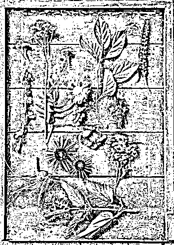 

来源/homeopathyplus 网站

译者/江艺 校对/王宏

苏·汤普金斯老师将于 12 月 2 日开设“[顺势疗法家庭急救治疗及保健课程”](http://mp.weixin.qq.com/s?__biz=MzA5NjA0NTAxNg==&mid=400017180&idx=2&sn=845f6885f0197a6a97ea265d9bc638ab&scene=21#wechat_redirect)（点击可查看），今天推荐给大家的是科尔斯顿的故事，她在经历了 15 次痛苦的肾结石手术后终于遇到了顺势疗法，这为她带来的一系列的惊喜，治愈和改善的不仅仅是肾结石。

科尔斯顿的故事

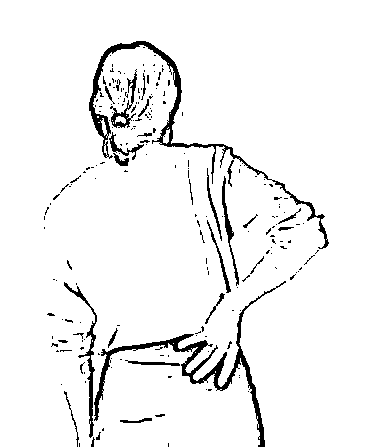 

我从 17 岁起就患上了复发性肾结石，为了治疗我这种罕见的疾病，我大约每 18 个月就需要做一次大手术。

我曾尝试过许许多多不同类型的治疗，既有自然疗法也有传统疗法，还曾拜访过许多“专家”，以试图阻止结石的生长，或至少让它们长得慢一点。我真的已经放弃寻找能够帮助我的人了，但我听说有一位顺势疗法医师正做着一些神奇的事。虽然我非常怀疑，但我想我还是应该最后尝试一次。

我刚做完了我的第十五次手术，这次手术所引起的并发症给我带来了极大的痛苦，而且还有一些小结石留在了我的左肾里，需要在六月前后做手术。虽然我每天喝 3 至 4 升水，但我 9 年来从未排出过一颗结石。

**在我进行了第一次顺势疗法治疗之后，我注意到自己身上许多其他的毛病得到了极大的改善，例如月经不调、肠易激综合症、便秘、害怕冲突和其他许多症状。我的婚姻也有了惊人的改善**，因为现在我能够更有效地沟通。

**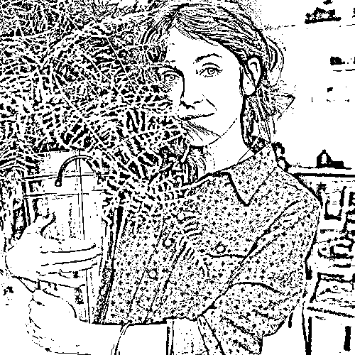**

**我的性欲也增强了**（这或许也对我的婚姻有帮助！）**我肾脏的疼痛减轻了，每天我能够做比以前多得多的事情**，因为我的能量水平有了极大的提升。如果这还不够，**我在****4 周之内排出了 4 颗结石，并且直到现在仍会偶尔排出结石！**

前几天我去做了常规的 X 光检查。通常情况下，手术后 4 个月预计我的右肾中会有一些 5 毫米的结石，左肾中会有一些 15 毫米或是更大的结石。而这一次的**X 光显示，只有一颗 6 毫米的结石在我的左肾中（因为我已经排掉了其他的结石），而且这颗结石完全没有变大**。X 光显示我的右肾中只有一颗 4 毫米的小结石。太神奇了！

我无法相信几滴特殊的液体可以有如此惊人的效果。我非常感谢我的顺势疗法医师让我和我的家人重新迎来我美妙的人生！

科尔斯顿

来自澳洲新南威尔士

医师点评

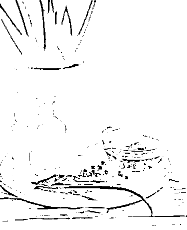 

顺势疗法根据身体不适者独特的症状情况来治疗——不仅仅是他们所称的那些疾病。顺势疗法医师的工作是将病人的精神、情绪和身体状况结合起来，选择与其症状最为匹配的药方，该药方会刺激身体的自愈能力，在整体上改善健康状况。

当科尔斯顿第一次写下这篇文章来描述她身上所发生的事情时，她正处于治疗初期。不久之后，她搬往别处，而我现在与她失去了联系。在她离开之前，我建议她再找一位顺势疗法医师，因为虽然早期的改善非常迅速，但仍然有更多的工作需要去做，持续治疗会继续改善她的健康状况，肾结石也更不容易复发。

弗兰·谢菲尔德

顺势疗法医师

**想了解更多案例，请戳下列文章：**

[顺势疗法 | 它帮助抚平心理创伤和悲痛](http://mp.weixin.qq.com/s?__biz=MzA5NjA0NTAxNg==&mid=400858503&idx=2&sn=8ed07f16cdc736af776dce34aa9232cd&scene=21#wechat_redirect)

[50 年的鼻窦炎好了！](http://mp.weixin.qq.com/s?__biz=MzA5NjA0NTAxNg==&mid=400750777&idx=2&sn=e5dba7e9508a9ed7ec0dd18d445182c9&scene=21#wechat_redirect)

[孕妈选对药方，保护了自己和宝宝](http://mp.weixin.qq.com/s?__biz=MzA5NjA0NTAxNg==&mid=400721730&idx=2&sn=3b907efec5851b08f1fc3e74be31c2e8&scene=21#wechat_redirect)

[一瓶药丸治好了困扰我四年的各种病症](http://mp.weixin.qq.com/s?__biz=MzA5NjA0NTAxNg==&mid=400555588&idx=1&sn=9d860beaa15bc1b9e6c627e1d3369afa&scene=21#wechat_redirect)

[为了宝宝，我选择顺势疗法](http://mp.weixin.qq.com/s?__biz=MzA5NjA0NTAxNg==&mid=400490938&idx=2&sn=9ae026781f9119936ade05b2dc66655f#wechat_redirect)

[过敏、扭伤、关节炎、痛经、宠物疾病……全搞定！](http://mp.weixin.qq.com/s?__biz=MzA5NjA0NTAxNg==&mid=400260655&idx=1&sn=854005f3b4c5846959ece35907a94dba&scene=21#wechat_redirect)

* * *

**特别提醒：**希望将若道文章转载到各自公众号的朋友，**转载时请注明“转自若道微信公众平台”，并附上若道占星的 Logo**。谢谢！

**2015 年 12 月 2 日，**由**苏**·汤普金斯老师****亲授的**顺势疗法课程即将开课**。******顺势疗法**是目前全球使用最广泛的自然医学疗法，**对个体的身体、精神和情绪三个层面进行治疗，加强个体自身免疫力，提升个体生命能量**。本课程为那些想要增加自我和家庭身体保健和疗愈能力的人所设置。****欲详细了解，请点击文末“**阅读原文**”。


# 冥冥之中，是什么在牵引我们的命运之船？

> 原文：[`mp.weixin.qq.com/s?__biz=MzA5NjA0NTAxNg==&mid=400858503&idx=1&sn=8c8894555f922eb1ad30c5b396b570a4&chksm=02a62f3035d1a6261a95682529708a483d0def6ffec8f238fc4c57a47d3fdf7112ed359a727c&scene=126&sessionid=1692738907#rd`](http://mp.weixin.qq.com/s?__biz=MzA5NjA0NTAxNg==&mid=400858503&idx=1&sn=8c8894555f922eb1ad30c5b396b570a4&chksm=02a62f3035d1a6261a95682529708a483d0def6ffec8f238fc4c57a47d3fdf7112ed359a727c&scene=126&sessionid=1692738907#rd)

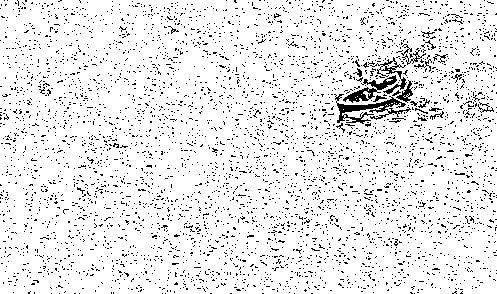 作者/大卫·瑞雷

来源/心探索网站

在每个人漫长的一生中，似乎冥冥之中总有一股神秘力量将我们推向某些既定方向或是某些主题、事件。而这些方向和事件背后的能量又是如何运作的呢？是由什么来决定的呢？大卫·瑞雷老师曾接受心探索网站的专访，从月亮南北交点的角度告诉大家，占星学正是这样一种从过去到未来的世界观。

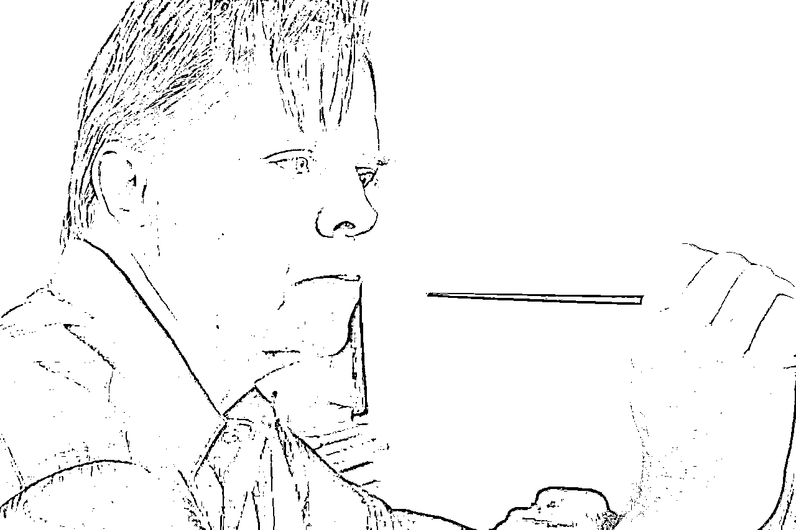
大卫·瑞雷

前世：理解过去及为何而来

**月亮代表着过去，而月亮公转轨道与地球公转轨道的切点就形成了占星学中的月亮南北交轴线。在灵魂占星学中，月亮的南北交轴线早已超越了现在世界的空间维度，连接着过去与未来，揭示了我们在过去世所习惯的方式、环境以及能量（南交点），也指明了现在以及未来世中灵魂的演进方向（北交点）。**

**——大卫·瑞雷**

**问：您是怎样理解占星中的南交点（前世）、北交点（今生）的？它们之间有什么关系？**

**答：**对于占星中的业力论来说，第一个需要明确的线索就是你的南交点（karma），代表累世业力，而我们通常所谓的法（darma），则是北交点，是你今生需要完成的工作，要学习的一些在今生发展出来的新事物。在南交点和北交点之间有一种相互的作用，这种动态的相互作用力是与我们的灵魂有共振的（大卫边说边用双手像一个天秤一样比划着，左右手摇动）。

**问：在您的个案中，前来咨询前世今生相关问题的案例有多大比例？问题大部分集中在哪些领域？**

**答：**大概有 1/4 左右。问题很广泛，像工作、关系、个人成长、健康、婚姻等等，都会有。他们想知道前世的一个理由是因为那些跟今生有关。当然，并不是所有的美国占星师都相信转世，不过可能这个群体会比一般的美国人相信转世的比例高一些，但也不会超过 50%。

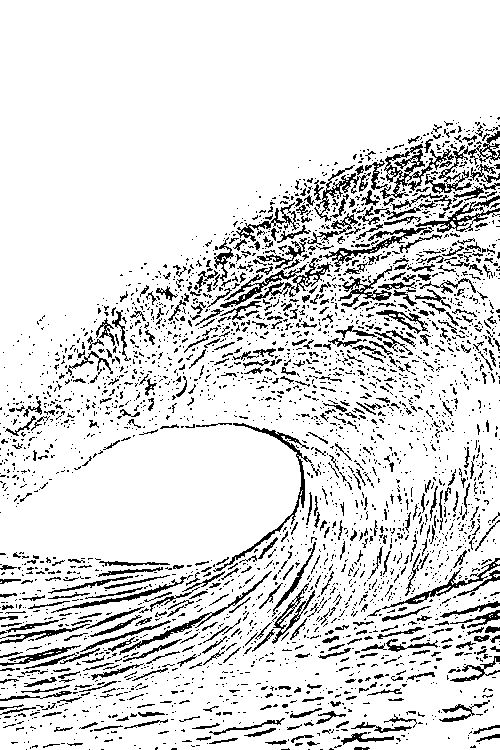

 **问：能不能给我们讲一个您过去占星工作中的实例，关于处理案主南北交问题的？**

**答：**曾经有这样一个案主，她的星图显示她在前世是一名战士（男性），而且不止一次，有好几世都是，而她在这一生中也确实在很年轻的时候在军队待了两三年。此生她的方向是要在生活中找到宁静、平静，同时还要解决家庭的问题。

星图显示出这种成长是非常痛苦的。现在她必须体会到她过去世的行为对他人的影响（身为战士，总会面对死亡），必须去体会、承受那些结果。当我告诉她这些的时候，她告诉我她的儿子在海军。一年后他被派到了阿富汗，九个月后就在阿富汗丛林中失去了生命，所以她再次来找我进行咨询，这确实是很痛苦的一件事。但由于她了解了过去世的经历，所以就比较容易理解现在的事。要知道，让人们理解“失去”从来就不是一件容易的事情。

 **问：听上去有点忧伤的一个故事。确实，人们总是很难接受人生中的“失去”和“离别”。**

**答**：所以我想强调一点的是，每次客户来问我的时候，我都会认真向他们确认一番：你确定真的想知道你的前世吗？你做好了准备接受任何可能性吗？因为有时候去看到前世反而会给你带来一些冲击和刺激，要如何平衡好前世和今生是个大功课。

**问：没错，那么又该如何平衡好南北交点之间的这种能量互动呢？**

**答：**平衡的第一个关键点就是觉察。所以每次我跟客户解释的时候都会说明，南交点的优点、好处及不好的地方，同时也解释北交点的优点、好处及不好的地方，以此来增加他们的觉察。

一般当他们做出判断的时候，我能感觉到他们是如何基于正面或负面的东西来做出决定的，然后我就会质疑他们的判断。我想让他们放松，放下那个评判，因为过多的评判会阻碍能量的自然流动。一旦阻断的话，能量就会被导向别的地方，就像河流中的遮挡物，只有把它拿去，才能让河流顺畅，让能量去生命该流去的地方。

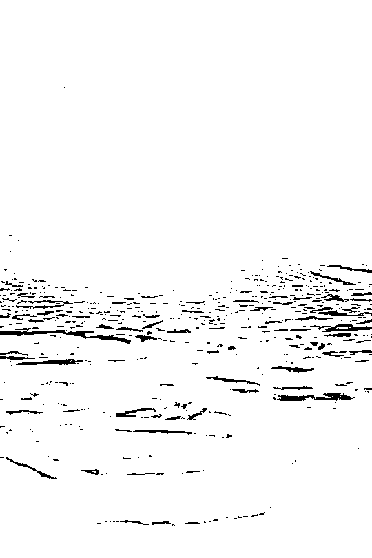

**问：您所谓的判断意思是指我们过多运用大脑和意识吗？**

**答：**比这个的意思更深一些，有时候可能会是灵魂中（累积业力）的评判，跟情感联系在一起。比如关于一个人的不自信、觉得不被爱、无力感……每个人都很会这样评判自己。有时候除非我点醒客户，向他们展示：你是在自我评判，不然他们都很难觉察到这种潜意识的东西。清楚这些对我们是有帮助的，你可以看到这种评判如何来又怎样作用于你。

今生：人生要找到一种平衡

**当你在灵性道路上能够觉察的时候，最重要的是不要诅咒这个世界的不好，而是把这个世界当成一个所经历的幻觉。要找到一个平衡，在现实世界和灵性世界之间的良好平衡，看到它们内在的关系，要把人生看成一个必要的幻觉（Necessary illusion）。**

**——大卫·瑞雷**

**问：在帮助客户疗愈的过程中，有没有经历过特别困难的案例？面对这样的时刻，你又是怎样的感受？**

**答：**你知道，一些旧习惯是很难被打断、被改变的。有时我作为一个咨询师，会觉得非常沮丧的一点是：明明我已经告诉他/她们了，如果你继续这样做就会得到什么样的结果，但人们不听，遇到困境然后又来找我，我就又说一遍……

有一个客户南交点在双子座第七宫（婚姻宫），水星（双子座守护星）在摩羯座（代表管理），意味着她有这个习惯：想管理丈夫的人生，而其实她此生的方向是要学会个人的自由（北交点射手座在第一宫）。但因为她的习惯是想管理各种各样的杂事，所以这样她就无法去做自己真正想做的事，比如她想上大学，却一直被各种事情分心、拖延，还曾经打了两份工以支持丈夫。终于因为长期的不平衡导致了婚姻危机，夫妻两个人前来咨询。我还给他们推荐了婚姻咨询师，她丈夫倒是在这个事情上有更多的理解性，比较能够包容。

**问：后来呢，她实现了此生自我的价值吗？**

**答：**一年后她成功回到大学，然后拿到了一个学位。她也终于找到一个平衡的办法，一方面可以追寻自己想要的东西，一方面也可以享受自己的婚姻。而这一个历程经历了 25 年。

**问：（惊呼）这么久！她一定找了你很多次吧？**

**答：**（笑）很多很多次，所以过程也很折磨，很令人沮丧。我给她建议但就是不听，差不多每隔一年就会再来。

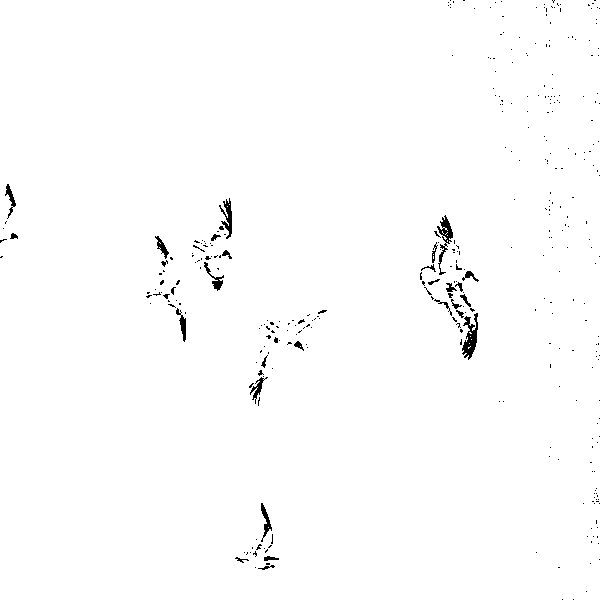 

**我的成就与挑战是日常生活中灵性的探索和经历。**

**——大卫·瑞雷**

**问：问一个个人问题，你是从什么时候开始对前世今生的课题感兴趣的？**

**答：**我在学习占星之前就已经在接触这个领域了，大概十几岁的时候。第一次接触到的时候就觉得有一种共振，感觉很熟悉这个理论，16 岁时我开始读吠陀的典籍，有一本名为《印度教吠陀奥义书：薄伽梵歌》（*Hindu Vedic：Bhagavad Gita Upanishads*）的书里的一句话带给我很强的能量震动：Life is as certain for those who die as death is for those who are born.（对那些死去的人来说生命是确定无疑的，正如对那些活着的人来说死去是确定无疑的一样。）在我接触老子之前，我读了很久有关吠陀的书。

**问：现在回头来看，当时是处在你个人的什么行星周期吗？你从事占星有四十余年了，在南北交点的问题上你自己曾遇到过什么现实问题吗？**

**答：**当时行进的处女座冥王星正在缓慢的移过我的南交点。所以我对世界的看法、我的世界观在那时候变得更凝聚了。之前可能有各种观点，但在那时候开始沉淀下来、更深入了。

关于现实问题，对我来说最大的挑战和成就应该是来自日常生活中灵性的探索和经历。当我是年轻人的时候干过体力活，我总是边干活边唱歌，别人都觉得我疯了：他怎么会喜欢这种活呢？但是我很享受，好像就是很能体会到生命存在着（如是）的感觉，哪怕是扛着很重的东西，但我总能感觉到灵性的美妙——我的身体有一部分总是能够觉察到生命的奇迹，这个产生了很大的快乐也会带来很大的悲伤——快乐来自于能够感受到灵性的东西，悲伤则来自于他人感受不到我的感受。

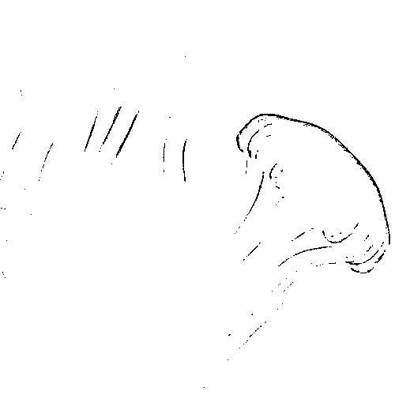

**问：这种深刻的体会和感受性，会让你对世界有很不一样的认知吗？是否曾因此而不被理解？**

**答：**从小我就总是被误解，还好我的妈妈会理解我。大概 12 岁的时候，有一次在课堂上和大家一起讨论如何改善学习习惯，更专心致志。我说你们知道吗？只要闭上眼睛，精力集中，你会在第三眼的位置感受到光。所有人都看着我，觉得我不可理喻（笑），是疯了。这让我感到非常尴尬，只有我能感觉到那个光。

当然了，**作为一名咨询师，敏感性对于帮助别人来说是非常有帮助的**，虽然在个人生活中可能会造成很多困扰。从正向来说，可以帮助家里的每个人：孩子、父母，有时候事情在他们没知道之前我就知道了。敏感的另外一个反应就是，如果没有时间来冥想或做有创意的事情，我就会觉得整个人被压倒了、被淹没了。生活过得好像很幻灭。

**问：这会是你过去世的天赋所带来的优势么？**

**答：**这似乎是今生的东西，就算是过去获得过，现在也是新的。刚开始就像你找到一个超级英雄的外衣，穿上了却不知道怎么用它，而占星学可以帮助我走在正确的道路上，它就像是这个外衣的说明书。在许多情况下，你会学到零星的片段，然后慢慢聚合起来，一个故事就发展出来了。

**想进一步了解前世今生，请点击以下文章：**

[关于月亮交点的那些问题，这里都有答案！](http://mp.weixin.qq.com/s?__biz=MzA5NjA0NTAxNg==&mid=211666835&idx=2&sn=1bda897977bbd710e3c9ae2e332ee4c8&scene=21#wechat_redirect)

[月亮交点 | 人生的风向标](http://mp.weixin.qq.com/s?__biz=MzA5NjA0NTAxNg==&mid=211666835&idx=1&sn=c45c258699ec2483d343992bd1470310&scene=21#wechat_redirect)

* * *

**12 月 1 日****，**由**大卫·瑞雷老师主讲的若道占星核心课程******[Level 4](http://mp.weixin.qq.com/s?__biz=MzA5NjA0NTAxNg==&mid=400203022&idx=2&sn=3518c0e8db3d8b01d99a055ff8c19869&scene=21#wechat_redirect)（点击可查看）****即将开课。**大卫老师会分别讲解如何通过出生星图进行性格分析********、爱情解读、事业分析。******

点击“**阅读原文**”，了解更多有趣的自我探索方法。


# 顺势疗法 | 它帮助抚平心理创伤和悲痛

> 原文：[`mp.weixin.qq.com/s?__biz=MzA5NjA0NTAxNg==&mid=400858503&idx=2&sn=8ed07f16cdc736af776dce34aa9232cd&chksm=02a62f3035d1a6269ad2f403327fbb33debcf8f326845e42e6cd4ef8aa80341c898388a790d3&scene=126&sessionid=1692738907#rd`](http://mp.weixin.qq.com/s?__biz=MzA5NjA0NTAxNg==&mid=400858503&idx=2&sn=8ed07f16cdc736af776dce34aa9232cd&chksm=02a62f3035d1a6269ad2f403327fbb33debcf8f326845e42e6cd4ef8aa80341c898388a790d3&scene=126&sessionid=1692738907#rd)

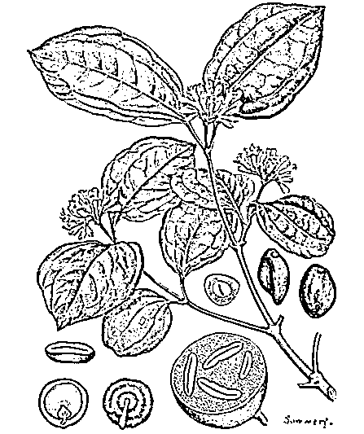 

图为吕宋豆（Ignatia）

文章来源/homeopathyplus 网站

译者/江艺 校对/王宏

苏·汤普金斯老师将于 12 月 2 日开设“[顺势疗法家庭急救治疗及保健课程”](http://mp.weixin.qq.com/s?__biz=MzA5NjA0NTAxNg==&mid=400017180&idx=2&sn=845f6885f0197a6a97ea265d9bc638ab&scene=21#wechat_redirect)（点击可查看）。今天我们继续为大家提供顺势疗法的案例：玛丽因为心跳的“砰砰”声而烦躁，在顺势疗法医师那里经过一次治疗后心率过快的问题就得到解决。后来，她因为心爱的吉娃娃去世而受到很大打击，也是顺势疗法让她走出悲伤。一起来看看她的故事。

玛丽的故事

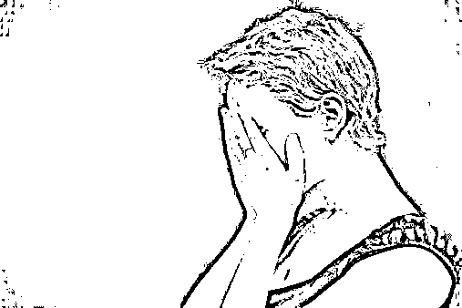

我一直认为顺势疗法看起来很像那么回事，但直到大约两年前我才真正去见了一位顺势疗法医师。

那时，我躺在床上时能听见自己的心“砰砰砰”地跳得很大声，我感到非常烦躁不安。我的一位朋友是有资质的护士，她给我测了脉搏，说我心率过快，让我向她保证自己会马上去看医生。我已经预约了第二天去看一位顺势疗法医师，因此我就去了。

几小时之内，她就解决了我的心率过快问题。唯一的问题是，她住的地方离我有两个半小时的路程，所以当我后来感到浑身疼痛、无精打采时，我就在顺势疗法协会的网站上找了一位离我较近的顺势疗法医师。我的新顺势疗法医师同样给了我很大的帮助，自那时起一直帮我调理，让我保持最佳的健康状态。

之后发生了一件可怕的事情。一天晚上，刚过午夜，我让我 10 个月大的吉娃娃出去上厕所。我的后门处有几只狗吸引了它，它跟着它们一路跑下山。它们玩够了就把它留在了围场里，结果它死了。

我简直无法相信，感到无比震惊，后半夜都没有睡。第二天我崩溃了，一直在哭。我给我的顺势疗法医师卡罗林发了邮件，告诉她所发生的事情，她让我到她那儿去，因为她觉得我需要一种叫吕宋豆（Ignatia）的药品。

当我到那里时，她仍然给我做了检查，以确保那种药适合我。确实适合，它给了我很大的帮助——我的心智没有被击倒，它让我平静下来，使得我能够继续走下去。

我依然想念那个小家伙，但吕宋豆帮助了我，让我现在能够轻松地说起这件事。

玛丽

医师点评

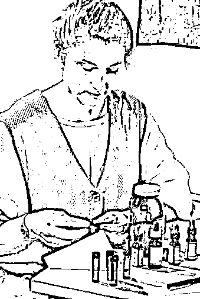 

玛丽大约是在半年前来找我的。她长时间忍受了巨大的悲痛，原因多种多样。我们用了几次会面来处理这种情况，**逐步解决了身体、情绪方面最麻烦的症状，接着我们更深入地处理情绪层面**。玛丽变得更坚强了，开始对自己感觉更好。

硅剂和白头翁花都是非常有帮助的药品，而现在，**吕宋豆帮助她走出她心爱的吉娃娃之死的毁灭性阴影**，她非常喜爱那只吉娃娃。悲伤仍然是过程的一部分，但不再麻痹玛丽的日常生活。

对于顺势疗法这份礼物，我总是心怀感激和谢意，而有幸用这种神奇的医疗方法帮助人，是我继续努力成为更好的顺势疗法医师的另一个理由。

对我来说，**顺势疗法真的是未来之医疗**，但不幸的是，世界上只有极少数人对它有所了解。面对世界范围内无情攻击顺势疗法的负面报道，在一些微小的层面上帮助人们缓解痛苦让我感到无比满足......只要对一个人有用，它就是值得的。

我确信所有专注的顺势疗法医师都会赞同这种观点。大多数顺势疗法医师事实上都全心投入于这一绝妙的治疗艺术。

卡罗林·格雷厄姆

顺势疗法医师

**想了解更多案例，请戳下列文章：**

[50 年的鼻窦炎好了！](http://mp.weixin.qq.com/s?__biz=MzA5NjA0NTAxNg==&mid=400750777&idx=2&sn=e5dba7e9508a9ed7ec0dd18d445182c9&scene=21#wechat_redirect)

[孕妈选对药方，保护了自己和宝宝](http://mp.weixin.qq.com/s?__biz=MzA5NjA0NTAxNg==&mid=400721730&idx=2&sn=3b907efec5851b08f1fc3e74be31c2e8&scene=21#wechat_redirect)

[一瓶药丸治好了困扰我四年的各种病症](http://mp.weixin.qq.com/s?__biz=MzA5NjA0NTAxNg==&mid=400555588&idx=1&sn=9d860beaa15bc1b9e6c627e1d3369afa&scene=21#wechat_redirect)

[为了宝宝，我选择顺势疗法](http://mp.weixin.qq.com/s?__biz=MzA5NjA0NTAxNg==&mid=400490938&idx=2&sn=9ae026781f9119936ade05b2dc66655f#wechat_redirect)

[过敏、扭伤、关节炎、痛经、宠物疾病……全搞定！](http://mp.weixin.qq.com/s?__biz=MzA5NjA0NTAxNg==&mid=400260655&idx=1&sn=854005f3b4c5846959ece35907a94dba&scene=21#wechat_redirect)

**点击下列文章，详细了解顺势疗法：**

[科普 | 顺势疗法和其他药物疗法的异同](http://mp.weixin.qq.com/s?__biz=MzA5NjA0NTAxNg==&mid=400555588&idx=2&sn=3eefa20f53ad362e6f0ef18f2829ee9e&scene=21#wechat_redirect)

[对待疾病 | 姑息它，压制它，还是治愈它？](http://mp.weixin.qq.com/s?__biz=MzA5NjA0NTAxNg==&mid=400605043&idx=1&sn=a0f8e724b556cdc49530a5a66c0e85d6&scene=21#wechat_redirect)

[送你急救箱，救自己救家人还能救宠物](http://mp.weixin.qq.com/s?__biz=MzA5NjA0NTAxNg==&mid=400181530&idx=1&sn=5b5510e4d43ef54ae0f3f56441d1ac65&scene=21#wechat_redirect)

[顺势疗法，皇室钟爱的疗愈方法](http://mp.weixin.qq.com/s?__biz=MzA5NjA0NTAxNg==&mid=400017180&idx=1&sn=286860583aa755e5fe5a6eac534008cb&scene=21#wechat_redirect)

[它在世界上排名第二，它治人不治病](http://mp.weixin.qq.com/s?__biz=MzA5NjA0NTAxNg==&mid=400153889&idx=1&sn=2dd034cb37b11e5765bd170addd1f960&scene=21#wechat_redirect)

* * *

**特别提醒：**希望将若道文章转载到各自公众号的朋友，**转载时请注明“转自若道微信公众平台”，并附上若道占星的 Logo**。谢谢！

**2015 年 12 月 2 日，**由**苏**·汤普金斯老师****亲授的**顺势疗法课程即将开课**。******顺势疗法**是目前全球使用最广泛的自然医学疗法，**对个体的身体、精神和情绪三个层面进行治疗，加强个体自身免疫力，提升个体生命能量**。本课程为那些想要增加自我和家庭身体保健和疗愈能力的人所设置。****欲详细了解，请点击文末“**阅读原文**”。  


# 天蝎座 | 仿若人到中年，面对危机和黑暗

> 原文：[`mp.weixin.qq.com/s?__biz=MzA5NjA0NTAxNg==&mid=400839086&idx=1&sn=87557265557ef568a092abfc85b20553&chksm=02a6e31935d16a0fec9481594dc76bfbfc9ec8fe48a683ceca46016e0d9573a06d73bb8ac7b3&scene=126&sessionid=1692738907#rd`](http://mp.weixin.qq.com/s?__biz=MzA5NjA0NTAxNg==&mid=400839086&idx=1&sn=87557265557ef568a092abfc85b20553&chksm=02a6e31935d16a0fec9481594dc76bfbfc9ec8fe48a683ceca46016e0d9573a06d73bb8ac7b3&scene=126&sessionid=1692738907#rd)

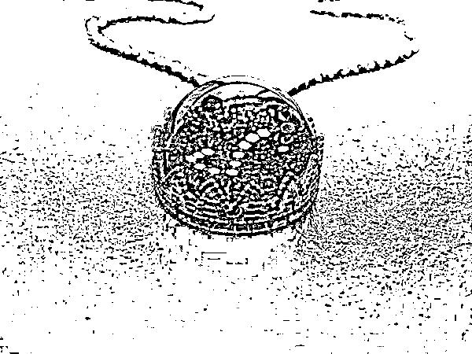

作者/格伦·佩里 翻译/若道翻译团队
图片来源/花瓣网

对于天蝎座，我们有很多了解，单单若道最近就发了不少天蝎座的文章。不过，你知道还可以从占星心理学的角度来思考天蝎座吗？今天占星心理学学院创办人格伦·佩里将带领我们从心理需求、原型人物、发展阶段、行为特质和主题等方面来认识天蝎座。

**心理需求（动力/目的）**

转化，治愈，死亡和再生，权力，力量，性，渗透与合并，吸收与融合，消除，净化

**原型人物**

 受伤的治愈者，幽灵人物，萨满教巫师/巫医，魔术师，恶魔，心理治疗师，地狱人物，金融奇才，恐怖分子，特工/间谍，女妖，侦探，调查人员，罪犯，黑寡妇，妓女，偏执狂，恐惧传播者 

**发展阶段**

 **36****到 45 岁。**  中年危机。灵魂黑暗的 10 年。面对必死性，并“看到隧道尽头的黑暗”。双亲可能死亡。时间的流逝感，面对忘却的自我、自己的阴影、妥协的完整。瓦解自我（死亡和再生的过程），以及随后的自我更新。放弃一成不变的角色同一性，变得更加真实。深化、疗愈并拥有个人的权力。

****行为特质和主题****1 情欲

**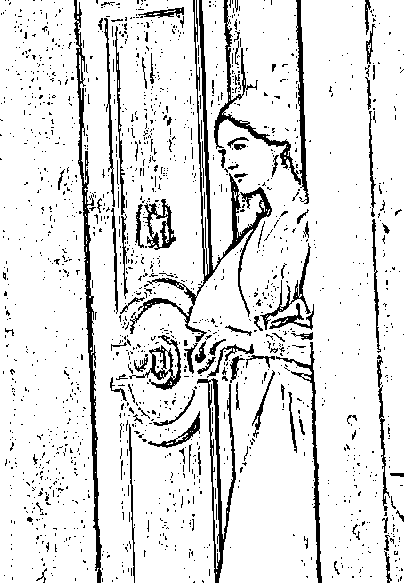** 

**天蝎座的行为有一种与生俱来的情欲与性欲**。它是一种非言语上的极为敏锐的特质，表现出如催眠般的强烈吸引力。作为固定星座，天蝎座有一种磁性能量。作为水象星座，天蝎座是静默的和深沉的。天蝎座代表性爱。

**可能的特质表现**：情欲的、性的，催眠的、磁性的，诱惑的、刺激的，迷人的、神秘的，敏锐的，具有致命吸引力的

2 对被压倒和控制的恐惧

**天蝎座具有洞察力，但是其自身无法被看穿**。没有星座比天蝎座更加谨慎、多疑和爱怀疑。**它似乎有一种对于承受某种外部控制或者某种对自身愿望的违背的恐惧**。这种恐惧调动起了对感知到的危险的威胁的防御与警惕。天蝎座本能地知晓秘密是权力的基础，沉默可以最好地服务于权力。

**可能的特质表现**：谨慎的，怀疑的，偏执的，警惕的，隐蔽的，不信任的，克制的，令人无法看穿的，冷酷的，沉思的 

3 融合的冲动

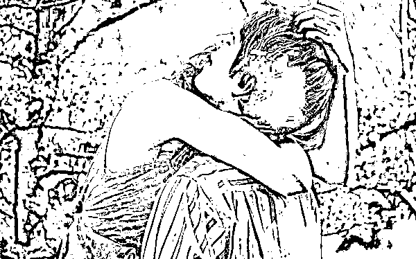 

天蝎座代表着性驱力，纯粹又简单。**它有一种对与另一个人或实际深层亲密接触的渴望。这需要愿意失去控制，臣服于对联合的欲望**。性驱力可以被升华为许多发泄途径，比如说宗教信仰的改变、财务和政治权力，甚至是对犯罪的追求。天蝎座式的活动指的是任何涉及与在自我之外的事物结合在一起的热情和强烈渴望的活动，在自我之外的事物包括金钱、地域、同伴、敌人，或自己被禁止的欲望。**事实上，天蝎座代表通过与一切被惧怕和对抗的东西结合而实现转变的冲动。**  

**可能的特质表现**：性的，火热的，剧烈的，强烈的欲望，毁灭的，吞没的，渴望的，贪婪的，掠夺的，强制的，压倒性的 

4 死亡本能

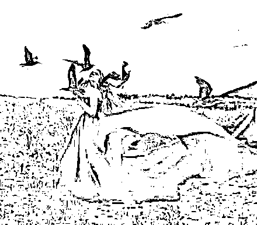 

弗洛伊德写到过死亡本能（thanatos），他指的是任何旨在毁灭自我的冲动，主要表现为强迫性的重复，即强迫去重复早期痛苦的创伤经历。换言之，自我毁灭的本能指的是自我毁灭的行为。然而，**我所指的“死亡本能”是一种去融合一个人所惧怕的任何事物、一个人控制的任何事物，通过这样做来死亡并重生为一个新身份的冲动**。

**可能的特质表现**：破坏的，颠覆的，堕落的，危险的，毁灭的，敌意的，病态的，犯罪的，邪恶的，敌对的

5 高明的计策

**因为天蝎座与隐藏的、禁止的或禁忌的事物有关，所以它因为惧怕报复而不会公开活动。**天蝎座的做法类似于高明的计策。尽管天蝎座可以是审慎的和蓄意的，但它几乎从不是直接的和自发的。应用于战争中的战略更像是天蝎座的风格。同时，**因为天蝎座与生俱来适应于它所嵌入的体系中的任何黑暗与隐藏的东西，所以天蝎座清醒地认识到透露或公开秘密可能是危险的**。 **可能的特质表现**：隐蔽的、诡秘的、卑劣的，权力博弈的、策略的，不坦诚的、不正当的、狡猾的，战略的、密谋的、诡计多端的，操纵的、诡诈的，肮脏的、暗中为害的，谨慎的、隐蔽的，卑鄙的、鬼祟的、密谋策划的

6 邪恶和恶魔

**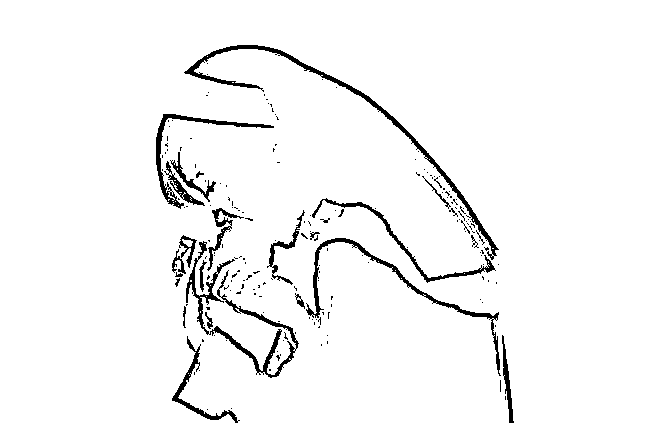** 

**天蝎座象征心灵的创伤，因此与恐惧、疼痛和羞耻有关**。这或许仅是造成伤害的言辞或对自尊的轻微冒犯所导致的轻微伤害。或者也可能是当某人被虐待或背叛时更为严重的创伤。天蝎座表达痛苦的风格很少是直接的。不同于直接立即回应的白羊座，天蝎座会踌躇，并等待战略性的时机。等到反应确实出现了，它很可能是出乎意料并尖酸刻薄的。天蝎座天生善于找到他人最脆弱的地方。挖苦、愚弄、嘲笑、冷嘲热讽、刻薄的评论、挑衅和卑劣的评判是天蝎座较为偏爱的敌对形式。假如最初的伤害十分严重，那么天蝎座就会很残忍并具有报复心。然而，这需要在行为之下的创伤的背景之中被理解。**天蝎座式的敌意事实上是尝试通过在其他人身上唤起内心的主观感受，来使自己摆脱痛苦和羞耻**。这是在向外将“恶”投射到另一个人身上。 

**可能的特质表现**：邪恶的、恶劣的、恶魔的，讥讽的、尖酸刻薄的、恶毒的，恶魔的、魔鬼似的，伤害的、怀恨的、可憎的，有报仇心的、报复的，胁迫的、惊恐的、恶毒的，残酷的、可怕的、无情的，刻薄的、苛刻的 

7 侦探、特工、治疗师、调查者

任何参与搜索秘密信息的过程的人都表现出天蝎座的欲望。**天蝎座代表看穿欺骗和虚假、揭露真相、了解问题的核心并揭示潜在现实的需要**。天蝎座觉察力的最终目标是我们一般所称的“线索”。这种怀疑、探究的方式反映了天蝎座觉察危险的倾向，不管这种危险是真实的还是想象出来的。 

**可能的特质表现**：尖锐的、探究的、搜索的，直觉的，揭露的，怀疑的，偏执的，检查、审查，对抗的，有洞察力的

8 转化的代理

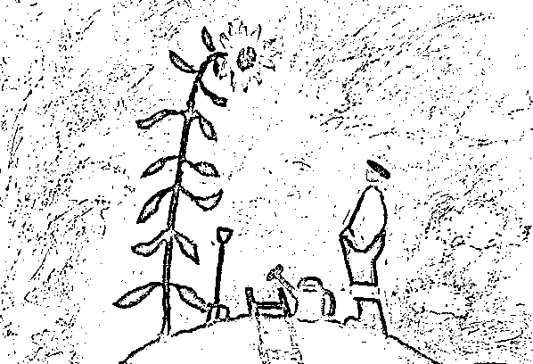 

从非常积极的意义上来讲，天蝎座是伟大的融合者，是天赐的炼金术士，可以修复灵魂的统和状态。这种再生的影响被护理行业的成员表现出来，这些成员让人们到参与疗愈的过程。所有类别的医生和治疗师都是天蝎座的例证。**受伤的疗愈者或许是天蝎座原型最纯粹的表现**。转变的过程，或者说是治愈循环包含三个阶段，即穿透、同化和消除，最后将获得完整、更新和授权。天蝎座治愈的实体并不仅限于个人。同样的过程也可出现于集体、政治、金融，以及其他各种各样的方式中。事实上任何体系都可以被改革、被净化或被治愈。  

**可能的特质表现**：治愈的、再生的，变革的、清洗的，变化的，同化的、融合的，净化的，消除的

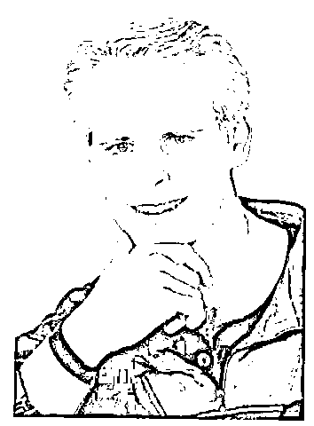

▲格伦·佩里（Glenn Perry）

拥有 30 多年从业经验的职业占星师和注册心理治疗师，曾任国际占星研究协会 （ISAR）以及国际占星大会董事会（UAC）副主席，是占星心理学学院（Academy of AstroPsychology）的创办人。在过去的三十年里，格伦通过对心理学概念和实践经验的系统性整合，对占星学进行了扩充。

更多关于天蝎座的文章请戳：

[天蝎座 | 他们顽强地生活，仿佛没有明天](http://mp.weixin.qq.com/s?__biz=MzA5NjA0NTAxNg==&mid=400646275&idx=1&sn=3daee0153b3ae420236d606ad1622728&scene=21#wechat_redirect)

[这辈子，还是该遭遇一个天蝎座男人，感受冰山下的烈焰](http://mp.weixin.qq.com/s?__biz=MzA5NjA0NTAxNg==&mid=400533846&idx=1&sn=d3913f574a32ae78f7ad86e18b2c8006&scene=21#wechat_redirect)

[天蝎座 | 爱我，你怕了吗？](http://mp.weixin.qq.com/s?__biz=MzA5NjA0NTAxNg==&mid=400470385&idx=1&sn=60fd2e3202da2b355e39e824739c1cf7#wechat_redirect)

[天蝎座 | 最好的朋友，最坏的敌人](http://mp.weixin.qq.com/s?__biz=MzA5NjA0NTAxNg==&mid=400374567&idx=1&sn=8791c4b265f5b7a3dce36ff7bc7539ca#wechat_redirect) 

[天蝎座，激烈之下往往蕴藏着丰饶](http://mp.weixin.qq.com/s?__biz=MzA5NjA0NTAxNg==&mid=400230640&idx=1&sn=7b08357a9a087f98e44373b4761b6657&scene=21#wechat_redirect) 

[天蝎座是走向射手座的天秤座](http://mp.weixin.qq.com/s?__biz=MzA5NjA0NTAxNg==&mid=400203022&idx=1&sn=70d55c4dd48225fa42740b3a08202bf3&scene=21#wechat_redirect)

* * *

**想了解更多占星学知识吗？12 月 1 日****，**由**大卫**·瑞雷老师****主讲的****若道占星核心课程第四阶（Level 4)****即将开课。**大卫老师会分别讲解如何通过出生星图进行性格分析********、爱情解读、事业分析。******了解**Level 4 课程**详情，请点击文末“**阅读原文**”。


# 我的九宫 | 梦想从这里照进现实

> 原文：[`mp.weixin.qq.com/s?__biz=MzA5NjA0NTAxNg==&mid=400839086&idx=2&sn=fc859f194713bb5f42e884b57f75e108&chksm=02a6e31935d16a0f5414553a09e654a2c59510c9f98143023e9dc36af270c36c9e0f1b1fbb7f&scene=126&sessionid=1692738907#rd`](http://mp.weixin.qq.com/s?__biz=MzA5NjA0NTAxNg==&mid=400839086&idx=2&sn=fc859f194713bb5f42e884b57f75e108&chksm=02a6e31935d16a0f5414553a09e654a2c59510c9f98143023e9dc36af270c36c9e0f1b1fbb7f&scene=126&sessionid=1692738907#rd)

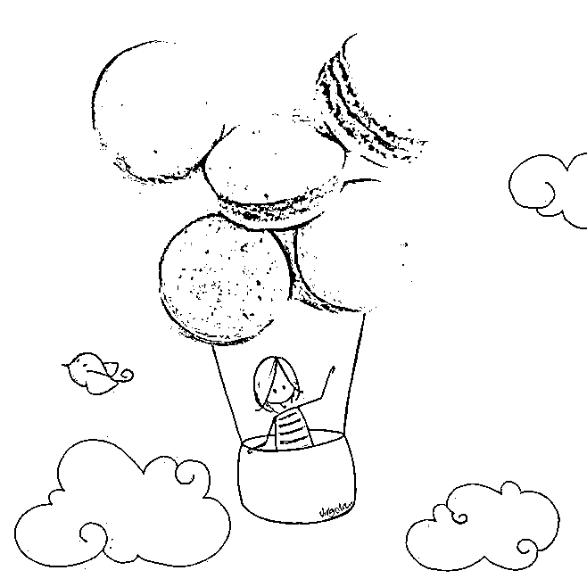

编辑说

学习占星是为了运用，当我们戴上占星这副眼镜，我们观看世界就多了一个维度。我们也多了一面审视世界和自我的镜子。今天，若道学员 Julia 跟我们分享她学习占星以后的人生感悟，从一个宫位开始，那是第九宫。每个人的星图中都有第九宫，你在自己的第九宫看到了什么呢？

占星学中第九宫和射手座的关键词是高等教育、观念、宗教、信仰、道德规范、旅行、外国事物、高等法院、法律惯例等。恋家的我决定去追梦

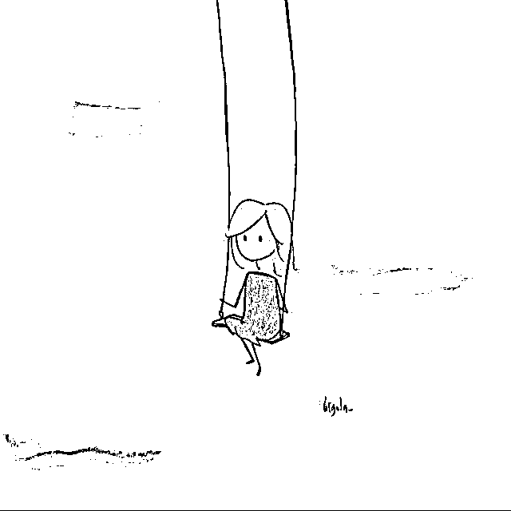 

我的出生图中有三颗行星在第九宫。上升在射手座， 这是什么意思呢?
 还没接触占星学的时候，我对此一无所知。 冥冥中，我从小就对外国的文化、艺术、意识形态和习俗感兴趣。到了成年，又有了对信仰的无可遏制的探索欲望，但都因工作繁忙而无暇顾及这些。那些渴望被世俗掩盖在内心深处而无法企及。  我的太阳在巨蟹座，巨蟹座是恋家的，对安全感很重视，不太会改变生活的轨迹。直到有一天，我已经无法忍受周遭的一切，我的价值观与生存法则产生了严重的抵触，对于人生的意义的寻求，促使我想改变自己的生活。我要为自己而活，我需要灵魂的自由。  为何不趁此低谷时期去实现自己的梦想呢？那个尘封在心底深处的出国梦开始启航了。射手座的能量爆发了！**第九宫能量突出的我并不是只想浮光掠影地去国外旅游一番，而是想要长期的生活学习体验**。

当梦想照进现实

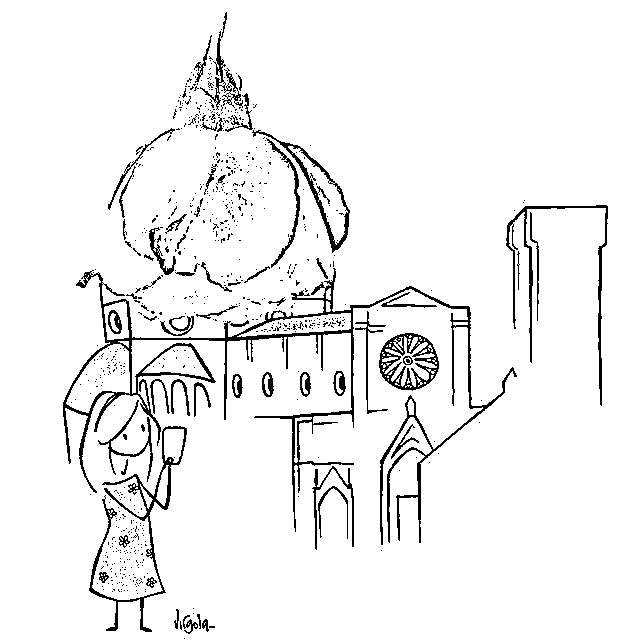 

我选择了加拿大。加拿大是移民国家，当时的移民政策是有加拿大两年的学习经历移民可以加分。  在选择专业上我内心也纠结了一番，我本科学的是经济，读 MBA 是顺理成章的选择，而且当时挺热门的。但我其实对数字对经济都不甚感兴趣，我对工作于经济领域也感到厌倦。以前的专业选择是环境压力造成的，而我从小感兴趣的是文科，我决定为自己活就从现在开始，尊崇自己的内心，人生的第二次选择的主动权应该掌握在自己手里。  在了解签证时，几个中介都说我签证签不出来，原因都是我的并不年轻的年龄和单身身份，更何况我还要换专业，他们都懒得接我的案子。但是，**凭着我对国外的法规基本的理解，认为这些都不能成为拒签的理由**，**这也许就是第九宫与射手座在法律和观念上的能量吧**。我决定自己办。于是，我写了一篇很有说服力的学习计划，按照网上繁琐的准备步骤，居然一下子就无须面试地成功了。

九宫的能量让我重生

第九宫的能量给了我一次再生的机会。我就像一个牙牙学语的婴儿一样，一切从头开始。  在国外，我对一切充满了好奇。在图书馆，看到那么多有意思的书让我激动；在大学的专业名录里，有那么多我感兴趣的课程，是过去所不知的。我后悔行动得太晚，如果早出来，我可以学到多少知识啊！这里信息的开阔，使我过去混沌的大脑清晰了不少，很多思维理清了。  不管我过去失去了多少，我决心忘记过去，就当我的人生刚开始。在国外，我经常听到这样的话: 任何时候都不晚，有聊胜于无。在国外，年龄不是问题。你可以看到很多人到中年的人又回到大学课堂。而找工作投放简历不用写年龄，甚至性别。你可以感觉很多的有别于过去文化和法律意识上的不同。这些都让我的心灵自由很多，感觉越活越年轻了。

 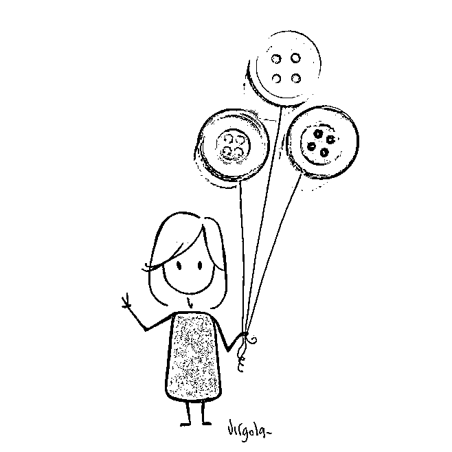 

**探寻生命的意义，寻求自己灵魂的目标离不开宗教和信仰。**  

自由的环境让我有接触不同宗教的机会。我去寺庙和教堂听课，寻找自己的灵魂可以寄托的地方。**但我并不是全盘接受所有国外的东西。第九宫也是理性逻辑的。一个理念在逻辑上没有说服我之前我是不会全身投入的**。我会辩论，会质疑。我还在寻寻觅觅。**进化占星学向我揭示了另一个生命奥秘的可能性，它的理念让我兴奋。我现在觉得以后也许可以整合出自己的一套理念甚至宗教体系。** 第九宫不仅给了我在国外生活的机会，也放飞了我的心灵，给了我探索真理的机会，它也给了我因其他宫位和相位所带来的痛苦一个疗愈的机会。我要看的要学的还有很多，我的心灵现在还处于青春期。虽然我现在的状况离我的理想还有很大距离，但它近了，近了。  Life is a journey , not a destination.

*图片来源/花瓣网*

_ 副本.jpg")

**Julia，**若道 level 3 在读学员，国内名牌大学经济系毕业，工作多年后去加拿大留学并移民。媒体管理学硕士。现为加拿大执牌移民顾问。

* * *

**特别提醒：**希望将若道文章转载到各自公众号的朋友，**转载时请注明“转自若道微信公众平台”，并附上若道占星的 Logo**。谢谢！

**想和她一样找到并实现自己的梦想吗？12 月 1 日****，**由**大卫**·瑞雷老师****主讲的****若道占星核心课程第四阶（Level 4)****即将开课。**大卫老师会分别讲解如何通过出生星图进行性格分析********、爱情解读、事业分析。******了解**Level 4 课程**详情，请点击文末“**阅读原文**”。


# 宇宙天气 | 拨云见日，海阔天空（11.16~11.22）

> 原文：[`mp.weixin.qq.com/s?__biz=MzA5NjA0NTAxNg==&mid=400816974&idx=1&sn=de4ec6db0e0dc5c7451e864e1b55b6a3&chksm=02a149f935d6c0ef405c8986ff7f708b99d2240cdf9cdcf003a71596132d338c5dff5baf71c6&scene=126&sessionid=1692738907#rd`](http://mp.weixin.qq.com/s?__biz=MzA5NjA0NTAxNg==&mid=400816974&idx=1&sn=de4ec6db0e0dc5c7451e864e1b55b6a3&chksm=02a149f935d6c0ef405c8986ff7f708b99d2240cdf9cdcf003a71596132d338c5dff5baf71c6&scene=126&sessionid=1692738907#rd)

**一周星象综述**

本周月亮经过摩羯座、水瓶座、双鱼座、白羊座。比较重要的星象事件是，海王星恢复顺行，金星四分冥王星，以及水星和太阳进入射手座。整体而言，这是危机过去，形势日益明朗的阶段。

周一，摩羯座的月亮合相冥王星，四分天王星，三分木星，压力和挑战是存在的，心理上的紧张感会有，但还是有掌控事态发展的力量。

周二下午，月亮离开摩羯座进入水瓶座。周二到周三，月亮会依次与水星、太阳、火星、金星、天王星形成和谐相位，是心情平顺，态度积极，有利于目标推进的时候。

周四凌晨，逆行了五个月的海王星恢复顺行，我们对于理想和愿景会有更加清楚的认识。这是一个长远的影响，其作用会在未来几个月里逐渐显露。这一天里，水瓶座的月亮会四分天蝎座的太阳和水星，容易感受到个性中分裂和矛盾的一面，可能出现自我认同方面的问题，带来不愉快的感受。

周四晚间，月亮离开水瓶座进入双鱼座。周五，双鱼座的月亮会四分土星，合相海王星，并与火星和金星形成 150 度相位，这是情绪感受复杂敏感的一天，需要学习臣服和用心感受。晚间月亮六分冥王星，带来情感上的洞见或疗愈，为脆弱的一天收尾。周六，水星进入射手座，视野大开，能够高瞻远瞩，想法乐观许多。

周六晚上到周日，月亮在白羊座。周日晚间，太阳进入射手座。随着水星和太阳都进入射手座，我们会将注意力转移到充满希望的未来，也会对人生抱持更加积极的态度。

11 月 16 日星期一

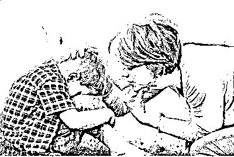

**09:39** 月亮合相冥王星在摩羯座

对环境中的危机和权力较量相关的事更加敏感，容易感觉到与他人的情感上的胁迫关系。不安全感和情感上的控制欲增强，对一些人事物的情感变得激烈、极端，同时又会极度压抑这种情绪。渴望更多权力，也会隐藏自己真实的心理动机。

**16:11** 摩羯座的月亮四分天王星

需要更多对自己的控制权，不愿意受他人摆布，对来自外界的要求或命令非常反感，对自由的渴望和反叛情绪增强。也可能遇到意外事件打破原有的计划，带来不舒服的感受。

**19:46** 摩羯座的月亮三分处女座木星

情绪变得乐观积极，感受到更多有助于目标实现的支持性力量，对于成功的信念增强，安全感提升。也更容易对他人表现出友善、关爱的一面。

11 月 17 日星期二

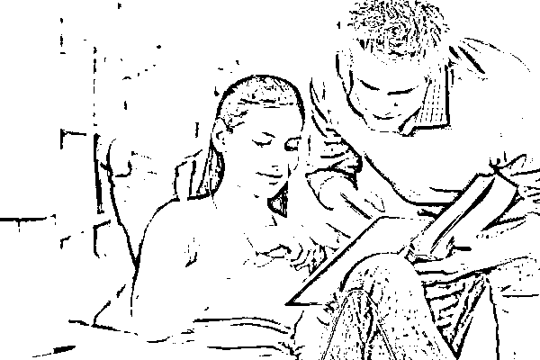

**04:00** 摩羯座月亮六分天蝎座水星

反应机敏，思路活跃，理解力和观察力强。对环境中的信息更加敏感，能够准确感知到他人的想法和态度，有利于学习、阅读、思考、写作和沟通表达。

**04:54** 摩羯座月亮六分天蝎座太阳

理智和情绪能够协调平衡，对事物的洞察力和掌控力变强，有助于发掘到更多帮助目标实现的办法。

**15:24** 月亮离开摩羯座进入水瓶座

情绪中沉重、严肃的感觉减弱，对事物的态度多了几分抽离与客观带来的潇洒。未来两天多的时间里，我们对于新的想法、具有创新性或反常规的事物，将持有更多的开放性。由于水瓶座的月亮将四分天蝎座的太阳、水星，这段时间我们也将面对更多理智和情感的矛盾，需要学习客观看待自己的深层心理欲求和创伤感受。

**20:24** 水瓶座月亮三分天秤座火星

行动力强，特别是在人际交往方面，有更多热情参与到团体活动中，或对于发展友谊、联谊一类的事更加积极。有助于合作或集体性事务的开展。

**22:54** 太阳合相水星在天蝎座

自我意识强烈。对自己的想法和判断产生深刻的认同。这是观察和思考能力增强的时候，但也容易过于执着于个人看法而有主观倾向。

11 月 18 日星期三

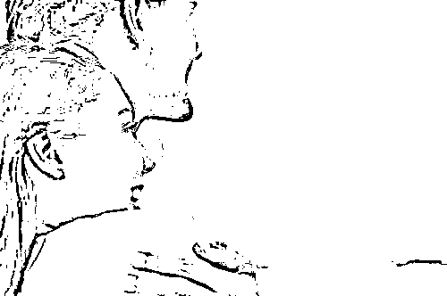

**10:00** 水瓶座月亮三分天秤座金星

对生活中的美，以及人与人之间的关怀和爱意更加敏感。能够以友善、自如的态度表达自己的情感需求，并给予他人滋养和照料，有利于各种形式的关系的发展。也有利于艺术创作和审美享受。

**21:56**  水瓶座月亮六分天王星

富于创造力和开创性的时刻。突如其来的灵感带来天才的创新能力。感受到更多对于自由和变化的渴望。

11 月 19 日星期四

**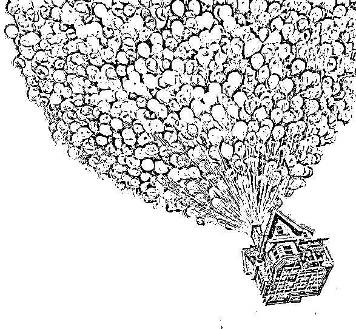** 

**00:32**  海王星恢复顺行

海王星从今年的 6 月 12 日开始逆行，现在恢复顺行。这意味着将近半年来对于理想和梦幻之事的探索到了一个“拨云见日”的时候。之前一段时间的迷惘或虚妄幻想，现在能够被渐渐清除，我们能够更加客观理智地看待之前的一些不现实的想法，对于梦想，也会有更加清晰的衡量与把握。

**02:03**  水瓶座月亮与处女座木星形成 150 度相位

个人的观点和理念被放大，对于个人主张和信念过分自信，可能有眼高手低、盲目乐观的情况。

**14:28**  水瓶座月亮四分天蝎座太阳

渴望拥有更多权力和控制力，但情绪上又会本能地抗拒这种产自“人性阴暗面”的欲望表现。不接纳自己真实的样子，理智和情感难以统一。

**16:20**  水瓶座月亮四分天蝎座水星

情感上渴望自由与超脱，头脑却在关注那些暴露人性弱点的隐秘、复杂之事，容易感到费神、心累。但水瓶座追求客观冷静的态度，与天蝎座敏锐的洞察力相结合，也有助于我们跳出原有的思维定式，从一个新的角度，发现真相。

**20:21**  月亮离开水瓶座进入双鱼座

情绪变得敏感，直觉力变强。未来两天多的时间里，我们会变得更加感性，易感动，有同情心，也更需要表达心中的浪漫情感和慈悲情怀。也可能有迷茫或困惑的感受。

11 月 20 日星期五


**03:31**  双鱼座月亮与天秤座火星形成 150 度相位

人际交往中的冲突或不和谐氛围可能带来迷茫或挫败的感受，愤怒的情绪不易表达，对于捍卫自己的权利感到无力。

**07:10**  双鱼座月亮四分土星

情感需求得不到满足，易有沮丧、失落、抑郁的情绪。容易将负面的感受放大，令心情悲观。

**08:27**  月亮合相海王星在双鱼座

脆弱敏感，容易感动也容易伤感。同情心和同理心增强，愿意付出更多的爱，也更愿意包容和谅解他人。有在情感上疗愈他人以及自我疗愈的能力。

**18:44**  双鱼座月亮与天秤座金星形成 150 度相位

对爱情更加敏感，更加渴望，也更容易觉得想要的是无法得到的。恋情中易有伤感情绪。

**19:55**  双鱼座月亮六分冥王星

创伤有机会被疗愈。理解和原谅将带来情感的升华。直觉和洞察力提升，能感知到关系中更为复杂、敏感、隐秘的面向。

11 月 21 日星期六


**03:44**  水星离开天蝎座进入射手座

水星离开天蝎座后，将在射手座待到 12 月 10 日。我们思考问题的角度会变得更加开阔，有前瞻性和宏观意识，对事物的想法和判断会更加积极乐观，语言表达上也会更有幽默感。但也有可能看得太远而不注意脚下。

**06:07**  双鱼座月亮对分处女座木星

情绪感受和情感需求被放大，渴望爱或渴望付出爱的心情更加迫切。也可能有自负或冲动倾向。

**10:03**  天秤座金星四分冥王星

爱情中有强烈的执念，操控欲、不愿放手，带来虐心的感受。伴侣或合作关系中可能出现信任危机，或关系中隐藏的秘密被揭露出来。

**21:24**  双鱼座月亮三分天蝎座太阳

对自己的情感需求有更深刻的认识和接纳，能够理解自身的复杂性，理智和感性能够互相支持。

**23:11**  月亮离开双鱼座进入白羊座

敏感、柔弱的情绪被一股火爆冲动的力量取代。未来两天多的时间里，我们会更加直接地表达自己的需求，并为实现目标采取行动。个人的利益和需要会被放到首位。同时也会更有勇气面对挑战。

11 月 22 日

星期日


**01:37**  白羊座月亮三分射手座水星

兴致勃勃、充满干劲的情绪，带动了乐观积极的想法。思维和情感能够彼此支持。理解力和表达能力提升。有助于计划的制定，以及沟通交流、思维碰撞相关的事。

**08:16**  白羊座月亮对分天秤座火星

人际交往中易有冲突，在权利和公平问题上的分歧，带来愤怒的情绪。个人意志强烈，容易感到自己的权利被侵犯。

**10:01**  白羊座月亮三分土星

勇气和斗志，能够获得来自现实层面的支持。我们能够以一种可靠、务实的方式，勇往直前。情感需求有机会被现实条件所满足。我们有能力保护自己的安全感，同时也能自然表现出自律与务实的品质。

**22:01**  白羊座月亮四分冥王星

来自现实环境的强大压力，让急于达到目的的心情饱受折磨。对于权力和资源问题十分敏感，容易感受到紧张、虐人的情绪，与人相处中易有心理操控和权力较量。

**23:26**  太阳离开天蝎座进入射手座

“天蝎月”结束，随着太阳进入射手座，过去一段时间里的心理危机和紧张压力会明显减弱，我们能够看到更加高远的目标，从一个宏观生命进程的角度，理解我们现在所处的位置和此刻生活的意义。我们也会更加重视信仰，有更多热情去做精神上的探索。


## **作者简介** 

**占星师 Cora**，全美占星师联盟（AFAN）成员，国际占星研究协会（ISAR）会员，获 ISAR 职业占星师资质认证，斯蒂芬·弗里斯特《变幻的天空》译者，个人星象文章见诸《心探索》《北京青年周刊》《上海电视》《空中生活》等杂志媒体。曾跟随大卫·瑞雷系统学习占星学，现为全职占星师。  

微信公众号：聆宇 FM（微信号：lingyudiantai）

个人微信号：CoraAstro

长按二维码，让金钱涌向传播知识与智慧的人~~


* * *

**特别提醒：**希望将若道文章转载到各自公众号的朋友，**转载时请注明“转自若道微信公众平台”，并附上若道占星的 Logo**。谢谢！

**12 月 1 日****，**由**大卫**·瑞雷老师****主讲的****若道占星核心课程[Level 4](http://mp.weixin.qq.com/s?__biz=MzA5NjA0NTAxNg==&mid=400203022&idx=2&sn=3518c0e8db3d8b01d99a055ff8c19869&scene=21#wechat_redirect)（点击可查看）****即将开课。**大卫老师会分别讲解如何通过出生星图进行性格分析********、爱情解读、事业分析。******了解**Level 4 课程**详情，请点击文末“**阅读原文**”。


# 干货 | 如何从比对图看爱情匹配度？

> 原文：[`mp.weixin.qq.com/s?__biz=MzA5NjA0NTAxNg==&mid=400799525&idx=1&sn=5a851ffd7fb388cb67976fcbcd505a97&chksm=02a1059235d68c840cf6ecf8440ffa5c6afdd244b3b2d91784c75f94ffe436bab4798cfbfd7c&scene=126&sessionid=1692750578#rd`](http://mp.weixin.qq.com/s?__biz=MzA5NjA0NTAxNg==&mid=400799525&idx=1&sn=5a851ffd7fb388cb67976fcbcd505a97&chksm=02a1059235d68c840cf6ecf8440ffa5c6afdd244b3b2d91784c75f94ffe436bab4798cfbfd7c&scene=126&sessionid=1692750578#rd)


作者/史蒂芬·阿若优 翻译/蓝莲花

在占星学中，我们会通过比较两个人的出生图，来判断他们的匹配度和关系的幸福度。那么在做星图比对时，要考虑哪些因素呢？史蒂芬·阿若优在《人际占星学》里为我们做了梳理。感谢世界图书出版公司授权使用此文！

在比较两个人的出生图时，除了由四元素代表的总体能量调谐程度之外，还有哪些重要的考量因素呢？换句话说，人生中的哪些维度，也就是在每个人的出生图上有哪些重要的因素应引起我们的特别关注？

*1*太阳与月亮

  

**太阳和月亮是出生图上占据支配地位的因素，在占星学界，二者往往被称为“发光体”**。在此，我想补充一点：**在亲密关系中，如果一个人的日、月星座与对方的“发光体”都不和谐，那这两人要想维持长久的和谐，取决于一方的日、月星座是否与对方的上升星座和谐**。

有一个简单的例子能够更清楚地说明我的观点。如果你的太阳落在双子座，月亮落在白羊座（风象和火象），你的伴侣太阳金牛座、月亮双鱼座（土象和水象），那么如果你的上升星座是土象或者水象，或者对方的上升星座是风象或者火象，这段关系才比较有可能融洽、长久。

*2*月亮和谐


这是匹配度分析的重要领域。在此我想说明一点：**两个和谐的月亮，对家庭生活的和睦以及日常生活良好的长期互动提供的助力，无人能出其右**。可以用一个简单的测试来看你与对方的月亮能量是否和谐。你只要问问自己以下这个问题：你能否自在、放松地与这个人一起驱车数日，进行越野之旅？或者，你会不会感觉别扭、紧张，很难找到彼此身上的共同点？

*3*上升星座

**在完整的比对图分析中，精确地定位两个人的上升星座，并且研究两人的上升星座与对方出生图上的行星元素是否和谐，是十分必要的**。上升星座与老早的心理学书籍中所谓的“秉性”有关。两个人的秉性和对待人生的态度截然相反时，总是会引发一些冲突。

*4*水星和谐


比较两个人水星星座，可以看出出双方能否达成思想沟通，是否拥有相似的兴趣。比较两个不同的水星星座，可以帮助我们找到两个人观点和思考方式有差异的原因，帮助我们理解和欣赏对方的见解。**两个人的水星无须和谐，只要一方的水星与另一方的其他行星和谐就行**。在那种最令人兴奋的关系中，很可能双方会拥有截然相反的水星。只要双方在其他方面和谐友好、互相尊重，思考模式的巨大差异不一定是问题。

*5*金星与火星


这个宏大的议题是本书探讨的核心问题，在这里我只想指出一点：**金星能够帮助我们了解一个人的品位、生活中的快乐来源，以及一个人付出和接受感情的习惯模式。火星揭示的是一个人的生理能量，包括性能量。更宽泛地说，也揭示出一个人在生活各个方面的行为模式，即为了获得他想要的东西他会采取何种行动**。

*6*木星和土星


 **木星的和谐能量特别能够鼓舞、促进一段关系的成长，能促成双方互相包容，建立积极的关系**。木星因素也在某种程度上表明两人在宗教好哲学态度上是存在巨大分歧，还是和谐兼容。土星关系和谐可以令关系稳定，意味着长期的承诺和责任感。土星若关系紧张，也具有相似的意义，但是少了一分快乐，多了一分责任感，有时甚至会带来巨大的压迫感。

*7*天王星**、**海王星和冥王星

这些“外行星”不在本书讨论的范围，但它们在一定范围内也具有重要意义。这些行星一旦与其他星座元素发生强烈互动，就能强有力地使后者变形。

**其他有关爱情的话题，请戳：**

[打开金星的大门，进入月亮的深井](http://mp.weixin.qq.com/s?__biz=MzA5NjA0NTAxNg==&mid=400671806&idx=1&sn=02b3a25e81e26663c4617349d59e9757&scene=21#wechat_redirect)

[到哪里去找你的灵魂伴侣？](http://mp.weixin.qq.com/s?__biz=MzA5NjA0NTAxNg==&mid=400580716&idx=1&sn=c9d8cacf97fda97c2003b9d340cdabfd&scene=21#wechat_redirect)

意犹未尽？来参加大卫·瑞雷老师老师 Level 4 的课程吧！12 月 1 日**，**由**大卫**·瑞雷老师****主讲的****若道占星核心课程第四阶（Level 4)****即将开课。**大卫老师会分别讲解如何通过出生星图进行性格分析********、爱情解读、事业分析，还会讲到比对图哦！******了解**Level 4 课程**详情，请点击文末“**阅读原文**”。


# 顺势疗法 | 50 年的鼻窦炎好了！

> 原文：[`mp.weixin.qq.com/s?__biz=MzA5NjA0NTAxNg==&mid=400750777&idx=2&sn=e5dba7e9508a9ed7ec0dd18d445182c9&chksm=02a04a0e35d7c318f698685949a4b503fdc734863b49f2e0cb838c262d8adf428b3a4e01bca8&scene=126&sessionid=1692738907#rd`](http://mp.weixin.qq.com/s?__biz=MzA5NjA0NTAxNg==&mid=400750777&idx=2&sn=e5dba7e9508a9ed7ec0dd18d445182c9&chksm=02a04a0e35d7c318f698685949a4b503fdc734863b49f2e0cb838c262d8adf428b3a4e01bca8&scene=126&sessionid=1692738907#rd)

来源/homeopathyplus 网站

译者/李含 校对/江艺

苏·汤普金斯老师的[“顺势疗法家庭急救治疗及保健课程”（点击可查看）](http://mp.weixin.qq.com/s?__biz=MzA5NjA0NTAxNg==&mid=400017180&idx=2&sn=845f6885f0197a6a97ea265d9bc638ab&scene=21#wechat_redirect)即将于 12 月 2 日开课。顺势疗法到底有哪些疗效呢？之前发布的文章中介绍了该疗法解决的各类慢性病和孕妇、小孩、宠物的问题，今天来看看顺势疗法是如何解决困扰老年人多年的各种问题的。

巴里的故事


我开始接触顺势疗法并不是为了治疗,我是为了支持妻子才参加了一个顺势疗法工作坊，她当时有兴趣了解一下这种另类疗法，看能不能帮助一位患有自闭症的家人。

工作坊的展示给我留下了深刻印象，随后我约了一次咨询，我非常喜欢这次咨询，因为它详细地处理了一些致病因素方面的问题。一个半小时的咨询，医师和我探讨了一些人们可能会认为不相干的问题，但这些问题包含了整个人的身、心、灵三个方面。传统的西医治疗方式让我觉得他们只是治疗身体和病症。

我的疾病有多种因素，但它们却被认为是小问题。主要的问题是阻塞的鼻窦引发头痛和相关的附带问题。这些症状在春天因为空气中花粉浓度高而加剧，同样也引发了花粉热。我之前已四处求医多年，但医生只是建议我做手术切除鼻内软骨来换得暂时的缓解。我记得在向医生询问手术的成功几率，以及疗效可以持续多久以后，他的回答让我否定了这个方案，即便我到现在已经受此病困扰 50 年了。


顺势疗法医师给我开的是药一种天然植物混合物的无限小剂量液体，我**每周服用一剂。在 3 周时间里我的鼻窦炎好转了 85%！**情况还在继续改善，其他的症状也开始好转。我患高血压已经两年，在这一药物的帮助下，我的**血压从 180/105 降到了 155/85 左右**。

到现在，大约是接受顺势疗法治疗 8 周之后，我的血压是 113/73，我要让我的医生重新评估我的用药量，甚至是停用一切药物。而且我的常规前列腺检查显示，PSA 值为 5.5、6.0 和 7.9，在过去三年里不断上升，推测是与年龄有关。我最近的检查报告里 PSA 为 5.0。（编者注：血清 PSA 小于 4.0 ng/ml 为正常，PSA 大于 10ng/ml 则患前腺癌的危险性增加。）现在我的鼻窦炎大概被清除了 95%-100%。我的其他相关问题也同样得到改善或治愈。

我的其他身体功能也有了改善。我现在可以睡一整晚，焦虑也减轻了。过去让我担心的各种事情已经不会再影响我的情绪。虽然已经有了这些改善，但我的治疗还在继续，我期待有一天能完全停药。

医师点评


巴里患有**鼻窦炎、头痛、花粉热、高血压、前列腺特异性抗原（PSA）水平持续升高、失眠和焦虑**。

他的故事表明，**针对全部症候群为病人选择一种药物而不是针对一些孤立的症状开处方会带来方方面面的变化**。在巴里的案例中，**他只需要一种具有各种疗效的药品，效果非常**好。如果用其他方法，那么达到同样的治疗效果可能需要一系列药物，这完全取决于在治疗期间症候群是在变化还是保持原状。

巴里开始他的治疗时对顺势疗法了解不多。和许多人一样，他认为顺势疗法与仅用以植物为基础的药物进行治疗的草药疗法类似。事实上，**顺势疗法的药物有许多种来源——动物、蔬菜、矿物质和不明物**。而给巴里带来巨大帮助的药物正是源自一种矿物盐。　　

弗兰·谢菲尔德

顺势疗法医师

**点击下列文章，了解顺势疗法的神奇之处：**

[孕妈选对药方，保护了自己和宝宝](http://mp.weixin.qq.com/s?__biz=MzA5NjA0NTAxNg==&mid=400721730&idx=2&sn=3b907efec5851b08f1fc3e74be31c2e8&scene=21#wechat_redirect)

[对待疾病 | 姑息它，压制它，还是治愈它？](http://mp.weixin.qq.com/s?__biz=MzA5NjA0NTAxNg==&mid=400605043&idx=1&sn=a0f8e724b556cdc49530a5a66c0e85d6&scene=21#wechat_redirect)

[一瓶药丸治好了困扰我四年的各种病症](http://mp.weixin.qq.com/s?__biz=MzA5NjA0NTAxNg==&mid=400555588&idx=1&sn=9d860beaa15bc1b9e6c627e1d3369afa&scene=21#wechat_redirect)

[科普 | 顺势疗法和其他药物疗法的异同](http://mp.weixin.qq.com/s?__biz=MzA5NjA0NTAxNg==&mid=400555588&idx=2&sn=3eefa20f53ad362e6f0ef18f2829ee9e&scene=21#wechat_redirect)

[妈妈心声 | 为了宝宝，我选择顺势疗法](http://mp.weixin.qq.com/s?__biz=MzA5NjA0NTAxNg==&mid=400490938&idx=2&sn=9ae026781f9119936ade05b2dc66655f#wechat_redirect)

[过敏、扭伤、关节炎、痛经、宠物疾病……全搞定！](http://mp.weixin.qq.com/s?__biz=MzA5NjA0NTAxNg==&mid=400260655&idx=1&sn=854005f3b4c5846959ece35907a94dba&scene=21#wechat_redirect)

[送你急救箱，救自己救家人还能救宠物](http://mp.weixin.qq.com/s?__biz=MzA5NjA0NTAxNg==&mid=400181530&idx=1&sn=5b5510e4d43ef54ae0f3f56441d1ac65&scene=21#wechat_redirect)

[顺势疗法，皇室钟爱的疗愈方法](http://mp.weixin.qq.com/s?__biz=MzA5NjA0NTAxNg==&mid=400017180&idx=1&sn=286860583aa755e5fe5a6eac534008cb&scene=21#wechat_redirect)

[它在世界上排名第二，它治人不治病](http://mp.weixin.qq.com/s?__biz=MzA5NjA0NTAxNg==&mid=400153889&idx=1&sn=2dd034cb37b11e5765bd170addd1f960&scene=21#wechat_redirect)

* * *

**特别提醒：**希望将若道文章转载到各自公众号的朋友，**转载时请注明“转自若道微信公众平台”，并附上若道占星的 Logo**。谢谢！

**2015 年 12 月 2 日，**由**苏**·汤普金斯老师****亲授的**顺势疗法课程即将开课**。******顺势疗法**是目前全球使用最广泛的自然医学疗法，**对个体的身体、精神和情绪三个层面进行治疗，加强个体自身免疫力，提升个体生命能量**。本课程为那些想要增加自我和家庭身体保健和疗愈能力的人所设置。****欲详细了解，请点击文末“**阅读原文**”。  


# 灵魂的双生子 | 他们如此相同，却又如此不同（下）

> 原文：[`mp.weixin.qq.com/s?__biz=MzA5NjA0NTAxNg==&mid=400750777&idx=1&sn=ff95ae626d4615047f225fa18630bc60&chksm=02a04a0e35d7c3187b8e2d84923913af2917fa1639b017bcf17858585ce13403d2a4d71ddee1&scene=126&sessionid=1692738907#rd`](http://mp.weixin.qq.com/s?__biz=MzA5NjA0NTAxNg==&mid=400750777&idx=1&sn=ff95ae626d4615047f225fa18630bc60&chksm=02a04a0e35d7c3187b8e2d84923913af2917fa1639b017bcf17858585ce13403d2a4d71ddee1&scene=126&sessionid=1692738907#rd)

“海滩男孩”乐队灵魂人物布莱恩创作的一首好歌，送给你~


作者/大卫·瑞雷

译者/Helen 文字整理/玫瑰

本文根据大卫·瑞雷 Level 3 授课内容整理  

上世纪 60 年代的欧美乐坛中，有两支乐队有着举足轻重的地位，一支是英国的“披头士”，另一支是美国的“海滩男孩”。而巧合的是，两支乐队的灵魂人物——保罗·麦卡特尼和布莱恩·威尔逊的星图居然有着神奇的相似性！昨天大卫老师重点为我们分析了[保罗的星图（点击可阅读）](http://mp.weixin.qq.com/s?__biz=MzA5NjA0NTAxNg==&mid=400721730&idx=1&sn=b267856b23f9f9b5b623cc13482102be&scene=21#wechat_redirect)，今天来重点分析布莱恩的星图，并将他们的人生故事和星图放在一起比较，体会星图的不同是如何在他们的人生中体现出来的。

我想让大家看到行星相位的能量是怎样在星图里运作的。

我们现在来看一下布莱恩的星图。他和保罗一样南交点都在双鱼座，太阳四分海王星。太阳和海王星的四分相是一度之内的出相位。海王星没有和上升点合相，而是一个三分相，这很有意思。南交点在双鱼座十宫，离十一宫宫头只有 7 度。我应该说，这个南交点更多是十宫的能量，可能带了一点点十一宫的能量。**对于所有的宫头，我用的是****5 度的容许度，必须要在 5 度或 5 度以内才能进入到下一个宫位的能量带里面。**

**布莱恩的出生星图**

**** 

**下面一边分析布莱恩的星图，一边对比他和保罗的星图。**

**保罗的出生星图** 

**** 

● 保罗的上升点是在处女座。

● 布莱恩的上升点是在金牛座。

在布莱恩的案例当中他父亲是喜欢音乐的。他父亲弹钢琴，也有一些创新的想法，但是在最开始的时候在财务上挣扎了一下，赚到的钱刚够养活自己。他们住的街区也是不错的。布莱恩有堂兄妹，也有自己的兄弟姐妹，所以有一个大家庭。布莱恩和他的堂兄弟年纪相仿，住得很近，他们总在一起玩。这里也是有一些区别的。

● 布莱恩月亮在处女座，金星在十二宫。**布莱恩是这样形容他母亲的：“妈妈是一直在幕后的人，比较挑剔，但又属于比较弱势的一方。”**

● 而保罗的星图上，月亮是在狮子座，因此妈妈很强势，在家里占主导地位。

在布莱恩的案例里，妈妈有酗酒的问题，虽然不是特别严重，但是也由落在十二宫的金星给予了一些暗示。当然他父母都有酗酒问题。


布莱恩生平电影《爱与慈悲》剧照

布莱恩在年纪很小时就显露出了音乐方面的天赋，他能坐在钢琴前弹奏几个小时。他父亲看到了他的天赋，看到了儿子挣钱的潜力（太阳和木星在第二宫）。他想，好，那我给他来点儿压力。布莱恩总是被父亲殴打，打得很厉害，导致他的右耳失聪度 90%。

**布莱恩和保罗的境遇里，有一个很大的不同，就是布莱恩的父亲会体罚孩子。**在准备这两张星图时我期待大家能提出一个问题——为什么布莱恩的父亲有倾向而保罗的父亲没有呢？我们看到在这两张星图上，都有与暴力相关的火星和冥王星能量，这预示着这两张星图都有一个可能性，即把这种能量以破坏性的方式表达出来或者接受到这种能量，那就是来自父亲的一种体罚。

**为什么布莱恩受到了体罚而保罗没有？**

● 第一个不同是，在保罗的星图上，他母亲非常强势，而且起主导作用。月亮在狮子座，妈妈就像母狮一样，不可能容许自己的丈夫打她的孩子。另一个不同是，保罗的太阳在十宫，他的能量更加有限制性，有责任心，强调自己的义务。

● 但我认为，**最重要的不同首先是月亮的落位不同**，布莱恩在描述他的母亲的时候说，妈妈好像不在那里。他有时候会描述母亲就像一个小孩一样，她的心不在那里。而且父母都酗酒，爸爸更是有体罚倾向，可以想象布莱恩和他的兄弟们长大的环境。而且我们可以想象爸爸其实想要控制这三个孩子，我们看到冥王星和火星都在第三宫。

 

海滩男孩专辑  

所以父亲看到布莱恩在音乐上的天赋，会把他的两个兄弟拉进来，学一下电台上听到的歌，自己也写歌，然后去演唱。因为三个孩子都未成年，所以很自然的，父亲就成为了他们的经纪人，收入都是父亲掌管。随着儿子的成功，尤其是布莱恩的成功，父亲变得很富有。

这里有一个冲突，布莱恩曾说：“我成长过程中父亲对于钱是有焦虑的，他提到我们当时甚至付不出房子的贷款。”等到三兄弟成年之后，就把父亲开除，不让他当经纪人了。布莱恩成了三兄弟的领袖，很有创意地做一些关于歌曲怎么做，将来如何发展的决定。

**布莱恩自己也通过他的歌曲赚了不少钱。我们看到合相在第二宫的太阳和木星，四分了海王星。**此外我们还看到天王星合相了上升点，刚好是过了 5 度之外，因为我用的是 5 度的范围。布莱恩是很有创新精神的，他在工作上很努力而且非常自律。

上升点在金牛座，他喜欢吃。看下面的照片会发现布莱恩（右）比保罗（左）脸上稍微圆润一些，而且脖子要粗壮一些，这个就是和金牛座联系起来。在这张图上可以更明显看到金牛座上升的沉稳气质，比较一下左边上升星座在处女座的感觉。因为保罗的上升点有一颗海王星，所以他的脸上也可以看到一些海王星的特征。有一些相似点，但还是有不同。


两人年轻时的照片，左边是保罗，右边是布莱恩

回到布莱恩的星图，因为布莱恩从小遭到体罚，父母酗酒，所以他的成长过程相对艰辛——所有遭到过体罚的孩子都是这样的。电影《爱与慈悲》非常清晰地描绘了布莱恩的生平。当他小时候和兄弟在飞机上，他会有很惊恐的反应，他会躺在地上。他甚至说我再也不想和乐队一起巡回演出，我就想待在家里写歌。我们看到布莱恩和保罗不一样，他没有保罗这样强势的十宫。

● 保罗的太阳和木星都在十宫，他非常喜欢观众，非常喜欢在观众面前表演。

● 而布莱恩会说我就想回家去，在家里锤炼我的技艺和创作，让它们日臻完美。他会对他的乐队说，你就让我回家吧，我会写歌给你们带来财富，而他做到了。

很不幸地，他染上了毒瘾并且酗酒，又被误诊为患上精神分裂，被一个心理医生所控制。布莱恩的一个兄弟因为吸毒过量而死，布莱恩自己有一段时间也陷入低潮，体重急剧增加。有两年的时间他拒绝走出卧室，就在床上生活，停止了歌曲创作，整个世界都坍塌下来了。但是这可不是最终的结局，你必须去看电影才知道最后的结局是什么，我能够告诉你结局是快乐的，非常棒的海王星故事。

 

《爱与慈悲》剧照  

再看一个区别，我们看到布莱恩的星图上，行星都在地平线以下，虽然南交点在十宫，但从行星来看只有金星勉强在地平线以上，所以我们仅仅看一眼，区别非常明显。

● 保罗大部分行星都在地平线以上。

● 布莱恩大部分行星都在地平线以下。

布莱恩因为长大过程中有父亲的体罚因而更加悲惨。所以布莱恩遭受的不光是体罚，还有心灵情绪上面的摧残。我建议大家看一下这部电影，根据布莱恩的星图看电影，你们会发现布莱恩的父亲是多么残忍，在心灵层面给他造成多么大的伤害。当然最终布莱恩的创造力回来了。

 

布莱恩获得格莱美大奖

我再给大家分享一些有意思的信息。这两个人在不同的大陆上，一个在美国，一个在英国。从 1964 年开始因为两支乐队都如此有名，他们互相知道对方的存在。在之后的几年，布莱恩会去听保罗为“披头士”乐队创作的音乐，比如他听到一首歌会说：“哇，这首歌太棒了！”接下来他就会回到录音棚去尝试写出一首更好的歌。而布莱恩的歌出来后，保罗也会去听，听过之后他会说：“天哪，这是我听过最好听的歌！”接下来他也会回家去写出更好的歌。这样的状况持续了好多年。

两个出生时间只差两天的词曲作者写出了那个年代最棒的歌曲，他们互相倾慕，最后他们见面了。他们彼此非常认可，都认为对方比自己好，对外界也会这样说。两人都因为音乐创作获得了很多格莱美奖。财务方面布莱恩的收入以及生活很舒适，但比不过保罗。保罗在财务上更胜一筹，可能是得益于他月亮和金星的四分相，因为他自己也喜欢很美好的东西。

我希望每个人都能看到两张星图中的相同点和不同点。

* * *

**跟随大卫老师学习出生星图整合技巧！12 月 1 日****，**由**大卫**·瑞雷老师****主讲的****若道占星核心课程[Level 4](http://mp.weixin.qq.com/s?__biz=MzA5NjA0NTAxNg==&mid=400203022&idx=2&sn=3518c0e8db3d8b01d99a055ff8c19869&scene=21#wechat_redirect)（点击可查看）****即将开课。**大卫老师会分别讲解如何通过出生星图进行性格分析********、爱情解读、事业分析。******了解**Level 4 课程**详情，请点击文末“**阅读原文**”。


# 顺势疗法 | 孕妈选对药方，保护了自己和宝宝

> 原文：[`mp.weixin.qq.com/s?__biz=MzA5NjA0NTAxNg==&mid=400721730&idx=2&sn=3b907efec5851b08f1fc3e74be31c2e8&chksm=02a035f535d7bce35afb23a78d88d997eb9715e06487bb842ffec1ab9fdf705847c7337b7097&scene=126&sessionid=1692738912#rd`](http://mp.weixin.qq.com/s?__biz=MzA5NjA0NTAxNg==&mid=400721730&idx=2&sn=3b907efec5851b08f1fc3e74be31c2e8&chksm=02a035f535d7bce35afb23a78d88d997eb9715e06487bb842ffec1ab9fdf705847c7337b7097&scene=126&sessionid=1692738912#rd)


来源/homeopathyplus 网站

译者/Luke

苏·汤普金斯老师将于 12 月 2 日开设“[顺势疗法家庭急救治疗及保健课程”](http://mp.weixin.qq.com/s?__biz=MzA5NjA0NTAxNg==&mid=400017180&idx=2&sn=845f6885f0197a6a97ea265d9bc638ab&scene=21#wechat_redirect)（点击可阅读）。我们之前了解到，顺势疗法具有天然、安全有效、无副作用、疗愈整体等特点，该疗法的急救小药箱相当适合家庭使用。我们也为大家介绍过[莫妮卡的案例](http://mp.weixin.qq.com/s?__biz=MzA5NjA0NTAxNg==&mid=400555588&idx=1&sn=9d860beaa15bc1b9e6c627e1d3369afa&scene=21#wechat_redirect)（点击可查看），她被各种慢性病折磨了四年，只用一瓶顺势药丸就解除了大部分症状。今天，我们来看看孕妈凯西的故事，她怀孕后有严重的消化不良，最后开药方把自己给治好了。

凯西自述

我怀孕七个月了。最近，我有些消化不良，会打很响的饱嗝，可能是吃油腻食物引起的，尤其是冰淇淋。为了停止疼痛，我在睡前服用**扑热息通**。这让我能睡着觉，但是第二天消化不良还是会回来。

我买了一些**抗酸剂**，睡前服用一剂。第二天我的症状加重了，从简单的消化不良变成了腹泻和疲惫。我又服用了几天抗酸剂。它们减弱了消化不良，但我需要**加大剂量**，因为药效变得越来越弱。消化问题只是短期消失了。

症状加重持续了一周以后，我查阅顺势疗法自助手册，选择了**风信子**。**一开始我的症状更重了。**加重的消化不良折磨了我十分钟，我必须得跑去厕所，**但之后一切症状都消失了，再也没回来。**

我想我刚才把自己治好了！

 

用顺势疗法解读凯西案例

凯西的故事是一个很好的例子。她刚开始姑息症状，然后抑制症状，最后采用协助身体的药方，治愈了自己。

*   凯西的消化不良刚刚开始的时候，她和大多数人一样，需要服用药片（扑热息通）减轻痛苦才能睡着。然而，**扑热息通不能制造出凯西的症状，所以，它也无法真正治愈那些症状。**它只能对身体施加化学影响，短期减轻疼痛。她的消化不良得到了姑息。凯西在那晚睡着了。

*   但疼痛第二天还是回来了，所以她又去药店买了抗酸剂。这次，凯西用**抗酸剂减轻了症状**，又睡了一个好觉。**但这一过程导致了抑制的状态。她的消化不良变成了更严重更麻烦的疟疾和疲惫。**

*   有趣的是，凯西的叙述显示，**她有很强的活力**。她的生命力挣扎地对抗抑制，将体内的失衡导向比较安全的消化不良症状——进行得很顺利，直到她再次使用更大剂量、更频繁的抗酸剂抑制症状。

如果她继续下去，有一件事一定会发生：**要么她的消化不良被抗酸剂或某种其他药品抑制，转化成更糟的健康状态，要么她的生命力很强，继续以消化不良的形式疏导身体能量的失衡**，抗酸剂会失效。

**要注意，凯西未出生的孩子也是故事的一部分——在凯西能量层面上发生的事同时也发生在她的孩子身上。如果凯西的消化不良被抑制住，她的孩子出生时也会带着这种失衡的能量。**这种事很常见，但悲哀的是，很少被辨识出来。新生儿的健康问题，或轻或重，通常被认为是正常现象，然而事实可能十分不同。

 

幸运的是，凯西懂一点顺势疗法，在这个关键的节点“智慧”了一回。她用家用急救箱把自己的症状对应了风信子这味药，并服用了它。

**风信子，用在健康的人身上时，会造成消化不良的症状，就像吃了油腻的冰淇淋一样。自那以后它被广泛应用于治疗怀孕期间的打嗝（风信子的其他症状也会出现）。**显然在那时，风信子和凯西的病状十分相配。**藉着相似法则，或“以毒攻毒”的效力，风信子能够减弱和替换凯西体内本来携带的能量失衡。**当风信子移除和替换了能量失衡后，只需要等风信子的药效消退，凯西的生命力就能反击并恢复健康，这就是之后发生的事了。

但是**为什么凯西的症状在变好之前却加剧了？答案是药效相对于所需的剂量有些太强了。**当药方在能量层面用自己的能量替换了先前的能量失衡，药效通常只呈现在能量层面，而非身体层面——当事人只会注意到自己的健康状况改善。有时候，如果当事人足够敏感，会在身体上体验到药方产生的替代症状，直到药效褪去。

**这种情况被称作顺势加重或“治疗危机”**，这就是凯西身上发生的事。它无毒无副作用，只会造成些微困扰，**是选对药方的正面征兆；状况会很快改善**。为了预防这种情况出现，当事人可以服用更加稀释的药品并减少剂量。

**点击下列文章，了解顺势疗法的神奇之处：**

[一瓶药丸治好了困扰我四年的各种病症](http://mp.weixin.qq.com/s?__biz=MzA5NjA0NTAxNg==&mid=400555588&idx=1&sn=9d860beaa15bc1b9e6c627e1d3369afa&scene=21#wechat_redirect)

[科普 | 顺势疗法和其他药物疗法的异同](http://mp.weixin.qq.com/s?__biz=MzA5NjA0NTAxNg==&mid=400555588&idx=2&sn=3eefa20f53ad362e6f0ef18f2829ee9e&scene=21#wechat_redirect)

[妈妈心声 | 为了宝宝，我选择顺势疗法](http://mp.weixin.qq.com/s?__biz=MzA5NjA0NTAxNg==&mid=400490938&idx=2&sn=9ae026781f9119936ade05b2dc66655f#wechat_redirect)

[过敏、扭伤、关节炎、痛经、宠物疾病……全搞定！](http://mp.weixin.qq.com/s?__biz=MzA5NjA0NTAxNg==&mid=400260655&idx=1&sn=854005f3b4c5846959ece35907a94dba&scene=21#wechat_redirect)

[送你急救箱，救自己救家人还能救宠物](http://mp.weixin.qq.com/s?__biz=MzA5NjA0NTAxNg==&mid=400181530&idx=1&sn=5b5510e4d43ef54ae0f3f56441d1ac65&scene=21#wechat_redirect)

[顺势疗法，皇室钟爱的疗愈方法](http://mp.weixin.qq.com/s?__biz=MzA5NjA0NTAxNg==&mid=400017180&idx=1&sn=286860583aa755e5fe5a6eac534008cb&scene=21#wechat_redirect)

[它在世界上排名第二，它治人不治病](http://mp.weixin.qq.com/s?__biz=MzA5NjA0NTAxNg==&mid=400153889&idx=1&sn=2dd034cb37b11e5765bd170addd1f960&scene=21#wechat_redirect)

* * *

**特别提醒：**希望将若道文章转载到各自公众号的朋友，**转载时请注明“转自若道微信公众平台”，并附上若道占星的 Logo**。谢谢！

**2015 年 12 月 2 日，**由**苏**·汤普金斯老师****亲授的**顺势疗法课程即将开课**。******顺势疗法**是目前全球使用最广泛的自然医学疗法，**对个体的身体、精神和情绪三个层面进行治疗，加强个体自身免疫力，提升个体生命能量**。本课程为那些想要增加自我和家庭身体保健和疗愈能力的人所设置。****欲详细了解，请点击文末“**阅读原文**”。  


# 灵魂的双生子 | 他们如此相同，却又如此不同（上）

> 原文：[`mp.weixin.qq.com/s?__biz=MzA5NjA0NTAxNg==&mid=400721730&idx=1&sn=b267856b23f9f9b5b623cc13482102be&chksm=02a035f535d7bce3cfacb085b237b0397f985901e59f63e75f2e100d57daffbf8fe8626ee04f&scene=126&sessionid=1692738912#rd`](http://mp.weixin.qq.com/s?__biz=MzA5NjA0NTAxNg==&mid=400721730&idx=1&sn=b267856b23f9f9b5b623cc13482102be&chksm=02a035f535d7bce3cfacb085b237b0397f985901e59f63e75f2e100d57daffbf8fe8626ee04f&scene=126&sessionid=1692738912#rd)


作者/大卫·瑞雷

译者/Helen 文字整理/玫瑰

本文根据大卫·瑞雷 Level 3 授课内容整理

上世纪 60 年代的欧美乐坛中，有两支乐队有着举足轻重的地位，一支是英国的“披头士”，另一支是美国的“海滩男孩”。而巧合的是，两支乐队的灵魂人物——保罗·麦卡特尼和布莱恩·威尔逊的星图居然有着神奇的相似性，而两人的出生时间只间隔了两天！把他们的星图放在一起对比是什么样的呢？

**一部电影引发的好奇**

前段时间，我乘飞机从中国回美国，我在飞机上看了一部电影——《爱与慈悲》（编者注：Love & Mercy，又译“迷失巨声”，主演约翰·库萨克）。这部电影与“海滩男孩”主唱布莱恩·威尔逊相关。我看了那部电影后特别受启发，当时我在想，这部电影简直就像海王星的工具书一样，我简直等不及想要看一下他的出生星图是什么样子了。

 

布莱恩·威尔逊是美国上世纪六十年代著名的“海滩男孩”乐队的主唱和词曲创作者。“海滩男孩”和当时的“披头士”是那个年代最著名的两个乐队。这部电影就像你跳进海王星的故事里，完全不知结尾会是什么。所以等我回到亚特兰大的家中，我又看了一遍电影。然后立即去网上搜索，找到了他的出生时间和地点。我看他星图的时候立刻发现非常强的海王星能量。

而这张星图让我感到非常熟悉，好像我以前看过这样的星图，起码看过类似的星图。这时我意识到，这个时间点难道不就是“披头士”乐队的保罗·麦卡特尼出生时间前后吗？我把保罗的星图找出来，马上发现两人在同一年出生，出生日期仅差两天。这让我感到非常兴奋，我想把他们放进课程，看看他们星图的相似点和不同点。


海滩男孩乐队，中间是布莱恩·威尔逊

 

披头士乐队，最右为保罗·麦卡特尼  

**两人的照片和音乐对比**


两人年轻时的照片，左边是保罗，右边是布莱恩

 

保罗和布莱恩现在的样子 

 

这组照片是他们分别在录音棚录制音乐的照片，左边是保罗，右边是布莱恩。打扮很像是吧？但他们互相并不知道对方在录音棚的样子。在录音棚中两人都是完美主义者，他们在创作乐曲的时候用到很多各种不同乐器的伴奏，因此创造乐曲复杂度很高。保罗更喜欢表演，他非常喜欢公众。 

 

上面两张照片是他们在做演出时唯一的区别：保罗是左撇子。还有不同是，布莱恩在美国加州，而保罗在英格兰。

这里给大家放一点音乐，1966 年布莱恩创作的《只有上帝知道》，我想让大家知道一张星图就像一首歌一样。在这首歌中布莱恩有个观点：生活中如果没有爱的人，人生是没有意义的。

接下来给大家放一段保罗写的《昨日》这首歌，让大家感受一下两只歌的区别和相同的地方。

下面让我们来看看他们的星图，对照他们的人生故事，看看星座相位行星之间的关联。

**保罗的星图解析**


**布莱恩·威尔逊出生星图**


我们先从保罗的星图看。

**看星图的首要步骤**

**●首先，****我们在看到保罗的南交点是双鱼座的时候，马上去找海王星在星图上是否占据重要位置。**

在保罗的这张星图上，哪怕南交点不在双鱼座，他的海王星依旧是很重要的一颗行星，因为海王星和上升点有一个明显的合相。我们也看到，太阳和海王星有一个入相位的四分相，而且很精准在 1 度内。

**●接着，****再看四轴。**

发现太阳和中天合相，海王星和上升点合相。所以从优先次序，四轴来看，我们发现太阳和海王星在保罗的星图上非常显著。

 

我们并不能说所有南交点在双鱼座的人最后都会成为著名的词曲作者和电影明星，或者在很有创意的领域成功，这个人也可能会从事科研、科学方面的工作。但**当我们揭示很有创意的人的星图的时候，我们看到更多的南交点都是在双鱼座的人比起别的人要多得多。** 

今天我们要看的两张星图中，保罗在这两个人中显得要更有名一些。我们可以这么说，在这张星图中显示他确实有被大家所认知的这样的潜力：太阳在第十宫，而且还合相木星。并不是所有太阳合相木星在十宫的人都会出名，但如果这样的能量是建设性的展现，那这样的人拥有极热情的能量能为他带来这样的认可。

我们也看到他的北交点在处女座十二宫，有人对我的书（编者注：《灵魂的目标》）比较了解的话应该知道北交点在十二宫是灵感方面的完美主义者。所以这样一个落点让此人拥有想要把在灵感上的完美主义和很多人分享的冲动和需求。我们也知道十二宫和做出贡献相关，而他的确作出很多慈善贡方面的贡献，他也成功将完美的灵感和世界连接起来。

我们看到他也有一些狮子座能量，火星在狮子座拥有狮子座的戏剧性，月亮也在狮子座表示他在情绪上也拥有戏剧性力量。他很多歌曲都在情绪上给人很大刺激。他也以作词聪明有创意而闻名——我们在这里看到很多双子座。


**星图中的家族动力**

如果我们从父母角度看看这张星图，月亮在狮子座，金星在金牛座，妈妈是很强悍、骄傲的。保罗曾这样说：“我的妈妈非常强势很骄傲，是我最好的朋友。”这就是月亮在狮子座十一宫的表述。“但我们是个工薪阶层，所以妈妈确实是为自己没有获得她想要的东西而挣扎，所以当我长大有了工作可以赚钱以后，我就很想为她购买她当时想要却没有能力购买的东西”。这就是金星在金牛座。他的妈妈很喜欢也很想过舒适的生活，但出于狮子座的尊严又不想让别人知道她的需求没有达到。

他的爸爸是个音乐人，但作为音乐人却养活不了自己。他很擅长弹钢琴歌唱，但为了付账单他必须要做另外一份工，所以爸爸的野心受到了很大的伤害和挫败。所以在这张星图上可以看到保罗父亲想成为“成功音乐人”的挣扎在星图上的印记。我们看到**父母的动力在保罗星图上非常清晰地呈现了**，保罗仰视他父亲的同时也看到父亲的挣扎挫败和幻灭感。


保罗小时候最爱做的事情就是和爸爸一起坐在钢琴前面弹钢琴，这对他来说印象很深刻。在这点上有创意的一种发展就是和别的有创意的人组成乐队，我们看到十一宫被强化的狮子座能量：在“披头士”乐队之前他还有一些别的朋友一起组成乐队创造乐曲；在他的音乐里也有一种激烈性，所以我们看到的应该是火星和冥王星的能量。

而且当他还是孩子的时候，弹钢琴后来还买了吉他一直练习，练习会变成专家（精益求精），这对于北交点在处女座的人可能是最好的解决方案。这就是保罗的星图，我们说到的都是他早年的一些事件，我们还在中天看到水星，这给他一种能力，可以很好地创造出美妙的歌词。


**星图中的重要相位**

我们可以看到**保罗的星图有两个四分相非常紧密，一个是太阳和海王星的四分相，他的爸爸是一个很有挫败感很幻灭的音乐人；另一个是月亮和金星的四分相，代表他的母亲内在的纠结冲突——为何不能要求更好更舒适的生活。**

所以到底什么动机激励着他？他的妈妈想要更舒适的生活，爸爸想成为成功的音乐人，这个就来自这两个紧密的四分相，这个**四分相在内在推动我们前进**。所以在这里我想让大家很清楚看到四分相是给他带来动力的相位，**四分相是成功构建成功人生的基石**。

（未完待续）

**明天若道君会为大家奉上布莱恩的星图解析，还有两人的星图对比，敬请期待！**

* * *

**特别提醒：**希望将若道文章转载到各自公众号的朋友，**转载时请注明“转自若道微信公众平台”，并附上若道占星的 Logo**。谢谢！

**跟随大卫老师分析更多星图！12 月 1 日****，**由**大卫**·瑞雷老师****主讲的****若道占星核心课程[Level 4](http://mp.weixin.qq.com/s?__biz=MzA5NjA0NTAxNg==&mid=400203022&idx=2&sn=3518c0e8db3d8b01d99a055ff8c19869&scene=21#wechat_redirect)（点击可查看）****即将开课。**大卫老师会分别讲解如何通过出生星图进行性格分析********、爱情解读、事业分析。******了解**Level 4 课程**详情，请点击文末“**阅读原文**”。


# 天蝎座新月 | “出血”与“断舍离”（新月报告免费送！）

> 原文：[`mp.weixin.qq.com/s?__biz=MzA5NjA0NTAxNg==&mid=400696551&idx=1&sn=626017bae626558192ac55881859b845&chksm=02a0965035d71f4670693898f612b86ad594192e507cee4380986cddba1cde3b0b746b8ab3c5&scene=126&sessionid=1692738912#rd`](http://mp.weixin.qq.com/s?__biz=MzA5NjA0NTAxNg==&mid=400696551&idx=1&sn=626017bae626558192ac55881859b845&chksm=02a0965035d71f4670693898f612b86ad594192e507cee4380986cddba1cde3b0b746b8ab3c5&scene=126&sessionid=1692738912#rd)


紧跟着双十一，11 月 12 日凌晨 1:48，新月将发生在天蝎座，月亮与太阳合相在天蝎座 19 度 1 分。此次新月，是反思金钱议题的好时机，也有利于挖掘潜意识暗流。

天蝎座新月与“出血”

双十一刚过，就迎来了天蝎座新月。这种时间上极富意味的巧合，或许暗示着这次的全民购物狂欢，会让很多人体会到“出血”的含义。“出血”虽然意味着客观上钱财流失的事实，但这个词所展现的，更多是一种心理和情感上的紧张与痛苦的感受。

痛苦的程度，并不完全跟花出去的金钱数额成正比，端看个人的承受能力和对价值的衡量标准。所以“出血”这个词，确实以一种极为生动的方式，诠释了天蝎座式的痛苦，在生理和心理两个方面。

借着新月的启发性能量，哪怕我们没有因“花错钱”而后悔，此时花钱的经历，也会是一个很好的机会，**刺激我们去反思，自己对钱财的使用方式是否得当，并在对钱财的观念上做出更新**。

**反思金钱议题**


金钱，当然是说到天蝎-金牛轴线时绕不开的一个话题。今年 5 月份时，我们已经有过机会去深入面对金钱的议题，那是天蝎座满月（5 月 4 号）和金牛座新月（5 月 18 号）为我们创作的条件。半年之后，当这个轴线上的新月及满月再次出现时，其实是个很好的时机去回顾与检验——

● **这半年来我们在金钱的处理方面（本质上是自我价值感方面），发生了哪些变化？**

● **我们此时的选择和所收获的结果，是否很好地回应了半年前在这个问题上所受到的冲击？**

虽然通常我们会以一个月为周期来看待每次新月满月的意义（日月食除外），但涉及到同轴线主题时，不妨将观察的视角放大到一年的周期。特别是金牛座和天蝎座的主题，非常适合当成一个整体一起看。我认为这两个星座的内在一致性会被更加明显地感觉到，大概是它们跟我们最根本的生存（生死）问题密切相关的缘故。

“断舍离”要断什么？


依然是金钱、财物这个敏感的话题。现在很时髦的一个词是“断舍离”，这个词常常被用于形容天蝎座的积极面向，也就是“放得下”。但需要了解的是，拥有更少的物品，本身并不一定意味着更健康的生活方式或更超脱的品格——**了解我们的安全感是如何依附于我们所拥有的物质、物品之上，才是天蝎座的过人之处**。

而“断舍离”，也不仅仅是扔掉一些没用的物品那么简单，**要扔掉的，是不安全感带来的心理依附（对人或对物）**，通常要意识到它们已经很不容易。**而这之后的终极目的，是将个人心理安全的控制权收回到自己手上**，对之游刃有余，这才是最难的部分。

水星与“格物致知”


此外，本次天蝎座新月与水星合相，这暗示，**我们需要（或可以）借助头脑的活动，借助更广泛的学习、思考、调查、研究，来获得新的洞见，发现我们内在的天蝎座部分需要我们知道的真相。**借助一个比较传统的说法，此时的星象，鼓励我们去“格物致知”，观察、学习、了解、思考是必不可少的部分，哪怕是在探究心灵、心理层面的问题时。

另外，天蝎座新月与处女座的木星六分，这进一步强调了调查研究方面的意义，以及通过专注、耐心、辨析、筛选，带来新发现。（处女座和水星都有利于“调查研究”，而天蝎座擅长“发现隐秘之事”。）

所以，**本次天蝎座新月，将是一个好机会，去看到、认识到那些影响我们心理和情绪的潜意识暗流，去发掘我们那些神经质表现的深层原因（结合新月所落宫位会有更好觉察）。**而这部分的净化、蜕变和提升，需要借助头脑、智识、思辨的力量来完成。简单说，学无止境。

**新月还是许愿的好时机，下面这篇文章很实用哦~~**

[Tips | 新月时如何许愿？](http://mp.weixin.qq.com/s?__biz=MzA5NjA0NTAxNg==&mid=209461827&idx=2&sn=b33b43bc66138abc13c488781eff1856&scene=21#wechat_redirect)


## **作者简介**

**占星师 Cora**，全美占星师联盟（AFAN）成员，国际占星研究协会（ISAR）会员，获 ISAR 职业占星师资质认证，斯蒂芬·弗里斯特《变幻的天空》译者，个人星象文章见诸《心探索》《北京青年周刊》《上海电视》《空中生活》等杂志媒体。曾跟随大卫·瑞雷系统学习占星学，现为全职占星师。

微信公众号：聆宇 FM（微信号：lingyudiantai）

个人微信号：CoraAstro

长按二维码，让金钱涌向传播知识与智慧的人~~


* * *

**特别提醒：**希望将若道文章转载到各自公众号的朋友，**转载时请注明“转自若道微信公众平台”，并附上若道占星的 Logo**。谢谢！

每到新月时分，都是播种心愿的时期。点击文末“**阅读原文**”，免费领取你专属的新月报告！


# 网络新生代 | 还不知道 90 后 00 后要什么，你就 out 了

> 原文：[`mp.weixin.qq.com/s?__biz=MzA5NjA0NTAxNg==&mid=400696551&idx=2&sn=33a1eb631f41a0d4b140da6f79ac9541&chksm=02a0965035d71f4664f842f699bb479f5bfaaef40803c3d8985a2f6b1212b4aaab336ae2ce99&scene=126&sessionid=1692738912#rd`](http://mp.weixin.qq.com/s?__biz=MzA5NjA0NTAxNg==&mid=400696551&idx=2&sn=33a1eb631f41a0d4b140da6f79ac9541&chksm=02a0965035d71f4664f842f699bb479f5bfaaef40803c3d8985a2f6b1212b4aaab336ae2ce99&scene=126&sessionid=1692738912#rd)


作者/大卫·瑞雷

译者/蒋颖 整理/江艺、Zorra

本文节选自大卫·瑞雷 2014 年在阿里巴巴的演讲

昨日，若道君刊发大卫·瑞雷去年在阿里巴巴的演讲片段，向大家介绍了[互联网的飞速发展与木星-天王星周期](http://mp.weixin.qq.com/s?__biz=MzA5NjA0NTAxNg==&mid=400671806&idx=2&sn=2f0a0e5634158e1ea36c11daf8e3c015&scene=21#wechat_redirect)的关联（点击可阅读），他简单回顾了过往的发展，更给出了未来十年的互联网发展趋势，以及它们所带来的机遇。今天我们来谈谈跟这种趋势关系更紧密的 1990 年后出生的人，用占星学来了解他们最看重什么，什么样的产品才会吸引他们。

从占星学的角度来看，大卫·瑞雷把他们分为三组。


**第一组：1990-1995 年出生**

◆◆**要刺激**

**这组人出生的时候天王星和海王星合相，天王星-海王星的周期长达 170 年，遇见这个合相是很难得的。**

对于出生在 1990-1995 年的人，没有什么事情是“太前卫”或“太有想象力”的，他们不会觉得有什么事情是难以想象的。他们很难受到震惊，感到惊奇，因为他们本身就非常有想象力和创造力。

他们很快会对一成不变的世界感到厌倦。**他们喜欢刺激，追求灵感。**越离奇和异想天开的事物就越好！他们会迅速逃到幻想之中！但是也可能很快感到幻灭和失望。他们憧憬那些看起来可以真正实现的未来愿景！对他们来说，目标与梦想同义。对未来的信念是非常重要的，否则他们马上就会觉得幻灭。

这里讲的当然是一些一般性的特征，因为每个人的出生星图都不同。

 

**第二组：1996-2008 年出生**

◆◆**要信誉**

**这一组人情感更加激烈，他们更看重诚信和正直，他们一眼就能看穿胡说八道的言论！他们将正直视为值得信任的标志。**

如果他们相信这个公司所做的事情，那么这种信念就会转化为信任。**如果他们信任你，就会注册成为你的用户，成为你忠实的客户。**如果他们不信任你，就会拒绝你和你的产品。他们会放眼全球，他们认为诚实、正直是放之四海而皆准。**他们甚至会搞垮那些不道德的公司所生产的产品。**如果他们觉得被背叛了就会去摧毁它。

他们也希望公司能对人类作出一些贡献。如果你的公司和人道主义事业关联，他们会喜爱你的公司。他们认为知识就是力量。他们认为任何地方的人都有学习知识和接受教育的权利。

 

**第三组：2008-2024 年出生**

◆◆**要个性**

**他们非常务实！但是可能有点不耐烦，会更自私一些。他们需要感觉到能控制自己的命运，同时又需要感觉到自己是独一无二的。**

他们有极强的目标导向，非常雄心勃勃，但是不太会为了明天牺牲今天，他们要的是现在。地位对他们很重要，同时他们想重新创造世界。一般而言，我觉得他们是有很强个性的资本家一代。**他们想了解那些可以帮助自己在世界上进行有力竞争、取得胜利的东西。**如果你们拥有这种产品，他们就会去追求这种产品和服务。

负责任的行为会赢得他们的信任，但个性、变革也会吸引他们的注意力。他们尊重高效，但他们更渴望立即的满足感。制作精良、产品过硬、服务上乘，才会赢得他们的信任！当这组人成为消费者时，他们更需要标榜个性的产品。产品需要有个人的烙印，从产品中，可以看出这就是属于他个人的东西。这是非常具有竞争意识的消费者，他们将会购买或预定可以让自己优越于他人的任何产品或服务。

* * *

**特别提醒：**希望将若道文章转载到各自公众号的朋友，**转载时请注明“转自若道微信公众平台”，并附上若道占星的 Logo**。谢谢！

**想听大卫老师讲更多故事吗？12 月 1 日****，**由**大卫**·瑞雷老师****主讲的****若道占星核心课程[Level 4](http://mp.weixin.qq.com/s?__biz=MzA5NjA0NTAxNg==&mid=400203022&idx=2&sn=3518c0e8db3d8b01d99a055ff8c19869&scene=21#wechat_redirect)（点击可查看）****即将开课。**大卫老师会分别讲解如何通过出生星图进行性格分析********、爱情解读、事业分析。******了解**Level 4 课程**详情，请点击文末“**阅读原文**”。


# 爱情 | 打开金星的大门，进入月亮的深井

> 原文：[`mp.weixin.qq.com/s?__biz=MzA5NjA0NTAxNg==&mid=400671806&idx=1&sn=02b3a25e81e26663c4617349d59e9757&chksm=02a3768935d4ff9f8229b15fce785ef7f773936479feb64bd716414aafadfa14054dd7cc0b3a&scene=126&sessionid=1692738912#rd`](http://mp.weixin.qq.com/s?__biz=MzA5NjA0NTAxNg==&mid=400671806&idx=1&sn=02b3a25e81e26663c4617349d59e9757&chksm=02a3768935d4ff9f8229b15fce785ef7f773936479feb64bd716414aafadfa14054dd7cc0b3a&scene=126&sessionid=1692738912#rd)

送你一曲爱情~


作者/杰夫·焦耳

译者/若道翻译团队

本文节选自《北京青年》周刊 2012 年采访杰夫·焦耳的文章

不知道从什么时候开始，11·11 成了光棍节，但没有谁真正想做光棍吧，如果有一个或者能找到一个合适的伴侣。如何去找到这个人呢？占星学能给我们什么指引吗？三年前，杰夫·焦耳首次来中国，适逢双十一前夕，针对《北京青年周刊》记者关于爱情和单身的提问，杰夫给出了回答。

**“我们建立一份关系，不仅仅是允许对方来到我们的床上，还要允许对方来到我们心中，来到我们的头脑中。这是真正的亲密。”**

**——杰夫·焦耳**

*1*渴望爱情的人


都说第七宫是伴侣宫，真的这么神奇吗？似乎的确很多夫妻之间，一方的第七宫往往是对方月亮的星座。


**杰夫·焦耳**

你说的现象是很好的占星上的联结。如果说星图上的第七宫是通往关系的门的话，那么月亮又代表你情绪的深度和需求，那自然会是很好的指标。但是两个人的星图上有很多不同的组合。有的时候有的人可以在情感上滋养我们，却无法在智力上激励我们，所以我们的需求是不同的。

所谓的第七宫其实也就是我们下降点的星座。这个星座的特质往往对我们很吸引，甚至是无意识地被吸引，**这样特质的人来了，我们真正整合自己的工程才刚刚开始**。他不仅仅要来到我们的床上，还要来到我们的心中，还要出现在我们的头脑中。我们需要逐渐理解、学习和接受自己身心中这个星座（第七宫）的特质，否则，最终往往会让这些当初对方身上吸引我们的特质变成让我们厌恶憎恨的部分。


都说月亮和金星是爱情的主导星，而火星是爱情的执行官。它们之间有什么不同？


**杰夫·焦耳**

**金星展现出我们喜欢什么，是一种甜蜜的喜好，但是月亮是一种滋养。**如果你吃太多糖，我们也不会太健康。所以说金星只是一扇门，是吸引和愉悦的大门，而月亮才是深井，是容纳和维持关系的深井。

在美国，有一本畅销书《女人来自金星，男人来自火星》，这本书中告诉大家，对待女人就给她买玫瑰，对待男人就在足球赛开始的时候给他把饮料薯片放在茶几上然后离开他。但是这并不是正确，或者说深刻的做法。这本书很大程度上磨灭了男性心中的“女性”和女性心中潜存的“男性”。事实上，**我们需要把生命中的很多部分都整合在一起，那个时候，个人的成长才是完美的。所以，男人，请给自己买玫瑰花吧，女人，请大声地说出你的需求。**

我并不是鼓励女人不去展现自己女性的那一面，只是要整合，要添加自己的火星能量。事实上，**女人的星图上一直都有着火星，而男人的星图上一直都有着月亮的**。真正的武术大师不会走来走去展示自己的肌肉，真正的金星也不是虚荣的，它也很强大，而整合良好的火星也不会是性饥渴的暴徒。**占星是鼓励着人们深刻地认识自己，整合自己的所有能量资源。**


从行进上来说，出现什么行进的时候，人们很适合约会，并具有很高的成功率？什么行进的时候不适合？比如，是不是一个人金星过中天的时候往往显得魅力非常，很适合约会呢？


**杰夫·焦耳**

是的。但是对于占星学来说，最首要的是出生图。老话说“性格即命运”。出生图决定着人们的心理需求、情感涌向以及表达特征。

但是，一些缓慢的外行星的行进也很重要。比如，**有行星通过某人的金星、月亮或第七宫的时候，往往对于约会、恋爱这些议题有着积极的影响。**而一些快速运行的行星，比如火星、金星、月亮很快地经过人们的敏感点的时候，那股吸引的、魅力的、浪漫的浪潮会更高，但是也可能会很容易过去。但是，如果一个人的出生图本身就存在很多的限制，那么即便是这些快速运行的行星也难以解放他。所以，我不认为这其中会有一个固定的公式。

*2*不那么 care 爱情的人


坚持单身的人在星图上一般会有什么样的特征？


**杰夫·焦耳**

一般来说，我们会在这组人群的星图上发现很多很强的火象元素，或者一些很强的独立的行星影响，比如，火星和天王星，或者很强的水瓶座元素。每个案例都是不同的，但是这些元素强烈的星图总是更广阔、更强调自由的。

*3*渴望却得不到爱情的人

如果一个客户非常想结束单身生涯，但是却一直遇不到合适的人。这个时候您觉得原因是什么呢？


**杰夫·焦耳**

原因当然多种多样，但往往因为头脑语言和情绪语言根本的对立。我往往需要全面地看对方的星图才能了解。因为一张完整的星图才能告诉我们，这个人对于关系所抗拒的究竟是什么？我们有时候被我们的头脑告诉自己想要一个什么，但事实上我们却被自己的情绪和情感所牢牢锁住。而这里说的情绪和情感往往在我们的潜意识之中，我们根本无从知晓。心理学、占星学的目的就是唤醒我们的潜意识。

**其他有关爱情的话题，请戳：**

[想锁住爱情？它会死的！](http://mp.weixin.qq.com/s?__biz=MzA5NjA0NTAxNg==&mid=400511232&idx=1&sn=109677635aaa4b8d6be1c264e09f4bef#wechat_redirect)

[到哪里去找你的灵魂伴侣？](http://mp.weixin.qq.com/s?__biz=MzA5NjA0NTAxNg==&mid=400580716&idx=1&sn=c9d8cacf97fda97c2003b9d340cdabfd&scene=21#wechat_redirect)

[金星、火星、木星合相 | 关系的新舞蹈](http://mp.weixin.qq.com/s?__biz=MzA5NjA0NTAxNg==&mid=400068975&idx=1&sn=291451d02d68c0334c1315b50a2d7812&scene=21#wechat_redirect)

图据花瓣

* * *

**特别提醒：**希望将若道文章转载到各自公众号的朋友，**转载时请注明“转自若道微信公众平台”，并附上若道占星的 Logo**。谢谢！

你是那个渴望爱情的人吗？想知道什么样的男人适合你吗？点击文末“**阅读原文**”，购买专属于你的爱情报告！

**↓**


# 剁手党们，网购时别忘了感谢天上的星星

> 原文：[`mp.weixin.qq.com/s?__biz=MzA5NjA0NTAxNg==&mid=400671806&idx=2&sn=2f0a0e5634158e1ea36c11daf8e3c015&chksm=02a3768935d4ff9fe0d3095a6c2d1c339a18e2b1ff4896947324af4fae2f56d98caee07002e3&scene=126&sessionid=1692738912#rd`](http://mp.weixin.qq.com/s?__biz=MzA5NjA0NTAxNg==&mid=400671806&idx=2&sn=2f0a0e5634158e1ea36c11daf8e3c015&chksm=02a3768935d4ff9fe0d3095a6c2d1c339a18e2b1ff4896947324af4fae2f56d98caee07002e3&scene=126&sessionid=1692738912#rd)


作者/大卫·瑞雷

译者/蒋颖 整理/江艺、Zorra

本文节选自大卫·瑞雷 2014 年在阿里巴巴的演讲

双十一快到了，你的购物车装满了吗？或者你不愿掺合这个“节日”？无论买与不买，互联网确实让我们的生活起了翻天覆地的变化。不过或许你不知道吧，互联网的进步和木星-天王星的周期密切相关。

**占星词典：周期**

西方现代占星学就是对周期的解读。所有一切都是周期。一个周期开始于我们所说的合相，即太阳、地球和行星排成一条直线。比如新月即太阳、地球和月亮排成一线。这样一条直线预示着一个周期的开端。然后，移动速度较快的行星开始转动，周期继续，直到它们再一次排成一条直线，周期就结束了。木星-天王星的周期是 14 年，也就是要间隔 14 年，木星、天王星才再次与太阳排成一线。


天王星代表什么？

天王星是在 1781 年被发现的，从它被发现开始，占星师们就一直在研究它，写关于它的文章，并且互相争论。在 20 世纪早期到中期，占星师终于对这颗行星与哪些人类行为产生共振这一问题达成了一致结论。

**天王星激发我们冒险的渴望，让我们更冲动，想去尝试一些新的东西。所以在社会和文化的变迁中，天王星比其他任何行星都更和未来的冲击相关。**当新的产品或服务被投入市场的时候，大家都觉得眼前一亮。天王星与发明、原创性关联，它重新创造我们的生活，为思想领域带来革命，在产品和服务上带来革新。


木星代表什么？

**木星常常激发人们扩张的渴望和冒险行为，但木星不是冲动性的能量，它给我们带来乐观的感受。**当木星在你的星图中非常活跃的时候，你会发现自己兴高采烈地去上班，不知不觉地吹起了口哨，你会傻笑，说一些很冷的笑话。因为你受到了木星的刺激，暂时变得更加乐观。木星还会让我们拥有宏观的、国际化的视角。


重大科技事件都遇到哪些周期？

让我们迅速地穿越一下历史，然后再看看未来的一些趋势，大家都准备好了么？

**●1886 年，天王星合相木星**

第一台与计算机相似的原型机面世。它其实是一种加减计数器，名字叫 Comptometer（高速计算机）。那时木星和天王星就在一个周期的开端，它们合相了。

**●1941 年，木星合相天王星**

康拉德•楚泽（Konrad Zuse）完成 FRST 通用可编程计算机，在电子计算中使用二进制数位和布尔逻辑。我们只看木星和天王星的合相与对分相，就像我们只看新月和满月。

**●1948 年，木星对分天王星**

贝尔实验室在完成晶体管的研发后，向世人介绍晶体管的应用。

**●1962 年 8 月，天王星进入处女座**

在占星学中有两个星座与技术产业关联，即处女座和水瓶座。麻省理工大学的 J.C.R•利克莱德（J.C.R. Licklikder）撰写了“银河网络”备忘录，“银河网络”即一个全球互联的计算机集合，通过这一集合每个人都可以从任何地点快速访问数据和程序。

**●1964 年，天王星和冥王星合相**

这一年，IBM360 问世，成为标准的常见大型机，到 80 年代中期所赚收入超过了 1000 亿美元。

**● 1965 年 9 月，天王星合冥王星**

天王星代表发明创造，冥王星代表权力，我们把创新和权力首次联合在一起，它们并非互相矛盾。这时史上首个广域计算机网络建成，即马萨诸塞州的一个计算机可以和加利福尼亚州的一个计算机互相通话。这是世界上首次发生这样的事情。

**●1968 年至 1969 年，木星、天王星合相**

4 台主机连接在一起成为 ARPANET（美国高级研究计划署网络），建立了基本网络的模式。实际上这是在互联网诞生之前，这是互联网的历史。

**●1976 年，木星对分天王星**

这两颗行星之间形成了像满月的关系，地球在中心，天王星在一边，木星在另一边，发生了什么呢？关于 ARPANET 的第一本书出版了，这本书将分组交换网络的理念传播到了非常广泛的人群之中。现在，所有处女座和水瓶座的书呆子都掌握了这项技术，他们知道怎么组装计算机。在同一时期，史蒂夫·乔布斯创建了苹果。其他还有很多。

**●2010 年，天王星进入白羊座、木星合相天王星**

又发生了什么呢？iPad 和 iPhone 面世，开启了一段令人兴奋的发明创造周期。


未来会怎样？

我们来谈谈未来，来看看下一次天王星和木星成相的时候。

**●2016 年 12 月-2017 年，木星对分天王星**

此期间木星和天王星会呈现三次对分相，更多的人开始意识到这些新产品和服务所带来的好处，这一时期，公众会对新的东西会非常乐观。对于技术领域，特别是互联网领域，这是一段扩张的时期。

**●2018 年 5 月-2026 年，天王星在金牛座**

大家都知道，如今互联网上出现了许多新的金融机遇，比如银行业、投资和信贷。金牛座和银行、金钱、舒适相关，这意味着什么呢？我认为，当天王星在 2018 年进入金牛座时，更多的人会愿意将互联网当做银行。同时，所有与投资、信贷、买卖相关的业务都会在互联网上进行。这将成为那 8 年中的生活方式。到 2026 年，人们就不会再记得 8 年前的金融方式了。你甚至可能会拥有十个虚拟房产，这是你金融资产的一部分。那时，你可能会说，我还记得那个疯狂的占星师是怎么描述天王星进入金牛座的。很有意思，对吧？

**●2024 年 4 月，木星合相天王星**

我们会再次看到新思潮的兴起激发互联网领域的繁荣发展。因为那时候天王星还在金牛座，所以木星合相天王星会进一步刺激这种金融领域的革新。

图据花瓣

* * *

**特别提醒：**希望将若道文章转载到各自公众号的朋友，**转载时请注明“转自若道微信公众平台”，并附上若道占星的 Logo**。谢谢！

双 11 购物是超值，不过等待缓慢的物流却需要耐心。急性子，你们的福利来了！购买若道占星报告，你们可不需要等待，下完单，填完信息，付完款就等着收货吧！关于爱情，关于事业，关于好运，你需要什么指引，这里都有！点击文末“**阅读原文**”，进入一片新天地！

**↓**  


# 天蝎座 | 他们顽强地生活，仿佛没有明天

> 原文：[`mp.weixin.qq.com/s?__biz=MzA5NjA0NTAxNg==&mid=400646275&idx=1&sn=3daee0153b3ae420236d606ad1622728&chksm=02a3d23435d45b22def5229787ef651940cd3afcafb9cdad5472c0310940df9ddab1e637efc9&scene=126&sessionid=1692738912#rd`](http://mp.weixin.qq.com/s?__biz=MzA5NjA0NTAxNg==&mid=400646275&idx=1&sn=3daee0153b3ae420236d606ad1622728&chksm=02a3d23435d45b22def5229787ef651940cd3afcafb9cdad5472c0310940df9ddab1e637efc9&scene=126&sessionid=1692738912#rd)


作者/斯蒂芬·弗里斯特 译者/郭宇

本文摘自《内在的天空》

> 我们必须结交的盟友是那些知道真相的我们的敌人。
> 
> ——**莫罕达斯**·**甘地**

**这就是天蝎座**

你躺在自己的睡袋里，身体绷得紧紧的，像一具尸体一样。沙漠中的太阳越升越高，仿佛要将你补过的牙中的金子晒化了一般。

**只要稍微动一下你就死了：一只蝎子一动不动地待在你的肚皮上。**

婚姻中的不和、工作中令人难过的政治，在昨天这些都是装满你头脑的思维。它们都是你世界的中心。今天，这只蝎子立在你的腹部，所有这些就像遥远星系中的一颗微弱红星一样不重要了。


这只蝎子在你的肚皮上，只有极度强烈的当下存在了。所有其它的事情——所有的虚假、虚荣、野心——都被撕下来了。头脑，裸露着，非常警觉地，像一块被切割过的宝石一般锋利，随时准备活着或死亡。

这种态度，这种意识状态，就是天蝎座。

**天蝎座的目的地**

现在你正坐着读这本占星书。你的头脑集中在它上面。你很可能是平静的，比较舒服的。你忘记了自己的出生，你的死亡也只是未来路上的一个抽象概念。在这两者之间的现在，你随波逐流，活在现有的生活里并尽力而为。

不过想一想：你生活的星球在宇宙中飞行，周围有百万顿级的石头随机地以数百英里每秒的速度呼啸而过。而你只被一层薄薄的空气所保护。在这片空气的保护层之内，你跟很多下决心要搞破坏的疯子共处在一个空间里。他们有些人有手枪，有些人有核弹。即使你逃过了这些，也无济于事，你被一个身体所困，这个身体注定要死，而且脆弱得像狂奔的牛群中间的一朵兰花一样。

这些想法令人害怕。我们情愿不去看它。因此我们为自己的生活做计划，买保险，并且避免去想这些无法想象的东西。但是如果我们敢于去想呢？如果我们有勇气去面对死亡周遭的禁忌呢？那将发生什么呢？ 


 就像那个跟蝎子在同一只睡袋里的人一样，我们马上清楚了最重要的是什么。未来消失了，过去蒸发了。我们全然地集中注意力于此刻。其它所有事情都不再重要。在这个当下，所有的礼貌、虚伪、令人舒服的仪态全部都被撕掉了。只有真相残留下来。我们前所未有地知道自己是谁、自己想要的是什么。

如果那只蝎子爬出了睡袋，消失在沙漠中，那么这个恶梦可能会变成一次祝福。也许我们会将那种诚实、强度和清晰感带入自己的生活中。我们将不再为一个有过失的过去还有一个空想的未来而上瘾和负累。

**这就是天蝎座的目的地。以那样的强度来生活。将所有的虚伪都烧掉。不让任何事情藏在恐惧之墙的后面。让无意识变得有意识**。

**天蝎座的目标，用一句话来说，就是好像每一分钟都是自己生命的最后一分钟那样去生活**。

**天蝎座的策略**

想象一下，如果你的医生告诉你，你只有六个月可以活了。你会怎么做？为了让这个更有趣，让我们再为你加一百万美元。你有自由去做任何你想做的事，但是你必须快点做。

有些人可能会疯狂地安排一趟环球邮轮旅行。其他人，同样疯狂地，可能会去弥补自己过去所做的可耻的事。但是那些能够成功地适应的人有一个共同特点：他们都会安静地坐下来，回归中心，然后努力去感觉他们想要做的是什么。他们不会去思考。他们会直觉地知道对这个状况来说，逻辑、推理、理性都是错的工具，它们有自己的位置，但是在这里不合适。


**他们会跟从天蝎座的基本策略：基于感受而不是理性而行动。**

为什么？因为逻辑太过普遍性，而不个人化。在生活的十字路口，通常有很多逻辑的选择。比如，逻辑地说，每个人都有很多不同的事业选择，跟很多不同的人结婚的可能性。**逻辑只有一个作用：去除不可能以及荒唐的选择。在那之后，天蝎座必须凭感受来在生活中前进。**

**很多时候，欢乐来自得到自己想要什么的东西。而我们必须凭感觉来知道自己想要什么，而永远无法通过推理来找到它。天蝎座知道这一点。**

一直以来都是如此的，只是死亡让这个原则显得更突出。如果天蝎座想要让每一分钟都过得像是自己的最后一分钟的话，他必须让自己的感受跟自己的行动完全调整为一致。要达到这一点，他必须摧毁任何阻止感受进入意识的墙。他必须有勇气去感受任何感受，不管这些感受令他如何恐惧，不管它们可能会给自己的生活带来什么影响。

**思考死亡能够让天蝎座到达这种自我认识的层次。**它的震撼会给人带来情感的清晰。这个策略就是要将人无法逃避死亡的真实性完全地接受。让死亡成为一个顾问。去感觉恐惧，让它扰动你的情绪，然后问死亡一个关键问题：**“既然我在这里的时间是有限的，那么我下一步该做什么？什么对我来说是真正重要的？我有哪些承诺和行为模式是基于'我的生命是永恒的'这一个疯狂的假设？”**


 “天蝎座是性感的”这句话在流行占星圈是很普遍的说法。在这个论断之中有一定的准确性，但是它常常是被误解和放大的。关键是要记住在我们的性当中储存有巨大的情绪能量——我们必须在这里以一种情绪的、个人的方式来定义性，而不是以肉体的方式来定义它。**它更多的是一种强烈的情感交互的需要，而不是一种高潮的需要。**

**要活得好像每一分钟都是自己的最后一分钟，将这种强度带入此刻——要做到这一点，如果我们失去了跟性的联系是不可能的。**如果我们失去了这种联系，那么我们的很多情感需要，很多心理真相就遗落在一面压抑的墙后面。而压抑会在行动和感受之间创造不和谐，那与天蝎的目标刚好相反。

接受一个人的性欲，感受自己在这方面的感受，是一个基本的天蝎座策略。超越所有诱人的女孩和所有的坏男人想要我们“去做”的欲望；也让所有的传教士和假正经的人说“不要做”的声音安静下来。优雅而敏感地让自己的性欲成为它本来所是的样子——这就是天蝎座的方式。

但是性不是关键。感受才是。感受常常被我们所接受的各种道德或者纵欲的训练所扭曲。我们必须揭示的感受，就是我们必须快乐和坚决地生活在一个所有人都必然会死的世界上。

**天蝎座的资源**

有一个卫兵守在意识的边界上，将有意识的部分跟无意识部分区分开。他的作用就是将那些可能会令我们不快的，或者让我们的自我形象受损的意识都阻挡在外。他很保守、审慎。用心理学的语言来说，这个卫兵就是压抑机制。 

天蝎座的压抑机制有一定的缺陷。它还能运作，不过工作得不太好。所以猛烈的情绪、破坏性的思维、以及对环境的令人震惊和痛苦的解释常常在爆发中涌入意识。

虽然听起来可能很奇怪，但是这个压抑机制的缺陷正是天蝎座的主要资源。没有这种缺陷，对天蝎座来说最本质的自我分析工作就不可能完成。那些令人震惊、有时候会改变生活轨迹的感受就无法被意识到。


没有了压抑机制，意识会被情绪所占据，逼它转向内。意识对自己变得极端诚实。它开始不停地描绘自己的内在地图，寻找任何没有被注意到的小细节，要将那块我们用来隐藏自己不愿想的东西的幕布掀开。

没有一个星座如此无情地内省。就像他如此深刻地洞察自己的心识，天蝎座也会用这样锐利的目光扫视自己周围的世界。带着本能的怀疑，他在思想层面进入周围那些人的头脑，想要去理解，找到每一个人最深处的动机和最黑暗的秘密。通常他会成功找到它们。

天蝎座的资源？如剑一般锐利和沉默的心识，它一定要撕开任何令人舒服的谎言，每一个安慰人的假象，以及对我们生活的虚伪描述。一个完全投入进行自己认识的心识。

**天蝎座的阴影**

**天蝎座被夹在两个阴影中间：太多的自我认识和太少的自我认识。**它们有各自的陷阱，都很致命。只要天蝎座屈服于它们中的任何一个，这个星座所有的渴望、强度、和智慧就会变为毒液。 

会存在太多的自我认识吗？天蝎座也许不太能够接受这种可能性。他自动地，有时候是盲目地，会不断地挖掘意识的更深处。总是希望找到最终的事实或者终极的领悟，借此来转化自己的生活。

有时候天蝎座发现得太多，以至于他无法面对。那个压抑机制的存在是有理由的。当它有缺陷的时候，意识面临一个致命的危险：它可能会被那些太复杂的无法被揭露的感受所迷住。


一旦这件事发生，天蝎座就会跌入郁郁寡欢的低谷。心识无法将自己从深处拉出来。它开始焦虑。它记录下不可能和无法解决的状况，然后将这些录音带不停地播放，直到意识的活力变低，进入一种绝望的筋疲力尽为止。太多的自我认识是危险的，至少在它来得太快让我们无法看清的时候是如此的。但是太少的自我认识也是同样危险，尤其是当我们故意将一些令自己恐惧或者不快的东西阻挡在意识之外时。

比如说，如果天蝎座选择不去想死亡，它对于死亡的本能知识并不会消失。相反，它会在意识之外运作，在潜意识中运作。这种感受还在。它们继续给天蝎座的行为和态度带来压力。但是他却不再能理解这压力的来源在哪里。

这样会发生什么呢？心识会被一种焦虑所占据和折磨，它总有一种感觉，那就是“有什么糟糕的事情就要发生了”。它会将自己跟任何方便的目标相连：我的车就要坏了，我的老板就要开除我了，我是不是有一个脑瘤，等等。

压抑的性也是同样运作的，那种感觉还在，不过我们不知道它的来源在哪。屈服于这个阴影的天蝎座，会发现自己无止境的饥渴，永远无法满足。但是心识不知道自己想要什么。它无法理解自己的饥渴。于是，它会再次找寻一个方便的目标：钱、权力、一个一尘不染的洁净别墅。他着魔似地、强迫性地追寻这些目标，但是还是无法满足。

黑暗、焦虑、阴险，走上了这条路的天蝎座阴郁地躲在自己的阴影里，被他无法看见的恶魔所慢慢吞噬，直到死亡来关上他自我绝望的帘子。

* * *

 **特别提醒：**希望将若道文章转载到各自公众号的朋友，**转载时请注明“转自若道微信公众平台”，并附上若道占星的 Logo**。谢谢！

**12 月 1 日****，**由**大卫**·瑞雷老师****主讲的****若道占星核心课程第四阶（Level 4)****即将开课。**大卫老师会分别讲解如何通过出生星图进行性格分析********、爱情解读、事业分析。******了解**Level 4 课程**详情，请点击文末“**阅读原文**”。


# 宇宙天气 | 亲密关系的“洗牌”（11.9~11.15）

> 原文：[`mp.weixin.qq.com/s?__biz=MzA5NjA0NTAxNg==&mid=400625048&idx=1&sn=49bac32c3a1743fd6838d2fa8e3aedf7&chksm=02a3bf2f35d43639254daa3669e0589fb557c5b34adeb05aad8ca5d3e1842307f58a7c0968d2&scene=126&sessionid=1692738912#rd`](http://mp.weixin.qq.com/s?__biz=MzA5NjA0NTAxNg==&mid=400625048&idx=1&sn=49bac32c3a1743fd6838d2fa8e3aedf7&chksm=02a3bf2f35d43639254daa3669e0589fb557c5b34adeb05aad8ca5d3e1842307f58a7c0968d2&scene=126&sessionid=1692738912#rd)

**一周星象综述**

本周月亮经过天秤座、天蝎座、射手座和摩羯座。比较重要的星象事件是发生在周四的天蝎座新月，以及周五的火星进入天秤座。确定关系的亲密程度和信任底线，是本周的重要主题。

周一，天秤座月亮四分冥王星，对分天王星，可能令伴侣关系或合作关系中的一些隐含的问题暴露出来，带来不安的情绪。

周二到周四的大部分时间，月亮在天蝎座，会依次与海王星、冥王星、木星成和谐相，并在周四 01:48 形成天蝎座新月。这期间我们要准备好重新认识自己和他人的深层心理动机，进行亲密关系的“洗牌”。

周五和周六月亮在射手座，整体情绪偏向积极乐观，除了周五上午，由于月亮合相土星，沉重压抑感略多。此外，周五早上，火星进入天秤座，也开启了未来两个月的人际关系中的“热闹”景象，我们将会以实际行动，去建立或捍卫我们想要的关系，进行必要的妥协或斗争。

周日早上，月亮进入摩羯座，并在这一天里四分天秤座的火星、金星。我们需要慎重思考关系中的公平议题，理智衡量我们可以为一段关系付出多少。“得到”未必就是好，毕竟权利总是与责任相捆绑。


11 月 9 日星期一

**02:41**  天秤座月亮四分冥王星

不安全感和不信任带来关系中的情感操纵。与人交往中存在隐秘的心理较量或权力之争。容易感受到关系中复杂的情绪暗流，也有机会探究到关系中双方的隐秘动机，从而了解到关系的深层真相。

**10:43**  天秤座月亮对分天王星

关系中的不稳定因素暴露出来，引发不安情绪。双方都可能需要更多的自由空间，原有的相处模式需要被改变，可大胆尝试更具创造性和实验精神的相处方式。


11 月 10 日星期二

**11:17**  天蝎座太阳与天王星形成 150 度相位

个性中更加极端、躁动、不安分的一面在蠢蠢欲动。

**12:02**  月亮离开天秤座进入天蝎座

情绪变得敏感紧张，在某些方面的危机感加重。需要更加深刻激烈的情绪体验。未来两天多的时间里，天蝎座的月亮将与海王星、冥王星、木星形成和谐相位，我们对于亲密感的深切渴望有机会得到满足，这个过程也会带来疗愈和转化。

**20:15**  天蝎座水星六分冥王星

理解力强，有机会洞悉事件深处的秘密。有用语言影响他人的能力。有利于学习、思考或言语沟通相关的事。


11 月 11 日星期三

**02:07**  天蝎座月亮三分海王星

情感上的强烈需求有机会被满足，心灵得到治愈。同理心和感受力增强，能觉察到他人的需要或动机。有利于沟通情感，疗愈他人以及自我疗愈。

**10:18**  天蝎座太阳六分处女座木星

看到个人发展方面的新机会，对于方向和目标有新的视野。对于自己占有资源和权力的能力更有信心。

**14:59**  天蝎座月亮六分冥王星

意识和情感发生转化和裂变的时刻。我们能够对自己的深层心理需求有更多觉察，了解到自己或他人的更多复杂阴暗的心理面向。洞察力增加，也能敏感觉察出环境中的危机和微妙气流。

**17:50**  月亮合相水星在天蝎座

头脑和感受能够有力结合，能够凭直觉对事物做出有效的判断。沟通交流中能够洞悉对方的深层心理动机，也有利于发现秘密和真相。

**22:32**  天蝎座月亮与天王星形成 150 度相位

情绪中激烈、不安分的一面受到挑逗，有冲动想要去刺激自己或他人的安全感边界。


11 月 12 日星期四

**00:42**  天蝎座月亮六分处女座木星

情绪受到鼓舞，有更多的安全感和乐观精神。有机会发展出更加令人满意的感情关系。

**01:48**  月亮合相太阳在天蝎座（天蝎座新月）

这是重新界定关系中的亲密与信任的时刻。我们都需要面对更加真实的自己，看到自己身上复杂与危险的一面，并学会放弃与改变。

**22:55**  天蝎座月亮六分处女座火星

执行力强、做事卓有成效的时刻。此时有动力也有能量去处理一些复杂、繁琐的事务。特别有利于危机事件的解决。个人的需求和欲望有机会得到表达。

**23:13**  月亮离开天蝎座进入射手座

心情变得开朗乐观。未来两天多的时间里，我们会更加需要遵从内心的信念和原则行事，也更渴望自由和冒险。


11 月 13 日星期五

**04:37**  天蝎座水星与天王星形成 150 度相位

思路开阔，想法天马行空，有创新意识。思维上求新求变的时刻。

**05:42**  火星离开处女座进入天秤座

未来两个月左右的时间里（至 2016 年 1 月 3 日），火星在天秤座。我们会更多地关注与“人”相关的事，投入更多精力去建立和维护人际关系，也会更容易因为关系中的不公平事件而产生愤怒的情绪。新的合作关系可能在此时被建立起来，合作伙伴的选择也会是此阶段的重点。

**08:28**  射手座月亮六分天秤座金星

能在人际交往中感受到关怀和温暖，情感需要能够被满足。有利于恋情的发展和一般的社交活动。心情愉悦、容易感到开心快乐的时刻。

**09:48**  射手座月亮合相土星

情绪变得沉稳、内敛。可能在一些涉及到道德或原则的问题上过于严肃悲观，也可能有沮丧、抑郁的情绪。

**12:49**  射手座月亮四分海王星

过度乐观和理想主义，可能带来失望或幻灭。我们的直觉和感受容易受到干扰和迷惑，对某事有不现实的期待。情绪可能过于敏感，易有大起大落的表现。


11 月 14 日星期六

**01:13**  天秤座金星六分射手座土星

对待爱情的态度更加严肃认真。恋情有机会稳定下来。我们能够以一种成熟、妥当的态度，去经营恋情或进行社交活动。此相位也有利于艺术创作。

**02:19**  天蝎座水星六分处女座木星

想法积极乐观，有开创性，有机会找到新的解决问题的办法。思维带有更多的预见性，眼界开阔，智慧提升。

**08:23**  射手座月亮三分天王星

就像歌里唱的，“不羁放纵爱自由”，是此时心情的最佳写照。

**11:20**  射手座月亮四分处女座木星

心情过度乐观，易有张扬、狂放的表现。好的方面是会令人积极勇敢，但也要当心过度膨胀而忽略了现实中存在的问题和困难。


11 月 15 日

星期日

**08:20**  月亮离开射手座进入摩羯座

情绪变得沉稳、内敛，有节制。未来两天多的时间里，我们的处事态度会更加认真、负责，企图心、上进心变强。由于摩羯座的月亮将四分天秤座的金星、火星，合相冥王星，四分天王星，这两天易感受到情绪上的紧张和压力，需打起精神应对挑战。

**09:34**  天秤座金星与海王星形成 150 度相位

爱情中的幻想和迷茫的感受会被放大，可能将关系中的另一半美化，也是容易产生暧昧心理的时候。

**10:51**  摩羯座月亮四分天秤座火星

个人的企图与维持关系和睦的需要发生矛盾。可能对对方的一些行为或要求产生愤怒情绪。

**21:26**  摩羯座月亮六分海王星

感受力和直觉变强，更容易理解和接纳他人，愿意付出更多去承担责任。

**22:33**  摩羯座月亮四分天秤座金星

在意面子，想要维持表面的和谐，但对于自己的退让心里又会有所不甘。太想做一个“好人”，就会让自己辛苦。


## **作者简介** 

**占星师 Cora**，全美占星师联盟（AFAN）成员，国际占星研究协会（ISAR）会员，获 ISAR 职业占星师资质认证，斯蒂芬·弗里斯特《变幻的天空》译者，个人星象文章见诸《心探索》《北京青年周刊》《上海电视》《空中生活》等杂志媒体。曾跟随大卫·瑞雷系统学习占星学，现为全职占星师。  

微信公众号：聆宇 FM（微信号：lingyudiantai）

个人微信号：CoraAstro

长按二维码，让金钱涌向传播知识与智慧的人~~


* * *

**特别提醒：**希望将若道文章转载到各自公众号的朋友，**转载时请注明“转自若道微信公众平台”，并附上若道占星的 Logo**。谢谢！

**12 月 1 日****，**由**大卫**·瑞雷老师****主讲的****若道占星核心课程第四阶（Level 4)****即将开课。**大卫老师会分别讲解如何通过出生星图进行性格分析********、爱情解读、事业分析。******了解**Level 4 课程**详情，请点击文末“**阅读原文**”。


# 对待疾病 | 姑息它，压制它，还是治愈它？

> 原文：[`mp.weixin.qq.com/s?__biz=MzA5NjA0NTAxNg==&mid=400605043&idx=1&sn=a0f8e724b556cdc49530a5a66c0e85d6&chksm=02a20dc435d584d2a19515cefe3be1631dea79526e639de19411ababd370bfd8838f5ff4e0db&scene=126&sessionid=1692738912#rd`](http://mp.weixin.qq.com/s?__biz=MzA5NjA0NTAxNg==&mid=400605043&idx=1&sn=a0f8e724b556cdc49530a5a66c0e85d6&chksm=02a20dc435d584d2a19515cefe3be1631dea79526e639de19411ababd370bfd8838f5ff4e0db&scene=126&sessionid=1692738912#rd)

来源/homeopathyplus 网站 译者/Luke

人体有自愈能力。只要有良好的营养，干净的水和健康的环境，自愈就会发生。人们经常接受治疗或服用药物，以加快治疗进程。治疗病症时，我们可以选择姑息、抑制或者用相似的症状治愈疾病。

姑息疗法的弊端

  **姑息疗法可以迅速减弱病症，不过它无法根除疾病。**  “姑息”（palliation）这个词的希腊原文意思是“隐藏或伪装”。姑息疗法“隐藏”了病症，暂时减轻了疾病的痛苦。药物和治疗都可以达到姑息的效果。比如说，扭伤脚腕的疼痛可以用止痛剂减弱。香蕉和番泻叶可以刺激肠道，缓解便秘。湿疹可用可的松减轻。一碗热水可让冰凉的手脚变暖。

 **姑息疗法有速成的疗效，但是一旦治疗停止或药物的效果消失，症状就回来了**。

 

  许多急性症状，即使没有得到治疗或药物，身体一般也能自愈。扭伤脚腕，比如说，随着时间过去也会好转，但是止痛剂或消炎药，如阿司匹林，会减轻在这一过程中的痛苦。**对于慢性疾病，姑息疗法可以短期缓解症状，但无法根除病灶。便秘、湿疹、手脚冰凉的症状，比如说，虽然暂时得到缓解，但一旦治疗停止，症状就会回归**。

抑制疗法的后遗症

  **抑制疗法与姑息疗法的相似之处在于，它暂时缓解了症状，但无法根除病灶，抑制和姑息的不同之处是，它完全阻止症状回归****。** 然而疾病没有被根除。它们只是被驱赶到身体内部更深的层面，并在那里产生一系列新的症状。让我仔细解释。

 听起来有点奇怪，但当我们生病的时候，是我们的症状使我们活着。它们就像通风口或安全阀，排解体内的能量失衡造成的压力，而这才是疾病的真正源头。没有这种释放压力的过程，能量失衡会加剧，并且危及生命。

强行或频繁地姑息症状就好似给通风口加上了塞子，阻碍不平衡能量的释放。当这种情况发生时症状就得到了抑制。当下的症状减轻了，但长期来看却会损害健康。  

当身体处于不平衡状态，身体中的智能总是以伤害最小的方式排解症状，比如透过较不重要的器官系统，如皮肤。如果这一过程被阻止，则会转而采用深层的器官，比如关节或肺部，充当安全阀。如果一直姑息或抑制症状，就连皮肤上的湿疹也会经年类月地发展成为哮喘或关节炎。

 

  如果哮喘或者关节炎的症状再度被抑制，症状将会波及更加重要的器官，比如心脏或大脑。因为身体智能总要排解体内的不和谐状态。到头来，真正的病灶会以更严重的形式重新出现。  患者通常在疾病得到抑制的早期认为症状已经好转了。毕竟，原先的病症，比如湿疹，已经消失。此时，除非患者或开药的医师完全理解身体应对疾病的方式，否则他们不会发现情况实际上变得更糟了。随着时候过去，受抑制的症状会被更加严重的症状取代。当新的健康问题出现时，没人想到把它和之前的问题联系起来。抑制新的症状只会导致健康进一步恶化。

**抑制疾病也会伤害和削弱我们的活力，因为它与身体中的智能所要做的背道而驰**。身体活力会随着年龄逐渐下降，但抑制疗法会进一步减弱它。当它无法再维持健康时，身体会患上一个又一个慢性疾病，最后一次尝试维持生命。因此，我们中的许多人随着年龄增长，吃的药越来越多，但健康却越来越差。是时候“觉醒”了——人生本来不必如此！ 

用顺势疗法彻底治愈身体

**停止这一过程最简单的方法是变得有智慧，协助身体而不是对抗它。** 

 疗愈只能来自于身体。化学药品、各种疗程疗法应该帮助身体移除障碍，或是协助、刺激身体自身的自愈力。应把症状看作是身体能量失衡的副产品，而不是疾病。它们是走向治愈的路标，为我们提供重要的信息，告诉我们如何帮助身体治愈自身。姑息或抑制症状只会和身体本身产生对抗。

 

 **处理健康问题更加聪明的方法是采用能模仿我们想要解决的症状的药物或疗法**。这是哈内曼（Hahnemann）早就发现的事，也是为什么“相似法则”，或“以毒攻毒”依然是顺势疗法的基石的原因。以“以毒攻毒”的方式协助身体纠正体内能量失衡依然是恢复健康和活力的最佳方法。

所以，你是怎么应对你的症状的呢？你是把它们看作身体自疗的积极征兆，并协助身体，还是决定姑息或抑制它们？对于这个问题你做的选择会在很大程度上决定你未来的生命质量。 

图片来源/花瓣网 

其他有关顺势疗法的文章请戳：

[一瓶药丸治好了困扰我四年的各种病症](http://mp.weixin.qq.com/s?__biz=MzA5NjA0NTAxNg==&mid=400555588&idx=1&sn=9d860beaa15bc1b9e6c627e1d3369afa&scene=21#wechat_redirect)

[过敏、扭伤、关节炎、痛经、宠物疾病……全搞定！](http://mp.weixin.qq.com/s?__biz=MzA5NjA0NTAxNg==&mid=400260655&idx=1&sn=854005f3b4c5846959ece35907a94dba&scene=21#wechat_redirect)
[它在世界上排名第二，它治人不治病](http://mp.weixin.qq.com/s?__biz=MzA5NjA0NTAxNg==&mid=400153889&idx=1&sn=2dd034cb37b11e5765bd170addd1f960&scene=21#wechat_redirect)

[送你急救箱，救自己救家人还能救宠物](http://mp.weixin.qq.com/s?__biz=MzA5NjA0NTAxNg==&mid=400181530&idx=1&sn=5b5510e4d43ef54ae0f3f56441d1ac65&scene=21#wechat_redirect)

[妈妈心声 | 为了宝宝，我选择顺势疗法](http://mp.weixin.qq.com/s?__biz=MzA5NjA0NTAxNg==&mid=400490938&idx=2&sn=9ae026781f9119936ade05b2dc66655f#wechat_redirect)

[顺势疗法，皇室钟爱的疗愈方法](http://mp.weixin.qq.com/s?__biz=MzA5NjA0NTAxNg==&mid=400017180&idx=1&sn=286860583aa755e5fe5a6eac534008cb&scene=21#wechat_redirect)

[苏·汤普金斯 | 我是如何成为一名顺势治疗师的](http://mp.weixin.qq.com/s?__biz=MzA5NjA0NTAxNg==&mid=400580716&idx=2&sn=72ef61fe0642295999b702dadc7d882a&scene=21#wechat_redirect)

[科普 | 顺势疗法和其他药物疗法的异同](http://mp.weixin.qq.com/s?__biz=MzA5NjA0NTAxNg==&mid=400555588&idx=2&sn=3eefa20f53ad362e6f0ef18f2829ee9e&scene=21#wechat_redirect)

* * *

 **特别提醒：**希望将若道文章转载到各自公众号的朋友，**转载时请注明“转自若道微信公众平台”，并附上若道占星的 Logo**。谢谢！

**想了解如何治愈身体么？2015 年 12 月 2 日****，**由**苏**·汤普金斯老师****亲授的**顺势疗法课程即将开课**。******顺势疗法**是目前全球使用最广泛的自然医学疗法，**对个体的身体、精神和情绪三个层面进行治疗，加强个体自身免疫力，提升个体生命能量**。本课程为那些想要增加自我和家庭身体保健和疗愈能力的人所设置。****欲详细了解，请点击文末“**阅读原文**”。 


# 按图索骥 | 到哪里去找你的灵魂伴侣？

> 原文：[`mp.weixin.qq.com/s?__biz=MzA5NjA0NTAxNg==&mid=400580716&idx=1&sn=c9d8cacf97fda97c2003b9d340cdabfd&chksm=02a2d2db35d55bcdafcd7328e2f0639acc5faa058ac872861c22f368e4a21a3da820a8990594&scene=126&sessionid=1692738912#rd`](http://mp.weixin.qq.com/s?__biz=MzA5NjA0NTAxNg==&mid=400580716&idx=1&sn=c9d8cacf97fda97c2003b9d340cdabfd&chksm=02a2d2db35d55bcdafcd7328e2f0639acc5faa058ac872861c22f368e4a21a3da820a8990594&scene=126&sessionid=1692738912#rd)


作者/爱丽丝·德维尔

译者/江艺 校对/神婆阿丘

想找到适合你的“灵魂伴侣”吗？想知道能否与你心中的“他/她”牵手到永远？占星学可以帮你牵线搭桥。星图中的第五宫到第八宫是亲密关系的区域。这些宫位以及落入其中的行星讲述着你的“爱情故事”。

觅得佳偶的方式有很多：有的单身男女会设法邀请自己倾慕的同事参加舞会或晚宴；而另一些人则可能在网上刊登征婚广告或是加入相亲俱乐部。他们必须能够描述理想中的爱情与婚姻，还有心目中的“他/她”是什么样子。

那么你呢？你知道适合自己的“灵魂伴侣”是什么样的吗？一个刚刚结识的人是否能与你建立长久的关系？如果你渴望拥有美满爱情生活的话，就要三思而后行。占星学可以成为帮你牵线搭桥的工具。你可以参考占星学对伴侣关系给出的建议，或者去找一位优秀的爱情占星师做个咨询吧！

 

亲密关系的宫位

星图中的特定部分突出展现了你的社交生活和爱情生活。从第五宫到第八宫构成了关系或亲密关系的区域。这些宫位以及落入这些宫位的行星描述了你所遇见的人，以及所发生的情况的性质和类型。当你了解了潜在伴侣的出生时间，发现他有个人行星落在你这些宫位中的行星上（即位于相同的星座或度数），那么你就可以确定彼此的匹配程度。


社交生活：第五宫

**第五宫展现了你的社交生活方式以及你约会的对象。**你所偏好的娱乐或度假方式可能吸引到同样爱好它们的人。你很可能遇见兴趣爱好相投、参加同一个聚会的人。如果性格契合，那么一次社交活动便可能激发一段长久的恋情。例如一位金星在第五宫的女性遇见了月亮在相同星座的男性，他们俩都是音乐家，在乐队训练中相遇，两人情投意合，在音乐会巡演中共同演绎美妙的乐曲。


共事者：第六宫

由于你有相当多的时候都和同事在一起，因此你可能会在此找到有相同工作兴趣的知心伴侣。职场是一片富饶的约会土壤，你也可能被客户吸引。如果你有太阳、月亮、水星、金星、火星或木星落在第六宫，那么你有很大几率通过工作遇见约会对象。有一位验光师，月亮、金星和木星都在白羊座第六宫，他通过工作遇见了未来的配偶。她是一位近视的白羊座，但当她看见他时，眼里发光，视力都变好了。


当爱情之花开放：第七宫

**第七宫给出了关于你的婚姻伴侣或灵魂伴侣的信息。**它指出任何与你有亲密关系、同居关系的重要之人。第七宫宫头的守护星座通常描述了你所吸引的伴侣类型。如果你有行星落在这一宫，那么它们就更加深入地描述了伴侣的特质。如果没有行星落在这一宫，那么在理解关系的深度和类型上，宫头星座的守护行星就尤为重要。如果守护行星与其他行星主要形成有利相位，就会提升婚姻成功的几率。紧张相位可能暗示着困难的伴侣关系，因果业报的结合或是多次婚姻。

太阳和火星落在这一宫的女性几乎总是会至少结一次婚，月亮和金星在第七宫的男性也是如此。群星云集（几颗行星落在同样的星座）在这一宫可能描述了多个伴侣的特征。


性和亲密关系：第八宫

**查看第八宫可以了解关系中的性和亲密度**。落在此处的行星描述了浪漫和感官特征的接受性和融洽性。如果一对夫妻有行星在这一宫彼此关联，那么投入的情感程度就会提升。火星（激情）和金星（爱）的虚弱联结也会导致亲密关系被搁置一旁。这些行星与冥王星之间的紧张相位可能意味着一方或双方的嫉妒或痴迷。真正的灵魂伴侣在所有层面上都彼此联结。缺乏这一宫的活动常常意味着爱情火花的熄灭，关系中的一方或双方都感到不自在。


吸引力：第一宫

上升或第一宫也非常重要，因为对于任何可能的伴侣，如果有行星落在你的第一宫，都会建立一段重要的联结。他/她会发现你很有魅力，常常会理解你的个性，让你感到契合。月亮落在伴侣上升点的客户们说，他们日日夜夜都在想念对方。如果你伴侣的上升点和你的第七宫星座相同，那么你们之间会形成强烈的纽带。尤其是如果你们有个人行星落在彼此的第七宫时，你们心灵交融、可能成为终身的伴侣。

当然，寻找“灵魂伴侣”需要知道的信息比我上面提供的要深入得多，但是我希望这篇文章可以激励你去了解自己在关系中想要获得和分享的品质，并运用它们去吸引你珍爱的另一半。

## **作者简介**

爱丽丝•德维尔（Alice Deville）是一名占星师、研讨会主持人和作家，从业已超过 25 年。她的专长在于爱情和情感关系方面，这为她在美国和其他国家吸引了各种各样的客户群。她举办了一系列有关“找到你的灵魂伴侣”以及其他以浪漫关系为主题的研讨会。爱丽丝在占星实践中结合了多种咨询技巧，包括商业、金融和变革管理、房地产以及直觉洞察。她的文章发表在卢埃林（LIewellyn）的《太阳星座手册》（*Sun Sign Book*）和《月亮星座手册》（*Moon Sign Book*）中。

* * *

**特别提醒：**希望将若道文章转载到各自公众号的朋友，**转载时请注明“转自若道微信公众平台”，并附上若道占星的 Logo**。谢谢！

**跟着大卫老师从星图找寻爱情！12 月 1 日****，**由**大卫**·瑞雷老师****主讲的****若道占星核心课程第四阶（Level 4)****即将开课。**大卫老师会分别讲解如何通过出生星图进行性格分析********、爱情解读、事业分析。******了解**Level 4 课程**详情，请点击文末“**阅读原文**”。


# 苏•汤普金斯 | 我是如何成为一名顺势治疗师的？

> 原文：[`mp.weixin.qq.com/s?__biz=MzA5NjA0NTAxNg==&mid=400580716&idx=2&sn=72ef61fe0642295999b702dadc7d882a&chksm=02a2d2db35d55bcd827ce9bde1e822fd5b97b3951ff1c129ab429af84b7568bdb4d067d7a02c&scene=126&sessionid=1692738912#rd`](http://mp.weixin.qq.com/s?__biz=MzA5NjA0NTAxNg==&mid=400580716&idx=2&sn=72ef61fe0642295999b702dadc7d882a&chksm=02a2d2db35d55bcd827ce9bde1e822fd5b97b3951ff1c129ab429af84b7568bdb4d067d7a02c&scene=126&sessionid=1692738912#rd)


大家都知道苏·汤普金斯是知名的占星师，随着[若道顺势疗法课程](http://mp.weixin.qq.com/s?__biz=MzA5NjA0NTAxNg==&mid=400017180&idx=2&sn=845f6885f0197a6a97ea265d9bc638ab&scene=21#wechat_redirect)（点击可阅读）的推出，也有些人知道她是一名顺势疗法治疗师了。她是如何走上顺势疗法的道路的呢？苏在若道 10 月 28 日组织的顺势疗法在线沙龙里，跟我们分享了这段故事。


大家好，我是苏·汤普金斯。也许大家都知道我是一名占星师，不过也许你们不知道，我还是一名顺势疗法医师。很多人很好奇我怎么会走上了顺势疗法医师的道路，那我简单介绍一下。我在很年轻的时候就离开学校，那时并不知道将来要做什么。我 18 岁时去当了护士，也在那时发现了占星学。我对它着迷极了，在其后的 10 年里都在学习**占星学**。

当护士一两年之后，我知道自己不想一辈子都当护士，开始询问自己应该去做什么。我又尝试了几种工作，到 20 多岁时我决定成为占星师，并且在 30 岁之前取得了**心理学学位**。不过因为我对另类疗法一直很感兴趣，所以接受了各种各样**另类疗法**的训练，甚至是针灸。

在我 30 多岁时，我在一个另类治疗的中心做占星师。当时我的身体不太好，感觉没有精力，特别在吃完午饭之后。当时中心有位顺势疗法医师，我就请她给我做了个咨询。她给我做了几个月咨询，给了我一些药物，但那时没有起什么作用。几年后我发现实际上我是得了糖尿病，如果不改变饮食的话，没有什么药物可以把我治好。

在那段时间，我跟这个顺势疗法医师住在公寓的相同楼层。有一次我的胃出了问题。我感觉非常不舒服，甚至不想离开房间去见顺势疗法医师，但后来我还是去找她了。当时我已经有了非常明显的症状，我就把身上的感觉清晰地告诉了她。她给了我一些药物。

疗效非常迅速，50 分钟之内我就觉得很好了。那是我第一次见识到顺势疗法有效。这是个非常深刻的经验。所以我对它产生了兴趣。之后我读了一本书，这本书让我意识到**，顺势疗法的治疗包含心理层面的治疗**。这让我兴奋起来，我开始去接受顺势疗法医师培训。我接受了约 4 年的培训，这个训练是非常严格的。我在 1997 年获得**顺势疗法医师**的资质，成为一名顺势疗法医师。

 

**那么什么是顺势疗法呢？它的历史、治疗原则以及特点如何呢？在苏·汤普金斯 12 月推出的顺势疗法急救课上，她会教些什么呢？苏特意为我们录制了这段视频，为我们揭开谜底。**

📹 [`v.qq.com/iframe/preview.html?vid=r0171rszis8&width=500&height=375&auto=0`](https://v.qq.com/iframe/preview.html?vid=r0171rszis8&width=500&height=375&auto=0)

视频时间较长，建议大家在 wifi 环境下观看。

**wifi 不给力？视频文字版请点击：**

[它在世界上排名第二，它治人不治病](http://mp.weixin.qq.com/s?__biz=MzA5NjA0NTAxNg==&mid=400153889&idx=1&sn=2dd034cb37b11e5765bd170addd1f960&scene=21#wechat_redirect)

[送你急救箱，救自己救家人还能救宠物](http://mp.weixin.qq.com/s?__biz=MzA5NjA0NTAxNg==&mid=400181530&idx=1&sn=5b5510e4d43ef54ae0f3f56441d1ac65&scene=21#wechat_redirect)

**点击下列文章，了解顺势疗法的神奇之处：**

[一瓶药丸治好了困扰我四年的各种病症](http://mp.weixin.qq.com/s?__biz=MzA5NjA0NTAxNg==&mid=400555588&idx=1&sn=9d860beaa15bc1b9e6c627e1d3369afa&scene=21#wechat_redirect)

[过敏、扭伤、关节炎、痛经、宠物疾病……全搞定！](http://mp.weixin.qq.com/s?__biz=MzA5NjA0NTAxNg==&mid=400260655&idx=1&sn=854005f3b4c5846959ece35907a94dba&scene=21#wechat_redirect)

[妈妈心声 | 为了宝宝，我选择顺势疗法](http://mp.weixin.qq.com/s?__biz=MzA5NjA0NTAxNg==&mid=400490938&idx=2&sn=9ae026781f9119936ade05b2dc66655f#wechat_redirect)

[顺势疗法，皇室钟爱的疗愈方法](http://mp.weixin.qq.com/s?__biz=MzA5NjA0NTAxNg==&mid=400017180&idx=1&sn=286860583aa755e5fe5a6eac534008cb&scene=21#wechat_redirect)

[科普 | 顺势疗法和其他药物疗法的异同](http://mp.weixin.qq.com/s?__biz=MzA5NjA0NTAxNg==&mid=400555588&idx=2&sn=3eefa20f53ad362e6f0ef18f2829ee9e&scene=21#wechat_redirect)

* * *

**特别提醒：**希望将若道文章转载到各自公众号的朋友，**转载时请注明“转自若道微信公众平台”，并附上若道占星的 Logo**。谢谢！

**2015 年 12 月 2 日，**由**苏**·汤普金斯老师****亲授的**顺势疗法课程即将开课**。******顺势疗法**是目前全球使用最广泛的自然医学疗法，**对个体的身体、精神和情绪三个层面进行治疗，加强个体自身免疫力，提升个体生命能量**。本课程为那些想要增加自我和家庭身体保健和疗愈能力的人所设置。****欲详细了解，请点击文末“**阅读原文**”。  


# 顺势疗法 | 一瓶药丸治好了困扰我四年的各种病症

> 原文：[`mp.weixin.qq.com/s?__biz=MzA5NjA0NTAxNg==&mid=400555588&idx=1&sn=9d860beaa15bc1b9e6c627e1d3369afa&chksm=029d4cf335eac5e587384c5cd857f8ba7a50dad048a1aa011f7885375468018548bb820b9040&scene=126&sessionid=1692738912#rd`](http://mp.weixin.qq.com/s?__biz=MzA5NjA0NTAxNg==&mid=400555588&idx=1&sn=9d860beaa15bc1b9e6c627e1d3369afa&chksm=029d4cf335eac5e587384c5cd857f8ba7a50dad048a1aa011f7885375468018548bb820b9040&scene=126&sessionid=1692738912#rd)

 来源/homeopathyplus 网站

译者/李含 校对/江艺

人们常常问：“顺势疗法医师有特定擅长的领域吗？”比如消化道顺势疗法医师、生育顺势疗法医师或自闭症顺势疗法医师？回答是，没有，**优秀的顺势疗法医师并无专攻，而是治疗整个人。**

我们并不是一堆碎片组成的集合；我们的消化器官会影响我们的头脑，头脑又与我们的心脏关联，而心脏依赖于我们的肺部，依此类推。**一切都需要同时被治疗，这样我们才能真正康复。这意味着每一个症状都是重要的，甚至是那些看起来不寻常、古怪或有点陌生的症状。**

莫妮卡的故事就是一个非常好的例子，向我们展现出在帮助一个人恢复健康的过程中，所有症状都是重要的。下面是她写下的自己的故事。

莫妮卡的故事

 

过去几年，我的身体越来越糟，主要体现在**早晨腹泻，上半身发热出汗，身体和头部发痒**。我被**惊惧和焦虑**困扰多年，我一直在控制，但是过去四年，我感觉真的很不好。我发现自己还患了**抑郁**。

在我见过顺势疗法医师以后，她给了我一瓶药，如果有任何变化，我会向她反馈。然后，大约三天之后，我发热出汗的症状就几乎消失了。腹泻的问题在一段时间后稳定了下来，而发痒的症状也几乎消失。我经常发作的**鼻窦炎**也稳定了。在这之前我经常感觉头脑发晕发沉，现在能拥有一个清醒的头脑真是棒极了。

我现在感觉好多了；我已经把所有情绪抛诸脑后，好好应对日常生活。现在的我又再次享受我的生活，我的家庭和我的朋友了。

我依然继续见我的顺势疗法医师，还有一些状况要与她一同解决。

莫妮卡

2011 年 7 月

医师点评

 

作为一名教师和顺势疗法医师，我常被问到我是哪一个专科的顺势疗法医师。答案是“并无特别专科”，因为顺势疗法并不是按照疾病名称开处方，而是根据所有的症状综合的表现或模式来开具处方。

这是一个将症状结合起来，而非将它们分开的过程，有点像从根部拔草而不是拔起叶子。连根拔起，野草也就没有了，而光拔掉叶子却只能刺激生长。

我们治疗健康问题的方式也是如此。一个症状一个症状消除起初会带来改善，但这不会带来长期的健康，因为问题的根源依然存在，于是新的、潜在的、更严重的健康问题就会出现。

莫妮卡的故事就是一个在治疗中体现这种差异的绝佳例子。

当莫妮卡最初因为**过敏性肠道综合症**来找我时，一些提问显示出这只是更大病症的一部分——她同时还患有**焦虑、惊恐、发痒、热潮红、皮肤干燥、指关节痛和绝经后出血的症状**。她为这些症状已经向一位尽责的医生求医多年，却并没有改善，她的健康在逐步恶化。为了帮助莫妮卡的身体治愈这些问题，我将她的症状综合在一起看到的是一个完全失衡的景象——这不仅仅是解决一个问题就能改善的。一旦情况明确，就能找到一种药物与这种失衡相匹配，在开出处方后，许多症状开始被治愈 ——“野草”被连根拔起。

正如莫妮卡所说，她的治疗目前还在继续，一些痼疾有了显著的改善。预计通过继续治疗，可能会根据症状的变化偶尔对药物做些小调整——已经调整过一次了。我们的目标是，随着治疗的继续，将来莫妮卡只需要偶尔用药，可能的话，甚至完全停药。

弗兰·谢菲尔德

顺势疗法医师

2011 年 7 月

**其他顺势疗法的内容请戳：**

[妈妈心声 | 为了宝宝，我选择顺势疗法](http://mp.weixin.qq.com/s?__biz=MzA5NjA0NTAxNg==&mid=400490938&idx=2&sn=9ae026781f9119936ade05b2dc66655f#wechat_redirect)

[过敏、扭伤、关节炎、痛经、宠物疾病……全搞定！](http://mp.weixin.qq.com/s?__biz=MzA5NjA0NTAxNg==&mid=400260655&idx=1&sn=854005f3b4c5846959ece35907a94dba&scene=21#wechat_redirect)

[送你急救箱，救自己救家人还能救宠物](http://mp.weixin.qq.com/s?__biz=MzA5NjA0NTAxNg==&mid=400181530&idx=1&sn=5b5510e4d43ef54ae0f3f56441d1ac65&scene=21#wechat_redirect)

[顺势疗法，皇室钟爱的疗愈方法](http://mp.weixin.qq.com/s?__biz=MzA5NjA0NTAxNg==&mid=400017180&idx=1&sn=286860583aa755e5fe5a6eac534008cb&scene=21#wechat_redirect)

[它在世界上排名第二，它治人不治病](http://mp.weixin.qq.com/s?__biz=MzA5NjA0NTAxNg==&mid=400153889&idx=1&sn=2dd034cb37b11e5765bd170addd1f960&scene=21#wechat_redirect)

* * *

**特别提醒：**希望将若道文章转载到各自公众号的朋友，**转载时请注明“转自若道微信公众平台”，并附上若道占星的 Logo**。谢谢！

**2015 年 12 月 2 日****，**由**苏**·汤普金斯老师****亲授的**顺势疗法课程即将开课**。******顺势疗法**是目前全球使用最广泛的自然医学疗法，**对个体的身体、精神和情绪三个层面进行治疗，加强个体自身免疫力，提升个体生命能量**。本课程为那些想要增加自我和家庭身体保健和疗愈能力的人所设置。****欲详细了解，请点击文末“**阅读原文**”。 


# 科普 | 顺势疗法和其他药物疗法的异同

> 原文：[`mp.weixin.qq.com/s?__biz=MzA5NjA0NTAxNg==&mid=400555588&idx=2&sn=3eefa20f53ad362e6f0ef18f2829ee9e&chksm=029d4cf335eac5e5c935c72fb6f43a54f7b56583fce56957caa444d4f1244fb168998c82ca19&scene=126&sessionid=1692738912#rd`](http://mp.weixin.qq.com/s?__biz=MzA5NjA0NTAxNg==&mid=400555588&idx=2&sn=3eefa20f53ad362e6f0ef18f2829ee9e&chksm=029d4cf335eac5e5c935c72fb6f43a54f7b56583fce56957caa444d4f1244fb168998c82ca19&scene=126&sessionid=1692738912#rd)

来源/homeopathyplus 网站

译者/李含

顺势疗法是一种基于“同类法则”的完整医疗体系，“同类法则”又可以称作是“同类治疗同类”。那么，顺势疗法和当代其他可行的药物治疗方法有什么异同呢？请看下面的文章。

**传统西医疗法（对抗疗法）**

 

对抗疗法是主流的医疗方法。它使用制药公司生产的化学制剂。对抗疗法的一个常见例子就是扑热息痛（对乙酰氨基酚）——一种用于缓解发热的药物。扑热息痛的化学疗效大约半小时起效，降低你的体温。一旦药物全部被排出身体，体温回升，你就需要再服用一剂。大部分你在药剂师那里买到的药品都是这样的方式——它们会缓解或解除你身体的症状，但只要药剂消失，症状又会复发。

**●****相似之处**

顺势疗法和对抗疗法都试图减轻痛苦，恢复健康。

****●******不同之处**

**1.** 顺势疗法是基于“同类法则”，而对抗疗法的药品则旨在对抗症状。例如，治疗慢性腹泻的药品如果健康者服用就会导致便秘 ——它们产生相反的症状给予治疗。但是给予相反的处方只能短时的压制症状，并未真正的治愈。当药力消退，症状又会复发，常常还会因为身体形成了抗药性而愈发严重。

而顺势疗法则使用“相似物”去刺激身体治愈自己的症状。药品的选择是基于它们能够模拟而不是对抗患者的症状。例如慢性腹泻，就会选择一种会导致健康人腹泻的药品进行治疗。这种刺激而不是压制的方式激发身体的反弹效应，恢复健康。

**2.** 对抗疗法和顺势疗法之间的另一个区别是，对抗疗法对待不同的症状就像对待不同的疾病，即使它们发生在同一个人身上。例如，复发性偏头痛和腹泻，会使用两种不同的对抗性疗法的药物。顺势疗法会将这些问题视作一个整体疾病的部分，作为一种疾病同时治疗。

**3.** 对抗疗法的药物与顺势疗法的药物相比危险性更大。因为对抗疗法的药物以化学方法为基础，病人可能面临药物互相作用和毒性副作用。相反，顺势疗法使用能量治疗，并不产生化学副作用，毒性或与其他药品的相互作用。

**巴赫花疗（或其他花疗方法）**

 

爱德华·巴赫医生认为负面情绪影响了我们的身体健康。在 20 世纪初，他发展出 38 种花精去平衡这些情绪，让身体可以恢复健康。

****●**相似之处**

巴赫花精和其他花疗药品与顺势疗法一样都是能量医学 —— 并不依靠化学品及其效力。它们并无毒性，不论对年轻人还是长者都是安全的，比如孕妇、动物甚至是宠物都可以使用。它们的味道与顺势疗法液体状态的药物类似，味道好，方便服用。

****●**不同之处**

与顺势疗法的药品相比，花疗的疗效更弱更温和，它们直接作用于情绪。而顺势疗法同时作用于身体和情绪领域。因为它们尚未通过顺势疗法的标准测试（实验），很难分辨花疗是根据对抗法则来抑制症状或是基于同类法则来治愈病症。

**舒斯勒组织盐**


舒斯勒盐是德国顺势疗法医师舒斯勒在 19 世纪的时候调制的。它们被认为是一种生化治疗法，被称为细胞盐。舒斯勒相信，这十二种盐中缺乏一种或多种就会导致身体的疾病。他同样还认为这些盐作为稀释的顺势疗法药品调制更易吸收。

******●****相似之处**

人们常常惊讶于组织盐并不是营养补充剂，而是稀释的顺势疗法药品。在盐中含有的药物成分非常少，并不足以提供任何营养补充。组织盐按照十进制低浓度稀释配比（6X 或 12X）。和所有顺势疗法药品一样，它们并无毒性，使用安全，但是它们只能在出现病症时服用，并不是像补充剂那样可以不断反复服食。

******●****不同之处**

组织盐与其他顺势疗法的药品相比，在使用上有所限制。它们只有低浓度，并不足以深入影响患者的慢性疾病或精神-情绪症候。其他顺势疗法的药品（有成千上万种）稀释程度各异，既可以治疗简单症状，也可以治疗顽固的慢性病。简单来说，顺势疗法为你提供了多种选择。

**维生素及矿物质补充剂（营养疗法）**


良好的营养当然是维持良好健康状况的基石。饮食失调，营养吸收不佳，或压力导致营养物耗竭都会导致我们更容易感染各种疾病，治愈困难，慢性的健康问题，情绪波动压抑。

这种时候，人工的营养补充剂可以带来帮助，但并不能完全解决问题。转而食用营养餐，解除压力来源，解决影响营养吸收的根源，才能带来长期的改善。大量的维生素和矿物质剂只能掩盖问题，或因为导致身体生化失调而引发新的问题。

********●******相似之处**

营养补充剂的目的是将身体恢复到一个“平衡”状态。顺势疗法的治疗中通常会包含有对营养品和改变生活方式的建议。

********●******不同之处**

营养品只能在表层治疗疾病。顺势疗法可以作用于更深的层面。在许多病例中，营养吸收不良，健康问题，嗜食和厌食都是因为能量的失衡导致的。这就解释了为何一些人在适当饮食的情况下患上了“营养”问题，而其他人却没有。在这些病例中，顺势疗法可以获得补充剂无法达到的效果。

**草药医学**


草药医学和人类自身的存在一样久远，使用新鲜植物药物成分，或将其制成茶和药酊，治疗各种疾病。

**********●********相似之处**

一些草药的治疗是基于“同类法则”，有一些使用“对抗法则”抑制症状。这些使用同类法则的药物如果按照顺势疗法的方式配比效果会更佳。有两个病例：荨麻药剂（植物荨麻），作为治疗过敏性湿疹的草药，减少出奶量；雪叶莲治疗结膜炎这类眼疾。两种草药都在按照顺势疗法配比处方后起效更快。许多草药医生并不知道这种顺势疗法的关系，即使有许多其他病例存在。

**********●********不同之处**

虽然比许多传统西医医疗更温和，但草药依然具有化学作用，可能有毒性，或与传统药物发生反应。如果制成顺势疗法药品，它们就可以避免这些问题。另一个显著的差异就是大部分草药并不好吃。这样就很难劝诱孩子服用，甚至一些大人也不愿意服用。相反，顺势疗法的药品都做得像可口的糖丸或糖水。

**自然疗法**


人们常常问，自然疗法和顺势疗法有何区别。顺势疗法就像是专科医生，而自然疗法是博通之才。自然疗法是兼收并蓄的方法，汲取自各种疗法。起初，自然疗法使用“无毒害”的生活方式，比如节食，锻炼，清新的空气，纯净的水，阳光和按摩。如今，它又包括了其他疗法，比如草药、顺势疗法、营养补充剂、花疗、能量疗法、芳香疗法等等。每一位自然疗法医师都有自己偏爱的治疗方法。

************●**********相似之处**

接受过顺势疗法的入门培训的自然疗法治疗师，可以为急性单纯的症状或急救情况开具顺势疗法药品的处方。除非他们进一步研习顺势疗法，否则自然疗法医师并不具备以顺势疗法治疗长期或慢性病症的资格。

************●**********不同之处**

在澳大利亚，一位自然疗法的医师在为期三年的全日制课程中会博览众疗法但都浅尝辄止（四年学期可以获得学士学位）。一位顺势疗法的学生在三年的全日制课程中只学习顺势疗法和相关课程（四年学期可以获得学士学位）。你的顺势疗法医师资质可以用顺势疗法治疗所有急性和慢性的疾病，而你的自然疗法医师则不可以。澳大利亚顺势疗法协会（Australian Homeopathic Association，AHA）和澳大利亚注册顺势疗法治疗师（Australian Register of Homeopaths，AROH）只接受政府认可的顺势疗法执业者资质或学历。这些机构从业者可以直接联系或通过网络联系。

> 虽然以上这些治疗方法都有其自身的实用性，但都没有顺势疗法的广度和深度。有一些只专注于精神和情绪问题，有一些只是治疗身体。大部分疗法只是起到缓和或压制的作用，而有一些，比如草药疗法偶尔能够意外获得顺势疗法的疗效。相比之下，顺势疗法可以系统地作用于深层能量水平，疗愈精神、情绪和身体的非健康症状。它的治疗是无毒的，不会与其他药物发生反应，味道好。每个人，任何一个人都可以使用。顺势疗法真正是一种不可思议的医疗体系。

**其他顺势疗法的内容请戳：**

[妈妈心声 | 为了宝宝，我选择顺势疗法](http://mp.weixin.qq.com/s?__biz=MzA5NjA0NTAxNg==&mid=400490938&idx=2&sn=9ae026781f9119936ade05b2dc66655f#wechat_redirect)

[过敏、扭伤、关节炎、痛经、宠物疾病……全搞定！](http://mp.weixin.qq.com/s?__biz=MzA5NjA0NTAxNg==&mid=400260655&idx=1&sn=854005f3b4c5846959ece35907a94dba&scene=21#wechat_redirect)

[送你急救箱，救自己救家人还能救宠物](http://mp.weixin.qq.com/s?__biz=MzA5NjA0NTAxNg==&mid=400181530&idx=1&sn=5b5510e4d43ef54ae0f3f56441d1ac65&scene=21#wechat_redirect)

[顺势疗法，皇室钟爱的疗愈方法](http://mp.weixin.qq.com/s?__biz=MzA5NjA0NTAxNg==&mid=400017180&idx=1&sn=286860583aa755e5fe5a6eac534008cb&scene=21#wechat_redirect)

[它在世界上排名第二，它治人不治病](http://mp.weixin.qq.com/s?__biz=MzA5NjA0NTAxNg==&mid=400153889&idx=1&sn=2dd034cb37b11e5765bd170addd1f960&scene=21#wechat_redirect)

* * *

**特别提醒：**希望将若道文章转载到各自公众号的朋友，**转载时请注明“转自若道微信公众平台”，并附上若道占星的 Logo**。谢谢！

**2015 年 12 月 2 日****，**由**苏**·汤普金斯老师****亲授的**顺势疗法课程即将开课**。******顺势疗法**是目前全球使用最广泛的自然医学疗法，**对个体的身体、精神和情绪三个层面进行治疗，加强个体自身免疫力，提升个体生命能量**。本课程为那些想要增加自我和家庭身体保健和疗愈能力的人所设置。****欲详细了解，请点击文末“**阅读原文**”。 


# 12 月 1 日开课 | 学完 Level 4，星图综合解读没问题~

> 原文：[`mp.weixin.qq.com/s?__biz=MzA5NjA0NTAxNg==&mid=400533846&idx=2&sn=5262a1613ec0cb0ee60b5435b36d6766&chksm=029d1be135ea92f71025392fcda7bd5da933a9a5725bf00edd1492071e0bcd830c84fe04b4ae&scene=126&sessionid=1692738912#rd`](http://mp.weixin.qq.com/s?__biz=MzA5NjA0NTAxNg==&mid=400533846&idx=2&sn=5262a1613ec0cb0ee60b5435b36d6766&chksm=029d1be135ea92f71025392fcda7bd5da933a9a5725bf00edd1492071e0bcd830c84fe04b4ae&scene=126&sessionid=1692738912#rd)

**课程信息**

开课时间：2015 年 12 月 1 日-2016 年 3 月 15 日

讲师：大卫·瑞雷

讲课城市：网络视频

费用(元)：6000

报名截止：2015 年 11 月 20 日

课程负责人：李老师  联系方式：010-58263061/010-56629907

**2015 年度若道新推出的专业占星课程分为五个级别，本课程属于若道专业占星课程第四级别，****Level 4****课程****。**

**课程描述**

**若道占星核心课程系列 Level 4**

**星图舞会——星图综合解读 24 小时**

在这个阶段，你终于可以学会星图的综合解读了！

前一阶段所有学到的越扎实，现在就越开心。你可以看到，当那些行星、星座、宫位、相位穿起来的丝线开始跳舞，一个个故事图景就像织锦一样展现在你的面前。个性、爱情、事业，看到一个人的出生星图，你就可以开始讲他们生命故事的梗概了。这里大卫老师会分别讲解如何通过出生星图进行性格分析、爱情解读、事业分析。在爱情解读部分，你还会提前学到比对图。

这个课程结束后，你就可以练习解读出生星图的重要问题了。

**授课内容**

**星图综合解读——性格分析**

**星图综合解读——爱情（出生图）**

**星图综合解读——爱情（比对图）**

**星图综合解读——职业**

在整个教学过程中，不仅用名人案例讲解，而且将会抽取同学星图，演示如何就爱情议题、职业咨询议题进行咨询示范。

**课程时间**

授课时间：2015 年 12 月 1 日-2016 年 3 月 8 日

每周二晚上 20：00-22:00 （北京时间），共计 12 次课

**授课形式**

1. 网络教学：网络视频会议系统上的在线课程和答疑辅导，只要有上网的条件在世界各地都可以上课，无地域限制。北京同学可以到若道办公室现场上课。

2. 中英文双语授课，专业占星口译员中文翻译。

3. 每次课后都有助教在线答疑。

4. 每月组织沙龙互动练习。

**教学优势**

**作为国际占星研究协会（ISAR）在中国唯一指定的教学机构，我们有：**

**专业师资（国内最专业）：**

1.国际一流名师：大卫•瑞雷 40 年占星咨询和教学经验，4 年中国本土化教学经验，无保留传授。

2.职业占星师助教：我们的助教，均为 ISAR 认证职业占星师或大卫老师职业占星师资质班优秀毕业生。

3.专业翻译：擅长占星的英文翻译，完全不懂英文的同学也可以聆听大师的教诲。

**系统教学（国内最完善）：**

1.学习路径：完整的知识结构，清晰的知识点，大量案例展示、咨询示范。

2.心法传授：大卫老师 40 年实战咨询经验，绝非仅靠读书就可以获得。

3.实战练习：在 Level 5 将组织实战练习，为开启咨询之路做好准备。

**完美互动（国内最丰富）：**

1.与名师面对面：北京同学可以来若道现场上课，和大卫老师面对面互动。大卫老师也可能前往主要学员所在城市，实现零距离教学。

2.互动答疑：论坛、QQ 群随时提问；老师课上答疑；助教线上线下全程协助。

3.线下沙龙：定期举办沙龙活动，复习上课内容。

4.强大的同学网络：若道作为中国最顶尖的占星教学机构，在 4 年的占星教学中，培养了很多占星人才。若道让你和师兄师姐切磋，让你和国内著名占星师学习。（简单来说，就是，人脉！）

**配套支持（国内最方便）：**

1.先进的教学平台：网络教学平台，支持手机、电脑、iPad 上网，可以随时随地学习。

2.回放复习：学员可登录网站收看课程回放，在线复习课程，每次课可完整重看 3 次，1 个月内有效。

**报名和付款**

课程费用：6000 元　

请在点击页面左下方“**阅读原文**”报名，以及在线完成学费支付。

咨询请拨打电话 010-56629907　

或课服 QQ：4006191014 （若道星文化）
或直接写信给 nodoor@vip.126.com，我们会回复您的疑问。 网页报名后无法进行在线支付的同学，可以通过银行汇款的方式支付课程费用。

汇款信息：蒋颖　6226 0901 0424 5721　招商银行北京中关村支行　

或支付宝：nodoor@yeah.net
请在汇款备注中写上自己的名字和所报课程，方便我们核对。

**退课与转课**

课程付费后，因个人原因无法参加通过邮件申请退款，开课前 3 天内可以全款退回。
开课后，若想申请退课或转课，请在第二节课前提交书面申请至 nodoor@vip.126.com。
退款和转课金额统一按 80%执行；
若课程进行到第二次后，不再接受退款或转课申请。

**大卫•瑞雷简介**


> 美国资深职业占星师。1970 年开始学习占星学，在通过亚特兰大职业占星委员会的考试后，于 1976 年获得执业许可，成为一名专职占星师。年过六旬的大卫老师，曾两任亚特兰大占星协会主席，是全美占星师联盟（AFAN）、美国占星师联合会（AFA）、全美占星研究委员会（NCGR）、国际占星研究协会（ISAR）和职业占星师组织（OPA）的成员，是联合占星大会（UAC, United Astrology Conference）督导委员会委员。
> 
> 大卫老师曾是 CNN、CBS 的占星节目的常驻嘉宾，多次在 BBC、WGS、WSB、WRGG 等节目中接受采访，并在亚特兰大主持电视节目《每日行星（Daily Planets）》达 4 年之久。至今已研究占星四十余年，拥有三十多年的占星咨询的执业经验，其服务客户包括学生、工人、市长、州长、议会议员、企业家、心理咨询师、工程师、艺术家、演员、知名企业家等，客户年龄跨度从襁褓婴儿到耄耋老人。2010 年 6 月，大卫的书《灵魂的目标》中文版出版。在 2011 年春季的北京之行期间，大卫接受了《南方周末》记者的采访，同时参与了 CCTV9 的纪录片的拍摄。
> 
> 大卫老师热爱教学，愿意将自己的毕生所学倾囊相授。为了将纯正的西方占星学带入中国、为了让更多的中国人从占星中获益，大卫老师在占星学的传授上投入了巨大的热情与心血。他以后每年将有一半的时间在中国度过，中国将成为他的第二个家。


# 这辈子，还是该遭遇一个天蝎座男人，感受冰山下的烈焰

> 原文：[`mp.weixin.qq.com/s?__biz=MzA5NjA0NTAxNg==&mid=400533846&idx=1&sn=d3913f574a32ae78f7ad86e18b2c8006&chksm=029d1be135ea92f76a1aa5f0c3635b2a4422a1b5fc40d55dc57c88d1d79bf491a50e9a1b5b0e&scene=126&sessionid=1692738912#rd`](http://mp.weixin.qq.com/s?__biz=MzA5NjA0NTAxNg==&mid=400533846&idx=1&sn=d3913f574a32ae78f7ad86e18b2c8006&chksm=029d1be135ea92f76a1aa5f0c3635b2a4422a1b5fc40d55dc57c88d1d79bf491a50e9a1b5b0e&scene=126&sessionid=1692738912#rd)

作者/大卫·瑞雷 译者/李含、王宏

此文是作者应《风度 Men's Uno》杂志之约为星座男人而写，女性可参考。

提到天蝎座男人，你会想到什么？迷一样的男人？极具吸引力？嫉妒心重？控制欲强？是的，但又不全是。大卫·瑞雷这篇关于天蝎座男人的文章，会让你更了解他们，也许竟会欲罢不能。

天蝎座男人的画像


如果你是天蝎座男人，那么你就是十二星座中最激情似火的群体。你的热情并不仅仅是一种欲望的表达，它还源自于你对人生苦短的深切认识。你认为任何事情都可能潜藏着危机，还奇怪为什么其他人不这么想。你在成长早期可能经历过挫折。成年后，你越来越了解生命的脆弱性和韧性，你能够敏锐地察觉到可能暗中损害自己或威胁到自己的东西。

你决心不被恐惧所控制，你希望在你安静地坐在谈判桌一侧，审视众人的时候，你的恐惧会为你提供信息。你希望其他人先暴露自己，而在你揭开底牌之前，不可能有什么人了解你的感受——当你最终让他们知晓，他们便永远也不会忘记。同时，你的沉默干扰了身边那些最自信的人，你观察他们，以便找出任何弱点的痕迹——你的确擅长找出弱点。

许多天蝎座人的激烈旁人不大看得出来，因为他们的外在通常不动声色，这形成了一种极大的反差。你隐藏了恐惧，以恫吓他人，强迫他们面对你。你在激烈的对峙中活跃起来。通常，友谊会在对抗之中建立，信任也会达成。事实上，**“信任”是你最看重的事情**。信任对你来说非常重要，你会逼迫别人了解你到底能走多远。

**你会考验友谊和及婚姻的联结度。**你想知道他们有多可靠，在你处于危机之时他们是否会挺身而出。你会制造危机，只为找到答案，甚至会操纵局势来看他们会不会背叛你。而在危机之中你则是人们可能拥有过的最好的朋友。你会保护朋友，以他的敌人为敌。尽管在日子好过时，你可能会对朋友苛刻；但在艰难的日子里，你是最好的朋友。忠诚对你而言极为重要。背叛是终极罪恶。天蝎座声名狼藉的报复心通常是信任被辜负之后的反扑。

天蝎座的名人


提到天蝎座，就不能不提到权力与控制问题。天蝎座人的激情与对控制的迫切需求并驾齐驱。在企业领导人中不乏重量级的天蝎座人。在中国，百度创办人李彦宏、腾讯创办人之一马化腾、搜狐网的创办人张朝阳、联想现任 CEO 杨元庆都是天蝎座人。因微软而闻名的比尔·盖茨领衔西方的天蝎座企业领导人名单。美国有四任前总统也是天蝎座。

脱胎换骨的能力是天蝎座的另一特质，可以延伸至许多领域。在体育界，孙悦在篮球场上表现了强烈的天蝎座风格，他是第五位踏足 NBA 的中国球员，效力于达拉斯小牛队的易建联同样展现了强烈的天蝎座风格。阿根廷著名球星兼教练迭戈·马拉多纳也是太阳天蝎座，很多人认为他是史上最伟大的足球运动员之一。

天蝎座男人在任何领域都展现出了热情与强度。娱乐圈中的天蝎座男人有郭富城、吴奇隆、木村拓哉、郑钧、余文乐、黄晓明等等。美国电影导演马丁·斯科塞斯也是天蝎座人。天蝎座的诗人和作家也展现了他们的激情，比如俄国著名小说家、短篇小说家陀思妥耶夫斯基，剧作家、编剧夏衍，著名作家、学者钱钟书，诗人、散文家朱自清——他在《背影》及长诗《毁灭》中表现出的深刻情感呼应了天蝎座的主题乐章……

天蝎座的事业

 

在选择将自己的热情倾注到什么职业上时，你最需要考量的因素是“魔力”。你会为什么而着迷呢？选择那些让你着迷的职业中最为阳光的。枯燥的工作也许能让你维持生计。但即便你擅长背着老板在互联网上搜寻更有意思的话题，也不过是在自欺欺人。你天生就爱刨根问底，这可能让你成为公司里极具价值的解决麻烦问题的能手。

*   **调查、研究**并确认潜在威胁是你的天赋。这类天赋适合网络安全、与安全相关的职业、警察、私人侦探等相关的工作。你的研究技巧可以用于科学领域，特别是医学研究方面，也可用于产品开发或市场调研等方面。

*   **金融业**可能是你擅长的另一个领域，你可以成为经纪人或投资顾问，亦或是投身于公司合并及收购业务。你也许会热衷于投入公司内部激烈的权力斗争，不断积累的财富和资源让你有一种权力感。

*   天蝎座人的另一个特质是，在其他人弃之如履的事物中发现价值。因此你可能会对**回收利用行业**感兴趣。废物处理或是回收利用公司可能会吸引你。

*   **保险行业**是天蝎座人的另一个就业领域，无论经营的是人寿保险，还是其他类型的灾难保险产品。

*   传统的天蝎座职业还包括殡仪业从业者和病理学家。

*   任何与性相关的产品或出版物也都与天蝎座相关。

天蝎座人在工作上要面对的主要议题是信任问题。对于你来说，**与人建立可以依赖、值得信任的人际关系至关重要**。然而，你试探并考验他人的习惯可能让有些人与你疏远。没有人喜欢被审问的感觉。那种对抗的威胁也会让其他人处于防御状态，进一步疏远你。

尝试控制并操纵他人通常会适得其反，你的敌人名单会不断变长。当然，这样的消极行为特质根植于对拒绝和背叛的恐惧。如果你基于这些恐惧采取行动，你的恐惧很可能就会成为现实。何必在不必要的权力斗争和阴谋中浪费你的精力呢？

因此，**建立值得信赖的职业关系的关键，始于正视你自己的恐惧。**首先，你必须诚实地面对自己对拒绝和背叛的恐惧，然后“接纳”自己有这些恐惧的事实，不因此判断自己是个弱者。认真审视自我发展历程，找出你在成长过程中的被拒绝经历。

比如说，你经历过父亲的拒绝和背叛吗？经历过其他家庭成员的抛弃或拒绝吗？这类诚实的自我审视可以揭露出大量事实。**在你能和其他人建立值得信赖的人际关系之前，你必须学会信任自己。**你只有在了解自己的情况下才能信任自己。你越信任自己，就越有可能获得搭档和同事的忠诚。有了值得信赖的同事圈子，你就可以体验到事业满足感，建立更坚实的权力基础，并在此基础上构筑成功。

天蝎座的爱情


不管怎样，你都是十二星座中公认的最性感的男人。这是为什么呢？除了与父母的羁绊外，对于我们所有人来说，最强有力的情感驱动力就是性。然而，由于天蝎座男人容易对背叛和抛弃有更深的忧虑，所以，通常你需要花更长的时间，才能真正在值得信赖的、舒适的情感关系中放松下来。例如，你可能会想：“她比我更迷人，她会为了比我迷人的什么人而离开我吗？”此类担忧和焦虑促使你需要通过性行为来消除疑虑。

性成为证实她需要你，而非其他人的情感证据，性让你相信，一切都没问题。你也有可能发现她真的非常棒，让你着迷无法自拔！她可能会觉得你是她遇到过的最好色的男人。然而，事实是，你对信任的担忧让你的性能量保持在超级强劲的状态！

这并不意味着你不懂得制造浪漫。天蝎座男人可以是非常浪漫的，也很会关心人。不过，**所有关于天蝎座男人的陈腔滥调， “嫉妒心强的男人”、“报复心强的男人”、“控制狂”，甚至是“放荡”和“背叛”都描述了天蝎座人对信任的隐忧。**

随着天蝎座男人的成熟，这类性阴谋的游戏以及操纵和控制意图会成为令人厌倦的捉迷藏游戏。**如果天蝎座男人克服了对背叛的不安，找到真正值得信赖又富有魅力的伴侣会带给他更多满足感。**更加成熟的天蝎座人会直面自己的恐惧，并充分了解自己。他现在已经准备好做出承诺了。一个有安全感的天蝎座已婚男人对于自己的妻子非常忠诚，相信对方是自己能够携手共渡每一次危机的伴侣。有些嫉妒之情可能会时不时浮出水面，并重新燃起激情，但现在他想要的是持久。

意犹未尽？你还可以读一读这些文章：

[天蝎座 | 爱我，你怕了吗？](http://mp.weixin.qq.com/s?__biz=MzA5NjA0NTAxNg==&mid=400470385&idx=1&sn=60fd2e3202da2b355e39e824739c1cf7#wechat_redirect)

[天蝎座 | 最好的朋友，最坏的敌人](http://mp.weixin.qq.com/s?__biz=MzA5NjA0NTAxNg==&mid=400374567&idx=1&sn=8791c4b265f5b7a3dce36ff7bc7539ca#wechat_redirect) 

[天蝎座，激烈之下往往蕴藏着丰饶](http://mp.weixin.qq.com/s?__biz=MzA5NjA0NTAxNg==&mid=400230640&idx=1&sn=7b08357a9a087f98e44373b4761b6657&scene=21#wechat_redirect) 

[天蝎座是走向射手座的天秤座](http://mp.weixin.qq.com/s?__biz=MzA5NjA0NTAxNg==&mid=400203022&idx=1&sn=70d55c4dd48225fa42740b3a08202bf3&scene=21#wechat_redirect) 

* * *

**特别提醒：**希望将若道文章转载到各自公众号的朋友，**转载时请注明“转自若道微信公众平台”，并附上若道占星的 Logo**。谢谢！

**大卫·瑞雷的课怎能错过！12 月 1 日****，**由**大卫**·瑞雷老师****主讲的****若道占星核心课程第四阶（Level 4)****即将开课。**大卫老师会分别讲解如何通过出生星图进行性格分析********、爱情解读、事业分析。******了解**Level 4 课程**详情，请点击文末“**阅读原文**”。


# 想锁住爱情？它会死的！

> 原文：[`mp.weixin.qq.com/s?__biz=MzA5NjA0NTAxNg==&mid=400511232&idx=1&sn=109677635aaa4b8d6be1c264e09f4bef&chksm=029de3b735ea6aa13a672da6fe78487f13d294d4f4f9cbb98baa5b8c9b1f94d0c09be74b5990&scene=126&sessionid=1692738912#wechat_redirect`](http://mp.weixin.qq.com/s?__biz=MzA5NjA0NTAxNg==&mid=400511232&idx=1&sn=109677635aaa4b8d6be1c264e09f4bef&chksm=029de3b735ea6aa13a672da6fe78487f13d294d4f4f9cbb98baa5b8c9b1f94d0c09be74b5990&scene=126&sessionid=1692738912#wechat_redirect)


作者/杰夫·焦耳 译者/李含 校对/吴琨

今天，行进的金星与火星合相在处女座，若道君特意找到已故的占星大师杰夫·焦耳一篇关于亲密关系的文章与大家分享。该文节选自杰夫·焦耳在 1998 年国际占星大会（UAC）会上做的“寻找亲密关系”讲座，他告诉大家，想要亲密关系永远鲜活，需要向水瓶座学习！

融合 VS 个体

对于大多数懂占星学的人来说，亲密关系要比占星开始得早。我认为亲密关系是一场挣扎。因为，亲密关系本身就充满了困境。我们经营爱情关系的基础概念是“爱”，我爱一个人，与她越来越亲密，好像一对灵魂的双胞胎，合二为一。我们从小说中、电影电视中、文化的各个渠道吸收这种观念，但这必然不容易在生活中维系。

还有，归根到底，我们还是个体，努力地想要了解自己。我想，**在亲密关系中，最大的冲突不是与伴侣的斗争，而是与自己的斗争。**在爱情中我们试图拉近与伴侣的距离，但是我认为，**有一种自然的、本能的、普遍的、适当的机制，把我们推开，让我们重新认识自己。**

爱情关系就像跳舞，它是活跃的，如痴如醉，不断变化的。**腻在一起，把爱情放进保险箱是会让爱情死去的。**爱情是需要活力的。它是鲜活的，是无常的，是没有安全可言的。如果安全感只是躲在安乐窝里不敢走出去，那么就不是真正的安全感。


进一步 VS 退一步

如果是按照那种理想化的爱情剧本来演，亲爱的，只有你和我，我们永远在一起，这不仅是肉麻，更关键的是行不通。在实际生活中是什么样的呢？我想“亲密无间、融为一体”的欲望会逐渐减少，因为这是作为个体的我们所不允许的。我们争执，我们撤退，我们重新回到各自的领地。

我了解这一点，是因为我和太太的关系就是如此。和其他的感情关系一样，在和太太感受了几天的“灵魂融合”之后，我会迫切想要一段独处的时光，这是杰夫在重生，让我重新认识与自己的关系。这并不是与太太分离，这只是与爱情关系不同的一部分。

理解这一点将会对我们的爱情关系非常有帮助。因为这里指出了一个规律，我们靠近一步，我们退后一步，我们退后并不是因为出了什么问题，谁做错了事情，或是爱情面临挑战，有什么需要弥合纠正之处，事实上这就是爱的舞步，**一步向前，一步退后，这就是亲密关系的节奏。**

**** 

谎言 VS 自欺

这就进入到亲密关系的一个重点议题，与自己的关系，因为真诚是一个关键元素。这里的真诚与否并不是我对你说谎。如果我对你说谎，我自己会知道。**最强大的谎言，是我们的自欺**，而我们经常在做这件事。

比如，我们经常告诉自己受限了，这事儿我们做不了，我就是这样。这些谎言让我们无法完全看清自己。这是我前几年遇到的一件事，可能你们也遇到过。我发现，只要我说谎而不自知时，我的身体会出现抽搐、痉挛等反应。比如，有人问我说，你觉得交谈愉快么？我回答道，哦，棒极了！但我的身体告诉我事实上并非如此，这样我就知道自己说谎了。

所以，**要审视自己的谎言，就要留意身体的反应。留意你在说话发言时，是不是呼吸、眼神或关注点有了变化，是不是你身体的另一部分在提醒你，你所说并不一定全是谎言，但也许有一部分是。**我觉得，这种不完全的谎言更让我担忧。

我希望你们能够扪心自问，深刻地审视自己的安全地带以及在此安全地带的自我认知（我是谁）和喜好（我喜欢什么）。因为**惯性思维会麻痹我们，它让我们一再地重复自己，尤其是那些对我们有害的惯性。**

有一些所谓的新时代（灵性）团体建议你听从自己的心声，跟随自己的直觉，事实上也是毫无价值的谎言。**那些让你本能地觉得熟悉和舒服的，往往是对你情爱的限制。**所以，留意那些让你感觉不安的人物、事件、想法、态度，以及经历。这并不意味着这种不安会让你认为是不合适的，致使你退缩；因为如果是这样，那么这种不安会令你恐惧，并成为你情爱的限制，让你无法或不情愿敞开自己。当然，这也不意味着你需要去接受所有人或任何事。


退缩 VS 改变

世事无常，变幻万千，**我们要有能力踩着舞步“前进”，去接受改变。**面对改变，人往往倾向于安稳地待在自己熟悉的自我防御模式中，即使这个状态是痛苦不堪的，即使我们处在一个不断重复的局面中，幻想着“哦，我不能这样做，如果我能多读点书，如果我父亲不是个酒鬼……”这些元素都难以置信地让我们感到安全，有保障。这或许不全是谎言，但这绝对不是全部的真相，这不是完整的你，你涵盖了更为丰富的元素。我们每一个人都是更为丰满的个体。

去年发生了一件有趣的事情。我一直认为，随着两个人越来越亲密，就似乎会越来越紧密地与对方融合在一起。这一点与占星学中天蝎座元素对应。这便是婚姻的定义。当改变的能量迸发而出时，的确有一个旧的我死亡了。但我觉得这里有一个两难的局面。当我们越来越亲密时，势必也面临着某种意义的消亡。或者从精神层面上讲，我似乎要被对方吞没了。

然而在我看来，完美的结合或是亲密关系并不是一种自我的消亡。就在几个月之前，我对于亲密关系的认识上升到了一个新的层次。我感觉，在我与太太之间有一个美妙的空间被打开了，**我感受到了从未有过的亲密无间，但这并不是合二为一，不是两个躯壳共有一个灵魂，而是感到了一种开放性和空间感**，这真是让我很意外。我对此的解释是，亲密关系是超越个性人格而上升到了真我的层面。

在那一瞬间，我和太太触摸到了彼此的灵魂，或是某一个超越人格的层面。那一刻所谓的占有消失了，所有对于亲密关系投射出的恐惧之情消失了。我们大家虽然是不同的个体，但在某些方面又是一样的。

我在这里跟你们分享这样一段经历，**只是为了提醒你，当你接近如死亡般的亲密关系的悬崖时，请深呼吸，向前探索，你会发现更为广阔的空间。**这里真真切切存在着空间，在这一层面的亲密关系之中，有着超越你想象的空间。这仿佛是一个悖论，个体在关系中散发出光芒，而没有在此过程中迷失。

 

**想改变？学习水瓶座的多样性思维**

我讲到了做出改变是困难的。我们知道造成困难的原因有很多，但这里我要简要提及的是两极性概念，这也是与两性关系有关的概念。当我们想到改变，想到选择，比如我抽烟，或我不抽烟，节食或不节食，在这些备选的组合里，往往摆着非黑即白的两极选项。从你现在所处的一端，到你想改变至的另一端之间，有着强大的阻力。而此时，对安全及熟悉的向往，会超过自由与新奇。

这里我们要来看一看水瓶座元素。这个星座象征着最高层次的人道主义精神，同时，它也有不人道的地方。它并非是我们所认为的人道主义精神的模型，而是它可以做到非常个性化。在水瓶座所包含的冲突中，最明显的，就是它非常个性化的同时，又偏爱与人合作。我觉得这就像一颗钻石，有很多的切面，每一个切面都是独一无二的，每一个切面又都是这个钻石的一部分。我强烈地感觉到，这就是我能够在我的生活中运作水瓶座能量的方式。

那么这些与改变又有什么关系呢？比如，面对钻石的各个切面**，如果我们想要做出改变，无须选择相反的那一点，也无须苦苦挣扎、抵抗，其实只需要稍作转变，另选一面即可。**这也就是说，改变并不一定会面临巨大的压力，需要付出巨大的代价，如果我们不是走到对立面的选项上的话。

如果不是突然从 A 变到 Z，变化其实很容易，我们要明白，在这两者之间，我们还有很多个选项，不需要从一个超级汉堡爱好者突然变成全素食主义者，或许，可以考虑一个中间选项，比如三明治。这就是一个有关于动因和改变的范例。改变，是水瓶座能量馈赠的礼物之一：多样性思维。我们要学会看到无数种可能，可以运用于我们的日常生活，亲密关系和我们想要去改变的各个方面。

有关金星火星合相的文章还有：  

[金星、火星、木星合相 | 关系的新舞蹈](http://mp.weixin.qq.com/s?__biz=MzA5NjA0NTAxNg==&mid=400068975&idx=1&sn=291451d02d68c0334c1315b50a2d7812&scene=21#wechat_redirect)

* * *

**特别提醒：**希望将若道文章转载到各自公众号的朋友，**转载时请注明“转自若道微信公众平台”，并附上若道占星的 Logo**。谢谢！

**12 月 1 日****，**由**大卫**·瑞雷老师****主讲的****若道占星核心课程第四阶（Level 4)****即将开课。**大卫老师会分别讲解如何通过出生星图进行性格分析********、爱情解读、事业分析。******了解**Level 4 课程**详情，请点击文末“**阅读原文**”。


# 千里风沙，恒古星辰 | 斯蒂芬•弗里斯特中国行后记

> 原文：[`mp.weixin.qq.com/s?__biz=MzA5NjA0NTAxNg==&mid=400511232&idx=2&sn=36c7695633f7519caa671abef29d2791&chksm=029de3b735ea6aa199cb793646d521ff5d339ff49a3a0d75c1558b3ad0ce43e1065eae34adee&scene=126&sessionid=1692738912#wechat_redirect`](http://mp.weixin.qq.com/s?__biz=MzA5NjA0NTAxNg==&mid=400511232&idx=2&sn=36c7695633f7519caa671abef29d2791&chksm=029de3b735ea6aa199cb793646d521ff5d339ff49a3a0d75c1558b3ad0ce43e1065eae34adee&scene=126&sessionid=1692738912#wechat_redirect)


你从风沙星辰里来，

大沿帽里装满了天宫的童话，

红彤彤的脸颊上闪耀着博雷格沙漠太阳的光芒，

将我们的心温暖，融化。

你从无垠的夜空撷取，

悠远神圣的星光，

用欣喜和赞叹将它们洒向生命的长河，

去映照灵魂进化的历程。

你坚实的臂弯赋予我们生命尊宠的力量，

每一次父亲般的拥抱都是抚触灵魂的疗愈。

而你稚趣纯真的笑声里，

还藏着仲夏夜里数星星的小孩，

笑谈席间，把酒开怀，

银白胡须帘后就透出可爱顽皮的影子。

你用南交十二宫天蝎座的深邃思维，

去探寻人类神性在现实中的依存，

你带着深深的慈悲去刻画灵魂的轮廓，

写成诗，谱成曲，

柔软了人间疾苦，

也抚慰着每一颗紧贴着海王星天窗的心。

你带着智慧与爱修行在人间，

星辰赋予了我们共同的语言，

对生命的热望牵引着这一份师徒之缘。

如果我们眼睛里有星光，那是因为我们朝向太阳的方向。

如果我们眼眶里湿润，那是你拥抱的余温在蒸发。

深寂星空如同内心的明镜，

照见灵魂的光芒与勇气。

你慈爱的眼睛能窥见灵魂深处，

那小小的，脆弱，而闪耀的，

角落。

那是叫做希望，或者梦想。

灵魂遇到挚爱的老师，轮回中能有几次？

用完美的态度去理解不完美的人生，

用不完美的步伐去踏上完美的旅程。

这是你真实的声音传授给我们的不朽技艺。


多年前，《内在的天空》是带我真正走入占星学的第一本书，散文一样的篇章，诗歌一样的语言，将人类集体的意识与宇宙星空相对应。因为这本书让我对作者本人产生了浓厚的兴趣，如果他是我的老师，一定是可以温暖我灵魂的老师。

灵魂的渴望是会被宇宙祝福和安排的，所以，我的机会就是：连续两年参加了斯蒂芬·弗里斯特在中国的学徒工作坊，去感受到了与老师灵魂的联结，接受他无私的智慧教导。


## **第一年学徒工作坊**

因为带着太多的兴奋与憧憬，完全沉醉在他如梦如幻解读中，我看见他看见的每一个灵魂，带着爱与慈悲，用世上最包容和智慧的语言去讲述她们的灵魂故事。在每一个平凡的人生故事中加注上她们人生背后的故事，那就是“星图背后的星图”。

他的解读让我为每一个故事主角动容。他也带着谦卑地教导我们说：要将心与当下联结。因为头脑是有限制的，而占星学太复杂了，要学习将直觉功能运用起来，因为是在那个功能里面出现了整合，并且非常积极地教授我们如何让直觉的功能加入进来。他教导我们的启止是占星学技法和讲述星图故事的本领，还有生而为人谦卑的态度。


## **第二年学徒工作坊**

我渴望再次跟随他流畅如丝的语言深入到他智慧的海洋。这次的体验仿如坐上由斯蒂芬驾驶的宇宙飞船畅游在太阳系。站在他的背后与他一同看见我们熟悉却陌生的行星——矮行星；站在他的背后去倾听星辰的诉说，感受宇宙那非同寻常的静默，倾听到人类心智与意识的语言。再度倾听他解读灵魂故事时，他把次限、太阳弧、行进的技法全部用上，用更加立体、多维度、整体性的描述让我们看见一个生动的灵魂与鲜活的生命所交织的诗史。

在学习占星学的过程中我常常会感觉到，这一学科真的太复杂了，先辈们留下这么多的预测技法，我们如何才能运用好它们？什么样的情况下什么样的预测技法能带给我们更有用的信息？而什么样的解读更接近生命本来的样子？如何才能运用好这些技法真正切实有效地帮助到客户？

然而，在工作坊中，斯蒂芬呈现给我们的是精简又实用的完整的解读法。就像生命本来的样子就是这么多维度的，宇宙的共时性会让一切有序运作，而我们需要去跟随它的节律。在这个过程中当然需要非常扎实的占星技法，清晰的思路，全面的观察与分析，最后将你的直觉与星图相连接，抛掉 90％应该抛掉的信息，用那剩余 10％的信息去与这个灵魂的故事链接。

这是一趟多么可贵而深刻的人生之旅，透过如此生动占星学，我们看到的是人生这本书，如此丰富和深邃，如同我们一直无法看清全部的宇宙。而他是我们的引路人，跟随在他身后，我们学会去倾听宇宙的诉说。


工作坊中，他的语言是那么平实却又刻画出我们内心难以言表的细节，他用最简单的方法去讲述最复杂的人性。他所讲述的一个个故事，甚至只是一个小小的情节，那么熟悉却又不易觉察的瞬间，通过他的描述，一切内在的世界跃然眼前，一目了然，却触动了心弦。这样的教导叫我们的心如何不能敞开，一周的时间里，乘坐在斯蒂芬号飞船遨游在人类心识的宇宙之中，带着爱去感受这一番丰盛，去精进深入占星学的技艺。

进化占星学，意味着人类意识是进化的，或者说我们的灵魂是渴望进化的，如果所有的灵魂都是进化的，这也将带来整个世界的进化。当我意识到这点时，我会感受到进化占星学最为神圣的光芒，而斯蒂芬就是将这个美好的信念种在每个进化占星学徒心中的那个开示者。

课程中每个学徒的提问，他都用更高的智慧去回答，深入去阐释他对宇宙的所知，细腻而生动的比喻，让所有人都能从更高的角度去看见和理解占星学。而课后的他却也是个童真顽皮的老头子，喜欢巧克力和红酒，一不小心还会跟你开个天蝎式的玩笑，让我不禁对他过往的摇滚生涯展开好奇的联想，他在舞台上会有什么样的表演。我告诉他，我们中国的学生背地里都喜欢叫他“圣诞老人”，他说：“那是因为我的白胡子吧！可是我在美国的学生们，他们都说我像甘道夫！”每一年工作坊我都请他帮我在书页上签名，而每次他都是用左手给我写下：“With love”。

With love，这就是他面对占星学，面对学徒，面对人类和面对世界的态度，他也教会我用这样的态度透过占星学去面对自己，朝向世界。

两年的学徒工作坊中不乏那些打动我灵魂的语句，当我历数它们，不禁感叹，在他身上，学到的怎么可能只是占星学！

**其他斯蒂芬中国行文章请戳：**

[他的智慧如涓涓细流，他的深邃磅礴犹如已修行累世](http://mp.weixin.qq.com/s?__biz=MzA5NjA0NTAxNg==&mid=400374567&idx=2&sn=d72de69cfe1592486a2be30c1f63076a#wechat_redirect) 

[让少女心潮澎湃的新姿势是跟她谈进化占星学](http://mp.weixin.qq.com/s?__biz=MzA5NjA0NTAxNg==&mid=400332176&idx=1&sn=524aeaab5c1a7b88b9759ab46f0bc1a2#wechat_redirect) 

[四天的魔法课](http://mp.weixin.qq.com/s?__biz=MzA5NjA0NTAxNg==&mid=400332176&idx=2&sn=3c67a75c55d5f6c7e5e17d90ce249c3e#wechat_redirect) 

[生命中总有些人和事，需要我们隔着长廊仰望](http://mp.weixin.qq.com/s?__biz=MzA5NjA0NTAxNg==&mid=400096800&idx=1&sn=e0703bad2fdbbf731d770a5c6d32cadb&scene=21#wechat_redirect)  


**作者简介** 

**郑玮玲 Sampriya**，若道 COAC 高阶资质毕业生，跟随大卫·瑞雷、斯蒂芬·弗里斯特、哈德利·菲茨杰拉德、苏·汤普金斯、罗宾·阿姆斯特朗，罗伯特·汉德，诺·泰尔等当代著名占星师进行深入的占星研习。占星生活杂志《新月》专栏作者，馨光爱妈妈会创始人，国内首批 ICEA 国际生育教育协会产后指导，哺乳互助指导，素食者。

长按二维码，让金钱涌向传播知识与智慧的人~


* * *

**特别提醒：**希望将若道文章转载到各自公众号的朋友，**转载时请注明“转自若道微信公众平台”，并附上若道占星的 Logo**。谢谢！

**12 月 1 日****，**由**大卫**·瑞雷老师****主讲的****若道占星核心课程第四阶（Level 4)****即将开课。**大卫老师会分别讲解如何通过出生星图进行性格分析********、爱情解读、事业分析。******了解**Level 4 课程**详情，请点击文末“**阅读原文**”。


# 关于成功 | 土星和木星一样重要！

> 原文：[`mp.weixin.qq.com/s?__biz=MzA5NjA0NTAxNg==&mid=400490938&idx=1&sn=6cd5a9d93ec589bc910dd2a9977d00d9&chksm=029db30d35ea3a1b012802492d0054aa42339a7024bd2db3c710f8286f9005c133c903f7655e&scene=126&sessionid=1692738917#wechat_redirect`](http://mp.weixin.qq.com/s?__biz=MzA5NjA0NTAxNg==&mid=400490938&idx=1&sn=6cd5a9d93ec589bc910dd2a9977d00d9&chksm=029db30d35ea3a1b012802492d0054aa42339a7024bd2db3c710f8286f9005c133c903f7655e&scene=126&sessionid=1692738917#wechat_redirect)

作者/唐娜·坎宁汉 翻译/刘小猫

本文摘译自唐娜·坎宁汉的电子书《职业选择与挑战：来自占星学的指南》，感谢星译社和译者刘小猫授权使用此译文！

机会总是被人们错过，因为它身着工装，看起来如同一份辛苦工作。

——*托马斯·爱迪生*

我是一个很幸运的人，因为我发现，越努力工作，我就越幸运。

——*托马斯·杰斐逊*

**土星的好运**

我的一生都相当幸运，特别是当一次异常好运的职业生涯事件降临之后，我决定着手分析它。我认为说不定通过理解我的幸运，不但能给我自己增加好运，而且可以教会那些，尚未掌握使用好运方法的人们。  自然，我考量了诸多有关木星的内容，木星是传统意义上与好运相关的行星，而让我惊讶的是，**在成功这件事上，土星的关联毫不逊色于木星，甚至更多**。那些出生星图中，有着木土相位，或者是金土相位的人，总是很幸运，但他们的幸运是像人们说的那种类型，“你们必须努力生活”，他们因为自身的勤奋和有责任感，而收获好运。

 而土星？我知道它被称作“大煞星”或者是“镰刀死神”，它一般是被认为会带来各种不幸的。如果你深入了解会发现，土星如果未能给你带来任何东西，是因为你根本就没有自我去争取……而如果你已经在好运上打下了基础，那土星给你带来更为持久与良好的好运，远甚于木星的馈赠。


**利用土星行进推动你的事业**所以土星并不是如人们所想，那般不好。实际上，许多大家所认为幸运的事情，并不是木星所为，而是非常土星的事件。不是运气，而是努力工作、自律、精心准备，而终得回报。

 你想要成为一个专业作家，你可能每晚都在磨砺你的写作技巧。然后当你已经足够幸运去挤进重要的杂志时，可能那些不够自律的作家会说：“呀，真希望有你的好运气！”  这让我想起演员比尔·梅斯曾发表的声明，当时他正在参演一部热门电视剧。他说：“我是把 25 年的努力工作，化成了这一晚的成功。”你看，难道土星不是如木星一般，与这种幸运息息相关？ 

让我举个例吧。土星曾经在我的十二宫，四分我的中天，长达 6 周，这应该是诸多占星师认为，非常不幸的位置。很多传统占星师会说，可能我会陷入一些“过去业力”带来的极坏的遭遇。（你已经看到我的被 12 宫的职业路径所受到的影响。）

这个时候，我的职业生涯却取得了一个重大突破——我被所工作的医院提拔成为主要的社工成员。非常幸运的是，我是这个职位空缺时的唯一候选人，而我仅仅在那儿工作了四个月。

在正常情况下，我不可能有资格申请这种要求五年以上工作经验以上的职位，我确实具备相应的能力，但我也在对的时间处在了对的地方。


**对成功有益的土星特质**

 另一个土星与幸运相关的特质，就是**时间**。你可能拥有一切成功的因素——良好的创意、富足的经济基础、足够优秀的员工与之奋斗——但是若是时间不对，你仍然无法成功。  所以有这样一种说法，“没有什么比时机已到更有威力了。”这对万事，包括你的事业，都是正确的。而土星，不是木星，才是与我们感受到时间相关。  那些“幸运”的人知道，在合适的时间提出加薪，发起选举活动，或者是进行一个长期的变动。人生就如同纸牌游戏 Slapjack（国内好像叫“护猪脸”），除非你有第二次拍牌的时机，不然你可能就会错失诸多机会。  另一些**对成功有益的土星特质还包括坚持、自律、跟进**。在木星行进下，你可能有最好的运气，但除非你已经准备好如何利用它，不然你会极易错失；或者说你确实抓住了这些机会，但除非你有自律，可以跟进以勤奋的工作，不过好运也会灰飞烟灭。


 再一次，**木星只有在你为之努力时才会起作用，而努力就是土星**。  我的观点是：**土星与木星需要共同工作，才能获得幸运**。

**唐娜答网友提问**


**网友**：我在七年前在土星合太阳时有一些好运，我在一次编剧大赛中取胜。我已经在剧本方面投入良多，而这个奖项正是要去作为编剧去做更多的工作。所以，这是一个很土星的事情。我在那段时间学到很多，而且写作技巧大幅提升。有趣的是，那时土星也六分我的木星，而奖项揭晓时，行运天王星正六分我的土星（而且是在 3 宫，意味着我写作技巧的飞速提升。）


**唐娜**：很棒的故事！也很好地佐证了，你想要多少好运就需要投入多少努力！　

顺便说一下，七年是土星的四分之一个周期。所以土星现在正行进你的太阳，但这一次是四分相。如果你发展了你的自我，那你可能再一次在相关的领域取得进展，比如说写作上的机会。 由于这是一个四分相，所以也会有更多的挑战，但同时，你也已经拥有了 7 年以上的写作经验，所以去努力吧！

* * *

**特别提醒：**希望将若道文章转载到各自公众号的朋友，**转载时请注明“转自若道微信公众平台”，并附上若道占星的 Logo**。谢谢！

**12 月 1 日****，**由**大卫**·瑞雷老师****主讲的****若道占星核心课程第四阶（Level 4)****即将开课。**大卫老师会分别讲解如何通过出生星图进行性格分析********、爱情解读、事业分析。******了解**Level 4 课程**详情，请点击文末“**阅读原文**”。


# 妈妈心声 | 为了宝宝，我选择顺势疗法

> 原文：[`mp.weixin.qq.com/s?__biz=MzA5NjA0NTAxNg==&mid=400490938&idx=2&sn=9ae026781f9119936ade05b2dc66655f&chksm=029db30d35ea3a1bfa55b305e0130bba0c7f7fb845891e13a29d2f77f019b7c348a20a7698e7&scene=126&sessionid=1692738917#wechat_redirect`](http://mp.weixin.qq.com/s?__biz=MzA5NjA0NTAxNg==&mid=400490938&idx=2&sn=9ae026781f9119936ade05b2dc66655f&chksm=029db30d35ea3a1bfa55b305e0130bba0c7f7fb845891e13a29d2f77f019b7c348a20a7698e7&scene=126&sessionid=1692738917#wechat_redirect)


又到周一，不知有多少新手妈妈们边工作边牵挂着家里的宝贝呢？“母子连心”，宝宝的每一丝不适都牵动着妈妈的心，给孩子最好的照顾，当然包括一种无毒副作用又能缓解病痛的“药”。作为一个太阳和月亮星座都在巨蟹座的妈妈，本文作者王宏给孩子提供的一定是最温和无害的呵护，她选择了顺势疗法。那么，你呢？补充一句，孩子的父亲也是巨蟹座哦！

有没有无毒的“药”？

在怀着我家妞子的时候，我和其他新手妈妈一样，四处看帖子找推荐，开始了囤货之旅。囤了衣服，囤了纸尿裤，囤了各种用品，囤着囤着发现还得给宝宝备点“小药”。我个人一直觉得是药三分毒，总认为给小宝宝用药不踏实。就在这时，我发现了顺势疗法。有妈妈推荐顺势疗法的一些药物，说是非常安全，不同于常规的药物，对小宝宝没有任何伤害，不会有副作用。这简直是戳中我的心窝啊！**谁也无法保证宝宝不生病，可若是能找到没有毒副作用却能治愈病症的“药”，那不是太完美了吗**？


于是我便开始研究这个“顺势疗法”。五年前网上也查不到特别详尽的信息，我就根据妈妈们的推荐去搜索顺势疗法的药物。最后在具有“顺势疗法治疗师”资格的一位妈妈那里，精挑细选了一种针对感冒症状的药，因为我觉得宝宝一般也就是着凉后感冒发烧嘛。

妞子的感冒治好了

妞子出生后，我就开始了忙乱的新手妈妈生活，好在妞子 8 个月大之前一直没闹毛病。可在她 8 个多月大的时候，一天晚上我喂奶时发现她身上特别热，一向糊涂的我在当了妈之后也精明起来，立刻意识到孩子是发烧了。虽然当时已经半夜了，但我和妞爸还是决定带孩子去医院。毕竟孩子头一次生病，我们真是有点不知所措。

把妞子折腾到医院，已经后半夜了，等着急诊大夫看过之后，才知道妞子就是普通的感冒发烧，体温过高时吃些退烧药就行，平时就做物理降温。快天亮了，我们一家三口回到了家里。我看着贴着退热贴安睡的妞子，突然想起了我之前买的药。于是在她退烧后，我就根据说明给她喝了那种药水。原谅我吧，我实在是忘了具体的药名，而且药也没有了，不是吃完了，而是过了保质期了。


不知道是不是心理作用，妞子喝了那种药水，很快就好转了。从这之后，每当她出现感冒的症状（主要是流鼻涕）时，我就顶着压力给她喝那种药水。说顶着压力，是因为家里的老人都觉得有病就必须去医院看病开药，我只能“蒙骗”他们说那药水是我从美国买回来的儿童药。

希望更多的人使用顺势疗法

**后来接触到了更多的育儿理念和养育方法，我发现顺势疗法是一种非常自然的疗法，至少我不后悔为妞子选择了顺势疗法。要说顺势疗法有多好，我说不上来，但至少它让我安心**。我家妞子用过顺势疗法的药水后也没有任何不适，她感冒了三四次，都通过喝药水好了。你可以说是孩子自身的抵抗力扛过了感冒，但我总觉得药水功不可没。


妞子渐渐长大了，再生病我也实在无法力排众议坚持用顺势疗法了，只能看着她去医院，吃药。好在每次基本上都是吃中成药，算是小小的安慰吧。现在想来，有些可惜我没能给她坚持顺势疗法，可这也只能怪我自己掌握的知识太少，无法说服家人。

无论怎么说，我都觉得顺势疗法值得一试。我真希望有一天，我的家人都能欣然接受顺势疗法，为此我也得努力啦！

*图片来自花瓣网*


## **作者简介** 

**王宏**，80 后妈妈，英文编辑、翻译，对占星学有极大兴趣，着迷于一切自然甚至超自然的事物。

* * *

**特别提醒：**希望将若道文章转载到各自公众号的朋友，**转载时请注明“转自若道微信公众平台”，并附上若道占星的 Logo**。谢谢！

**2015 年 12 月 2 日****，**由**苏**·汤普金斯老师****亲授的**顺势疗法课程即将开课**。******顺势疗法**是目前全球使用最广泛的自然医学疗法，**对个体的身体、精神和情绪三个层面进行治疗，加强个体自身免疫力，提升个体生命能量**。本课程为那些想要增加自我和家庭身体保健和疗愈能力的人所设置。****欲详细了解，请点击文末“**阅读原文**”。 


# 天蝎座 | 爱我，你怕了吗？

> 原文：[`mp.weixin.qq.com/s?__biz=MzA5NjA0NTAxNg==&mid=400470385&idx=1&sn=60fd2e3202da2b355e39e824739c1cf7&chksm=029c03c635eb8ad05a610c17985be2ac67aa7e69c3f866a5ff207a354f13eb381f05512d5f84&scene=126&sessionid=1692738917#wechat_redirect`](http://mp.weixin.qq.com/s?__biz=MzA5NjA0NTAxNg==&mid=400470385&idx=1&sn=60fd2e3202da2b355e39e824739c1cf7&chksm=029c03c635eb8ad05a610c17985be2ac67aa7e69c3f866a5ff207a354f13eb381f05512d5f84&scene=126&sessionid=1692738917#wechat_redirect)


作者/斯蒂芬·弗里斯特 朱迪·弗里斯特 翻译/李含

本文译自斯蒂芬·弗里斯特和朱迪·弗里斯特所著的《天空的伴侣 I：爱、性和进化占星学》（*Skymates：Love, Sex and Evolutionary Astrology*），书中从出生图和比对图两个角度阐述了占星学上最受关注的话题“爱情”。全书内容较多，此处只做片段编译。

天蝎座
原型

侦探、催眠师、魔术师、心理学家、巫师

## 1 发展目标

**我**们的祖先在给天蝎座命名的时候就已经没有打算让我们好受了！我们都坐在一座火山之上，被潜意识驱使——至少是被强迫，心理上的强迫。**性欲就是其中一种强迫力**。如果你问一个 18 岁的足球运动员为什么被啦啦队长吸引，首先他一定认为你是个疯子，然后会玩笑带过。对我们大部分人来说，这已经足够了。在生活中，我们接受了这些潜意识的引领。对于天蝎座来说，这只是个开始。必须更深刻地挖掘，这很快就让人感到害怕了。

**向**灵魂深处探索，就像跟随直觉的脚步，有许多扭曲和伤害，隐藏在我们不愿触碰之处。潜意识和直觉扭曲了我们的生活，我们从来不能确定他们的方向。如果有一颗星体触碰了天蝎座的能量，这种扭曲和变形就开始了。**某些深埋在地狱里的黑暗面会被挖掘出来，上升到意识层面，并且治愈**。形而上学的意义中，在前世里，受冥王星影响的人体验了黑暗的灵魂，所以必须反过头去面对这个黑暗面，去整合自己，最后治疗并痊愈是最终的目的。

## 2 资源和策略

**有****洞察力，以感觉为中心的自我分析是天蝎式的基本生存策略**。从来没有一个星座如此强烈地执着于探求人类灵魂的深处。没有哪一个星座会像天蝎座这样不会选择压抑和否认。**《内在的天空》一书中，我们描述天蝎座有“压抑机制缺陷”**。本能的，天蝎座就是有一种怀疑精神，而不是相信呈现在眼前之事。探索、感受和体会内心的世界，天蝎座变得越来越有智慧，更深刻，更加能够从昏暗中发现人性的本质……除非在这段内在的旅途中，你不慎滑落到阴影的陷进里。


**为**了保证通往心灵深处的这条曲径安全，天蝎座必须运用两个关键的资源来完成情感上的自我分析，这就是安全策略。这两种资源都不是无意识产生的。两个都必须有意识地培养。

第一个资源是要让你退一步，换个视角看待问题。**天蝎座需要卸下某些自尊心的防备，学会自嘲，学会幽默地看待自己的紧张。**

**天蝎座的第二种资源是“朋友”，或许用“盟友”更合适一些**。他们帮助天蝎座更多元地看待世界。他们让天蝎座开怀大笑，帮助天蝎座更健康积极的看待世界，带给你不一样的自我暗示。更重要的是，他们了解天蝎座，给予天蝎座所缺乏的能力：幽默、宏观的视野。 

## 3 阴影

**天****蝎座的阴影是病态的自省、沉思、忧郁、沉闷**。这是一个困境。“有缺陷的压抑方式”给予天蝎座接近潜意识的有效途径。但这是一个双向渠道，潜意识也会影响到天蝎座。缺少了两项关键资源 —— 洞察力和朋友，所有内心的痛苦、混乱将天蝎座拖进黑色情绪的泥沼。天蝎座人如果踏上这条歧途，最终伤害的不止是自己。在阴影中的蝎子还会蜇伤别人，用这种消极的方式引起别人的关注，强调他们经历了各种精神上的痛楚。真相必将把仁慈送上祭坛。潘多拉的盒子被开启……但没有人知道如何面对，不知道盒子里会放出什么样的魔鬼。

太阳天蝎座的爱情


**流**行的占星学观点认为天蝎座非常性感。我们做了一个小小的调查发现，其他十一个星座也很关心性啊！性，不是任何一个星座垄断的领域。认为“天蝎座很性感”的说法是扭曲了占星基础理论中，认为天蝎座倾泻感情的方式很强烈。**每一个太阳落在天蝎座的人，他们的基本活力和精神的健康，都需要定期进行情感的宣泄**。事实上，我们的文化趋向于将“深刻激烈”的情感与性联系在一起，或者是性，离不开这种情感。但对于很多人来说，性是一种基本“娱乐”，并不涉及复杂深刻的精神需要，但这些人就不是健康的天蝎座人了！

月亮天蝎座的爱情


**月**亮在天蝎座的道理是类似的，只不过这种天蝎式的渴求通常被埋藏起来了，不会立即被发现，更少理性。**他们必须体验天蝎座的方式 ，即不断深化的亲密和忠诚， 否则他总是在爱情中感到不满足**。这种情况下，他们会变得沉默，处于爆发的边缘，通常是因为含糊的、人为的原因。月天蝎的人往返于地狱，总是不经意就沉沦。在情人们的眼里，这很可怕：突然之间，伴侣的情绪变得冷酷阴森，灵魂在飘远。月天蝎人要尊重原始的冥王星节奏：该离开的留不住。逆袭而来时，你需要正视他。**如果与月天蝎的人亲密共处，要能忍受情绪的直白暴露**。

上升天蝎座的爱情我的鼻子和你的鼻子距离两英尺。我的瞳孔和你的瞳孔对视。突然间，我们俩都浑身鸡皮疙瘩。我脱口而出：“你就是我的灵魂啊！”这就是上升在天蝎座的人会有的行为。在亲密关系中，上升天蝎的人期待一种邂逅。需要有灵魂的碰撞。天蝎式的意愿是不断深化。上升在天蝎的男人女人通常好像戴了巫师的面具，散发着强大的洞察力和紧张感。

**如**果天蝎座的伴侣没有成长，那么所有的情感，包括性爱， 会很快褪色。所有情况下，我们都会感受到恐怖的紧张感。X 光一样穿透的视线。背后藏着什么？这就要看星图里更深层的架构了。**一般，上升在天蝎座的人，非常善于与一个极端强烈的人开始亲密关系，但是，一旦开始交往，他们又不知所措**。就我们所知的，上升星座描绘的是我们表面的的人格表达。**如何在爱情和性关系表现，上升星座有重要的影响，但是并不像日月的影响力那么强大**。


另外说一点，目前广泛认为天蝎座的守护星是冥王星，这在实际运用中很贴切。但在传统的占星学中，火星是天蝎座的守护星，这个原则依然说得通。实际解读星图时，天蝎座上升的人拥有两颗命主星。它们的运作好像是合作者。在本书中，我们会格外关注火星作为守护星，因为，火星更具有性的能量。如果一个人的上升落在天蝎座，他会以火星星座所体现的方式来构筑亲密关系。如果火星还落在“亲密关系”的宫位，这个影响更是加倍。

* * *

**特别提醒：**希望将若道文章转载到各自公众号的朋友，**转载时请注明“转自若道微信公众平台”，并附上若道占星的 Logo**。谢谢！

**12 月 1 日****，**由**大卫**·瑞雷老师****主讲的****若道占星核心课程第四阶（Level 4)****即将开课。**大卫老师会分别讲解如何通过出生星图进行性格分析********、爱情解读、事业分析。******了解**Level 4 课程**详情，请点击文末“**阅读原文**”


# 宇宙天气 | 停止小我的戏剧（11.2~11.8）

> 原文：[`mp.weixin.qq.com/s?__biz=MzA5NjA0NTAxNg==&mid=400470385&idx=2&sn=65e65a41aa5e492d57fe4faf095788c1&chksm=029c03c635eb8ad065aba14aca16ca25b4ffbff939864104b4c4a80f668e0ef5cd456b5e7c58&scene=126&sessionid=1692738917#wechat_redirect`](http://mp.weixin.qq.com/s?__biz=MzA5NjA0NTAxNg==&mid=400470385&idx=2&sn=65e65a41aa5e492d57fe4faf095788c1&chksm=029c03c635eb8ad065aba14aca16ca25b4ffbff939864104b4c4a80f668e0ef5cd456b5e7c58&scene=126&sessionid=1692738917#wechat_redirect)


**一周星象综述**

本周月亮依次经过巨蟹座、狮子座、处女座、天秤座。有两颗内行星变换星座，周一水星离开天秤座进入天蝎座，周日金星离开处女座进入天秤座。金星与火星的合相发生在周二，是这阶段群星处女座主题的最后一个小高潮，带来恋情或娱乐中的刺激、快乐的感受，此影响可认为持续影响整周。

周一，巨蟹座的月亮六分金星、火星，情感需求得到支持，能感受到情感上的滋养。基本上是心情愉悦、做事高效的一天。周一下午水星进入天蝎座，未来二十天的时间里，我们将深入到事物更加复杂的面向，去发掘我们需要知道的真相。

周二及周三，月亮在狮子座，会与天蝎座的太阳、水星形成四分相，与海王星、冥王星形成 150 度相位。自尊心和掌控欲容易引发权力对抗和信任议题，也可能有不恰当的戏剧化的情绪表现。我们需要去了解自己身上自大与固执的一面。周二金星和火星准确合相，也可能放大恋情中的嫉妒和占有欲，以及情欲的部分。

周四到周六的大部分时间，月亮在处女座。周四月亮四分土星可能带来沮丧、悲观的情绪感受。周五和周六情绪状态则会好很多。周五由于天蝎座的太阳、月亮和冥王星互成和谐相位，这将有助于我们发掘自身力量，在情感或个人身份认同方面发生深刻转变。周六月亮合相火星和金星，会有一种想做就做、想爱就爱的冲动。

周日月亮在天秤座，晚间金星进入天秤座，我们会对爱情和合作问题更加重视。

随着太阳、水星进入天蝎座，金星进入天秤座，我们对爱的拷问将进入到一个更加“水深火热”的阶段。爱令人痛苦，因为太迷人。

11 月 2 日星期一


***10:48***  巨蟹座月亮六分处女座金星

能以一种细腻、温和的方式表达自己的感受，情感能够自然流淌。心情愉悦。能感受到人与人之前的互相关怀带来的温情和爱意。有利于恋情或一般的社交活动。也有利于亲人之前沟通情感或修复关系。

***11:36***巨蟹座月亮六分处女座火星

做事认真、务实、有效率的时刻。能有效表达自己的情感需求，也能够通过有效的行动来给自己的安全感提供保障。有助于日常生活的料理安排，也适合处理跟家庭或私密情感相关的事。

***15:07***水星离开天秤座进入天蝎座

由于水星逆行的原因，水星停留在天秤座有两个月之久。在过去这两个月里，我们重新梳理了自我和他人的关系，并对于要如何跟他人建立或维持关系有了自己的判断。水星进入天秤座后，则是深度检验这些判断的时候。水星将在天蝎座一直待到 11 月 21 号。在这 20 天的时间里，我们会深入到一些更加秘密的领域，去发现事物的真相。在此期间我们的思维会变得更加复杂，对于人性的阴暗面也有更多思考和洞察，对于危机和危险会有更加敏锐的判断，同时也更善于隐藏自己的真实想法。

***23:47***月亮离开巨蟹座进入狮子座

情绪变得开朗阳光，自信心提升。未来两天多的时间里，我们会更想表现自己，更加需要获得他人的注意。但狮子座的月亮将四分天蝎座的水星和太阳，自负和掌控欲可能会引发潜在的权力对抗。

11 月 3 日星期二


***01:07***狮子座月亮四分天蝎座水星

怀疑和猜忌带来紧张的情绪。掌控欲变强，渴望探究事物更深处的秘密。言语沟通中易有对抗性情绪，易有隐藏的不满。

***08:00***狮子座月亮三分土星

感受到更多的尊严和力量感，对自己的能力更有把握。情绪稳定，散发出权威气质。

***09:11***金星合相火星在处女座

有热情和动力去创造美好事物或展现个人魅力。有利于恋情的发展和一般的社交活动。也适合去做一些跟创造美相关的事，比如设计、装修、绘画、手工艺等等。此相位的重点影响期在前后两三天左右。

***13:20***狮子座月亮与海王星形成 150 度相位

脱离实际的想象，会令一些情绪被放大，可能带来戏剧化的情感表达。很多感受或许是不真实的。

***20:25***狮子座月亮四分天蝎座太阳

渴望单纯的快乐的心情，与隐秘的、深谋远虑的现实考量相矛盾。理智和情感难以和谐统一。也可能因为掌控欲太强或得不到足够的关注而产生不安全感。

11 月 4 日星期三


***01:29***狮子座月亮与冥王星形成 150 度相位

怀疑与不信任感带来不舒服的感受。感觉被操纵或想要操纵他人。

***09:47***狮子座月亮三分天王星

创造力提升，心态开放，拥有更多独特的创意和灵感。能够接受与众不同、不拘泥于世俗规范的情感模式。

11 月 5 日星期四

****** 

***10:22***月亮离开狮子座进入处女座

情绪变得细腻敏感，对事物的准确性和条理性有更多要求。未来两天多的时间里，我们会更加专注于日常生活中的细节问题，也会对工作更加专注。此时容易发现更多事物的不足之处，感到解决问题的必要。对于效率和时间安排更加重视。

***19:37***处女座月亮四分土星

易有匮乏感和挫败感，容易自我谴责和自我评判。情感需求难以得到满足。同时也可能对他人要求过高而导致失望的情绪。

***21:13***处女座月亮六分天蝎座水星

思路清晰，表达顺畅。对自己的情感需求有清楚的认识。分析力强。对他人心理有敏锐的洞察力和准确的直觉。

11 月 6 日星期五


***00:37***处女座月亮对分海王星

容易感到迷茫困惑的时刻。周遭的干扰性信息太多，让想象被放大，情绪感受可能与现实脱节。敏感脆弱，可能将关系中的另一方美化，或受到误导、欺骗。

***06:03***处女座木星与天王星形成 150 度相位

此相位影响期约在前后共一周左右的时间。被放大的完美主义需求和天马行空的开创冲动可能互相干扰，带来躁动与焦虑不安的感受。

***12:02***天蝎座太阳六分冥王星

我们有机会发现自我的真相，了解权力的意义，以及该如何获得与使用它。我们会对人与人之间的操控与信任议题更加敏感，也会有意识地隐藏自我，保护个人的地位不受威胁。

***13:28***处女座月亮三分冥王星

感觉和直觉敏锐，能够洞察到自身及他人情感的隐秘面向，有机会去深入探索潜意识的复杂心理面向。这也是在情感上进行疗愈和转化的时刻，我们能够觉察到自己或他人的更深层的情感需求，认识到一些隐藏的情感互动的模式，然后便有机会去改变它。

***13:36***处女座月亮六分天蝎座太阳

理智和情感能够和谐共处，对自己有充分的接纳和体谅。

***21:40***天蝎座水星三分海王星

直觉和理解力提升，能感知到环境中隐秘复杂的信息，有读懂人心或给他人洗脑的才能。说出的话带有一种情绪上的感染力，能够在沟通中打动人心。也有利于艺术创作或宣传活动。

***21:49***处女座月亮与天王星形成 150 度相位

现实环境的束缚带来不自由的感受。难以符合期待和要求的感觉令人焦躁。

***22:05***处女座月亮合相木星

情感需要被放大。更容易感受到存在于日常生活细节中的小幸福。情绪慷慨乐观。

11 月 7 日星期六


***16:25***月亮合相火星在处女座

执行力强，能够积极、高效地解决问题。非常适合处理那些需要耐心与仔细才能完成的工作，以及一些繁琐的工作。可以在这个周末集中做做家务。

***20:48***月亮合相金星在处女座

能够感受到爱与美带来的快乐和喜悦，有利于社交和亲密关系的发展。此时我们愿意通过服务和付出来表达我们心中的爱意。同时我们对于爱情的要求也会变高，需要爱情是完美、纯粹的。

***23:13***月亮离开处女座进入天秤座

对人际关系和他人的需要更加敏感，情绪上更易配合他人。未来两天多的时间里，我们会更加依赖和谐、和平的氛围，更容易参与到社交活动或合作关系中去，也更能够享受到艺术和美带来的愉悦。

11 月 8 日星期日


***09:12***天秤座月亮六分土星

情绪平稳，有安全感。能够以一种平衡、稳定的态度与人相处。情感需求能够被满足。

***13:38***天秤座月亮与海王星形成 150 度相位

模糊的、难以言说的情绪，短暂的脆弱敏感的体验。

***23:32***金星离开处女座进入天秤座

未来二十多天的时间里（到 12 月 5 号），金星在天秤座。我们的审美风格将从处女座的朴素、低调、实用，转变到天秤座的优雅、和谐、对美本身的追求。我们也会更加重视人际与社交，重视个人形象和魅力的施展。我们会更加愿意打扮自己，希望给他人留下好印象。我们是否会感到快乐和享受，也很大程度上取决于我们能否“成功地”经营一段关系或维护个人形象。


## **作者简介** 

**占星师 Cora**，全美占星师联盟（AFAN）成员，国际占星研究协会（ISAR）会员，获 ISAR 职业占星师资质认证，斯蒂芬·弗里斯特《变幻的天空》译者，个人星象文章见诸《心探索》《北京青年周刊》《上海电视》《空中生活》等杂志媒体。曾跟随大卫·瑞雷系统学习占星学，现为全职占星师。  

微信公众号：聆宇 FM（微信号：lingyudiantai）

个人微信号：CoraAstro

* * *

**特别提醒：**希望将若道文章转载到各自公众号的朋友，**转载时请注明“转自若道微信公众平台”，并附上若道占星的 Logo**。谢谢！

**12 月 1 日****，**由**大卫**·瑞雷老师****主讲的****若道占星核心课程第四阶（Level 4)****即将开课。**大卫老师会分别讲解如何通过出生星图进行性格分析********、爱情解读、事业分析。******了解**Level 4 课程**详情，请点击文末“**阅读原文**”


# 11 月宇宙天气 | 与其临渊羡鱼，不如退而结网

> 原文：[`mp.weixin.qq.com/s?__biz=MzA5NjA0NTAxNg==&mid=400459203&idx=1&sn=4b362fd4443dc53c34df561c52ab023d&chksm=029c377435ebbe62e02173229b8ef8229c0e1a32d25c41298101436d0e6f3abcc2faed5c29bc&scene=126&sessionid=1692738917#wechat_redirect`](http://mp.weixin.qq.com/s?__biz=MzA5NjA0NTAxNg==&mid=400459203&idx=1&sn=4b362fd4443dc53c34df561c52ab023d&chksm=029c377435ebbe62e02173229b8ef8229c0e1a32d25c41298101436d0e6f3abcc2faed5c29bc&scene=126&sessionid=1692738917#wechat_redirect)


告别了 10 月的浮躁忙乱，我们终于迎来了土星与海王星这两大重量级行星的相遇。**刚刚进入射手座没多久的土星，与刚刚恢复顺行的海王星在阔别 17 年之后，再次形成了 90 度四分相**。

1998 年 6 月在中国长江、松花江、嫩江流域的特大洪水灾害，正是在这两颗行星形成四分相时候发生（1998 年 6 月 25 日，土星在金牛座 1 度，海王星在水瓶座 1 度）。1997 年开始的东南亚金融危机效应继续扩大，在 1998 年波及到日本、俄罗斯等国。随着日元、卢布等货币的大幅贬值，国际金融形势更加不明朗，亚洲金融危机继续深化，直至 1999 年 4 月，土星与海王星最后一次的四分相之后（1999 年 4 月 6 日，土星在金牛座 4 度，海王星在水瓶座 4 度）），金融危机方告结束。

抗洪与抵抗金融危机，都具有土星构筑堤坝、重建规则，来抵御洪水，挽救经济衰退（海王星）的象征意义。**17 年之后，海王星代表的梦想、愿景又将在 2015 年 11 月、2016 年 6 月和 9 月，被土星代表的现实、规则、控制和自律来检验**。

由于北交点的行进也是 18 年为一个周期，当宇宙用土海行进提醒，**光有梦想是不够的时候，也同时用北交点在处女座进一步提示解决的出路**。

**11 月 2-3 日**

**11 月 2 日星期一：水星进入天蝎座**

**11 月 3 日星期二：金星合相火星**


延续 10 月底的金木合相，11 月初，金星又与火星相遇。爱与和平的阴性行星，遇到了竞争与愤怒的阳性行星。**怒气被软化了下来，爱欲被注入了活力和冲动。**虽然金星与火星所在的处女座并不是最有活力的星座，但是也有为爱竞争或者冲动去爱的可能。而水星从平和客观的天秤座进入代表信任、恐惧与不放手的天蝎座，不知道会有多少人届时陷入爱恨痴缠中呢？

**11 月 6-10 日**

**11 月 6 日星期五：水星三分海王星**

**11 月 10 日星期二：水星六分冥王星**

但是天蝎座同时具有最深层的转化的意义，天蝎座水星代表了深入地交流与分享，感情、金钱、生死、恐惧，这些深刻的话题加深了对自我或者对方的认识，从而建立更亲密的关系和信任。水星在 6 日与 10 日与海王星和冥王星的柔和相位，则预示了**坦承说出自己的想法，勇敢的面对不同的意见，是可以被接纳、被欣赏，乃至产生创造力（海王星）和洞察的（冥王星）**。

**11 月 12 日 星期四****北交点进入处女座**

未来的一年半内，北交点停留在在处女座，你可以正向呼应处女座的能量：**专注在某件实际的事情，关注当下的状态，养成健康的生活规律，建立条理分明的计划，发展实际的技能，专心创造有益的结果**。这些习惯将帮助你度过土海四分相可能带来的低潮期。**1978-1980 年，1997-1998 年出生的人们，将迎来人生标志性的阶段，北交点回归。**当代表灵魂发展方向的北交点再次回到自己出生星图的位置的时候，**人们会对此生的使命更加笃定，并从容面对，主动掌握自己命运的航道**。

**11 月 21-24 日**

**11 月 21 日星期六：
木星进入射手座/金星四分冥王星**

**11 月 24 日星期二：
金星对分天王星/火星六分土星**

****

**从 2012 年开始，天王星和冥王星陆续形成了七次象征转化性的四分相。敦促很多人的生活发生转变。如今，七次准确成相业已完成，在天冥四分进入尾声的时刻，内行星（太阳、月亮、水星、金星、火星）进入创始星座（白羊座、巨蟹座、天秤座、摩羯座）仍然会相继与天王星与冥王星形成挑战相位，这感觉好像是虽然完成了大考，还是有些阶段性小考试要通过。**

**这次小考的题目会集中在感情中的信任、控制、恐惧、平衡自我的需要与他人的需求等问题。**陈旧的关系可能会让位给刺激的新关系。主动改变还是被动挨打，取决于每个人的意识状态。不过由于水星进入了讲求宏观概念，忽视沟通细节的射手座，还是要注意**尽可能减少沟通带来的误会**。同时，火星在天秤座与土星的六分相，支持人们**冷静和公平的承担责任、解决问题**。

**11 月 25-26 日**

**11 月 25 日星期三：
水星与土星合相/****四分海王星**

**（水星在射手座，土星在射手座，海王星在双鱼座）**

虽然土星与海王星在 11 月底才会精准成相，但是 11 月初土星已经开始入相位四分海王星，即这个行进对个人生活和社会层面的影响从 11 月初就已经开始了。

土星的关键词：实践、目标、抱负、现实世界的成就、成熟、必要的控制、纪律。

海王星的关键词：梦想、远见、灵感、超出经验世界、创造力、臣服、灵性。


通过这两颗行星关键词的对比，不难发现土星与海王星根本就是站在了彼此的对立面。一个强调规则，一个强调无疆界。规则的消融会带来无序与混乱。茫然和被制约的感觉会带来情绪的低落，信心的缺失。

在社会经济层面，丧失信心带来的后果是严重的：**当人们对未来一段时间资本品升值失去信心的时候，影响他们的消费和投资行为，进一步影响股票市场下跌，企业或投资者缺少资金，则会减少或停止购买新的资本设备，从而导致生产资本品的工人失业。**这些工人将停止购买消费品，由此生产这些消费品的工人也失业了。 因而失业率是资本市场的重要指标。

土星与海王星组合带来的积极意义在于，**土星用它的现实性把海王星代表的泡沫撇去，把梦想具象化**。应对土海行进的解决就是**将土星代表的正面意义与海王星代表的正面意义相结合，例如：树立带着愿景的实际目标；运用创造力取得现实世界的成就；致力于改善现实世界的愿景与梦想**。

这次的土海四分发生在木星守护的两个星座，射手座和双鱼座，两个都代表意义与愿景的星座。当 2016 年最后一次土海四分结束之后，人们会发现，有些三观已经被刷新，有些愿景被证实只是空想。毕竟，**hope is not a strategy**，那些被实现的，才是让你走的更高更远的基石。


**占星师咔咔**：2010 年师从美国占星师大卫·瑞雷学习，并得到世界名师 Steven Forrest、Robert Hand、 Sue Tompkins 传授各种占星技法。若道首届学员，国内最早获得 ISAR 职业占星师资质的职业占星师。

在国际知名广告公司和市场研究公司从事的市场研究和推广工作十余年，曾任职于阳狮集团、尼尔森市场研究有限公司、MTV 和《Madame Figaro》杂志。现在为《时装男士》、活法儿等媒体供稿。

微信公众账号：咔星人

星盘解读和运势咨询请洽：cji1029@qq.com

* * *

**特别提醒：**希望将若道文章转载到各自公众号的朋友，**转载时请注明“转自若道微信公众平台”，并附上若道占星的 Logo**。谢谢！

**《灵魂的目标》作者的课怎能错过！12 月 1 日****，**由**大卫**·瑞雷老师****主讲的****若道占星核心课程第四阶（Level 4)****即将开课。**大卫老师会分别讲解如何通过出生星图进行性格分析********、爱情解读、事业分析。******了解**Level 4 课程**详情，请点击文末“**阅读原文**”。


# 不要再谈“逆”色变了！

> 原文：[`mp.weixin.qq.com/s?__biz=MzA5NjA0NTAxNg==&mid=400459203&idx=2&sn=9081df0af9a36c3e76376762b6cc539c&chksm=029c377435ebbe62fab95f3b15dee750c74c5cf295984ab41c3fcdfeda38e7e60a2babb22a02&scene=126&sessionid=1692738917#wechat_redirect`](http://mp.weixin.qq.com/s?__biz=MzA5NjA0NTAxNg==&mid=400459203&idx=2&sn=9081df0af9a36c3e76376762b6cc539c&chksm=029c377435ebbe62fab95f3b15dee750c74c5cf295984ab41c3fcdfeda38e7e60a2babb22a02&scene=126&sessionid=1692738917#wechat_redirect)

编辑说

随着占星学的普及以及各种星座运势的推广，“逆行”这个词越来越多地进入大家的视线，谈“逆”色变就成了连带效应。逆行真的那么可怕吗？这个周末，若道 Level 3 学员王嘉祺来和我们聊聊有关逆行的那些事儿，相信看过他的文章后，你会有自己的结论。

逆行变成了流行

十一国庆假期的时候，我有个好姐妹出去自驾游。临行前，她让我帮她看一下出行运势。这是占星师的责任呀~但是我打开星图一看呢，当时水逆对她影响挺大的。所以她就问我，要不要取消行程啊？会不会遇到车祸啊？作为占星学生，我们知道，逆行是我们观察和内省自己的好机会。单单水逆，通常不会造成很严重的后果。尤其是当我们心态端正，小心谨慎的时候，更是如此。所以我就跟她说，第一，少开车减少危险；第二，尽量节省体力，这样就可以了。

大概是第四天吧，我收到一张照片。里面是一双有淤青的膝盖。她跟我说，前一天玩碰碰车（好像不是碰碰车，但也差不多-_-|||），然后被人车都被撞翻……她一回来就跟我说，“以后每次要出去都先问你！”我当然很荣幸能力被认可。只不过呢，星体逆行还是要多多考虑自身。曾子曰：“吾日三省吾身。”我们也许无法像圣人那么自律自省，好在占星学中的星体会提醒我们，什么时候更适合反省自己的哪些议题。

逆行真那么可怕吗？

 

随着占星学知识越来越普及，各种星体的逆行越来越为大家所熟知。前一段时间金星逆行结束的时候，我就听到很多朋友说，“哎~金逆完了马上要水逆，水逆完了又不知道什么逆，这年头没好日子~”

真的是没有好日子了吗？其实大家可以回想一下几年前，当我们对占星学一无所知的时候，当我们既不知道金逆也不知道土逆，连水逆也不曾上脑的时候，我们是怎么生活的呢？在那个连房价也没有涨上去的年代，即便是有不开心的事情，隔天还是像向日葵一样迎来新的一天，不是吗？

可现在很容易听到“水逆你还我的手机！”“拜托金星赶快顺，把烂桃花赶走！”，就连我的前辈也打趣说“**逆行给了大家一个归罪的借口**”。

一个“残酷”的真相

那我就在这里揭晓一个更残酷的秘密吧！**最近一次一颗星都没有逆行的时间是 2015 年 12 月 26 日，并且只持续到 2016 年 1 月 5 日，**只有 10 天而已。而上一次完全没有逆行的时间，还是在 2013 年 1 月 31 日到 2013 年 2 月 18 日。然后下一次，要到 2017 年 1 月 9 日才开始。

行星逆行的日子之长，仿佛天下没几天是完全安宁的一样。逆行无时无刻不在我们身边，就如战争无时无刻不在世界上演。可日子还不是照过？逆不逆行又有多大分别？别太在意逆行了


所以，即便你知道了水逆、金逆、火逆、木逆、土逆、天王逆、海王逆、冥王逆，明天太阳依旧会照常升起的。**人生并不会因为突然哪颗星体顺行了而变好，也不会突然因为哪颗星体逆行而变遭**。**但是人生可能会因为你的觉知不同而不同**。就如全世界的人们在反省战争给人类带来的灾难，因反省的结论不同，各个国家、地区和联盟走上了不同的道路，此消彼长。人生面对困难和挫折也一样，会让人反思，然后各自带着自己得出的结论再次出发。逆行，给了你一个自省的机会。

还有一些行星，比如三王星，每次逆行的时间都很长，长达几个月。我们能说几个月都在倒霉吗？当然不！那我们需要每天都神经兮兮地强迫自己反省吗？作为普通人，我们可能没有那么大的精神动力去自省，在自省这件事上也不需要过于紧张兮兮。更何况，三王星的议题具有社会性，我们需要思考的可能还包括一些社会性的议题。比如最近的大众尾气门啊，现下很热的代孕话题啊，或者国足又输球了啊等等。这些看似事不关己的社会事件，其实背后的价值取向都值得每一个人去思考。但是它们并没有带来直接的坏影响，不是吗？当然，也可以说，影响有多大，影响是好是坏，完全取决于你自己的觉知力。

但总而言之，行星逆行，你可能也不会倒霉；行星顺行，你可能也不会走好运。有福有祸，全在你平时日积月累的思与行，不是吗？

**王嘉祺**，英文名 Conrad，处女座。平时喜欢阅读历史、社科与心理学方面的书籍。原本在 IT 领域担当项目主管，从事游戏开发方面的工作。也曾做过职业生涯咨询助理，访谈过几个行业的专业人士。这个经历让他感到自己应该做一些对于人生更有意义的事业。2010 年一次偶然的时刻，他在书店里买下一本《当代占星研究》开始自学占星，后经钱小夏、竹林探月、展钰凝等老师指点占星技术，至今咨询数百次。于职业问题上颇有心得。现跟随大卫·瑞雷老师系统学习占星学，现为若道 Level 3 的学员，《蓝星漫》“星耀前程”专栏作者。

个人公众号：young_dreamers。

* * *

**特别提醒：**希望将若道文章转载到各自公众号的朋友，**转载时请注明“转自若道微信公众平台”，并附上若道占星的 Logo**。谢谢！

**《灵魂的目标》作者的课怎能错过！12 月 1 日****，**由**大卫**·瑞雷老师****主讲的****若道占星核心课程第四阶（Level 4)****即将开课。**大卫老师会分别讲解如何通过出生星图进行性格分析********、爱情解读、事业分析。******了解**Level 4 课程**详情，请点击文末“**阅读原文**”。


# 生命如此沉重，心情却能很轻 | 南交摩羯-北交巨蟹的爱情

> 原文：[`mp.weixin.qq.com/s?__biz=MzA5NjA0NTAxNg==&mid=400441973&idx=1&sn=23e00d32a9d32b341e22f12094fb37e7&chksm=029cf0c235eb79d4fc4de0dec7b67f58bec25cdabfb223fc2c067cc1b1a1c66630441fc7d7a5&scene=126&sessionid=1692738917#wechat_redirect`](http://mp.weixin.qq.com/s?__biz=MzA5NjA0NTAxNg==&mid=400441973&idx=1&sn=23e00d32a9d32b341e22f12094fb37e7&chksm=029cf0c235eb79d4fc4de0dec7b67f58bec25cdabfb223fc2c067cc1b1a1c66630441fc7d7a5&scene=126&sessionid=1692738917#wechat_redirect)

作者 Serina 跟随大卫·瑞雷老师学习的占星课程 Level 3 很快就要结束了，在迈向下一阶段高阶学习之前，她想通过此文分享自己的切身体会，让更多的人看到占星如何改变一个人的意识，并向更加智慧的道路成长的。本文不是技术贴，重在心得与交流，关于月亮交点的基础概念和知识，感兴趣的朋友可以查阅若道君之前发布过的相关文章。


“你的月亮交点是南交摩羯座北交巨蟹座，如何平衡成功与情感需求是你一生的功课。”第一次做出生星图解读的时候，我的占星师选择了一个浅显易懂的表述。

那是我第一次接触月亮交点这个概念。

摩羯座、巨蟹座，拆开来，每一方的特质，作为星座狂热爱好者，我都能举得出一堆词汇去描述。而让两种元素作为月亮交点的两端，同时存在于我的星图，甚至要让我体会什么叫平衡，一切变得似懂非懂。

一年以后，随着我开始系统地学习占星，有缘学到大卫老师关于月亮交点的深入解读，尤其是读到《灵魂的目标》一书中，关于亲密关系如何被南北交点的能量所潜移默化引导的部分，我突然有一种被电到了的感觉，因为它完全的映射了我的两段感情经历。

**由于巨蟹座和摩羯座之间未解决的互相对抗的力量，他们会吸引来性格完全相反的人。摩羯座这边与有地位和野心的成功人士相处更自在，而巨蟹座这边则寻找情意相投的人。于是，一方面，他们吸引来他们尊重并认同的有成就和社会地位的人，另一方面对这样的人他们又感觉不到强烈的情感联系。或者他们可能吸引来有强烈情感联系的人，但这些人的社会地位和他们基本的要求与目标相矛盾。**

**——大卫·瑞雷《灵魂的目标》**

又如很久以前，我的占星师所提醒，**关于平衡成功与情感需求这一部分，如果我的内在及意识层面没有调整好，那上天就要安排外在的事件，来对我进行试炼。**果然，我自身南交摩羯座－北交巨蟹座之间未解决的对抗力量，分别吸引来了两个截然不同的伴侣。


J 先生：“什么是成就感？”

那年，我嫁给了 J 先生。他没车没房没存款，但对我很体贴照顾，那时候，我觉得一份踏实真诚的感情比拥有多少物质来得重要，只要两个人肯一起奋斗。

结果，美好的愿景被时光无情粉碎，婚后几年以来，一直努力奋斗的只有我自己。而他安于现状，甚至不懂我为何总是不停地追求更高。

他问我，什么是成就，我说，我们要趁年轻努力上进，爬到多高无所谓，只要尽力就好。

而他告诉我，住一间小房子，好吃好睡的，赚钱够花，我天天哄你开开心心的，不也很好。

如今学了占星学之后，再回顾这些对话，这就是一段典型的摩羯座与巨蟹座能量之间的对话。**一个要成功，要地位，一个要舒适，要温暖**。

白天不懂夜的黑。

南交摩羯座人怎能放弃对于成就的执着，甘于做一个安于室的小女人？从小自律自觉地发奋图强，众人眼中多才多艺，在集体中，永远是那个最负责任、最可以信赖的伙伴。习惯了被称为优秀，习惯了做最好，习惯了付出比一般人多很多倍的努力，对于休养生息、老婆孩子热炕头这样的字眼，南交摩羯座人认为是没有出息的表现。

逐渐地，我对他放弃了希望，而他以一副破罐子破摔，辞退工作沉迷于电玩的态度无声地抗议着，经历了很长时间的矛盾与挣扎，这段婚姻以失败告终。

离开时，我告诉自己，以后再选男朋友，一定要找一个上进的、有责任心的。

 

V 先生：“要我打开心，我真的不敢。”

吸引力法则第二次发生作用。

离婚一年后，我认识了太阳、金星合相在摩羯座 10 宫的 V 先生。他事业有成，成熟稳重，我们一见钟情，彼此欣赏，有着相同的家庭观、人生观。

一切貌似都很好。

然而，完美的面具下，掩盖的却是种说不出道不明的失落感。

我心情低落渴望被关怀时，他说，命运不同情弱者，时间不要浪费在多愁善感上。当他遇到工作压力感到沮丧时，我说，我希望可以帮你，他说，我自己待一会就好，不要理我。

这一次，我遇到了一个比我还拼命的对手。也只有在这一个强势的对手面前，我像照镜子一样，看到曾经那个只在乎结果而忽略了过程，一心想着匆匆爬到顶峰，却从未有心观赏沿途风景的我。**这是一个自律、自强，把自己所有情感都武装的很严实的摩羯座，一个惧怕表现出脆弱的摩羯座，一个只想让另一半看到自己完美、成功那一面的摩羯座。**缺乏那种深层次的情感交流，我们的相处，避重就轻，只是在小心维护一个很公式化的，看似和谐完美的仪式。

他曾经谈过一段 7 年的初恋，在谈婚论嫁时遭遇了女朋友的变故，从此他再也不敢把心交给任何一个人，他害怕在情感上依赖上一个人。在一起如此之久，唯有那么一次，在他酒醉的时候，他下意识的说，“对不起，我从不敢对任何人打开我的心。我真的不敢。”

理由很让人心疼，但对我而言，我找不到爱的证据，也找不到继续熬下去的动力。


疗愈开始：生活不是非黑即白

这两段感情，留给我的，是长时间的反省。

我，是同一个我，却在两段情感中，被动的扮演了两种完全相反的角色，又或许说，两种角色，都是存在于我同一个身体里，她们是我内心对于两种需求的表达。**当一方的需求被充分满足，就开始想往另一端游走，而走极端的两种情形，都没有让我体会到任何快乐和满足。**

**大卫老师说过，南北交是二元对立，却并非舍弃一方而只追求另一方，最终是应该学会将两种截然相反的能量和谐的融合在一起。走向任何一个极端，都不是进化的本意。**

而我生命中经历的这两场刻骨的情感，就是在让我学会怎样与这样矛盾的自己和解，也让我第一次开始接纳，生活有时不是只有选 A 或是选 B，非黑即白。

再次翻开老师的那本书，“**协调好两边的差异才会提高吸引来兼具巨蟹座和摩羯座特质的人的可能性，那样的人既是本能的，自发的，和他们的情感相调和的，也是有地位成就的**”**。**

解药在此。

然而，我需要再去从茫茫人海中找到这样一个人来恋爱一次才能够疗愈吗？

我决定不那么做。当自己没有准备好做对的自己，也不会吸引来那个对的另一半。

**如进化占星学的理论，一切没有定论，即将发生在下一个篇章的故事，全看主观意志的发展与宇宙能量之间的共振，这就是星空带给我们的启示。**

不过，可以确定的一点是，当一个南交摩羯座的我，可以提笔写下自己的情感故事，可以勇敢地将伤痛扒开，向无数读者展现自己北交巨蟹座的细腻情感时，这场疗愈自己以及疗愈他人之旅，是不是已经开始了？

此时，脑子里突然跳出了这样的一句台词，早已忘记出处何方，却最能总结此刻的心境——**“生命如此沉重，心情却可以很轻，轻轻抓起起飞的幸福，在轻与重之间游刃有余，那个彼端便是我们的归属。”**

2015 年 10 月于纽约


**作者简介**

**Serina**，若道 Level 3 学员，跨国企业品牌 Ambassador，现居纽约。日月合相天蝎座，上升水瓶座，洞察深刻，崇尚自由、平等及大爱的世界观，立志将细腻的情感带入灵魂的疗愈。“每个人都需要被倾听，灵魂不分高低，故事不分大小。我用柔软的爱与理解，抚慰每一颗需要痊愈的心灵。”

其他月亮交点的文章请戳这里~

[月亮交点 | 人生的风向标](http://mp.weixin.qq.com/s?__biz=MzA5NjA0NTAxNg==&mid=211666835&idx=1&sn=c45c258699ec2483d343992bd1470310&scene=21#wechat_redirect)

[关于月亮交点的那些问题，这里都有答案！](http://mp.weixin.qq.com/s?__biz=MzA5NjA0NTAxNg==&mid=211666835&idx=2&sn=1bda897977bbd710e3c9ae2e332ee4c8&scene=21#wechat_redirect)

[当氪星球的飞艇降临地球，超人是上还是不上? | 南交狮子-北交水瓶](http://mp.weixin.qq.com/s?__biz=MzA5NjA0NTAxNg==&mid=211750860&idx=1&sn=c0bc5b092b3ba612856bbc53966a9f3c&scene=21#wechat_redirect)

[爱与自由 | 南交狮子-北交水瓶](http://mp.weixin.qq.com/s?__biz=MzA5NjA0NTAxNg==&mid=211171974&idx=1&sn=f4db919a5005f1c25d39a176849ac51c&scene=21#wechat_redirect)

[让灵魂成为你的领航员（上）| 南交处女-北交双鱼](http://mp.weixin.qq.com/s?__biz=MzA5NjA0NTAxNg==&mid=211696195&idx=1&sn=8d48af75e95eb1d13d72786c9b61ccfc&scene=21#wechat_redirect)

[让灵魂成为你的领航员（下）| 南交处女-北交双鱼](http://mp.weixin.qq.com/s?__biz=MzA5NjA0NTAxNg==&mid=211706673&idx=2&sn=0349c758c67575d76f03efdb894db751&scene=21#wechat_redirect)

[以无条件的爱接纳生命的不完美 | 南交处女-北交双鱼](http://mp.weixin.qq.com/s?__biz=MzA5NjA0NTAxNg==&mid=211850126&idx=2&sn=a65fe0d7a4720c9b7b19b7773b72973e&scene=21#wechat_redirect)

[昨日焦土，今朝田园 | 南交天蝎-北交金牛](http://mp.weixin.qq.com/s?__biz=MzA5NjA0NTAxNg==&mid=201385988&idx=1&sn=350b7cac62956c18617be8b6ed99a465&scene=21#wechat_redirect)

[每一次泪眼婆娑，都离家更近一步 | 南交摩羯-北交巨蟹](http://mp.weixin.qq.com/s?__biz=MzA5NjA0NTAxNg==&mid=211678002&idx=1&sn=42c4308c60d6f22cbf89a0348b240c65&scene=21#wechat_redirect)

[从牺牲之痛到奉献之乐 | 南交双鱼-北交处女](http://mp.weixin.qq.com/s?__biz=MzA5NjA0NTAxNg==&mid=211866546&idx=2&sn=0b835d200b9e900a77c3cdbf5c540d2c&scene=21#wechat_redirect)

图据花瓣

* * *

**特别提醒：**希望将若道文章转载到各自公众号的朋友，**转载时请注明“转自若道微信公众平台”，并附上若道占星的 Logo**。谢谢！

**《灵魂的目标》作者的课怎能错过！12 月 1 日****，**由**大卫**·瑞雷老师****主讲的****若道占星核心课程第四阶（Level 4)****即将开课。**大卫老师会分别讲解如何通过出生星图进行性格分析********、爱情解读、事业分析。******了解**Level 4 课程**详情，请点击文末“**阅读原文**”。


# 第四宫就像过去，总是紧追着我们不放

> 原文：[`mp.weixin.qq.com/s?__biz=MzA5NjA0NTAxNg==&mid=400441973&idx=2&sn=5b768ae762e940712d3e067150163624&chksm=029cf0c235eb79d4f0356bb55748dd63f6a0b2b83b64ff1b29602862fb515e0e49c59574793a&scene=126&sessionid=1692738917#wechat_redirect`](http://mp.weixin.qq.com/s?__biz=MzA5NjA0NTAxNg==&mid=400441973&idx=2&sn=5b768ae762e940712d3e067150163624&chksm=029cf0c235eb79d4f0356bb55748dd63f6a0b2b83b64ff1b29602862fb515e0e49c59574793a&scene=126&sessionid=1692738917#wechat_redirect)

第四宫代表着所有与“根”有关的事物，从家庭方面来说，第四宫主宰着个人的早期生活环境和家庭背景，即个人与父母之间的关系。每个人都有自己的家庭故事，欢乐的、悲伤的，学习占星学，并不是多找一个抱怨人生的理由，而是帮助我们理解自己，接纳自己。若道 Level 3 学员 Suspense，虽然只是初学者，但通过对自己第四宫议题的探索，找到了内心的安宁。

史蒂芬·阿若优在《生命的轨迹》里写道：孩子必须生活在父母的能量场里，父母会创造出一种氛围，而孩子就在这种氛围里生活和呼吸。等到一个人越来越成熟独立之后，便可能逐渐发现自己真正的本质与父母的氛围并不相融，但这种氛围仍然以心理惯性的形式存在于他的心中。如果是这种情况，那么此人就必须发现以及发展出自己的氛围，一种有益于他真实本质的生活和关系的模式。通常第四宫宫头的星座象征的，是能够令此人感觉舒服的氛围。

我的四宫宫头是处女座，理性与秩序感在这里被建立起来。在我小时候，我们唯一的家庭游戏就是围绕着字典与文学作品进行的。我的童年氛围被智力交流围绕着，母亲不断地投稿给报社和杂志社，闲下来的时候为我口述一些以我当时的知识水平还不足以理解的文学作品。

我有一颗天秤座的水星合相金星在第四宫。而这一切的童年场景的确看上去非常的“金水合相”。但这不是金水合相在巨蟹座，我想金水合相巨蟹座仍旧会保留着智力交流外的柔软易感甚至依赖。但我的金水合相在天秤座，风象的天秤座，有它的和谐在，却流失了一份柔软。事实证明，我们并不亲密，无论是我与母亲，我与父亲，或是父亲与母亲。或者说，我们缺少一种肢体上的亲密。


毫无疑问，我的父母彼此相爱，但他们会保持看上去甚至有些生疏的距离。而儿时的我每次哭泣，我的母亲总会坐在离我一米左右的地方，客观地帮我分析事情为何会这样发展。她从不给予个人化的安慰，而我是她的孩子，在她的耳濡目染之下早已学会了非情绪化地分析利弊，甚至在我哭泣之前，我就已经分析完了整个事件。而我还是需要肢体上的抚慰，而母亲从不做这些。甚至在我哭着喊出为什么你从来不抱抱我的时候，她也没能这样做。她看上去有些错愕，有些挣扎，却始终没能伸出她的手。

我的父母，尤其是母亲，过度地展现了水星的明智与理性，却对温情的需求置若罔闻。在我的内心深处，我的巨蟹座上升和天蝎座月亮始终在哭泣着抗议，这就是尽管我在他们的氛围里收获了这部分的人格却仍然感到被伤害的原因，这就是矛盾所在。

而我的第四宫所呈现的远不止如此。

**行星与上升点形成四分相位，这是上升点最有挑战或挫败感的相位。这通常象征着一种来自幼年生活环境的压力，表现为一种压迫或抑制（特别是当这颗行星落在四宫时）；或是表现为一种面对成功和被认可的压力。然而，就跟所有的挑战相位一样，这个相位也带来了巨大的成长空间。**

**——阿若优《内在的宇宙》**

我的太阳落在四宫，与上升点形成四分相。这是一个有关父亲的议题。父亲繁忙的工作与数不清的应酬为我造成了一种难以填补的缺席感，无论是心理层面还是现实层面。而他留下的印记都是伤痛性质的，夹杂着醉酒后的怒火与惯常的独断专行。

在某种程度上，他抑制了我的个性表达。他认为我是自闭、怯懦又毫无主见的孩子，他的误解使我长达数十年不敢与他交流，在饭桌上不敢与他目光对接。甚至在外我是一个女权主义者，以此来逃避我与男性的社交障碍。在每一个我直面自身的暗夜里，这种四分相带来的压力使我感到痛苦，挣扎，无处隐遁。


直到几年前我经历了一件事情。这件事情带来了创伤后应激障碍和躁郁症。父亲对此一无所知，他数落着一整天坐在同一个地方不发一言的我，我麻木地承受着，最后跑到别的屋子里锁上房门哭泣。

他站在门口猛烈地捶打着门，仍然没有停止数落，我不为所动。他逐渐沉默，只是站着，整整两个小时。最后他开始抽噎，隔着玻璃门我感受到了他的无力，他求我开门，不要做傻事。他的声音疲倦而苍老。**门内的我第一次在内心深处感到与记忆中的父亲和解的可能性，四分相艰难的、和解的可能。**

最后我打开了那扇门。“喀嗒”扭开的锁仿佛一个隐喻。

在这段艰难的，不愿赘述的灾后重建时期，母亲开始试着拥抱我，即便她的动作显得那么笨拙与僵硬，但我知道，她开始改变了。

 

无论在四宫的领域，在家庭生活里我们扮演着何种角色，是作为子女，还是为人父母，在本质上我们都是作为“人”这个主体在成长。“成长”才是核心意义。

霍华德·萨司波塔斯（《人生的十二个面向》作者）说“第四宫就像是过去，总是紧追着我们不放”。但在直面第四宫的过程之中，那些悬而未决的、紧绷的、激战一般的经验逐渐宁静下来，在这里，在此刻，我找到了内心的安宁。


**作者简介**

**Suspense**，艺术学院学生，若道 Level 3 学员，南交白羊座的悲观主义者。

图据花瓣

* * *

**特别提醒：**希望将若道文章转载到各自公众号的朋友，**转载时请注明“转自若道微信公众平台”，并附上若道占星的 Logo**。谢谢！

**了解出生星图，与父母和解，与过去和解，**与自己和解**。12 月 1 日****，**由**大卫**·瑞雷老师****主讲的****若道占星核心课程第四阶（Level 4)****即将开课。**大卫老师会分别讲解如何通过出生星图进行性格分析********、爱情解读、事业分析。******了解**Level 4 课程**详情，请点击文末“**阅读原文**”。


# 天蝎座 | 最好的朋友，最坏的敌人

> 原文：[`mp.weixin.qq.com/s?__biz=MzA5NjA0NTAxNg==&mid=400374567&idx=1&sn=8791c4b265f5b7a3dce36ff7bc7539ca&chksm=029f899035e80086dccfec1fd69f1a34afdbf39b56549f0c2498296d1d527f96d131f245728f&scene=126&sessionid=1692738917#wechat_redirect`](http://mp.weixin.qq.com/s?__biz=MzA5NjA0NTAxNg==&mid=400374567&idx=1&sn=8791c4b265f5b7a3dce36ff7bc7539ca&chksm=029f899035e80086dccfec1fd69f1a34afdbf39b56549f0c2498296d1d527f96d131f245728f&scene=126&sessionid=1692738917#wechat_redirect)

行进的太阳每进入一个星座，若道君就会发布大卫·瑞雷的“占星学能为个人成长做什么之 XX 座”系列文章。现在行进的太阳在天蝎座，聪明的你已经知道大卫会跟我们聊什么了。记住大卫的话：即使你的出生图中没有任何行星落入天蝎座，但它仍是你星图中的一部分，以某种方式对你产生影响；而如果你的太阳、月亮、上升点或其他重要行星落入天蝎座，或是与天蝎座“共振”的宫位被强调，那么天蝎座的特质与主题将在你身上反映得更加明显。

你只看到天蝎座表面的阴暗

天蝎座是十二星座中受到中伤和误解最多的星座。太阳、月亮或上升点落于天蝎座的人表现出的沉静通常会引发别人的怀疑和担忧，别人可能会想：“他们在暗算我。我能信任他们么？”这真是种讽刺，天蝎座比任何其他星座都更加关注“信任”问题。事实上，沉默的天蝎座是在观察你，思量着你是否值得信任！

许多年来，只要太阳、月亮或上升点位于天蝎座或有其他天蝎座格局的新客户到来，我就知道这将是一场无声的咨询。在实际情况中，大概在最初的 15 到 20 分钟内，他们会静静坐在我的对面，只是听我说。即使我问他们问题，他们也只是回复我很少的信息。差不多 15 分钟过后，他们会凑身靠近些，然后低声说，“你能把录音关了么？”“当然可以，”我回答道。他们向我保证，“关掉一会儿就好。”

关掉录音之后，他们马上露出俏皮的笑容说：“你说的都对，你都想不到有多准。”然后，他们会与我分享自己的真实经历，通常都带着强烈的情绪。我赢得了他们的信任，他们至少愿意与我分享他们的一些私密了。

 

天蝎座会吸引对抗关系

**通常有强烈天蝎座元素的人不愿让你知道他们的感受**，你必须去猜，除非你拥有敏锐而具穿透力的直觉——否则你很可能猜错。他们愿意向你传达信息的时候，你才会知道，他们通常会给人留下深刻印象！**天蝎座的内心不断涌动着强烈的情绪暗流，直到遇到“对抗”为止。 别的星座内心都不会有如此强烈的激荡。**

一些天蝎座也许会抗议，“我讨厌对抗！”但我要问一问你们了，谁说你们就不能从对抗中获得成长呢？**那你们为什么会被对抗所吸引呢？因为深层的真相是，你的行为和反应都在挑唆着对抗关系，即使你声称自己讨厌这样。为什么呢？因为你的内心深处想要确定与你互动的对象是否值得信任。**

你会设计出一些情境去刺探、考验对方，揭示他人极端的品性。在对抗的危机中，当天蝎座人催眠般地盯着对方的眼睛时，浑身充满了电力，每块肌肉，每根毛孔都觉醒了。现在你们知道可以将对方逼到何种境地，也知道“他们有多在乎！”是的！实际有多在乎呢？

当然，有些人会选择离开你，觉得你“太激烈”。如果那是一段你深深投入的关系，这份失去会带给你难以磨灭的伤痕。十二星座中，天蝎座最难释怀一段逝去的爱情。

**在失去、被抛弃和背叛中挣扎是你必经的过程，天蝎座比其他星座经历过更多的死亡——或者说有更多似乎就要死去的经历。但你会生存下来。死里逃生对你来说是小菜一碟，你是最具韧性、最足智多谋的星座。**

**** 

天蝎座有强大的转化能力

然而，我想着重阐述天蝎座传奇般的“转化”能力，**在个人成长的道路上，天蝎座展现出了彻底改变的卓越能力，这是其他星座难以企及的。**的确，一些较为极端的天蝎座人可能会经历一段长时间混乱的变革期。

核心层面的改变需要时间，即使是本能宣泄的结果。对你们而言，**这种精神宣泄往往是学习如何“放手”，并意识到“放手”并不等同于“放弃”**。放弃意味着你“不再在乎了”，你但愿自己不曾介意，希望自己再也不会介意了——但愿自己已经死去。

痛不欲生和但愿自己已经死去显然“不是”一回事！**即使是自杀的念头以及各种试图自杀的行为（更倾向于克制冲动与沮丧），都是源自内心深处对于彻底改变一切的迫切需要 —— 结束悲伤与痛苦。**

许多天蝎类型的客户都在离婚或失恋后经历了一段地狱般的生活，最终他们会跟我说：“我知道我会永远爱他们，永远想念……但我不再期待他们爱的回应，也不会期待他们有同样的思念。我的爱不会消逝，但也不再可能与他们生活在同一屋檐下。我不能改变他们，或者将他们塑造成我想要的样子。”这就是放手真正的意义——放下“期待”，不再执着于控制不可控的一切。

 

你需要有意识地自我蜕变

受到强烈天蝎座元素影响的人，可以更有意识地参与到自身的蜕变成长中，抛弃偏见或源于恐惧的信仰，它们阻碍着你奔向更有满足感的人生。看一看，下面的句子有没有符合于你的。

**①** 我显得过于激烈了,别人总问我为何这样！

**②** 我心神不宁，老想着是不是会出什么事儿。

**③** 我总是对他人心存嫉妒和猜疑。

**④** 我讨厌自己总是想要控制其他人。

**⑤** 如果人们知道了我内心对于他们的揣度就会离我而去了。

**⑥** 我不需要任何人，好么？谁都信不过！

**⑦** 我态度决绝，你要么跟我干，不然就是我的敌人！

注意一下，这些句子的内容都十分“极端”或“绝对”，一种非常天蝎式的倾向。**事实上，这些天蝎座人加诸于自身的看法在根本上都存在着一种负面的偏见，违背了自身强烈的情感天性。**成为一个更有激情，情感更强烈的人有什么问题呢？当然没问题。除了为此付出的代价，“情感更强烈”意味着更强烈的快乐欢愉，也意味着更强烈的痛。

 

**●来看看第一句话。**

**这句话里明显潜藏着对被抛弃的恐惧。**换句话表达就是，“我不能接受我的激烈情绪；没人受得了！”具有讽刺性的是，**只要自己无法接纳自身强烈的情绪，别人也接受不了！一旦自我接纳，别人也敞开了怀抱。**他们会微笑着说，“你真激烈啊，”而不再会皱眉怒视——那是你自己内在判断的投射。这里的关键是认识到自己内心强烈的情感天性，并承认它，最后接纳它。

**●第二句。**

这是另一种极端。如果你是我的客户，我会这样问你：“你是真的无时不刻都在不安么？”更为真实的回答应该是：“嗯，并不算无时不刻，但经常是！”**“心神不宁”往往是因为我们执着于自己控制不了的事情。**

我的许多天蝎座客户都说：“我尝试着想象发生了最糟的状况会怎样？我能够化险为夷么？

**首要关注“生存”问题是天蝎座常见的征兆**。我有位好友，月亮天蝎座落在第八宫，他曾对我说，当他乘坐飞机时，会注意一下同机的乘客，“我想，他们会不会就是和我一起死的人？”**领悟生与死的无常是天蝎座的宿命。接受了这一点，就不必落入“病态的不安”中了。**

**●第三第四句。**

都是常见的天蝎座评判。**嫉妒是对自身不足的强烈情绪表达，你嫉妒的是你想象中别人有，而你没有的事物。天蝎座有着非常强烈的激情与渴望，所以本能的会恐惧拥有的不够多，不够好**，延伸出热烈的渴望。“我不够优秀，不够性感，不够富有，不够强大，我会失去你！”

但，这是真的么？让你的恐惧告诉你，提醒你，你的恐惧正是因为欲望太强烈！**如果放下欲望，恐惧也就不攻自破。所以不要去评判你的恐惧是对是错，看清它们的真相。它们是在提醒你，你的感受如此强烈。**

天蝎座的控制欲的确是“有口皆碑”的，但同样，迫切的控制欲也正是源于你迫切的渴望。所以你着迷于控制、操控、引诱的行为。据此你认识到自己对他人的影响力，即使是暂时地控制他们，最终不管对方是否还爱你，你都会失控。

需要有自信才能做到“放手”，尤其你是如此强烈地想要得到。但“放手”能让你获得更多你真正想要的东西。**真正的亲密关系需要“信任”，信任始于相信生活，相信自己，相信自己能够在暴风骤雨的情绪与激情中生存，欲望也能够获得满足。**

**●剩下的三句话。**

是对于苦楚伤痛的反应。事实上，我们的确需要其他人才能生存，人际关系提高了我们的生存机会，因为我们是社会的小细胞。天蝎座描绘的就是帮助我们生存的信任纽带，结合我们的资源，创造更美好的生活！

但，如果伴侣背叛了我呢？如果他们卷走了我的钱财呢？这些表述中潜藏着恐惧，不敢相信任何人。**这是对他人阴暗的揣测，也是自我评判的一种反应——害怕被拒绝。**这种“要么全部，要么全无”的决绝态度，比如“要么跟我干，不然就是我的敌人”就是另一种试探，确定谁才是值得信赖的人。

 

从根本上说，天蝎座是最好的朋友，也是最坏的敌人。务必谨记，失去天蝎座好友的信任真的损失很大。他们会救你于危难，帮你赶走敌人，陪你走过低潮。同样，他们也会迫使你去直面自身的破坏性行为，因为他们需要你生存！

因此，所有的天蝎座人要记住，你帮助所有的星座渡过最艰难的人生旅途——因为你懂得苦难的滋味，你不希望失去任何一位你在乎的人！

**接受你本性中深深的激情，学着爱上自己的这一特质，其他人也会爱上你。**

想更多了解天蝎座，请戳：

[天蝎座，激烈之下往往蕴藏着丰饶](http://mp.weixin.qq.com/s?__biz=MzA5NjA0NTAxNg==&mid=400230640&idx=1&sn=7b08357a9a087f98e44373b4761b6657&scene=21#wechat_redirect)

[天蝎座是走向射手座的天秤座](http://mp.weixin.qq.com/s?__biz=MzA5NjA0NTAxNg==&mid=400203022&idx=1&sn=70d55c4dd48225fa42740b3a08202bf3&scene=21#wechat_redirect)

图据花瓣

* * *

**特别提醒：**希望将若道文章转载到各自公众号的朋友，**转载时请注明“转自若道微信公众平台”，并附上若道占星的 Logo**。谢谢！

**跟着大卫老师，深刻自我蜕变！12 月 1 日****，**由**大卫**·瑞雷老师****主讲的****若道占星核心课程第四阶（Level 4)****即将开课。**大卫老师会分别讲解如何通过出生星图进行性格分析********、爱情解读、事业分析。******了解**Level 4 课程**详情，请点击文末“**阅读原文**”。


# 印象 | 他的智慧如涓涓细流，他的深邃磅礴犹如已修行累世

> 原文：[`mp.weixin.qq.com/s?__biz=MzA5NjA0NTAxNg==&mid=400374567&idx=2&sn=d72de69cfe1592486a2be30c1f63076a&chksm=029f899035e80086d3569be6bf4e8fb6c34002ae92f4b3c329546928e7a1af75c8b98b346661&scene=126&sessionid=1692738917#wechat_redirect`](http://mp.weixin.qq.com/s?__biz=MzA5NjA0NTAxNg==&mid=400374567&idx=2&sn=d72de69cfe1592486a2be30c1f63076a&chksm=029f899035e80086d3569be6bf4e8fb6c34002ae92f4b3c329546928e7a1af75c8b98b346661&scene=126&sessionid=1692738917#wechat_redirect)

2015 年 10 月 16-18 日，进化占星学创始人之一的斯蒂芬·弗里斯特在成都举办了进化占星学实战工作坊；10 月 22-25 日，他又在杭州举办了学徒工作坊。我们追随着他，从成都到杭州，一路感受着他如涓涓细流般的智慧，穿过岩石、高山、绿茵和平原，汩汩流进我们的心田。虽然他只有 66 岁，但他的深邃、磅礴却犹如已修行了好几世。


**弗洛伊德和荣格的矛盾**

毋庸置疑，弗洛伊德是精神分析城堡的国王，荣格曾是王子，是其不二的接班人。然而，他们却分手了，就好像经历了一个“盛大的离婚”，破镜难以再圆。矛盾的根源在于：当时的弗洛伊德不能容忍荣格的超越时空的智慧，此种智慧乃与“点点繁星与无垠宇宙互为一体”。这种智慧从始至终都带着“神秘性”的印记。

随着时间的流逝，有些东西改变了。想起了 12 年前，我和心理学家林紫女士在西子湖畔的柳浪闻莺酒店，虽然是来游玩，却不可避免地聊到了人生的话题：“小我”、“宇宙”、“星空”……我们都感到了一种心理学与神秘学融合的力量。虽然，弗洛伊德曾在荣格面前晕倒的故事发生在离我们并不遥远的年代。值得关注的是：弗洛伊德在晚期的一封信中曾说：如果我能再活一遍的话，可能会致力于超自然现象的研究而非心理分析。

现在，我们也清晰地知道：二十一世纪的人类精神已然进化到了灵性时代。以斯蒂芬·弗里斯特为代表人物的进化占星学正是捕捉到了这股灵性浪潮的能量。通过诗意的比喻和讲故事的方式，人类发现了情绪感受的“实相”，从而为今生的灵魂进化找到了方向。

 

**诗意地向宇宙致敬**

巧的是，也是在西子湖畔，聆听斯蒂芬讲故事。他说：故事能有效地展现星图这个符号系统。有时，只是一句话而已，但这句话中却包含了一个故事。“让我们想象一下，这个人曾经……”他总是这样开始一个故事。“让我们想象一下……”这个想象的背景是广袤的宇宙天地；“你大概一千年都没哭过了吧？”这个想象的背景是漫漫的生命长河。这些表述是他对宇宙神性的致敬，这些表述的背后是一颗充满敬畏与神圣感的赤子之心。

有趣的是：参加工作坊的人的海王星能量与他的海王能量产生了共振。他说：“海王星是那扇遥望宇宙空间的窗户。海王能量是内在的、深层的……高阶表现的情形是完美的，没有任何阻抗的接纳。现在，海王星正位于双鱼座，这个时期与灵性的开启很有关联。”

坐在我旁边的一位先生，并没用工作坊发的笔记本，他用的是一本修行笔记，他的这个态度也感染了周围的人。是的，**“共时性”开启了我们的通道，我们都臣服于宇宙法则，我们都感受到了灵性能量的浪潮。**

 

**一眼便是千年**

有一个故事，说的是：两个陌生人，在某个咖啡馆里偶遇了。无意间，他们注视了对方的眼睛，于是，再也不愿移开自己的目光。不说一句话，只是深深地凝望，心灵深处却已有深刻的联结。仿佛这一眼穿越了亘古洪荒。

你相信吗？这样的事。我是不信的。即便**斯蒂芬说：金星和海王星形成相位时，他们追求的关系是非物质的，需要灵性的联结。**他们只是注视着对方，我们却已感受到他们灵魂之间的渴望。

我星图中的海王星合相金星，当然，我能深深体会到他的正确，但我想那个人根本就不会出现罢了。直到那一天，无意间看到他的眼睛，我想，即使和他对视一下午，也不会感到无聊。这是一个多么美妙的生命时刻。但是，我的月亮合相南交点天秤座。——“Oh, my god.”你会说。学过进化占星学的人都知道：我会“限制性地”、“优雅地”分析，然后回避表达。

业力的橡皮绳把我拉回了南交点的“柱子”。我们匆匆见过，又匆匆离别，错过了对望，错过了心与心的联结。不知道这天赐的佳缘一生中能有几回？我只是留下了心痛。**斯蒂芬说：我们不该厌恶自己有这样那样的星图配置，只需带着对自己的慈悲和幽默走向北交点。**是啊，我只要努力地向我的北交点白羊座走去，勇敢地伸张自己、伸张爱，为了那一眼千年的对望，为了人生的圆满。

进化占星学祝福每一个生命。


**作者简介**

**Anne·聂**，身心灵成长教练，北京师范大学古典文学硕士，亲子关系专栏作者。长期致力于身心灵整合的研究与实践，跟随进化占星学创始人斯蒂芬·弗里斯特和著名占星师大卫•瑞雷学习。个人星图中海王星落在第一宫合相上升天蝎座，这样的配置被业界称为“在神秘学领域天赋异禀”。星图咨询对象包括：学生、家长、大学教师、美术工作者、心理咨询师、占星师等，积累了丰富的经验。曾在林紫教育机构举办“星座与亲子关系”系列工作坊。

咨询预约：13816634819@163.com

* * *

**让占星学开启你深层的智慧！12 月 1 日****，**由**大卫**·瑞雷老师****主讲的****若道占星核心课程第四阶（Level 4)****即将开课。**大卫老师会分别讲解如何通过出生星图进行性格分析********、爱情解读、事业分析。******想了解**Level 4 课程**详情，请点击文末“**阅读原文**”。


# 四天的魔法课 | 斯蒂芬杭州工作坊花絮

> 原文：[`mp.weixin.qq.com/s?__biz=MzA5NjA0NTAxNg==&mid=400332176&idx=2&sn=3c67a75c55d5f6c7e5e17d90ce249c3e&chksm=029e272735e9ae31550d274d345be186360d95eb43db326b154a548f213880dc983d01a95696&scene=126&sessionid=1692738917#wechat_redirect`](http://mp.weixin.qq.com/s?__biz=MzA5NjA0NTAxNg==&mid=400332176&idx=2&sn=3c67a75c55d5f6c7e5e17d90ce249c3e&chksm=029e272735e9ae31550d274d345be186360d95eb43db326b154a548f213880dc983d01a95696&scene=126&sessionid=1692738917#wechat_redirect)


上周，四天的进化占星学徒工作坊，我们一起相聚在杭州，从月亮入水瓶座开始，倾听一位天才智慧的老人讲述动人心扉、充满洞见的故事，历经双鱼座的灵性与意识之旅，在月亮入白羊座后圆满结束。

这是斯蒂芬老师在中国做的第二次学徒工作坊，从关键行星的行进、次限、太阳弧的运势解读一一讲起，把进化占星星图解读的精髓与运势的综合分析结合，通过现场抽取并讲解两位同学的星图个案，向大家演示了进化占星的魔法。

课程一开始，斯蒂芬老师就说到：这个世界充满了会做“可怕的行进带来的糟糕现实”这样机械性负面预测的占星师。但我们要展现的是另外一种可能性，因为每一个配置都有正面的或负面的表达。能量不会消失，只能转化。他通过娓娓动人的故事，唤醒我们的情绪体与直觉，言传身教如何用心与直觉感受到占星在生活中的魔法；告诉我们进化占星的核心是选择，每一刻都有高阶的或低阶的选择；传授如何通过了解占星的语言，看到那个更高阶的路径是什么。当个人能意识到那个更高阶的路径，宇宙神奇的共时性就会带来丰盛的礼物。

 

现场解读星图扣人心弦，问答环节更让人印象深刻。对于斯蒂芬老师而言，没有问得不好的问题。

“谁创造了占星学？”

“顺产与破腹产的孩子星图的区别？”

“心理占星学与进化占星学的区别是什么？”

“杰夫·格林与你的进化占星学理论有很多不同，怎么去看待与整合？”

“行进的木星通过了七宫，还没有遇到深刻的亲密关系，怎么办？”

“在关系咨询中，伴侣双方合适的结婚时间点在运势来看是不同的，怎么建议客户？”

……

斯蒂芬老师用他的幽默、智慧、坦诚，对这些问题一一作了精彩而深刻的回答。现场的同学们见识了一位大师把普通的问题点石成金的魔力。

 

连续四天的课程，太阳摩羯座的斯蒂芬老师一直以抑扬顿挫的稍快语速讲解，下课后还孜孜不倦地给大家签书，倾听每一个来到他面前的同学的话语，每一次合照的要求都不拒绝。

课后，老师也会可爱地跟工作人员“抱怨”：有几次下课大家一直围着他，完全没有时间喘口气或去上洗手间。课程结束后，月亮白羊座的老顽童特质更加凸显，聚餐、游玩、购物一个都没落下。老师说：在中国没有秘密，所有的东西都在微信上。因此，我们就搬运一些照片上来跟大家分享工作坊前后的精彩。

工作坊前


工作组一切安排就绪

 

斯蒂芬老师抵达杭州  

工作坊现场


现场抽签解读学员星图

 

工作坊圆满结束

课后时光


大聚餐

 

临别赠言

.JPG")

老师好开心

 

西湖泛舟

很不舍，明年再见！

* * *

**11 月 24 日****，**由**大卫**·瑞雷老师****主讲的****若道占星核心课程第四阶（Level 4)****即将开课。**大卫老师会分别讲解如何通过出生星图进行性格分析********、爱情解读、事业分析。在爱情解读部分，你还会学到比对图。******想了解**Level 4 课程**详情，请点击文末“**阅读原文**”。


# 让少女心潮澎湃的新姿势是跟她谈进化占星学

> 原文：[`mp.weixin.qq.com/s?__biz=MzA5NjA0NTAxNg==&mid=400332176&idx=1&sn=524aeaab5c1a7b88b9759ab46f0bc1a2&chksm=029e272735e9ae312b1bef36da9b86d79e8379c5b1148b124275c5722ad1ab79b2e6f3e08981&scene=126&sessionid=1692738917#wechat_redirect`](http://mp.weixin.qq.com/s?__biz=MzA5NjA0NTAxNg==&mid=400332176&idx=1&sn=524aeaab5c1a7b88b9759ab46f0bc1a2&chksm=029e272735e9ae312b1bef36da9b86d79e8379c5b1148b124275c5722ad1ab79b2e6f3e08981&scene=126&sessionid=1692738917#wechat_redirect)

上周末，进化占星学大师斯蒂芬·弗里斯特在杭州举办的“进化占星学班工作坊”圆满结束。来看看学员莎珈的感受吧。

4 天的斯蒂芬·弗里斯特“进化占星学班工作坊” 终于结束了。很少有一个占星工作坊令我每天晚上 1 点睡觉。工作坊结束要吃饭、整理笔录，顺便听同伴讲佛经，脑子快要爆掉。以至于周一狂睡不止，又吃了一只爆赞的龙虾，喝一杯极苦的咖啡，才内外平衡。是的。和素食、长跑、冥想、断食比起来，每次精神大餐都让我更有入世的冲动。精神和肉体从来都是你中有我我中有你的混合。荤了精神，也要饲养肉体。不然菩萨怎么会丰乳肥臀呢！

在占星咨询的时候，经常被初次接触占星学的人问这样的问题：为什么双胞胎或者同时同分同地出生的孩子，最后成长境遇完全不同呢？ 占星技术上，各种小流派会有很多细分到秒的方式来切割星图，继而切割命运。占星书籍也会解释说，因为同样都是“太阳天蝎 10 宫”的配置，一个肉店马老板和马云马老板，都以成就顶级事业和社会公众识别度努力：肉店老板在他的家族和他的店里，成为国王。马老板则是很多人以及一个大企业的国王。10 宫太阳这个主题，大家都实现了。

但我常觉得不满足。直到这次工作坊上听到更令人满意的解释：进化占星学是更高级一些的心理占星学演绎。如果无法从进化视角看星图，也无法从心理角度理解个案。心理学的理论是人类发展的理论，是原生家庭基础上的心理选择。而是什么影响了孪生小孩，让他们在同样的家庭成长环境下有不同的行为选择？进而成长为完全不同的两个人？这是他们内化的本质。当你看小孩的双眼时，已能感觉他们早已存在的不同本质。有些婴儿出生后看上去就很快乐，有些婴儿则严肃悲伤。这些从哪里来？如何进入一个刚出生孩子的身体？如果不用灵魂理解，无法解释。


斯蒂芬的签名

进化占星学是把哲学角度加入到基本的心理占星学中，就像扔掉家常菜到米其林五星级餐厅吃饭。进化占星学的目的是去支持那些进化的选择。“这是一个邀请你去认出自己的旅行，如果你做得很好，你能够看到自己的过去世和未来世”。进化占星对各种前世的论述，含有大量真实轮回转世的提炼：在星图上，一些固有的前世模式通过南北交以及群星反复出现，同一主题在不同的情境去演绎。而一个进化占星学流派的占星师，学习的是如何在基本星图的信息上，解读灵魂如何带着业力转世，在今生的星图上自我疗愈，并完成灵魂进化的路线指引。

回到孪生婴儿的问题上，我会说，孪生婴儿其实是有两个灵魂分别进入了两个皮囊，在一个母亲的子宫里成长，先后时间出生。本质上他们是两个灵魂，虽然皮囊和出生时间一样。在出生星图上，即使孪生婴儿，从出生时间来说，前后相差也会至少有 7 分钟以上的差距，足以影响很多星图配置。

 

因为听得过瘾，在此节录一些斯蒂芬老师的绝句。

**● 能量，不会消失，也无法被创造和毁灭，只是通过不同形式转化。**

****●** 能量＝魔法。对人的意识和意志来说，我们有能力去决定如何运转能量，决定如何塑造能量，这就是进化占星学的核心。**

****●** 与其通过星图预测事件，不如解析问题的发生，特别是造成问题的本质原因。**

 

还有精彩的提问解答环节：

## 1 星图解读究竟是技术活还是忽悠活？

教导占星学最有趣的地方：意识和占星的联结。我们解读星图时内在的直觉很重要。星图上过度丰富的信息会影响精确性。比如一个初学者去参加美国占星大会，会被信息淹没，无法消化记忆，没有人会告诉你需要照顾内在直觉。为何有些受过良好传统教育的占星师不容易赢得客户的信任？因为这些人过度关注技术。人的直觉很重要，占星不是单纯的技术工种，你需要让意识和占星学的技术结合起来。占星学的学习培训的是心智。

## 2 进化占星如何解释次限金星四分土星？

传统占星学可能负面地解释次限金星四分土星，比如关系破裂。而更高阶的解释是：亲密关系里需要整合土星的能量。土星＝孤单，单身。每人都有土星，有时候每个人都需要单独呆着。次限金星和土星发生关系，代表着如何把亲密关系和独处的需求整合在一起。有首歌叫“如果你不离开我，我如何思念你？”这句话很深刻！分离有时会让婚姻、亲密关系受益。因为工作等原因离开，再重逢时会渴望向对方敞开，包括性。

有时候我们互相待在一起的时间太长，分离反而是一种正向的改变。熟悉感的负面影响是：一直在一起，彼此厌烦。至少某种程度如此。连你呼吸的方式都令对方生气，坏情绪和态度不断涌现，生命的神秘感消失。此时出现的次限金星四分土星除了带有“你不再对我有吸引力”含义，也提出了高阶的议题：互相分开一段时间对关系有帮助。

其次，关系需要进化。比如，你在行进金星四分土星时有些爱好和兴趣，写小说。但因为每周需要去参加兴趣小组活动而影响你固定和伴侣出去吃饭的习惯，你又决定不去。虽然是去同样无聊的餐厅吃无聊食物，但这是你们婚姻重要的一部分。一旦参加小组活动，改变了习惯，你们就要分开。和去另外一个城市不同，这是每周要发生的，代表关系发生变化，每周有独立的生活。而对成年夫妻、伴侣来说，这是正向和积极的事情，因为：你不离开我，我如何想念你！

## 3 剖腹产对人的命运有干扰吗？

剖腹产的时间，本身对个人没有什么大影响，选择这个时间本身就是宇宙的选择。但剖腹产这个生产方式的流行造成大批白天出生的婴儿，水星金星也跟着太阳一起在上半球，带来传播、表达、爱的行为呈现日趋外显和客观的潮流。推动自然分娩的意义在于恢复人类集体潜意识的均衡。

在占星学和业力中，意识是最大的变数。因为在转世的并非是身体，而是意识。无论何时何地，身为进化占星师对任何人类处境的解读，都同时有两位天使陪伴：一位叫做慈悲（无论对自己还是对他人），另外一位叫做希望。

——斯蒂芬·弗利斯特《昨日的天空》


* * *

**11 月 24 日****，**由**大卫**·瑞雷老师****主讲的****若道占星核心课程第四阶（Level 4)****即将开课。**大卫老师会分别讲解如何通过出生星图进行性格分析********、爱情解读、事业分析。在爱情解读部分，你还会学到比对图。******想了解**Level 4 课程**详情，请点击文末“**阅读原文**”。


# 金牛座满月 | 深入痛苦，方懂平静

> 原文：[`mp.weixin.qq.com/s?__biz=MzA5NjA0NTAxNg==&mid=400294423&idx=1&sn=8a6c541489102846bc2e598ce2bf32fc&chksm=029eb0a035e939b61944e561d584e113506777ac742caaa23c2129fe3cd9d8da92e65816aff2&scene=126&sessionid=1692738917#rd`](http://mp.weixin.qq.com/s?__biz=MzA5NjA0NTAxNg==&mid=400294423&idx=1&sn=8a6c541489102846bc2e598ce2bf32fc&chksm=029eb0a035e939b61944e561d584e113506777ac742caaa23c2129fe3cd9d8da92e65816aff2&scene=126&sessionid=1692738917#rd)

今晚 20:06，我们迎来金牛座满月。月亮在金牛座 3 度 46 分，对分天蝎座的太阳。


满月通常会带来情绪上的张力，以及内部或外部的冲突。**满月前后发生的事件，常常可以看作之前一个月内的某个事件的发展高潮或结果。而若结合长期行进星象来分析，满月也可能是一个持续较长时间的阶段性问题的矛盾爆发点或转折点。**

本次满月发生在金牛座-天蝎座轴线，强调了执着带来的痛苦和对于宁静、平和的渴望。**此时我们会更强烈地意识到自给自足的重要性，无论是在物质还是情感上**。

金牛座满月让人思考价值问题

十月中旬的天秤座新月，人们开始了关于情感和关系问题的反思，此时满月，带人们来到一个带有终结意味的节点上。

*   无论你是否正在为情爱而苦恼，现在都是一个适合去深入探究自己的安全感来源的时候。**我们需要去面对一些关于生存的根本性问题，考虑如何更有效地保障自己的物质安全**，让自己活得舒适、安然。

*   更深一层的意义是，**我们需要去确认，我们是否真的有足够的能力扎根于物质世界的土壤——我们身上有什么能够支撑我们稳稳站住？**这也就是我们在讨论金牛座时经常说的，自我价值感。

*   另一方面，金牛座满月，也会刺激**我们去审视我们的价值观，将之调整到一个更为现实、妥当的方向上去**。金牛座的守护星金星合相木星和火星均在处女座，强调了价值的筛选与辨认，并暗示此时我们将采取一种更为质朴、实用、有效率的标准，来衡量事物的价值。所以现在也很适合做一些需要通过精细的筛选计算，来让生活更加舒适或更具美感的事。


金牛座满月让人悦纳身体关注性能量

金牛座是十二星座中最贴近大自然的星座。金牛座特质重的人，会对那些天然存在的东西，怀有一种特别的重视和崇敬，这其中也包括，我们的身体。**金牛座与根植于肉身的感官体验有关，关爱身体，享受身体，是金牛座带来的重要课题。**群星在处女座，也将能量聚焦在身体健康（维持身体机能的有效运作）上。

而金牛座满月，由于有天蝎座能量的参与，也就带出了一个跟身体相关的敏感话题：性。金星合相火星，也有此方面的暗示。这并不是说在满月前后我们的性欲会变强，虽然这也很有可能，但更准确的说法是，我们有机会去面对并处理我们的性能量。

什么是“性能量”？很难找到一个合适的定义。它就像是一处隐藏在身体里的秘密火山，掌管着肉体层面的生命力，并以一种难以被察觉的方式，影响着我们生存与存在的安全感的根基。**性能量是我们身体里的宝藏，需要被智慧地挖掘**。


获得金牛座的平静需体验天蝎座的痛苦

很巧的是，就在满月前几天，我连续遇到了两个出生星图中太阳天蝎座对分月亮金牛座的客户，咨询内容主要是情感问题。其中一位说的话让我很难忘。我们的咨询进行到最后，我们两个都很清楚，她现在处在一个“必须要放手”的处境当中。但我没有意识到的是，她心里早已做好了决定。出于天秤人的配合习性，我还在试图安慰她，告诉她如果怎样怎样的话，也不是没有可能。但她说了一句话，让我瞬间无言以对。她说，我没想得到他，只希望他心里有我，相伴而行。

“心里有我，相伴而行”，看到这句话我很悲伤，但也替她高兴。这八个字，从天蝎座的嘴里说出来，是不一般的（试想如果是水瓶座或射手座特质的人这样讲，感觉就完全不同了）。因为那背后是一种对于深刻亲密的难以磨灭的执着和痛苦眷恋。这几个字，让人看着很疼。

当她说出这句话的时候，意味着她试图与自己内部的矛盾和解。**这是经历了天蝎座的痛苦后，对于金牛座的平静的一种选择。**这个事件，或许也能从一个侧面，帮助我们感受金牛座满月的能量。所谓转化，就是这样吧。


作者简介

占星师 Cora，全美占星师联盟（AFAN）成员，国际占星研究协会（ISAR）会员，获 ISAR 职业占星师资质认证，斯蒂芬·弗里斯特《变幻的天空》译者，个人星象文章见诸《心探索》《北京青年周刊》《上海电视》《空中生活》等杂志媒体。曾跟随大卫·瑞雷系统学习占星学，现为全职占星师。

微信公众号：聆宇 FM（微信号：lingyudiantai）

个人微信号：CoraAstro

长按二维码，让金钱涌向传播知识与智慧的人~


* * *

**特别提醒：**希望将若道文章转载到各自公众号的朋友，**转载时请注明“转自若道微信公众平台”，并附上若道占星的 Logo**。谢谢！

**2015 年 11 月 24 日****，**由**大卫**·瑞雷老师****主讲的****若道占星核心课程第四阶（Level 4)****即将开课。**大卫老师会分别讲解如何通过出生星图进行性格分析********、爱情解读、事业分析。在爱情解读部分，你还会提前学到比对图。******想详细了解**Level 4 课程**详情，请点击文末“**阅读原文**”。


# 顺势疗法在国外的真相……

> 原文：[`mp.weixin.qq.com/s?__biz=MzA5NjA0NTAxNg==&mid=400294423&idx=2&sn=2e9c4a8fd9f7a20e5902ad6bc5a0dd38&chksm=029eb0a035e939b6f9de1e257514e0cbd0776e157600f42f1fe5b41579b89bdd12a228e54821&scene=126&sessionid=1692738917#rd`](http://mp.weixin.qq.com/s?__biz=MzA5NjA0NTAxNg==&mid=400294423&idx=2&sn=2e9c4a8fd9f7a20e5902ad6bc5a0dd38&chksm=029eb0a035e939b6f9de1e257514e0cbd0776e157600f42f1fe5b41579b89bdd12a228e54821&scene=126&sessionid=1692738917#rd)

若道学员 Elias 看到若道最近在推“顺势疗法家庭急救治疗及保健课程”，心想很多人也许并不了解顺势疗法，于是整理了安德鲁·拉奇《顺势疗法》（林惠瑟翻译）的部分内容，以便让大家对顺势疗法有个简单的了解。感谢 Elias 的付出！


**顺势疗法的起源**

● 希腊医生希波克·拉底

公元前 5 世纪，希腊医生希波克·拉底首先提出这样的观念：疾病因于自然力量，而非神力介入，同时医生应该鼓励患者运用自愈能力。当时医学理论是以“相对定律”为基础，主张用“产生相反或相对症状的物质”来治疗疾病。但希波克·拉底却运用“以类治类”的原理基础，发展出“同类定律”的应用。

● 瑞士医生帕拉切尔·苏斯

罗马帝国衰微后的数百年，欧洲医药界并没有多大的进步，但宗教在医疗上却发挥了很大的影响力，也使许多早期的医学知识逐渐失传。直到身兼炼金术的瑞士医生帕拉切尔·苏斯开始发展他的理论，才让医药研究再度崛起。他复兴了古希腊“特征辨识理论”，这项理论的前提是，植物的外观就是“上帝的识别标记”，显示它所具有的治疗特质，例如，白屈菜的黄色汁液看起来就很像胆汁，过去就常用来治疗肝脏和胆囊方面的疾病。

帕拉切尔·苏斯相信疾病并非导因于神秘力量，而是和外在因素有关，譬如受到污染的食物和饮水等等。他主张医疗应该以详尽的观察和“大自然所隐含的深奥知识”为基础，并且深信所有的植物和金属都含有活性成分，能够作为特定疾病的药剂，他声称“这些物质是毒是药应依剂量的使用而定。”

身兼作家的英国顺势疗法专家布耐特相当推崇帕拉切尔·苏斯对顺势疗法的贡献，他说：“帕拉切尔·苏斯所播下的橡实，今时今日已然成长成顺势疗法的壮硕橡树。”

● 德国医生塞缪尔·哈内曼

公元 1780 年，德国医生塞缪尔·哈内曼首先将顺势疗法落实在临床上。尽管他担任西方传统医生的时间长达 9 年，但是当时粗陋的医疗方式却逐渐令他失望。他认为光靠那样的医疗方式是不够的，并坚信改善公共卫生、居家环境、日常保健并注重营养，对民众的健康将更有帮助。

到了 1790 年，哈内曼开始研究一种新形态的医学，他称之为“顺势疗法”。他在自己身上进行试验后，才让患者尝试。在开处方之前，他会先对患者做一次全身健康检查，并且特别留意患者既有的症状。他也会详细地询问患者的生活方式、平时的健康情况、人生观以及其他会影响情绪的因素等。哈内曼遵循着“以类治类”的原则，尽可能将个别症状和特定药剂的“症状图”进行相近配对，然后依次开立处方。

哈内曼于 1812 年开始在德国莱比锡大学教授顺势疗法。终其一生，他验证了大约 100 种药剂，他也持续发展并改良顺势疗法的理论和应用。尽管如此，当时的医学界对哈内曼仍抱着相当怀疑的态度，但他也一样看不起当时的医学界。1843 年哈内曼辞世时，顺势疗法在世界各地已建立了稳固的地位。


**顺势疗法的现状**

尽管过去曾几度没落，但目前顺势疗法越来越受欢迎。

● 从最近的趋势来看，特别在美国顺势疗法将风云再起。

● 虽然单一药剂的处方盛行全球，不过合并给药，也就是结合多种药剂一起使用的复方顺势疗法在德国和法国颇受欢迎。

● 顺势疗法在澳大利亚与自然疗法变得密不可分。

● 在印度，顺势疗法和古印度药草医学以及现代医学一样，都有成功的长久经验。

● 20 世纪 90 年代，一群英国教师率先在东欧重新唤起大众对顺势疗法的兴趣，顺势疗法在俄罗斯也持续的发展。

● 另外，顺势疗法在南美洲广受欢迎的程度，更让各大医学院纷纷为它开班授课。


**顺势疗法的作用方式**

“生命力”的概念科学在哈内曼的时代之前就已经存在许多年了，它宣称所有生命个体都具有微妙的能量，这能量超出它们的身体和化学状态以外，就连无生命的物质都可能具有生命力，哈内曼将此观点应用在人体，也应用在看似无活动里的所有物质上。因此，任何植物、矿物或动物的生命力经过“强化”之后，都可能产生强而有力的疗效。

哈内曼认为体内的不平衡影响了生命力并破坏其和谐，就会造成健康状况不佳。他相信如果人的生命力处于紧绷的状态，或是因为体内不平衡而被削弱，人就可能会生病。生命力会产生症状，激发人体自愈能力，对抗任何的不平衡。这些症状可能表现在外观上，产生发烧或皮肤发疹等症状，也可能从情绪或精神状态上显现出来，如哭泣或极度焦躁易怒。因此，有效的医疗方式必须协助生命力调整体内的不平衡，才能消除体内不平衡引起的症状，这就是顺势疗法所追求的目标。

顺势疗法的作用原理主要是基于心理和生理关联相当密切，因此，对于患者体质和性格若是没有充分了解，就无法成功治疗生理上的症状。以顺势疗法的用语来说，一个人的体质说明了他们的健康状态，包括他们的气质和任何先天及后天的特质，在判定患者的体质时，医疗人员必须询问患者相当多问题。

顺势疗法专家相信，当健康的人生命力很强而敏感性很低的时候，即使持续暴露在数量众多且具有潜在伤害的病毒和细菌之中，也能够抵御疾病的发展。


**顺势疗法药剂的制作**

顺势疗法药剂的制作有其确实的方法，但也会依照个人的需要而改变强度。医疗人员在选择适合的药剂时，他们的技巧、经验和判断是最重要的。

在药剂制造过程中，有些植物原料能整株使用，不过大多数动物原料和叶、根、头状花序等植物原料都需要切碎。而体积大，坚硬或不溶于水的结晶矿物、豆子和种子，就可能需要先磨成粉末。当原材料准备好后，再和酒精、蒸馏水溶液混合，酒精和蒸馏水的比例依混合物质的不同而改变。然后将此混合物放置片刻到数周不等，且每隔一段时间要加以摇动。借由过滤或压榨从混合物中萃取出的液体，就是所谓的“酊剂母液”。将酊剂母液再加入第二个由纯酒精和蒸馏水以不同比例混合的溶液。最后，则依顺势疗法所需的效度来决定酊剂稀释与剧烈震荡的次数。

顺势疗法之所以称为顺势疗法，或许也是因为现在的西方医学普遍是对抗疗法。但其实无论是哪一种治疗疾病的方式，事实上都是在寻求帮助人们摆脱疾病的基础上发展出来的。现代西方医学为许多疾病所做下的功劳是不可否认的，但万事没有十全十美，以科学的角度来说无非只是一个百分比而已。

顺势疗法在现代更被定义为一种辅助医学，然而所有的医学领域都在不断发展，不可否认每个人的健康如何也更多依赖于每个人自身的管理和保健。在现代，越来越多的人注重养生，那么顺势疗法这类的辅助医学不失为一种家庭医疗自助的好方向。

其他有关顺势疗法的文章请戳：

[过敏、扭伤、关节炎、痛经、宠物疾病……全搞定！](http://mp.weixin.qq.com/s?__biz=MzA5NjA0NTAxNg==&mid=400260655&idx=1&sn=854005f3b4c5846959ece35907a94dba&scene=21#wechat_redirect)

[送你急救箱，救自己救家人还能救宠物](http://mp.weixin.qq.com/s?__biz=MzA5NjA0NTAxNg==&mid=400181530&idx=1&sn=5b5510e4d43ef54ae0f3f56441d1ac65&scene=21#wechat_redirect)

[顺势疗法，皇室钟爱的疗愈方法](http://mp.weixin.qq.com/s?__biz=MzA5NjA0NTAxNg==&mid=400017180&idx=1&sn=286860583aa755e5fe5a6eac534008cb&scene=21#wechat_redirect)

* * *

**特别提醒：**希望将若道文章转载到各自公众号的朋友，**转载时请注明“转自若道微信公众平台”，并附上若道占星的 Logo**。谢谢！

**2015 年 12 月 2 日****，**由**苏**·汤普金斯老师****亲授的**顺势疗法课程即将开课**。******顺势疗法**是目前全球使用最广泛的自然医学疗法，**对个体的身体、精神和情绪三个层面进行治疗，加强个体自身免疫力，提升个体生命能量**。本课程为那些想要增加自我和家庭身体保健和疗愈能力的人所设置。****欲详细了解，请点击文末“**阅读原文**”。 


# 在线沙龙 | 明晚，相约苏·汤普金斯，走近顺势疗法

> 原文：[`mp.weixin.qq.com/s?__biz=MzA5NjA0NTAxNg==&mid=400294423&idx=3&sn=2c1f11b2d67ea0016a74e4fd415335ac&chksm=029eb0a035e939b617dade30a512ef47a5d3c4ed6767d47f691d08a4e3a762bef92b1ef28dd6&scene=126&sessionid=1692738917#rd`](http://mp.weixin.qq.com/s?__biz=MzA5NjA0NTAxNg==&mid=400294423&idx=3&sn=2c1f11b2d67ea0016a74e4fd415335ac&chksm=029eb0a035e939b617dade30a512ef47a5d3c4ed6767d47f691d08a4e3a762bef92b1ef28dd6&scene=126&sessionid=1692738917#rd)

**沙龙信息**

时间：2015 年 10 月 28 日

主讲人：苏·汤普金斯

方式：在线

费用：50 元人民币

活动负责人：王晓鸥  联系方式：400-619-1014

QQ、微信：2837474346


若道将于 12 月 2 日推出苏·汤普金斯老师的“顺势疗法家庭急救及保健课”。

● 顺势治疗是一种什么样的疗愈方法？

● 作为著名占星师的苏·汤普金斯老师是如何走上顺势疗法的道路的？这一路上，她有哪些感悟和收获？

● 老师 12 月推出的课程会教哪些内容？顺势疗法急救小药箱能解决哪些问题？

你想了解的一切也许都能在 10 月 28 日晚上的在线沙龙中得到解答！10 月 28 日晚，苏·汤普金斯老师将引领我们一窥顺势疗法的门径。带着你的好奇，带着你的问题，来和苏·汤普金斯老师交流吧！来了解顺势疗法吧！也许一扇新的大门从此为你敞开了！

**导师介绍**

 

苏·汤普金斯是英国目前最资深的占星学家和咨询师之一，曾任占星研究学院（The Faculty of Astrological Studies）及伦敦占星学院（London School of Astrology）院长。2003 年，英国占星协会为表彰她的卓越贡献授予她查尔斯哈维斯终身成就奖。

苏·汤普金斯不仅希望对心理和心灵进行疗愈，也一直希望能够找到一种安全又切实可行的方法帮助人们在人生旅途中得到身心的整体疗愈，而顺势医学的哲学与疗效让她惊叹，于是她于 1996 年完成在伦敦顺势疗法学院的培训成为一名专业顺势治疗师，目前，已经积累了近 20 年的顺势医学治疗师经验。

**活动详情**

**费用**：50 元（若道老学员免费，但平台端口有限，请大家提早报名以确保席位。）  **时间**：2015 年 10 月 28 日 20：00 - 21：30 **形式**：在线视频，英文，有中文翻译  本活动为在线活动，将在网络平台上进行。活动前我们会发送平台信息。

**报名方式**

请点击页面下方的"**阅读原文**"。 咨询电话：010-56629907/18618495299

咨询 QQ ：2837474346

咨询微信：2837474346


# 顺势疗法 | 过敏、扭伤、关节炎、痛经、宠物疾病……全搞定！

> 原文：[`mp.weixin.qq.com/s?__biz=MzA5NjA0NTAxNg==&mid=400260655&idx=1&sn=854005f3b4c5846959ece35907a94dba&chksm=0299cc9835ee458e1ef4182c4ca129e4d3b50ea06a8cd51a0871780ef06be62f8cdd714cb9d9&scene=126&sessionid=1692738917#rd`](http://mp.weixin.qq.com/s?__biz=MzA5NjA0NTAxNg==&mid=400260655&idx=1&sn=854005f3b4c5846959ece35907a94dba&chksm=0299cc9835ee458e1ef4182c4ca129e4d3b50ea06a8cd51a0871780ef06be62f8cdd714cb9d9&scene=126&sessionid=1692738917#rd)


苏·汤普金斯老师将于 12 月 2 日开设“顺势疗法家庭急救治疗及保健课程”。苏在之前的《[什么是顺势疗法？](http://mp.weixin.qq.com/s?__biz=MzA5NjA0NTAxNg==&mid=400153889&idx=1&sn=2dd034cb37b11e5765bd170addd1f960&scene=21#wechat_redirect)》和《[顺势治疗原则和急救箱](http://mp.weixin.qq.com/s?__biz=MzA5NjA0NTAxNg==&mid=400181530&idx=1&sn=5b5510e4d43ef54ae0f3f56441d1ac65&scene=21#wechat_redirect)》也向我们介绍了什么是顺势疗法、它的历史、治疗原则、特点以及我们将在这门课上学到什么。我们也知道了，顺势疗法具有天然、安全有效、无副作用、整体医疗等特点，那有没有什么案例呢？特别是急救小药箱的案例，最好是她自己见证过的案例。当然有啦，苏回复。以下是一些案例。

用“急救药箱”治愈蚊虫叮咬致肿的案例


这是卢女士 10 月 8 日写来的邮件：

“一定要写这封邮件告诉您，用了 Apis 以后我的脸已经完全消肿了。实在是太感谢了！”

卢女士几天前不知被什么昆虫叮咬导致整个脸都肿了起来，大概是由于卢女士是过敏体质，以至于她的脸肿得非常严重。她找到我咨询如何通过顺势药剂急救她目前的状况~ 刚好她自己有家庭顺势急救药箱，所以我告诉她使用急救药箱中的 Apis 这剂。在使用 Apis 后卢女士的脸迅速开始消肿，我建议她如果她想快速的完全消肿治愈，可以连续几天里每天都服用 1-2 次 Apis，这样脸部很快就会完全好了。

用“急救药箱”治好严重扭伤和长期的关节炎的案例


吉尔原本是一个 60 岁但却依旧健康的护士，她很喜欢占星学。今年 6 月她参加了我的一个课程，但是她当时的状况很糟，因为她之前不小心摔倒并且伤及了右脚踝，而受伤的右脚踝由于无法承受重量进而导致她的左脚踝也承力过重而开始疼痛，这还不是最糟的，除了双脚脚踝的问题，她的两个膝盖也开始出现关节炎的症状。当天我甚至都不敢相信她的状态竟然这样糟，她几乎是一瘸一拐地到课堂来的。

我立即决定先帮助她缓解她的痛苦，我马上给了她“家庭急救药箱”中的 Amrica 去缓解她的疼痛，然后在接下来一周的每天给她服用 Bryonia。一周后她的疼痛已经缓解了一大半，并且可以很自然的走路。吉尔回家后依然每天服用 Bryonia，脚踝和关节炎在持续的转好。吉尔甚至还去参加了著名的 格拉斯顿伯里音乐节。

在吉尔 7 月 14 日的信中提到：“在顺势药剂的帮助下，脚踝和关节炎正在迅速恢复中。目前，受伤的右脚踝还是有些肿，但是已经可以完全正常走路了，并且可以完全承力，这在使用‘家庭急救药箱’中顺势药剂以前是完全做不到的。左脚目前也仅仅是有些肿，但是完全不疼了。至于膝盖，仅仅是在上楼的时候有一点疼，下楼的时候，即便是在我提了很多东西的情况下也完全没有问题。”

最近一次与吉尔的交流中我进一步得知，她在整个使用急救箱中顺势药剂的过程中完全没有使用其他药物和治疗，目前她的严重扭伤和关节炎已经治愈 90%了。

用“急救药箱”缓解痛经的案例


上周，我和几个朋友聚会，其中一位年轻女士当时正值生理期，并且正在遭受痛经的痛苦。通常她会习惯吃止疼药，但是当天她没随身带着止疼药而药店也已经关门了。当时我们几个人在咖啡厅，我没有办法给她做深入的、长时间个人咨询去找到正确的顺势药剂。但是，她说“她特别想抱一个热水袋放在肚子上”这一信息提醒了我，我可以用急救药箱中的 Mag Phos 试一下。

刚好我出门随身带着急救药箱，所以我找到 Mag Phos，并跟咖啡厅服务生要了一杯热水溶解 Mag Phos 给她服用，大约在服用药剂 30 分钟左右的时候，这位女士说她感觉肚子非常舒服了，并且也没那么疼了。 她觉得顺势疗法太神奇有效了，所以决定要预约顺势医师帮助她彻底解决痛经的问题。

用顺势疗法治愈过敏的案例


顺势疗法改变了我的人生！我通过顺势药剂 Allium cepa 30c 治愈了困扰我 12 年的过敏症状！在尝试顺势疗法以前，我尝试了非常多的办法去治疗我的过敏。我打了 6 年的过敏针，尝试过专柜药物，做过健康饮食调理，也积极锻炼身体，但是以上任何一种都没有解决我的过敏问题。我非常感恩我能够认识并为自己和家人选择顺势疗法。

玛丽亚·林格

美国犹他州

2011 年 1 月 20 日

摘自 www.extraordinarymedicine.org

用“急救药箱”治愈宠物耳朵产生过多分泌物的案例


我特别想要分享一件几年前我使用家庭顺势急救药箱治愈我的宠物狗的事。我曾经养过一只很漂亮的贵宾犬，它饱受耳垢分泌过多带来的痛苦。许多年来，我只能不断地带它看兽医，经常给它的耳朵清洗和滴药，但一直没有解决问题。最后，兽医建议，唯一的解决办法就是给它的耳道做调整手术。

在那次看完兽医回家的路上，我刚好经过一家保健商店，里面有很多保健书。一本叫做《适合宠物的顺势疗法》的书吸引了我的注意，我决定买下它。回家后我认真阅读，关于宠物耳朵过多分泌物的问题，书上建议使用“家庭急救顺势药箱”中的 Hepar Sulph 药剂。

我抱着试一试的心态购买了“家庭急救药箱”并开始治疗我的贵宾犬。仅仅经过一周的治疗，它的耳内环境变得干净正常，不再有过多分泌物。一直到它 14 岁去世那天它的耳朵都保持了干净正常。

我将这个方法也分享给了一位朋友，她家的可卡犬也有同样的问题。如预期的那样， 她家的可卡犬也得到了完全的治愈！事实证明，顺势疗法非常有用，我希望我的经历可以帮助大家更多的认识和了解顺势疗法，哪怕仅仅是一点点。

莎莉·奥林

美国犹他州

2012 年 11 月 26 日

摘自 www.extraordinarymedicine.org

**特别提醒：**希望将若道文章转载到各自公众号的朋友，**转载时请注明“转自若道微信公众平台”，并附上若道占星的 Logo**。谢谢！

**2015 年 12 月 2 日****，**由**苏**·汤普金斯老师****亲授的**顺势疗法课程即将开课**。******顺势疗法**是目前全球使用最广泛的自然医学疗法，**对个体的身体、精神和情绪三个层面进行治疗，加强个体自身免疫力，提升个体生命能量**。本课程为那些想要增加自我和家庭身体保健和疗愈能力的人所设置。****欲详细了解，请点击文末“**阅读原文**”。 


# 在线沙龙 | 10 月 28 日，相约苏·汤普金斯，走近顺势疗法

> 原文：[`mp.weixin.qq.com/s?__biz=MzA5NjA0NTAxNg==&mid=400260655&idx=2&sn=f62c3feb382eeb75ceb3782a2d6f1050&chksm=0299cc9835ee458e6e9202e4ca107f0d9db45fbac17129dabe5d80b84f6e1fd0b04840bc7601&scene=126&sessionid=1692738917#rd`](http://mp.weixin.qq.com/s?__biz=MzA5NjA0NTAxNg==&mid=400260655&idx=2&sn=f62c3feb382eeb75ceb3782a2d6f1050&chksm=0299cc9835ee458e6e9202e4ca107f0d9db45fbac17129dabe5d80b84f6e1fd0b04840bc7601&scene=126&sessionid=1692738917#rd)

**沙龙信息**

时间：2015 年 10 月 28 日

主讲人：苏·汤普金斯

方式：在线

费用：50 元人民币

活动负责人：王晓鸥  联系方式：400-619-1014

QQ、微信：2837474346

若道将于 12 月 2 日推出苏·汤普金斯老师的“顺势疗法家庭急救及保健课”。

● 顺势治疗是一种什么样的疗愈方法？

● 作为著名占星师的苏·汤普金斯老师是如何走上顺势疗法的道路的？这一路上，她有哪些感悟和收获？

● 老师 12 月推出的课程会教哪些内容？顺势疗法急救小药箱能解决哪些问题？

你想了解的一切也许都能在 10 月 28 日晚上的在线沙龙中得到解答！10 月 28 日晚，苏·汤普金斯老师将引领我们一窥顺势疗法的门径。带着你的好奇，带着你的问题，来和苏·汤普金斯老师交流吧！来了解顺势疗法吧！也许一扇新的大门从此为你敞开了！

**导师介绍**

 

苏·汤普金斯是英国目前最资深的占星学家和咨询师之一，曾任占星研究学院（The Faculty of Astrological Studies）及伦敦占星学院（London School of Astrology）院长。2003 年，英国占星协会为表彰她的卓越贡献授予她查尔斯哈维斯终身成就奖。

苏·汤普金斯不仅希望对心理和心灵进行疗愈，也一直希望能够找到一种安全又切实可行的方法帮助人们在人生旅途中得到身心的整体疗愈，而顺势医学的哲学与疗效让她惊叹，于是她于 1996 年完成在伦敦顺势疗法学院的培训成为一名专业顺势治疗师，目前，已经积累了近 20 年的顺势医学治疗师经验。

**活动详情**

**费用**：50 元（若道老学员免费，但平台端口有限，请大家提早报名以确保席位。）  **时间**：2015 年 10 月 28 日 20：00 - 21：30 **形式**：在线视频，英文，有中文翻译  本活动为在线活动，将在网络平台上进行。活动前我们会发送平台信息。

**报名方式**

请点击页面下方的"**阅读原文**"。 咨询电话：010-56629907/18618495299

咨询 QQ ：2837474346

咨询微信：2837474346


# 大师说 | 天蝎座，激烈之下往往蕴藏着丰饶

> 原文：[`mp.weixin.qq.com/s?__biz=MzA5NjA0NTAxNg==&mid=400230640&idx=1&sn=7b08357a9a087f98e44373b4761b6657&chksm=0299ba4735ee3351efedff09e3b0d1d1f4ac33b800da8c6e74769cd51f746f9e25b7c0ecb8a5&scene=126&sessionid=1692738917#rd`](http://mp.weixin.qq.com/s?__biz=MzA5NjA0NTAxNg==&mid=400230640&idx=1&sn=7b08357a9a087f98e44373b4761b6657&chksm=0299ba4735ee3351efedff09e3b0d1d1f4ac33b800da8c6e74769cd51f746f9e25b7c0ecb8a5&scene=126&sessionid=1692738917#rd)


作者/杰夫·焦耳 翻译/舒晓非 校对/轩轩

天蝎座引发的反响之大其他任何星座都比不上，可能这会让很多敏感、低调的天蝎座人大为震惊。天蝎座的人可不觉得自己阴暗神秘，或者像意大利政治理论家马基雅维利一样具有掌控性。可人们脑海中的印象，总觉得天蝎座位于仲秋之时，树叶飘零，万物空落，收割后的大地呈现一片衰败与终结的景象。

不错，生死两界之间的距离的确在太阳行进到天蝎座时最短。这期间我们会碰上万圣前夜、万圣节和亡灵节（译者注：墨西哥传统节日），接连提醒我们这个意境。失去与对失去的恐惧，是人们对这个季节阴沉之日的自然反应。然而，假如自十月下旬至十一月下旬，饥饿、渴望与丧失屡屡占据你的脑海，那么在激情四溢的天蝎座的情绪混合物之下，往往蕴藏着丰饶之物。


**搞清楚我们正在失去什么，能够让我们明白自己需要的是什么。**当我们强烈地渴望爱、金钱、关注、休假或强烈的情感时，就会**更容易分清眼前任务的轻重缓急**。正是**天蝎座对最深层欲望的聚焦，使得我们可以扫除杂念**，专注于对自己来说如同生死存亡般重要的需求。这种专注将能量聚集起来，**指引着我们带着坚定的使命感去行动。**

我们谈起**每个星座**时，常常将它们视为彼此分离的个体，其实就像我[上一篇文章](http://mp.weixin.qq.com/s?__biz=MzA5NjA0NTAxNg==&mid=400203022&idx=1&sn=70d55c4dd48225fa42740b3a08202bf3&scene=21#wechat_redirect)（点击可阅读）中提到的那样，它们**是一个连续周期里不同的发展阶段**。**除了按照先后顺序去看，我们还可以通过研究它们与其他星座之间的角度关系（相位）得到更多的信息。**


直角关系，即**四分相，代表着有挑战性但决定性的关系，体现了建立与架构的周期**。天蝎座与**狮子座**成四分相，说明**天蝎座承担着将狮子座的创造力转化为具体形式的责任**。狮子座大胆的承诺与纯真的期盼遭遇到天蝎座资源有限的现实。正是通过天蝎座对管理能力的关注，使得狮子的梦想得到滋养，能够扎下根来，否则这些梦想会因寻觅不到燃料而中途夭折。

天蝎座同时还和理想化的、前卫的**水瓶座**成四分相。天蝎座内心充斥的激情与水瓶座的冷淡抽离相比，看似是天壤之别。然而，**天蝎座为了寻找自身在世界中的位置，**他们深刻的情感**恰恰需要水瓶座特有的社会意识与群体观念。**与天蝎座成对分相（两个四分相之隔）的是迷恋感官享受的土象星座**金牛座**，这种物质享受代表了自然的固有财富。**如果没有天蝎座开发资源的欲望与能力，这些恩赐也是空中楼阁。**


我们习惯于将财富与满足联系起来，这正是金牛座的特点。可是，**生命中很多的财富**（物质上的、身体上的、情感上的及创造性的）**恰恰是从人类灵魂的焦躁不安的本性中激发出来的**。深陷不安的天蝎座，常常面临着生存的挣扎，渴望最深层的联结，正是这些需求增强了我们的欲望，推动着个人和集体的成长，让我们变得富足。这一天赋可能有时候看起来令人害怕，但却常常能给我们带来极大的回报。

　　 2013 年 11 月 12 日

* * *

**特别提醒：**希望将若道文章转载到各自公众号的朋友，**转载时请注明“转自若道微信公众平台”，并附上若道占星的 Logo**。谢谢！

**2015 年 11 月 24 日****，**由**大卫**·瑞雷老师****主讲的****若道占星核心课程第四阶（Level 4)****即将开课。**大卫老师会分别讲解如何通过出生星图进行性格分析********、爱情解读、事业分析。在爱情解读部分，你还会提前学到比对图。******想详细了解**Level 4 课程**详情，请点击文末“**阅读原文**”。


# 宇宙天气 | 甜蜜与斗争共存（10.26~11.1）

> 原文：[`mp.weixin.qq.com/s?__biz=MzA5NjA0NTAxNg==&mid=400230640&idx=2&sn=1cbb6eeea676b3f34c91ba1d9307c80a&chksm=0299ba4735ee335144f3b02834289dcfbda26af505c867adf7bb7ff23af80a0188a6c2521c35&scene=126&sessionid=1692738917#rd`](http://mp.weixin.qq.com/s?__biz=MzA5NjA0NTAxNg==&mid=400230640&idx=2&sn=1cbb6eeea676b3f34c91ba1d9307c80a&chksm=0299ba4735ee335144f3b02834289dcfbda26af505c867adf7bb7ff23af80a0188a6c2521c35&scene=126&sessionid=1692738917#rd)

**一周星象综述**

周一，月亮依然在白羊座，延续了周末两天的急躁、冲动、热烈的情绪。这一天里，处女座的金星合相木星、天秤座水星对分天王星、白羊座月亮四分冥王星，暗示了一种“甜蜜与斗争共存”的局面。

周二下午，月亮进入金牛座，晚间迎来金牛座满月，利益关系或亲密关系中的不安全感被激起，引发信任危机和对金钱问题的关注。周三一天，金牛月的月亮将依次三分冥王星、木星、金星、火星，这是我们深入反省并修复我们的安全感根基的时候。

周四到周六的大部分时间，月亮在双子座，对分土星，四分海王星、木星、金星、火星。这几天易有明显的焦虑与混乱情绪，需要有意识地静心冥想，让头脑放松下来。变动星座特质强的人要尤其注意。

周六下午到周日，月亮在巨蟹座，与海王星、太阳、冥王星、木星依次成和谐相位，带来满满的、温柔的疗愈性能量。一个能够感受到温暖和幸福感的周末，滋养身心的时刻。

10 月 26 日星期一

***04:04***  处女座金星合相木星

爱情中的“幸运时刻”。愿意主动付出更多的爱，也能够获得他人真诚的喜爱。对美好事物的体验和追求被放大，能感受到更多快乐。有利于社交、恋爱，或一切跟审美、创造美相关的事。

***07:01***天秤座水星对分天王星

对于公平、和谐的追求，易被意外事件干扰或打乱计划。沟通交流中易有矛盾产生，有人唱反调。一些不合常规、不守规矩的事，让人心有不爽。

***11:29***白羊座月亮四分冥王星

来自现实环境的强大压力，让急于达到目的的心情饱受折磨。对于权力和资源问题十分敏感，容易感受到紧张、强迫性的情绪，与人相处中易有心理上的互相操控和角力。

***15:29***白羊座月亮与木星形成 150 度相位

对于细节问题的过度关注，给原本就急躁的情绪增添了焦虑。需要注意放松和休息，不要过度消耗自己的斗志和热情。

***16:08***白羊座月亮与处女座金星形成 150 度相位

爱情中的急躁表现可能显得冒失冲动，有失优雅。对于爱的渴望和急于自我表达的心情，反而不利于爱的细水长流。需要有效平衡自我欲求和现实条件之间的矛盾。

***18:59***白羊座月亮合相天王星

冲动、大胆、渴望打破束缚与追求自由的情绪，受到鼓励。此刻我们更加有勇气去做一些带有叛逆性质的事，去挑战世俗的规范和规则的界限。有力量和冲动去做一些更富原创性和革新意味的事。

***20:26***白羊座月亮对分天秤座水星

头脑和情绪的对立，理智与情感难以统一。想要在关系中保持客观理性的立场，愿意为他人考虑，平衡各方需要，但情绪上本能地想要争先，想要把个人利益放在首位。或许有愤怒议题需要处理。

***21:26***白羊座月亮与处女座火星形成 150 度相位

一些具体事件上的挫折或瑕疵令人恼火。急于将一些问题解决，但现实条件要求付出更多的耐心和时间。容易对他人求全责备，应多反省自己身上的不足。

10 月 27 日星期二

***14:07***月亮离开白羊座进入金牛座

情绪变得平稳有力，更容易放松身心来享受生活。未来两天多的时间里，我们对于感官享受会更加重视，更需要做一些事来满足自己对于生活的品质和舒适度的要求。这两天适合吃喝腐败，悦纳身心，同时对于金钱的关注也会提升。由于 27 号晚间满月发生在金牛座的缘故，这两天对于“金钱带来的安全感”会更加敏感一些，也易有这方面的情绪波动。

***19:52***金牛座月亮与土星形成 150 度相位

生理或感官上的欲求，与内心的信念法则有冲突。本能欲望和道德原则之间的矛盾。

***20:06***金牛座满月（金牛座月亮对分天蝎座太阳）

一些关乎生存的本能欲望被激化，带来情绪上的波动。涉及到金钱、资源、权力或性的敏感议题，挑战着我们的情感和神经。生存和个人利益，逼迫我们必须去做一些决定。这也是容易在关系中爆发冲突的时候，特别是涉及到金钱、利益或性的关系。

10 月 28 日星期三

***09:24***处女座金星与天王星形成 150 度相位

爱情中太过较真、挑剔会遭遇挫折，因为变化和无常才是常态。有时候打破一些规则，才会发现事物真正的美，而真正的美都是独特且无法被控制和计划的。

***11:17***金牛座月亮三分冥王星

能够敏感觉察到身边可利用的资源和获得权力的机会。对于他人心理的洞察力提升。有能力对自己的情绪进行有效的控制。

***15:50***金牛座月亮三分木星

有乐观、积极的心境，更容易感受到生活中的富足与幸运，是幸福感提升的时刻。

***19:23***金牛座月亮三分处女座金星

更愿意表达爱，付出爱，也能感受到来自他人的喜爱和关怀之情。有利于各种形式的人际关系。对美的感知也更加敏锐，有助于艺术创作，也是欣赏、享受美好事物的时刻。

***23:21***金牛座月亮三分处女座火星

执行力强，能够有效地处理问题，并让实际行动服务于自己的安全感。个人利益为行动提供了很好的动力和支持。这也是更有欲望去赚钱的时候。

10 月 29 日星期四

***14:24***月亮离开金牛座进入双子座

好奇心增强，对资讯、信息和新鲜事物变得敏感。未来两天多的时间里，有更多吸纳新知识新讯息以及与他人沟通交流的需要。也会有更多的八卦和小道消息出现，刺激我们的头脑。

***20:42***双子座月亮对分土星

容易遇到压力和阻力的时刻，内心的情感需要得不到满足。渴望灵活变通的态度遭遇现实法则的打击。也容易有悲观、消沉情绪。

10 月 30 日星期五

***02:12***双子座月亮四分海王星

杂乱的信息可能导致理解混乱，想入非非。感受敏感复杂，易出现误解和错觉。容易做梦。

***12:29***双子座月亮与冥王星形成 150 度相位

对于信息的敏感和控制，会带来紧张不安的感受。害怕自己知道得不够。

***17:50***双子座月亮四分处女座木星

感受被放大，某些信息的含义可能被夸张解读。对小事过于敏感，神经亢奋。可能会太想讲话，好奇心和表达欲过强。

***20:05***双子座月亮六分天王星

新观点或新视角会刺激我们的头脑，这是开发创意或进行头脑风暴的时候。有利于听讲座、看展览、参与交流讨论。

10 月 31 日星期六

***00:50***双子座月亮四分处女座金星

爱情中的较真和挑剔带来不悦。容易谈论爱情、争论爱情，却忽视了感受才是更重要的。

***03:25***双子座月亮四分处女座火星

易焦躁烦恼的时刻，睡眠多梦。

***05:07***天蝎座太阳三分海王星

直觉力强、富有同情心的时刻。对情感和疗愈相关事富有洞察力，能够给他人有效的情感支持，恰当地传递出爱与慈悲的品质。

***10:53***双子座月亮三分天秤座水星

理解力和沟通表达能力得到支持。对信息的领悟和处理更加有效清晰。宜安排学习、阅读、写作、演说、沟通交流相关的事务。

***17:09***月亮离开双子座进入巨蟹座

情绪变得敏感、脆弱。未来两天多的时间里，我们会更加念旧，多愁善感，更容易被生活中的那些温情时刻所打动。对人与人之间的关怀照料、情感的滋养，有更多渴望，情感需求变强。

11 月 1 日星期日

***00:18***巨蟹座月亮与土星形成 150 度相位

理性和感性的摩擦，规则和人情的碰撞。太过严肃认真，令情感需要得不到满足。

***05:44***巨蟹座月亮三分海王星

直觉力强，感受丰富，情感充沛。这是获得疗愈与情感滋养的时刻。能够感受到更多的爱与世间的善意。

***07:44***巨蟹座月亮三分天蝎座太阳

对于自身和他人的情感有深刻觉察，理性和感性能够统一在爱的频率里。有能力进入到更深层的亲密关系中，疗愈和自我疗愈的能力提升。

***16:55***巨蟹座月亮对分冥王星

不安全感和危机感加重，有对抗情绪，易走极端。更容易感受到与他人的权力对抗，有被控制的感觉。

***23:18***巨蟹座月亮六分处女座木星

能够顺利感受到爱与关怀带来的滋养和喜悦。幸福感和爱的力量提升。


## **作者简介** 

**占星师 Cora**，全美占星师联盟（AFAN）成员，国际占星研究协会（ISAR）会员，获 ISAR 职业占星师资质认证，斯蒂芬·弗里斯特《变幻的天空》译者，个人星象文章见诸《心探索》《北京青年周刊》《上海电视》《空中生活》等杂志媒体。曾跟随大卫·瑞雷系统学习占星学，现为全职占星师。  

微信公众号：聆宇 FM（微信号：lingyudiantai）

个人微信号：CoraAstro

* * *

**特别提醒：**希望将若道文章转载到各自公众号的朋友，**转载时请注明“转自若道微信公众平台”，并附上若道占星的 Logo**。谢谢！

**2015 年 11 月 24 日****，由大卫**·瑞雷老师****主讲的****若道占星核心课程第四阶（Level 4)****即将开课****。大卫老师会分别讲解如何通过出生星图进行性格分析****、爱情解读、事业分析。在爱情解读部分，你还会提前学到比对图。********想详细了解**Level 4 课程**详情，请点击文末“**阅读原文**”。


# 大师说 | 天蝎座是走向射手座的天秤座

> 原文：[`mp.weixin.qq.com/s?__biz=MzA5NjA0NTAxNg==&mid=400203022&idx=1&sn=70d55c4dd48225fa42740b3a08202bf3&chksm=02982fb935efa6af5332ca55514754079d749404858d1939e3a2a82d73f26187dff0dbacf4ac&scene=126&sessionid=1692738917#rd`](http://mp.weixin.qq.com/s?__biz=MzA5NjA0NTAxNg==&mid=400203022&idx=1&sn=70d55c4dd48225fa42740b3a08202bf3&chksm=02982fb935efa6af5332ca55514754079d749404858d1939e3a2a82d73f26187dff0dbacf4ac&scene=126&sessionid=1692738917#rd)

****

作者/杰夫·焦耳 翻译/轩轩 校对/江艺

没有任何一个星座是一座孤岛。每个星座都是对前一个星座的继承，对后一个星座的准备。它们是一个循环周期中的十二个阶段，而不是完全独立的片段。当我们将星座看成一个更大的进程中的一部分时，我们就更容易克服对星座的偏见。

现在，太阳进入天蝎座，对星座的理解变得格外有趣。因为天蝎座是 12 星座中人们了解最少的一个。你可能已经知道天蝎座和万圣节以及亡灵节的关系。这两个节日就像落叶一样，是关于**失去**的，但是**失去**会带来来年春天的**重生**。

天蝎座紧接在天秤座之后，是秋天的第一个星座（对于南半球来说是春天的第一个星座）。天秤座是黄道下半段的第一个星座，他将自己和他人视为平等的个体。**天秤座象征着内在自我和外在世界的平衡点。天秤座的礼貌和社交礼仪是为了吸引他人，维持和平的关系。而之后的天蝎座开始将关系带向另一个阶段。它超越了友善，走向更加深刻的情感，而这种深刻的情感自然也会引发更深层次的恐惧。从某种程度上来说，我们可以将天秤座描绘成关系中可见的外在形式，而天蝎座则是关系的隐藏内核。**


跟天蝎座联系的这种恐惧还伴随着死亡的主题（比如说落叶）。然而，**这个星座代表的真正的“死亡”是我们为换取亲密关系而失去的自我。**靠近一个人，会打破分隔两人的那面墙，让心灵、思绪和身体紧紧相连。当我们与某人愈加亲密，我们便放弃了曾经轮廓分明的自我的界限，这当然会让人觉得可怕。当我们将自己的生活与他人融合时，也会失去一部分自主。天秤座的公平和理智就这样被天蝎座强烈的欲望和恐惧所替代。

轻盈的天秤座被压缩成湿乎乎的天蝎座，这个过程是黄道旅途上的一步。它完成了关系形成中重要的一步，也是走向下一个阶段——射手座——的必经之路。**富有远见的、喜爱冒险的射手座让我们升华此刻的思绪，将之投向未来。天蝎座和其他人或者和深层次自我的融合，让我们凝聚力量，这是开启射手座身体和灵魂之旅所必须的。天蝎座能够集中专注力，积聚力量，让我们做好准备迎接伟大的旅程。**


天蝎座，是占星学里疑心较重的星座之一，夹在黄道上两个满怀希望的星座之间。这个对比表现了扩张、压缩、再扩张、再压缩的持续过程。而这种过程也正是生命的节奏。天秤座呼气，和别人建立联系，紧接着天蝎座深深地吸一口气，让关系更亲密，这才造就了射手座的火龙之焰。**将星座视为一个拥有 12 个阶段的过程，能够打破禁锢住星座的盒子，揭示来龙去脉，告诉我们更多的信息**。将天蝎座视为走向射手座的天秤座，能够丰富我们对占星学和对自身的理解。它反映了一个更大的进程，而我们都是其中的一个部分。

2013 年 10 月 29 日

* * *

**特别提醒：**希望将若道文章转载到各自公众号的朋友，**转载时请注明“转自若道微信公众平台”，并附上若道占星的 Logo**。谢谢！

**2015 年 11 月 24 日****，由大卫**·瑞雷老师**主讲的**若道占星核心课程第四阶（Level 4)**即将开课**。大卫老师会分别讲解如何通过出生星图进行性格分析****、爱情解读、事业分析。在爱情解读部分，你还会提前学到比对图。********想详细了解**Level 4 课程**详情，请点击文末“**阅读原文**”。


# 11 月开课 | 学完 Level 4，星图综合解读没问题~

> 原文：[`mp.weixin.qq.com/s?__biz=MzA5NjA0NTAxNg==&mid=400203022&idx=2&sn=3518c0e8db3d8b01d99a055ff8c19869&chksm=02982fb935efa6af1d8e32bc87c461e75d606e0dcf7d0739ff9228f91939f78d6f9f02e058bf&scene=126&sessionid=1692738917#rd`](http://mp.weixin.qq.com/s?__biz=MzA5NjA0NTAxNg==&mid=400203022&idx=2&sn=3518c0e8db3d8b01d99a055ff8c19869&chksm=02982fb935efa6af1d8e32bc87c461e75d606e0dcf7d0739ff9228f91939f78d6f9f02e058bf&scene=126&sessionid=1692738917#rd)

**课程信息**

开课时间：2015 年 11 月 24 日-2016 年 3 月 8 日

讲师：大卫·瑞雷

讲课城市：网络视频

费用(元)：6000

报名截止：2015 年 11 月 20 日

课程负责人：李老师  联系方式：010-58263061/010-56629907

**2015 年度若道新推出的专业占星课程分为五个级别，本课程属于若道专业占星课程第四级别，****Level 4****课程****。**

**课程描述**

**若道占星核心课程系列 Level 4**

**星图舞会——星图综合解读 24 小时**

在这个阶段，你终于可以学会星图的综合解读了！

前一阶段所有学到的越扎实，现在就越开心。你可以看到，当那些行星、星座、宫位、相位穿起来的丝线开始跳舞，一个个故事图景就像织锦一样展现在你的面前。个性、爱情、事业，看到一个人的出生星图，你就可以开始讲他们生命故事的梗概了。这里大卫老师会分别讲解如何通过出生星图进行性格分析、爱情解读、事业分析。在爱情解读部分，你还会提前学到比对图。

这个课程结束后，你就可以练习解读出生星图的重要问题了。

**授课内容**

**星图综合解读——性格分析**

**星图综合解读——爱情（出生图）**

**星图综合解读——爱情（比对图）**

**星图综合解读——职业**

在整个教学过程中，不仅用名人案例讲解，而且将会抽取同学星图，演示如何就爱情议题、职业咨询议题进行咨询示范。

**课程时间**

授课时间：2015 年 11 月 24 日-2016 年 3 月 8 日

每周二晚上 20：00-22:00 （北京时间），共计 12 次课

**授课形式**

1. 网络教学：网络视频会议系统上的在线课程和答疑辅导，只要有上网的条件在世界各地都可以上课，无地域限制。北京同学可以到若道办公室现场上课。

2. 中英文双语授课，专业占星口译员中文翻译。

3. 每次课后都有助教在线答疑。

4. 每月组织沙龙互动练习。

**教学优势**

**作为国际占星研究协会（ISAR）在中国唯一指定的教学机构，我们有：**

**专业师资（国内最专业）：**

1.国际一流名师：大卫•瑞雷 40 年占星咨询和教学经验，4 年中国本土化教学经验，无保留传授。

2.职业占星师助教：我们的助教，均为 ISAR 认证职业占星师或大卫老师职业占星师资质班优秀毕业生。

3.专业翻译：擅长占星的英文翻译，完全不懂英文的同学也可以聆听大师的教诲。

**系统教学（国内最完善）：**

1.学习路径：完整的知识结构，清晰的知识点，大量案例展示、咨询示范。

2.心法传授：大卫老师 40 年实战咨询经验，绝非仅靠读书就可以获得。

3.实战练习：在 Level 5 将组织实战练习，为开启咨询之路做好准备。

**完美互动（国内最丰富）：**

1.与名师面对面：北京同学可以来若道现场上课，和大卫老师面对面互动。大卫老师也可能前往主要学员所在城市，实现零距离教学。

2.互动答疑：论坛、QQ 群随时提问；老师课上答疑；助教线上线下全程协助。

3.线下沙龙：定期举办沙龙活动，复习上课内容。

4.强大的同学网络：若道作为中国最顶尖的占星教学机构，在 4 年的占星教学中，培养了很多占星人才。若道让你和师兄师姐切磋，让你和国内著名占星师学习。（简单来说，就是，人脉！）

**配套支持（国内最方便）：**

1.先进的教学平台：网络教学平台，支持手机、电脑、iPad 上网，可以随时随地学习。

2.回放复习：学员可登录网站收看课程回放，在线复习课程，每次课可完整重看 3 次，1 个月内有效。

**报名和付款**

课程费用：6000 元　

请在点击页面左下方“**阅读原文**”报名，以及在线完成学费支付。

咨询请拨打电话 010-56629907　

或课服 QQ：4006191014 （若道星文化）
或直接写信给 nodoor@vip.126.com，我们会回复您的疑问。 网页报名后无法进行在线支付的同学，可以通过银行汇款的方式支付课程费用。

汇款信息：蒋颖　6226 0901 0424 5721　招商银行北京中关村支行　

或支付宝：nodoor@yeah.net
请在汇款备注中写上自己的名字和所报课程，方便我们核对。

**退课与转课**

课程付费后，因个人原因无法参加通过邮件申请退款，开课前 3 天内可以全款退回。
开课后，若想申请退课或转课，请在第二节课前提交书面申请至 nodoor@vip.126.com。
退款和转课金额统一按 80%执行；
若课程进行到第二次后，不再接受退款或转课申请。

**大卫•瑞雷简介**


> 美国资深职业占星师。1970 年开始学习占星学，在通过亚特兰大职业占星委员会的考试后，于 1976 年获得执业许可，成为一名专职占星师。年过六旬的大卫老师，曾两任亚特兰大占星协会主席，是全美占星师联盟（AFAN）、美国占星师联合会（AFA）、全美占星研究委员会（NCGR）、国际占星研究协会（ISAR）和职业占星师组织（OPA）的成员，是联合占星大会（UAC, United Astrology Conference）督导委员会委员。
> 
> 大卫老师曾是 CNN、CBS 的占星节目的常驻嘉宾，多次在 BBC、WGS、WSB、WRGG 等节目中接受采访，并在亚特兰大主持电视节目《每日行星（Daily Planets）》达 4 年之久。至今已研究占星四十余年，拥有三十多年的占星咨询的执业经验，其服务客户包括学生、工人、市长、州长、议会议员、企业家、心理咨询师、工程师、艺术家、演员、知名企业家等，客户年龄跨度从襁褓婴儿到耄耋老人。2010 年 6 月，大卫的书《灵魂的目标》中文版出版。在 2011 年春季的北京之行期间，大卫接受了《南方周末》记者的采访，同时参与了 CCTV9 的纪录片的拍摄。
> 
> 大卫老师热爱教学，愿意将自己的毕生所学倾囊相授。为了将纯正的西方占星学带入中国、为了让更多的中国人从占星中获益，大卫老师在占星学的传授上投入了巨大的热情与心血。他以后每年将有一半的时间在中国度过，中国将成为他的第二个家。


# 顺势疗法 | 送你急救箱，救自己救家人还能救宠物

> 原文：[`mp.weixin.qq.com/s?__biz=MzA5NjA0NTAxNg==&mid=400181530&idx=1&sn=5b5510e4d43ef54ae0f3f56441d1ac65&chksm=0298fbad35ef72bb0f647bf0937448edfb7b796ee7e7632c373bd2032874c03e38cc2cfdd0bc&scene=126&sessionid=1692738922#rd`](http://mp.weixin.qq.com/s?__biz=MzA5NjA0NTAxNg==&mid=400181530&idx=1&sn=5b5510e4d43ef54ae0f3f56441d1ac65&chksm=0298fbad35ef72bb0f647bf0937448edfb7b796ee7e7632c373bd2032874c03e38cc2cfdd0bc&scene=126&sessionid=1692738922#rd)


作者/苏·汤普金斯 译者/Luke

昨天苏·汤普金斯老师在《[顺势疗法 | 它在世界上排名第二，它治人不治病](http://mp.weixin.qq.com/s?__biz=MzA5NjA0NTAxNg==&mid=400153889&idx=1&sn=2dd034cb37b11e5765bd170addd1f960&scene=21#wechat_redirect)》（点击可阅读）中，跟大家讲解了什么是顺势疗法，它的“同类法则”和“生命力”概念。今天我们来了解一下，顺势疗法的“最小剂量”概念以及它著名的急救箱。

**最小剂量是为了不造成伤害**

许多文化中都可以找到“同类法则”的概念，比如中国（中医）、古希腊、印度的传统中，还有哈内曼的理念。“生命力”的概念也可以追溯至许多古代文化。此外，顺势疗法还有一个“最小剂量”的概念，意思是把用药量减到最低，因为你不想伤害到病人。这是规则之一，你不能造成伤害。

 

但是在哈内曼以前，最小剂量还是可以测量的。哈内曼的贡献是，他将药物“势能化”了。上面这张图描述了制药的过程。首先你要有附子，或者其他药物的母酊。然后你往另一个坛子装比如说 99 份的水或酒精。然后你取出一份，只需一份母酊，放进那个坛子里，然后开始猛摇。就是用力震动，比如说你把东西放在一只手上，然后使劲地撞另一只手，当然现在这个过程都是用机器来做了。之后就得到了 1C 的药品。

从这份药品中，再取出 1%的分量，放进 99%的水或酒精里，然后做同样的事情，就得到了 2C。不断重复这个过程。现在常见的稀释药方有 1m，就是千分之一的分量，10m，万分之一，甚至五万分之一。所以现在你明白稀释的程度有多深了。

而这在西方引起了怀疑的声音，如果你在药方里连原药物的一个原子都找不到，药方怎么可能有效呢？后来出现了所谓的纳米粒子，科学家能够提取出纳米粒子，这是量子力学的功劳。但是**大多数人被顺势疗法吸引的原因仅仅是因为它能起到效果**。

就拿山金车举例吧，这是菊科的一种。你们有些人可能对它很熟悉，有人出事故的时候就用到它，它能够治疗瘀伤，缓解震惊的情绪。母亲们也发现洋甘菊，也是菊科的一种，对小孩出牙很有帮助。还有金盏菊，另一种菊类，当母亲喂乳时，它能减轻疼痛，减少哺乳的困难。

**所有药方都经过验证**

再回到历史的话题上。哈内曼提出了制药的方法和猛摇的概念。我不知道他是如何发明这些的，不过顺势疗法还有一个“验证”的概念。

顺势疗法医师会为药方寻求验证。比如说他们不了解大蒜的效力，想要了解大蒜能否成为顺势疗法的药方，那么他们就会先用稀释和猛摇的方法制作出大蒜的药方，分给一些人，并要求这些人报告身体、精神、情绪方面的感觉，做了什么梦，说了什么话，各种各样的事。可能要分析好几十甚至上百人的报告。在验证中，通常你会发现有些人比其他人更加敏感。每个填写报告的人都不知道他们服的是什么药，也不知道别人说了什么话。从这些报告中，就可以大致了解药方的效果。

 

**如果你参加这个课程你会得到一个顺势疗法的急救箱。**急救箱是上图中的样子，这些都是药方。里面还有一本小册子，说明如何使用这些药方。急救箱里的所有药方都由哈内曼本人验证过。它们都是年代久远的药方，由顺势疗法医生流传了好几百年，积累了丰富的临床经验，并被无数次地在病人身上，活人身上验证过。如果你对课程有兴趣，你会得到详细的指导去使用急救箱。

事实上顺势疗法有好几家制药公司，所以急救箱也有不同的种类。如果你决定参加课程，你就会学到顺势疗法的哲学，它能为你做什么，不能做什么。比如说，如果我刚刚出了车祸，那我想最好还是去医院，虽然顺势疗法在这种情境下也能帮到我。

**家用顺势疗法的作用**

**家用的顺势疗法能帮你处理出牙、宿醉，它尤其擅长处理宿醉，还有花粉过敏、喉咙痛、感冒、咳嗽、流感、被虫咬、擦伤、刺痛等。还能处理心理方面的问题，比如考试焦虑、震惊、悲痛。其他的一些，比如花粉过敏、拉伤、扭伤、擦伤、月经不调、更年期、消化不良等等。或者旅行期间的腹泻等，这些都很容易用顺势疗法治好。**

在你的急救箱里，有的药方能让发高烧的孩子在十分钟以内退烧。我记得我的第一个病人，实际上是第一个人类病人，当时我们在花园里聚会，他来到前门那里，脸颊肿了起来，显然是牙齿受伤了，我给了他我当时认为是正确的药方，事实上事后来看的确是正确的。他坐在花园里，我就一直看着他的痛处消肿，我们都看到了消肿的过程。所以，懂得顺势疗法，就能做到这样的事。

一开始我就告诉你了，顺势疗法是个人化的，十二个患头痛的人，每个人都会拿到不同的药方。不过，随着经验丰富，就会学到有的药方适用于特定的情境。就像我刚才说的那些。即使这样，如果你得了感冒，可能还是有几种不同的药方可供选择，它们都写在急救箱中的手册里。

刚才我和你说的是我的第二个病人，我的第一个病人，事实上，是一只狗，我不会详细说这件事。不过，许多批判顺势疗法的人，可能这些人同时也在批判中医。这些批判者，他们会说，这个人的病好了，是因为安慰剂效应。因为他们把自己的感受详细地说了出来，有人认真地倾听。因为有人给他们吃药，所以他们就会感觉好一些。但是**事实上，所有的药物，包括西医对抗性疗法的药物，都有安慰剂效应。**

****

为了证明顺势疗法起作用不是因为安慰剂效应，我们可以为动物进行治疗。看一下上面那张图。事实上，在英国，这一组织教授为动物准备的顺势疗法。这门课程会教农民一些基础的顺势疗法，治疗自家的家畜。在英国已经大约有 400 位农民完成了课程，并且能将那些知识用在自家的动物身上。这里实践有机耕作的农民也通常会用到顺势疗法。此外，治疗某种植物的特定疾病，也经常要用到顺势疗法。

在我的课程里，你不会学到如何治疗植物，不过**你会学到如何治疗人，偶尔也会学到如何治疗动物**。所以，我希望你有兴趣在这里学到更多东西。此外，虽然这是急救课程，我会将《急救手册》中全部的 36 个药方教给你，可能还会教一点别的。对于想要学习完整的顺势疗法课程的人，这门课会为你提供很好的基础。因为这门课里教的一切知识，都是成为专业顺势疗法医师所必须具备的。

总之，我希望能尽快看到你。如果你有问题，向若道提出来，我会尝试回答它们。谢谢大家！

**更多有关顺势疗法的文章请戳：**

[它在世界上排名第二，它治人不治病](http://mp.weixin.qq.com/s?__biz=MzA5NjA0NTAxNg==&mid=400153889&idx=1&sn=2dd034cb37b11e5765bd170addd1f960&scene=21#wechat_redirect)

[在疗愈问题上，你偏向处女座还是双鱼座？(上)](http://mp.weixin.qq.com/s?__biz=MzA5NjA0NTAxNg==&mid=211944865&idx=1&sn=ab9d4916035fd04f8000410a0a8eb19f&scene=21#wechat_redirect)

[在疗愈问题上，你偏向处女座还是双鱼座？(下)](http://mp.weixin.qq.com/s?__biz=MzA5NjA0NTAxNg==&mid=211986499&idx=1&sn=990680b7f3b5fb1ef561fdb845fb2ea7&scene=21#wechat_redirect)

[顺势疗法，皇室钟爱的疗愈方法](http://mp.weixin.qq.com/s?__biz=MzA5NjA0NTAxNg==&mid=400017180&idx=1&sn=286860583aa755e5fe5a6eac534008cb&scene=21#wechat_redirect)

**12 月 2 日**，著名占星家及顺势疗法治疗师**苏·汤普金斯**，将在若道开设“**顺势疗法急救课程**”的网络课。老师结合其近 20 年的丰富治疗经验，指导大家系统学习如何运用“顺势疗法急救药箱”进行日常生活的身心保健以及绝大部分急症的治疗。想要了解更多内容，请点击“**阅读原文**”。


# 福利 | 这个课教你好好说话，而且才 1.99 元（是的你没看错！）

> 原文：[`mp.weixin.qq.com/s?__biz=MzA5NjA0NTAxNg==&mid=400181530&idx=2&sn=1f7ec111b7a89cd5b0a6ad27d0d30888&chksm=0298fbad35ef72bb66b65290f561017a8bca8d709060b846307b09f4ebd8db7d6e2e0d401bac&scene=126&sessionid=1692738922#rd`](http://mp.weixin.qq.com/s?__biz=MzA5NjA0NTAxNg==&mid=400181530&idx=2&sn=1f7ec111b7a89cd5b0a6ad27d0d30888&chksm=0298fbad35ef72bb66b65290f561017a8bca8d709060b846307b09f4ebd8db7d6e2e0d401bac&scene=126&sessionid=1692738922#rd)


有时候我们发现，生活中越是亲密伴侣越无法直接讲出心中所想，我们常用的语言，其实背后都暗含着另一种诉求，然而却往往很难被对方窥探和听到。 

没感受到爱，并不等于对方没给你爱，问题可能出在“爱的语言”。而为什么我们总是说不出真实的感受？爱，又该如何直接有效地表达？

## **为何讲不出真正的想法？**

**中国人表达情感的方式比较含蓄**

在亲密关系中讲出真实内心需求和情绪，似乎很容易有万水千山的阻隔，障碍重重。为什么？首先是气质因素：中国人表达爱的方式确实比较含蓄。不光亲密伴侣之间，你会看到父母与孩子之间，亲人、朋友、同事之间，也经常言不由衷地表达，更别提对于“爱”与“关切”的私密流露了，头脑与身体的连结感受被切断，很难由心而发表达，而情感表达的障碍根源上还是对于身体和性表达的晦涩和犹抱琵琶半遮面。

没有宗教约束和性教育比较先进的国家里，孩子们从小受到的教育就是“对身体感受的真实表达”，只要是不违背社会规范，那么两个人之间的亲密表达是很自然的。而我们呢？一般不谈，到了需要谈一谈的时候形势严峻的恨不得都要分手、离婚了，还夹杂着各种指责抱怨：你怎么这样？

**社会文化束缚了人的自然表达**

社会文化束缚了部分自然人属性的天然表达，无法坦坦荡荡把感受曝露出来。我们的文化是集体社会型的，不同于西方个体意识凸显的文化特色，在成长过程中，集体潜意识期待、要求人们如此这般行动、表现，久而久之很少有人愿意冒险站出来：我的感受是……很多男孩在成长过程中都遭遇过精神“虐待”：男人就得抗着，哭什么哭！可是坚强就一定得是男人的吗？哭就一定得是女人的吗？社会性别的刻板印象，没有按照个体活在世上基本的需求来教育，而是先按照一个“男人”或“女人”的思路去套，而非首先是“人”。

**每个人都受到原生家庭的影响**

人们的家庭成长经验会很大程度上影响成年后的亲密关系，如无意识承袭家长互动模式、向伴侣索求父母式的爱、内心渴望无界限的呵护与包容……看到一棵树的果实营养不良，应该从根上去找原因，而不能一味怪果实没长好。同样，成人的心理不适，大部分时候还是要回归到家庭里追根溯源。幼时，父母与孩子互动的方式都会在他/她未来与外界的互动中呈现，特别是亲密关系。一个人是否具有清晰的人我界限、充足完备的自我价值、正向的异性认知，这些全部是生命源头——父母所给予的能量，只有顺畅流动，才有可能拥有和谐、美满的两性关系。

**敞开心内可能存在风险**

敢于敞开内心，真实表达是需要冒风险的，也只有真正足够自信的人能够做到。很多人担心：暴露自己的弱点，让别人知道我需要什么，多不安全啊！人是群体性动物，一个人需要别人很正常，不需要别人才不正常。从小受过伤的孩子会把自己内心掩饰起来，造成很多很多成人后的亲密关系问题。最常见的，明明想要对方留，但是口里说：你走，谁怕啊？这种幼稚低级的心理招数，用一次两次还凑合。

## **亲密沟通，你是哪一型？**

在亲密关系中，人们往往有多种沟通姿态，我们会不自知地踏入某种沟通模式难以觉察，从而看不清双方语言真正往来的状况。对照一下，你是哪一型？

**讨好型**

讨好型的人忽略自己，内在价值感比较低。言语中经常流露出“这都是我的错”，“我想要让你高兴”之类的话。行为上则过度和善，习惯于道歉和乞怜。而往往越是讨好则越讨不来对方对你的“好”，因为内在的真正语言是“我不配拥有你的好、你的爱”“我就是不值得被人好好珍惜”。要想改掉这一点，首先得从满足自己的爱开始。

**指责型**

指责型的人则常常忽略他人，习惯于攻击和批判，将责任推给别人。“都是你的错”、“你到底怎么搞的”、“要不是因为你……”是他们的口头语。究其内在经历，指责型的人通常孤单失败，但他们宁愿与别人隔绝以保持权威。中国国际萨提亚学院的创办人以及院长、首席导师蔡敏莉说，这是最常见的两种姿态。有趣的是，指责型的人通常会找一个讨好型的人做伴侣，相反，讨好型的人也倾向于选择指责型的伴侣。所谓周瑜打黄盖，一个愿打一个愿挨。

**超理智型**

超理智型的人极端客观，只关心事情合不合规定，是否正确，总是逃避与个人或情绪相关的话题。他们告诫自己：“人一定要有理智”、“保持冷静、沉着，决不慌乱。”“表达亲密感是过于感性的”……这类人表面上很优越，举动合理化。而实际上，他们内心很敏感，也经常让他/她们的伴侣感觉到一种空虚和疏离，似乎无论如何都触碰不到那个人的“人性”，如果整天与一位具有伟大神性光辉的伴侣生活在一起，你是否习惯？

**表里一致型**

表里一致型是萨提亚所倡导的目标。这种模式建立在高自我价值的基础之上，达到自我、他人和情境三者的和谐互动。这种模式的人言语表现出一种内在的觉察，表情流露和言语一致，内心和谐平衡，自我价值感比较高，也让亲密伴侣感觉真实、温暖与被鼓励，沟通畅达，两个人共同成长、愈加亲密，也愈加自由与尊重。


## **如何真实、有建设性地表达？**

**尊重对方，学会管理情绪**

在互动过程中，往往容易模糊掉的边界就是“尊重”。因为亲密，所以反而忘记了双方之间本该有的一份尊重的距离。很多夫妻情侣吵架就爱摆事实讲道理，其实该沟通的是情绪。只顾着自己噼里啪啦说，不听对方的感受，这种沟通也是无效的，还非常容易产生负面情绪。

日常生活中，压力大、节奏快，情绪很容易积累。建议大家可以在下班前把情绪消化掉，走路、健身、听音乐、与朋友逛街……尽量不要牵扯到家庭生活中去，让对方成为你投射的受气包。在两性关系中体察和管理情绪非常重要，能量总得找一个出口，不然就乱窜伤人。

**走出“你应该懂我”的误区**

很多人（尤其女性）容易觉得：连这都不懂，还是我要的人吗？要允许他不懂，这不是“必须、应该”的，但我们必须得说。不把内心情感表达了，对方如何包容？自己表达清晰，对方才能知道如何回应。学会辨识自己的“安全感”，并控制在合理范围内，切忌俩人一天 24 小时绑在一块，要求对方只有自己一个朋友——每个人都得有社交圈子，自己的朋友和业余生活（可以培养共同圈子和朋友）。更不要一天到晚紧盯对方，压榨得没有喘息空间，这很糟糕。渐渐地对方会变得不是不懂你，而是懂了后害怕你，想要逃离。

**不要期待“完美改造”**

理论上来说，每个人都期待“完美伴侣”的存在，但是太渺茫了。于是有的人就把这种期待转变成了“改造”，还口口声声“都是为你好”“是想让咱家幸福”“根本不是为我自己”……而且会掺杂着指责型的态度：你让他 11 点前睡觉，他就觉得熬到夜里一点才困；你想让他天天喝滋补汤，他就是不习惯中药味，你希望她为你去隆胸，她觉得是一种侮辱——以自己的方式爱别人，是很容易的，而如果能够以对方喜欢的方式来爱，来理解，才是大爱。更好的爱一定含有牺牲和包容：我不能保证像你一样爱你，但能保证像爱我自己一样爱你。

**家庭琐事中无对错**

千万别抱着一种你错我对的观念来沟通，要记住：家庭琐事里面没有对错。对错的概念只有在法庭上判别。总是计较争论你错、我错，其实不太好，都是在积累互相伤害，两口子交流要谈感受。现实中的很多问题都是靠情感沟通解决的。

**女人学会适当示弱**

女人是关系中的主导因素。现代社会鼓励竞争，鼓励阳性激素，你强我也强，追求所谓“男女平等”。可实际的平等根本不是这么回事，只有阳没有阴，其实还是在男权崇拜。真正的强者，能刚也能弱。男人天然呈阳性，而女人则需要在追求外在力量的同时别忘了自己本身的阴性力量，这才是滋养万物（包括关系）的稳定因素。

## **练习：男人和女人如何学会倾听？**

如何听到对方真正在说的话是需要努力学习的功课，而如何听到自己内心真正所想表达也是一辈子的修行。每个人若能被对方真正听见，就会有被重视的感觉，而听懂伴侣话语里的弦外之音，就会发展出更深厚的感情关系。《倾听幸福的心声》作者吴若权说，倾听，是比说话更重要的功课。而当你学会专注倾听，表达就变得不会太困难。

**男人别只听“逻辑、重点”，学听“期待”**

男人听讲话的逻辑，研究事情的前因后果。当他找不到连结时，会听不到重点。如果女人说：“今天雨下得好大，百货公司周年庆还要一大早去排队。”他会听不出这几件事中间的关连性和逻辑。但其实女人讲这些话只是在描述一种心情，或者是想要你去接她。女人很希望男人能听出她的“期待”，但通常是大失所望。而女人在倾听过程中，经常会觉得男人太目的性。他们说话常会省略“铺陈”，直接把心里想要的讲出来，听在女生耳中，会认为“原来你就是为了吃这顿饭才出来”或是“原来你就是要跟我上床”，误解就产生了。

**女人别催他讲话，学听“时间差”**

两性在倾听时，有个“时间差”。女性的倾听时间实时、随时、长时；男性则会规画时间，他有时并不是那么喜欢倾听。有国外研究显示，男性在出门前 4 分钟以及进门后 4 分钟，是最不想讲、不想听的时候。偏偏女性最爱在那时讲话，急于分享，喜欢问“钥匙带了没”、“XXX 买了没”或一进门就开始报告今天发生什么事。下次，不妨在他休息、放松到一个程度之后（想讲话，也比较能够倾听）再说些甜蜜的条件交换：“我们很久没有出去旅行了”“那个包我看很久了”“哪天陪我回去看看爸妈吧”……避过沟通地雷带，会让双方都更愉悦、更轻松，也更亲密。

* * *

**“倾听一小时”听到爱，说出爱 在线公益课程**

在亲密关系中，

当物理上的距离已经是负数，

成为阻隔的往往是心理上的距离。

耳鬓厮磨，不能安慰千山万水的孤寂。

执手相望，我的言语仍未抵达你心里。

承诺共度一生的两人，像隔着一堵玻璃墙。

冷漠和疏远的背后，

隐藏着未被听到的声音。

我们渴望被听到的，和渴望听到的，

怎样才能真正传递给彼此？

“倾听一小时”公益在线课程，应用国际前沿心理学理念与实战经验。在课程中你将学到在亲密关系里如何有效地倾听、回应的技巧，为爱加分。

**课程简介：**

倾听绝不仅仅是嘴与耳朵的工作，它是我们身体的对话，借由与他人互动，交换信息，有给予也有获得。而爱就在这个过程中产生和加强。

•让我们通过一系列的心理学工具，去了解我们在倾听与被倾听中到底在交换什么

•从源头上寻找阻碍我们倾听的原因，将理论结合真实的、熟悉的沟通场景

•引出倾听和被倾听的教练工具，如倾听圆环、3I 信息冰山以及萨提亚冰山等，帮助大家掌握倾听和被倾听的技巧

**适合人群：**

•恋爱中的两个人，此课程将帮助你实现更加甜蜜地“谈”恋爱

•婚姻中的两个人，此课程将成为你们白头到老的保护神

•单身，但渴望找到男朋友或女朋友的人，此课程将帮助你提升在两性互动中的魅力

•所有对倾听感到困惑或好奇的人，可提升在社交互动中的魅力，小心，不要让大家太喜欢你了哟～

**讲师介绍：**


**徐迪**

国际个人教练、家庭关系教练、心灵成长团体带领者、国际完形治疗认证治疗师。

徐迪觉察敏锐逻辑清晰，语言表达生动富有画面感，是一位拥有丰富实战经验的个人教练。

**如何参与：**

公益价格：1.99 元（是的，你没看错~）

开课日期：11 月 3 日  20：00—21：00 点

授课形式：在线直播

报名及听课：点击文章左下方**阅读原文**报名，**或咨询心探索客服电话：13381439377**

**主办方：**


**北京尚善公益基金会**，成立于 2012 年 10 月 25 日，是国内首家关注精神健康，抑郁症防治与知识普及的公益基金会。


**浙江敦和慈善基金会**，致力于中国慈善事业的规范和繁荣发展，以慈善事业推动社会的和谐与进步，让更多需要帮助的人得到温暖，用心关爱每一个人，用爱关心每一天。


**心探索**，是一个心灵成长自助网站，致力于向个人和企业提供心灵成长解决方案，倡导从心出发，创造美好的生活。

**协办方：**

**裂帛•向内行走**

原创设计品牌 主张：人生需要裂帛的勇气

**若道占星**

国际占星研究协会（ISAR） 中国唯一指定教学机构

**灵扉书吧**

一家以倡导心灵修行为主题的咖啡馆、书吧。

**彩虹书吧**

分享、学习、疗愈、成长，开启卓越精彩人生的公益平台

**万大酵素**

全身心的爱服务健康

“如果有人倾听你，不对你评头论足，不替你担惊受怕，也不想改变你，这真是叹为观止——当有人倾听的时候，那些看似无法解决的问题就变得可以解决了；当一个人被倾听的时候，那些看似无法化解的困惑就转化成了相对清晰流畅的思绪。我曾经深深地体验过其中让我感到敏锐、同感和专注倾听的时光。”——卡尔•罗杰斯

愿你是那个被倾听的以及懂得倾听的幸福的人。

报名请点击文章左下方“**阅读原文”，**咨询电话**13381439377**。


# 推荐 | 三天全息呼吸工作坊

> 原文：[`mp.weixin.qq.com/s?__biz=MzA5NjA0NTAxNg==&mid=400181530&idx=3&sn=02a1b0be740e4d75147b6d32496d6e0a&chksm=0298fbad35ef72bbccddc2072658d7dcffaf71add6cc5eccb563c77f399c95d98e17a6f6aec7&scene=126&sessionid=1692738922#rd`](http://mp.weixin.qq.com/s?__biz=MzA5NjA0NTAxNg==&mid=400181530&idx=3&sn=02a1b0be740e4d75147b6d32496d6e0a&chksm=0298fbad35ef72bbccddc2072658d7dcffaf71add6cc5eccb563c77f399c95d98e17a6f6aec7&scene=126&sessionid=1692738922#rd)

**课程信息**

名称：三天全息呼吸工作坊

开课时间：2016 年 1 月 5 日

讲课城市：北京

授课老师：格罗夫及其团队

费用(元)：7800

报名截止：2015 年 12 月 28 日

课程负责人：王晓鸥  联系方式：400-619-1014、18618495299

QQ、微信：2837474346


超个人心理学与原型宇宙学的对话

我们的心灵相应于宇宙的结构，在宏观宇宙层面发生的事情，也同样会在最精微、最主观的心灵层面得到显现。

——荣格


**斯坦尼斯拉夫•格罗夫（Stanislav Grof）**

斯坦尼斯拉夫·格罗夫 (Stanislav Grof) 博士，超个人心理学创立者之一、全息呼吸法创立者。格罗夫的好友，著名占星师、哲学家理查德·塔那斯曾这样评价格罗夫：“在深度心理学研究领域里，自弗洛伊德和荣格之后，斯坦·格罗夫无疑是在认识论层面上做出最大贡献的心理学家。从心理疗愈的效果上讲，他的全息呼吸法至今仍是最有效的，没有其他疗法可比。”现今 84 岁的格罗夫至今依然带领由各国心理学家组成的“全息呼吸工作团” 奔走于全球不同的城市，治疗众生。


**引言：**

二十世纪见证了人类历史的诸多重大变革：从爱因斯坦的相对论到波恩的量子力学；从毕加索的立体主义到杜尚的实验艺术；从嬉皮运动对传统的颠覆到女权主义在全世界的兴起；从 DNA 生物学革命到互联网推动的技术变革……然而在人类历史的进程中，还有一项变革极为隐秘却至关重要，那便是对于人类意识与心灵的探求。1900 年，弗洛伊德出版《梦的解析》，标志着心理学开始探索人类潜意识的神秘汪洋，在一个世纪的发展中，从荣格，马斯洛到肯•威尔伯，心理学界研究无疑掀起了一场哥白尼式的革命，而在这场心理学革命中，有一位至关重要的人物，便是我们这次中国之行的主角：“全息呼吸”的发明者格罗夫博士。

斯坦尼斯拉夫•格罗夫（Stanislav Grof）是以位被命运召唤的天才：一位从小梦想做一名漫画家，却最终成为现代意识探索的先驱；另一位立志要用自己的歌声影响这个世界，却最终成为一名颇具革命性的哲学家。1974 年，刚从哈佛毕业不久的塔纳斯来到伊莎兰研究院（Esalen Institute）见到当时已因意识研究而闻名的格罗夫博士，随机决定留在伊莎兰跟随格罗夫学习，并在不久之后成为格罗夫的同事，共同展开研究。


课程内容：

此次工作坊，格罗夫博士及其团队将引领所有学员共同探讨如下议题：

***** 潜意识的不同领域和维度

***** 对于所谓的“情绪紊乱”与“心理疾病”的新洞见

***** 心灵的自我疗愈潜力

***** 仪式感与灵性生活的重要性

***** 对于艺术与艺术家的再理解

***** 战争与革命；暴力与贪婪的起因


全息呼吸简介

全息呼吸（Holotropic Breathwork）：由享誉全球的超个人心理学家斯坦尼斯拉夫•格罗夫(Stanislav Grof)与妻子克里斯蒂拉•格罗夫(Christina Grof)共同探索出的一种心理治疗与意识 转化的方法。它结合现代意识研究、人类学、以及各心理学派和超个人心理学的探索,并映照于东 西方各大灵修学派与神秘传统,在不借助外力的情况下,通过内在呼吸的引导达至全息意识状态,从而达到创伤疗愈和内在探索的目的。

**“全息呼吸法”导师团队**


**Diane Hang | 美国**

全球最有声望也是最资深的全息呼吸法治疗师之一。戴安娜是第一批跟随格罗夫学习全息呼吸法的学员之一，也是最早开始在全球范围内传播全息呼吸法的导师之一。戴安娜除了对于全息呼吸法的研究与实践之外，对于佛法修行，印第安民族的智慧传统，部落传统的设计与建筑，以及园艺都有精深的研究。戴安娜目前是加州整合研究院（California Institute of Integral Studies）的客座教授, 同时与来自全球各地的超个人心理学研究机构与导师有频繁的交流与合作。

****

**Holly Herman | 英国**

心理学专家，在多所心理学机构从事临床实践二十多年。霍莉在英国建有专业推广全息呼吸法的独立机构（HolotropicUKLimited），并常年跟随格罗夫在全世界举办讲座与工作坊，致力于向全球推广全息呼吸法，协助格罗夫处理协调活动的相关事宜。

**Brigitte Ashauer | 德国**

拥有三十多年从业经历的心理学家和心理咨商师。她是第一批在伊莎兰学员接受格罗夫博士培训的全息呼吸导师。自上世纪八十年代中页，她便在德国开始教授长达三年的全息呼吸培训课程。目前除了在德国从事心理咨商与全息呼吸培训之外，还在世界各地举办工作坊与静修营。


**Emelianenko Vladimir | 俄罗斯**

心理学博士。常年在俄罗斯从事精神病学理论与临床研究。2000 年起，将全息呼吸法引入俄罗斯并结合中国气功导引术，运用于心理治疗中。弗拉基米尔深受中国文化影响，对于道教与茶艺尤其热爱。弗拉基米尔受习于武当派，每年定期到中国参访圣地并修习气功。


**Alexandra Emelianenko | 俄罗斯**

毕业于俄罗斯罗斯托夫州立医科大学（Rostov State Medical University），随后又获得心理学和临床心理学双硕士。亚历山德拉曾工作于上瘾症中心，并于 2004 年获得格式塔心理疗法培训资格证。2000 年亚历山德拉首次体验全息呼吸法，并于 2012 年最终完成格罗夫超个人培训（Grof Transpersonal Training）。从 2013 年起，亚历山德拉与丈夫弗拉基米尔共同带领俄罗斯的格罗夫超个人培训。亚历山德拉习练气功多年，并从事中国茶叶的生意，她每年都会在中国旅行，并对于中国美食和传统文化有着深厚的兴趣。

**工作坊安排**


**工作坊时间**

**2016 年 1 月 5 日-1 月 8 日**

斯坦尼斯拉夫• 格罗夫计划未来在中国启动全息呼吸法师资培训课程，师资培训课程对于受训者而言除了需要深入理解和体验全息呼吸之外，还需要对各个前沿及相关领域有基本认识与了解。

**工作坊价格**

标准价：**7800 元/人**

早鸟价：**7300 元/人**

（12 月 18 日之前）

注：以上各工作坊五人同行即可享受九折

**工作坊城市**

北京

**联络与咨询** 主办单位： 山东济南瑞珈瑜伽艺术生活空间

协办方：若道星文化

联系人：王晓鸥

联系方式：400-619-1014、18618495299

QQ、微信：2837474346

报名请点击“**阅读原文**”


# 推荐 | 七天全息呼吸与原型占星工作坊

> 原文：[`mp.weixin.qq.com/s?__biz=MzA5NjA0NTAxNg==&mid=400181530&idx=4&sn=06c3950da8b6a4de3bbd3d7b313dab32&chksm=0298fbad35ef72bb2dd53e531ef851d28ab8d0742f59bea8d11abbbd8a088c0dd473111c197b&scene=126&sessionid=1692738922#rd`](http://mp.weixin.qq.com/s?__biz=MzA5NjA0NTAxNg==&mid=400181530&idx=4&sn=06c3950da8b6a4de3bbd3d7b313dab32&chksm=0298fbad35ef72bb2dd53e531ef851d28ab8d0742f59bea8d11abbbd8a088c0dd473111c197b&scene=126&sessionid=1692738922#rd)

**课程信息**

名称：七天全息呼吸与原型占星工作坊

开课时间：2016 年 1 月 11 日

授课老师：格罗夫及其团队、塔纳斯

讲课城市：北京

费用(元)：14800

报名截止：2015 年 12 月 31 日

课程负责人：王晓鸥  联系方式：400-619-1014、18618495299

QQ、微信：2837474346

超个人心理学与原型宇宙学的对话

我们的心灵相应于宇宙的结构，在宏观宇宙层面发生的事情，也同样会在最精微、最主观的心灵层面得到显现。

——荣格


**斯坦尼斯拉夫•格罗夫（Stanislav Grof）**


**理查德•塔纳斯（Richard Tarnas）**

通过结合“非常态意识转化“的研究以及“原型宇宙学”的启示，超个人心理学家格罗夫博士与哲学家塔纳斯教授积四十年之力共同探索出一套极具革命性的自我成长与灵性探索新途径。此次工作坊，两位意识革命的先驱将共同授课，首次将这套意识探索的新途径完整地介绍到中国。

**引言：**

二十世纪见证了人类历史的诸多重大变革：从爱因斯坦的相对论到波恩的量子力学；从毕加索的立体主义到杜尚的实验艺术；从嬉皮运动对传统的颠覆到女权主义在全世界的兴起；从 DNA 生物学革命到互联网推动的技术变革……然而在人类历史的进程中，还有一项变革极为隐秘却至关重要，那便是对于人类意识与心灵的探求。1900 年，弗洛伊德出版《梦的解析》，标志着心理学开始探索人类潜意识的神秘汪洋，在一个世纪的发展中，从荣格，马斯洛到肯•威尔伯，心理学界研究无疑掀起了一场哥白尼式的革命，而在这场心理学革命中，有两位至关重要的人物，便是我们这次中国之行的主角：“全息呼吸”的发明者格罗夫博士和“原型占星”创始人塔纳斯教授。


斯坦尼斯拉夫•格罗夫（Stanislav Grof）和理查德•塔纳斯（Richard Tarnas）是两位被命运召唤的天才：一位从小梦想做一名漫画家，却最终成为现代意识探索的先驱；另一位立志要用自己的歌声影响这个世界，却最终成为一名颇具革命性的哲学家。1974 年，刚从哈佛毕业不久的塔纳斯来到伊莎兰研究院（Esalen Institute）见到当时已因意识研究而闻名的格罗夫博士，随机决定留在伊莎兰跟随格罗夫学习，并在不久之后成为格罗夫的同事，共同展开研究。

90 年代初，塔纳斯在旧金山加州整合研究院（California Institute of Integral Studies）创立“哲学、宇宙学与意识研究”（Philosophy Cosmology and Consciousness）专业，二人又在学院里教书至今。在四十年的合作中，格罗夫通过全息呼吸的临床实践，收集大量体验数据，并创发出关于意识本质的革命性的洞见；塔纳斯则一方面以原型占星辅助格罗夫的临床实践，一方面则立足于哲学与思想史的大背景，阐发现代意识研究对于人类历史进程的重大变革——二人的研究互为依托遂为一体。


课程内容：

此次工作坊，格罗夫博士与塔纳斯教授将引领所有学员共同探讨如下议题：

***** 潜意识的不同领域和维度

***** 对于所谓的“情绪紊乱”与“心理疾病”的新洞见

***** 心灵的自我疗愈潜力

***** 仪式感与灵性生活的重要性

***** 对于艺术与艺术家的再理解

***** 战争与革命；暴力与贪婪的起因

***** 人类内心与外在宇宙的奇妙对应关系

***** 探索一生中不同时刻中的内在转化契机

***** 对于特别历史人物与事件的原型宇宙占星分析

***** 详细探讨不同行星以及行星之间不同角度的原型特征

***** 通过详细案例解析个案生命情境与行星运行间的对应关系

***** 对于佛洛依德与荣格的原型占星分析，探索两位心理学大师的理论特征于行星运转之间奇妙的对应关系


全息呼吸与原型占星简介

全息呼吸（Holotropic Breathwork）：由享誉全球的超个人心理学家斯坦尼斯拉夫•格罗夫(Stanislav Grof)与妻子克里斯蒂拉•格罗夫(Christina Grof)共同探索出的一种心理治疗与意识 转化的方法。它结合现代意识研究、人类学、以及各心理学派和超个人心理学的探索,并映照于东 西方各大灵修学派与神秘传统,在不借助外力的情况下,通过内在呼吸的引导达至全息意识状态,从而达到创伤疗愈和内在探索的目的。

原型占星（Archetypal Psychology）：由著名哲学家，思想史家理查德•塔纳斯（Richard Tarnas）基于荣格（Carl Jung）和希尔曼（James Hillman）的心理学理论，并在和格罗夫数十年的临床合作中，渐渐形成的一套体系完备的占星系统。塔纳斯通过运用原型占星辅助全息呼吸者，是目前全世界最具声望的占星家之一。

备注：此次工作坊不需要有任何占星学上背景知识，有兴趣的人士均可参加。同时每位学员均有两次全息呼吸的体验，在导师的引导下，系统渐进地体验意识领域的广大维度。

**“全息呼吸法”导师团队**


**Diane Hang | 美国**

全球最有声望也是最资深的全息呼吸法治疗师之一。戴安娜是第一批跟随格罗夫学习全息呼吸法的学员之一，也是最早开始在全球范围内传播全息呼吸法的导师之一。戴安娜除了对于全息呼吸法的研究与实践之外，对于佛法修行，印第安民族的智慧传统，部落传统的设计与建筑，以及园艺都有精深的研究。戴安娜目前是加州整合研究院（California Institute of Integral Studies）的客座教授, 同时与来自全球各地的超个人心理学研究机构与导师有频繁的交流与合作。

****

**Holly Herman | 英国**

心理学专家，在多所心理学机构从事临床实践二十多年。霍莉在英国建有专业推广全息呼吸法的独立机构（HolotropicUKLimited），并常年跟随格罗夫在全世界举办讲座与工作坊，致力于向全球推广全息呼吸法，协助格罗夫处理协调活动的相关事宜。

**Brigitte Ashauer | 德国**

拥有三十多年从业经历的心理学家和心理咨商师。她是第一批在伊莎兰学员接受格罗夫博士培训的全息呼吸导师。自上世纪八十年代中页，她便在德国开始教授长达三年的全息呼吸培训课程。目前除了在德国从事心理咨商与全息呼吸培训之外，还在世界各地举办工作坊与静修营。


**Emelianenko Vladimir | 俄罗斯**

心理学博士。常年在俄罗斯从事精神病学理论与临床研究。2000 年起，将全息呼吸法引入俄罗斯并结合中国气功导引术，运用于心理治疗中。弗拉基米尔深受中国文化影响，对于道教与茶艺尤其热爱。弗拉基米尔受习于武当派，每年定期到中国参访圣地并修习气功。


**Alexandra Emelianenko | 俄罗斯**

毕业于俄罗斯罗斯托夫州立医科大学（Rostov State Medical University），随后又获得心理学和临床心理学双硕士。亚历山德拉曾工作于上瘾症中心，并于 2004 年获得格式塔心理疗法培训资格证。2000 年亚历山德拉首次体验全息呼吸法，并于 2012 年最终完成格罗夫超个人培训（Grof Transpersonal Training）。从 2013 年起，亚历山德拉与丈夫弗拉基米尔共同带领俄罗斯的格罗夫超个人培训。亚历山德拉习练气功多年，并从事中国茶叶的生意，她每年都会在中国旅行，并对于中国美食和传统文化有着深厚的兴趣。

**工作坊安排**


**工作坊时间**

**2016 年 1 月 11 日-1 月 17 日**

斯坦尼斯拉夫• 格罗夫计划未来在中国启动全息呼吸法师资培训课程，师资培训课程对于受训者而言除了需要深入理解和体验全息呼吸之外，还需要对各个前沿及相关领域有基本认识与了解。

此次七天全息呼吸与原型占星工作坊即是依据这一理念及主导思想而开设的，对于有意进入师资培训的受训者，此次工作坊课程将会以学分记入受训者师资培训的整体成绩。

**工作坊价格**

标准价：**14800 元/人**

早鸟价：**12800 元/人**

（12 月 18 日之前）

三天+七天工作坊

**优惠价：16800 元/人**

注：以上各工作坊五人同行即可享受九折

**工作坊城市**

北京

**联络与咨询** 主办单位： 山东济南瑞珈瑜伽艺术生活空间

协办方：若道星文化

联系人：王晓鸥

联系方式：400-619-1014、18618495299

QQ、微信：2837474346

报名请点击“**阅读原文**”


# 在线沙龙 | 10 月 28 日，约会苏·汤普金斯，了解顺势疗法

> 原文：[`mp.weixin.qq.com/s?__biz=MzA5NjA0NTAxNg==&mid=400153889&idx=2&sn=fc7b459a257ba9cccae87fc85fa8e777&chksm=029b6f9635ece680b33d4feef32d8f03bc44fe966308d2085d5942c43c65d070893f71daec28&scene=126&sessionid=1692738922#rd`](http://mp.weixin.qq.com/s?__biz=MzA5NjA0NTAxNg==&mid=400153889&idx=2&sn=fc7b459a257ba9cccae87fc85fa8e777&chksm=029b6f9635ece680b33d4feef32d8f03bc44fe966308d2085d5942c43c65d070893f71daec28&scene=126&sessionid=1692738922#rd)

**沙龙信息**

时间：2015 年 10 月 28 日

主讲人：苏·汤普金斯

方式：在线

费用：50 元人民币

活动负责人：王晓鸥  联系方式：400-619-1014

QQ、微信：2837474346

若道将于 12 月 2 日推出苏·汤普金斯老师的“顺势疗法家庭急救及保健课”。

● 顺势治疗是一种什么样的疗愈方法？

● 作为著名占星师的苏·汤普金斯老师是如何走上顺势疗法的道路的？这一路上，她有哪些感悟和收获？

● 老师 12 月推出的课程会教哪些内容？顺势疗法急救小药箱能解决哪些问题？

你想了解的一切也许都能在 10 月 28 日晚上的在线沙龙中得到解答！10 月 28 日晚，苏·汤普金斯老师将引领我们一窥顺势疗法的门径。带着你的好奇，带着你的问题，来和苏·汤普金斯老师交流吧！来了解顺势疗法吧！也许一扇新的大门从此为你敞开了！

**导师介绍**

 

苏·汤普金斯是英国目前最资深的占星学家和咨询师之一，曾任占星研究学院（The Faculty of Astrological Studies）及伦敦占星学院（London School of Astrology）院长。2003 年，英国占星协会为表彰她的卓越贡献授予她查尔斯哈维斯终身成就奖。

苏·汤普金斯不仅希望对心理和心灵进行疗愈，也一直希望能够找到一种安全又切实可行的方法帮助人们在人生旅途中得到身心的整体疗愈，而顺势医学的哲学与疗效让她惊叹，于是她于 1996 年完成在伦敦顺势疗法学院的培训成为一名专业顺势治疗师，目前，已经积累了近 20 年的顺势医学治疗师经验。

**活动详情**

**费用**：50 元（若道老学员免费，但平台端口有限，请大家提早报名以确保席位。）  **时间**：2015 年 10 月 28 日 20：00 - 21：30 **形式**：在线视频，英文，有中文翻译  本活动为在线活动，将在网络平台上进行。活动前我们会发送平台信息。

**报名方式**

请点击页面下方的"**阅读原文**"。 咨询电话：010-56629907/18618495299

咨询 QQ ：2837474346

咨询微信：2837474346


# 顺势疗法 | 它在世界上排名第二，它治人不治病

> 原文：[`mp.weixin.qq.com/s?__biz=MzA5NjA0NTAxNg==&mid=400153889&idx=1&sn=2dd034cb37b11e5765bd170addd1f960&chksm=029b6f9635ece6803f454cddd723ef24c026b151179e4835e67ca119f2967a4d0956694dd02f&scene=126&sessionid=1692738922#rd`](http://mp.weixin.qq.com/s?__biz=MzA5NjA0NTAxNg==&mid=400153889&idx=1&sn=2dd034cb37b11e5765bd170addd1f960&chksm=029b6f9635ece6803f454cddd723ef24c026b151179e4835e67ca119f2967a4d0956694dd02f&scene=126&sessionid=1692738922#rd)


作者/苏·汤普金斯 译者/Luke

苏·汤普金斯老师将于 12 月 2 日开设“顺势疗法家庭急救治疗及保健课程”的网络课。那么什么是顺势疗法呢？它的历史、治疗原则以及特点如何呢？在这门课上，我们会学到什么呢？苏将为我们一一揭开——


大家好，我是**苏·汤普金斯**。有些人知道我是一名占星师，但**我也是一名顺势疗法医师**。很高兴若道决定开设顺势疗法的课程。学习**成为顺势疗法医者需要 4 到 5 年时间**。就像其他的医学分支一样，这是一门复杂的学科。不过学习用顺势疗法为你自己、你的家人或者你的朋友进行急救，并不需要艰深的学习。这就是我们课程将会教授的内容，接下来我会详细地谈谈。

什么是顺势疗法？

首先，什么是顺势疗法? **这是一种整体论的医学，和中医一样，它会考虑个体的精神、情感以及身体三个层面。顺势疗法治疗的是整个人，而不是某种疾病**。根据世界卫生组织的调查，它是世界上第二大的医疗系统。我不太确定，可能中医是第二大的。不过，世界上至少有 5 亿人使用顺势疗法。可能实际的数字还要更多。

顺势疗法使用高度稀释的物质治疗患者。药物主要是药片的形式，有时也使用液体。这种药物会激活身体的自然疗愈系统。你可以把疾病分为急性和慢性的。**在课程中我们主要关注急性的疾病**。

 

那么，顺势疗法的源头在哪？在上面这张图中，你可以看到它的创始人塞缪尔·哈内曼，生于 1755 年。这些出生信息是给占星师用的。他是一位内科医生，但当他发现自己无法治愈病人，甚至连自己孩子和妻子都没法治好时，他变得非常沮丧，于是他开始翻译一些书籍。

他翻译了一本书，是一个叫威廉姆·卡伦的人写的。卡伦是大约 1789 年时有名的医师。在那本书中，卡伦说如果你食用一些金鸡纳树皮，就会产生疟疾的症状。哈内曼所做的就是他食用了一些这种植物，之后的确产生了冷热交替的发烧，以及疟疾的其他症状。图中的植物就是金鸡纳。

事实上，直到今天，在世界的许多地方，这种植物在传统医药学中依然被用来治疗疟疾。这使得哈内曼开始思考，在接下来的六年里，他研究了许多植物和药品，服用它们，观察它们对身体产生的作用。最后他注意到，这些药物对身体的作用太强烈了。所以他开始稀释这些药品。这就是顺势疗法的药物产生的方式。

这些物质被稀释，再稀释，再稀释，然后晃匀。过一会儿我会更详细地谈到这点。总之**顺势疗法的主要原则就是“同类法则”**。这对于中医的实践者来说并不陌生。**事实上无论是何种草药学，它们要么是利用了同类的原则，要么就是使用了对抗的法则。**没有别的选择。

同类原则和生命力概念

让我们举个例子，比如咖啡。有些人知道，如果你喝了太多咖啡，尤其对于那些身体还不熟悉这种物质的人来说，你会在晚上很难睡着觉，可能你睡不着觉的原因是脑子里有许多兴奋的想法和烦躁感。总之就是会醒着，睡不着。但是对于不喝咖啡，却因为兴奋和烦躁而遭受失眠痛苦的人，顺势疗法版本的咖啡会让他们的心智平静下来，这样就能睡着了。这就是顺势疗法产生效果的一个例子。同样的制剂能治疗同样的疾病。

许多失眠的人不需要咖啡，这是因为他们的失眠症种类不同。这也是顺势疗法的原则之一，就是**它治疗的是人，而不是疾病**。假设有 20 个患了感冒，或者头痛的人，去找一位顺势疗法医师。**每个人都将得到不同的药方，因为每个人的头痛是不同的，每个人的感冒也是不同的。**

让我们再看一个例子。洋葱的学名是 Allium Cepa。如果你切洋葱，肯定你会流泪。事实上这就是顺势疗法的一个药方，用来治疗流泪相关的症状，泪腺分泌方面的问题。需要洋葱治疗的人，可能要在温暖的房间，把脚弄湿，在春天的户外这类情境都可能使他们症状加重，甚至沙拉里的蔬菜都可能使他们症状加重。

事实上，洋葱还可以治疗花粉过敏。当然许多其他的药方都可以治疗花粉过敏。如果你有花粉过敏症，你对这可能感兴趣。**在课程中我们会学习一些治疗花粉过敏症的疗法**。这就是“同类法则”的一个例子。

就像我说的，“同类法则”是一个非常古老的概念，在传统的中医文献中可以找到。在希腊的哲学家希波克拉底说的话中，公元前 1400 年的德尔菲神谕中，至少 4000 年前的印度梵语文献中都可以找到。所以同类法则的概念早就传遍了世界。

普通的医药学，正统的医学被顺势疗法医师称为对症疗法医学（Allopathy）。“Allo”的意思是“其他的，其他人的痛苦”。对症疗法医学使用对抗的法则，对抗性治疗。你可以从我们的用词方式看出这一点，抗生素、消炎药、抗惊厥药、降压药。降压药能够将你的血压降下来，其实降血压最好的方式是放弃吃盐。抗抑郁药，抗精神病药等。所以，**传统的西医用的是对抗法则，这和顺势疗法所做的正好相反**。

**顺势疗法的另外一个哲学观点，在上图可以看到，是生命力的概念。**顺势疗法在这里又和中医和许多武术，比如合气道，搭上线了。它们都有生命力的概念。不同的文化对它有不同的称呼。中国人称它为“气”，日本人称“気"，夏威夷称之为玛那。这就是生命力，一种不可见的动力，却像电流一般流通身体。中医关注的是你的气是否有阻塞，因为什么阻塞，如何解除阻塞，气是强是弱等等。

人们对于生命力的概念有不同的观点，而顺势疗法处理的就是这一生命力。我称它为“生命力”，因为哈内曼就是这么叫它的。你可以给它取任何名字都没有关系。它就是为一切活物赋予生命的力量。死人和活人不同的地方就是死人身上感觉缺了某种东西，缺的就是这一生命力。所以，这就是生命力的概念。

顺势疗法使用各种物质

顺势疗法有趣的一点就是，我们使用各种物质。我们当然使用植物，同时也使用矿物和动物，甚至是会引发疾病的物质。我知道这和中医的做法很像。这里是一个顺势疗法和中医都用的药方，叫乌头或附子。这是一种非常著名的毒物，应该是地球上毒性最强的物质之一了。它可以让一匹马在 5 分钟以内倒下。有些人很敏感，甚至仅仅是触摸它就会中毒。

 

这里有一张它的图。在中医里面你用三种不同的根部做药。附子有种有趣的特性，母根死亡后的一年会依赖子根存活。我对这方面了解其实不太多，总之在中医里面，你用这三种根部做药，但是在顺势疗法中，我们使用整株植物，虽然根部才是毒性最强的部分。

**附子在顺势疗法的急救应用中是十分重要的药方，用来应对发烧，甚至是感冒**。如果你在感冒的迹象刚刚露出头就服用顺势疗法版本的附子，特别是如果是因为吹寒冷干燥的风得的感冒，那么附子通常能将病情的发展扼杀在摇篮中。

**更多有关顺势疗法的文章请戳：**

[在疗愈问题上，你偏向处女座还是双鱼座？(上)](http://mp.weixin.qq.com/s?__biz=MzA5NjA0NTAxNg==&mid=211944865&idx=1&sn=ab9d4916035fd04f8000410a0a8eb19f&scene=21#wechat_redirect)

[在疗愈问题上，你偏向处女座还是双鱼座？(下)](http://mp.weixin.qq.com/s?__biz=MzA5NjA0NTAxNg==&mid=211986499&idx=1&sn=990680b7f3b5fb1ef561fdb845fb2ea7&scene=21#wechat_redirect)

[顺势疗法，皇室钟爱的疗愈方法](http://mp.weixin.qq.com/s?__biz=MzA5NjA0NTAxNg==&mid=400017180&idx=1&sn=286860583aa755e5fe5a6eac534008cb&scene=21#wechat_redirect)

**12 月 2 日**，著名占星家及顺势疗法治疗师**苏·汤普金斯**，将在若道开设“**顺势疗法急救课程**”中。老师结合其近 20 年的丰富治疗经验，指导大家系统学习如何运用“顺势疗法急救药箱”进行日常生活的身心保健以及绝大部分急症的治疗。想要了解更多内容，请点击“**阅读原文**”。


# 斯蒂芬印象：进化就在此生

> 原文：[`mp.weixin.qq.com/s?__biz=MzA5NjA0NTAxNg==&mid=400127192&idx=1&sn=ffdfd6a73dd8c855aa740b1f05cb2190&chksm=029bc66f35ec4f799c20354388e6500f3eabd000fdfd23f7236793c7ad028412e9cecbbf19d9&scene=126&sessionid=1692738922#rd`](http://mp.weixin.qq.com/s?__biz=MzA5NjA0NTAxNg==&mid=400127192&idx=1&sn=ffdfd6a73dd8c855aa740b1f05cb2190&chksm=029bc66f35ec4f799c20354388e6500f3eabd000fdfd23f7236793c7ad028412e9cecbbf19d9&scene=126&sessionid=1692738922#rd)

作者/Cora 摄影/Dobi

答应写这篇关于斯蒂芬老师的文章很久了，却一直不知如何下手。虽然翻译了他的《变幻的天空》（*The Changing Sky*）一书，读过他写的其他书籍，也上过他的课，但我仍不能说我了解了老师的全部精髓。这里就只从个人占星实践的角度，说说我对斯蒂芬老师的印象，以及我对他的体系的一点粗浅的认识。

**印象 1：既会疗愈也是实战派**

斯蒂芬老师被大家熟知，通常是因为“进化占星学”代表人物的身份。但我总觉得这种说法容易造成一些对他的方法的误解，或某种刻板印象。因为毕竟，在我们当下的社会，大部分人对于“轮回转世”的说法很难持信任态度，而“进化占星学”，通常被认为是以“轮回转世”的观点为基础的。

“进化占星学”的标签是一把双刃剑，在突出斯蒂芬老师最具风格的前世业力解读（星图背后的星图）的同时，也容易让人忽略了一个事实，那就是，他的的确确是一个有着坚实占星学基础的、实战型的专业占星师——这意味着，他的工作不在于“讲故事”，而是实实在在地帮助客户处理他们在生活中遇到的问题。

现在的占星学圈子里似乎存在一种普遍的印象，那就是，“疗愈”和“技术”是难以共存的。当我们说一个占星师能带来很多疗愈，似乎也是在有意无意地暗示他/她在技术上的水平并不值得称道。而技术流的占星师通常散发出一种“铁血判官”的气质，好像咨询中一旦有情感的流动就显得不够专业。

这个问题在这里无法细论，绕了这么个圈子只是想表达，斯蒂芬是我见过的极少数的、能够将过硬的技术和强大的情感疗愈能量结合起来的占星师。这或许印证了他南交点 12 宫、北交点 6 宫的灵魂主题，实现了灵性/疗愈和现实规则/技术的完美结合。

**印象 2：逻辑严谨条理清晰**

看过斯蒂芬的《内在的天空》，或上过他课程的朋友，对他的情绪感染力和疗愈力量应该并不陌生，简单地说，他是非常擅长“打动人心”的。对于一个占星师来讲，这是一种令人羡慕的天赋。

而如果对他的著作有更细致的研究，便会发现，他对于逻辑和条理的要求，也达到了一种令人发指的地步。在翻译《变幻的天空》这本书时，我常常感叹他为了方便读者学习，考虑之细致，书写之严谨、精确、有条理。毕竟，他可是太阳合相水星在摩羯座的人呢。

在我个人的学习和实践经验中，以月亮南北交点为核心来进行星图解读，也是屡试不爽的星图解读利器。南北交点所引出的灵魂议题，可以直指一个人生命中的终极困境，而斯蒂芬老师在南北交点的灵魂议题的解读方面，充满洞见，自成一派，说震撼人心毫不夸张。最关键的是，它并不难学！

前两天还有朋友跟我说，她看斯蒂芬的《昨日的天空》直接学会了解读出生星图，足见他的体系的条理清晰及实用有效（《昨日的天空》是一本重点讲解如何解读前世故事与今生灵魂发展主题的书，也是斯蒂芬老师的进化占星学体系的代表作）。当然，这位朋友之前是有基础占星学知识的，即懂得基本的行星、星座、宫位、相位的含义。


**个人体会：南北交点的运用**

另外要补充的一点经验是，由于南北交点所指出的灵魂议题是很深层的人生主题，所以通常在有一定人生经历之后，对之的感受才会更加深刻、明显。故而在咨询中，我并不总是会从南北交点开始，除非南北交点的议题明显与客户目前需要了解、解决的问题在现实层面上紧密相关。

比如，一个南交点在 1 宫或 7 宫的人，想要咨询伴侣关系方面的事。**南北交点的问题通常会“渗透”在一个人人生中的各个方面的大小事务上，因为那是一种内在的“习惯****/习性”**，但却不一定会在事件层面被明显标识（主要是跟一些正在占据客户注意力的实际问题相比）。

去年十月我参加了斯蒂芬老师在北京的“进阶学徒四日工作坊”，期间的收获和感动还历历在目。我记得大卫·瑞雷说过，在占星学习的路上，他永远是一个学生（当然他永远是我的老师）。我觉得这是对“进化占星学”这一名词的一个很好的注解。

占星的学习应该是一生的进行时，因为对自我的认识和个人成长的过程处于不断的发展变化之中，对于星图中那些“固定不变”的占星符号的解读也总会有新的惊喜出现。进化不在这一世与另一世的缝隙间，进化就在此生，是生活中最真实的，每个片刻。

这篇文章写晚了，但如果你还没有报名斯蒂芬老师的工作坊，现在还有时间。**10 月 22 日-25 日**，斯蒂芬会在**杭州**举办**四日学徒工作坊**。欲了解详情，请点击文末“**阅读原文**”。

> **好消息**：斯蒂芬老师的《昨日的天空》和《变幻的天空》中文版已在“立品图书微店”出售，有需要的朋友可到微店购买。

其他学员眼中的斯蒂芬和他的进化占星学：

[生命中总有些人和事，需要我们隔着长廊仰望](http://mp.weixin.qq.com/s?__biz=MzA5NjA0NTAxNg==&mid=400096800&idx=1&sn=e0703bad2fdbbf731d770a5c6d32cadb&scene=21#wechat_redirect)

[人人都爱斯蒂芬·弗里斯特](http://mp.weixin.qq.com/s?__biz=MzA5NjA0NTAxNg==&mid=206319134&idx=2&sn=8202a0f0d66d9bf5747df6ae777cceac&scene=21#wechat_redirect)

[从牺牲之痛到奉献之乐 | 南交双鱼-北交处女](http://mp.weixin.qq.com/s?__biz=MzA5NjA0NTAxNg==&mid=211866546&idx=2&sn=0b835d200b9e900a77c3cdbf5c540d2c&scene=21#wechat_redirect)


作者简介

占星师 Cora，全美占星师联盟（AFAN）成员，国际占星研究协会（ISAR）会员，获 ISAR 职业占星师资质认证，斯蒂芬·弗里斯特《变幻的天空》译者，个人星象文章见诸《心探索》《北京青年周刊》《上海电视》《空中生活》等杂志媒体。曾跟随大卫·瑞雷系统学习占星学，现为全职占星师。

微信公众号：聆宇 FM（微信号：lingyudiantai）

个人微信号：CoraAstro

长按二维码，让金钱涌向传播知识与智慧的人~


# 干货 | 10 大南北交点精华揭秘，拿走不谢！

> 原文：[`mp.weixin.qq.com/s?__biz=MzA5NjA0NTAxNg==&mid=400127192&idx=2&sn=ccca13254dc1274bb4582ac687755562&chksm=029bc66f35ec4f79bd710c29c7f5c7a76941c222bb79a40e2656af0accf8538419388b316d6d&scene=126&sessionid=1692738922#rd`](http://mp.weixin.qq.com/s?__biz=MzA5NjA0NTAxNg==&mid=400127192&idx=2&sn=ccca13254dc1274bb4582ac687755562&chksm=029bc66f35ec4f79bd710c29c7f5c7a76941c222bb79a40e2656af0accf8538419388b316d6d&scene=126&sessionid=1692738922#rd)


摄影/Dobi

上周末，来自全国各地的学员来到成都，他们都是被进化占星学创始人之一的占星大师斯蒂芬·弗里斯特吸引来的。在两天半的“进化占星学”工作坊上，斯蒂芬为大家详细传授了月亮南北交点的脉络及解读技法。虽然工作坊已经结束，但带给大家心智的震撼却值得我们消化、体会很长时间。下面若道君为大家总结了 10 句老师的经典语句，也是工作坊上精华内容的揭秘，都是满满干货哦！

**①** 死亡、转世的经验会把我们水星的记忆抹掉，但**情绪体的记忆却会保留**。情绪体的记忆被带到这一世，用一个有力的描述就是业力被带来这一世。

**②** 无论如何南交点都会在生命中以问题的方式显现，所以**必须以负面的方式进行解读**。

**③** 从技术的层面上讲，**先把注意力放在南交点的星座、宫位，然后是南交点守护星落入的星座和宫位。之后再观察是否有行星合相了南交点，接下来是其他相位**。

**④** **南交点和其守护星代表的是你前世的身份。**所有其他与南交点及其守护星形成的相位，代表你过去世与什么人产生何种关系与情节。

**⑤** **你的信念不仅在内在世界也在外在世界产生极大作用**，这就是魔法，这就是共时性。一旦我们理解南交点的架构，就会意识到它是在现实世界演化的负面态度，也意识到它让我们在现在的生活中再次吸引同样的情况发生。

**⑥** 业力就是重复。我们在今生重新面对过去世没有完全做对的事情，好像我们在对宇宙说，重新让我再经历一次，我想重新做一次选择，我相信我会做出不同的选择，而**我们准备好了在这一世做不同的选择**。所以我们可以使用这个魔法，也可以无意识地被魔法运作。

**⑦** 当南交点有双重守护星时，首先让星图告诉你哪个守护星需要更重点观察。接着需要区分，**现代守护星代表内在的心理性现实，传统守护星代表外在世界的现实**。

**⑧** 月亮南交点的核心由习惯组成，代表我们内在无意识升起的态度和行为，这些态度对我们来说太熟悉了，**我们都意识不到这是态度，以为这就是现实**。北交点是南交点的反面，是南交点的解药。

**⑨** 留在南交点让你感到安全，但你无法学到新的东西。**北交点是每天你会学到新的东西，每天你要不停学习，是为了不被业力之绳拉回去。**走这条路我们会很累，但让我们充满生命力。

**⑩** **黄道上对分的 6 组星座都是在补充或纠正对方的过度性**，任何一方的高阶能量都能潜在地疗愈对方的黑暗能量。

最后，以卡尔·荣格的一句话作为结束，祝愿大家都有觉知地走在进化之路上。

When an inner situation is not made conscious, it happens outside, as fate.

当一个我们内心的情境没有被我们意识到时，它就会在我们外部的世界中发生——这就是所谓的命运。

* * *

错过成都工作坊的同学，也不要遗憾，今年还有机会！**10 月 22 日-25 日**，斯蒂芬会在**杭州**举办**四日学徒工作坊**，这次不要再错过了哦。欲了解详情，请点击文末“**阅读原文**”。


# 倒计时·1 | 斯蒂芬杭州四日学徒工作坊明天开课！

> 原文：[`mp.weixin.qq.com/s?__biz=MzA5NjA0NTAxNg==&mid=400127192&idx=3&sn=e4281003ff59bd57064a67ed6f885a59&chksm=029bc66f35ec4f790829eeb64a69293b86b641796f51a1a33da15cb0a2de6c3dbead8d79d28f&scene=126&sessionid=1692738922#rd`](http://mp.weixin.qq.com/s?__biz=MzA5NjA0NTAxNg==&mid=400127192&idx=3&sn=e4281003ff59bd57064a67ed6f885a59&chksm=029bc66f35ec4f790829eeb64a69293b86b641796f51a1a33da15cb0a2de6c3dbead8d79d28f&scene=126&sessionid=1692738922#rd)

世界级占星大师**斯蒂芬·弗里斯特已抵达中国授课！他是当今世界最有影响力的占星大师之一，也是进化占星学的创始人，同时还是占星学的圣经——《内在的天空》的作者。**此次他会在成都与杭州开设“进化占星学工作坊”与“四日学徒工作坊”。

成都的“进化占星学工作坊”已结束，在杭州的“四日学徒工作坊”中，斯蒂芬老师会**将会在进化占星学的基础之上，全程抽取现场学员星图进行深入细致的星图解读，帮助学员真正掌握进化占星学的解读方法，将占星技法与对生命的直觉与感受相结合，清晰地感知个体生命与灵魂的整体呈现，让你从**“**占星技工**”**升级为“灵魂故事的讲述者”。**

**斯蒂芬 · 弗里斯特**


**斯蒂芬·弗里斯特（Steven Forrest）， 生于 1949 年，进化占星学的创始人之一，当今世界最有影响力的占星大师之一。1971 年毕业于美国北卡罗莱纳大学宗教学专业。**

1 占星著作

1984—1988 年间，写作出版了**《内在的天空》**（已有中文版）、**《变化的天空》**和**《天空的伴侣》**三本占星经典著作，奠定了早期在占星学界的地位。

2002—2005 年间，他与朱迪.弗里斯特共同创作了两本经典的关系占星学著作**《天空的伴侣 I：爱、性、和进化占星学》《天空的伴侣 II：组合图》**。　

2008 年斯蒂芬出版了一本非常重要的著作**《昨日的天空》**，此书是至今为止关于轮回转世跟星图的清晰对应最详尽的著作之一。

斯蒂芬前后一共出版了 12 部占星著作，在世界占星学界拥有很高的声誉。

2 所获荣誉

1985 年，他凭借《内在的天空》一书获得**职业占星师协会奖**（Professional Astrologers Incorporated Award）。1992、1995、2008 年，他三次获得**占星界最高的占星学联合协会奖**（United Astrology Congress Regulus Award）提名。

3 占星哲学观

斯蒂芬的占星风格以自由和选择为中心，他的解读不是以下定论的方式来“预测”未来，他强调**如何改善生命而不是宿命式的论断**。他以心理占星的语言来解读星图上的人格部分，但是通过南北交点及其相位和守护星来探索星图所揭示的前世业力与今生方向，在**灵魂进化的背景里来整体解读星图**。他认为进化占星学的目的在于**鼓励人们做出更符合进化方向的智慧选择**，我们学习去了解前世的时侯，关注点应该集中在如何**通过意识来疗愈自己**。

4 进化占星学

进化占星学比传统心理学走得更远，比当代占星学更加深入。它的核心是——星图既代表出生时灵魂的进化条件，又代表灵魂在此生的进化目的。

5 学徒计划

斯蒂芬将自己的绝大部分时间都花在教学以及个人咨询上，他于 1998 年创立了**占星学徒计划**（Astrological Appretice Program），他用传统的师徒相传、心法相授的方式，将自己的生命智慧与占星技艺传授给有缘成为他学徒的人。学徒们从世界各地赶来，只为聆听他智慧的语言。至今为止已经有超过 1000 位学员完成了培训，其中很多都成为了优秀的进化占星师。

他是一位脚踏实地的导师，充满快乐和活力，亲和幽默同时又充满了智慧。他的课程不仅仅是一次占星知识和经验的学习，也是一次与智者的相遇。

**** 

**你们学了很多，用一生来准备成为占星师，就像从未绽放的花朵。这次工作坊就是帮助你们开花。**

　　你如果一直想着植物学的知识，就无法看见一朵花了。你如果一直想着星图的技法，就无法看见一个人的灵魂。

——斯蒂芬·弗里斯特

杭州四日学徒工作坊

**占星学的核心就在基本符号里。**

**占星学是灵魂的语言，伟大的占星师也是伟大的讲述者。**根据星图讲一个人一生的故事——**一条是明线，我们看到的生活表面，或风光或曲折；一条是暗线，是灵魂的故事，如暗河藏在日常生活的深处，其波涛推动着生命的轨迹，形成了我们所看到的“人间喜剧”。**

斯蒂芬有一种催眠般的魔法，他无须任何准备，只是看一眼星图，就可以开始讲述。在他缓缓讲述中，星图主人一生画面徐徐呈现：他的描述生动、细腻、深入灵魂，跟随他，你如果看一部传记电影。他如此准确，**即使与你素未谋面，能说出你最深的渴望与挣扎；他如此深入，抛锚在每个人灵魂深处，让人惊骇，耸然动容；他如此风趣、温和、充满诗意，让你最深的尴尬得到抚慰，在悄然一笑中得以释然；他如此智慧，穿透你的表面问题，直击核心，告诉你进化的道路，改变命运暗河河道的法门。** 

那些希望学习占星技法的人，也会知道如何化繁为简，如何将每一个符号与另外一个符号连接，**将技法与直觉、感受糅合在一起，清晰地感知整体的呈现。**

10 月 22 日到 25 日，这位占星大师、语言大师、故事大师邀请你，作为他的学徒，学习和传承他的智慧、精神和技艺，**回到占星族群的家园，见证占星的神奇，亲眼目睹大师技艺，向他学习占星的精髓，和你的族人们一起欢庆。**

**课程内容**

在 4 天的时间内，斯蒂芬用半天到 1 天时间讲解星图整合解读最重要的原则；随后，他将随机抽取学员星图，进行深入的解读（每个星图会有 2-6 小时的解读时间），在这样深入的当堂案例解读中，几乎所有的重要出生星图占星知识都会被触及。

**这是从占星技工成为灵魂故事讲述者的占星师进化之路。**


**课程感言**

**《心探索》创始人孟想说：他关于我星图的解读，让几乎所有在场的人掉泪，我也从此开启了一段灵魂追寻的旅程。我很惊讶他透过星图可以如此深入一个人的灵魂。很多东西你自己都不知道，但是他讲出来你会发现，啊，这是真的，这是占星学的神奇。**


**适合人群**

*   占星学进阶，希望能够深入学习占星学技巧与心法

*   职业占星师，观摩大师如何解读星图、如何帮助来访者 

*   心理咨询师，结合占星学，能够快速找到客户的议题所在

工作坊地址和时间

地址：杭州市区（课前短信通知）

时间：10 月 22-25 日（周四至周日 4 天）

09：30-17:30

**工作坊费用**

**6800**元（若道老学员**5440**元）

**报名付款流程**

　　请点击本文结尾处的**“阅读原文”**进入报名页面后，点击马上报名，同时在线完成学费支付

　　网页报名后无法进行在线支付的同学，可以通过银行汇款的方式支付课程费用，

　　汇款信息：蒋颖 6226 0901 0424 5721　招商银行北京中关村支行　

　　或支付宝：nodoor@yeah.net
　　请在汇款备注中写上自己的名字和所报课程，方便我们核对。

**关于退课与转课**

　　课程付费后，因个人原因无法参加通过邮件申请退款，开课前一周内可以全款退回。
　　开课后，不再接受退款或转课申请。

**立即报名**


请点击“**阅读原文**”

# 生命中总有些人和事，需要我们隔着长廊仰望

> 原文：[`mp.weixin.qq.com/s?__biz=MzA5NjA0NTAxNg==&mid=400096800&idx=1&sn=e0703bad2fdbbf731d770a5c6d32cadb&chksm=029a4c9735edc5813f9bd68948f1d13bdccb125e25f57617a7b05fe0592714e95bbe8c5793ec&scene=126&sessionid=1692738922#rd`](http://mp.weixin.qq.com/s?__biz=MzA5NjA0NTAxNg==&mid=400096800&idx=1&sn=e0703bad2fdbbf731d770a5c6d32cadb&chksm=029a4c9735edc5813f9bd68948f1d13bdccb125e25f57617a7b05fe0592714e95bbe8c5793ec&scene=126&sessionid=1692738922#rd)

10 月 16 到 18 日，占星大师斯蒂芬·弗里斯特在成都举办了“进化占星学实践”工作坊，为来自全国各地的学员传授了月亮南北交点的进化占星学脉络。也许之前大家对南北交点、进化占星学的概念还很模糊，但两天半的学习下来，大家真正领悟到了“进化”的含义。现在，若道 Level 3 的学员坤子，就来和我们分享她的感悟。

第一次拿起《内在的星空》阅读时，我并不是很喜欢这本书。沉浸于新闻的职业训练中久矣，又或许水星、金星合相于水瓶座，觉得书的行文过于“文艺范”。去年十月因缘际会才开始接触占星的我，当时更喜欢苏·汤普金斯《当代占星研究》那种看似更简洁、干货更多的文字。直到跟随“若道”的大卫老师学习到 Level 3，回过头再进入《内在的星空》的字里行间，才发现在那些诗意的文字底下，流淌着深刻的洞见与智慧。

所以，当得知斯蒂芬将来到两小时动车车程之外的成都举办个人工作坊时，我是有多想亲临现场，了解影响了这么多人的作者，会面对面对跟我们说些什么。So，久不追星的我，就这样来了。

两天半的工作坊，斯蒂芬手里没有拿任何讲义，他就这样以左手持话筒，把他关于月亮南北交点经年的研究与理解，以温和的声音，像流水一样道出，停顿很少，无有赘言。

如何在星图里寻找关于南交点的线索？找到这些线索后，该怎样把这些散落的珠子穿起来，去构建出一个专属于你的前世故事？你的南交点代表什么样的业力？进化的路径该怎么走……太阳摩羯座的他，似乎更倾向于把南交点看成沉重的、负面的、无聊的一极，我们此生的目标就是要摆脱带有宿命色彩的南交点，拼尽全力去触碰我们的北交点。

授课中他有一段话令我印象深刻：**想象一下，你被一根橡皮筋绑在了柱子上，这根柱子就是你的南交点，那根橡皮筋代表你的业力。你不断努力去靠近你的北交点，当你懈怠、体力不济、情绪不好时，橡皮筋又会把你拉回来。你也许感到失望、沮丧，那很正常，那是人性的一部分。但不要放弃，你需要对自己面临的这些情况生起慈悲心。慢慢地，你会注意到，通过你持续不断的努力，橡皮绳的弹力会减轻，它拉你回去的作用力越来越小，你的步子迈得越来越大，走得也越来越远。直到生命的尽头，你回过头去看，原来你离那根柱子已经如此遥远……**

斯蒂芬的讲课一气呵成，我的速记不够快，这段课堂笔记只能记其大意，但是他授课中的诗意广博，同时又兼具的精确深邃，也许能够在这样短短的文字中，一窥一二。当然，这段话也非常明了地体现了斯蒂芬的进化占星理论：向前，再向前。

 

这是我第一次参加类似的占星学工作坊，我并不知道其他的占星大师现场授课时是什么样的情形。在酒店这个被 60 位天南海北的倾听者塞满的会议室里，斯蒂芬的磁场，俨然让我们进入了《哈利·波特》里的霍格伍兹魔法学院。每讲述完一个小概念，他都会给你描述出一个完整得像故事一样的例子，里面有人物性格、情境、事件诸多细节，这些事例对他来说似乎是漫不经心信手拈来，有时候那些故事听起来如此真实，那些忧伤的、愤怒的、喜悦的、宁静的情绪会和你发生强烈的共振。

斯蒂芬用他的方式，让我更为深刻地理解了南北交的本质。我们经历的事情千差万别，我们会遗忘着重生，但那些无法释然的情绪体记忆会留存在我们的灵魂深处。然后，在一生的时间里，我们面对它，我们重建它。生命循环。

两天半的时间对于浩瀚的占星学习来说，当然太短，譬如朝露。但于我这名学徒而言，这次工作坊的收获已经满满，需要花时间好好消化。同时，能突然从现实世界，被硬切进地球上的另一个语言系统，见到有共同爱好的那么多怪叔叔怪阿姨，也真是要达到醉氧状态的一个美好周末。

何况，男主还是那样一个仙风道骨的老顽童：皮肤红润，每天上课都要换一套衣服，那件偏宝蓝色的短袖衬得他的银发银胡子特别好看；他用左手写字，给我的《内在的天空》签完名后，他端详了一下写的字，有点不好意思地对我说：“这笔不太好用。”很可爱的样子。


他在课间休息时间里，始终笑嘻嘻地给排着队找他签名的同学一个个认真签名，并敞开双手紧紧拥抱每一位要和他拥抱的人，最后才抓紧上课前的一两分钟迈向卫生间。和大家合影留念时，有人对他来一句：Make face! 他就很配合地做了个到位的鬼脸，于是我们就有了一张大家都很欢乐的留影。

 

斯蒂芬是大师，当他集合种种南交点元素为你展现出一个前世的天空时，不管你相不相信“转世”这种说法，主人公那些因习性、事件、情境而造成的强烈得不得不带到下一世的情绪记忆，和你产生联结和共鸣时，那瞬间你会觉得他已经过多重转世的灵性修炼，拥有了千年的宿慧。

他亦是位 66 岁的老者，他说“有些微妙的东西会在面对面的时候发生，这就是传递的特质”。当你和他面对面坐在这同一个场中时，你能真切地感受到一切是通过这位老者的身体传播开来，你能从这位老者的身上看到他对自己热爱并从事了几十年的占星学的赤子之心，接受到他想传递给你的那种能量：对生命的洞见和理解。

而且，作为进化占星学的创始人之一，他真的是用内心拥抱那些进化开放的理念：50 年后甚至千年后的占星学是什么样子？不断有新发现的天文学会给占星学带来什么新鲜的空气？他和我们一样充满好奇和期待。


最后，镜头再切回到我第一次见到斯蒂芬的场景。并不是在课堂上，而是到达成都当天下午开课前，我一个人走进酒店电梯，这时一位身材高大穿着休闲的老者也迈着大大的步子走了进来。我一看，脑海里的图像和眼前这个人重合起来：哦，斯蒂芬啊。平静地向老师问好后，我们各自走出电梯，走向走廊两头。事后我在想，当时怎么那么平静，包包里就放着他的《内在的天空》，怎么就没有雀跃地立即找他签名合影呢？

其实，看到斯蒂芬的刹那，我怔住了，他令我想起曾经采访过的一位美国人——《禅的行囊》《空谷幽兰》的作者比尔·波特。和斯蒂芬非常神似的比尔·波特，对我说他的上辈子是个中国人。那斯蒂芬的前世是什么呢？他对南北交点的研究如此深入。就让这个问题继续困扰我吧，生命中总有一些神秘的人和事，需要我们隔着长长的走廊，远远地仰望。


作者简介

坤子，若道 Level 3 学员。主任记者，一级播音员。重庆电视台出镜记者、编导。传媒学丛书《采访提问一百例》主编。北交天蝎座第六宫，个人星盘中能量巨大的海王星也落六宫。此生是要带着灵性与诗意的资源，向着更深更精处走么？且走且行吧。

其他学员眼中的斯蒂芬和他的进化占星学：

[人人都爱斯蒂芬·弗里斯特](http://mp.weixin.qq.com/s?__biz=MzA5NjA0NTAxNg==&mid=206319134&idx=2&sn=8202a0f0d66d9bf5747df6ae777cceac&scene=21#wechat_redirect)

[从牺牲之痛到奉献之乐 | 南交双鱼-北交处女](http://mp.weixin.qq.com/s?__biz=MzA5NjA0NTAxNg==&mid=211866546&idx=2&sn=0b835d200b9e900a77c3cdbf5c540d2c&scene=21#wechat_redirect)

* * *

错过成都工作坊的同学，也不要遗憾，今年还有机会！**10 月 22 日-25 日**，斯蒂芬会在**杭州**举办**四日学徒工作坊**，这次不要再错过了哦。欲了解详情，请点击文末“**阅读原文**”。


# 倒计时·2 | 斯蒂芬杭州四日学徒工作坊后天开课！

> 原文：[`mp.weixin.qq.com/s?__biz=MzA5NjA0NTAxNg==&mid=400096800&idx=2&sn=755fb48df44861ea4ee1597089b8f261&chksm=029a4c9735edc5818487394ed5009afa5483f67f106f17fd4c08554b8ab6ef23cfef8b62e11b&scene=126&sessionid=1692738922#rd`](http://mp.weixin.qq.com/s?__biz=MzA5NjA0NTAxNg==&mid=400096800&idx=2&sn=755fb48df44861ea4ee1597089b8f261&chksm=029a4c9735edc5818487394ed5009afa5483f67f106f17fd4c08554b8ab6ef23cfef8b62e11b&scene=126&sessionid=1692738922#rd)

世界级占星大师**斯蒂芬·弗里斯特已抵达中国授课！他是当今世界最有影响力的占星大师之一，也是进化占星学的创始人，同时还是占星学的圣经——《内在的天空》的作者。**此次他会在成都与杭州开设“进化占星学工作坊”与“四日学徒工作坊”。

成都的“进化占星学工作坊”已结束，在杭州的“四日学徒工作坊”中，斯蒂芬老师会**将会在进化占星学的基础之上，全程抽取现场学员星图进行深入细致的星图解读，帮助学员真正掌握进化占星学的解读方法，将占星技法与对生命的直觉与感受相结合，清晰地感知个体生命与灵魂的整体呈现，让你从**“**占星技工**”**升级为“灵魂故事的讲述者”。**

**斯蒂芬 · 弗里斯特**


**斯蒂芬·弗里斯特（Steven Forrest）， 生于 1949 年，进化占星学的创始人之一，当今世界最有影响力的占星大师之一。1971 年毕业于美国北卡罗莱纳大学宗教学专业。**

1 占星著作

1984—1988 年间，写作出版了**《内在的天空》**（已有中文版）、**《变化的天空》**和**《天空的伴侣》**三本占星经典著作，奠定了早期在占星学界的地位。

2002—2005 年间，他与朱迪.弗里斯特共同创作了两本经典的关系占星学著作**《天空的伴侣 I：爱、性、和进化占星学》《天空的伴侣 II：组合图》**。　

2008 年斯蒂芬出版了一本非常重要的著作**《昨日的天空》**，此书是至今为止关于轮回转世跟星图的清晰对应最详尽的著作之一。

斯蒂芬前后一共出版了 12 部占星著作，在世界占星学界拥有很高的声誉。

2 所获荣誉

1985 年，他凭借《内在的天空》一书获得**职业占星师协会奖**（Professional Astrologers Incorporated Award）。1992、1995、2008 年，他三次获得**占星界最高的占星学联合协会奖**（United Astrology Congress Regulus Award）提名。

3 占星哲学观

斯蒂芬的占星风格以自由和选择为中心，他的解读不是以下定论的方式来“预测”未来，他强调**如何改善生命而不是宿命式的论断**。他以心理占星的语言来解读星图上的人格部分，但是通过南北交点及其相位和守护星来探索星图所揭示的前世业力与今生方向，在**灵魂进化的背景里来整体解读星图**。他认为进化占星学的目的在于**鼓励人们做出更符合进化方向的智慧选择**，我们学习去了解前世的时侯，关注点应该集中在如何**通过意识来疗愈自己**。

4 进化占星学

进化占星学比传统心理学走得更远，比当代占星学更加深入。它的核心是——星图既代表出生时灵魂的进化条件，又代表灵魂在此生的进化目的。

5 学徒计划

斯蒂芬将自己的绝大部分时间都花在教学以及个人咨询上，他于 1998 年创立了**占星学徒计划**（Astrological Appretice Program），他用传统的师徒相传、心法相授的方式，将自己的生命智慧与占星技艺传授给有缘成为他学徒的人。学徒们从世界各地赶来，只为聆听他智慧的语言。至今为止已经有超过 1000 位学员完成了培训，其中很多都成为了优秀的进化占星师。

他是一位脚踏实地的导师，充满快乐和活力，亲和幽默同时又充满了智慧。他的课程不仅仅是一次占星知识和经验的学习，也是一次与智者的相遇。

**** 

**你们学了很多，用一生来准备成为占星师，就像从未绽放的花朵。这次工作坊就是帮助你们开花。**

　　你如果一直想着植物学的知识，就无法看见一朵花了。你如果一直想着星图的技法，就无法看见一个人的灵魂。

——斯蒂芬·弗里斯特

杭州四日学徒工作坊

**占星学的核心就在基本符号里。**

**占星学是灵魂的语言，伟大的占星师也是伟大的讲述者。**根据星图讲一个人一生的故事——**一条是明线，我们看到的生活表面，或风光或曲折；一条是暗线，是灵魂的故事，如暗河藏在日常生活的深处，其波涛推动着生命的轨迹，形成了我们所看到的“人间喜剧”。**

斯蒂芬有一种催眠般的魔法，他无须任何准备，只是看一眼星图，就可以开始讲述。在他缓缓讲述中，星图主人一生画面徐徐呈现：他的描述生动、细腻、深入灵魂，跟随他，你如果看一部传记电影。他如此准确，**即使与你素未谋面，能说出你最深的渴望与挣扎；他如此深入，抛锚在每个人灵魂深处，让人惊骇，耸然动容；他如此风趣、温和、充满诗意，让你最深的尴尬得到抚慰，在悄然一笑中得以释然；他如此智慧，穿透你的表面问题，直击核心，告诉你进化的道路，改变命运暗河河道的法门。** 

那些希望学习占星技法的人，也会知道如何化繁为简，如何将每一个符号与另外一个符号连接，**将技法与直觉、感受糅合在一起，清晰地感知整体的呈现。**

10 月 22 日到 25 日，这位占星大师、语言大师、故事大师邀请你，作为他的学徒，学习和传承他的智慧、精神和技艺，**回到占星族群的家园，见证占星的神奇，亲眼目睹大师技艺，向他学习占星的精髓，和你的族人们一起欢庆。**

**课程内容**

在 4 天的时间内，斯蒂芬用半天到 1 天时间讲解星图整合解读最重要的原则；随后，他将随机抽取学员星图，进行深入的解读（每个星图会有 2-6 小时的解读时间），在这样深入的当堂案例解读中，几乎所有的重要出生星图占星知识都会被触及。

**这是从占星技工成为灵魂故事讲述者的占星师进化之路。**


**课程感言**

**《心探索》创始人孟想说：他关于我星图的解读，让几乎所有在场的人掉泪，我也从此开启了一段灵魂追寻的旅程。我很惊讶他透过星图可以如此深入一个人的灵魂。很多东西你自己都不知道，但是他讲出来你会发现，啊，这是真的，这是占星学的神奇。**


**适合人群**

*   占星学进阶，希望能够深入学习占星学技巧与心法

*   职业占星师，观摩大师如何解读星图、如何帮助来访者 

*   心理咨询师，结合占星学，能够快速找到客户的议题所在

工作坊地址和时间

地址：杭州市区（课前短信通知）

时间：10 月 22-25 日（周四至周日 4 天）

09：30-17:30

**工作坊费用**

**6800**元（若道老学员**5440**元）

**报名付款流程**

　　请点击本文结尾处的**“阅读原文”**进入报名页面后，点击马上报名，同时在线完成学费支付

　　网页报名后无法进行在线支付的同学，可以通过银行汇款的方式支付课程费用，

　　汇款信息：蒋颖 6226 0901 0424 5721　招商银行北京中关村支行　

　　或支付宝：nodoor@yeah.net
　　请在汇款备注中写上自己的名字和所报课程，方便我们核对。

**关于退课与转课**

　　课程付费后，因个人原因无法参加通过邮件申请退款，开课前一周内可以全款退回。
　　开课后，不再接受退款或转课申请。

**立即报名**


请点击“**阅读原文**”

# 金星、火星、木星合相 | 关系的新舞蹈

> 原文：[`mp.weixin.qq.com/s?__biz=MzA5NjA0NTAxNg==&mid=400068975&idx=1&sn=291451d02d68c0334c1315b50a2d7812&chksm=029a23d835edaaced8f8ca125bf8d5a3d3ecedfba9a46b4c378cf7d2f3162b3ac76c2d044655&scene=126&sessionid=1692738922#rd`](http://mp.weixin.qq.com/s?__biz=MzA5NjA0NTAxNg==&mid=400068975&idx=1&sn=291451d02d68c0334c1315b50a2d7812&chksm=029a23d835edaaced8f8ca125bf8d5a3d3ecedfba9a46b4c378cf7d2f3162b3ac76c2d044655&scene=126&sessionid=1692738922#rd)


作者/斯蒂芬·弗里斯特 翻译/幻觉

**感谢星译社和幻觉授权使用此译文！**

如果今年你曾在傍晚看天，可能已经看见过明亮的金星和暗淡些的火星之间爱的舞步，自今年 2 月的美好相会之后，它们已经分开了很长时间，但它们现在又要进入彼此臂弯共舞了。最后一次金火合将发生在北京时间 11 月 3 日，精确度数为处女座 24°，接下来四周在它们走向快乐约会的路上，先会与海王星并列共舞，然后与木星来一支性感的慢舞，这两个星相活动说明我们都会感受亲密生活。

这篇文章中大部分是讨论金星、火星经典指向的“伴侣”意义的亲密关系。但其实这些星象配置更加广义，会影响各种各样的人际关系。这篇文章探讨的也包括各种类型的关系。就算你单身，也有你爱的人，你也可能思考感情关系，这些行星组合也会成为你思想和深思的基础。


让我们先从屏幕上的文字开始，然后去思考生活，吸收占星学的意义。首先北京时间 10 月 7 日火星在处女座 7°30′与海王星精确对分，十天后金星也追了过来，于北京时间 10 月 17 日在处女座 7°18′精确对分海王星（注意海王星是逆行的），第二天也就是北京时间 10 月 18 日，火星与木星相合在处女座 14°11′，一周后金星又追了过来，在北京时间 10 月 26 日与木星相合在处女座 15°39′。然后就像之前见过的，又在一周后，金星与火星发生 2015 年的第二次相合，于北京时间 11 月 3 日发生在处女座 24°01′。这次金火合是 2017 年 10 月 5 日之前的最后一次金火合，2016 年不会发生金火合相位。

这些占星上的细节数据看着可能很枯燥，当一个占星师念叨数字、相位、日期，而每个听到的人都表示认同时，我总是会发笑，好像这些内容就对他们就真有意义似的。当然真正重要的是，切实感受到这些象征代表的人类信息。要理解占星这门神圣的艺术，就像把它当作我们可以追求的天使指引，或者我们也可以无视它，然后进入那些算命人士给我们预测出来的懒惰又被动的未来。

_ 副本.jpg")

算命人士将金星和火星与两性或性关系相联系并不算错，但因为这些星体与海王星对分，算命人士很可能给你一种很消极的解释，对他们来说，对分是“坏相位”，再加上他们认为海王星是困惑和错觉之星，然后就把两个元素放在一起，拼凑出“两性关系的麻烦”。

现在说这种惨兮兮的话可能会准，所以在那种看待宇宙的角度，10 月上半月是感情关系充满误会、虚伪解释、甚至欺骗的特征阶段，而北京时间 10 月 18 日火星与木星相合，这类算命人士可能又预测一场巨大的、自以为是（木星）的战斗（火星），说那时过去两周的张力达到爆发点。然后一周后，有爱的金星和福星木星相合，算命人士又会预测一切都会被原谅，男主女主和好，笑对自己的错误和对彼此的误解，除非我们想看三级片，要不最好快点略过后面的表述，11 月初金火确实要啪啪啪了，“走到一起”。


从凡俗视角来看，10 月这些星象组合是这样，换句话说，这些占星学配置的脚本很像大部分的愚蠢喜剧爱情电影——错觉、推测、愚蠢的争吵、错过信号、完全困惑，最终全部走向解决、拥抱、接吻，永远幸福地生活在一起。

对很多人来说，这可能非常接近真正发生的事，这类算命式的占星学从各种简单意义来说并没有“错”，只是太狭隘了，将我们所有人都变成没有头脑的木偶，或至少用那种方式代表了人性。可是嘿，的确有些人是没头脑的木偶，但还有更高的平台呢？那些更好的占星天使到底是要告诉我们什么呢？

**让我们更深刻看看对分相位本身，用任何有意识的、进化的方式解释对分相，其挑战往往存在于对立两端的统一之中，而避免完全的两极化。**你的内在民主党和共和党真的需要彼此倾听，这个对分相里，我们一边是神秘的双鱼座和海王星组合，另一边是两个爱神——热辣的火星和温柔的金星——都在批判性强、渴望进步的处女座地盘。

_ 副本.jpg")

现在就要让这个星象落地了。确实存在错觉：比如你有一个总是打断你说话的伴侣，你会“原谅”对方的这种疏忽让它流为海王星-双鱼座为名的同情和宽容中吗？还是你会用处女座的方式抗议说“该死，你能不能让我先说完？”哪种方式从长远说对感情更有利？

或者试试看这个景象：你的伴侣呼噜山响，你是就让对方这么睡着你不睡，还是你肘击对方打醒重睡？想过的人可能选择任何一种——这是对分相的实质，偶尔我们可以越过两极化的陷阱。

打呼噜和打断你说话：这些很明显是琐碎的例子。欢迎来到处女座！不是说处女座是琐碎的星座，十二星座没有单纯琐碎的，但处女座真的是要你在一路上着手忙活各种细节的星座，而海王星，尤其在双鱼座的海王星，是一个更大、更善意、更扩张的视角。五百年的时间跨度中，这种打呼噜和打断你说话算什么事啊？这就是海王星。但这些事对当下这一刻感情关系的质量多重要啊？这就是处女座的智慧，被火星和金星同时强调了。

_ 副本 _ 副本.jpg")

记住：对分相永远不是“到底哪个答案对”的相位，它们永远是两个对立面的和解，所以问题就变成了，**如何做出善意（双鱼座）的批评（处女座）呢？如何不把自己当成法官和陪审团而指出我们感受到的错误呢？如何能两个人一起努力，让关系对两个人都更好呢？什么时候超然变成了共存，什么时候原本必要有助的批评变成了损伤关系灵魂的唠叨呢？**

这个月谜题的关键就在从现实中找出我们自身的海王星错觉，在这些相位下，我们必须严肃考虑这一观念：我们对伴侣行为和动机的理解可能是我们自身想象力臆造出来的东西。可能投射的就是我们自己的问题，换句话说，是你相信的东西，是你心里认为的那种可能性。更好的是，**一定要向伴侣传递出你的不确定**，就算最终“星星法官和陪审团”支持你的解释，但更开明的思想态度还是会带来出色的交往艺术——也要记住，战争（火星）是交往艺术（金星）的失败。

_ 副本.jpg")

假设你在 10 月上半月得到了那一切权利——你也可以得到，那一切就需要一些合理的海王星的“忘记自己”，如果你能做到，那就为木星激活他的“吉利”名声奠定了基础，从简单层面说，**架设起那种海王型的基础非常有利于 10 月下半月在爱情上各种舒适和快乐的巅峰实现**，而这才是我们期待的金星、火星与“众神之王”木星相合带来的快乐。

就算到那时候，我们也不要被动，除了等待这种甜蜜，也让我们做到更多。让我们继续注意我们的进化机会，有木星在，创造力问题永远有改进的机会，加上金星和火星，问题焦点更多在——我怎么能让这段关系变得更好？**通过调和海王星，你已经建立了良好沟通的基础、相互的正向关注、共同解决问题的积极动态，你和伴侣已经有了更深刻的信任。你们更愿意彼此倾听，这样做也觉得更加安稳，因为你们已经成功建立这些基础，这时就可以进入纯粹的木星领域，慷慨的彼此相待了。**你们可以采取对双方都有利的行动。


简单说，这时就可以将对方当作国王或女王对待，这些就是带有明显木星印记的好办法。但让我们更深地进入自身的灵魂进步，找到你自己内在的国王或女王怎样？不要将他们与你内心的暴君相混淆。国王和女王是你的一部分，**用你自己的慷慨得到快乐，得到这种权利，然后就像一个好的国王或女王那样，你会感受到方方面面的富足充实**。你的身体里不再有贱骨头，付出带给你的快乐超过收获的快乐，而且在那种宏大精神中，你用赞美、支持、善意、谅解迎接伴侣和朋友，决心大方慷慨的解读他们，忽略他们会打呼噜和打断你的话，而专注于他们的优秀品格带给你的快乐。

因为火星、金星与木星相合，到了更新那些根源的时候，用全新眼光彼此看待，看到关系纽带的全新更光明的可能性，而且在 10 月上半月，因为火星和金星对分海王星，你可以得到正餐前的前菜过程，天使在告诉你怎样走到更高的平台上，首先你要采取一些海王星的步骤，然后才能进入木星的殿堂。


▲斯蒂芬·弗里斯特（Steven Forrest）

**生于 1949 年，进化占星学的创始人之一，当今世界最有影响力的占星大师之一。**前后一共出版了 12 部占星著作，在世界占星学界拥有很高的声誉。斯蒂芬将自己的绝大部分时间都花在教学以及个人咨询上，他于 1998 年创立了占星学徒计划（Astrological Appretice Program），这个计划致力于培养职业占星师。

* * *

**10 月 22 日-25 日****，**《内在的天空》作者、进化占星学创始人之一的**斯蒂芬·弗里斯特会**到杭州**，**将他的占星经验传承给大家。想详细了解学徒四日**工作坊**详情，请点击文末“**阅读原文**”。

**特别提醒：**希望将若道文章转载到各自公众号的朋友，**转载时请注明“转自若道微信公众平台”，并附上若道占星的 Logo**。谢谢！


# 关于结婚这件小事

> 原文：[`mp.weixin.qq.com/s?__biz=MzA5NjA0NTAxNg==&mid=400068975&idx=2&sn=333fb350751477dbcf87c7051c08fb32&chksm=029a23d835edaace5caf24420df50651a6e65c894cd2329a4b880eddbeb91f8ae238464a1f30&scene=126&sessionid=1692738922#rd`](http://mp.weixin.qq.com/s?__biz=MzA5NjA0NTAxNg==&mid=400068975&idx=2&sn=333fb350751477dbcf87c7051c08fb32&chksm=029a23d835edaace5caf24420df50651a6e65c894cd2329a4b880eddbeb91f8ae238464a1f30&scene=126&sessionid=1692738922#rd)


编辑说

学习占星是为了运用，当我们戴上占星这副眼镜，我们观看世界就多了一个维度。我们也多了一面审视世界和自我的镜子。这个周末，若道学员 Vivy 跟我们分享她戴上这副眼镜以后的感悟，从一篇文章开始，从她自己的爱情故事开始。是的，作为一名占星初学者，一切才刚刚开始。

今天在朋友圈里一不小心读到一篇文章《是时候谈谈结婚这件小事了》 ，里面有这样一段感动的我的小故事。内容如下：

我一定一定要贴上我最喜欢的一对夫妇，《老友记》里的莫妮卡和钱德勒关于婚礼的讨论，这是《老友记》里我最爱的桥段之一。

莫妮卡是结婚狂，她很小的时候就期待梦幻般的婚礼。她希望钱德勒把所有存款拿出来，办一场盛大的婚礼。钱德勒不愿意，所以两个人吵架了。

之后，莫妮卡找钱德勒再谈谈。

**莫妮卡**：我想过了。要你把所有的钱都花在婚礼上，很不公平。你很辛苦才赚来的。

**钱德勒**：我也想过了，当我求婚时，我告诉你，我会尽力让你快乐。如果办一场完美婚礼，能让你开心，我们就这么做。

**莫妮卡**：那未来怎么办呢？

**钱德勒**：管他呢！我们只生两个就好，选一个我们最喜欢的，让他去念大学。

**莫妮卡**：你本来要几个孩子？

**钱德勒**：四个，一个男孩，一对双胞胎女儿，再一个男孩。

**莫妮卡**：你还想过什么？

**钱德勒**：还有我们要住的地方，像是市中心外的小房子，我们的小孩可以学骑单车，可以养只猫咪，脖子上挂着铃铛，每次它出跑出小门时，都听得见铃声。在车库上盖个房间，让乔伊终老。

**莫妮卡：你知道吗？我不要一个盛大的婚礼。我要你刚刚说的每一样东西。我要一个婚姻。**


这让我想起了自己，本人**金星在天蝎座，月亮在处女座**，年龄好不容易熬过土星回归，五年里土星逐一扫过我的八大群星所落的两个宫位。（此处对占星学有研究的亲们，原谅我此处省去土虐万字洗冤录，只能说一句往事不堪回首，我亦不愿回首，从此更名忘记土虐）。

提到土星啊年龄啊，无非是想要表达一下金星天蝎座那生死壮烈排山倒海的爱情观。这里男主角需要出场了，男主角就叫大圣。是的，我的爱情观很纯粹，纯粹到在初见大圣时，我就为他一见倾城，全然无法去分析自己对他的感受是我喜欢一朵花要把他摘下来，还是我真的爱一朵花，要去给他浇水，我感觉这些我曾经相信过的言论，都纯属扯淡。爱情是盲目的，闭上眼睛就是失明，睁开眼睛只能失望。然而我既不甘心失明，更不愿意失望，为了让我的爱情有个葬身之地，我开始给我们家大圣提亲。


当然了，上面提起土星不是无缘无故的，土星是个铺垫，因为经历过土星回归，我更相信的一句话是：你永远不知道明天和意外，哪个会先来。所以对于结婚这个小事，我的价值观归纳总结就是：我要和我爱的人结婚，只需要简单庄严的领个证就行（我认为，这样的简洁就是我所认定的不含杂质纯粹的爱），但是最好尽快完成，好怕一不小心偷偷瞄下眼，这事情就黄了。

这里补充介绍一些我的大圣，他与我同样**金星落在天蝎座，月亮落在处女座**，比我年长 19 岁，曾婚。**相同的金星星座让我们深知对方情感上的 G 点，绝少无辜触雷，相同的月亮星座，让我们对我们同样务实的安全感，易于回到现实的柴米油盐生活中。**

其实，如果故事到这里，我提亲成功，我和大圣从此过上了幸福美好的婚姻生活，happy ending，当然是我最想要的结局了。通常我们说到这个时候，就会有一个词叫“但是”……


这些如金天蝎般弱陷的人们，却不得不在爱情的道路上，跌跌撞撞，然而正因为金天蝎们经历过曲折离奇，若学会发掘其中奥秘，当比任何人都更懂得爱情的珍贵美丽。

——摘自网络《金星天蝎的爱情观》

我提亲失败了，到昨天为止，已经失败三次了，不要问我为什么失败，我可没兴趣把我的失败过程展示出来成为别人的成功之母。今天看到《是时候谈谈结婚这件小事》，人家可以那样简单有效的沟通，我实在是不甘心啊不甘心，却又无可奈何，我是连失败的原因都没找着。悲观丧气的时刻心想，结婚对我来说挺重要的，如果还是不能结婚，我和我的大圣哥哥该要分道扬镳去寻找自己的幸福了呢？

暴脾气啊暴脾气，我只能找来一已婚闺蜜，向她倾诉我那肝肠寸断的心，结果闺蜜最后总结，你说的都在理，可是你不懂婚姻，婚姻讲的是“妥协”。好一句“妥协”，让我的心情直接转化为“愤怒”。我要的是纯粹的爱情，你跟我讲妥协，我们还是闺蜜吗？还能不能愉快聊天啊？！

我一边擦眼泪，一边挂电话，心情久久不能平静，打开自己的出生星图，红红的金火四分相，抱歉我依然不能明白“妥协”，一句“妥协”就能化解的，那就不是四分相的激烈挑战与转化，这一刻，我终于理解自己的天蝎座金星和金火四分相。**占星学的每个相位都是一簇又一簇片段，一个又一个故事，它们不是冷冰冰的描述，也非斩钉截铁的定义，它是一段段唤作“痛并快乐着”的心路。**


爱情有时候就是自己把自己给感动了却没有感动他的独角戏。可是不对啊不对啊，我仔细回想我们从相识到相知的每个细节，每天早上他都给我端来一杯开水，晚上还会亲吻我的额头，就连我在洗澡间怕他不喜欢我掉头发，总是偷偷在洗澡后把地上的头发捡起来丢掉他都能细心地觉察出来，除了结婚这件小事，我完全找不到我们不相爱的证据。

我可是大名鼎鼎的金冥合相水星均落天蝎座，擅长侦探推理，追根究底穷思竭虑综合症女柯南一号，我完全找不到他不爱我的证据，那么难道其实他并不是不爱我，所以没有同意结婚的事情？我的大圣是金星、海王星紧密合相天蝎座，幻想把自己投入到他曾婚的经历里，我彻夜失眠，那么是不是在他的心里，一纸婚书不能保证爱情的美好，却可以是一段束缚的关系，**他能给我的爱可以包括一纸婚书，而他可不希望仅仅是一份束缚，他还想给我其他更多的？……**


难过的时候微笑，开心的时候哭泣，感动的时候落泪….. 

终于，金火四分的执着被融化了，不能被“妥协“却可被融化。


## **作者简介** 

**Vivy**，若道 Level3 在读学员，国家三级心理咨询师，身心疗愈家排导师班学员。上升巨蟹座，月亮处女座，日木土冥天秤座，金天水天蝎座，北交巨蟹座。自小喜一个人被锁在家里，喜欢阅读，音乐，玄学，……也喜欢心理学。对我来说学习占星的意义在于“了解自己，为每颗带着疑问的心找到出路”，我相信占星能指引人们找到天赋，穿越迷惘，活出正向的太阳意志，更轻松地踏上灵魂之旅。

微信号：Vivy（ID：15338058）

* * *

**10 月 22 日-25 日****，**《内在的天空》作者、进化占星学创始人之一的**斯蒂芬·弗里斯特会**到杭州**，**将他的占星经验传承给大家。想详细了解学徒四日**工作坊**详情，请点击文末“**阅读原文**”。

**特别提醒：**希望将若道文章转载到各自公众号的朋友，**转载时请注明“转自若道微信公众平台”，并附上若道占星的 Logo**。谢谢！


# 倒计时·3 | 斯蒂芬杭州四日学徒工作坊 22 日开课！

> 原文：[`mp.weixin.qq.com/s?__biz=MzA5NjA0NTAxNg==&mid=400068975&idx=3&sn=e211e1367ccf4f668ef043b6f48170eb&chksm=029a23d835edaace6bb86ef75da2d6e129b79cfb4baa6820e5cd8d5ab57ad04e34eefe86c925&scene=126&sessionid=1692738922#rd`](http://mp.weixin.qq.com/s?__biz=MzA5NjA0NTAxNg==&mid=400068975&idx=3&sn=e211e1367ccf4f668ef043b6f48170eb&chksm=029a23d835edaace6bb86ef75da2d6e129b79cfb4baa6820e5cd8d5ab57ad04e34eefe86c925&scene=126&sessionid=1692738922#rd)


世界级占星大师**斯蒂芬·弗里斯特**已抵达中国授课！**他是当今世界最有影响力的占星大师之一，也是进化占星学的创始人，同时还是占星学的圣经——《内在的天空》的作者。**

此次他将先后在成都与杭州开设“进化占星学工作坊”与“四日学徒工作坊”。在成都的“进化占星学工作坊”中，斯蒂芬老师将着重就进化占星的理论体系进行全面深入的讲解，并在现场学员中抽取同学做案例解读。

在杭州的“四日学徒工作坊”中，斯蒂芬老师会**将会在进化占星学的基础之上，全程抽取现场学员星盘进行深入细致的星图解读，帮助学员真正掌握进化占星学的解读方法，将占星技法与对生命的直觉与感受相结合，清晰地感知个体生命与灵魂的整体呈现，让你从**“**占星技工**”**升级为“灵魂故事的讲述者”。**

**斯蒂芬 · 弗里斯特**


**斯蒂芬·弗里斯特（Steven Forrest）， 生于 1949 年，进化占星学的创始人之一，当今世界最有影响力的占星大师之一。1971 年毕业于美国北卡罗莱纳大学宗教学专业。**

1 占星著作

1984—1988 年间，写作出版了**《内在的天空》**（已有中文版）、**《变化的天空》**和**《天空的伴侣》**三本占星经典著作，奠定了早期在占星学界的地位。

2002—2005 年间，他与朱迪.弗里斯特共同创作了两本经典的关系占星学著作**《天空的伴侣 I：爱、性、和进化占星学》《天空的伴侣 II：组合图》**。　

2008 年斯蒂芬出版了一本非常重要的著作**《昨日的天空》**，此书是至今为止关于轮回转世跟星图的清晰对应最详尽的著作之一。

斯蒂芬前后一共出版了 12 部占星著作，在世界占星学界拥有很高的声誉。

2 所获荣誉

1985 年，他凭借《内在的天空》一书获得**职业占星师协会奖**（Professional Astrologers Incorporated Award）。1992、1995、2008 年，他三次获得**占星界最高的占星学联合协会奖**（United Astrology Congress Regulus Award）提名。

3 占星哲学观

斯蒂芬的占星风格以自由和选择为中心，他的解读不是以下定论的方式来“预测”未来，他强调**如何改善生命而不是宿命式的论断**。他以心理占星的语言来解读星图上的人格部分，但是通过南北交点及其相位和守护星来探索星图所揭示的前世业力与今生方向，在**灵魂进化的背景里来整体解读星图**。他认为进化占星学的目的在于**鼓励人们做出更符合进化方向的智慧选择**，我们学习去了解前世的时侯，关注点应该集中在如何**通过意识来疗愈自己**。

4 进化占星学

进化占星学比传统心理学走得更远，比当代占星学更加深入。它的核心是——星图既代表出生时灵魂的进化条件，又代表灵魂在此生的进化目的。

5 学徒计划

斯蒂芬将自己的绝大部分时间都花在教学以及个人咨询上，他于 1998 年创立了**占星学徒计划**（Astrological Appretice Program），他用传统的师徒相传、心法相授的方式，将自己的生命智慧与占星技艺传授给有缘成为他学徒的人。学徒们从世界各地赶来，只为聆听他智慧的语言。至今为止已经有超过 1000 位学员完成了培训，其中很多都成为了优秀的进化占星师。

他是一位脚踏实地的导师，充满快乐和活力，亲和幽默同时又充满了智慧。他的课程不仅仅是一次占星知识和经验的学习，也是一次与智者的相遇。


**你们学了很多，用一生来准备成为占星师，就像从未绽放的花朵。这次工作坊就是帮助你们开花。**

　　你如果一直想着植物学的知识，就无法看见一朵花了。你如果一直想着星图的技法，就无法看见一个人的灵魂。

——斯蒂芬·弗里斯特

杭州四日学徒工作坊

**占星学的核心就在基本符号里。**

**占星学是灵魂的语言，伟大的占星师也是伟大的讲述者。**根据星图讲一个人一生的故事——**一条是明线，我们看到的生活表面，或风光或曲折；一条是暗线，是灵魂的故事，如暗河藏在日常生活的深处，其波涛推动着生命的轨迹，形成了我们所看到的“人间喜剧”。**

斯蒂芬有一种催眠般的魔法，他无须任何准备，只是看一眼星图，就可以开始讲述。在他缓缓讲述中，星图主人一生画面徐徐呈现：他的描述生动、细腻、深入灵魂，跟随他，你如果看一部传记电影。他如此准确，**即使与你素未谋面，能说出你最深的渴望与挣扎；他如此深入，抛锚在每个人灵魂深处，让人惊骇，耸然动容；他如此风趣、温和、充满诗意，让你最深的尴尬得到抚慰，在悄然一笑中得以释然；他如此智慧，穿透你的表面问题，直击核心，告诉你进化的道路，改变命运暗河河道的法门。** 

那些希望学习占星技法的人，也会知道如何化繁为简，如何将每一个符号与另外一个符号连接，**将技法与直觉、感受糅合在一起，清晰地感知整体的呈现。**

10 月 22 日到 25 日，这位占星大师、语言大师、故事大师邀请你，作为他的学徒，学习和传承他的智慧、精神和技艺，**回到占星族群的家园，见证占星的神奇，亲眼目睹大师技艺，向他学习占星的精髓，和你的族人们一起欢庆。**

**课程内容**

在 4 天的时间内，斯蒂芬用半天到 1 天时间讲解星图整合解读最重要的原则；随后，他将随机抽取学员星图，进行深入的解读（每个星图会有 2-6 小时的解读时间），在这样深入的当堂案例解读中，几乎所有的重要出生星图占星知识都会被触及。

**这是从占星技工成为灵魂故事讲述者的占星师进化之路。**


**课程感言**

**《心探索》创始人孟想说：他关于我星图的解读，让几乎所有在场的人掉泪，我也从此开启了一段灵魂追寻的旅程。我很惊讶他透过星图可以如此深入一个人的灵魂。很多东西你自己都不知道，但是他讲出来你会发现，啊，这是真的，这是占星学的神奇。**


**适合人群**

*   占星学进阶，希望能够深入学习占星学技巧与心法

*   职业占星师，观摩大师如何解读星图、如何帮助来访者 

*   心理咨询师，结合占星学，能够快速找到客户的议题所在

工作坊地址和时间

地址：杭州市区（课前短信通知）

时间：10 月 22-25 日（周四至周日 4 天）

09：30-17:30

**工作坊费用**

**6800**元（若道老学员**5440**元）

**报名付款流程**

　　请点击本文结尾处的**“阅读原文”**进入报名页面后，点击马上报名，同时在线完成学费支付

　　网页报名后无法进行在线支付的同学，可以通过银行汇款的方式支付课程费用，

　　汇款信息：蒋颖 6226 0901 0424 5721　招商银行北京中关村支行　

　　或支付宝：nodoor@yeah.net
　　请在汇款备注中写上自己的名字和所报课程，方便我们核对。

**关于退课与转课**

　　课程付费后，因个人原因无法参加通过邮件申请退款，开课前一周内可以全款退回。
　　开课后，不再接受退款或转课申请。

**立即报名**


请点击“**阅读原文**”

# 星象瞻前顾后，当 2015 年已进入倒计时！

> 原文：[`mp.weixin.qq.com/s?__biz=MzA5NjA0NTAxNg==&mid=400044924&idx=1&sn=dc94293677180c125c76a1857a173ef7&chksm=029a81cb35ed08dd5d22f6eeace02df50eed38a1c5d2817bed65daaa2c3dd7ab2fc9ba201916&scene=126&sessionid=1692738922#rd`](http://mp.weixin.qq.com/s?__biz=MzA5NjA0NTAxNg==&mid=400044924&idx=1&sn=dc94293677180c125c76a1857a173ef7&chksm=029a81cb35ed08dd5d22f6eeace02df50eed38a1c5d2817bed65daaa2c3dd7ab2fc9ba201916&scene=126&sessionid=1692738922#rd)

近来一段时间，你是否感到身心迷茫焦躁，消极倦怠，力不从心？周遭人际或情感关系的变化是否催生了密集的内在整顿？本篇从天象的角度，帮你梳理一下半年来的起伏与困顿。回顾过往，聚焦当下，展望未来。 

后天冥四分时代，2015 年的星空中，在两次日月食之间的半年度周期里，已频繁发生了两次水逆，一次金逆。其间，处女座-双鱼座轴线，白羊座-天秤座轴线，狮子座-水瓶座轴线，都成为重点考验对象。而土星换座的插曲，也让天蝎座与射手座们接力着挑战的功课。

一路走来，对这半年的天象心怀感慨，不经意就归纳成了一张全年的图景，算是把 2015 年总结提前写了。所幸，眼下我们尚可在倒计时中酝酿一番冲刺……

**回顾过去**

2015 年春天，影响所有人的重大变局之象，连续三年七次，充满震惊与重生的天冥四分，彻底结束。过去的痛苦已是快乐，激荡被装入了记忆，也都渐渐悄无声息。而倘若回首三年前的原点，很明显，你已全然不在那里了……前方是否已有了一条全新的路？爱情或事业，总有一个在路上？

呼应着天冥主题辞旧迎新的决心，暮春三月的双鱼座日食，人们为开启全新征程而信誓旦旦；人间四月天伊始的天秤座月食，则将与旧我断舍离的心意继续夯实。是时，激进的白羊月，人们不顾一切向前冲，状态饱满。而金土海的天象下，梦想与现实的落差也在呈现。


五月金牛月，奔腾的能量渐渐内敛，或是不再轻盈…… 与此同时，伴随着密集的天象：金天冥，火土海，情感颠沛又流离？精力焕散又沮丧？作为宇宙频率的阶段性回归，这时迎来了一波水逆。许多事情就此停顿，意在让你回头稍作休息，反观先前决定中的冲动与冒失。一切迅猛前行的意图，已开始感受到阻力。今年三次水逆都发生在风象星座，故都不脱离对人际关系互动的梳理。

仲夏夜，金逆阴影期的步履踏梦而来，延续了某种效率上的低迷。始于水逆期的事件被将错就错，其深远意义却是为了让人内省得更加入木三分。爱情的离合与延误，财务的倒戈与起伏。关于值得不值得的深刻反思，情感关系必然是此时的主旋律，或者是金钱。其间，土星也逆行回天蝎座，为收拾残局的最后处置，增添了决绝的色彩。于是，整个夏天，首当其冲是狮子座-水瓶座轴线的人们，都被充分地洗礼，最终收获了满满的成长。


金逆结束时，已是白露为霜。秋天来了，而逆行省思的能量却依然没有停……内部整顿得还不够彻底？直接又步入了下一波水逆！天秤座水逆，这与金星狮子逆行，似有异曲同工之妙，修缮的对象，仍是爱情关系与自我价值。真是成长之后再成长。直至十月中，重要的逆行行能量才最终完结。历经数月的调教，心间所酝酿的断舍离，是否也该瓜熟蒂落了？在水逆当日，土星老爷爷也正式移步射手座，给天蝎座们毕业了。

多事之秋？九月的星空很忙碌，此间还穿插了日月食。食相的交替述说着，每一次前行的决心，都须伴随着向后挥别的仪式。白羊座月食的中秋之夜，人间花好月圆时，你的心下真的快乐吗？倘若圆满，祝福你；如果残缺，那里是做减法的最佳节点…… 相反，中旬的处女座日食，揭开的则是半年期的新篇章。配合眼下处女座星群，响应了之后处女座木星一整年的基调：细节致胜，浮夸退潮。狮子座能量须全力调适进入新气候，这也是木星狮子座末尾的狮子座金逆之良苦用心。

**聚焦当下**

在激荡的天蝎月到来之前，当下，是承上启下的天秤月，加之群星在处女座，放大了寡断与犹疑，焦虑与挑剔，给人一种难以名状的裹足不前之困顿。尤其，在火土海焦灼压迫的十月初，郁闷感更加明显。而本周，金土海之下的火木冥拱照，让人难得重拾了久违的活力，貌似能量到位万事俱备，但东风却很可能把你吹向一个迷乱的方向。须注意清醒地掌舵。


> 提示：本文撰写时间所在的月相周期，为天秤座新月。发生在 10 月 13 日 8:05。每次新月都是播种许愿的良机，作为新周期前行的起点。而更加重要的，并非一个形式化的许愿动作，而是要从新月开始着手布局计划，配合人为的积极推进，才能吸引到宇宙能量的支持。当天秤新月，紧随着天秤座水逆的结束而到来，此中寓意不言而喻。人际情感关系，经之前的充分整理，终于可以顺势前行。

**展望未来**


然后，就是展望下一步了，即 2015 年所剩下的最后两个月。虽说届时仍有土海残存余孽，及天秤座火星的羸弱，但自十月下旬太阳进入天蝎座后，金冥金蝎接踵而来，金火与天冥又再聚首……可见，依然是情感与金钱的主题，又迎来了激情迸发的机会。看得出，金星维纳斯已是贯穿全年地忙碌…… 经历了半年来的内功修炼，相信每个人在此处都已是升级版。如果你已为之踌躇压抑了很久，所蓄之势，终将爆发。准备步入初冬的风暴吧，别再谦让，电光火石，尽情绽放。

莫等闲！因为，一转眼，又要说新年快乐了…… 而新年一转身，又要停下脚步，恭迎水逆了~

祝大家倒数愉快！

注：综上受限于运势，描述的只是一种模糊的集体意识状态。世上并没有两片完全相同的树叶。个体星图不同，具体影响迥异。尤其，上述密集天象所侧重的个体生命功课领域，仍须专业定制解读，方可定论。


**作者简介**

**蓝女巫**

英国伯明翰大学 市场营销学硕士

**中国首批 ISAR 英文资质认证占星师（2012）**

美国 GIA 珠宝设计师; 英国 IFPA 认证芳疗师

《占星学刊》专栏作者

日处月蝎，细致精准，专长定位：

**“帮灵魂穿珠子的人”**

联系方式

QQ：2413369983 (注明“占星预约”)

微博：蓝女巫 CeciliaSui

淘宝：蓝女巫占星会所

**微信号：cecilia_sui**

* * *

**10 月 22 日-25 日****，**《内在的天空》作者、进化占星学创始人之一的**斯蒂芬·弗里斯特会**到杭州**，**将他的占星经验传承给大家。想详细了解学徒四日**工作坊**详情，请点击文末“**阅读原文**”。

**特别提醒：**希望将若道文章转载到各自公众号的朋友，**转载时请注明“转自若道微信公众平台”，并附上若道占星的 Logo**。谢谢！


# 宇宙天气 | 爱是无条件地接纳（10.19~10.24）

> 原文：[`mp.weixin.qq.com/s?__biz=MzA5NjA0NTAxNg==&mid=400044924&idx=2&sn=ae12efa23044f82a664fa45a03b6b28a&chksm=029a81cb35ed08dd41f37cd3799dc45dd1719300be3b000a8cc7090c68316aa424e8e3593b2d&scene=126&sessionid=1692738922#rd`](http://mp.weixin.qq.com/s?__biz=MzA5NjA0NTAxNg==&mid=400044924&idx=2&sn=ae12efa23044f82a664fa45a03b6b28a&chksm=029a81cb35ed08dd41f37cd3799dc45dd1719300be3b000a8cc7090c68316aa424e8e3593b2d&scene=126&sessionid=1692738922#rd)


**一周星象综述**

本周从行星能量的大背景来看，依然是群星（金星、木星、火星）处女座带来整理与修复能量的时段，同时也延续了上周二天秤座新月开启的对于关系或爱情问题的关注。金星越来越靠近与木星和冥王星准确成相的位置，太阳也在周末进入天蝎座，我们有机会探索亲密关系中更加深层、复杂的面向。

周一和周二，月亮在摩羯座，将三分处女座群星，六分海王星，并与冥王星合相。这是一段情绪相对沉稳并有控制力的时候，能够以严肃、负责的态度，应对危机事件。月冥合相增添了紧张情绪和权力斗争的意味，但由于受到处女座群星的支持，所以能量偏向以积极正面的方式呈现，不至于太过极端而造成伤害。总体来说是一段在隐忍克制中得偿所愿的时间。

周三到周五的大部分时间，月亮在水瓶座，与土星、天王星六分，与太阳、水星三分，带来神智清明的理性时刻。但也陆续与处女座的群星形成 150 度相位，清爽、疏离的情绪氛围中，掺入了一丝焦灼与不满足，有些说不清道不明的问题令人不安。但这仍是本周内比较轻松的几天。

周五下午到周日，月亮在双鱼座，合相海王星，并与处女座的金星、木星、火星对分，这是情感高潮爆发的时候；对爱的渴求和求而不得的伤感，都将被放大。遥不可及的感觉，会引发无限的惆怅。这是学习“放下”的时刻。无条件的接纳，将带来疗愈和解脱。双鱼座是黄道十二星座的最后一个星座，月亮来到这里，也代表我们的情绪反应的周期来到了一个完结之时。我们在这里如何消化我们对爱的理解，如何吸纳和整合，也将直接影响 27 号的金牛座满月时的情况。

10 月 19 日星期一

***02:51***  月亮离开射手座进入摩羯座

情绪变得沉稳、内敛，有节制。未来两天多的时间里，我们的处事态度会更加认真、负责，企图心、上进心变强。这期间摩羯座的月亮将与处女座的金星、木星、火星三分，暗示对于成功的渴望，会经由勤勉、务实的工作，来得到满足。月亮合相冥王星时，则是野心加剧、控制欲变强之时。

***16:26***摩羯座月亮六分海王星

直觉力和感受力变强，容易被感动的时刻。摩羯座月亮的严肃负责的态度，增加了情感的厚重，让人在变得感性、敏感的同时，也不失理性和原则操守。

***18:15***摩羯座月亮四分天秤座水星

渴望成就的野心与试图平衡各方关系的想法发生矛盾。为了维护关系的和谐或考虑到某些人的面子，不得不说违心的话。

***20:38***摩羯座月亮三分处女座金星

低调、务实的爱情态度带来安全感，爱情中有种细水长流的味道。社交中能给人谦逊可靠的印象，有助于情感的交流，增加亲近。

10 月 20 日星期二

***03:14***摩羯座月亮合相冥王星

权力欲和野心被放大，对于成功的极致渴望被勾起。易感到权力或生存方面的威胁，危机感加重。控制力和自律意识变强。

***05:51***摩羯座月亮三分处女座木星

看到更多机会和事物的积极面向，对于获得成就更有把握。感受到更多有助于目标实现的支持性力量，对于成功的信念增强。

***07:27***摩羯座月亮三分处女座火星

可靠的执行力和处理问题的能力，增加了成功的概率。做事效率高。严谨负责的品质令工作的推进更加顺利。

***12:26*** 摩羯座月亮四分天王星 

计划被破坏带来不安与焦灼的感受。意外或不可控因素的影响，令安全感受到威胁。不守规矩、反传统、让人难以捉摸的人或事带来不舒服的感受。  

10 月 21 日星期三

***04:32***摩羯座月亮四分天秤座太阳

想要“做个好人”、活在他人的评价之中，带来心理上的压力。在关系中的妥协，阻碍了个人目标的实现，情绪受到压抑。

***09:37***月亮离开摩羯座进入水瓶座

情绪中沉重、严肃的感受减弱，看事物的态度多了几分抽离与客观。未来两天多的时间里，我们对于新的想法、具有创新性或反常规的事物，将持有更多的开放性，也更容易感受到友谊的滋养。

***12:50***水瓶座月亮六分土星

能以一种既理智又客观的态度对待情感。虽然是认真负责的，但也可能令人感到冷漠，有距离感。

10 月 22 日星期四

***06:13***水瓶座月亮三分天秤座水星

思路清晰、表达顺畅的时刻。思维、想法与情感需求能够互相支持。有利于写作及沟通事务。

***06:23***水瓶座月亮与处女座金星形成 150 度相位

需要空间和保持距离的情感态度，与完美主义的爱情追求发生摩擦。爱情中渴望更多自由、洒脱和同志般的情谊。

***11:49***水瓶座月亮与处女座木星形成 150 度相位

***15:03***水瓶座月亮与处女座火星形成 150 度相位

细节上的较真与挑剔，以及将小事放大的行为，带来不愉快的感受。过于忙碌、繁琐的工作，让情绪焦虑不安。

***17:10***水瓶座月亮六分天王星

富于创造力和开创性的时刻。突如其来的灵感带来天才的创新能力。感受到更多自由与鼓励变化的能量。

10 月 23 日星期五

***05:23***天秤座水星四分冥王星

易有勾心斗角心理。沟通交流中有心理上的操纵意味。对于关系中的权力问题有较多想法。

***12:23***水瓶座月亮三分天秤座太阳

理智和情感能够互相支持，协调统一。表现出客观理智的态度。

***13:17***月亮离开水瓶座进入双鱼座

情绪变得敏感、感性，直觉力变强。未来两天多的时间里，我们更加需要一种诗意的氛围，需要表达心中的浪漫情感。也可能有迷茫或困惑的感受。

10 月 24 日星期六

***01:18***双鱼座月亮合相海王星

柔情满满、脆弱敏感、易被感动的时刻。同情心和悲悯之情满溢，也愿意付出更多的爱。有在情感上疗愈他人以及自我疗愈的能力。

***01:48***太阳离开天秤座进入天蝎座

太阳进入天蝎座，将一些关乎生死存亡的严肃议题拉入我们的视野。我们的意志与决心将更加顽强坚韧，对于生活中的危机、危险、秘密和带有禁忌意味的事，也会更加关注。亲密关系及资源的整合利用、权力的获取相关的事，会占据我们更多的注意。

***11:08***双鱼座月亮六分冥王星

创伤有机会被疗愈。理解和原谅将带来情感的升华。直觉和洞察力提升，能感知到关系中更为复杂、敏感、隐秘的面向。

***12:23***处女座火星与天王星形成 150 度相位

计划的推进遭遇意外事件的干扰而不太顺利。被一些小事打破原有的节奏，令人焦躁。有想发脾气的冲动。

***14:35***双鱼座月亮与天秤座水星形成 150 度相位

理智、冷静的头脑，与渴望无条件的爱的心情，发生摩擦。礼节性的说辞让人感到虚伪。说什么都像是徒劳的解释。

***14:42***双鱼座月亮对分处女座木星

情绪被放大，情感需求变得强烈。渴望爱或渴望付出爱的心情更加迫切。也有冲动倾向。

***19:19***双鱼座月亮对分处女座火星

容易因为情感需求得不到满足而感到愤怒，或将某人当做“假想敌”。有攻击性需要被释放。想要通过直接粗暴的方式来解决问题或在当下迅速满足自己。

10 月 25 日星期日

***14:21***月亮离开双鱼座进入白羊座

敏感、柔弱的情绪被一股火爆冲动的力量取代。未来两天多的时间里，我们需要以更加快速、直接的方式，实现个人目标。自我的需求会被放到首位。同时也会更有勇气面对挑战。

***16:59***白羊座月亮与天蝎座太阳形成 150 度相位

冲动的情绪反应，可能破坏目标的实现。理智和情感有冲撞，比较难沉住气。心急吃不了热豆腐。

***19:48***白羊座月亮三分土星

勇气和斗志，能够获得来自现实层面的支持。我们能够以一种可靠、务实的方式，勇往直前。情感需求能够被现实条件所满足。我们有能力保障自己的安全感，同时也能自然表现出自律与务实的品质。


## **作者简介** 

**占星师 Cora**，全美占星师联盟（AFAN）成员，国际占星研究协会（ISAR）会员，获 ISAR 职业占星师资质认证，斯蒂芬·弗里斯特《变幻的天空》译者，个人星象文章见诸《心探索》《北京青年周刊》《上海电视》《空中生活》等杂志媒体。曾跟随大卫·瑞雷系统学习占星学，现为全职占星师。  

微信公众号：聆宇 FM（微信号：lingyudiantai）

个人微信号：CoraAstro

* * *

**10 月 22 日-25 日****，**《内在的天空》作者、进化占星学创始人之一的**斯蒂芬·弗里斯特会**到杭州**，**将他的占星经验传承给大家。想详细了解学徒四日**工作坊**详情，请点击文末“**阅读原文**”。

**特别提醒：**希望将若道文章转载到各自公众号的朋友，**转载时请注明“转自若道微信公众平台”，并附上若道占星的 Logo**。谢谢！


# 倒计时·4 | 斯蒂芬杭州四日学徒工作坊 22 日开课！

> 原文：[`mp.weixin.qq.com/s?__biz=MzA5NjA0NTAxNg==&mid=400044924&idx=3&sn=b6192bbe6d5785f5e5160e7901b64ae7&chksm=029a81cb35ed08ddfd78ccd9a65c7ce2423a1f888096ef35e5fba1d35fa3e6572ae450cb34f0&scene=126&sessionid=1692738922#rd`](http://mp.weixin.qq.com/s?__biz=MzA5NjA0NTAxNg==&mid=400044924&idx=3&sn=b6192bbe6d5785f5e5160e7901b64ae7&chksm=029a81cb35ed08ddfd78ccd9a65c7ce2423a1f888096ef35e5fba1d35fa3e6572ae450cb34f0&scene=126&sessionid=1692738922#rd)


世界级占星大师**斯蒂芬·弗里斯特**已抵达中国授课！**他是当今世界最有影响力的占星大师之一，也是进化占星学的创始人，同时还是占星学的圣经——《内在的天空》的作者。**

此次他将先后在成都与杭州开设“进化占星学工作坊”与“四日学徒工作坊”。在成都的“进化占星学工作坊”中，斯蒂芬老师将着重就进化占星的理论体系进行全面深入的讲解，并在现场学员中抽取同学做案例解读。

在杭州的“四日学徒工作坊”中，斯蒂芬老师会**将会在进化占星学的基础之上，全程抽取现场学员星盘进行深入细致的星图解读，帮助学员真正掌握进化占星学的解读方法，将占星技法与对生命的直觉与感受相结合，清晰地感知个体生命与灵魂的整体呈现，让你从**“**占星技工**”**升级为“灵魂故事的讲述者”。**

**斯蒂芬 · 弗里斯特**


**斯蒂芬·弗里斯特（Steven Forrest）， 生于 1949 年，进化占星学的创始人之一，当今世界最有影响力的占星大师之一。1971 年毕业于美国北卡罗莱纳大学宗教学专业。**

1

占星著作

1984—1988 年间，写作出版了**《内在的天空》**（已有中文版）、**《变化的天空》**和**《天空的伴侣》**三本占星经典著作，奠定了早期在占星学界的地位。

2002—2005 年间，他与朱迪.弗里斯特共同创作了两本经典的关系占星学著作**《天空的伴侣 I：爱、性、和进化占星学》《天空的伴侣 II：组合图》**。　

2008 年斯蒂芬出版了一本非常重要的著作**《昨日的天空》**，此书是至今为止关于轮回转世跟星图的清晰对应最详尽的著作之一。

斯蒂芬前后一共出版了 12 部占星著作，在世界占星学界拥有很高的声誉。

2

所获荣誉

1985 年，他凭借《内在的天空》一书获得**职业占星师协会奖**（Professional Astrologers Incorporated Award）。1992、1995、2008 年，他三次获得**占星界最高的占星学联合协会奖**（United Astrology Congress Regulus Award）提名。

3

占星哲学观

斯蒂芬的占星风格以自由和选择为中心，他的解读不是以下定论的方式来“预测”未来，他强调**如何改善生命而不是宿命式的论断**。他以心理占星的语言来解读星图上的人格部分，但是通过南北交点及其相位和守护星来探索星图所揭示的前世业力与今生方向，在**灵魂进化的背景里来整体解读星图**。他认为进化占星学的目的在于**鼓励人们做出更符合进化方向的智慧选择**，我们学习去了解前世的时侯，关注点应该集中在如何**通过意识来疗愈自己**。

4

进化占星学

进化占星学比传统心理学走得更远，比当代占星学更加深入。它的核心是——星图既代表出生时灵魂的进化条件，又代表灵魂在此生的进化目的。

5

学徒计划

斯蒂芬将自己的绝大部分时间都花在教学以及个人咨询上，他于 1998 年创立了**占星学徒计划**（Astrological Appretice Program），他用传统的师徒相传、心法相授的方式，将自己的生命智慧与占星技艺传授给有缘成为他学徒的人。学徒们从世界各地赶来，只为聆听他智慧的语言。至今为止已经有超过 1000 位学员完成了培训，其中很多都成为了优秀的进化占星师。

他是一位脚踏实地的导师，充满快乐和活力，亲和幽默同时又充满了智慧。他的课程不仅仅是一次占星知识和经验的学习，也是一次与智者的相遇。


**你们学了很多，用一生来准备成为占星师，就像从未绽放的花朵。这次工作坊就是帮助你们开花。**

　　你如果一直想着植物学的知识，就无法看见一朵花了。你如果一直想着星图的技法，就无法看见一个人的灵魂。

——斯蒂芬·弗里斯特

杭州四日学徒工作坊

**占星学的核心就在基本符号里。**

**占星学是灵魂的语言，伟大的占星师也是伟大的讲述者。**根据星图讲一个人一生的故事——**一条是明线，我们看到的生活表面，或风光或曲折；一条是暗线，是灵魂的故事，如暗河藏在日常生活的深处，其波涛推动着生命的轨迹，形成了我们所看到的“人间喜剧”。**

斯蒂芬有一种催眠般的魔法，他无须任何准备，只是看一眼星图，就可以开始讲述。在他缓缓讲述中，星图主人一生画面徐徐呈现：他的描述生动、细腻、深入灵魂，跟随他，你如果看一部传记电影。他如此准确，**即使与你素未谋面，能说出你最深的渴望与挣扎；他如此深入，抛锚在每个人灵魂深处，让人惊骇，耸然动容；他如此风趣、温和、充满诗意，让你最深的尴尬得到抚慰，在悄然一笑中得以释然；他如此智慧，穿透你的表面问题，直击核心，告诉你进化的道路，改变命运暗河河道的法门。** 

那些希望学习占星技法的人，也会知道如何化繁为简，如何将每一个符号与另外一个符号连接，**将技法与直觉、感受糅合在一起，清晰地感知整体的呈现。**

10 月 22 日到 25 日，这位占星大师、语言大师、故事大师邀请你，作为他的学徒，学习和传承他的智慧、精神和技艺，**回到占星族群的家园，见证占星的神奇，亲眼目睹大师技艺，向他学习占星的精髓，和你的族人们一起欢庆。**

**课程内容**

在 4 天的时间内，斯蒂芬用半天到 1 天时间讲解星图整合解读最重要的原则；随后，他将随机抽取学员星图，进行深入的解读（每个星图会有 2-6 小时的解读时间），在这样深入的当堂案例解读中，几乎所有的重要出生星图占星知识都会被触及。

**这是从占星技工成为灵魂故事讲述者的占星师进化之路。**


**课程感言**

**《心探索》创始人孟想说：他关于我星图的解读，让几乎所有在场的人掉泪，我也从此开启了一段灵魂追寻的旅程。我很惊讶他透过星图可以如此深入一个人的灵魂。很多东西你自己都不知道，但是他讲出来你会发现，啊，这是真的，这是占星学的神奇。**


**适合人群**

*   占星学进阶，希望能够深入学习占星学技巧与心法

*   职业占星师，观摩大师如何解读星图、如何帮助来访者 

*   心理咨询师，结合占星学，能够快速找到客户的议题所在

工作坊地址和时间

地址：杭州市区（课前短信通知）

时间：10 月 22-25 日（周四至周日 4 天）

09：30-17:30

**工作坊费用**

**6800**元（若道老学员**5440**元）

**报名付款流程**

　　请点击本文结尾处的**“阅读原文”**进入报名页面后，点击马上报名，同时在线完成学费支付

　　网页报名后无法进行在线支付的同学，可以通过银行汇款的方式支付课程费用，

　　汇款信息：蒋颖 6226 0901 0424 5721　招商银行北京中关村支行　

　　或支付宝：nodoor@yeah.net
　　请在汇款备注中写上自己的名字和所报课程，方便我们核对。

**关于退课与转课**

　　课程付费后，因个人原因无法参加通过邮件申请退款，开课前一周内可以全款退回。
　　开课后，不再接受退款或转课申请。

**立即报名**


请点击“**阅读原文**”

# 现场 | 斯蒂芬成都工作坊进行时！

> 原文：[`mp.weixin.qq.com/s?__biz=MzA5NjA0NTAxNg==&mid=400031236&idx=1&sn=61a3af7f9c400e65eb67ba891eb00e29&chksm=02954cb335e2c5a5387924bc4730d3fc2d27cf3ed9b328fc5b679e41984435333ba34dc5d99b&scene=126&sessionid=1692738922#rd`](http://mp.weixin.qq.com/s?__biz=MzA5NjA0NTAxNg==&mid=400031236&idx=1&sn=61a3af7f9c400e65eb67ba891eb00e29&chksm=02954cb335e2c5a5387924bc4730d3fc2d27cf3ed9b328fc5b679e41984435333ba34dc5d99b&scene=126&sessionid=1692738922#rd)

斯蒂芬又来中国了！新鲜出炉的成都“进化占星学实践”工作坊快照！来感受下现场气氛吧~

———老师到来之前———


———课堂上———


———课间———


是不是很美好？错过成都工作坊的同学，也不要遗憾，今年还有机会！**10 月 22 日-25 日**，也就是下周，斯蒂芬会在**杭州**举办**四日学徒工作坊**，这次不要再错过了哦。欲了解详情，请点击文末“**阅读原文**”。


# 倒计时·5 | 错过了成都，不要再错过杭州！

> 原文：[`mp.weixin.qq.com/s?__biz=MzA5NjA0NTAxNg==&mid=400031236&idx=2&sn=4d61565eb04709e330c0feead7620465&chksm=02954cb335e2c5a5e66c9031371a09392116563c24391350b7469350ee62cd8fdca7481804a5&scene=126&sessionid=1692738922#rd`](http://mp.weixin.qq.com/s?__biz=MzA5NjA0NTAxNg==&mid=400031236&idx=2&sn=4d61565eb04709e330c0feead7620465&chksm=02954cb335e2c5a5e66c9031371a09392116563c24391350b7469350ee62cd8fdca7481804a5&scene=126&sessionid=1692738922#rd)


世界级占星大师**斯蒂芬·弗里斯特已抵达中国授课！他是当今世界最有影响力的占星大师之一，也是进化占星学的创始人，同时还是占星学的圣经——《内在的天空》的作者。**此次他将先后在成都与杭州开设“进化占星学工作坊”与“四日学徒工作坊”。

在正在成都举办的“进化占星学工作坊”中，斯蒂芬老师会**着重就进化占星的理论体系进行全面深入的讲解，并在现场学员中抽取同学做案例解读。**

在下周的杭州的“四日学徒工作坊”中，斯蒂芬老师会**将会在进化占星学的基础之上，全程抽取现场学员星图进行深入细致的星图解读，帮助学员真正掌握进化占星学的解读方法，将占星技法与对生命的直觉与感受相结合，清晰地感知个体生命与灵魂的整体呈现，让你从**“**占星技工**”**升级为“灵魂故事的讲述者”。**

**斯蒂芬 · 弗里斯特**


**斯蒂芬·弗里斯特（Steven Forrest）， 生于 1949 年，进化占星学的创始人之一，当今世界最有影响力的占星大师之一。1971 年毕业于美国北卡罗莱纳大学宗教学专业。**

1 占星著作

1984—1988 年间，写作出版了**《内在的天空》**（已有中文版）、**《变化的天空》**和**《天空的伴侣》**三本占星经典著作，奠定了早期在占星学界的地位。

2002—2005 年间，他与朱迪.弗里斯特共同创作了两本经典的关系占星学著作**《天空的伴侣 I：爱、性、和进化占星学》《天空的伴侣 II：组合图》**。　

2008 年斯蒂芬出版了一本非常重要的著作**《昨日的天空》**，此书是至今为止关于轮回转世跟星图的清晰对应最详尽的著作之一。

斯蒂芬前后一共出版了 12 部占星著作，在世界占星学界拥有很高的声誉。

2 所获荣誉

1985 年，他凭借《内在的天空》一书获得**职业占星师协会奖**（Professional Astrologers Incorporated Award）。1992、1995、2008 年，他三次获得**占星界最高的占星学联合协会奖**（United Astrology Congress Regulus Award）提名。

3 占星哲学观

斯蒂芬的占星风格以自由和选择为中心，他的解读不是以下定论的方式来“预测”未来，他强调**如何改善生命而不是宿命式的论断**。他以心理占星的语言来解读星图上的人格部分，但是通过南北交点及其相位和守护星来探索星图所揭示的前世业力与今生方向，在**灵魂进化的背景里来整体解读星图**。他认为进化占星学的目的在于**鼓励人们做出更符合进化方向的智慧选择**，我们学习去了解前世的时侯，关注点应该集中在如何**通过意识来疗愈自己**。

4 进化占星学

进化占星学比传统心理学走得更远，比当代占星学更加深入。它的核心是——星图既代表出生时灵魂的进化条件，又代表灵魂在此生的进化目的。

5 学徒计划

斯蒂芬将自己的绝大部分时间都花在教学以及个人咨询上，他于 1998 年创立了**占星学徒计划**（Astrological Appretice Program），他用传统的师徒相传、心法相授的方式，将自己的生命智慧与占星技艺传授给有缘成为他学徒的人。学徒们从世界各地赶来，只为聆听他智慧的语言。至今为止已经有超过 1000 位学员完成了培训，其中很多都成为了优秀的进化占星师。

他是一位脚踏实地的导师，充满快乐和活力，亲和幽默同时又充满了智慧。他的课程不仅仅是一次占星知识和经验的学习，也是一次与智者的相遇。

**** 

**你们学了很多，用一生来准备成为占星师，就像从未绽放的花朵。这次工作坊就是帮助你们开花。**

　　你如果一直想着植物学的知识，就无法看见一朵花了。你如果一直想着星图的技法，就无法看见一个人的灵魂。

——斯蒂芬·弗里斯特

杭州四日学徒工作坊

**占星学的核心就在基本符号里。**

**占星学是灵魂的语言，伟大的占星师也是伟大的讲述者。**根据星图讲一个人一生的故事——**一条是明线，我们看到的生活表面，或风光或曲折；一条是暗线，是灵魂的故事，如暗河藏在日常生活的深处，其波涛推动着生命的轨迹，形成了我们所看到的“人间喜剧”。**

斯蒂芬有一种催眠般的魔法，他无须任何准备，只是看一眼星图，就可以开始讲述。在他缓缓讲述中，星图主人一生画面徐徐呈现：他的描述生动、细腻、深入灵魂，跟随他，你如果看一部传记电影。他如此准确，**即使与你素未谋面，能说出你最深的渴望与挣扎；他如此深入，抛锚在每个人灵魂深处，让人惊骇，耸然动容；他如此风趣、温和、充满诗意，让你最深的尴尬得到抚慰，在悄然一笑中得以释然；他如此智慧，穿透你的表面问题，直击核心，告诉你进化的道路，改变命运暗河河道的法门。** 

那些希望学习占星技法的人，也会知道如何化繁为简，如何将每一个符号与另外一个符号连接，**将技法与直觉、感受糅合在一起，清晰地感知整体的呈现。**

10 月 22 日到 25 日，这位占星大师、语言大师、故事大师邀请你，作为他的学徒，学习和传承他的智慧、精神和技艺，**回到占星族群的家园，见证占星的神奇，亲眼目睹大师技艺，向他学习占星的精髓，和你的族人们一起欢庆。**

**课程内容**

在 4 天的时间内，斯蒂芬用半天到 1 天时间讲解星图整合解读最重要的原则；随后，他将随机抽取学员星图，进行深入的解读（每个星图会有 2-6 小时的解读时间），在这样深入的当堂案例解读中，几乎所有的重要出生星图占星知识都会被触及。

**这是从占星技工成为灵魂故事讲述者的占星师进化之路。**


**课程感言**

**《心探索》创始人孟想说：他关于我星图的解读，让几乎所有在场的人掉泪，我也从此开启了一段灵魂追寻的旅程。我很惊讶他透过星图可以如此深入一个人的灵魂。很多东西你自己都不知道，但是他讲出来你会发现，啊，这是真的，这是占星学的神奇。**


**适合人群**

*   占星学进阶，希望能够深入学习占星学技巧与心法

*   职业占星师，观摩大师如何解读星图、如何帮助来访者 

*   心理咨询师，结合占星学，能够快速找到客户的议题所在

工作坊地址和时间

地址：杭州市区（课前短信通知）

时间：10 月 22-25 日（周四至周日 4 天）

09：30-17:30

**工作坊费用**

**6800**元（若道老学员**5440**元）

**报名付款流程**

　　请点击本文结尾处的**“阅读原文”**进入报名页面后，点击马上报名，同时在线完成学费支付

　　网页报名后无法进行在线支付的同学，可以通过银行汇款的方式支付课程费用，

　　汇款信息：蒋颖 6226 0901 0424 5721　招商银行北京中关村支行　

　　或支付宝：nodoor@yeah.net
　　请在汇款备注中写上自己的名字和所报课程，方便我们核对。

**关于退课与转课**

　　课程付费后，因个人原因无法参加通过邮件申请退款，开课前一周内可以全款退回。
　　开课后，不再接受退款或转课申请。

**立即报名**


请点击“**阅读原文**”

# 顺势疗法，皇室钟爱的疗愈方法

> 原文：[`mp.weixin.qq.com/s?__biz=MzA5NjA0NTAxNg==&mid=400017180&idx=1&sn=286860583aa755e5fe5a6eac534008cb&chksm=029575ab35e2fcbd7eb102cec1cb754b4f0d891031b270648d78bcd2e320bc556a79c31344a1&scene=126&sessionid=1692738922#rd`](http://mp.weixin.qq.com/s?__biz=MzA5NjA0NTAxNg==&mid=400017180&idx=1&sn=286860583aa755e5fe5a6eac534008cb&chksm=029575ab35e2fcbd7eb102cec1cb754b4f0d891031b270648d78bcd2e320bc556a79c31344a1&scene=126&sessionid=1692738922#rd)


作者：homeopathyplus 网站 译者：李含

## **顺势疗法，皇室的选择**

获得年度奥斯卡奖的影片《国王的演讲》，讲述了乔治六世国王与他的语言治疗专家莱恩尼尔·罗格之间令人关注的故事。莱恩尼尔·罗格既不是医师，也不是传统的语言治疗专家，但是他的治疗方法却取得了令人刮目相看的成功。**另一件并不那么广为人知的事情是，在乔治六世进行语言治疗期间还接受了顺势疗法的治疗，国王非常欣赏顺势疗法以及他的顺势疗法治疗师。** 
英国王室以极度保守，秉持传统家庭观念和公共服务著称，但众所周知，他们也特别欣赏，甚至是推崇某些非传统却行之有效的治疗方法，不论传统医学是否接纳这种方法。王室所采用的罗格先生语言治疗受到尊敬，被广泛使用，但对于顺势疗法的技术和艺术常常被人误解。

 **** 

**乔治六世既不是第一位也不是最后一位使用并受益于顺势疗法的英国王室成员。**英王威廉四世之王后阿德莱德（1792-1849）在 1835 年第一个公开表示对这种“新医术”有兴趣。其他英国贵族也纷纷响应，包括安格尔西侯爵跨越英吉利海峡到巴黎向顺势疗法的创始人塞缪尔·哈恩曼医生（1755-1843）求医。

阿德莱德皇后患有严重的疾病，宫廷医生无法治愈。皇后召唤了哈恩曼最年长最值得信赖的同僚约翰·厄尼斯特·施塔普夫医生（1788-1860）为她诊治，她获得了治愈，在英国王室中赢得了第一批顺势疗法的拥趸。


自阿德莱德皇后之后，**英国王室的各位国王和王后（女王）以开放的心态在顺势疗法中探索医疗关护。**维多利亚女王（1837-1901）的医师是弗雷德里克·奎恩医生，他也是比利时利奥伯德王子的私人医师/顺势疗法治疗师，他是维多利亚女王深爱的丈夫，阿尔伯特王子尊敬的叔父。最近有一部很受欢迎的电影，就叫做《年轻的维多利亚女王》，讲述了他们之间的爱情故事。

 **** 

**玛丽公主，她后来成为了玛丽皇后（1865-1953），英王乔治五世的妻子，带头为伦敦顺势疗法医院的创建和扩张筹集资金。英王乔治五世（1865-1936）也非常赏识顺势疗法，因为顺势疗法治好了他晕船的问题，**因为他非常喜欢航海，这个问题常常困扰着他。

众所周知，乔治五世治疗这一病症的药物是烟草，他的顺势疗法医师约翰·韦尔爵士（1879-1971）为他开了一剂顺势疗法所用的烟草。**因为我们知道吸烟会导致头晕和恶心的症状，顺势疗法的这一剂药可以帮助缓解晕船的常见症状。

最近，一项发表于美国医药协会创建的医学杂志的研究指出，复方木防己（akaVertigoheel ，顺势疗法药品的一种混合或配方）和治疗头晕的传统药物一样有效，而且更安全。**这份研究表明顺势疗法在临床上减少了眩晕（头晕眼花）发作的平均频率，持续时间和强度。

讽刺的是，他的儿子，后来的乔治六世（1895-1952），对于烟草有完全不同的反应。相反，他对烟草长期上瘾，导致他过早的离开人世。但乔治六世依然对顺势疗法赞赏有加，他在顺势疗法成功治疗了神经损伤之后将一匹获奖的马命名为金丝桃。

**乔治六世是使用顺势疗法药品的行家里手，在 1948 年，他为了表达自己对这一医疗体系的感谢将皇家头衔授予了伦敦顺势疗法医院（London Homeopathic Hospital）。**皇家伦敦顺势疗法医院的头衔保留了数十年，一直到 2010 年，医院才改名为皇家伦敦整体医疗医院（Royal London Hospital for Integrative Medicine）。

.jpg") 

乔治六世的妻子伊丽莎白·鲍斯-莱昂（1900-2002），生育了两位女儿，伊丽莎白和玛格丽特。伊丽莎白·鲍斯-莱昂的正式称谓是“伊丽莎白王太后”，与她的女儿，今天的伊丽莎白女王二世（1926）区分开来。


**王太后尤其赞赏顺势疗法药品中的山金车油**。她说，“我认为山金车油是最不可思议的药品，每位医生，包括那些并不为接受顺势疗法的医生都该使用山金车油。”她认为一些人对顺势疗法持怀疑态度，但是她知道这种怀疑常见于那些并不了解顺势疗法或没有尝试过顺势疗法的人。她通常在她的狗受伤时给它们使用山金车油，她还鼓励她的朋友们试试。 


**伊丽莎白二世在 1952 年即位，她长期以来都是皇家伦敦顺势疗法医院的赞助人，在 2005 年又投入了三千五百万美元。**在 2000 年，伊丽莎白二世参观医院时，她望着约翰·韦尔爵士的画像，他是她的顺势疗法医师，说，“他给予我父亲很好的治疗。”为了适应时代需求，在 2010 年，这间医院将名字改为皇家伦敦整合医疗医院。
 **顺势疗法在英国最早发展于 19 世纪中期，得益于王室和英国贵族的大力支持。**第一位为英国王室服务的英国顺势疗法医师是弗雷德里克·奎恩医生，他是德文郡公爵夫人（1765-1824）的儿子，因此他自己也是一位贵族。1832 年，奎恩成为了一名全职的顺势疗法执业者，他最初诊治的是他自己贵族阶级的成员。

.jpg")

如今，伊丽莎白二世的顺势疗法医师是彼得·费雪医生，他也是皇家伦敦整合医疗医院的医生。

## **其他统治者们对顺势疗法的喜爱**

最终，约翰·韦尔爵士不仅仅是乔治六世的顺势疗法医师，他还为其他六位统治者提供顺势疗法治疗，包括有爱德华七世、乔治五世、爱德华八世、温莎公爵、乔治六世、伊丽莎白二世、瑞典国王古斯塔夫五世（1858-1950）和挪威国王哈康七世（1872-1957）。

值得注意的是，英国王室并不是唯一接受和推崇顺势疗法的贵族。在 19 世纪中叶，有 77 位顺势疗法医师担任统治者们及其家庭的私人医生。可以很容易了解到这些医师以及他们对统治者们的各种治疗。

****

**众所周知，拿破仑三世及法国欧仁妮皇后都是顺势疗法的拥趸**，事实上，拿破仑三世还授予他的家庭顺势疗法医师 A.J. 戴维骑士的十字荣誉勋章，还为表彰亚历山大·沙尔热用顺势疗法治疗霍乱的成绩授予荣誉勋章，表彰 J.马比医生领导波尔多医院的工作成就而授予荣誉勋章，他一直认为顺势疗法是行之有效的。

许多德国、奥地利、意大利、西班牙和普鲁士的国王、王后和公爵都是顺势疗法著名的倡导者，还有俄国的沙皇尼古拉斯和沙皇尼古拉斯二世。尽管这些统治者们拥有巨大的权力，但顺势疗法依然受到来自传统医学的极大阻力，这些统治者们在那个时代也无法撼动医生和药剂师们的经济力量。一位记者指出，即使是俄国的沙皇也无法打破“医疗阶级在他们领域中筑起的长城”。

这些统治者们可以自由选择任何一种医疗方式，他们总是选择顺势疗法，让顺势疗法成为“皇家医护”。


我们相信，每一种疗法都可以对这个世界的疗愈做出了贡献。传统西医的对抗疗法在过去治愈了很多人，对于人类疗愈和健康史的发展功不可没。同时，正如查尔斯王子所言，“现代医学这样一座雄伟的大厦有些失衡，就像那著名的比萨斜塔”。而在新的世纪中，当你的视野更加广阔，对疗愈本质了解越多，你也会做出更适合自己的选择。

* * *

**特别提醒：**希望将若道文章转载到各自公众号的朋友，**转载时请注明“转自若道微信公众平台”，并附上若道占星的 Logo**。谢谢！ 

**12 月 2 日**，著名占星家及顺势疗法治疗师**苏·汤普金斯**，将在若道开设“**顺势疗法急救课程**”中。老师结合其近 20 年的丰富治疗经验，指导大家系统学习如何运用“顺势疗法急救药箱”进行日常生活的身心保健以及绝大部分急症的治疗。想要了解更多内容，请点击“**阅读原文**”。 

 

# 在疗愈问题上，你偏向处女座还是双鱼座？(下)

> 原文：[`mp.weixin.qq.com/s?__biz=MzA5NjA0NTAxNg==&mid=211986499&idx=1&sn=990680b7f3b5fb1ef561fdb845fb2ea7&chksm=19e01af42e9793e298f3f0e49e08d5879621871e195c3c54cd79e1f9e2bc599d2ed495128517&scene=126&sessionid=1692738922#rd`](http://mp.weixin.qq.com/s?__biz=MzA5NjA0NTAxNg==&mid=211986499&idx=1&sn=990680b7f3b5fb1ef561fdb845fb2ea7&chksm=19e01af42e9793e298f3f0e49e08d5879621871e195c3c54cd79e1f9e2bc599d2ed495128517&scene=126&sessionid=1692738922#rd)


作者/蒋颖 若道占星创始人

在上一篇文章《[在疗愈问题上，你偏向处女座还是双鱼座？(上)](http://mp.weixin.qq.com/s?__biz=MzA5NjA0NTAxNg==&mid=211944865&idx=1&sn=ab9d4916035fd04f8000410a0a8eb19f&scene=21#wechat_redirect)》（点击可阅读）中，作者说道，越阅读历史越觉得这条从双鱼座到处女座的疗愈道路作为人类进化道路的必然性，但也感觉到，这条路似乎走向了一个极端——

## **处女座式的医疗忽略了整体性**

现代医学对人类的健康做出了不可思议的贡献，但是，在它向前发展的同时，问题和弊端也随之出现。不说对西医的常见批判，比如合成药物的副作用，药物只是压制症状并留下后遗症，很多疾病无法彻底疗愈，只关心疾病而不关心人等等，现代医学的问题要回到其哲学根源上。

我们把身体彻底客体化方便对于身体进行客观的观察和分析，但是这种“分离”和“还原”的做法忽视了一个最根本的问题——生命本身的“整体性”，“意识”的作用，人和宇宙万物的联系。我们把身体一步步分解、分析、还原到基因、分子水平，生命似乎真的成了“机器”，而治疗本身完全变成了一个“技术活儿”，哪怕是医生本人悲天悯人，所用技术也是高科技。但和现代科学的很多其他东西一样，**有某种重要的东西不见了。**

一个尸体和一个活人的最大差别是什么呢？物质还是那些物质，不论是健康的器官还是生病的器官，同样的物质，一个有“意识”，因此就是活物；一个没有“意识”，因此就是死物。

意识产生了生命，意识也产生了疾病，尽管这点尚且无法用科学仪器来证明。

意识在哪里呢？是在身体之内吗？是在身体之外吗？是什么构造呢？是由什么样的微观粒子组成的呢？

除此之外，因为整个现代医学是建立在简化论的理性方法之上，比如肝病药物就是治疗肝病症状，消除肝病症状，当这个症状得到缓解或在肝部找不到，即视为疗愈。但这种简化方法很难应对对复杂性机体做简单处理所可能造成的后果。对人体这个“机器”各部分之间的影响，我们不了解的还很多，这是为什么有那么多“副作用”，那么多身心类疾病查不出任何生理性病变，但却有真实的身体症状的原因。西医的哲学基础让它用牺牲复杂性的方法解决问题，自然也无法用同样的方法应对复杂性。而人，无论怎么讲，都是复杂的。

**“整体”、“意识”、“普遍的联系”，正是双鱼座的核心概念。**双鱼座的概念和现代科学的简单还原论完全相反，双鱼座是一个混沌的体系，在这个体系中，宇宙万物彼此相连，而且此事物不仅是唯物论中的事物，还和无法测量的精神世界紧密相关。双鱼座强调意识的重要。从双鱼座这一端看，身体是意识的显化。正如从处女座这端看，意识是大脑（身体）的产物一样。

 

## **双鱼座式的疗愈是疗愈内在**

那双鱼座的疗愈方式是什么样的呢？

最纯粹经典的双鱼座疗愈故事是在《圣经》里，耶稣把手放在一个人的头上，说“你被宽恕了”。然后，这个人的病就好了，瞎子重见光明，瘸子行走如飞。据说在《圣经》里，耶稣共治好了 6 个瞎子（这个数字是给处女座的朋友享用的）。上帝从来不用任何分析仪器。

《圣经》中到处都是不用药物治疗就痊愈的奇迹——这是双鱼座的词汇，而“奇迹”这个词，“纯粹”的“必须眼见为实”找到客观证据的处女座是不会相信的，正如“纯粹”的“睁着眼也看不见大地”的双鱼座不会算算数一样（别问双鱼座的爱因斯坦的例子，你让他的白羊座水星也合相海王星而不是土星试试）。

即便你没有任何宗教信仰，绝对不可能信圣经故事的现实性，你也可以至少把整部《圣经》看作一本隐喻。而耶稣治疗的案例可以看作，**当一个人的灵魂得到疗愈后，身体也会得到疗愈的隐喻。**

最早的医生都是巫医，相信天、地、人皆有神灵，且彼此联系，因此用天地的力量来疗愈人，通过诸如出神、念咒等方式，联结天地的疗愈力量，他们基本在做圣经里上帝做的事情。用现代的身心灵圈子里的话来讲，是做“能量疗愈”。当然，这不是一个简单的事情。

如果要举现代社会仅仅通过意识的转化而得以疗愈的案例，推荐大家看两本书。一本是《再活一次，和人生温柔相拥》(*Dying to be me*)，这是一个出生于香港的印度女性安妮塔·穆贾尼的例子，她在 2002 年罹患晚期淋巴癌症，2006 年经历了濒死经历，奇迹般重生，完全恢复健康，对生命的看法也出现截然不同的改变。她在死亡之时并没有遇到神，但是经历了一种纯粹的存在，与天地合为一体，彻底摆脱了物我两元的对立，感受到自我是一种无限伟大的存在。奇迹般的“合一”治愈了她。

 

另外一本书《左脑中风，右脑开悟》则是哈佛大学脑神经科学家吉尔•泰勒根据自身经历写的一本书。她左脑血管突然爆裂导致中风，左脑的语言产生、语言理解、行动、对空间及时间的感知、对物理边界的感知等诸多功能陆续出现严重的障碍，甚至消失。但在左脑几乎完全关闭的同时，她的右脑平稳而正常，因此她对世界的感知和把握呈现出一种无语言、无逻辑、无分析、无数字、无功利、无时间、无空间、无边界、无我亦无他的状态。

 

用她自己的话说，她一下子体会到什么是涅槃，并体会到那种美好和快乐。虽然吉尔的疗愈不是像安妮塔那样在一个极短的时间内获得完全的疗愈，而是又经过了 8 年时间，但她本身的脑神经科学家的背景使她能从现代科学和新体验两个侧面来描述自己的经历，因此格外引人注目。

我也曾经上过一位老师的课程，这位非常低调的老师一直在研究把疾病、疾病在身体内的准确部位、过去发生的某些创伤性事件，这些事件在内心留下的情绪记忆及因此产生的某种信念之间的关系。定位病症、病症部位、事件、信念、情绪后，仅仅通过放下情绪、解开心结（这个负面情绪我们甚至可能已经忘记，但是身体记得），症状可以得到缓解和根治。这位老师有许多成功的案例。我自己也有过仅仅是一念之转，就疗愈了某个缠绕很久的妇科问题的经验。虽然这个经验并没有在其他身体病症上重现，但如此深刻，足以让我对于此类疗法升起足够信心。

此外，无论在古希腊的传统，还是中国的传统中，都认为身体有自愈的能力，人之所以生病，是因为病人在意识层面失去了平衡。而疾病是善意的提醒，而不是人类的敌人。症状则是信号。如果我们去倾听这个信号，并与之沟通，我们就会走向真正的彻底的疗愈。换言之，**疗愈来自疾病的转化，而非疾病的克服。**


## **另类疗法不同于西医**

**“疗愈”在希腊文里是“完整”的意思。而意识的完整性，还有一个词，即“开悟”。**

任何一个学习占星学，并且对占星学有深刻体会的人都不难理解平衡、两极、整体的重要性含义，都不难体会万事万物虽然显化的形状不同，但看上去毫不相关的事物有一种实质性的相似性和非线性逻辑所证明的联系，因此也应该能清晰看到近代科学思想中的根本问题。

因此，**如何刺激人体的自愈能力启动，在人的意识层面上下工夫，对于人而不是病症进行治疗就是不同于西医的另类疗法的核心。**耶稣从某种层面上，也是另类疗法阵营中的人，当他说“ 你被宽恕了”的时候，他启动了信徒内心的自愈系统。

完全通过改变意识而疗愈病症是双鱼座治病的方法。这需要病人相信这个哲学观，并且有这方面的训练和能力，这对大多数人都是极其困难的挑战。对于一些极其困难的病症，有时这个极端要到所谓开悟的境界才能达到，正如我们文中所举的这两个例子。

如果人类历史没有走从双鱼座到处女座的道路，完全向意识探索的一端走，也许现在我们用的方法就是更高阶的双鱼座的方法（不是低阶的迷信、跳大神）。但是因为我们的历史，或者是人类的几千年进化史选择了从双鱼座到处女座的道路（这种选择也是非常必要的进化路径，因为可以让人类从神那里分离，对于个体与客观世界有了非常重要的洞见，看到个体的独特和伟大），往回走从处女座到双鱼座的道路可能还需要很久很久。

**顺势疗法**

那么，在这个之间，还有没有其他选择呢？有的，这就是另类疗法。另类疗法是对所有非主流疗法的一个统称，今天着重介绍一个我们中国人不了解，但在西方有很长历史并相当普及的另类疗法顺势疗法。

在西方医学史上，有一位中世纪的医生帕拉塞尔苏斯，他是当时的名医，也是天文学家、占星师、炼金士。他所持的哲学理念和一种古老的概念是一致的，即**人的身体和外部世界密切相关****，上行，下效（as above so below），****人们可以在自然界中找到类似的东西治疗类似的病症**。医生应该在动物、植物、矿物当中去寻找那些从外形、气味、颜色等方面，与人身体的某个部分相似的东西，或者能够让人想起并得病的东西。这就是“同类法则”，同类疗愈同类。

“同类法则”其实也是一个非常古老的概念，在传统的中医文献中可以找到，在希腊的哲学家希波克拉底说的话中，公元前 1400 年的德尔菲神谕中，至少 4000 年前的印度梵语文献中都可以找到。

后期的主要另类疗法的创始人和传播者，比如顺势疗法之父哈内曼，人智学的斯坦纳都受到这一哲学观的影响。

顺势疗法的创始人是塞缪尔·哈内曼，生于 1755 年。他是一位内科医生，但他在行医的过程中发现自己根本无法治愈病人，甚至连自己孩子和妻子都没法治好，所以他就开始翻译一些书籍。他翻译了一本书，是个叫威廉姆·卡伦的人写的。他是当时有名的医师。当时大概是 1789 年。

在那本书中，卡伦说如果你食用一些金鸡纳树皮，就会产生疟疾的症状。哈内曼所做的就是食用了一些这种植物，之后的确产生了冷热交替的发烧以及疟疾的其他症状。

这使得哈内曼开始思考，在接下来的六年里，他研究了许多植物和药品，服用它们，观察它们对身体产生的作用。最后他注意到，这些药物对身体的作用太强烈了。所以他开始稀释这些药品。这些物质被稀释，再稀释，再稀释，然后晃匀。而且他有一个惊人的发现，即**稀释得越多，药力越强**。这就是顺势疗法的药物产生的方式，这些药物里其实已经找不到任何原药物的原子了。

**顺势疗法的原则之一，就是你治疗的是人，而不是疾病。**假设有 20 个患了感冒，或者头痛的人，去找一位顺势疗法医师。每个人都将得到不同的药方，因为每个人的头痛是不同的，每个人的感冒也是不同的。

**顺势疗法的另外一个哲学基础是相信生命力的存在。**不同的文化对它有不同的称呼。中国人称它为“气”，日本人称“気"，夏威夷称之为“玛那”。这就是生命力，一种不可见的动力，却像电流一般流通身体。顺势疗法通过顺势药品启动生命力，促使人的身体自愈。

自然，顺势疗法的哲学观和现代科学的还原论哲学观大相径庭，这些观念完全在科学思维范式之外，因此一直以来，受到主流医学界的批判，如同占星学在现代社会不被接受一样。

然而，如果你真的放下任何已知的见解，走近这些另类疗法，亲身去体会，就如你走进占星学去体会一样，你一定会大吃一惊。我们之后会刊登一些顺势疗法的案例故事，您如果感兴趣，可以关注。


写到这里，想到一个笑话：老师带学生进实验室，指着一排玻璃瓶说，人就是那些东西组成的：10 加仑水，7 条肥皂的脂肪，9000 支铅笔的碳，2200 根火柴的磷，还有够粉刷两个鸡棚的石灰……学生问：“人呢？”老师答：“那是哲学家的问题。”

我觉得，知道人是由“10 加仑水、7 条肥皂的脂肪、9000 支铅笔的碳、2200 根火柴的磷，还有够粉刷两个鸡棚的石灰”构成是非常重要的，不然我们还是停留在巫医的水平，完全浪费了这 2000 年的进化；同时，知道把这些东西搅拌在一起无法组成人同样重要。

**人类社会的疗愈历史，一直是在两极之间摇摆的历史，我们对自己、对于世界有如此多未知，我们一直在探索中。**在过去数千年，人类走的进化道路是从双鱼座向处女座的道路，而当海王星进入双鱼座之后，我相信，这一道路会发生逆转。

近年来，曾经受过上座部和禅宗训练，同时又是美国麻省理工学院分子生物学博士、美国麻省大学医学院的荣誉医学博士的乔·卡巴金博士所引领的将古老的禅修方法纳入主流医疗组和中的“正念减压”方法开始在美国主流社会风行，并进入医院的内科部门，就是一个富有深意的开始。

在新的世纪，我们完全可以携着已经获得的对于客观世界的洞见，朝向另一个未知的意识领域进发，并最终找到一个更为整体而平衡的位置。而你，可以是受益者。

**编后语**

**12 月 2 日**，著名占星家及顺势疗法治疗师**苏·汤普金斯**，将在若道开设“**顺势疗法急救课程**”中。老师结合其近 20 年的丰富治疗经验，指导大家系统学习如何运用“顺势疗法急救药箱”进行日常生活的身心保健以及绝大部分急症的治疗。

衷心向大家推荐苏·汤普金斯老师的顺势治疗课，希望大家都能由之获得疗愈。想要了解更多内容，请点击“**阅读原文**”。

* * *

> **特别提醒：**希望将若道文章转载到各自公众号的朋友，**转载时请注明“转自若道微信公众平台”，并附上若道占星的 Logo**。谢谢！


# 有微妙的东西在面对面时传承 | 遗失的第六宫核心意涵（下）

> 原文：[`mp.weixin.qq.com/s?__biz=MzA5NjA0NTAxNg==&mid=211986499&idx=2&sn=aaf56ec2bc1b41a2bfa25e5c878656b2&chksm=19e01af42e9793e2ac2f8456e37e9f3317c43f7d7f0a10b6f3b6bfc35080ab31504f7aa1e658&scene=126&sessionid=1692738922#rd`](http://mp.weixin.qq.com/s?__biz=MzA5NjA0NTAxNg==&mid=211986499&idx=2&sn=aaf56ec2bc1b41a2bfa25e5c878656b2&chksm=19e01af42e9793e2ac2f8456e37e9f3317c43f7d7f0a10b6f3b6bfc35080ab31504f7aa1e658&scene=126&sessionid=1692738922#rd)

斯蒂芬·弗里斯特老师的进化占星学实践工作坊明天就要在成都举行了。无论是若道君之前发布的第六宫核心意涵（上）[《我将人生经验分享给你，未来你也能帮助他人》](http://mp.weixin.qq.com/s?__biz=MzA5NjA0NTAxNg==&mid=211957483&idx=1&sn=b76e62ceb8bc89e49371aecb15e3ce0f&scene=21#wechat_redirect)（点击可阅读），还是今天这篇文章，都是斯蒂芬老师在为我们传承其多年的占星实践。

## **强烈的第六宫人能成为导师**

**如果你第六宫很强，你人生中的一部分，就是成为老师。**如果你成功做到了这点，你追随老师，将来也有人追随你，这是个人性的追随。

也许你读到一本书，你太惊讶了，书的作者要做一场讲座，你参加了这场讲座，你被讲座鼓舞和提升，你感觉到你对于书中观点有了更好的理解。你知道你确实学到了某些东西，因为你和作者面对面了，你获得了某些东西。你们中的某些人读过我的书，你们参加了我们的工作坊，可能会更深入地了解我教授的东西。**有些微妙的东西会在面对面的时候发生，这就是传递的特质，这就是第六宫！**

**人类经验非常重要和根本的部分，就是面对面。**有些人会邀请我做网络课程，但我觉得自己上网络课程会有压力。网络是个很好的媒介，但我对于面对面的教学有更本质的热爱，因为**面对面的时候会发生一些事情，那是在网络上无法发生的。这是人类社会很重要的东西，这是现代文化中没有包含的东西。**

现在我们把太多的事情放到头脑里，学术界的人会嘲笑我，科学无法证明你会用身体和心来学习。但我们确实可以通过身体和心来学习，我相信你们都能感受到这一点。

 

## **谦卑能治愈过度自我关注**

还有比头脑更深刻的学习方式，你们很多人正在体验这点。我肯定你们都有自己擅长的东西，我也可以向你们学习，这会比我从书本中学到的东西多得多。**第六宫是非常让人激动的，它与第十二宫相对立。对立的事物之间有种对话**。

我用神秘预言来描述第十二宫，我看到第六宫的核心，这是两者对话的一部分。有些人因为走在灵性的道路上而沾沾自喜，如果你过度自我关注，第六宫是治愈它的天然良药。**对别人的服务就是治愈过度的自我关注的良药。**

**在服务之中都有这些特质，和日常工作、责任相关，这也是你灵性道路的一部分。它教会你谦卑。谦卑真的是第六宫关键词。如果我们被骄傲蒙蔽，我们永远不能接收到别人交给我们的东西。**要成为上师，你要先成为信徒，这是心智最根本的定律在第六宫的体现。

“谦卑”这个词有时候和“侮辱”是相近的。**第六宫的黑暗面是侮辱，它会让我们陷入被奴役的境地，我们允许别人把我们当工具使用，无穷无尽地服务他人。谦卑可能会带来这种负担，你要学会爱你自己和尊重你自己。**尊重自己有两个方法，一个是找到你自己的老师，一个是找到你在世界上应该做的服务工作。**有好老师和好服务，自尊就能够产生，那才是健康的第六宫。**

**为什么第六宫是第七宫的基础呢？谦卑是关系与亲密的基础。**

当我们坠入爱河，对伴侣来说，我们就是世界上最重要的人。坠入爱河很像好莱坞故事，过一阵子就不那么好莱坞了，我们无所遁形，我们的问题困难、麻烦全部展现在那个人面前，伴侣开始认为我们是多么无聊、疯狂、一成不变。

其实我们都是疯狂、无聊、一成不变的。如果我们想让自己和别人的爱可以成功，那我们就必须要接受这些疯狂、无聊、一成不变的部分。但是如果要接受这些特质，我们要接受自己身上的这些部分。如果我有一个爱人，但我会觉得他不完美，我就想要抛弃他，找一个完美的人。**我们要接纳自己卑下的一面，这样我们才能接纳别人。**谦卑是长久的亲密关系的基础。


## **传承是第六宫的核心**

我们往前走，**第六宫和引导相关**。如果我们想让爱持续几十年是很困难的，但是人们在努力这样做。两个 20 岁的年轻人结婚了，他们彼此相爱，还不知道自己进入了什么情况。他们才 20 岁，把浪漫等同于亲密，这并非完全错误，但是还有太多需要学习的。他们肯定让彼此失望、难过的，我们该怎么处理这些状况呢？如果能有些比我们年长、在这条路走得更远的人来引导我们，那就再好不过了。我们必须要接受训练甚至开启，才能了解这些，我们需要被开启成为人。

如果小孩被熊猫养大，他就不会有成人的技能。在混乱的时代，年轻人没有指导，他们在同伴间接受开启，比如帮派文化，充满恐惧和暴力，这就是孩子的文化。**我们需要那些曾经走过这些道路的人，他们曾经犯过的错误，现在他们谦卑地把它们作为礼物送给我们。**

**如何彼此相处，如何作为不完美的人在不完美的世界相处，彼此相爱，这才是第六宫的精神。**也许你海王星在第六宫，我们把你看成一个灵性的传承，这是很好的第六宫词语。从老师传递给学生，学生变成老师，好像毛毛虫变成蝴蝶……序列不断重复。

当我想到第六宫时，我头脑里有一幅这样的图画：长长的一列人，他们都穿着白色的袍子，就像天使一样，每个人手上都拿着没有点燃的蜡烛。我们看到有一个人点燃了他的蜡烛，他转过身，看着那个人的眼睛，点燃了他手里的蜡烛，然后他熄灭了自己的蜡烛，死去了；然后第二个人把他的光传给第三个人……这个过程，不断地重复。只有一个火苗，在这个长长的队列中传递。也许这个序列花了好几万个世代。

我们有时候会看到这一点的外在表达，就好像佛教的上师，会追溯他的上师的上师的上师，直到最前端，找到释迦摩尼；在罗马天主教的传统里，我们就能看到一长串教皇链，直至圣彼得，而他是圣基督的门徒。有些联结也许比另一些联结更闪闪发光，其间也可能会有一些失败，但这也还是一种传承。

我们想象，在北京有一个男孩弹钢琴，他弹奏爵士乐，他有位老师，他可能听美国爵士乐的音乐自学成才的，只是通过听 CD 来学习，就像中间有个沟壑，但还是有些东西传到了这里。而这样的传承是可以一直往前追溯的。这个男孩后来成了很好的爵士钢琴师，他也会有学生，有这些学生也会有学生，这个火苗被传递着。对我来说这不无聊，这才是第六宫的核心。**传承才是第六宫的核心。**

图据花瓣

译者/昕心  整理/Lulu 

本文节选自作者“星图中的宫位解读”工作坊


▲斯蒂芬·弗里斯特（Steven Forrest）

**生于 1949 年，进化占星学的创始人之一，当今世界最有影响力的占星大师之一。**前后一共出版了 12 部占星著作，在世界占星学界拥有很高的声誉。斯蒂芬将自己的绝大部分时间都花在教学以及个人咨询上，他于 1998 年创立了占星学徒计划（Astrological Appretice Program），这个计划致力于培养职业占星师。

* * *

其他学员眼中的斯蒂芬和他的进化占星学：

[人人都爱斯蒂芬·弗里斯特](http://mp.weixin.qq.com/s?__biz=MzA5NjA0NTAxNg==&mid=206319134&idx=2&sn=8202a0f0d66d9bf5747df6ae777cceac&scene=21#wechat_redirect)

[从牺牲之痛到奉献之乐 | 南交双鱼-北交处女](http://mp.weixin.qq.com/s?__biz=MzA5NjA0NTAxNg==&mid=211866546&idx=2&sn=0b835d200b9e900a77c3cdbf5c540d2c&scene=21#wechat_redirect)

**10 月 16 日-18 日****，**《内在的天空》作者、进化占星学创始人之一的**斯蒂芬·弗里斯特会**到**成都，**将他的占星经验传承给大家。想详细了解**进化占星学实践工作坊**详情，请点击文末“**阅读原文**”。

> **特别提醒：**希望将若道文章转载到各自公众号的朋友，**转载时请注明“转自若道微信公众平台”，并附上若道占星的 Logo**。谢谢！


# 倒计时·1 | 斯蒂芬成都工作坊明天开课！

> 原文：[`mp.weixin.qq.com/s?__biz=MzA5NjA0NTAxNg==&mid=211986499&idx=3&sn=491db3adba4dc23becc70614d50de068&chksm=19e01af42e9793e21c4904d03cbdbd71f3e743a7817b69ecf313f7b16446966f22559f6fcdd6&scene=126&sessionid=1692738922#rd`](http://mp.weixin.qq.com/s?__biz=MzA5NjA0NTAxNg==&mid=211986499&idx=3&sn=491db3adba4dc23becc70614d50de068&chksm=19e01af42e9793e21c4904d03cbdbd71f3e743a7817b69ecf313f7b16446966f22559f6fcdd6&scene=126&sessionid=1692738922#rd)

世界级占星大师**斯蒂芬·弗里斯特**将于 10 月抵华，**他是当今世界最有影响力的占星大师之一，也是进化占星学的创始人，同时还是占星学的圣经——《内在的天空》的作者。**

此次他将先后在成都与杭州开设“进化占星学工作坊”与“四日学徒工作坊”。在成都的“进化占星学工作坊”中，斯蒂芬老师将**着重就进化占星的理论体系进行全面深入的讲解，并在现场学员中抽取同学做案例解读。**

在之后杭州的“四日学徒工作坊”中，斯蒂芬老师会**将会在进化占星学的基础之上，全程抽取现场学员星盘进行深入细致的星图解读，帮助学员真正掌握进化占星学的解读方法，将占星技法与对生命的直觉与感受相结合，清晰地感知个体生命与灵魂的整体呈现，让你从**“**占星技工**”**升级为“灵魂故事的讲述者”。**

**斯蒂芬 · 弗里斯特**


**斯蒂芬·弗里斯特（Steven Forrest）， 生于 1949 年，进化占星学的创始人之一，当今世界最有影响力的占星大师之一。1971 年毕业于美国北卡罗莱纳大学宗教学专业。**

1 占星著作

1984—1988 年间，写作出版了**《内在的天空》**（已有中文版）、**《变化的天空》**和**《天空的伴侣》**三本占星经典著作，奠定了早期在占星学界的地位。

2002—2005 年间，他与朱迪.弗里斯特共同创作了两本经典的关系占星学著作**《天空的伴侣 I：爱、性、和进化占星学》《天空的伴侣 II：组合图》**。　

2008 年斯蒂芬出版了一本非常重要的著作**《昨日的天空》**，此书是至今为止关于轮回转世跟星图的清晰对应最详尽的著作之一。

斯蒂芬前后一共出版了 12 部占星著作，在世界占星学界拥有很高的声誉。

2 所获荣誉

1985 年，他凭借《内在的天空》一书获得**职业占星师协会奖**（Professional Astrologers Incorporated Award）。1992、1995、2008 年，他三次获得**占星界最高的占星学联合协会奖**（United Astrology Congress Regulus Award）提名。

3 占星哲学观

斯蒂芬的占星风格以自由和选择为中心，他的解读不是以下定论的方式来“预测”未来，他强调**如何改善生命而不是宿命式的论断**。他以心理占星的语言来解读星图上的人格部分，但是通过南北交点及其相位和守护星来探索星图所揭示的前世业力与今生方向，在**灵魂进化的背景里来整体解读星图**。他认为进化占星学的目的在于**鼓励人们做出更符合进化方向的智慧选择**，我们学习去了解前世的时侯，关注点应该集中在如何**通过意识来疗愈自己**。

4 进化占星学

进化占星学比传统心理学走得更远，比当代占星学更加深入。它的核心是——星图既代表出生时灵魂的进化条件，又代表灵魂在此生的进化目的。

5 学徒计划

斯蒂芬将自己的绝大部分时间都花在教学以及个人咨询上，他于 1998 年创立了**占星学徒计划**（Astrological Appretice Program），他用传统的师徒相传、心法相授的方式，将自己的生命智慧与占星技艺传授给有缘成为他学徒的人。学徒们从世界各地赶来，只为聆听他智慧的语言。至今为止已经有超过 1000 位学员完成了培训，其中很多都成为了优秀的进化占星师。

他是一位脚踏实地的导师，充满快乐和活力，亲和幽默同时又充满了智慧。他的课程不仅仅是一次占星知识和经验的学习，也是一次与智者的相遇。

成都进化占星学工作坊

**古谚：如果你想知道自己的过去世，就考虑下你当下的状况；如果你想要知道你的未来世，想一下你当下的行动。**

进化占星学研究意识的进化、可进化的命运和命运的进化。而这个研究从一个问题开始：

**你为什么有这样一张星图？**

这近乎是一个谜。

心理占星学可以充分解释出生之后的部分，通过母体孕期、出生时那一刻的经历、童年境遇来分析解读我们日后的心理、行为模式及其所塑造的命运轨迹，然而无法解释为什么我们会有这样一张星图。

**进化占星学为你揭开这个谜底。彻底深入理解这个谜题，可以把我们对于星盘、对于命运的理解推进一大步，也对我们灵魂和意识进化的意图推进一大步。**

**不仅如此。进化占星学，还回答如下问题：**

*   **过去世可能有什么样的境遇**

*   **过去世的境遇为灵魂意识留下什么样的印记，形成今生什么样的习性**

*   **过去世带来的习性造成此生的意识盲点、会出错的一切问题和人生陷阱**

*   **此生如何去修正意识盲点、意识陷阱和习性**

*   **此世灵魂和意识的进化方向与意图**

**如果你相信过去世，那么这个课程是让你更清晰看到过去世和业力（我们暂且把业力理解为由于过去的境遇而留下的灵魂印记，及该灵魂印记对此生的影响）故事；**

**如果你不相信过去世，你可以把它看成一个假说和一个解读星图的方式，着重其意识进化的部分，因为这些解读可以非常准确反应出你或他人的习性、人生的主要渴望和挣扎，因此你可以放入你的占星技艺工具箱。**


**课程内容**

*   学习解读“星图背后的星图”——即过去世的灵魂故事。

*   学习深入解读占星学中的各个元素。

*   学习南北交星座、宫位、相位、南北交守护星星座、宫位、相位的解读。

*   学习将以上解读和星图上的其它部分解读统合在一起，串为一条故事线，展开星图故事。

*   **学习解读灵魂的困境，人生道路上的陷阱、每个格局所暗示的灵魂目标是什么,特别是那些最具有挑战性的、最令人烦恼的相位或格局。**

*   学习超越对星图的简单描述，为客户开出“除根治本”的实际药方。

　　在这个工作坊中，斯蒂芬老师将会选用学员的星图，用案例教学的方法向大家讲解如何以进化占星学得方法在实践中综合解读出生星图。

没有一个不好的星图，每个星图都代表着一个灵魂净化的目标，而每张星图都有一种方式把它做好。你的星图是完美的，你对于星图的反应可能不是完美的，但是你能够去提升，能够去进化，你的命运可以跟一定的可能性互动。

进化，意味着提升意识，去做对的事情。

**而意识决定了命运！**


**工作坊地址和时间**

地址：成都市区（课前短信通知）

**时间**：10 月 16 日（周五晚上）

19：30-21:30

10 月 17-18 日（周六-周日）

09：30-17:30

**工作坊费用**

**4500 元（若道老学员 3600 元）**

**** 

**你们学了很多，用一生来准备成为占星师，就像从未绽放的花朵。这次工作坊就是帮助你们开花。**

　　你如果一直想着植物学的知识，就无法看见一朵花了。你如果一直想着星图的技法，就无法看见一个人的灵魂。

——斯蒂芬·弗里斯特

杭州四日学徒工作坊

**占星学的核心就在基本符号里。**

**占星学是灵魂的语言，伟大的占星师也是伟大的讲述者。**根据星图讲一个人一生的故事——**一条是明线，我们看到的生活表面，或风光或曲折；一条是暗线，是灵魂的故事，如暗河藏在日常生活的深处，其波涛推动着生命的轨迹，形成了我们所看到的“人间喜剧”。**

斯蒂芬有一种催眠般的魔法，他无须任何准备，只是看一眼星图，就可以开始讲述。在他缓缓讲述中，星图主人一生画面徐徐呈现：他的描述生动、细腻、深入灵魂，跟随他，你如果看一部传记电影。他如此准确，**即使与你素未谋面，能说出你最深的渴望与挣扎；他如此深入，抛锚在每个人灵魂深处，让人惊骇，耸然动容；他如此风趣、温和、充满诗意，让你最深的尴尬得到抚慰，在悄然一笑中得以释然；他如此智慧，穿透你的表面问题，直击核心，告诉你进化的道路，改变命运暗河河道的法门。** 

那些希望学习占星技法的人，也会知道如何化繁为简，如何将每一个符号与另外一个符号连接，**将技法与直觉、感受糅合在一起，清晰地感知整体的呈现。**

10 月 22 日到 25 日，这位占星大师、语言大师、故事大师邀请你，作为他的学徒，学习和传承他的智慧、精神和技艺，**回到占星族群的家园，见证占星的神奇，亲眼目睹大师技艺，向他学习占星的精髓，和你的族人们一起欢庆。**

**课程内容**

在 4 天的时间内，斯蒂芬用半天到 1 天时间讲解星图整合解读最重要的原则；随后，他将随机抽取学员星图，进行深入的解读（每个星图会有 2-6 小时的解读时间），在这样深入的当堂案例解读中，几乎所有的重要出生星图占星知识都会被触及。

**这是从占星技工成为灵魂故事讲述者的占星师进化之路。**


**课程感言**

**　　《心探索》创始人孟想说：他关于我星图的解读，让几乎所有在场的人掉泪，我也从此开启了一段灵魂追寻的旅程。我很惊讶他透过星图可以如此深入一个人的灵魂。很多东西你自己都不知道，但是他讲出来你会发现，啊，这是真的，这是占星学的神奇。**


**适合人群**

*   占星学进阶，希望能够深入学习占星学技巧与心法

*   职业占星师，观摩大师如何解读星图、如何帮助来访者 

*   心理咨询师，结合占星学，能够快速找到客户的议题所在

工作坊地址和时间

地址：杭州市区（课前短信通知）

时间：10 月 22-25 日（周四至周日 4 天）

09：30-17:30

**工作坊费用**

**6800**元（若道老学员**5440**元）

**报名付款流程**

　　请点击本文结尾处的**“阅读原文”**进入报名页面后，点击马上报名，同时在线完成学费支付

　　网页报名后无法进行在线支付的同学，可以通过银行汇款的方式支付课程费用，

　　汇款信息：蒋颖 6226 0901 0424 5721　招商银行北京中关村支行　

　　或支付宝：nodoor@yeah.net
　　请在汇款备注中写上自己的名字和所报课程，方便我们核对。

**关于退课与转课**

　　课程付费后，因个人原因无法参加通过邮件申请退款，开课前一周内可以全款退回。
　　开课后，不再接受退款或转课申请。

**立即报名**


请点击“**阅读原文**”

# 我将人生经验分享给你，未来你也能帮助他人 | 遗失的第六宫核心意涵(上)

> 原文：[`mp.weixin.qq.com/s?__biz=MzA5NjA0NTAxNg==&mid=211957483&idx=1&sn=b76e62ceb8bc89e49371aecb15e3ce0f&chksm=19e0845c2e970d4afe7f5957a56e5ce247e841476080dab12ae9975d13e43d57db7f35621ceb&scene=126&sessionid=1692738922#rd`](http://mp.weixin.qq.com/s?__biz=MzA5NjA0NTAxNg==&mid=211957483&idx=1&sn=b76e62ceb8bc89e49371aecb15e3ce0f&chksm=19e0845c2e970d4afe7f5957a56e5ce247e841476080dab12ae9975d13e43d57db7f35621ceb&scene=126&sessionid=1692738922#rd)

> 一提到第六宫，不少人会不喜欢，觉得第六宫很无聊，因为它是关于责任、义务、日常琐事的宫位。生活中的确充满了无聊、常规、必须去做的事，但用 5 分钟阅读下面的文章，你会了解到遗失的第六宫核心意涵，你困顿的第六宫也将被点亮。


**周一早上你必须要做的事就是第六宫，但它还有其他核心意涵。**

每个人都有自己的责任和义务。因为一些道德伦理的原因，我们需要做一些事情；因为一些实际的原因，我们需要做一些事情，这些都是第六宫的领域。

第六宫和第十宫是很有趣的，它们有很多很类似的东西。职业生涯可能与这两宫都相关。第六宫和第十宫不一样，但有重叠的部分。你可以这样来思考第十宫——你在社交场合遇到一个人，那个人问：“你是做什么的？”当你说了你的职业，他就此判断了你的社会地位，要么很高，要么很低，这是第十宫的现实。

第六宫的现实则不太一样，就好像星期一早上，你在做你要做的工作。**第六宫更多的是去做这个手工，做这个技艺；而第十宫更多的是你在世界上戴个什么样的帽子。**这个两者是有区别的，但在实践中也有很多重叠的部分。

上述提到的所有对第六宫的描述，都是严肃的、真实的、根本的，日常事务、责任、义务，它们基本上构成了现代占星学中对第六宫的解释。第六宫也和健康和疾病联系在一起，这也是准确的，但是不令人兴奋，而且我也相信这不是第六宫的核心关键。

 

**姨妈和侄女的友谊告诉我们，原来第六宫与导师关系相关。**

传统占星学的一些意涵，随着时代发展，逐渐在现代占星学中遗失了，但对人类现实来说，那些部分仍然是很根本的方面。50 到 100 年前的占星学还有这样的线索。之前讲第四宫，我讲到家庭是如何改变的，在历史上存在的庞大的血亲家族团体在现代社会中已经不再和我们紧密相连了。

**如果回到那些时代，占星师对第六宫的解读会与某种血亲关系相联，指涉叔叔、阿姨与侄子、侄女之间的关系。**在现代占星学书籍中，偶尔还是会看到这样的解读。而同样在现代社会，叔叔、阿姨与侄子、侄女之间的关系也不那么重要，不那么紧密相连了。

让我们想想，过去姨妈和侄女的关系。姨妈不是母亲，她们扮演着不同角色。对侄女来说，姨妈有权威，因为她是成年人，姨妈与侄女之间的关系有友谊的品质。

 

例如，有一位 14 岁的女孩儿，喜欢自己的姨妈，有一天她们一起逛街，姨妈在试口红，14 的小姑娘对此很着迷，她对此了解不多，但是很感兴趣。阿姨在照镜子看口红怎么样，她问姑娘：“这个颜色不适合我，你觉得呢？”这个 14 岁的小女孩在此之前从未想过这件事。你会看到姨妈如何引导女孩儿想这个问题。“也许这个颜色会非常适合你？”小姑娘摇摇头说：“不行，妈妈不让我在 16 岁之前擦口红”。姨妈是这样说的：“啊，你到 16 岁之前都不能擦口红？我们不告诉你妈妈。”于是小女孩儿试了口红，这是姨妈和侄女之间的秘密。

**注意那个内在的东西，你们会觉得姨妈和女孩儿的关系让人舒服，那里有健康的东西，是对小女孩儿发展必要的东西。**让我们来分析一下：小女孩妈妈说，16 岁之前不能擦口红，姨妈鼓励女孩儿不服从妈妈，向妈妈撒谎，我们要一起为“罪行”保密。当我这么说的时候，看上去姨妈对女孩有负面影响，但是在心理层面不是这样的，这个姨妈做了非常棒的工作，她侄女被神秘地开启了女性友谊的世界。

其实在姨妈和侄女之间发生的要比口红复杂得多。口红让女性意识到性特点，口红和性吸引力有关。妈妈的规定试图保护女儿避开因性吸引而带来的麻烦，没有任何母亲不保护女儿免受性的影响，但是有个成年人影响她，这不是很棒吗？母亲的本能就是保护，阿姨也会保护，但是阿姨对于现实更有觉知。

我们往后看 3 年，小女孩长大了，可以擦口红了，她打电话说想和姨妈谈谈，姨妈说好。在关系之中，姨妈是有义务的，小姑娘用经典的仪式性的开场白说：“你要保证绝对不会告诉我妈妈！”姨妈点头达成一致，她们合谋要欺骗母亲了。我们知道很健康的事情正在发生。“我和我的男朋友做了！”侄女说。

 

所以这个女孩儿把自己投入了人类性关系的海洋中，这是自然的发展，她能有这么亲爱的成年人给她提供意见和引导，难道不好吗？妈妈会太过保护，阿姨理解，没法完全保护，但是可以分享她已经获得的智慧。这种类型的关系在世界上还存在，那就是**导师关系**！**我们也会做别人的导师，这也是第六宫！开启和引导的工作！**

**有人将人生经验分享给我们，是一件很棒的事。**

**世界上有很多令人迷惑的问题，做人好难，有人经历过，能帮助我们，不是很棒的事情吗？**我会联想到一个做面具的人与学徒的关系，我会联想到有个教授特别关心某个学生，我还会联想到灵性导师与信徒，有些东西被传递着。你是否会成为一个好阿姨或者好叔叔，那就在于你是否有过一个好阿姨和好叔叔。

**当我们被引导的时候，同时也在学习如何引导别人。**毛毛虫变成了蝴蝶，我们理解毛毛虫和蝴蝶是同一生物的不同阶段。但如果我们第一次来到地球，我们可能不知道，蝴蝶和毛毛虫是同一种生物。**上师和学徒之间也是如此，我们希望成为上师，就必须从学徒开始，这就是第六宫的机制。　**

 

（图据花瓣，未完待续）

译者/昕心  整理/Lulu 

本文节选自作者“星图中的宫位解读”工作坊


▲斯蒂芬·弗里斯特（Steven Forrest）

**生于 1949 年，进化占星学的创始人之一，当今世界最有影响力的占星大师之一。**前后一共出版了 12 部占星著作，在世界占星学界拥有很高的声誉。斯蒂芬将自己的绝大部分时间都花在教学以及个人咨询上，他于 1998 年创立了占星学徒计划（Astrological Appretice Program），这个计划致力于培养职业占星师。

* * *

**10 月 16 日-18 日****，**《内在的天空》作者、进化占星学创始人之一的**斯蒂芬·弗里斯特会**到**成都，**将他的占星经验传承给大家。想详细了解**进化占星学实践工作坊**详情，请点击文末“**阅读原文**”。

> **特别提醒：**希望将若道文章转载到各自公众号的朋友，**转载时请注明“转自若道微信公众平台”，并附上若道占星的 Logo**。谢谢！


# 进化占星学 | 用对方法，就能获得正向提升

> 原文：[`mp.weixin.qq.com/s?__biz=MzA5NjA0NTAxNg==&mid=211957483&idx=2&sn=18646edde9d43058313759e054a29068&chksm=19e0845c2e970d4a8a26a334556bf4222c20fcb3f28f6ed1ac06dade5750dfabce839f54d18f&scene=126&sessionid=1692738922#rd`](http://mp.weixin.qq.com/s?__biz=MzA5NjA0NTAxNg==&mid=211957483&idx=2&sn=18646edde9d43058313759e054a29068&chksm=19e0845c2e970d4a8a26a334556bf4222c20fcb3f28f6ed1ac06dade5750dfabce839f54d18f&scene=126&sessionid=1692738922#rd)

一位设计师在朋友圈晒她索要到的最钟爱的网球明星签名，兴奋满足溢于言表。她北交点在摩羯座 5 宫，火星三分北交点，多年来她习惯于坐在家里舒服地观看比赛。那天得知她最喜爱的明星来中国在某体育馆训练，于是费劲周折、一路狂奔，终于获得了签名，而且意外地看到了其他明星。她成功地踏出了她的舒适圈。

还是这位朋友，她的设计专业水准很好，但过去也常常因为羞于见客户而错失一些机会，见球星回来后，她开始积极见客户，一扫以往的羞涩。她说：“我连最难的专业都具备了，难道还能倒在装逼的关口上吗！”

两件事，表面看似乎毫无关联，但采用进化占星学的视角，它们处在个人进化的同一方向上。

## **进化占星学带来一个新方向**

心灵的成长，有没有一个方向？学习占星一段时间以后，我就遇到了一个很大的迷惑，星座、行星、宫位的象征很多，但它们是怎样在一起表达出一个共同的声音的呢？面临选择时，我们内心常常有很多声音，周围也可能有很多声音。但我们给一个人做建议时，就会发现，每个人都会有一个倾向性。观察自己的内心，也会发现，**尽管时而在两端摇摆，但回望来时的路，我们还是朝着某个方向走出了很长一段。**

人的生活是自主选择的，但又似乎像河流往东一样有某种方向，那么有没有一种原则体系，能更好地服务于个人成长，使人少走一些弯路，提供更明确的方向指引呢？斯蒂芬·弗里斯特老师的进化占星学（南北交点理论）解决了我的迷惑。

**斯蒂芬·弗里斯斯特老师关于南北交点的理论像一条绳子，把星图所呈现的碎片信息迅速串联起来，并且有了明确的方向。**在我所知道的故事里的人们，为什么在看似不该退缩的时候退缩，又在另一个时候冒险跃进，答案忽然明了。

假定我们每个人都驾驶着一艘船，船沿着某个方向行驶，在航行过程中，在这个港口我们遇到某些人，在下个港口又遇到某些人，**运用进化占星学，我们能够更清醒，哪些人我们需要打个招呼然后再见，哪些人能帮助我们更好前行，哪些人我们最好离他们远远的不见。**当然，进化占星学所能提供的启示远远不止这些。

 

## **南北交点解读将带来正面提升**

第一次听老师的课时，讲南交点业力的基础部分，老师越讲，我在台下越坐立不安。我自己的星图和一些亲近的人的星图不断在我脑中浮现。我在心中默默推演，我没有任何宗教信仰，不知道有没有业力的存在，但星图所呈现的循环模式在人生现实中的的确确重复上演，我们之间的相互作用、影响也在那里。

在人生的进化上，我无意中拖过一些人的后腿，而我自己也曾经一次次向后转，这大概就是“业力”。这只是我所知亲近的人，还有更多的人在我的人生中或远或近或擦肩而过，我跟他们之间又曾经无意之间种下什么前因后果呢？

老师在占星之上添加了哲学的思辨色彩，细思老师的教诲，不由得让我深深警惕戒惧自身的言行，也暗自庆幸老天总是公平的，幸好还有北交点！斯蒂芬老师授课有极大的个人魅力。他的授课是娓娓道来的，声音很具疗愈性，我一开始有些抓不住重点，但听一段以后就非常叹服。

课堂上随机抽取同学的星图做为案例展开解读。老师缓缓地讲着，从星图的一部分到另一部分，从一个层次到另一个层次，感觉就像一幅很大的工笔画慢慢在眼前展开，让我不断想，他是怎么做到的，要怎样的勤奋修炼才能达到这种近似浑然天成的技艺。

斯蒂芬老师构建了一艘结构严谨、性能安全可靠、法度严明的大船。**从南交点的“业力”到北交点的“解药”，只要严格按照老师的体系，都能对星图的解读大有收获。**以前，我问过大卫老师，给客户做占星咨询最重要的原则是什么，大卫老师说“不要带来伤害”。我追问：“怎样确定不会带来伤害？”大卫老师讲了很多判断方法。

在运用斯蒂芬老师进化占星这套理论时，无论从我自己的体会、还是客户的反馈，以及事后的追踪，我都能看到，**依循斯蒂芬老师构建的规范去解读星图，不会给客户带来伤害，且能够给客户带来非常正面的提升。**

比如一个客户，北交点在处女座 10 宫合相太阳，她原来很排斥老板的挑剔，同时也认为自己不求上进。咨询后，她放下成见开始与上级合作，业务精进很快。解读体系的清晰，也带来评价的清晰。从客户的反馈上，我们能清楚看到，她在进步，她在受益。

“必须使用心的直觉。只有心，才能既把握原型领域的海量信息，又不过于简化它们”，斯蒂芬老师的这句话，我解读星图会时时想起。我是学理工出身，容易陷入到逻辑陷阱或者细节的海洋中，用心使我得以摆脱自身思维桎梏。

星图不仅仅是一张技术图纸，更是象征着一个活生生有血有肉的人，而要理解一个人，就必须跟心去连接。心，告诉我们方向；进化占星学，帮助我们更好与心的方向连接，跟随心中所向。


作者简介

**史煜琦**，职业占星师，ISAR 国际占星研究协会会员，师从美国职业占星师大卫·瑞雷(David Railey)、诺·泰尔（Noel Tyl）、苏·汤普金斯（Sue Tompkins）学习现代占星学，并跟随罗伯特·汉德（Robert Hand）学习古典占星学。曾任上市公司高管。

微信：delebasyq

微博：史煜琦 _ 千年

* * *

其他学员眼中的斯蒂芬和他的进化占星学：

[人人都爱斯蒂芬·弗里斯特](http://mp.weixin.qq.com/s?__biz=MzA5NjA0NTAxNg==&mid=206319134&idx=2&sn=8202a0f0d66d9bf5747df6ae777cceac&scene=21#wechat_redirect)

[从牺牲之痛到奉献之乐 | 南交双鱼-北交处女](http://mp.weixin.qq.com/s?__biz=MzA5NjA0NTAxNg==&mid=211866546&idx=2&sn=0b835d200b9e900a77c3cdbf5c540d2c&scene=21#wechat_redirect)

**10 月 16 日-18 日**，《内在的天空》作者、进化占星学创始人之一的斯蒂芬·弗里斯特将在**成都**举办**进化占星学实践工作坊**，喜欢斯蒂芬的朋友们，把握机会哦。欲了解详情，请点击文末“**阅读原文**”。


# 倒计时·2 | 斯蒂芬成都工作坊后天开课！

> 原文：[`mp.weixin.qq.com/s?__biz=MzA5NjA0NTAxNg==&mid=211957483&idx=3&sn=07ef9bf563d3c76e1f2ff65e5fb1425d&chksm=19e0845c2e970d4ad969b8020ba47c56150eec72edc5fdd27fe44163cb80bf8a8991b68a3596&scene=126&sessionid=1692738922#rd`](http://mp.weixin.qq.com/s?__biz=MzA5NjA0NTAxNg==&mid=211957483&idx=3&sn=07ef9bf563d3c76e1f2ff65e5fb1425d&chksm=19e0845c2e970d4ad969b8020ba47c56150eec72edc5fdd27fe44163cb80bf8a8991b68a3596&scene=126&sessionid=1692738922#rd)

世界级占星大师**斯蒂芬·弗里斯特**将于 10 月抵华，**他是当今世界最有影响力的占星大师之一，也是进化占星学的创始人，同时还是占星学的圣经——《内在的天空》的作者。**

此次他将先后在成都与杭州开设“进化占星学工作坊”与“四日学徒工作坊”。在成都的“进化占星学工作坊”中，斯蒂芬老师将**着重就进化占星的理论体系进行全面深入的讲解，并在现场学员中抽取同学做案例解读。**

在之后杭州的“四日学徒工作坊”中，斯蒂芬老师会**将会在进化占星学的基础之上，全程抽取现场学员星盘进行深入细致的星图解读，帮助学员真正掌握进化占星学的解读方法，将占星技法与对生命的直觉与感受相结合，清晰地感知个体生命与灵魂的整体呈现，让你从**“**占星技工**”**升级为“灵魂故事的讲述者”。**

**斯蒂芬 · 弗里斯特**


**斯蒂芬·弗里斯特（Steven Forrest）， 生于 1949 年，进化占星学的创始人之一，当今世界最有影响力的占星大师之一。1971 年毕业于美国北卡罗莱纳大学宗教学专业。**

1 占星著作

1984—1988 年间，写作出版了**《内在的天空》**（已有中文版）、**《变化的天空》**和**《天空的伴侣》**三本占星经典著作，奠定了早期在占星学界的地位。

2002—2005 年间，他与朱迪.弗里斯特共同创作了两本经典的关系占星学著作**《天空的伴侣 I：爱、性、和进化占星学》《天空的伴侣 II：组合图》**。　

2008 年斯蒂芬出版了一本非常重要的著作**《昨日的天空》**，此书是至今为止关于轮回转世跟星图的清晰对应最详尽的著作之一。

斯蒂芬前后一共出版了 12 部占星著作，在世界占星学界拥有很高的声誉。

2 所获荣誉

1985 年，他凭借《内在的天空》一书获得**职业占星师协会奖**（Professional Astrologers Incorporated Award）。1992、1995、2008 年，他三次获得**占星界最高的占星学联合协会奖**（United Astrology Congress Regulus Award）提名。

3 占星哲学观

斯蒂芬的占星风格以自由和选择为中心，他的解读不是以下定论的方式来“预测”未来，他强调**如何改善生命而不是宿命式的论断**。他以心理占星的语言来解读星图上的人格部分，但是通过南北交点及其相位和守护星来探索星图所揭示的前世业力与今生方向，在**灵魂进化的背景里来整体解读星图**。他认为进化占星学的目的在于**鼓励人们做出更符合进化方向的智慧选择**，我们学习去了解前世的时侯，关注点应该集中在如何**通过意识来疗愈自己**。

4 进化占星学

进化占星学比传统心理学走得更远，比当代占星学更加深入。它的核心是——星图既代表出生时灵魂的进化条件，又代表灵魂在此生的进化目的。

5 学徒计划

斯蒂芬将自己的绝大部分时间都花在教学以及个人咨询上，他于 1998 年创立了**占星学徒计划**（Astrological Appretice Program），他用传统的师徒相传、心法相授的方式，将自己的生命智慧与占星技艺传授给有缘成为他学徒的人。学徒们从世界各地赶来，只为聆听他智慧的语言。至今为止已经有超过 1000 位学员完成了培训，其中很多都成为了优秀的进化占星师。

他是一位脚踏实地的导师，充满快乐和活力，亲和幽默同时又充满了智慧。他的课程不仅仅是一次占星知识和经验的学习，也是一次与智者的相遇。

成都进化占星学工作坊

**古谚：如果你想知道自己的过去世，就考虑下你当下的状况；如果你想要知道你的未来世，想一下你当下的行动。**

进化占星学研究意识的进化、可进化的命运和命运的进化。而这个研究从一个问题开始：

**你为什么有这样一张星图？**

这近乎是一个谜。

心理占星学可以充分解释出生之后的部分，通过母体孕期、出生时那一刻的经历、童年境遇来分析解读我们日后的心理、行为模式及其所塑造的命运轨迹，然而无法解释为什么我们会有这样一张星图。

**进化占星学为你揭开这个谜底。彻底深入理解这个谜题，可以把我们对于星盘、对于命运的理解推进一大步，也对我们灵魂和意识进化的意图推进一大步。**

**不仅如此。进化占星学，还回答如下问题：**

*   **过去世可能有什么样的境遇**

*   **过去世的境遇为灵魂意识留下什么样的印记，形成今生什么样的习性**

*   **过去世带来的习性造成此生的意识盲点、会出错的一切问题和人生陷阱**

*   **此生如何去修正意识盲点、意识陷阱和习性**

*   **此世灵魂和意识的进化方向与意图**

**如果你相信过去世，那么这个课程是让你更清晰看到过去世和业力（我们暂且把业力理解为由于过去的境遇而留下的灵魂印记，及该灵魂印记对此生的影响）故事；**

**如果你不相信过去世，你可以把它看成一个假说和一个解读星图的方式，着重其意识进化的部分，因为这些解读可以非常准确反应出你或他人的习性、人生的主要渴望和挣扎，因此你可以放入你的占星技艺工具箱。**


**课程内容**

*   学习解读“星图背后的星图”——即过去世的灵魂故事。

*   学习深入解读占星学中的各个元素。

*   学习南北交星座、宫位、相位、南北交守护星星座、宫位、相位的解读。

*   学习将以上解读和星图上的其它部分解读统合在一起，串为一条故事线，展开星图故事。

*   **学习解读灵魂的困境，人生道路上的陷阱、每个格局所暗示的灵魂目标是什么,特别是那些最具有挑战性的、最令人烦恼的相位或格局。**

*   学习超越对星图的简单描述，为客户开出“除根治本”的实际药方。

　　在这个工作坊中，斯蒂芬老师将会选用学员的星图，用案例教学的方法向大家讲解如何以进化占星学得方法在实践中综合解读出生星图。

没有一个不好的星图，每个星图都代表着一个灵魂净化的目标，而每张星图都有一种方式把它做好。你的星图是完美的，你对于星图的反应可能不是完美的，但是你能够去提升，能够去进化，你的命运可以跟一定的可能性互动。

进化，意味着提升意识，去做对的事情。

**而意识决定了命运！**


**工作坊地址和时间**

地址：成都市区（课前短信通知）

**时间**：10 月 16 日（周五晚上）

19：30-21:30

10 月 17-18 日（周六-周日）

09：30-17:30

**工作坊费用**

**4500 元（若道老学员 3600 元）**

**** 

**你们学了很多，用一生来准备成为占星师，就像从未绽放的花朵。这次工作坊就是帮助你们开花。**

　　你如果一直想着植物学的知识，就无法看见一朵花了。你如果一直想着星图的技法，就无法看见一个人的灵魂。

——斯蒂芬·弗里斯特

杭州四日学徒工作坊

**占星学的核心就在基本符号里。**

**占星学是灵魂的语言，伟大的占星师也是伟大的讲述者。**根据星图讲一个人一生的故事——**一条是明线，我们看到的生活表面，或风光或曲折；一条是暗线，是灵魂的故事，如暗河藏在日常生活的深处，其波涛推动着生命的轨迹，形成了我们所看到的“人间喜剧”。**

斯蒂芬有一种催眠般的魔法，他无须任何准备，只是看一眼星图，就可以开始讲述。在他缓缓讲述中，星图主人一生画面徐徐呈现：他的描述生动、细腻、深入灵魂，跟随他，你如果看一部传记电影。他如此准确，**即使与你素未谋面，能说出你最深的渴望与挣扎；他如此深入，抛锚在每个人灵魂深处，让人惊骇，耸然动容；他如此风趣、温和、充满诗意，让你最深的尴尬得到抚慰，在悄然一笑中得以释然；他如此智慧，穿透你的表面问题，直击核心，告诉你进化的道路，改变命运暗河河道的法门。** 

那些希望学习占星技法的人，也会知道如何化繁为简，如何将每一个符号与另外一个符号连接，**将技法与直觉、感受糅合在一起，清晰地感知整体的呈现。**

10 月 22 日到 25 日，这位占星大师、语言大师、故事大师邀请你，作为他的学徒，学习和传承他的智慧、精神和技艺，**回到占星族群的家园，见证占星的神奇，亲眼目睹大师技艺，向他学习占星的精髓，和你的族人们一起欢庆。**

**课程内容**

在 4 天的时间内，斯蒂芬用半天到 1 天时间讲解星图整合解读最重要的原则；随后，他将随机抽取学员星图，进行深入的解读（每个星图会有 2-6 小时的解读时间），在这样深入的当堂案例解读中，几乎所有的重要出生星图占星知识都会被触及。

**这是从占星技工成为灵魂故事讲述者的占星师进化之路。**


**课程感言**

**　　《心探索》创始人孟想说：他关于我星图的解读，让几乎所有在场的人掉泪，我也从此开启了一段灵魂追寻的旅程。我很惊讶他透过星图可以如此深入一个人的灵魂。很多东西你自己都不知道，但是他讲出来你会发现，啊，这是真的，这是占星学的神奇。**


**适合人群**

*   占星学进阶，希望能够深入学习占星学技巧与心法

*   职业占星师，观摩大师如何解读星图、如何帮助来访者 

*   心理咨询师，结合占星学，能够快速找到客户的议题所在

工作坊地址和时间

地址：杭州市区（课前短信通知）

时间：10 月 22-25 日（周四至周日 4 天）

09：30-17:30

**工作坊费用**

**6800**元（若道老学员**5440**元）

**报名付款流程**

　　请点击本文结尾处的**“阅读原文”**进入报名页面后，点击马上报名，同时在线完成学费支付

　　网页报名后无法进行在线支付的同学，可以通过银行汇款的方式支付课程费用，

　　汇款信息：蒋颖 6226 0901 0424 5721　招商银行北京中关村支行　

　　或支付宝：nodoor@yeah.net
　　请在汇款备注中写上自己的名字和所报课程，方便我们核对。

**关于退课与转课**

　　课程付费后，因个人原因无法参加通过邮件申请退款，开课前一周内可以全款退回。
　　开课后，不再接受退款或转课申请。

**立即报名**


请点击“**阅读原文**”

# 在疗愈问题上，你偏向处女座还是双鱼座？(上)

> 原文：[`mp.weixin.qq.com/s?__biz=MzA5NjA0NTAxNg==&mid=211944865&idx=1&sn=ab9d4916035fd04f8000410a0a8eb19f&chksm=19e0b7162e973e00c51d51f5d00d16281fecdae4c61f4163629f6659979057db49e8ee642a1b&scene=126&sessionid=1692738927#rd`](http://mp.weixin.qq.com/s?__biz=MzA5NjA0NTAxNg==&mid=211944865&idx=1&sn=ab9d4916035fd04f8000410a0a8eb19f&chksm=19e0b7162e973e00c51d51f5d00d16281fecdae4c61f4163629f6659979057db49e8ee642a1b&scene=126&sessionid=1692738927#rd)

作者/蒋颖  若道占星创始人

最近看到屠呦呦女士获诺贝尔医学奖，以及各大微信公众号的文章，不由生出一些感慨。因为**目前海王星在双鱼座，而木星进入处女座，这两个星座，恰恰都是和疗愈最为相关的星座，可是它们的疗愈方法却截然不同**，而从关于屠呦呦女士获奖一事上，正好可见一斑。在媒体上似乎引发了一个话题，即这个到底是中医学界的荣耀呢，还是现代医学的胜利，跟中医关系大不大呢？

从所看到的文章来讲，屠呦呦女士的工作跟中医关系不太大。中医算是缘起，给了屠女士一个灵感，而她所使用的方法是现代医学的方法——即从药用植物中精萃提取有效元素，对抗某种病症。正如一篇文章所讲传统医学和现代医学的本质区别是，现代医学的药学研究深入到分子水平，而传统医学并非如此。

实际上，现代医学的发展完全是在现代科学的体系之下，而这个体系是“还原论”的体系，即**一种把复杂的系统层层分解为其组成部分的过程，是一种由整体到部分，由连续到离散的操作，是对研究对象不断进行分析、分解，直到其最小的组成单位，化“复杂”为“简单”。**过去 400 年科学的发展基本上是靠还原论发展的。

现代医学也是如此，这个过程把“身体”作为“客体”，从“人”这个复杂的造化物中分离开来，把“疾病症状”和“人的意识”分离开，然后对“身体”和“症状”这一客体进行解剖、分析，直到分子的微观层面。同时从药用植物中提取，或者用化学合成药物，用外科手术等对抗疗法对症状进行治疗。

熟悉占星关键词的朋友们，看到这个过程，可能从脑子里立刻就出现了一个更为简洁的描述路径——**这是一个从双鱼座到处女座的演化过程。**而这是一个几千年的历程！现代医学的诞生基本是最近 400 年的事情。


西医在这这几千年是怎么顺着还原论发展的呢? 这里仅仅举几个里程碑人物和事件：

## 1**西方医学之父希波克拉底和医学从“神”中分离**

在西方医学之父希波克拉底之前，对疾病的病症进行定义并不重要，虽然也用草药、放血、简单的外科手术，但治愈疾病还是主要依靠神，而这基本上是碰运气，能碰上“神”的运气。比如病人去神庙、献祭、祷告、等神托梦，而祭司则为病人释梦或者求助于咒语。而人生病，也是因为“神”不爽的原因。

西方医学之父希波克拉底（公元前 460 年出生）是第一个把疾病和神、超自然力量分开，清晰定义疾病及其症状的人。他和他的后继者详细记录临床病例报告，完全通过观察症状、分析原因，积累经验来治疗疾病。希波克拉底也促使了医生这个专业化职业的产生，此前，神、半人半神、游方郎中、祭司、江湖术士、邻家好心人都在给人治病（和现在中国的身心灵界差不多）。

## 2**《人体结构》的作者维萨尔和解剖**

解剖让人可以去研究“人体内部构造”，把人“分解”成部分，并对各部分进行研究。没有解剖，就没有现代西医。但在几千年的时间里，对身体内部进行探索都是禁忌！把人开膛破肚可是亵渎神灵的事情。即便是埃及人为了制作木乃伊而把人体剖开，对身体器官了如指掌，但他们仅仅是尽快填上香料，把死人送上另一个旅途。由于宗教的原因，在公元 3 世纪之后的 10 个世纪里，尸体解剖受到严格禁止，直到文艺复兴时期。而私自解剖尸体的人仍然会被教会处死。

维萨尔是比利时的医师，他不满足于当时的解剖学，为了研究，有时在夜里到死婴墓地寻找尸骨，还去山上的耻辱柱上去找死尸。1543 年，维萨尔《人体结构》出版（非常有趣的是，哥白尼的作品《天球运行》同一年问世，感兴趣的占星同行快去看那年的天象），这是一个现代医学发展的里程碑。人们终于清晰人体内部是怎么回事了。而他后来却因为无人知道的一些神秘原因，被指责解剖活人，被宗教裁判所判了死刑，虽然因君主的恩典被减刑，罚他去朝圣，后来死在从耶路撒冷回来的路上。

 

## 3**威廉·哈维和血液循环**

很早人们就发现，人如果流血太多就会死，因此血在身体里的流动可是一件大事。这种运动的动力和本质是什么呢？血的流动是一个神秘的现象。在威廉·哈维之前，基本上认为是“气”，即某种生命精神在身体里推动血液流动。但当哈维发现血液循环之后，心脏变成了一个简单的泵，人体变成了一架机器。

发现血液循环，是现代医学的一个伟大转折点。人可以彻底变成一架机器，而不是被不明性质的神秘力量所推动（这种发现也促使机器人的想法产生了）。

## 4**列文虎克、显微镜和微生物**

所有现代人都知道细菌、病毒这些看不见的微生物可以是让人生病的罪魁祸首，但微生物的发现却要等到列文虎克——一个呢绒商人来宣告。这个充满好奇心的呢绒商就像一个匠人为了满足好奇心，自己打磨镜片，在他的一生当中磨制了超过 500 个镜片，并制造了 400 种以上的显微镜，用以观察各种各样你想象不到的物品：口水、血液、粪便、精液、皮屑、鱼卵、木头、矿物等等，因此发现了肉眼所看不见的世界。微生物的发现对未来人们发现疾病的产生原理有着重大影响。

## 5**路易·巴斯德、病原体和杀灭细菌**

路易·巴斯德研究了微生物的类型、习性、营养、繁殖、作用等，把微生物的研究从主要研究微生物的形态转移到研究微生物的生理途径上来。他证明了病原菌无处不在，及病原菌在传染病发病过程中的作用。在其后不到 20 年的时间里，人们发现了曾导致人类大规模疫病及死亡——麻风病、鼠疫、结核病、霍乱、炭疽、产褥热的大部分病原体。

病原体理论，为医学开辟了一条新的道路，从此，整个医学迈进了细菌学时代。他发明的巴氏消毒法直至现在仍被应用。英国医生李斯特据此解决了创口感染问题，其后，手术室的布置和外科技术发生了根本变化，无菌法挽救了无数人的生命。

巴斯德于 1895 年去世，同年，格哈德·多马克出生。他于 1939 年获得诺贝尔医学奖，因为他在 1935 年用实验证明用维也纳化学家格尔墨合成的红色百浪多息药品可以治疗链球菌的感染，这一试验成果开创了磺胺药研制和治疗感染的先例。而在此之前，药品基本上是从自然界的药用植物中提取出来的。随后，陆续有上千种化学合成磺胺药被合成出来，和其后抗生素的发现一起成为化学治疗的里程碑。对巴斯德的奖励不仅是诺贝尔医学奖，更重要的是他用他发现的药品救了女儿的生命。化学制药工业在其后如火如荼地发展到了今天。

 

对于我们普通人而言，看 20、21 世纪的诺贝尔医学奖的颁发（从 1901 年开始）可以看到在医学领域的科学进展，我们选择近 8 年的获奖原因来看看现代医学在研究什么吧：

● 2015 年 发现青蒿素和研发阿维菌素

● 2014 年 发现构成大脑定位系统的细胞

● 2013 年 在细胞内运输系统领域的新发现

● 2012 年 发现成熟细胞可被重写成多功能细胞

● 2011 年 发现树突细胞和其在获得性免疫中的作用

● 2010 年 试管婴儿方面的研究

● 2009 年 发现端粒和端粒酶如何保护染色体

● 2008 年 发现人类免疫缺陷病毒

即便你根本不懂这些术语在说什么，我们也可以看到现代医学的研究集中在细胞等微观层面。

 

也许你要问，那心理疾病呢？我们不去说弗洛伊德所开始的心理学对人体心理疾病的探索（尽管当年弗洛伊德很想把神经学和心理学的研究综合在一起，但因为当时对大脑的生理和生物学研究太不完整，因此只能放弃），在神经科学领域，承继现代医学的哲学思路，在大脑生理和生物学研究方面，神经科学发展的一个方向就是继续扩大细胞和分子机制的研究，越来越细致地把大脑分解成细胞网络和区域，用精神科药物、深层电刺激等方式，试图解决人类的精神痛苦。

**回顾人类 2000 年来疗愈的历史，一言以蔽之，用占星学的术语，这****是一条从双鱼座到处女座的道路**。我们从人“神”不分，“神”控制“身体”和“疾病”（这里的神既包含宗教中的神，也包括自然神等泛神论的神秘主义领域）走到将身体彻底“客体化”、“物化”、“机械化”，并对之进行不断解构，直到最精微的可客观观测层面。医学从神话走到了科学。

这个过程的本质虽然可以概括为此，未必为崇尚神秘主义的朋友们所喜欢，但如果去读人类历史，可以看到这个过程是极其伟大而惊心动魄的，无数的人类智慧和个体生命筑就了这样一条道路。

 

远的不说，前不久我看了一个美剧《尼克医院》，这是一部描述 1900 年美国的一家医院，彼时至此时不过是 115 年光景。开头的场景就把我吓傻了，以为自己打开的是惊悚恐怖片。

一例因前置胎盘而需急诊剖宫产的女患者被推进了手术室（可不是我们现在的手术室，而是有点像英国议院那样的一个空间，或者说像是个剧院的样子），一群黑衣绅士正襟环坐，而两位外科医生如在议院演讲一样，先朝手术观摩者们宣讲一番，然后就开始对女士剖堂破肚，整个过程极其血腥，女士在不到 5 分钟就死去了。而这是当时纽约最牛的外科医生所做的手术。这番视觉刺激让我深深感慨，为自己生在 21 世纪颇感庆幸，也惊叹这 100 年来医学的发展。

不说别的方面，仅以在本世纪初，每 1000 位产妇中就有 6-9 名妇女死于妊娠并发症，而 1000 个活下的婴儿在 1 岁时就有 100 名死亡。而到了 1999 年，美国的婴儿死亡率与世纪初相比，下降超过 90%，每 1000 个活下来的婴儿中只有 7.2 个死亡；产妇死亡率下降了近 99%，低于 0.1 的死亡。

 

我们这群研究身心灵，研究星图的挑战相位，每天琢磨自己童年和前世有啥创伤的人，如果活在那个时代，真不知怎样才好。看到这些，我都觉得能活着就不错了，特别是作为一名女性。女性在过去必须有生养孩子的义务，而且因为没有节育措施和避孕药，一生得生好多个孩子，多次面临死亡威胁（因此，从某个层面而言，女性的群体意识里对于死亡比男性更靠近）。多亏现代医学的发展，解救和解放出来的人不计其数。

越阅读历史，越觉得这条从双鱼座到处女座的疗愈道路作为人类进化道路的必然性，并感慨人的勇敢和伟大。

同时，也感觉到，这一道路似乎越来越走向了一个极端。物极必反。

（未完待续）

> **特别提醒：**希望将若道文章转载到各自公众号的朋友，**转载时请注明“转自若道微信公众平台”，并附上若道占星的 Logo**。谢谢！

* * *

**12 月 2 日**，著名占星家及顺势疗法治疗师**苏·汤普金斯**，将在若道开设“**顺势疗法急救课程**”中。老师结合其近 20 年的丰富治疗经验，指导大家系统学习如何运用“顺势疗法急救药箱”进行日常生活的身心保健以及绝大部分急症的治疗。了解更多内容请点击“**阅读原文**”。


# 倒计时·3 | 斯蒂芬成都工作坊本周五开课！

> 原文：[`mp.weixin.qq.com/s?__biz=MzA5NjA0NTAxNg==&mid=211944865&idx=3&sn=f356ab5961952c74a4a46c918d0394a8&chksm=19e0b7162e973e00cafa5629cb9f3125a377f8e00289a2427265542b7d2538eabb8fe3716087&scene=126&sessionid=1692738927#rd`](http://mp.weixin.qq.com/s?__biz=MzA5NjA0NTAxNg==&mid=211944865&idx=3&sn=f356ab5961952c74a4a46c918d0394a8&chksm=19e0b7162e973e00cafa5629cb9f3125a377f8e00289a2427265542b7d2538eabb8fe3716087&scene=126&sessionid=1692738927#rd)

世界级占星大师**斯蒂芬·弗里斯特**将于 10 月抵华，**他是当今世界最有影响力的占星大师之一，也是进化占星学的创始人，同时还是占星学的圣经——《内在的天空》的作者。**

此次他将先后在成都与杭州开设“进化占星学工作坊”与“四日学徒工作坊”。在成都的“进化占星学工作坊”中，斯蒂芬老师将**着重就进化占星的理论体系进行全面深入的讲解，并在现场学员中抽取同学做案例解读。**

在之后杭州的“四日学徒工作坊”中，斯蒂芬老师会**将会在进化占星学的基础之上，全程抽取现场学员星盘进行深入细致的星图解读，帮助学员真正掌握进化占星学的解读方法，将占星技法与对生命的直觉与感受相结合，清晰地感知个体生命与灵魂的整体呈现，让你从**“**占星技工**”**升级为“灵魂故事的讲述者”。**

**斯蒂芬 · 弗里斯特**


**斯蒂芬·弗里斯特（Steven Forrest）， 生于 1949 年，进化占星学的创始人之一，当今世界最有影响力的占星大师之一。1971 年毕业于美国北卡罗莱纳大学宗教学专业。**

1 占星著作

1984—1988 年间，写作出版了**《内在的天空》**（已有中文版）、**《变化的天空》**和**《天空的伴侣》**三本占星经典著作，奠定了早期在占星学界的地位。

2002—2005 年间，他与朱迪.弗里斯特共同创作了两本经典的关系占星学著作**《天空的伴侣 I：爱、性、和进化占星学》《天空的伴侣 II：组合图》**。　

2008 年斯蒂芬出版了一本非常重要的著作**《昨日的天空》**，此书是至今为止关于轮回转世跟星图的清晰对应最详尽的著作之一。

斯蒂芬前后一共出版了 12 部占星著作，在世界占星学界拥有很高的声誉。

2 所获荣誉

1985 年，他凭借《内在的天空》一书获得**职业占星师协会奖**（Professional Astrologers Incorporated Award）。1992、1995、2008 年，他三次获得**占星界最高的占星学联合协会奖**（United Astrology Congress Regulus Award）提名。

3 占星哲学观

斯蒂芬的占星风格以自由和选择为中心，他的解读不是以下定论的方式来“预测”未来，他强调**如何改善生命而不是宿命式的论断**。他以心理占星的语言来解读星图上的人格部分，但是通过南北交点及其相位和守护星来探索星图所揭示的前世业力与今生方向，在**灵魂进化的背景里来整体解读星图**。他认为进化占星学的目的在于**鼓励人们做出更符合进化方向的智慧选择**，我们学习去了解前世的时侯，关注点应该集中在如何**通过意识来疗愈自己**。

4 进化占星学

进化占星学比传统心理学走得更远，比当代占星学更加深入。它的核心是——星图既代表出生时灵魂的进化条件，又代表灵魂在此生的进化目的。

5 学徒计划

斯蒂芬将自己的绝大部分时间都花在教学以及个人咨询上，他于 1998 年创立了**占星学徒计划**（Astrological Appretice Program），他用传统的师徒相传、心法相授的方式，将自己的生命智慧与占星技艺传授给有缘成为他学徒的人。学徒们从世界各地赶来，只为聆听他智慧的语言。至今为止已经有超过 1000 位学员完成了培训，其中很多都成为了优秀的进化占星师。

他是一位脚踏实地的导师，充满快乐和活力，亲和幽默同时又充满了智慧。他的课程不仅仅是一次占星知识和经验的学习，也是一次与智者的相遇。

成都进化占星学工作坊

**古谚：如果你想知道自己的过去世，就考虑下你当下的状况；如果你想要知道你的未来世，想一下你当下的行动。**

进化占星学研究意识的进化、可进化的命运和命运的进化。而这个研究从一个问题开始：

**你为什么有这样一张星图？**

这近乎是一个谜。

心理占星学可以充分解释出生之后的部分，通过母体孕期、出生时那一刻的经历、童年境遇来分析解读我们日后的心理、行为模式及其所塑造的命运轨迹，然而无法解释为什么我们会有这样一张星图。

**进化占星学为你揭开这个谜底。彻底深入理解这个谜题，可以把我们对于星盘、对于命运的理解推进一大步，也对我们灵魂和意识进化的意图推进一大步。**

**不仅如此。进化占星学，还回答如下问题：**

*   **过去世可能有什么样的境遇**

*   **过去世的境遇为灵魂意识留下什么样的印记，形成今生什么样的习性**

*   **过去世带来的习性造成此生的意识盲点、会出错的一切问题和人生陷阱**

*   **此生如何去修正意识盲点、意识陷阱和习性**

*   **此世灵魂和意识的进化方向与意图**

**如果你相信过去世，那么这个课程是让你更清晰看到过去世和业力（我们暂且把业力理解为由于过去的境遇而留下的灵魂印记，及该灵魂印记对此生的影响）故事；**

**如果你不相信过去世，你可以把它看成一个假说和一个解读星图的方式，着重其意识进化的部分，因为这些解读可以非常准确反应出你或他人的习性、人生的主要渴望和挣扎，因此你可以放入你的占星技艺工具箱。**


**课程内容**

*   学习解读“星图背后的星图”——即过去世的灵魂故事。

*   学习深入解读占星学中的各个元素。

*   学习南北交星座、宫位、相位、南北交守护星星座、宫位、相位的解读。

*   学习将以上解读和星图上的其它部分解读统合在一起，串为一条故事线，展开星图故事。

*   **学习解读灵魂的困境，人生道路上的陷阱、每个格局所暗示的灵魂目标是什么,特别是那些最具有挑战性的、最令人烦恼的相位或格局。**

*   学习超越对星图的简单描述，为客户开出“除根治本”的实际药方。

　　在这个工作坊中，斯蒂芬老师将会选用学员的星图，用案例教学的方法向大家讲解如何以进化占星学得方法在实践中综合解读出生星图。

没有一个不好的星图，每个星图都代表着一个灵魂净化的目标，而每张星图都有一种方式把它做好。你的星图是完美的，你对于星图的反应可能不是完美的，但是你能够去提升，能够去进化，你的命运可以跟一定的可能性互动。

进化，意味着提升意识，去做对的事情。

**而意识决定了命运！**


**工作坊地址和时间**

地址：成都市区（课前短信通知）

**时间**：10 月 16 日（周五晚上）

19：30-21:30

10 月 17-18 日（周六-周日）

09：30-17:30

**工作坊费用**

**4500 元（若道老学员 3600 元）**

**** 

**你们学了很多，用一生来准备成为占星师，就像从未绽放的花朵。这次工作坊就是帮助你们开花。**

　　你如果一直想着植物学的知识，就无法看见一朵花了。你如果一直想着星图的技法，就无法看见一个人的灵魂。

——斯蒂芬·弗里斯特

杭州四日学徒工作坊

**占星学的核心就在基本符号里。**

**占星学是灵魂的语言，伟大的占星师也是伟大的讲述者。**根据星图讲一个人一生的故事——**一条是明线，我们看到的生活表面，或风光或曲折；一条是暗线，是灵魂的故事，如暗河藏在日常生活的深处，其波涛推动着生命的轨迹，形成了我们所看到的“人间喜剧”。**

斯蒂芬有一种催眠般的魔法，他无须任何准备，只是看一眼星图，就可以开始讲述。在他缓缓讲述中，星图主人一生画面徐徐呈现：他的描述生动、细腻、深入灵魂，跟随他，你如果看一部传记电影。他如此准确，**即使与你素未谋面，能说出你最深的渴望与挣扎；他如此深入，抛锚在每个人灵魂深处，让人惊骇，耸然动容；他如此风趣、温和、充满诗意，让你最深的尴尬得到抚慰，在悄然一笑中得以释然；他如此智慧，穿透你的表面问题，直击核心，告诉你进化的道路，改变命运暗河河道的法门。** 

那些希望学习占星技法的人，也会知道如何化繁为简，如何将每一个符号与另外一个符号连接，**将技法与直觉、感受糅合在一起，清晰地感知整体的呈现。**

10 月 22 日到 25 日，这位占星大师、语言大师、故事大师邀请你，作为他的学徒，学习和传承他的智慧、精神和技艺，**回到占星族群的家园，见证占星的神奇，亲眼目睹大师技艺，向他学习占星的精髓，和你的族人们一起欢庆。**

**课程内容**

在 4 天的时间内，斯蒂芬用半天到 1 天时间讲解星图整合解读最重要的原则；随后，他将随机抽取学员星图，进行深入的解读（每个星图会有 2-6 小时的解读时间），在这样深入的当堂案例解读中，几乎所有的重要出生星图占星知识都会被触及。

**这是从占星技工成为灵魂故事讲述者的占星师进化之路。**


**课程感言**

**　　《心探索》创始人孟想说：他关于我星图的解读，让几乎所有在场的人掉泪，我也从此开启了一段灵魂追寻的旅程。我很惊讶他透过星图可以如此深入一个人的灵魂。很多东西你自己都不知道，但是他讲出来你会发现，啊，这是真的，这是占星学的神奇。**


**适合人群**

*   占星学进阶，希望能够深入学习占星学技巧与心法

*   职业占星师，观摩大师如何解读星图、如何帮助来访者 

*   心理咨询师，结合占星学，能够快速找到客户的议题所在

工作坊地址和时间

地址：杭州市区（课前短信通知）

时间：10 月 22-25 日（周四至周日 4 天）

09：30-17:30

**工作坊费用**

**6800**元（若道老学员**5440**元）

**报名付款流程**

　　请点击本文结尾处的**“阅读原文”**进入报名页面后，点击马上报名，同时在线完成学费支付

　　网页报名后无法进行在线支付的同学，可以通过银行汇款的方式支付课程费用，

　　汇款信息：蒋颖 6226 0901 0424 5721　招商银行北京中关村支行　

　　或支付宝：nodoor@yeah.net
　　请在汇款备注中写上自己的名字和所报课程，方便我们核对。

**关于退课与转课**

　　课程付费后，因个人原因无法参加通过邮件申请退款，开课前一周内可以全款退回。
　　开课后，不再接受退款或转课申请。

**立即报名**


请点击“**阅读原文**”

# 天秤座新月 | 爱的沙粒（有福利哦！）

> 原文：[`mp.weixin.qq.com/s?__biz=MzA5NjA0NTAxNg==&mid=211935516&idx=1&sn=dc6b8332c5b7e3c8e7e940421953688c&chksm=19e353ab2e94dabd44d57ed96b63553c225ac232dd9617779b75baa30b2792c578571cffff4b&scene=126&sessionid=1692738927#rd`](http://mp.weixin.qq.com/s?__biz=MzA5NjA0NTAxNg==&mid=211935516&idx=1&sn=dc6b8332c5b7e3c8e7e940421953688c&chksm=19e353ab2e94dabd44d57ed96b63553c225ac232dd9617779b75baa30b2792c578571cffff4b&scene=126&sessionid=1692738927#rd)


本次新月发生在 2015 年 10 月 13 日早上 8:05，月亮与太阳合相在天秤座 19 度 20 分。

**天秤座新月**

天秤座，是有关爱与美、和平与和谐的星座。天秤座新月，自然绕不开爱的话题。


**发生在 9 月 28 日的白羊座满月（月食），让很多关系中的问题爆发出来，人与人之间的矛盾冲突被摆到明面。**水逆带来的混乱和拖延效应，让一些关系终结的时间被延后了。过去半个月左右的时间里，有些人经历了分手、亲密关系中的危机，有些则是合作破裂，约定的事难以落实。

现在天秤座新月，紧接着水逆的结束而来，意味着前一段时间在关系问题上的梳理与犹疑反复已经结束——无论我们是否承认或愿意接受，我们跟某些人的关系，已经发生了变化，那些纠结挣扎的事已经有了结果。现在，正是重新启程的时刻。**我们有机会去建立新的合作关系，开始新的恋情，或是在原有的关系中带入新视角，建立新模式。**

**接受天王星的“无常”**

新月在天秤座，自然鼓励了爱的流动。现在宇宙希望我们学习配合、公平，从他人的角度看问题。但新月（日月合相）准确对分天王星，也暗示了**新的关系旅程中的不稳定因素**。**与他人的合作或相处中依然有脆弱或不平衡之处，易遭到来自外部的意外因素的干扰**。另一方面，这个相位也提醒我们，**我们内在的叛逆性和对于关系中的独立空间的要求，需要被看到，否则便会以带来震惊的方式，破坏关系的稳定，我们还会觉得那是别人的错**。

天王星代表“无常”，它的出现，要求我们对关系中可能出现的问题及人性的复杂多变，抱持开放的态度。如此，爱的小舟才能乘风破浪，而不是被风浪掀翻。


**处女座的双刃剑** 

本次新月的另一个特殊之处是，**处女座能量被高度强调**：天秤座的守护星金星在处女座，四分土星，同时，与同在处女座的火星和木星组成星群，共同对分海王星。金星的众多相位，突出了爱情主题。此刻我们对爱情的追求，在爱情中的际遇，不可避免地会受到强烈的处女座能量的影响。处女座，是病，也是药。

金星在处女座四分土星，暗示**对爱的渴望或要求，遇到现实阻力，难以得到满足**。我们也可能有**自我价值感低或过度批判倾向，容易看到爱情中的不完美，对爱有悲观态度**。金星、火星、木星合相在处女座（容许度 10 度以内），从积极的一面说，是**带来了很强的动力去解决问题，争取我们想要的东西，包括追求心中完美的爱情**。但这组星群对分海王星，说明我们为之努力的目标很可能是不真实的，因为**自己幻想太多或他人有意无意的误导，而有虚假成分**。行星在处女座对分海王星，则尤其暗示了理想和现实、想象和真实之间的差距。我们极有可能被自己欺骗，**在一些无关本质的问题上纠结不已**，狂热之后才发现，所谓爱情的感觉，不过是一场高烧。

 

应对之道，则是**处女座的辨识能力和务实精神**。这包含两个过程，**一个是“看到”，一个是“处理”**。我们需要看到事实，不加粉饰的、最简单直接的事实：我们并不完美，我们所迷恋的人也一样，关系中存在谎言、伤害，信任被破坏，悲伤真的无法抚平……这样之后，我们才有可能对我们的爱情“动手术”，去粗取精，去伪存真。

**完美的爱，不完美的关系** 

前几天跟一女友聊天，说起爱情。她说她觉得爱情是“坏的”。她说她见过很多例子，一个平时很好的人，在爱情中，就像变了一个人，身上出现很多恶的东西。我试图反驳，告诉她一个人在关系中会有怎样的表现，皆因他/她身上本就有那些种子，与爱情无关。但她很确信地对我说不是那样，是爱情让人变坏。我很快放弃了这个话题，因为我知道，她的南交点在第一宫狮子座，现在不是一个好的时机，去跟她谈论爱情话题。

有一本书叫做《完美的爱，不完美的关系》，这个名字非常适合用来概括本次天秤座新月的主题。爱情是美好的，不完美的是人，是我们。

 

**我们所经历到的爱情中的缺陷、痛苦、不满足、不完美，犹如一颗颗沙粒，磨得人心疼。但是爱情给了我们机会，去看到心中的沙粒，然后才有可能去治愈它。**

我们都是心中有沙的人，是爱让那些沙粒，变成珍珠。你能说爱不好吗？


## **作者简介** 

**占星师 Cora**，全美占星师联盟（AFAN）成员，国际占星研究协会（ISAR）会员，获 ISAR 职业占星师资质认证，斯蒂芬·弗里斯特《变幻的天空》译者，个人星象文章见诸《心探索》《北京青年周刊》《上海电视》《空中生活》等杂志媒体。曾跟随大卫系统学习占星学，现为全职占星师。 

微信公众号：聆宇 FM（微信号：lingyudiantai）

个人微信号：CoraAstro

长按二维码，让金钱涌向传播知识与智慧的人~~

 

西方占星学中，每到新月时分，在博大精微的宇宙气候中，都是播种心愿的时期。福利到！点击文末的“阅读原文”，获赠你专属的新月报告！免费哦！

# 倒计时·4 | 斯蒂芬成都工作坊 16 日开课！

> 原文：[`mp.weixin.qq.com/s?__biz=MzA5NjA0NTAxNg==&mid=211935516&idx=2&sn=db6f91e4bb508fd0d677afc76281fe77&chksm=19e353ab2e94dabd78afacdc08e3f0429af420c8347f9948f6a9fd9e9517c1be91730d24af50&scene=126&sessionid=1692738927#rd`](http://mp.weixin.qq.com/s?__biz=MzA5NjA0NTAxNg==&mid=211935516&idx=2&sn=db6f91e4bb508fd0d677afc76281fe77&chksm=19e353ab2e94dabd78afacdc08e3f0429af420c8347f9948f6a9fd9e9517c1be91730d24af50&scene=126&sessionid=1692738927#rd)

世界级占星大师**斯蒂芬·弗里斯特**将于 10 月抵华，**他是当今世界最有影响力的占星大师之一，也是进化占星学的创始人，同时还是占星学的圣经——《内在的天空》的作者。**

此次他将先后在成都与杭州开设“进化占星学工作坊”与“四日学徒工作坊”。在成都的“进化占星学工作坊”中，斯蒂芬老师将**着重就进化占星的理论体系进行全面深入的讲解，并在现场学员中抽取同学做案例解读。**

在之后杭州的“四日学徒工作坊”中，斯蒂芬老师会**将会在进化占星学的基础之上，全程抽取现场学员星盘进行深入细致的星图解读，帮助学员真正掌握进化占星学的解读方法，将占星技法与对生命的直觉与感受相结合，清晰地感知个体生命与灵魂的整体呈现，让你从**“**占星技工**”**升级为“灵魂故事的讲述者”。**

**斯蒂芬 · 弗里斯特**


**斯蒂芬·弗里斯特（Steven Forrest）， 生于 1949 年，进化占星学的创始人之一，当今世界最有影响力的占星大师之一。1971 年毕业于美国北卡罗莱纳大学宗教学专业。**

1 占星著作

1984—1988 年间，写作出版了**《内在的天空》**（已有中文版）、**《变化的天空》**和**《天空的伴侣》**三本占星经典著作，奠定了早期在占星学界的地位。

2002—2005 年间，他与朱迪.弗里斯特共同创作了两本经典的关系占星学著作**《天空的伴侣 I：爱、性、和进化占星学》《天空的伴侣 II：组合图》**。　

2008 年斯蒂芬出版了一本非常重要的著作**《昨日的天空》**，此书是至今为止关于轮回转世跟星图的清晰对应最详尽的著作之一。

斯蒂芬前后一共出版了 12 部占星著作，在世界占星学界拥有很高的声誉。

2 所获荣誉

1985 年，他凭借《内在的天空》一书获得**职业占星师协会奖**（Professional Astrologers Incorporated Award）。1992、1995、2008 年，他三次获得**占星界最高的占星学联合协会奖**（United Astrology Congress Regulus Award）提名。

3 占星哲学观

斯蒂芬的占星风格以自由和选择为中心，他的解读不是以下定论的方式来“预测”未来，他强调**如何改善生命而不是宿命式的论断**。他以心理占星的语言来解读星图上的人格部分，但是通过南北交点及其相位和守护星来探索星图所揭示的前世业力与今生方向，在**灵魂进化的背景里来整体解读星图**。他认为进化占星学的目的在于**鼓励人们做出更符合进化方向的智慧选择**，我们学习去了解前世的时侯，关注点应该集中在如何**通过意识来疗愈自己**。

4 进化占星学

进化占星学比传统心理学走得更远，比当代占星学更加深入。它的核心是——星图既代表出生时灵魂的进化条件，又代表灵魂在此生的进化目的。

5 学徒计划

斯蒂芬将自己的绝大部分时间都花在教学以及个人咨询上，他于 1998 年创立了**占星学徒计划**（Astrological Appretice Program），他用传统的师徒相传、心法相授的方式，将自己的生命智慧与占星技艺传授给有缘成为他学徒的人。学徒们从世界各地赶来，只为聆听他智慧的语言。至今为止已经有超过 1000 位学员完成了培训，其中很多都成为了优秀的进化占星师。

他是一位脚踏实地的导师，充满快乐和活力，亲和幽默同时又充满了智慧。他的课程不仅仅是一次占星知识和经验的学习，也是一次与智者的相遇。

成都进化占星学工作坊

**古谚：如果你想知道自己的过去世，就考虑下你当下的状况；如果你想要知道你的未来世，想一下你当下的行动。**

进化占星学研究意识的进化、可进化的命运和命运的进化。而这个研究从一个问题开始：

**你为什么有这样一张星图？**

这近乎是一个谜。

心理占星学可以充分解释出生之后的部分，通过母体孕期、出生时那一刻的经历、童年境遇来分析解读我们日后的心理、行为模式及其所塑造的命运轨迹，然而无法解释为什么我们会有这样一张星图。

**进化占星学为你揭开这个谜底。彻底深入理解这个谜题，可以把我们对于星盘、对于命运的理解推进一大步，也对我们灵魂和意识进化的意图推进一大步。**

**不仅如此。进化占星学，还回答如下问题：**

*   **过去世可能有什么样的境遇**

*   **过去世的境遇为灵魂意识留下什么样的印记，形成今生什么样的习性**

*   **过去世带来的习性造成此生的意识盲点、会出错的一切问题和人生陷阱**

*   **此生如何去修正意识盲点、意识陷阱和习性**

*   **此世灵魂和意识的进化方向与意图**

**如果你相信过去世，那么这个课程是让你更清晰看到过去世和业力（我们暂且把业力理解为由于过去的境遇而留下的灵魂印记，及该灵魂印记对此生的影响）故事；**

**如果你不相信过去世，你可以把它看成一个假说和一个解读星图的方式，着重其意识进化的部分，因为这些解读可以非常准确反应出你或他人的习性、人生的主要渴望和挣扎，因此你可以放入你的占星技艺工具箱。**


**课程内容**

*   学习解读“星图背后的星图”——即过去世的灵魂故事。

*   学习深入解读占星学中的各个元素。

*   学习南北交星座、宫位、相位、南北交守护星星座、宫位、相位的解读。

*   学习将以上解读和星图上的其它部分解读统合在一起，串为一条故事线，展开星图故事。

*   **学习解读灵魂的困境，人生道路上的陷阱、每个格局所暗示的灵魂目标是什么,特别是那些最具有挑战性的、最令人烦恼的相位或格局。**

*   学习超越对星图的简单描述，为客户开出“除根治本”的实际药方。

　　在这个工作坊中，斯蒂芬老师将会选用学员的星图，用案例教学的方法向大家讲解如何以进化占星学得方法在实践中综合解读出生星图。

没有一个不好的星图，每个星图都代表着一个灵魂净化的目标，而每张星图都有一种方式把它做好。你的星图是完美的，你对于星图的反应可能不是完美的，但是你能够去提升，能够去进化，你的命运可以跟一定的可能性互动。

进化，意味着提升意识，去做对的事情。

**而意识决定了命运！**


**工作坊地址和时间**

地址：成都市区（课前短信通知）

**时间**：10 月 16 日（周五晚上）

19：30-21:30

10 月 17-18 日（周六-周日）

09：30-17:30

**工作坊费用**

**4500 元（若道老学员 3600 元）**

**** 

**你们学了很多，用一生来准备成为占星师，就像从未绽放的花朵。这次工作坊就是帮助你们开花。**

　　你如果一直想着植物学的知识，就无法看见一朵花了。你如果一直想着星图的技法，就无法看见一个人的灵魂。

——斯蒂芬·弗里斯特

杭州四日学徒工作坊

**占星学的核心就在基本符号里。**

**占星学是灵魂的语言，伟大的占星师也是伟大的讲述者。**根据星图讲一个人一生的故事——**一条是明线，我们看到的生活表面，或风光或曲折；一条是暗线，是灵魂的故事，如暗河藏在日常生活的深处，其波涛推动着生命的轨迹，形成了我们所看到的“人间喜剧”。**

斯蒂芬有一种催眠般的魔法，他无须任何准备，只是看一眼星图，就可以开始讲述。在他缓缓讲述中，星图主人一生画面徐徐呈现：他的描述生动、细腻、深入灵魂，跟随他，你如果看一部传记电影。他如此准确，**即使与你素未谋面，能说出你最深的渴望与挣扎；他如此深入，抛锚在每个人灵魂深处，让人惊骇，耸然动容；他如此风趣、温和、充满诗意，让你最深的尴尬得到抚慰，在悄然一笑中得以释然；他如此智慧，穿透你的表面问题，直击核心，告诉你进化的道路，改变命运暗河河道的法门。** 

那些希望学习占星技法的人，也会知道如何化繁为简，如何将每一个符号与另外一个符号连接，**将技法与直觉、感受糅合在一起，清晰地感知整体的呈现。**

10 月 22 日到 25 日，这位占星大师、语言大师、故事大师邀请你，作为他的学徒，学习和传承他的智慧、精神和技艺，**回到占星族群的家园，见证占星的神奇，亲眼目睹大师技艺，向他学习占星的精髓，和你的族人们一起欢庆。**

**课程内容**

在 4 天的时间内，斯蒂芬用半天到 1 天时间讲解星图整合解读最重要的原则；随后，他将随机抽取学员星图，进行深入的解读（每个星图会有 2-6 小时的解读时间），在这样深入的当堂案例解读中，几乎所有的重要出生星图占星知识都会被触及。

**这是从占星技工成为灵魂故事讲述者的占星师进化之路。**


**课程感言**

**　　《心探索》创始人孟想说：他关于我星图的解读，让几乎所有在场的人掉泪，我也从此开启了一段灵魂追寻的旅程。我很惊讶他透过星图可以如此深入一个人的灵魂。很多东西你自己都不知道，但是他讲出来你会发现，啊，这是真的，这是占星学的神奇。**


**适合人群**

*   占星学进阶，希望能够深入学习占星学技巧与心法

*   职业占星师，观摩大师如何解读星图、如何帮助来访者 

*   心理咨询师，结合占星学，能够快速找到客户的议题所在

工作坊地址和时间

地址：杭州市区（课前短信通知）

时间：10 月 22-25 日（周四至周日 4 天）

09：30-17:30

**工作坊费用**

**6800**元（若道老学员**5440**元）

**报名付款流程**

　　请点击本文结尾处的**“阅读原文”**进入报名页面后，点击马上报名，同时在线完成学费支付

　　网页报名后无法进行在线支付的同学，可以通过银行汇款的方式支付课程费用，

　　汇款信息：蒋颖 6226 0901 0424 5721　招商银行北京中关村支行　

　　或支付宝：nodoor@yeah.net
　　请在汇款备注中写上自己的名字和所报课程，方便我们核对。

**关于退课与转课**

　　课程付费后，因个人原因无法参加通过邮件申请退款，开课前一周内可以全款退回。
　　开课后，不再接受退款或转课申请。

**立即报名**


请点击“**阅读原文**”

# 周末观影会 | 你是几号“陪审员”呢？

> 原文：[`mp.weixin.qq.com/s?__biz=MzA5NjA0NTAxNg==&mid=211919348&idx=1&sn=6c43244eae16a69faabf6f74ee1ae826&chksm=19e313432e949a5500819bd95567771fd514ee21e1902e52ddb87a340dcff01c42351d95a79b&scene=126&sessionid=1692738927#rd`](http://mp.weixin.qq.com/s?__biz=MzA5NjA0NTAxNg==&mid=211919348&idx=1&sn=6c43244eae16a69faabf6f74ee1ae826&chksm=19e313432e949a5500819bd95567771fd514ee21e1902e52ddb87a340dcff01c42351d95a79b&scene=126&sessionid=1692738927#rd)

***编辑说***学习占星是为了运用，当我们戴上占星这副眼镜，我们观看世界就多了一个维度。我们也多了一面审视世界和自我的镜子。这个周末，若道学员旋里跟我们分享她戴上这副眼镜以后看到的世界和感悟，从一场电影开始。

国庆长假，没有去影院看热映的电影，而是在家里观赏一部无意中打开的，在我看来是至今最好的国产片，它也不负众望地拿下了罗马国际电影节最高奖项“马可·奥雷利奥”奖。这部电影是《十二公民》。

这是一部几乎只在一个房间里完成拍摄的电影，却没有让人乏味的过程。一个破旧的厂房，12 位来自不同阶层，不同文化背景的代表家长，为了帮在政法大学孩子完成补考，组成陪审团，对一桩社会上饱受争议的“20 岁富二代涉嫌弑父”案做出最终判决。随着审判的进行，逐渐将这 12 个人的性格、经历、背景、以及掩藏在内心深处的故事刻画得淋漓尽致，意味深长。

 

影片中 8 号陪审员是第一个认为富二代无罪的人，此举引发了 1 比 11 的激烈对抗场面，但他却能克制住心中的情绪，从公平公正的立场出发，一步步找出现有人证物证的疑点。当其他成员指责他吹毛求疵时，他回应道：“我不知道真相到底是什么，但我知道合理的怀疑，是对一个人的生命负责”，才使得原本只是走形式的陪审团表决环节发生了陡变。在我看来，8 号陪审团具有太阳水瓶座的理性而平等的人权意识，又有月亮天蝎座敏锐的直觉和深刻的洞察力，水星处女座精致缜密的逻辑思维，以及在处理与其他成员关系时展现的天秤座金星善于调解合作的社交能力。


在这一场道德暴力与法律真相的较量中，伴随着突然降临的雷暴雨，暗下来的空间，把冲突和真相的揭示推向了高潮。3 号陪审员是最后一位投无罪票的。他之所以固执又激烈地坚持认为“有罪”，只不过是将内心里对六年内毫无音讯的叛逆儿子的记恨，投射到案情人物中。随着“坚强”硬壳的瓦解和情绪的疏泄，他终于看清了盲目的根源，也渐渐放下对儿子的愤怒，矛盾最终也得以化解。在我看来，3 号性格暴躁的陪审员，就像太阳白羊座一样自我独断，直率任性。他无法动摇的想法，像极了水星金牛座的顽固，拒绝改变的心态。面对 8 号陪审员的深入剖析，他敏感得就像被戳穿了无数个死穴，处处反击，也许是月亮巨蟹座才会如此执拗和感情用事吧。对了，还有他一着急喊出“我要弄死你”的唬吓，直接展现了火星白羊座有攻击性、冲动、鲁莽的破坏性一面。


我以为，4 号陪审员房地产富商代表的摩羯座，对人恭敬，说话讲究尊重和道理，强调自己没有拿钱使鬼推磨，而是一步步努力获得了今天的成就。5 号陪审员蹲过冤狱，混过黑帮，一举一动都给人压迫性的威慑力，是有着痛苦岁月但死里重生的天蝎座。“我是学医的，我不喜欢假设，我只看化验单”的 6 号急诊科医生是本着依据事实分析推理处女座。10 号陪审员代表的射手座，内心里作为北京土著而自觉高人一等的优越感，肆无忌惮地讽刺与歧视外乡人，充满了道德感的俯视。2 号陪审员是认为“概率事件是有可能发生”的数学教授，是扮演者老好人角色的天枰座等等。


这 12 个人，有保安、大学助教、小商贩、空巢老人、保险推销员……他们来自不同的社会阶层，对待案件时往往带有自己的偏见和情绪。这让我们不得不审视自己，在学习占星学的过程中，是否按照既有的背景环境和知识，轻而易举地给他人下定论呢？当有一天我们成为占星师，在面对个案时，我们能否保持公义的立场，对自己的言行负责呢？

我想，一名合格的占星师，就如同 8 号陪审员一般，拥有广而专的知识，在探问真相上怀着对生命的敬畏之心，从不同的角度思考分析，用客观理性的态度对待过程，做出一个合理的判断，因为我们的一念之差，有可能改变一个人的一生！

> **10 月 16 日-18 日**，《内在的天空》作者、进化占星学创始人之一的斯蒂芬·弗里斯特将在**成都**举办**进化占星学实践工作坊**，喜欢斯蒂芬的朋友们，把握机会哦。欲了解详情，请点击文末“**阅读原文**”。


# 宇宙天气 | 爱恨落幕，洞见真相 （10.12~10.18）

> 原文：[`mp.weixin.qq.com/s?__biz=MzA5NjA0NTAxNg==&mid=211919348&idx=2&sn=73c48fab11f6f380125122985484f165&chksm=19e313432e949a55f0aaf530e1974a692c21916c01e2d39e79ade61b5f04f646450d3cff04c3&scene=126&sessionid=1692738927#rd`](http://mp.weixin.qq.com/s?__biz=MzA5NjA0NTAxNg==&mid=211919348&idx=2&sn=73c48fab11f6f380125122985484f165&chksm=19e313432e949a55f0aaf530e1974a692c21916c01e2d39e79ade61b5f04f646450d3cff04c3&scene=126&sessionid=1692738927#rd)

作者/占星师 Cora　摄影/Daniel Grill

**一周星象综述**

这是需要落实和解决关系中实际问题的一周。

周二的天秤座新月重点影响周一到周三的时间，带来合作关系或伴侣关系中的全新视角，我们会在关系中要求更多的自由、独立性和创造性，开启与人相处的新模式。

周三到周五的大部分时间，月亮在天蝎座，依次与处女座的金星、火星、木星，以及海王星和冥王星，形成和谐相位。这几天将明显感受到如潮水涌动的情绪能量。情感需求变得强烈，情绪反应也易有极端表现。

另一方面，这也是一个让情感和意识获得深层转化的好时机，在内行星和外行星的共同支持下，我们的觉察力和疗愈能力都将获得提升。在最好的情况下，创伤和痛苦有机会被了解和接纳，我们能感受到真正深刻、亲密的情感带来的支持和力量，心灵也能得到净化。

周五晚上到周日，射手座的月亮首先合相土星，接着在周六和周日依次与金星、海王星、火星、木星四分——其实是与金星、海王星的对分相形成 T 三角，与火星、木星的合相四分。于是，在月亮的参与下，金海对分相和火木合相的能量都被激活并强化。这个周末，爱情中的快乐、痛苦和愤怒，都容易被放大，中间还掺杂着许多虚妄幻想，需要我们擦亮双眼以分辨真相。

10 月 12 日星期一

***07:52***  处女座木星三分冥王星

这一影响可持续到本月下旬，有利于现实事务的处理和推进。未来十多天的时间里，我们将能更加自如地按照现实法则来生活，以务实、理智的态度面对问题。木冥相位意味着信念和意识的转化。这是一个机会去更正、更新我们的信念中那些不符合事实与现实的部分。

***11:51***天秤座太阳对分天王星

此相位暗示着“各自保有独立空间的合作”。个体意志需要在关系中得到表达，否则便会以意外的、不合常规的方式表现出来，给合作带来干扰或破坏。

***19:21***天秤座月亮四分冥王星

不安全感带来情感上的操纵。关系中存在某种隐秘的、心理上的权力对抗，有信任危机。

10 月 13 日星期二

***06:21***天秤座月亮对分天王星

来自外界的不稳定因素，可能破坏心理的平衡和和谐，引发不安的情绪。

***08:07***天秤座新月/月亮合相太阳在天秤座

重新认识自我和他人的关系，建立起新的关系模式。我们能够更加清楚地意识到对方的立场和需求，也能明确自己在关系中的权利和义务。

***17:56***天秤座水星六分土星

思维理智严谨，能够周全考虑到关系的方方面面。沟通交流中能给人可靠的好印象。适合谈判、面试、写作、演说或各类跟讨论、交流相关的事。

10 月 14 日星期三

***05:38***月亮离开天秤座进入天蝎座

情绪变得敏感紧张，易有危机感；情感上渴望更加深刻的体验。未来两天多的时间里，天蝎座的月亮将与处女座群星、冥王星、海王星，形成和谐相位，我们对于情感的深切渴望有机会得到满足，这个过程也会带来疗愈和转化。

***15:14***天蝎座月亮六分处女座金星

爱情中对于深刻亲密感的需求能够被满足。关怀和照料增添了甜蜜愉悦的感受。感情升温的时刻。

***20:26***天蝎座月亮三分海王星

激烈的情感和复杂的心理能够被包容和理解，心灵得到治愈。同理心和感受力增强，能凭借直觉感受到他人的需要或动机。这是适合情感表达和沟通的时候，也是用爱来疗愈他人和自我疗愈的时刻。

10 月 15 日星期四

***06:23***天蝎座月亮六分处女座火星

执行力强、做事卓有成效的时刻。此时有动力也有能量去处理一些复杂、繁琐的事务。特别有利于危机事件的解决。个人的需求和欲望有机会得到表达。凭借着勇气、耐心和坚忍不拔，我们将得到自己想要的东西。

***07:52***天蝎座月亮六分冥王星

意识和情感发生转化和裂变的时刻。我们能够对自己的深层心理需求有更多觉察，了解到自己或他人的更多复杂阴暗的心理面向。洞察力增加，也能敏感觉察出环境中的危机和微妙气流。

***08:59***天蝎座月亮六分处女座木星

情绪受到鼓舞，吸收到慷慨、乐观、积极的正能量。有机会发掘出一些隐秘的资源。相信直觉会带来好运。

***18:24***天蝎座月亮与天王星形成 150 度相位

突发状况或某些人激进的表现，会搅动情绪中的不安因素，令人感到不舒服。

10 月 16 日星期五

***11:37***处女座火星三分冥王星

意志力强、行事果敢的时刻，能够更有效地争取权力。毅力、体力和抗压力增加，对精力和效率能够精准控制。特别适合那些需要极度耐心、要求细节上的完美与精确的工作。

***17:17***月亮离开天蝎座进入射手座

心情变得乐观、开阔起来。能够将那些复杂、虐心的事暂时放下。未来两天多的时间里，我们会更加重视信念和原则，更加愿意遵从内心信念的方向行事，也更渴望自由和冒险。由于此期间射手座月亮会四分处女座群星，所以也容易感受到来自现实“俗务”的束缚。

***22:08***射手座月亮合相土星

情绪变得沉稳、内敛。一些涉及到道德或信仰的问题，令心情变得沉重。易有教条倾向，过于严肃。

10 月 17 日星期六

***07:18***射手座月亮四分金星

渴望自由的心情与追求细节的完美主义要求发生矛盾。爱情中的较真和挑剔带来不悦。想要取悦他人变得困难。

***07:34***射手座月亮四分海王星

过度乐观和理想主义，可能带来失望或幻灭。我们的直觉和感受容易受到干扰和迷惑，而出现差错。有可能错信他人，或对某事有不现实的期待。此时情绪也比较敏感，易有大起大落的表现。应尽量提醒自己保持客观、冷静。情感上被疗愈的感受，也可能是另一场幻灭的开始，应带着觉察分辨。

***10:54***处女座金星对分海王星

对爱情的美好想象被勾起，期待太多太好，结果常常令人失望。也容易被眼前的美好所迷惑而付出太多。

***20:21***射手座月亮四分处女座火星

***20:43***射手座月亮四分处女座木星

容易因细碎小事而焦躁烦恼，缺乏耐心。对事物的挑剔和不满增加，容易将小事放大，得理不饶人。急于解决问题的心情，令人攻击性变强，咄咄逼人。心急吃不了热豆腐，越麻烦的事越应冷静处理。

10 月 18 日星期日

***06:41***处女座火星合相木星

容易感到急躁的早晨，有太多事需要去处理。虽然精力旺盛，充满斗志，但还是应该注意保存体力，避免不必要的能量消耗，以及适当地收敛火气。

***16:50***射手座月亮六分天秤座太阳

理智和情感能够协调平衡的时刻。神志清楚，心情开朗，有活力。


## **作者简介** 

**占星师 Cora**，全美占星师联盟（AFAN）成员，国际占星研究协会（ISAR）会员，获 ISAR 职业占星师资质认证，斯蒂芬·弗里斯特《变幻的天空》译者，个人星象文章见诸《心探索》《北京青年周刊》《上海电视》《空中生活》等杂志媒体。曾跟随大卫系统学习占星学，现为全职占星师。 

微信公众号：聆宇 FM（微信号：lingyudiantai）

个人微信号：CoraAstro

**特别提醒：**希望将若道文章转载到各自公众号的朋友，**转载时请注明“转自若道微信公众平台”，并附上若道占星的 Logo**。谢谢！

> **10 月 16 日—18 日**，斯蒂芬·弗里斯特将在**成都**举办**进化占星学实践工作坊**，喜欢斯蒂芬的朋友们，把握机会哦。欲了解详情，请点击文末“**阅读原文**”。


# 倒计时·5 | 斯蒂芬成都工作坊 16 日开课！

> 原文：[`mp.weixin.qq.com/s?__biz=MzA5NjA0NTAxNg==&mid=211919348&idx=3&sn=7b29bd23ab232555319c799104c6288e&chksm=19e313432e949a552a015892fb5cbb3da4742bb9bfafb39ff62865667a7dcbe601d927e3cae5&scene=126&sessionid=1692738927#rd`](http://mp.weixin.qq.com/s?__biz=MzA5NjA0NTAxNg==&mid=211919348&idx=3&sn=7b29bd23ab232555319c799104c6288e&chksm=19e313432e949a552a015892fb5cbb3da4742bb9bfafb39ff62865667a7dcbe601d927e3cae5&scene=126&sessionid=1692738927#rd)


世界级占星大师**斯蒂芬·弗里斯特**将于 10 月抵华，**他是当今世界最有影响力的占星大师之一，也是进化占星学的创始人，同时还是占星学的圣经——《内在的天空》的作者。**此次他将先后在成都与杭州开设“进化占星学工作坊”与“四日学徒工作坊”。

在成都的“进化占星学工作坊”中，斯蒂芬老师将**着重就进化占星的理论体系进行全面深入的讲解，并在现场学员中抽取同学做案例解读。**

在之后杭州的“四日学徒工作坊”中，斯蒂芬老师会**将会在进化占星学的基础之上，全程抽取现场学员星图进行深入细致的星图解读，帮助学员真正掌握进化占星学的解读方法，将占星技法与对生命的直觉与感受相结合，清晰地感知个体生命与灵魂的整体呈现，让你从**“**占星技工**”**升级为“灵魂故事的讲述者”。**

**斯蒂芬 · 弗里斯特**


**斯蒂芬·弗里斯特（Steven Forrest）， 生于 1949 年，进化占星学的创始人之一，当今世界最有影响力的占星大师之一。1971 年毕业于美国北卡罗莱纳大学宗教学专业。**

1 占星著作

1984—1988 年间，写作出版了**《内在的天空》**（已有中文版）、**《变化的天空》**和**《天空的伴侣》**三本占星经典著作，奠定了早期在占星学界的地位。

2002—2005 年间，他与朱迪.弗里斯特共同创作了两本经典的关系占星学著作**《天空的伴侣 I：爱、性、和进化占星学》《天空的伴侣 II：组合图》**。　

2008 年斯蒂芬出版了一本非常重要的著作**《昨日的天空》**，此书是至今为止关于轮回转世跟星图的清晰对应最详尽的著作之一。

斯蒂芬前后一共出版了 12 部占星著作，在世界占星学界拥有很高的声誉。

2 所获荣誉

1985 年，他凭借《内在的天空》一书获得**职业占星师协会奖**（Professional Astrologers Incorporated Award）。1992、1995、2008 年，他三次获得**占星界最高的占星学联合协会奖**（United Astrology Congress Regulus Award）提名。

3 占星哲学观

斯蒂芬的占星风格以自由和选择为中心，他的解读不是以下定论的方式来“预测”未来，他强调**如何改善生命而不是宿命式的论断**。他以心理占星的语言来解读星图上的人格部分，但是通过南北交点及其相位和守护星来探索星图所揭示的前世业力与今生方向，在**灵魂进化的背景里来整体解读星图**。他认为进化占星学的目的在于**鼓励人们做出更符合进化方向的智慧选择**，我们学习去了解前世的时侯，关注点应该集中在如何**通过意识来疗愈自己**。

4 进化占星学

进化占星学比传统心理学走得更远，比当代占星学更加深入。它的核心是——星图既代表出生时灵魂的进化条件，又代表灵魂在此生的进化目的。

5 学徒计划

斯蒂芬将自己的绝大部分时间都花在教学以及个人咨询上，他于 1998 年创立了**占星学徒计划**（Astrological Appretice Program），他用传统的师徒相传、心法相授的方式，将自己的生命智慧与占星技艺传授给有缘成为他学徒的人。学徒们从世界各地赶来，只为聆听他智慧的语言。至今为止已经有超过 1000 位学员完成了培训，其中很多都成为了优秀的进化占星师。

他是一位脚踏实地的导师，充满快乐和活力，亲和幽默同时又充满了智慧。他的课程不仅仅是一次占星知识和经验的学习，也是一次与智者的相遇。

成都进化占星学工作坊

**古谚：如果你想知道自己的过去世，就考虑下你当下的状况；如果你想要知道你的未来世，想一下你当下的行动。**

进化占星学研究意识的进化、可进化的命运和命运的进化。而这个研究从一个问题开始：

**你为什么有这样一张星图？**

这近乎是一个谜。

心理占星学可以充分解释出生之后的部分，通过母体孕期、出生时那一刻的经历、童年境遇来分析解读我们日后的心理、行为模式及其所塑造的命运轨迹，然而无法解释为什么我们会有这样一张星图。

**进化占星学为你揭开这个谜底。彻底深入理解这个谜题，可以把我们对于星盘、对于命运的理解推进一大步，也对我们灵魂和意识进化的意图推进一大步。**

**不仅如此。进化占星学，还回答如下问题：**

*   **过去世可能有什么样的境遇**

*   **过去世的境遇为灵魂意识留下什么样的印记，形成今生什么样的习性**

*   **过去世带来的习性造成此生的意识盲点、会出错的一切问题和人生陷阱**

*   **此生如何去修正意识盲点、意识陷阱和习性**

*   **此世灵魂和意识的进化方向与意图**

**如果你相信过去世，那么这个课程是让你更清晰看到过去世和业力（我们暂且把业力理解为由于过去的境遇而留下的灵魂印记，及该灵魂印记对此生的影响）故事；**

**如果你不相信过去世，你可以把它看成一个假说和一个解读星图的方式，着重其意识进化的部分，因为这些解读可以非常准确反应出你或他人的习性、人生的主要渴望和挣扎，因此你可以放入你的占星技艺工具箱。**


**课程内容**

*   学习解读“星图背后的星图”——即过去世的灵魂故事。

*   学习深入解读占星学中的各个元素。

*   学习南北交星座、宫位、相位、南北交守护星星座、宫位、相位的解读。

*   学习将以上解读和星图上的其它部分解读统合在一起，串为一条故事线，展开星图故事。

*   **学习解读灵魂的困境，人生道路上的陷阱、每个格局所暗示的灵魂目标是什么,特别是那些最具有挑战性的、最令人烦恼的相位或格局。**

*   学习超越对星图的简单描述，为客户开出“除根治本”的实际药方。

　　在这个工作坊中，

没有一个不好的星图，每个星图都代表着一个灵魂净化的目标，而每张星图都有一种方式把它做好。你的星图是完美的，你对于星图的反应可能不是完美的，但是你能够去提升，能够去进化，你的命运可以跟一定的可能性互动。

进化，意味着提升意识，去做对的事情。

**而意识决定了命运！**


**工作坊地址和时间**

地址

**时间**：10 月 16 日（周五晚上）

19：30-21:30

10 月 17-18 日（周六-周日）

09：30-17:30

**工作坊费用**

**4500 元（若道老学员 3600 元）**

**** 

**你们学了很多，用一生来准备成为占星师，就像从未绽放的花朵。这次工作坊就是帮助你们开花。**

　　你如果一直想着植物学的知识，就无法看见一朵花了。你如果一直想着星图的技法，就无法看见一个人的灵魂。

——斯蒂芬·弗里斯特

杭州四日学徒工作坊

**占星学的核心就在基本符号里。**

**占星学是灵魂的语言，伟大的占星师也是伟大的讲述者。**根据星图讲一个人一生的故事——**一条是明线，我们看到的生活表面，或风光或曲折；一条是暗线，是灵魂的故事，如暗河藏在日常生活的深处，其波涛推动着生命的轨迹，形成了我们所看到的“人间喜剧”。**

斯蒂芬有一种催眠般的魔法，他无须任何准备，只是看一眼星图，就可以开始讲述。在他缓缓讲述中，星图主人一生画面徐徐呈现：他的描述生动、细腻、深入灵魂，跟随他，你如果看一部传记电影。他如此准确，**即使与你素未谋面，能说出你最深的渴望与挣扎；他如此深入，抛锚在每个人灵魂深处，让人惊骇，耸然动容；他如此风趣、温和、充满诗意，让你最深的尴尬得到抚慰，在悄然一笑中得以释然；他如此智慧，穿透你的表面问题，直击核心，告诉你进化的道路，改变命运暗河河道的法门。** 

那些希望学习占星技法的人，也会知道如何化繁为简，如何将每一个符号与另外一个符号连接，**将技法与直觉、感受糅合在一起，清晰地感知整体的呈现。**

10 月 22 日到 25 日，这位占星大师、语言大师、故事大师邀请你，作为他的学徒，学习和传承他的智慧、精神和技艺，**回到占星族群的家园，见证占星的神奇，亲眼目睹大师技艺，向他学习占星的精髓，和你的族人们一起欢庆。**

**课程内容**

在 4 天的时间内，斯蒂芬用半天到 1 天时间讲解星图整合解读最重要的原则；随后，他将随机抽取学员星图，进行深入的解读（每个星图会有 2-6 小时的解读时间），在这样深入的当堂案例解读中，几乎所有的重要出生星图占星知识都会被触及。

**这是从占星技工成为灵魂故事讲述者的占星师进化之路。**


**课程感言**

**《心探索》创始人孟想说：他关于我星图的解读，让几乎所有在场的人掉泪，我也从此开启了一段灵魂追寻的旅程。我很惊讶他透过星图可以如此深入一个人的灵魂。很多东西你自己都不知道，但是他讲出来你会发现，啊，这是真的，这是占星学的神奇。**


**适合人群**

*   占星学进阶，希望能够深入学习占星学技巧与心法

*   职业占星师，观摩大师如何解读星图、如何帮助来访者 

*   心理咨询师，结合占星学，能够快速找到客户的议题所在

工作坊地址和时间

地址：杭州市区（课前短信通知）

时间：10 月 22-25 日（周四至周日 4 天）

09：30-17:30

**工作坊费用**

**6800**元（若道老学员**5440**元）

**8 月 31 日前两课连报大礼包**


成都进化占星+杭州学徒工作坊 连报即得价值 1000 元大礼包

*   《昨日天空》 老师签名英文原版书 1 本 **价值 200 元**

*   若道在线课程 斯蒂芬老师主题系列其中之一 **价值 200 元**（已购现有课程的同学 可以选择等价斯蒂芬老师视频课程新系列）

*   若道 2016 年度课程优惠券 2 张 **价值 600 元**

**报名付款流程**

　　请点击本文结尾处的**“阅读原文”**进入报名页面后，点击马上报名，同时在线完成学费支付

　　网页报名后无法进行在线支付的同学，可以通过银行汇款的方式支付课程费用，

　　汇款信息：蒋颖 6226 0901 0424 5721　招商银行北京中关村支行　

　　或支付宝：nodoor@yeah.net
　　请在汇款备注中写上自己的名字和所报课程，方便我们核对。

**关于退课与转课**

　　课程付费后，因个人原因无法参加通过邮件申请退款，开课前一周内可以全款退回。
　　开课后，不再接受退款或转课申请。

**立即报名**


请点击“**阅读原文**”

# 干货 | 如何通过南交点解读你的前世故事（下）

> 原文：[`mp.weixin.qq.com/s?__biz=MzA5NjA0NTAxNg==&mid=211891420&idx=2&sn=7fd16f2df5a3f41b60e0005af3563327&chksm=19e3866b2e940f7d3af84c2cd70de8fcd18b57b025da8f3382f120b5eaa1d1c9d2a7477adc07&scene=126&sessionid=1692738927#rd`](http://mp.weixin.qq.com/s?__biz=MzA5NjA0NTAxNg==&mid=211891420&idx=2&sn=7fd16f2df5a3f41b60e0005af3563327&chksm=19e3866b2e940f7d3af84c2cd70de8fcd18b57b025da8f3382f120b5eaa1d1c9d2a7477adc07&scene=126&sessionid=1692738927#rd)

作者/斯蒂芬·弗里斯特

译者/Lucia 修订/郭宇

本文节选自作者进化占星学经典著作《昨日的天空》第三章

> **昨天若道君刊发了****[如何通过南交点解读你的前世故事（上）](http://mp.weixin.qq.com/s?__biz=MzA5NjA0NTAxNg==&mid=211866546&idx=1&sn=962dc5124f8f5b789ecd397f62459e16&scene=21#wechat_redirect)**（点击可阅读）**，提供了南交点解读的前三个方法，今天继续讨论后面五点。**

南交点的解读

## 4 如何将故事过滤

之前我们把星座和宫位结合在一起，将前世故事的叙述范围缩小了。星座与宫位结合后，我们得到了 144 种故事版本！很多，值得庆祝！现在每个故事的占的比例是 0.69%，这已经很精确了，每次我们只需要从 144 种故事中选择就可以。但是，这依然不够明确，人生的故事版本远比 144 种复杂多样，我们还需要把故事变得丰富起来。

接下来要介绍的是一系列的技术流程。这些看上去可能挺难的——但是要想把进化占星学活学活用，你得把好多因素都仔细计算在内。但是，有一个因素是最重要的。如果你理解了这最重要的一点，你就不会被细节吞没。

实际上，我们加入的每一个因素都使我们寻找故事的工作变得更容易。**每一个有关南交点的调节点——星座、宫位、相位和行星的守护星——都帮助我们把目光聚焦在更具体化的故事上。最重要的是，每一个加入的细节，都帮助我们从各种可能的故事版本中筛选出最后的版本。**

随着每一个新的符号的加入，我们把故事层层具体化。最后，我们就得到了一个讲述今生的内在的情感来龙去脉的寓言故事。我们一边发现，一边捡择，我们在寻找一个故事，这个故事要与所有的交点信息一致，而且故事里的所有细节都同样重要。

## 5 与南交点合相的行星

**与南交点合相的行星进一步限定了这个人前世的能量和环境。记住要把南交点想象成前世的太阳星座，与南交合相的行星与前世这个人的自我身份联系非常紧密。**同样，你可以把与南交点合相的星体想象成与前世出生图上的太阳合相——除非你并不想更好的解读。

比如，**土星与南交点合相**。这代表着一个人不得不长期面对充满着责任、限制或贫困的环境，过着煎熬和自律的生活。我们看到的是前世中的疲惫或压抑。

**木星与南交点合相**会怎样呢？把扩张和胜利的元素加入其中——就是通常人们所说的“幸运”。然后，把目光投向木星的阴影表现：发光的不一定都是金子；骄兵必败；当心，你一直祈求的事物可能会出现；这些主题很可能就是过去世寓言的一部分。

之前，我们思考了南交点位于白羊座、十一宫代表的意义，最后我们得到了有关军队的映象隐喻。现在，联想一下，军队里有士兵、厨师和杂役；还有军官和统帅的分别；有勇士，也有懦夫；在战斗中，有的是胜利之师，有的兵败如山倒；当然也有不打仗的军队，只是坐视不理，袖手旁观。也就是说，在那 0.69%的几率里，依然还有非常多的可能性，我们还可以继续细分下去。

将木星的合相加入对南交点的解读，焦点就愈加清晰了。故事的主角很可能在之前所说的军队里身位高位，有着权威、荣耀和权力（木星）。他很有可能在战争中凯旋而归（木星与胜利有关）。让我们他佩上一些勋章吧。可以确定的是，命运给予他自我膨胀和过分夸张的机会，他自视过高，或者试图神化自己。他的幸运很轻易地让他因此而陷入麻烦。这样一来，我们也同时排除掉了我们故事的主角服杂役的可能性。

## 6 南交点的守护星

如果南交点在双子座，水星是双子的守护星，无论水星在出生图中的位置在哪里，我们又发现了一系列关于前生故事的新线索。如果南交点在金牛座，我们就关注金星；如果南交点在巨蟹座，我们就关注月亮。

从本质而言，**南交点的守护星是交点本身的延伸，从新的角度描述了前世故事，经常透露了前世故事的关键情节。**

例如，如果**南交点在第九宫，南交的守护星落于十二宫**，我们可能会这样联想：在某一个前世，这个人去旅行（九宫主题），但是船沉没了！（十二宫代表损失和麻烦）。还有许多其他的可能性，但是这是其中之一。第九宫也与宗教相关。与十二宫结合起来，我们面前的故事也许是修行人的生活——宗教（第九宫）和从世俗生活中退隐（十二宫）天衣无缝地结合在一起了。这个人也许是个僧侣或是修女。

你可以看到，在这样的例子中，我们有两条非常不同的故事主线：一艘沉船和僧侣生涯。这两条主线都与出生图中的象征相吻合。把他们都摆在面前，继续探索。当更多的象征加入进来时，故事情节会变得越发清晰。

记住：**每一个新出现的出生图线索都进一步限制了这一场景。**这时，场景依然相当宽泛。

之前的例子中，**南交点落在白羊座、十一宫，与木星合相**，现在让我们把**火星——南交点的守护星**——加入其中。我们发现，**火星是落于第八宫**的，传统上的“死亡之宫”。战士夺取敌人的生命，也可能被敌人杀死；他们目睹不计其数的死亡，与禁忌和极限共舞。这都是第八宫所代表的。目睹死亡对一个人会有什么样的效果？丧命于他人之手又如何？回答这些问题，你就会知道如何在你的交点故事里加入崭新的关键心理视角。

让我们再试试，如果**火星在五宫**又如何？五宫代表着游戏、创造力和快乐。有难度，因为战争和这些乐趣之间的关联并不明显。但是，战士的压力很大。他们需要释放压力。当一个士兵休假时，他会做什么？他的行为举止如何？答案之一是，他会惹事生非！原本压抑的火气和紧张需要发泄，他们会立即采取措施。

别忘了木星：凯旋而归的士兵如何响应内心的快乐？在艰苦的战斗之后，他们如何对付战争中夺取的城市居民？可能的答案有很多，但是既然我们在讨论南交点，让我们联想一些阴暗的可能性。你听说过水手们放假时以自制禁欲闻名吗？士兵们对贞洁情有独钟？难道你没联想到烧杀淫掠么？

由于守护星的本质与其守护的星座是一致的，守护星本身并没有给我们带来更多的信息。比如南交点落在白羊座，白羊座的守护星是火星，白羊座和火星是一回事。**守护星有用之处在于它在出生图中的位置，即它的星座、宫位和相位。**南交的守护星的关键作用在于，它指向了另外的星座、宫位和相位结构，这些都是与前世故事相关的。


## 7 古典和现代守护星都要看

再谈一下守护星的概念。如果**南交点在双鱼座**，我们应该如何看守护星？大多数的现代占星师会看海王星，但是传统上讲是木星。水瓶座的现代守护星是天王，传统上是土星。天蝎座的现代守护星是冥王，传统上是火星。按照我自己的经验，**两种都是说得通的，都与它们守护的星座有密切关系。**

“统治”这个词很可能是争议的罪魁祸首（译者注：rulership 本意是统治）。从语义上看，这让我们觉得行星应该是“国王”。与其这样认为，不如把 rulership 联想成为“密切关系”，而不是“从属关系”。不止一个行星与特定的星座类似。**我建议对双鱼座、水瓶座和天蝎座的两种守护星都认可。**这让图景变得复杂，但是，就像我们已经看到的那样，更多的细节意味着更具体、更确切的范围。

这可能是我的一面之辞，不过从个人的实践来看，现代占星中的守护星似乎更能切中要害，而传统占星中的守护星能给出有用而实际的细节。我鼓励你两种都用用看。

## 8 与南交点形成其他相位的行星

**包括合相在内，所有与南交点形成相位的行星都表示，在过去世，这些行星代表的能量对这个人的生命或多或少都有些影响。****这些行星经常表示“其他人”——与他人的互动常会对人的经验有很大的影响，所谓环境塑造人。**

**●** **四分相（90 度）与对分相（180 度）指的是对形成挑战、抵制和消极影响的人或情形。**

**●** 三分相（120 度）和六分相（60 度）是支持和帮助的力量）——前面我们已经提出，对任何与交点有关的分析，都要带着消极的怀疑的精神。所以，我们要小心，不能对和谐相位大加赞赏。这些代表的可能仅仅是在困难的情境下，有个温暖的避风港或者“茶点和同情心”。就是说这些代表着在我们做蠢事时，对我们有支持和帮助的。

再接着上面的士兵的例子说，再加上一个元素：**狮子座落于金星，第二宫，与位于白羊座的南交点形成拱相位（120 度）**。也许，我们的主角很有钱（第二宫的主题）。也许，他有出众的长相（狮子座金星）作为“资本”。

这是好消息吗？在历史上，有多少家庭富有、统治阶层的孩子因为宗族的需要被哄去参军？这是好事吗？记住之前的设定还有火星在第五宫——被冲动和宣泄紧张的需求驱使着去寻欢作乐，他又很有钱，会怎样？回答是“很有‘帮助’嘛！”**当我们看到拱（120 度）或半拱（60 度）的相位时，一定要警惕：这是案主的不良行为受到鼓励和支持的的表现。**

****●** 对南交最有动力的相位，除了合相之外，就是刑冲相位了——刑冲相位很有力，我们要特别强调，特殊对待。**任何与南交点对分的行星，传统上称之为“与北交点相合”。南交点与北交点成 180 度，所以这是一定的。但是我们在这里专注于南交点，所以我们只关注这行星是对冲南交点的。

**与南交点对分的行星代表在前世阻碍、压抑、击败了案主的人或事，或是求而不得、可望不可及的人或事。要么是难以克服、无能为力的，要么是得不到的。**这代表了现实的高墙。

> **得不到的：**木星与南交点对分，可以代表所有生命中的美好事物，却就是得不到。想一想狄更斯笔下的雾都孤儿，在圣诞节前，他饥肠漉漉，鼻子抵在高档酒店的玻璃门上，向内张望。
> 
> **难以克服的：**想象一下，国王向敌国宣战，性情温和的诗人被迫参军。他痛恨战争，这违背了他的信念。但是面对国王的至高无上的权力和威严，他能说些什么呢？这种事就是“现实的高墙”。你必须面对，没有其他选择。

这两个故事非常不同，但是二者都与木星对分南交点的主题相符。你怎么知道该讲哪个故事呢？你不能——如果你从这个相位开始，只依据这乱说一气的话。记住，进化占星学的技巧是循序渐进的。我们试图从大量的暗示和线索中寻找一个故事。就像我之前说过的那样，我们的只是寻找所有与交点信息有关的线索，事先不预设任何情节。你做的第一件事就是把所有相关的线索列出。

故事是由角色和情节构成的。当我们考虑与南交点有关的相位时，我们已经了理解了过去世里主人公扮演的角色。我们是通过南交点的星座和宫位、守护星的位置和与南交点合相的行星了解到的。


▲斯蒂芬·弗里斯特（Steven Forrest）

**生于 1949 年，进化占星学的创始人之一，当今世界最有影响力的占星大师之一。**前后一共出版了 12 部占星著作，在世界占星学界拥有很高的声誉。斯蒂芬将自己的绝大部分时间都花在教学以及个人咨询上，他于 1998 年创立了占星学徒计划（Astrological Appretice Program），这个计划致力于培养职业占星师。

* * *

> **10 月 16 日-18 日**，《内在的天空》作者、进化占星学创始人之一的斯蒂芬·弗里斯特将在**成都**举办**进化占星学实践工作坊**，喜欢斯蒂芬的朋友们，把握机会哦。欲了解详情，请点击文末“**阅读原文**”。


# 推理女王阿加莎•克里斯蒂的前世今生 | 南交射手-北交双子

> 原文：[`mp.weixin.qq.com/s?__biz=MzA5NjA0NTAxNg==&mid=211891420&idx=1&sn=5d2119987a500004c565dc077c026bbd&chksm=19e3866b2e940f7d78eedefff9879678842dfd62413b128a10f38c3381bad39c0562a1da2543&scene=126&sessionid=1692738927#rd`](http://mp.weixin.qq.com/s?__biz=MzA5NjA0NTAxNg==&mid=211891420&idx=1&sn=5d2119987a500004c565dc077c026bbd&chksm=19e3866b2e940f7d78eedefff9879678842dfd62413b128a10f38c3381bad39c0562a1da2543&scene=126&sessionid=1692738927#rd)


阿加莎·克里斯蒂（1890.9.15-1976.1.12）

****编辑推荐****

**看过《东方快车谋杀案》吗？《尼罗河上的惨案》呢？知道大侦探波洛吗？还有马普尔小姐？这些作品都出自著名的侦探小说家阿加莎·克里斯蒂之手。今天 Zora 为我们带来阿加莎的星图解读，重点从她的南交点射手座-北交点双子座入手。从小就喜欢阿加莎·克里斯蒂的小编好兴奋呢，大家一起来欣赏吧！**

## **南交射手-北交双子大致出生时间**

1908 年 9 月 26 日-1910 年 3 月 23 日

1927 年 4 月 16 日-1928 年 12 月 28 日

1945 年 12 月 2 日-1947 年 8 月 2 日

1964 年 8 月 25 日-1966 年 2 月 19 日

1983 年 3 月 15 日-1984 年 9 月 11 日

2001 年 10 月 12 日-2003 年 4 月 13 日

绿酒朱唇空过眼，微尘原自化微尘。

今朝我即明朝我，昨日身犹此日身。

水星逆行期间，你可曾温故知新呢？星图能帮我们看清当下的处境并预知未来，同时也显示着我们的过去，甚至更遥远的前世。我在占星咨询中常常使用月亮的南北交点，为客户讲述前世故事，点出业力所在，并指明今生灵魂前进的方向。


月亮的南北交点

过去并未死亡，它甚至还没有过去。

**业力会以两种模式显现：最常见的是“重复”，也就是一个人以空虚、徒劳或者平淡的负面方式重复着过去世的习惯、行为，一遍遍重演过去的经历。**常常我在为客户解读前世故事时，他们会打断我说：“我现在就是这样！”

但有时，**业力也会让我们“收获自己播下的种子”，也就是我们常说的“善恶到头终有报”。**我们以推理女王阿加莎·克里斯蒂的星图为例，来看看这两种模式是如何运作的。


阿加莎·克里斯蒂出生星图

## **留在母亲身边**

阿加莎的月亮南交点落在射手座第四宫，合相火星。第四宫是家庭的宫位，前世的阿加莎有被家庭束缚的经历。童年时期，她的哥哥姐姐都被送到了寄宿学校，自己却因为母亲突发灵感认为应该保护孩子的视力和大脑，而被留在家中，不让她在 8 岁前接受教育。

然而南交点落在射手座合相火星，意味着这是一个渴望去学习、去冒险、去探索世界的灵魂——这是阿加莎的天性，她凭着自己的聪颖，以及文化不高的姆妈有限的帮助，在 5 岁学会了阅读。从此阿加莎·克里斯蒂开始翻阅各种儿童读物，接受文学启蒙。

## **身陷财务危机**

阿加莎星图中不能忽视的是太阳在处女座第二宫，四分了南北交点。太阳常常代表我们不得不遵从的力量，有时也象征着我们无力抗拒的外在环境。第二宫代表着金钱和物质财富，处女座代表着焦虑——可以推测前世的阿加莎曾经面临金钱的困扰，也许物质的匮乏让她（或他）担忧不已。在现世，她也在很长时间内被财务危机所困扰。

阿加莎的父亲不善理财，在阿加莎 5 岁时，他就开始为经济问题而烦恼，家境每况愈下。在她 6 岁时，为了暂避英国的高额消费，父母租出了宅院，举家到消费较低的法国西部度假，住进费用低廉的旅店。长期的担忧和焦虑过早地夺取了父亲的生命，而一家人艰难的日子也由此雪上加霜，甚至连正餐都被取消了。

后来在 1926 年阿加莎第一次婚姻危机之后，她再度失去经济来源，面临困境。生活的重负迫使她由业余作家转型为职业作家，迈向北交点所指向的此生灵魂的目标。

 

## **两任丈夫背叛**

阿加莎南交点的守护星是木星，落在水瓶座第五宫。水瓶座是不遵守规则的，木星代表着过度，第五宫代表着绯闻、性——尤其是天蝎座的金星四分了木星，意味着阿加莎的前世尽管表面上对家庭保持着“忠诚”但暗地里却纵情声色。

这一世，业果成熟了：阿加莎的第一段婚姻在第 12 个年头因丈夫出轨而爆发危机。饱受煎熬的阿加莎曾驾车离家出走 12 天。这起失踪事件轰动全国。后来她被发现以化名栖身于酒店，而她入住时使用的竟是丈夫情人的名字。阿加莎为什么要这么做？回顾她的前世故事可以推测，或许她内心深处与这位绯闻主角有某种共鸣亦未可知。

离婚两年之后，阿加莎与小她 14 岁的马克思步入婚姻殿堂。马克思尽管始终与阿加莎维持夫妻关系，“忠于”他们的家庭，但在阿加莎死后仅一年就和他的长期情人举行了婚礼。

## **膝下唯有一女**

回到南交点的守护星木星，它落在水瓶座第五宫——代表孩子的宫位。木星是扩张，水瓶座可以解读为群体——前世的阿加莎有成群的孩子，也因此被束缚在家庭之中（南交点在第四宫）。

在前世，孩子就是阿加莎牢房门上的铁锁。很可能正是这个业力，导致她此生只有一个孩子——在她第一次结婚 5 年之后出生。在第二次婚姻中，她没有再生育——这在她所处的多子观念根深蒂固的年代是非常罕见的。

阿加莎·克里斯蒂的故事或许令人唏嘘，不过星图在显示前世业力的同时，也指明了此生灵魂的目标：月亮的北交点就是迷航的灯塔，它会告诉你今生为何而来。惟有向着这个目标前进，才不枉活这一世。

其他月亮交点的文章请戳这里~

[月亮交点 | 人生的风向标](http://mp.weixin.qq.com/s?__biz=MzA5NjA0NTAxNg==&mid=211666835&idx=1&sn=c45c258699ec2483d343992bd1470310&scene=21#wechat_redirect)

[关于月亮交点的那些问题，这里都有答案！](http://mp.weixin.qq.com/s?__biz=MzA5NjA0NTAxNg==&mid=211666835&idx=2&sn=1bda897977bbd710e3c9ae2e332ee4c8&scene=21#wechat_redirect)

[当氪星球的飞艇降临地球，超人是上还是不上? | 南交狮子-北交水瓶](http://mp.weixin.qq.com/s?__biz=MzA5NjA0NTAxNg==&mid=211750860&idx=1&sn=c0bc5b092b3ba612856bbc53966a9f3c&scene=21#wechat_redirect)

[爱与自由 | 南交狮子-北交水瓶](http://mp.weixin.qq.com/s?__biz=MzA5NjA0NTAxNg==&mid=211171974&idx=1&sn=f4db919a5005f1c25d39a176849ac51c&scene=21#wechat_redirect)

[让灵魂成为你的领航员（上）| 南交处女-北交双鱼](http://mp.weixin.qq.com/s?__biz=MzA5NjA0NTAxNg==&mid=211696195&idx=1&sn=8d48af75e95eb1d13d72786c9b61ccfc&scene=21#wechat_redirect)

[让灵魂成为你的领航员（下）| 南交处女-北交双鱼](http://mp.weixin.qq.com/s?__biz=MzA5NjA0NTAxNg==&mid=211706673&idx=2&sn=0349c758c67575d76f03efdb894db751&scene=21#wechat_redirect)

[以无条件的爱接纳生命的不完美 | 南交处女-北交双鱼](http://mp.weixin.qq.com/s?__biz=MzA5NjA0NTAxNg==&mid=211850126&idx=2&sn=a65fe0d7a4720c9b7b19b7773b72973e&scene=21#wechat_redirect)

[昨日焦土，今朝田园 | 南交天蝎-北交金牛](http://mp.weixin.qq.com/s?__biz=MzA5NjA0NTAxNg==&mid=201385988&idx=1&sn=350b7cac62956c18617be8b6ed99a465&scene=21#wechat_redirect)

[每一次泪眼婆娑，都离家更近一步 | 南交摩羯-北交巨蟹](http://mp.weixin.qq.com/s?__biz=MzA5NjA0NTAxNg==&mid=211678002&idx=1&sn=42c4308c60d6f22cbf89a0348b240c65&scene=21#wechat_redirect)

[从牺牲之痛到奉献之乐 | 南交双鱼-北交处女](http://mp.weixin.qq.com/s?__biz=MzA5NjA0NTAxNg==&mid=211866546&idx=2&sn=0b835d200b9e900a77c3cdbf5c540d2c&scene=21#wechat_redirect)

* * *

> **10 月 22 日-25 日**，斯蒂芬·弗里斯特将在**杭州**举办**四日学徒工作坊**，喜欢斯蒂芬的朋友们，把握机会哦。欲了解详情，请点击文末“**阅读原文**”。


# 干货 | 如何通过南交点解读你的前世故事（上）

> 原文：[`mp.weixin.qq.com/s?__biz=MzA5NjA0NTAxNg==&mid=211866546&idx=1&sn=962dc5124f8f5b789ecd397f62459e16&chksm=19e261052e95e8134ed6830a2762c3b326fff3a31fe86e92a315e2e2e54a51bc480472f80dac&scene=126&sessionid=1692738927#rd`](http://mp.weixin.qq.com/s?__biz=MzA5NjA0NTAxNg==&mid=211866546&idx=1&sn=962dc5124f8f5b789ecd397f62459e16&chksm=19e261052e95e8134ed6830a2762c3b326fff3a31fe86e92a315e2e2e54a51bc480472f80dac&scene=126&sessionid=1692738927#rd)

 作者/斯蒂芬·弗里斯特

译者/Lucia 修订/郭宇

本文节选自作者进化占星学经典著作《昨日的天空》第三章

编辑推荐

世界级占星大师**斯蒂芬·弗里斯特**就要来中国了！10 月 16 日到 18 日，他会在成都开设“进化占星学实践工作坊”；10 月 22 到 25 日，他将在杭州举办“四日学徒工作坊”。在这两个工作坊中，斯蒂芬老师均会采用进化占星学的方法教授学员解读星图。月亮交点是斯蒂芬擅长运用的方法之一，今天若道君就为大家奉上如何用月亮南交点解读前世故事的方法。

在菩提树下，佛陀“忆起了无量无边的过去世……一、二、三、四、五……五十、一百……乃至成千上万世”。不管这个转生的数字是多少，如果我们把所有前世的象征都画在出生图上，估计这出生图会被涂得满满的，变成黑色了！我相信，并不是所有的前世信息都包含在出生图中，这一世的出生图仅仅告诉我们在这一世需要了解的，这样我们便不会虚度此生。

**混乱中的秩序**

我们的出生图只是描述了与此生相关的前世。严格地讲，我认为**出生图上对前世的选择过滤有两步。**任何展现在出生图上的信息都必须通过这两步检验。

**●** **首先，必然是在某一前世未解决的遗留问题。**

**●** **其次，在此生必然有一种“灵魂的意愿”或“进化的需求”，想要致力于这个问题。**或者说，“业缘成熟”了。

出于很明显的心理动机，我们的小我（ego）大概会非常乐意接受在前世“我是最早了解耶稣真正本质的人”，这让我看起来既高尚又有智慧。我们大概不会乐意回忆起我们在伊丽莎白时代曾经从一个眼瞎的老妇人那里偷钱去买啤酒喝。而**进化占星学可以绕过这些自我的陷阱，仅仅是客观和准确地告诉我们需要知道的事，并不涉及我们的希望和恐惧。**

出生图中的所有信息从根源上看都是与业力相关的，都可以理解成是与前世相关的。但如果我们把这样的思路用于分析出生图中所有的星体要素，那么我们会得到大量的图景和见解，这些信息可能芜杂又互不相关。这些无法构成一个故事，只是一些信息的碎片。

如果我们有一定的觉察力，可能会感觉到信息与信息之间互相关联，从而构成某个主题的方式。一个星体可能与另外一个星体的主题相关——比如**土星在第七宫**可能跟冥王四分金星这一相位所揭示的主题相关。看到这一相位，我们很容易会想到在前世的亲密关系中的背叛行为。那么，**我们就不会太关心土星在七宫所代表的丧亲主题，而是把被抛弃的主题作为重点。**星图要素之间是相互呼应的。


但是，我们很可能还是会看到一团乱麻。前世通常在那些互不相关的信息中显得混乱不清，正如今生也不是那么清晰明了一样。

虽然前世是一团乱麻，但混沌理论的视角并非表示我们无迹可寻。如果我们能更敏锐地专注于这一任务，会很有帮助。我们把这一宏伟的任务聚集于一点：月亮交点。月亮交点非常强有力，正如你即将看到的那样——但是你需要时刻铭记，**在我们的进化之路上，所有的星体都是参与其中的，尤其是月亮交点的守护星和与月亮交点有相位的星体。**

**月亮南交点**

月亮交点——历史上被称为龙尾——这是通常的说法。为什么呢？

有个简单的答案，这是我们即将学习的这一系统的重要启发。月亮是非常情绪化的。我们痛苦地穿越生死之门后，如影随形的并非实际记忆，或者说“水星记忆”（译者注：占星上水星代表记忆、沟通和理智），我们留下的是情感记忆，即“月亮记忆”。我们通常记不住前世的名字或者地址，我们无法记起国籍和地区，但是**我们从过去世将情绪和态度带到了今生。**除此之外，我们至多只能回忆起名字、细节和历史的印象碎片。

**一个人的出生图中的南交点代表的是他过去的情绪和态度。**它们穿越了死亡和转生的过程，留存下来。我们可以认为，**这些深刻的情感记忆是我们从过去世带来的唯一东西，对我们现在的生命依然有着重要影响。**这些记忆依然鲜活，是延续下来的内心记忆。

 

想象一个两岁的孩子，她被严重虐待了。她长大成人，但是早年的创伤被压抑了。在意识层面，她对发生的事情全然无知。但是，无论她走到哪里，都带着羞耻、恐惧和怀疑。这影响了她的情感生活，对身体的态度和对自我形象的认知。你可以感觉到围绕着她的情绪仿佛一块乌云。她记不得任何事——从水星的层面来讲。但是月亮携带的情绪记忆却完好无损，就像玻璃瓶里的蝴蝶标本一样。

**心灵的记忆能够超越死亡**，但头脑的记忆却不会。

这就是月亮交点起作用的方式，而且是在漫长的时间背景之内。并不是在某生中从儿童变为成人的时段，而是从这一次的人生到另一次的人生。月亮的基本业力指纹一向是这样的：超乎寻常的强烈情绪。这就是“心灵的记忆”。

杰夫·格林曾经在《大占星师》（*The Mountain Astrology*）中精彩地揭示道：“**最简单的了解前世问题的方式就是在受到某一特定刺激后有超乎寻常的反应。**”请允许我再补充一点，业力材料反映出来的问题通常与通过传统的心理学途径发现的“童年阴影”一致。这并不令人惊讶，因为没什么比我们对父母的“选择”更能反映我们的业力模式了。

**业即是习惯**

**这些深层的与态度相关的记忆一直延续至今。如果你在前世已经了结了它们，那么，就不会在今生再次面对**——也不会与你今生的人生道路相关，当然，除非是正面影响。但是，**如果这依然悬而未决，你便不得不在这辈子面对这些现实问题。业，只是一种习惯。**它不浪漫，也没什么情调——**只是一种不断地重复旧模式的习惯，或者相反，是一种条件反射般的抗拒。**

举个例子，假如我成长的环境有一种不正常的对性过分压抑的态度，成人之后，也许——很可能我是一个性压抑的人，但也有可能变成一个花花公子。这两种极端状态都表明我依然生活在往事的阴影之下。

要知道，人们总觉得业力就是“善恶有报”。这种作用的确存在，但是，业力经常是一种不断重复的模式。如果你前世偷了别人的东西，并不表示今生别人会偷你的东西。更可能的是，你还会习惯性地继续偷窃。尊敬的堪千创古仁波切在《佛教徒行为准则：十种行为美德》中曾写道：

例如，如果一个人犯下杀业，在来世，当这一行为的果报成熟时，他会经历各种因此而起的烦恼。其后果之一可能是短寿。后果之二可能是，他还会不由自主地延续这种杀戮的倾向。如果此生这个人偷盗，来生可能还会继续偷盗。即使他们在童年时期，也容易有这些不良的习性。

 

**月亮南交点，定义了一种习惯性的、内在的态度——一系列的情绪模式——这促成或强化了一整套重复的戏剧化场景。在你能够意识到它们之前，它们会掌控你的人生。**伟大的丹恩·鲁伊尔 (Dane Rudhyar，人文占星学派创始者)曾经在《行星和月亮交点》（*Planetary and Lunar Nodes*）一书中写道——

**南交点“代表了一种人们容易认为是理所当然的经验；也就是说，一个人倾向于允许这些经验控制自己的潜意识，而不是有意识地去控制这些经验。他天生擅长面对这些经验，于是他很少与这些经验对抗，从而无需付出努力就能得到它们。正因如此，他更容易重复和沉溺于这些经验之中。”**

换句话说，这就是习惯。

**南交点的解读**

**1. 南交点的解读应着重消极面**

在所有的咨询书籍里，都会有一个叙述积极向上的倾向。但是，**对于南交点来说，我们应该在解读中有意偏向消极一面**——这完全是恰当的。

对于热心肠的占星师来说，这一点听起来大概很郁闷，不过这样做是有理由的：我们从过去世带来的东西——至少那些可以通过出生图解读出来的部分——是我们今生仍需要去努力的部分。**通过南交点我们可以了解到前世做错的事——或者虽然事情做对了，但过程中的后遗症依然在今生阴魂不散。这天生就是“负面消极的”。**

快乐的素材当然也会在转世过程中传递，但这无法确切地在占星的符号系统中清楚地反映出来。这样做是有效的：如我们前面了解到的那样，出生图似乎只是告诉我们“我们需要知道的”，并不能描绘出灵魂旅程的详细图景。它凸显的是我们需要面对和解决的问题。


**南交点代表着前世未解决的伤痛、悲剧、局限和失败，它影响着我们今生实现灵魂契约的能力。**南交点毫无疑问是来源于过去的，既然进化过程是推动我们前进的，也就是说那时候我们没有现在好。**这些古老的、未了结的过去，对灵魂纠缠不放，我们也很容易重蹈覆辙。**

即使南交点涉及的“好东西”也令人感觉疲倦不堪，过于熟稔。对于这些已经了然于心的事，我们没有再次学习的迫切需求。

**2. 无需挖掘前世全部真相**

任何值得一读的小说都充满了编造出来的事件，它们最终会引导读者发现一个更大的真理。我们以南北交点为主线而挖掘出的前世故事也有类似的目的。我们并不真的期望发掘具体的、可以证实的有关过去世的事实真相，如果真想知道的话，去找个通灵人或者试试催眠回溯吧。

通过对交点的推敲，我们最终得到的是寓言故事，与实际发生的前世经历可以等量齐观。关键在于，故事并不必要是“事实”或“真实的”。即使没有任何特别的直觉，我们运用这里探索得来的技巧也能得出在心理层面上极富启发性的结果——与灵魂的无意识深处共鸣的故事。

比如，一个人前世是美国西部的一个拓荒者，凶恶的印第安的卡曼其族人对他进行围攻，他不幸丧命。但是，在我们对于南交点的解读得出的故事版本里，她乘船穿越大西洋，船上满是饥肠辘辘的海盗。

我们的“事实”并不准确——但这故事在心理上依然是“真实的”，因为情感上的体验是一致的。这就是我们在这里学习的事。

**3. 南交点所落星座和宫位的结合**

**南交点所落的星座描述了这个人的本质以及他或她在过去世的灵魂契约。在这里有个窍诀：解读时稍微带点负面的态度，然后把南交点想象成通常意义上的太阳星座。只是把它放到过去世里。**

占星学里，太阳星座描述了核心自我定位和价值。**南交点描述了你过去世的太阳星座。**要记住，过去不像现在这样奇妙，充满了各种可能性，**旧有的灵魂契约并未完成，至少不是圆满完成，否则它便不是你的南交点，还会在今生伴随着你。**

****●** 南交点在白羊座**，那么她前世带有战士的特质和能量——但是你要看到负面的问题，比如因为遭受暴力或实施暴力所导致的压力和恐惧。

****●** 南交点在天秤座**，很可能我们看到的是一个很有爱的人——但是小心太多的“礼貌”、犹豫或对外表的过度关注。这些是天秤座的阴暗面。


**南交点所落的宫位代表了在前世这人的物质场景——他实际上做了什么，从外在看起来他是什么样的人。通过宫位也能看出压迫或限制他的环境。**

****●** 南交点在九宫**，联想一下学院或教会，或考虑一下旅行和迁移。

****●** 南交点在十一宫**，运动，部落，团体。几乎难以抵抗的群体心理。

****●** 南交点在第二宫**，钱财的问题，生存的物质基础。

****●** 南交点在十宫**，作为公众人物的地位问题，可能是令人窒息的公众身份。

接下来，把星座与宫位结合在一起。

****●** 南交点在天秤座十一宫**，很可能我们看到的是一个已婚的人，被犹豫不决的性格困扰着，对他人的想法（天秤座）顾虑太多——他生活在一个压抑保守的社会里（十一宫，被天秤座方向所引导）。

请注意，当我们把星座与宫位结合在一起时，故事变得具体化了，因为二者相互限制。出生图上的每个细节都会把故事变得具体起来，变得明朗起来。

**●** 再想想**南交点在白羊座**，依然在**十一宫**。与天秤座相反，这个人现在以好战、愤怒和冒险的形象出现在我们的故事里。他依然在群体的背景下（十一宫中）行动，但是现在这个群体不再彬彬有礼，而是带上了白羊座爆发性和破坏性的特色——这也是十一宫，但是以白羊座的形式呈现。白羊座十一宫听起来像是一支军队。这至少是个有启发性的比喻。这也容易是一群愤怒的人，或者非常火爆的运动员团体。这些比喻和形象都与为了一个竞争或战斗的目的聚集在一起的人群是一致的。

**我们在这里寻找的只是比喻。**（未完待续）


▲斯蒂芬·弗里斯特（Steven Forrest）

**生于 1949 年，进化占星学的创始人之一，当今世界最有影响力的占星大师之一。**前后一共出版了 12 部占星著作，在世界占星学界拥有很高的声誉。斯蒂芬将自己的绝大部分时间都花在教学以及个人咨询上，他于 1998 年创立了占星学徒计划（Astrological Appretice Program），这个计划致力于培养职业占星师。

> #### **特别提醒**
> 
> 明天若道君会继续刊发月亮南交点解读的后续内容，涉及南交点的相位、守护星等，敬请期待！

图据花瓣

* * *

> **10 月 16 日-18 日**，《内在的天空》作者、进化占星学创始人之一的斯蒂芬·弗里斯特将在**成都**举办**进化占星学实践工作坊**，喜欢斯蒂芬的朋友们，把握机会哦。欲了解详情，请点击文末“**阅读原文**”。


# 从牺牲之痛到奉献之乐 | 南交双鱼-北交处女

> 原文：[`mp.weixin.qq.com/s?__biz=MzA5NjA0NTAxNg==&mid=211866546&idx=2&sn=0b835d200b9e900a77c3cdbf5c540d2c&chksm=19e261052e95e813ef788deeeb161417c32aca001a9da9ed59eb5653d03ec9a2ffdfa637f039&scene=126&sessionid=1692738927#rd`](http://mp.weixin.qq.com/s?__biz=MzA5NjA0NTAxNg==&mid=211866546&idx=2&sn=0b835d200b9e900a77c3cdbf5c540d2c&chksm=19e261052e95e813ef788deeeb161417c32aca001a9da9ed59eb5653d03ec9a2ffdfa637f039&scene=126&sessionid=1692738927#rd)

去年 10 月，斯蒂芬·弗里斯特老师在北京举行了长达四天的学徒工作坊，现场解读了数名学员的出生星图。他栩栩如生的讲解，深切动人的情绪，给我们带来了不一样的占星体验。本文作者王施霁全程参加了工作坊，有感而发，写下了下面这篇文章。

> 此组月亮交点大致出生范围：
> 
> 1941 年 5 月 24 日-1942 年 11 月 21 日
> 
> 1959 年 12 月 15 日-1961 年 6 月 10 日
> 
> 1978 年 7 月 5 日-1980 年 1 月 12 日
> 
> 1997 年 1 月 24 日-1998 年 10 月 20 日

通常，去上一个尚未谋面的老师的工作坊，我往往会事先整合各种线索，去勾勒这个人的样子。可是上斯蒂芬老师的课，一切显得如此平静、水到渠成，没有好奇和惊讶，就像已经熟识了很久的故人。

当我第一次看到斯蒂芬老师，他正站在门口和蔼地迎接每位学生，仿佛“Father is just coming back from a trip”（刚刚旅行回来的父亲），连过分的亲昵和问候都显得多余。

佛教里的诸大菩萨，两手都会拿着代表法的宝器，来表法和度众生。而站在讲堂上的斯蒂芬，就像左手拿着代表爱与光的水晶球，右手拿着代表觉察和自省的星图一般，为我们宣讲着宇宙的真相和人生的真谛。他反复强调，在解读星图时，要让心融入其中，用 “爱与直觉”（intuition）去整合线索。

在持续四天的案例解读中，一个个过去世的灵魂栩栩如生地站在我们眼前，他们的悲伤、哀痛和无奈，清清楚楚地被呈现出来。而进化占星则带着我们站在超越前世的角度去看前世。

**具体的事件和所涉及的对象都不重要，重要的是那一事件留下了怎样难以愈合的创伤，以及形成了怎样的创伤心理机制和行为模式（由月亮南交点及其守护星的配置象征）**。如果不改变这种受创伤的模式，那么在今生，甚至来世，仍然会遇到类似的事件来重新让你面对。

**解药就在月亮北交点及其守护星的配置之中。**很多时候，星图会指示你回到过去世的情境事件中，通过重新经历类似事件，继续呈现旧有的那套心理机制和行为模式，从而获得心灵的成长和灵性的跨越，在痛苦中得到蜕变。就像斯蒂芬说的“回到那匹把你摔下来的马上”。**当经历了成长，回过头来看待曾经的挫折时，会发现那简直就是上帝赐予的礼物和恩典**。从佛教上来讲，业力被愿力转化了。

 

在斯蒂芬老师的引导下，我也渐渐拨开笼罩在星图上的层层迷雾。重新审视自己的星图，忽然之间，它不再只是一堆人格的碎片，而是一个有连续性、相关性的，逻辑性很强的灵魂轮回转世的故事。而且最让人震撼的是，它与我的前世体验、今生的习气和行为模式完全吻合。

我的南交点落在双鱼座 6 宫，守护星海王星位于射手座，合相下中天，与中天的金星对分。这条线索告诉我，我是个关系中的牺牲者、受害者、被欺骗者，因为这种牺牲是在奴仆宫产生的，这种牺牲可能是出于权威的逼迫、社会道德的限制而产生，多半是不情愿的，是觉得自己“应该”如此，所以充满了很多怨恨的情绪。

我的前世体验中，有一世被活埋进一座很大的中世纪陵墓的地下宫殿之中——是带着“我不入地狱谁入地狱”的情结而自愿进去的。当墓门在身后关闭的那一刻，地下宫殿里面还是灯火辉煌的壮观。一开始我并不感到恐惧，因为那是自己的选择；紧接着，豪迈的心情很快变成了因不被人理解和同情而产生的无奈和哀伤；再后面，因为知道宫殿里很快会因缺氧而一片黑暗，自己马上要死在这里，不安和恐惧迅速升起。我开始在无人的长长走廊里慌乱地寻找出口。我脚步凌乱、心慌意乱，却连呼吸的缝也找不到。跑了一圈又一圈，又回到同一个地点，那种绝望和紧张的心情，今生的梦里还重现过。

除了这一世，还有很多世，都沦为政治背景下的牺牲品，比如辛亥革命中失去丈夫的年轻寡妇（丈夫参加革命一去不返）、在中英殖民地战争中失去母亲的未成年孩子（母亲救助伤员被急性传染病夺去生命）、服务于皇室而不能真正修行的宗教傀儡……所有这些牺牲都带着同一特征，因为认同最高利益，出于责任和义务而做出了巨大牺牲，几乎都是以付出生命的代价或者牺牲身边最亲近的人的方式体现出来。

所以这一世，我就带着巨大的伤痛情绪出生——月亮和土星合相在上升。而那种会为了某个目的、某种责任，甚至是自己设置的价值标准而选择牺牲自己的行为模式，也一直固留在内心深处。今生在婚姻和家庭中，在所有的关系中，我也常常沦为一个出于责任和义务的牺牲者，似乎作为一个服务者或者附属物的地位，就得这么做，否则就违背了人生原则，因此我很难活出自己。斯蒂芬的工作坊让我彻底看清了这一点。

星图上我的北交点落在 12 宫处女座，合相土星和月亮以及上升点。处女座的守护星水星在 11 宫狮子座，合相南交点守护星之一木星。我要“重新回到那匹让我受伤的马上”。今生我要彻底明白牺牲的真正含义，我仍然要去做服务于他人的事，但是要明白，**服务他人的本质并不等同于无条件地牺牲，而是以发自内心的爱为基础，让自己和他人同时获得丰盛**。


这种感悟也正在我的生活中慢慢发酵。自我调整是个艰难的过程：首先以婚姻的危机和矛盾为导火索，我的牺牲者情绪彻底全面地爆发出来。接着，我渐渐从慈善义工的经历中学会什么叫真正的付出——在没有大爱的前提下，去牺牲自己成全别人就是一种不平衡的表现，因为我们的内心必然包含着索取回报的企图心，得不到回报时必然充满愤怒和怨恨。所以要允许自己得到应得的报偿，允许自己拒绝不想承担的义务，忠实于自己的感受。

之后，通过学习弹古琴（寻找到了内心的弦声），参加各种沙龙、音乐会、聚会，体会到什么叫活出自我。我需要把自己在过去世累积起来的怨恨和焦虑，全部都释放出来——用观照的力量，以及正面的行动力去释放。

**我们不一定真的相信前世，但使用前世这个概念更有利于寻找到自己人生的脉络**。

> 问一问自己：
> 
> 为什么出生时，就注定了你是这样的人？
> 
> 为什么在关系中会出现各种问题，而别人没有遇到？
> 
> 为什么你会以这种方式处理事情，而不是那种？

许许多多的为什么，都可以通过出生星图的前世解读获得。这种**前世可以理解为某种错误的固有模式，也可以说是习气，它导致我们一而再、再而三地碰壁，只有正向地改变这种模式，才可能获得解脱**。

有时候，我觉得从大师身上受益最多的，不是星图解读的技巧，而是感受他的内在能量。斯蒂芬老师已经超越了任何宗教和占星学本身，他内心的爱与智慧的能量非常强大，或许正因为此，他才能呈现出来如此高超的解读技巧。这不是一般的老师所能教导的，也不是仅凭文字就可以感受到的，一定去现场，才可以体会那份精彩。


往期斯蒂芬工作坊现场图片

其他月亮交点的文章请戳这里~

[月亮交点 | 人生的风向标](http://mp.weixin.qq.com/s?__biz=MzA5NjA0NTAxNg==&mid=211666835&idx=1&sn=c45c258699ec2483d343992bd1470310&scene=21#wechat_redirect)

[关于月亮交点的那些问题，这里都有答案！](http://mp.weixin.qq.com/s?__biz=MzA5NjA0NTAxNg==&mid=211666835&idx=2&sn=1bda897977bbd710e3c9ae2e332ee4c8&scene=21#wechat_redirect)

[当氪星球的飞艇降临地球，超人是上还是不上? | 南交狮子-北交水瓶](http://mp.weixin.qq.com/s?__biz=MzA5NjA0NTAxNg==&mid=211750860&idx=1&sn=c0bc5b092b3ba612856bbc53966a9f3c&scene=21#wechat_redirect)

[爱与自由 | 南交狮子-北交水瓶](http://mp.weixin.qq.com/s?__biz=MzA5NjA0NTAxNg==&mid=211171974&idx=1&sn=f4db919a5005f1c25d39a176849ac51c&scene=21#wechat_redirect)

[让灵魂成为你的领航员（上）| 南交处女-北交双鱼](http://mp.weixin.qq.com/s?__biz=MzA5NjA0NTAxNg==&mid=211696195&idx=1&sn=8d48af75e95eb1d13d72786c9b61ccfc&scene=21#wechat_redirect)

[让灵魂成为你的领航员（下）| 南交处女-北交双鱼](http://mp.weixin.qq.com/s?__biz=MzA5NjA0NTAxNg==&mid=211706673&idx=2&sn=0349c758c67575d76f03efdb894db751&scene=21#wechat_redirect)

[以无条件的爱接纳生命的不完美 | 南交处女-北交双鱼](http://mp.weixin.qq.com/s?__biz=MzA5NjA0NTAxNg==&mid=211850126&idx=2&sn=a65fe0d7a4720c9b7b19b7773b72973e&scene=21#wechat_redirect)

[昨日焦土，今朝田园 | 南交天蝎-北交金牛](http://mp.weixin.qq.com/s?__biz=MzA5NjA0NTAxNg==&mid=201385988&idx=1&sn=350b7cac62956c18617be8b6ed99a465&scene=21#wechat_redirect)

[每一次泪眼婆娑，都离家更近一步 | 南交摩羯-北交巨蟹](http://mp.weixin.qq.com/s?__biz=MzA5NjA0NTAxNg==&mid=211678002&idx=1&sn=42c4308c60d6f22cbf89a0348b240c65&scene=21#wechat_redirect)

* * *

> **10 月 22 日-25 日**，斯蒂芬·弗里斯特将在**杭州**举办**四日学徒工作坊**，喜欢斯蒂芬的朋友们，把握机会哦。欲了解详情，请点击文末“**阅读原文**”。


# 10 月 10 日成都进化占星沙龙：我们一起看星星

> 原文：[`mp.weixin.qq.com/s?__biz=MzA5NjA0NTAxNg==&mid=211866546&idx=3&sn=660e312d40304b1fa1282f422e407f44&chksm=19e261052e95e813f56ac599c2735b6eb498ff0f98d57a41bc2f3985fed347b0e6133338400e&scene=126&sessionid=1692738927#rd`](http://mp.weixin.qq.com/s?__biz=MzA5NjA0NTAxNg==&mid=211866546&idx=3&sn=660e312d40304b1fa1282f422e407f44&chksm=19e261052e95e813f56ac599c2735b6eb498ff0f98d57a41bc2f3985fed347b0e6133338400e&scene=126&sessionid=1692738927#rd)


星辰曾向人们诉说

现在它们的静默

是世界的命运

去觉察这样的静默

尘世的人会感到痛苦

在那深深的静默之中

生长着 成熟着

人们对星辰的诉说

去觉察这样的诉说

能成为灵性人的力量

——鲁道夫·施坦纳

沙龙信息

开课时间：10 月 10 日 19：00-21:00

主持人：Gaff、浅浅

讲课城市：成都

地点：高新区天府大道北段成都高新孵化园一号楼 B 座 4 楼 D27 沙龙的 (地铁一号线 B 出口)

费用：50 元（老学员免费）

报名截止：2015 年 10 月 9 日

活动负责人：Freya.li

联系方式：400-619-1014

微信号：18601950700（请备注报名咨询）

天上如是，地上亦然。通过占星学，我们可以从星图看见个人内在浩瀚无垠的宇宙，感知人类与宇宙的共时性、一体性。而个人出生星图则是我们生命的蓝图，它为我们的人生指引出一个更宏大的、具有超越性的意义。占星学能被运用于帮助我们与更高的目标和谐共舞，这就是进化占星学带给我们更丰富的意义与洞见。

**出生图代表出生时灵魂进化的条件，也代表灵魂在此生的进化目的。我为进化占星学而激动是因为它将占星学在形而上学和长青哲学中的真正根基，与一套根深蒂固的心理态度和心理程式整合起来。通过占星学的镜头，我们可以瞥见“灵魂的童年时代”，并且从根本上运用心理疗法来治愈其创伤。**

**——斯蒂芬·弗里斯特**

● 一个人的出生星图是一个丰富的、充满生命的陈述，它充满了洞见、指导和警示。它描述的不是一种静态的宿命，而是一种流动的生命形态，充满了选择和风险。

● 在占星学里，唯一重要的就是自我意识的增长。

● 占星学是快乐至上的。事实是：我们很痛苦，我们想要感觉更好。占星学可以帮助我们做到这一点。通过占星学我们可以做些什么呢？让我们看到本质的自己，这可以使我们充满活力。它帮助我们做出更好的选择。我们能更有效率地照顾好自己，我们能够区分我们真正想要和被迫想要的。这将使我们更加快乐。”

——斯蒂芬·弗里斯特《内在的天空》的节选

10 月的蓉城，银杏渐黄，芙蓉正艳。“星星”学子们翘首期盼的进化占星学创始人，备受当今中国占星师们追捧的“圣诞老人”斯蒂芬·弗里斯特终于来到这里与我们相会了，这是占星学子们的聚会，也是进化占星学的光芒恩典于蓉城的幸福时光。

鉴于同学们的热情爆棚，成都“进化占星学实践”工作坊名额爆满，但为了满足更多朋友对进化占星学的了解，若道特地安排此次进化占星沙龙，与所有热爱占星的朋友一起分享进化占星学的乐趣。如果你想了解进化占星学，对进化占星学有些疑问，或者你有对于进化占星学的也有个人见解想要表达，都欢迎来现场与我们交流。

沙龙带领人及主题

两位成都本土占星师，也是进化占星的学子，将与你分享带有他们个人见解的进化占星学。

**郑玮玲（浅浅）分享主题：从《内在的天空》走入进化占星学**

**柏小坡（Gaff）分享主题：月亮南北交点的意义**

沙龙带领人介绍

**郑玮玲（浅浅）**

馨光爱妈妈会创始人，国内首批 ICEA 产后指导，素食者，跟随大卫·瑞雷、苏·汤普金斯、斯蒂芬·弗里斯特、罗伯特·汉德、罗宾·阿姆斯特朗、哈德利·菲茨杰拉德、诺·泰尔等当代著名占星师进行深入的占星研习。注重将灵性修持与现实整合，善用占星为工具帮助觉察，接纳与自我疗愈。

微信号：Zhengviolin

**柏小坡（Gaff）**

既是占星师，也是疗愈者。跟随斯蒂芬·弗里斯特、诺·泰尔、罗伯特·汉德、苏·汤普金斯、罗宾·阿姆斯特朗、大卫·瑞雷等世界知名占星师不断学习，曾在诺·泰尔老师的占星工作坊里担任助教。擅长从占星学的角度研究探索：自我认知、个人成长、未来趋势、人际关系、婚姻情感、职业发展、心理情绪、灵性发展等议题；并从心理、疗愈、艺术、宗教、瑜伽、灵修等领域汲取养分，与占星结合运用。

微信号：gaff_astrology

活动详情

**费用：**50 元 （由于人数有限，请提前交费以确保名额。若道学员免费，也需提前预约）
**时间：**2015 年 10 月 10 日 19:00 - 21:00
**地点：**高新区天府大道北段成都高新孵化园一号楼 B 座 4 楼 D27 沙龙的 (地铁一号线 B 出口)

**问路咨询电话：**13086689033

支持环保，建议您自带水杯。

如何报名

请点击下方**“阅读原文”**立即报名，以及在线完成学费支付

咨询请打电话：400-619-1014（工作日 10：00-18：00）

*****本次工作坊 特别鸣谢 协办单位 成都馨光爱妈妈会 ******

****


# 每一分痛苦和纠结都指向深刻的人生探索 | 进化占星学

> 原文：[`mp.weixin.qq.com/s?__biz=MzA5NjA0NTAxNg==&mid=211850126&idx=1&sn=02650377f2dc48ec4be4d0ab7d97dc20&chksm=19e221392e95a82f30a6fdc87de6b9915707e67ba10f1f02f97aeab7c06467b58180664c8284&scene=126&sessionid=1692738927#rd`](http://mp.weixin.qq.com/s?__biz=MzA5NjA0NTAxNg==&mid=211850126&idx=1&sn=02650377f2dc48ec4be4d0ab7d97dc20&chksm=19e221392e95a82f30a6fdc87de6b9915707e67ba10f1f02f97aeab7c06467b58180664c8284&scene=126&sessionid=1692738927#rd)

作者/迈克尔•厄尔瓦恩

译者/李含 校对/江艺

编辑推荐

2009 年元旦，重回 Matrix 软件公司的创办人迈克尔•厄尔瓦恩（Michael Erlewine）对进化占星学创始人之一斯蒂芬·弗里斯特进行了采访。(迈克尔·厄尔瓦恩是位国际知名占星师，他在 1977 年就在微型计算机上使用占星程序，并与他的兄弟一同创立了 Matrix 公司，开发了超过 100 个占星软件包。)这是 Matrix 公司八年之内第二度采访斯蒂芬·弗里斯特。这么多年来，这么多占星师，也只有斯蒂芬·弗里斯特和杰夫·格林被 Matrix 网站采访过两次。

**进化占星学在实际生活中非常有用**

**迈克尔•厄尔瓦恩**

您是如何对占星学产生兴趣的？


**斯蒂芬•弗里斯特**

这是两条线索相互交融的结果。我记得自己小时候特别想要一个望远镜。到了大约 12 岁左右，我就成为一名活跃的天文爱好者了。第二条线索是手相学，那是 13 岁时，一位德国女孩儿教给我的。在 17 岁以前，这两个兴趣都是独立发展的，直到我翻开了第一本占星书，两条线索才就此交汇到一起：通过望远镜瞭望的浩瀚星光，遇到了手相学中隐含的古老心理学。


**迈克尔•厄尔瓦恩**

您是如何学习占星学的呢，读过哪些占星书籍或是曾在哪所占星学校求过学呢？


**斯蒂芬•弗里斯特**

我完全是从书本上学习的占星学的。直到我在矮脚鸡出版社（Bantam）成功出版了两本占星书籍之后才认识了其他的职业占星师。这就是土星落在中天带来的礼物！其中对我影响最深的是一群英国神秘学家——特别是查尔斯 E.O.卡特（Charles E.O. Carter）和罗纳德·戴维森（Ronald Davison）。对我影响最大的书籍是罗德尼·科林（Rodney Colin）所著的《天体影响理论》*（**The Theory of Celestial Influence）*一书。


**迈克尔•厄尔瓦恩**

您是否向哪位占星老师或者导师学习过呢？您的占星知识有什么传承关系吗？


**斯蒂芬•弗里斯特**

真遗憾，没有。如果要说到传承，我觉得自己继承了金刚乘佛教（即藏传佛教，又称密宗）和爱德加·凯西的“灵异”传统——并不是说我认为自己是灵媒，而是说我沿袭了他们的观念，以灵魂进化轮回的角度来观察这个世界。我花了许多时间与这两方面的大师们探讨。二十多岁时，我也有自己的心灵导师，她对我影响颇深——她是一位深具智慧的女士，玛丽安·斯塔恩斯（Marian Starnes）。她是我的精神之母，我将一直尊敬她。


**迈克尔•厄尔瓦恩**

您从事哪一个类别的占星学？您使用哪些技巧，您认为哪些技巧行之有效？


**斯蒂芬•弗里斯特**

我研究的是进化占星学，本质上是古代形而上学与荣格个体心理学的结合。在技巧上，关注于前世未解的动力及其对今生和心理体验的影响。这里的目标并不是“预言”或是“描述”，而是治愈和释放。实际的技巧可以阅读我所著的《昨日的天空：占星与轮回》（*Yesterday’s Sky: Astrology and Reincarnation*）一书。我用了 300 多页才完全介绍完这些方法。


**迈克尔•厄尔瓦恩**

您是否有自创的占星技术呢？其他人是否了解或是使用这些技术呢？


**斯蒂芬•弗里斯特**

我为进化占星学领域增添了许多占星技术和阐释方法——这也在《昨日的天空》一书中有详细介绍。在一项占星学学徒计划中我已经教授这些技巧十多年了。约有四百多学生学过了这门课程，所以，绝对有其他的占星师在使用这些技巧并从中获益。一些学生逐步进入职业占星师的领域，这让我很自豪。

这些方法和那些在占星学大会上学到的不同，但它们运用于实际生活中确实非常有效，非常有生命力。当占星师们听说进化占星学与灵魂转世相关时，他们通常都认为这必定是一种神秘学说。实际上，它是心理占星学的一种强有力的表现形式：热烈而慈悲，并且能在人们的此生生活中立刻得到证实。


往期斯蒂芬工作坊现场照片

**占星学的预测不能丢弃个人意志**

**迈克尔•厄尔瓦恩**

在您自己的生活中，您在什么情况下会使用占星学呢，多久用上一次呢？


**斯蒂芬•弗里斯特**

我会一直关注自己生活中的重大行进和推进主题，还会注意到自己的反应。有时候，我会去散散步，然后在脑中与自己展开对话，就像在同样的占星情境下和客户交流那样。我总是惊叹于这些词语带给我的震动！这很有力！有时候会让我大吃一惊。

同样，**我也非常注意每一天的月亮变化，在有重要行为时会以此参考——比如签订合约，订机票，启动重要的事业变动**，等等。不问问月亮，我是绝不会轻举妄动的，要确保月亮没有落入空亡，月亮最近的一次成相是柔和相位。


**迈克尔•厄尔瓦恩**

您认为占星学是一项预测工具吗？如果是，是怎样运作的？


**斯蒂芬•弗里斯特**

**占星学非常适用于预测人生难题的本质和时机。预测的“结果”更适合不动脑子的笨蛋，一个人一旦开始探索意识的潜能，就跳脱了令人沮丧的宿命未来，拥有更为多元的可能性。**我没有怎么研究过占星师们技巧的差异，但我相信，“铁口直断”潜藏着危害，甚至是一件不道德的事。

话说得比较重，是因为我认为这样的预测会影响个人追求更高的目标和可能性，这样做就真的很像黑魔法。在进化占星学中，我们是教练，不是先知。我的观点只适用于自我成长与发展型的占星学说，顺便说一句，别预测股票市场和棒球比赛的结果。


**迈克尔•厄尔瓦恩**

在深刻的个人问题和人生探索领域，占星学帮助您找到答案了吗？


**斯蒂芬•弗里斯特**

这的确是个很难的问题。感谢你的提问。简单回答是，“对”。展开来说就是，每一个人，不管你多么坚定地支持不可知论，都将他们的个人哲学和理念带到了占星学中。完全摒弃价值观、完全客观中立的占星学是不太可能的，因为即使你摒弃价值观、坚持客观和中立，这本身就是一种哲学态度！

对我而言，占星学已经融入到世界观之中，不可分割。我现在已经正式皈依佛教，尽管我差不多在 19 岁时，就开始信奉佛教。我成长于健康的基督教文化环境之中，现在仍有基督教的情怀，在心灵层面上，它与我的佛教信仰完全不冲突。

我相信，我们都是神秘世界中的神秘存在，经历了数世轮回，回归到难以言喻的一些事情，我们称之为“神”。我相信，**人生中发生的每一个事件，外在世界遇到的每一件事，内心体验到的每一分痛苦和纠结，都是回归家园漫漫旅途中的一部分。**

我没办法证明这一切，但是我能够真诚、坦率地表明我的立场。这样的理念完全渗透在我的占星风格之中。这就是行星告诉我的信息。因此“在深刻的个人问题和人生探索领域”，占星学的确向我反馈了重要的答案，就像一盏明灯照耀着我的归途。


往期斯蒂芬工作坊现场照片

更多关于斯蒂芬·弗里斯特的专访请戳这里~

[魔镜魔镜告诉我，进化之路怎么走？](http://mp.weixin.qq.com/s?__biz=MzA5NjA0NTAxNg==&mid=211640197&idx=1&sn=2733c1fc9bdf8a624502ed4e9d9371d8&scene=21#wechat_redirect)

[看完这篇，你不会再问两个人星图相同怎么办了](http://mp.weixin.qq.com/s?__biz=MzA5NjA0NTAxNg==&mid=211656705&idx=2&sn=fb0e496ee47c23e9909a8c66c13b5945&scene=21#wechat_redirect)

* * *

> **10 月 22 日-25 日**，斯蒂芬·弗里斯特将在**杭州**举办**四日学徒工作坊**，喜欢斯蒂芬的朋友们，把握机会哦。欲了解详情，请点击文末“**阅读原文**”。


# 以无条件的爱接纳生命的不完美 | 南交处女-北交双鱼

> 原文：[`mp.weixin.qq.com/s?__biz=MzA5NjA0NTAxNg==&mid=211850126&idx=2&sn=a65fe0d7a4720c9b7b19b7773b72973e&chksm=19e221392e95a82f7ab63d069389de24199a06a95858af4bd0f6c85c325b4f5da47136197495&scene=126&sessionid=1692738927#rd`](http://mp.weixin.qq.com/s?__biz=MzA5NjA0NTAxNg==&mid=211850126&idx=2&sn=a65fe0d7a4720c9b7b19b7773b72973e&chksm=19e221392e95a82f7ab63d069389de24199a06a95858af4bd0f6c85c325b4f5da47136197495&scene=126&sessionid=1692738927#rd)

**国庆大假大家都充够电了吧？今天，让我们一起了解南交点处女座、北交点双鱼座的人生主题。**

听说看微信时，音乐和文字更配哦~~

**此组月亮交点大致出生时间范围（北京时间）**

#### **1931 年 12 月 29 日 01：23～1933 年 6 月 25 日 00：33**

**1950 年 7 月 27 日 04：56～1952 年 3 月 28 日 18：44**

**1969 年 4 月 16 日 14：54～1970 年 11 月 02 日 16：13**

**1987 年 12 月 3 日 01：14～1989 年 5 月 22 日 10：55**

**2006 年 6 月 22 日 17：05～2007 年 12 月 18 日 16：04**


就像爱丽丝梦游仙境一般，有一位女孩只要闭上双眼，满眼都是绿色。有时她还会“看到”一位美丽的仙女变幻成绿色的发光体，在森林里穿梭，和鸟儿为伴，与小精灵对话，与小矮人和独角兽玩耍，还有一些穿着美丽花朵样式的裙装的仙女们围坐成一圈，手里拿着各种美丽的水晶，他们仿佛在为地球（盖娅）的美而欢庆。在我们生活的这个地球的表层里面，还有一个灵性的空间，那里的空气和频率比地表要好很多，那个地方叫做“地心”。

**双鱼座与处女座轴线的落差**

**当你们通过这条北交道路（北交点双鱼座），意识到生命的多维度的本质时，这就是你们要面临的挑战。因为能够感觉、看到、感知到生命中有比大多数人所谈论的多得多的事情在进行，你们当中很多人被迫变得有创造性，“这就是我看到的，我感觉到的，你也看到或感觉到了吗？难道我疯了吗？”**

**——大卫·瑞雷《灵魂的目标》**

你能想象那种落差吗？闭上双眼满眼都是仙境般的影像，夜晚的星空仿佛就在眼前，只要深深吸进一口气，仿佛所有的烦恼在那个片刻都不见了，睁眼却是嘈杂的噪音与污染的空气，完全不同的两个次元。巨大的幻灭感笼罩着她，有时，忍受着这个不太完美的世界的唯一做法就是让心封闭与麻木……


不知从何时起，这种“影像”越来越少了，因为她所感受和看到的，被这里的人们称之为“幻觉”，所以她学着——现实。

**在处女座的逻辑反省中，你的分析头脑会把你的经历分类成小而整洁的盒子，把那些还无法理解的经历标上“幻象”和“欺骗”的标签。安全感的需求促使他们回到更有条理的行为模式。悲观主义、疑惑和愤世嫉俗有时会代替早期的理想主义。**

**——大卫·瑞雷《灵魂的目标》**

**月亮交点负向能量的展现**

场景

1

频道换到一个“现实”世界。在大学时期，她为了追求社会认同的以瘦为美，忍受着苛刻的节食计划，在短短两个月的时间里迅速减掉 15 斤，却一而再再而三的因暴食而反弹。最终她的身体比减肥之前还要胖，还染上了暴饮暴食的毛病，吃多后就是无尽的后悔与罪恶感。后来，在一次约会后因为她所喜欢的男孩对她态度冷淡而又怎么也问不出答案，她开始陷入无休止的自我怀疑，因为无法面对“不好”的自己。直到眼前漆黑一片，瘫倒在床上，她意识到，有些问题无法再装作看不见，无法再继续逃避下去了。

有时候，处女座能量强的人会把注意力聚焦在那个“不好”的地方，若是可以改进还可以继续努力，若是无法改变的事实呢？难道就要纠结到死吗？又有时候，对面的双鱼座，对于该面对的问题，却又逃避面对，自欺欺人。


场景

2

现在将频道切换到占星学，让我们一起以占星学的视角来看看这个女孩到底怎么了？

**在占星学中有一个代表灵魂进化与前世今生的轴线，就是南北交点**。在这个女孩的出生星图中南交点落在 10 宫的处女座，北交点则落在 4 宫的双鱼座，这说明什么呢？处女座的关键词是：完美主义、挑剔，双鱼座的关键词是理想化、美好、逃避、幻灭，**似乎这个轴线的负面状态在她身上都发挥得淋漓尽致**。

而南交点的守护星水星守护她星图中的第 8 宫与第 10 宫。第 8 宫与亲密关系和价值感相关，第 10 宫代表公众形象，与社会和师长的认同相关，说明她很在意自己在公众和师长面前是否“完美”，在建立亲密关系时亦然。而且她强烈地希望改变那些不完美的事物，尤其是对自己和家人。

再加上这个女孩是太阳狮子座，狮子座有时候有虚荣的一面，希望得到赞美，而女孩的金星与凯龙星又合相在 8 宫的巨蟹座，对男性有恐惧感，没有安全感时会以吃来保护自己，但又因为社会以瘦为美的价值观而不断地节食，**在反复摇摆的体重中揭示出她内在毫无价值感的创痛，因为觉得自己没有一点价值，所以就完全按照他人的喜好来扭曲和伤害自己的身体！**

而北交点说明什么？说明她真正的渴求是“真爱”，可悲的是她却不断地向外寻找，逃避面对自己，最后却总是以失望和幻灭告终。**她需要学习的品质是：以无条件的爱来接纳生命中的不完美。**

**月亮交点正向能量的提升**

场景

3

下面将频道切换到另一个带有奇幻色彩的故事：在 2012 年这个女孩的心灵已经极度绝望，在一天晚上她忽然感觉到无法呼吸、濒临死亡，同时被巨大的恐惧笼罩，经历过 120 的抢救后却始终查不出病因，玛雅预言所说的 2012 年的世界末日对她来说就像真的一样，每天晚上都与恐惧的梦魇为伴。那时候行进的冥王星合相她北交点的守护星海王星，**外行星与集体潜意识相关、与心灵意识相关，她的心灵极其渴望被疗愈**。

2014 年她因机缘巧合去了雪士达山，传说中那个曾经沉没了的亚特兰提斯时代的大陆，现在只剩一小片心湖，在那里的森林中有一些小精灵与小矮人，因为它们比这里的频率要高一些，人们用肉眼不容易看到他们，但是用相机偶尔能够拍摄下来，那里的空气极好，就像是到了另外一个时空。她在那里唤醒了一些远古的记忆……（此处省略一万字。）


她其实是一位强烈的怀疑主义者，若是没有亲身体会，她很难相信自己所经历和感受到的一切。她不禁开始思索：我们到底是由哪里而来？是否真的存在轮回转世……

**信任宇宙对你来说绝对是经过学习得来的品质。所以既是怀疑论者又是信徒，既是批评家又是梦想家。**

**——大卫·瑞雷《灵魂的目标》**

**双鱼座的符号是两个相反方向的鱼，一个代表向下沉沦，另一个代表向上升华。在最纯净的原始森林里，没有污染的空气与嘈杂的声音，一切仿佛回到了最初的状态。在那里她接受到的讯息是：我们的地球内部就在 2012 年起经历一次重生与蜕变，表现在外在可能是各种老旧形式的完结与更新，当然也伴随着洗掉过去所有的创痛。**

配合着每天海王星式的冥想，她不仅感受到自己的渺小,还感受到万物在本质上都是一体的。她还意识到：回归自然、反璞归真、找回内心的平静，能够起到心灵疗愈的效果，这是处女座与双鱼座轴线的主题。

最重要的是，她终于开始醒来，原来一切自以为的幻象，在另一个维度居然是真实的，**活在别人的眼中，自己都讨厌自己却要别人来爱，才是真的活在大梦的泥沼中不愿醒来。原来爱一直在她的心里**，只是她入戏太深忘得太彻底，陷在自我怀疑的戏码中不断地钻牛角尖。

 

这是从这个女孩的日记本中翻到的一篇最能表达上升天蝎座、北交点 4 宫双鱼座灵魂进化之旅的文字：

**《灵魂之声》**

亲爱的，还在为过去的伤痛而耿耿于怀吗？

还继续选择活在恐惧与控制中吗？

你的身体如此诚实、情绪如此真实。

答案是：不！

你曾随意任人宰割，

屈辱的历史，让你再也站不起来了吗？

你忘了自己是有力量的！

你渴望力量与尊严吗？

那么你可能要先失去它们。

如果没有屈辱的历史，也就不会生出对尊严的渴求。

你渴望自由、打破限制、超越束缚？

那么你必须先体验禁锢。

你渴望信心与勇气吗？

对不起，你必须先经过自卑与怯懦。

你渴望做自己、对自己的内心忠诚吗？

首先你要先背叛自己。

**我知道，你渴望爱，**

**渴望找到回家的路，**

那么你先会坠入恨，

对立的两极本是一体（源头）。

**你只有先无限地体验分裂之痛，**

**才能在后来真正体会到合一之爱。**

你只有彻底地迷失后才会真正的醒来。

我不要你把我变成完美无缺的机器人，

我要你爱上真实的我，

一个就是不那么完美的我。

也许有一天你会明白，

**没有一个绝对完美的外在标准，只有无憾于心。**

有时候，当我们做某些事情却始终难以成功时，很可能是因为潜意识深处有一些我们没有觉察到且背道而驰的声音。为什么减肥屡次失败，实际上是她的潜意识深处有阻抗，她不要虚荣和肤浅的赞美，她要的是真爱。头脑与心灵的联结，也是这个轴线的主题。对她来说，**让头脑暂时休息，以心灵来引导才是疗愈的关键。**

**出生星图代表出生时灵魂的进化条件。它代表灵魂在此生的进化目的。我们不再简单地描述个性特征或者预测事件。灵魂转世是贯穿其中的假设条件。前世的驱动力，特别是前世未解决的议题或痛苦经历都会反映在今生出生图的行星格局中。换句话说，在具有深意的宇宙中，今生的出生图被看作是前一段旅途的合理延续，而宇宙的根本原则是意识的进化。**

**——斯蒂芬·福里斯特**

从斯蒂芬老师的灵魂进化的角度，再结合今生的故事与剧情来看，从南交点在处女座第 10 宫可以看出她曾经可能是一个为了公众形象、师长的认可而努力的角色，所以这一世仍然延续了这个执着，过分认同于他人的评判，心里积压了很多委屈。巧妙的是，她今生是一个太阳狮子座! 说明她这一生要找回自己的力量与尊严！而在 4 宫的北交点双鱼座，更是显示出这是一段心灵升华的灵魂进化之旅。

**原来所有的悲伤与绝望都是一种体验与经历，最终都是为了进化与成长。如果能在绝望之后还能够找回希望，才叫真正的信念；如果能在懦弱与自卑后还能够相信自己，才是真正的自信；如果能够爱上不够完美的世界，才是真爱；如果能在彻底的迷失后还能够醒来，才是真正的觉醒。**


场景

4

频道继续跳转，切换到另一个现实世界。在感受到心灵的升华之后，她由起初的欣喜转为后来的不安与焦虑，有时候甚至认为那些神秘体验是一种幻象。所以，她决定回到生活中。在日常的生活与工作中学习。其实一切没有问题，只因为不够落地才莫名恐慌。所以**越灵性越是要扎根，一味的追求心灵成长，强调爱与光并不是真正的提升**，它有时之所以令人生厌，是因为不够真实，**人性就是有阴暗面、有脆弱面，如果没有黑暗，我们可能也不会寻求光明**。

所以她决定：先把人性搞明白再谈灵性，内在的成长与蜕变也必须与现实世界结合才是真正成长。**也许终有一天她会明白：生命不是一个需要去解决的难题，而是一段要去经验和成长的旅程。无论是否有一个更美好的星球与世界，既然她在这里，这里就是她所爱的家园。**

最后说一句，2012 年时困扰这个女孩的恐惧与身心状况已经好了，在她面对了她最深的恐惧之后……相信你们也已经猜到，这个女孩就是我。


## **作者简介　**

**格楠 Joella**: 上升天蝎、日月水 9 宫在狮子座，北交点双鱼座。自小喜欢去天文馆、喜欢仰望星空、对银河星系中正在发生着什么始终充满了好奇心……也喜欢心理学，探索心灵世界以及一切玄妙的事物。热爱大自然和一切回归自然原始状态的美。对我来说学习占星的意义在于“顺应宇宙的规律”，就像了解季节的规律从而选择播种的时间一样，只有在相应的季节播种才能收获丰盛的果实。

微信公众号：星舞心疗室（ID：xingwuxinliao）

微博：http://weibo.com/u/1290435043

其他月亮交点的文章请戳这里~

[月亮交点 | 人生的风向标](http://mp.weixin.qq.com/s?__biz=MzA5NjA0NTAxNg==&mid=211666835&idx=1&sn=c45c258699ec2483d343992bd1470310&scene=21#wechat_redirect)

[关于月亮交点的那些问题，这里都有答案！](http://mp.weixin.qq.com/s?__biz=MzA5NjA0NTAxNg==&mid=211666835&idx=2&sn=1bda897977bbd710e3c9ae2e332ee4c8&scene=21#wechat_redirect)

[当氪星球的飞艇降临地球，超人是上还是不上? | 南交狮子-北交水瓶](http://mp.weixin.qq.com/s?__biz=MzA5NjA0NTAxNg==&mid=211750860&idx=1&sn=c0bc5b092b3ba612856bbc53966a9f3c&scene=21#wechat_redirect)

[爱与自由 | 南交狮子-北交水瓶](http://mp.weixin.qq.com/s?__biz=MzA5NjA0NTAxNg==&mid=211171974&idx=1&sn=f4db919a5005f1c25d39a176849ac51c&scene=21#wechat_redirect)

[让灵魂成为你的领航员（上）| 南交处女-北交双鱼](http://mp.weixin.qq.com/s?__biz=MzA5NjA0NTAxNg==&mid=211696195&idx=1&sn=8d48af75e95eb1d13d72786c9b61ccfc&scene=21#wechat_redirect)

[让灵魂成为你的领航员（下）| 南交处女-北交双鱼](http://mp.weixin.qq.com/s?__biz=MzA5NjA0NTAxNg==&mid=211706673&idx=2&sn=0349c758c67575d76f03efdb894db751&scene=21#wechat_redirect)

[昨日焦土，今朝田园 | 南交天蝎-北交金牛](http://mp.weixin.qq.com/s?__biz=MzA5NjA0NTAxNg==&mid=201385988&idx=1&sn=350b7cac62956c18617be8b6ed99a465&scene=21#wechat_redirect)

[每一次泪眼婆娑，都离家更近一步 | 南交摩羯-北交巨蟹](http://mp.weixin.qq.com/s?__biz=MzA5NjA0NTAxNg==&mid=211678002&idx=1&sn=42c4308c60d6f22cbf89a0348b240c65&scene=21#wechat_redirect)

* * *

> **10 月 16 日-18 日**，《内在的天空》作者、进化占星学创始人之一的斯蒂芬·弗里斯特将在**成都**举办**进化占星学实践工作坊**，喜欢斯蒂芬的朋友们，把握机会哦。欲了解详情，请点击文末“**阅读原文**”。


# 天秤座 | 八面玲珑的面具下是你迎合他人的累累伤痕

> 原文：[`mp.weixin.qq.com/s?__biz=MzA5NjA0NTAxNg==&mid=211828669&idx=1&sn=c6b0d28643b769d9751a4cfa8b6cb972&chksm=19e28d0a2e95041c0a123f59795f6ed9db02d58fb984c7b7c140deca85c4cd32836c348aeb87&scene=126&sessionid=1692738927#rd`](http://mp.weixin.qq.com/s?__biz=MzA5NjA0NTAxNg==&mid=211828669&idx=1&sn=c6b0d28643b769d9751a4cfa8b6cb972&chksm=19e28d0a2e95041c0a123f59795f6ed9db02d58fb984c7b7c140deca85c4cd32836c348aeb87&scene=126&sessionid=1692738927#rd)

 作者/大卫·瑞雷

译者/Cora

**今天我们讨论天秤座。**

**我在讨论每个星座时会首先从它的“基本功能”展开论述，接着分析这一星座可能面临哪些基于恐惧的评判，以及由此引发的课题和挑战。要记住，有些星座，即使你的出生图中没有任何行星落入，但这个星座仍是星图中的一部分，在你的出生图中占据一定地位，以某种方式对你产生影响。**

**而如果你的太阳、月亮、上升点或其他出生图中的重要行星落入该星座，或者是与该星座“共振”的宫位被强调，那么本系列文章对该星座的讨论将更加适用于你，其中所描述的该星座的特质与主题将在你身上反映得更加明显。**

**——大卫·瑞雷**

天秤座的关键词：和谐

天秤座代表了我们在意他人及与他人构建关系，尤其是“伙伴关系”的强烈欲望。十二星座当中，天秤座是与合作、和平关系最密切的一个。所以说，凡是出太阳天秤座、月亮天秤座、上升天秤座或有个人行星落在这颗社交型风象星座里的人，都是出了名的乐善好施。

此外，天秤座还通常很善于倾听，给人一种让干嘛就干嘛的感觉，所以有时会认为天秤比较被动。但天秤座可不是“被动”星座，它其实是一个社交星座，还是个非常“活跃”的社交星座。天秤会给予他人建议，同时也会从他人那里寻求见解。

那些在出生星图上天秤座影响很突出的人，往往会喜欢从事资讯类的职业，比如心理咨询师，或者是商界律师或顾问。天秤还善于维护不同意见之间的公平、公正，所以天秤往往是冲突或谈判各方之间的仲裁人。不过，天秤的这种不偏不倚的态度，有时也会给周围的人带来困惑，因为不知道他到底站在哪一边。其实，**天秤在乎的是能够和谐地解决问题**，他们以为你会知道其意在和平。

天秤座还颇具“审美”能力。其实，天秤对美感之所以有灵敏的嗅觉，根本就在于他们想取悦他人，渴望营造一份和谐的环境。所以**你会看到天秤把墙上变形了的画弄得平平整整；把家具重新摆设，挑选那些能够互相搭配的色彩和艺术形式，放一些或舒缓或消遣的乐曲，所有这一切都是为了创造一个和平和谐的氛围，从而把出现分歧的可能性降到最低，让每一个人都倍感轻松愉快。**


**突出的外行星天秤座**

**在天秤座出生星图里影响突出的行星，特别是那些外行星，会决定他们创造力发展的类型。**

● **如果冥王星比较突出**，那这个天秤就会寻找人与人之间深刻的联系或激发出他人身上的激情。

● **如果海王星比较重要**，那他们就是天秤座中最富有创造力的一群，憧憬构建一个共同的更具有神秘色彩或浪漫情调的情景。

● **如果受天王星的主宰**，这样的天秤就会想方设法让别人感到震惊，惊醒大家以一种全新的方式看待生活——这往往是一种更加“超前”或颇具现代实验性的方式。

天秤座的课题：自我驱动

忽略天秤座本身实际风格或特性的话，那他们至少也会在潜意识上考虑对他人将会产生的影响。

拿天秤座小孩子来说吧，他一画好画就赶紧向老师或家长展示。如果老师或家长真的喜欢他的作品，他就会画很多张一样的画；如果不喜欢，他们就不会在此浪费精力，转向其他，希望别的什么东西可以给他带来赞许。如果老师或家长无视或者嘲笑小天秤的努力，那他们很可能会就此舍弃所有的艺术追求。这种可悲的结果凸显了**天秤座面临的核心问题——自我驱动力。**

**天秤的动力就是为了取悦他人，所以往往会在取悦他人的过程中丧失“自我兴趣”。**不过，很多人还没有意识到一个问题，那就是天秤们会在看到他人欢心雀跃的时候产生一种巨大的满足感，特别是看到他们的父母或亲密朋友高兴得时候。

由此看来，**天秤座“自我兴趣”中“自我”的部分塑造于和谐关系产生的愉悦感。这样说来，“共同的经历”反而成了天秤自我兴趣和自我驱动力构建的基础**。

**孤身一人的天秤不会是开心的天秤，除非出生星图伴有很多的双鱼座或受到海王星的强烈影响，这样才不会让自己寂寞，可以通过幻想、想象、创造力或灵修带来的慰藉和安心自娱自乐。**

**** 

> 下面不妨再探讨一些天秤座的典型负面特质。你要记住，这些负面特质通常都是植根于幼年时期及成长期各种问题的外在表现。
> 
> **天秤座臭名昭著的四大行为是：** 
> 
> **1）优柔寡断**
> 
> **2）意志薄弱**
> 
> **3）好好先生**
> 
> **4）拖沓懒散**

天秤座的这四种负面特质相互联系。他们做个决定推三阻四，这种“拖拖拉拉”简直要了朋友的命！对此，**很大一部分原因在于天秤总是纠结于自己决定所产生的后果，担心会对生命中所有重要的关系造成影响。**“如果我接受了这份工作，能有足够的时间和男朋友在一起吗？再说还有其他朋友呢。”

拿最极端的例子来说，**这种优柔寡断、下不了决心的问题，根源于天秤的家庭氛围，在不断成长的过程中，需要他们自己做决定的时候反而受到某种方式的阻挠，削弱了其自我决断的能力。**就此看来，**成年天秤需要费点力气摆脱自己这种过分“依赖”的方式**，否则就算是做简单的决定也会惯性地不知所措。

天秤座的成长：关系平衡

就个人成长而言，**天秤要想取得突破，需要经历各种各样关系——各种终结的关系。**拒绝、分手或离婚，这些都会不可思议地改变天秤们的游戏规则。分手之后，所有的事情都受到质疑。有了这些痛苦不堪、伤痕累累的经历，天秤才会意识到自己对每一段感情所付出的时间、努力和能量。

在一道道感情伤痕中，天秤觉得生活对他们如此不公，现在他们很生气！这种情况下，很多天秤就会去寻求咨询或接受治疗。**治疗时，天秤会揭开那些为了迎合父母或他人而埋藏的旧伤疤或痛楚。**

所以天秤会对此愤愤不平！生活实在不公平！为什么不公平呢？呃……因为他们本来希望那段结束了的感情能够开花结果呢！生活有些不公，因为他们付出了那么多不就是为了能有个结果吗，但最终也没有收获一份成功的感情。

现在他们不厌其烦地避免任何麻烦威胁的出现，那些“好好先生”也是如此。**不过生活终有办法召唤出这些人，给他们出难题，让他们去解决行为中的那些不平衡。**

**最终，天秤座的成功往往基于伙伴关系和情感纽带。**即使是最有学识、最富有创造力，或最具有技能的天秤，也会把自己的成功归因于一些至关重要的关系上。

 

* * *

> **10 月 16 日-18 日**，《内在的天空》作者、进化占星学创始人之一的斯蒂芬·弗里斯特将在**成都**举办**进化占星学实践工作坊**，喜欢斯蒂芬的朋友们，把握机会哦。欲了解详情，请点击文末“**阅读原文**”。


# 当你冲动的时候，学学天秤座

> 原文：[`mp.weixin.qq.com/s?__biz=MzA5NjA0NTAxNg==&mid=211818509&idx=1&sn=543af1bd1558a90bdf8d73b082bc033c&chksm=19e2aaba2e9523ac1729c7a4f63c64b8e91ae2a885b8ce69f228721c2320fa21bdcbf6f0cccf&scene=126&sessionid=1692738927#rd`](http://mp.weixin.qq.com/s?__biz=MzA5NjA0NTAxNg==&mid=211818509&idx=1&sn=543af1bd1558a90bdf8d73b082bc033c&chksm=19e2aaba2e9523ac1729c7a4f63c64b8e91ae2a885b8ce69f228721c2320fa21bdcbf6f0cccf&scene=126&sessionid=1692738927#rd)

作者/杰夫·焦耳

译者/李含 校对/江艺

此文是已故的伟大占星师杰夫·焦耳在 2013 年写下的文章，他告诉我们，在太阳在天秤座的日子里，不只天秤座，其他星座都可以学习天秤座的美德：与他人配合，不必事事冲动。

很多时候，我们运用占星学有效定义自己的个体特征，却忽略了共同分享的体验。例如，太阳在进入天秤座时，是北半球秋日的第一天（或称作秋分），也是南半球春日的第一天（春分）。它的意义可以依据一种集体事件来解释，也可以将其与 12 个太阳星座联系起来，或在特定出生图的结构之内加以解释。

那些向职业占星师咨询过，或者购买过电脑星图报告的人，会从这样的占星分析中获得不少自我觉知，但同样，也容易遗漏一个非常重要的部分——那就是，除了个体星图的解读之外，占星学还提供了一个有力的架构，让我们得以探索更大的模式。

比如，**太阳现在走到了天秤座，不管大家是什么星座，都获得了使用这一星座特质的权利。天秤座的客观性、公平、社交礼仪和开放的头脑并不仅仅影响着出生时太阳在天秤座的人。这段时期可以让我们所有人学习和发展这个星座值得向往的特质，好让我们在需要时能信手拈来。**


> #### **向天秤座学习**
> 
> **●** **如果你桎梏于分离感，感觉难以和其他人配合，学习一点天秤座的课程可以帮助你克服这种孤立。**
> 
> 天秤座的符号是天平，代表了万事万物的相对性。首先深呼吸，然后彬彬有礼地面对他人，轻松从容。呼与吸提醒着我们人生的二元性，阴阳相伴，每个故事都有两面性。**当我们知道这些理念之后，我们的头脑不会固守在某一个单一状态**，在这个宇宙里，我们也并不那么孤单。
> 
> ****●** 天秤座理想的社交特质可以通过走路方式习得。**
> 
> 不要匆忙，不要拖沓，找到一个舒适的节奏，注意身体重心的转换。这种身体的协调模式让我们更容易找到与他人和谐相处的恰当方式。同样，它还帮助我们疗愈极端的僵化信条和非黑即白的孤立观念。
> 
> 我并不是建议丢掉我们的道德规则，但是我们要知道，没有人能够解答一切，这可以减少纷争，让我们有机会进行文明的讨论。天秤座还是美的代言人，也是金星的领域。留意那些吸引我们目光的人和事物，这让我们感受到这个星座的优雅，感受到自身的美。
> 
> **天秤座告诉我们，我们有权利改变自己的观念。**我们在变，境遇在变，观念的改变也自然顺理成章。这种灵活的思考非常有助于我们将冲突转化为合作。
> 
> **● 最后，**天秤座还有一件精彩的礼物，就是中立的观念。******我们还可以学习，不必对每件事都有见解。**
> 
> **我们可以退回来观察，吸收理解信息和情绪，而不必对每句评论，每个事件，冲动地作出反应。**在我们想要改变自己的行为时，中立也有它的功用。放手过去，也不必展望未来，留出一段呼吸的空间。这让我们可以告别旧习，又不必迫切的建立新的习惯。

天秤座为人与组织之间的对立观念和冲突情感建起桥梁。但这并不是一个关于承诺的星座，因为这是一个开启新季节的基本星座，它的本性是在新的方向上迈出新的一步。

* * *

> **10 月 22 日-25 日**，斯蒂芬·弗里斯特将在**杭州**举办**四日学徒工作坊**，喜欢斯蒂芬的朋友们，把握机会哦。欲了解详情，请点击文末“**阅读原文**”。


# 宇宙天气 | 水星结束逆行，我们将直面什么？（10.5~10.11）

> 原文：[`mp.weixin.qq.com/s?__biz=MzA5NjA0NTAxNg==&mid=211808509&idx=1&sn=45013f5842da009e4c6baba919c10caf&chksm=19dd424a2eaacb5c67ab9dabd3a782b1e22010949acad44d4a6c7e04681cb4530feb48976ca1&scene=126&sessionid=1692738927#rd`](http://mp.weixin.qq.com/s?__biz=MzA5NjA0NTAxNg==&mid=211808509&idx=1&sn=45013f5842da009e4c6baba919c10caf&chksm=19dd424a2eaacb5c67ab9dabd3a782b1e22010949acad44d4a6c7e04681cb4530feb48976ca1&scene=126&sessionid=1692738927#rd)

作者/占星师 Cora　图/南初

**一周星象综述**

十一长假接近尾声，水星逆行也将在本周结束。假期归来之后，我们都需要着手处理一些实际的问题。这些问题我们可能已经逃避或拖延了一些时间，现在随着水星逆行的结束，云雾将逐渐散开，我们再也没有理由对那些缺陷和不足视而不见。

周一月亮还在敏感的巨蟹座，并与天王星和冥王星形成挑战相位，这是不安全感加重、易产生情绪风暴的一天。

周二下午月亮进入欢快、温暖的狮子座，并在接下来两天里陆续和其他行星形成多个和谐相位。总的来说周二到周四这几天心情大抵是愉快的。但发生在周二晚间的太阳四分冥王星，以及周三上午的火星对分海王星，将个人目标、欲望和权力议题摆上台面，令我们重新审视自己的目标和它实现的可能性。这两个相位的影响可认为持续整周。

周五，金星在凌晨进入处女座，接着月亮进入处女座；周日处女座金星四分土星。这三天是活力收敛，对缺陷和问题比较敏感、易感到匮乏或不满意的时候。**水星在周五晚上正式恢复顺行，虽然水逆的影响不会立刻结束，但终究是标志着一个“内在梳理期”的完结**。此时，满满的处女座能量将有助于我们看清现状，以务实、谦逊的态度去解决问题。

**10 月 5 日****星期一**

***08:15***　　**巨蟹座月亮对分冥王星**

不安全感和危机感加重，有对抗情绪，易走极端。一个容易感到紧张的早晨。

***19:05***　　**巨蟹座月亮四分天王星**

情绪反复无常，敏感，易烦躁。

**10 月 6 日****星期二**

***16:30***　　**月亮离开巨蟹座进入狮子座**

阴郁善感的情绪被自信、欢快的感受取代。未来两天多的时间里，我们的表现欲会增强，需要成为舞台中心，需要主导局面。这是释放创造才能或展示领导力的好时候，但也可能有自负或自我中心倾向。

***19:25***　　**狮子座月亮三分射手座土星**

稳健、勤勉的态度，令领导力的发挥得到有力支持，是展现能力和魄力的好时候。

***19:57***　　**狮子座月亮六分天秤座水星**

思维活跃、表达顺畅的时刻。热情和自信，让言语中充满令人鼓舞的力量。沟通、谈判占优势。

***22:16***　　**天秤座太阳四分冥王星**

关系中的权力之争显露。想要达到个人目的与维持关系的和谐难两全。易对他人产生操纵欲。

**10 月 7 日****星期三**

***06:59***　　**天秤座水星六分射手座土星**

思维理性，有条理，能够对现实状况做出有力的分析和判断。

***07:07***　　**狮子座月亮与海王星形成 150 度**

浪漫而富有戏剧性的早晨。一些主观感受会被放大，模糊了真实。

***10:54***　　**处女座火星对分海王星**

来自外界的迷惑会干扰行动的目标，易有欺骗事件发生。意志力涣散，难以专注于目标。精力和体力减弱，做事效率不高。

***17:57***　　**狮子座月亮与冥王星形成 150 度**

想要独揽大权的渴望受到来自外界的权力打压。勾心斗角的摩擦带来不舒服、不愉快的感受。

***19:41***　　**狮子座月亮六分天秤座太阳**

情感和理智能够互相支持，内外协调。

**10 月 8 日****星期四**

***05:11***　　**狮子座月亮三分天王星**

热情奔放、富有创造力的时刻。容易兴奋，醒得早。

 

**10 月 9 日****星期五**

***01:30***　　**金星离开狮子座进入处女座**

对于夸张眩目的事物的喜爱减弱。人们的审美品位开始偏向低调、精致、朴素的风格。重视细节、严谨认真的态度更容易受到欢迎。

***03:50***　　**月亮离开狮子座进入处女座**

情感的表达方式变得内敛，对于细节和缺陷更加敏感。未来两天多的时间里，我们会有更多服务他人以及解决实际问题的需要。对事物的挑剔和不满也会增加。此时需要低下头来，专注于提升效率，办实事。

***04:02***　　**月亮与金星合相在处女座**

能够感受到爱与美带来的快乐和喜悦，有利于社交和亲密关系的发展。此时我们愿意通过服务和付出来表达我们心中的爱意。同时我们对于爱情的要求也会变高，需要爱情是完美、纯粹的。

***07:20***　　**处女座月亮四分土星**

可能对某些事有不胜任的感觉，进而引发挫败感和自我评判。情感需求不易被满足。

***18:54***　　**处女座月亮对分海王星**

可能感到迷茫，知道事情不对却无法确定问题出在哪里。敏感，易感，情绪受外界或他人影响，容易变得脆弱，感到失去目标。直觉不可靠，容易被误导或受到欺骗。

***22:06***　　**月亮与火星合相在处女座**

做事行动力强，积极性高，能够有效解决问题，特别是需要耐心、仔细才能完成的工作。但也容易被不完美之处或无效率的行为所惹恼，人可能变得有些龟毛，斤斤计较。

***22:59***　　**水星恢复顺行**

**一段属于总结和回顾的时间过去，一些事已经越来越明朗，需要我们拿定主意，重新上路。我们的思路更加清晰，与人沟通交流中的误解减少。**

**10 月 10 日****星期六**

***05:25***　　**月亮合相木星在处女座**

能感受到满足感和幸福感的时刻。如果尚在梦中，应该是个美梦。

***06:13***　　**处女座月亮三分冥王星**

洞察力强，能够从细微之处发现秘密或问题的根源。

***17:30***　　**处女座月亮与天王星形成 150 度**

严格的自我要求带来不自由的感受。渴望释放与改变，但现实条件令人觉得力有不逮。容易感到压力、焦躁与束缚。

**10 月 11 日****星期日**

***08:32***　　**处女座金星四分土星**

自我价值感低。爱情易遭遇挫折、不顺。来自现实的压力和制约，让快乐得不到满足。对事物的挑剔和不满加重。宜多看乐观积极的方面。

***16:45***　　**月亮离开处女座进入天秤座**

对人际关系和他人的需要更加敏感，情绪上更易配合他人。未来两天多的时间里，我们更加依赖和谐、和平的氛围，更容易参与到社交活动或合作关系中去，也更能够享受到艺术和美带来的愉悦。

***19:13***　　**月亮合相水星在天秤座**

语言表达能力和说服力增强，有利于社交活动或商业中的沟通、斡旋工作。

***20:47***　　**天秤座月亮六分土星**

情绪稳定，关系和谐。我们能够稳妥地处理关系中的问题。我们的情感需要能够被满足，得到支持和理解。


## **作者简介** 

**占星师 Cora**，全美占星师联盟（AFAN）成员，国际占星研究协会（ISAR）会员，获 ISAR 职业占星师资质认证，斯蒂芬·弗里斯特《变幻的天空》译者，个人星象文章见诸《心探索》《北京青年周刊》《上海电视》《空中生活》等杂志媒体。曾跟随大卫系统学习占星学，现为全职占星师。

微信公众号：聆宇 FM（微信号：lingyudiantai）

个人微信号：CoraAstro

**特别提醒：**希望将若道文章转载到各自公众号的朋友，**转载时请注明“转自若道微信公众平台”，并附上若道占星的 Logo**。谢谢！

> **10 月 16 日—18 日**，斯蒂芬·弗里斯特将在**成都**举办**进化占星学实践工作坊**，喜欢斯蒂芬的朋友们，把握机会哦。欲了解详情，请点击文末“**阅读原文**”。


# 占星预测有多准？ 什么时候预测不准？

> 原文：[`mp.weixin.qq.com/s?__biz=MzA5NjA0NTAxNg==&mid=211794852&idx=1&sn=096c2970807baec5b2ac90da8b746923&chksm=19dd09132eaa8005bfd82552f16e6cc9d5ba8acf1e829ac9e16b46348a5078d8a69c92823f27&scene=126&sessionid=1692738927#rd`](http://mp.weixin.qq.com/s?__biz=MzA5NjA0NTAxNg==&mid=211794852&idx=1&sn=096c2970807baec5b2ac90da8b746923&chksm=19dd09132eaa8005bfd82552f16e6cc9d5ba8acf1e829ac9e16b46348a5078d8a69c92823f27&scene=126&sessionid=1692738927#rd)

 

接触占星不久的朋友常有这样的疑问：占星可以预测未来吗？占星的预测有多准？为什么有时候不准？我们来看看占星大师斯蒂芬·弗里斯特是怎么解释这些问题的吧。

**生命过程的三个层面**

现在我要讲一个对我理解预测占星学很有效的概念，那就是**生命过程在三个不同层面上进行**。

1 物质层面

**第一个也是最明显的，就是物质层面。这是我们所做的明显的外在的方式**，去欧洲旅行，关系的开始和结束，碰到一个“个子高黑皮肤的陌生人”。

2 心理层面

**第二个层面就是情绪和心理层面。思想和感受就是这个维度的组成部分，所有我们对第一个层面的真实事件的内在主观反应。**我们辞职了：这是一个事实，第一个层次的体验。但是我们对此感受如何？恐惧？高兴？兴奋？不安全？这是第二个层面。

3 灵性层面

最后，**第三个层面就是灵性层面，它跟意义和目的相关。**一个理解第三层面的方法就是想象我们在回忆自己很多年前的个人经历。这些事情最终的重要性是什么？它们如何帮助我们成为了今天我们所是的样子？在第三个层面我们所获得的是事件在我们总体发展中的意义。一般来说，这样的回想会让我们对那些事件中插入一些之前所没有的自我意识。“妈妈并没有常常拥抱我们，不过她总是在我们很乖的时侯给我们吃糖。”在那个时侯，我们很高兴自己有糖吃。二十年后，第三层面的意识可能会升起来，帮助我们理解了“爱＝食物”的方程式可能造成了我们的暴食症。**我们可能会站在自己外面，看清自己生活的模式——这就是第三层面的本质。**

占星预测的三个层面 1 灵性层面

**占星学对于预测什么会发生在第三层面是非常准确的。这是它的真正目的和最终长处。不管怎样，占星学是关于意义的学习，而意义只存在于第三层面。**对于这个层面的运作，我相信一个技艺娴熟的占星家能够达到百分百的准确度，不过在实际操作中这些象征是如此之微妙，人们还是会有错误。“我在此需要学习的是什么？”“这件事在我个人发展的总体计划中的更广目的何在？”“在二三十年后我将会如何看待现在的这一刻？”这些是我们在第三个层面会问的问题。如果我们想要从这个角度来理解自己的生活，那么选择占星象征来做我们的指导是最好的选择。

2 心理层面

在第二个层面，情感的层面，预测技巧的准确度还是很惊人，但是不象第三个层面那样准确。一个人在面对这些灵性问题时的感受如何？在这个层面上根据人们的差异会有很多的空间。比如说，一个包含土星的占星事件，这总是代表在灵性层面需要进行对具体情况的实际、自律反应的学习。某个人可能更新自己的决心、自尊和坚定。另一个人可能会体验到一种不足感，然后是一种失败和绝望感。**这个课程本身是“宿命”的，但是由之而来的情感反应则是我们自己创造的，并且必须由我们自己负责。**但是当土星经过时，具体会发生什么样的事件呢？在第二个层面，这个问题是不相干的。这里我们只对感受和态度感兴趣，而不是“真正发生了什么”。

3 物质层面

**第一个层面，物理层面，是最难预测的。**到底一个人会对星体影响采取什么样的行动？当然，这在一定程度上是由第二层面的感受所决定的，但是它们本身是不可预测的。不过即使这些感受能够被理解，也还是有很大的不确定性。

火星通过海明威的上升时，需要学习的灵性课程是（第三层面）：更新他做为一个物理和心理个体的勇气和生存意志。这一点是很清楚的。他的内在情绪反应（第二层面）可能是一种坚决和坚定，就像火星通过马丁**·**路德**·**金的上升时一样。但是海明威所走的是另外一条情绪的路。我们无法知道那时候他在想什么，不过我们可以猜想他当时感觉情况令人无法承受，他感觉到了恐惧和愤怒，还有破坏性的暴力——这些也都是火星的特质，不过跟马丁**·**路德**·**金所感受到的非常不一样。不过这还是第二层面。现在转到第一层面，我们可以想象海明威当时可以做些什么。也许他可以踢自己家的猫而不是自杀？也许他可以跟妻子吵一架？当然，所有这些行动都是可能的。他的自杀完全不是他的“宿命”。**至少从占星的角度来看，我们必须将它看做他的选择，是千万选择中的一个。**

****

去预测一个人会对一个灵性问题做出什么反应行为是没有意义的，有时候甚至是有害的。我们也许有时候会准确，但是我们很多时侯都会错误。预测一个人会有什么感受则安全得多，不过即使这样也常常不尽如人意。人们在压力下的机智和适应性常常超过我们的期望。**只有在预测人们将会遭遇的灵性问题上，我们能够达到可靠的准确性。而更重要的是，也只有在这里，我们能够最好地帮助一个人得到更多的自我认识和快乐。**

占星学的历史悲剧在于它对第一个层面也就是行动层面的痴迷。它成功的事例跟失败的相比，也显得黯淡无光。这就好像是让爱因斯坦决定去打棒球一样。

**特别提醒：**希望将若道文章转载到各自公众号的朋友，**转载时请注明“转自若道微信公众平台”，并附上若道占星的 Logo**。谢谢！

> **10 月 22 日-25 日**，斯蒂芬·弗里斯特将在**杭州**举办**四日学徒工作坊**，喜欢斯蒂芬的朋友们，把握机会哦。欲了解详情，请点击文末“**阅读原文**”。


# 周末故事会 | 让你惊叹的，不过是我每日漏过铜板的油

> 原文：[`mp.weixin.qq.com/s?__biz=MzA5NjA0NTAxNg==&mid=211786871&idx=1&sn=0477cf8e1e5e0ef5ae40f2bcd5155c81&chksm=19dd2ec02eaaa7d688ab768eb92f692d43d8af445339838bbd40aece95ef5727a8a53ed99be3&scene=126&sessionid=1692738932#rd`](http://mp.weixin.qq.com/s?__biz=MzA5NjA0NTAxNg==&mid=211786871&idx=1&sn=0477cf8e1e5e0ef5ae40f2bcd5155c81&chksm=19dd2ec02eaaa7d688ab768eb92f692d43d8af445339838bbd40aece95ef5727a8a53ed99be3&scene=126&sessionid=1692738932#rd)

**编者按**

黄道 12 星座不仅是性格分类，其实，也代表了 12 种解决问题的智慧，而我们每个人的星图上都有 12 星座。运用占星学的最好方式莫过于顺应天象，扩大自己的视角，学习把 12 种智慧整合进入自己的生活。最近一年，木星在处女座，意味着我们可以学习处女座的智慧，为此若道君推出“我们向处女座学什么”系列。不论你是不是处女座，这些视角可能都对你有所启发。今天我们来重温两个关于处女座智慧的经典故事。

 

**故事一**

北宋年间，有位名叫陈尧咨的神射手，当时人称“小由基”(养由基为春秋战国时射箭高手)。他以此自夸。有一天他在自家场地射箭，围观者拍手叫好之时，有个卖油的老翁放下担子，站在那里斜着眼睛看着他，很久都没离开。卖油翁见到陈尧咨射出的箭十支能中八九支，只不过微微地点点头。

陈尧咨问卖油翁：“你也懂得射箭吗？我的箭法很高明不是吗？”

卖油翁说：“**没有别的奥妙，不过是手法熟练罢了（无他，但手熟尔）**。”

陈尧咨听后气愤地说：“你敢藐视我的神箭技艺？”

卖油翁说：“凭我倒油的经验就可以懂得这个道理。”

**于是卖油翁拿出一个葫芦放在地上，把一枚铜钱盖在葫芦口上，慢慢地用油杓舀油注入葫芦里，油从钱孔注入而钱却没有湿。**

在围观者的称赞声中，卖油翁说：“我也**没有别的奥妙，只不过是手熟练罢了（吾亦无他，唯手熟尔）**。”

尽管陈尧咨被卖油翁的技术震撼，但心服口不服，笑着将他送走了。此后受卖油翁的启迪，他“以钱为的”，继续苦练射箭本事，终于练就了“一发贯其中”的高超本事。

**编者感言**

 

各种引得众人啧啧称奇惊为天人的高超技艺，被一句处女座式的“吾亦无他，但手熟尔”悉数点破。众人瞪圆眼睛张大嘴巴发出的一系列 great-amazing-fabulous-unbelievable 之感叹，其后是卖油翁如如不动的一句“不过是熟练罢了”。

如此朴实的一句，让那些亮眼的成果表演褪去了所有的神秘，也启发了自诩平凡的人们：你不是只有羡慕惊叹的份。以持之以恒的处女座精神，每日练习，每日进步，参考“我们向处女座学什么”系列之[《这些练习秘籍用好了，你也是顶尖高手》](http://mp.weixin.qq.com/s?__biz=MzA5NjA0NTAxNg==&mid=211434843&idx=1&sn=20efdb88734d5c8128ee5573530afcbe&scene=21#wechat_redirect)（点击阅读），成就你的华丽梦想吧。

**故事二**

一天，庖丁被请到文惠君（魏王）的府上，为其宰杀一头肉牛。只见他用手按着牛，用肩靠着牛，用脚踩着牛，用膝盖抵着牛，动作一气呵成，极其熟练自如。他在将屠刀刺入牛身时，皮肉与筋骨剥离的声音渐次响起，与庖丁运刀时的动作互相配合，显得那样和谐一致。他那宰牛时的动作就像踏着商汤时代的乐曲《桑林》起舞一般，而解牛时所发出的声响也似乎和着尧乐中《经首》之曲的节拍。自始至终，没有血渍四溅，也没有尘土飞扬。

站在一旁的文惠君不觉看呆了，他禁不住高声赞叹道：“啊呀，真了不起！你宰牛的技术怎么会这么高超呢？”

庖丁见问，赶紧放下屠刀，对文惠君说：“**我做事比较喜欢探究事物之‘道’，因为这比一般的技术技巧要更高一筹。**我在刚开始学宰牛时，因为不了解牛的身体构造，眼前所见无非就是一头头庞大的牛。等到我有了三年的宰牛经历以后，我对牛的构造就完全了解了。我再看牛时，出现在眼前的就不再是一头整牛，而是许多可以拆分开来的部分了！**现在我宰牛多了以后，就只需用心神去感触牛，而不必用眼睛去看它。**我知道牛的什么地方可以下刀，什么地方不能。我可以依照牛生理上的天然结构，将刀直接刺入其筋骨相连的空隙之处，利用这些空隙便不会使屠刀受到丝毫损伤。依照牛体本来的构造，筋脉经络相连的地方和筋骨结合的地方，尚且不曾拿刀碰到过，更何况大骨呢！

“技术好的厨师（族庖）每年更换一把刀，是用刀割断筋肉割坏的；技术一般的厨师（良庖）每月就得更换一把刀，是砍断骨头而将刀砍坏的。如今，**我的刀用了十九年，所宰的牛有几千头了，但刀刃锋利得就像刚在磨刀石上磨好的一样。**那牛的骨节有间隙，而刀刃很薄；用很薄的刀刃插入有空隙的骨节，宽宽绰绰地，那么刀刃的运转必然是有余地的啊！因此，十九年来，刀刃还像刚从磨刀石上磨出来的一样。

“尽管如此，每当碰到筋骨交错聚结的地方，我看到那里很难下刀，就小心翼翼地提高警惕，视力集中到一点，动作缓慢下来，动起刀来非常轻，哗啦一声，牛的骨和肉一下子就解开了，就像泥土散落在地上一样。我提着刀站立起来，为此举目四望，为此悠然自得，心满意足，然后把刀擦抹干净，收藏起来。”

文惠君听了庖丁的这一席话，连连点头，似有所悟。

**编者感言**  

 

庖丁的专长是解牛，他把解牛做得如同艺术表演一般，使得文惠君感叹道：“嘻，善哉，技盍至于此乎！” 但庖丁立即纠正了文惠君不当的夸赞：“臣之所好者，道也，进乎技矣。”

按庖丁的说法，“族庖”、“良庖”解牛才是程度不同的“技”，而自己解牛时已“目无全牛”，是“以神遇而不以目视，官知止而神欲行”，是“道”。而且，即使是得“道”，远远超出了“技”，游刃有余的庖丁也怀有一种处女座式的谦逊低调，深知不可骄傲：“虽然，每至于族，吾见其难为，怵然为戒，视为止，行为迟，动刀甚微。”

这里要提到的是，处女座的对宫是双鱼座。能有“手熟”之“技”固好，但这不值得骄傲，更要争取达到游刃有余、得心应手，只可意会、不能言传的理想境界。处女座的务实能力为理想境界赋予了形式，让完美成为可操作，可练习，可实现的。娴熟至极的技艺可以化“道”为有形，如同故事中的庖丁、神迹般的医者；精炼极致的技术将可能成为神性的载体，成全艺术的表达，将天国般完美的梦幻想象落地人间。舞蹈、音乐、电影、魔术、杂技，有了恰如其分的结构，严谨精巧的细节，这些来自处女座的贡献，才能达成最终效果，成全我们对浪漫惊奇的需要，带来仿佛来自另一世界的体验。

**** 

**特别提醒：**希望将若道文章转载到各自公众号的朋友，**转载时请注明“转自若道微信公众平台”，并附上若道占星的 Logo**。谢谢！

> **10 月 22 日-25 日**，斯蒂芬·弗里斯特将在**杭州**举办**四日学徒工作坊**，喜欢斯蒂芬的朋友们，把握机会哦。欲了解详情，请点击文末“**阅读原文**”。


# 我们的星图背后还有一张星图

> 原文：[`mp.weixin.qq.com/s?__biz=MzA5NjA0NTAxNg==&mid=211775034&idx=1&sn=b378667343fafc578386437b4084b278&chksm=19dddc8d2eaa559bb0432289e2a2b01a328f8a29a85fc6b40d8a19f6167e50f239058afc7250&scene=126&sessionid=1692738932#rd`](http://mp.weixin.qq.com/s?__biz=MzA5NjA0NTAxNg==&mid=211775034&idx=1&sn=b378667343fafc578386437b4084b278&chksm=19dddc8d2eaa559bb0432289e2a2b01a328f8a29a85fc6b40d8a19f6167e50f239058afc7250&scene=126&sessionid=1692738932#rd)


作者/斯蒂芬·弗里斯特

译者/郭宇

本文节选自《昨日的天空》前言

**谈到现代占星学时，有时我们会说心理占星，有时又说进化占星，好像有点混淆的感觉。今天这篇文章，斯蒂芬·弗里斯特会告诉你，作为现代占星学一个分支的进化占星学是如何产生的，它的含义到底是什么，与心理占星学有何不同。**

**进化占星学的产生**

我在 12 岁的时侯看到了著名通灵人埃德加·凯西（Edgar Cayce）的著作。通过他的著作，我了解到**意识在通过不断转世而进化**。这一直都是我的信念。

当我写自己的第一本书《内在的天空》时，我更多的还是一名心理占星师，我强调选择和个人责任，并且与那些占星宿命论者作战。我在灵魂进化的哲学背景下呈现我的工作，只是模糊地将前世做为佐料加在里面。慢慢的，在我跟客户们共同工作的过程中，我发现**前世的模式跟今生的挑战和境遇之间的对应性**变得越来越清晰。

这时候杰夫·格林来到了（杰夫·格林是进化占星学的创始人之一，《冥王星——灵魂的演化之旅》作者），同时到来的也就是我人生的第二次高峰。杰夫的技巧跟我的不太一样，我们俩个性也很不相同，不过我们很快就意识到了我们都在以同样的假设来关注同样的问题。

从这段友情中产生了两本书，《测量天空》第一册和第二册。它们集结了我们在上世纪九十年代末期在加州和亚利桑那州的一系列演讲。对很多人来说，这些演讲的出版标志了**进化占星学正式成为了现代占星学的一个独立和广受关注的分支**，而不再只是某一个人的工作。

另一方面，很多年前雷蒙德·梅里曼（Raymond Merriman）已经出版了一本名为《进化占星学：灵魂通过不同的意识状态的旅程》的书。我和杰夫都不知道他的工作，它最初以手写本的形式印了 1440 本。跟我们的处理方式一样，雷蒙德的方式也围绕着轮回转世，虽然他的技巧跟我和杰夫两人的技巧又截不同。

据我所知，雷蒙德是第一个发明进化占星学这个词的人。而令人惊奇的是，我和杰夫也各自独立地从上世纪八十年代早期开始使用这个词。另外还有一些人，较为人所知的比如说有斯蒂芬·阿若优（Stephen Arroyo）、阿伦·奥肯（Alan Oken），马丁·舒尔曼（Martin Shulman），大卫·瑞雷（David Railey），还有 A.T.Mann 都以非常类似的哲学背景来使用占星学。

简单地说，一股共时性的波浪通过集体意识出现，而我们中的许多人都乘上了它。我发现，虽然我们都希望把事情理清楚，但是我们都没有想要独占“进化占星学”这个词。它比我们任何人都更大。

在《测量天空》一书中，杰夫和我列出了一系列定义这个领域的原则，至少它们是针对我们俩和我们的学生的。在我的认知中，最简单的就是，**如果你认为意识在通过转世而不断进化，并且以自由意志为基础来讨论占星学，那么你就可以算是一个进化占星师。**

**** 

**进化占星学与心理占星学的区别**

这条路闪着光辉！将进化占星学的哲学角度加入到基本的心理占星学中，就像是扔掉家常菜谱，而到法国普罗旺斯的五星级饭店吃饭一样。对我来说，这实在令人激动。这就好像是我以占星学本来的样子来看它，不再是大致正确的方式，而是以上帝最初计划的方式来看它了。

我要强调的是，进化占星学是一个在发展中的工作。我们中有很多人在此领域中工作，探索不同的方向。**这些不同的方向似乎都很有成效，它们都是相互补充的，而不是相互矛盾的。**还没有人将它们全部整合在一起，这可能是下一代或者下两代占星师要完成的事了。

不过我已经感觉到**进化占星学是目前为止从“心理”占星学中所产生的最准确的占星形式。**我已经相信**尚未处理的前世模式在造就一个成人的心理方面比幼年的形成阶段的影响要更大。**我很尊重心理占星学，事实上，我们可以说进化占星学是一种整合了神秘学的心理占星学。

一个二十世纪的心理占星学家可能会关注在一个人的童年，**一个进化占星师关注的则是灵魂的童年――前世，以及它们所带来的尚待解决的问题。**换句话说，它是一个神圣的心理学。不过它又是可证实的，它基于可观察的、这一世的事实之上。这里面没有任何古怪的东西，进化占星学就像激光一般清晰和有力。


**个人星图没有被限制**

**我个人相信人们可以改变自己，可以进化。我们没有任何一个人是被行星所在的位置所定义的特质所限制的。**在我的第一本书里的第一句话就是“人是会改变的”。我怀疑当我断气的那一瞬间，我对我们自我转化能力的信念依旧存在。

不过进一步说，**我相信我们在生活中所遭遇的大部分事情是我们的自由意志和占星原型所定义的广大可能性两者相碰撞的结果。我们在非常广阔但确定的范围中去进行选择。我们的“宿命”是去面对那个占星学的可能性。我们的自由是在那其中做出选择。**

前世和业力常常被误解为是宿命和决定论的。“你在 1492 年烧了某人的房子，现在你的房子必须被别人烧掉。”业力有可能这样运作，但是它的运作机制是更加精细的。比如说，**业力很可能是你会不断重复自己的行为**――如果你在 1492 年烧了某人的房子，你可能今天还会烧别人的房子，只不过将它们都存到你的业力信用卡上了。

从一个更深的层次来说，让我们看看现存最好的佛教老师之一的竹庆本乐仁波切所说的话。在《走向自由：四个提醒》*（Turning Towards Liberation: The Four Reminders）*中，他引用了巴楚仁波切的话：“我们好或者坏的业跟我们的思想和动机相关。如果我们的动机是纯洁和慈悲的，即使行为本身显得负面，业力也是正面的。如果动机不纯，即使我们显得温柔善良，业力也不是那么正面的。这就是说，好或者坏的业大都来自我们的思想。”

换句话说，**在占星学和业力中，意识是最大的变数。**因为在转世的并非是身体，而是意识。简单地说，**进化占星学的目的是去支持那些进化的选择。**

**在你所熟悉的星图背后还藏了另一张星图，它的存在你可能从来没有注意过。它带着你的宝藏，也带着你的伤口。如果你有时候发现自己的星图跟自己的现实生活之间的对应性不够强，那么这张星图背后的星图就会帮助你了解这是为什么。**


▲斯蒂芬·弗里斯特（Steven Forrest）

**生于 1949 年，进化占星学的创始人之一，当今世界最有影响力的占星大师之一。**前后一共出版了 12 部占星著作，在世界占星学界拥有很高的声誉。斯蒂芬将自己的绝大部分时间都花在教学以及个人咨询上，他于 1998 年创立了占星学徒计划（Astrological Appretice Program），这个计划致力于培养职业占星师。

* * *

> **10 月 16 日-18 日**，《内在的天空》作者、进化占星创始人之一的斯蒂芬·弗里斯特将在**成都**举办**进化占星学实践工作坊**，喜欢斯蒂芬的朋友们，把握机会哦。欲了解详情，请点击文末“**阅读原文**”。


# 10 月宇宙天气 | 宇宙放大招，你接得住吗？

> 原文：[`mp.weixin.qq.com/s?__biz=MzA5NjA0NTAxNg==&mid=211758717&idx=1&sn=4a0f08f7203c6e17618eb3310566eafc&chksm=19dd9cca2eaa15dc69e0f269612846d61d750b360b6f00ccef134ec1200db58efaa297a28afa&scene=126&sessionid=1692738932#rd`](http://mp.weixin.qq.com/s?__biz=MzA5NjA0NTAxNg==&mid=211758717&idx=1&sn=4a0f08f7203c6e17618eb3310566eafc&chksm=19dd9cca2eaa15dc69e0f269612846d61d750b360b6f00ccef134ec1200db58efaa297a28afa&scene=126&sessionid=1692738932#rd)

由于金星与火星前后脚进入处女座，并在 10 月整月陆续与处女座的木星、双鱼座的海王星、射手座的土星形成强硬相位，加之水星恢复顺行，天秤座新月又对分了天王星，这林林总总的星象组合，展开了 10 月如梦似幻、电闪雷鸣的宇宙画卷。宇宙星象 10 月连放大招，变动星座（双子座、处女座、射手座、双鱼座）请接招！

**10 月 7 日 星期三****火星对分海王星**

火星已经在 9 月 25 日进入处女座，并在 10 月 7 日对分位于双鱼座的海王星。火星落处女座是一个讲究做事精准、善于处理细节，有实际技能的组合。当没有办法把事情按照自己的要求（这个要求可不会太低）做好的时候，会吹毛求疵、易怒和唠叨，可能引起神经系统、肠胃系统的紊乱，也有可能会出现药物依赖的情况。当海王星在火星对面的时候，就像是在迷雾中穿针引线，视野模糊的时候很难施展一身本领。焦躁之下，容易做出错误的判断，乃至上当受骗。

正面响应火星海王星组合的选择有：**将处女座务实的服务能量应用于双鱼座的慈悲精神，参加公益活动，帮助需要帮助的人；放松紧张的精神，健康作息，增加身体体抗力；利用音乐、舞蹈的方式，把海王星浪漫敏感的能量表达出来。**有一些人在海王行进的时候选择了学习一门乐器，乐器演奏需要娴熟的技术来创造美和表达美，这是火星与海王星组合最好的礼物。

**10 月 9 日 星期五****金星进入处女座**

说到美，就不能不提金星了。7 月 19 日至 31 日，代表爱与美的金星短暂地进入了实事求是的处女座，然后欢快地逆行回了狮子座。**行星顺行、逆行再顺行是前进、整理再出发的过程，当处理好有关金星在狮子座关于自我价值的议题，就要进入宇宙的进阶功课：利用实际技能创造价值这一议题。**

10 月 11 日，金星会与射手座的土星形成 90 度挑战相位，这不是一次让人愉快的相遇，可能会带来资源短缺、自我价值感匮乏，有一些人会有“无法获得肯定的痛苦”。当你遇到这样的问题时，不妨**回首想想金星在狮子座逆行的时候，你做了哪些整理的功课。**他人是反映我们人生的镜子，**土星是一面代表时间、权威、去芜存菁的镜子，它照出的是我们还没有掌握好的技能，没有沉下心的态度。**但不要把土星这些功课当成对自己人生的否定，镜子只会照出你自己的样子，真正否定自己的，还是自己那颗脆弱和敏感的内心。

**水星顺行**

金星进入处女座的当日，水星在天秤座 0 度恢复顺行。想必该坏的电器已经坏过了，要修订的合同条款也在处理了，老情人也来骚扰过了，关于关系的议题也整理过了。本年度再无水逆可怨，即日起请对自己的生活负责。

**10 月 12 日 星期一****木星三分冥王星**

继 9 月 17 日木星和海王星在处女座和双鱼座形成对分相后，木星这颗行进之星会遇到代表权力、资源与巨变的冥王星。木星和海王星每 13 年一遇，木星与冥王星每 12 年一遇。**2015 年 9 月和 10 月，这三个重量级行星的连续相遇，是宇宙放的大招！**

木星是财富的天然征象星，冥王星代表了权力、资源和极致的财富，因此这个组合最积极的表现，就是给一些人带来权力和财富的机会（比尔·盖茨的星图里就有这两颗星的合相）。木星喜欢让人瞩目的成长计划，处女座善于组织执行这些计划；冥王星带有疗愈之力、财富之利，摩羯座将通过刻苦努力取得终极财富。

**幸福不会平白从天而降，运用土象元素的务实、踏实，提前准备、搭建坚实的基础，迎接 2015-2016 年三次幸运的组合吧！请出生星图上有行星在处女座、摩羯座、双鱼座、巨蟹座、天蝎座和金牛座 13 度的朋友行动起来。有行星在以上星座 16-17 度的朋友，你们的机会在 2016 年 3 月与 6 月出现。**

**10 月 13 日 星期二****天秤座新月对分天王星**

宇宙大招远未结束！10 月 13 日，天秤座新月在 19°21′对分了正在逆行的天王星。这次新月延续了上个月白羊座月食（即太阳在天秤座、月亮在白羊座、北交点在天秤座）关于关系与合作的主题，并且由于这是北交点进入处女座之前的最后一次天秤座新月，好像是在高考冲刺前的最后一节复习课。**由于富有洞见的天王星的加入，更强调了需要面对关系中的真相，并做出彻底的，甚至是非主流化的变革。**

> ● 在关系中，我真实的需要是什么？
> 
> ● 与他人的关系里，我是否可以保持独立自主的精神？
> 
> ● 我是否能接受自己和伴侣真实的面貌？
> 
> ● 如何在拥有自由的前提下，与伴侣和谐地相处？
> 
> ● 我是不是需要一个开放、不被束缚的感情关系？

答案没有对错，在 1 年零 9 个月北交点在天秤座的周期里，相信每个人都有自己一份收获。现在，**趁着新月的力量，向宇宙发一份全新的订单吧！星图里有行星在白羊座、巨蟹座、天秤座、摩羯座 19 度左右的朋友们，千万不要错过这次下订单的机会啊！**（话说笔者也是在这个范围里啊，呵呵复呵呵……）

**10 月 16-23 日**

**10 月 16 日星期五：火星三分冥王星**

**10 月 17 日星期六：金星对分海王星**

**10 月 18 日星期日：火星合相木星**

**10 月 23 日星期五：金星三分冥王星**

连续 N 天的大招继续放出……**这次的招数实在有些凶险，需要慎重对待。**

10 月 7 日火星对分海王星容易出现行动失焦、误伤自己和他人的情况，10 月 17 日则出现了处女座金星对分海王星这一容易乱爱或者乱买的行星配置。海王星是高阶的金星，二者都有浪漫的气息，海王星超越了金星偏重肉欲和物质的特性，进入了无疆界的大爱、大慈悲的领域。在金星海王星行进的影响下，人们渴求无条件的爱，逃避现实的粗糙、制约和责任，沉浸在幻想的美丽世界里。**处女座金星的服务精神，可以为**双鱼座**海王星的大慈悲服务，也可以自我欺骗，为一段假想出的美好事物/关系投入过多。**加之 10 月 18 日火星与木星的合相，变成莽撞和冲动，自以为所作所为是保卫自己的信念，殊不知这个信念到底是梦幻还是实相，自己还傻傻分不清。

《金刚经》将世事解为如露、如电、如泡沫、如幻影，当梦幻来的时候，梦幻是真，当梦幻走了的时候，梦幻是不存在的；**宇宙安排了 10 月 16 日的火星三分冥王星、10 月 23 日的金星三分冥王星两股能量，来找到真相。**冥王星代表隐藏在地底的财富，这个财富可以是石油、煤炭，也可以是被藏起来的洞见和智慧。冥王星帮助火星从盲目的投入中抬起头，练习自己掌握的能量，把切实的资源和权力使用到真正值得的地方。

它帮助金星发现事物实际的价值，特别是这个价值还没有被其他人注意到的时候。我们不能控制梦幻什么时候来，什么时候走，但是我们可以让自己的心识清澈，现在即梦幻，此心不住，不取于相，如如不动。

**10 月 24、26 日**

**10 月 24 日星期六：太阳进入天蝎座** 

**10 月 26 日星期一：金星合相木星**

没有哪个星座比天蝎座更能理解大自然的生死之规了。经历了梦幻与冲动之后，在这个克己自制的星座里，积蓄力量，以备过冬。大招过后，宇宙以 10 月 26 日两大吉星——金星与木星的相会作为礼物。假若他日相逢，我将何以贺你？以微笑，以信心。


**占星师咔咔**：2010 年师从美国占星师大卫·瑞雷学习，并得到世界名师 Steven Forrest、Robert Hand、 Sue Tompkins 传授各种占星技法。若道首届学员，国内最早获得 ISAR 职业占星师资质的职业占星师。

在国际知名广告公司和市场研究公司从事的市场研究和推广工作十余年，曾任职于阳狮集团、尼尔森市场研究有限公司、MTV 和《Madame Figaro》杂志。现在为《时装男士》、活法儿等媒体供稿。

微信公众账号：咔星人

星图解读和运势咨询请洽：cji1029@qq.com

长按二维码，让金钱涌向传播知识与智慧的人~


* * *

> **10 月 16 日-18 日**，《内在的天空》作者、进化占星学创始人之一的斯蒂芬·弗里斯特将在**成都**举办**进化占星学实践工作坊**，喜欢斯蒂芬的朋友们，把握机会哦。欲了解详情，请点击文末“**阅读原文**”。


# 报名截止倒计时 1 天 | 占星大师斯蒂芬 · 弗里斯特成都·杭州工作坊

> 原文：[`mp.weixin.qq.com/s?__biz=MzA5NjA0NTAxNg==&mid=211750860&idx=3&sn=f7042e6e394d8942c9d3fc092d722b09&chksm=19ddbd7b2eaa346ddfd062dd4919c6f1132a185ecff5602711292e00bef723db0acbbd913852&scene=126&sessionid=1692738932#rd`](http://mp.weixin.qq.com/s?__biz=MzA5NjA0NTAxNg==&mid=211750860&idx=3&sn=f7042e6e394d8942c9d3fc092d722b09&chksm=19ddbd7b2eaa346ddfd062dd4919c6f1132a185ecff5602711292e00bef723db0acbbd913852&scene=126&sessionid=1692738932#rd)

世界级占星大师**斯蒂芬·弗里斯特**将于 10 月抵华，**他是当今世界最有影响力的占星大师之一，也是进化占星学的创始人，同时还是占星学的圣经——《内在的天空》的作者。**

此次他将先后在成都与杭州开设“进化占星学工作坊”与“四日学徒工作坊”。在成都的“进化占星学工作坊”中，斯蒂芬老师将**着重就进化占星的理论体系进行全面深入的讲解，并在现场学员中抽取同学做案例解读。**

在之后杭州的“四日学徒工作坊”中，斯蒂芬老师会**将会在进化占星学的基础之上，全程抽取现场学员星盘进行深入细致的星图解读，帮助学员真正掌握进化占星学的解读方法，将占星技法与对生命的直觉与感受相结合，清晰地感知个体生命与灵魂的整体呈现，让你从**“**占星技工**”**升级为“灵魂故事的讲述者”。**

**斯蒂芬 · 弗里斯特**


**斯蒂芬·弗里斯特（Steven Forrest）， 生于 1949 年，进化占星学的创始人之一，当今世界最有影响力的占星大师之一。1971 年毕业于美国北卡罗莱纳大学宗教学专业。**

1 占星著作

1984—1988 年间，写作出版了**《内在的天空》**（已有中文版）、**《变化的天空》**和**《天空的伴侣》**三本占星经典著作，奠定了早期在占星学界的地位。

2002—2005 年间，他与朱迪.弗里斯特共同创作了两本经典的关系占星学著作**《天空的伴侣 I：爱、性、和进化占星学》《天空的伴侣 II：组合图》**。　

2008 年斯蒂芬出版了一本非常重要的著作**《昨日的天空》**，此书是至今为止关于轮回转世跟星图的清晰对应最详尽的著作之一。

斯蒂芬前后一共出版了 12 部占星著作，在世界占星学界拥有很高的声誉。

2 所获荣誉

1985 年，他凭借《内在的天空》一书获得**职业占星师协会奖**（Professional Astrologers Incorporated Award）。1992、1995、2008 年，他三次获得**占星界最高的占星学联合协会奖**（United Astrology Congress Regulus Award）提名。

3 占星哲学观

斯蒂芬的占星风格以自由和选择为中心，他的解读不是以下定论的方式来“预测”未来，他强调**如何改善生命而不是宿命式的论断**。他以心理占星的语言来解读星图上的人格部分，但是通过南北交点及其相位和守护星来探索星图所揭示的前世业力与今生方向，在**灵魂进化的背景里来整体解读星图**。他认为进化占星学的目的在于**鼓励人们做出更符合进化方向的智慧选择**，我们学习去了解前世的时侯，关注点应该集中在如何**通过意识来疗愈自己**。

4 进化占星学

进化占星学比传统心理学走得更远，比当代占星学更加深入。它的核心是——星图既代表出生时灵魂的进化条件，又代表灵魂在此生的进化目的。

5 学徒计划

斯蒂芬将自己的绝大部分时间都花在教学以及个人咨询上，他于 1998 年创立了**占星学徒计划**（Astrological Appretice Program），他用传统的师徒相传、心法相授的方式，将自己的生命智慧与占星技艺传授给有缘成为他学徒的人。学徒们从世界各地赶来，只为聆听他智慧的语言。至今为止已经有超过 1000 位学员完成了培训，其中很多都成为了优秀的进化占星师。

他是一位脚踏实地的导师，充满快乐和活力，亲和幽默同时又充满了智慧。他的课程不仅仅是一次占星知识和经验的学习，也是一次与智者的相遇。

成都进化占星学工作坊

**古谚：如果你想知道自己的过去世，就考虑下你当下的状况；如果你想要知道你的未来世，想一下你当下的行动。**

进化占星学研究意识的进化、可进化的命运和命运的进化。而这个研究从一个问题开始：

**你为什么有这样一张星图？**

这近乎是一个谜。

心理占星学可以充分解释出生之后的部分，通过母体孕期、出生时那一刻的经历、童年境遇来分析解读我们日后的心理、行为模式及其所塑造的命运轨迹，然而无法解释为什么我们会有这样一张星图。

**进化占星学为你揭开这个谜底。彻底深入理解这个谜题，可以把我们对于星盘、对于命运的理解推进一大步，也对我们灵魂和意识进化的意图推进一大步。**

**不仅如此。进化占星学，还回答如下问题：**

*   **过去世可能有什么样的境遇**

*   **过去世的境遇为灵魂意识留下什么样的印记，形成今生什么样的习性**

*   **过去世带来的习性造成此生的意识盲点、会出错的一切问题和人生陷阱**

*   **此生如何去修正意识盲点、意识陷阱和习性**

*   **此世灵魂和意识的进化方向与意图**

**如果你相信过去世，那么这个课程是让你更清晰看到过去世和业力（我们暂且把业力理解为由于过去的境遇而留下的灵魂印记，及该灵魂印记对此生的影响）故事；**

**如果你不相信过去世，你可以把它看成一个假说和一个解读星图的方式，着重其意识进化的部分，因为这些解读可以非常准确反应出你或他人的习性、人生的主要渴望和挣扎，因此你可以放入你的占星技艺工具箱。**


**课程内容**

*   学习解读“星图背后的星图”——即过去世的灵魂故事。

*   学习深入解读占星学中的各个元素。

*   学习南北交星座、宫位、相位、南北交守护星星座、宫位、相位的解读。

*   学习将以上解读和星图上的其它部分解读统合在一起，串为一条故事线，展开星图故事。

*   **学习解读灵魂的困境，人生道路上的陷阱、每个格局所暗示的灵魂目标是什么,特别是那些最具有挑战性的、最令人烦恼的相位或格局。**

*   学习超越对星图的简单描述，为客户开出“除根治本”的实际药方。

　　在这个工作坊中，斯蒂芬老师将会选用学员的星图，用案例教学的方法向大家讲解如何以进化占星学得方法在实践中综合解读出生星图。

没有一个不好的星图，每个星图都代表着一个灵魂净化的目标，而每张星图都有一种方式把它做好。你的星图是完美的，你对于星图的反应可能不是完美的，但是你能够去提升，能够去进化，你的命运可以跟一定的可能性互动。

进化，意味着提升意识，去做对的事情。

**而意识决定了命运！**


**工作坊地址和时间**

地址：成都市区（课前短信通知）

**时间**：10 月 16 日（周五晚上）

19：30-21:30

10 月 17-18 日（周六-周日）

09：30-17:30

**工作坊费用**

**4500 元（若道老学员 3600 元）**

**** 

**你们学了很多，用一生来准备成为占星师，就像从未绽放的花朵。这次工作坊就是帮助你们开花。**

　　你如果一直想着植物学的知识，就无法看见一朵花了。你如果一直想着星图的技法，就无法看见一个人的灵魂。

——斯蒂芬·弗里斯特

杭州四日学徒工作坊

**占星学的核心就在基本符号里。**

**占星学是灵魂的语言，伟大的占星师也是伟大的讲述者。**根据星图讲一个人一生的故事——**一条是明线，我们看到的生活表面，或风光或曲折；一条是暗线，是灵魂的故事，如暗河藏在日常生活的深处，其波涛推动着生命的轨迹，形成了我们所看到的“人间喜剧”。**

斯蒂芬有一种催眠般的魔法，他无须任何准备，只是看一眼星图，就可以开始讲述。在他缓缓讲述中，星图主人一生画面徐徐呈现：他的描述生动、细腻、深入灵魂，跟随他，你如果看一部传记电影。他如此准确，**即使与你素未谋面，能说出你最深的渴望与挣扎；他如此深入，抛锚在每个人灵魂深处，让人惊骇，耸然动容；他如此风趣、温和、充满诗意，让你最深的尴尬得到抚慰，在悄然一笑中得以释然；他如此智慧，穿透你的表面问题，直击核心，告诉你进化的道路，改变命运暗河河道的法门。** 

那些希望学习占星技法的人，也会知道如何化繁为简，如何将每一个符号与另外一个符号连接，**将技法与直觉、感受糅合在一起，清晰地感知整体的呈现。**

10 月 22 日到 25 日，这位占星大师、语言大师、故事大师邀请你，作为他的学徒，学习和传承他的智慧、精神和技艺，**回到占星族群的家园，见证占星的神奇，亲眼目睹大师技艺，向他学习占星的精髓，和你的族人们一起欢庆。**

**课程内容**

在 4 天的时间内，斯蒂芬用半天到 1 天时间讲解星图整合解读最重要的原则；随后，他将随机抽取学员星图，进行深入的解读（每个星图会有 2-6 小时的解读时间），在这样深入的当堂案例解读中，几乎所有的重要出生星图占星知识都会被触及。

**这是从占星技工成为灵魂故事讲述者的占星师进化之路。**


**课程感言**

**　　《心探索》创始人孟想说：他关于我星图的解读，让几乎所有在场的人掉泪，我也从此开启了一段灵魂追寻的旅程。我很惊讶他透过星图可以如此深入一个人的灵魂。很多东西你自己都不知道，但是他讲出来你会发现，啊，这是真的，这是占星学的神奇。**


**适合人群**

*   占星学进阶，希望能够深入学习占星学技巧与心法

*   职业占星师，观摩大师如何解读星图、如何帮助来访者 

*   心理咨询师，结合占星学，能够快速找到客户的议题所在

工作坊地址和时间

地址：杭州市区（课前短信通知）

时间：10 月 22-25 日（周四至周日 4 天）

09：30-17:30

**工作坊费用**

**6800**元（若道老学员**5440**元）

**报名付款流程**

　　请点击本文结尾处的**“阅读原文”**进入报名页面后，点击马上报名，同时在线完成学费支付

　　网页报名后无法进行在线支付的同学，可以通过银行汇款的方式支付课程费用，

　　汇款信息：蒋颖 6226 0901 0424 5721　招商银行北京中关村支行　

　　或支付宝：nodoor@yeah.net
　　请在汇款备注中写上自己的名字和所报课程，方便我们核对。

**关于退课与转课**

　　课程付费后，因个人原因无法参加通过邮件申请退款，开课前一周内可以全款退回。
　　开课后，不再接受退款或转课申请。

**立即报名**


请点击“**阅读原文**”

# 6 大干货 | 斯蒂芬 10 月工作坊剧透

> 原文：[`mp.weixin.qq.com/s?__biz=MzA5NjA0NTAxNg==&mid=211750860&idx=2&sn=5ee1c4d879cd18b56a5ac4258a9c400d&chksm=19ddbd7b2eaa346d5c36573ba883213968c0f7369c7377e876f803ca842a803c808be4e375a8&scene=126&sessionid=1692738932#rd`](http://mp.weixin.qq.com/s?__biz=MzA5NjA0NTAxNg==&mid=211750860&idx=2&sn=5ee1c4d879cd18b56a5ac4258a9c400d&chksm=19ddbd7b2eaa346d5c36573ba883213968c0f7369c7377e876f803ca842a803c808be4e375a8&scene=126&sessionid=1692738932#rd)

**很多占星师都偏好月亮交点（南北交点）的解读，要想全面解读月亮交点，先看看下面这些特殊星象你都能回答吗？**

**①** 月亮交点所落星座和宫位是先天的对立位置（比如南交点落双鱼座 6 宫），应该如何解读？

**②** 月亮交点轴线上有颗星与南交点成相位，当然必然也会与北交点成相位，如何解读这颗行星与月亮交点的相位（比如：水星四分南北交点）？

**③** 月亮交点的守护星的落位对南北交点解读有什么影响（比如：南交天秤座，金星落 1 宫）？

**④** 月亮交点的守护星落在天蝎座、水瓶座、双鱼座，它们的守护星是看火星、土星、木星还是冥王星、天王星或海王星？用不同的守护星解读的区别在哪里？

**⑤** 月亮交点的守护星刚好落在所守护的交点星座的对面，如何解读（比如：南交点天秤座，南交点守护星金星落在白羊座且和北交点合相）？

**⑥** 你会用月亮交点来解读前世今生故事和进化方向吗？

**如果你还不能解读这些问题，不用担心，斯蒂芬·弗里斯特在 10 月于成都举办的“进化占星学实践**”**工作坊上，将会传授你解读的秘诀；而在杭州“四日学徒”工作坊上，他将现场演示如何用这些解读技巧，来诠释星图中蕴含的专属你的人生故事和进化方向。**

很多朋友都在咨询斯蒂芬 10 月工作坊时都会问：讲哪些内容？有没有干货？现在若道君就给所有好奇宝宝来个剧透吧。

**干货剧透**

**①** 如何用进化的观点对月亮交点进行诠释和解读。

**②** 如何解读月亮交点所落星座和宫位位于其先天的对立位置（比如南交点落双鱼座 6 宫）。

**③** 月亮交点轴线上有颗星与南交点成相位，当然必然也会与北交点成相位，如何解读这颗行星与月亮交点的相位（比如：水星四分南北交点）。

**④** 月亮交点的守护星所落宫位对南北交点解读的影响（比如：南交点天秤座，金星落 1 宫）。

**⑤** 月亮交点的守护星落在天蝎座、水瓶座、双鱼座，它们的守护星是看火星、土星、木星还是冥王星、天王星或海王星？用不同的守护星解读的技巧和区别。

**⑤** 如何解读月亮交点的守护星刚好落在所守护的交点星座的对面（比如：南交点天秤座、南交点守护星金星落在白羊座并且和北交点合相）。

**⑥** 如何用月亮交点来解读前世今生故事和进化方向。


▲斯蒂芬·弗里斯特（Steven Forrest）

**生于 1949 年，进化占星学的创始人之一，当今世界最有影响力的占星大师之一。**前后一共出版了 12 部占星著作，在世界占星学界拥有很高的声誉。斯蒂芬将自己的绝大部分时间都花在教学以及个人咨询上，他于 1998 年创立了占星学徒计划（Astrological Appretice Program），这个计划致力于培养职业占星师。

* * *

> **10 月 22 日-25 日**，斯蒂芬·弗里斯特将在**杭州**举办**四日学徒工作坊**，喜欢斯蒂芬的朋友们，把握机会哦。欲了解详情，请点击文末“**阅读原文**”。


# 当氪星球的飞艇降临地球，超人是上还是不上? | 南交狮子-北交水瓶

> 原文：[`mp.weixin.qq.com/s?__biz=MzA5NjA0NTAxNg==&mid=211750860&idx=1&sn=c0bc5b092b3ba612856bbc53966a9f3c&chksm=19ddbd7b2eaa346d48a947d805602f885ce37088874b2e6760ce632ac98fda3e2368a4781f63&scene=126&sessionid=1692738932#rd`](http://mp.weixin.qq.com/s?__biz=MzA5NjA0NTAxNg==&mid=211750860&idx=1&sn=c0bc5b092b3ba612856bbc53966a9f3c&chksm=19ddbd7b2eaa346d48a947d805602f885ce37088874b2e6760ce632ac98fda3e2368a4781f63&scene=126&sessionid=1692738932#rd)

北交点与我们人生的意图和目标相关，与人生的成就感、满足感相关；南交点和我们的习惯相关，和我们的安全感相关。人的一生中，成就感与安全感缺一不可，了解月亮交点很有必要。上周若道陆续发表了一系列的月亮交点文章，今天我们跟随莎珈，一起来了解南交狮子座-北交水瓶座的人生主题。

**此组月亮交点的大致出生时间范围**

1942 年 11 月 22 日 01：56～1944 年 5 月 11 日 22：29

1961 年 6 月 10 日 16：07～1962 年 12 月 22 日 23：33

1980 年 1 月 5 日 22：55～1980 年 1 月 6 日 22：32

1980 年 1 月 12 日 14：22～1981 年 9 月 20 日 15：20

1981 年 9 月 21 日 18：22～1981 年 9 月 24 日 14：32

1998 年 10 月 21 日 01：52～2000 年 4 月 8 日 20：11

**1****南交狮子座：接纳内在的“王者”之声**

从小一直困扰我的自我意志之一，是觉得自己生来与众不同。习惯去指挥他人，内心一直有个小小的声音：我是领袖，我比你们懂得更多，我能够快速鉴别你们每个人的特质，你们应该听从我的指挥，我会带你们去正确的方向。  以现在人到中年积累的经验，有这样的意识不稀奇，但当年只有六七岁就有这样的意识并且还爱四处指手画脚，所遭受的打击可想而知。

 

整个职场生涯的前 10 年，我一直处于遭受打击的模式，被迫埋头干活，一边干一边埋怨：我怎么可以做这么简单的事情？这个不是我做的！ 我来帮助你，令你做真正展现你能力的事情吧，什么你拒绝我的建议？！

有时候我会问自己：为何你会觉得自己与众不同？ 你明明就是个特别普通，扔在人堆里找不到特点的女人！为什么不肯踏踏实实去执行？ 不知道，**似乎灵魂里携带着一种高傲，在现世左右为难无处安放。**

2013 年因为某些个人情绪困扰，我约了一场催眠，想了解和父母以及家族之间的冲突为何一直无法停息。在催眠回溯中，第一个冒上来的就是个女王，苍老威严，为了王国利益牺牲了孩子的生命依然无法挽回亡国命运，女王抱着冰凉的孩子尸体心碎死去。几次转世，都在权贵之家，经历巨大的权利、财富和性的交易。天赋的经营才能，无尽的资源，在成就家族和群体利益的同时，伴随着巨大的孤独和远离人群的寂寞。

**那次催眠给我带来的收获是：我不再抗拒自己灵魂深处的“女王” 声音。**OK，你果然就是带着一些女王魂印的人，你是女王，你天生擅长运筹帷幄。

**南交狮子座的“我是” 被认定和接纳后， 现实世界里的我突然就愿意做很多琐碎的事情，或者服务他人了。**因为，既然你是女王，你的职责就是谦卑地服务大众，照料你的臣民，这是你与生俱来的责任。随着年龄的增长，人到中年到达了一定职务，指挥团队，提携年轻一代也顺理成章，并受到认同和欢迎。**“导师”（国王）角色在现实生活中被接纳，南交狮子座的魂魄归位，生活突然变得顺畅起来。**

我想我是少数对时光穿梭机回到过去不感兴趣的人，也是少数更喜欢年长或者衰老的人。年龄增加带来的社会地位和职业地位的上升，满足了南交狮子座需要的权威和领导的角色需求。

**南交狮子座-北交水瓶座的人，内在有种挣扎的孤独感。他们无法参与到普通人的游戏当中，因此这些灵魂渴望参与并感受到归属感。他们还有害怕被排斥在外的恐惧。排他性是狮子座的特征，皇家的特权和水瓶座的拥挤的大众形成鲜明对比。渴望独立参与，出去和那些普通人打成一片，就是北交水瓶座的主题。**

**——大卫·瑞雷《灵魂的目标》**

在经历了南交狮子座的自我认同后，再回顾职业选择，我发现一个有趣的现象。我所从事的市场研究工作，是所有营销工作的开始。每个项目虽然有一个团队一起工作，但我的工作性质却决定了必须更早独自一人开始。当我完成报告后，整个团队开始分组外出开工，而我则游荡在加班的办公室里。

虽然身在一个团队但职责受限不能得到团队的协助，有时候我会觉得自己是游离在团队外的人。**这种归属需求和游离感觉，是狮子座-水瓶座月亮交点人特有的纠结。**

作为一个市场研究人员，我的工作需要和消费者进行深入交谈，甚至到农村去做人群观察，单枪匹马地和人打成一片，了解当地人的消费习惯和生活状态。很多时候，我站在尘土飞扬的县城广场上，看傍晚的人群跳着“小苹果”、推着婴儿车散步，或坐在昏暗的小餐馆里吃着 20 块钱一桌的晚饭，都能感到巨大的归属感：这是最实在的生活。

而我是那个夜晚一个人在破旧的招待所里写报告的陌生人。能感受和存在于任何环境一直是我最骄傲的事情，狮子座的角色扮演能力非比寻常。但在那种环境里的格格不入感，每每让我工作完毕马上离开，从没有想过去周边山水游玩一番。

**2****北交水瓶座：学习建立群体归属感**

在从南交狮子座走向北交水瓶座的演化中，我在寻求一条更入世的路径。

 

2014 年不仅是行进天王星四分行进冥王星，也是行进天王星在我的 4 宫对分我出生星图中 10 宫的天王星的时期。命运在推动我不停走向北交水瓶座，在独特的技能中找到个人的存在价值。今年五月，辞职的我玩了两个月后开始认真考占星师资格，彻底离开大公司的光环，以自己的能力进入市场，用咨询业务换取生活费。

之所以选择占星师这个职业，是因为社会已经进入一个创造文化认同、寻求深度自我归属的时期。**这个全球化的时代，作为一个中国人，前所未有的需要向世界表明“我是谁”。**传统中国教育体系并不鼓励建立“我是谁”的边界，你是“父母的孩子、老师的学生、领导的手下、丈夫的妻子”， 唯独不是你自己。

八零后和九零后们从互联网游戏里学会的新技能叫“自我定义”：一个游戏开始，玩家需要选一个角色，然后为他设定外表、性格、名字……这种从小就玩的电子游戏，令八零后九零后一代有强烈的自我探索需求：我是谁？而占星学、心理学在中国的兴起，正好符合了年轻一代的自我探索需求。尤其当代表独立和创新变革的天王星进入白羊座，这种定义自我的需求在宇宙间得到共鸣。

天王星，正是占星学的守护星。天王星，也是水瓶座的守护星。**我的北交水瓶座被点燃：**和各种身心灵从业者一起参与推动社会意识的改革，作为客户的咨询师引领客户深入地探寻自我，得到更多创造新世界的力量：**我有的东西，你身上都有，我们一起去把它们挖掘出来，为你提供源源不断的掌握生命的能量，以及改变世界的力量。**

**北交水瓶座，通过和他人的交流变得越来越有力量，更多的人际交往和参加社团活动可以让你遇到很多才华上与你互补的人。最终，你的成就感来自作为一个有所贡献的团队成员的归属感。**

**——大卫·瑞雷《灵魂的目标》**

在报考占星师的培训中，我和其他 11 个伙伴组成了十二骑士团，一起复习，交流专业。这些我从小就陌生的东西，在今年逐渐走近我的生活。**我全新的感受是：每个人都是独立的个体，整合到一起就是变形金刚般的合体。**在我的身边，群体的归属感正在缓慢的建立。


最强能量的满月月食刚过，这个星象聚焦令人兴奋的当下与将来，是用想象力去构筑大梦想的时候。作为南交狮子座-北交水瓶座，昭示着超人的氪星球正缓缓降落在地球上。水瓶座超人正缓缓走上舞台，和南交狮子座一起在我的生命里写出全新的故事。

**其他月亮交点的文章点这里~**

[月亮交点 | 人生的风向标](http://mp.weixin.qq.com/s?__biz=MzA5NjA0NTAxNg==&mid=211666835&idx=1&sn=c45c258699ec2483d343992bd1470310&scene=21#wechat_redirect)

[关于月亮交点的那些问题，这里都有答案！](http://mp.weixin.qq.com/s?__biz=MzA5NjA0NTAxNg==&mid=211666835&idx=2&sn=1bda897977bbd710e3c9ae2e332ee4c8&scene=21#wechat_redirect) 

[每一次泪眼婆娑，都离家更近一步 | 南交摩羯-北交巨蟹](http://mp.weixin.qq.com/s?__biz=MzA5NjA0NTAxNg==&mid=211678002&idx=1&sn=42c4308c60d6f22cbf89a0348b240c65&scene=21#wechat_redirect) 

[让灵魂成为你的领航员（上）| 南交处女—北交双鱼](http://mp.weixin.qq.com/s?__biz=MzA5NjA0NTAxNg==&mid=211696195&idx=1&sn=8d48af75e95eb1d13d72786c9b61ccfc&scene=21#wechat_redirect) 

[让灵魂成为你的领航员（下）| 南交处女—北交双鱼](http://mp.weixin.qq.com/s?__biz=MzA5NjA0NTAxNg==&mid=211706673&idx=2&sn=0349c758c67575d76f03efdb894db751&scene=21#wechat_redirect) 

[爱与自由 | 南交狮子-北交水瓶](http://mp.weixin.qq.com/s?__biz=MzA5NjA0NTAxNg==&mid=211171974&idx=1&sn=f4db919a5005f1c25d39a176849ac51c&scene=21#wechat_redirect) 

[昨日焦土，今朝田园 | 南交天蝎-北交金牛](http://mp.weixin.qq.com/s?__biz=MzA5NjA0NTAxNg==&mid=201385988&idx=1&sn=350b7cac62956c18617be8b6ed99a465&scene=21#wechat_redirect)


长按二维码，让金钱流向带来知识和智慧的人~


* * *

> **10 月 16 日-18 日**，《内在的天空》作者、进化占星创始人之一的斯蒂芬·弗里斯特将在**成都**举办**进化占星学实践工作坊**，喜欢斯蒂芬的朋友们，把握机会哦。欲了解详情，请点击文末“**阅读原文**”。


# 白羊座满月 | 关系与自我的设问冥想

> 原文：[`mp.weixin.qq.com/s?__biz=MzA5NjA0NTAxNg==&mid=211736684&idx=2&sn=4a4e7bf3edb501b22aff037576f28628&chksm=19dc6adb2eabe3cd4ea5425c4e911f92c5af80c5f09beb3735161919acea1a6144027d3e5318&scene=126&sessionid=1692738932#rd`](http://mp.weixin.qq.com/s?__biz=MzA5NjA0NTAxNg==&mid=211736684&idx=2&sn=4a4e7bf3edb501b22aff037576f28628&chksm=19dc6adb2eabe3cd4ea5425c4e911f92c5af80c5f09beb3735161919acea1a6144027d3e5318&scene=126&sessionid=1692738932#rd)

昨日上午月亮与太阳形成精确对分相，也就是满月。满月在占星学中有结果、收获之意，也是在相对的两极中学习的机会，太阳和月亮在天秤座-白羊座轴线，关于独立与合作、个体与关系、自由与适应的议题容易被看到，白羊座象征自我、新生、战士、欲望，天秤座象征平衡、妥协、文明与关系。满月的同时伴有月全食（满月与南北交点形成合相），更加强了此次满月的能量影响。

1

在这个白羊座-天秤座的满月期间（前后几天），顺应这一特别星象的能量，可做下面的冥想：

● **不需过度思考，你可以坐下来，先浏览下面的问题，然后选择自己有感觉的问题，默读一两遍，做几个深呼吸，安静下来，等待答案自然浮现。**

**● 两个不同的领域的问题要分开进行冥想，答案才会更清晰。**

**人际关系领域的问题：**

**①**这两年自己经历了什么？  

**②**现有的关系状态是不是自己想要的？如果不是，那么可能是什么原因？是自己选择做了什么或者没有做什么，推动关系呈现此时的状态？（除了与父母亲人的关系之外，关系的对方，也是自己选择的；从更广阔的维度来说，父母与家庭，未必不是我们灵魂的选择。）

**③**未来我可以做或者停止做什么，可以帮助关系走向自己想要的状态？（注意：不是要求他人改变，而是自己选择，选择改变、选择接纳、选择分离，都可以改变状态。）

如果你已经感觉到自己的关系在改善，恭喜自己！回味一下自己选择做了什么，或者放弃了什么，使得自己可以拥有改善的关系，感谢自己，也感谢所有的助缘。

**自我领域的问题：**

**①**面对外界的期待，我是否能保持自己的个体性？

**②**我是否拥有独立的空间？如果没有，我因为什么允许自己没有？

**③**我是否能维护自己的界限，并且不侵犯他人的界限？

**④**我是否为满足自己的愿望而做出努力？

**⑤**我是否拥有自己的言语？现在的我，是他人期待的我，还是跟着自己的内心冲动行走的自己？

2

每个人最早的关系便是母婴关系，每个人的内心也都有一个孩子，孩子与母亲最原初的关系几乎成为我们成人后所有重要关系的雏形，而形成界限、分离也是每个人真正成为成人的必经之路。

白羊座是 12 星座的第一个，作为个体的生命在此产生，天秤座是第七个星座，象征我们真正进入关系的第一个星座。当我们通过这里（伴侣/合作），才有可能进入更为亲密的关系、接下来探索外面的世界、去面对社会、去发现更高的理想、找寻能够帮助自己完成旅程的团体，直到完成使命，回归生命的源头。

从某种意义上来说，我们对外界的探索是从对外部某一个人的探索开始的，在婴儿刚出生时。无法独自生存，人类的原始需要注定了我们必须拥有关系，从中获得喂养、抚育、镜映与生命所必须的爱。**在我们逐渐长大过程中的，我们往往也需要通过一个一个的关系、一个一个客体，来看到自己，找到自己。**

**而****我们的生命旅程也并非简单的由个体走向关系，或者由关系走向独立，而是在关系与个体的无限往返之中认识自己，体验既能够独立又能够融合的生命的完整性。“找到自己”是一个漫长的过程，但它有着巨大的吸引力，让我们可以在任何艰难险阻中勇敢前行。**这，也许就是生命的设置。

如果没有关系，我们甚至无法存活，更无法更清晰地看到自己、真正成为自己，而如果没有界限与独立，我们也无法真正进入与享受成熟的关系。

**关系不仅仅局限于人与人之间，人与集体、人与社会、人与自然之间都存在关系，如何在社会文明中保有个体性，也允许其他的个体（生命）拥有他/她/它们的生存空间与独特生存方式，如何在他者的欲望中找到自己，如何在不损害自己的状态下尽可能与环境协调平衡，尊重对方、尊重环境、尊重自然，对个人与社会，都是具有重大意义的主题。**从这个意义上来讲，白羊座-天秤座的轴线对我们每个人以及我们身边的环境，都尤其重要。

祝福大家，在满月中各有收获。


**喜悦龄以**，工学学士，工商管理硕士（MBA）；2013 年通过 ISAR 国际职业占星师资格认证，成为首批 ISAR 认证的中国占星师（CPA）之一。持续接受心理学专业训练，为国家二级心理咨询师。

**主要工作**：占星咨询、家庭咨询及心理动力学取向心理咨询。工作方式：面询、远程（视频/语音/电话）

微信：ceeport_xingxing（收费咨询，请注明“咨询”）

**微信公众号**：xingchenlaixin (“星辰来信”全拼）

**喜马拉雅个人电台**：喜悦龄以

* * *

# 除了冥想，还可以许愿。想了解新月/满月如何许愿，请点击“阅读原文”。


# 报名截止倒计时 2 天 | 占星大师斯蒂芬 · 弗里斯特成都·杭州工作坊

> 原文：[`mp.weixin.qq.com/s?__biz=MzA5NjA0NTAxNg==&mid=211736684&idx=3&sn=f0fddf64a3b1438197780dc5b6080933&chksm=19dc6adb2eabe3cd3f3f56f0fb9dbe2bf3d7469408b459b8848a992280e8a213312cc718d950&scene=126&sessionid=1692738932#rd`](http://mp.weixin.qq.com/s?__biz=MzA5NjA0NTAxNg==&mid=211736684&idx=3&sn=f0fddf64a3b1438197780dc5b6080933&chksm=19dc6adb2eabe3cd3f3f56f0fb9dbe2bf3d7469408b459b8848a992280e8a213312cc718d950&scene=126&sessionid=1692738932#rd)

世界级占星大师**斯蒂芬·弗里斯特**将于 10 月抵华，**他是当今世界最有影响力的占星大师之一，也是进化占星学的创始人，同时还是占星学的圣经——《内在的天空》的作者。**

此次他将先后在成都与杭州开设“进化占星学工作坊”与“四日学徒工作坊”。在成都的“进化占星学工作坊”中，斯蒂芬老师将**着重就进化占星的理论体系进行全面深入的讲解，并在现场学员中抽取同学做案例解读。**

在之后杭州的“四日学徒工作坊”中，斯蒂芬老师会**将会在进化占星学的基础之上，全程抽取现场学员星盘进行深入细致的星图解读，帮助学员真正掌握进化占星学的解读方法，将占星技法与对生命的直觉与感受相结合，清晰地感知个体生命与灵魂的整体呈现，让你从**“**占星技工**”**升级为“灵魂故事的讲述者”。**

**斯蒂芬 · 弗里斯特**


**斯蒂芬·弗里斯特（Steven Forrest）， 生于 1949 年，进化占星学的创始人之一，当今世界最有影响力的占星大师之一。1971 年毕业于美国北卡罗莱纳大学宗教学专业。**

1 占星著作

1984—1988 年间，写作出版了**《内在的天空》**（已有中文版）、**《变化的天空》**和**《天空的伴侣》**三本占星经典著作，奠定了早期在占星学界的地位。

2002—2005 年间，他与朱迪.弗里斯特共同创作了两本经典的关系占星学著作**《天空的伴侣 I：爱、性、和进化占星学》《天空的伴侣 II：组合图》**。　

2008 年斯蒂芬出版了一本非常重要的著作**《昨日的天空》**，此书是至今为止关于轮回转世跟星图的清晰对应最详尽的著作之一。

斯蒂芬前后一共出版了 12 部占星著作，在世界占星学界拥有很高的声誉。

2 所获荣誉

1985 年，他凭借《内在的天空》一书获得**职业占星师协会奖**（Professional Astrologers Incorporated Award）。1992、1995、2008 年，他三次获得**占星界最高的占星学联合协会奖**（United Astrology Congress Regulus Award）提名。

3 占星哲学观

斯蒂芬的占星风格以自由和选择为中心，他的解读不是以下定论的方式来“预测”未来，他强调**如何改善生命而不是宿命式的论断**。他以心理占星的语言来解读星图上的人格部分，但是通过南北交点及其相位和守护星来探索星图所揭示的前世业力与今生方向，在**灵魂进化的背景里来整体解读星图**。他认为进化占星学的目的在于**鼓励人们做出更符合进化方向的智慧选择**，我们学习去了解前世的时侯，关注点应该集中在如何**通过意识来疗愈自己**。

4 进化占星学

进化占星学比传统心理学走得更远，比当代占星学更加深入。它的核心是——星图既代表出生时灵魂的进化条件，又代表灵魂在此生的进化目的。

5 学徒计划

斯蒂芬将自己的绝大部分时间都花在教学以及个人咨询上，他于 1998 年创立了**占星学徒计划**（Astrological Appretice Program），他用传统的师徒相传、心法相授的方式，将自己的生命智慧与占星技艺传授给有缘成为他学徒的人。学徒们从世界各地赶来，只为聆听他智慧的语言。至今为止已经有超过 1000 位学员完成了培训，其中很多都成为了优秀的进化占星师。

他是一位脚踏实地的导师，充满快乐和活力，亲和幽默同时又充满了智慧。他的课程不仅仅是一次占星知识和经验的学习，也是一次与智者的相遇。

成都进化占星学工作坊

**古谚：如果你想知道自己的过去世，就考虑下你当下的状况；如果你想要知道你的未来世，想一下你当下的行动。**

进化占星学研究意识的进化、可进化的命运和命运的进化。而这个研究从一个问题开始：

**你为什么有这样一张星图？**

这近乎是一个谜。

心理占星学可以充分解释出生之后的部分，通过母体孕期、出生时那一刻的经历、童年境遇来分析解读我们日后的心理、行为模式及其所塑造的命运轨迹，然而无法解释为什么我们会有这样一张星图。

**进化占星学为你揭开这个谜底。彻底深入理解这个谜题，可以把我们对于星盘、对于命运的理解推进一大步，也对我们灵魂和意识进化的意图推进一大步。**

**不仅如此。进化占星学，还回答如下问题：**

*   **过去世可能有什么样的境遇**

*   **过去世的境遇为灵魂意识留下什么样的印记，形成今生什么样的习性**

*   **过去世带来的习性造成此生的意识盲点、会出错的一切问题和人生陷阱**

*   **此生如何去修正意识盲点、意识陷阱和习性**

*   **此世灵魂和意识的进化方向与意图**

**如果你相信过去世，那么这个课程是让你更清晰看到过去世和业力（我们暂且把业力理解为由于过去的境遇而留下的灵魂印记，及该灵魂印记对此生的影响）故事；**

**如果你不相信过去世，你可以把它看成一个假说和一个解读星图的方式，着重其意识进化的部分，因为这些解读可以非常准确反应出你或他人的习性、人生的主要渴望和挣扎，因此你可以放入你的占星技艺工具箱。**


**课程内容**

*   学习解读“星图背后的星图”——即过去世的灵魂故事。

*   学习深入解读占星学中的各个元素。

*   学习南北交星座、宫位、相位、南北交守护星星座、宫位、相位的解读。

*   学习将以上解读和星图上的其它部分解读统合在一起，串为一条故事线，展开星图故事。

*   **学习解读灵魂的困境，人生道路上的陷阱、每个格局所暗示的灵魂目标是什么,特别是那些最具有挑战性的、最令人烦恼的相位或格局。**

*   学习超越对星图的简单描述，为客户开出“除根治本”的实际药方。

　　在这个工作坊中，斯蒂芬老师将会选用学员的星图，用案例教学的方法向大家讲解如何以进化占星学得方法在实践中综合解读出生星图。

没有一个不好的星图，每个星图都代表着一个灵魂净化的目标，而每张星图都有一种方式把它做好。你的星图是完美的，你对于星图的反应可能不是完美的，但是你能够去提升，能够去进化，你的命运可以跟一定的可能性互动。

进化，意味着提升意识，去做对的事情。

**而意识决定了命运！**


**工作坊地址和时间**

地址：成都市区（课前短信通知）

**时间**：10 月 16 日（周五晚上）

19：30-21:30

10 月 17-18 日（周六-周日）

09：30-17:30

**工作坊费用**

**4500 元（若道老学员 3600 元）**

**** 

**你们学了很多，用一生来准备成为占星师，就像从未绽放的花朵。这次工作坊就是帮助你们开花。**

　　你如果一直想着植物学的知识，就无法看见一朵花了。你如果一直想着星图的技法，就无法看见一个人的灵魂。

——斯蒂芬·弗里斯特

杭州四日学徒工作坊

**占星学的核心就在基本符号里。**

**占星学是灵魂的语言，伟大的占星师也是伟大的讲述者。**根据星图讲一个人一生的故事——**一条是明线，我们看到的生活表面，或风光或曲折；一条是暗线，是灵魂的故事，如暗河藏在日常生活的深处，其波涛推动着生命的轨迹，形成了我们所看到的“人间喜剧”。**

斯蒂芬有一种催眠般的魔法，他无须任何准备，只是看一眼星图，就可以开始讲述。在他缓缓讲述中，星图主人一生画面徐徐呈现：他的描述生动、细腻、深入灵魂，跟随他，你如果看一部传记电影。他如此准确，**即使与你素未谋面，能说出你最深的渴望与挣扎；他如此深入，抛锚在每个人灵魂深处，让人惊骇，耸然动容；他如此风趣、温和、充满诗意，让你最深的尴尬得到抚慰，在悄然一笑中得以释然；他如此智慧，穿透你的表面问题，直击核心，告诉你进化的道路，改变命运暗河河道的法门。** 

那些希望学习占星技法的人，也会知道如何化繁为简，如何将每一个符号与另外一个符号连接，**将技法与直觉、感受糅合在一起，清晰地感知整体的呈现。**

10 月 22 日到 25 日，这位占星大师、语言大师、故事大师邀请你，作为他的学徒，学习和传承他的智慧、精神和技艺，**回到占星族群的家园，见证占星的神奇，亲眼目睹大师技艺，向他学习占星的精髓，和你的族人们一起欢庆。**

**课程内容**

在 4 天的时间内，斯蒂芬用半天到 1 天时间讲解星图整合解读最重要的原则；随后，他将随机抽取学员星图，进行深入的解读（每个星图会有 2-6 小时的解读时间），在这样深入的当堂案例解读中，几乎所有的重要出生星图占星知识都会被触及。

**这是从占星技工成为灵魂故事讲述者的占星师进化之路。**


**课程感言**

**　　《心探索》创始人孟想说：他关于我星图的解读，让几乎所有在场的人掉泪，我也从此开启了一段灵魂追寻的旅程。我很惊讶他透过星图可以如此深入一个人的灵魂。很多东西你自己都不知道，但是他讲出来你会发现，啊，这是真的，这是占星学的神奇。**


**适合人群**

*   占星学进阶，希望能够深入学习占星学技巧与心法

*   职业占星师，观摩大师如何解读星图、如何帮助来访者 

*   心理咨询师，结合占星学，能够快速找到客户的议题所在

工作坊地址和时间

地址：杭州市区（课前短信通知）

时间：10 月 22-25 日（周四至周日 4 天）

09：30-17:30

**工作坊费用**

**6800**元（若道老学员**5440**元）

**报名付款流程**

　　请点击本文结尾处的**“阅读原文”**进入报名页面后，点击马上报名，同时在线完成学费支付

　　网页报名后无法进行在线支付的同学，可以通过银行汇款的方式支付课程费用，

　　汇款信息：蒋颖 6226 0901 0424 5721　招商银行北京中关村支行　

　　或支付宝：nodoor@yeah.net
　　请在汇款备注中写上自己的名字和所报课程，方便我们核对。

**关于退课与转课**

　　课程付费后，因个人原因无法参加通过邮件申请退款，开课前一周内可以全款退回。
　　开课后，不再接受退款或转课申请。

**立即报名**


请点击“**阅读原文**”

# 金钱的价值是什么？我的价值在哪里? | 白羊座满月的反思

> 原文：[`mp.weixin.qq.com/s?__biz=MzA5NjA0NTAxNg==&mid=211736684&idx=1&sn=b292b32042caa6eaf1b317d9bc7e916a&chksm=19dc6adb2eabe3cd9cd1c75e135a8210783058b176bac3516f5ea0aaae1ca07d1f4c4c2f907b&scene=126&sessionid=1692738932#rd`](http://mp.weixin.qq.com/s?__biz=MzA5NjA0NTAxNg==&mid=211736684&idx=1&sn=b292b32042caa6eaf1b317d9bc7e916a&chksm=19dc6adb2eabe3cd9cd1c75e135a8210783058b176bac3516f5ea0aaae1ca07d1f4c4c2f907b&scene=126&sessionid=1692738932#rd)

**白羊座满月**

昨天是白羊座满月，满月的同时伴有月全食，所以这次满月能量强大，也被称为血月。若道君发布过一篇文章[《白羊座超级满月+月全食》](http://mp.weixin.qq.com/s?__biz=MzA5NjA0NTAxNg==&mid=211706673&idx=1&sn=5dac4b8f9191217dbc9e744a1bb450e2&scene=21#wechat_redirect)（点击可阅读），详细介绍了此次满月会给人们带来什么影响。这次满月触动你了吗？引发了你什么思考吗？今天我们来看看格楠的反思。


我之前看自己的工作和事业方向，都是通过出生星图中的 2、6、10 宫来观察。通过我的观察，有一部分内容确实非常吻合，土象宫位确实代表我们与物质世界建立联结的方式。可是对于我这种天王星、海王星都在土象宫位的人，即使了解了一些外行星的意义（比如透过艺术或者灵感亦或是创意来赚钱、自由职业等等），但其实我压根就没有头绪。

在我未找到外行星的建设性方式之前，职业道路上只有它们破坏性的方式日以继夜地伴随，提醒我尚未被开发出来的潜能。直到现在，我对于到底要如何赚钱依然充满了困惑。太乏味，每天都痛苦地想哭；太自由另类，又没有安全感。

就在刚才我忽然有了一个全新的理解，白羊座血月唤醒了我的自我意识：我们的出生星图永远是一个整体，万事万物在本质上都有着某种联系，都是整体中的一部分，先有 1 宫才有 2 宫，1、5、9 宫永远都在 2、6、10 宫的前面。

先有白羊座的“我是一个独立的个体”，再谈金牛座的价值；先有 5 宫的喜好与特长，才有 6 宫的工作与技艺；先有 9 宫的人生信念与方向，才有 10 宫的事业。**那这是不是意味着：我们要先成为自己而后才开始变得有价值呢？**

**** 

> #### **这不得不让我再次思索：**
> 
> ● 到底金钱的价值在哪里？
> 
> ● 如果我做的事情不能更好地说明我是谁，那我的价值又在哪里？
> 
> ● 我做这件事情又有什么意义呢？

**金钱本身就是印刷出来的纸，是人们赋予它太多的能量与价值，用再多的钱也塞不满空虚，买不来真正的智慧。真正的智慧需要自己去亲自体验而得来，更买不来真爱与情谊，但是我们可以通过金钱来促进学习、通过物品来表达和传递爱，真正有价值的是智慧和情谊。**

回到我自身，我之所以总觉得自己做的工作从长期来看，都不太适合我，是因为我都是被无意识底端的生存恐惧推动着，所以吸引来的多数不是真正适合我的工作，因为太过恐惧与焦虑，完全是按照符合“外界”“父母”“他人”认为好生存的工作，**却没有从内在好好地问问自己到底需要什么。**

也许我的理解有些片面，但对于一个火象星座与火象宫位行星较多的我，确实是适用的。可能对于一个群星土象星座与土象宫位的人，他不需要太多的“成为自己”，只需要更多的踏实与安稳。而强调水象宫位与星座的人，需要更多“内在的工作”，既要感觉到安全，又可以滋养自己与他人，甚至感受到某种内在的召唤与指引。

**以前我单独从土象宫位来观察工作也显得有点片面，星图中的每一个信息甚至一个相位都可能是你的天赋所在，所以要自己去观察和体会，别被既有的认知束缚住。**

我们的社会可能不太推崇自我意识，特别是对于女性，好像先强调自己是自私的。**但是事实证明，没有自我，就没有真正的和谐，把自我埋葬、唯唯诺诺的委曲求全并不能带来真正的双赢，也许到最后只剩委屈、愤怒、两败俱伤。**

**我们必须先找到自己，然后才能与他人真正的合作；我们必须先成为自己，而后才有了自我价值和真正适合自己事情；我们必须更深入地了解自己，才更懂得他人；我们只有懂得了爱自己，才能更好地爱别人。**

**** 

> #### **今日反思自疗心语：**
> 
> 我释放过多的生存恐惧与焦虑。我向内在探索真正的自己。我原谅曾经对自己的背叛，**并决心找回真正的自己**。感谢所有的经历让我更加了解自己，无论是正向还是负向的。我爱我自己。


## **作者简介　**

**格楠 Joella**: 上升天蝎、日月水 9 宫在狮子座，北交点双鱼座。自小喜欢去天文馆、喜欢仰望星空、对银河星系中正在发生着什么始终充满了好奇心……也喜欢心理学，探索心灵世界以及一切玄妙的事物。热爱大自然和一切回归自然原始状态的美。对我来说学习占星的意义在于“顺应宇宙的规律”，就像了解季节的规律从而选择播种的时间一样，只有在相应的季节播种才能收获丰盛的果实。

微信公众号：星舞心疗室（ID：xingwuxinliao）

微博：http://weibo.com/u/1290435043

* * *

> **10 月 16 日-18 日**，《内在的天空》作者、进化占星学创始人之一的斯蒂芬·弗里斯特将在**成都**举办**进化占星学实践工作坊**，喜欢斯蒂芬的朋友们，把握机会哦。欲了解详情，请点击文末“**阅读原文**”。


# 女人们，来感受天秤座男人的迷人魅力吧~

> 原文：[`mp.weixin.qq.com/s?__biz=MzA5NjA0NTAxNg==&mid=211719758&idx=1&sn=f544c9acab4ffd8100360dbf1f2428a3&chksm=19dc24f92eabadef559a284f15b955ba38cf351fba99befbc0014944c5f7138ae4858b3664a7&scene=126&sessionid=1692738932#rd`](http://mp.weixin.qq.com/s?__biz=MzA5NjA0NTAxNg==&mid=211719758&idx=1&sn=f544c9acab4ffd8100360dbf1f2428a3&chksm=19dc24f92eabadef559a284f15b955ba38cf351fba99befbc0014944c5f7138ae4858b3664a7&scene=126&sessionid=1692738932#rd)

作者/大卫·瑞雷

译者/李含　校对/王宏

本文改编自大卫·瑞雷应《风度 Men's Uno》杂志之约为天秤座男人所写的文章。

**天秤座特点**

**天秤座最广为人知的便是对他人的体贴和公平意识。**天秤座被戏称为有**礼貌的白羊座**——与之相对的星座！这暗示着，在他们迷人的外表下潜藏着利己性和攻击性。的确，当他们遭到不公平待遇时反应强烈，突如其来的攻击性会让众人大吃一惊。一般说来，他们的利己之举便是取悦他人——天秤座人比其他星座更享受这种快乐。**大部分天秤座人在社交上极具自信。**他们会主动建立关系，并乐于引荐。他们言语中常会提到“你”、“我”或“我们”。建立关系是他们驾轻就熟的事，其他人都有赖于他们的社交手腕来平息事端。了解他们的人都知道，他们确实记挂着他人的福祉，以至于有时候不免过于妥协，以取悦他人。他们真心希望人们能和睦相处。

他们颇受女性欢迎。富于魅力，通常和善可亲，往往外表英俊，而**愿意做倾听者也是女人喜欢他们的原因之一。**他们由衷地喜欢听她们倾诉，在认真聆听之后，还会给出善意的劝告。其他人总是会向他们倾诉烦恼。他们就是天生的心理医生。他们常常思量着人们为什么这样，还会努力去了解有关人类行为和动机的最新理论。**他们最大的希望就是和平，和睦的婚姻、和谐的家庭、和平的世界。**正如前披头士乐队成员、天秤座的约翰·列侬在上世纪 60 年代唱到的那句经典歌词：“我们要说的是，给和平一个机会吧。 ”

 

圣雄甘地是天秤座中致力于“和平抵抗”的代表。大英帝国不公的统治深深触犯了他天秤座的公平意识。他选择和平抗争，而非暴力途径，一生都致力于祖国的独立运动。天秤座的作家鲁迅以犀利的笔锋抨击那个时代的暴行与不公。**每一位天秤座人都会对极度不公做出激烈反应，努力在不平的世道中构建公平的社会。**不公会激活你的头脑风暴，因此许多天秤座人需要为脑中的激辩找到出口。天秤座的作家有：剧作家汤显祖、曹禺，作家林语堂，诗人臧克家，现代作家、知名博主韩寒，传奇编剧、导演李安，美国短篇小说家斯科特·菲茨杰拉德，作家艾略特，小说家麦克·克莱顿，诗人塞缪尔·泰勒·柯尔律治，德国作家兼诺贝尔文学奖获得者君特·格拉斯，现代小说先驱、《堂吉诃德》的作者米格尔·德·塞万提斯。

 

**天秤座人的迷人魅力可以在娱乐界找到光鲜的表现舞台。**如果你透过迷人的外表观察，你会发现有一些天秤座人在年轻时就意识到他们可以运用自己的天赋取悦他人，建立良好关系。在娱乐圈中，天秤座特色鲜明的知名人士包括：电视黄金时段节目主持人孟非，他的成名节目正是非常天平化的“相亲”节目《非诚勿扰》；演员李亚鹏，他与前妻王菲共同创立了“嫣然天使基金会”；演员、音乐人、制作人和时尚设计师陈冠希，演员刘德华、古天乐、刘威、休·杰克曼、威尔·史密斯，当代京剧大师梅兰芳，钢琴家兼作曲家德米特里·肖斯塔科维奇，作曲家弗朗茨·李斯特，摇滚明星斯汀，歌手、演员艾米纳姆，以及说唱歌手李尔·韦恩和亚瑟小子。

认为天秤座男人总是善于社交、随和亲近是不正确的。和其他星座一样，这里也有许多异类与例外。**有时候有种“像白羊座”的极端性会体现在天秤座人身上。**

 

让我们从当代羽坛巨星林丹身上观察一下天秤座人的性情吧。“超级丹”曾是羽毛球界的“坏小子”。不过最让林丹名声受损的一次事件发生在 2008 年韩国公开赛男单决赛中，他对司线员接连误判的摔拍子抗议——又是因不公而引起的愤怒。另一方面，林丹不止一次表现出了对其对手的关心，并说过队友的快乐对他来说至关重要。羽毛球运动中一对一、来回往复的性质像极了天秤座的特征。乒乓球也是如此，奥运冠军孔令辉和“乒乓球界的莫扎特”瑞典人简·诺瓦·瓦尔德内尔都是天秤座人。

天秤座人所表现出的另一个特质可归结为“愧疚”，最著名的慈善家和人道主义楷模便是阿尔弗雷德·诺贝尔，他发明了炸药，在军工业中获得了丰厚回报，在死后设立了诺贝尔奖。一位天秤座人设立这样的奖项似乎顺理成章，尤其是诺贝尔奖中最著名的诺贝尔“和平奖”。

**天秤座事业**

****在职业生涯中，天秤座人最明显的特质是搭建关系的能力。公共关系领域是天秤座人的理想职业之一。******天秤座人知道如何取悦于人，也有兴趣了解他人的需求。**甚至可以把天秤座人的交际能力运用于**外交领域**，这毫不让人感到意外，外交使节与领事馆人员中天秤座人的比例比其他星座的人都高，尤其在需要面对公众，或涉及筹备、磋商等方面的工作时更是如此。事实上，他们的谈判技巧在**商务领域**中非常受欢迎，在高风险谈判的合作领域或是销售行业——他们建立关系的技巧会吸引来许多老顾客或老客户。

 

的确，**不经一番讨价还价就轻易妥协是天秤座人的缺点，他们中的一些人需要费一番精力学会如何克服这一点。**试图取悦所有人是一个问题，而且会带来很大压力！这是近期我经常从天秤座客户那儿听到的抱怨和体会。同样，犹豫不决和拖延症也困扰着许多天秤座人，所有这些问题都因为他们在揣测自己的决定和行为会给他人造成怎样的影响。然而，**最终你会成为协商的能手，找到双方满意的方式，很多天秤座人能凭借这种能力在事业上取得成功。**如果是律师，你们可以在谈判桌上一展身手，毫无疑问，天秤座人可以从众多律师中凸显出来。其他可涉足的领域包括**营销和广告**，天秤座人尤其擅长发掘公众的需求。在前面谈到的**艺术和娱乐领域**，一些天秤座人会在愉悦他人的过程中发掘自己的创造性的天赋。你的**美学品味**颇受赞赏，秘诀就是你们与他人对美的看法不谋而合。

**他们天生对人性感兴趣**，有一些人会倾向于从事**与心理学相关的工作**。作为天生的咨询师和好的倾听者，在这一领域有所建树便顺理成章。同样的，天秤座人适合在公司里承担**人力资源的工作**。不管有什么问题找来，他们都可能成为这一领域的专家！经过一番创业的努力，他们可能成为梦寐以求的“咨询顾问”，与那些寻求你们洞见和建议的人建立客户关系。另外，他们可能会找到商业或咨询的“合作伙伴”，组成专业的结构。**他们和善的性情在所有的领域都是一种资本。**

 

但如果你是一位“愤怒的”天秤座人，那得问问自己，症结何在？很有可能你会发现**愤怒是一种防御。幼年遭遇的拒绝伤害了你，你不愿面对未来的风险，依旧沉溺在过往当中并感觉到了愤怒。**具有讽刺性的是，这样的行为会招致更多的拒绝，因此阻碍你在事业上的成功。关键是要面对早年被拒绝的创伤，放下伤痛，化解愤怒。

**天秤座爱情**

**没有其他星座的人比天秤座人更重视爱情关系了！**这是他们的地盘：浪漫、求爱、约会和婚姻，在生活中这些事情会占据他们的大部分注意力和能量。因为他们愿意配合，所以跟其他星座比起来，感情对他们而言并非难事，这一点对于大部分天秤座人来说的确不假，我非常肯定，对大部分天秤座人来说都是小菜一碟。这在一定程度上是因为你非常重视感情。许多天秤座人会围绕人际关系构建自己的生活，不论是婚姻关系，还是商业合作关系都是如此。因此，你经常会为了关系中的选择和决定备感煎熬。

 

**天秤座著名的拖延症正是源自恐惧，害怕做出错误的选择。**“要是搞不定呢？”“如果一年之后我不爱这个人了怎么办？”“如果他们变心了怎么办？”“如果我并不像自己想象的那样了解他们，如果他们变得陌生了怎么办？”你或许会考虑，“如果所有人都变了，如果我们出现隔阂了怎么办？”害怕在一段关系中出错，就如同因畏惧而不敢建立联系一样。

年轻时，他们可能会与各种人约会。许多天秤座男人都有脚踩几条船的能力；与人相处的能力让他们倍感自豪。所以年轻时，他们可能左右逢源，为同时取悦两位甚至三位女友而沾沾自喜。经过历练之后，许多天秤座男人会认识到这种幼稚行为的弊端，开始学着用更为智慧和成熟的方式行事。在一段重要的关系中，他们会更加自信地取悦另一半！当他们细数女孩们的优缺点，反复纠结时，这种行为会让好友们抓狂。这种争论是因为**他们非常在乎感情的成败。婚姻对于他们来说是件天大的事情。**有一些天秤座人因为害怕被耗尽而拒绝婚姻。但大多数天秤座人会步入婚姻的殿堂，会发现婚姻是一种自然状态，会奇怪有什么好担心害怕的。婚姻幸福的天秤座男人非常快乐！

 

当然，婚姻不幸的天秤座男人同样也会非常痛苦，所以天秤座人该留心什么地方呢？首先，他需要找到一位愿意与他商量的伴侣。她应该和他一样，喜欢用和平的方式解决问题。如果她很吵闹，说话声音让他很烦，或者大部分时间她都按照自己的风格行事，或是缺乏优雅气质——这些显然会熄灭他的爱火。他也喜欢讨论，进行智力激荡；如果她聪慧过人又博览群书，能够和他像“朋友”一样争论，她或许就是他的真命天女。他要找的伴侣是真心经营婚姻的女人，而不是逢场作戏的女子。他也不喜欢她过于合作，太过被动。如果她过于随和，他这方面的能力就显现不出来了。适合他的伴侣是处事公平，会对他妥协的女性。她能清楚地意识到自己的兴趣，也能够照顾他的兴趣。这样的结合才是天秤座男人向往的幸福婚姻。

**特别提醒：**希望将若道文章转载到各自公众号的朋友，**转载时请注明“转自若道微信公众平台”，并附上若道占星的 Logo**。谢谢！

> **10 月 22 日-25 日**，斯蒂芬·弗里斯特将在**杭州**举办**四日学徒工作坊**，喜欢斯蒂芬的朋友们，把握机会哦。欲了解详情，请点击文末“**阅读原文**”。


# 天秤座告诉你，什么是和谐的爱情

> 原文：[`mp.weixin.qq.com/s?__biz=MzA5NjA0NTAxNg==&mid=211719758&idx=2&sn=9f47b31f52eb3dddf20f2a6f60fc50f8&chksm=19dc24f92eabadefecc2500ea46d1b128d375d805ba5af8431fccdb656daac6631405f4c38d1&scene=126&sessionid=1692738932#rd`](http://mp.weixin.qq.com/s?__biz=MzA5NjA0NTAxNg==&mid=211719758&idx=2&sn=9f47b31f52eb3dddf20f2a6f60fc50f8&chksm=19dc24f92eabadefecc2500ea46d1b128d375d805ba5af8431fccdb656daac6631405f4c38d1&scene=126&sessionid=1692738932#rd)

作者/斯蒂芬•弗里斯特　朱迪·弗里斯特

译者/李含　图/Angela & Ekta

本文译自斯蒂芬·弗里斯特和朱迪·弗里斯特所著的《天空的伴侣 I：爱、性和进化占星学》 （*Skymates：Love, Sex and Evolutionary Astrology*），书中从出生图和比对图两个角度阐述了占星学上最受关注的话题“爱情”。全书内容较多，此处只做片段编译。

**天秤座****原型****情人、艺术家、和平使者****外交官、顾问****发展目标**

宁静，这就是天秤座的目标。天秤的图案象征着平衡、平静。任何一个基于良性的天秤座行为都有意无意的达成平静的效果。为了释放压力，寻求妥协，平复恼怒的情绪，天秤座人一步步实现他们的目标：练就临危不乱的平和。所有被天秤座影响的行星都会在进化中趋于和谐、平静。这个背后的寓意是，在前世耗尽力气应付混乱不堪的局面，今生要为灵魂寻求逆转。

**策略和资源**

犬儒学派的世界观认为：人都是独善其身，不论他们的内心隐藏了什么样的观念。面对纯粹的利他的善念，犬儒主义者首先就困惑了，然后挣扎着强迫将这种观念融入到自己悲观的人生观之中。所以他会执迷于对人的行为动机做出阴谋论的判断，善举会让他紧张，他想要用自己的方式解释，遂让他陷入感情关系的迷乱之中。

与此相对的，理想主义者对一切都充满信心，但痛苦的是，这个目的和最终的结局都将是心灵的体验课程。面对好友女儿被谋杀的事件，理想主义者和犬儒主义者一样，在最初都会经历纠结。把谋杀融合到平凡的生活中同样不易。再一次，面部肌肉变得僵硬。思想奋力的寻找合理化。纠结矛盾的情绪淹没了内心世界。


真理总是复杂的，似是而非的。任何的简化或者抗拒行为都会导致紧张压力。而压力和天秤座的目标是对立的。所以，天秤座被赋予这样一个强大的资源：似是而非和模棱两可的天赋。天秤座在任何事情上都能有正反两面的思考。他们在寻求中道，找到他们的平衡点。

美，是另一种抚慰心灵的方式。日落的美让我们感到惊艳。我们大呼，所有的压力和紧张烟消云散。培养美感是天秤座的一项策略，不论是被动的做一名鉴赏者，还是积极主动的成为艺术创作者。

人与人之间的紧张关系，比如，与伴侣的战争，压力巨大。天秤座的另一个策略反应在这个领域：彬彬有礼。这可能是个苍白的世界。使用这个策略时，并不意味着我们能够在高级餐厅辨别哪个是吃沙拉的叉子！彬彬有礼是每时每刻地向他人传达尊敬和鼓励，来维系人际关系的和谐。天秤座人很善于评估我们的行为对他人的影响。


**阴影**

天秤座的阴影，和其他星座一样，都是对本星座策略和资源的曲解。天秤座模棱两可的天赋可能被扭曲为优柔寡断和犹豫不决。对美的敏感性也可能沦落为俗气的低级趣味。彬彬有礼可能变成了华而不实的花言巧语，不敢面对真切的冲突对抗。天秤座的本性直接导致了紧张加剧。换言之，这是颠覆了天秤座良性的策略；完全在相反的方向上愈错愈远。

**爱情****太阳天秤座**

传统占星学认为，天秤座是与婚姻有关的。以符号元素来看，的确如此。天秤座，让我们看到了平衡的原则。两个人走到一起，和谐相处， 相互理解、坦诚相待，带来两种观念的碰撞。通常，这是对健康的灵魂关系是有益的象征。每一个星座都会在某些方面“与爱情相关”，但没有一个太阳星座是这样一个亲密关系的试验场，体验根本的进化。为了获得鲜活的满足感，太阳天秤座的人需要在人际互动中经历挑战、妥协和诱惑。这些体验有助于个人的成长，最终成为人的精神支柱。因为移情作用的提升，太阳天秤座的人需要记住，保持一定的自我重心，不要成为他人的卫星——止境的调停琐事，这意味着深深的裂痕，而没有进行商谈。

**月亮天秤座**

在亲密关系中，天秤座需要伴侣礼貌殷勤和细腻的感情。这点对于月亮天秤座的人来说尤其正确，月亮的温柔敏感带来了非凡魅力。这里呈现了一种优雅的敏感性：粗俗的笑话和粗鲁的言辞难入他们的法眼。对于月亮天秤座的人来说，亲密关系就像是直觉的艺术。对他们而言，优雅是自然流露的方式，怀有开放的意识，和对每个行为的觉知。月亮天秤的人有异常敏锐的美学视角，即使是简洁干净也是好的。

 

以天秤座的阴影来看，需要注意，不去过度的抚平爱情关系中避无可避的皱纹。这里的风险是，一个人要完全放下最自我需要的追逐才能彻底理解和吸收另一个人的观念。天秤座人想要营造出真正和谐快乐的关系，必须认识到曾经隐藏在甜美、耐心、容忍面具背后的真实的个性。在家庭生活中，月亮天秤的人会尽力营造宁静、平和的美好环境。舒适的环境加上充满艺术、音乐的氛围。但是，即便在艰难维持的生活中，月亮天秤的人也会点上香薰蜡烛，努力营造美的生活。

**上升天秤座**

上升天秤的人有一种魅力，让人油然而生一种休戚与共的认同感 ，对方会夸张的认为彼此很多共同点。他们本能的会寻求与他人建立和维系和谐的关系。这种特质也被称作礼貌殷勤，但并不会显得刻板僵硬。更确切的说，他们能够以巧妙优雅的方式，让人与人相处时不可避免的磨擦减到最低。天秤座的守护星是金星，金星当然是对于爱情影响颇大的行星。金星作为命主星，爱情和亲密关系会成为生命的重要主题。

**特别提醒：**希望将若道文章转载到各自公众号的朋友，**转载时请注明“转自若道微信公众平台”，并附上若道占星的 Logo**。**谢谢！**

> **10 月 16 日—18 日**，斯蒂芬·弗里斯特将在**成都**举办**进化占星学实践工作坊**，喜欢斯蒂芬的朋友们，把握机会哦。欲了解详情，请点击文末“**阅读原文**”。

  

# 报名截止倒计时 3 天 | 占星大师斯蒂芬 · 弗里斯特成都·杭州工作坊

> 原文：[`mp.weixin.qq.com/s?__biz=MzA5NjA0NTAxNg==&mid=211719758&idx=3&sn=c5660973ea365dd5f3243e01276e05e4&chksm=19dc24f92eabadefff614486f48f56c06b89ac55fd18c7ece5db3f13a9fa9452c5b8330c28a4&scene=126&sessionid=1692738932#rd`](http://mp.weixin.qq.com/s?__biz=MzA5NjA0NTAxNg==&mid=211719758&idx=3&sn=c5660973ea365dd5f3243e01276e05e4&chksm=19dc24f92eabadefff614486f48f56c06b89ac55fd18c7ece5db3f13a9fa9452c5b8330c28a4&scene=126&sessionid=1692738932#rd)

**力的占星大师之一，也是进化占星学的创始人，同时还是占星学的圣经——《内在的天空》的作者。**

此次他将先后在成都与杭州开设“进化占星学工作坊”与“四日学徒工作坊”。在成都的“进化占星学工作坊”中，斯蒂芬老师将**着重就进化占星的理论体系进行全面深入的讲解，并在现场学员中抽取同学做案例解读。**

在之后杭州的“四日学徒工作坊”中，斯蒂芬老师会**将会在进化占星学的基础之上，全程抽取现场学员星盘进行深入细致的星图解读，帮助学员真正掌握进化占星学的解读方法，将占星技法与对生命的直觉与感受相结合，清晰地感知个体生命与灵魂的整体呈现，让你从**“**占星技工**”**升级为“灵魂故事的讲述者”。**

**斯蒂芬 · 弗里斯特**


**斯蒂芬·弗里斯特（Steven Forrest）， 生于 1949 年，进化占星学的创始人之一，当今世界最有影响力的占星大师之一。1971 年毕业于美国北卡罗莱纳大学宗教学专业。**

1 占星著作

1984—1988 年间，写作出版了**《内在的天空》**（已有中文版）、**《变化的天空》**和**《天空的伴侣》**三本占星经典著作，奠定了早期在占星学界的地位。

2002—2005 年间，他与朱迪.弗里斯特共同创作了两本经典的关系占星学著作**《天空的伴侣 I：爱、性、和进化占星学》《天空的伴侣 II：组合图》**。　

2008 年斯蒂芬出版了一本非常重要的著作**《昨日的天空》**，此书是至今为止关于轮回转世跟星图的清晰对应最详尽的著作之一。

斯蒂芬前后一共出版了 12 部占星著作，在世界占星学界拥有很高的声誉。

2 所获荣誉

1985 年，他凭借《内在的天空》一书获得**职业占星师协会奖**（Professional Astrologers Incorporated Award）。1992、1995、2008 年，他三次获得**占星界最高的占星学联合协会奖**（United Astrology Congress Regulus Award）提名。

3 占星哲学观

斯蒂芬的占星风格以自由和选择为中心，他的解读不是以下定论的方式来“预测”未来，他强调**如何改善生命而不是宿命式的论断**。他以心理占星的语言来解读星图上的人格部分，但是通过南北交点及其相位和守护星来探索星图所揭示的前世业力与今生方向，在**灵魂进化的背景里来整体解读星图**。他认为进化占星学的目的在于**鼓励人们做出更符合进化方向的智慧选择**，我们学习去了解前世的时侯，关注点应该集中在如何**通过意识来疗愈自己**。

4 进化占星学

进化占星学比传统心理学走得更远，比当代占星学更加深入。它的核心是——星图既代表出生时灵魂的进化条件，又代表灵魂在此生的进化目的。

5 学徒计划

斯蒂芬将自己的绝大部分时间都花在教学以及个人咨询上，他于 1998 年创立了**占星学徒计划**（Astrological Appretice Program），他用传统的师徒相传、心法相授的方式，将自己的生命智慧与占星技艺传授给有缘成为他学徒的人。学徒们从世界各地赶来，只为聆听他智慧的语言。至今为止已经有超过 1000 位学员完成了培训，其中很多都成为了优秀的进化占星师。

他是一位脚踏实地的导师，充满快乐和活力，亲和幽默同时又充满了智慧。他的课程不仅仅是一次占星知识和经验的学习，也是一次与智者的相遇。

成都进化占星学工作坊

**古谚：如果你想知道自己的过去世，就考虑下你当下的状况；如果你想要知道你的未来世，想一下你当下的行动。**

进化占星学研究意识的进化、可进化的命运和命运的进化。而这个研究从一个问题开始：

**你为什么有这样一张星图？**

这近乎是一个谜。

心理占星学可以充分解释出生之后的部分，通过母体孕期、出生时那一刻的经历、童年境遇来分析解读我们日后的心理、行为模式及其所塑造的命运轨迹，然而无法解释为什么我们会有这样一张星图。

**进化占星学为你揭开这个谜底。彻底深入理解这个谜题，可以把我们对于星盘、对于命运的理解推进一大步，也对我们灵魂和意识进化的意图推进一大步。**

**不仅如此。进化占星学，还回答如下问题：**

*   **过去世可能有什么样的境遇**

*   **过去世的境遇为灵魂意识留下什么样的印记，形成今生什么样的习性**

*   **过去世带来的习性造成此生的意识盲点、会出错的一切问题和人生陷阱**

*   **此生如何去修正意识盲点、意识陷阱和习性**

*   **此世灵魂和意识的进化方向与意图**

**如果你相信过去世，那么这个课程是让你更清晰看到过去世和业力（我们暂且把业力理解为由于过去的境遇而留下的灵魂印记，及该灵魂印记对此生的影响）故事；**

**如果你不相信过去世，你可以把它看成一个假说和一个解读星图的方式，着重其意识进化的部分，因为这些解读可以非常准确反应出你或他人的习性、人生的主要渴望和挣扎，因此你可以放入你的占星技艺工具箱。**


**课程内容**

*   学习解读“星图背后的星图”——即过去世的灵魂故事。

*   学习深入解读占星学中的各个元素。

*   学习南北交星座、宫位、相位、南北交守护星星座、宫位、相位的解读。

*   学习将以上解读和星图上的其它部分解读统合在一起，串为一条故事线，展开星图故事。

*   **学习解读灵魂的困境，人生道路上的陷阱、每个格局所暗示的灵魂目标是什么,特别是那些最具有挑战性的、最令人烦恼的相位或格局。**

*   学习超越对星图的简单描述，为客户开出“除根治本”的实际药方。

　　在这个工作坊中，斯蒂芬老师将会选用学员的星图，用案例教学的方法向大家讲解如何以进化占星学得方法在实践中综合解读出生星图。

没有一个不好的星图，每个星图都代表着一个灵魂净化的目标，而每张星图都有一种方式把它做好。你的星图是完美的，你对于星图的反应可能不是完美的，但是你能够去提升，能够去进化，你的命运可以跟一定的可能性互动。

进化，意味着提升意识，去做对的事情。

**而意识决定了命运！**


**工作坊地址和时间**

地址：成都市区（课前短信通知）

**时间**：10 月 16 日（周五晚上）

19：30-21:30

10 月 17-18 日（周六-周日）

09：30-17:30

**工作坊费用**

**4500 元（若道老学员 3600 元）**

**** 

**你们学了很多，用一生来准备成为占星师，就像从未绽放的花朵。这次工作坊就是帮助你们开花。**

　　你如果一直想着植物学的知识，就无法看见一朵花了。你如果一直想着星图的技法，就无法看见一个人的灵魂。

——斯蒂芬·弗里斯特

杭州四日学徒工作坊

**占星学的核心就在基本符号里。**

**占星学是灵魂的语言，伟大的占星师也是伟大的讲述者。**根据星图讲一个人一生的故事——**一条是明线，我们看到的生活表面，或风光或曲折；一条是暗线，是灵魂的故事，如暗河藏在日常生活的深处，其波涛推动着生命的轨迹，形成了我们所看到的“人间喜剧”。**

斯蒂芬有一种催眠般的魔法，他无须任何准备，只是看一眼星图，就可以开始讲述。在他缓缓讲述中，星图主人一生画面徐徐呈现：他的描述生动、细腻、深入灵魂，跟随他，你如果看一部传记电影。他如此准确，**即使与你素未谋面，能说出你最深的渴望与挣扎；他如此深入，抛锚在每个人灵魂深处，让人惊骇，耸然动容；他如此风趣、温和、充满诗意，让你最深的尴尬得到抚慰，在悄然一笑中得以释然；他如此智慧，穿透你的表面问题，直击核心，告诉你进化的道路，改变命运暗河河道的法门。** 

那些希望学习占星技法的人，也会知道如何化繁为简，如何将每一个符号与另外一个符号连接，**将技法与直觉、感受糅合在一起，清晰地感知整体的呈现。**

10 月 22 日到 25 日，这位占星大师、语言大师、故事大师邀请你，作为他的学徒，学习和传承他的智慧、精神和技艺，**回到占星族群的家园，见证占星的神奇，亲眼目睹大师技艺，向他学习占星的精髓，和你的族人们一起欢庆。**

**课程内容**

在 4 天的时间内，斯蒂芬用半天到 1 天时间讲解星图整合解读最重要的原则；随后，他将随机抽取学员星图，进行深入的解读（每个星图会有 2-6 小时的解读时间），在这样深入的当堂案例解读中，几乎所有的重要出生星图占星知识都会被触及。

**这是从占星技工成为灵魂故事讲述者的占星师进化之路。**


**课程感言**

**　　《心探索》创始人孟想说：他关于我星图的解读，让几乎所有在场的人掉泪，我也从此开启了一段灵魂追寻的旅程。我很惊讶他透过星图可以如此深入一个人的灵魂。很多东西你自己都不知道，但是他讲出来你会发现，啊，这是真的，这是占星学的神奇。**


**适合人群**

*   占星学进阶，希望能够深入学习占星学技巧与心法

*   职业占星师，观摩大师如何解读星图、如何帮助来访者 

*   心理咨询师，结合占星学，能够快速找到客户的议题所在

工作坊地址和时间

地址：杭州市区（课前短信通知）

时间：10 月 22-25 日（周四至周日 4 天）

09：30-17:30

**工作坊费用**

**6800**元（若道老学员**5440**元）

**报名付款流程**

　　请点击本文结尾处的**“阅读原文”**进入报名页面后，点击马上报名，同时在线完成学费支付

　　网页报名后无法进行在线支付的同学，可以通过银行汇款的方式支付课程费用，

　　汇款信息：蒋颖 6226 0901 0424 5721　招商银行北京中关村支行　

　　或支付宝：nodoor@yeah.net
　　请在汇款备注中写上自己的名字和所报课程，方便我们核对。

**关于退课与转课**

　　课程付费后，因个人原因无法参加通过邮件申请退款，开课前一周内可以全款退回。
　　开课后，不再接受退款或转课申请。

**立即报名**


请点击“**阅读原文**”

# 白羊座超级满月+月全食 | 这个中秋不太平静

> 原文：[`mp.weixin.qq.com/s?__biz=MzA5NjA0NTAxNg==&mid=211706673&idx=1&sn=5dac4b8f9191217dbc9e744a1bb450e2&chksm=19dcd1862eab5890a0fabb97257cecb0c8cd81a5d490a7c876ba486695139021df4ed3a03c23&scene=126&sessionid=1692738932#rd`](http://mp.weixin.qq.com/s?__biz=MzA5NjA0NTAxNg==&mid=211706673&idx=1&sn=5dac4b8f9191217dbc9e744a1bb450e2&chksm=19dcd1862eab5890a0fabb97257cecb0c8cd81a5d490a7c876ba486695139021df4ed3a03c23&scene=126&sessionid=1692738932#rd)

白羊座满月发生在 9 月 28 日上午 10:52，月亮在白羊座 4 度 40 分，对分天秤座的太阳。满月的同时伴有月全食，并且这次满月也是超级月亮。中秋赏月之时，很多人的心情恐怕是不太平静的。


**食相的含义**

满月（或新月）与南北交点在一定度数内合相时，便会出现月食（或日食）。日食和月食通常呈周期性连续出现，每组日月食出现的间隔时间为六个月左右。本次白羊座月食，月亮与位于白羊座 1 度 1 分的南交点合相。

从 2014 年 2 月 18 日到 2015 年 11 月 11 日，北交点在天秤座，南交点在白羊座。也就是说，近两年的时间里发生的八次日月食，均合相于白羊—天秤轴线的南北交点，而其中的四次月食满月，包括 9 月 28 日这次，均发生在白羊座和天秤座（有时新月/满月虽然合相于某组星座的南北交点，但本身可能落在相邻的其他星座）。

 

南北交点与业力带来的灵魂课题有关，食相（日食或月食）因其与南北交点的密切关联，故而常常是业力显现的时刻，也是业力清扫的机会。**而 2014 年到 2015 年这两年间的四次月食都发生在白羊—天秤轴线，提醒我们这两年的灵魂进化主题在自我与他人的关系方面。本次月食是这组南北交轴线上的最后一次，带有一定的“收尾”性质。我们需要在此“验收”过去两年来在关系问题上的成长结果，或做出最终的决定。**这令本次月食的意义更为重大。


**白羊座满月月食**

满月由于与“对分相”相应，本就是在关系问题上爆发冲突的高峰期，这次满月发生在代表人我关系的白羊—天秤轴线，同时出现月食，故而关系或合作中的矛盾、危机会被特别强调。人与人之间冲突的爆发，合约破裂，不公平事件被揭露，信任危机等等，都可能出现在满月前后的三四天里。

满月发生时的天象输入标题

**●****满月出现在天秤座水星逆行期间**，增加了关系中错综复杂的考量因素，要做出有效判断变得困难。这会令冲突的表现方式变得有些暧昧不明。我们可能对某些人某些事心怀不满，特别是涉及合作或公平方面，但一时又难以拿出有效的对策，或不愿将问题挑明。

**●****火星（白羊座的守护星）与土星的四分相，以及与海王星的对分相**，很好地说明了此刻的“行动困难”及“目标不明”。对于要不要抗争（火星）及如何抗争，我们还很难做出决断。

**●****发生在满月前两天并仍在起作用的水冥四分相位**，暗示了交流中的不坦诚或“另有心机”。信息的不透明，试图操纵他人的念头，会侵蚀信任。这给本就危机重重的月食罩上了一层怀疑的烟雾，也会让胶着的状态更加令人不悦。


**应对建议**

公平都是相对的。每个人对于公平一事都有自己的标准，而这个标准常常建立在利己的基础上。**每个人都有一个自我，体内都有一个白羊，但当两个白羊要建立关系，他们便必须戴上天秤的面具。**最终在一系列的斗争与妥协的反反复复之后，达到一个平衡，**在这个平衡的状态里，我们满足了自己，也满足了对方，并且双方都愿意保持在这个平衡的稳定状态里。于是我们把这称为公平。**并不是因为它绝对“合理”，只是因为我们在权衡利弊之后，觉得能够接受。

 

白羊座月食满月，提醒我们重新看待公平，并对一直以来处理关系问题的模式进行反思。**到底谁是谁非并不重要，重要的是清楚自己的目标在哪。**如果自己没有方向，便只能跟随他人的方向。

终究，公不公平，只能参考自己的标准，因为别人也在用别人的标准。**先有完整的自我，才有合作的双方。没有白羊的天秤不是天秤，那是柿子。**


## **作者简介**

**占星师 Cora**，全美占星师联盟（AFAN）成员，国际占星研究协会（ISAR）会员，获 ISAR 职业占星师资质认证，斯蒂芬·弗里斯特《变幻的天空》译者，个人星象文章见诸《心探索》《北京青年周刊》《上海电视》《空中生活》等杂志媒体。曾跟随大卫系统学习占星学，现为全职占星师。

微信公众号：聆宇 FM（微信号：lingyudiantai）

个人微信号：CoraAstro

**特别提醒：**希望将若道文章转载到各自公众号的朋友，**转载时请注明“转自若道微信公众平台”，并附上若道占星的 Logo**。谢谢！

> **10 月 22 日-25 日**，斯蒂芬·弗里斯特将在**杭州**举办**四日学徒工作坊**，喜欢斯蒂芬的朋友们，把握机会哦。欲了解详情，请点击文末“**阅读原文**”。


# 让灵魂成为你的领航员（下）| 南交处女—北交双鱼

> 原文：[`mp.weixin.qq.com/s?__biz=MzA5NjA0NTAxNg==&mid=211706673&idx=2&sn=0349c758c67575d76f03efdb894db751&chksm=19dcd1862eab58906d603e20b87f598a853db0b4aa756fdcd256a1c9c070033268883458a488&scene=126&sessionid=1692738932#rd`](http://mp.weixin.qq.com/s?__biz=MzA5NjA0NTAxNg==&mid=211706673&idx=2&sn=0349c758c67575d76f03efdb894db751&chksm=19dcd1862eab58906d603e20b87f598a853db0b4aa756fdcd256a1c9c070033268883458a488&scene=126&sessionid=1692738932#rd)

成就感和安全感是人生最基本的两种需求，成就感与北交点有关，安全感与南交点有关。了解我们的南北交点（即月亮交点），活出它们，就有望活出圆融而充实的人生。昨天康玲和我们分享了大卫老师解读她的月亮交点，带给她的感悟：[《让灵魂成为你的领航员（上）》](http://mp.weixin.qq.com/s?__biz=MzA5NjA0NTAxNg==&mid=211696195&idx=1&sn=8d48af75e95eb1d13d72786c9b61ccfc&scene=21#wechat_redirect)（点击可阅读）。如果你觉得意犹未尽，不妨继续阅读。也欢迎大家分享自己的南北交点故事！

## **接纳：迈向北交双鱼之旅**

*   占星学的继续研究，它对于不同意识层次或经验面向的精细描述，强力地粉碎我的逻辑头脑，体验到更丰富、更广阔的生命……学习敞开心扉，开始表达真实想法和情绪，特别是表露自己的脆弱、不足、悲伤，学会求助，最过瘾的是天冥四分的某一天抱着好姐妹放声痛哭，真是一场很美好的事啊。

*   我开始面对事情的无序和变化，从以往的第一反应是反感，生出对事情自然发展的信心——其实事情并没有什么问题，每一件事就只是在“发生之中”罢了。

大卫老师很明确地说：“**真正认知到这一点会改变事情。在我们今天谈话之后，对于你自己所玩的这个游戏你会更有觉知，有了这种觉察力，从今往后你就不再用同样的方式玩这个游戏了。你现在看到了你在做什么，我希望你去接纳它，对它微笑**：我现在非常专注非常激烈，没关系，我的一部分就是这样子的，这一部分让我在另外一世存活下来，我爱我的这一面，我也接纳这一面。”

*   开始扔掉戴了 20 年的隐形眼镜，虽然度数不高（200 多度），它一直是我能看清这个世界有没有错误的帮凶，转而开始尝试和接受看不清楚眼前的情况，开始享受模糊和不清楚。

“要信任人能够活下来的这种能力，过去的一种模式是如果我不专注的话我就会死，或者某人就会死，或者某件未知的可怕的事会发生。所以说**这是一种老旧的模式，你要去纠正它，美好的是，这会让你解放。**”

*   开始将能量收回到内在，扪心自问：What do I want, what do I want to be？此生身而为人，我到底要什么？为什么而活？今生的使命？我的灵魂迈向哪里？

## **惊喜和转变**

土星逆行回天蝎三宫的日子，感恩在生命中有这样的几个月，终于可以停下来了，像只受伤的小猫晒晒太阳、舔着伤口；终于可以宁静和内省了；终于可以有时间出国游学；终于有时间占星深入钻研；终于有时间陪陪忘了很久的家人；终于有时间可以执笔写写东西了；终于有时间可以慢慢翻译一直在传播的呼吸疗愈的英文书籍和文章，让命主水星主导人生航程！ 

 

慢慢在占星咨询中，更惊喜地发现，事情本身就是答案，面对案主我要做的只需要信任直觉，愿意向灵性敞开，相信一切都是最好的安排，灵感就会呈现，活出这个品质果然让一切有所不同。

慢慢地，似乎在迷雾中看到了光，似乎碰触到了北交的影子，开始尝到了甜头。奇迹就是，有时你准备半天，现实情况却跟准备的完全不同。当你向生活敞开，接纳生活的本身，你会发现很多看上去莫名其妙的事情向你敞开了很多年都无法进入的门。

如今满血归来，虽然依旧还是那个擅长处理事情的我，而当我爱自己的这一面，内在已然不同，那个害怕不认真、不专注就有生命代价的模式，只是老旧的。同时我清楚深层的成就感来自于人，对人的好奇、对人的探索，那让我更自在。常笑说：“如果以后我要出一本书，书名就叫《人是怎么自己折腾自己的》。”

## **臣服和使命**

翻开那段时间的日记中的一行行字： 

在红尘中修行/离苦得乐/唤醒沉睡的身心/摆脱轮回……

生命的热忱和驱力来自明确人生使命，如同在呼吸疗愈前设定的呼吸意图，人生也时刻不忘意图。日火 11 宫的能量，似乎被召唤去成为一名使者，大声呼吁、用心呼唤，尽己所能去传播……自身实证的同时，感召更多的志同道合者共同传递至身边的每一个人。

 

大卫老师灵感来了：“突然有一个很有趣的景象在我的脑海里出现，卡尔特人的一本书，是爱尔兰的手抄卷，约是公元六七世纪，很多僧人因为战争从欧洲逃到了爱尔兰，那时候爱尔兰是比较和平的，然后在爱尔兰建了很多的修道院，他们就训练爱尔兰人做僧侣，爱尔兰人也很开心，那时候他们每天都是在抄经，我看到你就好像类似这样的和尚。那些僧侣都非常谨慎地在抄经，然后他们有点厌烦，就开始在手卷上画画，或者在手卷上写一首诗，这就成为那手卷的一部分了，这就是你！这辈子你要去写诗了，不是那些写了没人看的诗，而是真的是别人能够看到的。”

“你的各种创意的部分需要更多地表现出来，可以在你的工作中，在你做心理治疗师，做占星咨询师的过程中变得更有创意，作为一个写作人士更有创意。”

大卫老师在《灵魂的目标》一书中对南交处女，北交双鱼这样描述：“**治愈的奇迹将被未来的灵感推动，在任何年龄，向着生命的敬畏和神奇敞开，是这组交点的人经历的最大祝福，因为这就是生活的奇迹本身。**”

甘愿让灵魂为生命领航，我知道，那是在臣服之道上，你已启程。


**作者简介**

康玲，广州葛吉夫中心、中国喜悦呼吸中心创办人、占星师、呼吸教练。10 年心理学、心灵成长从业经验，2010 年从传统金融业转型，在若道大卫·瑞雷启蒙正式学习人本主义占星，后跟随多位国际导师精进，擅长将心理占星与呼吸疗愈结合，主攻个人成长与亲密关系主题，日常偏爱写作、游学，致力于传播身心自然疗法。

个案咨询微信号：kangling8161

公众微信平台：Gz_gurdjieff

**其他月亮交点的文章在这里哦~**

[月亮交点 | 人生的风向标](http://mp.weixin.qq.com/s?__biz=MzA5NjA0NTAxNg==&mid=211666835&idx=1&sn=c45c258699ec2483d343992bd1470310&scene=21#wechat_redirect)  

[关于月亮交点的那些问题，这里都有答案！](http://mp.weixin.qq.com/s?__biz=MzA5NjA0NTAxNg==&mid=211666835&idx=2&sn=1bda897977bbd710e3c9ae2e332ee4c8&scene=21#wechat_redirect)  

[爱与自由 | 南交狮子-北交水瓶](http://mp.weixin.qq.com/s?__biz=MzA5NjA0NTAxNg==&mid=211171974&idx=1&sn=f4db919a5005f1c25d39a176849ac51c&scene=21#wechat_redirect)

[昨日焦土，今朝田园 | 南交天蝎-北交金牛](http://mp.weixin.qq.com/s?__biz=MzA5NjA0NTAxNg==&mid=201385988&idx=1&sn=350b7cac62956c18617be8b6ed99a465&scene=21#wechat_redirect)

[每一次泪眼婆娑，都离家更近一步 | 南交摩羯-北交巨蟹](http://mp.weixin.qq.com/s?__biz=MzA5NjA0NTAxNg==&mid=211678002&idx=1&sn=42c4308c60d6f22cbf89a0348b240c65&scene=21#wechat_redirect)

[让灵魂成为你的领航员（上）| 南交处女-北交双鱼](http://mp.weixin.qq.com/s?__biz=MzA5NjA0NTAxNg==&mid=211696195&idx=1&sn=8d48af75e95eb1d13d72786c9b61ccfc&scene=21#wechat_redirect)  

**特别提醒：**希望将若道文章转载到各自公众号的朋友，**转载时请注明“转自若道微信公众平台”，并附上若道占星的 Logo**。谢谢！

> **10 月 16 日—18 日**，斯蒂芬·弗里斯特将在**成都**举办**进化占星学实践工作坊**，喜欢斯蒂芬的朋友们，把握机会哦。欲了解详情，请点击文末“**阅读原文**”。

# 宇宙天气 | 找到属于自己的公平（9.28~10.4）

> 原文：[`mp.weixin.qq.com/s?__biz=MzA5NjA0NTAxNg==&mid=211706673&idx=3&sn=2f1412031cc2b91ee4269cfff8c1000d&chksm=19dcd1862eab58909fef8f8eda5a8879efa44eaef346c16dae45c2db50b4527deaf6d7c41dc0&scene=126&sessionid=1692738932#rd`](http://mp.weixin.qq.com/s?__biz=MzA5NjA0NTAxNg==&mid=211706673&idx=3&sn=2f1412031cc2b91ee4269cfff8c1000d&chksm=19dcd1862eab58909fef8f8eda5a8879efa44eaef346c16dae45c2db50b4527deaf6d7c41dc0&scene=126&sessionid=1692738932#rd)

〈

9 月 28 日

星期一

〉

***03:28*****月亮离开双鱼座进入白羊座**

情绪变得急躁，勇气增加，想要更加明确、直接地表达个人意志。散漫和迷茫的情绪氛围被一股急于向前的冲动所取代。此后两天多的时间里，我们行事的动力变强，追求速度，但也更容易对阻碍我们实现目标的人或事发脾气。需理智看待愤怒。

***06:17*****白羊座的月亮与处女座的火星形成 150 度**

急于实现目标的渴望与不完美的现状发生摩擦。在解决具体的、细节的问题时，易缺少耐心。这是一个让人有点焦躁的早上，眼里容不得沙子，容易为小事抓狂。

***10:52***　　**白羊座满月（月食）**

关系中的矛盾和危机爆发。积压已久的不平衡心理可能引发关系的终结、合约破裂，这也让人思考何为公正公平，以及如何在个人意志和合作需要之间保持平衡。和平之处总是隐藏着看不见的斗争，而有效地斗争也是为了争取和平。

***18:33***　　**白羊座的月亮对分天秤座的水星**

在情绪冲动时，不妨等一等，以免说出激烈的话，伤害彼此的关系。

***23:57***　　**白羊座的月亮四分摩羯座的冥王星**

月亮与尚在容许度内的水冥四分相位，形成 T 三角，加上白羊座满月（月食）的影响，令这个晚上充满怀疑、对抗和暗中操控的气流。关系中的一些真相可能被揭示出来，易出现信任危机。疑心生暗鬼、面和心不和的事恐有发生；交流中各怀心事，难以坦诚相待。

〈

9 月 29 日

星期二

〉

***09:31***　　**白羊座的月亮合相天王星**

危机过后，呼吸到新鲜、自由的空气，以全新的姿态投入生活。此刻我们有勇气挣脱心的桎梏，也能感受到更多奋进的力量。

***15:46***　　**白羊座的月亮三分狮子座的金星**

我们能感受到更多的喜悦、活力和美好事物带来的享受。与他人的情感连接能给我们的心带来滋养。有利于社交、爱情或创作、才艺的展示。

〈

9 月 30 日

星期三

〉

***02:56***　　**月亮离开白羊座进入金牛座**

情绪变得平稳，心境更加从容。未来两天多的时间里，我们对环境的舒适度和物质的充裕有更高的需要。我们会更加渴望安逸、稳定的生活状态，也会更加重视享受。

***07:52***　　**金牛座的月亮三分处女座的火星**

精力充沛、做事卓有成效的早上。这是适合解决实际问题的时候，务实的态度和严谨认真的行事风格令效率提升。

***11:20***　　**天秤座的水星与海王星形成 150 度**

沟通交流中易受到暧昧不明的信息的影响，易产生误解。或有虚与委蛇、心口不一的状况。

***15:16***　　**金牛座的月亮六分海王星**

舒适、慵懒的时光。直觉和感受力变强，也容易犯困。适合享受温馨的下午茶时光，或打个小盹。

***20:16***　　**金牛座的月亮三分处女座的木星**

这个晚间适合享受生活，出门腐败。轻松乐观的心态让人在钱的问题上变得慷慨大方，消费时可能有铺张倾向，愿意花更多钱来满足物质享受。

***22:39***　　**逆行中的天秤座水星合相太阳**

对一些事的思路和见解更加清晰，能够明确表达自己的主张，目标感变强。

***23:55***　　**金牛座的月亮三分冥王星**

对危机、秘密和隐情有更深刻的洞察。直觉引导下，有机会掌握关于资源和财富的秘密。情感上的深层需求浮现，渴望更加亲密、有信任的关系。

〈

10 月 1 日

星期四

〉

***11:06***　　**天秤座的太阳与海王星形成 150 度**

人际交往中易出现暧昧或欺骗，妨碍公平。对人或关系的判断可能失实，也有可能因为心软而妥协。

***18:45***　　**金牛座的月亮四分狮子座的金星**

爱情或社交活动刺激快乐，但也可能陷入虚荣和浮夸的陷阱。耀眼夺目的未必是真。享乐的需求被放大，易铺张浪费。

〈

10 月 2 日

星期五

〉

***04:03***　　**月亮离开金牛座进入双子座**

好奇心增强，对资讯、信息和新鲜事物变得敏感。未来两天多的时间里，有更多吸纳新知识新讯息以及与他人沟通交流的需要。也会有更多的八卦和小道消息出现，刺激我们的头脑。

***11:31***　　**双子座的月亮四分处女座的火星**

现实环境中的具体问题，特别是那些需要细致与耐心才能解决的事，让渴望灵活与变动的心遭遇挫折。吹毛求疵与斤斤计较可能引发冲突或口角。易忙中生乱。欲速则不达。

***13:09***　　**双子座的月亮三分天秤座的水星**

理解力和沟通表达能力得到支持。对信息的领悟和处理更加有效清晰。宜安排学习、阅读、写作、演说、沟通交流相关的事务。

***16:59***　　**双子座的月亮四分海王星**

杂乱的信息可能导致理解混乱，想入非非。容易出现误解、错觉，需要安神静心。

***19:17***　　**双子座的月亮三分天秤座的太阳**

理智与感性能够和谐统一地反映目标。神志清明的时刻。

***23:07***　　**双子座的月亮四分处女座的木星**

感受被放大，某些信息的含义可能被夸张解读。对小事过于敏感，神经亢奋，容易失眠，变动星座特质强的人尤甚。

〈

10 月 3 日

星期六

〉

***12:32***　　**双子座的月亮六分天王星**

新观点或新视角会刺激我们的头脑，这是开发创意或进行头脑风暴的时候。宜听讲座、看展览、参与交流讨论，会有特别的收获。

〈

10 月 4 日

星期日

〉

***08:21***　　**月亮离开双子座进入巨蟹座**

情绪变得敏感、脆弱。未来两天多的时间里，我们会更加念旧，多愁善感，更容易被生活中的那些温情时刻所打动。对人与人之间的关怀照料、情感的滋养，有更多渴望，情感需求变强。

***10:42***　　**巨蟹座的月亮与土星形成 150 度**

理性和感性的摩擦，规则和人情的碰撞。徇私舞弊的事可能遭到拒绝。太过严肃认真，令情感需要得不到满足。

***14:29***　　**巨蟹座的月亮四分天秤座的水星**

礼貌的态度或场面话，让人觉得感情上不够亲近，或显得虚伪。对关系、合作缺少安全感。

***19:01***　　**巨蟹座的月亮六分处女座的火星**

做事有效率。认真、务实的作风得到发扬。情感和情绪能支持行动，而行动也带来安全感。

***22:09***　　**巨蟹座的月亮三分海王星**

感受丰富、情感充沛的晚上。这是获得疗愈与情感滋养的时刻。能够感受到更多的爱与世间的善意。


## **作者简介**

**占星师 Cora**，全美占星师联盟（AFAN）成员，国际占星研究协会（ISAR）会员，获 ISAR 职业占星师资质认证，斯蒂芬·弗里斯特《变幻的天空》译者，个人星象文章见诸《心探索》《北京青年周刊》《上海电视》《空中生活》等杂志媒体。曾跟随大卫系统学习占星学，现为全职占星师。

微信公众号：聆宇 FM（微信号：lingyudiantai）

个人微信号：CoraAstro

**特别提醒：**希望将若道文章转载到各自公众号的朋友，**转载时请注明“转自若道微信公众平台”，并附上若道占星的 Logo**。谢谢！

> **10 月 22 日-25 日**，斯蒂芬·弗里斯特将在**杭州**举办**四日学徒工作坊**，喜欢斯蒂芬的朋友们，把握机会哦。欲了解详情，请点击文末“**阅读原文**”。


# 报名截止倒计时 4 天 | 占星大师斯蒂芬 · 弗里斯特成都·杭州工作坊

> 原文：[`mp.weixin.qq.com/s?__biz=MzA5NjA0NTAxNg==&mid=211706673&idx=4&sn=5c1da687d94cb3fe7603a6a4dc13d95e&chksm=19dcd1862eab58901eafa644705fa8d31368475bc85eb9a15b03976d3572608391ec9a0cd209&scene=126&sessionid=1692738932#rd`](http://mp.weixin.qq.com/s?__biz=MzA5NjA0NTAxNg==&mid=211706673&idx=4&sn=5c1da687d94cb3fe7603a6a4dc13d95e&chksm=19dcd1862eab58901eafa644705fa8d31368475bc85eb9a15b03976d3572608391ec9a0cd209&scene=126&sessionid=1692738932#rd)

**力的占星大师之一，也是进化占星学的创始人，同时还是占星学的圣经——《内在的天空》的作者。**

此次他将先后在成都与杭州开设“进化占星学工作坊”与“四日学徒工作坊”。在成都的“进化占星学工作坊”中，斯蒂芬老师将**着重就进化占星的理论体系进行全面深入的讲解，并在现场学员中抽取同学做案例解读。**

在之后杭州的“四日学徒工作坊”中，斯蒂芬老师会**将会在进化占星学的基础之上，全程抽取现场学员星盘进行深入细致的星图解读，帮助学员真正掌握进化占星学的解读方法，将占星技法与对生命的直觉与感受相结合，清晰地感知个体生命与灵魂的整体呈现，让你从**“**占星技工**”**升级为“灵魂故事的讲述者”。**

**斯蒂芬 · 弗里斯特**


**斯蒂芬·弗里斯特（Steven Forrest）， 生于 1949 年，进化占星学的创始人之一，当今世界最有影响力的占星大师之一。1971 年毕业于美国北卡罗莱纳大学宗教学专业。**

1 占星著作

1984—1988 年间，写作出版了**《内在的天空》**（已有中文版）、**《变化的天空》**和**《天空的伴侣》**三本占星经典著作，奠定了早期在占星学界的地位。

2002—2005 年间，他与朱迪.弗里斯特共同创作了两本经典的关系占星学著作**《天空的伴侣 I：爱、性、和进化占星学》《天空的伴侣 II：组合图》**。　

2008 年斯蒂芬出版了一本非常重要的著作**《昨日的天空》**，此书是至今为止关于轮回转世跟星图的清晰对应最详尽的著作之一。

斯蒂芬前后一共出版了 12 部占星著作，在世界占星学界拥有很高的声誉。

2 所获荣誉

1985 年，他凭借《内在的天空》一书获得**职业占星师协会奖**（Professional Astrologers Incorporated Award）。1992、1995、2008 年，他三次获得**占星界最高的占星学联合协会奖**（United Astrology Congress Regulus Award）提名。

3 占星哲学观

斯蒂芬的占星风格以自由和选择为中心，他的解读不是以下定论的方式来“预测”未来，他强调**如何改善生命而不是宿命式的论断**。他以心理占星的语言来解读星图上的人格部分，但是通过南北交点及其相位和守护星来探索星图所揭示的前世业力与今生方向，在**灵魂进化的背景里来整体解读星图**。他认为进化占星学的目的在于**鼓励人们做出更符合进化方向的智慧选择**，我们学习去了解前世的时侯，关注点应该集中在如何**通过意识来疗愈自己**。

4 进化占星学

进化占星学比传统心理学走得更远，比当代占星学更加深入。它的核心是——星图既代表出生时灵魂的进化条件，又代表灵魂在此生的进化目的。

5 学徒计划

斯蒂芬将自己的绝大部分时间都花在教学以及个人咨询上，他于 1998 年创立了**占星学徒计划**（Astrological Appretice Program），他用传统的师徒相传、心法相授的方式，将自己的生命智慧与占星技艺传授给有缘成为他学徒的人。学徒们从世界各地赶来，只为聆听他智慧的语言。至今为止已经有超过 1000 位学员完成了培训，其中很多都成为了优秀的进化占星师。

他是一位脚踏实地的导师，充满快乐和活力，亲和幽默同时又充满了智慧。他的课程不仅仅是一次占星知识和经验的学习，也是一次与智者的相遇。

成都进化占星学工作坊

**古谚：如果你想知道自己的过去世，就考虑下你当下的状况；如果你想要知道你的未来世，想一下你当下的行动。**

进化占星学研究意识的进化、可进化的命运和命运的进化。而这个研究从一个问题开始：

**你为什么有这样一张星图？**

这近乎是一个谜。

心理占星学可以充分解释出生之后的部分，通过母体孕期、出生时那一刻的经历、童年境遇来分析解读我们日后的心理、行为模式及其所塑造的命运轨迹，然而无法解释为什么我们会有这样一张星图。

**进化占星学为你揭开这个谜底。彻底深入理解这个谜题，可以把我们对于星盘、对于命运的理解推进一大步，也对我们灵魂和意识进化的意图推进一大步。**

**不仅如此。进化占星学，还回答如下问题：**

*   **过去世可能有什么样的境遇**

*   **过去世的境遇为灵魂意识留下什么样的印记，形成今生什么样的习性**

*   **过去世带来的习性造成此生的意识盲点、会出错的一切问题和人生陷阱**

*   **此生如何去修正意识盲点、意识陷阱和习性**

*   **此世灵魂和意识的进化方向与意图**

**如果你相信过去世，那么这个课程是让你更清晰看到过去世和业力（我们暂且把业力理解为由于过去的境遇而留下的灵魂印记，及该灵魂印记对此生的影响）故事；**

**如果你不相信过去世，你可以把它看成一个假说和一个解读星图的方式，着重其意识进化的部分，因为这些解读可以非常准确反应出你或他人的习性、人生的主要渴望和挣扎，因此你可以放入你的占星技艺工具箱。**


**课程内容**

*   学习解读“星图背后的星图”——即过去世的灵魂故事。

*   学习深入解读占星学中的各个元素。

*   学习南北交星座、宫位、相位、南北交守护星星座、宫位、相位的解读。

*   学习将以上解读和星图上的其它部分解读统合在一起，串为一条故事线，展开星图故事。

*   **学习解读灵魂的困境，人生道路上的陷阱、每个格局所暗示的灵魂目标是什么,特别是那些最具有挑战性的、最令人烦恼的相位或格局。**

*   学习超越对星图的简单描述，为客户开出“除根治本”的实际药方。

　　在这个工作坊中，斯蒂芬老师将会选用学员的星图，用案例教学的方法向大家讲解如何以进化占星学得方法在实践中综合解读出生星图。

没有一个不好的星图，每个星图都代表着一个灵魂净化的目标，而每张星图都有一种方式把它做好。你的星图是完美的，你对于星图的反应可能不是完美的，但是你能够去提升，能够去进化，你的命运可以跟一定的可能性互动。

进化，意味着提升意识，去做对的事情。

**而意识决定了命运！**


**工作坊地址和时间**

地址：成都市区（课前短信通知）

**时间**：10 月 16 日（周五晚上）

19：30-21:30

10 月 17-18 日（周六-周日）

09：30-17:30

**工作坊费用**

**4500 元（若道老学员 3600 元）**

**** 

**你们学了很多，用一生来准备成为占星师，就像从未绽放的花朵。这次工作坊就是帮助你们开花。**

　　你如果一直想着植物学的知识，就无法看见一朵花了。你如果一直想着星图的技法，就无法看见一个人的灵魂。

——斯蒂芬·弗里斯特

杭州四日学徒工作坊

**占星学的核心就在基本符号里。**

**占星学是灵魂的语言，伟大的占星师也是伟大的讲述者。**根据星图讲一个人一生的故事——**一条是明线，我们看到的生活表面，或风光或曲折；一条是暗线，是灵魂的故事，如暗河藏在日常生活的深处，其波涛推动着生命的轨迹，形成了我们所看到的“人间喜剧”。**

斯蒂芬有一种催眠般的魔法，他无须任何准备，只是看一眼星图，就可以开始讲述。在他缓缓讲述中，星图主人一生画面徐徐呈现：他的描述生动、细腻、深入灵魂，跟随他，你如果看一部传记电影。他如此准确，**即使与你素未谋面，能说出你最深的渴望与挣扎；他如此深入，抛锚在每个人灵魂深处，让人惊骇，耸然动容；他如此风趣、温和、充满诗意，让你最深的尴尬得到抚慰，在悄然一笑中得以释然；他如此智慧，穿透你的表面问题，直击核心，告诉你进化的道路，改变命运暗河河道的法门。** 

那些希望学习占星技法的人，也会知道如何化繁为简，如何将每一个符号与另外一个符号连接，**将技法与直觉、感受糅合在一起，清晰地感知整体的呈现。**

10 月 22 日到 25 日，这位占星大师、语言大师、故事大师邀请你，作为他的学徒，学习和传承他的智慧、精神和技艺，**回到占星族群的家园，见证占星的神奇，亲眼目睹大师技艺，向他学习占星的精髓，和你的族人们一起欢庆。**

**课程内容**

在 4 天的时间内，斯蒂芬用半天到 1 天时间讲解星图整合解读最重要的原则；随后，他将随机抽取学员星图，进行深入的解读（每个星图会有 2-6 小时的解读时间），在这样深入的当堂案例解读中，几乎所有的重要出生星图占星知识都会被触及。

**这是从占星技工成为灵魂故事讲述者的占星师进化之路。**


**课程感言**

**　　《心探索》创始人孟想说：他关于我星图的解读，让几乎所有在场的人掉泪，我也从此开启了一段灵魂追寻的旅程。我很惊讶他透过星图可以如此深入一个人的灵魂。很多东西你自己都不知道，但是他讲出来你会发现，啊，这是真的，这是占星学的神奇。**


**适合人群**

*   占星学进阶，希望能够深入学习占星学技巧与心法

*   职业占星师，观摩大师如何解读星图、如何帮助来访者 

*   心理咨询师，结合占星学，能够快速找到客户的议题所在

工作坊地址和时间

地址：杭州市区（课前短信通知）

时间：10 月 22-25 日（周四至周日 4 天）

09：30-17:30

**工作坊费用**

**6800**元（若道老学员**5440**元）

**报名付款流程**

　　请点击本文结尾处的**“阅读原文”**进入报名页面后，点击马上报名，同时在线完成学费支付

　　网页报名后无法进行在线支付的同学，可以通过银行汇款的方式支付课程费用，

　　汇款信息：蒋颖 6226 0901 0424 5721　招商银行北京中关村支行　

　　或支付宝：nodoor@yeah.net
　　请在汇款备注中写上自己的名字和所报课程，方便我们核对。

**关于退课与转课**

　　课程付费后，因个人原因无法参加通过邮件申请退款，开课前一周内可以全款退回。
　　开课后，不再接受退款或转课申请。

**立即报名**


请点击“**阅读原文**”


# 让灵魂成为你的领航员（上）| 南交处女—北交双鱼

> 原文：[`mp.weixin.qq.com/s?__biz=MzA5NjA0NTAxNg==&mid=211696195&idx=1&sn=8d48af75e95eb1d13d72786c9b61ccfc&chksm=19dc88f42eab01e26287d801bbec5532c8e8dd921c45dbb06944c2029ebc2ae588518bd30100&scene=126&sessionid=1692738932#rd`](http://mp.weixin.qq.com/s?__biz=MzA5NjA0NTAxNg==&mid=211696195&idx=1&sn=8d48af75e95eb1d13d72786c9b61ccfc&chksm=19dc88f42eab01e26287d801bbec5532c8e8dd921c45dbb06944c2029ebc2ae588518bd30100&scene=126&sessionid=1692738932#rd)

成就感和安全感是人生最基本的两种需求，成就感与北交点有关，安全感与南交点有关。了解我们的南北交点（即月亮交点），活出它们，就有望活出圆融而充实的人生。前天若道君发布了[《月亮交点扫盲帖》](http://mp.weixin.qq.com/s?__biz=MzA5NjA0NTAxNg==&mid=211666835&idx=2&sn=1bda897977bbd710e3c9ae2e332ee4c8&scene=21#wechat_redirect)（点击可阅读），让大家对南北交点有了基本的认识。今天我们来了解南交处女座—北交双鱼座的人生主题。这一次，作者康玲分享了大卫给她做的一次咨询，咨询从南北交、前世入手，带给她全新视角和感悟。

**此组月亮交点出生时间范围**

1913 年 06 月 07 日 00:32~1914 年 12 月 04 日 07:46 

1931 年 12 月 29 日 01:23~1933 年 06 月 25 日 12:33

1950 年 07 月 27 日 16:56~1952 年 03 月 29 日 06:44

1969 年 04 月 17 日 02:54~1970 年 11 月 03 日 04:13

1987 年 12 月 02 日 00:14~1989 年 05 月 22 日 06:55

2006 年 06 月 23 日 05:05~2007 年 12 月 19 日 04:04

“转化（transformation）这个词在中国似乎被滥用了，它是指死亡之后的重生，并不是容易的过程。”——大卫Ÿ·瑞雷　1 觉察认清本能和恐惧

“我想象的是一个庙宇，这个庙宇的装饰是那种非常奢华的，画看上去栩栩如生，总是又非常地干净，所有的雕像都是非常光洁的。人们到这个庙宇来是因为这个庙宇本身就是一个艺术品，”大卫老师说，“有可能是你的某一个前世。”

行进的金星逆行到我出生星图的金星的精准度数时，停留了两周开始顺行。趁着大卫老师来广州，我约了他的咨询。他说这是一个非常棒的时间点，正是把你的人生道路和你真正想要的东西重新较准的绝好机会。这是一个非常个人化的行进，在此生从未有过，也不会再次发生。

我感受到金星女神来了。怀着激动和期待，坐在了大卫老师的面前。

“在这一世你是一个非常好的雕刻师，会写很好的书法，你非常非常地谨慎，给自己非常大的压力，确保字写得非常非常正确，然后你就变成了一个专家，每个人都知道你是那个雕刻家，因此你也得到了很好的酬劳，如钱、土地等，**你这样的技能让你变成一个不可或缺的人，你永远不会被取代，别人不可能把你推到一边，因为你有这个专长。**”

我在银行从事与数字相关的分析和报告工作多年，工程师爸爸是我从小崇拜的对象，理所当然将自己定位为专业人士……喜欢纠正错误，事情按计划进行心里才舒坦，否则就是无止境的焦虑。

大卫老师继续描述：“你的本能反应，我想和你一起去探索，这种怕被代替的恐惧。这是南交点在处女座，因为这个位置是非常突出的，正好在上升点上，也就是说在你的人格层面，完全认同了处女座的这一面。就好象你的有一面，很多很多世就是一个处女座，比如说你就是在那个庙宇里扫地的僧人，那就是你的工作，如果有人想把你的扫帚拿走，他得冒着生命危险，因为你跟你的任务认同了。**如果一个人这么认同他的工作任务的话，他的整个存在就好像取决于此了！如果没有这个任务的话，他就不知道他在哪了！**”

大卫老师从南北交点着手，向我展示人生的主轴。

“你出生的时候就有这种焦虑，怕你的身份的存在感被威胁了，可能有人嫉妒你，说谎话，污蔑你做了没有做的事；或者是有人说，你不像别人以为的做得那么好。我的观点是，这个问题在出生的时候没有被解决。”


近期有位朋友告诉我：“康老师，跟您沟通事情的时候，就觉得很处女座，细致、条理、清晰、简洁，虽然感觉有点严肃。”

“平时跟您相处的感觉，像胶水，就是很有黏性，很多连接，觉得是在一起的，也会不自觉想跟你说很多，也会想向你请教很多。你的亲和力超强。沟通事情时因为很理性，就会觉得有反差。”她很婉转，“但是我觉得是好的，多样化，什么时候就该是什么状态，阴阳结合吧。”这位朋友太阳处女座，上升处女座，火星处女座。

什么时候细致焦虑？什么时候慈悲包容？

什么时候推理务实？什么时候直觉理想主义？

什么时候脚踏实地？什么时候拥有梦想？

我清楚，这是南交处女座、北交双鱼座这一族群的人每天都在做的平衡……

同样地，这种南交处女座的惯性，也在喜悦呼吸体系的呼吸分析中被证实。呼吸老师说我这种人的呼吸模式是刻板型人格+分裂型人格，呼吸集中在中腹部，意志力强，不去做具体的事就没有存在感，对世界缺乏安全感。

2 天冥四分革命、死亡和重生

“在太阳弧上，我看到 4 年 9 个月之前，天王星正好对分你的月亮，这是一个巨大的转变，同时也是家庭模式的一个巨大转变，你可能让每一个人都吃惊。而目前天王星对分土星了，当我今天早上看到了这个，直惊叹：哇，这是一个革命，是时候解放你老旧的责任模式，重新创造了！”大卫老师温和地问，“请问这五年来，发生了什么吗？”

如果不是上升处女座，你可能不知道要信任自己的想象力是多么不容易。 

如果不是南交处女座，你可能不知道多难相信每个人就是在生命的奇迹中学习。

如果不是南交处女座一宫，你可能不知道要随遇而安、信任直觉、打开创意之门是多么地陌生。

如果不是北交双鱼座七宫，你可能不知道解决和他人关系的复杂问题意味着多少痛苦！

五年前，我做了一个很多人都没有料想的决定：从银行辞职，全心投入葛吉夫中心的工作。 

这几年间，行进的天王星与我出生星图的天王星对分，行进的冥王星与我出生星图的天王星四分，身边所有的人、事、物不停地在捣腾着，冲击我、提醒我，而我一点都没有觉知到什么，只是一味地陷入对外界的指责及泛滥的情绪之中。老天是公平的，布置的功课不做的话就会来得更猛烈，果然，直至行进的土星从四宫逆行回三宫、天冥最后一次精准四分那个月，一切都被触发了！

话说天冥四分强大的冲击和毁灭力量似乎可以掀翻一切，根本还没来得及为过去感慨，向观众告别，舞台上早已空无一物，突然谢幕了！顿时换来了天地间的无比安静，安静得太不习惯了……


大卫老师明白我：“可能在某一世呢，你是不可或缺的人，曾遇到过这样的威胁。我在猜测，这个威胁是，有一个冲突出现了，而这个冲突又没有被解决，也许是某个文化的变化，这是一个你没法控制的一个变化。”

“**要认出来这种基本的焦虑感。**在过去某一世，如果有人威胁要去替代你，你必须非常非常努力去竞争才不让这种事情发生，当你死的时候竞争的模式还在。”

**让一个人舒服、熟悉和习惯的能量，当它们如此渗透在血液中，而你根本意识不到时，它就是可怕的毒药！解药只有一剂：那就是觉察。**

感谢那位处女座朋友的回应。徘徊在逻辑、细致分析，与同情心、灵感和创造性之间的我，知道上升处女座合相南交处女座，遥望北交双鱼座七宫的那种渴望！迷雾中，为何我听到远方声声的呼唤，如此朦胧？

大卫老师轻轻地说了句：“美国有句老话，出太阳前的雾会更大。”

好消息是我们每个人都有一张出生星图，**这张图就是一幅地图，指引着我们人生目的地的方向。**如果我们想要去的是山顶上的神庙，这幅地图就会告诉我们路线。

坏消息是路线也仅仅是路线，要想到达目的地，**地图的主人就必须活出自己的星图，付出自己的行动。**

  

未完待续

**作者简介**

康玲，广州葛吉夫中心、中国喜悦呼吸中心创办人、占星师、呼吸教练。10 年心理学、心灵成长从业经验，2010 年从传统金融业转型，在若道大卫·瑞雷启蒙正式学习人本主义占星，后跟随多位国际导师精进，擅长将心理占星与呼吸疗愈结合，主攻个人成长与亲密关系主题，日常偏爱写作、游学，致力于传播身心自然疗法。

个案咨询微信号：kangling8161

公众微信平台：Gz_gurdjieff

**其他月亮交点的文章在这里哦~**

[月亮交点 | 人生的风向标](http://mp.weixin.qq.com/s?__biz=MzA5NjA0NTAxNg==&mid=211666835&idx=1&sn=c45c258699ec2483d343992bd1470310&scene=21#wechat_redirect)  

[关于月亮交点的那些问题，这里都有答案！](http://mp.weixin.qq.com/s?__biz=MzA5NjA0NTAxNg==&mid=211666835&idx=2&sn=1bda897977bbd710e3c9ae2e332ee4c8&scene=21#wechat_redirect)  

[爱与自由 | 南交狮子-北交水瓶](http://mp.weixin.qq.com/s?__biz=MzA5NjA0NTAxNg==&mid=211171974&idx=1&sn=f4db919a5005f1c25d39a176849ac51c&scene=21#wechat_redirect)

[昨日焦土，今朝田园 | 南交天蝎-北交金牛](http://mp.weixin.qq.com/s?__biz=MzA5NjA0NTAxNg==&mid=201385988&idx=1&sn=350b7cac62956c18617be8b6ed99a465&scene=21#wechat_redirect)

[每一次泪眼婆娑，都离家更近一步 | 南交摩羯-北交巨蟹](http://mp.weixin.qq.com/s?__biz=MzA5NjA0NTAxNg==&mid=211678002&idx=1&sn=42c4308c60d6f22cbf89a0348b240c65&scene=21#wechat_redirect)

**特别提醒：**希望将若道文章转载到各自公众号的朋友，**转载时请注明“转自若道微信公众平台”，并附上若道占星的 Logo**。谢谢！

> **10 月 16 日—18 日**，斯蒂芬·弗里斯特将在**成都**举办**进化占星学实践工作坊**，喜欢斯蒂芬的朋友们，把握机会哦。欲了解详情，请点击文末“**阅读原文**”。

 

# 土星在射手座 | 伏怪以力，取经唯诚

> 原文：[`mp.weixin.qq.com/s?__biz=MzA5NjA0NTAxNg==&mid=211696195&idx=2&sn=d39d9925050eeb40fe57f6575c09ffd9&chksm=19dc88f42eab01e21491e745eab8898ebd41f589a405613b2bcf9c8ff215d528e535288f0328&scene=126&sessionid=1692738932#rd`](http://mp.weixin.qq.com/s?__biz=MzA5NjA0NTAxNg==&mid=211696195&idx=2&sn=d39d9925050eeb40fe57f6575c09ffd9&chksm=19dc88f42eab01e21491e745eab8898ebd41f589a405613b2bcf9c8ff215d528e535288f0328&scene=126&sessionid=1692738932#rd)

土星从射手座短暂告别 3 个月之后，再次由天蝎座进入射手座，这一次的步伐更加坚定——它会一直在射手座缓慢行进，直到 2017 年 12 月离开。在这 28 个月期间，‍**我们长期所抱持的信念和理想将经历一个去伪存真的过程。**‍

## **西天取经的故事**

射手座与信仰和长途旅行息息相关，而土星则是艰难困苦的象征，土星射手这个组合每每让我的脑海中浮现出一个孤独的僧人，不畏艰难险阻跋山涉水朝圣的身影，就好像人们所熟知的西天取经的故事。机缘巧合，在土星再次回到射手座前夕，我重温了这段历史。

真实的玄奘，没有神通广大的孙悟空保驾护航，不顾朝廷禁令冒着生命危险越过边界，西行求法 19 年，历尽千难万险：他在沙漠中迷路，四天四夜滴水未进，他被劫数次，险些被强盗做了祭品；天山顶峰，雪崩突来，险象环生，防不胜防……行动受阻、资源匮乏、死亡威胁，这些都是土星苦难。苦难可以让人放弃信念，但信念更能支持人战胜苦难，玄奘一次又一次凭借坚忍、智慧与无畏的精神渡过难关。

   

土星是善于伪装的，有时考验也会变成功名利禄的诱惑：国王的厚待、国师的至高荣誉、公主以身相许……玄奘把这一切都视为修行的一部分，甚至不得不以绝食的方式以求继续西行。我无法想见倘若玄奘没有禁受住诱惑他的人生和历史将被怎样改写，但是可以肯定的是他将无法圆西行求法的梦想，无法让佛教真谛在东土传扬。所幸历史没有假设，玄奘以行动兑现了自己“终不东移一步以负先心”的誓言。

佛教说，大千世界是禅堂。《西游记》里的妖魔鬼怪、九九八十一难，在现实中就是西行路上的无数艰难险阻，玄奘每克服一个障碍，就在觉悟的路上前进了一步。正如《灵魂的功课》所写的，**土星所带来的痛苦和制约，如果能够被善用，便能够发展出更高的意识和圆满性。**

## **人生一如取经**

人生一如取经，土星所代表的困难与障碍无处不在，在未来两年将尤其动摇我们的信念和理想。此时此刻不妨反躬自省：

◆　你的梦想是什么？

◆　是否已行进在追寻梦想的道路之上？

◆　如果你还没有出发，又是什么阻碍了你？

玄奘的经历或许会启发我们：到佛国朝圣似乎是每个僧人梦寐以求的，然而当他问遍长安所有寺庙征求旅伴时，响应者寥寥。是什么阻碍了他们朝圣的脚步？遥远的路途、险恶的条件、朝廷的禁令……或许吧，可是就在其余僧人全都打了退堂鼓的时候，玄奘却“一意孤行”，冒着生命危险偷偷越过了唐王朝的边境。射手座的土星考验着我们对信念的虔诚和对理想的渴望。土星的阻碍是现实的，冰冷而残酷，**然而它是否真的无法逾越？或许真正的阻碍源于自身，是内心深处对那所谓的“理想”并没有那样渴望，它只不过是逃避现实的安慰剂而已。**

 

如果你已经出发，那么在路途中遇到困境甚至寸步难行之时，会不会放弃理想转投他方？又或者抱着侥幸心理，投机取巧去走“捷径”？这是土星的另一个陷阱，捷径往往都是歧路，让你更加远离目标或是功败垂成。**土星是成就之星，可你必须遵守它的法则——勤勉、坚忍、正直。一切虚假都会在土星行运之下被打回原形。**人们常常将土星与业力联系在一起，其实土星只是因果律的代言，**它是成熟、收获之星，会让你懂得“种瓜得瓜，种豆得豆”的道理。**对于依然在追逐梦想的道路上前行的人，我想送上一句话：**伏怪以力，取经唯诚。**


**作者简介**

Zora，国际占星研究协会（ISAR）认证占星师。2012 年在大卫·瑞雷老师指导下开始占星专业学习。尤其专注于研习古典占星，曾随当今最伟大的占星师之一罗伯特·汉德、台湾古典占星师希斯莉、美国知名古典占星师本杰明·戴克博士学习。对其他流派也有所涉猎，接受过诺·泰尔、苏·汤普金斯、斯蒂芬·福里斯特等多位名师指导。曾在若道星文化主办的职业占星师资质课程及古典占星课程中担任助教。

微博：Zora 占星　微信：astragj

 

长按二维码，让金钱流向带来智慧的人

**特别提醒：**希望将若道文章转载到各自公众号的朋友，**转载时请注明“转自若道微信公众平台”，并附上若道占星的 Logo**。谢谢！

> **10 月 22 日-25 日**，斯蒂芬·弗里斯特将在**杭州**举办**四日学徒工作坊**，喜欢斯蒂芬的朋友们，把握机会哦。欲了解详情，请点击文末“**阅读原文**”。

 

# 报名截止倒计时 5 天 | 占星大师斯蒂芬 · 弗里斯特成都·杭州工作坊

> 原文：[`mp.weixin.qq.com/s?__biz=MzA5NjA0NTAxNg==&mid=211696195&idx=3&sn=3c1de5cbd91e482957570ba7adfb1621&chksm=19dc88f42eab01e200040aa409de8da1590118e1dbaa727c70dfc53b417d4f77714934b5c093&scene=126&sessionid=1692738932#rd`](http://mp.weixin.qq.com/s?__biz=MzA5NjA0NTAxNg==&mid=211696195&idx=3&sn=3c1de5cbd91e482957570ba7adfb1621&chksm=19dc88f42eab01e200040aa409de8da1590118e1dbaa727c70dfc53b417d4f77714934b5c093&scene=126&sessionid=1692738932#rd)

世界级占星大师**斯蒂芬·弗里斯特**将于 10 月抵华，**他是当今世界最有影响力的占星大师之一，也是进化占星学的创始人，同时还是占星学的圣经——《内在的天空》的作者。**

此次他将先后在成都与杭州开设“进化占星学工作坊”与“四日学徒工作坊”。在成都的“进化占星学工作坊”中，斯蒂芬老师将**着重就进化占星的理论体系进行全面深入的讲解，并在现场学员中抽取同学做案例解读。**

在之后杭州的“四日学徒工作坊”中，斯蒂芬老师会**将会在进化占星学的基础之上，全程抽取现场学员星盘进行深入细致的星图解读，帮助学员真正掌握进化占星学的解读方法，将占星技法与对生命的直觉与感受相结合，清晰地感知个体生命与灵魂的整体呈现，让你从**“**占星技工**”**升级为“灵魂故事的讲述者”。**

**斯蒂芬 · 弗里斯特**


**斯蒂芬·弗里斯特（Steven Forrest）， 生于 1949 年，进化占星学的创始人之一，当今世界最有影响力的占星大师之一。1971 年毕业于美国北卡罗莱纳大学宗教学专业。**

1 占星著作

1984—1988 年间，写作出版了**《内在的天空》**（已有中文版）、**《变化的天空》**和**《天空的伴侣》**三本占星经典著作，奠定了早期在占星学界的地位。

2002—2005 年间，他与朱迪.弗里斯特共同创作了两本经典的关系占星学著作**《天空的伴侣 I：爱、性、和进化占星学》《天空的伴侣 II：组合图》**。　

2008 年斯蒂芬出版了一本非常重要的著作**《昨日的天空》**，此书是至今为止关于轮回转世跟星图的清晰对应最详尽的著作之一。

斯蒂芬前后一共出版了 12 部占星著作，在世界占星学界拥有很高的声誉。

2 所获荣誉

1985 年，他凭借《内在的天空》一书获得**职业占星师协会奖**（Professional Astrologers Incorporated Award）。1992、1995、2008 年，他三次获得**占星界最高的占星学联合协会奖**（United Astrology Congress Regulus Award）提名。

3 占星哲学观

斯蒂芬的占星风格以自由和选择为中心，他的解读不是以下定论的方式来“预测”未来，他强调**如何改善生命而不是宿命式的论断**。他以心理占星的语言来解读星图上的人格部分，但是通过南北交点及其相位和守护星来探索星图所揭示的前世业力与今生方向，在**灵魂进化的背景里来整体解读星图**。他认为进化占星学的目的在于**鼓励人们做出更符合进化方向的智慧选择**，我们学习去了解前世的时侯，关注点应该集中在如何**通过意识来疗愈自己**。

4 进化占星学

进化占星学比传统心理学走得更远，比当代占星学更加深入。它的核心是——星图既代表出生时灵魂的进化条件，又代表灵魂在此生的进化目的。

5 学徒计划

斯蒂芬将自己的绝大部分时间都花在教学以及个人咨询上，他于 1998 年创立了**占星学徒计划**（Astrological Appretice Program），他用传统的师徒相传、心法相授的方式，将自己的生命智慧与占星技艺传授给有缘成为他学徒的人。学徒们从世界各地赶来，只为聆听他智慧的语言。至今为止已经有超过 1000 位学员完成了培训，其中很多都成为了优秀的进化占星师。

他是一位脚踏实地的导师，充满快乐和活力，亲和幽默同时又充满了智慧。他的课程不仅仅是一次占星知识和经验的学习，也是一次与智者的相遇。

成都进化占星学工作坊

**古谚：如果你想知道自己的过去世，就考虑下你当下的状况；如果你想要知道你的未来世，想一下你当下的行动。**

进化占星学研究意识的进化、可进化的命运和命运的进化。而这个研究从一个问题开始：

**你为什么有这样一张星图？**

这近乎是一个谜。

心理占星学可以充分解释出生之后的部分，通过母体孕期、出生时那一刻的经历、童年境遇来分析解读我们日后的心理、行为模式及其所塑造的命运轨迹，然而无法解释为什么我们会有这样一张星图。

**进化占星学为你揭开这个谜底。彻底深入理解这个谜题，可以把我们对于星盘、对于命运的理解推进一大步，也对我们灵魂和意识进化的意图推进一大步。**

**不仅如此。进化占星学，还回答如下问题：**

*   **过去世可能有什么样的境遇**

*   **过去世的境遇为灵魂意识留下什么样的印记，形成今生什么样的习性**

*   **过去世带来的习性造成此生的意识盲点、会出错的一切问题和人生陷阱**

*   **此生如何去修正意识盲点、意识陷阱和习性**

*   **此世灵魂和意识的进化方向与意图**

**如果你相信过去世，那么这个课程是让你更清晰看到过去世和业力（我们暂且把业力理解为由于过去的境遇而留下的灵魂印记，及该灵魂印记对此生的影响）故事；**

**如果你不相信过去世，你可以把它看成一个假说和一个解读星图的方式，着重其意识进化的部分，因为这些解读可以非常准确反应出你或他人的习性、人生的主要渴望和挣扎，因此你可以放入你的占星技艺工具箱。**


**课程内容**

*   学习解读“星图背后的星图”——即过去世的灵魂故事。

*   学习深入解读占星学中的各个元素。

*   学习南北交星座、宫位、相位、南北交守护星星座、宫位、相位的解读。

*   学习将以上解读和星图上的其它部分解读统合在一起，串为一条故事线，展开星图故事。

*   **学习解读灵魂的困境，人生道路上的陷阱、每个格局所暗示的灵魂目标是什么,特别是那些最具有挑战性的、最令人烦恼的相位或格局。**

*   学习超越对星图的简单描述，为客户开出“除根治本”的实际药方。

　　在这个工作坊中，斯蒂芬老师将会选用学员的星图，用案例教学的方法向大家讲解如何以进化占星学得方法在实践中综合解读出生星图。

没有一个不好的星图，每个星图都代表着一个灵魂净化的目标，而每张星图都有一种方式把它做好。你的星图是完美的，你对于星图的反应可能不是完美的，但是你能够去提升，能够去进化，你的命运可以跟一定的可能性互动。

进化，意味着提升意识，去做对的事情。

**而意识决定了命运！**


**工作坊地址和时间**

地址：成都市区（课前短信通知）

**时间**：10 月 16 日（周五晚上）

19：30-21:30

10 月 17-18 日（周六-周日）

09：30-17:30

**工作坊费用**

**4500 元（若道老学员 3600 元）**

**** 

**你们学了很多，用一生来准备成为占星师，就像从未绽放的花朵。这次工作坊就是帮助你们开花。**

　　你如果一直想着植物学的知识，就无法看见一朵花了。你如果一直想着星图的技法，就无法看见一个人的灵魂。

——斯蒂芬·弗里斯特

杭州四日学徒工作坊

**占星学的核心就在基本符号里。**

**占星学是灵魂的语言，伟大的占星师也是伟大的讲述者。**根据星图讲一个人一生的故事——**一条是明线，我们看到的生活表面，或风光或曲折；一条是暗线，是灵魂的故事，如暗河藏在日常生活的深处，其波涛推动着生命的轨迹，形成了我们所看到的“人间喜剧”。**

斯蒂芬有一种催眠般的魔法，他无须任何准备，只是看一眼星图，就可以开始讲述。在他缓缓讲述中，星图主人一生画面徐徐呈现：他的描述生动、细腻、深入灵魂，跟随他，你如果看一部传记电影。他如此准确，**即使与你素未谋面，能说出你最深的渴望与挣扎；他如此深入，抛锚在每个人灵魂深处，让人惊骇，耸然动容；他如此风趣、温和、充满诗意，让你最深的尴尬得到抚慰，在悄然一笑中得以释然；他如此智慧，穿透你的表面问题，直击核心，告诉你进化的道路，改变命运暗河河道的法门。** 

那些希望学习占星技法的人，也会知道如何化繁为简，如何将每一个符号与另外一个符号连接，**将技法与直觉、感受糅合在一起，清晰地感知整体的呈现。**

10 月 22 日到 25 日，这位占星大师、语言大师、故事大师邀请你，作为他的学徒，学习和传承他的智慧、精神和技艺，**回到占星族群的家园，见证占星的神奇，亲眼目睹大师技艺，向他学习占星的精髓，和你的族人们一起欢庆。**

**课程内容**

在 4 天的时间内，斯蒂芬用半天到 1 天时间讲解星图整合解读最重要的原则；随后，他将随机抽取学员星图，进行深入的解读（每个星图会有 2-6 小时的解读时间），在这样深入的当堂案例解读中，几乎所有的重要出生星图占星知识都会被触及。

**这是从占星技工成为灵魂故事讲述者的占星师进化之路。**


**课程感言**

**　　《心探索》创始人孟想说：他关于我星图的解读，让几乎所有在场的人掉泪，我也从此开启了一段灵魂追寻的旅程。我很惊讶他透过星图可以如此深入一个人的灵魂。很多东西你自己都不知道，但是他讲出来你会发现，啊，这是真的，这是占星学的神奇。**


**适合人群**

*   占星学进阶，希望能够深入学习占星学技巧与心法

*   职业占星师，观摩大师如何解读星图、如何帮助来访者 

*   心理咨询师，结合占星学，能够快速找到客户的议题所在

工作坊地址和时间

地址：杭州市区（课前短信通知）

时间：10 月 22-25 日（周四至周日 4 天）

09：30-17:30

**工作坊费用**

**6800**元（若道老学员**5440**元）

**报名付款流程**

　　请点击本文结尾处的**“阅读原文”**进入报名页面后，点击马上报名，同时在线完成学费支付

　　网页报名后无法进行在线支付的同学，可以通过银行汇款的方式支付课程费用，

　　汇款信息：蒋颖 6226 0901 0424 5721　招商银行北京中关村支行　

　　或支付宝：nodoor@yeah.net
　　请在汇款备注中写上自己的名字和所报课程，方便我们核对。

**关于退课与转课**

　　课程付费后，因个人原因无法参加通过邮件申请退款，开课前一周内可以全款退回。
　　开课后，不再接受退款或转课申请。

**立即报名**


请点击“**阅读原文**”


# 报名截止倒计时 6 天 | 占星大师斯蒂芬 · 弗里斯特成都·杭州工作坊

> 原文：[`mp.weixin.qq.com/s?__biz=MzA5NjA0NTAxNg==&mid=211678002&idx=2&sn=47c615fd4e6a0049ad6ad034e2ecd039&chksm=19df41852ea8c893d711830670f34afcacd3dd20783a4ec76523b9e805f2077e55caf00bc5c1&scene=126&sessionid=1692738932#rd`](http://mp.weixin.qq.com/s?__biz=MzA5NjA0NTAxNg==&mid=211678002&idx=2&sn=47c615fd4e6a0049ad6ad034e2ecd039&chksm=19df41852ea8c893d711830670f34afcacd3dd20783a4ec76523b9e805f2077e55caf00bc5c1&scene=126&sessionid=1692738932#rd)

世界级占星大师**斯蒂芬·弗里斯特**将于 10 月抵华，**他是当今世界最有影响力的占星大师之一，也是进化占星学的创始人，同时还是占星学的圣经——《内在的天空》的作者。**

此次他将先后在成都与杭州开设“进化占星学工作坊”与“四日学徒工作坊”。在成都的“进化占星学工作坊”中，斯蒂芬老师将**着重就进化占星的理论体系进行全面深入的讲解，并在现场学员中抽取同学做案例解读。**

在之后杭州的“四日学徒工作坊”中，斯蒂芬老师会**将会在进化占星学的基础之上，全程抽取现场学员星盘进行深入细致的星图解读，帮助学员真正掌握进化占星学的解读方法，将占星技法与对生命的直觉与感受相结合，清晰地感知个体生命与灵魂的整体呈现，让你从**“**占星技工**”**升级为“灵魂故事的讲述者”。**

**斯蒂芬 · 弗里斯特**


**斯蒂芬·弗里斯特（Steven Forrest）， 生于 1949 年，进化占星学的创始人之一，当今世界最有影响力的占星大师之一。1971 年毕业于美国北卡罗莱纳大学宗教学专业。**

1 占星著作

1984—1988 年间，写作出版了**《内在的天空》**（已有中文版）、**《变化的天空》**和**《天空的伴侣》**三本占星经典著作，奠定了早期在占星学界的地位。

2002—2005 年间，他与朱迪.弗里斯特共同创作了两本经典的关系占星学著作**《天空的伴侣 I：爱、性、和进化占星学》《天空的伴侣 II：组合图》**。　

2008 年斯蒂芬出版了一本非常重要的著作**《昨日的天空》**，此书是至今为止关于轮回转世跟星图的清晰对应最详尽的著作之一。

斯蒂芬前后一共出版了 12 部占星著作，在世界占星学界拥有很高的声誉。

2 所获荣誉

1985 年，他凭借《内在的天空》一书获得**职业占星师协会奖**（Professional Astrologers Incorporated Award）。1992、1995、2008 年，他三次获得**占星界最高的占星学联合协会奖**（United Astrology Congress Regulus Award）提名。

3 占星哲学观

斯蒂芬的占星风格以自由和选择为中心，他的解读不是以下定论的方式来“预测”未来，他强调**如何改善生命而不是宿命式的论断**。他以心理占星的语言来解读星图上的人格部分，但是通过南北交点及其相位和守护星来探索星图所揭示的前世业力与今生方向，在**灵魂进化的背景里来整体解读星图**。他认为进化占星学的目的在于**鼓励人们做出更符合进化方向的智慧选择**，我们学习去了解前世的时侯，关注点应该集中在如何**通过意识来疗愈自己**。

4 进化占星学

进化占星学比传统心理学走得更远，比当代占星学更加深入。它的核心是——星图既代表出生时灵魂的进化条件，又代表灵魂在此生的进化目的。

5 学徒计划

斯蒂芬将自己的绝大部分时间都花在教学以及个人咨询上，他于 1998 年创立了**占星学徒计划**（Astrological Appretice Program），他用传统的师徒相传、心法相授的方式，将自己的生命智慧与占星技艺传授给有缘成为他学徒的人。学徒们从世界各地赶来，只为聆听他智慧的语言。至今为止已经有超过 1000 位学员完成了培训，其中很多都成为了优秀的进化占星师。

他是一位脚踏实地的导师，充满快乐和活力，亲和幽默同时又充满了智慧。他的课程不仅仅是一次占星知识和经验的学习，也是一次与智者的相遇。

成都进化占星学工作坊

**古谚：如果你想知道自己的过去世，就考虑下你当下的状况；如果你想要知道你的未来世，想一下你当下的行动。**

进化占星学研究意识的进化、可进化的命运和命运的进化。而这个研究从一个问题开始：

**你为什么有这样一张星图？**

这近乎是一个谜。

心理占星学可以充分解释出生之后的部分，通过母体孕期、出生时那一刻的经历、童年境遇来分析解读我们日后的心理、行为模式及其所塑造的命运轨迹，然而无法解释为什么我们会有这样一张星图。

**进化占星学为你揭开这个谜底。彻底深入理解这个谜题，可以把我们对于星盘、对于命运的理解推进一大步，也对我们灵魂和意识进化的意图推进一大步。**

**不仅如此。进化占星学，还回答如下问题：**

*   **过去世可能有什么样的境遇**

*   **过去世的境遇为灵魂意识留下什么样的印记，形成今生什么样的习性**

*   **过去世带来的习性造成此生的意识盲点、会出错的一切问题和人生陷阱**

*   **此生如何去修正意识盲点、意识陷阱和习性**

*   **此世灵魂和意识的进化方向与意图**

**如果你相信过去世，那么这个课程是让你更清晰看到过去世和业力（我们暂且把业力理解为由于过去的境遇而留下的灵魂印记，及该灵魂印记对此生的影响）故事；**

**如果你不相信过去世，你可以把它看成一个假说和一个解读星图的方式，着重其意识进化的部分，因为这些解读可以非常准确反应出你或他人的习性、人生的主要渴望和挣扎，因此你可以放入你的占星技艺工具箱。**


**课程内容**

*   学习解读“星图背后的星图”——即过去世的灵魂故事。

*   学习深入解读占星学中的各个元素。

*   学习南北交星座、宫位、相位、南北交守护星星座、宫位、相位的解读。

*   学习将以上解读和星图上的其它部分解读统合在一起，串为一条故事线，展开星图故事。

*   **学习解读灵魂的困境，人生道路上的陷阱、每个格局所暗示的灵魂目标是什么,特别是那些最具有挑战性的、最令人烦恼的相位或格局。**

*   学习超越对星图的简单描述，为客户开出“除根治本”的实际药方。

　　在这个工作坊中，斯蒂芬老师将会选用学员的星图，用案例教学的方法向大家讲解如何以进化占星学得方法在实践中综合解读出生星图。

没有一个不好的星图，每个星图都代表着一个灵魂净化的目标，而每张星图都有一种方式把它做好。你的星图是完美的，你对于星图的反应可能不是完美的，但是你能够去提升，能够去进化，你的命运可以跟一定的可能性互动。

进化，意味着提升意识，去做对的事情。

**而意识决定了命运！**


**工作坊地址和时间**

地址：成都市区（课前短信通知）

**时间**：10 月 16 日（周五晚上）

19：30-21:30

10 月 17-18 日（周六-周日）

09：30-17:30

**工作坊费用**

**4500 元（若道老学员 3600 元）**

**** 

**你们学了很多，用一生来准备成为占星师，就像从未绽放的花朵。这次工作坊就是帮助你们开花。**

　　你如果一直想着植物学的知识，就无法看见一朵花了。你如果一直想着星图的技法，就无法看见一个人的灵魂。

——斯蒂芬·弗里斯特

杭州四日学徒工作坊

**占星学的核心就在基本符号里。**

**占星学是灵魂的语言，伟大的占星师也是伟大的讲述者。**根据星图讲一个人一生的故事——**一条是明线，我们看到的生活表面，或风光或曲折；一条是暗线，是灵魂的故事，如暗河藏在日常生活的深处，其波涛推动着生命的轨迹，形成了我们所看到的“人间喜剧”。**

斯蒂芬有一种催眠般的魔法，他无须任何准备，只是看一眼星图，就可以开始讲述。在他缓缓讲述中，星图主人一生画面徐徐呈现：他的描述生动、细腻、深入灵魂，跟随他，你如果看一部传记电影。他如此准确，**即使与你素未谋面，能说出你最深的渴望与挣扎；他如此深入，抛锚在每个人灵魂深处，让人惊骇，耸然动容；他如此风趣、温和、充满诗意，让你最深的尴尬得到抚慰，在悄然一笑中得以释然；他如此智慧，穿透你的表面问题，直击核心，告诉你进化的道路，改变命运暗河河道的法门。** 

那些希望学习占星技法的人，也会知道如何化繁为简，如何将每一个符号与另外一个符号连接，**将技法与直觉、感受糅合在一起，清晰地感知整体的呈现。**

10 月 22 日到 25 日，这位占星大师、语言大师、故事大师邀请你，作为他的学徒，学习和传承他的智慧、精神和技艺，**回到占星族群的家园，见证占星的神奇，亲眼目睹大师技艺，向他学习占星的精髓，和你的族人们一起欢庆。**

**课程内容**

在 4 天的时间内，斯蒂芬用半天到 1 天时间讲解星图整合解读最重要的原则；随后，他将随机抽取学员星图，进行深入的解读（每个星图会有 2-6 小时的解读时间），在这样深入的当堂案例解读中，几乎所有的重要出生星图占星知识都会被触及。

**这是从占星技工成为灵魂故事讲述者的占星师进化之路。**


**课程感言**

**　　《心探索》创始人孟想说：他关于我星图的解读，让几乎所有在场的人掉泪，我也从此开启了一段灵魂追寻的旅程。我很惊讶他透过星图可以如此深入一个人的灵魂。很多东西你自己都不知道，但是他讲出来你会发现，啊，这是真的，这是占星学的神奇。**


**适合人群**

*   占星学进阶，希望能够深入学习占星学技巧与心法

*   职业占星师，观摩大师如何解读星图、如何帮助来访者 

*   心理咨询师，结合占星学，能够快速找到客户的议题所在

工作坊地址和时间

地址：杭州市区（课前短信通知）

时间：10 月 22-25 日（周四至周日 4 天）

09：30-17:30

**工作坊费用**

**6800**元（若道老学员**5440**元）

**报名付款流程**

　　请点击本文结尾处的**“阅读原文”**进入报名页面后，点击马上报名，同时在线完成学费支付

　　网页报名后无法进行在线支付的同学，可以通过银行汇款的方式支付课程费用，

　　汇款信息：蒋颖 6226 0901 0424 5721　招商银行北京中关村支行　

　　或支付宝：nodoor@yeah.net
　　请在汇款备注中写上自己的名字和所报课程，方便我们核对。

**关于退课与转课**

　　课程付费后，因个人原因无法参加通过邮件申请退款，开课前一周内可以全款退回。
　　开课后，不再接受退款或转课申请。

**立即报名**


请点击“**阅读原文**”


# 每一次泪眼婆娑，都离家更近一步 | 南交摩羯-北交巨蟹

> 原文：[`mp.weixin.qq.com/s?__biz=MzA5NjA0NTAxNg==&mid=211678002&idx=1&sn=42c4308c60d6f22cbf89a0348b240c65&chksm=19df41852ea8c893668e2afd9e8a9dac7fcf86c6e3aeefa5115d961fadf34c1e37bbcf336c0c&scene=126&sessionid=1692738932#rd`](http://mp.weixin.qq.com/s?__biz=MzA5NjA0NTAxNg==&mid=211678002&idx=1&sn=42c4308c60d6f22cbf89a0348b240c65&chksm=19df41852ea8c893668e2afd9e8a9dac7fcf86c6e3aeefa5115d961fadf34c1e37bbcf336c0c&scene=126&sessionid=1692738932#rd)

成就感和安全感是人生最基本的两种需求，成就感与北交点有关，安全感与南交点有关。了解我们的南北交点（即月亮交点），活出它们，就有望活出圆融而充实的人生。昨日若道君发布了《[**月亮交点扫盲帖**](http://mp.weixin.qq.com/s?__biz=MzA5NjA0NTAxNg==&mid=211666835&idx=2&sn=1bda897977bbd710e3c9ae2e332ee4c8&scene=21#wechat_redirect)》（点击可阅读）让大家对南北交点有了基本的认识，今天我们来了解南交摩羯座-北交巨蟹座的人生主题。


在曾经的多少世里，你肩挑重担，担当重任。你收拾心情，给自己制定一套严格的框架和计划。你的人生信条是：需要通过一步步的攀登，去翻越那一座座的高山，然后站在世界的屋脊，去领略那让万人敬仰的高峰。

是的，要想翻越高山，站在顶峰，可不是情绪化和感情用事能够办到的，那需要过人的意志与毅力才能实现。或许正因为这样，你内在涌动的情感与情绪体就这样被你严格地给管控住了，因为你给它上了一道坚不可摧的阀门。

但，宇宙尊崇的是平衡的法则。不会任凭一切过度发展，这也包括我们灵魂的功课。所以**此生上天给你设定的通关密码是一个你非常不擅长甚至是有些排斥的进化方向——像水一般，自在的将内在的情绪和情感流动起来，去滋养自己与他人。**

是的，这是对拥有南交摩羯座-北交巨蟹座这组月亮交点的人，进化方向的描述。

**此组月亮交点的出生时间范围**

1907 年 3 月 30 日 12:09～1908 年 9 月 26 日 22:30

1925 年 10 月 26 日 8:58～1927 年 4 月 16 日 14:28

1944 年 5 月 11 日 9:29～1945 年 12 月 2 日 13:35

1962 年 12 月 22 日 22:33～1964 年 8 月 25 日 5:23

1981 年 9 月 24 日 1:32～1983 年 3 月 15 日 21:06

2000 年 4 月 8 日 19:11～2001 年 10 月 12 日 20:48

在占星咨询中，占星师可以通过观察个案出生星图中的南北交点，来了解案主的生命主旋律以及灵魂进化发展的方向。

南交点代表我们过去世中的旧有习性，是让我们感到熟悉和有安全感的心理舒适地，也代表我们与生俱来的天赋，我们所精通的领域。而北交点是我们较为陌生的地带，是需要通过努力去习得，通过勇气和觉察才能发展出的。同时，北交点是能够给我们带来满足感的地方，是我们灵魂进化和发展的目标。

在我的占星咨询个案中，遇到有这组月亮交点的个案都有一个共同之处（尽管他们出生星图中的其他配置不一样）：平日里不太乐于或不擅长向他人倾诉心事，吐露心声。即便有时想要诉说，又如鲠在喉，常觉得有一种不被理解的委屈感。


在生活中，这组月亮交点的人会习惯性地背着较重的大包行走在路上。或许是因为他们内在的灵魂已经认同了必须要肩挑起一些东西才能更好前行，这是他们的仪式。他们的心智成熟度一般都超出他们本身的年纪，并都在不同的年龄段表现出不同面相的自律性。

读小学时，就不用父母喊起床，能自觉起床去上学，按时完成老师布置的功课。工作之后，对于老板和领导下达的指令和任务会尽可能地完成和执行，挑灯夜战加班是常态。或许由于在工作中表现过于严谨和严苛，会让一起共事的同事感到有些压力。

当然这些不完全是出于自律，也是出于想要早日实现人生抱负。南交摩羯座知道，“成功”二字面前没有捷径，是需要付出和代价的。


就在如往常一般的某个深夜加班的夜晚，你独自坐在电脑前，处理白天因忙于开会还未完成的邮件。这时，突然，有一个念头从你的脑海中显现。你问自己：“我这是怎么了，难道我的人生就是这样没完没了的加班吗？我为什么非得把自己逼成这样，难道我将这样日复一日的过完我接下来的人生吗？那人生的意义又是什么呢？”

你在心里问完自己这些问题后，瞬间，你感到有些恼怒，有些烦躁，你长长叹了口气，合上了电脑，坐在椅子上想了好久好久……接着，你做了个决定，决定给自己放个长假，去做平日里在脑海里想了千百次，但迟迟未去做的事情、你爱的事情。这时，你的北交巨蟹座被点燃了。

同样的，你一直在婚姻里默默付出，但你的付出未曾换来另一半对你的情感回馈，或许他/她早已将其视作理所当然。而你却从来没有向另外一半透露你那颗同样也需要被照料的心，那颗已经受伤的心。你训练有素地忍住了泪水，让它倒流进你的身体里，继续选择隐忍和默默坚守。

而就在某一天，那个按捺太久，压抑太久的情绪实在是没有办法继续被你控制，你的情绪阀门被洪水冲开了，你突然在另一半面前嚎啕大哭，讨伐他/她长久以来让你在婚姻中所承受的一切……而对方，被眼前的这个你弄得有些不知所措，根本未曾预料平日里那般“懂事”的你会突然像个小孩一样，在他/她面前大哭不止。就在这天，你让对方知道了，你的情感也需要被照料，你也需要被关爱，你让他/她重新认识了你。这时，你的北交巨蟹被唤醒了。

巨蟹座是水象星座，守护黄道第四宫，四宫代表我们的家，我们内在的心灵家园。这是一个能让情绪和情感流动的场域。巨蟹座感情丰富，充满孩子气，用情绪渗透一切，感受一切，滋养一切。

 

我非常喜欢英国诗人西格里夫·萨松在他的代表作《于我，过去，现在以及未来》中的一句：“In me the tiger sniffs the rose.”诗人余光中将其翻译为：“心有猛虎，细嗅蔷薇”。意思是，老虎也会有细嗅蔷薇的时候，忙碌而远大的雄心也会被温柔所折服，安然的感受美好。我觉得这很好地描绘出了南交摩羯座-北交巨蟹座人的现实与心理情境。

但南北交点永远不是去到一端，就否决掉另一端的二元对立关系。这是一个螺旋上升的过程。它们同样存在于我们的星图上，存在于我们的心识中。

虽然我们需要更加努力地去活出我们北交点，但南交点是我们在过往的经验中非常熟知的部分。我们可以将它视作我们的资源和礼物，当我们感到无力的时候，没有安全感的时候，我们仍然会在某个时间段回到我们南交点的心理舒适区，在那里充一会儿电。在那之后，我们又会开启那个需要有一些些勇气才能踏上的冒险的征程——北交点。在那里，你会找到更好的那个自己！

写到这里，我的眼眶已湿润，我不会阻止泪水的滑落，因为我不会去控制那来自生命源头的，带着爱与光的，充盈着幸福与感动的泪水……


长按二维码，让金钱涌向传播知识与智慧的人~~


**其他月亮交点的文章在这里哦~**

[月亮交点 | 人生的风向标](http://mp.weixin.qq.com/s?__biz=MzA5NjA0NTAxNg==&mid=211666835&idx=1&sn=c45c258699ec2483d343992bd1470310&scene=21#wechat_redirect)

[关于月亮交点的那些问题，这里都有答案！](http://mp.weixin.qq.com/s?__biz=MzA5NjA0NTAxNg==&mid=211666835&idx=2&sn=1bda897977bbd710e3c9ae2e332ee4c8&scene=21#wechat_redirect)

[爱与自由 | 南交狮子-北交水瓶](http://mp.weixin.qq.com/s?__biz=MzA5NjA0NTAxNg==&mid=211171974&idx=1&sn=f4db919a5005f1c25d39a176849ac51c&scene=21#wechat_redirect)

[昨日焦土，今朝田园 | 南交天蝎-北交金牛](http://mp.weixin.qq.com/s?__biz=MzA5NjA0NTAxNg==&mid=201385988&idx=1&sn=350b7cac62956c18617be8b6ed99a465&scene=21#wechat_redirect)

> **10 月 22 日-25 日**，斯蒂芬·弗里斯特将在**杭州**举办**四日学徒工作坊**，喜欢斯蒂芬的朋友们，把握机会哦。欲了解详情，请点击文末“**阅读原文**”。


# 月亮交点 | 人生的风向标

> 原文：[`mp.weixin.qq.com/s?__biz=MzA5NjA0NTAxNg==&mid=211666835&idx=1&sn=c45c258699ec2483d343992bd1470310&chksm=19df75242ea8fc325d828c977fd8863c31c5b61ea06884031cf3125f011aab3dab7a903ae55c&scene=126&sessionid=1692738932#rd`](http://mp.weixin.qq.com/s?__biz=MzA5NjA0NTAxNg==&mid=211666835&idx=1&sn=c45c258699ec2483d343992bd1470310&chksm=19df75242ea8fc325d828c977fd8863c31c5b61ea06884031cf3125f011aab3dab7a903ae55c&scene=126&sessionid=1692738932#rd)

作者/大卫·瑞雷

译者/若道翻译团队

大卫·瑞雷推荐

占星师们、占星学子们，10 月你们将享受两场真正的占星学盛宴，因为占星师斯蒂芬•弗里斯特将分别在成都和杭州开设占星课程：10 月 16 日晚上、17-18 日的**进化占星学实践****工作坊**和 10 月 22-25 日的**四日学徒工作坊**。这是聆听西方著名占星大师授课的难得机会，千万不要错过。

## **大卫和斯蒂芬的渊源**

斯蒂芬•弗里斯特是深受学生、客户爱戴的导师。我第一次见到他是在 1990 年的亚特兰大，当时是为了做自己《今日行星》的电视节目去采访他（这档占星电视节目我做了四年）。当时的斯蒂芬已经颇有成就，他的著作《内在的天空》或许是史上最出色的占星入门书，出版后很畅销。这么多年来，我无数次地向占星初学者或任何对占星学感兴趣的人推荐过这本书。

我和斯蒂芬这些年的相遇，让我印象最深刻的是我们在 2008 年 5 月在国际占星大会（UAC，United Astrology Conference）上遇见的那次。我参加了他关于占星学和轮回转世的讲座，这也是其著作《昨日的天空》一书的主题。我恰好知道这个讲座和这本书的内容都是关于月亮交点(也就是南北交点)的，这也是我在过去 35 年中进行占星实践最关注的核心议题，所以感到格外激动，十分期待斯蒂芬的演讲。当我发现斯蒂芬在其讲座中展示的方法正是我所使用的那种方法时，我真是目瞪口呆！

斯蒂芬通过月亮交点的星座、宫位及其定位星（注：所在星座的守护星）来鉴别过去世的过程，简直和我在我人生的大部分职业生涯中所运用并讲授的星图解读方式完全一样。**斯蒂芬的方法是，从出生时月亮交点的位置开始，进一步通过观察分析与月亮交点相关的行星，揭示出更加详细的人生细节。**

我在国际占星大会听完斯蒂芬的讲座之后，觉得必须要跟他面谈一下。我一直等到讲座结束，人群渐渐散去，还是有很多人不肯走，跟他握手或表达感激之情，我只能站在后面。最后，当房间只剩我和我的夫人，以及斯蒂芬和他的夫人朱迪的时候，我才得以靠近斯蒂芬，告诉他我感到多么不可思议，因为他讲的方法和我使用的不谋而合，同时我也非常钦佩他在占星学上所做出的杰出贡献。斯蒂芬也被我的言论感动了。

对我来说，这是在那次国际占星大会上的最棒的一刻，我想或许对斯蒂芬来说也一样。我们会心地笑了，这么多年来大家一直在以同样的方法做同样的事，彼此却浑然不知。我们在技术手段上“唯一”的差别是，我用的是真月亮交点，而斯蒂芬采用的是平均月亮交点。除了这个，其他过程惊人地相似。

## **月亮交点能让人产生强烈共鸣**

从 20 世纪 70 年代初接触占星学开始，我就一直对月亮交点很感兴趣。那时候，我还是马克·琼斯（Marc Jones）的学生。丹恩·鲁伊尔（Dane Rudhyar）有本书叫《人格占星学》*（The Astrology of Personality）*，书的最后提到了月亮交点，其中有句话抓住了我的注意力。他说**月亮交点可以解释一个人生命的意义**，当时我不相信。他说的“生命的意义”是什么意思呢？

经过多年的研究和实践，我发现，**每当我跟人讲到他们星图当中的月亮交点，他们都会更加敞开自己，更加投入自己的感情。与星图中的其他要素相比，人们对月亮交点代表的生命故事和意义更有共鸣**。

到 2003 年时，我已经积累了 27 年的占星实践经验，这让我完成并出版了人生第一本著作《灵魂的目标》。很多人还问我为什么没有在书中用更多的篇幅探讨轮回转世以及前世的话题。其实原因很简单，因为我想吸引到更多的读者，以让他们了解到灵魂的目标。尽管我自己信奉轮回转世，但我知道大多数美国人并不相信。我不想因为自己相信前世，就长篇累牍，结果可能阻碍了无此信仰的读者，他们本来会因此发现自己的人生道路与月亮交点其实有着强烈共鸣。

其实**通过讨论月亮交点所落的星座，就可以非常深入详细地认知个人的灵魂目的和发展方向。**继第一版后，我又在 2009 年推出了第二版，中文版也已经在 2010 年取得了异常可喜的成绩。我收到了许多读者来信，最近的大部分读者反馈都来自中国，我很高兴我的书能对人们产生积极的影响。

## **浅谈月亮交点**

●下面简单讲讲月亮交点。

北交点在星图里是关于什么的？我给出的关键词是意图。我们都有自己的意图，都有自己渴望去做的事，这些事呼唤着我们，拉动我们，我们可以称之为个人的意图，或者灵魂的意图。此外，我们还有习惯，就是南交点。**北交点与意图有关，南交点与习惯有关**，就这么简单。

我们的能量从一条腿转至另一条腿，比如以前我踢足球，总是有一条腿更有劲，另一条腿弱一些，就跟我们的左右手有差异一样。强有力的那条腿是你的南交点，因为你要靠这条腿支撑，而另一条腿力量较弱，需要不断加强，它是北交点，给你指引方向。当你要踢球的时候，你会用有力的那条腿踢球，用另一条腿支撑。踢球的腿是北交点，是你生命的方向。所以可以说**北交点是你在寻找成就感，南交点是你已完成的事**。

●下面向大家展示一下使用月亮交点的简单方法。

有人会问，什么更重要，是月亮交点的落座，还是所在宫位？**星图会告诉你最重要的是什么。你能在星图上看到重复出现的配置，是关联了南交点还是关联了北交点，告诉你这位客户拥有怎样的经历**。比如，南交点在熟悉的领域做自己熟悉的事，以确保自己的安全；你的南交点在处女座，快拿到处女座的博士学位了，一直在学习处女座的东西，学业快结束了。之后你得学习双鱼座的东西了。强壮的那条腿是处女座，较弱的那条腿是双鱼座，你正在培养这方面的能力。尽管星图之间的差异很大，但在月亮交点方面都是一样的道理。

★下一篇文章是月亮交点的详细扫盲贴，千万不要错过！


▲斯蒂芬·弗里斯特（Steven Forrest）

**生于 1949 年，进化占星学的创始人之一，当今世界最有影响力的占星大师之一。**前后一共出版了 12 部占星著作，在世界占星学界拥有很高的声誉。斯蒂芬将自己的绝大部分时间都花在教学以及个人咨询上，他于 1998 年创立了占星学徒计划（Astrological Appretice Program），这个计划致力于培养职业占星师。

* * *

> **10 月 16 日-18 日**，斯蒂芬·弗里斯特将在**成都**举办**进化占星学实践工作坊**，喜欢斯蒂芬的朋友们，把握机会哦。欲了解详情，请点击文末“**阅读原文**”。


# 扫盲贴 | 关于月亮交点的那些问题，这里都有答案！

> 原文：[`mp.weixin.qq.com/s?__biz=MzA5NjA0NTAxNg==&mid=211666835&idx=2&sn=1bda897977bbd710e3c9ae2e332ee4c8&chksm=19df75242ea8fc32257acd2084ca9d96e44b8327da4a8b0156e0a9d61f5f55fca6454cd945ec&scene=126&sessionid=1692738932#rd`](http://mp.weixin.qq.com/s?__biz=MzA5NjA0NTAxNg==&mid=211666835&idx=2&sn=1bda897977bbd710e3c9ae2e332ee4c8&chksm=19df75242ea8fc32257acd2084ca9d96e44b8327da4a8b0156e0a9d61f5f55fca6454cd945ec&scene=126&sessionid=1692738932#rd)

听说斯蒂芬·弗里斯特和大卫老师都是从南北交点（也就是月亮交点）入手来解读星图的。那么什么是南北交点呢？南北交点跟我们有什么关系呢？了解南北交点会给我们带来什么助益呢？读完这篇文章，你就都有答案了。

1

**什么是南北交点？**

南北交点是月亮绕地球的轨道穿过地球绕太阳轨道（也即黄道）的两个交点，因此也称月亮交点。北交点被天文学家称为上升交点，为月亮向上穿过黄道纬度 0 度时的交点；南交点被称为下降交点，为月亮向下穿过黄道纬度 0 度时的交点。一个人星图上的北交点和南交点总是成对出现的，它们处于彼此相对的位置。


2

好复杂！**在占星学中的月亮交点跟我们有什么关系呢？我们为什么要知道它们呢？**

北交点与我们人生的意图和目标相关，与人生的成就感、满足感相关。南交点和我们的习惯相关，和我们的安全感相关。成就感和安全感是人生最基本的两种需求。如果没有安全感，我们总觉得仓皇。如果没有成就感，我们可能会得人生有些空落落的。因此，了解我们的南北交点，活出它们，就有望活出圆融而充实的人生。

3

**我们星图上的南交点和北交点总处于相对的位置是什么意思？它们彼此冲突吗**？

黄道 12 星座可以分成六组，白羊座-天秤座，金牛座-天蝎座，双子座-射手座，巨蟹座-摩羯座，狮子座-水瓶座，处女座-双鱼座，它们两两相对，可以说是能量互补的。你的北交点和南交点必然会占据这六组中的一组，并且各居一端。假如你的北交点在白羊座，那么你的南交点就在天秤座。而如果你的南交点在白羊座，那么你的北交点就会在天秤座。

这六组星座两两相对，每一组的能量都是互补的。白羊座关注的是自我，天秤座重视的是关系。从这个角度来说，它们确实有所冲突。


4

**我们应该如何在南交点和北交点之间取舍呢？**

我们要做的，也许不是取舍，而是整合。因为我们都既想拥有成就感，也想拥有安全感，如果我们能兼顾两者，我们的人生就更为圆融。

南北交点，就好像是我们的两条腿。通常我们都会有一条腿更有劲，另一条相对弱一些，跟我们的左右手有差异一样。强有力的那条腿是我们的南交点，因为我们要靠这条腿支撑，而另一条腿力量较弱，需要不断加强，它是北交点，给我们指引方向。当我们踢球的时候，我们会用有力的那条腿踢球，用另一条腿支撑。

两条腿对我们来说，都是重要的。踢球的腿是北交点，是我们生命的方向。可以说，北交点是我们在寻找成就感，南交点是我们已经完成的事。

如果想对南北交点有更多的了解，可以看一看这些关键词：

**北交点**

成就感 

向往 

方向 

引人入胜的

正在形成的 

冒风险 

改变 

向前伸展的 

学着去信任的 

超出你想象范围之外 

缺乏经验 

新的 

冒险出去 

成为的过程 

不完全的 

天资 

法

**南交点**

安全感 

习惯

保证 

熟悉的 

完善的 

谨慎行事

拒绝改变卡住的 

你所习惯的 

厌倦的 

防御机制 

旧的 

回到本垒 

机械的行为 

完成的 

精通 

业力

5

**既然它们是冲突的，如何兼顾呢**？

月亮交点有它的周期，我们的月亮经过 18.6 年会回到它和太阳的轨道（黄道）相交的同一交点。与总体的需求模式相对应，这 18.6 年的周期可以划分为两个不同的阶段——成就需求阶段和安全需求阶段。

在每个阶段的“关键年龄”，也就是 9.3 岁、18.6 岁、27.9 岁、37.2 岁、46.5 岁、55.8 岁、65 岁、74.4 岁、83.7 岁、93 岁，那个阶段的需求会变得表现得特别明显，在这些“关键年龄”，成就需求或者安全需求会极大地影响我们的选择和我们的行为。

当我们掌握这些周期和关键年龄，就可以呼应内在的需求，顺势而为。在安全需求阶段，努力活出自己的南交点。当我们感觉足够安全，就进入成就需求阶段，努力活出自己的北交点，追求成就感。


6

我注意到南北交点的关键词里有“业力”和“法”，**我也听说南北交点和轮回转世有关，它们之间有什么关联呢**？

从转世的立场看，每一次生命都是另一个机会。就业力而言，南交可以看作“你从哪里来”的一个大概的线索。通过进一步分析，过去世的情境可以从和南交有关的出生图通过进一步的分析构建出来。

严格来讲，业力的意思只是“需要做的功课”，也就是这一世需要做的功课。就人生整体目标而言，业力的这个含义可能包含了两个交点的意义。不过南交看似与“需要了结的功课”更相应，而北交则更代表“要开始的功课”。新事物或正在成形中的事物更和“法”而不是和“业力”相关。“法”是出路，也就是从业力轮回中解脱的道路。部分而言，“法”是解决“业力”的办法，对极端化的习惯起到平衡的作用。

7

**我不信转世的话，南北交是不是就对我不适用了呢**？

有一则古代谚语是这样说的：如果你想知道自己的过去世，就考虑下你当下的状况；如果你想要知道你的未来世，想一下你当下的行动。

如果你相信过去世，那么南北交可以让你更清晰地看到过去世和业力（我们暂且把业力理解为由于过去的境遇而留下的灵魂印记，及该灵魂印记对此生的影响）故事以及解决之道。如果你不相信过去世，你可以把它看成一个假说和一个解读星图的方式，着重其意识进化的部分，因为这些解读可以非常准确地反映出你或他人的习性、人生的主要渴望和挣扎，从而让你能够更了解自己和他人，了解人生的周期，活出踏实而又充实人生。

8

****我想了解自己的南北交点落在什么星座，以及是什么意思，我可以到哪里去了解呢？****

你可以阅读大卫·瑞雷的《灵魂的目标》和斯蒂芬·弗里斯特的《昨日的天空》（*Yesterday Sky*），了解更多。

《灵魂的目标》列出了 1901 年到 2029 年出生的人的南北交点各落在什么星座，也阐释了交点落在不同的星座的人，他们的人生主题、生命周期、常见表现、职业、关系和父母指南。对过去世感兴趣的人，可以阅读《昨日的天空》。

若道近期也会推出占星学子自己的南北交点故事和感悟，或许这里面就有你的交点。

此外，如果你有一定的占星基础，也可以参加斯蒂芬·弗里斯特在成都和杭州举办的工作坊，感受大师是如何使用这一技法的。


* * *

**特别提醒：**希望将若道文章转载到各自公众号的朋友，**转载时请注明“转自若道微信公众平台”，并附上若道占星的 Logo**。谢谢！

> **10 月 22 日-25 日**，斯蒂芬·弗里斯特将在**杭州**举办**四日学徒工作坊**，喜欢斯蒂芬的朋友们，把握机会哦。欲了解详情，请点击文末“**阅读原文**”。


# 水星逆行 | 攘外必先安内（有福利哦！）

> 原文：[`mp.weixin.qq.com/s?__biz=MzA5NjA0NTAxNg==&mid=211666835&idx=3&sn=dc0bfb6029fe8434e40f1c99f75fca85&chksm=19df75242ea8fc325c14bf0ba4d30a7018672ab4b462cbd606e00f91a5aaea982f0271c972e3&scene=126&sessionid=1692738932#rd`](http://mp.weixin.qq.com/s?__biz=MzA5NjA0NTAxNg==&mid=211666835&idx=3&sn=dc0bfb6029fe8434e40f1c99f75fca85&chksm=19df75242ea8fc325c14bf0ba4d30a7018672ab4b462cbd606e00f91a5aaea982f0271c972e3&scene=126&sessionid=1692738932#rd)

**天秤座水星在逆行中。本次水星逆行开始于 2015 年 9 月 18 日 02:11，并将于 10 月 9 日 22:59 结束，其间逆行范围从天秤座 15 度 55 分到天秤座 0 度 54 分。算上阴影期，此次水逆影响要持续到 10 月中旬。**

水星本有交流、沟通、发生联系之义，它在掌管关系的天秤座逆行，无疑令人际与关系的主题得到突出强调。我们思考的内容将更多地围绕关系问题展开，有更多人际上的利弊权衡和对关系双方的位置、身份的考量。对于人情世故和面子的考虑，也会更多地影响到我们的思维和沟通方式。可能有很多碍于情面不好讲的事；那些欲言还休、词不达意、想不清或道不明的事，多少跟关系中的权衡考虑或人际上的难言之隐有关。

察言观色、审时度势的时间变长，对于人和形势的判断，很难在短时间内有个准确的结果。这种情况下，大家都可能选择“打太极”来规避风险，这可以说是水星在天秤座逆行期间的一个现象，但也不失为一种顺应了天象的“权宜之计”。

从积极和带来启发的方面说，水逆在天秤座是重新审视、梳理关系网络及其运作情况的好时机。**伴侣关系或合作关系中的一些问题可能暴露出来，提醒我们之前对于某段关系或某个人的判断是有偏差的——或在根本上，我们一直持有的看待关系及处理关系问题的方式并不恰当，需要做出调整或改变。**

我们有机会重新认识一些人，同时看到我们自己在处理关系问题时的一些旧有思维模式，以及这些思维模式是怎样影响着我们与他人的关系。经过这样的检查和修正，错误的关系有机会被剔除，之前被我们误解的关系有机会得到修复，而我们在关系问题上的不良认知模式，有机会被看到并改变。

在事件层面，主要应留意以下方面：

> ●涉及到**合作的事务**，包括商业谈判、合约的签署，以及一般工作中需要一对一配合或双人一起完成的部分，容易遇到沟通不畅或事情拖延、反复的状况。需要拿出更多耐心平等交流，搞清对方的真实想法，做出正确的判断。
> 
> ●在此段时间处理**婚恋问题**较难有实质性进展，比如结婚、离婚、订婚、分居、确立恋爱关系、分手……双方的想法都可能反反复复，犹豫不前，顾虑太多难以抉择。不如各退一步，先处理自己的问题。与自己和谐相处，是让关系良性发展的第一步。
> 
> ●此外，天秤座也与审美及艺术天分有关。水星在天秤座逆行时，我们**定义美的方式、对美的认识**，也可能发生变化。这在从事艺术创作的人身上较为明显。特别是从事写作工作的人，可能对自己一贯擅长或习惯的文字风格感到不再得心应手，下笔维艰，但这应是一个契机，顺应这个“提醒”去反省自己的语言风格和写作方式，将有机会找到更适合自己的语言、更有效发声的方式。

**数据丢失、通讯设备故障、交通延误、沟通效率变低**等，固然是水星逆行期间的常见状况，但外在现象通常只是内在真实的反映。事件上的混乱与失误，或许只是提醒我们在某些问题上疏于思考，走得太快。是时候放慢脚步，进行些心灵修整的工作，是为攘外必先安内。

在更大的意义上，水星在天秤座逆行，是要我们重新思考有关安宁与和平的主题。天秤座只是将注意投放于关系之中的白羊座。当外在的混乱和斗争在所难免时，是否还能保有内心的安然与平衡？这是水逆在天秤座给我们出的考题。

**福利：特惠 mini 咨询**

为了帮助有需要的朋友了解本次水逆对个人的具体影响，Cora 特推出水逆特惠 mini 咨询，仅限两天，欲报从速。详情如下：

**时间**：20 分钟

**费用**：60 元

**内容**：本次天秤座水星逆行对你个人的具体影响及建议

**方式**：通过 QQ 或微信进行

**报名及咨询时间**：限 9 月 25、26 两天

**注：**1）本次 mini 咨询的内容以解读水逆为主，星图中其他主题的内容，原则上并不涉及，除非与本次水逆相关。2）咨询时间以 20 分钟为限，不会超时。


## **作者简介** 

**占星师 Cora，**全美占星师联盟（AFAN）成员，国际占星研究协会（ISAR）会员，获 ISAR 职业占星师资质认证，斯蒂芬·弗里斯特《变幻的天空》译者，个人星象文章见诸《心探索》《北京青年周刊》《上海电视》《空中生活》等杂志媒体。曾跟随大卫系统学习占星学，现为全职占星师。

微信公众号：聆宇 FM（微信号：lingyudiantai）

个人微信号：CoraAstro

* * *

> **10 月 22 日-25 日**，斯蒂芬·弗里斯特将在**杭州**举办**四日学徒工作坊**，喜欢斯蒂芬的朋友们，把握机会哦。欲了解详情，请点击文末“**阅读原文**”。


# 报名截止倒计时 7 天 | 占星大师斯蒂芬 · 弗里斯特成都·杭州工作坊

> 原文：[`mp.weixin.qq.com/s?__biz=MzA5NjA0NTAxNg==&mid=211666835&idx=4&sn=735f191c446e8a747a6bb860f2645656&chksm=19df75242ea8fc32b8caa7424d39485c100ed105a3c01cefc9382c373b9c64855865f966399c&scene=126&sessionid=1692738932#rd`](http://mp.weixin.qq.com/s?__biz=MzA5NjA0NTAxNg==&mid=211666835&idx=4&sn=735f191c446e8a747a6bb860f2645656&chksm=19df75242ea8fc32b8caa7424d39485c100ed105a3c01cefc9382c373b9c64855865f966399c&scene=126&sessionid=1692738932#rd)

世界级占星大师**斯蒂芬·弗里斯特**将于 10 月抵华，**他是当今世界最有影响力的占星大师之一，也是进化占星学的创始人，同时还是占星学的圣经——《内在的天空》的作者。**

此次他将先后在成都与杭州开设“进化占星学工作坊”与“四日学徒工作坊”。在成都的“进化占星学工作坊”中，斯蒂芬老师将**着重就进化占星的理论体系进行全面深入的讲解，并在现场学员中抽取同学做案例解读。**

在之后杭州的“四日学徒工作坊”中，斯蒂芬老师会**将会在进化占星学的基础之上，全程抽取现场学员星盘进行深入细致的星图解读，帮助学员真正掌握进化占星学的解读方法，将占星技法与对生命的直觉与感受相结合，清晰地感知个体生命与灵魂的整体呈现，让你从**“**占星技工**”**升级为“灵魂故事的讲述者”。**

**斯蒂芬 · 弗里斯特**


**斯蒂芬·弗里斯特（Steven Forrest）， 生于 1949 年，进化占星学的创始人之一，当今世界最有影响力的占星大师之一。1971 年毕业于美国北卡罗莱纳大学宗教学专业。**

1 占星著作

1984—1988 年间，写作出版了**《内在的天空》**（已有中文版）、**《变化的天空》**和**《天空的伴侣》**三本占星经典著作，奠定了早期在占星学界的地位。

2002—2005 年间，他与朱迪.弗里斯特共同创作了两本经典的关系占星学著作**《天空的伴侣 I：爱、性、和进化占星学》《天空的伴侣 II：组合图》**。　

2008 年斯蒂芬出版了一本非常重要的著作**《昨日的天空》**，此书是至今为止关于轮回转世跟星图的清晰对应最详尽的著作之一。

斯蒂芬前后一共出版了 12 部占星著作，在世界占星学界拥有很高的声誉。

2 所获荣誉

1985 年，他凭借《内在的天空》一书获得**职业占星师协会奖**（Professional Astrologers Incorporated Award）。1992、1995、2008 年，他三次获得**占星界最高的占星学联合协会奖**（United Astrology Congress Regulus Award）提名。

3 占星哲学观

斯蒂芬的占星风格以自由和选择为中心，他的解读不是以下定论的方式来“预测”未来，他强调**如何改善生命而不是宿命式的论断**。他以心理占星的语言来解读星图上的人格部分，但是通过南北交点及其相位和守护星来探索星图所揭示的前世业力与今生方向，在**灵魂进化的背景里来整体解读星图**。他认为进化占星学的目的在于**鼓励人们做出更符合进化方向的智慧选择**，我们学习去了解前世的时侯，关注点应该集中在如何**通过意识来疗愈自己**。

4 进化占星学

进化占星学比传统心理学走得更远，比当代占星学更加深入。它的核心是——星图既代表出生时灵魂的进化条件，又代表灵魂在此生的进化目的。

5 学徒计划

斯蒂芬将自己的绝大部分时间都花在教学以及个人咨询上，他于 1998 年创立了**占星学徒计划**（Astrological Appretice Program），他用传统的师徒相传、心法相授的方式，将自己的生命智慧与占星技艺传授给有缘成为他学徒的人。学徒们从世界各地赶来，只为聆听他智慧的语言。至今为止已经有超过 1000 位学员完成了培训，其中很多都成为了优秀的进化占星师。

他是一位脚踏实地的导师，充满快乐和活力，亲和幽默同时又充满了智慧。他的课程不仅仅是一次占星知识和经验的学习，也是一次与智者的相遇。

成都进化占星学工作坊

**古谚：如果你想知道自己的过去世，就考虑下你当下的状况；如果你想要知道你的未来世，想一下你当下的行动。**

进化占星学研究意识的进化、可进化的命运和命运的进化。而这个研究从一个问题开始：

**你为什么有这样一张星图？**

这近乎是一个谜。

心理占星学可以充分解释出生之后的部分，通过母体孕期、出生时那一刻的经历、童年境遇来分析解读我们日后的心理、行为模式及其所塑造的命运轨迹，然而无法解释为什么我们会有这样一张星图。

**进化占星学为你揭开这个谜底。彻底深入理解这个谜题，可以把我们对于星盘、对于命运的理解推进一大步，也对我们灵魂和意识进化的意图推进一大步。**

**不仅如此。进化占星学，还回答如下问题：**

*   **过去世可能有什么样的境遇**

*   **过去世的境遇为灵魂意识留下什么样的印记，形成今生什么样的习性**

*   **过去世带来的习性造成此生的意识盲点、会出错的一切问题和人生陷阱**

*   **此生如何去修正意识盲点、意识陷阱和习性**

*   **此世灵魂和意识的进化方向与意图**

**如果你相信过去世，那么这个课程是让你更清晰看到过去世和业力（我们暂且把业力理解为由于过去的境遇而留下的灵魂印记，及该灵魂印记对此生的影响）故事；**

**如果你不相信过去世，你可以把它看成一个假说和一个解读星图的方式，着重其意识进化的部分，因为这些解读可以非常准确反应出你或他人的习性、人生的主要渴望和挣扎，因此你可以放入你的占星技艺工具箱。**


**课程内容**

*   学习解读“星图背后的星图”——即过去世的灵魂故事。

*   学习深入解读占星学中的各个元素。

*   学习南北交星座、宫位、相位、南北交守护星星座、宫位、相位的解读。

*   学习将以上解读和星图上的其它部分解读统合在一起，串为一条故事线，展开星图故事。

*   **学习解读灵魂的困境，人生道路上的陷阱、每个格局所暗示的灵魂目标是什么,特别是那些最具有挑战性的、最令人烦恼的相位或格局。**

*   学习超越对星图的简单描述，为客户开出“除根治本”的实际药方。

　　在这个工作坊中，斯蒂芬老师将会选用学员的星图，用案例教学的方法向大家讲解如何以进化占星学得方法在实践中综合解读出生星图。

没有一个不好的星图，每个星图都代表着一个灵魂净化的目标，而每张星图都有一种方式把它做好。你的星图是完美的，你对于星图的反应可能不是完美的，但是你能够去提升，能够去进化，你的命运可以跟一定的可能性互动。

进化，意味着提升意识，去做对的事情。

**而意识决定了命运！**


**工作坊地址和时间**

地址：成都市区（课前短信通知）

**时间**：10 月 16 日（周五晚上）

19：30-21:30

10 月 17-18 日（周六-周日）

09：30-17:30

**工作坊费用**

**4500 元（若道老学员 3600 元）**

**** 

**你们学了很多，用一生来准备成为占星师，就像从未绽放的花朵。这次工作坊就是帮助你们开花。**

　　你如果一直想着植物学的知识，就无法看见一朵花了。你如果一直想着星图的技法，就无法看见一个人的灵魂。

——斯蒂芬·弗里斯特

杭州四日学徒工作坊

**占星学的核心就在基本符号里。**

**占星学是灵魂的语言，伟大的占星师也是伟大的讲述者。**根据星图讲一个人一生的故事——**一条是明线，我们看到的生活表面，或风光或曲折；一条是暗线，是灵魂的故事，如暗河藏在日常生活的深处，其波涛推动着生命的轨迹，形成了我们所看到的“人间喜剧”。**

斯蒂芬有一种催眠般的魔法，他无须任何准备，只是看一眼星图，就可以开始讲述。在他缓缓讲述中，星图主人一生画面徐徐呈现：他的描述生动、细腻、深入灵魂，跟随他，你如果看一部传记电影。他如此准确，**即使与你素未谋面，能说出你最深的渴望与挣扎；他如此深入，抛锚在每个人灵魂深处，让人惊骇，耸然动容；他如此风趣、温和、充满诗意，让你最深的尴尬得到抚慰，在悄然一笑中得以释然；他如此智慧，穿透你的表面问题，直击核心，告诉你进化的道路，改变命运暗河河道的法门。** 

那些希望学习占星技法的人，也会知道如何化繁为简，如何将每一个符号与另外一个符号连接，**将技法与直觉、感受糅合在一起，清晰地感知整体的呈现。**

10 月 22 日到 25 日，这位占星大师、语言大师、故事大师邀请你，作为他的学徒，学习和传承他的智慧、精神和技艺，**回到占星族群的家园，见证占星的神奇，亲眼目睹大师技艺，向他学习占星的精髓，和你的族人们一起欢庆。**

**课程内容**

在 4 天的时间内，斯蒂芬用半天到 1 天时间讲解星图整合解读最重要的原则；随后，他将随机抽取学员星图，进行深入的解读（每个星图会有 2-6 小时的解读时间），在这样深入的当堂案例解读中，几乎所有的重要出生星图占星知识都会被触及。

**这是从占星技工成为灵魂故事讲述者的占星师进化之路。**


**课程感言**

**　　《心探索》创始人孟想说：他关于我星图的解读，让几乎所有在场的人掉泪，我也从此开启了一段灵魂追寻的旅程。我很惊讶他透过星图可以如此深入一个人的灵魂。很多东西你自己都不知道，但是他讲出来你会发现，啊，这是真的，这是占星学的神奇。**


**适合人群**

*   占星学进阶，希望能够深入学习占星学技巧与心法

*   职业占星师，观摩大师如何解读星图、如何帮助来访者 

*   心理咨询师，结合占星学，能够快速找到客户的议题所在

工作坊地址和时间

地址：杭州市区（课前短信通知）

时间：10 月 22-25 日（周四至周日 4 天）

09：30-17:30

**工作坊费用**

**6800**元（若道老学员**5440**元）

**报名付款流程**

　　请点击本文结尾处的**“阅读原文”**进入报名页面后，点击马上报名，同时在线完成学费支付

　　网页报名后无法进行在线支付的同学，可以通过银行汇款的方式支付课程费用，

　　汇款信息：蒋颖 6226 0901 0424 5721　招商银行北京中关村支行　

　　或支付宝：nodoor@yeah.net
　　请在汇款备注中写上自己的名字和所报课程，方便我们核对。

**关于退课与转课**

　　课程付费后，因个人原因无法参加通过邮件申请退款，开课前一周内可以全款退回。
　　开课后，不再接受退款或转课申请。

**立即报名**


请点击“**阅读原文**”


# 天秤座，你还要让选择困难症困扰你多久？

> 原文：[`mp.weixin.qq.com/s?__biz=MzA5NjA0NTAxNg==&mid=211656705&idx=1&sn=5ed586567e372e73c594a08e46de5689&chksm=19df12b62ea89ba0fe01e6350057073d8f2143b534bfed2d4888535bb8cc7ba7e007ea83f39a&scene=126&sessionid=1692738937#rd`](http://mp.weixin.qq.com/s?__biz=MzA5NjA0NTAxNg==&mid=211656705&idx=1&sn=5ed586567e372e73c594a08e46de5689&chksm=19df12b62ea89ba0fe01e6350057073d8f2143b534bfed2d4888535bb8cc7ba7e007ea83f39a&scene=126&sessionid=1692738937#rd)

作者/斯蒂芬·弗里斯特

译者/郭宇

本文摘自《内在的天空》

**今天下午，太阳从处女座进入天秤座，大天秤们，生日快乐哦！太阳在处女座时，我们会强调工作、效率、身体健康，很是忙碌。随着太阳进入天秤座，我们的重心也会慢慢转移到人际关系。今天若道君就给大家推荐斯蒂芬·弗里斯特《内在的天空》的一篇文章，详细解读天秤座。**


元素：风

模式：本位

原型：恋人、艺术家、调解人

天秤，不是现代的产品，没有弹簧，没有数字显示屏，只有简单的杠杆，出自巴比伦和古埃及的市场。将一盎司的铅放在一个托盘上，在另一个托盘倒上金沙，当它们彼此平衡时，你就有了一盎司的金子。天秤代表着和谐、均衡、两极的和解。铅碰到金，生遇到死，爱遭遇恐惧。没有光是不带影子的，没有阴影是不含光的。

1 天秤座的终点

天秤座教导安详。它代表了心识有意识地控制神经系统的能力。**天秤座代表了我们内在那个不会被任何东西所扰动、激怒、震惊的部分**，它跟混乱已经签署了永久的和平协议。

一个雨夜，在佐治亚州公交车站，我们等的公车引擎烧坏了，抛锚在离我们三英里之外的地方。在我们的左边，电视上的付费广告不停地让人用更多的除臭剂，令人疲惫。在我们的右边，一个手提式大功率录音机放着刺耳的三岁小孩听的迪斯科舞曲。扩音器里传出一个通知，我们的公车还要晚点两个小时。我们在乎吗？不，这就是生活。没有理由苦恼。

**天秤座的目标，跟所有的星座一样，是意识的转化。它要获得牢不可破的内在和谐。**从此刻开始没有什么能够动摇这个平衡。任何东西都无法打破均衡。伤痛来了，伤痛走了。喜悦和悲伤起伏，就像黑夜与白天交替。在旋转木马的中心，站立着有意识然而不为所动的天秤。

**天秤的目的地？说起来简单，但是很难做到：就是平静下来。**

2 天秤座的策略

其它的星座有一种内置的平衡。不管生活变得如何不和谐，它们都会继续将自己的注意力放在手中的事情上。它们的任务跟平静下来无关，而是别的东西。对天秤座来说不是这样。获得宁静是这个星座的工作的本质。而且**这种宁静必须通过有意识地使用意志来获得。麻木和忽视不能算。**天秤座们对自己的平衡没有天生的免疫力，他们的宁静必须通过不屈不挠的努力来维持。平静从来都不是自动发生的。

这是一个矛盾：天秤，平静的符号，将自己的神经绷紧得像小提琴的琴弦。它的艺术并不是去放松它们，而是看到它们从未被拨动。变得完全脆弱，变得极其敏感，但是还能够平静。这就是它的任务。

如何做到呢？**天秤座们必须学会意识到情绪失衡的初期症状。**你约会已经晚点了十分钟，电话在不停地响，你还透过窗子看到一个当初让你很烦的大学室友走到你的门厅前想来一个突然探访。好了，进行一次深呼吸，静心五秒钟。这就是**天秤的策略的核心：永远不要让压力形成连锁反应，在它开始之前停止它。**

还有其它的方法，但是这个是关键。


在任何一本流行的占星书上，你会看到一个说法，天秤座是艺术家的星座。这种说法有它的正确性，但是我们必须更进一步去看它。这个星座通常的确会提升对美的敏感度。但是我们通常没有理解，**对美的欣赏和创造其实都符合天秤座的进化目的：它们都会带来平静。**

和谐不只是通过五官而进入意识。它也通过感受而来。而我们的感受往往有赖于我们跟别人关系的质量。天秤座只是一半，它所寻求的宁静来自于它所找到的另一半。

流行书通常会说天秤座在爱情方面很幸运，事实常常相反。对这个星座来说，**关系是一个高强度的成长领域。那就意味着要在这一方面做功课，还可能在这里面发生很多激烈的起伏。**

天秤座的目标是建立深入、和谐的关系。**策略是学习去妥协自己的习性但是不要妥协自己的本质。**而危险在于，它在一段关系中如此在意保持和谐的外表，以至于所有真正的宁静被丢失了。

3 天秤座的资源

和谐感是天秤座的资源。但是这种和谐指的不只是颜色、形状或者个性，它是一种意识，那就是所有的整体都由互补的两半组成。女性完整男性，光明完整黑暗，邪恶创造美好，美好为邪恶带来意义。

给天秤座塞任何一个僵硬的、教条的意见，它立即就会提出一个相反的观点。对这个星座来说，真理永远是一个均衡的行为。直觉地，天秤感觉到金子必须和铅均衡，每一个真理都被一个相等而相反的真理所均衡。

这是天秤的宝藏。不只是艺术敏感度，不只是亲切感，不只是社交场合的优雅，而是一种更深的东西，它渗透在所有的美德中。**天秤比其他任何一个星座都更能够忍受矛盾。它并不需要世界有意义。相对立的哲学、人、选择――天秤座能够接受它们全部。**

4 天秤座的阴影

真理本来就是模糊的。如果我们能够接受这一点，我们的感知就更加清楚了。但是这个知识也是一个非常糟糕的负担。我们来到了十字路口，我们需要做一个决定。但是每一个决定却必须是明确的一步，退路上的那座桥必须被烧掉。

想要上医学院？那就意味着你无法去写出优美的诗歌。想要结婚？就意味着你无法继续单身了。心智是很广阔的，它可以同时保持两种可能性。但是生活却狭窄得多，**我们必须在生活里进行选择。**

在心智的领域，对矛盾的容忍是智慧。但是在日常生活中，它只意味着犹豫不决。天秤会站在十字路口，非常震惊地意识到没有一条路是完全绝对正确的。

**天秤座唯一能够做的就是扔一枚硬币做决定，然后就无比热情地投入这个选择，就好像没有其他的选择一样。**如果没有承诺，生活就不过是一个漫长的等待。我们无法永远保留选择权，但是天秤座却有可能这样努力，在这样的尝试中它遇到自己的阴影。

天秤座可能只是在时间中等待。他们四处游荡，他们甜美地微笑，他们不会有任何敌人因为他们不会采取任何的立场。但是在平静表面之下，压力正在积累。

不过，一只古老的钟在某个地方滴答滴答地走着。**不管你是否做决定，生命都在继续。**


▲斯蒂芬·弗里斯特（Steven Forrest）

**生于 1949 年，进化占星学的创始人之一，当今世界最有影响力的占星大师之一。**前后一共出版了 12 部占星著作，在世界占星学界拥有很高的声誉。斯蒂芬将自己的绝大部分时间都花在教学以及个人咨询上，他于 1998 年创立了占星学徒计划（Astrological Appretice Program），这个计划致力于培养职业占星师。

* * *

> **10 月 16 日-18 日**，斯蒂芬·弗里斯特将在**成都**举办**进化占星学实践工作坊**，喜欢斯蒂芬的朋友们，把握机会哦。欲了解详情，请点击文末“**阅读原文**”。


# 看完这篇，你不会再问两个人星图相同怎么办了

> 原文：[`mp.weixin.qq.com/s?__biz=MzA5NjA0NTAxNg==&mid=211656705&idx=2&sn=fb0e496ee47c23e9909a8c66c13b5945&chksm=19df12b62ea89ba0eb231e0b6941cdfb5ca95c1963d10e013d1d6912012b3b4d739bdbfcd71d&scene=126&sessionid=1692738937#rd`](http://mp.weixin.qq.com/s?__biz=MzA5NjA0NTAxNg==&mid=211656705&idx=2&sn=fb0e496ee47c23e9909a8c66c13b5945&chksm=19df12b62ea89ba0eb231e0b6941cdfb5ca95c1963d10e013d1d6912012b3b4d739bdbfcd71d&scene=126&sessionid=1692738937#rd)

 本文摘自《心探索》第 38 期，原文标题《斯蒂芬·弗里斯特：占星学，观测灵魂的镜子》。感谢《心探索》授权。

昨日若道君刊发了斯蒂芬·弗里斯特 2011 年首次来华接受《心探索》采访的文章**《**[**魔镜魔镜告诉我，进化之路怎么走？**](http://mp.weixin.qq.com/s?__biz=MzA5NjA0NTAxNg==&mid=211640197&idx=1&sn=2733c1fc9bdf8a624502ed4e9d9371d8&scene=21#wechat_redirect)**》（点击可阅读）**，在今天的文章中，斯蒂芬重点解答了有关“两张类似星图是否会拥有相同命运”的问题。

星图类似人生却不一样


很多对占星学好奇的人会问，星图是否在某种程度上决定了我们的命运？比如说，两张拥有类似星图的人是否会拥有类似的命运？


**斯蒂芬**

这是一个核心的问题。很多占星学家都认为，一个人的命运是可以从星图里看出来的，但我完全不认同这一点。如果两个人有类似的星图，就好像直觉告诉你的一样，**他们的生活肯定是不同的，他们会做出不一样的选择。**从形而上学的观点来看，**他们是两个不同的灵魂，拥有不同的业力，所以就有了不同的生命。**

当我们真正去研究的时候，会看见他们的生活中有令人惊异的共时性，比如在同一个月结婚，在同一个月换工作。但重要的是，你不要被这些令人惊异的故事所引诱了。因为最神圣的要点就是人类的自由意志，其他的就只是娱乐而已。


有一种占星观点认为，当两个人的星图类似的时候，也许其中的一个人会勇敢地朝自己的北交点所代表的灵魂方向去成长，而另一个人则可能退缩在自己南交点所代表的安全领域里裹足不前，是这样的吗？


**斯蒂芬**

是这样的，我们总是会看到这样的现象。在物理上有一种很有趣的共时性。19 世纪的时候，物理学是以非常机械化的方式来描述宇宙的，就好像说外在世界是一个精确的仪表，一切都是可以预测的。但在后来有了量子力学，他们才意识到，所有的东西都是不确定的，这其实是更加压倒性的力量。

我们可以从科学的角度来描述这个宏观的宇宙在发生什么，但是没有人知道某个特别的电子在下一刻会做什么。人类就像电子一样，我们就是遵循不确定原理的人。电子在宇宙中是非常渺小的，我们也是。但量子力学告诉我们，在这些微小的地方，奇迹和魔法其实是运作得更好的。


刚才我们谈到不确定性，那么，星图中呈现出来的那种确定性到底是什么？星图是否可以说明灵魂的某种确定状态？


**斯蒂芬**

人类是依赖两种东西存在的，一种是出生星图所显示的原型，另一种是意识本身。我们的出生星图是固定的，从生到死都是一样。但**即便出生星图是固定的，它还是有很多种可能性，可以代表很多种不同的人格。**比如火星能量主导的人是很坚决的、非常有勇气的，或者说他会持续不断地害怕。但至于这个火星人到底生命中会发生什么，其实取决于他所做的选择。这就是当意识和原型构成的场所蕴藏的所有可能性互动时会发生的事情。

**一张星图并不只是代表一件事，它可以有很多的可能性。**就像我们之前说的，也许两个有类似星图的人拥有完全不同的生命。在西方世界就有一个著名的例子：纳粹头子希特勒和早期电影里的喜剧家查理•卓别林，他们俩的星图特别类似，但他们的生命完全不同。


也就是说，星图中的符号可以看作一些能量原型的象征，而如何运用这些能量原型是意识本身来决定的？


**斯蒂芬**

是这样的，这些能量可以有很多的表现形式。从物理学的角度来说，能量既不能被创造，也不能被消灭，它们只是不断地转化自己的形式。至于是什么东西可以改变这些能量的形式呢？那就是你的意识。

一个答案只适用于一部分人


您对关系占星学也深有研究。我们真的可以通过关系占星学来切实地改善亲密关系吗？


**斯蒂芬**

我们可以去书店里买一本书，学习怎么促进自己的关系。但**这些书会有一个问题，它们可能会假定某个答案对所有人都适用。但人和人之间的差异是很大的**，有些人很热情，有些人很温和。如果我们把那些热情的答案给温和的人，只是让他们担惊受怕而已。而如果我们把那些温和的答案给热情的人，他们也许会觉得好无聊。假定有两个热情的人在一起，已经有两周没有打架了，也许他们会觉得关系中的魔力正在消失。但是当两个温和的人要打一架的时候，他们可能要花一年才能康复过来。

**在关系占星学中，我们可以看见这个人的真实面貌，并给出真正适合这个人和这段关系的建议。**也许有人需要放弃对关系的浪漫幻想，而变得更加实际。也许有人受过很深的伤，而那种痛苦让他想要放弃爱。这两种情形看起来有些类似，但它们的起因是很不一样的。一种是来自智慧和自我了解，另一种则是来自受伤。到底是哪种情形，这是能从星图上看出来的。

从根本上来说，并没有人真正地需要占星学。也许每个人都可以像佛陀一样，坐在菩提树下开悟，然后就了解了自己。不过在这个世界我们要做到这一点是很困难的。我们都受过伤，也可能被电影啊广告啊这些东西所误导。而占星学可以帮助我们了解自己到底是谁，也可以帮我们分析那些已经发生过的事情。

灵魂发展的目标看北交点


从星图来看，怎样才能判定一个人是否活出了自己的灵魂目标？他所获得的成就高低和他是否活出了自己有必然的联系吗？


**斯蒂芬**

从某个层面来说，这是很简单的问题。**我们从星图上的北交点及其相关行星就能看出来，一个人灵魂进化的目标是什么。**当这个人的生命得以完成，我们就可以通过他所做的事情来进行客观的判断，他到底有没有活出自己的目标。但对我个人来说，这样去评判一个人其实也没有太大的意思。

每一个人进入世界都是在不同的灵性层面，这和他前世做过什么，取得过什么成就是有关的。可能有很年轻的灵魂，也可能有很古老的灵魂。一颗年轻的灵魂进入到这个世界，也可能做出很大的努力。而一个古老的灵魂进入到这个世界时，他也许已经有些灵性疲倦了，所以在此生并没有前进太多。但是不管怎样，那个老灵魂会有很强大的力量和更多的能力可以展现出来，并且对这个世界非常有用。

比如说，一个非常有才华的钢琴家会弹肖邦的曲子，让观众听得热泪盈眶，因为音乐非常美。但这个钢琴家自己已经觉得有些无聊了，因为他弹这首曲子已经有 130 多遍了。所以我们受益了，但他本人并没有受益。


▲斯蒂芬·弗里斯特（Steven Forrest）

**生于 1949 年，进化占星学的创始人之一，当今世界最有影响力的占星大师之一。**前后一共出版了 12 部占星著作，在世界占星学界拥有很高的声誉。斯蒂芬将自己的绝大部分时间都花在教学以及个人咨询上，他于 1998 年创立了占星学徒计划（Astrological Appretice Program），这个计划致力于培养职业占星师。

* * *

> **10 月 22 日-25 日**，斯蒂芬·弗里斯特将在**杭州**举办**四日学徒工作坊**，喜欢斯蒂芬的朋友们，把握机会哦。欲了解详情，请点击文末“**阅读原文**”。


# 报名截止倒计时 8 天 | 占星大师斯蒂芬 · 弗里斯特成都·杭州工作坊

> 原文：[`mp.weixin.qq.com/s?__biz=MzA5NjA0NTAxNg==&mid=211656705&idx=3&sn=319abf822a259d11d59aba0a8cc1eaa6&chksm=19df12b62ea89ba0bdbf6c39e409e35e05c6af7b73eb1e177a868c0e9e688f90df6c7f5d5cc5&scene=126&sessionid=1692738937#rd`](http://mp.weixin.qq.com/s?__biz=MzA5NjA0NTAxNg==&mid=211656705&idx=3&sn=319abf822a259d11d59aba0a8cc1eaa6&chksm=19df12b62ea89ba0bdbf6c39e409e35e05c6af7b73eb1e177a868c0e9e688f90df6c7f5d5cc5&scene=126&sessionid=1692738937#rd)

世界级占星大师**斯蒂芬·弗里斯特**将于 10 月抵华，**他是当今世界最有影响力的占星大师之一，也是进化占星学的创始人，同时还是占星学的圣经——《内在的天空》的作者。**

此次他将先后在成都与杭州开设“进化占星学工作坊”与“四日学徒工作坊”。在成都的“进化占星学工作坊”中，斯蒂芬老师将**着重就进化占星的理论体系进行全面深入的讲解，并在现场学员中抽取同学做案例解读。**

在之后杭州的“四日学徒工作坊”中，斯蒂芬老师会**将会在进化占星学的基础之上，全程抽取现场学员星盘进行深入细致的星图解读，帮助学员真正掌握进化占星学的解读方法，将占星技法与对生命的直觉与感受相结合，清晰地感知个体生命与灵魂的整体呈现，让你从**“**占星技工**”**升级为“灵魂故事的讲述者”。**

**斯蒂芬 · 弗里斯特**


**斯蒂芬·弗里斯特（Steven Forrest）， 生于 1949 年，进化占星学的创始人之一，当今世界最有影响力的占星大师之一。1971 年毕业于美国北卡罗莱纳大学宗教学专业。**

1 占星著作

1984—1988 年间，写作出版了**《内在的天空》**（已有中文版）、**《变化的天空》**和**《天空的伴侣》**三本占星经典著作，奠定了早期在占星学界的地位。

2002—2005 年间，他与朱迪.弗里斯特共同创作了两本经典的关系占星学著作**《天空的伴侣 I：爱、性、和进化占星学》《天空的伴侣 II：组合图》**。　

2008 年斯蒂芬出版了一本非常重要的著作**《昨日的天空》**，此书是至今为止关于轮回转世跟星图的清晰对应最详尽的著作之一。

斯蒂芬前后一共出版了 12 部占星著作，在世界占星学界拥有很高的声誉。

2 所获荣誉

1985 年，他凭借《内在的天空》一书获得**职业占星师协会奖**（Professional Astrologers Incorporated Award）。1992、1995、2008 年，他三次获得**占星界最高的占星学联合协会奖**（United Astrology Congress Regulus Award）提名。

3 占星哲学观

斯蒂芬的占星风格以自由和选择为中心，他的解读不是以下定论的方式来“预测”未来，他强调**如何改善生命而不是宿命式的论断**。他以心理占星的语言来解读星图上的人格部分，但是通过南北交点及其相位和守护星来探索星图所揭示的前世业力与今生方向，在**灵魂进化的背景里来整体解读星图**。他认为进化占星学的目的在于**鼓励人们做出更符合进化方向的智慧选择**，我们学习去了解前世的时侯，关注点应该集中在如何**通过意识来疗愈自己**。

4 进化占星学

进化占星学比传统心理学走得更远，比当代占星学更加深入。它的核心是——星图既代表出生时灵魂的进化条件，又代表灵魂在此生的进化目的。

5 学徒计划

斯蒂芬将自己的绝大部分时间都花在教学以及个人咨询上，他于 1998 年创立了**占星学徒计划**（Astrological Appretice Program），他用传统的师徒相传、心法相授的方式，将自己的生命智慧与占星技艺传授给有缘成为他学徒的人。学徒们从世界各地赶来，只为聆听他智慧的语言。至今为止已经有超过 1000 位学员完成了培训，其中很多都成为了优秀的进化占星师。

他是一位脚踏实地的导师，充满快乐和活力，亲和幽默同时又充满了智慧。他的课程不仅仅是一次占星知识和经验的学习，也是一次与智者的相遇。

成都进化占星学工作坊

**古谚：如果你想知道自己的过去世，就考虑下你当下的状况；如果你想要知道你的未来世，想一下你当下的行动。**

进化占星学研究意识的进化、可进化的命运和命运的进化。而这个研究从一个问题开始：

**你为什么有这样一张星图？**

这近乎是一个谜。

心理占星学可以充分解释出生之后的部分，通过母体孕期、出生时那一刻的经历、童年境遇来分析解读我们日后的心理、行为模式及其所塑造的命运轨迹，然而无法解释为什么我们会有这样一张星图。

**进化占星学为你揭开这个谜底。彻底深入理解这个谜题，可以把我们对于星盘、对于命运的理解推进一大步，也对我们灵魂和意识进化的意图推进一大步。**

**不仅如此。进化占星学，还回答如下问题：**

*   **过去世可能有什么样的境遇**

*   **过去世的境遇为灵魂意识留下什么样的印记，形成今生什么样的习性**

*   **过去世带来的习性造成此生的意识盲点、会出错的一切问题和人生陷阱**

*   **此生如何去修正意识盲点、意识陷阱和习性**

*   **此世灵魂和意识的进化方向与意图**

**如果你相信过去世，那么这个课程是让你更清晰看到过去世和业力（我们暂且把业力理解为由于过去的境遇而留下的灵魂印记，及该灵魂印记对此生的影响）故事；**

**如果你不相信过去世，你可以把它看成一个假说和一个解读星图的方式，着重其意识进化的部分，因为这些解读可以非常准确反应出你或他人的习性、人生的主要渴望和挣扎，因此你可以放入你的占星技艺工具箱。**


**课程内容**

*   学习解读“星图背后的星图”——即过去世的灵魂故事。

*   学习深入解读占星学中的各个元素。

*   学习南北交星座、宫位、相位、南北交守护星星座、宫位、相位的解读。

*   学习将以上解读和星图上的其它部分解读统合在一起，串为一条故事线，展开星图故事。

*   **学习解读灵魂的困境，人生道路上的陷阱、每个格局所暗示的灵魂目标是什么,特别是那些最具有挑战性的、最令人烦恼的相位或格局。**

*   学习超越对星图的简单描述，为客户开出“除根治本”的实际药方。

　　在这个工作坊中，斯蒂芬老师将会选用学员的星图，用案例教学的方法向大家讲解如何以进化占星学得方法在实践中综合解读出生星图。

没有一个不好的星图，每个星图都代表着一个灵魂净化的目标，而每张星图都有一种方式把它做好。你的星图是完美的，你对于星图的反应可能不是完美的，但是你能够去提升，能够去进化，你的命运可以跟一定的可能性互动。

进化，意味着提升意识，去做对的事情。

**而意识决定了命运！**


**工作坊地址和时间**

地址：成都市区（课前短信通知）

**时间**：10 月 16 日（周五晚上）

19：30-21:30

10 月 17-18 日（周六-周日）

09：30-17:30

**工作坊费用**

**4500 元（若道老学员 3600 元）**

**** 

**你们学了很多，用一生来准备成为占星师，就像从未绽放的花朵。这次工作坊就是帮助你们开花。**

　　你如果一直想着植物学的知识，就无法看见一朵花了。你如果一直想着星图的技法，就无法看见一个人的灵魂。

——斯蒂芬·弗里斯特

杭州四日学徒工作坊

**占星学的核心就在基本符号里。**

**占星学是灵魂的语言，伟大的占星师也是伟大的讲述者。**根据星图讲一个人一生的故事——**一条是明线，我们看到的生活表面，或风光或曲折；一条是暗线，是灵魂的故事，如暗河藏在日常生活的深处，其波涛推动着生命的轨迹，形成了我们所看到的“人间喜剧”。**

斯蒂芬有一种催眠般的魔法，他无须任何准备，只是看一眼星图，就可以开始讲述。在他缓缓讲述中，星图主人一生画面徐徐呈现：他的描述生动、细腻、深入灵魂，跟随他，你如果看一部传记电影。他如此准确，**即使与你素未谋面，能说出你最深的渴望与挣扎；他如此深入，抛锚在每个人灵魂深处，让人惊骇，耸然动容；他如此风趣、温和、充满诗意，让你最深的尴尬得到抚慰，在悄然一笑中得以释然；他如此智慧，穿透你的表面问题，直击核心，告诉你进化的道路，改变命运暗河河道的法门。** 

那些希望学习占星技法的人，也会知道如何化繁为简，如何将每一个符号与另外一个符号连接，**将技法与直觉、感受糅合在一起，清晰地感知整体的呈现。**

10 月 22 日到 25 日，这位占星大师、语言大师、故事大师邀请你，作为他的学徒，学习和传承他的智慧、精神和技艺，**回到占星族群的家园，见证占星的神奇，亲眼目睹大师技艺，向他学习占星的精髓，和你的族人们一起欢庆。**

**课程内容**

在 4 天的时间内，斯蒂芬用半天到 1 天时间讲解星图整合解读最重要的原则；随后，他将随机抽取学员星图，进行深入的解读（每个星图会有 2-6 小时的解读时间），在这样深入的当堂案例解读中，几乎所有的重要出生星图占星知识都会被触及。

**这是从占星技工成为灵魂故事讲述者的占星师进化之路。**


**课程感言**

**　　《心探索》创始人孟想说：他关于我星图的解读，让几乎所有在场的人掉泪，我也从此开启了一段灵魂追寻的旅程。我很惊讶他透过星图可以如此深入一个人的灵魂。很多东西你自己都不知道，但是他讲出来你会发现，啊，这是真的，这是占星学的神奇。**


**适合人群**

*   占星学进阶，希望能够深入学习占星学技巧与心法

*   职业占星师，观摩大师如何解读星图、如何帮助来访者 

*   心理咨询师，结合占星学，能够快速找到客户的议题所在

工作坊地址和时间

地址：杭州市区（课前短信通知）

时间：10 月 22-25 日（周四至周日 4 天）

09：30-17:30

**工作坊费用**

**6800**元（若道老学员**5440**元）

**报名付款流程**

　　请点击本文结尾处的**“阅读原文”**进入报名页面后，点击马上报名，同时在线完成学费支付

　　网页报名后无法进行在线支付的同学，可以通过银行汇款的方式支付课程费用，

　　汇款信息：蒋颖 6226 0901 0424 5721　招商银行北京中关村支行　

　　或支付宝：nodoor@yeah.net
　　请在汇款备注中写上自己的名字和所报课程，方便我们核对。

**关于退课与转课**

　　课程付费后，因个人原因无法参加通过邮件申请退款，开课前一周内可以全款退回。
　　开课后，不再接受退款或转课申请。

**立即报名**


请点击“**阅读原文**”


# 魔镜魔镜告诉我，进化之路怎么走？

> 原文：[`mp.weixin.qq.com/s?__biz=MzA5NjA0NTAxNg==&mid=211640197&idx=1&sn=2733c1fc9bdf8a624502ed4e9d9371d8&chksm=19dfed322ea8642415df79ed52cfe2d5b473fa4ce1f65972b001c55799c93cd3aa19cd18ec43&scene=126&sessionid=1692738937#rd`](http://mp.weixin.qq.com/s?__biz=MzA5NjA0NTAxNg==&mid=211640197&idx=1&sn=2733c1fc9bdf8a624502ed4e9d9371d8&chksm=19dfed322ea8642415df79ed52cfe2d5b473fa4ce1f65972b001c55799c93cd3aa19cd18ec43&scene=126&sessionid=1692738937#rd)

本文摘自《心探索》第 38 期，原文标题《斯蒂芬·弗里斯特：占星学，观测灵魂的镜子》。感谢《心探索》授权。

18 岁开始研读占星学，22 岁时走上职业占星的道路，35 岁写出深邃优美的占星经典《内在的天空》。他成长于基督教的教堂中，却痴迷于佛法奥义，并投身到藏传佛教金刚乘的修行中。他是倡导自由意志的“进化占星学”创始人之一，在 40 多年的职业生涯中出版了 12 部占星著作，被翻译成各种语言广泛传播。在别人眼中，他是早熟而智慧的占星天才，而他自己笑言，“我已经从事占星学有四五千年之久了”。他就是太阳摩羯座、月亮白羊座的占星大师斯蒂芬·弗里斯特。


▲往期工作坊现场图片

几乎每年秋天斯蒂芬都会来中国授课。今年 10 月，他将再次来到中国，分别在成都和杭州举办“进化占星学”和“四日学徒”工作坊。这位具有世界影响力的占星大师是如何成长的？在他的眼中，占星学如何揭示宇宙运作的本质和人类生命的真相，又如何能够帮助人们走上内在探索之旅？让我们一同来看看 2011 年他首次来华接受采访时的自我剖析吧——


望远镜、手相、占星书为我开启占星之门

在我最初的记忆里，当我还是个小男孩的时候，我就很想要有一个望远镜，以便可以观看天空。12 岁时，我终于有了一个很好的天文望远镜。那时候我最感兴趣的是做宇航员，对占星学还一无所知。到 13 岁的时候，我遇到一个从德国来的女人（当然，实际上她才 16 岁而已）。她懂得手相学并且开始教我，手掌上那些金星丘、月亮丘之类的。所以在我十几岁的时候基本上就是两条路并行：一个是看手相，另一个是业余的天文学家。

18 岁的时候，我把扁桃腺切除了。恢复健康之后，妈妈说可以给我一本书作为礼物，于是我要了一本占星书，我也不知道为什么。然后我很快意识到，所有我从手相中学到的东西，和我在望远镜里看到的东西其实是联结在一起的。从那以后，我就变成了一个占星学家。


我做占星师有四五千年了

我们很难把占星学和智慧分开。占星学或多或少都是从你内在深处涌出来的东西，不管你的内在是深是浅。我在大学里学的是宗教学，因为这是一个最深入的可以学习到古代心理学的方法。在我快 30 岁的时候，我已经有了很多占星解读的经验，所以我就开始把它作为职业。32 岁时，我就拿到了写《内在的天空》的出版合约。

有人会问我，你做一个占星师已经多久了？我通常会说，大概四五千年吧（大笑）。但我是真的这么认为的，因为我确实相信轮回转世。更确切的说法是，此生我是想起了那些占星学的东西，而不是我学会了占星学。这可能就是为什么我在很年轻的时候就能写出来那样一本书吧。我在其他方面都傻乎乎的，但在占星学方面还算灵光。


进化占星学既重现实又重心理

为什么我要倡导“进化占星学”呢？其实在《内在的天空》第一句话就是：人们改变了，**人们有能力学习并且进化**。有时传统占星学会有一些僵硬的判断，比如说处女座都很挑剔，天蝎座既性感又邪恶之类的。但实际上人们是可以进步的，这是很简单的想法，而我们也可以观察到这的确是真的。所以占星学家需要赶上现代心理学和灵性的发展。

也可以这样说：传统占星学比较对应现实层面，现代心理学更注重心理层面，而进化占星学是把这两者结合在一起，并且加入了灵性成长的面向，是一种更整合的占星学。如果只去处理事件，占星学就会非常空洞；如果只去处理内在层面，占星学就会变得很抽象、不落实。把这两者联结起来的桥梁是一种综合的分析。


占星学像镜子揭露人的内外在

**我们内在感受到的东西其实也会在外界呈现出来，这是一种“共时性”。**举个例子，如果一个人可以很有勇气地意识到，我的内在深处对这个世界是缺乏信任感的，那么这是一件很好的事情，因为他敢于承认这一点。然后他可能就会在现实中遇到那些特别信任他的人，比如一个陌生人会对他说，你可以借我的车去开。但如果这个人不够诚实，不能对自己承认这一点，那么这种共时性就可能会导致他遇到一些欺骗他、背叛他的人。

内在世界和外在世界是相联系的，这就是我们占星师着手解读之处。占星学是一个工具，可以去测量这些共时性发生的领域。就好像我们拿了一面镜子，去看看灵魂进化的可能性到底有多大。因为这种共时性的原理，这面镜子也可以反映你在外界大概会经历什么样的事件。所以说，**你在外界经历了什么，其实是由你在内在做了一些什么工作所决定、所调控的。通过去处理自己的意识，你可以影响外在发生的事件**，就像那个古老的词——“魔法”所描述的。


不是说学了占星学你的问题就解决了

《内在的天空》最后一章有提到说，星图是一张地图，但并不代表那个实际的区域。如果你去徒步旅行的话，有一张地图很好。但**如果你只是坐在家里研究这张地图，你不可能真正拥有在野外探险和旅行的经验。**占星学或其他技术都只是一种头脑的智力活动。如果只通过这种头脑活动灵魂什么也学不到，我们只是在玩一些概念游戏而已。占星学在智力上是非常复杂的东西，所以会吸引到很多聪明的人。但是聪明人在生活中也可能面临着某种危险，因为他们太聪明了，以至于会因为某些想法而误导自己。

你可以坐在电脑面前看好几年，看你的推进、行进，但这样做的话你不会有任何的成长。我们需要倾听这些象征的意义，并且在生命中把它们真正地活出来。有时候你可能很受伤，但你依然要去爱。也有很多时候，你要冒险去创造一些东西。**如果你只是看着星图什么也不做的话，那就是把地图和真正的土地给混淆了。**


你可以选择创造更快乐的人生

对我来说，只有在一个时候我才会用到“命运”和“注定”这样的词：你“注定”要在此生面对这个问题。**不管你到哪里，这些问题都会找到你。但是真正能够回答这些问题的，是你自己的创造性。**我可以看着任何的出生星图，去说那些特别糟糕的可能性。我也可以看着同样的星图，跟你说那些特别美好的可能性。但我的工作并不是要去预测什么事情会发生，而是让你看到自己的选择可以创造出更快乐的人生。


▲往期工作坊现场图片

**斯蒂芬·弗里斯特（Steven Forrest）****，****生于 1949 年，进化占星学的创始人之一，当今世界最有影响力的占星大师之一。**前后一共出版了 12 部占星著作，在世界占星学界拥有很高的声誉。斯蒂芬将自己的绝大部分时间都花在教学以及个人咨询上，他于 1998 年创立了占星学徒计划（Astrological Appretice Program），这个计划致力于培养职业占星师。

部分图片源自花瓣

* * *

> ****特别提醒：**希望将若道文章转载到各自公众号的朋友，**转载时请注明“转自若道微信公众平台”，并附上若道占星的 Logo**。谢谢！**

**10 月 22 日**-**25 日**，斯蒂芬·弗里斯特将在**杭州**举办**四日学徒工作坊**，喜欢斯蒂芬的朋友们，把握机会哦。欲了解详情，请点击文末“**阅读原文**”。


# 没想到斯蒂芬老人家，哦不，中年人，那么逗

> 原文：[`mp.weixin.qq.com/s?__biz=MzA5NjA0NTAxNg==&mid=211640197&idx=2&sn=cf88da99fa10192b5f9c9fac44565cf6&chksm=19dfed322ea86424a576daa9af57077c8a9bd6addb6a7083a6dde4980a91a1296bc42ccfe538&scene=126&sessionid=1692738937#rd`](http://mp.weixin.qq.com/s?__biz=MzA5NjA0NTAxNg==&mid=211640197&idx=2&sn=cf88da99fa10192b5f9c9fac44565cf6&chksm=19dfed322ea86424a576daa9af57077c8a9bd6addb6a7083a6dde4980a91a1296bc42ccfe538&scene=126&sessionid=1692738937#rd)

 作者/斯蒂芬·弗里斯特

译者/李含 校对/江艺

**今年 10 月，斯蒂芬·弗里斯特将再次来到神州大地，在成都和杭州分别举办工作坊。此文是斯蒂芬 2012 年第二次来中国后写下的文章，记录了他在中国遭遇的文化碰撞。**

2012 年 10 月 13 日，当行进的月亮正好撞上我的九宫宫头时，我踏上华夏大地。我做好准备，再次踏上文化大碰撞的冒险之旅，拓宽我的心灵视野，也增长我的腰围。不过这次我也遇到了让我大开眼界的事情。

第一件事，这真是件蠢事——但也的确象征着第九宫的文化分歧。当时我与一位女士一起走向门口。作为西方文明的拥趸，我本能地慢下脚步，殷勤地请女士先行。但麻烦来了，中国女人正好有相反的本能。我想并不是因为我是男人，而更可能因为我是一位长者。于是接下来便有一番尴尬：“不，您先请……”“不，你请……” “不，我坚持……”

我的中国女性朋友们很快便以此为笑谈。每次我走到门口，都会模拟这场滑稽的战斗。有时候我会“赢”，有时候会“落败”。但每次当我“傲慢地”走在一位女士的前面，就感觉胃部一阵紧缩，好像被人看到我挖鼻孔或是裤子拉链没拉好。文化的假设已经深入我们的骨髓。你无须思考，认为这是理所应当，它们可能蒙蔽你的视野。

**** 

门口的闹剧着实体现了文化的分歧，更有一点让我至今耿耿于怀的是：很多时候我被当作了一位老者。我 63 岁，但和大部分美国人一样，我还没有把自己视作“老人”。我想，大部分时候我只是在做我自己，而没有去思考年纪的问题。“人生的中年期很长。”这是我最喜欢的格言之一。

但是在中国，我却被看做是……额，老年人（就年龄来看确实如此）。有一位女士甚至觉得我时时都需要搀扶，好像我是一块易碎的苏打饼干。我觉得自己被气到了。爬长城的时候，我幼稚地（愚蠢地）一马当先抢在了她的前面，只是为了证明我自己。很幸运，我没摔跤也没有摔断腿——并且彻底纠正了她对我的看法！

被当作老年人也是我获得第九宫“神秘拓展”的表现之一。我不认为自己面临任何年龄问题，我对自己的皮肤很满意。但被视作长者让我有所思考，就好像我在进出门的时候让女士先行，很大程度是因为我简单地就假设这是理所应当的，也是自然而为之——直到有来自另一种文化的人让我跳脱这种惯性重新思考。不愿被看做老人便是一个绝佳的例子。我为何不应该被那样看待？

 

这一切又与我的老师身份混杂在一起，尤其是精神领域的导师。即使是在美国，灵性导向的占星师也容易有古鲁（印度对于宗教精神导师的尊称）投射的职业病。这一点在中国感受更加强烈，与长者的投射相辅相成。

在美国，我们比较不在乎这种师道的传统，我可以轻松的以“老嬉皮士”的角色教授占星学，拿自己取笑。不过中国帮助我认识到，我或许并不是一位杰出的长者，但我的确比我遇到的大多数人更年长，所以我被推举出来！人们需要长者。在我年轻的时候，也依赖过长者，如今我依然对他们心存感激。我只能尽力而为，不负期望，怀着敬意教授课程。

* * *

> **特别提醒：**希望将若道文章转载到各自公众号的朋友，**转载时请注明“转自若道微信公众平台”，并附上若道占星的 Logo**。谢谢！

**10 月 16 日-18 日**，《内在的天空》的作者、进化占星学的创始人之一斯蒂芬·弗里斯特将在**成都**举办**“进化占星学实践”工作坊**，喜欢斯蒂芬的朋友们，把握机会哦。欲了解详情，请点击文末的“**阅读原文**”。


# 报名截止倒计时 9 天 | 占星大师斯蒂芬 · 弗里斯特成都·杭州工作坊

> 原文：[`mp.weixin.qq.com/s?__biz=MzA5NjA0NTAxNg==&mid=211640197&idx=3&sn=f3f0ff069b8c54202db75c5208b0fc21&chksm=19dfed322ea8642466b7c1e62cda1a5669d0e9d2a85fb8f77d7fdb0f763452367231fe0037be&scene=126&sessionid=1692738937#rd`](http://mp.weixin.qq.com/s?__biz=MzA5NjA0NTAxNg==&mid=211640197&idx=3&sn=f3f0ff069b8c54202db75c5208b0fc21&chksm=19dfed322ea8642466b7c1e62cda1a5669d0e9d2a85fb8f77d7fdb0f763452367231fe0037be&scene=126&sessionid=1692738937#rd)

世界级占星大师**斯蒂芬·弗里斯特**将于 10 月抵华，**他是当今世界最有影响力的占星大师之一，也是进化占星学的创始人，同时还是占星学的圣经——《内在的天空》的作者。**

此次他将先后在成都与杭州开设“进化占星学工作坊”与“四日学徒工作坊”。在成都的“进化占星学工作坊”中，斯蒂芬老师将**着重就进化占星的理论体系进行全面深入的讲解，并在现场学员中抽取同学做案例解读。**

在之后杭州的“四日学徒工作坊”中，斯蒂芬老师会**将会在进化占星学的基础之上，全程抽取现场学员星盘进行深入细致的星图解读，帮助学员真正掌握进化占星学的解读方法，将占星技法与对生命的直觉与感受相结合，清晰地感知个体生命与灵魂的整体呈现，让你从**“**占星技工**”**升级为“灵魂故事的讲述者”。**

**斯蒂芬 · 弗里斯特**


**斯蒂芬·弗里斯特（Steven Forrest）， 生于 1949 年，进化占星学的创始人之一，当今世界最有影响力的占星大师之一。1971 年毕业于美国北卡罗莱纳大学宗教学专业。**

1 占星著作

1984—1988 年间，写作出版了**《内在的天空》**（已有中文版）、**《变化的天空》**和**《天空的伴侣》**三本占星经典著作，奠定了早期在占星学界的地位。

2002—2005 年间，他与朱迪.弗里斯特共同创作了两本经典的关系占星学著作**《天空的伴侣 I：爱、性、和进化占星学》《天空的伴侣 II：组合图》**。　

2008 年斯蒂芬出版了一本非常重要的著作**《昨日的天空》**，此书是至今为止关于轮回转世跟星图的清晰对应最详尽的著作之一。

斯蒂芬前后一共出版了 12 部占星著作，在世界占星学界拥有很高的声誉。

2 所获荣誉

1985 年，他凭借《内在的天空》一书获得**职业占星师协会奖**（Professional Astrologers Incorporated Award）。1992、1995、2008 年，他三次获得**占星界最高的占星学联合协会奖**（United Astrology Congress Regulus Award）提名。

3 占星哲学观

斯蒂芬的占星风格以自由和选择为中心，他的解读不是以下定论的方式来“预测”未来，他强调**如何改善生命而不是宿命式的论断**。他以心理占星的语言来解读星图上的人格部分，但是通过南北交点及其相位和守护星来探索星图所揭示的前世业力与今生方向，在**灵魂进化的背景里来整体解读星图**。他认为进化占星学的目的在于**鼓励人们做出更符合进化方向的智慧选择**，我们学习去了解前世的时侯，关注点应该集中在如何**通过意识来疗愈自己**。

4 进化占星学

进化占星学比传统心理学走得更远，比当代占星学更加深入。它的核心是——星图既代表出生时灵魂的进化条件，又代表灵魂在此生的进化目的。

5 学徒计划

斯蒂芬将自己的绝大部分时间都花在教学以及个人咨询上，他于 1998 年创立了**占星学徒计划**（Astrological Appretice Program），他用传统的师徒相传、心法相授的方式，将自己的生命智慧与占星技艺传授给有缘成为他学徒的人。学徒们从世界各地赶来，只为聆听他智慧的语言。至今为止已经有超过 1000 位学员完成了培训，其中很多都成为了优秀的进化占星师。

他是一位脚踏实地的导师，充满快乐和活力，亲和幽默同时又充满了智慧。他的课程不仅仅是一次占星知识和经验的学习，也是一次与智者的相遇。

成都进化占星学工作坊

**古谚：如果你想知道自己的过去世，就考虑下你当下的状况；如果你想要知道你的未来世，想一下你当下的行动。**

进化占星学研究意识的进化、可进化的命运和命运的进化。而这个研究从一个问题开始：

**你为什么有这样一张星图？**

这近乎是一个谜。

心理占星学可以充分解释出生之后的部分，通过母体孕期、出生时那一刻的经历、童年境遇来分析解读我们日后的心理、行为模式及其所塑造的命运轨迹，然而无法解释为什么我们会有这样一张星图。

**进化占星学为你揭开这个谜底。彻底深入理解这个谜题，可以把我们对于星盘、对于命运的理解推进一大步，也对我们灵魂和意识进化的意图推进一大步。**

**不仅如此。进化占星学，还回答如下问题：**

*   **过去世可能有什么样的境遇**

*   **过去世的境遇为灵魂意识留下什么样的印记，形成今生什么样的习性**

*   **过去世带来的习性造成此生的意识盲点、会出错的一切问题和人生陷阱**

*   **此生如何去修正意识盲点、意识陷阱和习性**

*   **此世灵魂和意识的进化方向与意图**

**如果你相信过去世，那么这个课程是让你更清晰看到过去世和业力（我们暂且把业力理解为由于过去的境遇而留下的灵魂印记，及该灵魂印记对此生的影响）故事；**

**如果你不相信过去世，你可以把它看成一个假说和一个解读星图的方式，着重其意识进化的部分，因为这些解读可以非常准确反应出你或他人的习性、人生的主要渴望和挣扎，因此你可以放入你的占星技艺工具箱。**


**课程内容**

*   学习解读“星图背后的星图”——即过去世的灵魂故事。

*   学习深入解读占星学中的各个元素。

*   学习南北交星座、宫位、相位、南北交守护星星座、宫位、相位的解读。

*   学习将以上解读和星图上的其它部分解读统合在一起，串为一条故事线，展开星图故事。

*   **学习解读灵魂的困境，人生道路上的陷阱、每个格局所暗示的灵魂目标是什么,特别是那些最具有挑战性的、最令人烦恼的相位或格局。**

*   学习超越对星图的简单描述，为客户开出“除根治本”的实际药方。

　　在这个工作坊中，斯蒂芬老师将会选用学员的星图，用案例教学的方法向大家讲解如何以进化占星学得方法在实践中综合解读出生星图。

没有一个不好的星图，每个星图都代表着一个灵魂净化的目标，而每张星图都有一种方式把它做好。你的星图是完美的，你对于星图的反应可能不是完美的，但是你能够去提升，能够去进化，你的命运可以跟一定的可能性互动。

进化，意味着提升意识，去做对的事情。

**而意识决定了命运！**


**工作坊地址和时间**

地址：成都市区（课前短信通知）

**时间**：10 月 16 日（周五晚上）

19：30-21:30

10 月 17-18 日（周六-周日）

09：30-17:30

**工作坊费用**

**4500 元（若道老学员 3600 元）**

**** 

**你们学了很多，用一生来准备成为占星师，就像从未绽放的花朵。这次工作坊就是帮助你们开花。**

　　你如果一直想着植物学的知识，就无法看见一朵花了。你如果一直想着星图的技法，就无法看见一个人的灵魂。

——斯蒂芬·弗里斯特

杭州四日学徒工作坊

**占星学的核心就在基本符号里。**

**占星学是灵魂的语言，伟大的占星师也是伟大的讲述者。**根据星图讲一个人一生的故事——**一条是明线，我们看到的生活表面，或风光或曲折；一条是暗线，是灵魂的故事，如暗河藏在日常生活的深处，其波涛推动着生命的轨迹，形成了我们所看到的“人间喜剧”。**

斯蒂芬有一种催眠般的魔法，他无须任何准备，只是看一眼星图，就可以开始讲述。在他缓缓讲述中，星图主人一生画面徐徐呈现：他的描述生动、细腻、深入灵魂，跟随他，你如果看一部传记电影。他如此准确，**即使与你素未谋面，能说出你最深的渴望与挣扎；他如此深入，抛锚在每个人灵魂深处，让人惊骇，耸然动容；他如此风趣、温和、充满诗意，让你最深的尴尬得到抚慰，在悄然一笑中得以释然；他如此智慧，穿透你的表面问题，直击核心，告诉你进化的道路，改变命运暗河河道的法门。** 

那些希望学习占星技法的人，也会知道如何化繁为简，如何将每一个符号与另外一个符号连接，**将技法与直觉、感受糅合在一起，清晰地感知整体的呈现。**

10 月 22 日到 25 日，这位占星大师、语言大师、故事大师邀请你，作为他的学徒，学习和传承他的智慧、精神和技艺，**回到占星族群的家园，见证占星的神奇，亲眼目睹大师技艺，向他学习占星的精髓，和你的族人们一起欢庆。**

**课程内容**

在 4 天的时间内，斯蒂芬用半天到 1 天时间讲解星图整合解读最重要的原则；随后，他将随机抽取学员星图，进行深入的解读（每个星图会有 2-6 小时的解读时间），在这样深入的当堂案例解读中，几乎所有的重要出生星图占星知识都会被触及。

**这是从占星技工成为灵魂故事讲述者的占星师进化之路。**


**课程感言**

**　　《心探索》创始人孟想说：他关于我星图的解读，让几乎所有在场的人掉泪，我也从此开启了一段灵魂追寻的旅程。我很惊讶他透过星图可以如此深入一个人的灵魂。很多东西你自己都不知道，但是他讲出来你会发现，啊，这是真的，这是占星学的神奇。**


**适合人群**

*   占星学进阶，希望能够深入学习占星学技巧与心法

*   职业占星师，观摩大师如何解读星图、如何帮助来访者 

*   心理咨询师，结合占星学，能够快速找到客户的议题所在

工作坊地址和时间

地址：杭州市区（课前短信通知）

时间：10 月 22-25 日（周四至周日 4 天）

09：30-17:30

**工作坊费用**

**6800**元（若道老学员**5440**元）

**报名付款流程**

　　请点击本文结尾处的**“阅读原文”**进入报名页面后，点击马上报名，同时在线完成学费支付

　　网页报名后无法进行在线支付的同学，可以通过银行汇款的方式支付课程费用，

　　汇款信息：蒋颖 6226 0901 0424 5721　招商银行北京中关村支行　

　　或支付宝：nodoor@yeah.net
　　请在汇款备注中写上自己的名字和所报课程，方便我们核对。

**关于退课与转课**

　　课程付费后，因个人原因无法参加通过邮件申请退款，开课前一周内可以全款退回。
　　开课后，不再接受退款或转课申请。

**立即报名**


请点击“**阅读原文**”


# 处女座告诉你，什么是完美的爱情

> 原文：[`mp.weixin.qq.com/s?__biz=MzA5NjA0NTAxNg==&mid=211630006&idx=1&sn=f74dacef90add724a1fc7133bbc3439e&chksm=19df85012ea80c1783e89524fc69e9aa757e70f06e411baf9cdeb5c744957f1fccf60aba46b0&scene=126&sessionid=1692738937#rd`](http://mp.weixin.qq.com/s?__biz=MzA5NjA0NTAxNg==&mid=211630006&idx=1&sn=f74dacef90add724a1fc7133bbc3439e&chksm=19df85012ea80c1783e89524fc69e9aa757e70f06e411baf9cdeb5c744957f1fccf60aba46b0&scene=126&sessionid=1692738937#rd)

作者/斯蒂芬•弗里斯特　朱迪·弗里斯特

译者/李含　图/Zara Picken

本文译自斯蒂芬·弗里斯特和朱迪·弗里斯特所著的《天空的伴侣 I：爱、性和进化占星学》（*Skymates：Love, Sex and Evolutionary Astrology*），书中从出生图和比对图两个角度阐述了占星学上最受关注的话题“爱情”。全书内容较多，此处只做片段编译。

处女座原型**仆人、殉道者和烈士、完美主义者****分析师、批评家、工匠**发展目标

纯粹，就是处女座的目标。但是不要被“处女”这个词迷惑了。处女座的纯粹和没有性经验毫无关系。处女座的目标是不断地进化自己，让自己的潜能达到更精纯的层次。她的纯粹是一种生活形态，她的思想里只有她认同的真理，而没有被其他任何事物所污染。总而言之，**处女座的目标就是“完美”。**追求完美是一种与生俱来的性情，而不是人类理性的选择，但是**这个动机是处女座赖以生存的命脉。** 

**任何被处女座影响的行星都会体验到一段进化的旅程**，做好准备，谦逊地面对这段宿命的境遇，寻求指引或建议，然后成长。这个形而上学的寓意表示处女座的人在前世体验了某种灵魂的停滞乏味。因为这种模糊不清，无法确定的感觉而心生愧疚，永无止境地强烈追求精准便由此而生。

资源和策略

**处女座最基础的资源就是理想意识。**意识到理想的高度。处女座一丝不苟、严谨认真，探求事物的本质。在现实与理想之间拉扯，加快了处女座的成长脚步，明确了处女座的方向。她不知疲倦，内心的确认机制让她讨厌懒惰，拒绝自满。不论她已经做到了什么程度，她都希望更进一步，她知道她可以。经常不间断地用巧妙有效的策略推进自我的成长，追求愈加完美的境界。

在中世纪，处女座是仆人的代表。关键问题并不是像仓库管理员和女仆那样认真细致地工作。服务于他人是一种非常行之有效的成长方式。**处女座人向内探索，找到自己需要打磨之处，呈现给世界。**换言之，她找到了那些可以改善，更趋近完美的部分。于是，她会真正地具有这种优秀品质。从某种意义上说，她成为了此项优秀品质的仆人。她是怎么做的呢？ 这很简单，**处女座会花上很多时间来练习它。**

 

例如，某个处女座人是一位作家。她在写作时，总觉得没有能够达到她的最佳状态，她就不停的写啊，写啊，精益求精，更精炼，更富于表现力，每一天都有提高。这位处女座作家可能还八卦，但她知道这不是她的“优秀品质”。这就是她问题的关键，当她写作时，就没时间八卦了。八卦爱好饥渴了。优秀的品质得到了滋养成长。

不要肤浅地看待处女座的这个策略。这很有效，假以时日，它就能完全地改善性格，趋近完美。而我们知道，处女座的目标，就是完美！

阴影

“这是我的理想。如果我不懒惰、脆弱、发疯，我的生活就要是这个样子……然而我……神啊，请赐予我力量吧。”**完美是一个严厉的情人，她投射的阴影后果严重，带来有破坏性的自我批判。处女座必须学会接受自己、原谅自己。**否则就会陷入冷酷的自我质疑、自我破坏、自我限制的模式中。如果处女座被这种毒药放倒了，她很快就会陷入下一个阴影中：事无巨细的挑剔。

 

爱情**太阳处女座**

**在亲密关系中，处女座最欣赏两种品质：****成熟务实和努力成长（精益求精）的态度**。她也许不会使用这几个词，但是如果伴侣没有了这两种品质，处女座马上就会抽身离开。在现实主义的大旗之下，我们欣赏逻辑思考、清晰的头脑、耐心、能力，也许还有雄心壮志。 这些品质有助于我们在现实世界里生存。努力成长：在处女座的影响下，我们欣赏诚恳宽容地接受批评，欣然面对自己的不足和缺点，努力改正，做到更好。

**处女座人的爱情能够延续，需要这份爱能够持续地改变和成长。**她会帮助伴侣把构想的新项目、新想法细化成可行性方案。她也许会陷入人生的茫然之中，但是这很短暂。经历过一些事情后，处女座人很难简单地相信爱情，需要不断证实爱情和爱人值得信赖。

从阴暗面来看，处女座的完美主义倾向会让她对伴侣唠叨苛责，这种批判会腐蚀信任，有损自发性，无法分享爱情的快乐。同样的，处女座自我怀疑的阴影，会导致一种自我毁灭的行为，选择麻木、自私、专制独裁的伴侣。


**月亮处女座**

**月亮的情绪模式是天性使然，****月亮在处女座的的情绪模式是习惯性不满。**显而易见，处女座的阴影会带来如下负面作用：过度担忧、挑剔唠叨、琐碎小气，这些行为在短短一周内就能把任何人弄疯。这里面也有宝藏：这种习惯性的烦躁不满也能转化一种动力。谦虚的自我评价态度，代表了改进的意愿。处女座会给予伴侣务实的见解和具体的帮助。一起为人生而奋斗，有条不紊、百折不挠、行之有效地进行计划。

处女座的守护星是水星，会投注很多精力在交流沟通上：**月亮处女座人的亲密关系有赖于畅所欲言的沟通。如果月亮处女的人真正放松和信任，就能够逐步放开自我质疑，重新思考自我价值。**在家庭生活中，处女座月亮的人倾向于执行严格的管理——要知道，家是享受快乐，休息、充电的地方呢。

**上升处女座**

上升处女座的男人女人都会给人留下干练高效的印象。他们能够很快获取别人的信赖，在关系开始的初期，会被征询建议或帮助。他们精确严格、一丝不苟，通常他们的着装打扮也是如此。拥有强大的水星能量，处女座上升的人可能是话唠。通常，他们会强迫性的过于关注细节。**超越语言和思考，体会到心灵的悸动，这就是处女座上升的人要面对的挑战。**工作和责任能让他们保持专注，如果爱情让他们的内心感到不安，他们通常会“弄死”伴侣。

处女座的守护星是水星，处女座上升的人，水星就是命主星。**处女座上升的人从水星所落的宫位和星座也会影响到亲密关系**，特别是落在了相关的“领域”。

> **特别提醒：**希望将若道文章转载到各自公众号的朋友，**转载时请注明“转自若道微信公众平台”，并附上若道占星的 Logo**。谢谢！

**10 月 16 日**—**18 日**，《内在的天空》的作者、进化占星学的创始人之一斯蒂芬·弗里斯特将在**成都**举办**“进化占星学实践”工作坊**，喜欢斯蒂芬的朋友们，把握机会哦。欲了解详情，请点击文末的“**阅读原文**”。


# 10 月·成都·杭州 | 世界级占星大师斯蒂芬 · 弗里斯特工作坊

> 原文：[`mp.weixin.qq.com/s?__biz=MzA5NjA0NTAxNg==&mid=211630006&idx=2&sn=5da3a703672504479e1e34e4a15cbaf2&chksm=19df85012ea80c1705934767a18674bcd5e4d1f8a676573be8ed76f62edc19da417d01010d17&scene=126&sessionid=1692738937#rd`](http://mp.weixin.qq.com/s?__biz=MzA5NjA0NTAxNg==&mid=211630006&idx=2&sn=5da3a703672504479e1e34e4a15cbaf2&chksm=19df85012ea80c1705934767a18674bcd5e4d1f8a676573be8ed76f62edc19da417d01010d17&scene=126&sessionid=1692738937#rd)

世界级占星大师**斯蒂芬·弗里斯特**将于 10 月抵华，**他是当今世界最有影响力的占星大师之一，也是进化占星学的创始人，同时还是占星学的圣经——《内在的天空》的作者。**

此次他将先后在成都与杭州开设“进化占星学工作坊”与“四日学徒工作坊”。在成都的“进化占星学工作坊”中，斯蒂芬老师将**着重就进化占星的理论体系进行全面深入的讲解，并在现场学员中抽取同学做案例解读。**

在之后杭州的“四日学徒工作坊”中，斯蒂芬老师会**将会在进化占星学的基础之上，全程抽取现场学员星盘进行深入细致的星图解读，帮助学员真正掌握进化占星学的解读方法，将占星技法与对生命的直觉与感受相结合，清晰地感知个体生命与灵魂的整体呈现，让你从**“**占星技工**”**升级为“灵魂故事的讲述者”。**

**斯蒂芬 · 弗里斯特**


**斯蒂芬·弗里斯特（Steven Forrest）， 生于 1949 年，进化占星学的创始人之一，当今世界最有影响力的占星大师之一。1971 年毕业于美国北卡罗莱纳大学宗教学专业。**

1 占星著作

1984—1988 年间，写作出版了**《内在的天空》**（已有中文版）、**《变化的天空》**和**《天空的伴侣》**三本占星经典著作，奠定了早期在占星学界的地位。

2002—2005 年间，他与朱迪.弗里斯特共同创作了两本经典的关系占星学著作**《天空的伴侣 I：爱、性、和进化占星学》《天空的伴侣 II：组合图》**。　

2008 年斯蒂芬出版了一本非常重要的著作**《昨日的天空》**，此书是至今为止关于轮回转世跟星图的清晰对应最详尽的著作之一。

斯蒂芬前后一共出版了 12 部占星著作，在世界占星学界拥有很高的声誉。

2 所获荣誉

1985 年，他凭借《内在的天空》一书获得**职业占星师协会奖**（Professional Astrologers Incorporated Award）。1992、1995、2008 年，他三次获得**占星界最高的占星学联合协会奖**（United Astrology Congress Regulus Award）提名。

3 占星哲学观

斯蒂芬的占星风格以自由和选择为中心，他的解读不是以下定论的方式来“预测”未来，他强调**如何改善生命而不是宿命式的论断**。他以心理占星的语言来解读星图上的人格部分，但是通过南北交点及其相位和守护星来探索星图所揭示的前世业力与今生方向，在**灵魂进化的背景里来整体解读星图**。他认为进化占星学的目的在于**鼓励人们做出更符合进化方向的智慧选择**，我们学习去了解前世的时侯，关注点应该集中在如何**通过意识来疗愈自己**。

4 进化占星学

进化占星学比传统心理学走得更远，比当代占星学更加深入。它的核心是——星图既代表出生时灵魂的进化条件，又代表灵魂在此生的进化目的。

5 学徒计划

斯蒂芬将自己的绝大部分时间都花在教学以及个人咨询上，他于 1998 年创立了**占星学徒计划**（Astrological Appretice Program），他用传统的师徒相传、心法相授的方式，将自己的生命智慧与占星技艺传授给有缘成为他学徒的人。学徒们从世界各地赶来，只为聆听他智慧的语言。至今为止已经有超过 1000 位学员完成了培训，其中很多都成为了优秀的进化占星师。

他是一位脚踏实地的导师，充满快乐和活力，亲和幽默同时又充满了智慧。他的课程不仅仅是一次占星知识和经验的学习，也是一次与智者的相遇。

成都进化占星学工作坊

**古谚：如果你想知道自己的过去世，就考虑下你当下的状况；如果你想要知道你的未来世，想一下你当下的行动。**

进化占星学研究意识的进化、可进化的命运和命运的进化。而这个研究从一个问题开始：

**你为什么有这样一张星图？**

这近乎是一个谜。

心理占星学可以充分解释出生之后的部分，通过母体孕期、出生时那一刻的经历、童年境遇来分析解读我们日后的心理、行为模式及其所塑造的命运轨迹，然而无法解释为什么我们会有这样一张星图。

**进化占星学为你揭开这个谜底。彻底深入理解这个谜题，可以把我们对于星盘、对于命运的理解推进一大步，也对我们灵魂和意识进化的意图推进一大步。**

**不仅如此。进化占星学，还回答如下问题：**

*   **过去世可能有什么样的境遇**

*   **过去世的境遇为灵魂意识留下什么样的印记，形成今生什么样的习性**

*   **过去世带来的习性造成此生的意识盲点、会出错的一切问题和人生陷阱**

*   **此生如何去修正意识盲点、意识陷阱和习性**

*   **此世灵魂和意识的进化方向与意图**

**如果你相信过去世，那么这个课程是让你更清晰看到过去世和业力（我们暂且把业力理解为由于过去的境遇而留下的灵魂印记，及该灵魂印记对此生的影响）故事；**

**如果你不相信过去世，你可以把它看成一个假说和一个解读星图的方式，着重其意识进化的部分，因为这些解读可以非常准确反应出你或他人的习性、人生的主要渴望和挣扎，因此你可以放入你的占星技艺工具箱。**


**课程内容**

*   学习解读“星图背后的星图”——即过去世的灵魂故事。

*   学习深入解读占星学中的各个元素。

*   学习南北交星座、宫位、相位、南北交守护星星座、宫位、相位的解读。

*   学习将以上解读和星图上的其它部分解读统合在一起，串为一条故事线，展开星图故事。

*   **学习解读灵魂的困境，人生道路上的陷阱、每个格局所暗示的灵魂目标是什么,特别是那些最具有挑战性的、最令人烦恼的相位或格局。**

*   学习超越对星图的简单描述，为客户开出“除根治本”的实际药方。

　　在这个工作坊中，斯蒂芬老师将会选用学员的星图，用案例教学的方法向大家讲解如何以进化占星学得方法在实践中综合解读出生星图。

没有一个不好的星图，每个星图都代表着一个灵魂净化的目标，而每张星图都有一种方式把它做好。你的星图是完美的，你对于星图的反应可能不是完美的，但是你能够去提升，能够去进化，你的命运可以跟一定的可能性互动。

进化，意味着提升意识，去做对的事情。

**而意识决定了命运！**


**工作坊地址和时间**

地址：成都市区（课前短信通知）

**时间**：10 月 16 日（周五晚上）

19：30-21:30

10 月 17-18 日（周六-周日）

09：30-17:30

**工作坊费用**

**4500 元（若道老学员 3600 元）**

**** 

**你们学了很多，用一生来准备成为占星师，就像从未绽放的花朵。这次工作坊就是帮助你们开花。**

　　你如果一直想着植物学的知识，就无法看见一朵花了。你如果一直想着星图的技法，就无法看见一个人的灵魂。

——斯蒂芬·弗里斯特

杭州四日学徒工作坊

**占星学的核心就在基本符号里。**

**占星学是灵魂的语言，伟大的占星师也是伟大的讲述者。**根据星图讲一个人一生的故事——**一条是明线，我们看到的生活表面，或风光或曲折；一条是暗线，是灵魂的故事，如暗河藏在日常生活的深处，其波涛推动着生命的轨迹，形成了我们所看到的“人间喜剧”。**

斯蒂芬有一种催眠般的魔法，他无须任何准备，只是看一眼星图，就可以开始讲述。在他缓缓讲述中，星图主人一生画面徐徐呈现：他的描述生动、细腻、深入灵魂，跟随他，你如果看一部传记电影。他如此准确，**即使与你素未谋面，能说出你最深的渴望与挣扎；他如此深入，抛锚在每个人灵魂深处，让人惊骇，耸然动容；他如此风趣、温和、充满诗意，让你最深的尴尬得到抚慰，在悄然一笑中得以释然；他如此智慧，穿透你的表面问题，直击核心，告诉你进化的道路，改变命运暗河河道的法门。** 

那些希望学习占星技法的人，也会知道如何化繁为简，如何将每一个符号与另外一个符号连接，**将技法与直觉、感受糅合在一起，清晰地感知整体的呈现。**

10 月 22 日到 25 日，这位占星大师、语言大师、故事大师邀请你，作为他的学徒，学习和传承他的智慧、精神和技艺，**回到占星族群的家园，见证占星的神奇，亲眼目睹大师技艺，向他学习占星的精髓，和你的族人们一起欢庆。**

**课程内容**

在 4 天的时间内，斯蒂芬用半天到 1 天时间讲解星图整合解读最重要的原则；随后，他将随机抽取学员星图，进行深入的解读（每个星图会有 2-6 小时的解读时间），在这样深入的当堂案例解读中，几乎所有的重要出生星图占星知识都会被触及。

**这是从占星技工成为灵魂故事讲述者的占星师进化之路。**


**课程感言**

**　　《心探索》创始人孟想说：他关于我星图的解读，让几乎所有在场的人掉泪，我也从此开启了一段灵魂追寻的旅程。我很惊讶他透过星图可以如此深入一个人的灵魂。很多东西你自己都不知道，但是他讲出来你会发现，啊，这是真的，这是占星学的神奇。**


**适合人群**

*   占星学进阶，希望能够深入学习占星学技巧与心法

*   职业占星师，观摩大师如何解读星图、如何帮助来访者 

*   心理咨询师，结合占星学，能够快速找到客户的议题所在

工作坊地址和时间

地址：杭州市区（课前短信通知）

时间：10 月 22-25 日（周四至周日 4 天）

09：30-17:30

**工作坊费用**

**6800**元（若道老学员**5440**元）

**报名付款流程**

　　请点击本文结尾处的**“阅读原文”**进入报名页面后，点击马上报名，同时在线完成学费支付

　　网页报名后无法进行在线支付的同学，可以通过银行汇款的方式支付课程费用，

　　汇款信息：蒋颖 6226 0901 0424 5721　招商银行北京中关村支行　

　　或支付宝：nodoor@yeah.net
　　请在汇款备注中写上自己的名字和所报课程，方便我们核对。

**关于退课与转课**

　　课程付费后，因个人原因无法参加通过邮件申请退款，开课前一周内可以全款退回。
　　开课后，不再接受退款或转课申请。

**立即报名**


请点击“**阅读原文**”


# 10 月·成都·杭州 | 世界级占星大师斯蒂芬 · 弗里斯特工作坊

> 原文：[`mp.weixin.qq.com/s?__biz=MzA5NjA0NTAxNg==&mid=211618496&idx=3&sn=87790f7cd19bdf808d7af50c06c2542b&chksm=19dfb8772ea83161452f6f2a6f9961e1cfbafc3ba9426b1494ca7d4ecefbda75e7d1c0ae9a25&scene=126&sessionid=1692738937#rd`](http://mp.weixin.qq.com/s?__biz=MzA5NjA0NTAxNg==&mid=211618496&idx=3&sn=87790f7cd19bdf808d7af50c06c2542b&chksm=19dfb8772ea83161452f6f2a6f9961e1cfbafc3ba9426b1494ca7d4ecefbda75e7d1c0ae9a25&scene=126&sessionid=1692738937#rd)

世界级占星大师**斯蒂芬·弗里斯特**将于 10 月抵华，**他是当今世界最有影响力的占星大师之一，也是进化占星学的创始人，同时还是占星学的圣经——《内在的天空》的作者。**

此次他将先后在成都与杭州开设“进化占星学工作坊”与“四日学徒工作坊”。在成都的“进化占星学工作坊”中，斯蒂芬老师将**着重就进化占星的理论体系进行全面深入的讲解，并在现场学员中抽取同学做案例解读。**

在之后杭州的“四日学徒工作坊”中，斯蒂芬老师会**将会在进化占星学的基础之上，全程抽取现场学员星盘进行深入细致的星图解读，帮助学员真正掌握进化占星学的解读方法，将占星技法与对生命的直觉与感受相结合，清晰地感知个体生命与灵魂的整体呈现，让你从**“**占星技工**”**升级为“灵魂故事的讲述者”。**

**斯蒂芬 · 弗里斯特**


**斯蒂芬·弗里斯特（Steven Forrest）， 生于 1949 年，进化占星学的创始人之一，当今世界最有影响力的占星大师之一。1971 年毕业于美国北卡罗莱纳大学宗教学专业。**

1 占星著作

1984—1988 年间，写作出版了**《内在的天空》**（已有中文版）、**《变化的天空》**和**《天空的伴侣》**三本占星经典著作，奠定了早期在占星学界的地位。

2002—2005 年间，他与朱迪.弗里斯特共同创作了两本经典的关系占星学著作**《天空的伴侣 I：爱、性、和进化占星学》《天空的伴侣 II：组合图》**。　

2008 年斯蒂芬出版了一本非常重要的著作**《昨日的天空》**，此书是至今为止关于轮回转世跟星图的清晰对应最详尽的著作之一。

斯蒂芬前后一共出版了 12 部占星著作，在世界占星学界拥有很高的声誉。

2 所获荣誉

1985 年，他凭借《内在的天空》一书获得**职业占星师协会奖**（Professional Astrologers Incorporated Award）。1992、1995、2008 年，他三次获得**占星界最高的占星学联合协会奖**（United Astrology Congress Regulus Award）提名。

3 占星哲学观

斯蒂芬的占星风格以自由和选择为中心，他的解读不是以下定论的方式来“预测”未来，他强调**如何改善生命而不是宿命式的论断**。他以心理占星的语言来解读星图上的人格部分，但是通过南北交点及其相位和守护星来探索星图所揭示的前世业力与今生方向，在**灵魂进化的背景里来整体解读星图**。他认为进化占星学的目的在于**鼓励人们做出更符合进化方向的智慧选择**，我们学习去了解前世的时侯，关注点应该集中在如何**通过意识来疗愈自己**。

4 进化占星学

进化占星学比传统心理学走得更远，比当代占星学更加深入。它的核心是——星图既代表出生时灵魂的进化条件，又代表灵魂在此生的进化目的。

5 学徒计划

斯蒂芬将自己的绝大部分时间都花在教学以及个人咨询上，他于 1998 年创立了**占星学徒计划**（Astrological Appretice Program），他用传统的师徒相传、心法相授的方式，将自己的生命智慧与占星技艺传授给有缘成为他学徒的人。学徒们从世界各地赶来，只为聆听他智慧的语言。至今为止已经有超过 1000 位学员完成了培训，其中很多都成为了优秀的进化占星师。

他是一位脚踏实地的导师，充满快乐和活力，亲和幽默同时又充满了智慧。他的课程不仅仅是一次占星知识和经验的学习，也是一次与智者的相遇。

成都进化占星学工作坊

**古谚：如果你想知道自己的过去世，就考虑下你当下的状况；如果你想要知道你的未来世，想一下你当下的行动。**

进化占星学研究意识的进化、可进化的命运和命运的进化。而这个研究从一个问题开始：

**你为什么有这样一张星图？**

这近乎是一个谜。

心理占星学可以充分解释出生之后的部分，通过母体孕期、出生时那一刻的经历、童年境遇来分析解读我们日后的心理、行为模式及其所塑造的命运轨迹，然而无法解释为什么我们会有这样一张星图。

**进化占星学为你揭开这个谜底。彻底深入理解这个谜题，可以把我们对于星盘、对于命运的理解推进一大步，也对我们灵魂和意识进化的意图推进一大步。**

**不仅如此。进化占星学，还回答如下问题：**

*   **过去世可能有什么样的境遇**

*   **过去世的境遇为灵魂意识留下什么样的印记，形成今生什么样的习性**

*   **过去世带来的习性造成此生的意识盲点、会出错的一切问题和人生陷阱**

*   **此生如何去修正意识盲点、意识陷阱和习性**

*   **此世灵魂和意识的进化方向与意图**

**如果你相信过去世，那么这个课程是让你更清晰看到过去世和业力（我们暂且把业力理解为由于过去的境遇而留下的灵魂印记，及该灵魂印记对此生的影响）故事；**

**如果你不相信过去世，你可以把它看成一个假说和一个解读星图的方式，着重其意识进化的部分，因为这些解读可以非常准确反应出你或他人的习性、人生的主要渴望和挣扎，因此你可以放入你的占星技艺工具箱。**


**课程内容**

*   学习解读“星图背后的星图”——即过去世的灵魂故事。

*   学习深入解读占星学中的各个元素。

*   学习南北交星座、宫位、相位、南北交守护星星座、宫位、相位的解读。

*   学习将以上解读和星图上的其它部分解读统合在一起，串为一条故事线，展开星图故事。

*   **学习解读灵魂的困境，人生道路上的陷阱、每个格局所暗示的灵魂目标是什么,特别是那些最具有挑战性的、最令人烦恼的相位或格局。**

*   学习超越对星图的简单描述，为客户开出“除根治本”的实际药方。

　　在这个工作坊中，斯蒂芬老师将会选用学员的星图，用案例教学的方法向大家讲解如何以进化占星学得方法在实践中综合解读出生星图。

没有一个不好的星图，每个星图都代表着一个灵魂净化的目标，而每张星图都有一种方式把它做好。你的星图是完美的，你对于星图的反应可能不是完美的，但是你能够去提升，能够去进化，你的命运可以跟一定的可能性互动。

进化，意味着提升意识，去做对的事情。

**而意识决定了命运！**


**工作坊地址和时间**

地址：成都市区（课前短信通知）

**时间**：10 月 16 日（周五晚上）

19：30-21:30

10 月 17-18 日（周六-周日）

09：30-17:30

**工作坊费用**

**4500 元（若道老学员 3600 元）**

**** 

**你们学了很多，用一生来准备成为占星师，就像从未绽放的花朵。这次工作坊就是帮助你们开花。**

　　你如果一直想着植物学的知识，就无法看见一朵花了。你如果一直想着星图的技法，就无法看见一个人的灵魂。

——斯蒂芬·弗里斯特

杭州四日学徒工作坊

**占星学的核心就在基本符号里。**

**占星学是灵魂的语言，伟大的占星师也是伟大的讲述者。**根据星图讲一个人一生的故事——**一条是明线，我们看到的生活表面，或风光或曲折；一条是暗线，是灵魂的故事，如暗河藏在日常生活的深处，其波涛推动着生命的轨迹，形成了我们所看到的“人间喜剧”。**

斯蒂芬有一种催眠般的魔法，他无须任何准备，只是看一眼星图，就可以开始讲述。在他缓缓讲述中，星图主人一生画面徐徐呈现：他的描述生动、细腻、深入灵魂，跟随他，你如果看一部传记电影。他如此准确，**即使与你素未谋面，能说出你最深的渴望与挣扎；他如此深入，抛锚在每个人灵魂深处，让人惊骇，耸然动容；他如此风趣、温和、充满诗意，让你最深的尴尬得到抚慰，在悄然一笑中得以释然；他如此智慧，穿透你的表面问题，直击核心，告诉你进化的道路，改变命运暗河河道的法门。** 

那些希望学习占星技法的人，也会知道如何化繁为简，如何将每一个符号与另外一个符号连接，**将技法与直觉、感受糅合在一起，清晰地感知整体的呈现。**

10 月 22 日到 25 日，这位占星大师、语言大师、故事大师邀请你，作为他的学徒，学习和传承他的智慧、精神和技艺，**回到占星族群的家园，见证占星的神奇，亲眼目睹大师技艺，向他学习占星的精髓，和你的族人们一起欢庆。**

**课程内容**

在 4 天的时间内，斯蒂芬用半天到 1 天时间讲解星图整合解读最重要的原则；随后，他将随机抽取学员星图，进行深入的解读（每个星图会有 2-6 小时的解读时间），在这样深入的当堂案例解读中，几乎所有的重要出生星图占星知识都会被触及。

**这是从占星技工成为灵魂故事讲述者的占星师进化之路。**


**课程感言**

**　　《心探索》创始人孟想说：他关于我星图的解读，让几乎所有在场的人掉泪，我也从此开启了一段灵魂追寻的旅程。我很惊讶他透过星图可以如此深入一个人的灵魂。很多东西你自己都不知道，但是他讲出来你会发现，啊，这是真的，这是占星学的神奇。**


**适合人群**

*   占星学进阶，希望能够深入学习占星学技巧与心法

*   职业占星师，观摩大师如何解读星图、如何帮助来访者 

*   心理咨询师，结合占星学，能够快速找到客户的议题所在

工作坊地址和时间

地址：杭州市区（课前短信通知）

时间：10 月 22-25 日（周四至周日 4 天）

09：30-17:30

**工作坊费用**

**6800**元（若道老学员**5440**元）

**报名付款流程**

　　请点击本文结尾处的**“阅读原文”**进入报名页面后，点击马上报名，同时在线完成学费支付

　　网页报名后无法进行在线支付的同学，可以通过银行汇款的方式支付课程费用，

　　汇款信息：蒋颖 6226 0901 0424 5721　招商银行北京中关村支行　

　　或支付宝：nodoor@yeah.net
　　请在汇款备注中写上自己的名字和所报课程，方便我们核对。

**关于退课与转课**

　　课程付费后，因个人原因无法参加通过邮件申请退款，开课前一周内可以全款退回。
　　开课后，不再接受退款或转课申请。

**立即报名**


请点击“**阅读原文**”


# 宇宙天气 | 冥王星顺行，重生后的你更加有爱（9.21~9.27）

> 原文：[`mp.weixin.qq.com/s?__biz=MzA5NjA0NTAxNg==&mid=211618496&idx=2&sn=c0edb3cc9d531da4006bf194f89bd2b8&chksm=19dfb8772ea83161a2f35040d75948ff34cad527bc6f39b004ae81bd552d6f1817279238e6b0&scene=126&sessionid=1692738937#rd`](http://mp.weixin.qq.com/s?__biz=MzA5NjA0NTAxNg==&mid=211618496&idx=2&sn=c0edb3cc9d531da4006bf194f89bd2b8&chksm=19dfb8772ea83161a2f35040d75948ff34cad527bc6f39b004ae81bd552d6f1817279238e6b0&scene=126&sessionid=1692738937#rd)

听说看微信时，文字和音乐更配哦~~


〈

**9 月 21 日**

**星期一**

〉

***00:43***　**月亮在射手座与白羊座的天王星形成三分相**

这个组合带来乐观兴奋的情绪状态，或许你会突然想改变些什么，突破惯例与束缚。

***16:13***　**月亮在射手座与狮子座的火星形成三分相**

情绪状态倾向于直接而急切，不妨行动起来，积极地参与各种活动，重新布置房间，自己动手 DIY，或者出去走走等等，找回对生命的热情。

***17:00***　**太阳在处女座与射手座的月亮形成四分相**

这个的组合带来渴望变化与焦虑不安的气氛，我们虽然希望能够更加完善、精益求精，但又不情愿被太多的细节和条条框框束缚。好的方面是我们愿意学习、调整和改变来更好的适应适应外界环境。

〈

**9 月 22 日**

**星期二**

〉

***10:52***　**月亮在摩羯座与双鱼座的海王星形成六分相**

温柔的海王星舒缓了月亮摩羯座的严肃感，我们都需要在这个世界上感觉到安全、稳定与踏实，严格的纪律性与认真勤勉的工作或许能够满足我们内在的安全感，但海王星此时提醒我们，偶尔放松一下，顺其自然地应对日常事物，或许会感觉更好一些。

***12:59***　**月亮在摩羯座与处女座的木星形成三分相**

这个组合有利于工作与日常事物的进展。或许你会严格地执行健康养生的饮食计划。

***20:05***　**月亮在摩羯座与冥王星合相**

每个月月亮都会经过冥王星一次，你的感受是怎样的？有什么不同吗？可观察冥王星行进在你的哪一宫，配合着冥王星顺行前期，你舍掉了哪些老旧的模式？又有哪些资源要准备重新好好运用呢？月亮经过冥王可能感觉不是很舒服，关于生存的恐惧与安全感的议题可能浮上台面。

***22:57***　**月亮在摩羯座与天秤座的水星形成四分相**

此时已是接近晚安的时间，你可能仍然思绪不断，一直在反复思量与权衡。

〈

**9 月 23 日**

**星期三**

〉

***07:14***　**月亮在摩羯座与白羊座的天王星形成四分相**

一大早起来天王星就挑战了月亮摩羯座的安全感，经历了月冥的危机感后，你是否渴望改变，或是做出一些新的尝试呢？

***12:01***　**金星在狮子座与白羊座的天王星形成三合相**

你有哪些好玩的创意或者是新点子？或是重新打扮自己一番？让自己焕然一新、闪亮登场也不错！

***16:22***　**太阳进入天秤座与北交点合相**

太阳从处女座行进到天秤座，每逢太阳进入天秤座就是秋分日。前一个月，我们会强调工作、效率、身体健康的重要性，颇为忙碌。随着太阳步入天秤座以后，我们的重心也会慢慢转换到人际关系：在关系中是否能做到公平对等，彼此让步，保持和谐？这都需要我们进一步磨合与协商。比较特别的是这次的太阳刚好与北交点合相，这意味着我们会在关系中成长，通过不断的配合、协调与合作生出强烈的成就感。

〈

**9 月 24 日**

**星期四**

〉

***02:35***　**太阳在天秤座与水瓶座的月亮形成三分相**

这是非常有利于人际互动的组合，水瓶座月亮带来自由、平等、友善、开明的气氛。君子之交淡如水，淡淡的就很舒服。

***02:36***　**天秤座太阳与水瓶座月亮同时与射手座的土星形成六分相**

在星盘上形成了一个漂亮的小等腰三角形，土星为定点星，弥补了月水瓶的飘忽不定。有些理念不只是说说而已，我们可能还要谈谈是否符合实际？具体如何落实？土星总是带来一定程度的规范，学习如何以更加负责任的态度来思考与交涉是关键。

〈

**9 月 25 日**

**星期五**

〉

***06:27***　**水星在天秤座与冥王星形成四分相**

水星正在逆行，这个组合可能让我们挖掘出一些潜藏已久的真相与秘密。水冥组合一向以犀利著称，特别是挑战相位，这让喜好和平的天秤座水星不太舒服，但也带来深入的思考与反省的能力。到底如何才算公平公正？如何达到双赢？如何更有效的运用资源？你想好了吗？

***10:06***　**月亮在天秤座与天王星形成六分相**

在情绪上我们更加开明了，不妨做一些新的尝试，试试看！

***10:19***　**火星由狮子座行进到处女座**

现在是时候换装了，脱掉表演服，穿上工作服，火星进入处女座，当我们行动时会更多地考虑实际因素，做起事情来也更加严谨。我有一个火星在处女座的朋友就算发脾气也会条理分明地罗列出你哪里不对，你身边火星在处女座的朋友是这样吗？这是检视自己的行为或行动哪里不够完善的时候，很适合拟订与改进计划。我们会把更多的精力用于完善细节之上。

***12:03***　**月亮在水瓶座对分狮子座的金星**

是融入还是旁观？去表演还是做观众？做一个路过人间的看客、保持旁观者的角色可能让我们感觉到很安全，但是有时候也要表达一下自己，无论是你的美还是你的才华与创意。你可以在心里问问自己，你感觉自己哪里最特别？

***14:59***　**冥王星在摩羯座 12°58′顺行**

冥王星从今年四月中旬开始逆行，现已是半年有余。每逢行星逆行，都是练“内功”的最佳时机。回顾过去这半年，你舍掉了哪些老旧的模式？累积了多少资源？你足够诚实地面对自己的内心了吗？你敢于直面那些赤裸裸的真相吗？或许过程有些残酷，触动我们生命最深层的安全感，但**这就是冥王星的演化之旅：彻底地面对真相后才能放下执念，在经历痛苦的转化过后，真正的力量才开始发生。**

****


就像今年 7 月 14 日宇航员造访冥王星时拍下来的照片，比往年的更加清晰，并且有一个爱心的图案。伴随宇航员每一次对宇宙的重要造访，集体意识的提升与进化都会发生巨大推进，就像发现 1781 年威廉·赫歇耳爵士发现天王星之后，越来越多的科技产业也开始被发明与创造出来，而此后的大约 80 年左右，科学已经开始大大地影响工业，大量生产的技术得到了改善和应用。回到冥王星这里，爱心的图片提示我们，**很多事情取决于你怎么看，恐惧是因为未知，因为看得不够清楚。现在或许是时候了，揭开老旧的伤疤，挖掘到最本质的核心！有一天你会发现，唯有爱才是最真实的。**

〈

**9 月 26 日**

**星期六**

〉

***04:31***　**月亮行进到双鱼座与处女座火星成对分相**

此时你可能在梦里也很忙。

***04:41***　**月亮在双鱼座与射手座的土星四分**

土星严肃了月亮双鱼座的浪漫情怀。

***09:13***　**火星在处女座与射手座土星形成四分相**

**未来的路任重而道远，愿我们带着梦想前行，在点滴的工作与生活中表达内心的爱。**

***16:12***　**月亮在双鱼座与海王星合相**

这个周末真应该好好放松一下，**无条件的爱就是允许和接纳自己的所有面向，像苍天和大地一样海纳百川容纳万物。**

***19:40***　**月亮在双鱼座与处女座木星形成对分相**

此时我们更能将内心的感受与实际生活连结，让梦想在生活中开花结果，但也可能迷失在过分夸大的细节之中。

〈

**9 月 27 日**

**星期日**

〉

***00:33***　**月亮在双鱼座与冥王星形成六分相**

情绪的敏感度与洞察力增强，你也许会在这个周末的午夜时分，看一场悬疑推理电影。

***09:23***　**月亮在双鱼座与凯龙星合相**

唯有无条件的爱与无限的包容与慈悲才能疗愈我们脆弱的心。谁说人生来就该永远坚强？有时候允许自己脆弱是爱自己的一种方式，**眼泪是最好的排毒品，婴孩生来就有哭泣的权利，你也一样有。而真正的强大不是坚硬的外壳与武装，而是容纳万物的胸襟与慈悲之心。水善利万物而不争，上善若水。**

***10:18***　**月亮在双鱼座与白羊座的天王星形成十二分相**

收拾好心情，整理好情绪，重新出发！


## **作者简介　**

**格楠 Joella**: 上升天蝎、日月水 9 宫在狮子座，北交点双鱼座。自小喜欢去天文馆，喜欢仰望星空，对银河星系中正在发生着什么始终充满了好奇心……也喜欢心理学，探索心灵世界以及一切玄妙的事物。热爱大自然和一切回归自然原始状态的美。对我来说学习占星的意义在于“顺应宇宙的规律”，就像了解季节的规律从而选择播种的时间一样，只有在相应的季节播种才能收获丰盛的果实。

微博：http://weibo.com/u/1290435043


长按二维码，让金钱流向带来智慧的人  

> ****特别提醒：**希望将若道文章转载到各自公众号的朋友，**转载时请注明“转自若道微信公众平台”，并附上若道占星的 Logo**。谢谢！**

**10 月 22 日**—**25 日**，斯蒂芬·弗里斯特将在**杭州**举办**四日学徒工作坊**，喜欢斯蒂芬的朋友们，把握机会哦。欲了解详情，请点击文末“**阅读原文**”。


# 土星在射手座 | 用承诺来支撑希望

> 原文：[`mp.weixin.qq.com/s?__biz=MzA5NjA0NTAxNg==&mid=211618496&idx=1&sn=142fcf8450d013c2d14f77638c8191cf&chksm=19dfb8772ea83161435e8fc391f01707d7cc9683647fd145983bdacd314fd55de796ed6f4dc7&scene=126&sessionid=1692750608#rd`](http://mp.weixin.qq.com/s?__biz=MzA5NjA0NTAxNg==&mid=211618496&idx=1&sn=142fcf8450d013c2d14f77638c8191cf&chksm=19dfb8772ea83161435e8fc391f01707d7cc9683647fd145983bdacd314fd55de796ed6f4dc7&scene=126&sessionid=1692750608#rd)

9 月 18 日，土星结束了在天蝎座的短暂回归，正式进入射手座，并会在射手座一直待到 2017 年 12 月 20 日。土星进入射手座会带来哪些机遇和挑战呢？我们可以如何应对呢？来听听杰夫·焦耳老师怎么说！

严肃的土星在 2014 年 12 月 24 日，进入追求真理的射手座，在此处，土星可能会在接下来的三年里尝试加强理智的秩序。2015 年 6 月 15 日至 9 月 18 日，它在天蝎座的短暂回归会重新打开关于权力和生存的议题，这个议题自从 2012 年 10 月，土星进入这个激烈的星座以来，就一直给我们带来挑战。但是现在，随着行星换座，让我们一起迈向下一个机遇和挑战。

我们将要面临的一个关键议题是**约束性的土星与视野开阔的射手座之间的对立。**土星关注控制，处理现状事实，而射手座却将它的箭矢指向未来。目光远大的射手座渴望新的学习和体验，这可能被设置界限的土星所压抑。有可能，刻板的思维和倒退的信仰体系会重新强化教条和偏见。对未来（射手座）的恐惧（土星）将服务于各种原教旨主义的落伍议程。

然而，对土星更为积极肯定的表达是，**鼓励我们去保持开放的思维，维持好奇心，学会质疑，让古老的理念适应当前现实。**这并不是抛弃核心价值，而是对它们进行调节，以适应当前议题。挑战我们自身的信仰和哲学，对于不再能满足我们需要的概念不再执著，这是非常有益的。不能与时俱进的真理很明显就不是永恒的真理，而是另一个时代的残留物。

 

土星常常具有怀疑精神，因此它在射手座的旅程，可能会缩减这个热情星座的好心情。当然，我们有理由表达对我们个人和集体状态的怀疑，但是，合乎情理的具体恐惧既不能减少痛苦，也不能提供解决方案。然而，如果没有土星的计划和耐心来帮助信念的实现，那么射手座的盲目信念同样毫无用处。**用承诺和工作来支撑希望，这是从这个即将到来的行进中获益的有效方式。**

犬儒主义者可以骑上绝望的黑马，一直走到世界末日，但这是我们任何人所希望的么？人类已经走到进化之路的终点了么？我们的明天在很大程度上取决于我们今天的所作所为。不要寻找堕落的嗜好来毁灭希望，**土星在射手座可以被解读为一种乐观生活的责任。**正是这种致力于在每日新闻的报道之外寻求新视野的努力，让我们能够从当前的恐惧走出来，走向更令人满足的明天。**在我们心灵和思想最黑暗的角落寻找光明，这并不是儿童天真的行为，而是具有创造性、有觉悟、充满爱的成年人的责任。**

2014 年 12 月 16 日

> **特别提醒：**希望将若道文章转载到各自公众号的朋友，**转载时请注明“转自若道微信公众平台”，并附上若道占星的 Logo**。谢谢！

**10 月 16 日**—**18 日**，《内在的天空》的作者、进化占星学的创始人之一斯蒂芬·弗里斯特将在**成都**举办**“进化占星学实践”工作坊**，喜欢斯蒂芬的朋友们，把握机会哦。欲了解详情，请点击文末的“**阅读原文**”。


# 你关心的那些水逆问题，这里或许就有答案！

> 原文：[`mp.weixin.qq.com/s?__biz=MzA5NjA0NTAxNg==&mid=211605147&idx=2&sn=98db6fc8454a82bb35aa53dd4edca2e6&chksm=19de642c2ea9ed3a53f10df24e94eabf2f754c3c1517d64a947c758066582911d2e09c0bcf6d&scene=126&sessionid=1692738937#rd`](http://mp.weixin.qq.com/s?__biz=MzA5NjA0NTAxNg==&mid=211605147&idx=2&sn=98db6fc8454a82bb35aa53dd4edca2e6&chksm=19de642c2ea9ed3a53f10df24e94eabf2f754c3c1517d64a947c758066582911d2e09c0bcf6d&scene=126&sessionid=1692738937#rd)

作者/唐娜·坎宁安　Donna Cunningham

译者/舒晓非　校对/江艺

图/Zara Picken

**编者按**：著名占星师唐娜·坎宁安曾在水逆期间，整理了读者关于水星逆行的一些提问和评论，并做了解答。对于这些我们也有疑问的问题，占星师是怎么回答的呢？

**问答篇****‍‍****网友：**唐娜，我曾经请一个占星师帮我选定婚礼的日期。但就在前几天，我才惊恐地发现那个时候正值水逆期（我要是早知道绝对不这么选），虽说最后结果尚可，但还是出现了各种“纰漏”。我就纳闷了：“那占星师脑子怎么想的？”不过我们已经交往了 10 年之久，期间起起伏伏，那么是不是水逆期间也适合完成一些我们早就应该完成的事情，比如像我们现在很幸福这样的事情？谢谢。‍**唐娜：**嗨，幸福女士，有两种可能，你们也许满足其中一种： 1）可能你们中的一人或你们俩的出生图中都有水星逆行，或者你们决定同居那天正好水星逆行；2）也许那位占星师做得很对，你们出生图中的情感关系指数非常棒，可以超越水逆的影响。水星本身不能预示婚姻，在幸福婚姻的预测中，它不好也不坏。它更多是影响一些细微的事情，诸如错过约会日期，而不是影响终生大事，诸如婚礼的举行。有位读者也贡献了一个很值得借鉴的观点：很多年前，有一次有个朋友告诉我，她要签份合同购买公寓。我有点担心，因为签订合同的时候正值水星逆行。后来我从一位经验丰富的占星师（名字已不记得了）那里了解到，**人们常常在水逆期间签署合同等文件，尤其是那种早就启动接近关键期的计划。****网友：**我还是有点糊涂。你的意思是说是否决定签署合同取决于水星或出生图中其他元素的相位吗？你会在水逆期间买车或签订租房合同吗？**唐娜：**不会，虽说听起来我可能有点儿自相矛盾，但我多半不会在水星逆行期间签署任何重要的法律文件或购买重要的物件（车、电脑等），因为很多烦人的细节都可能出现纰漏。这段日子里，我连所得税申报表都不会寄出去。水逆毕竟很快就会过去，还是很容易熬过去的。如果行进水星有不利的相位，诸如同海王星或天王星形成四分相位，持续整个水逆期且运动缓慢，那么我会特别不情愿去做任何一件刚才提到的事情。这种心情和我所说的情绪失控完全是两码事。又及：你是问水星是否掌管汽车吗？占星师们对此有所争议，有人觉得汽车更像是由火星来掌管。可惜，这个问题坦白说我不能确定，因为客户的购车问题，有些是由火星决定，有些则是由水星决定。它难道不可能由落于第三宫的行星掌管吗？**网友：**我发现水星在停滞时能量最强大，无论它是即将转向顺行还是逆行。**唐娜：**我想说水星逆行在停滞时能量较强的原因之一是，**不论水星同其他行进行星成何种相位，此时相位的持续时间都会比水星每天移动一度多时更长。**假设行进水星同行进海王星成四分相，并放慢速度进入停滞期。该相位可不会只维持四五天而已，可能持续两周之久。由于海王星的加入可能会带来迷雾和困惑，因此事情可能真会陷入一团乱麻。看到天空中的这一四分相，我们平时检查工作时一定要更细心，甚至可以将一些重要项目推迟两周。这是运用常识，不算情绪失控。**网友：**你能讲讲这对于出生图中水星逆行的人有什么影响吗？**唐娜：**据我所知，在行进水星逆行期间，出生图中水星逆行的人似乎可以照常启动计划、签署合同等，一切都还好。**评论篇**

**商业占星师艾伦·朗格：**在我的星图中，水星是命主星同时也在逆行，我在出生的头几天就改了名字。我出生证明上是一个名字，背面钉着另一个名字的修正文件。

**一位占星师：**多谢唐娜。在占星领域，只有几件事是我真心相信毫无建设性价值的，就是： 1）医疗占星学；2）任何涉及对性取向和精神障碍的预测；3）水逆。假如你并不是那种不思进取的懒汉，会把各项事情拖到最后一分钟，然后搞砸后又慌乱不已，那么水逆和一年中的其他时间并没有那么大的不同，除非你想要耗费额外的精力去清理那些不再正常运转的事情，因为它们真的没什么用了。但是做那些事情大可不必歇斯底里。

就这些了，读者们。显然写写关于水逆的事情是件好事，无论你是位纾解失控情绪的占星师，还是像我这样想融入些相关的常识。也欢迎大家分享自己的水逆故事和见解！

> ****特别提醒：**希望将若道文章转载到各自公众号的朋友，**转载时请注明“转自若道微信公众平台”，并附上若道占星的 Logo**。谢谢！**

**10 月 22 日**—**25 日**，斯蒂芬·弗里斯特将在**杭州**举办**四日学徒工作坊**，喜欢斯蒂芬的朋友们，把握机会哦。欲了解详情，请点击文末“**阅读原文**”。


# 10 月·成都·杭州 | 世界级占星大师斯蒂芬 · 弗里斯特工作坊

> 原文：[`mp.weixin.qq.com/s?__biz=MzA5NjA0NTAxNg==&mid=211605147&idx=3&sn=3abbfd7d676e667602f673a09597bded&chksm=19de642c2ea9ed3acfea5b1e0d1dddc7ff8fa55ace935baf514cf699f7b3a2da13189942d02c&scene=126&sessionid=1692738937#rd`](http://mp.weixin.qq.com/s?__biz=MzA5NjA0NTAxNg==&mid=211605147&idx=3&sn=3abbfd7d676e667602f673a09597bded&chksm=19de642c2ea9ed3acfea5b1e0d1dddc7ff8fa55ace935baf514cf699f7b3a2da13189942d02c&scene=126&sessionid=1692738937#rd)

世界级占星大师**斯蒂芬·弗里斯特**将于 10 月抵华，**他是当今世界最有影响力的占星大师之一，也是进化占星学的创始人，同时还是占星学的圣经——《内在的天空》的作者。**

此次他将先后在成都与杭州开设“进化占星学工作坊”与“四日学徒工作坊”。在成都的“进化占星学工作坊”中，斯蒂芬老师将**着重就进化占星的理论体系进行全面深入的讲解，并在现场学员中抽取同学做案例解读。**

在之后杭州的“四日学徒工作坊”中，斯蒂芬老师会**将会在进化占星学的基础之上，全程抽取现场学员星盘进行深入细致的星图解读，帮助学员真正掌握进化占星学的解读方法，将占星技法与对生命的直觉与感受相结合，清晰地感知个体生命与灵魂的整体呈现，让你从**“**占星技工**”**升级为“灵魂故事的讲述者”。**

**斯蒂芬 · 弗里斯特**


**斯蒂芬·弗里斯特（Steven Forrest）， 生于 1949 年，进化占星学的创始人之一，当今世界最有影响力的占星大师之一。1971 年毕业于美国北卡罗莱纳大学宗教学专业。**

1 占星著作

1984—1988 年间，写作出版了**《内在的天空》**（已有中文版）、**《变化的天空》**和**《天空的伴侣》**三本占星经典著作，奠定了早期在占星学界的地位。

2002—2005 年间，他与朱迪.弗里斯特共同创作了两本经典的关系占星学著作**《天空的伴侣 I：爱、性、和进化占星学》《天空的伴侣 II：组合图》**。　

2008 年斯蒂芬出版了一本非常重要的著作**《昨日的天空》**，此书是至今为止关于轮回转世跟星图的清晰对应最详尽的著作之一。

斯蒂芬前后一共出版了 12 部占星著作，在世界占星学界拥有很高的声誉。

2 所获荣誉

1985 年，他凭借《内在的天空》一书获得**职业占星师协会奖**（Professional Astrologers Incorporated Award）。1992、1995、2008 年，他三次获得**占星界最高的占星学联合协会奖**（United Astrology Congress Regulus Award）提名。

3 占星哲学观

斯蒂芬的占星风格以自由和选择为中心，他的解读不是以下定论的方式来“预测”未来，他强调**如何改善生命而不是宿命式的论断**。他以心理占星的语言来解读星图上的人格部分，但是通过南北交点及其相位和守护星来探索星图所揭示的前世业力与今生方向，在**灵魂进化的背景里来整体解读星图**。他认为进化占星学的目的在于**鼓励人们做出更符合进化方向的智慧选择**，我们学习去了解前世的时侯，关注点应该集中在如何**通过意识来疗愈自己**。

4 进化占星学

进化占星学比传统心理学走得更远，比当代占星学更加深入。它的核心是——星图既代表出生时灵魂的进化条件，又代表灵魂在此生的进化目的。

5 学徒计划

斯蒂芬将自己的绝大部分时间都花在教学以及个人咨询上，他于 1998 年创立了**占星学徒计划**（Astrological Appretice Program），他用传统的师徒相传、心法相授的方式，将自己的生命智慧与占星技艺传授给有缘成为他学徒的人。学徒们从世界各地赶来，只为聆听他智慧的语言。至今为止已经有超过 1000 位学员完成了培训，其中很多都成为了优秀的进化占星师。

他是一位脚踏实地的导师，充满快乐和活力，亲和幽默同时又充满了智慧。他的课程不仅仅是一次占星知识和经验的学习，也是一次与智者的相遇。

成都进化占星学工作坊

**古谚：如果你想知道自己的过去世，就考虑下你当下的状况；如果你想要知道你的未来世，想一下你当下的行动。**

进化占星学研究意识的进化、可进化的命运和命运的进化。而这个研究从一个问题开始：

**你为什么有这样一张星图？**

这近乎是一个谜。

心理占星学可以充分解释出生之后的部分，通过母体孕期、出生时那一刻的经历、童年境遇来分析解读我们日后的心理、行为模式及其所塑造的命运轨迹，然而无法解释为什么我们会有这样一张星图。

**进化占星学为你揭开这个谜底。彻底深入理解这个谜题，可以把我们对于星盘、对于命运的理解推进一大步，也对我们灵魂和意识进化的意图推进一大步。**

**不仅如此。进化占星学，还回答如下问题：**

*   **过去世可能有什么样的境遇**

*   **过去世的境遇为灵魂意识留下什么样的印记，形成今生什么样的习性**

*   **过去世带来的习性造成此生的意识盲点、会出错的一切问题和人生陷阱**

*   **此生如何去修正意识盲点、意识陷阱和习性**

*   **此世灵魂和意识的进化方向与意图**

**如果你相信过去世，那么这个课程是让你更清晰看到过去世和业力（我们暂且把业力理解为由于过去的境遇而留下的灵魂印记，及该灵魂印记对此生的影响）故事；**

**如果你不相信过去世，你可以把它看成一个假说和一个解读星图的方式，着重其意识进化的部分，因为这些解读可以非常准确反应出你或他人的习性、人生的主要渴望和挣扎，因此你可以放入你的占星技艺工具箱。**


**课程内容**

*   学习解读“星图背后的星图”——即过去世的灵魂故事。

*   学习深入解读占星学中的各个元素。

*   学习南北交星座、宫位、相位、南北交守护星星座、宫位、相位的解读。

*   学习将以上解读和星图上的其它部分解读统合在一起，串为一条故事线，展开星图故事。

*   **学习解读灵魂的困境，人生道路上的陷阱、每个格局所暗示的灵魂目标是什么,特别是那些最具有挑战性的、最令人烦恼的相位或格局。**

*   学习超越对星图的简单描述，为客户开出“除根治本”的实际药方。

　　在这个工作坊中，斯蒂芬老师将会选用学员的星图，用案例教学的方法向大家讲解如何以进化占星学得方法在实践中综合解读出生星图。

没有一个不好的星图，每个星图都代表着一个灵魂净化的目标，而每张星图都有一种方式把它做好。你的星图是完美的，你对于星图的反应可能不是完美的，但是你能够去提升，能够去进化，你的命运可以跟一定的可能性互动。

进化，意味着提升意识，去做对的事情。

**而意识决定了命运！**


**工作坊地址和时间**

地址：成都市区（课前短信通知）

**时间**：10 月 16 日（周五晚上）

19：30-21:30

10 月 17-18 日（周六-周日）

09：30-17:30

**工作坊费用**

**4500 元（若道老学员 3600 元）**

**** 

**你们学了很多，用一生来准备成为占星师，就像从未绽放的花朵。这次工作坊就是帮助你们开花。**

　　你如果一直想着植物学的知识，就无法看见一朵花了。你如果一直想着星图的技法，就无法看见一个人的灵魂。

——斯蒂芬·弗里斯特

杭州四日学徒工作坊

**占星学的核心就在基本符号里。**

**占星学是灵魂的语言，伟大的占星师也是伟大的讲述者。**根据星图讲一个人一生的故事——**一条是明线，我们看到的生活表面，或风光或曲折；一条是暗线，是灵魂的故事，如暗河藏在日常生活的深处，其波涛推动着生命的轨迹，形成了我们所看到的“人间喜剧”。**

斯蒂芬有一种催眠般的魔法，他无须任何准备，只是看一眼星图，就可以开始讲述。在他缓缓讲述中，星图主人一生画面徐徐呈现：他的描述生动、细腻、深入灵魂，跟随他，你如果看一部传记电影。他如此准确，**即使与你素未谋面，能说出你最深的渴望与挣扎；他如此深入，抛锚在每个人灵魂深处，让人惊骇，耸然动容；他如此风趣、温和、充满诗意，让你最深的尴尬得到抚慰，在悄然一笑中得以释然；他如此智慧，穿透你的表面问题，直击核心，告诉你进化的道路，改变命运暗河河道的法门。** 

那些希望学习占星技法的人，也会知道如何化繁为简，如何将每一个符号与另外一个符号连接，**将技法与直觉、感受糅合在一起，清晰地感知整体的呈现。**

10 月 22 日到 25 日，这位占星大师、语言大师、故事大师邀请你，作为他的学徒，学习和传承他的智慧、精神和技艺，**回到占星族群的家园，见证占星的神奇，亲眼目睹大师技艺，向他学习占星的精髓，和你的族人们一起欢庆。**

**课程内容**

在 4 天的时间内，斯蒂芬用半天到 1 天时间讲解星图整合解读最重要的原则；随后，他将随机抽取学员星图，进行深入的解读（每个星图会有 2-6 小时的解读时间），在这样深入的当堂案例解读中，几乎所有的重要出生星图占星知识都会被触及。

**这是从占星技工成为灵魂故事讲述者的占星师进化之路。**


**课程感言**

**　　《心探索》创始人孟想说：他关于我星图的解读，让几乎所有在场的人掉泪，我也从此开启了一段灵魂追寻的旅程。我很惊讶他透过星图可以如此深入一个人的灵魂。很多东西你自己都不知道，但是他讲出来你会发现，啊，这是真的，这是占星学的神奇。**


**适合人群**

*   占星学进阶，希望能够深入学习占星学技巧与心法

*   职业占星师，观摩大师如何解读星图、如何帮助来访者 

*   心理咨询师，结合占星学，能够快速找到客户的议题所在

工作坊地址和时间

地址：杭州市区（课前短信通知）

时间：10 月 22-25 日（周四至周日 4 天）

09：30-17:30

**工作坊费用**

**6800**元（若道老学员**5440**元）

**报名付款流程**

　　请点击本文结尾处的**“阅读原文”**进入报名页面后，点击马上报名，同时在线完成学费支付

　　网页报名后无法进行在线支付的同学，可以通过银行汇款的方式支付课程费用，

　　汇款信息：蒋颖 6226 0901 0424 5721　招商银行北京中关村支行　

　　或支付宝：nodoor@yeah.net
　　请在汇款备注中写上自己的名字和所报课程，方便我们核对。

**关于退课与转课**

　　课程付费后，因个人原因无法参加通过邮件申请退款，开课前一周内可以全款退回。
　　开课后，不再接受退款或转课申请。

**立即报名**


请点击“**阅读原文**”


# 水逆期你遇上了哪档事？成因竟然是……

> 原文：[`mp.weixin.qq.com/s?__biz=MzA5NjA0NTAxNg==&mid=211605147&idx=1&sn=9e6d763dc19eae34eb6c1a5fcf8dc753&chksm=19de642c2ea9ed3a22329fac59429e01ec6ee9bd7a7e44b504c4599d84de7e2f940149d791ac&scene=126&sessionid=1692738937#rd`](http://mp.weixin.qq.com/s?__biz=MzA5NjA0NTAxNg==&mid=211605147&idx=1&sn=9e6d763dc19eae34eb6c1a5fcf8dc753&chksm=19de642c2ea9ed3a22329fac59429e01ec6ee9bd7a7e44b504c4599d84de7e2f940149d791ac&scene=126&sessionid=1692738937#rd)

**水逆进行时**

**2015.9.18 2:09—2015.10.9 22:57**

这是本年度最后一次水逆。水星从天秤座 15 度逆回 0 度。因本次水逆发生在风象星座，故关系及交流议题将被着重强调。 

月初已进入水逆阴影期。水星逆行期的前后两端，是逆行能量的密集爆发期，尤其注意谨言慎行，避免重大决定。而行至 9 月 25 日附近，水星逆回冥王势力范围时，又易有 9 月 10 日附近的类似事件发生。即颠覆性的沟通模式再次卷土重来，归因于信任危机或复杂操控的潜意识，请当心计划被推翻或言语暴力。

水逆影响，是对所有人有效，尤其出生图与水逆关键度数直接关联者更甚。水逆发生在你的不同宫位，即影响会侧重于不同的人生领域。下文讲的则是共性层面的影响。

## **水星逆行 综述**

任何行星逆行，都意指勒住缰绳，定期休整。那是宇宙暗中运行的一套节律，提示人们停止前行，质疑现状，整顿过往，内化修行。都怀有一份进化成长的深意。也是个体相对于社会的，定期的反射性退缩。省思外境事物与自我内在的关系，在层层内化中找到发展瓶颈的核心。以便在星体顺行后重新出发，更上层楼。

## **水星逆行 科普**

一年之中，每隔三到四个月，水星就会逆行，每次大约二十天。加上前后阴影期，影响时间长达一个月以上。水星逆行并非水星的实际运行方向反向，而是由于水星运行轨道与地球自转带来的黄道角度差而产生视觉上的轨迹改变。

水星逆行，概括地说，它影响着记忆、沟通、交通、通讯等，水逆会让事情进展变得缓慢，甚至过程遭遇种种阻碍。在水逆开始前应做好数据备份。建议避开水逆期间做出重大决策和开始新项目，因水逆的意义更多在于提供反思回顾过去所做决策和方案的机会。

蓝女巫鼓励大家积极面对每次水逆，保持良好的应对心态，勿将水逆妖魔化，不以水逆为借口。希望在本文的帮助下，能更多反思其天象成因与心理本质，适时修整，顺势而为，化腐朽为神奇。

## **水逆期间注意事项**

## 1 数据篇

**问题表象**

每逢水逆，首当其冲，是水星掌管的信息技术领域，开始乱象纷呈。尤其在电商互联网时代，更令人脑洞大开。通讯邮件的失联错位，家常便饭。机械故障，管道维修，不胜枚举。物流快递，闹剧接龙。交易领域，破绽百出。财物损失，丢三落四。电子产品，频频失灵。应谨慎入手科技产品。且电脑备份，必不可少！


**心理成因**

很喜欢瑞克·莱文（Rick Levine）对此的隐喻。即**水逆的困难仅在你没能准备好去处理激增的数据时才出现。**因水逆期间，信息高速公路上的数据与信息量会激增，其中的桥梁电线要负荷更加繁忙的交通，而发生拥堵致超载致崩塌。也唯有在数据交通的崩溃后，问题被摆上台面，其健全度才会获得测试。这才让你清楚看到薄弱环节，以弥补改善。

## 2**出行篇**

**问题表象**

在水星掌管的移动出行方面，可见各式交通工具的罢工与延误，让你不得不随时调整出行计划。而此时偏偏差旅频繁，业务忙碌。须一再确认航班与票务，为旅行计划设置备选方案。车主们则要有备胎在身，为罚单与事故，未雨绸缪。且当心怒路症又到了饱涨的时节。

**心理成因**

水逆期间，水星能量发生了方向性的扭转，即有意延缓了外界拓展的效率，而更加强调内在导向。让人们能暂时从高亢前行的纷扰节奏中，放慢脚步，退回内心。打乱的行程，为了给你有更多时间，用来收集资讯与修炼心态。那些与时俱进的洪流中，疏忽已久的修缮问题，都将暴露出来。提示你定期及时修整，为之后的冲刺升级效率。

## 3**交流篇**

**问题表象**

水星还掌管口舌，故此时易多生是非。祸从口出，病从口入。辞不达意，鸡同鸭讲。沟通不畅，误会横生。这时，大家的头脑都不太灵光，故误传与争辩，在所难免。多留心交互中的细节，多角度反思沟通技巧，变得很必要。


**心理成因**

口耳相传的水星管道，存在着先天的缺陷。此时则更将信息沟通中的误传和曲解，暴露无遗。言语冒失的恶果被放大，是为了教会你谨言慎行。水逆是将水星能量向内收转，用迟缓或沉默取代聒噪，增多内心对话，反复推敲，加强观察，深思熟虑后的表态才更趋成熟稳健。可暂时从清晰的逻辑脑，切换到一个更敏感更超验的主观世界。

## 4**倒戈篇**

**问题表象**

这是个事态处于千变万化的时期。一切计划与约定，很难导向预期的效果。承诺与爽约，购买与退货，种种偏离正轨所带来的沮丧，正是水逆症候群的主要成因。此时应尽量避免签约，或开启新项目。不得已的情况下，合同文书一定要再三检查，因为盲点太多，纰漏常难以避免。


**心理成因**

水逆期间，反复无常的事态和受阻的计划，是在磨砺你灵活应变的平常心，降低预期，接纳无常。已懂得操控水逆者，会提前将手中事务按时间分配好，把向外拓展的步伐调整为内部整理的频率。整理反思旧事务，相对于开启新计划，会更加事半功倍。停下追逐，深度思考，自我完善。从旧体系中提炼出新认知，用新洞见唤醒旧计划。温故知新，吐故纳新。

## 5**怀旧篇**

**问题表象**

这像是一个聚会的好时节。老友重联，故地重游。旧爱前任，纷至沓来。记忆的闸门又定时开启，往事故人潮水般袭来。水逆的频率，让空气中的“牛铃”声起，无论是在梦中重逢，或是隔空的一个联络。当记忆符号被密集触发，在这场回忆的斯德哥尔摩综合症中，人们被往事挟持……

**心理成因**

当水星向一路走来的轨迹，又重新折叠回去……人们也许被赐予了纠错的机会。那些逃避的，悔恨的，遗失的，破碎的，是否可以冰释前嫌，重新缝合？不知这是否缘于人们潜意识中的某种修补动机。失而复得之时，会多了些宽容成熟与珍惜吧。而那些老友间未竟的往昔议题，也就此获得了接续的机会。也唯有旧人提供的新机会，才是此时适宜向前推进的事。

## **结语**

忙碌的人生中，我们时常需要停下来，以等待灵魂追赶上来……于是安排了水逆。借以释放问题，清理垃圾以适应新的成长。这绝不是个开启新计划的节点，却是个供喘息与自检，回顾与补救的好时机。**我们获得时间来处理近期生活中的种种杂乱，甚至对过往遗留的深层隐患进行修缮。**充分整顿后，才能放手过往，轻装上路。预祝大家水逆愉快！

**蓝女巫 CeciliaSui**

微信号：cecilia_sui

英国伯明翰大学 市场营销学硕士

**中国首批 ISAR 英文资质认证占星师（2012）**

美国 GIA 珠宝设计师; 英国 IFPA 认证芳疗师

《占星学刊》专栏作者

日处月蝎，细致精准，专长定位：

**“帮灵魂穿珠子的人”**

联系方式

QQ：2413369983 (注明“占星预约”)

微博：蓝女巫 CeciliaSui

淘宝：蓝女巫占星会所

> **特别提醒：**希望将若道文章转载到各自公众号的朋友，**转载时请注明“转自若道微信公众平台”，并附上若道占星的 Logo**。谢谢！

**10 月 16 日**—**18 日**，《内在的天空》的作者、进化占星学的创始人之一斯蒂芬·弗里斯特将在**成都**举办**“进化占星学实践”工作坊**，喜欢斯蒂芬的朋友们，把握机会哦。欲了解详情，请点击文末的“**阅读原文**”。

# 土星换座，落实梦想，你只有两年时间

> 原文：[`mp.weixin.qq.com/s?__biz=MzA5NjA0NTAxNg==&mid=211586273&idx=1&sn=fac93c44116d21f5fa547f241a8f7bd7&chksm=19de3e562ea9b74092a46d2b49f64b711419f4f219f742f98185fa38b3bdc89f3d0ac6bcb3a3&scene=126&sessionid=1692738937#rd`](http://mp.weixin.qq.com/s?__biz=MzA5NjA0NTAxNg==&mid=211586273&idx=1&sn=fac93c44116d21f5fa547f241a8f7bd7&chksm=19de3e562ea9b74092a46d2b49f64b711419f4f219f742f98185fa38b3bdc89f3d0ac6bcb3a3&scene=126&sessionid=1692738937#rd)

土星今天正式进入射手座，并会在射手座一直待到 2017 年 12 月 20 日。土星进入射手座后，会对我们的生活产生什么影响呢？哪些人又是易感人群呢？

## **变动星座此次受重点影响**

传统的占星学把土星看作是“邪恶”的，没有幽默感，只会带来挫折、自我否定与局限。土星如果行进在个人星图里的敏感位置，会不可避免地触发“业力”——先前的或过往行为带来的后果。

**如果你的太阳、月亮、上升点或星图上有其他重要行星落在变动星座，即双子座、处女座、射手座和双鱼座，会是土星入射手座的重点影响人群**。

你害怕了吗？不要这样。如果占星学告诉你这些，却只能带来事实论断的焦虑、恐惧与自我受限，不能带来快乐、成长与自我实现，为什么我们还要学习占星学呢？没有谁的命运是确定的，每个人都有无限的潜力。只是我们在残酷而纷繁复杂的现实压力下，会忘记自己独特神圣的人生使命，盲目地被业力之轮拖着走，才让土星这个“业力之王”的阴暗面得以显现。**学习占星学、了解自己的星图与运势，为的是加深自我了解，拓展控制人生的能力，找到藏在地底下的珍贵宝藏。**

诚然，土星的寻宝之路是艰辛的。土星这位严厉的老师，可以让一个软弱、不负责任的人感到受限、溃败、抑郁，但也可以让人通过意识的炼金术，把铅炼成黄金。**我们需要足够的坚持与自律，才能通过土星的功课。**

## **土星进入射手座对社会的影响**

土星是社会行星，因此当它行进在射手座时，会促进射手座相关领域的社会变革，给集体意识与社会带来世代的影响力。

**这些影响包括：**

**①**  高等教育、旅游、移民政策、航空航天、法律诉讼等由射手座掌管的行业，会经历管制与重新洗牌。一些不合资质的竞争者会被清退，经历考验存活下来的则会有长足的发展机会。

**②**  过于乐观的愿景会被迫调整，不切实际的吹嘘会破灭，理想将更接地气。

**③**  教条主义、僵化的信仰会经受现实的考验，人们会更关注自由、思想与舆论解放。

**④** 远古文明的智慧重新被开启，直觉的价值会被珍视。

**⑤**  对自然、宇宙、生命本身的敬畏之心回归。

**⑥**  部分人通过勤奋、坚持与奉献，完成具有挑战的灵性工作。


## **土星进入射手座对个体的影响**

土星的周期约为 29 年，上一次土星行进在射手座是 1985 年 11 月至 1988 年 2 月，以及 1988 年 6 月至 11 月。**那****三年有发生什么让你印象深刻的事吗？你从中学到了什么？**

**本次行进土星在射手座的时间为：**

● 2014 年 12 月 24 日～2015 年 6 月 15 日 （此后土星逆行回到天蝎座）

●2015 年 9 月 18 日～2017 年 12 月 20 日

我们每个人星图上都多多少少有射手座的能量，换句话说，我们都在不断通过各种体验，包括地域的、智力的或直觉的方式，来扩展意识的渴望——即使这样的渴望只是无意识的，抑或一直隐藏在冰山下。

当土星行进在射手座时，这些隐藏的次人格会显现，扩展意识的渴望会被不同程度地激发与唤醒。这里列举其中的一些可能性：

**①**  去旅行或朝圣，或身在国外。即使没有在国外，也会体验某种身为“外国人”的异域感。决定接受高等教育或在职培训，需要付出实打实的努力才能收获学位、认证，或真正增长见识与经验。

**②** 被严格的道德意识、宗教的戒律所束缚，体验到信念上的挣扎、道德上的进退两难。

**③** 如果信仰的是父权式、教条式、狂热的宗教，或肤浅的神学，可能会经历这些旧信仰的破灭。

**④**  没有信念或经历老旧信念破灭的人，会更急迫地去找寻人生的意义或愿景。

**⑤** 探求灵性上的洞见，通过精神上的清理与直觉的顿悟，更加体悟到生命的本源。

每个人到底会经历土星入射手座哪个层面的能量表达呢？**决定权在你自己身上。**

## **找到土星落入个人星图的宫位**

**每当土星行进在某个星座或宫位时，都是每个人学习相关星座或宫位功课的最佳时机。**对个人而言，行进土星所落的星座（射手座）是一样的，所落的宫位则因人而异。而宫位本身要比星座具象得多。如果说星座是能量的模式，宫位就代表事件与行动。因此，如果你想进一步了解土星入射手座对个人的影响，需要有一张星图，然后去关注：

●  行进的土星所落你星图的宫位

●  星图的土星所落的宫位

● 星图的土星所守护的宫位

## **值得注意的重要星象**

值的注意的是，当土星行进在射手座、木星行进在处女座时，土星和木星之间会形成三次精确的四分相，分别发生在：

● 2015 年 8 月 3 日

● 2016 年 3 月 23 日

● 2016 年 5 月 26 日

土星和木星的周期，是影响社会经济周期的重要星象之一。这三次四分相，会给整个社会带来物质成就与人生意义之间的拉扯。集体意识比个人意识更难进化，所以很可能会经由遭遇物质财富上的挫折或损失，让整个世界不得不去关注人生的意义，这可能会开启灵性之门，推进人类的进化。

最后，愿每个人都能通过土星新一轮的考验，勇敢地面对限制，取得节节通关的胜利，最后收获射手座最甜美的果实——热情、智慧与对生命本身直觉的信仰。


* * *

> **特别提醒：**希望将若道文章转载到各自公众号的朋友，**转载时请注明“转自若道微信公众平台”，并附上若道占星的 Logo**。谢谢！

**10 月 22 日-25 日**，《内在的天空》作者、进化占星学创始人之一的斯蒂芬·弗里斯特将在**杭州**举办**四日学徒工作坊**，喜欢斯蒂芬的朋友们，把握机会哦。欲了解详情，请点击文末“**阅读原文**”。


# 土星入射手座，当心重复的议题

> 原文：[`mp.weixin.qq.com/s?__biz=MzA5NjA0NTAxNg==&mid=211586273&idx=2&sn=165e9ff2eb9b3cf901ebd0c27db02e45&chksm=19de3e562ea9b740debb8478353f3d67eb9ebfbc2446dd3169473a0c9180a36ec439f70a6872&scene=126&sessionid=1692738937#rd`](http://mp.weixin.qq.com/s?__biz=MzA5NjA0NTAxNg==&mid=211586273&idx=2&sn=165e9ff2eb9b3cf901ebd0c27db02e45&chksm=19de3e562ea9b740debb8478353f3d67eb9ebfbc2446dd3169473a0c9180a36ec439f70a6872&scene=126&sessionid=1692738937#rd)

作者/艾米莉•特林考斯

译者/李含　校对/江艺

**土星在 2014 年 12 月 24 日进入射手座，在 2015 年 6 月 15 日逆行回天蝎座，9 月 18 日又回到射手座，一直到 2017 年 12 月 20 日才会离开射手座。**

此时冥王星正落在土星掌管的摩羯座（2008 年-2024 年），**土星的课题：成熟、责任和权威**变得尤为关键。

## **土星曾在天蝎座**

从 2012 年 10 月 5 日开始，天蝎座土星运作在一些更为激烈的生命领域：性与亲密关系、死亡、权力和金钱（尤其是债务和税收），背叛、被抛弃和被虐待的深刻伤痛。**如果是理想的情况下，我们已经认识到、感受到，并释放掉一些旧的痛苦，**释放出被困于痛苦中的力量，会实现更大的情感权威**。**

## **土星进入射手座**

土星在 2014 年 12 月 24 日开始了在射手座的旅程，**将我们任务的重心由情感的深度转向探索我们是谁，以及这所有一切的意义。**木星掌管着射手座，这个星座的内容是信念体系、哲学、宗教、真理、信任、教育和导师、指引者与指引。

**土星在射手座的问题是：**

●你如何诉说自己的潜能和可能性？

●如何讲述地球的命运故事？

●你对未来有积极的愿景吗？

对于如何引导射手座土星，畅销书作家维多利亚·卡索曾写道：

> #### 对于我们的故事，问题从来都不是“这是否真实”，因为这不可能是真的；这只是个故事。问题也不是“这是不是正确的故事”，因为这暗示着只有一个正确选项。最有帮助的问题是“这个故事是否有用”。

**射手座畅谈的哲学是关于宏大的理念和崇高的理想，但是土星希望你践行所言，将愿景变成现实。**在你将理想付诸实践的行动之中时，信念和乐观就会随之而来。**我们还会努力理清判断，让信念体系更加坚固，选择“正确的”道路。**

总体来说，我们可以预见，移民政策和宗教机构的改革会获得更多关注，还有与原教旨主义、种族歧视、仇外（害怕外国人）等问题，这是土星落于射手座的阴影。

土星上次造访射手座是 1985 年 11 月至 1988 年 2 月，以及 1988 年 6 月-11 月。如果那时你已出生，**那么你很可能会重遇那时的主题和议题。****注意观察土星射手座行进穿越了你出生星图上的哪些宫位；在其对应的生活领域，你将会质疑信念，将你的理想和愿景付诸实践**，担负起责任，书写你自己的故事。

* * *

> **特别提醒：**希望将若道文章转载到各自公众号的朋友，**转载时请注明“转自若道微信公众平台”，并附上若道占星的 Logo**。谢谢！

**10 月 16 日-18 日**，《内在的天空》的作者、进化占星学的创始人之一斯蒂芬·弗里斯特将在**成都**举办**“进化占星学实践”工作坊**，喜欢斯蒂芬的朋友们，把握机会哦。欲了解详情，请点击文末的“**阅读原文**”。


# 10 月·成都·杭州 | 世界级占星大师斯蒂芬 · 弗里斯特工作坊

> 原文：[`mp.weixin.qq.com/s?__biz=MzA5NjA0NTAxNg==&mid=211586273&idx=3&sn=41926d9849e996e105452b0e24caf63b&chksm=19de3e562ea9b740e36b229d00ea4dd85aa89fd22ad9ce20ac2841bb539a31ef213fcf1af38f&scene=126&sessionid=1692738937#rd`](http://mp.weixin.qq.com/s?__biz=MzA5NjA0NTAxNg==&mid=211586273&idx=3&sn=41926d9849e996e105452b0e24caf63b&chksm=19de3e562ea9b740e36b229d00ea4dd85aa89fd22ad9ce20ac2841bb539a31ef213fcf1af38f&scene=126&sessionid=1692738937#rd)

世界级占星大师**斯蒂芬·弗里斯特**将于 10 月抵华，**他是当今世界最有影响力的占星大师之一，也是进化占星学的创始人，同时还是占星学的圣经——《内在的天空》的作者。**

此次他将先后在成都与杭州开设“进化占星学工作坊”与“四日学徒工作坊”。在成都的“进化占星学工作坊”中，斯蒂芬老师将**着重就进化占星的理论体系进行全面深入的讲解，并在现场学员中抽取同学做案例解读。**

在之后杭州的“四日学徒工作坊”中，斯蒂芬老师会**将会在进化占星学的基础之上，全程抽取现场学员星盘进行深入细致的星图解读，帮助学员真正掌握进化占星学的解读方法，将占星技法与对生命的直觉与感受相结合，清晰地感知个体生命与灵魂的整体呈现，让你从**“**占星技工**”**升级为“灵魂故事的讲述者”。**

**斯蒂芬 · 弗里斯特**


**斯蒂芬·弗里斯特（Steven Forrest）， 生于 1949 年，进化占星学的创始人之一，当今世界最有影响力的占星大师之一。1971 年毕业于美国北卡罗莱纳大学宗教学专业。**

1 占星著作

1984—1988 年间，写作出版了**《内在的天空》**（已有中文版）、**《变化的天空》**和**《天空的伴侣》**三本占星经典著作，奠定了早期在占星学界的地位。

2002—2005 年间，他与朱迪.弗里斯特共同创作了两本经典的关系占星学著作**《天空的伴侣 I：爱、性、和进化占星学》《天空的伴侣 II：组合图》**。　

2008 年斯蒂芬出版了一本非常重要的著作**《昨日的天空》**，此书是至今为止关于轮回转世跟星图的清晰对应最详尽的著作之一。

斯蒂芬前后一共出版了 12 部占星著作，在世界占星学界拥有很高的声誉。

2 所获荣誉

1985 年，他凭借《内在的天空》一书获得**职业占星师协会奖**（Professional Astrologers Incorporated Award）。1992、1995、2008 年，他三次获得**占星界最高的占星学联合协会奖**（United Astrology Congress Regulus Award）提名。

3 占星哲学观

斯蒂芬的占星风格以自由和选择为中心，他的解读不是以下定论的方式来“预测”未来，他强调**如何改善生命而不是宿命式的论断**。他以心理占星的语言来解读星图上的人格部分，但是通过南北交点及其相位和守护星来探索星图所揭示的前世业力与今生方向，在**灵魂进化的背景里来整体解读星图**。他认为进化占星学的目的在于**鼓励人们做出更符合进化方向的智慧选择**，我们学习去了解前世的时侯，关注点应该集中在如何**通过意识来疗愈自己**。

4 进化占星学

进化占星学比传统心理学走得更远，比当代占星学更加深入。它的核心是——星图既代表出生时灵魂的进化条件，又代表灵魂在此生的进化目的。

5 学徒计划

斯蒂芬将自己的绝大部分时间都花在教学以及个人咨询上，他于 1998 年创立了**占星学徒计划**（Astrological Appretice Program），他用传统的师徒相传、心法相授的方式，将自己的生命智慧与占星技艺传授给有缘成为他学徒的人。学徒们从世界各地赶来，只为聆听他智慧的语言。至今为止已经有超过 1000 位学员完成了培训，其中很多都成为了优秀的进化占星师。

他是一位脚踏实地的导师，充满快乐和活力，亲和幽默同时又充满了智慧。他的课程不仅仅是一次占星知识和经验的学习，也是一次与智者的相遇。

成都进化占星学工作坊

**古谚：如果你想知道自己的过去世，就考虑下你当下的状况；如果你想要知道你的未来世，想一下你当下的行动。**

进化占星学研究意识的进化、可进化的命运和命运的进化。而这个研究从一个问题开始：

**你为什么有这样一张星图？**

这近乎是一个谜。

心理占星学可以充分解释出生之后的部分，通过母体孕期、出生时那一刻的经历、童年境遇来分析解读我们日后的心理、行为模式及其所塑造的命运轨迹，然而无法解释为什么我们会有这样一张星图。

**进化占星学为你揭开这个谜底。彻底深入理解这个谜题，可以把我们对于星盘、对于命运的理解推进一大步，也对我们灵魂和意识进化的意图推进一大步。**

**不仅如此。进化占星学，还回答如下问题：**

*   **过去世可能有什么样的境遇**

*   **过去世的境遇为灵魂意识留下什么样的印记，形成今生什么样的习性**

*   **过去世带来的习性造成此生的意识盲点、会出错的一切问题和人生陷阱**

*   **此生如何去修正意识盲点、意识陷阱和习性**

*   **此世灵魂和意识的进化方向与意图**

**如果你相信过去世，那么这个课程是让你更清晰看到过去世和业力（我们暂且把业力理解为由于过去的境遇而留下的灵魂印记，及该灵魂印记对此生的影响）故事；**

**如果你不相信过去世，你可以把它看成一个假说和一个解读星图的方式，着重其意识进化的部分，因为这些解读可以非常准确反应出你或他人的习性、人生的主要渴望和挣扎，因此你可以放入你的占星技艺工具箱。**


**课程内容**

*   学习解读“星图背后的星图”——即过去世的灵魂故事。

*   学习深入解读占星学中的各个元素。

*   学习南北交星座、宫位、相位、南北交守护星星座、宫位、相位的解读。

*   学习将以上解读和星图上的其它部分解读统合在一起，串为一条故事线，展开星图故事。

*   **学习解读灵魂的困境，人生道路上的陷阱、每个格局所暗示的灵魂目标是什么,特别是那些最具有挑战性的、最令人烦恼的相位或格局。**

*   学习超越对星图的简单描述，为客户开出“除根治本”的实际药方。

　　在这个工作坊中，斯蒂芬老师将会选用学员的星图，用案例教学的方法向大家讲解如何以进化占星学得方法在实践中综合解读出生星图。

没有一个不好的星图，每个星图都代表着一个灵魂净化的目标，而每张星图都有一种方式把它做好。你的星图是完美的，你对于星图的反应可能不是完美的，但是你能够去提升，能够去进化，你的命运可以跟一定的可能性互动。

进化，意味着提升意识，去做对的事情。

**而意识决定了命运！**


**工作坊地址和时间**

地址：成都市区（课前短信通知）

**时间**：10 月 16 日（周五晚上）

19：30-21:30

10 月 17-18 日（周六-周日）

09：30-17:30

**工作坊费用**

**4500 元（若道老学员 3600 元）**

**** 

**你们学了很多，用一生来准备成为占星师，就像从未绽放的花朵。这次工作坊就是帮助你们开花。**

　　你如果一直想着植物学的知识，就无法看见一朵花了。你如果一直想着星图的技法，就无法看见一个人的灵魂。

——斯蒂芬·弗里斯特

杭州四日学徒工作坊

**占星学的核心就在基本符号里。**

**占星学是灵魂的语言，伟大的占星师也是伟大的讲述者。**根据星图讲一个人一生的故事——**一条是明线，我们看到的生活表面，或风光或曲折；一条是暗线，是灵魂的故事，如暗河藏在日常生活的深处，其波涛推动着生命的轨迹，形成了我们所看到的“人间喜剧”。**

斯蒂芬有一种催眠般的魔法，他无须任何准备，只是看一眼星图，就可以开始讲述。在他缓缓讲述中，星图主人一生画面徐徐呈现：他的描述生动、细腻、深入灵魂，跟随他，你如果看一部传记电影。他如此准确，**即使与你素未谋面，能说出你最深的渴望与挣扎；他如此深入，抛锚在每个人灵魂深处，让人惊骇，耸然动容；他如此风趣、温和、充满诗意，让你最深的尴尬得到抚慰，在悄然一笑中得以释然；他如此智慧，穿透你的表面问题，直击核心，告诉你进化的道路，改变命运暗河河道的法门。** 

那些希望学习占星技法的人，也会知道如何化繁为简，如何将每一个符号与另外一个符号连接，**将技法与直觉、感受糅合在一起，清晰地感知整体的呈现。**

10 月 22 日到 25 日，这位占星大师、语言大师、故事大师邀请你，作为他的学徒，学习和传承他的智慧、精神和技艺，**回到占星族群的家园，见证占星的神奇，亲眼目睹大师技艺，向他学习占星的精髓，和你的族人们一起欢庆。**

**课程内容**

在 4 天的时间内，斯蒂芬用半天到 1 天时间讲解星图整合解读最重要的原则；随后，他将随机抽取学员星图，进行深入的解读（每个星图会有 2-6 小时的解读时间），在这样深入的当堂案例解读中，几乎所有的重要出生星图占星知识都会被触及。

**这是从占星技工成为灵魂故事讲述者的占星师进化之路。**


**课程感言**

**　　《心探索》创始人孟想说：他关于我星图的解读，让几乎所有在场的人掉泪，我也从此开启了一段灵魂追寻的旅程。我很惊讶他透过星图可以如此深入一个人的灵魂。很多东西你自己都不知道，但是他讲出来你会发现，啊，这是真的，这是占星学的神奇。**


**适合人群**

*   占星学进阶，希望能够深入学习占星学技巧与心法

*   职业占星师，观摩大师如何解读星图、如何帮助来访者 

*   心理咨询师，结合占星学，能够快速找到客户的议题所在

工作坊地址和时间

地址：杭州市区（课前短信通知）

时间：10 月 22-25 日（周四至周日 4 天）

09：30-17:30

**工作坊费用**

**6800**元（若道老学员**5440**元）

**报名付款流程**

　　请点击本文结尾处的**“阅读原文”**进入报名页面后，点击马上报名，同时在线完成学费支付

　　网页报名后无法进行在线支付的同学，可以通过银行汇款的方式支付课程费用，

　　汇款信息：蒋颖 6226 0901 0424 5721　招商银行北京中关村支行　

　　或支付宝：nodoor@yeah.net
　　请在汇款备注中写上自己的名字和所报课程，方便我们核对。

**关于退课与转课**

　　课程付费后，因个人原因无法参加通过邮件申请退款，开课前一周内可以全款退回。
　　开课后，不再接受退款或转课申请。

**立即报名**


请点击“**阅读原文**”


# 职业占星的行业标准 | 第三届中国区 ISAR 资质认证来了！

> 原文：[`mp.weixin.qq.com/s?__biz=MzA5NjA0NTAxNg==&mid=211586273&idx=4&sn=f40d19f29c7da2f95e5e0a3049239206&chksm=19de3e562ea9b740fbc31a4d24b5639a6d62862ec183a06184bbd657ff143e9840d6a752184f&scene=126&sessionid=1692738937#rd`](http://mp.weixin.qq.com/s?__biz=MzA5NjA0NTAxNg==&mid=211586273&idx=4&sn=f40d19f29c7da2f95e5e0a3049239206&chksm=19de3e562ea9b740fbc31a4d24b5639a6d62862ec183a06184bbd657ff143e9840d6a752184f&scene=126&sessionid=1692738937#rd)


ISAR

**国际占星研究协会**International Society for Astrological Research

占星在西方发展了几千年，上个世纪，在美国和英国，一批西方占星师认识到，要帮助这个行业更为健康的发展，占星师们必须获得更好的培训，行业内部也应该有一定的从业标准，这对任何咨询行业都是一样。一些非营利性的占星协会开始为占星学确立职业标准和占星师资质认证考试。

在美国的代表性组织有最早开始全国性考试认证的美国占星联盟（AFAN），后来，国际占星研究协会（ISAR）、全美占星研究协会（NCGR）也开始提供资质认证培训和考试；而在英国，伦敦占星学社（ALL）为占星学确立了专业标准和认证程序，它的会员们后来又陆续创 办其他占星组织，比如占星协会（AA）等。

**ISAR 介绍**


国际占星研究协会（ISAR, International Society for Astrological Research）ISAR 是一家于 1979 年在加州洛杉矶成立的非盈利组织，它是国际上最具声望的占星组织，也是 UAC（国际占星大会）的四个举办方之一（其他三个主办方是 AFAN，NCGR，ACVA/CVA）。

ISAR 是一个国际组织，成员遍及世界 28 个国家。这些不同地域的占星文化彼此碰撞，互通有无，形成积极的交流互动局面，推动了占星学研究和实践的多样性发展。同时，ISAR 的网站已被翻译成多种不同语言，旨在将世界各地的占星师联合起来，共建和谐互助的伙伴关系。ISAR 每两年举办一届专业学术会议论坛，与会者来自世界各地。该论坛将全球的占星师聚集在一起，形成观点交流和项目运作的集散地。

ISAR 的占星资质认证项目包括，职业道德意识培训、咨询技巧培训及测试，以及专业占星技能的考试。满足上述各方面要求者，可获国际职业占星师资格证（CAP, Certificate of Astrological Proficiency）。除美国和欧洲之外，其他很多国家也已将该项目译成本国语言并引入本国的占星学校。目前全球有 7 所 ISAR 的附属占星学院。**若道是其在中国的唯一指定机构。**


ISAR 会刊《ISAR 国际占星师》每年出版三次，并为会员以电邮的形式发送每周简报，以此作为占星师们交流想法和资讯的平台。

ISAR 对原创的占星研究和占星成果的大众化普及提供必要的经费支持。同时，还设立了奖学金项目，帮助那些有发展前途的学生获得更好的占星教育。

**ISAR 中文资质认证项目简介**


ISAR 从 2012 年开始，经由若道为中国的占星师提供专业资质认证项目。要想成为 ISAR 认证占星师，申请者必须完成通过所有的认证项目，并提交相关材料。认证委员会将核查所有考试成绩和证明材料是否属实。成功通过各项认证考核之后，申请者将被授予占星师资格证（CAP, Certificate of Astrological Proficiency），正式成为 ISAR 认证占星师。

提示：要获得占星师资格证（CAP），申请者须具备一定的专业占星知识，去占星学校学习或跟随老师进行辅导准备都可。比如，若道的职业占星资质课程可以帮助想要通过 ISAR 认证的同学做好充分的准备。课程详情请致电（**400-619-1014**）了解。

**ISAR 资质认证的版块组成**


ISAR 资质认证项目分为四个版块。申请者可以分不同的阶段参加占星能力考试、 职业道德意识培训及测试、咨询技巧培训，以及选修课的学习，无先后顺序的要求。ISAR 认证可分阶段完成。ISAR 会为申请者保存各项成绩记录，直至所有要求都被满足。

每个版块详情如下：

咨询技巧培训

ISAR 将会在 2015 年 11 月在北京举办咨询技巧培训，具体时间为第一组：11 月 13 日晚，11 月 14 日，11 月 15 日；第二组：11 月 19 日晚，11 月 20 日，11 月 21 日。来自 ISAR 的老师们将以情景演示的方式，向大家展示占星咨询中非常重要的咨询技巧，包括如何平等地与客户对话，获取有效信息，并给出建议。并让同学互相练习，探讨真实咨询经历中遇到的问题和困难。

设计这样一个 18-20 小时的集中强化培训，目的是让大家学会基本的聆听技能，做到感同身受，从而有助于占星师与客户之间的交流。具备了积极倾听和沟通交流的能力，占星师可以更好地切身感受客户的个人想法和情绪。对沟通技巧的培训也会将占星知识整合其中，旨在帮助占星师与客户更好地建立信任关系，有助于将占星学的相关信息更好地融入客户的经历和主观感受之中。

完成此项培训是成为 ISAR 认证占星师的必要条件。无论你是有志于成为职业占星师，还是已经开始给人做占星咨询，都会在此次培训中通过与老师和同学的交流和生动的现场情景演示，学到珍贵的咨询技巧和经验。

职业道德意识培训及测试

ISAR 将在 2015 年 11 月 18 日在北京举行职业道德意识培训及测试。先进行培训，再进行开卷测试。本项测试旨在考察申请者将道德准则应用于实际的能力。

由 ISAR 发起的职业道德意识培训以 ISAR 道德规章和大纲为基准设计，这是 ISAR 作为一个国际性的占星协会，为占星师们设计的一项必要的道德意识培训。这些道德准则是 ISAR 多年来制定和完善的，不仅在咨询上，也在占星学术研究方面，为占星师们提供了一个用以参考和自律的行业道德标准。

完成职业道德意识培训是成为 ISAR 认证占星师的必要条件。

完成培训者需参加测试。该测试在培训课程完成后现场进行，形式为开卷，旨在考察申请者将道德准则应用于实际的能力。

占星能力考试

2015 年 ISAR 的占星能力考试具体时间为 11 月 22 日。考试时长约 6 个小时，中间有 1 小时午休。

要获得 ISAR 的占星师认证，拿到 CAP 证书，申请者须通过占星能力考试以证明自己的占星水准。

此考试为开卷形式，你可以携带任何你认为有用的书本或资料。考试内容由三大部分构成。

1.正误判断题和单选题。覆盖内容多样，主要包含以下几个方面：

a.综述题：占星学的历史、占星学在各方面的应用、占星学里的基础天文学知识、符号的象征意义、星图计算。你不需要计算整张星图，但是将被考查在星图计算过程中所需的知识。

b.预测技巧，包括次限推运（secondary progressions）、太阳弧推运（solar arc directions）、返照图（return charts）、行进（transits）、蚀相（eclipses）和月亮周期（lunations）。

c.对比与关系，包括比对图、组合图、家庭模式和多种关系以及群体动力。

2.简答题。用一句话或一小段文字简要回答问题。

3.论述题。针对指定星图的的具体问题做深度论述，考察申请者的星图解读能力。考查内容包括一张出生星图、两张星图的相容性分析、一张太阳返照图、一张次限和行进相结合的星图。你不需要解读整张星图，只需针对给出的具体问题解答即可。所有星图都由考试组给定。

这是若道第三届中国区的 ISAR 资质认证项目。本次考试为中文试卷，中文答题。答卷将由专业翻译团队翻译成英文后交给 ISAR 考试委员会批改。

三门选修课程

作为 ISAR 认证项目的一部分，申请者必须顺利修完下列课程或经 ISAR 认证委员会批准的课程中的至少三门：

小行星；天文史；古典占星；天体生物学；赤纬；金融占星和天文经济学；恒星；数律分析法；日心占星学；卜卦占星学；医疗占星学；气象占星学；中点；时事占星学；神话学；心理占星学；生时校正；重置图；研究方法；恒星占星；汉堡学派占星；吠陀占星。

每一门选修课程需完成至少 12 课时的学习。申请者需要完整参加每门指定选修课的学习，并提交相关证明材料。

参加者可以选择任何学校或老师开设的相关课程，符合以上课程主题即可。

若道开设的心理占星学入门、古典占星、卜卦占星和生时校正都属于可选修的课目，更多选修科目可访问：**http://www.nodoor.com/course/**

**报名考试流程及相关事项**

报名方式：点击文章左下角**“阅读原文”**，进入报名页面后点击的**“立即报名”**，勾选想要参加的项目，并在线完成费用支付。

报名付款截止日期为**9 月 30 日**。此后不再接受报名。

报名占星能力考试的同学，在完成以上流程后，我们会另外发送 ISAR 占星能力考试报名表。

同时报名三项的同学都将赠送一年 ISAR 会员，享受以下会员福利：

一年获得三本 The International Astrologer 网络杂志

享受特定占星活动和会议的折扣

与全世界占星师交流互动的机会

ISAR 官网地址：

**http://www.isarastrology.com/　**


# 干货 | 水逆烧脑文，能看懂证明你是学霸

> 原文：[`mp.weixin.qq.com/s?__biz=MzA5NjA0NTAxNg==&mid=211578147&idx=1&sn=d557557d6fcee4e976dcd3d971785fc1&chksm=19dedf942ea956823ccfc109b745a13608f9aef4d33ae3542b6089181633ada267a195fc15f6&scene=126&sessionid=1692738937#rd`](http://mp.weixin.qq.com/s?__biz=MzA5NjA0NTAxNg==&mid=211578147&idx=1&sn=d557557d6fcee4e976dcd3d971785fc1&chksm=19dedf942ea956823ccfc109b745a13608f9aef4d33ae3542b6089181633ada267a195fc15f6&scene=126&sessionid=1692738937#rd)

作者/大卫·瑞雷

译者/若道翻译团队

9 月 18 日 02：11，水星将开始在天秤座 15 度 55 分逆行，并持续到 10 月 9 日。这是今年第三次，也是最后一次水星逆行。有关水逆的文章很多，大卫·瑞雷这篇可是相当专业。读懂这篇文章，你也就真正明白水逆是怎么回事了。学霸们，准备好了吗？一起来烧脑吧！

## **从天文学和占星学的角度看水逆**

占星师们经常把任何不符合计划的事情怪罪到逆行的水星上——不管这种说法有多荒谬，多么漏洞百出。水星逆行已经成了星相学中的墨菲定律了，就是说，任何可能出错的事一定会出错。其实，除了给某些需要它的人提供宇宙的“借口”，**水星逆行的阶段可能会成为一段宝贵的反思时期，新的信息和事实会显现，这些可能会明显地改变人们的决策过程。**

学习占星学的人都知道，**水星是与沟通相关的行星**。行进的水星是与信息整体流动相关的关键标志。因为水星的轨道是离太阳最近的，我的老师曾经说水星离太阳很近，这意味着水星的“耳朵”离“源头”最近，于是，水星就是最消息灵通的星体！

从天文学的角度来看，水星是首先接触太阳电磁波的星体，就好像在溪流里的一块小石子，在太阳电磁波中激起了一个很小但依然可见的漩涡，持续地离开太阳，游移出去。因为距离太阳很近，水星实际上围绕太阳的公转周期是 88 天。从我们地球的远距离角度来看(见下图)，当水星在太阳与地球之间穿行时，在群星的背景之下，它似乎是在退行。当水星位于地球与太阳之间时，天文学家们称之为“内合”（inferior conjunction）【当水星在太阳的另一面时，称之为外合（superior conjunction）】。


从循环周期的角度来说，内合就像“新月”，占星家丹恩·鲁伊尔(1895-1985)曾经解释过这一点，他把内合称作一个新主意的“种子时刻”。那么，每次水星逆行的时期，都孕育了一个新想法。这个“想法”的重要性取决于水星在你的出生图上落入的位置。

## **未来两个月关系方面的决策很重要**

让我们以现在的水星逆行阶段为例。水星于 2015 年 9 月 18 日 02:11 开始在天秤座 15 度 55 分逆行，会持续到 2015 年 10 月 9 日 22：59，此时位于天秤座 0 度 54 分，此后水星会“顺行”。那么，逆行的跨度将会在天秤座 1 度和 16 度之间。瞥一眼《星历表》——描述行星位置的表格——2015 年 9 月和 10 月列出了水星在天秤座逆行的运动。

你可以通过《星历表》学习如何分析每次水星逆行时的关键特征。首先，看看当水星和太阳在黄道面上相会的那一天。当太阳在天秤座运行时，水星也在天秤座逆行。内合发生于 2015 年 9 月 30 日 22:33，在天秤座 7 度 7 分。

**如果你出生图中有重要的星相位置位于天秤座 7 度的 1 度以内，水星逆行阶段可能会与一个重要的想法、计划和解决方案相对应。**例如，你的出生图上月亮在天秤座的 6 度到 8 度之间，那么你关于家庭的一些解决方案可能会在 9 月 30 日到 10 月 1 日后出现。

因为水星在这些天依然逆行，你可能不会立即将想法付诸实施，而是进一步研究，并与你信任的人更多地讨论它们。当水星在 10 月 9 号开始顺行时，你会慢慢地把你的计划付诸行动。

注意到水星逆行的跨度在天秤座 16 度和 1 度之间，看看《星历表》中 2015 年 8 月那一页。什么时候水星会穿越天秤座 1 度？是的，在 8 月 28 日。水星 10 月顺行之后，什么时候水星会重新穿越天秤座 16 度？对了，是在 10 月 24 日，**这意味着手头的问题可能真正开始于 2015 年 8 月 28 日，直到 10 月 24 日才会告一段落。**

在这大约两个月的时间里，水星在全部时间都会在天秤座的 1 度和 16 度之间。记住，水星是与信息流动相关的，天秤座与关系相关。那么，**这两个月的时间对关系方面的决策至关重要**。最初的预期会在新事实与新信息的光芒中被重新评估。10 月 24 日，曾经被汇集和报告的信息，曾经被当作行动依据的信息会变成纪录，并成为参考的框架。

**让我们来梳理一下水星逆行所包含的五个阶段：**

**① 水星进入了逆行的区域。最初的主题摆上桌面，做出了一些假定，但是再考虑考虑的冲动增强，因为新的相互矛盾的事实开始浮现。拖延增加。**

**② 水星开始逆行。错误的假定开始变的得更加明显。计划暂停。日程完全改变了。谈判搁浅。呼吁更多的研究。**

**③ 内合发生。想法开始形成。解决方案浮现。开始讨论新的主意，重新检视计划和消息，以达成最后的共识。**

**④ 水星顺行。宣布了计划，采纳了新的提议，重开谈判，重新制定交易和合同的精确条款。**

**⑤ 水星离开逆行区域。前两个月的关注的重点已经是“陈年旧事”了，但是主意形成，理解达成，形成了未来决策的重要参考框架。**

## **此次水逆的易感人群有哪些？**

如果你知道自己出生的时间，那么，**出生图上天秤座 1 度到 16 度之间的范围会显示你被影响的生命领域。**

比如，如果你的第 10 宫是水星逆行的领域，你和其他人会可能会重新考虑你的职业发展和专业地位。你可能会收集其他职位的信息并考虑面试。除此之外，在 9 月和 10 月，你会把很多的注意力放在塑造良好公众形象的事务上。当水星在你的 10 宫逆行时，你对自己在公司中担任的角色会产生新的想法。

如果水星在你的 8 宫逆行，你可能会为你的商业活动征集贷款、寻求投资或者为合资企业融资。**只要简单地跟随基本的宫位意义，就能获得一些与水星在天秤座逆行有关的相应形势和问题的灵感。**

如果你不知道你出生的时间，你生于天秤座的前半段，你可能会直接地被水星逆行影响。此外，**生于白羊座、巨蟹座、摩羯座前半段以及个人行星或者重要的点落在这四个星座前半段的人，也是此次水星逆行的易感人群。**你们将更可能改变行程安排，做两次或三次的反复确认。由于在“天秤座”逆行，你们可能会做出关系方面的重要决定。如果你花些时间，研究一下你关于关系的理念，你可能会发现建构自己想要的关系的方法。

尽管如此，**当水星于 10 月 9 日顺行时，再去确认一段关系也许会为更明智**——虽然 10 月 1 日之前，你可能已经想清楚自己想要一段什么样的关系，又将如何努力了。这更多地取决于在这段时间内你出生图中其他行星影响；但是，如果你生于天秤座的前半期或者属于这次水星逆行的易感人群，这一逆行在 10 月中止之前至少会让你将自己的关系状况厘清楚。

 

## **水逆期间要保持平常心**

你看到了吗？**水星逆行比流行的错误理解“任何事都会出错”有更重要的意义。水逆是一个可以好好利用的时间段，不必紧张害怕。**当然，在水星逆行阶段，计划和日程比其他它时间段里更容易发生变化，尤其是在逆行发生的前半期，即水星刚刚进入这一区域和太阳内合的时候。**这一阶段是 8 月 28 日到 9 月 30 日之间。**

当然，逆行的水星喜欢沉思和反省，这一阶段我会推荐你这样做。但是，对因飞机延误而滞留机场的一群疲惫而厌烦的旅客来说，这可不能带来任何慰藉！**水逆期间出交通状态的几率确实会高一些。这个时候保持平常心，可以使自己不受外在事件所左右。**说不定，你利用这些时间所做的思考竟然能让一些事情豁然开朗。

有意思的是，要注意交通行业因此而遭受的“舆论压力”（天秤座，关系）。也许当水星到达内合相位的时候，更多涉及关系的消息会出现。同时，对“重新审视事实”的需求会变得更大。

* * *

> **特别提醒：**希望将若道文章转载到各自公众号的朋友，**转载时请注明“转自若道微信公众平台”，并附上若道占星的 Logo**。谢谢！

**10 月 22 日-25 日**，《内在的天空》作者、进化占星学创始人之一的斯蒂芬·弗里斯特将在**杭州**举办**四日学徒工作坊**，喜欢斯蒂芬的朋友们，把握机会哦。欲了解详情，请点击文末“**阅读原文**”。


# 水星逆行：第二次审视的机会

> 原文：[`mp.weixin.qq.com/s?__biz=MzA5NjA0NTAxNg==&mid=211578147&idx=2&sn=3fb3ec2807e7e2e4cb83adc1d65b5fd6&chksm=19dedf942ea95682c94dab02c8456b601de325374d3c86a0a819b0ff57f6180442a1cfd75e48&scene=126&sessionid=1692738937#rd`](http://mp.weixin.qq.com/s?__biz=MzA5NjA0NTAxNg==&mid=211578147&idx=2&sn=3fb3ec2807e7e2e4cb83adc1d65b5fd6&chksm=19dedf942ea95682c94dab02c8456b601de325374d3c86a0a819b0ff57f6180442a1cfd75e48&scene=126&sessionid=1692738937#rd)

作者/杰夫·焦耳

译者/哲林 校对/江艺

水星又逆行了！从 9 月 18 日 02：11 开始到 10 月 9 日，水星会在天秤座 15 度 55 分逆行回天秤座 0 度。现在人们都有些谈水逆色变，似乎它只会带来混乱，但它其实也会带来机会。本文是已故的杰夫·焦耳老师在 2013 年 2 月写的一篇关于水星逆行的文章，虽然逆行的星座和时间不同，但水逆的核心意涵却是一样的。为了帮助大家理解，我们用当下的天象替代了原来的天象。

**投入到生命的机会与挑战之中，并且从中学习，这便是个人成长的真谛。而放弃力量、逃避生命的必由道路并不会对你有帮助。**这种逃避可能产生于缺乏创见的星象解读，最常见的情形就是对水星逆行的负面解读。

信息之星，水星在 9 月 18 日转向逆行，并会在黄道上持续逆行，直至 10 月 9 日。**这种反向运行的模式每年会发生 3 次**，广大占星爱好者熟知这是一个复杂混乱的时段，数据和细节出错，交流变得沉闷，科技事物失灵的概率上升。这一星象如此声名狼藉，以至于有些人不敢在 3 周的逆行期内开启任何重大的活动。

我听某人说他联系了一名占星师，想预约一次咨询，却被告知此占星师在水逆期间不做任何约谈。我认为这绝不是对星象信息非常有益的应用方式。它让我们灰心丧气，暗示我们在水逆期间，也就是在一年 18%的时间里，都要进入一种防御模式。当然，的确有必要格外留心重要的交谈，并且反复检查关键的细节，但是一年 3 次停下手头的工作听上去更像是一个不错的休假计划，而非切实可行的生活方式。

在传统观念里，还有其他一些富有挑战性的星象格局、困难的相位和行星落点也被认为是不利的。**如果只要有其中一种在发挥影响力，我们就决意把自己关在家里，那么我们就要在紧锁的大门内消耗大量光阴了。**正是由于这样一种陈旧的，基于恐惧的观点，才降低了占星学在我们生活中的价值，而占星学更高的目的实则帮助我们理解宇宙环境，从而有效地加以利用，而非对其感到胆战心惊。

**每一个时刻、每一段经历都有其价值和意义。**我所学习、实践的人本主义占星学就是基于这一重要理念。**相比一味地逃离或躲避水逆，认识到这颗行星正在重温它最近行经的领域会比较有帮助。我们可以将其看作是提供第二次机会的时机，而非将其理解为消极的倒退。它让我们用另一种观点来重新审视我们曾经做过交谈和建立的（或错过的）联系，为清理错误，更好的利用近期事件提供机会。**

水星逆行于天秤座逆行，这一黄道带上与关系相关的星座。最近，也许我们以一种伤人的态度对别人说话，或是被别人的言语伤了感情。现在正是处理这些问题、纠正错误的时机。

**天秤座注重关系的和谐，所以水星第二次经过时可能会揭露出之前被忽略的行进内涵的微妙之处。你需要考虑各方的感受与利益，以圆融的方法与人相处，从而让视野越过所谓的事实的局限，重新去审视，发掘第一次行进时那些未被看见的、似乎是毫无意义或是破坏性的格局。**

即便水星看似在往后退行，生活却仍然向前推进。否认逆行或是其他任何一个时段的潜力都等同于放弃你个人意识的力量，向过于简单化和消极的星象解读投降，那些解读或许并非全错，却也远非完全正确。

* * *

> **特别提醒：**希望将若道文章转载到各自公众号的朋友，**转载时请注明“转自若道微信公众平台”，并附上若道占星的 Logo**。谢谢！

**10 月 16 日-18 日**，《内在的天空》的作者、进化占星学的创始人之一斯蒂芬·弗里斯特将在**成都**举办**“进化占星学实践”工作坊**，喜欢斯蒂芬的朋友们，把握机会哦。欲了解详情，请点击文末的“**阅读原文**”。


# 水逆时，宜检查，宜调整，忌冲动

> 原文：[`mp.weixin.qq.com/s?__biz=MzA5NjA0NTAxNg==&mid=211578147&idx=3&sn=39a27adcac8b2f9d74cf98fe3313ecee&chksm=19dedf942ea95682a4f15393a860fb77aa04c13a7365fb761e3e21c85edeb79e50aa64e22e9e&scene=126&sessionid=1692738937#rd`](http://mp.weixin.qq.com/s?__biz=MzA5NjA0NTAxNg==&mid=211578147&idx=3&sn=39a27adcac8b2f9d74cf98fe3313ecee&chksm=19dedf942ea95682a4f15393a860fb77aa04c13a7365fb761e3e21c85edeb79e50aa64e22e9e&scene=126&sessionid=1692738937#rd)

作者/瑞克·莱文

译者/舒晓非 校对/江艺

行星们在自己的椭圆轨道上绕着太阳公转时，同地球的距离是随时变化的。每当其轨道将行星带到离地球最近的地方，行星通常都会开始逆行。**很多占星师认为当某个特定行星距离地球十分近的时候，它会比远离地球时更“响亮”。**有人就估算逆行的行星实际上比其依正常方向运转时更强大。可是为什么古代占星师认为逆行的行星总带来不利的影响呢？

为了彻底理解水逆现象，我们需要来研究一下儿童的注意力缺失障碍症（Attention Deficit Disorders, ADD），这种病同过度活跃相关。怎么治疗注意力缺失障碍症呢？孩子们需要服用利他林，一种安非他明类的兴奋剂。表面上，利他林似乎让多动的小孩更加好动，而实际上当他们达到一个过度兴奋的极点，他们就停下来了。

**水逆的逻辑与此一致。这并不是什么悲摧时节，仅仅是当你还没准备好去处理激增的数据时，才可能出现困难。**就好比在我们和我们每天要去的地方以及所有要与之交流的人之间，有许多隐形的桥梁或电线连接彼此。当水星离地球越来越近时，这些桥梁和电线要处理更加繁忙的交通。当交通过度拥堵时，可能会出现塞车、电路崩溃或桥梁坍塌。这么一来，水逆就给大家留下了个坏印象。

 

当沟通之桥倒塌时，有个问题就会摆上台面，即这架桥梁的健全程度。不幸的是，在风云变幻的沟通风暴来临时，这并不是一个理想的时机去完善我们的沟通机制，**我们应该选择两次水逆之间相对平静的时段去完成这个工作。****如果我们一直在做沟通方面的工作，那么可能在水星逆行期间取得卓越的成效，因此此时信息量激增。**

越来越多的电话、电邮、要去的地方和要见的人，可能让我们重新考虑之前的计划，重写我们之前认为已经完成的文件，重新启动自以为已经完成的工作。如果我们心中认定宇宙正在给我们一个机会去改正，带着这种想法去完成工作，那么我们的态度就会积极向上，而不会总为了出现的问题而自怨自艾。

* * *

> **特别提醒：**希望将若道文章转载到各自公众号的朋友，**转载时请注明“转自若道微信公众平台”，并附上若道占星的 Logo**。谢谢！

**10 月 16 日-18 日**，《内在的天空》的作者、进化占星学的创始人之一斯蒂芬·弗里斯特将在**成都**举办**“进化占星学实践”工作坊**，喜欢斯蒂芬的朋友们，把握机会哦。欲了解详情，请点击文末的“**阅读原文**”。


# 10 月·成都·杭州 | 世界级占星大师斯蒂芬 · 弗里斯特工作坊

> 原文：[`mp.weixin.qq.com/s?__biz=MzA5NjA0NTAxNg==&mid=211578147&idx=4&sn=77c5d27c70f4a08572c5cafbb958d733&chksm=19dedf942ea9568239cbd2feed6ec2df8f4d28e3fd6196105c6482480a0355476513eda96fc0&scene=126&sessionid=1692738937#rd`](http://mp.weixin.qq.com/s?__biz=MzA5NjA0NTAxNg==&mid=211578147&idx=4&sn=77c5d27c70f4a08572c5cafbb958d733&chksm=19dedf942ea9568239cbd2feed6ec2df8f4d28e3fd6196105c6482480a0355476513eda96fc0&scene=126&sessionid=1692738937#rd)

世界级占星大师**斯蒂芬·弗里斯特**将于 10 月抵华，**他是当今世界最有影响力的占星大师之一，也是进化占星学的创始人，同时还是占星学的圣经——《内在的天空》的作者。**

此次他将先后在成都与杭州开设“进化占星学工作坊”与“四日学徒工作坊”。在成都的“进化占星学工作坊”中，斯蒂芬老师将**着重就进化占星的理论体系进行全面深入的讲解，并在现场学员中抽取同学做案例解读。**

在之后杭州的“四日学徒工作坊”中，斯蒂芬老师会**将会在进化占星学的基础之上，全程抽取现场学员星盘进行深入细致的星图解读，帮助学员真正掌握进化占星学的解读方法，将占星技法与对生命的直觉与感受相结合，清晰地感知个体生命与灵魂的整体呈现，让你从**“**占星技工**”**升级为“灵魂故事的讲述者”。**

**斯蒂芬 · 弗里斯特**


**斯蒂芬·弗里斯特（Steven Forrest）， 生于 1949 年，进化占星学的创始人之一，当今世界最有影响力的占星大师之一。1971 年毕业于美国北卡罗莱纳大学宗教学专业。**

1 占星著作

1984—1988 年间，写作出版了**《内在的天空》**（已有中文版）、**《变化的天空》**和**《天空的伴侣》**三本占星经典著作，奠定了早期在占星学界的地位。

2002—2005 年间，他与朱迪.弗里斯特共同创作了两本经典的关系占星学著作**《天空的伴侣 I：爱、性、和进化占星学》《天空的伴侣 II：组合图》**。　

2008 年斯蒂芬出版了一本非常重要的著作**《昨日的天空》**，此书是至今为止关于轮回转世跟星图的清晰对应最详尽的著作之一。

斯蒂芬前后一共出版了 12 部占星著作，在世界占星学界拥有很高的声誉。

2 所获荣誉

1985 年，他凭借《内在的天空》一书获得**职业占星师协会奖**（Professional Astrologers Incorporated Award）。1992、1995、2008 年，他三次获得**占星界最高的占星学联合协会奖**（United Astrology Congress Regulus Award）提名。

3 占星哲学观

斯蒂芬的占星风格以自由和选择为中心，他的解读不是以下定论的方式来“预测”未来，他强调**如何改善生命而不是宿命式的论断**。他以心理占星的语言来解读星图上的人格部分，但是通过南北交点及其相位和守护星来探索星图所揭示的前世业力与今生方向，在**灵魂进化的背景里来整体解读星图**。他认为进化占星学的目的在于**鼓励人们做出更符合进化方向的智慧选择**，我们学习去了解前世的时侯，关注点应该集中在如何**通过意识来疗愈自己**。

4 进化占星学

进化占星学比传统心理学走得更远，比当代占星学更加深入。它的核心是——星图既代表出生时灵魂的进化条件，又代表灵魂在此生的进化目的。

5 学徒计划

斯蒂芬将自己的绝大部分时间都花在教学以及个人咨询上，他于 1998 年创立了**占星学徒计划**（Astrological Appretice Program），他用传统的师徒相传、心法相授的方式，将自己的生命智慧与占星技艺传授给有缘成为他学徒的人。学徒们从世界各地赶来，只为聆听他智慧的语言。至今为止已经有超过 1000 位学员完成了培训，其中很多都成为了优秀的进化占星师。

他是一位脚踏实地的导师，充满快乐和活力，亲和幽默同时又充满了智慧。他的课程不仅仅是一次占星知识和经验的学习，也是一次与智者的相遇。

成都进化占星学工作坊

**古谚：如果你想知道自己的过去世，就考虑下你当下的状况；如果你想要知道你的未来世，想一下你当下的行动。**

进化占星学研究意识的进化、可进化的命运和命运的进化。而这个研究从一个问题开始：

**你为什么有这样一张星图？**

这近乎是一个谜。

心理占星学可以充分解释出生之后的部分，通过母体孕期、出生时那一刻的经历、童年境遇来分析解读我们日后的心理、行为模式及其所塑造的命运轨迹，然而无法解释为什么我们会有这样一张星图。

**进化占星学为你揭开这个谜底。彻底深入理解这个谜题，可以把我们对于星盘、对于命运的理解推进一大步，也对我们灵魂和意识进化的意图推进一大步。**

**不仅如此。进化占星学，还回答如下问题：**

*   **过去世可能有什么样的境遇**

*   **过去世的境遇为灵魂意识留下什么样的印记，形成今生什么样的习性**

*   **过去世带来的习性造成此生的意识盲点、会出错的一切问题和人生陷阱**

*   **此生如何去修正意识盲点、意识陷阱和习性**

*   **此世灵魂和意识的进化方向与意图**

**如果你相信过去世，那么这个课程是让你更清晰看到过去世和业力（我们暂且把业力理解为由于过去的境遇而留下的灵魂印记，及该灵魂印记对此生的影响）故事；**

**如果你不相信过去世，你可以把它看成一个假说和一个解读星图的方式，着重其意识进化的部分，因为这些解读可以非常准确反应出你或他人的习性、人生的主要渴望和挣扎，因此你可以放入你的占星技艺工具箱。**


**课程内容**

*   学习解读“星图背后的星图”——即过去世的灵魂故事。

*   学习深入解读占星学中的各个元素。

*   学习南北交星座、宫位、相位、南北交守护星星座、宫位、相位的解读。

*   学习将以上解读和星图上的其它部分解读统合在一起，串为一条故事线，展开星图故事。

*   **学习解读灵魂的困境，人生道路上的陷阱、每个格局所暗示的灵魂目标是什么,特别是那些最具有挑战性的、最令人烦恼的相位或格局。**

*   学习超越对星图的简单描述，为客户开出“除根治本”的实际药方。

　　在这个工作坊中，斯蒂芬老师将会选用学员的星图，用案例教学的方法向大家讲解如何以进化占星学得方法在实践中综合解读出生星图。

没有一个不好的星图，每个星图都代表着一个灵魂净化的目标，而每张星图都有一种方式把它做好。你的星图是完美的，你对于星图的反应可能不是完美的，但是你能够去提升，能够去进化，你的命运可以跟一定的可能性互动。

进化，意味着提升意识，去做对的事情。

**而意识决定了命运！**


**工作坊地址和时间**

地址：成都市区（课前短信通知）

**时间**：10 月 16 日（周五晚上）

19：30-21:30

10 月 17-18 日（周六-周日）

09：30-17:30

**工作坊费用**

**4500 元（若道老学员 3600 元）**

**** 

**你们学了很多，用一生来准备成为占星师，就像从未绽放的花朵。这次工作坊就是帮助你们开花。**

　　你如果一直想着植物学的知识，就无法看见一朵花了。你如果一直想着星图的技法，就无法看见一个人的灵魂。

——斯蒂芬·弗里斯特

杭州四日学徒工作坊

**占星学的核心就在基本符号里。**

**占星学是灵魂的语言，伟大的占星师也是伟大的讲述者。**根据星图讲一个人一生的故事——**一条是明线，我们看到的生活表面，或风光或曲折；一条是暗线，是灵魂的故事，如暗河藏在日常生活的深处，其波涛推动着生命的轨迹，形成了我们所看到的“人间喜剧”。**

斯蒂芬有一种催眠般的魔法，他无须任何准备，只是看一眼星图，就可以开始讲述。在他缓缓讲述中，星图主人一生画面徐徐呈现：他的描述生动、细腻、深入灵魂，跟随他，你如果看一部传记电影。他如此准确，**即使与你素未谋面，能说出你最深的渴望与挣扎；他如此深入，抛锚在每个人灵魂深处，让人惊骇，耸然动容；他如此风趣、温和、充满诗意，让你最深的尴尬得到抚慰，在悄然一笑中得以释然；他如此智慧，穿透你的表面问题，直击核心，告诉你进化的道路，改变命运暗河河道的法门。** 

那些希望学习占星技法的人，也会知道如何化繁为简，如何将每一个符号与另外一个符号连接，**将技法与直觉、感受糅合在一起，清晰地感知整体的呈现。**

10 月 22 日到 25 日，这位占星大师、语言大师、故事大师邀请你，作为他的学徒，学习和传承他的智慧、精神和技艺，**回到占星族群的家园，见证占星的神奇，亲眼目睹大师技艺，向他学习占星的精髓，和你的族人们一起欢庆。**

**课程内容**

在 4 天的时间内，斯蒂芬用半天到 1 天时间讲解星图整合解读最重要的原则；随后，他将随机抽取学员星图，进行深入的解读（每个星图会有 2-6 小时的解读时间），在这样深入的当堂案例解读中，几乎所有的重要出生星图占星知识都会被触及。

**这是从占星技工成为灵魂故事讲述者的占星师进化之路。**


**课程感言**

**　　《心探索》创始人孟想说：他关于我星图的解读，让几乎所有在场的人掉泪，我也从此开启了一段灵魂追寻的旅程。我很惊讶他透过星图可以如此深入一个人的灵魂。很多东西你自己都不知道，但是他讲出来你会发现，啊，这是真的，这是占星学的神奇。**


**适合人群**

*   占星学进阶，希望能够深入学习占星学技巧与心法

*   职业占星师，观摩大师如何解读星图、如何帮助来访者 

*   心理咨询师，结合占星学，能够快速找到客户的议题所在

工作坊地址和时间

地址：杭州市区（课前短信通知）

时间：10 月 22-25 日（周四至周日 4 天）

09：30-17:30

**工作坊费用**

**6800**元（若道老学员**5440**元）

**报名付款流程**

　　请点击本文结尾处的**“阅读原文”**进入报名页面后，点击马上报名，同时在线完成学费支付

　　网页报名后无法进行在线支付的同学，可以通过银行汇款的方式支付课程费用，

　　汇款信息：蒋颖 6226 0901 0424 5721　招商银行北京中关村支行　

　　或支付宝：nodoor@yeah.net
　　请在汇款备注中写上自己的名字和所报课程，方便我们核对。

**关于退课与转课**

　　课程付费后，因个人原因无法参加通过邮件申请退款，开课前一周内可以全款退回。
　　开课后，不再接受退款或转课申请。

**立即报名**


请点击“**阅读原文**”


# 未来一年，流行的风往哪儿吹？

> 原文：[`mp.weixin.qq.com/s?__biz=MzA5NjA0NTAxNg==&mid=211565357&idx=2&sn=263b9668c7fca0d3f6c06313fd057c10&chksm=19de899a2ea9008c0d613513c9cabca06463a7c6b5f709e10f7a082cf6908cfb5c180dcf318f&scene=126&sessionid=1692738937#rd`](http://mp.weixin.qq.com/s?__biz=MzA5NjA0NTAxNg==&mid=211565357&idx=2&sn=263b9668c7fca0d3f6c06313fd057c10&chksm=19de899a2ea9008c0d613513c9cabca06463a7c6b5f709e10f7a082cf6908cfb5c180dcf318f&scene=126&sessionid=1692738937#rd)

作者/大卫·瑞雷

翻译/李含 校对/江艺

本文刊于《风度》杂志 9 月号

木星于 8 月 11 日进入处女座，会在这里一直逗留到 2016 年 9 月 9 日。因为木星是我们这个“宇宙社区”中体积最大的一颗星，也是趋势的风向标，所以我们会相当关注它。那这段时间内，处女座木星会将我们带向何方呢？

12 星座中，在适应日常生活挑战方面，处女座恐怕是最务实的一位。木星每 12 年中就有 1 年停留在处女座，所以回溯之前两次木星莅临处女座的趋势可能会带给我们更多线索：

## **2003 年 8 月 27 日-2004 年 9 月 25 日**

笔记本电脑超越台式电脑成为流行。

出现了带摄像头的手机。

电脑配置了蓝牙键盘和鼠标。

Facebook 网站成立。

低碳水化合物、全天然、少糖流行。

有机食品蔓延。

消费品看中功能性和纯净度。

减肥、节食成为生活方式。

## **1991 年 9 月 12 日-1992 年 10 月 10 日**

CD 超越磁带成为更好的音乐媒介。

使用尼古丁贴片帮助戒烟。

发明 DNA 指纹分析。

发布基于文本的网页浏览器。

国家间讨论环境保护和可持续发展问题。

在之前这些木星位于处女座的年份中，你可以看到朴实、务实、谦卑、营养、健康意识，以及卓越的技术创新如潮水般普及，改变了世界。

这一次，我迫不及待地想要看看木星进入处女座时我们的表现了！都会有哪些方向呢？

**● 健康产品**

处女座与这些增值的实际解决方案关联，就像是每日的维生素，会让你的生活更美好，一次一点点。处女座尤其与健康护理领域相关，包括各种维生素和营养补充剂，以及大量与健康相关的产品。有机食物也可能会人气大涨。“纯净”是处女座的一个关键词，也就是“这一产品的生长过程中不使用化学物质或杀虫剂。”净水过滤产品会迅速发展，更多有关“纯净”的要求会开始变得好似宗教运动！

**● 清洁用品**

爱好洁净是处女座的另一位老友。可以预计新的清洁用品、服务和设备出现。我不知道哪个会成功，所以如果你投资了一家新的真空吸尘器公司，吹嘘着“我们比别家好”，明年却破产了，可不要怨我！那些让你的电脑保持干净，远离病毒或清除灰尘污垢的产品会有所发展。同样还会出现大型的连锁干洗店。在旅途中“保持清洁”的产品理念也很可能出现。

**● 技术产品**

新的组织系统同样可能流行起来，可能是一个轻型手提箱，能够保持内部所有物件整洁，可能是一套更好的办公室文档管理系统。各种公寓收纳，节省衣柜空间的收纳整理方式和家具设计——这些都在范围之内。更小的个人计算机和平板电脑可能鼓吹显著提高了储存能力。处女座是“技术宅”的星座（和水瓶座一样），所以让我们期待技术的提升吧，实现“更小巧、更清洁，更整洁”。

**● how to 书籍**

务实是最受追捧却最少被理解的概念。很难想象诸如“脚踏实地真有趣”的口号能流行起来，但是一定会有更多“如何”（how to）系列的书籍和课程会蜂拥而至，广受追捧。

这个世界会变的更整洁干净吗？也许不会，但这个概念会吸引更多拥趸。处女座会成为中国最受欢迎的星座吗？不太可能。但是，木星似乎会与我们的内啡肽产生共鸣，所以更多处女座人会展露笑容，笑容一定会带来助益！

**如果你出生时太阳和很多个人行星落在了土象星座，也就是金牛座、处女座和摩羯座，会在木星游历处女座期间获得更多助力。**土象星座人也可能会在这段时间里有更多旅行，也可能有更多计划周详的短途远足，会更多使用与旅行相关的省钱折扣。

* * *

> **特别提醒：**希望将若道文章转载到各自公众号的朋友，**转载时请注明“转自若道”，并附上若道占星的 Logo**。谢谢！

**10 月 16 日-18 日**，《内在的天空》的作者、进化占星学的创始人之一斯蒂芬·弗里斯特将在**成都**举办**“进化占星学实践”工作坊**，喜欢斯蒂芬的朋友们，把握机会哦。欲了解详情，请点击文末的“**阅读原文**”。


# 10 月·成都·杭州 | 世界级占星大师斯蒂芬 · 弗里斯特工作坊

> 原文：[`mp.weixin.qq.com/s?__biz=MzA5NjA0NTAxNg==&mid=211565357&idx=3&sn=4db8c00a4f880aac363f01ae25229902&chksm=19de899a2ea9008c3874afdeed8a7891cecd231fac66a2c040a2c21dfe4393165968f486d5c9&scene=126&sessionid=1692738937#rd`](http://mp.weixin.qq.com/s?__biz=MzA5NjA0NTAxNg==&mid=211565357&idx=3&sn=4db8c00a4f880aac363f01ae25229902&chksm=19de899a2ea9008c3874afdeed8a7891cecd231fac66a2c040a2c21dfe4393165968f486d5c9&scene=126&sessionid=1692738937#rd)

世界级占星大师**斯蒂芬·弗里斯特**将于 10 月抵华，**他是当今世界最有影响力的占星大师之一，也是进化占星学的创始人，同时还是占星学的圣经——《内在的天空》的作者。**

此次他将先后在成都与杭州开设“进化占星学工作坊”与“四日学徒工作坊”。在成都的“进化占星学工作坊”中，斯蒂芬老师将**着重就进化占星的理论体系进行全面深入的讲解，并在现场学员中抽取同学做案例解读。**

在之后杭州的“四日学徒工作坊”中，斯蒂芬老师会**将会在进化占星学的基础之上，全程抽取现场学员星盘进行深入细致的星图解读，帮助学员真正掌握进化占星学的解读方法，将占星技法与对生命的直觉与感受相结合，清晰地感知个体生命与灵魂的整体呈现，让你从**“**占星技工**”**升级为“灵魂故事的讲述者”。**

**斯蒂芬 · 弗里斯特**


**斯蒂芬·弗里斯特（Steven Forrest）， 生于 1949 年，进化占星学的创始人之一，当今世界最有影响力的占星大师之一。1971 年毕业于美国北卡罗莱纳大学宗教学专业。**

1 占星著作

1984—1988 年间，写作出版了**《内在的天空》**（已有中文版）、**《变化的天空》**和**《天空的伴侣》**三本占星经典著作，奠定了早期在占星学界的地位。

2002—2005 年间，他与朱迪.弗里斯特共同创作了两本经典的关系占星学著作**《天空的伴侣 I：爱、性、和进化占星学》《天空的伴侣 II：组合图》**。　

2008 年斯蒂芬出版了一本非常重要的著作**《昨日的天空》**，此书是至今为止关于轮回转世跟星图的清晰对应最详尽的著作之一。

斯蒂芬前后一共出版了 12 部占星著作，在世界占星学界拥有很高的声誉。

2 所获荣誉

1985 年，他凭借《内在的天空》一书获得**职业占星师协会奖**（Professional Astrologers Incorporated Award）。1992、1995、2008 年，他三次获得**占星界最高的占星学联合协会奖**（United Astrology Congress Regulus Award）提名。

3 占星哲学观

斯蒂芬的占星风格以自由和选择为中心，他的解读不是以下定论的方式来“预测”未来，他强调**如何改善生命而不是宿命式的论断**。他以心理占星的语言来解读星图上的人格部分，但是通过南北交点及其相位和守护星来探索星图所揭示的前世业力与今生方向，在**灵魂进化的背景里来整体解读星图**。他认为进化占星学的目的在于**鼓励人们做出更符合进化方向的智慧选择**，我们学习去了解前世的时侯，关注点应该集中在如何**通过意识来疗愈自己**。

4 进化占星学

进化占星学比传统心理学走得更远，比当代占星学更加深入。它的核心是——星图既代表出生时灵魂的进化条件，又代表灵魂在此生的进化目的。

5 学徒计划

斯蒂芬将自己的绝大部分时间都花在教学以及个人咨询上，他于 1998 年创立了**占星学徒计划**（Astrological Appretice Program），他用传统的师徒相传、心法相授的方式，将自己的生命智慧与占星技艺传授给有缘成为他学徒的人。学徒们从世界各地赶来，只为聆听他智慧的语言。至今为止已经有超过 1000 位学员完成了培训，其中很多都成为了优秀的进化占星师。

他是一位脚踏实地的导师，充满快乐和活力，亲和幽默同时又充满了智慧。他的课程不仅仅是一次占星知识和经验的学习，也是一次与智者的相遇。

成都进化占星学工作坊

**古谚：如果你想知道自己的过去世，就考虑下你当下的状况；如果你想要知道你的未来世，想一下你当下的行动。**

进化占星学研究意识的进化、可进化的命运和命运的进化。而这个研究从一个问题开始：

**你为什么有这样一张星图？**

这近乎是一个谜。

心理占星学可以充分解释出生之后的部分，通过母体孕期、出生时那一刻的经历、童年境遇来分析解读我们日后的心理、行为模式及其所塑造的命运轨迹，然而无法解释为什么我们会有这样一张星图。

**进化占星学为你揭开这个谜底。彻底深入理解这个谜题，可以把我们对于星盘、对于命运的理解推进一大步，也对我们灵魂和意识进化的意图推进一大步。**

**不仅如此。进化占星学，还回答如下问题：**

*   **过去世可能有什么样的境遇**

*   **过去世的境遇为灵魂意识留下什么样的印记，形成今生什么样的习性**

*   **过去世带来的习性造成此生的意识盲点、会出错的一切问题和人生陷阱**

*   **此生如何去修正意识盲点、意识陷阱和习性**

*   **此世灵魂和意识的进化方向与意图**

**如果你相信过去世，那么这个课程是让你更清晰看到过去世和业力（我们暂且把业力理解为由于过去的境遇而留下的灵魂印记，及该灵魂印记对此生的影响）故事；**

**如果你不相信过去世，你可以把它看成一个假说和一个解读星图的方式，着重其意识进化的部分，因为这些解读可以非常准确反应出你或他人的习性、人生的主要渴望和挣扎，因此你可以放入你的占星技艺工具箱。**


**课程内容**

*   学习解读“星图背后的星图”——即过去世的灵魂故事。

*   学习深入解读占星学中的各个元素。

*   学习南北交星座、宫位、相位、南北交守护星星座、宫位、相位的解读。

*   学习将以上解读和星图上的其它部分解读统合在一起，串为一条故事线，展开星图故事。

*   **学习解读灵魂的困境，人生道路上的陷阱、每个格局所暗示的灵魂目标是什么,特别是那些最具有挑战性的、最令人烦恼的相位或格局。**

*   学习超越对星图的简单描述，为客户开出“除根治本”的实际药方。

　　在这个工作坊中，斯蒂芬老师将会选用学员的星图，用案例教学的方法向大家讲解如何以进化占星学得方法在实践中综合解读出生星图。

没有一个不好的星图，每个星图都代表着一个灵魂净化的目标，而每张星图都有一种方式把它做好。你的星图是完美的，你对于星图的反应可能不是完美的，但是你能够去提升，能够去进化，你的命运可以跟一定的可能性互动。

进化，意味着提升意识，去做对的事情。

**而意识决定了命运！**


**工作坊地址和时间**

地址：成都市区（课前短信通知）

**时间**：10 月 16 日（周五晚上）

19：30-21:30

10 月 17-18 日（周六-周日）

09：30-17:30

**工作坊费用**

**4500 元（若道老学员 3600 元）**

**** 

**你们学了很多，用一生来准备成为占星师，就像从未绽放的花朵。这次工作坊就是帮助你们开花。**

　　你如果一直想着植物学的知识，就无法看见一朵花了。你如果一直想着星图的技法，就无法看见一个人的灵魂。

——斯蒂芬·弗里斯特

杭州四日学徒工作坊

**占星学的核心就在基本符号里。**

**占星学是灵魂的语言，伟大的占星师也是伟大的讲述者。**根据星图讲一个人一生的故事——**一条是明线，我们看到的生活表面，或风光或曲折；一条是暗线，是灵魂的故事，如暗河藏在日常生活的深处，其波涛推动着生命的轨迹，形成了我们所看到的“人间喜剧”。**

斯蒂芬有一种催眠般的魔法，他无须任何准备，只是看一眼星图，就可以开始讲述。在他缓缓讲述中，星图主人一生画面徐徐呈现：他的描述生动、细腻、深入灵魂，跟随他，你如果看一部传记电影。他如此准确，**即使与你素未谋面，能说出你最深的渴望与挣扎；他如此深入，抛锚在每个人灵魂深处，让人惊骇，耸然动容；他如此风趣、温和、充满诗意，让你最深的尴尬得到抚慰，在悄然一笑中得以释然；他如此智慧，穿透你的表面问题，直击核心，告诉你进化的道路，改变命运暗河河道的法门。** 

那些希望学习占星技法的人，也会知道如何化繁为简，如何将每一个符号与另外一个符号连接，**将技法与直觉、感受糅合在一起，清晰地感知整体的呈现。**

10 月 22 日到 25 日，这位占星大师、语言大师、故事大师邀请你，作为他的学徒，学习和传承他的智慧、精神和技艺，**回到占星族群的家园，见证占星的神奇，亲眼目睹大师技艺，向他学习占星的精髓，和你的族人们一起欢庆。**

**课程内容**

在 4 天的时间内，斯蒂芬用半天到 1 天时间讲解星图整合解读最重要的原则；随后，他将随机抽取学员星图，进行深入的解读（每个星图会有 2-6 小时的解读时间），在这样深入的当堂案例解读中，几乎所有的重要出生星图占星知识都会被触及。

**这是从占星技工成为灵魂故事讲述者的占星师进化之路。**


**课程感言**

**　　《心探索》创始人孟想说：他关于我星图的解读，让几乎所有在场的人掉泪，我也从此开启了一段灵魂追寻的旅程。我很惊讶他透过星图可以如此深入一个人的灵魂。很多东西你自己都不知道，但是他讲出来你会发现，啊，这是真的，这是占星学的神奇。**


**适合人群**

*   占星学进阶，希望能够深入学习占星学技巧与心法

*   职业占星师，观摩大师如何解读星图、如何帮助来访者 

*   心理咨询师，结合占星学，能够快速找到客户的议题所在

工作坊地址和时间

地址：杭州市区（课前短信通知）

时间：10 月 22-25 日（周四至周日 4 天）

09：30-17:30

**工作坊费用**

**6800**元（若道老学员**5440**元）

**报名付款流程**

　　请点击本文结尾处的**“阅读原文”**进入报名页面后，点击马上报名，同时在线完成学费支付

　　网页报名后无法进行在线支付的同学，可以通过银行汇款的方式支付课程费用，

　　汇款信息：蒋颖 6226 0901 0424 5721　招商银行北京中关村支行　

　　或支付宝：nodoor@yeah.net
　　请在汇款备注中写上自己的名字和所报课程，方便我们核对。

**关于退课与转课**

　　课程付费后，因个人原因无法参加通过邮件申请退款，开课前一周内可以全款退回。
　　开课后，不再接受退款或转课申请。

**立即报名**


请点击“**阅读原文**”


# 为什么要这么麻烦学占星呢？

> 原文：[`mp.weixin.qq.com/s?__biz=MzA5NjA0NTAxNg==&mid=211565357&idx=1&sn=9c1ddd3364519e625c21542f30629b2c&chksm=19de899a2ea9008cb1e2f35b5b00fa647f4befb7cf0778ad122bb08542661e02a451009af030&scene=126&sessionid=1692738937#rd`](http://mp.weixin.qq.com/s?__biz=MzA5NjA0NTAxNg==&mid=211565357&idx=1&sn=9c1ddd3364519e625c21542f30629b2c&chksm=19de899a2ea9008cb1e2f35b5b00fa647f4befb7cf0778ad122bb08542661e02a451009af030&scene=126&sessionid=1692738937#rd)

 作者/Steven Forrest

译者/郭宇

本文摘自作者著作《内在的天空》（*The Inner Sky*）

**“天蝎座是性感的，但是不可信赖。”**

**“摩羯座是勤奋的，但会暗箱操作。”**

**“双鱼座是博大无边的，但是太散漫迷糊。”**

**“一个有负面相位的金星暗示当事人会乱交。”**

**……**

**以上的假设都是僵固的断言。** 

**它们像病毒入侵人的大脑，告诉我们：人不会改变。**

**但，人是会改变的。**

**而占星学，可以帮助我们改变。**

**生命没有被固定**

从托勒密（Ptolemy）到琳达·古德曼（Linda Goodman，美国近代畅销占星书作者），占星符号都被解释为心理中的机器部件。我们在出生时会拥有一些被祝福或被诅咒的部分，一直到我们离开这世界。但这种观点是错误的。

生命中有一种不确定的、无法预测的因素。这个因素对算命先生来说是一根想要拔掉的刺，然而**对任何正面的、进化的占星方式，或者说对任何准确的方式来说，不确定和无法预测却是一块基石。**

**我们可以选择改变**

**占星学只是一根指向真相的手指。**就像任何其他语言一样，**它只是提供一种整理我们的认知的方法。**当它被良好运用时，它可以帮助我们更加诚实地面对自己；而当它被不良运用时，它会在我们和自己的真实体验之间筑起一道墙。

如果要实现占星学的价值，它不但要能反映出生活的真相，还要能有益于我们的不断成长。如果占星学无法给我们的头脑带来剑一样的锐利，无法让我们的心灵敞开，那么它就失败了。

要如何达到这个高度呢？当然不是通过列一张有各个星体特征的清单。因为我们不是机器人。我们是人。我们不是在出生的时候被不可改变地制定了某种程序，不是注定要不停重复这个程序直到我们死亡为止。

我们有不同选择：我们可以选择成为一个机器人，变得单调，让行为变得仪式化、乏味和可预测；我们也可以选择更多，选择成为易变的、可变的，成为不可预测的。做为人，就是要懂得成长。

即使我们内在有一些不可变的部分，惯性得像珠穆朗玛峰一般巨大，占星学也必须对那一个可变的原子说话。占星学要对我们内在生命的部分，而不是停滞不动的部分说话。每一个占星符号所代表的可能性像一条光谱一般多；每一张出生星星图都包含着上万个个性。

一个人可以用一种没有想象力的方式来对自己的出生星图做出反应，也可以用一种激动和创造性的方式来做出反应。他或者她的反应方式永远是无法预知的。**不存在一张好的星图或一张坏的星图，也不存在一张进化的星图或一张未进化的星图。没有一张正常的星图，也没有一张精神分裂的星图。**

**占星学有三点帮助**

占星学能够帮助我们的只有三个途径。

● 它能够告诉我们，**自己能够到达的最快乐的生活是怎样的。**

● 它能够告诉我们，**为到达那里都有哪些工具可以使用，以及如何使用它们。**

● 当我们走偏时，它也能够提前警告我们，**再这么走下去，生活可能变成什么样子。**

除了这些之外，我们可以确定的是，所有的选择都在我们自己手上，没有一颗行星或一个星座代表了某个特定的命运。

如果这些观点都已经清晰了之后，我们就可以选择去听星图所带来的信息，或者忽略它也行，那就是我们自己的事了。不过，即使我们选择忽略它，生活迟早也会给我们带来相同的信息。

那么，我们为什么还需要占星学呢？其实没有理由。很多人没有它也活得很好。所有通过星图可以了解的东西也可以从其它地方被了解。去进行心理治疗、跑到西藏的寺庙去冥想、去恋爱、去发掘一座遗失的城市……这些事情中的任何一样都可能让你更了解自己。

**占星学也有优劣势**

**占星学只是通往自我了解的其中一条路**，而且像其他所有路径一样，它有它自己的优势和劣势。

●  **占星学的优势**

**占星学最重要的优势就是速度。**如果没有占星学，我们可能会在被设置好的各种假的真理和空洞的梦的程序中跌跌撞撞走数年，无法找到关于“自己是谁”的准确信息。心理治疗可能会加速这个过程，一次强有力的婚姻也可以加速这个过程，一次超越我们忍耐极限、将我们的一切都剥除、只剩下自己最真实性格的冒险也可以加速这个过程。

但是所有这些过程都是需要时间的，而且每一个都有它们的陷阱。而一次占星解读，在两到三个小时之内，一个新的自我意识层次就能够产生。

●  **占星学的劣势**

那么占星学有什么劣势呢？所有这些美好的信息都可以从一个耳朵进，从另一个耳朵出。**就像心理治疗无法改变一个人一样，占星学也是如此。**人只能自己改变自己。


▲斯蒂芬·弗里斯特（Steven Forrest）

**生于 1949 年，进化占星学的创始人之一，当今世界最有影响力的占星大师之一。**前后一共出版了 12 部占星著作，在世界占星学界拥有很高的声誉。斯蒂芬将自己的绝大部分时间都花在教学以及个人咨询上，他于 1998 年创立了占星学徒计划（Astrological Appretice Program），这个计划致力于培养职业占星师。

* * *

> **10 月 22 日-25 日**，斯蒂芬·弗里斯特将在**杭州**举办**四日学徒工作坊**，喜欢斯蒂芬的朋友们，把握机会哦。欲了解详情，请点击文末“**阅读原文**”。


# 遇见大卫，遇见占星学：通向真实自我的旅程

> 原文：[`mp.weixin.qq.com/s?__biz=MzA5NjA0NTAxNg==&mid=211549014&idx=1&sn=d11cb38484eb261b8a4db52026b84c68&chksm=19d949e12eaec0f7668519a161de3b11ffffeccb0949368a37686b2295f546e2c75db72a8631&scene=126&sessionid=1692738937#rd`](http://mp.weixin.qq.com/s?__biz=MzA5NjA0NTAxNg==&mid=211549014&idx=1&sn=d11cb38484eb261b8a4db52026b84c68&chksm=19d949e12eaec0f7668519a161de3b11ffffeccb0949368a37686b2295f546e2c75db72a8631&scene=126&sessionid=1692738937#rd)

9 月，大卫·瑞雷老师在广州举办了“占星与职业成就”沙龙和工作坊。若道学员杜沐都参加了，她在９月第一个周末的沙龙中第一次见到了大卫老师。群星 12 宫的她即便处于人群中也立刻被大卫老师注意到了，而她对老师也产生了一种相当熟悉的感觉。上个周末，她又参加了职业工作坊，在工作坊结束后，她写下了这篇文章。

仿佛时间一下回到了那个晚上，我坐在大卫·瑞雷对面，听着他神采飞扬地说着他的童年，那段离不开灵性与思考的时期，我突然发现自己的感觉是相似的，并且感受到与大卫的一种联结。但我群星摩羯座，所以这种感觉我不会告诉他。

在这个夜晚的前一天，我第一次见到大卫，他比我想象的更为亲和。在几个人之中，他第一个看见了我，我感觉熟悉且惶恐。非常奇怪，我对大卫有熟悉的感觉，好像认识了他很久。惶恐呢，一部分是我为什么会对大卫有熟悉感，另一部分，我们继续往下说。

在我并不长的人生经历中，感受到亲近的总是一些长辈，也许对于长辈而言，缘分是一个更为重要的词汇。我是一个有很多想法，且自己都无法理解自己想法的人，它们太多太杂，像一个毛线球一样的巨山，我理了好多年。每当海王星的能量淹没我十二宫的时候，所有曾经理清过的自我又变成新的毛球，让我抓狂。于是我喜欢靠近清醒的人，抱着“哪怕我一辈子理不清吧，至少让我感受一些清醒”这种消极的想法。可好在，还是有人愿意来帮助我理清我，我非常感激。

说回惶恐。初中时期，我就对为何生存存有疑惑，我也不知道一个初中生为什么会有这样的疑虑，但是这个想法在我脑子里如影随形，如果生没有意义，死是不是更好的选择？我渴望有人来告诉我，生的目的到底是什么。可那时候没有人能告诉我，大部分人劝我不要多想，还有人说：“你这种想法是不负责任的，知不知道？”不负责任在哪？我只是不明白而已。

虽然后来找到了些许可以说服我的答案，但这个过程也经历了一些艰难。我开始逐渐意识到这些来自我内心的想法和对话，并不被他人所喜欢，当可聊的人越来越少，最后变成没有人能聊的时候，我就封闭了这种感受，并且很实际地告诉自己，你想要正常地生活下去，就不需要这种对话。

但内心的渴望是封不住的。


在见到大卫之前，我压根没意识到，我已经封闭起这种渴望太久，久到我已经无法自如地开启。所以当大卫看着我的眼睛对我笑的时候，我意识到这种久违的需求，我被我无法控制的渴望吓到，害怕会让我因此表现得唐突，于是我往后退了一步。

那么再让我们回到大卫说他童年的晚上。那天结束之后，因为现场人数不多，我告诉自己不可以逃避，既然希望亲近大卫，就跨进一步，月亮和北交点射手的乐观精神说，你不往前走就永远不知道会遇见什么。于是我很傻地拿着课件去找大卫写点什么，大卫根据我的北交点射手鼓励我说那是一段冒险的旅程，可是我想要理解自己的心态太过迫切，于是问他：“我有六颗行星在十二宫，你能告诉我那意味着什么吗？”

大卫“哇”了一声，突然抓住我，开玩笑似地说：“你都到哪里去了？我们一直在等你！”接着他抱住了我，我在突然的亲近下不知所措，可是感受先我一步表达，我不由自主地搂紧大卫，在感受到我喷涌的情绪之后，大卫贴近我的脸颊，安慰地抱紧我。他说，你可是太阳摩羯座呢，你是会成就一些事的。疗愈工作也好，艺术工作也好，随你选择，你生来就是成就一些不可能的事情。

很奇怪的是，我是知道这个的。不是自我的过度膨胀，而是某种天生的目标感。虽然我非常渴望成功，可是如果命里做不到，我也只能够叹息着认命，但我还是会奔着我的目标进发。我一直有着不切实际的梦想，我都已经习惯向人们自嘲，没办法，我就是个悲观的乐观主义者，肯定要有梦想啊，万一实现了呢？我总是这样说着，仿佛不知疲倦。

可是人都是会灰心的，我每天去游戏公司上班，费力写下我对世界观的构想，我写了一个欲盖弥彰的故事，我想说挣扎是没有用的，一点露怯就会像是一个被别人撕开的口子。可没有人明白我的故事，它就像我一样，只是海上沉浮的一个旗杆，一个浪就会拍打下去，再费力地扬起，绝望地等待下一次被拍打，满载着无力感。我甚至我不知道我为什么要坚持写这个故事，我明明可以放弃。可是大卫告诉了我理由。

在此之前，我只是在若道学习的学员，非常喜欢大卫和若道工作人员的占星方式和对占星学的态度。星图是一个人潜力的地图，我喜欢“地图”这个词汇。有的人肩负使命而来，自然而然知道自己人生的旅程是通向哪里，有几个驿站，到岔路口时该如何选择。而像我这种无法确知人生目的地，又想掌握人生的人来说，占星学真是太好的工具。大卫从不说你是什么样的人，你能具体做到什么。他只说，我会告诉你有哪些可能，而去实现这些可能的钥匙在你自己身上。我非常喜欢这种说法。

那个晚上的交流之美妙，是我这辈子都无法忘怀的。一个 21 岁的女孩，和一个 60 来岁的美国老人。他就像我漂洋过海的朋友，在我最孤独的时候来到我的身边，他指着一个地方，搂着我和我一起眺望——你看见了吗？那里就是你的港湾。

 大卫老师的签名

> **● “你认为自己只是一个有很多想法的普通女孩，可是就潜力而言，你能做的比这个要大得多。”**
> 
> **●  “你的星图就是要去做不可能的事情，如果你没有这样的星图，我也许会说，就做一些普通的事情吧，你不适合梦想。可你有这样的星图，这就是我的证据。”**
> 
> **●  “我非常高兴你有雄心壮志。”**

工作坊上，他走过来再次拥抱我：“别害怕，我不是要把你送上战场，我只是想要你明白，你能够做的事情不是你想象的那么少。”我曾经很固执地跟他说，我就是这么一个普通的女孩，谁会有那么大那么傻的理想，肯定做不到的呀。

他只是不以为然地笑了一下：“我们等着瞧吧。”他似乎比我还要相信我。我说，我不知道该说什么。他非常认真，且带着一如既往的关爱看着我，好像在说：你不需要说什么，我从内心体会到了你，并且记住了你。

你看，人生是不是很美妙？我收获了一个朋友——这就是我的工作坊之旅。


作者简介

**牡沐**：若道 Level 3 学员，群星 12 宫的天才少女。纠结体，怀疑论者，极度反抗自我，坚信人类细微之处存阴暗，但也因此更为热爱他们。

* * *

> **特别提醒：**越来越多的朋友希望转载若道公众号的文章，若道君表示非常开心，在此感谢大家的欣赏。但**转载时请一定注明“转自若道微信公众号”，并附上若道占星的 Logo**哦。这里涉及到一些版权问题，感谢大家的理解和支持！

**10 月 16 日-18 日**，《内在的天空》的作者、进化占星学的创始人之一斯蒂芬·弗里斯特将在**成都**举办**“进化占星学实践”工作坊**，喜欢斯蒂芬的朋友们，把握机会哦。欲了解详情，请点击文末的“**阅读原文**”。


# 占星学与职业成就工作坊掠影 | 寻找灵魂的满足

> 原文：[`mp.weixin.qq.com/s?__biz=MzA5NjA0NTAxNg==&mid=211549014&idx=2&sn=d2c83498acd01e45bac20ac458ccc09c&chksm=19d949e12eaec0f7349eed8ff1d82b020873e4afa788278ea2f85319dc0146a1056cb293b515&scene=126&sessionid=1692738937#rd`](http://mp.weixin.qq.com/s?__biz=MzA5NjA0NTAxNg==&mid=211549014&idx=2&sn=d2c83498acd01e45bac20ac458ccc09c&chksm=19d949e12eaec0f7349eed8ff1d82b020873e4afa788278ea2f85319dc0146a1056cb293b515&scene=126&sessionid=1692738937#rd)

9 月 12 日、13 日，一帮严肃占星学的莘莘学子，在广州参加了大卫·瑞雷老师的“占星学与职业成就”工作坊。两天的时间，密集的星图解读，大家吸取了大卫老师 40 余年占星经验的精华。他睿智又不失幽默，富有想象力且对人全然接纳，在他的帮助下，大家都找到了今生灵魂最想去的方向。


大卫老师群星天秤座，好多人都以为他对两性关系更感兴趣，但他告诉我们，职业占星才是他的最爱：“实际上我做得更多的是职业占星的咨询，两性关系排在第二位。我在 19 岁就发现占星学，之后它变成了我的职业。这是一个让我特别有成就感的职业。年轻时无论我多沮丧，或感觉自己有多么惨，但只要早上起床能去做我喜欢的工作，我就开心了。”

 

也因为这个原因，大卫老师希望把他的职业成就感回馈给社会，让更多的人能在职业中找到满足感、找到成就感。

**那么，如何找到职业成就感？**

**● 从月亮交点入手**

很多客户来找大卫咨询，都是想找到能升职和改变职业的机会，但他会和他们讨论更多有关职业成就感的内容。职业成就感，就是一个人从职业中获得的深层的喜悦感。

“即便我会讲 2、6、10 宫，但我会从月亮交点开始着手，我从 1972 年开始使用这一方法，真的很有用，可以帮助唤醒客户，帮助他们解决问题。”大卫相信**月亮交点和我们灵魂的需要联系在一起。如果灵魂没有得到它所需要的，灵魂就没有成就感。而这，也会影响我们身心灵任何一方面。**

****

**● 不要怪罪土星**

学员在描述自己困惑的过程中，经常用到“压力”这个词，每当这时，大卫老师就会去关注土星（行进的土星、次限土星等）。他告诉我们，要很关注时机。他会不断询问，当听到 7 年的周期时就立即联想到行进的土星（行进土星的周期为 28 年，在每一个象限停留 7.5 至 8 年）。

通常人们在行进土星的影响下，会感觉被困住了，被限制住了，但是，他强调，不要怪土星！“我很喜欢土星，虽然它让我们痛苦。**土星只是现实的检验，其实土星想帮助我们，告诉我们哪些事我们还没有做。土星没有错，错的是我们。****”**

****

**● 疗愈内在孩童**

大卫发现，影响一个人家庭关系、两性关系的因素在职业中也会体现。在看到学员星图里中天能量被强调时，他也会探讨此人的成长过程。中天附近的行星或与中天成四分相的行星都伴随压力，而且大部分是情绪的压力。在我们的成长过程中，内在建立了一些模式，但作为成年人，如果那些模式不再对我们有效，就要改变它，这是我们的挑战。

“**所有的疗愈工作都是内在孩童的滋养。我们必须足够自信，内在孩童才能更信任我们。**一开始内在孩童也许不够信任我们，毕竟我们已经是大人了，内在孩童会说：‘你也是一个大人了，为什么我要信任你呢？’但信任是从这里开始的，改变也是从这里开始的。”

学员反馈


陈大 C

日狮月鱼升秤的魔法少女，她是麻瓜，希望成为好巫师。

报名之前，我以为这个工作坊会关注 2、6、10 宫，但我被通知说，要找出南北交点的位置。对我这个成天关注月金火冥升的半桶水“情感”占星爱好者而言，南北交点？！那是什么？

课间大卫老师给我签名的时候记下了日期，这真是应该记得的日子，因为这是我第一次面对真正的严肃派占星师做个案指导，你追随他解读的同时，跟随他的逻辑和思维，能读出他背后的严谨和谨慎。不否定任何其他学派的见解，在陈述观点时同时加上：“这是我的观点或信仰，你们可以有自己的看法和理解……”

要知道这是一位 1970 年开始学习占星，1975 年开始从业的资深占星师。他的见解基于理论，绝不拘泥于理论解读，他总是小心列出各种可能和参照系，并以谦逊的方式进行沟通，大胆陈述小心预测，但又给予果断的行动建议。最重要的是，他永远在激励。

解读学员星图时，他语气沉稳，随时可以从脑海中找出与之类似的个案。他能轻易将类似个案的宫位和星座例举出来，用事实证明占星师的脑子就该是个分类清晰的资料库，里面装满故事。

他能在看完所有灵魂的图解之后，感受到个人星图中业力的痛苦与承担，却并不夸大感受渲染负面，而代之激励鼓舞，他先人一步给予他人自信。他两次离席拥抱个案，最后一次我几乎要红了眼睛，我太明白在星图上看到宿命和业力，会是什么感受。

汗颜的同时，真正佩服。暗下决心，将来一定以这样的谨慎与严谨为原则，不妄断，大胆解读小心求证。

大卫老师，谢谢你。


这次的工作坊给了大家太多的震撼和感动，相信这份收获会在大家内心慢慢沉淀，在未来开出美丽的花朵。感谢大卫老师，感谢口译蒋颖，感谢所有的同学，最后还要特别感谢广州葛吉夫催眠中心对本次工作坊的支持。疗愈自我，我们彼此陪伴。

* * *

> **特别提醒：**越来越多的朋友希望转载若道公众号的文章，若道君表示非常开心，在此感谢大家的欣赏。但**转载时请一定注明“转自若道微信公众号”，并附上若道占星的 Logo**哦。这里涉及到一些版权问题，感谢大家的理解和支持！

**10 月 22 日-25 日**，《内在的天空》的作者、进化占星学的创始人之一斯蒂芬·弗里斯特将在**杭州**举办**“四日学徒”工作坊**，喜欢斯蒂芬的朋友们，把握机会哦。欲了解详情，请点击文末的“**阅读原文**”。


# 占星大师斯蒂芬 · 弗里斯特来华亲授 | 成都进化占星学工作坊

> 原文：[`mp.weixin.qq.com/s?__biz=MzA5NjA0NTAxNg==&mid=211549014&idx=3&sn=e3e3081789335045a70750dfe330f05b&chksm=19d949e12eaec0f708dfc390fdce6d56b7ce0d0a0c7072c97e46e078986f425e5fe8364c87a4&scene=126&sessionid=1692738937#rd`](http://mp.weixin.qq.com/s?__biz=MzA5NjA0NTAxNg==&mid=211549014&idx=3&sn=e3e3081789335045a70750dfe330f05b&chksm=19d949e12eaec0f708dfc390fdce6d56b7ce0d0a0c7072c97e46e078986f425e5fe8364c87a4&scene=126&sessionid=1692738937#rd)

世界级占星大师**斯蒂芬·弗里斯特**将于 10 月抵华，**他是当今世界最有影响力的占星大师之一，也是进化占星学的创始人，同时还是占星学的圣经——《内在的天空》的作者。**

此次他将在成都开设“进化占星学”工作坊。工作坊中，斯蒂芬老师将**着重就进化占星的理论体系进行全面深入的讲解，并在现场学员中抽取同学做案例解读。**

**斯蒂芬 · 弗里斯特**


**斯蒂芬·弗里斯特（Steven Forrest）， 生于 1949 年，进化占星学的创始人之一，当今世界最有影响力的占星大师之一。1971 年毕业于美国北卡罗莱纳大学宗教学专业。**

1 占星著作

1984—1988 年间，写作出版了**《内在的天空》**（已有中文版）、**《变化的天空》**和**《天空的伴侣》**三本占星经典著作，奠定了早期在占星学界的地位。

2002—2005 年间，他与朱迪.弗里斯特共同创作了两本经典的关系占星学著作**《天空的伴侣 I：爱、性、和进化占星学》《天空的伴侣 II：组合图》**。　

2008 年斯蒂芬出版了一本非常重要的著作**《昨日的天空》**，此书是至今为止关于轮回转世跟星图的清晰对应最详尽的著作之一。

斯蒂芬前后一共出版了 12 部占星著作，在世界占星学界拥有很高的声誉。

2 所获荣誉

1985 年，他凭借《内在的天空》一书获得**职业占星师协会奖**（Professional Astrologers Incorporated Award）。1992、1995、2008 年，他三次获得**占星界最高的占星学联合协会奖**（United Astrology Congress Regulus Award）提名。

3 占星哲学观

斯蒂芬的占星风格以自由和选择为中心，他的解读不是以下定论的方式来“预测”未来，他强调**如何改善生命而不是宿命式的论断**。他以心理占星的语言来解读星图上的人格部分，但是通过南北交点及其相位和守护星来探索星图所揭示的前世业力与今生方向，在**灵魂进化的背景里来整体解读星图**。他认为进化占星学的目的在于**鼓励人们做出更符合进化方向的智慧选择**，我们学习去了解前世的时侯，关注点应该集中在如何**通过意识来疗愈自己**。

4 进化占星学

进化占星学比传统心理学走得更远，比当代占星学更加深入。它的核心是——星图既代表出生时灵魂的进化条件，又代表灵魂在此生的进化目的。

5 学徒计划

斯蒂芬将自己的绝大部分时间都花在教学以及个人咨询上，他于 1998 年创立了**占星学徒计划**（Astrological Appretice Program），他用传统的师徒相传、心法相授的方式，将自己的生命智慧与占星技艺传授给有缘成为他学徒的人。学徒们从世界各地赶来，只为聆听他智慧的语言。至今为止已经有超过 1000 位学员完成了培训，其中很多都成为了优秀的进化占星师。

他是一位脚踏实地的导师，充满快乐和活力，亲和幽默同时又充满了智慧。他的课程不仅仅是一次占星知识和经验的学习，也是一次与智者的相遇。

成都进化占星学工作坊

**古谚：如果你想知道自己的过去世，就考虑下你当下的状况；如果你想要知道你的未来世，想一下你当下的行动。**

进化占星学研究意识的进化、可进化的命运和命运的进化。而这个研究从一个问题开始：

**你为什么有这样一张星图？**

这近乎是一个谜。

心理占星学可以充分解释出生之后的部分，通过母体孕期、出生时那一刻的经历、童年境遇来分析解读我们日后的心理、行为模式及其所塑造的命运轨迹，然而无法解释为什么我们会有这样一张星图。

**进化占星学为你揭开这个谜底。彻底深入理解这个谜题，可以把我们对于星盘、对于命运的理解推进一大步，也对我们灵魂和意识进化的意图推进一大步。**

**不仅如此。进化占星学，还回答如下问题：**

*   **过去世可能有什么样的境遇**

*   **过去世的境遇为灵魂意识留下什么样的印记，形成今生什么样的习性**

*   **过去世带来的习性造成此生的意识盲点、会出错的一切问题和人生陷阱**

*   **此生如何去修正意识盲点、意识陷阱和习性**

*   **此世灵魂和意识的进化方向与意图**

**如果你相信过去世，那么这个课程是让你更清晰看到过去世和业力（我们暂且把业力理解为由于过去的境遇而留下的灵魂印记，及该灵魂印记对此生的影响）故事；**

**如果你不相信过去世，你可以把它看成一个假说和一个解读星图的方式，着重其意识进化的部分，因为这些解读可以非常准确反应出你或他人的习性、人生的主要渴望和挣扎，因此你可以放入你的占星技艺工具箱。**


**课程内容**

*   学习解读“星图背后的星图”——即过去世的灵魂故事。

*   学习深入解读占星学中的各个元素。

*   学习南北交星座、宫位、相位、南北交守护星星座、宫位、相位的解读。

*   学习将以上解读和星图上的其它部分解读统合在一起，串为一条故事线，展开星图故事。

*   **学习解读灵魂的困境，人生道路上的陷阱、每个格局所暗示的灵魂目标是什么,特别是那些最具有挑战性的、最令人烦恼的相位或格局。**

*   学习超越对星图的简单描述，为客户开出“除根治本”的实际药方。

　　在这个工作坊中，斯蒂芬老师将会选用学员的星图，用案例教学的方法向大家讲解如何以进化占星学得方法在实践中综合解读出生星图。

没有一个不好的星图，每个星图都代表着一个灵魂净化的目标，而每张星图都有一种方式把它做好。你的星图是完美的，你对于星图的反应可能不是完美的，但是你能够去提升，能够去进化，你的命运可以跟一定的可能性互动。

进化，意味着提升意识，去做对的事情。

**而意识决定了命运！**


**工作坊地址和时间**

地址：成都市区（课前短信通知）

**时间**：10 月 16 日（周五晚上）

19：30-21:30

10 月 17-18 日（周六-周日）

09：30-17:30

**工作坊费用**

**4500 元（若道老学员 3600 元）**

**** 

**你们学了很多，用一生来准备成为占星师，就像从未绽放的花朵。这次工作坊就是帮助你们开花。**

　　你如果一直想着植物学的知识，就无法看见一朵花了。你如果一直想着星图的技法，就无法看见一个人的灵魂。

——斯蒂芬·弗里斯特

**报名付款流程**

　　请点击本文结尾处的**“阅读原文”**进入报名页面后，点击马上报名，同时在线完成学费支付

　　网页报名后无法进行在线支付的同学，可以通过银行汇款的方式支付课程费用，

　　汇款信息：蒋颖 6226 0901 0424 5721　招商银行北京中关村支行　

　　或支付宝：nodoor@yeah.net
　　请在汇款备注中写上自己的名字和所报课程，方便我们核对。

**关于退课与转课**

　　课程付费后，因个人原因无法参加通过邮件申请退款，开课前一周内可以全款退回。
　　开课后，不再接受退款或转课申请。

**立即报名**


请点击“**阅读原文**”


# 占星大师斯蒂芬 · 弗里斯特来华亲授 | 杭州四日学徒工作坊

> 原文：[`mp.weixin.qq.com/s?__biz=MzA5NjA0NTAxNg==&mid=211549014&idx=4&sn=7fed0f9cf9e7f2164c7bd2664af77fdc&chksm=19d949e12eaec0f7312e60394b2ab483fe2adfca3e9a7664d33d68a190465ede0acc1e495609&scene=126&sessionid=1692738937#rd`](http://mp.weixin.qq.com/s?__biz=MzA5NjA0NTAxNg==&mid=211549014&idx=4&sn=7fed0f9cf9e7f2164c7bd2664af77fdc&chksm=19d949e12eaec0f7312e60394b2ab483fe2adfca3e9a7664d33d68a190465ede0acc1e495609&scene=126&sessionid=1692738937#rd)

世界级占星大师**斯蒂芬·弗里斯特**将于 10 月抵华，**他是当今世界最有影响力的占星大师之一，也是进化占星学的创始人，同时还是占星学的圣经——《内在的天空》的作者。**

此次他将在杭州开设“四日学徒”工作坊。工作坊中，斯蒂芬老师会**将会在进化占星学的基础之上，全程抽取现场学员星盘进行深入细致的星图解读，帮助学员真正掌握进化占星学的解读方法，将占星技法与对生命的直觉与感受相结合，清晰地感知个体生命与灵魂的整体呈现，让你从**“**占星技工**”**升级为“灵魂故事的讲述者”。**

**斯蒂芬 · 弗里斯特**


**斯蒂芬·弗里斯特（Steven Forrest）， 生于 1949 年，进化占星学的创始人之一，当今世界最有影响力的占星大师之一。1971 年毕业于美国北卡罗莱纳大学宗教学专业。**

1 占星著作

1984—1988 年间，写作出版了**《内在的天空》**（已有中文版）、**《变化的天空》**和**《天空的伴侣》**三本占星经典著作，奠定了早期在占星学界的地位。

2002—2005 年间，他与朱迪.弗里斯特共同创作了两本经典的关系占星学著作**《天空的伴侣 I：爱、性、和进化占星学》《天空的伴侣 II：组合图》**。　

2008 年斯蒂芬出版了一本非常重要的著作**《昨日的天空》**，此书是至今为止关于轮回转世跟星图的清晰对应最详尽的著作之一。

斯蒂芬前后一共出版了 12 部占星著作，在世界占星学界拥有很高的声誉。

2 所获荣誉

1985 年，他凭借《内在的天空》一书获得**职业占星师协会奖**（Professional Astrologers Incorporated Award）。1992、1995、2008 年，他三次获得**占星界最高的占星学联合协会奖**（United Astrology Congress Regulus Award）提名。

3 占星哲学观

斯蒂芬的占星风格以自由和选择为中心，他的解读不是以下定论的方式来“预测”未来，他强调**如何改善生命而不是宿命式的论断**。他以心理占星的语言来解读星图上的人格部分，但是通过南北交点及其相位和守护星来探索星图所揭示的前世业力与今生方向，在**灵魂进化的背景里来整体解读星图**。他认为进化占星学的目的在于**鼓励人们做出更符合进化方向的智慧选择**，我们学习去了解前世的时侯，关注点应该集中在如何**通过意识来疗愈自己**。

4 进化占星学

进化占星学比传统心理学走得更远，比当代占星学更加深入。它的核心是——星图既代表出生时灵魂的进化条件，又代表灵魂在此生的进化目的。

5 学徒计划

斯蒂芬将自己的绝大部分时间都花在教学以及个人咨询上，他于 1998 年创立了**占星学徒计划**（Astrological Appretice Program），他用传统的师徒相传、心法相授的方式，将自己的生命智慧与占星技艺传授给有缘成为他学徒的人。学徒们从世界各地赶来，只为聆听他智慧的语言。至今为止已经有超过 1000 位学员完成了培训，其中很多都成为了优秀的进化占星师。

他是一位脚踏实地的导师，充满快乐和活力，亲和幽默同时又充满了智慧。他的课程不仅仅是一次占星知识和经验的学习，也是一次与智者的相遇。

**** 

**你们学了很多，用一生来准备成为占星师，就像从未绽放的花朵。这次工作坊就是帮助你们开花。**

　　你如果一直想着植物学的知识，就无法看见一朵花了。你如果一直想着星图的技法，就无法看见一个人的灵魂。

——斯蒂芬·弗里斯特

杭州四日学徒工作坊

**占星学的核心就在基本符号里。**

**占星学是灵魂的语言，伟大的占星师也是伟大的讲述者。**根据星图讲一个人一生的故事——**一条是明线，我们看到的生活表面，或风光或曲折；一条是暗线，是灵魂的故事，如暗河藏在日常生活的深处，其波涛推动着生命的轨迹，形成了我们所看到的“人间喜剧”。**

斯蒂芬有一种催眠般的魔法，他无须任何准备，只是看一眼星图，就可以开始讲述。在他缓缓讲述中，星图主人一生画面徐徐呈现：他的描述生动、细腻、深入灵魂，跟随他，你如果看一部传记电影。他如此准确，**即使与你素未谋面，能说出你最深的渴望与挣扎；他如此深入，抛锚在每个人灵魂深处，让人惊骇，耸然动容；他如此风趣、温和、充满诗意，让你最深的尴尬得到抚慰，在悄然一笑中得以释然；他如此智慧，穿透你的表面问题，直击核心，告诉你进化的道路，改变命运暗河河道的法门。** 

那些希望学习占星技法的人，也会知道如何化繁为简，如何将每一个符号与另外一个符号连接，**将技法与直觉、感受糅合在一起，清晰地感知整体的呈现。**

10 月 22 日到 25 日，这位占星大师、语言大师、故事大师邀请你，作为他的学徒，学习和传承他的智慧、精神和技艺，**回到占星族群的家园，见证占星的神奇，亲眼目睹大师技艺，向他学习占星的精髓，和你的族人们一起欢庆。**

**课程内容**

在 4 天的时间内，斯蒂芬用半天到 1 天时间讲解星图整合解读最重要的原则；随后，他将随机抽取学员星图，进行深入的解读（每个星图会有 2-6 小时的解读时间），在这样深入的当堂案例解读中，几乎所有的重要出生星图占星知识都会被触及。

**这是从占星技工成为灵魂故事讲述者的占星师进化之路。**


**课程感言**

**　　《心探索》创始人孟想说：他关于我星图的解读，让几乎所有在场的人掉泪，我也从此开启了一段灵魂追寻的旅程。我很惊讶他透过星图可以如此深入一个人的灵魂。很多东西你自己都不知道，但是他讲出来你会发现，啊，这是真的，这是占星学的神奇。**


**适合人群**

*   占星学进阶，希望能够深入学习占星学技巧与心法

*   职业占星师，观摩大师如何解读星图、如何帮助来访者 

*   心理咨询师，结合占星学，能够快速找到客户的议题所在

工作坊地址和时间

地址：杭州市区（课前短信通知）

时间：10 月 22-25 日（周四至周日 4 天）

09：30-17:30

**工作坊费用**

**6800**元（若道老学员**5440**元）

**报名付款流程**

　　请点击本文结尾处的**“阅读原文”**进入报名页面后，点击马上报名，同时在线完成学费支付

　　网页报名后无法进行在线支付的同学，可以通过银行汇款的方式支付课程费用，

　　汇款信息：蒋颖 6226 0901 0424 5721　招商银行北京中关村支行　

　　或支付宝：nodoor@yeah.net
　　请在汇款备注中写上自己的名字和所报课程，方便我们核对。

**关于退课与转课**

　　课程付费后，因个人原因无法参加通过邮件申请退款，开课前一周内可以全款退回。
　　开课后，不再接受退款或转课申请。

**立即报名**


请点击“**阅读原文**”


# 宇宙天气 | 在权衡与反思中踏实逐梦（9.14~9.20）

> 原文：[`mp.weixin.qq.com/s?__biz=MzA5NjA0NTAxNg==&mid=211529375&idx=1&sn=b7e7ae6355ca90ed31f82de5bfd3a1ff&chksm=19d91c282eae953e334beb6e7382ca81dc0bac51105ff3ea85a8a7244b98796014c3f6b8305d&scene=126&sessionid=1692738937#rd`](http://mp.weixin.qq.com/s?__biz=MzA5NjA0NTAxNg==&mid=211529375&idx=1&sn=b7e7ae6355ca90ed31f82de5bfd3a1ff&chksm=19d91c282eae953e334beb6e7382ca81dc0bac51105ff3ea85a8a7244b98796014c3f6b8305d&scene=126&sessionid=1692738937#rd)

听说看微信时，文字和音乐更配哦~~


作者说

占星学于我而言，是促进自身成长、了解自己与他人的工具，不是用来算命的。运势只是当下宇宙天象的振动频率，是否有感应取决于每个人的意识状态与当下的振动频率，切勿迷信运势。不走向内在的体验就听从他人，便会导致迷信，迷信就会阻碍成长。**天象反映趋势，命运自己创造，没有一个天象能够替您做决定，只有您自己！**

**9 月 14 日**

**星期一**

***10:09***  **月亮在处女座尾度，和天蝎座的土星形成六分相**

**上周日的处女座新月代表一个新阶段的循环开始了**，关于我们如何更好地生活和工作，你是否有了一些新的展望？处女月我们会把更多的目光聚焦于细节之上，也许你已经重新布置了自己的房间和办公室，购置了全新的装备，在健康方面也有了新的健身与养生计划。今天的月亮与天蝎座土星六分，意味着更深层的净化与清理，不仅仅是物质层面。或许你会感到莫名低落，别担心，内外一致，**不仅仅是物质层面，老旧的情绪模式也需要做一次“断舍离”。**

***10:41*** **月亮由处女座行进至天秤座**

舒缓了内心的焦虑与紧张，情绪氛围转为“和谐、平衡、人际互动、合作、美的事物”等天秤座相关的议题之上。

**9 月 15 日**

**星期二**

***13:12*** **月亮在天秤座与冥王星形成四分相**

这不是一个舒服的角度，冥王星打破了月亮天秤座平和的情绪状态。这时我们表面的平和，私下暗潮汹涌，或许你会为了公平正义而反抗早就僵化的规则和秩序。

***18:35*** **月亮在天秤座合相水星**

暗潮汹涌过后，我们终于恢复客观与理性，**内心的情绪与思绪也能够协调一致，配合着水星正值逆行前的阴影期，适合进一步协商、洽谈**，特别是天秤座的相关议题会特别被凸显，在人际关系、婚姻、合伙关系中，如何做到公平公正？如何达到双赢？类似问题都需要我们进一步审思与探讨。

***19:08*** **月亮在天秤座六分狮子座金星**

此时我们更加愿意妥协、善于合作，心情也比较愉悦，与人相处比较融洽，而关系的和谐在于我们是否能够发自内心地欣赏他人身上的闪光点。这个组合有利于与人磋商和推进合作。

**9 月 16 日**

**星期三**

***02:29*** **月亮在天秤座对分白羊座的天王星**

天王星挑战了月亮天秤座的优雅与愉悦，这是**和谐与突变，他人与自我，合作与抗争，妥协与决裂之间的拉扯**。我们既要考虑到配合其他人的感受，又要维护自身的利益。此时是凌晨时分，你也许会做一个奇特的梦，部分人影响睡眠质量。

*12:23* **月亮在天秤座六分狮子座火星**

此时，我们的情绪更加积极，增强了行动的决心！火星狮子座弥补了月亮天秤座的摇摆不定。

***23:43*** **月亮从天秤座行进到天蝎座**

大众情绪的氛围进入更深层的领域：“黑暗、恐怖、权利、死亡与再生、黑幕、隐藏、性、警察、豪门、欲望、深刻的转化与蜕变”等是天蝎座的关键词，**此时人们渴望更深层的情感。**

**9 月 17 日**

**星期四**

***14:55*** **木星在处女座对分双鱼座的海王星**

**这个组合加强了人们的慈善心和对梦想的渴求**，艺术、宗教、慈善机构、心灵产业已经开始兴盛，在灵感方面会有比较大的提升。海王星自 2012 年进入双鱼座以来，已经有越来越多的弱势群体被人们关注，有些人可能会接触宗教，加入慈善机构或者救助动物的组织。

木星放大了海王星双鱼座与宇宙源头合一的意识，此时集体意识弥漫着海王式理想化的气息。**处女座木星提醒我们要以更加务实且实际的方式落实我们理想化的愿景，把理想落实于细节之上，在点滴的服务之中来完善和体现爱。**木星也放大了海王星虚幻的色彩，增强了逃避色彩，沉迷、上瘾等问题可能浮现，可能还有一些关于食品安全健康的问题会再次成为热门，那些虚假不实的产品都会被人们用放大镜来监视。我们虽然希望更加健康，但是也要擦亮双眼，学会鉴别真伪。

***15:48*** **月亮在天蝎座与海王星形成三分相**

这个组合增强我们深刻的感受能力，我们此时或许会感受到一些平时忽略的情绪，建议聆听直觉的旋律，跟随内心的感受，让心来指引。

***15:49*** **月亮在天蝎座与处女座的木星形成六分相**

意识和感受收回到现实世界，刚刚内心酝酿的感受落实到现实世界，此时我们更加慷慨乐于服务。

**9 月 18 日**

**星期五**

***01:53*** **月亮在天蝎座与冥王星形成六分相**

这是一个强调实力与真实的组合，此时你也许直觉地就能感应到什么是虚假的，什么才是真实的。

***02:11*** **水星正式开始逆行**

**水星将逆行到 10 月 9 日**。除了水星掌管的“沟通、交流、信息、电子设备、通讯设备、文件、写作、交易、阅读、销售、采购、协议、证书、合同、交通与运输”等相关领域可能会受到阻碍与延迟，水逆期间也非常适合整理和复习、反省和审思。重要文件请再三做好备份与检查，出门尽量留出多余时间，重要协商合同签署三思而后行。

**这次水星在天秤座逆行**（从天秤座 15 度 53 分逆行至 0 度 56 分），**更加强调了合作关系、婚姻、人际关系等天秤座议题**的审思，到底怎样才是公平公正，你们的合作到达双赢了吗？相信每个人心里都有把尺。再配合北交点也在天秤座，我们会更多地学习到如何在自我与他人之间找到平衡以及协调与合作的艺术。

***09:36*** **月亮在天蝎座与狮子座的金星形成四分相**

内在的不安全感和深藏不露的情感状态与狮子座凸显自我喜欢被注意到的需求产生冲突，此时我们可能既想表现自己，心里又觉得要低调、想隐藏，可能只有感到足够信任与安全的时候，才会慷慨大方地展露自己，或者刚好相反，刚刚展露了自己之后内心开始觉得不安：“糟糕，暴露了”。

***10:50*** **土星进入射手座**

土星结束了在天蝎座两年半的行进，相信这两年半那种痛下决心的“断舍离”已经在每个人心里沉淀酝酿了很多深刻的感受，只有挥别旧的才能迎来新的，有舍就有得。接下来，**土星这位严师来到射手座，直到 2017 年 12 月 20 日，射手座相关的领域都会经过一系列的考验。**“教育界、教授、老师、学校、国际化议题、外国人、宗教信仰、真理、智慧、道德品质”等议题会被拿出来严格审视。

*   可以想象一下，我们每个人心里都住着一位德高望重的老师或是精神领袖，我们心中尊敬的正是那个品行端正、言行一致的形象，但是如果这位上师不够严谨、自律甚至有任何伪善与不实的行为，我们就很容易失望，并且毫不留情地批判，因为我们的神性是庄严神圣且不容亵渎的。所以土星经过射手座，身为老师或是精神领袖类的人物，更是要严格自律，真正做到知行合一，方可渡过难关提升品行。若是已经做到知行合一问心无愧，那么土星会淬炼出更加坚实的精神品质！

*   射手座也与教育制度相关，现有的体制是否符合实际？难度是否太高？过于自由散漫的人事物可能也会受到一定范围的规范与管制。土星在这里可能不太舒服，因为射手座非常热爱自由，但是有时候土星的规范反而是对自由的一种保障，就像混乱动荡的社会需要法律的条款来规范与约束，这样才能保障大众的安全与自由。

*   而关于信仰与宗教的议题也会特别被凸显，如果你已经找到信仰和真理，那么土星在射手座这两年正是严格的测试期，再高的理念与追求都必须结合实际，土星与物质世界相关，也代表我们必须透过自身的实际行动来落实自己的信仰和真理。

**敏感人群**：变动星座（射手座、双子座、双鱼座、处女座）和出生星图土星在射手座或者个人行星落于射手座的朋友。

***13:44*** **月亮在天蝎座与双鱼座的凯龙星形成三分相**

“打开心门让恐惧消散，用爱来抚摸。”带着深刻的同情心来疗愈内心的不安和恐惧。你或许可以在心里自我对话，安抚内在不安的情绪，我们需要的是爱而非恐惧。

**9 月 19 日**

**星期六**

***02:47*** **太阳在处女座与天蝎座的月亮形成六分相**

此时我们外在的意志力能够与内在的感受力协调合作，天蝎座月亮敏锐的洞察力知道我们哪里需要更加精进与专业。

***03:50*** **月亮在天蝎座与狮子座的火星形成四分相**

火星搅动了月亮在天蝎座的隐藏性，点燃内在激情创意之火，此时你也许感受到内在想急着做点什么的冲动，想要迅速又直接地出击，但是内心又感觉不太合适。

***11:32*** **月亮自天蝎座行进到射手座**

终于一改前两天隐藏不安的氛围，**射手座月亮带来更多乐观的气息。**这两天“信仰、宗教、哲学、旅行、学习、出行、移动、高等教育、国际议题、宽大、夸张、骄傲、智慧”等射手座相关议题会被凸显。

***11:41*** **月亮在射手座合相土星**

土星给乐观的射手座月亮增添了不少严肃与认真，此时我们更有责任感，愿我们带着信念与希望稳定而扎实地前行！

**9 月 20 日**

**星期日**

***17:30*** **月亮在射手座与天秤座的水星形成六分相**

这是一个轻松舒适的角度，舒缓了月亮经过土星的压抑感，此时我们更愿意与人互动与交流，虽然水星正在逆行。

***22:06*** **月亮在射手座三分狮子座的金星**

这是乐观积极、开心愉悦的能量。你或许会和家人、伴侣、孩子或宠物嬉戏玩耍一番，或者自娱自乐、自拍、自我创造一番，再进入甜美的梦乡。


## **作者简介　**

**格楠 Joella**: 上升天蝎、日月水 9 宫在狮子座，北交点双鱼座。自小喜欢去天文馆，喜欢仰望星空，对银河星系中正在发生着什么始终充满了好奇心……也喜欢心理学，探索心灵世界以及一切玄妙的事物。热爱大自然和一切回归自然原始状态的美。对我来说学习占星的意义在于“顺应宇宙的规律”，就像了解季节的规律从而选择播种的时间一样，只有在相应的季节播种才能收获丰盛的果实。

微博：http://weibo.com/u/1290435043

9 月 13 日 14：41，新月发生在处女座。在西方占星学中，每到新月时分，在博大又精微的宇宙气候中，都是播种心愿的时期。福利到！点击文末的“阅读原文”，获赠你专属的新月报告！免费哦！新月过后的 48 小时内适合许愿，抓住机会~


# 占星大师斯蒂芬 · 弗里斯特来华亲授 | 进化占星学与学徒工作坊

> 原文：[`mp.weixin.qq.com/s?__biz=MzA5NjA0NTAxNg==&mid=211529375&idx=2&sn=214253a900352de23c528036deb562b9&chksm=19d91c282eae953e20a0f2eacc5737ea554540996021703610edfe3bab7cf1b02993c06324ae&scene=126&sessionid=1692738937#rd`](http://mp.weixin.qq.com/s?__biz=MzA5NjA0NTAxNg==&mid=211529375&idx=2&sn=214253a900352de23c528036deb562b9&chksm=19d91c282eae953e20a0f2eacc5737ea554540996021703610edfe3bab7cf1b02993c06324ae&scene=126&sessionid=1692738937#rd)


世界级占星大师**斯蒂芬·弗里斯特**将于 10 月抵华，**他是当今世界最有影响力的占星大师之一，也是进化占星学的创始人，同时还是占星学的圣经——《内在的天空》的作者。**

此次他将先后在成都与杭州开设“进化占星学工作坊”与“四日学徒工作坊”。在成都的“进化占星学工作坊”中，斯蒂芬老师将**着重就进化占星的理论体系进行全面深入的讲解，并在现场学员中抽取同学做案例解读。**

在之后杭州的“四日学徒工作坊”中，斯蒂芬老师会**将会在进化占星学的基础之上，全程抽取现场学员星图进行深入细致的星图解读，帮助学员真正掌握进化占星学的解读方法，将占星技法与对生命的直觉与感受相结合，清晰地感知个体生命与灵魂的整体呈现，让你从**“**占星技工**”**升级为“灵魂故事的讲述者”。**

**斯蒂芬 · 弗里斯特**


**斯蒂芬·弗里斯特（Steven Forrest）， 生于 1949 年，进化占星学的创始人之一，当今世界最有影响力的占星大师之一。1971 年毕业于美国北卡罗莱纳大学宗教学专业。**

1 占星著作

1984—1988 年间，写作出版了**《内在的天空》**（已有中文版）、**《变化的天空》**和**《天空的伴侣》**三本占星经典著作，奠定了早期在占星学界的地位。

2002—2005 年间，他与朱迪.弗里斯特共同创作了两本经典的关系占星学著作**《天空的伴侣 I：爱、性、和进化占星学》《天空的伴侣 II：组合图》**。　

2008 年斯蒂芬出版了一本非常重要的著作**《昨日的天空》**，此书是至今为止关于轮回转世跟星图的清晰对应最详尽的著作之一。

斯蒂芬前后一共出版了 12 部占星著作，在世界占星学界拥有很高的声誉。

2 所获荣誉

1985 年，他凭借《内在的天空》一书获得**职业占星师协会奖**（Professional Astrologers Incorporated Award）。1992、1995、2008 年，他三次获得**占星界最高的占星学联合协会奖**（United Astrology Congress Regulus Award）提名。

3 占星哲学观

斯蒂芬的占星风格以自由和选择为中心，他的解读不是以下定论的方式来“预测”未来，他强调**如何改善生命而不是宿命式的论断**。他以心理占星的语言来解读星图上的人格部分，但是通过南北交点及其相位和守护星来探索星图所揭示的前世业力与今生方向，在**灵魂进化的背景里来整体解读星图**。他认为进化占星学的目的在于**鼓励人们做出更符合进化方向的智慧选择**，我们学习去了解前世的时侯，关注点应该集中在如何**通过意识来疗愈自己**。

4 进化占星学

进化占星学比传统心理学走得更远，比当代占星学更加深入。它的核心是——星图既代表出生时灵魂的进化条件，又代表灵魂在此生的进化目的。

5 学徒计划

斯蒂芬将自己的绝大部分时间都花在教学以及个人咨询上，他于 1998 年创立了**占星学徒计划**（Astrological Appretice Program），他用传统的师徒相传、心法相授的方式，将自己的生命智慧与占星技艺传授给有缘成为他学徒的人。学徒们从世界各地赶来，只为聆听他智慧的语言。至今为止已经有超过 1000 位学员完成了培训，其中很多都成为了优秀的进化占星师。

他是一位脚踏实地的导师，充满快乐和活力，亲和幽默同时又充满了智慧。他的课程不仅仅是一次占星知识和经验的学习，也是一次与智者的相遇。

成都进化占星学工作坊

**古谚：如果你想知道自己的过去世，就考虑下你当下的状况；如果你想要知道你的未来世，想一下你当下的行动。**

进化占星学研究意识的进化、可进化的命运和命运的进化。而这个研究从一个问题开始：

**你为什么有这样一张星图？**

这近乎是一个谜。

心理占星学可以充分解释出生之后的部分，通过母体孕期、出生时那一刻的经历、童年境遇来分析解读我们日后的心理、行为模式及其所塑造的命运轨迹，然而无法解释为什么我们会有这样一张星图。

**进化占星学为你揭开这个谜底。彻底深入理解这个谜题，可以把我们对于星盘、对于命运的理解推进一大步，也对我们灵魂和意识进化的意图推进一大步。**

**不仅如此。进化占星学，还回答如下问题：**

*   **过去世可能有什么样的境遇**

*   **过去世的境遇为灵魂意识留下什么样的印记，形成今生什么样的习性**

*   **过去世带来的习性造成此生的意识盲点、会出错的一切问题和人生陷阱**

*   **此生如何去修正意识盲点、意识陷阱和习性**

*   **此世灵魂和意识的进化方向与意图**

**如果你相信过去世，那么这个课程是让你更清晰看到过去世和业力（我们暂且把业力理解为由于过去的境遇而留下的灵魂印记，及该灵魂印记对此生的影响）故事；**

**如果你不相信过去世，你可以把它看成一个假说和一个解读星图的方式，着重其意识进化的部分，因为这些解读可以非常准确反应出你或他人的习性、人生的主要渴望和挣扎，因此你可以放入你的占星技艺工具箱。**


**课程内容**

*   学习解读“星图背后的星图”——即过去世的灵魂故事。

*   学习深入解读占星学中的各个元素。

*   学习南北交星座、宫位、相位、南北交守护星星座、宫位、相位的解读。

*   学习将以上解读和星图上的其它部分解读统合在一起，串为一条故事线，展开星图故事。

*   **学习解读灵魂的困境，人生道路上的陷阱、每个格局所暗示的灵魂目标是什么,特别是那些最具有挑战性的、最令人烦恼的相位或格局。**

*   学习超越对星图的简单描述，为客户开出“除根治本”的实际药方。

　　在这个工作坊中，斯蒂芬老师将会选用学员的星图，用案例教学的方法向大家讲解如何以进化占星学得方法在实践中综合解读出生星图。

没有一个不好的星图，每个星图都代表着一个灵魂净化的目标，而每张星图都有一种方式把它做好。你的星图是完美的，你对于星图的反应可能不是完美的，但是你能够去提升，能够去进化，你的命运可以跟一定的可能性互动。

进化，意味着提升意识，去做对的事情。

**而意识决定了命运！**


**工作坊地址和时间**

地址：成都市区（课前短信通知）

**时间**：10 月 16 日（周五晚上）

19：30-21:30

10 月 17-18 日（周六-周日）

09：30-17:30

**工作坊费用**

**4500 元（若道老学员 3600 元）**

**** 

**你们学了很多，用一生来准备成为占星师，就像从未绽放的花朵。这次工作坊就是帮助你们开花。**

　　你如果一直想着植物学的知识，就无法看见一朵花了。你如果一直想着星图的技法，就无法看见一个人的灵魂。

——斯蒂芬·弗里斯特

杭州四日学徒工作坊

**占星学的核心就在基本符号里。**

**占星学是灵魂的语言，伟大的占星师也是伟大的讲述者。**根据星图讲一个人一生的故事——**一条是明线，我们看到的生活表面，或风光或曲折；一条是暗线，是灵魂的故事，如暗河藏在日常生活的深处，其波涛推动着生命的轨迹，形成了我们所看到的“人间喜剧”。**

斯蒂芬有一种催眠般的魔法，他无须任何准备，只是看一眼星图，就可以开始讲述。在他缓缓讲述中，星图主人一生画面徐徐呈现：他的描述生动、细腻、深入灵魂，跟随他，你如果看一部传记电影。他如此准确，**即使与你素未谋面，能说出你最深的渴望与挣扎；他如此深入，抛锚在每个人灵魂深处，让人惊骇，耸然动容；他如此风趣、温和、充满诗意，让你最深的尴尬得到抚慰，在悄然一笑中得以释然；他如此智慧，穿透你的表面问题，直击核心，告诉你进化的道路，改变命运暗河河道的法门。** 

那些希望学习占星技法的人，也会知道如何化繁为简，如何将每一个符号与另外一个符号连接，**将技法与直觉、感受糅合在一起，清晰地感知整体的呈现。**

10 月 22 日到 25 日，这位占星大师、语言大师、故事大师邀请你，作为他的学徒，学习和传承他的智慧、精神和技艺，**回到占星族群的家园，见证占星的神奇，亲眼目睹大师技艺，向他学习占星的精髓，和你的族人们一起欢庆。**

**课程内容**

在 4 天的时间内，斯蒂芬用半天到 1 天时间讲解星图整合解读最重要的原则；随后，他将随机抽取学员星图，进行深入的解读（每个星图会有 2-6 小时的解读时间），在这样深入的当堂案例解读中，几乎所有的重要出生星图占星知识都会被触及。

**这是从占星技工成为灵魂故事讲述者的占星师进化之路。**


**课程感言**

**　　《心探索》创始人孟想说：他关于我星图的解读，让几乎所有在场的人掉泪，我也从此开启了一段灵魂追寻的旅程。我很惊讶他透过星图可以如此深入一个人的灵魂。很多东西你自己都不知道，但是他讲出来你会发现，啊，这是真的，这是占星学的神奇。**


**适合人群**

*   占星学进阶，希望能够深入学习占星学技巧与心法

*   职业占星师，观摩大师如何解读星图、如何帮助来访者 

*   心理咨询师，结合占星学，能够快速找到客户的议题所在

工作坊地址和时间

地址：杭州市区（课前短信通知）

时间：10 月 22-25 日（周四至周日 4 天）

09：30-17:30

**工作坊费用**

**6800**元（若道老学员**5440**元）

**报名付款流程**

　　请点击本文结尾处的**“阅读原文”**进入报名页面后，点击马上报名，同时在线完成学费支付

　　网页报名后无法进行在线支付的同学，可以通过银行汇款的方式支付课程费用，

　　汇款信息：蒋颖 6226 0901 0424 5721　招商银行北京中关村支行　

　　或支付宝：nodoor@yeah.net
　　请在汇款备注中写上自己的名字和所报课程，方便我们核对。

**关于退课与转课**

　　课程付费后，因个人原因无法参加通过邮件申请退款，开课前一周内可以全款退回。
　　开课后，不再接受退款或转课申请。

**立即报名**


请点击“**阅读原文**”


# 处女座新月&日食 | 重整和疗愈的好时光

> 原文：[`mp.weixin.qq.com/s?__biz=MzA5NjA0NTAxNg==&mid=211519421&idx=1&sn=3b3d09197b12784e8d93ac7595dde740&chksm=19d9350a2eaebc1c4ccc8451e21fdc2cf40eaee9080e0ee0c0b850aa7c2449804473f0d5304b&scene=126&sessionid=1692738942#rd`](http://mp.weixin.qq.com/s?__biz=MzA5NjA0NTAxNg==&mid=211519421&idx=1&sn=3b3d09197b12784e8d93ac7595dde740&chksm=19d9350a2eaebc1c4ccc8451e21fdc2cf40eaee9080e0ee0c0b850aa7c2449804473f0d5304b&scene=126&sessionid=1692738942#rd)

北京时间 9 月 13 日 14：41，新月将发生在处女座 20 度 10 分。这次新月伴随着日偏食。

**日食的天文学意义**

日食(日蚀)，是月球运动到太阳和地球中间，如果三者正好处在一条直线时，月球就会挡住太阳射向地球的光，月球身后的黑影正好落到地球上，这时发生日食现象。日食只在新月（日月合相）发生，可分为日偏食、日全食、日环食。

**以占星学的视角看日食**

当新月或满月合相月亮交点时，就会出现蚀相。通常，每年会有两次蚀相期，相隔 6 个月，一个发生在南交点附近，一个发生在北交点附近。

上次蚀相是 3 月 20 日双鱼座新月日食与 4 月 4 日的天秤座满月月食，发生在南交点白羊座附近。2015 年 9 月的蚀相发生在北交点天秤座附近。这次处女座新月日食的 14 天之后，将迎来白羊座满月月食，届时处女座日食带来的压力将到达顶峰。

**处女座新月**

处女座是土象的变动星座，是完美主义者、仆人、分析者的原型。

**在处女座新月前后，你可能会突然想打扫环境，扔掉一些旧物，释放与清理环境中的淤积。**因此这个新月被称为“风水月”。中国传统的风水，是研究人与自然、人与环境之间能量和气入和谐流动、互为补益的学问。好风水的第一步是：保持环境的干净、整洁，能量才不会淤积或停滞，这恰恰是处女座新月所关注的领域。

**有些人会突然决心改善自己的饮食结构与锻炼习惯：**少吃肉食，多摄入蔬菜水果，特别是有机作物；制订锻炼计划，或开始排毒项目来清理自己的身体。

**在工作上，你会对自己有更高要求。**没有一个星座会像处女座这样尽心尽力尽善尽美地完成工作。处女座也是最渴望成长的，这个新月会带来不断学习、精益求精、趋向完美的趋力。如果你相信每个人都在这个地球上有独特的功课，那么你不会执着于一时的成功或者失败，生命只是一场不断学习、成长、进化的旅程。

新月前后，你也许会经历比平时更加严苛的自我批评，对周围的人更加挑剔，甚至更容易去攻击别人。**当这些情绪出现的时候，是你回顾自己童年压力与成长模式的时机。**认为自己是有缺陷的，无论多么努力都不够完美，容易焦虑与担忧的心态根源在哪里？如果没有专业技能、外在成就，自己还能以最初的样子被爱与被欣赏吗？处女座新月，会带来对这些问题的深入反省，让每个人学习无条件爱自己、肯定自己。

**新月日食发生时的宇宙天象**

**水星停滞，四分冥王星**

水星是处女座的守护星，已停滞进入逆行阴影期。加上日食的影响，请不要着急做决定。

水星与冥王星的四分相，对分天王星，会迫使我们更真实地面对关系问题，穿透所有的虚伪和暗流，与他人进行真诚深入的沟通互动，**这会为关系带来超乎预期进展或转化的可能性。**

**新月对分凯龙**

凯龙的原型是受伤的疗愈者，他是连接过去（土星）与未来（天王星）的桥梁。**双鱼座的凯龙强化了这个新月的疗愈主题。**

处女座本身就关乎身体健康与物质世界，而双鱼座的凯龙星进一步指向了情绪与心灵上的疗愈。身体、情绪、心灵三者之间是互相影响的。健康是每个人最大的财富，如果你正在经历健康议题，在这个新月可以**试着去关注身心灵的整体疗法**。

**处女座木星与双鱼座海王星对分**

一端是土象、逻辑、务实、关心个人生活的处女座，一端是水象、直觉、理想主义、关心整个世界的双鱼座。在木海对分的影响下，可能会带来对人生感到失望的逃避倾向，**也可以是理解“一沙一世界”的契机**。

如果每个人是独立的个体，为了生存必须竞争，这个世界就会有环境污染、资源掠夺、社会动乱、战争暴力……木海的对分相引动处女—双鱼轴线的主题，**让我们的视角从个体的健康与生存，转向这个万物一体的地球，去理解每一个生命都是彼此相连的。**

**如何更好地应对日食**

日食是周期性的结束与开始，会让新月的能量放大，同时会带来信息模糊的不确定感。

● 请保持开放的心态、良好的适应力、足够的耐心。无论你的人生的哪个领域在经历蜕变与新生，**不要用力强硬推动其发生，而是如看一朵花开、一颗树发芽那样，耐心地等待。**生命体会自然而然经历从一个阶段到另一阶段的转变，每个人也是一样。

●  敏感的人，会更多地感受到月食带来的不稳定感，因此**让自己有扎根土地的安稳感**很重要。月食前后，多接触自然，与宠物玩耍，侍候花草皆是联结大地母亲能量的好办法。

**本次日食的敏感人群**

● 有个人行星落入 17—23 度的变动星座（处女座、双子座、射手座、双鱼座）

● 关注日食发生在你星图哪个宫位。宫位是事件发生的领域，是处女座新月日食触发的个人生命经验。某种意义上，日食是宇宙下载新的信息到你 DNA 的过程。**在日食发生宫位所代表的特定人生领域，不少人会经历转化与顿悟、设定崭新的目标。**

最后，祝大家度过一个美好的新月，借着处女座日食的契机，去关注疗愈，坦然地辞旧迎新，让自己更加慈悲而强大。


**一味沙龙 • 处女—双鱼轴线的灵性主题**

你想更多地了解处女座新月日食引发的处女—双鱼轴线的灵性主题吗？

让我们借斯蒂芬·弗里斯特老师的《内在的天空》, 以进化占星的视角，一起来探索处女座—双鱼座轴线的灵性意义！

**时间：**9 月 17 日（周四） 19:00-21:00

**地点：**一味坊，杭州上城区四宜路 51 号西湖捌号公馆下沉广场（吴山广场附近，毗邻柳浪闻莺，地铁 1 号线直达）

**带领老师：**熙淅 Justine

**报名微信：**ami5599007（一味坊）

**沙龙费用：**100RMB/人

**支付方式：**（支付宝）15158181399 “一味坊”

并请备注“姓名+手机+占星读书沙龙”

在西方占星学中，每到新月时分，在博大精微的宇宙气候中，都是播种心愿的时期。福利到！点击文末的“阅读原文”，获赠你专属的新月报告！免费哦！

# 占星大师斯蒂芬 · 弗里斯特来华亲授 | 进化占星学与学徒工作坊

> 原文：[`mp.weixin.qq.com/s?__biz=MzA5NjA0NTAxNg==&mid=211519421&idx=2&sn=c60d8a09f51521df4b24cedb064a3057&chksm=19d9350a2eaebc1c4b7705767b33cbf92558ace76aa51ebc865298f70e1a63eac4670fb21144&scene=126&sessionid=1692738942#rd`](http://mp.weixin.qq.com/s?__biz=MzA5NjA0NTAxNg==&mid=211519421&idx=2&sn=c60d8a09f51521df4b24cedb064a3057&chksm=19d9350a2eaebc1c4b7705767b33cbf92558ace76aa51ebc865298f70e1a63eac4670fb21144&scene=126&sessionid=1692738942#rd)


世界级占星大师**斯蒂芬·弗里斯特**将于 10 月抵华，**他是当今世界最有影响力的占星大师之一，也是进化占星学的创始人，同时还是占星学的圣经——《内在的天空》的作者。**

此次他将先后在成都与杭州开设“进化占星学工作坊”与“四日学徒工作坊”。在成都的“进化占星学工作坊”中，斯蒂芬老师将**着重就进化占星的理论体系进行全面深入的讲解，并在现场学员中抽取同学做案例解读。**

在之后杭州的“四日学徒工作坊”中，斯蒂芬老师会**将会在进化占星学的基础之上，全程抽取现场学员星图进行深入细致的星图解读，帮助学员真正掌握进化占星学的解读方法，将占星技法与对生命的直觉与感受相结合，清晰地感知个体生命与灵魂的整体呈现，让你从**“**占星技工**”**升级为“灵魂故事的讲述者”。**

**斯蒂芬 · 弗里斯特**


**斯蒂芬·弗里斯特（Steven Forrest）， 生于 1949 年，进化占星学的创始人之一，当今世界最有影响力的占星大师之一。1971 年毕业于美国北卡罗莱纳大学宗教学专业。**

1 占星著作

1984—1988 年间，写作出版了**《内在的天空》**（已有中文版）、**《变化的天空》**和**《天空的伴侣》**三本占星经典著作，奠定了早期在占星学界的地位。

2002—2005 年间，他与朱迪.弗里斯特共同创作了两本经典的关系占星学著作**《天空的伴侣 I：爱、性、和进化占星学》《天空的伴侣 II：组合图》**。　

2008 年斯蒂芬出版了一本非常重要的著作**《昨日的天空》**，此书是至今为止关于轮回转世跟星图的清晰对应最详尽的著作之一。

斯蒂芬前后一共出版了 12 部占星著作，在世界占星学界拥有很高的声誉。

2 所获荣誉

1985 年，他凭借《内在的天空》一书获得**职业占星师协会奖**（Professional Astrologers Incorporated Award）。1992、1995、2008 年，他三次获得**占星界最高的占星学联合协会奖**（United Astrology Congress Regulus Award）提名。

3 占星哲学观

斯蒂芬的占星风格以自由和选择为中心，他的解读不是以下定论的方式来“预测”未来，他强调**如何改善生命而不是宿命式的论断**。他以心理占星的语言来解读星图上的人格部分，但是通过南北交点及其相位和守护星来探索星图所揭示的前世业力与今生方向，在**灵魂进化的背景里来整体解读星图**。他认为进化占星学的目的在于**鼓励人们做出更符合进化方向的智慧选择**，我们学习去了解前世的时侯，关注点应该集中在如何**通过意识来疗愈自己**。

4 进化占星学

进化占星学比传统心理学走得更远，比当代占星学更加深入。它的核心是——星图既代表出生时灵魂的进化条件，又代表灵魂在此生的进化目的。

5 学徒计划

斯蒂芬将自己的绝大部分时间都花在教学以及个人咨询上，他于 1998 年创立了**占星学徒计划**（Astrological Appretice Program），他用传统的师徒相传、心法相授的方式，将自己的生命智慧与占星技艺传授给有缘成为他学徒的人。学徒们从世界各地赶来，只为聆听他智慧的语言。至今为止已经有超过 1000 位学员完成了培训，其中很多都成为了优秀的进化占星师。

他是一位脚踏实地的导师，充满快乐和活力，亲和幽默同时又充满了智慧。他的课程不仅仅是一次占星知识和经验的学习，也是一次与智者的相遇。

成都进化占星学工作坊

**古谚：如果你想知道自己的过去世，就考虑下你当下的状况；如果你想要知道你的未来世，想一下你当下的行动。**

进化占星学研究意识的进化、可进化的命运和命运的进化。而这个研究从一个问题开始：

**你为什么有这样一张星图？**

这近乎是一个谜。

心理占星学可以充分解释出生之后的部分，通过母体孕期、出生时那一刻的经历、童年境遇来分析解读我们日后的心理、行为模式及其所塑造的命运轨迹，然而无法解释为什么我们会有这样一张星图。

**进化占星学为你揭开这个谜底。彻底深入理解这个谜题，可以把我们对于星盘、对于命运的理解推进一大步，也对我们灵魂和意识进化的意图推进一大步。**

**不仅如此。进化占星学，还回答如下问题：**

*   **过去世可能有什么样的境遇**

*   **过去世的境遇为灵魂意识留下什么样的印记，形成今生什么样的习性**

*   **过去世带来的习性造成此生的意识盲点、会出错的一切问题和人生陷阱**

*   **此生如何去修正意识盲点、意识陷阱和习性**

*   **此世灵魂和意识的进化方向与意图**

**如果你相信过去世，那么这个课程是让你更清晰看到过去世和业力（我们暂且把业力理解为由于过去的境遇而留下的灵魂印记，及该灵魂印记对此生的影响）故事；**

**如果你不相信过去世，你可以把它看成一个假说和一个解读星图的方式，着重其意识进化的部分，因为这些解读可以非常准确反应出你或他人的习性、人生的主要渴望和挣扎，因此你可以放入你的占星技艺工具箱。**


**课程内容**

*   学习解读“星图背后的星图”——即过去世的灵魂故事。

*   学习深入解读占星学中的各个元素。

*   学习南北交星座、宫位、相位、南北交守护星星座、宫位、相位的解读。

*   学习将以上解读和星图上的其它部分解读统合在一起，串为一条故事线，展开星图故事。

*   **学习解读灵魂的困境，人生道路上的陷阱、每个格局所暗示的灵魂目标是什么,特别是那些最具有挑战性的、最令人烦恼的相位或格局。**

*   学习超越对星图的简单描述，为客户开出“除根治本”的实际药方。

　　在这个工作坊中，斯蒂芬老师将会选用学员的星图，用案例教学的方法向大家讲解如何以进化占星学得方法在实践中综合解读出生星图。

没有一个不好的星图，每个星图都代表着一个灵魂净化的目标，而每张星图都有一种方式把它做好。你的星图是完美的，你对于星图的反应可能不是完美的，但是你能够去提升，能够去进化，你的命运可以跟一定的可能性互动。

进化，意味着提升意识，去做对的事情。

**而意识决定了命运！**


**工作坊地址和时间**

地址：成都市区（课前短信通知）

**时间**：10 月 16 日（周五晚上）

19：30-21:30

10 月 17-18 日（周六-周日）

09：30-17:30

**工作坊费用**

**4500 元（若道老学员 3600 元）**

**** 

**你们学了很多，用一生来准备成为占星师，就像从未绽放的花朵。这次工作坊就是帮助你们开花。**

　　你如果一直想着植物学的知识，就无法看见一朵花了。你如果一直想着星图的技法，就无法看见一个人的灵魂。

——斯蒂芬·弗里斯特

杭州四日学徒工作坊

**占星学的核心就在基本符号里。**

**占星学是灵魂的语言，伟大的占星师也是伟大的讲述者。**根据星图讲一个人一生的故事——**一条是明线，我们看到的生活表面，或风光或曲折；一条是暗线，是灵魂的故事，如暗河藏在日常生活的深处，其波涛推动着生命的轨迹，形成了我们所看到的“人间喜剧”。**

斯蒂芬有一种催眠般的魔法，他无须任何准备，只是看一眼星图，就可以开始讲述。在他缓缓讲述中，星图主人一生画面徐徐呈现：他的描述生动、细腻、深入灵魂，跟随他，你如果看一部传记电影。他如此准确，**即使与你素未谋面，能说出你最深的渴望与挣扎；他如此深入，抛锚在每个人灵魂深处，让人惊骇，耸然动容；他如此风趣、温和、充满诗意，让你最深的尴尬得到抚慰，在悄然一笑中得以释然；他如此智慧，穿透你的表面问题，直击核心，告诉你进化的道路，改变命运暗河河道的法门。** 

那些希望学习占星技法的人，也会知道如何化繁为简，如何将每一个符号与另外一个符号连接，**将技法与直觉、感受糅合在一起，清晰地感知整体的呈现。**

10 月 22 日到 25 日，这位占星大师、语言大师、故事大师邀请你，作为他的学徒，学习和传承他的智慧、精神和技艺，**回到占星族群的家园，见证占星的神奇，亲眼目睹大师技艺，向他学习占星的精髓，和你的族人们一起欢庆。**

**课程内容**

在 4 天的时间内，斯蒂芬用半天到 1 天时间讲解星图整合解读最重要的原则；随后，他将随机抽取学员星图，进行深入的解读（每个星图会有 2-6 小时的解读时间），在这样深入的当堂案例解读中，几乎所有的重要出生星图占星知识都会被触及。

**这是从占星技工成为灵魂故事讲述者的占星师进化之路。**


**课程感言**

**　　《心探索》创始人孟想说：他关于我星图的解读，让几乎所有在场的人掉泪，我也从此开启了一段灵魂追寻的旅程。我很惊讶他透过星图可以如此深入一个人的灵魂。很多东西你自己都不知道，但是他讲出来你会发现，啊，这是真的，这是占星学的神奇。**


**适合人群**

*   占星学进阶，希望能够深入学习占星学技巧与心法

*   职业占星师，观摩大师如何解读星图、如何帮助来访者 

*   心理咨询师，结合占星学，能够快速找到客户的议题所在

工作坊地址和时间

地址：杭州市区（课前短信通知）

时间：10 月 22-25 日（周四至周日 4 天）

09：30-17:30

**工作坊费用**

**6800**元（若道老学员**5440**元）

**报名付款流程**

　　请点击本文结尾处的**“阅读原文”**进入报名页面后，点击马上报名，同时在线完成学费支付

　　网页报名后无法进行在线支付的同学，可以通过银行汇款的方式支付课程费用，

　　汇款信息：蒋颖 6226 0901 0424 5721　招商银行北京中关村支行　

　　或支付宝：nodoor@yeah.net
　　请在汇款备注中写上自己的名字和所报课程，方便我们核对。

**关于退课与转课**

　　课程付费后，因个人原因无法参加通过邮件申请退款，开课前一周内可以全款退回。
　　开课后，不再接受退款或转课申请。

**立即报名**


请点击“**阅读原文**”


# 周末观影会 | 朝向完美的每一步，都纯粹得如此虔诚

> 原文：[`mp.weixin.qq.com/s?__biz=MzA5NjA0NTAxNg==&mid=211515059&idx=1&sn=d837a9eeb807eea25c1fa375d6324b77&chksm=19d9c4042eae4d12be72e8017fe64576a7c4b95c81517571ad54a02e6fa8b9d59bb9e7be2734&scene=126&sessionid=1692738942#rd`](http://mp.weixin.qq.com/s?__biz=MzA5NjA0NTAxNg==&mid=211515059&idx=1&sn=d837a9eeb807eea25c1fa375d6324b77&chksm=19d9c4042eae4d12be72e8017fe64576a7c4b95c81517571ad54a02e6fa8b9d59bb9e7be2734&scene=126&sessionid=1692738942#rd)

图/度薇年

纯粹，是一种生活形态。

柳宗悦在谈论日本民间手工艺的《工艺之美》一书中写道：“工艺之美是健康之美，不能有逆反之情，炫耀之心和自我之念。好的器物，当具谦逊之美，诚实之德，和坚固之质……每天为工艺所围绕，来度过这世上的每一日。为工艺所滋润的世界，是幸运的所在。”

追求完美，是一种与生俱来的性情。

在日本，画师、木匠、陶匠、蓝染师傅、拉面师傅、和果子师傅等等，虽然职业不同，但有一个代表他们的共通词汇：他们都是匠人（日文写做“职人”）。典型的匠人专注于一道、一艺，从一而终，对自己的手艺拥有一种自尊心，为此不厌其烦地完善技艺，永无止境地追求精湛纯熟的境界。对自己每一件作品，每一道工序都力求尽善尽美。


**凭着把事情做好的纯粹愿望，专注而持久地精益求精，追求极致。这就是匠人精神。**

**这也是处女座的方式。**

处女座——她的思想里只有自己认同的真理，而没有被其他任何事物所污染。理想如此纯粹，现实与理想之间的拉扯成为她前行的驱力。日复一日地练习，将潜能调动得愈发充分，将技艺修炼得愈发纯熟。她一丝不苟，严谨认真，不知疲倦，从未自满。不论她已经到了哪里，她都希望更进一步，追求愈加完美的境界。**趋近完美的旅程没有终点，只有途中的全然奉献。**

****

匠人之心在嘈杂世界中安宁如常。他们在工作和服务中找到了意义和归属。从此心无旁骛，不问值与不值，苦或不苦，不论尽头何处，奉献此生又何妨。这种执着的投入，不问功利，不图虚名。

**这是一颗忠于完美本身的虔诚之心。将高处的完美理想尽可能落实在人世，全心全意一以贯之，这是属于他们的人生荣耀。**

广义的匠人精神不再局限于手工艺领域，而是涵盖社会生活各方面的职业操守和负责态度。建筑、制造、食品等行业乃至政府工作无不需要匠人文化。我们衣、食、住、行方方面面的品质保障，都受惠于匠人精神。


有一些电影，是匠人精神的赞歌：

**编舟记**


“语言的海洋广阔无垠，而词典便是漂浮在这片汪洋大海上的一叶扁舟。人类乘着名为词典的扁舟在海上漂泊，寻找能够确切表达自己心意的语言。那是发现独一无二的话语的奇迹。为那些想要渡过汪洋，去与他人结下羁绊的人们献上的词典——那就是《大渡海》。”

  

“想要知道语言的含义，即是想要准确理解他人的想法与心情。这不正是想与他人产生羁绊的愿望吗？所以我们必须要为活在当下的人们编纂一本词典。我们要让《大渡海》成为一本与时俱进的词典。”

 

——编纂词典比我想象中的要艰难许多。

——那你准备不做了？

——不。我打算为词典奉献一生。我很害怕。编纂词典似乎不是以我一人之力就能完成的。

——那你得和职场的人搞好关系才行。

——是。可是，我不擅长向对方传达自己的感受。我没法把自己的感受传达给他们，他们的感受我也不明白。

——不懂别人的感受不是正常的吗？就是因为不懂才会对那个人感兴趣吧。就是因为不懂才需要交流吧。编纂词典是项运用语言的工作吧？那你就得去运用语言，必须努力地去说话。年纪轻轻就找到了毕生的事业，仅此一点，小光就很幸福了。接下来只要一个劲儿向前走就好。小光你一定能行的。


十五年前，玄武书房词典编辑部，木讷的马缔光也开始了孕育《大渡海》的历程，而围绕这部词典的一系列经历则培养了他的性情，为他带来了友情、爱情、成长和自我实现。《大渡海》诞生之时，马缔光也收获了新的自己：行走在玄武书房的大楼里意气风发，不再是那个苦于社交障碍的书呆子，而不变的是始终如一的敬业和专注。

**寿司之神**


“他所有的寿司都很简单，看似没花多少工夫在上面，世界各地的名厨吃过二郎寿司后，都会惊叹这么简单的东西，味道怎会如此有深度？若要以一句话形容二郎寿司，那就是‘极简的纯粹’。”

“我吃寿司时，觉得自己在听音乐。二郎的寿司像是一支协奏曲。”

 

“现在的孩子都不愿意很认真努力工作，专业也不精益求精，希望钱多一点，空余时间多一点……一旦你决定好职业， 你必须全心投入工作之中， 你必须爱自己的工作，千万不要有怨言，你必须穷尽一生磨练技能， 这就是成功的秘诀，也是你让人敬重的关键。”

 

二郎寿司和专为其提供原料的鱼商、虾商、米商都独具特色，惺惺相惜，他们对匠人精神的坚持是高度一致的。

  

小野二郎现已九十高龄，是全球最年长的米其林三星主厨。

“就算到今天，我也没有觉得我已经到了完美。”

“我一直重复同样的事情以求精进，总是向往能够有所进步，我继续向上，努力达到巅峰，但没人知道巅峰在哪。我依然不认为自己已臻完善，爱自己的工作，一生投身其中。”

**入殓师**


“入殓师就是让已经冰冷的人重新焕发生机，给她永恒的美丽，这要有冷静、准确，而且要怀着温柔的情感。”


“我想踏上旅程的人必定希望走得无所牵挂吧。他们只是希望被这个曾经哭泣着到达的世界温柔地对待过吧。”

  

“死可能是一道门，逝去并不是终结，而是超越，走向下一程，正如门一样。我作为看门人，在这里送走了很多人，说：‘看，路上小心，总会再见的！’”


“小林一如既往地执著、坚持，将自己对人间至爱、对生死如一的理解化入了入殓技艺中。从用心的整理、细致的清洁，到为尸体穿衣化妆，神态冷静又满怀柔情，尺度精准、技艺熟练、手势优美、手法精到，行云流水一般，气氛庄严又静谧。这样的过程，却充满了人性的光辉，让逝者安息，让生者慰藉。”

 

银幕上这些匠人精神的展现，是否在这个浮躁情绪蔓延的时代，带来别样的感受和启发？

我们常常太心急，太贪婪。急着奔向远方，想着另一处是否风景更好。殊不知“望山跑死马”，山在心中，路在脚下。**将一份纯粹虔诚之心注入当下，时间终会与你一同雕琢出熠熠生辉的作品。**

10 月 16 日—18 日，《内在的天空》的作者、进化占星学的创始人之一斯蒂芬·弗里斯特将在成都举办**“进化占星学实践”工作坊**，喜欢斯蒂芬的朋友们，把握机会哦。欲了解详情，请点击文末的“阅读原文”。


# 占星大师斯蒂芬 · 弗里斯特来华亲授 | 进化占星学与学徒工作坊

> 原文：[`mp.weixin.qq.com/s?__biz=MzA5NjA0NTAxNg==&mid=211515059&idx=2&sn=75fece2a2b5a29ce7123e41f05d3af46&chksm=19d9c4042eae4d12e01c687b6a004d5de32ff4a663ab1a20a9626b5e9ed6e4e8572e46e6444a&scene=126&sessionid=1692738942#rd`](http://mp.weixin.qq.com/s?__biz=MzA5NjA0NTAxNg==&mid=211515059&idx=2&sn=75fece2a2b5a29ce7123e41f05d3af46&chksm=19d9c4042eae4d12e01c687b6a004d5de32ff4a663ab1a20a9626b5e9ed6e4e8572e46e6444a&scene=126&sessionid=1692738942#rd)


世界级占星大师**斯蒂芬·弗里斯特**将于 10 月抵华，**他是当今世界最有影响力的占星大师之一，也是进化占星学的创始人，同时还是占星学的圣经——《内在的天空》的作者。**

此次他将先后在成都与杭州开设“进化占星学工作坊”与“四日学徒工作坊”。在成都的“进化占星学工作坊”中，斯蒂芬老师将**着重就进化占星的理论体系进行全面深入的讲解，并在现场学员中抽取同学做案例解读。**

在之后杭州的“四日学徒工作坊”中，斯蒂芬老师会**将会在进化占星学的基础之上，全程抽取现场学员星图进行深入细致的星图解读，帮助学员真正掌握进化占星学的解读方法，将占星技法与对生命的直觉与感受相结合，清晰地感知个体生命与灵魂的整体呈现，让你从**“**占星技工**”**升级为“灵魂故事的讲述者”。**

**斯蒂芬 · 弗里斯特**


**斯蒂芬·弗里斯特（Steven Forrest）， 生于 1949 年，进化占星学的创始人之一，当今世界最有影响力的占星大师之一。1971 年毕业于美国北卡罗莱纳大学宗教学专业。**

1 占星著作

1984—1988 年间，写作出版了**《内在的天空》**（已有中文版）、**《变化的天空》**和**《天空的伴侣》**三本占星经典著作，奠定了早期在占星学界的地位。

2002—2005 年间，他与朱迪.弗里斯特共同创作了两本经典的关系占星学著作**《天空的伴侣 I：爱、性、和进化占星学》《天空的伴侣 II：组合图》**。　

2008 年斯蒂芬出版了一本非常重要的著作**《昨日的天空》**，此书是至今为止关于轮回转世跟星图的清晰对应最详尽的著作之一。

斯蒂芬前后一共出版了 12 部占星著作，在世界占星学界拥有很高的声誉。

2 所获荣誉

1985 年，他凭借《内在的天空》一书获得**职业占星师协会奖**（Professional Astrologers Incorporated Award）。1992、1995、2008 年，他三次获得**占星界最高的占星学联合协会奖**（United Astrology Congress Regulus Award）提名。

3 占星哲学观

斯蒂芬的占星风格以自由和选择为中心，他的解读不是以下定论的方式来“预测”未来，他强调**如何改善生命而不是宿命式的论断**。他以心理占星的语言来解读星图上的人格部分，但是通过南北交点及其相位和守护星来探索星图所揭示的前世业力与今生方向，在**灵魂进化的背景里来整体解读星图**。他认为进化占星学的目的在于**鼓励人们做出更符合进化方向的智慧选择**，我们学习去了解前世的时侯，关注点应该集中在如何**通过意识来疗愈自己**。

4 进化占星学

进化占星学比传统心理学走得更远，比当代占星学更加深入。它的核心是——星图既代表出生时灵魂的进化条件，又代表灵魂在此生的进化目的。

5 学徒计划

斯蒂芬将自己的绝大部分时间都花在教学以及个人咨询上，他于 1998 年创立了**占星学徒计划**（Astrological Appretice Program），他用传统的师徒相传、心法相授的方式，将自己的生命智慧与占星技艺传授给有缘成为他学徒的人。学徒们从世界各地赶来，只为聆听他智慧的语言。至今为止已经有超过 1000 位学员完成了培训，其中很多都成为了优秀的进化占星师。

他是一位脚踏实地的导师，充满快乐和活力，亲和幽默同时又充满了智慧。他的课程不仅仅是一次占星知识和经验的学习，也是一次与智者的相遇。

成都进化占星学工作坊

**古谚：如果你想知道自己的过去世，就考虑下你当下的状况；如果你想要知道你的未来世，想一下你当下的行动。**

进化占星学研究意识的进化、可进化的命运和命运的进化。而这个研究从一个问题开始：

**你为什么有这样一张星图？**

这近乎是一个谜。

心理占星学可以充分解释出生之后的部分，通过母体孕期、出生时那一刻的经历、童年境遇来分析解读我们日后的心理、行为模式及其所塑造的命运轨迹，然而无法解释为什么我们会有这样一张星图。

**进化占星学为你揭开这个谜底。彻底深入理解这个谜题，可以把我们对于星盘、对于命运的理解推进一大步，也对我们灵魂和意识进化的意图推进一大步。**

**不仅如此。进化占星学，还回答如下问题：**

*   **过去世可能有什么样的境遇**

*   **过去世的境遇为灵魂意识留下什么样的印记，形成今生什么样的习性**

*   **过去世带来的习性造成此生的意识盲点、会出错的一切问题和人生陷阱**

*   **此生如何去修正意识盲点、意识陷阱和习性**

*   **此世灵魂和意识的进化方向与意图**

**如果你相信过去世，那么这个课程是让你更清晰看到过去世和业力（我们暂且把业力理解为由于过去的境遇而留下的灵魂印记，及该灵魂印记对此生的影响）故事；**

**如果你不相信过去世，你可以把它看成一个假说和一个解读星图的方式，着重其意识进化的部分，因为这些解读可以非常准确反应出你或他人的习性、人生的主要渴望和挣扎，因此你可以放入你的占星技艺工具箱。**


**课程内容**

*   学习解读“星图背后的星图”——即过去世的灵魂故事。

*   学习深入解读占星学中的各个元素。

*   学习南北交星座、宫位、相位、南北交守护星星座、宫位、相位的解读。

*   学习将以上解读和星图上的其它部分解读统合在一起，串为一条故事线，展开星图故事。

*   **学习解读灵魂的困境，人生道路上的陷阱、每个格局所暗示的灵魂目标是什么,特别是那些最具有挑战性的、最令人烦恼的相位或格局。**

*   学习超越对星图的简单描述，为客户开出“除根治本”的实际药方。

　　在这个工作坊中，斯蒂芬老师将会选用学员的星图，用案例教学的方法向大家讲解如何以进化占星学得方法在实践中综合解读出生星图。

没有一个不好的星图，每个星图都代表着一个灵魂净化的目标，而每张星图都有一种方式把它做好。你的星图是完美的，你对于星图的反应可能不是完美的，但是你能够去提升，能够去进化，你的命运可以跟一定的可能性互动。

进化，意味着提升意识，去做对的事情。

**而意识决定了命运！**


**工作坊地址和时间**

地址：成都市区（课前短信通知）

**时间**：10 月 16 日（周五晚上）

19：30-21:30

10 月 17-18 日（周六-周日）

09：30-17:30

**工作坊费用**

**4500 元（若道老学员 3600 元）**

**** 

**你们学了很多，用一生来准备成为占星师，就像从未绽放的花朵。这次工作坊就是帮助你们开花。**

　　你如果一直想着植物学的知识，就无法看见一朵花了。你如果一直想着星图的技法，就无法看见一个人的灵魂。

——斯蒂芬·弗里斯特

杭州四日学徒工作坊

**占星学的核心就在基本符号里。**

**占星学是灵魂的语言，伟大的占星师也是伟大的讲述者。**根据星图讲一个人一生的故事——**一条是明线，我们看到的生活表面，或风光或曲折；一条是暗线，是灵魂的故事，如暗河藏在日常生活的深处，其波涛推动着生命的轨迹，形成了我们所看到的“人间喜剧”。**

斯蒂芬有一种催眠般的魔法，他无须任何准备，只是看一眼星图，就可以开始讲述。在他缓缓讲述中，星图主人一生画面徐徐呈现：他的描述生动、细腻、深入灵魂，跟随他，你如果看一部传记电影。他如此准确，**即使与你素未谋面，能说出你最深的渴望与挣扎；他如此深入，抛锚在每个人灵魂深处，让人惊骇，耸然动容；他如此风趣、温和、充满诗意，让你最深的尴尬得到抚慰，在悄然一笑中得以释然；他如此智慧，穿透你的表面问题，直击核心，告诉你进化的道路，改变命运暗河河道的法门。** 

那些希望学习占星技法的人，也会知道如何化繁为简，如何将每一个符号与另外一个符号连接，**将技法与直觉、感受糅合在一起，清晰地感知整体的呈现。**

10 月 22 日到 25 日，这位占星大师、语言大师、故事大师邀请你，作为他的学徒，学习和传承他的智慧、精神和技艺，**回到占星族群的家园，见证占星的神奇，亲眼目睹大师技艺，向他学习占星的精髓，和你的族人们一起欢庆。**

**课程内容**

在 4 天的时间内，斯蒂芬用半天到 1 天时间讲解星图整合解读最重要的原则；随后，他将随机抽取学员星图，进行深入的解读（每个星图会有 2-6 小时的解读时间），在这样深入的当堂案例解读中，几乎所有的重要出生星图占星知识都会被触及。

**这是从占星技工成为灵魂故事讲述者的占星师进化之路。**


**课程感言**

**　　《心探索》创始人孟想说：他关于我星图的解读，让几乎所有在场的人掉泪，我也从此开启了一段灵魂追寻的旅程。我很惊讶他透过星图可以如此深入一个人的灵魂。很多东西你自己都不知道，但是他讲出来你会发现，啊，这是真的，这是占星学的神奇。**


**适合人群**

*   占星学进阶，希望能够深入学习占星学技巧与心法

*   职业占星师，观摩大师如何解读星图、如何帮助来访者 

*   心理咨询师，结合占星学，能够快速找到客户的议题所在

工作坊地址和时间

地址：杭州市区（课前短信通知）

时间：10 月 22-25 日（周四至周日 4 天）

09：30-17:30

**工作坊费用**

**6800**元（若道老学员**5440**元）

**报名付款流程**

　　请点击本文结尾处的**“阅读原文”**进入报名页面后，点击马上报名，同时在线完成学费支付

　　网页报名后无法进行在线支付的同学，可以通过银行汇款的方式支付课程费用，

　　汇款信息：蒋颖 6226 0901 0424 5721　招商银行北京中关村支行　

　　或支付宝：nodoor@yeah.net
　　请在汇款备注中写上自己的名字和所报课程，方便我们核对。

**关于退课与转课**

　　课程付费后，因个人原因无法参加通过邮件申请退款，开课前一周内可以全款退回。
　　开课后，不再接受退款或转课申请。

**立即报名**


请点击“**阅读原文**”


# 愿你可以自强到无需被怜爱，却依然幸运到有人宠爱

> 原文：[`mp.weixin.qq.com/s?__biz=MzA5NjA0NTAxNg==&mid=211501984&idx=1&sn=f2e4bfd590111936d1333d4e9892d083&chksm=19d9f1172eae7801466c8e626e632cc591f1753746ea86e451a5c20b663a9e84b66e33632eed&scene=126&sessionid=1692738942#rd`](http://mp.weixin.qq.com/s?__biz=MzA5NjA0NTAxNg==&mid=211501984&idx=1&sn=f2e4bfd590111936d1333d4e9892d083&chksm=19d9f1172eae7801466c8e626e632cc591f1753746ea86e451a5c20b663a9e84b66e33632eed&scene=126&sessionid=1692738942#rd)

（喜欢这篇文章想要转载到公众号的朋友，请跟若道君联系哦~）

 

作者/傅莎珈  若道学员

金星在狮子座的逆行已经结束，若道学员傅莎珈在金星逆行在其 9 宫时就一直在思考“自我价值在亲密关系里的呈现”这件事。来看看她想对女性朋友们说些什么。

这个时代，单身女郎越来越多。通常，她们的单身生活都很丰富，平时烹饪甜点，周末美食红酒，假期各种旅行，文会茶道书法，武能拳击马拉松，更有甚者连飞机都会开，但……就是找不到合适的另一半。

常见的舆论是：“厉害、优秀、挑剔，比男人强这么多，怎么可能找到另一半？除了性，你们不需要另一半！”但大部分单身女性会说：“不是的，我们很想找到另一半。”这个认知的落差，是怎么发生的呢？

● **当我们越来越优秀，提高的是自我疗愈和自我完整的能力。**

朋友圈流传过几次关于“失落的一角”的视频，就像在讲述女性的成长过程。从最初需要寻找另一半的各种波折，到最后成为一个独立完整的圆，遇到另一个独立完整的圆，开始一起探索世界。这个故事的寓意是自我认同和独立观念的培养，女性完成了自我疗愈，在精神和人格上真正独立，才能最终找到幸福的关系。

📹 [`v.qq.com/iframe/preview.html?vid=e0164cxykvk&width=500&height=375&auto=0`](https://v.qq.com/iframe/preview.html?vid=e0164cxykvk&width=500&height=375&auto=0)

传统上我们认为寻找另一半是为了寻找到缺失的那部分。但实际上，只有你自己才令自己圆满。如果你想通过另一半完成“完满”的需求，通常会和期待背道而驰。因为那种**残缺感在宇宙能量上只会吸引来同样残缺的人**：外面没有别人，只有你的需求的反射。

因此，直到你自己能治愈自己，自己能陪伴自己，在精神上真正独立，你遇到理想的一半的机会才会更大。另一半和你之间，是两个独立的个体，需彼此独立又共生地陪伴。

这种独立，不仅体现在事业和物质上，也体现在精神上——对于自己女性角色的完整认知：我强大、独立，也一样柔软、温柔。完整的人性，是承认自己在不同角色上有不同需求，并且可以协调好每个角色的转换。

● **这个时代的婚姻和恋爱本质上有些约定俗成的观念，落后于女性的精神成长速度。**

当这个时代的单身女郎们无论精神还是物质上都越来越不依赖男性的时候，依然需要面对一个事实：男权社会主导下定义的亲密关系和婚姻，对另一半的需求是贤良淑德持家有方。你的精神独立，丰富个人爱好是 nice have，add value。

独立和丰富的个人生活，代表你对精神层面的需求越来越高。从普世价值观而言，东方社会对男性的优秀定义，依然是有房有车有地位。情趣、审美、浪漫以及精神层面的追求，是刚刚开始普及的新观念，大部分男性的成长速度受社会规条对男性的影响，比女性慢得多。

身为单身女郎，你需要接受这个事实：**想要实现我们理想中的亲密关系，在目前这个社会环境里，需要给男性们更多成长的时间，改变的时间。**请不要抱怨他们为何成长这么慢。 因为整个社会制度是建立在男权基础上的，要男性和社会舆论在传统感情价值观念上接纳亲密关系和婚姻中的完全的平等、尊重，是一场思想政变，难度和周期都会很漫长。

不仅是单身女郎们，即使在婚姻内，女性们的精神抗争也在缓慢坚定地发生。虽然大部分女性承受事业和家庭的双重压力，承受几乎是独自抚养小孩的重担，每一个朋友圈，都能看到无数神奇妈咪，以柔韧和乐观的态度面对，尽可能的平衡生活、工作和家庭，努力经营婚姻关系。

● **当选择独立还是依赖都自由的时候，真正的考验是：确定这是你需要的，而不是受外界影响，或认为理所当然。**

举个对面的例子，在北欧，女性在法律上获得了前所未有的平等待遇。男性在家带孩子休产假或女性出入国会执掌政事都很普遍。  可是从中国过去的游览者，却看到平等背后的压力：没有人当你是需要照顾的弱者，也意味着你得自己扛和男人一样的压力。  有些女性会情不自禁说：还是让我当女人吧，当弱者被照顾自有好处。

结婚也好，有没有对象也好，是否生小孩，什么时候生，都是个人自由。

**一个开明的社会，女性们是可以自由选择，是成为与男性平等的女性，还是被照顾的女性，不需要旁人的评判。**

**一个开明的社会，亲密关系和婚姻，是在彼此独立基础上的共生。**

金星是爱情的象征，掌管天秤座。天秤座的对宫是代表个人的白羊座。天秤座，我叫她“优雅的白羊座”，它表达了两个独立的人，和谐共处且优雅地并肩进退。9 宫，是爱情的哲学和社会的价值观。

当狮子座金星走近这里，需要像个王者得到尊重，需要像个王者承担责任，也需要像个孩子得到宠爱。狮子座金星在 9 宫，谈论的是：你可自强到无需被怜爱，却依然幸运到有人宠爱。


作者简介

**傅莎珈**：师从美国职业占星师大卫·瑞雷、诺·泰尔、斯蒂芬·弗里斯特、苏·汤普金斯学习现代占星。专注职业规划、个人成长和亲密关系梳理。擅长运用心理学和引导技巧挖掘个案潜能。20 年传播行业消费者洞察经验，IAF 国际引导者协会认证引导师。

长按二维码，让金钱流向带来知识和智慧的人~


10 月 16 日~18 日，《内在的天空》的作者、进化占星学的创始人之一斯蒂芬·弗里斯特将在成都举办“**进化占星学实践**”工作坊，喜欢斯蒂芬的朋友们，不要错过哈。欲了解详情，请点击文末的“阅读原文”。


# 占星大师斯蒂芬 · 弗里斯特来华亲授 | 进化占星学与学徒工作坊

> 原文：[`mp.weixin.qq.com/s?__biz=MzA5NjA0NTAxNg==&mid=211501984&idx=2&sn=3819341f48d9435fcc6d6efa1b3467ac&chksm=19d9f1172eae7801729b86f5db87af9fae61e7ff916eccbbcd9d1711d9196fc2945df045f5ba&scene=126&sessionid=1692738942#rd`](http://mp.weixin.qq.com/s?__biz=MzA5NjA0NTAxNg==&mid=211501984&idx=2&sn=3819341f48d9435fcc6d6efa1b3467ac&chksm=19d9f1172eae7801729b86f5db87af9fae61e7ff916eccbbcd9d1711d9196fc2945df045f5ba&scene=126&sessionid=1692738942#rd)


世界级占星大师**斯蒂芬·弗里斯特**将于 10 月抵华，**他是当今世界最有影响力的占星大师之一，也是进化占星学的创始人，同时还是占星学的圣经——《内在的天空》的作者。**

此次他将先后在成都与杭州开设“进化占星学工作坊”与“四日学徒工作坊”。在成都的“进化占星学工作坊”中，斯蒂芬老师将**着重就进化占星的理论体系进行全面深入的讲解，并在现场学员中抽取同学做案例解读。**

在之后杭州的“四日学徒工作坊”中，斯蒂芬老师会**将会在进化占星学的基础之上，全程抽取现场学员星图进行深入细致的星图解读，帮助学员真正掌握进化占星学的解读方法，将占星技法与对生命的直觉与感受相结合，清晰地感知个体生命与灵魂的整体呈现，让你从**“**占星技工**”**升级为“灵魂故事的讲述者”。**

**斯蒂芬 · 弗里斯特**


**斯蒂芬·弗里斯特（Steven Forrest）， 生于 1949 年，进化占星学的创始人之一，当今世界最有影响力的占星大师之一。1971 年毕业于美国北卡罗莱纳大学宗教学专业。**

1 占星著作

1984—1988 年间，写作出版了**《内在的天空》**（已有中文版）、**《变化的天空》**和**《天空的伴侣》**三本占星经典著作，奠定了早期在占星学界的地位。

2002—2005 年间，他与朱迪.弗里斯特共同创作了两本经典的关系占星学著作**《天空的伴侣 I：爱、性、和进化占星学》《天空的伴侣 II：组合图》**。　

2008 年斯蒂芬出版了一本非常重要的著作**《昨日的天空》**，此书是至今为止关于轮回转世跟星图的清晰对应最详尽的著作之一。

斯蒂芬前后一共出版了 12 部占星著作，在世界占星学界拥有很高的声誉。

2 所获荣誉

1985 年，他凭借《内在的天空》一书获得**职业占星师协会奖**（Professional Astrologers Incorporated Award）。1992、1995、2008 年，他三次获得**占星界最高的占星学联合协会奖**（United Astrology Congress Regulus Award）提名。

3 占星哲学观

斯蒂芬的占星风格以自由和选择为中心，他的解读不是以下定论的方式来“预测”未来，他强调**如何改善生命而不是宿命式的论断**。他以心理占星的语言来解读星图上的人格部分，但是通过南北交点及其相位和守护星来探索星图所揭示的前世业力与今生方向，在**灵魂进化的背景里来整体解读星图**。他认为进化占星学的目的在于**鼓励人们做出更符合进化方向的智慧选择**，我们学习去了解前世的时侯，关注点应该集中在如何**通过意识来疗愈自己**。

4 进化占星学

进化占星学比传统心理学走得更远，比当代占星学更加深入。它的核心是——星图既代表出生时灵魂的进化条件，又代表灵魂在此生的进化目的。

5 学徒计划

斯蒂芬将自己的绝大部分时间都花在教学以及个人咨询上，他于 1998 年创立了**占星学徒计划**（Astrological Appretice Program），他用传统的师徒相传、心法相授的方式，将自己的生命智慧与占星技艺传授给有缘成为他学徒的人。学徒们从世界各地赶来，只为聆听他智慧的语言。至今为止已经有超过 1000 位学员完成了培训，其中很多都成为了优秀的进化占星师。

他是一位脚踏实地的导师，充满快乐和活力，亲和幽默同时又充满了智慧。他的课程不仅仅是一次占星知识和经验的学习，也是一次与智者的相遇。

成都进化占星学工作坊

**古谚：如果你想知道自己的过去世，就考虑下你当下的状况；如果你想要知道你的未来世，想一下你当下的行动。**

进化占星学研究意识的进化、可进化的命运和命运的进化。而这个研究从一个问题开始：

**你为什么有这样一张星图？**

这近乎是一个谜。

心理占星学可以充分解释出生之后的部分，通过母体孕期、出生时那一刻的经历、童年境遇来分析解读我们日后的心理、行为模式及其所塑造的命运轨迹，然而无法解释为什么我们会有这样一张星图。

**进化占星学为你揭开这个谜底。彻底深入理解这个谜题，可以把我们对于星盘、对于命运的理解推进一大步，也对我们灵魂和意识进化的意图推进一大步。**

**不仅如此。进化占星学，还回答如下问题：**

*   **过去世可能有什么样的境遇**

*   **过去世的境遇为灵魂意识留下什么样的印记，形成今生什么样的习性**

*   **过去世带来的习性造成此生的意识盲点、会出错的一切问题和人生陷阱**

*   **此生如何去修正意识盲点、意识陷阱和习性**

*   **此世灵魂和意识的进化方向与意图**

**如果你相信过去世，那么这个课程是让你更清晰看到过去世和业力（我们暂且把业力理解为由于过去的境遇而留下的灵魂印记，及该灵魂印记对此生的影响）故事；**

**如果你不相信过去世，你可以把它看成一个假说和一个解读星图的方式，着重其意识进化的部分，因为这些解读可以非常准确反应出你或他人的习性、人生的主要渴望和挣扎，因此你可以放入你的占星技艺工具箱。**


**课程内容**

*   学习解读“星图背后的星图”——即过去世的灵魂故事。

*   学习深入解读占星学中的各个元素。

*   学习南北交星座、宫位、相位、南北交守护星星座、宫位、相位的解读。

*   学习将以上解读和星图上的其它部分解读统合在一起，串为一条故事线，展开星图故事。

*   **学习解读灵魂的困境，人生道路上的陷阱、每个格局所暗示的灵魂目标是什么,特别是那些最具有挑战性的、最令人烦恼的相位或格局。**

*   学习超越对星图的简单描述，为客户开出“除根治本”的实际药方。

　　在这个工作坊中，斯蒂芬老师将会选用学员的星图，用案例教学的方法向大家讲解如何以进化占星学得方法在实践中综合解读出生星图。

没有一个不好的星图，每个星图都代表着一个灵魂净化的目标，而每张星图都有一种方式把它做好。你的星图是完美的，你对于星图的反应可能不是完美的，但是你能够去提升，能够去进化，你的命运可以跟一定的可能性互动。

进化，意味着提升意识，去做对的事情。

**而意识决定了命运！**


**工作坊地址和时间**

地址：成都市区（课前短信通知）

**时间**：10 月 16 日（周五晚上）

19：30-21:30

10 月 17-18 日（周六-周日）

09：30-17:30

**工作坊费用**

**4500 元（若道老学员 3600 元）**

**** 

**你们学了很多，用一生来准备成为占星师，就像从未绽放的花朵。这次工作坊就是帮助你们开花。**

　　你如果一直想着植物学的知识，就无法看见一朵花了。你如果一直想着星图的技法，就无法看见一个人的灵魂。

——斯蒂芬·弗里斯特

杭州四日学徒工作坊

**占星学的核心就在基本符号里。**

**占星学是灵魂的语言，伟大的占星师也是伟大的讲述者。**根据星图讲一个人一生的故事——**一条是明线，我们看到的生活表面，或风光或曲折；一条是暗线，是灵魂的故事，如暗河藏在日常生活的深处，其波涛推动着生命的轨迹，形成了我们所看到的“人间喜剧”。**

斯蒂芬有一种催眠般的魔法，他无须任何准备，只是看一眼星图，就可以开始讲述。在他缓缓讲述中，星图主人一生画面徐徐呈现：他的描述生动、细腻、深入灵魂，跟随他，你如果看一部传记电影。他如此准确，**即使与你素未谋面，能说出你最深的渴望与挣扎；他如此深入，抛锚在每个人灵魂深处，让人惊骇，耸然动容；他如此风趣、温和、充满诗意，让你最深的尴尬得到抚慰，在悄然一笑中得以释然；他如此智慧，穿透你的表面问题，直击核心，告诉你进化的道路，改变命运暗河河道的法门。** 

那些希望学习占星技法的人，也会知道如何化繁为简，如何将每一个符号与另外一个符号连接，**将技法与直觉、感受糅合在一起，清晰地感知整体的呈现。**

10 月 22 日到 25 日，这位占星大师、语言大师、故事大师邀请你，作为他的学徒，学习和传承他的智慧、精神和技艺，**回到占星族群的家园，见证占星的神奇，亲眼目睹大师技艺，向他学习占星的精髓，和你的族人们一起欢庆。**

**课程内容**

在 4 天的时间内，斯蒂芬用半天到 1 天时间讲解星图整合解读最重要的原则；随后，他将随机抽取学员星图，进行深入的解读（每个星图会有 2-6 小时的解读时间），在这样深入的当堂案例解读中，几乎所有的重要出生星图占星知识都会被触及。

**这是从占星技工成为灵魂故事讲述者的占星师进化之路。**


**课程感言**

**　　《心探索》创始人孟想说：他关于我星图的解读，让几乎所有在场的人掉泪，我也从此开启了一段灵魂追寻的旅程。我很惊讶他透过星图可以如此深入一个人的灵魂。很多东西你自己都不知道，但是他讲出来你会发现，啊，这是真的，这是占星学的神奇。**


**适合人群**

*   占星学进阶，希望能够深入学习占星学技巧与心法

*   职业占星师，观摩大师如何解读星图、如何帮助来访者 

*   心理咨询师，结合占星学，能够快速找到客户的议题所在

工作坊地址和时间

地址：杭州市区（课前短信通知）

时间：10 月 22-25 日（周四至周日 4 天）

09：30-17:30

**工作坊费用**

**6800**元（若道老学员**5440**元）

**报名付款流程**

　　请点击本文结尾处的**“阅读原文”**进入报名页面后，点击马上报名，同时在线完成学费支付

　　网页报名后无法进行在线支付的同学，可以通过银行汇款的方式支付课程费用，

　　汇款信息：蒋颖 6226 0901 0424 5721　招商银行北京中关村支行　

　　或支付宝：nodoor@yeah.net
　　请在汇款备注中写上自己的名字和所报课程，方便我们核对。

**关于退课与转课**

　　课程付费后，因个人原因无法参加通过邮件申请退款，开课前一周内可以全款退回。
　　开课后，不再接受退款或转课申请。

**立即报名**


请点击“**阅读原文**”


# 占星课堂之外 | 本周日，跟占星师一起画画

> 原文：[`mp.weixin.qq.com/s?__biz=MzA5NjA0NTAxNg==&mid=211484701&idx=3&sn=43b54e424c9e084f2c2484d252b578cf&chksm=19d9b2aa2eae3bbc45f45c4af0a429015d2d0dbbd9c8abdc71f7b1e83373ccb98f7d62eee8b7&scene=126&sessionid=1692738942#rd`](http://mp.weixin.qq.com/s?__biz=MzA5NjA0NTAxNg==&mid=211484701&idx=3&sn=43b54e424c9e084f2c2484d252b578cf&chksm=19d9b2aa2eae3bbc45f45c4af0a429015d2d0dbbd9c8abdc71f7b1e83373ccb98f7d62eee8b7&scene=126&sessionid=1692738942#rd)

**本周日**

**若道占星的占星师和学员们**

**将在 U Plant house 有种房子** 

**继续进行一些占星课堂之外的事** 

**就此整理了一下大家提出的问题**

**希望能帮助到你们** 

**正在发愁报不报名的朋友**

1MINI 占星咨询

**本次活动邀请了两位从若道毕业的职业占星师为参与者做 MINI 咨询，咨询时间 5 分钟，免费。**

海星程（Hastro）

独立占星咨询师、塔罗咨询师，咨询协会授予工商管理高阶注册咨询师，ISAR 国际占星研究协会职业认证占星师。电子科技大学工商管理硕士，早期工作于国家级科研单位，后在 SCFESCO 外国企业服务公司负责人力资源规划和企业管理策划。2007 年开始研习东方传统易经、风水和紫微。2010 年开始学习占星，跟多名国外著名占星师和台湾占星师学习古典占星和现代占星，现为全美占星师联盟（AFAN）成员、国际占星研究协会（ISAR）会员。擅长出生星图解读和运势解读相结合的方法，帮助个人成长。

许宁（功夫熊猫就是二）

2009 年触碰到占星学，认为占星学是一份人生的礼物，充满了让人惊叹的奇妙与艺术，这促使他不间断地自学了三年占星学，其后进入若道开始职业占星师资质课程的进修，先后通过 COAC 资质课程考试和国际占星研究协会 ISAR 认证。他的出生星图上，个人行星都被土星和三王星荼毒，无一幸免，被朋友戏称为“外星人”。其实他是一个感性的理工男，天天致力于为地球建设通信网络，总之是一个既严肃又活泼的老男生。


2 绘画环节

**Q：本次活动的主题是什么？**

**A：绘画**，特别之处是在环保袋上画画，画与占星有关的画。****

**Q：时间呢？我看看我有没有时间~**

**A：**本周日下午三点到六点。****

**Q：是收费的活动吗？**

**A：**是的，下面有费用说明，若道老同学有优惠哦~****

**Q：我真的是零基础，能参加这个绘画课吗？**

**A：**零基础 ok，能拿住笔就能画。****

**Q：有老师指导吗？**

**A：**当然啦，我们此次的老师非常专业，对零基础学员最有经验，底下有详细的老师介绍哦。****

**Q：在环保袋上画画，需要自带环保袋吗？**

**A：**什么也不用带，人来就行。有种房子提供所有的画材、天然棉质环保袋以及植物系的饮品。

**Q：画完环保袋我能带走吗？**

**A：是的，**你能带走一个全宇宙独一无二的亲手绘的占星环保袋！

**Q：想与占星师们一起画画，还需要哪些硬性条件？**

**A：像绘画老师一样有很强的水象能量，或是 5 宫、12 宫很强大？这些条件其实都没必要。**

不过这次说走就走的绘画之旅，倒是可以帮助到你以下几种能量：活跃你的艺术能量（海王星）、舒缓你的情绪（月亮）、当众做以前没做过的事（火星）、培养三个小时的耐心（土星）、出街背起这个环保袋展示你的魅力（金星）。

**Q：我不是若道学员，也不懂占星，还能参加吗？**

**A：当然可以，每个人永远都缺少一只漂亮的环保袋。**


**手绘课老师简介**


文老师

U Plant house 首席绘画老师兼店主。 毕业于中央美术学院造型学院版画系本科（2010），中央美术学院附中(2006)。日、水、中天双鱼，月蝎升蟹，水象能量的会合，让文老师为艺术而生，也为艺术而活。文老师认为生活与绘画一样，都是件不断在完美的艺术作品。而一颗落入水瓶座的金星，让她在艺术创作中，总是拒绝落入俗套。“致力于提高绘画能力的同时，更要保护每位学员独特的艺术灵性和原始动力”，是文老师对于成人零基础绘画多年来的教学理念。


**课程价格**

环保袋绘画价格 200 元/人

**若道占星老学员享八折优惠 160 元/人**

包含全部画材及饮品一份

**课程难度**

上面说了，能拿住笔就能画

**课程时间**

9 月 13 日 周日 15:00-18:00

**上课地址**

西城区杨梅竹斜街 128 号 U Plant house 有种房子

**乘车路线**

公交 前门站 和平门站 琉璃厂站

地铁 【2 号线】 前门站 C 口 和平门站 C 口 【7 号线】 虎坊桥站 C 口

**停车场**

南新华街琉璃厂天桥

下车后可步行 5 分钟至杨梅竹斜街 128 号

**报名**

点击文末“阅读原文”进行报名


# 世界级占星大师斯蒂芬 · 弗里斯特来华亲授 | 进化占星学与学徒工作坊

> 原文：[`mp.weixin.qq.com/s?__biz=MzA5NjA0NTAxNg==&mid=211484701&idx=2&sn=dfaf4f09a241dda6ff062abfeefafadc&chksm=19d9b2aa2eae3bbcba97ad81111e9e744aec7ed8a8ae37fa6a8001d5085f70098a8c17236dbd&scene=126&sessionid=1692738942#rd`](http://mp.weixin.qq.com/s?__biz=MzA5NjA0NTAxNg==&mid=211484701&idx=2&sn=dfaf4f09a241dda6ff062abfeefafadc&chksm=19d9b2aa2eae3bbcba97ad81111e9e744aec7ed8a8ae37fa6a8001d5085f70098a8c17236dbd&scene=126&sessionid=1692738942#rd)


世界级占星大师**斯蒂芬·弗里斯特**将于 10 月抵华，**他是当今世界最有影响力的占星大师之一，也是进化占星学的创始人，同时还是占星学的圣经——《内在的天空》的作者。**

此次他将先后在成都与杭州开设“进化占星学工作坊”与“四日学徒工作坊”。在成都的“进化占星学工作坊”中，斯蒂芬老师将**着重就进化占星的理论体系进行全面深入的讲解，并在现场学员中抽取同学做案例解读。**

在之后杭州的“四日学徒工作坊”中，斯蒂芬老师会**将会在进化占星学的基础之上，全程抽取现场学员星盘进行深入细致的星图解读，帮助学员真正掌握进化占星学的解读方法，将占星技法与对生命的直觉与感受相结合，清晰地感知个体生命与灵魂的整体呈现，让你从**“**占星技工**”**升级为“灵魂故事的讲述者”。**

**斯蒂芬 · 弗里斯特**


**斯蒂芬·弗里斯特（Steven Forrest）， 生于 1949 年，进化占星学的创始人之一，当今世界最有影响力的占星大师之一。1971 年毕业于美国北卡罗莱纳大学宗教学专业。**

1 占星著作

1984—1988 年间，写作出版了**《内在的天空》**（已有中文版）、**《变化的天空》**和**《天空的伴侣》**三本占星经典著作，奠定了早期在占星学界的地位。

2002—2005 年间，他与朱迪.弗里斯特共同创作了两本经典的关系占星学著作**《天空的伴侣 I：爱、性、和进化占星学》《天空的伴侣 II：组合图》**。　

2008 年斯蒂芬出版了一本非常重要的著作**《昨日的天空》**，此书是至今为止关于轮回转世跟星图的清晰对应最详尽的著作之一。

斯蒂芬前后一共出版了 12 部占星著作，在世界占星学界拥有很高的声誉。

2 所获荣誉

1985 年，他凭借《内在的天空》一书获得**职业占星师协会奖**（Professional Astrologers Incorporated Award）。1992、1995、2008 年，他三次获得**占星界最高的占星学联合协会奖**（United Astrology Congress Regulus Award）提名。

3 占星哲学观

斯蒂芬的占星风格以自由和选择为中心，他的解读不是以下定论的方式来“预测”未来，他强调**如何改善生命而不是宿命式的论断**。他以心理占星的语言来解读星图上的人格部分，但是通过南北交点及其相位和守护星来探索星图所揭示的前世业力与今生方向，在**灵魂进化的背景里来整体解读星图**。他认为进化占星学的目的在于**鼓励人们做出更符合进化方向的智慧选择**，我们学习去了解前世的时侯，关注点应该集中在如何**通过意识来疗愈自己**。

4 进化占星学

进化占星学比传统心理学走得更远，比当代占星学更加深入。它的核心是——星图既代表出生时灵魂的进化条件，又代表灵魂在此生的进化目的。

5 学徒计划

斯蒂芬将自己的绝大部分时间都花在教学以及个人咨询上，他于 1998 年创立了**占星学徒计划**（Astrological Appretice Program），他用传统的师徒相传、心法相授的方式，将自己的生命智慧与占星技艺传授给有缘成为他学徒的人。学徒们从世界各地赶来，只为聆听他智慧的语言。至今为止已经有超过 1000 位学员完成了培训，其中很多都成为了优秀的进化占星师。

他是一位脚踏实地的导师，充满快乐和活力，亲和幽默同时又充满了智慧。他的课程不仅仅是一次占星知识和经验的学习，也是一次与智者的相遇。

成都进化占星学工作坊

**古谚：如果你想知道自己的过去世，就考虑下你当下的状况；如果你想要知道你的未来世，想一下你当下的行动。**

进化占星学研究意识的进化、可进化的命运和命运的进化。而这个研究从一个问题开始：

**你为什么有这样一张星图？**

这近乎是一个谜。

心理占星学可以充分解释出生之后的部分，通过母体孕期、出生时那一刻的经历、童年境遇来分析解读我们日后的心理、行为模式及其所塑造的命运轨迹，然而无法解释为什么我们会有这样一张星图。

**进化占星学为你揭开这个谜底。彻底深入理解这个谜题，可以把我们对于星盘、对于命运的理解推进一大步，也对我们灵魂和意识进化的意图推进一大步。**

**不仅如此。进化占星学，还回答如下问题：**

*   **过去世可能有什么样的境遇**

*   **过去世的境遇为灵魂意识留下什么样的印记，形成今生什么样的习性**

*   **过去世带来的习性造成此生的意识盲点、会出错的一切问题和人生陷阱**

*   **此生如何去修正意识盲点、意识陷阱和习性**

*   **此世灵魂和意识的进化方向与意图**

**如果你相信过去世，那么这个课程是让你更清晰看到过去世和业力（我们暂且把业力理解为由于过去的境遇而留下的灵魂印记，及该灵魂印记对此生的影响）故事；**

**如果你不相信过去世，你可以把它看成一个假说和一个解读星图的方式，着重其意识进化的部分，因为这些解读可以非常准确反应出你或他人的习性、人生的主要渴望和挣扎，因此你可以放入你的占星技艺工具箱。**


**课程内容**

*   学习解读“星图背后的星图”——即过去世的灵魂故事。

*   学习深入解读占星学中的各个元素。

*   学习南北交星座、宫位、相位、南北交守护星星座、宫位、相位的解读。

*   学习将以上解读和星图上的其它部分解读统合在一起，串为一条故事线，展开星图故事。

*   **学习解读灵魂的困境，人生道路上的陷阱、每个格局所暗示的灵魂目标是什么,特别是那些最具有挑战性的、最令人烦恼的相位或格局。**

*   学习超越对星图的简单描述，为客户开出“除根治本”的实际药方。

　　在这个工作坊中，斯蒂芬老师将会选用学员的星图，用案例教学的方法向大家讲解如何以进化占星学得方法在实践中综合解读出生星图。

没有一个不好的星图，每个星图都代表着一个灵魂净化的目标，而每张星图都有一种方式把它做好。你的星图是完美的，你对于星图的反应可能不是完美的，但是你能够去提升，能够去进化，你的命运可以跟一定的可能性互动。

进化，意味着提升意识，去做对的事情。

**而意识决定了命运！**


**工作坊地址和时间**

地址：成都市区（课前短信通知）

**时间**：10 月 16 日（周五晚上）

19：30-21:30

10 月 17-18 日（周六-周日）

09：30-17:30

**工作坊费用**

**4500 元（若道老学员 3600 元）**

**** 

**你们学了很多，用一生来准备成为占星师，就像从未绽放的花朵。这次工作坊就是帮助你们开花。**

　　你如果一直想着植物学的知识，就无法看见一朵花了。你如果一直想着星图的技法，就无法看见一个人的灵魂。

——斯蒂芬·弗里斯特

杭州四日学徒工作坊

**占星学的核心就在基本符号里。**

**占星学是灵魂的语言，伟大的占星师也是伟大的讲述者。**根据星图讲一个人一生的故事——**一条是明线，我们看到的生活表面，或风光或曲折；一条是暗线，是灵魂的故事，如暗河藏在日常生活的深处，其波涛推动着生命的轨迹，形成了我们所看到的“人间喜剧”。**

斯蒂芬有一种催眠般的魔法，他无须任何准备，只是看一眼星图，就可以开始讲述。在他缓缓讲述中，星图主人一生画面徐徐呈现：他的描述生动、细腻、深入灵魂，跟随他，你如果看一部传记电影。他如此准确，**即使与你素未谋面，能说出你最深的渴望与挣扎；他如此深入，抛锚在每个人灵魂深处，让人惊骇，耸然动容；他如此风趣、温和、充满诗意，让你最深的尴尬得到抚慰，在悄然一笑中得以释然；他如此智慧，穿透你的表面问题，直击核心，告诉你进化的道路，改变命运暗河河道的法门。** 

那些希望学习占星技法的人，也会知道如何化繁为简，如何将每一个符号与另外一个符号连接，**将技法与直觉、感受糅合在一起，清晰地感知整体的呈现。**

10 月 22 日到 25 日，这位占星大师、语言大师、故事大师邀请你，作为他的学徒，学习和传承他的智慧、精神和技艺，**回到占星族群的家园，见证占星的神奇，亲眼目睹大师技艺，向他学习占星的精髓，和你的族人们一起欢庆。**

**课程内容**

在 4 天的时间内，斯蒂芬用半天到 1 天时间讲解星图整合解读最重要的原则；随后，他将随机抽取学员星图，进行深入的解读（每个星图会有 2-6 小时的解读时间），在这样深入的当堂案例解读中，几乎所有的重要出生星图占星知识都会被触及。

**这是从占星技工成为灵魂故事讲述者的占星师进化之路。**


**课程感言**

**　　《心探索》创始人孟想说：他关于我星图的解读，让几乎所有在场的人掉泪，我也从此开启了一段灵魂追寻的旅程。我很惊讶他透过星图可以如此深入一个人的灵魂。很多东西你自己都不知道，但是他讲出来你会发现，啊，这是真的，这是占星学的神奇。**


**适合人群**

*   占星学进阶，希望能够深入学习占星学技巧与心法

*   职业占星师，观摩大师如何解读星图、如何帮助来访者 

*   心理咨询师，结合占星学，能够快速找到客户的议题所在

工作坊地址和时间

地址：杭州市区（课前短信通知）

时间：10 月 22-25 日（周四至周日 4 天）

09：30-17:30

**工作坊费用**

**6800**元（若道老学员**5440**元）

**报名付款流程**

　　请点击本文结尾处的**“阅读原文”**进入报名页面后，点击马上报名，同时在线完成学费支付

　　网页报名后无法进行在线支付的同学，可以通过银行汇款的方式支付课程费用，

　　汇款信息：蒋颖 6226 0901 0424 5721　招商银行北京中关村支行　

　　或支付宝：nodoor@yeah.net
　　请在汇款备注中写上自己的名字和所报课程，方便我们核对。

**关于退课与转课**

　　课程付费后，因个人原因无法参加通过邮件申请退款，开课前一周内可以全款退回。
　　开课后，不再接受退款或转课申请。

**立即报名**


请点击“**阅读原文**”


# 职业宫位 | 12 宫，天命之路

> 原文：[`mp.weixin.qq.com/s?__biz=MzA5NjA0NTAxNg==&mid=211484701&idx=1&sn=9620fb3c36a5e2f73c30cfb70aae4299&chksm=19d9b2aa2eae3bbc5f819cc13b1dcfc36ea6fbb1468b92805321d7505aaed1f51c676d2ea6d0&scene=126&sessionid=1692738942#rd`](http://mp.weixin.qq.com/s?__biz=MzA5NjA0NTAxNg==&mid=211484701&idx=1&sn=9620fb3c36a5e2f73c30cfb70aae4299&chksm=19d9b2aa2eae3bbc5f819cc13b1dcfc36ea6fbb1468b92805321d7505aaed1f51c676d2ea6d0&scene=126&sessionid=1692738942#rd)

（喜欢这篇文章想要转载到公众号的朋友，请跟若道君联系哦~）


**作者/唐娜·坎宁安 Donna Cunningham**

**译者/Luke**

本文节选自作者即将出版的占星书籍《职业选择和挑战》

要知道，有 12 宫的太阳不代表你这辈子注定默默无闻。你可能以为太阳落在这个位置的人大部分时间只能处于幕后，这并不全对！以下这些知名人物就有 12 宫的太阳：英国前首相托尼·布莱尔、美国前总统乔治·W·布什、演员朱迪·福斯特、米歇尔·菲弗、灵性老师卡罗琳·梅斯、篮球明星奥尼尔……

内向的力量

近 45 年的占星解读给我留下的印象是，12 宫人大多都是内向者，他们享受和需要独处的时光。他们经常发现其他人的陪伴或身处某一团体时，无论时间长短，都使人感到烦心和疲惫。这种内向性格对他们的职业生涯有巨大的影响。

我的写作需要长时间的独处和完全的静默——没有电视、电话，甚至连音乐都没有。为了深入钻研某一主题，我需要内省、沉思、放飞思绪和大胆想象。我的星图帮我认识到**无需为内向感到羞耻**，它是我本性的一部分。位于 12 宫的太阳和木星告诉我，避世倾向是我的长处之一，也是我的工作中创造力的源泉。

有一件事阻止 12 宫人自我感觉良好，那就是人们（特别是西方世界）对内向的看法。内向被认为是适应不良的症状，需要改变。内向的人被告知应该接受心理治疗，找一个恋人，过和正常人一样的生活。他们可能会因为与众不同而感到羞愧，感觉应该假装变得外向起来，无论演技多么笨拙。

不过我碰巧在《今日心理学》和《科学美国人》杂志上读到关于内向者的心理学研究。研究发现，**内向者在实际的工作表现上有令人惊讶的优势，尤其是那些需要注意力、集中力、长期独自进行的工作****。**如果内向者成为管理人员，他们能够倾听雇员的意见和反馈，从而提升工作场所的士气和效率。

关于这个主题，作家苏珊·凯恩写了一本重量级的书：《内向性格的力量》（皇冠出版社，2012 年）。书的简介上写道：“世界上至少有 1/3 的人是内向者。他们相较于说话，更喜欢倾听，相较于聚会，更喜欢阅读；他们发明创造，却不喜欢自我推销；他们喜欢独立工作。虽然他们常常被贴上安静的标签，却对社会作出了巨大的贡献——从梵高的向日葵到个人电脑的发明，都是内向者的作品。”

**一个有时外向，有时内向的人被称作双向性格者。当一个人 12 宫有行星，水象星座有行星，同时又有行星或星图的四角在火象或风象星座时，这种情形就会发生。**一位读者说：“我有一组星群包括天王星、水星、冥王星和金星在 12 宫靠近上升的位置，我喜欢拥有自己的空间（内向特质），但另一方面我的太阳和月亮又在 1 宫，人们觉得我有阳光快乐的个性，所以我认为我是双向性格者。


秘密及自我欺骗

12 宫也被认为是秘密宫。如果你有个大秘密要藏起来，**害怕别人发现秘密的恐惧和羞愧可以构成沉重的心理负担**。秘密可能来自你的家庭，也可能只属于你自己。这两种秘密也可能合二为一，因为问题家庭的孩子往往会重蹈家庭的覆辙，或是为了应对痛苦的童年，发展出了其他功能失调的行为。家庭的秘密使人感到羞愧，想要深深隐藏自己，但学着应对和治疗这些秘密，使许多人走上了助人的道路。

重要的一课是，在监视技术盛行的今天，几乎没有秘密可言。**不轨行为早晚会被揭露——通常发生在行星行进至****12 宫行星时**——那时人们就知道你真正的为人。问题不在于是否会发生，而是何时会发生。

特别值得一提的是，**合相上升的****12 宫行星的相关特质会对你周遭的人显露得特别明显**。这颗行星离上升越近，它就越无法成为一个秘密，所以你除了自己以外其实没有骗到任何人。**12 宫行星的特质通常受到了压抑，所以你可能没意识到你有这些特质。**

**仔细解读 12 宫的行星和星座可以使你了解这些能量是如何被误用、阻碍你的职业目标的。**在这个位置的行星通常代表人们注意到你身上的某种特质，但是却不便和你开口讨论它们，这种情形会在你和他人之间树起一道墙。如果这颗 12 宫行星也是职业征象，它会直接妨害你的成功。因为精明的老板和客户可能得到你不可信的印象，因此不会雇用你。

 

阻碍成功的方式

12 宫也被称为自我毁灭之宫。这是搬起石头砸自己脚的旧式说法。**12 宫的职业征象可以象征你妨害自己成功的方式。**前面说过，这些模式及其动机通常是无意识的，所以有必要了解和改变它们。如上所述，占星学可以帮你辨识它们，但还需要其他的治疗手段克服它们。

假设你的金星在 12 宫，和中天成四分相。你可能觉得对于 12 宫的职业来说，金星十分有利，会带来热心、慈悲、关爱他人的特性。这都很好。然而，金星 12 宫的配置因秘密恋情而臭名昭著。这个位置的金星作为职业征象，在工作场所的秘密恋情可能为你的职业生涯招致严重后果，尤其当外行星行进与其成硬相位时。

金星和中天成四分相的配置可能意味着你和老板有些风流韵事，会伤害你在行业中的名誉。如果金星和 6 宫的行星成对分相，当这个配置和行进行星成硬相位时，和同事的恋情会变成一场灾难。更糟的是，如果你在服务行业，和客户的性关系被曝光，不仅你栽了个大跟头，也会对你的客户造成巨大的伤害。因此，服务型行业，包括占星机构，有规章禁止这类关系发生。

**职业征象落 12 宫的人要学到的最重要的一课是，直到你能为你的行为负责之前（不找借口），你很可能会不断重复自我挫败的行为。**觉察到这些模式是改变的开始，如果看起来近期的外行星行进会带来麻烦的话，那最好赶快开始行动。

 

这条路很值得

虽然这不容易，但是 12 宫的配置，如果用得好，也可以带来很多快乐和满足。如果你走在 12 宫的道路上，这不是诅咒，而是你的与生俱来的权利。和许多占星师一样，我相信，在我们的灵魂回到地球以前，我们选择了何时出生，选择了自己的星图。

继续前世今生的话题，许多在服务行业的 12 宫人的转世历史中有许多世献身宗教，在那些世，他们可能发誓保持贫穷，而这些誓言被无意识地带到此生。他们可能对收费提供服务抱有罪恶感，甚至一点都不收费，也不愿意推销自我。如果这些描述在你内心引发共鸣，进行仪式解除贫穷的誓言会很有帮助。

另一件对你或某位忙于应付 12 宫问题的人很有帮助的事，是阅读崔西·马克写的占星自助书，《你的秘密自我：揭露十二宫的神秘》（宜必思出版社，2010 年）。这本富有洞见和充满治愈能力的书使我肃然起敬。书会教你如何体会 12 宫配置的美好和正当，以及如何摆脱这些能量的负面表达。

12 宫不适合胆小鬼，在此宫有重要配置的人似乎是由神赐予天命。他们通常是已经历练无数人世的老灵魂，现在踏上最具有挑战性的人生道路。可能他们的任务就是终结业力，结清生生世世的债务。

图片来源：花瓣

* * *

如何用占星学获得职业满足感？如何**了解自己的优势和障碍，扬长避短？**9 月 12-13 日，大卫·瑞雷老师的**占星学与职业成就**工作坊将在广州举办，报名就快截止了，请点击“阅读原文”了解详情！


# 占星学与职业成就工作坊 | 不容错过！报名即将截止！

> 原文：[`mp.weixin.qq.com/s?__biz=MzA5NjA0NTAxNg==&mid=211479324&idx=3&sn=f120076507b283776f8a99a67f0cdf69&chksm=19d859ab2eafd0bd6cfd4580c3987ccfdcb26ab1a213d168d780634a64404f26c23e1dd3c251&scene=126&sessionid=1692738942#rd`](http://mp.weixin.qq.com/s?__biz=MzA5NjA0NTAxNg==&mid=211479324&idx=3&sn=f120076507b283776f8a99a67f0cdf69&chksm=19d859ab2eafd0bd6cfd4580c3987ccfdcb26ab1a213d168d780634a64404f26c23e1dd3c251&scene=126&sessionid=1692738942#rd)

**事业是一个不断发展的故事。有些人很早就意识到自己想要从事什么样的职业，但大部分人仍在迷茫中摸索。如今，一个人可能从事多种职业。每个人都有属于自己的职场故事，占星学会反应出个人的独特性，告诉我们在追求更具满足感的事业时可能要面对哪些问题。**

**—— **大卫·瑞雷**** 

**宇宙给予每个人同等的机会去享有成功和财富，但每个人都应选择最适合自己的方式来获取成功。如果能够充分了解自己的优势和障碍，扬长避短，便能事半功倍。占星学，便是了解自己、发现自身长处和成功秘诀的一把钥匙。**


**献给追求自我成长和**

**从事咨询工作的占星学子**

*   整合职业生涯和个人成长的关键

*   每个人都有自己的职业故事

*   每个人都能得到职业满足感

*   职业问题反映早年生活模式

*   每个人都可以拥有不只一个职业

*   行星周期影响职业选择

*   星象趋力影响职业发展

**大卫·瑞雷**


大卫·瑞雷（David R. Railey），美国资深职业占星师。1970 年开始学习占星学，在通过亚特兰大职业占星委员会的考试后，于 1976 年获得执业许可，成为一名专职占星师。

1 国际任职

年过六旬的大卫老师，曾两任亚特兰大占星协会主席，是全美占星师联盟（AFAN）、美国占星师联合会（AFA）、全美占星研究委员会（NCGR）、国际占星研究协会（ISAR）和职业占星师组织（OPA）的成员，是联合占星大会（UAC, United Astrology Conference）督导委员会委员。

2 媒体经历

大卫老师曾是 CNN、CBS 的占星节目的常驻嘉宾，多次在 BBC、WGS、WSB、WRGG 等节目中接受采访，并在亚特兰大主持电视节目《每日行星（Daily Planets）》达 4 年之久。

3 咨询经验

大卫·瑞雷老师研究占星四十年，拥有三十多年的占星咨询的执业经验，其服务客户包括学生、工人、市长、州长、议会议员、企业家、心理咨询师、工程师、艺术家、电影明星、知名企业家等，客户年龄跨度从襁褓婴儿到耄耋老人。2015 年他的长期咨询客户朱利安·摩尔荣获奥斯卡影后的桂冠。

4 大卫老师中国行

2010 年 6 月，大卫的书《灵魂的目标》中文版出版。同年，大卫与国际占星研究协会（ISAR）中国区主席蒋颖在北京共同创立了国内首家专业占星机构——若道国际占星机构。在 2011 年春季的北京之行期间，大卫接受了《南方周末》记者的采访，同期参与了 CCTV9 的纪录片的拍摄。2013 年在北京天文馆与馆长朱进举行“占星与天文的对话”公开讲座。

大卫老师热爱教学，愿意将自己的毕生所学倾囊相授。为了将纯正的西方占星学带入中国、为了让更多的中国人从占星中获益，他在占星学的传授上投入了巨大的热情与心血。每年有四分之一的时间大卫老师在中国度过，中国将成为他的第二个家。

大卫老师语录

 

“占星学作为一门学科或是一个知识领域，它存在于严格的科学和宗教之间，但它既不是科学也不是宗教。**占星学似乎是一种解释生命的语言，正如同数学是科学的语言一样。它是一门非常了不起的语言，就像宇宙的密码，是关于人性和生命的密码。**”

“占星学所做的第一件事，便是**帮助你认识自我，**第二步是**帮助你接纳自我。**”

“出生星图只是你认识自我的一个起点，你要在成长的道路上大步前行。**自我认识越深刻丰富，选择越多，未来就越难预测。**如果你被恐惧所束缚，你的选择面会变得十分狭窄，那么我会很容易预测出你的行为模式。”

“让我感兴趣的是，**占星学能够帮助人们从恐惧中解脱出来。**”

“**星图是一张潜力地图，而故事的大纲仍待书写。你是这个故事的作者，也是这个故事的主角。**”  

工作坊形式

所有报名工作坊的学员都会得到一张自己的出生星图。这是一个团体工作坊，需要每位参与者都能够敞开心扉地与大家讨论自己的本命盘中的问题。

不仅如此，大卫老师将会通过他多年的咨询经验和运用个人成长帮助客户的方式，带给你适合你的冥想建议，如果你能持续练习，将会对你找到自己的满足感大有帮助。

两天的工作坊里大卫老师将带领大家组织好星图职业征象分析的思路，更重要的是，它会帮你组织好你要问客户的问题！

**I.** **基本的职业问题**

**A. 来自父母的期待与压力**

1\. 母亲 – 月亮和金星

a. 养育, 爱与赞赏

b. 工作和职业榜样

2\. 父亲 – 太阳和火星

a. 支持与赞赏

b. 教导怎么做事

c. 工作和职业榜样

**B. 自我价值**

1\. 第二宫, 二宫主星, 宫内星, 和金星

a. 报酬和财富的问题

**C. 技能发展&教育**

1\. 第六宫, 六宫主星, 宫内星, 和水星

2\. 第九宫, 九宫主星, 宫内星, 和木星

**D. 职业目标**

1\. 第十宫, 十宫主星, 宫内星, 和土星

a. 时间和任务管理的问题

b. 制订长期计划的能力

c. 处理压力和责任

**E. 主要的人生路线主题**

1\. 月亮交点的星座，宫位，和宫主星

**II. 周期和趋势**

**A. 职业与行星周期**

**B. 影响职业的重要趋势**

**C. 正常的职业周期**

**III. 将所学知识应用于实践**

**A. 咨询示范**

**B. 小组/团队讨论**

**C. 问与答**

工作坊地址和时间

**地址**：广州市区海珠区新港东路 238 号世港国际公寓 D2 栋 801—802 室

（路线:乘公交到园艺站或乘地铁 8 号线磨碟沙 C 出口转右加油站方向，直走约 500 米）

**时间**：9 月 12-13 日 周六日 09：30-17:30（午休 1 小时）

工作坊费用

**费用：3800 元（若道老学员 3000 元）**

**报名付款流程**

请点击本文结尾处的**“阅读原文”**进入报名页面后，点击马上报名，同时在线完成学费支付

网页报名后无法进行在线支付的同学，可以通过银行汇款的方式支付课程费用，

汇款信息：蒋颖 62260901 0424 5721　招商银行北京中关村支行

或支付宝：nodoor@yeah.net

请在汇款备注中写上自己的名字和所报课程，方便我们核对。

**关于退课与转课**

课程付费后，因个人原因无法参加通过邮件申请退款，开课前一周内可以全款退回。
开课后，不再接受退款或转课申请。

****立即报名****

请点击“**阅读原文**”


# 请回答：除了 2、6、10，还有哪一宫是职业宫？

> 原文：[`mp.weixin.qq.com/s?__biz=MzA5NjA0NTAxNg==&mid=211479324&idx=1&sn=40317b9489f1f936e6479b3ccefd03cf&chksm=19d859ab2eafd0bde3a6f00723e9313c50bbb08a702b9b86b8ccbda145f770686816c178219d&scene=126&sessionid=1692738942#rd`](http://mp.weixin.qq.com/s?__biz=MzA5NjA0NTAxNg==&mid=211479324&idx=1&sn=40317b9489f1f936e6479b3ccefd03cf&chksm=19d859ab2eafd0bde3a6f00723e9313c50bbb08a702b9b86b8ccbda145f770686816c178219d&scene=126&sessionid=1692738942#rd)

（喜欢这篇文章想要转载到公众号的朋友，请跟若道君联系哦~）


**作者/唐娜·坎宁安 Donna Cunningham**

**译者/Luke**

本文节选自作者即将出版的占星书籍《职业选择和挑战》

了解占星的朋友都知道，传统的职业宫位是 2、6、10 宫，不过今天唐娜·坎宁安又发表了一个她自称“容易引起争议的”观点——12 宫也是职业宫位！那么劲爆的观点，若道君也迫不及待想要一睹为快了。

12 宫的职业是上天的召唤

如果我们在 14 世纪，或那之前的一千年学习占星的话，第 12 宫会被列为四个职业宫位之一。在那里的行星指示了一个人的职业，取这个词最原始的含义，也就是——**上天的召唤**。做选择的不是你，而是某种事业选择了你，而且到头来你会为它自愿奉献你的人生。

当你接受到这类召唤时，你的高我会驱使你从事某种服务型工作，尽管它很具挑战性，而且会阻挠你满足自己的需求和欲望。你可能会有一种使命感，要为受苦的人带去援助和安慰，或为陷入黑暗的人们带去光明。

这项工作可能很难，吃力不讨好，而且薪水很少。不过即使如此，12 宫人今天的待遇也比过去好多了。在你献身服务型事业的过程中，如果一切进展顺利，有时你会获得一种蒙受恩宠的状态：一种幸福的感觉，感到度过了充实的一生，自己对世界产生了积极的影响。如果不是我的太阳和木星合相在巨蟹座 12 宫，我是不会有这种感觉的。

我是否受到召唤？是的，而且有两次。我本来的人生计划是成为一名法语教师，所以我在大学主修的是语言。要拿到教师资格证需要进修一系列的课程，所以我开始上心理学课程。几个月之后，召唤来了，我知道我命中注定要成为一位咨询师。我换了专业，专修心理学和社会学的课程。当我修完社会工作专业的硕士学位时，我知道我的生活开始走上轨道了。

然后，我的一位同事开始热衷于占星学。他到处为别人读琳达·古德曼 1968 年的畅销书《太阳星座》里的星座描述。我被里面巨蟹座的描述惊呆了。这就是了——第二个召唤！几个月以后，我每周上三个晚上的占星课，周末的时候专心钻研星图。不出意外的是，我的社工学位为我成为职业占星师提供了极佳的背景。

12 宫职业征象的配置

如何在出生图中看出 12 宫的职业呢？12 宫内的行星显然是一个指征。这里，按照力量强弱列举了一些可以作为职业征象的配置。征象越多，力量越强。

**7 个职业征象：**

●12 宫宫内星与中天形成相位，或是中天星座的守护星

●12 宫宫内星与 10、6、2 宫宫内星形成相位

●太阳在 12 宫

●处女座、摩羯座或金牛座的行星在 12 宫

●土星在 12 宫

●6 宫主或 2 宫主在 12 宫

●因为 12 宫、海王星和双鱼座是互相关联的，所以**当海王星或双鱼座的配置落在****2、6、10 宫时也会呈现相似的职业模式。**

12 宫职业的服务领域

**一些可能的服务领域包括：**

●医院职工、机构人员、疗养院职工

●牧师、修女、修道院员工

●瑜伽或冥想老师

●灵媒、占星师

●监狱工作者

●戒酒或戒毒项目的员工

●残疾人的疗养院、康复之家

6 宫和 12 宫的配置都象征医疗领域的职业，但第 6 宫更多地代表主流医学。一份由带有 12 宫配置的读者们参与的职业调查报告显示，这些人可能起初是主流医学的拥趸，但不久就开始采用一系列的替代疗法。

我的理解是 12 宫代表的健康问题通常是会使人失去活动能力的慢性病，包括那些由自毁行为引起的症状，比如成瘾。因为病人或客户的治疗缺乏成效，医生们开始寻求其他种类的治疗手段，以减轻他们的痛苦。也有可能，医生自己就忍受了久治不愈的病况，因此开始研究替代疗法，再用学到的方法帮助别人。

**警告：**

**如果以不明智的方式从事服务于人的行业，对双方都没有好处。这会消耗付出者的能量和资源，同时暗地里削弱接受者的独立能力，变成一种拯救和依赖的关系。**

为了感到受需要和自我价值感，服务者常常暗中（无意识地）阻挠求助者的成长。当小我或个人利益被牵扯进来，即使最高尚的意图也会遭到扭曲。海王星和 12 宫是我们最容易发生否认机制的位置，小我就可以藉此伪装成灵性的傲慢（“我是整个世界上最优秀最谦卑的仆人”）。

> 预告
> 
> 明天若道君将继续刊发作者有关 12 宫与职业的相关内容，敬请期待！

图片来源：花瓣

* * *

如何用占星学获得职业满足感？如何**了解自己的优势和障碍，扬长避短？**9 月 12-13 日，大卫·瑞雷老师的**占星学与职业成就**工作坊将在广州举办，报名就快截止了，请点击“阅读原文”了解详情！


# 投稿 | 千回百转再相遇，解不开的占星缘

> 原文：[`mp.weixin.qq.com/s?__biz=MzA5NjA0NTAxNg==&mid=211479324&idx=2&sn=d505126344a20b79bc38b681381eca77&chksm=19d859ab2eafd0bd4ed9ae0ae20709dc679568830259495ec13eebb55c0c59476ab119050808&scene=126&sessionid=1692738942#rd`](http://mp.weixin.qq.com/s?__biz=MzA5NjA0NTAxNg==&mid=211479324&idx=2&sn=d505126344a20b79bc38b681381eca77&chksm=19d859ab2eafd0bd4ed9ae0ae20709dc679568830259495ec13eebb55c0c59476ab119050808&scene=126&sessionid=1692738942#rd)

作者/旋里 若道学员

太阳双子座，对分射手座天王星的我，小的时候对一切未知的事物都充满了好奇心，脑子里装满了十万个为什么，千奇百怪的问题常让爸妈应付不来。于是我就自己找书看，从希腊神话、百慕大未解之谜、外星人、再到金字塔的来源。初中开始对星座感兴趣，除了看相关杂志，还跟着电视上唐立淇老师的节目学习，然后乐此不疲的给同学们讲解，导致大家常开玩笑道，“将来大学就读这个专业吧，以后帮我们看运程。”

早年的我，渴望与人沟通交流，想尽办法找话题，而星座为我创造了与人交谈的渠道，受到大家的关注，满足我月亮狮子座小小的虚荣心，替代了父母未及时给予肯定的自尊心。

随着不断长大，曾经以为被替代的伤痛能消失不见，然而它只不过换个面目再次出现，在我与他人的相处中不断制造冲突，安慰自己这只不过是他人的问题，没有必要为难和谴责自己。

南交点天秤座，12 宫宫头金牛座也有因怕麻烦而选择逃避的时候，认为表面看起来不错就可以了，为何要打破假象。于是我学着隐忍，迁就他人，直到冲突愈来愈强烈，痛苦升级，才发现这不是根本的解决之道。火星和海王星落摩羯座 8 宫，无法对此视而不见，我必须找到那条最接近真理的道路，可以看清真相的道路，将一遍遍无明重复的模式切断，才能遇见最真实的自己。

我开始阅读相关的心灵书籍，《灵性世界的觉醒》《与神对话》《灵性开悟不是你想》《中毒的父母》《爱的序位》……一发不可收拾地扎进了灵性的海洋，不知疲倦般想要好好丈量它的宽广，探究冰山一角背后那深不可测的潜意识。同时练习瑜伽、参加家排工作坊、学习 OH 卡疗愈自我，8 宫的行星不仅给予了我很好的领悟力和行动力，也让我遇上了心心念念十几年的专业——占星学。

曾经通过星座来认识外面的世界，如今占星学帮助我重新与内在世界连接。曾经解不开的结，打不开的心锁，随着占星学习的逐渐深入，让我摸索到了被堵塞的通道。虽然有的暂时还没有能力疏通，但我相信，当我有勇气去看见它，面对和接纳它的存在，就等于把阳光带进了埋藏多年的暗境，终有一天，这里会越来越通透明亮、平和、自在、温暖。

这两年禅坐时常有一心愿冒出，那就是希望每一个人都能成为独一无二、真实的自己，安宁而自在。这或许是双鱼座木星落 10 宫、该宫宫头线水瓶座今生的职责所在吧，关注灵魂成长，帮助更多人自我疗愈，促成彼此的独立和深刻变革。

此刻的我正经历土星的第一次回归，在迷失方向多年后，终遇上心底那条渴望已久的道路。占星学告诉我，星图没有好坏之分，只有在挑战和冲突面前，觉知、接纳和改变。所以不论有多少困难和阻碍，我也要告诉自己，努力坚持前行。

记得 7 月冥王星被看清的那天，看着 10 大行星的介绍片，我突然被震撼而触动落泪。宇宙太浩瀚神奇，我们太渺小无知，在伟大的造物主面前，那些我们自以为值得烦恼、纠结和痛苦的事情，是否可以一笑而过？在更高力量的支持下，学习包容万物，融为一体，完成今生的使命。因为，这不仅是“神”的心愿，也是你的。


作者简介

**旋里：**毕业于湖南师范大学，编辑出版学专业。做过记者和编辑，现在从事官方旅游策划。是一枚典型的三亚土著，喜爱旅游、瑜伽和肚皮舞。

若道学员，师从大卫·瑞雷学习占星学，曾自学水晶疗愈，并参加过家庭系统排列工作坊，有志于个人成长和身心疗愈的深入学习。

图片来源：花瓣

* * *

如何用占星学获得职业满足感？如何**了解自己的优势和障碍，扬长避短？**9 月 12-13 日，大卫·瑞雷老师的**占星学与职业成就**工作坊将在广州举办，报名就快截止了，请点击“阅读原文”了解详情！


# 我的职业，我做主（下）| 与 12 个宫位相关的职业

> 原文：[`mp.weixin.qq.com/s?__biz=MzA5NjA0NTAxNg==&mid=211465635&idx=2&sn=334036bbd32d4dee216ab3ffc43c959a&chksm=19d807142eaf8e02c06c2fa061ac0ecb84ca2fbad04f2cfb711dbc5e12de777c422bb0eedaeb&scene=126&sessionid=1692738942#rd`](http://mp.weixin.qq.com/s?__biz=MzA5NjA0NTAxNg==&mid=211465635&idx=2&sn=334036bbd32d4dee216ab3ffc43c959a&chksm=19d807142eaf8e02c06c2fa061ac0ecb84ca2fbad04f2cfb711dbc5e12de777c422bb0eedaeb&scene=126&sessionid=1692738942#rd)

（喜欢这篇文章想要转载到公众号的朋友，请跟若道君联系哦~）

 作者/唐娜·坎宁安  Donna Cunningham

译者/Luke

本文译自《大占星师》2015 年 2/3 月刊

> 昨天我们刊发了文章[从出生星图中寻找你的职业](http://mp.weixin.qq.com/s?__biz=MzA5NjA0NTAxNg==&mid=211455582&idx=1&sn=de26bd487379c5259dbc16542f472fbd&scene=21#wechat_redirect)（点击阅读），今天作者唐娜将用一个表格具体讲述与 12 个宫位相关的职业。

**与 12 个宫位相关的职业**

根据宫位统御的人生领域，下面的表格显示了与各个宫位有关的职业。这张表格是根据吉珀拉·多宾斯（Zipporah Dobyns）的星座/宫位/行星关联模型（通常也被称为“占星字母表”）制作出来的，带有星号的部分是我和一些占星家对这一系统持有不同意见的地方。

**与各宫位相关的职业**

***第 1 宫**（但不是白羊座或火星）：模特，产品演示员，形象或时尚顾问，媒体顾问，私人教练，美容师，整形医生

***第 2 宫**或金牛座（但不是金星）：银行家，记账员，会计，代购人，采购员，估价人，财务总监，预算总管，贷款官员，财务主任，销售员，广告人员

**第 3 宫**、水星或双子座：作家，记者，小学教师，IT 工作者，电脑程序员，信息或电信人员，运输工人，卡车司机，交通管制员，推销员，公众演讲者，广播员，图书管理员，书商

**第 4 宫**、月亮或巨蟹座：室内设计家，住宅施工人员，房屋修理人员，炊事员/厨师，日托提供者，养父母，保姆，房屋管理人，房屋中介，老年病学专家，照料老人的人，家庭顾问，系谱专家

***第 5 宫**或某种程度上的狮子座（但不是太阳）：托儿所老师，儿童心理学家，爱情小说作家，约会服务的协调员，演员，舞台工作人员，演出者，赌场工作人员，社会服务处主任，娱乐治疗专家，手工艺老师，度假村工作人员，派对计划人员

***第 6 宫**、处女座、水星或凯龙星：各种各样的医护人员，职业病评估员，人力资源职工，猎头，有效率的专家，任务分析者，安全检视员，产业工人，工程师

**第 7 宫**、金星或天秤座：红娘，各类咨询者，人生教练，两性关系顾问，人际关系古鲁，提供建议的专栏作家，婚姻计划者，艺术家的代言人或经纪人，商业伙伴，外交官，协调者

**第 8 宫**、冥王星或天蝎座：治疗师，萨满，心理治疗师，妇产科工作人员，助产士，生育专家，性治疗者，心里开导者，葬礼主持人，信托基金管理者，股票经纪人，会计，保险代理人，财务计划员，收账员，国税局工作人员

**第 9 宫**、木星或射手座：大学教授和其他重要的老师或导师，部长大臣，灵性老师，古鲁，励志演说家，哲学家，励志书籍的作者，律师，法官，出版家，编辑，进出口代表，国外工作的雇员，改变你人生的外国人或商业机会，旅行代理人，导游，旅行作家，外语翻译/口译员

**第 10 宫**、土星或摩羯座：管理人/行政官，上到 CEO 下到领队；组织或公司的主席，市长，董事长，选举产生的官员，政府官员，长期计划员，城市发展者

***第 11 宫**或某种程度上的水瓶座（不全是天王星）：团队领导者，团队治疗者，社区组织者，非盈利团体的工作人员，活动协调者，网络工作人员，团体组织或社区之间的联络者，社会活动家/变革促进者

**第 12 宫**、海王星或双鱼座：医院的职员，机构人员，长期护理中心的工作人员，牧师，修女，修道院的工作人员，瑜伽/冥想老师，通灵者，酒精或毒品康复中心的职员，残疾人教养院的职员，客栈职员，监狱工作者

这张表格不是一份综合全面的职业列表，但根据你的兴趣和教育背景，你可以据此找到更多相关职业。比如健康医疗产业就包含了数以百计的工作——从神经外科医师到 X 光技师到医师助手，或是替代疗法中的中医医生或针灸医生。每一领域都需要通过特定的课程和掌握特定的技能才能获得从业执照。

图片来源：花瓣

* * *

如何用占星学获得职业满足感？如何**了解自己的优势和障碍，扬长避短？**9 月 12-13 日，大卫·瑞雷老师的**占星学与职业成就**工作坊将在广州举办，请点击“阅读原文”了解详情！


# 占星课堂之外 | 本周日，跟占星师一起画画

> 原文：[`mp.weixin.qq.com/s?__biz=MzA5NjA0NTAxNg==&mid=211465635&idx=3&sn=ea4c42a58869eab47c14b1f59d82061d&chksm=19d807142eaf8e029df278ca11683e8e4aea7942eac3a10ddc9897cb5d6a769697ec3eb14f46&scene=126&sessionid=1692738942#rd`](http://mp.weixin.qq.com/s?__biz=MzA5NjA0NTAxNg==&mid=211465635&idx=3&sn=ea4c42a58869eab47c14b1f59d82061d&chksm=19d807142eaf8e029df278ca11683e8e4aea7942eac3a10ddc9897cb5d6a769697ec3eb14f46&scene=126&sessionid=1692738942#rd)

**本周日**

**若道占星的占星师和学员们**

**将在 U Plant house 有种房子** 

**继续进行一些占星课堂之外的事** 

**就此整理了一下大家提出的问题**

**希望能帮助到你们** 

**正在发愁报不报名的朋友**

1MINI 占星咨询

**本次活动邀请了两位从若道毕业的职业占星师为参与者做 MINI 咨询，咨询时间 5 分钟，免费。**

海星程（Hastro）

独立占星咨询师、塔罗咨询师，咨询协会授予工商管理高阶注册咨询师，ISAR 国际占星研究协会职业认证占星师。电子科技大学工商管理硕士，早期工作于国家级科研单位，后在 SCFESCO 外国企业服务公司负责人力资源规划和企业管理策划。2007 年开始研习东方传统易经、风水和紫微。2010 年开始学习占星，跟多名国外著名占星师和台湾占星师学习古典占星和现代占星，现为全美占星师联盟（AFAN）成员、国际占星研究协会（ISAR）会员。擅长出生星图解读和运势解读相结合的方法，帮助个人成长。

许宁（功夫熊猫就是二）

2009 年触碰到占星学，认为占星学是一份人生的礼物，充满了让人惊叹的奇妙与艺术，这促使他不间断地自学了三年占星学，其后进入若道开始职业占星师资质课程的进修，先后通过 COAC 资质课程考试和国际占星研究协会 ISAR 认证。他的出生星图上，个人行星都被土星和三王星荼毒，无一幸免，被朋友戏称为“外星人”。其实他是一个感性的理工男，天天致力于为地球建设通信网络，总之是一个既严肃又活泼的老男生。


2 绘画环节

**Q：本次活动的主题是什么？**

**A：绘画**，特别之处是在环保袋上画画，画与占星有关的画。****

**Q：时间呢？我看看我有没有时间~**

**A：**本周日下午三点到六点。****

**Q：是收费的活动吗？**

**A：**是的，下面有费用说明，若道老同学有优惠哦~****

**Q：我真的是零基础，能参加这个绘画课吗？**

**A：**零基础 ok，能拿住笔就能画。****

**Q：有老师指导吗？**

**A：**当然啦，我们此次的老师非常专业，对零基础学员最有经验，底下有详细的老师介绍哦。****

**Q：在环保袋上画画，需要自带环保袋吗？**

**A：**什么也不用带，人来就行。有种房子提供所有的画材、天然棉质环保袋以及植物系的饮品。

**Q：画完环保袋我能带走吗？**

**A：是的，**你能带走一个全宇宙独一无二的亲手绘的占星环保袋！

**Q：想与占星师们一起画画，还需要哪些硬性条件？**

**A：像绘画老师一样有很强的水象能量，或是 5 宫、12 宫很强大？这些条件其实都没必要。**

不过这次说走就走的绘画之旅，倒是可以帮助到你以下几种能量：活跃你的艺术能量（海王星）、舒缓你的情绪（月亮）、当众做以前没做过的事（火星）、培养三个小时的耐心（土星）、出街背起这个环保袋展示你的魅力（金星）。

**Q：我不是若道学员，也不懂占星，还能参加吗？**

**A：当然可以，每个人永远都缺少一只漂亮的环保袋。**


**手绘课老师简介**


文老师

U Plant house 首席绘画老师兼店主。 毕业于中央美术学院造型学院版画系本科（2010），中央美术学院附中(2006)。日、水、中天双鱼，月蝎升蟹，水象能量的会合，让文老师为艺术而生，也为艺术而活。文老师认为生活与绘画一样，都是件不断在完美的艺术作品。而一颗落入水瓶座的金星，让她在艺术创作中，总是拒绝落入俗套。“致力于提高绘画能力的同时，更要保护每位学员独特的艺术灵性和原始动力”，是文老师对于成人零基础绘画多年来的教学理念。


**课程价格**

环保袋绘画价格 200 元/人

**若道占星老学员享八折优惠 160 元/人**

包含全部画材及饮品一份

**课程难度**

上面说了，能拿住笔就能画

**课程时间**

9 月 13 日 周日 15:00-18:00

**上课地址**

西城区杨梅竹斜街 128 号 U Plant house 有种房子

**乘车路线**

公交 前门站 和平门站 琉璃厂站

地铁 【2 号线】 前门站 C 口 和平门站 C 口 【7 号线】 虎坊桥站 C 口

**停车场**

南新华街琉璃厂天桥

下车后可步行 5 分钟至杨梅竹斜街 128 号

**报名**

点击文末“阅读原文”进行报名


# 占星学与职业成就工作坊 | 不容错过！报名即将截止！

> 原文：[`mp.weixin.qq.com/s?__biz=MzA5NjA0NTAxNg==&mid=211465635&idx=4&sn=4ca1d9e758f45e7de4255d16345160fd&chksm=19d807142eaf8e0256c36f1b43cbbe2091c13f3902b71595c98856c8fa22de6a987800c70aca&scene=126&sessionid=1692738942#rd`](http://mp.weixin.qq.com/s?__biz=MzA5NjA0NTAxNg==&mid=211465635&idx=4&sn=4ca1d9e758f45e7de4255d16345160fd&chksm=19d807142eaf8e0256c36f1b43cbbe2091c13f3902b71595c98856c8fa22de6a987800c70aca&scene=126&sessionid=1692738942#rd)

**事业是一个不断发展的故事。有些人很早就意识到自己想要从事什么样的职业，但大部分人仍在迷茫中摸索。如今，一个人可能从事多种职业。每个人都有属于自己的职场故事，占星学会反应出个人的独特性，告诉我们在追求更具满足感的事业时可能要面对哪些问题。**

—— **大卫·瑞雷**

**宇宙给予每个人同等的机会去享有成功和财富，但每个人都应选择最适合自己的方式来获取成功。如果能够充分了解自己的优势和障碍，扬长避短，便能事半功倍。占星学，便是了解自己、发现自身长处和成功秘诀的一把钥匙。**


**献给追求自我成长和**

**从事咨询工作的占星学子**

*   **整合职业生涯和个人成长的关键**

*   **每个人都有自己的职业故事**

*   **每个人都能得到职业满足感**

*   **职业问题反映早年生活模式**

*   **每个人都可以拥有不只一个职业**

*   **行星周期影响职业选择**

*   **星象趋力影响职业发展**

**大卫·瑞雷**


大卫·瑞雷（DavidR.Railey），美国资深职业占星师。1970 年开始学习占星学，在通过亚特兰大职业占星委员会的考试后，于 1976 年获得执业许可，成为一名专职占星师。

1 国际任职

年过六旬的大卫老师，曾两任亚特兰大占星协会主席，是全美占星师联盟（AFAN）、美国占星师联合会（AFA）、全美占星研究委员会（NCGR）、国际占星研究协会（ISAR）和职业占星师组织（OPA）的成员，是联合占星大会（UAC, United Astrology Conference）督导委员会委员。

2 媒体经历

大卫老师曾是 CNN、CBS 的占星节目的常驻嘉宾，多次在 BBC、WGS、WSB、WRGG 等节目中接受采访，并在亚特兰大主持电视节目《每日行星（Daily Planets）》达 4 年之久。

3 咨询经验

大卫·瑞雷老师研究占星四十年，拥有三十多年的占星咨询的执业经验，其服务客户包括学生、工人、市长、州长、议会议员、企业家、心理咨询师、工程师、艺术家、电影明星、知名企业家等，客户年龄跨度从襁褓婴儿到耄耋老人。2015 年他的长期咨询客户朱利安·摩尔荣获奥斯卡影后的桂冠。

4 大卫老师中国行

2010 年 6 月，大卫的书《灵魂的目标》中文版出版。同年，大卫与国际占星研究协会（ISAR）中国区主席蒋颖在北京共同创立了国内首家专业占星机构——若道国际占星机构。在 2011 年春季的北京之行期间，大卫接受了《南方周末》记者的采访，同期参与了 CCTV9 的纪录片的拍摄。2013 年在北京天文馆与馆长朱进举行“占星与天文的对话”公开讲座。

**大卫老师热爱教学，愿意将自己的毕生所学倾囊相授。为了将纯正的西方占星学带入中国、为了让更多的中国人从占星中获益，他在占星学的传授上投入了巨大的热情与心血。每年有四分之一的时间大卫老师在中国度过，中国将成为他的第二个家。**

**大卫老师语录**


“占星学作为一门学科或是一个知识领域，它存在于严格的科学和宗教之间，但它既不是科学也不是宗教。**占星学似乎是一种解释生命的语言，正如同数学是科学的语言一样。它是一门非常了不起的语言，就像宇宙的密码，是关于人性和生命的密码。**”

“占星学所做的第一件事，便是**帮助你认识自我，**第二步是**帮助你接纳自我。**”

“出生星图只是你认识自我的一个起点，你要在成长的道路上大步前行。**自我认识越深刻丰富，选择越多，未来就越难预测。**如果你被恐惧所束缚，你的选择面会变得十分狭窄，那么我会很容易预测出你的行为模式。”

“让我感兴趣的是，**占星学能够帮助人们从恐惧中解脱出来。**”

“**星图是一张潜力地图，而故事的大纲仍待书写。你是这个故事的作者，也是这个故事的主角。**”

**工作坊形式**

所有报名工作坊的学员都会得到一张自己的本命星图。这是一个团体工作坊，需要每位参与者都能够敞开心扉地与大家讨论自己的本命盘中的问题。

不仅如此，大卫老师将会通过他多年的咨询经验和运用个人成长帮助客户的方式，带给你适合你的冥想建议，如果你能持续练习，将会对你找到自己的满足感大有帮助。

**工作坊大纲**


两天的工作坊里大卫老师将带领大家组织好星图职业征象分析的思路，更重要的是，它会帮你组织好你要问客户的问题！

**I.** **基本的职业问题**

**A. 来自父母的期待与压力**

1\. 母亲 – 月亮和金星

a. 养育, 爱与赞赏

b. 工作和职业榜样

2\. 父亲 – 太阳和火星

a. 支持与赞赏

b. 教导怎么做事

c. 工作和职业榜样

**B. 自我价值**

1\. 第二宫, 二宫主星, 宫内星, 和金星

a. 报酬和财富的问题

**C. 技能发展&教育**

1\. 第六宫, 六宫主星, 宫内星, 和水星

2\. 第九宫, 九宫主星, 宫内星, 和木星

**D. 职业目标**

1\. 第十宫, 十宫主星, 宫内星, 和土星

a. 时间和任务管理的问题

b. 制订长期计划的能力

c. 处理压力和责任

**E. 主要的人生路线主题**

1\. 月亮交点的星座，宫位，和宫主星

**II. 周期和趋势**

**A. 职业与行星周期**

**B. 影响职业的重要趋势**

**C. 正常的职业周期**

**III. 将所学知识应用于实践**

**A. 咨询示范**

**B. 小组/团队讨论**

**C. 问与答**

**工作坊地址和时间**

**地址**：广州市区海珠区新港东路 238 号世港国际公寓 D2 栋 801—802 室

（路线:乘公交到园艺站或乘地铁 8 号线磨碟沙 C 出口转右加油站方向，直走约 500 米）

**时间**：9 月 12-13 日 周六日 09：30-17:30（午休 1 小时）

**工作坊费用**

**费用：3800 元（若道老学员 3000 元）**

**报名付款流程**

请点击本文结尾处的**“阅读原文”**进入报名页面后，点击马上报名，同时在线完成学费支付

网页报名后无法进行在线支付的同学，可以通过银行汇款的方式支付课程费用，

汇款信息：蒋颖 62260901 0424 5721　招商银行北京中关村支行

或支付宝：nodoor@yeah.net

请在汇款备注中写上自己的名字和所报课程，方便我们核对。

**关于退课与转课**

　　课程付费后，因个人原因无法参加通过邮件申请退款，开课前一周内可以全款退回。
　　开课后，不再接受退款或转课申请。

**立即报名**


请点击“**阅读原文**”

 

# 从怨父母到与父母和解，她是怎么做到的？

> 原文：[`mp.weixin.qq.com/s?__biz=MzA5NjA0NTAxNg==&mid=211465635&idx=1&sn=b6629da2d570599f0b861c92bbeaa862&chksm=19d807142eaf8e0284def9ae54540173040fe4fc8c0ce8cd4bd3f1fe0b05cbae7d59a4fdd93a&scene=126&sessionid=1692738942#rd`](http://mp.weixin.qq.com/s?__biz=MzA5NjA0NTAxNg==&mid=211465635&idx=1&sn=b6629da2d570599f0b861c92bbeaa862&chksm=19d807142eaf8e0284def9ae54540173040fe4fc8c0ce8cd4bd3f1fe0b05cbae7d59a4fdd93a&scene=126&sessionid=1692738942#rd)

（喜欢这篇文章想要转载到公众号的朋友，请跟若道君联系哦~）


作者/玫瑰 若道 Level 3 学员

在出生星图中，太阳和月亮是一个人最根本的配置，日月成四分相是一个紧张的相位，会在当事人生活的方方面面有所体现。本文作者在最初面对这个相位时，将自己生活的不如意都怪罪在父母身上，但随着占星学习的一步步深入，她渐渐有所感悟，最终在内心与父母达成和解。

年初开始在若道学习的时候，有一次作业，要求写出自己的太阳月亮配置并根据原生家庭来解析。那次作业我写了很久，似乎把前半辈子对父母的牢骚都发出来了，搁笔之时，我长舒了一口气。心想：嗯，你这一生所有不顺果然是你父母害的。

 因为我是一个日月四分的人（太阳和月亮在星图里呈现九十度的困难相位）。稍微了解占星学的人都知道，无论现代占星还是古代占星还是各种流派的占星学派，**太阳月亮永远是一个人最根本最基础的配置**。而太阳月亮形成紧张的四分相，无疑是一个人时时刻刻分分秒秒需要面对的张力，这个张力从出生起伴随着你，其程度深到你甚至根本忘记它的存在，就像一个红绿色盲的人，从来没分清过红和绿，就根本不知道自己其实是分不清的，也不知道原来红和绿的差别是如此之大。只有某一天当进行色盲辨识的时候，才会发现，原来自己一直活在红绿不辨的世界。 

日月四分的含义是什么？ 

> **1.**太阳月亮是占星学体系里最重要的两颗行星。比起代表审美、爱情、价值观的金星，代表沟通、交流、学习能力的水星等星体，太阳月亮是一个人外在价值和内在需求展示的最根本所在。
> 
>  **2.**太阳月亮之间产生四分相位，会导致一个人内在安全感、情绪的需求和外在自我展示、自我成就难以统一，甚至是不断制造矛盾。
> 
>  **3.**星图里有日月四分相位的孩子，在父母间，极容易产生彼此在各种理念和行为模式上的分歧，因为月亮和太阳分别代表着母亲和父亲的特质。这种分歧有可能会随着时间有所改变，但更多的时候会伴随孩子的童年和少年，最直接的展现方式便是父母永远在不停地争吵。
> 
>  **4.**同其他挑战相位不同，四分相更多是一种内在情绪的矛盾和对抗，日月四分会导致一个人在内在需求和外在展示上过多地内耗，如果无法很好转化，结果就是内在需求没有满足，外在价值也无法体现。

当我看到这个无论怎么调整容许度都存在的四分相位时，自己之前这些年所有的失败似乎都找到了原因，一如既往地，我更加责怪我的父母。是啊，谁让你们天天吵架，谁让你们不理解我不接纳我不鼓励我，这一切都是你们的错不是吗？我已经很努力了！

带着这样的情绪和父母生活在一个屋檐下，我越发觉得问题严重。 

**我的太阳在天秤座，月亮在巨蟹座。**

> ●  我感觉父亲非常冷静很少带有情感色彩表达，当我说出内心的想法希望得到他满怀关爱的回应时多半失望，他永远在用理性去分析去解构，更有甚者，他居然会为了讨好外人完全牺牲我的感受！
> 
>  ●  反之，当我的母亲为了一点芝麻大的小事就情绪失控抱怨牢骚个不停敏感玻璃心的时候，我又气愤她为何不能做一个冷静大气临时不乱的妈妈呢？


天啊，我的父母永远也不可能变好了，我也永远不可能变好了！

 带着这样的怨念，我继续学习占星。从 Level 1 到 Level 2 的时候，我忽然有了一个微小的感悟：我的一些朋友，她们的父母甚至比我的父母还要“恶劣”，她们的妈妈有时候恶狠狠地骂他们，父亲甚至会抡拳头，而说起这些的时候，她们用的都是很轻快而带有一些“喜欢被虐”的戏谑口吻。

 我自己也是个母亲，有时候我的父母发生争执的时候，我的儿子不但毫不在意，反而会告诉我：妈妈，生气很正常，过两个小时脾气就过去了！

 为什么他们不会像我那样面对父母的一点微小的争执就会惊慌失措呢？

 之后我又观察了很多对父母，发现，其实父母对待孩子的模式很多都是类似的，而每个家庭也都或多或少发生争执，但是我会对这些张力特别敏锐，**莫非，这是我自己的问题，不是父母的问题？**

 直到 Level 3 课程里，**大卫老师提到，其实父母是无意的，当他们在做这些那些事情的时候，他们并没有意识到这对于你是一种伤害**，而幼小的你不知道如何表达，甚至无法反抗，因此阴影形成了。你因此怨怪你的父母，但**其实，父母总是在按照他们认为好的方式去爱你，他们是爱你的，问题只在于你自己。**

听到这段话的时候，一刹那，我感觉到内心对于父母的坚冰在融化。

**我开始思考这几个问题：** 

> **1.**我的问题真的是父母造成的吗？作为父母，他们真的有那么差劲吗？
> 
>  **2.**既然四分相的张力已经形成了，一直抱怨抵触能够解决问题吗？
> 
>  **3.**当我对于父母产生抵抗情绪的时候，他们会感受到这种压力和摩擦。这样真的对缓和关系有帮助吗？
> 
>  **4.**当我去从我父母并不擅长的方向对他们做要求的时候，我的这种要求是否正体现了自身内在的问题呢？比如**当我要求风象特质的父亲具备情感，要求水象特质的母亲具备理性，这是否正式我在复制父母的交流模式呢？**同样，他们是否也觉得我这个小孩“很难搞”呢？
> 
>  **5.**当我和自己的父母相处的时候，我在拿父亲特质对待母亲，母亲特质对待父亲，为什么我不能将这样的模式调整一下，用理性和父亲沟通，感性和母亲沟通呢？

这一切开始在我心里慢慢体悟，我意识到，**星图上那个四分相无法改变，但我可以改变，我可以变成十字路口的指挥者，调整自己的处理模式，理解并接纳父母，渐渐地形成良性循环。**

现在我依旧做得不太好，但值得高兴的是我已经在开始做了。一个人如果无法和父母和解，他可以生活，但不一定就能够生活得很顺畅，毕竟父母是人生最重要的人，就好像太阳月亮在生命里至关重要的意义。

 星星们没有对我们做任何事，只有我们对自己做的事才值得推敲和激赏。谨以此文送给那些和我一样有着太阳月亮困难相位的人，很高兴同你们做进一步的交流。


**作者简介**

**玫瑰：**七十年代生人，毕业于 cass business school 管理学硕士学位，现居上海。对占星学有浓厚兴趣，2015 年初师从大卫·瑞雷学习现代占星学，现为若道 Level 3 学员。

图片来源：花瓣

* * *

如何用占星学获得职业满足感？如何**了解自己的优势和障碍，扬长避短？**9 月 12-13 日，大卫·瑞雷老师的**占星学与职业成就**工作坊将在广州举办，报名就快截止了，请点击“阅读原文”了解详情！


# 我的职业，我做主（上） | 从出生星图中寻找你的职业

> 原文：[`mp.weixin.qq.com/s?__biz=MzA5NjA0NTAxNg==&mid=211455582&idx=1&sn=de26bd487379c5259dbc16542f472fbd&chksm=19d83ce92eafb5ff9f0275ca98c75bced2574558fa907c1114fecd9e044d75008805566708c8&scene=126&sessionid=1692738942#rd`](http://mp.weixin.qq.com/s?__biz=MzA5NjA0NTAxNg==&mid=211455582&idx=1&sn=de26bd487379c5259dbc16542f472fbd&chksm=19d83ce92eafb5ff9f0275ca98c75bced2574558fa907c1114fecd9e044d75008805566708c8&scene=126&sessionid=1692738942#rd)

作者/Donna Cunningham

译者/李含

你是否生来就在内心感受到清晰的职业召唤，还是一直在原地踏步，因为没有什么能对你的胃口？如果你发现出生星图中的传统的职业宫位——2 宫、6 宫、10 宫——都是空宫时，你是否会感到失望？如果是这样，你会学到职业征象的可能性不止于此。虽然传统的职业宫位和中天为你的职业道路提供了线索，整体地检视星图可以得到更多启发。在今天的经济状况下，年轻人刚毕业就选定职业，然后不懈努力的情况很少见了。过去在退休派对还会发给职工金表，现在也不多见了。(译注：国外有给长期雇员退休时发金表的传统。)

**职业分析的关注重点**

**通常职业分析是从检视三个传统职业宫位开始的。**需要小心的是：星图的宫位有多种不同的划分系统。你使用的系统不同，宫头的度数也会不同——但是 1、4、7、10 宫的宫头是一样——除非你用的是整宫制或等宫制，这两种分宫制用固定的 30 度作为宫位的宽度，所以不会显示出真正的中天（许多占星软件在选用整宫制或等宫制时也可以显示中天）。我不推荐使用这两种分宫制来分析职业征象，因为**与中天成相位的行星会影响职业道路**。此外，**行星行进或推进至中天时也会引发重大的职业方向转变**。

1**二、六、十宫的宫头星座和宫内行星**

**●**2 宫头的星座和宫内行星描述了你赚钱和消费的方式****

2 宫与 10 宫的区别在于，10 宫代表了你的灵魂和内心响应的长期职业召唤，而 2 宫只是你付房租的手段。2 宫也代表副业，一技之长或能带来额外收入的兼职工作。(一些有金钱议题的占星师会认为这一宫位只代表”价值”，这对因为经济问题急得焦头烂额的客户可没什么帮助。)

****●**6 宫头的星座和宫内行星描述了你的工作环境**

比如工作技能、工作习惯、和同事及客户相处的方式、你可能拥有的工作类型。

**●10 宫头的星座和宫内行星描述了你的职业的长期目标和主要方向**

**10 宫头，又名中天**，是星图中很有力量的一个点。因为统计学家米歇尔·高奎林和弗朗索瓦兹·高奎林的研究显示，**距离中天 10 度以内的行星，无论是在第 9 宫还是第 10 宫，都对职业方向和潜力有强烈的影响。**

2 不必受限于上述可能

**虽然这三个宫位指示了可能的职业方向，你却不必受限于它们。**出生星图中的征兆显示出职业潜力，但不承诺你一定会在某一领域工作。星座和行星可能描述了你对于该宫事项的处理方式，却不意味着固定的职业召唤。比如说，**火星及其星座，白羊座**，不代表你一定会成为运动员或士兵，却**可能意味着你会积极主动地追求自己订下的目标，并且在获胜以前不会罢休。**

**●2 宫的火星**意味着一个人会积极主动地求取财富，但花钱的速度就和来钱的速度一样快。这样的冲动消费可能源自于想通过高端产品给他人留下深刻印象的竞争欲。

**●6 宫的火星**显示出一个努力工作，不知疲倦的人，但他可能因为同事反应太慢而不耐烦，从而产生摩擦。

**●10 宫的火星**指示了一位在中天星座相关的领域中充满活力的领导者和先驱者，却可能时常卷入高调的冲突中。

**职业生涯的其他迹象**

1 太阳的宫位

在职业占星学的列表中这一条没有得到足够的重视。太阳本身、与其合相的行星、它所在的宫位代表了我们坚持不懈地发掘和表达核心自我的领域。因此，**与这一宫位相关的领域可以提供令人满足的职业。**太阳在第 3 宫的人可能会在信息领域找到合适的职位。我的许多有医学背景的同事出生星图上都有第 6 宫的太阳，却未必有强烈的处女座元素。

2 土星的位置

考虑到土星(以及摩羯座)与第 10 宫和职业长期发展有天然的关联，分析土星在星图中的位置也可以得到有价值的线索。**在土星周期中，这些机会可能浮现。**我的土星在双子座，这为我的写作带来了纪律性，也有利于组织材料。

3 天王星的贡献

科技的迅速发展使得许多领域得到了前所未有的发展，同时也带来了连做梦也想不到的新的职业机会。如果你想知道掌握科技如何能为你的成功加分，就需要分析出生星图的天王星及其相位，然后克服通向新领域的障碍。

4**某一宫位中有多颗行星**

某一宫中聚集了 3 颗或更多行星，尤其是太阳或月亮也在，这也可以成为职业征象。一个旅行代理人可能有数颗行星在第 9 宫，许多学者和灵性老师也会有这样的配置。一个宫位中的行星越多，其象征的生命课业也越复杂，但同时这个人也拥有更多的技能和天赋。**这可能意味着职业转换或以多种不同方式谋生**，随市场的状况或个人兴趣而定。

尤其要说的是，**星群所在的宫位可能成为主要的职业征象之一**。因为人们会花费大量的时间和精力投注在那个宫位有关的事物上，可能在这一过程中就顺便发现了藉此谋生的方法。当一个人将心和灵魂投注在这一领域，在那一领域开启事业就会变得令人满足。英国的威廉王子有着有力的 9 宫星群，同时木星合于中天。现在他已经在国际领域崭露头角，他为保护非洲濒危物种采取的积极姿态也产生了重要影响。

5**职业宫位的宫主星**

某一特定宫位的宫主星就是宫头所落星座的先天守护星。因为职业宫位和你的工作类型有关，所以检视一下宫主星的位置可以提供更多细节。（整宫制和等宫制可能和普拉西度和科赫分宫制下的宫主星不同。） 

比如说，10 宫头是双子座，那么水星就是它的宫主星。如果水星在第 4 宫，谋生的沟通技能会体现在 4 宫相关的事项。如果水瓶座位于 2 宫头，金钱宫，那么它的守护星天王星会指示钱财来自于科技领域的技能。如果这颗天王星位于第 5 宫，孩子和娱乐活动的宫位，那么你的外快可能来自于在课后班教小孩子使用电脑和网络。

如何用占星学获得职业满足感？如何了解自己的优势和障碍，扬长避短？9 月 12-13 日，大卫·瑞雷老师的**占星学与职业成就工作坊**将在**广州**举办，请点击“阅读原文”了解详情！

# 占星学与职业成就工作坊 | 大卫·瑞雷广州站

> 原文：[`mp.weixin.qq.com/s?__biz=MzA5NjA0NTAxNg==&mid=211455582&idx=2&sn=902a7f6213de72194bd66dc7cb83bff9&chksm=19d83ce92eafb5ffb216be84f52fcc24e72345615986b72cedb33828e7b868187ce8dd7ede28&scene=126&sessionid=1692738942#rd`](http://mp.weixin.qq.com/s?__biz=MzA5NjA0NTAxNg==&mid=211455582&idx=2&sn=902a7f6213de72194bd66dc7cb83bff9&chksm=19d83ce92eafb5ffb216be84f52fcc24e72345615986b72cedb33828e7b868187ce8dd7ede28&scene=126&sessionid=1692738942#rd)

**事业是一个不断发展的故事。有些人很早就意识到自己想要从事什么样的职业，但大部分人仍在迷茫中摸索。如今，一个人可能从事多种职业。每个人都有属于自己的职场故事，占星学会反应出个人的独特性，告诉我们在追求更具满足感的事业时可能要面对哪些问题。**

—— **大卫·瑞雷**

**宇宙给予每个人同等的机会去享有成功和财富，但每个人都应选择最适合自己的方式来获取成功。如果能够充分了解自己的优势和障碍，扬长避短，便能事半功倍。占星学，便是了解自己、发现自身长处和成功秘诀的一把钥匙。**


**献给追求自我成长和**

**从事咨询工作的占星学子**

*   **整合职业生涯和个人成长的关键**

*   **每个人都有自己的职业故事**

*   **每个人都能得到职业满足感**

*   **职业问题反映早年生活模式**

*   **每个人都可以拥有不只一个职业**

*   **行星周期影响职业选择**

*   **星象趋力影响职业发展**

**大卫·瑞雷**


大卫·瑞雷（DavidR.Railey），美国资深职业占星师。1970 年开始学习占星学，在通过亚特兰大职业占星委员会的考试后，于 1976 年获得执业许可，成为一名专职占星师。

1 国际任职

年过六旬的大卫老师，曾两任亚特兰大占星协会主席，是全美占星师联盟（AFAN）、美国占星师联合会（AFA）、全美占星研究委员会（NCGR）、国际占星研究协会（ISAR）和职业占星师组织（OPA）的成员，是联合占星大会（UAC, United Astrology Conference）督导委员会委员。

2 媒体经历

大卫老师曾是 CNN、CBS 的占星节目的常驻嘉宾，多次在 BBC、WGS、WSB、WRGG 等节目中接受采访，并在亚特兰大主持电视节目《每日行星（Daily Planets）》达 4 年之久。

3 咨询经验

大卫·瑞雷老师研究占星四十年，拥有三十多年的占星咨询的执业经验，其服务客户包括学生、工人、市长、州长、议会议员、企业家、心理咨询师、工程师、艺术家、电影明星、知名企业家等，客户年龄跨度从襁褓婴儿到耄耋老人。2015 年他的长期咨询客户朱利安·摩尔荣获奥斯卡影后的桂冠。

4 大卫老师中国行

2010 年 6 月，大卫的书《灵魂的目标》中文版出版。同年，大卫与国际占星研究协会（ISAR）中国区主席蒋颖在北京共同创立了国内首家专业占星机构——若道国际占星机构。在 2011 年春季的北京之行期间，大卫接受了《南方周末》记者的采访，同期参与了 CCTV9 的纪录片的拍摄。2013 年在北京天文馆与馆长朱进举行“占星与天文的对话”公开讲座。

**大卫老师热爱教学，愿意将自己的毕生所学倾囊相授。为了将纯正的西方占星学带入中国、为了让更多的中国人从占星中获益，他在占星学的传授上投入了巨大的热情与心血。每年有四分之一的时间大卫老师在中国度过，中国将成为他的第二个家。**

**大卫老师语录**


“占星学作为一门学科或是一个知识领域，它存在于严格的科学和宗教之间，但它既不是科学也不是宗教。**占星学似乎是一种解释生命的语言，正如同数学是科学的语言一样。它是一门非常了不起的语言，就像宇宙的密码，是关于人性和生命的密码。**”

“占星学所做的第一件事，便是**帮助你认识自我，**第二步是**帮助你接纳自我。**”

“出生星图只是你认识自我的一个起点，你要在成长的道路上大步前行。**自我认识越深刻丰富，选择越多，未来就越难预测。**如果你被恐惧所束缚，你的选择面会变得十分狭窄，那么我会很容易预测出你的行为模式。”

“让我感兴趣的是，**占星学能够帮助人们从恐惧中解脱出来。**”

“**星图是一张潜力地图，而故事的大纲仍待书写。你是这个故事的作者，也是这个故事的主角。**”

**工作坊形式**

所有报名工作坊的学员都会得到一张自己的本命星图。这是一个团体工作坊，需要每位参与者都能够敞开心扉地与大家讨论自己的本命盘中的问题。

不仅如此，大卫老师将会通过他多年的咨询经验和运用个人成长帮助客户的方式，带给你适合你的冥想建议，如果你能持续练习，将会对你找到自己的满足感大有帮助。

**工作坊大纲**


两天的工作坊里大卫老师将带领大家组织好星图职业征象分析的思路，更重要的是，它会帮你组织好你要问客户的问题！

**I.** **基本的职业问题**

**A. 来自父母的期待与压力**

1\. 母亲 – 月亮和金星

a. 养育, 爱与赞赏

b. 工作和职业榜样

2\. 父亲 – 太阳和火星

a. 支持与赞赏

b. 教导怎么做事

c. 工作和职业榜样

**B. 自我价值**

1\. 第二宫, 二宫主星, 宫内星, 和金星

a. 报酬和财富的问题

**C. 技能发展&教育**

1\. 第六宫, 六宫主星, 宫内星, 和水星

2\. 第九宫, 九宫主星, 宫内星, 和木星

**D. 职业目标**

1\. 第十宫, 十宫主星, 宫内星, 和土星

a. 时间和任务管理的问题

b. 制订长期计划的能力

c. 处理压力和责任

**E. 主要的人生路线主题**

1\. 月亮交点的星座，宫位，和宫主星

**II. 周期和趋势**

**A. 职业与行星周期**

**B. 影响职业的重要趋势**

**C. 正常的职业周期**

**III. 将所学知识应用于实践**

**A. 咨询示范**

**B. 小组/团队讨论**

**C. 问与答**

**工作坊地址和时间**

**地址**：广州市区海珠区新港东路 238 号世港国际公寓 D2 栋 801—802 室

（路线:乘公交到园艺站或乘地铁 8 号线磨碟沙 C 出口转右加油站方向，直走约 500 米）

**时间**：9 月 12-13 日 周六日 09：30-17:30（午休 1 小时）

**工作坊费用**

**费用：3800 元（若道老学员 3000 元）**

**报名付款流程**

请点击本文结尾处的**“阅读原文”**进入报名页面后，点击马上报名，同时在线完成学费支付

网页报名后无法进行在线支付的同学，可以通过银行汇款的方式支付课程费用，

汇款信息：蒋颖 62260901 0424 5721　招商银行北京中关村支行

或支付宝：nodoor@yeah.net

请在汇款备注中写上自己的名字和所报课程，方便我们核对。

**关于退课与转课**

　　课程付费后，因个人原因无法参加通过邮件申请退款，开课前一周内可以全款退回。
　　开课后，不再接受退款或转课申请。

**立即报名**


请点击“**阅读原文**”


**事业是一个不断发展的故事。有些人很早就意识到自己想要从事什么样的职业，但大部分人仍在迷茫中摸索。如今，一个人可能从事多种职业。每个人都有属于自己的职场故事，占星学会反应出个人的独特性，告诉我们在追求更具满足感的事业时可能要面对哪些问题。**

—— **大卫·瑞雷**

**宇宙给予每个人同等的机会去享有成功和财富，但每个人都应选择最适合自己的方式来获取成功。如果能够充分了解自己的优势和障碍，扬长避短，便能事半功倍。占星学，便是了解自己、发现自身长处和成功秘诀的一把钥匙。**


**献给追求自我成长和**

**从事咨询工作的占星学子**

*   **整合职业生涯和个人成长的关键**

*   **每个人都有自己的职业故事**

*   **每个人都能得到职业满足感**

*   **职业问题反映早年生活模式**

*   **每个人都可以拥有不只一个职业**

*   **行星周期影响职业选择**

*   **星象趋力影响职业发展**

**大卫·瑞雷**


大卫·瑞雷（DavidR.Railey），美国资深职业占星师。1970 年开始学习占星学，在通过亚特兰大职业占星委员会的考试后，于 1976 年获得执业许可，成为一名专职占星师。

1 国际任职

年过六旬的大卫老师，曾两任亚特兰大占星协会主席，是全美占星师联盟（AFAN）、美国占星师联合会（AFA）、全美占星研究委员会（NCGR）、国际占星研究协会（ISAR）和职业占星师组织（OPA）的成员，是联合占星大会（UAC, United Astrology Conference）督导委员会委员。

2 媒体经历

大卫老师曾是 CNN、CBS 的占星节目的常驻嘉宾，多次在 BBC、WGS、WSB、WRGG 等节目中接受采访，并在亚特兰大主持电视节目《每日行星（Daily Planets）》达 4 年之久。

3 咨询经验

大卫·瑞雷老师研究占星四十年，拥有三十多年的占星咨询的执业经验，其服务客户包括学生、工人、市长、州长、议会议员、企业家、心理咨询师、工程师、艺术家、电影明星、知名企业家等，客户年龄跨度从襁褓婴儿到耄耋老人。2015 年他的长期咨询客户朱利安·摩尔荣获奥斯卡影后的桂冠。

4 大卫老师中国行

2010 年 6 月，大卫的书《灵魂的目标》中文版出版。同年，大卫与国际占星研究协会（ISAR）中国区主席蒋颖在北京共同创立了国内首家专业占星机构——若道国际占星机构。在 2011 年春季的北京之行期间，大卫接受了《南方周末》记者的采访，同期参与了 CCTV9 的纪录片的拍摄。2013 年在北京天文馆与馆长朱进举行“占星与天文的对话”公开讲座。

**大卫老师热爱教学，愿意将自己的毕生所学倾囊相授。为了将纯正的西方占星学带入中国、为了让更多的中国人从占星中获益，他在占星学的传授上投入了巨大的热情与心血。每年有四分之一的时间大卫老师在中国度过，中国将成为他的第二个家。**

**大卫老师语录**


“占星学作为一门学科或是一个知识领域，它存在于严格的科学和宗教之间，但它既不是科学也不是宗教。**占星学似乎是一种解释生命的语言，正如同数学是科学的语言一样。它是一门非常了不起的语言，就像宇宙的密码，是关于人性和生命的密码。**”

“占星学所做的第一件事，便是**帮助你认识自我，**第二步是**帮助你接纳自我。**”

“出生星图只是你认识自我的一个起点，你要在成长的道路上大步前行。**自我认识越深刻丰富，选择越多，未来就越难预测。**如果你被恐惧所束缚，你的选择面会变得十分狭窄，那么我会很容易预测出你的行为模式。”

“让我感兴趣的是，**占星学能够帮助人们从恐惧中解脱出来。**”

“**星图是一张潜力地图，而故事的大纲仍待书写。你是这个故事的作者，也是这个故事的主角。**”

**工作坊形式**

所有报名工作坊的学员都会得到一张自己的本命星图。这是一个团体工作坊，需要每位参与者都能够敞开心扉地与大家讨论自己的本命盘中的问题。

不仅如此，大卫老师将会通过他多年的咨询经验和运用个人成长帮助客户的方式，带给你适合你的冥想建议，如果你能持续练习，将会对你找到自己的满足感大有帮助。

**工作坊大纲**


两天的工作坊里大卫老师将带领大家组织好星图职业征象分析的思路，更重要的是，它会帮你组织好你要问客户的问题！

**I.** **基本的职业问题**

**A. 来自父母的期待与压力**

1\. 母亲 – 月亮和金星

a. 养育, 爱与赞赏

b. 工作和职业榜样

2\. 父亲 – 太阳和火星

a. 支持与赞赏

b. 教导怎么做事

c. 工作和职业榜样

**B. 自我价值**

1\. 第二宫, 二宫主星, 宫内星, 和金星

a. 报酬和财富的问题

**C. 技能发展&教育**

1\. 第六宫, 六宫主星, 宫内星, 和水星

2\. 第九宫, 九宫主星, 宫内星, 和木星

**D. 职业目标**

1\. 第十宫, 十宫主星, 宫内星, 和土星

a. 时间和任务管理的问题

b. 制订长期计划的能力

c. 处理压力和责任

**E. 主要的人生路线主题**

1\. 月亮交点的星座，宫位，和宫主星

**II. 周期和趋势**

**A. 职业与行星周期**

**B. 影响职业的重要趋势**

**C. 正常的职业周期**

**III. 将所学知识应用于实践**

**A. 咨询示范**

**B. 小组/团队讨论**

**C. 问与答**

**工作坊地址和时间**

**地址**：广州市区海珠区新港东路 238 号世港国际公寓 D2 栋 801—802 室

（路线:乘公交到园艺站或乘地铁 8 号线磨碟沙 C 出口转右加油站方向，直走约 500 米）

**时间**：9 月 12-13 日 周六日 09：30-17:30（午休 1 小时）

**工作坊费用**

**费用：3800 元（若道老学员 3000 元）**

**报名付款流程**

请点击本文结尾处的**“阅读原文”**进入报名页面后，点击马上报名，同时在线完成学费支付

网页报名后无法进行在线支付的同学，可以通过银行汇款的方式支付课程费用，

汇款信息：蒋颖 62260901 0424 5721　招商银行北京中关村支行

或支付宝：nodoor@yeah.net

请在汇款备注中写上自己的名字和所报课程，方便我们核对。

**关于退课与转课**

　　课程付费后，因个人原因无法参加通过邮件申请退款，开课前一周内可以全款退回。
　　开课后，不再接受退款或转课申请。

**立即报名**


请点击“**阅读原文**”


# 宇宙天气 | 你好，新的自己（9.7～9.13）

> 原文：[`mp.weixin.qq.com/s?__biz=MzA5NjA0NTAxNg==&mid=211441647&idx=1&sn=18bbc4d9aa403442f695dd7e277b0f31&chksm=19d8e5582eaf6c4e1df1343d5d7d45165fc44a117f65c684fd31ef0e1841d3a47c71993a8c98&scene=126&sessionid=1692738942#rd`](http://mp.weixin.qq.com/s?__biz=MzA5NjA0NTAxNg==&mid=211441647&idx=1&sn=18bbc4d9aa403442f695dd7e277b0f31&chksm=19d8e5582eaf6c4e1df1343d5d7d45165fc44a117f65c684fd31ef0e1841d3a47c71993a8c98&scene=126&sessionid=1692738942#rd)

听说看微信时，文字和音乐更配哦~~

******

9 月 7 日　星期一

***12:28***　**巨蟹座月亮六合与处女座木星**

以健康的生活态度来滋养自己，去吃一顿健康有机的养生餐、给身体做个全方位清洁 SPA，都是不错的选择。

***16:22***　**处女座太阳与狮子座金星成十二分相**

金星刚刚在昨天结束了一个半月的逆行，相信关于自我价值方面大家都有了一些新的感悟与认识。狮子座跟自信、才华、创意、娱乐、内在的力量等议题相关，金星与自我价值相关，如果我们能够**找回自信：信任自己内在的价值，再带着这份确信融入日后一点一滴的生活和工作当中**（处女座），就是这个相位最好的诠释。

***17:01***　**巨蟹座月亮三合双鱼座海王星**

如果说之前的月亮与木星处女座 60 度的滋养体现在日常生活中，那么现在的**月海相位就是用无条件的接纳与爱来滋养我们的情绪。**选一首舒缓的音乐或者放松的冥想，让自己暂时离开繁杂的琐事，有时候暂时的逃离与沉寂在海王式幻想的摇篮里是处女月最好的工作调节剂。

9 月 8 日　星期二

***05:42***　**处女座太阳六合巨蟹座月亮**

学习以精益求精的态度和全新的理念来生活和工作，让内在的情绪得到滋养的同时提升生活的品质是再好不过的事情了，也许我们会去学习一些有关清洁环保的新技术，或是有关健康美食烹饪的新厨艺。

***14:06***　**巨蟹座月亮对分摩羯座冥王星**

老旧的情绪与安全议题可能再次浮上台面，在这个凌晨时分你也许会做一个激烈的梦亦或是莫名感伤想起过去的种种，无论怎样冥王星促使我们感受到更深层的执着与情绪。

***14:54***　**巨蟹座月亮四分白羊座天王星**

天王星挑战了巨蟹座月亮的安全舒适，但这也是冥王星紧抓不放的恐惧之后突破与放下的机会，**若你真的想有一个全新且不一样的自己，那么就要离开熟悉的舒适区去做一些和以前不同的事情。**

9 月 9 日　星期三

***03:55***　**狮子座火星三合白羊座天王星**

这个组合会增强我们的信心、勇气与行动力，经历了过去的纠结与挣扎，是时候振作起来**给全新的自己一个机会，相信未来一定会比过去更好**。

***09:29***　**巨蟹座月亮三合天蝎座土星**

在新开始的道路上，我们也不能一味地摒弃过去一股脑地向前冲，如果能吸取过去的经验和教训，在心里连结过去的历史，再带着那种深刻的感受继续活出更好的自己，是对过去和前人最好的尊敬。也许你会追思过去或已故的亲友，但**只要他们永远住在我们心里，结束和死亡就不是真正的分离**。

9 月 10 日　星期四

***03:29***　**天秤座水星四分摩羯座冥王星**

在人际关系中公平与权力斗争的议题可能浮现。公平也许在每个人看来都不同，如果我们多学习换位思考在对方的立场考虑事情，也许就会有越多的和谐发生。

***12:39***　**狮子座月亮六合天枰座水星**

点亮内心的温暖与光明创造更多合作与交流的机会是快乐与关系和谐的秘诀。

***15:25***　**狮子座月亮与金星合相**

**真正的快乐是发自内心的喜悦，是对自身所拥有的价值感到心满意足。**

9 月 11 日　星期五

***00:32***　**狮子座月亮与双鱼座凯龙星成十二分之五相**

凯龙星增强了月亮的敏感度，也许我们会感觉此刻的自尊心尤其敏感或脆弱，在自我与无我间挣扎调整是这个组合的特点。

***01:21***　**狮子座月亮三合牡羊座天王星**

带着信心来迎接崭新的开始。今天适合去玩耍，**无论我们多大年纪，每个人都应该永远保有一颗童心，感受到更多对生命的热情，这是永葆青春的秘诀**。

***04:00***　**狮子座月亮与火星合相**

这个时间是凌晨，你可能已经在梦里去了游乐园，可观察一下你的星盘当中行运月火合相在你的哪一个宫位，你可能会在那个生命领域感受到更多的热情或是想创造点什么的冲动：**千万别压抑，JUST DO IT！**

9 月 12 日　星期六

***11:46***　**处女座月亮与木星合相**

经过了之前月亮在狮子座的热烈，现在是时候收收心，在日常的工作与生活中落实我们的愿景了，你希望自己在哪方面更好？你对自己现在哪些地方还不够满意？那么请像勤劳的小蜜蜂一样勤奋耕耘吧！**木星在处女座，请相信，一分耕耘一分收获！**也许你会从重新布置和收拾凌乱的房间，清理掉老旧的早该扔掉的垃圾这样最基本事情开始做起，**木星在处女座，也请相信细节决定成败，积少成多和量变达到质变这一类的道理。**

***14:15***　**处女座月亮对分双鱼座海王星**

**这是秩序与无序之间的拉扯**，也许这是宇宙怕我们太辛苦，特地给我们几小时的时间让我们放松一下，做个白日梦甚至睡个午觉，如果你做的是需要灵感的工作，这个时间也许更适合你工作。

***15:01***　**处女座太阳对分双鱼座凯龙星**

对细节过度的关注和对完美的苛责也许会给我们带来不安，甚至会怀疑自己，但其实不是我们不好，而是我们希望更好。**世界用爱来疗愈伤口，我们每个人也是。**

9 月 13 日　星期日

***01:19***　**处女座太阳与天王星成十二分之五相**

处女座最光明的品质就是服务的精神与牺牲奉献的精神，但这可能会与我们作为独特且独立个体的渴望之间有一些不协调。**如果能找到属于自己的独特角色，同时用处女座服务的精神来完成，就是这个角度的最佳状态。**

***14:42***　**新月发生在处女座 20°10′**

可观察自己的星图，看看新月发生在你的哪一宫。**新月是新开始的力量，是为这个月播下种子的最好时机，你或许可以通过许愿的方式来播种**。处女座跟日常生活、工作、细节、专业技术、健康等那些最平凡的日常事务息息相关。**你希望自己哪些方面更加进步？快快结合宇宙新月的力量播下希望的种子吧！**


## **作者简介　**

**格楠 Joella**: 上升天蝎、日月水 9 宫在狮子座，北交点双鱼座。自小喜欢去天文馆、喜欢仰望星空、对银河星系中正在发生着什么始终充满了好奇心……也喜欢心理学，探索心灵世界以及一切玄妙的事物。热爱大自然和一切回归自然原始状态的美。对我来说学习占星的意义在于“顺应宇宙的规律”，就像了解季节的规律从而选择播种的时间一样，只有在相应的季节播种才能收获丰盛的果实。

微信：HL520820820

微博：http://weibo.com/u/1290435043

如何用占星学获得职业满足感？如何了解自己的优势和障碍，扬长避短？9 月 12-13 日，大卫·瑞雷老师的**占星学与职业成就工作坊**将在**广州**举办，请点击“阅读原文”了解详情！

# 占星学与职业成就工作坊 | 大卫·瑞雷广州站

> 原文：[`mp.weixin.qq.com/s?__biz=MzA5NjA0NTAxNg==&mid=211441647&idx=2&sn=dd6f7d7c2698d158d09b60c66321099e&chksm=19d8e5582eaf6c4ea390c4298953d2c3b97794d3b03e911482555fdd7874eeb5935b1c955d10&scene=126&sessionid=1692738942#rd`](http://mp.weixin.qq.com/s?__biz=MzA5NjA0NTAxNg==&mid=211441647&idx=2&sn=dd6f7d7c2698d158d09b60c66321099e&chksm=19d8e5582eaf6c4ea390c4298953d2c3b97794d3b03e911482555fdd7874eeb5935b1c955d10&scene=126&sessionid=1692738942#rd)

**事业是一个不断发展的故事。有些人很早就意识到自己想要从事什么样的职业，但大部分人仍在迷茫中摸索。如今，一个人可能从事多种职业。每个人都有属于自己的职场故事，占星学会反应出个人的独特性，告诉我们在追求更具满足感的事业时可能要面对哪些问题。**

—— **大卫·瑞雷**

**宇宙给予每个人同等的机会去享有成功和财富，但每个人都应选择最适合自己的方式来获取成功。如果能够充分了解自己的优势和障碍，扬长避短，便能事半功倍。占星学，便是了解自己、发现自身长处和成功秘诀的一把钥匙。**


**献给追求自我成长和**

**从事咨询工作的占星学子**

*   **整合职业生涯和个人成长的关键**

*   **每个人都有自己的职业故事**

*   **每个人都能得到职业满足感**

*   **职业问题反映早年生活模式**

*   **每个人都可以拥有不只一个职业**

*   **行星周期影响职业选择**

*   **星象趋力影响职业发展**

**大卫·瑞雷**


大卫·瑞雷（DavidR.Railey），美国资深职业占星师。1970 年开始学习占星学，在通过亚特兰大职业占星委员会的考试后，于 1976 年获得执业许可，成为一名专职占星师。

1 国际任职

年过六旬的大卫老师，曾两任亚特兰大占星协会主席，是全美占星师联盟（AFAN）、美国占星师联合会（AFA）、全美占星研究委员会（NCGR）、国际占星研究协会（ISAR）和职业占星师组织（OPA）的成员，是联合占星大会（UAC, United Astrology Conference）督导委员会委员。

2 媒体经历

大卫老师曾是 CNN、CBS 的占星节目的常驻嘉宾，多次在 BBC、WGS、WSB、WRGG 等节目中接受采访，并在亚特兰大主持电视节目《每日行星（Daily Planets）》达 4 年之久。

3 咨询经验

大卫·瑞雷老师研究占星四十年，拥有三十多年的占星咨询的执业经验，其服务客户包括学生、工人、市长、州长、议会议员、企业家、心理咨询师、工程师、艺术家、电影明星、知名企业家等，客户年龄跨度从襁褓婴儿到耄耋老人。2015 年他的长期咨询客户朱利安·摩尔荣获奥斯卡影后的桂冠。

4 大卫老师中国行

2010 年 6 月，大卫的书《灵魂的目标》中文版出版。同年，大卫与国际占星研究协会（ISAR）中国区主席蒋颖在北京共同创立了国内首家专业占星机构——若道国际占星机构。在 2011 年春季的北京之行期间，大卫接受了《南方周末》记者的采访，同期参与了 CCTV9 的纪录片的拍摄。2013 年在北京天文馆与馆长朱进举行“占星与天文的对话”公开讲座。

**大卫老师热爱教学，愿意将自己的毕生所学倾囊相授。为了将纯正的西方占星学带入中国、为了让更多的中国人从占星中获益，他在占星学的传授上投入了巨大的热情与心血。每年有四分之一的时间大卫老师在中国度过，中国将成为他的第二个家。**

**大卫老师语录**


“占星学作为一门学科或是一个知识领域，它存在于严格的科学和宗教之间，但它既不是科学也不是宗教。**占星学似乎是一种解释生命的语言，正如同数学是科学的语言一样。它是一门非常了不起的语言，就像宇宙的密码，是关于人性和生命的密码。**”

“占星学所做的第一件事，便是**帮助你认识自我，**第二步是**帮助你接纳自我。**”

“出生星图只是你认识自我的一个起点，你要在成长的道路上大步前行。**自我认识越深刻丰富，选择越多，未来就越难预测。**如果你被恐惧所束缚，你的选择面会变得十分狭窄，那么我会很容易预测出你的行为模式。”

“让我感兴趣的是，**占星学能够帮助人们从恐惧中解脱出来。**”

“**星图是一张潜力地图，而故事的大纲仍待书写。你是这个故事的作者，也是这个故事的主角。**”

**工作坊形式**

所有报名工作坊的学员都会得到一张自己的本命星图。这是一个团体工作坊，需要每位参与者都能够敞开心扉地与大家讨论自己的本命盘中的问题。

不仅如此，大卫老师将会通过他多年的咨询经验和运用个人成长帮助客户的方式，带给你适合你的冥想建议，如果你能持续练习，将会对你找到自己的满足感大有帮助。

**工作坊大纲**


两天的工作坊里大卫老师将带领大家组织好星图职业征象分析的思路，更重要的是，它会帮你组织好你要问客户的问题！

**I.** **基本的职业问题**

**A. 来自父母的期待与压力**

1\. 母亲 – 月亮和金星

a. 养育, 爱与赞赏

b. 工作和职业榜样

2\. 父亲 – 太阳和火星

a. 支持与赞赏

b. 教导怎么做事

c. 工作和职业榜样

**B. 自我价值**

1\. 第二宫, 二宫主星, 宫内星, 和金星

a. 报酬和财富的问题

**C. 技能发展&教育**

1\. 第六宫, 六宫主星, 宫内星, 和水星

2\. 第九宫, 九宫主星, 宫内星, 和木星

**D. 职业目标**

1\. 第十宫, 十宫主星, 宫内星, 和土星

a. 时间和任务管理的问题

b. 制订长期计划的能力

c. 处理压力和责任

**E. 主要的人生路线主题**

1\. 月亮交点的星座，宫位，和宫主星

**II. 周期和趋势**

**A. 职业与行星周期**

**B. 影响职业的重要趋势**

**C. 正常的职业周期**

**III. 将所学知识应用于实践**

**A. 咨询示范**

**B. 小组/团队讨论**

**C. 问与答**

**工作坊地址和时间**

**地址**：广州市区海珠区新港东路 238 号世港国际公寓 D2 栋 801—802 室

（路线:乘公交到园艺站或乘地铁 8 号线磨碟沙 C 出口转右加油站方向，直走约 500 米）

**时间**：9 月 12-13 日 周六日 09：30-17:30（午休 1 小时）

**工作坊费用**

**费用：3800 元（若道老学员 3000 元）**

**报名付款流程**

请点击本文结尾处的**“阅读原文”**进入报名页面后，点击马上报名，同时在线完成学费支付

网页报名后无法进行在线支付的同学，可以通过银行汇款的方式支付课程费用，

汇款信息：蒋颖 62260901 0424 5721　招商银行北京中关村支行

或支付宝：nodoor@yeah.net

请在汇款备注中写上自己的名字和所报课程，方便我们核对。

**关于退课与转课**

　　课程付费后，因个人原因无法参加通过邮件申请退款，开课前一周内可以全款退回。
　　开课后，不再接受退款或转课申请。

**立即报名**


请点击“**阅读原文**”


**事业是一个不断发展的故事。有些人很早就意识到自己想要从事什么样的职业，但大部分人仍在迷茫中摸索。如今，一个人可能从事多种职业。每个人都有属于自己的职场故事，占星学会反应出个人的独特性，告诉我们在追求更具满足感的事业时可能要面对哪些问题。**

—— **大卫·瑞雷**

**宇宙给予每个人同等的机会去享有成功和财富，但每个人都应选择最适合自己的方式来获取成功。如果能够充分了解自己的优势和障碍，扬长避短，便能事半功倍。占星学，便是了解自己、发现自身长处和成功秘诀的一把钥匙。**


**献给追求自我成长和**

**从事咨询工作的占星学子**

*   **整合职业生涯和个人成长的关键**

*   **每个人都有自己的职业故事**

*   **每个人都能得到职业满足感**

*   **职业问题反映早年生活模式**

*   **每个人都可以拥有不只一个职业**

*   **行星周期影响职业选择**

*   **星象趋力影响职业发展**

**大卫·瑞雷**


大卫·瑞雷（DavidR.Railey），美国资深职业占星师。1970 年开始学习占星学，在通过亚特兰大职业占星委员会的考试后，于 1976 年获得执业许可，成为一名专职占星师。

1 国际任职

年过六旬的大卫老师，曾两任亚特兰大占星协会主席，是全美占星师联盟（AFAN）、美国占星师联合会（AFA）、全美占星研究委员会（NCGR）、国际占星研究协会（ISAR）和职业占星师组织（OPA）的成员，是联合占星大会（UAC, United Astrology Conference）督导委员会委员。

2 媒体经历

大卫老师曾是 CNN、CBS 的占星节目的常驻嘉宾，多次在 BBC、WGS、WSB、WRGG 等节目中接受采访，并在亚特兰大主持电视节目《每日行星（Daily Planets）》达 4 年之久。

3 咨询经验

大卫·瑞雷老师研究占星四十年，拥有三十多年的占星咨询的执业经验，其服务客户包括学生、工人、市长、州长、议会议员、企业家、心理咨询师、工程师、艺术家、电影明星、知名企业家等，客户年龄跨度从襁褓婴儿到耄耋老人。2015 年他的长期咨询客户朱利安·摩尔荣获奥斯卡影后的桂冠。

4 大卫老师中国行

2010 年 6 月，大卫的书《灵魂的目标》中文版出版。同年，大卫与国际占星研究协会（ISAR）中国区主席蒋颖在北京共同创立了国内首家专业占星机构——若道国际占星机构。在 2011 年春季的北京之行期间，大卫接受了《南方周末》记者的采访，同期参与了 CCTV9 的纪录片的拍摄。2013 年在北京天文馆与馆长朱进举行“占星与天文的对话”公开讲座。

**大卫老师热爱教学，愿意将自己的毕生所学倾囊相授。为了将纯正的西方占星学带入中国、为了让更多的中国人从占星中获益，他在占星学的传授上投入了巨大的热情与心血。每年有四分之一的时间大卫老师在中国度过，中国将成为他的第二个家。**

**大卫老师语录**


“占星学作为一门学科或是一个知识领域，它存在于严格的科学和宗教之间，但它既不是科学也不是宗教。**占星学似乎是一种解释生命的语言，正如同数学是科学的语言一样。它是一门非常了不起的语言，就像宇宙的密码，是关于人性和生命的密码。**”

“占星学所做的第一件事，便是**帮助你认识自我，**第二步是**帮助你接纳自我。**”

“出生星图只是你认识自我的一个起点，你要在成长的道路上大步前行。**自我认识越深刻丰富，选择越多，未来就越难预测。**如果你被恐惧所束缚，你的选择面会变得十分狭窄，那么我会很容易预测出你的行为模式。”

“让我感兴趣的是，**占星学能够帮助人们从恐惧中解脱出来。**”

“**星图是一张潜力地图，而故事的大纲仍待书写。你是这个故事的作者，也是这个故事的主角。**”

**工作坊形式**

所有报名工作坊的学员都会得到一张自己的本命星图。这是一个团体工作坊，需要每位参与者都能够敞开心扉地与大家讨论自己的本命盘中的问题。

不仅如此，大卫老师将会通过他多年的咨询经验和运用个人成长帮助客户的方式，带给你适合你的冥想建议，如果你能持续练习，将会对你找到自己的满足感大有帮助。

**工作坊大纲**


两天的工作坊里大卫老师将带领大家组织好星图职业征象分析的思路，更重要的是，它会帮你组织好你要问客户的问题！

**I.** **基本的职业问题**

**A. 来自父母的期待与压力**

1\. 母亲 – 月亮和金星

a. 养育, 爱与赞赏

b. 工作和职业榜样

2\. 父亲 – 太阳和火星

a. 支持与赞赏

b. 教导怎么做事

c. 工作和职业榜样

**B. 自我价值**

1\. 第二宫, 二宫主星, 宫内星, 和金星

a. 报酬和财富的问题

**C. 技能发展&教育**

1\. 第六宫, 六宫主星, 宫内星, 和水星

2\. 第九宫, 九宫主星, 宫内星, 和木星

**D. 职业目标**

1\. 第十宫, 十宫主星, 宫内星, 和土星

a. 时间和任务管理的问题

b. 制订长期计划的能力

c. 处理压力和责任

**E. 主要的人生路线主题**

1\. 月亮交点的星座，宫位，和宫主星

**II. 周期和趋势**

**A. 职业与行星周期**

**B. 影响职业的重要趋势**

**C. 正常的职业周期**

**III. 将所学知识应用于实践**

**A. 咨询示范**

**B. 小组/团队讨论**

**C. 问与答**

**工作坊地址和时间**

**地址**：广州市区海珠区新港东路 238 号世港国际公寓 D2 栋 801—802 室

（路线:乘公交到园艺站或乘地铁 8 号线磨碟沙 C 出口转右加油站方向，直走约 500 米）

**时间**：9 月 12-13 日 周六日 09：30-17:30（午休 1 小时）

**工作坊费用**

**费用：3800 元（若道老学员 3000 元）**

**报名付款流程**

请点击本文结尾处的**“阅读原文”**进入报名页面后，点击马上报名，同时在线完成学费支付

网页报名后无法进行在线支付的同学，可以通过银行汇款的方式支付课程费用，

汇款信息：蒋颖 62260901 0424 5721　招商银行北京中关村支行

或支付宝：nodoor@yeah.net

请在汇款备注中写上自己的名字和所报课程，方便我们核对。

**关于退课与转课**

　　课程付费后，因个人原因无法参加通过邮件申请退款，开课前一周内可以全款退回。
　　开课后，不再接受退款或转课申请。

**立即报名**


请点击“**阅读原文**”


# 科学证明：这些练习秘籍用好了，你就是顶级高手｜我们向处女座学什么系列

> 原文：[`mp.weixin.qq.com/s?__biz=MzA5NjA0NTAxNg==&mid=211434843&idx=1&sn=20efdb88734d5c8128ee5573530afcbe&chksm=19d88fec2eaf06fa947096be225979d1e879c9f8a4250c692857bd5c5981c24122d28e7efc4c&scene=126&sessionid=1692738942#rd`](http://mp.weixin.qq.com/s?__biz=MzA5NjA0NTAxNg==&mid=211434843&idx=1&sn=20efdb88734d5c8128ee5573530afcbe&chksm=19d88fec2eaf06fa947096be225979d1e879c9f8a4250c692857bd5c5981c24122d28e7efc4c&scene=126&sessionid=1692738942#rd)

编者按

黄道 12 星座不仅是性格分类，其实，也代表了 12 种解决问题的智慧，而我们每个人的星图上都有 12 星座。运用占星学的最好方式莫过于顺应天象，扩大自己的视角，学习 12 种智慧，整合进入自己的生活。最近一年，木星进入处女座，意味着我们可以学习处女座的智慧。我们将陆续发一些和处女座智慧相关的文章，不论你是不是处女座，这些视角可能都对你有所启发。

早在二十多年以前，芝加哥大学的教育学家 Benjamin Bloom 就曾经深入考察过 120 名从音乐到数学多个领域内的精英人物，发现他们幼年时代没有任何特别之处。**那么他们成为大师的关键是什么？长时间的苦练！**每天练三小时，完成一万小时需要十年时间，这是达到世界水平的最低要求。统计表明对音乐家而言，世界级水平要求的训练时间是十五到二十五年。

**是的，科学家们通过研究发现：高手是练出来的，人人都有可能成为顶级高手。**

而长时间的苦练中，**最关键的并不是练习的时间，而是练习的方法。教育学家通过考察各个领域最好的训练方法的共性，总结了一套统一的练习方法，这就是所谓“刻意练习”**（deliberate practice）。这套练习方法有如下特点：

1 在“学习区”练习

心理学家把人的知识和技能分为层层嵌套的三个圆形区域：最内一层是“舒适区”，是我们已经熟练掌握的各种技能；最外一层是“恐慌区”，是我们暂时无法学会的技能，二者中间则是“学习区”。

**** 

**只有在学习区里面练习，一个人才可能进步。有效的练习任务必须精确地在受训者的“学习区”内进行，具有高度的针对性。**

*   **找到一系列的小任务按顺序完成。这些小任务必须是受训者正好不会做，但是又正好可以学习掌握的。**

*   **练持续地做自己做不好的事。**真正的练习不是为了完成训练量，**练习的精髓是要持续地做自己做不好的事。**普通爱好者打高尔夫球纯粹是为了享受打球的过程，而职业运动员则集中练习在各种极端不舒服的位置打不好打的球。

2 重复分块训练

从不会到会，秘诀是重复！特别是**对于基础技术动作“分块”，然后重复训练。在这种训练中一定要慢，只有慢下来才能感知技能的内部结构，注意到自己的错误。**

在美国一所最好的小提琴学校里，甚至有禁止学生把一支曲子连贯地演奏的要求，规定如果别人听出来你拉的是什么曲子，那就说明你没有正确练习。一个高水平的橄榄球运动员只有 1%的时间用于队内比赛，其他都是各种针对技术动作的基础训练。

3 精神高度集中

刻意练习没有“寓教于乐”的概念。完成这种练习要求受训者思想高度集中，这与那些例行公事或者娱乐性质的练习完全不同。为了保证精神的高度集中，健康的生活规律、合理的时间安排都是必要的。

另外，研究人员发现：真正决定你水平的不是全班一起上的课，而是单独练习！

4 持续获得有效反馈

老师和教练最大的用处是什么？也许对一般人来说，老师最大的作用是激发了他学习的兴趣，教会了他什么东西。而**真正的高手都有很强的自学能力，对他们而言，老师和教练的最重要作用是提供即时的反馈。**

一个动作做得好与不好，最好有教练随时指出，本人必须能够随时了解练习结果。练习者必须建立起对错误的极度敏感，一旦发现自己错了会感到非常不舒服，一直练习到改正为止。 

与外行想象的不同，最好的教练从不发表什么激情演说，甚至不讲课，说话从不超过 20 秒。他们只给学生非常具体的即时反馈。John Wooden 是美国最具传奇色彩的大学篮球教练，他曾经率领 UCLA 队在 12 年内 10 次获得 NCAA 冠军。他最常见的办法是三段论：演示一遍正确动作，表现一遍错误动作，再演示一遍正确动作。 

**获得反馈的最高境界是自己给自己当教练。高手工作的时候会以一个旁观者的角度观察自己，每天都有非常具体的小目标，对自己的错误极其敏感，并不断寻求改进。**

如果说有什么成功因素是目前科学家无法用后天训练解释的，那就是兴趣（占星学可以解释这一点）。有的孩子似乎天生就对某一领域感兴趣。感兴趣并不一定说明他能做好；兴趣最大的作用是让人愿意在这个领域内苦练。

不论如何，刻意练习是个科学方法，值得我们运用到日常工作中去。显然我们平时做的大多数事情都不符合刻意练习的特点，这可能就是为什么大多数人都没能成为世界级高手。

高手来自刻意练习。**持续而专注地练习，不断改进而趋近完美的处女座品质，对于成为高手必不可少。**


**“练就高手”系列 | 推荐阅读**

**里程碑式学术著作：**

*The Cambridge Handbook*

*of Expertise and Expert Performance*

**畅销书：**

**《异类》***Out Liers*——格拉德威尔　Malcolm Gladwell**《哪来的天才？》***Talent is Overrated*——杰夫•科尔文　Geoff Colvin**《一万小时天才理论》***The Talent Code*

——丹尼尔•科伊尔　Daniel Coyle

编后语

占星语言的训练，也是从单个的行星、星座、宫位组合开始。这是分块练习，能够保证技能内部结构的准确掌握。若道核心课程的 Level 3 学员，每周有三个晚上聚在一起练习组织占星语言，由助教作点评，不断重复训练。在若道占星的练习活动中，助教会认真查看每个同学的练习，并指出其中存在的问题。小伙伴们，一起努力，成为顶尖高手！

如何用占星学获得职业满足感？如何了解自己的优势和障碍，扬长避短？9 月 12-13 日，大卫·瑞雷老师的**占星学与职业成就工作坊**将在**广州**举办，请点击“阅读原文”了解详情！

# 占星学与职业成就工作坊 | 大卫·瑞雷广州站

> 原文：[`mp.weixin.qq.com/s?__biz=MzA5NjA0NTAxNg==&mid=211434843&idx=2&sn=782efb92893700ddb034453e6403bb46&chksm=19d88fec2eaf06fab2eda00913baf8740194a70338259a010831f70e413cc00cec4ddcf45798&scene=126&sessionid=1692738942#rd`](http://mp.weixin.qq.com/s?__biz=MzA5NjA0NTAxNg==&mid=211434843&idx=2&sn=782efb92893700ddb034453e6403bb46&chksm=19d88fec2eaf06fab2eda00913baf8740194a70338259a010831f70e413cc00cec4ddcf45798&scene=126&sessionid=1692738942#rd)

**事业是一个不断发展的故事。有些人很早就意识到自己想要从事什么样的职业，但大部分人仍在迷茫中摸索。如今，一个人可能从事多种职业。每个人都有属于自己的职场故事，占星学会反应出个人的独特性，告诉我们在追求更具满足感的事业时可能要面对哪些问题。**

—— **大卫·瑞雷**

**宇宙给予每个人同等的机会去享有成功和财富，但每个人都应选择最适合自己的方式来获取成功。如果能够充分了解自己的优势和障碍，扬长避短，便能事半功倍。占星学，便是了解自己、发现自身长处和成功秘诀的一把钥匙。**


**献给追求自我成长和**

**从事咨询工作的占星学子**

*   **整合职业生涯和个人成长的关键**

*   **每个人都有自己的职业故事**

*   **每个人都能得到职业满足感**

*   **职业问题反映早年生活模式**

*   **每个人都可以拥有不只一个职业**

*   **行星周期影响职业选择**

*   **星象趋力影响职业发展**

**大卫·瑞雷**


大卫·瑞雷（DavidR.Railey），美国资深职业占星师。1970 年开始学习占星学，在通过亚特兰大职业占星委员会的考试后，于 1976 年获得执业许可，成为一名专职占星师。

1 国际任职

年过六旬的大卫老师，曾两任亚特兰大占星协会主席，是全美占星师联盟（AFAN）、美国占星师联合会（AFA）、全美占星研究委员会（NCGR）、国际占星研究协会（ISAR）和职业占星师组织（OPA）的成员，是联合占星大会（UAC, United Astrology Conference）督导委员会委员。

2 媒体经历

大卫老师曾是 CNN、CBS 的占星节目的常驻嘉宾，多次在 BBC、WGS、WSB、WRGG 等节目中接受采访，并在亚特兰大主持电视节目《每日行星（Daily Planets）》达 4 年之久。

3 咨询经验

大卫·瑞雷老师研究占星四十年，拥有三十多年的占星咨询的执业经验，其服务客户包括学生、工人、市长、州长、议会议员、企业家、心理咨询师、工程师、艺术家、电影明星、知名企业家等，客户年龄跨度从襁褓婴儿到耄耋老人。2015 年他的长期咨询客户朱利安·摩尔荣获奥斯卡影后的桂冠。

4 大卫老师中国行

2010 年 6 月，大卫的书《灵魂的目标》中文版出版。同年，大卫与国际占星研究协会（ISAR）中国区主席蒋颖在北京共同创立了国内首家专业占星机构——若道国际占星机构。在 2011 年春季的北京之行期间，大卫接受了《南方周末》记者的采访，同期参与了 CCTV9 的纪录片的拍摄。2013 年在北京天文馆与馆长朱进举行“占星与天文的对话”公开讲座。

**大卫老师热爱教学，愿意将自己的毕生所学倾囊相授。为了将纯正的西方占星学带入中国、为了让更多的中国人从占星中获益，他在占星学的传授上投入了巨大的热情与心血。每年有四分之一的时间大卫老师在中国度过，中国将成为他的第二个家。**

**大卫老师语录**


“占星学作为一门学科或是一个知识领域，它存在于严格的科学和宗教之间，但它既不是科学也不是宗教。**占星学似乎是一种解释生命的语言，正如同数学是科学的语言一样。它是一门非常了不起的语言，就像宇宙的密码，是关于人性和生命的密码。**”

“占星学所做的第一件事，便是**帮助你认识自我，**第二步是**帮助你接纳自我。**”

“出生星图只是你认识自我的一个起点，你要在成长的道路上大步前行。**自我认识越深刻丰富，选择越多，未来就越难预测。**如果你被恐惧所束缚，你的选择面会变得十分狭窄，那么我会很容易预测出你的行为模式。”

“让我感兴趣的是，**占星学能够帮助人们从恐惧中解脱出来。**”

“**星图是一张潜力地图，而故事的大纲仍待书写。你是这个故事的作者，也是这个故事的主角。**”

**工作坊形式**

所有报名工作坊的学员都会得到一张自己的本命星图。这是一个团体工作坊，需要每位参与者都能够敞开心扉地与大家讨论自己的本命盘中的问题。

不仅如此，大卫老师将会通过他多年的咨询经验和运用个人成长帮助客户的方式，带给你适合你的冥想建议，如果你能持续练习，将会对你找到自己的满足感大有帮助。

**工作坊大纲**


两天的工作坊里大卫老师将带领大家组织好星图职业征象分析的思路，更重要的是，它会帮你组织好你要问客户的问题！

**I.** **基本的职业问题**

**A. 来自父母的期待与压力**

1\. 母亲 – 月亮和金星

a. 养育, 爱与赞赏

b. 工作和职业榜样

2\. 父亲 – 太阳和火星

a. 支持与赞赏

b. 教导怎么做事

c. 工作和职业榜样

**B. 自我价值**

1\. 第二宫, 二宫主星, 宫内星, 和金星

a. 报酬和财富的问题

**C. 技能发展&教育**

1\. 第六宫, 六宫主星, 宫内星, 和水星

2\. 第九宫, 九宫主星, 宫内星, 和木星

**D. 职业目标**

1\. 第十宫, 十宫主星, 宫内星, 和土星

a. 时间和任务管理的问题

b. 制订长期计划的能力

c. 处理压力和责任

**E. 主要的人生路线主题**

1\. 月亮交点的星座，宫位，和宫主星

**II. 周期和趋势**

**A. 职业与行星周期**

**B. 影响职业的重要趋势**

**C. 正常的职业周期**

**III. 将所学知识应用于实践**

**A. 咨询示范**

**B. 小组/团队讨论**

**C. 问与答**

**工作坊地址和时间**

**地址**：广州市区海珠区新港东路 238 号世港国际公寓 D2 栋 801—802 室

（路线:乘公交到园艺站或乘地铁 8 号线磨碟沙 C 出口转右加油站方向，直走约 500 米）

**时间**：9 月 12-13 日 周六日 09：30-17:30（午休 1 小时）

**工作坊费用**

**费用：3800 元（若道老学员 3000 元）**

**报名付款流程**

请点击本文结尾处的**“阅读原文”**进入报名页面后，点击马上报名，同时在线完成学费支付

网页报名后无法进行在线支付的同学，可以通过银行汇款的方式支付课程费用，

汇款信息：蒋颖 62260901 0424 5721　招商银行北京中关村支行

或支付宝：nodoor@yeah.net

请在汇款备注中写上自己的名字和所报课程，方便我们核对。

**关于退课与转课**

　　课程付费后，因个人原因无法参加通过邮件申请退款，开课前一周内可以全款退回。
　　开课后，不再接受退款或转课申请。

**立即报名**


请点击“**阅读原文**”


# 占星学与职业成就工作坊 | 大卫·瑞雷广州站

> 原文：[`mp.weixin.qq.com/s?__biz=MzA5NjA0NTAxNg==&mid=211426537&idx=2&sn=d4f0ebef01769b77b1183888f3724a8b&chksm=19d8ae5e2eaf2748d6f617c6c5716d004c7a1f2d5a97e24478e38bcf5f7d06783a953f3dd1f6&scene=126&sessionid=1692738942#rd`](http://mp.weixin.qq.com/s?__biz=MzA5NjA0NTAxNg==&mid=211426537&idx=2&sn=d4f0ebef01769b77b1183888f3724a8b&chksm=19d8ae5e2eaf2748d6f617c6c5716d004c7a1f2d5a97e24478e38bcf5f7d06783a953f3dd1f6&scene=126&sessionid=1692738942#rd)

**事业是一个不断发展的故事。有些人很早就意识到自己想要从事什么样的职业，但大部分人仍在迷茫中摸索。如今，一个人可能从事多种职业。每个人都有属于自己的职场故事，占星学会反应出个人的独特性，告诉我们在追求更具满足感的事业时可能要面对哪些问题。**

—— **大卫·瑞雷**

**宇宙给予每个人同等的机会去享有成功和财富，但每个人都应选择最适合自己的方式来获取成功。如果能够充分了解自己的优势和障碍，扬长避短，便能事半功倍。占星学，便是了解自己、发现自身长处和成功秘诀的一把钥匙。**


**献给追求自我成长和**

**从事咨询工作的占星学子**

*   **整合职业生涯和个人成长的关键**

*   **每个人都有自己的职业故事**

*   **每个人都能得到职业满足感**

*   **职业问题反映早年生活模式**

*   **每个人都可以拥有不只一个职业**

*   **行星周期影响职业选择**

*   **星象趋力影响职业发展**

**大卫·瑞雷**


大卫·瑞雷（DavidR.Railey），美国资深职业占星师。1970 年开始学习占星学，在通过亚特兰大职业占星委员会的考试后，于 1976 年获得执业许可，成为一名专职占星师。

1 国际任职

年过六旬的大卫老师，曾两任亚特兰大占星协会主席，是全美占星师联盟（AFAN）、美国占星师联合会（AFA）、全美占星研究委员会（NCGR）、国际占星研究协会（ISAR）和职业占星师组织（OPA）的成员，是联合占星大会（UAC, United Astrology Conference）督导委员会委员。

2 媒体经历

大卫老师曾是 CNN、CBS 的占星节目的常驻嘉宾，多次在 BBC、WGS、WSB、WRGG 等节目中接受采访，并在亚特兰大主持电视节目《每日行星（Daily Planets）》达 4 年之久。

3 咨询经验

大卫·瑞雷老师研究占星四十年，拥有三十多年的占星咨询的执业经验，其服务客户包括学生、工人、市长、州长、议会议员、企业家、心理咨询师、工程师、艺术家、电影明星、知名企业家等，客户年龄跨度从襁褓婴儿到耄耋老人。2015 年他的长期咨询客户朱利安·摩尔荣获奥斯卡影后的桂冠。

4 大卫老师中国行

2010 年 6 月，大卫的书《灵魂的目标》中文版出版。同年，大卫与国际占星研究协会（ISAR）中国区主席蒋颖在北京共同创立了国内首家专业占星机构——若道国际占星机构。在 2011 年春季的北京之行期间，大卫接受了《南方周末》记者的采访，同期参与了 CCTV9 的纪录片的拍摄。2013 年在北京天文馆与馆长朱进举行“占星与天文的对话”公开讲座。

**大卫老师热爱教学，愿意将自己的毕生所学倾囊相授。为了将纯正的西方占星学带入中国、为了让更多的中国人从占星中获益，他在占星学的传授上投入了巨大的热情与心血。每年有四分之一的时间大卫老师在中国度过，中国将成为他的第二个家。**

**大卫老师语录**


“占星学作为一门学科或是一个知识领域，它存在于严格的科学和宗教之间，但它既不是科学也不是宗教。**占星学似乎是一种解释生命的语言，正如同数学是科学的语言一样。它是一门非常了不起的语言，就像宇宙的密码，是关于人性和生命的密码。**”

“占星学所做的第一件事，便是**帮助你认识自我，**第二步是**帮助你接纳自我。**”

“出生星图只是你认识自我的一个起点，你要在成长的道路上大步前行。**自我认识越深刻丰富，选择越多，未来就越难预测。**如果你被恐惧所束缚，你的选择面会变得十分狭窄，那么我会很容易预测出你的行为模式。”

“让我感兴趣的是，**占星学能够帮助人们从恐惧中解脱出来。**”

“**星图是一张潜力地图，而故事的大纲仍待书写。你是这个故事的作者，也是这个故事的主角。**”

**工作坊形式**

所有报名工作坊的学员都会得到一张自己的本命星图。这是一个团体工作坊，需要每位参与者都能够敞开心扉地与大家讨论自己的本命盘中的问题。

不仅如此，大卫老师将会通过他多年的咨询经验和运用个人成长帮助客户的方式，带给你适合你的冥想建议，如果你能持续练习，将会对你找到自己的满足感大有帮助。

**工作坊大纲**


两天的工作坊里大卫老师将带领大家组织好星图职业征象分析的思路，更重要的是，它会帮你组织好你要问客户的问题！

**I.** **基本的职业问题**

**A. 来自父母的期待与压力**

1\. 母亲 – 月亮和金星

a. 养育, 爱与赞赏

b. 工作和职业榜样

2\. 父亲 – 太阳和火星

a. 支持与赞赏

b. 教导怎么做事

c. 工作和职业榜样

**B. 自我价值**

1\. 第二宫, 二宫主星, 宫内星, 和金星

a. 报酬和财富的问题

**C. 技能发展&教育**

1\. 第六宫, 六宫主星, 宫内星, 和水星

2\. 第九宫, 九宫主星, 宫内星, 和木星

**D. 职业目标**

1\. 第十宫, 十宫主星, 宫内星, 和土星

a. 时间和任务管理的问题

b. 制订长期计划的能力

c. 处理压力和责任

**E. 主要的人生路线主题**

1\. 月亮交点的星座，宫位，和宫主星

**II. 周期和趋势**

**A. 职业与行星周期**

**B. 影响职业的重要趋势**

**C. 正常的职业周期**

**III. 将所学知识应用于实践**

**A. 咨询示范**

**B. 小组/团队讨论**

**C. 问与答**

**工作坊地址和时间**

**地址**：广州市区海珠区新港东路 238 号世港国际公寓 D2 栋 801—802 室

（路线:乘公交到园艺站或乘地铁 8 号线磨碟沙 C 出口转右加油站方向，直走约 500 米）

**时间**：9 月 12-13 日 周六日 09：30-17:30（午休 1 小时）

**工作坊费用**

**费用：3800 元（若道老学员 3000 元）**

**报名付款流程**

请点击本文结尾处的**“阅读原文”**进入报名页面后，点击马上报名，同时在线完成学费支付

网页报名后无法进行在线支付的同学，可以通过银行汇款的方式支付课程费用，

汇款信息：蒋颖 62260901 0424 5721　招商银行北京中关村支行

或支付宝：nodoor@yeah.net

请在汇款备注中写上自己的名字和所报课程，方便我们核对。

**关于退课与转课**

　　课程付费后，因个人原因无法参加通过邮件申请退款，开课前一周内可以全款退回。
　　开课后，不再接受退款或转课申请。

**立即报名**


请点击“**阅读原文**”

 

# 金逆 9 宫 | 找回内在的童心与神性

> 原文：[`mp.weixin.qq.com/s?__biz=MzA5NjA0NTAxNg==&mid=211426537&idx=1&sn=b5b24b42b89e87623f146c9435f7d3dc&chksm=19d8ae5e2eaf2748e7a6f2b1d5a4bb9fd7979fa76cb589e076cb106f2801e31eb6cf73a4415c&scene=126&sessionid=1692738942#rd`](http://mp.weixin.qq.com/s?__biz=MzA5NjA0NTAxNg==&mid=211426537&idx=1&sn=b5b24b42b89e87623f146c9435f7d3dc&chksm=19d8ae5e2eaf2748e7a6f2b1d5a4bb9fd7979fa76cb589e076cb106f2801e31eb6cf73a4415c&scene=126&sessionid=1692738942#rd)

听说看微信时，文字和音乐更配哦~~

 作者/格楠 Joella 若道学员

再过两天金星就要结束在狮子座的逆行了。金星是爱与美、金钱、关系、价值的代名词。在大的方向上，逆行都代表着回顾、审思、内化与修正。每次行星逆行都是一次绝佳的机会、一次重新调整相关生命领域的机会。你是不是也像作者一样进行了反思呢？

## **金星的艺术在于把握平衡**

金星的艺术除了爱与美就是施与授的艺术，过度与失衡的模式可能会在金星逆行期间调整与修正。假如前段时间过度操劳，就要多多休息来平衡、学习享受生活也是金星的艺术，但是如果过于懒散，就要多一些勤劳与纪律，这样金星的蜜糖才不至于太过甜腻，有时候人生最高的一门艺术就是度的把握和平衡。

在关系里平衡的艺术就像在玩跷跷板，过轻的一端加点重量、过重的一端减点重量，关系才会维持动能，就在这一高一低、一增一减的流动与起伏中，欢乐也自然地发生了。而任何不顾对方的重量增减都会造成跷跷板失衡与停滞，最负面的结果便是：干脆走人、玩不下去了，这样的金星也美不起来了。有时候我们不得不承认一个人的美太过单独，只有在关系的施与授中爱与美才会流动，这也是天秤座的课题（金星所守护的星座之一）。

## **每一次金逆都有不同感受**

也许是因为这次金星逆行与木星合相且回到了狮子座，我会突然想到玩跷跷板这个游戏来做比喻。每次金逆带来的感受都不同。

回想上一次金星逆行发生在 2013 年 12 月 22 日到 2014 年 2 月 1 日，从摩羯座 28 度逆回到 13 度。（金星每隔 19 个月逆行 40-44 天。）那时候金星逆行在我的 2 宫，我从过度理想化只重感觉不考虑实际的价值观（出生星图的巨蟹座金星对分海王星）平衡到了务实与落地的价值观。一段见不着面的异地恋的告终作为上一次金星逆行在摩羯座的代表性事件。

这一次金星逆行虽然在狮子座与木星合相而且还合了恒星轩辕十四，但是不知道为什么我就是有一种憋住的感觉、有一种光发不出来的感觉，仔细看了一下星图才发现，原来这次金星逆行虽然经过木星却也刚好撞上了土星（金星逆回到狮子座和天蝎座土星形成了 90 度）。

这可能不是一个舒服的角度，特别是土星还靠近我的上升点四分我的水星：起初我会觉得有一种莫名的压抑感，后来才体会到一些土星别有的韵味：金星与木星这样的吉星在狮子座合相，是一种发光发亮充满自信的能量，但却不免掉入浮华与膨胀的泡沫里，这样的泡沫短暂而易逝，唯有当这泡沫落地的瞬间，才算真正地与这片大地连结、才能在日后生根发芽。泡沫碎了，但理想没有破灭，只是换了一种更深沉的方式继续前行。

所以光发不出来不是因为没有光，而是逆行的金星更为内化、内化的能量更为敏感与深刻**，而且要通过天蝎座土星严格的实力测试，而不是稍纵即逝的泡沫与虚浮的泡影。**这几日我内在一直有一个声音：“要有真正的实力才值得发光”，也许这个声音就是金星在狮子座逆行跟土星天蝎形成 90 度最好的诠释。

虽然金星逆行遭遇了土星这位严师，但不代表我们要丢掉生命中的美好与快乐，就在昨天我发现了一张老照片，一张我小时候开怀大笑的照片，看起来特别有感染力，那是生命最本真且自发的快乐。


对于一个群星狮子座还经常容易抑郁的现在的我，看到那张照片真的略感惭愧，那些快乐都哪里去了？是被时光吞没了还是被师长与社会的规范夺走了？后来才发现都不是，快乐一直都在我心里，没有任何人夺走它，只有我自己选择了压抑生命自发且活生生的能量，严肃又端正看起来似乎成熟也合乎规范，但却不知不觉遗失了一些最宝贵的东西……逆行的金星已陆续经过我的第 9 宫内的个人行星，对我而言最重要的就是找回遗失的童心、回到最真实的自己、寻回最本真的初心。

## **金逆 9 宫引发更宏观思考**

第九宫是一个火象宫位、跟射手座相关，金星在这里逆行会发生什么呢？我不知道，我带着好奇来经验我的人生。一共三个火象宫位，在第一宫时，我要成为自己！到了第五宫，我要展现自我！到了九宫就是超越自我，这种超越自我不是双鱼座和 12 宫的那种无我的境界，而是用更高更宏观的视角来看待生命。

**金星逆行在第九宫，我开始思索：**

●我想成为什么样的人？ 

●我的视野更加宽广了吗？

●对于未来我还有怎样的追求？我还有哪些领域想要去探索？无论是内在还是外在、我做到心灵与身体必须有一个在路上了吗？

●我的信仰是什么？

●我有着怎样的内在的信念？是哪些正面信念支持着我、又是哪些负面信念影响着我前进的步伐？

●我是否找到了心中的神性？

反观自己，木星这一年一直都在经过我的第 9 宫，现在金星又在这里逆行，回想这一年，我的思考模式确实有了很大的改变，和以前的视角完全不同，好多以前想不开纠结住的事情，现在会比较容易看得开。

我也感受到神不是外在被人们勾画出来的宗教中的权威形象，神性就在每个人的心里，就是日常生活中最点滴又平凡的体现：

比如当你拖着疲惫不堪的身体回到家，忽然一反苛责的常态开始温柔又慈悲地对待自己的时候；当你陷在困苦郁结抑郁的情绪里，那个忽然过来逗你开心一笑的朋友；当你以为自己走投无路陷入死胡同，却突然涌现出来支援和转机时；当你脆弱无力逃避面对时，那个坚强而有力的声音，告诉你要站起来为自己负责的声音；当你看到这段文字内在涌现出来的共鸣的感受，这些都是内在神性的一种体现，这个神性不单独在任何一个神或人那里，就在我们每一个人的心里。

**真正的信仰只能从相信开始，只有相信才会获得。**从开始的不信、排斥、怀疑、到最后终于开始相信、直到最后的确信，这是一个找寻的旅程。**金星逆行回到第 9 宫，在内心找到这种信念的力量并肯定它的价值，再继续走上接下来的人生旅程**，相信心中多了一份确信后的你一定活的更加精彩。祝福看到这段文字的你。


**作者简介**

**格楠 Joella**：上升天蝎座、日月水 9 宫在狮子座、北交点双鱼座。自小喜欢仰望星空、对银河星系中正在发生着什么充满好奇心，也喜欢心理学和探索心灵世界以及一切玄妙的事物。学习占星的意义在于：顺应宇宙的规律。就像了解季节的规律从而选择播种的时间一样，只有在相应的季节播种才能收获丰盛的果实。
微信：HL520820820

* * *

如何用占星学获得职业满足感？如何**了解自己的优势和障碍，扬长避短？**9 月 12-13 日，大卫·瑞雷老师的**占星学与职业成就**工作坊将在广州举办，请点击“阅读原文”了解详情！

 

# 占星学与职业成就工作坊 | 大卫·瑞雷广州站

> 原文：[`mp.weixin.qq.com/s?__biz=MzA5NjA0NTAxNg==&mid=211418462&idx=2&sn=22e6f5c0e846030f27fb0df81c9757b8&chksm=19db4fe92eacc6ffeda092ad96bd51ce9f6ebf805a274e39769b7f96b1852f186717f304246b&scene=126&sessionid=1692738948#rd`](http://mp.weixin.qq.com/s?__biz=MzA5NjA0NTAxNg==&mid=211418462&idx=2&sn=22e6f5c0e846030f27fb0df81c9757b8&chksm=19db4fe92eacc6ffeda092ad96bd51ce9f6ebf805a274e39769b7f96b1852f186717f304246b&scene=126&sessionid=1692738948#rd)

**事业是一个不断发展的故事。有些人很早就意识到自己想要从事什么样的职业，但大部分人仍在迷茫中摸索。如今，一个人可能从事多种职业。每个人都有属于自己的职场故事，占星学会反应出个人的独特性，告诉我们在追求更具满足感的事业时可能要面对哪些问题。**

—— **大卫·瑞雷**

**宇宙给予每个人同等的机会去享有成功和财富，但每个人都应选择最适合自己的方式来获取成功。如果能够充分了解自己的优势和障碍，扬长避短，便能事半功倍。占星学，便是了解自己、发现自身长处和成功秘诀的一把钥匙。**


**献给追求自我成长和**

**从事咨询工作的占星学子**

*   **整合职业生涯和个人成长的关键**

*   **每个人都有自己的职业故事**

*   **每个人都能得到职业满足感**

*   **职业问题反映早年生活模式**

*   **每个人都可以拥有不只一个职业**

*   **行星周期影响职业选择**

*   **星象趋力影响职业发展**

**大卫·瑞雷**


大卫·瑞雷（DavidR.Railey），美国资深职业占星师。1970 年开始学习占星学，在通过亚特兰大职业占星委员会的考试后，于 1976 年获得执业许可，成为一名专职占星师。

1 国际任职

年过六旬的大卫老师，曾两任亚特兰大占星协会主席，是全美占星师联盟（AFAN）、美国占星师联合会（AFA）、全美占星研究委员会（NCGR）、国际占星研究协会（ISAR）和职业占星师组织（OPA）的成员，是联合占星大会（UAC, United Astrology Conference）督导委员会委员。

2 媒体经历

大卫老师曾是 CNN、CBS 的占星节目的常驻嘉宾，多次在 BBC、WGS、WSB、WRGG 等节目中接受采访，并在亚特兰大主持电视节目《每日行星（Daily Planets）》达 4 年之久。

3 咨询经验

大卫·瑞雷老师研究占星四十年，拥有三十多年的占星咨询的执业经验，其服务客户包括学生、工人、市长、州长、议会议员、企业家、心理咨询师、工程师、艺术家、电影明星、知名企业家等，客户年龄跨度从襁褓婴儿到耄耋老人。2015 年他的长期咨询客户朱利安·摩尔荣获奥斯卡影后的桂冠。

4 大卫老师中国行

2010 年 6 月，大卫的书《灵魂的目标》中文版出版。同年，大卫与国际占星研究协会（ISAR）中国区主席蒋颖在北京共同创立了国内首家专业占星机构——若道国际占星机构。在 2011 年春季的北京之行期间，大卫接受了《南方周末》记者的采访，同期参与了 CCTV9 的纪录片的拍摄。2013 年在北京天文馆与馆长朱进举行“占星与天文的对话”公开讲座。

**大卫老师热爱教学，愿意将自己的毕生所学倾囊相授。为了将纯正的西方占星学带入中国、为了让更多的中国人从占星中获益，他在占星学的传授上投入了巨大的热情与心血。每年有四分之一的时间大卫老师在中国度过，中国将成为他的第二个家。**

**大卫老师语录**


“占星学作为一门学科或是一个知识领域，它存在于严格的科学和宗教之间，但它既不是科学也不是宗教。**占星学似乎是一种解释生命的语言，正如同数学是科学的语言一样。它是一门非常了不起的语言，就像宇宙的密码，是关于人性和生命的密码。**”

“占星学所做的第一件事，便是**帮助你认识自我，**第二步是**帮助你接纳自我。**”

“出生星图只是你认识自我的一个起点，你要在成长的道路上大步前行。**自我认识越深刻丰富，选择越多，未来就越难预测。**如果你被恐惧所束缚，你的选择面会变得十分狭窄，那么我会很容易预测出你的行为模式。”

“让我感兴趣的是，**占星学能够帮助人们从恐惧中解脱出来。**”

“**星图是一张潜力地图，而故事的大纲仍待书写。你是这个故事的作者，也是这个故事的主角。**”

**工作坊形式**

所有报名工作坊的学员都会得到一张自己的本命星图。这是一个团体工作坊，需要每位参与者都能够敞开心扉地与大家讨论自己的本命盘中的问题。

不仅如此，大卫老师将会通过他多年的咨询经验和运用个人成长帮助客户的方式，带给你适合你的冥想建议，如果你能持续练习，将会对你找到自己的满足感大有帮助。

**工作坊大纲**


两天的工作坊里大卫老师将带领大家组织好星图职业征象分析的思路，更重要的是，它会帮你组织好你要问客户的问题！

**I.** **基本的职业问题**

**A. 来自父母的期待与压力**

1\. 母亲 – 月亮和金星

a. 养育, 爱与赞赏

b. 工作和职业榜样

2\. 父亲 – 太阳和火星

a. 支持与赞赏

b. 教导怎么做事

c. 工作和职业榜样

**B. 自我价值**

1\. 第二宫, 二宫主星, 宫内星, 和金星

a. 报酬和财富的问题

**C. 技能发展&教育**

1\. 第六宫, 六宫主星, 宫内星, 和水星

2\. 第九宫, 九宫主星, 宫内星, 和木星

**D. 职业目标**

1\. 第十宫, 十宫主星, 宫内星, 和土星

a. 时间和任务管理的问题

b. 制订长期计划的能力

c. 处理压力和责任

**E. 主要的人生路线主题**

1\. 月亮交点的星座，宫位，和宫主星

**II. 周期和趋势**

**A. 职业与行星周期**

**B. 影响职业的重要趋势**

**C. 正常的职业周期**

**III. 将所学知识应用于实践**

**A. 咨询示范**

**B. 小组/团队讨论**

**C. 问与答**

**工作坊地址和时间**

**地址**：广州市区海珠区新港东路 238 号世港国际公寓 D2 栋 801—802 室

（路线:乘公交到园艺站或乘地铁 8 号线磨碟沙 C 出口转右加油站方向，直走约 500 米）

**时间**：9 月 12-13 日 周六日 09：30-17:30（午休 1 小时）

**工作坊费用**

**费用：3800 元（若道老学员 3000 元）**

**报名付款流程**

请点击本文结尾处的**“阅读原文”**进入报名页面后，点击马上报名，同时在线完成学费支付

网页报名后无法进行在线支付的同学，可以通过银行汇款的方式支付课程费用，

汇款信息：蒋颖 62260901 0424 5721　招商银行北京中关村支行

或支付宝：nodoor@yeah.net

请在汇款备注中写上自己的名字和所报课程，方便我们核对。

**关于退课与转课**

　　课程付费后，因个人原因无法参加通过邮件申请退款，开课前一周内可以全款退回。
　　开课后，不再接受退款或转课申请。

**立即报名**


请点击“**阅读原文**”

 

# 金逆 8 宫，疗愈最深层的阴暗与恐惧

> 原文：[`mp.weixin.qq.com/s?__biz=MzA5NjA0NTAxNg==&mid=211418462&idx=1&sn=305d02d6f959106bde696f6912f3a766&chksm=19db4fe92eacc6ff00dae56fc6a74434a9c6b5008e7f301a28a77ced31a382879e1094bee209&scene=126&sessionid=1692738948#rd`](http://mp.weixin.qq.com/s?__biz=MzA5NjA0NTAxNg==&mid=211418462&idx=1&sn=305d02d6f959106bde696f6912f3a766&chksm=19db4fe92eacc6ff00dae56fc6a74434a9c6b5008e7f301a28a77ced31a382879e1094bee209&scene=126&sessionid=1692738948#rd)

（喜欢这篇文章想要转载到公众号的朋友，请跟若道君联系哦~）


作者/Justine ISAR 认证占星师

8 宫，一个难以用简单语言描述的宫位，有着强烈天蝎座和冥王星的特质，与个人的心里蜕变和意识转化密切相关。当金星在这个宫位逆行时，会有怎样的体会呢？

金逆的 40 个日日夜夜，已经过去了大半。这篇文字也拖了近一个月，一直酝酿，一直难产。

金星逆行在我的第八宫，八宫是我北交点所落的宫位。金逆开始的当天，八宫的议题就迎面扑来，带着一贯的激烈、深度与不可言说的神秘。金逆期间，八宫的情节如影随形，但就是无法汇聚成文字落于纸面，犹如需要学着去信任、去冒险、花费一辈子的努力才能达成的遥远的北交之路。

金逆开始的当天，我给一个朋友在线上留言，寻求倾诉与帮助。因为一天之内，三件极具冲击力的往事汇聚在一起，带着重新审视的急迫性。那几件事，都是近半年我面对过的挑战，都关乎人际冲突、合作与信任，只是再一次突然浮出水面。

我跟朋友说，作为群星天秤座，我极容易去维持表面上的和谐，不喜欢人际冲突。初次认识时，我会设定每个人最美好的一面。同时，把人性的阴暗、微妙的自私与人际的操纵，看得更透彻清楚。只是习惯表达的是平和、甜美、忍让，也因此容易被他人误以为是软弱、是可以欺负与利用的善良。直到一而再，再而三，对方越过我的极限。八宫狮子座火星的能量被触发，天蝎座特质开始一拥而出，这才让对方措手不及。至此，很多人际关系已没有回旋的余地。

朋友很善巧地说：我的能量与处事的方式，太过于理想与美好，在这个能量稠密的复杂世界，自然很多人看不懂。对于不同的人，要在一开始时，就用不同的方式对待。

我的星图里不缺乏冥王星或天蝎座的能量，但八宫绝不是我愿意坦然涉足的领域。很多时候，只有触发我八宫的火星，我才愿意去面对人际的冲突，这大概就是所谓的北交。作为一个三王星能量密集的人，为什么不想涉足八宫的领地？

所有天生的习性、自然的防御背后都有其存在的原因与意义。

那以后的一周，我开始做奇怪的梦，一些带着内在探索意味的梦。几次清晨，我从梦境中醒来，无法消化梦中的隐晦与层层叠叠的复杂。醒来的第一件事，便是拿起笔，在纸上飞快地记录漫长的梦境，以及梦境下一层层残砖破瓦般的模糊回忆。

那几张关于梦境的手稿，半个月后我拿出来看，发现自己完全读不懂。其中，夹杂着对重蹈亲密关系中的老旧模式的恐惧、对他人的价值没有被认可的感同身受的忧伤与悲痛，隐约中都是八宫的议题。如果说，每一次入睡都是意识的一次小死亡，每一次梦醒都是意识的一次重生，那段密集而奇妙的梦境期，大概让我经历了一段都说不清、道不明的自我疗愈。

后来的两周，忙于搬家与开课。直到某个周末，我坐在大卫老师的督导课上，我的星图被老师抽到现场解读。大卫老师说到南北交时，有一句话击中了我：“当一个北交八宫的人，严肃地说他要成为一个咨询师或治疗师时，我会心生崇敬。因为他选择了去面对最深层的人际冲突，这恰恰是他北交的道路。”

这一句话，串起了我这几年从死死攥着南交水瓶座的安全感，到慢慢去理解北交狮子座八宫的心路历程。某种意义上，我的灵魂一直在保护着我走入八宫的领地。在我还没有足够的力量去开启、去面对人性最深处的阴暗与恐惧时，八宫是我的禁地。

辗转了那么多世，现在的我终于走到八宫的门前。逆行的金星恰好经过那里，于是轻轻叩问我的内心：你真的准备好，去打开这一扇门吗？那些多少世你都无法直面、超过面对死亡的痛苦的剧烈人际冲突，如果再给一次机会，你会以怎么样的姿态去面对呢？

这个巨大问号带来的扪心自问，是这次金逆带给我的礼物。40 天 40 夜，在金逆的怀抱里，这个问号，串起了过去，也导向了将来。


喜欢她的文章？长按二维码打赏，鼓励她多多写作吧！

 

图片来源：花瓣

* * *

如何用占星学获得职业满足感？如何**了解自己的优势和障碍，扬长避短？**9 月 12-13 日，大卫·瑞雷老师的**占星学与职业成就**工作坊将在广州举办，请点击“阅读原文”了解详情！

 

# 重磅 | 12 星座职业满足感测试

> 原文：[`mp.weixin.qq.com/s?__biz=MzA5NjA0NTAxNg==&mid=211411414&idx=1&sn=bdec91f9ff2002c3a36fd765328576e4&chksm=19db53612eacda7750282884523fff3bba547f5d297e58f4d86fbb96c7ff1cec20b899781705&scene=126&sessionid=1692738948#rd`](http://mp.weixin.qq.com/s?__biz=MzA5NjA0NTAxNg==&mid=211411414&idx=1&sn=bdec91f9ff2002c3a36fd765328576e4&chksm=19db53612eacda7750282884523fff3bba547f5d297e58f4d86fbb96c7ff1cec20b899781705&scene=126&sessionid=1692738948#rd)

（喜欢这篇文章想要转载到公众号的朋友，请跟若道君联系哦~）


作者/大卫·瑞雷

翻译/李含 校对/江艺

一张完整的占星学出生星图可以提供一份详细的“地图”，勾勒人生方方面面的情况，当然也包括职业，职业的潜能和职业问题。我的大部分客户都将职业探讨列在咨询讨论列表的顶端。但是，出生星图具有“个体性”，因为它是基于一个人特定的出生时间（年月日时分）和出生地（国家/省市）所绘。星图呈现的信息相对复杂，但即使只是太阳星座也能提供一些具有启发性的信息。做一做下面的星座职业满足感测试，看看它会带给你什么启示。

12 星座职业满足感测试

请找到自己的太阳星座，用“是”或“否”作答，计算自己的得分（“满足”一栏下的每个答案计 17 分，“不满足”计 0 份），然后对照文末的提示。我将会在之后的文章中进行解读。

白羊座

1. 你是否在每日的工作中都能体验到一些直接的满足感？

2. 你在决定自己完成工作的方式上是否有自主权？

3. 你的积极主动是否赢得了回报？

4. 你是否被指派去指挥或完成新的项目？

5. 你是否常常因为被迫做出妥协而感到挫败？

6. 你是否每周都与人激烈争论？

满足

是

是

是

是

否

否

不满足

否

否

否

否

是

是

金牛座

1. 你是否能顺利而相对轻松地完成工作？

2. 你是否在目前的工作中感觉舒适？

3. 你是否觉得自己的努力获得了足够的薪酬？

4. 其他人信赖你吗？他们表达自己对你的欣赏了吗？

5. 你是否在大部分日子里都不愿去工作？

6. 如果一家稳定的公司多给你 5%的工资，你是否会离开目前的工作？

满足

是

是

是

是

否

否

不满足

否

否

否

否

是

是

双子座

1. 你的工作是否带给你头脑上的刺激？

2. 你的工作任务是否具有多样性，需要同时处理好几项任务？

3. 整体而言，你是否与同事们交流良好？

4. 你的想法在职场讨论中是否被听取，被纳入考量？

5. 你是否常常感到工作无聊？

6. 你是否有更多时间发微信，聊与工作无关的事务？

满足

是

是

是

是

否

否

不满足

否

否

否

否

是

是

巨蟹座

1. 这份工作让你有安全感吗？

2. 你的收入是否够你维持安稳的生活？

3. 这份工作是否让你感觉自在？

4. 整体而言，你积极改善职场的安全感和环境是否成功？

5. 在工作中你是否常常感到不安？

6. 你是否至少有一半的工作时间都感觉开心的？

满足

是

是

是

是

否

是

不满足

否

否

否

否

是

否

狮子座

1. 你是否为自己的工作感到骄傲？

2. 你的工作是否至少有一半时间是有趣的？

3. 你目前的职场角色是否让你有足够的职权处理自己的工作？

4. 你的职位是否常常负责公司的项目型工作？

5. 你目前的角色是否让你的天赋被人充分认可？

6. 你是否感觉自己不被认可，不受赏识？

满足

是

是

是

是

是

否

不满足

否

否

否

否

否

是

处女座

1. 你的技能是否正好适合你目前的工作？

2. 你的工作是否能让你在自己想做的事情上成为专家？

3. 你是否满意地完成了日常的相关工作？

4. 你对问题的理性或务实的解决方案是否得到运用和被赏识？

5. 你是否至少在一半或更多的工作时间中感到紧张焦虑？

你是否常常因为职场的机能障碍和缺乏清晰的组织而拖延了你的工作？

满足

是

是

是

是

否

否

不满足

否

否

否

否

是

是

天秤座

1.你是否与同事们关系良好？

2. 你努力创造和谐职场氛围的努力是否获得赞赏？

3. 你善于与人打交道的天赋是否在目前的工作中得到了充分展现？

4. 你是否每天花些时间与顾客/客户接洽或提供人力资源支持？

5. 其他人会不会忽视你的建议，或看起来不重视你的贡献？

6. 你是否即使在至少一半的时间里感到愤怒和沮丧还继续努力和配合？

满足

是

是

是

是

否

否

不满足

否

否

否

否

是

是

天蝎座

1. 你是否在工作中获得了足够的资源去完成任务？

2. 与你共事的大部分人是否都信任你？

3. 你是否至少信任一半与你共事的人？

4. 你是否至少对一半的工作内容充满激情？

5. 你与公务往来或公司中权威人士的关系是否让你至少有 80%的安全感？

6. 你是否嫉妒至少一半的同事？

满足

是

是

是

是

是

否

不满足

否

否

否

否

否

是

射手座

1.你是否相信自己所从事的工作？

2. 你是否对至少一半的工作努力投入热情？

3. 你的工作是否在时间和生活方式上赋予你一定的弹性？

4. 你的工作是否带给你头脑的刺激，有助于学习新东西？

5. 你的想法和理念是否在工作中得到良好的接纳？

6. 你是否常常感觉自己被工作困住？

满足

是

是

是

是

是

否

不满足

否

否

否

否

否

是

摩羯座

1.你的努力是否赢得了他人的尊敬？

2. 你是否参与制定任务计划？

3. 你目前的职位是否能给你机会发展晋升？

4. 你每周是否能完成至少一半的目标？

5. 你目前的职务是否能发挥你 60%的能力？

6. 目前的工作，是否至少有一半的时间让你感觉挫败？

满足

是

是

是

是

是

否

不满足

否

否

否

否

否

是

水瓶座

1.在目前的工作中，你是否感觉自己做出了贡献？

2. 你是否与至少一半的同僚关系友好？

3. 你的原创理念是否在团队会议中被充分考虑？

4. 你的投入是否带来更大的参与感？

5. 你是否常常在工作中感觉自己是孤独一个人？

6. 你对待工作的态度是否在冷漠与叛逆中摇摆？

满足

是

是

是

是

否

否

不满足

否

否

否

否

是

是

双鱼座

1.你的工作是否涉及某种富于创造力的形式（运用你的想象力）？

2. 是否至少在一半的时间里，你的职业选择都让你感到鼓舞？

3. 其他人（顾客/客户）是否在你的努力下得到了帮助？

4. 你的工作气氛是否轻松且相对安静？

5. 你的工作是否常常让你解决复杂的问题？

6. 你是否感觉自己的工作枯燥，做着白日梦或与工作无关的事情？

满足

是

是

是

是

是

否

不满足

否

否

否

否

否

是

职业满足感测试结论

“满足”一栏下的每个答案计 17 分，“不满足”计 0 份，总分=102 分。

**85 分或以上，****是非常满足于目前的工作，**你可以参照“满足”一栏的提示，进一步提升自己的职业满足感。

**68 分，****是基本满足于目前的工作**，****你可以参照“满足”一栏的提示，进一步提升自己的职业满足感。

**51 分****，并不是非常满足于目前的工作，**你可以参照“满足”一栏，适当调整自己或考虑换一份工作，来提升自己的职业满足感。

**34 分或更低****，是非常不满足于目前的工作，**你可以参照“满足”一栏，适当调整自己或考虑换一份工作，来提升自己的职业满足感。

图片来源：unsplash

* * *

如何用占星学获得职业满足感？如何**了解自己的优势和障碍，扬长避短？**9 月 12-13 日，大卫·瑞雷老师的**占星学与职业成就**工作坊将在广州举办，请点击“阅读原文”了解详情！


官网：www.nodoor.com

美国著名占星师**大卫·瑞雷**

ISAR 中国区副主席**蒋颖** 联合创办的 占星学培训与文化传播机构 **国际占星研究协会**(ISAR)在中国唯一定点合作机构

占星爱好者群：163408605

联系电话：400-619-1014

**微信号：nodoorbj**


# 职业占星师之路 | 广州督导课倒计时！

> 原文：[`mp.weixin.qq.com/s?__biz=MzA5NjA0NTAxNg==&mid=211411414&idx=2&sn=e83a3f662cf398d93ee1c2eeda21c757&chksm=19db53612eacda7758e3fe5d498a3857634a6b8a98532475cd8707e66ecf6d9d682de34476b3&scene=126&sessionid=1692738948#rd`](http://mp.weixin.qq.com/s?__biz=MzA5NjA0NTAxNg==&mid=211411414&idx=2&sn=e83a3f662cf398d93ee1c2eeda21c757&chksm=19db53612eacda7758e3fe5d498a3857634a6b8a98532475cd8707e66ecf6d9d682de34476b3&scene=126&sessionid=1692738948#rd)

**大卫·瑞雷**


大卫·瑞雷（DavidR.Railey），美国资深职业占星师。1970 年开始学习占星学，在通过亚特兰大职业占星委员会的考试后，于 1976 年获得执业许可，成为一名专职占星师。

1 国际任职

年过六旬的大卫老师，曾两任亚特兰大占星协会主席，是全美占星师联盟（AFAN）、美国占星师联合会（AFA）、全美占星研究委员会（NCGR）、国际占星研究协会（ISAR）和职业占星师组织（OPA）的成员，是联合占星大会（UAC, United Astrology Conference）督导委员会委员。

2 媒体经历

大卫老师曾是 CNN、CBS 的占星节目的常驻嘉宾，多次在 BBC、WGS、WSB、WRGG 等节目中接受采访，并在亚特兰大主持电视节目《每日行星（Daily Planets）》达 4 年之久。

3 咨询经验

大卫·瑞雷老师研究占星四十年，拥有三十多年的占星咨询的执业经验，其服务客户包括学生、工人、市长、州长、议会议员、企业家、心理咨询师、工程师、艺术家、电影明星、知名企业家等，客户年龄跨度从襁褓婴儿到耄耋老人。2015 年他的长期咨询客户朱利安·摩尔荣获奥斯卡影后的桂冠。

4 大卫老师中国行

2010 年 6 月，大卫的书《灵魂的目标》中文版出版。同年，大卫与国际占星研究协会（ISAR）中国区主席蒋颖在北京共同创立了国内首家专业占星机构——若道国际占星机构。在 2011 年春季的北京之行期间，大卫接受了《南方周末》记者的采访，同期参与了 CCTV9 的纪录片的拍摄。2013 年在北京天文馆与馆长朱进举行“占星与天文的对话”公开讲座。

**大卫老师热爱教学，愿意将自己的毕生所学倾囊相授。为了将纯正的西方占星学带入中国、为了让更多的中国人从占星中获益，他在占星学的传授上投入了巨大的热情与心血。每年有四分之一的时间大卫老师在中国度过，中国将成为他的第二个家。**

**大卫老师语录**


“占星学作为一门学科或是一个知识领域，它存在于严格的科学和宗教之间，但它既不是科学也不是宗教。**占星学似乎是一种解释生命的语言，正如同数学是科学的语言一样。它是一门非常了不起的语言，就像宇宙的密码，是关于人性和生命的密码。**”

“占星学所做的第一件事，便是**帮助你认识自我，**第二步是**帮助你接纳自我。**”

“出生星图只是你认识自我的一个起点，你要在成长的道路上大步前行。**自我认识越深刻丰富，选择越多，未来就越难预测。**如果你被恐惧所束缚，你的选择面会变得十分狭窄，那么我会很容易预测出你的行为模式。”

“让我感兴趣的是，**占星学能够帮助人们从恐惧中解脱出来。**”

“**星图是一张潜力地图，而故事的大纲仍待书写。你是这个故事的作者，也是这个故事的主角。**”

**课程目标**

本次咨询指导课程的目的，是为了帮助那些**已经掌握了一定出生星图、预测、比较星图、组合星图等解读所需的知识和技能，但在后面的占星咨询实践中，由于欠缺相关的咨询技巧和实践点拨，无法顺利高效地进行咨询的占星学习者。**通过一天的系统训练及课后练习，帮助学员更好地将所学的专业占星知识更有针对性的融合到占星咨询之中，**综合提升学员的星图解读咨询技巧，从而达到提升咨询效果和客户满意度的目的。**

**针对人群**

*   **往届大卫高阶课程（COAC）的毕业生。**

*   **目前高阶课在读（2014-2015COAC）的学员。**

*   **参加过 ISAR 咨询技巧培训并通过 ISAR 认证考试的占星师。**

*   **学习过专业知识的占星师。（这里的专业知识包括：出生星图、行进、次限推进、太阳弧正向推进等）**

**课程安排**

6 小时 不包含午休时间


**　　1.【咨询切入】1 小时**

　　结合出生星图的重要议题，讲解如何高效把握咨询的切入点，以恰当的方式与客户进行沟通。大卫老师会结合案例来分享其近四十年职业占星咨询的实战技巧。

**　　2.【案例讲解】3 小时**

　　通过 3-4 个大卫老师长期的咨询案例，来讲解如何将占星技巧融入咨询实践。内容将涉及占星咨询的几个层面：

*   **情境层面——日常的世俗情境和状况**

*   **　心理层面——与身份议题相关的本性表现**

*   **　社交层面——与社交相关的议题**

*   **　身体层面——与身体或健康相关的议题**

*   **　灵性层面——灵性议题，体验更深或更高层面的意义**

**　　3.【团体练习】1.5 小时**

　　占星咨询结构化分组练习，通过**咨询者、客户、观察者**的三元角色互换，进一步融合之前讲解的咨询技巧。

**　　4.【总结】0.5 小时**

　　课程关键点总结，布置督导课后的实践练习计划。

**课程难度**

**相当于若道的高阶占星学课程的水平。即熟悉出生星图解读与行进预测技巧 。**

**工作坊地址和时间**

**地址**：广州市区海珠区新港东路 238 号世港国际公寓 D2 栋 801—802 室

（路线:乘公交到园艺站或乘地铁 8 号线磨碟沙 C 出口转右加油站方向，直走约 500 米）

**时间**：9 月 5 日 周六日 09：30-17:30（午休 1 小时）

**工作坊费用**

**费用：980 元（若道老学员 580 元）**

**报名付款流程**

请点击本文结尾处的**“阅读原文”**进入报名页面后，点击马上报名，同时在线完成学费支付

网页报名后无法进行在线支付的同学，可以通过银行汇款的方式支付课程费用，

汇款信息：蒋颖 62260901 0424 5721　招商银行北京中关村支行

或支付宝：nodoor@yeah.net

请在汇款备注中写上自己的名字和所报课程，方便我们核对。

**关于退课与转课**

　　课程付费后，因个人原因无法参加通过邮件申请退款，开课前一周内可以全款退回。
　　开课后，不再接受退款或转课申请。

**立即报名**


请点击“**阅读原文**”


官网：www.nodoor.com

美国著名占星师**大卫·瑞雷**

ISAR 中国区副主席**蒋颖** 联合创办的 占星学培训与文化传播机构 **国际占星研究协会**(ISAR)在中国唯一定点合作机构

占星爱好者群：163408605

联系电话：400-619-1014

**微信号：nodoorbj**


# 9 月宇宙天气 | 金逆结束水逆来袭，没有反思的人生是一辆开向荒野的无头机车

> 原文：[`mp.weixin.qq.com/s?__biz=MzA5NjA0NTAxNg==&mid=211401517&idx=1&sn=dbfcb6e2284d95dbaefa15e600551351&chksm=19db099a2eac808c832b3865f7ea2029746b1aefa87d362d713830c9454714c23dcdec2a7251&scene=126&sessionid=1692738948#rd`](http://mp.weixin.qq.com/s?__biz=MzA5NjA0NTAxNg==&mid=211401517&idx=1&sn=dbfcb6e2284d95dbaefa15e600551351&chksm=19db099a2eac808c832b3865f7ea2029746b1aefa87d362d713830c9454714c23dcdec2a7251&scene=126&sessionid=1692738948#rd)

从 7 月开始的金星逆行经过整个 8 月，将要在本周日（9 月 6 日）16：30 分结束，12 天后，9 月 18 日凌晨 2：11，水星逆行又将开始。整个 9 月，我们将笼罩在金星、水星逆行的内省之光中。

**行星逆行**是宇宙的礼物

人们似乎对于逆行抱有几种态度，一类人知道世界上有“逆行”之后，就把逆行纳入“事情出错的理由”，逆行成了替罪羊，因此他们可以推卸掉所有责任；一类人变得更加忧心忡忡，神神叨叨，对这类人来说，知道的越多越增烦恼，但他们总是有意无意去获得这些信息，因为他们的天线习惯性对准“忧心忡忡”频道；一类人不以为然，认为宇宙天气对他们绝无影响，这样的文章完全是荒谬之谈。这些态度都辜负了“逆行”的本意。

逆行，是宇宙送给我们的一件礼物，而且，定时就会送到，决不食言。因为宇宙知道世上大多数人都匆忙赶路，从出生赶向坟墓，却忘了为什么上路，也忘了欣赏这个旅途。所以，就把逆行送给人类，打断一下我们前进的步伐，让我们可以反思自己的人生。

**金星逆行的意义**

金星逆行，让我们有机会对金星有关的一切进行反思。

从 7 月到 9 月的 2 个月期间，逆行的金星不断问你这些问题：

●  生命中，到底什么是让你最珍视的东西？这是真的吗？为了这些你珍视的东西，你愿意做些什么？

●  关系中，到底对你来说什么最重要？这是真的吗？为了这个重要的东西，你愿意做什么？

●  你真的知道让你开心愉悦的东西是什么吗？你做了哪些让你开心愉悦的事情？

●  你现在所做的和你所珍视事情所需一致吗？

人生是一场选择之旅。“鱼还是熊掌”，是个体的价值观所决定的，没有对错之分。“纠结而不快乐的人生”常常是因为没有想清楚这些问题，或者什么都想要。有智慧了解真正对我们自己——这个独立个体——重要的东西，学习方法去了解、亲近它们，有勇气不断放下对我们并不重要的东西，基本上就可以变得更加幸福。挑战我们的是世事匆忙、诱惑环伺、压力纷至、恐惧袭来、外境变化无常，这些挑战常使我们做出相反的选择，陷我们就于焦虑迷惑之中，却不知道焦虑来自何方。

占星学可以很好地帮助陷入迷惑之中的人，因为占星学是一面镜子，照出灵魂所珍视的东西。

金星还会再逆行一周（金星逆行的阴影期也会持续到 10 月 10 日），在这段时间，如果我们每个人对自己真正珍视的事物有更多了解和笃定，就会更好面对水星逆行。

**水星逆行的意义**

水星逆行，让我们对怎样前行做出更好的评估。

我们的行动在某种程度上取决于我们所了解的信息。在信息社会，我们被各种各样的信息所包围。9 月 18 日到 10 月 9 日，水星逆行在天秤座（从天秤座 15 度 53 分逆行至 0 度 56 分），强调了关系、合作主题，对金星逆行也是一个应和。**给自己充分的时间去评估信息，寻求更有智慧的人的建议，是在此期间一个较好的选择。**

天秤座是一个讲究平衡、不走极端的星座，善于从他人角度看问题。这是天秤座的美德。而如果我们确定自己真正所珍视的东西后，也会降低天秤座的犹豫不决和摇摆，用和善的语言说出真相，可以帮助自己，也可以帮助他人。


**土星进入射手座**信念的测试与承诺

9 月 18 日，土星结束在天蝎座 2 年半的行进，再次踏入射手座的广袤空间，土星在这里会待到 2017 年 12 月 20 日。

曾经听过一个射手座的故事。故事是这样的：经过天蝎座的地狱后，人发现自己在十字架上死而复生。发现自己活着，真的非常开心，于是用手在胸前划十字，说：“感谢主，让我重新复活，我从此往后，奉你为真神”。话刚刚落地，就听见电闪雷鸣，大地裂开，一个巨大的黑影向他扑将而来。吓得那人屁滚尿流，背着十字架在平原上抱头鼠窜。一边跑，一边呼唤真神救他。但是不论他跑多快，不论逃遁到哪里，那个硕大的阴影总是如乌云压顶，不离不弃。人最终跑不动了，最后瘫倒在地，心想，还不如在天蝎座的地狱里死了算了。就在他万念俱灰之时，只听见阴影中那个声音说：“跑什么啊，熊孩子，我是你的真神，你叫我我就来了啊”。

这个故事说明：

> 1. 没有经过考验的信仰是“童”话，小孩子说着玩的，千万别当真。
> 
> 2. 活着，需要幽默感。
> 
> 3. 跑得快和远，不等于就是胆子大。

**变动星座（射手座、双鱼座、双子座、处女座）的熊孩子们，你们准备好了吗？**这两年，你们的“真神”来了。无“信”的也许将有“信”，有“信”的也许会变“信”，也许被要求证明你的“信”，盲“信”的将被戏弄，假“信”的会露出原形。

**木星对分海王星**理性现实主义相会梦幻浪漫主义

9 月 17 日，木星和海王星在处女座和双鱼座形成对分相。木星和海王星的周期为 13 年，这是一个有关信念、梦想、疗愈 、慈悲的周期。每个周期，我们去看合相在哪里，那是一个周期的开启。2009 年 12 月 21 日，木星和海王星合相在水瓶座 24 度，大约 166 年后，木星和海王星才会再次合相在这里。木海合相水瓶座开启了水瓶座的信念和梦想，这是自由、平等、博爱的梦想，科技服务于人，超前的理念携手慈悲之心，为我们带来一个更广阔而美好的未来。

当木星和海王星对分之时，也是检验这个理想进展的时刻。处女座的木星要求我们把信念落地，落在尘世里，落在细节之中，落在服务之中，要求我们积跬步以成千里，不断实践我们的信念，学习有效的方法，摒除错误的方法，学习鉴别和选择，去伪存真；而双鱼座的海王星则提醒我们在不断拣选鉴别时，有一个包含我们所有又超越我们所有的更广阔而浩瀚的意识的存在，在尘世上，所有显化的一切，不论美丑、顺逆都有灵性的光辉。

没有木星处女座的对照，双鱼座的海王星很可能陷入迷失、自欺欺人；没有海王星双鱼座的浩瀚和灵性之美，木星处女座会陷入机械物化的荆棘，心灵变得枯涩乏味。

> ● 回想一下，2009 年底、2010 年初，在你的生活中，你有没有升起一些远大的梦想？
> 
> ● 现在，这些梦想怎么样呢？
> 
> ● 你有没有改变你的梦想？
> 
> ● 你有没有升起新的梦想？
> 
> ● 把梦想落地你需要学习什么技能？
> 
> ● 你的同行者中，有谁支持你的梦想？
> 
> ● 有谁戳破你的不切实际、逃避的气泡，并给出建设性的建议？

当我们知道何时应坚持理性现实主义，何时应该臣服于灵性浪漫主义，我们就有了智慧。

**新月和满月**食季的光辉和阴影

每年，我们都会有两个食季，在食季之内，会发生日月食。9 月份，我们会迎来一个发生在 9 月 13 日 14：55 的处女座 20 度 10 分的日偏食和一个发生在 9 月 28 日 10：48 的天秤座 4 度 40 分的月全食。

日食在新月发生，此次日食在北交点附近，强调了未来的方向。如果你有重要的行星在处女座或双鱼座 20 度附近（1-1.5 度范围），那么可能此次日食会对你产生影响。也许你会做出一些重要的决定，而这个决定当然会引导你进入不同的未来。

月食发生在满月，月亮白羊座对分太阳天秤座，让关系的议题凸显。和南交点合相的月亮需要坚持自己的立场来满足安全感的需求，而和北交点合相的太阳则强调合作可以带来双赢。如果你有行星落在白羊座或天秤座 4 度附近，看看是被行进的南交点触动，还是在行进的北交点附近，这个可以帮助你更深理解发生了什么。

从行进看，日月食对星图的影响其实就是行进的南北交加上新月和满月的能量。追踪行进的南北交点对个人星图星体和关键点的影响，可以帮助我们更多理解食相的意义。


如何用占星学获得职业满足感？如何**了解自己的优势和障碍，扬长避短？**9 月 12-13 日，大卫·瑞雷老师的**占星学与职业成就**工作坊将在广州举办，请点击“阅读原文”了解详情！


官网：www.nodoor.com

美国著名占星师**大卫·瑞雷**

ISAR 中国区副主席**蒋颖** 联合创办的 占星学培训与文化传播机构 **国际占星研究协会**(ISAR)在中国唯一定点合作机构

占星爱好者群：163408605

联系电话：400-619-1014

**微信号：nodoorbj**


# 投稿 | 在学习占星的日子里，遇见更好的自己

> 原文：[`mp.weixin.qq.com/s?__biz=MzA5NjA0NTAxNg==&mid=211401517&idx=2&sn=0805ff454c7d605b9ed16759be9b1c9c&chksm=19db099a2eac808c5570bec5aaa48c0ed711f41a0a00779f521e199ee0b19ab6fca9a59944e1&scene=126&sessionid=1692738948#rd`](http://mp.weixin.qq.com/s?__biz=MzA5NjA0NTAxNg==&mid=211401517&idx=2&sn=0805ff454c7d605b9ed16759be9b1c9c&chksm=19db099a2eac808c5570bec5aaa48c0ed711f41a0a00779f521e199ee0b19ab6fca9a59944e1&scene=126&sessionid=1692738948#rd)


作者/毛蕾行星的行进告诉我们，最重要的是顺势而为。↑2015 年 8 月 11 日，欢快的木星从大气的狮子座进入到了谨慎的处女座，在这期间，全民炒股的热潮已经不再，随着港股 A 股的暴跌，新兴市场货币的贬值，美联储加息的预期，投资者们对全球经济增速放缓的各种担忧，气氛一下子变得紧张起来。
我想，懂些占星的朋友都知道，这一切都和木星这颗代表扩张、幸运的吉星在处女座失势有关。有的时候不得不承认，行星的落陷，确实会拖累到行星自身能量的发挥。但好在，除了古典占星，我们还有现代占星。虽然在古典占星里行星落陷是非常不利的，但是你不能说这颗行星的能量就是不好的。
以现代占星的理念看，木星在处女座时，人们开始变得谨慎、认真，在慢慢累积能量理清目标，这就是木星在处女座时有利的方面。我们学习现代占星的目的就是要努力去开发挖掘行星的高阶能量，把星图里的沉睡的潜能激活并发挥到极致。只有清楚了自己星图里的能量，才会更好更快得成长，这其实是一种修行。
至于这次从 6 月底开始的股灾，我想和土星、海王星、金星的分别逆行有着密不可分的关系。在金融占星里面，我们并不能只把木星与经济联系在一起，土星（限制和政府的干预），海王星（财富泡沫），天王星（中产阶级）和冥王星（恐慌）的相位要比木星更为重要。
我自己在六月底的时候就犯了一个严重的错误，那时我只看到了金星与木星的合相，木星与天王星的和谐相位，并没有留意土星逆行所带来的影响。想要深入研究金融占星的朋友们可以把历史的股市走势拿出来（股市的高点与低点）并且对照那时的星相好好研究，相信会有很大的收获的。但要了解的是，研究金融占星，即使天象再利好，如果股市里没有大量的资金，对于牛市的星象判断也是无法成立的，因为没有大量的钱流入股市，就不会有泡沫和牛市。
↑不过写这篇文章的目的并不是想要写金融占星，而是想要分享我自己学习占星的故事。
记得第一次接触占星，是在行进土星进入我 12 宫，海王星在我 4 宫的时候。受到行进海王星的影响，我的内心世界很迷茫，也不清楚我要的未来。行进土星在 12 宫，发生的很多事情也让我觉得力不从心，因为无力去解决所以开始封闭自己。那时我在美国读大学，在我的出生星图里守护九宫的月亮在天蝎座 12 宫，星图中土星四分月亮本来就落陷封闭，加上行进土星、海王星的折腾，当时我内心的小世界仿佛天天都是阴天。如果现在让我形容，我觉得那段时间的我既单纯又脆弱。可能是因为我的北交点在摩羯座 2 宫，群星 10 宫的关系，所以我开始讨厌那样没有目标又脆弱的自己。抱着想要更了解自己改变自己的心态，我开始学习占星、灵气、做了家牌疗愈，画曼陀罗，读了心灵鸡汤书籍，也让很多占星大师帮我看过星图。
回想起来那段时间对我来说像是一场 12 宫盛大的疗愈之路，不但清除了过去一直缠绕自己的负面情绪，同时也让自己变得越来越坚强，并且封闭的月亮天蝎 12 宫能量也得到了激活。我发现我从原来低阶天蝎座负面情绪与恐惧感的能量中解脱，去到了中阶对自我的反省和对人性本质的洞察阶段。或许，有些事情，当你意识到了，是会慢慢改变的。
在接下来的日子里，行进木星会进入到我的 10 宫，而我自己的目标也变得越来越清晰，写的第一本书也即将要出版。希望在接下来的一年里借助行进木星在 10 宫的力量，让我写出两本可以让自己满意的作品。（行进木星在我 9 宫的时候其实并没给我带来很多的旅游机会，反而是让我进入了疯狂写书学习的阶段，这可能是与我的法达水星大运木星小运有关。）
总之感谢占星带给我的正能量，也希望大家通过学习占星，都可以疗愈自己，放下那些不快乐的回忆与执念，在未来遇见那个更好的自己。


如何用占星学获得职业满足感？如何**了解自己的优势和障碍，扬长避短？**9 月 12-13 日，大卫·瑞雷老师的**占星学与职业成就**工作坊将在广州举办，请点击“阅读原文”了解详情！


官网：www.nodoor.com

美国著名占星师**大卫·瑞雷**

ISAR 中国区副主席**蒋颖** 联合创办的 占星学培训与文化传播机构 **国际占星研究协会**(ISAR)在中国唯一定点合作机构

占星爱好者群：163408605

联系电话：400-619-1014

**微信号：nodoorbj**


# 职业占星师之路 | 广州督导课 9 月 5 日开课！

> 原文：[`mp.weixin.qq.com/s?__biz=MzA5NjA0NTAxNg==&mid=211401517&idx=3&sn=21bf285d3e79719e0db33a0f17a5e1e5&chksm=19db099a2eac808cc18756f7051becb1068bea429ce2db0345749343e2f7f5842d4df6c68d50&scene=126&sessionid=1692738948#rd`](http://mp.weixin.qq.com/s?__biz=MzA5NjA0NTAxNg==&mid=211401517&idx=3&sn=21bf285d3e79719e0db33a0f17a5e1e5&chksm=19db099a2eac808cc18756f7051becb1068bea429ce2db0345749343e2f7f5842d4df6c68d50&scene=126&sessionid=1692738948#rd)

**大卫·瑞雷**


大卫·瑞雷（DavidR.Railey），美国资深职业占星师。1970 年开始学习占星学，在通过亚特兰大职业占星委员会的考试后，于 1976 年获得执业许可，成为一名专职占星师。

1 国际任职

年过六旬的大卫老师，曾两任亚特兰大占星协会主席，是全美占星师联盟（AFAN）、美国占星师联合会（AFA）、全美占星研究委员会（NCGR）、国际占星研究协会（ISAR）和职业占星师组织（OPA）的成员，是联合占星大会（UAC, United Astrology Conference）督导委员会委员。

2 媒体经历

大卫老师曾是 CNN、CBS 的占星节目的常驻嘉宾，多次在 BBC、WGS、WSB、WRGG 等节目中接受采访，并在亚特兰大主持电视节目《每日行星（Daily Planets）》达 4 年之久。

3 咨询经验

大卫·瑞雷老师研究占星四十年，拥有三十多年的占星咨询的执业经验，其服务客户包括学生、工人、市长、州长、议会议员、企业家、心理咨询师、工程师、艺术家、电影明星、知名企业家等，客户年龄跨度从襁褓婴儿到耄耋老人。2015 年他的长期咨询客户朱利安·摩尔荣获奥斯卡影后的桂冠。

4 大卫老师中国行

2010 年 6 月，大卫的书《灵魂的目标》中文版出版。同年，大卫与国际占星研究协会（ISAR）中国区主席蒋颖在北京共同创立了国内首家专业占星机构——若道国际占星机构。在 2011 年春季的北京之行期间，大卫接受了《南方周末》记者的采访，同期参与了 CCTV9 的纪录片的拍摄。2013 年在北京天文馆与馆长朱进举行“占星与天文的对话”公开讲座。

**大卫老师热爱教学，愿意将自己的毕生所学倾囊相授。为了将纯正的西方占星学带入中国、为了让更多的中国人从占星中获益，他在占星学的传授上投入了巨大的热情与心血。每年有四分之一的时间大卫老师在中国度过，中国将成为他的第二个家。**

**大卫老师语录**


“占星学作为一门学科或是一个知识领域，它存在于严格的科学和宗教之间，但它既不是科学也不是宗教。**占星学似乎是一种解释生命的语言，正如同数学是科学的语言一样。它是一门非常了不起的语言，就像宇宙的密码，是关于人性和生命的密码。**”

“占星学所做的第一件事，便是**帮助你认识自我，**第二步是**帮助你接纳自我。**”

“出生星图只是你认识自我的一个起点，你要在成长的道路上大步前行。**自我认识越深刻丰富，选择越多，未来就越难预测。**如果你被恐惧所束缚，你的选择面会变得十分狭窄，那么我会很容易预测出你的行为模式。”

“让我感兴趣的是，**占星学能够帮助人们从恐惧中解脱出来。**”

“**星图是一张潜力地图，而故事的大纲仍待书写。你是这个故事的作者，也是这个故事的主角。**”

**课程目标**

本次咨询指导课程的目的，是为了帮助那些**已经掌握了一定出生星图、预测、比较星图、组合星图等解读所需的知识和技能，但在后面的占星咨询实践中，由于欠缺相关的咨询技巧和实践点拨，无法顺利高效地进行咨询的占星学习者。**通过一天的系统训练及课后练习，帮助学员更好地将所学的专业占星知识更有针对性的融合到占星咨询之中，**综合提升学员的星图解读咨询技巧，从而达到提升咨询效果和客户满意度的目的。**

**针对人群**

*   **往届大卫高阶课程（COAC）的毕业生。**

*   **目前高阶课在读（2014-2015COAC）的学员。**

*   **参加过 ISAR 咨询技巧培训并通过 ISAR 认证考试的占星师。**

*   **学习过专业知识的占星师。（这里的专业知识包括：出生星图、行进、次限推进、太阳弧正向推进等）**

**课程安排**

6 小时 不包含午休时间


**　　1.【咨询切入】1 小时**

　　结合出生星图的重要议题，讲解如何高效把握咨询的切入点，以恰当的方式与客户进行沟通。大卫老师会结合案例来分享其近四十年职业占星咨询的实战技巧。

**　　2.【案例讲解】3 小时**

　　通过 3-4 个大卫老师长期的咨询案例，来讲解如何将占星技巧融入咨询实践。内容将涉及占星咨询的几个层面：

*   **情境层面——日常的世俗情境和状况**

*   **　心理层面——与身份议题相关的本性表现**

*   **　社交层面——与社交相关的议题**

*   **　身体层面——与身体或健康相关的议题**

*   **　灵性层面——灵性议题，体验更深或更高层面的意义**

**　　3.【团体练习】1.5 小时**

　　占星咨询结构化分组练习，通过**咨询者、客户、观察者**的三元角色互换，进一步融合之前讲解的咨询技巧。

**　　4.【总结】0.5 小时**

　　课程关键点总结，布置督导课后的实践练习计划。

**课程难度**

**相当于若道的高阶占星学课程的水平。即熟悉出生星图解读与行进预测技巧 。**

**工作坊地址和时间**

**地址**：广州市区海珠区新港东路 238 号世港国际公寓 D2 栋 801—802 室

（路线:乘公交到园艺站或乘地铁 8 号线磨碟沙 C 出口转右加油站方向，直走约 500 米）

**时间**：9 月 5 日 周六日 09：30-17:30（午休 1 小时）

**工作坊费用**

**费用：980 元（若道老学员 580 元）**

**报名付款流程**

请点击本文结尾处的**“阅读原文”**进入报名页面后，点击马上报名，同时在线完成学费支付

网页报名后无法进行在线支付的同学，可以通过银行汇款的方式支付课程费用，

汇款信息：蒋颖 62260901 0424 5721　招商银行北京中关村支行

或支付宝：nodoor@yeah.net

请在汇款备注中写上自己的名字和所报课程，方便我们核对。

**关于退课与转课**

　　课程付费后，因个人原因无法参加通过邮件申请退款，开课前一周内可以全款退回。
　　开课后，不再接受退款或转课申请。

**立即报名**


请点击“**阅读原文**”


官网：www.nodoor.com

美国著名占星师**大卫·瑞雷**

ISAR 中国区副主席**蒋颖** 联合创办的 占星学培训与文化传播机构 **国际占星研究协会**(ISAR)在中国唯一定点合作机构

占星爱好者群：163408605

联系电话：400-619-1014

**微信号：nodoorbj**


# 处女座的个人成长——大卫·瑞雷

> 原文：[`mp.weixin.qq.com/s?__biz=MzA5NjA0NTAxNg==&mid=211382030&idx=1&sn=c74aac1a350a25f87f091ea184350b2a&chksm=19dbddb92eac54afd319d26832cd2cfddf609a1941d048d26ebc6928ab66cb655edde3e83a30&scene=126&sessionid=1692738948#rd`](http://mp.weixin.qq.com/s?__biz=MzA5NjA0NTAxNg==&mid=211382030&idx=1&sn=c74aac1a350a25f87f091ea184350b2a&chksm=19dbddb92eac54afd319d26832cd2cfddf609a1941d048d26ebc6928ab66cb655edde3e83a30&scene=126&sessionid=1692738948#rd)

要记住，有些星座，即使你的出生图中没有任何行星落入，这个星座仍是星图中的一部分，在你的出生图中占据一定地位——以某种方式对你产生影响。而如果你的太阳、月亮、上升点或其他出生图中的重要行星落入该星座，或者是与该星座“共振”的宫位被强调，那么本文对该星座的讨论将更加适用于你，其中所描述的该星座的特质与主题将在你身上反映得更加明显。　　　　　　　　　　　　　　　　　　　　　　　　　　　　　　——大卫·瑞雷**处女座的完美主义**

这真是一句老生常谈了，占星师们经常建议经商的客户，在招聘中“如果拿不准雇佣谁比较好，就选处女座的人吧。”在十二星座里，处女座人以他们对工作的专注认真而备受尊敬。**没有一个星座像处女座这样专心致力于尽善尽美地完成工作。**一旦确定了任务，确定了工作时间，处女座人就挽起袖子忙活起来了。简而言之，处女座人不会让你失望。事实上，处女座人会在前进的路上不断成长。“业精于勤”一词就是处女座的写照，不管事情的结果是否如人意，处女座都是黄道十二星座中的完美主义者。

这种完美主义不止体现在太阳处女座人身上，上升、月亮落在处女座，特别是水星处女座，以及金星火星落在此土象星座的人都会有这样的倾向。是的，**这样一个“脚踏实地”的星座，注重实干和实效。他们会基于有效的事实讯息和逻辑思考作出决策；头脑理智，不感情用事，思虑周全。但是，这种理智的副作用可能使思路狭隘，有时甚至会“因小失大” —— 特别表现在对于全局的思考把握上。**处女座可能花好几个小时为了权证上一块钱的错误在电话里争论不休，有这个时间干正经事儿能赚好几倍的钱呢。一部分原因是处女座太专注于细节，也可能是被“琐事”烦扰。

另外还有一些我们需要注意的信息。2006 年，我与福布斯杂志合作了一篇文章，选取全球 613 名亿万富翁的出生资料，其中 12%是处女座。许多专家认为，**“注重细节”是许多致富者的共性**。当然，这些“专家”很可能也是处女座！这份处女座亿万富豪的名单中，包括了著名的甲骨文公司创始人之一拉里·埃里森（Larry Ellison），以及更具盛名的巴菲特（Warren Buffet）。**巴菲特展现了处女座的另一个特点 ——“低调”**，他一直住在内布拉斯加州，奥马哈市一套住宅中，那是他于 1958 年花了 3 万 1 千 500 美金购买的。他有做一些改建和装修，但在邻居中并不显眼。一位奥马哈市的房屋中介如此描述巴菲特的宅邸：“这屋子不是最贵的…… 中规中矩，但维护得很好。”

**与”反处女座“合体**

巴菲特曾被人称作最善着装的亿万富翁。当然，有没有那些穷困潦倒的处女座，衣衫褴褛？有没有散散漫漫的处女座，把一切都搞砸的？有没有缺乏逻辑，感情用事，满脑子奇思乱想的处女座呢？一定是有的！并不是每一位处女座人都是完美员工，都把公寓收拾得井井有条。**但这种例外，与处女座本身的星座特征无关，而是有其他因素在影响，像是海王星、双鱼座、巨蟹座、天王星，亦或是木星和射手座。**这些因素的共同作用是常有的事。

比方说，处女座追求专业技能。**专家能手就像是处女座的“身份标签”。**一位年轻的处女座姑娘可能是乒乓球国手。她日以继夜地练习，磨练技艺——尝试新技巧。也许，她穿着整洁干净，但是 …… 她的房间却一团糟！衣服扔的满地都是；翻开的书上面就搭着湿毛巾！这不是处女座！这里面有其他的因素，也许是双鱼座，亦或是强烈的海王星相位影响。学习占星的人都会知道，不仅仅只有太阳星座。处女座的姑娘可能还有月亮落在了双鱼座，甚至是海王星与太阳的刑冲相位，亦或是结合了其他的**“反处女座”的占星因素。**

**处女座的成长课题**

当然，处女座和其他星座一样有自己的个人成长课题。**处女座最常见的成长课题就是通过工作、事业、自己的专业领域找到自我的定位。**“我是软件工程师”，处女座说，而不是“我从事软件设计工作”。意思是“我是专业人士”而不是“我有这项技能”。表面上看，这里的分别很小，直到遭遇失业甚至更糟的事 —— 他们的技能过时了。

很多年前，我有一个客户就职于 IBM 公司大型计算机部门。对付这种巨型怪兽计算机，他是专家，和如今的个人电脑和手机比起来，那玩意儿真是像恐龙了。当他从 IBM 公司离开，他经历了一次重大的“身份危机”。他不知道接下来他该如何定义自己。他甚至不知道如何面对妻子、子女、朋友、邻里。他觉得自己好像是哥伦布来到了陌生的大陆。对他而言，失去自我身份定位是很严重的事情。他的夫人后来也成了我的客户。她请丈夫代为和我约定咨询时间。

他来找我咨询的时候，正开始一个重新进修的计划，这是他解雇补偿的一部分。他看起来有些忧虑，略微紧张。他的眼神在搜寻焦点。我把他的星盘推到他的面前。“看看这个，”我跟他说，“你看到了么？这就是你出生时太阳所落的位置，处女座，这里我们称之为第八宫。”他茫然地点点头。“你十六岁的时候发生了什么事情么？”我问他。他深深叹了一口气。我的话引起了他的注意。“那时，我父亲失业了……”沉默过后，他接着说，“半年后，父亲死于动脉 ……我大学的学费都是靠父亲的保险金支付的。”这段对话让他慢慢理清了头绪。他记起父亲的话，“失业的男人是最没用的了。”我在他的占星档案上写下了这句话。

在这次咨询的后半段，他开始意识到自己存在的意义“远不止一份工作”。我们与生俱来皆有自身的内在价值，这是无法仅以工作来衡量的。他面对了自己内心根深蒂固的信念：男人没工作，还不如死了好，或者是，男人没工作就离死不远了 —— 就像他的父亲那样。他开始明白，自己对于家庭的重要性不仅仅只是一个“挣钱养家之人”，无论怎样家人都会爱他，欣赏他。他依旧是完美主义者。他的夫人说，他都快把老婆孩子逼疯了，他会以各种各样的方式帮助家人做到尽善尽美，指出他们的错漏，但他的夫人能够对他的严苛要求一笑置之。她很高兴看到了丈夫的改变——他重新进修，随后再次回到了计算机行业。他度过了这次身份认同危机，并且脱胎换骨，获得重生。

在我的实践经验中，我曾经见过这一主题的多种不同表现形式。特别是，这种自我认同的危机发生在十几岁的处女座人身上，他们从开始记事起就努力发展自己的特殊技能，像是运动才能，足球、体操、棒球，一定要练到受伤才不得不停止。在生活中，人人都视其为一个棒球手，接下来成为大学校队的优秀投手，甚至成为专业运动员。这些专业技能代表了他们是谁，或说，他们以为是这样。对他们而言，要在生命中找到新的舞台不容易，**很重要的是，让他们明白，他们是被爱、被欣赏的——仅仅是因为他们本来的样子，而不是因为他们拥有什么专业技能。**

的确，处女座人希望自己是不可或缺的，他们希望在计划中扮演有用的角色。所以，处女座人往往成为关键先生，而且是全凭自己的能力。没有人比处女座更严苛，因为这些挑剔的声音在他们的脑海里根本就难以挥去。太阳落在处女座的人往往有一位严格的父亲，月亮落在处女座的人往往有一位严厉的母亲。一般来讲，**这些父母不断重复的讯息就是，“你是有缺陷的，力求完美尚需很远的路程。”**对于很多处女座人来说，不论他们如何努力取悦双亲，都还是不达标。**压力与担忧对于处女座人来说分外沉重，他们会严格审视一切，容不得一点错误与瑕疵—— 即使是努力不去想也不行。**

**处女座的座右铭**

我听过一句非常适合处女座的座右铭：**“没有不完美，只有完美的不完美呈现。”**如果你是处女座人，如果你觉得忧虑破坏了你的幸福生活，请试着重新考量一下你在生活中建立起的信念系统。这些心理模式源自何处呢？运用你的分析能力，找到这些阻碍你自我实现的旧模式的根源**。**在十二星座中，**处女座人不仅可以运用逻辑分析能力找到问题的缘由，更可以借助这种能力为自己书写全新的生命。**但要记住，对人不要吹毛求疵、严苛批评。需要做的是，承认旧的模式，接受它。改变会随之而来。你会适应这种变化，通过打磨新技能，为这个世界提供更多的功用性。

盒子里全都是错误

如果你是处女座，看一看，你是不是也生活在这个盒子里？如果真是这样，好好想想这个问题。**评判是一个陷阱，你自己把自己困在这个陷阱里；除非你认识到“评判”或“陈述”本身就有着自相矛盾的瑕疵，从而不再以此为衡量你人生的标准。**

**处女座名人**

他们以各种方式追求极致完美，让人叹为观止：

兰斯·阿姆斯特朗；莱昂纳德·科恩；约翰·沃尔夫冈·冯·歌德；巴迪·霍利；拉瓦锡；约翰·洛克；H.L.曼肯；蒙台梭利；欧·享利；巴夫洛夫。

如果你已经掌握了一定的出生星图、预测、比对图、组合图等解读所需的知识和技能，但在占星咨询中由于欠缺相关咨询技巧和实践点拨，无法顺利高效地进行咨询，大卫·瑞雷老师 9 月 5 日的**“职业占星师之路”督导课（广州站）**，刚好适合你！点击“阅读原文”了解详情！

# 千元礼包最后一天！斯蒂芬签名英文原版书、课程视频及代金券

> 原文：[`mp.weixin.qq.com/s?__biz=MzA5NjA0NTAxNg==&mid=211382030&idx=2&sn=52fc79672834cb88f0f524da4f585ce8&chksm=19dbddb92eac54af8dc885823760e92315da1641f947eb578aa2b567e692853d35b150688f53&scene=126&sessionid=1692738948#rd`](http://mp.weixin.qq.com/s?__biz=MzA5NjA0NTAxNg==&mid=211382030&idx=2&sn=52fc79672834cb88f0f524da4f585ce8&chksm=19dbddb92eac54af8dc885823760e92315da1641f947eb578aa2b567e692853d35b150688f53&scene=126&sessionid=1692738948#rd)

若道重磅推出

**8 月 31 日前两课连报千元大礼包**

**成都进化占星+杭州学徒工作坊连报即可获得以下前所未有的若道吐血大礼包！**

**请准备好纸巾方便擦拭口水。**

**1.** **找寻灵魂的起点与终点**


**《昨日的天空》老师签名英文原版书 1 本**

**价值 200 元**

+

**《昨日的天空》是斯蒂芬在 2008 年出版的一本非常重要的著作，此书是至今为止关于轮回转世跟星图的清晰对应最详尽的著作之一！****你想了解得南北交星座、宫位、相位等等都在里面。一书在手，对于南北交的解读你就胸有成竹了！**

**因为各种原因，这本书一直没有办法在大陆出版，这次，大卫老师特地从美国给大家带回来！而且，还会有 Steven 老师的亲手签名啊！**

**看不懂英文？！有一大票人等着看呢！送给你的占星好友，也是绝佳礼物！**

**心痒了吗？别急，还有好礼物等着你！→**

**2.用有限的价格换取无价的智慧**

**若道在线课程**

**斯蒂芬老师主题讲座系列任选其一**

**价值 200 元**

**斯蒂芬的系列课程每节长度在两小时左右，里面是满满的干货，不管你是占星研习者，还想只想追寻现阶段的人生答案，这个系列都能给你醍醐灌顶的指引！**

**用有限的价格换取无价的智慧，还有比这更有意义的消费吗？！**

注：已购现有课程的同学，斯蒂芬老师的系列课程将会陆续翻译上架，可以选择后续的等价系列课程！


**第一部**

**《土星第一次回归——成年，意味着什么》**

**斯蒂芬就 30 岁左右土星第一次回归到出生时的位置，阐述了这个人生重大行运的内在深意以及其在星图中具体落点带来的深远影响，同时还给出了切实的心理应对建议。土星回归在占星学中是“成人礼”的象征，还有一种说法是“没有经历过土星回归的人，就算不上成年人”，因为第一次土星回归，将会让你第一次在真正意义上，以无法回避方式的直面“冰冷的现实”。**

+


**第二部**

**《土星第二次回归——变老，是一件幸福的事》**

**该片中斯蒂芬就第二次土星回归，做了详尽的描述，第二次土星回归发生在 60 岁前后，此时个人将面临由中年到老年的过渡期，怎样优雅地变老，这个过程将会面对怎样的挑战，属于你的问题又是什么？你可以将它送给你生命中哪些重要的人，也许这样的礼物比红包更有意义。**

+


**第三部**

**《土星在天蝎座行经 12 宫》**

**黑色星期一刚刚席卷全球股市，“中国模式”破裂了吗？所有人都在问：“这会是 1987 年的重演吗？”土星（现实/冷酷）与天蝎（金融/他人的钱）的组合，在这个炎热的 8 月上演了一出又一出过山车式的震荡。在个人星盘中它的落位又是如何体现的？你是否遭遇了某种程度的危机？怎样从中学习？怎样理解挑战背后的涵义与目的？**

+

**3.** **真金白银的智慧粮票**


**若道 2016 年度课程优惠券 2 张**

**价值 600 元**

+

注：本优惠券适用于若道 2016 年度所有课程，线上及线下通用！

**若道 2016 年将会邀请全球排名第一，被占星学界誉为的“国家宝藏”并“占星字典”的罗伯特·汉德！太阳弧预测法的发明者诺·泰尔！伦敦占星学院的创始人苏·汤普金斯！还有毕业于哈佛的原型占星师理查德·塔纳斯！拥有 40 年临床经验的占星疗愈师哈德利·杰茨费拉德！等等。**

**国际一流的大师聚集在这里，准备将他们的毕生所学倾囊相授！**

**他们每一位都是令人尊敬与仰望的大师级占星家，从他们这里，你将学到不止是占星的专业技能，他们对使命的热爱、对专业的严谨态度、对人类精神世界的探索和心灵深处的共情，将会带给你意想不到的震撼与感动！**

**我们等你带着满满的求知心与探索欲来亲自发现！**

**还在等什么！本次活动截止日期 8 月 31 日！因优惠力度太大，错过等一年都不一定会再来喔！请速点击“阅读原文”报名参加！客服人员是铁面无私的童掌柜，回头你怎么求他也没用的！**

**斯蒂芬·弗里斯特工作坊简介**

在音乐的世界，那些个性鲜明的音乐人永远是音乐的灵魂所在，鲍勃•迪伦、科特•柯本、路易斯•阿姆斯特朗、查理•贝克、久石让、巴赫……他们用生命将音乐以某种独特又个人化的方式传递给这个世界，颤动人们最细微的神经，让人们感受音乐的价值与魅力。

在占星领域，有这样一位**灵魂气质的占星大师——斯蒂芬•弗里斯特**，与其他更主流的学者不同，他总是能**用最简单的语言道出占星符号最深刻的核心意涵，然后让那些占星书籍里的“关键词”纷纷落地。他的解读深邃而又充满诗意，但背后却有着严谨细腻的结构和逻辑。**即便你没有任何占星基础，也会从他的话语中吸收到关于生命的智慧，就像他在《内在的天空》里写的那样，**“占星学是一门技术，不过它是关于生命的技术。即使是一个没有听说过摩羯座的人也已经研究过这些符号很多年了。它们是人类内在的一部分。”**

**10 月 16 日到 10 月 18 日，斯蒂芬在成都举办《进化占星工作坊》**，本课将会**开启你对星图与命运的理解之门，**同时**了解灵魂和意识进化的意图。**你会更清晰地看到**由于过去世的境遇而留下的灵魂印记，及该灵魂印记对此生的影响。**如果你不相信过去世，也可以把它看成一个假说和一个解读星图的方式，着重其意识进化的部分，因为**这些解读可以非常准确反应出个人的习性、人生的主要渴望和挣扎。**

**10 月 22 日到 10 月 25 日，斯蒂芬将在杭州举办《四日学徒工作坊》**，在进化占星学的基础之上，课程全程抽取现场学员星盘进行深入细致的星图解读，帮助学员真正掌握进化占星学的解读方法，**将占星技法与对生命的直觉与感受相结合，清晰地感知个体生命与灵魂的整体呈现，让你从“占星技工”升级为“灵魂故事的讲述者”。**

**更多关于工作坊的内容请点击**

[世界级占星大师斯蒂芬 · 弗里斯特来华亲授 | 进化占星学与学徒工作坊](http://mp.weixin.qq.com/s?__biz=MzA5NjA0NTAxNg==&mid=211158545&idx=3&sn=5f827d3e787bbab7a871369765cef256&scene=21#wechat_redirect)

**课程报名请点击“阅读原文”！**


官网：www.nodoor.com

美国著名占星师**大卫·瑞雷**

ISAR 中国区副主席**蒋颖** 联合创办的 占星学培训与文化传播机构 **国际占星研究协会**(ISAR)在中国唯一定点合作机构

占星爱好者群：163408605

联系电话：400-619-1014

**微信号：nodoorbj**


# 你的子人格有多丰富？|来欣赏 14 重人格画作

> 原文：[`mp.weixin.qq.com/s?__biz=MzA5NjA0NTAxNg==&mid=211374654&idx=1&sn=b046f6f4fbf336a9748042c119ee507d&chksm=19dbe0892eac699ff41e32da6bebae5a99629b8e936a0553a30725d86af27917093d6addbf52&scene=126&sessionid=1692738948#rd`](http://mp.weixin.qq.com/s?__biz=MzA5NjA0NTAxNg==&mid=211374654&idx=1&sn=b046f6f4fbf336a9748042c119ee507d&chksm=19dbe0892eac699ff41e32da6bebae5a99629b8e936a0553a30725d86af27917093d6addbf52&scene=126&sessionid=1692738948#rd)


53 岁的英国女艺术家 Kim Noble 有一种不可思议的能力：她的画风可以在截然不同的 14 种风格之间游走变幻，每一种风格的意象、用色、笔触完全不同。这是怎么做到的呢？

实际上，**每一种风格都来自她身上的一个人格。她的体内居住着 20 个主要人格，其中有 14 个人格都是艺术家。**各种人格会轮流在 Kim 身上出现，并按照自己的风格作画。

以下是各位人格的绘画作品：

Abi 简洁时尚Anon 黑暗创意


Bonny 明艳抽象


Dawn 时空旅者Judy 黑白格纹
Karren

宇宙流线


Ken 斑斓漩涡


 

Key 几何符号


Mimi 温暖童话


 

 

MJ 激烈红黑


Patricia 敏感梦幻


  

Ria

创伤记忆


Suzy 阴郁母亲Others 无名人格


幼时的 Kim 曾经遭受极为可怕的虐待，继而引发多重人格障碍（DID）。多重人格障碍是创痛超过承受限度时的一种生存保护机制，往往由童年时严重的长期创伤引发。有了分裂出的人格的保护，Kim 经常不记得童年遭受过虐待。

2005 年，一位艺术治疗师建议 Kim 开始绘画。她每天凌晨 3:00 起床作画，这样在女儿 6:30 起床前就有时间独自待在画室。“我对这些人格没有任何记忆，”Kim 说，“想知道刚才哪个人格来过，就看看当时画了什么，或者由女儿 Aimee 告诉我。” 绘画是 Kim 身体里很多人格的共通之处，可以帮助一些不同的人格联结在一起。除此之外，差异巨大的人格之间几乎没有交流，“有时我给他们留字条，通常得到很不客气的回复，比如‘少管闲事！’”

“Kim 是这具身体，我们的住处。并没有一个叫 Kim 的人，他完全分裂成了各种人格。”每个人格都有自己的名字。说这句话的，其实是一位叫做 Patricia 的人格。**Kim 不再试图消灭任何一个人格，而是在不同的人格之间转换角色。**

那么没有多重人格障碍的人，就只有一种人格吗？No！这个问题就像有的朋友会问的星座问题：“我是狮子座，可是我不像狮子座的人啊？”“我是处女座的，怎么觉得自己像天蝎？”实际上，**每个人都是全部十二星座的组合。**你拥有的十二星座能量中，哪些星座能量更强？你有哪些星座的特质和潜力？**测试一下你的潜力星座**吧。（复制链接到浏览器进行测试　http://www.nodoor.com/funny.do?tid=3）

怎么样，测试结果在你意料之中吗？**这个测试是以星座、宫位、行星、相位的相关关系为基本原理设计的。**我们往往容易注意到星座的影响，而忽视其他。**学习占星，会比测试游戏更加深入全面地看到各个部分的人格如何组成了立体生动的你。**

既然你的内在如此丰富，那这些脾气秉性**不尽相同的子人格，彼此是怎么相处的？**他们合作愉快，还是互动不良？

有的人格之间冲突抗衡、自说自话，让你感到焦虑紧张或者迷茫纠结。有时被压抑的人格会激烈地爆发，充满哀怨愤怒。有的人格活力长期冻结不予表达，久而久之变得抑郁。有时你太久漠视某个人格的存在，不去理会他的需要。

每一种人格都没有“好”“坏”之分；他们各有自己的方式帮你忙。就像你的叛逆引领你忠于自己，你的怨言提醒你照顾自己，你的恐惧尽其所能保护你。面对人格之间的冲突，可以“**想象他们各自在你的左右手里，在他们之间创造出对话，让他们表达各自想为你做什么有益的事。让他们都向对方说话，而探讨出一个双方都可接受的妥协方案。在心中告诉他们，你此生想完成什么，请他们帮助你达到你的重要目的**（摘自《活在喜悦中》）”。

**占星也会帮助你整合不同的人格。从星图上你会了解自己的各个部分，发现明确的线索，把所有的人格串联起来，找到他们的相处之道。**在若道学习占星的同学们是这么说的：“占星太神奇了，越深入学习越觉得在透视一样。”“我感觉自己以前像藏在鸡窝里的鹰，占星让我知道原来我会飞，应该飞，还可能会飞很高。”

**你身上所有的人格组成了完整的你。当你允许自己真实而完整，才能抵达内心的和平；当你能爱自己全部的人格，你才真正允许自己被爱，也才可能真正去爱他人。**铺开占星的寻宝图，让所有的人格携手上路吧！

图片来自 kimnoble.com

* * *

如果你已经掌握了一定的出生星图、预测、比对图、组合图等解读所需的知识和技能，但在占星咨询中由于欠缺相关咨询技巧和实践点拨，无法顺利高效地进行咨询，大卫·瑞雷老师 9 月 5 日的**“职业占星师之路”督导课（广州站）**，刚好适合你！点击“阅读原文”了解详情！


官网：www.nodoor.com

美国著名占星师**大卫·瑞雷**

ISAR 中国区副主席**蒋颖** 联合创办的 占星学培训与文化传播机构 **国际占星研究协会**(ISAR)在中国唯一定点合作机构

占星爱好者群：163408605

联系电话：400-619-1014

**微信号：nodoorbj**


# 投稿 | 金逆 12 宫，梦境中的情爱幻影

> 原文：[`mp.weixin.qq.com/s?__biz=MzA5NjA0NTAxNg==&mid=211374654&idx=2&sn=f42c08fc9a96432939c884d29161acdc&chksm=19dbe0892eac699f1a29c33ea5d627b31f5591fb0c169d4c6404dd7fc35320b6c077dcfa3cbd&scene=126&sessionid=1692738948#rd`](http://mp.weixin.qq.com/s?__biz=MzA5NjA0NTAxNg==&mid=211374654&idx=2&sn=f42c08fc9a96432939c884d29161acdc&chksm=19dbe0892eac699f1a29c33ea5d627b31f5591fb0c169d4c6404dd7fc35320b6c077dcfa3cbd&scene=126&sessionid=1692738948#rd)

你是否知道什么是爱，如果不知道，那又将如何去寻找。

——安妮宝贝《春宴》

当金星在狮子座开始逆行时，恰巧进入我的十二宫，仿佛开始在脑海中放映一场情爱电影，只是叙事方式变为倒叙，电影主角变成自己，与不同的场景和人物上演对手戏。一次次穿越层层幻象，由一个故事切换到另一个故事，回溯过往经历，并从中汲取灵感。

在这个阶段，我们会有意无意地去检索曾经的那些关于情感的梦境，有时甚至会有这样一种感觉：就让我淹没在这漫无边际的海洋中，不必苏醒。甚至有一种很强的逃离愿望，会不自觉地用梦境与现实来做比较，在一面虚妄中思索爱的价值。

上周末，参加若道组织的在线“金星分享会”，选择金星逆行主题，分享彼此故事。笔者天王星合轴下中天，三观中，关于家庭观不走寻常路，因此表达的有些观点也招致一些骂声。于是突然想起，金星已经从处女座 0°逆行至狮子座，又是金星逆行，又是反思和考量，好吧，拿出一点时间，在这里分享出金星逆行在自己 12 宫的一些胡言乱语。

翻看星历表，2015 年的金星逆行，从 8 月 25 日开始，自处女座 0°46′开始逆行，至 9 月 6 日狮子座 14°23′结束，历时大约 40 天。

记得上一次金星逆行在摩羯座时，我写下了一篇短文《爱情不可斗量》，告诫自己与他人，情爱没有值得与不值得，只要有爱即可。然而，医者不可自医，我依然没有逃脱这个诅咒，于是在一个日火四分，水星、金星逆行在摩羯座的黑色星期一，手一抖，给一段故事突然增加了一个休止符。在经历了一段调整期后，乐章得以继续，当这次再次经历逆行时，自然有些新的感悟。

关乎情与爱，需要调用几个主要信息点，金星落座与宫位，月亮落座与宫位，下中天附近行星，已及下降点（七宫宫头线）附近行星。

金星关乎情爱，月亮关乎情绪与安全，下中天关乎家庭观，下降点关乎婚姻观。

1\. 金星落座狮子座 24°28′ 12 宫

2\. 月亮落座双鱼座 0°52′ 6 宫

3\. 下中天天蝎座 27°11′ 合相 天王星

4\. 下降点双鱼座 1°50′ 合相 月亮

这里自曝关键信息点，大家也可在后面的观点中寻找痕迹。

笔者生活在普通家庭，家境平平但也算温饱无忧。父亲与母亲偶尔争吵，但进入晚年，也算相濡以沫，经常结伴远行。在自己大学毕业之后，离开父母，独自开始工作与生活，凭借自己的点滴积累，得以安静生活，虽然不及富贵，也算衣食无忧。每每提及此事，觉得最令自己骄傲的，便是毕业后经济完全独立，房、车等一应物品，全凭自己解决，再未向父母索取分文。与父母生活疏离，却并不妨碍对他们的爱，只是觉得这种爱无形即可，不需要表达。

有次和女友吃饭，谈及父母与家庭问题，女友跟我讲了一个观点：“父母与子女表面上的疏离与否，还是与双方的独立程度息息相关的，子女独立，成年后再无需要父母帮助，自然便建立的实质上的物质脱离，而物质脱离便导致了表面上的疏离。”这个观点，我很认同，很多家庭，子女没有能力独立创造自己的物质基础，住房、汽车乃至婚恋，处处出现父母的影子，这种共生关系，当然不能脱离，因为它关乎安全。

这里暗笑一下，上面这段文字，天王星合相下中天天蝎座的影响原形毕现。 

 

谈及婚姻，笔者 2000 年与前妻在校园相识，2006 年结婚，2011 年和平分手，原因种种，但核心原因，只因为彼此相伴 11 年，再无那般幻想，如果继续以亲人的方式共同生活，也将不会再有任何希望与愿望，只能剩下更多失望与无望。于是经过长谈，彼此决定分开，给彼此开始新生活的机会。当与她手拉手，领取离婚证的时候，那一年，我二十九岁半，迎来第一次土星回归。

月亮在双鱼座合轴下降点的位置，让自己只能接受梦境般的恋爱与婚姻，这个位置四分中天和下中天，于是也自然不愿关乎所谓家庭、所谓责任，我们彼此相爱，便可在一起，无需添加其他社会属性。有一日，谈及何为家，我答“有爱即为家”，好双鱼的回答。

与女友相伴，时日长久，偶尔争吵，但仍然保持了深刻的情感，也得益于彼此相近的三观。我也会提出是否索性搬过来同住，她说“日夜相伴，每日清晨，蓬头垢面，时刻展现出种种缺点在对方眼中，即使再相爱，时日长久也会生厌；反之，每次相见和相处，彼此妆容精致，用心展现自己的美好，顾及对方的情感，你惧怕有一天失去我，我也惧怕有一天失去你，于是反复雕琢自己，反而会将情爱持续长久”

有时，也谈及婚姻，相伴多年，我问“是否愿意结婚”，她说“既然彼此相爱，婚姻也不过是形式上的东西，于彼此情感并无任何实质帮助，反而会有很多害处”，“婚姻于两个人，仅有的意义只在于将彼此带入对方家庭，而我们彼此的强悍个性，并不适合接纳对方的家庭，你不行，我也不行”。

观点看似叛逆，实则却有着很深的道理，我们彼此在一起，只关乎两个人，而与其他外界事物一概无关。

这也让我想起一段话。

修行者问：“何谓禅？”

禅师答：“饿即食，困即寝，扫好院中最后一片叶，食尽碗中最后一粒米。”

修行者又问：“禅者何愿？”

禅师答：“禅者无愿，愿者必苦。”

这里只想说，恋爱即恋爱，风月即风月，无关乎其他。对于情爱的专注与执着，才能让其保持长久而不被岁月和年轮所侵袭。


金星在 12 宫逆行，在虚无与梦境中反思和回溯，通过检视情爱中的细小所在，来重新塑造一个情爱幻影。 

有人问，为何是幻影，而非现实？

那试问，这般美好而专注，即使幻影又如何？

《华胥引》言：“比起无望地在现实中存活，在美好的幻影中死去又如何。”

然而梦境虽美，我们依然要回归现实，生活总要继续，对小伙伴儿的忠告总还是有的。

**爱情不可斗量**

每次金星逆行，这个问题都会提及，在情爱道路上的付出与所得又岂可用天平和砝码来衡量？

如果你深爱她，那便要无怨无悔。

**现实不是梦境**

梦境中的人再美丽，你吻过的不过是空气而已；

现实中的人再平庸，你牵起的确是一只白皙而温暖的手。

距离逆行结束，还有半月左右，享受虚幻的同时，不要忘记亲吻枕边人。

* * *

我们都会在职业生涯中遇到这样那样的考验，而占星学会告诉我们在追求事业时可能要面对哪些问题，了解自己的优势和障碍，扬长避短。9 月 12-13 日，大卫·瑞雷老师的**占星学与职业成就工作坊**将在**广州**举办，请点击“阅读原文”了解详情！


官网：www.nodoor.com

美国著名占星师**大卫·瑞雷**

ISAR 中国区副主席**蒋颖** 联合创办的 占星学培训与文化传播机构 **国际占星研究协会**(ISAR)在中国唯一定点合作机构

占星爱好者群：163408605

联系电话：400-619-1014

**微信号：nodoorbj**


# 斯蒂芬签名英文原版书、课程视频及代金券 | 千元礼包等你拿！

> 原文：[`mp.weixin.qq.com/s?__biz=MzA5NjA0NTAxNg==&mid=211374654&idx=3&sn=81e2e8a3589107aed0d42d9c114801d6&chksm=19dbe0892eac699fdcba2d60c20e4bd5c2ea73e5ed0d63da7eafaff9c6ba993541fd136283dc&scene=126&sessionid=1692738948#rd`](http://mp.weixin.qq.com/s?__biz=MzA5NjA0NTAxNg==&mid=211374654&idx=3&sn=81e2e8a3589107aed0d42d9c114801d6&chksm=19dbe0892eac699fdcba2d60c20e4bd5c2ea73e5ed0d63da7eafaff9c6ba993541fd136283dc&scene=126&sessionid=1692738948#rd)

若道重磅推出

**8 月 31 日前两课连报千元大礼包**

**成都进化占星+杭州学徒工作坊连报即可获得以下前所未有的若道吐血大礼包！**

**请准备好纸巾方便擦拭口水。**

**1.** **找寻灵魂的起点与终点**


**《昨日的天空》老师签名英文原版书 1 本**

**价值 200 元**

+

**《昨日的天空》是斯蒂芬在 2008 年出版的一本非常重要的著作，此书是至今为止关于轮回转世跟星图的清晰对应最详尽的著作之一！****你想了解得南北交星座、宫位、相位等等都在里面。****一书在手，对于南北交的解读你就胸有成竹了！**

**因为各种原因，这本书一直没有办法在大陆出版，这次，大卫老师特地从美国给大家带回来！而且，还会有 Steven 老师的亲手签名啊！**

**看不懂英文？！有一大票人等着看呢！送给你的占星好友，也是绝佳礼物！**

**心痒了吗？别急，还有好礼物等着你！→**

**2.用有限的价格换取无价的智慧**

**若道在线课程**

**斯蒂芬老师主题讲座系列任选其一**

**价值 200 元**

**斯蒂芬的系列课程每节长度在两小时左右，里面是满满的干货，不管你是占星研习者，还想只想追寻现阶段的人生答案，这个系列都能给你醍醐灌顶的指引！**

**用有限的价格换取无价的智慧，还有比这更有意义的消费吗？！**

注：已购现有课程的同学，斯蒂芬老师的系列课程将会陆续翻译上架，可以选择后续的等价系列课程！


**第一部**

**《土星第一次回归——成年，意味着什么》**

**斯蒂芬就 30 岁左右土星第一次回归到出生时的位置，阐述了这个人生重大行运的内在深意以及其在星图中具体落点带来的深远影响，同时还给出了切实的心理应对建议。土星回归在占星学中是“成人礼”的象征，还有一种说法是“没有经历过土星回归的人，就算不上成年人”，因为第一次土星回归，将会让你第一次在真正意义上，以无法回避方式的直面“冰冷的现实”。**

+


**第二部**

**《土星第二次回归——变老，是一件幸福的事》**

**该片中斯蒂芬就第二次土星回归，做了详尽的描述，第二次土星回归发生在 60 岁前后，此时个人将面临由中年到老年的过渡期，怎样优雅地变老，这个过程将会面对怎样的挑战，属于你的问题又是什么？你可以将它送给你生命中哪些重要的人，也许这样的礼物比红包更有意义。**

+


**第三部**

**《土星在天蝎座行经 12 宫》**

**黑色星期一刚刚席卷全球股市，“中国模式”破裂了吗？所有人都在问：“这会是 1987 年的重演吗？”土星（现实/冷酷）与天蝎（金融/他人的钱）的组合，在这个炎热的 8 月上演了一出又一出过山车式的震荡。在个人星盘中它的落位又是如何体现的？你是否遭遇了某种程度的危机？怎样从中学习？怎样理解挑战背后的涵义与目的？**

+

**3.** **真金白银的智慧粮票**


**若道 2016 年度课程优惠券 2 张**

**价值 600 元**

+

注：本优惠券适用于若道 2016 年度所有课程，线上及线下通用！

**若道 2016 年将会邀请全球排名第一，被占星学界誉为的“国家宝藏”并“占星字典”的罗伯特·汉德！太阳弧预测法的发明者诺·泰尔！伦敦占星学院的创始人苏·汤普金斯！还有毕业于哈佛的原型占星师理查德·塔纳斯！拥有 40 年临床经验的占星疗愈师哈德利·杰茨费拉德！等等。**

**国际一流的大师聚集在这里，准备将他们的毕生所学倾囊相授！**

**他们每一位都是令人尊敬与仰望的大师级占星家，从他们这里，你将学到不止是占星的专业技能，他们对使命的热爱、对专业的严谨态度、对人类精神世界的探索和心灵深处的共情，将会带给你意想不到的震撼与感动！**

**我们等你带着满满的求知心与探索欲来亲自发现！**

**还在等什么！本次活动截止日期 8 月 31 日！因优惠力度太大，错过等一年都不一定会再来喔！请速点击“阅读原文”报名参加！客服人员是铁面无私的童掌柜，回头你怎么求他也没用的！**

**斯蒂芬·弗里斯特工作坊简介**

在音乐的世界，那些个性鲜明的音乐人永远是音乐的灵魂所在，鲍勃•迪伦、科特•柯本、路易斯•阿姆斯特朗、查理•贝克、久石让、巴赫……他们用生命将音乐以某种独特又个人化的方式传递给这个世界，颤动人们最细微的神经，让人们感受音乐的价值与魅力。

在占星领域，有这样一位**灵魂气质的占星大师——斯蒂芬•弗里斯特**，与其他更主流的学者不同，他总是能**用最简单的语言道出占星符号最深刻的核心意涵，然后让那些占星书籍里的“关键词”纷纷落地。他的解读深邃而又充满诗意，但背后却有着严谨细腻的结构和逻辑。**即便你没有任何占星基础，也会从他的话语中吸收到关于生命的智慧，就像他在《内在的天空》里写的那样，**“占星学是一门技术，不过它是关于生命的技术。即使是一个没有听说过摩羯座的人也已经研究过这些符号很多年了。它们是人类内在的一部分。”**

**10 月 16 日到 10 月 18 日，斯蒂芬在成都举办《进化占星工作坊》**，本课将会**开启你对星图与命运的理解之门，**同时**了解灵魂和意识进化的意图。**你会更清晰地看到**由于过去世的境遇而留下的灵魂印记，及该灵魂印记对此生的影响。**如果你不相信过去世，也可以把它看成一个假说和一个解读星图的方式，着重其意识进化的部分，因为**这些解读可以非常准确反应出个人的习性、人生的主要渴望和挣扎。**

**10 月 22 日到 10 月 25 日，斯蒂芬将在杭州举办《四日学徒工作坊》**，在进化占星学的基础之上，课程全程抽取现场学员星盘进行深入细致的星图解读，帮助学员真正掌握进化占星学的解读方法，**将占星技法与对生命的直觉与感受相结合，清晰地感知个体生命与灵魂的整体呈现，让你从“占星技工”升级为“灵魂故事的讲述者”。**

**更多关于工作坊的内容请点击**

[世界级占星大师斯蒂芬 · 弗里斯特来华亲授 | 进化占星学与学徒工作坊](http://mp.weixin.qq.com/s?__biz=MzA5NjA0NTAxNg==&mid=211158545&idx=3&sn=5f827d3e787bbab7a871369765cef256&scene=21#wechat_redirect)

**课程报名请点击“阅读原文”！**


官网：www.nodoor.com

美国著名占星师**大卫·瑞雷**

ISAR 中国区副主席**蒋颖** 联合创办的 占星学培训与文化传播机构 **国际占星研究协会**(ISAR)在中国唯一定点合作机构

占星爱好者群：163408605

联系电话：400-619-1014

**微信号：nodoorbj**


# 斯蒂芬签名英文原版书、课程视频及代金券 | 千元礼包等你拿！

> 原文：[`mp.weixin.qq.com/s?__biz=MzA5NjA0NTAxNg==&mid=211352462&idx=2&sn=36a44f08aed8eeaf21cc389a51515032&chksm=19da49392eadc02f929406be21835b932df3a54c4d9f95657c81078c79b4d494c2aa600c1bce&scene=126&sessionid=1692738948#rd`](http://mp.weixin.qq.com/s?__biz=MzA5NjA0NTAxNg==&mid=211352462&idx=2&sn=36a44f08aed8eeaf21cc389a51515032&chksm=19da49392eadc02f929406be21835b932df3a54c4d9f95657c81078c79b4d494c2aa600c1bce&scene=126&sessionid=1692738948#rd)

若道重磅推出

**8 月 31 日前两课连报千元大礼包**

**成都进化占星+杭州学徒工作坊连报即可获得以下前所未有的若道吐血大礼包！**

**请准备好纸巾方便擦拭口水。**

**1.** **找寻灵魂的起点与终点**


**《昨日的天空》老师签名英文原版书 1 本**

**价值 200 元**

+

**《昨日的天空》是斯蒂芬在 2008 年出版的一本非常重要的著作，此书是至今为止关于轮回转世跟星图的清晰对应最详尽的著作之一！****你想了解得南北交星座、宫位、相位等等都在里面。****一书在手，对于南北交的解读你就胸有成竹了！**

**因为各种原因，这本书一直没有办法在大陆出版，这次，大卫老师特地从美国给大家带回来！而且，还会有 Steven 老师的亲手签名啊！**

**看不懂英文？！有一大票人等着看呢！送给你的占星好友，也是绝佳礼物！**

**心痒了吗？别急，还有好礼物等着你！→**

**2.用有限的价格换取无价的智慧**

**若道在线课程**

**斯蒂芬老师主题讲座系列任选其一**

**价值 200 元**

**斯蒂芬的系列课程每节长度在两小时左右，里面是满满的干货，不管你是占星研习者，还想只想追寻现阶段的人生答案，这个系列都能给你醍醐灌顶的指引！**

**用有限的价格换取无价的智慧，还有比这更有意义的消费吗？！**

注：已购现有课程的同学，斯蒂芬老师的系列课程将会陆续翻译上架，可以选择后续的等价系列课程！


**第一部**

**《土星第一次回归——成年，意味着什么》**

**斯蒂芬就 30 岁左右土星第一次回归到出生时的位置，阐述了这个人生重大行运的内在深意以及其在星图中具体落点带来的深远影响，同时还给出了切实的心理应对建议。土星回归在占星学中是“成人礼”的象征，还有一种说法是“没有经历过土星回归的人，就算不上成年人”，因为第一次土星回归，将会让你第一次在真正意义上，以无法回避方式的直面“冰冷的现实”。**

+


**第二部**

**《土星第二次回归——变老，是一件幸福的事》**

**该片中斯蒂芬就第二次土星回归，做了详尽的描述，第二次土星回归发生在 60 岁前后，此时个人将面临由中年到老年的过渡期，怎样优雅地变老，这个过程将会面对怎样的挑战，属于你的问题又是什么？你可以将它送给你生命中哪些重要的人，也许这样的礼物比红包更有意义。**

+


**第三部**

**《土星在天蝎座行经 12 宫》**

**黑色星期一刚刚席卷全球股市，“中国模式”破裂了吗？所有人都在问：“这会是 1987 年的重演吗？”土星（现实/冷酷）与天蝎（金融/他人的钱）的组合，在这个炎热的 8 月上演了一出又一出过山车式的震荡。在个人星盘中它的落位又是如何体现的？你是否遭遇了某种程度的危机？怎样从中学习？怎样理解挑战背后的涵义与目的？**

+

**3.** **真金白银的智慧粮票**


**若道 2016 年度课程优惠券 2 张**

**价值 600 元**

+

注：本优惠券适用于若道 2016 年度所有课程，线上及线下通用！

**若道 2016 年将会邀请全球排名第一，被占星学界誉为的“国家宝藏”并“占星字典”的罗伯特·汉德！太阳弧预测法的发明者诺·泰尔！伦敦占星学院的创始人苏·汤普金斯！还有毕业于哈佛的原型占星师理查德·塔纳斯！拥有 40 年临床经验的占星疗愈师哈德利·杰茨费拉德！等等。**

**国际一流的大师聚集在这里，准备将他们的毕生所学倾囊相授！**

**他们每一位都是令人尊敬与仰望的大师级占星家，从他们这里，你将学到不止是占星的专业技能，他们对使命的热爱、对专业的严谨态度、对人类精神世界的探索和心灵深处的共情，将会带给你意想不到的震撼与感动！**

**我们等你带着满满的求知心与探索欲来亲自发现！**

**还在等什么！本次活动截止日期 8 月 31 日！因优惠力度太大，错过等一年都不一定会再来喔！请速点击“阅读原文”报名参加！客服人员是铁面无私的童掌柜，回头你怎么求他也没用的！**

**斯蒂芬·弗里斯特工作坊简介**

在音乐的世界，那些个性鲜明的音乐人永远是音乐的灵魂所在，鲍勃•迪伦、科特•柯本、路易斯•阿姆斯特朗、查理•贝克、久石让、巴赫……他们用生命将音乐以某种独特又个人化的方式传递给这个世界，颤动人们最细微的神经，让人们感受音乐的价值与魅力。

在占星领域，有这样一位**灵魂气质的占星大师——斯蒂芬•弗里斯特**，与其他更主流的学者不同，他总是能**用最简单的语言道出占星符号最深刻的核心意涵，然后让那些占星书籍里的“关键词”纷纷落地。他的解读深邃而又充满诗意，但背后却有着严谨细腻的结构和逻辑。**即便你没有任何占星基础，也会从他的话语中吸收到关于生命的智慧，就像他在《内在的天空》里写的那样，**“占星学是一门技术，不过它是关于生命的技术。即使是一个没有听说过摩羯座的人也已经研究过这些符号很多年了。它们是人类内在的一部分。”**

**10 月 16 日到 10 月 18 日，斯蒂芬在成都举办《进化占星工作坊》**，本课将会**开启你对星图与命运的理解之门，**同时**了解灵魂和意识进化的意图。**你会更清晰地看到**由于过去世的境遇而留下的灵魂印记，及该灵魂印记对此生的影响。**如果你不相信过去世，也可以把它看成一个假说和一个解读星图的方式，着重其意识进化的部分，因为**这些解读可以非常准确反应出个人的习性、人生的主要渴望和挣扎。**

**10 月 22 日到 10 月 25 日，斯蒂芬将在杭州举办《四日学徒工作坊》**，在进化占星学的基础之上，课程全程抽取现场学员星盘进行深入细致的星图解读，帮助学员真正掌握进化占星学的解读方法，**将占星技法与对生命的直觉与感受相结合，清晰地感知个体生命与灵魂的整体呈现，让你从“占星技工”升级为“灵魂故事的讲述者”。**

**更多关于工作坊的内容请点击**

[世界级占星大师斯蒂芬 · 弗里斯特来华亲授 | 进化占星学与学徒工作坊](http://mp.weixin.qq.com/s?__biz=MzA5NjA0NTAxNg==&mid=211158545&idx=3&sn=5f827d3e787bbab7a871369765cef256&scene=21#wechat_redirect)

**课程报名请点击“阅读原文”！**


官网：www.nodoor.com

美国著名占星师**大卫·瑞雷**

ISAR 中国区副主席**蒋颖** 联合创办的 占星学培训与文化传播机构 **国际占星研究协会**(ISAR)在中国唯一定点合作机构

占星爱好者群：163408605

联系电话：400-619-1014

**微信号：nodoorbj**


# 双鱼座超级满月：用慈悲与爱触碰每个生命

> 原文：[`mp.weixin.qq.com/s?__biz=MzA5NjA0NTAxNg==&mid=211352462&idx=1&sn=42279c02ca111ae805ce6d5123588383&chksm=19da49392eadc02f9a4c1b6623ff03f32f34f8d0a65cf73ba46bdf0b639f693d49238f826733&scene=126&sessionid=1692738948#rd`](http://mp.weixin.qq.com/s?__biz=MzA5NjA0NTAxNg==&mid=211352462&idx=1&sn=42279c02ca111ae805ce6d5123588383&chksm=19da49392eadc02f9a4c1b6623ff03f32f34f8d0a65cf73ba46bdf0b639f693d49238f826733&scene=126&sessionid=1692738948#rd)

双鱼座超级满月北京时间 2015 年 8 月 30 日凌晨 2 点 35 分，满月发生在双鱼座 6 度。

**这个双鱼座满月被称为“超级满月”，因为是 2015 年月亮离地球最近的一个满月。**从能量的角度，双鱼座满月不仅异常敏感，还蕴藏了强有力的超个人能量。

任何一个满月都带来关系、平衡与释放的议题。让我们一起看看这个超级满月有什么样的独特之处。

双鱼座满月对个人的影响

满月合相海王星落在双鱼座，与处女座的太阳和木星对分，这是土水两极能量的强力拉锯。合相了自己守护星的双鱼座月亮，有如浪潮般汹涌的情绪，有着溶解、融入甚至淹没一切的力量。而天平的另一端是务实勤勉的处女座，她会用其敏锐的辨识力提出“这样的直觉力来自哪里，又把我带向何方”的疑问，这让双鱼座满溢的灵感、充沛的情绪有了深深扎根于大地的锚。

**用双鱼座的灵感润泽处女座的理性思维，让深刻的同情心成为完善细节的动力，**这让我想到了迈克尔•杰克逊。MJ 出生在 1958 年的双鱼座满月，他的人生是关于如何将敏感、同情心、创造力、艺术上的灵感（月亮双鱼座），服务于个人领域之外的完美目标（太阳处女座）的真实写照。这是一个艰巨的任务，时常会带来为理想殉道、自我迷惑的趋力。**如何去平衡这水土两极拉锯的能量，如何在与环境的敏感互动之中融合处女座追求完美的务实能量，亦是双鱼座满月给每个人带来的平衡课题。**

双鱼座满月对集体意识的影响

双鱼座是黄道的最后一个星座，往往跟灵性与业力有关，不仅象征了个人潜意识，还象征了集体潜意识。海王星能量强大的智者们，能从一朵花中看到整个宇宙。

**双鱼座满月，会唤醒每个人内心深处万物一体的情结。**你会比往常更容易与周围的人感同身受。每个生命体都需要爱、食物与安全的环境。这个灾难重重的地球，已经承受不起太多的环境破坏与人为灾难。我们如何能彼此信任、友善和谐地相处在一个地球上？

这个满月，给我们带来问题的答案。合相在处女座的太阳与木星，其守护星水星落在天秤座（强调人际的和谐沟通），且与北交点合相（进化的方向）。**只有怀着慈悲与爱的沟通，才能创造和谐、平静、喜悦的世界。**

满月发生时，在狮子座逆行的火星合相金星，三分天王。这让我们回忆起半个月前那场因人为的疏忽而突发的大爆炸，以及那些为拯救更多人而牺牲了自己的勇士们。合相在狮子座的金星和火星，与摩羯座的冥王星呈梅花相位，带来灾难之后调整与转化的契机。

这个满月，是时候去**释放内心汹涌澎湃的情绪**，那些悲伤、愤怒、恐惧、震惊，去**释放老旧的关系，并更好地定义界限、制定标准与规范**。同时，把更多的爱带入每一天的生活，**承诺用实际行动去作出一点一滴的改变。**请相信，宇宙间所有的生命都是一体的，每个人内心的慈悲都能改造这个世界。

双鱼座满月如何释放敏感的情绪

*   多与水接触。游泳、泡澡，去海边或水边散步。

*   尝试各种艺术的表达。音乐、画画、跳舞、书写，释放你的创造力。

*   做白日梦放空，或记录下夜晚的梦境。

*   让泪水流淌。脆弱与敏感是海王的能量，其背后是慈悲与同情心，这是一种珍贵的灵性礼物。

双鱼座满月的能量带来释放与改变的契机

*   释放老旧的人际关系，更好地去定义界限。

*   改善与自己的关系，学习无条件的爱自己。　

*   用心来沟通，用同理心去连接彼此，改善与地球上每一个生命体之间的关系。

这个世界正在改变，能否提升地球的振动频率，关乎人类与地球的命运。**让我们用****心的沟通、内在的慈悲与爱，去触碰每一个生命体**：这是双鱼座超级满月拉响的号角。

**** 


如果你已经掌握了一定的出生星图、预测、比对图、组合图等解读所需的知识和技能，但在占星咨询中由于欠缺相关咨询技巧和实践点拨，无法顺利高效地进行咨询，大卫·瑞雷老师**9 月 5 日的“职业占星师之路”督导课（广州站）**，刚好适合你！点击“阅读原文”了解详情！


官网：www.nodoor.com

美国著名占星师**大卫·瑞雷**

ISAR 中国区副主席**蒋颖** 联合创办的 占星学培训与文化传播机构 **国际占星研究协会**(ISAR)在中国唯一定点合作机构

占星爱好者群：163408605

联系电话：400-619-1014

**微信号：nodoorbj**


# 1095 天，射手座整成处女座

> 原文：[`mp.weixin.qq.com/s?__biz=MzA5NjA0NTAxNg==&mid=211334728&idx=1&sn=51feab4427051dbc0ee3a182adb0dea7&chksm=19da04ff2ead8de9ce078f1e1777e78f15bdc920923d3b2e9e4696d6c94e395448e988e3ad95&scene=126&sessionid=1692738948#rd`](http://mp.weixin.qq.com/s?__biz=MzA5NjA0NTAxNg==&mid=211334728&idx=1&sn=51feab4427051dbc0ee3a182adb0dea7&chksm=19da04ff2ead8de9ce078f1e1777e78f15bdc920923d3b2e9e4696d6c94e395448e988e3ad95&scene=126&sessionid=1692738948#rd)


作者/明明

编者按

幸福的人生跟随天象变化，学习新的观念，让自己拥有更加开阔及富有弹性的人生，这是占星学的智慧所在。木星进入处女座，意味着我们需要把一些处女座的信念整合入我们的生活之中去。而本文中，我们介绍一种非常实用的处女座信念——整理术。

入选全球最具影响力的 100 位人物之后，近藤麻理惠又火了。为什么说又？因为 3 年前她在整理界就很出名。那时候我刚接触整理术不久，拜读了日本的《扫除力》《怦然心动的人生整理魔法》、中国台湾的《零杂物》、美国的《空出位置给幸福》等整理类书籍之后，开始大规模清理自己的物品，扔的东西不计其数。


日本著名整理咨询顾问近藤麻理惠的台湾版图书，淘宝有售，大陆版目前有前两本。

这一次木星进入处女座，我趁机再度整理。可在第一步整理衣服时，发现同 3 年前区别不大，为什么还是有很多要扔的？为什么同类型的衣服那么多？在这种挫败的心情下，我开始反思，到底哪里出了问题。

**我和整理的关系**

占星学给我很好的帮助。我知道自己的星图中，有契合整理的能量，也有阻碍整理的能量。

**星图配置**

**●7 宫的处女座土星**

从小被同为土星处女座的老妈教导要爱收拾，虽说自己是太阳射手座，却特别爱整理。这部分能量已被我内化，甚至到了严苛的程度，但主要是针对家人，实在受不了家人的囤积癖。

**●日土相位**

日土搭配在一起，处女座土星带来的“必须”和“规则”，会让我在整理中因“无法达到完美”而产生沮丧感。

**●月木相位、金木相位**

贪多，容易买买买。特别在不清楚自己所有的物品时，容易重复购买同类型产品。买得越多，整理难度越大。

**●南交双鱼座、北交处女座**

人就是那么复杂。我有时可以清楚地记得每一件东西摆放的位置，但有时却因为南交双鱼迷糊的习性，也会突然断电，找不到东西。好在有北交处女，因为是今生灵魂发展的目标，我总会提醒自己，别再迷糊了，要清晰，要有规则。

这种觉察帮助我了解，个人的性格特质在我整理的过程中会遇到哪些障碍，让我更加清醒地看待我和整理的关系。

**整理的 4 个误区**

也许不少人在开始整理时都会很有行动力，立即开始丢东西，我就是这样。可是为什么一直没有达到近藤所说的“只需要整理一次就再也不会变乱”的境界？那是因为进入了以下 4 点误区。

**误区**

①没想清楚想过什么样的生活就立即开始丢弃。

**影响程度★★★★★**

②丢弃时无法判断什么是心动物品。

**影响程度★★★★★**

③一边丢弃一边收纳。

**影响程度★★★★**

④当着家人的面整理。

**影响程度★★★**


国外网友丢弃时的晒图，一般在第一次整理时都能清理出大量不心动的物品。

**整理的重点**

将以上误区反过来，基本上就是整理的重点了。

**①想清楚要过怎样的生活很重要！**

真正的人生，始于整理之后。之前 3 年每次整理，都直接扔东西去了，并没有仔细思考我到底想要过什么样的生活，整理到一半就没了动力。有了这样的经验，这一次我再度整理时，的确好好思考了到底想生活在怎样的环境里：

●物品少而精。

●桌上不放东西。

●以白色和原木色为主调。

●收纳场所最多放置七成物品。

●有空间做瑜伽。

有了以上目标，整理时就能有的放矢。每个人在整理之前，都可以事先想象一下自己未来的生活再动手，否则整理中途可能就走偏了。


整理前可找寻自己喜欢的图片，类似于做一个家居梦想板。

**②不是扔东西，而是保留心动物品！**

近藤的书名就是《怦然心动的人生整理魔法》，可见心动是相当重要的元素。可是大部分人在选择一件物品是丢弃还是保留时，还是会遇到阻力。我是这样做的：

●触摸到东西时，如果立即微笑，那肯定是心动物品，留下！

●如果不确定是否心动，可以暂时放入待定区，之后再感受。比如衣服就穿上试试，或者想想明年是否还愿意穿它？如果不愿意，感谢它，扔掉。

●还不确定，就把物品放在胸口位置，这时候要特别留意身体的反应。如果遇到真不喜欢的物品，通常我会胸口刺痛或使劲打哈欠。

以上这些是我的体会，大家也可以试试发掘出自己面对心动或不心动物品时的身体反应。

**③丢弃完毕前千万别考虑收纳！**

整理其实就包括两项内容：丢弃和收纳。如果一边丢弃一边收纳，真的不可能彻底完成整理工作，我返工整理好几次也跟这个有很大关系，血泪教训啊！同样，整理结束之前，也千万不能添置物品。

**④当着家人的面丢弃会出问题的！**

之前我整理的时候没有避讳，刚好老爸特别节省，有一次我刚扔下楼的垃圾，不到半小时就被他悄悄捡回来了。当时心情的崩溃可想而知。

**而这些经验也告诉我，我的整理不仅是在整理我的生活，其实，也在整理我和家人的关系。让我觉察我家人的行为、信念会如何影响我的生活，让我更清晰地感知家庭动力对我的影响。**

 台湾整理达人 Phyllis 的《零杂物》，更处女座的整理方式，她还提出整理衣服时要选出自己的基本色。该书淘宝有售。

虽说这 3 年运用整理术磕磕碰碰，但自己的生活确实出现了一些变化。比如不乱花钱了，买的都是自己特别喜欢的物品。整理术也被我升级运用到了对待关系、工作中。

就像近藤麻理惠讲的那样，整理应当尽快结束，因为整理并不是人生的目的，真正的人生出现在整理之后。在木星处女座的这一年，即便面对整理，也要脚踏实地、一点一滴地精进，才是善用木星的能量。

**整理魔法大推荐**

最后，附上《怦然心动的人生整理魔法》10 个要点，希望大家都能过上令自己怦然心动的生活！

①首先你要想象只被心动物品环绕的人生。

②丢弃的重心不在丢弃上面，而在要保留的物品上，也就是把物品——碰触时让你怦然心动的东西。

③丢弃不是浪费，把东西放在角落忘记其存在才是浪费。

④整理时以物品归类，而非场所归类。

⑤整理的顺序是衣服、书、文件、小东西、纪念品。

⑥对丢不下手的东西说谢谢。

⑦千万别让家人（特别是父母）看到你扔东西，以免把要扔的东西变成他们的垃圾。

⑧不要丢家人的东西。当你指责别人没整理好时，正是你自己整理工作出现松懈的征兆。

⑨一定要一次性的、一口气、彻底地整理完毕。要先丢弃完毕，再做收纳。

⑩收纳时要将同类物品放置在固定位置，并且尽量立起来摆放。

* * *

用占星学整理你的职业道路，**了解自己的优势和障碍，扬长避短。**9 月 12-13 日，大卫·瑞雷老师的**占星学与职业成就**工作坊将在广州举办，请点击“阅读原文”了解详情！

# 斯蒂芬签名英文原版书、课程视频及代金券 | 千元礼包等你拿！

> 原文：[`mp.weixin.qq.com/s?__biz=MzA5NjA0NTAxNg==&mid=211334728&idx=2&sn=a2be6633f1c53491cf6ad7fa02e394a8&chksm=19da04ff2ead8de9fdf79d2c03ed0ff8d315b7f6eff984691b7e9bf1ee72ba3d36af8e45e1bc&scene=126&sessionid=1692738948#rd`](http://mp.weixin.qq.com/s?__biz=MzA5NjA0NTAxNg==&mid=211334728&idx=2&sn=a2be6633f1c53491cf6ad7fa02e394a8&chksm=19da04ff2ead8de9fdf79d2c03ed0ff8d315b7f6eff984691b7e9bf1ee72ba3d36af8e45e1bc&scene=126&sessionid=1692738948#rd)

若道重磅推出

**8 月 31 日前两课连报千元大礼包**

**成都进化占星+杭州学徒工作坊连报即可获得以下前所未有的若道吐血大礼包！**

**请准备好纸巾方便擦拭口水。**

**1.** **找寻灵魂的起点与终点**


**《昨日的天空》老师签名英文原版书 1 本**

**价值 200 元**

+

**《昨日的天空》是斯蒂芬在 2008 年出版的一本非常重要的著作，此书是至今为止关于轮回转世跟星图的清晰对应最详尽的著作之一！****你想了解得南北交星座、宫位、相位等等都在里面。****一书在手，对于南北交的解读你就胸有成竹了！**

**因为各种原因，这本书一直没有办法在大陆出版，这次，大卫老师特地从美国给大家带回来！而且，还会有 Steven 老师的亲手签名啊！**

**看不懂英文？！有一大票人等着看呢！送给你的占星好友，也是绝佳礼物！**

**心痒了吗？别急，还有好礼物等着你！→**

**2.用有限的价格换取无价的智慧**

**若道在线课程**

**斯蒂芬老师主题讲座系列任选其一**

**价值 200 元**

**斯蒂芬的系列课程每节长度在两小时左右，里面是满满的干货，不管你是占星研习者，还想只想追寻现阶段的人生答案，这个系列都能给你醍醐灌顶的指引！**

**用有限的价格换取无价的智慧，还有比这更有意义的消费吗？！**

注：已购现有课程的同学，斯蒂芬老师的系列课程将会陆续翻译上架，可以选择后续的等价系列课程！


**第一部**

**《土星第一次回归——成年，意味着什么》**

**斯蒂芬就 30 岁左右土星第一次回归到出生时的位置，阐述了这个人生重大行运的内在深意以及其在星图中具体落点带来的深远影响，同时还给出了切实的心理应对建议。土星回归在占星学中是“成人礼”的象征，还有一种说法是“没有经历过土星回归的人，就算不上成年人”，因为第一次土星回归，将会让你第一次在真正意义上，以无法回避方式的直面“冰冷的现实”。**

+


**第二部**

**《土星第二次回归——变老，是一件幸福的事》**

**该片中斯蒂芬就第二次土星回归，做了详尽的描述，第二次土星回归发生在 60 岁前后，此时个人将面临由中年到老年的过渡期，怎样优雅地变老，这个过程将会面对怎样的挑战，属于你的问题又是什么？你可以将它送给你生命中哪些重要的人，也许这样的礼物比红包更有意义。**

+


**第三部**

**《土星在天蝎座行经 12 宫》**

**黑色星期一刚刚席卷全球股市，“中国模式”破裂了吗？所有人都在问：“这会是 1987 年的重演吗？”土星（现实/冷酷）与天蝎（金融/他人的钱）的组合，在这个炎热的 8 月上演了一出又一出过山车式的震荡。在个人星盘中它的落位又是如何体现的？你是否遭遇了某种程度的危机？怎样从中学习？怎样理解挑战背后的涵义与目的？**

+

**3.** **真金白银的智慧粮票**


**若道 2016 年度课程优惠券 2 张**

**价值 600 元**

+

注：本优惠券适用于若道 2016 年度所有课程，线上及线下通用！

**若道 2016 年将会邀请全球排名第一，被占星学界誉为的“国家宝藏”并“占星字典”的罗伯特·汉德！太阳弧预测法的发明者诺·泰尔！伦敦占星学院的创始人苏·汤普金斯！还有毕业于哈佛的原型占星师理查德·塔纳斯！拥有 40 年临床经验的占星疗愈师哈德利·杰茨费拉德！等等。**

**国际一流的大师聚集在这里，准备将他们的毕生所学倾囊相授！**

**他们每一位都是令人尊敬与仰望的大师级占星家，从他们这里，你将学到不止是占星的专业技能，他们对使命的热爱、对专业的严谨态度、对人类精神世界的探索和心灵深处的共情，将会带给你意想不到的震撼与感动！**

**我们等你带着满满的求知心与探索欲来亲自发现！**

**还在等什么！本次活动截止日期 8 月 31 日！因优惠力度太大，错过等一年都不一定会再来喔！请速点击“阅读原文”报名参加！客服人员是铁面无私的童掌柜，回头你怎么求他也没用的！**

**斯蒂芬·弗里斯特工作坊简介**

在音乐的世界，那些个性鲜明的音乐人永远是音乐的灵魂所在，鲍勃•迪伦、科特•柯本、路易斯•阿姆斯特朗、查理•贝克、久石让、巴赫……他们用生命将音乐以某种独特又个人化的方式传递给这个世界，颤动人们最细微的神经，让人们感受音乐的价值与魅力。

在占星领域，有这样一位**灵魂气质的占星大师——斯蒂芬•弗里斯特**，与其他更主流的学者不同，他总是能**用最简单的语言道出占星符号最深刻的核心意涵，然后让那些占星书籍里的“关键词”纷纷落地。他的解读深邃而又充满诗意，但背后却有着严谨细腻的结构和逻辑。**即便你没有任何占星基础，也会从他的话语中吸收到关于生命的智慧，就像他在《内在的天空》里写的那样，**“占星学是一门技术，不过它是关于生命的技术。即使是一个没有听说过摩羯座的人也已经研究过这些符号很多年了。它们是人类内在的一部分。”**

**10 月 16 日到 10 月 18 日，斯蒂芬在成都举办《进化占星工作坊》**，本课将会**开启你对星图与命运的理解之门，**同时**了解灵魂和意识进化的意图。**你会更清晰地看到**由于过去世的境遇而留下的灵魂印记，及该灵魂印记对此生的影响。**如果你不相信过去世，也可以把它看成一个假说和一个解读星图的方式，着重其意识进化的部分，因为**这些解读可以非常准确反应出个人的习性、人生的主要渴望和挣扎。**

**10 月 22 日到 10 月 25 日，斯蒂芬将在杭州举办《四日学徒工作坊》**，在进化占星学的基础之上，课程全程抽取现场学员星盘进行深入细致的星图解读，帮助学员真正掌握进化占星学的解读方法，**将占星技法与对生命的直觉与感受相结合，清晰地感知个体生命与灵魂的整体呈现，让你从“占星技工”升级为“灵魂故事的讲述者”。**

**更多关于工作坊的内容请点击**

[世界级占星大师斯蒂芬 · 弗里斯特来华亲授 | 进化占星学与学徒工作坊](http://mp.weixin.qq.com/s?__biz=MzA5NjA0NTAxNg==&mid=211158545&idx=3&sn=5f827d3e787bbab7a871369765cef256&scene=21#wechat_redirect)

**课程报名请点击“阅读原文”！**

# 日月升 | 掌握 3 秘诀，身体倍儿棒吃饭倍儿香再不怕被问“你幸福吗”

> 原文：[`mp.weixin.qq.com/s?__biz=MzA5NjA0NTAxNg==&mid=211322711&idx=1&sn=7ddcacdc9b86fcdd84e0052c6cd61e1a&chksm=19da35e02eadbcf6c7fd62e58553f1e2d1ad90966358f1e08e57d8635f4bf3c9c297fefcdd0f&scene=126&sessionid=1692738948#rd`](http://mp.weixin.qq.com/s?__biz=MzA5NjA0NTAxNg==&mid=211322711&idx=1&sn=7ddcacdc9b86fcdd84e0052c6cd61e1a&chksm=19da35e02eadbcf6c7fd62e58553f1e2d1ad90966358f1e08e57d8635f4bf3c9c297fefcdd0f&scene=126&sessionid=1692738948#rd)

 作者/斯蒂芬·弗里斯特

****编辑推荐****

在占星学当中，单单一个“日月升”就相当实用，凭这 3 点就可以对一个人提供有帮助的解读。占星大师斯蒂芬·弗里斯特告诉大家，对我们自己而言，了解太阳、月亮、上升在心灵方面的功能也很重要，善用下面 3 个秘诀，能带我们走向幸福的人生。

幸福秘诀 1：活出太阳

太阳关于能量，关于活力。有时候你的人生中会是阴天，你没有精神，感到无趣，这是因为我们没有照顾好太阳的原因。你必须对太阳保持真实，这样才能感受到生命的喜悦。人生中有很多困难选择，51%的我想这样做，太阳过来说：“我们就做这个吧。”但 49%说等一等，太阳说：“闭嘴，这就是我们要做的。”然后就是清晰的行动。像个成年人一样，做出选择，这就是太阳。

我们在人生中所有智慧的决定，与太阳所在的星座和宫位，以及太阳的相位有关。比如对一个太阳射手座的人来说，辞职可能是一个很棒的主意，因为对于射手座来说，他智慧选择的 DNA 就是“人生是一场冒险”，射手座是在变化中成长的。

但如果是太阳巨蟹座呢？对于巨蟹座来说，智慧选择的 DNA 是完全不同的。巨蟹座是要创造一个孵化器，让他们有内在的安全感，跟他们的情感、梦在一起，去做内心的工作。所以就更换一份工作这件事来说，就不会像滋养射手座那样滋养到巨蟹座。

幸福秘诀 2：照料月亮

先想象一下人生有多么困难，想象一下你经历的失望，你没有实现的梦想，你在关系中经历的失败，你犯的错误……在面对苦难时，我们如何疗癒，如何更新我们的灵魂，这就是月亮的功能。**照料好月亮是重生的一个秘诀，是幸福的秘诀，也是健康生活的秘诀。**

月亮很强烈地跟健康相关，身体、灵魂和心灵的健康。月亮不是逻辑性的，不理性，所以**为了重生，我们必须要倾听我们的心灵——你觉得你想做什么？**我们可以想象一个月亮在双子座的人。**对于一个双子座，他要变得健康，需要的营养是惊喜和不断的改变，**可能他需要去上课学习一些东西，去一个他没有去过的餐馆吃饭。

如果我想让一个月亮双子座不开心，我就让他们无聊，不是压力，而是无聊。双子座的月亮就需要破坏系统，人生机械性的系统需要被炸掉，一些新的事情才可以发生。

那一个摩羯座的月亮想要什么？一种可预测的、稳定的、安全的感受。想象一个月亮摩羯座的男人，他有一个爱好，他有很多的小火车。某一天他工作不顺心，就回来玩弄这些火车，他可以操控这些火车，想怎么开就怎么开。玩了一个小时，他就感觉好了。前面的月亮双子座需要改变，而月亮摩羯座需要秩序和可预测性。

想象一个月亮双子座和一个月亮摩羯座结婚，他们经过了很糟糕的一周，终于到了周五，双子座月亮说让我们去新开的餐厅吃饭，摩羯座月亮则说我们能呆在家里吗？我在用很简单的语言描绘很深刻的东西，也就是关于快乐、自我重生的秘诀，取决于我们聆听到自己心灵的能力。

**心灵总是用一种超越理性的语言去说话，它会让我们充满着美妙，充满着欲望，而我们会倾听，然后去行动，就感觉更好。**最原始的关于亲密的连接行动，就是去展示月亮。只有在我们信任的时候，我们才展示我们的愚蠢，展示我们的人性，展示我们的脆弱。我总结一下：照顾好太阳是我们精神正常的秘诀，照顾好月亮是我们幸福的秘诀。

幸福秘诀 3：锻炼上升

在我对于策略性的星图解读的建议中，我觉得太阳、月亮、上升是最核心的。所有占星师都同意上升点是非常重要的，但是对于上升点的含义有些模糊，让我们弄清晰些。

上升意味着你出现在他人面前的样子。这是很有力的，你如何出现在别人面前，你的样子，你的影响力。在《内在的天空》里，我说到上升点是我们戴的面具，还有另一个含义，**上升点就像是染色的玻璃，通过这个玻璃，星图的其他部分展现光芒，光通过这个玻璃的时候，会被过滤，有一些波长被屏蔽了，有一些光芒会被修正。上升点就是这样工作的，我们带一个面具，为了隐藏我们的脸。**

但是这个染色的镜片不会隐藏光芒，它只是过滤，所以在一个社交场合，你遇到一个人，你们会客套地打招呼：“你好吗？”“我很好。”当你说我好的时候，你在撒谎。因为你的人生并没有那么简单，你也知道另一个人也在撒谎。这些谎言是 OK 的。我们很多的关系都是表面的，这就是为什么我们在谈论上升点。

让我们来到一个更加微妙的层面，你遇到一个人，你说你好吗，他说我很好谢谢。然后非常迅速的你喜欢上这个人，或者非常迅速的你有一个不好的感觉，这是非常正常的经验。这是真实的，他们中的某些东西传递到你这里来了，光透过这个玻璃了，这是灵魂的光芒，你立刻喜欢或者不喜欢一个人。也可能随着时间的推移，你开始了解这个人，当然经常你的第一印象是准确的。**上升点会把核心的能量传递到世界中。**

当人们开始了解彼此的时候，有一个更加微妙的舞蹈。信任和亲密不会立刻升起，大部分的关系都需要一些时间。所以**我们要学习如何在社交场合表现，上升点就是我们发展出一些风格，你学习在人生的舞台上扮演不同的角色。**去借用人本主义的一个术语，你是如何实现自我的，这都是关于上升点更高的关于进化占星学的表达。

现在关于上升点的内容，已经从外在风格的影响走向了一个更加深入丰富的领域，也就是你如何去表现你的潜力，以及如何到达那里。比如：

**一个人的上升在双子座，这个星座是跟语言和沟通相关的，如果你找到了自己的声音，你就找到了自己的使命。**在你身上，老师的原型很强，讲故事者的原型也是很强的。

**一个人的上升是射手座**，也许他出生在北京，然后仍然在北京，我说离开北京吧，因为**你寻找到你在世界上的方式，是通过与其他于你的出生文化不同的文化去找到**。我并不是说从事跟国际相关的职业，我说的是找到社区，找到合适的关系。

**一个人的上升是巨蟹座**，**我可能会建议你找到疗癒者的道路，**我说的疗癒是更广泛的，所有的咨询师都是疗癒者，是心理的。我们每个人都是被疗癒过，被一个诗人、一个歌唱者、一个电影人。艺术家也是疗癒者。所以对于巨蟹座我用疗癒者这个词，但是我们可以让他的意义变得很丰富。

太阳、月亮、上升就是精神正常的秘诀，幸福健康的秘诀以及人生使命的秘诀，这是非常有动力的，让我们有效地运用每一分钟。

图据花瓣

* * *

我们都会在职业生涯中遇到这样那样的考验，而占星学会告诉我们在追求事业时可能要面对哪些问题，**了解自己的优势和障碍，扬长避短。**9 月 12-13 日，大卫·瑞雷老师的**占星学与职业成就**工作坊将在广州举办，请点击“阅读原文”了解详情！

# 投稿 | 金逆 5 宫，向自己提问

> 原文：[`mp.weixin.qq.com/s?__biz=MzA5NjA0NTAxNg==&mid=211322711&idx=2&sn=26de716b1b7281064e5c3e1699b44068&chksm=19da35e02eadbcf6b6eddcce4d7a638aa4bf858e42771e6bd6abaa94bf35db82a9bafe3c22b1&scene=126&sessionid=1692738948#rd`](http://mp.weixin.qq.com/s?__biz=MzA5NjA0NTAxNg==&mid=211322711&idx=2&sn=26de716b1b7281064e5c3e1699b44068&chksm=19da35e02eadbcf6b6eddcce4d7a638aa4bf858e42771e6bd6abaa94bf35db82a9bafe3c22b1&scene=126&sessionid=1692738948#rd)

 作者/李玥儿  若道学员

吃过晚饭，先生拍拍我圆滚滚的小肚腩，笑眯眯地说：“你现在比我刚认识你那会儿可胖多啦。”换做以往，我会拍着他的啤酒肚和他开玩笑：“再有一个来月就能生了吧？”可是这次，我却没有心思开玩笑。他的这句话，戳中了我心里某个部分——

我们认识 4 年多了，随着时间推移，当爱人间的激情褪去，我的外表对他来说还剩多少吸引力呢？

我该如何维持热恋的感觉呢？

总说要运动，又总说没时间，连自己的体型都管理不了，又谈何实现人生价值呢？

我是真的没有时间吗？还是更倾向于把时间用在看娱乐节目上？这些对个人成长有帮助吗？

和我一样金星逆行在五宫的人，大都会遇到以下议题：

**①娱乐消遣**

“我是在浪费时间吗？”这样的问题会慢慢浮现，经过反思，会思考“我做的这些事是有价值的吗？”

**②恋爱**

如果你在恋爱初期，你可能会思考这是否是你真正想要的爱情。如果你们已经是“老夫老妻”，你可能会回想起你们恋情刚开始时的样子。

**③投机**

如果你正想做一些投机类的生意，也许你会发现“这行不通”，从而引发更多的思考。

**④孩子**

如果你已为人父母，也许你会发现你之前忙碌于工作而忽略了孩子的成长，也许你会反思自己为了给孩子更好的生活，却缺席了孩子的成长。对于孩子来说，真正有价值的是什么呢？一件昂贵的玩具？还是父母的陪伴呢？

几天过去，这些念头并没有消失，而是在我脑海里蔓延开来。于是，我决定行动！我列了份时间表，把学习和夜跑都加了进去，还定制了健康食谱、生活计划。一开始我以为每天提早起床会很痛苦，没想到不到两周，我就可以比预定的闹钟时间早一个小时自然醒来。生物钟规律了，整个人神清气爽，面色也比之前要好得多。**在代表“美”的金星逆行的这段时间里，我通过调整，找到了让自己更健康更美丽的生活方式。**

金星逆行在代表“子女”的五宫，恰恰在这时候，我买了高质量的亚麻籽油，分别寄给离异多年的父母。父亲收到之后很开心，妈妈还打来电话说：“你不要花钱，妈妈有钱，你的钱留着自己用，不要再给妈妈买东西了。”可是妈妈，我是您的孩子，您辛辛苦苦把我拉扯大，我为您做的实在是太少了。树欲静而风不止，子欲养而亲不待。就让我好好照顾父母吧，还能照顾，是我的福分。

有些朋友觉得行星逆行是件很糟糕的事，在我看来却不然。人生是一条长长的时间轴，我们总是在向前奔跑。对于路边的风景，我们视而不见，那些在我们生命中发生的事件，它们背后的意义是什么？它反映了我们什么样的问题？如果我们不去反思自己，沉淀自己，又如何能成为更好的自己呢？

**行星逆行，就是给与了我们这样的机会。停下匆忙前进的脚步，静下心来，与自己独处。****这些沉淀、积累的思考，会成为我们的“根”，根茎越健康，树木越茂盛，终有一天，会开出灿烂的花朵，结出茂密的果实，让我们的人生更加丰盛。**


最后，给金星逆行在五宫的朋友们一些建议：

**①**有意识地控制自己，不要花太多时间在无意义的消遣上，更多关注个人成长部分。

**②**如果你还没有开始恋爱，或在恋爱初期，可以想想自己真正需要的伴侣是什么样子的？如果帅到惨绝人寰的那个他不会出现，脚踏实地又认真努力的那个他你可以接受吗？

**③**如果你已经结了婚，在抱怨对方不再温柔浪漫的同时，你可以想想，自己和最初的那个自己有了哪些变化。如何让自己重新光彩照人呢？也许我们青春不再，但岁月会给与我们另一种优雅，让我们更加迷人。

**④**如果你正想“投机”，又恰巧碰了钉子，你可以想想，通过这件事发现了自己哪部分的不足呢？是专业知识还是人脉关系？

**⑤**如果你已为人父母，也许你可以多关注孩子的成长，给孩子多拍照片，留下有价值的成长记录，或者来一次孩子长大了也可以津津乐道的亲子游？你可以思考一下，站在孩子的角度来说，什么才是对他们来说最有价值的经历。

图据花瓣

* * *

如果你已经掌握了一定的出生星图、预测、比对图、组合图等解读所需的知识和技能，但在占星咨询中由于欠缺相关咨询技巧和实践点拨，无法顺利高效地进行咨询，大卫·瑞雷老师**9 月 5 日的“职业占星师之路”督导课（广州站）**，刚好适合你！点击“阅读原文”了解详情！

# 斯蒂芬签名英文原版书、课程视频及代金券 | 千元礼包等你拿！

> 原文：[`mp.weixin.qq.com/s?__biz=MzA5NjA0NTAxNg==&mid=211322711&idx=3&sn=287999673154d1c0c0de68ed53699d10&chksm=19da35e02eadbcf6acab08bb12056c4c7ddf9f1ab5657b185259202bccee1f6230e5fed10f75&scene=126&sessionid=1692738948#rd`](http://mp.weixin.qq.com/s?__biz=MzA5NjA0NTAxNg==&mid=211322711&idx=3&sn=287999673154d1c0c0de68ed53699d10&chksm=19da35e02eadbcf6acab08bb12056c4c7ddf9f1ab5657b185259202bccee1f6230e5fed10f75&scene=126&sessionid=1692738948#rd)

若道重磅推出

**8 月 31 日前两课连报千元大礼包**

**成都进化占星+杭州学徒工作坊连报即可获得以下前所未有的若道吐血大礼包！**

**请准备好纸巾方便擦拭口水。**

**1.** **找寻灵魂的起点与终点**


**《昨日的天空》老师签名英文原版书 1 本**

**价值 200 元**

+

**《昨日的天空》是斯蒂芬在 2008 年出版的一本非常重要的著作，此书是至今为止关于轮回转世跟星图的清晰对应最详尽的著作之一！****你想了解得南北交星座、宫位、相位等等都在里面。****一书在手，对于南北交的解读你就胸有成竹了！**

**因为各种原因，这本书一直没有办法在大陆出版，这次，大卫老师特地从美国给大家带回来！而且，还会有 Steven 老师的亲手签名啊！**

**看不懂英文？！有一大票人等着看呢！送给你的占星好友，也是绝佳礼物！**

**心痒了吗？别急，还有好礼物等着你！→**

**2.用有限的价格换取无价的智慧**

**若道在线课程**

**斯蒂芬老师主题讲座系列任选其一**

**价值 200 元**

**斯蒂芬的系列课程每节长度在两小时左右，里面是满满的干货，不管你是占星研习者，还想只想追寻现阶段的人生答案，这个系列都能给你醍醐灌顶的指引！**

**用有限的价格换取无价的智慧，还有比这更有意义的消费吗？！**

注：已购现有课程的同学，斯蒂芬老师的系列课程将会陆续翻译上架，可以选择后续的等价系列课程！


**第一部**

**《土星第一次回归——成年，意味着什么》**

**斯蒂芬就 30 岁左右土星第一次回归到出生时的位置，阐述了这个人生重大行运的内在深意以及其在星图中具体落点带来的深远影响，同时还给出了切实的心理应对建议。土星回归在占星学中是“成人礼”的象征，还有一种说法是“没有经历过土星回归的人，就算不上成年人”，因为第一次土星回归，将会让你第一次在真正意义上，以无法回避方式的直面“冰冷的现实”。**

+


**第二部**

**《土星第二次回归——变老，是一件幸福的事》**

**该片中斯蒂芬就第二次土星回归，做了详尽的描述，第二次土星回归发生在 60 岁前后，此时个人将面临由中年到老年的过渡期，怎样优雅地变老，这个过程将会面对怎样的挑战，属于你的问题又是什么？你可以将它送给你生命中哪些重要的人，也许这样的礼物比红包更有意义。**

+


**第三部**

**《土星在天蝎座行经 12 宫》**

**黑色星期一刚刚席卷全球股市，“中国模式”破裂了吗？所有人都在问：“这会是 1987 年的重演吗？”土星（现实/冷酷）与天蝎（金融/他人的钱）的组合，在这个炎热的 8 月上演了一出又一出过山车式的震荡。在个人星盘中它的落位又是如何体现的？你是否遭遇了某种程度的危机？怎样从中学习？怎样理解挑战背后的涵义与目的？**

+

**3.** **真金白银的智慧粮票**


**若道 2016 年度课程优惠券 2 张**

**价值 600 元**

+

注：本优惠券适用于若道 2016 年度所有课程，线上及线下通用！

**若道 2016 年将会邀请全球排名第一，被占星学界誉为的“国家宝藏”并“占星字典”的罗伯特·汉德！太阳弧预测法的发明者诺·泰尔！伦敦占星学院的创始人苏·汤普金斯！还有毕业于哈佛的原型占星师理查德·塔纳斯！拥有 40 年临床经验的占星疗愈师哈德利·杰茨费拉德！等等。**

**国际一流的大师聚集在这里，准备将他们的毕生所学倾囊相授！**

**他们每一位都是令人尊敬与仰望的大师级占星家，从他们这里，你将学到不止是占星的专业技能，他们对使命的热爱、对专业的严谨态度、对人类精神世界的探索和心灵深处的共情，将会带给你意想不到的震撼与感动！**

**我们等你带着满满的求知心与探索欲来亲自发现！**

**还在等什么！本次活动截止日期 8 月 31 日！因优惠力度太大，错过等一年都不一定会再来喔！请速点击“阅读原文”报名参加！客服人员是铁面无私的童掌柜，回头你怎么求他也没用的！**

**斯蒂芬·弗里斯特工作坊简介**

在音乐的世界，那些个性鲜明的音乐人永远是音乐的灵魂所在，鲍勃·迪伦、科特·柯本、路易斯·阿姆斯特朗、查理·贝克、久石让、巴赫……他们用生命将音乐以某种独特又个人化的方式传递给这个世界，颤动人们最细微的神经，让人们感受音乐的价值与魅力。

在占星领域，有这样一位**灵魂气质的占星大师——斯蒂芬·弗里斯特**，与其他更主流的学者不同，他总是能**用最简单的语言道出占星符号最深刻的核心意涵，然后让那些占星书籍里的“关键词”纷纷落地。他的解读深邃而又充满诗意，但背后却有着严谨细腻的结构和逻辑。**即便你没有任何占星基础，也会从他的话语中吸收到关于生命的智慧，就像他在《内在的天空》里写的那样，**“占星学是一门技术，不过它是关于生命的技术。即使是一个没有听说过摩羯座的人也已经研究过这些符号很多年了。它们是人类内在的一部分。”**

**10 月 16 日到 10 月 18 日，斯蒂芬在成都举办《进化占星工作坊》**，本课将会**开启你对星图与命运的理解之门，**同时**了解灵魂和意识进化的意图。**你会更清晰地看到**由于过去世的境遇而留下的灵魂印记，及该灵魂印记对此生的影响。**如果你不相信过去世，也可以把它看成一个假说和一个解读星图的方式，着重其意识进化的部分，因为**这些解读可以非常准确反应出个人的习性、人生的主要渴望和挣扎。**

**10 月 22 日到 10 月 25 日，斯蒂芬将在杭州举办《四日学徒工作坊》**，在进化占星学的基础之上，课程全程抽取现场学员星盘进行深入细致的星图解读，帮助学员真正掌握进化占星学的解读方法，**将占星技法与对生命的直觉与感受相结合，清晰地感知个体生命与灵魂的整体呈现，让你从“占星技工”升级为“灵魂故事的讲述者”。**

**更多关于工作坊的内容请点击：**

[世界级占星大师斯蒂芬 · 弗里斯特来华亲授 | 进化占星学与学徒工作坊](http://mp.weixin.qq.com/s?__biz=MzA5NjA0NTAxNg==&mid=211158545&idx=3&sn=5f827d3e787bbab7a871369765cef256&scene=21#wechat_redirect)

**课程报名请点击“阅读原文”！**

# 三王星 | 30 岁的成就错过了，38 岁这一波咱可得赶上

> 原文：[`mp.weixin.qq.com/s?__biz=MzA5NjA0NTAxNg==&mid=211296810&idx=1&sn=0a4410579a4b6cf8ad7eeec8948e6aa5&chksm=19da909d2ead198b26a1a9f4c9e5bf649f3364a10b3c658f6af4d720d43bce2675561254d318&scene=126&sessionid=1692738948#rd`](http://mp.weixin.qq.com/s?__biz=MzA5NjA0NTAxNg==&mid=211296810&idx=1&sn=0a4410579a4b6cf8ad7eeec8948e6aa5&chksm=19da909d2ead198b26a1a9f4c9e5bf649f3364a10b3c658f6af4d720d43bce2675561254d318&scene=126&sessionid=1692738948#rd)

作者/Donna Cunningham

译者/李含

职业状况的分析预测相当复杂，一是现代社会的职业多复合化，二是个人的职业生涯较多变。从星图分析职业选择时，需要参考多种因素，中天是比较熟知的重要影响因素之一，它所落的星座和十度以内合相的星体都会影响职业的选择和我们追求事业的方式。今天我们着重讲另一个因素：三王星。

二、六、十宫是与职业预测有关的宫位，这三宫分别描述了与土象有关的事情，比如财富、日常工作和长期职业目标。如果三王星落在上述职业宫位，或这三宫的宫主星是三王星，职业生涯将绝不寻常。

即使出生星图中没有三王星在职业宫位，在行进中发生这样状况也会对职业方向的定位产生很大影响。对于星图的职业宫有三王星落入的人来说，这样的行运更加重要。冥王星的行运带来的是对权力的渴求，海王星带来的是对创造力和思想性的渴求，天王星带来的是对于独立和深刻变革的渴望。

这里我们会提到一个概念，三王星人。

**小词典**

三王星人（outer planet person, OPP），指星图中天王星、海王星、冥王星的元素占星图比重较多的群体，确切地说，是星图中有两个或更多的三王星元素被强调的人。

**三王星人的职业**

三王星人的特质各有不同，关注点也不同。天王星人更多关注社会改革；海王星人关注灵魂成长；冥王星人的重点则在治愈过去的伤口上。

三王星人通常混合了不止一种三王星的力量。他们通常从事非主流的职业，所以通常在中年之前都会不断地换工作，以寻找适合的职业。看起来，他们会比其他人经历更多的挫败，在确定事业方向上会有更多曲折，直到中年三王星的行运与本命位置形成相位，三王星人才算真正走上正轨。

之前工作获得的经验对日后事业追求有很大帮助，但这个寻找事业目标的过程会让三王星人产生自我怀疑的念头。这些挫折感与三王星的特质有关。首先，三王星都带有不同于传统的性质，所以在表达上也会有更多的困难，需要更加成熟的历练才能掌控。第二，三王星都带有某种社会评论家和观察者的色彩，相较于社会现状，他们更有前瞻性和超越性。

下图为三王星的部分代表性职业，值得注意的是，每颗外行星都对应了成百上千种职业，这里仅节选出极少部分。


**职业发展关键期**

三王星人的职业发展有两个关键期。

● 第一个关键时期就是 28-30 岁，即第一次土星回归期。

行运冥王星合相本命海王星，月亮推进第一次回到本命位置。这就像一次灵魂的召唤，唤醒了他们对于真实自我的追求。

● 第二个关键时期是 38-44 岁，即“中年危机”期。

三王星分别与各自本命位置形成相位。行进天王星对分本命天王星，行进海王星四分本命海王星，行运冥王星四分本命冥王星。在这之前，行运的三王星已经与星图其他星体有过相位了，类似的经验已经让大家学会了处理这样的危机运程。

**天王星与职业宫位**

首先看一张“天王星对职业影响强度表”（海王星、冥王星与之类似）。5 分以下为低分，10 分以上说明影响力强，15 分以上影响力非常强。


当天王星在职业宫很强势时，我们的职业道路就无法避免地需要听从天王星的召唤，发展我们的个性和我们独特的天赋，不论那时生存是多么地困难。通过我们的职业，我们向世界宣布“这就是我，喜欢或忍耐吧。”这个类型的天王人有潜力做出天王人最渴望做出的事情，改变世界，或最低限度地，将社会需要改变的地方曝光出来。

● 天王星在十宫

天王星在第十宫或与中天有相位在亲子关系上会受影响，比如某个双亲带有天王星人的特征，父亲的可能性比较大。有时候会有个“破碎的家庭”，或者其他的不同寻常的状况。这样会导致个人较激进，喜欢与上层唱反调，但对想做的事也野心勃勃。这类人在工作上渴求自由，最好能自行规划自己的事业，走出自己的一条路。

● 天王星在二宫

当事人的价值观会更保有自我理想信念的模式，而不是跟随社会普遍的标准，比如用财富衡量人的价值。一般认为，天王星在二宫的人会经历财富上的大起大落，不过这种戏剧性的变化是由于当事人个人的态度引发的，天王星所在的宫位预示着当事人在这个领域会渴望寻求刺激。但是并不是所有天王星二宫的人都会引发财务危机，成功人士会精明地认识到金钱的自由性。

● 天王星在六宫

六宫有天王星的人会有明显的天王星特质——发明创造能力，独立性，前瞻眼光，质疑权威，重塑自我。日常工作中的刺激会是他们的肾上腺素。他们往往视自己为工匠技工而不是企业家，比较容易从事商业而不是专业性职业。虽然如此，他们从事的工作也需要很强的专业技能，并且有很强的前沿性，像是网络时代的“网虫”。与六宫的特质相关，这些人也从事与服务业或者是健康服务有关的职业，但是同样会带有创造性。

**海王星与职业宫位**

海王星在星图中落入的宫位是我们最不切实际，最不能脚踏实地，最理想化，也最能赋予我们灵感的领域。海王星所落的星座宫位和相位预示着我们一生的理想蓝图。

● 海王星十宫

海王星十宫会有一个矛盾的局面，渴望投身于服务他人的事业而闪耀世界但却也有希望大隐隐于市。例如肯尼迪总统、戴安娜王妃。海王星十宫也会有海王星特质的父母。比如父母很有才华、艺术天赋、梦想，但是因为家庭责任牺牲了，子女的成功会让他们觉得自己的牺牲很值得。海王星十宫也显示着这种模式的亲子关系，这样的子女承载着父母的梦想和期望。

● 海王星二宫

海王星在第二宫会给财务管理带来很多麻烦，钱花得莫名其妙，有的是逛街购物了。海王星会让当事人在物质追求和管理上非常不现实。但是海王星二宫的人也有着不世俗的优点，他们的价值观不会跟随现实社会的唯利是图，他们更看重精神领域的价值观。

● 海王星六宫

在三个职业宫位里，六宫是最适合海王星的落点，因为处女座和双鱼座是相对的星座，有很多共同的特征。海王星落在六宫的人的服务精神会投入到实际的日常工作中去。但是这个位置也会让当事人特别迷恋工作，或者是在工作中受欺负，别人不愿意做的事情都推给他们，学会说“不”十分必要。因为第六宫还掌管着健康，本命宫第六宫被强调的人，在工作不愉快的情况下，健康也会受损，他们容易牺牲自己的身体健康来服务他人。

**冥王星与职业宫位**

在星图冥王星所落的宫位，我们会感到一种怨恨之情，可能是来自过去的经历影响着当下。如果冥王星在职业宫，这种怨恨之情就会在职场蔓延，长久以来的情感习惯模式让他们即使没有什么可抱怨的，也会自寻烦恼。如果能放下这些过去的怨恨包袱，他们的职业生涯会更好。

● 冥王星在十宫

他们往往有冥王星式的父母，比如有权有势、权力和掌控欲比较强等。这种互动模式还会延续到成年后在职场上与上司、老板的相处当中。根据荣格的理论，活在父母的阴影之下意味着他们会体现出父母否认的负面特质。人都有一种防御心理，否认自己阴暗的一面。在强大的父母掌控下，子女的自我意识被压制，自我价值认知过低，自尊心受伤，可能外在表现为虚张声势，但是这种内在的自我概念会影响到他们在职场上潜力的发展。

● 冥王星在二宫

他们往往在早年遭受了某些与金钱有关的痛苦，以至于形成了他们成年后的财务习惯。这些早年的经历可能是与财富相关的某个坏榜样或者不正常的处理手段。通常父母会用控制金钱的方式来控制当事人，比较典型的是父母并不怎么大方慷慨，不管父母的经济状况如何。他们工作的驱动力就是金钱，他们需要用金钱来控制情感关系，或者避免自己被抛弃。冥王星在第二宫的人和八宫有力的人一样，容易有债务麻烦，特别是在行运有困难之时，但是这也是冥王星的特征之一，不能长期居于优位，要有凤凰重生的机会。

● 冥王星在六宫

冥王星在第六宫有两种情况，第一种是工作狂人，沉醉工作甚至伤害了健康。另一种是学历较低技能型工作的人，工作态度上会很有问题，比如讨厌工作，认为自己地位低下。他们从工作上得到的满足感很少，但是不得不为生计而工作。

* * *

我们都会在职业生涯中遇到这样那样的考验，而占星学会告诉我们在追求事业时可能要面对哪些问题，**了解自己的优势和障碍，扬长避短。**9 月 12-13 日，大卫·瑞雷老师的**占星学与职业成就**工作坊将在广州举办，请点击“阅读原文”了解详情！


官网：www.nodoor.com

美国著名占星师**大卫·瑞雷**

ISAR 中国区副主席**蒋颖** 联合创办的 占星学培训与文化传播机构 **国际占星研究协会**(ISAR)在中国唯一定点合作机构

占星爱好者群：163408605

联系电话：400-619-1014

**微信号：nodoorbj**


# 职业占星师之路 | 广州督导课 9 月 5 日开课！

> 原文：[`mp.weixin.qq.com/s?__biz=MzA5NjA0NTAxNg==&mid=211296810&idx=2&sn=6e5f7d4655242df494d764fa2def1a3a&chksm=19da909d2ead198b11e92d67597b3dfee5e37e138f660a6ef44ea007fb35d355444e1f2a1927&scene=126&sessionid=1692738948#rd`](http://mp.weixin.qq.com/s?__biz=MzA5NjA0NTAxNg==&mid=211296810&idx=2&sn=6e5f7d4655242df494d764fa2def1a3a&chksm=19da909d2ead198b11e92d67597b3dfee5e37e138f660a6ef44ea007fb35d355444e1f2a1927&scene=126&sessionid=1692738948#rd)

**大卫·瑞雷**


大卫·瑞雷（DavidR.Railey），美国资深职业占星师。1970 年开始学习占星学，在通过亚特兰大职业占星委员会的考试后，于 1976 年获得执业许可，成为一名专职占星师。

1 国际任职

年过六旬的大卫老师，曾两任亚特兰大占星协会主席，是全美占星师联盟（AFAN）、美国占星师联合会（AFA）、全美占星研究委员会（NCGR）、国际占星研究协会（ISAR）和职业占星师组织（OPA）的成员，是联合占星大会（UAC, United Astrology Conference）督导委员会委员。

2 媒体经历

大卫老师曾是 CNN、CBS 的占星节目的常驻嘉宾，多次在 BBC、WGS、WSB、WRGG 等节目中接受采访，并在亚特兰大主持电视节目《每日行星（Daily Planets）》达 4 年之久。

3 咨询经验

大卫·瑞雷老师研究占星四十年，拥有三十多年的占星咨询的执业经验，其服务客户包括学生、工人、市长、州长、议会议员、企业家、心理咨询师、工程师、艺术家、电影明星、知名企业家等，客户年龄跨度从襁褓婴儿到耄耋老人。2015 年他的长期咨询客户朱利安·摩尔荣获奥斯卡影后的桂冠。

4 大卫老师中国行

2010 年 6 月，大卫的书《灵魂的目标》中文版出版。同年，大卫与国际占星研究协会（ISAR）中国区主席蒋颖在北京共同创立了国内首家专业占星机构——若道国际占星机构。在 2011 年春季的北京之行期间，大卫接受了《南方周末》记者的采访，同期参与了 CCTV9 的纪录片的拍摄。2013 年在北京天文馆与馆长朱进举行“占星与天文的对话”公开讲座。

**大卫老师热爱教学，愿意将自己的毕生所学倾囊相授。为了将纯正的西方占星学带入中国、为了让更多的中国人从占星中获益，他在占星学的传授上投入了巨大的热情与心血。每年有四分之一的时间大卫老师在中国度过，中国将成为他的第二个家。**

**大卫老师语录**


“占星学作为一门学科或是一个知识领域，它存在于严格的科学和宗教之间，但它既不是科学也不是宗教。**占星学似乎是一种解释生命的语言，正如同数学是科学的语言一样。它是一门非常了不起的语言，就像宇宙的密码，是关于人性和生命的密码。**”

“占星学所做的第一件事，便是**帮助你认识自我，**第二步是**帮助你接纳自我。**”

“出生星图只是你认识自我的一个起点，你要在成长的道路上大步前行。**自我认识越深刻丰富，选择越多，未来就越难预测。**如果你被恐惧所束缚，你的选择面会变得十分狭窄，那么我会很容易预测出你的行为模式。”

“让我感兴趣的是，**占星学能够帮助人们从恐惧中解脱出来。**”

“**星图是一张潜力地图，而故事的大纲仍待书写。你是这个故事的作者，也是这个故事的主角。**”

**课程目标**

本次咨询指导课程的目的，是为了帮助那些**已经掌握了一定出生星图、预测、比较星图、组合星图等解读所需的知识和技能，但在后面的占星咨询实践中，由于欠缺相关的咨询技巧和实践点拨，无法顺利高效地进行咨询的占星学习者。**通过一天的系统训练及课后练习，帮助学员更好地将所学的专业占星知识更有针对性的融合到占星咨询之中，**综合提升学员的星图解读咨询技巧，从而达到提升咨询效果和客户满意度的目的。**

**针对人群**

*   **往届大卫高阶课程（COAC）的毕业生。**

*   **目前高阶课在读（2014-2015COAC）的学员。**

*   **参加过 ISAR 咨询技巧培训并通过 ISAR 认证考试的占星师。**

*   **学习过专业知识的占星师。（这里的专业知识包括：出生星图、行进、次限推进、太阳弧正向推进等）**

**课程安排**

6 小时 不包含午休时间


**　　1.【咨询切入】1 小时**

　　结合出生星图的重要议题，讲解如何高效把握咨询的切入点，以恰当的方式与客户进行沟通。大卫老师会结合案例来分享其近四十年职业占星咨询的实战技巧。

**　　2.【案例讲解】3 小时**

　　通过 3-4 个大卫老师长期的咨询案例，来讲解如何将占星技巧融入咨询实践。内容将涉及占星咨询的几个层面：

*   **情境层面——日常的世俗情境和状况**

*   **　心理层面——与身份议题相关的本性表现**

*   **　社交层面——与社交相关的议题**

*   **　身体层面——与身体或健康相关的议题**

*   **　灵性层面——灵性议题，体验更深或更高层面的意义**

**　　3.【团体练习】1.5 小时**

　　占星咨询结构化分组练习，通过**咨询者、客户、观察者**的三元角色互换，进一步融合之前讲解的咨询技巧。

**　　4.【总结】0.5 小时**

　　课程关键点总结，布置督导课后的实践练习计划。

**课程难度**

**相当于若道的高阶占星学课程的水平。即熟悉出生星图解读与行进预测技巧 。**

**工作坊地址和时间**

**地址**：广州市区海珠区新港东路 238 号世港国际公寓 D2 栋 801—802 室

（路线:乘公交到园艺站或乘地铁 8 号线磨碟沙 C 出口转右加油站方向，直走约 500 米）

**时间**：9 月 5 日 周六日 09：30-17:30（午休 1 小时）

**工作坊费用**

**费用：980 元（若道老学员 580 元）**

**报名付款流程**

请点击本文结尾处的**“阅读原文”**进入报名页面后，点击马上报名，同时在线完成学费支付

网页报名后无法进行在线支付的同学，可以通过银行汇款的方式支付课程费用，

汇款信息：蒋颖 62260901 0424 5721　招商银行北京中关村支行

或支付宝：nodoor@yeah.net

请在汇款备注中写上自己的名字和所报课程，方便我们核对。

**关于退课与转课**

　　课程付费后，因个人原因无法参加通过邮件申请退款，开课前一周内可以全款退回。
　　开课后，不再接受退款或转课申请。

**立即报名**


请点击“**阅读原文**”


官网：www.nodoor.com

美国著名占星师**大卫·瑞雷**

ISAR 中国区副主席**蒋颖** 联合创办的 占星学培训与文化传播机构 **国际占星研究协会**(ISAR)在中国唯一定点合作机构

占星爱好者群：163408605

联系电话：400-619-1014

**微信号：nodoorbj**


# 占星学与职业成就工作坊 | 大卫·瑞雷广州站

> 原文：[`mp.weixin.qq.com/s?__biz=MzA5NjA0NTAxNg==&mid=211296810&idx=3&sn=94f10271fb910a0ed52016b4d9c9013c&chksm=19da909d2ead198bac31872945dbc9b36830aeab165999ecc63cc977e3f7494be7332ec0f5fd&scene=126&sessionid=1692738948#rd`](http://mp.weixin.qq.com/s?__biz=MzA5NjA0NTAxNg==&mid=211296810&idx=3&sn=94f10271fb910a0ed52016b4d9c9013c&chksm=19da909d2ead198bac31872945dbc9b36830aeab165999ecc63cc977e3f7494be7332ec0f5fd&scene=126&sessionid=1692738948#rd)

**事业是一个不断发展的故事。有些人很早就意识到自己想要从事什么样的职业，但大部分人仍在迷茫中摸索。如今，一个人可能从事多种职业。每个人都有属于自己的职场故事，占星学会反应出个人的独特性，告诉我们在追求更具满足感的事业时可能要面对哪些问题。**

—— **大卫·瑞雷**

**宇宙给予每个人同等的机会去享有成功和财富，但每个人都应选择最适合自己的方式来获取成功。如果能够充分了解自己的优势和障碍，扬长避短，便能事半功倍。占星学，便是了解自己、发现自身长处和成功秘诀的一把钥匙。**


**献给追求自我成长和**

**从事咨询工作的占星学子**

*   **整合职业生涯和个人成长的关键**

*   **每个人都有自己的职业故事**

*   **每个人都能得到职业满足感**

*   **职业问题反映早年生活模式**

*   **每个人都可以拥有不只一个职业**

*   **行星周期影响职业选择**

*   **星象趋力影响职业发展**

**大卫·瑞雷**


大卫·瑞雷（DavidR.Railey），美国资深职业占星师。1970 年开始学习占星学，在通过亚特兰大职业占星委员会的考试后，于 1976 年获得执业许可，成为一名专职占星师。

1 国际任职

年过六旬的大卫老师，曾两任亚特兰大占星协会主席，是全美占星师联盟（AFAN）、美国占星师联合会（AFA）、全美占星研究委员会（NCGR）、国际占星研究协会（ISAR）和职业占星师组织（OPA）的成员，是联合占星大会（UAC, United Astrology Conference）督导委员会委员。

2 媒体经历

大卫老师曾是 CNN、CBS 的占星节目的常驻嘉宾，多次在 BBC、WGS、WSB、WRGG 等节目中接受采访，并在亚特兰大主持电视节目《每日行星（Daily Planets）》达 4 年之久。

3 咨询经验

大卫·瑞雷老师研究占星四十年，拥有三十多年的占星咨询的执业经验，其服务客户包括学生、工人、市长、州长、议会议员、企业家、心理咨询师、工程师、艺术家、电影明星、知名企业家等，客户年龄跨度从襁褓婴儿到耄耋老人。2015 年他的长期咨询客户朱利安·摩尔荣获奥斯卡影后的桂冠。

4 大卫老师中国行

2010 年 6 月，大卫的书《灵魂的目标》中文版出版。同年，大卫与国际占星研究协会（ISAR）中国区主席蒋颖在北京共同创立了国内首家专业占星机构——若道国际占星机构。在 2011 年春季的北京之行期间，大卫接受了《南方周末》记者的采访，同期参与了 CCTV9 的纪录片的拍摄。2013 年在北京天文馆与馆长朱进举行“占星与天文的对话”公开讲座。

**大卫老师热爱教学，愿意将自己的毕生所学倾囊相授。为了将纯正的西方占星学带入中国、为了让更多的中国人从占星中获益，他在占星学的传授上投入了巨大的热情与心血。每年有四分之一的时间大卫老师在中国度过，中国将成为他的第二个家。**

**大卫老师语录**


“占星学作为一门学科或是一个知识领域，它存在于严格的科学和宗教之间，但它既不是科学也不是宗教。**占星学似乎是一种解释生命的语言，正如同数学是科学的语言一样。它是一门非常了不起的语言，就像宇宙的密码，是关于人性和生命的密码。**”

“占星学所做的第一件事，便是**帮助你认识自我，**第二步是**帮助你接纳自我。**”

“出生星图只是你认识自我的一个起点，你要在成长的道路上大步前行。**自我认识越深刻丰富，选择越多，未来就越难预测。**如果你被恐惧所束缚，你的选择面会变得十分狭窄，那么我会很容易预测出你的行为模式。”

“让我感兴趣的是，**占星学能够帮助人们从恐惧中解脱出来。**”

“**星图是一张潜力地图，而故事的大纲仍待书写。你是这个故事的作者，也是这个故事的主角。**”

**工作坊形式**

所有报名工作坊的学员都会得到一张自己的本命星图。这是一个团体工作坊，需要每位参与者都能够敞开心扉地与大家讨论自己的本命盘中的问题。

不仅如此，大卫老师将会通过他多年的咨询经验和运用个人成长帮助客户的方式，带给你适合你的冥想建议，如果你能持续练习，将会对你找到自己的满足感大有帮助。

**工作坊大纲**


两天的工作坊里大卫老师将带领大家组织好星图职业征象分析的思路，更重要的是，它会帮你组织好你要问客户的问题！

**I.** **基本的职业问题**

**A. 来自父母的期待与压力**

1\. 母亲 – 月亮和金星

a. 养育, 爱与赞赏

b. 工作和职业榜样

2\. 父亲 – 太阳和火星

a. 支持与赞赏

b. 教导怎么做事

c. 工作和职业榜样

**B. 自我价值**

1\. 第二宫, 二宫主星, 宫内星, 和金星

a. 报酬和财富的问题

**C. 技能发展&教育**

1\. 第六宫, 六宫主星, 宫内星, 和水星

2\. 第九宫, 九宫主星, 宫内星, 和木星

**D. 职业目标**

1\. 第十宫, 十宫主星, 宫内星, 和土星

a. 时间和任务管理的问题

b. 制订长期计划的能力

c. 处理压力和责任

**E. 主要的人生路线主题**

1\. 月亮交点的星座，宫位，和宫主星

**II. 周期和趋势**

**A. 职业与行星周期**

**B. 影响职业的重要趋势**

**C. 正常的职业周期**

**III. 将所学知识应用于实践**

**A. 咨询示范**

**B. 小组/团队讨论**

**C. 问与答**

**工作坊地址和时间**

**地址**：广州市区海珠区新港东路 238 号世港国际公寓 D2 栋 801—802 室

（路线:乘公交到园艺站或乘地铁 8 号线磨碟沙 C 出口转右加油站方向，直走约 500 米）

**时间**：9 月 12-13 日 周六日 09：30-17:30（午休 1 小时）

**工作坊费用**

**费用：3800 元（若道老学员 3000 元）**

**报名付款流程**

请点击本文结尾处的**“阅读原文”**进入报名页面后，点击马上报名，同时在线完成学费支付

网页报名后无法进行在线支付的同学，可以通过银行汇款的方式支付课程费用，

汇款信息：蒋颖 62260901 0424 5721　招商银行北京中关村支行

或支付宝：nodoor@yeah.net

请在汇款备注中写上自己的名字和所报课程，方便我们核对。

**关于退课与转课**

　　课程付费后，因个人原因无法参加通过邮件申请退款，开课前一周内可以全款退回。
　　开课后，不再接受退款或转课申请。

**立即报名**


请点击“**阅读原文**”


官网：www.nodoor.com

美国著名占星师**大卫·瑞雷**

ISAR 中国区副主席**蒋颖** 联合创办的 占星学培训与文化传播机构 **国际占星研究协会**(ISAR)在中国唯一定点合作机构

占星爱好者群：163408605

联系电话：400-619-1014

**微信号：nodoorbj**


# 处女座 | 大家都在黑你，你就别再黑自己了

> 原文：[`mp.weixin.qq.com/s?__biz=MzA5NjA0NTAxNg==&mid=211288325&idx=1&sn=afd91e7bfe8144298e32d4626332343f&chksm=19dab3b22ead3aa41a94fb2b20865c243a1c0c1cff20adc5dadef8c16e563c5dd837ca67ef51&scene=126&sessionid=1692738948#rd`](http://mp.weixin.qq.com/s?__biz=MzA5NjA0NTAxNg==&mid=211288325&idx=1&sn=afd91e7bfe8144298e32d4626332343f&chksm=19dab3b22ead3aa41a94fb2b20865c243a1c0c1cff20adc5dadef8c16e563c5dd837ca67ef51&scene=126&sessionid=1692738948#rd)

作者/斯蒂芬·弗里斯特

译者/阿光

进入处女月

继行进的木星、水星进入处女座之后，行进太阳也来到处女座！让我们摊开斯蒂芬·弗里斯特的《内在的天空》，深入了解处女座的追求、它对自己的苛刻，就会了解为什么处女座是最容易被黑的星座了。


**元素：土**

**模式：变动**

**原型：仆人、殉道者、完美主义者、分析者**

处女座在所有的象征中最难被理解。它是一个纯洁的形象，不被任何东西所约束、不想要任何东西、也不恐惧任何东西。但是，它处在这个地球上。世界对一个只追求完美的人会提供什么呢？处女座又能做什么呢？它只能不断地完善自己。

处女座的终点：完美

**但这之前，要学会谦卑。**

在厌倦了狮子座的夸耀之后，意识开始探索更深层的意义，寻找一种目的感。我们的下一步是跳入一个新层次的体验。意识进入一种新的感受中：向往个人转化。不满足的种子已经被种下了，处女座必须成长。

但是向哪个方向成长呢？纯净、完美、满足、意义。这些目标看起来都那么遥远。处女的终点是什么？你可以说是完美。不过脚下的第一步却很苦，处女必须学会谦卑。

处女座的策略：完善

**也可以通过服务他人来自我发现。**

在一路上驱动着处女座的是它的两个愿景。

**处女座两大愿景**

**△第一个是一种理想的感觉，一种可能达到的状态。**它给处女带来完美主义、道德感和原则性。

****△**第二个是一种对现状一丝不苟的诚实感。**从这里，处女得到实际、条理的品质，以及对没有效率的憎恨。

有些占星师总是用一些暗淡的赞赏来诅咒处女座：“处女座可以当一个好的图书馆管理员。他们是最能够跟单调乏味共处的星座。”可怜的处女座被当成一个很乏味的星座，成了小家子气和孤僻的代名词。事实上，没有一个星座比它更加令人激动。为什么呢？因为**没有一个星座比它更渴望成长。它的完美主义促使自己不断改变，而它的务实主义又让它有办法真正去那样做。**

如果这些就是处女座的所有策略的话，那它就是所有星座中最自私的了。因为所有的一切必须围绕着“我”、“我的成长”。不过以自我为中心的需要无需是自大的。处女座不会落到这个陷阱里的。在它的个性里还有第二个维度：处女座是服务者的星座。这个维度会平衡她的严肃和关注自我的特点。

处女座的服务代表着我们对他人有用的能力。**这种服务是一种自我发现的过程，而不是自我关注的过程。重要的不只是去服务，而是通过服务表达自己。**准确地说，处女座不是来这里服务他人的，而是遵从服务的原则。通过这样，他/她转化自己。他/她拿出自己的最完美的部分，然后完全与之认同。

通过无止境的理想主义、谦卑的自我评估、以及强烈的为世界服务的意愿来完善自己：这就是处女座的策略。

处女座的资源：真实

**对自己也很苛刻，永远在改进。**

处女座的心识就像是一个高分辨率的底片，生活中的每一个细节都像水面闪耀的光一样显眼，没有浪漫的虚饰能够遮挡她的眼睛。他/她只看到真实出现的是什么，而且以极高的精细度看到它。当这种 X 光的心识转向自己时，所看到的影像会更加准确。处女座以一种残酷般清晰的眼光来看自己，拒绝任何华丽的假象。

如果他/她看到自己任何的不足，就无法安宁，觉得这必须被去除。处女座从不会自满，懒惰从来上不了日程表。拒绝任何华丽的假象也是他/她的一根无情的马刺，驱动其永远向前。**不管自己已经达到怎样的高度，目标总是在更前方。**

**有意义的工作对这个星座来说是一个很重要的东西。**如果处女座的姨妈温妮弗雷德去世了，给她留下了一口油井，她有可能会马上退休搬到度假胜地去。不过 6 个月之后，我们会发现她比从前更努力地工作。她可能不会再替人煎鸡蛋了，不过她一定会很忙。还是把那几百万留给狮子座吧，处女座可不是来这里放松的。

技能对处女座来说来得很自然，尤其是那些需要耐心和精准度的任务，另外在那些需要责任感的任务上也是如此。另外处女座给出的意见还是很有用的，通过仔细的头脑，处女座不会让任何的细节有被误解的可能。

处女座的阴影：细节

**真正接纳自己，才能接近完美。**

在星座的圆展开的过程中，我们第一次遇到了自我牺牲的能力。处女可能会过于牺牲自己。她可能在自己诚实的暗礁上将自己撕成碎片：“那是我应该是的样子……而这是我现在的样子……天哪！”

完美是一个凶恶和不妥协的老师，很多处女座的人都有伤口来证实这一点。处女座可能会跌入怀疑和不确定的模式里。负面的、低估的自我形象会困扰他/她。他/她可能会限制自己，在一段失败的婚姻中扮演一个傻瓜般的服从者；可能会被困在一个无聊而卑贱的工作里；在极端情况下，处女座可能会进行自我破坏。

纯洁、完美这些都是抽象的概念，对处女座来说，这些是他/她的目标，不过是永远飘渺的目标。如果他/她看不见这些目标了，那么一切都丧失了。他/她的生活就耗散在一些很琐碎的小事上。他/她就成了某些占星家们所说的漫画书里的大惊小怪的人。

但是想要真正走向那个完美，处女座必须学习如何防止被自己所使用的工具所伤害。**处女座的自我批评必须被自我接受所缓和。**他/她必须学习无条件地爱自己，而且必须以最难的方式来做到这一点：以一个诚实的心智。

再一次的，处女座必须为纯净而奋斗，但是这个过程是非常微妙的。他/她不能去恨自己的不纯净。**他/她必须按自己所是的样子来爱自己，而不是自己可能成为的样子。**这时候，才能够避免不断地进行自我牺牲以补偿自我感觉不好的陷阱。

处女座可能让自己无法看到更大的景象。细节可能会淹没他/她。他/她可能会在不断记录自己生活中压力点的过程中忘记了能够活着是感觉多么好的事。烦躁、挑刺、自我牺牲――当他/她没有清晰的视角和自我接受时，这些都是可能的危险。

图据花瓣

* * *

如果你已经掌握了一定的出生星图、预测、比对图、组合图等解读所需的知识和技能，但在占星咨询中由于欠缺相关咨询技巧和实践点拨，无法顺利高效地进行咨询，大卫·瑞雷老师 9 月 5 日的“职业占星师之路”督导课（广州站），刚好适合你！


官网：www.nodoor.com

美国著名占星师**大卫·瑞雷**

ISAR 中国区副主席**蒋颖** 联合创办的 占星学培训与文化传播机构 **国际占星研究协会**(ISAR)在中国唯一定点合作机构

占星爱好者群：163408605

联系电话：400-619-1014

**微信号：nodoorbj**


# 投稿 | 金逆 7 宫，我 VS 镜像的我

> 原文：[`mp.weixin.qq.com/s?__biz=MzA5NjA0NTAxNg==&mid=211288325&idx=2&sn=45cee13ffc635de67d1fbfcd49c4c56d&chksm=19dab3b22ead3aa4b8d8a3626d6a827990ede0f75c5ac191a98779de3f10802cc205c83efa42&scene=126&sessionid=1692738948#rd`](http://mp.weixin.qq.com/s?__biz=MzA5NjA0NTAxNg==&mid=211288325&idx=2&sn=45cee13ffc635de67d1fbfcd49c4c56d&chksm=19dab3b22ead3aa4b8d8a3626d6a827990ede0f75c5ac191a98779de3f10802cc205c83efa42&scene=126&sessionid=1692738948#rd)

作者/吴艳秋

“在启程时，你喜欢的究竟是什么？”

金星依然在狮子座逆行，当这颗星驻足在你的第七宫时，那么你需要反思的是：我的感情真的如我所求吗？我的合作伙伴真的能和我并肩向前吗？


第七宫是伴侣宫，事实上，另一半就是镜像的自己。亲密关系的根基即是你同自己的关系。所以，在深究对方的那一刻，你是否思考过躲在灵魂背侧的自己？自己眼里的自己，是客观的呈现，还是幻想的倒影？毋庸置疑，每个人都是主观的，每个态度也都并非绝对客观。那么如何了解自己、抑或对方的客观呢？请埋头观察那张星图——它就客观地摆在那里 。

第七宫也象征着社交与智力层面的行动。一对一的关系是这个宫位的基本体验，所有关系的架构都依附于个体与另外一个个体之间的关系。或许听来有些以偏概全，但作为本我宫的对宫，这里发生的一切波动都从根基上影响着生活的方方面面。

金星在狮子座带来了热情四溢、戏剧性的爱意表达，而逆行的压力则会加之在明黄色的自尊心上，被认可的冲动放缓了脚步，感情生活的主导也闪起了警报。**在特定的时间对此产生质疑并不是情感的倒退，而是打点行囊，为了更好的远行。**

曾经笃定的相处方式、伴侣的类型在逆行之际被反复拿出来推敲，万万不得囫囵吞枣。有的人选择重新跃入对立面之中，寻找和解的陶醉；有的则要在夏日的傍晚掂掇过去，尽管被回忆翻出来的衣襟还没有褪色，但这一刻你已经知道它要被折起，未来还没有来，于是不用急匆匆了，只是行将要成为过去的，心意已决，不会再留。

金星的愉悦力量源于美的本质推动，如果丧失了艺术美感作为行为方式的基奠，那么一切都会被搞乱。狮子座的金星被镀了金，**反其道而行之的金星则是准确点拨出了你现在需要通过的挑战，能否逾越过去并且建立快乐、找到美的源泉？**这是一种冷静的方式，帮你找寻深层渴望的快乐。

金星逆行期间，冥王星露出了心形，地球发现了姊妹。平行宇宙尚有心心相印，何况平行人生呢？在此特殊时期内，会有旧爱重蹈覆辙，会有新人悄然来袭。但是，若无相欠，怎会相见？只是一点需要考量——被剪掉了自我膨胀、虚荣自负的枝丫之后，能否建立起真正的精神所需？貌合神离的日子需要被重新界定审视，在探求更符合自己需要的道路上迂回过，却从未止步不前。

总之，同自己对话是改善的好兆头，懂得需要的同给予的是否是真实所求。感情可不仅仅是“拿来看”的，观察自我，关注对方，抛弃流于表层的卿卿我我，此时是重整河山、梳理彼此内在肌理的大好时机。

逆行是压力，更是动力。与其抱怨逆行带来的沟沟壑壑，倒不如看清泥泞，填补好再进一程。逆行是宇宙赐予我们修正己身的良时，如果只是空留了哀叹，等到八年后的下一次逆行到来，还是会面临未曾修复的问题。但当伤口再次被揭开时，程度或许早已入木三分。

图据花瓣

* * *

亲爱的读者，金星逆行已经有一段时间了。如果你是资深的占星学习者，在金星逆行期间也有很多感触和收获，欢迎把你的心路历程写成文章投稿，让更多人从你的旅程中学习，善用这个天象探索自己的内心和爱。

若道投稿信箱: nodoor@vip.126.com

官网：www.nodoor.com

美国著名占星师**大卫·瑞雷**

ISAR 中国区副主席**蒋颖** 联合创办的 占星学培训与文化传播机构 **国际占星研究协会**(ISAR)在中国唯一定点合作机构

占星爱好者群：163408605

联系电话：400-619-1014

**微信号：nodoorbj**


# 斯蒂芬签名英文原版书、课程视频及代金券 | 千元礼包等你拿！

> 原文：[`mp.weixin.qq.com/s?__biz=MzA5NjA0NTAxNg==&mid=211288325&idx=3&sn=6922afee9479796afe6a1c81d4b432fc&chksm=19dab3b22ead3aa470376a030e3638a862bc49c31f9de52f3d26a64fabaa85f3fa47a9ffc633&scene=126&sessionid=1692738948#rd`](http://mp.weixin.qq.com/s?__biz=MzA5NjA0NTAxNg==&mid=211288325&idx=3&sn=6922afee9479796afe6a1c81d4b432fc&chksm=19dab3b22ead3aa470376a030e3638a862bc49c31f9de52f3d26a64fabaa85f3fa47a9ffc633&scene=126&sessionid=1692738948#rd)

若道重磅推出

**8 月 31 日前两课连报千元大礼包**

**成都进化占星+杭州学徒工作坊连报即可获得以下前所未有的若道吐血大礼包！**

**请准备好纸巾方便擦拭口水。**

**1.** **找寻灵魂的起点与终点**


**《昨日的天空》老师签名英文原版书 1 本**

**价值 200 元**

+

**《昨日的天空》是斯蒂芬在 2008 年出版的一本非常重要的著作，此书是至今为止关于轮回转世跟星图的清晰对应最详尽的著作之一！****你想了解得南北交星座、宫位、相位等等都在里面。****一书在手，对于南北交的解读你就胸有成竹了！**

**因为各种原因，这本书一直没有办法在大陆出版，这次，大卫老师特地从美国给大家带回来！而且，还会有 Steven 老师的亲手签名啊！**

**看不懂英文？！有一大票人等着看呢！送给你的占星好友，也是绝佳礼物！**

**心痒了吗？别急，还有好礼物等着你！→**

**2.用有限的价格换取无价的智慧**

**若道在线课程**

**斯蒂芬老师主题讲座系列任选其一**

**价值 200 元**

**斯蒂芬的系列课程每节长度在两小时左右，里面是满满的干货，不管你是占星研习者，还想只想追寻现阶段的人生答案，这个系列都能给你醍醐灌顶的指引！**

**用有限的价格换取无价的智慧，还有比这更有意义的消费吗？！**

注：已购现有课程的同学，斯蒂芬老师的系列课程将会陆续翻译上架，可以选择后续的等价系列课程！


**第一部**

**《土星第一次回归——成年，意味着什么》**

**斯蒂芬就 30 岁左右土星第一次回归到出生时的位置，阐述了这个人生重大行运的内在深意以及其在星图中具体落点带来的深远影响，同时还给出了切实的心理应对建议。土星回归在占星学中是“成人礼”的象征，还有一种说法是“没有经历过土星回归的人，就算不上成年人”，因为第一次土星回归，将会让你第一次在真正意义上，以无法回避方式的直面“冰冷的现实”。**

+


**第二部**

**《土星第二次回归——变老，是一件幸福的事》**

**该片中斯蒂芬就第二次土星回归，做了详尽的描述，第二次土星回归发生在 60 岁前后，此时个人将面临由中年到老年的过渡期，怎样优雅地变老，这个过程将会面对怎样的挑战，属于你的问题又是什么？你可以将它送给你生命中哪些重要的人，也许这样的礼物比红包更有意义。**

+


**第三部**

**《土星在天蝎座行经 12 宫》**

**黑色星期一刚刚席卷全球股市，“中国模式”破裂了吗？所有人都在问：“这会是 1987 年的重演吗？”土星（现实/冷酷）与天蝎（金融/他人的钱）的组合，在这个炎热的 8 月上演了一出又一出过山车式的震荡。在个人星盘中它的落位又是如何体现的？你是否遭遇了某种程度的危机？怎样从中学习？怎样理解挑战背后的涵义与目的？**

+

**3.** **真金白银的智慧粮票**


**若道 2016 年度课程优惠券 2 张**

**价值 600 元**

+

注：本优惠券适用于若道 2016 年度所有课程，线上及线下通用！

**若道 2016 年将会邀请全球排名第一，被占星学界誉为的“国家宝藏”并“占星字典”的罗伯特·汉德！太阳弧预测法的发明者诺·泰尔！伦敦占星学院的创始人苏·汤普金斯！还有毕业于哈佛的原型占星师理查德·塔纳斯！拥有 40 年临床经验的占星疗愈师哈德利·杰茨费拉德！等等。**

**国际一流的大师聚集在这里，准备将他们的毕生所学倾囊相授！**

**他们每一位都是令人尊敬与仰望的大师级占星家，从他们这里，你将学到不止是占星的专业技能，他们对使命的热爱、对专业的严谨态度、对人类精神世界的探索和心灵深处的共情，将会带给你意想不到的震撼与感动！**

**我们等你带着满满的求知心与探索欲来亲自发现！**

**还在等什么！本次活动截止日期 8 月 31 日！因优惠力度太大，错过等一年都不一定会再来喔！请速点击“阅读原文”报名参加！客服人员是铁面无私的童掌柜，回头你怎么求他也没用的！**

**斯蒂芬·弗里斯特工作坊简介**

在音乐的世界，那些个性鲜明的音乐人永远是音乐的灵魂所在，鲍勃·迪伦、科特·柯本、路易斯·阿姆斯特朗、查理·贝克、久石让、巴赫……他们用生命将音乐以某种独特又个人化的方式传递给这个世界，颤动人们最细微的神经，让人们感受音乐的价值与魅力。

在占星领域，有这样一位**灵魂气质的占星大师——斯蒂芬·弗里斯特**，与其他更主流的学者不同，他总是能**用最简单的语言道出占星符号最深刻的核心意涵，然后让那些占星书籍里的“关键词”纷纷落地。他的解读深邃而又充满诗意，但背后却有着严谨细腻的结构和逻辑。**即便你没有任何占星基础，也会从他的话语中吸收到关于生命的智慧，就像他在《内在的天空》里写的那样，**“占星学是一门技术，不过它是关于生命的技术。即使是一个没有听说过摩羯座的人也已经研究过这些符号很多年了。它们是人类内在的一部分。”**

**10 月 16 日到 10 月 18 日，斯蒂芬在成都举办《进化占星工作坊》**，本课将会**开启你对星图与命运的理解之门，**同时**了解灵魂和意识进化的意图。**你会更清晰地看到**由于过去世的境遇而留下的灵魂印记，及该灵魂印记对此生的影响。**如果你不相信过去世，也可以把它看成一个假说和一个解读星图的方式，着重其意识进化的部分，因为**这些解读可以非常准确反应出个人的习性、人生的主要渴望和挣扎。**

**10 月 22 日到 10 月 25 日，斯蒂芬将在杭州举办《四日学徒工作坊》**，在进化占星学的基础之上，课程全程抽取现场学员星盘进行深入细致的星图解读，帮助学员真正掌握进化占星学的解读方法，**将占星技法与对生命的直觉与感受相结合，清晰地感知个体生命与灵魂的整体呈现，让你从“占星技工”升级为“灵魂故事的讲述者”。**

**更多关于工作坊的内容请点击：**

[世界级占星大师斯蒂芬 · 弗里斯特来华亲授 | 进化占星学与学徒工作坊](http://mp.weixin.qq.com/s?__biz=MzA5NjA0NTAxNg==&mid=211158545&idx=3&sn=5f827d3e787bbab7a871369765cef256&scene=21#wechat_redirect)

**课程报名请点击“阅读原文”！**


官网：www.nodoor.com

美国著名占星师**大卫·瑞雷**

ISAR 中国区副主席**蒋颖** 联合创办的 占星学培训与文化传播机构 **国际占星研究协会**(ISAR)在中国唯一定点合作机构

占星爱好者群：163408605

联系电话：400-619-1014

**微信号：nodoorbj**


# 宇宙天气｜盯准目标，专注执行（8.24~8.30）

> 原文：[`mp.weixin.qq.com/s?__biz=MzA5NjA0NTAxNg==&mid=211263395&idx=1&sn=fd9731e91de105a145f60b17b978e97a&chksm=19d52d142ea2a402addb026b8dee278d2d4f95eee2f1ac3e5c23ff9a0a95c4e0dd5cbc61e3a9&scene=126&sessionid=1692738953#rd`](http://mp.weixin.qq.com/s?__biz=MzA5NjA0NTAxNg==&mid=211263395&idx=1&sn=fd9731e91de105a145f60b17b978e97a&chksm=19d52d142ea2a402addb026b8dee278d2d4f95eee2f1ac3e5c23ff9a0a95c4e0dd5cbc61e3a9&scene=126&sessionid=1692738953#rd)

8 月 24 日　周一

在快乐的气氛下尝试一些开拓和冒险的事情吧

**月亮射手座　月亮三分金星　月亮三分天王星**

整体来说，周一是自由自在、乐观、快乐的，有幽默感的气氛。在乐观的气氛下，人们更有可能冒险，做一些开拓性的尝试，或者创造性的事情。

**8 月 25 日　周二**

**专注而努力地达成目标**

**月亮进入摩羯座　太阳三分月亮**

**月亮三分木星　月亮六分海王星**

当月亮在摩羯座，太阳在处女座的时候，是制订目标，制订详细的日程表，管理内外务，专注地执行计划的最好的日子。另外，慈悲的海王星可以帮助我们温柔地设立目标和界限，促使自己和他人完成。摩羯座和处女座联手可以让我们面对现实，刻苦努力，专注执行。

**8 月 26 日　周三　**

**对失败的恐惧、对尊重的需要可能引起斗争**

**月亮摩羯座月亮合相冥王星　月亮四分天王星**

一月一次月亮合相冥王星，今天是在摩羯座。在目标、计划、成败、尊重、管理、规则方面要么有一些突破，要么有一些冲突。这个天象有时候会引发一些害怕和焦虑的心理，如果没有意识到，可能引发冲突。无情地要其他人执行命令，或者被上级无情的要求弄得焦虑不已，也可能在这个天象下发生。当然，运用这个天象的最好方法是清晰目标到底是什么，专注于目标的达成，而不卷入情绪和争斗的戏剧。盯准目标，整合资源去完成。

**8 月 27 日　周四　**

**适合开会，为未来制订计划**

**月亮进入水瓶座水星六分土星　月亮六分土星**

**月亮三分水星　水星进入天秤座**

适合计划、作决定等以目标和结果为导向的事情，水星六分土星把处女座水星卓越的分析能力和天蝎座土星勤奋而追根究底的能力合在一起。思维容易清晰、现实、有效率，这个相位下所作的决定有持续后劲。月亮水瓶带来友好、融洽且具前瞻性的气氛。

**8 月 28 日　周五**

**个人英雄主义和团队精神可能发生冲突**

**月亮水瓶座月亮对分火星**

**月亮对分金星　月亮六分天王星**

个人主义和团队精神可能发生冲突。学习冲突解决技巧，同时让有勇气的人去做事，让光想不干的人闭嘴；或者让冷静的观察不动声色地脱光爱炫的人的外衣，但给人尊重总是必要的，谨记对事不对人。

**8 月 29 日　周六**

**注意逃避倾向**

**月亮进入双鱼座月亮四分土星　月亮对分木星**

月亮水瓶在关系中有逃避倾向。这个天象发生时容易引发这种倾向。而当月亮行进至双鱼座时，如果情绪处于低潮，月木相位容易让情绪变得歇斯底里；如果沉浸于幻想中，泡沫也可能被更实际的那个人戳穿。你是更实际的那个，还是更爱幻想的那个呢？走到中间，总是对双方有好处。

**8 月 30 日　周日**

**理性主义拯救疯狂，意识扩展拯救死理性派**

**双鱼座满月　月亮合相海王星　月亮六分冥王星**

该发疯的人总要发疯。不发疯的人可以偶尔发发疯。太阳处女座的理性主义光辉会拯救一切要发疯的人。而意识的扩展可以拯救死理性派的机器人。

如果你已经掌握了一定的出生星图、预测、比对图、组合图等解读所需的知识和技能，但在占星咨询中由于欠缺相关咨询技巧和实践点拨，无法顺利高效地进行咨询，大卫·瑞雷老师 9 月 5 日的“职业占星师之路”督导课（广州站），刚好适合你！


官网：www.nodoor.com

美国著名占星师**大卫·瑞雷**

ISAR 中国区副主席**蒋颖** 联合创办的 占星学培训与文化传播机构 **国际占星研究协会**(ISAR)在中国唯一定点合作机构

占星爱好者群：163408605

联系电话：400-619-1014

**微信号：nodoorbj**


# 职业占星师之路 | 广州督导课

> 原文：[`mp.weixin.qq.com/s?__biz=MzA5NjA0NTAxNg==&mid=211263395&idx=2&sn=94513bc56265e9d14efae9feedb276d0&chksm=19d52d142ea2a4023ea14e19900a1d29ddded2c0685ce82737726ac6d50ffad4f160658faa08&scene=126&sessionid=1692738953#rd`](http://mp.weixin.qq.com/s?__biz=MzA5NjA0NTAxNg==&mid=211263395&idx=2&sn=94513bc56265e9d14efae9feedb276d0&chksm=19d52d142ea2a4023ea14e19900a1d29ddded2c0685ce82737726ac6d50ffad4f160658faa08&scene=126&sessionid=1692738953#rd)

**大卫·瑞雷**


大卫·瑞雷（DavidR.Railey），美国资深职业占星师。1970 年开始学习占星学，在通过亚特兰大职业占星委员会的考试后，于 1976 年获得执业许可，成为一名专职占星师。

1 国际任职

年过六旬的大卫老师，曾两任亚特兰大占星协会主席，是全美占星师联盟（AFAN）、美国占星师联合会（AFA）、全美占星研究委员会（NCGR）、国际占星研究协会（ISAR）和职业占星师组织（OPA）的成员，是联合占星大会（UAC, United Astrology Conference）督导委员会委员。

2 媒体经历

大卫老师曾是 CNN、CBS 的占星节目的常驻嘉宾，多次在 BBC、WGS、WSB、WRGG 等节目中接受采访，并在亚特兰大主持电视节目《每日行星（Daily Planets）》达 4 年之久。

3 咨询经验

大卫·瑞雷老师研究占星四十年，拥有三十多年的占星咨询的执业经验，其服务客户包括学生、工人、市长、州长、议会议员、企业家、心理咨询师、工程师、艺术家、电影明星、知名企业家等，客户年龄跨度从襁褓婴儿到耄耋老人。2015 年他的长期咨询客户朱利安·摩尔荣获奥斯卡影后的桂冠。

4 大卫老师中国行

2010 年 6 月，大卫的书《灵魂的目标》中文版出版。同年，大卫与国际占星研究协会（ISAR）中国区主席蒋颖在北京共同创立了国内首家专业占星机构——若道国际占星机构。在 2011 年春季的北京之行期间，大卫接受了《南方周末》记者的采访，同期参与了 CCTV9 的纪录片的拍摄。2013 年在北京天文馆与馆长朱进举行“占星与天文的对话”公开讲座。

**大卫老师热爱教学，愿意将自己的毕生所学倾囊相授。为了将纯正的西方占星学带入中国、为了让更多的中国人从占星中获益，他在占星学的传授上投入了巨大的热情与心血。每年有四分之一的时间大卫老师在中国度过，中国将成为他的第二个家。**

**大卫老师语录**


“占星学作为一门学科或是一个知识领域，它存在于严格的科学和宗教之间，但它既不是科学也不是宗教。**占星学似乎是一种解释生命的语言，正如同数学是科学的语言一样。它是一门非常了不起的语言，就像宇宙的密码，是关于人性和生命的密码。**”

“占星学所做的第一件事，便是**帮助你认识自我，**第二步是**帮助你接纳自我。**”

“出生星图只是你认识自我的一个起点，你要在成长的道路上大步前行。**自我认识越深刻丰富，选择越多，未来就越难预测。**如果你被恐惧所束缚，你的选择面会变得十分狭窄，那么我会很容易预测出你的行为模式。”

“让我感兴趣的是，**占星学能够帮助人们从恐惧中解脱出来。**”

“**星图是一张潜力地图，而故事的大纲仍待书写。你是这个故事的作者，也是这个故事的主角。**”

**课程目标**

本次咨询指导课程的目的，是为了帮助那些**已经掌握了一定出生星图、预测、比较星图、组合星图等解读所需的知识和技能，但在后面的占星咨询实践中，由于欠缺相关的咨询技巧和实践点拨，无法顺利高效地进行咨询的占星学习者。**通过一天的系统训练及课后练习，帮助学员更好地将所学的专业占星知识更有针对性的融合到占星咨询之中，**综合提升学员的星图解读咨询技巧，从而达到提升咨询效果和客户满意度的目的。**

**针对人群**

*   **往届大卫高阶课程（COAC）的毕业生。**

*   **目前高阶课在读（2014-2015COAC）的学员。**

*   **参加过 ISAR 咨询技巧培训并通过 ISAR 认证考试的占星师。**

*   **学习过专业知识的占星师。（这里的专业知识包括：出生星图、行进、次限推进、太阳弧正向推进等）**

**课程安排**

6 小时 不包含午休时间


**　　1.【咨询切入】1 小时**

　　结合出生星图的重要议题，讲解如何高效把握咨询的切入点，以恰当的方式与客户进行沟通。大卫老师会结合案例来分享其近四十年职业占星咨询的实战技巧。

**　　2.【案例讲解】3 小时**

　　通过 3-4 个大卫老师长期的咨询案例，来讲解如何将占星技巧融入咨询实践。内容将涉及占星咨询的几个层面：

*   **情境层面——日常的世俗情境和状况**

*   **　心理层面——与身份议题相关的本性表现**

*   **　社交层面——与社交相关的议题**

*   **　身体层面——与身体或健康相关的议题**

*   **　灵性层面——灵性议题，体验更深或更高层面的意义**

**　　3.【团体练习】1.5 小时**

　　占星咨询结构化分组练习，通过**咨询者、客户、观察者**的三元角色互换，进一步融合之前讲解的咨询技巧。

**　　4.【总结】0.5 小时**

　　课程关键点总结，布置督导课后的实践练习计划。

**课程难度**

**相当于若道的高阶占星学课程的水平。即熟悉出生星图解读与行进预测技巧 。**

**工作坊地址和时间**

**地址**：广州市区海珠区新港东路 238 号世港国际公寓 D2 栋 801—802 室

（路线:乘公交到园艺站或乘地铁 8 号线磨碟沙 C 出口转右加油站方向，直走约 500 米）

**时间**：9 月 12-13 日 周六日 09：30-17:30（午休 1 小时）

**工作坊费用**

**费用：980 元（若道老学员 580 元）**

**报名付款流程**

请点击本文结尾处的**“阅读原文”**进入报名页面后，点击马上报名，同时在线完成学费支付

网页报名后无法进行在线支付的同学，可以通过银行汇款的方式支付课程费用，

汇款信息：蒋颖 62260901 0424 5721　招商银行北京中关村支行

或支付宝：nodoor@yeah.net

请在汇款备注中写上自己的名字和所报课程，方便我们核对。

**关于退课与转课**

　　课程付费后，因个人原因无法参加通过邮件申请退款，开课前一周内可以全款退回。
　　开课后，不再接受退款或转课申请。

**立即报名**


请点击“**阅读原文**”


官网：www.nodoor.com

美国著名占星师**大卫·瑞雷**

ISAR 中国区副主席**蒋颖** 联合创办的 占星学培训与文化传播机构 **国际占星研究协会**(ISAR)在中国唯一定点合作机构

占星爱好者群：163408605

联系电话：400-619-1014

**微信号：nodoorbj**


# 卡夫卡 | 从地窖里的隐士到现代文学的宗师

> 原文：[`mp.weixin.qq.com/s?__biz=MzA5NjA0NTAxNg==&mid=211248372&idx=1&sn=c6a9546833e422521e0e207772aba107&chksm=19d5d6432ea25f555275d8a07494a451d336b8d332e77854786f63a8de8719d2023983c002ac&scene=126&sessionid=1692738953#rd`](http://mp.weixin.qq.com/s?__biz=MzA5NjA0NTAxNg==&mid=211248372&idx=1&sn=c6a9546833e422521e0e207772aba107&chksm=19d5d6432ea25f555275d8a07494a451d336b8d332e77854786f63a8de8719d2023983c002ac&scene=126&sessionid=1692738953#rd)

* * *

弗兰茨·卡夫卡（Franz Kafka），生于 1883 年 7 月 3 日早上 7 点，捷克布拉格。

* * *


位于布拉格的卡夫卡铜像

> “我最理想的生活方式是带着纸笔和一盏灯待在一个宽敞的、闭门杜户的地窖最里面的一间里。饭由人送来，放在离我这间最远的、地窖的第一道门后。穿着睡衣，穿过地窖所有的房间去取饭将是我唯一的散步。”

**十二宫：象征和隐喻的世界**

这段著名的自白来自 20 世纪最伟大的德语小说家——弗兰茨·卡夫卡。对照其出生星图，太阳和木星合相巨蟹座，接近 12 宫的宫头，这种“穴居”理想并非一句妄言，而是其内心需求的真实写照。**因为 12 宫与世隔绝的隐退倾向进一步强化了巨蟹座的安全感需求和防御自保的姿态，而日木 12 宫又强调了内在沉思冥想的重要性，刻画出一个孤独的精神漫游者的形象。**对这样的配置而言，渴望远离世俗、过一种宗教修行般的生活，是再自然不过的事了。

和所有 12 宫人一样，卡夫卡拥有纷繁复杂的内心世界，这在他身后的作品中表露无遗。他的创作风格被归入表现主义——着重表现内心的情感，而忽视对客观事物的摹写，因其小说人物和故事往往是现实生活异乎寻常的扭曲或变形。**实际上我们会发现，充斥于卡夫卡作品中的象征和隐喻正是典型的 12 宫手法，这个由海王星掌管的宫位是超现实的、非理性的国度，操持的是梦境般的语言。**身处 12 宫的魔障，就好像整个人躺在波动的海水中，看到的“现实”无非是一些破碎扭曲的镜像。

 卡夫卡曾经以一名保险公司文员的身份在社会上谋生

可以说，**卡夫卡的写作全然是个人化的：一方面，他所关注的纯粹是个体的生存困境和私密感受（巨蟹座的视角），甚至他的主人公看起来都是他自己的化身——他们或者叫 K，或者叫卡尔，都生活在一个粗暴的父亲或类似父亲形象的阴影之下，**都“害羞、胆怯、懦弱而善良”（这是卡夫卡相知最深的女友密伦娜对他的描述，实际上也可看作对日木合相巨蟹、12 宫的性格概述）。另一方面，他在生前默默无闻，只发表了极少部分作品，并且在遗嘱中要求挚友马克斯·布洛德销毁他所有未发表过的手稿，并永不再版已发表的作品（太阳 12 宫的自我否定、自我湮没倾向）。

**然而，12 宫的悖论在于，这里既是自我隐没之处，也是人类集体潜意识的扬升之处。**12 宫被强化的人，具有强大的潜能成为集体潜意识投射共鸣的对象，比如文学家、艺术家、政治人物，等等。随着时间的流逝，人们越来越认识到卡夫卡的价值，将他视为西方现代主义文学的鼻祖和宗师，认为他的作品传达了现代人的困境，以及整个时代的回声。

**父亲，一个巨蟹座总归要面对的家庭议题**

和这些辉煌的身后事相比，卡夫卡的生平经历可谓平淡无奇：出生于布拉格的一个犹太家庭，父亲是一位艰苦创业成功的小商人，粗暴、专制，对卡夫卡的文学天赋毫无理解，一心想把他培养成性格坚强、适应社会的人。卡夫卡进入大学时读的是文学，后来迫于父命又改学法律，之后便一直供职于一家半官方的保险公司。1917 年患肺病，1922 年病休，1924 年 6 月 3 日病逝于维也纳附近的疗养院，终年 41 岁。

 五岁的小卡夫卡

回到卡夫卡的出生星图，**父亲的形象对应星图中的中天白羊，守护星火星落金牛座、第 10 宫。这颗落陷的火星合相海王，又笼罩着第 10 宫，表明卡夫卡对父亲强制性的要求无力反抗，**同时也意味着，在他心目中，为了成就、地位而奋斗挣扎，是一件令人恐惧和脆弱的事。另一方面，太阳也象征着父亲，而太阳作为上升狮子的守护星，即命主星，其重要性又进一步被强化了。按照古典占星的技法来看，卡夫卡的命主星“照不见”命宫，意味着他很难按照自己的意愿去管理和把控自己的人生；而命主落入 12 宫，又让他面对现实人生有一种格格不入的陌生感、疏离感，以及担忧自己无法生存下去的惶恐不安。

事实上，卡夫卡从小就感受到来自父亲的压力。在《致父亲的信》中，他更是把自己的恐惧感、负疚感和不善生计都归之于父亲的影响。可是，**由于太阳落在巨蟹——和原生家庭、内在安全感息息相关的星座，家庭所带来的庇佑、对家庭生活的依赖，又让他始终难以摆脱和原生家庭之间的联结。**31 岁时，卡夫卡曾经想要辞职、离开布拉格，逃离办公室的小职员生活，去寻找一条职业化的文学道路。这个计划之所以没能成功，就是因为得不到家庭的经济资助。**雪上加霜的是，整宫制第 10 宫的宫主金星同样“照不见”第 10 宫，这也暗示着卡夫卡难以顺利地从事自己认同的事业。**

**群星双子&水星：写作是他终极的灵魂目标**

然而，我们无法忽视第 11 宫璀璨的双子座星群。正是这个星群赋予了卡夫卡独特的写作才华，以及创造性表达自我的巨大渴求，并且将这股强大的驱力落实到了勤奋的写作中。在这里，月亮、水星、金星紧密合相，土星和冥王合相，整个星群由入庙的水星定位。实际上，**水星也是中天的最终定位星，以及整张星图的最终定位星，意味着写作就是卡夫卡的终极目标，是他最终的动机和理由。**而星群位于 11 宫，则说明卡夫卡将写作视为最高的精神理想，通向独立、自由的灵魂栖居之所。

 卡夫卡小说作品《城堡》的手稿

月水金三星会聚，这个格局本身就对文学创作极为有利。进一步地，这三颗行星聚合在最擅长写作和语言表达的双子座，同时和天王星形成 90 度的紧张相位，塑造了卡夫卡无与伦比的独特文风和迷宫般的叙事文体：月亮和金星对水星的影响，使得卡夫卡极为重视意象、直觉和象征性的表达；天王的突发性灵感常常让叙事中断、结构变得破碎，但却带来奇诡的意义冲击；而双子座的发散性思维让卡夫卡的写作具有多重解释的可能性，可以依据不同的线索对其做出各种各样的意义诠释。

天王星&双子座：急促热烈又不了了之的爱情

在现实生活中，这个星群也彰显出卡夫卡活跃紧张的心智和古怪无常的性情。双子是变动的风象星座，而水星、天王都和神经系统的运作有关，这说明卡夫卡的性情有变化莫测、乖僻抽离的一面，甚至可能有强烈的神经过敏倾向。而他对事物的思考和理解也很可能在对立冲突的两极之间反复摆荡。——这种纠结的心理模式，从他一生三次订婚三次退婚的事故中可见一斑。从 1914 年到 1917 年，卡夫卡和第一位未婚妻菲利斯·鲍威尔两度订婚又两次分手。1919 年，和朱丽叶·沃里泽克的婚约则没能持续一年。

 卡夫卡与布朗肖

为什么卡夫卡在结婚这件事上如此的反复无常，以至于终生未婚？具体看来，月亮、金星这两颗和家庭、婚姻、亲密关系有关的行星受到天王的刑克，而天王又是第 7 宫（婚姻宫）的守护星。天王带来的破坏性影响是，要么过分渴望在关系中保持个人自由，将责任和承诺视作一种沉重的束缚，乃至于将移情别恋视作理所当然，要么就是吸引到身份背景差异巨大的感情对象，乃至于陷入到反常规的、非传统的脱轨恋情中。实际情况是，卡夫卡和菲利斯第一次婚约的解除就是因为他和菲利斯的闺蜜格莱特发生了暧昧之情，而他短暂的一生中也发生过许多次急促热烈又不了了之的恋情。

**在最高的层面上，金天、月天所象征的情感关系，总是带有一种超越尘俗羁绊的精神性企图，也因此在现实的大地上难以扎根和持久。**我们可以看到，这股力量对卡夫卡的影响一直持续到生命中的最后几年，涵盖了他与有夫之妇密伦娜超脱的柏拉图之恋，以及临终前和犹太姑娘朵拉·迪芒短暂的同居生活。

星群云集左半球：“受害者”心态

实际上，要理解卡夫卡的内心世界，还必须看到他的星图有两个清晰而重要的特征：其一，除天王星外，所有行星云集在左上半球；其二，星图中拥有众多的合相，但却没有对分相位。关于第一点，**占星学的大师诺亚·泰尔曾指出，如果左半球被强化，其心理状态是“自我防御和撤回”，而上半球被强化，则会因为缺乏根基而带有“受害者”心态。**综观卡夫卡的作品，我们的确会发现，对社会的陌生感、恐惧感，被外部环境所支配、控制和迫害的个人的孤立、绝望，是他永恒的主题。此外，众多的合相会让一个人拥有复杂而又强烈的主观意识，而缺乏对分相则意味着无法从他人的立场、客观的视角来看待问题。这个特征也强化了卡夫卡独树一帜的语言风格，以及扑朔迷离的寓言式写作。


卡夫卡肖像

于是，对我们来说，卡夫卡成为一个暧昧的谜。生命晚期的情人密伦娜或许是为数不多真正理解卡夫卡的灵魂的人，她曾如此描述卡夫卡：

> **人们归之为弗兰茨的“非正常性”的东西恰恰是他的优点。……我倒是相信，我们大家、整个世界和全体人类都有病，而他是唯一健康的、观点正确的、感觉正确的人，是唯一纯洁的人。我知道，他不曾抗拒生活，而仅仅是抗拒这儿生活的这种方式。**

> 正如密伦娜所言，尘世生活对卡夫卡和对所有其他人完全不同，金钱、交易所、外汇中心，甚至一台打字机在他心目中都是神秘的事物，对他来说它们才是奇怪的谜。他因此远离了世俗，下到他的地窖里。他也因此在自己作品构筑的迷宫里，将一个失去了任何现实的栖身之所和存在理由的卡夫卡，以日木巨蟹最诚实而细腻的方式，永恒地呈现在我们的面前。

<fieldset class="comment_quote" style="margin: 5px 0px; padding: 5px; max-width: 100%; min-width: 0px; color: rgb(62, 62, 62); line-height: 25px; white-space: normal; font-size: 13px; font-family: 微软雅黑; border: 1px solid rgb(204, 204, 204); border-image-source: none; box-shadow: rgb(165, 165, 165) 5px 5px 2px; background-color: rgb(248, 247, 245); box-sizing: border-box !important; word-wrap: break-word !important;">

<legend style="margin: 0px; padding: 0px; max-width: 100%; border-width: 0px; line-height: 1.8em; box-sizing: border-box !important; word-wrap: break-word !important;">**作者：女祭司**</legend>

 

女祭司，本名袁筱芬，1980 年生人。通过国际占星研究协会（ISAR）考核认证的职业占星师，占星专栏作者，心理学、神秘学探索者。毕业于北京大学，获文学硕士学位，并拥有国家二级心理咨询师资质认证。

曾从事图书出版工作数年，涉猎并编辑大量身心灵、佛法禅修书籍及占星学经典，曾任北京立品图书公司副总编辑。2007 年开始潜心研习占星学，陆续在《心探索》、《鲤》、《LOHAS 乐活》、《名汇》、《ELLE》等杂志媒体上开设占星类专栏，并在专业期刊《占星学刊》上发表一系列占星学研究文章。个人作品集《星辰来信：女祭司的星相书》《星尘旧梦：占星学视野中的人生传奇》发布于豆瓣网阅读频道。

2010 年始开设个人工作室，专职从事占星咨询，同时亦长期讲授占星学研修课程。多年的占星探索之旅中，曾受教于占星学研究者、身心灵导师胡因梦，占星师大卫·瑞雷、史蒂芬·弗里斯特、诺亚·泰尔、格伦·佩里、苏·汤普金等人，学习过业力占星、心理占星、进化占星、古典占星、卜卦择时占星、医疗占星、家族占星等不同的流派及实务领域，力图萃取众家之长，致力于将占星、心理学及古老的灵性智慧融会贯通，运用于现代人的自我认知、心理成长及人生规划。

咨询联络：邮箱 mythbamboo@sina.com

新浪微博：@星相女祭司

个人博客：http://blog.sina.com.cn/bambu112

</fieldset>


如果你是一位深度占星研习者，准备成为一名**职业占星师**，但是由于欠缺相关的咨询技巧和实践点拨，无法顺利高效地进行咨询。**大卫·瑞雷 9 月 5 日**在**广州**的职业占星师督导课将会对你进行系统训练，帮助你更好地**将所学的专业占星知识更有针对性的融合到占星咨询中**。点击**“阅读原文”**进行报名。


官网：www.nodoor.com

美国著名占星师**大卫·瑞雷**

ISAR 中国区副主席**蒋颖** 联合创办的 占星学培训与文化传播机构 **国际占星研究协会**(ISAR)在中国唯一定点合作机构

占星爱好者群：163408605

联系电话：400-619-1014

**微信号：nodoorbj**


# 世界尽头 | 与自己相遇

> 原文：[`mp.weixin.qq.com/s?__biz=MzA5NjA0NTAxNg==&mid=211236999&idx=1&sn=0f84c4bb1e2102cc4774343cd8181e09&chksm=19d58a302ea20326377564766b1d3428ed066c9108a0e70c189312a370b1cc476b56d544c2ba&scene=126&sessionid=1692738953#rd`](http://mp.weixin.qq.com/s?__biz=MzA5NjA0NTAxNg==&mid=211236999&idx=1&sn=0f84c4bb1e2102cc4774343cd8181e09&chksm=19d58a302ea20326377564766b1d3428ed066c9108a0e70c189312a370b1cc476b56d544c2ba&scene=126&sessionid=1692738953#rd)

收到一张明信片，是一位朋友在骑行川藏的途中寄来的。他在上面说：骑行在布满石头的路面，人都快要颠下来，天越来越黑，忽然又下起大雨，然后刹车失灵，内心感觉到恐惧。终于找到旅馆，惊魂未定，进进出出换洗衣裳，可一瞬间，仿佛看到另一个“我”在看着那个忙碌的自己，不明白他究竟在做什么，于是忽然间困惑：我，为什么来到这里？

有多少个瞬间，你在旅途，在荒野，在海上，在雪山之巅，在深不可测的峡谷，有美景、有疲惫、有寒冷、有孤独、有无可名状的情绪……你不知道自己为什么要来到这里，但好像又必须来这里，就算不是“这里”，也会是另外一个“那里”。总之，你一次次地出发，然后回去，然后某一天你又收拾好背囊，咔嗒一声关上房门，再一次出发了。

**如果你不出去走走，你会以为世界就是这样。就像在心理学中所说，一个孩子如果不去跟别的孩子玩耍，他会以为所有的孩子都和他一样，而一个人若是无法觉知自己与他人的区别，那他就无法确立自我。**很多时候，我们正是通过对外界的探索，来一步步地明确自己；而只有你更深地确知了自己，才能更深地了解那些与我们息息相关的人，由此，我们才可能更深地了解这个世界，与更深的生命真相连接。

**实际上，人与世界在根源上本就是一个统一的整体。“如其在内，如其在外；如其在上，如其在下。”**来自心灵炼金术的古老谚语，阐述的正是这样一种宇宙观。不妨想象一下你置身于荒野的情景：抬头望天，面对着的是无穷星空和宇宙；低头环顾，你所置身的又是一眼望不到边的蓝色星球；而当你闭上眼睛，感觉你的内心，那里又是一个宁静广阔的心灵宇宙。每个人都携带着自己的小宇宙生活在这个特定的星球上，同时又都被囊括在更大的宇宙之内。这是我们的福祉，也是我们的局限，这是我们的渺小，也是我们的浩瀚。


有一句话说，所谓旅行，就是从自己活腻了的地方，到别人活腻了的地方去。说得调侃，但也不是没有道理。很多时候我们出生在某地，安居在某地，然后生活范围便被局限在某地。而在这某地的生活中，我们又被自己的社会身份所限制。你是作家还是老板，你是销售干将或者公务员、快递员，你是儿子、女儿、妻子、丈夫、父亲、母亲，你是体制内还是体制外，你是主流还是非主流……总之你在每一场合，都有一个身份和角色，都有必须承担的责任和必须表达的观点。正是这些身份角色让你能够定义你是谁，让别人可以知道你是谁，它们给你带来了某种确定感、归属感和安全感，但，这一切真的就是你吗？那个职位、那个头衔、那个身份与角色，那就是完全的你？

在心理学中，这些身份和角色，都不是“我”，而是完整的“我”的一部分，是所谓的“子人格”。一个人究竟有多少个子人格？据心理学家研究，活跃和显化在一个普通人身上的子人格，一般都有十几个，若是经过深度的心理分析，拆显出来几十个也是相当普遍的。而从更深的层面来讲，人的内在面向其实是无穷尽的。就像你所知道的，太阳系有十大行星，那银河系呢，银河系之外呢？远的不说，就看我们生活着的地球吧，这些大洲大洋上有多少山川、河流、峡谷、岛屿、沼泽、森林、雪峰、沙漠和草原？人的内心世界，与外在的世界一样，是广袤而神秘的，有许多地方是连我们自己都尚未踏足和了解的。

这就是自古以来，为什么有那么多的行者要遍访天下名山、造船航海、制造各种工具来象鸟儿一样飞翔，甚至梦想去探索别的星球。归根结底，是**因为在人的内心深处，有一种强烈的想要探索世界，以及了解自己在这世界中的处境和位置的一种潜在动力。**如果我们像青蛙一样一直坐在井底，便不可能感受到原野中的稻田、微风与星光，如果我们像蚂蚁一样无法超越一个土坷垃的高度，我们便永远无法突破那些横亘在生命中的障碍与痛楚，如果我们不能突破那些加诸在我们身上的约定俗成的限制，我们就不可能知道真正的自己是什么模样。

**很多时候，我们是借助跟山峰的交会，才了解了我们的毅力和勇气；借助跟大海的相遇，才了解了我们的渺小与孤独；借助鲜花的芬芳，才看到了我们的美丽和喜悦；借助动物的呢喃，才感觉到了自己内心的柔软与慈悲……所有发生在外面的感动与邂逅，都是我们一次又一次与自己的相遇，一次又一次对自己的发现和了解。**


这也让我想起在占星学当中，为什么射手座不但与旅行、异地文化有关，也常常与哲思、远见、人生信念有关。那是因为身在此山之中便不能够超越此山，只有走远了，隔着远远的距离来观察、来思量，才可能有“远见”发生。而当你一旦获得了“远见”，领悟了生命的更深意涵，当你再回来，再回到原来的生活中，你会发现原来那些被你厌倦的、排拒的、忽略的种种事物，忽然焕发出熠熠生辉的光彩。哦，不要惊异，那是因为你找到了传说中炼金术士们终其一生都在寻找的点金石，那是生命对你的最高奖赏。但这一切来之不易，它不止要你去远行，它还要带着你的心去远行。而对点金石的检验，仍是发生在你平淡无奇的日常生活之中。

**·END·**

**孟想**


《心探索》杂志创始主编，心灵与自然的探索者，塔罗师、占星师、萨满传统研习者，与印第安文明和自然能量有着深刻的连接。

因多年前一次峡谷中的内观而踏上心灵探索的道路，后跟随多位老师学习心理学、神秘学和内观禅修，致力于教学、写作和世界性的游历。设有“女巫剂量”工作室，定期开办塔罗工作坊，提供深度的塔罗占星咨询。

**若道推荐**

点击“**阅读原文**”，了解孟想 10 月 23-25 日在上海举办的**《与灵魂共舞——塔罗与舞动疗愈工作坊》**详情。


官网：www.nodoor.com

美国著名占星师**大卫·瑞雷**

ISAR 中国区副主席**蒋颖** 联合创办的 占星学培训与文化传播机构 **国际占星研究协会**(ISAR)在中国唯一定点合作机构

占星爱好者群：163408605

联系电话：400-619-1014

**微信号：nodoorbj**


# 进化占星学 | 前世今生的奥秘

> 原文：[`mp.weixin.qq.com/s?__biz=MzA5NjA0NTAxNg==&mid=211232052&idx=1&sn=5cf0c62d4b116d4a1775a8c282f29778&chksm=19d597832ea21e955df146abe9953c6eb5a15e9ae24b97ab4a3fc25a2455ff40cb80e0429116&scene=126&sessionid=1692738953#rd`](http://mp.weixin.qq.com/s?__biz=MzA5NjA0NTAxNg==&mid=211232052&idx=1&sn=5cf0c62d4b116d4a1775a8c282f29778&chksm=19d597832ea21e955df146abe9953c6eb5a15e9ae24b97ab4a3fc25a2455ff40cb80e0429116&scene=126&sessionid=1692738953#rd)


作者/斯蒂芬·弗里斯特

译者/李含

进化占星学研究意识的进化、可进化的命运和命运的进化。而这个研究从一个问题开始：

你为什么有这样一张星图？

而这，是进化占星学回答的问题。

进化占星学关注的是在生生世世的轮回之中，灵魂成长的方法和范例。进化占星学的方法形式多样，但总的来说，其中蕴含的宇宙哲学原理要比技巧更为重要。不同的进化占星学的占星师会使用不同的技巧方法，但万变不离其宗。核心的进化占星学原则有 7 条。

## **进化占星学 7 原则**

①接受前世今生肉身轮回的事实。

②出生图反映了我们这一世的灵魂进化情况。

③出生图勾勒出了我们这一世的进化成长地图。

④我们今生的际遇，不论是物质层面还是心理层面，都不是无的放矢，而是反应了我们灵魂的进化目标和必要课程。

⑤星图间的互动能够带来创造性的、意料之外的影响；所有的占星学元素都是多元化的，都会随着个人的身心灵各个层面的发展呈现出不同的表现形式。

⑥认为个人应该对自己的经历负责，不管是内在的，还是外在的。

⑦尊重并支持个人寻求占星学的帮助，不论个人处于进化的哪一个阶段。


## **进化占星学原则 12 要素**

⑴每一个占星格局，不论在传统占星学中有多凶险，都隐藏着积极、生动的意识成长的路径，只要你愿意去探索。

⑵每一个占星格局，不论在传统占星学中有多吉祥，都可能造成消极影响，或是自身限制。

⑶因此，积极和消极非常适合用来描绘个人对于占星格局的回应方式，但绝不适合定义占星格局本身。

⑷个人意识是最为首要的变量，个人意识才是支配宿命占星元素呈现多元化表达的统治者。

⑸占星格局的能量表达可以从六个层面展现。每一个格局都包含了意识层面（进化道路）和无意识层面（非进化道路）的表现，然后分别体现在身、心、灵三个方面，对应于具体事件、心理态度和灵性意义。

⑹没有一个占星的格局可以沉睡不醒。每一个元素都要释放它的能量，六种层面都是可能的方式，这要取决于个人的意愿、意识和选择。

⑺因为意识会直接作用于占星能量，所以个人的行为会超越占星的能量驱使，难以预测，因此僵化的预测——特别是负面的预测——往往对于那些有较高的自我意识觉察的个人是不正确的。

⑻一个人对自我意识的觉察程度越高，僵化的占星预测越难描绘出他的态度、经验和经历。

⑼一个人的自我意识觉察程度越低，传统的占星预测对他而言越准确。

⑽占星师的主要角色是鼓励支持客户自我意识的发展以及进化成长的选择。

⑾进化占星学的咨询中，“小概率”事件也必须坦诚告知，这是提醒和警示，而不是预测。

⑿预测错误并不尴尬，我们具有无法估量的创造潜力，这是占星学的光环，也是我们灵魂华彩。

10 月 16 日-18 日，占星大师斯蒂芬·弗里斯特将到成都开设进化占星学与学徒工作坊，着重就进化占星的理论体系进行全面深入的讲解。请点击下方“阅读原文”了解课程详情。


官网：www.nodoor.com

美国著名占星师**大卫·瑞雷**

ISAR 中国区副主席**蒋颖** 联合创办的 占星学培训与文化传播机构 **国际占星研究协会**(ISAR)在中国唯一定点合作机构

占星爱好者群：163408605

联系电话：400-619-1014

**微信号：nodoorbj**


# 进化占星学 | 原来行星符号是这几个意思

> 原文：[`mp.weixin.qq.com/s?__biz=MzA5NjA0NTAxNg==&mid=211232052&idx=2&sn=d86bf9bd7cd733598d338e573752a6e2&chksm=19d597832ea21e956b1b009fd1603f523d11fa024d34b6dfc023d3a731852cebb5bc237538a9&scene=126&sessionid=1692738953#rd`](http://mp.weixin.qq.com/s?__biz=MzA5NjA0NTAxNg==&mid=211232052&idx=2&sn=d86bf9bd7cd733598d338e573752a6e2&chksm=19d597832ea21e956b1b009fd1603f523d11fa024d34b6dfc023d3a731852cebb5bc237538a9&scene=126&sessionid=1692738953#rd)


作者/斯蒂芬·弗里斯特

译者/童童、李含

下列清单是由斯蒂芬·弗里斯特列出的有关主要行星符号的进化占星学含义，无论对占星咨询师还是我们自己都非常有用。

咨询师做咨询时，可以根据清单对客户提出更好的发问与互动。对于想了解自己的人来说，可以找找自己星图里影响最重要的那颗行星是什么，然后追问自己生命中最重要的核心答案。这个简短的问题清单，将有助于我们从进化占星学的角度理解出生星图中关键象征符号的意义。


## 太阳

你的核心原则是什么，你的灵魂将走向何方？怎样的答案才能保持自我的理智、身份和真实性？什么才是你生命的核心动力，让你充满光和热的力量？


## 月亮

什么才是你内心维系快乐与幸福的最真实的需求投射？对你而言，自我滋养、疗愈和恢复的最有效方式是什么？


## 水星

你的言辞背后潜藏着怎样的核心原型？对你而言，怎样才是符合本性的恰当的思考，思考的目的是什么？这个世界给了你怎样的预兆？


## 金星

怎么才能释放压力，恢复内心的平静呢？什么样的人才能让你感到信赖、轻松和亲密呢？哪种美能启迪你的心灵？你怎么表达喜爱之情？什么样的人才能成为你的灵魂伴侣？


## 火星

在生活的哪些领域，你最需要燃起勇气与魄力？在哪些领域，你必须抉择，成为猎人还是沦为猎物？


## 木星

你在哪些方面，以何种方式习惯性地低估了自己？你在哪方面获得的满足太少？上天赐予你的礼物是什么？


## 土星

你的人生大业是什么？你最需要提防在哪些方面过度谨慎、犹豫不决？潜意识里的哪些恐惧会限制你的自我表达？


## 天王星

对你而言，在哪些方面会不惜让他人失望，也要捍卫个性与自由？在哪些方面你需警惕，为了获得认可和接纳而戴起了伪装的面具？


## 海王星

你在哪些方面妥协太多？如何跟自己的灵性沟通？怎么样才能最好的发展你心灵的敏感性？


## 冥王星

你的伤口缘何而来，伤口生出了怎样的智慧？你该往何处寻回失落的灵魂？


## 南交点

潜意识里你对于自己和自己的生活有怎样的臆想？这些臆想是否让你不断陷入前世那些让人疲惫不堪的老旧模式之中？


## 北交点

你灵魂的终极进化策略和目标是什么?


## 上升点

如何使你的外在风格与真正的自我融为一体？怎么才能具备更有效的行动力？你的内心世界与外在表现和真实社会的最佳契合点是什么？


## 下降点

在关系领域中，你需要加强、修正、获得激励的盲点是什么？


## 中天

你贡献给社会的天赋才华是什么？你立足于社会的自然角色是什么？宇宙群星给你的职业定义是什么？


## 下中天

何处是你理想的心灵家园，何处是你再次汲取灵感的源泉？在最亲密、最信赖的人面前，你会暴露出怎样深层的自我面貌？

* * *

10 月 16 日-18 日，占星大师斯蒂芬·弗里斯特将到成都开设进化占星学与学徒工作坊，着重就进化占星的理论体系进行全面深入的讲解。请点击下方“阅读原文”了解课程详情。


官网：www.nodoor.com

美国著名占星师**大卫·瑞雷**

ISAR 中国区副主席**蒋颖** 联合创办的 占星学培训与文化传播机构 **国际占星研究协会**(ISAR)在中国唯一定点合作机构

占星爱好者群：163408605

联系电话：400-619-1014

**微信号：nodoorbj**


# 你妈是王母娘娘吗？ | 七夕人物星图解析

> 原文：[`mp.weixin.qq.com/s?__biz=MzA5NjA0NTAxNg==&mid=211223598&idx=1&sn=ae93e9aac5371a06ef568c2db13fea30&chksm=19d5b6992ea23f8fc7664321b22cbcfe8ce848b668b382f9f7aa5d3a01fd86f05cfda8d32f04&scene=126&sessionid=1692738953#rd`](http://mp.weixin.qq.com/s?__biz=MzA5NjA0NTAxNg==&mid=211223598&idx=1&sn=ae93e9aac5371a06ef568c2db13fea30&chksm=19d5b6992ea23f8fc7664321b22cbcfe8ce848b668b382f9f7aa5d3a01fd86f05cfda8d32f04&scene=126&sessionid=1692738953#rd)

作者/蒋颖 若道占星创始人

有的事情就是越想越匪夷所思，比如，七夕节，这个憧憬爱情的仪式性节日。

1

年轻的姑娘们三五个约着，结伴逛集市，置办乞巧物品，集市里车水马龙，没准还能瞥见一见钟情的如意郎君；然后洗干净秀发，用凤仙花的花瓣耐心地把指甲染红；随后在夜深之时，来到院中，对着夏季花朵——盛开的荷花、月季、栀子、茉莉，望向天空，虔诚跪下，向遥远的织女星祈祷爱情的幸福；接着用五彩线对着月亮穿针，如能穿过，就意味着心愿可以达成；诗人们为此写了很多首美丽诗歌，对少女的初心或坚贞的、无法实现的爱情进行感慨和赞咏。

千百年来，其实姑娘们在做同样的事情。

谁年少时没和小姐妹们约过，在深夜寝室里畅谈爱情；谁没有到过美甲沙龙，让美甲师把指甲染得五颜六色后，去见心爱之人；谁不曾在静夜深深祈祷，祈求上苍垂怜，赐自己幸福；谁没有第一次为心上人补他掉下的扣子，内心感觉到无限柔情。谁没有在情窦初开之时，读过、写过一两首情诗……

我们不过是把少女憧憬爱情的仪式中的物品换了个样子。

**千百年来，对爱情的浪漫主义想法，中华民族的单身年轻姑娘们基本相似，没有太大的进化。**

而千百年来，对爱情的一些观念，比如对爱情中浪漫元素的美化、对坚贞的期待，哪怕在离婚率高达 50%的今天，也在民族心理中有根深蒂固的存在。

**只是没有人摊开来说，亲爱的们，这些对于爱情的浪漫主义想法和祈祷仪式，对于想要获得爱情，大部分情况下根本行不通。**

其实这个节日起源于一个彻彻底底的悲剧故事。

由于母亲的强势干预，织女不得不抛下心爱的丈夫，抛下年幼的孩子，牛郎不得不离开心爱的妻子，杀死亲爱的如兄弟般的老牛；年幼的孩子们失去了亲爱的母亲，从此远离慈爱；织女一辈子单身，哪怕和丈夫一年只能见一个晚上，也不再嫁人，孤独终老；牛郎一辈子单身，哪怕和妻子一年只能见一个晚上，不再娶妻，孤独终老。这真的是一个家庭破裂的悲剧故事。


孩子们长大怎样，我不知道，不过按照占星学的原理，我想两个孩子星图上可能都有和月亮紧密四分的一颗海王星，被孤独、无助的情绪所吞没的母亲意象和在无尽的悲伤中幻想母爱，而**这些童年经历必然会为他们未来爱情的道路曲折埋下伏笔**。

牛郎织女的故事和其他神话故事一样，是中华民族爱情故事里一个影响深远的原型，深深刻录在很多人的真实爱情故事之中。

2

为了更好地理解神话，我们来解构一下这个神话家族的人物和情境吧，同时，也构建一下织女的星图。

**王母**

**强大的神一般存在的母亲**。强势的母亲，在家庭中有着说一不二的地位，可以滥用权力，干预子女的爱情选择，用暴力拆散夫妻。（在织女的星图中，这颗月亮可能在 10 宫摩羯座对分巨蟹座冥王星。）


**玉帝**

**在“父位却不谋父职”的父亲**。神话中虽然很少提到玉帝，但不得不说，这个处在阴影中的人物对这个悲剧故事有着很大的作用。他是软弱的父亲，在家庭没有什么发言权，基本屈从于妻子的淫威之下，看到子女遭受暴力干涉，不敢挺身而出保护子女，只是逃避自保，甚至还作为帮凶（在织女星图中，这颗太阳可能处于 6 宫狮子座合相土星）。

**织女**

**对自由爱情充满浪漫幻想和憧憬、有勇气抗争、但对家族动力无知、自身力量不足的年轻女性**。织女勇敢、勤劳、心灵手巧，渴望反抗母权、叛离家族模式，追求不被家族规则所认可的爱情，渴望成为好妻子、好母亲，然而因为没有足够的力量，对现实考虑不足，反抗失败，最终被家族的力量抓回去，回到“原生家庭”的悲剧中去，幻想破灭，孤独终生。（南交 10 宫摩羯座，北交 4 宫巨蟹座，南北交四分在 7 宫合相的金星天王星，金星四分巨蟹座海王星，离经叛道的爱情改变了她的生命道路）。


**牛郎**

**勤劳而努力的“凤凰男”，但自身力量不够强大**，**无法对女性家族动力进行有效抗争，保护自己的爱情和家庭**。牛郎孤儿一个，是一个忠实、可爱、努力的“凤凰男”，设“计”（偷走织女的羽衣）和社会地位比自己高的织女相遇、相知、相爱，然而没有足够强大的力量，反抗妻子的家族力量，最终只能眼睁睁看着妻子离去。

**织女的孩子**

这场**爱情悲剧的后代**。

**织女的姐姐**

**愿意服从家族规则，屈服于母亲的强势、放弃了对于自由爱情的想法的女性们**，虽然同情妹妹，但无计可施。

**老牛**

**爱和资源的转化。**老牛是故事里足智多谋的资源，为了抗争母亲的权力，愿意转化为帮助牛郎织女达成心愿的资源和力量。

**喜鹊**

**希望的象征。**

3

牛郎和织女的故事虽然是一个神话，但**在中国，很多的家庭都真实演绎了这场神话。**

女性和男性怀着对美好爱情的浪漫想法，走上叛离家族规则的道路，然而强势的母亲和家族历史最终打败了这种天真而无知的想法，爱情和家庭最终破裂。

在上世纪，五四时期、左翼女性解放时期、解放后文革时期，我们可以看到大量这样的爱情故事。

而我们，是他们留下的后代，由于对家族动力的不了解，又在自己的爱情重演着这场“神话”。

**多少男性和女性，仍然不知道如何对抗强势的母亲？**

**多少爱情和家庭，被母亲扔出的发簪所形成的银河所阻断？**

**母亲的“发簪”，隐喻着母亲所持有的一个尖锐的攻击利器，划在儿女心中，形成一道无人可见、甚至自己都不知道的情绪中浪潮汹涌的“暗河”，阻挡我们获得本来可以拥有的爱情。**

有时候这场悲剧并非以女性真实回到原生家庭中孤老终身为结束，“银河”有多种多样的呈现方式。

我说一种最微妙而看上去很正常的形式。记得在上世纪 50 到 80 年代，我们的父母很多是因为各种原因分居两地的“牛郎织女”，那时，是真的身不由己。然而这种两地分居，必然对家庭关系带来问题。任何一方都要受两地别离之苦，守住对爱情的忠贞其实是对人性极大的、不现实的期望，因此完全可能有不为后辈所知的婚外恋的存在。

而我们这一代，很多人看上去是为事业打拼、或者为孩子教育考虑，自愿选择两地分居，甚至两国分居，婚外恋更是常见。**这是不是以一种微妙的形式重复父母的命运呢？**

我喜欢神话，尤其是中国的神话，因为有我们民族非常传统而美好的东西在里面，即便在我解析之后，也和我内心对爱和美的追求有着深深的共鸣。同时，我也看到，神话背后的悲剧故事在被一代代人所重复着。

年轻的一代人早已经实现了祖辈们自由追逐爱情的想法。但是，**我们真的自由吗？无知不会带来自由，浪漫的期望加上无知，获得的只能是爱情的幻灭。**

要想自由，我想仍然需要去了解，了解家族动力，了解父母甚至祖父母的爱情模式及其对自己的影响。

**了解家族动力，真正获得自由**

● 如果你的母亲是“王母”，你需要学习如何用你自己的“发簪”为自己和她之间的关系划一个清晰的界限（好的土星）。

● 你需要累积内心的力量，坚定地对“她”说不（好的火星和土星）。

● 你需要学习面对她的愤怒、失望、抓狂，你需要化解你内心产生的内疚感（坏的土星）。

● 你需要了解她是如何成为这样的人，她的家族历史，将你和你母亲的愤怒、绝望、无助（坏的海王星）转化为了解和同情（好的海王星）。

● 同时坚定地转化自己的情绪及爱情模式（好的冥王星）。

● 最终你要走出自己独特的、自由的爱情道路（好的天王星）。

而在这个过程中，也许占星师和心理咨询师将是那些喜鹊们，为未来你的幸福搭起鹊桥。


今天是七夕，我们仍然可以去做那些传统的美好仪式，同时，不要忘了，要想获得美满爱情，你需要做另外一些内心的仪式。

非常希望有一天，这些古老的爱情仪式和我们新一代的女性创造出来的一些崭新的内心成长仪式相结合，从而给每一个追求爱的美好的女性和男性带来帮助和祝福。我仍然是一个带着理性的浪漫主义者。

你会去创造一些什么样的仪式呢？如果你想到了，请你告诉我。

* * *

10 月 16 日-18 日，占星大师斯蒂芬·弗里斯特将到成都开设进化占星学与学徒工作坊，着重就进化占星的理论体系进行全面深入的讲解。请点击下方“阅读原文”了解课程详情。


官网：www.nodoor.com

美国著名占星师**大卫·瑞雷**

ISAR 中国区副主席**蒋颖** 联合创办的 占星学培训与文化传播机构 **国际占星研究协会**(ISAR)在中国唯一定点合作机构

占星爱好者群：163408605

联系电话：400-619-1014

**微信号：nodoorbj**


# 七夕 | 4 堂爱的功课 Working at love

> 原文：[`mp.weixin.qq.com/s?__biz=MzA5NjA0NTAxNg==&mid=211223598&idx=2&sn=efac2679c58d58711e8077a796caca90&chksm=19d5b6992ea23f8f01f4c2c8b2e3b224d27a3abc0ec6d037ed693c977791d9f4a9e7b8cb9230&scene=126&sessionid=1692738953#rd`](http://mp.weixin.qq.com/s?__biz=MzA5NjA0NTAxNg==&mid=211223598&idx=2&sn=efac2679c58d58711e8077a796caca90&chksm=19d5b6992ea23f8f01f4c2c8b2e3b224d27a3abc0ec6d037ed693c977791d9f4a9e7b8cb9230&scene=126&sessionid=1692738953#rd)

*七夕*

> 又到了牛郎织女一年一度的相会时间，这样的见面因为短暂又难得，显得格外浪漫感伤。**人们通常会对得不到的爱情分外珍视，因为这样就可以不用面对未来那些琐碎又难以处理的关系问题，**而活在自己对爱的美好幻想中——如果能和对方日夜厮守该有多么幸福。但也许内在的真相是，自己害怕稳定的关系，或者缺乏足够的勇气与智慧来解决麻烦。
> 
> **每一段用情至深却没有走到底的感情，都源于双方失智的头脑、放纵的情绪、薄弱的意志、混浊的眼眸。**爱是世界上最美好高级的事，却不是轻易就能得到，光有一腔热血远远不够。不相信爱或者觉得它只是电光火石的一瞬间，都是在逃避爱的功课。我们想要弹奏美妙的旋律就必须学一门乐器，想要做一个成功的网站就必须学会编程，想要得到真正的爱也一样。

**爱的功课第一堂：了解自我**

学习这门功课的第一步要从了解自身开始，占星学和心理学都告诉我们，感情关系中发生的任何情况都不是偶然的：开头不是，中间的起伏和冲突不是，结局也不是。不过，占星学无法告诉你，你是否“命中注定”会有幸福或者糟糕的婚姻，或者应该和巨蟹座还是射手座共度一生。

**星图描绘的是你内心是怎样的，因此你可能会给你和别人的感情关系带去什么模式、需求和强迫。**你无法成为另一个人，也不可能把星图打发走，要求更换一套新角色，就像你无法不是你。不过，你可以或多或少更有意识一些；**审视自己的问题，处理属于你而不是伴侣的责任范围的议题，用创造性的方式对待快乐与痛苦，这些自由一直掌握在自己手中。**

星图会提供一个具体客观的参考，让你看到你的生命经验中对于男性/女性原型的认知是什么样，这个原型就是你吸引来的另一半的重要特征，同时还会告诉你这些特质会有哪些正向与负向的表现。例如，有时我们会发现对方最初吸引我们的特点，之后却会变成困扰我们的问题：开始你喜欢他无所畏惧的男子气概，但后来你发现这一点演变成了自我中心，不考虑别人的感受。

此时你要做的不是一味地责怪对方，而是应该去思考：“自我确立”是否是你自身的一个重要议题，当你把注意力从对方的“自私”转移到自己是否太过妥协之后，就会发现其实他是帮助你发现自身问题、并给你提供了一个解决这个问题的“测试环境”的伙伴，在日后的相处中，他的“自我”与你的“妥协”将会不断磨合上演，如果你们能带着对爱的信念与面对自身问题的勇气，并且努力去学习爱的智慧，那么幸福一定会降临。

下面这份报告就是基于出生星图撰写的一份“爱的指南”，由美国著名占星师大卫·瑞雷老师亲自主笔，这份报告将会告诉你属于你的感情模式，以及未来将会和你共度余生的另一半的人格肖像。

爱的指南


请复制到浏览器查看，或点击文末“阅读原文”：

http://www.nodoor.com/wap/productDetail.do?pid=5

**爱的功课第二堂：理解对方**

爱的功课第二步，就是了解你的伴侣，他的需求和恐惧是什么？有哪些破坏性模式在他的个性底层隐秘运作，如果你们对这个无意识的层面没有任何了解的话，就相当于开启了一场没有地图的寻宝之旅，走错方向都不自知，在日积月累的错误中将爱情耗干，这对双方都不公平。

例如，他拥有一位严厉的母亲，从小经常批评他的表达方式，希望他能更严肃的对待自己所说的话。然而这会给他留下“别人总是否定我”的烙印，在你们的关系中，每当你只是正常的表达关于他观点的意见时，他都会觉得你是在针对他、否定他，然后争吵开始。

如果你对于他的“旧伤”没有任何了解，也许会产生“他不爱我了”这样的想法——你们进入了迷宫，找不到对方，各自躲在角落舔舐伤口。

占星学是最客观的观察仪器，它能帮助你深刻的了解对方，为建立一段优质的关系打好基础。如果你想要更了解他的需求与 BUG，大卫老师为你准备了关于另一半的“说明书”。

另一半说明书


请复制到浏览器查看，或点击文末“阅读原文”：

http://www.nodoor.com/wap/productDetail.do?pid=8

**爱的功课第三堂：融合之道**

感情关系无疑是人类所有体验中最为神秘，最富于回报，也最令人气馁的经历之一。每个人都是独立的个体，我们与不同的人产生不同的化学反应，随之而来的是不同的问题，你的价值观是否符合他对于世界的认知？给你带来快乐的事会否让他感到焦虑？更不用说深层次的信任议题等。

例如，如果你的金星在巨蟹座，那么和爱人呆在家里下厨做饭然后看碟是让你觉得最享受的事，假如对方的金星落在白羊座，那么可能独立做自己喜欢的事才是他的快乐源泉，此时问题很容易再次贴上“对方是否爱你”这样的简单粗暴的标签。

爱不是一味的妥协，包容是建立在理解的基础上，若道重磅推出“爱情扫描”报告，让你用占星学的透视镜视检关系的每一个细节。

爱情扫描


请复制到浏览器查看，或点击文末“阅读原文”：

http://www.nodoor.com/wap/productDetail.do?pid=13

**爱的功课第四堂：关系的意义**

不管一段关系的结果如何，“事情的发生总有它的意义”。最近上映的《滚蛋吧，肿瘤君》里让人印象最深的一句台词是**“你要相信，上帝给我们安排的每一次挣扎都是有目的的。”**有的时候我们并不害怕失败跟挫折，重点是“为什么？”

上苍不会让你白白受苦，但看清楚一段关系的真谛的确没有那么容易，尤其当你身在其中时，但“意义”是如此重要，它能让你在最灰暗压抑的时候看到光亮，让你流泪的脸上泛起微笑，让你从沉痛的打击中重新站起来。如果你正在面对关系的瓶颈与阻碍，它也能给你力量去沉着应对，当看清关系背后神秘运作的宇宙力量，你就能更好的与它合作，而非像木偶一样被动接受。

美国著名占星师简·斯皮勒主笔的“前世今生”让你了解此生为什么会遇到 TA。

前世今生


请复制到浏览器查看，或点击文末“阅读原文”：

http://www.nodoor.com/wap/productDetail.do?pid=11

**相信爱，而非恐惧。**

**我们没有面对自己的地方，就会成为我们的命运。——荣格**


购买以上四份若道专业爱情报告，请点击“**阅读原文**”。


官网：www.nodoor.com

美国著名占星师**大卫·瑞雷**

ISAR 中国区副主席**蒋颖** 联合创办的 占星学培训与文化传播机构 **国际占星研究协会**(ISAR)在中国唯一定点合作机构

占星爱好者群：163408605

联系电话：400-619-1014

**微信号：nodoorbj**


# 香奈儿星图秘语 | 黑白如琴键，静默祭香魂

> 原文：[`mp.weixin.qq.com/s?__biz=MzA5NjA0NTAxNg==&mid=211214454&idx=1&sn=3eefac08d00c5ae6bec153412455980d&chksm=19d452c12ea3dbd7e7cecb47e9d400c8344b90be9618bc817fd13b13a14bfffe881f6054979f&scene=126&sessionid=1692738953#rd`](http://mp.weixin.qq.com/s?__biz=MzA5NjA0NTAxNg==&mid=211214454&idx=1&sn=3eefac08d00c5ae6bec153412455980d&chksm=19d452c12ea3dbd7e7cecb47e9d400c8344b90be9618bc817fd13b13a14bfffe881f6054979f&scene=126&sessionid=1692738953#rd)

作者/蓝女巫 CeciliaSui ISAR 认证职业占星师


狮子座盛产女王，而我情有独钟这一位，可可•香奈儿(Coco Chanel)。

今天 8 月 19 日，是她 132 岁的生日。想到一个致敬的方式，就这么铺开她这些泾渭分明的黑白照片，和铿锵有力的传世名言，从星空的角度俯瞰她传奇的一生。

狮子座女王的星图配置

**★太阳狮子，金星狮子**

这是一个真女王。她以 30 岁华丽 40 岁迷人，并在余生依然令人无法抗拒的姿态，趾高气昂地缔造了一个经久不衰的时尚王国。

I don’t do fashion, I am fashion. 我不做时尚，我即是时尚！

My life didn't please me, so I created my life. 我的生活不曾取悦我，于是我创造了自己的生活。

A girl should be two things. Classy & fabulous. 女人必备有两点，高雅且精湛。

Beauty begins the moment you decide to be yourself. 美丽从你决定做回自我那一刻开始。


******★****月亮双鱼，水星处女**

人们更多看到了狮子女王孤品高傲的一面，却忽略了其背后严谨挑剔和缜思密行的服务精神。那叫作鱼处对宫轴线的神性磨练。处女双鱼，其实是最了不起的组合，因一旦运用到极致，便能呈现出神级的完美与卓越。能为狮子的威严，打造出唯美的仪式感。

Fashion is architecture: it is a matter of proportions. 时尚是建筑学，一切讲究比例。


********★******南交金牛，北交天蝎**

进化占星用南北交点揭示前世今生。可见她的灵魂发展轨迹，是从金牛来，到天蝎去。于是，她与生俱来便拥有着，金牛般厚重的感官觉知，深谙物质的价值，懂得积累财富，享受物欲；而今生，一切稳固的恬静都注定被打破，自足也不再是硬道理。借势借力，与人交融，成为了功课。故一切也都将复杂化……她的情人非富则贵，资助她赏玩着珠宝的奢华；然而，亲密关系中暗藏的危机，也静候着她经历无尽伤痛，在一次次重生中，学会拥抱变化与无常。

先读一些代表她原生态的金牛式语句。体会一下金牛对感官的敏感度，是非金牛者多么无法理解与难以企及的。

Comfort has forms. Love has colors. A skirt is made for crossing the legs and an armhole for crossing the arms. 舒适有形，爱有色彩，裙子及袖口的设计是为让你的四肢能安放得千娇百媚。

A good woman with good shoes is never ugly. 穿好鞋的好女人不可能难看。

再读一些升华版的，来洞悉她一步步走向天蝎时的心理波澜。

Dress like you are going to meet your worst enemy today. 去穿成要见劲敌时的样子吧！

If you are sad, add more lipstick and attack. 如遇悲伤，多涂点口红，然后就去攻击。

Coquetry, it's a triumph of the spirit over the sense. 娇媚，是一种用精神战胜感官的状态。

A woman who cuts her hair is about to change her life. 女人剪断青丝，预示要转变生活了。

Don't spend time beating on a wall, hoping to transform it into a door. 别再费劲碰壁钻牛角尖了，要设法把它变成一扇门。

上述语句令我想到她的一句话：“女人而言，饰品、妆容与涵养，一样都不能少。”装扮如一门科学（日-天，即狮瓶对宫），妆容像一个武器（金-冥，即牛蝎对宫），涵养增进魅惑（水-海，即鱼处对宫）。可见，这便是她身上最显著的三组对宫特质。


**********★********日金四分海王，水火成相天王，日冥四分**

当许多个人行星与三王星成相，便得以从性格诸多层面去联结世代的频率，即同一世代人所共有的集体潜意识。人格易受此无形外力的激发而获质变，反之也可能举手投足之间影响了时代。她的内行星与天海冥三王星优雅共舞，我们看到了，她用先锋、魅惑、犀利的舞步，与大时代紧密共振，并成功改写了时代精神。

 

狮子座女王的三王星情节

**********★********狮子女王的冥王星宿命**


日冥四分相，这里是一处死穴。呼应了她北交天蝎的灵魂方向。此处揉和了光明与黑暗两种小宇宙。赋予她强烈的意志力和权欲心，将生命的意义诉求于影响力，自我荣耀，及特殊的使命感。但是，自尊注定屡遭挑战，让她在层层的身份认同危机中，通过激烈的自我转化来重塑。

日冥尤其代表，与生命中的重要男性之间，有一种极端复杂的关系：缺失，受控或怨恨。会被强权的伴侣吸引，以投射内在对权威的渴求。而使权力意志紧密连结的动机，其实也是一种自我消融，潜意识想要被吞没的自我破坏倾向。与男人们的生离死别，最终塑造了她这样的女人，如此的坚毅和决绝。

她连悲伤都那么的别致。目睹至爱在车祸中身亡。当狮子的悲伤已出离悲伤，她内化了夸张，将悲伤写成最极端的色彩，自然地穿出墓园。谁听到了她那无声的宣誓：“我要让全世界的女人为你穿上黑裙！”每一个女人，世界每个角落，时间的长河里……那是怎样一种狮子的爱？用最夸张的方式悼念悲恸，却以秘不而宣的形式。她是怎么做到的？她号令天下：每个女人都应该拥有一条小黑裙。

I imposed black; it is still going strong today, for black wipes out everything else around. 我忠于黑色，它一直很强大，因黑色能抹煞周遭一切。

结果，出于狮子模式自带的一种让人肃然起敬的强权，她成功地做到了。

狮子女王终身未嫁。没有婚姻不等于没有爱情，其实，她拥有过很多男人。只是女人如她，必会拒绝鸡肋。也许婚姻不但会销毁爱情，更会磨灭灵感。艺术家也许本应更专注。于是，她选择一生不为婚姻所挟持，无论是她的身体，或是她的创意。

她是如此婉公爵求婚拒的：“公爵夫人多的是，但世上只有一个 Chanel。”了不起的女人独身的原因也许并非偶然，男人想和我相处真的很难，除非他无比强大。但如果他强大过我，我却又无法与之共存了。

************★************狮子女王的天王星情怀

**** 

In order to be irreplaceable, one must always be different. 想要无可取代，就必须时刻与众不同。

**她首先解放了自己:**

**“优雅是懂得拒绝。”**如此，她一次次地解除了束缚。将孤独与炽烈融化在不朽的设计中，传达出她特立独行的态度，惊世骇俗。

**她把自由还给女人:**

Fashion has two purposes: comfort and love. Beauty comes when fashion succeeds. 此处的舒适意指舒展自由。故可译为，时装的两个目的：爱与自由。时尚成就了美丽。

之前女人们被繁复的服装包裹得汗流浃背。上世纪 20 年代，她引领了时装界的新艺术运动，尽情演绎简洁的 Art-Deco 风格，立足女性身心需求的设计，把身体的自由还给了女人，成为女性解放与女权的象征。还为女性洗脑：**“女人的打扮是为了自己，而不是为了取悦男人。一个女孩应该拥有两件事：她自己和她想成就的。”**

**她把自由还给男人:**

I don't know why women want any of the things men have when one of the things that women have is men. 我不明白为何女人拥有一个男人时，想要拥有他所有的一切，而男人只是她们所拥有的一切之一。

她对最爱的男人说：当我不需要依赖你时，我再嫁给你。当她真正独立时，他对她说：那么，你现在不需要我了。她说：我将永远需要你。也许，这才是真爱！爱与自由共存。我爱你，但你是自由的。没有控制，没有强占，没有需求，只有陪伴。

**然后，她把先锋赋予了时代:**

Fashion passes, style remains. 潮流易逝，而风格永存。

她说：时尚不仅仅指服装而已，时尚存在于天空中、街道上。它和观念、生活方式，以及各种变化都有关系。我使时装的观念前进了四分之一世纪，我凭什么？因为我懂得如何解释自己的时代。她以服饰为媒介，呼应新艺术思潮，表达现代主义的自由开放精神，开创了现代服装的语言与美学。《时代》杂志“改变 20 世纪 100 位最富影响力的人”中，她是唯一的时装界代表。

**************★**************狮子女王的海王星戏剧

**** 

日狮金狮，四分海王。象征着卓越多产的艺术才华，感触精微的美学品位。她将人生与爱情中的一次次幻灭，释放到艺术中，用诗意的笔触挥洒天赋，回敬生命的种种不可抗力。

在这个盛产品牌故事的时代，不乏粗鄙的、平淡的、矫情的剧本，却从未有一个能胜出香奈儿这份浑然天成的，由狮子座女王用人生写成的戏剧，以天衣无缝的姿态，为其品牌的传承，生动奠基。香艳蚀骨，余音绕梁。

日金合狮子那天，我又回放了关于香奈儿的两部影片，三个故事——

> **第一个故事中**，她的爱还懵懂，体现为依附。而恰是在奢华的驯养中，她的野性才日渐突兀。当深感理想被阻碍，出身被轻视，自尊被践踏之时，她终于果断地说：“我只是你的玩物。我要离开。”

> **第二个故事中**，她的爱已深情款款，独立又成熟。却怎经得生离之后又死别。那是她一生中最爱的男人，又像是同伴友人与父兄。最终，却给她留下人生最沉重的阴霾…… 系一抹白纱，着一袭黑裙。优雅如琴键，静默祭香魂……

> **第三个故事中**，她的爱已沧桑零落，却极致魅惑。尽管，那只是一个转瞬即逝的季节，两份孤高的灵魂擦肩而过，由艺术家间的惺惺相惜，到男权女权的心理竞逐……

与无法期冀的永恒相比，我更喜爱这样的结局：灵与肉的结合，音与画的撞击，催生了两处传世之作：一曲《春之祭》和一瓶香奈儿 5 号香水。缘无永恒，艺术不朽……


女人的一生往往被遇见的男人所改写。而区别就在于，是一头栽进其怀中，从此停止脚步？还是自信地驾驭，自尊地抗衡，不为之自我沦丧？端看女人如她，只把与男人相恋当成是一种状态。在她从不放弃自我追逐的夺目光辉下，他们就像她所设计的帽子上那一根羽毛……

**狮子女王，生日快乐！**

蓝女巫


英国伯明翰大学市场营销学硕士，ISAR 认证占星师（2012），GIA 珠宝设计师，IFPA 认证芳疗师，《占星学刊》专栏作者。大卫·瑞雷首期英文资质占星课程毕业生，ISAR 认证职业占星师。曾赴美参加 2012 国际占星大会，进化占星学探索实践者。日处月蝎，细致精准。专长定位：“帮灵魂穿珠子的人”。

QQ ：2413369983，注明“占星预约”

淘宝：蓝女巫占星会所

微博：蓝女巫 CeciliaSui

微信：cecilia_sui

若道推荐


官网：www.nodoor.com

美国著名占星师**大卫·瑞雷**

ISAR 中国区副主席**蒋颖** 联合创办的 占星学培训与文化传播机构 **国际占星研究协会**(ISAR)在中国唯一定点合作机构

占星爱好者群：163408605

联系电话：400-619-1014

**微信号：nodoorbj**


# 土星的功课 | 这 5 个职场问题，你也会遇到

> 原文：[`mp.weixin.qq.com/s?__biz=MzA5NjA0NTAxNg==&mid=211214454&idx=2&sn=7b149e8b228dd54cd892e77cd476fe1c&chksm=19d452c12ea3dbd71d4dc56bb3e770e2b71756a851c5cce06b53fd1ac1bcd8497b8b946f7639&scene=126&sessionid=1692738953#rd`](http://mp.weixin.qq.com/s?__biz=MzA5NjA0NTAxNg==&mid=211214454&idx=2&sn=7b149e8b228dd54cd892e77cd476fe1c&chksm=19d452c12ea3dbd71d4dc56bb3e770e2b71756a851c5cce06b53fd1ac1bcd8497b8b946f7639&scene=126&sessionid=1692738953#rd)

作者/ Judy 若道学员

编辑

推荐

每个人都有属于自己的职场故事，有欢笑有泪水。前段时间，Judy 在土星逆行回天蝎座后又被狠狠历练了一番。土星的功课逃不掉，但超越之后定有所成就。

土星到底是怎样一个老师？2012 年 10 月到 2014 年 12 月土星在天蝎座行进，本命日水火天群星天蝎座一宫的我，工作生活被翻天覆地、360 度无死角地考验了一番。工作变化、合作关系、朋友关系、亲情关系无一幸免，各种置之死地而后生推倒重来，进入 2015 年长吐一口气以为总算扛过来。

土星哪有那么简单？6 月 15 日它又回到天蝎座，好像一个严格的老师，讲完课布置完作业转身走了，学生们以为这样就结束了，正在欢呼雀跃的时候发现老师回来检查作业！土星的作业认真做了吗？过去的这一两个月，各种真刀实枪，我又一个都躲不过地招招中要害！

在天蝎座土星逆行前，我猜想过它可能会带来的挑战及自己要有哪些应对。

● 困难比想象难 10 倍

● 直面自己曾经逃避的事

● 认识真实的自己，勇敢洞察自己

● 面对血淋淋的现实，勇敢面对挑战

但理论永远是理论，现实比理论更残酷更丰满，天蝎座土星的课题比想象更丰富：

1

**关系重建**

收购公司运营总监和财务经理先后提出离职，作为分公司创始人之一的总监和财务掌管人，他们在这个阶段里分别离开。原本就薄弱的信任瓦解了，并且带来新人的信任、放权课题。南交金牛座 7 宫、木星 7 宫，细细品味之前自己对他们的过度依赖和信任，导致很多公司运营的关键环节我参与过少，过渡期中遇到各种挑战。

2

**信任考验**

新的团队总监来临，团队里各种暗流涌动。我对新总监的授权信任、她与大家之间关系的构建、财务总监因为下属离职和我建立新的信任关系等等，都形成了各种信任议题。这对于日水火天群星天蝎一宫的我来说，相当考验，之前质疑、苛责、严厉的方式不得不变得更加柔和，在慢慢信任的基础上与每个人进行沟通，深入了解他们的需求并建立关系。

3

******应**对**冲突**

太阳、上升天蝎座，月亮金牛座，命主星天秤座冥王星的我从未与同事有过直接冲突，在冲突发生的时候，我总是试图逃避，只表面解决。在这两个月里，与合作关系的正面冲突，股东间利益博弈引起的冲突，把我藏在内心深处的对分歧、矛盾、冲突的恐惧挖了出来。拍桌子争执、高声争辩摔电话之后，还要心平气和地面对去解决关系中的问题、去继续信任合作，这需要怎样的勇气！

4

****面临**背叛**

前半年离职的几个骨干成立了一个新公司，刚刚离职的总监和财务经理也注册了另一个同行业公司；在一个二线城市，瞬间多了两个最了解自己的竞争对手，并且他们都曾经掌握公司重要资源。这不得不让我反思自己的管理，是什么让他们选择离开？为什么他们没办法跟我坦诚？针对他们的创业，我需要在哪些领域设防、进攻，或合作？

5

**家庭问题**

记得一篇星图分析的文章里有一句话，深深戳中了我“要么自己做事业女强人，要么逼自己的老公去做事业强人”的一面。我一度在犹豫要不要做全职妈妈，让男人去承担他该承担的角色。可是偏偏这个时候老公所在的外企业务调整裁员，他经过几轮谈判拿了赔偿休息一段时间。这本应该是我渴望的选择啊！我不得不“勇敢”地挑起整个家庭的重任，让老公去旅行度假，放松调整等待新的开始。


回想起来，土星在天蝎座的两年半对我而言，更多的是思维方式、价值观的转变，并没有在现实层面有实质的推进。然而在之前一个多月土星逆行期间，却被土星华丽丽地洗礼。所有事件的背后都是对自我的审视、考验、重构，逼着自己向北交一宫天蝎座迈进。

或许在没有学习占星没有觉知的情况下，我会选择继续逃避，把问题留给未来。幸运的是，在土星逆行的那段时间里，我通过对话、学习，开启对生命认知的新历程。我选择直面问题、选择勇敢、选择真诚，放弃天蝎座的自负怀疑，寻找它正面的力量和魅力。

两个月可以平淡无奇也可以波澜壮阔，两个月可以毁灭一个人也可以让一个人重生。这段时间的经历是我人生中最重要的财富。在土星结束逆行之际，我启程去了沙漠徒步旅行（这是不是也很土星？），在无边荒漠的体力考验中感谢占星、感谢土星带来的成长！期待回归之后遇见更好的自己。

图片来源：unsplash

**Judy，**资深企业管理者，太阳天蝎座。计算数学本科，临床心理学硕士，以及多年高管招聘经验，对人性有深刻洞察。两年前接触占星学，广泛阅读各类作品，2015 年初师从大卫·瑞雷系统学习，并参加诺·泰尔大师课程班获得指导。专注于占星学对职业发展、个人成长的影响。

* * *

我们和作者一样，都会在职业生涯中遇到这样那样的考验，而占星学会告诉我们在追求事业时可能要面对哪些问题，**了解自己的优势和障碍，扬长避短。**9 月 12-13 日，大卫·瑞雷老师的**占星学与职业成就**工作坊将在广州举办，请点击“阅读原文”了解详情！


官网：www.nodoor.com

美国著名占星师**大卫·瑞雷**

ISAR 中国区副主席**蒋颖** 联合创办的 占星学培训与文化传播机构 **国际占星研究协会**(ISAR)在中国唯一定点合作机构

占星爱好者群：163408605

联系电话：400-619-1014

**微信号：nodoorbj**


# 职业占星师督导课 | 8 月 22 日大卫老师在杭州等你

> 原文：[`mp.weixin.qq.com/s?__biz=MzA5NjA0NTAxNg==&mid=211214454&idx=3&sn=1b0c4f94daefde22afd008a3f68edcf5&chksm=19d452c12ea3dbd785512b3e70027928d8ef9bfc3b185f1afdb04ada3bb16bc23c9465037365&scene=126&sessionid=1692738953#rd`](http://mp.weixin.qq.com/s?__biz=MzA5NjA0NTAxNg==&mid=211214454&idx=3&sn=1b0c4f94daefde22afd008a3f68edcf5&chksm=19d452c12ea3dbd785512b3e70027928d8ef9bfc3b185f1afdb04ada3bb16bc23c9465037365&scene=126&sessionid=1692738953#rd)

 

**大卫·瑞雷老师将于 8 月 22 日在杭州亲自开展“职业占星师之路”督导课项目****，****本次课程是为了帮助那些已经掌握了一定出生星图、预测、比较星图、组合星图等解读星图所需的知识和技能，但在后面的占星咨询实践中，****由于欠缺相关的咨询技巧和实践点拨，无法顺利高效地进行咨询的占星研习者及咨询师。通过一天的系统训练及课后练习，帮助学员更好地将所学的专业占星知识更有针对性的融合到占星咨询之中，综合提升学员的星图解读咨询技巧，从而达到提升咨询效果和客户满意度的目的。**

**以下内容来源于往届参加过****上海和北京地区督导课学员的真实反馈。**

职业占星师 Justine

## **课程评价**

大卫老师对课程的规划和目标都很清晰，投入了很多的热情来教学。老师的咨询经验非常丰富，无论是现场解盘还是按组指导，这样的实操指导部分非常有收获。面对面的分享的形式，比网络课棒很多。


占星研习者 云上

## **课程评价**

督导课的信息量很大，学习到了老师的解盘经验，真心觉得非常棒！特别是大卫老师从南北交入手展开解读，与南北交点相关联的行星、宫位、相位相互守护关系的分析方法，帮我厘清了星图解读的重点和结构。

## **课程最有帮助的部分**

此次面对面、一对一的解盘让我不但了解了占星师的咨询方式，同时体验到咨询者与被咨询者两种模式非常难得。

过去我在分析星图的过程中缺少清晰的结构性，经常是眉毛胡子一把抓的混乱感觉。此次培训让我明确感受到了大卫老师在咨询过程中的解读逻辑。另外，通过其他同学的问题也学到很多有用的技巧和方法。


占星研习者 女王的花朵

## **课程评价**

督导课对我非常有用。对于已经开展咨询业务的同学们应该也都是如此。很多人都是带着问题来的，如果你在做咨询，就肯定会遇到这些问题。不论是大卫老师的分享，还是和其他同学之间的交流，都给了我很大的启发。

## **课程最有帮助的部分**

我知道好几个占星师因为无法排解掉吸收来的能量，而暂停了自己的咨询业务。但是我身上有其他明显的问题。其中一个就是太着急给答案，太希望得到客户正面的反馈。通过此次的督导课我发现了自己的偏见。我学到了很多提问的方法，虽然在咨询的时候不一定能马上运用好，因为我还是会条件反射似的习惯性地去给建议和答案，但有了这个意识，总会慢慢进步的。


占星研习者 陈萌

## **课程评价**

我非常庆幸参加了这次占星师督导课，感谢老师，助教，以及同学们。在此之前我没有参加过督导课，也很少到现场上课，在学习的过程中能够交流的人不多。所以有很多疑问、困惑没有得到解答，有时觉得时机过去了就不知道该从哪里问起了。这种督导课的形式很好，人数控制使大家沟通较为充分，每个人的问题都能被倾听，并且得到了有针对性的解答与建议。

## **课程最有帮助的部分**

大卫老师的经验非常宝贵，很多时候感觉他在一个很高的高度上提出解答和建议，给人豁然开朗的感觉。而且那么多已经开始做咨询的同学的经验也极有意义，因为我还没有开始做收费的占星咨询，所以很多情况从来没有遇见过，也没有想过。通过同学们的分享，我从中获得了很多启发，对于学习占星也更有信心了。一天的督导课中，精神一直高度集中，有大量的知识、能量、情绪、经验在流动，需要慢慢消化吸收。晚上回家后虽然疲惫，但非常有满足感。


占星研习者 大当家

## **课程评价**

学习到大卫是如何拿到一张新的本命盘入手解读的；能和同学们现场切磋解盘；能有机会和大卫老师私下一起吃饭！！！有二哥专车接送！

（这位同学好随性）


占星研习者 任萍

## **课程评价**

能够得到老师的亲自辅导，而且是学员的个案，很实用，很有价值。


占星研习者 紫媚

## **课程评价**

大卫老师的讲解很精彩，用人本主义的方法、情境式的描述，深入浅出地讲解，让你自己从中领悟，不愧是大师级别的。学员之间相互看盘，也是相互学习的过程，每个人看星盘的角度不同，能从中学习到不少的东西，这种模式值得推荐。


**如果你已经掌握了一定的出生星图、预测、比对图、组合图等解读所需的知识和技能，但在占星咨询中由于欠缺相关咨询技巧和实践点拨，无法顺利高效地进行咨询，大卫·瑞雷老师 8 月 22 日的“职业占星师之路”督导课（杭州站），刚好适合你！了解课程详情，请点击文末的“阅读原文”。**


官网：www.nodoor.com

美国著名占星师**大卫·瑞雷**

ISAR 中国区副主席**蒋颖** 联合创办的 占星学培训与文化传播机构 **国际占星研究协会**(ISAR)在中国唯一定点合作机构

占星爱好者群：163408605

联系电话：400-619-1014

**微信号：nodoorbj**


# 木星入 12 宫 | 12 星座准备好，总有好运砸到你

> 原文：[`mp.weixin.qq.com/s?__biz=MzA5NjA0NTAxNg==&mid=211201479&idx=1&sn=04e526a2f050e1c28ad0c0c43facd838&chksm=19d41f702ea39666d719c7e107171900dafd9f7c00375deacb64a127e9f5c87e9be9a2e6eae5&scene=126&sessionid=1692738953#rd`](http://mp.weixin.qq.com/s?__biz=MzA5NjA0NTAxNg==&mid=211201479&idx=1&sn=04e526a2f050e1c28ad0c0c43facd838&chksm=19d41f702ea39666d719c7e107171900dafd9f7c00375deacb64a127e9f5c87e9be9a2e6eae5&scene=126&sessionid=1692738953#rd)

作者/咔咔

> 木星在 8 月 11 日进入朴素的处女座，未来 13 个月，无论是个人生活还是社会经济都会受到这个星象的重要影响。木星与个人星图中任一元素的结合，都会带来扩张和膨胀的效应，它行进在每个人星图的不同位置（即 12 宫），照亮生活的特定领域，推动这个领域的事件发展，带来收获和喜悦。

木星位于处女座：2015 年 8 月 11 日 19:11～2016 年 9 月 9 日 19:17。请好好把握。


## 上升白羊座

## 行进木星入 6 宫

上升白羊座们，行进木星进入你们代表健康与日常事务的第 6 宫。在未来的一年，白羊座人有机会为自己的体力和精力充值：规律运动，节制饮食，控制体重，都会取得不错的效果。这一年中，你也会体会更多工作上的满足感：提升工作效率，完善工作流程，提升工作标准。

你如果不为了达到别人的要求，而只是单纯自己希望可以做到更好，这就是自我的修炼进步了。当然，外在世界也会对你的劳动给予认可和物质回报。给风风火火的白羊君们一个小提醒：量力而为。


上升金牛座

行进木星入 5 宫

对于上升金牛座的盆友们，木星在未来一年，可能会给你带来美好的恋情。在这个恋爱关系里，你可以展现真实的魅力，自如地表达你的看法，并且感受到对方对你由衷的欣赏。这是木星行进到你恋爱宫最理想化的状态。

其实，不管有没有恋爱，你都会想要有人看到真实的你。可能就是这样的勇气，才为你招来美好的“桃花”。有孩子的金牛君，未来一年，你会看到孩子的进步并且为他们感到骄傲。


上升双子座

行进木星入 4 宫

未来一年，上升双子座会向内寻找安全感和平静。木星行进到上升双子座的第 4 宫。第 4 宫代表家庭、家人、房屋、家族、个人的过去、根基等。在这段期间，上升双子座会花时间处理家务事，包括陪伴爸妈和家人、搬家、修缮房屋、投资房产，甚至探寻家族故事。所有这些，都是在建立安全感的基础上。当经历风雨时，你可以在屋中避雨，遇到困难时，你能得到家人的鼓励和支持。根基扎得越深，树干才越有养料向着阳光生长。


上升巨蟹座

行进木星入 3 宫

上升巨蟹座，在未来一年有更多的机会与他人接触：与周边的朋友、兄弟姐妹、邻居的互动，上短期培训的课程，短途旅行等。在这段期间，你会处理更多的信息，不管是书籍、杂志、互联网、开会、上课或者旅行。这些内容丰富了你的生活，但你需要筛选出有用的、给你新的角度和启发的信息，从中学习和成长。


上升狮子座

行进木星入 2 宫

行进木星移出狮子座以后，上升狮子座们多少有点儿从镁光灯中走下舞台的失落感，不过好消息是，木星进入了你的财务宫！如果没有其他困难行进的话，木星会带来金钱物质上的好运，投资理财的运势也会不错。财务宫不只是金钱的收入，也有可能是花钱买到自己心仪的东西。这东西可能很贵，但是处女座会衡量这个物品的价值，如果不只是为虚荣和炫耀，而是真心喜爱，那就果断拿下不犹豫！

其实，人们对待金钱的态度，也可以看出自我价值有多高。身体、信念、价值观、技能、资源、人脉等等，是人们拥有的软财产。利用木星行进的机会，扩充自己的软财产，提升自我价值，也是非常好的因应之道。


上升处女座

行进木星入 1 宫

旋转，撒花，多少上升处女盼望着这一天啊！谢天谢地，木星，您终于来了！难怪升处们如此激动，在过去一年，木星位于升处女的 12 宫，升处们哀怨地说：事情努力了半天，就是没有好结果。木星进入第 1 宫，开启了新的 12 年成长周期。

在这一年里，你有机会发现我是谁，我要到哪里去。你的天赋会呈现在世界面前，得到肯定。更重要的是，你将不满足于已有的技能，而列出了一张学习清单（对，升处们就是这么勤勉好学有条理）。这确实是学习和成长的最好时机。有了良好的愿景，就会得到相应的帮助。有人会主动提供新的资源和机会。他们也会从与你的合作中获益。信念会带你走得更远。当然，过度自信和乐观的副作用就是胃口大开，体重和信心一块儿飙升了。


上升天秤座

行进木星入 12 宫

有一部分上升天秤的生活已经折腾几年了，从与他人的合作关系/婚姻，到工作事业都遭遇变化。当过去一年木星在你的朋友宫时，你结识了新的朋友，拓宽了自己的交际范围，特别是认识了那些能扩展你精神与视野的人。也许你已经准备好了，要去消化一下这些新的知识和理念，把自己对世界的看法，再往上提升提升。

未来这一年，你会增加包容性和同理心。如果以前你是为了维持和谐的关系而强迫自己去接受一些事情，那在木星进入第 12 宫之后，你会发现自己能从一个更高的位置去看问题，登高眺远，自然就豁达了。当然，你也可能没有办法自然而然地做到这些，那么现实层面会有一些不如意，不顺利，给你一些阻力，让你迅猛的脚步缓慢下来，抬头看看你的方向。可以学一些神秘学、宗教、心理学知识，万一开悟了呢？


上升天蝎座

行进木星入 11 宫

上升天蝎座受到木星进入朋友宫的影响，这一年会结识更多的新朋友，扩大自己的社交范围。这种与更大群体打交道的概念，很符合木星扩张的含义。往更深一层考虑，三人行必有我师，新的社会关系不止能提供新机会，也会开阔自己的视野，提升自己的层次。对于有个人行星落在 11 宫的上升天蝎座来说，这更是从朋友处收获切实好处的机会。


上升射手座

行进木星入 10 宫

未来一年，上升射手座的关注点在事业、专业、社会地位和名望，努力会得到良好回报。你推进的项目很容易获得立项，并且得到管理层的支持。或者你现在负责的项目已近发布的时机，届时会获得业内和媒体的关注。通常的回报包括：升职和加薪，或者得到更好的工作机会。不过考虑到土星进入射手座的影响（即土星进入你的第一宫），更多的工作也会让你更累。


上升摩羯座

行进木星入 9 宫

木星会进入上升摩羯座的第 9 宫，这是与木星天然关联的位置。第 9 宫和木星都有射手座的特质：信念信仰、高等教育、国外事物。所以当木星进入这个位置时，摩羯们会进行出国、进修、长途旅行、移民、甚至研读哲学、玄学、宗教学著作等等事项。计划出书的升摩羯可以把出版的时间安排在木星进入你 9 宫的时候，因为木星也与出版有关。


上升水瓶座

行进木星入 8 宫

行进木星进入了代表他人钱财的第 8 宫。他人钱财包括：银行贷款、生意合作、遗产、彩票、伴侣的钱。这可能是一个投资和借贷的好时机（但是做重大决定还是要整个星图去考虑）。在心理占星学里，第 8 宫还与隐藏起来的恐惧有关，人吃五谷杂粮，谁都会有个不能说的秘密。而木星的行进是一个好时机，让自己处理去这些埋藏的恐惧。必要的时候可以寻求心理咨询师或者占星师的专业帮助。


上升双鱼座

行进木星入 7 宫

上升双鱼座将迎来很重要的一段时期，在这其间，你们会与别人建立一对一的关系，这个关系包括一对一的合作，婚姻、法律事务、咨询等等。尤其现在海王星行进在上升双鱼座的第 1 宫，这让平时就重感觉轻理智的双鱼更加失焦，急需可靠的伙伴或者专业的服务来帮助他们处理重要事务。单身的鱼儿可能会遇到有国外背景的成熟伴侣，而已婚的鱼儿要小心“桃花渐欲迷人眼”。

注：以上上升星座与行进木星的位置均按整宫制讨论。

占星师咔咔


2010 年师从美国占星师大卫·瑞雷学习，并得到世界名师 Steven Forrest、Robert Hand、 Sue Tompkins 传授各种占星技法。若道首届学员，国内最早获得 ISAR 职业占星师资质的职业占星师。

在国际知名广告公司和市场研究公司从事的市场研究和推广工作十余年，曾任职于阳狮集团、尼尔森市场研究有限公司、MTV 和《Madame Figaro》杂志。现在为《时装男士》、活法儿等媒体供稿。

微信公众账号：咔星人

星盘解读和运势咨询请洽：cji1029@qq.com

若道推荐

**趁着木星刚换座，我们为你独家奉上“机遇之门”木星报告！报告由美国著名占星师简·斯皮勒一手打造，让你了解机遇之门正在生活的哪个角落为你敞开，帮你在未来一年迎接幸运，把握机遇，事半功倍！请点击“阅读原文”购买！**


官网：www.nodoor.com

美国著名占星师**大卫·瑞雷**

ISAR 中国区副主席**蒋颖** 联合创办的 占星学培训与文化传播机构 **国际占星研究协会**(ISAR)在中国唯一定点合作机构

占星爱好者群：163408605

联系电话：400-619-1014

**微信号：nodoorbj**


# 占星学与职业成就工作坊 | 大卫·瑞雷 中国广州站

> 原文：[`mp.weixin.qq.com/s?__biz=MzA5NjA0NTAxNg==&mid=211201479&idx=2&sn=2cc6ef354e396064f6481e1e92462538&chksm=19d41f702ea396665c92b006445091db7f3c9bc60c23075525360ae75cd91bc78e0f80f7fc06&scene=126&sessionid=1692738953#rd`](http://mp.weixin.qq.com/s?__biz=MzA5NjA0NTAxNg==&mid=211201479&idx=2&sn=2cc6ef354e396064f6481e1e92462538&chksm=19d41f702ea396665c92b006445091db7f3c9bc60c23075525360ae75cd91bc78e0f80f7fc06&scene=126&sessionid=1692738953#rd)

**事业是一个不断发展的故事。有些人很早就意识到自己想要从事什么样的职业，但大部分人仍在迷茫中摸索。如今，一个人可能从事多种职业。每个人都有属于自己的职场故事，占星学会反应出个人的独特性，告诉我们在追求更具满足感的事业时可能要面对哪些问题。**

—— **大卫·瑞雷**

**宇宙给予每个人同等的机会去享有成功和财富，但每个人都应选择最适合自己的方式来获取成功。如果能够充分了解自己的优势和障碍，扬长避短，便能事半功倍。占星学，便是了解自己、发现自身长处和成功秘诀的一把钥匙。**


**献给追求自我成长和**

**从事咨询工作的占星学子**

*   **整合职业生涯和个人成长的关键**

*   **每个人都有自己的职业故事**

*   **每个人都能得到职业满足感**

*   **职业问题反映早年生活模式**

*   **每个人都可以拥有不只一个职业**

*   **行星周期影响职业选择**

*   **星象趋力影响职业发展**

**大卫·瑞雷**


大卫·瑞雷（DavidR.Railey），美国资深职业占星师。1970 年开始学习占星学，在通过亚特兰大职业占星委员会的考试后，于 1976 年获得执业许可，成为一名专职占星师。

1 国际任职

年过六旬的大卫老师，曾两任亚特兰大占星协会主席，是全美占星师联盟（AFAN）、美国占星师联合会（AFA）、全美占星研究委员会（NCGR）、国际占星研究协会（ISAR）和职业占星师组织（OPA）的成员，是联合占星大会（UAC, United Astrology Conference）督导委员会委员。

2 媒体经历

大卫老师曾是 CNN、CBS 的占星节目的常驻嘉宾，多次在 BBC、WGS、WSB、WRGG 等节目中接受采访，并在亚特兰大主持电视节目《每日行星（Daily Planets）》达 4 年之久。

3 咨询经验

大卫·瑞雷老师研究占星四十年，拥有三十多年的占星咨询的执业经验，其服务客户包括学生、工人、市长、州长、议会议员、企业家、心理咨询师、工程师、艺术家、电影明星、知名企业家等，客户年龄跨度从襁褓婴儿到耄耋老人。2015 年他的长期咨询客户朱利安·摩尔荣获奥斯卡影后的桂冠。

4 大卫老师中国行

2010 年 6 月，大卫的书《灵魂的目标》中文版出版。同年，大卫与国际占星研究协会（ISAR）中国区主席蒋颖在北京共同创立了国内首家专业占星机构——若道国际占星机构。在 2011 年春季的北京之行期间，大卫接受了《南方周末》记者的采访，同期参与了 CCTV9 的纪录片的拍摄。2013 年在北京天文馆与馆长朱进举行“占星与天文的对话”公开讲座。

**大卫老师热爱教学，愿意将自己的毕生所学倾囊相授。为了将纯正的西方占星学带入中国、为了让更多的中国人从占星中获益，他在占星学的传授上投入了巨大的热情与心血。每年有四分之一的时间大卫老师在中国度过，中国将成为他的第二个家。**

**大卫老师语录**


“占星学作为一门学科或是一个知识领域，它存在于严格的科学和宗教之间，但它既不是科学也不是宗教。**占星学似乎是一种解释生命的语言，正如同数学是科学的语言一样。它是一门非常了不起的语言，就像宇宙的密码，是关于人性和生命的密码。**”

“占星学所做的第一件事，便是**帮助你认识自我，**第二步是**帮助你接纳自我。**”

“出生星图只是你认识自我的一个起点，你要在成长的道路上大步前行。**自我认识越深刻丰富，选择越多，未来就越难预测。**如果你被恐惧所束缚，你的选择面会变得十分狭窄，那么我会很容易预测出你的行为模式。”

“让我感兴趣的是，**占星学能够帮助人们从恐惧中解脱出来。**”

“**星图是一张潜力地图，而故事的大纲仍待书写。你是这个故事的作者，也是这个故事的主角。**”

**工作坊形式**

所有报名工作坊的学员都会得到一张自己的本命星图。这是一个团体工作坊，需要每位参与者都能够敞开心扉地与大家讨论自己的本命盘中的问题。

不仅如此，大卫老师将会通过他多年的咨询经验和运用个人成长帮助客户的方式，带给你适合你的冥想建议，如果你能持续练习，将会对你找到自己的满足感大有帮助。

**工作坊大纲**


两天的工作坊里大卫老师将带领大家组织好星图职业征象分析的思路，更重要的是，它会帮你组织好你要问客户的问题！

**I.** **基本的职业问题**

**A. 来自父母的期待与压力**

1\. 母亲 – 月亮和金星

a. 养育, 爱与赞赏

b. 工作和职业榜样

2\. 父亲 – 太阳和火星

a. 支持与赞赏

b. 教导怎么做事

c. 工作和职业榜样

**B. 自我价值**

1\. 第二宫, 二宫主星, 宫内星, 和金星

a. 报酬和财富的问题

**C. 技能发展&教育**

1\. 第六宫, 六宫主星, 宫内星, 和水星

2\. 第九宫, 九宫主星, 宫内星, 和木星

**D. 职业目标**

1\. 第十宫, 十宫主星, 宫内星, 和土星

a. 时间和任务管理的问题

b. 制订长期计划的能力

c. 处理压力和责任

**E. 主要的人生路线主题**

1\. 月亮交点的星座，宫位，和宫主星

**II. 周期和趋势**

**A. 职业与行星周期**

**B. 影响职业的重要趋势**

**C. 正常的职业周期**

**III. 将所学知识应用于实践**

**A. 咨询示范**

**B. 小组/团队讨论**

**C. 问与答**

**工作坊地址和时间**

**地址**：广州市区海珠区新港东路 238 号世港国际公寓 D2 栋 801—802 室

（路线:乘公交到园艺站或乘地铁 8 号线磨碟沙 C 出口转右加油站方向，直走约 500 米）

**时间**：9 月 12-13 日 周六日 09：30-17:30（午休 1 小时）

**工作坊费用**

**费用：3800 元（若道老学员 3000 元）**

**报名付款流程**

请点击本文结尾处的**“阅读原文”**进入报名页面后，点击马上报名，同时在线完成学费支付

网页报名后无法进行在线支付的同学，可以通过银行汇款的方式支付课程费用，

汇款信息：蒋颖 62260901 0424 5721　招商银行北京中关村支行

或支付宝：nodoor@yeah.net

请在汇款备注中写上自己的名字和所报课程，方便我们核对。

**关于退课与转课**

　　课程付费后，因个人原因无法参加通过邮件申请退款，开课前一周内可以全款退回。
　　开课后，不再接受退款或转课申请。

**立即报名**


请点击“**阅读原文**”


官网：www.nodoor.com

美国著名占星师**大卫·瑞雷**

ISAR 中国区副主席**蒋颖** 联合创办的 占星学培训与文化传播机构 **国际占星研究协会**(ISAR)在中国唯一定点合作机构

占星爱好者群：163408605

联系电话：400-619-1014

**微信号：nodoorbj**


# 宇宙天气预报 | 大浪淘沙始见金

> 原文：[`mp.weixin.qq.com/s?__biz=MzA5NjA0NTAxNg==&mid=211188876&idx=1&sn=cd21a38b8fd6133cf8c206930fc4950f&chksm=19d4ce3b2ea3472dede0dac997f1167c916842eecbe444ce805c5dc41ce7faa74deee04df577&scene=126&sessionid=1692738953#rd`](http://mp.weixin.qq.com/s?__biz=MzA5NjA0NTAxNg==&mid=211188876&idx=1&sn=cd21a38b8fd6133cf8c206930fc4950f&chksm=19d4ce3b2ea3472dede0dac997f1167c916842eecbe444ce805c5dc41ce7faa74deee04df577&scene=126&sessionid=1692738953#rd)

**本周综述**

小小的蝼蚁与千里长堤相比，微小不过，然而“千丈之堤，以蝼蚁之穴溃。”《韩非子·喻老》，是蝼蚁的力量庞大摧毁长堤吗？不是，是时间，长期的缺乏治理让蚁穴有滋生之地。能穿越历史长河，经历住时间考验的事物不多，黄金是其中之一。

黄金作为货币有 5500 年的历史，这种稀有金属，既有闪耀的色泽引人注目，又有柔软的身段能够打炼成薄如蝉翼，历经朝代更迭，通行于世，它也是尊贵、荣耀的象征：黄金冠、黄金圣斗士、金杯、黄金时代……

土星天蝎与冥王摩羯 45 度本周仍在持续，冥王、天王、海王、金星仍在逆行，长期持续的极端气候继续给建筑等带来持续考验，积重难返的旧习惯、旧体系也仍带来压力，太阳、金星、火星仍在狮子座，在意识到我们生存的空间没有想象中安全之时，也许我们也需要记得：“泥沙俱下不可怕，大浪淘沙始见金。”**我们所拥有的象黄金一样珍贵的是什么？我们内心中永不褪色的活力之源是什么？**在狮子月离去之前，给自己注入更多热情、活力。

**8 月 17 日—8 月 19 日****狮子座金星三分白羊座天王星**

科学界公认，黄金来自外太空。这周初交际活跃，一些闪亮的人“空降”来到你的世界，刷新你的价值观，划破沉闷与迟缓。他们也许是普通朋友、也许是陌生人，他们带来不同的创意、崭新的点子、兴奋的时光。保持敞开的心，留意其中象金子一样闪耀光芒的东西。假如有闪电似的合作、进展，或者某些不速之客“登门”拜访，不用太惊讶，打破常规！


8 月 17 日

月亮在处女座空相，琐碎的细节就像没有完成的拼图碎片散落四处。

8 月 18 日

01:16 月亮六分相土星，逻辑、条理有利于高效完成复杂困难的任务。

04:22 月亮进入天秤座，与北交天秤共振，公平、平等、和谐的需求被强调。

16:43 月亮六分相火星，友好合作、展现创意，夺取眼球。

8 月 18 日

7:30: 月亮四分相冥王星，假如情绪紧张，审视一下内在的恐惧、什么是你要的公平？放下旧模式。

21:41 月亮对相天王星，接着六分相金星  躁动、兴奋可能打断和谐、宁静的情绪，热情的交际进展神速。

****8 月 20 至 8 月 22 日******狮子座太阳四分天蝎座土星**

逆行的金星移动缓慢，金星狮子与天王星的三分相持续到 22 日出相。

真金不怕火炼，镀金的不用火随便刮刮就下来了，就象面子一撕就破。荣耀、名誉、尊严很多人都想要，但要赢得这些需要经历层层考验，仅有坚持、耐心也并不足够、逞英雄、出风头、打肿脸充胖子容易遭遇困难。日土四分这个组合，要求对目标有深刻的认识，对困难有充分的准备，对承诺有足够的谨慎。大于荣耀、名誉的是什么？比黄金还珍贵的是什么？千金一诺、黄金有价情义无价……总有一些更珍贵的值得人们为之坚持，大浪淘沙之后淘出的真金才能赢得真正的喝彩。


8 月 20 日

10:56 月亮天秤六分相太阳，骄傲无罪，臭美有理。

17:24 月亮进入天蝎座，情绪调高到更富激情的频度。

21:22 月亮六分相木星，专注、投入、好运自然来。

8 月 21 日

09:02 月亮四分相火星，孔雀开屏的不是时候也有可能会遭雷劈。

10:53 月亮三分相海王星，敏感与理解，深度的情感共鸣。

19:57 月亮六分相冥王星，直觉增强，洞察力、穿透力爆表。

8 月 22 日

07:13 月亮四分相金星，太甜就发腻，与女性的关系可能紧张。

14:57 月亮六分相水星，敏锐的直觉加上清晰的思维，思考、交流、写作顺畅。

**8 月 23 日****太阳进入处女座**

黄金虽好，但没有人会把大金块挂脖子上满大街跑，黄金要转变为美丽的首饰，需要精心的设计、精确的计量、精密的工艺、精致的打造，魔鬼藏在细节中，成功也在细节中。太阳今天进入处女座，拉开处女月的帷幕，带来对完美服务、精益求精的需求，技术、熟练、数字、细节、健康、清洁，在接下来的一个月中，会更受关注。

太阳、水星、木星都在处女座，也意味着对修生养息、节约、减负、效率、沉潜的需求，而火星、金星仍在狮子座，面子工程还少不了，矛盾总是存在。

太阳进入处女座，对应中国传统二十四节气中的处暑，早晚渐凉、昼夜温差加大，需要注意呼吸道、肠胃疾病。


**8 月 23 至 8 月 27 日****太阳处女合相木星**

精益求精的态度会带来好运，过度的吹毛求疵则是浪费。清洁是健康的保障，过度的洁癖则少了点人味。谦虚是美德，唯唯诺诺则少了点骨头。处女座的精确在于，不多不少刚刚好。木星处女放大了细节，也可能带来过度小心的倾向。逻辑与条理很重要，但并非全部。

8 月 23 日

02:01 月亮合相土星，孤独与压抑可能涌上心头，接纳现实。

03:31 月亮四分相太阳，阴暗和光明如何并存？情感与理性可能会打架，诚实看待自我。

04:41 月亮进入射手座，乐观情绪上扬。

09:30 月亮四分相木星，容易因为过度挑剔放大情绪或者过度乐观忽视细节，把握度。

21:08 月亮四分相海王星，直觉可能失真，耽于幻想可能带来迷失，穿越之后记得回来。

22:37 月亮三分相火星，相信直觉、释放热情、开心玩耍，小苹果啊小苹果！

**史煜琦**


职业占星师，ISAR 国际占星研究协会会员，师从美国职业占星师大卫·瑞雷(David Railey)、诺·泰尔（Noel Tyl）、苏·汤普金斯（Sue Tompkins）学习现代占星学，并跟随罗伯特·汉德（Robert Hand）学习古典占星学。曾任上市公司高管。

微信：delebasyq

微博：史煜琦 _ 千年

**若道推荐**


**10 月 16 日-18 日，占星大师斯蒂芬·弗里斯特将到成都开设进化占星学与学徒工作坊，着重就进化占星的理论体系进行全面深入的讲解。请点击下方“阅读原文”了解课程详情。**


官网：www.nodoor.com

美国著名占星师**大卫·瑞雷**

ISAR 中国区副主席**蒋颖** 联合创办的 占星学培训与文化传播机构 **国际占星研究协会**(ISAR)在中国唯一定点合作机构

占星爱好者群：163408605

联系电话：400-619-1014

**微信号：nodoorbj**


# 宇宙天气 GIF 版 | 黎明前的黑暗（8.17～8.23）

> 原文：[`mp.weixin.qq.com/s?__biz=MzA5NjA0NTAxNg==&mid=211188876&idx=2&sn=b66280ba7d82df40b9369105fe7740a9&chksm=19d4ce3b2ea3472d559ced4e270d03ca30487e1642a49ca3e5d5559374ef7f01b23fa3a8180d&scene=126&sessionid=1692738953#rd`](http://mp.weixin.qq.com/s?__biz=MzA5NjA0NTAxNg==&mid=211188876&idx=2&sn=b66280ba7d82df40b9369105fe7740a9&chksm=19d4ce3b2ea3472d559ced4e270d03ca30487e1642a49ca3e5d5559374ef7f01b23fa3a8180d&scene=126&sessionid=1692738953#rd)

8 月 17 日
星期一

月亮在处女座，让我们以认真的态度开始一周的工作。


8 月 18 日
星期二

天秤座月亮六分狮子座火星，活泼明亮的能量支持着人们对公平和谐的需求。


8 月 19 日
星期三

狮子座金星三分白羊座天王星，向一切意外保持敞开，允许惊喜发生！


8 月 20 日
星期四

月亮进入天蝎座，情绪进入潜意识的深海，轻微的搅动也可能会掀起狂风巨浪。


8 月 21 日
星期五

月亮先后六分海王星并三分冥王星，直觉的敏感度和穿透力爆表，安静下来，倾听内心。


8 月 22 日
星期六

狮子座太阳四分天蝎座太阳，这个相位要求我们对目标有深刻的认识，对困难有充分的准备，对承诺足够谨慎。


8 月 23 日
星期日

太阳进入处女座，带来对完美服务、精益求精的需求，将现实、细节、技能、效率、逻辑、健康、熟练、细节、清洁的主题带到聚光灯下。


如果你已经掌握了一定的出生星图、预测、比对图、组合图等解读所需的知识和技能，但在占星咨询中由于欠缺相关咨询技巧和实践点拨，无法顺利高效地进行咨询，大卫·瑞雷老师 8 月 22 日的“职业占星师之路”督导课（杭州站），刚好适合你！

请点击下方“阅读原文”了解课程详情

官网：www.nodoor.com

美国著名占星师**大卫·瑞雷**

ISAR 中国区副主席**蒋颖** 联合创办的 占星学培训与文化传播机构 **国际占星研究协会**(ISAR)在中国唯一定点合作机构

占星爱好者群：163408605

联系电话：400-619-1014

**微信号：nodoorbj**


# 占星学与职业成就 | 大卫·瑞雷广州督导课

> 原文：[`mp.weixin.qq.com/s?__biz=MzA5NjA0NTAxNg==&mid=211188876&idx=3&sn=27310ff53be353d32c96a5d7faafeb07&chksm=19d4ce3b2ea3472dc218de8f674f7c687e530fb78d887b9496bb42b7166389c74cb39cf46582&scene=126&sessionid=1692738953#rd`](http://mp.weixin.qq.com/s?__biz=MzA5NjA0NTAxNg==&mid=211188876&idx=3&sn=27310ff53be353d32c96a5d7faafeb07&chksm=19d4ce3b2ea3472dc218de8f674f7c687e530fb78d887b9496bb42b7166389c74cb39cf46582&scene=126&sessionid=1692738953#rd)

**事业是一个不断发展的故事。有些人很早就意识到自己想要从事什么样的职业，但大部分人仍在迷茫中摸索。如今，一个人可能从事多种职业。每个人都有属于自己的职场故事，占星学会反应出个人的独特性，告诉我们在追求更具满足感的事业时可能要面对哪些问题。**

—— **大卫·瑞雷**

**宇宙给予每个人同等的机会去享有成功和财富，但每个人都应选择最适合自己的方式来获取成功。如果能够充分了解自己的优势和障碍，扬长避短，便能事半功倍。占星学，便是了解自己、发现自身长处和成功秘诀的一把钥匙。**


**献给追求自我成长和**

**从事咨询工作的占星学子**

*   **整合职业生涯和个人成长的关键**

*   **每个人都有自己的职业故事**

*   **每个人都能得到职业满足感**

*   **职业问题反映早年生活模式**

*   **每个人都可以拥有不只一个职业**

*   **行星周期影响职业选择**

*   **星象趋力影响职业发展**

**大卫·瑞雷**


大卫·瑞雷（DavidR.Railey），美国资深职业占星师。1970 年开始学习占星学，在通过亚特兰大职业占星委员会的考试后，于 1976 年获得执业许可，成为一名专职占星师。

1 国际任职

年过六旬的大卫老师，曾两任亚特兰大占星协会主席，是全美占星师联盟（AFAN）、美国占星师联合会（AFA）、全美占星研究委员会（NCGR）、国际占星研究协会（ISAR）和职业占星师组织（OPA）的成员，是联合占星大会（UAC, United Astrology Conference）督导委员会委员。

2 媒体经历

大卫老师曾是 CNN、CBS 的占星节目的常驻嘉宾，多次在 BBC、WGS、WSB、WRGG 等节目中接受采访，并在亚特兰大主持电视节目《每日行星（Daily Planets）》达 4 年之久。

3 咨询经验

大卫·瑞雷老师研究占星四十年，拥有三十多年的占星咨询的执业经验，其服务客户包括学生、工人、市长、州长、议会议员、企业家、心理咨询师、工程师、艺术家、电影明星、知名企业家等，客户年龄跨度从襁褓婴儿到耄耋老人。2015 年他的长期咨询客户朱利安·摩尔荣获奥斯卡影后的桂冠。

4 大卫老师中国行

2010 年 6 月，大卫的书《灵魂的目标》中文版出版。同年，大卫与国际占星研究协会（ISAR）中国区主席蒋颖在北京共同创立了国内首家专业占星机构——若道国际占星机构。在 2011 年春季的北京之行期间，大卫接受了《南方周末》记者的采访，同期参与了 CCTV9 的纪录片的拍摄。2013 年在北京天文馆与馆长朱进举行“占星与天文的对话”公开讲座。

**大卫老师热爱教学，愿意将自己的毕生所学倾囊相授。为了将纯正的西方占星学带入中国、为了让更多的中国人从占星中获益，他在占星学的传授上投入了巨大的热情与心血。每年有四分之一的时间大卫老师在中国度过，中国将成为他的第二个家。**

**大卫老师语录**


“占星学作为一门学科或是一个知识领域，它存在于严格的科学和宗教之间，但它既不是科学也不是宗教。**占星学似乎是一种解释生命的语言，正如同数学是科学的语言一样。它是一门非常了不起的语言，就像宇宙的密码，是关于人性和生命的密码。**”

“占星学所做的第一件事，便是**帮助你认识自我，**第二步是**帮助你接纳自我。**”

“出生星图只是你认识自我的一个起点，你要在成长的道路上大步前行。**自我认识越深刻丰富，选择越多，未来就越难预测。**如果你被恐惧所束缚，你的选择面会变得十分狭窄，那么我会很容易预测出你的行为模式。”

“让我感兴趣的是，**占星学能够帮助人们从恐惧中解脱出来。**”

“**星图是一张潜力地图，而故事的大纲仍待书写。你是这个故事的作者，也是这个故事的主角。**”

**工作坊形式**

所有报名工作坊的学员都会得到一张自己的本命星图。这是一个团体工作坊，需要每位参与者都能够敞开心扉地与大家讨论自己的本命盘中的问题。

不仅如此，大卫老师将会通过他多年的咨询经验和运用个人成长帮助客户的方式，带给你适合你的冥想建议，如果你能持续练习，将会对你找到自己的满足感大有帮助。

**工作坊大纲**


两天的工作坊里大卫老师将带领大家组织好星图职业征象分析的思路，更重要的是，它会帮你组织好你要问客户的问题！

**I.** **基本的职业问题**

**A. 来自父母的期待与压力**

1\. 母亲 – 月亮和金星

a. 养育, 爱与赞赏

b. 工作和职业榜样

2\. 父亲 – 太阳和火星

a. 支持与赞赏

b. 教导怎么做事

c. 工作和职业榜样

**B. 自我价值**

1\. 第二宫, 二宫主星, 宫内星, 和金星

a. 报酬和财富的问题

**C. 技能发展&教育**

1\. 第六宫, 六宫主星, 宫内星, 和水星

2\. 第九宫, 九宫主星, 宫内星, 和木星

**D. 职业目标**

1\. 第十宫, 十宫主星, 宫内星, 和土星

a. 时间和任务管理的问题

b. 制订长期计划的能力

c. 处理压力和责任

**E. 主要的人生路线主题**

1\. 月亮交点的星座，宫位，和宫主星

**II. 周期和趋势**

**A. 职业与行星周期**

**B. 影响职业的重要趋势**

**C. 正常的职业周期**

**III. 将所学知识应用于实践**

**A. 咨询示范**

**B. 小组/团队讨论**

**C. 问与答**

**工作坊地址和时间**

**地址**：广州市区海珠区新港东路 238 号世港国际公寓 D2 栋 801—802 室

（路线:乘公交到园艺站或乘地铁 8 号线磨碟沙 C 出口转右加油站方向，直走约 500 米）

**时间**：9 月 12-13 日 周六日 09：30-17:30（午休 1 小时）

**工作坊费用**

**费用：3800 元（若道老学员 3000 元）**

**报名付款流程**

请点击本文结尾处的**“阅读原文”**进入报名页面后，点击马上报名，同时在线完成学费支付

网页报名后无法进行在线支付的同学，可以通过银行汇款的方式支付课程费用，

汇款信息：蒋颖 62260901 0424 5721　招商银行北京中关村支行

或支付宝：nodoor@yeah.net

请在汇款备注中写上自己的名字和所报课程，方便我们核对。

**关于退课与转课**

　　课程付费后，因个人原因无法参加通过邮件申请退款，开课前一周内可以全款退回。
　　开课后，不再接受退款或转课申请。

**立即报名**


请点击“**阅读原文**”


官网：www.nodoor.com

美国著名占星师**大卫·瑞雷**

ISAR 中国区副主席**蒋颖** 联合创办的 占星学培训与文化传播机构 **国际占星研究协会**(ISAR)在中国唯一定点合作机构

占星爱好者群：163408605

联系电话：400-619-1014

**微信号：nodoorbj**


# 周末观影会 | 听！是谁在说话？—— 一个自我疗愈的精神分裂患者给你的启示

> 原文：[`mp.weixin.qq.com/s?__biz=MzA5NjA0NTAxNg==&mid=211180876&idx=1&sn=f32a230415768c6abf529e3b7b08c456&chksm=19d4effb2ea366ed3b3d5113e8e965a32d64facaa4fd12dfb3b3bc795a2a669fd9da8d600f71&scene=126&sessionid=1692738953#rd`](http://mp.weixin.qq.com/s?__biz=MzA5NjA0NTAxNg==&mid=211180876&idx=1&sn=f32a230415768c6abf529e3b7b08c456&chksm=19d4effb2ea366ed3b3d5113e8e965a32d64facaa4fd12dfb3b3bc795a2a669fd9da8d600f71&scene=126&sessionid=1692738953#rd)

📹 [`v.qq.com/iframe/player.html?vid=b015048uivl&width=500&height=375&auto=0`](http://v.qq.com/iframe/player.html?vid=b015048uivl&width=500&height=375&auto=0)

TED 演讲：內心的喧哗

视频翻译 Samson Zhong 审译 HANJINGJING

那是十年前，Eleanor Longden 满怀期待地开始了大学生活，看起来乐观又活跃。谁也不曾料想她身上即将发生的事情。

第二学期刚开始，正当 Eleanor 哼着歌收拾书包准备离开教室，听到一个冷眼旁观的声音：“她要走了。”环顾四周并无一人。那声音清晰果断，怎可能听错？她震惊地逃回家，那声音竟如影随形：“她在开门。”

Eleanor 每天都会听到那个声音以旁观者的语气叙述她做的事：“她要去图书馆了。”“她要去上课了。”**有时声音也会带有情绪，比如当 Eleanor 藏起愤怒，声音就会沮丧。**

朋友和她说，这是不正常的幻听，要去治病。这时那些声音听起来也不再那么友善。

Eleanor 去找校医，说起她内心的焦虑、不自信、害怕未来。她之前只是拿什么都不怕的想法欺骗自己，觉得这或许是听到莫名声音的原因。直到她说自己会听到那些声音，一直机械记录的校医才开始留意。于是 Eleanor 被转介给精神科医生，随后被确诊为精神分裂。

当时所有人都说，**听到这种声音是失常的症状，这让 Eleanor 对声音的恐惧和抗拒与日俱增。同时，那个声音出现得越来越频繁，并开始带有敌意。**那些声音会告诉 Eleanor，照他们说的做，他们就让她的生活恢复正常。他们让 Eleanor 执行任务，比如拔下自己的头发，做伤害自己的事，或是当着所有学生的面把水泼在助教头上。

两年后，情况急转直下。更加恐怖的声音，丑陋、怪异的幻象一齐浮现。此时 Eleanor 的状态饱受歧视、羞辱、嘲笑和攻击。医生甚至说：“你还是得癌症更好，那都比精神分裂好治。”

仍有另一些人在支持着 Eleanor。朋友、伙伴，从未放弃希望的母亲，一位只有短期接触的医生……**是他们的勇气、正直、信念和创造力给了她自救的力量，也让 Eleanor 最终理解到：**

**“我听见的那些声音，在以有意义的方式响应童年的伤痛。这样说来，我们不应彼此为敌。是这些声音让我看清那些并非无解的情绪问题。一开始这很难相信，那声音听起来充满敌意。关键的第一步就是，从它看起来真实的表象后面，找出隐藏的含义。”**

就这样，她开始听懂那声音的言外之意，开始和声音对话。当那声音说要袭击她的家，Eleanor 能听懂那声音说的是内在的不安，而不是真正具体的危险。当那声音不让她出门，她会说：“谢谢你提醒我自己多么缺乏安全感。”有了这份认知，她开始安抚自己和那些声音：“我们很安全，用不着害怕。”

**“和声音保持清晰的界限，同时以尊重和坚决的态度与之沟通。放缓沟通和合作的进程。这样‘我们’才能学习共事，互相扶持。”**Eleanor 越发知道怎样和她听到的声音相处。

经历这一切，Eleanor 的领悟是：**“每一个我听到的声音都和自己密切相关，都携带着巨大的情绪，那是自己以往没有机会处理的记忆，比如性创伤、性虐待、愤怒、惭愧、自卑和低价值感。那些声音接替了潜藏的痛苦，为其发声。那些最具敌意的声音，代表了自己受伤最深的部分。正是这些声音，需要最多的关爱和同情。借着这些领悟，我终于把由声音代表的碎片拼合成完整的自己。”**

“幻听是有待研究的重要经验”，不能只是从表面定义为病症。声音冲破了外在人格，将埋藏着未曾面对的部分带入意识。

或许我们没有像 Eleanor 一样听到耳边清晰的声音，**但每个人的内心都有窃窃私语声。你可曾留意？想象一下，如果人们脑袋上有一个扩音器，播放出我们所想的所有声音，地球是不是会像一个疯人院！**

训练自己去觉察头脑里所有的声音，特别那些包含着强烈负面情绪的声音，是让你离开这个疯人院的第一步。

对占星学子而言，我们可以依靠星盘这个强大的工具，看到现在是哪颗行星在发声！比如出生星盘中角力的两颗行星，我们是否只认同其中一方，对另一方却未充分留意？不被听到的一方不可能凭空消失，它不在你的台上讲话，就在台下窃窃私语。

或许你听到土星不断要求：“你该做得更好，这还没达到标准。”或许你听到冥王星不停警报：“他们对你来说是个威胁，快控制住他们！”

**若我们不加觉察地一直照做，将变得疯狂而徒劳。**就像 Eleanor 拔自己的头发，或者往助教头上泼水，并不能像那声音承诺的那样将她解救。若我们抗拒，就将其逼向极端。就像 Eleanor 抗拒声音的时候，那声音越发充满敌意，更加难以抗拒。

**关键在于，我们能否听懂这些声音的言外之意，将它的语言破译为内在的真相。比如，你是否在证明自己足够好，试图填补爱和肯定的空缺？是否遭受侵犯的耻辱和窘迫在内部隐痛，才以压迫和控制支撑破损的人格？就像 Eleanor 意识到声音隐藏的含义，对话才能开始，自我的碎片才能整合。**

**在对话得以开始前，好与坏、对与错的评判，往往阻挡我们倾听那些内在的声音。“关键不是‘你哪里不对劲’，而是‘发生了什么事’”，Eleanor 这样说，“就像一位医生和我说的，‘不要跟我说别人对你的看法。我要听你怎么看自己。’”**

**·END·**


**延伸阅读**

**[日月冲突相的出口：有意识的自我对话](http://mp.weixin.qq.com/s?__biz=MzA5NjA0NTAxNg==&mid=202023346&idx=1&sn=bf18008ad668db7131f075db0dddc34c&scene=21#wechat_redirect)**

**如果你已经掌握了一定的出生星图、预测、比对图、组合图等解读所需的知识和技能，但在占星咨询中由于欠缺相关咨询技巧和实践点拨，无法顺利高效地进行咨询，大卫·瑞雷老师 8 月 22 日的“职业占星师之路”督导课（杭州站），刚好适合你！了解课程详情，请点击文末的“阅读原文”。**


官网：www.nodoor.com

美国著名占星师**大卫·瑞雷**

ISAR 中国区副主席**蒋颖** 联合创办的 占星学培训与文化传播机构 **国际占星研究协会**(ISAR)在中国唯一定点合作机构

占星爱好者群：163408605

联系电话：400-619-1014

**微信号：nodoorbj**


# 狮子座与水瓶座对宫系列 | 爱与自由

> 原文：[`mp.weixin.qq.com/s?__biz=MzA5NjA0NTAxNg==&mid=211171974&idx=1&sn=f4db919a5005f1c25d39a176849ac51c&chksm=19d488312ea30127d19e34087378f173ff7ff208273dc465cbe83c2f733afd3fb10a895fd2bd&scene=126&sessionid=1692738953#rd`](http://mp.weixin.qq.com/s?__biz=MzA5NjA0NTAxNg==&mid=211171974&idx=1&sn=f4db919a5005f1c25d39a176849ac51c&chksm=19d488312ea30127d19e34087378f173ff7ff208273dc465cbe83c2f733afd3fb10a895fd2bd&scene=126&sessionid=1692738953#rd)

**导语**

LEAD

狮子的关键词是爱，水瓶的关键词是自由。爱与自由，是狮瓶对宫间一个永恒的话题。如此质朴的两个词，却会让一切狮瓶国度的子民，瞬间动容。因他们终其一生的挣扎，便在这两点一线间。虽然，这看上去仍像是行为艺术。但这首国歌，必会在狮子水瓶的王国里传唱......


过去几个月以来，狮子与水瓶这组对宫轴线的人们，把我的小宇宙围堵得水泄不通。无论来自咨询的个案，或是身边的友人，至今仍未休止……说不清的共时性，泛着宿命般的涟漪，为 drama 叠加着因果，一切虽难以言传，却已带给了我这个升狮水狮无限的成长。从群星入狮子这天，我想要开始为狮子水瓶们写一个系列，回馈近期观感体会，向我正经历的这份灵魂功课致敬。

太阳进入狮子座，群星也尾随将至。每一年这个盛夏的时节，都是人间为欢庆生命戏剧而亢奋的极点，一片君临天下的情结酝酿沸腾着。此时，令我联想到一句古诗：“待到秋来九月八，我花开后百花杀”。霸气逼人的姿态，恰如狮子对 Exclusive 的宣言！那么当仁不让，那么唯我独尊。而眼下天象，**金处在先，金逆在后，都在提醒我们注意反思并收敛狮子膨胀的能量，重审关系与价值。**于是，在这个系列里，我并不想孤立地赞美狮子，而是**引入对宫水瓶的视角，让这位最客观的天敌，效力于狮子国度的生态平衡。**近来发生很多事，已让我无法再将狮子与水瓶这组对宫星座割裂思考。

> 关于对宫概念

> **把 12 个星座划分为 6 组对宫，每组对宫的两个星座，形成二元对立，身处 180 度的两极，南辕北辙的表达方式，那真可谓是世界上最遥远的距离；但背离的路线却始于一个共同的原点，即共享同一个本质。故互补而相吸，相辅又相承，成为了最佳的学习对像。**我始终相信，当你身上具有一种星座特质，你一定也会同时拥有着对宫星座的些许特质，无论于意识中或潜意识中，且会被你投射给周遭，吸来很多对宫特质的人。**而一切憎恶与排斥，都可能是源于你对自我的负面投射，而那往往恰是你需要吸收学习的能量。**在与对宫微妙的共振中，你不知不觉地成长。**狮子与水瓶，便互为这样的对宫。**

**狮子的关键词是爱，水瓶的关键词是自由。爱与自由，是狮瓶对宫间一个永恒的话题。**该给多少爱？该给多少自由？如何才能自由地爱？什么才是爱的自由？爱与自由貌似自相矛盾，如何让它们相互和解？这就是让狮子与水瓶的对宫两极，从背离的角度，走向相濡以沫的过程。

记得最初研习南北交时，读到大卫瑞雷老师笔下的北交水瓶时，我就铭刻了其中一句话：**北交水瓶恨“****Exclusive（独占，专属，排他的）”这个词。**当时我对此还很不理解，但这句话却从此无端地于我心头萦绕。如今岁月已应验了这个诅咒，让我对之有了切肤的理解。

**在狮瓶的国度，有一个家喻户晓的剧本。狮子说：爱要专宠！水瓶说：爱要宽怀！**当狮子心目中的天经地义，被水瓶的头脑证明为无理取闹，人们看到了一片硝烟。而这份争论不休，完全可以在瓶狮对宫之间，成为对抗到死的话题。我发现 exclusive 这个词，在此有着致命杀伤力，每每一触即发，成为各种矛盾的导火线。当狮瓶特质的双方，各执已见，甚至感到 100%不合适时，别急着反目，那恰是对宫极性的张力。别忘记对宫互补论，这或许正是求同存异，相互妥协的节点，为获得成长的平衡。


> **究竟什么是爱？小爱 vs 大爱**

> 狮子迷恋于小我的爱，惯于急切投入且淋漓尽致，但其爱的本质是自恋，因它所慷慨付出的爱，常是自己想当然的，或自己想要被爱的方式，而非经有效沟通所获悉的，他人真正的需求。**当爱的供需错位时，结果往往两败俱伤；**水瓶则追求大我的爱，即热衷于人道主义精神，世界大同的伟业，**爱得冷静又抽离，博大又平等，但那是用来爱世界的方法，以此来爱伴侣，常显得多么不合时宜和缺乏情商，结果在情绪的战火中，水瓶总像鸵鸟般一头扎进沙堆，以无视来掩耳盗铃。**

好在世上并无绝对的狮子和水瓶，他们之间，你中有我，我中有你。于是，也常能相互理解。而狮瓶的对立，常在南北交的加持下，被推向极致。因南北交并非简单的两极摆荡，它有一个明确的箭头，指向灵魂的目标。让人们认死理而不妥协！南交代表前世，北交代表今生。北交狮子，在做向“心”运动；南交狮子，在做离“心”运动。

北交水瓶南交狮子，这是我所认为最成熟的狮子配置。因他们是前世已享尽尊荣，而今却宁可驶离狮子皇家特权的族群，故更符合此时狮子们借鉴成长功课。

北交水瓶，曾是我在 12 条南北交中的情有独钟。因其同时也是南交狮子，与生俱来的贵族气场，能在瞬间降服我。而后随着他们的纷至沓来，看他们集体颂唱着爱与自由，尤其对自由的爱之践行，像一种可望不可及的行为艺术，与我对 exclusive 难以释怀的狮子面向，形成了鲜明的对峙。最终留给我的印记，是叶公好龙般的挫败感。孰是孰非，何去何从…… 要从知已知彼开始，理解是宽容面对的前提。

最近，我很喜欢问**北交水瓶**的个案们一个问题：你对 exclusive 这个词有什么感觉？答：**“当我被人称作 special（别致，特殊）时，会心生抵触。因我更喜欢 be normal（普通，正常）”……**


**WHY？**我开始探询原因...

**狮子要的是独特高贵与唯我独尊； 而水瓶要的是平凡自由与一世同仁。**北交水瓶们，也就是前世的狮子。曾尽情享用过狮子的一切，也懂得了专属与排他的毒害。

exclusive，对应尊贵的身份。而代价是孤独与排拒。**曾沦为特殊身份感的奴隶，**“特殊”让其高处不胜寒，被“普通”人的生活所隔绝在外。至今对那份彻骨的孤独仍心有余悸。**这些孤独的灵魂会无限挣扎地渴求归属感，参与感和为世界作贡献带来的满足感，以填补其过往浮华背后的空虚。**看那些尊贵的王室或光鲜的明星，像被仪式化标签化脸谱化的傀儡，故当其心洗尽铅华后，多么渴望走下舞台，能够做出属于自我真实的决定，**选择真心向往的人生志趣与梦想，不必再为他人的期待而存活。**而这一切的夙愿，都可概括为两个字，“自由”！

exclusive，也对应特权。**他们深谙特权与地位衍生出的腐败，以致如今仍会敏感迁怒于各种内外在的权威；**exclusive，还对应排他的个性。这让他们忆起曾经偏狭自负的小我。如今他们更想要坐回观众席，冷静端看，发展出客观的思维。回归大众，走近平常人家，去仿效普通人的生活方式，渴望合群与融入，与草根结盟。当然，更高的境界是，在拥有自由，与人群和谐互动的同时，又不消失于人群，仍像砂粒般独立闪光。就这样，自由地爱与被爱着……

exclusive，也对应专宠。当他们一切关于自由的期冀，被传统婚姻的枷锁砸得粉碎，常令其痛苦沉重，倍感孤立。**在爱情中，他们虽仍心怀热爱，却更加向往自由。**他们不肯再为谁的爱而孤立存在，也不再取悦独占与排他的爱人。他们的爱人不再享有特权，被要求须与之志同道合，更重要是能容纳他们的朋友，即爱情要具备群众基础。因他们的爱需要更多容器，需要经常与亲密朋友互动，而不被阻拦。这一切都归因于，**他们的潜意识在惧怕孤独与幽闭，不想再被占有与封锁，不想再被期待与模塑。**

综上或许可以解释，为何北交水瓶如此痛恨 exclusive，讨厌 special。而这些都是固执的狮子特质者，与之交往时，尤其需要避免的雷区。

与此同时，我正在读着一位北交水瓶笔下的诗句……而我已从中感受到了上述所有的情绪:“人是如此孤独，而正是孤独，把我们紧紧牵拉在一起”“寻找你。我要找到你。你藏得越深，伪装得越像普通人，把你找出来的乐趣就越大”“每个人都是一个宇宙”“没有人，能强迫你，也没有人能拦阻你。愿每个人都获得爱与自由。你会和成千上万的人们一起唱这首歌：

**《爱与自由》**

*把妻子 还给女人*

*母亲 还给女人*

*用我的爱和我的自由 怂恿你*

*把丈夫 还给男人*

*父亲 还给男人*

*请用你的爱和你的自由 陪伴我*

*没有人 能拥有你*

*也没有人应当属于你*

*只有爱 和自由*

*把我们连接在一起*

*没有人 能占有你*

*也没有人 能购买你*

*只有爱和我们的自由*

*把我们连接在一起*

词曲：刘冬虹

虽然，对很多人而言，这看上去仍像是一种行为艺术。但这是一首国歌，会在狮子水瓶的王国里传唱。爱与自由，是他们终其一生的核心功课，就在这两点一线间，徜徉，挣扎与成长。

异曲同工的是，裴多菲的那首《自由与爱情》：“生命诚可贵，爱情价更高；若为自由故，两者皆可抛。”读到它，让我瞬间产生一种直觉……我打开星盘，1823 年 1 月出生的摩羯，同样是北交水瓶！……瞧，**星空好像如来的手掌，不管人们觉得自己多么超脱多么睿智多么科学，终究都还被限定其中。**故一切并没有偶然……

蓝女巫 Cecilia Sui


英国伯明翰大学市场营销学硕士；ISAR 认证占星师（2012）；GIA 珠宝设计师；IFPA 认证芳疗师；《占星学刊》专栏作者；大卫瑞雷首期英文资质占星课程毕业生，曾赴美参加 2012 国际占星大会。进化占星学探索实践者。日处月蝎，细致精准，专长定位--“帮灵魂穿珠子的人”

若道推荐

占星预约

QQ ：2413369983，注明“占星预约”

淘宝：蓝女巫占星会所-- https://rosebluewitch.taobao.com/

微博：蓝女巫 CeciliaSui-- http://weibo.com/rosebluewitch

微信：cecilia_sui

**** 

**10 月 16 日-18 日，占星大师斯蒂芬·弗里斯特将到成都开设进化占星学与学徒工作坊，着重就进化占星的理论体系进行全面深入的讲解。请点击下方“阅读原文”了解课程详情。**


官网：www.nodoor.com

美国著名占星师**大卫·瑞雷**

ISAR 中国区副主席**蒋颖** 联合创办的 占星学培训与文化传播机构 **国际占星研究协会**(ISAR)在中国唯一定点合作机构

占星爱好者群：163408605

联系电话：400-619-1014

**微信号：nodoorbj**


# 世界级占星大师斯蒂芬 · 弗里斯特来华亲授 | 进化占星学与学徒工作坊

> 原文：[`mp.weixin.qq.com/s?__biz=MzA5NjA0NTAxNg==&mid=211158545&idx=3&sn=5f827d3e787bbab7a871369765cef256&chksm=19d4b4a62ea33db0a7598184a5bf8c0a2e95cc87abe70f05e3259e2494dcf2d533c054ff3930&scene=126&sessionid=1692738958#rd`](http://mp.weixin.qq.com/s?__biz=MzA5NjA0NTAxNg==&mid=211158545&idx=3&sn=5f827d3e787bbab7a871369765cef256&chksm=19d4b4a62ea33db0a7598184a5bf8c0a2e95cc87abe70f05e3259e2494dcf2d533c054ff3930&scene=126&sessionid=1692738958#rd)

世界级占星大师**斯蒂芬·弗里斯特**将于 10 月抵华，**他是当今世界最有影响力的占星大师之一，也是进化占星学的创始人，同时还是占星学的圣经——《内在的天空》的作者。**此次他将先后在成都与杭州开设《进化占星学工作坊》与《四日学徒工作坊》。在成都的《进化占星学工作坊》中，斯蒂芬老师将**着重就进化占星的理论体系进行全面深入的讲解，并在现场学员中抽取同学做案例解读。**在之后杭州的《四日学徒工作坊》中，斯蒂芬老师会**将会在进化占星学的基础之上，全程抽取现场学员星盘进行深入细致的星图解读，帮助学员真正掌握进化占星学的解读方法，将占星技法与对生命的直觉与感受相结合，清晰地感知个体生命与灵魂的整体呈现，让你从**“**占星技工**”**升级为“灵魂故事的讲述者”。**

**斯蒂芬 · 弗里斯特**


　　**斯蒂芬·弗里斯特（Steven Forrest）， 生于 1949 年，进化占星学的创始人之一，当今世界最有影响力的占星大师之一。1971 年毕业于美国北卡罗莱纳大学宗教学专业。**

1 占星著作

1984—1988 年间，写作出版了**《内在的天空》**（已有中文版）、**《变化的天空》**和**《天空的伴侣》**三本占星经典著作，奠定了早期在占星学界的地位。

2002—2005 年间，他与朱迪.弗里斯特共同创作了两本经典的关系占星学著作**《天空的伴侣 I：爱、性、和进化占星学》《天空的伴侣 II：组合图》**。　

2008 年斯蒂芬出版了一本非常重要的著作**《昨日的天空》**，此书是至今为止关于轮回转世跟星图的清晰对应最详尽的著作之一。

斯蒂芬前后一共出版了 12 部占星著作，在世界占星学界拥有很高的声誉。

2 所获荣誉

1985 年，他凭借《内在的天空》一书获得**职业占星师协会奖**（Professional Astrologers Incorporated Award）。1992、1995、2008 年，他三次获得**占星界最高的占星学联合协会奖**（United Astrology Congress Regulus Award）提名。

3 占星哲学观

斯蒂芬的占星风格以自由和选择为中心，他的解读不是以下定论的方式来“预测”未来，他强调**如何改善生命而不是宿命式的论断**。他以心理占星的语言来解读星图上的人格部分，但是通过南北交点及其相位和守护星来探索星图所揭示的前世业力与今生方向，在**灵魂进化的背景里来整体解读星图**。他认为进化占星学的目的在于**鼓励人们做出更符合进化方向的智慧选择**，我们学习去了解前世的时侯，关注点应该集中在如何**通过意识来疗愈自己**。

4 进化占星学

**进化占星学比传统心理学走得更远，比当代占星学更加深入。它的核心是——星图既代表出生时灵魂的进化条件，又代表灵魂在此生的进化目的。**在具有深意的宇宙中，今生的出生图被看作是前一段旅途的合理延续，而**宇宙的根本原则是意识的进化。**进化占星学更深入地描述灵魂特征，及前生今世的生命旅程。**通过占星的镜头，我们可以瞥见“灵魂的童年时代”，并且从根本上运用心理疗法来治愈其创伤。**运用进化占星学分析方法和策略，能够让你在星图的指引下在今生继续完成人生中更伟大的心灵和精神事业。

5 学徒计划

斯蒂芬将自己的绝大部分时间都花在教学以及个人咨询上，他于 1998 年创立了**占星学徒计划**（Astrological Appretice Program），他用传统的师徒相传、心法相授的方式，将自己的生命智慧与占星技艺传授给有缘成为他学徒的人。学徒们从世界各地赶来，只为聆听他智慧的语言。至今为止已经有超过 1000 位学员完成了培训，其中很多都成为了优秀的进化占星师。

**他是一位脚踏实地的导师，充满快乐和活力，亲和幽默同时又充满了智慧。他的课程不仅仅是一次占星知识和经验的学习，也是一次与智者的相遇。**

**成都进化占星学工作坊**

**古谚：如果你想知道自己的过去世，就考虑下你当下的状况；如果你想要知道你的未来世，想一下你当下的行动。**

进化占星学研究意识的进化、可进化的命运和命运的进化。而这个研究从一个问题开始：

**你为什么有这样一张星图？**

这近乎是一个谜。

心理占星学可以充分解释出生之后的部分，通过母体孕期、出生时那一刻的经历、童年境遇来分析解读我们日后的心理、行为模式及其所塑造的命运轨迹，然而无法解释为什么我们会有这样一张星图。

**进化占星学为你揭开这个谜底。彻底深入理解这个谜题，可以把我们对于星盘、对于命运的理解推进一大步，也对我们灵魂和意识进化的意图推进一大步。**

**不仅如此。进化占星学，还回答如下问题：**

*   **过去世可能有什么样的境遇**

*   **过去世的境遇为灵魂意识留下什么样的印记，形成今生什么样的习性**

*   **过去世带来的习性造成此生的意识盲点、会出错的一切问题和人生陷阱**

*   **此生如何去修正意识盲点、意识陷阱和习性**

*   **此世灵魂和意识的进化方向与意图**

**如果你相信过去世，那么这个课程是让你更清晰看到过去世和业力（我们暂且把业力理解为由于过去的境遇而留下的灵魂印记，及该灵魂印记对此生的影响）故事；**

**如果你不相信过去世，你可以把它看成一个假说和一个解读星图的方式，着重其意识进化的部分，因为这些解读可以非常准确反应出你或他人的习性、人生的主要渴望和挣扎，因此你可以放入你的占星技艺工具箱。**


**课程内容**

*   **学习解读“星图背后的星图”——即过去世的灵魂故事。**

*   **学习深入解读占星学中的各个元素。**

*   **学习南北交星座、宫位、相位、南北交守护星星座、宫位、相位的解读。**

*   **学习将以上解读和星图上的其它部分解读统合在一起，串为一条故事线，展开星图故事。**

*   **学习解读灵魂的困境，人生道路上的陷阱、每个格局所暗示的灵魂目标是什么,特别是那些最具有挑战性的、最令人烦恼的相位或格局。**

*   **学习超越对星图的简单描述，为客户开出“除根治本”的实际药方。**

　　在这个工作坊中，斯蒂芬老师将会选用学员的星盘，用案例教学的方法向大家讲解如何以进化占星学得方法在实践中综合解读出生星图。

　**　没有一个不好的星图，每个星图都代表着一个灵魂净化的目标，而每张星图都有一种方式把它做好。你的星图是完美的，你对于星图的反应可能不是完美的，但是你能够去提升，能够去进化，你的命运可以跟一定的可能性互动。**

　**　进化，意味着提升意识，去做对的事情。**

　　**而意识决定了命运！**


**工作坊地址和时间**

**地址**：成都市区（课前短信通知）

**时间**：10 月 16 日（周五晚上）

19：30-21:30

10 月 17-18 日（周六-周日）

09：30-17:30

**工作坊费用**

**4500 元（若道老学员 3600 元）**

**** 

　　**你们学了很多，用一生来准备成为占星师，就像从未绽放的花朵。这次工作坊就是帮助你们开花。**

**　　你如果一直想着植物学的知识，就无法看见一朵花了。你如果一直想着星图的技法，就无法看见一个人的灵魂。**

**——斯蒂芬·弗里斯特**

杭州四日学徒工作坊

**占星学的核心就在基本符号里。**

**占星学是灵魂的语言，伟大的占星师也是伟大的讲述者。**根据星图讲一个人一生的故事——**一条是明线，我们看到的生活表面，或风光或曲折；一条是暗线，是灵魂的故事，如暗河藏在日常生活的深处，其波涛推动着生命的轨迹，形成了我们所看到的“人间喜剧”。**

斯蒂芬有一种催眠般的魔法，他无须任何准备，只是看一眼星图，就可以开始讲述。在他缓缓讲述中，星图主人一生画面徐徐呈现：他的描述生动、细腻、深入灵魂，跟随他，你如果看一部传记电影。他如此准确，**即使与你素未谋面，能说出你最深的渴望与挣扎；他如此深入，抛锚在每个人灵魂深处，让人惊骇，耸然动容；他如此风趣、温和、充满诗意，让你最深的尴尬得到抚慰，在悄然一笑中得以释然；他如此智慧，穿透你的表面问题，直击核心，告诉你进化的道路，改变命运暗河河道的法门。** 

那些希望学习占星技法的人，也会知道如何化繁为简，如何将每一个符号与另外一个符号连接，**将技法与直觉、感受糅合在一起，清晰地感知整体的呈现。**

10 月 22 日到 25 日，这位占星大师、语言大师、故事大师邀请你，作为他的学徒，学习和传承他的智慧、精神和技艺，**回到占星族群的家园，见证占星的神奇，亲眼目睹大师技艺，向他学习占星的精髓，和你的族人们一起欢庆。**

**课程内容**

在 4 天的时间内，斯蒂芬用半天到 1 天时间讲解星图整合解读最重要的原则；随后，他将随机抽取学员星图，进行深入的解读（每个星图会有 2-6 小时的解读时间），在这样深入的当堂案例解读中，几乎所有的重要出生星图占星知识都会被触及。

**这是从占星技工成为灵魂故事讲述者的占星师进化之路。**


**课程感言**

**　　《心探索》创始人孟想说：他关于我星图的解读，让几乎所有在场的人掉泪，我也从此开启了一段灵魂追寻的旅程。我很惊讶他透过星图可以如此深入一个人的灵魂。很多东西你自己都不知道，但是他讲出来你会发现，啊，这是真的，这是占星学的神奇。**


**适合人群**

*   占星学进阶，希望能够深入学习占星学技巧与心法

*   职业占星师，观摩大师如何解读星图、如何帮助来访者 

*   心理咨询师，结合占星学，能够快速找到客户的议题所在

工作坊地址和时间

地址：杭州市区（课前短信通知）

时间：10 月 22-25 日（周四至周日 4 天）

09：30-17:30

**工作坊费用**

**6800**元（若道老学员**5440**元）

**8 月 31 日前两课连报大礼包**


**成都进化占星+杭州学徒工作坊 连报即得价值 1000 元大礼包**

*   《昨日天空》 老师签名英文原版书 1 本 **价值 200 元**

*   若道在线课程 斯蒂芬老师主题系列其中之一 **价值 200 元**（已购现有课程的同学 可以选择等价斯蒂芬老师视频课程新系列）

*   若道 2016 年度课程优惠券 2 张 **价值 600 元**

**报名付款流程**

　　请点击本文结尾处的**“阅读原文”**进入报名页面后，点击马上报名，同时在线完成学费支付

　　网页报名后无法进行在线支付的同学，可以通过银行汇款的方式支付课程费用，

　　汇款信息：蒋颖 6226 0901 0424 5721　招商银行北京中关村支行　

　　或支付宝：nodoor@yeah.net
　　请在汇款备注中写上自己的名字和所报课程，方便我们核对。

**关于退课与转课**

　　课程付费后，因个人原因无法参加通过邮件申请退款，开课前一周内可以全款退回。
　　开课后，不再接受退款或转课申请。

**立即报名**


请点击“**阅读原文**”


官网：www.nodoor.com

美国著名占星师**大卫·瑞雷**

ISAR 中国区副主席**蒋颖** 联合创办的 占星学培训与文化传播机构 **国际占星研究协会**(ISAR)在中国唯一定点合作机构

占星爱好者群：163408605

联系电话：400-619-1014

**微信号：nodoorbj**


# 在大爆炸面前，占星学有用吗？

> 原文：[`mp.weixin.qq.com/s?__biz=MzA5NjA0NTAxNg==&mid=211158545&idx=1&sn=b8856a8aa959e7389de75bc376bea54a&chksm=19d4b4a62ea33db096ec3a0c3160f252530499e64a53b77bfba618697355929c88484a50ea1e&scene=126&sessionid=1692738958#rd`](http://mp.weixin.qq.com/s?__biz=MzA5NjA0NTAxNg==&mid=211158545&idx=1&sn=b8856a8aa959e7389de75bc376bea54a&chksm=19d4b4a62ea33db096ec3a0c3160f252530499e64a53b77bfba618697355929c88484a50ea1e&scene=126&sessionid=1692738958#rd)

作者/蒋颖  若道占星创始人

昨天大爆炸之后，有一些朋友问过来，昨天天象有什么特殊吗？为什么会有这样的爆炸？

我很老实地回答，我不知道。虽然做事后诸葛亮是容易的，总是可以解释，比如，水星和海王星的相位、太阳和天王星的相位可以指向为：在情况不明之下的英雄主义行动、“意外”瞬间爆发、疏忽懈怠造成有毒物质扩散等等。

但真实情况是，我对于灾难和占星学之间的关系没有研究。我也不知道，在这个世界上，哪个占星师有这样的研究、获得了占星界的一致认同、用超过一定准确度的持续可靠的预测证明其研究成果，并把此成果实际地用在社会中，预防了大灾难发生，帮助了很多人。据我所知，似乎没有。

当没有严谨的实证研究证明之前，对这个问题的回答可能都是鲁莽、不明智的，因为，我们在说自己不明白的事物，且误导他人相信占星学可以做到占星学做不到的东西。

****但是，可以看到其他的。****

从个体角度而言，如果这此次事件让你“真的”产生强烈情绪反应，那么占星学可以帮助你看到为什么有这样的影响，可能并不像表面看到的那样简单。

当事件发生时，我们总是可以问自己，我们对事件的反应是什么？**为什么有这样的反应？**如果探究下去，你可以得到更大的收获。而这方面，占星学可以有一些帮助。

比如，我知道，在事件发生后，我很吃惊，但我的关注点是反省占星学在类似事件上到底能否做贡献，至少不要添乱。我选择写这篇文章，因为希望更多人了解，占星学对这样的事件预测没有被广泛接受的研究性成果，这不是占星学的专长，也非占星学意义所在。而同时，占星学又可以帮助你理解你对事件的反应及其意义。

● 也许占星学会帮助你发现，你很想找到一个准确的预测方法，原因其实可能因为，你有一颗总是让自己生活出乱子的天王星。因此，你把控制自己生活的渴望转移到想找个准确的预测方法上来，而这其实是行不通的。

● 也许占星学会帮助你发现，你对于灾难性事件总是比别人更敏感，更关注。其实是因为你星图上的天蝎座/冥王星/8 宫能量被共振到了，这些外部事件再一次提醒你自己生命中的丧失和痛苦。跟随你的情绪，也许你能到达生命更深的地带，最后能与这种痛苦和丧失和解，而不仅仅是在无意识中如飞蛾扑火一样被这些灾难性事件的报道所吸引。

● 也许占星学会帮助你发现，你对这个事情很愤怒，究其根源，是因为你内在本来就有很大的愤怒，这个外在事件无非是引发了你原来旧有的愤怒而已。现在，是你认真面对真正让你愤怒的事件了，而不是在网络上盲目宣泄谩骂。

● 也许占星学还会帮助你发现，你无动于衷，因为你早就认定自己是个边缘化的小人物，无论做什么对这个社会也不会有影响。而现在，在狮子座新月的时刻，也许你可以鼓起勇气做一点什么，并看到因为你的行动，有人感觉到了爱和温暖。

占星学，是关于生命及其过程的意义，并且，把重点放在生命的过程，而不是结果之中。如果知道生的意义，知道当下事件及情绪的意义，并获得一些理解，从而指导更有效的行动，我想，大概已经足够了。

愿逝者安息，愿生者珍惜！

📹 /mp/newappmsgvote?action=show&__biz=MzA5NjA0NTAxNg==&supervoteid=1218064#wechat_redirect

* * *

10 月 16 日-18 日，占星大师斯蒂芬·弗里斯特将到成都开设进化占星学与学徒工作坊，着重就进化占星的理论体系进行全面深入的讲解。请点击下方“阅读原文”了解课程详情。


官网：www.nodoor.com

美国著名占星师**大卫·瑞雷**

ISAR 中国区副主席**蒋颖** 联合创办的 占星学培训与文化传播机构 **国际占星研究协会**(ISAR)在中国唯一定点合作机构

占星爱好者群：163408605

联系电话：400-619-1014

**微信号：nodoorbj**


# 狮子座新月 | 让光明照亮黑暗

> 原文：[`mp.weixin.qq.com/s?__biz=MzA5NjA0NTAxNg==&mid=211158545&idx=2&sn=69749a46e37c7dcecb7495adfaafe5be&chksm=19d4b4a62ea33db07793ffe30891f8fe1038c88198ed1f902513936cd3e4cb25b1872cd1c86e&scene=126&sessionid=1692738958#rd`](http://mp.weixin.qq.com/s?__biz=MzA5NjA0NTAxNg==&mid=211158545&idx=2&sn=69749a46e37c7dcecb7495adfaafe5be&chksm=19d4b4a62ea33db07793ffe30891f8fe1038c88198ed1f902513936cd3e4cb25b1872cd1c86e&scene=126&sessionid=1692738958#rd)

作者/格楠 Joella

编者按

没有想到在狮子座新月来临之际，有了这样大的一个事故，有人丧失生命，有人失去亲人，有人离家失所。

本文作者早早就写了这篇文章，我们也在想，这个时间点，在这样的事件下，我们发还是不发这篇文章呢？

灾难面前，我们都会感到生命的脆弱，人们沉浸因为灾难突然降临而感到的震惊、悲伤、愤怒之中。

然而想想，这似乎就是生而为人的契约。看到并接纳这种脆弱性，接纳悲伤是生命的一部分，然后勇敢地活下去，有一天重新能够庆祝生命，是狮子座新月给我们的种子。狮子座新月是温暖的力量，意味着我们会从内在生出更多的勇气、力量和信心来面对恐惧，并将这份光芒散发出去，温暖、鼓舞更多人。

生命如此脆弱，因此活着的每一天，要活出自己！


**一个狮子座的自我独白**

“我想要快乐地玩耍、欢快地跳舞、做真实的自己，我需要舞台来展现自己！可是我又很害怕评判，所以干脆躲在角落蜷缩起来。”一直以来，我的内在都处于这两种矛盾声音的交战下。

当我听从巨蟹座的声音，所有的意识与感官几乎都收回内在，我把自己敏感又脆弱的内心裹在一个壳子里保护起来。虽然感到很安全很滋养，但没有挑战，甚至没有乐趣。

当我听从狮子座的声音，那些内在的体验与感受像是积蓄到了一个临界点，像一座活火山一样随时准备喷发。我浑身上下每一个细胞仿佛都在说：“去表达你自己！”只是，多数时候我并不像一个狮子座，因为我不敢活出真实的自己，害怕被评判的恐惧已经远远超过了狮子座耀眼发光的渴求……

作者的狮子座主题

**①** 相信自己就如自己装出来那般自信与坚强。

**②** 找到内在的力量与信心。

**③** 走一条属于自己的路。

**④** 找到内在的力量与信心。

**一场即兴舞动的体验**

前几天我去参加了一个即兴舞动的活动，在那里没有会跳舞与不会跳舞之分，可当导师让我们依次到前面自由舞动的时候，没有一个人上去。

在场的其他人都坐在下面注视着你，这时候上去真的需要勇气，必须先要面对被评判的恐惧。当时场内很安静，这种安静似乎在传递着一种无声的语言：“大家都在不同程度地担心别人的看法。”后来很妙，导师想了一个办法，让在场的人都闭上眼睛，这个时候太阳月亮都在狮子座的我终于鼓足勇气到前面，心里掩耳盗铃式的 OS 是：“反正大家也看不到我在干嘛。”

任何一个看似负面的东西背后都隐藏着一个礼物，**懦弱与胆小的小女孩是我，勇敢的战士也是我（未被开发出来的一面）**。这时候，**我只有带着我的勇气和恐惧一同共舞。**


没想到过了一会导师让我闭上眼睛，其他人都睁开眼睛注视着我，我顿时感觉到一丝尴尬……没办法，既然都上来了，只好硬着头皮完成动作。有时候我会非常强烈地想要证明自己很棒，但是又觉得有点不妥，看似坚强自信的外表下是一颗敏感脆弱的内心。我告诉自己，需要突破。这也是狮子座的课题：相信自己就如自己装出来那般自信与坚强。

听起来有点绕，但是作为一个太阳狮子座，我发自内心地觉得我表现出来的信心与坚强多是为了面子，给别人看的。这又涉及到狮子座另一个课题：找到内在的力量与信心。 

当我自由舞动结束后，紧张与尴尬也随之消失了，原来一切都是我自己想象出来的。有时候我就像患了被害妄想症似的，想象着外界的批判是如何伤害我的，其实仔细深想，就算我被批判了又怎样呢？真的有那么可怕吗？ 


我们就在这样的教育体制下成长起来，那个（不许）的批判声，已经扎根在我们的潜意识深处，权威与评判的声音已经成为了我们每个人的一部分。**我这才意识到我害怕的，其实不是别人的评判，而是自己内在那些评判的声音，****那些声音压制了我对生命最初始最本真且活生生的能量。**

回想起小时候我的父亲有时会比较严肃地斥责我展现自己，虽然我现在长大了，却还在心里不停地评判自己。这又关乎到狮子座的再一个课题：走一条属于自己的路！

每个人都走在各自的人生道路上，别人的真理不一定就是我真理，我只能去向别人学习，但是我不能全然地跟随，我必须找到自己的路！就算其他人评判我了，那很有可能也是他们童年创伤的一种展现。

对狮子座来说，真正的快乐是自发的，只要没有伤害或影响到其他人，就没有任何人可以阻挡这个对生命最初始最本真的热情与快乐！只有保留着这种天然且单纯的热情才会散播出喜悦，而喜悦的能量会带动其他人的喜悦。

这就关乎到狮子座又另一个课题：以一种单纯而欢愉的方式来表达自己。这就是狮子座的守护行星太阳最好的表达，不是改变其他人让他们快乐，而是让自己归于中心，找到自己的热情和喜悦，自然而然地散发着光芒照亮周围。


狮子座新月到来，对内心这个孩子的声音保持觉察，如果说内在小孩代表每个人巨蟹座的那一面：脆弱易感，需要滋养、保护与疗愈，那么狮子座的那一面就需要去开心地玩耍！去表达自己！去展现自我！去发挥自己的才华与创意！狮子座是一个火象星座，可不光是嘴上说说而已，是真的需要行动起来！

**许愿指南**

**这次的狮子座新月发生在狮子座 21 度 30 分，在北京时间 8 月 14 日 22：53。**新月是散播下种子的最好时机，最佳播种时间在新月开始后 48 小时之内。

比较特别的是这次的新月靠近逆行的金星并跟牡羊座天王星成三分相，再结合灾难频发的大环境，还有最近水星与海王星的对分相，此次新月特别适合许跟**玩乐、恋爱、提升个人魅力、增强内在力量与自信心、发挥创造力与艺术灵感、战胜恐惧、奉献与大爱相关的愿望。**

如果许愿找不到头绪，可以先静下心来问自己以下几个问题：

▲我时常感觉到快乐和信心十足吗？

▲我找到属于自己的个人特色了吗？

▲我该如何闪闪发光呢？/我需要怎样改变形象来提升个人魅力呢？

▲有什么好玩的人事物和地方特别吸引我吗？

▲我有哪些兴趣爱好？/做什么事情的时候我特别开心？

▲我有哪些才华和创意？我是通过什么样的方式来展现自己的？

▲我是否还保有童心和对生命的热情？

▲我足够爱自己吗？

▲我内在的力量足以战胜内心的恐惧吗？

在问过自己这些问题以后，相信你的愿望就会自动显现在你的脑海，有些方面你已经做的很棒，也可能还有一些遗憾。刚好木星在 8 月 11 日进入处女座了，在接下来的一年里，我们会通过一点一滴的努力和练习来增强自己的技术！每天进步一点点！

这个狮子座新月，我提前许下愿望，愿我们凝聚温暖大爱之力量，战胜内心的恐惧！愿光明的力量照亮所有黑暗，愿我们都播种下快乐、美好与希望的种子！

* * *

若道送福利啦！我们推出了为您量身订制的“新月的祈祷”报告，免费的哦！请点击下方“阅读原文”领取。


官网：www.nodoor.com

美国著名占星师**大卫·瑞雷**

ISAR 中国区副主席**蒋颖** 联合创办的 占星学培训与文化传播机构 **国际占星研究协会**(ISAR)在中国唯一定点合作机构

占星爱好者群：163408605

联系电话：400-619-1014

**微信号：nodoorbj**


# 信念的故事 | 一盘泡菜的命运

> 原文：[`mp.weixin.qq.com/s?__biz=MzA5NjA0NTAxNg==&mid=211141035&idx=1&sn=ab074dcbd81a22610405083cf88825b1&chksm=19d7731c2ea0fa0add71122d9ba28320d25713bc270ff7e30b50db3a14bf9d01001b970fc336&scene=126&sessionid=1692738958#rd`](http://mp.weixin.qq.com/s?__biz=MzA5NjA0NTAxNg==&mid=211141035&idx=1&sn=ab074dcbd81a22610405083cf88825b1&chksm=19d7731c2ea0fa0add71122d9ba28320d25713bc270ff7e30b50db3a14bf9d01001b970fc336&scene=126&sessionid=1692738958#rd)

作者/蒋颖 若道占星创始人

今天想跟大家聊聊信念的故事。因为木星进入处女座，大家都想能够踩上木星的幸运滑板。

木星，这个太阳系中的大块头，在占星学里，是和信念相关的。能不能有好运呢，其实和我们生活中的信念紧密联系在一起。那么到底什么是信念呢？我给大家讲个故事吧。

1

去年夏天，我在饭店吃饭，点了一盘泡菜，尝了尝有些馊味。但同行的朋友尝过觉得还好。我一向对于自己的味觉比较信任，我吃过很多泡菜，虽然腌制的过程会产生不同的味道，但这个味道是不对的。然而当朋友询问我是否需要退菜时，我回答：“算了”。

朋友问：“为什么呢？ ”我答道：“省得麻烦，饭店一定不会承认这个泡菜是馊的。”朋友说：“那我们也可以问一下，看看会有什么结果，这并不麻烦。”朋友叫来了服务员，服务员把菜拿到后厨去，一会儿出来，很爽快地把菜给退了。

很小的一件事，不过是退一盘菜而已，却引发我的思考。我不愿麻烦的背后有一个假设是，在这种情况下，对方一定不会承认泡菜是馊的，对方会拒绝我，被拒绝会产生挫败感和愤怒，这不是我想经历的情绪。

因此，我甚至不愿尝试，就预先确定了事情的结果。在我的大脑里有一个信念机制在运作，就是 “不要去尝试那些可能遭到拒绝的事情”（在我的星图中，由土星和水星在上升下降点的对分相构成）。

但是，泡菜被轻松退掉的结果像一把小锤子，在我的脑袋上轻轻敲击了一下，让我再次看到我受到限制的信念是如何影响一件事的结果的。而朋友的尝试则向我展示，去尝试，完全可能获得不同的结果。

 

2

这又让我回忆起了 20 年前高考后的一件事。

进大学后，我们寝室的 8 个女生，分别聊起为什么会到这所大学来。我当时情绪非常低落，因为高考没有考好，到这所大学来有被发配的感觉。虽然那是一所很美丽的学校，但是离我自己和家人的预期都落差很大。我记得爸爸带着我到处求人，希望能够进理想中的那所学校，但是最终期望落空。

我憎恨跟在父亲身后求人的过程，请求他人的帮助在我看来等同于“屈辱”。而同寝室另外一个同学，一直是高中班上成绩普通的学生，考试分数不高，但因为喜欢这所大学，她竟然偷偷地溜进了高考批卷和调档案的办公地，为自己争取来了到这所大学的名额。

这是我连想都不会想的事情！而她竟然做成了！她是一个普通家庭的孩子，然而，从上大学这一天起，她就开始做改变自己命运的事了。在我上大学的那个年代，很少有人能够出国，而她大学毕业后竟然抓住一个机会靠自己出国了（而我一直期望依赖他人，因为我自己有亲戚在国外）；当他父母全部下岗时，她帮他们办了移民，为自己和家人争得了一个好的环境。

而我 21 岁时，就认为 21 岁出国已经太老了，所以不愿争取，虽然回过头来看，“21 岁出国已经太老”的想法多么荒谬，但这就是当时的我的信念，真真切切。


3

也许你觉得我的故事很好笑，但是，有多少人觉得 30 岁不结婚就嫁不出去了，没有房子不能结婚，存款不到 7 位数就是失败者，35 岁不生孩子就完了，离婚了孩子一定会不幸，在外企工作才有前途，让父母期望落空就是不孝顺，女孩子嫁得好才是真的好，我需要对别人的情绪负责……

**如果真的去检查人生，会发现我们的生活道路就是由一些大大小小的信念所决定的。**在这些“信念”下，我们做出了一个个选择，而这选择就构建了我们的人生，回头看，就是所谓的命运轨迹。

**大部分人活在家族几代人所传承的信念、社会风潮僵化的信念之中。我们信以为真，从来不去检查那些我们认为天经地义、理所当然的东西。**比如说，有的家里，有万般皆下品惟有读书高的信念；有的家里，有有钱能使鬼推磨的信念；有的家里，孝顺老人是最重要的信念；有的家里，秉持好的东西全部给孩子的信念，等等等等，不一而足。

而社会风潮的来来去去，又让不同的时代有不同的信念。比如上世纪 80 年代的信念是，“学好数理化，走遍天下都不怕”，搞得一堆本来应该学习文科、艺术的人学了理工科。而到了 2000 年，又有“有什么都不如有一个好爸爸”的信念，似乎读书没有什么用。

**如果我们从来不对这些被长辈和社会灌输给我们的信念加以检省，找到我们个人所真正相信的东西，就只能被家族的风和社会的风吹着、刮着，找不到自己的方向。**更不要提，如果带着不同信念的两个人走到一个婚姻里，那么婚姻中的争吵是必不可免的。


4

为什么会形成这样的信念模式呢？一般我们都可以回到家族历史和童年去。

比如，有位姑娘出生后不久，父母就开始吵架，妈妈对女儿说，要不是因为怀了你，我根本不会结婚，你要不争气，我就白活了。那么这个姑娘从小就可能形成一个信念（她自己可能甚至没有意识到），“我需要对母亲的快乐负责”。

因此，她拼命读书，拼命工作，只是为了让母亲快乐，以为这样就可以让母亲快乐。母亲的情绪像座山压在她头上，可她发现无论获得什么样的地位和成绩也无法让母亲快乐，并且还莫名其妙有了一个和她母亲一样不快乐的婚姻。

“我需要对母亲的快乐负责”这个信念，对她来说是不容置疑的，哪怕这个信念是荒谬的，这个任务也是她根本无法完成的。而且因为母亲不快乐，她一直内疚，潜意识中，这种内疚感让她不敢比母亲快乐，因此，实际生活中，她选择了同样不快乐的婚姻和生活。


5

占星学，可以客观地帮助我们看到一些童年的模式，通过谈话，可以看出到底有什么样的信念在阻碍我们获得幸福和好运。

比如这个感觉自己必须为母亲的快乐负责的姑娘，可能有一颗天秤座的月亮在 12 宫并四分土星。当占星师看到这样一个星图呈现时，我们就可以对它进行一些转译，理解这个姑娘的痛苦来源。我们还可以在星图上，看到重大创伤时间，及什么时候这个痛苦会再次被剧烈触发，把这些信息用在疗愈中。

木星，信念之星。**木星可以给我们带来好运吗? 当然可以，但你首先要检查你的信念。**

**如果木星经过你的第 1 宫**，告诉你可以更自私一些，为自己而活，但是你就是非要为你父母的期望负责，那么你可能无法做自己想做的事情。

**如果木星在你的 4 宫**，你可以让自己有一个更大的住所，但你就是舍不得钱，那么木星也无法给你带来一个更大的住所。

**如果木星经过你的 2 宫**，你可以挣更多的钱，但是你根本不相信自己的价值，那么你也挣不到钱。

**如果木星经过你的第 9 宫**，你可以出一本书，但你觉得自己所说的不会有人听，那么你也出不了书。

木星带给我们的，是我们真正相信的东西。这个就是木星的奖赏。木星还说，玩个大的吧，狠狠赌一把，赌你真正相信的东西。

**编后语**

看了作者的文章，编辑我想起了自己一位发小的故事。她在小时候被灌输了一个信念。

大概四五岁时，母亲告诉她：“我和你爸爸关系很好，因为我们从不吵架。”那时的她就笃定地以为，“不吵架”的才是好夫妻。但之后，她居然看到母亲和父亲有了争执。他们吵架了！原来他们感情并不好！这个情景对幼小的她来说真是晴天霹雳。

长大后她也开始恋爱。但是，她不愿意与恋人争吵，她想要的是完美的没有争执的感情。可是没有。而她平时看到父母产生争执时，也认为他们并不爱对方，所以对婚姻也抱有退缩的态度。到现在，她依然单身。一想到两个人在一起会有摩擦，她就跟自己说：还是一个人好了。

现在，处女座木星就要进她的 7 宫了。不知道她准备好破除这个信念没有。如果她准备好了，木星一定会带给她惊喜吧。


10 月 16 日-18 日，占星大师斯蒂芬·弗里斯特将到成都开设进化占星学与学徒工作坊，着重就进化占星的理论体系进行全面深入的讲解。请点击下方“阅读原文”了解课程详情。


官网：www.nodoor.com

美国著名占星师**大卫·瑞雷**

ISAR 中国区副主席**蒋颖** 联合创办的 占星学培训与文化传播机构 **国际占星研究协会**(ISAR)在中国唯一定点合作机构

占星爱好者群：163408605

联系电话：400-619-1014

**微信号：nodoorbj**


# 大卫•瑞雷 | 职业占星师督导课 8 月 22 日开课！

> 原文：[`mp.weixin.qq.com/s?__biz=MzA5NjA0NTAxNg==&mid=211141035&idx=2&sn=cb025e51200ad5a92530edad059d6ec3&chksm=19d7731c2ea0fa0ade1e307652dbbb2b759163ad8a6c0a73d5484dd4d0633b530f7948ea67d0&scene=126&sessionid=1692738958#rd`](http://mp.weixin.qq.com/s?__biz=MzA5NjA0NTAxNg==&mid=211141035&idx=2&sn=cb025e51200ad5a92530edad059d6ec3&chksm=19d7731c2ea0fa0ade1e307652dbbb2b759163ad8a6c0a73d5484dd4d0633b530f7948ea67d0&scene=126&sessionid=1692738958#rd)

 

**大卫·瑞雷老师将于 8 月 22 日在杭州亲自开展“职业占星师之路”督导课项目****，****本次课程是为了帮助那些已经掌握了一定出生星图、预测、比较星图、组合星图等解读星图所需的知识和技能，但在后面的占星咨询实践中，****由于欠缺相关的咨询技巧和实践点拨，无法顺利高效地进行咨询的占星研习者及咨询师。通过一天的系统训练及课后练习，帮助学员更好地将所学的专业占星知识更有针对性的融合到占星咨询之中，综合提升学员的星图解读咨询技巧，从而达到提升咨询效果和客户满意度的目的。**

**以下内容来源于往届参加过****上海和北京地区督导课学员的真实反馈。**

职业占星师 Justine

## **课程评价**

大卫老师对课程的规划和目标都很清晰，投入了很多的热情来教学。老师的咨询经验非常丰富，无论是现场解盘还是按组指导，这样的实操指导部分非常有收获。面对面的分享的形式，比网络课棒很多。


占星研习者 云上

## **课程评价**

督导课的信息量很大，学习到了老师的解盘经验，真心觉得非常棒！特别是大卫老师从南北交入手展开解读，与南北交点相关联的行星、宫位、相位相互守护关系的分析方法，帮我厘清了星图解读的重点和结构。

## **课程最有帮助的部分**

此次面对面、一对一的解盘让我不但了解了占星师的咨询方式，同时体验到咨询者与被咨询者两种模式非常难得。

过去我在分析星图的过程中缺少清晰的结构性，经常是眉毛胡子一把抓的混乱感觉。此次培训让我明确感受到了大卫老师在咨询过程中的解读逻辑。另外，通过其他同学的问题也学到很多有用的技巧和方法。


占星研习者 女王的花朵

## **课程评价**

督导课对我非常有用。对于已经开展咨询业务的同学们应该也都是如此。很多人都是带着问题来的，如果你在做咨询，就肯定会遇到这些问题。不论是大卫老师的分享，还是和其他同学之间的交流，都给了我很大的启发。

## **课程最有帮助的部分**

我知道好几个占星师因为无法排解掉吸收来的能量，而暂停了自己的咨询业务。但是我身上有其他明显的问题。其中一个就是太着急给答案，太希望得到客户正面的反馈。通过此次的督导课我发现了自己的偏见。我学到了很多提问的方法，虽然在咨询的时候不一定能马上运用好，因为我还是会条件反射似的习惯性地去给建议和答案，但有了这个意识，总会慢慢进步的。


占星研习者 陈萌

## **课程评价**

我非常庆幸参加了这次占星师督导课，感谢老师，助教，以及同学们。在此之前我没有参加过督导课，也很少到现场上课，在学习的过程中能够交流的人不多。所以有很多疑问、困惑没有得到解答，有时觉得时机过去了就不知道该从哪里问起了。这种督导课的形式很好，人数控制使大家沟通较为充分，每个人的问题都能被倾听，并且得到了有针对性的解答与建议。

## **课程最有帮助的部分**

大卫老师的经验非常宝贵，很多时候感觉他在一个很高的高度上提出解答和建议，给人豁然开朗的感觉。而且那么多已经开始做咨询的同学的经验也极有意义，因为我还没有开始做收费的占星咨询，所以很多情况从来没有遇见过，也没有想过。通过同学们的分享，我从中获得了很多启发，对于学习占星也更有信心了。一天的督导课中，精神一直高度集中，有大量的知识、能量、情绪、经验在流动，需要慢慢消化吸收。晚上回家后虽然疲惫，但非常有满足感。


占星研习者 大当家

## **课程评价**

学习到大卫是如何拿到一张新的本命盘入手解读的；能和同学们现场切磋解盘；能有机会和大卫老师私下一起吃饭！！！有二哥专车接送！

（这位同学好随性）


占星研习者 任萍

## **课程评价**

能够得到老师的亲自辅导，而且是学员的个案，很实用，很有价值。


占星研习者 紫媚

## **课程评价**

大卫老师的讲解很精彩，用人本主义的方法、情境式的描述，深入浅出地讲解，让你自己从中领悟，不愧是大师级别的。学员之间相互看盘，也是相互学习的过程，每个人看星盘的角度不同，能从中学习到不少的东西，这种模式值得推荐。


**如果你已经掌握了一定的出生星图、预测、比对图、组合图等解读所需的知识和技能，但在占星咨询中由于欠缺相关咨询技巧和实践点拨，无法顺利高效地进行咨询，大卫·瑞雷老师 8 月 22 日的“职业占星师之路”督导课（杭州站），刚好适合你！了解课程详情，请点击文末的“阅读原文”。**


官网：www.nodoor.com

美国著名占星师**大卫·瑞雷**

ISAR 中国区副主席**蒋颖** 联合创办的 占星学培训与文化传播机构 **国际占星研究协会**(ISAR)在中国唯一定点合作机构

占星爱好者群：163408605

联系电话：400-619-1014

**微信号：nodoorbj**


# 木星的承诺 | 占星大师斯蒂芬 · 弗里斯特教你美梦成真

> 原文：[`mp.weixin.qq.com/s?__biz=MzA5NjA0NTAxNg==&mid=211127916&idx=1&sn=47c24de72ea88473a22636bb1b9a2cb7&chksm=19d73cdb2ea0b5cdc7f6b44f5db6d463609789d4295d4943deca2da5d9b9f7d9d3c933a34acd&scene=126&sessionid=1692738958#rd`](http://mp.weixin.qq.com/s?__biz=MzA5NjA0NTAxNg==&mid=211127916&idx=1&sn=47c24de72ea88473a22636bb1b9a2cb7&chksm=19d73cdb2ea0b5cdc7f6b44f5db6d463609789d4295d4943deca2da5d9b9f7d9d3c933a34acd&scene=126&sessionid=1692738958#rd)

作者/斯蒂芬·弗里斯特

翻译/王超然

**作为幸运之星的木星进入处女座，处女座们拍手欢庆。可不是吗？天降好运，未来一年爽歪歪！嗯，好像狗屎运。可是，狗屎运也不是那么容易踩到的。**

**木星带来机会，你要主动把握**

现在，让我们考虑一下狗屎运现象。

这是随机的吗？（就像那句老话“人人皆有出头日”？）还是善业成熟的结果？这都是我自己的猜测，我从来都不太相信“宇宙的随机性”。但是无论狗屎运的缘由怎样，它都是真实存在的现象，人人都认得出来。当它在你的人生中出现，很可能是木星来到了你星图中重要的位置。

所以，从现在开始到明年 9 月之间，处女座们都在期待好消息。但仔细想想：难道现在不能得到成功吗？这个问题开启了深层次的探讨——木星不仅和狗屎运有关。**所有的行星行进都代表了进化的机会。确切地说，从现在开始，由处女座木星代表的进化时机成熟了。**

所有行进都和变化有关。**对于木星的行进来说，进化需求是变得更好。**要在木星的行进中变得更好，我们需要思考下面几个问题。

**向自己提问**

我是怎样一贯的低估自己的？

我是怎样一贯的退而求其次、将就度日的？

我是怎样一贯的低价推销自己的？

当你深深思考这些问题，你就是在做木星行进的演化功课。你在利用它，而不是像个桌球一般，被动地在人生的球桌上被人推来撞去。这就是进化占星学的意义——**主动地参与你的人生之旅**，而不是被动地预测。


**当你真的渴望，好运就会降临**

一旦你对上述这三个令人振奋的问题敞开心扉，机会之门就打开了。“宇宙的共时性”提供了链条的下一环节。

讽刺的是，**机会之门可能早就打开了，但除非你足够勇敢，承认自己的不满，承认自己需要一场胜利，否则你根本不会注意到它们。**机会就摆在你的眼前，而你可能睡过去。

要想让木星为你工作，你需要培养两种特质：

两种特质

**第一，是自我价值感。**

**第二，是渴望**，你必须渴望胜利。

要记住，你要感觉自己值得，而且还要渴望这些好运。这种态度会触发共时性的魔法。没有它们，什么事也不会发生。

宇宙共时性运作的方式，感觉就像魔法一般。不过**这里也有个常识：如果你不要求升职加薪，那你很可能就不会得到它们。**


**先要有不满，才能改变人生**

处女座不仅和工作有关，它也和日常生活有关。在本次木星行进的影响下，日常生活的模式会得到提升，变得更有效率。

让我举个有点傻的例子。有一天晚上，你意识到牙刷该换了。你把旧的丢了，买了一支新牙刷。这意味着在处女座的领域，你的人生得到了一点点改善。现在看一下你的星图，刚好行进的木星和月亮形成三分相。你可能不会把它和你新买的牙刷联系到一起。不过，你的新牙刷其实就是演化之一。

我举的牙刷例子无足轻重，但是想象无数个这样的例子加在一起。处女座和细节有关。**每一个微小的细节可能都无足轻重，但是加在一起却会极大地提升日常生活的质量。**

牙刷是日常生活的基本工具，处女座和整个工具棚有关。你的工具需要升级，需要优化。

可能的生活细节优化

● 换掉老旧的吸尘器。

● 买一台超现代的榨汁机。

● 检查衣柜，把不穿的衣服扔掉。

● 检查书柜，将不再读的书捐赠。

● 重新粉刷墙壁。

……还有很多，请根据自己的需求寻找。

每项改动都不怎么重要，但是加在一起，生活就生动多了。每件事都变得更好。人们说“魔鬼藏在细节里”，真是这样，所以为何不把这些魔鬼变成天使？


柜子的整理

不要怕麻烦。行进在处女座的木星大人告诉你，你值得，你爱自己，你要用实际的、处女座的方式将这种爱表现出来。记住，处女座是土象星座。它实际又真实，丝毫不关心抽象事物。

## 斯蒂芬重申：

这次木星行进在处女座会影响到每个人。在这篇文章的前半部分，我写道“机会之门可能早就打开了，但除非你足够勇敢，承认自己的不满，承认自己需要一场胜利，否则你根本不会注意到它们”。

这句话使我们意识到木星最基本的含义——不满，奇怪的是有些占星师并不十分重视这一含义。但木星的基本含义的确是这个！这是因为，无论怎样，木星是希望之星，而希望这个词的基础结构就是，明天会比今天更好。一旦我们开始这样想，就不会满足于今天。希望注定暗示了对现状的不满。

从灵性角度上说，如果我们为了明天而活，渴望未来，对现状不满，可能就无法脚踏实地。但是这种不安情绪的到来会被木星的行进显化。没有这种不满，就没有事件和人的成长、进化（而且你还会用着昨天的旧牙刷）。

**不是处女座，也能有好运**

如果你是处女座，那么这一年你会很幸运。不过不要以为其他人就没有好运了。事实是，我们每个人在某种程度上都是处女座。因为**每个人的星图上都有处女座，即使你没有行星在那里，处女座也会在你某一宫的宫头。**


占星学不存在放之四海皆准的解读，处女座对你的影响可能不明显，也可能很重要。你星图中处女座的位置决定了今年木星的好运将会如何影响到你。

**比如说：**

**处女座在你的 7 宫头：**可能现在是时候要求你的伴侣付出更多，或者去找一个更和你相配的伴侣。

**处女座在你的 2 宫头：**这通常和钱有关，要求加薪看看，你很可能会如愿以偿。

这些例子说明，星图解析可以帮你找到好运的来源。

木星这剂名为“希望”的药可能带来危险，需要审慎服用。运用星图软件，你能精确地了解**处女座在你星图的哪个位置，那里就是你需要为自己创造一些“运气”的地方。在那里，一旦你允许自己感受到渴望，宇宙就会给与帮助。**

* * *

想了解木星究竟会在哪些方面给你带来好运，而你需要树立什么样的扩张目标，著名占星师 Jan Spiller 撰写的《机遇之门》将给你详细提点。本报告适合那些注重个人成长的朋友，不适合只希望得到诸如何时我会涨工资，何时我会嫁人，我今年肯定会有什么好运的朋友。点击“**阅读原文**”，让占星学帮你创造好运！


官网：www.nodoor.com

美国著名占星师**大卫·瑞雷**

ISAR 中国区副主席**蒋颖** 联合创办的 占星学培训与文化传播机构 **国际占星研究协会**(ISAR)在中国唯一定点合作机构

占星爱好者群：163408605

联系电话：400-619-1014

**微信号：nodoorbj**


# 世界级占星大师斯蒂芬 · 弗里斯特来华亲授 | 进化占星学与学徒工作坊

> 原文：[`mp.weixin.qq.com/s?__biz=MzA5NjA0NTAxNg==&mid=211127916&idx=2&sn=87c0f5c4814efa2de6ed51ccfc5f12cc&chksm=19d73cdb2ea0b5cdf3e7b5a1e0e9627b003d3c144a06e8774f07fb980d6f327b07975e006d24&scene=126&sessionid=1692738958#rd`](http://mp.weixin.qq.com/s?__biz=MzA5NjA0NTAxNg==&mid=211127916&idx=2&sn=87c0f5c4814efa2de6ed51ccfc5f12cc&chksm=19d73cdb2ea0b5cdf3e7b5a1e0e9627b003d3c144a06e8774f07fb980d6f327b07975e006d24&scene=126&sessionid=1692738958#rd)


世界级占星大师**斯蒂芬·弗里斯特**将于 10 月抵华，**他是当今世界最有影响力的占星大师之一，也是进化占星学的创始人，同时还是占星学的圣经——《内在的天空》的作者。**此次他将先后在成都与杭州开设《进化占星学工作坊》与《四日学徒工作坊》。在成都的《进化占星学工作坊》中，斯蒂芬老师将**着重就进化占星的理论体系进行全面深入的讲解，并在现场学员中抽取同学做案例解读。**在之后杭州的《四日学徒工作坊》中，斯蒂芬老师会**将会在进化占星学的基础之上，全程抽取现场学员星盘进行深入细致的星图解读，帮助学员真正掌握进化占星学的解读方法，将占星技法与对生命的直觉与感受相结合，清晰地感知个体生命与灵魂的整体呈现，让你从**“**占星技工**”**升级为“灵魂故事的讲述者”。**

**斯蒂芬 · 弗里斯特**


　　**斯蒂芬·弗里斯特（Steven Forrest）， 生于 1949 年，进化占星学的创始人之一，当今世界最有影响力的占星大师之一。1971 年毕业于美国北卡罗莱纳大学宗教学专业。**

1 占星著作

1984—1988 年间，写作出版了**《内在的天空》**（已有中文版）、**《变化的天空》**和**《天空的伴侣》**三本占星经典著作，奠定了早期在占星学界的地位。

2002—2005 年间，他与朱迪.弗里斯特共同创作了两本经典的关系占星学著作**《天空的伴侣 I：爱、性、和进化占星学》《天空的伴侣 II：组合图》**。　

2008 年斯蒂芬出版了一本非常重要的著作**《昨日的天空》**，此书是至今为止关于轮回转世跟星图的清晰对应最详尽的著作之一。

斯蒂芬前后一共出版了 12 部占星著作，在世界占星学界拥有很高的声誉。

2 所获荣誉

1985 年，他凭借《内在的天空》一书获得**职业占星师协会奖**（Professional Astrologers Incorporated Award）。1992、1995、2008 年，他三次获得**占星界最高的占星学联合协会奖**（United Astrology Congress Regulus Award）提名。

3 占星哲学观

斯蒂芬的占星风格以自由和选择为中心，他的解读不是以下定论的方式来“预测”未来，他强调**如何改善生命而不是宿命式的论断**。他以心理占星的语言来解读星图上的人格部分，但是通过南北交点及其相位和守护星来探索星图所揭示的前世业力与今生方向，在**灵魂进化的背景里来整体解读星图**。他认为进化占星学的目的在于**鼓励人们做出更符合进化方向的智慧选择**，我们学习去了解前世的时侯，关注点应该集中在如何**通过意识来疗愈自己**。

4 进化占星学

**进化占星学比传统心理学走得更远，比当代占星学更加深入。它的核心是——星图既代表出生时灵魂的进化条件，又代表灵魂在此生的进化目的。**在具有深意的宇宙中，今生的出生图被看作是前一段旅途的合理延续，而**宇宙的根本原则是意识的进化。**进化占星学更深入地描述灵魂特征，及前生今世的生命旅程。**通过占星的镜头，我们可以瞥见“灵魂的童年时代”，并且从根本上运用心理疗法来治愈其创伤。**运用进化占星学分析方法和策略，能够让你在星图的指引下在今生继续完成人生中更伟大的心灵和精神事业。

5 学徒计划

斯蒂芬于 1998 年创立了**占星学徒计划**（Astrology Apprentice Program），他用传统的师徒相传、心法相授的方式，将自己的生命智慧与占星技艺传授给有缘成为他学徒的人。学徒们从世界各地赶来，只为聆听他智慧的语言。至今为止已经有超过 1000 位学员完成了培训，其中很多都成为了优秀的进化占星师。

**他是一位脚踏实地的导师，充满快乐和活力，亲和幽默同时又充满了智慧。他的课程不仅仅是一次占星知识和经验的学习，也是一次与智者的相遇。**

**成都进化占星学工作坊**

**古谚：如果你想知道自己的过去世，就考虑下你当下的状况；如果你想要知道你的未来世，想一下你当下的行动。**

进化占星学研究意识的进化、可进化的命运和命运的进化。而这个研究从一个问题开始：

**你为什么有这样一张星图？**

这近乎是一个谜。

心理占星学可以充分解释出生之后的部分，通过母体孕期、出生时那一刻的经历、童年境遇来分析解读我们日后的心理、行为模式及其所塑造的命运轨迹，然而无法解释为什么我们会有这样一张星图。

**进化占星学为你揭开这个谜底。彻底深入理解这个谜题，可以把我们对于星盘、对于命运的理解推进一大步，也对我们灵魂和意识进化的意图推进一大步。**

**不仅如此。进化占星学，还回答如下问题：**

*   **过去世可能有什么样的境遇**

*   **过去世的境遇为灵魂意识留下什么样的印记，形成今生什么样的习性**

*   **过去世带来的习性造成此生的意识盲点、会出错的一切问题和人生陷阱**

*   **此生如何去修正意识盲点、意识陷阱和习性**

*   **此世灵魂和意识的进化方向与意图**

**如果你相信过去世，那么这个课程是让你更清晰看到过去世和业力（我们暂且把业力理解为由于过去的境遇而留下的灵魂印记，及该灵魂印记对此生的影响）故事；**

**如果你不相信过去世，你可以把它看成一个假说和一个解读星图的方式，着重其意识进化的部分，因为这些解读可以非常准确反应出你或他人的习性、人生的主要渴望和挣扎，因此你可以放入你的占星技艺工具箱。**


**课程内容**

*   **学习解读“星图背后的星图”——即过去世的灵魂故事。**

*   **学习深入解读占星学中的各个元素。**

*   **学习南北交星座、宫位、相位、南北交守护星星座、宫位、相位的解读。**

*   **学习将以上解读和星图上的其它部分解读统合在一起，串为一条故事线，展开星图故事。**

*   **学习解读灵魂的困境，人生道路上的陷阱、每个格局所暗示的灵魂目标是什么,特别是那些最具有挑战性的、最令人烦恼的相位或格局。**

*   **学习超越对星图的简单描述，为客户开出“除根治本”的实际药方。**

　　在这个工作坊中，斯蒂芬老师将会选用学员的星盘，用案例教学的方法向大家讲解如何以进化占星学得方法在实践中综合解读出生星图。

　**　没有一个不好的星图，每个星图都代表着一个灵魂净化的目标，而每张星图都有一种方式把它做好。你的星图是完美的，你对于星图的反应可能不是完美的，但是你能够去提升，能够去进化，你的命运可以跟一定的可能性互动。**

　**　进化，意味着提升意识，去做对的事情。**

　　**而意识决定了命运！**


**工作坊地址和时间**

**地址**：成都市区（课前短信通知）

**时间**：10 月 16 日（周五晚上）

19：30-21:30

10 月 17-18 日（周六-周日）

09：30-17:30

**工作坊费用**

**4500 元（若道老学员 3600 元）**

**** 

　　**你们学了很多，用一生来准备成为占星师，就像从未绽放的花朵。这次工作坊就是帮助你们开花。**

**　　你如果一直想着植物学的知识，就无法看见一朵花了。你如果一直想着星图的技法，就无法看见一个人的灵魂。**

**——斯蒂芬·弗里斯特**

上海四日学徒工作坊

**占星学的核心就在基本符号里。**

**占星学是灵魂的语言，伟大的占星师也是伟大的讲述者。**根据星图讲一个人一生的故事——**一条是明线，我们看到的生活表面，或风光或曲折；一条是暗线，是灵魂的故事，如暗河藏在日常生活的深处，其波涛推动着生命的轨迹，形成了我们所看到的“人间喜剧”。**

斯蒂芬有一种催眠般的魔法，他无须任何准备，只是看一眼星图，就可以开始讲述。在他缓缓讲述中，星图主人一生画面徐徐呈现：他的描述生动、细腻、深入灵魂，跟随他，你如果看一部传记电影。他如此准确，**即使与你素未谋面，能说出你最深的渴望与挣扎；他如此深入，抛锚在每个人灵魂深处，让人惊骇，耸然动容；他如此风趣、温和、充满诗意，让你最深的尴尬得到抚慰，在悄然一笑中得以释然；他如此智慧，穿透你的表面问题，直击核心，告诉你进化的道路，改变命运暗河河道的法门。** 

那些希望学习占星技法的人，也会知道如何化繁为简，如何将每一个符号与另外一个符号连接，**将技法与直觉、感受糅合在一起，清晰地感知整体的呈现。**

10 月 22 日到 25 日，这位占星大师、语言大师、故事大师邀请你，作为他的学徒，学习和传承他的智慧、精神和技艺，**回到占星族群的家园，见证占星的神奇，亲眼目睹大师技艺，向他学习占星的精髓，和你的族人们一起欢庆。**

**课程内容**

在 4 天的时间内，斯蒂芬用半天到 1 天时间讲解星图整合解读最重要的原则；随后，他将随机抽取学员星图，进行深入的解读（每个星图会有 2-6 小时的解读时间），在这样深入的当堂案例解读中，几乎所有的重要出生星图占星知识都会被触及。

**这是从占星技工成为灵魂故事讲述者的占星师进化之路。**


**课程感言**

**　　《心探索》创始人孟想说：他关于我星图的解读，让几乎所有在场的人掉泪，我也从此开启了一段灵魂追寻的旅程。我很惊讶他透过星图可以如此深入一个人的灵魂。很多东西你自己都不知道，但是他讲出来你会发现，啊，这是真的，这是占星学的神奇。**


**适合人群**

*   占星学进阶，希望能够深入学习占星学技巧与心法

*   职业占星师，观摩大师如何解读星图、如何帮助来访者 

*   心理咨询师，结合占星学，能够快速找到客户的议题所在

工作坊地址和时间

地址：杭州市区（课前短信通知）

时间：10 月 22-25 日（周四至周日 4 天）

09：30-17:30

**工作坊费用**

**6800**元（若道老学员**5440**元）

**8 月 31 日前两课连报大礼包**


**成都进化占星+杭州学徒工作坊 连报即得价值 1000 元大礼包**

*   《昨日天空》 老师签名英文原版书 1 本 **价值 200 元**

*   若道在线课程 斯蒂芬老师主题系列其中之一 **价值 200 元**（已购现有课程的同学 可以选择等价斯蒂芬老师视频课程新系列）

*   若道 2016 年度课程优惠券 2 张 **价值 600 元**

**报名付款流程**

　　请点击本文结尾处的**“阅读原文”**进入报名页面后，点击马上报名，同时在线完成学费支付

　　网页报名后无法进行在线支付的同学，可以通过银行汇款的方式支付课程费用，

　　汇款信息：蒋颖 6226 0901 0424 5721　招商银行北京中关村支行　

　　或支付宝：nodoor@yeah.net
　　请在汇款备注中写上自己的名字和所报课程，方便我们核对。

**关于退课与转课**

　　课程付费后，因个人原因无法参加通过邮件申请退款，开课前一周内可以全款退回。
　　开课后，不再接受退款或转课申请。

**立即报名**


请点击“**阅读原文**”


官网：www.nodoor.com

美国著名占星师**大卫·瑞雷**

ISAR 中国区副主席**蒋颖** 联合创办的 占星学培训与文化传播机构 **国际占星研究协会**(ISAR)在中国唯一定点合作机构

占星爱好者群：163408605

联系电话：400-619-1014

**微信号：nodoorbj**


# 木星入处女座 | 未来一年你要做的 10 件事

> 原文：[`mp.weixin.qq.com/s?__biz=MzA5NjA0NTAxNg==&mid=211114889&idx=1&sn=816879b876fab188b404863ba49108c9&chksm=19d7e93e2ea0602831822d4a31fc6dd767b0484472a317c62e45bd63f6a38f76ae213e8f8256&scene=126&sessionid=1692738958#rd`](http://mp.weixin.qq.com/s?__biz=MzA5NjA0NTAxNg==&mid=211114889&idx=1&sn=816879b876fab188b404863ba49108c9&chksm=19d7e93e2ea0602831822d4a31fc6dd767b0484472a317c62e45bd63f6a38f76ae213e8f8256&scene=126&sessionid=1692738958#rd)

 

作者/Justine

**重要消息！**

木星，是太阳系行星家族里的大块头。这位幸运之神的体积到底有多大？它差一点就成了一颗太阳般的恒星。但体积大并不意味着不灵活，木星这位宏大欢乐的众神之王，身姿敏捷，移动迅速，大约一年就行经一个黄道星座。

8 月 11 日，也就是今天，木星将离开狮子座进入处女座，直到明年的 9 月 9 日再驶入天秤座。这对于本命太阳或木星在土象星座（特别是处女座）的人，显然是个利好的星象。作为社会行星，木星的移动或换座，对社会的趋势与发展带来深刻的影响，也会涉及到每个人的日常生活。


处女座是变动的土象星座，跟火象、固定的狮子座全然不同。狮子座是戏剧化的、高傲的、任性的、有强烈的个人风格与魅力；处女座是专注的、有着工匠般的专家技能、低调谦逊的，同时有着很强的辨识力与适应性。

过去的一年，当木星行进在狮子座，你有可能被某个突降的好运砸到（如我们曾经历过的牛市），或在金光闪闪的社交场合流连忘返（如小说《了不起的盖茨比》里的繁华过境）。**当木星在处女座时，丰盛甜美的果实不会再从天而降，耐心与勤勉将得到上天的奖赏。**我们将更关注于日常的自律与努力，去打磨自己的技能，用一点一滴的积累来赢得扎实的成功。

处女座被称为“神的仆人”，需要付出天赋的才能、时间、资源和爱心，去帮助或服务他人。服务，不是他们谋生的手段，而是证明自己存在的方式。不要误以为处女座是挑剔的、龟毛的、洁癖的，也不要以为处女座只是奴仆般的辛勤工作、无尽头的服务付出。

**真正的处女座精神是专家型的**，作为唯一的土象、变动星座，它是最自给自足、最注重自我改善、最有适应分析与辨识力的。通过不断打磨的匠心、专业的服务，获得内在的祥和感，让自己最接近神。


最佳利好人群

**★****如果你的太阳在土象星座（处女座、金牛座、摩羯座）**

从现在开始这一年会带来很棒的成长机会。特别是**如果你的太阳在处女座，请记得在日历上标记木星合相你的本命太阳的那一天。**木星和太阳合相的前后一周，是勤勉而踏实的处女座们，在木星 12 年运行周期里的幸运日！

**★****如果你的木星在处女座**

这一年里，你会经历木星回归。如果你现在的事业与天命相符，你会在这一年继续积累并收获成功；如果你的梦想还没上轨道，这一年会带来调整、重新定位的契机。


最适合做的 10 件事

无论你是否是最佳利好人群，以下这些都是合适尝试的：

**① 学习一门新的技能，或加深学习某项特长。**

处女座偏爱“能工巧匠”，技艺高超的类型，不喜欢“万金油”，去学习和提高一项技能吧，让自己在那方面臻于完美。

**② 学习分解流程和任务管理。**

把大的理想和目标分解为小的可执行的操作流程和步骤，让流程变得标准化。记住“不积跬步，何以至千里”。

**③ 学习时间管理，提高做事效率。**

处女座重视效率，看中时间表！每个人的生命都是有限的，而时间管理其实是一门技巧。

**④ 多帮助他人，养成服务的精神。**

这是处女座服务他人的精神所在。通过帮助他人，不仅能打磨你的专业技能，而且能获得内在的满足及祥和感。

**⑤ 参加志愿者与学徒计划。**

处女座讲究薪火相传，师傅带徒弟。因此，如果你想学习一门技能，不妨找到一位术业有专攻的师傅或老师。

**⑥ 从身心灵各个层面做自我改善。**

特别可以从身体的健康入手。如果你有一些慢性的疾病，这一年是调整、调理的好时机。即使从心理、心灵的层面做一些清理，也会跟身体层面有最基本的连接。在这样的过程中，你不仅会发现自己内在的潜力，也能体会到自我改善的意义。

**⑦ 培养一个新的嗜好。**

处女座和业余爱好相关，所以在幸运之神降临处女座时，不妨培养一个新的业余爱好，让自己的生活更丰富有趣。

**⑧ 从小事做起，加强对细节的关注。**

不是每个人都有专业细致的处女特质，但如果你想培养自己对细节的关注，木星在处女座这一年是一个好时机。

**⑨ 养成谦逊的品质。**

在传统占星学里，木星在处女座是个落陷的位置，因为奖赏不会凭空而降，需要持续地努力。这样的试炼，能让我们更加谦逊而踏实。

**⑩ 养宠物。**

处女座和宠物相关，如果你一直想养一个宠物作为自己的小伙伴，当木星进处女座的时候，也许你可以碰到心仪的“它”。


对社会趋势的影响

处女座跟健康的生活方式、手工艺、技能有关。在木星行进处女座的这一年，会给以下的行业带来繁荣的趋势或超出预期的发展机会：

● 健康食品行业，有机食品、自然农业

● 环境保护、关注大地母亲与生态平衡

● 中医、顺势疗法相关的自然疗法行业

● 保健品、营养学相关的行业

● 按摩、整脊等相关的行业

● 传统手工艺的复兴

● 家政清洁业，尤其受到新技术支持的家政行业

● 护理行业，比如老人护理

● 宠物及宠物用品行业

● 有专有技术的细分行业等


我不是一个相信幸运之神会凭空而降的人。即使某些人、某些机会看起来如此侥幸、如同神助，只是因为我们的凡人肉眼，看不到背后层层的因缘与努力，甚至是几辈子业力的成果。

**当木星行进在处女座，让我们去信仰一点一滴的努力与脚踏实地的积累。**无论早晚，努力的果实终有一天会成熟落地，勤勉谦虚终会得到上天的垂青。

* * *


如果喜欢她的文章，长按下方二维码打赏，鼓励她多多写作吧~~

 

金星逆行，是我们对爱情进行重要反思和保养的时候！国际占星大师大卫·瑞雷，在 8 月 15、16 日两天，金星逆行期间，对爱情进行问诊！不论你对于爱情有什么困惑，有什么疑难杂症，或是想要获得让你们之间更加相爱的建议，都欢迎你来杭州参加“**占星学与亲密关系**”工作坊，利用金星逆行的能量，检查你的爱情，了解爱情持久保鲜的方法。点击“**阅读原文**”报名吧！


官网：www.nodoor.com

美国著名占星师**大卫·瑞雷**

ISAR 中国区副主席**蒋颖** 联合创办的 占星学培训与文化传播机构 **国际占星研究协会**(ISAR)在中国唯一定点合作机构

占星爱好者群：163408605

联系电话：400-619-1014

**微信号：nodoorbj**


# 投稿 | 魅力就是接受自己本来的样子

> 原文：[`mp.weixin.qq.com/s?__biz=MzA5NjA0NTAxNg==&mid=211114889&idx=2&sn=8c0cdb6edd4470e80ee156eed8e09c3f&chksm=19d7e93e2ea060286bdc6f4c98a5d33e43fe10a579846f2a23573609a31d5f54076854ab904a&scene=126&sessionid=1692738958#rd`](http://mp.weixin.qq.com/s?__biz=MzA5NjA0NTAxNg==&mid=211114889&idx=2&sn=8c0cdb6edd4470e80ee156eed8e09c3f&chksm=19d7e93e2ea060286bdc6f4c98a5d33e43fe10a579846f2a23573609a31d5f54076854ab904a&scene=126&sessionid=1692738958#rd)

作者/Nina 若道学员

**投 稿**

又是一篇来稿。作者 Nina 最近正经历冥王星的行进，很痛苦。不过当逆行的金星从她的 3 宫逆行回 2 宫时，她有了一些新的领悟。


今年年初，我经历了人生一大变故（行进冥王星又一次合相了我本命 7 宫的火星、海王星），虽然事件没有严重到不可挽回的地步，但我依旧感受到了深深的伤害——

我突然搞不清楚，爱情是什么，婚姻的意义又是什么；最重要的是，我觉得我是没有价值的，随时都可以被取代，我的自我价值感一下子跌到谷底。

这种状况一直在持续，贯穿了我整个上半年。7 月 25 日（金星当天开始逆行）夜里，我睡不着，站在窗边哭了很久，我觉得我不能再这样继续下去，即使内心依旧感到痛苦，但我必须要做些什么，我要让自己更有价值，至少要让自己认可自己是有价值的。

我首先想到的就是学习，并且要学习可以让我除了固定收入外增加额外金钱的技能；我还想改变外表，不是为了去讨好谁，而是想成为自己更喜欢的样子，并非别人希望我所成为的样子。因为这样至少在没有人喜欢我时，我自己觉得自己很好。所以我给自己制定了学习计划和健身美容计划（此时金星在我的三宫）。

这看起来似乎是一种“振作”，但我依旧觉得内心有无数种恐惧，这些恐惧啃噬着我假装的坚强，如同命运之手在提示我，你还忽略了什么？学习只是为了生存吗？美貌真的可以留住人心吗？美只是外表的装扮吗？金星所告诉我们的价值感真的只是这些？

当金星开始逆行，在这段时间里，我问自己，我所做的这些可以让我更好的计划，是不是只是变个方式去迎合别人？


如果冥王星的议题是一种转换，我知道它在成就我的转换前，必先毁坏我所有的“假装”；而在金星逆行期间（此次金星逆行正好从我的三宫回到了我的二宫，作为一个南交点在狮子座二宫 15 度的人，行进金星在最后会精准合相我的南交并且四分我本命五宫的冥王星）。

我不断反思，终于明白这一切是在告诉我，要去发现内在的价值，成就深层的转化，将恐惧化为力量，找到属于自己独特的魅力，并将这些经验分享出去（北交水瓶座八宫）。

我知道哪怕金星逆行结束，我依旧会去学习，依旧会想保持身材，依旧想让自己更美丽，而这一切，却并不是为了改变，而是去体验生活的美好，享受自己的魅力。

事实上我的出生图在这几年不断经历着冥王星的洗礼，它每一次都让我当下处于一种想死的状态，可每一次都没有打倒我。当我回顾过往，我反而深深感谢这一切，而配合着这段时间的金逆，也正是让我了解所有的价值感、所有的魅力都来源于接受自己本来的样子。

亲爱的读者，如果你是资深的占星学习者，欢迎把你的心路历程写成文章投稿，让更多人从你的旅程中学习，善用此刻的天象探索自己的内心和爱。

若道投稿信箱: nodoor@vip.126.com

* * *

如果你已经掌握了一定的出生星图、预测、比对图、组合图等解读所需的知识和技能，但在占星咨询中由于欠缺相关咨询技巧和实践点拨，无法顺利高效地进行咨询，大卫·瑞雷老师 8 月 22 日的“职业占星师之路”督导课（杭州站），刚好适合你！  

请点击下方“阅读原文”了解课程详情

官网：www.nodoor.com

美国著名占星师**大卫·瑞雷**

ISAR 中国区副主席**蒋颖** 联合创办的 占星学培训与文化传播机构 **国际占星研究协会**(ISAR)在中国唯一定点合作机构

占星爱好者群：163408605

联系电话：400-619-1014

**微信号：nodoorbj**


# 8 月中旬宇宙天气 | 心之所向，素履以往

> 原文：[`mp.weixin.qq.com/s?__biz=MzA5NjA0NTAxNg==&mid=211112049&idx=1&sn=b6f182a7f5e553a44966c2967cde6041&chksm=19d7e2c62ea06bd082749052664a37bce992731758877fe0e44d20d4fcc321fcf542a03ae58b&scene=126&sessionid=1692738958#rd`](http://mp.weixin.qq.com/s?__biz=MzA5NjA0NTAxNg==&mid=211112049&idx=1&sn=b6f182a7f5e553a44966c2967cde6041&chksm=19d7e2c62ea06bd082749052664a37bce992731758877fe0e44d20d4fcc321fcf542a03ae58b&scene=126&sessionid=1692738958#rd)

**8 月 7 日 水星进入处女座**

8 月 8 日凌晨，水星结束在狮子座的旅程，进入处女座。水星在 8 月份将会经过 3 个星座，结束狮子座的旅程，疾驰过处女座和并在月底抵达天秤座。

这三个星座中，**水星在处女座（8 月 7 日- 27 日）**时，带来了水星的才华之一——**清澈而犀利目光。**

你知道吗？有两个最喜欢戴眼镜的星座，其中一个是处女座，因为无法容忍模糊，另外一个是装酷的水瓶座。**在戴眼镜的处女座看来，有该戴眼镜却不戴眼镜的星座，那就是双鱼座，因为无法容忍清晰。**

别忘了金星还在逆行，用这个清澈而犀利的目光瞧瞧爱、金钱、自我价值、美、快乐——这几个金星所代表的领域吧。

**本月，水星在处女座时，会形成 3 个应注意的相位：**

> **水星对冲海王星（处女座/双鱼座 13°）：8 月 12 日–13 日**

> **别谈正事，谈谈理想和艺术**

适合创意、创作、写诗、画画、神侃，**不适合算账、做计划、定目标、做需要得出精准结论的事情！****不适合做重要事情的沟通。**因为海王星会营造一个朦胧氛围，让你舌头打结，雾里看花。如果你和人谈正事，想要确定什么会有些困难，空气中有些让你们犯晕的能量，你可能遗失细节，漏掉重要信息。可以务务虚，不要纠结于效率、结果，而是激发想象力。找个人喝点小酒，放松一下，聊聊梦想。

> **水星拱冥王星（处女座/摩羯座 13°）：8 月 15 日–16 日**

> **谈谈核心重点**

这个天象有一股钻研的能量，将帮助你挖掘隐藏的细节。有点居里夫人发现镭的感觉。**没准你会突然发现核心关键所在，看到真正的动机，分析清楚核心资源。适合掏心掏肺的交流，深入彻底的谈话，尤其是在你最亲密的伙伴关系中。**

这两日适合参加大卫瑞雷老师的爱情工作坊！你会发现你的爱情中的核心议题所在！

> **水星六合土星（处女座/摩羯座 28°）：8 月 26–27 日**

> **适合计划**

适合计划、做决定等以目标和结果为导向的事情，因为这个天象把处女座水星卓越分析能力和天蝎座土星勤奋而追根究底的能力合在一起。**思维变得清晰、现实、有效率，这个相位下所做的决定有持续后劲。**

**8 月 9 日 火星进入狮子座：高调而勇敢的行动**

**2015 年 8 月 9 日,**火星将完成它在巨蟹座的旅程，进入狮子座并在这里呆到 9 月 25 日。

巨蟹座有很多优点，但火星在那里，火星纯粹的驱动力可能被稀释、分散。因为巨蟹座是情绪化的星座，如果使用不当，容易生闷气，被动攻击，而不是把力量直接发出来。当火星进入狮子座后，会感觉比较舒服，因为火星与狮子座都是阳性外向型的，因此会很 High，所以，适合高贵而充满勇气的行动做派。不过也**需要注意的是，High 过了头，就是暴发户进城了，人们会看到一个鲁莽、傲慢、自以为是、招摇过市的家伙。**

如果你需要更多火相能量，火星进入狮子座可以帮助。看看你的星盘狮子座守护的宫位，那个领域会起来 High 起来。然而，如果你本来火相能量就很强，这是你可能发现事情达到沸点。

**8 月 11 日 木星进入处女座**

专有技术、营养、健康、医疗卫生、护理、宠物用品、手工艺、家政等处女座主导领域，从现在开始的一年里，将会有扩张的大好机遇，并陆续得到公众的更多关注。

> ****8 月 14 日** 狮子座新月**

> **High 起来吧，生命就是一场庆典！**

> ****8 月 16 日 逆行金星合相狮子座太阳****

> **评估渴望的关键时刻！**

这是一个评估你的渴望的关键时刻，不论你想评估的是什么。 这是不是你的心渴望的东西。比如，你妈对你说，这是对你最合适的人，你知道了关于他的一切信息，**现在问问你的心，这是你的心想要的人吗？** 或者，你周围的人都对你说，那个工作对你很合适，**你问问自己，这是你的心想做的事情吗？你要让你的心开心。**


若道重磅推出《爱情关系扫描》报告——你们之间有吸引力吗？你们相处融洽吗？你们配合得好怎样？你们的交流如何？你们的这段关系有望持久吗？想要获得量身定制的“爱情关系扫描”，点击文末“**阅读原文**”！


官网：www.nodoor.com

美国著名占星师**大卫·瑞雷**

ISAR 中国区副主席**蒋颖** 联合创办的 占星学培训与文化传播机构 **国际占星研究协会**(ISAR)在中国唯一定点合作机构

占星爱好者群：163408605

联系电话：400-619-1014

**微信号：nodoorbj**


# 本周宇宙天气 | 理想需要从细节处规划与落实

> 原文：[`mp.weixin.qq.com/s?__biz=MzA5NjA0NTAxNg==&mid=211112049&idx=2&sn=1d4051e1cf5887bcdf966b5045671e8d&chksm=19d7e2c62ea06bd03bee83acf5ec2312c873a42a795d69de33c1a1101619fb9db420b0eb99f3&scene=126&sessionid=1692738958#rd`](http://mp.weixin.qq.com/s?__biz=MzA5NjA0NTAxNg==&mid=211112049&idx=2&sn=1d4051e1cf5887bcdf966b5045671e8d&chksm=19d7e2c62ea06bd03bee83acf5ec2312c873a42a795d69de33c1a1101619fb9db420b0eb99f3&scene=126&sessionid=1692738958#rd)


作者/  傅莎珈 若道学员

本周重要天象

**木星进入处女座。大而化之的木星进入重视细节讲究精确的处女座，提醒我们需埋头精深自己的专业；在处女座相关领域，如营养、养生、医疗、护理、手工艺、宠物及宠物用品、家政、专有技术等方面，将获得扩张的机会和幸运之神的青睐；****同时，这一年，我们会学习到：精神上的满足，不是只靠美丽理想就能实现的，需要精细规划，需要落地执行的坚持。**

**8 月 10 日 周一 **开心时光****

**12：47** 月亮三分金星（双子-狮子 25 度），愉悦的午餐时光，餐桌上的欢快交流。

**19：46** 月亮六分木星（双子-狮子 29 度 47 分），开心的夜晚，可能带来一些机会。

**8 月 11 日 周二**

******注意你星图上处女座在哪里！那是本年度幸运所在！******

**12:53** 月亮三分海王（巨蟹－双鱼 8 度 57 分），非常好的创意时光，让思维静下来，让情感、直觉和灵感涌现。

**19:12 木星进入处女座**

**21:16** 月亮对分冥王（巨蟹－摩羯 13 度 26 分），工作和家庭的两难境地，可能会造成困扰。

**8 月 12 日 周三 ******灵活运用不同策略，多多变身和换位。********

**10:27** 月亮四分天王（巨蟹－白羊 20 度 23 分），意外频发的天象，比如突然发现创新和传统之间的理念有冲突，最好的方式是根据不同情况，分阶段用月亮或者天王的方式处理。

**8 月 13 日 周四**

******创新和传统，如同鱼和熊掌，想兼顾就要换思路。******

**:44** 月亮三分土星（巨蟹－天蝎 28 度 22 分），稳定的情绪是安全感的表现。

**04:52 月亮进入狮子座，从敏感呵护的巨蟹座，进入骄傲愉快、自我中心的狮子座。**

**09:11** 水星对分海王（狮子－双鱼 8 度 55 分），有时候感受和潜意识是无法彻底被表达的，如果因此出现“不被理解”的局面，那就等潜意识更清晰的时刻再来传达。

**18:27** 太阳三分天王（狮子－白羊 20 度 22 分），变革、独立、创新的思考，源源不断的从感受变成真正的想法，令人有成就感的傍晚。

**8 月 14 日 周五**

********放下世界的规则，随心所欲一次！********

**20:36** 月亮三分天王（狮子－白羊 20 度 26 分），突如其来的遭遇，让人特别想去做点快乐的事。

**22:53 狮子座新月——日月合相（狮子 21 度 30 分），理智与情感，都处于喜悦的状态，这样的夜里，不是在笙箫，就是遇见对眼的人。**

**8 月 15 日 周六**

**********内心的澄澈带来优雅的应对**********

**02:25** 月亮合水星（狮子 23 度 17 分），也许有一些梦境会对你说话，梦醒时分，迅速拿比记录下来。

**12:36** 月亮四分土星（狮子－天蝎 28 度 25 分），也许会有不安全感，特别是在规则、计划、谁说了算、自尊心等方面，如果不快乐，要知道低沉总是一时的。

**15:45** **月亮进入处女座，月亮从玩乐夸张的狮子座，进入了自律挑剔的处女座。**

**17:27** 月亮合木星（处女座 0 度 50 分），挑剔的情绪可能被放大，提高觉察；当然，放低身段，带着一颗“扫地僧”的心，会在服务中感觉到意义和快乐。

**8 月 16 日 周日**

************相爱是一件礼物，不要变成一场比武。************

**03:22 太阳合金星（狮子 22 度 39 分），很乐意为他人提供帮助的时光，自己也处在安逸闲适的状态下。**

**03:55 水星三分冥王（处女－摩羯 13 度 21 分），潜意识里对情感需求的深度剖析，会让我们对自己了解更深。梦，从来都不随意表达。**

09:29 月亮对分海王（处女－双鱼 8 度 50 分），可能会有些心不在焉，也许出现某种“理想”的幻灭，让早晨的气氛难以捉摸。

18:34 月亮三分冥王（处女－摩羯 13 度 20 分），渴望在情感关系里，构建更深入的连结和分享的话，需要从情绪的认同开始。

20:47 月亮合水星（处女 14 度 26 分），本能的分析自己或者他人的情绪，让自己更多些同理心吧。

**傅莎珈**


占星修习者。若道高阶占星课程在读。20 年消费者洞察研究经验。 在占星理念上，受斯蒂芬·弗里斯特和苏·汤普金斯的影响最大。咨询风格结合心理学和 Facilitator 咨询技巧，擅长挖掘案主的个人潜质和梦想，侧重个人职业规划和情感关系主题的咨询经验积累。

个案微信号：jiangnan2638

微信公共号：Helloshajia

若道推荐

金星逆行，是我们对爱情进行重要反思和保养的时候！国际占星大师大卫·瑞雷，在 8 月 15、16 日两天，金星逆行期间，对爱情进行问诊！不论你对于爱情有什么困惑，有什么疑难杂症，或是想要获得让你们之间更加相爱的建议，都欢迎你来杭州参加“**占星学与亲密关系**”工作坊，利用金星逆行的能量，检查你的爱情，了解爱情持久保鲜的方法。点击“**阅读原文**”报名吧！


官网：www.nodoor.com

美国著名占星师**大卫·瑞雷**

ISAR 中国区副主席**蒋颖** 联合创办的 占星学培训与文化传播机构 **国际占星研究协会**(ISAR)在中国唯一定点合作机构

占星爱好者群：163408605

联系电话：400-619-1014

**微信号：nodoorbj**


# 宇宙天气 GIF 版 | 请重新热爱生活！(8.10～8.16)

> 原文：[`mp.weixin.qq.com/s?__biz=MzA5NjA0NTAxNg==&mid=211112049&idx=3&sn=438109cfb2050c2933b2db25c02ac116&chksm=19d7e2c62ea06bd021831f3c3d3f85273b8b32ddb90991a525176ea637e0ef7379bb84230d0e&scene=126&sessionid=1692738958#rd`](http://mp.weixin.qq.com/s?__biz=MzA5NjA0NTAxNg==&mid=211112049&idx=3&sn=438109cfb2050c2933b2db25c02ac116&chksm=19d7e2c62ea06bd021831f3c3d3f85273b8b32ddb90991a525176ea637e0ef7379bb84230d0e&scene=126&sessionid=1692738958#rd)

8 月 10 日
星期一

今日无重大星象，愿你享受工作，周一愉快！


8 月 11 日
星期二

19:11，木星进入处女座，过于膨胀的一切都将缩减，谨慎务实的处女座将给热情洋溢的木星穿上工作服，将现实、细节、技能、效率、逻辑、健康相关的主题带到聚光灯下。


8 月 12 日
星期三

10:27，月亮四分天王，情绪抽风很正常，别太当回事。


8 月 13 日
星期四

09:11，水星对分海王，对今天听到的重要情报抱持怀疑态度，等明天清醒了再去辨别真伪。


8 月 14 日
星期五

22:53，狮子座新月（21 度 30 分），想让自己的生活更加五彩斑斓，现在是埋下种子的最佳时机！**快去若道官网定制****免费新月报告！**


8 月 15 日
星期六

15:45，月亮进入处女座 ，内心的澄澈让你优雅应对所有事。


8 月 16 日
星期日

03:22，太阳在狮子座合相金星，你最应该取悦和宠爱的人就是自己，请允许自己魅力四射闪瞎双眼！


如果你已经掌握了一定的出生星图、预测、比对图、组合图等解读所需的知识和技能，但在占星咨询中由于欠缺相关咨询技巧和实践点拨，无法顺利高效地进行咨询，大卫·瑞雷老师 8 月 22 日的“职业占星师之路”督导课（杭州站），刚好适合你！

请点击下方“阅读原文”了解课程详情

官网：www.nodoor.com

美国著名占星师**大卫·瑞雷**

ISAR 中国区副主席**蒋颖** 联合创办的 占星学培训与文化传播机构 **国际占星研究协会**(ISAR)在中国唯一定点合作机构

占星爱好者群：163408605

联系电话：400-619-1014

**微信号：nodoorbj**


# 金星 | 爱与美的女神（下）

> 原文：[`mp.weixin.qq.com/s?__biz=MzA5NjA0NTAxNg==&mid=211090063&idx=2&sn=9d990a8e0cbb38c9db1dd5b6034dd183&chksm=19d648382ea1c12edf698a6a8b8d75e8d86719750ea97e95fe8fb50a1f370070f867cb10a1d7&scene=126&sessionid=1692738958#rd`](http://mp.weixin.qq.com/s?__biz=MzA5NjA0NTAxNg==&mid=211090063&idx=2&sn=9d990a8e0cbb38c9db1dd5b6034dd183&chksm=19d648382ea1c12edf698a6a8b8d75e8d86719750ea97e95fe8fb50a1f370070f867cb10a1d7&scene=126&sessionid=1692738958#rd)


作者：戴娜·格哈特

翻译：葡萄园的女巫

**金星的义务**

**金星带着她丰富的性能量，赐予了我们搞乱自己人生的能力，享受它还是放弃它，与它周旋并从中获得创造力。**如果太阳创造了什么，他会有展现的欲望，他渴望得到公认。然而金星需要受到刺激才会展现她的创造力。如果金星被占用，那么我们的创造力会变得低俗。因此，金星影响力的缺乏造成了许多需要创造力的计划失败，负担了太多的“企图”和期望。金星提醒我们享受快乐是一种高雅艺术，它是和谐社会体系的深层价值。如果没有太阳，将会没有生命的诞生，但是如果没有阿佛洛狄特的欲望，就像失去了地心引力，土地将不再肥沃，地球也不能容纳我们的身体，不会再有花园，也没有创造力和美。地球伊甸园将失去光彩。它们都不是必需品，看起来就像衣服上的蕾丝边，但是多漂亮的蕾丝边啊，如果我们不能享受这日常生活中的小小快乐，就真的会错失金星的精髓。

因此，**金星在星盘中的位置意味着某些义务。**不论是在象征家庭的第四宫，还是朋友宫十一宫，或者是关于哲学的第九宫，**她出现的位置你都需要回答她的问题。你是否通过这个领域为生活增添色彩？你是否投入了时间去体验这一领域？你是否敞开心胸沉溺于此？你是否开怀大笑，你赞赏这一切，你的生活是否充满乐趣，你的快乐是否感染了身边的每一个人？**金星星座告诉我们如何装饰她的神殿，用上那些能让你感到快乐舒适和荣耀的事。金星与其他行星的相位就像她那些出轨的风流轶事，可以看到她在哪里最愉快，或者受到挑战战胜困难。了解你的金星，把她当作一门快乐的艺术，而不是一件琐事。**不论你从金星所在星座或者是宫位找到或者建立了怎样的快乐，就从这里开始着手。每个人都拥有快乐，不论他的遭遇多么惨。**我想起了一个教授告诉我的故事。他在吃自助餐时与一个有自杀倾向的人站在一起排队，他中断了喋喋不休的诉苦，要求服务员给他一份烤土豆。他精挑细选了自己喜欢吃的堆了一盘，在那一刻，金星被激活了，也许并不是那么具有活力，但是欲望战胜了死亡。

**金星要求我们放开心胸拥抱快乐。但是因为文化上的压抑，这点往往很难做到。卢浮宫里著名的断臂维纳斯雕像巧妙的描述了我们的心理状态。维纳斯断了手臂缺乏与世界感性接触的能力。她在期待拥抱，却无法伸出双手。**画家桑德罗·波提切利的作品‘关于春天的寓意画’更加具有教育意义。在画中，维纳斯抬起一只手对她周遭的事物表示赞赏。她是维纳斯，具有艺术鉴赏眼光的欣赏者。她的另一只手轻轻提着礼服，泰然自若。


**三位金星榜样**

那些无法自然的表达自己的人需要有一个优秀金星榜样。我很幸运有三个好朋友的金星落在了星盘中的高魁林盘（上升和天顶区域）。其中一个人的金星合了上升点，她的状况与阿佛洛狄特的故事真是相互辉映。她的丈夫为她制作手工饰品，她还与另一个男人有着激情外遇。吉尔总是习惯性的卖弄风情。每一次她赢过一个对手，她都会做出非常有力的金星式的胜利姿态，骄傲而满足，就像猫咪舔它的爪子。我曾经嘲弄过她的风骚，这件事总是让我很困扰。她认为秘诀就是她的笑。她说，“每当男人看到她的笑容，就知道她的意思。”在希腊神话中，**阿佛洛狄特也是一个爱笑的女神，她的笑声是要告诉我们快乐的享受生活。**它散发出一个讯息——我们知道有那么一两件事能取悦自己。

我的第二个朋友有金星合天顶。卡罗尔热衷于事业上的成就，做一名有地位高收入的专业人士，尽管她只有高中学历，屁股后面还有一群年轻同事在追赶。办公室里，她总是焦点人物。她非常漂亮，也知道如何装扮自己，性感彩妆，紧身牛仔裤，极具诱惑的女性曲线。她可以优雅高贵，也可以风情万种。在正式场合她总是举止得当。在她的婚前派对上，我见识了她卓越的风度和技巧将一个简单的客厅聚会变成了最盛大雅致的聚会。从卡罗尔身上我看到了阿佛洛狄特的信心和决心，运用美的力量让其他人也乐在其中。

我第三个朋友的金星落在了下降点，这是金星的地盘，一个荣耀的地方。安德里亚身材高挑，外表端庄，她甚至到自助洗衣店都戴着珍珠项链。小时候她的理想是做一个艺术家，长大后，她把这个理想移情到了婚姻，希望嫁给了一名艺术家。我有一次问她，如何面对那些她并不喜欢的男人的关爱，这些事总会让我觉得歉疚。我怀疑这样的事在她身上经常发生。她想了一会，然后出于第七宫的本能回答道，“我试着换位思考，然后用一种我认为可接受的方式去告诉他们。”“但是如果他们的感觉不是这样呢？”我问她，**她回答，“那就温柔但是坦白的直说。”这真是像阿佛洛狄特的声音，甜美但是冷静。**

我觉得在某些时候，这些女人都超越了简单人类的女性魅力。然而，如果让我指出她们三人的共性，那就是，当我看到她们的男人时都觉得非常失望。这些男人并没有什么不好，问题出在几个女人谈论他们的方式让我期望过高。尽管她们已经相爱一段时间，但谈起这些男人，她们的眼中流露出痴迷和崇拜，那种样子对于我们只有在恋爱的头三个月才会出现。但是她们的崇拜并不是浪漫的幻想也不是女性的卑屈姿态。**三个女人都十分强势，并且对于爱人的人性有着清晰认识。但是她们依旧与这些能让她们快乐的人相处。这就是阿佛洛狄特最深的秘密，她知道如何在爱情中取悦自己。**


**金星的赏赐与教训**

我们也许会想，阿佛洛狄特混乱的风流韵事到底暗示了什么呢？那些男女关系混乱的人从来不会满足于一段感情中，因为，每一次的私情都是那么新鲜刺激。在某些时候，对于我们的伴侣，大多数人选择了月亮的陪伴而不是金星。我们渴望安全感，我们有需要，我们有对于过去的感知。失去了自发性，我们开始分析每一个行为的深层含义。如果月亮的伴侣忘记了一个请求，月亮会认为是他或者她根本不重视。但是沉着冷静的金星会用另一种方式表达她的失望，她不会反省认为自己无足轻重，她会将这作为一个机会更了解她的另一半。她甚至会很顽皮——捉弄她爱人的心不在焉，喜欢他走到哪里都带着记事本，写满了备忘，因为她亲爱的阿娜塔像个孩子一样狂热，总是记不住任何事除非用笔写下来。这大概会让她的爱人更加疼爱她。

金星很享受交际花的角色带来的快乐，她热爱她看到的一切。这样的性滥交总是带来惊心动魄的刺激。**这是一种对于意外惊喜的渴望。这是对于不安全状态和未知将来的渴望。**这样的爱神厄洛斯在我们的生活中随处可见——婚姻生活、职业生涯、甚至是与朋友和子女的相处。**佛教徒佩玛·丘卓对这种情欲的契约关系的见解十分独到，她建议我们应该多多期待未知的惊喜。**想象一下，如果你并不知道晚饭吃什么，却端上来美味的意大利面。想象一下，你的孩子们在未告知的时间来探望你。敞开你的心胸，用眼睛探寻新鲜气息，每一件事物都是那么美轮美奂，每一件事物都会激发你爱的灵感。

并不是每一个关于金星的故事都充满快乐。毕竟她引起了特洛伊战争，而且她的丈夫赫淮斯托斯怀疑她的忠诚。**她带给我们的教训非常清楚：如果你遵循金星本性的模式，就很有可能暴露自己。金星见证了你的价值，但是也可能泄露了你的秘密让你陷入麻烦。**这个女神给了我们选择的权利，而我们的选择带了不同的结果。我们需要为这个女神付出代价，**如果你冷酷的对待她，那么你的热情将消失不见。金星如果说，“热情一些吧！”你将会陷入麻烦，比如引发一场战争。生活变得不再平静。但是如果失去了金星的力量，生命还有什么意义么？**


**·END·**

**** 

金星逆行，是一个反思和评估爱情的时候。如果你想解开自己爱情的谜题，欢迎参加大卫·瑞雷 8 月 15-16 日的爱情体检工作坊。欢迎点击“**阅读原文**”了解详情！


官网：www.nodoor.com

美国著名占星师**大卫·瑞雷**

ISAR 中国区副主席**蒋颖** 联合创办的 占星学培训与文化传播机构 **国际占星研究协会**(ISAR)在中国唯一定点合作机构

占星爱好者群：163408605

联系电话：400-619-1014

**微信号：nodoorbj**


# 金星 | 爱与美的女神（上）

> 原文：[`mp.weixin.qq.com/s?__biz=MzA5NjA0NTAxNg==&mid=211090063&idx=1&sn=16f21baed87ae7ad5fcf00b89b43a27c&chksm=19d648382ea1c12ebbe07563ca20561f263bb5266a7c448b1c617d604cde7ef25c40039aa542&scene=126&sessionid=1692738958#rd`](http://mp.weixin.qq.com/s?__biz=MzA5NjA0NTAxNg==&mid=211090063&idx=1&sn=16f21baed87ae7ad5fcf00b89b43a27c&chksm=19d648382ea1c12ebbe07563ca20561f263bb5266a7c448b1c617d604cde7ef25c40039aa542&scene=126&sessionid=1692738958#rd)

我们的星盘上都有一颗金星，但你的金星健康吗？它给你带来快乐了吗？我们一起来听听占星师戴娜的金星故事。

 

作者：戴娜·格哈特

翻译：葡萄园的女巫

**作者的金星故事**

金星一直是我心虚的小秘密。我的金星落在了天蝎。刚开始学习占星学时，我知道金蝎子意味着强烈性感的闷骚阴性特质。对此我并不讳言，我甚至很满足顶着这样的名声做一个复仇女巫。通常对于金蝎的描述，我一条都对不上。金星对于我是一个无意识的行星。多年以后，丈夫离开了我，因为另一个或许金星在天蝎的女人。她神秘、热情、性感，我丈夫说，“你一点都没有。”

我的星盘解释了行星是如何失去了颜色，我的金星落在掌管兄弟姐妹的第三宫：妹妹就是我家的金星。她是父亲的心肝宝贝，黑色的长发，杏色的眼睛，她会骑自行车，溜滚轴，还可以轻松的骑马驰骋。而我则笨拙，戴着眼镜，老鼠一样的灰色头发，毫不起眼。在与金星有关的事情上，我总是受到无形的阻力。**我的冥王星在****12 宫刑克了我的金星。如果冥王星是在别的宫位，也许我会有更强烈的激情，更加迷人，就像通常对于冥王星刑相位的描述。**但是我在这方面，大部分情况都感到非常不足，甚至会害怕被男性围绕。**我的金星还被月亮刑克，通常这个会被描述为在与女性的相处中有冲突。典型的就是母女之间的竞争关系，母亲巧妙的削弱了她的对手****----女儿的女性气质。**母亲通过模糊性别的信息削弱了我的女性气质，她喜欢我往往因为我的聪慧和坚强的性格，而不是因为我的美貌。

很小的时候，大概也就四、五岁吧，我就放弃了做一个女孩儿。**我的金星与智慧之星水星相合，所以我往往带有中性气质，看起来十分书卷气。无论天蝎座赋予了我怎样的激情，我都把这一切投入到了第三宫的追求中，热爱优美的文字魅力，热衷学习，渴望探索与沉思。**怀孕时，当我知道是儿子感到松了一口气。如果害怕会有一个女儿，如果被粉红色的蕾丝边围绕我会感到无助。我该如何打扮她呢？该给她梳理什么发型？我怎么样教育她？

**金星是谁**

金星让我觉得不舒服，但是我也发现，绝大部分人都有金星带来的麻烦，不同的故事显示了不同的缺陷。如果以占星咨询者提的有关问题来判断金星的成长健康状况，那么很容易就得出这样的结论，她只是勉强在支撑。一般，在询问完了基本的目标问题后（我到底是谁？我该选择怎样的职业？），大部分人都会继续询问如何获取金星有关的东西。他们希望获得更多爱，更多钱，更多快乐。他们希望能变得更加迷人，并且从他们爱的人那里获得更多赞美。**自信心不足、没有激情的婚姻、缺乏满足感的工作，这些文化流行病更进一步的显示了我们对于金星力量的缺乏和渴求。**

那么金星到底是谁呢？她并不全是阴性气质，她也掌握了生命中许多美好的事情。毫无疑问，**金星是啤酒广告里快乐、完美的女孩儿，但是她也是美味的巧克力豆，活泼开朗的笑声，一串钻石项链，一个享受美食的慵懒下午。**如果你想激活内在的金星力量，让你的指尖在丝绸表面起舞吧，或者享受一下豪华皮革轿车的味道。**金星也有邪恶的一面，热衷感官享乐，沉迷娱乐。**她还具有优雅的艺术气质。她是玛丽莲·梦露和杰奎琳·肯尼迪。**现实世界里，金星通过金牛特质表现为好色和丰饶多产，通过天秤座特质表现为轻快的自然天性，金星在审美情趣上同样也表现出了温柔的和谐性和明智的协调能力。****你可以用一个简单数学公式描述她，也可以在风磬或者清晨的鸟鸣中听到她的歌唱。朝你背后扔冰块她也会乐的尖叫。她既安静也兴奋，既有天性的狂野也有优雅的品味。作为守护爱与富饶的女神，她希望能让这片土地充满了快乐。**那为什么我们会因为她而有如此多的麻烦呢？


**金星的烦恼**

如今的金星总是陷入绝望和沮丧。最持久流行的金星代表人物——玛丽·莲梦露，众所周知的特点就是她的魅力与不快乐。她并不孤独，看看其他二十世纪著名的维纳斯代表，伊丽莎白·泰勒、杰奎琳·肯尼迪，她们每一个都拥有很多，却仍然强烈的感到不满足。为什么她们在拥有了财富、地位和美貌之后似乎缺乏真爱和个人幸福呢？或许关于她们的神话已经破灭。她们的故事验证了我们的现代期望——希望破灭和美丽诱发悲剧。我们对于浪漫的幻想往往美化了忧伤——渴求痛与甜蜜悲伤的离别。事实的确如此——如果一无所有，就无法让最佳品质涌上表面。但是我们多久才能做到呢，**当我们的欲望得到满足，我们是不是变得自满或者挑剔，完全忽略了我们的快乐？**我们也许会怀念过去的恋人，将他们神话，这就限制了我们以后的生活。**当神话里的王子坠入人间，双脚沾满泥土，我们就会开始寻找下一个幻想。****这种方法的弱点是持续的空虚。当我们期望某些人或者某些事情来弥合我们缺失的那部分时，就把我们可爱的小金星扔到街上当乞丐，面前放了个乞讨的碗。**


这就难怪那么多人都来找占星师求助希望听到关于金星的好消息。占星学家在研究星盘时把金星作为观察爱情和财务状况的线索。而爱情和金钱正好反应了我们对于快乐的想法。但这是金星所愿么？事实上，金星的位置告诉我们如何满足她的利益，而不是用其他方法。在古代，如果一个人的日子过的不爽了，那么圣人先贤的工作就是帮助他们找出哪一个神明被冒犯了，供奉什么祭品能弥补这个错误。很多占星学书籍上都说我的蝎子金星让我善妒并且充满了欲望。**如果他们能告诉我金星天蝎需要的是什么就更有趣了，不仅仅告诉我会是什么样子，告诉我需要做些什么。**在此之前，我快乐的潜能就像睡美人一样被留在了荆棘丛林里。占星学家们能给我一个神奇之吻唤醒我的金星么？维纳斯到底是谁？她到底出了什么问题？

**金星的神话**

希腊人把金星称作阿佛洛狄特。他们的这位女神既不是智慧的战略家雅典娜，也不是能干的女猎手阿耳忒弥斯。她伴随男人旅行却不是竞争者。**她艳光四射精致优雅，她是一个充满诱惑力的女人，富于艺术才华和吸引力。**她知道如何取悦他人，也知道如何取悦自己。阿佛洛狄忒被许配与跛足的铁匠之神赫菲斯托斯，但是她还拥有众多情人，包括希腊战神阿瑞斯、酒神迪奥尼索司、宙斯的儿子丰产神赫耳墨斯，还有美少年阿多尼斯和安希塞斯。甚至还有关于她与父亲宙斯乱伦的传闻。她的儿子包括勇士特洛伊战争中的勇士艾尼阿斯，男性生殖之神普里阿普斯，同时具有男性和女性生殖器的赫马洛狄忒斯。她沉迷于毫不掩饰的性欲中。当然她最著名的儿子就是爱神厄洛斯，带着惊人的欲望之箭的小天使。关于她的出生有很多种说法，最著名的一个故事是说当克洛诺斯阉割了父亲，把他的生殖器抛出，生殖器落入海面，阿弗洛蒂忒在在海上一片泡沫中诞生，随后在为她而建的神殿里，接受女祭司的祝福，并被赐予性的天赋。通常她的形象都是一丝不挂的站在一个巨大的贝壳上（象征女性生殖器）。


**现代社会中的金星障碍**

很明显，阿佛洛狄特连接了女性和男性的生殖器，我们必须从这个关键点切入去了解她的价值。但是我们怎样才能把这一点融入到占星命盘中呢？我们如何将她毫不掩饰的性欲与二十一世纪男女平等的价值调和在一起呢？我们很努力证明女性不仅仅是情欲对象。我们必须进一步的了解两千年来基督教对于阿佛洛狄忒情欲混战的批判。大部分人会在年轻的时候发现自己的性欲，秘密的，无法告知他人，带着不安和羞愧。**我们会不断被教授如何工作的技巧和道德，但是没人教我们快乐的技巧和重要性。**中世纪宫廷爱情也没有带给我们舒适的感觉。尽管作为有特权的贵族，他们依然痛苦，纯真的爱情理想被定型——还有扭曲——这是我们当代的浪漫概念。把阿佛洛狄特置入这些过滤器中，她变得紧张矫饰——这就是为何我们并不像希腊人那样为她建造神殿供奉。当然这样的忽视怠慢让我们的女神非常生气。

事实上，心理学家詹姆士·霍尔曼认为阿佛洛狄特非常生气。**这位性感女神希望我们认识到性是一种神圣而热情的力量。她希望我们点燃她神圣的火光，作为获得快乐的工具。她希望我们放下疲劳和厌倦，享受天堂般的快乐，去尝试，去触摸，去感受这个充满美好的世界。她希望我们能明白，通过性与情欲享受我们体会到生命力的魔力，它让我们健康完整。**之后我们的生活和其他所有际遇都将受到阿佛洛狄特祝福加持。**但是如果我们拒绝她的馈赠，我们认为它庸俗、见不得人，我们逃避它，甚至有罪恶感，那么我们就蔑视了她的力量。**霍尔曼在“粉红色的疯狂”一文中写道，**对于女神的不敬招致了她的报复，金星就是报复的工具。**谈到金星，我就要入侵现代世界的每一个角落，每一个长久以来拒绝这个粉红色的疯狂的角落。**我要把你的车变得色情，还有你的食物，你的广告和假期，还有书籍和电影，学校和家庭。我要强迫你看这些东西，直到你满脑子都是粉红色的欲望，想到要逃——幽会、筑巢、情人。整个文明世界都因为进入我的禁区、我的秘密花园而疯狂。我将要刺激你们的文化修养体系，甚至那些需要治疗的患有神经官能症的人，和他们冷静的心理治疗师，还有什么比谈论欲望、享乐、诱惑更好。**


**（未完待续）**

**** 

金星逆行，是一个反思和评估爱情的时候。如果你想解开自己爱情的谜题，欢迎参加大卫·瑞雷 8 月 15-16 日的爱情体检工作坊。欢迎点击“**阅读原文**”了解详情！


官网：www.nodoor.com

美国著名占星师**大卫·瑞雷**

ISAR 中国区副主席**蒋颖** 联合创办的 占星学培训与文化传播机构 **国际占星研究协会**(ISAR)在中国唯一定点合作机构

占星爱好者群：163408605

联系电话：400-619-1014

**微信号：nodoorbj**


# 爱情三角形模型 | 你要顺势而为还是逆风而行？

> 原文：[`mp.weixin.qq.com/s?__biz=MzA5NjA0NTAxNg==&mid=211080071&idx=1&sn=adf5539e0d4e10fd2b65c4ba61eab796&chksm=19d661302ea1e826312c8b4f25dac00e10b5c9b8dc2b62096683a50ea0d973bb9c9c3d92eef6&scene=126&sessionid=1692738958#rd`](http://mp.weixin.qq.com/s?__biz=MzA5NjA0NTAxNg==&mid=211080071&idx=1&sn=adf5539e0d4e10fd2b65c4ba61eab796&chksm=19d661302ea1e826312c8b4f25dac00e10b5c9b8dc2b62096683a50ea0d973bb9c9c3d92eef6&scene=126&sessionid=1692738958#rd)


在昨天的文章[爱情三角形模型：家庭的包袱](http://mp.weixin.qq.com/s?__biz=MzA5NjA0NTAxNg==&mid=211063421&idx=1&sn=358aa8e7b8f57f3aef8d1d2450d93a0a&scene=21#wechat_redirect)*（点击阅读）*中我们提到，爱情关系三角形模型包含三个顶点：家庭的包袱、相遇的时机、理想化的匹配。第二个顶点是时机。什么是时机？

在西方有这样一句话：时机就是一切。在披头士的一首爱情歌曲中有这样一句歌词：如果不是这一天，我可能转向另一边……这些都反映了时机的重要性，而占星学就是关于时机的。占星师们一直在看趋势，运用行进、推进、太阳弧等预测方法来看每个人是在什么样的宇宙天象下。**有的宇宙天象像顺风，有的宇宙天象像逆风，分别作用在发生亲密关系的两个人身上。**

我们有时候会说，“什么风把你给吹来了？”没错，宇宙天象就像一股风，把两个本来不认识的人吹到了一起。我在咨询中常常遇到的一种情况，**当一个人经历某种特质的宇宙天象时，老天会把另外一个有此特征的另外一人带到他/她身边。

** 

**比如：**一个天蝎座很重的男性，在海王星行进影响他的时候遇到了一个女性，这个女性有很强的双鱼座特征。而那个女性，正在经历冥王星运势的影响。他们遇到了来自不同星球吹来的风，把一种不同的特质吹到他们的生活中。

这是非常有趣的一件事情，如果作为占星师站在旁边看，真的可以看到这两股风吹向这两个人，把他们吹到一起，让他们认为堕入爱河，这两个人就像被催眠了一样，情不自禁地卷入某个剧情之中。

**如果这两个人的出生图本身有很强的联系，那么在这股风吹过之后，这两个人的关系还会继续，或好或坏；如果两个人的出生图联系不紧密，那么在风吹过之后，两个人如大梦初醒，会因为不合适而分手。**当然，他们并没有感觉到那股风，只是说，我们不合适，我不再爱你。 

如何把握时机？

**如果我们把关系比作一艘帆船，时机是风，风不仅性质不同，还有逆风和顺风。**有的关系发生在顺风期，即便两个人本身有问题，但顺风会让这个船开得比较快和稳，因为外在的条件很适宜。因为给了一些时间让两个人去适应彼此，所以，两个人就有机会进一步发展关系，协调矛盾。 

而有的关系则发生在逆风期。当事人本身在经历挑战，自然会把这个挑战也带入关系之中。**对于已经进行中的婚姻也是如此。**比如说，一对夫妇，在婚姻的某个阶段，一个人开始经历土星行进，自然会变得更保守、不愿冒风险、更看重责任、希望更稳健；而另外一个人开始经历天王星行进，想打破常规、冒险、个人自由重于责任。

哪怕这两个人本来还挺合适，但是因为这段时间把对生活不同要求的品质带入到时间去，两个人有了不同的需求，如果没有认识到这一点，就会在那一时期认为对方不可忍受，不可理喻，不能够再生活在合适。

  

**但是：**如果有占星师告诉双方他们在经历着什么，那么彼此就会增加一份了解和理解，就不会再像在黑夜里行船，不知道发生了什么，不知道方向，不知道哪里是尽头。同时，大家也都更加了解对方的需求，可以看看能够用什么建设性的方式来应对此时的需求，而不是破坏性的方式。

比如天王星行进的丈夫可能就会了解那个在经历土星行进的妻子现在有强烈的不安全感，那么当他试图以新的方式革新自己生活时，为了让他的革新成功，他需要用一份心，让妻子感觉到安心，而他也知道，他的有些举动是过于激进的，妻子的反对态度可能有好处。

而对妻子而言，她也明白丈夫并非有意和他作对，破坏她的安全感，而不过是想要换种方式生活。在这种理解下，两个人就更有可能对话而非对抗，冲突和矛盾就能够得到更有效的解决。 

**结语：**我们在一生中会经历各种宇宙天象，也就是说经历各种“风”的吹袭，在占星学的帮助下，我们可能会成为更好的爱情和婚姻的舵手，顺着风的方向，调整我们的航程。

金星逆行，是一个反思和评估爱情的时候。如果你想解开自己爱情的谜题，欢迎参加大卫·瑞雷 8 月 15-16 日的爱情体检工作坊。欢迎点击“**阅读原文**”了解详情！


官网：www.nodoor.com

美国著名占星师**大卫·瑞雷**

ISAR 中国区副主席**蒋颖** 联合创办的 占星学培训与文化传播机构 **国际占星研究协会**(ISAR)在中国唯一定点合作机构

占星爱好者群：163408605

联系电话：400-619-1014

**微信号：nodoorbj**


# 大卫•瑞雷 | 职业占星师督导课 8 月 22 日开课！

> 原文：[`mp.weixin.qq.com/s?__biz=MzA5NjA0NTAxNg==&mid=211080071&idx=3&sn=1464b6051398a17039daf7415d70a1e5&chksm=19d661302ea1e82601f18f08a47b8108c1564068a67f52876d83ce965b65bf1d1d28874b87d1&scene=126&sessionid=1692738958#rd`](http://mp.weixin.qq.com/s?__biz=MzA5NjA0NTAxNg==&mid=211080071&idx=3&sn=1464b6051398a17039daf7415d70a1e5&chksm=19d661302ea1e82601f18f08a47b8108c1564068a67f52876d83ce965b65bf1d1d28874b87d1&scene=126&sessionid=1692738958#rd)

 

**大卫·瑞雷老师将于 8 月 22 日在杭州亲自开展“职业占星师之路”督导课项目****，****本次课程是为了帮助那些已经掌握了一定出生星图、预测、比较星图、组合星图等解读星图所需的知识和技能，但在后面的占星咨询实践中，****由于欠缺相关的咨询技巧和实践点拨，无法顺利高效地进行咨询的占星研习者及咨询师。通过一天的系统训练及课后练习，帮助学员更好地将所学的专业占星知识更有针对性的融合到占星咨询之中，综合提升学员的星图解读咨询技巧，从而达到提升咨询效果和客户满意度的目的。**

**以下内容来源于往届参加过****上海和北京地区督导课学员的真实反馈。**

职业占星师 Justine

## **课程评价**

大卫老师对课程的规划和目标都很清晰，投入了很多的热情来教学。老师的咨询经验非常丰富，无论是现场解盘还是按组指导，这样的实操指导部分非常有收获。面对面的分享的形式，比网络课棒很多。


占星研习者 云上

## **课程评价**

督导课的信息量很大，学习到了老师的解盘经验，真心觉得非常棒！特别是大卫老师从南北交入手展开解读，与南北交点相关联的行星、宫位、相位相互守护关系的分析方法，帮我厘清了星图解读的重点和结构。

## **课程最有帮助的部分**

此次面对面、一对一的解盘让我不但了解了占星师的咨询方式，同时体验到咨询者与被咨询者两种模式非常难得。

过去我在分析星图的过程中缺少清晰的结构性，经常是眉毛胡子一把抓的混乱感觉。此次培训让我明确感受到了大卫老师在咨询过程中的解读逻辑。另外，通过其他同学的问题也学到很多有用的技巧和方法。


占星研习者 女王的花朵

## **课程评价**

督导课对我非常有用。对于已经开展咨询业务的同学们应该也都是如此。很多人都是带着问题来的，如果你在做咨询，就肯定会遇到这些问题。不论是大卫老师的分享，还是和其他同学之间的交流，都给了我很大的启发。

## **课程最有帮助的部分**

我知道好几个占星师因为无法排解掉吸收来的能量，而暂停了自己的咨询业务。但是我身上有其他明显的问题。其中一个就是太着急给答案，太希望得到客户正面的反馈。通过此次的督导课我发现了自己的偏见。我学到了很多提问的方法，虽然在咨询的时候不一定能马上运用好，因为我还是会条件反射似的习惯性地去给建议和答案，但有了这个意识，总会慢慢进步的。


占星研习者 陈萌

## **课程评价**

我非常庆幸参加了这次占星师督导课，感谢老师，助教，以及同学们。在此之前我没有参加过督导课，也很少到现场上课，在学习的过程中能够交流的人不多。所以有很多疑问、困惑没有得到解答，有时觉得时机过去了就不知道该从哪里问起了。这种督导课的形式很好，人数控制使大家沟通较为充分，每个人的问题都能被倾听，并且得到了有针对性的解答与建议。

## **课程最有帮助的部分**

大卫老师的经验非常宝贵，很多时候感觉他在一个很高的高度上提出解答和建议，给人豁然开朗的感觉。而且那么多已经开始做咨询的同学的经验也极有意义，因为我还没有开始做收费的占星咨询，所以很多情况从来没有遇见过，也没有想过。通过同学们的分享，我从中获得了很多启发，对于学习占星也更有信心了。一天的督导课中，精神一直高度集中，有大量的知识、能量、情绪、经验在流动，需要慢慢消化吸收。晚上回家后虽然疲惫，但非常有满足感。


占星研习者 大当家

## **课程评价**

学习到大卫是如何拿到一张新的本命盘入手解读的；能和同学们现场切磋解盘；能有机会和大卫老师私下一起吃饭！！！有二哥专车接送！

（这位同学好随性）


占星研习者 任萍

## **课程评价**

能够得到老师的亲自辅导，而且是学员的个案，很实用，很有价值。


占星研习者 紫媚

## **课程评价**

大卫老师的讲解很精彩，用人本主义的方法、情境式的描述，深入浅出地讲解，让你自己从中领悟，不愧是大师级别的。学员之间相互看盘，也是相互学习的过程，每个人看星盘的角度不同，能从中学习到不少的东西，这种模式值得推荐。


**如果你已经掌握了一定的出生星图、预测、比对图、组合图等解读所需的知识和技能，但在占星咨询中由于欠缺相关咨询技巧和实践点拨，无法顺利高效地进行咨询，大卫·瑞雷老师 8 月 22 日的“职业占星师之路”督导课（杭州站），刚好适合你！了解课程详情，请点击文末的“阅读原文”。**


官网：www.nodoor.com

美国著名占星师**大卫·瑞雷**

ISAR 中国区副主席**蒋颖** 联合创办的 占星学培训与文化传播机构 **国际占星研究协会**(ISAR)在中国唯一定点合作机构

占星爱好者群：163408605

联系电话：400-619-1014

**微信号：nodoorbj**


# 金逆的礼物 | 大卫•瑞雷占星爱情体检工作坊

> 原文：[`mp.weixin.qq.com/s?__biz=MzA5NjA0NTAxNg==&mid=211080071&idx=2&sn=905013373785b3edb931c0d5b69e530f&chksm=19d661302ea1e8268ef34a9a93231e3b24e642f03cd08f2e192a969b994bc3b393cf9783b482&scene=126&sessionid=1692738958#rd`](http://mp.weixin.qq.com/s?__biz=MzA5NjA0NTAxNg==&mid=211080071&idx=2&sn=905013373785b3edb931c0d5b69e530f&chksm=19d661302ea1e8268ef34a9a93231e3b24e642f03cd08f2e192a969b994bc3b393cf9783b482&scene=126&sessionid=1692738958#rd)


每 19 个月一次的金星逆行就要来了！金星逆行，是我们对爱情进行重要反思和保养的时候！

什么你一直单身？寻寻觅觅，找不到所爱之人？

为什么你遭遇背叛？为什么你总是背叛他人？

为什么你爱的人不爱你？而你无法离开自己不爱的人？

想知道爱情到底出了什么问题？在爱情中注定面临什么问题？

想知道如何让你们之间的爱情更深、更久、充满活力？

星图就如 X 光片，让你和他在爱情中遇到的问题一览无余。

占星学是最好的诊断工具！告诉你最深入的答案！

而对星图的准确解读，则需要高超的技艺。

国际占星大师大卫·瑞雷，在 8 月 15、16 日两天，金星逆行期间，对爱情进行问诊！

不论你对于爱情有什么困惑，有什么疑难杂症，或是想要获得让你们之间更加相爱的建议，都欢迎你来。利用金星逆行的能量，检查你的爱情，了解爱情持久保鲜的方法。

你不仅会对自己的问题获得了解和建议，而且还有机会跟着大卫学习占星学！


工作坊形式

所有报名工作坊的学员都会得到一张自己的出生星图。这是一个团体工作坊，需要每位参与者都能够敞开心扉地与大家讨论自己的本命盘中的问题。不仅如此，大卫老师将会通过他多年的咨询经验和运用个人成长帮助客户的方式，带给你适合你的爱情冥想建议，如果你能持续练习，将会对你找到自己的幸福大有帮助。

工作坊大纲

**星期六**

**I.基本的亲密关系议题**

A.信任

1.避免痛苦

2.控制

3.允许脆弱

B.关系/亲密的阶段

1.蜜月期

2.现实期

3.对抗期

4.重塑期

**II.占星学上的对应**

A.星座中的信任议题

B.行星中的信任议题

C.宫位中的信任议题

D.相位中的信任议题

**III.在一份星图中识别出亲密关系议题**

A.辨识模式

B.理解模式

**星期日**

**IV.与客户讨论亲密关系议题**

A.使用客户案例

B.使用工作坊学员的案例

C.示范与客户的互动

**V.改善亲密关系的方法**

A.由工作坊中的学员尝试和示范所有的方法

1.无评判的伴侣交流

2.显露情感，无需责备

3.表达你的需要

4.使用星图模式作为剧本

5.指引/自我指引的冥想

6.日记/梦境日志

B. 亲密关系治疗的可选方案（讨论这些选项）

1.夫妻/亲密关系咨询

2.原始疗法

3.再生疗法

4.全息呼吸法

5.心理灵性疗愈/咨询（精神上的突发事件）

地点和时间

**地点：**杭州

**时间：**8 月 15 日，周六，09：30-17:30

8 月 16 日，周日，09：30-17:30

工作坊费用

3800 元（若道老学员 3000 元）。


**老师简介**

大卫·瑞雷（David R. Railey），若道星文化（www.nodoor.com）创办人，第一位将大量精力投入中国占星教育，并持续将国际顶级占星资源引介到中国的美国资深职业占星师，其著作《灵魂的目标》2010 年在大陆出版。国际占星大会（UAC）督导委员会委员，两任亚特兰大占星协会主席，曾任 CNN、CBS 占星节目主持人，并在亚特兰大主持电视节目《每日行星播报（Daily Planets）》长达 4 年之久。占星研究和咨询经验长达四十余年，客户遍及各个阶层，跨越各个年龄段，包括学生、工人、市长、州长、议会议员、企业家、心理咨询师、工程师、艺术家、演员、知名企业家等。


请把此工作坊信息转给你身边需要的人，抓住金星逆行的时期，对爱情进行体检和保养！


官网：www.nodoor.com

美国著名占星师**大卫·瑞雷**

ISAR 中国区副主席**蒋颖** 联合创办的 占星学培训与文化传播机构 **国际占星研究协会**(ISAR)在中国唯一定点合作机构

占星爱好者群：163408605

联系电话：400-619-1014

**微信号：nodoorbj**


# 爱情三角形模型 | 家庭的包袱

> 原文：[`mp.weixin.qq.com/s?__biz=MzA5NjA0NTAxNg==&mid=211063421&idx=1&sn=358aa8e7b8f57f3aef8d1d2450d93a0a&chksm=19d620ca2ea1a9dccbc4f3da04fe73cd64a487edac77c753645f9e07d31445c2979af526d0b4&scene=126&sessionid=1692738958#rd`](http://mp.weixin.qq.com/s?__biz=MzA5NjA0NTAxNg==&mid=211063421&idx=1&sn=358aa8e7b8f57f3aef8d1d2450d93a0a&chksm=19d620ca2ea1a9dccbc4f3da04fe73cd64a487edac77c753645f9e07d31445c2979af526d0b4&scene=126&sessionid=1692738958#rd)

**什么是爱情三角形模型？**

每个人都想知道什么样的人最适合自己，爱情能否长久。

在我多年的经历里，从占星学的角度，这个问题要考虑三个方面。我把它称为爱情三角形模型。

这个三角形有 3 个顶点，分别是：家庭的包袱、相遇的时机、理想化的匹配。这三点是我们要着重去看的。

今天重点谈第一个顶点。


> #### **第一个顶点是 “家庭的包袱”，或者叫做家庭的历史。**
> 
> **指的是在你成长的过程中，你的父母甚至祖父母，他们之间的关系、你和他们之间的关系如何影响你**。

很多人以为他们的爱的启蒙是从爱情小说、爱情电影、毛片开始，但实际上他们不知道的是，**孩子对于爱的学习，首先从父母开始。**其影响最直接，也最深远。

**父母之间是相爱还是相杀，有哪些矛盾冲突，遇到冲突时如何处理，他们能否坚持对婚姻的承诺，对于变化是怎么适应的等等一切，都潜移默化在孩子的心底。除此之外，父母每一方和孩子之间的关系也影响孩子日后的爱情态度。**

父母的婚姻对我们有很大的影响。如果你想了解你的婚姻，那么看家族历史上的婚姻关系会给你很大帮助，虽然每一代人的婚姻关系都会有不同之处，但作为一个旁观者和研究者，可以清晰看到类似的婚姻议题在一个家族中延续。

因为父母是孩子的榜样，不论是好榜样还是坏榜样。**父母之间没有解决的问题，会传递到下一代的某个人身上，这个后代会被挑战，去解决这个问题。**


而用占星学可以清晰看到这些问题的存在：**出生星图上太阳和火星的位置可以让你了解很多关于父亲的事情，而月亮和金星可以让你了解很多关于母亲的事情。**这就是一个人在童年时所形成的模式，在关系中，这个模式会被触发。

如果你多次恋爱，而且也过了而立之年，也许你会发现你在重复童年时的家庭模式。虽然没有男人说：“我要找一个和我妈妈一样的女人”，但是事实常常如此，他找了一个和他妈妈一样的人——也许她看上去不像他妈妈，但行为模式的本质是一样的。他星图上的月亮不仅代表他自己的情绪模式、需要，也代表他的母亲、他和母亲的关系,也代表着他内在的需求、情绪、他想要的女性。换句话说，他母亲的某个特质活在他的月亮之中。

我们常常会看到这种情况，也会感到非常困惑：如果一个男孩子从小看到母亲婚姻不幸，想要拯救母亲，那么日后他也可能尝试去拯救一个又一个陷入麻烦中的女性，但她们又都会让他失望。或者一个女孩从小被母亲虐待，但她在成年后嫁给了虐待她的男人，或者她变成了一个虐待者，对自己的丈夫用言语或动作施虐。这样的情况屡见不鲜。

听起来这真的很不可思议，实际上因为**父母或祖父母以某种方式成为孩子内在的男性或者女性，他们没有解决的痛苦和这个孩子没有解决的痛苦会在日后爱情生活中呈现出来**，各种各样复杂的心理动力会产生，造成孩子莫名其妙地追随父母的步伐。


因为孩子从小没有学到“爱究竟是怎么样的”，也不知道如何去应对那种痛苦，因此会产生一种错误的信念和应对痛苦的错误方式。比如，被虐待的孩子在潜意识中会产生 “我是没有价值的”、“我应该忍受他人对我的虐待”的信念，因此会吸引来一个虐待她的人，以证明她确实没有价值；而那些深层未解决的负面情感如愤怒、羞愧就像没有愈合的伤口，散发的血腥味会一直吸引来“嗜血者”，造成事件重现。

在任何爱情关系中，冲突解决方法都是非常重要的，因为再美好的爱情在蜜月期后都会进入权力争斗期，而学会解决冲突的正确方法很重要，可以让爱情维系下去而不至于走向崩盘。

**如果父母在发生冲突时树立的是糟糕的榜样，那么当我们自己的爱情出现问题时，我们往往会情不自禁模仿父母某一方失败的冲突解决模式，而并不自知**，因为我们从小没有好的榜样，因此，婚姻出现问题也并不奇怪。

举例而言，一位父亲在冲突出现时采取无底线退让逃避的方式，而母亲采用的则是指责、步步紧逼、神经质地唠叨，那么孩子成年后在处理自己婚姻中的冲突时，也往往模仿其中一种方式，让冲突无法得到有效解决，因为他根本不知道还有什么其他方式！

总之，**童年所看到的父母感情的困境，往往给人一个挑战，也让你产生一种需求：必须解决这个问题！**但是小时候无法解决这个问题，因为你只是孩子。所以成年后你要去解决小时候无法解决的问题，遇到虐待者或者酒鬼丈夫就是人生的一个必然的剧本，敦促你必须解决这个问题，这样同样的问题才不会在家族中延续。

****

在每个家族中都有问题，有问题的传递者，也会有问题的终结者。**认识到家族中有哪些议题，如何做才能成为终结者，是我希望与大家探讨的。**

同时，如果你更能够理解对方的家庭包袱，就会看到**在冲突爆发时，每个人的对手是自己，对方的反应模式并不是针对你，而是源于其童年的创伤**，你就会在冲突中退后一步，以更为智慧解决矛盾留出更多空间。

因为你有童年包袱，所以**你的爱情从某种角度上说，无论找什么人，有些问题总是存在的，这个问题是你自身的问题，和遇到谁没有丝毫的关系。别人不过是在触碰早就你存在的伤痛而**已。

所以，我期望那些童年不幸福的孩子或者看到父母婚姻不幸福的人们，能够在结婚之前，跟一个合格的占星师聊一聊，对自己能够有更清楚的了解，而且做一些持续的心理疗愈，这样，未来婚姻的幸福指数才会提高。

当然，也欢迎你来参加我的工作坊，我在 8 月份将会在杭州举办一个爱情工作坊，如果你对于你的爱情和婚姻有困惑和挑战，欢迎你来，我希望能够帮助你，一起探索你的爱情。


编后

小编看到这里，想到昨天看到知乎上的一个故事，题目是“被吊着打是怎样一种体验”，网友讲他小时偷钱玩游戏，被父母知道了，吊在院子里的小香椿树打。他告诉奶奶，但没敢说偷钱那事儿，谁知奶奶说，“没事儿，你爸像你这么大的时候我吊着他房梁上打，兔崽子敢偷家里钱，想想就来气，我跟你讲啊……”

小编希望这位朋友能够去疗愈，让他的孩子多年后不必再分享“被吊着打是怎样一种体验”。

金星逆行，是一个反思和评估爱情的时候。如果你想解开自己爱情的谜题，欢迎参加大卫·瑞雷 8 月 15-16 日的爱情体检工作坊。欢迎点击“**阅读原文**”了解详情！


官网：www.nodoor.com

美国著名占星师**大卫·瑞雷**

ISAR 中国区副主席**蒋颖** 联合创办的 占星学培训与文化传播机构 **国际占星研究协会**(ISAR)在中国唯一定点合作机构

占星爱好者群：163408605

联系电话：400-619-1014

**微信号：nodoorbj**


# 金逆的礼物 | 大卫•瑞雷占星爱情体检工作坊

> 原文：[`mp.weixin.qq.com/s?__biz=MzA5NjA0NTAxNg==&mid=211063421&idx=2&sn=5afbc9a2466e1e2fbe23adaa21c826b1&chksm=19d620ca2ea1a9dc7a3a9e8286c03f01ff9408a5c80b9849c931f15537e4d9e65cbc3deb8a27&scene=126&sessionid=1692738958#rd`](http://mp.weixin.qq.com/s?__biz=MzA5NjA0NTAxNg==&mid=211063421&idx=2&sn=5afbc9a2466e1e2fbe23adaa21c826b1&chksm=19d620ca2ea1a9dc7a3a9e8286c03f01ff9408a5c80b9849c931f15537e4d9e65cbc3deb8a27&scene=126&sessionid=1692738958#rd)


每 19 个月一次的金星逆行就要来了！金星逆行，是我们对爱情进行重要反思和保养的时候！

什么你一直单身？寻寻觅觅，找不到所爱之人？

为什么你遭遇背叛？为什么你总是背叛他人？

为什么你爱的人不爱你？而你无法离开自己不爱的人？

想知道爱情到底出了什么问题？在爱情中注定面临什么问题？

想知道如何让你们之间的爱情更深、更久、充满活力？

星图就如 X 光片，让你和他在爱情中遇到的问题一览无余。

占星学是最好的诊断工具！告诉你最深入的答案！

而对星图的准确解读，则需要高超的技艺。

国际占星大师大卫·瑞雷，在 8 月 15、16 日两天，金星逆行期间，对爱情进行问诊！

不论你对于爱情有什么困惑，有什么疑难杂症，或是想要获得让你们之间更加相爱的建议，都欢迎你来。利用金星逆行的能量，检查你的爱情，了解爱情持久保鲜的方法。

你不仅会对自己的问题获得了解和建议，而且还有机会跟着大卫学习占星学！


工作坊形式

所有报名工作坊的学员都会得到一张自己的出生星图。这是一个团体工作坊，需要每位参与者都能够敞开心扉地与大家讨论自己的本命盘中的问题。不仅如此，大卫老师将会通过他多年的咨询经验和运用个人成长帮助客户的方式，带给你适合你的爱情冥想建议，如果你能持续练习，将会对你找到自己的幸福大有帮助。

工作坊大纲

**星期六**

**I.基本的亲密关系议题**

A.信任

1.避免痛苦

2.控制

3.允许脆弱

B.关系/亲密的阶段

1.蜜月期

2.现实期

3.对抗期

4.重塑期

**II.占星学上的对应**

A.星座中的信任议题

B.行星中的信任议题

C.宫位中的信任议题

D.相位中的信任议题

**III.在一份星图中识别出亲密关系议题**

A.辨识模式

B.理解模式

**星期日**

**IV.与客户讨论亲密关系议题**

A.使用客户案例

B.使用工作坊学员的案例

C.示范与客户的互动

**V.改善亲密关系的方法**

A.由工作坊中的学员尝试和示范所有的方法

1.无评判的伴侣交流

2.显露情感，无需责备

3.表达你的需要

4.使用星图模式作为剧本

5.指引/自我指引的冥想

6.日记/梦境日志

B. 亲密关系治疗的可选方案（讨论这些选项）

1.夫妻/亲密关系咨询

2.原始疗法

3.再生疗法

4.全息呼吸法

5.心理灵性疗愈/咨询（精神上的突发事件）

地点和时间

**地点：**杭州

**时间：**8 月 15 日，周六，09：30-17:30

8 月 16 日，周日，09：30-17:30

工作坊费用

3800 元（若道老学员 3000 元）。


**老师简介**

大卫·瑞雷（David R. Railey），若道星文化（www.nodoor.com）创办人，第一位将大量精力投入中国占星教育，并持续将国际顶级占星资源引介到中国的美国资深职业占星师，其著作《灵魂的目标》2010 年在大陆出版。国际占星大会（UAC）督导委员会委员，两任亚特兰大占星协会主席，曾任 CNN、CBS 占星节目主持人，并在亚特兰大主持电视节目《每日行星播报（Daily Planets）》长达 4 年之久。占星研究和咨询经验长达四十余年，客户遍及各个阶层，跨越各个年龄段，包括学生、工人、市长、州长、议会议员、企业家、心理咨询师、工程师、艺术家、演员、知名企业家等。


请把此工作坊信息转给你身边需要的人，抓住金星逆行的时期，对爱情进行体检和保养！


官网：www.nodoor.com

美国著名占星师**大卫·瑞雷**

ISAR 中国区副主席**蒋颖** 联合创办的 占星学培训与文化传播机构 **国际占星研究协会**(ISAR)在中国唯一定点合作机构

占星爱好者群：163408605

联系电话：400-619-1014

**微信号：nodoorbj**


# 8 月 22 日大卫•瑞雷老师职业占星师督导课

> 原文：[`mp.weixin.qq.com/s?__biz=MzA5NjA0NTAxNg==&mid=211063421&idx=3&sn=3b592f15fe4bd85bc6b28a00318ead73&chksm=19d620ca2ea1a9dc22c985993236e354088b798ccf021b41f11b712b48407faae3025402ed92&scene=126&sessionid=1692738958#rd`](http://mp.weixin.qq.com/s?__biz=MzA5NjA0NTAxNg==&mid=211063421&idx=3&sn=3b592f15fe4bd85bc6b28a00318ead73&chksm=19d620ca2ea1a9dc22c985993236e354088b798ccf021b41f11b712b48407faae3025402ed92&scene=126&sessionid=1692738958#rd)

 

**大卫·瑞雷老师将于 8 月 22 日在杭州亲自开展“职业占星师之路”督导课项目****，****本次课程是为了帮助那些已经掌握了一定出生星图、预测、比较星图、组合星图等解读星图所需的知识和技能，但在后面的占星咨询实践中，****由于欠缺相关的咨询技巧和实践点拨，无法顺利高效地进行咨询的占星研习者及咨询师。通过一天的系统训练及课后练习，帮助学员更好地将所学的专业占星知识更有针对性的融合到占星咨询之中，综合提升学员的星图解读咨询技巧，从而达到提升咨询效果和客户满意度的目的。**

**以下内容来源于往届参加过****上海和北京地区督导课学员的真实反馈。**

职业占星师 Justine

## **课程评价**

大卫老师对课程的规划和目标都很清晰，投入了很多的热情来教学。老师的咨询经验非常丰富，无论是现场解盘还是按组指导，这样的实操指导部分非常有收获。面对面的分享的形式，比网络课棒很多。


占星研习者 云上

## **课程评价**

督导课的信息量很大，学习到了老师的解盘经验，真心觉得非常棒！特别是大卫老师从南北交入手展开解读，与南北交点相关联的行星、宫位、相位相互守护关系的分析方法，帮我厘清了星图解读的重点和结构。

## **课程最有帮助的部分**

此次面对面、一对一的解盘让我不但了解了占星师的咨询方式，同时体验到咨询者与被咨询者两种模式非常难得。

过去我在分析星图的过程中缺少清晰的结构性，经常是眉毛胡子一把抓的混乱感觉。此次培训让我明确感受到了大卫老师在咨询过程中的解读逻辑。另外，通过其他同学的问题也学到很多有用的技巧和方法。


占星研习者 女王的花朵

## **课程评价**

督导课对我非常有用。对于已经开展咨询业务的同学们应该也都是如此。很多人都是带着问题来的，如果你在做咨询，就肯定会遇到这些问题。不论是大卫老师的分享，还是和其他同学之间的交流，都给了我很大的启发。

## **课程最有帮助的部分**

我知道好几个占星师因为无法排解掉吸收来的能量，而暂停了自己的咨询业务。但是我身上有其他明显的问题。其中一个就是太着急给答案，太希望得到客户正面的反馈。通过此次的督导课我发现了自己的偏见。我学到了很多提问的方法，虽然在咨询的时候不一定能马上运用好，因为我还是会条件反射似的习惯性地去给建议和答案，但有了这个意识，总会慢慢进步的。


占星研习者 陈萌

## **课程评价**

我非常庆幸参加了这次占星师督导课，感谢老师，助教，以及同学们。在此之前我没有参加过督导课，也很少到现场上课，在学习的过程中能够交流的人不多。所以有很多疑问、困惑没有得到解答，有时觉得时机过去了就不知道该从哪里问起了。这种督导课的形式很好，人数控制使大家沟通较为充分，每个人的问题都能被倾听，并且得到了有针对性的解答与建议。

## **课程最有帮助的部分**

大卫老师的经验非常宝贵，很多时候感觉他在一个很高的高度上提出解答和建议，给人豁然开朗的感觉。而且那么多已经开始做咨询的同学的经验也极有意义，因为我还没有开始做收费的占星咨询，所以很多情况从来没有遇见过，也没有想过。通过同学们的分享，我从中获得了很多启发，对于学习占星也更有信心了。一天的督导课中，精神一直高度集中，有大量的知识、能量、情绪、经验在流动，需要慢慢消化吸收。晚上回家后虽然疲惫，但非常有满足感。


占星研习者 大当家

## **课程评价**

学习到大卫是如何拿到一张新的本命盘入手解读的；能和同学们现场切磋解盘；能有机会和大卫老师私下一起吃饭！！！有二哥专车接送！

（这位同学好随性）


占星研习者 任萍

## **课程评价**

能够得到老师的亲自辅导，而且是学员的个案，很实用，很有价值。


占星研习者 紫媚

## **课程评价**

大卫老师的讲解很精彩，用人本主义的方法、情境式的描述，深入浅出地讲解，让你自己从中领悟，不愧是大师级别的。学员之间相互看盘，也是相互学习的过程，每个人看星盘的角度不同，能从中学习到不少的东西，这种模式值得推荐。


**如果你已经掌握了一定的出生星图、预测、比对图、组合图等解读所需的知识和技能，但在占星咨询中由于欠缺相关咨询技巧和实践点拨，无法顺利高效地进行咨询，大卫·瑞雷老师 8 月 22 日的“职业占星师之路”督导课（杭州站），刚好适合你！了解课程详情，请点击文末的“阅读原文”。**


官网：www.nodoor.com

美国著名占星师**大卫·瑞雷**

ISAR 中国区副主席**蒋颖** 联合创办的 占星学培训与文化传播机构 **国际占星研究协会**(ISAR)在中国唯一定点合作机构

占星爱好者群：163408605

联系电话：400-619-1014

**微信号：nodoorbj**


# 钱的问题，不仅仅在于钱 | 金逆 12 宫系列之第 2 宫

> 原文：[`mp.weixin.qq.com/s?__biz=MzA5NjA0NTAxNg==&mid=210971870&idx=1&sn=cea306092dc7edccf7cc5cc58f9ecac1&chksm=19d19e692ea6177facc61fccd8798f162ba7449caa81a6bce1adb1246acbbd03cee7963e3c88&scene=126&sessionid=1692738958#rd`](http://mp.weixin.qq.com/s?__biz=MzA5NjA0NTAxNg==&mid=210971870&idx=1&sn=cea306092dc7edccf7cc5cc58f9ecac1&chksm=19d19e692ea6177facc61fccd8798f162ba7449caa81a6bce1adb1246acbbd03cee7963e3c88&scene=126&sessionid=1692738958#rd)

作者/沙沙 若道学员

**编辑推荐**

如果狮子座金星刚好在你的第二宫逆行，请问问自己：我拥有什么？我所拥有的天赋是否在生活中得到了珍视和发挥？我做的事情是否能让我成为一个更有价值的人？

星盘上的第二宫，向来被认为是与金钱、财富有关的宫位。“我会变得有钱吗？”“我什么时候才能发财？”这样的问题在占星咨询中经常被提及。有人半开玩笑地问，有人则问得认真而小心翼翼。但无论如何，生活在这个世界上，金钱确实是每个人都避不开的话题。

小 A 是一个年轻的妈妈，在一次咨询中，她很认真地问：“我什么时候才能够实现财务自由？”在她的叙述中我得知，她希望能够有足够多的钱，给自己的小家庭买一套房子，而不用和父母住在一起。在她心里，一直觉得父母的个性以及他们的教育方式给她的童年留下了诸多阴影，她不希望自己的孩子也受到这样的负面影响。她还盼望，如果有足够多的钱，就可以不用再为一份鸡肋般的工作奔忙，或许可以选择做个全职妈妈，自己带孩子，给孩子更多的陪伴、更好的教育。

**这是一个关于钱的故事吗？是，但也不全是。**听起来，她更像是在问：什么时候我才能摆脱父母的负面影响，证明自我的价值，更有力地掌控自己的人生？当我向她说出这层感觉，她的情绪忽然控制不住了。她说起成长过程中的种种伤心、委屈甚至愤怒，说起父母是如何轻看她、不认可她。她希望“财务自由”能够解决这一切问题，但在内心深处她也明白，这一切并不是用钱就可以解决的。

其实，早在我们还是婴儿，完全不知金钱为何物的时候，就已经开始在体验第二宫了。有研究表明，半岁大的孩子就已经能够认识到自己拥有一个独立的身体，而不是与妈妈连在一起。而一岁多的孩子刚刚开始学讲话，就会指着自己的玩具告诉旁人：“宝宝的，这是宝宝的。”通过“这些是我的”，他们确认了自我的存在。这就是第二宫：“我拥有”。

**“我”和“我拥有的东西”，这二者能否划等号？**很多成年人尽管明白其中的差异，可往往免不了把二者混为一谈。就拿狮子座第二宫来说，有的人会借由奢侈、豪华的生活方式来确认自我，在一掷千金的瞬间，在别人羡慕的眼光中，收获自尊与自信。他们也许认为有了钱才会有身份、有地位、被人看得起，钱在他们看来，是安全感的保障。殊不知，这正是狮子座的阴影面——在骄傲的表面之下，是一颗渴求着别人注视玻璃心。

当金星逆行在狮子座的阶段，狮子座的光华会有所收敛，那些脆弱的、阴影的部分会浮出水面，让我们感觉尴尬，而**事关金钱和价值的深层问题，也会随之浮现。我们之所以在乎钱，是因为钱能给人带来一种有力的感觉，而这种愿望从另一个角度来看，其实暴露了我们对生活感到无力的部分。**

**当金星逆行在第二宫，不妨问问自己：**

**我如此渴望钱，对我来说，钱到底代表什么？**

**我需要用钱来证明自己的成功吗？**

**我希望用钱来解决我和伴侣之间的矛盾吗？**

**我是想用钱来逃避我和家人之间的冲突吗？**

**……**

不要忘了，第二宫是第一宫的续宫。我们对“自我价值”（第二宫）的认识，建立在“自我的确认与建立”（第一宫）的基础上。只有稳稳地确立了自我，才能有求诸于内的价值感，并以平和的心态，去管理第二宫的资源。与此同时，第二宫的资源也是对第一宫的支撑，帮助我们更好地展现自我，获得更大的满足感。

第二宫，也是星盘上的第一个土象宫位。它与同为土象宫位的第六宫、第十宫，构成了一个土象大三角，这三个宫位也是与职业有关的宫位。第十宫象征的是我们在哪里建立自己的事业，第六宫代表了具体而微的工作事务以及专业技能。

**而第二宫的意义，则可以从两个角度来看：一方面，第二宫代表我们的资源，我们拥有什么。**这份资源，能够为第六宫的自我修为、第十宫的自我实现奠基。**另一方面，我们在第六宫和第十宫的成就，也能够带来第二宫的物质收入，加强第二宫的自我价值。**这便是三个土象宫位的良性互动。如果第二宫与第六、第十宫能够顺畅地联结在一起，也就代表一个人能够顺利地与现实世界的规则共舞。

## **作者的经历**

上一次金星逆行，是 2007 年 8 月。8 年前的那个夏天，我从大学毕业，在一家媒体开始了自己的第一份工作。虽然学生时代也曾在不少相关的单位实习或兼职，但正式踏入职场，承担起自己的一份责任，仍然是一种不同于以往的全新经验。

那个夏天我听到的批评，可能比整个学生时代加起来还要多。虽然每天都在忙忙碌碌，也一直在小心翼翼地学习，但仍然免不了大错三六九，小错天天有。我开始怀疑，为什么这份工作比我想象中困难那么多？是经验问题，还是能力问题？或者，我是否根本不适合这份工作呢？

对于第二宫宫头线在狮子座的人来说，这样的自我怀疑具有极大的杀伤力。它没有帮助我更好地完成工作。恰恰相反，在这样自我怀疑的过程中，我已经变得过于小心谨慎，反而失去了灵气，也失去了对工作的热情。而这种理想、热情，这种自由挥洒创意的能力，这被称作为灵气和悟性的东西，才是狮子座第二宫的资源。

我有一颗在第二宫的狮子座火星，它与我的天顶呈紧密的三分相。经过了那段金星逆行期的自我怀疑，我确认了对我而言更重要的东西。

虽然 8 年过去，我已不在原先的职位，甚至也不在原先的行业，但我仍然珍视那段时期的感悟，也小心地对待我的火星，希望给它更多的活力，因为第二宫和宫内的行星，是对天顶（事业）的牢固支撑。

这个夏天，金星又在 8 年前的位置逆行。**如果这次金星逆行发生在你的第二宫，也许是时候审视、盘点你的资源了。**

**金逆 2 宫的你，请对自己提问：**

**我拥有什么？**

**我所拥有的天赋是否在生活中得到了珍视和发挥？**

**我做的事情是否能让我成为一个更有价值的人？**

**……**

确定了这些，再带着这份确定去努力，去收获你的价值感。这种价值感，不仅仅与银行的存款相关联，更与内心的充足和愉悦相关联。

* * *

**沙沙：**职业占星师，国家二级心理咨询师。2010 年创办占星工作室“九月占星馆”，2013 年通过 ISAR（国际占星研究协会）职业占星师资格认证考试。长期研习本命盘、关系盘、流年预测等技巧，希望通过星盘，帮助来访者实现有效的自我觉察。

新浪微博：九月占星馆

微信订阅号：九月占星馆（微信号 jiuyuezhanxing）

个人微信号：zhouzhe7752（添加时请注明“占星咨询”）

```
如果你喜欢她的文章，长按下方二维码，请打赏鼓励她多多写作吧~~
```

金星逆行，是一个反思和评估爱情的时候。如果你想解开自己爱情的谜题，欢迎参加大卫·瑞雷 8 月 15-16 日的爱情体检工作坊。欢迎点击“**阅读原文**”了解详情！


官网：www.nodoor.com

美国著名占星师**大卫·瑞雷**

ISAR 中国区副主席**蒋颖** 联合创办的 占星学培训与文化传播机构 **国际占星研究协会**(ISAR)在中国唯一定点合作机构

占星爱好者群：163408605

联系电话：400-619-1014

**微信号：nodoorbj**


# 俞敏洪：与其有钱，不如值钱

> 原文：[`mp.weixin.qq.com/s?__biz=MzA5NjA0NTAxNg==&mid=210971870&idx=2&sn=888d76c7f0d817feea410b00fbd4bb2d&chksm=19d19e692ea6177f0492cfa8808aec4ce994ba8f9a3885b61db75921336fb2c4249f0577fd85&scene=126&sessionid=1692738958#rd`](http://mp.weixin.qq.com/s?__biz=MzA5NjA0NTAxNg==&mid=210971870&idx=2&sn=888d76c7f0d817feea410b00fbd4bb2d&chksm=19d19e692ea6177f0492cfa8808aec4ce994ba8f9a3885b61db75921336fb2c4249f0577fd85&scene=126&sessionid=1692738958#rd)

**俞洪敏说：**

很多人一辈子有两个追求：一个是有钱，一个是值钱。

有的人运气好，出生在富贵之家，一出生就像贾宝玉一样嘴里含着玉，有钱就不是问题。但有钱解决不了第二个问题，也就是你本人值不值钱的问题。

值钱是个人价值的体现，比如你去找一份工作，人家给你开出百万年薪，那就表明你很值钱。有钱和值钱是两个概念。有钱的人不一定值钱，比如我们常常会看到一些富二代腰缠万贯，但除了挥霍什么都不会，这样的人“分文不值”。

但值钱的人早晚会有钱，因为值钱的人都有足可夸耀的某种能力，凭借这种能力，他不仅可以安身立命，还能积累财富，这样的人甚至连存钱都不需要。比如一个著名的画家，他需要钱的时候只需画一幅画就行了。所以人们常说，不要把自己变成“储钱罐”，因为没有人能够靠储钱变富；但一定要把自己变成“印钞机”，需要钱的时候可以随时靠能力去取。

一个人与其有钱，不如让自己变得值钱。值钱的人才能体会到什么叫成就感。成就感从哪儿来呢？来自于自己付出努力之后得到的某种收获，收获越大，成就感就越大。如果一个人的钱是伸手向父母要来的，那无论他有多少钱都不会有成就感。如果一个人的钱是靠自己赚来的，那不管赚多少他都会有成就感，而且只要来路正，钱越多，成就感会越大。

**成就感是幸福的重要基石之一，从某种程度上说，一个人如果没有体会过奋斗所带来的成就感，那么他的人生幸福值也必定要打个折扣。**

现在，很多父母以爱的名义为孩子今后的人生准备好了一切，可谓用心良苦，但事实上却剥夺了孩子的奋斗空间，也因此剥夺了孩子原本能够体会到的幸福。

一个人是不是值钱，有一个转折点。大学毕业的时候，你急于找工作，四处求爷爷告奶奶，不管给多少工资都愿意干。这个时候是你求别人，你的个人价值尚未得到体现，也可以说，此时的你还没有个人价值。当你踏上某一工作岗位时，因为对工作内容尚不熟悉，需要央求别人来教你，这个时候你也不值钱。

之后，通过不断的努力，你成了某一领域的专家或非常出色的管理者，这个时候就是别人来求你了，老板会给你升职加薪，求你不要离开；别的单位会提供更高的职位和更高的工资，千方百计来挖你。这个时候，你才算真的值钱。一个值钱的人就可以摆谱了，因为有了摆谱的资本。　　

比如诸葛亮，他为什么要刘备三顾茅庐方才答应出山？就是因为他知道自己的价值所在，要摆一下谱，这样刘备会更重视他，未来会给他更大的发展空间。所以摆谱是需要能力作为资本的，否则就是找死。比如《三国演义》中的祢衡，光知道摆谱和骂人，却没什么治国才略，最终死于刀下。　

一个人不断努力的过程就是让自己不断值钱的过程：值钱之前，是你求别人；值钱之后，是别人求你。但需要特别指出的是，我这里说的别人求你，不是因为你有权，而是因为你有能力。假如你碰巧有能力而且有权力，这个时候，不管你有多么值钱，都得离钱尽量远点儿。

本文转自《长江商业评论》

* * *

金星逆行，是一个反思和评估爱情的时候。如果你想解开自己爱情的谜题，欢迎参加大卫·瑞雷 8 月 15-16 日的爱情体检工作坊。欢迎点击“**阅读原文**”了解详情！


官网：www.nodoor.com

美国著名占星师**大卫·瑞雷**

ISAR 中国区副主席**蒋颖** 联合创办的 占星学培训与文化传播机构 **国际占星研究协会**(ISAR)在中国唯一定点合作机构

占星爱好者群：163408605

联系电话：400-619-1014

**微信号：nodoorbj**


# 占星课堂之外 | 爆发吧，花园里的小宇宙！

> 原文：[`mp.weixin.qq.com/s?__biz=MzA5NjA0NTAxNg==&mid=210971870&idx=3&sn=e05a3fcfc0e0a9b8ef458ae100594fb2&chksm=19d19e692ea6177f6989f47f859868e77f2dae1b12e842e10df8c09225fae900cbf253bbff3e&scene=126&sessionid=1692738958#rd`](http://mp.weixin.qq.com/s?__biz=MzA5NjA0NTAxNg==&mid=210971870&idx=3&sn=e05a3fcfc0e0a9b8ef458ae100594fb2&chksm=19d19e692ea6177f6989f47f859868e77f2dae1b12e842e10df8c09225fae900cbf253bbff3e&scene=126&sessionid=1692738958#rd)


“天上如是，地下亦然”

**请一个占星师**

**以宇宙的视角种一盆花**

**会有几种突发状况？**

执着于 12 星座与植物的特征匹配

陶醉于把圆形花盆分隔成 12 个区域

纠缠于植株之间有 360 种选择的相位角度

......

**占星师擅长事事以宇宙的角度理解世界**

**臣服于宇宙与内心的一致性**

**连种花这种疯狂的小事**

**也最好合乎宇宙的意义**
**当天上的星星坠入凡间**

**会与花园里的肉植精灵**

**碰撞出怎样的游戏？**

**狮子月我们一起做些有创造力的事情**

**把一张星盘立体地植入花园里**

[ 活动安排 ]

多肉基础知识讲授

多肉养护答疑

组装&上色星星摆件

用星星摆件和多肉植物 diy 星盘

老师拼盆修改指导

占星学习分享

[ 你唯一需要准备的 ]

**一张你自己的个人星盘**

**一颗挚爱宇宙的虔诚初心**

**一份与花草结缘的淡定心情**


[ 种植课程背景介绍 ]

种植课为最文艺的植物实体工作室 UPlant house 推出的主题多肉拼盆课程。由店主们亲自授课。

多肉植物是一种最常见的懒人植物，不依赖人的性格和顽强的生命力使她成为植物中好玩的首选。

抛开网上铺天盖地的多肉科属、产地、习性等基础知识，忘记对着别人的多肉美图流不完口水，我们将要学习的是怎么把多肉“玩”起来，还要好看好活。

种植是一种多余能量消耗的过程，一种排解内心毒素的工具。盆器的挑选、植物的搭配，手眼脑的配合，手起铲落放花填土之间都是能量的变化。在仲夏的午后，静坐于清凉安静的胡同，我们将一起共同感受种植带给我们劳动的美妙体验。

种植课每周举行，每周报名一次每次仅限十人。种植主题每期一换丰富有趣，具体内容将在报名时提前公布。你将会像邂逅爱情一样与你喜欢的课程主题不期而遇，然后彼此选择，使你的种植体验全程轻松不枯燥。

**[ 种植带领老师简介 ]**

狄与菲 UPlant house 店主，若道占星学员。太阳巨蟹、上升狮子、中天金牛，慵懒随意的天性，以及对植物和家的迷恋，命中注定在 2012 年与朋友创立了像家一样温暖的多肉植物工作室，为客人提供多肉的 diy 以及植物订制创意，常被客人褒奖是京城植物实体店里最文艺的。目前工作室举办种植、画画等多种艺术课程，希望把每次课堂变成身心放松的好玩 party！

本周日，我们吸取日月精华宇宙的能量，在花园里制作“天地合一”的多肉 diy 拼盆课，“日月水金火、木土天海冥”都在这里集结，还有可以被反复玩弄于鼓掌的坚强小肉植，让你感受一场狮子月的**多肉宇宙趴梯**！！~~我们将教你，怎么把一盆多肉盆景种得，比你的闺蜜、比你的同事、比你的朋友圈、比别人家的多肉，都好看！

当然还会教你怎么种多肉多肉更健康，活的更久。根据多肉植物生长缓慢、易存活的特质，你的这盆肉肉只会陪你一起慢慢增值，而不会是一时欢愉过后的不断贬值。

在 UPlant house 售出的植物都享受终身免费砍头分株、移盆、看病的服务哦！妈妈再也不用担心我残害小绳命了……

仲夏之际做些清爽的活动，来盆肉肉种植一下发挥你的创意吧！想爆发多肉花园里的小宇宙，好奇动手的过程，快点报名做个 planter 吧！U can u up！

[ 我们将共同学习 ]

多肉植物的基本习性介绍

多肉植物的颜色搭配

种植土的不同功能选择

夏季护理的注意事项

店主多年总结的植物移栽的小技巧、搭配的小心得

【活动费用】

场地+植物+饮品：200 元/人 （若道学员享受优惠价 160 元/人）

包含全部种植工具材料、植物饮品（活动结束后植物归制作人领养回家）

【活动时间】

08.09 周日 下午： 3:00pm-5:00pm

【活动地址】

西城区杨梅竹斜街 128 号 UPlant house 有种房子

【乘车路线】

公交 前门站 和平门站 琉璃厂站 C 口

地铁 【2 号线】 前门站 和平门站 【7 号线】 珠市口站 虎坊桥站

停车场 1.南新华街琉璃厂天桥 2.煤市街京兆分店停车场

下车后可步行至杨梅竹斜街 128 号


**【报名方式】**

请点击页面下方的"阅读原文"，并完成支付。由于活动人数有限，名额确认以支付款项为准。
咨询电话：18513764886（微信同号）

特别说明：由于要提前准备多肉植物，不接受空降，报名后如无法准时出席不受理退款！

# 是我们选择了父母，还是父母选择了我们？

> 原文：[`mp.weixin.qq.com/s?__biz=MzA5NjA0NTAxNg==&mid=210751671&idx=1&sn=a588fc08a5783e01dfb449d73567643b&chksm=19cd62002ebaeb1647fa1d02017bf9efe0341d98391eddb1e4d83025cd09007bdd8587a5dafd&scene=126&sessionid=1692738958#rd`](http://mp.weixin.qq.com/s?__biz=MzA5NjA0NTAxNg==&mid=210751671&idx=1&sn=a588fc08a5783e01dfb449d73567643b&chksm=19cd62002ebaeb1647fa1d02017bf9efe0341d98391eddb1e4d83025cd09007bdd8587a5dafd&scene=126&sessionid=1692738958#rd)

作者/大卫·瑞雷

翻译/ 王超然

**编辑推荐**

上周五，我们刊登了文章[你会未婚生子吗](http://mp.weixin.qq.com/s?__biz=MzA5NjA0NTAxNg==&mid=210269979&idx=2&sn=452a9585e6cf08093d65709f5a0971c3&scene=21#wechat_redirect)，讲述一对已分手的情侣为非婚生女儿众筹的故事，并就这个被广为关注的社会事件发起了投票。今天，从孩子的星图展开，大卫·瑞雷老师向我们展示了一个重要议题：到底是我们选择了父母，还是父母选择了我们？他还告诉孩子的母亲，要保持爱的勇气，保持自由的勇气。

1

前些天，我看到中国有一对年轻人未婚生子，且用众筹的方式为孩子筹集罚款的事件。对于这对前卫的年轻父母的做法，我知道大家有不同的评价。有些人说，父母这样做对孩子不负责任；有些人说，这才是负责任的做法。对这个问题，我们总是可以回到星图上。


**从孩子的星图上，我们可以看到出生时父母的状态，及此状态带给孩子的影响。世代传承的家族模式在星图中也有体现。**一次次的，我和许多其他的占星师向客户描述父母、祖父母、兄弟姐妹带来的影响，以及他们的性格，而客户肯定了我们所说的每一句话，似乎我们与太阳、月亮及其他行星间的联系与某种宇宙的 DNA 产生共鸣。

我们看看这张众筹女孩吴所谓的星图。占星学的学生知道太阳和火星代表父亲，父亲的性格、他的议题，会如何影响孩子的成长。在吴所谓的例子中，显示她有一位直言不讳的父亲，言辞强势而犀利，而且很可能是一位公众人物（火星和太阳合相在双子座，只有两度之遥；太阳和火星都在 10 宫）。

母亲由狮子座的月亮和金星代表，显示这位母亲可能喜欢戏剧性的情境。狮子座也和勇气和尊严有关，在这次的事件中，这位母亲的确展示了很大的勇气，毕竟，在现代社会，做出这个决定——未婚生子和抚养孩子对于女性而言，比男性有更多的挑战。

吴所谓的月亮和金星都合相木星，暗示了她的妈妈无论环境怎样，都会试图保有积极的态度和希望。然而，月亮位于 12 宫的位置暗示，即使试着保持积极和勇敢的态度，这位母亲可能感觉有点要被这些困难所压垮。此外她会担忧她和女儿要面对的艰苦条件及她的行为可能导致的后果（月亮将要和土星形成刑相位），而母亲的自尊心和骄傲也受到很大的创伤。

出生时父母的内心状态给孩子打上了深深的印记，因为这张星图是孩子的星图，创造了孩子出生的情境。怀孕及出生时笼罩的氛围就如一首交响乐最初的旋律，比如父亲的愤怒、抗争，母亲的骄傲、勇敢、无助、压力，父母两个人的特立独行等等，这些情绪都会内化在孩子的性格之中，而这些旋律也将在孩子日后的生活中一次次奏起。

我知道这对很多不懂占星学的人来说不可思议，甚至觉得无法理喻，但对于懂占星学的人来说，却是再熟悉不过的东西。通过一些心理治疗方式的帮助，比如格罗夫的全息呼吸法，或者其它一些技巧，孩子在成人后甚至可以进入当他/她在子宫时或出生时的感受。

2

另外一个令人深思的议题，特别是对于那些批评不该让这个孩子诞生在这样一个环境下的人来说，这个孩子的出生时间并不是父母所计划和掌控的！而我们刚才所叙述的一切都是基于这个孩子的星图，星图是由出生时间所决定的。也就是说，任何出生在这个时刻的孩子都有这样一张星图，都要面临类似的心理动力，虽然外在表现非常不同，其它孩子的父母并没有经历吴所谓的父母所面临的事件，也没有做出相似的选择。

有经验的占星师会告诉你，他们会经历一些符合星图中元素本质特征的事件。也许在孩子出生的时刻，另外一位父亲在和老板发生激烈冲突，或者是一个创业的人正在发表一个充满力量的演讲；而另外一位母亲，因为在美国的月子中心生子，婚外恋的情人不在身边，因此倍感孤独和压力。重点不在外在事件，而是这些外在事件产生的内在感受。

不过，相同的是，这些孩子在这个时候出生，就会面临类似性质的事件，不管他们的父母是谁！他们的父母不过是把剧情以不同方式表演了出来。这就引出来一个重要问题，到底是我们选择了父母，还是父母选择了我们？

3

吴所谓星图上的南交点在白羊座 7 宫，南交点是我们灵魂所来的地方。这是一个斗士的灵魂，它曾经的战斗场所是在婚姻中（7 宫）。如果你跟我学习过占星学，用南北交以轴线的线索来解读星图，你会了解这一点。她南交点的守护星火星合相太阳在 10 宫并合相中天，这位婚姻的斗士曾经在公众场合发声。好了，还是不要走那么远，让那些没有占星学知识的读者困惑，不如给大家讲一个故事。

我知道在中国历史上，特别是近代史上有很多为婚姻的解放而斗争的人，比如在上个世纪，一些崇尚婚姻自由，为摆脱封建束缚、家庭束缚而抗争的人。很多人还是名人，比如张爱玲、萧红、徐志摩等等，还有很多很多历史上没有留下名字，但是也同样在和当时的社会习俗抗争的人。

这些思想进步的人希望自由地相爱、结婚，他们为新的婚姻制度呐喊，发表激烈的言词，他们是婚姻的斗士，希望通过自己的声音推动社会进步。同时，他们自己的爱情和婚姻也经历了很多，熟悉这些名人故事的人知道我在谈论什么。

吴所谓可能就是这样的一个灵魂。她曾经为爱和公正战斗过，也曾经失落过，因此她决定再来这世上一次，因此她被这样的父亲和母亲所吸引。这是我想到的一个故事，当然这个故事有其它版本，虽然都是不同形式的“战士”、“呐喊者”、“激进分子”的版本。而她的父母给了这个灵魂重新再来的机会。

不过在此世，最终，吴所谓可能更对“和平”而不是“战斗”感兴趣，因为她的北交点在天秤座。虽然她首先展现出来的可能是一个要在公众领域弄出点动静的女孩，她的人生有一个意味深长的开始。


“吴所谓”的名字让人心疼，希望她能得到足够的爱

父亲给她取名“吴所谓”有些让人伤心，同时也有种讽刺的意味。当然我知道这位父亲想表示对这个世界既有规则满不在乎的心情。不过显然，对于她的父母以及许多其他人，这个孩子不是“无所谓”而是“很重要”。我希望她能在童年时代得到所需的照料、爱和支持。

4

就未来的职业选择来看，这个女孩显然可以成为一个记者，或者是具有创造力的作家。我想知道她的妈妈是否在音乐、演戏、电影或摄影方面有创造性的才华？如果有，将会遗传给女儿。吴所谓的性格将会结合母亲敏感的性情、戏剧性的勇气以及父亲大胆直率的脾气。我当然会向她的父母建议，鼓励女儿发展自己的创造力。

长大成人后，她可能会拍一部电影，写一章音乐，讲述自己的故事，虽然她人生的初始轨迹会像她父亲一样成为一个斗士。我希望她能在此生中找到爱和平静，并且在发挥创造力中得到满足。就像星图暗示的，她以后可能会重新出现在公众视野中。随着事件发展，未来某天，她可能会启发我们每个人的思考。虽然，现在她才刚刚出生。

我也希望这个孩子的父母，特别是母亲看到，她为这个孩子的诞生所付出的“代价”的意义，哪怕在目前的艰难环境下。我们每个人都是社会的一分子，都是社会潮流的一个载体，而这个大潮在向前推进。保持爱的勇气，保持自由的勇气。

爱的想法将会成功，永远如此。

投票结果

截至今天下午 5 点，我们的微信调查收到 503 位读者的投票。其中有 176 人投票“会和这对父母一样把孩子生下来”，有 160 人投票“会把孩子拿掉”。对这个投票结果你感到吃惊吗？


金星逆行，是一个反思和评估爱情的时候。如果你想解开自己爱情的谜题，欢迎参加大卫·瑞雷 8 月 15-16 日的爱情体检工作坊。欢迎点击“**阅读原文**”了解详情！


官网：www.nodoor.com

美国著名占星师**大卫·瑞雷**

ISAR 中国区副主席**蒋颖** 联合创办的 占星学培训与文化传播机构 **国际占星研究协会**(ISAR)在中国唯一定点合作机构

占星爱好者群：163408605

联系电话：400-619-1014

**微信号：nodoorbj**


# 金逆的礼物 | 大卫•瑞雷占星爱情体检工作坊

> 原文：[`mp.weixin.qq.com/s?__biz=MzA5NjA0NTAxNg==&mid=210751671&idx=2&sn=170a33ab21b998ca646e6c6da5c35895&chksm=19cd62002ebaeb16565ac26363b109478076c32b0e5d5612ac59cc2745450de483ce3bd5d12a&scene=126&sessionid=1692738958#rd`](http://mp.weixin.qq.com/s?__biz=MzA5NjA0NTAxNg==&mid=210751671&idx=2&sn=170a33ab21b998ca646e6c6da5c35895&chksm=19cd62002ebaeb16565ac26363b109478076c32b0e5d5612ac59cc2745450de483ce3bd5d12a&scene=126&sessionid=1692738958#rd)


每 19 个月一次的金星逆行就要来了！金星逆行，是我们对爱情进行重要反思和保养的时候！

什么你一直单身？寻寻觅觅，找不到所爱之人？

为什么你遭遇背叛？为什么你总是背叛他人？

为什么你爱的人不爱你？而你无法离开自己不爱的人？

想知道爱情到底出了什么问题？在爱情中注定面临什么问题？

想知道如何让你们之间的爱情更深、更久、充满活力？

星图就如 X 光片，让你和他在爱情中遇到的问题一览无余。

占星学是最好的诊断工具！告诉你最深入的答案！

而对星图的准确解读，则需要高超的技艺。

国际占星大师大卫·瑞雷，在 8 月 15、16 日两天，金星逆行期间，对爱情进行问诊！

不论你对于爱情有什么困惑，有什么疑难杂症，或是想要获得让你们之间更加相爱的建议，都欢迎你来。利用金星逆行的能量，检查你的爱情，了解爱情持久保鲜的方法。

你不仅会对自己的问题获得了解和建议，而且还有机会跟着大卫学习占星学！


工作坊形式

所有报名工作坊的学员都会得到一张自己的出生星图。这是一个团体工作坊，需要每位参与者都能够敞开心扉地与大家讨论自己的本命盘中的问题。不仅如此，大卫老师将会通过他多年的咨询经验和运用个人成长帮助客户的方式，带给你适合你的爱情冥想建议，如果你能持续练习，将会对你找到自己的幸福大有帮助。

工作坊大纲

**星期六**

**I.基本的亲密关系议题**

A.信任

1.避免痛苦

2.控制

3.允许脆弱

B.关系/亲密的阶段

1.蜜月期

2.现实期

3.对抗期

4.重塑期

**II.占星学上的对应**

A.星座中的信任议题

B.行星中的信任议题

C.宫位中的信任议题

D.相位中的信任议题

**III.在一份星图中识别出亲密关系议题**

A.辨识模式

B.理解模式

**星期日**

**IV.与客户讨论亲密关系议题**

A.使用客户案例

B.使用工作坊学员的案例

C.示范与客户的互动

**V.改善亲密关系的方法**

A.由工作坊中的学员尝试和示范所有的方法

1.无评判的伴侣交流

2.显露情感，无需责备

3.表达你的需要

4.使用星图模式作为剧本

5.指引/自我指引的冥想

6.日记/梦境日志

B. 亲密关系治疗的可选方案（讨论这些选项）

1.夫妻/亲密关系咨询

2.原始疗法

3.再生疗法

4.全息呼吸法

5.心理灵性疗愈/咨询（精神上的突发事件）

地点和时间

**地点：**杭州

**时间：**8 月 15 日，周六，09：30-17:30

8 月 16 日，周日，09：30-17:30

工作坊费用

3800 元（若道老学员 3000 元）。


**老师简介**

大卫·瑞雷（David R. Railey），若道星文化（www.nodoor.com）创办人，第一位将大量精力投入中国占星教育，并持续将国际顶级占星资源引介到中国的美国资深职业占星师，其著作《灵魂的目标》2010 年在大陆出版。国际占星大会（UAC）督导委员会委员，两任亚特兰大占星协会主席，曾任 CNN、CBS 占星节目主持人，并在亚特兰大主持电视节目《每日行星播报（Daily Planets）》长达 4 年之久。占星研究和咨询经验长达四十余年，客户遍及各个阶层，跨越各个年龄段，包括学生、工人、市长、州长、议会议员、企业家、心理咨询师、工程师、艺术家、演员、知名企业家等。


请把此工作坊信息转给你身边需要的人，抓住金星逆行的时期，对爱情进行体检和保养！


官网：www.nodoor.com

美国著名占星师**大卫·瑞雷**

ISAR 中国区副主席**蒋颖** 联合创办的 占星学培训与文化传播机构 **国际占星研究协会**(ISAR)在中国唯一定点合作机构

占星爱好者群：163408605

联系电话：400-619-1014

**微信号：nodoorbj**


# 金逆狮子，以爱之名|金逆 12 宫系列之第 1 宫

> 原文：[`mp.weixin.qq.com/s?__biz=MzA5NjA0NTAxNg==&mid=210488989&idx=1&sn=a0bdde738df3e55fd21def6a1692770c&chksm=19c97c2a2ebef53c9647e74cd85bfafceb7dae5b02da83338b745223cb4137716cf0c37dcc3f&scene=126&sessionid=1692738963#rd`](http://mp.weixin.qq.com/s?__biz=MzA5NjA0NTAxNg==&mid=210488989&idx=1&sn=a0bdde738df3e55fd21def6a1692770c&chksm=19c97c2a2ebef53c9647e74cd85bfafceb7dae5b02da83338b745223cb4137716cf0c37dcc3f&scene=126&sessionid=1692738963#rd)

编者按: 8 月份,金星逆行狮子座整整 1 个月,金星逆行所经过的出生图宫位将是你需要重新评估的领域。为了帮助大家把握好金星逆行的机会，我们邀请职业占星师们对金星逆行经过出生图的 12 宫位进行解读，并给出建议。今天这篇文章为国际占星研究协会（ISAR）认证职业占星师隋媛媛为大家带来第一篇，讲述金星逆行第一宫的故事。

**任何行星逆行，都意指勒住缰绳，定期休整。那是宇宙暗中运行的一套节律，提示人们停止前行，质疑现状，整顿过往，内化修行。**都怀有一份进化成长的深意。也是个体相对于社会的，定期的反射性退缩。省思外境事物与自我内在的关系，在层层内化中找到发展瓶颈的核心。以便在星体顺行后重新出发，更上层楼。

金星逆行，以 18 个月为周期，每次四十几天。金星代表情感，关系，价值，金钱，审美，喜好等。意味着近期连环的外在冲击，或密集的内在凌乱，都将围绕上述领域展开。已观察到周遭人们正纷纷袒露脆弱，形成共时性的不安。有人为财务烦恼，有人为价值失落，有人为情感辗转反侧，无论过往关系逆袭，或现有关系重审。此时密集发生的事件，都非偶然，别再归咎于外因，那都是我们内在问题的外在投射。珍惜这个省思的季节，缓行，深思，修缮，重整。

关于**更加个性化的影响****，则要****看金星逆行发生在你出生图的哪个房间，**12 个宫位对应着不同的生命领域，那里的平衡将要被打破。去重审此人生领域的真正价值，评估现状与目标间的落差，厘清一切值得与不值得，问问自己想要的究竟什么？

**本次金逆从 7 月 25 日-9 月 6 日。**先在处女座 0 度短暂停留，然后主要逆袭狮子座。即金星前后会在狮子座顺逆停留 3 个半月之久。呼应木星也将从狮子座进入处女座,凸显了从狮子座向处女座的深层进化议题。这个时代，曾在木星狮子的一年里过分膨胀。物极必反，接下来木星处女座的一年，势必得到相对的收敛回缩。把好大喜功，浮夸盛宴，逼入谨言慎行，甚至焦虑自检的死角。无论是金星或木星，在狮子与处女座间的前后辗转，都意味着，洗礼狮子特质的功课，已不依不饶地到来。**狮子的死穴，自我膨胀，戏剧夸张，虚荣自恋，主观武断，唯我独尊，都要被星体退行的潮水及处女座的园丁所修理**。

**总之，本次金星主要逆行在狮子座，故会以爱之名，正中靶心，剑指狮子们的心脏！**

> **金狮逆行 1 宫**

上升狮子，早已习惯人生如戏。而回首过往，每年金狮过命宫时，都有人品爆发，有神采飞扬，有爱之喜乐，有无限风光。即以华丽的外表和生动的戏剧，响亮地为金星的全新旅程揭幕。但本次金狮却与逆行有个约会……会让王者们有点“囧”。

提及占星中的对应关系：白羊--火星--一宫，天秤--金星--七宫。可见，**金星逆在一宫，往往并不是一个人的事。**那里注定会有一面镜子，无论是恋人，友人，合作伙伴，或咨询关系…对宫的触媒们在此为你树起一面菱花镜，让你从中不断反省你的狮子模式，“以铜为鉴，可正衣冠；以人为鉴，可明得失”。例举金星狮子式的负面问题：自诩为宇宙中心，怀自恃非凡的妄念。自我陶醉，期待被绕行，常以自我满足为目的，来建立关系。期待被赞赏和回馈，以主观世界作为爱的依据，而非给予对方真正所需的东西，等等。总之，关于自我，自信，自尊，自爱的一切，都会在逆行中，找到教材，以获成长和疗愈。


> **仲夏夜之梦**

仲夏时分，金狮入命宫！空气中又有费洛蒙在飘逸。突然想要对镜贴花黄，即兴就去出门见伙伴。在精灵出没的森林里，正有一个聚会，人们围绕着月光与河流起舞。听到有人在唱：“仙女们下凡的时候到了…… 世界最暗，月光最明的时候。伴随着笛声，你来到我身旁…… 我们跳跃在月光中，没有影子…… 我们快活得如同醒来，自由得亦如死亡。时间微笑着，永远停止流淌…… ”传说中被三色堇的花汁滴到眼睛，醒后看见的第一个人，便会用最强烈的爱情去追求…… 先别管那是精灵的祝福抑或恶作剧，反正已然成就了一个童话般的夜晚。

**那晚，天上有一枚水瓶座月亮。**

金狮入 1 宫，必然是个自我享乐主义至高无上的季节。意志消散，自律低迷，唯有爱情本身被绝对膜拜着。内在的孩童被解放出来，带出天性中自发的欢愉，浪漫天真，肆无忌惮。对心之向往志在必得的笃定，也注定吸引来同样自我感强烈和自恋的对方，即狮子特质的人们。于是，膨胀的小宇宙们忘情地撞击，交织着磁力，倾吐着爱慕。这就是狮子的爱。灿若烟花，不遗余力。宛若篝火，熊熊燃烧。任希望盲目地绽放，来不及问真实与否；让戏剧眼花缭乱地升级，已分不清究竟是谁的剧本。如果非要说是一场荒唐，就去怪罪那场愉悦的仲夏夜之梦吧。

夏至，**月亮来到狮子座。**心怀缪斯，以爱之名，画了很好看的两张肖像，幸福感染了许多人。传说这天，太阳女神从海天相连处升起，这是其力量全开之日。会有人们浸泡在海水中，为之朝拜。

夏至时分，日光最长，万物兴荣，光明已至鼎盛。据说这一天，人们都没有影子。而自此太阳耗尽了心力，由盛转衰。光明的精灵会躲到地下，黑暗开始渐渐笼罩大地。而今年夏至这一天，金星刚好也开始步入逆行的阴影期。所以，一切都开始会有些不对劲……然而，兴高采烈的人们，根本未察觉这个诅咒，依旧在戏剧中纵情欢跃，浑然忘我。只记得那天，有人中暑了，还被最好的一群朋友泼了冷水。但狮子当时所见，只有内心中笃信的坚持。

狮子=太阳=心。夏属火，对应五脏之心。夏至后，阳消阴长，重在养心。果然从那天起，白昼渐短，黑夜陡增。爱的焰火里，已开始混入各种复杂的情绪，焦虑，妒嫉，绝望，挣扎，排他，对抗……矛盾积累酝酿，幸福不再纯粹。而人们依然没有意识到，黑夜与寒冷已在悄悄侵入。

直到后来，在一个艳阳高照的午后，从海天交际处，升起了厄运般的神秘天色…… 可人们不但没有逃走，反而着魔了般，迎面走入那布满阴云的帷幕，而戏剧就此转折……两颗强大的内心变得坚硬，树起壁垒，擦出火光。为各自的底线坚持对抗，相互踩踏着雷区，暴戾而不惜崩裂。仿佛两颗太阳在打架，火球已被燃烧成浑球。有人为自尊报复，有人索取着关注。有人用疯狂扼杀，有人用傲娇漠视。其实，都是在**用自我的需求，勒索着对方；用自我的脆弱，羞辱着对方；用内在的戏剧，侵犯着对方；用内在的恐慌，斥责着对方；用内心的投射，折磨着对方。**正如旁人所吟唱的“阳光是恩赐，阳光是酷刑，阳光无情无义，自作多情的是我们的眼睛。”爱神在高速急驶下，被迫骤停。面对被挫败的骄傲，感受着愠怒与疯狂。终于，各自怀着破碎的心，退回了自我的轨道。


**那晚，天上有一枚水瓶座月亮。**

此刻，夜色已然吞没了日光，爱的能量也从奔腾到内敛。多了些独处的时间，终于能够客观审视与冷静思考。白日里的喧闹和掌声，已渐行渐远。无边际的黑暗和寂寥，很适合冥思。强大的自我，独立的心，久违地又感受到了生命之不完整，而这都缘自一个对方的角度所赐。金狮 1 宫，果真不是一个人的事，那里必会立着一面镜子……

卸了妆的维纳斯，在沉默的镜中端看着她的尊严，重新梳理着她的骄傲。寂寞的对白是过往的欢声笑语，却在记忆中，都变成了呓语呢喃，模糊不真切，不敢再轻信。重审那片爱的阳光，哪里是炽热的共鸣，哪里是虚荣的排场。聒噪的潜意识，安静了；Drama always 的心，累了…… 一转眼，**月亮又来到狮子座。**再提起笔时，却丢失了缪斯，画出的竟是一套暗黑的人像，那是不是潜意识的哀鸣？

夜来风雨声，花落知多少？清晨，共时性地，竟发现好多人，不约而同在这一夜，纷纷暴露着脆弱？这才恍然大悟，金星逆行将正式开始。庆幸早已醒悟多时，也史无前例地看清了自己。而后，开始向那面镜子里回馈，慷慨地将全部的参悟，分享给前来求助者，塞满一个，又一个……依然是狮子与水瓶的族群，无穷匮也。

当金星以减速度，无比黯淡地，尽失优雅地，缓行了数日，终于开始了逆行。貌似一场修补的功课开始了。听窗外的少女们，啼笑着，嬉闹着，咏唱着：似是故人来……心中空空如也，已没什么期望。想对她们说：回来与不回来，不重要；值得与不值得，想清楚。此时的回眸，也许只是行为艺术；而此时的思想，才真是意味深长。

月亮又圆了，故人归来了…… 在虚荣的狮子已洗尽铅华，独立地装满自己之后。相对，是两张沧桑疲惫的容颜。因为金逆而满头思绪，令骄傲的狮子们，相互倾吐着歉意。而内心已静美如午夜星光。能伴着人们远离尘嚣，以凝神相对。小心翼翼地重拾，这份悄然的折返。成熟中，夹杂着些许伤怀。这里不象开端，不象结果，这里是个折叠的过程，就像一本书，将展开的页，悉数翻回。缝合近处远处，每一缕悔恨和伤痕。

那颗戏剧奔腾的狮心已真诚地慢了下来。再问：你想要的爱是哪一种？

一天的爱，被允许最急切的全力绽放。却会凋零在次日清晨，去似朝云无觅处。

一年的爱，像罐头般，总有个保质期；像天秤般，总有一杆秤。终会在目的未被满足时含恨离去。

一生的爱，那绝不会是狮子式的小爱，而应似水瓶般缓缓释放……或双鱼式的 unconditional。

看了看眼前人…… 答案不假思索。金逆是一块试金石，之前那段狮子的爱已经死了。蜕皮之后，在同样的两人之间，有全新的爱在生长，更加娴静而成熟：年年岁岁花不似，岁岁年年人相同！

再次提示，**金逆一宫的上升狮子们，别忘记你们的下降在水瓶****……**

在我提笔写这篇金逆时，上升狮子们的七宫主星，天王星也逆行了。上升狮子的我，用本次金逆 1 宫自我的成长，记下了这样一段关于 7 宫关系的文字：人生有多少朝朝暮暮的相守，其实是两片空虚；人生或许可有另一种久长的情愫，在每次别离后，都留下满地的思想，或是一种相思，两处成长。当人们疲惫的眼已看不清近处对方的脸，不妨抽离退后一步。距离产生美。就像我一扭头瞥见去楼下吸烟的你，正在望着楼上窗边餐桌旁的我，相对而视之处，当下最发自内心的那两份露齿的微笑……**爱不是索取和逼供，不是绑架和操控，是答案尽在不言中，而胜却人间无数。**

当金星从焦虑纠结的处女座逆回了温暖光明的狮子座。虽然维纳斯逆行顺行的路还很长，但先让我们欢庆这一度的重生！谨用一篇文字献礼。

**如果你被这篇优美的文字打动**

**请扫码打赏作者**


若道重磅推出《爱情关系扫描》报告——你们之间有吸引力吗？你们相处融洽吗？你们配合得怎样？你们的交流如何？你们的这段关系有望持久吗？想要获得量身定制的“爱情关系扫描”，点击文末“**阅读原文**”！


官网：www.nodoor.com

美国著名占星师**大卫·瑞雷**

ISAR 中国区副主席**蒋颖** 联合创办的 占星学培训与文化传播机构 **国际占星研究协会**(ISAR)在中国唯一定点合作机构

占星爱好者群：163408605

联系电话：400-619-1014

**微信号：nodoorbj**


# 宇宙天气 GIF 版 | 亦步亦趋谨慎行事(8.3～8.9)

> 原文：[`mp.weixin.qq.com/s?__biz=MzA5NjA0NTAxNg==&mid=210488989&idx=2&sn=2e2a668598cf40d9304700d564170868&chksm=19c97c2a2ebef53c3a90b50edcba1bc607d7b9fe371e13542496f5d905d95be504e39fcff9cc&scene=126&sessionid=1692738963#rd`](http://mp.weixin.qq.com/s?__biz=MzA5NjA0NTAxNg==&mid=210488989&idx=2&sn=2e2a668598cf40d9304700d564170868&chksm=19c97c2a2ebef53c3a90b50edcba1bc607d7b9fe371e13542496f5d905d95be504e39fcff9cc&scene=126&sessionid=1692738963#rd)

8 月 3 日
星期一

天蝎座土星四分狮子座木星，木星的繁荣和乐天主义会被土星的谨慎所调和，并带回到现实层面，宏大的理想需要面对可操作性的现实性问题。


8 月 4 日
星期二

狮子座金星合相木星，这会让人们想要不顾一切地尽情去爱，但是严厉的土星时刻提醒着我们爱的艰难面。请带着对爱的信念从关系的核心出发处去一点点改善问题。


8 月 5 日
星期三

狮子座金星四分天蝎座土星，如果想要获得所有人的爱慕，就势必会威胁到对你来说最重要人的信任。


8 月 6 日
星期四

巨蟹座火星三分天蝎座土星，温柔的实际行动有力地缓和了关系的动荡。


8 月 7 日
星期五

狮子座水星合相木星四分天蝎座土星，狭隘又主观的负面思维，切忌庸人自扰。


8 月 8 日
星期六

今日无重大星象，但是受最近星象影响，还请亦步亦趋谨慎行事。


8 月 9 日
星期日

火星进入狮子座，这一周都过得小心翼翼，今天请用来狂欢！


如果你已经掌握了一定的出生星图、预测、比对图、组合图等解读所需的知识和技能，但在占星咨询中由于欠缺相关咨询技巧和实践点拨，无法顺利高效地进行咨询，大卫·瑞雷老师 8 月 22 日的“职业占星师之路”督导课（杭州站），刚好适合你！

请点击下方“阅读原文”了解课程详情

官网：www.nodoor.com

美国著名占星师**大卫·瑞雷**

ISAR 中国区副主席**蒋颖** 联合创办的 占星学培训与文化传播机构 **国际占星研究协会**(ISAR)在中国唯一定点合作机构

占星爱好者群：163408605

联系电话：400-619-1014

**微信号：nodoorbj**


# 金逆的礼物 | 大卫•瑞雷占星爱情体检工作坊

> 原文：[`mp.weixin.qq.com/s?__biz=MzA5NjA0NTAxNg==&mid=210407085&idx=2&sn=e4b96ddecad057bcc1aba11505db3ca0&chksm=19c83c1a2ebfb50c1ba7d397b1e5c7691569611ce05fb082329a6b95c114fd93cea33dea7198&scene=126&sessionid=1692738963#rd`](http://mp.weixin.qq.com/s?__biz=MzA5NjA0NTAxNg==&mid=210407085&idx=2&sn=e4b96ddecad057bcc1aba11505db3ca0&chksm=19c83c1a2ebfb50c1ba7d397b1e5c7691569611ce05fb082329a6b95c114fd93cea33dea7198&scene=126&sessionid=1692738963#rd)


每 19 个月一次的金星逆行就要来了！金星逆行，是我们对爱情进行重要反思和保养的时候！

什么你一直单身？寻寻觅觅，找不到所爱之人？

为什么你遭遇背叛？为什么你总是背叛他人？

为什么你爱的人不爱你？而你无法离开自己不爱的人？

想知道爱情到底出了什么问题？在爱情中注定面临什么问题？

想知道如何让你们之间的爱情更深、更久、充满活力？

星图就如 X 光片，让你和他在爱情中遇到的问题一览无余。

占星学是最好的诊断工具！告诉你最深入的答案！

而对星图的准确解读，则需要高超的技艺。

国际占星大师大卫·瑞雷，在 8 月 15、16 日两天，金星逆行期间，对爱情进行问诊！

不论你对于爱情有什么困惑，有什么疑难杂症，或是想要获得让你们之间更加相爱的建议，都欢迎你来。利用金星逆行的能量，检查你的爱情，了解爱情持久保鲜的方法。

你不仅会对自己的问题获得了解和建议，而且还有机会跟着大卫学习占星学！


工作坊形式

所有报名工作坊的学员都会得到一张自己的出生星图。这是一个团体工作坊，需要每位参与者都能够敞开心扉地与大家讨论自己的本命盘中的问题。不仅如此，大卫老师将会通过他多年的咨询经验和运用个人成长帮助客户的方式，带给你适合你的爱情冥想建议，如果你能持续练习，将会对你找到自己的幸福大有帮助。

工作坊大纲

**星期六**

**I.基本的亲密关系议题**

A.信任

1.避免痛苦

2.控制

3.允许脆弱

B.关系/亲密的阶段

1.蜜月期

2.现实期

3.对抗期

4.重塑期

**II.占星学上的对应**

A.星座中的信任议题

B.行星中的信任议题

C.宫位中的信任议题

D.相位中的信任议题

**III.在一份星图中识别出亲密关系议题**

A.辨识模式

B.理解模式

**星期日**

**IV.与客户讨论亲密关系议题**

A.使用客户案例

B.使用工作坊学员的案例

C.示范与客户的互动

**V.改善亲密关系的方法**

A.由工作坊中的学员尝试和示范所有的方法

1.无评判的伴侣交流

2.显露情感，无需责备

3.表达你的需要

4.使用星图模式作为剧本

5.指引/自我指引的冥想

6.日记/梦境日志

B. 亲密关系治疗的可选方案（讨论这些选项）

1.夫妻/亲密关系咨询

2.原始疗法

3.再生疗法

4.全息呼吸法

5.心理灵性疗愈/咨询（精神上的突发事件）

地点和时间

**地点：**杭州

**时间：**8 月 15 日，周六，09：30-17:30

8 月 16 日，周日，09：30-17:30

工作坊费用

3800 元（若道老学员 3000 元）。


**老师简介**

大卫·瑞雷（David R. Railey），若道星文化（www.nodoor.com）创办人，第一位将大量精力投入中国占星教育，并持续将国际顶级占星资源引介到中国的美国资深职业占星师，其著作《灵魂的目标》2010 年在大陆出版。国际占星大会（UAC）督导委员会委员，两任亚特兰大占星协会主席，曾任 CNN、CBS 占星节目主持人，并在亚特兰大主持电视节目《每日行星播报（Daily Planets）》长达 4 年之久。占星研究和咨询经验长达四十余年，客户遍及各个阶层，跨越各个年龄段，包括学生、工人、市长、州长、议会议员、企业家、心理咨询师、工程师、艺术家、演员、知名企业家等。


请把此工作坊信息转给你身边需要的人，抓住金星逆行的时期，对爱情进行体检和保养！


官网：www.nodoor.com

美国著名占星师**大卫·瑞雷**

ISAR 中国区副主席**蒋颖** 联合创办的 占星学培训与文化传播机构 **国际占星研究协会**(ISAR)在中国唯一定点合作机构

占星爱好者群：163408605

联系电话：400-619-1014

**微信号：nodoorbj**


# 外面没有人，只有你自己 | 写在金星逆行之际 Ⅲ

> 原文：[`mp.weixin.qq.com/s?__biz=MzA5NjA0NTAxNg==&mid=210407085&idx=1&sn=54e5b732d4cf3d54a9b4a2383e94d764&chksm=19c83c1a2ebfb50c9558c3bbb79d32b07e17919c970cb0e5400c338a9b033cf57c52f9bba3c5&scene=126&sessionid=1692738963#rd`](http://mp.weixin.qq.com/s?__biz=MzA5NjA0NTAxNg==&mid=210407085&idx=1&sn=54e5b732d4cf3d54a9b4a2383e94d764&chksm=19c83c1a2ebfb50c9558c3bbb79d32b07e17919c970cb0e5400c338a9b033cf57c52f9bba3c5&scene=126&sessionid=1692738963#rd)

作者/蒋颖 若道占星创始人
↑在上一篇文章中，我们提到疯狂所爱之人，可能常常是因为他们拥有某种特质，而这种特质本来也在我们自己的星图上，但是，我们因为没有意识到这种特质的存在，或者时间还没有到，我们还没能发展出这种特质，这种特质反而变成离我们最近而又最遥远的一种渴望。比如，第一篇文章的金星狮子座的女性自身有高度创造性的浪漫能量，但这个能量她没有在自身生活中拥有，因此她在一个又一个婚外恋的浪漫男性身上寻找。
而那个有着明显天王星印记的巨蟹座男性自身有冒险的、特立独行的、创造性的、追求自由和个性化的能量，但是，因为下文我们将会提到的原因，他没有主动拥有这个能量，因此，他迷恋上那个“冒险的、特立独行的、创造性的、追求自由和个性化的坏女孩”。
那个金牛座火星在 8 宫的太阳水瓶座女性自身所有的稳定的、能与他人主动进行有形物质交换的能量，因为她排斥这个能量，不够尊重有形的世界，因此，她反而受到这个“金牛座火星”负面能量的困扰。我们自身所有的但是我们却没有拥有的，就变成了“他物”——我们的渴望。

我们自身所有的但是却否认、排斥或没有健康发展出来的，也变成了“他物”——干扰我们的人或者事件。

说到这里，一个问题可能冒出来，难道我们爱上的是自身的幻象？我们莫非是自恋狂？
**这里是爱情的一个秘密！** **爱情，实际上是让我们变得完整的过程！**我们平常说，我要找到另一半，这种说法似乎在说，我们自己是残缺的，只能通过找到另外一个人变得完整；而实际上，如果你是残缺的，你大概也只能找到另外一个残缺的人。
在更高的层面上，在爱情中找到另一半，不是指找到另外一个人作为另一半，而是找到被我们所遗忘、忽视、否定、误解、滥用的另一半，组成整个完整的自己，找到我们每一颗行星，让它闪闪发光！**爱情，是我们生命旅程中一个神圣的疗愈仪式，因为我们每个人的盲目性，这个旅程和疗愈无法靠一个人来完成。通过遇到一个又一个人，那些爱我们的人，伤害我们的人，我们重新发现、取回、学习、发展、整合出完整而健康的自我。**Heal，疗愈这个词，在希腊文中，是 whole 的词根——即“完整”这个词的词根。
**疗愈，即变得完整。**
我们到这个世上来，是为了发现自己，并变得完整。你所爱的人、你的爱情是你自身的折射。
而在这个过程中，占星学将是一个非常好的指导工具。一个有经验的占星师如一个好的医生，能够从你的生命经历中，看到这是星图上的哪颗行星出现了问题，并帮助你去疗愈。**和自己亲密的第三步，是需要了解到，你到这个世界上，你的爱情都是为了让你变得完整，而这是一个历程。**如果，你用这个眼光看待过去的爱情、现在的爱情、将来的爱情，我相信，你的内心会有一些东西发生变化。
**外面没有人，只有你自己。**金星逆行，是一个反思和评估爱情的时候。如果你想解开自己爱情的谜题，欢迎你参加我的老师及合伙人大卫·瑞雷 8 月 15-16 日的爱情体检工作坊，帮助你看看你**需要发现、取回、学习、发展、整合**的星图能量。点击下方“阅读原文”进行报名

# 8 月宇宙天气：浮华退去，质朴归来 （上）

> 原文：[`mp.weixin.qq.com/s?__biz=MzA5NjA0NTAxNg==&mid=210340868&idx=1&sn=2cdd3c41ebd834988bea82c8b639b709&chksm=19cb3eb32ebcb7a553414cd74edb8bab1dbf508b1675a316aee8a917a0c3b7a45d0bf40a776f&scene=126&sessionid=1692738963#rd`](http://mp.weixin.qq.com/s?__biz=MzA5NjA0NTAxNg==&mid=210340868&idx=1&sn=2cdd3c41ebd834988bea82c8b639b709&chksm=19cb3eb32ebcb7a553414cd74edb8bab1dbf508b1675a316aee8a917a0c3b7a45d0bf40a776f&scene=126&sessionid=1692738963#rd)

**** 

**本月主要基调——**

**慢下来，回归更清醒的现实**

**8 月 2 日土星顺行**

你有没有被近两年半的土星行进天蝎座折磨够？最近的土星逆行天蝎座是不是像最后扫荡？好消息是，土星将于 8 月 2 日在天蝎座 28 度顺行停滞，结束它在天蝎座最后一个逆行期。细细品味土星天蝎的最后味道吧，在你的心上舌尖慢慢滚动，希望它像上等苦茶给你带来回甘，希望你将会把这两年学到的人生经验整合进入你的生命历程，为土星进入射手座做好准备。九月中旬后，你在未来 26 年都不用再经历土星天蝎座的周期了。到 2041 年土星再次光顾天蝎座时，如果你已变成智者，你可以给后辈讲指点迷津。如果你变成昏老之人，你就再等它狠狠抽你大嘴巴。

为了让你品味它最后的味道，土星在 8 月整个月份都会停留在天蝎座 28 度，在天蝎座这个深水潭缓慢挪动，虽然前进的螺旋桨已经发动，但还在蓄势之中。此刻金星也在逆行，因此事情的进展可能不如你期望那样迅速。有个人行星，特别是固定星座行星在 28 度（即生于**5 月 19-21 日，8 月 22-23 日，11 月 20-22 日，2 月 17-19 日**的人）的人要经历磐石压顶的考验。

**用这一个月，对以下问题仔细总结：**

*   什么对你而言，是最核心的东西？

*   你能否对最核心的部分给予认真承诺？

*   对于信任，你有哪些了解？

*   对于资源整合，你学到了什么？

*   对于各种意义上的离别，你有哪些领悟？

*   对于说 NO，你学到了什么？对于舍弃，你学到了什么？

*   对于承担责任和让他人承担责任，你有了什么样的理解？

*   对于获取自我的力量和赋予他人力量，你现在怎么看？

*   对于亲密，你有了哪些进步？

*   对于你内心和世界黑暗的部分，你有了哪些洞见？

**8 月 2 日-8 月 6 日**

**木星土星四分相：现实杠入理想**

如果说木星是野马，那么土星就是木桩，而且是比野马块头大的木桩！当狮子座的木星和天蝎座的土星（28 度）形成四分相，撒欢的野马四处碰到木桩，让它看清楚现在是什么情况。

木星四分土星是一个有趣的相位，两个行星大佬互相对抗。讲一个简单的相位法则，离太阳远的行星能量将会压倒或者支配离太阳近的行星的能量，土星的能量将制约木星的能量。这意味着，**木星的繁荣和天生的乐观主义会被土星的谨慎所调和，并带回到现实层面**。

这意味着，**你的任何理想都要直接面对可操作性的现实性问题**，比如刚提了一个方案，立刻就有会人指出其中可能的问题及潜在缺陷。想法越大，外界障碍也越大，越面临无法实施的状况。

好的方面是，看看现实可操作层面吧，小步慢跑。听听外面的建设性的反馈。**缩小或修改你原来的意图。想的小一些，精一些，核心一些，而不是宏大而无所不包的。**


**8 月 3-6 日，逆行的金星驶入这个四分相，8 月 6-7 日，水星所触发这个四分相。关系和构想需要调整。**

因为这种状况，准备各种延误的出现。延误也许是好事情，让你根据现实调整好，以免出现大而无当的东西。

**8 月 11 日木星进入处女座：现实主义、形式主义、简约主义、技术控、健康至上**

8 月最重要的一个变化是，木星在 2015 年 8 月 11 日从狮子座换到处女座。因为木星作为传统计时行星之一，1 年走过 1 个星座，给那个星座带来扩张、乐观的气氛。

如果说木星在狮子座是赌徒闯入游乐场，那么木星进入处女座则好像清教徒进入礼拜堂。木星的欢乐是不变的，不过从是从赌徒的快乐转为教徒和手艺人的快乐，从哈哈大笑变成矜持一笑。

**过于膨胀的一切都将缩减，谨慎务实的处女座将给热情洋溢的木星穿上工作服，将现实、细节、技能、效率、逻辑、健康相关的主题带到聚光灯下。**

接地气，无疑是非常重要的！庞大的理想、浪漫和空想、浮华的泡沫、空洞的理论都会被处女座挑剔、怀疑、审慎、务实的眼光刺破。别跟我来虚的，说点实际的吧。这个到底有什么用？可行吗？你有什么本事？有钱吗？预算是多少？时间表是怎样的？

**理性、现实、可操作、技能、流程、归纳、效率，在各个领域，你都会听到这些词汇。**头大了吗？8 月去灸疗火针灸吧，至少你可以关注身体健康！

如果你不熟悉所有让处女座开心的品质，没关系，这只是开始，还有 1 年时间让你学习，在 2015 年 8 月 11 日到 2016 年 9 月 9 日之间，木星将停留在处女座。检查你星图上处女座所守护的宫位，那个领域将获得扩张的能量。


**8 月 1 日-31 日金星逆行狮子座：检查一下你内心的那个孩子，他/她你开心吗？**

**检查你的爱和价值观。**

你觉得自己有价值吗？看着镜子，看着你的眼睛，对自己缓慢而大声说十遍，我是有价值的，我值得被爱！听你的声音，感觉你的内心的感受。

你的声音空洞？真实？你的内心喜悦？悲伤？

这个月就做这个练习吧，31 天后，也许有什么会不一样。

**8 月份其他宇宙天气，下周继续。**


若道重磅推出《爱情关系扫描》报告——你们之间有吸引力吗？你们相处融洽吗？你们配合得怎样？你们的交流如何？你们的这段关系有望持久吗？想要获得量身定制的“爱情关系扫描”，点击文末“**阅读原文**”！


官网：www.nodoor.com

美国著名占星师**大卫·瑞雷**

ISAR 中国区副主席**蒋颖** 联合创办的 占星学培训与文化传播机构 **国际占星研究协会**(ISAR)在中国唯一定点合作机构

占星爱好者群：163408605

联系电话：400-619-1014

**微信号：nodoorbj**


# 金星逆行在狮子座 | 不爽的爱情是一场咳出肺也止不住的痛

> 原文：[`mp.weixin.qq.com/s?__biz=MzA5NjA0NTAxNg==&mid=210340868&idx=2&sn=4a77ee04191a394855ae2b73e5bf55a2&chksm=19cb3eb32ebcb7a5894daf1c48ac704538f8c0b1b2e234e5ae445387728c5fe85fd23d2ae4f7&scene=126&sessionid=1692738963#rd`](http://mp.weixin.qq.com/s?__biz=MzA5NjA0NTAxNg==&mid=210340868&idx=2&sn=4a77ee04191a394855ae2b73e5bf55a2&chksm=19cb3eb32ebcb7a5894daf1c48ac704538f8c0b1b2e234e5ae445387728c5fe85fd23d2ae4f7&scene=126&sessionid=1692738963#rd)


上一篇我讲了金星在处女座一周，我们可能遇到的关系和爱的表达方面的反思。7 月 31 日开始，金星逆行进入狮子座，要在这个“大猫”座呆到 9 月 6 日。在这段逆行期间，金星狮子会遇到土星天蝎的四分刑克以及和天王的三分相位，给我们的情感生活带来更多故事。

> **以下是金星整个逆行过程中的重要时间点**
> 
> 6 月 21 日 进入阴影期
> 
> 7 月 25 日 处女座 0°46′开始逆行
> 
> 7 月 31 日 逆行回到狮子座
> 
> 8 月 04 日 金木合
> 
> 8 月 05 日 金土刑
> 
> 8 月 06 日 水金合
> 
> 8 月 16 日 太阳与金星相合在狮子座 22°39′
> 
> 8 月 19 日 金星与天王星三分相
> 
> 9 月 01 日 金火合
> 
> 9 月 06 日 狮子座 14°23′顺行
> 
> 10 月 9 日 出阴影期

当金星逆行在狮子座的时候，我们可能会在亲密关系或者重要的关系里，比平时更觉得不被爱、不被欣赏且觉得失望。加上，本次金星逆行期间，金星狮子正好和土星天蝎有一小段的四分相位，更加带来有关旧日恋情的问题——失去的爱、旧爱、无回报的爱、初恋、永不回头的恋人、回头了还不如不回头的恋人……炎热夏季的夜里，我们在历练考察当前和过去的感情是否还吸引我们，**看清楚有没有什么模式出现，或理解到我们在爱情里反复出现的特质，并且思考这些特质背后，我们一直忽略的需求**。你可能会问，他/她值得我在感情上、财务上付出什么？真的值得吗？

金星在狮子座喜欢被人关注，希望认为人群里的核心人物，随时有掌声、鲜花和宠爱。金星逆行在狮子座，更像在后台等候上场的演员，揣测着真实的自己，是否能被大众接受和赞赏。当你勇敢地向世界打开你的心扉，做真正的自己：摘下“健美身材，高薪收入，名校毕业，一把风投在手，休假就是国际旅行”这类光环，走上舞台，等待你的，是什么呢？

狮子座在星盘上主管第五宫“恋爱/儿童” 宫位，金星狮子，代表 TA 会像一个孩子一样表达和付出自己的爱：金星逆行的时候，也许我们内心的小孩，会跑出来趴在床前说：亲爱的，我想要你这样爱我－－穿着柔软美丽的衣服，吃着美味食物，有温暖的拥抱，我哭的时候，亲一下我的额头，我也不知道将来是什么，但可以拥抱你的夜晚，让我觉得香香的，很舒服……金星狮子代表的爱，是纯粹的快乐。


金星在狮子座不仅有很强的能力接收爱，也有很强的能力付出爱。想想小孩子是怎样表达爱和感情的，根本用不着觉得丢脸或有什么约束，你能做到吗？我们习惯在感情生活里考虑“责任，前途，财富，地位” ……有时候会忽略另一半可能需要的是一些非常单纯的感情交流。金星狮子的逆行，是一个回顾“好像孩子一样纯粹”的爱是什么模样的提醒。

也许有些人会紧张和担心现在的关系，从占星角度上，金逆期间也许并不适合开启新的恋情：金星代表价值，逆行意味着需要重新评估自我价值和恋人的价值。金逆期间的旧人也好，新人也罢，都提示着我们去探索一些被遗忘和忽略的价值。除非实在是不能过，否则，也许还是会继续这段关系的。只是闹完这场，若一切照旧的话，多少有些可惜。每次逆行的时间，都在提醒我们做些改变，留意我们忽略的需求呢。

金星逆行期间，很多占星文章都在提示不要做美容，不要买大件，一些女生因此很郁闷：不能买东西的人生是无聊烦闷的人生！如果一定要买点什么，去捡漏吧——“那些你知道实际价值而卖家不知道实际价值的古玩，跳蚤市场商品及二手货”。据说有人在金星逆行的时候在古董市场以及不动产市场买到超值的便宜货。辨别能力是最关键的，别被华而不实的外表所蛊惑。你确定你懂行的话，去试试运气，记得有收获回来告诉我，验证一下这个传言的真实性。


**傅莎珈：**占星修习者。若道高阶占星课程在读。20 年消费者洞察研究经验。 在占星理念上，受斯蒂芬·弗里斯特和苏·汤普金斯的影响最大。咨询风格结合心理学和 Facilitator 咨询技巧，擅长挖掘案主的个人潜质和梦想，侧重个人职业规划和情感关系主题的咨询经验积累。

个案微信号：jiangnan2638

微信公共号：Helloshajia

金星逆行，是一个反思和评估爱情的时候。如果你想解开自己爱情的谜题，欢迎参加大卫·瑞雷 8 月 15-16 日的爱情体检工作坊。欢迎点击“**阅读原文**”了解详情！


官网：www.nodoor.com

美国著名占星师**大卫·瑞雷**

ISAR 中国区副主席**蒋颖** 联合创办的 占星学培训与文化传播机构 **国际占星研究协会**(ISAR)在中国唯一定点合作机构

占星爱好者群：163408605

联系电话：400-619-1014

**微信号：nodoorbj**


# 水瓶座满月 | 了解自己的平凡

> 原文：[`mp.weixin.qq.com/s?__biz=MzA5NjA0NTAxNg==&mid=210269979&idx=1&sn=44ca99629dcdee53b9d7001bdf9f9d11&chksm=19cac5ac2ebd4cba34ec49d73971366741cc1e036af36094839ee9f83fa950fe38cf67abc55b&scene=126&sessionid=1692738963#rd`](http://mp.weixin.qq.com/s?__biz=MzA5NjA0NTAxNg==&mid=210269979&idx=1&sn=44ca99629dcdee53b9d7001bdf9f9d11&chksm=19cac5ac2ebd4cba34ec49d73971366741cc1e036af36094839ee9f83fa950fe38cf67abc55b&scene=126&sessionid=1692738963#rd)

**水瓶座满月发生在 2015 年 7 月 31 号周五下午 18:43，月亮在水瓶座 7 度 56 分，对分狮子座的太阳。**

满月是为期一个月的月亮周期的能量顶点，是盛极而衰的时刻。此时我们可能感受到较强的情绪张力，也更容易与周遭的环境产生冲突。此时适合进行内在的探索，通过冥想、静心来发现问题的真相，因为外在的冲突，常常是内在冲突的反映。

• **满月在水瓶座**

水瓶座跟天才、叛逆者、被放逐者相关，也常有人戏称这是属于“外星人”的星座。这些都不矛盾，因为水瓶座就是与众不同的代名词。现实中的水瓶座人往往看起来很“大众”，古怪的是他们脑子里的活动，低调或友好，都是内在的“不平常”的掩护。因为他们太聪明了，太知道大家都是怎么想的，以及为什么那么想是错的。

水瓶座人有一种迷人的智慧，让他们能够跟这个世界保持一种“身处其中却不融入”的微妙距离，简单说就是：抽离。这也是水瓶座与其对宫的狮子座最具反差之处。

狮子座需要被关注，因为狮子的自我很大——几乎填满了他的整个世界。水瓶座则恰恰相反，他不仅从世界中抽离，也常常从“自我”中抽身。当自己不是自己，而只是大千世界中的一个普通倒影时，看问题便有些独特的角度，于是有所谓“天才”。这是水瓶座的智慧之处，也是他们的悲哀之处。

满月在水瓶座，暗示从膨胀的自我中抽离出来的必要。目前太阳、水星、木星都在狮子座，金星刚刚离开几天很快又要回到狮子座，在狂欢和庆祝的间隙，我们或许需要让自己冷静一下，看看有什么问题被我们漏掉了。因为有些事，可能不是自己原来想象的那样乐观美好。大环境大局势，可能与个人的期待相悖，一些意想不到的结果可能意外降临。

同时，水瓶座的满月也提醒我们应避免自我中心或盲目自大带来的问题。这是一个机会去看到自身之外的不同立场、不同观点。水瓶座满月要求我们在接受自身独特性的同时，也承认他人的独特性；看得到自己的荣耀，也了解自己的平凡。

学习团队合作，重新思考友谊的重要性，也是此时的重要功课。


• **金星合相木星，四分土星**

与水瓶座满月同时出现的，是金木合相四分土星，并且金星是在逆行。这强烈暗示了“不要高兴太早”。狮子座木星迎来“回头”的金星，说明机会尚在，但需反复考量检验，土星便是这把检验机会的尺子。

这组相位，以及水瓶座满月，都在提醒“冷静”与“保守估计”的必要。这个时候，不宜太过乐观，特别是涉及到金钱开销、财务规划，以及恋爱方面的事。不要轻易许下承诺，也不要盲信他人开出的空头支票。好消息未必是假的，但肯定要经过一番考验与验证。此时的心动期待，或许要到 9 月份才会有更加清晰分明的结果（金星恢复顺行，土星离开天蝎座），那时的信心会更有把握，更加实在。

**• 满月总结/冥想提示**

**•  避免自我膨胀或自我中心，理解他人立场，意识到大范围的环境局势**

**•  发展团队精神，敞开心扉建立友谊**

**•  对金钱及爱情问题持冷静客观态度**


```
请大家长按二维码，给她打赏支持~ 鼓励懒惰又败金的 Cora 小姐多多写作。
```


官网：www.nodoor.com

美国著名占星师**大卫·瑞雷**

ISAR 中国区副主席**蒋颖** 联合创办的 占星学培训与文化传播机构 **国际占星研究协会**(ISAR)在中国唯一定点合作机构

占星爱好者群：163408605

联系电话：400-619-1014

**微信号：nodoorbj**


# 你会未婚生子吗 | 金逆的社会化思索

> 原文：[`mp.weixin.qq.com/s?__biz=MzA5NjA0NTAxNg==&mid=210269979&idx=2&sn=452a9585e6cf08093d65709f5a0971c3&chksm=19cac5ac2ebd4cbac375f06e5bea1aa3c6a3488b8d856bf36036e6afbeecb50f918317edc9a9&scene=126&sessionid=1692738963#rd`](http://mp.weixin.qq.com/s?__biz=MzA5NjA0NTAxNg==&mid=210269979&idx=2&sn=452a9585e6cf08093d65709f5a0971c3&chksm=19cac5ac2ebd4cbac375f06e5bea1aa3c6a3488b8d856bf36036e6afbeecb50f918317edc9a9&scene=126&sessionid=1692738963#rd)


金星逆行，在这适合重新审视和反思爱情关系的时机，让我们来关注往常较少直面的问题，看一对已分手的情侣为非婚生女儿众筹的故事。

不同于大众的刻板印象，这里没有可怜辛苦的母亲，也没有逃避责任的父亲，有的是二人独立先行的意识，对关系的真实态度，对制度的质疑和挑战。

吴霞，一位聪明、有趣、坚强的女性，在美国读书工作九年后回国创业，2013 年底和沈博伦开始恋爱。他们认为真正的感情不应该靠制度或道德去约束，而应该发自内心靠自觉，从在一起时就没有想要结婚。

在怀孕后他们的感情经历了波折，怀孕 17 周时两人共同决定分手，但从未想过不要孩子。今年 6 月，孩子出生。在孩子出生前他们定了“照顾孩子的时间分配”契约，但后来沈博伦付出的时间比契约上规定的时间还要多。由于未婚生子，他们面临 4 万元的社会抚养费和繁琐的上户口流程。

他们没有以假结婚再离婚的方式逃避制度，而是做出了一个令人意外的决定：在网上发起众筹，每人限捐 10 元，用以缴纳罚款。众筹的目的不在于筹款，而是唤起舆论的关注，引起对非婚生育制度、女性生育权、多元化家庭选择、婚姻、教育及父母角色等问题的讨论。

他们认为：

“目前社会意识对所谓‘完整家庭’的追求是很粗暴的，大家似乎并不关心‘完整家庭’背后是否有利于孩子的成长环境。相爱的夫妻也可能创造出不利于孩子的成长环境。形式上的家不是真正的家。

“在我们的情况中，我们觉得对孩子最负责的是我们两个对待她的心态，是否做好了抚养她的准备，是否可以给她足够的爱，而并不是我们需要在一起。对孩子保持坦诚和爱就是最大的公平。

“非婚生子女不能上户口，就是将生育与婚姻绑定在一起，剥夺了现代人的基本权利。与其逼我们进入不幸的婚姻，为什么不给我们自由选择家庭模式的权利？

“如果我们能推动社会增加一些对这种事情的包容度，就是为这个孩子的未来争取到更宽松的社会环境。因为她长大后也许也会因为自己非婚生的状态而遭到歧视，而这不是她的问题，是社会环境的问题，社会意识需要被挑战。

“我们不奢望改变这个世界，但我们期望提供一种多元的选择参考。”

这个众筹项目上架后，在 16 小时内，筹集到 9581 元，但由于众所周知的原因被迫下架。

同时，吴霞和沈博伦的女儿吴所谓已于 2015 年 6 月 21 日 11：38am 出生，这里附上她的星图，让我们祝福她！


金星逆行，让我们重新审视自己的爱情观、价值观。

我们很想了解，亲爱的你，如果你未婚怀孕，但发现这个爱情不合适继续，你会怎么做：

📹 /mp/newappmsgvote?action=show&__biz=MzA5NjA0NTAxNg==&supervoteid=1116413#wechat_redirect

若您愿意加入筹款，请点击文末“**阅读原文**”，进入支持吴霞和沈博伦的众筹链接。


官网：www.nodoor.com

美国著名占星师**大卫·瑞雷**

ISAR 中国区副主席**蒋颖** 联合创办的 占星学培训与文化传播机构 **国际占星研究协会**(ISAR)在中国唯一定点合作机构

占星爱好者群：163408605

联系电话：400-619-1014

**微信号：nodoorbj**


# 星图上 12 点的钟声 | 写在金星逆行之际 Ⅱ

> 原文：[`mp.weixin.qq.com/s?__biz=MzA5NjA0NTAxNg==&mid=210239693&idx=1&sn=e8aea98e6f7575a3f0bdcd6293244f6e&chksm=19cab27a2ebd3b6c8f8a6d75dd79c69490610bc93a1c8821ffabc563497149ac3be5d47c60d3&scene=126&sessionid=1692738963#rd`](http://mp.weixin.qq.com/s?__biz=MzA5NjA0NTAxNg==&mid=210239693&idx=1&sn=e8aea98e6f7575a3f0bdcd6293244f6e&chksm=19cab27a2ebd3b6c8f8a6d75dd79c69490610bc93a1c8821ffabc563497149ac3be5d47c60d3&scene=126&sessionid=1692738963#rd)

作者/蒋颖 若道占星创始人↑上一篇[星图上的“坏女巫”](http://mp.weixin.qq.com/s?__biz=MzA5NjA0NTAxNg==&mid=210160231&idx=1&sn=56d4f6d5f19ae255141aa746af553b1d&scene=21#wechat_redirect)中，我们讲了睡美人和星图中沉睡的行星的故事。我们走向亲密关系的第一步，是要认识自己，特别认识到星图中那些沉睡的行星能量，认识到当它们没有在你的生命中积极表现出来的时候，它们如何在潜意识中兴风作浪，变成“坏女巫”，在你人生的爱情故事中，为你带来一个又一个的问题和困扰。如果用一个术语而讲，这些能量被投射在另外一个人身上，或者某种情景之中，由它们替你表现出来，而**你认为自己爱上了那个人，实际上，深深吸引你的是你本来具有但却未被表达的那个部分！**你对它的渴望如此强烈，如一个久旱之人！而这几乎是世界上所有浪漫之爱的强烈动力之一。又**因为你对此丝毫没有觉察，这个爱会变得失去控制（毕竟，对方还有其他部分），重复地以各种形式在你的生活中上演。**以第一个例子中的女性为例。这是一个处女座特征很强的女性，她也非常认同自己谨慎、务实、高效能的一面，她运用自己很强的处女座能量打造了社会眼中的成功生活。但是，她不知道，她有一颗 12 宫的狮子座金星四分海王星，这颗金星有其渴望和需求（戏剧化的浪漫恋情可以是满足这种需求的一种方式），而她被自己星图上的处女座能量所占领，在日常生活中没有以任何方式满足此金星的需求。她的处女座的喜欢静水深流生活的丈夫对她的渴望一无所知，因为她本人也一无所知（金星昏睡过去了）。于是，在岁月的流逝中，原来看起来金童玉女的爱情逐渐变得寡淡无味。当她开始幻想也许爱可以是另外一个样子的时候，她不知道那是这颗金星在对她耳语，她只是觉得丈夫越来越无趣，生活越来越无趣。有一天，一个人出现了，她认为自己爱上了这个人，甚至这个爱情，而婚外情的隐秘性质让一切变得如一场浪漫的游戏。狮子座金星的欲望得到了满足，在追情逐爱中，爱变得浪漫、扑朔迷离（12 宫及海王星能量），而她又变成了公主（狮子座能量）。**我们活着却在做梦！**让我们再次回到睡美人的故事中。当纺锤扎到睡美人，睡美人昏睡过去后，我跟你打赌，“坏女巫”会让她做梦，在梦中，她跟一个又一个“青蛙”变成的“王子”相遇，亲吻。我想起另外一个童话故事——灰姑娘的故事，我们不妨说，在睡美人睡着的时候，睡梦中，她变成了灰姑娘。说到底，它们都是“爱情故事”，而且寓意深刻。我们都知道，灰姑娘坐着神仙教母用老鼠变的车夫拉着南瓜变的马车去参加王子的酒宴，可是 12 点一到，钟声敲响，一切就会变回原样，马车变回南瓜，车夫变回老鼠，而她的衣服会重新变得褴褛。

12 点一到，钟声会敲响。对于现实中的这位处女座女性而言也是如此。当婚外情发展到一定阶段后，她会听到 12 点的钟声。因为各种原因，婚外情会结束，一切变回原样，她重新回到现实的婚姻中。她变回了灰姑娘，回到婚姻的“厨房”，在寡淡的爱情中继续“满面烟尘”的生活。

而且很可能的是，她的王子，会变成“青蛙”——她发现他根本不愿跟她结婚，或者他有各种各样其他的问题。回到现实生活中的她会再次等另外一个“王子”出现，而她在又一个夜晚，再次变身为“公主”。

**如果她不醒来，不把这颗金星的能量主动整合入她清醒的生活中，这就是她人生中的“童话故事”，但这个童话的结尾不是停在王子公主幸福结婚的那一刻，而是停在 12 点钟声敲响**（顺便说一下，占星学可以告诉我们大概什么时候神仙教母会出现，什么时候星图上的钟声敲响），**她变回灰姑娘，重新回到灰色的生活中，变成一场醒着的重复上演的噩梦！**


每颗行星都在对我们说话，如果你可以听得懂它在说什么。占星学给我们这样一个语言，可以去倾听行星的话语。在昨天文章的开篇我提到，杰夫老师说，真正的亲密是和自己的亲密。如果你了解你的星图，或者，你找到一位好的占星师，你们可以一起倾听这颗行星在说些什么。

**这是和自己亲密的第二步，了解当你昏睡时那些行星在做些什么**，因为，它们是你的一部分。

金星逆行，是一个反思和评估爱情的时候。如果你想解开自己爱情的谜题，欢迎你参加我的老师及合伙人大卫·瑞雷 8 月 15-16 日的爱情体检工作坊，帮助你看看你的行星是否在昏睡，而它们又在做什么。点击下方“阅读原文”进行报名

# “金夜无眠”| 金星逆行之夜的灵魂独白

> 原文：[`mp.weixin.qq.com/s?__biz=MzA5NjA0NTAxNg==&mid=210239693&idx=2&sn=017434db28fc31aa85048f2e4b337c3b&chksm=19cab27a2ebd3b6c3948d9f08e245aa20ace1f465893dcc3f26ddc4681c19064727ebc9b2dc7&scene=126&sessionid=1692738963#rd`](http://mp.weixin.qq.com/s?__biz=MzA5NjA0NTAxNg==&mid=210239693&idx=2&sn=017434db28fc31aa85048f2e4b337c3b&chksm=19cab27a2ebd3b6c3948d9f08e245aa20ace1f465893dcc3f26ddc4681c19064727ebc9b2dc7&scene=126&sessionid=1692738963#rd)

作者/王如 若道学员编辑推荐金逆时，我们也许会经历一些无法入眠的暗夜。而这些暗夜也是我们叩问心底之际。本文作者，以其旁观者般的冷静坦诚 (太阳金星合相水瓶座)，外科医生般的尖锐、犀利（南交、冥王星处女座）和书记员般的严谨、审慎（水星摩羯座）的态度和笔触解读和剖析自身灵魂的暗夜之旅。我们期望，如果你也在金逆期间有无眠之夜，此文可以带给你一些帮助和慰藉。而占星爱好者的你，也可以在作者如此坦诚的自我剖析中，学习到其星盘配置的南交点及大十字相位的真实解读，并了解占星学和疗愈。1当一缕曙光划过天际、穿透黑暗、晃上了我的眼时，一抹朝阳轻快而急切地跃出地平线，筋疲力尽、头疼欲裂、欲以头抢地的我，只听“噗”的一声，一簇微弱的，却鲜活明亮、生机勃勃的火苗从心底升腾，虚弱的我，知道，那个神采飞扬的我又回来了。可多少人知道，这双满是疲惫、绝望但透着一丝生机的眼眸经历了怎样的心灵暗夜？
失眠和焦虑是我长久以来的精神顽疾，而独眠就是最快的药引。曾几何时，先生出差就是我的噩梦，他几天不归我几日无眠，前二日如被唐僧念咒时的悟空挖耳挠腮，到了第三日就有了以头抢地的悲愤和绝望，可只要先生进门把手搭在我肩上，无论坐着躺着，不消五分钟沉沉睡去，那“暖心手臂”就是我的安眠药。黄昏时分，连续两天不足 3 小时的睡眠，头疼欲裂，我知道自己已接近崩溃边缘，当暮色四合，“焦虑”似月光渐满枝头，已无前两日的慢条斯理、半遮半掩，完全是张牙舞爪、步步紧逼，心头开始发紧，没了前二日的努力镇定，似溺水之人，开始疯狂抓挠：找个人陪我、伴我，给我温暖的手臂和安抚。而当得不到希望的安抚和陪伴时，“愤怒”破门而入：为什么没有人陪我？不是说爱我吗？为什么我需要时身边一个人都没有？为什么？为什么你们这样对我？！
当愤怒终于崩断那脆弱的神经，瞬间急速滑进海底，无尽的黑暗、刺骨的寒冷、可怕的寂静：我死了，一瞬间是解脱的狂喜，可，可是，微弱的心跳声让狂喜戛然而止，我活着，一个人待在这冰冷黑暗寂静的世界，愤怒狂笑而去，忧伤和绝望踉踉跄跄上场了：我很失败，我很没用，一个爱我的人都没有，所有人终究会弃我而去……这颗心触到海底的沙滩，我已无处可逃，绝望也无计可施，我不再假装加强，不再挣扎，只是待在哪，随他去吧，老娘就这样了，哪也不去了。2不知寂静了多久，有个声音从耳边响起：是的，我看到了你的忧伤，是的，我听到了你的愤怒，是的，我知道你孤独，可是，我，我一直在这儿，一直、一直在这静静地陪着你、爱着你，从未离开。
一个激灵，谁？谁在说话？是我，你是谁？我就是你呀！你是我，那我又是谁？你也是我，是我内在那个受伤的小孩。等等，等等，出什么事了？我在缓缓上升？我不再那么寒冷，内在有温暖慢慢洇开……霞光晃了我的眼，我浮出水面了？一抹朝阳跳跃着浮出水面，那个声音盘桓在耳边在天际：我一直，一直的陪着你、爱着你，从未离开……当我以一个占星师的视角来看待自己的金星逆行之夜的故事，我又看到了什么？外表特立独行、张牙舞爪的我的内在住着一个没有安全感、不被接纳、不被爱、不被认可的自卑小孩（**一个土星金牛座、太阳金星水瓶座、月亮狮子座、木星天蝎座的固定大十字**）。从小不愿照相、很少照镜子，因为照镜子会让小孩面对内在自卑而不自在（损伤月亮狮子座的骄傲和自尊心），而呼朋唤友是那个自卑小孩最好的包装，在人群中，好人缘让我很安全很有价值感；而豪气买单则是自卑最好的掩饰和逃避，被人抢单就会瞬间失控，感到我不够优秀、不被接纳（月亮狮子座又来了）。
而独处变成死穴，让我内在的低价值感、无安全感和不被爱和接纳无法包装、无处逃避。焦虑、愤怒、忧伤、绝望都是完美的自保机制。焦虑第一个冲出来，促使我马上采取行动——找人陪伴，或紧抓亲密关系。90%的时候小我的顽强抵抗和自保都会奏效，愤怒、忧伤、绝望没有机会上场。这也是我长期被焦虑而不是愤怒或绝望困扰的原因，焦虑像贴身保镖，全天候陪伴、永不卸甲。3行星逆行，意味着反思、回顾和重建，而今夜逆行的恰是金星，**让自我的安全感、价值感和不被爱等所有议题在这一夜被放在显微镜下重新审视。**
金逆之夜的独处，让所有的自保机制无法遁形，所以，让我们得以看到“全本”的剧情。所有的包装、逃避、抵抗就像溺水之人的无谓挣扎，越挣扎，不过只会让包装越来越精美、遁术日益精进：那个永远买单的“完美大哥”，那个在亲密关系中紧抓不放、让人窒息的“蝎子”，而最高境界莫过于那个永远牺牲奉献的人或病床上的林黛玉（南交和冥王处女座）。
这是多么完美的配合，这一切不是当事人有意识的行为，一切都是小我本能、无意识的、自动反应、自动生成的保护机制，自卑越重，自保机制越强大。而为家牺牲奉献、殚精竭虑恰是我过往 20 年最好的标签和牌坊，而多年被哮喘和要椎间盘突出困扰的戏码也是我的人生剧情。
金逆之夜的独处，让所有的戏码一一上演，这样的暗夜在我的人生无数次巡演，除了让我的“酒量（自保机制）”越来越大，中毒越来越深（身体越来越差），焦虑似乎从未离开。所以，当胡因梦老师第一次见我就多次打断我的发言、让我“闭嘴”，说我自我价值感低时，我震惊、震怒、绝望。可我已无退路，死马当活马医，在独处时，当溺水的感觉袭来，焦虑出场时，努力安住在“焦虑”中，不反抗、不挣扎、不反应，只“观念头”。4静静的和焦虑共处，只是静静陪伴、倾听，不逃避、不抗争、不评判。我赫然发现，焦虑背后还有愤怒、忧伤、绝望，当我忍着不挣扎，穿越所有的自保机制，沉入海底触到沙滩时，我终于看到那个哭泣的内在小孩：我不够好，没人爱我，所以我要做的更好、更强，这样才会有人爱我、喜欢我。
当眼泪无声倾泻时，我静静抱着那个受伤的小孩，静静听她说，慢慢听她哭，只是拥抱、陪伴，终于那个内在小孩看到了我的陪伴、感受到我臂膀的温暖和力量，她笑了：是的，你不孤独，我一直在这陪着你、从未离开你；是的，我一直爱着你，从未离开，当然是现在的你，并不是那个更强、更优秀的你，因为现在的你就是上帝最完美的杰作，你的现在就值得我钟爱一生。
霞光晃了我的眼，一抹朝阳跳跃着浮出水面……经过了这个金逆之夜的独处，霞光晃我眼的那一刻，我泪流满面，从 2009 年接触身心灵课程至今 5 年的迷茫求索，辞职 1 年的自我放逐，我终于穿越人生暗夜，看到我内在受伤的小孩，也看到了小孩露出笑脸。我，第一次，清晰的看到了我的未来，我会是一个占星师？一个咨询师？我不确定，那会是一个怎样的“标签”，但，我可以确定的是：我不是人生的引导者，不是命运的预测者，更不是那个握着水晶球的女巫，我只是一个温暖的臂膀，一个柔软的胖子，在你需要时，只是安静的看着你的眼、握着你的手，一个温柔的陪伴者，陪着你穿越所有的人生剧情，陪着你找到自己的内在小孩，看着你像我一样安静的陪伴她、给她温暖的手臂，看着她沉沉睡去，看着那一缕霞光晃了她的眼，看到一抹朝阳浮出水面……王如：占星咨询师，一个柔软的胖子，温暖的陪伴者。
手机：13911236758
微信：wangru 536789 亲爱的读者，如果你是资深的占星学习者，你在金星逆行期间也有很多感触，欢迎把你的心路历程写成文章投稿，让更多人从你的旅程中学习，善用这个天象探索自己的内心和爱。
若道投稿信箱: nodoor@vip.126.com 金星逆行，是一个反思和评估爱情的时候。如果你想解开自己爱情的谜题，欢迎参加大卫·瑞雷 8 月 15-16 日的爱情体检工作坊。欢迎点击“阅读原文”了解详情！

# 地球此刻最重要的事 | 金星逆行！福利来了！第三批获奖名单公布！

> 原文：[`mp.weixin.qq.com/s?__biz=MzA5NjA0NTAxNg==&mid=210239693&idx=3&sn=5417caa8731c6179f6c0fd833ad4e34e&chksm=19cab27a2ebd3b6cba2222f472ef0dbc47343e272c127ea46ba0870ed97255f6f6a10d6818d0&scene=126&sessionid=1692738963#rd`](http://mp.weixin.qq.com/s?__biz=MzA5NjA0NTAxNg==&mid=210239693&idx=3&sn=5417caa8731c6179f6c0fd833ad4e34e&chksm=19cab27a2ebd3b6cba2222f472ef0dbc47343e272c127ea46ba0870ed97255f6f6a10d6818d0&scene=126&sessionid=1692738963#rd)

> **现在公布今天获奖的 5 人名单：次一心、樱之舞〜殷嘉檀、点点、EcHo、Gabrielle。感谢你们在朋友圈的热情转发，从而免费获得若道提供的价值 99 元的爱情关系报告！恭喜你们！**
> 
> 每天免费派送 5 份！是真的哦！活动持续一周时间，今天是第三天！朋友们再接再厉，点击屏幕右上角的分享键吧！（具体参与方式见文末）

他们说，金星逆行适合重新审视关系和价值。是啊，是时候来重新打量一下那些让你欢喜让你忧的爱情了。这一次，你会发现什么呢？

“两种人格的相遇就像两种化学物质的接触，如果产生了什么反应，二者都会发生质变。”——卡尔·古斯塔夫·荣格如果我们准备做一个蛋糕，首先需要将各种食材称取适量：面粉、黄油、鸡蛋、糖、牛奶。然后用特定的方式加工，接着放进烤箱烘焙，最后就会创造出一个与之前完全不同的东西——蛋糕！食材中的化学成分已经不可逆转地被改变了，而蛋糕不管是看起来、闻上去还是尝起来都和之前完全不同。化学家可以通过实验来解释魔法，但厨师通常不会去想这个过程有多奇妙！有些人随便就能做出让人尖叫的美味，另外一些人就算拿着食谱也会搞砸厨房；不同的人喜欢不同的蛋糕同时很难理解其他人为什么不喜欢，没有人知道为什么。在心理学家看来，人类的关系要比烹饪复杂得多，化学家可以通过观察鸡蛋和面粉的分子结构变化来解释原理，而我们永远不可能用公式来阐明人与人之间的化学反应！每段关系都有一个我们无法了解的核心奥秘——为什么是这个人而不是其他人？然而，基本原则是相同的。把两个个体作为原料，将彼此区分开，然后放进搅拌器里以亲密的关系融合在一起。热烈的欲望、情感需求、矛盾冲突、智力交换等被爆炒在一起，他们向时间和平凡生活发起挑战，用信念和灵感的力量通过这些挑战，练就非凡的炼金术，然后制造出一个有着全新思维以及全新视野的全新自我。最好的情况，双方可以通过关系的变革得以成长。最坏的情况，双方都会受伤。或者其中一方觉得不错，但事实是另一个人总是得听 TA 的。有一些人让我们发现自己最坏的一面，还有一些人让我们发现自己最好的一面。然而这不一定与伴侣怎么对待我们有关。也只有在我们亲身经历过羞辱或愤怒产生的挫败感之后，才能对其他人产生深切的理解与宽容。我们可能会发现自己在一段关系中可以很好地探索和表达自己，却莫名其妙的在另一段关系中感到阻塞和受挫，即便我们的伴侣没有做任何鼓励或妨碍。有时即便是深刻的爱也无法避免关系中信心与热情的逐渐消逝。有时一对并不合适也不满意对方的夫妻却莫名其妙地锁在一起一辈子，然而另外一些时候，一对有着很多共同之处也深深依恋彼此的夫妻却会被迫分开，尽管他们真诚的想要共度此生。许多关系的失败是由于关系双方无意识的破坏行为，这样的模式通过觉察和共同努力其实可以缓解甚至彻底改变，而占星学是最好的觉察工具。当然也有一些人无法理解这种难处理的事情，轻视觉察和努力的作用。每段关系都包含了一些有意识的成分和一些无意识的成分，占星学可以让你清楚的知道哪里出了问题，要怎样应对和解决。如果我们深入地分析自己和伴侣，就必须做一些工作，去理解关系模式中更高深的部分。然而不管一段关系的本质和结果怎样，就像荣格所说的那样——如果产生化学反应，两个人都会不可逆转地发生质变。如果你正处在一段关系中，希望这段关系能够托付终身；
如果你即将开始一段关系，并想要用心经营；
如果你刚刚结束一段关系，想知道到底是哪里出了问题……
国内最酷炫的专业占星机构为你定制了你们专属的“爱情关系扫描”报告，全面彻底地审视你们的关系，并提供切实可行的解决方案。如果你看过我们半个月前发布的范冰冰和李晨版的爱情关系扫描，你当然知道，同一段关系中的双方，看到的“爱情关系扫描”报告是不一样的！
蠢蠢欲动？还等什么，快点击文末的“阅读原文”购买吧！

最后，福利来了！

将这篇短文转发至朋友圈，然后截屏发给我们，我们将会选取“嘴甜的”、“传播占星学价值的”、“说出爱情金句的”的朋友免费赠送价值 99 元、为你和 TA 量身定制的爱情关系报告！

每天 5 份！持续一周！快去点击屏幕右上角的分享键！


官网：www.nodoor.com

美国著名占星师**大卫·瑞雷**

ISAR 中国区副主席**蒋颖** 联合创办的 占星学培训与文化传播机构 **国际占星研究协会**(ISAR)在中国唯一定点合作机构

占星爱好者群：163408605

联系电话：400-619-1014

**微信号：nodoorbj**


# 星图上的“坏女巫”——写在金星逆行之际（1）

> 原文：[`mp.weixin.qq.com/s?__biz=MzA5NjA0NTAxNg==&mid=210160231&idx=1&sn=56d4f6d5f19ae255141aa746af553b1d&chksm=19c478d02eb3f1c6c5e9a69a3481f27bab4c27715f26f236772ad7f8630efbe8a8cbf4977a48&scene=126&sessionid=1692738963#rd`](http://mp.weixin.qq.com/s?__biz=MzA5NjA0NTAxNg==&mid=210160231&idx=1&sn=56d4f6d5f19ae255141aa746af553b1d&chksm=19c478d02eb3f1c6c5e9a69a3481f27bab4c27715f26f236772ad7f8630efbe8a8cbf4977a48&scene=126&sessionid=1692738963#rd)

作者/蒋颖 若道占星创始人在所有的占星咨询里，问亲密关系的人占到了占星咨询一半以上。世界上是否存在没有亲密关系问题的人呢？就我的观察，似乎还没有，连大师们也常常在亲密关系问题上栽跟头，可见这是一个非常高深的问题。2012 年 10 月，杰夫·焦耳老师到北京做了一个亲密关系工作坊，在工作坊里，他说了一句话，**“真正的亲密是和自己的亲密”。**
我几乎忘记了工作坊的内容，却牢牢记住了这句话，因为它就像禅宗的偈子，让当时的我百思不得其解。这到底是什么意思呢？我如何和自己亲密呢？我记得自己一遍遍琢磨这句话，不得其意。3 年过去了，杰夫老师竟然也已过世了，我突然想起这句话，似乎有了一些感悟。真正的亲密是和自己的亲密。1**你真的了解自己的所有部分吗？**这个问题，大部分人会持想当然的想法。毕竟，当坐、卧、思、行时，我们感觉自己是一个囫囵的存在，就像一个面包一样完整，我带着“这个我”参与到世界上的一切（包括爱情）中去，自动化得不假思索。年轻时我们想当然地认为了解自己喜欢什么样的人，喜欢什么样的相处方式，喜欢什么样的爱情故事……我们以为自己知道很多，直到爱情中出现问题为止。然后，一部分人会因为爱情的失败指责对方，一部分人会指责自己。其实，如果我们仔细去看爱情中的问题，就会发现一个非常基本的原因是，大部分人对自己所知甚少，而我们在对自己所知甚少时就开始恋爱并结了婚。**世界上所有的智者哲人都在重复一句话，了解你自己。这句话在爱情中也是真谛。**然而了解自己真的很复杂。因为人都是主观的。我是主观的，旁观者的你也是主观的。我们怎么以主观之物了解另外一个主观之物呢？所幸，我们有星图，我们有占星学。在我看来，星图是世界上最美妙的了解自我的工具，因为其客观性及随时间而变的与时俱进。通过出生盘，我们可以迅速看到一个人的内在构造，也即我们内在的所有部分。2 作为占星师，在和朋友、家人探讨他们亲密关系的问题时，我常常惊讶于星图上沉默的部分，也**即我们内在沉默的部分，而正是这部分在爱情中尖声呼叫。**一个结婚 10 年的群星处女座女性，能干而实际，毕业后就快速在同学们羡慕的目光下嫁给了另外一位事业有成、对她呵护备至、喜欢静水深流过日子的处女座男性，两人毕业不久就买了大房子，双方各自在主流社会飞奔，都获得相当的成功。两个人有了漂亮的孩子，父母家人都健康、经济富足，一切如她毕业时预设的一样完美。然而，在 10 年的婚姻中，她一次次发生外遇，欲罢不能，虽然丈夫并不知情，但这个状况让她很痛苦。我打开星图，看到一颗藏在狮子座 12 宫的金星四分海王星。**我听到这颗金星在尖叫，她通过一次次戏剧化的外遇活了过来。**一个结婚多年且有宗教信仰的巨蟹座男性，是好领导、好父亲、好儿子、好丈夫，多年来职场上辛苦打拼，为家庭带来丰衣足食的生活，妻子也是大学老师，他口中的贤妻良母，虽然也有一些性格不合之处，但是哪对夫妇不吵架呢？然而在一次户外俱乐部的活动中，他深深被一个放荡不羁的女孩所吸引。那个女孩没有固定工作，居无定所，一个人走遍世界，靠写专栏和摄影为生，吃过迷幻药，尝试过双性恋生活。认识她后，他发现自己像中了魔，每天对她朝思夜想，每到聚会，必然屁颠颠跑去。俗世中的好朋友取笑他，好男人爱坏女孩；而师兄师姐们则对之痛心疾首，批评他意志薄弱。这个好男人，为此相当痛苦，因为他真的想做“好男人”，然而他又如此不能自已。我打开他的星图，看到一颗醒目的天王星，好像这 40 年来一直在沉睡。**我听到这颗天王星在尖叫，它通过那个“坏女孩”活了过来。**一个聪颖友善的太阳水瓶座女性，接触灵性课程后不久，大为触动，后来干脆辞职，开始致力于个人成长，上了所有能上的课程，见了所有能见的大师，拜访了很多知名的灵修圣地。她漠视金钱，不愿与看重名利的人为伍，然而在这个过程中，总是在金钱上被“别有用心”的人所骗。幸好她有一个丈夫，是一个成功又冥顽不化的金融家，他支持她去上各种课程，但自己对灵性修行没有丝毫兴趣。他们多年过着两地分居的生活，相处得冷冷淡淡、彬彬有礼。直到有一个朋友问她，你为什么留在这样的婚姻中？她发现自己无言可对。我打开星图，看到一颗在 8 宫的金牛座火星。**我听到这颗火星在尖叫，它通过“冥顽不化”的丈夫和那些骗她钱财的人活了出来。**类似的故事很多很多。只要打开星图，听几句故事，我的眼睛就会被那些在他们显意识的生活中沉睡、但同时又用非常狂野的方式在尖叫的行星所吸引。**那颗行星好像在梦游中失控，被投射在他人或者环境身上，逐渐主导了他们的人生。**3 写到这里，我不禁想起一个童话故事——睡美人的故事。在童话中，睡美人被一个小气鬼女巫所诅咒，就因为睡美人的爸爸没有邀请她，坏女巫就诅咒睡美人在 15 岁时被纺锤戳伤手指而死去。而另外一个好心的女巫缓和了这个魔法，让她不是死去，而是沉睡，直到被心爱的人唤醒。
我们在小时候，可能都希望自己是被王子亲吻复活的睡美人，或者去亲吻睡美人的王子。然而，我们不知道的是，**我们也是故事中的其他人物。****当我们是睡美人时，我们无法获得爱情，因为我们自己的一部分在沉睡，就如星图上沉睡的金星、火星、天王星那样，而这个部分会变成梦魇——那个坏女巫。**

第一位群星处女座的女性在婚外恋中欲罢不能，那颗沉睡的金星就成了“坏女巫”。

第二位群星巨蟹座的男性被坏女孩吸引，那颗沉睡的天王星就变成了“坏女巫”。

第三位太阳水瓶座的女性总在金钱上被骗，同时又留在冷淡的婚姻中时，那颗沉睡的火星就变成了“坏女巫”。
因为我们自己的一部分沉睡了，甚至被拉入了地下（这个部分以后再讲），于是我们的生活好像被“坏女巫”所诅咒，被她施了魔法。**除非我们清醒过来！然而最初亲吻我们的肯定不会是王子！**这让我又想起另外一个童话《王子和青蛙》，及这个故事演绎出的一个笑话，即在被真正的王子亲吻之前，你得吻一堆青蛙。在我们获得美满的爱情之前，我们真的要吻一堆青蛙，这些青蛙是为了让我们清醒过来，如果我们能记住青蛙之吻的滋味！然后，你还需要一个好女巫，告诉你那些是青蛙，而你还在沉睡着。而认识到这一点，**开始认识自己所有的部分，特别是那些沉睡的部分，是和自己亲密的第一步。**还有第二步吗？是的，不过我们下次再讲。金星逆行，是一个反思和评估爱情的时候。如果你想解开自己星爱情的谜题，欢迎你参加我的老师及合伙人大卫·瑞雷 8 月 15-16 日的爱情体检工作坊。在一生中，我们有很多评估、反思自己爱情关系的机会，并不一定要到亲密关系出了问题才去做。爱情如健康，而占星学总是可以给我们指示。点击下方“阅读原文”进行报名

# 金逆的礼物|大卫•瑞雷占星爱情体检工作坊

> 原文：[`mp.weixin.qq.com/s?__biz=MzA5NjA0NTAxNg==&mid=210160231&idx=2&sn=2d743b7f98e808070ec02595a3671b24&chksm=19c478d02eb3f1c63024e2ba3cdbf52b827ba1a532b16a595266103dc7466b5d4e64f0e944fe&scene=126&sessionid=1692738963#rd`](http://mp.weixin.qq.com/s?__biz=MzA5NjA0NTAxNg==&mid=210160231&idx=2&sn=2d743b7f98e808070ec02595a3671b24&chksm=19c478d02eb3f1c63024e2ba3cdbf52b827ba1a532b16a595266103dc7466b5d4e64f0e944fe&scene=126&sessionid=1692738963#rd)


每 19 个月一次的金星逆行就要来了！金星逆行，是我们对爱情进行重要反思和保养的时候！

什么你一直单身？寻寻觅觅，找不到所爱之人？

为什么你遭遇背叛？为什么你总是背叛他人？

为什么你爱的人不爱你？而你无法离开自己不爱的人？

想知道爱情到底出了什么问题？在爱情中注定面临什么问题？

想知道如何让你们之间的爱情更深、更久、充满活力？

星图就如 X 光片，让你和他在爱情中遇到的问题一览无余。

占星学是最好的诊断工具！告诉你最深入的答案！

而对星图的准确解读，则需要高超的技艺。

国际占星大师大卫·瑞雷，在 8 月 15、16 日两天，金星逆行期间，对爱情进行问诊！

不论你对于爱情有什么困惑，有什么疑难杂症，或是想要获得让你们之间更加相爱的建议，都欢迎你来。利用金星逆行的能量，检查你的爱情，了解爱情持久保鲜的方法。

你不仅会对自己的问题获得了解和建议，而且还有机会跟着大卫学习占星学！


工作坊形式

所有报名工作坊的学员都会得到一张自己的出生星图。这是一个团体工作坊，需要每位参与者都能够敞开心扉地与大家讨论自己的本命盘中的问题。不仅如此，大卫老师将会通过他多年的咨询经验和运用个人成长帮助客户的方式，带给你适合你的爱情冥想建议，如果你能持续练习，将会对你找到自己的幸福大有帮助。

工作坊大纲

**星期六**

**I.基本的亲密关系议题**

A.信任

1.避免痛苦

2.控制

3.允许脆弱

B.关系/亲密的阶段

1.蜜月期

2.现实期

3.对抗期

4.重塑期

**II.占星学上的对应**

A.星座中的信任议题

B.行星中的信任议题

C.宫位中的信任议题

D.相位中的信任议题

**III.在一份星图中识别出亲密关系议题**

A.辨识模式

B.理解模式

**星期日**

**IV.与客户讨论亲密关系议题**

A.使用客户案例

B.使用工作坊学员的案例

C.示范与客户的互动

**V.改善亲密关系的方法**

A.由工作坊中的学员尝试和示范所有的方法

1.无评判的伴侣交流

2.显露情感，无需责备

3.表达你的需要

4.使用星图模式作为剧本

5.指引/自我指引的冥想

6.日记/梦境日志

B. 亲密关系治疗的可选方案（讨论这些选项）

1.夫妻/亲密关系咨询

2.原始疗法

3.再生疗法

4.全息呼吸法

5.心理灵性疗愈/咨询（精神上的突发事件）

地点和时间

**地点：**杭州

**时间：**8 月 15 日，周六，09：30-17:30

8 月 16 日，周日，09：30-17:30

工作坊费用

3800 元（若道老学员 3000 元）。


**老师简介**

大卫·瑞雷（David R. Railey），若道星文化（www.nodoor.com）创办人，第一位将大量精力投入中国占星教育，并持续将国际顶级占星资源引介到中国的美国资深职业占星师，其著作《灵魂的目标》2010 年在大陆出版。国际占星大会（UAC）督导委员会委员，两任亚特兰大占星协会主席，曾任 CNN、CBS 占星节目主持人，并在亚特兰大主持电视节目《每日行星播报（Daily Planets）》长达 4 年之久。占星研究和咨询经验长达四十余年，客户遍及各个阶层，跨越各个年龄段，包括学生、工人、市长、州长、议会议员、企业家、心理咨询师、工程师、艺术家、演员、知名企业家等。

请把此工作坊信息转给你身边需要的人，抓住金星逆行的时期，对爱情进行体检和保养！


官网：www.nodoor.com

美国著名占星师**大卫·瑞雷**

ISAR 中国区副主席**蒋颖** 联合创办的 占星学培训与文化传播机构 **国际占星研究协会**(ISAR)在中国唯一定点合作机构

占星爱好者群：163408605

联系电话：400-619-1014

**微信号：nodoorbj**


# 地球此刻最重要的事 | 金星逆行！福利来了！第二批获奖名单公布！

> 原文：[`mp.weixin.qq.com/s?__biz=MzA5NjA0NTAxNg==&mid=210160231&idx=3&sn=2e2814851869c027266c75a900e5fd18&chksm=19c478d02eb3f1c62e13f6399edf8d599f6692ac1de2331722c69b822e282e86d0d0e476fcbb&scene=126&sessionid=1692738963#rd`](http://mp.weixin.qq.com/s?__biz=MzA5NjA0NTAxNg==&mid=210160231&idx=3&sn=2e2814851869c027266c75a900e5fd18&chksm=19c478d02eb3f1c62e13f6399edf8d599f6692ac1de2331722c69b822e282e86d0d0e476fcbb&scene=126&sessionid=1692738963#rd)

> **现在公布今天获奖的 5 人名单：Emily 艺纯、Cara、渺渺、明月、阿靖。感谢****你们在朋友圈的热情转发，从而免费获得若道提供的价值 99 元的爱情关系报告！恭喜你们！**
> 
> 每天免费派送 5 份！是真的哦！活动持续一周时间，今天是第三天！朋友们再接再厉，点击屏幕右上角的分享键吧！（具体参与方式见文末）

他们说，金星逆行适合重新审视关系和价值。是啊，是时候来重新打量一下那些让你欢喜让你忧的爱情了。这一次，你会发现什么呢？

“两种人格的相遇就像两种化学物质的接触，如果产生了什么反应，二者都会发生质变。”——卡尔·古斯塔夫·荣格如果我们准备做一个蛋糕，首先需要将各种食材称取适量：面粉、黄油、鸡蛋、糖、牛奶。然后用特定的方式加工，接着放进烤箱烘焙，最后就会创造出一个与之前完全不同的东西——蛋糕！食材中的化学成分已经不可逆转地被改变了，而蛋糕不管是看起来、闻上去还是尝起来都和之前完全不同。化学家可以通过实验来解释魔法，但厨师通常不会去想这个过程有多奇妙！有些人随便就能做出让人尖叫的美味，另外一些人就算拿着食谱也会搞砸厨房；不同的人喜欢不同的蛋糕同时很难理解其他人为什么不喜欢，没有人知道为什么。在心理学家看来，人类的关系要比烹饪复杂得多，化学家可以通过观察鸡蛋和面粉的分子结构变化来解释原理，而我们永远不可能用公式来阐明人与人之间的化学反应！每段关系都有一个我们无法了解的核心奥秘——为什么是这个人而不是其他人？然而，基本原则是相同的。把两个个体作为原料，将彼此区分开，然后放进搅拌器里以亲密的关系融合在一起。热烈的欲望、情感需求、矛盾冲突、智力交换等被爆炒在一起，他们向时间和平凡生活发起挑战，用信念和灵感的力量通过这些挑战，练就非凡的炼金术，然后制造出一个有着全新思维以及全新视野的全新自我。最好的情况，双方可以通过关系的变革得以成长。最坏的情况，双方都会受伤。或者其中一方觉得不错，但事实是另一个人总是得听 TA 的。有一些人让我们发现自己最坏的一面，还有一些人让我们发现自己最好的一面。然而这不一定与伴侣怎么对待我们有关。也只有在我们亲身经历过羞辱或愤怒产生的挫败感之后，才能对其他人产生深切的理解与宽容。我们可能会发现自己在一段关系中可以很好地探索和表达自己，却莫名其妙的在另一段关系中感到阻塞和受挫，即便我们的伴侣没有做任何鼓励或妨碍。有时即便是深刻的爱也无法避免关系中信心与热情的逐渐消逝。有时一对并不合适也不满意对方的夫妻却莫名其妙地锁在一起一辈子，然而另外一些时候，一对有着很多共同之处也深深依恋彼此的夫妻却会被迫分开，尽管他们真诚的想要共度此生。许多关系的失败是由于关系双方无意识的破坏行为，这样的模式通过觉察和共同努力其实可以缓解甚至彻底改变，而占星学是最好的觉察工具。当然也有一些人无法理解这种难处理的事情，轻视觉察和努力的作用。每段关系都包含了一些有意识的成分和一些无意识的成分，占星学可以让你清楚的知道哪里出了问题，要怎样应对和解决。如果我们深入地分析自己和伴侣，就必须做一些工作，去理解关系模式中更高深的部分。然而不管一段关系的本质和结果怎样，就像荣格所说的那样——如果产生化学反应，两个人都会不可逆转地发生质变。如果你正处在一段关系中，希望这段关系能够托付终身；
如果你即将开始一段关系，并想要用心经营；
如果你刚刚结束一段关系，想知道到底是哪里出了问题……
国内最酷炫的专业占星机构为你定制了你们专属的“爱情关系扫描”报告，全面彻底地审视你们的关系，并提供切实可行的解决方案。如果你看过我们半个月前发布的范冰冰和李晨版的爱情关系扫描，你当然知道，同一段关系中的双方，看到的“爱情关系扫描”报告是不一样的！
蠢蠢欲动？还等什么，快点击文末的“阅读原文”购买吧！

最后，福利来了！

将这篇短文转发至朋友圈，然后截屏发给我们，我们将会选取“嘴甜的”、“传播占星学价值的”、“说出爱情金句的”的朋友免费赠送价值 99 元、为你和 TA 量身定制的爱情关系报告！

每天 5 份！持续一周！快去点击屏幕右上角的分享键！


# 金逆的礼物|大卫•瑞雷占星爱情体检工作坊

> 原文：[`mp.weixin.qq.com/s?__biz=MzA5NjA0NTAxNg==&mid=210096661&idx=3&sn=11729937b3669eca6167992dce446cf9&chksm=19c760a22eb0e9b493afbce376e5911c6fbae3c521beb39a144a28ca5fd738b19a00db879a2e&scene=126&sessionid=1692738963#rd`](http://mp.weixin.qq.com/s?__biz=MzA5NjA0NTAxNg==&mid=210096661&idx=3&sn=11729937b3669eca6167992dce446cf9&chksm=19c760a22eb0e9b493afbce376e5911c6fbae3c521beb39a144a28ca5fd738b19a00db879a2e&scene=126&sessionid=1692738963#rd)


每 19 个月一次的金星逆行就要来了！金星逆行，是我们对爱情进行重要反思和保养的时候！

什么你一直单身？寻寻觅觅，找不到所爱之人？

为什么你遭遇背叛？为什么你总是背叛他人？

为什么你爱的人不爱你？而你无法离开自己不爱的人？

想知道爱情到底出了什么问题？在爱情中注定面临什么问题？

想知道如何让你们之间的爱情更深、更久、充满活力？

星图就如 X 光片，让你和他在爱情中遇到的问题一览无余。

占星学是最好的诊断工具！告诉你最深入的答案！

而对星图的准确解读，则需要高超的技艺。

国际占星大师大卫·瑞雷，在 8 月 15、16 日两天，金星逆行期间，对爱情进行问诊！

不论你对于爱情有什么困惑，有什么疑难杂症，或是想要获得让你们之间更加相爱的建议，都欢迎你来。利用金星逆行的能量，检查你的爱情，了解爱情持久保鲜的方法。

你不仅会对自己的问题获得了解和建议，而且还有机会跟着大卫学习占星学！


工作坊形式

所有报名工作坊的学员都会得到一张自己的出生星图。这是一个团体工作坊，需要每位参与者都能够敞开心扉地与大家讨论自己的本命盘中的问题。不仅如此，大卫老师将会通过他多年的咨询经验和运用个人成长帮助客户的方式，带给你适合你的爱情冥想建议，如果你能持续练习，将会对你找到自己的幸福大有帮助。

工作坊大纲

**星期六**

**I.基本的亲密关系议题**

A.信任

1.避免痛苦

2.控制

3.允许脆弱

B.关系/亲密的阶段

1.蜜月期

2.现实期

3.对抗期

4.重塑期

**II.占星学上的对应**

A.星座中的信任议题

B.行星中的信任议题

C.宫位中的信任议题

D.相位中的信任议题

**III.在一份星图中识别出亲密关系议题**

A.辨识模式

B.理解模式

**星期日**

**IV.与客户讨论亲密关系议题**

A.使用客户案例

B.使用工作坊学员的案例

C.示范与客户的互动

**V.改善亲密关系的方法**

A.由工作坊中的学员尝试和示范所有的方法

1.无评判的伴侣交流

2.显露情感，无需责备

3.表达你的需要

4.使用星图模式作为剧本

5.指引/自我指引的冥想

6.日记/梦境日志

B. 亲密关系治疗的可选方案（讨论这些选项）

1.夫妻/亲密关系咨询

2.原始疗法

3.再生疗法

4.全息呼吸法

5.心理灵性疗愈/咨询（精神上的突发事件）

地点和时间

**地点：**杭州

**时间：**8 月 15 日，周六，09：30-17:30

8 月 16 日，周日，09：30-17:30

工作坊费用

3800 元（若道老学员 3000 元）。


**老师简介**

大卫·瑞雷（David R. Railey），若道星文化（www.nodoor.com）创办人，第一位将大量精力投入中国占星教育，并持续将国际顶级占星资源引介到中国的美国资深职业占星师，其著作《灵魂的目标》2010 年在大陆出版。国际占星大会（UAC）督导委员会委员，两任亚特兰大占星协会主席，曾任 CNN、CBS 占星节目主持人，并在亚特兰大主持电视节目《每日行星播报（Daily Planets）》长达 4 年之久。占星研究和咨询经验长达四十余年，客户遍及各个阶层，跨越各个年龄段，包括学生、工人、市长、州长、议会议员、企业家、心理咨询师、工程师、艺术家、演员、知名企业家等。

请把此工作坊信息转给你身边需要的人，抓住金星逆行的时期，对爱情进行体检和保养！


官网：www.nodoor.com

美国著名占星师**大卫·瑞雷**

ISAR 中国区副主席**蒋颖** 联合创办的 占星学培训与文化传播机构 **国际占星研究协会**(ISAR)在中国唯一定点合作机构

占星爱好者群：163408605

联系电话：400-619-1014

**微信号：nodoorbj**


# 地球此刻最重要的事 | 金星逆行！福利来了！第一批获奖名单公布！

> 原文：[`mp.weixin.qq.com/s?__biz=MzA5NjA0NTAxNg==&mid=210096661&idx=4&sn=d1a775c37538e66b73796207d67fb1fb&chksm=19c760a22eb0e9b45e166ba3097400dabd3580d069413c6b50ee99ccb0f517b20b9233435c8c&scene=126&sessionid=1692738963#rd`](http://mp.weixin.qq.com/s?__biz=MzA5NjA0NTAxNg==&mid=210096661&idx=4&sn=d1a775c37538e66b73796207d67fb1fb&chksm=19c760a22eb0e9b45e166ba3097400dabd3580d069413c6b50ee99ccb0f517b20b9233435c8c&scene=126&sessionid=1692738963#rd)

> **首先公布一个 5 人获奖名单：Ego、Midian、雷米.Kiko、春崎、远古森林。**
> 
> **本福利在昨日发布后，因为你们在朋友圈的热情转发，从而免费获得若道提供的价值 99 元的爱情关系报告！恭喜你们！**
> 
> 每天免费派送 5 份！是真的哦！活动持续一周时间，今天是第二天！朋友们再接再厉，点击屏幕右上角的分享键吧！（具体参与方式见文末）

他们说，金星逆行适合重新审视关系和价值。是啊，是时候来重新打量一下那些让你欢喜让你忧的爱情了。这一次，你会发现什么呢？

“两种人格的相遇就像两种化学物质的接触，如果产生了什么反应，二者都会发生质变。”——卡尔·古斯塔夫·荣格如果我们准备做一个蛋糕，首先需要将各种食材称取适量：面粉、黄油、鸡蛋、糖、牛奶。然后用特定的方式加工，接着放进烤箱烘焙，最后就会创造出一个与之前完全不同的东西——蛋糕！食材中的化学成分已经不可逆转地被改变了，而蛋糕不管是看起来、闻上去还是尝起来都和之前完全不同。化学家可以通过实验来解释魔法，但厨师通常不会去想这个过程有多奇妙！有些人随便就能做出让人尖叫的美味，另外一些人就算拿着食谱也会搞砸厨房；不同的人喜欢不同的蛋糕同时很难理解其他人为什么不喜欢，没有人知道为什么。在心理学家看来，人类的关系要比烹饪复杂得多，化学家可以通过观察鸡蛋和面粉的分子结构变化来解释原理，而我们永远不可能用公式来阐明人与人之间的化学反应！每段关系都有一个我们无法了解的核心奥秘——为什么是这个人而不是其他人？然而，基本原则是相同的。把两个个体作为原料，将彼此区分开，然后放进搅拌器里以亲密的关系融合在一起。热烈的欲望、情感需求、矛盾冲突、智力交换等被爆炒在一起，他们向时间和平凡生活发起挑战，用信念和灵感的力量通过这些挑战，练就非凡的炼金术，然后制造出一个有着全新思维以及全新视野的全新自我。最好的情况，双方可以通过关系的变革得以成长。最坏的情况，双方都会受伤。或者其中一方觉得不错，但事实是另一个人总是得听 TA 的。有一些人让我们发现自己最坏的一面，还有一些人让我们发现自己最好的一面。然而这不一定与伴侣怎么对待我们有关。也只有在我们亲身经历过羞辱或愤怒产生的挫败感之后，才能对其他人产生深切的理解与宽容。我们可能会发现自己在一段关系中可以很好地探索和表达自己，却莫名其妙的在另一段关系中感到阻塞和受挫，即便我们的伴侣没有做任何鼓励或妨碍。有时即便是深刻的爱也无法避免关系中信心与热情的逐渐消逝。有时一对并不合适也不满意对方的夫妻却莫名其妙地锁在一起一辈子，然而另外一些时候，一对有着很多共同之处也深深依恋彼此的夫妻却会被迫分开，尽管他们真诚的想要共度此生。许多关系的失败是由于关系双方无意识的破坏行为，这样的模式通过觉察和共同努力其实可以缓解甚至彻底改变，而占星学是最好的觉察工具。当然也有一些人无法理解这种难处理的事情，轻视觉察和努力的作用。每段关系都包含了一些有意识的成分和一些无意识的成分，占星学可以让你清楚的知道哪里出了问题，要怎样应对和解决。如果我们深入地分析自己和伴侣，就必须做一些工作，去理解关系模式中更高深的部分。然而不管一段关系的本质和结果怎样，就像荣格所说的那样——如果产生化学反应，两个人都会不可逆转地发生质变。如果你正处在一段关系中，希望这段关系能够托付终身；
如果你即将开始一段关系，并想要用心经营；
如果你刚刚结束一段关系，想知道到底是哪里出了问题……
国内最酷炫的专业占星机构为你定制了你们专属的“爱情关系扫描”报告，全面彻底地审视你们的关系，并提供切实可行的解决方案。如果你看过我们半个月前发布的范冰冰和李晨版的爱情关系扫描，你当然知道，同一段关系中的双方，看到的“爱情关系扫描”报告是不一样的！
蠢蠢欲动？还等什么，快点击文末的“阅读原文”购买吧！

最后，福利来了！

将这篇短文转发至朋友圈，然后截屏发给我们，我们将会选取“嘴甜的”、“传播占星学价值的”、“说出爱情金句的”的朋友免费赠送价值 99 元、为你和 TA 量身定制的爱情关系报告！

每天 5 份！持续一周！快去点击屏幕右上角的分享键！


# 爱情 | 上升狮子座：我的对象有点冷

> 原文：[`mp.weixin.qq.com/s?__biz=MzA5NjA0NTAxNg==&mid=210096661&idx=2&sn=10bbef32c6cf87f35e5e829caa18e543&chksm=19c760a22eb0e9b4699f52eddbe68d99a30e26f4bddffc48485a8ebf59c313db7a2b4891364d&scene=126&sessionid=1692738963#rd`](http://mp.weixin.qq.com/s?__biz=MzA5NjA0NTAxNg==&mid=210096661&idx=2&sn=10bbef32c6cf87f35e5e829caa18e543&chksm=19c760a22eb0e9b4699f52eddbe68d99a30e26f4bddffc48485a8ebf59c313db7a2b4891364d&scene=126&sessionid=1692738963#rd)

作者/蓝女巫 CeciliaSui 若道学员人生百态，勿循常规。当众人向你贩卖传统人生的配方，千万别买帐！展开你自己的星图，设计最独特的身姿。若简单从星座 12 分的角度举例，比如上升狮子者，情感应该如胶似漆？婚姻可以依附互惠？答案是：NO！（注：本文相关上升与下降的描述，都不包含受星图其他因素修饰的复杂影响，即只论纯粹上升狮子座-下降水瓶座的真空状态。）
上升与下降，这个 180 度的对宫里，书写着你个人与关系的剧本。当上升为狮子座，下降即水瓶座。上升狮子座的你有没有发现，无论你怎么向外去寻求令你仰视的另一半，聚光灯却始终都停留在你自己身上？征服世人的是你的个人魅力，而非被你神化了的对方。迷惑中，你重审爱情而自问，难道这就是升狮的宿命？能量守恒，上升点的神我，必然对应着，下降点的梵天。升狮的另一半不够亲近下降点（第七宫起点）描述着：令你心生默许的人、你对关系的回应态度、关系相处的模式，及你自我潜在负电极的向外投射（即你需要学习补充的另一半自我）……下降水瓶座，伴侣综合特质中必会呈现水瓶式的极光。关系模式或薄情寡淡、或时空相隔、或疏离叛逆、或志同道合，也被有些人直断为分离。对方的角色被描画为：天才或疯子、科学家或理工男、地球村的人道主义者或宇宙村的外星人、惊世骇俗的人类或特立独行的猪，又或许就是个沙子般的普通人……版本很多，而共性是，这段关系往往不太亲近，隐现着内在的孤绝。因水瓶座原型是全人类的表兄，置身群体而思绪独立，热衷实验而若即若离，喜抽离观察忌情绪束缚。诸如心智、朋友、志愿、自由的议题，都无时不吞噬着关系的亲密感。心存客观保有空间和少啰嗦，是相处之道。怀有默契理念，做朋友式的伴侣是最佳方案。两情若是久长时，又岂在朝朝暮暮？即狮子座之爱属于他/她自己，而水瓶座之爱属于所有人。如此七宫，是不是一场悲剧？不必伤悲，你的黑夜，对应的是，我的白天。回头端看上升狮子座的你自己！爱情中升狮要活出自我上升不仅是面具，上升是你的举手投足。一件你脱不下来的衣服，叫作社会人格。上升狮子座的命主星是太阳，夺目的气场绝非虚设。错觉中，人们仿佛瞥见一个君王。昂首阔步，英姿飒爽，霸气高贵，豪情满怀，华丽荣耀，不怒而威。人生如戏，戏如人生，你是真正的戏剧之王，生活随处是剧本，巧合从无须虚构。但在爱情中，却是吃亏的大女人，笃定地付出，正义地担当，却耻于接受援助和怜惜。都言朱门权贵，俗了。且其财势不一定予你所用，费尽周折，徒添烦恼。此处论及的是精神的豪门——自我掌舵的人生，经济与精神的双重独立，勇于活出自我的兴趣和激情，并以自发的幸福感，明媚的热情，生动的才艺，去感染众生。如此上升狮子座的气场，令人如沐艳阳。这里，即是豪门！
上升狮子座的人，别再执迷于向外追寻。彼之蜜糖，汝之毒药。把焦点放回自身，当仁不让地散发磁性，当你活出了自己的传奇，再进入关系时，或许可以换一种方法？蓝女巫 Cecilia Sui 英国伯明翰大学市场营销学硕士；ISAR 认证占星师（2012）；GIA 珠宝设计师；IFPA 认证芳疗师；《占星学刊》专栏作者；大卫瑞雷首期英文资质占星课程毕业生，曾赴美参加 2012 国际占星大会。进化占星学探索实践者。日处月蝎，细致精准，专长定位——“帮灵魂穿珠子的人”。
QQ: 2413369983 注明“占星预约”
新浪微博：蓝女巫 CeciliaSui
微信号：cecilia_sui 金星逆行，是我们对爱情进行重要反思和保养的时候！国际占星大师大卫•瑞雷，在 8 月 15、16 日两天，金星逆行期间，对爱情进行问诊！不论你对于爱情有什么困惑，有什么疑难杂症，或是想要获得让你们之间更加相爱的建议，都欢迎你来杭州参加“占星学与亲密关系”工作坊，利用金星逆行的能量，检查你的爱情，了解爱情持久保鲜的方法。点击下方“阅读原文”了解详情！

官网：www.nodoor.com

美国著名占星师**大卫·瑞雷**

ISAR 中国区副主席**蒋颖** 联合创办的 占星学培训与文化传播机构 **国际占星研究协会**(ISAR)在中国唯一定点合作机构

占星爱好者群：163408605

联系电话：400-619-1014

**微信号：nodoorbj**


# 狮子座 | 给你讲一个爱情故事

> 原文：[`mp.weixin.qq.com/s?__biz=MzA5NjA0NTAxNg==&mid=210096661&idx=1&sn=39543b63f3cf57d45247a479aeb4ffb3&chksm=19c760a22eb0e9b4cccac134a070dd56fd95ffabb09c4fe4fe11935496c9be84193cf11fccdc&scene=126&sessionid=1692738963#rd`](http://mp.weixin.qq.com/s?__biz=MzA5NjA0NTAxNg==&mid=210096661&idx=1&sn=39543b63f3cf57d45247a479aeb4ffb3&chksm=19c760a22eb0e9b4cccac134a070dd56fd95ffabb09c4fe4fe11935496c9be84193cf11fccdc&scene=126&sessionid=1692738963#rd)

作者/斯蒂芬•弗里斯特、朱迪•弗里斯特
译者/李含
本文译自斯蒂芬•弗里斯特和朱迪•斯蒂芬所著的《天空的伴侣 I：爱、性和进化占星学》
太阳进入狮子座之后，我们陆续发布了相关文章，谈到狮子座的恐惧来自于担心自己无法成为英雄，今天我们来聊聊狮子座的爱情。狮子座的安全感来自于被众人完全认可，不被批判。它的原型是国王（王后）、表演者、小丑、孩子、电影明星、贵族，全都带有愉悦的、热情的特色。“我爱你，生命，我要为你而庆祝！”狮子座进化的目标就是欢乐。形而上学中认为，前世里，一个人被狮子座影响的部分是受到迫害或拒绝的受害者，今生企图改变这一局面。一个狮子座的爱情故事，两种不同的结局——故事的 A 面：情诗有用狮子座是一个独处都会感到受伤的女子。现在她已经恋爱两周了，受到了惊吓。她写了一首诗，直剖内心独白，充满热情。剖白也许过于赤裸，这是恋情发展初期惯用的策略。她该把情诗献给爱人么？她冒险为之……爱人也给予了回应。爱人看完情诗，不禁感动地热泪盈眶。他们紧紧拥抱在一起。在那个夜里，她会比从前更加轻松、自发地与爱人相伴在一起。
**这个小故事可以洞见狮子座进化的策略：学习冒着风险，以创造性的方式表达自我。**如果我们以这种方式剖白自我，赢得赞赏，马上就会感觉良好，获得安全感，对自己在社会中的位置更确定。生命变得更加令人愉快，这就是狮子座的目标。故事的 B 面：情诗无用如果情诗无效呢？也许，女人的爱人说：“我建议你别写诗。”女人沉默了，便从此不再冒险尝试。也许她会选择取悦他人，开始表演，绝望地遵循爱人的主张，即便扭曲了自己，跌进狮子座的阴影里。第一种，**沉默不语，最后导致傲慢和自我中心**。狮子座的火焰是不能被那种方式压制的，只会扭曲浮现。第二种，**讨好他人，不可避免地导致肤浅的名牌效应，**单纯无思考的快乐状态好像汽水广告。狮子座就是太努力了。这个故事想告诉我们的其实是，狮子座的爱情难题是有解决办法的。方法其实非常简单：寻找一个观众，给予自己更多赞赏。
这里有两个关键：第一，狮子座必须在这个世界留下实实在在的一笔；第二，这种自我表达必须被欣赏。
必须同时满足这两个条件：诚实的信誉、创造力、未经思索的自我表达，和对于这种自我表达的积极回应。
任何一个条件不满足，狮子只不过是 hello kitty，一无所成。“狮子座太阳月亮上升的爱情太阳狮子座 ：伴侣必须不断赞扬我求爱是狮子座本能的活动。我们的自我表达——讲述我们自己的故事——是两性关系中必不可少的部分。此外还有互相给予赞美、愉快的玩乐。所有这些都是太阳狮子座人的拿手好戏。鲜花、情诗、倾心的交流、蜡烛、彼此的崇拜——这就是狮子座的恋爱秘籍。

狮子座会轻易坠入爱河。那么，在爱河中徜徉呢？这当然也是可能的，但伴侣必须不断的给予肯定和赞赏。谁都不愿意爱情变得麻木、陈腐。这对于太阳狮子座的人来说是毁灭性的打击，除非立刻有求爱的火焰重燃，让爱情重获新生。太阳的活力单纯来自于关注和被关注。

因为太阳狮子座人要给予伴侣关注，所以伴侣也要有某种戏剧性风格：色彩缤纷、风度翩翩、时尚潮流、活力充沛。

月亮狮子座：我的爱人要引人注目月亮狮子座也需要同样的掌声，但是这种需求被隐形了：这是一种未被表达的情绪。为月亮狮子座的人喝彩，你会收获到他灿烂的笑容，就像是草原上美丽的日出。月亮狮子座拥有表演者的灵魂，他们只是未曾表现出来，除非你给予一些鼓励。

月亮总是害羞的，不论落在哪个星座。月亮狮子座的人，伴侣必须是引人注目的、站在舞台中央、广受赞赏的，否则感情关系会充斥着阴沉冷淡疏远的气氛。

创造性的活动可能是一顿精心准备的晚餐，全新的形象，也可能是更明显的艺术创造。在家庭生活中，月亮狮子座的人喜欢“大”，虽然不至于住在宫殿里，但是他们会很享受，并自豪于这样的居住环境。

上升狮子座：另一半需要相当关注我上升狮子座可能被误解，难以参透。戴上了国王（或者王后）的面具，上升狮子座的人可能并不会表露出对于获得赞赏、支持和关注的需要。别被忽悠了。威严的王者气度背后，其实隐藏着很强烈的渴望和不安。满足他们的需要，你便可以走进他们的世界，冲破他们的防御。

如果不满足这些需要，你们的关系则难以进展，你将会看到一尊石头法老王：自给自足、内敛稳重、反应冷淡。

上升狮子座的人守护星是太阳，太阳就是命主星，太阳对于盘主的精神自我有着重要的影响。太阳的落点同样是观察预测爱情关系的要点。

金星逆行，是我们对爱情进行重要反思和保养的时候！国际占星大师大卫•瑞雷，在 8 月 15、16 日两天，金星逆行期间，对爱情进行问诊！不论你对于爱情有什么困惑，有什么疑难杂症，或是想要获得让你们之间更加相爱的建议，都欢迎你来杭州参加“占星学与亲密关系”工作坊，利用金星逆行的能量，检查你的爱情，了解爱情持久保鲜的方法。点击下方“阅读原文”进行报名

# 地球此刻最重要的事 | 金星逆行！福利来了！！

> 原文：[`mp.weixin.qq.com/s?__biz=MzA5NjA0NTAxNg==&mid=209991672&idx=1&sn=ca8a17a3bd6f9a06032c970753d60cb4&chksm=19c6854f2eb10c59f30f9135cabfed0e1d3b0ae834cdc0ec770cb63bee6642fc40a4e3b9a13e&scene=126&sessionid=1692738963#rd`](http://mp.weixin.qq.com/s?__biz=MzA5NjA0NTAxNg==&mid=209991672&idx=1&sn=ca8a17a3bd6f9a06032c970753d60cb4&chksm=19c6854f2eb10c59f30f9135cabfed0e1d3b0ae834cdc0ec770cb63bee6642fc40a4e3b9a13e&scene=126&sessionid=1692738963#rd)

他们说，金星逆行适合重新审视关系和价值。是啊，是时候来重新打量一下那些让你欢喜让你忧的爱情了。这一次，你会发现什么呢？“两种人格的相遇就像两种化学物质的接触，如果产生了什么反应，二者都会发生质变。”——卡尔·古斯塔夫·荣格如果我们准备做一个蛋糕，首先需要将各种食材称取适量：面粉、黄油、鸡蛋、糖、牛奶。然后用特定的方式加工，接着放进烤箱烘焙，最后就会创造出一个与之前完全不同的东西——蛋糕！食材中的化学成分已经不可逆转地被改变了，而蛋糕不管是看起来、闻上去还是尝起来都和之前完全不同。化学家可以通过实验来解释魔法，但厨师通常不会去想这个过程有多奇妙！有些人随便就能做出让人尖叫的美味，另外一些人就算拿着食谱也会搞砸厨房；不同的人喜欢不同的蛋糕同时很难理解其他人为什么不喜欢，没有人知道为什么。在心理学家看来，人类的关系要比烹饪复杂得多，化学家可以通过观察鸡蛋和面粉的分子结构变化来解释原理，而我们永远不可能用公式来阐明人与人之间的化学反应！每段关系都有一个我们无法了解的核心奥秘——为什么是这个人而不是其他人？然而，基本原则是相同的。把两个个体作为原料，将彼此区分开，然后放进搅拌器里以亲密的关系融合在一起。热烈的欲望、情感需求、矛盾冲突、智力交换等被爆炒在一起，他们向时间和平凡生活发起挑战，用信念和灵感的力量通过这些挑战，练就非凡的炼金术，然后制造出一个有着全新思维以及全新视野的全新自我。最好的情况，双方可以通过关系的变革得以成长。最坏的情况，双方都会受伤。或者其中一方觉得不错，但事实是另一个人总是得听 TA 的。有一些人让我们发现自己最坏的一面，还有一些人让我们发现自己最好的一面。然而这不一定与伴侣怎么对待我们有关。也只有在我们亲身经历过羞辱或愤怒产生的挫败感之后，才能对其他人产生深切的理解与宽容。我们可能会发现自己在一段关系中可以很好地探索和表达自己，却莫名其妙的在另一段关系中感到阻塞和受挫，即便我们的伴侣没有做任何鼓励或妨碍。有时即便是深刻的爱也无法避免关系中信心与热情的逐渐消逝。有时一对并不合适也不满意对方的夫妻却莫名其妙地锁在一起一辈子，然而另外一些时候，一对有着很多共同之处也深深依恋彼此的夫妻却会被迫分开，尽管他们真诚的想要共度此生。许多关系的失败是由于关系双方无意识的破坏行为，这样的模式通过觉察和共同努力其实可以缓解甚至彻底改变，而占星学是最好的觉察工具。当然也有一些人无法理解这种难处理的事情，轻视觉察和努力的作用。每段关系都包含了一些有意识的成分和一些无意识的成分，占星学可以让你清楚的知道哪里出了问题，要怎样应对和解决。如果我们深入地分析自己和伴侣，就必须做一些工作，去理解关系模式中更高深的部分。然而不管一段关系的本质和结果怎样，就像荣格所说的那样——如果产生化学反应，两个人都会不可逆转地发生质变。如果你正处在一段关系中，希望这段关系能够托付终身；
如果你即将开始一段关系，并想要用心经营；
如果你刚刚结束一段关系，想知道到底是哪里出了问题……
国内最酷炫的专业占星机构为你定制了你们专属的“爱情关系扫描”报告，全面彻底地审视你们的关系，并提供切实可行的解决方案。如果你看过我们半个月前发布的范冰冰和李晨版的爱情关系扫描，你当然知道，同一段关系中的双方，看到的“爱情关系扫描”报告是不一样的！
蠢蠢欲动？还等什么，快点击文末的“阅读原文”购买吧！

最后，福利来了！

将这篇短文转发至朋友圈，然后截屏发给我们，我们将会选取“嘴甜的”、“传播占星学价值的”、“说出爱情金句的”的朋友免费赠送价值 99 元、为你和 TA 量身定制的爱情关系报告！

每天 5 份！持续一周！快去点击屏幕右上角的分享键！


# 宇宙天气 GIF 版 | 本周迎来水瓶座满月(7.27～8.2)

> 原文：[`mp.weixin.qq.com/s?__biz=MzA5NjA0NTAxNg==&mid=209991672&idx=2&sn=bfa3e6ee8f9337a61ca504b69ff6661c&chksm=19c6854f2eb10c59378359c77cfe5be59375841bce7478f108a0aad337228c67c640bf7cb3b0&scene=126&sessionid=1692738963#rd`](http://mp.weixin.qq.com/s?__biz=MzA5NjA0NTAxNg==&mid=209991672&idx=2&sn=bfa3e6ee8f9337a61ca504b69ff6661c&chksm=19c6854f2eb10c59378359c77cfe5be59375841bce7478f108a0aad337228c67c640bf7cb3b0&scene=126&sessionid=1692738963#rd)

7 月 27 日
星期一

02:55，太阳与月亮形成三分相（狮子座-射手座 2°27′），炙热的阳光引领着我们不断地披荆斩棘，这是一个不知疲倦的日子。

7 月 28 日
星期二今日无重大星象，深呼吸，享受宇宙的空档。7 月 29 日
星期三 03：44，月亮进入摩羯座后不久，与金星成三分相，仍旧是宁静祥和的一天。7 月 30 日
星期四月亮先后与冥王星、天王星、火星形成基本星座 T 三角，让我们对周遭的一切不满。7 月 31 日
星期五 18:43，太阳与月亮形成对分相（狮子座-水瓶座 6°53′），水瓶座满月。孤单是一个人的狂欢，狂欢是一群人的孤单，或许是对此刻最好的诠释。8 月 1 日
星期六 0:16，金星逆行回狮子座，你是否足够勇敢可以向世界打开你的心，成为真正的自己？想想孩子是怎样表达爱和感情的，根本用不着觉得丢脸或有什么约束。8 月 2 日
星期日 13:53，土星顺行（天蝎座 28°17′），大天蝎们你们的“高考”就要结束了，请最后检查一下“班级、姓名”有没有写好，请在听到铃声后（2015 年 9 月 18 日晨土星回到射手座），上传你两年半来的考卷！辛苦了！

如果你已经掌握了一定的出生星图、预测、比对图、组合图等解读所需的知识和技能，但在占星咨询中由于欠缺相关咨询技巧和实践点拨，无法顺利高效地进行咨询，大卫·瑞雷老师 8 月 22 日的“职业占星师之路”督导课（杭州站），刚好适合你！

请点击下方“阅读原文”了解课程详情

官网：www.nodoor.com

美国著名占星师**大卫·瑞雷**

ISAR 中国区副主席**蒋颖** 联合创办的 占星学培训与文化传播机构 **国际占星研究协会**(ISAR)在中国唯一定点合作机构

占星爱好者群：163408605

联系电话：400-619-1014

**微信号：nodoorbj**


# 格罗夫 | 打开灵魂封印的人 （下）

> 原文：[`mp.weixin.qq.com/s?__biz=MzA5NjA0NTAxNg==&mid=209991672&idx=3&sn=bbd0ee056e0c5c1bae917b62e145330c&chksm=19c6854f2eb10c595eabeefcecca95866019c6477d994a281497a71bd464c142201682be8383&scene=126&sessionid=1692738963#rd`](http://mp.weixin.qq.com/s?__biz=MzA5NjA0NTAxNg==&mid=209991672&idx=3&sn=bbd0ee056e0c5c1bae917b62e145330c&chksm=19c6854f2eb10c595eabeefcecca95866019c6477d994a281497a71bd464c142201682be8383&scene=126&sessionid=1692738963#rd)

作者/理查德·塔纳斯译者/李含 校对/江艺《宇宙与心灵》的作者理查德·塔纳斯分享了去年秋天他在加利福尼亚整合学院演讲的文稿。在这篇文章里他简要概括了斯坦·格罗夫的贡献，献给所有对格罗夫全息呼吸感兴趣的人。昨天我们刊发了演讲稿的上篇，今天一起来看看下篇。斯坦的发现意义重大，他发现了围产期的序列、特定的阶段和母质、它们多层次的现象，这些作为治疗的切入口，在临床上准确构建了人类体验和相关的精神病理学——临床抑郁症、自杀的冲动、上瘾、各种特定的恐惧症、性施虐受虐狂、性障碍、狂躁、双相情感障碍、强迫性神经官能症和一系列的身心症状。但是发现围产期并不仅仅只是与理解个人心理的潜在结构有关。正如罗伯特·施瓦兹曾说过的，斯坦的工作为一个我们甚至都没发现存在于自身的问题提供了答案。我们大部分人将关注点放在更广大的人类集体心理的演化上，我们可以以崭新的角度看到我们文明的世界观在伟大的历史发展中的根本原型展现：从原始的分享奥秘仪式和古代的神秘学传统，经过西方历史上的宗教、哲学和科学发展，进入到一个日益客观的世界观中。这里，人类自身和物质宇宙彻底地分离了，最终带来一种深刻的存在疏离感，然后是一个逐渐碎片化、混乱、不连贯的解构时期和看似不可分割的矛盾 —— 也许现在，另外有一些事物正在展现，正在整合这个整体。长久以来，斯坦用他强大的望远镜努力眺望人类心灵的内在宇宙。他孜孜不倦地探索和适应人类行为最黑暗的阴影——绝望、自杀、恐怖主义、极权主义、大规模杀戮、腐败、末日之象——但同样还有最高贵的灵性冲动和高度神秘的领域，并且以不压抑任何一方和不简化的态度，表现出最高远与最深处之间的内在联系。他的理论框架同样容易理解，将根本对立、不能比较的世界观和思想联结凝聚在一起，比如无神论的存在主义、原始的分享奥秘仪式、非二元的神秘学——卡夫卡或萨特以及罗摩纳大仙、但丁、爱克哈特，或佛陀。众所周知，威廉·詹姆斯认识到了宗教现象的重要性，他具有充分的敏感性和彻底的经验主义，他开放的心灵向宇宙敞开怀抱，他自己就体验过对精神有显著影响的药物。当然，荣格也认识到了这一重要性，理解到深层精神疗愈中关键的神圣维度，他一生都在自己与病人的身上探索这些领域。斯坦在两位深度心理学先驱者的基础上进一步发展，使用了像 LSD 这样强有力的催化剂，包括之后的全息呼吸法，涉及成百上千的病人和课题。他自己对众多的文化和宗教进行了深入了解，将心理学和灵性的整合带到一个新的维度。他提出了一个更系统的超个人领域地图，将这些领域进一步开放，带来更准确的临床意义，更高度清晰地表述了心灵的巨大结构。约瑟夫·坎贝尔说过，弗洛伊德是坐在鲸鱼上捕鱼，而斯坦绝对是发现了鲸鱼。关于出生的问题，斯坦的工作深刻描绘出了产前和围产期的心理学，帮助心理学家在临床背景、精神病发作和精神紧急状况下接受出生记忆的样貌；他的影响力改变了对待出生的方式——包括分娩医学实践。除了出生，还有死亡、临终关怀、对绝症患者的致幻剂治疗法。当然还有一般意义上的痛苦心理和精神病理学。斯坦的工作帮助我们认识到症状和并发症是不断进展的，可能发展得更加严重，而不是一个静态的诊断类别，永远不会变化，就像但丁地狱里的圈。与那些简化论的心理学家相比，他不仅认识到这些都是过程，而且认识到它们具有潜在的灵性意义，并具有更大的超个人意义和历史-集体维度。斯坦的整体性延伸将触手伸向了哲学、神秘主义、人类学、死亡学、超心理学，最终与思考者的物理学、生物学和大脑科学联合，锻造出一种更适合我们时代的元范式。我知道，如果我没有提到他研究和教学中的另一个影响广泛的领域，斯坦会不满意，在过去的几十年里，我和他都将此作为一个重点予以关注。那就是**心理状况和超凡意识状态的原型特征和时间，与行星运行之间完全出乎意料的关联。**荣格是这一认识的先驱者，他认识到人类经验模式与大宇宙模式之间具有显著的系统共时性关联，可以在个人层面和集体层面观察到，被证实非常有助于理解丰富多样的致幻和全息体验，以及精神紧急状态。于是，斯坦将原型占星学描述为灵魂的罗塞塔石碑。正如他的描述，当我们最终发现一个方法让我们能够预见致幻诊疗期的时间与特征，就证明它和 LSD 一样充满争议。“灵魂的封印被打开，展现出一片繁星点点的天空。”↑让我与你们分享我在第一次听到斯坦的讲座后对他提出的问题。在伊萨兰学院的报告大厅中——数百场类似讲座中的第一场——“如果是糟糕的飞行呢，那些可怕的降落感觉就像是不可救药的疯狂与绝望？”他的回答平静且有说服力，我永远不会忘记——“对一种负面情绪的充分体验就是对这种情绪的火葬。”瞧，多少临床的智慧凝结成了这样的总结陈述。
去相信降落。我想，我们这里的大多数人会欣赏这非凡的成就——“英雄一般”已经不足以形容斯坦毕生的成就。在大约半个世纪的时间里，他每天面对病人，从事 LSD 研究，年复一年——这个在分子中转变意识的火山，如此难以预知，如果没有做好准备，就可能引发危险，所以疗愈、启蒙和发展要处于恰当的背景下。他在开始时并没有手握指南或地图，只有一些古老的地图，描述未知的外部边缘：“此处有龙，危险。”

他勇敢地进入未知的地狱，进入更高层的世界，给予许多同道中人以支持的空间——日复一日，年复一年。这是一份勇敢的工作，富于慈悲心，有佛教意义上的练达——具有卓越的智慧。他最终影响到了许多的领域——宇宙学、生态学、女权主义、政治、性学、科学哲学、认识论、形而上学、意识的进化。但是一切始于在针对男女个体的精神治疗中非常私密的内在考验中富于勇气的工作，通常会有深层的混乱，严酷的考验着他自己的灵魂。

斯坦相信深层心灵。他坚信灵魂的世界，万事万物，所有的生命与死亡。他相信死亡是打开了新生命的大门——相信意识的紧缩可以延伸到豁然开朗的辽阔境界，他将这份信任传递给千千万万的人。为此，我们非常非常的感谢他的贡献。


 

**理查德·西奥多·塔纳斯**（Richard Theodore Tarnas）是一位文化历史学家，凭所著的《西方思想史》（*The Passion of the Western Mind: Understanding the Ideas That Have Shaped Our World View*，繁体版译为《西方激情的心灵：理解那些曾塑造我们世界观》） 和《宇宙和心灵的思想：新世界观的宣言》（ *Cosmos and Psyche: Intimations of a New World View* ）而广为人知。塔纳斯在加利福尼亚整合学院担任哲学和心理学教授，是哲学、宇宙论和意识专业的研究生项目创始人。

* * *

意犹未尽？请点击文末“阅读原文”，了解学员眼中的格罗夫以及对老师星图的解读。**若道也将于近期，推出格罗夫老师授权我们翻译并使用的 ppt，敬请期待！**


# 太阳与狮子座，不得不提的关系

> 原文：[`mp.weixin.qq.com/s?__biz=MzA5NjA0NTAxNg==&mid=209907983&idx=1&sn=5337dcf4df79855654adb0d1d331aa69&chksm=19c043b82eb7caaec2c3171b278911e24543a4746b5e350817a683181920493ab20b1eec238c&scene=126&sessionid=1692738963#rd`](http://mp.weixin.qq.com/s?__biz=MzA5NjA0NTAxNg==&mid=209907983&idx=1&sn=5337dcf4df79855654adb0d1d331aa69&chksm=19c043b82eb7caaec2c3171b278911e24543a4746b5e350817a683181920493ab20b1eec238c&scene=126&sessionid=1692738963#rd)

作者/ 杰夫·焦耳
译者/王小亚 7 月底，太阳进入狮子座。狮子座占据了北半球的盛夏，这是北半球一年中最炎热的时候。因而，狮子座也正好与我们的热源——太阳相关。它是我们太阳系的中心，并被其他所有行星轨道环绕。其居于中心的位置对狮子座的个性起到首要影响。太阳是狮子座的守护星狮子座象征自我觉醒，可以说，它是黄道中最以自我为中心的星座。从负面而言，这意味着狮子会被他自我的光芒所蒙蔽。就如同闪耀的明星一样，它的光彩会使之很难意识到其他人的重要性。
对很多狮子座人来说，他们的核心议题在于学会与人分享荣耀。在占星学中，太阳是狮子座的守护星。这表明太阳和狮子座之间有一种天然的相似性。有占星师认为，出生图中有某颗行星落在它自己守护的星座里是一种优势。他们认为太阳的能量在狮子座里最容易显现出来。然而，一颗行星在它守护的星座里同样会带来表达时过度简单化及狭隘的倾向。没有阻碍往往并不一定代表实力。
因而，狮子们能从耻辱的经历中获益。学会如何面对失败对他们非常重要，这样他们才能重新获得创造力的源泉，重建自信心，而后东山再起。狮子座拥有孩童般的危险与潜力狮子座是黄道中第 5 个星座。它象征着人生周期中，孩子开始意识到自身力量的那个阶段。“发现自我”是件美妙的事，也是种非常迷人的经验，此时世界的其余部分会被视作一个可供娱乐的玩具。从正面角度来看，它带来自信感，激发创造力和人生中的历险。然而，对狮子座人来说潜在的危险是，他/她会陷入一种错觉，以为自己在创造所有人居住的世界，而非自己其实属于其中的一部分。对每个人来说，成长都是种挑战，对狮子座人来说尤其如此。将可能获得的成就所带来的兴奋感，转变为实现它所必须做的现实承诺，这种方式能成为狮子们发挥潜力、获得成功的途径。同样，学会倾听，对狮子座人实现自己的雄心壮志来说也相当重要。狮子座人会自然而然地视自己为明星。他们在自信满满的时候能做得相当出色。然而，即便太阳是我们太阳系的中心，它也不过是天空中数不胜数的数十亿星体中的一颗。从某个角度看来等于生命之源的星体，若换个视角，不过是遥远的星群中一个普通的光点而已。那些能理解每个人都是明星的狮子座人，是最有可能建立合作关系的人。良好的人际关系让人生美满。如果你已经掌握了一定的出生星图、预测、比对图、组合图等解读所需的知识和技能，但在占星咨询中由于欠缺相关咨询技巧和实践点拨，无法顺利高效地进行咨询，大卫·瑞雷老师 8 月 22 日的“职业占星师之路”督导课（杭州站），刚好适合你！点击下方“阅读原文”了解详情

# 宇宙天气 | 喜大普奔！土爷即将顺行（7.27～8.2）

> 原文：[`mp.weixin.qq.com/s?__biz=MzA5NjA0NTAxNg==&mid=209907983&idx=2&sn=f17a4754f1355a260c23ee00be88803e&chksm=19c043b82eb7caae523f866bdd7083232e2c0d7cf0308ec0414419b06c45c266be7d6eaa13c4&scene=126&sessionid=1692738963#rd`](http://mp.weixin.qq.com/s?__biz=MzA5NjA0NTAxNg==&mid=209907983&idx=2&sn=f17a4754f1355a260c23ee00be88803e&chksm=19c043b82eb7caae523f866bdd7083232e2c0d7cf0308ec0414419b06c45c266be7d6eaa13c4&scene=126&sessionid=1692738963#rd)

作者/大当家 若道学员 7 月 27 日星期一 2:55，太阳与月亮形成三分相（狮子座-射手座 2°27′），10:26，月亮与水星形成三分相（射手座-狮子座 7°22′），炙热的阳光引领我们披荆斩棘，这是一个不知疲倦的日子，也是一个建功立业、收获颇丰的时刻！13:42，月亮与海王星形成四分相（射手座-双鱼座 9°19′），走得太快也不要忘记回头想想自己的初衷，否则沿途的种种反而让你迷失方向！7 月 28 日星期二 10:00，月亮与天王星形成三分相（射手座-白羊座 20°30′），“按部就班的行程”显然已经满足不了此刻的追求，在循规蹈矩中做出一点点“突破的试验”，连自己也会被自己惊喜到！21:35，月亮与木星形成三分相（射手座-狮子座 27°02′），旅行的意义开始彰显，如果你还是如开始那般兴致勃勃，不妨推己及人，你的热情可以轻易地照亮一方天地！7 月 29 日星期三 2:47，月亮进入摩羯座。深浅缜密的一切带给你想要看到的“安全感”，然而，无懈可击的壁垒也容易让你变得故步自封。承担责任也须分清轻重缓急。3:44，月亮与金星形成三分相（摩羯座-处女座 0°33′），小心翼翼的情愫让人轻松而愉悦，看遍了整个世界，此刻、当下才是你的全部！7 月 30 日星期四 2:22，月亮与冥王星合相（摩羯座 13°42′），不安的情绪让我们仿佛置身孤岛，寸步难行。此刻学会领略孤独，你就不会寂寞。13:51，月亮与天王星形成四分相（摩羯座-白羊座 20°30′），19:23，月亮与火星形成对分相（摩羯座-巨蟹座 23°47′）。月亮-火星-天王形成基本星座 T 三角。创作的欲望源源不断。对周遭的人事物不满，都是我们想要改变的缘由，但“欲破必虑其后立”，否则不过是闹剧一场。7 月 31 日星期五 2:49，月亮与土星形成六分相（摩羯座-天蝎座 28°17′），经过两天半的思索你是否已经找到破茧而出的方法？没错，答案就在你自己身上。而你现在就可以找到！5:40，月亮进入水瓶座。风轻云淡的日子，我们静静地观察着身边的一切。不一样的角度让我们从中获益。18:43，太阳与月亮形成对分相（狮子座-水瓶座 6°53′）。水瓶座满月。孤单是一个人的狂欢，狂欢是一群人的寂寞，或许是对你此刻最好的诠释。放下执念，过你真正想要的生活，无论那是一个人或是一群人的世界，你都可以心想事成。8 月 1 日星期六 0:16，金星逆行回狮子座。学会为自己的派对划上句点也是一门艺术。让我们回家，三省吾身。10:26，月亮与水星形成对分相（水瓶座-狮子座 17°27′），进，是维也纳金色大厅下响起的阵阵掌声；退，是无名剧场的默默无闻。荣耀或自由，我们必须做出抉择。15:11，月亮与天王星形成六分相（水瓶座-白羊座 20°30′），惊如霹雳般的弦弓，划破原本平静的湖面；此刻不要害怕原本死水般生活中泛起的圈圈涟漪，它是你向前迈进的机遇。8 月 2 日星期日 3:15，月亮与木星形成对分相（水瓶座-狮子座 27°55′），3:49，月亮与土星形成四分相（水瓶座-天蝎座 28°17′），6:02，月亮与金星形成对分相（水瓶座-狮子座 29°40′）。月亮-金星、木星-土星形成固定星座 T 三角。带给我们强大的意志力以及源源不绝的动力，让我们有望在此期间完成几乎不可能完成的任务！然而，学会何时拿起又何时放下，则是另一个需要修行的功课！6:36，月亮进入双鱼座。21:28，月亮与海王星合相（双鱼座 9°11′），又一轮黄道月的尾声如期而至，让我们唱起颂歌，送给这个不完美的世界，同时也送给不完美的自己！静静地冥想，缓缓地呼吸，慢慢地排遣那不小心渗入我们内心的糟粕，两天后，我们就是一个全新的存在！13:53，土星恢复顺行（天蝎座 28°17′）。大天蝎们，你们的“考试”就要结束了，请最后检查各项资料有没有填好，在听到铃声后（2015 年 9 月 18 日晨土星将回到射手座）上传你两年半来的考卷！辛苦了！22:50，水星与天王星形成三分相（狮子座-白羊座 20°29′），布鲁塞尔大广场上的宣言让人为之一振，怀揣着对世界极大的热情，我们就可以号令天下！这正是时刻！注：文中时间均为北京时间Tips 白羊座、巨蟹座、天秤座、摩羯座为一组
金牛座、狮子座、天蝎座、水瓶座为一组
双子座、处女座、射手座、双鱼座为一组
E.g.看到关于白羊座 8°57′左右的预报，那如果你有行星，特别是个人行星（太阳、月亮、水星、金星、火星）落在巨蟹座、天秤座、摩羯座 8°57′左右的朋友们需引起注意。


大当家：大卫·瑞雷占星师资质课学员，超过 200 次的占星咨询经历，目前为一家美资商业地产公司的 HR。

微信公号：Astro_dadangjia

个人微信：dadangjia0403

个人 QQ：695223200

喜欢这篇文章？长按二维码，鼓励大当家写作吧~~


* * *

金星逆行，是我们对爱情进行重要反思和保养的时候！国际占星大师大卫·瑞雷，在 8 月 15、16 日两天，金星逆行期间，对爱情进行问诊！不论你对于爱情有什么困惑，有什么疑难杂症，或是想要获得让你们之间更加相爱的建议，都欢迎你来杭州参加“占星学与亲密关系”工作坊，利用金星逆行的能量，检查你的爱情，了解爱情持久保鲜的方法。

点击下方“阅读原文”进行报名

# 格罗夫 | 打开灵魂封印的人 （上）

> 原文：[`mp.weixin.qq.com/s?__biz=MzA5NjA0NTAxNg==&mid=209907983&idx=3&sn=ea663a0b9331a5727b1690ce19815ea5&chksm=19c043b82eb7caaec4777c5ebbacaded20e30c0ae8b05016f8a8a8f97c9709e61a935ff3e17a&scene=126&sessionid=1692738963#rd`](http://mp.weixin.qq.com/s?__biz=MzA5NjA0NTAxNg==&mid=209907983&idx=3&sn=ea663a0b9331a5727b1690ce19815ea5&chksm=19c043b82eb7caaec4777c5ebbacaded20e30c0ae8b05016f8a8a8f97c9709e61a935ff3e17a&scene=126&sessionid=1692738963#rd)

作者/理查德·塔纳斯译者/李含 校对/江艺“《宇宙与心灵》的作者理查德·塔纳斯（Richard Tarnas）十分友好，分享了去年秋天他在加利福尼亚整合学院（CIIS）演讲的文稿。他允许我们翻译并发布这一篇文章，在这篇文章里他简要概括了格罗夫的贡献，献给所有对格罗夫全息呼吸感兴趣并欣赏这份礼物的人。下面是我的演讲，尝试以开放性的视角一览斯坦尼斯拉夫·格罗夫（Stanislav Grof）的传奇故事。如果我试图从宏观的历史和进化视角总结斯坦的突出成就，我会说它是沿着以下线索展开的——
在过去的半个世纪里，斯坦·格罗夫完全投入并参与到我们这个时代伟大的世界观转化之中，这是历史进程中的关键时刻，正如荣格所说——神祗与基本象征符号在改变。当他在布拉格进行 LSD（一种迷幻药）心理疗法的开创性研究时，他经历了现代范式危机。更准确地说，他既在自身内部体验到那种危机，即经典的精神分析训练和唯物主义科学的缩减，同时也在他治疗研究的严酷考验中体验到了危机。
在应对危机的过程中，他彻底拓宽了人类心灵的版图，也找到了一种极具力量的精神疗法。然后他对这所有一切的关联作了深入思考，并考察了当代其他重要的心智、精神流派，帮助面对我们星球的危机。在这里，我想要做的是尝试总结那段历史的成果及其重要意义，并追溯促成这种成果的原因。原因 1 斯坦对于心灵（psyche）有其独特的态度，这塑造了他的治疗方法，形成了他的心灵版图。这种态度对神秘性和看似有无限纵深和丰富容量的心灵怀有深刻的敬意和彻底的开放性。他相信潜意识，这让他更像是心灵-身体的助产士，而不是控制性的产科医生。这种开放性和灵活性反过来在临床上带来了一种转变理论的经验范围，然后体现在他的心理学理论之中。原因 2 斯坦将这种开放性与勇敢探索的意图结合在一起，帮助其他人去探索，一个令人惊讶的超凡意识状态范围。他相信心灵具有终极的自我调节和疗愈能力，这鼓励他去使用强大的非特异性潜意识媒介——提升其能量水平，开启自我意志加诸能量的封印，这些能量被困在身体与心灵的盔甲之中。这有助于克服所有对具体理论假设的教条的执着，让治疗师和这个主体或病患去面对心灵自然展现的不可预知的自发性，或是其深处的爆发——因理论设想常常被用于自我的防御。对这种强大媒介的使用，首先是 LSD，然后是一系列其他的致幻药物和宗教致幻物质，其结果是一场对心灵的重大考古发现，涉及其多个层面和复杂性。斯坦意识到，更古老的萨满实践与土著人对致幻植物的使用，成年仪式，神秘宗教的入会仪式有相似之处，他还相信心灵突发事件的疗愈潜能。以复杂、多维的角度观察心灵会发现它不仅具有个体潜意识，还有集体的、历史的、祖先的、原型的、业力的潜意识——每一个都拥有截然不同的特质——生态的、演化的、生物的、宇宙的、灵性的和神秘的。对心灵的这种理解为深度心理学（译注：depth psychology，对无意识内容的研究）关于弗洛伊德和荣格的根本分歧提供了一种独特的解决方案，二者在深度心理学发展的最初十年里分道扬镳，这个事件对心理学领域的影响一直延续至今。这一决裂的背后，当然是我们文化中理性启蒙主义与浪漫主义之间的鸿沟，再深入一层就是科学与宗教之间的分歧。
斯坦的工作为整合提供了一个框架，不仅将本能的、演化的与原型、集体的相整合，还整合了阿德勒、奥托·兰克和费伦奇、威廉·赖希、梅兰妮·克莱因、R. D. 莱因的理论——但是同样微妙地整合了东西方文化，个人与超个人，萨满与精神病学，古代神秘学传统与当代的科学，最终让心灵最深处向宇宙本身敞开。
因此，20 世纪深层心理学的精神，中欧地区这一令人惊艳的精华产物，得到了进化和深化，从弗洛伊德的维也纳到荣格的苏黎世再到格罗夫的布拉格，就好像一种扶摇直上的觉醒，指向一种从幻灭的现代世界观中破茧而出的方式。20 世纪初的波兰作家布鲁诺·舒尔茨写道：“事情是这样的，当我们对某物的探究超越了一定的深度，我们就走出了心理学的范畴，而进入了人生的终极神秘领域。灵魂的封印被打开，展现出一片繁星点点的天空。”我认为斯坦的心理学成就如此宝贵的原因之一就是“必然张力”（用托马斯·库恩的说法，这是实现科学进步和成功的范式革命所必须的），必然张力在他自己的心智旅程中为他带来了突破——这种张力的一方是保守的传统，在这里是心理分析理论与主流唯物主义科学的混合物，另一方是他在研究和治疗实践中所遇见的意味深长的多维度、超个人现象。斯坦抓住了这一紧张的冲突，发展出一种意义深远、富于革命性的综合体。斯坦在这一方向上的第一个概念就是浓缩体验体系：
浓缩体验（COEXes，condensed experience）是多层面的动态密集体验系统：情绪和身体联结了记忆、幻想和心态，积极和消极的浓缩体验都在潜意识中被类似的主题模式关联——比如放弃或积极的同化体验，或收缩，或内疚—并且=与人生产生复杂的递归互动——我们对待他人、应对境遇的方式引出了相应的反应，证实了我们最初的设想——
这些浓缩体验似乎在累积心灵和身体的力量，像滚雪球一样吸收更多能量、新事件、记忆和信念，创造更厉害的铠甲（当有问题时）和身心架构，但是当它们在经验治疗和 NOS 中发泄、整合时，这些浓缩体验同样带来更强大的疗愈力量；与经典的精神分析相比，斯坦更关注于身体创伤和疾病，对于这些身体的体验是如何影响心理的发展，他带来了一种类似考古层面的意义，分布在人生的不同时期中。
在浓缩体验理论发展的后期，斯坦引入了对他们出生前后和超个人本源的认知（他们自身的终极层面或维度），包括婴儿期、临产期和业力、发育演化、生态方面、祖传、集体、原型和宇宙。这将我们带入了我认为是斯坦发展心理学的一个核心概念，这就是围产——在最深层的心理学层面，在更高的哲学、灵性、神秘学层面，直面生与死。
通过出生这一渠道，许多超个人因素和原型复合物将自己刻画为身心相关的有机个体，从此开始了个人的历程。出生事实上与死亡神秘地纠结着，它就是一个支点，一个个人与超越个人，生理与灵性的能量转换点，互相纠缠牵扯。
通过斯坦的工作，我们开始看到和理解人类体验中的一个更大的原型模式—— 一个深奥的、基本的模型，包含并表现在出生本身的普遍体验中：那个强大的辩证序列，从最初与子宫连为一体的未分化状态，转变为一种问题渐增的状况，包含了收缩、冲突、矛盾，伴随着分离、二元性和疏远的感觉；最终的高潮就是自我死亡、毁灭的痛苦黑暗，随之而来的是一次意外的救赎解放，既克服又满足了中间的疏离状态，带来启发性的灵性重生，产生了一个更伟大、深刻的自我同一和一个万物有灵的宇宙和神性。约瑟夫·坎贝尔在《千面英雄》一书中，讲述了神秘的净化仪式，在这里开始接触并吸收理解酒神法则—— 分离、毁灭、死亡和永远自我更新的生命源泉，首先引自欧里庇得斯的戏剧《酒神的女祭司们》（The Bacchae）：出现，出现，不论是你的身影还是名字，
山上的公牛，百头的蛇，
熊熊烈焰中的狮子！
神啊，野兽，神秘的化身，出来吧！然后约瑟夫补充道：“这是理性的死亡，在情感上献身于我们在这个时空交织的世界中刹那的光阴。这是认识到，把重点转移到普遍生命的震动，庆祝它在我们自身的毁灭中取得的胜利，这就是 amor fati，“对命运的爱”，对必然死亡的命运的爱，这构成了悲剧艺术的体验：纵情欢乐，救赎的狂喜。”我们明天将推出下篇，尽请期待~

 

**理查德·西奥多·塔纳斯**（Richard Theodore Tarnas）是一位文化历史学家，凭所著的《西方思想史》（*The Passion of the Western Mind: Understanding the Ideas That Have Shaped Our World View*，繁体版译为《西方激情的心灵：理解那些曾塑造我们世界观》） 和《宇宙和心灵的思想：新世界观的宣言》（ *Cosmos and Psyche: Intimations of a New World View* ）而广为人知。塔纳斯在加利福尼亚整合学院担任哲学和心理学教授，是哲学、宇宙论和意识专业的研究生项目创始人。

* * *

意犹未尽？请点击文末“阅读原文”，了解学员眼中的格罗夫以及对老师星图的解读。**若道也将于近期，推出格罗夫老师授权我们翻译并使用的 ppt，敬请期待！**


# 金星在处女座逆行 | 因为爱，所以用心整理

> 原文：[`mp.weixin.qq.com/s?__biz=MzA5NjA0NTAxNg==&mid=209833739&idx=1&sn=a33fdf013684e919e7a928d43c7c6cc9&chksm=19c37dbc2eb4f4aab94cb250b1d69198827b8f6847c110032742525758893110c59595fa1ad9&scene=126&sessionid=1692738963#rd`](http://mp.weixin.qq.com/s?__biz=MzA5NjA0NTAxNg==&mid=209833739&idx=1&sn=a33fdf013684e919e7a928d43c7c6cc9&chksm=19c37dbc2eb4f4aab94cb250b1d69198827b8f6847c110032742525758893110c59595fa1ad9&scene=126&sessionid=1692738963#rd)

今天下午 17:29，金星开始在处女座 0 度 46 分逆行，它将于 7 月 31 日 23:38 进入狮子座，然后在 9 月 6 日 16:30 在狮子座 14 度 23 分恢复顺行。我们都知道，行星逆行和反思、回顾和重建有关，金星逆行则跟重新审视关系和价值有关，那么其中的处女座部分会如何体现呢？来听听若道学员傅莎珈的解读——


8 月是个欢乐的夏天，天气不热，娱乐很多，是个恋爱的好季节。从 7 月 25 日到 10 月 9 日期间，金星将在处女座待上一周后，然后以逆行的方式慢慢退回狮子座，再慢慢返回处女座。

金星和罗马神话中代表爱和美的女神同名，也与希腊女神阿芙洛狄忒有关，象征着所有人对结盟和关系的渴望。金星逆行期间，是一段开始反思“这是我要的爱吗？这是值得我去爱的吗？我要如何被爱，我要如何表达爱” 的时光。

你想要什么样类型的爱，如何表达爱，如何接受爱，通常和你出生星图上金星所落的星座、宫位、相位相关。比如，金星在天秤座的人，喜欢优雅的爱人，喜欢带有艺术特质的爱情；而金星在白羊座的人，喜欢直截了当的、有竞争性的爱。我们的出生星图决定了，我们一辈子喜欢的爱的基调。

而同时，天上的金星在 12 星座中运行，当它经过某个星座时，又会我们增加一些那个星座的特质，让我们去经历那个星座的爱的品质，以让爱的光谱变得丰富多彩。


当金星在处女座运行时，给所有人的爱增加的一个重要品质是：爱是实际的服务。这样的爱有点像《唐顿庄园》里的管家：非常勤勉，又非常务实，替主人安排日常行程，管理仆人们做好每件事情，监督厨子做美味佳肴，为家庭建立社交和礼仪特色，在主人的孩子们犯错的时候，流露出惋惜的眼神，立刻上前指导或者帮忙：小朋友，吃饭的时候叉子不可以敲盘子；把你的宵夜从一碗牛肉面换成青瓜麦片粥和脱脂牛奶并亲自端到床前……处女座金星的出现让一个家庭从外面看进来的时候井井有条，完美有序。

虽然这个管家有时候管头管脚很讨厌，可实际上，管好家是每个人生活中不可缺少的一部分——遵守并且发展出一套完整的生活、社交秩序，并且监督每个人严格执行。金星处女座的爱还是爱情中的清醒剂——运用强大的理想和逻辑思维能力，帮助你实际地分析情况，不让你在爱中晕了头。在《唐顿庄园》的剧集里，贵族主人和管家仆人之间的互相尊重、依赖、信任，一直令人动容。


然而当金星在处女，也可能为爱带来处女座的问题，比如，在关系里，有人把自己变成爱情中的仆人、任劳任怨，哪怕这种服务丝毫不被感激；或者有人在爱情中追求完美主义，总希望拥有一段一尘不染，非常优质的感情，对恋人和爱情各种挑剔、批评和挖苦。

处女座掌管日常生活。不论一段爱情开头多么美好，随着两个人走入柴米油盐，生活的琐碎给每个人都会带来感情的幻灭感。日常生活里常常听到的是这样的对话：这个为何没有做好？那个做的不对，算了我自己来；你说的都不是问题，大家都这么过的，你为何这么多要求？……随之而来的是这样的感叹：这还是我们最初遇到的那个人吗？尤其是女性，会有种不甘：我要做饭，带孩子，整理家务，你回家沙发上一躺看电视，然后挑剔我衣服放在一起洗不分类，没有给你整理出差衣箱，菜里的盐少了点，来不及准备给大阿姨的生日礼物？！

当金星在处女座运行时，家务、宠物照料、日程表等和处女座相关的一切，都会被放大细节，并要求我们加以审视。而金星逆行期，正是爱情反思季：亲爱的，我们要如何更多彼此奉献、服务、照料这段关系？而如何更少挑剔、唠叨、追求完美？

不要小看处女座品质的爱！日本就是一个极其表现处女座的爱的品质的国家，他们甚至在家务整理中提炼出一套美好的生活哲学：超市里打印收银条，会根据购买物品分类出单，以便主妇登记入帐的；文具部分就可以开一个楼层；连煮饭，也可以有各种书籍教你怎么做出香甜软糯，只要几滴酱油就好吃的不行……琐碎事情做到熟能生巧，成为不可取代的技艺，背后需要巨大的耐心、坚持、琢磨和精研。

对劳作的尊重，首先是从对家务的认同开始：这个干净、优美、舒适、整齐、充满艺术感的家，是我创作和维护着的呢。家人的感谢，也是尊重的一部分：回家饭在桌上，猫在沙发上，茶水刚刚沏好的日子，再平凡也是一种幸福：被照顾的幸福。


在金星处女逆行期间，另外一个可能被放大的需要是，我们去检视身体的健康问题。选择什么样的运动方式提高肌肉率，吃什么有机食品能降低色素沉淀，哪个品牌的跑鞋防震功能好等等。身体是我们的爱的神殿，值得每天清洁打扫和照料，好让精神之美更好地流露。

金星逆行，提醒我们反思的是对“微小付出”的“尊重”和“感激”。正如日本整理咨询顾问近藤麻理惠 所说，“我最大的心愿是让更多的人能够靠整理魔法，再最喜欢物品的围绕下，度过怦然心动，光辉闪耀的每一天”。

因为是你，因为爱，才用心整理。 在 7 月 25 日到 7 月 31 日之间，金星在处女座逆行的日子里，让我们 keep only those things that speak to your heart.


**傅莎珈**：占星修习者。若道高阶占星课程在读。20 年消费者洞察研究经验。 在占星理念上，受斯蒂芬·弗里斯特和苏·汤普金斯的影响最大。咨询风格结合心理学和 Facilitator 咨询技巧，擅长挖掘案主的个人潜质和梦想，侧重个人职业规划和情感关系主题的咨询经验积累。

个案微信号：jiangnan2638

微信公共号：Helloshajia

金星逆行，是我们对爱情进行重要反思和保养的时候！国际占星大师大卫·瑞雷，在 8 月 15、16 日两天，金星逆行期间，对爱情进行问诊！不论你对于爱情有什么困惑，有什么疑难杂症，或是想要获得让你们之间更加相爱的建议，都欢迎你来杭州参加“**占星学与亲密关系**”工作坊，利用金星逆行的能量，检查你的爱情，了解爱情持久保鲜的方法。点击“**阅读原文**”报名吧！

# 干货 | 两张图读懂行星逆行

> 原文：[`mp.weixin.qq.com/s?__biz=MzA5NjA0NTAxNg==&mid=209833739&idx=2&sn=280196c214c87b0fc78db7f85a979473&chksm=19c37dbc2eb4f4aa3bfc89f37086b33a06c6de81847ef8173dfff303c3df01e84852e7066256&scene=126&sessionid=1692738963#rd`](http://mp.weixin.qq.com/s?__biz=MzA5NjA0NTAxNg==&mid=209833739&idx=2&sn=280196c214c87b0fc78db7f85a979473&chksm=19c37dbc2eb4f4aa3bfc89f37086b33a06c6de81847ef8173dfff303c3df01e84852e7066256&scene=126&sessionid=1692738963#rd)

翻译/轩轩 zoe 若道学员

在星图和《星历表》中，我们常常会看到有的行星符号旁边跟着一个字母“R”。它是指当日行星处于逆行状态：从地球的视角来看，行星似乎在黄道上倒退。除了太阳和月亮，每颗行星都会周期性地逆行。

目前有关行星逆行的观点并不统一。有人认为逆行的行星是受到诅咒的，它们不会给个人带来任何益处，也有人认为逆行行星会失去所有的影响力。也有一些占星师认为逆行将转变或分散行星的能量，使得行星在表达自我时不像顺行时那么直接。也有占星师感觉逆行会让行星的行动更加缓慢。还有的认为逆行会让行星更多地在主观层面运作。对于此观点，我个人唯一的质疑就是：行星符号始终先在主观层面上运作，在此之后，才会被投射到所谓的现实客观层面。

鉴于占星师一直没能在逆行上统一意见，此前我一直怀疑逆行的重要性。但是现在我改变了看法。接下来，我会先检视有关逆行的其他观点，也提出我自己的逆行理论。

首先，很明显的一点就是：**至少在出生星图中，逆行不会摧毁行星的影响力，也不会让它无法带来益处**。这种极端的观点来自卜卦和择时占星——这是两种特殊的占星分支，分别用于回答特定问题和挑选行动的合适时间。在卜卦图和择时图中，如果象征着特定行动的行星处于逆行状态，那么这通常意味着所问的事件进展不顺利。

这种应用在这两个占星学分支中或许适用，但是这并不一定就说明逆行会损害行星的能量，让人失去希望。我不认为逆行意味着行星内在的“无能”，除非是行星受到了某种影响，让它在某些情况下运作得更不顺利。没有任何一种占星能量是会适合所有情形的。此文后半部分，我会解释为什么逆行在卜卦和择时占星中被认为是不祥的。

也有占星师认为**逆行会削弱行星能量，减少其表达自我的能力。对此我不敢苟同**。持此观点的占星师忘了外行星在大部分时间都是逆行的。例如，几乎一半的人口拥有逆行的冥王星。而且当太阳三分木星时——大部分占星师都认为这是一个非常积极的相位，事实上木星也经常是逆行的。

然而，我可以接受这样的可能性：**逆行会改变或分散行星的能量，让其脱离正常路径。逆行行星的表达也确实不经常发生在外在层面**。如果要理解其中原因，我们需要来检视一下天文学意义上的逆行。


图 1：内行星的顺行（direct motion）和逆行（retrograde motion）

译注：图中的内行星是金星，内圈是金星的运行轨道，外圈是地球的运行轨道。正中间是太阳。

行星在逆行时比在顺行时更加接近地球。水星和金星的情况看起来就非常明显，因为它们位于太阳和地球的轨道之间。在图 1A 中，金星在太阳的远端，从地球的视角看，金星是顺着黄道带在运行的。金星在位置 1 时处于白羊座，位置 2 时金牛座，位置 3 时双子座。在图 1B 中，金星运行的方向并没有改变，但是从地球的视角看，在恒星的背景下，金星似乎在倒退。金星在位置 1 时处于金牛座后段，位置 2 时金牛座中段，位置 3 时金牛座前段。而当金星绕到太阳后方时，就又开始顺行了。

  

图 2：外行星的顺行和逆行

译注：图中的外行星是火星，内圈是地球的运行轨道，外圈是火星的运行轨道。正中间是太阳。

如果是外行星，即从火星向外到冥王星，逆行也很容易观察出来。与地球相比，这些行星与太阳之间的距离更远，所以他们在轨道上的运行速度比地球要慢。当地球走到它们前面时，就像是高速公路上，一辆快车超过了一辆慢车。从快车的视角看，慢车就像在倒退，即使它只是向前的速度比较慢。在图 2A 中，地球和火星在太阳的两边。从地球上看，火星在黄道上向前移动——从位置 1 的白羊座，到位置 2 的金牛座，到位置 3 的双子座。在图 2B 中，地球正在超过火星，所以从地球上看，火星就像是在向后倒退——以恒星为背景，从位置 1 的金牛座后段，到位置 2 的金牛座中段，到位置 3 的金牛座前段。这里，我们要注意火星和地球位于太阳的同一侧，所以二者之间的距离相比其他时候更近。

从以上分析可以看出，**行星在逆行时距离地球更近，所以逆行行星能量更弱的话听起来非常滑稽。占星学上，如果距离和能量强弱之间有任何联系的话，逆行行星反而应该更强**。

但是根据我的观察，逆行行星并不会因为更靠近人类中心而变得更强。我感觉和地球之间的近距离所象征的是：**在处理该行星所代表的事物时，人们的视角会变得更加狭窄。出生图中有逆行行星的人，在处理此行星能量时不太能够保持客观**。

这既有优点也有缺点。**优点就是我们能更近地去看行星的能量，也能更加深入、强烈和亲密地参与其中。但是当我们太靠近一样东西的时候，就很难获得洞见。我们会严肃地去对待不太重要的事情，而忽视那些长久来看真正重要的**。深入地融入某样东西中，我们就会冒着失去远见的风险，但若想要取得精确的视角，我们必须牺牲接近而亲密的体验。很明显，我们需要一个平衡。

这里，我想要表达的并不是内在和外在的分割。我认为顺行和逆行行星的能量都各自有外在和内在的表现。但是逆行的能量在体验时更难与自我分开。如果真要将内外分开，那么逆行所代表的是我们日常紧密接触的事物——因为距离太近，我们很难退一步去客观和清晰地了解其运作。相反地，**行星在顺行时，我们能够很容易地将行星能量客观化，并且采取一种较疏离冷静的态度，从而也更能去掌控这种能量**。

也许正因如此，卜卦和择时占星中，逆行被看成是一件坏事。如果象征着提问主题的行星处于逆行状态，那么个体在处理事件的时候就不够冷静和超然。当我们太过于投入时，我们会倾向于充当外在能量的“果”，而不是“因”。因为无法看得清楚，我们的行动也将如竹篮打水一场空。

占星师在解读出生图时，能够从疏离、客观的视角去分析逆行行星的意义，从而帮助客户获得远见。这样，有着逆行行星的客户就能够从疏离的观察视角中获得智慧，并且将这种智慧与基于经验的一手详尽知识相结合。

以上所说的，是我基于自己对逆行行星的经验所做出的假说。当你应用这些原则时，请将此铭记于心，并且记得——关于逆行行星及其影响，我们还有很多工作需要去完成。

此文由轩轩 Zoe 翻译自罗伯特·汉德所著的《占星符号》（Horoscope Symbols），仅供占星学习者分享，不做商业用途。转载请注明原著和译者。

 

**作者简介**：罗伯特•汉德（Robert Hand）是当今最伟大、最博学的占星师之一，被美国占星学界称为“国家宝藏”。他 17 岁起跟随父亲学习占星，并于 1972 年开始占星实践。罗伯特是古典占星学复兴运动的积极倡导者，为古典占星的复兴和古典文献翻译做了很多贡献。此外，罗伯特还是著名占星软件公司 Astrolabe 的创立人。罗伯特的渊博学识使他被同行称为“占星字典”，为表彰他的卓越贡献，罗伯特·汉德在 2008 年被授予占星学界最高荣誉轩辕十四奖。

 

**译者简介**：轩轩 Zoe，研习占星学三年，师从大卫·瑞雷、诺·泰尔，前占星编辑，资深阅读/翻译中毒者。找彩蛋请添加个人微信：@zoexuan6002。

金星逆行，是我们对爱情进行重要反思和保养的时候！国际占星大师大卫·瑞雷，在 8 月 15、16 日两天，金星逆行期间，对爱情进行问诊！不论你对于爱情有什么困惑，有什么疑难杂症，或是想要获得让你们之间更加相爱的建议，都欢迎你来杭州参加“**占星学与亲密关系**”工作坊，利用金星逆行的能量，检查你的爱情，了解爱情持久保鲜的方法。点击“**阅读原文**”报名吧！

# 重磅| 比水逆更重要的……金逆来了！

> 原文：[`mp.weixin.qq.com/s?__biz=MzA5NjA0NTAxNg==&mid=209738647&idx=1&sn=6b5d50dd7964fa1733ef4689a3c28fb6&chksm=19c2e9202eb56036def3d52a6bc630dc89c9ea5822870f0d23d1db1a5a7b7d13535513e32ebc&scene=126&sessionid=1692738968#rd`](http://mp.weixin.qq.com/s?__biz=MzA5NjA0NTAxNg==&mid=209738647&idx=1&sn=6b5d50dd7964fa1733ef4689a3c28fb6&chksm=19c2e9202eb56036def3d52a6bc630dc89c9ea5822870f0d23d1db1a5a7b7d13535513e32ebc&scene=126&sessionid=1692738968#rd)

作者/Justine 若道学员

北京时间 7 月 25 日 17 点 29 分，金星从处女座 0 度开始逆行，直至 9 月 6 日 16 点 29 分回到狮子座 14 度，结束这次 44 天的逆行之旅。

## **金星逆行的意义**

逆行的关键词是“**内化**”。”内化”不是指后退，亦不是很难察觉。事实是，逆行的行星会更有深度，也更为敏感，但很难直接显现于外在的世界。打个比方，如同某种更倾向于厌氧环境的生物，一旦暴露在空气中，其能量会变得脆弱或易受伤害。

逆行会带来独立，因为行星不愿意用各种符合原型或规范的方式来表达自己的能量。如何有意识、谨慎地吸收并利用逆行行星的能量？这会给每个人带来挑战。

金星是**美、金钱、令人愉悦的关系**的代名词，有着天然的**社交与友好**的特质。**当金星逆行时，这位爱与美的女神会变得害羞、退缩与安静。在她的影响下，人们会更倾向于关注内在的价值，在感情中需要去面对隐藏的暗流、压抑的内在动力**——这样的冲击会影响关系的现状，但最终的结果不一定是坏事。

## **金逆的特点**

金星每隔 19 个月逆行 40-44 天。上一次金星逆行发生在 2013 年 12 月 22 日到 2014 年 2 月 1 日，从摩羯座 28 度逆回到 13 度。请回想那六周，你是否在友谊、亲密关系、财富、个人价值感等方面经历了一些改变？

有趣的是，行星的每一次逆行，能量上都会有不同的表达与显现。不仅是因为每一次行星在不同的星座逆行，更是因为行星与其他星体的互动，在每一个逆行期都是独一无二的。当金星逆行时，去察觉和经历其能量的变化及对自己与周围人的影响，能学到书本上无法习得的占星知识与实践经验。

这次**金逆的能量非常强大，会带来不少的影响。**因为当下北交点在天秤座，金星是天秤座北交点的守护星。同时，金星开始在处女座 0 度逆行，与恒星轩辕十四合相（狮子座最亮的恒星，意为“狮子的心脏“，被誉为”王者之星”。）


## **金逆的**关键日期****

**8 月 4~6 日，金星与木星合相在狮子座 28 度**

**8 月 16 日，金星与太阳合相在狮子座 22 度**

**8 月 19 日，金星三分白羊座天王星**

**9 月 1 日，金星停滞于狮子座 14 度，与火星合相**

**狮子座需要自我表达、愿意付出爱与温暖，做闪闪发光的自己**。当金星、火星与太阳聚集在狮子座，与白羊座的天王星一起，在这八个月展开一个火象星座的盛大聚会。这是非常**热情而丰盛的能量**，带来**爱、激情与创造力**，逆行的金星也因此被强化、成为星空中的焦点。

## **金逆的**影响与应对措施****

金星是金牛座与天秤座的守护星。金牛座是金星阴性能量的显现，跟财务、投资、个人价值有关；天秤座是金星阳性能量的显现，跟人际合作、友谊与亲密关系相关。这些领域在金逆期间都可能会受到影响。

**①如果你要开始创业、开展新项目、签订新合同、建立新账户，需要谨慎行事**

金逆时期签订的协议会有需要重新谈判的可能性（特别是财务类合同），要有心理预期。不过，如果你刚好有某个项目正处于再次谈判的节点上，金逆也许会带来调整的好消息。如果你正在创作某个艺术项目，金逆有望给你带来新的灵感。

**②购入奢侈品要小心**

在金逆期间，如果购入一些奢侈品、艺术品、收藏品，也许会在逆行结束后发现它们无法保值，或其本身的价值比你购入的价格要低得多。另一方面，金逆期间是学习奢侈品或投资的好时间，你可能会有新的投资策略。

**③在浪漫关系中，向内审视**

在婚姻或恋爱中，你会去探索自己到底需要什么样的伴侣，或是否还需要停留在目前的这段关系里。感情中隐藏的、不愿意去面对的部分会浮出水面，关系表面的平衡或隐忍很可能会被打破。

当潜意识里的压抑与暗流被带到意识层面，积极地去面对，去整合，最终会带来释放与疗愈。从现实的角度，金逆的确可能会制造不少混乱与骚动。特别是当亲密关系正处于动荡与波折阶段，在金逆期需要去承受更大的压力。

最后，这段感情只有两个选择——要么通过考验、更加牢固；要么走向结束，学习放下。如果你正在经历亲密关系上的难题，金逆期是寻求咨询师或治疗师帮助的时机。

**④关注金星落入的宫位**

关注逆行的金星落入你出生星图的宫位, 这会是特别需要你慢下来、重新评估的领域。如果新的感情在金逆期酝酿萌芽，则关系的发展会放缓，但这不一定是坏事。

资深占星咨询师 Monica Dimino 曾统计过客户和自己周围朋友的数据，相当一部分人是在金逆期遇到终身伴侣的。研究的数据库虽然非常有限，但结果很有趣：金逆的七周内开始的亲密关系更容易持久，而且这些相遇会带来强有力的认同感。这大概是因为，逆行的金星让我们更深刻地审视自己的情感需求。新的感情发展缓慢但谨慎，也因此根基扎实，容易长久。

亲爱的，你准备好迎接每 19 个月一次的金逆了吗？**愿每个人都有勇气，借着金逆的契机，去面对自我价值、亲密关系中的深层次议题。在这次狮子座金逆的光芒下，活出更自信、更真实的自己**。


喜欢这篇文章？长按并识别二维码，鼓励 Justine 写作吧~~


大部分人在爱情中都是通过一次次试错来获得经验。但出生星图能告诉你在爱情中会遇到哪些障碍物，同时也会告诉你如何跨越这些障碍。大卫·瑞雷老师将于 8 月 15-16 日在杭州举行**占星学与亲密关系工作坊**，可以帮助我们了解关于爱情的许多方面，给你指出适于个人的独特爱情道路。了解工作坊详情，请点击文末的“阅读原文”。

# 金逆的礼物|大卫•瑞雷占星爱情体检工作坊

> 原文：[`mp.weixin.qq.com/s?__biz=MzA5NjA0NTAxNg==&mid=209738647&idx=2&sn=4812f2340184e897682f52aa19c4649d&chksm=19c2e9202eb560367c7931d2979bfbeb6f8fa4285048330fd779ac1050458170ce19ed8ba56d&scene=126&sessionid=1692738968#rd`](http://mp.weixin.qq.com/s?__biz=MzA5NjA0NTAxNg==&mid=209738647&idx=2&sn=4812f2340184e897682f52aa19c4649d&chksm=19c2e9202eb560367c7931d2979bfbeb6f8fa4285048330fd779ac1050458170ce19ed8ba56d&scene=126&sessionid=1692738968#rd)

每 19 个月一次的金星逆行就要来了！金星逆行，是我们对爱情进行重要反思和保养的时候！ 

为什么你一直单身？寻寻觅觅，找不到所爱之人？

为什么你遭遇背叛？为什么你总是背叛他人？

为什么你爱的人不爱你？而你无法离开自己不爱的人？

想知道爱情到底出了什么问题？在爱情中注定面临什么问题？

想知道如何让你们之间的爱情更深、更久、充满活力？

星图就如 X 光片，让你和他在爱情中遇到的问题一览无余。

占星学是最好的诊断工具！告诉你最深入的答案！

而对星图的准确解读，则需要高超的技艺。

国际占星大师大卫·瑞雷，在 8 月 15、16 日两天，金星逆行期间，对爱情进行问诊！

不论你对于爱情有什么困惑，有什么疑难杂症，或是想要获得让你们之间更加相爱的建议，都欢迎你来。利用金星逆行的能量，检查你的爱情，了解爱情持久保鲜的方法。

你不仅会对自己的问题获得了解和建议，而且还有机会跟着大卫学习占星学！

工作坊形式

所有报名工作坊的学员都会得到一张自己的出生星图。这是一个团体工作坊，需要每位参与者都能够敞开心扉地与大家讨论自己的本命盘中的问题。不仅如此，大卫老师将会通过他多年的咨询经验和运用个人成长帮助客户的方式，带给你适合你的爱情冥想建议，如果你能持续练习，将会对你找到自己的幸福大有帮助。

工作坊大纲

**星期六**

**I.基本的亲密关系议题**

A.信任

1.避免痛苦

2.控制

3.允许脆弱

B.关系/亲密的阶段

1.蜜月期

2.现实期

3.对抗期

4.重塑期

**II.占星学上的对应**

A.星座中的信任议题

B.行星中的信任议题

C.宫位中的信任议题

D.相位中的信任议题

**III.在一份星图中识别出亲密关系议题**

A.辨识模式

B.理解模式

**星期日**

**IV.与客户讨论亲密关系议题**

A.使用客户案例

B.使用工作坊学员的案例

C.示范与客户的互动

**V.改善亲密关系的方法**

A.由工作坊中的学员尝试和示范所有的方法

1.无评判的伴侣交流

2.显露情感，无需责备

3.表达你的需要

4.使用星图模式作为剧本

5.指引/自我指引的冥想

6.日记/梦境日志

B. 亲密关系治疗的可选方案（讨论这些选项）

1.夫妻/亲密关系咨询

2.原始疗法

3.再生疗法

4.全息呼吸法

5.心理灵性疗愈/咨询（精神上的突发事件）

地点和时间

**地点：**杭州

**时间：**8 月 15 日，周六，09：30-17:30

8 月 16 日，周日，09：30-17:30

工作坊费用

3800 元（若道老学员 3000 元）。


**老师简介**

大卫·瑞雷（David R. Railey），若道星文化（www.nodoor.com）创办人，第一位将大量精力投入中国占星教育，并持续将国际顶级占星资源引介到中国的美国资深职业占星师，其著作《灵魂的目标》2010 年在大陆出版。国际占星大会（UAC）督导委员会委员，两任亚特兰大占星协会主席，曾任 CNN、CBS 占星节目主持人，并在亚特兰大主持电视节目《每日行星播报（Daily Planets）》长达 4 年之久。占星研究和咨询经验长达四十余年，客户遍及各个阶层，跨越各个年龄段，包括学生、工人、市长、州长、议会议员、企业家、心理咨询师、工程师、艺术家、演员、知名企业家等。

请把此工作坊信息转给你身边需要的人，抓住金星逆行的时期，对爱情进行体检和保养！

# 狮子座 | 清理恐惧，让自己发光

> 原文：[`mp.weixin.qq.com/s?__biz=MzA5NjA0NTAxNg==&mid=209639657&idx=1&sn=6876adfd5e1e1ac24a14365a5ab27414&chksm=193c6a5e2e4be348d8d252a913d8fa245a4a7283b75273c8c8386f210a05b8e34b5e1ca6c383&scene=126&sessionid=1692738968#rd`](http://mp.weixin.qq.com/s?__biz=MzA5NjA0NTAxNg==&mid=209639657&idx=1&sn=6876adfd5e1e1ac24a14365a5ab27414&chksm=193c6a5e2e4be348d8d252a913d8fa245a4a7283b75273c8c8386f210a05b8e34b5e1ca6c383&scene=126&sessionid=1692738968#rd)

作者/大卫·瑞雷  

译者/若道翻译团队


就在今天，太阳进入狮子座，它自己守护的星座。今天来听听大卫·瑞雷聊狮子座，它的基本功能、它的恐惧和它的挑战。即使你的出生图中没有任何行星落入狮子座，狮子座仍是星图中的一部分，在你的出生图中占据一定地位。而如果你的太阳、月亮、上升点或其他出生图中的重要行星落入狮子座，或者是与该星座共振的宫位被强调，那么这篇文章将更加适用于你。


## 狮子座总是受人关注，无论好事坏事

对于那些太阳或者其他行星落在狮子座，或者在出生图中狮子座被强调的朋友来说，要做到不引人注目是件很不容易的事情。早在阿诺·施瓦辛格七次获得了奥林匹克先生的殊荣、成为好莱坞巨星以及成为加州州长之前，我相信他童年在奥地利生活的时候，与他的同班同学相比，就是一个引人注目的小男孩。

同样，前任美国总统比尔·克林顿在青少年时也已显现出狮子座的特质。在一张早期照片中，十几岁的他微笑着与肯尼迪总统握手，他光彩照人、自信满满的样子给人留下了深刻的印象。而肯尼迪的妻子，也是狮子座，她的勇气让她在经历悲剧时仍然保持着尊严。即使她试图低调，却也隐藏不了她戏剧般的人生所散发出的光彩。

但是，他人的关注对狮子座来说，是祝福，同时又是一种诅咒。狮子座的丑闻，也可以像他们获得成功时那样充满了戏剧性。克林顿的性丑闻在他任期的最后一段时间内悲剧性地占据了所有报纸的头版头条。而 2001 年中国台湾前电视台记者和台北市议员璩美凤的视频丑闻也是另一个狮子座的例子。

当然，丑闻不是狮子座独有，也不是任何一个星座独有的，但不可否认的是，不论好事还是坏事，狮子座就是容易引人注目，并给人留下深刻印象。就算这些狮子座很安静，在一对一的交往中很低调，你也会惊讶地发现当他们面对人群的时候，他们多么会发指令，当人们抬头仰望，看看这是谁在说话时，狮子座的声音会变得格外有力。


## 狮子座名人意志强烈，人生如戏

领导力是狮子座备受推崇的能力，而他们的确也当之无愧。当涉及到“谁是老大”这个问题时，拿破仑、菲德尔·卡斯特罗、查韦斯、墨索里尼必然是名列榜首的极端狮子座人物。同样的，就像罗伯特·雷德福、达斯汀·霍夫曼、罗伯特·德尼罗和西恩·潘那样，狮子座的演员在所属的领域中也都是重量级的人物。

在艺人中，像麦当娜、珍妮弗·洛佩慈，和被誉为摇滚乐传奇的滚石乐队成员米克·贾格尔都是狮子座的典型，他们都彰显着人生的炫目和壮观。像陈凯歌和 M·奈特·沙马兰这两位电影人虽然代表的是两种不同的风格，但他们同样总是能引起人们的关注。

太阳狮子座的名人列表可能不会比其他任何一个星座的长，但当你阅读它时，会发现这里没有模棱两可的人格类型，这里面所列的都是些意志强烈的人，他们活出了如同戏剧般精彩的人生。中国的狮子座名人还有：邓小平、李嘉诚、季羡林、许海峰、聂卫平、王朔、崔健、王菲、韦唯、龚琳娜、张惠妹、孙红雷、甄子丹、吴君如等。


## 狮子座的恐惧在于，无法成为英雄

没错，狮子座可能是霸道的、傲慢的、被宠坏的、要求被特殊对待的、骄傲的甚至自夸的，但是，这些行为往往象征着他们没有安全感，那些未被处理的自我评判累积在恐惧之上，他们真正担心的是自己也许根本没那么特殊。这样想着，受伤的“自我”便以狮子座的方式表达了出来。

有些人扮演着低调的英雄，勇敢地忍受着生活中的巨大混乱，坚信如果他们不去主动做那件事，就会一无所成。即使是能量没那么强的狮子座仍然会为自己所做的事情负责任，就算他们所表现的不那么明显，但他们真的发自内心为自己完成的工作所自豪。

但是，对于狮子座来说，孤立的感觉又并非罕见，因为在他们心中，有一个剧本，而自己是剧本中那个未被承认的英雄。即使他们天赋未被人承认，或者不被人欣赏，他们仍然会勇敢地朝着自己心中的方向尝试着去做出与众不同的成绩。

## 清理掉恐惧模式，才能迈向成功

如果是你的太阳在狮子座，或者是上升狮子座，又或者星图中有突出的狮子座元素，如果你体验到前文提及的性格特征或人生主题，你需要为自己去探索这是为什么。

**对于狮子座人而言，最常见的负面力量莫过于在成长中接触到这样的信息：“你并不特别。”**父母通常的说法是：“你凭什么觉得自己如此与众不同呢？”比这更糟糕的是，你被完全忽视，你全力以赴却未获得认可。“无论我做什么都没啥了不起的”的信念应运而生。

更让自我受挫的是当家庭因为社会、经济或家人上瘾的恶习而遇到问题时，这个孩子想要像个英雄一样竭尽全力照料家庭，但却最终无法阻止家的分崩离析，于是他/她就成了一个失败的英雄。

我有一个客户跟我说，她竭尽全力想要保护母亲和兄弟姐妹们安宁、幸福，但她的酒鬼父亲总是知道如何破坏她的计划。小小年纪，她就靠做模特贴补家用，可是父亲偷了她赚来的钱还烧了他们的公寓。另一位狮子座客户认为父母戏剧化的离婚事件葬送了她求学的机会。她说：“他们把我的学费都拿去支付律师费了。等他们都折腾完了，妈妈也承担不起我的学费了……”

但是，挫折并不能阻挠狮子座人向成功迈进。某些狮子座人有很大机会战胜困难，比如 J.K. 罗琳女士，当她开始写第一本书时，她只是一个靠社会救济生存的单身母亲，但随后写出了《哈利·波特》系列故事。其实，**阻挠狮子座人获得幸福和成功的是来自于老旧信念中的恐惧，这个信念说，“你期待的不会到来。”**

你要从情感内核清理这种基于老旧恐惧的程序模式。因为你是一只狮子，你的康复疗愈过程“必然”是戏剧化的。你的人生大戏即将上演，而你正是舞台中央的那一个，你要秀出你的生命，无需为你所经历的道歉。闪亮登场吧！释放你的创造力，聚光灯将追随你的身影。


**狮子座与星图中其他元素的搭配**

如果狮子座的你恰好又具有显著的海王星、十二宫或双鱼座元素，你的表达可能没有那么明显的戏剧化，但你一样有能力克服童年时被家人忽视的影响，冲破家庭混乱所带来的伤害。

如果是狮子座伴随着显著的冥王星、第八宫或天蝎座元素，你的问题就是重新掌控自己的人生，冲破被虐待和受操纵所带来的负面影响。

如果是狮子座伴随着显著的土星、第十宫或摩羯座元素，你的潜意识中重复的信念可能是“一切都来之不易！”“你必须千辛万苦才能获得成功！”“在成功的道路上总是有障碍在等着你。”你需要清除这些信念。

如果是狮子座伴随着显著的天王星、十一宫或水瓶座元素，你需要与削弱你独特性的信念作战。你会感到冷漠而疏离，早年生活的冲击，成长中的不稳定经历，比如总在频繁搬家、换邻居、换学校通常造就了这种“非典型性的狮子座”。

有一位狮子座客户，太阳与天王星合相在狮子座，到 15 岁时，她已经在 6 个国家生活过。为了适应不停变化的新环境，她变得冷漠，这让她在成年后很难真切地融入生活。要重新唤起她在 10 岁时就丢失了的创造能量，首先她必须接受她是多么想重圆夙梦！现在，她长大了，可以为自己做决定，成为自己生活的掌控者。当丈夫想要搬家到另一个地区时，32 岁的她选择留在本地，实现她开画廊的梦想。

无论太阳的相位如何，亦或星图中有其他因素影响，在每一个狮子座人的心中都潜藏着一股等待释放的巨大能量。这就像是太阳的能量（太阳是狮子座的守护星），向往穿透云层，释放让人敬畏的万丈光芒。狮子座向我们展示了一场庆典，如何为生命的戏剧本质唱出赞歌。

**对狮子座的人来说，最大的成就感莫过于在生活中发掘自身与众不同的光芒，能够为自己做点什么，让生命与众不同。**只要是得到了充分的运用，狮子座人的意志力会一往无前、所向披靡。

如果你已经掌握了一定的出生星图、预测、比对图、组合图等解读所需的知识和技能，但在占星咨询中由于欠缺相关咨询技巧和实践点拨，无法顺利高效地进行咨询，大卫·瑞雷老师 8 月 22 日的**“职业占星师之路”**督导课（杭州站），刚好适合你！了解课程详情，请点击文末的“阅读原文”。


官网：www.nodoor.com

美国著名占星师**大卫·瑞雷**

ISAR 中国区副主席**蒋颖** 联合创办的 占星学培训与文化传播机构 **国际占星研究协会**(ISAR)在中国唯一定点合作机构

占星爱好者群：163408605

联系电话：400-619-1014

**微信号：nodoorbj**


# 课程推荐 | 大卫督导，引领你走上职业占星师之路

> 原文：[`mp.weixin.qq.com/s?__biz=MzA5NjA0NTAxNg==&mid=209639657&idx=2&sn=71749c7414e792c13935a5dcba557844&chksm=193c6a5e2e4be3486f00ac2530883c4a74cbdf095ac3b2aa05b286f229dcc02f30585783ac60&scene=126&sessionid=1692738968#rd`](http://mp.weixin.qq.com/s?__biz=MzA5NjA0NTAxNg==&mid=209639657&idx=2&sn=71749c7414e792c13935a5dcba557844&chksm=193c6a5e2e4be3486f00ac2530883c4a74cbdf095ac3b2aa05b286f229dcc02f30585783ac60&scene=126&sessionid=1692738968#rd)

走上专业占星师的道路，并不那么容易。想要更顺利高效地完成占星咨询，大卫·瑞雷老师来帮你！我们杭州见！

**基本信息**

开课时间：2015 年 8 月 22 日

讲师：大卫·瑞雷

讲课城市：杭州

费用：980 元（若道老学员 580 元）

报名截止：2015 年 8 月 15 日

课程负责人：熊鹰

联系方式：400-619-1014

微信号：13761199137


**课程目标**

本次咨询指导课程的目的，是为了帮助那些已经掌握了一定出生星图、预测、比较星图、组合星图等解读所需的知识和技能，但在后面的占星咨询实践中，由于欠缺相关的咨询技巧和实践点拨，无法顺利高效地进行咨询的占星学习者。

通过一天的系统训练及课后练习，帮助学员更好地将所学的专业占星知识更有针对性地融合到占星咨询之中，综合提升学员的星图解读咨询技巧，从而达到提升咨询效果和客户满意度的目的。

**针对人群**

1. 往届大卫高阶课程（COAC）的毕业生

2. 目前高阶课在读（2014-2015COAC）的学员

3. 参加过 ISAR 咨询技巧培训并通过 ISAR 认证考试的占星师

4. 学习过专业知识的占星师（这里的专业知识包括：出生星图、行进、次限推进、太阳弧正向推进等）

**课程安排**

总长度 6 小时，不包含午休时间

1.【咨询切入】1 小时

结合出生星图的重要议题，讲解如何高效把握咨询的切入点，以恰当的方式与客户进行沟通。大卫老师会结合案例来分享其近四十年职业占星咨询的实战技巧。

2.【案例讲解】3 小时

通过 3-4 个大卫老师长期的咨询案例，来讲解如何将占星技巧融入咨询实践。内容将涉及占星咨询的几个层面：

情境层面——日常的世俗情境和状况

心理层面——与身份议题相关的本性表现

社交层面——与社交相关的议题

身体层面——与身体或健康相关的议题

灵性层面——灵性议题，体验更深或更高层面的意义

3.【团体练习】1.5 小时

占星咨询结构化分组练习，通过咨询者、客户、观察者的三元角色互换，进一步融合之前讲解的咨询技巧。

4.【总结】0.5 小时

课程关键点总结，布置督导课后的实践练习计划。

**教学难度**

相当于若道的高阶占星学课程的水平，即熟悉出生星图解读与行进预测技巧 。

**课程价格**

新学员：980 元

老学员：580 元

**地点和时间**

地点：杭州市区（课前短信通知）

时间：2015 年 8 月 22 日 （9:30-17:30，午休 1 小时）

**报名和付款**

请在课程页面上点击立即报名，以及在线完成学费支付。

网页报名后无法进行在线支付的同学，可以通过银行汇款的方式支付课程费用。

**汇款信息：**蒋颖　6226 0901 0424 5721　招商银行北京中关村支行　

或支付宝：nodoor@yeah.net

请在汇款备注中写上自己的名字和所报课程，方便我们核对。

**退课和转课**

课程付费后，因个人原因无法参加通过邮件申请退款，开课前 3 天内可以全款退回。
　　开课后，不再接受退款或转课申请。


**大卫•瑞雷简介**

美国资深职业占星师。1970 年开始学习占星学，于 1976 年获得执业许可，成为一名专职占星师。年过六旬的大卫老师，曾两任亚特兰大占星协会主席，是全美占星师联盟（AFAN）、美国占星师联合会（AFA）、全美占星研究委员会（NCGR）、国际占星研究协会（ISAR）和职业占星师组织（OPA）的成员，是联合占星大会（UAC, United Astrology Conference）督导委员会委员。

大卫老师曾是 CNN、CBS 的占星节目的常驻嘉宾，多次在 BBC、WGS、WSB、WRGG 等节目中接受采访，并在亚特兰大主持电视节目《每日行星（Daily Planets）》达 4 年之久。至今已研究占星四十余年，拥有三十多年的占星咨询的执业经验，其服务客户包括学生、工人、市长、州长、议会议员、企业家、心理咨询师、工程师、艺术家、演员、知名企业家等，客户年龄跨度从襁褓婴儿到耄耋老人。2010 年 6 月，大卫的书《灵魂的目标》中文版出版。在 2011 年春季的北京之行期间，大卫接受了《南方周末》记者的采访，同时参与了 CCTV9 的纪录片的拍摄。

大卫老师热爱教学，愿意将自己的毕生所学倾囊相授。为了将纯正的西方占星学带入中国、为了让更多的中国人从占星中获益，大卫老师在占星学的传授上投入了巨大的热情与心血。他以后每年将有一半的时间在中国度过，中国将成为他的第二个家。

如果你已经掌握了一定的出生星图、预测、比对图、组合图等解读所需的知识和技能，但在占星咨询中由于欠缺相关咨询技巧和实践点拨，无法顺利高效地进行咨询，大卫·瑞雷老师 8 月 22 日的**“职业占星师之路”**督导课（杭州站），刚好适合你！了解课程详情，请点击文末的“阅读原文”。


官网：www.nodoor.com

美国著名占星师**大卫·瑞雷**

ISAR 中国区副主席**蒋颖** 联合创办的 占星学培训与文化传播机构 **国际占星研究协会**(ISAR)在中国唯一定点合作机构

占星爱好者群：163408605

联系电话：400-619-1014

**微信号：nodoorbj**


# 强烈推荐 | 大卫•瑞雷占星学与亲密关系工作坊

> 原文：[`mp.weixin.qq.com/s?__biz=MzA5NjA0NTAxNg==&mid=209611287&idx=3&sn=3e3339c6fd8926a5e63312826b942c75&chksm=193cd8a02e4b51b6cfa9b84ff3251a911cd5c41ec54b431806e0bb7b565b76aa1287ad8756ad&scene=126&sessionid=1692738968#rd`](http://mp.weixin.qq.com/s?__biz=MzA5NjA0NTAxNg==&mid=209611287&idx=3&sn=3e3339c6fd8926a5e63312826b942c75&chksm=193cd8a02e4b51b6cfa9b84ff3251a911cd5c41ec54b431806e0bb7b565b76aa1287ad8756ad&scene=126&sessionid=1692738968#rd)


爱情的难题在出生星图上均有显现，大卫·瑞雷老师的“占星学与亲密关系”工作坊为你指出一条明路！

**基本信息**

开课时间：8 月 15-16 日

讲师：大卫·瑞雷

讲课城市：杭州

费用(元)：3800

若道老学员折扣价(元)：3000

报名截止：2015 年 8 月 13 日

课程负责人：熊鹰

联系方式：400-619-1014

微信号：13761199137

**是什么阻碍你付出和接纳爱？是什么阻碍你拥有更加美满的爱情？**

大部分人在爱情上都是在摸索前进，而这种摸索常常是盲目的，我们只能通过一次次试错来获得一些经验。有的人热衷阅读爱情运势，研究爱情运势，殊不知，运势如顺风，但如果船、掌舵的人、方向均有问题，顺风也无法带你到达幸福彼岸。而船、人、方向的问题就是每个人独特的出生星图上显示的爱情议题。

**这些议题包括：**

▲我到底适合什么样的人？

▲我在爱情中注定要面对什么样的问题？

▲我适合他，还是他？

▲我的爱情之路为何如此坎坷？

▲我如何能够解决爱情中的这些问题？

▲我如何才能找到幸福？

占星对此均有答案，答案就在你的出生星图之中。因为你的出生星图既是指出你爱情中会遇到哪些障碍物的地图，也是指出你如何跨越这些障碍的地图。这就是占星学的专长所在。而这个偏重于个人成长的工作坊可以帮助我们了解关于爱情的许多方面，给你指出适于个人的独特爱情道路。


工作坊描述

一次参与式工作坊，从自己和其他同学的星图中学习。

工作坊形式

所有报名工作坊的学员都会得到一张自己的本命星图。这是一个团体工作坊，需要每位参与者都能够敞开心扉地与大家讨论自己的本命盘中的问题。不仅如此，大卫老师将会通过他多年的咨询经验和运用个人成长帮助客户的方式，带给你适合你的爱情冥想建议，如果你能持续练习，将会对你找到自己的幸福大有帮助。

工作坊大纲

**星期六**

**I.基本的亲密关系议题**

A.信任

1.避免痛苦

2.控制

3.允许脆弱

B.关系/亲密的阶段

1.蜜月期

2.现实期

3.对抗期

4.重塑期

**II.占星学上的对应**

A.星座中的信任议题

B.行星中的信任议题

C.宫位中的信任议题

D.相位中的信任议题

**III.在一份星图中识别出亲密关系议题**

A.辨识模式

B.理解模式

**星期日**

**IV.与客户讨论亲密关系议题**

A.使用客户案例

B.使用工作坊学员的案例

C.示范与客户的互动

**V.改善亲密关系的方法**

A.由工作坊中的学员尝试和示范所有的方法

1.无评判的伴侣交流

2.显露情感，无需责备

3.表达你的需要

4.使用星图模式作为剧本

5.指引/自我指引的冥想

6.日记/梦境日志

B. 亲密关系治疗的可选方案（讨论这些选项）

1.夫妻/亲密关系咨询

2.原始疗法

3.再生疗法

4.全息呼吸法

5.心理灵性疗愈/咨询（精神上的突发事件）

地址和时间

**地址：**杭州市区（课前短信通知）

**时间：**8 月 15 日，周六，09：30-17:30；8 月 16 日，周日，09：30-17:30

报名和付款

请在课程页面上点击立即报名，以及在线完成学费支付。

网页报名后无法进行在线支付的同学，可以通过银行汇款的方式支付课程费用。

**汇款信息：**蒋颖 6226 0901 0424 5721　招商银行北京中关村支行　

或支付宝：nodoor@yeah.net

请在汇款备注中写上自己的名字和所报课程，方便我们核对。

退课与转课

课程付费后，因个人原因无法参加通过邮件申请退款，开课前 3 天内可以全款退回。开课后，不再接受退款或转课申请。


**大卫•瑞雷简介**

美国资深职业占星师。1970 年开始学习占星学，于 1976 年获得执业许可，成为一名专职占星师。年过六旬的大卫老师，曾两任亚特兰大占星协会主席，是全美占星师联盟（AFAN）、美国占星师联合会（AFA）、全美占星研究委员会（NCGR）、国际占星研究协会（ISAR）和职业占星师组织（OPA）的成员，是联合占星大会（UAC, United Astrology Conference）督导委员会委员。

大卫老师曾是 CNN、CBS 的占星节目的常驻嘉宾，多次在 BBC、WGS、WSB、WRGG 等节目中接受采访，并在亚特兰大主持电视节目《每日行星（Daily Planets）》达 4 年之久。至今已研究占星四十余年，拥有三十多年的占星咨询的执业经验，其服务客户包括学生、工人、市长、州长、议会议员、企业家、心理咨询师、工程师、艺术家、演员、知名企业家等，客户年龄跨度从襁褓婴儿到耄耋老人。2010 年 6 月，大卫的书《灵魂的目标》中文版出版。在 2011 年春季的北京之行期间，大卫接受了《南方周末》记者的采访，同时参与了 CCTV9 的纪录片的拍摄。

大卫老师热爱教学，愿意将自己的毕生所学倾囊相授。为了将纯正的西方占星学带入中国、为了让更多的中国人从占星中获益，大卫老师在占星学的传授上投入了巨大的热情与心血。他以后每年将有一半的时间在中国度过，中国将成为他的第二个家。

本次工作坊特别鸣谢协办单位：杭州一味坊


> 大部分人在爱情中都是通过一次次试错来获得经验。但出生星图能告诉你在爱情中会遇到哪些障碍物，同时也会告诉你如何跨越这些障碍。大卫·瑞雷老师将于 8 月 15-16 日在杭州举行**占星学与亲密关系工作坊**，可以帮助我们了解关于爱情的许多方面，给你指出适于个人的独特爱情道路。了解工作坊详情，请点击文末的“阅读原文”。


官网：www.nodoor.com

美国著名占星师**大卫·瑞雷**

ISAR 中国区副主席**蒋颖** 联合创办的 占星学培训与文化传播机构 **国际占星研究协会**(ISAR)在中国唯一定点合作机构

占星爱好者群：163408605

联系电话：400-619-1014

**微信号：nodoorbj**


# Tips | 一分钟看懂行星逆行

> 原文：[`mp.weixin.qq.com/s?__biz=MzA5NjA0NTAxNg==&mid=209611287&idx=2&sn=62d38fd0f9f747103400aa4e0ec2c3f3&chksm=193cd8a02e4b51b6894d95bd036beb52daf9a2ee2a12156c80a208789427b1737b3dc8685aac&scene=126&sessionid=1692738968#rd`](http://mp.weixin.qq.com/s?__biz=MzA5NjA0NTAxNg==&mid=209611287&idx=2&sn=62d38fd0f9f747103400aa4e0ec2c3f3&chksm=193cd8a02e4b51b6894d95bd036beb52daf9a2ee2a12156c80a208789427b1737b3dc8685aac&scene=126&sessionid=1692738968#rd)

作者/斯蒂芬·弗里斯特

译者/阿光

> **天空中会制造出一些奇怪的假象：行星会停下来，然后改变方向，反向而行。当一颗行星看起来反过来运行时，我们就说它在逆行。这怎么发生的呢？是什么让一颗行星看起来在自己的轨道上转向了呢？**

让我们想象自己在开车，然后看见前面有一匹马在跑。当我们还在它后面时，我们的眼睛看到的就是正在发生的情况：马在向前移动。但是当我们超过它的那一刻，这一切发生了改变。有那么两秒钟，我们看到马相对于周围的景物是向后移动的。这只是我们的眼睛玩的一个小戏法，不过我们看见的就是这样一个情况。

在太阳系中也会发生一样的假象。不过不像骑马，我们的大脑速度根本无法搞清楚正在发生什么。地球是我们的快车。只有两颗行星比地球跑得更快：水星和金星。**所有其他的行星都是跑得更慢的马。当我们乘坐的地球快车在轨道上超过它们时，就会看到它们好像停止，然后向后移动一会儿。**

即使是那两辆高速跑车，水星和金星，也会有逆行现象，不过是因为完全不同的原因。像我们一样，它们围绕太阳运行，只是离太阳的距离更近。但是我们的眼睛不会告诉我们这一点，我们所看到就是一些发光体在天空中运行。当两颗内行星围绕太阳运行时，我们会看到它们从太阳的一边荡到另一边，如此来回。

这就像是看小孩玩旋转木马。我们的视线紧跟它，我们的头就会首先转向右边，然后再转向左边。**水星和金星也是这样的，当它们在太阳的前面通过时，它们好像是朝一个方向运行，当它们绕到太阳的后面去时，方向就改变了。**因此，虽然原因不一样，但是结果一样：水星和金星和其他行星一样会逆行。


只有太阳和月亮对此免疫。

太阳不会逆行，因为它是这个系统的中心。我们总是围绕着它朝一个方向运行，所以这就造成了它围绕着我们转的假象，也是朝同一个方向。

月亮是太阳系中唯一真正围绕地球运行的天体。它的运行轨道不会改变，而我们是从一个固定的看台上来看它。所以它也不会有逆行现象。

对占星师来说，太阳系是一个不可预测的、混乱的地方。想象一个放置了很多镜子的射击场的长廊，大概就是那样一幅景象。行星会毫无预兆地加速或者减速。它们朝我们飞过来，变得非常耀眼，然后又消失在远处。它们停在轨道上，在轨道上后退和前行。它们聚成一团，然后又各自分开。我们所看到的跟天文学家所描述的有序宇宙完全不同。

如果你已经掌握了一定的出生星图、预测、比对图、组合图等解读所需的知识和技能，但在占星咨询中由于欠缺相关咨询技巧和实践点拨，无法顺利高效地进行咨询，大卫·瑞雷老师 8 月 22 日的**“职业占星师之路”**督导课（杭州站），刚好适合你！了解课程详情，请点击文末的“阅读原文”。


官网：www.nodoor.com

美国著名占星师**大卫·瑞雷**

ISAR 中国区副主席**蒋颖** 联合创办的 占星学培训与文化传播机构 **国际占星研究协会**(ISAR)在中国唯一定点合作机构

占星爱好者群：163408605

联系电话：400-619-1014

**微信号：nodoorbj**


# 写在金星逆行前：重新审视关系和价值

> 原文：[`mp.weixin.qq.com/s?__biz=MzA5NjA0NTAxNg==&mid=209611287&idx=1&sn=d1594e755beaa5f4a9bc8ad20880d93d&chksm=193cd8a02e4b51b644317d071447b76272d73fed3b7963721097940bb74fe3a179f646464cbd&scene=126&sessionid=1692738968#rd`](http://mp.weixin.qq.com/s?__biz=MzA5NjA0NTAxNg==&mid=209611287&idx=1&sn=d1594e755beaa5f4a9bc8ad20880d93d&chksm=193cd8a02e4b51b644317d071447b76272d73fed3b7963721097940bb74fe3a179f646464cbd&scene=126&sessionid=1692738968#rd)

作者/大卫·瑞雷

译者/江艺、Cora


2015 年 7 月 25 日 17:29，金星将会开始逆行，直到 9 月 6 日才恢复顺行。金星大约每 19 个月逆行一次，每次逆行不会超过 43 天。那么什么是金星逆行呢？它会带来什么样的影响呢？


## 金星逆行的含义

由于金星围绕太阳运转的速度比地球围绕太阳运转的速度快，因此每 585 天（约 19 个月）金星将在地球和太阳中间，与它们排成一条直线。这在天文学中被称为“内合”（inferior conjunction，有时也叫 interior conjunction）。当发生内合的时候，从我们地球上，参照其他行星和星座来看，金星运行速度减慢，然后朝相反的方向运行。和水星一样（水星每年会退行 3 次左右），这种退行被称为逆行。上一次金星逆行发生在 2013 年 12 月至 2014 年 1 月，下一次金星逆行将发生在 2017 年 3 月至 4 月。金星逆行每次不超过 43 天。

**金星逆行期间，在某种程度上我们将重新审视我们的生活，试着重新评定什么值得做，什么不值得做。**因此**金星逆行期间能够让我们更清晰地意识到自己真正想要什么。**逆行影响到的度数取决于金星逆行所跨越的黄道带的实际度数。

## **此次逆行受影响人群**

这次金星逆行经过处女座 0⁰46’到狮子座 14⁰23’之间的区域，因此跨度为狮子座 14⁰到处女座 1⁰。所有太阳、月亮、上升或个人行星位于这一跨度区域的人将受到直接影响。出生于其他固定星座-变动星座组（金牛座-双子座、天蝎座-射手座、水瓶座-双鱼座）这一度数区间的人也同样会受到影响。其中，**受影响最大的是那些太阳、月亮、上升或个人行星位于狮子座 14⁰ 或处女座 1⁰ 附近的人**，它们是此次金星逆行停滞时的度数。

下面我简要列出那些受此次金星逆行影响的太阳星座的出生日期，其中影响最大的时段我用黑体字标出来了： 

**受影响最大的太阳星座出生日期**

狮子座-处女座：8 月 6-24 日（**8 月 6-10 日和 8 月 20-8 月 24 日**）

天蝎座-射手座：11 月 7-24 日（**11 月 7-11 日和 11 月 20-24 日**）

水瓶座-双鱼座：2 月 3-20 日（**2 月 3-7 日和 2 月 16-20 日**）

金牛座-双子座：5 月 3-22 日（**5 月 3-7 日和 5 月 17-22 日**）

**虽然此次金星逆行的实际时间是从 2015 年 7 月 25 日到 9 月 6 日，但受它影响的完整时间段却要从 2015 年 6 月 21 日金星穿过狮子座 14⁰23’开始，一直持续到 2015 年 10 月 9 日金星离开处女座 0⁰46’为止。**这一时段标志着我们人生中的重新评估阶段，至于它会影响到你对婚姻生活、财务状况还是职业生涯的看法，这取决于此次特殊的金星逆行经过你星图的哪个领域。


## **对感情的影响**

因为金星掌管社交与爱情，所以金星逆行很可能让我们重新评价自己的感情生活——在关系中，这样做的可能是你，也可能是你的伴侣，或者你们都会有这样的表现。有人则进一步引申说，金星逆行期间人们有可能跟前任复合，诸如此类。从我个人从事占星实践近 40 年的经验来看，我没发现我的客户们会赶在金星逆行期间与前任复合，我也没有看到在这段时间有更多的人离婚或结婚。

不过，**如果逆行的金星落在一个人的第七宫，这个人对感情的重新评估将会给他的生活带来意义重大的影响，**这种情况我是见过的。从概率上说，平均 12 个人中就可能有 1 个会碰上金星逆行发生自己的第七宫——掌管伴侣关系的宫位，对于这些人来说，伴侣关系方面的成长将是这段时间的重要议题。

同样，如果逆行的金星经过你出生星图的金星，也会产生类似的影响。所以**如果你的金星在狮子座 14⁰到处女座 1⁰，那么在本次金星逆行产生影响的时期，即直到 2015 年 10 月 9 日，你很可能会重新审视你的感情。**

**上升点在水瓶座后半段和双鱼座开端的人也是这样**——因为这时逆行的金星就落在他们的第七宫了。如果你是这些人中的一个，你可以利用这段时间来认清自己在一段关系中到底想要什么。

**如果你的金星在狮子座，或上升点在水瓶座后半段和双鱼座开端，而你现在还是单身、还在对爱寻寻觅觅，那么这将是一段浪漫甜蜜的好时光。**那些已婚或已有伴侣的人，你们也可能在关系中注入新的活力。尤其是 8 月 5 日，金星和木星在狮子座 28⁰合相，那些重要行星或者四轴落在这个度数的人，几率更大。

然而，就像你们很多人都知道的，能看到彩虹很好，但在那之前总要先经历暴风骤雨！**金木合相期间，四分土星，这可能是承诺的时机，但也不排除结果让人失落的可能性。**毕竟，真正的爱情需要经受矛盾与冲突的考验。经历风暴而不死的关系才是值得继续的。


## **对财务的影响**

我也注意到最近时期里，我的客户中出现了许多恐慌和不安，它们都与关系冲突和财务矛盾有关。同样在市场中也出现了急于出售和市场加速衰退的强烈反应趋势。的确，**金星也与金钱相关。金星和木星合相，要提防过于乐观。　**

## 逆行在不同宫位的意义

金星与感受相关、和社交生活相关，特指对关系的感受，即值得还是不值得的问题。**无论逆行的金星经过你星图的哪个宫位，都意味着你要对那个生命领域的价值进行重新评估。**

比如，如果逆行的金星在你的第十宫，你要重新评估的是你的事业前景和你的社会地位。如果逆行的金星经过你的上升点或第一宫，你可能会对自己的自我价值和个人魅力有更清晰的认识。如果逆行的金星在你的第二宫，你或许能在如何创造财富以及如何花钱这些事上做出更好的决定。

**无论是哪个宫位，金星在其中逆行都会让你重新思考在生命的这个领域，什么是真正有价值的、值得的，同时，你也将在这个领域展现魅力，吸引到喜欢你的人或是经济上的支持。**即便你真的在六月的第一周经历了大麻烦，但在这个过程中你或许也对自己想要什么有了更清楚的认识。毕竟，能知道自己想要什么已经是很大的胜利了，不是吗？

**结语**

金星是一颗引发社交能量的行星，在清朗透彻的夜晚，它的光辉统御着整个天际——还有我们对于爱和美满关系的渴望。看看金星在狮子座 14⁰到处女座 1⁰之间移动时，是落在你星图的第几宫，敞开那部分的能量去面对无限可能。你会吸引到什么，我们拭目以待。更重要的是，不管金星在你星图中的哪个区域，都应去探寻在生命的那个领域里，自己真正觉得有价值的是什么。**你此刻所领悟到的，将成为在未来很多年里指导你生活的标尺。**

> 大部分人在爱情中都是通过一次次试错来获得经验。但出生星图能告诉你在爱情中会遇到哪些障碍物，同时也会告诉你如何跨越这些障碍。大卫·瑞雷老师将于 8 月 15-16 日在杭州举行**占星学与亲密关系工作坊**，可以帮助我们了解关于爱情的许多方面，给你指出适于个人的独特爱情道路。了解工作坊详情，请点击文末的“阅读原文”。


官网：www.nodoor.com

美国著名占星师**大卫·瑞雷**

ISAR 中国区副主席**蒋颖** 联合创办的 占星学培训与文化传播机构 **国际占星研究协会**(ISAR)在中国唯一定点合作机构

占星爱好者群：163408605

联系电话：400-619-1014

**微信号：nodoorbj**


# 宇宙天气 | 跟着月亮，走过 7 月（7.21~7.31）

> 原文：[`mp.weixin.qq.com/s?__biz=MzA5NjA0NTAxNg==&mid=209598737&idx=2&sn=5c6af7041f237baed28691dedd1f65f5&chksm=193c8ba62e4b02b0a211cc1ed8078734e89ab6279193d7c21f81826a22fd8201a7accdc43ebd&scene=126&sessionid=1692738968#rd`](http://mp.weixin.qq.com/s?__biz=MzA5NjA0NTAxNg==&mid=209598737&idx=2&sn=5c6af7041f237baed28691dedd1f65f5&chksm=193c8ba62e4b02b0a211cc1ed8078734e89ab6279193d7c21f81826a22fd8201a7accdc43ebd&scene=126&sessionid=1692738968#rd)

作者/特姆·塔里克特

译者/李含  校对/江艺

7 月 21-23 日，月亮在天秤座

**7 月 21 日，星期二**，上午，太阳与严肃且控制欲强的天蝎座土星成三分相，有可能是因为追求完美而过度劳累。结束高效的一天后，月亮在 21：22 进入天秤座——因为人们更懂得换位思考，谈判或和解会成功。今天的挑战是制定一份计划或策略并就此展开交流，而不是直接回应事情的发展。

7 月 22 日，星期三，平静的一天。

7 月 23 日，星期四，上午，人们可能看起来有些紧张和神秘，因为月亮在 1：35 与冥王星成四分相。几分钟后，水星与土星成三分相（巨蟹座-天蝎座 28°22′），有助于完成一项计划。接近中午，太阳进入自己守护的狮子座，而水星则在晚间进入这一个星座，心情一下就轻松了许多。

7 月 24-26 日，月亮在天蝎座

7 月 24 日，星期五，热力再次上升，因为太阳与水星合相在了狮子座的前端。你会听到有人在咆哮（如果你幸运的话，可能只是远远得听到）。人们在接下来几天里可能更执着于自己的理念，更热烈地捍卫自己的思想和立场。

月亮在 10：06 进入天蝎座，如果可能请尽量专注于常规事务。正午时分，太阳与月亮在固定星座形成困难的四分相，情绪涌动。你可以等到一切风平浪静再行动。

这一天我们提出的问题是，在这个局面中，谁才是掌权者？原因何在？管理层与员工之间紧张加剧，可能造成罢工或工作停滞。这个周末，人们也会对人道主义的需求更加敏感，会出现关于父母或养育子女的新闻。


7 月 25 日，星期六，接近傍晚，金星在处女座 0°46′停滞（之后将会逆行六周），而火星与叛逆的天王星成四分相。人们会强烈地渴望自由，在某些情况下会迫切地想要宣泄体能；谨慎荡然无存，请小心风险。月亮-凯龙星-火星构成一个水象的大三角（在水象星座 21°附近），带来一些明智之举或战略上的克制。

7 月 26 日，星期日，今天可以安排一次短途出游，或以某种方式拓展你的思路，可以通过学习的方式，或是跨出你的社交圈结识圈外人。

中午，月亮四分木星，然后傍晚与天蝎座 28°的土星相遇，气氛变得严肃起来，可能在亲密关系上会出现一些问题。因为金星开始逆行，人们可能在接下来的时间里改变对关系的看法。他们可能改变自己的外貌，或更审慎地思考自己的价值和自己的欲求（尤其是在金星接下来六周逆行的宫位指向的领域中，也就是狮子座 14°-处女座 1°）。

天王星同样在晚间进入停滞状态，即将开始在白羊座逆行，所以这个周末存在着强烈的不稳定因素，普遍的想要突破环境的限制，呼吸自由的空气。


7 月 26-28 日，月亮在射手座

**7 月 26 日，星期日**，20：25，**月亮**迈着轻快的步伐**进入射手座**。

7 月 27 日，星期一，2：55，太阳与月亮形成精力充沛流畅的火象三分相。10：26，月亮与水星的三分相有助于交流，思想的传递会更流畅。公众情绪乐观，阻碍很少。

7 月 28 日，星期二，21：37，月亮与木星成三分相，这是问鼎成功的最佳时刻。接下来一段时间就是月亮空亡期，是一段能量低潮期。

7 月 29-30 日，月亮在摩羯座

7 月 29 日，星期三，2：47，月亮离开射手座进入摩羯座。3：44，在月亮进入摩羯座后不久将与金星成三分相，带来和睦的气氛。

7 月 30 日，星期四，2：23，月亮会与冥王星成合相位，与天王星的四分相发生在 13：51，天王星-冥王星的四分相余威仍在。摩羯座高喊着“努力工作，完成任务”的口号，为我们奉上丰收的果实。

7 月 31 日，月亮在水瓶座

**7 月 31 日，星期五**，5：40，**月亮进入水瓶座**。18：42，水瓶座满月。23：26，金星会从处女座返回狮子座，并会再次遇上木星。金牛座和天秤座对这一改变最为敏感。这个周末，随着土星的影响渐增，控制议题和恐惧凸显。有一些人可能因这股力量而感到压抑或烦躁，而另一些人则自在地起舞。

如果你已经掌握了一定的出生星图、预测、比对图、组合图等解读所需的知识和技能，但在占星咨询中由于欠缺相关咨询技巧和实践点拨，无法顺利高效地进行咨询，大卫·瑞雷老师 8 月 22 日的**“职业占星师之路”**督导课（杭州站），刚好适合你！了解课程详情，请点击文末的“阅读原文”。


官网：www.nodoor.com

美国著名占星师**大卫·瑞雷**

ISAR 中国区副主席**蒋颖** 联合创办的 占星学培训与文化传播机构 **国际占星研究协会**(ISAR)在中国唯一定点合作机构

占星爱好者群：163408605

联系电话：400-619-1014

**微信号：nodoorbj**


# 爱情 | 那么多“为什么”背后，是你藏起来的脆弱

> 原文：[`mp.weixin.qq.com/s?__biz=MzA5NjA0NTAxNg==&mid=209598737&idx=1&sn=3ebde1faccffc3933f5a505c1294c6aa&chksm=193c8ba62e4b02b04d229e49e93a24bcc1998dee158600d62650fb3f65845b54642c357a188a&scene=126&sessionid=1692738968#rd`](http://mp.weixin.qq.com/s?__biz=MzA5NjA0NTAxNg==&mid=209598737&idx=1&sn=3ebde1faccffc3933f5a505c1294c6aa&chksm=193c8ba62e4b02b04d229e49e93a24bcc1998dee158600d62650fb3f65845b54642c357a188a&scene=126&sessionid=1692738968#rd)

作者/大卫·瑞雷

译者/蒋颖 整理/王宏、Cooking

神父：“无论贫穷富贵、健康疾病，你都愿意和你身边这个人共度一生么？”……“我愿意。”…… 神父：“那现在，请你们交换彼此的脆弱吧。”

1

**为什么夫妻关系多挣扎？**

这么多年来，我为很多已婚夫妻做过咨询。**所有的夫妻都想更加亲密，但实际上大部分夫妻都在为亲密关系而挣扎。原因非常简单：****每个人都害怕变得脆弱。**我们每个人对脆弱都有自己的评判，没有人想“感到脆弱”。所以我们建立起了防御机制，我们觉得这种防御机制能保护我们。这种防御机制也确实保护了我们，但也使得我们无法发展出亲密的关系。所以**已婚夫妻在婚姻生活中所学到的“亲密”就是：识别出自己的防御机制，放弃该机制，变得更脆弱，以便发展出亲密感。**

大约一年前的秋天，我在北京的一个公园里散步。那个公园里有一个儿童乐园，里面有一个游泳池，水池中有那种大球，所有的孩子都可以进到大球里。孩子们可以在球里面推着那个塑料球在水池里到处跑，非常有趣。小孩在球里面用力地跑，他们会“啪”地摔倒，摔倒后会挣扎着想要出来。我在旁边看的时候，有一个小男孩和一个小女孩在水池里面。他们每个人都在各自的塑料气泡里面，他们都摔倒了，但他们无法跟另外一个人联系。

当我看到这一幕时，我想：“这是一对新婚夫妇啊！”他们虽然在同一个水池里，到处跌跌撞撞，但他们两个没有亲密感。如果想要有亲密感，就必须要到水里去。你必须把你的衣服弄湿。脆弱感就是在你有关情绪、情感的梦想被水浸湿时，你的情绪和情感。


2

**为什么维持亲密那么难？**

一位执业咨询师可以从一张星图上看出你是如何防御的，以及你为什么要防御。这在夫妻咨询中很有价值，它会加速咨询的进展。在所有情况下，防御都是围绕每个人最敏感、最脆弱的部分建立起来的。很多时候，夫妻俩在我面前争斗，他们变得非常生气。丈夫或妻子在防御的时候，会说：“你看，我就是那么说的。”但是，生气对于我来说，是咨询中的良好信号。因为我知道**如果他们能够把怒火释放出来，你就会知道隐藏在怒火下面的是什么。那就是脆弱感。在那种脆弱感之中的就是真相。**

在那个瞬间，丈夫或妻子会对自己的伴侣说点什么？他们所说的话经常是非常令人惊喜的，因为他们是从他们灵魂深处最脆弱的那个部分发声的。在那个时候丈夫或妻子就会做出这样的反应：“我不知道是这样啊，你从来没有对我这么说过。”所以他们开始对彼此敞开心灵，他们一起进入“水中”，然后他们就连接到一起了。这会使他们的婚姻再次焕发活力。这会让他们相互理解。这确实非常令人惊喜。

我看到过一些夫妻，从常识的层面上来看我都感觉他们没有机会了，但结果却让我吃惊。让人感到吃惊的总是其中一个人有足够的勇气，结束了自己的挣扎，以便表达出真实的自我。**如果你希望你的丈夫对你真实，你也得对他真实。如果你想让你妻子对你真实，你也必须要对她真实。**这听起来特别简单，其实并不简单，真的很难。


3

**为什么白马王子不出现？**

我所教授的占星学是要在自己身上下功夫的占星学，因为如果你只是做占星预测的话，你常常会犯错，而且也不一定会有意义。

假设你在给一位年轻的女性做咨询，她想要结婚。占星师看她的星图时可能会说：“哦，你看，木星要经过第七宫（伴侣宫）了，二次限的太阳要合相金星了。（这两个都是非常重要的关系指征。）你有非常好的运势，你可能会遇到一个人，那个白马王子就要出现了。”一年之后她会说：“白马王子并没有出现。白马王子在哪儿？你把钱退给我。”

**为什么白马王子没有出现呢？因为她没有准备好，**所以说无论天气多么适合种豆子，如果你不知道怎么种豆子的话，再好的天气也没有用。准备好意味着在你自己身上下功夫，意味着个人发展、个人成长。正是这一点让个人成长和个人发展显得如此实用。**如果你真的可以挺过在你成长过程中给你带来痛苦和折磨的危机，开始解决你和你父母之间的分歧，那你就有机会得到一段真正的情感关系。**这就是占星学有意义又有价值的地方。


> 大部分人在爱情中都是通过一次次试错来获得经验。但出生星图能告诉你在爱情中会遇到哪些障碍物，同时也会告诉你如何跨越这些障碍。大卫·瑞雷老师将于 8 月 15-16 日在杭州举行**占星学与亲密关系工作坊**，可以帮助我们了解关于爱情的许多方面，给你指出适于个人的独特爱情道路。了解工作坊详情，请点击文末的“阅读原文”。


官网：www.nodoor.com

美国著名占星师**大卫·瑞雷**

ISAR 中国区副主席**蒋颖** 联合创办的 占星学培训与文化传播机构 **国际占星研究协会**(ISAR)在中国唯一定点合作机构

占星爱好者群：163408605

联系电话：400-619-1014

**微信号：nodoorbj**


# 土星逆行回天蝎座：啪！任性的你，被拍醒了吗？

> 原文：[`mp.weixin.qq.com/s?__biz=MzA5NjA0NTAxNg==&mid=209584567&idx=1&sn=fcd5518d96eb6705091d269840906748&chksm=193cb3002e4b3a16e49216872889fce972dff6c0a08f3f5aa60cdee0b3186ed1666f3a21e3b4&scene=126&sessionid=1692738968#rd`](http://mp.weixin.qq.com/s?__biz=MzA5NjA0NTAxNg==&mid=209584567&idx=1&sn=fcd5518d96eb6705091d269840906748&chksm=193cb3002e4b3a16e49216872889fce972dff6c0a08f3f5aa60cdee0b3186ed1666f3a21e3b4&scene=126&sessionid=1692738968#rd)

作者/理想国的女巫 若道学员

作者的话

6 月 15 日，逆行的土星从射手座进入天蝎座。此次行进所带来的能量触碰到了一些人，也深深影响了一些人，尤其是对于那些全身心沉浸在狮子座金星、木星式的欢愉和丰盛能量中的人。比如说，我。

如果把人按照乐观主义者和悲观主义者来划分，我是属于前者的。这个归属不仅是源于自我的认知，从占星学的角度，也是有据可寻的。在我的出生星图中，有四个行星均落于射手座（其中包括两颗个人行星），以及木星落在第 5 宫并三合上升点。当然，从我的身形上也不难看出我的这份乐观。

而在我过往的人生经验中，天性的乐观给予了我很多的保护与支持。在我面临原生家庭的危机与变故时，不至于让我对生活失去信心和勇气；在我面临人生的不如意时，不至于一蹶不振、怨天尤人。这份乐观，让我怀揣着梦想，积极努力地试着去实现。也是这份乐观，让我总能看到生活中的真善美。

但是，人生的路途上，不能仅仅凭着一份乐观就能获取所有的通关密码，确保我们一直远离危险与苦难。**盲目的乐观，让我们全部暴露在外的身体和心识，在面对危险时少了一份觉知和洞察，身处危机之中却不自知。**

而就在 6 月中旬土星逆行回天蝎座的时候，我一贯乐观行事的作风，把我狠狠地绊了一跤。由于对于投资市场前景过分乐观，没有很好地进行风险控制，我的投资受损。现实如同一个大大的巴掌拍在了我的脸上，试图将我拍醒。


我曾非常不屑土星那般的制度化和教条，也曾非常不屑天蝎座那般对现实面的考量、对资源高强度的抓取及运用。而，现实是个不讲情面的老师，当它发现你没有发展出本该习得的一些技能和品质的时候，是不会睁一只眼闭一只眼就此让你过关的。所以你无视也好，不屑也罢，它总会有法让你直面，让你开练，直到你习得为止。

占星学里，有 10 大行星。这 10 颗行星，就如同人生的 10 个导师。太阳教导的是意志，月亮教导我们如何滋养，金星教导我们如何创造和谐，天王星授予我们与众不同，木星教导我们乐观与理想……

**而在所有导师中，土星无疑是最为严厉的那个，它总是用极其严谨和现实的方式来授课。而土星教导的是：通过刻骨的钻研和打磨，让人们在现实生活中更好地生存下去，并肩负得起责任。**土星代表着秩序，代表着框架，代表着结构，代表着界限，土星教导的是现实法则。

土星正在天蝎座逆行着。无疑，此刻土星教授的是天蝎座的课程。而天蝎座，是个非常了解生存法则，懂得善用资源，生存能力极强，并且知道如何应对危机的星座。如同斯蒂芬老师说的：“天蝎座好像每一分钟都像是自己生命的最后一分钟那样去生活。”


****土星在天蝎座教导的课程****

▲积极的投入和努力去实现人生阶段性的净化、清理，从而实现转化。在这过程中，不必要的一切都会被祛除。

▲让我们深刻地反思，去面对潜意识的真实性。允许在意识之墙后面、潜意识中运作的东西，浮出水面。

▲让我们拥有一颗清醒冷静的心识。不乐观，不悲观，学会遵从现实法则。

▲让我们学习引导内在强烈的激情，善于处理情绪，不被外界诱惑所影响。

▲让我们觉察到生命中的局限性。意识到资源和生命本都不该浪费，不把时间精力浪费在无法完成的目标上。

▲教导我们要拥有危机意识和适度的防卫性，这能帮助我们免于或减少伤害。

▲教导我们学会驾驭自己的欲望，让我们变得更加自律，不盲目，活在当下。

在这个过程中，可能会让我们深刻地感知到，在内心最深处运作着的那份激烈。我们可能会感受到不适，甚至是痛苦。或许你不想将这份情绪倾诉于他人，因为那份感受的确难以言表。但无论如何，我们只要带着觉知去感受、去经历就好。在那般的痛与无奈之下，你将习得真正的坚强。

**如果将此次土星在天蝎座的逆行，看成一次危机，或许我们将借由这次危机，来促成我们意识层面的转化，从而发展出自知之明和自我控制的能力。**


**其实，无论是木星还是土星，它们无关乎好或坏，同时在宇宙中运转着，也同样在我们每个人的生命中运转着。**如其在上，如其在下。它们看似对立，却只是代表着人生不同的面相，教导着人生不同的功课。

重要的是，当我们面对人生这些不同的，但又必须要学习的功课时，是否能一直保有那份自醒和觉知，不任凭命运的洪流把我们送向草莽之地。

行进木星过我上升点的时候，我成为了一位准妈妈，我接受到了生命给予我的那份恩典与馈赠。而当行进的土星与我本命木星在第 5 宫形成合相的时候，我正式成为了一名妈妈。在喜悦的同时，我感受到生命所赋予我的那份责任。

在这之后，我仍然会是那个乐观的木星人，只是这份乐观加入了一份现实情境。感谢此次土星在天蝎座运转的能量给予我的影响，它帮助我更加全神贯注得活着，也让我学会了什么叫居安思危、什么叫未雨绸缪。

特别提醒

上一次行进土星在天蝎座运行是 2012 年 10 月到 2014 年的 12 月期间。**如果在那段时间中你并没有学会土星在天蝎座的功课，或许这一次土星从射手座返场回到天蝎座，为你提供了一次补上这一课的机会。**

此次土星在天蝎座会待到 9 月 18 日，之后将再次运行进射手座。当我们学会土星在天蝎座的现实法则之后，会更好得投入到土星教授的射手座功课——关于对理想建构的法则之中。

在你没有亲身试过以前，你不能说“不可能”！在你没有努力奋斗过以前，你也不能谈“无力感”。 ——龙应台《野火集》


**理想国的女巫：**职业占星咨询师，职业塔罗占卜咨询师，国家二级心理咨询师，国际占星研究协会 ISAR 会员。师从大卫·瑞雷、李孟浩、苏·汤普金斯，并深受斯蒂芬·弗里斯特、格伦·佩里等国际占星大师理论的影响。致力于将心理咨询与占星咨询和塔罗占卜进行连接和融合。咨询中注重来访者自身的心理动力、个人自由意志与灵魂的进化成长，而非纯宿命式论断。

微信公众号：house12ta

咨询预约号：vivian-yanyan   

喜欢这篇文章？长按并识别二维码，鼓励理想国的女巫写作吧~~


如果土星在天蝎座的这两年，你被土星爷爷虐得不轻，那么 6 月 15 日土星逆行回天蝎座以后的这 3 个月，你可得悠着点呐~ 想要知道如何平安度过？那就来看斯蒂芬·弗里斯特为你精心准备的视频吧！ 　　点击下方“阅读原文”即可订购观看！

↓↓↓


官网：www.nodoor.com

美国著名占星师**大卫·瑞雷**

ISAR 中国区副主席**蒋颖** 联合创办的 占星学培训与文化传播机构 **国际占星研究协会**(ISAR)在中国唯一定点合作机构

占星爱好者群：163408605

联系电话：400-619-1014

**微信号：nodoorbj**


# 宇宙天气 GIF 版 | 为目标奋进，别夸夸其谈（7.20~7.26）

> 原文：[`mp.weixin.qq.com/s?__biz=MzA5NjA0NTAxNg==&mid=209584567&idx=2&sn=c4043164c6d97cd87d2f056b8915d901&chksm=193cb3002e4b3a16d919bcd52daf64d9eee3b8ce693261cc148c8845ad74b503663d8366e18d&scene=126&sessionid=1692738968#rd`](http://mp.weixin.qq.com/s?__biz=MzA5NjA0NTAxNg==&mid=209584567&idx=2&sn=c4043164c6d97cd87d2f056b8915d901&chksm=193cb3002e4b3a16d919bcd52daf64d9eee3b8ce693261cc148c8845ad74b503663d8366e18d&scene=126&sessionid=1692738968#rd)

7 月 20 日，星期一

检查一下待办事件中还有什么未完成，处女座月亮正在敦促你去完成任务。

 

7 月 21 日，星期二

太阳与土星形成三分相（巨蟹座-天蝎座 28°24′），为了心中最渴望的目标，累成狗也是一种恩赐。


7 月 22 日，星期三

月亮在天秤座，安享彼此的陪伴。


7 月 23 日，星期四

今天太阳和水星会相继从巨蟹座进入狮子座，过去一段时间激烈的压抑终于告一段落，享受雨过天晴！


7 月 24 日，星期五

太阳与水星合相（狮子座 0°20′）。当你在自以为是地夸夸其谈，并试图让所有听众对你俯首帖耳时，愿头顶上方能有一只眼睛帮助你看到这一切。


7 月 25 日，星期六

金星在处女座 0°46′停滞并将会逆行 6 周，细节慢慢开始在关系中主宰成败，我们应该学会收敛之前一掷千金的气魄，除非你想看到日后事与愿违。


火星与叛逆的天王星成四分相。人们会强烈地渴望自由，在某些情况下会迫切地想要宣泄体能。谨慎荡然无存，请小心风险！


7 月 26 日，星期日

天王星开始逆行（白羊座 20°30′）。历时近半年的天王星逆行，远超我们耳熟能详的“水逆”“金逆”。我们需要在这五个半月的时间里修剪自己疯狂生长出来的枝条！


如果你已经掌握了一定的出生星图、预测、比对图、组合图等解读所需的知识和技能，但在占星咨询中由于欠缺相关咨询技巧和实践点拨，无法顺利高效地进行咨询，大卫·瑞雷老师 8 月 22 日的**“职业占星师之路”**督导课（杭州站），刚好适合你！了解课程详情，请点击文末的“阅读原文”。


官网：www.nodoor.com

美国著名占星师**大卫·瑞雷**

ISAR 中国区副主席**蒋颖** 联合创办的 占星学培训与文化传播机构 **国际占星研究协会**(ISAR)在中国唯一定点合作机构

占星爱好者群：163408605

联系电话：400-619-1014

**微信号：nodoorbj**


# 双鱼座海王星 | 用艺术呵护内在花园

> 原文：[`mp.weixin.qq.com/s?__biz=MzA5NjA0NTAxNg==&mid=209568742&idx=1&sn=8b0d6e8e992d43226b0f730f7be7a20a&chksm=193f71512e48f847c6c921ad6b490f88af4e5041bf4733a7db46aae5384cf5734126f982f2c5&scene=126&sessionid=1692738968#rd`](http://mp.weixin.qq.com/s?__biz=MzA5NjA0NTAxNg==&mid=209568742&idx=1&sn=8b0d6e8e992d43226b0f730f7be7a20a&chksm=193f71512e48f847c6c921ad6b490f88af4e5041bf4733a7db46aae5384cf5734126f982f2c5&scene=126&sessionid=1692738968#rd)

作者/唐娜·坎宁安

译者/李含 校对/江艺

导语

现在海王星在双鱼座运行。海王星在自己守护的星座双鱼座运行时，并不是像海王星与海王星做加法，而更像是海王星乘以海王星，是海王星能量的高浓缩。海王星过度的情况可能以极端负面的方式表现出来，这一点毋庸置疑。但是今天让我们跟随唐娜·坎宁安关注双鱼座海王星的积极潜力，比如，发展艺术潜力。

**发掘海王星的积极特质**

似乎我们正处于一个同情心缺乏的时代，坚韧的摩羯座冥王星和天蝎座土星制造出一种让每个人都无法松懈的气氛。所以也许海王星在双鱼座可以成为宇宙给予我们的一个机会，让我们在时代的无情与坚韧中暂时喘口气。

先看看海王星的一些积极表现：

**海王星的角色**：灵性追寻者、梦想家、有远见的人、诗人、艺术家、奉献自己帮助别人的人。

**建设性的特质**：创造力、艺术才华、同情心、直觉、想象力、移情、理想主义、灵性追寻者、愿意服务、宽容、接纳、奉献、沉思、超越物质。

我自己的情况是，行进海王星经过了我的双鱼座月亮南交点，所以我拼命想解决被服务严重透支精力的问题。但是也许我会认识到如何去做，不用耗尽我内在的资源——以一种更好的模式服务于我们这个混乱的世界。同样让我精疲力竭的还有写作，数月的脑力透支。所以我努力用其他的方式表达我的创造性能量，有时候并不是用文字。

闲来无事时，我在美国公共广播公司节目中看到有人画画，激起了我长久以来的一个渴望——成为一名艺术家。我感觉这是一个无望的美梦，因为我在高中艺术课上的表现可以用糟糕来形容了。看到这位男士做水彩画，我问我自己，“为何不试试呢？你的作品糟糕又如何？为何不放手一试呢？”

两天之后，在我家的高级住宅小区我无意参加了一次会议，“艺术课”这个词钻进我的耳朵。机缘巧合，我坚信这是我生命的法则。第一次上课是在一周后，老师鼓励我们画他带来的蔬菜。我选择了一个玉米，我开始羞怯地描绘出我所看到的。令我惊讶的是，作品远远超出了我的想象——没有梵高那么厉害，但完全超出了我的预期。受到鼓励的我决心上 8 周的课，每天画一幅家居物件。到目前为止，我已经辛勤地画出了一块透明的琥珀色肥皂和一把梳子。我想也许我就要发现一项全新的天赋了，一项与文字无关的天赋。


**双鱼座海王星带来填色流行**

刚好在最近，一本填色书开始在朋友圈流行。这本为成年人定制的填色书《秘密花园》（Secret Garden），由苏格兰插画家乔安娜·贝斯福德创作，现在已经风靡全球。对成年人来说，填色是巨大的放松，当人们沉浸在填色的过程中，几乎能达到冥想的状态。

《秘密花园》整本书中只有 264 个字的，让人着迷的却是那些黑白线稿。书中有 96 张黑白线稿，组成了花朵、叶子以及各种昆虫。人们可以充分调动想象力，给这些图案填充颜色。对每个人而言，都有自己的填色喜好和发现，最终的“作品”自然也独一无二。

在摩羯座冥王星和天蝎座土星的日子里，利用双鱼座海王星的积极特质，有人把涂色当成减压放空的手段，也有人重新感受到了久违的童真。在英国《卫报》官网上，有网友说涂色像“艺术疗法”一样帮助母亲走出了亲人亡故的悲伤情绪。《纽约时报》援引读者的话，说“它的每一页都可以带你回到一个更温和的时代”。这不就是双鱼座海王星带来的正面影响吗？


想把占星知识夯得更扎实？大卫·瑞雷老师的若道占星核心课程系列 Level 3——宫位、相位及元素组合将于 7 月 28 日开课。从 Level 3 开始，你将进入占星学更深入地领域。这个阶段是大部分占星学子的薄弱环节，也是学习占星一个承上启下的重要阶段。了解课程详情，请点击文末的“阅读原文”。


官网：www.nodoor.com

美国著名占星师**大卫·瑞雷**

ISAR 中国区副主席**蒋颖** 联合创办的 占星学培训与文化传播机构 **国际占星研究协会**(ISAR)在中国唯一定点合作机构

占星爱好者群：163408605

联系电话：400-619-1014

**微信号：nodoorbj**


# 宇宙天气 | 狮子月，金星、天王星要逆行（7.20~7.26）

> 原文：[`mp.weixin.qq.com/s?__biz=MzA5NjA0NTAxNg==&mid=209568742&idx=2&sn=8e33326468cd797eddc889e4b84c0a85&chksm=193f71512e48f84774684517f460e4e809adc6433178236922e333717eabefb44a3d7173ed8e&scene=126&sessionid=1692738968#rd`](http://mp.weixin.qq.com/s?__biz=MzA5NjA0NTAxNg==&mid=209568742&idx=2&sn=8e33326468cd797eddc889e4b84c0a85&chksm=193f71512e48f84774684517f460e4e809adc6433178236922e333717eabefb44a3d7173ed8e&scene=126&sessionid=1692738968#rd)

作者/大当家 若道学员 

7 月 20 日，星期一

3：44，月亮与海王星形成对分相（处女座-双鱼座 9°28′），短暂的失焦让我们轻易就被排山倒海般的细节所淹没；夜里醒来，也许感觉更加疲惫。

12:44，月亮与冥王星形成三分相（处女座-摩羯座 13°56′），19:30，月亮与火星形成六分相（处女座-巨蟹座 17°16′），即使在精益求精的追求中与前辈产生分歧，也不妨碍此刻是一个让我们的“宝剑”愈发锋利的时刻！

7 月 21 日，星期二

11:02，月亮与水星形成六分相（处女座-巨蟹座 24°54′），18:01，太阳与月亮形成六分相（巨蟹座-处女座 27°22′），18:06，月亮与土星形成六分相（处女座-天蝎座 28°24′）,19:07，太阳与土星形成三分相（巨蟹座-天蝎座 28°24′），家里地板上一根发丝就足以引起我们的注意，俯下身去做些什么？我们在奉献的过程中同样可以满载而归！

21:22，月亮进入天秤座，让之前所有的“收藏”入库，根据鉴定，在接下来的两天半里做出选择，就可以为日后的取舍铺平道路！

7 月 22 日，星期三

风平浪静的一天！


7 月 23 日，星期四

1:35，月亮与冥王星形成四分相（天秤座-摩羯座 13°52′），没有礼貌的强权者肆无忌惮地打破你内心的平静；容忍或是反抗？你需要自己找出答案！

1:50，水星与土星形成三分相（巨蟹座-天蝎座 28°22′），此刻与有家人般情愫的人互诉衷肠，我们的思绪会变得清晰而深刻；直面自己的阴暗面。

11:18，太阳进入狮子座，一年中最令人值得骄傲的时光如约而至！如果你真的想要寻找一片最适合自己的舞台，全世界都会为你让路！

12:04，月亮与火星形成四分相（天秤座-巨蟹座 18°59′）,隐秘的怒火在心中不时蹿出，是什么在扰乱你内心的平静？伪装着克制不如直面着疏通！

15:01，月亮与天王星形成对分相（天秤座-白羊座 20°30′），厌倦了冠冕堂皇的逢场作戏，此刻我们只想做自己！“我”和“我们”站在天平的两端，未来何去何从？绝不是一个人说了算的！

20:09，水星进入狮子座，舞台应该布置完毕了，是时候登场亮相了！嘹亮的声音可以帮助你征服所有你的听众！

7 月 24 日，星期五

2:12，月亮与木星形成六分相（天秤座-狮子座 26°03′），宏大的摩登舞池中，我们的背影串成一幅绚烂的画作，我们的一字一句都可以被牢牢地镌刻在这副画作上，供人欣赏！

3:23，太阳与水星合相（狮子座 0°20′），用自己的“威武”使人屈服，这是个容易刚愎自用的时刻，请保持同理心。

10:06，月亮进入天蝎座，为自己的生存而拼搏，每个人都必须学着坚强。

11:36，月亮与金星形成六分相（天蝎座-处女座 0°44′）,私下精微的调整，让我们可以保持人前和蔼可亲的模样；这是一个在日常生活中与人慢慢建立起信任的节点。

12:04，太阳与月亮形成四分相（狮子座-天蝎座 0°59′）,内心“霸权主义”的萌芽让我们不得不去接受一些我们不愿接受的反抗声音；如何在恰当的领域中发挥好自己强大的创造力，我们需要学着放开自己，并从眼前的情况中抽离出来！

13:04，月亮与水星形成四分相（天蝎座-狮子座 1°18′），一针见血的言论或许很好地满足了你此刻的需求，但却失去了别人对你的尊重，这是你需要去斟酌的议题。


7 月 25 日，星期六

4:40，月亮与海王星形成三分相（天蝎座-双鱼座 9°22′）,不要让远自己仅仅停留在睡梦中；放松自己，我们可以顺利登陆彼岸远方！

13:22，月亮与冥王星形成六分相（天蝎座-摩羯座 13°49′）,暗夜里的酝酿获得成长的机会，每一个这样的时期，都是关键点！

17:29，金星开始逆行（处女座 0°46′）,细节开始在关系中主宰成败，我们应该学会收敛之前“一掷千金”的气魄，除非你愿意看到日后的“事与愿违”。

17:42，火星与天王星形成四分相（巨蟹座-白羊座 20°30′），仿佛被套上枷锁，让我们每一步的奋进都变得举步维艰。我们需要学会在平和中保持一颗“不平凡的心”，带着这段“波频”不停前行，我们才有机会从桎梏中解脱出来！

7 月 26 日，星期日

2:48，月亮与火星形成三分相（天蝎座-巨蟹座 20°42′），饱满的情绪正在蓄势待发！

13:55，月亮与木星形成四分相（天蝎座-狮子座 26°33′），浓浓的情绪不自觉地满溢而出；对权力与地位的追逐，我们需要学习“取之有道”。

17:13，月亮与土星合相（天蝎座 28°19′），停下来静静。武装自己却不过度防备，我们才有可能把一件事深入下去。

18:38，天王星开始逆行（白羊座 20°30′），天王星将开始历时近半年的逆行。此影响远超我们耳熟能详的“水逆”“金逆”。我们需要在这五个半月的时间里修剪自己疯狂生长出来的枝条。去芜存菁，才能“再度疯狂”！

20:24，月亮进入射手座，生活的种种在此刻都被我们放大化，未知旅途中的惊喜让我们匆匆上路，但别忘了路，源自脚下！

21:48，月亮与金星形成四分相（射手座-处女座 0°45′），斤斤计较与不拘小节的双重需求让我们的旅途进行得并不顺利，如何在其中由小见大，又深入浅出，这是此刻不小的考验！

注：文中提及的时间均为北京时间

Tips:

白羊座、巨蟹座、天秤座、摩羯座为一组

金牛座、狮子座、天蝎座、水瓶座为一组

双子座、处女座、射手座、双鱼座为一组

E.g.看到关于白羊座 8°57′左右的预报，那如果你有行星，特别是个人行星（太阳、月亮、水星、金星、火星）落在巨蟹座、天秤座、摩羯座 8°57′左右的朋友们需引起注意，比其他有个人行星同样落在这些星座但度数不在 8°57′左右的朋友，更仔细地参考当天预报！


大当家：大卫·瑞雷占星师资质课学员，超过 200 次的占星咨询经历，目前为一家美资商业地产公司的 HR。

微信公号：Astro_dadangjia

个人微信：dadangjia0403

个人 QQ：695223200

喜欢这篇文章？长按二维码，鼓励大当家写作吧~~

 

想把占星知识夯得更扎实？大卫·瑞雷老师的若道占星核心课程系列 Level 3——宫位、相位及元素组合将于 7 月 28 日开课。从 Level 3 开始，你将进入占星学更深入地领域。这个阶段是大部分占星学子的薄弱环节，也是学习占星一个承上启下的重要阶段。了解课程详情，请点击文末的“阅读原文”。


官网：www.nodoor.com

美国著名占星师**大卫·瑞雷**

ISAR 中国区副主席**蒋颖** 联合创办的 占星学培训与文化传播机构 **国际占星研究协会**(ISAR)在中国唯一定点合作机构

占星爱好者群：163408605

联系电话：400-619-1014

**微信号：nodoorbj**


# 占星问答 | 处女座男和巨蟹座女适合结婚吗？

> 原文：[`mp.weixin.qq.com/s?__biz=MzA5NjA0NTAxNg==&mid=209511341&idx=1&sn=9915c769c159327ad55d5a37bdcbc8fa&chksm=193e511a2e49d80c4e80675f08962cec81ed5f9d528ede637f97c3128845bc4206729b4fd0f5&scene=126&sessionid=1692738968#rd`](http://mp.weixin.qq.com/s?__biz=MzA5NjA0NTAxNg==&mid=209511341&idx=1&sn=9915c769c159327ad55d5a37bdcbc8fa&chksm=193e511a2e49d80c4e80675f08962cec81ed5f9d528ede637f97c3128845bc4206729b4fd0f5&scene=126&sessionid=1692738968#rd)

作者/大卫·瑞雷

译者/李含 校对/江艺


处女座男

最近新交往的女友是一名巨蟹座，她的出生日期是 1988 年 7 月 1 日。她很温柔体贴，虽接触不久但发觉她是值得一起生活的人。不过她似乎很容易情绪化，这会是巨蟹座女生的特点吗？我有时也会受到她的情绪影响，让我也变得有些多愁善感，我自己本身并不是这样的。对于处女座男生来说，巨蟹座女生会是一个好的结婚对象吗？（男，1987 年 9 月 12 日 6：05 江苏省苏州市）

嘿嘿，有占星问题，问我们就好啦。处女座先生，针对你的提问，我们专门邀请了大卫·瑞雷来为你解答，有请大卫老师登场！


若道君

大卫：嘿！处女座先生，感谢你如此处女座的一个提问。第一个回答：天下没有完美的配对。一些人会比另一些人更适合。有一个被我称作“配对三角”的方法，就是我在分析配对时所考虑的三个问题。

**①占星学的“理想”配对**

这就是各种星座爱情的由来！但是，即使这些也要比娱乐性的太阳星座占星复杂得多。简单的说，如果你的太阳、月亮和行星与对方的太阳、月亮和行星元素相似或彼此和谐，那么你们更有可能与对方轻松相处。

**②占星学的家族/童年史**

出生星图同样适用于参详家庭和童年模式与议题。不论你童年遗留了怎样未解的问题，你都会在成年后试图去解决。不论好或“坏”，你会吸引到与这些问题和议题相一致的人。对此，占星学是一个有用的指引。

**③时机**

正如甲壳虫乐队唱的那样，“如果不是在今天，我也许不会看对眼，但今夜她将走入我的梦田。”是的，时机在配对公式中至少占 1/3，而占星学非常适合寻找时机。


**让我们来看看处女座先生和巨蟹座女友的配对吧！**

**①**理想配对

你们得到了一个高于平均水平的得分，差不多有 79%。

你的女友很可能月亮落在摩羯座（出生时间未知），与你金牛座月亮契合，意味着她对你来说，足够实际，即使她是一位多愁善感的巨蟹座。她的月亮星座还与你所有的处女座行星契合。她有时候可能会觉得你无趣，她的水星和金星在双子座，喜欢谈论不同的话题，爱好丰富。有时候，对她而言，你的习惯和关注太过狭窄。

**②**家族

我猜测你的父母并不总是能够愉快相处。

她喜欢他带来的安全感和稳定，你的父亲很可能努力工作，非常忙碌。但你的母亲喜欢更多冒险和刺激。她静不下来！你和女友在一定程度上也重复了这一主题，但缺少她的出生时间，我不是很确定。我建议你思考一下，你有时候在评判女友“敏感”的时候是不是过于狭隘了，你可能有时候像你父亲一样，并不没有考虑到女友的人生体验。她与你有不同的人生观，一种基于感觉、直觉和想象力的视角，这也会丰富你的生命。

关于你们双方家庭模式的契合度，我猜大概是 60%。你的女友似乎被自己的父亲忽视了，所以当你忽视她或疏远她时，她感觉迫切地想要解决这个问题。

**③**时机

80%的好时机。

2015 年秋到 2016 年秋是你的发展期，女友也将获得一定程度的发展，你很可能在这段时间里对爱与恋情更加敞开怀抱。因此，你们可能在 2016 年夏天走入婚姻。但这种状况并不是命中注定的！如果你发现，双方难以维持情侣关系，那么也有机会遇见其他人。

今年秋天和明年将有助于关系的发展和成长，你和巨蟹座女友有机会发展你们的恋情。但如果你们的关系在这一合适的气象下并未得到发展，那么预示着这段关系不太可能抵抗住平常生活中更困难的挑战。


> 大部分人在爱情中都是通过一次次试错来获得经验。但出生星图能告诉你在爱情中会遇到哪些障碍物，同时也会告诉你如何跨越这些障碍。大卫·瑞雷老师将于 8 月 15—16 日在杭州举行**占星学与亲密关系工作坊**，可以帮助我们了解关于爱情的许多方面，给你指出适于个人的独特爱情道路。了解工作坊详情，请点击文末的“阅读原文”。


官网：www.nodoor.com

美国著名占星师**大卫·瑞雷**

ISAR 中国区副主席**蒋颖** 联合创办的 占星学培训与文化传播机构 **国际占星研究协会**(ISAR)在中国唯一定点合作机构

占星爱好者群：163408605

联系电话：400-619-1014

**微信号：nodoorbj**


# 冥王之心，金冥之爱：Love suffers long

> 原文：[`mp.weixin.qq.com/s?__biz=MzA5NjA0NTAxNg==&mid=209500101&idx=1&sn=a38a11beea236dc0d43dccdfb15f4406&chksm=193e05722e498c649311811442afa0b39289f25928b5d32cd3d4fc142b0d9f67d2739480da76&scene=126&sessionid=1692738968#rd`](http://mp.weixin.qq.com/s?__biz=MzA5NjA0NTAxNg==&mid=209500101&idx=1&sn=a38a11beea236dc0d43dccdfb15f4406&chksm=193e05722e498c649311811442afa0b39289f25928b5d32cd3d4fc142b0d9f67d2739480da76&scene=126&sessionid=1692738968#rd)

作者/蓝女巫 CeciliaSui 若道学员

> 它曾背离喧嚣的地球，飞往沉默的真相之星……9 年后，终于到达了那片冷漠遥远的虚空。占星学中，冥王星是天蝎座的主宰星，无论它是否被九大行星除名，仰望星空的我们，都始终对其怀有一份最深沉、笃定、由衷的敬畏。而今此刻，戳中泪点的竟然是:
> 
> 冥王星上……有一颗心！
> 
> 以冷酷暗黑著称的冥王星，它孤独黯然，不相信永远。而谁知它的切肤之痛，竟是一颗昭然的斑驳之心。那是它所铭刻的爱情吗？与此同时，眼前浮现一个画面，耳畔萦绕一语话音……
> 
> 在我爱情的时空里，记载了一次金冥之爱。男主对我说：爱神与死神，只有一步之遥…… Love suffers long.（爱，注定是无尽的痛苦与折磨）
> 
> 我打心眼儿里觉得他说对了。天秤座（金星）之后便是天蝎座（冥王星），冥王星确实尾随着金星。望着爱神与死神的拥吻，我认为是时候来写写金冥相位了！致那些无论是出生星图抑或比对图或者组合图中的金冥或金蝎们……
> 
> 金冥的刻骨铭心，金蝎的自虐虐人，早已让人耳熟能详。人们所见，只是其执着与纠缠，暴虐与破碎的表象；看不见的却是，潜意识底端的飞蛾扑火，过去世情绪的记忆犹新……而今，由我来为其心理成因画像。


心理刻画

## 亲密与孤独

世间没有哪种爱，能够浓烈过金冥、金蝎。也从没有一段金冥之爱，允许被轻拾或淡忘。它是性格强烈者之间的游戏与战争，征服与对抗。它激烈而低沉，游走于孤独与亲密之间。

他们能亲密无间到蚀骨销魂，一瞬间恨不得相伴到海枯石烂；却避免不了情到深处人孤独，一转身就怨恨绝决到地裂山崩。

从艳阳天到暴风雨，有时只须一念之间。他们在艳阳下焦灼与不安，却在暴雨中淋漓地酣畅。那是何等复杂的灵魂？金冥可谓从本性中吸引厄运。毕竟，冥王相关人性最深层的月之暗面。金冥之爱，仿佛天生被诅咒。燃情势如破竹，却总有无法完全拥有对方的遗憾？无论是哪种版本。

痛苦会紧随着欢乐，激情变得欲盖弥彰。短暂的亲密交融过后，情感会出现强烈的内化，他们酝酿着情绪，压抑着欲望，却散发出更强烈的磁场，像是搅扰着彼此的次声，继续撼动对方的灵魂，于不安中的眷顾，于无声处的对抗，煎熬着爱的浓度直到沸腾。我想到一首歌……

“我从来也没有相信过，爱情能够在我们的现实中存活。而在我终于接触到你的时候，这巨大的奢望就再也没有离开过我。我们彼此的思念和关怀如此强烈，而争执和伤害也接踵而来。焦虑，妒忌，绝望，和疯了一样的快乐在我体内平衡着，把我全部的生活简化成一个唯一的愿望：宝贝儿，别离开我。”——刘冬虹《别离开我》


## 恐惧与真相

冥王星最大的危机，是信任危机。当金冥人退缩到自己的情绪面里，百转千回，最终再也无法信任时，终会宣泄出最刻薄暴戾的破坏力。他们封锁关系中的欲望与需求，让原本自他间的情感互动失之交臂。他们已下意识地决定了保留情感，以此来操控关系。如此爱恨交加的模式，始于顿失所依的恐惧。

可见，金冥的爱情中，无论多么渴求戏剧又深刻的亲密，同时却总有另一种情愫的干扰，叫作恐惧。恐惧的根源是极其复杂的，或许要归因于前世经验，及各种心理成因。而它已形成一种潜意识的运作，令他们时刻被深爱的情绪及灵魂的强度所威胁，似乎受不起如此深刻的承诺，或忆起些抛弃背叛的情结，怕再受伤害，而掩藏感情，保有距离，控制关系。

爱情中，他们还强迫式地探求着赤裸裸的真实，拒绝虚掩和润饰问题，无情揣测对方的动机，戏剧化地挑起危机，揭示关系中的真相。不断地测试观察与评估威胁，挖掘着双方的需求动机与心理本质。此般的防卫心与疏离感，皆出自于一种生存本能，前世情感的覆巢之下，曾有他们难以磨灭的灵魂创伤……


## 控制与占有

但凡被冥王星所挟持的星体，都会发展出一种强迫性，急切地要去填一个无底洞。此处疯狂的是维纳斯，情感勒索无意识地暗中进行着。然后她发现，无论如何爱与确认，怎么都难以满足，难以信任，难以安宁，难以放松……

金冥之爱中，与生俱来的，是强烈的嫉妒心，占有欲和排他性，都是绝症般无法克服的情结。志做彼此最重要的人，容不得旁人走近，当专宠和重视被分享，必然带来崩塌的愤怒。

金冥之爱像激光，诉求于专注而非博杂，那穿透灵魂的光束，既让人无法抗拒，又让人惊惶躲藏。他们追求的是绝对的融合，而那强烈的征服驱力，却常被认为是身体和灵魂上的巧取豪夺。

没错，在情感中，他们确实看上去“自私而且贪婪”。对爱与关注的渴望程度，决定着操控程度。而合盘中的金冥角色也会交替扮演，在控制与反控制间分别掌舵。争夺掌控权，本是此相的天性使然。


## 毁灭与重生

当浓烈的爱与操控，渐渐演化成一种限制，且出于恐惧而妨碍对方的成长时，对立与挣扎便愈演愈烈。终于，在一个崩塌的节点，只需一根情绪的稻草，就可以倾覆万钧巨轮。烧毁一切，片甲不留， 无情无义。

不要忘记，冥王星的终极意义是转化！金冥的核心目标是：爱与关系方式的彻底转化。而进化法则本身，就是要转化限制，将过于依附、紧抓不放、过度认同、被投射为生命意义的一切僵化之物，强迫移除。以此为目的的情感颠覆，都是为成就脱胎换骨的功课。

一切阻止成长的东西，老旧的价值枷锁，都注定被冥王星砸得粉碎，不管以什么手段。冥王本身就代表诅咒，而方式必然是震撼性的。结果是，人们抑或在关系中成长，即关系本身会涅槃重生，转化后更加亲密信任，相互支撑；抑或在关系外成长，脱离了关系，自我也获得了进化与重生。


逼近内核

## 需求与投射

金冥还有一个最关键的问题，先来弄清那倒底是谁的需求？我们只看到了致命的吸引，却未看到吸引背后的原因。人们不愿面对和承认，金冥之爱的义无反顾中，常常却是有条件的爱。每个人身上都有难以突破的限制。于是，便会下意识地去他人身上寻求。当对方具备你想要拥有的东西，即能满足你某种受限的需求，你会有意无意地想与之建立关系来弥补。这才是金冥之爱的本质！

而对方也会以此为筹码来操纵你。需求满足，关系结束；而当现有关系中仍有未被满足的需求，彼此又会下意识地去关系之外寻求，被其它诱惑吸引，而衍生出背叛、抛弃、挣扎与报复。这个逻辑，虽然听上去很残忍，但唯有弄清这一点，才能解决其心结。

症结就在于，人们尝试在自身之外寻找解药，把太多的价值和意义投射于外物。过度看重和执着于他人，企图以此成就自我的安全和完整。而这一切根本毫无安全感可言，因你所能掌控的，唯有自己。


## 独立与共生

爱，究竟该是天蝎座式的倾覆依赖与共生？抑或该是金牛座式的独立与自给自足？

我们都是在不断邂逅他人时，才渐渐完善了自已。但当你把需求直接外包给他人，造成过度倾覆式的依赖，也就选择了共生。而共生的条件是宽怀，但金冥人却很难妥协。人们对自己身外的一切，都不具有实际控制权，这就是冥王星式虐恋心理挣扎的根源，当你企图以狠狠抓住他人，来控制和保有你的需求永不失去。

从长期观看结果，都将是悲哀无力的。一切对外界的依附和执着，最终会让你越发被动而惶恐。你受制于人，因此才会那么恐惧抛弃与背叛，进而威胁到根本的安全感。所以，独立的心理情绪，独立的存活能力，以及独立的价值观，皆不可丧失。


获得解药

## 进化与转变

金冥相位，意味着在过去现在和未来，金星的情感需求一直面临着巨大冲突挑战，而冥王星就是要为之带来激烈的进化和转变。

金星的原型驱力之一，是金牛座的自给自足。即先学会与自我和解，幸福地与自己相处，完整地自爱，自足地实现内在需求。唯有如此，成功地从内在建立了安全感，自我充分满足后，方能减少向外投射的期望，也才能无条件地付出和给予，爱才会变得更加从容与平和，也更能心安理得地支持对方去独立发展，以克服操控与嫉妒。把空间和自由还给他人，把疗愈的任务还给自己。当你改变了自我内在的能量模式，吸引力法则会给你带来更正确的爱人及爱情。即便仍是金冥，也将会是更高阶的爱……


最后，感谢冥王星之心，带给我的启示和契机，在这个水冥、火冥天象下，勇敢地揭示了金冥相位。

而我依然相信：从没有一段金冥之爱，允许被轻拾或淡忘…… Love suffers long,though.

“爱情绝不是一个瞬间里，美妙而短暂的感觉。如果它存在，它就会永远存在下去。所有那些可能妥协的感情，都不是爱情，无论是向你身外的力量，还是向你身上除了爱情之外的东西。它所有的变化都只是在不同的时刻，为你的生活铺上不同色彩的背景，它变换方式和质感，而一旦存在就永远也不会消失。爱情是绝对的，存在，或者根本没有存在过……”——刘冬虹《别离开我》


**蓝女巫 CeciliaSui，**英国伯明翰大学市场营销学硕士；ISAR 认证占星师（2012）；GIA 珠宝设计师；IFPA 认证芳疗师；《占星学刊》专栏作者；大卫瑞雷首期英文资质占星课程毕业生，曾赴美参加 2012 国际占星大会。进化占星学探索实践者。

新浪微博：蓝女巫 CeciliaSui

微信号：cecilia_sui

> 大部分人在爱情中都是通过一次次试错来获得经验。但出生星图能告诉你在爱情中会遇到哪些障碍物，同时也会告诉你如何跨越这些障碍。大卫·瑞雷老师将于 8 月 15—16 日在杭州举行**占星学与亲密关系工作坊**，可以帮助我们了解关于爱情的许多方面，给你指出适于个人的独特爱情道路。了解工作坊详情，请点击文末的“阅读原文”。


官网：www.nodoor.com

美国著名占星师**大卫·瑞雷**

ISAR 中国区副主席**蒋颖** 联合创办的 占星学培训与文化传播机构 **国际占星研究协会**(ISAR)在中国唯一定点合作机构

占星爱好者群：163408605

联系电话：400-619-1014

**微信号：nodoorbj**


# 遇见冥王星时的天王星和水瓶座

> 原文：[`mp.weixin.qq.com/s?__biz=MzA5NjA0NTAxNg==&mid=209500101&idx=2&sn=b66c82f31f4cc884a16c242ca82b65b9&chksm=193e05722e498c645e04b22ede69a12fd61f58edcb6a30137b3d86e9fa0210db2c50029f05de&scene=126&sessionid=1692738968#rd`](http://mp.weixin.qq.com/s?__biz=MzA5NjA0NTAxNg==&mid=209500101&idx=2&sn=b66c82f31f4cc884a16c242ca82b65b9&chksm=193e05722e498c645e04b22ede69a12fd61f58edcb6a30137b3d86e9fa0210db2c50029f05de&scene=126&sessionid=1692738968#rd)

# 作者/Amor 若道学员

> 在占星学的古老分支里，其中有一个分支叫时事占星学，在《实用占星学》这本书籍里有具体的介绍，根据事件所发生的时间、地点做一张星图，在这张星图上可以做出一些分析。我在今天，分别做了三张星图，都是跟冥王星的发现相关。


　　上图是 1930 年 2 月 18 日冥王星被正式发现时的星图。看红色圆圈起来的冥王星位置，在巨蟹座 17 度 46 分，位于逆行的状态。

　　再来看 7 月 14 日，新视野号探测器飞掠冥王星时的星图：


　　看红色圆圈起来的冥王星位置，在摩羯座 14 度 2 分。12 个黄道星座组成一整圈的 360 度圆里，从巨蟹座走到摩羯座正好是一个圆的一半，也就意味着冥王星从被发现时到现在，占星的视角看，实际上它才运行了一半。

*　　（冥王星的轨道是椭圆的，所以一半是极为粗略的形容，不是精细的，它在有些星座待十几年，有些星座待二三十年，具体的可以查询星历表。）*

　　不管是这颗行星被发现时，人们开始对深度心理学感兴趣，还是那个时间开始与冥王星关联的其它象征，以及从科学天文的角度、从占星学的角度来讲，也许预示着人类对它的探索还有非常非常遥远的道路要走。

　　在看前面这两张星图时，让我产生更多兴趣的是，对于“星空的探索，科技上新的发现”事件本身，是占星学中“天王星”以及“水瓶座”元素的象征，在从 1930 年发现冥王星到现在看清它的面貌，天王星正好走了一圈（84 年左右），在白羊座，也象征着一种较为快速的突破和发展，引领新时代的开端和进步。

　　在冥王星被发现的星图中，天王星和位于水瓶座的火星形成非常紧密的 60 度，太阳在水瓶座最后一度，水星也在水瓶座，而冥王星的发现者，克莱德·汤博(Clyde Tombaugh)的出生星图上，也有着水瓶座星群，没有详细的时分，使用中午 12 点，宫位不参考，我在做对比的时候，将汤博的出生星图放在外圈，将冥王星被发现时的星图放在里圈：


　　汤博的南交点、太阳、金星、水星、凯龙星全都在水瓶座，月亮在冥王星左右 6 度，属于合相的范围。从较为神秘的角度来说，当南交点和月亮加入其中，就像是过去未完成的，而在这一世要继续去实现。


冥王星发现者：克莱德·汤博

　　在汤博的人生故事中，有一个非常重要的人，是富豪商人帕西瓦尔·洛威尔，他不但对天文学非常的痴迷，还出资建立了洛威尔天文台，他在生前就认定海王星轨道外还有一颗行星，直到 1916 年过世，这颗行星也没被找到。

　　后来，这个天文台的天文学家们做了一个“Planet-X”的研究计划寻找这颗神秘的行星，聘请同样对天文痴迷的汤博参与，冥王星被正式宣布发现那天，正是帕西瓦尔·洛威尔的生日，也是天王星被发现的日子。在帕西瓦尔·洛威尔的出生星图上，有一颗在水瓶座的木星，合相汤博的南交点。这个合相，就像在汤博的灵魂中，有一个过去世未完成的任务，这个任务与洛威尔一直闪耀着的信念、对信仰的追寻（木星）碰撞在一起，追寻的东西是水瓶座象征的科学、科技及航空业方面。

　　地球上日常的现实生活中，对于天王星人、水瓶座人们来说，最容易感到孤独，他们的兴趣和目光在遥远的宇宙中，那里有召唤，等待踏上征程。而汤博晚年总结自己的一生时说，“我游历了所有的天堂(I've really had a tour of the heavens)”，1997 年，在 91 岁高龄去世，我想他的灵魂在这一世非常的满足。

　　做为一个同样热爱占星学，热爱深邃星空的人，很为此感动不已。接下来，我要去看天王星被发现以及发现者的故事了。

**** **Amor，**独立职业占星师，持 ISAR 国际职业占星师资质认证，ISAR 中国活动委员，擅长生时校正，侧重研习占星与家族业力、亲子关系、职业发展、感情关系等。曾跟随西方多位国际优秀的占星老师学习，温暖、疗愈的风格建立在严谨、古老的占星学基础之上，在新时代帮助个人探索成长的路径，挖掘个人的潜能。目前居住杭州，长期与占星爱好者进行沙龙分享活动，活跃在占星一对一咨询和占星教学前沿。

咨询邮件：rouruan@163.com

微信平台：Amorastro

想把占星知识夯得更扎实？大卫·瑞雷老师的若道占星核心课程系列 Level 3——宫位、相位及元素组合将于 7 月 28 日开课。从 Level 3 开始，你将进入占星学更深入地领域。这个阶段是大部分占星学子的薄弱环节，也是学习占星一个承上启下的重要阶段。了解课程详情，请点击文末的“阅读原文”。


官网：www.nodoor.com

美国著名占星师**大卫·瑞雷**

ISAR 中国区副主席**蒋颖** 联合创办的 占星学培训与文化传播机构 **国际占星研究协会**(ISAR)在中国唯一定点合作机构

占星爱好者群：163408605

联系电话：400-619-1014

**微信号：nodoorbj**


# 冥王星、九分相、谷神星那些你不知道的秘密（下）

> 原文：[`mp.weixin.qq.com/s?__biz=MzA5NjA0NTAxNg==&mid=209500101&idx=3&sn=ee96fa0f417e935b939691d829bbc68f&chksm=193e05722e498c640b7a4e0dc722bed574ba798801b662f31dc40030cf1c9056ae7f048b514c&scene=126&sessionid=1692738968#rd`](http://mp.weixin.qq.com/s?__biz=MzA5NjA0NTAxNg==&mid=209500101&idx=3&sn=ee96fa0f417e935b939691d829bbc68f&chksm=193e05722e498c640b7a4e0dc722bed574ba798801b662f31dc40030cf1c9056ae7f048b514c&scene=126&sessionid=1692738968#rd)

作者/赵磊 若道学员

昨天我们刊发了《冥王星、九分相、谷神星那些你不知道的秘密（上）》，赵磊在文章中提到，从此次“新视野”号掠过冥王星时的星图上来看，九分相和谷神星起了关键影响。意犹未尽？今天接着聊。

也许宇宙的法则不存在巧合（这听上去有点像是谷神星说的话），在我的个人的出生星图中，谷神星与冥王星有一个非常紧密的四分相。可能正是这个机缘让我可以在生活中不断反复体会谷神星它所代表的含意。

## 谷神星的发现是被计算出来的

如果从天文学的角度认识谷神星，谷神星是太阳系中最小的、也是唯一位于小行星带的矮行星。由意大利天文学家皮亚齐发现，并于 1801 年 1 月 1 日公布。谷神星曾被认为是太阳系已知最大的小行星，它位于火星和木星轨道间的小行星带中。它的发现过程非常有趣，也象征了它本有的特质。

1766 年，德国有一位名叫约翰·提丢斯的中学教师，他通过数学记算发现了一组奇妙的数列，这组数列的每一项与当时已知的六大行星（即水星、金星、地球、火星、木星、土星）到太阳的距离比例（地球到太阳的距离定为 1 个单位）有着一定的联系。

当时，人们还没有发现天王星、海王星和冥王星，以为土星就是距太阳最远的行星。1781 年，英籍德国人赫歇尔在接近 19.6 的位置上（即数列中的第八项）发现了天王星，这次天王星的发现，神奇的验证了提丢斯定律。人们开始对这一定律深信不疑。根据这一定律，在数列的第五项即 2.8 的位置上也应该对应一颗行星，只是还没有被发现。于是，许多天文学家和天文爱好者便以极大的热情，踏上了寻找这颗新行星的征程。可以说，**谷神星的出场方式就是被记算出来的**。也许因为它太“小”，太“卑微”，太不容易被人注意到了。

1801 年，意大利神父朱塞普·皮亚齐从望远镜里发现了一颗非常小的星星，正好在提丢斯——波得定律中 2.8 数位的位置上。这颗行星在几天的观测期内不断变动位置。但是因为健康原因皮亚齐暂停了观测，也因此丢失寻找到这颗行星的机会。在皮亚齐的个人出生星图中，谷神星和天王星形成了精准的对分相！我想说，这绝不是一种巧合。

当时有一位德国数学家叫高斯，他在前人的基础上，以其卓越的数学才能创立了一种崭新的行星轨道计算理论。他根据皮亚齐的观测资料，利用这种方法，只用了一个小时就算出了谷神星的轨道形状，并指出它将于何时出现在哪一片天空里。皮亚齐正是通过高斯的帮助，重新找回了丢失的谷神星。

从谷神星被发现的故事中，我们不难发现，**谷神星和“计算”从一开始就有着密切的联系。**一些资料经常把谷神星的象征意义说成是：教育、饮食、怀孕、家庭，除月亮以外第二个代表母亲的行星等等。但这些定认和解释无从考证，更没有可以信服的事例做为佐证。但在欧洲，一些占星学者近年来开始重视起谷神星的影响，**并将它的象征意义定义为“理性和分析结合起来的智慧”，甚至很多占星家认为它才是处女座的主宰行星！**（这点我本人非常认同。）

## 谷神星与处女座及其阴暗面

在火星和木星之间轨道空间存在着数以万计的小行星，被称做小行星带。小行星带内最大的三颗小行星分别是智神星、婚神星和灶神星，平均直径都超过 400 公里；在主带中仅有一颗矮行星——谷神星。这种现象正好和处女座的星座特质极其相应。在我个人的体会中，谷神星似乎的确象征着理性严谨的计算、分析能力和高超的技术，就像处女座所具有的特质——完美的技术手段、客观理性的分析、细致入微的观察和服务精神。

从经验中我们也可以有所发现和察觉，**个人星图中的谷神星，如果和外行星有着紧密的相位，那么在个人特质的表现上，此类人都会善用理性的方式去观察、分析事物，逻辑思维强大，技能卓越，严谨并且注意细节。**在此我也想呼唤所有占星学子，把们谷神星从你们的占星软件中解放出来！

如果回过头来查看与冥王星、“新视野”号相关的几组星图，谷神星的作用似乎有了完美的解释。在 2015 年 7 月 14 日的星图中，谷神星给了火星的行动加注了人类理性的智慧，木星给火星的行动加注了人类的探索精神。正是在这组合力的影响下，我们才有了能力和机会，去面对冥王星的神密和它象征的末知世界。


在 1930 年 2 月 18 日的星图中，回溯到冥王星被发现的时间，谷神星的科学、理性的特质，在细节上的专注，实践和技能都给人类发现冥王星提供了保障。


在 2006 年 1 月 19 日的星图中，谷神星又是和木星联手，帮助我们去探寻未知的宇宙。


但是，**可谓理性之神的谷神星也有它的阴影面，就像处女座也有着和其对立互补的双鱼座一样，过强的谷神星会让我们失去想象**力，就像数学公式永远算不出我有多爱你一样，这个世界不仅只有算得到的冰冷星球，如果我们仅仅用理性的方式去了解太阳系边缘的冥王星，可能它永远只是一个看上去混合着气体和尘埃的冰冷石头，你永远不无了解它的内心世界，可能是一个隐藏着很多密秘和炙热情感的受害者。

事实上，之前所有的对 2015 年 7 月 14 日那张星图的分析，都是基于通过时空图对我们人类用科技、理性的方式去了解自己、了解生命的过程的一种展示。但是，我们对自己的了解，对自命极致的追寻，永远不只是发射几艘航天飞船就能解决问题那么简单。那一刻的时空星图，也展示了我们是如何从生活的各个层面去探寻心中的那颗冥王星的。

## 我们现实生活中的冥王星模式

在占星学中，冥王星不仅仅指代在太阳系边缘那颗遥远、未知、黑暗的星球，它同时也象征着我们的内心深处，自我边缘那个极不容易被自己察觉、特别不想面对、隐藏了很多恐惧和不安、同时又具有强大辐射力的情绪集结。

我们把自认为丑陋的、可怕的、见不得光的、极具激烈的、臭烘烘的、有危险的、黑暗的、有破坏力的、有威胁的、所有一切我们极其讨厌的情绪，和能引发这些情绪的事物、人都统统抛在脑后，压在鞋底，冲进下水道，藏在心底最隐秘处。然后强制自己忘掉它，让自己以为没存在，然后宣示美好去抵制它。

在我们如此努力地做完这一切之后，冥王星的确似乎离我们很远了，以至于打着航天飞机都难以造访到它。但是，**在我们在十分努力地抛弃冥王星的时候，也正是在强化它的存在。我们的心底越来越沉，溢满的感觉时不时地涌上心头，不安和恐惧控制不住地袭来。**直到有一天再也无法忍受，于是我们就被魔王控制了一样，乘风破浪把一切之前看似美好的事物瞬间毁灭。在物理的世界里如同慧星撞了地球一样。

这是冥王星的模式，也是我们生活中现实存在的情况。但大多时候，我们总是在两端平衡，有时压抑、排拆；有时释放。有时我们也会很好地“利用”冥王星，和它做些“交易”，我们不再那么讨厌它，借用它强大的力量，欺压别人，控制他人。我们甚至能从中得到快感，学着魔王在黑夜里嗷嗷长鸣，用之前长久积攒出来的愤怒和诡计，挫败一个个对手。

这就像一个轮回，无论你爱它或是恨它，你就都逃不掉它的掌控了。能面对心底的恐惧，不讨厌对立卑微和丑陋。不爱憎分明，就是化解冥王星所带来的负面问题的方法。易经中也说，君子无咎。只是这个时代越来越崇尚土豪了。

就在目前几日的时空图中，水星和火星联手与冥王星对分，太阳、月亮为伴，木星和土星参与，谷神帮助我们提升理性地面对，这正是我们处理与冥王星关系的好时机！（完）


**赵磊，**朋友叫他大师兄，爱好占星，原职摄影。《GQ》星感周报专栏作家、曾为凤凰网凤凰讲堂专栏作者。自幼酷爱周易，笃信佛教，曾在若道学习。个性标签：用占星表达对世界和你的理解！微信号：24575625。

喜欢这篇文章？长按二维码，鼓励大师兄写作吧~~


想把占星知识夯得更扎实？大卫·瑞雷老师的若道占星核心课程系列 Level 3——宫位、相位及元素组合将于 7 月 28 日开课。从 Level 3 开始，你将进入占星学更深入地领域。这个阶段是大部分占星学子的薄弱环节，也是学习占星一个承上启下的重要阶段。了解课程详情，请点击文末的“阅读原文”。


官网：www.nodoor.com

美国著名占星师**大卫·瑞雷**

ISAR 中国区副主席**蒋颖** 联合创办的 占星学培训与文化传播机构 **国际占星研究协会**(ISAR)在中国唯一定点合作机构

占星爱好者群：163408605

联系电话：400-619-1014

**微信号：nodoorbj**


# 巨蟹座新月 | 柔软是重要的

> 原文：[`mp.weixin.qq.com/s?__biz=MzA5NjA0NTAxNg==&mid=209484102&idx=1&sn=a92bbe9bb27e7a5fdc137ad4ed4b615a&chksm=193ecbf12e4942e7334520a888a0844e7b87e7768d0299ff7e1c0e73fed5dafbaeb9ad2d1f29&scene=126&sessionid=1692738968#rd`](http://mp.weixin.qq.com/s?__biz=MzA5NjA0NTAxNg==&mid=209484102&idx=1&sn=a92bbe9bb27e7a5fdc137ad4ed4b615a&chksm=193ecbf12e4942e7334520a888a0844e7b87e7768d0299ff7e1c0e73fed5dafbaeb9ad2d1f29&scene=126&sessionid=1692738968#rd)

作者/Cora 若道学员

巨蟹座新月，我们怎能不去了解一下爱？而爱，爱是感受到的，不是分析出的。

## 没有绝对无条件的爱

有一天我脑中突然冒出这句话：父母与子女间不存在平等，是绝对的、天然的不平等。也正是因为有这种天然的不平等，我们才能够活下来；脆弱、渺小的我们，才能够在这个世间，获得基本的安全。

　　我们常说双鱼是“无条件的爱”，但对于无条件的爱的渴求，却是在巨蟹种下种子。妈妈不爱我，那是万万无法承受的，如同判了“死刑”；妈妈的爱是有条件的，哪怕只是隐隐的感觉也会给一生的情感道路蒙上阴影。来自母亲（家庭）的不被爱的感受，将以压倒性的力量直接摧毁一个人的自我价值感。

　　我们也常说天蝎的爱是“能够为你死（共度危机）”，但分离所带来的对死亡的恐惧，却也是在巨蟹座埋下种子。巨蟹式的联结来源于我们最原始的生存本能，如果没有母亲的喂养，我们就得死，这种压力下的服从是无条件的，被母亲抛弃的恐惧压倒一切——那本质上是对无法活下去的恐惧。

　　在这种恐惧之下，我们需要这份爱是无条件的、是确定不移的、是不可分享的，我们需要这种确定的亲密，哪怕说是捆绑，带给我们存在的安全感，知道自己不会死去——不会死去的时候也无人知道无人落泪。


　　人生孤独，其实我并不相信血缘是人与人之间最强有力的纽带，但毫无疑问它是最本能、最天然的纽带。从母体中出来的我们，首先要生存，要活下去，要长大，其他的一切才有可能。所以母亲（家庭）成为幼小婴孩心中的生杀主宰，是自然而然的。面对生命的脆弱本质，即便被这份黏腻的深情剥夺自由，我们也心甘情愿，甚至是，别无选择。

　　回到平等的问题上，我们为什么要平等呢？为什么在爱中要求平等？爱是绝对的，没有平等可言。母亲会对襁褓中的婴儿要求平等吗？要平等，就是要他死，就是要他的命。婴儿也非常清楚自己予取予求的权利，你就是要给我，让我活下去，他也不可能追求平等。

　　**我们在生命的最初已经默许了这爱的法则。宇宙的设计，从来不是我们所理解的那样。**


## 我们需要的爱是被理解的爱

我想说的是，我们真正需要的不是亲人，不是一个实体的家，我们需要的是爱和关心。我以前看过一本书，叫做《生命河流》，作者是一位台湾的在医院工作的心理咨询师。她在书中写了这样一件事。

一个女患者，胃癌晚期，病痛的折磨已令她痛苦不已，但更令人难受的是，她的丈夫和她的母亲关系极差，即便在她生病住院之际，还会在她面前争吵不断，后来因为不愿意见到对方而都不愿意来病房看她。她的丈夫，还会逼她吃一种治疗癌症的“特效药”，一次要吃四十几颗，每次吃都令她的胃更加痛苦。她的丈夫说她没用，说她任性不吃苦，所以病才不会好。

后来这位病人还是去世了，到她离开人世时，她的母亲和丈夫依然没有和解。最后作者写道：　“我想，对病人来说，她要的奇迹并不是能活得天长地久，或许她要的奇迹是，有一个懂得呵护她、懂得信任她、懂得陪伴她的丈夫；她要的奇迹是妈妈与丈夫在她人生的最后一段旅程，可以不必针锋相对，可以不必互相指责怪罪，可以和谐宁静地一起陪伴她，或许这就是最大的‘奇迹’吧！”

读到这里时，我非常悲伤。悲伤不仅仅因为同情她的痛苦，悲伤也是因为，我知道这样的遗憾是如此真实而普遍。我们很容易为了有“爱的表现”而忽略了爱本身。

对于这个丈夫来说，逼妻子吃药，批评她管理她，是为了让她活下去，这是不是爱呢？对于她的母亲来说，她觉得女儿的丈夫对女儿不好，所以生气，要为女儿出头，这是不是爱呢？他们两个都不愿意在她面前发脾气，怕影响她的病情，所以干脆少点来医院看她，这是不是爱呢？这些出发点，在逻辑上没有任何问题。那么问题在哪呢？

问题就在，她的感受，她的感情，被完完全全忽略了，漠视了，践踏了。处于癌症晚期的她，最需要的，真的是“活下去”吗？！


一个孩子，要妈妈的拥抱，只是因为冷吗？他希望妈妈给他做顿饭，只是为了填饱肚子吗？**其实，我们没有我们以为的，那么“需要活下去”。我们比我们以为的，更需要爱，需要感受到有爱存在于这世界上。那时的我们不会怕死。**

幸福是很简单的，简单而脆弱。因为太简单，所以很容易被忽视，被曲解，被践踏和毁坏。我们很容易相信那些被包装得更加复杂的爱，那些更“像爱”的爱。最终形式化的给予和付出，会代替心之所向，吸引了我们的注意。

我们不是被强大联结在一起的，我们是被脆弱联结在一起。弱能胜强。柔软最有力量，柔软的是重要的。

当生命真的走到最后一刻，死亡其实并不令人畏惧，那并不伤人——伤人的是，在生命的最后，没有人给予爱和温暖；而你爱的人，依然不理解你的感受。

**不能理解、照料我们感受的人，我们可能在理智上接纳，但你的心会分分明明地告诉你他/她不爱你，哪怕是生养我们的父母。这才是属于巨蟹座的爱的根本法则。**

我想，我们在表达爱时，真的应该“三思而后行”，让头脑转个弯，转到心的后面去，会更好吧！　


聆宇(Cora)：占星联盟协会(AFAN)成员，国际占星研究协会(ISAR)会员，获 ISAR 职业占星师资质认证，斯蒂芬·弗里斯特《变幻的天空》译者，个人星象文章见诸《心探索》《北京青年周刊》等杂志。

预约占星咨询请联系：

**微信公号**：聆宇 FM、**个人微信**：CoraAstro

喜欢这篇文章？长按二维码，鼓励 Cora 姑娘写作吧~~


> 若道送福利啦！我们推出了为你**量身定制**的“**新月的祈祷**”报告！**免费的哦**~ 点击文末“阅读原文”， 即可领取报告！


官网：www.nodoor.com

美国著名占星师**大卫·瑞雷**

ISAR 中国区副主席**蒋颖** 联合创办的 占星学培训与文化传播机构 **国际占星研究协会**(ISAR)在中国唯一定点合作机构

占星爱好者群：163408605

联系电话：400-619-1014

**微信号：nodoorbj**


# 在爱之中的冥王星

> 原文：[`mp.weixin.qq.com/s?__biz=MzA5NjA0NTAxNg==&mid=209484102&idx=2&sn=b4275b41ba3818f441d19a7efd38f6ac&chksm=193ecbf12e4942e7406e4b2ae23b21fbbc5b755f4cf2698bc7d6797697367ef4673556957852&scene=126&sessionid=1692738968#rd`](http://mp.weixin.qq.com/s?__biz=MzA5NjA0NTAxNg==&mid=209484102&idx=2&sn=b4275b41ba3818f441d19a7efd38f6ac&chksm=193ecbf12e4942e7406e4b2ae23b21fbbc5b755f4cf2698bc7d6797697367ef4673556957852&scene=126&sessionid=1692738968#rd)

作者/Amor 若道学员

被拍摄到清晰的冥王星照片上，有一个大大的心形状，这颗心的形状让人们对冥王星刮目相看，一向和黑暗、遥远、寒冷联系在一起的冥王星，原来那么有爱。如果你经历过冥王星的重要行运，你去回顾的时候，会知道这颗心意味着什么。

## 冥王星有两个主题

冥王星的命名按照被发现的行星用神话人物名称命名的惯例，选择了主宰地狱的哈迪斯（罗马名称 Pluto），这儿有我觉得遗憾的地方——天文学家在命名的时候会使用神话人物的名称，却切断了从文化和精神方面与这些古老神话故事的对话，而占星学却将此延续和发扬着，将神话的原型、象征与人的命运、心理和成长互应着。

在《变异三王星》关于冥王星神话中，“掠夺波赛凤（Persophone）：在爱之中的冥王”章节中写道：**“冥王只到过人间两次，一次是为了伤口寻求医治，另一次则是拐走波赛凤”。前者是健康相关，将身体的毒素清理之后再次正常运作，后者是亲密激情的伴侣关系，**波赛凤名字意指一个深爱黑暗的人。这两者，也是普通人在经历冥王星行运影响中会遭遇到的。结合冥王星之心，再次阅读这个章节，有了不一样的感觉，它们背后的寓意都是一样的：“在爱之中。”


## 爱自己的身体

在占星学上，土象元素最能够感知到自己的身体运行情况，尤其是金牛座，对于身体的爱护也是非常投入的，**金牛座对面是冥王星守护的天蝎座，却是一个身体比较容易紧绷并且自己在某种程度上不自知的星座。**类似于随时都有危机发生而不自觉的将身体一直放置在警觉的状态，这一点在上升天蝎座身上尤为明显，会不顾及身体的承受程度和休息、放松的需要。当疾病来临的时候，在治愈的过程里，会从身体的净化中获得收获，这种身体上的重获健康，也能够带来更好的心理上的平衡和重生。


## 爱亲密关系中被搅动的愤怒

我至今仍然记得亲爱的杰夫·焦耳，个人认为他是讲亲密关系讲得最好的占星老师。他曾说过：“一对成功的亲密关系伙伴，他们和不成功的伴侣们一样打了同样多的架，不同的是他们知道如何打架。”**我们要学会在愤怒、打架的时候，聚焦于某一个议题，而不是在愤怒的时候，一把将伴侣或者朋友推开。**

这一点对于不擅长处理愤怒和争吵的人来说太有作用了。在年少时，我记得也通常会将“愤怒”和“不爱我了”挂在一起，随之而来的就是被抛弃的感受，整个过程非常自然地发生。但哪些是真实的，哪些是神经质的防御，当学会判断之后，这段亲密关系才会成长、成功。冥王星式的爱，是真实的爱。


Amor：独立职业占星师。曾师从著名占星师大卫·瑞雷、琳恩·贝尔和杰夫·焦耳等，通过了 ISAR 国际职业占星师资格认证。

微信公共平台：Amorastro

新浪微博实名认证占星师：@Amor

想把占星知识夯得更扎实？大卫·瑞雷老师的若道占星核心课程系列 Level 3——宫位、相位及元素组合将于 7 月 28 日开课。从 Level 3 开始，你将进入占星学更深入地领域。这个阶段是大部分占星学子的薄弱环节，也是学习占星一个承上启下的重要阶段。了解课程详情，请点击文末的“阅读原文”。


官网：www.nodoor.com

美国著名占星师**大卫·瑞雷**

ISAR 中国区副主席**蒋颖** 联合创办的 占星学培训与文化传播机构 **国际占星研究协会**(ISAR)在中国唯一定点合作机构

占星爱好者群：163408605

联系电话：400-619-1014

**微信号：nodoorbj**


# 冥王星、九分相、谷神星那些你不知道的秘密（上）

> 原文：[`mp.weixin.qq.com/s?__biz=MzA5NjA0NTAxNg==&mid=209484102&idx=3&sn=50dc334b85a2cb62ca1eba52d196b2eb&chksm=193ecbf12e4942e703e229fa022d8ffc3ef7ce80e4e8898649f0234de95a1a912e753e077f09&scene=126&sessionid=1692738968#rd`](http://mp.weixin.qq.com/s?__biz=MzA5NjA0NTAxNg==&mid=209484102&idx=3&sn=50dc334b85a2cb62ca1eba52d196b2eb&chksm=193ecbf12e4942e703e229fa022d8ffc3ef7ce80e4e8898649f0234de95a1a912e753e077f09&scene=126&sessionid=1692738968#rd)

作者/赵磊 若道学员

2006 年 1 月 19 日，美国国家航天局（NASA）在佛罗里达州卡纳维拉尔角肯尼迪航天中心发射了冥王星探测器“新视野”号。就在 7 月 14 日 19 时 49 分，“新视野”号历经近十年的时间，飞掠冥王星，完成了它此行的最主要使命，也为远在 50 亿公理之外的地球传回了有史以来最清晰的冥王星照片和它最新的资讯。而从此次“新视野”号掠过冥王星时的星图上来看，九分相和谷神星起了关键影响。

以下是 2005 年 7 月 14 日“新视野”号掠过冥王星时的星图：


## 九分相的意涵

这张星图有关于冥王星最明显的信号是火星和冥王星的对分相，代表了我们人类家园（巨蟹）向外探索，进军（火星）最外太空，挖掘最神秘的未知世界的勇气和创举（火星）。但是，我想强调的重点并不在此，**请注意此时的的谷神星（****Ceres）在水瓶座 4 度，与木星、火星形成九分相系列等边三角度，在圆周内形成手指状回路。**

关于九分相（40 度、与 40 成倍数的 80 度、160 度，不包括 120 度）代表的含义在已知的中文资料里鲜有介绍，占星前辈苏·汤普金斯在其著作中也没有明确清晰的解释，有国外不知名作者把九分相与星座意义联系起来，解释为：“九分相带有天赐的，卓越的和神秘的力量以及潜在业力的因果和精神上的成长”。

不过，从占星经验和对熟悉的合相、三分相、对分相的理解，我们大致可以推论和解析出九分相所涵盖的意义，如果讨论行星的相位，我们不难发现其意义是和我们朴素的生活哲学相应的。比如两颗行星成 180 度对分相，代表着事物的对立面，当我们用思维和概念把事物一分为二，这个世界的相对性就被划分出来了，我们会以此为基准，分析、判断事物的不同。

如果我们断续分下去，事物所呈现的特质和类型就越来越纷杂。简单地说，当我们以“二分法”、对立的方式把事物分门别类，我们看到的总是事物之间的“相对性”，或者是事物之间矛盾互补的关系。在占星学中，我们也不难发觉，凡是与“二”成倍数的相位（角度），对分相、四分相、八分相等等都是带来紧张、摩擦、相互对立的“硬”相位。

而三分相、五分相、七分相、九分相，描述的都是相互关联、相似协同的那些层面。比如九分相，可以理解为我们把一件事物以数字九的数学方式划分出相同的等份，每等份都有相关、相似特质，这时候，我们关注的不是事物之间的相对性，而是整体之中每个体之间的“有机”联系。

所以，所谓的三分法、五分法、七分法、九分法等等可以看做是一件事物被解构之后，其中某些潜在的规律性的有机联系，当然，随着对一件事物“分割”份数的增加，事物背后的联系性、协同性、共振性越来越“精细”和复杂。

以此论点为基础，我们可以这样理解，相对于三分相、五分相，**九分相可以看做是事物之间的某种细致、精巧、更不易被查觉到的共性和规律。**只要我们去设定一个准则，比如我们用九分类比去划分一件事物，我们把 45 粒种子平均划分，我们可以划分成九组，每组五粒，此时我们正在运用一种比把一件事物划分成三份更复杂细致的才能。

说到这里，我们似乎可以把九分相下一个粗略的定义了，它代表了我们的某种能力，把事物类比、划分，分辩和总结事物之间的关联。因为这类似的“奇数”划分法，观察和理解事物的角度是统一的、合协顺畅的，所以在一个人的出生星图中，九分相代表着我们的某些相对复杂的特殊才能！

在某一时刻的星图中，**行星之间形成的九分相，则代表了两颗行星间的能量以某种相对复杂的、有机的、规律性的法则，在进行着互动，相互影响，彼此交织。**

## 重要的谷神星

回到上述的星图中，我们会发现，此刻的冥王星不仅受着火星精准的对分，同时，火星（火星在此代表我们人类的行为）受着木星和谷神星“暗中”（九分相）的强烈影响，而影响的方式是“九分相”（相对复杂的技术、才能），木星在此可以理解为我们探索的精神、对生命的理解以及人类所具备的信仰的精神力量。而谷神星代表的是什么呢？一会我们在下文中再来阐述。

先让我们再来看几个和此次冥王星、“新视野”号相关的星图。下图是美国天文学家克莱德·威廉·汤博在 1930 年 2 月 18 日首先发现冥王星的时间星图。


这张星图是汤博在对比 1930 年 1 月 18 日和 1 月 23 拍摄的两张星空照片时发现冥王星的时间，此时谷神星与木星紧密合相与冥王星形成精准的九分相。有意思的是和上一张星图（2015 年 7 月 14 日）对比，谷神星和木星又一次出现，特别是谷神星与冥王星形成精准的九分相。并且木星、谷神星与火星形成三分相。火星也参与进来了，如果他细查看，火星与冥王星的相位刚刚走出 4 倍的九分相（160 度），这说明火星在这次历史事件中所起到的作用在这之前完成了，如果我们把汤博拍摄冥王星照片时的星图打开（1 月 23 日），就会发现当天火星与冥王星正好成对分相！

看似可能永远不被我们关注的谷神星又一次处在了关键位置。

下图是“新视野”号于 2006 年 1 月 19 日在佛罗里达州卡纳维拉尔角肯尼迪航天中心发射升空时的星图。


可以看到，星图中木星和火星成对分相，木星落在天蝎座，木星、火星、海王星成 T 三角紧张相位，代表这是一次有关梦想和探索的行动。谷神星落在摩羯座 15 度，三分火星，六分木星，参与到木火强势的对分相之中；而冥王星与木星形成紧密的九分相，冥王落射手，木星落天蝎，木冥互融，他们之间的九分相代表着一种有机的能量结合。这似乎暗示着此次探索行动的重要目的（探测冥王星）。

此外，太阳和天王星成九分相，土星和天王星成梅花相，分落在木星和火星两侧，像两个翅膀，象征着创新与严谨之间的平衡。在这张星图中，谷神星再一次落在了显著的位置上！（未完待续）


赵磊：朋友叫他大师兄，爱好占星，原职摄影。《GQ》星感周报专栏作家、曾为凤凰网凤凰讲堂专栏作者。自幼酷爱周易，笃信佛教，曾在若道学习。个性标签：用占星表达对世界和你的理解！微信号：24575625。

喜欢这篇文章？长按二维码，鼓励大师兄写作吧~~

想把占星知识夯得更扎实？大卫·瑞雷老师的若道占星核心课程系列 Level 3——宫位、相位及元素组合将于 7 月 28 日开课。从 Level 3 开始，你将进入占星学更深入地领域。这个阶段是大部分占星学子的薄弱环节，也是学习占星一个承上启下的重要阶段。了解课程详情，请点击文末的“阅读原文”。


官网：www.nodoor.com

美国著名占星师**大卫·瑞雷**

ISAR 中国区副主席**蒋颖** 联合创办的 占星学培训与文化传播机构 **国际占星研究协会**(ISAR)在中国唯一定点合作机构

占星爱好者群：163408605

联系电话：400-619-1014

**微信号：nodoorbj**


# Tips | 新月时如何许愿？

> 原文：[`mp.weixin.qq.com/s?__biz=MzA5NjA0NTAxNg==&mid=209461827&idx=2&sn=b33b43bc66138abc13c488781eff1856&chksm=193e90f42e4919e2292f3167f446d0539bcac8327b54986b3a3a86a0ab24f51326d30925c775&scene=126&sessionid=1692738968#rd`](http://mp.weixin.qq.com/s?__biz=MzA5NjA0NTAxNg==&mid=209461827&idx=2&sn=b33b43bc66138abc13c488781eff1856&chksm=193e90f42e4919e2292f3167f446d0539bcac8327b54986b3a3a86a0ab24f51326d30925c775&scene=126&sessionid=1692738968#rd)

作者/Amor 若道学员

文章来源/《心探索》


新月，顾名思义是月亮初长的意思，约发生在每个农历月的初一，适合开展新计划新想法。当新月出现时，你也许会发现灵感忽现，非常适宜开启新领域、项目与行动，缔结一段新的关系或合作。新月时分适合许愿。那么在新月的时候如何许愿呢？来听听 Amor 怎么说吧！


## 新月适合增长类愿望

从占星学角度看，新月时太阳和月亮的能量在那一刻完美融合在一起，合相意味着合作。两颗星的力量合相最强，又是一个阳性（太阳）一个阴性（阴性），内外和谐一致。对美好、崭新的事物的向往、渴望都是非常强烈的，**适合许一些增长类的愿望（长头发、涨薪、升职、美白……）**，力量跟宇宙一致，节奏震动到一起，这一刻不管你是否许愿，只要放松下来都会感到很舒服，意识容易变得比较清明，更有高度地去观照自身，会比较容易发现内心真正所需。


## 根据星座与宫位许愿更好

每次要许的愿望与月亮所在的星座特质相关，比如某次新月落在了金牛座，我们可以许与生活物质息息相关的愿望，比方说“让我的生活环境更舒适”，或者“我想要获得一大笔的钱用来做什么”之类。然而这只是泛泛的许愿模式。

如果需要精准的新愿望、更加大的实现可能性的话，就要看看此次新月在你的星图里位于什么样的领域，如果落在了第七宫金牛座，那么可以许类似于“我可以遇到一个富有的，能够满足我某方面物质要求的伴侣或者合伙者”，如果日月合相落在了第一宫，那么可以许类似“我希望我的生活比较有规律，更加稳重以及可以让他人更加可信任”的愿望。

## 做个记录很有必要

而且月相不只要看落座和宫位，还牵扯到月亮与个人星图中其他行星的相位。新月与出生图里行星形成的相位，往往会代表重要的经验发生，而冲突相位无需紧张，它只是带来激化的作用。对于这个说法，我们可以尝试在不同的新月时期对比出生图观察自己，在实践中得出一些经验结论。

如果我们用心关照每一个新月，将之视作一份年度自我审视、清理的心灵地图，也许在一年的末尾，依次走过了 12 个新月之后，你会收获一份丰厚的人生成长大礼。个人建议大家可以尝试一下做记录，坚持两三年看看，会有很大收获。


**新月许愿小贴士**

①**许愿最佳时间：**大体上，月相发生后的 24 小时至 48 小时都可以。

②**身心清明、念力专注：**可以做几个深呼吸，用一分钟安静下来。观想有一个白光防护罩把杂乱能量摒除在外，然后看看心里面最想要的是什么，把它写在本子上、手机里、小纸条……半年或一两年之后再去看，是否有实现。

③**内容与己相关：**不要总想别人对我怎么样，而是自己想要如何，需要什么。

④**符合当下月相特征：**发生在处女座（专注、严谨、工作、身体等）的新月不能许天秤座（关系、和谐等）相关内容，当然如果这个处女座新月刚好发生你的出生图第七宫（天秤座对应黄道宫位），那么结合起来，可以许一个具有处女座特色的七宫的新月愿望。

⑤**愿望数量忌多：**有些文章会建议人们最多可以许十个，老实讲，太多了。建议一次最多三个，否则月亮也被累死。

⑥**许愿与否顺其自然：**并非每个月相都一定要许愿。


**Amor**，独立职业占星师。曾师从著名占星师大卫·瑞雷、琳恩·贝尔和杰夫·焦耳等，通过了 ISAR 国际职业占星师资格认证。

微信公共平台：Amorastro

新浪微博实名认证占星师：@Amor

> **若道送福利啦**！我们推出了为你**量身定制**的“**新月的祈祷**”报告！**免费的哦**~ 点击文末“阅读原文”， 即可领取报告！


官网：www.nodoor.com

美国著名占星师**大卫·瑞雷**

ISAR 中国区副主席**蒋颖** 联合创办的 占星学培训与文化传播机构 **国际占星研究协会**(ISAR)在中国唯一定点合作机构

占星爱好者群：163408605

联系电话：400-619-1014

**微信号：nodoorbj**


# 巨蟹座新月：疗愈的机会（还送福利哦~）

> 原文：[`mp.weixin.qq.com/s?__biz=MzA5NjA0NTAxNg==&mid=209461827&idx=1&sn=8ebb968e9ea7cad13abdb33add96e3ef&chksm=193e90f42e4919e29b3b2b027ad3f8b4ed8660bd8b38c6dea1fecf7ccdbf3c08a564fe72bece&scene=126&sessionid=1692738968#rd`](http://mp.weixin.qq.com/s?__biz=MzA5NjA0NTAxNg==&mid=209461827&idx=1&sn=8ebb968e9ea7cad13abdb33add96e3ef&chksm=193e90f42e4919e29b3b2b027ad3f8b4ed8660bd8b38c6dea1fecf7ccdbf3c08a564fe72bece&scene=126&sessionid=1692738968#rd)

作者/Cora 若道学员

在西方占星学中，每到新月时分，在博大精微的宇宙气候中，都是播种心愿的时期。7 月 16 日，又逢新月。巨蟹座新月，你希望有什么样的新开始呢？新月时分，月亮四分天王星，三分土星，你是否会听从自己内心的感受，整合资源，敢于开创新局面呢？你能不能脚踏实地地去将愿望变成现实呢？你是否意识到这是一次难得的疗愈机会呢？

## 新月发生在巨蟹座

巨蟹座新月发生在 2015 年 7 月 16 日上午 9:24，太阳和月亮合相在巨蟹座 23 度 14 分。新月每个月出现一次，它的到来通常意味着一个周期性的新的开始。巨蟹座掌管情绪、感受、安全需要、内心的“根”、过去，以及跟“家”相关的事物。新月发生在巨蟹座，会刺激我们重新检视自己生活中的上述面向，提醒我们去关注内在的情感需求和与家庭、家人的关系。

巨蟹座是三个水象星座中最直接地反映“人类之间情感”的星座。它代表了那些让一个人感到“能够安全地存活”的最基础的、本能的需要——母亲的保护和照料，是根植于我们内心的最初的巨蟹式的需要。所以巨蟹座的情感，常常带有一种“保护柔弱”的意味，它在本质上与人类的繁衍需求密切相关。当我们成年后，在社会规范和各方面责任义务的压力下，常常会放弃或忽视自己的情感需求，忘记了自己内心仍有如婴孩般需要呵护和滋养的部分。

新月发生在巨蟹座，为我们带来情感疗愈的力量，此时宇宙能量鼓励我们去跟身边亲密的人建立连接，经由情感的自由流动，我们将有机会获得疗愈以及疗愈他人，这常常是一个双向的过程。

同时，我们可能做出一些新的决定，某些生活中占据我们注意力的事件会迎来新的开端或突破，在这个过程中我们的情绪和安全需求可能很大程度上影响到我们的决定和事情的走向。


## 水星、火星合相在巨蟹座，对分冥王星

在最简单的意义上，本次新月将带来较明显的情绪波动。这一方面是因为新月发生在巨蟹座这个阴晴不定的星座，此外，就在新月这一天，巨蟹座的水星与火星的合相还准确对分了冥王星，这大大增加了紧张的氛围，制造出更多的冲突和不安全的感受。这组相位十分准确，它的存在丰富了我们对新月的解读。

首先，水星与火星合相在巨蟹座，暗示快速做出决定，或将想法立即付诸实践的需要。一般来说新月带来的“开始效应”，并不是“马上”就能被我们清楚感知到的，但水火合相的参与，加速了意识的过程，我们会更容易“明确自己想要什么”，并快速、直接地投入力量去争取。

水星与火星的合相对分冥王星，则明显会带来强对抗性和激烈的情绪。巨蟹座有强烈的“护私”特质，当巨蟹座的水星和火星对分冥王星时，我们很容易因为“个人利益没有得到足够的保障”或“安全感受到威胁”这样的原因而与他人产生争端。此时我们面对的危机和对立可能是真的，但也应警惕是不是我们自己被自己的不安全感控制了，以致于在与他人的沟通和交往中多少有些“被迫害妄想”。

巨蟹座、火星和冥王星，都与求生本能有关，所以，这个相位的出现，也暗示本次新月期间，我们对于个人生存的境况会有更多考虑，这些考虑很可能是伴随着强烈的危机感或与外界的真实对抗发生的。

但同时也应注意，巨蟹座和冥王星，都暗含“疗愈”的可能。危机的出现或许是在提醒我们什么才是对我们最重要的，而与那些我们能够信任的人、那些真正与我们“亲密”的人在情感上的互相支持，是带来疗愈的良药。


**新月建议**

①关注家庭，与家人做更深入的联结。

②发现自己的安全感的根源、“心的来处”。

③敞开心扉，允许自己与他人互相滋养和照料。

④觉察自己的情绪和感受，让被阻塞的情感流通。

⑤承认并拥抱自己的情感需要，允许自己有脆弱的、需要被保护的一面。

⑥吃饱喝足睡好，过好小日子。

**许愿提示**

新月时分适合许愿。巨蟹座新月许愿应围绕巨蟹座主题进行，可取以下关键词：家庭、亲人、母亲、情绪、情感、感受、爱、呵护、滋养、照料、疗愈、保护、房产、居所、故乡……

举例：

●我希望我能够改善与母亲（或家人）的关系，让她知道我对她的爱，以及我有多么需要她/他的支持。

●我希望我的家庭生活能够更加幸福，让我能够从家庭中获得更多力量。

●我希望我的心能够变得柔软，能够更加自然地接受他人的爱和保护，以及去爱别人。

●我希望我的居住环境能够有所改善。

●我希望买房/租房/搬家的事能够顺利进行。

……

在新月后 48 小时内许愿，效果最强。


聆宇(Cora)：占星联盟协会(AFAN)成员，国际占星研究协会(ISAR)会员，获 ISAR 职业占星师资质认证，斯蒂芬·弗里斯特《变幻的天空》译者，个人星象文章见诸《心探索》《北京青年周刊》等杂志。

预约占星咨询请联系：

**微信公号**：聆宇 FM

**个人微信**：CoraAstro

喜欢这篇文章？来扫一扫，支持 Cora 姑娘写作吧~~


> **若道送福利啦！**我们推出了为你**量身定制**的“**新月的祈祷**”报告！**免费的哦**~ 点击文末“阅读原文”， 即可领取报告！


官网：www.nodoor.com

美国著名占星师**大卫·瑞雷**

ISAR 中国区副主席**蒋颖** 联合创办的 占星学培训与文化传播机构 **国际占星研究协会**(ISAR)在中国唯一定点合作机构

占星爱好者群：163408605

联系电话：400-619-1014

**微信号：nodoorbj**


# 犹抱琵琶半遮面：今夜“新视野”号抵达冥王星

> 原文：[`mp.weixin.qq.com/s?__biz=MzA5NjA0NTAxNg==&mid=209445053&idx=1&sn=44d35739334748f832149e2626532e77&chksm=1939520a2e4edb1c6c69575266ea9aaa59ff1bc2feef88ae514404bef9b0a8b996526386fc4b&scene=126&sessionid=1692738973#rd`](http://mp.weixin.qq.com/s?__biz=MzA5NjA0NTAxNg==&mid=209445053&idx=1&sn=44d35739334748f832149e2626532e77&chksm=1939520a2e4edb1c6c69575266ea9aaa59ff1bc2feef88ae514404bef9b0a8b996526386fc4b&scene=126&sessionid=1692738973#rd)

作者/大卫·瑞雷

译者/蒋颖、Helen Zou

**重要消息**

今天对天文学界来说是个重要的日子：美国宇航局的“新视野”号探测器自 2006 年 1 月 19 日在卡纳维拉尔角发射至今，已经远行了 3463 天，于北京时间今晚 19:49，到达冥王星 1.25 万公里上的最近距离，14 分钟后到达冥卫一卡戎的最近距离 28800 公里处。这期间，它唯一要做的就是对冥王星进行不停地拍照。作为职业占星师同时也是天文爱好者的大卫·瑞雷，今天激动地写下了这篇文章。

我热爱天文学。我拥有两架望远镜。然而，我至多也就是一个凑合的业余天文学家。 尽管如此，几乎每一项天文发现都让我激动不已——尤其是那些太阳系里与我们毗邻而居的天文发现！我们占星师对从地球视角看到的太阳系广度的兴趣，要大大高于对广袤宇宙的探索——我确信这点让我们在天文学家眼里看来是异常短视的。但是，在公开演讲的时候，我喜欢指出这一点：如果说太阳的大小等同于一个篮球，冥王星只有 1 英里之遥（0.62137 公里），同样的度量衡，最近的恒星 Alpha Proxima 大约 4000 英里之遥（2486 公里）。如此这般，冥王星就相当于位于北京的一环之内（如果太阳在天安门的位置），而最近的恒星会位于美国阿拉斯加的安克雷奇，3979 英里或者 6404 公里之遥。所以，冥王星比最近的恒星离我们要近 4000 倍，而且马上就会从视觉上变得更加熟悉。

北京时间今晚 19 点 49 分，美国宇航局的“新视野”号探测器行驶至冥王星最近距离进行照片拍摄。13 小时后（大约北京时间周三上午 9 点）照片将完成返回控制室的传输工作。 在此之前 4 个半小时，探测器会通过光速信号传输发回确认信号，告知大家是否一切按计划进行！以下为北京时间今晚 19 点 49 分的星图：


直到 1930 年冥王星才被发现，进而引起了职业占星师们对于冥王星的占星学意义及相关性长达 20 年的争论，直到达成一致。现代占星学中，冥王星和天蝎座及第八宫相关，和所有反射出我们在关系中的连接议题的人相关。这些议题包括负面的对丧失的恐惧、悲伤、背叛和深度拒绝，以及正面的对激情的体验、亲密感、信任、重返青春、重生和转化。还包括和冥王星共振的信任议题、控制议题和生存恐惧，以及偏执行为、妒忌和报复行为。是对赋予力量给正面的能量，还是纵容负面的能量，这反映出是健康还是非健康的冥王星表达。如同天蝎座和第八宫一样，冥王星是最频繁被夸大和误解的占星符号。确实“重塑复仇离子”实属不易，但是事实证明直面自己的恐惧会带来大大超值的回报！

我们快速扫一眼上图，就会看到火星朝向与冥王星紧密的对分方向驶去。探测器要来“探测”冥王星，这是火星对分冥王星这个相位多么形象的象征啊。火星一直都是行动发生的地方，而现在的行动涉及到冥王星！为我们地球居民来说，这也暗示着一个引发对峙的氛围。如果火星、冥王星和你星图中的重要行星产生相位，这可能是一个面对恐惧的重要时机。在积极的意义上，你可能与恋人或爱人的亲密关系发生重大突破，你们之间有了更深的连接；商业谈判中，也可能有所突破。而负面而言，出于恐惧，有人也可能试图控制、恐吓或操纵别人，甚至使用暴力。不过，要说清楚的是，我们不是冥王星和其他任何行星的受害者，绝不是。占星学是基于“万物相连”原则的整体论科学。这个联系不是基于“因果”法则而基于“共时性”法则，即表面上不相干的事情之间存在联系。


同时，“新视野”号探测器的名字也让我备受鼓舞。对我而言，这暗示着关于冥王星的新信息会让我们获得一些洞见，看看在我们内在景观中冥王星意味着什么。我希望周三早晨的照片可以让我们瞥见“那充满陌生而异域之美的令人着迷的地貌”，天文学家艾伦·斯特恩诗意地说。然而，实际上冥王星之于我们还是犹抱琵琶半遮面，我们也还没有意识到我们内在的转化潜能。

想把占星知识夯得更扎实？大卫·瑞雷老师的若道占星核心课程系列 Level 3——宫位、相位及元素组合将于 7 月 28 日开课。从 Level 3 开始，你将进入占星学更深入地领域。这个阶段是大部分占星学子的薄弱环节，也是学习占星一个承上启下的重要阶段。了解课程详情，请点击文末的“阅读原文”。


官网：www.nodoor.com

美国著名占星师**大卫·瑞雷**

ISAR 中国区副主席**蒋颖** 联合创办的 占星学培训与文化传播机构 **国际占星研究协会**(ISAR)在中国唯一定点合作机构

占星爱好者群：163408605

联系电话：400-619-1014

**微信号：nodoorbj**


# 宇宙天气 | 劲爆的星象（7.14~7.21）

> 原文：[`mp.weixin.qq.com/s?__biz=MzA5NjA0NTAxNg==&mid=209445053&idx=2&sn=b85c4fdc415be727d6a1a90c488c0b4e&chksm=1939520a2e4edb1ce56462b647b46033b262da2598185fafe85d4e4e05c61bae2113481d6531&scene=126&sessionid=1692738973#rd`](http://mp.weixin.qq.com/s?__biz=MzA5NjA0NTAxNg==&mid=209445053&idx=2&sn=b85c4fdc415be727d6a1a90c488c0b4e&chksm=1939520a2e4edb1ce56462b647b46033b262da2598185fafe85d4e4e05c61bae2113481d6531&scene=126&sessionid=1692738973#rd)

作者/特姆·塔里克特

译者/李含 校对/江艺

**7 月 14-16 日**

**月亮在巨蟹座**

**7 月 14 日，星期二**，Ok，这很有趣：多年前我们向冥王星发射了一枚空间探测器。它在今天，7 月 14 日，抵达目的地，做了一次高速低空飞越，拍下许许多多的照片。这些冥王星的近照会将它的占星学能量第一时间带给人类。冥王星是掌管转化的行星，它会将阴暗处暴露在阳光下，破坏那些阻碍进化的路障。

**7 月 15 日，星期三**，火星和土星在凌晨形成紧张的 135°相位，为之后的占星学奇迹事件搭建舞台。22：12，砰地一声，火星与冥王星成对分相（巨蟹座-摩羯座 14°02′），几分钟后，金星与冥王星成 135°相位。（在关系中最好不要太过急于求成，因为每个人都会感到有压力，结果难以预料）。

**7 月 16 日，星期四****，7：39，水星与冥王星成对分相。9：24，巨蟹座新月。12：14，水星合相火星，与冥王星准确成对分相，**进入地下的黑暗国度！水星-火星-冥王星肯定会吸引我们的注意！我们会体验到咄咄逼人的讲演/写作，可能在交流中暗藏信息与操控。水星掌管着信使、驾驶员、记者、媒体主播、送货员等等。火星和冥王星在一起象征着坚韧、勇敢和极大的体能挑战、武术或可能出现的愤怒大爆发（宣泄出不满），也许使用强有力的肌肉、武器或大型机器行摧枯拉朽之势。这两颗星同样象征着破坏性的暴动，秘密的军事行动，或爆炸的威力。这些元素的一些组合会展现在当天的新闻中。因为金星和土星同样与这个对分相分别成 45°和 135°相位，**金融市场也可能出现极端的行为或反转的趋势。**


**7 月 16-18 日****月亮在狮子座**

**7 月 16 日，星期四**，宁静的一天，每个人都沉浸在祥和气氛之中。我们延续着本周之前几天的事件。今天非常适合健身或是关注于精神的修行。**月亮在 22：15 进入狮子座，**气氛会更加积极乐观，更富于创造性。

**7 月 17 日，星期五****，**平静的一天。

**7 月 19-21 日**

**月亮在处女座**

**7 月 19 日，星期天****，6：38，金星进入处女座，**但它之后就会停滞然后在 7 月 25 日开始逆行（为期六周），开始逆行时依然在处女座 1°，所以在 7 月剩下的时间里，金星并未跨过狮子座-处女座的星座门槛。查看你的星图中有与 0°处女座成相位的元素么？金星停滞在哪个宫位呢？（同样也查看 7 月 25 日逆行进入哪个宫位）。下周，旧识会重新出现在你的视野里，可能是结束一段关系，也可能是重塑一段关系。**8：47，月亮进入能干、以服务为导向的处女座。**于是它与金星相遇了，金星也在最近进入到处女座。这股土象的踏实能量与之前狮子座的庆典形成反差。因为金星在处女座前端的位置即将改变自己的运行方向，所以我们会感觉需要在关系中拨乱反正，并更谨慎的关注饮食和健康问题。批判性的思考和辨识可能增加。**今天最重要的相位就是水星与天王星的四分相（巨蟹座-白羊座 20°28′）。**这个基本星座的四分相可能带来神经系统的不安与焦虑，但同样也可能激发出洞见和卓越的思考和言辞。镇静的药草或锻炼可以帮助我们保持平衡。趁着月亮-金星-木星齐聚狮子座的时候尽情享受创意与热情吧！

**7 月 20 日，星期一**，3：43，处女座渐盈月，与消融边界的海王星成对分相（处女座-双鱼座 9°28′）。冥王星之外的矮行星厄里斯在 21 日 10：43 开始停滞逆行。此时很适合跳出框架来思考，尝试新的方法解决棘手的问题，享受艺术和音乐。检查一下待办事宜中还有什么事情未完成么，处女座月亮正在敦促你去完成任务。

**7 月 21 日，星期二****，太阳与严肃且控制性强的天蝎座土星成三分相。**除了过度劳累（很可能是因为想要追求完美）以外，今天就是寻常的一天。


> 大部分人在爱情中都是通过一次次试错来获得经验。但出生星图能告诉你在爱情中会遇到哪些障碍物，同时也会告诉你如何跨越这些障碍。大卫·瑞雷老师将于 8 月 15—16 日在杭州举行**占星学与亲密关系工作坊**，可以帮助我们了解关于爱情的许多方面，给你指出适于个人的独特爱情道路。了解工作坊详情，请点击文末的“阅读原文”。


官网：www.nodoor.com

美国著名占星师**大卫·瑞雷**

ISAR 中国区副主席**蒋颖** 联合创办的 占星学培训与文化传播机构 **国际占星研究协会**(ISAR)在中国唯一定点合作机构

占星爱好者群：163408605

联系电话：400-619-1014

**微信号：nodoorbj**


# 巨蟹座不招人待见？真相是……

> 原文：[`mp.weixin.qq.com/s?__biz=MzA5NjA0NTAxNg==&mid=209424699&idx=1&sn=1c386187970a92d8eb85342b0aa09216&chksm=1939238c2e4eaa9a0d1716ba99b29e5a4587d4718b29a59bf563eb66d4ecbffe2a47c6f6941e&scene=126&sessionid=1692738973#rd`](http://mp.weixin.qq.com/s?__biz=MzA5NjA0NTAxNg==&mid=209424699&idx=1&sn=1c386187970a92d8eb85342b0aa09216&chksm=1939238c2e4eaa9a0d1716ba99b29e5a4587d4718b29a59bf563eb66d4ecbffe2a47c6f6941e&scene=126&sessionid=1692738973#rd)

作者/唐娜·坎宁安 

译者/李含 校对/江艺

谈到最容易被吐槽的星座，你一定会想起处女座、天蝎座。不过，巨蟹月，我们怎么能讨论别的星座呢？还是来聊聊巨蟹座吧。即使是关于这个话题。你有没有注意到巨蟹座并不是一个非常受欢迎的星座？人们对巨蟹座的态度并不像对天蝎座那样偏执，但依然会有一种蔑视，摇头自喜地说，至少我不是巨蟹座！的确，一个用螃蟹做象征符号的星座很难令人鼓舞。怎么会这样？

## 袒露情绪被视为软弱

为什么巨蟹座不受欢迎？由月亮掌管的生活领域是典型巨蟹座的首要动机。**但这个世界严格围绕公司和生产力组织，对过于情绪化、纠结于过去、依恋母亲、喜爱美食、坦诚自己不安的人持有偏见。**具有这些特质的巨蟹座人激起了这些不受欢迎的感受，其他人为了保住他们非人性化的工作而努力压抑这些特质。

因为在过去一个世纪里经历了巨大的社会变革，我们在月亮的生活领域遭受了巨大的损失，所以我们竭尽所能地与之保持距离。我们假装它们是不重要的，认定那些试图复兴它们的人是失败者。

如果你将巨蟹座的特质贴上“坏的”或“神经质的”标签，那么神经质可能与星座的问题关系不大，而与你自己关系更大。如果不是为了我们的家人，我们巨蟹座人根本不会赢得尊敬！

我们中许多人在月亮的议题上都遇到了困难，所以我们让巨蟹座人和其他活出月亮的人背黑锅。**如果我们封锁自己的感受，我们就说那些袒露情绪的人是弱者。真相是，用心去感受要比用我们社会中的许多上瘾物毒害自己需要更大的勇气。**如果我们隐藏起失去亲情纽带的痛，我们就会嘲笑那些重视家人，伤感过去的人。为了摆脱沮丧，许多人用食物和酒精麻木自己。许多人拼命反对我们与母亲的情感纽带，所以我们贬低那些与母亲关系亲密的人，说他们是“共依存者”。但有时候，父母与子女之间充满爱的依恋可能是人生中满足感的重要部分。


## 巨蟹座人多于其他星座

你知道巨蟹座人数比其他星座都多么？人口普查数据表明，过去一个世纪出生率持续显示季节性波动。一年的出生高峰由金牛座开始，持续到处女座，但是最高点出现在巨蟹座。相应的，低潮开始于射手座，持续滑落到位于白羊座的低点。所以，如果你感觉遇见不少巨蟹座人，很少碰到白羊座人，那么这并不只是你的想象。这些是美国的数据，不过在其他北半球国家应该也适用。出生模式可能在南半球会有不同，那里的季节是颠倒的。

另外，任何一天中，出生于巨蟹座上升的人都要更多一些。由于天文学的因素，有长上升星座（意思是它们位于上升的时间更久）和短上升星座（意思是它们位于上升的时间较短）。根据尼古拉斯·德沃尔珍贵的杰作，《占星学百科全书》中所说，水瓶座、双鱼座和白羊座是最短的上升星座。水瓶座在纽约的纬度只在上升停留 1 小时 26 分，而巨蟹座上升将会持续 2 小时 23 分。（这个数据因与赤道的距离而有稍许差别。在圣地亚哥的纬度，水瓶座是 1 小时 33 分，巨蟹座是 2 小时 10 分）。

这些变化应该在所有占星学研究中，或是在你做出非正式结论时，被纳入考量。你不能在对家庭暴力或购买新屋的调查中，得出结论认为巨蟹座人和巨蟹座上升在这两个问题上比其他星座更具倾向性。

或者，假设你决定做一项研究来证实巨蟹座长寿和水瓶座容易英年早逝的传言。你来到当地的老年中心和疗养院，收集出生资料，果然，超过 70 岁的巨蟹座人要比水瓶座多。

想把占星知识夯得更扎实？大卫·瑞雷老师的若道占星核心课程系列 Level 3——宫位、相位及元素组合将于 7 月 28 日开课。从 Level 3 开始，你将进入占星学更深入地领域。这个阶段是大部分占星学子的薄弱环节，也是学习占星一个承上启下的重要阶段。了解课程详情，请点击文末的“阅读原文”。


官网：www.nodoor.com

美国著名占星师**大卫·瑞雷**

ISAR 中国区副主席**蒋颖** 联合创办的 占星学培训与文化传播机构 **国际占星研究协会**(ISAR)在中国唯一定点合作机构

占星爱好者群：163408605

联系电话：400-619-1014

**微信号：nodoorbj**


# 宇宙天气 GIF 版 | 勾心斗角 vs 顽强拼搏？(7.13~7.19)

> 原文：[`mp.weixin.qq.com/s?__biz=MzA5NjA0NTAxNg==&mid=209424699&idx=2&sn=b683737e2bcb22d4da847df744b393f4&chksm=1939238c2e4eaa9a834960b2c71dd2a3f06db4df13fe90fbed4042608aee8857d89288107958&scene=126&sessionid=1692738973#rd`](http://mp.weixin.qq.com/s?__biz=MzA5NjA0NTAxNg==&mid=209424699&idx=2&sn=b683737e2bcb22d4da847df744b393f4&chksm=1939238c2e4eaa9a834960b2c71dd2a3f06db4df13fe90fbed4042608aee8857d89288107958&scene=126&sessionid=1692738973#rd)

**7 日 13 月，星期一**

10:53，**巨蟹座太阳四分白羊座天王星**，获得意外的觉醒——想要成长和蜕变，必须先将老旧无用的割裂，新事物才能生长出来。


**7 月 14 日，星期二**

03:14，**巨蟹座水星三分双鱼座海王星**，早上醒来回想一下梦境，潜意识在传递你内心深处的梦想。


**7 月 15 日，星期三**

22:12，**巨蟹座火星对分摩羯座冥王星**，爆发前先想清楚——勾心斗角和为了目标顽强拼搏哪个更有意义？


**7 月 16 日，星期四**

07:40，**巨蟹座水星对分摩羯座冥王星**，深刻的思考和对话可以让你透彻地了解真相，同时记得操控别人其实是在消耗自己。


**7 月 17 日，星期五**

没什么特别星象，平静的一天。


**7 月 18 日，星期六**

22:50，狮子座月亮合相狮子座木星，夸张的一天，注意节制。


**7 月 19 日，星期日**

09:07，**巨蟹座水星四分白羊座天王星**，神经系统焦虑不安，但同时也可能激发出卓越的思考和洞见。


> 大部分人在爱情中都是通过一次次试错来获得经验。但出生星图能告诉你在爱情中会遇到哪些障碍物，同时也会告诉你如何跨越这些障碍。大卫·瑞雷老师将于 8 月 15—16 日在杭州举行**占星学与亲密关系工作坊**，可以帮助我们了解关于爱情的许多方面，给你指出适于个人的独特爱情道路。了解工作坊详情，请点击文末的“阅读原文”。


官网：www.nodoor.com

美国著名占星师**大卫·瑞雷**

ISAR 中国区副主席**蒋颖** 联合创办的 占星学培训与文化传播机构 **国际占星研究协会**(ISAR)在中国唯一定点合作机构

占星爱好者群：163408605

联系电话：400-619-1014

**微信号：nodoorbj**


# Tips | 12 星座去旅行（PS.射手座勿近）

> 原文：[`mp.weixin.qq.com/s?__biz=MzA5NjA0NTAxNg==&mid=209406438&idx=1&sn=06bc919cbfd710880e8f6696a750ba75&chksm=1939fb512e4e724775077892319b8f27149a96d031dcc87817ba3a0dff631d95064d051c3961&scene=126&sessionid=1692738973#rd`](http://mp.weixin.qq.com/s?__biz=MzA5NjA0NTAxNg==&mid=209406438&idx=1&sn=06bc919cbfd710880e8f6696a750ba75&chksm=1939fb512e4e724775077892319b8f27149a96d031dcc87817ba3a0dff631d95064d051c3961&scene=126&sessionid=1692738973#rd)

世界那么大，我要去看看。炎炎夏日，你是不是正计划来一场说走就走的旅行呢？旅途中，我们见到不同的人，体验不同的生活，但是，也有可能遭遇各种突如其来的小状况。不用怕！下面这些小小的占星学智慧，会让你的旅行更加顺利。12 星座的旅行达人，准备好了吗？

1 白羊座


白羊座喜欢冒险和挑战，总是勇于尝试、斗志旺盛，这样的白羊座在面对刺激、充满挑战的环境，更显的发光发热，而且非常投入！

**Tips：**轻装上阵让你能够行动迅捷，旅行计划也尽量简单易行。简便的手提箱、运动包或背包会是你的第一选择。

2 金牛座


务实享乐派金牛座，很少认为旅行需要在金钱方面太节省，因为他们觉得旅行应当是一种享受：吃好喝好玩得舒适，那么就算花钱超出预算也不会心疼！所以你会选择飞机上的“经济舒适”座位或头等舱（如果你负担得起的话），火车旅行也是如此。

**Tips：**随身带上零食小吃，穿着舒适，为自己的长途旅行准备一个颈枕。结实的手提箱适合你，最好还有许多隔层，比如有个地方让你藏下备用金！

3 双子座


双子座的人，善变、好动、灵活、思维敏捷、追求多样化的生活，旅行时也不忘准备各类资讯，做好充分的精神准备！

**Tips：**出门前记得给你的电话和电脑充满电！别忘了你的充电器和线！仔细检查你行李中的重要商务文件，还有你的重要证件，比如身份证或护照等。

4 巨蟹座


巨蟹座喜欢安稳安定的环境，陌生的环境，陌生的人都会让他们很没安全感，因为天性羞怯的巨蟹对适应新环境一向不是很在行，历经大风大浪的旅程可是会吓坏巨蟹！

**Tips：**觉得什么舒服就带上什么吧。带上一条柔软的毯子。如果飞机或火车上冷，它可以帮你温暖舒适地入睡。

5 狮子座


狮子座旅行时也喜欢享受，在享受的同时还在意着身份的认同，讲究以客至上的地方才会让狮子收获最大的旅行乐趣。

**Tips：**走出你的风格。穿得让人眼前一亮。将你日常的商务行头放在一边吧，想想你要表现什么样的自己。

6 处女座


事事追求完美，十分谨慎小心的处女座，即使是出远门到了异地，仍会不改他们要求整齐、干净、尽其完美的个性。

**Tips：**反复检查你的票，提前询问是否有变化或延误。这样你可以调整自己的行程，而不会过分担忧和焦虑。

7 天秤座


品味高尚、喜爱美丽事物的天秤座最适合去拥有纯美风格、气氛的地方。天秤座天生就是美的化身，他们尽其努力给别人美好的感觉，也总是不吝展现其优雅迷人的气质，同时还有机会结识有趣的新朋友。

**Tips：**旅行让你的头脑可以享受片刻宁静，与伴侣或友人一同来一次休闲娱乐之旅对你来说最棒了。

8 天蝎座


天蝎座既拥有神秘特质，被神秘感尘封的地方，对天蝎有种天然的吸引力。掌控欲强的天蝎座人努力精简行李，结果还是恨不得带上全世界！

**Tips：**迷你手电筒、备用电池、定位装置都可以有。要懂得一物多用，你的颈枕实际上还可以充气当作小的救生筏。

9 射手座


热情大方，注重享乐的射手座，旅行的目的只有一个，那就是玩！飞机场或火车站就像是你的第二个家，或是你更喜欢的家！

**Tips：**你不需要旅行提示了，旅行中没有什么能够难倒你。

10 摩羯座


凡事实事求是，脚踏实地的魔羯座，在人生的每一刻都认真以待。你善于计划，尤其是旅行时。

**Tips：**提前到达，反复检查飞机或火车明细表，因为紧要关头的耽搁会让你沮丧。带上 IPad、电脑，还可以利用空闲时间完成工作。

11 水瓶座


生性喜好颠覆的水瓶座，行事独树一格，会想尽办法和别人不一样，就连外出旅行，水瓶座都会动脑筋想：去哪里才能突显出我的品味，我的与众不同？

**Tips：**选择最新式手提箱和着装。选择靠窗的位置，窗外景色与众不同。

12 双鱼座


双鱼座情感丰富，拥有浪漫情怀，旅行中接触艺术和大自然是最好不过了。不过就是迷糊的个性容易丢三落四出状况。

**Tips：**检查你手提箱的拉链。你的拉链总是容易坏，因为你塞入的东西超乎想象的多。检查你的身份证或护照，确保你的吉他或双簧管有购买货物防损险。

> 大部分人在爱情中都是通过一次次试错来获得经验。但出生星图能告诉你在爱情中会遇到哪些障碍物，同时也会告诉你如何跨越这些障碍。大卫·瑞雷老师将于 8 月 15—16 日在杭州举办“**占星学与亲密关系**”工作坊，可以帮助我们了解关于爱情的许多方面，给你指出适于个人的独特爱情道路。了解工作坊详情，请点击文末的“阅读原文”。


官网：www.nodoor.com

美国著名占星师**大卫·瑞雷**

ISAR 中国区副主席**蒋颖** 联合创办的 占星学培训与文化传播机构 **国际占星研究协会**(ISAR)在中国唯一定点合作机构

占星爱好者群：163408605

联系电话：400-619-1014

**微信号：nodoorbj**


# 宇宙天气 | 卸下情绪重担，体会小而美的氛围（7.13~7.19）

> 原文：[`mp.weixin.qq.com/s?__biz=MzA5NjA0NTAxNg==&mid=209406438&idx=2&sn=ab6b81903e63f73ab2047ab698c2e6c3&chksm=1939fb512e4e7247a33628ed3d6b6c5525f3b4732e0788c4ad15ad9788c4ae9666187b4b8f20&scene=126&sessionid=1692738973#rd`](http://mp.weixin.qq.com/s?__biz=MzA5NjA0NTAxNg==&mid=209406438&idx=2&sn=ab6b81903e63f73ab2047ab698c2e6c3&chksm=1939fb512e4e7247a33628ed3d6b6c5525f3b4732e0788c4ad15ad9788c4ae9666187b4b8f20&scene=126&sessionid=1692738973#rd)

作者/  傅莎珈 若道占星学员

## **7 月 13 日，星期一**

**割断是成长的一部分，为了独立，你要品尝各种滋味。**

10:53，**太阳四分天王星**，找到常识与创意间的互补或共通之处，有利于转变不被人理解的受挫感。20:50，月亮六分天王星，对神秘事物很有兴趣，和女性友人的沟通十分顺畅，这是一个很有灵感的夜晚。

## **7 月 14 日，星期二**

**爱与梦想一直是生活里反复吟唱的诗篇，即使有时忧伤需要被诉说。**

03:14，**水星三分海王星，**早上醒来回想一下梦境，潜意识在传递给你内心的梦想。11:31，月亮六分金星，愉快的情绪在社交上无往不利。14:14，**月亮进入巨蟹座，**月亮回到自己的家，温暖、照料、滋润、充沛的情绪，适合讨论与家庭有关的话题。14:48，**金星四分土星，**如果社交上有些无法推进的事情，尝试停一下，所有的阻力都在提醒我们，有遗漏的细节或没有照料到的事情。22:44，月亮四分北交，如果身边有女性朋友不认同你的观点，请保持微笑和聆听，不用太过失望。

## **7 月 15 日，星期三**

**今天注定是个心情跌宕起伏的一天，从上午阳光明媚的快乐里，跌落到傍晚的焦躁冲动中。**

07:48，月亮三分海王星，理想涌动，此刻是规划一天行程的好时机。13:11，月亮合相金星，沉浸在快乐温暖的情绪里。15:50，月亮合相火星，心有所想，立刻通过行动表达出来。16:11，月亮对分冥王星，遇到压力不可避免，注意稳定和控制狂怒的情绪，事情没有想象的那么坏。22:12，**火星对分冥王星**，如果体内真的涌动无法克制的能量，去健身吧。

## **7 月 16 日，星期四**

**卸下情绪的行李，轻松上阵。**

04:10，月亮四分天王星，突然的情绪挫折只是一时，过两天就烟消云散。07:40，**水星对分冥王星**，深刻的思考有助于建立对事物的全新理解，深刻交流是为了放下。09:24，月亮合相太阳，把握能量和主动权，若有新的想法非常值得跟进，如果是关于家庭和情感方面的课题，是个行动的好时候。12:14，**水星合相火星**，说得出做得到的状态总是充满能量。19:24，月亮三分土星，耐心冷静地朝着目标前进，让夜晚涌动平静的能量。

## **7 月 18 日，星期六**

**把沉在河底的情绪拉起来，让灵感和理想的翅膀带着它飞翔。**

13:56，月亮三分天王星，莫名却撩人的冲动从内心涌起，尝试体验它，不过别失态。22:50，月亮合相木星，当情绪和灵感、理想相伴的时候，对于生活是什么，总是别有洞见。

## **7 月 19 日，星期日**

**细节是走向华美的必经之路。**

05:14，月亮四分土星，带有悲观、犹疑感的早上，最好听“飞鱼秀” 让自己开心一下。06:38，**金星进入处女座**，爱有时候是一种润物细无声的东西，比如一杯热茶、一件烫平的衣服，所有默默奉献的服务和照料，是金星进入处女座带给我们的美好感受。08:47，**月亮进入处女座**，敏感而安静的自省，通常是为了得到一个更好的自己。记得，任何当下的自己都是最好的。08:49，月亮合相金星，被舒适和爱的感觉围绕的早上，适合做自己的喜欢的事。09:07，水星四分天王星，表达与众不同的观点时，需要缓慢而清晰地理清思路，否则欲速不达。


**傅莎珈：**占星修习者。若道高阶占星课程在读。20 年消费者洞察研究经验。 在占星理念上，受斯蒂芬·弗里斯特和苏·汤普金斯的影响最大。咨询风格结合心理学和 Facilitator 咨询技巧，擅长挖掘案主的个人潜质和梦想，侧重个人职业规划和情感关系主题的咨询经验积累。

个案微信号：jiangnan2638

微信公共号：Helloshajia

想把占星知识夯得更扎实？大卫·瑞雷老师的若道占星核心课程系列 Level 3——宫位、相位及元素组合将于 7 月 28 日开课。从 Level 3 开始，你将进入占星学更深入地领域。这个阶段是大部分占星学子的薄弱环节，也是学习占星一个承上启下的重要阶段。了解课程详情，请点击文末的“阅读原文”。


官网：www.nodoor.com

美国著名占星师**大卫·瑞雷**

ISAR 中国区副主席**蒋颖** 联合创办的 占星学培训与文化传播机构 **国际占星研究协会**(ISAR)在中国唯一定点合作机构

占星爱好者群：163408605

联系电话：400-619-1014

**微信号：nodoorbj**


# 爱情 | 李晨看范冰冰：你出主意，我干活

> 原文：[`mp.weixin.qq.com/s?__biz=MzA5NjA0NTAxNg==&mid=209397431&idx=1&sn=cb24963618b704effd0a759f2f021730&chksm=193994002e4e1d165b979c4b4381dae6246ba31cedb0bda13ce03a03c43a6d59a20f9bbf51ed&scene=126&sessionid=1692738973#rd`](http://mp.weixin.qq.com/s?__biz=MzA5NjA0NTAxNg==&mid=209397431&idx=1&sn=cb24963618b704effd0a759f2f021730&chksm=193994002e4e1d165b979c4b4381dae6246ba31cedb0bda13ce03a03c43a6d59a20f9bbf51ed&scene=126&sessionid=1692738973#rd)

> 昨天我们看过冰晨“爱情扫描报告”的范冰冰版，今天来看看李晨版。从李晨的版本可以看出，他们之间的确天生具有吸引力，李晨的超强正能量也在两人关系中起了不小的作用，不过他需要学习用范冰冰能接受的方式表达爱意，不能太“蛮牛”了。

**爱情关系扫描：冰晨恋之李晨版**

由于没有两人的准确出生时间，所以双方的出生时间都取的中午 12 点。如果出生信息更准确，我们将获得更多信息。

吸引力

1

天生默契，彼此欣赏

你们应该喜欢同样类型的音乐、食物和娱乐项目，彼此之间有很强的相似性，除了有相似的价值观和品位之外，还有相似的浪漫情怀，所以应该会很享受彼此的陪伴。你们这种天生的默契，以及彼此的互相欣赏都为将来成就一段长久的亲密关系打下坚实的基础。因此，一起做一些彼此都喜欢的活动，可以加深你们的感情，帮助你们度过亲密关系中的各种困难。尽管如此，你们或许还是可以尝试一些新的示爱方式，这样也许会让你们的关系更加摇曳多姿，充满活力。

（在这一项上，两人的内容一致，看来他们之间真是天生具有吸引力啊！）


融洽度

1

相互支持，相互鼓舞，充满活力

你们在一起的时候，你会感受到对方带来的活力、热情和积极乐观的精神。你这让你做事更有干劲，而对方也会更加自信，因为正是由于她的陪伴，你才更有干劲向“向目标进发”，而她也能行动起来，学习、旅行、看到更广阔的世界。你在对方身边似乎从不疲倦，总是精神百倍，而对方也十分欣赏你这种充满活力的生活态度。你们在一起会有一种感染他人的精气神，让这段关系充满希望和良好的氛围，其他人也能感受到你们的这份热忱。你们在一起时总是相互鼓舞，充满活力，身体和精神层面都是如此，这也让你们的关系生机勃勃。

2

激情四射，相互支持、鼓励和启发

你们的亲密关系充满丰沛的激情，彼此相互支持、鼓励和启发。你对对方的创造力很有信心，这给予她很大的动力去实现更加宏伟和美好的目标，而这一切都是因为有你在角落里默默支持的缘故。对方将你的智慧当作指引人生道路的力量。你们都会对彼此充沛的体能和卓越的智力兴奋不已、热情高涨，这带给你们一种强烈的幸福感。当你们在一起时，会获得更多的欢乐和成就。你们的性生活也很棒哦！

3

你们的关系安稳健康

你们之间的情愫，让你能够收放自如、张驰有道。你们的关系安稳健康，双方的责任明确。你们也乐于享受那种开明的氛围，相信生活不仅仅是工作，还有心灵、心智的成长和探索。你知道自己在天马行空的时候，对方一定会提供温馨而又坚决指引。同样地，对方也明白你可以帮助她不要变得过份固执。你们的感情是真挚的，你们长久的满足感有赖于彼此之间的爱。

4

不妨以对方想要的方式表达爱意

你对待生活的哲学观和态度也许跟对方截然相反，不过也不是那么糟，毕竟你们之间还有相当的激情，足以弥补这些差异。你会为对方的生活注入无穷的乐趣和狂热，同时你也会非常享受对方回馈给你的爱情。虽然你们可能各自都有过非常不同的爱情经历，但这一次对你们来说应该都是耳目一新的感受。她希望能与你一起去感受无限可能，那就不妨去探索一些新地方，去旅行，这会帮助你们变得依恋对方。她也可能会习惯于某种特定的交往方式，但这种方式在你的爱情字典里也许根本就不存在。果真如此的话，不妨就以对方想要的方式大方表达你的爱意，不过也不要因此而违背自己的价值观。


配合

1

彼此接纳，寻求真正的和谐

你们在亲密关系中热情四射，但你们有时候会想，在卧室以外，你们是否彼此适合。你的品位与社交风格可能让对方感到焦虑，有很多时候，你并不欣赏对方过于咄咄逼人的方式。有时候你会感觉对方并未真正为你考虑，或顾及你的感受。她或许希望主导关系，在你努力打圆场时表现得十分急躁。为了解决这些潜在冲突，你们双方必须接纳对方。你们不能将油倒进水里。


交流

1

**你们无话不说**

在你们的关系中里，绝不会缺少智力的启发。你们拥有类似的思想和兴趣，以及相互协调的学习、交流方式，这将帮助你们解决冲突。你们之间没有什么不能说的，这实在是一件幸运的事。你们喜欢把对方当作参谋，渴望听到对方的意见，指出其中的所有问题。在你们的关系中，做决定要比其他一些处在亲密关系中的人更容易，因为你们总是拥有相同的意见。

（在这一项上，李晨和范冰冰也很一致呢。）

2

她出主意，你实施

你在这段关系中的精神能量非常惊人，为你和对方源源不断地提供正面的能量来源。在动态的“关系秤”上，你提供精力，对方则提供脑力。对方说话时你会认真倾听，如此就让你们的关系蓬勃向上发展了！你想要实施对方提出的理念，因为你真心信任这些理念的力量。而她呢，也很享受跟你沟通，因为你有一套自己的办法能把她的言辞变为现实。你们之间的这种联结真是宝贵，当发生冲突时，你们只需谈一谈就能很快解决问题。

3

**很难跟对方进行谈话或分享想法**  

你或许会发现很难跟对方进行谈话或分享想法了，好像你们的生活进入了停滞期。说不定对方会对你的观点会投以傲慢的回应；要不就企图对你颐指气使，改变你的想法。果真如此的话，你可能会很失落。不过从对方的角度看，她可能会认为你总是否决掉自己最根本的想法。尽管这似乎是你们交流中的主要障碍，但可行的解决方法还是有的。不妨试着多多赞美对方，说不定她就不会对你那么霸道了。

如果你也想扫描一下自己的爱情关系，想知道你们之间有吸引力吗，你们相处融洽吗，你们配合得怎样，你们的交流如何，你们的这段关系有望持久吗，不妨点击文末“阅读原文”，订购专属于你的爱情关系报告。


官网：www.nodoor.com

美国著名占星师**大卫·瑞雷**

ISAR 中国区副主席**蒋颖** 联合创办的
占星学培训与文化传播机构 **国际占星研究协会**(ISAR)在中国唯一定点合作机构

占星爱好者群：163408605

联系电话：400-619-1014

**微信号：nodoorbj**


# 爱情 | 范冰冰看李晨：因为懂得，所以牵手

> 原文：[`mp.weixin.qq.com/s?__biz=MzA5NjA0NTAxNg==&mid=209388164&idx=1&sn=e4dc20904d87aaa141af8cf32102e2ee&chksm=1939b0332e4e39258902c5313c77670b24eba869a3012ce576e7e80c58a5396212774c91ca40&scene=126&sessionid=1692738973#rd`](http://mp.weixin.qq.com/s?__biz=MzA5NjA0NTAxNg==&mid=209388164&idx=1&sn=e4dc20904d87aaa141af8cf32102e2ee&chksm=1939b0332e4e39258902c5313c77670b24eba869a3012ce576e7e80c58a5396212774c91ca40&scene=126&sessionid=1692738973#rd)

范冰冰和李晨的恋情自公开到现在已经两个多月了，经历了各种狗血、各种被围观，两人关系依旧坚挺。那到底是什么原因让他们相互爱慕？他们的亲密程度又有多深呢？我们来看看冰晨恋的爱情关系扫描吧。

这份扫描来自若道的“爱情扫描报告”范冰冰版，是站在范冰冰的角度来看待两人关系的。那李晨的角度呢？当然有区别了！预告一下，明天会刊发李晨版。从现有的范冰冰版爱情扫描报告来看，他们天生具有吸引力，有共同目标，并且彼此懂得对方。

**爱情关系扫描：冰晨恋之范冰冰版**

由于没有两人的准确出生时间，所以双方的出生时间都取的中午 12 点。如果出生信息更准确，我们将获得更多信息。

吸引力 1 天生默契，彼此欣赏

你们应该喜欢同样类型的音乐、食物和娱乐项目，彼此之间有很强的相似性，除了有相似的价值观和品位之外，还有相似的浪漫情怀，所以应该会很享受彼此的陪伴。你们这种天生的默契，以及彼此的互相欣赏都为将来成就一段长久的亲密关系打下坚实的基础。因此，一起做一些彼此都喜欢的活动，可以加深你们的感情，帮助你们度过亲密关系中的各种困难。尽管如此，你们或许还是可以尝试一些新的示爱方式，这样也许会让你们的关系更加摇曳多姿，充满活力。

2 你们让对方更有活力

你们的相处让对方更有活力，而你则能从对方积极主动的行为中获得激励。你们渴望为了共同的目标并肩战斗，你们的步调是如此协调。大部分情况下，你们能迅速避开关系中的权力斗争和冲突，不至于升级为复杂的分歧争执。当你们感到紧张时，可以通过体育运动，或体能活动来释放你们之间负面的情绪和问题。你们的结合是幸福的，有利于处理好日常的生活，也可以携手构建未来的蓝图。旅行和新的冒险之旅会点燃你们身体的激情，唤醒性的欲望。

3 当心你的嫉妒心和占有欲

你们之间有很强的性吸引力，但却不总是舒舒服服、垂手可得。当你们的房事不甚和谐时，会影响你们感情的其他方面。你过于冒进，让他感到难以驾驭。当他想要温情时，你可能会鲁莽行事。当你希望对方把你的嫉妒心和占有欲当做示爱时，他却可能为此而恼火。记住在爱抚期间问问彼此的需要，然后及时满足对方。这听起来很浅显，但是对你们来说却可能是个挑战。


融洽度 1 热情洋溢，彼此支持

你们之间有一种热情洋溢、幸运以及可以带给彼此有力支持的感觉。对方强化了你的性能量，而你也知道如何让他兴奋起来！除了性爱非常和谐之外，你们在精神上也能够互相激励。这段能量充沛的感情还会为你们带来很多一起旅游、探索的机会。你们都坚定地追求“道德正确”的理念，会热诚地维护自己的信仰。幸运的是，你们携手，几乎没什么是你们成就不了的。

2 有时候不妨有所节制

你会不会经常觉得你们在一起太能享乐了，以至于忘了银行账户在日渐缩水？你喜欢玩乐，享受美食，对各种上档次的娱乐都很上心，但是，总得有人算算账吧！你可能花钱时肆无忌惮，事后才知道后悔，或者你满心满脑只想着对方，忽略了人生还有其他领域！世上真有“好得不能再好”之事吗？你得自己做个判断。也许对你们来说，幸福的关键在于为自己设个限制，什么能做，什么暂时还是不做为佳。人生总体来看可以视作一场大派对，但得确保必要时懂得自律！也许你会发现，等你们更为节制以后，也许这段关系能更长久、美满。


交流 1 你们无话不说

在你们的关系中里，绝不会缺少智力的启发。你们拥有类似的思想和兴趣，以及相互协调的学习、交流方式，这将帮助你们解决冲突。你们之间没有什么不能说的，这实在是一件幸运的事。你们喜欢把对方当作参谋，渴望听到对方的意见，指出其中的所有问题。在你们的关系中，做决定要比其他一些处在亲密关系中的人更容易，因为你们总是拥有相同的意见。

2 你会让对方更有动力去完成目标

你们非常适合共同完成各种活动项目，你会让对方更有动力去完成目标。举例来说，如果你有什么想要实施的理念和想法，对方会很认真地倾听，并将你的构想付诸实践。当你们之间有异议时，你也觉得可以和对方分享你的真实想法，而不必担心他会为此生气。你的沟通方式在对方看来，温和、不造成威胁感，所以当感情出现一些需要讨论的问题时，你们也能很好地沟通，找出解决方案。当你想说出自己的想法时不要犹豫，事实上对方会变得依赖你的视角，你会让他了解向目标进发的下一步要怎么走。

3 你觉得很难获得对方的肯定

你觉得很难获得对方的肯定。事实上，有时候你可能觉得，你的内心深处遭到了对方语言上的攻击，这可能会给你们的关系带来本质上的冲突。因为赞美、肯定和支持在关系中起着举足轻重的作用，所以对方可能应该在这个方面多留意一些。同样，你可能也需要更加关注对方正向的思想，而不要在你不赞同的地方表现得太过火。理智上的激励和更多的交流也是需要的。然而为了做到这些，首先必须要放下自我。


持久 1 你们彼此懂得

你们关系中最美好之处在于，你们是很好的朋友，即便你们是恋人也是如此。事实上，你们完全“懂得”彼此，会毫不含糊地支持对方追求梦想、实现目标，成为彼此坚强的后盾。对方可以为你带来积极乐观的态度和开阔的思维。这非常珍贵，甚至值得依靠。当你努力奋进，试图在这世界上出人头地，达到某种高度时，对方对于你获得成功的热情只会让你更加坚定，更加强大。你对这段关系的持乐观态度，所以不太可能轻易放弃，只要你们小心呵护，这段关系有望熠熠生辉。

如果你也想扫描一下自己的爱情关系，想知道你们之间有吸引力吗，你们相处融洽吗，你们配合得怎样，你们的交流如何，你们的这段关系有望持久吗，不妨点击文末“阅读原文”，订购你专属的爱情关系报告。


官网：www.nodoor.com

美国著名占星师**大卫·瑞雷**

ISAR 中国区副主席**蒋颖** 联合创办的 占星学培训与文化传播机构 **国际占星研究协会**(ISAR)在中国唯一定点合作机构

占星爱好者群：163408605

联系电话：400-619-1014

**微信号：nodoorbj**


# 疗愈｜爱与界限

> 原文：[`mp.weixin.qq.com/s?__biz=MzA5NjA0NTAxNg==&mid=209388164&idx=2&sn=59b6c324a9bf341ef79c05f639284534&chksm=1939b0332e4e39257ede02d8c1fddac1720822f4b909484aef12e3ca00cfa9e5ae574b7b9cf3&scene=126&sessionid=1692738973#rd`](http://mp.weixin.qq.com/s?__biz=MzA5NjA0NTAxNg==&mid=209388164&idx=2&sn=59b6c324a9bf341ef79c05f639284534&chksm=1939b0332e4e39257ede02d8c1fddac1720822f4b909484aef12e3ca00cfa9e5ae574b7b9cf3&scene=126&sessionid=1692738973#rd)

作者/慕棉

曾经遇到一个案主对我说，走到现在，唯一不抛弃我的人是我妈。他说这话时，带着深深的失落与受伤的感觉。我知道，他对情感深深的失望与灰心了。而这是内在小孩的情感观的一个典型表现，在我的疗愈里，种种类似案例屡见不鲜。

我如此爱你，所以你也要如此爱我

内在小孩的情感观在这里的具体表现是——只有满足我的需求，无论怎样都不会离开我的才是爱，而这个硬币的另一面是，我爱一个人就也要这么做，予取予求。而大多数时候，如果没有深入的觉察与自我成长，我们都会不自觉地跟随潜意识，用内在小孩来谈爱。我们会试探对方的底线，不断的索取或者过度的付出，只为了维系这份连接的存在，造成的结果是彼此界限模糊不清，纠葛不断，摩擦升级，可能都觉得很受伤，却不知为何会如此。

爱与界限，看起来是个悖论，却是相互依存的两面。有时候我们会觉得，爱就难免要失去界限，甚至很多人认为真正的爱是没有界限的，合而为一才是真正的爱。而要坚持与保有自己的界限，有时候就难免要把别人推开，让对方伤心，但是不断地退让，失去界限，自己又会变得很无力。同样，也有的时候，我们会觉得对方保有自己界限的拒绝是一种不爱自己的表现。似乎爱与界限很难兼得，这成了很多人深受困扰，却理不清的一团麻。

我曾开玩笑说，这是人类情感关系的原罪。为什么说是“原罪”？当然并不是讲宗教里的禁欲或者对情爱的贬低，恰恰相反，是因为人们对情感的过度完美的寄托——渴望情感救赎的强烈需要造成情感关系背负了太多沉重的负担，也造成了在情感关系中自我界限的模糊与内在力量的衰落。在人类所有情感中，最基础最原始的，也许还是两性之爱，所以爱情的这种背负就要更强烈，今天也以爱情为例来做个探讨吧！

 

爱的感觉与对方无关，与自己的心态有关

当我们爱上一个人的时候，似乎终于找到了精神的家园，所有内心深处寻寻觅觅的失落与不安可能都在瞬间奇迹般的消失了，于是我们感慨，原来真的有这样一个人存在，原来这种融合的感觉是如此美妙。也许只需一个眼神，他就如此懂你，也许不需要语言，我们就可以心意相通，于是我们感觉到那种似乎与对方一体的奇妙感，而这一切，都恰恰满足了人类内心最深处对连接的需要，抚慰了那一份自出生就如影随形的分离之痛，有效的——至少在爱的化学反应剧烈进行的时候——有效的填补了我们心里那个对爱需索而不得满足的坑洞。这种满足感无疑是空前的，不可取代的。

于是，我们感觉自己在爱情中得到了救赎，恐惧消失了，美妙的爱的体验在蔓延。我们渴望，这就是永远，却忽略了情感关系也有不同的阶段和不同的表现形式，这种强烈的爱的初体验是很难以一种姿态维持下去的。而这种过度寄托的结果伴随的就是过高要求和要求无法被满足的失望。当带着这种期待——美丽的公主或者英俊的王子的一吻可以拯救我们的时候，那么一段感情在发生之时，在人们心里已经埋下了注定不满的种子——因为说到底没有人可以真正拯救别人。无论看起来你是多么的陶醉，多么欢欣雀跃想要与全世界分享你找到了灵魂的另一半，只要还带着期望灵魂伴侣拯救自己的美好幻想，就已经注定了或多或少的失落的结局，这跟对方是谁无关，却跟自己的心态有关。

两个残缺的半圆，无法合成一个完整的圆，如果它们执着于此，在相遇的时候，必然尝试着用彼此残缺的一面去与对方拥抱、接合，企图创造一种圆满的美好体验，也许开始，我们把那些残缺的部分隐藏的很好，也的确创造出了异乎寻常的你中有我、我中有你的美好感觉，然而展现真实的自我，是生命的本能追求，尤其是最亲密的人面前，这种隐藏注定随着关系的深入而无法继续。而当那些残缺的部分渐渐显露真容的时候，两个圆的缺口，那些棱边就自然摩擦不断，会痛，会难受，可是我们不甘心就这样放弃，于是更努力的想要与对方融合，结果摩擦升级甚至受伤流血，却依然无法彼此完整契合。

 

明确的自我界限 = 真正的爱自己

于是，很多人渐渐对爱情失望，觉得自己遇人不淑或者爱情欺骗自己，世界欺骗了自己，甚至有些人会在情感关系中自暴自弃，或者封闭麻木内心感受，维系外在的关系和谐的假象，或者游戏人生，不断的追求新鲜的情感与肉体的刺激。

如果不去深入觉察，跟着一般的世俗观念随波逐流，也许我们也会感慨或者曾经感慨过“感情是脆弱的”，“人是自私的”等等的这些论调。然而，事情真的是这样的吗？究竟是感情脆弱易变，还是人们看待感情的方式就存在着某些偏差呢？无条件的爱是否应等同于无原则？寄托于情感拯救自己或者用自己的情感拯救别人的人，从根本上来说，还是没有独立的自我的。前者是不肯为自己负责，后者是通过扮演拯救者而完成自我实现。说到底，这些看起来纠缠不清的情感关系，也许在本质上都离不开爱与界限的悖反。爱情最初的发生，来自于合而为一的美好体验，而爱情的成熟则来自于和而不同的自我独立与认可，那爱情的最终走向呢？也许是各自独立又彼此映照出对方的两个交融的圆吧。也许，根本上，爱与界限的悖反，就是自我消融与自我树立之间的悖反与一体两面。而这也很可能是人类的一个终极的自我面对的课题。

面对这个课题，不止是我们想要收获健康的情感关系的基础，也许更根本的是真正深入的自我认识的前提。尊重爱亦尊重界限，才是爱人爱己。真正爱自己的人，一定会有明确的自我界限，我爱你，不等同于予取予求，不等同与没有自我原则的妥协与退让，同样一个真正有明确自我界限的人，也必然是尊重理解和支持他人的自我界限的，如此给出的爱，才是平等的，流动的能量，而不是缠绕、捆绑或者依附的粘连。

 **慕棉**：吉林大学工学博士，美国催眠协会（ABH）&美国加州催眠学院（P.A.S.H）认证催眠师，国际医学最高认证中心（WMECC）认证 EFT 情绪释放技术治疗师，国际整体暨自然医学学会（IHNMA）认证完型治疗执行师。

博客地址：http://blog.sina.com.cn/u/1909487103

微信公共帐号：yueranxinjing

> 大部分人在爱情中都是通过一次次试错来获得经验。但出生星图能告诉你在爱情中会遇到哪些障碍物，同时也会告诉你如何跨越这些障碍。大卫·瑞雷老师将于 8 月 15—16 日在杭州举行**占星学与亲密关系工作坊**，可以帮助我们了解关于爱情的许多方面，给你指出适于个人的独特爱情道路。了解工作坊详情，请点击文末的“阅读原文”。


官网：www.nodoor.com

美国著名占星师**大卫·瑞雷**

ISAR 中国区副主席**蒋颖** 联合创办的 占星学培训与文化传播机构 **国际占星研究协会**(ISAR)在中国唯一定点合作机构

占星爱好者群：163408605

联系电话：400-619-1014

**微信号：nodoorbj**


# 土星的领悟：将限制转化成收获

> 原文：[`mp.weixin.qq.com/s?__biz=MzA5NjA0NTAxNg==&mid=209375966&idx=1&sn=a12bfc1021980ff192991e1f901310bf&chksm=193860692e4fe97fd93aa1b7c149bf64dd3f2b35cf620d39a24aa5a349635b3627e593e9e10b&scene=126&sessionid=1692738973#rd`](http://mp.weixin.qq.com/s?__biz=MzA5NjA0NTAxNg==&mid=209375966&idx=1&sn=a12bfc1021980ff192991e1f901310bf&chksm=193860692e4fe97fd93aa1b7c149bf64dd3f2b35cf620d39a24aa5a349635b3627e593e9e10b&scene=126&sessionid=1692738973#rd)

作者/唐娜·坎宁安

译者/李含 校对/江艺


在土星逆行回天蝎座之际，更多的人开始关注土星，更有人戏称它为土爷，因为它带来限制和收缩，让人感觉压抑。可是，事物的另一面是，土星也会带来经验和收获。下面这篇国际知名占星师唐娜·坎宁安的文章，就告诉我们如何把握土星的行进，变限制为收获。


## 土星行进与旧识重现

有人说，在一次土星行进中有旧识重现在她的生活中，是这样的，旧识重现是土星行进的典型事件。有时候，如果你回顾《星历表》就会发现，每当你邂逅某人，或在互动交流中发生关键事件时，土星正好形成相同相位。

你们知道人在临死前会回顾人生，对吧？是的，在某种程度上，这种类型的土星行进就是一种迷你人生回顾，你会在一个更成熟的背景下遇见这些人，经历这些境遇。你眼中的他们是他们现在的样子，而不是曾经无法平视的人物。这就好像是整理你的过去，为某些留下情绪残存的重要事件或局面画上句号。

现在土星行进下的人生回顾周期的不同之处在于，通过神奇的互联网、远程通讯、全球旅行，在生活中，我们几乎可以立即联系上某人，不论他们处在哪个时期，身处何处。我们可以看到并与那些远在他方的人交流。所以，现在人生回顾的过程变得更有可能发生，因为我们现代的媒介而更真实，更栩栩如生。

## 土星行进与个人事业

一位女士留言说考虑重回学校改换职业，但担心自己年纪太大。我是这样回答她的：土星正行经你星图的第九宫，这真是棒极了。出生星图的第九宫是获得高等教育求学机会的重要征象。（第三宫也预示着上学，但偏向短期的技能学习。）

当我看到只要有木星、土星、一直到外行星行进经过一个成年人的第九宫时，即使是到了你这样的年纪，他们通常都会学些什么。然后当这颗行星从第九宫行进到第十宫事业宫时，他们所学之才常常会变成他们的职业，他们可以开始在那个领域中赚钱谋生。

土星行进穿越第九宫并不一定预示着轻松的求学过程。因为过时的学习技巧，它也可能是一条崎岖坎坷的路。咬紧牙关，展现你的品质，因为你的努力不会白费。此时，求学的理由很重要，因为在大约 2 年后，土星将会来到你的第十宫——事业宫。土星代表着收缩，伴随衰老，同样还有努力工作、坚持不懈带来的稳定收入。你现在从学校学到的新技能会有可取之处。

土星行进穿过宫位与事业机遇：在一个人曲折的事业道路中，我常常观察到行进的土星落宫位置可能预示着工作机会，可能提供其象征的生活领域中的工作。例如，我曾见到土星行进第三宫带来了通讯领域的工作，或土星行进第五宫时有机会从事与儿童有关的工作。即使案例中摩羯座和土星都没有落入出生星图中的事业宫位（第十宫、中天、第二宫或第六宫），也会发生这种情况，这毫不意外，因为土星与事业和第十宫有天然关联性。

## 土星行进与个人健康

星图中与健康相关的宫位：星图中有三个宫位与健康相关——第一宫、第六宫、第十二宫，每个宫位都在我们的生活中扮演各自的角色，这要用一整篇文章来讨论。当土星或外行星之一（天王星、海王星或冥王星）行进到这些宫位或与出生星图中这些宫位里的一个行星成相位，可能会出现影响健康的人生议题。当我与一位客户讨论星图时，我们自己无法完成的事情，身体会为我们完成。很常见的情况是，当我们有一段时间都无法拒绝那些对我们无益的人或环境时，身体会为我们说不。例如，我们已经无法再从某个职场中获益。

有人担心自己星图里的空宫，每个人的星图中都有空宫，一共有 12 个宫，却只有 10 颗主要星体，有一些还会落在一起。在行星所落的位置，我们会集中自己的能量，所以我们有更多时间、精力和体验集中在这些领域。空宫并不意味着在这个领域无事发生，行进会经过这里。空宫仅仅意味着它们在个人计划之中居于次要位置。然后，与该宫位落入星座天然关联的行星会是补偿因素。


如果土星在天蝎座的这两年，你被土星爷爷虐得不轻，那么 6 月 15 日土星逆行回天蝎座以后的这 3 个月，你可得悠着点呐~ 想要知道如何平安度过？那就来看斯蒂芬·弗里斯特为你精心准备的视频吧！ 　　点击下方“阅读原文”即可订购观看！

↓↓↓


官网：www.nodoor.com

美国著名占星师**大卫·瑞雷**

ISAR 中国区副主席**蒋颖** 联合创办的 占星学培训与文化传播机构 **国际占星研究协会**(ISAR)在中国唯一定点合作机构

占星爱好者群：163408605

联系电话：400-619-1014

**微信号：nodoorbj**


# 诺·泰尔 | 占星，是占星师对命运的古老致敬

> 原文：[`mp.weixin.qq.com/s?__biz=MzA5NjA0NTAxNg==&mid=209375966&idx=2&sn=6a95582fee163506eb464ebe2c8b95db&chksm=193860692e4fe97f5d56dbc2df599b311cf55d31c5e6bb9f9c6f103101c05c99420672728ff0&scene=126&sessionid=1692738973#rd`](http://mp.weixin.qq.com/s?__biz=MzA5NjA0NTAxNg==&mid=209375966&idx=2&sn=6a95582fee163506eb464ebe2c8b95db&chksm=193860692e4fe97f5d56dbc2df599b311cf55d31c5e6bb9f9c6f103101c05c99420672728ff0&scene=126&sessionid=1692738973#rd)

作者/傅莎珈 若道占星学员


一个有个性的人和一个善良的好人之间，我通常对前者抱有极大的研究和接近的兴趣。即使常规社交环境里，有个性的人可能不太好相处或者给人感觉不够友善，但如果很有本领，有个性通常使这个人令人印象深刻。

占星师这个职业，除了需要精炼的技术之外，一种独特的个人魅力，往往是吸引客户的重要方式。诺·泰尔大帝（我觉得这个绰号很适合歌剧演员出身，身高 2.08 米，长发飘飘的他）的风格，是实在，有效，权威，华丽，以及神秘而亲切。

在三天的占星实践工作坊里，他屡次变化不同角色，一个人掌控整个舞台。而翻译、咨询者、学员全部都成为从属者和看客，喝彩，鼓掌，跟着他的节奏巡游占星世界。这一篇工作坊后记，献给敬爱的诺·泰尔。


当诺·泰尔看着提问者的脸 5 秒内问：“你是土星一宫的吧？”全场哗然。甚至，他看着提问者，沉思片刻说，你的家庭如何如何, 你和你的丈夫关系如何如何，这是现场咨询演示吗？更像一场星图解读魔术表演。你的个人星图数据，已经通过你的外表、长相和身体语言，全面地诠释给他，他只是放开了自己的感受，穿梭在这些信息里，拎出重要的、意味深长的信息和你交流。而那些诺·泰尔说的话，我们都记得——

## 1**严谨心理学家**

• “我是弗洛伊德派的信徒——在无意识结构内部自由联想，荣格是技术不佳的占星师的躲避之处。”

• “和父母相关的轴线有强大张力的话，往往在二宫和十一宫也有巨大的张力。心理学上，和父母的关系紧张，会令成年后的情感关系屡屡受挫。”

• “初级占星师，不要看小孩或者年轻人的出生图，他们太年轻，还来不及经历人生，你的任何评价都将被父母深刻记忆，伴随孩子们成长，这对孩子们是非常不公平的。所以请在他们犯错之前，不要做任何星图解读。一定要的话，谈谈月亮，他们需要怎样的爱。如果是中级占星师，你要谨慎谈论孩子的占星图，但是也只能简单的谈谈需求。如果看到土星逆行，最好督促父亲多多参与孩子的成长，和孩子多一些身体接触来表达他的爱。”

## 2**远见医者**

• “人的老化过程中身体器官受到较大压力，并通过星图上的挑战相位反复出现。”

• “金星执掌甲状腺。”

• “我得过癌症，当时在星图上看到一些征象后，立刻去医院检查，医生说没有问题。我又找了第二个、第三个医生，坚持要他们检查相关部位，最后果然，查到了病灶。如果不懂占星学，现在我可能没法站在这里了。”

## 3**渊博教授**

• “不同国家的文化，导致年轻人对独立的看法是不一样的，所以在做咨询之前，如果是个陌生国度，你得先去好好了解这个国家的文化：中国一般非常重视大学教育，所以九宫这个大学主题的张力通常体现在过度干预孩子的选择；美国人的第九宫如果有压力，通常来自学习过程，经济申请等各种因素。”

• “我的办公室里有整整一面墙的书，除了对来访的咨询者有震慑作用外，我是真的都读完了这些书，并且每年还在读更多。”

• “关于双胞胎命运完全不同的研究，有个澳洲占星师写过一本书，印度占星中的一个小流派，有专门的技术把出生时间分得更细投射在星图上进行分析。”

## 4 锲而不舍的侦探

• “要看到、闻到、听到、摸到那张星图，用你的全身心去感受星图！”

• “不断问：为什么会这样，为什么会这样？你要挖掘得更深！”

• “星图上只要抓住重要行星追寻足迹，就如同回音很大，持续很长时间的嗡……嗡……嗡，你不需要面面俱到那些细小的嗞嗞嗞的相位，影响力太小。抓主线，嗡……嗡……嗡……听到没？”

• “看着你的客户，仔细聆听，一些关键词从客户嘴里冒出来的时候，关注他的表达方式，以及描述他的内容。”

• “引导性的提问，邀请客户参与分享，能够对合作负起责任，全身心投入。”

## 5 哲学家

• “是人在演绎星图，不是行星指挥人！不要让客户陷入你所理解的占星知识中，将占星学的元素带到客户的真实现实里，每个人都是个人化的，真实的。”

• “让事情在发生的时候发生，不要加速他！”

• “赞美是关系的基础，和别人联结的方式，和示弱相反，是强大的表现。”

## 6 占星大帝

• “为什么我的咨询只有 45 分钟？因为我很贵呀。咨询者的人生主题就是这些，45 分钟就可以讲完，不要浪费大家的时间和钱。”

**结语**

在第三天结束的告别演讲后，诺·泰尔大帝像往常一样，站在舞台中间接受观众的欢呼。我们的掌声，持续三分钟不息。

生命里的遇见，是记忆的信物。辽瀚时间里，一世又一世，总有人那么执着的将占星托付给各色遇见的行者，交予下一群传薪者，点亮每一世关于占星师，对命运的敬意，以及爱和守护的传承。这个传薪者，在这一世之一的名字，是诺·泰尔。


**傅莎珈：**占星修习者。若道高阶占星课程在读。20 年消费者洞察研究经验。 在占星理念上，受斯蒂芬·弗里斯特和苏·汤普金斯的影响最大。咨询风格结合心理学和 Facilitator 咨询技巧，擅长挖掘案主的个人潜质和梦想，侧重个人职业规划和情感关系主题的咨询经验积累。

个案微信号：jiangnan2638

微信公共号：Helloshajia

> 大部分人在爱情中都是通过一次次试错来获得经验。但出生星图能告诉你在爱情中会遇到哪些障碍物，同时也会告诉你如何跨越这些障碍。大卫·瑞雷老师将于 8 月 15—16 日在杭州举行**占星学与亲密关系工作坊**，可以帮助我们了解关于爱情的许多方面，给你指出适于个人的独特爱情道路。了解工作坊详情，请点击文末的“阅读原文”。


官网：www.nodoor.com

美国著名占星师**大卫·瑞雷**

ISAR 中国区副主席**蒋颖** 联合创办的 占星学培训与文化传播机构 **国际占星研究协会**(ISAR)在中国唯一定点合作机构

占星爱好者群：163408605

联系电话：400-619-1014

**微信号：nodoorbj**


# 诺·泰尔工作坊 | 除了占星，还有……

> 原文：[`mp.weixin.qq.com/s?__biz=MzA5NjA0NTAxNg==&mid=209362814&idx=3&sn=6afbfbf158c41640fc0b3ea287f754da&chksm=19382dc92e4fa4df1140abf308d29897be3613a805957404beef93742623a1a55ef4b8875962&scene=126&sessionid=1692738973#rd`](http://mp.weixin.qq.com/s?__biz=MzA5NjA0NTAxNg==&mid=209362814&idx=3&sn=6afbfbf158c41640fc0b3ea287f754da&chksm=19382dc92e4fa4df1140abf308d29897be3613a805957404beef93742623a1a55ef4b8875962&scene=126&sessionid=1692738973#rd)

> 诺·泰尔工作坊期间，木星和金星合相狮子座，与白羊座天王星成三分相，与双子座水星成六分相。太阳和火星合相巨蟹座，和海王星成三分相。月亮则从摩羯座走到水瓶座。这个天象，涵盖了工作坊的一切。

这是一个大 Party，我们学习的是占星学。我们认真地对待占星学习，我们跟占星界的泰斗、国王般的大师学习，这开阔了我们的眼界。这次授课，对诺·泰尔自己来说，也是一次全新的尝试。4 年来，他首次采取分组讨论的形式授课。课堂上，同学们比平时说得多得多。这也是诺·泰尔首次在中国举办的现场演示咨询，这让在场的同学有机会感受顶级占星师的咨询艺术。


这更是一个欢乐的大 Party。我们在工作坊不仅收获了知识、技术、心法和智慧，也收获了友谊和欢乐。相识不相识的同学们，欢聚一堂。我们不仅在课堂上互相探讨、相互激发，还在课后讨论、一起吃饭、喝酒、饮茶。我们知道，我们在自己的族群中，我们珍惜这难得的相聚。


既然天王星牵涉其中，当然有惊喜！有一位同学抽中了诺·泰尔的现场咨询演示，有两位同学抽中了若道 1000 元的课程抵金券，还有三位同学抽中了诺·泰尔的《太阳弧》原版，并获得了老师的签名！书还是大卫的妻子 Pam 专程从美国带来的呢。


再美好再盛大的宴席，也有散场的时候，但我们学到的占星技能不会消失，我们建立的友谊不会消失。期待再相逢！下一站，杭州、上海、成都。大卫老师 8 月会在杭州开设亲密关系工作坊和督导课。10 月的时候，斯蒂芬·弗里斯特会在上海和成都开课。我们期待新的惊喜！

> 大部分人在爱情中都是通过一次次试错来获得经验。但出生星图能告诉你在爱情中会遇到哪些障碍物，同时也会告诉你如何跨越这些障碍。大卫·瑞雷老师将于 8 月 15—16 日在杭州举行**占星与亲密关系工作坊**，可以帮助我们了解关于爱情的许多方面，给你指出适于个人的独特爱情道路。了解工作坊详情，请点击文末的“阅读原文”。


官网：www.nodoor.com

美国著名占星师**大卫·瑞雷**

ISAR 中国区副主席**蒋颖** 联合创办的 占星学培训与文化传播机构 **国际占星研究协会**(ISAR)在中国唯一定点合作机构

占星爱好者群：163408605

联系电话：400-619-1014

**微信号：nodoorbj**


# 干货｜从火星在 12 星座，看你的愤怒值

> 原文：[`mp.weixin.qq.com/s?__biz=MzA5NjA0NTAxNg==&mid=209362814&idx=2&sn=b9345bc3db0c78f2bd7123f1ec6b1f6f&chksm=19382dc92e4fa4df17fd6aff882cfe93c0e2f652afc9399544fc7735e9db124347c5436fb04c&scene=126&sessionid=1692738973#rd`](http://mp.weixin.qq.com/s?__biz=MzA5NjA0NTAxNg==&mid=209362814&idx=2&sn=b9345bc3db0c78f2bd7123f1ec6b1f6f&chksm=19382dc92e4fa4df17fd6aff882cfe93c0e2f652afc9399544fc7735e9db124347c5436fb04c&scene=126&sessionid=1692738973#rd)

作者/大卫·瑞雷

译者/李含 校对/江艺

> 火星虽然是一颗行星，但是它也有自己的性格和特质。恰逢火星在巨蟹座运行，你是不是比平时更容易情绪冲动，或者为了家人而战？那么火星在不同的星座是有怎样不同的表现呢？它会如何影响我们呢？


火星是穆罕默德·阿里、李小龙和阿喀琉斯的结合。他是我们每个人心中的战士，非战即逃！

“战败而逃者，

可以活着他日再战；

但在战争中被杀死者,

就永不能起而再战。”

——奥利弗·戈德史密斯 （火星在摩羯座）

**你的火星发展得如何？你如何评价自己的愤怒？**

**在白羊座，**火星是直率的，他不会坐下来等。一个健康的白羊座火星会快速发泄自己的愤怒，不会窝在心里。

**在金牛座，**他的愤怒来得慢，会关注破坏所带来的代价。一旦发怒，将会地动山摇，破坏力极强。

**在双子座，**他会用言语捍卫自己，或用言辞进攻。他的语言可能粗鲁、残酷、无礼。

**在**巨蟹座**，**他会为当下的安全、孩子、家和家人等等而战。这是火星喜怒无常的落点，忧心忡忡。

**在狮子座，**他是骄傲的，会为了维护自尊而战，或展现自己武艺高强，借此有力地捍卫自己。

**在处女座，**他非常专注于自己的愤怒，开始变得急躁、挑剔，努力理性地适应局面。他可以运用一些技巧来发泄自己的怒火，或冲着一个具体的事物发泄愤怒。

**在**天秤座**，**他讨厌发火，但是他人遭遇的不公最可能让他感到生气。

**在天蝎座，**他会将愤怒作为对抗的一部分，用这种方式来更了解他人。在求生境遇中，天蝎座火星是最致命的，他可以成就一名优秀的猎人或杀手。

**在射手座，**他会用愤怒来声辩自己所笃信的观点。他在受到压抑时会变得不安，并且会在自由受到过度限制时发怒。

**在摩羯座，**他会用愤怒来达成目标或为自己的野心输送燃料，但是这是“被控制的”愤怒，因为摩羯座害怕愤怒或武力所带来的结果在无计划或无目的的情况下释放。摩羯座火星会因为在运动竞技或其他竞争中“失利”而愤怒。

**在水瓶座，**他喜欢独立地用自己独特的风格捍卫自己，但同时又享受朋友或团队之间的情谊。水瓶座火星会为社会不公而愤怒，如果朋友或陌生人被更大的势力利用，他会像暴徒一样为他们而战。

**在双鱼座，**他会隐藏自己的愤怒，试图避免挑起敏感的愤怒引发问题。双鱼座火星会压抑他的愤怒，封存起来，然后像地震海啸一般爆发！当衣橱塞满时，里面的所有东西都会喷发出来！

想把占星知识夯得更扎实？大卫·瑞雷老师的若道占星核心课程系列 Level 3——宫位、相位及元素组合将于 7 月 28 日开课。从 Level 3 开始，你将进入占星学更深入地领域。这个阶段是大部分占星学子的薄弱环节，也是学习占星一个承上启下的重要阶段。了解课程详情，请点击文末的“阅读原文”。


官网：www.nodoor.com

美国著名占星师**大卫·瑞雷**

ISAR 中国区副主席**蒋颖** 联合创办的 占星学培训与文化传播机构 **国际占星研究协会**(ISAR)在中国唯一定点合作机构

占星爱好者群：163408605

联系电话：400-619-1014

**微信号：nodoorbj**


# 火星：其实我没有那么“凶”

> 原文：[`mp.weixin.qq.com/s?__biz=MzA5NjA0NTAxNg==&mid=209362814&idx=1&sn=f940bab2f1a35bc68d052792d4d3bf34&chksm=19382dc92e4fa4df31d40385303bd425b55c31c3263f6dba5430f700c8c5feb4659b5d46d2ec&scene=126&sessionid=1692738973#rd`](http://mp.weixin.qq.com/s?__biz=MzA5NjA0NTAxNg==&mid=209362814&idx=1&sn=f940bab2f1a35bc68d052792d4d3bf34&chksm=19382dc92e4fa4df31d40385303bd425b55c31c3263f6dba5430f700c8c5feb4659b5d46d2ec&scene=126&sessionid=1692738973#rd)

作者/杰夫·焦耳

译者/轩轩 校对/王宏

导语

现在火星在巨蟹座运行，你是不是比平时更容易情绪冲动，或者为了家人而战？那么火星到底是怎样的一颗行星呢？它会如何影响我们？我们出生星图中的火星，又带给我们一种怎样的能量呢？

火星的能量要合理宣泄

**火星是关于采取行动的。它是代表战士的行星，活跃而且精力充沛，是创始者和煽动者**。它是第一颗位于地球围绕太阳运转轨道之外的行星，充当着新领域的开拓者和侵入者的角色。火星是红色的，这反映了它激励行动的激情，以及它与愤怒的关联。**出生图中的火星描绘了我们表达愤怒的方式**，我们许多人都不会直接表达愤怒，或是简单地压抑它。我们对这种情绪所持有的负面想法也在传统占星学对火星的称呼中可见一斑。传统占星学将火星称为小凶星，认为它是一颗“坏的”行星，但是没有大凶星土星那么艰难。

不管我们的出生图和人生经历让我们对火星产生了怎样的曲解，我们所关心的应该是火星的本质特性，经过一些练习，每个人都可以利用这些特性。首先，人们之所以不去表达自己的愤怒，一个关键原因就是他们认为表达愤怒会伤害他人。显然，我并不是在鼓励大家毫不顾虑后果就去行动。然而，我并不认为我们可以伤害到一个身心健全的成年人。

比如，“你伤害了我的感情”这句话通常意味着你触碰到了我已经很脆弱的部位了。这种脆弱并不是你造成的，但你却刺激了它。同样，我并不是说没有必要对他人保持敏感，我的意思是触碰伤口不同于制造伤口。而且，当我们激起某人不舒服的感觉时，**如果我们不因为内疚而责怪自己，而是仍然保持同情心，那我们甚至有可能帮助他人治愈那些创伤。**


如何利用我们的火星能量？

**充分利用动力十足的火星火力，关键就在于跨过障碍，采取行动**，即使你还没有完全做好准备。这不是说要你在做好准备之前就向公众展示一份重要的计划，而是说要朝着特定的方向至少踏出一小步。你不一定要知道如何穿越新领域的每一个细节，但是当你采取行动时，你会获得一些在静止不动时无法获得的信息。**边做边学，直接从经验中学习，这是利用火星，顺利启动停滞项目的积极方法。**

当我们移动身体时，便触动的火星的能量，此时火星与身体相关。锻炼我们的肌肉能让我们与这颗红色星球的强迫性能量联结。但是没有必要通过跑马拉松来实现这一目标。**仅仅是通过散步、跳舞、游泳、练习瑜伽、普拉提，或是任何你能做的事，就可以激起火星所传递的生命力**。增强体力会增加自信，甚至能为承担风险提供更多的勇气。

火星的工作并不是完成任务，而仅仅是开始任务。利用其潜能并不需要做出终生的承诺，也不要求精确和完美。聪明的战士愿意去尝试，可以分辨出哪些战斗值得继续，哪些不值得。**当我们尽可能有意识地充分活在当下，不太担心明天将会发生的事情，火星就会很好地服务于我们。**


若道重磅推出的《爱情关系扫描》报告上线了。你们之间有吸引力吗？你们相处融洽吗？你们配合得怎样？你们的交流如何？你们的这段关系有望持久吗？想要获得量身定制的“爱情关系扫描”，点击文末“阅读原文”！


官网：www.nodoor.com

美国著名占星师**大卫·瑞雷**

ISAR 中国区副主席**蒋颖** 联合创办的 占星学培训与文化传播机构 **国际占星研究协会**(ISAR)在中国唯一定点合作机构

占星爱好者群：163408605

联系电话：400-619-1014

**微信号：nodoorbj**


# 星座 | 8 句话读懂大巨蟹

> 原文：[`mp.weixin.qq.com/s?__biz=MzA5NjA0NTAxNg==&mid=209348659&idx=1&sn=2db92d6e017e28a7833653b6650b2c73&chksm=1938da842e4f5392911bc0e162ac5157e6721f2dcf2b1784d4c3319394125243e514257bd847&scene=126&sessionid=1692738973#rd`](http://mp.weixin.qq.com/s?__biz=MzA5NjA0NTAxNg==&mid=209348659&idx=1&sn=2db92d6e017e28a7833653b6650b2c73&chksm=1938da842e4f5392911bc0e162ac5157e6721f2dcf2b1784d4c3319394125243e514257bd847&scene=126&sessionid=1692738973#rd)

作者/格伦·佩里

译者/若道翻译团队


一提到巨蟹座，大部分朋友都会说：哦，敏感的星座，会照顾人，可是很黏人啦，情绪化啦。对此巨蟹们的回应应该是：其实你不懂我的心。要如何读懂巨蟹座呢？来看看下面节译自格伦·佩里老师《占星心理学》一书的文章，用 8 句话来读懂有关巨蟹座的行为特质。


1**巨蟹座充满母性本能**

巨蟹座代表了妈妈对自己孩子的母爱。那是一份心甘情愿、无条件、呵护备至的爱。这份爱非常私人化：妈妈之所以对孩子付出爱，其根源在于那是“她自己的”孩子。母子之间存在着一种情感纽带和密切联系，这样孩子能够最终将这种母子关系内化，转变成自我关爱的能力。没有哪个星座像巨蟹座这样温柔、呵护、充满爱了。

2**巨蟹座善解人意**

巨蟹座代表在情感上与他人产生联系的能力，对各种情愫都能敏锐地适应，不管是自己的抑或是他人的情感。这种敏感度让巨蟹座能够应对情感变化，做到善解人意，产生感情纽带。所以说，巨蟹座像一个了不起的感受器，能够吸收各种各样的情感信息。


3**巨蟹座很敏感**

因为巨蟹座强烈需要与他人建立情感关系，所以他们倾向于随环境改变。他们对感情刺激极其敏感，会吸收周围环境中的情感色调或情绪。如此一来，巨蟹座反而很难分辨出哪个是自己的情感，哪个是他人的情感。因此，巨蟹常常被描述成情绪化、感情多变。

4**巨蟹座易受他人影响**

巨蟹座会像水一样，根据容器的不同改变自己的形状。其实，只有当水被装到容器里时才会出现形状变化，否则水会一直向下流直到遇见一个容器——一个小池塘、一片湖水或一片汪洋大海。一方面，巨蟹座相当敏感，加之其对被爱和被容纳的渴求，让巨蟹座无法抗拒他人的影响。注意了，这点特性与摩羯座的固执己见完全相反。


5**巨蟹座处事迂回**

虽然巨蟹座是个基本星座，但他们像水一样的本性使其行为方式迂回曲折。由于巨蟹座不愿意直接接近人，所以会创造一种情形，让他人必须做出回应。理想的状况是，巨蟹座激发的回应可以让自己有种被接受的感觉，而且能获得它想要的。不妨想象一下，有个害羞的男孩围着自己心仪的女子转，但却从不上前接近，最终那个女孩看到了他，瞟了一眼正在害羞微笑的男孩后，挪开了眼神，如此反复，最终他们建立了持久的联系。关键就在于那个非语言信息：“我能接近你吗？”这类方式或策略可以应用到任何场合。

6**巨蟹座比较内向**

巨蟹座对拒绝极其敏感，这让它很难在社交场合与别人建立关系。他们更喜欢一对一的交流，觉得这样更自在；要不就喜欢在一个能够表达关心关爱的场合。肤浅、轻浮、爱玩可不是巨蟹座的专长。巨蟹座是典型的内向人，他们更适合接收内心的感情世界、幻想和想象。巨蟹这个感情的把脉者，他们最关心的是“我现在的感受如何？”


7**巨蟹座迷恋回忆**

巨蟹座代表了回忆。从一方面来看，巨蟹象征着我们需要有一份值得回忆的过去。因此，巨蟹就与所有关于出身起源、基础和根基的东西挂上了钩，因为这些东西代表了情感安全的源泉，让人有了一份归属感，激起了爱、接受和保护的各种记忆。对过去的迷恋，反应到现实中就是收集、保存各种能象征“过去美好时光”的对象，比如各类纪念品、纪念物、遗物、有意义的东西等等。巨蟹会美化过去，而且也倾向于证明自己对家和家园的那份伟大的忠实。

8**巨蟹座强烈需求爱**

作为对无条件的爱的需要，巨蟹象征了依赖的需要。尽管“依赖”这个词有各种各样贬义的表达，事实上人们都需要彼此依赖从而获得关爱和支持。这种依赖需求也具有健康的表达。但是，由于这个非常基本的需求经常受到挫败，所以会出现的各种问题，导致这种需求被过分表达或产生太过的强烈感受。这样一来，巨蟹对回绝极其敏感，表现脆弱。


若道重磅推出的《爱情关系扫描》报告上线了。你们之间有吸引力吗？你们相处融洽吗？你们配合得怎样？你们的交流如何？你们的这段关系有望持久吗？想要获得量身定制的“爱情关系扫描”，点击文末“阅读原文”！


官网：www.nodoor.com

美国著名占星师**大卫·瑞雷**

ISAR 中国区副主席**蒋颖** 联合创办的 占星学培训与文化传播机构 **国际占星研究协会**(ISAR)在中国唯一定点合作机构

占星爱好者群：163408605

联系电话：400-619-1014

**微信号：nodoorbj**


# 彩蛋 | 占星师的颜值真相！

> 原文：[`mp.weixin.qq.com/s?__biz=MzA5NjA0NTAxNg==&mid=209348659&idx=2&sn=a96fab5482c7d53805a73003c4a09a7c&chksm=1938da842e4f5392f082e2705eb7f609ce7ba24d09b01b7aeffe76989cda8143cf1a8dffb736&scene=126&sessionid=1692738973#rd`](http://mp.weixin.qq.com/s?__biz=MzA5NjA0NTAxNg==&mid=209348659&idx=2&sn=a96fab5482c7d53805a73003c4a09a7c&chksm=1938da842e4f5392f082e2705eb7f609ce7ba24d09b01b7aeffe76989cda8143cf1a8dffb736&scene=126&sessionid=1692738973#rd)

这一篇是无厘头摄影师观察到的诺·泰尔工作坊的现场花絮。首先是拥有超高颜值的女占星师们专注迷人的神情。除直女与男同外，其余各位女士与先生请在舔屏时注意风度，谢谢!


简直就是漫画女主角有没有？


认真思考星图的各种可能性！

 

长得美就连发呆也像是在探索人生的意义


另外，睡美人也报名参加了我们的工作坊：

 

工作坊第一天

 

工作坊第二天


工作坊第三天

真是名不虚传一直在睡，最神奇的是这位同学工作坊结束后还在朋友圈分享了参课心得，摄影师好奇地问她怎么做到的，她说她在用潜意识的力量学习记得更牢呢。

【注意】此种学习方法属特殊技能，一般学员请勿模仿！

 

还有一位同学凭借认真的学习态度与乐于助人的精神外加超级有型的外表也获得了摄影师的青睐：

 


很有质感对不对，而且不用每天洗头真的很方便呢。


接下来是打酱油的大卫老师，大部分时间他都是吉祥物似的存在。

 


不时地陪诺·泰尔聊聊天


有时候做同学提问时的话筒传递员，pose 也摆得特别到位


还会被诺·泰尔一把抓住当课堂道具


这是大卫调皮的凉鞋与小腿


最后是我们最爱的男神——诺·泰尔


美貌与智慧并存，英雄与侠义的化身


现场咨询开始前慰问幸运的案例同学，你可以的！

 

咨询中的带领与指引

 

害羞的混血宝宝与亲切的诺·泰尔


笑容一秒融化你！同学们明年见！

> 大部分人在爱情中都是通过一次次试错来获得经验。但出生星图能告诉你在爱情中会遇到哪些障碍物，同时也会告诉你如何跨越这些障碍。大卫·瑞雷老师将于 8 月 15—16 日在杭州举行**占星与亲密关系工作坊**，可以帮助我们了解关于爱情的许多方面，给你指出适于个人的独特爱情道路。了解工作坊详情，请点击文末的“阅读原文”。


官网：www.nodoor.com

美国著名占星师**大卫·瑞雷**

ISAR 中国区副主席**蒋颖** 联合创办的 占星学培训与文化传播机构 **国际占星研究协会**(ISAR)在中国唯一定点合作机构

占星爱好者群：163408605

联系电话：400-619-1014

**微信号：nodoorbj**


# 宇宙天气 | 水星进入巨蟹座，家庭位置往前排(7.8~7.13)

> 原文：[`mp.weixin.qq.com/s?__biz=MzA5NjA0NTAxNg==&mid=209348659&idx=3&sn=c50f660ca1eca9029f4921cff15b8a41&chksm=1938da842e4f539211ce1e3bda7c33035e3a486f387896764cbb8055e635c63b480126ffefa2&scene=126&sessionid=1692738973#rd`](http://mp.weixin.qq.com/s?__biz=MzA5NjA0NTAxNg==&mid=209348659&idx=3&sn=c50f660ca1eca9029f4921cff15b8a41&chksm=1938da842e4f539211ce1e3bda7c33035e3a486f387896764cbb8055e635c63b480126ffefa2&scene=126&sessionid=1692738973#rd)

作者/特姆·塔里克特

译者/李含 校对/江艺

**7 月 8-9 日：月亮在白羊座**


**7 月 8 日，星期三**，月亮和灶神星一同与火星成四分相，人们开始忙碌起来，开快车，加班加点，可能因为压力或过于紧凑的日程安排而变得急躁，情绪可能随着火星的节奏而翻腾。大部分人会感觉在茫然漂流数天后，终于锁定了能量的目标方向！

**7 月 9 日，星期四**，太阳、月亮和冥王星形成一个基本星座的 T 三角，注意可能出现的权力斗争。**水星离开风象的双子座，进入掌管家庭的巨蟹座。现在或是接下来几周，家庭计划，家庭关系，家族和家史会吸引人极大的兴趣。**11：17，月亮与天王星相遇在白羊座 20°23′（木星与厄里斯成三分相，狮子座-白羊座 23°24′），创意与敏感结合可以打开一扇富于创造性的新大门，人们会欣赏原创，只要不出现自恋。

**7 月 10-11 日：月亮在金牛座**

  

**7 月 10 日，星期五**，3：39，**月亮进入务实的金牛座，**人们的关注点会转移到金钱、物质安全感和感官享乐之上。大部分人会度过一个愉快、积极的周末，纳凉吹晚风、享受美食大餐。

**7 月 11 日，星期六**，这是宁静而和睦的一天，并没有任何困难的相位。水星六分婚神星，是缔结良缘的好日子。

**7 月 12 日，星期日**，月亮、金星和土星在固定星座 28°形成 T 三角。**今天可能有某种形式的匮乏，人们觉得不开心，或是需求和欲望没有得到满足。价值观可能经受考验，资金被拒绝，或女性不被赏识**。（这股能量会持续到 7 月 14 日，金星与土星准确形成四分相时。）

**7 月 12-13 日：月亮在双子座**


**7 月 12 日，星期日**，8：16，月亮进入双子座，在所有的社交活动中，语言的交流立刻增多，手机响个不停，让这个星期日充满乐趣。

**7 月 13 日，星期一**，这一天开始的时候你的步调是缓慢而温柔的，之后由于太阳和天王星形成四分相（巨蟹座-白羊座 20°25′），**能量逐渐加速，你会变得更加尖锐，更富于自我表达**。这预示着**觉醒或意外**——我们会对一些重要事务有所觉知。此外，会有许多有趣的事情，也许又是丑闻，让我们不断在朋友圈里闲聊，无心上班。**要做的事情好多，但双子座月亮会让我们陷入碎片化之中，此时适合多反省少行动。**

想把占星知识夯得更扎实？大卫·瑞雷老师的若道占星核心课程系列 Level 3——宫位、相位及元素组合将于 7 月 28 日开课。从 Level 3 开始，你将进入占星学更深入地领域。这个阶段是大部分占星学子的薄弱环节，也是学习占星一个承上启下的重要阶段。了解课程详情，请点击文末的“阅读原文”。


官网：www.nodoor.com

美国著名占星师**大卫·瑞雷**

ISAR 中国区副主席**蒋颖** 联合创办的 占星学培训与文化传播机构 **国际占星研究协会**(ISAR)在中国唯一定点合作机构

占星爱好者群：163408605

联系电话：400-619-1014

**微信号：nodoorbj**


# 诺·泰尔工作坊 | 除了震撼，还有……

> 原文：[`mp.weixin.qq.com/s?__biz=MzA5NjA0NTAxNg==&mid=209313701&idx=1&sn=106615ba81a87c67e816401caf8ec26c&chksm=193b6d122e4ce404654ca379e274fc69bddb3fb2e3d7b1a18594b8b7655129221448e8533bf5&scene=126&sessionid=1692738973#rd`](http://mp.weixin.qq.com/s?__biz=MzA5NjA0NTAxNg==&mid=209313701&idx=1&sn=106615ba81a87c67e816401caf8ec26c&chksm=193b6d122e4ce404654ca379e274fc69bddb3fb2e3d7b1a18594b8b7655129221448e8533bf5&scene=126&sessionid=1692738973#rd)

作者/轩轩

昨天是诺·泰尔占星实战工作坊的最后一天，上午老师给我们做了现场咨询演示，这也是他首次在中国做现场咨询演示，我们有幸见证了大师的咨询艺术。下午同学们相互探讨了各自的星图和重要的太阳弧事件。现在，让我们先来看看当天的精彩图片吧！


工作坊上，让小编最感动的是诺·泰尔的这样一段话：

**如果你是占星师起步者，**不要看小孩或年轻人的出生图。他们太年轻，都还没有来得及经历人生，还没有犯任何错。这个时候不管你说什么，都会伴随他们一生。没错，每个人都会犯错，但是我们也会从错误中学习。作为占星师请不要去干涉婴儿的人生。

**如果你是中等程度的占星师，**你要谨慎地谈孩子的星图。但你也只能简单谈谈需求，不要说太多。比如如果你看到土星逆行，你可以催促父亲对孩子多做些身体接触来表现对他们的爱，但不要对孩子发表太多的意见。

作为占星师，你能看到很多信息，因此你必须学会说话的技巧——说出信息的时候，一定要谨慎，非常非常谨慎。

学员分享

工作坊结束的时候，小编还采访了几位同学，让我们来一起听听他们的感受吧！

 

Justine

****Justine****

这次与大师面对面，现场全方位的冲击很震撼。诺·泰尔老师月狮子 3 宫的丰富的语调、表情和富有张力的演说，让现场的同学在视觉、听觉、感觉上全方位地习得大师头脑里的珍贵秘诀。

大师现场临在的智慧、幽默与气场，调动了现场 60 多个同学的智力与情绪，整整三天我们一直沉浸在占星艺术带来的震撼与分享生活的喜悦中，这是从书本上无法习得的经验。就如同诺·泰尔老师几次在课堂上说：当他走过来，与你握手，触碰你，然后离开——这样直接的接触，在 7 年或更多年以后忆起时，仍会栩栩如生。这就是面对面连接的魅力。

几次在小组讨论中，大家禁不住感慨：来参加诺·泰尔的工作坊，是给我们这群受固于“技法与公式”的占星研习者洗脑——**占星咨询是一门艺术，而不是技法！**占星是靠着占星师丰富的经验与阅历（诺泰尔解读了 26000 张星盘，他一直说自己已经 106 岁）、敏锐的观察力与直觉，结合每个当事人独特的背景与生命发展压力，在咨询时用艺术的对话技巧跟客户直接指出强有力的占星推演。

他一直提醒我们，解读星图时不要僵化，要放松。占星是很复杂的，如何将星图上的复杂信息综合分析、简化，才是诺·泰尔的占星艺术。现场同学在小组讨论与集体分享中一次次在自己或同学的星图上得到实际的验证，这是相当美妙的经历。

此外，诺·泰尔老师用其王者的气场和自信，在解说、问答、现场演示个案咨询时，身体力行地来影响我们这些年轻的占星师，让我们更加自信，在有意义、有见地的咨询对谈中运用简单而有力的占星推演。这样的有力（Influence）不是控制，而是给予客户力量（Empower）；不是卑鄙（Mean），而是真实（Be true）。这样才能让客户有勇气去改善行为，实现个人发展，活出自己生命的精彩。


诺·泰尔与 Charlie

****Charlie****

诺·泰尔作为影响了两代人的占星泰斗，有着几十年的实战和理论经验。这次工作坊，他在方法论和实践论上，对我们这些新晋占星师产生了巨大的支持和帮助。

他教会我们，人是活的，星图是死的，行星没有做什么事情，是人在做事情。不要过度地把注意力放在技术分析上，以往国内占星师过度注重技术的细节。他说，**最重要的是看重案主本身活生生的生命经验。把占星作为一个参考性的蓝图，不断地和案主进行人与人之间的平等沟通。**这就是我此次最大的收获——平等心。

另外一点就是，每个人、每位占星师都是独一无二的。诺·泰尔这样的泰斗会让大家觉得羡慕，他有那么多实战的经验和精准的切入。但是每个人都有自己的特质，每位占星师都有自己的天赋潜能，我们能带给案主的能量支持也是独一无二的。我们不需要成为第二个诺·泰尔，成为自己就好了，我们会发展出来自己的独特性，这才是对客户负责。


诺·泰尔，大卫·瑞雷和 Helen

****Helen****

我连续两年做了诺·泰尔的咨询，**我发现重要的不是占星师去触碰到痛点，而是像诺·泰尔那样，能告诉你生命中喜悦的源泉是什么。**只要你有勇气，就能打开那扇门，开启生命的幸福，那时候痛苦也就没那么重要了。

* * *

想把占星知识夯得更扎实？大卫·瑞雷老师的若道占星核心课程系列 Level 3——宫位、相位及元素组合将于 7 月 28 日开课。从 Level 3 开始，你将进入占星学更深入地领域。这个阶段是大部分占星学子的薄弱环节，也是学习占星一个承上启下的重要阶段。了解课程详情，请点击文末的“阅读原文”。


官网：www.nodoor.com

美国著名占星师**大卫·瑞雷**

ISAR 中国区副主席**蒋颖** 联合创办的 占星学培训与文化传播机构 **国际占星研究协会**(ISAR)在中国唯一定点合作机构

占星爱好者群：163408605

联系电话：400-619-1014

**微信号：nodoorbj**


# 宇宙天气 GIF 版 | 稳稳地过，直到周末（7.6~7.12）

> 原文：[`mp.weixin.qq.com/s?__biz=MzA5NjA0NTAxNg==&mid=209313701&idx=2&sn=38830abf096fd9ef03648f49433263b1&chksm=193b6d122e4ce404696533bf9dd21e78c82a572b4349f1e58ca262458e23048a2aa517f5699f&scene=126&sessionid=1692738973#rd`](http://mp.weixin.qq.com/s?__biz=MzA5NjA0NTAxNg==&mid=209313701&idx=2&sn=38830abf096fd9ef03648f49433263b1&chksm=193b6d122e4ce404696533bf9dd21e78c82a572b4349f1e58ca262458e23048a2aa517f5699f&scene=126&sessionid=1692738973#rd)

**7 月 6 日，星期一**

23：38，太阳与冥王星成对分相（巨蟹座-摩羯座 14°15′），强烈的自我保护意识与生硬的现实相遇；此时怀着双鱼座月亮的慈悲去接纳一切，会让你意识到，**能与黑暗共存的必然是光明。**


**7 月 7 日，星期二**

20：56，双鱼座月亮在与双子座水星成四分相之后将进入空亡期，直到 8 日凌晨 0：38。这是一个适合冥想的时间，虔诚和清明的灵魂会拨动内心深处的转经筒。


**7 月 8 日，星期三**

16：15，白羊座月亮与巨蟹座火星成四分相，在茫然漂流数天后，发动机再次启动并锁定新的目标！**注意要稳健航行，切勿用力过猛。**


**7 月 9 日，星期四**

06：59，巨蟹座火星与双鱼座海王星成三分相，**懂得臣服是获得安宁的前提。**

 

**7 月 10 日，星期五**

**水星**已经离开风象的双子座，**进入掌管情绪和感受的巨蟹座。**未来几周，我们的脑子容易受情绪影响而卡壳。

 

**7 月 11 日，星期六**

11：35，巨蟹座水星四分南北交（白羊座-天秤座 4°22′），我们在谈论或思考过去和未来之间的话题时，也许会遭遇困难，尤其是当我们把情绪带入其中，或者思虑过多时。

 

**7 月 12 日，星期日**

8：16，**月亮进入双子座，**参加派对能让你抛却烦恼的同时收获新鲜有趣的社交体验！

 

* * *

想把占星知识夯得更扎实？大卫·瑞雷老师的若道占星核心课程系列 Level 3——宫位、相位及元素组合将于 7 月 28 日开课。从 Level 3 开始，你将进入占星学更深入地领域。这个阶段是大部分占星学子的薄弱环节，也是学习占星一个承上启下的重要阶段。了解课程详情，请点击文末的“阅读原文”。


官网：www.nodoor.com

美国著名占星师**大卫·瑞雷**

ISAR 中国区副主席**蒋颖** 联合创办的 占星学培训与文化传播机构 **国际占星研究协会**(ISAR)在中国唯一定点合作机构

占星爱好者群：163408605

联系电话：400-619-1014

**微信号：nodoorbj**


# Love Wins | 爱会胜利，解放会蔓延，世界将更自由

> 原文：[`mp.weixin.qq.com/s?__biz=MzA5NjA0NTAxNg==&mid=209275407&idx=1&sn=a9cfc7fab806256cbdf4447a747f646d&chksm=193bf8b82e4c71aebe9bf9b84f19fe590cbe87d4c45d9471891707c24b2d0a3ebd1644c6d9a5&scene=126&sessionid=1692738973#rd`](http://mp.weixin.qq.com/s?__biz=MzA5NjA0NTAxNg==&mid=209275407&idx=1&sn=a9cfc7fab806256cbdf4447a747f646d&chksm=193bf8b82e4c71aebe9bf9b84f19fe590cbe87d4c45d9471891707c24b2d0a3ebd1644c6d9a5&scene=126&sessionid=1692738973#rd)

作者/托尼·霍华德

译者/李含 校对/江艺

突然的解放

金星会在本月末停滞并开始逆行，所以我已经计划好将此作为本次讨论的主题，但我还是忍不住要改谈上周发生的一件值得纪念的事件。但金星依然在我的考虑之内——目前**金星与木星合相**，让我们感受到积极的共鸣，给予我们成长的机会。但是什么因素让这个周期如此独特呢？金星和木星**还处于赤纬平行**位置，**让这成为了最强有力的一种合相**。

最棒的是，**金星和木星都落在了光芒四射、由太阳守护的狮子座**，与**白羊座天王星成火象三分相**。**这一组合预示着可能突然爆发解放运动，产生天才的创意发明，突破限制，释放创意和成长，解除对公平、正义和平等的约束**。而这一切仅是序幕。

6 月 26 日早上，美国高等法院宣布同性婚姻合法化，这非常符合该行进的预示，在需要的时候给我们带来了一些好消息。就在一周前，6 月 17 日，当地时间晚上 9：05，查尔斯顿教堂发生的悲惨枪击事件夺走了许多无辜者的生命。枪击案发生时，火星出界，巨蟹座月亮与摩羯冥王星成对分相，几天后金星靠近木星，成合相位。那时，冥王星给予了我们一个视角，让我们看到美国种族仇恨的暗流，提醒我们在这个问题上仍需不断努力。枪击案星图中木星与天王星之间的三分相提醒我们，我们都有能力表现出任何行进可能出现的阴暗面，即使是在所谓“积极”相位的影响之下。

彩色的庆祝

 

就在一周之后，金星合相木星，就在 6 月 26 日美国高等法院发布公告后几小时，Facebook 顿时成为了彩虹的海洋。我真是爱死了金星木星合相狮子座的这种表达。华盛顿邮报报道，超过 2600 万人将自己的头像改成了彩虹旗帜。

金星-木星合相狮子座三分白羊座天王星，让这一历史性事件的**庆典显得多姿多彩、欢乐愉悦、热情洋溢**。Facebook 上**充满创意，奇思妙想**在蔓延。我最喜欢的是一幅卡通画描绘出邦联旗降下而彩虹旗升起的场景**。#lovewins（#爱的胜利）这个标签是对这个行进美好的表达，金星是爱，木星加上火象星座则是胜利**。

也许在开始传阅的图片中，最戏剧化的是许多地标在这天晚间点亮了彩虹灯光。甚至白宫也笼罩在一片美轮美奂的彩虹光芒之中。对于大众来说，这是激动人心且富于疗愈性的。但是**天王星的快速和惊讶元素让发生的一切显得难以置信**。

就像是柏林墙的倒塌，这一事件**象征着所有人的自由与平等**，将我们团结在一起，让我们更亲密无间，即使并不是每个人都在欢庆。我的一位住在中东的朋友从他的角度评论说，关于这个裁决的新闻和图片在世界范围内转发对于那些依然将同性恋视为犯罪，并投入监狱或更糟的地方来说，就像一盏希望的灯塔。

**舞出你的人生**


以一个更个人的角度来说——周六早晨，在法令通过后的第二天，我的伴侣麦克和我在家门口的门阶上收到一束花。花束中的卡片上写着：“只是想让你们知道，今天，我们与你们一同庆祝。爱你们的邻居，安妮&杰克。”我的眼泪都忍不住夺眶而出，我发现自己只见过安妮两次，最多只是邻居式的打过招呼。所以这份礼物比熟人的礼物带给我更大的感动。这样的时刻提醒着我们，**爱会胜利。解放运动会蔓延。历史将朝向更自由的方向发展。**

到 7 月 9 日，金星会离开木星。但是它们在今年会继续像伴侣一样共舞更多次——大约在 8 月 1 日，然后金星逆行周期结束后，10 月末又会出现。**利用这一股能量去实现一切值得努力的目标。尽情发挥你的创造力。放肆去做梦吧！用心舞出你的人生**！

爱你们的，

托尼·霍华德

若道重磅推出的《爱情关系扫描》报告上线了。你们之间有吸引力吗？你们相处融洽吗？你们配合得怎样？你们的交流如何？你们的这段关系有望持久吗？想要获得量身定制的“爱情关系扫描”，点击文末“阅读原文”！


官网：www.nodoor.com

美国著名占星师**大卫·瑞雷**

ISAR 中国区副主席**蒋颖** 联合创办的
占星学培训与文化传播机构 **国际占星研究协会**(ISAR)在中国唯一定点合作机构

占星爱好者群：163408605

联系电话：400-619-1014

**微信号：nodoorbj**


# 现场 | 诺·泰尔实战工作坊掠影 · 2

> 原文：[`mp.weixin.qq.com/s?__biz=MzA5NjA0NTAxNg==&mid=209275407&idx=2&sn=d98b8cd8f6c38ed47dc96f916511acd6&chksm=193bf8b82e4c71ae03b1295ba905d7488186ee6e81d3775d02292912696c3cd687a5ad89d4a8&scene=126&sessionid=1692738973#rd`](http://mp.weixin.qq.com/s?__biz=MzA5NjA0NTAxNg==&mid=209275407&idx=2&sn=d98b8cd8f6c38ed47dc96f916511acd6&chksm=193bf8b82e4c71ae03b1295ba905d7488186ee6e81d3775d02292912696c3cd687a5ad89d4a8&scene=126&sessionid=1692738973#rd)

作者/轩轩

“早上好！”还迷迷糊糊的清晨，被诺·泰尔老师洪亮的声音所唤醒！实战工作坊的继续！第一天，诺·泰尔老师介绍了如何通过半球侧重、中点、宫位的张力等技巧来快速找到星图的重点，第二天就进入综合解读环节了！


我们练习了相对较复杂的落点张力模式。也就是当一个宫位的守护星受到了火星、土星、天王星、海王星和冥王星的挑战时，即形成合相、四分相、对分相，我们可以在该宫位的宫头做一个标记，代表该宫位受到了压力。

诺·泰尔老师还和我们分享了两个实际咨询的案例。他向我们呈现了他和客户的咨询过程，介绍了他是如何观察客户的，解释了为什么他会说某些话，做某些手势，为什么在某些地方语调会变化。他让同学们展现了自己是如何工作，让客户获益的。我们从中汲取一些片段，与大家分享！我们一起来领略大师的智慧吧！


**1.** 因为种种原因，一位客户觉得自己的生活没有什么乐趣。诺·泰尔以心电图为喻，说：“你的心电图对我来说几乎没有什么波动，你看起来会很无聊，我们能做些什么呢？”听到这些，客户反而笑了。这里的重点在于，“我向客户所表述的不是——你把牛奶洒了，而是——这个牛奶洒了。”


**2.** 客户的遣词造句，让诺·泰尔感受到了治疗师的存在，于是他如此展开了对话——

——你在看治疗师？

——是的，我一直在看治疗师。

——为什么？（大声地问）

——我在政府机构工作太久了，为了让自己不疯，就要看治疗师。

——错误的工作！

——是。（简洁地回答）

因为父母从来没有承认过当事人在艺术上的天赋，父亲也曾阻止她上大学，最终她只能做着一份不喜欢的工作，也感受不到自己的价值感。而这里诺·泰尔老师仅仅用三句话，就戳中了核心。他说，为了做到如此，我们必须在咨询前做好准备，同时鼓起勇气去探索真相，揭示真相！

 

****3.**** 从星图看健康：当人们变老的时候，身体的某个部位或器官会首先受到压力。这种积累性的身体问题，会体现在受到挑战和张力的行星当中。

占星学拯救了很多人的生命，也拯救了我的生命——我战胜了癌症。当时，我看了三位医生，他们都说我没有问题，而我坚定地要求做前列腺检测，之后也立即做了手术。如果不是这样，我可能早就不在人世了。

不要把人带入占星学，不要把人陷入你所理解的占星知识中。反过来，将占星学的元素带入到客户的真实现实中，每个人都是个人化的、真实的。


****4.**** 我们一般都认为大三角是个大吉的配置，但是诺·泰尔根据他做的 23000 多个个案咨询，告诉我们，大三角其实是个封闭的自我防御机制。就好像你构筑了一座城堡，城堡外加固了一堵墙，又加了护城河，然后又加了一堵墙，将外面的人彻底地封锁在外，将自己死死地留在里面。

在大三角里，你自给自足，不与外界联系，难道你没有觉得孤单、被隔绝吗？比如火象大三角，当事人会以自己的方式去做事，不理会他人；水象大三角，情绪的封闭环路，我不想和你发生联系，因为我害怕再度受伤。如果你受到了大三角的影响，请问自己为什么，为什么你需要这样的防御体系来保护自己？


诺·泰尔老师讲解完案例之后，同学们进行了激烈的讨论，然后各组代表一一向老师提问。还有同学走到台前，在白板上写出问题，接受老师的解答。


 

最后，让我们以诺·泰尔的一句话结束今天的播报：不要把人带入占星学，不要让他们陷入你所理解的占星知识中；反过来，将占星学的元素带入到客户的真实现实中，每个人都是个人化的、真实的。

想把占星知识夯得更扎实？大卫·瑞雷老师的若道占星核心课程系列 Level 3——宫位、相位及元素组合将于 7 月 28 日开课。从 Level 3 开始，你将进入占星学更深入地领域。这个阶段是大部分占星学子的薄弱环节，也是学习占星一个承上启下的重要阶段。了解课程详情，请点击文末的“阅读原文”。


官网：www.nodoor.com

美国著名占星师**大卫·瑞雷**

ISAR 中国区副主席**蒋颖** 联合创办的 占星学培训与文化传播机构 **国际占星研究协会**(ISAR)在中国唯一定点合作机构

占星爱好者群：163408605

联系电话：400-619-1014

**微信号：nodoorbj**


# 宇宙天气 |退一步，海阔天空（7.6~7.12）

> 原文：[`mp.weixin.qq.com/s?__biz=MzA5NjA0NTAxNg==&mid=209275407&idx=3&sn=480053d90a0640994036994eaaff443e&chksm=193bf8b82e4c71aea086075a3f9c97193002bb55c12e10359dc7c245de5a56cde89c97d947a1&scene=126&sessionid=1692738973#rd`](http://mp.weixin.qq.com/s?__biz=MzA5NjA0NTAxNg==&mid=209275407&idx=3&sn=480053d90a0640994036994eaaff443e&chksm=193bf8b82e4c71aea086075a3f9c97193002bb55c12e10359dc7c245de5a56cde89c97d947a1&scene=126&sessionid=1692738973#rd)

作者/史煜琦 若道占星学员

> #### **7 月 6 日~7 月 7 日**
> 
> **月亮在双鱼座，巨蟹座太阳对分摩羯座冥王星**

水漫金山的故事家喻户晓，法海执着护法、白娘子一意救夫，双方拼劲浑身解数，钱塘江巨浪一浪高过一浪。斗法结束，巨浪退去，大地一片狼藉。这个故事里，法海和白娘子两强相遇，全神贯注斗法，对其他一切视而不见。

月亮在双鱼座、太阳在巨蟹座、火星在巨蟹座，此刻水元素带来充沛的情感能量。若正确运用，凝聚的情感力量将带来巨大的灵魂净化；可是，孤注一掷的滥用可能造成无法逆转的损失。要审视内心的恐惧、过度的期盼，破除执念！

**7 月 6 日，星期一，**11：19，月亮三分火星，直觉有利于果断的行动，接纳、理解能为你加分。14：30，月亮合相海王星，慈悲涌动、灵感迸发，也可以退回到安静、冥想的状态，放空自己。22：04，月亮三分太阳，情绪上的敏感和包容会缓和太阳与冥王星的对分相带来的紧张感。

**7 月 7 日，星期二，**20：56，月亮四分水星，直觉与思维打架，警惕情绪化交流。22：35，月亮三分土星，运用直觉、灵感达成目标。

> #### 7 月 8 日~7 月 9 日
> 
> **月亮在白羊座，水星由双子座进入巨蟹座，火星三分海王星**

“停杯投箸不能食，拔剑四顾心茫然。欲渡黄河冰塞川，将登太行雪满山。闲来垂钓碧溪上，忽复乘舟梦日边。”——李白《行路难》

“我歌月徘徊，我舞影零乱。醒时同交欢，醉后各分散。”——李白《月下独酌四首·其一》

现实无论是忧伤还是欢乐，海王星都会让你的脚步慢下来，臣服于宇宙。水星由双子座进入巨蟹座，思维由理性转向感性。浪漫主义大诗人李白的诗里，有茫然、有垂钓、有梦、有歌舞、有酒精。无论你以何种方式度过这两天，请挪出时间，尝试聆听宇宙要告诉你的。

**7 月 8 日，星期三，**0：37，月亮进入白羊座。有一点点热情、有一点点冲动、有一点点自我。16：15，月亮四分火星，急躁、冲动可能引发摩擦，试着调整情绪，感受对方的立场。

**7 月 9 日，星期四，**0:44，**月亮四分冥王星，**独立与掌控触碰紧张氛围：“我要这样！”“你必须要那样！”情绪一触即燃时，需要退后一步。4：23，月亮四分太阳，热情迸发，也许是相互体贴照顾，也许是婴儿式的情感索取。11：16，**月亮合相天王星，**触发太阳天王星四分相，如果过度兴奋，小心意外“出轨”。16：01，月亮三分木星，你的乐观情绪提升。21：46，月亮三分金星，社交愉快轻松，有利于各类型的合作。

> #### 7 月 10~7 月 12 日
> 
> **月亮在金牛座、双子座，水星四分南北交，太阳天王星四分**

易经中的萃卦，描述了众人一起开创事业是亨通的，因为群力群策，容易成事。太阳与天王星的四分相象征着一个需要突破、变革的局面，或者内心对于创新、自由的需求。水星四分南北交意味着一个连接过去与未来的困难谈话（思考）。“当局者迷，旁观者清”，听听来自不同角度的声音，哪怕是围观者、陌生人、最不起眼的人的声音。事业如是，生活亦如是。注意调整呼吸频率、行动节奏，保持清醒客观的头脑。

**7 月 10 日，星期五，**3：49，月亮进入金牛座，情绪需求倾向于舒适与安定，你会更稳健、务实。7：35，月亮六分水星，感性的思考交流配合稳定的情绪，适合聊聊内心深处的话题。20：28，月亮六分海王星，感受力增强，试着感觉一下周围的环境，也许是窗外的蝉鸣，也许雨声。22：26，月亮六分火星，情绪活跃，可以积极行动。

**7 月 11 日，星期六，**4：24，月亮三分冥王星，稳定、从容的情绪与深刻的洞察力结合，有利于解决棘手的问题。12：08，月亮六分太阳，生活工作两不误，愉快地做个吃货吧。20：55，月亮四分木星，情绪被放大，会有过度慷慨、豪放的倾向。

**7 月 12 日，星期天，**3：57，月亮四分金星，人际、社交面临压力，缺乏安全感。5：52，月亮对分土星，情绪上闹孤独，怀疑、悲观可能占上风，要自己给自己温暖。8:16，**月亮进入双子座，**情绪活跃起来。

 史煜琦

职业占星师，ISAR 国际占星研究协会会员，师从美国职业占星师大卫·瑞雷(David Railey)、诺·泰尔（Noel Tyl）、苏·汤普金斯（Sue Tompkins）学习现代占星学，并跟随罗伯特·汉德（Robert Hand）学习古典占星学。曾任上市公司高管。

**微信：delebasyq 微博：史煜琦 _ 千年**

* * *

想把占星知识夯得更扎实？大卫·瑞雷老师的若道占星核心课程系列 Level 3——宫位、相位及元素组合将于 7 月 28 日开课。从 Level 3 开始，你将进入占星学更深入地领域。这个阶段是大部分占星学子的薄弱环节，也是学习占星一个承上启下的重要阶段。了解课程详情，请点击文末的“阅读原文”。


官网：www.nodoor.com

美国著名占星师**大卫·瑞雷**

ISAR 中国区副主席**蒋颖** 联合创办的 占星学培训与文化传播机构 **国际占星研究协会**(ISAR)在中国唯一定点合作机构

占星爱好者群：163408605

联系电话：400-619-1014

**微信号：nodoorbj**


# 巨蟹座男人：懂倾听会照顾人，女性都想嫁给他

> 原文：[`mp.weixin.qq.com/s?__biz=MzA5NjA0NTAxNg==&mid=209209277&idx=1&sn=23833482a81c647405ca7e3c32601280&chksm=193af50a2e4d7c1c123a5ba4f222cd50cd9949987ed4561b97e9b8c3997409783eea9710cd75&scene=126&sessionid=1692738978#rd`](http://mp.weixin.qq.com/s?__biz=MzA5NjA0NTAxNg==&mid=209209277&idx=1&sn=23833482a81c647405ca7e3c32601280&chksm=193af50a2e4d7c1c123a5ba4f222cd50cd9949987ed4561b97e9b8c3997409783eea9710cd75&scene=126&sessionid=1692738978#rd)

‍‍作者/大卫·瑞雷 

译者/李含、王小亚

**‍他们感情丰富又情绪化**

巨蟹座男人都很情绪化？是的，但他们却是每个打算进入婚姻、组建家庭的女士的理想伴侣。然而他们却是难觅之宝。即使巨蟹座男士迫于情面参加一个派对，他也会躲在角落，喝着饮料，设想着自己在别的什么地方，比如家里。

　　当然，如果他之前就心仪的年轻女子此时款款走来，他全身的细胞都要沸腾了，仿佛她再走近些，他就要爆炸了。他确信只要自己一开口，就会让他们都陷入尴尬，所以他保持沉默，愈发局促不安。但是，他也知道，如果他死不开口，错过今天，他将会在接下来一整个月都陷入悔恨之中，于是，他突然由衷地说了一句，“裙子真漂亮。”她回答说，“我讨厌这身衣服，而且高跟鞋简直要人命！”说着，她将脚趾头伸出高跟鞋透了两秒钟气。他只能露出同情的表情，面带微笑，努力不去盯着她的脚，这让她觉得在他身边舒服极了。这是具有魔法的一刻，此时什么事情都有可能发生，要看她是否做好结婚生子的准备，也要看他的人生安全指数如何，或在当下那刻，他的安全指数如何！

对于巨蟹座男士来说，**追求安全感**是他们永恒的驱动力：房间太热他们会希望加点冷气；饿了他们希望马上就有饭吃；累了他们希望立即就能休息。他们是**直觉型的男人，会凭着内心的感受来判断对错**。他们比大多数男人都感性（只有另外两个水象星座：天蝎座和双鱼座的男人和他们有类似感受）。但这是他们的优势，他们比别的男人更有直觉力，能够察觉其他人潜藏于外表之下的内心世界。

　　另外，如果他们开心，他们会乐得没羞没臊；如果他们难过，他们也会表露无遗；他们比较缺乏客观性和超然性。做一个感性的男人会是一种挑战——因为男人总是被设定成不表露情感的硬汉。但是，看看那些著名的巨蟹座男人，他就会意识到做一个情感驱动型的男人也没有什么好难为情的！

一些巨蟹座男人对于自己的感性面有种补偿心理，他们会去做一些事情来证明自己的男子汉气概。这种巨蟹式的冒险独树一帜，比如，依然在动作片中大展惊险特技的汤姆·克鲁斯、以喜怒无常而闻名于世的重量级拳王迈克·泰森以及也许是有史以来最伟大的足球运动员齐内丁·齐达内，球迷们爱死了他那情感驱动的风格。文学巨匠海明威喜欢捕猎大猎物和钓取大鱼是众所周知的，这是他彰显男子汉气概的方式。海明威经常效仿极简主义的写作风格，编织紧密的叙事中蕴含的强烈情绪让读者震惊，《弗兰西斯·麦康伯的短暂幸福生活》最后一章读起来真是让人身临其境，读者无不为那段惊险之旅捏一把汗。

**巨蟹座人丰富的情感与固定星座天蝎座人的强烈情感不同，它涵括从愤怒到感伤在内的所有人类情感**。巨蟹座男人既是熊又是泰迪熊，他们的确让人喜爱，因为他们具有“大多数人”的性情。他知道要做什么，因为他“感觉得到”。不论成败，他都让我们意识到“感觉”在成为一个美好的人的过程中起着什么作用。

　　巨蟹座演员和音乐人都拥有这种表达才能，他们的表达方式往往能够引起我们的共鸣：屡获大奖的演员梁朝伟不但深受观众深爱，也备受评论界赞赏；喜剧演员、编剧、导演、制作人周星驰以在电影中用无厘头的方式表现幽默著称；“Rain”郑智薰出道时是一名歌手，现在已经成了一名演员，获得过各种奖项；张学友以他迷人的嗓音、深情款款地演唱被人们尊称为“歌神”……

**关注安全问题，相信直觉会增加成功机会**


　　无论身处什么行业，巨蟹座男士那注重安全感的天性是他们最宝贵的资产。事态一旦有什么不对，他们马上就能发觉，于是便不会在文件上签名。我记得自己曾在早期占星实践中，问过一位巨蟹座客户，他究竟是怎样判断商业形势的。“我只能说是通过观察，”他说，而后又补充道“或者说是当我觉得胃有些不舒服时，我就知道必然有些事出了问题。”这种自然主义的经营方式并不能确保成功，但较之不靠“预感”引领自己行为的做法，许多巨蟹座人却更依赖 “**预感**”。

　　这种“预感”或直觉往往扎根于一种感觉，这种感觉事关什么能为他们或他们的公司创建更安全的局势。他们通常将同事或雇员视作家庭的一分子，并在暗地里对他们有种眷恋之情。当公司聚会或外出郊游时，他们总会确保有足够的食物和饮品。任何人只要稍微表现出一点有可能会威胁他们公司或工作场所安全的迹象，都就会被视作可疑分子。

　　工作环境对巨蟹座人而言非常重要，最好的工作场所莫过于如同家一般，让人感觉熟悉而舒适。只要有可能，他们会尽量把工作场所弄得更家居化一些，比如在办公室放些家人或其他值得纪念的照片，甚至是一些能让他们怀旧的收藏品。

　　他们**擅长的领域包括**（但不限于此）：房地产、财产（物业）管理、商业收购、酒店业、公共饮食业、餐馆饭店、食品行业、食品杂货店、美食烹饪及其相关产品和器具。另外他们也可以从事房屋或公寓建筑行业、家用品行业，如家具制造、家用电器、室内设计——尤其是厨房设计，还有与儿童相关的产品和玩具，以及与母亲相关的产品。

　　许多巨蟹座人不仅将恋旧发展成一种爱好，还成了正式的收藏家或古董商。我的一位巨蟹座客户多年来一直是一家真空吸尘器公司的制造商代表，但他有收藏钱币的特殊爱好，后来他把这个爱好发展成一家成功的企业。

　　延缓或者限制巨蟹座男人成功的主要问题通常是，他们会因为自己是性情中人而自觉软弱。有些人会因为自己的羞怯而局促不安，或是将自己的情绪视作“不安全”的指示灯。对他们来说非常重要的是，**他们得意识到每天自己的情绪起起伏伏，忽好忽坏，对他们来说其实是正常的**。

　　有些巨蟹座人也许希望自己天生爱交际，这样就不用如此努力地让自己表现得外向了。**相信自己的直觉并倾听自己的感受吧**，巨蟹座人。比起那些自信的人，他们更少出丑。也许他们担心自己在晋升时会输给那些更善于表现自己的人，然而他们所作的贡献最终将证明：**更有意识地关注安全问题**同样**能增加成功机会**。事实上，巨蟹座人众所周知的能力是，只需要选择安全第一的策略就能够省钱并获取资源。相信自己的直觉，他们是有可能创建一份能为他们带来安全感又让他们满意的事业的。

**懂倾听会照顾人，女人们都想嫁给他们**


　　巨蟹座男人**多愁善感**的一面常常能吸引女性。另外，即使他们安静不语，也能表现出一种善于照料人的特质，令女子们觉得轻松、自在。女人们觉得她们可与他们交谈，因为他们是如此善于倾听，与其他男子不同，他们不会急着给出深奥的解决方案或意见。如果某位女士哭泣，他们会给她递上纸巾并表露同情。接下来他们就会带她出去共进午餐，并深深凝视她的眼睛。他们因她绽开笑容而微笑。许多巨蟹座男人有着极好的幽默感，知道如何逗女人笑，有时只需通过某种有趣的表达方式——这能令他们都放轻松。

　　只有当他们发怒或情绪糟糕时，女人们才会避开他们，他们的情绪很容易从脸上表露出来。当他们悲伤时，女人们必定想要保护他们，像母亲那样照顾他们。他们完全无须介意这些，因为他们本来就时而像她们的孩子，时而像她们的老爸！女人们特别爱巨蟹座男人这一点。加上她们还注意到他们很爱做家务。当她们到巨蟹座男人家里来时，他们也许会为她们下厨，或表现出对家具和装饰设计的了解。女人们和他们在一起感觉很舒服，她们想蜷在沙发上想象着彼此已经结婚的样子。

　　事实上，婚姻对巨蟹座男人要比单身状态来得感觉更自然些。一般来说，巨蟹座男人单身时更易神经过敏、更焦虑也更缺乏安全感。**随着一段亲密关系的建立和发展，他们会变得更自信和放松，并开始拥有更多欢乐**。如果有哪个巨蟹座男人会想单身一辈子那真属异常状况了。

　　绝大部分的巨蟹座男人想成为父亲，虽然对安全感的焦虑也会使他们对婚姻望而却步。一份稳定的工作、经济状况的改善、有保障的家庭前景将平息他们的恐惧，并为他们开启婚姻和家庭的希望之门。只要他们担心财务状况，或对住的地方不满意，就可能会表现出并不想结婚的样子。这种不安全感往往会给女性发送出错误的信号，使对方认为他们不是适合结婚的类型——然而事实上他们是的。

　　当巨蟹座男人被孩子们围绕时，他们最好的那些特质都会显露出来——因为**他们的一部分永远就像孩童一样**！当女人们看到他们同孩子们在一起时的表现，他们的快乐如此纯粹自然，这将吸引她们的注意力。她们会立刻开始以一种全新的视角打量他们，并认为他们具有为人父的潜质。甚至他们和宠物相处时也是如此。

　　所以如果巨蟹座男人尚未准备好结婚，那就得避免被人看到自己和孩子及宠物们在一起！绝大部分的巨蟹座男人都能期望享受婚姻与家庭生活的美好，并拥有许多可供你展示给朋友及同事们看的家庭照片。

　　若道重磅推出的《爱情‍‍关系扫描》报告上线了。你们之间有吸引力吗？你们相处融洽吗？你们配合得怎样？你们的交流如何？你们的这段关系有望持久吗？想要获得量身定制的“爱情关系扫描”，点击文末“阅读原文”！


# 现场 | 诺·泰尔实战工作坊掠影

> 原文：[`mp.weixin.qq.com/s?__biz=MzA5NjA0NTAxNg==&mid=209209277&idx=2&sn=e989069b712cf34b485792245f3186fe&chksm=193af50a2e4d7c1c7cf8f14f7dcfacde8c99ee533616cdf30d464ed37940eb9cc0222b976bc4&scene=126&sessionid=1692738978#rd`](http://mp.weixin.qq.com/s?__biz=MzA5NjA0NTAxNg==&mid=209209277&idx=2&sn=e989069b712cf34b485792245f3186fe&chksm=193af50a2e4d7c1c7cf8f14f7dcfacde8c99ee533616cdf30d464ed37940eb9cc0222b976bc4&scene=126&sessionid=1692738978#rd)

7 月 3 日早晨 9:30，诺·泰尔的“实战工作坊”准时开始！从双井到潘家园仅十来分钟的车程，为了避免早高峰可能带来的延迟，大师 8:30 就出门了！他提前 50 分钟就到了会场，精神抖擞地迎接每一位学员的到来！

 

图为诺·泰尔、大卫·瑞雷和翻译 Helen

来感受一下工作坊现场吧！顺便享受点福利！

 


 

‍

**半球侧重：逆行行星计入对面半球** 

左半球侧重：防御性——为什么你的防御性那么强呢？

右半球侧重：为他人服务——为什么你把自己遗忘了？

上半球侧重：容易被大家推着走，甚至到了受害者的程度。

下半球侧重：原生家庭早期有未解决的议题——看看早年发生了什么样的事件。

**艺术的提问方式：忘掉 YES or NO！**

诺·泰尔在课上不断和我们分享他的咨询经验。他指出，在咨询中，不要问用“是”和“否”就能回答的问题。

比如，当诺·泰尔观察到第九宫的守护星受到压力，他就会问：“你 18 岁的时候，对于考大学有过怎样的讨论吗？”

这里，他提问的前提是第九宫可能有问题。他喜欢用推论性、假设性的问题——如果你假设了问题，就能让客户去面对它。这就是艺术，而不是得到一个简短的“是”与“否”。

再比如，当我们看到一个左半球侧重的人，你会知道他/她一直很有防御性，也清楚他/她的确需要这种防御性。但是，为什么呢？

咨询时，当那位防御性很强的人来到诺·泰尔面前时，他会首先让客户放松下来，让对方感到舒服。他会先赞美一下客户，比如夸对方的鞋子好看。

然后，他会问：“为什么你的防御性那么强呢？”

“我没想到你会问这个问题。”

“星图告诉我，你的防御性很强。为什么呢？”

他会重复“防御性”这个词，让客户渐渐适应它。**面对议题，我们必须去拥抱它，理解生命的成长**。

他指出，当客户哭泣时，你需要直呼他/她的名字，唤回他/她的注意力，告诉他/她：“**你现在哭泣，不是因为痛苦，而是因为你的内心获得了认可，我们理解了你的悲伤**。”


**星图的重要指征——中点**

两颗行星的中点在出生图和太阳弧中，都有着重要的影响。诺·泰尔老师邀请大卫·瑞雷和蒋颖走到了台前，来形象地解释第三颗行星对中点的影响！

大卫是月亮、巨蟹座，蒋颖是火星、白羊座。火星在这个组合中提供了很多能量。诺·泰尔作为土星，走到中间去，来打破这个混合。现在土星夺过了权力，增添了新的能量。

以日月中点为例，日月的中点代表着关系。如果海王星参与到了日月中点当中，形成了合相、四分相或对分相，可能会带来毒品、酒精，打破这段关系。在太阳弧、行进中，如果土星、天王星、海王星和冥王星经过日月中点，可能意味着关系的结束。

他还指出，如果太阳加入土星和中天的中点（即形成合相、四分相、对分相），当事人会觉得，我必须努力拼搏，因为我想赢。如果是出生图中太阳和土星与中天的中点形成相位，那么当事人的确很可能会赢。太阳走到这个组合中间，让能量发生了改变。


大家在激烈的小组讨论中！此次工作坊中，学员们分成八个小组，每个小组都配有助教。诺·泰尔每讲解一个知识点，都会留出时间，让大家来充分练习、讨论，然后收集问题马上回答。讨论时间，小伙伴们一直在热烈地讨论老师讲解的知识点，诺·泰尔也耐心地回答了同学们的众多问题。


这只是诺·泰尔实战工作坊第一天的几个瞬间。让我们一起期待第二天的全盘解读吧！

想把占星知道夯得更扎实？大卫·瑞雷老师的若道占星核心课程系列 Level 3——宫位、相位及元素组合即将于 7 月 28 日开课。从 Level3 开始，你将进入占星学更深入地领域。这个阶段是大部分占星学子的薄弱环节，也是学习占星一个承上启下的重要阶段。了解课程详情，请点击文末的“阅读原文”。

 

# 寓言 | 风车

> 原文：[`mp.weixin.qq.com/s?__biz=MzA5NjA0NTAxNg==&mid=209161687&idx=1&sn=7602ce8d3666e71cf4a055d3ee2e44b0&chksm=19353f602e42b676a6acff6b09d5395f97c03106d544a1a11425bc28bb3f17df75900e116304&scene=126&sessionid=1692738978#rd`](http://mp.weixin.qq.com/s?__biz=MzA5NjA0NTAxNg==&mid=209161687&idx=1&sn=7602ce8d3666e71cf4a055d3ee2e44b0&chksm=19353f602e42b676a6acff6b09d5395f97c03106d544a1a11425bc28bb3f17df75900e116304&scene=126&sessionid=1692738978#rd)

作者：大卫•瑞雷

译者：王亚菲 王超然

农场一角有几棵棉白杨，在午后洒下一片阴影，而那座风车比这些杨树足足高出一层楼的样子。从大路上看去，风车就像一座圣坛，其他一切都围绕着它。在这片二十世纪三十年代俄克拉荷马州的大草原上，只有这座风车高高矗立，被人们仰视；当它随风转动的时候，让人叹为观止。这座风车有着实际的用途，它从地下深处抽出冷水、把水送入牲畜的水槽、灌溉花园。在这干燥多尘的大草原上，一滴水都不能浪费。

艾莉喜爱这座风车，喜欢看着它在微风中转动，她对风车怀着一个五岁女孩的爱。她和这座风车共享一个秘密。有时候，她会轻轻地对微风透露这个秘密——“是爸爸制造了风”。有时候她会大声说出这句话，并抬起头会心地对着风车微笑，“是爸爸制造了风。”她甚至能看见爸爸坐在门廊前，仿佛在打盹，但是她知道他没有在睡觉，“他正忙着制造风呢。”她能感觉到爸爸在做这个，这是他们之间的秘密，是她认为最重要的事情。


艾莉的妈妈从没特别关注过这座风车，除了当它转得不稳、摇摇晃晃的时候。邻居家有个红头发的男孩叫泰德，他爬上风车，艾莉看到他把一些松了的螺栓拧紧。妈妈付给泰德五十美分报酬，艾莉目送他走到大路上。

“要是你爸爸在，他可以自己给咱们修好。”妈妈说。

“是爸爸制造了风，”艾莉小声说，就好像在提醒妈妈一个简单的事实。”

“你来帮我种点豌豆好吗？我们上周就该弄完这事的……不过要是打算种的话，最好现在就种。”妈妈边说边无奈地叹气，艾莉随着她去了花园。

花园现在已经彻底荒芜了，为了避免表层土壤被风吹走，上面用石头护住了，其中西边和北边垒得最高。石头上还残留着一些干枯的藤蔓，令人想起去年它们还繁盛的季节。现在是春天，从上周开始，艾莉和妈妈每天都在地里干几个小时的活。现在，艾莉的妈妈开始在地里仔细地锄出一道道沟，而艾莉把干豌豆种子撒在一条条的沟中，然后妈妈盖上土，把土踩实。

“但愿该死的兔子冬天都被冻死，”她说。“要是你爸在这儿，他肯定把它们都拿枪打死。好歹我也逮了一只。我可不愿好好的豌豆发了芽就被这些畜生给吃了。”

“兔子也要吃东西的啊，妈。”艾莉回答。

“它们可以去别处吃，它们可没给咱们交房租，”妈妈答道，接着又说了一句，“就像你爸，他也好久没给咱们交房租了。”

“是爸爸制造了风，”艾莉默默地想，她正想象着风像卷着枯草一样把这些兔子从草地上吹走，把它们送离这片小花园和这些豌豆苗。

艾莉喜欢在沟里撒豌豆种子。深棕色的泥土松松的，皱巴巴的干豌豆种子看起来小小的。当她回忆起爸爸曾经给她一把衬衣纽扣让她种，又跟在她后面把纽扣都换成豌豆种子，好让她以为纽扣发芽了的情景时，不禁微笑了起来。

“我们没有纽扣可种了，真是遗憾啊。”她开玩笑说。

妈妈怔住了一会儿，“乖乖，你还记得这个？”

艾莉笑着说，“我想我们可以种植一些新鲜衬衫呢。”

妈妈笑了，又叹了一口气说：“这也挺有意思的，不是吗？”

当艾莉注意到天边出现乌云时，妈妈正默默地沉浸在自己的内心世界里。“妈妈，要下雨了，”她说。但妈妈好像没听到她说话。空气中出现一阵湿润凉爽的气息。“要下雨了，妈妈。”她又说了一遍。妈妈直起腰，看着远方的乌云。

“大概在晚饭前就能下起来，”她答道，眯起双眼，仿佛在搜寻某样不存在的东西。“至少我们不用现在就浇地了，老天爷会给我们帮忙。”她平淡地说。“老天爷一直都这么仁慈吗？”艾莉问。“基本上是……我猜……”，但是妈妈突然向前一冲，换了一副吓人的脸色高声叫道，“但是有时候它又给我们惹一大堆麻烦！”艾莉叫着笑着从妈妈身边跑开，急促地喘息着，而妈妈也开心地笑着，艾莉好久没看到妈妈这样笑了。

黑云翻滚着，遮住了夕阳。随着乌云越聚越多，天空也显得越来越奇异。透过云层的光线似乎把一切都染上了更浓郁的色彩，艾莉满怀惊奇地环视着这景象。农田披上了一层金色的光辉，凉爽的风也在摇摆不定地舞动着。艾莉裹紧了身上薄薄的棉衫，抬起头凝视着风车。风车也好像还没拿定主意似的，逆时针转了一点，又顺时针转回来。妈妈在房里烤玉米面包，艾莉在这走向不定的风中闻到了它的香气。摇摆不定的风此时似乎更加地犹豫不决。

妈妈呼唤艾莉进屋来，“玉米面包烤好了。”她说。

艾莉知道晚饭吃什么。“鸡肉馅饼，”她一边向房子走去，跨过一条掉落的棉白杨树枝，一边大声叫着。“但是没有鸡肉，”她毫不客气地说，“只有玉米面包和脱脂牛奶。”她会把热腾腾的玉米面包泡在牛奶里，然后再洒一点盐。

“鸡肉好吃吗？”妈妈会问她。“好吃极了，妈。”她总是这么回答。这是她们百说不厌的一个小小的玩笑话——就像她们常说“好极了”。

但是这次妈妈没有问她鸡肉怎么样，她看起来又焦虑又紧张。艾莉把玉米面包泡进牛奶里，她喜欢面包变得又热又软和的感觉。

“别弄得滴滴答答的，艾莉。”妈妈扫了她一眼。

“不会的，妈妈。”艾莉答道，小心地不让牛奶滴到桌子上。

“我恨这天气，”妈妈有点恼火地说。“太讨厌了。”

风刮得越来越强劲了，大颗的雨点开始砸在房顶上。

“希望咱们的豌豆别被雨水冲走啊，妈妈。”艾莉说。

“要是你爸在，他会给咱们做个遮雨棚的，知道吗？豌豆就肯定不会被冲走了。”外面风刮得越来越大了。

“要是他能在加利福尼亚找到份工作，然后回来接咱们，也不会有这种倒霉事了。”她声音又大了些，好不被风声盖过去。

她说话的声音更大了，压过了风声。

“他不是会送钱过来吗，妈妈? ”艾莉问道，咬了一小口玉米面包。

“是有人送钱过来，”妈妈痛苦地回答，“邮戳上写着钱来自加利福尼亚，奥克兰。但是没有信件，没有签名，什么也没有...什么也没有！”

“爸爸会制造风，妈。”艾莉边嚼边说。“你不知道吗？”


她的妈妈好像没有听到艾莉的话，大吼着表达心中的苦闷。“钱来得没有规律，也没有原因。突然就出现了。但是当你盼望着钱过来时，它偏偏就不来了。所以我把它忘了。我尝试着忘记它！我不愿再思考这件事了！我希望最好钱再也别来了。哪怕我们需要钱！我不需要钱。我什么都不需要！”

风刮得更大了，风声赶上了艾莉妈妈的音量。她还在吼着说话。“你最好永远都不需要任何事，艾莉！最好无欲无求！你听到了吗？！”

“别担心，妈！”艾莉几乎是吼了回去，“你不知道爸爸会制造风吗？”风刮得更猛更响了，外面好像有什么东西砰地撞到了墙上，前门突然被风刮开了。妈妈抓紧了艾莉，透过前门看到外面一副噩梦般的景色。两百码外，金色的黄昏下，一轮巨大的龙卷风在肆无忌惮地旋转。

“我们哪都不能去了，亲爱的！已经无路可逃了！”她的妈妈大叫。

“没事，妈妈，爸爸会制造风！”妈妈盯着艾莉，两人都好像失了魂魄，仿佛灵魂马上要被龙卷风卷走，落入遗忘的深渊。“爸爸制造风，妈！”艾莉大叫。

“那就告诉他停下！”她的妈妈吼了回去，“因为他就快把我们俩都杀了！”

她们转过脸去，面朝着某种事物——它听起来像一辆火车在接近，但是这辆火车没有铁轨，也不会停站。艾莉使劲地想了下她的父亲。她闭上眼睛，有那么半秒左右，感觉到了父亲那双有力的大手搭在她的肩膀上。就在这眨眼的时间，她注意到龙卷风好像犹豫了一下。她挣脱了妈妈，站到门廊那里，眯着眼睛看外面的风和尘土。妈妈站在她后面。龙卷风在往远处移动。“我告诉过你爸爸制造风了，妈妈，”艾莉微笑着说，泪水沿着她的脸颊流下。她的妈妈紧紧地抱住她，她们俩的泪水流到了一起，和前门廊的水坑里的雨水汇聚到了一起。

龙卷风的声音渐渐远去，带动风车转个不停。但是艾莉连“爸爸制造风”这句话都懒得说出口了。马上天就黑了，晚上花园里的豌豆会吸收湿润土地中的水分。艾莉和她的妈妈躺在床上，谈论艾莉爸爸的事情。今晚妈妈语气中的那股愤怒已经平息，她们可以一起回忆起不少事情。过去的事情不再侵扰她们，因为她们已经一起见识了无法预知的神秘。

若道重磅推出的《爱情关系扫描》报告上线了。你们之间有吸引力吗？你们相处融洽吗？你们配合得怎样？你们的交流如何？你们的这段关系有望持久吗？想要获得量身定制的“爱情关系扫描”，点击文末“阅读原文”！


官网：www.nodoor.com

美国著名占星师**大卫·瑞雷**

ISAR 中国区副主席**蒋颖** 联合创办的 占星学培训与文化传播机构 **国际占星研究协会**(ISAR)在中国唯一定点合作机构

占星爱好者群：163408605

联系电话：400-619-1014

**微信号：nodoorbj**


# 摩羯座满月 | 此刻，你感觉最重要的承诺是什么？

> 原文：[`mp.weixin.qq.com/s?__biz=MzA5NjA0NTAxNg==&mid=209161687&idx=2&sn=1c4371f4730577a079aee15662dfaa94&chksm=19353f602e42b67625b6c759fa6576a7c780e7eafcd1c406899d0a3dd7fd25de4ac08c367517&scene=126&sessionid=1692738978#rd`](http://mp.weixin.qq.com/s?__biz=MzA5NjA0NTAxNg==&mid=209161687&idx=2&sn=1c4371f4730577a079aee15662dfaa94&chksm=19353f602e42b67625b6c759fa6576a7c780e7eafcd1c406899d0a3dd7fd25de4ac08c367517&scene=126&sessionid=1692738978#rd)

作者：大卫•瑞雷

北京时间 2015 年 7 月 2 日上午 10:18 发生摩羯座满月，这会拉伸我们内在感受和外部坏境之间的张力，凸显对安全感的需求和对成功的渴望之间的冲突。

在我人生所有满月回忆中，最美好的是 1974 年 7 月 4 日的摩羯座满月。那时我 24 岁，明亮的摩羯座满月下，在弗吉尼亚海滩的一个灵性社区的沙滩上静心冥想。月下的我，内心既充满极大焦虑，同时又有很多快乐。快乐来自我的灵性学习之旅和对占星学的研究，焦虑来自于我和儿子的分离，我第一次婚姻带来的儿子，这是我第一次离开他。那时他还很小，已经学会了跑步，跑得很快。在过去的六个月里，我只见过他一次，我的父母曾经带他来看我一周。我与他在海滩上追逐海鸥和鹬，这些海鸟和我俩玩得很开心。


然后他走了，回到亚特兰大，和他母亲在一起，我非常想他。和他的母亲离婚后，我仍常常见他，直到我搬到弗吉尼亚海滩，开始严肃的灵性探索，我记得自己一脸严肃，每天认真打坐几次。当时的弗吉尼亚海滩是全美的灵性中心之一，我的老师认为我应该留在弗吉尼亚海滩这个灵性社区开始职业占星师生涯。我可以一边进行灵性修习，一边开展占星咨询。她说在这个社区，作为占星师的我可以很快获得成功。我同意老师的说法，我在那里非常快乐，认识了很多灵性老师，也有很多人对我的咨询感兴趣。然而，在这一切之下，我对儿子的思念却如雷声在远处滚动，我总是可以听到雷声隆隆。

1974 年摩羯座满月之夜，我坐在海浪声和海水气息之中，细沙环拥，感受到我与翻涌的海浪、海盐的气息合一。随后，泪水席卷而来。我的泪水提醒我，我的承诺，此刻的生活中，我“感觉最重要的”到底是什么。当时我认为自己对灵性旅途的承诺优于一切，但我的情感却告诉我，我不能忽视我对我儿子的爱和承诺。

摩羯座的满月标志着我人生一个转折点的开始，泪水让我意识到自己得承认和面对责任，这是强烈的摩羯座主题。让感受浮出水面，承认其重要性，而不作评判，让我可以更诚实和更有觉知地意识到这点。如果回头看 1974 年摩羯座满月，你会发现土星在巨蟹，合相太阳、对相月亮，那个满月更为强调家庭责任的主题。1974 年夏天也是我一生中灵性生活中最激动人心的篇章，在弗吉尼亚海滩，从几次合一的灵性体验中，我获得了持久而深刻的精神安慰，在日后的人生道路上，在生命的起起伏伏之中，这个安慰一直抱持着我。

1974 年的秋天，我回到亚特兰大，选择继续完整得留在我儿子生命的之中，这个决定闪耀着摩羯座满月的光辉。

此刻，你感觉最重要的承诺是什么？

大卫•瑞雷老师的若道占星核心课程系列 Level 3——宫位、相位及元素组合即将于 7 月 28 日开课。从 Level3 开始，你将进入占星学更深入地领域。这个阶段是大部分占星学子的薄弱环节，也是学习占星一个承上启下的重要阶段。了解课程详情，请点击文末的“阅读原文”。


官网：www.nodoor.com

美国著名占星师**大卫·瑞雷**

ISAR 中国区副主席**蒋颖** 联合创办的 占星学培训与文化传播机构 **国际占星研究协会**(ISAR)在中国唯一定点合作机构

占星爱好者群：163408605

联系电话：400-619-1014

**微信号：nodoorbj**


# 诺·泰尔｜看星图，找到职业选择的五个“频道”

> 原文：[`mp.weixin.qq.com/s?__biz=MzA5NjA0NTAxNg==&mid=209082717&idx=2&sn=fde3278448b9f604559310349c5e9591&chksm=1934ebea2e4362fc5bf38cb1dcdd72dd1b6a641a4abac87ff92270caf72998dbd1bddcca2eb1&scene=126&sessionid=1692738978#rd`](http://mp.weixin.qq.com/s?__biz=MzA5NjA0NTAxNg==&mid=209082717&idx=2&sn=fde3278448b9f604559310349c5e9591&chksm=1934ebea2e4362fc5bf38cb1dcdd72dd1b6a641a4abac87ff92270caf72998dbd1bddcca2eb1&scene=126&sessionid=1692738978#rd)

文/诺·泰尔
译者/李含无论职场新鲜人还是处于事业十字路口的职场“老人儿”，都会面临职业选择的难题。如何通过个人星图寻找相对适合自己、并且能发展出成就感的职业方向呢？诺·泰尔老师给大家指出了五个星图中的“频道”，大家可以针对各自的出生星图来看看。不过虽然职业选择的成就感“频道”大致有五个，但这不是僵化孤立的，在职业的占星预测中，需要适时作出调整。1 交流频道星图中三宫和九宫凸显，如水星、木星和冥王星，或风象星座。三九宫的冥王星希望具有强大的影响力。月亮交点和七宫预示着需要有广大听众群。职业方向：有关说话、信息、销售、市场商务、劝说、歌唱、写作、广告、出版业、教育、IT 业、学习、旅行。2 表演/执行频道这个频道通常强调的是火象星座（按照顺序是狮子座、射手座和白羊座），太阳、火星、木星和冥王星尤其强势，还有五宫、七宫和十宫。这一频道就是将个人推到一个展现才华的平台上，可能是商业的董事会会议室、法庭、篮球场、教室、舞台。职业方向：这一类职业关注于帮助个人获得认可，努力完成自我实现，为个人才华的施展提供平台与支持。像是主管（行政性的）、推动他人行动、表达意见、戏剧化、展现个人才华方面。3 创造力表达（美学）频道这个频道值得注意的是海王星、金星和水星，以及水象星座的表达。双子座是语言形式，双鱼座是美学形式，狮子座是戏剧表现形式。还有强势的五宫、三宫、七宫、十二宫，通常星图中有三个甚至更多的五分相。职业方向：有关创造力的、美学方面的工作，如设计师、编剧、画家、作曲家等等。4 辅助/治疗频道这个职业频道关注的是八宫、十二宫和六宫，海王星、木星、天王星、水象星座尤其是巨蟹座能量明显，还有另一个非常重要的星座是水瓶座。在这个频道中，二宫和八宫也预示着与财富相关的领域。职业方向：帮助他人，努力进步，涵盖了哲学、遗产/不动产管理等，如医生和相关行业人士，替代疗法治疗师、心理医师、占星师、针灸师、脊椎按摩疗法从业者、研究者、社会服务和活动统筹的协调人或策划人。5 管理频道这个频道通常与土象星座、土星或水星有关，重点宫位是十宫和六宫,上升星座、狮子座、二宫和八宫的财富宫轴线也是重要因素。这一频道的需求与天赋往往与土象星座有关，通常与土星、水星、摩羯座、处女座和金牛座有关。（有面向公众的需要，往往涉及七宫；幕后工作，比如顾问、编辑往往涉及八宫和十二宫。政府或研究工作涉及冥王星、十宫或十二宫。九宫和木星预示着国际化。）职业方向：领导、指挥、指导、管理、组织、投资、给予支持相关的工作，如顾问、编辑、政府人员等。想用占星来帮助他人寻找自己的人生目标，成为更好的占星咨询师？请点击文末的“阅读原文”。世界顶级占星师诺·泰尔的实战工作坊再过两天就要开始了!


# 格罗夫星图解析：爱在呼吸里

> 原文：[`mp.weixin.qq.com/s?__biz=MzA5NjA0NTAxNg==&mid=209082717&idx=1&sn=8eadce4886da92e93980dc7c3373436a&chksm=1934ebea2e4362fce014bcf5b7c156dabf42310140f4291d3e41db5d95a7e22ec0058941b889&scene=126&sessionid=1692738978#rd`](http://mp.weixin.qq.com/s?__biz=MzA5NjA0NTAxNg==&mid=209082717&idx=1&sn=8eadce4886da92e93980dc7c3373436a&chksm=1934ebea2e4362fce014bcf5b7c156dabf42310140f4291d3e41db5d95a7e22ec0058941b889&scene=126&sessionid=1692738978#rd)

作者/傅莎珈 若道占星学员斯坦尼·格罗夫博士，超个人心理学创立者之一、全息呼吸法创立者。格罗夫的好友，著名占星师、哲学家理查德·塔那斯曾这样评价格罗夫：“在深度心理学研究领域里，自弗洛伊德和荣格之后，斯坦尼·格罗夫无疑是在认识论层面上做出最大贡献的心理学家。从心理疗愈的效果上讲，他的全息呼吸法至今仍是最有效的，没有其他疗法可比。”现今 84 岁高龄的格罗夫至今依然带领由各国心理学家组成的“全息呼吸工作团” 奔走于全球不同的城市，治疗众生。2015 年 6 月 15 日至 6 月 30 日，格罗夫及其带领的导师们在中国举办了一系列讲座、工作坊及见面会。若道学员傅莎珈在参加完工作坊后，带着“重生”的心情对格罗夫的出生星图进行了解析。另外，今天刚好是格罗夫的生日，生日快乐！令人尊敬的疗愈者！1 全息呼吸法的概念格罗夫的超心理学是心理学界一次开创性的概念，他提出的“潜意识之外的灵性存在”，创造了出生创伤的理论——婴儿从受精、居住在母体内，再到从子宫里被挤压出产道，其实都留下了大量情绪记忆。全息呼吸法使用了呼吸、音乐的方式刺激“呼吸者”潜意识，通过治疗这些情绪创伤，达成心理疗愈。格罗夫星图星图佐证打开格罗夫的星图，最醒目的是群星云集的七八九宫，不断出现的巨蟹座和处女座。以及摩羯二宫带领的土星和月亮。金星、月亮、冥王星、木星和土星在这张盘上扮演着重要角色——
太阳、水星合于巨蟹七宫。巨蟹座是水象的开创星座，水象星座是一个具有深刻感受力和丰富情感的星座，可以理解，为何超个人心理学是一种基于潜意识的开创性流派。巨蟹的形象是母亲，投射了这个流派关注的“母亲和孩子”、“生育”这样的主题，当水星落在巨蟹座，分析工具上更侧重通过“情绪”、“意识”来解析信息。上升射手是一个教师和哲学家的面具，这个教师所教授的课程由巨蟹演绎的时候，意味着对母性法则的尊重和守护。三宫天王白羊对冲中天，意味着突破传统格局的事业。天王紧合下降，是对第四宫主题母亲、生育、家族的革命性认识。十宫主管土星，土星落于摩羯二宫，揭示了这个事业是提供对个人价值和安全感的认知。2 全息呼吸法的方法这个学派的工作方法是格罗夫和妻子共同创建的，它组合运用了一些非常简单的手段：快速呼吸、唤起性音乐，以及一种可以释放体内剩余生物能量和情绪阻塞的身体工作法，从而引发深度的规整意识状态。这些疗程通常以团体方式进行，参与者两人一组，轮流担任“呼吸者”和“守护者”的角色。而在以后的多年里，这个学派引起全球范围的关注，给他们带来学术界地位和生活财富。虽然格罗夫严肃、不苟言笑，但能一眼看到“呼吸者”的需求。对“呼吸者”来说，严肃和权威俨然变成一种巨大的“安全感”。星图佐证在格罗夫的星图上，金星双子合下降，三分中天天秤，隐喻了妻子的智慧合作和参与，以及夫妻联合进行的事业所带来的社会地位，此外十宫头天秤也象征着联合性的事业。整个工作坊的进行过程中，一对一的呼吸者和陪伴者之间，始终弥漫着爱与信任，语言和情绪清晰的传递着关心与照料。七宫这个分享脆弱的连结宫位，被代表爱的金星点亮，流动着疗愈的光芒。3 全息呼吸法的体验格罗夫所创造的拆解重建本能的治疗方式，对经历者来说意味着拆掉理智、归于潜意识深处、重新经历出生的奇异之旅——工作坊的很多人在 3 个小时的呼吸冥想里，各种痛苦、挣扎、哭泣、恐惧。最终完成疗愈时候，纷纷感受到和母亲的重新连结，“原来妈妈在分娩时经历过这样的恐惧和痛苦。”另外，很多人对死亡有了重新认识，原来死亡并不那么可怕。它更像离开皮囊的一次精神之旅。不管转世几次，灵性才是始终的存在。死亡和重生不过是在皮囊之间的不断迁徙。
对我而言，在整个呼吸开始的时候，那种沉到无边黑暗无法呼吸的窒息感，瞬间阻止我更近一步接近灵性状态，“No！会死掉！”经过激烈的抗争活动又被三个助教压在身下，跟着被格罗夫以母亲的姿态抱着安抚整整 20 分钟后，我脑海里瞬间闪现的，是“妈妈回来了，我安全了”的释然。这种释然，让我愿意再度回到冥想连结大地的状态，此时大地不再是黑暗恐惧窒息的死亡之地，而是白色透明发光的海底，可以抬头看到白色的太阳和群星，我是海底自由呼吸游动的人鱼。原来，爱，是重生的动力。一场洗涤灵魂的治疗之旅，每个人都重获自由与爱。星图佐证在格罗夫的星图上，第八宫内木星合冥王。所有的参与者，在工作坊里不断演绎这场死生感悟。冥王巨蟹提供了重生的体验——在生产之中感受死亡和生命，与母亲重新连结，带来生的勇气和信心。木星巨蟹，则赋予这种回顾一种新的哲学认知：关于母亲和安全感的连接，以及出生本是一场死生涅槃，爱是面对死亡最大的勇气。后记在工作坊上，格罗夫博士提到了如何将占星学和超个人心理学的结合，更好了解我们的意识状态，帮助我们疗愈。占星学为每个人提供了一个清晰而客观的蓝图，让我们看到每个人内部有宇宙星辰，我们的个人意识和集体意识、宇宙意识如何紧密地结合在一起。
工作坊结束后，我和伙伴们分享心得。大家跃跃欲试希望参加下一次的全息呼吸工作坊，同时，也非常期盼深入学习，将占星学和超个人心理学实践结合，为疗愈服务。有人问，格罗夫已经 84 岁了，还会再工作多久呢？我想，对于一个北交点白羊三宫，火星落在九宫老人来说，周游世界传播个人超心理学的疗愈之旅，带来的是精神上的巨大满足感，是他的终生使命。只要还有力气，他一定会继续行走在大地上。


本文作者与格罗夫合影

傅莎珈：占星修习者。若道高阶占星课程在读。20 年消费者洞察研究经验。 在占星理念上，受斯蒂芬·弗里斯特和苏·汤普金斯的影响最大。咨询风格结合心理学和 Facilitator 咨询技巧，擅长挖掘案主的个人潜质和梦想，侧重个人职业规划和情感关系主题的咨询经验积累。

个案微信号：jiangnan2638

微信公共号：Helloshajia

 最后，让我们祝福亲爱的格罗夫生日快乐！  

 

# 爱情 | 一大波巨蟹来袭：爱我，别伤害我

> 原文：[`mp.weixin.qq.com/s?__biz=MzA5NjA0NTAxNg==&mid=209029306&idx=1&sn=22f33ef65ab142e75d04e799ba88d72e&chksm=19373a0d2e40b31bf4367cea66826fc75f8560bce06940085d19d049a4248db12493ff145995&scene=126&sessionid=1692738978#rd`](http://mp.weixin.qq.com/s?__biz=MzA5NjA0NTAxNg==&mid=209029306&idx=1&sn=22f33ef65ab142e75d04e799ba88d72e&chksm=19373a0d2e40b31bf4367cea66826fc75f8560bce06940085d19d049a4248db12493ff145995&scene=126&sessionid=1692738978#rd)

作者/斯蒂芬·弗里斯特、朱迪·弗里斯特
译者/李含
本文节译自斯蒂芬·弗里斯特和朱迪·弗里斯特所著的《天空的伴侣 I：爱、性和进化占星学》（*Skymates：Love, Sex and Evolutionary Astrology*）正值巨蟹月，今天咱们来扒一扒太阳、月亮、上升在巨蟹座的爱情。我们都知道，巨蟹座是相当敏感的，“多愁善感”是他们的标签。对他们而言，一切都围绕着内心意识和情感展开。可是，这个世界并非一座伊甸园，没有那么温柔和善，于是为了保护自己的内心世界，巨蟹座只能在内心给自己筑起一层壳，表现出害羞或孤僻的样子。在爱情里，这可不吃香哦！而且为了个人成长，巨蟹座还是必须勇敢地走出自己的小壳 ，真正地投入爱，接受爱。只要能够勇敢踏出这一步，他们就能像海蟹一样第二次长出新壳，更大更适合自己尺寸的壳。太阳巨蟹座的爱情我需要你拿出诚意来太阳巨蟹名人代表 戴安娜王妃“防御”是太阳巨蟹的关键词。敏感需要自卫，在爱情中，太阳巨蟹看起来有点防御警惕，这是因为它的赌注下得很大：虽然城墙很牢固，可一旦有人进入到壳内，它就彻底脆弱了。所以太阳巨蟹是谨慎的，用自己的情感触碰另一个灵魂，用危险试探对方。在巨蟹被打动之前，你只会看到他/她的壳，可能是冰山，可能是超然的头脑，也可能是性爱，但绝不是灵魂。想要打动太阳巨蟹座，你必须拿出温柔、真诚、亲切和承诺，让巨蟹信服，让其知道你愿意与他/她共筑爱巢。月亮巨蟹座的爱情我应了解同情不是真爱月亮巨蟹名人代表 章子怡月亮巨蟹座是很复杂的，很大程度要参看其太阳星座是什么。月亮巨蟹需要一个壳隐藏自己，其太阳通常是最合适的。月亮是掌管情绪情感的行星，巨蟹座是十二星座里情绪最丰富的，这两者结合在一起，可能需要一点时间才能表达其无与伦比的温柔和情感。月亮巨蟹的人偏好跟着直觉走，他们的天性中充满了疗愈和关怀的能量 。他们看起来太宽容善良，但事实上这是自我保护的方式。在家庭生活中，他们擅长制造温暖、包容的氛围，他们需要这样的家来安放自己的情绪与幸福。每一个月亮巨蟹的人都要警惕，不要将这种同情的关怀当作是真正的爱。巨蟹座月亮会引来受伤的心，他们可能最终无法回馈对等的爱。上升巨蟹座的爱情我希望你先通过检验上升巨蟹名人代表 比尔·盖茨巨蟹座的守护星是月亮，所以上升巨蟹的人命主星就是月亮，月亮会很大程度上影响到当事人的爱情。上升巨蟹座的人有巨蟹式的个人风格：在爱情里，迈出第一步对他们来说很难。他们具有本能的防御心理。他们往往态度谨慎，有所保留，先把你当作潜在的危险分子考察一番。如果你通过了他们的安检程序，温柔关怀的大门将为你打开，但前提是你要通过安检。

今晚 10：00，若道重磅推出的《爱情关系扫描》报告上线了。你们之间有吸引力吗？你们相处融洽吗？你们配合得怎样？你们的交流如何？你们的这段关系有望持久吗？想要获得量身定制的“爱情关系扫描”，点击文末“阅读原文”！


# 大师课 | 诺·泰尔工作坊，连助教名号都响当当！

> 原文：[`mp.weixin.qq.com/s?__biz=MzA5NjA0NTAxNg==&mid=209029306&idx=2&sn=cca25de4865747c8fb14ff3a6dd2eaf4&chksm=19373a0d2e40b31b3072b11ee91a68703387ca9e0551a698ee62a5ffed5d4e35776acf87bbe8&scene=126&sessionid=1692738978#rd`](http://mp.weixin.qq.com/s?__biz=MzA5NjA0NTAxNg==&mid=209029306&idx=2&sn=cca25de4865747c8fb14ff3a6dd2eaf4&chksm=19373a0d2e40b31b3072b11ee91a68703387ca9e0551a698ee62a5ffed5d4e35776acf87bbe8&scene=126&sessionid=1692738978#rd)

占星大师诺·泰尔的 2015 年“占星巨匠的大脑”工作坊将于 7 月 3 日开课，本次工作坊将有 7 名专业助教参与协助，他们分别是蒋颖、熊鹰、孙继红、海星程、许宁、熙淅、Gaff。如果你是圈内人，对这些名字也许不会感到陌生。他们可都是有着多年占星资历的专业人士哦！这样的档次，这样的级别，工作坊真是令人期待啊！下面，让 7 位助教登场吧——

蒋颖（Felica）

 

国际占星研究协会（ISAR）中国区副主席，ISAR 认证占星师，若道占星创始人。本科毕业于厦门大学，经济学硕士、长江商学院 MBA。早年从事并购咨询业务。《灵魂的目标》译者。

熊鹰（天空的空）


国际占星研究协会（ISAR）认证占星师。成长于身心灵研究的家庭，自小耳濡目染，对神秘学、身心灵修行有特别的感情。2008 年接触严肃占星学，至此爱不释手。2013 年，师从大卫·瑞雷老师，研习整套占星学资质课程，并于 2014 年担任该资质课程的初阶与中阶的华东区助教。目前正致力于严肃占星学与身心灵修炼的整合。

孙继红（Selene SUN）


国际占星研究协会（ISAR）认证占星师，曾在央视、凤凰卫视等媒体任策划工作多年。2010 年开始跟随大卫·瑞雷系统研修专业严肃占星学，以优异的成绩毕业后参加美国 UAC 世界占星师大会。2011 年开始跟随斯蒂芬·弗里斯特系统学习进化占星学。多年来深入若道引进的当今国际占星界享誉盛名的各位大师的各系统占星学流派传承。曾游历世界多国，发展出以身心灵整合疗愈为本的后人本的超个人占星学的咨询风格。

海星程（Hastro）


独立占星咨询师、塔罗咨询师，咨询协会授予工商管理高阶注册咨询师，ISAR 国际占星研究协会职业认证占星师。电子科技大学工商管理硕士，早期工作于国家级科研单位，后在 SCFESCO 外国企业服务公司负责人力资源规划和企业管理策划。2007 年开始研习东方传统易经、风水和紫微。2010 年开始学习占星，跟多名国外著名占星师和台湾占星师学习古典占星和现代占星，现为全美占星师联盟（AFAN）成员、国际占星研究协会（ISAR）会员。擅长本命和运势相结合的方法，帮助个人成长。

许宁（功夫熊猫就是二）


2009 年触碰到占星学，认为占星学是一份人生的礼物，充满了让人惊叹的奇妙与艺术，这促使他不间断地自学了三年占星学，其后进入若道开始职业占星师资质课程的进修，先后通过 COAC 资质课程考试和国际占星研究协会 ISAR 认证。他的出生星图上，个人行星都被土星和三王星荼毒，无一幸免，被朋友戏称为“外星人”。其实他是一个感性的理工男，天天致力于为地球建设通信网络，总之是一个既严肃又活泼的老男生。

熙淅（Justine）


独立全职占星师，目前专注于占星个案咨询，同时持有天使塔罗解读认证。AFAN(全美占星师联盟)、OPA(职业占星师联盟)、ISAR(国际占星研究协会)会员。已通过 ISAR 职业占星师能力考核。毕业于浙江大学，十年跨国企业人力资源管理经验。自小喜欢心理与佛学，后接触严肃占星产生浓厚兴趣，跟随大卫· 瑞雷学习人本主义占星。2014 年成为全职占星师。结合心理占星与演化占星，个人咨询风格受诺·泰尔、斯蒂芬·弗里斯特、杰夫·格林等占星界前辈影响。

Gaff


既是占星师，也是疗愈者。曾跟随大卫·瑞雷、诺·泰尔、斯蒂芬·弗里斯特、罗伯特·汉德、苏·汤普金斯、罗宾·阿姆斯特朗等知名占星师学习，擅长从占星学的角度研究探索各类问题，并从心理、艺术、疗愈、灵修、佛道等领域汲取养分，与占星结合运用。

* * *

想用占星来帮助他人寻找自己的人生目标，成为更好的占星咨询师？请点击文末的“阅读原文”。世界顶级占星师诺·泰尔的实战工作坊再过 3 天就要开始了!

 

# 宇宙天气 | 摩羯座满月，当心直觉与理性脱节(7.1-7.7)

> 原文：[`mp.weixin.qq.com/s?__biz=MzA5NjA0NTAxNg==&mid=209029306&idx=3&sn=8572869171a1bfc4a09670924ee0d5bd&chksm=19373a0d2e40b31be48513f07a045007c1cb53cd306ff26190887529df3cae93ca96a8a85ec2&scene=126&sessionid=1692738978#rd`](http://mp.weixin.qq.com/s?__biz=MzA5NjA0NTAxNg==&mid=209029306&idx=3&sn=8572869171a1bfc4a09670924ee0d5bd&chksm=19373a0d2e40b31be48513f07a045007c1cb53cd306ff26190887529df3cae93ca96a8a85ec2&scene=126&sessionid=1692738978#rd)

作者/特姆·塔里克特

译者/李含 校对/江艺

7 月 1-3 日：月亮在摩羯座

7 月 1 日，星期三，跌宕起伏的一天，理想主义与务实混合。

7 月 2 日，星期四，1：32，月亮与火星成对分相，可能激发出创造性的灵感和艺术的追求。10：19，满月发生在摩羯座 9°55′，人们欢聚一堂，酒吧和餐厅将会座无虚席，但这同样预示着不愉快或情绪化。月亮在摩羯座与众行星形成了更有压力的相位，导致直觉与理性的脱节，情绪也许被忽视了。17：56，月亮与冥王星合相，事情明朗起来。

7 月 3 日，星期五，水星仍然驻扎在双子座，会形成一系列带来助力的六分相，首先是与白羊座 20°的天王星成相，然后是落于狮子座 22°-24°慷慨的木星和寻欢作乐的金星。

7 月 3-5 日：月亮在水瓶座

7 月 3 日，星期五，公众的情绪比平时更关注社会和政治，更具叛逆性。

7 月 4 日，星期六，非常适合构建社会关系网，强化商务和私人关系。这个夜晚非常适合举办派对。

7 月 5 日，星期日，随着月亮与土星在 20：31 形成四分相（水瓶座-天蝎座 28°53′），我们的意识也将重新关注到难以解决的长期问题之上，这个夜晚适合将家居或其他世俗事务收拾得井井有条。

7 月 5-7 日：月亮在双鱼座

7 月 5 日，星期日，我们会变得更敏感，富于同情心，接近大自然，尤其是水域。

7 月 6 日，星期一, 14：29，双鱼座月亮紧密合相海王星，会给新一周的开端带来灵感，但也可能带来情绪上的困扰。人们所说话的与他们的肢体语言相符么？另外警惕上瘾的行为。下午，太阳与土星成 135°相位，23：38，太阳与冥王星准确成对分相（巨蟹座-摩羯座 14°15′），强大的自我遇到了强烈的反对。但太阳与月亮的三分相会扮演缓冲角色，缓和僵局。对于许多人来说，慢性健康问题会突然爆发。注意晚饭的饮食，吃新鲜的食物。

7 月 7 日，星期二，20：56，月亮与水星四分相后就将进入空亡期，就安静地度过这个夜晚吧。重要的事务可以提前处理好，等待第二天再推进。

想用占星来帮助他人寻找自己的人生目标，成为更好的占星咨询师？请点击文末的“阅读原文”。世界顶级占星师诺·泰尔的实战工作坊再过 3 天就要开始了!

 

# 诺·泰尔：现代西方占星界的引领者

> 原文：[`mp.weixin.qq.com/s?__biz=MzA5NjA0NTAxNg==&mid=208955746&idx=1&sn=1ae1525e56313d0ad7fa85a7664646ca&chksm=1936dbd52e4152c34c4075717c5632a1136079d252d06024ec4cc23e46ce219843ac85f83bf7&scene=126&sessionid=1692738978#rd`](http://mp.weixin.qq.com/s?__biz=MzA5NjA0NTAxNg==&mid=208955746&idx=1&sn=1ae1525e56313d0ad7fa85a7664646ca&chksm=1936dbd52e4152c34c4075717c5632a1136079d252d06024ec4cc23e46ce219843ac85f83bf7&scene=126&sessionid=1692738978#rd)

作者/大卫·瑞雷 若道创办人之一

译者/Cora 若道学员

早在上世纪 70 年代，诺·泰尔就是美国占星界的一颗耀眼明星。现在他来到中国，激动不已的不仅有久闻大师之名的中国占星学子，还有他的美国“学生”大卫·瑞雷。是的，从某种程度上说，大卫老师也是诺·泰尔的学生！在大卫老师学习占星学的过程中，诺·泰尔的 12 卷《占星学的原理与实践》，尤其是其中的第 10 卷《占星咨询》曾带给他极大的启迪。**诺·泰尔实战工作坊倒计时的第四天**，大卫·瑞雷非常激动地向我们介绍这位影响了几代占星师的大师：诺·泰尔。

**他毕业于哈佛，主修心理学、社会学和人类学**

诺·泰尔到中国了！每个占星师心目中的顶级大师排名都不尽相同，但在这些不同的排名中，诺·泰尔绝对都在前三甲之列！他今年已经 79 岁了，但其令人惊叹的洞察力和影响力跟上世纪 70 年代早期相比毫不逊色。那时他初登占星舞台，就已成为美国占星界的一颗耀眼明星。在此之前，人们从未见过像诺·泰尔这样的占星师！他身高 6 英尺 10 英寸（2.08 米），嗓音雄浑有力，接受过专门的歌剧训练并在剧院演出过——这真是不寻常的经历。

然而，更让人吃惊的是，这位**哈佛**大学毕业生（**主修心理学、社会学和人类学**，获社会关系学位）以心理学的学科体系重新定义了现代占星学。在哈佛，诺·泰尔深受伟大的心理学家亨利·A ·默里教授的“心理需求”理论的影响。诺·泰尔这样说：“在当时关于弗洛伊德和荣格的激烈争论中，我更认同弗洛伊德的分析体系（在无意识结构内部自由联想的艺术），于是与荣格的学说渐行渐远，但我接受了集体无意识的概念。” 诺·泰尔在哈佛求学期间，除了主要受到默里、弗洛伊德和亚伯拉罕·马斯洛及其著名的“需求层次”理论的影响之外，在灵性上还受到了神学家保罗·蒂利希的影响。

诺·泰尔在上世纪 60 年代就迷上了占星学，而他的心理学背景在此派上了大用场。在诺·泰尔的争取下，占星学作为一门精密的人文学科被更多人接受。他还发展出一种“以实践为基础的占星学”，推广一些如今在占星领域已经广为大家所接受的理念。从 1973 年出版他的第一本书《占星学与身份》（The Horoscope as Identity）开始，到现在他已经出版了三十多本占星著作。

**他为占星学带来了变革**

1974 年到 1975 年年间，我作为一名高阶的占星学学生，如饥似渴地阅读着他的十二卷大部头著作《占星学的原理与实践》（*The Principles and Practice of Astrology*）。其中我最喜欢他与客户进行真实互动的案例故事。我对《占星学的原理与实践》第十卷：《占星咨询》（*Volume 10: Astrological Counsel*）的印象尤为深刻，因为我当时非常想学习如何以占星师的身份给予客户建议。


《占星咨询》

《占星学的原理与实践》第十卷

在这一卷中诺·泰尔清楚地指出了传统的占星咨询中所存在的问题，也就是占星师向客户展示星图并做“单方面的表演”。“在占星师与客户的关系中，这种表演的倾向越发突出，因为占星学和占星师被放在了一个等待检验和评估的位置”。诺·泰尔称这种“单方面的表演”为占星学的“原罪”。他同时强调，这种旧的占星解读模式给占星学增添了更多宿命色彩。

“当占星师沉浸于使用各种专业术语来过度分析，他/她会让一切看起来更加宿命化。试图利用占星学来服务人生的愿望变得遥不可及，因为占星师单方面的活动削弱了客户本人的作用，宿命论否定了客户个人意志的完整性以及他自身的独特性。”

这些观点现在听起来很简单甚至已经过时了，（因为在西方，咨询、治疗、心理学和占星学的相互渗透已经很平常了。）但在 1974 年诺·泰尔这套十二卷著作出版的时候，情况可不是这样。虽然著名的心理学家**荣格**早在 1935 年就提出了“**占星学理应受到心理学的认可，因为它就是最早的心理学**”，但占星学此时仍然陷在宿命论的泥沼中。直到上世纪早期，占星学才借着科技革命之光，开始对自身进行“迟来的”改造，获得了突飞猛进的发展，但在诺·泰尔开始学习占星学的上世纪 60 年代，这种改造才刚刚开始。

**他强调重要的是与客户交流，不是单方面的阐释**

在《占星咨询》的第一章，诺·泰尔强调，**重要的是跟你的客户互动交流，而不是单方面地阐释**。

**诀窍 1：**

**占星师应该基于自己对星图的理解，去“倾听”客户说了什么。如此一来，当一些“关键词”从客户口里说出来时，占星师就能高度关注客户所说的内容，特别是他们的表述方式。**

这种互动交流促进了“协同工作”。解决问题的过程于是成了一个包含互动与反馈的共同经历，一个双向的动态的过程。诺·泰尔说：“很快客户就能够参与、分享，能够对合作负起责任，全心投入这次属于他个人的交谈。”

**诀窍 2：**

**这样的谈话也允许提问，占星师可以提出真正“有引导性的问题”，这些问题能够让占星师与客户共同探索生命的真相，发现自我。**

在诺·泰尔的引领下，我和许多西方占星师踏上了更具思辨能力的咨询师之路，我们开始重视倾听客户的声音，引导他们与我们互动，共同解决问题，这些问题在他们的星图中也有所显示。这很像两个旅行者一块儿看一张地图，其中一个人对地图更熟悉，另一个人对实际地形更了解，这样占星师和客户便可以共同设计出一条路线，展开一段更令人满意的旅程。


想用占星来帮助他人寻找自己的人生目标，成为更好的占星咨询师？请点击文末的“阅读原文”。世界顶级占星师**诺·泰尔**的**实战工作坊**再过四天就要开始了!


# 分享 | 巨人诺·泰尔带给我的震撼

> 原文：[`mp.weixin.qq.com/s?__biz=MzA5NjA0NTAxNg==&mid=208955746&idx=2&sn=faa7bb1cf1b8dd71dc0650fbfebe4a9b&chksm=1936dbd52e4152c3d66593d0c67a9b4227f705e8ddaf3910266f8b092f0da4e65b7ea87651fe&scene=126&sessionid=1692738978#rd`](http://mp.weixin.qq.com/s?__biz=MzA5NjA0NTAxNg==&mid=208955746&idx=2&sn=faa7bb1cf1b8dd71dc0650fbfebe4a9b&chksm=1936dbd52e4152c3d66593d0c67a9b4227f705e8ddaf3910266f8b092f0da4e65b7ea87651fe&scene=126&sessionid=1692738978#rd)

> **诺·泰尔实战工作坊倒计时的第四天**，若道学员王嘉祺和大家一起分享与大师面对面所感受到的震撼！

作为一个占星界的晚辈，能够有机会与泰斗级人物诺·泰尔老师共进晚餐，是相当荣幸的。在晚餐前，我一直处于既兴奋又忐忑的心情中。不过在见到诺·泰尔老师第一眼时，我的焦虑消除了。因为我看到了很温馨的一幕，诺·泰尔老师在很亲切地跟一位咨询客户拥抱，好似在安慰客户。同时我又被另外一件事惊呆了：老师是位身高超过两米的巨人！站在他的身边，顿时觉得自己很渺小。就连跟他握手，也显示了他的强大：“小伙子，握手就要用力一点！对了！使劲儿！”

我们毕竟是因为占星学而会面，所以聊天很自然的聊起占星学来。老师谈到了月亮交点。他说**月亮交点也是跟母亲有关的，并且与月亮交点有相位的行星也会对之增加影响。**我很快想到自己的星图中，水星与月亮交点有精确的四分相，便说出来问老师。“你早年间母亲，或者其他看护你的女性，一定在你的思维方面对你有很大的影响。”老师不慌不忙地跟我说。“没错吧？”的确，我的外祖母在我很小的时候就教我在地图上识别方向。

当然，老师说着这些专业内容，还不忘了跟我们打趣。“我很喜欢你的衬衫！”老师对坐在边上的一位同学说。“这是我在德国与荷兰交界的地方买的。”那位同学回答道。“那边应该是一片花圃，”老师又说道，“我妻子就是德国人”。我很快地插了一句：“老师，听说德语很难学，是真的吗？”老师给了我们一个让人吃惊的答案：“我学过德语和法语，相比之下，我还是觉得葡萄牙语比较难。”天呐！老师还是一位多语言专家？对于一个摩羯座来说，这也太博学了吧！

面对如此博学多才的老人，我说起一件事来。“老师，我有时候跟朋友们玩一种游戏，就是我们看一个人的照片，然后猜这个人的太阳星座。”“哦！这很有趣。”或许因为酒精的作用，老师也有些兴奋了，“我也玩过类似的游戏。有一年，我应邀到哥本哈根进行演讲，演讲过后我跟一位朋友在一家当地很有名的餐厅吃饭。我就跟我的朋友说，我们来猜一位女招待的出生时间吧！”

猜出生时间？！我听错了吧？这怎么可能！但是接下来老师给出了令人瞠目结舌的答案，“最后我猜的时间跟真实结果只差两三分钟”。这个答案让我联想到老师曾经也给南非前总统曼德拉校正过出生时间，也是只差三分钟。

果然，老师接下来谈到了他给几位名人做过的生时校正。在谈到曼德拉的时候，老师说，“我到南非的时候，那边有个电视台的经理，他就有曼德拉的私人电话。当场他就把总统阁下给请到了电视台。”这个故事在占星界很有名，我们都有所耳闻。有趣的是接下来老师谈到了关于那本生时校正的书的一些小故事，给其中两个小章节取名字的故事。其中一篇是关于贝多芬，出版编辑拿到的标题只有四个 DA。这个编辑显然不太理解，于是他给老师打电话询问。老师说，“那不是四个 DA，而是 DA~DA~DA~DA~~~”老师哼出了贝多芬那熟悉的曲调，我们哄堂大笑，原来如此啊！而老师给埃及艳后那一章取的名字更妙，The Queen of Kings，诸王之后！聪慧中带着一种幽默。

晚餐结束后，我们护送老师回到酒店便各自散去。我在想，诺·泰尔老师能够达到这样的成就，一定是太阳摩羯座的勤奋，加上月亮狮子座的创造力交织的结果。他不单是一位身高上的巨人，更是占星界的一位巨匠！想要达到老师的高度，我们必须坚定而努力地走下去才行。

想用占星来帮助他人寻找自己的人生目标，成为更好的占星咨询师？请点击文末的“阅读原文”。世界顶级占星师诺·泰尔的实战工作坊再过四天就要开始了!

 

# GIF 版宇宙天气 | 金木合相，开启冒险之旅！(6.29-7.5)

> 原文：[`mp.weixin.qq.com/s?__biz=MzA5NjA0NTAxNg==&mid=208955746&idx=3&sn=2e2326d1ca8e144258aa1b9a66444cfe&chksm=1936dbd52e4152c333d12156a7c4a61fda5c70bbafad294fdc383c164a626766fc38e4ec6d49&scene=126&sessionid=1692738978#rd`](http://mp.weixin.qq.com/s?__biz=MzA5NjA0NTAxNg==&mid=208955746&idx=3&sn=2e2326d1ca8e144258aa1b9a66444cfe&chksm=1936dbd52e4152c333d12156a7c4a61fda5c70bbafad294fdc383c164a626766fc38e4ec6d49&scene=126&sessionid=1692738978#rd)

Joyce 根据大当家宇宙天气改编，配图 Joyce。

6 月 29 日 星期一

14:26，金星与天王星形成三分相（狮子座-白羊座 20°11′），毫无防备的艳遇或捡钱事件让你心花怒放；但土星在天蝎逆行期间还是谨慎为妙，保持高冷把钱还回去。

 

6 月 30 日 星期二

18：21，月亮对分水星，电邮可能会挤爆你的邮箱，最好中午前完成所有重要事项。晚上是分外宁静的时光，有机会喘口气，消化一下最近发生的事情。

 

7 月 1 日 星期三

15:51，金星与木星合相（狮子座 21°37′），如果你已经认真核查过出行事宜，那么现在就是时候开启一段令人无比兴奋的冒险之旅了！

 

7 月 2 日 星期四

5:09，太阳与海王星形成三分相（巨蟹座-双鱼座 9°43′），没有什么比下雨的夜晚更温柔，沉浸在感受中！

 

7 月 3 日 星期五

2:50，水星与天王星形成六分相（双子座-白羊座 20°16′），意识如同针灸，可以疏通内心的七经八脉。

 

7 月 4 日 星期六

8:53，水星与木星形成六分相（双子座-狮子座 22°04′），豪言壮语总是能给人信念与勇气。

 

7 月 5 日 星期日

16:19，水星与金星形成六分相（双子座-狮子座 23°46′），此刻的言语灵动而缓和，我们可以试着诉说内心的想法，来安抚不安的情绪。

 

想用占星来帮助他人寻找自己的人生目标，成为更好的占星咨询师？请点击文末的“阅读原文”。世界顶级占星师诺·泰尔的实战工作坊再过四天就要开始了!

 

# 宇宙天气 | 黑暗的伤疤，需要直面的勇气（6.29-7.5）

> 原文：[`mp.weixin.qq.com/s?__biz=MzA5NjA0NTAxNg==&mid=208900553&idx=1&sn=9a26d871b4e4b0fd8772d887ba07c651&chksm=1931237e2e46aa684ce792cec81b413901350adff5cbc00144206bcb95185589713e01971622&scene=126&sessionid=1692738978#rd`](http://mp.weixin.qq.com/s?__biz=MzA5NjA0NTAxNg==&mid=208900553&idx=1&sn=9a26d871b4e4b0fd8772d887ba07c651&chksm=1931237e2e46aa684ce792cec81b413901350adff5cbc00144206bcb95185589713e01971622&scene=126&sessionid=1692738978#rd)

作者/大当家 若道占星学员

**6 月 29 日 星期一**

9:50，月亮与土星合相（天蝎座 29°11′），内心尘封已久的伤疤再次被揭开，这是土星重回射手之前（2015 年 9 月 18 日早上 7:59），最后几次让我们直面内心恐惧的时候了。

11:21，**月亮进入射手座**，欢乐的人们等不及踏上这趟寻宝之旅。趁此机会，把所有苦涩抛在脑后！

14:26，**金星与天王星成三分相**（狮子座-白羊座 20°11′），仿佛你身边所有的人都被你身上散发的电流不自觉地吸引！然而，吸引过后，你新背负的“一切”该如何处理，是你下一步需要学习的。如果你可以通过这个机会学会控制这股“电流”，下一步的学习会事半功倍！

**6 月 30 日 星期二‍**

5:10，月亮与海王星成四分相（射手座-双鱼座 9°44′），放弃拯救众生的念想，做自己所能做的，是我们此刻需要锻炼的一种能力。

18:20，月亮与水星成对分相（射手座-双子座 16°57′），脱口而出的为什么会让我们看起来非常“愚昧”。把琐碎的拼图连成一幅有重点的图案，我们可以从交流中获益更多！

**7 月 1 日 星期三**

0:01，月亮与天王星成三分相（射手座-白羊座 20°14′）；1:47 ，月亮与金星成三分相（射手座-狮子座 21°11′）；2:17， 月亮与木星成三分相（射手座-狮子座 21°30′）；15:51，金星与木星合相（狮子座 21°37′）。

**月亮和金星、木星以及天王星形成的火象大三角会开启一段令人无比兴奋的冒险之旅**。你只需向前迈进，而不要担心精力会不够用，也不要担心半路车后没油。激发你生锈了的创造力以及被闲置已久的潜能！

17:11，**月亮进入摩羯座**，落日的余晖让你的热情开始降温。

**7 月 2 日 星期四**

1:31 ，月亮与火星成对分相（摩羯座-巨蟹座 4°48′），与家人之间的矛盾会让你发怒，注意控制情绪。

5:09， **太阳与海王星成三分相**（巨蟹座-双鱼座 9°43′），这是一个适合回忆与沉浸的时刻，是一个可以信任自己的灵感和想象力的时刻。

10:19， 太阳与月亮成对分相（巨蟹座-摩羯座 8°51′），内外的冲突让我们内心挣扎不已；家庭与事业、小孩与工作、爸妈与公婆，也许并不是非此即彼的关系，此时我们需要关注他们之间，那处在平衡点的陀螺，是不是该做出一些调整了？

17:55 ，月亮与冥王星合相（摩羯座 14°22′），深邃的情感正在发酵，直面无底黑洞背后的真相，我们需要坚定与勇气！

**7 月 3 日 星期五**

2:50，**水星与天王星成六分相**（双子座-白羊座 20°16′），不要害怕表达意见或建议，真本来就不走寻常路。

3:58 ，月亮与天王星成四分相（摩羯座-白羊座 20°16′），过分前卫的想法让我们久久无法平静；我们需要一个人静静，从现实中的小处着手！

20:20 ，**月亮进入水瓶座**，接下来的两天半，让我们用客观的自己为别人做些什么。这是个适合独立思考的时刻。

**7 月 4 日 星期六**

8:53 ，**水星与木星成六分相**（双子座-狮子座 22°04′），蓝图式的言语总能给人无尽的能量。此刻如果无人敢说敢当，那你就义不容辞的成为自己蓝图的总设计师吧！

**7 月 5 日 星期日**

9:37，月亮与木星成对分相（水瓶座-狮子座 22°19′）；12:31，月亮与金星形成对分相（水瓶座-狮子座 24°03′），喷涌而出的情感让人仿佛置身喀拉喀托火山口，然而内心深处冰凝的零点却嘶吼着想要逃离。此刻，我们需要成为自己情绪的主人！

12:14 ，月亮与水星成三分相（水瓶座-双子座 23°47′）；16:19 ，**水星与金星成六分相**（双子座-獅子座 23°46′）。此时的言语灵动而缓和，可以试着去诉说内心的想法，在倾诉的过程中，不安的情绪被安抚。

20:31，月亮与土星成四分相（水瓶座-天蝎座 28°53′），固执的执念让我们陷入自己的情绪，理想中的世界该从何去堆砌他的第一块砖，我们需要整合现实的世界和自己内在念想的冲突。

22:23，**月亮进入双鱼座**，又一个黄道月即将接近尾声，让我们拥抱这 28 天中每天的自己；回忆过去，取之琼浆，弃之糟粕，然后在两天半后重新启程！

**Tips:**

白羊座、巨蟹座、天秤座、摩羯座为一组（基本星座组）

金牛座、狮子座、天蝎座、水瓶座为一组（固定星座组）

双子座、处女座、射手座、双鱼座为一组（变动星座组）

比如看到关于天蝎座 29°11′的预报，那如果你有行星，特别是个人行星（太阳、月亮、水星、金星、火星）落在金牛座、狮子座、天蝎座、水瓶座 29°11′左右的朋友们，需比其他没有个人行星落在这个星象附近的朋友们更注意！

 大当家：大卫·瑞雷占星师资质课学员，超过 200 次的占星咨询经历，目前为一家美资商业地产公司的 HR。

微信公号：Astro_dadangjia

个人微信：dadangjia0403

个人 QQ：695223200

想用占星来帮助他人寻找自己的人生目标，成为更好的占星咨询师？请点击文末的“阅读原文”。世界顶级占星师**诺·泰尔**的**实战工作坊**再过五天就要开始了!


# 独家漫画 | 主人出门了，群狗现形记

> 原文：[`mp.weixin.qq.com/s?__biz=MzA5NjA0NTAxNg==&mid=208861007&idx=1&sn=db7ecd501254d0358e2244078541277a&chksm=193045f82e47ccee061f63332f4816e8cd87de949aa131b0b339e4e415a965923a1a03d8ac6f&scene=126&sessionid=1692738978#rd`](http://mp.weixin.qq.com/s?__biz=MzA5NjA0NTAxNg==&mid=208861007&idx=1&sn=db7ecd501254d0358e2244078541277a&chksm=193045f82e47ccee061f63332f4816e8cd87de949aa131b0b339e4e415a965923a1a03d8ac6f&scene=126&sessionid=1692738978#rd)

6 月 27 日，周末。此时，太阳、火星和月亮、海王星成和谐的水象大三角，金星和木星合相欢乐的狮子座，你是否比较开心快乐呢？

既然金木合相，自然欢乐不嫌多。来看看若道的独家漫画吧！这一次我们的主角是汪星人~


想更欢乐一些？请回复关键词“漫画”，查看其他漫画。

想用占星来帮助他人寻找自己的人生目标，成为更好的占星咨询师，请点击文末的“阅读原文”。世界顶级占星师**诺·泰尔**的**实战工作坊**再过六天就要开始了!


# 人物 | 刘翔：爱像一道闪电

> 原文：[`mp.weixin.qq.com/s?__biz=MzA5NjA0NTAxNg==&mid=208836519&idx=1&sn=4133a00ee6ce6114e5077b3e4960e7fe&chksm=193025102e47ac068089730d3e99b3410a8050298417bba258bc9fead8f884c29e777cd724f1&scene=126&sessionid=1692738978#rd`](http://mp.weixin.qq.com/s?__biz=MzA5NjA0NTAxNg==&mid=208836519&idx=1&sn=4133a00ee6ce6114e5077b3e4960e7fe&chksm=193025102e47ac068089730d3e99b3410a8050298417bba258bc9fead8f884c29e777cd724f1&scene=126&sessionid=1692738978#rd)

在火星进巨蟹座的第一天就爆出了刘翔离婚的新闻。在这情绪波涛暗涌亟待发作的季节，不得不说燥热之火已经喷薄而出，打破了现实的安稳。


从刘翔出生星图中太阳和水星合相，同时落入巨蟹座，可以看出他是个聪慧敏捷之人，通常不会咄咄逼人，却会温润地探入人心，给人清风拂面的感觉，将他列为红极一时的男神丝毫不为过。从过往的夺冠、受伤、复出成谜再到广告不断，大家也目睹了他颇具感染力的表达，些许夸张，却打动人心。

他的火星落在巨蟹座，这意味着刘翔可能很难将情绪倾泻出来。他很可能通常都是温吞犹疑的，一旦爆发却是有如劈山倒海之势，迅猛得一发不可收拾。此时天象正值火星进入巨蟹座，我们更容易为情绪所搅动，也容易出现烦躁吞噬理智，不甘混杂不安，燎原态势难以平息的情况。

从他星图中太阳和土星、冥王星的挑战相位（四分相），不难感受到刘翔是个恐惧感深重的明星。虽然作为公众人物，全方位暴露在大众的视野前，但他的过度自我保护意识才是真正压抑、主动出击控制事件波动、维护个人形象的缘由。土星和冥王星合相在天秤座，他很可能对自己抱不是那么自信，思想翻飞却多数不那么乐观，始终持自我怀疑的态度所衍生的压力、苦痛感同强烈的“死后重生”般的恐惧感齐头并进，这也带给了他强烈追寻安全感的动力。

水星和土星的挑战相位（四分相）有可能会限制刘翔的表达和思维的张扬，条框化的模式无形中会束缚他的个人发挥。水星和冥王星的挑战相位（四分相）会带给他过人的洞悉力，但强烈的不安很可能会锁住他本不强势的表达。很多情况下，思想消极的先行一步很可能会制约他的行动，所以退下跑道的那一秒，“积极”很可能也会力不从心起来。

月亮是一个人内在情绪的妥善安置法则，更是代表一个男人的伴侣状态的具体体现。月亮在狮子座的刘翔定然会是桀骜炫耀的，熠熠生辉才是最舒适的个人展览。月亮和土星的良好相位（六分相）给他带来了自律的特质，“吃得苦中苦，方为人上人”是对刘翔职业生涯的最好写照。耐力过人，抗压力强毋庸置疑，稳定可靠的可信赖感才是他人格魅力的大众王牌。冥王星也给月亮送来了助力，强大的控制力、不达目的誓不罢休的精神也创造了体坛神话。

刘翔同时也是十分具有仁爱之心的奉献使者，月亮和海王星的良性互动（三分相）提高了他的艺术鉴赏力，创意充分发挥到除体育事业之外的个人职业生涯中，我们能从各种现代媒介传递出来的信息中感受到他的毫不扭捏的仁慈。

爱神维纳斯的化身——金星阴差阳错地踏入了处女座的领地，所以刘翔在爱情中非常有可能是一个十分挑剔的完美主义者，永无止境的攀岩似的追求很可能并没有带给他极致的巅峰感受，倒成了很难体味爱恋愉悦感的手足无措。金星和木星的挑战相位（四分相），扩张了桃花的力量，懒洋洋地追逐奢侈享受成为了最经典的生活甜点。

金星和天王星成四分相，不得不承认他是魅力爆棚的动感超人，一见钟情式的浪漫主义在刘翔的身上发挥到极致，屡见不鲜的旺桃花对于稳定的婚姻而言并不见得是一件好事，无法持久的爱情也在生活中被验证——刘翔和葛天仅在结婚一年后便分道扬镳，各祝安好。

木星的扩张能量接连 Up；天王星除了革新，更多的指向突如其来的变动，极富挑战性地出其不意地奉送给平淡的生活。两者的紧密结合（合相）使得暂时的平静被瞬间划破，心血来潮的想法被肆意扩大，站在射手座的堤坝上使得所有的天马行空以无限渴求自由的方式展开，无论这部史诗是否伟大，创作者已经提笔开始了宏伟的书写。此时天象的土星正巧踏在了木星和天王星的界限上，这种开拓疆土般的变革将会混凝着压力扑面而来，既已离开，便要承担离开的负作用，无可逃脱。

刘翔的伴侣宫的宫头穿过双鱼座，散发阴柔魅力的守护星海王星正在艰苦卓绝的逆行阶段，混乱、迷惘弥漫，大多数人都会在这个特殊的星象季节里跌跌撞撞，丈二和尚摸不着头脑。而天象中的海王星正在双鱼座运行，和刘翔的火星达成了 120 度的愉快共识，做的这个决定真的是清晰无悔的吗？恐怕当事人也不那么确定吧。

如果可以放开恐惧，如果可以直面恐惧，如果可以得知昙花一现只属于月夜，人生的面相就会从 270 度以外的水平面上徐徐展开。它和他都不完美，但不妨碍接受，全然包容后的“大我”依然很美。原来动人的除了英雄主义在赛场上的倾尽而出，还有个人魔幻主义的魅力，不可否认染上了现实的血滴，但本质未曾改变，仍旧动人，一如往昔。


**吴艳秋**：1989 年 10 月出生，日天枰，月升水瓶。传播学学士，艺术学硕士。国家三级心理咨询师。哈他瑜伽教师。资深文案、采编，现职旅行编辑。师承占星学者花家煊老师，主攻古代占星融合现代心理占星。本着“艺术即生活”的心态不断同人分享生活美学，以“书生留得一分狂”为标准要求自己，崇尚“无限风光在险峰”的生活态度。

如果你有志于成为占星师，希望帮助客户走出人生中的阴影，却又不知如何切入客户的要害。那么诺·泰尔的咨询实战工作坊将是你的最佳选择！工作坊还有七天就要开课了。不想错过？请点击文末的“阅读原文”!


官网：www.nodoor.com

美国著名占星师**大卫·瑞雷**

ISAR 中国区副主席**蒋颖** 联合创办的 占星学培训与文化传播机构 **国际占星研究协会**(ISAR)在中国唯一定点合作机构

占星爱好者群：163408605

联系电话：400-619-1014

**微信号：nodoorbj**


# 分享 | 走近诺·泰尔：感受大师的尊严和力量

> 原文：[`mp.weixin.qq.com/s?__biz=MzA5NjA0NTAxNg==&mid=208836519&idx=2&sn=a70007ce70bcef0b6b1358d197f6b587&chksm=193025102e47ac06b70ecd40b802b6ec23b21b8f489cbac44630a2a04e679e8103eb268a98c4&scene=126&sessionid=1692738978#rd`](http://mp.weixin.qq.com/s?__biz=MzA5NjA0NTAxNg==&mid=208836519&idx=2&sn=a70007ce70bcef0b6b1358d197f6b587&chksm=193025102e47ac06b70ecd40b802b6ec23b21b8f489cbac44630a2a04e679e8103eb268a98c4&scene=126&sessionid=1692738978#rd)

诺·泰尔实战工作坊倒计时的第七天，若道工作人员格楠与大家一起分享她在大师身边的感受。


第一次见诺·泰尔（Noel Tyl）是在 2012 年，高大的身躯和歌剧般的嗓音让他赢得了月亮狮子所需的关注，然而，之后的了解才让我真正认识到：他的光芒绝不是身高和声音带给他的。

诺·泰尔是当今世界上最重要的占星师之一，他也是现代占星界的鼻祖。这位毕业于哈佛大学的社会关系专业的大师以发现和整理了“太阳弧”这一占星界最流行的推运预测系统而在全球享有盛誉。他所著的三十余本占星教科书作为占星教学的典范，引领了整整两代占星师的占星学习与教育。

他发现的太阳弧推运法，能帮助你迅速回顾及预测生命中的大事，是非常实用且精准的一项推运。我是比较有质疑精神的，再权威的导师告诉我的事情，我表面上不会质疑，但当下我都不会全盘认同，必须要经过仔细研究一番再做判断，然而，当我用太阳弧回顾我生命中的大事，包括我的父母，他们结婚和升迁时候都有太阳弧太阳、金星、中天、还有水星过中天的相位，经过一番验证之后，我才真正地信服了。

他的发现，对于整个占星学界来说都是一项巨大的贡献。我想，**当我们想要深入了解和学习一件事情时，就必须要去探究它的本源，而诺·泰尔这样一位占星界的鼻祖就像这本源，他整个人就像一本占星历史故事书，有好多宝藏等着你去挖掘**。

这次我作为一个工作人员接触他，才发现他真正吸引我的光芒既不是他的身高也不是他外在的成就(日木摩羯)，原来他吸引我的始终是他**内在散发出来的力量和尊严**！当我走到他面前和他握手时，他说：“如果你用力地握我的手，你的工资将涨百分之二十！“ 我笑了，因为我知道我的手胆怯而无力，后来我做了一个调皮的表情继续用力地抓紧他的手，这对于我来说，是**感受他的尊严与力量**。

他说过的话中，我印象最深的一句是：“**星星不做事，人才做事**！”他反复问：“为什么你们亚洲女性说话声音都这么小？是怕被打吗？”我想也许是的，我们身上背负了太多文化的制约，我们不敢活出自己……他鼓励我们活出自己、去庆祝生命！他告诉另一个同事：“高唱着歌儿回家！”吃饭时，他时而表演，时而歌唱，时而严肃沉默，时而有力而智慧。当提到他的家人时，他又略带感伤地思念（上升巨蟹），这就是我看到的，一个真实的诺·泰尔。

在诺·泰尔身上，**我看到何为尊严，何为真正的人本主义，何为自由意志！我想，这正是我们应该学习的一种精神**。

如果你有志于成为占星师，希望帮助客户走出人生中的阴影，却又不知如何切入客户的要害。那么诺·泰尔的咨询实战工作坊将是你的最佳选择！工作坊还有七天就要开课了。不想错过？请点击文末的“阅读原文”!


官网：www.nodoor.com

美国著名占星师**大卫·瑞雷**

ISAR 中国区副主席**蒋颖** 联合创办的 占星学培训与文化传播机构 **国际占星研究协会**(ISAR)在中国唯一定点合作机构

占星爱好者群：163408605

联系电话：400-619-1014

**微信号：nodoorbj**


# 8 张图告诉你土星逆行回天蝎座会怎样

> 原文：[`mp.weixin.qq.com/s?__biz=MzA5NjA0NTAxNg==&mid=208790398&idx=1&sn=723ab258843d4b964b9c9f21ff636632&chksm=193351c92e44d8df669a1fa3715b30f2080a9b1899018eb18aaba1a539516e7159da44ca1c4b&scene=126&sessionid=1692738978#rd`](http://mp.weixin.qq.com/s?__biz=MzA5NjA0NTAxNg==&mid=208790398&idx=1&sn=723ab258843d4b964b9c9f21ff636632&chksm=193351c92e44d8df669a1fa3715b30f2080a9b1899018eb18aaba1a539516e7159da44ca1c4b&scene=126&sessionid=1692738978#rd)

2012 年 10 月到 2014 年 12 月，土星在天蝎座运行。这半年来，土星在射手座运行，现在它又逆行回天蝎座了。土星传统上被称为“凶星”、“业力之王”，与障碍、延迟、挫败相关。天蝎座则常常让我们想到死亡、痛苦、脆弱等让我们感到不舒服的事情。它们组合到一起听起来就是一场严峻的挑战。

过去两年，你面对了什么样的挑战呢？你是如何回应的？现在土星逆行回天蝎座，这些挑战又回来了吗？你收获的是苦涩，还是苦涩后的甘甜呢？你现在的心情如何呢？难以言表？或许这些图说出了你的心声。

**1.  开始你就知道会很难，但实际情况可能比你想象的还难十倍，最后你发现自己变强大了。**

 

**2.  去面对那些让你一直以来想要否认、大发雷霆或者合理化的事情的真相。**


**3.  现实的镜子会以 360 度全方位无死角的形式，让你亲眼看到被打回原形的自己，并认识到那个自己有多疯狂。**

 

**4.  要知道，人生苦难的根源就是我们自己的疯狂和幻觉。**


**5.  如果你有勇气去面对血淋淋的事实，那么你就有希望从疯猴子变回人类。**


**6.  必须带着勇气，坚持不懈地洞察自己的问题，那些不想或者不敢去看的问题。**


**7.  如果逃避，就会被现实扇耳光。**

 

**8.  你只有一个选择：无所畏惧地面对挑战。**


如果你想了解土星在天蝎座逆行，具体会带给你什么影响以及如何应对，请点击文末的“阅读原文”，占星大师斯蒂芬·弗里斯特将为你支招！


官网：www.nodoor.com

美国著名占星师**大卫·瑞雷**

ISAR 中国区副主席**蒋颖** 联合创办的
占星学培训与文化传播机构 **国际占星研究协会**(ISAR)在中国唯一定点合作机构

占星爱好者群：163408605

联系电话：400-619-1014

**微信号：nodoorbj**


# Tips | 如何应对天蝎座土星带来的挑战

> 原文：[`mp.weixin.qq.com/s?__biz=MzA5NjA0NTAxNg==&mid=208790398&idx=2&sn=65a24c2db1763da6a7fa32e207a501d3&chksm=193351c92e44d8df3cbd6ffd8bfc42042367c2c5440eec9a19ed3fc1740b566d40ecc8a6601e&scene=126&sessionid=1692738978#rd`](http://mp.weixin.qq.com/s?__biz=MzA5NjA0NTAxNg==&mid=208790398&idx=2&sn=65a24c2db1763da6a7fa32e207a501d3&chksm=193351c92e44d8df3cbd6ffd8bfc42042367c2c5440eec9a19ed3fc1740b566d40ecc8a6601e&scene=126&sessionid=1692738978#rd)

 

6 月 15 日 8:35，土星逆行回到天蝎座，将在天蝎座停留至 9 月中旬。无论天蝎座土星落于我们星图的什么领域，都会带给我们挑战。但它同时也给我们带来了巨大的成长契机。天蝎座能够为我们带来深刻的洞见，让我们看见最深的真相。土星则会召唤我们面对现实，付诸努力，通过自律成长，成熟起来。只要我们肯面对变化了的情况和真实的自己，我们就有望做出改变，成为更成熟、美好的自己。

过去两年你面临着什么样的挑战呢？土星最后一次逆行回天蝎座，是我们重新审视、检查我们这两年的功课做得如何的时候，我们仍然有望深入地探索自己，做出切实的改变，获得巨大的成长。如何利用土星在天蝎座的最后时光成长呢，来听听**占星大师**的建议吧！以下 Tips 摘自**斯蒂芬·弗里斯特**的视频《土星在天蝎座行经 12 宫位》。

**1. 天蝎座土星进入第一宫，你要做一个决定，这个决定基于你想要什么，你想做什么，你想要把这种极为强烈的能量用于何处，你是否愿意付出让自己精疲力竭的代价。**

 

**2.  天蝎座土星进入第二宫，你需要认真地看待自己的财务，看待你和金钱的关系。你也有可能会遭遇信心的危机，你需要向自己证明自己，在现实层面获得力量。**

 

**3.  天蝎座土星进入第三宫，问问自己：你的声音曾经发生过什么？现在阻碍你声音的是什么？现在以一种有纪律的方式把你的声音拿回来。**


**4.  天蝎座土星进入第四宫，问问自己：在变老的过程中，你吞下了怎样的毒药？你的家族里，是否有人在变老这件事上处理得不够妥当？**


**5.  天蝎座土星进入第五宫，你必须有纪律地付出努力，与享乐、喜悦以及能够让你充电的东西达成一种正确的关系。让自己玩得愉快这一点是很重要很严肃的。**


**6.  天蝎座土星进入第六宫，周围那些你需要为他们负起责任的人们将会有很大的需求，他们期待着你能够满足他们的需求。**


**7.  天蝎座土星进入第七宫，以前管用的与人联结的方式，现在可能不管用了，我们需要觉察到这些关系的模式需要改变。**


**8.  天蝎座土星进入第八宫，有一种对于更深、更高层次、更原始、心理上更坦诚的爱的饥渴。我见过你脱衣服的样子，那么你还能脱什么？你更深层次的赤裸又是什么？**


**9.  天蝎座土星进入第九宫，你的信念体系该成熟了。你应该以一种更为复杂的视角来看待这个世界了，你对这个世界的基本了解需要更新了。**


**10.  天蝎座土星进入第十宫，不会害怕问自己这样艰难的问题：你在这个世界上现在正在做什么？你为什么在做这些事情？你对这些事情的真实感受又是什么？因为很清楚，目前到了一个进化改变的时候了。**


**11.  天蝎座土星进入第十一宫，会邀请你去探究与你已有的优先顺序相关的一些问题，你是怎么学会这样的优先顺序的？它们是从哪里来的？这些优先顺序是你内心的真正所想吗？**


**12.  天蝎座土星进入第十二宫，问问自己：你有多想提升自己的觉知和意识？你愿意付出多少努力？你愿意怎么用纪律去约束自己？**


如果你想了解土星在天蝎座逆行，具体会带给你什么影响以及如何应对，请点击文末的“阅读原文”，占星大师斯蒂芬·弗里斯特将为你支招！


官网：www.nodoor.com

美国著名占星师**大卫·瑞雷**

ISAR 中国区副主席**蒋颖** 联合创办的
占星学培训与文化传播机构 **国际占星研究协会**(ISAR)在中国唯一定点合作机构

占星爱好者群：163408605

联系电话：400-619-1014

**微信号：nodoorbj**


# 大师 | 诺·泰尔实战工作坊倒计时·8

> 原文：[`mp.weixin.qq.com/s?__biz=MzA5NjA0NTAxNg==&mid=208790398&idx=3&sn=04197d4d9fdb46828f59d4dce9fe9d8a&chksm=193351c92e44d8df647868e0c2a25e7ecdb7b536020fdc4ef625711ee461a291d1279ffa20d2&scene=126&sessionid=1692738978#rd`](http://mp.weixin.qq.com/s?__biz=MzA5NjA0NTAxNg==&mid=208790398&idx=3&sn=04197d4d9fdb46828f59d4dce9fe9d8a&chksm=193351c92e44d8df647868e0c2a25e7ecdb7b536020fdc4ef625711ee461a291d1279ffa20d2&scene=126&sessionid=1692738978#rd)

轩轩是若道 Family 的一员，她约了诺·泰尔的咨询。**诺****·泰尔实战工作坊倒计时的第八天**，她来和大家分享自己的咨询感受。这篇文章再一次让我们意识到，占星可以做什么，占星师可以做什么。


**他在星图中看到了“我”**

**轩轩**

原本周日的咨询提前到了今天下午，去之前非常紧张、忐忑。已经不是第一次见诺·泰尔了，也一起吃过饭聊过天，但是再次见到“男神”依旧很不安。

站到他面前时，我静静地从包里拿出了录音笔、纸笔和茶杯，像是做好了作战准备似的。然后我问：我可以坐下吗？他点了点头。

从开始的第一秒钟，他就说：“你不要再做土星了！你不要再那么严肃了！摘下你戴在土星手指（中指）上的戒指，戴到木星 手指（食指）上吧！过去的你已经做够了，接下来你需要放松自己，做一颗自由的土星吧！ ”

我有点发愣，但是我立刻明白了他的意思。

发愣是因为我的北交点在摩羯座，所有人都跟我说，你要发展你的土星能量，你要好好计划当下和未来，做个靠谱、负责任的人。我也一直是这么要求自己的，努力做好每一件事。

但生活中总是会有人站在髙处去评判我，说你还应该做得更好，你要为身边的所有人负责。或许评判我的那个人就是我自己，可无论如何，土星的压迫让我时不时觉得崩溃抓狂，而连发泄情绪都会被那个土星的我所控制——不会在人前哭泣、发火或肆无忌惮地笑。

但是，无论多努力，总有个声音在说，你做得还不够......自我价值感很重要，可旁人的赞扬和肯定也依旧重要。我的生活中，扮演土星的角色总是那么多，就像我自己一样。

当所有人都不那么认可我所做过的努力时，诺·泰尔却肯定地告诉我，你已经做了太多太多，你应该更自由地去做自己！

当面对他、听到他说这些的时候，我只是机械地觉得说得真好。而当我回到家，此刻反复回放录音时，内心被深深地触动了，眼泪如雨下。

咨询中，诺·泰尔一直试图以幽默的方式进行对话，努力让不苟言笑的我持续保持笑容。当时我并不明白他为什么那么执着，现在我才知道，他是多么地希望我能快乐，希望我能活出星图中的射手座，不要再压抑自己。

他说：你是多么可爱的小女孩啊，你笑起来那么迷人，你应该让全世界看到你，展示你自己！

此刻我依旧没有自信说我很棒，但是我知道诺·泰尔在星图中看到了真正的我。他理解我。

他自然看到了我的星图中强大的土星，但是他没有像别人那样以土星来苛求我。他没有看到我做事或生活的样子，但是他知道我已经尽了最大的努力。他还没有等我张口诉说自己有多辛苦多难过，就已经想要拥抱我，让我快乐起来。

他不会“花言巧语”，也不会过多地去倾听我的情绪，但是，我知道，我被理解了。诺·泰尔，他永远都会以最简单明了的方式戳中要害——在我还没有反应过来的时候，就紧紧抓住我的手。

诺·泰尔说：“**虽然我从星图中看到的是一串数字，但是我必须以人与人的方式，与你对话**。”是的，他看到的不是所谓的“我”应该发展的样子，而是那个真正的“我”应该成为的样子。**他不是在和星图对话，而是 在和“我”对话**。

此时，我默默地把中指的戒指，戴到了食指上。7 月 3 日，我还要去参加诺·泰尔的占星实战工作坊。他说：“你很有潜力，适合教授与灵性有关的知识，而此时，一场巨大的变化正发生在你身上……”

2015 年 6 月 24 日

如果你有志于成为占星师，希望帮助客户走出人生中的阴影，却又不知如何切入客户的要害。那么诺·泰尔的咨询实战工作坊将是你的最佳选择！工作坊还有八天就要开课了。不想错过？请点击文末的“阅读原文”！  


官网：www.nodoor.com

美国著名占星师**大卫·瑞雷**

ISAR 中国区副主席**蒋颖** 联合创办的
占星学培训与文化传播机构 **国际占星研究协会**(ISAR)在中国唯一定点合作机构

占星爱好者群：163408605

联系电话：400-619-1014

**微信号：nodoorbj**


# 诺·泰尔：提一盏明灯，照亮你的前路

> 原文：[`mp.weixin.qq.com/s?__biz=MzA5NjA0NTAxNg==&mid=208754520&idx=2&sn=eb5263af8c74e5f5af61588875ba8908&chksm=1933e5ef2e446cf99cb6c6e926a98fc0df6db126806edacdbcc2484ec4f3d21c916220530ebb&scene=126&sessionid=1692738978#rd`](http://mp.weixin.qq.com/s?__biz=MzA5NjA0NTAxNg==&mid=208754520&idx=2&sn=eb5263af8c74e5f5af61588875ba8908&chksm=1933e5ef2e446cf99cb6c6e926a98fc0df6db126806edacdbcc2484ec4f3d21c916220530ebb&scene=126&sessionid=1692738978#rd)

今天都是诺·泰尔到中国的第三天，经过短暂的休整，他今天就开始做咨询了。这位年近八旬的老人在中国的日程表是这样的：6 月 22 日晚到北京，6 月 23 日休息，6 月 24 日到 7 月 2 日咨询，7 月 3 日到 5 日工作坊，7 月 6 日咨询，7 月 7 日离京。也就是他在中国的两周，只有一个休息日。他每天做五个咨询，上午三个，下午两个。这个日程表让我们领略到，日木合相摩羯座的勤奋，也让我们多少瞥见这位世界排名前三的占星师是怎么样炼成的。

想了解诺·泰尔的咨询风格？**诺·泰尔实战工作坊倒计时的第九天**，曾为他做过七十来场咨询翻译的 Bashira 为大家带来了她的精彩分享。


**诺·泰尔：提一盏明灯，照亮你的前路**

Bashira

2013 年 9 月初，国际占星界的权威诺·泰尔接受若道星文化的邀请，来华授课并接受个案咨询。我有幸成为诺·泰尔个案咨询的翻译。整个咨询历时七天半，每天从早上 8 点一直持续到下午 4 点左右，共接待了 30 多位客户。虽然去年也为他做过个案翻译，但是正是在这一次和诺·泰尔的密集接触中，我对于他的风格和占星理念有了更深的了解。

**他的咨询时间通常把握在 45 分钟，整个过程干净、利索、精准、直指人心、从不拖泥带水**。他十分讨厌重复，因此每句话都是必要的，没有一句浪费，也没有一句多余。他不会花大段的时间听客户倾诉，他会引导客户到问题的症结上，然后和这个问题创造一段距离，给出专业的占星建议。诺·泰尔的咨询风格和 ISAR（国际占星协会）几位老师的风格是迥异的。如果说 ISAR 的老师们更多的是一种慈母式的和风细雨式的滋养，诺·泰尔的滋养方式更像是一个洞察世情之后充满大悲心的严父，他是一种父亲式的带领和教导。

正如大卫·瑞雷后来和我聊天时候谈到的，诺·泰尔的确是一位风格独一无二，并且极具占星天赋的大师。也许是得益于他在哈佛大学学习心理学的背景，他把占星和人本主义的观察完美地融合在一起。他对于人的观察是十分犀利的。我记得在这次北京的工作坊上，他甚至留意到哪些同学换了座位。有位同学提问说，同样的关于冥王星的配置，你如何确定这个人是权势人物还是调查人员，他的回答是：一个人的星图展现方式有多种可能性，然而当这个人走进你房间的那一刻，你就应该观察到这个人究竟是在哪个范畴之中。

这次占星咨询的重点是在个人职业上面。通常在客户走进诺·泰尔咨询室之前，他就已经在已经精心准备好的客户档案上做好标记，如这个人是适合做老师、室内设计师、银行从业人员，还是调研人员等等。他在占星学上独一无二的天分，加上他 70 多年丰富的人生经验，过去几十年间对超过 2 万 3 千多名客户做过的咨询，都导向了一个结果：对客户职业的精准判断。对于判断职业取向十分复杂的星图，一旦有疑虑，他也会请求神性支持，并在随后和客户的互动中（交谈、观察）做些许调整，获得最适合这个人的职业方向。

这次咨询中让我感受最深的一点，就是从众多咨询中浮现出的共同的问题。他常用一个比喻：在学校的操场上如果有一个跷跷板，要维持平衡，必须两头重量相等。如果一头向下跷，另一头必然会向上跷。放在家庭中也是如此。父母就如同跷跷板的两头，如果家中有一个遥远的父亲（或者常年不在家；或者即使在家也非常严肃，几乎不会和孩子交流感情；或者忙于工作，忽略家人；或者甚至是一个酗酒的父亲，倒在地板上），那么父亲的这一头就会向下，随之而来的就是母亲的比重上升，造就一个控制欲很强的，事事都要管的母亲。那么在这样的家庭环境下成长起来的孩子，心中没有一个父亲应有的权威形象的引导，母亲的影响又过大，这股力量就像一股隐藏的暗流，在孩子成人之后生活的各个层面：工作、亲密关系等方面，影响无所不在。

一个遥远的父亲，和一个因而过于强大的母亲，是诺·泰尔观察到的属于我们文化的一个特殊的现象。父亲，我们的父亲，在他们的身上发生了什么，让他们距离我们如此遥远？让我们在成长的过程当中，缺乏权威的指引，挣扎着前进。我们的心中呼喊着：父亲，我需要你。父亲，请为我指引道路。父亲，你在哪里？

和这个现象紧密相连的就是职业选择。每个人的职业选择是和自身的潜能联系在一起的。诺·泰尔在咨询过程中有时会问这样一个问题：你的创造性的出口在哪里？对于许多人来说，这个问题是如此陌生，因为从未有人这样问过自己。许多客户会说，我没什么创造性，或者是我不理解你这句话的意思。再深入谈下去，许多人会不好意思地说：对，我小时候很会画画，或者很喜欢跳舞，或写东西很好等等。所谓的创造力的出口就是这样的表达。如果从占星学的专业角度来说，他问这个问题的原因是因为，他在这个人的星图上看到了许多代表创造力的五分相。

然而问题在于：孩子的这种创造力是否得到了家庭的支持呢？在 7 天半的咨询过程当中，听到了许多这样的故事：孩子的画板被父亲踩碎在地，父母告诉孩子学习艺术是一种浪费。或者父母从未留意过孩子有这方面的潜能。让我们听听另一个版本的故事。诺·泰尔从小就展现出了对于艺术和音乐的敏感。他的母亲在家中仅有十几美金的情况下，为喜爱音乐的小诺·泰尔买了一架破旧的钢琴，从此展开了他的艺术之旅。他后来的歌剧事业非常成功，全球进行巡演。他常常说，再高大的树木也始于一颗小小的种子。他这颗艺术的种子，如果不是因为小时候母亲的这种支持，无论有多少潜力，都不会成长。

他说：**星图展现的是我们可以成为什么，而不是我们实际是什么**。

“可以成为什么”和“实际是什么”之间的差距究竟在哪里呢？太多的孩子在儿时从未得到过父母的支持，就如同缺乏灌溉和肥料的种子，自然会发育不良。太多太多的人并未活出自己的潜力。

看到这些现象之后，难道我们去埋怨父母吗？并非如此。诺·泰尔此时用了另外一个比喻。如果把我们的人生比作一趟列车，无论这趟列车中途跑偏多少次，他还是要回到自己应该去的那条道路上去，到达这趟列车应该去往的那个目的地。然而目的地本身并不是答案，从起点到目的地的过程才是答案。跑偏的过程如果代表我们不认识自己，走在问题的轨道上，去埋怨父母，去埋怨命运，纠结在老旧的伤痛当中，那么回到自己的轨道就是在众多纠结之后的成长，就是在重新认识自己之后对自己道路的清晰和坚定。诺·泰尔肯定地说：**只要一个人能够去突破障碍，走上自己应走的道路，那么从中升发出的自信和光芒，足以弥补儿时所体会到的伤痛**。

7 天半的咨询，让我见证了一个在洞察世情之后极具悲心的老人，提一盏明灯，为众多迷途的列车指引方向。他所做的，就是提醒你，你可以成为什么，你应该成为什么。

希望明年诺·泰尔为我们带来同样的感动和精彩！

2013 年 9 月 19 日

如果你是占星师，希望帮助客户走出人生中的阴影，却又不知如何切入客户的要害。那么诺·泰尔的咨询实战工作坊将是你的最佳选择！工作坊还有九天就要开课了。不想错过？请点击文末的“阅读原文”！ 


官网：www.nodoor.com

美国著名占星师**大卫·瑞雷**

ISAR 中国区副主席**蒋颖** 联合创办的
占星学培训与文化传播机构 **国际占星研究协会**(ISAR)在中国唯一定点合作机构

占星爱好者群：163408605

联系电话：400-619-1014

**微信号：nodoorbj**


# 火星进巨蟹座：寻找最稳固的安全感

> 原文：[`mp.weixin.qq.com/s?__biz=MzA5NjA0NTAxNg==&mid=208754520&idx=1&sn=d52f2335ccb1ef55989e61c97b3d667b&chksm=1933e5ef2e446cf97fdffb61b5120a6f12753506fd944bc1d114288bd7492dcbba88cb2de5b9&scene=126&sessionid=1692738978#rd`](http://mp.weixin.qq.com/s?__biz=MzA5NjA0NTAxNg==&mid=208754520&idx=1&sn=d52f2335ccb1ef55989e61c97b3d667b&chksm=1933e5ef2e446cf97fdffb61b5120a6f12753506fd944bc1d114288bd7492dcbba88cb2de5b9&scene=126&sessionid=1692738978#rd)

 

6 月 24 日北京时间 21 点 33 分，火星进入巨蟹座。

巨蟹座是水象的开创星座，与原生家庭、安全感、敏锐的直觉、情绪情感、个人潜意识有关。火星是战士的原型，可以表达为行动力、自我确立、直言不讳的勇气、自由独立的意志，亦表达为侵略性、攻击性、害怕与恐慌。

当注重行动的火星，落于倾向情绪的巨蟹座，在古典占星学的框架下是“落陷”的，即火星自身的能量不能很好地发挥，会有疲惫不堪的倾向。火星落巨蟹座，有可能出现消极进攻的模式：

*   如果情感上没有受到刺激，就不会行动；

*   对情绪过于敏感，无法在争执与混乱的环境中待太久，或长期压抑无法消化情绪导致失控；

*   受到伤害或被激怒时，不容易直接表达情绪，会躲回巨蟹座厚厚的壳下，进入“感情冻结”的消极抵挡模式。

同时，如果把火星的阳性能量与情绪直觉的阴性能量很好地联结，这个配置可以表达为对家的保护、情绪的滋养、强烈的直觉、丰富想象力。

让我们看看历史上的火星落巨蟹座的名人，直观感受下火星落巨蟹座的极致表达——

 

奥黛丽·赫本，一生中共获得五次奥斯卡最佳女主角提名，且引领了一个世纪的时尚风格，晚年投身慈善事业，是联合国儿童基金会亲善大使的代表人物，为第三世界妇女与孩童争取权益。


基努·查尔斯，美国演员、导演、制作人。好男人典范，又颇具神秘感。虔诚的佛教徒。好莱坞的异类，一直特立独行。他将拍摄《黑客帝国》收入的 70%，捐献给了治疗白血病的医院。


莎士比亚，欧洲文艺复兴时期英国最重要的作家、杰出的戏剧家和诗人，被喻为“人类文学奥林匹斯山上的宙斯”。“对地狱、人间和天堂全都了解。他是自然的主宰……通过了他的灵感的天眼，看到了宇宙脉搏的跃动。”

 

巴勃罗·毕加索。在 20 世纪，没有一位艺术家能像毕加索一样，画风多变而人尽皆知。遗世的作品达二万多件，包括油画、素描、雕塑、拼贴、陶瓷等作品。一生辉煌之至，他是有史以来第一个活着亲眼看到自己的作品被收藏进卢浮宫的画家。

 

莫扎特，音乐界的旷世奇才，四岁开始学习作曲。他谱出的协奏曲、交响曲、奏鸣曲、小夜曲、嬉游曲后来成为古典音乐的主要形式。“他的音乐，无论看起来如何，总是指向心灵而非智力，并且始终在表达情感或激情，但绝无令人不快或唐突的激情。”

也许你会发现：这些火星落巨蟹座的名人似乎都有着深不可测的情感，而且天生能跟他人的情感共鸣，渴望自己能（用艺术或公益）滋养照顾他人。

从进化占星学的角度，火星落巨蟹座的人会欠缺最基本的安全感，这种不安全感来自于他们的情感。他们有着无法预期、如流沙般不稳定的感情状态，可能童年时期的发展遗漏了重要的一步。面对自己情绪的坑洞，最核心的欲望是让别人帮助自己觉得稳定与安全。

**巨蟹座火星的最终进化目的是与自己的感情产生联结，从内心深处寻找自己最稳固的安全感**。当他们为自己的情感负责，把自己充沛的直觉、温柔的激情、强大的创造力表达到艺术创造上，这样，“落陷”的配置也能在世俗层面非常成功。

大概 1/12 的人出生时火星在巨蟹座，即使你的出生星图上没有这个配置，**在 6 月 24 日到 8 月 9 日期间，巨蟹座火星的能量可能会因为行进而被激活。最直观的表达是：倾向于为家庭、为情感有关的事而奋斗，为保护家人的利益而战**——当熊妈妈为保护幼仔时，是最强大的。当火星的行动力导向跟情绪与安全感相关的主题时，巨蟹座火星的能量会最大化。

火星在巨蟹座行进，**让我们为家人、信任的朋友与所爱的人提供情绪上的理解、支持与滋养**，**同时从自己的内在建立安全感，一起来创造安全稳固的个人现实**。

如果你是占星师，希望帮助客户走出人生中的阴影，却又不知如何切入客户的要害。那么诺·泰尔的咨询实战工作坊将是你的最佳选择！工作坊还有九天就要开课了。不想错过？请点击文末的“阅读原文”！ 


官网：www.nodoor.com

美国著名占星师**大卫·瑞雷**

ISAR 中国区副主席**蒋颖** 联合创办的
占星学培训与文化传播机构 **国际占星研究协会**(ISAR)在中国唯一定点合作机构

占星爱好者群：163408605

联系电话：400-619-1014

**微信号：nodoorbj**


# 大师 | 诺·泰尔实战工作坊倒计时·10

> 原文：[`mp.weixin.qq.com/s?__biz=MzA5NjA0NTAxNg==&mid=208698955&idx=2&sn=ddd21a10d9f47d3a90b9dbc3c4918929&chksm=1932ccfc2e4545ea30c858d25c042c74c14fc3c73ec85f2b355e64d974af60d143c340d29189&scene=126&sessionid=1692738983#rd`](http://mp.weixin.qq.com/s?__biz=MzA5NjA0NTAxNg==&mid=208698955&idx=2&sn=ddd21a10d9f47d3a90b9dbc3c4918929&chksm=1932ccfc2e4545ea30c858d25c042c74c14fc3c73ec85f2b355e64d974af60d143c340d29189&scene=126&sessionid=1692738983#rd)


端午小长假的最后一天，作为若道 Family 的一员，我有幸到机场接诺·泰尔。航班提前抵达给我们带来了不小的惊喜！我们在长长的通道尽头，翘首企盼着那个伟岸的身影出现。终于，我们接到了诺·泰尔，同行的小伙伴把花递过去的时候，他露出了灿烂的笑容。已经 78 岁的诺·泰尔，经过了 14 个小时的飞行，看起来略有些疲惫，但是他依然温暖地笑着说：这次旅行很美好，路上透过窗口看星空很美。

前往酒店一路畅通，进入房间，诺·泰尔做的第一件事，是从极简的行李中拿出厚厚的一叠文件，每一份都是他从美国带来，提前打印好的咨询星图和工作坊资料。他将这些文件拿出来放在桌子上，方便之后翻看。这一细节，体现了这位占星大师和泰斗的敬业和认真，让作为占星学子的我深受触动。

安顿好一切，他为我们播放了他最爱的古典音乐，告诉我们熟悉的音乐能够让他缓解思乡之情，和慰藉远离家人的孤单。为了让老人得到休息，我们依依不舍地和他道别，离开了酒店。在短暂的相处中，他随口说起一些占星小故事，这些旧事让我觉得又新鲜又崇拜。

能够有机会近距离接触大师，领略大师的风采，让我倍感幸运。我更期待的是，下周开始的实战工作坊。我迫不及待地等着 7 月 3 日的来临。我相信，我会从他的授课中受益良多。我也相信，其他占星学子也能获益良多。

如果你是占星师，希望帮助客户走出人生中的阴影，却又不知如何切入客户的要害。那么诺·泰尔的咨询实战工作坊将是你的最佳选择！工作坊还有十天就要开课了。不想错过？请点击文末的“阅读原文”！  


官网：www.nodoor.com

美国著名占星师**大卫·瑞雷**

ISAR 中国区副主席**蒋颖** 联合创办的 占星学培训与文化传播机构 **国际占星研究协会**(ISAR)在中国唯一定点合作机构

占星爱好者群：163408605

联系电话：400-619-1014

**微信号：nodoorbj**


# 分享 | 我眼中的诺•泰尔

> 原文：[`mp.weixin.qq.com/s?__biz=MzA5NjA0NTAxNg==&mid=208698955&idx=1&sn=660ce503f572febc0798938e99e3bf76&chksm=1932ccfc2e4545eafd5c1e2464e808c3ba4a4686caf462d25c259edea5d6d5520d930be5ce62&scene=126&sessionid=1692738983#rd`](http://mp.weixin.qq.com/s?__biz=MzA5NjA0NTAxNg==&mid=208698955&idx=1&sn=660ce503f572febc0798938e99e3bf76&chksm=1932ccfc2e4545eafd5c1e2464e808c3ba4a4686caf462d25c259edea5d6d5520d930be5ce62&scene=126&sessionid=1692738983#rd)

当代的占星界，有三位公认的大咖：Robert Hand，Liz Greene，Noel Tyl。 

Robert Hand 是古董级的，有如一本有着千年历史的占星活字典；Liz Greene 把荣格的心理分析理论与占星进一步融合；Noel Tyl 则发展出一套极有风格的咨询实践技巧。

你也许会说：除这三位之外，当代占星界还有几位智慧闪耀的殿堂级大师。诚然，关注于中世纪占星及方法论研究的占星师，常躲在世人的视野之外，而专注于教学与咨询的占星家们，相对更光芒闪耀一些。

回溯了这么多，我试着在总结自己被诺·泰尔吸引的原因。如何把占星的智慧落实于现实的框架，和社会与文化融合与联结，是我今生的灵魂功课，也是作为占星师的初心。不需要太高大上的玄妙魔法与深奥理论，却要触碰有血有肉的人、此生有缘再相遇的灵魂——因此我遇上了诺·泰尔。


诺·泰尔近照

**最真实的大师**

诺·泰尔尔出版了三十多本占星书籍，这需要极大的勤勉务实及对教学传播的热情（日木合相于摩羯座第七宫）。在占星界绝无仅有的是，他把自己的咨询个案（经客户同意去掉私人信息后）一字不漏地分享出来，这需要极大的坦诚与自信。

Noel 是一位真实的大师，他从不活在虚幻的光环里。他不掩饰王者般的尊荣，也不掩饰自己的悲伤与无奈。西方从事教学的占星师，大部分都会公开自己的星图，但大概没有比诺·泰尔更喜欢在书上展示自己星图的人。诺·泰尔还毫不留情地在书上分析自己的成长压力、事业与婚姻的挫折、在痛苦中每一步的转化。写下自己的故事，能够满足他自我展示的需求（月狮子三宫），也让读者真切地触碰到一位大师敏感与真诚的内核（上升巨蟹 0 度，白羊点），同时被他对占星本身的信念所感染。

**提升咨询的有效性**

如果你怀疑占星咨询是否有效，或纠结如何才能让咨询更有效，诺·泰尔的书籍或课程大概是最好的指引与良方。

诺·泰尔在咨询时最重要的原则是：不使用术语。他说：**如果你张口就是术语，可能就没有多少时间去讲有意义的东西了**。

他尊重生活与现实本身，在咨询时永远把客户的现实放在比星图更重要的位置。他说，**行星不会保证事情的发生，只有改变客户的思维方式，才能让他们的世界变得更好**。

**他建议占星师每周都应该读一本非专业书籍，尽量广泛地去接触各行各业，积累丰富的人生经历，才能更好地理解客户遇到的议题并给予落地的建议，而且遇到不同的客户要用不同的方式应对才行**。在蓝宝书里，他分享了与客户互动的洞见，深入敏锐至极，无愧被誉为占星界的天才。

**自觉、开放与谦逊**

几乎每个人都会赞同诺·泰尔是自信的，但同时他是自觉、开放与谦逊的。他说，我只是认真看过的书、严肃研究过的星图比在世的任何占星师都多，所以我预测与解读的准确性会高一点。

他说他不懂财务与金融，因此他的客户也不会来找他做金融占星；他敬重灵魂占星（他为 Jeff Green 的《冥王星》写过很美的序言），但这不是他专注的领域，他也几乎不做关系咨询的个案。他清楚自己不擅长或不想深入的领域，然后专心聚焦于所长。哈佛社会关系学毕业的他，整合了心理学、人类学、社会学、占星技术、咨询的创造性艺术，为当代占星咨询实务带来了巨大的宝藏。

在占星研习与实践之路上，每个人都会遇到不同的导师。你会从诺·泰尔的教学中受益吗？一定会。你会爱上诺·泰尔吗？我不知道。**请相信灵魂的智慧，它会把你指引到最合适你的老师面前**。


如果你是占星师，希望帮助客户走出人生中的阴影，却又不知如何切入客户的要害。那么诺·泰尔的咨询实战工作坊将是你的最佳选择！工作坊还有十天就要开课了。不想错过？请点击文末的“阅读原文”！  


官网：www.nodoor.com

美国著名占星师**大卫·瑞雷**

ISAR 中国区副主席**蒋颖** 联合创办的
占星学培训与文化传播机构 **国际占星研究协会**(ISAR)在中国唯一定点合作机构

占星爱好者群：163408605

联系电话：400-619-1014

**微信号：nodoorbj**


# 巨蟹座 | 你的脆弱，也是你的力量

> 原文：[`mp.weixin.qq.com/s?__biz=MzA5NjA0NTAxNg==&mid=208595023&idx=1&sn=c8a10284302b0b134cf2ac371a1ef7b5&chksm=192c5af82e5bd3ee31a5d2d3ca80e406c047c25f1a5c2a998151bf74b91ddcbc37afc12abc3c&scene=126&sessionid=1692738983#rd`](http://mp.weixin.qq.com/s?__biz=MzA5NjA0NTAxNg==&mid=208595023&idx=1&sn=c8a10284302b0b134cf2ac371a1ef7b5&chksm=192c5af82e5bd3ee31a5d2d3ca80e406c047c25f1a5c2a998151bf74b91ddcbc37afc12abc3c&scene=126&sessionid=1692738983#rd)

每个星座都有其与众不同的优势，但同时也会有一些与恐惧有关的自我评判。今天(22 日）0:37，太阳进入巨蟹座，让我们来听听大卫·瑞雷老师讨论巨蟹座的课题和挑战——“即使你的星图中，巨蟹座中没有任何行星落入，但它仍是星图中的一部分，会以某种方式影响你。如果你的太阳、月亮、上升点或其他重要行星落入巨蟹座，或者是和巨蟹座共振的第四宫被强调，那么这篇文章中讨论到的巨蟹座特质与主题，将在你身上反映得更加明显。”


作者/大卫·瑞雷

译者/若道翻译团队

**你是最温暖的家人，却也最孩子气**

巨蟹座与我们最基本的安全感，以及基于对安全感的需要而表现出的情绪和感受相关。巨蟹座会对当下的环境做出反应。他们能敏锐地感觉到环境中的情绪氛围，对那些有可能威胁到他们的安全感的事物非常关心。

即便你的出生图中没有行星落入巨蟹座，巨蟹座也仍是你星图的一部分，会以某种方式对你产生影响。巨蟹座在你的星图中所处的位置，代表了你对之怀有强烈情感的生活领域。你如何才能在情绪上感到安全，你照料他人的动机和方式，都会通过这个领域的活动显示出来——在这里，你一会儿是照料子女的父母，一会儿又成了需要照料的孩子。 

没有哪个星座会像巨蟹座这样关心饮食和居住。他们有非常强烈的“筑巢本能”，会充满热情地打造一个舒适的安身之地，用心经营饮食起居。如人们所知道的，巨蟹座非常情绪化，一方面是天真的孩子气，另一方面又多愁善感。他们如潮汐般起落反复的情感是人性的最自然表达。

想象一位母亲在前一分钟还在为乱丢在地板上的脏衣服而歇斯底里，但是下一秒她却为家人准备好了丰盛的晚餐；或者是在超市排着长队等待付款的父亲，他看起来无精打采、愁眉苦脸，但是当他冲进家门，将大包小包的“战利品”递给家人，他的眼中闪烁着满满的喜悦。


**多愁善感，那不是软弱！**

巨蟹座成分很重的那些人常会遇到这样一种情况：他们会受外界影响，而觉得自己的情绪化是不好的。经常出现的典型情况便是兄弟姐妹或其他家庭成员对巨蟹座的调侃，因为他们知道巨蟹座一定会对此有反应：“嘿，拉长脸干嘛呢？有谁偷吃了你的午餐不成？哈哈哈！”

巨蟹人会把情绪摆在脸上，上升巨蟹座尤甚，即便他们很努力地隐藏情绪也是徒劳。巨蟹人常常被指责“不够坚强”，男孩比女孩更容易遭到这样的批评。当巨蟹座小孩儿为死去的金鱼而伤感之时——特别是当他还从杂志上扯下一张金鱼的照片，贴在空空如也的鱼缸上时——父母也许会批评他太软弱、太多愁善感了。

我的儿子诺亚（Noah）月亮在巨蟹座，有一次他欢天喜地地跟我去钓鱼，结果钓上一条三磅重的肥虹鳟时，他求我放了这条鱼，不要用它来做晚餐。甚至，在我放生它之前，还给它起了个名字——鲍勃（Bob）。诺亚恳求道：“你不能杀鲍勃！”而我已经在小心翼翼地将我的晚餐从鱼钩上解下来，轻轻丢进水里，任它曳尾而去。

巨蟹人也不会好好地遵守“纪律”，除非出生图中土星的成分比较显著。然而，巨蟹座小孩儿和年轻的巨蟹人，可以因为针对情绪的正面调动而受到激励。巨蟹座几乎都通过“潜移默化”来学习，如同收集各种生动记忆一般吸收生活中的经验和印象。而巨蟹受到惩戒时，他们根本不记得到底要“吸取什么教训”，记住的只是爸妈凶恶的神情，或是记住了“这个老师不喜欢我”。

从和他们感情融洽的老师身上，他们能学到最多，而从他们害怕的老师或是责骂过他们的老师那里，学到得少之又少。巨蟹座不是一个天生爱竞争的星座。巨蟹座特质强烈的运动员，需要教练每周不断地激励他们、教练得知道如何跟他们进行情感交流，并让他们稳住状态，情绪不偏离轨道。


**批判——不安感的来源**

针对自己的巨蟹座天性做出的片面的负面评价通常是以下几种：“我太多愁善感，太情绪化了”或是“太阴晴不定”之类。然而，更糟的是，男性巨蟹座似乎更容易受到来自父亲的负面教养方式的影响。

我有一些太阳巨蟹座或其他行星落入巨蟹座的男性客户，他们的父亲要不就是对儿子太过严厉——这些人通常有着太阳（或火星）跟土星（或冥王星）的硬相位；要不就是干脆对儿子不管不顾——这些人通常有着太阳（或火星）和海王星的硬相位，或是太阳（或火星）位于 12 宫。那些严厉的父亲不是过于严肃（土星）就是控制欲过强（冥王星）。冥王型的父亲会灌输的负面思想有“你太软弱了，不适合生存”或是“如果你继续这样的话，没法在这个世界生存下去的。”暴力、虐待、恐吓，或是被抛弃、丧失亲人更会强化这些负面信息。

有一个极端的例子是，一个巨蟹座太阳四分天秤座冥王星的客户，他小时候很害怕父亲。父亲为了让他乖乖待在床上，晚上会在他耳边说些威胁他的话。他说：“我还记得小时候跟父亲一起去理发店，父亲告诉我毛巾上的红斑点是血迹，有个小男孩不肯乖乖坐着理发，耳朵就被剃掉了。”

此人的爸爸是一个黑帮分子，儿子 8 岁的时候他就因谋杀入狱了。“还记得他走了之后我心里感觉是如此的轻松，但我很怕他还会回家。后来我发现有些人因为我爸是黑帮就对我刮目相看。我简直不敢相信他们会怕我，不过我喜欢这种感觉。”后来他年纪轻轻也走上了犯罪的道路也并不令人奇怪。

而他人生的转折点在于儿子的出生，他发誓要结束这种恶性循环，绝不让这个模式在儿子身上重演下去。于是他割断了之前的所有联系，带着妻子和儿子搬家，开了一家合法餐馆，虽然当时经济并不景气。他承认自己对儿子的保护有点过头了，但“至少现在我不用保护他远离我自己、远离我过去的生活。”

那些来向我咨询的巨蟹座客户，不管他们潜意识里重复着何种负面信息，这些信息都阻碍了他们在基本的生活层面感受到安全感。他们所感到的，不仅仅是我们人类心中普遍存在的不安全感，更是对那些针对他们的情绪所做的评判的恐惧。这些评判阻碍了他们情感的自然流动，是不安全感的根源。


**为什么你的情感被阻塞了？**

如果你的出生图中带有明显的巨蟹座特质，但当你表达自己的情感时你感到不安全，问问你自己这是为什么？如果你认为家庭对你很重要，但你却不跟你的父母说话，这又是为什么？如果你嘴上说想要孩子，却一直膝下无子；如果你一直想要一段真心实意的感情，却一直无法实现，为什么？如果你只是希望待在家里时能感到安全、躺在床上能安然入眠，但你做不到……为什么呢？不管阻碍这些基本的巨蟹式需求被满足的是什么，根源都在于被阻塞的情感。这听来很简单，事实并非如此。暴露这些“基于恐惧的评判”需要勇气，情绪上的勇气。

巨蟹座们可以从创造一个“心灵安全地带”着手，就是你内在感觉到安全的地带。此处，没有什么能伤害到你。你可以不管不顾地表达你自己，不会有任何负面的后果。在这个心灵安全地带你能创造出一个可以滋养你、支持你的世界。评判性的问题——例如“为什么我这么情绪化？我到底出了什么问题？”——是不能达到这种效果的。

如果你是一个巨蟹人，你的星图中有很多巨蟹座的成分，你会情绪化是天经地义的！事实上，你应该拥有比其他人更加鲜活的情绪，丰富的情感是你的一笔财富，其他人只有眼馋的份。你生命中的泪水和欢笑都比别人更多。你更容易伤春悲秋，更容易怀旧。正是认为情绪很“讨厌”这种想法剥夺了你生活的愉悦。

下面是一首西奥多•罗特克（译注：Theodore Roethke，美国诗人和教育家，1954 年他因诗集《苏醒》获得普利策奖)的诗《苏醒》（*The Waking*），在我看来很好地传达了巨蟹座的精神：

> 为了睡去，我醒了，慢慢醒，不着急。
> 
> 在安然的不惧怕里，我感觉到了自己的命运。
> 
> 在必然的旅途中，我学会了该学的。
> 
> 我们通过感受而学习。还需要知道些什么呢？
> 
> 我听到自己的存在在跳舞，欢天喜地。
> 
> 为了睡去，我醒了，慢慢醒，不着急。
> 
> I wake to sleep and take my waking slow.
> 
> I feel my fate in what I cannot fear.
> 
> I learn by going where I have to go.
> 
> We think by feeling. What is there to know?
> 
> I hear my being dance from ear to ear.
> 
> I wake to sleep, and take my waking slow.

如果你是占星师，希望帮助客户走出人生中的阴影，却又不知如何切入客户的要害。那么诺·泰尔的咨询实战工作坊将是你的最佳选择！现在点击文末的“阅读原文”！


官网：www.nodoor.com

美国著名占星师**大卫·瑞雷**

ISAR 中国区副主席**蒋颖** 联合创办的 占星学培训与文化传播机构 **国际占星研究协会**(ISAR)在中国唯一定点合作机构

占星爱好者群：163408605

联系电话：400-619-1014

**微信号：nodoorbj**


# GIF 版宇宙天气 | 火星将入巨蟹：节后更适合宅！

> 原文：[`mp.weixin.qq.com/s?__biz=MzA5NjA0NTAxNg==&mid=208595023&idx=2&sn=3e5718d1c218903bb36860318c5a5474&chksm=192c5af82e5bd3eef7ec5c9670614b41cb3ba914f6c0624f640c505cc1e8c9369471062278ed&scene=126&sessionid=1692738983#rd`](http://mp.weixin.qq.com/s?__biz=MzA5NjA0NTAxNg==&mid=208595023&idx=2&sn=3e5718d1c218903bb36860318c5a5474&chksm=192c5af82e5bd3eef7ec5c9670614b41cb3ba914f6c0624f640c505cc1e8c9369471062278ed&scene=126&sessionid=1692738983#rd)

**6 月 22 日 周一**

太阳于凌晨 00：37 悄悄进入巨蟹座，夏天正式开始。21：46，狮子座木星与白羊座天王星呈三分相，关于未来你忽然有了全新的期许与方向。感觉所向披靡，但在你跳下飞机之前务必反复检查自己的降落伞包。因为水星即将四分逆行的海王星。

 

**6 月 23 日 周二**

假期结束后的第一个工作日，月亮在处女座，专注有效的能量帮你治愈节后综合症！


**6 月 24 日 周三**

02：00 水星四分逆行中的海王星，这是近期最后一波让大脑歇菜的宇宙能量，注意防范！同时警惕过度批判或与人针锋相对的趋势。


**6 月 25 日 周四**

**火星进入巨蟹座**，月亮在天秤座。关系与家庭事务占据着你的精力。


**6 月 26 日 周五**

金星即将与木星合相，久违了的轻松时光。


**6 月 27 日 周六**

1：56，月亮进入天蝎座，5：00 三分巨蟹座火星；12：12 三分巨蟹座太阳；21：00 三分双鱼座海王星。感性爆棚的一天，无理取闹也会被认为是傲娇可爱呢。


**6 月 28 日 周日**

今天，月亮在天蝎座。15：43，月亮四分狮子座的金星。18：41，月亮四分狮子座的木星。如果继续情绪化的作风将被理解为矫情做作。


本文由 Joyce 改编自特姆·塔里克特的宇宙天气，查看完整版，请点击文末的“阅读原文”。


官网：www.nodoor.com

美国著名占星师**大卫·瑞雷**

ISAR 中国区副主席**蒋颖** 联合创办的 占星学培训与文化传播机构 **国际占星研究协会**(ISAR)在中国唯一定点合作机构

占星爱好者群：163408605

联系电话：400-619-1014

**微信号：nodoorbj**


# 父亲节 | 星图中奇妙的家族传承：我的爸爸和外公

> 原文：[`mp.weixin.qq.com/s?__biz=MzA5NjA0NTAxNg==&mid=208577293&idx=1&sn=892ebd440e6a08b453bbe0a7ca704d11&chksm=192c11ba2e5b98acb49a10201ba2e955fcb561bc2cffa08005b81800e026fb2238b196e344e7&scene=126&sessionid=1692738983#rd`](http://mp.weixin.qq.com/s?__biz=MzA5NjA0NTAxNg==&mid=208577293&idx=1&sn=892ebd440e6a08b453bbe0a7ca704d11&chksm=192c11ba2e5b98acb49a10201ba2e955fcb561bc2cffa08005b81800e026fb2238b196e344e7&scene=126&sessionid=1692738983#rd)

今天是父亲节，若道邀请了一位占星师——海王家的微分，来描述星图中的父亲。她的客户中有一对母女，他们的故事充满了星图和家族的传承。或许你也能从他们的故事里，发现自己以前所没注意到的事实。


作者/海王家的微分 若道占星学员

**两个酗酒的男人，让她成为了受害者**

她是一个太阳双鱼座的人，太阳落 7 宫，三分天蝎座 3 宫的火星。

我们暂且先叫她大鱼，她对所有人都很友好，她的身上散发着双鱼座所特有的感染力与亲和力，然后帮助别人，也让别人轻松地融入了她。而现在她正一脸慈祥地坐在我对面，脸上有一些岁月的痕迹，但丝毫掩盖不了曾经她是一名大眼美女的事实。

> “我的父亲是一名老师，为人师表。打我记事起，他就是高中学校校长。他喜欢将自己获得的知识讲给别人听，而且他想要做的就一定要去做到。他给你讲道理时，大家都会听。
> 
> 小时候，父亲与我交流并不多，他总是在家里抽烟、喝酒，然后喝多了就哭泣。那时的我太小，无法理解父亲的世界。后来家里诞生了一个小男孩，父亲从此变得开心了。再后来父亲便戒了烟，也不酗酒了。”

日火的位置映衬了她父亲是老师，并好为人师的特点。但是太阳在双鱼座，她的父亲年轻时抽烟、酗酒，情绪失控就会哭泣。控制不了的情绪席卷了大鱼的父亲，也侵染了大鱼，而大鱼只能坐在那里，眼睛睁得浑圆。双鱼座会从客观世界中逃避，而进入自己的主观世界中。

大鱼父亲的这些表现也只不过是逃避现实，用酒来麻痹自己而已。这些都深深影响了大鱼，注入了她的生命，形成了她的人格。她人生中第一位重要男性的所做所为，向她展示了这个世界的模样，以及她面对世界时应该做出的模样，于是她也变得感性、爱哭，而幻想则是她在逃避她得不到的现实世界。


现在来看看她星图中的另外一些元素吧，金星与土星合相白羊座 8 宫，与上面太阳落 7 宫，三分天蝎座 3 宫火星结合起来。

> “是的，我差一点就去当兵了的，但是我生命中另外一个重要男人的出现，阻止了我去当兵，就像命中注定的一样。对，命运之轮转了一下，我的命运就这样完全变了。
> 
> 那时候他家里人找了很多人上门提亲，后来我父亲觉得那个男人不错，就同意了，我毫无发言权，就像多年来我跟父亲的关系一样，父亲很冷淡地对我，但他的决定我总要去执行。我的丈夫是一个很老实的人，所以在外应酬时总会喝很多酒，他的酒量也不错的。”

金土的相位让大鱼在婚姻上成为弱者，直接由父亲指定了婚姻对象，然后就结婚了。白羊座赋予了土星冲动的特质，让大鱼父亲用这种方式担负起了父亲的责任。这个决定让大鱼成为了婚姻的受害者（太阳双鱼座 7 宫），因为她的结婚对象，她之前并没有与之接触，也没有产生感情。

与大鱼的父亲类似，她的丈夫也是个经常醉酒的人，让大鱼的生活环境丝毫没有改变。命运之轮转了一下，又转到了原点，她的生命似乎逃脱不了双鱼座的负面影响了。


**后来，他成了爸爸，他成了外公……** 

另一个她的星图中，太阳白羊座 9 宫四分摩羯座土星、海王星，太阳六分双子座火星。她一脸单纯地坐在我对面，有些害羞，又随时可以说出很多话的样子。先叫她小羊吧。

> “我父亲是一个性格温和的人。他的话很少，我很少能有大量的机会与之畅聊。在我小的时候，他总是在上班，在外面喝酒，然后喝到很晚，直到我已经进入了梦乡，他才回来。但是第二天早上，他总会起床送我上学，无论是刮风下雨，还是满天星辰。
> 
> 送我上学的路上，我们彼此不会说话，只是静默地走着，沿着通往小学、初中、高中的不同的路上走着。我跟父亲的关系一直是这种样子，我觉得他很能喝酒，很少与他见面，很少言语，但无论前一天晚上回家多晚，第二天早上都会送我去上学。”

太阳与海王星的四分相，让小羊对于父亲的印象并不深刻，总是见不到父亲，也经常很晚醉酒回家。但同时太阳又位于 9 宫，六分双子座的火星，她的父亲每天早上都会送她去学校。这个位置的太阳通常会传输一些哲理、信念给盘主。但不要忘了四分太阳的土星——那颗严肃、少言的土星，或许小羊父亲也在二人的静默中，潜意识中传递给了她一些精神，那就是坚持，坚持每天早上送小羊上学。这个也给她后来的生活带来了重大影响。

小羊毕业工作后，遇到了很多不顺心的事，起初她是逃避，也想过要放弃，后来通过对自己星图的解读，认识到逃避、自避不是问题的解决方法。面对海王星、土星终生的考验，唯有看清事情的真相，不懈地坚持、自律、自我专业提升。后来小羊掌握了很多技巧，遇到事情敢于担当，不再逃避，也改变了自避个性，性格也活泼了许多。


> “周末，我总是在外公家里，很少见到父亲。外公是一个能讲很多大道理的人，我总觉得他很严肃，很小的时候很怕他，后来发现他也会讲很多小幽默。渐渐长大后，每个周末都会去他家，做作业，完成作业后他会给我找来很多书看，他也会在固定的书桌旁，看书、写字。

到了中午的时候，外婆会叫我们吃饭，外公每顿都会喝一杯小酒，吃一点菜，然后再吃满满一大碗饭，饭中有时会给我讲一些话，我总是把外公的话当权威，而且也会从中学到很多东西。”

小羊的外公每顿会喝一杯小酒，然后看书，讲道理，与小羊的星图呼应。如果说她的父亲给她带来的是静默的精神意识，她的外公则给她传输的是引人深思的人生经验（土星摩羯座）。

上面两个案例是一对母女，她们人生中承载着共同的两位男性，这两位男性是完全不同的人，经历过完全不同的事，星图当然也完全不同。但对于这对母女来说，这两位男性有着共同的特点，在她们自己的星图上映射出类似的特质，给她们的人生抹上不可或缺的一笔。

 **海王家的微分**：占星师，神隐在占星海洋里普通又不寻常的星星一枚。师从格伦·佩里研习心理占星、克丽丝·麦克雷研习卜卦占星，在大卫·瑞雷老师的指引下，领略了占星世界的神奇乐趣。擅长流年推运。

咨询 QQ：1846189082

腾讯微博：@海王小巫

60 岁的时候，我们会迎来土星的第二次回归。朋友们，你的父母或许正将迎来相对艰难的阶段。这个父亲节，何不用斯蒂芬老师的土星回归视频作为礼物呢？帮助最亲最爱的人，度过人生中的重要阶段——点击文末的“阅读原文”。


官网：www.nodoor.com

美国著名占星师**大卫·瑞雷**

ISAR 中国区副主席**蒋颖** 联合创办的 占星学培训与文化传播机构 **国际占星研究协会**(ISAR)在中国唯一定点合作机构

占星爱好者群：163408605

联系电话：400-619-1014

**微信号：nodoorbj**


# 父女来信 | 星星下，给你稳稳的幸福

> 原文：[`mp.weixin.qq.com/s?__biz=MzA5NjA0NTAxNg==&mid=208577293&idx=2&sn=36c98cc2e444657ea42e53a6b96dc9fe&chksm=192c11ba2e5b98acdf477f5c8bec4819251d3d5fea25d7af55531dcd38ba019366ab660e0123&scene=126&sessionid=1692738983#rd`](http://mp.weixin.qq.com/s?__biz=MzA5NjA0NTAxNg==&mid=208577293&idx=2&sn=36c98cc2e444657ea42e53a6b96dc9fe&chksm=192c11ba2e5b98acdf477f5c8bec4819251d3d5fea25d7af55531dcd38ba019366ab660e0123&scene=126&sessionid=1692738983#rd)

今天是父亲节，你有多久没有和父亲促膝长谈了？这里若道的学员李玥儿愿意跟我们分享她和父亲的一轮通信。今天，我们不聊占星，只聊亲情。深沉的父爱，你感受到了吗？

 

作者/李玥儿 若道占星学员

**亲爱的父亲：**

启信好。此刻，我在千里之外想念您。这是我出嫁后的第一个父亲节，不知您会不会格外想念我？如此挂心，辗转难眠，想起许多往事。

还记得吗？五岁那年，我喜欢玩沙画。您带着我去买，到家才发现营业员多找了十元钱。你对我说，我们必须归还它，因为如果我们不这么做，营业员就会为此买单。他人的无心之过，我们要懂得去包容体谅。所以，我们大老远地跑回去，交还这十元钱。

回来的时候，已经错过了晚饭时间。您请我下了馆子，奖励我和您一起做了对的事情。也是那时，您对我说，不需要我将来的学习成绩有多好，只要正直善良，就是您最希望看到的。谢谢您，从细节上给我最好的教育。

还记得吗？13 岁的时候，您和母亲离了婚。我跟随母亲搬离了我们的家。也是从那时起，我每天只有中午会和您一起吃午饭。而从不沾柴米油盐的您，为了能让这仅有的时光变得更快乐而苦练厨艺，“逛菜场”成为了您最大的爱好。

一晃二十多年不变，您依然以我对您的厨艺赞不绝口而感到骄傲，依然愿意放下公司的一切事，花上几天的时间早早做准备，只为了看到我吃饱饱满足的笑脸。谢谢您，为我做的所有努力和改变，让我知道虽然父母不爱对方了，但是对我的爱，一直没有变。

还记得吗？初中开始有人喜欢您的女儿。妈妈帮我收拾书包的时候看到了一封情书，小心翼翼地打电话给您，问您该如何是好。您说，“我知道啊，这已经是女儿收到的第 13 封情书了。女儿中午的时候给我看过了，我们要相信我们的女儿。”

您就是这样，相信我，并且不会干涉我的生活。不会给我定许多条条框框，如果我面临选择需要找人商量，您会帮我一起分析，但不会替我做任何决定。所以我从来都不需要对您说谎，因为我知道您能接纳我的一切。

我不会因为没有达到您的期望而遭受惩罚，事实上，您对我也从来没有“要得多少分”、“要报兴趣班”、“要成材”之类，让孩子感受到压力的期望。您的“放养式教育”让我在正确的三观之下拥有清晰的自主判断力。谢谢您，让我拥有独立的人格。

还记得吗？我喜欢叫您的名字。也许别人觉得“大逆不道”，您却无比自豪，因为您知道我有多爱您，我叫您的名字，不是对您的不尊重，而是您在我心目中，更像是一名“良师益友”，我对您的称呼，体现了我们的亲昵。谢谢您，真正地理解了我，而非像大家一样，觉得我“必须要怎样做”才能体现我对您的尊重。


还记得吗？高中住校的时候，学校发生了一场小小的动乱。而我与最好的朋友之间发生了很严重的矛盾，让我无所适从。我哭着跟您说，想请假回家，您严肃的对我说：

> “女儿，首先，我们要相信你的学校能够保障学生的安全；其次，无论你心里有多么难过，你坚持到周五正常放学的时候回来，爸爸在家里等着你。未来你要面对的挫折会更大更多，我相信你可以迈过这个坎，而不是让它击倒你。”

于是我坚持到了周五。这两天对我来说非常痛苦，但我挺过来了。一回到家，您给我一个大大的拥抱，告诉我，无论如何，您都会在家里等我。我忽然明白了，您不是狠心，而是希望我坚强。谢谢您，给了我一颗能够坦然面对一切的，强大的内心。

还记得吗？大学毕业时我不想做专业对口的事，却想做宠物这行。在那个所有人都认为我“摆着铁饭碗不要，玩物丧志”的年代，您思考了足足几天，最后对我说，“喜欢什么就去做吧。一个人最幸福的，就是做着能让她感到快乐的工作，所以无论别人怎么说，爸爸都支持你。”谢谢您，让我往后每一天的工作，都能愉快地哼起歌。

还记得吗？因为我特殊的家庭关系，男朋友给父母们买衣服，一买就是 7 件。他的父母，您和我母亲分别再组成的家庭，一共 6 件，另外一件买给无子女，把我当做女儿来疼爱的小叔叔。反复几次后，您对我说，看一个人能不能嫁，就看他对长辈怎么样。一个人孝顺，并且连叔叔的份都愿意担当起来，是最好的品质。这小伙子值得托付。谢谢您，肯定了我的选择，给予我最衷心的祝福。

还记得吗？我们结婚的那天，您非常高兴。都说嫁女儿的时候心情不太好受呢，母亲倒是哭了，您倒好，乐呵呵的，我当时心想，终于把我送走了，是有多开心呢？

可那之后，您总反复打电话给我。问我好不好，告诉我，我不在家乡，不能时常见到我了，心里总是空落落的。好像心头的那块肉，不见了。那时我才知道，原来结婚那天，您只是高兴我找到了好的归宿，您为了让我放心，把心里的不舍，埋在了最深处。

亲爱的父亲，请您多保重身体，好好照顾自己，我不在家的时候，吃饭千万不要随便糊弄，多做一些有营养的菜，您的健康是我最在意的事。要多运动，保持身体活力，生意也不要太拼了，有点事做，不无聊就好。

女儿在远方想念您。

爱女 李玥儿 敬上

2015 年 6 月 16 日


**女儿：**

看到你的来信，我很感动。我的小棉袄长大了，还这么懂事，我很安心。人的一生总是要经历各种阶段，你现在自己独当一面带领团队，也许会面临更复杂的世界，你要准备好应对各种问题。但我相信我的女儿有这个能力。

你从小独立性就很强，处理问题，解决问题都有你独特的方法。你在外这么多年，我还是放心的。就是想你啊，特别是我一人的时候就更加想你。特别担心你的身体，吃得好吗？睡得好吗？工作还顺利吗？心情还好吗？

女儿，成家后你就是大人了，这个家就靠你来打理。你的勤劳会给这个家带来整洁！你的理解会给这个家带来快乐 ！你的心情会给这个家带来安逸！你的孝敬会给这个家带来幸福！我知道我的女儿能处理好这些，因为你懂得尊重自已，尊重你身边的亲人。这一步是你这一生中必然要经历的。女儿你走得很好，我要向你学习！

我现在带着小叔叔过得很好 ，你不必为我担心。

请代问马修好！代问我亲家好！

时刻想你，永远爱你的名初

2015 年 6 月 17 日

60 岁的时候，我们会迎来土星的第二次回归。朋友们，你的父母或许正将迎来相对艰难的阶段。这个父亲节，何不用斯蒂芬老师的土星回归视频作为礼物呢？帮助最亲最爱的人，度过人生中的重要阶段——点击文末的“阅读原文”。


官网：www.nodoor.com

美国著名占星师**大卫·瑞雷**

ISAR 中国区副主席**蒋颖** 联合创办的 占星学培训与文化传播机构 **国际占星研究协会**(ISAR)在中国唯一定点合作机构

占星爱好者群：163408605

联系电话：400-619-1014

**微信号：nodoorbj**


# 宇宙天气：你选择爆发？还是停止战斗？(6.22-6.28)

> 原文：[`mp.weixin.qq.com/s?__biz=MzA5NjA0NTAxNg==&mid=208577293&idx=3&sn=3a2e6cda50c83536ef6d958f932fa7a2&chksm=192c11ba2e5b98ac63f6b4b245b25b37b5d8381222380cf24d8e69748b5436166cd80f8a082c&scene=126&sessionid=1692738983#rd`](http://mp.weixin.qq.com/s?__biz=MzA5NjA0NTAxNg==&mid=208577293&idx=3&sn=3a2e6cda50c83536ef6d958f932fa7a2&chksm=192c11ba2e5b98ac63f6b4b245b25b37b5d8381222380cf24d8e69748b5436166cd80f8a082c&scene=126&sessionid=1692738983#rd)

 

作者/Amor 若道占星学员

**6.22 周一　月亮在处女座**

新的一周，在人们还未醒来的时候，太阳于 00：37 悄悄进入水象的开创星座巨蟹座。在北半球，这是夏季的开始，对应中国 24 节气里的夏至。过去很长一段时间，由于水星在双子座逆行、火星和太阳同在双子座，我们已经吹了太多的风，口干舌燥的情况下格外需要雨水的滋润。

现在，我们能够喝下一口解渴的水，安静下来，开始让繁忙的神经放松、歇息。在双子座的时候，学习、进行的是交流的语言；在巨蟹座的时候，我们将会学习、进行情绪的语言，和自己的感受静静地呆在一起，并和亲密的人分享自己的感受，这种分享是私密的，在一个安全的范围内进行。

巨蟹座也通常与婴儿的原型对应在一起，给人们的印象是脆弱的、敏感的，然而，巨蟹座又可以变得很有力量，这股力量的来源是可以在巨蟹月里，发现自己想要去“保护”什么，这股保护力量的驱动也是来自于内心某个地方被触动。

00：58，月亮随着太阳更换星座后，也从狮子座走到处女座，这对于一周新的工作开端是一股非常具有帮助性的力量。宇宙的能量逐渐精细起来，转为专注在各种细节上面，也会帮助人们更好的梳理、规划工作内容。

18：27，月亮与水星形成四分相，需要留意的是这也将会触发水星和海王星四分的挑战，一直到 20：39，月亮遇上海王星，在这期间可能会引起沟通上的误会，以及小心欺骗类的信息，尽量不要进行交易类的操作。

21：46，木星与天王星形成精确的三分相，这是木星在狮子座第三次与白羊座的天王星相遇。这两颗行星在一起，给三个火象星座带来更多关于未来可以付诸于行动的创意和展望。金星在狮子座逐渐接近木星，也会给火热的气氛加入更多燃料，拉开夏季狂欢的序幕，创新、前沿类的事物较容易获得关注。

**6.23 周二　月亮在处女座**

今天相对昨天，是更为专注和有效率的一天，月亮在清晨 6：23 与冥王星三分之后，暂时不会遇上其它行星，只是依然要留意水星四分海王星的挑战。

**6.24 周三　月亮在处女座和天秤座**

12：32，月亮六分在天蝎座逆行的土星，这股沉稳的踏实和固定不会持续太久。13：12，月亮四分在双子座末尾的火星，引发烦躁的不安定。

火星在 29 度，可以是个有趣的观察。对有些人来说，火星的旅程已经疲惫了，也许已经没有战斗的力气了；对有些人来说，也会在最后来个大爆发，像是积蓄了许久，不释放不行的程度，这股爆发将会通过言语、文字的方式彰显力量，捍卫自己。也会有各种各样念头的转换，不确定自己想要做什么，行动力和决断力都会受到干扰而分心。对于处女座来说，在这个中午小心饮食，容易引发肠部的健康问题。


13：40，随着月亮进入天秤座，繁忙的一个中午归于平和宁静，一整个下午都会在愉悦的气氛里度过。

19：02，太阳与月亮四分相，天秤座的上弦月，会引发一方面需要考虑到他人需求的平等性，另一方面又想要以自我主观感受为导向的挣扎。这种挣扎，在 21：32，火星进入巨蟹座后越发明显和复杂，在这个夜晚，家庭的气氛有些紧张，我们要照顾到敏感、易伤的自己或家人，给予耐心和充满爱的呵护。

**6.25 周四　月亮在天秤座**

12：08，月亮三分双子座的水星。由于月亮在天秤座，会有一些人际关系、亲密关系上的互动。沟通将会变得非常的容易，事情的进行也会更加通融，然而到了 19：06，月亮四分摩羯座的冥王星，会发现之前没有发现的隐秘问题和黑暗面。之后由于还有月亮与天王星的对分，可能会突然产生分割旧关系的激进行为。

月亮在天秤座也跟衡量有关，也可能是借由沟通重新衡量自身、关系，去打破一些旧的限制。在打破旧限制的这个过程里，也会面对一些自身的阴影，之前给自己保障的种种，到底是否还能给自己一种安全感（月亮），是应该要离开还是继续维持（天秤座）的选择问题。

**6.26 周五　月亮在天秤座**

6：20，月亮对分天王星；7：22，月亮六分木星。不管是分割、摆脱旧关系，还是诚实面对自身的阴影，之后都会跳入一种新的状况，在早晨会发现另外新的机遇、体现个人价值魅力和闪光点的地方。

接下来一整天气氛都是平静的，由于金星将要与木星合相，与天王星三分，有些人可能会嗅到好运和意外惊喜的味道，戏剧化、浪漫、热烈的爱情故事准备以闪电般的速度在一些人的生活中展开。

**6.27 周六　月亮在天蝎座**

1：56，月亮进入天蝎座；5：00，月亮三分巨蟹座火星；12：12，月亮三分巨蟹座太阳；21：00，月亮三分双鱼座的海王星。

如果你还记得 2013 年 7 月份的水象大三角，这一天像是一个缩小版的，时而在小溪里，时而在狂风暴雨里，时而在汪洋大海里。虽然在巨蟹座的太阳和火星还未完全和在双鱼座的海王星精确成相，但经由月亮的衔接，情感生活在这一天就变得尤其活跃。巨蟹座是潜入内心深处的情感意识，天蝎座是转化情感的力量，双鱼座则可以升华至慈悲的大爱。

**6.28 周日　月亮在天蝎座**

15：43，月亮四分狮子座的金星。18：41，月亮四分狮子座的木星。

昨天三个水元素的流动能量在今天戛然而止，变成两股固执势力的对抗，狮子座和天蝎座都不愿意退让，狮子座的金星和木星喜欢被赞美和被注目，这股热情、阳光、完完全全要美美的展现的力量，在接下来几天还会持续扩张、膨胀，而天蝎座的月亮则需要神秘感，需要地下的活动，有时候过往的阴影也会浇灭对未来产生的美好憧憬和希望。

** Amor**：独立职业占星师，持 ISAR 国际职业占星师资质认证，擅长生时校正，侧重研习占星与家族业力、亲子关系、职业发展、感情关系等。曾跟随西方多位国际优秀的占星老师学习，温暖、疗愈的风格建立在严谨、古老的占星学基础之上，在新时代帮助个人探索成长的路径，挖掘个人的潜能。

目前居住杭州，长期与占星爱好者进行沙龙分享活动，活跃在占星一对一咨询和占星教学前沿。

咨询邮件：rouruan@163.com

微信平台：Amorastro

国际占星泰斗诺·泰尔将于 7 月 3-5 日在北京举办“实战工作坊”，想要成为职业占星师的你，一定要点击文末的“阅读原文”哦。


官网：www.nodoor.com

美国著名占星师**大卫·瑞雷**

ISAR 中国区副主席**蒋颖** 联合创办的 占星学培训与文化传播机构 **国际占星研究协会**(ISAR)在中国唯一定点合作机构

占星爱好者群：163408605

联系电话：400-619-1014

**微信号：nodoorbj**


# 14 句话，让你知道占星学是什么——诺·泰尔语录

> 原文：[`mp.weixin.qq.com/s?__biz=MzA5NjA0NTAxNg==&mid=208494583&idx=1&sn=52423c24c5da899b6a228d191d2b5670&chksm=192fed402e5864562ebc790dfa24d270c7c1480db779ba35d03dc761fac1689244ba09e07fc4&scene=126&sessionid=1692738983#rd`](http://mp.weixin.qq.com/s?__biz=MzA5NjA0NTAxNg==&mid=208494583&idx=1&sn=52423c24c5da899b6a228d191d2b5670&chksm=192fed402e5864562ebc790dfa24d270c7c1480db779ba35d03dc761fac1689244ba09e07fc4&scene=126&sessionid=1692738983#rd)

1. 如果有人问我如何选择一位优秀的占星师，我的答案是你要凝视他们的双眼，联结他们的言语，你会发现对生命的认知和了解要比占星重要得多。


2. 我们在运用占星学规则时，必须去彰显成长过程的意义，去制定个人发展的策略，去建立关系，去提升工作效率。这些是与人类和社会相关的实际问题，与占星学无关。


3. 宿命论已经被束之高阁了，现在占星师有了更为全局性的视角。再也不是行星赋予我们什么，我们已经认识到 “行星什么也不做——人才是行动者”。


4. 我认为天上的世界和我们的世界之间有一种平行的相关关系。星相是上帝的几何学，而这种几何学很神奇地反映了我们生活中的变化。


5. 占星符号没有意义，只有丰富的经历才会赋予他们丰富的内涵。 


6\. 我们需要做对，但是做对指的并不是完全不出错，而是全身心地为了客户的福利去行动。作为占星师，最重要的就是爱人，为了客户更好的生活而努力。


7\. 占星学是我们生活的向导，但它并不控制我们，我们永远都有自由选择的权力。星相所反映的是我们个人的趋向性，以及在我们生活中可能会出现的经验，同时是我们在选择是否按照这种趋向去行动，是否去体验那个经验。


8. 对于验证星图的准确性，我个人建议是锁定占星学的特征事件来判断。我关注情绪的转变、心理的波动、觉知的增长——即这些行进会带来的影响，而剔除“事件”本身。


9. 如果家庭问题的张力没有被处理，那会发生什么呢？我们会遇到个人身份确认的问题，这与父母的抚养模式有关系。如果这方面出现问题，在我们纠正自我模式之前，我们必定会重复这样的错误，星球上所有的哲学都说明了这一点。


10. 比起学习占星知识，我们更需要去了解人生。占星师从他所进行的每个案例中获得知识，学习如何增进自己对生命进程的认识。


11. 最初占星师们认为，拥有冥王星与太阳的困难相位的个体拥有巨大的能量。但事实并非如此。这里或许潜藏着能量，但事实是：面对挑战，开发潜能之后，才能从冥府浴火重生（想想凤凰）并最终获得巨大能量。 在抗争中获得力量，生命不息，抗争不止。


12. 土象大三角，象征了现实的自我满足的闭合回路，水象象征了感情的自我满足的闭合回路，火象则象征了动机的自我满足的闭合回路，风象象征了心智上的自我满足的闭合回路。当你看到一个大三角，你看到的是一个最大的防御机制，它是保护性的。


13. 每个人内在的尊严是需要我们欣赏和感激的。


14. 我从不谈论占星学，除非付我钱。


重要！6 月 19 日，即今天 24：00 之前，报名诺·泰尔的“占星巨匠的大脑”咨询实战工作坊并付款的同学，将有机会获得若道精心准备的大礼！——诺·泰尔亲自解读你的星图，从出生图到人生趋势剖析，你真的想错过吗？

还有其他豪礼，想知道是什么？点击[“占星巨匠的大脑”工作坊](http://mp.weixin.qq.com/s?__biz=MzA5NjA0NTAxNg==&mid=208157635&idx=1&sn=e9f5440f34a5df40228adcb5038b533b&scene=21#wechat_redirect)。

如何你光听到诺·泰尔——最伟大预测技法太阳弧的集大成者，就忍不住一睹其风采，那就点击文末的“阅读原文”！

**诺·泰尔：**年逾 7 旬的诺·泰尔 Noel Tyl 是现代占星鼻祖，世界众多著名西方占星师的占星老师。他毕业于哈佛大学社会关系专业，是当今世界上最重要的占星师之一，占星联盟协会（AFAN）的创始人及原主席。其所著的三十三本占星教科书作为占星教学的典范，引领了整整两代占星师的占星学习与教育，1998 年国际占星大会（UAC）授予其占星界最高奖项 “轩辕奖”。

诺·泰尔对于占星界的最大贡献在于发现和整理了太阳弧推运的方法。这种方法简单易行，可以说是最伟大的预测技法。

此次工作坊中，诺·泰尔将倾其所能，传授其毕生所学。这也将是这位占星泰斗第一次公开其咨询细节和实战技巧！他说的每个词、每句话都将是金玉良言、字含斗金！——大卫·瑞雷


官网：www.nodoor.com

美国著名占星师**大卫·瑞雷**

ISAR 中国区副主席**蒋颖** 联合创办的 占星学培训与文化传播机构 **国际占星研究协会**(ISAR)在中国唯一定点合作机构

占星爱好者群：163408605

联系电话：400-619-1014

**微信号：nodoorbj**


# 他说：每个人都会遇到创伤，而重要的是自省

> 原文：[`mp.weixin.qq.com/s?__biz=MzA5NjA0NTAxNg==&mid=208494583&idx=2&sn=eaa683365545e84fec631be3eb9a8fd4&chksm=192fed402e586456e0beb3b673422ee3b903f732bf61b98d5e40ecfd6d241e901388ed10721a&scene=126&sessionid=1692738983#rd`](http://mp.weixin.qq.com/s?__biz=MzA5NjA0NTAxNg==&mid=208494583&idx=2&sn=eaa683365545e84fec631be3eb9a8fd4&chksm=192fed402e586456e0beb3b673422ee3b903f732bf61b98d5e40ecfd6d241e901388ed10721a&scene=126&sessionid=1692738983#rd)


作者/Gaff 若道占星学员

过去的两年间，有幸两次参加诺·泰尔老师的占星工作坊，感觉精彩之余，也收获良多。在我的印象中，老师不仅是当今世界上最优秀的占星师之一，也是一位颇有智慧的疗愈者，还是一位卓越的艺术家及导师。参加诺·泰尔老师的工作坊，既学习到了占星的技术、咨询沟通的技巧，同时也欣赏到了精彩绝伦、打动人心的演讲表演。

**职业解读：不只是谋生，更是“心”的满足**

第一次见到诺·泰尔老师，是 2013 年夏天参加“中天延伸体系”职业解读工作坊。通过两天一晚的学习之后，对这一分析体系，有了初步、系统的了解；对职业倾向的分析，有了一定的提高。而在之后两年的占星咨询运用实践之中，越来越体会到这一分析体系的精妙之处。

最明显的体会在于，诺·泰尔老师的职业解读“中天延伸体系”，不但将盘主的职业倾向和潜能点明，更为至关重要的是：这一分析体系，能将盘主内心的需求体系与其职业，非常紧密地关联起来。它能分析出盘主需要在工作中表现些什么，盘主需要在工作中如何表达自我，以及什么样的工作能够接纳这些个人诉求，实现这些表现方式，进而通过职业获得经济、成就、自我实现的多重需求。

在这两年关于职业倾向的实际咨询中，越来越多的客户反馈：根据“中天延伸体系”职业解读法，提出的要点多数与他们心中的想法契合，并将他们内心的需求与其职业进行了有效的整合。而其他的一些职业倾向分析法，仅仅是狭窄化地告知某项职业，却并未与其内心需求产生更深的连结。


**永葆活力的秘诀：勇气和自省**

2013 年的工作坊，年近八十的诺·泰尔老师，展现出了充沛的活力、热情、感染力，以及超强的工作动力，一个问题留在了我的心中：老师是用什么方法梳理、调整自己的内在，让自身保持、呈现出如此良好的状态？

在 2014 年太阳弧预测技法教战工作坊的一次午餐时间，诺·泰尔老师直接回答了我这个问题，他说：“很多人都在生活中经历了一些困难或创伤，这会影响到人的状态，而解决这些影响最为重要的方法，是勇气和自省。尤其是自省，会让人进行深入、实质的内在调整，之后人自然会呈现出更为良性、积极的状态，这就是我的经验。”

之后诺·泰尔老师问我：“你是否有意愿成为职业占星师？”当我回答是之后，他说：“在我们的互动过程中，我发现你在交流时，表现出了高度的专注力，同时也给人一种亲切、稳定和安全的感觉。如果你能持续发展、完善这一能力，会为你的占星咨询工作带来较大的帮助。当然，随着时间的推移，你也会发现自身其他的特质，并将它们整合到占星工作中，进而帮助你树立起个人风格及专长。”

在这之后，我遵循老师的这一建议，去留意发展、提高这个部分，果然为咨询工作带来了明显的助益，阅人无数、经验老道的诺•泰尔老师给出的建议，正如他的占星风格——简约而又精粹。

诺•泰尔老师 2015 年的[“占星巨匠的大脑”工作坊](http://mp.weixin.qq.com/s?__biz=MzA5NjA0NTAxNg==&mid=208157635&idx=1&sn=e9f5440f34a5df40228adcb5038b533b&scene=21#wechat_redirect)(点击查看详情)即将开始，我想每一个参与者，都会通过这次学习，获得崭新的收获，并得以提高。

重要！6 月 19 日，即今天 24：00 之前，报名诺·泰尔的“占星巨匠的大脑”咨询实战工作坊并付款的同学，将有机会获得若道精心准备的大礼！——诺·泰尔亲自解读你的星图，从出生图到人生趋势剖析，你真的想错过吗？报名请点击文末的“阅读原文”！

** Gaff**：既是占星师，也是疗愈者。曾跟随大卫·瑞雷、诺·泰尔、斯蒂芬·福里斯特、罗伯特·汉德、苏·汤普金斯、罗宾·阿姆斯特朗等知名占星师学习，擅长从占星学的角度研究探索：自我认知、个人成长、人际关系、婚姻情感、职业发展、心理情绪、灵性发展等议题；并从心理、艺术、疗愈、灵修、佛道等领域汲取养分，与占星结合运用；同时长期研习瑜伽、太极、艺术等，以协助来访者进行自我认知、心灵成长、转化疗愈等，以提升内在、外在生活的品质。

个人微信：gaff_astrology

微信公号：weiyanshenghuo


官网：www.nodoor.com

美国著名占星师**大卫·瑞雷**

ISAR 中国区副主席**蒋颖** 联合创办的 占星学培训与文化传播机构 **国际占星研究协会**(ISAR)在中国唯一定点合作机构

占星爱好者群：163408605

联系电话：400-619-1014

**微信号：nodoorbj**


# 行进土星：你被迫失去的，不过是你不需要的

> 原文：[`mp.weixin.qq.com/s?__biz=MzA5NjA0NTAxNg==&mid=208466447&idx=1&sn=0366e182c2f03141569000d7f443ca8c&chksm=192e40b82e59c9aeb34a96cc621aee24c96d3f9732674ac828ebfefe2944cd28e6e109518cf9&scene=126&sessionid=1692738983#rd`](http://mp.weixin.qq.com/s?__biz=MzA5NjA0NTAxNg==&mid=208466447&idx=1&sn=0366e182c2f03141569000d7f443ca8c&chksm=192e40b82e59c9aeb34a96cc621aee24c96d3f9732674ac828ebfefe2944cd28e6e109518cf9&scene=126&sessionid=1692738983#rd)

当人们谈到土星的时候总是谈虎色变，尤其是最近土星逆行回到了天蝎座，更是激起了很多人情绪的波澜。土星行进究竟是怎样的一种感觉，这里占星师 Cora 翻译了罗伯特·汉德老师的经典著作《行进的行星》（*Planets in Transit*）的土星综述部分，希望大家都能积极运用起土星能量。


作者/罗伯特·汉德

译者/Cora（ISAR 认证占星师 **微信公号**：聆宇 FM ）

**“宿命”：不过是宇宙对你的回应** 

土星是查看行进时需要考虑的最重要的行星之一，因为它代表了你会如何看待和经验到那个被你结构出来的宇宙。行进土星在你的星图中的位置，指出了你生活中的哪个部分正在经受考验和检视。土星所在的宫位代表了你的生命中最具张力的区域，你必须最密切地关注那里的情况。被行进土星触动的本命行星，反映了你生命中的哪些能量正在遭遇挑战，以及哪些行为模式需要接受检验。

大部分人在经历土星行进时，经验到的似乎是一种完全不可控的外部力量。土星行进期间的事件好像带有某种宿命的味道，并且常常是令人不那么愉快的。但是你必须明白，土星代表你在最深层、最根本的意义上对你的宇宙进行“编程”的方式。所以，土星行进的能量绝不是真的来自外界。

但是如果你的头脑和意识逃避对正在发生的事负起责任，那么无意识就会来接手，以无意识的方式来编程那些事件。你经验不到那个结果，直到外在世界给出反应，“宿命的”事件发生，而那不过是宇宙对你自己的所作所为的一个回应。


不论土星行进似乎在那个当下造成了多大的不快，它都代表了你在生命中真正想要的，并且它是在帮助你获得那些你真正想要的。大部分人其实难以了解自己真正想要的到底是什么。如果你能彻底地了解你需要什么以及你想要什么，你会发现土星只是简单地将它们呈现了出来。土星让你“失去”的，都不是你真正想要或需要的。无论你认为你是多么想要得到它们，要做的就是放手，特别是土星带来的关系的终结。

**土星行经宫位：不是出岔子，而是巩固**

当土星行进到一个宫位时，你应该对这个宫位的事务投入大量注意。并不是说这个宫位相关的事都会出岔子，但你应该把你的意识导入那个方向，并且搞清楚你应该如何跟这些事建立关系。如果你处于一个不错的位置，即是说，在你人生的这个阶段，你所处的位置是恰如其分的，那么这个行进会帮助你巩固并结构那个宫位。如果你的位置不对，土星会带来巨大的改变，这些改变是会令人不快的，如果你抗拒它们的话。

沮丧、悲伤、肉体或情感上的损失，都意味着你没有很好地调整自己去应对土星所掌控的星座和宫位的议题。但如果你有这些感觉也不要气馁。这些都是很正常的反应。只有很少的人能够那么深入地了解自己，从而对土星行进做出积极的回应。在非常真实的意义上，土星是一位老师，但是教导我们认识到我们到底是谁的，是我们自己。

** 罗伯特·汉德**：当今最伟大、最博学的占星师之一，被美国占星学界称为“国家宝藏”。美国天主大学中世纪及拜占庭研究博士。罗伯特将学术作为自己毕生的热情，已出版诸多占星著作，其中最著名的是《行进的行星》。为表彰他对占星学的卓越贡献，罗伯特·汉德在 2008 年被授予占星学界最高荣誉轩辕十四奖。

6 月 15 日晨 8:35，土星逆行回到天蝎座。查看相关影响，请点击：《[今晨土星进天蝎：你真的能看到现实之美吗？](http://mp.weixin.qq.com/s?__biz=MzA5NjA0NTAxNg==&mid=208195349&idx=1&sn=bc6d251cf7180eda564ec23d89a7e335&scene=21#wechat_redirect)》，《[深度 | 土星入天蝎：你的亲密关系经得起四重考验吗？](http://mp.weixin.qq.com/s?__biz=MzA5NjA0NTAxNg==&mid=208262182&idx=2&sn=bd9fac375c04901e07b4c4e4ccdc3b43&scene=21#wechat_redirect)》。

查看土星天蝎座行进 12 宫的基本解释，请点击《[土星爷爷在天蝎座行经 12 宫，你会咋样？](http://mp.weixin.qq.com/s?__biz=MzA5NjA0NTAxNg==&mid=205753443&idx=1&sn=427c5a2057b76d0bb7c0ab70cc6b27d8&scene=21#wechat_redirect)》。

土星回到天蝎座，将给大家一次回顾和总结的机会。再次面对土天蝎的磨练，你应该如何应对呢？点击文末的“阅读原文”，查看斯蒂芬·弗里斯特老师的精彩讲解。


官网：www.nodoor.com

美国著名占星师**大卫·瑞雷**

ISAR 中国区副主席**蒋颖** 联合创办的 占星学培训与文化传播机构 **国际占星研究协会**(ISAR)在中国唯一定点合作机构

占星爱好者群：163408605

联系电话：400-619-1014

**微信号：nodoorbj**


# 土星逆行回天蝎：直面内心的恐惧

> 原文：[`mp.weixin.qq.com/s?__biz=MzA5NjA0NTAxNg==&mid=208466447&idx=2&sn=a471f7c7646d586258656c57f07ac85f&chksm=192e40b82e59c9ae3d09cde343073b43ec705ee766868ac9f361e96807c78b52d69fbdc511a1&scene=126&sessionid=1692738983#rd`](http://mp.weixin.qq.com/s?__biz=MzA5NjA0NTAxNg==&mid=208466447&idx=2&sn=a471f7c7646d586258656c57f07ac85f&chksm=192e40b82e59c9ae3d09cde343073b43ec705ee766868ac9f361e96807c78b52d69fbdc511a1&scene=126&sessionid=1692738983#rd)


作者/杰夫·焦耳

译者/江艺 校对/王宏

**杰夫·焦耳（Jeff Jawer）**：国际占星大会（UAC）和占星联盟协会（AFAN）创始人之一，美国著名占星网 www.stariq.com 创始人，从 1973 年开始职业占星师生涯，获得诸多赞誉。2015 年 2 月因癌症离世。

我们许多人都有过恐惧的时刻。经济和环境的不确定，国家动乱，自然灾害，再加上有关爱情、饥饿、疾病和死亡的永恒问题，都给我们的生活带来情感上的纠结。我们在恐惧中绷紧神经，停下来，撤退，收缩，并开始封闭自己。这些都是对威胁的自然反应，无论这威胁是真实的还是想象出来的。

土星这颗关于收缩的行星在 2012 年 10 月进入了让人恐慌的天蝎座，并于 2015 年 6 月 15 日逆行回到天蝎座。土星在这个被误解的星座中待了两年多的时间，要求我们通过自己的情感来学习它的功课。

天蝎座是一个水象星座，带我们走进自己的内心深处，不是为了惩罚，而是为了产生做伟大事情的力量和欲望。每个人都在以许多不那么明显的方式表现勇气，而我们却很少注意到这些。去爱，怀着希望体面地生活，早晨起床去做你不得不做的事情，这都需要勇气。认识到这些胜利可以让我们有能力面对自己的恐惧。

审视自己的内心可能是恐怖的，然而内省会产生天蝎座不得不给予的亲密、激情和心理觉知（psychological savvy）。有时候不合时宜的欲望、隐藏的愤恨、自我怀疑和羞愧都躲在阴影之下，但是如果我们不去追踪这些自己制造出来的恶魔，它们就会来追逐我们。土星在天蝎座可以约束冲动，并驯服我们的恐惧。你可以从延迟自己情绪反应的时间开始。


土星对于希腊人来说是克洛诺斯，又叫做时间老人。放慢步伐会改变我们对情绪做出反应的方式。它可以仅仅通过改变我们的反应节奏来打破无意识模式。在另一方面，如果你正在设法控制自己的人生，那么建立规律的日常生活就会提供成功所需要的秩序和结构。

不幸的是，每个人的生活中都有痛苦的体验。有的短暂，有的持久。土星在天蝎座为我们提供了一套工具，让我们能够走入自己的暗处，并以一种安全而理智的方式回来。土星喜欢规则，因此这里也有一些规则。

> 第一，相信自己。即使你现在是错的，随后它也可能把你带到正确的地方。
> 
> 第二，心怀同情，特别是对你自己。
> 
> 第三，小剂量地吸收痛苦的记忆。这需要一个过程，而如果你有耐心，时间会成为你的盟友。
> 
> 第四，如果你需要帮助就去寻求帮助，抵挡那些你不信任的人带给你的压力。
> 
> 第五，爱自己最不可爱的部分，因为黑暗的溪流将会融入光明的海洋。

2013 年 5 月 28 日

6 月 15 日晨 8:35，土星逆行回到天蝎座。查看相关影响，请点击：《[今晨土星进天蝎：你真的能看到现实之美吗？](http://mp.weixin.qq.com/s?__biz=MzA5NjA0NTAxNg==&mid=208195349&idx=1&sn=bc6d251cf7180eda564ec23d89a7e335&scene=21#wechat_redirect)》，《[深度 | 土星入天蝎：你的亲密关系经得起四重考验吗？](http://mp.weixin.qq.com/s?__biz=MzA5NjA0NTAxNg==&mid=208262182&idx=2&sn=bd9fac375c04901e07b4c4e4ccdc3b43&scene=21#wechat_redirect)》。

查看土星天蝎座行进 12 宫的基本解释，请点击《[土星爷爷在天蝎座行经 12 宫，你会咋样？](http://mp.weixin.qq.com/s?__biz=MzA5NjA0NTAxNg==&mid=205753443&idx=1&sn=427c5a2057b76d0bb7c0ab70cc6b27d8&scene=21#wechat_redirect)》。

土星回到天蝎座，将给大家一次回顾和总结的机会。再次面对土天蝎的磨练，你应该如何应对呢？点击文末的“阅读原文”，查看斯蒂芬·弗里斯特老师的精彩讲解。


官网：www.nodoor.com

美国著名占星师**大卫·瑞雷**

ISAR 中国区副主席**蒋颖** 联合创办的 占星学培训与文化传播机构 **国际占星研究协会**(ISAR)在中国唯一定点合作机构

占星爱好者群：163408605

联系电话：400-619-1014

**微信号：nodoorbj**


# 诺·泰尔 | 月亮星座：如何在咨询中开启“心”的对话？

> 原文：[`mp.weixin.qq.com/s?__biz=MzA5NjA0NTAxNg==&mid=208441029&idx=1&sn=616008cbfda2e689a901281a24201b94&chksm=192e3c722e59b564c08eac57608b653254158f720ccaf3175ce54d92391007fc5c09de8efe8e&scene=126&sessionid=1692738983#rd`](http://mp.weixin.qq.com/s?__biz=MzA5NjA0NTAxNg==&mid=208441029&idx=1&sn=616008cbfda2e689a901281a24201b94&chksm=192e3c722e59b564c08eac57608b653254158f720ccaf3175ce54d92391007fc5c09de8efe8e&scene=126&sessionid=1692738983#rd)


作者/诺·泰尔 

译者/李含

月亮象征着我们每个人的主导需要，促使我们通过计划、行动和梦想来获得满足，星图中的月亮就是我们潜能的宝藏。这些潜能，这些无所不在的驱动力的运作决定了我们是谁，以及我们的发展时机和过程。

在人格形成的关键时期——幼年时期，家人是否了解我们之所以成为我们的那些需求？外在的环境是否给予我们的内心以支持？在关系中，当我们的需求系统遇到对方的需求系统时，会发生什么：是支持、帮助、感激，还是有什么阻碍触动了防御机制的按钮，让我们不断地与挫败感做斗争？

关键是要了解月亮所体现的主导需要。如果我们带着“需求”的概念分析月亮所落的星座和它的重要相位带来的影响，我们就会理解这一点。我们可以通过和客户的月亮对话，与处在压力之下的客户一起来探讨这一点，让客户意识到他的主导需要，找到满足需求的方式和行为。客户们和他们的月亮都会从这种对主导需要的关注中获得了快乐与滋养。

**火象星座：是什么让你停滞不前**

我们知道白羊座月亮的主导需要是成为头号人物，这一点毋庸置疑。压抑的相位将会阻碍需求的聚焦，挫折会变成家常便饭。客户缺乏机会，也缺乏支持去表达自己的力量。如果我们对客户说“在这种情况下，建立你的重要性是不错的选择。我们该怎么做呢？”会怎么样呢？

仔细地阅读上面的对话，注意那些措辞。想一想，接下来的对话要如何展开。你允许客户去勾画蓝图，然后根据常识提出战略步骤，客户的整个状态都改变了，表达也随之发生了改变！

如果是狮子座月亮感到表达受阻，我们可以说，“你的领导在这里十分重要：你和其他人在这方面能做些什么呢？”引入“其他人”，有种王者的慷慨，狮子座需要被需要，被接纳。你能感到月亮正在觉醒吗？

对于射手座月亮而言，理念得到尊重绝对是主导需要中最重要的。“每个人都了解你对这件事的看法了吗？要知道，他们必须知道！我们该怎么做到这一点呢？”


**风象星座：你关注的是什么反应**

月亮在风象星座，这里的自我驱动会少一些，我们更多的是关注社会反应。

如果天秤座月亮没有发挥出来，治疗性的对话可以是：“在这种情况下，你怎么绽放光彩呢？我们怎么让你更有吸引力呢？”

如果是水瓶座月亮没有发挥出来，治疗性的对话可以是：“每个人都知道你在意，有什么绝妙的点子能推动事情进一步发展呢？”

如果是双子座月亮没有发挥出来，治疗性的对话可以是：“我知道你一直在思考这件事；你该怎么让人们知道你所掌握的情况呢？”

思考月亮需求，展开简单对话，这些对话的要点揭示了我们行为的本质。

**土象星座：你到底应该怎么做**

在土象家族中，对于没有发挥出来的摩羯座月亮，我们可以说“你应该最了解这件事该如何处理。具体应该做些什么呢？”的确，这就像打开了行动的电源！记住这种对话的目的，是为了给予客户成为自己的许可，很多人从来获得过这种许可。

对于没有发挥出来的金牛座月亮，我们可以说“我们真的需要你的组织才能来处理这种情况，让一切变得井井有条。我们该怎么做呢？ ”慢慢地，仔细地读阅读这些字句，领会每一个词背后的含意。

对于没有发挥出来的处女座月亮，我们可以说：“你一定非常想要掌握所有的细节。你掌握了些什么？人们在哪里出的错，怎么避免呢？”这就对了。


**水象星座：你为什么控制不了情绪**

说到水象家族，我们面对的是情绪管理，这是一个可以深入探讨的话题。

我们可以对巨蟹座月亮说：“让我们达成一致的情感价值观，然后就有了更可靠的方式让我们变得更加亲密，而不会以任何方式伤害任何人。”

如果月亮在天蝎座，我们都知道，主导需要是掌控；如果驾驭不了，就很容易失控。这里的潜能非常巨大。当遭遇压力，或者是受到压抑时，咨询对话的开场白可以是，“想要更好地控制场面，需要些什么？你怎么才能做到？”

我们可以这样启迪双鱼座月亮：“你对这些事情都非常敏感，我们该如何将理想融入实践，确立一个真正的目标呢？”

需求促使我们生命中的事件发生。在很多人的生活中，家长就是不了解子女的需要；他们忽略了，孩子们的经历无益于成长。于是就有了防御机制。这种行为模式很容易移植到成年后的感情生活中，并影响他们孩子的成长。

尊重并理解月亮所传达的讯息，并就此展开良性的对话，就能够走上自我认同的自由之路。

诺·泰尔将于 7 月 3、4、5 日在北京举办“实战工作坊”。这次工作坊将有别于他以往开设过的任何工作坊——他将解析他技巧背后的理念，展示这些技巧是如何得来的。最重要的是，他会分享自己有关于个人星图指征的思考过程。此次工作坊将采用学习小组的形式，诺·泰尔老师也将在问答环节回答大家的疑问。

这次工作坊中，诺·泰尔会手把手将你如何开启咨询对话！这是一次千载难逢的机会，真正让你跟随一位占星学大师学习！详情请点击文末的“阅读原文”！


官网：www.nodoor.com

美国著名占星师**大卫·瑞雷**

ISAR 中国区副主席**蒋颖** 联合创办的 占星学培训与文化传播机构 **国际占星研究协会**(ISAR)在中国唯一定点合作机构

占星爱好者群：163408605

联系电话：400-619-1014

**微信号：nodoorbj**


# 深度干货 | 占星师们，你真的能全面解读月亮吗？

> 原文：[`mp.weixin.qq.com/s?__biz=MzA5NjA0NTAxNg==&mid=208441029&idx=2&sn=aee7ee0405a40035e7304126c9bae6ec&chksm=192e3c722e59b564ea3b692c0443e19d30ad30c35bd66358864c0df0a84b15d0671ef11e92e5&scene=126&sessionid=1692738983#rd`](http://mp.weixin.qq.com/s?__biz=MzA5NjA0NTAxNg==&mid=208441029&idx=2&sn=aee7ee0405a40035e7304126c9bae6ec&chksm=192e3c722e59b564ea3b692c0443e19d30ad30c35bd66358864c0df0a84b15d0671ef11e92e5&scene=126&sessionid=1692738983#rd)

 

作者/诺·泰尔

译者/江艺

太阳是星图的中心，但是我们不能直接地看或感受到阳光，也不能直接利用它。阳光太耀眼了，它会刺瞎我们的双眼。如果我们没有注意太阳系中的其他物体是如何利用太阳光的，我们就无法利用这独一无二的能源。

现在我们已经非常清楚：月亮代表人格中的主导需要。它反射并利用太阳光，将之聚焦于月亮星座所代表的内在的自我实现需求上。事实上，这些都会受到太阳和月亮之间的相位的制约和调节，这就像是管道通过自动调温器将采暖炉产生的能量输送给 12 层的大楼，用以满足大楼的供暖需要。

我的狮子座月亮显示出我的主导需要，它运用摩羯座太阳的能量来完成工作。期间存在的任何障碍物都将阻碍我的发展。以下这几方面的相互作用和动态平衡塑造了我的性格：当我通过与外界接触来满足自己的主导需求时，我会收获来自外界的奖励；当外界否定我时，我会产生挫败感；外界也会促使我发生改变。


**月亮所在的宫位**

我们将生命中大部分的时间都用来工作；逐步满足我们的需要。我们很容易通过这样或那样的方式将一天的十个小时奉献给工作——事实上养家糊口也算是一种工作。在这一过程中，月亮所在的宫位将我们的主导需要聚焦于人生中某个特定的领域。

一般来说，一宫的月亮具有按自己的意愿行事的特征，而负责任的月亮则位于第十宫，第八宫、十二宫的月亮是幕后的顾问，以销售、劝导、交流为导向的月亮则位于第三宫，诸如此类。

我知道月亮宫位（也许这是月亮导向中最容易被人忽视的部分），在经过月亮相位表现出来的调整后，将会对人格发展起到非常明显、重大的作用。我为客户们寻找它，我知道它是一种力量。我想通过成效的战略性成长计划帮助客户获得这种力量。

这是不是非常有趣呢（而且非常明显），卡尔·马克思、希特勒、笛卡尔、乔尼·卡森、乔纳森·威特（还包括我）的月亮都位于第三宫？——想象一下，如果这些名人的交流才能被都被剥夺了，他们的人生将有多失落！这是不是也非常有趣呢，克林顿、肯尼迪、阿兰·里欧的月亮都位于第八宫，这里的主题是调整、重组、革新，还伴随着治愈和性暗示？

同样有趣的是，拉斐尔·南德、玛丽琳·门罗都拥有第七宫的月亮；梵蒂冈、以色列和美国，还有查尔斯·曼森都拥有第十宫的月亮。  麦当娜和罗斯·普尔塔的月亮位于第一宫。花一个小时的时间浏览一下名人的星图概貌，根据他们已确立的公众形象思考一下月亮宫位的意义——月亮显示出来的主要通过工作得到满足的倾向，是解读他们人格发展的关键。

**作为东升星的月亮**

东升行星是指在太阳升起之前，在顺时针方向最后一颗从上升升起的行星（在你出生之后）。无论这颗行星与太阳之间的纵距有多远，它在你的出生图中都位于太阳的后面。如果一颗行星在太阳之前升起，例如太阳从上升升起的顺序排在它之后，那么它就是东方的行星。

东方的月亮是教育部门的一员，是团队教练、经理或传教士。


**特殊的月亮相位**

当冥王星与月亮形成四分相、相合或是对分时，我们都将它看做是对母亲的重要性的强调。确切地说是母亲或对你有类似影响的其他女性，例如祖母、姑母，甚至可能是一位比你年长很多的姐姐，你最终会将之投射到你的配偶身上，无论对方是男性还是女性！母亲的干扰或影响通常是非常极端的，甚至可能是畸形的。

昨天来了一位女性客户：双鱼座月亮与逆行的水星精准地结合在一起，而它们的组合又与冥王星及月亮交点紧密对分；天王星与月亮-水星组合成 165 度。——完全用不着怀疑。当我第一次提到“母亲”这个词的时候，这位客户做出了以下一系列反应：她开始非常戒备，声音都变调了，然后迅速表现出一种高度紧张而激烈的情绪：“我完全屈服于她。我们之间非常疏远。我的生活全给毁了！她简直是个灾难”……诸如此类的。在这里，月亮还主宰了父母轴的其中一端。

这个实例让我们了解了“高级的”占星解读方法：不是某个特殊的相位的突出作用，而是外行星（从土星到冥王星）与月亮之间的紧张关系（使人不舒服的；第四数律分析法）造成了这种情况，通常表现为最初的约束（土星）、动乱（天王星）、迷惘（海王星），或权力斗争（冥王星）。

我们的目的不是要详尽地描述这种情况（从而“证明”占星学或占星师的能力），而是有意地引导客户，与他进行一次有意义的谈话，从而让他们能客观看待成长，并且使他们最终能够改造已经延续很久并习以为常的消极心理结构。

我们必须始终牢记——既不要忘记也不要认为那是理所当然的——我们通过月亮接近太阳的光芒。

2001 年 5 月 30 日

诺·泰尔将于 7 月 3、4、5 日在北京举办“实战工作坊”。这次工作坊将有别于他以往开设过的任何工作坊——他将解析他技巧背后的理念，展示这些技巧是如何得来的。最重要的是，他会分享自己有关于个人星图指征的思考过程。此次工作坊将采用学习小组的形式，诺·泰尔老师也将在问答环节回答大家的疑问。

这次工作坊中，诺·泰尔会手把手将你如何开启咨询对话！这是一次千载难逢的机会，真正让你跟随一位占星学大师学习！详情请点击文末的“阅读原文”！


官网：www.nodoor.com

美国著名占星师**大卫·瑞雷**

ISAR 中国区副主席**蒋颖** 联合创办的 占星学培训与文化传播机构 **国际占星研究协会**(ISAR)在中国唯一定点合作机构

占星爱好者群：163408605

联系电话：400-619-1014

**微信号：nodoorbj**


# 今晚双子座新月：开启新鲜的发现之旅

> 原文：[`mp.weixin.qq.com/s?__biz=MzA5NjA0NTAxNg==&mid=208262182&idx=1&sn=b9397754d982f7d82b795063e1286c4b&chksm=192b66912e5cef8720b65b2568467953780868f0f7b980f37285df60c1001b13c6684afd1ca5&scene=126&sessionid=1692738983#rd`](http://mp.weixin.qq.com/s?__biz=MzA5NjA0NTAxNg==&mid=208262182&idx=1&sn=b9397754d982f7d82b795063e1286c4b&chksm=192b66912e5cef8720b65b2568467953780868f0f7b980f37285df60c1001b13c6684afd1ca5&scene=126&sessionid=1692738983#rd)

 

作者/Cora 若道占星学员

双子座新月发生在北京时间 2015 年 6 月 16 号晚上 22:05，太阳与月亮合相在双子座 25 度 07 分。

新月在双子座，强调了保持信息畅通的重要性。我们此时要开展的工作，要求我们学习一些新的东西，并及时更新相关领域的信息与资讯，才能顺利完成——这个过程中也涉及到一些必不可少的与他人的沟通工作。另一方面，快速反应，在行动的同时及时调整策略方案，也是双子座提出的要求。

与半个月之前的射手座满月的情况类似，火星依然在靠近太阳的位置，并且是不到 1 度的准确合相。这暗示着，经过半个月的调整与酝酿，一些行动的目标和方向已经更加清晰确定，伴随着新月带来的“启程”效应，很多事都是“箭在弦上”、“一触即发”的状态。新月与火星的合相发生在双子座，则强调了“双管齐下”的意味（或许是“多管齐下”）。此时我们面临的选择可能不止一个，有意去推进的方向也会有很多，并且无论哪个方向上的目标都带着一种刻不容缓的急迫感。

水星刚刚在前两天结束逆行，虽然现在还在“阴影期”内，思绪和反应上还有“瘀滞”的感觉，但水逆结束后双子座新月紧跟着出现，是在鼓励我们以更加直接、明确的方式表达自己，进行沟通。之前犹犹豫豫难以开口、或似是而非想不清楚的事，此时可能迎来某种“顿悟”，或是能够带着一种“豁出去”的心情，把话说明白。

但要注意的是，火星会带来一定的攻击性，火星在双子座也会增加坚持己见的成分。我们容易被那些跟我们的想法不一致的观点和带有刺激性的言论所煽动，试图在智力或言语交锋上表现得高人一等。所以在新月前后这几天，也是言语冲突和口舌之争的高发期。


土星在 6 月 15 号上午逆行回到天蝎座，在过去两年多的时间里不断给我们带来痛苦考验的一些事件或主题，在未来三个月里可能卷土重来，要求我们做一个了断，交上最后的答卷。土星回到天蝎座，与本次双子座新月的同步出现，暗示这次新月将要“开启”的新周期，与对一些前尘往事的“再处理”相关。具体地，此时我们的新目标，会跟我们在 2013 年和 2014 年所经历的挑战有某种程度的“呼应”。这并不是一件让人多么轻松愉悦的事。

虽然木星与天王星正准确三分，带来开疆辟土的魄力，狮子座的金星也在制造欢乐与狂欢的氛围，但这些都是舞台上耀眼的灯光和装饰美丽的幕布，舞台之下的地基，是土星天蝎座的颜色。从这个角度上说，带着更多的自律与责任感开启双子座新月的旅程，无疑是更加明智的选择。

**双子座新月许愿指导**

1) 我愿意敞开自己去接受这个世界将要传递给我的信息，不带偏见地去看，去听。

2) 我愿意与身边的人积极沟通，真实地表达自己，消除误解，澄清真相。

3) 我愿意为实现我的目标而努力学习充电，掌握必备的技能技巧。

4) 我希望我的学习能力与沟通表达能力都能获得提高，我也会为此而努力。

5) 我愿意将我所了解的知识与更多的人分享，将信息的价值传递出去。

许愿时间：新月发生后 48 小时内均可许愿。

查看若道根据你的星图，为你独家定制的新月许愿指导，请点击文末的“阅读原文”。免费哦~


官网：www.nodoor.com

美国著名占星师**大卫·瑞雷**

ISAR 中国区副主席**蒋颖** 联合创办的 占星学培训与文化传播机构 **国际占星研究协会**(ISAR)在中国唯一定点合作机构

占星爱好者群：163408605

联系电话：400-619-1014

**微信号：nodoorbj**


# 深度 | 土星入天蝎：你的亲密关系经得起四重考验吗？

> 原文：[`mp.weixin.qq.com/s?__biz=MzA5NjA0NTAxNg==&mid=208262182&idx=2&sn=bd9fac375c04901e07b4c4e4ccdc3b43&chksm=192b66912e5cef879ded2b86677796172eb27a7b6b3c835587afa0991fd72c58fa4d8e0c5abc&scene=126&sessionid=1692738983#rd`](http://mp.weixin.qq.com/s?__biz=MzA5NjA0NTAxNg==&mid=208262182&idx=2&sn=bd9fac375c04901e07b4c4e4ccdc3b43&chksm=192b66912e5cef879ded2b86677796172eb27a7b6b3c835587afa0991fd72c58fa4d8e0c5abc&scene=126&sessionid=1692738983#rd)


作者/蒋颖 若道占星创始人

上篇（[《今晨土星进天蝎：你真的能看到现实之美吗？》](http://mp.weixin.qq.com/s?__biz=MzA5NjA0NTAxNg==&mid=208195349&idx=1&sn=bc6d251cf7180eda564ec23d89a7e335&scene=21#wechat_redirect)）我们讲到了土星的现实性。随后就有一个问题冒出来，你的现实是不是我的现实呢？哪怕我们看着同一个现实，我们看到的一样吗？感受一样吗？对所看到的、感受到的解释一样吗？如果都不一样，会怎么样？如果我“看到了”自己或者你身上所不想看到的，且令我害怕、愤怒、嫉妒、无法忍受的怎么办？

跟随这个问题，我们逐渐驶入天蝎座的领域。土星，这艘带着既定任务的航船，又将在这个神秘深潭上行驶了。要完成土星的任务，这个神秘深潭有一个要求，那就是“关系”的要求。因为这个以深沉和穿透力著称的星座，是一个关系星座！换句话说，土星行进天蝎座，要发生的不是“独行侠”的活计，不是“孤胆英雄”的故事，而是“惊心动魄”的“双雄会”。

之所以惊心动魄，因为天蝎座要求的关系从来不是肤浅的关系，而是基于赤裸的真实性的关系，哪怕在职场上，在生意合作伙伴之间，在投资人和被投资人的关系中也是如此。要达到这种真实性，需要极大的冒险。而这个冒险基本上是以四部曲组成。


**第一部曲：敞开自己，看到、说出、承认我们“以为”自己“宁死”都不愿看、不愿说、不愿承认的东西，说一些真实的令自己或对方发抖的话。**

一般来说，关系真正要进入深水区，是从一场危机引发的。而引发这场危机的，是我们开始说一些让自己或对方发抖的话。

有些让当事人发抖的话在别人看起来很可笑。比如一个纤弱敏感的女士，最终鼓起勇气对她的恋人说：“我真的没有办法忍受你的气味，虽然从我们认识的第一天我就一直想习惯。”

有些令人发抖的话似乎很伤人。一位下属对他跟随多年、且目前处于四面楚歌中的上级说：“我觉得你不再是我想要跟随的人了，我无法信任你能带领我们成功。”

有些令人发抖的话让所有人大吃一惊。一个在职场上一直所向披靡的主管在他的上司面前大声哭泣，“我真的完不成这个指标，我没有完成这个指标需要的资源。我感觉糟透了，绝望极了。”

这些话当说出来的时候，似乎只是一霎那的事情，但是每一个当事人早已有了一段时间“惊心动魄”的“内心戏”。因为大多数情况下，他们所面对的，都是一段他们投入如此多情感的关系，因为投入如此之多，所以更让人绝望、无奈、愤怒、心碎，而他们即将说出话可能会对这段关系的发展产生“致命影响”。

勇敢说出这些话，其实就是将关系向前推进了一步。因为天蝎座要求的不是“你好我好，表明和睦”的关系，而是“真实的关系”，渴望的是“真正的亲密”。

如果我们聆听这些话，尽管千差万别、情境各异，我们其实可以总结为 2 个词开头。第一个是“我需要”，第二个词是“我害怕”。当这两个词放在天蝎座时，我们甚至可以换成“我渴望”，“我恐惧”。

比如第一位女士实际在说：“我渴望好闻的肉体。我渴望与你亲密。我害怕无法亲密有一天会让我离去。”

第二位下属实际在说：“我渴望成功，我害怕你的领导方式会让我们失败。”

第三位主管实际在说：“我渴望你的支持。我非常非常害怕没有你的支持，我会撑不住了”。

这种诚实和脆弱性是进入关系的深水区的钥匙，因为它能促使自己和对方放下防御，心变得柔软。

很多人在说出“我渴望”、“我恐惧”之前就离开了一段关系。有些人是因为他们甚至不知道自己真正的渴望和恐惧，因此给出一些其他的理由，误导了自己和对方，当然也无法得到自己真正渴望的东西。另一些人因为内心有一些根深蒂固的信念，比如“我的渴望是不对的”、“他不会给我渴望的东西”、“如果我显示脆弱，其他人会看不起我”、“如果我暴露我所害怕的，其他人会伤害我”，因此他们也给出一些其它的理由，“背叛”自己真实的“渴望”。

“我渴望”和“我恐惧”因为具有如此强烈的天蝎座情感，以至于我们常常没有勇气说出来。更为常见的是用指责对方或默默离开的方式。因为这是我们从小看到的方式，也是我们习惯的方式，是相比之下更为容易的方式。我们有时还冠之以一个高大上的名字，称之为“断舍离”。

“断舍离”不是不好，但在这个阶段就断舍离，其实不是勇敢，而是懦弱。

真正的“勇士”会在各种挣扎后，两腿发抖地说出“我渴望”、“我恐惧”。


**第二部曲：敞开自己，聆听对方的现实。**

要能够聆听对方的现实，不得不面对天蝎座的另外一个特质：天蝎座是一个水象星座，它不是理性的，而是感性的！这是天蝎座的祝福，也是其障碍。“我只相信我所感觉到的，不相信我感觉不到的东西”。

这又引出我们在文章一开头提到的东西，“我的现实”是“你的现实”吗？即便我们看的是同一朵花，我们看到的是“那朵花”吗？实际上，造成关系中冲突的一个重要原因是，我们每个人都生活在自己主观的世界中，而无法感受到对方的处境和感受。如果用占星术语来说，我们每个人都生活在自己星图投射的世界中！

因此，愿意敞开，放下己见，去倾听对方的现实，试图理解对方的现实，在这个天象下，是一个善行，而这个善行，可能打开彼此理解的大门。

比如，第一位女士，可能因此发现丈夫其实是患有一种疾病，虽然他一直在掩饰，但这种疾病会让他的身体发出难闻的味道；第二位下属可能因此知道他的领导已经做出的努力和牺牲；第三位主管可能因此知道她的上司对她的歉意和敬意，因为整个公司在分崩离析之中，他实在没有办法要到资源，已经竭尽所能，黔驴技穷，深感挫败。因为一方披露了真实和脆弱，也引发对方变得更真实，敢于吐露脆弱。

相反，如果在第一步，我们无法袒露自己真实的需求和恐惧，那些暗藏的恐惧和愤怒会按动另一方的恐惧和愤怒的按钮。这个时候，则是冲突爆发的时候。而冲突的另一方，大多数人在这个阶段，会用指责、讨好、漠视或离开来回击。而这些举措，也基本终止关系的进一步健康发展。

我们都知道“指责、漠视、离开”会终止关系。“讨好”也会吗？会。因为“讨好”是对自己的背叛。当我们背叛自己时，其实在邀请一段不平衡的关系，“讨好”会逐渐发酵为“委屈、抱怨、怨恨”，变成关系中的毒素，而这个关系早晚也会崩塌。

如果我们有一个聪明的耳朵，即便听到对方的指责、漠视、表示要离开的话语时，也能听到对方的“渴望和恐惧”，那么就可能有效终止我们自己的机械化反应，以更为有效的方式应对。


**第三部曲：探寻自己的需要和恐惧，核对、理解对方的现实。**

当敢于袒露自己的需求和恐惧后，我们就能够有机会去探寻这个需求和恐惧背后的东西。过往经验会扭曲我们的需要，并为感受涂上浓墨重彩。如果格外需要尊重，那么可能存在低自尊的问题；如果格外需要自由，那么可能早就存在害怕被限制、被控制的恐惧。在土星行进时，我们面前的这个处境不过是过去某个情境的再现。面前这个限制、贬低、要求、控制、挫败我们的人或情境是在提醒我们，这里有一个需要疗愈的伤口，还有需要进一步学习和掌握土星和天蝎座的法则。

哈德利老师在若道所开设的“意象和家族动力”的课程中指出，“土星的行进总可以把我们带回到过去”。我们总是可以去看看这些在过去帮助了我们的模式，现在是在帮助我们，还是在阻碍我们，因为土星为我们人生构建了框架。

童年时一颗受到伤害的土星，会为人生构建一个扭曲的框架，也会扭曲当下发生的事让我们的感受。或者我们不敢不会要求、限制、管理、控制，或者我们过于反抗要求、限制、管理、控制。总之，我们无法掌握和纯熟应用土星的原则和法则，进退失度。

天蝎座的行星也是如此，如果我们童年有过被抛弃、被拒绝、被欺骗、被操控的伤痕，那么这次行进也会把那些老伤全部带出。

受过创伤的人所感觉的现实一定和“现实”本身有很大差距。比如，一个人有关节炎格外怕冷，因此需要关节之处更为保暖，当他在空调房时，会感觉这个空调格外寒冷，而一个体质健康的人可能觉得凉爽。同样一句话，对一个心理强大的人说是警醒，对另外一个人则变成了致命的伤害。

除去我们要去探索自己的渴望和恐惧背后的原因时，去“理解和相信对方的现实”，同时需要勇气和智慧。众所周知，天蝎座的一个面向是“怀疑”，“怀疑”是亲密关系的杀手。要达到“不怀疑”，仅仅走到“盲目相信”的极端也不过是孩子气的“天真”和“意气用事”。一个热恋的年轻人盲目相信“对方一定不会背叛对自己的爱，一定不会离婚”，而一个合格的占星师不会这么想。

当土星运行在天蝎座这个黝黑的深水潭时，真正成熟的表现是既能看到人的无限，也能看到人的有限。当看到有限性，还是愿意冒险，并用一些智慧法则去经营和加深这种信任，核对这种信任，是需要根植在真正的自信、勇气和智慧之上的。

第三部曲是非常关键的一步，有条件的人，最好在这个阶段寻求职业占星师的帮助，以获得更为深入、客观的视角，不浪费这个行进的意义。即便本身为职业占星师的人，当出现冲突时，也可以寻求更为资深的占星师或同行的帮助，毕竟我们每个人都是有限的，都有盲区。


**第四部曲：根据一些智慧法则，找出共同目标，制定满足共同目标的可行性方案，并开始行动。**

如果两个人能够袒露自己的渴望和脆弱，看到自己和对方的现实，就为建立亲密关系搭好了桥梁。

下一步，就是遵循土星和天蝎座的法则（以上三部曲其实也是在谈天蝎座的法则），比如通过深入的协商（天蝎座），找到共同的现实可行目标（土星），并对目标进行经营，不论是一段婚姻，还是一个职业。这个过程中，因为大家加深了对于彼此现实和感受的了解，更容易会有各自的妥协和让步。如果每个人都去更深入进行内在的探索，那么就更棒了。当两人建立了更为亲密的关系，将双方的才华和资源整合在一起，就会创造一个人永远无法完成的奇迹，而每一方的需求也都将在这个共同目标完成的过程中实现。

当然，说出自己渴望，也要准备好，即使经过协商，对方也无法满足这个渴望的结果。当对方无法满足渴望时，怨怼或自我贬低都没有帮助。人生是一个旅途，每个人有自己的剧本，有幸同行一段时间，是一种缘分。带着感激和尊重说再见，尊重自己的现实和对方的现实，尊重自己和对方的有限和无限，看到我们不过只是一些男孩和女孩，在超越我们的宇宙法则下，带着我们各自的包袱、天赋、使命前行，尽我们最大努力、最大理解、最大善意，玩一场生命的游戏。这个游戏没有输赢、好坏，不过是一场经历。理解这一点，也是在理解“法则”。

土星行进天蝎座的道路，是一条深水行船的道路，只要我们带着勇气和善意，带着对自己和他人的慈悲心，带着愿意去不断学习各种法则和智慧（占星学也好，心理学也好，管理学也好）的好学心态，我们的灵魂会发出满足的叹息声。

查看本文的上半部分，请点击上篇[《今晨土星进天蝎：你真的能看到现实之美吗？》](http://mp.weixin.qq.com/s?__biz=MzA5NjA0NTAxNg==&mid=208195349&idx=1&sn=bc6d251cf7180eda564ec23d89a7e335&scene=21#wechat_redirect)。

**小贴士：**

斯蒂芬·弗里斯特老师的《[土星行进天蝎座 12 宫](http://mp.weixin.qq.com/s?__biz=MzA5NjA0NTAxNg==&mid=206319134&idx=1&sn=8062fb51d7dad02f9d06f3178d47da1c&scene=21#wechat_redirect)》视频是可以帮助我们了解这个阶段如何行动的智慧法则。了解这些法则，可以帮助你和朋友家人更好地度过这段时光。

6 月 15 日早晨 8:35，土星逆行回到天蝎座。查看土星天蝎座行进 12 宫的基本解释，请点击《[土星爷爷在天蝎座行经 12 宫，你会咋样？](http://mp.weixin.qq.com/s?__biz=MzA5NjA0NTAxNg==&mid=205753443&idx=1&sn=427c5a2057b76d0bb7c0ab70cc6b27d8&scene=21#wechat_redirect)》。

土星回到天蝎座，将给大家一次回顾和总结的机会。再次面对土天蝎的磨练，你应该如何应对呢？点击文末的“阅读原文”，查看斯蒂芬·弗里斯特老师的精彩讲解。


官网：www.nodoor.com

美国著名占星师**大卫·瑞雷**

ISAR 中国区副主席**蒋颖** 联合创办的 占星学培训与文化传播机构 **国际占星研究协会**(ISAR)在中国唯一定点合作机构

占星爱好者群：163408605

联系电话：400-619-1014

**微信号：nodoorbj**


# 若道独家 | 12 星座六月运势（下）：有人欢喜有人忧

> 原文：[`mp.weixin.qq.com/s?__biz=MzA5NjA0NTAxNg==&mid=208262182&idx=3&sn=bf02cb456700b55d0d6c5789d01cb482&chksm=192b66912e5cef87fc18d942c8a6f76345aba710bb61abb778cd355d1809ca85d5f6d9805fec&scene=126&sessionid=1692738983#rd`](http://mp.weixin.qq.com/s?__biz=MzA5NjA0NTAxNg==&mid=208262182&idx=3&sn=bf02cb456700b55d0d6c5789d01cb482&chksm=192b66912e5cef87fc18d942c8a6f76345aba710bb61abb778cd355d1809ca85d5f6d9805fec&scene=126&sessionid=1692738983#rd)

 

作者/Tem Tarriktar 特姆·塔里克特

译者/李含 校对/江艺

本文受到作者独家授权，转载请注明出处

**6 月 16-29 日：12 星座运势**（尤其适用于 6 月 16 日-23 日）

请参考太阳星座和上升星座

**白羊座**：新的交通运输方式增添了活动性，但小心超速的罚单。可能会发生涉及兄弟姐妹/亲戚的事件。在爱情方面，你们是幸运的，将拥有富于创造性的快乐，或是努力得到了回报。重新审视税务、债务、共同财务方面的协议。对一切上瘾的趋势保持清醒意识。

**金牛座**：新的财产，新的收入来源；家庭/家人可能有扩充发展，也可能是共享天伦之乐，情绪安逸而满足。大体乐观。你们会重新审视重要关系中的责任，或重新协商一份契约。不寻常的梦或某种程度的“觉醒”。

**双子座**：高水平的体能活动/成就，愉快的教学体验。可能会因身边的人或兄弟姐妹而获益。留意夸张的倾向。重新审视健康/饮食习惯，对工作更负责任，奇怪的朋友。

**巨蟹座**：需要休息和放松。紧张或有趣的梦；睡眠可能受到打扰或产生易怒的反应。物质上的收获、礼物或现金流增多；自我感觉良好。对子女或宠物认真负责，或自由受到限制，缺少自由支配的时间。权威者的态度无法预知。

**狮子座**：身体健康，充满活力，但不要过度劳累。注意你的血糖。对激进主义、群体或社交生活中的新能量感兴趣。专注于目标，要求你应得的奖赏。重新审视对家庭或家长的责任；涉及不满情绪的课程。

**处女座**：新的事业开端或新的工作目标。公众认可或新的公众形象。精神生活丰富；令人愉快的梦，睡眠更好。可能有奇怪或出人意料的借贷或财务安排。重新审视对兄弟姐妹或亲属的责任。交通工具可能需要维修或升级，限制到你的活动性。

**天秤座**： 精力充沛地与外国人互动或进行长途旅行；审视信仰体系和教育活动。结交新朋友；在群体中寻求机会与成功。工作会带来财务收入。同样，财产也有相应的开销或责任。自尊经受考验。伴侣可能受到刺激，古怪或自私。考虑一下对你的所有物删繁就简。

**天蝎座**：新的工作理念/活动，新的资金来源，冲动借款，精神上重要的突破。警惕你的精力分散或体能耗尽；慢下脚步但依然锁定你的目标。进行疗愈性的身体锻炼或是用草药让自己放松一下吧。老板、家长或权威者会带给你福利。可能有事业上的发展；公众形象获得提升。

**射手座**：新的伙伴关系或与亲密好友之间的互动（或对抗）， 让这段时间充满乐趣。拓展你的视野吧，前路畅通无阻。外国人、旅行、精神导师等，可能会给你带来有趣的体验。适合进行严肃的解梦工作，或检视自己自我破坏的趋势。情绪健康得到改善。孩子或宠物带给你许多惊喜。

**摩羯座**：新的工作职责、工作压力或职场环境，在工作中要避免激烈或危险的局面。在饮食选择上避免上火。商务活动会带来成功；可能获得更多资金。与某位伙伴的关系更亲密了。重新审视团队中的问题或你社交圈内的责任。家中或双亲之一有意料之外的状况或有变化。

**水瓶座**：有一些人会拥有新的伙伴关系或婚姻；而另一些人与密友们一同享受快乐。精力会投入到恋爱、休闲娱乐、孩子/宠物和大胆的投资上。创造性的能量需要找到出口。重新审视与权威人士、家长之间的关系，可能涉及到缺乏公众认可的问题。认真检查你的车，按期维护保养；谨慎驾驶。

**双鱼座**：一段创造力和精神上的丰收期。需要在家中养精蓄锐，或在家招待客人/办派对。改善健康或职场环境有助于你缓解家庭压力。适度摄取甜食/饮酒。现在你可能获得新的工作机会。重新审视你的信念。旅行可能被推迟。


Tem Tarriktar 特姆·塔里克特：《大占星师》的创始人兼出版商

6 月 16 日 22:05，双子座新月。查看免费新月许愿指导，请点击文末的“阅读原文”！

<fieldset data-id="127" class="135editor" style="white-space: normal; border: 0px none; padding: 0px; box-sizing: border-box; margin: 0px; font-size: 14px; font-family: 微软雅黑;">

<fieldset style="margin: 96px 16px 16px; border: 1px solid rgb(159, 136, 127); text-align: center; border-radius: 8px; font-size: 18px; font-weight: inherit; text-decoration: inherit; box-sizing: border-box; padding: 0px;">

官网：www.nodoor.com

美国著名占星师**大卫·瑞雷**

ISAR 中国区副主席**蒋颖** 联合创办的 占星学培训与文化传播机构 **国际占星研究协会**(ISAR)在中国唯一定点合作机构

占星爱好者群：163408605

联系电话：400-619-1014

**微信号：nodoorbj**


</fieldset>

</fieldset>

# 行星电影 | 《肖申克的救赎》：这是一枚苦逼的土星

> 原文：[`mp.weixin.qq.com/s?__biz=MzA5NjA0NTAxNg==&mid=208195349&idx=2&sn=312f84d0a61ce207fd0bb36d69b5a4c0&chksm=192a7da22e5df4b401c724d892b284fd1a8fa8b644fe9d117730a8cf923e83b63b604251e679&scene=126&sessionid=1692738983#rd`](http://mp.weixin.qq.com/s?__biz=MzA5NjA0NTAxNg==&mid=208195349&idx=2&sn=312f84d0a61ce207fd0bb36d69b5a4c0&chksm=192a7da22e5df4b401c724d892b284fd1a8fa8b644fe9d117730a8cf923e83b63b604251e679&scene=126&sessionid=1692738983#rd)


作者/功夫熊猫就是二

二十一年前，他经过漫长的孕育最终杀青，呱呱落地。这个新生儿不像同龄的《阿甘正传》那样纯真，也不像《低俗小说》那样鬼马。他的长相挺严肃，甚至有些沉郁，这样的老气很不讨观众的欢心，长达 2 小时 22 分钟的缓慢叙述更是考验观影的耐心。所以当时没有几个人乐意上前去抱抱这孩子，更别说亲亲他了。

在他首映的当天，孩子的孕育者——导演德拉邦特和制片人葛罗策兴致勃勃地跑到日落大道的电影院，想亲眼见证观众被这个孩子所感动，可是现实很冰冷，偌大的影厅空无一人。沮丧绝望之下，他们在影院门口不甘心地拦住两个女孩，执拗地请求她们买票去看这部电影……那种心情是“做妈妈”的揪心：这孩子真的是一个很美的孩子，请你们多看他一眼！

这就是电影《肖申克的救赎》的首映境遇：一只丑小鸭，不受人们待见。

最后《肖申克》只收到 1500 万美元的票房，连 2500 万美元的拍摄成本都没有抹平。可是站在它身边的小朋友《阿甘正传》、《低俗小说》却赚了个钵满，兜里塞满了各种红包，异常抢眼。这落差很大……

长达十年的孵化、老派的题材、凝重缓慢的故事情节、艰辛严苛的摄制、有些沉郁的光影色调，再加上严肃的片名、挫败的上映……还有，还有，太多了。这一连串的情景汇集一起，会有占星师跳出来：“尼玛，这就是一枚苦逼的土星啊。”


**《肖申克》：时间是你的见证人** 

《肖申克》从他在娘胎里受孕的那一刻就透着土星的基因。所以我很想拍拍它的脑袋：“你是土星的孩子。时间是你的见证人。不仅如此，你还蕴含了木星、天王星、海王星、冥王星的集体潮汐。”

《肖申克》的创作团队也许至今也不知道：他们倾心付出和努力工作，让这孩子从骨架到血肉最大程度地共鸣了一个时代的集体意识——那是从木星、土星到三王星的行进潮汐，尤其切合了天王星和海王星在摩羯座的相遇与握手——在那时，代表体制峰极的苏联解体了，象征体制铁幕的柏林墙垮塌了。人们走出了“肖申克”的高墙，开始集体反思：过往究竟桎梏了什么，绝望了什么，救赎了什么。

《肖申克》就是这样一幅以小见大、勾勒时代的光影画卷，没有标新立异，也不炫目刺激，很不符合嘻哈的欣快潮流。它更像是一部缓慢的手工织布机，人物为经，情节为纬，经纬交织的不经意间，穿插了从木星到冥王星的一缕缕丝线。从人性的桎梏到自由的向往，从幽暗的麻木到不屈的希望……这些原型的丝线明暗交错，它们通过人物、情节和场景铺陈流淌，触动到我们的心底，重拾我们深藏的渴望与情怀。

可是很多时候，这样的贵重不会即刻博得大众的叫好买账，因为真正的贵重需要土星的时光来沉淀和酝酿。往往若干时光流过，我们不经意地翻看，才惊叹其中蕴含的光华。

**人类的一切智慧就是包含在这四个字里面的：“等待”和“希望”！**这句感慨源自小说《基督山伯爵》全篇终结的最后一句。


**土星——等待，和希望**

很“巧合”的是，《肖申克》就是对《基督山伯爵》的致敬之作，他也将前辈这句收尾的真谛应验到自己的命运里。

在 1995 年的那届奥斯卡金像奖上，《肖申克》获得了十项提名，但那一届牛片辈出，最后他颗粒无收，又是一个悲催的挫败，不愧是“土星不祥”的孩子。但土星的真相仅仅如此吗？

**《肖申克》自己在讲述着等待和希望。“有些鸟注定是不会被关在笼子里的，因为它们的每一片羽毛都闪耀着自由的光辉。”**这句《肖申克》的经典台词恰恰也是自己的写照，这只土星的丑小鸭蜕变成羽毛闪着光辉的凤凰需要土星的时间考验。时间的尺度越是拉长，土星的力量越是鲜明。就像一场马拉松里，前期的领先者往往不是最终的冲线者，因为土星掌管的规律在运作着。土星象征挫败与耐性，象征长周期里的“后发先至”，象征了时间是打磨经典的最终标准。

《肖申克》的屡挫屡败很折磨人，出演瑞德的摩根•弗里曼就曾经忍不住吐槽这孩子：“看到‘肖申克的救赎’这个名字，没人说得清楚卖点在哪里……比如你朋友说：啊，我看了一部电影，叫什么来着？肖……申……辛？差不多就是这个发音吧。很棒！但它根本就卖不动嘛！”

但是若干年后，摩根•弗里曼感慨：“无论去到哪里，人们总会对我说：《肖申克的救赎》是我看过的最伟大的电影！”


**迟来的春天，光华终闪耀**

《肖申克》上映之后的三年——1997 年他终于迎来了迟到的春天。在那一年美国有线电视网上开始重播这部影片，当时毫无征兆地掀起了爆炸式的收视率，然后在全世界加速传播，人们发现这部影片竟然如此优秀。在这场马拉松的后半程，《肖申克》蕴含的智慧、价值与光华开始长程发力。三王星的诸力显扬，越来越多的人们被影片的不屈、温暖与情怀所鸣动，发现这孩子就是在折射我们每个人：安迪的信念也是我渴望拥有的。

其后，这部影片在全球 146 万影迷的投票支持下，登上 IMDB（互联网电影资料库）“250 部最受喜爱的电影”榜首，以 46 万票的优势遥遥领先第二名——经典佳作《教父》。迄今还没有哪部电影作品取代《肖申克的救赎》领跑位置，这已经有 N 年了，它成为傲视百鸟的凤凰——每根羽毛都闪耀光华。

最后很想说说他那个曾经不受待见的片名。肖申克的救赎，乍一听起来确实平平无奇，甚至有些肃重。但这部影片制作之时，海王星在摩羯座行进着，他的“平庸”片名恰恰内嵌了辉映。

肖申克监狱，摩羯座的指向；救赎，海王星的象征……

片名，只是瞥见的辉映之一，在这部影片中隐藏了行星的诸多辉映，这一连串下来就构成了作品内蕴的潮汐。

** 功夫熊猫就是二：**

2009 年触碰到占星学，认为占星学是一份人生的礼物，充满了让人惊叹的奇妙与艺术，这促使他不间断地自学了三年占星学，其后进入若道开始职业占星师资质课程的进修，先后通过 COAC 资质课程考试和国际占星研究协会 ISAR 认证。

他的出生图上，个人行星都被土星和三王星荼毒，无一幸免，被朋友戏称为“外星人”。其实他是一个感性的理工男，天天致力于为地球建设通信网络，总之他是一个既严肃又活泼的老男生。

6 月 15 日早晨 8:35，土星逆行回到天蝎座。查看土星天蝎座行进 12 宫的基本解释，请点击《[土星爷爷在天蝎座行经 12 宫，你会咋样？](http://mp.weixin.qq.com/s?__biz=MzA5NjA0NTAxNg==&mid=205753443&idx=1&sn=427c5a2057b76d0bb7c0ab70cc6b27d8&scene=21#wechat_redirect)》。

土星回到天蝎座，将给大家一次回顾和总结的机会。再次面对土天蝎的磨练，你应该如何应对呢？点击文末的“阅读原文”，查看斯蒂芬·弗里斯特老师的精彩讲解。


官网：www.nodoor.com

美国著名占星师**大卫·瑞雷**

ISAR 中国区副主席**蒋颖** 联合创办的 占星学培训与文化传播机构 **国际占星研究协会**(ISAR)在中国唯一定点合作机构

占星爱好者群：163408605

联系电话：400-619-1014

**微信号：nodoorbj**


# 重磅 | 今晨土星进天蝎：你真的能看到现实之美吗？

> 原文：[`mp.weixin.qq.com/s?__biz=MzA5NjA0NTAxNg==&mid=208195349&idx=1&sn=bc6d251cf7180eda564ec23d89a7e335&chksm=192a7da22e5df4b4834ff333822b4728ffb8e239a5408add379d31044d7c5e930999c87695c2&scene=126&sessionid=1692738983#rd`](http://mp.weixin.qq.com/s?__biz=MzA5NjA0NTAxNg==&mid=208195349&idx=1&sn=bc6d251cf7180eda564ec23d89a7e335&chksm=192a7da22e5df4b4834ff333822b4728ffb8e239a5408add379d31044d7c5e930999c87695c2&scene=126&sessionid=1692738983#rd)


作者/蒋颖 若道占星创始人

6 月 15 日早晨 8：35 分，土星要再次回到天蝎座了，并将在这里继续运行 4 个月的时间。在 2012 年 10 月 8 日，当土星第一次进入天蝎座时，作为占星师，我开始思索这个星相的含义：那时的我，理解一些抽象的意义。

两年半的时间里，土星缓慢在天蝎座行进，那些一开始抽象的意义和词汇，逐渐变成人生事件的悲欢离合，心中的荡气回肠，有声音、光影、叹息、泪水，如戏剧一样在生命中上演，这些符号的意义也变得更为深沉。

斯蒂芬老师在[“土星天蝎座行进 12 宫的视频”](http://mp.weixin.qq.com/s?__biz=MzA5NjA0NTAxNg==&mid=206319134&idx=1&sn=8062fb51d7dad02f9d06f3178d47da1c&scene=21#wechat_redirect)中指出，在土星进入天蝎座的这个时期，每个人都接到了一个邀请，要勇敢和客观地去看待我们不愿意看到的现实。

我想，在过去 2 年中，在很多人的生命中，这个现实已经或多或少、或好或坏展现。有的人面对了、接受了、处理了、放下了，而有些人还卡在其中的一个阶段。不论此前，这个大戏在我们生命中如何上演，在这个 4 个月的时间里，上苍再次仁慈地给我们一个机会，让我们根据过去 2 年的学习，去面对、接受、处理、放下一些东西，甚至根据新的领悟修改编辑脚本，完成生命中的这个篇章。


**土星：冷峻而清醒，让你我精神一振**

在这个组合中，先来说土星。我发现在这个行进逐渐展开的中，我开始认识、喜欢上土星的现实性。不论是好的现实还是不好的现实，它有一种冷峻而清醒的美。在这个世上直立行走，清醒地活着，需拜土星所赐。好的土星，像尤加利的枝条，让我们凛然清醒，精神一振。

比如，一个男人和女人曾经相爱了很久，后来爱逐渐散去，而两人因为各种复杂的心理动力，都不愿正视这个状态，就这么拖下去，极其疲惫。终于有一天，一个人回到家里，看到了一张法院的离婚传票——一个表格，黑纸白字，这里面没有谈内心的纠葛戏，没有爱、恨、情、仇、惋惜、悔恨、留恋、祝福，只是简简单单的一张纸，干干的陈述，就把现实摆在眼前，也把出路摆在眼前。

不只情爱，一段关系，一份工作，一个计划，一个项目，一个理想，一盆花，一条狗，也是如此。现实之美，美在其简洁、客观、有边界，且促使我们行动。哪怕是最糟糕的现实，如果面对，自然会有一种力量在心中涌起。

然而，要面对现实，首先要学会了解一些法则，有尽可能客观的衡量标准，并去遵循核查这些标准和法则。否则，我们可能连什么是现实都不知道。

**你敢于面对现实吗？**

在这个行进过程中，我深深体会到的是，包括我在内的大多数人倾向于活在自己想象的空间里，并不那么情愿看到现实，不愿和他人一起核对现实，哪怕那些看上去最善于完成土星任务的人。毕竟，每个人的经验确是主观的东西。毕竟，面对现实需要的不仅仅是勇气，也需要智慧和经验。

比如前不久，我看了一本书，叫《创业维艰》，里面讲到 2001 年互联网泡沫即将结束的时候，所有大型科技公司出现巨额亏损。作者搞不明白为什么没有人预见这种情况，因为这些公司的掌门人和管理层应该聚集了最具“土星”原型的人，即以非常清楚的数字化目标为导向的管理者。在泡沫崩溃之前，有很多次预警信号，但几乎所有 CEO 都无视这些信号。作者写道“其实他们不是在欺骗投资者，而是在欺骗自己”。


其实，何止只是在“目标导向”很清晰的职业层面，即使在个人关系，健康议题，如果没有一些法则和清晰度，哪个不是如此呢？没有一段关系是一下子破裂的，很少人的健康是突然垮掉的。如果我们可以为自己生命中的重要的东西找到一个健康准则和健康衡量方法，我们就不会糊里糊涂地走到结尾。

仅仅以爱情——这是最讲究感觉的领域为例。每个合格的占星师、心理咨询师都明白，衡量一段爱情的健康程度，甚至能够持久的程度里有很多法则，甚至有一些量表。我们占星师手上所拿的星图就是法则的展现。而一些客观问题会让我们看到现实。

比如你们沟通顺畅吗？你们的价值观差异有多大？ 当矛盾出现时，你们解决冲突的能力如何？你们会经常拥抱亲吻吗？你们性生活一周几次？质量如何？你知道对方爱的语言吗？你能看到自己在关系中的行为模式吗等等等等。如果在一个表格中，我们看到大多数指标都很差，这段关系的幸福程度就显而易见；如果两个人不去学习爱的功课，那么争斗、冷战、分手、婚外恋无非是时间问题。

> 如果没有土星的清晰度，很多事情开始不过只是“差之毫厘”，最后会“谬以千里”，一发不可收拾。
> 
> 喜欢混沌的人不喜欢清晰的法则，会说这个世界是一个混沌的世界，而这个法则总会有不适合自我之处。然而，如果我们在混沌中躲藏，不去面对，那么最后世界会找到我们，狠狠踢我们的屁股。学习事物之中的法则，遵循一些标准，帮助我们面对这个不断变化的人和世界，是土星可以给我们的礼物，哪怕标准和法则会时过境迁。当然，这需要时间的历练，也需要个人的勇气。土星的功课，智慧、经验和勇气缺一不可。

精彩文章刚刚开始，明天请继续锁定此文的下半部分。

查看土星天蝎座行进 12 宫的基本解释，请点击《[土星爷爷在天蝎座行经 12 宫，你会咋样？](http://mp.weixin.qq.com/s?__biz=MzA5NjA0NTAxNg==&mid=205753443&idx=1&sn=427c5a2057b76d0bb7c0ab70cc6b27d8&scene=21#wechat_redirect)》。

土星逆行回到天蝎座，将给大家一次回顾和总结的机会。再次面对土天蝎的磨练，你应该如何应对呢？点击文末的“阅读原文”，查看斯蒂芬·弗里斯特老师的精彩讲解。


官网：www.nodoor.com

美国著名占星师**大卫·瑞雷**

ISAR 中国区副主席**蒋颖** 联合创办的 占星学培训与文化传播机构 **国际占星研究协会**(ISAR)在中国唯一定点合作机构

占星爱好者群：163408605

联系电话：400-619-1014

**微信号：nodoorbj**


# 干货 | 海王星逆行必备：理解了她，你才能更从容应对

> 原文：[`mp.weixin.qq.com/s?__biz=MzA5NjA0NTAxNg==&mid=208180798&idx=1&sn=d3e4a618cb4fde618e6b8e574951ed7d&chksm=192a24892e5dad9f8fb571362e48dac2fd09c03d600a5e24541efc87ffea6cd82acb30728654&scene=126&sessionid=1692738983#rd`](http://mp.weixin.qq.com/s?__biz=MzA5NjA0NTAxNg==&mid=208180798&idx=1&sn=d3e4a618cb4fde618e6b8e574951ed7d&chksm=192a24892e5dad9f8fb571362e48dac2fd09c03d600a5e24541efc87ffea6cd82acb30728654&scene=126&sessionid=1692738983#rd)

2015 年 6 月 12 日，海王星在双鱼座开始逆行，直至 2015 年 11 月 19 日。要想理解海王星逆行会给我们带来什么影响，我们首先要理解海王星是什么。相信，看完这篇文章，你会对海王星有更直观和全面的认识。感谢 Cora 和 Amor 文字整理，本篇内容来源于 2011 年 3 月大卫·瑞雷的海王星工作坊。


<wbr>**启迪（illumination）：**

对我来说，海王星可以带来更多的觉察，好像就是那种“啊哈”的感觉，当我发现了什么会“啊哈”，恍然大悟，又伴随着了悟之后的喜悦和极乐。

<wbr>**幻觉（illusion）：**

当你的灵魂进入到物质世界的时候，先经历很可怕的冥王星试炼（核心层面上的含义是缺失或被抛弃的感觉）之后，灵魂怎么得到安慰呢？海王星会说：“别担心，这不过都只是幻觉。”如果你真的想找到你所要寻找的那些经历的话，是需要这个幻觉，所以我把人生之旅称为是必要的幻觉，这也意味着日常生活中会经历到所谓的幻觉。

<wbr>**理想（ideal）、理想化（idealize）：** 

无论我们是否意识到这一点，我们在生活中每时每刻都在进行比较，将我们目前的现实生活与想像中的理想进行比较。当我和我的客户讨论海王星的相关议题时，我总是会与他们谈到：“你的理想是什么，你理想中的生活是什么？”谈及这个话题很多人会觉得羞愧，因为我们总是会觉得现实与理想之间的差距太大了，而那些羞愧和内疚会阻碍海王星能量的流动，你们每个人都比允许自己想像成为的自己更加奇妙和神奇。

在海王星的影响下，我们也会理想化一些事情，如果你是一个海王星特质强的人，当你看到别人时，你能够感觉到那个人自己都没有发现的更大的潜力，你可能在他们身上看到他们自己都没觉察到的一些东西。从心理学上讲，是将自己理想的东西投射到那个人身上了，发生这种投射的原因有很多，有时候可能只是一个人的一个动作、一个眼神，恰好引动了你脑中的部分理想情境，然后你就在他们身上投射了自己的理想。

在许多的宗教中，雕像都扮演了很重要的角色，人们往往只要看着那些雕像的面孔就会升起许多情感。不仅是这样，有时候你见到一个人，你会觉得他符合你对理想中的另一半的全部想象，所以你就认定了他就是你的真命天子，你觉得他一定就是！而那个人可能根本不知道发生了什么，不知道他对你来说已经这么“重要”了。

<wbr>**敏感（sensitivity）：**

海王星最重要的关键词就是敏感。无论我们什么时候看到海王星或者双鱼座，都会看到很多敏感的东西存在，敏感意味着细腻、脆弱，容易被影响。可以想象一下，如果你希望一道伤口愈合，你不能很粗暴地对待它，它需要柔软、湿润的环境，这就是海王星的感觉。


<wbr>**直觉（intuitive）：**

有时候，在其它行星上面也有这个关键词，比如天王星，但是它更是一个符合海王星的关键词。这里讲到的直觉，更像是下一个关键词，类似于灵性、通灵（psychic）的那种。在中国我有一个很有趣的案例，在前年秋天（2010 年），遇一个海王星在 2 宫的女士，她用直觉去赌博，每次都会赢，她所从事的行业也是非常具有创造性的。可以说，她利用了她的直觉来赚钱。

<wbr>**预知（clairvoyant）：** 

预知性这个词，也跟通灵有些联系，有些人可以用他们灵媒的能力去预测未来。

<wbr>**想像力（imagination）：** 

海王星守护的是双鱼座，目前海王星也位于双鱼座（直至 2026 年 1 月）。没有比双鱼座更有想像力的星座了。双鱼座出了不计其数的充满想象力的艺术家、作家、电影人、音乐家——从事各类艺术创作事业的人，他们用丰富的想像力创作出大量的艺术作品。

<wbr>**梦想家（dreamer）：**

这里的“做梦”不仅仅是一个比喻——海王星特质强的人确实比其他人需要更多的睡眠。如果是海王星在你的星图中更突出，或者双鱼座突出的话，你比一般的人需要更多的睡觉。但是一旦当你有灵感的时候，你就不需要睡觉了。到一定时间，久了，不可能一直不需要睡眠，你会产生幻觉，幻觉也是海王星的作用——某种程度上，有些人可以用幻觉代替睡眠。

有时候海王星也会影响对环境的感觉。举个例子，假如你的月亮四分海王星，你可以需要一个非常安静舒适、像圣殿一般的家居环境才能觉得舒服，听到邻居的哭声可能会让你难过得无法入睡，闻到别人家炒菜的香味你可能也想躲起来。海王星在第四宫或是海王星刑月亮的人都可能有类似的表现。我观察到的这类人，如果他们不能在水边居住，他们往往也会在家里摆上金鱼缸。

海王星还跟愿景（vision）相关，以及预想（envision）、可视化（visualize）。指导冥想的老师常常会说，想象你们能够“看到”某种情景。

<wbr>**灵感（inspiration）和幻灭感（disillusionment）：** 

这是我特别喜欢的两个海王星的关键词。我们都知道那种看了一场电影，听了一首歌，感到被打动、被激励是什么感觉。所以海王星很强的人需要筛选他们要看的电影、要听的音乐，因为他们太容易受到影响了。

在我（大卫·瑞雷）的星图中，我的个人行星或者落在十二宫，或者就是跟海王星合相。当我还是个小孩的时候，我在看完一场电影之后还会沉浸在电影的世界里两到三个星期之久，整个人就像丢了魂一样，我还会生活在这个电影场景里，有时会说我们生活在石头里。所以我的姐姐常说我是个疯子，她都不愿意跟我一起走在大街上。她是太阳摩羯座，月亮金牛座。

而对于一个梦想家，一个被灵感启迪的人，反面是什么呢？就是他的幻灭感。你要知道，当你对那些激动人心的梦想敞开的时候，你要冒的风险是，有一天当理想的大厦崩塌，你可能坠入幻灭感的无尽深渊。这就是一个硬币的两面。在海王星行运来临的时候，特别需要提醒人们处理好理想与幻灭的课题。

<wbr>**妄想（delusion）：** 

我怎么知道，我的那些愿景、灵光是真实的，而不是自欺呢？我是真的获得了启发，还是在妄想？

**<wbr>****困惑　迷惑（confusion）：**

我的老师曾经说，困惑是很好的藏身之处。（Confusion is a good place to hide.）你试图躲藏的原因是，你很敏感。当你对自己的敏感不知所措，你只有说，我有些迷惑。

<wbr>**掩饰　伪装（disguise）：**

海王星有时像一只变色龙，擅长伪装。这也是为什么演艺圈的许多人都有非常强烈的海王星特质，因为他们非常善于表演。表演就是假装（pretend）跟真的一样。海王星重要作用之一就是提醒你，一切都没什么，一切都是幻觉，我们不过是在一个更大的舞台上表演而已。


<wbr>**脆弱的（vulnerable）：**

脆弱是因为太敏感，敏感过了头——我的姐姐总是知道怎样能让我哭出来。

脆弱可以引出另一个关键词——逃避（escapism）。上瘾（addiction）就是逃避的一种表现。此外，还有避免（avoidance）、躲闪（evasive）。

正面的关键词还有同理心（empathy）——更够体会他人的感受。

还有同情（compassion）。极度的高峰体验，入迷（ecstasy）, 极乐（bliss），狂喜（rapture），就像涅槃的感觉。

下面这个词让人联想到人们喝醉酒时的样子——陶醉（intoxication）。中国伟大的诗人李白酷爱饮酒，酒给了他丰富的创作灵感，让他能够与天地融为一体。我认为他一定有颗非常强的海王星。

另一个词是淹没（overwhelmed），有时候我们的生活就像经历一场海啸，所有的事情都乱了套，没有一样是对的。有时候这感觉就像溺水（drowning），被漫无边际的潮水淹没——海王星也确实跟淹死有关。

海王星的其他关键词还有音乐（music）、电影（film）、摄影（photography）、舞蹈（dance）、冥想（meditation）、太极（tai chi）、药物/酒精（drugs/alcohol）、医药（medication）。还有你的松果腺（pineal gland），它与我们对光的感知相关，是“非常海王星”的腺体。

与海王星相关的身体部位还有脚，如果一个人的海王星和火星有困难相位，那么这个人的脚可能会出些毛病。还有过敏（allergies）——身体对外界环境表现出过于敏感的反应，空气过敏、食物过敏等。如果一个人的海王星和水星有合相、四分相或者对分相，这个人有可能患偏头痛的症状。

海王星还跟难以诊断的失调症（hard to diagnose disorders ）有关，可能你感到哪里不舒服，但是医生检查不出你哪出了问题。当然在海王星的影响下，身体上所呈现出的症状都跟灵性与精神相关。有些症状会神秘地出现，又神秘地消失。

我的太太从前做过护士，她还有生物学的学位。她喜欢给别人做诊断。她说我身上常常出现难以解释的症状，无端出现又无端消失。有时候医生会把这称为身心失调（psychosomatic tendencies），这个诊断往往会让患者很生气，好像他们身体上的不舒服是自己妄想出来的。但是身体上的不适也确实可能由精神问题引发。

<wbr>**疗愈（healing）安慰剂（placebo category）奇迹（miracles）：** 

在药物领域，安慰剂是什么呢？安慰剂不含任何药理成分，做成药的样子，但实际上只是淀粉或葡萄糖。医生们拿这个给病人吃，说这是可以治病的药，但只不过它是一颗糖粒而已，确实一部分人真的因此而好了，康复了。

这部分人大概海王星都比较强。医生告诉他吃了这个你就会好，他们真的相信了。在医疗领域这个现象让医生们困惑了很久，因为这种康复是无法解释的，这是医疗上的奇迹。海王星引起的病症，其负面意义在于，脆弱敏感、难以诊断。好的一面是，或许别人给你一个积极的暗示，你便自己痊愈了。

查看其他海王星逆行的文章，请点击： 

[《海王星逆行全攻略！梦想家，如何探索心的方向？》](http://mp.weixin.qq.com/s?__biz=MzA5NjA0NTAxNg==&mid=208123327&idx=1&sn=2ef9dface64983a9ef59e7fb711ae48f&scene=21#wechat_redirect)

[《海王星：你以为她只会给你带来幻灭？》](http://mp.weixin.qq.com/s?__biz=MzA5NjA0NTAxNg==&mid=208123327&idx=2&sn=cab0323804252b053a584bbafc0f442c&scene=21#wechat_redirect)

若道正在招聘实习生，详情请点击[《实习生招聘》](http://mp.weixin.qq.com/s?__biz=MzA5NjA0NTAxNg==&mid=208123327&idx=3&sn=669fecf165052a83a5a7cd4227c7ffe1&scene=21#wechat_redirect)。

海王星逆行的时候，我们需要用土星来稳定自我。如果你 30 岁左右，更应该来了解土星对我们的影响。迅速点击文末“阅读原文”。


官网：www.nodoor.com

美国著名占星师**大卫·瑞雷**

ISAR 中国区副主席**蒋颖** 联合创办的 占星学培训与文化传播机构 **国际占星研究协会**(ISAR)在中国唯一定点合作机构

占星爱好者群：163408605

联系电话：400-619-1014

**微信号：nodoorbj**


# 宇宙天气 | 土星回到天蝎座：难以割舍的终要割舍(6.15-6.21)

> 原文：[`mp.weixin.qq.com/s?__biz=MzA5NjA0NTAxNg==&mid=208180798&idx=2&sn=d54ada88cc471496fd0a5efbe0a5675b&chksm=192a24892e5dad9f1fe1938064cf0e9061b71d32a7e06575472a86c6fefb95bd8fa8cca14224&scene=126&sessionid=1692738983#rd`](http://mp.weixin.qq.com/s?__biz=MzA5NjA0NTAxNg==&mid=208180798&idx=2&sn=d54ada88cc471496fd0a5efbe0a5675b&chksm=192a24892e5dad9f1fe1938064cf0e9061b71d32a7e06575472a86c6fefb95bd8fa8cca14224&scene=126&sessionid=1692738983#rd)


作者/傅莎珈 若道占星学员

**6 月 15 日周一**

08:36，**土星逆行退回天蝎座**，这一周的开端就再次提醒大家“断舍离”。在 2013 年到 2014 年底之间曾经舍不得割舍的物、人、事，天相又给了一次“评估价值的割舍” 机会。

10:15，双子座月亮和天王星成半四分相，心情在渴望变化与寻求安全感之间徘徊。

10:27，月亮合相水星（双子座 4 度 56 分）的时候，忍不住找亲近的人分享心事，渴望获得动力。这种分享带来的愉快心情将持续到整个下午。

18:59，月亮四分双鱼座海王星，提醒我们需要综合考虑一些现实的问题，来平衡过于理想的情绪。

**6 月 16 日 周二**

11:05 和 12:42，月亮分别六分木星和天王星，在制订计划创造与众不同的想法方面，我们拥有层出不穷的创意。

13:31，太阳和金星成半四分相，给你提供一个停下来反思和梳理的空间。

14:31，金星和海王星形成梅花相位时，让你有种是不是之前的想法不能被实现的迷茫。

15:40，月亮四分凯龙星触碰到内心的旧有负面印记，令人虚弱。

21:06，月亮合相火星，拿出行动来完善整个计划。

22:05，**日月合相于双子座 25 度 52 分，双子座新月缓缓启动**。一个更好的学习、传播和交流的计划，在多元精炼的土壤里被虔诚种下，等待 6 个月后的收获。

**6 月 17 日 周三**

6:50，月亮进入巨蟹座，我们开始以情绪、滋养和感受来了解世界。


**6 月 18 日 周四**

09:43，月亮对分冥王星，以严谨保守权威的目光审视我们即兴直觉下的任何交流或提议，压力扑面而来。

19:24，月亮四分天王星，提出了以创新的，独特的方式或者高科技的渠道来交流执行，这对于停留在“感受”里的想法，又是个新挑战。

21:49，月亮和水星成半四分相，理性分析的大脑尝试着去理解感性的想法，这也许让你觉得舒服，却不失带来益处。

**6 月 19 日 周五**

13:52，月亮三分土星，这是个认真工作，充满责任感的周五。

14:22，月亮进入狮子座，领导、娱乐、嬉戏，我们对于想成为生活的主人这个角色，越来越有感觉，生活不仅有工作，还有娱乐和嬉戏。

**6 月 20 日 周六**

03:36，月亮六分水星，在睡梦里或者玩耍到凌晨的人们，在这种快乐情绪里激发了更多新鲜 idea。

15:58，月亮合相金星，将快乐气氛推到顶峰，今天可能是个表白的好日子。

19:44，土星和冥王星成半四分相，提醒大家节制和责任的存在。

**6 月 21 日 周日**

04:37，月亮合相木星，温柔舒适欢乐的感觉在睡梦里回荡。

05:07, 月亮三分天王星，有更多新鲜玩乐的主意正在酝酿。

14:51，太阳和土星成梅花相，提醒我们于理智责任上，不仅要面对感情生活，同样也有现实的考量和需要承担的责任。

20:53，月亮四分火星，是时候问自己是否有足够的勇气面对生活。

**** **傅莎珈：**占星修习者。若道高阶占星课程在读。20 年消费者洞察研究经验。 在占星理念上，受斯蒂芬·弗里斯特和苏·汤普金斯的影响最大。咨询风格结合心理学和 Facilitator 咨询技巧，擅长挖掘案主的个人潜质和梦想，侧重个人职业规划和情感关系主题的咨询经验积累。

个案微信号：jiangnan2638

微信公共号：Helloshajia

海王星已于 2015 年 6 月 12 日开始逆行，了解其影响请点击： 

[《海王星逆行全攻略！梦想家，如何探索心的方向？》](http://mp.weixin.qq.com/s?__biz=MzA5NjA0NTAxNg==&mid=208123327&idx=1&sn=2ef9dface64983a9ef59e7fb711ae48f&scene=21#wechat_redirect)

[《海王星：你以为她只会给你带来幻灭？》](http://mp.weixin.qq.com/s?__biz=MzA5NjA0NTAxNg==&mid=208123327&idx=2&sn=cab0323804252b053a584bbafc0f442c&scene=21#wechat_redirect)

若道正在招聘实习生，详情请点击[《实习生招聘》](http://mp.weixin.qq.com/s?__biz=MzA5NjA0NTAxNg==&mid=208123327&idx=3&sn=669fecf165052a83a5a7cd4227c7ffe1&scene=21#wechat_redirect)。

海王星逆行的时候，我们需要用土星来稳定自我。如果你 30 岁左右，更应该来了解土星对我们的影响。迅速点击文末“阅读原文”。


官网：www.nodoor.com

美国著名占星师**大卫·瑞雷**

ISAR 中国区副主席**蒋颖** 联合创办的 占星学培训与文化传播机构 **国际占星研究协会**(ISAR)在中国唯一定点合作机构

占星爱好者群：163408605

联系电话：400-619-1014

**微信号：nodoorbj**


# 大师课 | 诺·泰尔：即刻报名抢大礼啦！若道从未有过的超值豪礼！

> 原文：[`mp.weixin.qq.com/s?__biz=MzA5NjA0NTAxNg==&mid=208157635&idx=1&sn=e9f5440f34a5df40228adcb5038b533b&chksm=192a89742e5d0062ec9cedc433f0ea0d8f1d93aef89ced9574d6dda2126aeccfa1bf766f22cf&scene=126&sessionid=1692738988#rd`](http://mp.weixin.qq.com/s?__biz=MzA5NjA0NTAxNg==&mid=208157635&idx=1&sn=e9f5440f34a5df40228adcb5038b533b&chksm=192a89742e5d0062ec9cedc433f0ea0d8f1d93aef89ced9574d6dda2126aeccfa1bf766f22cf&scene=126&sessionid=1692738988#rd)


**报名请点击文末的“阅读原文”！**

**诺•泰尔 2015 年“占星巨匠的大脑”工作坊**

**——最实用：占星泰斗的一手咨询技巧**

“我怎么在 3 分钟内立即抓住客户的注意力，获得陌生客户的信任？”

“我怎么能准确回顾客户生命大事或关键发展阶段？”

“在诸多互相矛盾的预测信息中，我怎么有准确定位未来趋势”

“我怎么能将老师讲授的知识变成自己的？”

……

这些问题，是否已经困扰你很久了？而 7 月 3－5 日的北京现场工作坊中，占星界的泰斗——诺·泰尔老师，将对这些问题一一给出详尽解释。

这将是一次真正的实战工作坊，从分析方法、解读工具，到咨询实践、小组讨论，一切只为了现学现用，将大师的方法和技巧，当堂练习运用，考察其有效性，立即转化为自己的技能。大卫·瑞雷说：“这是若道办学以来，咨询细节曝光度最高的诺·泰尔工作坊！”

此外，在这里，你也将认识诸多有实战经验的占星师，在彼此交流中，互相启发，互相提升，互相实战，让你能更精进、准确地向着一名优秀出色的占星师迈进。


**课程目标**

此次实战工作坊，将帮助那些不是仅仅想要听课，而是想要开始从事咨询，或者已经在从事咨询的占星师。集传统的老师讲授，和示范、小组讨论、实践练习于一体，真正做到学以致用，完整消化课堂内容！

**课程内容**

诺·泰尔将会用真实案例客户案例，用其独门绝技，全面解构客户的人生。出生图分析、客户过往生命大事校对、客户未来趋势预测、与客户对话的咨询技巧，仅仅三天时间，帮助你全面了解诺·泰尔的特有占星技法和咨询诀窍。

在此次工作坊中，你将会实践和演练的技巧有：

**出生图**

1. 半球侧重：半球侧重究竟是什么意思？如何在咨询中巧妙运用半球侧重？

2. 中点：众多中点中，哪些是重要的，其实践中的意义是什么？

3. 张力模式：教你实践诺·泰尔独特的标志体系，来评估张力模式。

**趋势分析**

1. 太阳弧：太阳弧中最重要的相位是什么？如何在出生图中标记重点太阳弧？

2. 行进和二次限：标记土星回归和第一次行进木星合相太阳等重点趋势，探索人生发展主线。分析重点时期，解释这些时期为什么对人格形成很重要，以及占星师该如何将这些信息融入到实际咨询中。

**咨询演示和实践**

1. 咨询开场白：列举出常见的开场白语言，分析以往咨询中的开场细节。

2. 数据和纸质材料的详细准备：如何将之前对星图的解读综合起来，融入现场咨询当中。

3. 咨询过程中需要观察的要点：客户语言习惯、特殊饰品、对咨询场所的反应等，会反映出客户的何种特质，又有何深层含义？

**课程学习形式**

**1）在工作坊开始前：**

我们将把课上使用的星图信息发送给报名的同学。学员可以先尝试按自己的方式，分析出生图信息及案主人生趋势，预测其以往和未来两年的人生大事。

**2）在工作坊进行中：**

1. 诺·泰尔老师将解释自己独特的标记和分析系统，对星图进行实战解读。

2\. 同学们将会有机会当堂实践，通过实践亲身体会这些技巧的运用，真正把知识转化为自己的。

3\. 同学们还将以小组形式进行讨论交流，讨论结束后，诺·泰尔老师将就大家的问题一一进行解答。

**3）在工作坊结束后：**

对于参加完课程有兴趣实践的同学，我们将会组织占星实战沙龙，一起实践诺·泰尔的独特解读和咨询方法，巩固知识。

**你也许不知道的诺·泰尔奇迹——**

他，是校对了曼德拉总统星图的占星师，结果只差 2 分钟！

众所周知诺·泰尔对于太阳弧的应用是很绝的，但亲身经历过才知道绝到没朋友啊！就拿某次和中国的同学们一起吃饭，席间一个同学说到他想出家，他只问了这位男士的生日，立刻就说，你是某某时候做出的决定吗？

诺·泰尔在咨询开场往往和客户校对从出生到咨询那刻的人生大事，大部分都非常准确，他甚至计算客户走几步走到他面前，他会有一些固定的手势吸引客户的注意力！！！

有位客户，为了表达对他的诚挚谢意，特意送了他毕加索的素描！

**课程价格** 新学员：5800 元（若道老学员：4640 元） 

**课程地点和时间**

**地点：** 北京朝阳区 （开课前短信通知具体地点）

**时间**： 7 月 3-5 日，早上 9:30-下午 5:30（午休 1 小时）

7 月 3 日：出生图分析；7 月 4 日：人生趋势分析；7 月 5 日：咨询实践。

**讲师简介**

****

年逾 7 旬的诺·泰尔 Noel Tyl 是现代占星鼻祖，世界众多著名西方占星师的占星老师。他毕业于哈佛大学社会关系专业，是当今世界上最重要的占星师之一，占星联盟协会（AFAN）的创始人及原主席。其所著的三十三本占星教科书作为占星教学的典范，引领了整整两代占星师的占星学习与教育，1998 年国际占星大会（UAC）授予其占星界最高奖项 “轩辕奖”。

诺·泰尔对于占星界的最大贡献在于发现和整理了太阳弧推运的方法。这种方法简单易行，且准确度很好。

**著作**：《占星分析与咨询》(*Synthesis & Counseling in Astrology*)、

《职业：中天拓展的新历程》(*Vocations: The New Midheaven Extension Process*)、

《太阳弧：最成功的占星预测系统》（*Solar Arcs: Astrology's Most Successful Predictive System*）、

《亲密、性与关系的占星学：对完满的洞察》 (*Astrology of Intimacy, Sexuality & Relationship: Insights to Wholeness*)、

《重症的占星预测》(*Astrological Timing of Critical Illness*)……

**大师推荐：**

此次工作坊中，诺·泰尔将倾其所能，传授其毕生所学。这也将是这位占星泰斗第一次公开其咨询细节和实战技巧！他说的每个词、每句话都将是金玉良言、字含斗金！——大卫·瑞雷

诺·泰尔给予占星学生的一直都是最尖端的知识和最深切的滋养！他的高分贝嗓音中，所蕴含的是他无与伦比的智慧和经验！任何人，都可以从他的教学中获益，并且因而成为最棒的占星师！——占星师 Tim Neilson

**适合人群**

1. 往届大卫高阶课程（COAC）的毕业生；

2. 目前高阶课在读（2014-2015COAC）的学员；

3. 希望参加 ISAR 认证考试的同学；

4. 学习过专业知识的同学（专业知识包括：出生星图、行进、次限推进、太阳弧正向推进等）。

**报名方式**

**请点击文末“阅读原文”**，并在课程页面上点击立即报名，以及在线完成学费支付。

咨询请拨打电话 400-619-1014 ，课程负责人：Freya. Li

或直接写信给 nodoor@vip.126.com，我们会回复您的疑问。


# 海王星逆行全攻略！梦想家，如何探索心的方向？

> 原文：[`mp.weixin.qq.com/s?__biz=MzA5NjA0NTAxNg==&mid=208123327&idx=1&sn=2ef9dface64983a9ef59e7fb711ae48f&chksm=192507082e528e1e27f57db541af64919071b07d295f5ac4f90db9a39b50d1fed62d2da9cdf9&scene=126&sessionid=1692738988#rd`](http://mp.weixin.qq.com/s?__biz=MzA5NjA0NTAxNg==&mid=208123327&idx=1&sn=2ef9dface64983a9ef59e7fb711ae48f&chksm=192507082e528e1e27f57db541af64919071b07d295f5ac4f90db9a39b50d1fed62d2da9cdf9&scene=126&sessionid=1692738988#rd)

 

作者/Justine 若道占星学员

2015 年 6 月 12 日（周五）下午 17 点 07 分，海王将于双鱼座 9 度 49 分开始逆行，直到 2015 年 11 月 19 日。

海王星每年逆行约五个月。而大多数人，不会对海王逆行有深刻鲜活的记忆。

外行星逆行，不像个人或社会行星逆行时（水星、火星、金星、土星、木星），会在现实或事件层面带来外显的影响。但是，外行星逆行时其能量流向还是不同了——逆行的行星会更有深度，也更为敏感。

而海王星，这颗太阳系最不可捉摸的行星，代表的就是意识本身：消除疆域感，与众生重新联结的渴望。海王星以罗马海神 Neptune 命名，这让我们联想到深不可测的大海：海水的温柔包容与深不可测的威力。“水可载舟，亦可覆舟”，这便是海王能量的二元性。

海王的正面表达可以是冥想、信仰、祷告、艺术创作、为他人或理想的无私付出；也可以通过负面或危险的渠道表达：逃避、药物或酒精依赖、沉迷或忘我投入危险的激情中。

**当海王星逆行，会带来怎样的影响？心态上需做哪些调整与准备？**

这个世界是残酷的，敏感的人容易被世界压垮。如果你很现实只扎根于物质世界，不是一个敏锐而注重直觉的人，也许不是一件坏事，而海逆对你的影响也会很小，更多地会看到海王逆行对社会集体意识的影响：灵性或直觉的话题突然热起来；新媒体浮出水面，各种艺术创造得到更好地表达；梦想和心灵能力找到新的追随者。

如果你是一个梦想家、或对意识有很深的关注、或有强烈的艺术灵感或想象力，海王逆行是一个好时机，让你探索与审视你的梦想、信念、或这几个月来你一直在努力创意项目。你可能感受到困惑如海上的迷雾般突然散去，被压抑或忽视的梦想浮出水面；你会比往常有敏感的直觉，无法忽视潜意识和直觉的运作；你会更趋向去倾听自己的内在，或与高我的指引连接。

需要指出的是，跟冥王星一样，海王的行进是缓慢的，能量表达是隐晦的。这些改变不会从天而降，会是跟个人的主观意识与选择有关，同时需要时间上的积累。


**如何在海王逆行期，避免情绪或灵性的过载？**

如果你本身的海王能量很强，而你的个人行星/四轴坐落在可变星座(双子座、处女座、射手座、双鱼座)的 6- 10 度，你会比一般人更能强烈地感受今年海王星逆行的影响。

在海逆期间，避免情绪过载或过度敏感的 Tips：

**1. 冥想或打坐**。冥想是让自己安静下来的方式，也是分辨幻觉与直觉最好的练习。每天养成冥想 5 分钟的习惯，比单次 30 分钟要有效的多。如果你越忙，冥想带来的功效会越大。

**2. 设定界限，保护自己。**海王消融的特质会带来无界限感，直觉敏锐的人更容易感知和吸收环境中的负面能量。

**3. 多到大自然中去**。自然会帮助你清理负面能量。如果客观条件受限，家里养的一盆植物，或一个相伴的宠物，都是大自然的能量。

**4. 写日记。**混乱、过载与迷茫只要诉诸笔端，就会消失一半。日记（并不需要每天写）是很好的自疗方式，能帮助你追踪直觉的显现，记录每一步的成长。

**5. 创造性地自我表达。**艺术是想象力的最佳表达，与灵性的本源是一致的。写作、诗歌、绘画、音乐、手作——请选择你最喜欢的方式。

**6. 避免物质依赖**。当我们太敏感而无力面对残酷的世界时，往往会求助于酒精或药物来逃避现实。在当下这个时代，更普遍的是沉迷于网络或虚拟世界。

在海王星逆行的五个月内，如果你关注自己的内在及意识，便会对自身的现状、梦想与前行的道路产生更清晰的理解、直觉式的感悟。当海王在 2015 年 11 月顺行时，愿我们都可以将创造力、想象力或对灵性的感悟更好地落实在现实世界。


海王星逆行的时候，你需要利用土星的能量来稳定自己、面对世界。如果此时你接近 30 岁，你将迎来第一次土星回归。如何更好地应对海王星逆行和土星回归的挑战，请点击文末“阅读原文”，查看斯蒂芬·弗里斯特老师的解答。


官网：www.nodoor.com

美国著名占星师**大卫·瑞雷**

ISAR 中国区副主席**蒋颖** 联合创办的 占星学培训与文化传播机构 **国际占星研究协会**(ISAR)在中国唯一定点合作机构

占星爱好者群：163408605

联系电话：400-619-1014

**微信号：nodoorbj**


# 海王星：你以为她只会给你带来幻灭？

> 原文：[`mp.weixin.qq.com/s?__biz=MzA5NjA0NTAxNg==&mid=208123327&idx=2&sn=cab0323804252b053a584bbafc0f442c&chksm=192507082e528e1e96df749d92eb18beef0df95a61ac2dcfca8e8a27ba965c59fb09a30fc93a&scene=126&sessionid=1692738988#rd`](http://mp.weixin.qq.com/s?__biz=MzA5NjA0NTAxNg==&mid=208123327&idx=2&sn=cab0323804252b053a584bbafc0f442c&chksm=192507082e528e1e96df749d92eb18beef0df95a61ac2dcfca8e8a27ba965c59fb09a30fc93a&scene=126&sessionid=1692738988#rd)

 

作者/杰夫•焦耳 译者/江艺 校对/轩轩

**杰夫·焦耳（Jeff Jawer）**：国际占星大会（UAC）和占星联盟协会（AFAN）创始人之一，美国著名占星网 www.stariq.com 创始人，从 1973 年开始职业占星师生涯，获得诸多赞誉。2015 年 2 月因癌症离世。

**海王星：梦想，而不是逃避**

海王星是代表梦想和幻想的行星。它消融边界和障碍，将我们从一般现实的局限中解放出来，从而激发想象力并触碰灵魂。海王星是通往灵性的大门，因为它将我们与所有层面的所有事物联系在了一起。

海王星是神圣并具有同情心的，代表着环抱每一个人的无际水域。对于那些寻求慰藉并渴望放开伤痛、忧虑和无关紧要的细节的人来说，海王星是他们的救赎者。而对于需要精确性、纪律和明确目标的个人来说，海王星可能是导致困惑的不可靠且模糊不清的源头。

应当偶尔寻求一种逃避方式。支付账单、应对慢性病、或一段耗尽心力的情感关系都可能带来持续压力，而从这些压力中得到喘息，这对于心理和生理健康都可能很必要。从海王星的治愈能力中获益的关键是，意识到拒绝和短暂休息之间的差异。

当我们迷失在幻想世界之中时，比如被电视、药物滥用或宗教狂热下了迷魂药时，海王星就是一种不健康的影响。当我们不对自己的身体、思想和义务负责时，我们就是在表达海王星的削弱性影响。然而，当我们找到使我们能够以更大的热情投入生活的信念和宽容之心时，海王星的恩赐就是一种鼓舞人心并让人充实的力量。


**享受海王星：意识到我们不仅仅是自己**

享受海王星富有创造性和安慰性的臂膀的一个方式，就是认识到现实远远不只是我们的想法、自我和个人身份。当我们深吸一口气并退出我们的个人戏码时，就可能回到我们的灵性源头。意识到我们归属于人类、宇宙和生命的不可分割的结构，这提醒着我们，我们既不是孤单的，也不是我们可能认为或感觉的那般孤立的。

自然是这种体验的极佳源泉，因为在自然中我们很容易放开自己的问题，并与高山、溪流、海洋、沙漠和草地的美丽和力量联结在一起。在无人之地漫步会带来所需的沉默，以便让我们的头脑静下来并用心倾听，那就是我们灵性联结的真相之所在。

海王星代表着当我们放弃控制并相信我们不会从宇宙中坠落时，支撑我们的无形之网。就像是入睡或是在盐水中漂浮。让目光变得柔和以便模糊将我们与他人分隔开的界限，这是另一种与海王星的魔法能量相融合的方式。当我们在开车或呈现细致的观点时，敏锐的思维很关键，但这种焦点却抑制了想象力，并增强了分离主义，分离主义是对现实的一种雾化式观点，主导着大部分现代生活。


**柔和地打开情感和直觉之门！**

我们需要留意：思想何时被缩小选择面的批判性视角打磨锋利，然后缓缓地将自己从这种以所谓的事实为基础的紧绷的焦点中解放出来。用柔和的目光去看会打开情感和直觉之门，而直觉会提供更为广阔、更为柔和及更为包罗万象的视角。

祈祷、冥想以及像是气功、太极和瑜伽这类基于灵性的体育活动都用到了海王星的治愈能力。而身、心、灵也可以与音乐和诗歌等其他鼓舞人心的艺术形式联合在一起。然而，海王星的消融效果也与疲惫和失败相关。有时意志被削弱，能量变弱，而我们感到被剥夺了权力。

当我们穷困潦倒时，或仅仅是情绪低落时，恢复平衡的绝妙的海王星式方式就是为他人提供服务。在我们认为自己空虚时去给予，这会让我们重新充满希望。那是因为，不再去看自我的孤立和个人的辛劳使得我们与海王星所代表的宇宙无穷能量重新联结在一起。

2014 年 4 月 8 日

海王星逆行的时候，你需要利用土星的能量来稳定自己、面对世界。如果此时你接近 30 岁，你将迎来第一次土星回归。如何更好地应对海王星逆行和土星回归的挑战，请点击文末“阅读原文”，查看斯蒂芬·弗里斯特老师的解答。

<fieldset data-id="127" class="135editor" style="white-space: normal; border: 0px none; padding: 0px; box-sizing: border-box; margin: 0px; font-size: 14px; font-family: 微软雅黑;">

<fieldset style="margin: 96px 16px 16px; border: 1px solid rgb(159, 136, 127); text-align: center; border-radius: 8px; font-size: 18px; font-weight: inherit; text-decoration: inherit; box-sizing: border-box; padding: 0px;">


官网：www.nodoor.com

美国著名占星师**大卫·瑞雷**

ISAR 中国区副主席**蒋颖** 联合创办的 占星学培训与文化传播机构 **国际占星研究协会**(ISAR)在中国唯一定点合作机构

占星爱好者群：163408605

联系电话：400-619-1014

**微信号：nodoorbj**


</fieldset>

</fieldset>

# 实习生招聘 | 热爱占星的小伙伴，没错，我们要的就是你！

> 原文：[`mp.weixin.qq.com/s?__biz=MzA5NjA0NTAxNg==&mid=208123327&idx=3&sn=669fecf165052a83a5a7cd4227c7ffe1&chksm=192507082e528e1e131cf6a5c854c13fa687878c4643994d90f4f130b3f087fc6ec9c756bd25&scene=126&sessionid=1692738988#rd`](http://mp.weixin.qq.com/s?__biz=MzA5NjA0NTAxNg==&mid=208123327&idx=3&sn=669fecf165052a83a5a7cd4227c7ffe1&chksm=192507082e528e1e131cf6a5c854c13fa687878c4643994d90f4f130b3f087fc6ec9c756bd25&scene=126&sessionid=1692738988#rd)

**** 

**内容编辑 · 实习生**

**【岗位职责】**

1. 编辑翻译稿件，使之符合网站和微信风格

2\. 编辑中文作者投稿

3. 编辑课程及沙龙速记，使之成可发表的文章

4\. 对文章配图

5. 将文章发表在微信和网站后台

6\. 课件内容校对

**【任职资格】**

1. 个人对学习占星学有深刻体验，了解占星学的意义，希望用自己的才华帮助传播占星学；

2. 文笔好，喜欢文字处理工作；

3. 有较高的英语阅读理解能力；

4. 工作认真、细致、尽责，注重效率，有持久力；

5\. 有中阶占星水平。

**【工作地点】北京**

请将您的简历和详细出生信息（年月日时分以及地点）发送到 felicia.jiang@nodoor.com，合则约见！

了解若道，请点击文末的阅读原文。

<fieldset data-id="127" class="135editor" style="white-space: normal; border: 0px none; padding: 0px; box-sizing: border-box; margin: 0px; font-size: 14px; font-family: 微软雅黑;">

<fieldset style="margin: 96px 16px 16px; border: 1px solid rgb(159, 136, 127); text-align: center; border-radius: 8px; font-size: 18px; font-weight: inherit; text-decoration: inherit; box-sizing: border-box; padding: 0px;">


官网：www.nodoor.com

美国著名占星师**大卫·瑞雷**

ISAR 中国区副主席**蒋颖** 联合创办的 占星学培训与文化传播机构 **国际占星研究协会**(ISAR)在中国唯一定点合作机构

占星爱好者群：163408605

联系电话：400-619-1014

**微信号：nodoorbj**


</fieldset>

</fieldset>

# 明晨水星顺行：翻开仲夏夜之梦的篇章

> 原文：[`mp.weixin.qq.com/s?__biz=MzA5NjA0NTAxNg==&mid=208091849&idx=1&sn=0d30322c4d9456b08b85e5a1de0de35a&chksm=1925887e2e52016861764cb91d53eb167a41b8a104377c080ec941787869b826d6eff5ba519f&scene=126&sessionid=1692738988#rd`](http://mp.weixin.qq.com/s?__biz=MzA5NjA0NTAxNg==&mid=208091849&idx=1&sn=0d30322c4d9456b08b85e5a1de0de35a&chksm=1925887e2e52016861764cb91d53eb167a41b8a104377c080ec941787869b826d6eff5ba519f&scene=126&sessionid=1692738988#rd)


作者/海王家的微分 若道占星学员

> 他的话像是一段纠缠在一起的链索，并没有欠缺，可是全弄乱了。
> 
> ——莎士比亚

回顾水逆：你必须思考、再思考

时值仲夏，正当水逆，干热风与雷雨交加，像极了变幻莫测的双子座。水星在双子座已逆行多日，让人们或多或少陷入一些混乱的局面。逆行的水星先合相双子座火星、太阳，又四分了双鱼座海王星，想必大家也是经历了三头六臂的奔波、绞尽脑汁的苦思。高腔狂调的沟通后，你也许仍然会发现由于自己的一点点马虎、不留意，让整个事情出了问题。

为了不让整个流程卡住，你又开动脑筋，冷静下来组织说服对方的语言，或者是编织出天花乱坠的理由，并把这理由说得振振有词，让对方信服。好像你就是专家，这个问题的出现不是问题；好像你就是老师，你大脑里所存储的知识完全能解决这个问题。

期间，双子座的日火与白羊座天王星、狮子座木星组成一个小三角，阳性和谐能量的流动，让整个事情走完了流程；木星的信心、快乐与天王星的独立、叛逆，给代表自我、目标的太阳与行动、勇气的火星注入一剂强有力的支撑动力——让你去做，按照你想要达到的目标地去做，并大部分依托与你与人的交流、辩解能力。

看，原来水逆并不一定都是交通不便、沟通障碍、讯息无法传达、电子设备故障的，只要你告诉自己，冷静下来。你需要开动你灵光得不得了的漂亮脑袋，整合你所掌握的知识技能，然后才能达到你所想要达到的目标。事情还是会解决，任务也会完成，虽然中间蹦出个小插曲，但这也给整个过程带来了一丝乐趣，不是吗？

水逆带给人们的不是新计划，而是反思、自省，在这个瞬息万变的时代，有时候沉静下来，你会找到更有想象力、富有创新力的点子。


水星顺行：看到一切，重新启程吧！

**2015 年 6 月 12 日，水星在双子座 4°34′悄悄停滞，准备顺行**。忙乱的事情都渐渐慢下来，就像一场话剧开场前的寂静，台前一片平静，台后却是紧张有序等待序幕拉开的情形。这时候适合整理一下水逆期间的所见所闻，将心得体会总结出来，会对经后的工作、学习起到很大的帮助的。

水星渐渐恢复顺行，序幕拉开，耀眼的光照亮了舞台，热闹的舞台焕发着生机。与人交流开始变得轻松，或许你也在水逆时学会了与人交流的技巧，并能准确表达自己的看法了。怀旧的大脑也不再总是回忆往事，而是思考着新的目标，新的任务，新的生活。

水星在双子座顺行期间，人们刚好可以接收新的知识，学习新的技能。你可能在水逆期间认识到了自己在某方面的不足，决定将这方面的不足攻克；又或是此时你有了新的人生规划，准备为了这个规划而努力，那么，开始启程吧，向着未来！新知识的学习、信息的沟通变得顺畅，一道道难题都迎刃而解，蒙沙的玻璃被大雨冲刷干净，让人们看清世界的样子，整个视野都变得清晰了。

看到一切，是双子座的任务。双子座是好奇心与精力的结合，他能兴趣盎然地观察他遇到的每一件事，但都不会很深入探索。他的眼睛就像扫描仪，飞快扫描他看到的每一样东西，然后便储存在大脑里。

对于双子座而言，感知才是主题，是看见而非思考。双子座永远有用不完的精力，永不停歇地去接触新的事物，然后通过大脑神经的传输，将看到的东西以光速整合、关联，然后讲给别人听。说，是双子座的另外一个任务，因为双子座一旦打开话匣子，可能就停不下来了。而双子座的大脑也能很巧妙地跟自己的嘴巴配合想来，不停搜索、整合大脑内的信息，让双子座在说的过程中不断片儿。

舞台上的话剧序幕拉开，精彩进行着，星空中水星还没与射手座的土星形成精准的对分相，便转身离开，开始在双子座欢快的顺行，然后渐渐与进入狮子座的金星六合，掀起一场狂欢的盛宴，翻开仲夏夜之梦的篇章。

 **海王家的微分**：占星师，神隐在占星海洋里普通又不寻常的星星一枚。师从格伦·佩里研习心理占星、克丽丝·麦克雷研习卜卦占星，在大卫·瑞雷老师的指引下，领略了占星世界的神奇乐趣。擅长流年推运。

咨询 QQ：1846189082

腾讯微博：@海王小巫

查看水星顺行你最该做的几件事，请回复“水星顺行”。

土星的第一次回归，会给所有 30 而立的人带去考验，如何化危机为机遇，点击文末“阅读原文”。


官网：www.nodoor.com

美国著名占星师**大卫·瑞雷**

ISAR 中国区副主席**蒋颖** 联合创办的 占星学培训与文化传播机构 **国际占星研究协会**(ISAR)在中国唯一定点合作机构

占星爱好者群：163408605

联系电话：400-619-1014

**微信号：nodoorbj**


# 大水逆结束：你最该做的四件事！

> 原文：[`mp.weixin.qq.com/s?__biz=MzA5NjA0NTAxNg==&mid=208091849&idx=2&sn=702b562c3a512fabb3d7c8abdea1d432&chksm=1925887e2e5201687fe6aa3c6b76476254882eee4214f7f3d2115630538b367c94637d7ac83b&scene=126&sessionid=1692738988#rd`](http://mp.weixin.qq.com/s?__biz=MzA5NjA0NTAxNg==&mid=208091849&idx=2&sn=702b562c3a512fabb3d7c8abdea1d432&chksm=1925887e2e5201687fe6aa3c6b76476254882eee4214f7f3d2115630538b367c94637d7ac83b&scene=126&sessionid=1692738988#rd)


2015 年 6 月 12 日上午 6:35 分，水星终于在双子座回归顺行。此时太阳在双子座 20 度 41 分，同火星合相；月亮在白羊座 20 度 48 分，同天王星合相；金星在狮子座 5 度 56 分；土星在射手座 0 度 12 分，仍旧处于逆行的位置，并与水星形成对分相；冥王星在摩羯座 14 度 51 分的位置逆行，同月、天呈四分相。

**日火合相：清晰的思维、拨乱反正**

随着水星逆行的尘埃落定，大家也大可松一口气了。从 5 月 19 日水星逆行起，这颗灵动的个人星落在多变的双子座，并与土星成对分相，所以不免造成沟通表达的不畅、学习和言语交流上的局限以及思维方式的条框化。水星虽然一直在双子座的位置呈庙旺态势，但不幸的是，语言、思维、沟通、交流等水星所掌管的各方面受到的困阻被不断聚焦放大。

日火两颗热烈的个人星呈合相状态，它们勇往直前的火辣触感，带来焦躁、自我的个人感受。这对水星的“灼伤”在随着时间的推移逐渐降温，之前冲动莽撞的混乱状态也慢慢偃旗息鼓，正如火焰掉落海面，终于被温吞无垠的海水抚平激烈的波纹。热情的自我终要靠近地平线，理智的言语、清晰的思维模式给予自己的顺心开始浮现，“拨乱反正”之感不言而喻。


**冥王星和月天四分：以不安全感寻找安全感**

此时，冥王星也和月天成四分相。月亮代表内心的情感、内在的情绪，这也只和独处的自己发生联系。准确地说，月亮就是滋养情绪的土壤，它或喜或悲、或激动或沮丧，都是聚集内在感受的天然能量场。天王代表突如其来的变动，让你为之愕然的意外。它赐予你自由、独创的同时，也给了你任性、反叛和无间断的刺激。

你需要精心呵护月亮的敏感，巧妙利用天王的极端不安，才能在自我空间的极度渴求中实现积极的个性创新。冥王与之四分相带来强烈的恐惧，这种处于极端情绪控制下的信任缺失导致了加倍的自我保护。不如安静下来，觉知内心的情绪反应，换一个角度打量它，从不安全出发，寻找突破带来的安全感。


**从现在起：你最该做的四件事！**

那么就从现在起，迎接拨云见日吧！计划赶不上变化的措手不及马上就要过去，乱花渐欲迷人眼的迷茫感正在退潮，才思敏捷、辞藻的优雅又要重新回归。水星逐渐进入到温良宽厚的巨蟹座，呈现出一片难得的水乳交融态势。灵巧机敏、能说会道的特质，将伴随敏感细腻的情思成为主导。重新思量之前仓促慌乱所定下的计划，也不失为一个明智之举。给自己一个明确的出发动机，因为可以更完美。

水星逆行虽然使人倍感辛苦，但它就像一面滤色镜，过分放大的忙乱不过是给机械的生活缀了几滴油彩。你若死守这突如其来的污浊，也就被混沌的色彩所附着；假如还能够觉知这油彩带来的启迪，那么水星顺行以后所收获的，也将是滤色镜背后的真实。平稳度过免不了多数数呼气，把焦虑不安统统排出体外，还头脑一片难得的空白。

但请各位保持独立思考的能力，客观地观摩这星象中带来的无尽神秘。水星危机虽然解除，可“老年星”依旧在彼岸射手座的位置“反其道而行之”良久。不羁的自在感不免受其影响，自我追求的发挥恐怕是要被严谨自律的土星压制了脚步，但这种看似胶着的稳健所带来的未必是烂心情，春风得意的途中偶尔放缓步伐，则是为了更心安的前行。

预测未来最好的方式就是客观冷静地观察它，体贴入微地觉知它，最后细心包容地体验它。只有温暖地呵护，热忱地探索，才能跳脱视野的局限。任重而道远，请坚信还有天地可前往。


**吴艳秋**：1989 年 10 月出生，日天枰，月升水瓶。传播学学士，艺术学硕士。国家三级心理咨询师。哈他瑜伽教师。资深文案、采编，现职旅行编辑。师承占星学者花家煊老师，主攻古代占星融合现代心理占星。本着“艺术即生活”的心态不断同人分享生活美学，以“书生留得一分狂”为标准要求自己，崇尚“无限风光在险峰”的生活态度。

查看水星顺行对你的影响，请回复“水星顺行”。

土星的第一次回归，会给所有 30 而立的人带去考验，如何化危机为机遇，点击文末“阅读原文”。


官网：www.nodoor.com

美国著名占星师**大卫·瑞雷**

ISAR 中国区副主席**蒋颖** 联合创办的 占星学培训与文化传播机构 **国际占星研究协会**(ISAR)在中国唯一定点合作机构

占星爱好者群：163408605

联系电话：400-619-1014

**微信号：nodoorbj**


# 太阳弧推运：三分钟让你学会最伟大的预测技法！

> 原文：[`mp.weixin.qq.com/s?__biz=MzA5NjA0NTAxNg==&mid=208055546&idx=1&sn=0f5e1a4d739b18bae12946a26fa63918&chksm=19241e4d2e53975b998a9e4f28cc48eef2f5c0e77730891da276e22e85f1108842199391b0ab&scene=126&sessionid=1692738988#rd`](http://mp.weixin.qq.com/s?__biz=MzA5NjA0NTAxNg==&mid=208055546&idx=1&sn=0f5e1a4d739b18bae12946a26fa63918&chksm=19241e4d2e53975b998a9e4f28cc48eef2f5c0e77730891da276e22e85f1108842199391b0ab&scene=126&sessionid=1692738988#rd)

 

作者：诺·泰尔

译者：晴空月明

编者注：《太阳弧》一书采用的简写如下：推进或行进行星与出生星图中的行星形成合相、四分相、对分相等硬相位，用“=”表示。SA 指太阳弧，SP 指次限，TR 指行进星体。比如，SA 中天=木星，就是指太阳弧的中天与出生星图中的命木星形成硬相位。

太阳弧推运实际上非常简单，甚至不一定要借助软件，基本上在出生星图上按“1 年 1 度”来看就好，冬天或夏天生的人可以在心里修正一下误差。当然用软件排更方便。

看太阳弧的方法和看行进星图没什么不同，唯一的区别在于太阳弧比行进星体的影响力更大更持久（行进海王星、冥王星例外）。

**以下是太阳弧推进中各星体的基本含义：**

> 太阳：光亮、显扬
> 
> 水星：思想
> 
> 金星：优雅、爱情
> 
> 火星：能量、信念
> 
> 木星：提升、改进
> 
> 土星：严肃、挑战
> 
> 天王星：个性的增强、当前状态的颠覆、新点子
> 
> 海王星：迷惑、忽视、自我抹杀、可能带来幻想和灵感
> 
> 冥王星：洞察力、巨大的改变、力量

**太阳弧推运的基本原则如下：**

一、推进星体与出生星图中的星体成相位时，仅硬相位（合相、对分相、四分相、八分相、补八分相等，一般只用前三者）有效。几种硬相位在推进中的影响力没有分别。

二、重视四轴（上升、下降、中天、下中天），重视外行星。

影响力较大的太阳弧主要是外行星和四轴产生的太阳弧。

冥王星带来人生观的巨大改变，及各种意义上的改变和颠覆。如果个案还是小孩，则此太阳弧的影响可能表现在父母身上，比如巨大的家庭变故、搬家去较远的地方、家庭成员的死亡、父母人生观的重大改变等等。

海王星代表着迷惑、消沉、削弱，同时也代表想象、幻想、灵感。

天王星是围绕个人状况的不和谐音，经常和失败的计划有关，获得或失去，自立或退却等等，最重要的影响力在于人生观和价值观的变化和新生。

土星代表野心、志向、受到控制下的策略、结构上的重组，或是可能影响到人生规划的死亡事件。

中天和下中天主要代表儿童时期的父母，另外中天代表自己的职业（包括改行、晋升、创业、成为创业动机的对公司的不满），下中天与家庭和住所有关（包括搬家、不动产及家具买卖、以及“新的开始”）。

上升和下降代表着自我以及对自我的认识，也代表着健康和儿童时期的父母状况。要注意的是上升和下降是联动的，所以所有与个人有关的状况都会影响到与自己亲密的人，配偶、合作伙伴等。

三、太阳弧用于确定大致时间段，用行进和次限确定具体时间。

太阳弧的影响力大致在一年左右，前六个月的力量大于后六个月。核心事件的精确激发往往是由运行较快的参数完成的，比如次限月亮和行进星体。

四、太阳弧推进与出生星图中形成不止一个相位时，往往代表重大事件的发生。


**需要特别注意的事项：**

1. 儿童时期（比如 14 岁以下）的太阳弧，对个性的形成有非常重要的影响。

2. 太阳弧相位有单向性。

比如 SA 水星=土星，和 SA 土星=水星是不一样的。SA 土星=水星带来的是对头脑的控制及可能的沮丧情绪，长期来看，会由坚持不懈的努力而获得知识和智慧，由承担责任而走向成熟；而 SA 水星=土星的含意则是使用头脑来工作，制订和执行计划，辛勤工作，仔细分析，思考策略等。

再举一例，SA 土星=金星导致爱情中的压抑感、爱上年纪比自己大很多的人、学着在恋爱中信任对方、努力理解平和与冷静；而 SA 金星=土星则给野心和志向带来优雅感、忽然发现艺术的魅力、也许还会痛失所爱。

3. 不是每个人对每个太阳弧相位都有反应，外部环境支持是太阳弧相位发挥影响力的必要条件。

比如 SA 金星=中天代表着爱情或生子，但这只能发生在处于合适年龄的人身上，一个婴儿就算遇上这样的太阳弧也不可能坠入爱河或生小孩的。事实上在很小的时候产生的太阳弧相位，往往是对应在父母或家庭方面。

诺·泰尔将于 7 月 3、4、5 日在北京举办“实战工作坊”。这次工作坊将有别于他以往开设过的任何工作坊——他将解析他技巧背后的理念，展示这些技巧是如何得来的。最重要的是，他会分享自己有关于个人星图指征的思考过程。此次工作坊将采用学习小组的形式，诺·泰尔老师也将在问答环节回答大家的疑问。

这次工作坊中所用的案例此前从未在任何场合公开讨论过。这是一次千载难逢的机会，真正让你跟随一位占星学大师学习！详情请点击文末的“阅读原文”！


官网：www.nodoor.com

美国著名占星师**大卫·瑞雷**

ISAR 中国区副主席**蒋颖** 联合创办的 占星学培训与文化传播机构 **国际占星研究协会**(ISAR)在中国唯一定点合作机构

占星爱好者群：163408605

联系电话：400-619-1014

**微信号：nodoorbj**


# 生时校正 | 埃及艳后：一个女人的爱恨情仇

> 原文：[`mp.weixin.qq.com/s?__biz=MzA5NjA0NTAxNg==&mid=208055546&idx=2&sn=283cc5b535bea48c336a3a39e379fa6e&chksm=19241e4d2e53975b9207852c0238ceface631246e552b07237b5291712653b7831ffb4fdcd2b&scene=126&sessionid=1692738988#rd`](http://mp.weixin.qq.com/s?__biz=MzA5NjA0NTAxNg==&mid=208055546&idx=2&sn=283cc5b535bea48c336a3a39e379fa6e&chksm=19241e4d2e53975b9207852c0238ceface631246e552b07237b5291712653b7831ffb4fdcd2b&scene=126&sessionid=1692738988#rd)

 

作者：诺·泰尔

译者：昕心 整理：Zorra

在 2012 年的北京工作坊中，诺·泰尔以埃及艳后为例，展示了如何运用太阳弧做生时校正。本文整理自工作坊录音。文中“=”的含义是“发生关联”，也就是行星之间形成合相、对分相、四分相、165 度、45 度或 135 度相位。

**走近埃及艳后**

我以埃及艳后克里奥佩特拉为例介绍生时校正的步骤。我曾就此专题写过一本书，在这里将这本书的要点抽取出作为今天的提纲。克里奥佩特拉是世界上最有名的女人，她所属的托勒密家族的历史可追溯至亚历山大大帝时期。亚历山大大帝是世界上所知的第一位英雄。他在征服的土地上建立许多城市，并以自己名字命名。他觉得自己是上帝之子。他是一个很有力量的人，他征服世界时只有 18 岁。死的时候还很年轻。当他去世时将埃及交给部下托勒密，由此托勒密家族开始统治埃及。

这就是克里奥佩特拉家族的背景，这很重要。当你给一个人做生时校正时，需要稍微了解一下家族背景，要感觉一下他的社会层次、地位。如果我让你为我做生时校正，那么我需要回答你的一些问题，让你了解我是什么样的人，以便你做校正。比如我想要成为埃及国王，你可能问我，你曾经做过国王吗？你父母是国王吗？这是你工作的一种感觉。如果我坐在你面前很紧张、内向，我所能告诉你的唯一信息就是我父亲是农夫，那么当你为我做校正时情况就很不一样了。故事推演的背景是不同的。

我们需要去了解埃及艳后，才能开始生时校正。这种了解来源于历史，她被各种电影、戏剧、小说浪漫化了，她看起来注定要承受悲剧命运，她被罗马人诅咒。她或许坐在你的办公室对你说：“罗马人恨我。”为什么恨她呢？因为她是希腊人、富有，而且是个女人——在那个时代，女人就不应该做这些事情。她与凯撒有一段恋情，后来又与安东尼相恋。甚至在她成长过程中就有诸多绯闻。我们要把所有信息聚焦，寻找可能的上升点。

根据历史记载，她应该出生于公元前 69 年。在我的研究中，我认为她就是出生于这一年。一位著名历史学家写了数十本关于公元前 69 年这个时代的书，这就是我查证的资料来源。他的书中说埃及艳后出生于公元前 70 年年底或公元前 69 年年初，这一信息很有帮助。

我们需要把最终的时间聚焦在两小时内才可以确定上升点。所以我们要确定一个上升星座，这样就可以把我们的工作限制在这两个小时之内。所以你需要获取很多有关这个人的形象是如何反映出来的信息。

埃及艳后出生星图

**被强调的三九宫轴线**

埃及艳后最著名的个人特色是非常有说服力，很有沟通技巧。据说她的嗓音甜美——他们为什么这么说？谁会在乎这个？我们的时代与她的时代相隔太远了，所有人都重复着前人讲述的故事，所有人都说她声音好美。现在我要告诉你们一件令人震惊的事情，我们的时代和埃及艳后时代相隔的时间，与她和古埃及王国时代相隔的时间一样长。

她出生的时代充满神秘以及巨大力量，是个女人不可以做一些事情的时代，所以她被当时的权力中心罗马排斥和诅咒。你的客户克里奥佩特拉写过很多关于哲学的书，她会说 7 种语言，她与父亲（前任国王）关系亲近——注意，与国际事务相关的第九宫开始运作了，这里我们看到了一个三九宫轴线被强调的案例。

如果我带着我的国王情结坐在你办公室里的话，我说我已经写了 35 本书，做了 26 年歌剧演员，很多人说我的声音浑厚优美，我会写诗和散文，你会想到三宫，先试试它。你会看到我月亮在狮子座，我需要被赞美的需求通过交流方面得到。克里奥佩特拉也差不多是这样。我现在在强调最明显的东西，这样大家可以对此十分确定。你要做占星，就要很勇敢，心中要确信自己是对的。


**凸显的巨蟹座摩羯座元素**

让我们把这壶茶暂时放在炉子上待它慢慢烹香，现在看看是否有其他调料。这是个很难的例子，因为我们不知道她是哪天出生的。从托勒密王朝传承中，我们看到了权力相关的议题，这与摩羯座有关。我们已经确信她出生于公元前 70 年底至公元前 69 年初，我们看到一种美慢慢浮现。所以我很自信她太阳在摩羯座。但对于太阳是否在第三宫从而强调了沟通这一点，我们还不确定。

在生命的中间阶段，她为了重新获得家园及祖国的安全而进行不懈斗争，有关这位女性的故事的一个重要描述就是，当她的祖国、家园受到威胁时候，她试图挽救并保住了它。克里奥佩特拉觉得自己是埃及的伊西丝（Isis）女神，这是一位代表月亮及母亲的神祇。这些描述了很多巨蟹座和摩羯座的东西。

我们已经搜集了大量信息，但还不确定她到底出生在哪一天，不过我们已经有种感觉了。她有很性感、敏感的一面，她是有名的“诱惑”者——她或许有一颗被强调的金星。

现在我们要查一下《星历表》，在公元前 69 年 1 月的《星历表》中，大部分时间太阳都是摩羯座。月亮是唯一在那个月中可能出现在巨蟹座的星体，在 1 月 11 日到 13 日。（做好标记！）

我发现那时天王星与冥王星精准合相，强调了巨大的潜在权力。在摩羯座的太阳空相。如果星图中的太阳或月亮空相，它们的表现会很疯狂。所以当克里奥佩特拉太阳在摩羯座空相时，她在政府管理上拥有强大能量。她会管理国家，她会成为法老。你们可以感觉到。罗马人不相信她能做法老，因为她是女人、希腊人，而且他们恨她，但我们运用占星学知识知道，她会成为法老，我们可以看出她的潜力。她出生的时代，天冥合相，是革命的时代。我选的日子是 1 月 13 日，因为这一天看起来比较好。一会儿你们会看到它到底有多好。


**锁定天蝎座上升点**

我随意选了个时间，在那时上升为天蝎座。天蝎座守护星冥王星与天王合相，会完全展现在大众面前。这很奇妙。太阳空相，当我看见太阳空相的人，我会笑，对他们说：“你在不同的鼓点上跳舞，你不理解世界，世界也不理解你”。他会说：“太对了”。这里有一种潜在的像傻瓜一样犯错误的可能性，因为你和别人不一样。

我们注意到太阳与月亮在对分的星座，意味着她的实践性与内在需要在舞台中央发生正面冲突，她会牺牲爱和安全感去满足权力斗争的野心。这处在三九宫的轴线上。三宫头摩羯座，土星也在摩羯座，让我们得到了对她的一种感觉。我们看到她上升在天蝎座 13 度，如果加上 15 度就对分了天冥合相，所以她的上升点与天冥合相成 165 度相位。这是重大发现！就是这个相位把我带到了这个时间上。她需要她有可能得到的所有权力。我们看到了金星与中天、下中天的对分相和合相，这与她的个人形象有关。金星与海王星的相位又说明了她是怎样地被幻想和宗教所支持的。

克里奥佩特拉的出生时间是公元前 69 年 1 月 13 日早晨 2 点 08 分，地点是埃及亚历山大市。最终让我确定这张星图的是天冥合相与上升点成 165 度相，以及在三九宫轴线（沟通交流的能力）上定位太阳和月亮。太阳的定位星（土星落水瓶座、三宫）是第三宫的守护星，这是绝对的三宫主导。

我们可以看到沟通的技巧、国际视野、对哲学宗教的兴趣，而且三宫也强调兄弟姐妹的事情，她的兄弟都被谋杀了——这些主题变得非常有意思。

日月的冲突显示了现实与情绪激烈的斗争。她通过对国家的统治权得到情绪上的安全感，她很执着于此，所以谋杀了兄弟姐妹。她试图通过政治手段让她的国家得到安全。“她是谁”最后变成了“埃及是什么样子”，天蝎座上升让她对权力与安全感的掌控的追求变得更加深入、执着，给这一切加入了一种韧性。这还给深入的哲学思考与洞见加入了某些元素。无论如何，她是个女神，而且在那个时代，她也认真地认为自己是女神。

我能从历史上得到很多信息，全部都符合这张星图。例如海王星对分水木中点，**每当你看到水木中点=某颗行星时，你就会想到写作、表达相关的事情。当海王星=水木中点时，你会看到她在表达中的引导性、梦幻性**。她还通过某种语言勾引了凯撒。

诺·泰尔将于 7 月 3、4、5 日在北京举办“实战工作坊”。这次工作坊将有别于他以往开设过的任何工作坊——他将解析他技巧背后的理念，展示这些技巧是如何得来的。最重要的是，他会分享自己有关于个人星图指征的思考过程。此次工作坊将采用学习小组的形式，诺·泰尔老师也将在问答环节回答大家的疑问。

这次工作坊中所用的案例此前从未在任何场合公开讨论过。这是一次千载难逢的机会，真正让你跟随一位占星学大师学习！详情请点击文末的“阅读原文”！


官网：www.nodoor.com

美国著名占星师**大卫·瑞雷**

ISAR 中国区副主席**蒋颖** 联合创办的 占星学培训与文化传播机构 **国际占星研究协会**(ISAR)在中国唯一定点合作机构

占星爱好者群：163408605

联系电话：400-619-1014

**微信号：nodoorbj**


# 重磅 | 斯蒂芬：成为土星的主宰者

> 原文：[`mp.weixin.qq.com/s?__biz=MzA5NjA0NTAxNg==&mid=208013391&idx=1&sn=fb2c7a8b1f7084275a1743bbeb56495b&chksm=1924baf82e5333ee04b2201b4ff409ef3770c7c08c46e4e087b6831545436145afe988671a59&scene=126&sessionid=1692738988#rd`](http://mp.weixin.qq.com/s?__biz=MzA5NjA0NTAxNg==&mid=208013391&idx=1&sn=fb2c7a8b1f7084275a1743bbeb56495b&chksm=1924baf82e5333ee04b2201b4ff409ef3770c7c08c46e4e087b6831545436145afe988671a59&scene=126&sessionid=1692738988#rd)

 

摘自《内在的天空》

作者：斯蒂芬·弗里斯特

译者：阿光

**功能**：自制力的发展、自尊的发展、对展开自己天命的信念、跟孤独和解 

**可能发展出的缺陷：**抑郁、忧郁、愤世嫉俗、冷漠、没有感应、趋炎附势、单调、没有想象力、情绪的压抑、物质主义

**关键问题：**

• 在生活中的哪些领域我必须独自行动？

• 在哪些地方缺乏自律将会很快让我后悔？

• 在哪些地方我梦想和信念的能力将会受到严重的考验？

**土星逆行时：**

• 深入的自我满足

• 可能表明你是一个“不合群的人”

• 储藏有惊人的内在力量

• 情绪方面的自制力

• 可能不太会说“不”

想象一位怀揣梦想的年轻女士，她有英语硕士学位，可是却没有用它。在过去五年里她都在等待，等待着什么的发生。她的志向是成为一位作家，不过至今为止这一直都只是一个幻想。她什么都没有写过。

突然有一天发生了改变。她正在变老，变得有些害怕了。她意识到要么就是现在，要么永远什么都无法发生。她写了一本小说。这本书反映了她的特质，很梦幻、很浪漫。一本哥特式小说，名叫《摩尔人的激情》。突然之间，喜从天降。她卖掉了手稿，全美国的每个零售店的柜台里都有这本书。

三十年过去了。三十年里，她出了十五本《摩尔人的激情》，每本的名字都不一样。她变得有钱而出名，你可以在《人物》杂志上看到她的脸。岁月改变了她，她不再是一个精神恍惚的天真少女，而是一个有远见和信心的成熟女人了。但是她的书并没有反映出这一点，而她自己是知道的。

她有一部新小说的灵感，一部非常不同的小说。更深刻、更严肃。一部会让她自己自豪的作品。她的出版商对此不抱信心，但是她却一直坚持写作。写到一半的时候，她去看医生。癌症，还有三个月可活。而这本书还需要六个月才能写完。不可能了。她哭了。她写了遗嘱，计划着进行环球旅行。

一个星期过后，她跟自己进行了一场很长的谈话，然后她耸耸肩膀，又在自己的打字机前坐了下来。她一直是做为一个作家而活着的，她也将做为一个作家而死。她的著作永远不会完成了，但是谁管它呢？那不是关键，关键是过程。

在那个瞬间，这个女人通过了所有行星中最强烈的考验。她成了土星的主宰者。


**土星：它的目的不是伤害我们**

土星――古时候的占星师们有时称它为撒旦，说它是一颗凶星。即使是现在，这颗有着光环的行星也常常被看作是宇宙中的弗兰肯斯坦（译注：意指怪兽）。它常常跟抑郁、忧郁、失败、孤独、以及沮丧联系在一起。这些都是真的。如果我们令它不快，那么所有以上的描述都是准确的。但是那不是他的目的。没有一颗行星是来伤害我们的。

**土星教我们的一个最重要的美德就是：自律。**这就是理解这个符号的关键。像火星――另一颗所有的凶星——一样，土星想要集中意志。它教我们最难的艺术：如何完全依照我们的喜好而行；如何让我们的意愿驾驭我们的恐惧、懒惰、情绪。木星是信念的行星。但是从某个角度来说，土星才真正值得这个名号。木星给我们带来的是一种信念的感觉，不过它常常用一千个拐杖来支持我们。“我当然有信念。生活很美好。看看我的银行存款、我的性感伴侣、我的崭新奔驰……”

土星对待信念的方式则不是这样的。它将我们的拐杖拿走。它向我们展示黑暗、不可能、失败。然后它问你：“你还有信念吗？”。再申明一次，这个信念与宗教无关。它是对生命、对自己、对我们的梦想和愿景、理想的信念。它是对我们拥有一个天命的信念。只有当这些愿景在绝对不可能事情的面前，都能够无需任何帮助地独自站立时，我们才能够说自己是拥有信念的。

在此之前，我们都还在进行练习而已。我们故事中的女士知道自己是一个作家，那就是她的命运。从那里面逃走就象是从她自己的更深自我中逃走一样。她不可能完成自己的书了，但是那没有关系。写作这个行为本身就是真正重要的。没有成功或者失败。


**土星：在这里，你必须靠自己！**

隐士常常被用来做为土星的象征，这个形象非常合适。土星是那代表独自的行星。不管它待在星图的哪个地方，那里都是我们必须独自行动的一个领域。在这里，最重要的就是自我满足。在这里，我们无法依靠任何人，除了我们自己。甚至连回报也要由我们自己来提供。

死亡将阻止这位作家为自己的书获得任何的称赞和金钱。没有一个人能够看到它。对世界来说，就好像她从未写一个字一样。但是她还是去写这本书，只是为了完美无缺地成为自己，从而获得满足。她成了一个土星的主宰者。她的独自是完美的。从现在起她将只为一个人而创造：她自己。她可能会爱，但是她永远不再需要任何其他人的赞同了。

如果没有学会土星在星图中所编织的功课，那我们就会四处漂移。我们会迷失自己的方向。生活变得空虚、毫无意义。我们会落入愤世嫉俗和绝望中。学会了这个功课的话，我们可能也不会在街上跳舞――那不是土星的方式。但是我们能够获得只有土星才能带给我们的满足――从自我认识和自我尊重中所升起的满足。没有它们的话，可能还是会有喜悦。但是那种喜悦就象是风中的纸张――没有根。

土星是宇宙对我们的考验，而 30 岁时的土星回归，也将给我们带来重要的人生转折。如何更好地应对第一次土星回归，请点击文末的“阅读原文”，聆听斯蒂芬老师的生命领悟！


官网：www.nodoor.com

美国著名占星师**大卫·瑞雷**

ISAR 中国区副主席**蒋颖** 联合创办的 占星学培训与文化传播机构 **国际占星研究协会**(ISAR)在中国唯一定点合作机构

占星爱好者群：163408605

联系电话：400-619-1014

**微信号：nodoorbj**


# 视频 | 如何应对海王星逆行？——土星是最终的答案

> 原文：[`mp.weixin.qq.com/s?__biz=MzA5NjA0NTAxNg==&mid=208013391&idx=2&sn=2ca2d3777b6f5b9ddddba54ae2d303a0&chksm=1924baf82e5333ee03bed1eb721e7314ae205530292a7f287e1cde9d4dd6e36d18616643d4de&scene=126&sessionid=1692738988#rd`](http://mp.weixin.qq.com/s?__biz=MzA5NjA0NTAxNg==&mid=208013391&idx=2&sn=2ca2d3777b6f5b9ddddba54ae2d303a0&chksm=1924baf82e5333ee03bed1eb721e7314ae205530292a7f287e1cde9d4dd6e36d18616643d4de&scene=126&sessionid=1692738988#rd)

 

作者/斯蒂芬·弗里斯特

译者/李含 校对/江艺

本周五，海王星即将逆行。海王星若是变了质，便会变得不可靠，不切实际。而对付“不可靠和不切实际”最经典的治疗师就是土星！德高望重的土星老人负责提醒我们 2 加 2 就是等于 4，不论我们多希望它等于 5。土星赋予我们能力去做我们不想做的事情。只有愚蠢的占星师才会武断地认为它带来霉运，延误，在雨天里爆胎。不过，我们越少回应它高等进化的要求，就越会遇到他们指出的那些情境。

土星总是会行进在星图中的某一处，但在土星轨道中所有关键的时刻里，最重要的大概要数土星回到了它在出生星图中位置的时候。由于土星的周期接近 30 年，因此大部分人都会经历两次土星回归。于是，这就将我们的人生分隔为三个阶段：少年、中年和老年。每一次转变都伴随有关键性的调整。每一阶段，生活中快乐的基石将会改变——如果我们没能跟上这节奏，就会与快乐失之交臂。

我们很荣幸提供有关每一次土星回归的新颖而深入的讨论。您可以通过高质量的视频形式观看，这里有一个免费的剪辑：

📹 [`v.qq.com/iframe/player.html?vid=m0154edq1g5&width=500&height=375&auto=0`](http://v.qq.com/iframe/player.html?vid=m0154edq1g5&width=500&height=375&auto=0)

迈入耳顺之年时，我真是松了一口气，多年来我一直与其他人谈论到的第二次土星回归，我真的体验到了，感觉还不错。在那之前，我都还不敢确定。你可能在任何年龄体验到其余的大部分行进——比如海王星行进与金星成相位，冥王星行进与月亮成相位等等。但第二次土星回归却不是。

只要你活到了 59 岁，就一定会经历土星的第二次回归，无一例外。这让年轻的占星师们很尴尬，谈论他们并未经历的行进阶段。我记得在二十几岁时，也解读过一些“年长者”的星图——就像我现在这个年纪。我总是很纠结，认真斟酌用词，努力避免把他们的人生说成是过去式！我在想，他们是不是依然性致勃勃。我担心一时用词不慎会引发他们的心脏病。

现在想起这些我都觉得好笑，我在生活中也是如此——以幽默的心对待任何事，包括自己，这也是成熟赠予我们的一份厚礼。但是此时获得的恩惠，很大程度取决于我们在第一次土星回归时播下的种子，当我们迈入而立之年，为中年生活奠定基础，此时会以许多种方式呈现出挑战与艰难。

两次土星回归好像连锁反应，有强烈的相互关联性，尽管两次发生的时间相距 30 年。对我而言，写作《内在的天空》是第一次土星回归时的标志事件，而第二次回归时我写作了《昨日的天空》。对我的著作有所了解的人可以比较一下这两本书——就会发现它们之间的关联——这能说明一切。


我真的很高兴能将这些关于土星回归的探讨公诸于世，我们的视频拍摄很棒。我真诚地希望这些言语能够指引你，或者你的朋友们在这两段关键时期里把握好方向。如果你认识的人中有即将迈入 30 岁，或者 60 岁的人，这或许是一份不错的生日礼物。

视频包含了我在进行个人星图解读时针对土星回归所谈的要点，但当然土星回归并不是千篇一律的。一个人的天蝎座土星可能落入第七宫，另一个的则可能落入第十宫，合相火星，四分木星。这种针对原型体验的细节最好还是通过星图解读来探索一番。同样，这一主题也有很多共同点，这里已经有了详细的阐述，至少我已经倾囊相授。

在任何情况下，土星回归都具有重大的影响力——好像一道电击——好像青春期的成长冲击。你如何帮助某人为那种生理变化做准备？当然，地图并非真实的地形——但或许你至少能够给他们一份地图，减少不必要的困难。我希望我们的视频能够做到这一点。点击文末的“阅读原文”，马上观看土星回归的视频！

如果你不知道土星在你星图的哪个宫位，请点击：《[视频 | 三十而立的女人，你最美！——土星第一次回归](http://mp.weixin.qq.com/s?__biz=MzA5NjA0NTAxNg==&mid=207279438&idx=1&sn=99a5c2a0db29c5ea82b72ed3533854fa&scene=21#wechat_redirect)》。


官网：www.nodoor.com

美国著名占星师**大卫·瑞雷**

ISAR 中国区副主席**蒋颖** 联合创办的 占星学培训与文化传播机构 **国际占星研究协会**(ISAR)在中国唯一定点合作机构

占星爱好者群：163408605

联系电话：400-619-1014

**微信号：nodoorbj**


# GIF 版周运 | 海王星逆行，一起发呆去吧！(6.8-6.14)

> 原文：[`mp.weixin.qq.com/s?__biz=MzA5NjA0NTAxNg==&mid=207973101&idx=2&sn=d81ad58e6753eef9bd2136faf75b7753&chksm=1927d85a2e50514c9483ec9576acfef77fb9031b31a6a67ca82ae295e296a70fad6804382f32&scene=126&sessionid=1692738988#rd`](http://mp.weixin.qq.com/s?__biz=MzA5NjA0NTAxNg==&mid=207973101&idx=2&sn=d81ad58e6753eef9bd2136faf75b7753&chksm=1927d85a2e50514c9483ec9576acfef77fb9031b31a6a67ca82ae295e296a70fad6804382f32&scene=126&sessionid=1692738988#rd)

**6 月 8 日 周一** 

16:16，月亮进入双鱼座，新的一周有一个柔软的开始，只愿你被这世界温柔相待。


**6 月 9 日 周二**

05:57，双子座太阳六分狮子座木星，15:31，火星在双子座六分白羊座天王星。机智如你，注定能化尴尬为掌声！


**6 月 10 日 周三**

20:53，双子座水星六分狮子座金星，傍晚的空气里充满了荷尔蒙的味道，不去调情简直就是犯罪！


**6 月 11 日 周四**

05:32, 双子座太阳六分天王星。抓住脑中一闪而过的奇葩点子，它可以帮你找到一个全新的世界。


**6 月 12 日 周五**

17:09，**海王星在双鱼座 9 度 49 分开始逆行**，持续到 11 月 16 日。海王逆行期间，幻想可能超越现实，欺骗、疲惫、混乱是这个时期的关键词，忘记一切去发呆吧。


**6 月 13 日 周六**

23:39，金牛座月亮三分冥王星，内在转化的时刻，你感受到自己最近的变化了吗？


**6 月 14 日 周日**

23:57，**太阳合相火星在双子座**。即便再聪明的点子，也要避免过于主观和武断——毕竟对于双子来说信息交换才是王道。


本文由 Joyce 改编自 April 的宇宙天气，原文请点击文末的“阅读原文”。


官网：www.nodoor.com

美国著名占星师**大卫·瑞雷**

ISAR 中国区副主席**蒋颖** 联合创办的 占星学培训与文化传播机构 **国际占星研究协会**(ISAR)在中国唯一定点合作机构

占星爱好者群：163408605

联系电话：400-619-1014

**微信号：nodoorbj**


# 看看他们，你会觉得“占星师”这个职业前途无量！

> 原文：[`mp.weixin.qq.com/s?__biz=MzA5NjA0NTAxNg==&mid=207973101&idx=1&sn=0783e845c50901c1e7a8560f65dcdb3f&chksm=1927d85a2e50514c8b7d6f6706c2c5f6faff1c15dd83db94ddf58ca35fe0b32adf2c546eff63&scene=126&sessionid=1692738988#rd`](http://mp.weixin.qq.com/s?__biz=MzA5NjA0NTAxNg==&mid=207973101&idx=1&sn=0783e845c50901c1e7a8560f65dcdb3f&chksm=1927d85a2e50514c8b7d6f6706c2c5f6faff1c15dd83db94ddf58ca35fe0b32adf2c546eff63&scene=126&sessionid=1692738988#rd)


**新里弘树（Hiroki Niizato）**，是诺·泰尔的一位优秀弟子。弘树在美国佛罗里达州担任全职占星师，发展得有声有色。他的网站展现了一位现代整体论职业占星师该有的风范。他的文章给人留下深刻印象，我所有的学生都应该去阅读。我尤其喜欢弘树所列出的，“一位优秀的占星师可以为他/她的客户提供什么”：

> 1）清楚描述一个人的力量和挑战：太阳/月亮/上升的混合以及星图中的重要相位与人有很大关联。
> 
> 2）深刻洞悉核心人生议题：亲子关系以及它们如何转化为成年关系；一个人需要从工作中获得什么才会获得满足；主要的个人需求和驱动力，一个人必须自己知道并尊重这些。
> 
> 3）占星师和客户的对话本身就具有积极的影响力，而影响力大小如何则取决于他们的性格、人生经验、移情共鸣和交流方式。优秀的咨询占星师同样善于倾听，能提供有益的回馈，让人们能够深入了解自己。
> 
> 4）最后，从人们目前的现实规划到未来（1-2 年）的计划：占星师看到即将到来的趋势，观察到趋势如何适应（或不适应）客户的计划，讨论在特定生活领域中可能的改变。
> 
> 5）环境必须和个人相配合，客户必须积极地面对自己在人生中的成长。这并不是“预告未来”——凡人无法做到这一点，但作为占星师我们努力尝试勾勒出成功之路的路标。


随着诺·泰尔访问北京的时间日渐迫近，我还想到了他的其他学生，他们已逐渐成为了成功的占星师。其中最著名的是**凯西·萝丝（Kathy Rose）**，她是诺·泰尔大师班最优秀的毕业生。凯西拥有二十多年的丰富占星执业经验，经常为《大占星师》杂志（TMA）撰稿。

事实上，要明白凯西到底有多优秀，你可以读读她 2015 年为 TMA 撰写的新作，名为“妊娠占星学”（*The Astrology of Pregnancy*）。凯西以一种极为负责、有道德且见解深刻的方式与女人讨论怀孕的议题。她还将自己的占星学方法以常识的方式呈现，强调了她作为执业者的经验。（编注：了解凯西·萝丝，请点击《[女人，拥抱你的白羊座能量（上）](http://mp.weixin.qq.com/s?__biz=MzA5NjA0NTAxNg==&mid=205667548&idx=1&sn=8c2abef2987b4c2b55d46e298b7f1c5d&scene=21#wechat_redirect)》、《[女人，拥抱你的白羊座能量（下）](http://mp.weixin.qq.com/s?__biz=MzA5NjA0NTAxNg==&mid=205694693&idx=1&sn=5be4439714d2d82e7fa54c4923dc57c4&scene=21#wechat_redirect)》）

凯西同样也非常清楚地陈述了自己对诺·泰尔的感觉，“跟随诺学习绝对是你能获得的最无与伦比的培训！尤其是如果你准备让你的占星学更上一层楼，也许是成为一名职业占星师。”凯西曾断断续续地跟随诺·泰尔工作数年，如果你问她对诺·泰尔的感觉，她她会充满热情地告诉你她的感激之情有多深厚。


诺·泰尔还有一位知名学生——英国占星师**马克·琼斯（Mark Jones**，不是 1980 年去世的著名美国占星师马克·埃德蒙·琼斯）。2014 年 9 月，我在亚利桑那州的凤凰城参加 ISAR 大会时，有幸见到他，并与他相谈甚欢。

我参加过马克关于**行星交点**的讲座，那是一次非常精彩的讲座，我认为所讲的主题非常有价值。在他的讲座结束后，我激动地和马克就行星交点“交换了意见”。在讨论中，我发现马克·琼斯曾跟随诺·泰尔学习，他是诺·泰尔大师班的学生，毕业于 2002 年。从那时起，我便继续与马克保持邮件交流，并期待在将来与他有更深入的交流。

这三位职业占星师都曾追随诺·泰尔学习，他们都将这段学习经历视作自己作为占星师发展的关键。在美国、欧洲和日本，有许多这样的职业占星师都在诺·泰尔的课程中受益匪浅。


当我在 1976 年开始职业占星师生涯时，并没能得到诺·泰尔的亲身指导，那时他的大师课项目还没开设。我只有他的第一本著作，包含 12 卷的《占星学原理与实践》系列。这些书籍对于我这样一个新的执业者来说是莫大的帮助。虽然那时我学习占星学已有 6 年，曾跟随两位职业占星师学习，但诺的著作为我勾勒出咨询中的问题和解决方案。我真希望自己曾拜诺为师！

1977 年，我与诺·泰尔在电话中交流，我也曾为他的杂志《现在开始学占星》（*Astrology Now*）撰写过几篇文章。但是，如果能跟随诺·泰尔学习，我会非常激动。诺泰尔即将来访，我希望中国的学生们能抓住这次难能可贵的机会，与他互动。做他的学生将会成为卓越职业占星师胸前的一枚金质勋章，学生才是一位老师真正的量尺。

诺·泰尔将于 7 月 3、4、5 日在北京举办“实战工作坊”。这次工作坊将有别于他以往开设过的任何工作坊——他将解析他技巧背后的理念，展示这些技巧是如何得来的。最重要的是，他会分享自己有关于个人星图指征的思考过程。此次工作坊将采用学习小组的形式，诺·泰尔老师也将在问答环节回答大家的疑问。

这次工作坊中所用的案例此前从未在任何场合公开讨论过。这是一次千载难逢的机会，真正让你跟随一位占星学大师学习！详情请点击文末的“阅读原文”！


官网：www.nodoor.com

美国著名占星师**大卫·瑞雷**

ISAR 中国区副主席**蒋颖** 联合创办的 占星学培训与文化传播机构 **国际占星研究协会**(ISAR)在中国唯一定点合作机构

占星爱好者群：163408605

联系电话：400-619-1014

**微信号：nodoorbj**


# 多图慎入 | 12 星座高考作文：老爹！你为啥不好好开车！

> 原文：[`mp.weixin.qq.com/s?__biz=MzA5NjA0NTAxNg==&mid=207934197&idx=1&sn=9205abb9c3b71819f392e3bb6855356a&chksm=192660422e51e954f2cd52d37c6a1d26c3ee5965b383e4374db50ad53895c4b333049c41aa5d&scene=126&sessionid=1692738988#rd`](http://mp.weixin.qq.com/s?__biz=MzA5NjA0NTAxNg==&mid=207934197&idx=1&sn=9205abb9c3b71819f392e3bb6855356a&chksm=192660422e51e954f2cd52d37c6a1d26c3ee5965b383e4374db50ad53895c4b333049c41aa5d&scene=126&sessionid=1692738988#rd)

今天，又迎来了一年一度的高考日~12 星座的高三学生们纷纷奔赴考场！看到全国卷一的作文题时，他们的内心崩溃了……

> 《给违反交规父亲一封信》。女儿和爸爸外出在高速上，爸爸不断打电话。家人多次劝阻无效，女儿只好打电话给交警，举报父亲，此事引起很大正义，要求考生写一封信，给女儿或者爸爸或者有关部门。

其实，12 星座的内心戏是这样的……

**白羊座：**打什么电话啊！老爹，来，我保证下手轻一点~

**** 

**金牛座：**别说了，我只想静静……


**双子座**：大惊小怪！开车打电话算什么~我可是能多车操作的！哇咔咔~


**巨蟹座**：呜呜呜，早知道我就跟小伙伴们在家玩儿了……


**狮子座：**哦也！终于治了老爸一次！


**处女座：**咦，地板上有个虫子~这让我怎么安心答题！


**天秤座**：我就说嘛，开车怎么能一辆，好歹得跟着大货车一起，有个伴！


**天蝎座**：早就该灭了老爹的车！


**射手座**：高速上不飙车，打什么鸡毛电话？！


**摩羯座**：果然挖土机最靠谱……


**水瓶座**：你确定开的是汽车么……？


**双鱼座**：爹，我早说过不要开车打电话，您怎么就是不听啊……（恸哭


最后，祝所有考生都能金榜题名！实在题不了名的话……那就来若道学占星吧！点击文末“阅读原文”，了解如何选择职业方向、填写志愿！


官网：www.nodoor.com

美国著名占星师**大卫·瑞雷**

ISAR 中国区副主席**蒋颖** 联合创办的 占星学培训与文化传播机构 **国际占星研究协会**(ISAR)在中国唯一定点合作机构

占星爱好者群：163408605

联系电话：400-619-1014

**微信号：nodoorbj**


# 宇宙天气 | 水逆结束，海王星逆行：我的小心脏哟(6.8-6.14)

> 原文：[`mp.weixin.qq.com/s?__biz=MzA5NjA0NTAxNg==&mid=207934197&idx=2&sn=6caba0dcbb1f966ee6dce326161244d2&chksm=192660422e51e9546fd3318ba835e62d593e4cec6e845c943a1dff9f218de8e15443d142adb6&scene=126&sessionid=1692738988#rd`](http://mp.weixin.qq.com/s?__biz=MzA5NjA0NTAxNg==&mid=207934197&idx=2&sn=6caba0dcbb1f966ee6dce326161244d2&chksm=192660422e51e9546fd3318ba835e62d593e4cec6e845c943a1dff9f218de8e15443d142adb6&scene=126&sessionid=1692738988#rd)

**今天是长江客轮沉船的第七天，也是遇难者的头七，这里，让我们先一起为漂流海面的灵魂默哀，祈祷他们的家人能坚强起来。未来，总会更好的~大家一起加油！**


**作者**/April 若道占星学员

星象的变化影响人类集体潜意识，了解行星轨迹，可以帮助我们提升自我觉知。本篇行星运程适用于所有星座族群未来一周的运程和心情变化。当个人的出生星图与行运星图产生相位的时候，你会有更加明显的感觉。

**6 月 8 日** **周一**

**16:16,** **月亮进入水象的双鱼座，漫步在波塞冬的神殿内。**浪漫的心境如藤状交织，蔓延开来、人们变得更加善感，同理心滋长，但要注意别被泛滥的情绪淹没掉。

**17:03,** **月亮在双鱼座，四分土星。**发展出对苦难的慈悲心和对万物的感知力，但**逆行的土星**也会让我们看到其中的困难和挑战，让人产生无力感，想要逃离现实。此时，发展自制力和概括力是现实给我们的功课。

**6 月 9 日** **周二**

**00:42，月亮在双鱼座，四分双子座内逆行的水星。**你可能已经翻阅过传说中的“水逆攻略书”，但犯迷糊或口舌的误会依旧可能出现。如果我们思维中的某些部分像拥堵的道路，需要一些时间和方法去疏导。

**05:57，双子座太阳六分木星。**为这天拉开了积极、乐观的帷幕。机智的反应、风趣的表达，会赢来赞许的目光。

**08:59，月亮合相海王星在双鱼座。**如果有时间小憩片刻，进行冥想、瑜伽，这会是不错的时刻，因为此时对应我们与周遭环境融为一体的内在需求。如果你在陷入了思绪的谜团，对自己和他人坦诚，就是化解的方式。

**15:31，火星在双子座，六分天王星。**把想法说出来，付诸行动，让生命能量找到出口，主动抓住机遇。

**17:37，双子座月亮六分冥王星。**情感世界与物理世界之间架起桥梁。**逆行中的冥王星**帮助我们洞悉现实，清理内在，排除“毒素”。

**23:43，太阳在双子座，四分月亮。**如何将内在感知转化为自我的表达，是一门艺术。深夜已至，我们可能感觉到许多片段涌入脑海，心理学上称之为“思维云集”，这种张力可能会带来情绪上的不适，但也是我们重组“灵魂碎片”的好时机。

**6 月 10 日** **周三**

**02:09，月亮在双鱼座，四分双子座火星。**凌晨时分，我们有机会在梦境中与自我需求产生联结，也可能感觉到目标被无法明确，缺乏指向性，导致“精神出轨”或“性幻想”。迷失有时是深入内心丛林的必经路途。

**19:14，月亮进入火象的白羊座，为期 2 天半。**月亮从双鱼座移步到白羊座，仿佛经历冬眠后的觉醒。遵循自我快乐的原则，积极行动，是“愚人”的智慧。

**19:46，月亮在白羊座三分逆行中土星。**随心而动，为计划的大蓝图“添砖加瓦”。

**20:53，水星在双子座，六分狮子内的金星。**尽管水星逆行给我们当中不少人造成了大大小小的麻烦，但此时的六分相仍会给我们带来愉悦的消息，积极地交流会让人际关系升温。这天约上朋友或伴侣，购物、逛街或看场音乐剧，参加艺术展，都是不错的安排。


**6 月 11 日** **周四**

**03:05，月亮在白羊座，三分水星。紧接着，03:34,** **月亮还会六分金星。**双重的宇宙祝福带来美妙的睡眠质量。

**05:32，双子座太阳六分天王星。**脑袋运转速率加快，如果你脑中有一闪而过的奇思妙想，建议在备忘录上记下来。六分相给我们的“训练”是，有机会通过积极的方式去打破旧模式，为迎接新篇章做好预备工作。

**20:30，月亮位于白羊座，四分冥王星。**白羊座的月亮像个任性的孩子，搅乱潜伏在内心深处的欲望和不安，带来情绪危机。这个组合通常也与生活中重要的女性或权威人物发生冲突有关，而深思熟虑的冥王星提醒我们“莫打赤手空拳的仗“。

**6 月 12 日** **周五**

**2:14，月亮在白羊座，三分木星。4:46，月亮合天王星。**这天出行的人可能会增多，而**水星会在 06:35 分进入停滞期**，**结束本轮的逆行现象，停滞这天依旧保持强而有力的影响****。**出行的人应安排好时间，避免不必要的麻烦。无论如何，这天的开端有着相对乐观的心情，突然的小惊喜也可能不期而至。

**06:24，太阳在双子座，六分白羊座月亮。**带着“尝鲜”的心情前行，好玩的事物、风趣的语言，或是路上一片亮丽的风景，都会为心情的画布抹上斑斓的色彩。

**07:44,** **月亮在白羊座，六分双子座的火星。**卷起袖管行动吧！想法需要落地，否则都是纸上谈兵。

**17:09，****海王星在双鱼座 9 度 49 分开始逆行，持续到 11 月 16 日****。**海王逆行期间，幻想可能超越现实，我们的试听容易被混淆。海王星逆行会倡导人们从平日的繁忙事务中抽出时间，回归内在感知世界，关注灵性成长。

但“灵性”也会是个危险的词，当你失去“焦点”，就容易成为受害者，或去欺骗他人，海王星逆行的时间往往是诈骗案高发期。对个人的负面影响有：我们可能感觉抗压力减弱，执行力不足，也会面对因缺乏自制力导致身心的混乱、疲惫的现象。

**22:16，月亮进入土象的金牛座，为期 2 天半。**渴望维系和经营好手头的东西，在简单的智慧中疗愈。

**6 月 13 日** **周六**

**10:13，月亮在金牛座，四分位于狮子座金星。**这个组合呼应我们内心想要获得更多物质的满足，就像想要把货架上琳琅满目的玩具都搬回家的霸道的孩子。赶上周末的闲暇时光，这天我们可能萌发购物和刷爆信用卡的冲动，提醒自己注意学习理财。

**15:04，月亮在金牛座，六分海王星。**安静、优雅的环境会让我们感受到身心的平和。这天下午，参加瑜伽课程，或找个美味、幽静的餐厅吃饭会是不错的安排。

**23:39，金牛座月亮三分冥王星。**两股土象能量的友好握手，使内心步调踏实、稳定。逆行的冥王星使得这种内在转化更加微妙和意味深长。

**6 月 14 日** **周日**

**06:07,** **月亮在金牛座，四分狮子座的木星。**沉默的内在世界，与呼之欲出的创造性表达之间的冲突，我们是需要更稳妥地维系现有的架构，或是收获更多的掌声，是值得思考的问题。这个周末，理财问题值得被关注**。**

**23:57，太阳合火星在双子座。**思维决定出路，有人说，把自己的观点和想法放别人的脑袋里是世上最难的事情。即便再聪明的点子，也要避免过于主观和武断。毕竟，对于双子这个 CPU，信息交换才是王道。


**April**：职业占星人。08 年开始自学，12 年开始跟随大卫·瑞雷、斯蒂芬·弗里斯特、苏·汤普金斯、格伦·佩里、李孟浩等老师学习占星学。14 年完成职业技巧培训和督导考核，成为 ISAR 国际占星协会会员。

微信公号：April 占星

新浪微博：April 占星

个人微信：missapril621 验证请注明：占星咨询

高考正在进行中。当年你填的志愿，今天你从事的职业，是你的最爱吗？点击文末“阅读原文”，了解如何选择职业方向！


官网：www.nodoor.com

美国著名占星师**大卫·瑞雷**

ISAR 中国区副主席**蒋颖** 联合创办的 占星学培训与文化传播机构 **国际占星研究协会**(ISAR)在中国唯一定点合作机构

占星爱好者群：163408605

联系电话：400-619-1014

**微信号：nodoorbj**


# 双子座男人：恋爱中的你，是否仍旧灵活机智？

> 原文：[`mp.weixin.qq.com/s?__biz=MzA5NjA0NTAxNg==&mid=207904483&idx=1&sn=e5aef125cf9a60a5cd40a5aa5a649d1b&chksm=1926ec542e5165420bffb27e5fa86ab316a8f4079934e998332d390cb3043f92ece05f9df622&scene=126&sessionid=1692738988#rd`](http://mp.weixin.qq.com/s?__biz=MzA5NjA0NTAxNg==&mid=207904483&idx=1&sn=e5aef125cf9a60a5cd40a5aa5a649d1b&chksm=1926ec542e5165420bffb27e5fa86ab316a8f4079934e998332d390cb3043f92ece05f9df622&scene=126&sessionid=1692738988#rd)

 

作者/大卫•瑞雷

译者/李含、徐姗姗

本文是大卫•瑞雷应《风度 Men's Uno》杂志之约为星座男人而写，此处有删减。

> 世界上所有的真理构建了一个巨大的谎言。
> 
> 　　　　　　　 ——鲍勃•迪伦
> 
> 　　我会以开玩笑的形式来谈论严肃话题，这样听众就能乐在其中。
> 
> 　　　　 　　　　　　　　　　 ——坎耶•维斯特
> 
> 　　不是一个人已经拥有的那些，而是他尚未获得、却可能获得的一切构成了他。
> 
> 　　　　　　　　 ——让-保罗•萨特

**双子座：最佳的文字天赋！**

好奇心让你们青春永驻！你们对人们充满好奇，在世间不断探索，这是你们的专长。谈天说地是你们与生俱来的天赋，你们像记者一样分享各种小道消息 ，八卦与闲谈并不会让人看轻你，不过你还是会辩称，“喂，这是我听来的——我也不确定是真的还是假的，或许你应该核实一下？”传播讯息被写进了你的 DNA，以此作为职业可以让你收入颇丰。

另外你们还有讲故事的才华，像郭敬明、郑渊洁、古龙、倪匡这些双子座作家，表明你们具有多种多样的风格和兴趣。实际上，双子座作家在文坛上一直光彩熠熠，如《神曲》的作者但丁，《福尔摩斯探案集》的作者柯南道尔，著名的俄国诗人、小说家、剧作家普希金，美国诗人沃尔特•惠特曼。


大部分双子座人到了 82 岁都还是“好奇宝宝”，喜欢美女环绕，听你妙语连珠。女人爱你，因为很少有男人真正与她们对话——交流万岁！虽然有时候你只是在滔滔不绝地谈论肤浅话题，那能让人开心，但有时候，你语出惊人，字字珠玑……一如哲学家让-保罗•萨特。

一些双子座人的文字天赋表现在音乐领域，他们创作的歌词琅琅上口，比音符更让人印象深刻。作为歌手，双子座人往往走的是“创作型歌手”路线，比如已故的著名歌手黄家驹和张雨生。在西方乐坛，创作型歌手的传奇包括著名词作者鲍勃•迪伦，创作了大量琅琅上口的乐曲的前甲壳虫乐队成员保罗•麦卡特尼，美国流行说唱乐手、曲作者、音乐制作人坎耶•维斯特。

你才不是狡猾，而是灵活机智

双子座人很狡猾，并不是因为他们天生邪恶，而仅仅是他们出色的对环境的适应能力。双子座人圆滑变通，是十二星座中最善于应对紧急情况的。同样的，他们对八卦消息也不会做所谓的道德评判，信息本身好或不好，并不是双子座信关心的问题。 

双子座是一位“信使”，尽管这位信使常常因为传递的信息受到指责！双子座双生儿的象征意义也经常被夸大了。在西方，人们常说，“噢，双子座，双面人，精神分裂！”这些话意味着“不值得信任”，或是“疯子”、“人格分裂”等。事实上，双子座人并不比其他星座的人更疯狂或是邪恶，任何星座都有利有弊。或许，双子座人是最适合在现代社会——信息时代——生活的人！

双子座是最闹腾的星座，与它的对分星座——爱自由的射手座不相上下。不安分的双子座人常常手舞足蹈，一眼就能看出。他们喜欢边说话边打手势，有时候看上去神经质地坐立不安，可怜的双子座人烟瘾发作时就更可怜了！一位双子座人跟我说，戒烟最难的部分是觉得手上少了点什么！也许他可以试试用打乒乓球来戒烟，哈哈。要知道，世界冠军王励勤也是双子座哦！


嘘！什么样的女人适合你？

双子座人要想成功地维持感情或经营婚姻，其中的关键在于彼此之间沟通良好，这是每一位情感顾问都会对你说的中肯意见。这一点对双子座人来说可是千真万确，虽然对其他星座来说也许并没有这么重要。

如果她聪颖伶俐，你或许应该睁一只眼闭一只眼，忽略一些小瑕疵，特别是如果她也觉得你是个聪明人的话！在你回复她巧妙机警的短信时，你肯定会想“哦，真是个聪明的女孩！”

如果你想知道自己跟谁最融洽，最好的简单方法就是查一查你的通话记录或短信往来。没错，就是那个与你通话次数最多、发短信最频繁的女孩，她最有可能成为你中意的异性！不过在你老婆发现之前一定要删除那些短信往来。开个玩笑啦！可能发现不了……

仅有一位客户曾经无意中向我说起，他曾经跟自己的女朋友外出，为自己的未婚妻选购生日礼物，他就是双子座呢！这可不是说大多数双子座男人都是两面派或对另一半不忠，但是某些双子座男人的感情还真是会以分手收场，过程就像青春偶像剧。

不过，你不会动不动就觉得尴尬，反而能从中走出来，对任何事都能快速了断，这倒是件好事。同样，双子座人的好奇心会让你保持青春活力，想来也是不错的，不过很多双子座人发现这一点也会导致离婚。

那些喜欢一夫一妻，向往白头偕老的双子座人，你需要这样的另一半：

> 1.  比你聪明
>     
>     
> 2.  认为你比较可爱
>     
>     
> 3.  真心喜欢你的笑话
>     
>     
> 4.  在你撒谎被她识破的时候，她能巧妙地给你电话，婉转戏弄般点醒你
>     
>     
> 5.  偶尔也会跟你来点粗野的，比如发个露骨的短信或者在电话上跟你云雨一番
>     
>     
> 6.  活得很有智慧，充满好奇，关心新事物
>     
>     
> 7.  你在吃早饭时急切盼望与之交谈的那个人

在你找到符合上述条件的人之前，别动真情，不管她长得多漂亮，有多少钱，都不妨继续寻找真爱！

看到这里，男人们，你们是否仍旧好奇自己的另一半？想要知道你需要什么样的女人，请点击文末的“阅读原文”。（女人们，难道你不想知道你爱的他，是否也非你不可吗？快点击啦）

<fieldset data-id="127" class="135editor" style="white-space: normal; border: 0px none; padding: 0px; box-sizing: border-box; margin: 0px; font-size: 14px; font-family: 微软雅黑;">

<fieldset style="margin: 96px 16px 16px; border: 1px solid rgb(159, 136, 127); text-align: center; border-radius: 8px; font-size: 18px; font-weight: inherit; text-decoration: inherit; box-sizing: border-box; padding: 0px;">

官网：www.nodoor.com

美国著名占星师**大卫·瑞雷**

ISAR 中国区副主席**蒋颖** 联合创办的 占星学培训与文化传播机构 **国际占星研究协会**(ISAR)在中国唯一定点合作机构

占星爱好者群：163408605

联系电话：400-619-1014

**微信号：nodoorbj**


</fieldset>

</fieldset>

# 满街秀恩爱，难道你不想找到 ta 吗？来！占星帮你！

> 原文：[`mp.weixin.qq.com/s?__biz=MzA5NjA0NTAxNg==&mid=207904483&idx=2&sn=2f7d0a1c9ca89b247403fed62ddf4226&chksm=1926ec542e516542c8bba9bb2f4400abf48cd561fc3f1a120177b2231fc59166b9e70c1cc272&scene=126&sessionid=1692738988#rd`](http://mp.weixin.qq.com/s?__biz=MzA5NjA0NTAxNg==&mid=207904483&idx=2&sn=2f7d0a1c9ca89b247403fed62ddf4226&chksm=1926ec542e516542c8bba9bb2f4400abf48cd561fc3f1a120177b2231fc59166b9e70c1cc272&scene=126&sessionid=1692738988#rd)

冰冰和李晨牵手了，张歆艺和袁弘牵手了……夏天到了，满街的情侣出来秀恩爱了……你是否按捺不住了？

爱情，有时候需要我们的一点努力，才能来到身边。所以，何不先来看看若道根据你的个人星图，为你量身定做的爱情报告呢？


**报告一：什么样的男人适合我？**

女人！你绝对不可以再盲目恋爱了！你必须知道自己的需求是什么！想知道最适合你的男人什么样吗？这份报告就是他的肖像画。

爱情是一段长长的旅程，和 1 个人，和几个人，甚至和很多人。然而当你手中有一个他的肖像画，你就不会找错人，也不会当他在你面前，你却错过他！

生命很短暂，青春很短暂，不要把时间浪费在错误的人、错误的爱情上面。也不要错过天赐的佳偶良缘。

买一次占星报告，可以一直帮助你，直到你找到他！

报告链接：http://www.nodoor.com/wap/productDetail.do?pid=5

**报告二：他需要什么样的女人？**

有首歌是这么唱的：你问我爱你有多深，月亮代表我的心。在占星学中，一个人的出生星图中的月亮确实跟他的情感需求有着十分密切的关系。这份占星爱情报告，“他需要什么样的女人”，便是针对一个人出生星图中的月亮而设计。通过观察一个男性出生星图中的月亮，我们可以了解，他对于女性的最深层的情感需求是怎样的 。

在现实生活中，我们或多或少都会遇到这种情况，一个人喜欢的人、让他感到开心或刺激的对象，常常跟最后他与之步入婚姻殿堂的对象相差甚远。之所以会出现这种情况，是因为月亮所代表的情感需求带有一定“隐秘”的特质，可能是我们自己都未必了解的。有时吸引我们的人，未必是能让我们感到舒适、安全或亲密的。

月亮所反映的，正是那些我们必须被满足、被“喂饱”的面向——它们可能并不会让我们感到激动或意乱情迷，但如果少了它们，就像餐饭中少了盐分，这样的关系会让我们觉得不够“贴心”，这样的人我们终究不会跟他走得长远。


如果你想知道什么样的女人能够走进他的心，能够填补他内心深处的情感需求——能成为他感情生活中的“盐”，这份爱情报告就能告诉你。

如果你的性情和他深层需求相符合，那么你们的关系的长久和幸福感就有更大的可能性（尽管从星图上可以看到其他挑战的存在）；如果你和他深层的需求不相符合，那么你们的日常相处就会遇到更多的挑战。这种挑战在结婚成家后会显得更为明显。

在报告中，你也可能发现他所需要的女人的性格有自相矛盾之处，那说明他需要的人是一个复杂的人，仔细想想，我们谁身上没有一些自相矛盾的性格呢？两者都是他所需。只不过一个可能更明显，一个可能不太明显，甚至是他所排斥的——但这通常是因为他并没有意识到自己真实、完整的需求。

我们写作本报告，就是希望帮助你用占星学来了解这个让你心动的男人，了解他星图中的月亮，了解他的深层心理需求。如果你没有结婚，那么你可以提前知道，你的性情和他的深层需要是否一致，这样可以增加对关系的评估；如果你已经结婚，可以帮助你了解你的丈夫的需求，从而更好地相处。

了解幸福才能把握幸福。多一分了解，就是给爱多一些机会。

报告链接：http://www.nodoor.com/wap/productDetail.do?pid=8

**点击文末的“阅读原文”，立即订阅这两份报告！**

<fieldset data-id="127" class="135editor" style="white-space: normal; border: 0px none; padding: 0px; box-sizing: border-box; margin: 0px; font-size: 14px; font-family: 微软雅黑;">

<fieldset style="margin: 96px 16px 16px; border: 1px solid rgb(159, 136, 127); text-align: center; border-radius: 8px; font-size: 18px; font-weight: inherit; text-decoration: inherit; box-sizing: border-box; padding: 0px;">

官网：www.nodoor.com

美国著名占星师**大卫·瑞雷**

ISAR 中国区副主席**蒋颖** 联合创办的 占星学培训与文化传播机构 **国际占星研究协会**(ISAR)在中国唯一定点合作机构

占星爱好者群：163408605

联系电话：400-619-1014

**微信号：nodoorbj**


</fieldset>

</fieldset>

# 金星入狮子 | 释放自己！站上属于你的舞台！

> 原文：[`mp.weixin.qq.com/s?__biz=MzA5NjA0NTAxNg==&mid=207870938&idx=1&sn=631e28c42bb5eb22810b794a478b170f&chksm=1921696d2e56e07b1ae236b1a0438b12e280ccd28f43437ed5836bf741d2d96b209c88f19417&scene=126&sessionid=1692738988#rd`](http://mp.weixin.qq.com/s?__biz=MzA5NjA0NTAxNg==&mid=207870938&idx=1&sn=631e28c42bb5eb22810b794a478b170f&chksm=1921696d2e56e07b1ae236b1a0438b12e280ccd28f43437ed5836bf741d2d96b209c88f19417&scene=126&sessionid=1692738988#rd)

 

作者/沙沙

6 月 5 日 23：32，金星将进入狮子座。这也许是今年金星在黄道上最耀眼、最华丽的一段旅程：不但因为狮子座是太阳的领地，而且 6 月 2 日开始，金星将与木星形成合相，并在 7 月 9 日左右与白羊座的天王星形成充满活力的三分相，鼓励一切理想、信念、创意及热情的表现。一直到 7 月 19 日，金星的狮子座之旅才宣告结束。

火象的狮子座，也是夏季的固定星座。在狮子座，火元素不再像白羊座时那样只是微小而顽强的火苗，而是以盛大、炽烈的姿态熊熊燃烧着。火元素的激情、自信、温暖和领导力，在狮子座得到了鲜明的体现。当我们看到狮子作为百兽之王，威风凛凛、高贵而富于力量，总是高高地扬起头颅，接受尊崇的目光时，就会理解属于这个星座的一些秘密。

狮子座也是太阳系中唯一由太阳守护的星座。虽然狮子座常常被人称作是黄道十二星座中的王者，但实际上，王者只是一种身份，比身份更重要的是它背后的内涵——自尊、自信、自由。狮子座是心无畏惧、落落大方的。

他们喜欢站在舞台中央，愉快地展现自己最具光彩的一面；他们充满创造力，并为自己的创意和力量而骄傲；他们不畏惧任何人的注视，而是大方地享受别人的目光，以及鲜花和掌声。把阴翳之美留给其他星座去欣赏吧，狮子座只向往这世界温暖明亮、洒满阳光的一面。

当象征爱与美的金星来到狮子座，我们会更容易看到与热情、自信和创造力有关的主题，仿佛宇宙在这个时候奏起了盛大的交响乐。我们会留意到事物的光明之处，那些值得我们相信世界、也相信自己的因素。

我们也许会变得更加乐观；也许某个瞬间，我们会重新回到孩童的状态，但那并不是金星巨蟹式的怀旧，而是找到最初的赤子之心，并决定听从内心的声音。在金星狮子充满感染力的鼓点之下，更多的人会愿意站上舞台，展现自我；更多的人愿意在直觉和热情的驱使下，去追逐自己的梦想，并为自己的行动而负责。


**释放自己，唤醒内心的“狮子”**

在金星狮子座的季节，我们不妨去欣赏那些属于狮子座的艺术：一场华丽的歌剧、一场气势恢弘的交响乐，或是色彩鲜艳、笔触大胆、创意十足的画作，这一切都会让我们触摸到狮子座的品位以及气场。我们也可以体验一下狮子座的活动：像小孩子那样无忧无虑地游戏，在派对上或围着篝火唱歌跳舞，这睛切，也会让你接近狮子座的核心。

是的，当金星在狮子座的时候，我们可以更勇敢地站上舞台。也许你是事事要求完美、骨子里不乏一点自卑情结的处女座；也许你是腼腆羞怯、习惯呆在自己“安全空间”里的巨蟹座；也许你是成熟稳重、常常约束自己或压抑自己的摩羯座；也许你是敏感细腻、习惯于跟随别人而非自我主张的双鱼座；也许你是冷静客观、喜欢置身事外的水瓶座……而在金星狮子的季节，你可以尽情享受欢快、自由的气氛。请给自己多一些自信，抛开畏惧和束缚，站在舞台中央，收获那些本该属于你的掌声。

同时，我们也不妨找到狮子座在自己星图上对应的领域，并思考——我是否真的相信自己？有没有某一个目标值得我为之努力，让我拥有源源不绝的热情和行动力？我是否允许自己展现创意，不断地去发掘自己身上更出色、更闪光的部分？我对待他人是否足够慷慨大度，让别人感受到我的温暖和信任？……有重要行星落在狮子座的人，更需要在这个时候让自己星图上沉睡的“狮子”醒过来。

当然，像其他任何一个星座一样，狮子座也有自己的阴影。如何在自尊、自信的同时，保持谦逊以及对他人的尊重和体谅？如何在为梦想而兴奋的同时，也与现实和谐共舞？如何在没有鲜花和掌声的时刻，仍然相信自己，并适时调整战略？……当金星在狮子座闪耀，我们也不妨一起思考这些属于狮子座的课题。


**沙沙**：占星咨询师，占星专栏作者，国家二级心理咨询师。2010 年创办工作室“九月占星馆”，2013 年通过 ISAR 职业占星师资格认证考试，成为首批在中国大陆通过该测试的占星师之一。长期研习出生图、关系盘、流年预测等技巧。希望通过星图，帮助来访者实现有效的自我觉察。

新浪微博：九月占星馆

微信公号：九月占星馆（jiuyuezhanxing）

个人微信：zhouzhe7752（添加请注明“占星咨询”）

回复“金星火象”、“金星土象”、“金星水象”、“金星风象”，查看相关金星星座的爱情。

回复“金星+星座/宫位”，查看相关解释，如“金星白羊座、金星一宫”。

如果你想通过占星找到那个命定的人，请点击文末的“阅读原文”！


# 金木合相狮子 | “荣光”焕发，更待何时！

> 原文：[`mp.weixin.qq.com/s?__biz=MzA5NjA0NTAxNg==&mid=207870938&idx=2&sn=39ec694fdc4415b9ebe9b46386108d0d&chksm=1921696d2e56e07bf8ddbd22590329ed5b20cdad01d127d0b38b25c0d1c7d0dbab134b9f6f0b&scene=126&sessionid=1692738988#rd`](http://mp.weixin.qq.com/s?__biz=MzA5NjA0NTAxNg==&mid=207870938&idx=2&sn=39ec694fdc4415b9ebe9b46386108d0d&chksm=1921696d2e56e07bf8ddbd22590329ed5b20cdad01d127d0b38b25c0d1c7d0dbab134b9f6f0b&scene=126&sessionid=1692738988#rd)

**** 

**作者**/理想国的女巫 若道占星学员

6 月 5 日 23:32，金星踏着盛装舞步走进狮子座。金星是传统占星学中，两大吉星中的其中一个，有着行星界“白富美”的美誉。它象征着我们的爱情、金钱和财富,也代表我们的品味、审美和自我价值。金星是一颗充满魅力和注重感官的行星。从上而下都散发着迷人的亲和力，每个人都爱她。

而早在金星步入狮子座之前，另外一颗吉星——木星，在去年的 7 月 17 日，已率先进入狮子座。木星是一颗体积与气势都相当磅礴的行星，就如同他的来头一样，木星又名 Jupiter，是古希腊神话里的众神之王——宙斯，号称行星界的“高富帅”。

木星在狮子座已经运行了近 11 个月的时间。在这期间相信大家都已经领略了木星狮子座的气势，比如中国股市迎来了新一波牛市。从 2014 年 7 月 18 日起，也就是木星进入狮子座的第两天，股指以爬坡的形式节节攀升。

6 月 5 日，金星也进入狮子座，行星界的高富帅和白富美（木星和金星）同时在温暖慷慨、具有王者之气的狮子座里运行，并将分别于 7 月 1 日和 8 月 5 日形成精准合相。在如此的宇宙能量加持之下，会让整个空气中都散发着魅力愉悦的分子。


在这个初夏向盛夏迈进的日子里，让我们开启属于自己的容光焕发之旅！

不要阴霾，要阳光；

不要冷漠，要温暖；

不要低调，要释放；

不要黯淡，要夺目；

不要萎靡不振，要能量满满；

不要冷眼旁观，要融入其中；

不要俯首称臣，要一马当先！

需要声明的是：在此宣扬的不是浮夸，不是没有节度的张扬，而是一种敢于释放真自我、真性情的勇气。是对生命能量之火的一种自持和肯定。这里是一些建议，接下来的日子里，你可得好好把握这表现真我的机会哦！

‍

**生活 Life**

早上起来，睁开眼睛，告诉自己能量已充满，要以积极的态度拥抱新的一天。走在路上，对于陌生人向你投来的微笑，用更灿烂的笑容还以对方。

在聚会上，你不再是默默的倾听者；KTV 的时候，拿起话筒，做一次 K 歌之王，就算你的歌喉吓到全场也没关系！

开个私人 Party，穿上艳丽而不俗魅、大气但不张扬的衣服，大家一起出行游玩吧！可以去到海边城市度假，或者参加一些具有观赏性及互动性的活动，热烈欢乐的沙滩排球、high 翻全场的明星演唱会、激情澎湃的交响乐演奏、剧情跌宕起伏的话剧表演……

让我们一起像狮子座一样，在玩乐中滋养内在小孩，迎接灿烂的生活！


**情感 Love**

如果心中有偷偷喜欢的人，但因害怕被拒绝，一直未能有勇气表白的话，此时或许是可以放开尝试的时候了！鼓足勇气，大胆、直接地走到 ta 面前，大声说出：“我爱你！“ 你可以在心中默念通关密码：“爱要勇敢说出口，无论你跟不跟我走！”

如果你正处于一段稳定的关系中，或已进入了婚姻。或许此刻在你的关系中，激情已渐渐远去，进入感情的平淡期。那趁现在金星、木星均在狮子座的强大能量，就此展开重燃爱情之火的行动吧！送一束玫瑰花去到他/她的办公室，或者是带他/她去烛光晚餐，再或者是趁他/她不备，亲他/她一下，再来个大大的拥抱。

无论用如何的形式来表达，关键是让你的爱传递出去，让对方接受到。金木狮子座帮助我们大声喊出那三个字：“我爱你”！

**工作 Work**

金木在狮子座期间，企业主可以利用此时期来进行企业文化的宣传，推广企业产品等相关路演活动。也可针对 VIP 客户举办格调比较高的鸡尾酒会。在这期间获得的效果或许比往常更加理想（尤其是针对各类高端的奢侈品品牌）。

在公司内部会议中，针对工作和项目上的相关建议，要勇于大胆的进行表述。向客户提案 Show 创意时，尝试着用比平时更加饱满激昂地，甚至是带有一点戏剧性的方式，声情并茂呈现出来。就算是把它当做是一次总统选举发言，那也不错！要鼓励和允许自己上演个人秀。

在这段时间里，或许我们比平时更有机会收获财富，更加轻松愉悦地享受物质带来的满足感。同时也注意，小心容易因一时头脑发热，花大价钱购买高档华丽的奢侈品。如果花钱的速度赶上了赚钱的速度，那最后只剩下大笔的信用卡账单等着你还了。

金木在狮子座的此刻，你的内心中曾经沉寂的那份热情可能被触发，或许会迫切地想要去展示自己。那么，不要犹豫！让我们跟随宇宙能量，打造与修炼我们外在和内在的“荣光”！

在这段日子里，你将更能享受生活的丰盛，更加于人温暖和慷慨，更加 shining！

ok, ladies and gentlemen, are you ready? 手上的麦克风拿好了吗

爱情宣言准备好了吗

酷帅造型凹好了吗

炫彩出行装备就位了吗
口袋里的钞票备足了吗
贵族般的风度与气质模式开启了吗

一颗有待随时被激活，随时准备尽情燃烧和绽放的心已经调到预热键了吗
Ok，好！观众已就位，灯光起，音乐起，序幕拉开！

让我们跟随金星、木星在狮子座的脚步，昂首挺胸，大步向前走上前方舞台。尽情享受属于你的全息版的五觉盛宴！

It's show time!


**理想国的女巫**：职业占星咨询师，职业塔罗占卜咨询师，国家二级心理咨询师，国际占星研究协会 ISAR 会员。师从大卫·瑞雷（David Railey）、李孟浩，深受斯蒂芬·福里斯特，苏·汤普金斯，格伦·佩里等国际占星大师理论影响。咨询中注重来访者自身的心理动力，个人自由意志与灵魂的进化成长。而非纯宿命式的论断。

微信公众号：house12ta

个人微信号：vivian-yanyan 

回复“金星火象”、“金星土象”、“金星水象”、“金星风象”，查看相关金星星座的爱情。

回复“金星+星座/宫位”，查看相关解释，如“金星白羊座、金星一宫”。

如果你想通过占星找到那个命定的人，请点击文末的“阅读原文”！


# 占星咨询 | 大卫·瑞雷：“听”比“说”更重要！

> 原文：[`mp.weixin.qq.com/s?__biz=MzA5NjA0NTAxNg==&mid=207821817&idx=1&sn=1239e6e289dc7b63edab35e3df442d03&chksm=1921a94e2e56205880867472fd92517b83deb201453231db9f1a50d282bb2c2093b2f1b0e667&scene=126&sessionid=1692738988#rd`](http://mp.weixin.qq.com/s?__biz=MzA5NjA0NTAxNg==&mid=207821817&idx=1&sn=1239e6e289dc7b63edab35e3df442d03&chksm=1921a94e2e56205880867472fd92517b83deb201453231db9f1a50d282bb2c2093b2f1b0e667&scene=126&sessionid=1692738988#rd)


**大卫·瑞雷：**

<fieldset data-id="85469" style="border: 0px none; padding: 0px; box-sizing: border-box; margin: 0px; font-size: 14px; font-family: 微软雅黑;" class="135editor">

上面的照片是我五月在成都举办“职业占星师之路”工作坊时的留影。这是今年第三次举办这样的工作坊，第一次是 2 月在上海，4 月 4 日在北京也已经举办了一次。若道希望通过这些工作坊，帮助更多的高阶毕业生进一步发展咨询技巧。

这次在成都的占星师工作坊，我感觉是最棒的一次。因为我花了更多的时间去关注咨询的过程，也就是如何把握咨询的节奏。我也探讨和分享了很多我自己在解盘咨询中，所用到的分析过程和解决问题的方法。

我更对工作坊中的咨询过程作出了清楚的指导！新的职业占星师倾向于“说多于听”，太想要在倾听客户时分享他们的想法，了解客户的感受。而有了新的指导，成都工作坊的参与者们成为了更棒的咨询师。每个人给予的反馈也更好了。每个参与者分享他们在这次咨询中对自身的了解。 

6 月 13 日的北京工作坊中，我将延续成都工作坊的形式，也就是“不再”督导每个咨询，而是关注于“每个咨询的准备，咨询的方法和问题的解决”。

我希望参加过 4 月 4 日工作坊的学员能再次参与进来，当然那些希望参与实践的高阶学员们也要积极参与！这是亲密的小型工作坊，非常有助于你们提升咨询和分析技巧。希望尽快见到你们！

</fieldset>

<fieldset style="white-space: normal; margin: 0px; padding: 15px; border: 1px solid rgb(0, 187, 236); color: rgb(68, 68, 68); line-height: 24px; font-family: 宋体; max-width: 100%; orphans: 2; widows: 2; font-stretch: normal; box-shadow: rgb(165, 165, 165) 5px 5px 2px; word-wrap: break-word !important; background-color: rgb(239, 239, 239);">

<legend style="margin: 0px; padding: 0px; border-width: 0px; text-align: center; font-size: medium; max-width: 100%; word-wrap: break-word !important;">**导师/大卫·瑞雷**</legend>


　　1. 若道创办人之一，致力于在中国传播占星学，被誉为“占星界的马克·波罗”；

　　2\. 拥有 40 多年占星经验；

　　3. 职业经历：曾两任亚特兰大占星协会主席，是全美占星师联盟（AFAN）、美国占星师联合会（AFA）、全美占星研究委员会（NCGR）、国际占星研究协会（ISAR）和职业占星师组织（OPA）的成员，是联合占星大会（UAC, United Astrology Conference）督导委员会委员。

　　4. 媒体经历丰富：曾是 CNN、CBS 的占星节目的常驻嘉宾，多次在 BBC、WGS、WSB、WRGG 等节目中接受采访，并在亚特兰大主持电视节目《每日行星（Daily Planets）》达 4 年之久；

　　5. 因为其出色的生时校正功力，著名占星师杰夫•焦耳老师生前所有相关生时校正客户均会转介给大卫老师。

</fieldset>

## **北京：职业占星师之路**

**课程目标**

通过一天的系统训练及课后练习，帮助学员更好地将所学的专业占星知识，更有针对性地融合到占星咨询之中，综合提升学员的星图解读咨询技巧，从而达到提升咨询效果和客户满意度的目的。

**课程内容**（总长度 6 小时，不包含午休时间）

**1.【咨询切入】1 小时**

结合出生星图的重要议题，讲解如何高效把握咨询的切入点，以恰当的方式与客户进行沟通。大卫老师会结合案例来分享其近四十年职业占星咨询的实战技巧。

**2.【案例讲解】3 小时**

通过 3-4 个大卫老师长期的咨询案例，来讲解如何将占星技巧融入咨询实践。内容将涉及占星咨询的几个层面：

情境层面——日常的世俗情境和状况

心理层面——与身份议题相关的本性表现

社交层面——与社交相关的议题

身体层面——与身体或健康相关的议题

灵性层面——灵性议题，体验更深或更高层面的意义

**3.【团体练习】1.5 小时**

占星咨询结构化分组练习，通过咨询者、客户、观察者的三元角色互换，进一步融合之前讲解的咨询技巧。

**4.【总结】0.5 小时**

课程关键点总结，布置督导课后的实践练习计划。

**授课时间** 2015 年 6 月 13 日早 9:30-晚 17:30

**课程费用** 新学员 980 元（若道老学员 580 元）

**课程地点** 北京市朝阳区百子湾路 32 号院苹果社区南区 10 号楼 A 座 2006 室

## **如何报名**

**请点击文末“阅读原文”**，并在相应课程页面上点击立即报名，以及在线完成学费支付。

咨询请拨打电话 400-619-1014

或直接写信给 nodoor@vip.126.com，我们会回复您的疑问


# 咨询实战：如何与客户一起寻找答案？

> 原文：[`mp.weixin.qq.com/s?__biz=MzA5NjA0NTAxNg==&mid=207821817&idx=2&sn=17dc90a3fd8e7faf03fdcfe56475684f&chksm=1921a94e2e562058ef81e1dd546beb1ffd8c8e5c44fdee0dc6199295295329d8db5070df59b0&scene=126&sessionid=1692738988#rd`](http://mp.weixin.qq.com/s?__biz=MzA5NjA0NTAxNg==&mid=207821817&idx=2&sn=17dc90a3fd8e7faf03fdcfe56475684f&chksm=1921a94e2e562058ef81e1dd546beb1ffd8c8e5c44fdee0dc6199295295329d8db5070df59b0&scene=126&sessionid=1692738988#rd)

5 月，大卫·瑞雷赴成都举办了一场[“职业占星师之路”的督导课](http://mp.weixin.qq.com/s?__biz=MzA5NjA0NTAxNg==&mid=207484544&idx=2&sn=78e21d6861c72d3dce6b43a0449044a8&scene=21#wechat_redirect)，帮助更多的占星学子精进咨询的技术。本文是学员浅浅对该督导课的后记。


作者/浅浅 若道占星学员

5 月的成都，宜人的温度，空气中飘散着桅子花的芬芳，大卫老师西南地区首次督导课就在这样的花香中展开。

督导课上，我们以结对子的形式进行咨询实战训练。在去之前，我就默默祈祷和我搭挡的同学最好是熟悉又陌生的。“熟悉”是希望能清晰地了解对方的占星学习经历，这样我会觉得安全可靠；“陌生”是需要我们之间不是太过熟悉，否则在模拟咨询中，双方都很难跳出固有的联结，影响实战效果。刚好，遇到了我想要的这位“客户”，我们虽然互相认识但并不过于熟悉。好的开始是成功的一半。

我的“客户”是一位有系统的占星学习背景的心理咨询师，于是我们的咨询在非常柔和而理性的氛围中展开。因为相互有过了解，我决定从她的行运、次限和太阳弧切入。我觉得今天遇到了一位“特别”的客户，感受到她对自我的清晰认知，所以，我们可能需要从当下现实中去找到咨询切入点。

果然，我的“客户”在开场时也主动提出：希望看到未来三年的人生图景。在我对她的内外太阳系进行观测之后，我发现了被强调的金星主题。我在心里默默说：好，这刚好又是我擅长的领域，在实际生活中，我的客户大多会问到金星相关的议题，我相信我有足够的咨询经验可以给到她适当的建议。于是我和客户展开了关于金星议题的一番讨论。


**咨询师：你需要更多的倾听**

由于占星学在中国是个并不为大众所了解和接受的领域，很多人还将占星学停留在算命的范围。我很多时候不得不标明：我不是算命的！在每位客户咨询前我都必须花时间说明这点，告诉他们我所能做的工作，我所能提供的服务和帮助是什么，可能达到的目的。

所以，在这次咨询中，我也是通过筛选的方式与客户进行讨论，将她生活中所有关于金星的议题全部进行一番网罗。但是我的双子能量在咨询中不自觉地爆发，不断去说、去描述，直到我那位优雅而冷静的“客户”提醒我：浅浅，我开始时说，我想要看到未来三年的情景。我才又回到我们刚开始的出发点。

> **大卫老师**：作为占星师同时也是咨询师，我们需要更多倾听，不是只是说。作为占星师的角色要慢慢开始，先倾听客户要讲什么。答案存在客户内心，而星图给了我们线索也正好是我们提问的信息。
> 
> 占星师就像导游一样帮助客户体验他的旅程，星图就是旅程的反射，是生命的体验。作为导游，你给客户指出的地方是你很熟悉的，但是客户会有不同的体验。

所以，我回想到实际工作中我的客户们都不会这样对我说，但他们会在咨询结束时对我说：今天信息量太大了，我需要回去花时间好好消化。我总是急切希望帮助客户解决他们的问题，而忘记她们也需要时间来处理自己的问题。这个模式在影响到咨询中的互动，更多的倾听也会给客户提供一个舒解情绪的通道。


**预测——这不是占星咨询的目的**

当我重新回到“客户”开始的问题中来，我用详实的语言向她描述了未来两到三年的图景时，她露出了满意和期待的笑容，因为她有占星学的学习背景，所以我很容易用星图向她展示了未来三年行进的状况和对现实生活影响的趋势。但是，我并没有去做针对事件的精确预测。

> **大卫老师**：生活有太多可能性，某些时候我们能做出预测非常棒了，因为有很多的可变性，所以在古老的咨询模式上你告诉他们就好了。有时预测会很准，但这可能会令占星师自我膨胀！
> 
> 这将是很可怕的事情，小我不断扩长，最后我们会如何帮助客户？还是变成只想去展示自己的技术？

而在说到这个未来图景时，我的“客户”从一个保守的土向星座人转而表现出强烈的天秤座特质，优雅地向我展示她对人生平衡的把握。在她一直深入和关心的领域中她是如何发展自我和掌握自己职业走向的。咨询到了这一步，我觉得我们像两个交心的朋友。

另一方面，我也不忘记自己在扮演“占星师”这个角色，我需要倾听我的“客户”所描述的内容中需要我去帮助和疗愈的那个部分，在她的描述中去感受她所示现的情感，同时分析她的所有的这些描述在星图中的对应。

> **大卫老师**：面对客户时诚实是非常重要的。占星学是很惊奇的，在咨询过程中非常惊奇的现象就会出现。我们作为占星师的角色并不是要有所有答案，但是大众的期望认为你可以把他的问题解决到。他们认为你可以给他答案或是秘方，把他生活方面的问题都解决了。答案是客户自身有的，我们的角色只是去帮助客户找到存在于内心的答案。


**占星师，当你无法给客户更好的建议……**

因为我的“客户“比我年长很多，人生阅历比我丰富，自我意识又非常高，在我们中间的谈话中，我在看到她的议题的同时，她就已经告诉我她是如何去处理和化解的，并且也是我也非常认同的方式！

于是，我遇到了咨询中从来没有遇到过的问题：我，作为占星师，除了理解她的境况，完全认同她的选择，赞赏她的意识之外，我没有别的可行性建议给她！除了告诉她我的想法，观点和我换位为她所作的选择。万幸的是，在我实际咨询中没有遇到过这么高的挑战！

> **大卫老师**：是的，这样的情况在现实中是会发生的！占星师也给不了客户什么更好的建议。但是，占星是一场谈话的疗愈工作。占星师只是需要去帮助客户，不是每一次咨询我们都能解决问题。有时候，我们只是帮助客户去看到问题。也一定不可能在一次咨询中把所有问题都解决掉。如果客户没有准备好这次深入探讨某个问题，那么可以在下一次沟通中解决深入的问题。

于是，我觉不得不把目光转投向一定有话可说的南北交点。在常规咨询中，我总是会从这里开始入手。我开始向我的客户描述她的北交所朝向的灵魂目标和相关的议题。这将我们之前谈到的现实问题再次联系起来。而我的“客户”很快意识到我说的正是她目前人生受困的境界，同时她也开始去描述更深层的想法。

于是，我们在价值观上再次碰撞一致，我作为占星师，没有办法找到第二种可行性的方案给到我的客户。心里有小小的挫败感，就像在人生中会遇到的有很多的无奈，我们所能做的就只是：接受。也许，接受不完美也是人生的完美。在我们相望叹息的那一刻，除了理解，佩服，就只剩下默默的祝福。

> **大卫老师**：1972 年，我就看了丹恩鲁伊尔写的书，里面描述了月亮的南北交能提供关于客户人生的“为什么”？所有的问题最终都是和这个问题相连接的，我为什么在这里我的人生意义所在？答案就在客户心中，看一张星图我们是在找模式。
> 
> 意识到我们是在通过不断重复一个模式来建立一个实相，南交北就提供了第一条线索，我们在寻找什么样的模式？占星师把客户问的问题拼成了有意义的问题，当客户准备好的时候给予很好的洞见和观察结果。在过程中很耐心地去帮助客户走到自己感觉到脆弱的地方去，其实很多答案就是我们感觉脆弱的时候找到的。


**咨询反馈：你需要更自信！**

而“我的客户”在后来的回顾时，对所有人说出了她对我咨询的反馈；在咨询的前半段我向她描述一个与她内心期望一致的图景，而我在咨询中却表现得不够自信。她说，浅浅，你不知道自己有多棒！因为在后面某个阶段我们很深入的时候，我是有被触及到（灵魂的深处），好像疗愈即将要发生时，我都很期待深入的时候，你却没有再进一步下去。

> 大卫老师：我们要将星图信息翻译成生活的意义。咨询中我们可能没有去计划话题，可能有时话题往往会跳到另一部分，所以咨询中最好的部分往往没有被计划好。我们要与客户的感受建立联接。而答案自在客户心中。

在咨询中疗愈中会发生是因为我们是联接的，我们自己的情绪总是参与进来的。将看似不经意发生于脑海的想法多加留意，占星学就是要把看似不经意的事联接起来。占星师去唤醒客户的意识是非常有意义的工作。通常客户想来讨论自己的人生真相的时候，他们是会理解的。

确实是如此，虽然因为经验和阅历的限制，我与我的“客户”共同困在那里了；但是，她最后说，我相信十年以后你会是一个非常棒的占星师！

这是对我莫大的鼓励与滋养。我对自己也是有这样确定的图景和期盼，我也期待在职业道路上缓缓行至深处。


**浅浅 Sampriya：**

80 后，两宝妈，ICEA 产后指导，馨光爱妈妈会创始人，师从大卫·瑞雷、斯蒂芬·弗里斯特、苏·汤普金斯、罗伯特·汉德和罗宾·阿姆斯特朗等，在职业占星师的成长与进化中。生活的历练与实修是灵魂成长和获取滋养的途径，占星是最好的自我觉察工具，帮助我们成为更真实而智慧的自己。

个人微信：zhengviolin

微信公号：Sampriya_Astrology

如果你想和浅浅一样，跟大卫·瑞雷老师学习如何成为更好的占星咨询师，请点击文末“阅读原文”。6 月 13 日，北京督导课，不见不散！

<fieldset data-id="127" class="135editor" style="white-space: normal; border: 0px none; padding: 0px; box-sizing: border-box; margin: 0px; font-size: 14px; font-family: 微软雅黑;">

<fieldset style="margin: 96px 16px 16px; border: 1px solid rgb(159, 136, 127); text-align: center; border-radius: 8px; font-size: 18px; font-weight: inherit; text-decoration: inherit; box-sizing: border-box; padding: 0px;">

官网：www.nodoor.com

美国著名占星师**大卫·瑞雷**

ISAR 中国区副主席**蒋颖** 联合创办的 占星学培训与文化传播机构 **国际占星研究协会**(ISAR)在中国唯一定点合作机构

占星爱好者群：163408605

联系电话：400-619-1014

**微信号：nodoorbj**


</fieldset>

</fieldset>

# 诺·泰尔 | 4 大要素，助你成为卓越的占星师！

> 原文：[`mp.weixin.qq.com/s?__biz=MzA5NjA0NTAxNg==&mid=207787232&idx=1&sn=9fe3a11b6787799ab178e6c7c4912604&chksm=192026572e57af41d82a8d7502acc20514e08cebfc84addaf34d7c4d4df8b2a65a596fb70b7f&scene=126&sessionid=1692738993#rd`](http://mp.weixin.qq.com/s?__biz=MzA5NjA0NTAxNg==&mid=207787232&idx=1&sn=9fe3a11b6787799ab178e6c7c4912604&chksm=192026572e57af41d82a8d7502acc20514e08cebfc84addaf34d7c4d4df8b2a65a596fb70b7f&scene=126&sessionid=1692738993#rd)

 

作者/诺·泰尔

译者/李含 校对/江艺

阅读了占星师们的大量著作研究后，我感觉有很多对占星职业发展的分析都有所欠缺。我们必须明白，除了学术和历史研究的部分，占星学其实就是一门交流的艺术。占星学分析的重大意义，只能体现在占星师与客户的交流之中。

在此基础之上，以下四个关键注意事项，可以帮助我们发展我们的研究与工作，充实我们的知识和技巧：尊重学习、培养沟通技巧、建立轻松的关系、确立个人专长。

**采取一切可能的方法，去学习！**

占星学全方面的发展仰仗于学习、历史进步、技法的精炼研究、特定社会环境下对这些技法的现实评价。它是专业信息与社会心理认知的结合。

促进学习的因素有：我们对认识和理解的需求；我们真实的个人学习能力，以及我们如何学会学习；通过老师、模范的指导和启发，以及专家提供的方法。

我认为对学习状况的评估主要是通过查看星图中第九宫的情况。当然，还有水星的状况、双子座（好奇心和社交）、处女座（辨识力）、射手座（观点与学识）、双鱼座（移情、维度）和月亮（行为延伸与记忆）。

我们知道，尤其是在美国，第九宫守护星的困难相位和/或不利的行星落在第九宫，很可能预示着学业被中断。这会在 17-19 岁之间反映在太阳弧和行进中。中断并不意味着“被抛弃”；努力学习的人，怀有强烈的求知欲，会重返学校，或自学进修，也可能终其一生地学习。

我们这一生的求学路线在早年间必然受到父母的影响。通过学习来成长的模式，必须在家庭、学校及社会范围内得到确立和发展。这是占星师发展性评估的关键模式。一些占星师不想、也不知道如何深入学习，不知道如何学习人生、学习占星学的艺术。


**沟通技巧：不善于表达，或难以成为咨询师**

我们善于沟通吗？我们的沟通是否带有过度黑暗、乐观、羞怯、傲慢等色彩，或是被我们自己的人生问题过度影响？为什么呢？我们要做出怎样的调整来保证别人会倾听我们，并且乐于倾听呢？

我们对自己的语言技巧有多自豪？包括语法和语调。我们听的时候有多认真？我们对某个信息是否做出了相应的回应？别人认为我们性格内向还是热情洋溢？或是公正？有趣？机智？鼓舞人心？人们如何发现我们的才智？

关键是要搞清楚，如果我们不善于表达，不善于使用我们的目光、语句来表达，我们就不能成为占星咨询师。

我认为沟通技巧的评估首要是观察星图中第三宫的情况。当然，还有水星、双子座、处女座、射手座、双鱼座和月亮。这三个星座在第二个特征中再次被重复，它们非常关键，因为它们是反应性的星座；我们对学习做出反应；我们通过交流做出反应。

生活中的沟通常常是模式化的，甚至我们说话的嗓音、语句的起承转合、态度都会以父母为模板。觉察出自己的沟通方式，觉察出我们在沟通中发展出的技能，这是占星师成长的关键。如果沟通中有问题，即使是非常小的困难或笨拙感，我们都必须解决。


**轻松的关系：自信、愉快地给予**

成为占星咨询师要求我们善于建立关系。许多人在占星发展中不尽如人意，是因为他们在与人建立关系方面存在困难。这些困难的背后是根深蒂固的自我价值焦虑感，他们感觉不被爱，不相信在另外一个人面前自己也是有存在感的。

行为中的防御模式将我们与他人分开。如果我们太胖，我们会想要隐藏自己；如果我们背负着过多内疚和自我轻视的包袱，我们就不能轻松地在关系中绽放光彩，也不能在咨询讨论中一展所长。如果我们一路经历磨难，对生命心怀忿恨，麻烦如影随形，我们最终该如何解决呢？如何把这些丢一边，从而展现自己最棒的一面？

我认为关系的难易评估首要是观察第七宫的情况，还有第二宫、第十一宫和第五宫的支持。对于占星师来说，轻松的关系本质在于自信、愉快地给予。

**个人专长：知道自己不知道的是什么**

个人专长帮助我们确定，在生活中我们是一个个体，在职场上我们是一个从业者。专长是精炼细化，在当今的时代，拥有自己的专长能帮助我们从服务中获取收益，让我们能在占星市场中立足。

例如，我对商界的金融策略一无所知（注意我的用词）。我的客户知道这一点，没人会来向我寻求金融或商务决策方面的建议。但我有许多客户在从事高端金融业务，他们来找我是由于我在生活的其他领域具有专业性，尤其是幼年家庭的发展、成年人的关系、职业策略、员工分析等。


我选择“不去”学商，理由是我认为自己是艺术分析师，而不是商人；我仅仅是对它不感兴趣。发展特定的专长开始于我职业生涯中非常早期的阶段，也有助于我明确自己占星师的角色。

同样地，我欣赏灵性、宗教和神秘领域的发展，但我并不专门从事所谓的“灵性占星学”。知道自己不知道的是什么，这也是一种智慧。因为这能让我们更好地运用自己所知道的知识，并达到令人满意的效果。

有趣的是，常常是类似“久病成良医”的过程成就了我们的专长：经历过早年家庭生活的曲折，并解决了这些遗留问题的人，他们变成了早年家庭生活方面的专家。也就是说，他们认识到这其中的纠结，且涉足甚广；他们学会了如何表达它，学会了如何在与客户的关系中将它呈现出来。

这四点不仅是我们成长为占星师的标志，也启发着我们的想象力。我们必须通过学习、沟通技巧、平稳的关系、个人专长来不断地提升自我。我们总能不断超越自己。

<fieldset data-id="85469" style="border: 0px none; padding: 0px; box-sizing: border-box; margin: 0px; font-size: 14px; font-family: 微软雅黑;" class="135editor">

大卫·瑞雷说：

诺·泰尔将于 7 月 3、4、5 日在北京举办“实战工作坊”。这次工作坊将有别于他以往开设过的任何工作坊——他将解析他技巧背后的理念，展示这些技巧是如何得来的。最重要的是，他会分享自己有关于个人星图指征的思考过程。此次工作坊将采用学习小组的形式，诺·泰尔老师也将在问答环节回答大家的疑问。为了更加具体、详尽地探讨分析和预测的技巧，我们可能只会分析 2-3 个案例。

许多人都知道，诺·泰尔演讲的方式完全就是歌剧明星的风范！他毕业于哈佛大学，加上他四十多年的职业占星师经历，简直是一个独一无二的组合。诺·泰尔在他的一生中，已经完成了超过 26,000 次咨询。但是！已经 78 岁高龄的诺·泰尔，仍然准备好了去尝试新的教学方式！

诺·泰尔此前数次来京，我都同他进行过深度对话。这次工作坊的开展形式也来自于相互的探讨。诺·泰尔拥有令人惊叹的思想。在不久前一次与诺·泰尔的夜谈中，我突发奇想，为何不与学生们来一次这样的互动呢？他们会喜欢这样的方式，并从中学到更多。毕竟，教育已经改变。老师 VS 学生的旧模式，应该换成学习小组和分享学习过程的方式，这样有助于学生记忆信息、发展技能。

所以，请做好准备与诺·泰尔来一场更“亲密的对话”吧。诺·泰尔说，他非常着迷于这种“新”方式，而且它更加私密，让他感到“适度的脆弱”。毕竟在新的方式中，他需要暴露自己终生实践和学习中，蕴藏在思想和心灵中的所有内容。是的，谁知道将会发生什么？

这次工作坊中所用的案例此前从未在任何场合公开讨论过。这是一次千载难逢的机会，真正让你跟随一位占星学大师学习！详情请点击文末的“阅读原文”！

</fieldset>

<fieldset data-id="127" class="135editor" style="white-space: normal; border: 0px none; padding: 0px; box-sizing: border-box; margin: 0px; font-size: 14px; font-family: 微软雅黑;">

<fieldset style="margin: 96px 16px 16px; border: 1px solid rgb(159, 136, 127); text-align: center; border-radius: 8px; font-size: 18px; font-weight: inherit; text-decoration: inherit; box-sizing: border-box; padding: 0px;">

官网：www.nodoor.com

美国著名占星师**大卫·瑞雷**

ISAR 中国区副主席**蒋颖** 联合创办的 占星学培训与文化传播机构 **国际占星研究协会**(ISAR)在中国唯一定点合作机构

占星爱好者群：163408605

联系电话：400-619-1014

**微信号：nodoorbj**


</fieldset>

</fieldset>

# 射手座满月 | 路漫漫其修远兮，吾将上下而求索

> 原文：[`mp.weixin.qq.com/s?__biz=MzA5NjA0NTAxNg==&mid=207787232&idx=2&sn=3d113795c7bcb4ba08233570e3bcf49a&chksm=192026572e57af41b3f60365b7898c58f1ac937fa95cfa492b272a7dc02c3864b800ed69da21&scene=126&sessionid=1692738993#rd`](http://mp.weixin.qq.com/s?__biz=MzA5NjA0NTAxNg==&mid=207787232&idx=2&sn=3d113795c7bcb4ba08233570e3bcf49a&chksm=192026572e57af41b3f60365b7898c58f1ac937fa95cfa492b272a7dc02c3864b800ed69da21&scene=126&sessionid=1692738993#rd)


作者/海王家的微分 若道占星学员

北京时间 2015 年 6 月 3 日 00：18 分，射手座满月在夜空中豪放展开，此次满月发生在射手座 11 度 49 分，对分双子座的太阳、水星、火星，太阳位于水星、火星中点，双子座太阳聚焦了水星、火星的能量，与射手座月亮对分，叫醒了原本宁静的月夜。

满月正值水星逆行，水逆时遇到的困难、障碍及混乱很容易趁着这次满月爆发。水星代表信息的传达与接收、教导与学习、沟通与观察、阅读与写作，还包括你的兄弟、邻居。火星会带来勇气、肯定，还会带来怒火与战斗，它也可以促进伴侣之间的关系。位于水星、火星中点的太阳会集合两颗行星的能量，并注入太阳原有的活力、意志力、创造力，让水火的能量充分演绎，因为那就是你要做的，你会听从自己的意志，尽最大力去做。

或许你会为了一个案子，而陷入一场激烈的讨论，并付诸满满的行动力去实施；或许会让你肯定了自己的沟通、学习能力，有一股强大的意志力支撑着你的表达、辩论；或许一位男性亲朋给你打来电话，传来简讯，告诉你一些对你的事业、追求、人生目标有利的事。这种能量处理不好，也会让你在话语上咄咄逼人，行动上盛气凌人，嘴巴一张开就合不拢，嘟嘟嘟嘟地一直叫下去，逆行的水星也让你思维混乱了。

当然，这些都还不够，不要忘记高挂在射手座的月亮，满月通常会带来情绪的紧张，触碰到你内心柔弱的位置。月亮代表你的情绪，代表你内心的情感，你内在的感受，与理智无关，与行动无关。

当月亮接收到对面太阳、水星、火星传来的信号时，会迅速在你心中化开，生长成对应的情绪，或自信，或满意，或开心，或许会是发怒、伤心，甚至流泪了。月亮可以幻化出你内心的一直追寻的梦，仰或是你不想面对的恐惧，并反应到现实中间去。月亮是我们的喜悦，我们需要细心呵护它。


乐观的智者是不会害怕被满月的负面效应所影响的，他们会用温暖的方式处理自己所遇到的问题，用不同的角度看待问题，就像射手座一样。射手座永远都在探索，在射手座的月亮被赋予了热情、乐观、冒险的特质，从激烈的讨论中探寻到事物的意义，从沟通、学习中领悟宇宙的奥秘，从男性亲朋的联系中获得继续追寻的动力。射手座的符号是一支箭，一支被赋予思想的箭，这支箭射出去后，就停不下来一直往前了。射手座是一名学生，通过不断学习，吸收新的知识，并从中发现真理。

发现真理才是这次满月要你学习的东西，现实生活中很多人总会被简单的某一片断的消息所局限的视野，让自己成为了井底之蛙，发散你的思维，跳出盲信的枯井，你会找到另外一片天。射手座是乐观的，当你遇到让你发怒、伤心、流泪的事情时，请学会用乐观的心境对待你遇到的事情，用你的热情融解感化这些冰冷的情绪，这些冰冷的情绪只是阻碍你跳出枯井的石壁。

如果说射手座是一名学生，那么双子座就是一位老师。本次满月太阳、水星、火星合相于双子座，拉紧了情绪紧绷的弦。当你在这个射手座满月学习探索时，你的人生目标、表达能力、行动能力会指导你探索的方向，用冒险的精神，瞄准前方未知的路，去探索吧。看见了，思考了，探索了，才能获得。路漫漫其修远兮，吾将上下而求索。

 **海王家的微分**：占星师，神隐在占星海洋里普通又不寻常的星星一枚。师从格伦·佩里研习心理占星、克丽丝·麦克雷研习卜卦占星，在大卫·瑞雷老师的指引下，领略了占星世界的神奇乐趣。擅长流年推运。

咨询 QQ：1846189082

腾讯微博：@海王小巫

查看此次射手座满月的 tips，请点击《[凌晨射手座满月：发现“乱象”背后的意义](http://mp.weixin.qq.com/s?__biz=MzA5NjA0NTAxNg==&mid=207743795&idx=1&sn=733470753082e5ad44ebec48ba5cab18&scene=21#wechat_redirect)》。

土星的第一次回归，会给所有 30 而立的人带去考验，如何化危机为机遇，点击文末“阅读原文”。

<fieldset data-id="127" class="135editor" style="white-space: normal; border: 0px none; padding: 0px; box-sizing: border-box; margin: 0px; font-size: 14px; font-family: 微软雅黑;">

<fieldset style="margin: 96px 16px 16px; border: 1px solid rgb(159, 136, 127); text-align: center; border-radius: 8px; font-size: 18px; font-weight: inherit; text-decoration: inherit; box-sizing: border-box; padding: 0px;">

官网：www.nodoor.com

美国著名占星师**大卫·瑞雷**

ISAR 中国区副主席**蒋颖** 联合创办的 占星学培训与文化传播机构 **国际占星研究协会**(ISAR)在中国唯一定点合作机构

占星爱好者群：163408605

联系电话：400-619-1014

**微信号：nodoorbj**


</fieldset>

</fieldset>

# 凌晨射手座满月：发现“乱象”背后的意义

> 原文：[`mp.weixin.qq.com/s?__biz=MzA5NjA0NTAxNg==&mid=207743795&idx=1&sn=733470753082e5ad44ebec48ba5cab18&chksm=192359842e54d0922fd97a968f3fbb05ba1c8b07a77d26d6bfad53e85d8710d33db0a91d693d&scene=126&sessionid=1692738993#rd`](http://mp.weixin.qq.com/s?__biz=MzA5NjA0NTAxNg==&mid=207743795&idx=1&sn=733470753082e5ad44ebec48ba5cab18&chksm=192359842e54d0922fd97a968f3fbb05ba1c8b07a77d26d6bfad53e85d8710d33db0a91d693d&scene=126&sessionid=1692738993#rd)

射手座满月发生在 2015 年 6 月 3 号凌晨 00:18，月亮在射手座 11 度 49 分，太阳在双子座 11 度 49 分。

伴随着即将到来的满月，也传来了满载 458 人的客轮沉船的噩耗。这里，让我们一起为遇难者祈祷，也希望能有更多的人获救！


今年的夏天来得很早。而最近一周很多人的心情，就跟现在北京缺少耐心的天气一样，燥热，急不可耐。这跟眼下太阳、火星、水星汇集在双子座不无关系。

随着满月的到来，焦虑与躁动不安的心情将迎来一次释放，射手座满月会带来一些不同的视角，让我们能够拨开眼前繁杂信息编织的云雾，去看到一些方向——**问题或许还是很难被解决，但至少能够被理解**。

**水逆下的满月：着急会加剧混乱**

要说这次射手座满月，就不得不先说说 5 月 19 号开始的双子座水星逆行。水星逆行平均每年会出现三到四次，但这次双子座水星逆行，有它的特殊之处，影响力较一般情况下也会更大一些。

**首先，这次水星逆行在双子座，而双子座本就是水星守护的星座，所以当水星在这个位置上逆行，它带来的对于思维、语言、沟通交流、交通等方面（双子座掌管的领域）的影响会更大。另一方面，这次水星逆行之时，恰逢火星也在双子座，并会跟逆行中的水星形成一段时间的合相（其实是太阳、水星、火星的合相），这会进一步为双子座能量“煽风点火”。**

需要知道的是，水星逆行时水星跟太阳靠得比较近并不奇怪，因为水星这位小同志长年就在太阳身边活动。但是火星的移动并不遵循这样的规律，也就是说，当水星逆行时，火星跟太阳、水星出现在同一个位置上，是一个比较特殊的情况，是一次巧合。

双子座的火星就像一个精力旺盛又充满好奇心的年轻战士，兴致勃勃地与逆行的水星会师，冲动地将水星的混乱想法付诸实践。他的出现会带来什么呢？两个字：急和乱。当然，着急会加剧混乱。

除了火星，同时在对逆行的双子座水星起作用的还有海王星。也可以说是，逆行的水星引动了火海四分相位的能量。这会大大增加此时信息的欺骗性和迷惑性。

**目标不清，想入非非，言行混乱，心口不一，真真假假虚虚实实，有意或无意地欺骗他人或自我欺骗的行为十分容易在此时冒出。所以在这次水星逆行期间，我们会更容易受到虚假信息的诱惑而做出错误的判断，事后后悔。**


我相信在之前一到两周的时间里，很多人都在生活中真实地体验到了何为混乱，以及计划不如变化快的事实。在强大的双子座能量的驱使下，我们比较容易被眼前的信息吸引住，被即刻出现的变化牵着鼻子走，忙不迭地做出一个接一个的反应。但逆行的水星和海王星的四分相，都在暗示着“徒劳”与“事与愿违”的结果。我们以为事情是可以解决的或忙是有用的，但事实很可能让我们失望。

**满月：结束混乱？**

射手座满月就是在这样的混乱局面下出现的。月亮在射手座对分双子座的太阳、水星、火星合相，并四分海王星。**通常情况下满月会带来事情的终结，或是能量积累到一个顶点让事情终于有一个结果或转折。**

**但由于双子座的太阳和火星四分海王星制造的混乱，以及水星逆行的影响都还在持续（虽然水星已经开始远离太阳和火星），所以其实在目前的“双重混乱”的情况下，要靠满月得到一个“拨乱反正”的效果，或是期望此时出现一个清晰的结果，实在还为时过早。**

但就像我在文章一开始说的，**在如此“乱象”下出现的射手座满月，其最重要的意义并不在于解决问题，而在于带来理解——也就是启迪****。**

**太阳、水星和火星合相在双子座，暗示了对于头脑和思维的过度信任，而双子座对面的射手座，便是在提醒现象背后的法则，混乱背后的意义****。**生活在现代社会，周遭的信息瞬息万变，我们面对的知识和信息常常是过载的，但如果我们能够在心里把握住一些大方向和蓝图，便不容易随波逐流。

昨天在朋友圈看到朋友发的一句话：不要光顾着低头走路，要时不时抬头看路。我想这作为一个射手座满月时的提醒是很合适的。

**变化永远是跟不上的。与其四处询问，不如自己给自己一个坚实的答案。**


**最后，总结出本次射手座满月的小 Tips：**

❤️ 若有人际冲突产生，切勿急于做出反应，因为眼下大家的思考、判断、言行，都有很多非理性的成分，也容易有言不由衷的状况出现，宜先让自己冷静下来，多给自己和别人一点时间和空间，再想想别的解决办法；

❤️ 对于突然出现的新信息、新状况，不要盲信，否则可能受骗或被误导；而若是此时发现一些事不是原本自己想象的那样，则需要多从自己身上做反省，是不是拘泥于细节而忽略了全局；

❤️ 针对近期旺盛又繁乱的思维能量，建议在这几日多做冥想，放松头脑以平静心情；做呼吸练习也会很有效果；

❤️ 服用花精的朋友，可在本次水逆期间服用“白栗”，可以有效缓解变动星座能量带来的焦虑情绪；

❤️ 关掉微信，放下手机，去看一本书，或是去闭目养神。如此，不需要再做别的什么。

❤️ 为自己和世界祈福。


**聆宇(Cora)：**占星联盟协会(AFAN)成员，国际占星研究协会(ISAR)会员，获 ISAR 职业占星师资质认证，斯蒂芬·弗里斯特《变幻的天空》译者，个人星象文章见诸《心探索》《北京青年周刊》等杂志。

预约占星咨询请联系：

**微信公号**：聆宇 FM

**个人微信**：CoraAstro

土星的第一次回归，会给所有 30 而立的人带去考验，如何化危机为机遇，点击文末“阅读原文”。

<fieldset data-id="127" class="135editor" style="white-space: normal; border: 0px none; padding: 0px; box-sizing: border-box; margin: 0px; font-size: 14px; font-family: 微软雅黑;">

<fieldset style="margin: 96px 16px 16px; border: 1px solid rgb(159, 136, 127); text-align: center; border-radius: 8px; font-size: 18px; font-weight: inherit; text-decoration: inherit; box-sizing: border-box; padding: 0px;">

官网：www.nodoor.com

美国著名占星师**大卫·瑞雷**

ISAR 中国区副主席**蒋颖** 联合创办的 占星学培训与文化传播机构 **国际占星研究协会**(ISAR)在中国唯一定点合作机构

占星爱好者群：163408605

联系电话：400-619-1014

**微信号：nodoorbj**


</fieldset>

</fieldset>

# GIF 版周运 | 欢笑或眼泪，就在你的一念之中(6.1-6.7)

> 原文：[`mp.weixin.qq.com/s?__biz=MzA5NjA0NTAxNg==&mid=207743795&idx=2&sn=65265ba46f34d59e446395c89438d693&chksm=192359842e54d092df972be1ca8530754e15c98744871144d07b6d1ad84f5b87040c0f95fc51&scene=126&sessionid=1692738993#rd`](http://mp.weixin.qq.com/s?__biz=MzA5NjA0NTAxNg==&mid=207743795&idx=2&sn=65265ba46f34d59e446395c89438d693&chksm=192359842e54d092df972be1ca8530754e15c98744871144d07b6d1ad84f5b87040c0f95fc51&scene=126&sessionid=1692738993#rd)

**6 月 1 日 星期一**

1:30，月亮与木星形成四分相（天蝎座-獅子做 16°35′）  儿童节快乐！虽然这个节日和你没啥关系！今天情绪有过度放纵的倾向，建议你要懂得节制，别像孩子一样任性。


**6 月 2 日 星期二**

2:39，月亮进入射手座，先后与土星合相、与水星对分相、与海王星四分相，像是一直热情的金毛犬不小心跑上了高速公路。


**6 月 3 日 星期三**

0:19，射手座满月（双子座-射手座 11°49′），水星和火星与太阳合相，而海王星与满月成四分相，**这可能预示着由于过度自我导致的自我损失**，在用客观过滤后的真相面前稍作停顿，去探究真相背后的意义也许会有所帮助。


**6 月 4 日 星期四**

8：49，月亮进入摩羯座，安静的一天，沉默是金。


**6 月 5 日 星期五**

23:21，金星进入獅子座，接下来近 5 个月的时间里她会在狮子座逆行后再顺行，在午夜钟声敲响前，请尽情享受属于你的 PARTY TIME！


**6 月 6 日 星期六**

7:39，火星与木星形成六分相（双子座-獅子座 17°18′），14:33，金星与土星形成三分相（獅子座-射手座 0°38′），久违了的不那么疯狂的一天，如果你觉得最近过得太混乱迷惑，可以利用今天把你的想法和决定记录下来，迷失的时候回头看一眼。


**6 月 7 日 星期日**

16:57，太阳与月亮形成三分相（双子座-水瓶座 16°19′），舒适安详的一天，深呼吸。


**此文由 Joyce 改编自大当家的宇宙天气，原版请点击文末的“阅读原文”。**

<fieldset data-id="127" class="135editor" style="white-space: normal; border: 0px none; padding: 0px; box-sizing: border-box; margin: 0px; font-size: 14px; font-family: 微软雅黑;">

<fieldset style="margin: 96px 16px 16px; border: 1px solid rgb(159, 136, 127); text-align: center; border-radius: 8px; font-size: 18px; font-weight: inherit; text-decoration: inherit; box-sizing: border-box; padding: 0px;">

官网：www.nodoor.com

美国著名占星师**大卫·瑞雷**

ISAR 中国区副主席**蒋颖** 联合创办的 占星学培训与文化传播机构 **国际占星研究协会**(ISAR)在中国唯一定点合作机构

占星爱好者群：163408605

联系电话：400-619-1014

**微信号：nodoorbj**


</fieldset>

</fieldset>

# 关爱大儿童成长小分队

> 原文：[`mp.weixin.qq.com/s?__biz=MzA5NjA0NTAxNg==&mid=207708383&idx=2&sn=040b0721df08db39827de1d1816e74b9&chksm=1923d2682e545b7ec2ca017700354d9386682d52a38a38f6d98d56dba62bd46178bee109c2a7&scene=126&sessionid=1692738993#rd`](http://mp.weixin.qq.com/s?__biz=MzA5NjA0NTAxNg==&mid=207708383&idx=2&sn=040b0721df08db39827de1d1816e74b9&chksm=1923d2682e545b7ec2ca017700354d9386682d52a38a38f6d98d56dba62bd46178bee109c2a7&scene=126&sessionid=1692738993#rd)

**这是一群童心未泯的大儿童** 

**关心同样有一颗童心的你**

<fieldset class="tn-Powered-by-XIUMI" style="margin: 1em; padding: 0px; max-width: 100%; box-sizing: border-box; min-width: 0px; font-family: inherit; font-size: 1em; line-height: 25.6000003814697px; text-align: inherit; white-space: normal; border: 1px solid rgb(192, 200, 209); text-decoration: inherit; color: rgb(51, 51, 51); word-wrap: break-word !important; background-color: rgb(255, 255, 255);">如何获得关爱①长按二维码，自动识别，添加关注。（记得要升级 6.1 以上版本）②复制“微信号 ID”，在“添加朋友”中粘贴搜索号码关注。③点击微信右上角的“+”，会出现“添加朋友”，进入“查找公众号”，输入以下公众号的名字，即可找到。</fieldset>

**纽约君：nycmaster**


我居住在纽约，爱分享美帝所见所闻。还有吃喝玩乐，娱乐八卦，毒舌电影，偶尔闲聊...欢迎每天听纽约君瞎扯。

**世界邦：shijiebang**

 

你知道毕加索、萨特，海明威、徐志摩都喜欢光顾的是巴黎的哪家咖啡馆吗？你知道乘热气球飞跃卡帕多奇亚上空时，几点钟的阳光角度最好吗？在这里，我们不仅仅告诉你哪里最好玩，还告诉你怎样玩最地道。神的孩子都去旅行，你需要不一样的玩法！

**友心人：yosumn**


友心人，懂心理学的好朋友，一起玩转心理学。每天学一点心理学。

**游子曰社区：youziyue8**

 

带你去看不一样的留学圈。我们是年轻、任性的留学社区，我们有准确、客观、及时的留学信息，我们为留学生提供分享、交流、提问、讨论的平台，致力于从年轻人的角度，让繁琐陌生的出国留学变的轻松而又有趣。

**七幕：sevenagesmusical**


说东方道西方，从南唱到北，喜欢分享一些奇趣观点和生活方式，总有一种你也认同。

**易生活：elife_education**


体毛、胸部、月经、亲吻……没错，青杏关注年轻人的青春故事。我们有最全面的性爱知识，最实用的攻略技巧，最贴心的答疑分享，最有爱的原创漫画。欢迎年轻的你与我们一起谈性。微博@青杏网

**潮食煮流：teolicious**


五位分布于洛杉矶、纽约、新加坡、香港和深圳的“吃货”年轻人，用双手和镜头分享原创“轻烹饪”，有态度有质感。

**凤凰 URadio：uradio_ifeng**


凤凰卫视旗下全新电台，汇聚两岸三地年轻观点，独特视角。一样的资讯，别样的盘点，让你十倍速增加谈资。

**趣火星：gohuoxing**


科技青年の社区，最大的智能硬件分享社区，带你发现、测评这个世界上最炫酷、新奇掉渣天的科技产品。

**有有酒 YoYo9：yoyo9wine**


由一个只戴圆眼镜的处女座创办的微信公众平台

挑剔地为你拣选便宜又好喝的葡萄酒

轻松又好玩的跟你分享葡萄酒的小知识

**非常：ifretz**


"非常"的小编 Fretz 只为最酷的你，报道最有趣文创生活信息，挖掘最任性艺术灵感。

**YOHO!潮流圈：yohogroup**


来自国内最具影响力的潮流媒体 YOHO!，每日为你奉上全方位的潮流动态看板，包括最值得买的潮品推荐、最物尽其用的搭配教程、最有趣的城市生活指南、最夯的粉丝福利和最新的潮流资讯。关注它，带你全球都市潮流大冒险！

**微在：wezeit-daily**


微在（wezeit.com）是朋友圈里的趣味病毒携带者，公号每天推送 wezeit.com 精选内容，只传染有另外一种存在方式的地球人。这里没有成功学、装 B 论、低俗八卦和脑残吐槽。

**若道：nodoorbj**


若道国际占星机构——戴上占星学的镜片，透视别人看不到的人性和世界。

# 12 星座的童年阴影 ——小时候挨打前经历过怎样的开场白？

> 原文：[`mp.weixin.qq.com/s?__biz=MzA5NjA0NTAxNg==&mid=207708383&idx=1&sn=2cf0ebe30a3b7182bd85391c35d8a6e0&chksm=1923d2682e545b7e11b820b54acb8e6cea9bb40f983421a942498d1b3ba61da1f23cc595b704&scene=126&sessionid=1692738993#rd`](http://mp.weixin.qq.com/s?__biz=MzA5NjA0NTAxNg==&mid=207708383&idx=1&sn=2cf0ebe30a3b7182bd85391c35d8a6e0&chksm=1923d2682e545b7e11b820b54acb8e6cea9bb40f983421a942498d1b3ba61da1f23cc595b704&scene=126&sessionid=1692738993#rd)

**白羊座**

开场白？耳光太响没听清


**金牛座**

“我本来不想打你的”


难为您了

**双子座**

“我不打你，你过来”


你骗人

**巨蟹座**

“还哭，看我不打死你”


打死我算了

**狮子座**

挨打是什么意思？


打死我也不会告诉你们的

**处女座**

需要主动奉上打自己的工具


完事还得放回原处

**天秤座**

我妈叫我全名的时候


**天蝎座**

“去，把门关上”


……

**射手座**

“知不知道哪里错了”


“不知道”“错哪里都不知道！？”

“知道了”“知道了你还错？！”

**摩羯座**

他们会提前半小时说，半个小时后我打你，你准备一下。


长大后特别善于做计划

**水瓶座**

我爸说：你个不是人生的东西！然后我妈就扑上来和他打起来了


人类真难懂

**双鱼座**

“你以为我不敢打你啊！”


从来没有

是不是勾起了美好的童年回忆？


觉得这不像你？那一定是你的潜力星座不是你的太阳星座！点击文末“阅读原文”，免费测试你的潜力星座~

<fieldset data-id="127" class="135editor" style="white-space: normal; border: 0px none; padding: 0px; box-sizing: border-box; margin: 0px; font-size: 14px; font-family: 微软雅黑;">

<fieldset style="margin: 96px 16px 16px; border: 1px solid rgb(159, 136, 127); text-align: center; border-radius: 8px; font-size: 18px; font-weight: inherit; text-decoration: inherit; box-sizing: border-box; padding: 0px;">

官网：www.nodoor.com

美国著名占星师**大卫·瑞雷**

ISAR 中国区副主席**蒋颖** 联合创办的 占星学培训与文化传播机构 **国际占星研究协会**(ISAR)在中国唯一定点合作机构

占星爱好者群：163408605

联系电话：400-619-1014

**微信号：nodoorbj**


</fieldset>

</fieldset>

# 12 星座 6 月运势驾到！请参考太阳/上升星座(上)

> 原文：[`mp.weixin.qq.com/s?__biz=MzA5NjA0NTAxNg==&mid=207671338&idx=1&sn=d47a28c53d3dadbdbb0232d5a882764e&chksm=1922629d2e55eb8b0b344a872facffefcd49b8a544f52e03a1cb8abb46e726d15816046480b5&scene=126&sessionid=1692738993#rd`](http://mp.weixin.qq.com/s?__biz=MzA5NjA0NTAxNg==&mid=207671338&idx=1&sn=d47a28c53d3dadbdbb0232d5a882764e&chksm=1922629d2e55eb8b0b344a872facffefcd49b8a544f52e03a1cb8abb46e726d15816046480b5&scene=126&sessionid=1692738993#rd)

 

作者/Tem Tarriktar 特姆·塔里克特

译者/李含 校对/江艺

本文受到作者独家授权，转载请注明出处

**6 月 1 日-14 日：12 星座运势**

**请参考太阳和上升星座**

**白羊座**：你们会变得非常富于创造力、不安或呱噪。

**金牛座**：许多金牛座和天蝎座人在本月会调整适应财务上的变化（或压力），但是有事业上的机会在向你们招手，或是有家居装修的可能。

**双子座**：所有的风象星座都如鱼得水，尤其是双子座人，会朝向他们的目标进发，即使稍后会需要作出一些调整。

**巨蟹座**：神经系统可能需要休息，或许需要将精力转向内在的精神修炼或公共服务，很可能会出现各种赚钱的机会。

**狮子座**：你们会比平时更加幸运，能与白羊座和天蝎座类型的人轻松建立关系（或共事），因为他们的守护星——太阳和火星合相。

**处女座**：你们可能要忍受一位家长或老板无礼的行为，但是建议是继续为 2015 年后期更大的机会或发展做准备。

**天秤座**：许多天秤座人会与（新）友人或团队一同旅行，学习一门外语，或享受其他拓展心智的际遇。

**天蝎座**：建议和狮子座建立关系，或一起共事，因为太阳会和火星合相。

**射手座：**你们中的很多人可能需要在关系中妥协让步，或是有法律上的麻烦要处理。出生于 11 月 22-27 日之间的射手座人，土星正在合相你们的太阳，所以责任或困难可能是实现长期目标时有益且必要的一部分。

**摩羯座：**你们将会在生活中经历各种变化和调整，也许会改善健康或缓解压力。对于出生于 1 月 3-7 日之间的摩羯座人尤其如此。

**水瓶座**：你们有机会与一位伙伴或密友会面，精力十足地进行创造性的表达或与年轻人寻欢作乐。

**双鱼座：**一方面，你会将重要元素带入计划，另一方面，你们目前会有许多“家务事”要处理。

（想知道 6 月下半月你的运势如何？锁定若道！稍后放送！）


Tem Tarriktar 特姆·塔里克特：《大占星师》的创始人兼出版商

大卫·瑞雷的“职业占星师之路”北京督导课即将于 6 月 13 日开课，想要成为职业占星师的你，怎么能继续观望呢？快点击文末的“阅读原文”！

<fieldset data-id="127" class="135editor" style="white-space: normal; border: 0px none; padding: 0px; box-sizing: border-box; margin: 0px; font-size: 14px; font-family: 微软雅黑;">

<fieldset style="margin: 96px 16px 16px; border: 1px solid rgb(159, 136, 127); text-align: center; border-radius: 8px; font-size: 18px; font-weight: inherit; text-decoration: inherit; box-sizing: border-box; padding: 0px;">

官网：www.nodoor.com

美国著名占星师**大卫·瑞雷**

ISAR 中国区副主席**蒋颖** 联合创办的 占星学培训与文化传播机构 **国际占星研究协会**(ISAR)在中国唯一定点合作机构

占星爱好者群：163408605

联系电话：400-619-1014

**微信号：nodoorbj**


</fieldset>

</fieldset>

# 宇宙天气 | 即使跌宕起伏，欢天喜地的日子到了！(6.1-6.7)

> 原文：[`mp.weixin.qq.com/s?__biz=MzA5NjA0NTAxNg==&mid=207671338&idx=2&sn=371664b60fd3a23b1fe44d2c7fc33e80&chksm=1922629d2e55eb8be07e80e1a68608a15fbc791c3b31f88713e28fe55028bc175d9896536f1f&scene=126&sessionid=1692738993#rd`](http://mp.weixin.qq.com/s?__biz=MzA5NjA0NTAxNg==&mid=207671338&idx=2&sn=371664b60fd3a23b1fe44d2c7fc33e80&chksm=1922629d2e55eb8be07e80e1a68608a15fbc791c3b31f88713e28fe55028bc175d9896536f1f&scene=126&sessionid=1692738993#rd)

 

作者/大当家 若道占星学员

**6 月 1 日 星期一**

**1:30，月亮与木星形成四分相（天蝎座-獅子做 16°35′），**深刻的情绪带来过分的承诺，欲求不满的你，可能容易把自己置身深陷无底的漩涡之中。此刻，懂得节制是一个虽然很难，却不得不去做出的一个决定。

**19:01，月亮与金星形成三分相（天蝎座-巨蟹座 25°48′）,**平和而深刻的情感，让关系在此刻变得更加的深刻。无声的表达，就已足够。

**6 月 2 日 星期二**

**2:39，月亮进入射手座，4:20** **月亮与土星合相（射手座 0°55′），**换座后，马上就与土星不期而遇的月亮。即使落在了乐观向上的射手座，也让人更多了一份责任的牵绊。带着从天蝎座遗留下来的一点点苦涩，我们重新开始自己的探索之旅。

**16:27，月亮与水星形成对分相（射手座-双子座 7°32′），**向左走还是向右走，我们此刻应该去做出一番辩证的思考。趁着水逆正当时，不要害怕磨刀误了砍柴功。

**20:37，月亮与海王形成四分相（射手座-双鱼座 9°47′），**无端升起的对他人的怜悯达到又一峰值；但是，即使再过通达，我们也得接受自己能力有限的事实。继续前行是对我们自己的另一种救赎。

**6 月 3 日 星期三**

**0:19，太阳与月亮形成对分相（双子座-射手座 11°39′），**射手座满月，让我们重整半年前射手座新月时许下的愿望以及各自的进度。这是一个终点，也是一个起点——射手座的箭矢不会轻易迷失方向。

**6:30，月亮与火星形成对分相（射手座-双子座 15°12′），**蛰伏许久的自己，迫不及待地想要踏上新的旅程，但倘若还是不能很好地控制自己的情绪，这无疑会变成另一场受“熵”之旅。

**9:30，月亮与木星形成三分相（射手座-獅子座 16°55′），**启程的集结号再次点燃我们内在的信心，之前的挫折此刻正式成为我们的过去式——彼岸远方终究才是我们的归宿。

**13:59，月亮与天王形成三分相（射手座-白羊座 19°24′），**自由成为此刻我们最大的需求，源源不断的创造力也让我们兴奋不已。记得偶尔拉一下自己的缰绳，就足够让我们出挑又安全。

**6 月 4 日 星期四**

**8：49，月亮进入摩羯座，**安静的一天，我们只需重新放慢自己的脚步；沉默是金，不过是让你换一种形式变得优秀！

**6 月 5 日 星期五**

**2:03** **月亮与海王形成六分相（摩羯座-双鱼座 9°48′），**内心的情感开始发酵，若今天在外找不到伯乐般的共鸣，回家画画涂鸦，听听音乐，或者只是放空自己，也会带给自己意想不到的 surprise！

**11:06，月亮与冥王星合相（摩羯座 15°00′），**本就压抑的情感变得更加凝固，非黑即白的处世之道容易带来过度的冲击。让一切尽在掌握，反而容易让自己背上另一副十字架；不妨让别人和你一起分担些什么，会让自己更有成就感。

**18:53，月亮与天王形成四分相（摩羯座-白羊座 19°29′），**守旧还是突破，这是我们此刻要去直面的选择题；做一个全新的自己，这是一个不错的时机。

**23:21，金星进入獅子座，**接下来近 5 个月的时间里，我们都会被绚烂的景象不经意吸引去了目光。直到 7 月下旬，我们会开始反思，这些夺人眼球的表演，到底带给了我们多少的裨益？Anyway，在那之前请尽情享受我们经历的一切！

**6 月 6 日 星期六**

**7:39，火星与木星形成六分相（双子座-獅子座 17°18′）**，这是我们又一个进化的时刻，我们开始学会以理智的方式为自己的信念而战。

**13:01，月亮进入水瓶座，**理智此刻统御我们的大脑，我们可以客观地看待身边的一切；忽远忽近的情感碰撞，容易让人捉摸不定而退避三舍。我们脑海中的愿景需要一份“solid schedule！”

**14:02，月亮与金星形成对分相（水瓶座-獅子座 0°31′），14:03，月亮与土星形成六分相（水瓶座-射手座 0°36′），14:33，金星与土星形成三分相（獅子座-射手座 0°38′），**此时的承诺会让之前一直来回拉扯的感情寻到一个合适的出口；无论这个承诺是向前还是向后，都会是一个解脱。

**22:34，月亮与水星形成三分相（水瓶座-双子座 5°35′），**我们此刻的嗅觉变得迅速而锋利，不妨集中突破一个困扰了自己很久的问题，曙光就在眼前。

**6 月 7 日 星期日**

**16:57，太阳与月亮形成三分相（双子座-水瓶座 16°19′），20:31，月亮与火星形成三分相（水瓶座-双子座 18°22′），**灵敏的嗅觉还在延续，此刻我们的大脑仿佛就是超级电脑。不要害怕任何一个掠过你大脑疯狂的想法，抓住他，然后深化它！

**19:05，月亮与木星形成对分相（水瓶座-獅子座 17°34′），**传播我们的信念，我们同样需要有一份同理心。

**22:30，月亮与天王形成六分相（水瓶座-白羊座 19°34′），**毫无章法的狂想反而可以造就一个不同寻常的自己；只要你敢于突破过去的疆界，那重新树立起自己新的法则，不是我们此刻应该去担心的问题。


**大当家**：大卫·瑞雷占星师资质课学员，超过 200 次的占星咨询经历，目前为一家美资商业地产公司的 HR。

微信公号：Astro_dadangjia

个人微信：dadangjia0403

个人 QQ：695223200

回复“6 月运势”，查看 12 星座的 6 月运势。

大卫·瑞雷的“职业占星师之路”北京督导课即将于 6 月 13 日开课，想要成为职业占星师的你，怎么能继续观望呢？快点击文末的“阅读原文”！

<fieldset data-id="127" class="135editor" style="white-space: normal; border: 0px none; padding: 0px; box-sizing: border-box; margin: 0px; font-size: 14px; font-family: 微软雅黑;">

<fieldset style="margin: 96px 16px 16px; border: 1px solid rgb(159, 136, 127); text-align: center; border-radius: 8px; font-size: 18px; font-weight: inherit; text-decoration: inherit; box-sizing: border-box; padding: 0px;">

官网：www.nodoor.com

美国著名占星师**大卫·瑞雷**

ISAR 中国区副主席**蒋颖** 联合创办的 占星学培训与文化传播机构 **国际占星研究协会**(ISAR)在中国唯一定点合作机构

占星爱好者群：163408605

联系电话：400-619-1014

**微信号：nodoorbj**


</fieldset>

</fieldset>

# 15 条干货建议！我们一起应对 80 后的成年危机！

> 原文：[`mp.weixin.qq.com/s?__biz=MzA5NjA0NTAxNg==&mid=207637744&idx=1&sn=e0a492432c388b7af2bc51b3d71adad5&chksm=1922fe472e5577518dfa49c753012ab01d629aff17914c8b9f4a226156d3947105abc744ba80&scene=126&sessionid=1692738993#rd`](http://mp.weixin.qq.com/s?__biz=MzA5NjA0NTAxNg==&mid=207637744&idx=1&sn=e0a492432c388b7af2bc51b3d71adad5&chksm=1922fe472e5577518dfa49c753012ab01d629aff17914c8b9f4a226156d3947105abc744ba80&scene=126&sessionid=1692738993#rd)


**占星学基础知识普及**：土星绕太阳一圈大约需要 29 年半，因此当你年近 30 岁时，土星刚好完成了一个周期，并回到你出生时它所在的位置。占星学中称为“土星回归”。这一时期是从青年到中年的重要转化期，被占星学者生动地称为**土星成人礼**。


1.  如何尽可能有意识地、优雅地、并有意义地，去度过这段转变期对你来说至关重要。


2. 因为你将成为什么样的成年人，以及之后会过怎样的生活，有赖于你在这几年期间所做的决定与改变。


3. 就像青春期让你从稚嫩的孩童变成了有自己想法的少年，土星回归以相同的方式影响着我们。


4. 青春是用来冒险的，如果你在 22 岁就开始当公务员喝茶看报纸，那么到了 40 岁都不会有人想和你共进晚餐。 


5\. 我们用青春创造梦想。


6. 而成年后我们需要将梦想落实，即便实现的是缩小了 100 倍的梦想。


7. 30 岁之前要去尝试和体验，在弄清我们是谁之前不要轻易出卖你的自由与选择权。


8. 但是到了 30 岁左右土星回归的时候，梦想与现实相遇——也许现实会让梦想碰壁。


9. 但同时现实也让梦想落地成形，否则梦想只会一直飘忽虚幻远在天边。 


10. 30 岁左右你会以某种方式遭遇“现实带来的限制”，这听起来并不轻松，但只有通过限制我们才能获得定义与身份。


11. 如果你在这一时期蜕变失败，可能出现的后果：抱怨世界不公、逃避现实、喝酒买醉然后陷入青春的回忆并对旁边的人说：你知道吗？19 岁的时候我曾想去拯救世界！


12. 30 岁左右土星回归的时候，我们的自我定义及身份感获得饱和，意识之中开始出现：“我就在这里。”“就是这样。”“我必须选择我的立场。”


13. 如果在人生的前 30 年我们充满激情地扩展视野，并且未曾出卖我们的自由，当经历土星回归时，我们的生活就有了意义与方向的根基。


14. 每个人在土星回归时期遭遇的挑战都不尽相同，想具体了解你将要迎战的怪兽品种——请点击文末“阅读原文”获取属于你的成年攻略。


15. 你只有两个选择：成熟或者失败。


30 岁，当土星第一次回归的时候，你必须做好万全的准备，才能离你的梦想更近一步！ 

点击文末的**阅读原文**，你就将知道：未来正掌握在你的手中！

<fieldset data-id="127" class="135editor" style="white-space: normal; border: 0px none; padding: 0px; box-sizing: border-box; margin: 0px; font-size: 14px; font-family: 微软雅黑;">

<fieldset style="margin: 96px 16px 16px; border: 1px solid rgb(159, 136, 127); text-align: center; border-radius: 8px; font-size: 18px; font-weight: inherit; text-decoration: inherit; box-sizing: border-box; padding: 0px;">

官网：www.nodoor.com

美国著名占星师**大卫·瑞雷**

ISAR 中国区副主席**蒋颖** 联合创办的 占星学培训与文化传播机构 **国际占星研究协会**(ISAR)在中国唯一定点合作机构

占星爱好者群：163408605

联系电话：400-619-1014

**微信号：nodoorbj**


</fieldset>

</fieldset>

# “我们” | 谁说射手座和处女座不配？

> 原文：[`mp.weixin.qq.com/s?__biz=MzA5NjA0NTAxNg==&mid=207598842&idx=1&sn=dccb278f3adb1b9dff32e241b82db800&chksm=191d064d2e6a8f5b0f027424d76d2a5d846852153f95c70477bdc7dd0674e7a87e7280c2526e&scene=126&sessionid=1692738993#rd`](http://mp.weixin.qq.com/s?__biz=MzA5NjA0NTAxNg==&mid=207598842&idx=1&sn=dccb278f3adb1b9dff32e241b82db800&chksm=191d064d2e6a8f5b0f027424d76d2a5d846852153f95c70477bdc7dd0674e7a87e7280c2526e&scene=126&sessionid=1692738993#rd)


范冰冰和李晨今天在微博上晒甜蜜合影，令“我们”两字瞬间成为全网最热词。两人的恋情经历了好几个月的“半公开时期”，终于拨云见日。落落大方，任凭别人注目和议论，18 年来，这对于范冰冰来说可是第一次。

范冰冰，1981 年 9 月 16 日出生，太阳处女，月亮白羊，水星天秤，金星天蝎，火星狮子。她的月亮、金星、火星均在火象和水象，是一个充满热情甚至激情，非常重情重义的人。特别是金星火星都在固定星座，固定星座特质强的人向来内心强大，稳得住阵脚，不愿以弱者形象示人。再加上处女座和天蝎座的的冷静、低调、不浮夸，情商非一般人可比。娱乐圈有多少女星喜欢扮演依人的小鸟，可范冰冰却把自己活成了“范爷”。“我不需要傍大款，我就是大款”，掷地有声；而“谁敢爱范爷啊”，话中却透出些许心酸。


在很多人眼里，范爷是个霸气的角色。

**那么，为什么是李晨？**

李晨，1978 年 11 月 24 日出生，太阳射手，月亮处女，水星射手，金星天蝎，火星射手。

流行的星座文章会告诉你，射手座和处女座压根就不配，说完 hello 就可以接着说 byebye。但事实是，这两个星座有很多互补之处。处女座常常见木不见林，为一点小事纠结烦恼，而射手座虽然见林不见木，但大气、乐观和视野开阔是没得说的。和射手这样神经大条、没心没肺的星座在一起，处女座的神经衰弱可以得到很大程度的改善（和白羊在一起也有相似的效果，所以处女白羊配也是挺常见的）。而射手呢，虽然觉得处女唠叨起来神烦，可在理智层面也不得不承认处女座真是心思缜密冰雪聪明……好吧，这就是“老婆大人永远正确”的搭配嘛！


**说到爱情，当然要看金星**。李晨的金星落在天蝎座，和范冰冰一样。金星天蝎，是一个追求“强烈的爱”的金星星座，非常重感情，往往爱得很深，他们情愿用力过猛、令自己受伤，也不要浮光掠影的爱。他们不但自己爱得深，也要求对方以同样的爱来回应。李晨的前女友张馨予是金星水瓶，这个洒脱、自由的金星星座，满足不了金星天蝎的要求。那么谁能够满足呢？当然是同类的金星天蝎了。金星天蝎，是最适合同类找同类的金星星座之一。金星配，才是真的配。

同时，李晨的太阳、火星在射手座，也和范冰冰的火星狮子形成了和谐的互动。火星是什么？火星是男性的自我意向，也是女性心目中的理想男性（心理学中称为“阿尼姆斯”）。火星合拍，重要性不言而喻。因为范冰冰的火星落在狮子，她喜欢大气爽朗、有赤子之心的男人，说白了，要有男人味儿，也有智慧。李晨群星射手，这个星座是长不大的孩子，永远热情永远乐观，又有着不拘泥于细节的大智慧。这一切，应该是范爷所欣赏的。

火星狮子，也是需要在亲密关系中有“领导权”的火星星座。李晨的月亮落在处女座，正好和范冰冰的太阳处女在同一星座。在关系盘中，男性的月亮和女性的太阳落在同一星座，是非常有利的加分因素，也会令女性在关系中的地位相对抬高一些。

虽然在大众眼里，范爷的星光要比李晨耀眼得多，但是范爷的情商这么高，并不会永远把自己当成“太阳”。范爷说过了，她希望找一个让她也能显示出小女人一面的男朋友。处女座的低调、仔细以及对周围的人照顾有加的特质，她身边的人一定能感受得到。

记得那会儿李晨和张馨予分手，李晨一百年不变、送礼只送心形石头的故事还被众人笑话。但从行运盘来看，那时候李晨出生图上代表爱情的金星受到了流年土星和流年火星的双重压制，这两颗星带来极大的压力，不牢固的爱情关系会在此破裂，土星也会令他回顾和反省。而同时，流年木星与他的本命月亮成和谐相位，在旧伤口中，新的人生也在萌芽。现在，他果然与意中人甜蜜牵手。祝福他们。


**沙沙**：占星咨询师，占星专栏作者，国家二级心理咨询师。2010 年创办工作室“九月占星馆”，2013 年通过 ISAR 职业占星师资格认证考试，成为首批在中国大陆通过该测试的占星师之一。长期研习出生图、关系盘、流年预测等技巧。希望通过星图，帮助来访者实现有效的自我觉察。

新浪微博：九月占星馆

微信公号：九月占星馆（jiuyuezhanxing）

个人微信：zhouzhe7752（添加请注明“占星咨询”）

回复“金星火象”、“金星土象”、“金星水象”、“金星风象”，查看相关金星星座的爱情。

回复“金星+星座/宫位”，查看相关解释，如“金星白羊座、金星一宫”。

<fieldset data-id="127" class="135editor" style="white-space: normal; border: 0px none; padding: 0px; box-sizing: border-box; margin: 0px; font-size: 14px; font-family: 微软雅黑;">

<fieldset style="margin: 96px 16px 16px; border: 1px solid rgb(159, 136, 127); text-align: center; border-radius: 8px; font-size: 18px; font-weight: inherit; text-decoration: inherit; box-sizing: border-box; padding: 0px;">

官网：www.nodoor.com

美国著名占星师**大卫·瑞雷**

ISAR 中国区副主席**蒋颖** 联合创办的 占星学培训与文化传播机构 **国际占星研究协会**(ISAR)在中国唯一定点合作机构

占星爱好者群：163408605

联系电话：400-619-1014

**微信号：nodoorbj**


</fieldset>

</fieldset>

# 亲密指标 | 日月中点：你的爱在哪里？

> 原文：[`mp.weixin.qq.com/s?__biz=MzA5NjA0NTAxNg==&mid=207556562&idx=1&sn=146420fc908f17c9999e2093cf2b8b74&chksm=191dbd652e6a3473f16e2793a5575f70c7b916fd28b0c9d49246c88d93d85c4a90cd0fd2d677&scene=126&sessionid=1692738993#rd`](http://mp.weixin.qq.com/s?__biz=MzA5NjA0NTAxNg==&mid=207556562&idx=1&sn=146420fc908f17c9999e2093cf2b8b74&chksm=191dbd652e6a3473f16e2793a5575f70c7b916fd28b0c9d49246c88d93d85c4a90cd0fd2d677&scene=126&sessionid=1692738993#rd)


作者/诺·泰尔

译者/李含

**当行星和日月中点共舞……**

每个占星师都必须熟知象征生命成长动力核心的符号——太阳，以及对这股能量的集中运用，以满足自身生存的最关键需求。我们都无法逃避日月两极的能量，从日月的相位、半球侧重、天象形成的那些“引起某种需求的相位”中，我们都能立即感受到这强大的影响力。

事实上，日月中点对感情生活影响重大，这是对日月“光芒”本身的补充分析。当一颗行星与日月中点有合相、四分相、对分相，或者 165 度相位时，它就会成为主导人生的行星。它因为和日月中点产生联系而成为最重要的日月两极的补充元素。

首先，来看看不同的行星和日月中点形成相位会如何呢。

把日月想象成两极，现在水星来掺了一脚（水星和日月中点形成重要相位），你能感觉到头脑总在考虑和别人的关系，以此来获得成就感、满足感和名声。如果星图配置没有其他更强烈的影响，这一特质将会在你的个性中有突出表现。

如果是火星呢？那就会有不一样的表现。可以预见的是，这里会有巨大的能量支配着自我意识的表达，支持感情的发展或是给感情带来冲击。你一定会有向着成功进发、自我提升的推动力，这一主导特质会在个性中明显地体现出来。如果这一特质表现得并不明显，那么就要审视一下环境中的压抑因素了。

如果土星和日月中点有重要相位，会对关系有很多担忧。通常这会指向各种问题，比如情感压抑、分离，甚至会严重到影响健康的地步。这可不是一幅轻松的画面：有一位著名的女律师，出生图中有这一重要的主导相位，18 岁时遭遇强奸，到她 35 岁时已经经历三次破碎的婚姻或者关系！

如果海王星和日月中点有重要相位——合相、四分相、对分相，或者 165 度相位呢？感情关系中可能会有重重迷雾；甚至可能是欺骗背叛；当然会有许多不满。

**名人星图中的日月中点**

**比尔·克林顿**


很明显，比尔·克林顿的星图中有海王星与日月中点的相位。【本命海王星四分日月中点，容许度 2 度，这是建议采用的最大容许度了。】

**芭芭拉•哈顿**


伍尔沃斯企业亿万女继承人芭芭拉·哈顿有过数次婚姻，她的金星刚好落在日月中点上，金星是 2 宫和 7 宫的宫主星。

**约翰·肯尼迪**


约翰·肯尼迪总统土星和海王星合相落在日月中点。注意土星是第四宫（他的父亲）的主星，海王星则守护第六宫（第七宫的十二宫），土星、海王星都落在中天。

**施瓦辛格**


再来看一下施瓦辛格如何将自己在世人面前的形象和自身的外表投射联系在一起，上升点合日月中点预示着他的感情和生活都将被公开化。

**如何通过日月中点改善亲密关系**

解读这些相位的关键是，我们不能只是冷冰冰地描述那些情形，必须要证实这些情形确实在客户的生活中发生过，和客户一起找出发生这些事情的原因，它们能够为客户带来什么，以及如何改善他们的亲密关系。

金星与日月中点有重要相位，人们关心的真的是个人的名声，希望自己成为人见人爱的人吗？火星与日月中点有重要相位，会让人害怕自己在感情中被忽视或利用吗？土星与日月中点有重要相位带来的深切痛苦，是来源于幼年时期父母让他们觉得自己不重要或者没有希望吗？海王星与日月中点有重要相位，带来的问题只是无法学习同理心和情感交流，把握不好理想与现实的平衡吗，还是一些维持极端脆弱的自我形象的借口？


以上所有可能性都要考虑进来。当然还要考虑金星、木星、天王星、冥王星和日月中点形成重要相位的各种可能性。金星和日月中点有重要相位的人无法享受感情生活的快乐？天王星与日月中点有重要相位，或是行进天王星与日月中点有重要相位，预示着紧张的关系或分崩离析？冥王星与日月中点有重要相位，不管是本命还是行进和太阳弧，都预示着权力争斗？

当行进行星或太阳弧与本命日月中点成合相、四分相、对分相时，日月中点这个异常敏感的关键点会被激活！在成年后，日月中点如果有这样的相位，无疑是重要的人生发展时机。这一点在行进和太阳弧推运中的验证准确率高达 90%。

对待客户的日月中点请务必谨慎敏感，要非常敏感才行。即使出生图中日月中点没有重要相位，在行进和太阳弧推运中也可能激活它。真实的关系将如何影响客户的发展，客户如何处理它们，都是影响客户感情生活的重要因素。

在年幼的时候，日月中点的激活会反映在孩子和家庭成员的关系上，也反映在孩子的处境、个人成长上。

2003 年 1 月 29 日

用占星来帮助他人寻找自己的人生目标，成为更好的占星咨询师，请点击文末的“阅读原文”。世界顶尖占星师——诺·泰尔已经归来！

<fieldset data-id="127" class="135editor" style="white-space: normal; border: 0px none; padding: 0px; box-sizing: border-box; margin: 0px; font-size: 14px; font-family: 微软雅黑;">

<fieldset style="margin: 96px 16px 16px; border: 1px solid rgb(159, 136, 127); text-align: center; border-radius: 8px; font-size: 18px; font-weight: inherit; text-decoration: inherit; box-sizing: border-box; padding: 0px;">

官网：www.nodoor.com

美国著名占星师**大卫·瑞雷**

ISAR 中国区副主席**蒋颖** 联合创办的 占星学培训与文化传播机构 **国际占星研究协会**(ISAR)在中国唯一定点合作机构

占星爱好者群：163408605

联系电话：400-619-1014

**微信号：nodoorbj**


</fieldset>

</fieldset>

# 深度占星丨约翰•纳什，被冥王星祝福的心灵遨游者

> 原文：[`mp.weixin.qq.com/s?__biz=MzA5NjA0NTAxNg==&mid=207556562&idx=2&sn=6d1b3a8e0544089dbf9eb2fa0f1c0ed4&chksm=191dbd652e6a34734930f96c9360e0dfa1785e169b8c7e68cf4fd514bdc5dced01f62d9483ad&scene=126&sessionid=1692738993#rd`](http://mp.weixin.qq.com/s?__biz=MzA5NjA0NTAxNg==&mid=207556562&idx=2&sn=6d1b3a8e0544089dbf9eb2fa0f1c0ed4&chksm=191dbd652e6a34734930f96c9360e0dfa1785e169b8c7e68cf4fd514bdc5dced01f62d9483ad&scene=126&sessionid=1692738993#rd)


这是一张数学天才的星图，也是一张精神分裂者的生命地图；这里写满了他成就辉煌的外在荣誉，也记载了他饱经沧桑的内心苦楚。这张星盘的主人就是 1994 年诺贝尔经济学奖的获得者，奥斯卡最佳电影《美丽心灵》中的原型约翰·纳什，他和妻子刚刚在上周六的车祸中逝世。

**双子多聒噪？NO！——心灵世界的遨游者**

打开这张星图，我首先发现大多数行星都落在了以双子和白羊座为主的风火元素的星座上，而代表着尊严的太阳和代表着价值的金星落在了 12 宫双子座。这似乎暗示着双子座那种不断追求新意，永不停歇的思考和研究模式引领了他的生命发展方向，以实现其人生重要追求。一般人心中的双子座喜欢每天不停地聊天和交流，以收集和整理琐碎信息为乐。而太阳和金星同落双子座的纳什在现实中则对闲聊没有兴趣，从小酷爱学习，喜欢独立思考和研究，拒绝跟随别人的步伐。进入普林斯顿大学之后，他既不爱看书，也不爱上课，经常沉浸在自己的数学世界独自计算。

《美丽心灵》中也表现了纳什言语不多，拒绝社交的性格特点。在夸张的镜头下，他把生活中的一切都用数学来表达和解释，非常符合双子座太阳和金星落在 12 宫的特点。他把双子座的那份好奇心和探索无尽信息的欲求放进了与世隔绝的理论研究领域中：纳什的学术研究中有很大一部分属于代数几何、微分几何这种高度抽象的纯数学领域，并不能在实际生活中发挥重大作用。而那份让他声名远扬有关博弈论的研究和提出所谓“纳什均衡”的博士论文，其实只占他学术生涯中很少的一部分，只是因为博弈论后来被经济学、生物学、社会学等各学科广泛运用，才让人们误以为那是纳什最大的学术成就。


**只能赢，不能输——白羊的阴影**

此外，纳什的另外两枚内行星月亮和火星落入了十宫白羊座，如果说双子座不断思考和探索的模式代表了生命意志和价值追求方向，那么白羊座直截了当的、勇往直前、争强好胜的特点则承载着他的内在感受和情绪，尤其表现在学术事业上。电影中，纳什把身边发生的一切都作为自己的数学研究对象，他在大学课堂上留给学生们一道极其深奥的数学题，没有任何讲解，然后就回到办公室继续研究数学理论。这也许是对十宫白羊座的最好诠释——现实中，纳什不爱看论文，喜独自研究，这种白羊座模式既带给他巨大的学术成就，也埋下了只顾向前冲锋，忽视研究策略的隐患。

在 1956 年，不爱看论文的纳什吃到了苦头。他花了好多精力开始研究一个有关偏微分的方程式。当时比萨大学的德乔治也在研究这个问题，且已经取得了一定进展。虽然最后纳什的解读更为精彩，然而却是德乔治首先解决了问题。一些精神分析家认为，这一次的研究方向选择缺乏策略，可能给他造成了一定的心理创伤。而电影中有一个纳什与竞争对手汉森下棋比赛的片段，正影射了这场不经意间展开的学术竞争。——满怀信心的纳什输掉了棋局，他完全不能接受，语无伦次：“你不该赢的，我先走的棋，天衣无缝，这棋肯定有陷阱。”无论是这段经典的电影对白，还是现实中的学术失败，似乎都在诉说月、火落入十宫白羊的内心愤怒和痛苦，也暗示了纳什过分追求进取，过分重视自我，容易把生命的意义框限于只能赢不能输，只能进不能退的白羊座内在阴影中。

在纳什的星图中，阳性的风火元素过重，而阴性的水土元素不足。他的思维（以双子为代表的风元素）和直觉（以白羊为代表的火元素）过于强大，而在情感和感觉，尤其是感觉（他仅有一枚外行星木星落在了土元素金牛座）层面有些弱小。当他在学术事业上积极发挥自己强大的思维和直觉优势时，某些不经意的失衡却产生了。1959 年，三十岁出头的纳什出现某些疯狂而不符逻辑的思维，他感到某个秘密团体在追杀他，还出现了幻听。电影中则塑造了三个幻想中的人物以表现他在现实和虚幻中的彷徨和挣扎。缺乏土元素，又过于发展所擅长的风火元素优势，这更进一步造成了他在感官世界的失实与失真。


**强大的冥王星：天才和精神分裂的细线**

细心的占星爱好者一定会发现冥王星在其星盘中的重要位置，冥王星不仅精准合相他的上升点，也合相了水星巨蟹。冥王星象征着生命中复杂而深奥的面向，隐藏着巨大又不易被发掘的生命能量。一般的出生盘解析，并不会首先去揭示那份隐晦而深沉的人生面向。但是，纳什的冥王星因为非常精准地合相上升点，其力量和影响力不可小觑。回想一下世人眼中的纳什：除了博弈论研究，就是曾经患有精神分裂症的形象（包括拒绝药物治疗后居然自我康复的传奇）。他下半生所经历的精神痛苦，以及依靠“意志力”来复原的经历恐怕与冥王星的力量深深相关。

在占星的语言中，冥王星代表着死亡、恐惧，也影射着独裁、操控和强制性的力量。纳什为何在事业顶峰和新婚不久就患上精神分裂症？有说是遗传因素，有说是学术竞争失败留下的创伤，还有人说是他尚未做好当父亲的思想准备（当时艾莉西亚怀孕不久）。事实上，没有人可以准确分析出所有的致病因素。如果使用为星盘的语言，我们可以把那段痛苦的经历归结为命运中某些不可抗力的操控。被强制送进精神病院，被强迫每天接受精神治疗，被注射胰岛素陷入昏迷……以至于他后来坚持拒绝任何药物治疗，因为那让他的思维迟钝，不能想数学。

这种思维被操控，而失去自由的感觉，似乎也在印证他那枚代表思维逻辑的水星与冥王的合相影响。他的水星巨蟹位于十二宫末尾，接近上升点的位置。他那敏感和多变的思维游弋在梦幻和清醒之间，幻境也曾经带给他超越俗世的洞见，而冥王星的穿透力又赐予他发现某些特殊学术真理的洞察力，所以提出了超越了零和博弈的纳什均衡博弈理论。但是，一旦他那非同一般的思维模式超越了数学范畴的框架，进入外星生命、冷战政治等领域，世人则认为他已经疯狂和不可理喻。


**“凤凰涅槃”般转化——冥王星的祝福**

然而别忘了，冥王星既代表着人类集体潜意识中的深层恐惧，又隐含着生命内部深度疗愈和彻底转化的机遇，具有不可思议的疗愈力量。拒绝了所有精神药物，在普林斯顿大学闲居多年后，纳什渐渐从疯狂的状态中恢复。他的行为有了逻辑，眼神也变得清澈。访谈者问：“那么，不靠治疗，你是如何康复的呢？”纳什回答：“只要我想。有一天，我开始想变得理性起来。”

从那天起，他开始和幻听的声音辩论，驳倒他们。有些心理学家认为，令他愈合精神病的，除了他自己的意志力，更重要的是外在荣誉。七八十年代，博弈论在经济学术界飞速发展，从股票市场，到收藏品拍卖；从冷战对峙，到国际经济合作共赢，各行各业的学术研究都争先恐后地引入了纳什均衡的理论，越来越多的人给他投来尊重目光，他身边的人给予其更大的敬意。而当他 1994 年获得诺贝尔奖之后，据说一夜之间就开朗了许多。在电影开头，纳什看到许多的教师们把他们的钢笔放在一位老教授面前表示尊敬，他的眼里充满了渴望。而在电影的末尾，教师们也在年迈的纳什前放下了钢笔。这暗示着晚年他获得了所有年轻时代可望不可即的殊荣，只是这份荣耀来到的时间是如此令人意想不到，那时的纳什其实已经远离正常的学术研究很久了。

纳什晚年巨大的生命转变，离奇的命运礼物，都仿佛在诉说着冥王星那种置死地而后生的疗愈之力。如凤凰涅槃般，生命的奇迹有时是如此静悄悄地从天而降。

（注：《美丽心灵》电影中的男主角不能等同现实生活中的纳什，但那个形象是取材于纳什真实生活的原型，且剧本得到了纳什夫妇的参与和认可。所以，本文星盘解析中引用的电影片段，是对照纳什某些真实生命经历的一种映衬和解析。）


**许光：**占星师在习，AYP 生命瑜伽北京联系人，超个人心理学研究者。

**微博:**@占星师许光

查看大卫·瑞雷对纳什的星图解读，请回复“纳什”。

用占星来帮助他人寻找自己的人生目标，成为更好的占星咨询师，请点击文末的“阅读原文”。世界顶尖占星师——诺·泰尔已经归来！

<fieldset data-id="127" class="135editor" style="white-space: normal; border: 0px none; padding: 0px; box-sizing: border-box; margin: 0px; font-size: 14px; font-family: 微软雅黑;">

<fieldset style="margin: 96px 16px 16px; border: 1px solid rgb(159, 136, 127); text-align: center; border-radius: 8px; font-size: 18px; font-weight: inherit; text-decoration: inherit; box-sizing: border-box; padding: 0px;">

官网：www.nodoor.com

美国著名占星师**大卫·瑞雷**

ISAR 中国区副主席**蒋颖** 联合创办的 占星学培训与文化传播机构 **国际占星研究协会**(ISAR)在中国唯一定点合作机构

占星爱好者群：163408605

联系电话：400-619-1014

**微信号：nodoorbj**


</fieldset>

</fieldset>

# 大师课｜独一无二的老师，独一无二的占星咨询培训！

> 原文：[`mp.weixin.qq.com/s?__biz=MzA5NjA0NTAxNg==&mid=207556562&idx=3&sn=276c4d97d9e5747f467833dfcd89a199&chksm=191dbd652e6a34737a3f2adca93c39d57e52346995e2dae8917abe69fbd5f1b07a1cab9fd7ff&scene=126&sessionid=1692738993#rd`](http://mp.weixin.qq.com/s?__biz=MzA5NjA0NTAxNg==&mid=207556562&idx=3&sn=276c4d97d9e5747f467833dfcd89a199&chksm=191dbd652e6a34737a3f2adca93c39d57e52346995e2dae8917abe69fbd5f1b07a1cab9fd7ff&scene=126&sessionid=1692738993#rd)

**诺•泰尔 2015 年“占星巨匠的大脑”工作坊**

**——最实用：占星泰斗的一手咨询技巧**

“我怎么在 3 分钟内立即抓住客户的注意力，获得陌生客户的信任？”

“我怎么能准确回顾客户生命大事或关键发展阶段？”

“在诸多互相矛盾的预测信息中，我怎么有准确定位未来趋势”

“我怎么能将老师讲授的知识变成自己的？”

……

这些问题，是否已经困扰你很久了？而 7 月 3－5 日的北京现场工作坊中，占星界的泰斗——诺·泰尔老师，将对这些问题一一给出详尽解释。

这将是一次真正的实战工作坊，从分析方法、解读工具，到咨询实践、小组讨论，一切只为了现学现用，将大师的方法和技巧，当堂练习运用，考察其有效性，立即转化为自己的技能。大卫·瑞雷说：“这是若道办学以来，咨询细节曝光度最高的诺·泰尔工作坊！”

此外，在这里，你也将认识诸多有实战经验的占星师，在彼此交流中，互相启发，互相提升，互相实战，让你能更精进、准确地向着一名优秀出色的占星师迈进。


**课程目标**

此次实战工作坊，将帮助那些不是仅仅想要听课，而是想要开始从事咨询，或者已经在从事咨询的占星师。集传统的老师讲授，和示范、小组讨论、实践练习于一体，真正做到学以致用，完整消化课堂内容！

**课程内容**

诺·泰尔将会用真实案例客户案例，用其独门绝技，全面解构客户的人生。出生图分析、客户过往生命大事校对、客户未来趋势预测、与客户对话的咨询技巧，仅仅三天时间，帮助你全面了解诺·泰尔的特有占星技法和咨询诀窍。

在此次工作坊中，你将会实践和演练的技巧有：

**出生图**

1. 半球侧重：半球侧重究竟是什么意思？如何在咨询中巧妙运用半球侧重？

2. 中点：众多中点中，哪些是重要的，其实践中的意义是什么？

3. 张力模式：教你实践诺·泰尔独特的标志体系，来评估张力模式。

**趋势分析**

1. 太阳弧：太阳弧中最重要的相位是什么？如何在出生图中标记重点太阳弧？

2. 行进和二次限：标记土星回归和第一次行进木星合相太阳等重点趋势，探索人生发展主线。分析重点时期，解释这些时期为什么对人格形成很重要，以及占星师该如何将这些信息融入到实际咨询中。

**咨询演示和实践**

1. 咨询开场白：列举出常见的开场白语言，分析以往咨询中的开场细节。

2. 数据和纸质材料的详细准备：如何将之前对星图的解读综合起来，融入现场咨询当中。

3. 咨询过程中需要观察的要点：客户语言习惯、特殊饰品、对咨询场所的反应等，会反映出客户的何种特质，又有何深层含义？

**课程学习形式**

**1）在工作坊开始前：**

我们将把课上使用的星图信息发送给报名的同学。学员可以先尝试按自己的方式，分析出生图信息及案主人生趋势，预测其以往和未来两年的人生大事。

**2）在工作坊进行中：**

1. 诺·泰尔老师将解释自己独特的标记和分析系统，对星图进行实战解读。

2\. 同学们将会有机会当堂实践，通过实践亲身体会这些技巧的运用，真正把知识转化为自己的。

3\. 同学们还将以小组形式进行讨论交流，讨论结束后，诺·泰尔老师将就大家的问题一一进行解答。

**3）在工作坊结束后：**

对于参加完课程有兴趣实践的同学，我们将会组织占星实战沙龙，一起实践诺·泰尔的独特解读和咨询方法，巩固知识。

**你也许不知道的诺·泰尔奇迹——**

他，是校对了曼德拉总统星图的占星师，结果只差 2 分钟！

众所周知诺·泰尔对于太阳弧的应用是很绝的，但亲身经历过才知道绝到没朋友啊！就拿某次和中国的同学们一起吃饭，席间一个同学说到他想出家，他只问了这位男士的生日，立刻就说，你是某某时候做出的决定吗？

诺·泰尔在咨询开场往往和客户校对从出生到咨询那刻的人生大事，大部分都非常准确，他甚至计算客户走几步走到他面前，他会有一些固定的手势吸引客户的注意力！！！

有位客户，为了表达对他的诚挚谢意，特意送了他毕加索的素描！

**课程价格** 新学员：5800 元（若道老学员：4640 元） 

**课程地点和时间**

**地点：** 北京朝阳区 （开课前短信通知具体地点）

**时间**： 7 月 3-5 日，早上 9:30-下午 5:30（午休 1 小时）

7 月 3 日：出生图分析；7 月 4 日：人生趋势分析；7 月 5 日：咨询实践。

**讲师简介**

****

年逾 7 旬的诺·泰尔 Noel Tyl 是现代占星鼻祖，世界众多著名西方占星师的占星老师。他毕业于哈佛大学社会关系专业，是当今世界上最重要的占星师之一，占星联盟协会（AFAN）的创始人及原主席。其所著的三十三本占星教科书作为占星教学的典范，引领了整整两代占星师的占星学习与教育，1998 年国际占星大会（UAC）授予其占星界最高奖项 “轩辕奖”。

诺·泰尔对于占星界的最大贡献在于发现和整理了太阳弧推运的方法。这种方法简单易行，且准确度很好。

**著作**：《占星分析与咨询》(*Synthesis & Counseling in Astrology*)、

《职业：中天拓展的新历程》(*Vocations: The New Midheaven Extension Process*)、

《太阳弧：最成功的占星预测系统》（*Solar Arcs: Astrology's Most Successful Predictive System*）、

《亲密、性与关系的占星学：对完满的洞察》 (*Astrology of Intimacy, Sexuality & Relationship: Insights to Wholeness*)、

《重症的占星预测》(*Astrological Timing of Critical Illness*)……

**大师推荐：**

此次工作坊中，诺·泰尔将倾其所能，传授其毕生所学。这也将是这位占星泰斗第一次公开其咨询细节和实战技巧！他说的每个词、每句话都将是金玉良言、字含斗金！——大卫·瑞雷

诺·泰尔给予占星学生的一直都是最尖端的知识和最深切的滋养！他的高分贝嗓音中，所蕴含的是他无与伦比的智慧和经验！任何人，都可以从他的教学中获益，并且因而成为最棒的占星师！——占星师 Tim Neilson

**适合人群**

1. 往届大卫高阶课程（COAC）的毕业生；

2. 目前高阶课在读（2014-2015COAC）的学员；

3. 希望参加 ISAR 认证考试的同学；

4. 学习过专业知识的同学（专业知识包括：出生星图、行进、次限推进、太阳弧正向推进等）。

**报名方式**

**请点击文末“阅读原文”**，并在课程页面上点击立即报名，以及在线完成学费支付。

咨询请拨打电话 400-619-1014 ，课程负责人：Freya. Li

或直接写信给 nodoor@vip.126.com，我们会回复您的疑问。


# 大卫•瑞雷 | 纪念约翰·纳什：那一天，博弈终止了

> 原文：[`mp.weixin.qq.com/s?__biz=MzA5NjA0NTAxNg==&mid=207520879&idx=1&sn=d890721a91cf48551f9ca74cb2c11084&chksm=191c36d82e6bbfce326ad28d01927fc543593dc151f9df5ea4b5304c59f22275967a2ec62436&scene=126&sessionid=1692738993#rd`](http://mp.weixin.qq.com/s?__biz=MzA5NjA0NTAxNg==&mid=207520879&idx=1&sn=d890721a91cf48551f9ca74cb2c11084&chksm=191c36d82e6bbfce326ad28d01927fc543593dc151f9df5ea4b5304c59f22275967a2ec62436&scene=126&sessionid=1692738993#rd)


作者/大卫·瑞雷

译者/李含 校对/江艺

约翰·纳什的故事是一个关于心智陷入危机的故事，他的出生星图也是。他的人生充满了深刻的矛盾和挣扎，为了理解这一点，我们需要先认识精神分裂症的基本性质。虽然精神分裂症有许多广为人知的戏剧性症状，比如听觉和视觉幻象，但事实上它是头脑的控制、决策中心陷入崩溃。

对于精神分裂症患者来说，他们的心智缺乏指挥中心，就像一个缺少核心工作事项，没有方针指南的委员会。委员会的领导者——大脑中的某一部分，陷入了可怕的困境，只能眼睁睁看着周遭混乱不堪。每个人都被控，每个人都失控。


约翰·纳什出生的那一天，冥王星与水星合相，这个合相一年至少发生一次。是的，冥王星掌管着危机，而水星是头脑之星！在纳什的星图中水星与冥王星成 4°入相位。每年平均有大约 3-4 天，水星会形成这样的 4°容许度的入相位（水星逆行在巨蟹座除外）。那么就得到了 4/365 天，或 0.0109 天。 

此外，冥王星和水星在 1928 年 6 月 13 日的西弗吉尼亚州布卢菲尔德，早晨 7：00 升起，冥王星与他的上升点相距 1°。这是冥王星与上升点最近的距离，如果我们把容许度设为 2°，也就是上升点两侧 2°，也就大约是一天 24 小时中的 8 分钟。因为一天大约是 1440 分钟，那这就是 8/1440 分钟，即一天中有 0.00555 的发生几率。按照这个逻辑，这意味着这种情况每年有 0.0109 次的发生概率，每天是 0.00555 次的概率，这些数据相当可观。你们算算看！

**水冥合相：是心智的危机，还是转化？**

我希望纳什曾接触过占星学，那样的话，他会热爱这些可能性的叠加方式。但是，占星学并不真的是关于可能性，它是关于“共时性”的。不能说只要出生星图中水星合相冥王星就可能患上精神分裂症，因为绝没有数据和迹象支持这一论调。然而，我们可以说，水星合相冥王星是关于“心智陷入危机”。

纳什跌入精神分裂症的黑暗中，这有着详细的记录，但更令人惊叹的是他战神了病魔！他说，是他的“决心”带来了康复。此时，他已经接受了几十年的心理治疗和住院。但是熟悉精神分裂症的人会告诉你，这种不依赖药物治疗带来的康复代表着一种“转化”。


纳什就像上天赐予人间的礼物，告诉我们在面对危机决策时该如何创造更好的结果，他是这方面的专家。当纳什博士从混乱状态中恢复过来时，一些学者甚至认为他已经死去！但在双子座经过他第十二宫的那些年，他的观点影响了经济、外交事务、政治和生物学，乃至所有与竞争动力相关的生活领域。

占星学的学生知道，水星还与汽车有关，而冥王星关联着不幸的灾祸。这并不是说纳什命中注定要死于车祸。但是，他的确做出了致命的决定，没有系上他的安全带——这导致了他的死亡，而出租车司机系上了安全带，他只是受伤，并无生命危险。

你也许会说约翰·纳什已经 86 岁高龄，即使他系上了安全带，他也可能要在医院度过余生。这种结局，可能比被抛出行驶中的汽车当场死亡更加悲惨。

但是，一个人如何生活比一个人如何死亡更重要，在约翰·纳什的案例中，他这一生中获得了诺贝尔奖的荣耀，以及一部荣获奥斯卡奖的好莱坞电影。


**南交点射手五宫：装着博弈论的“大脑袋”**

对于我的许多学生，以及所有占星学生来说，约翰·纳什的出生星图提醒我们在一份出生星图中什么是重点关注点。

1. 月亮交点的星座和宫位

2. 与月亮交点关联的行星所落的星座和宫位

3. 任何与轴点成相位容许度不超过 5°的行星，尤其是合相和四分相（所有的合相又同时成对分相）

在我教授的课程中，出生星图中这三点分析是“重中之重”。在纳什的案例中，北交点落在了双子座，所以我们来看水星。我们立刻就看到水星合相冥王星，而这个合相紧密的落在上升附近。如果我们注意到每 18.6 年里北交点只有 1.55 年的时间落在双子座，那么这些征象的独特性就更惊人了，当我们发现这一系列优先考虑因素的可能性只能在这一占星组合范围内发生时，前文中罕有的小概率再次升级。

这些小概率向我们描述了这个男人人生经历中重要的部分。纳什聪明绝顶，这一点我们都无法否认。同样，我们将双子座与聪明关联在一起。但是，我们甚至还没提到他的南交点落在射手座。纳什试图告诉我们一些事，这是非常双子座的做法，但是他赢得诺贝尔奖的论题是什么呢？博弈论（Game Theory 游戏理论）。他的南交点落在了哪个宫位呢？第五宫，这正是游戏宫。而哪个星座与建立理论有关呢？射手座。因此，博弈论言简意赅地将南交点射手座与第五宫组合在了一起。

南交点同样还反映出我们在感到不安时的退居之所，以及我们儿童时期最明显的性情趋势。我们来看看华盛顿邮报是怎么说的：“孩童时，小约翰赢得了‘大脑袋’的绰号。”他的家庭支持受教育，但是他在诺贝尔奖的简短生平回忆中说，需要“从全球各种知识中学习，而不是从身边圈子学”。“全球各种知识”明显就关联于射手座——这就是“大脑袋”。南交点是我们的“依靠”，很明显，处于危机中的心智需要一些依靠。事实上，金牛座木星落在第十宫同样预示着，他可以让自己的理论获得关注，并跻身顶尖学府。

但是，在占星师向初学者们自我赞美，“看，占星学太棒了吧。说得太准了，对吧？”之前，我们必须保持谦虚和坦诚，我们并不能从一叠星图中分辨谁是天才，谁是笨蛋。但占星学可以为我们勾勒出现实更准确的性质。一连串看似无关的意义组合成一个可辨识的模型，这就是现实。也许纳什会找到这样一个值得研究的谜题，为这样一个理论命名，但是我们已经有一个名字了——占星学。

大卫·瑞雷老师即将于 6 月 13 日，在北京再次“职业占星师”之路的课程，帮助更多的占星学习者成为称职的职业占星师！详情请点击文末的“阅读原文”。

<fieldset data-id="127" class="135editor" style="white-space: normal; border: 0px none; padding: 0px; box-sizing: border-box; margin: 0px; font-size: 14px; font-family: 微软雅黑;">

<fieldset style="margin: 96px 16px 16px; border: 1px solid rgb(159, 136, 127); text-align: center; border-radius: 8px; font-size: 18px; font-weight: inherit; text-decoration: inherit; box-sizing: border-box; padding: 0px;">


官网：www.nodoor.com

美国著名占星师**大卫·瑞雷**

ISAR 中国区副主席**蒋颖** 联合创办的 占星学培训与文化传播机构 **国际占星研究协会**(ISAR)在中国唯一定点合作机构

占星爱好者群：163408605

联系电话：400-619-1014

**微信号：nodoorbj**


</fieldset>

</fieldset>

# 为水逆正名：如何坦然而优雅地度过——2015 第二次水逆全攻略

> 原文：[`mp.weixin.qq.com/s?__biz=MzA5NjA0NTAxNg==&mid=207520879&idx=2&sn=29103b236772c292385210f4e3577ed2&chksm=191c36d82e6bbfce756cd4bf89f3c2cb7c0f9f221113f2b8a32f1517e3fb572a92dd09e0ce59&scene=126&sessionid=1692738993#rd`](http://mp.weixin.qq.com/s?__biz=MzA5NjA0NTAxNg==&mid=207520879&idx=2&sn=29103b236772c292385210f4e3577ed2&chksm=191c36d82e6bbfce756cd4bf89f3c2cb7c0f9f221113f2b8a32f1517e3fb572a92dd09e0ce59&scene=126&sessionid=1692738993#rd)


作者/Justine 若道占星学员 

水星已于 5 月 19 日开始在双子座逆行，并将于 6 月 11 日顺行。双子座是风象的变动星座，跟思维、交流、心智、交通有关，亦是水星守护的星座。当水星逆行在自己管辖的领域，会带来水逆的典型表现。

不过，如果你认为“典型表现”是诸事不宜——不能签订合同、不能购买电子产品，不能写作演讲、不能进行重要会谈、不能开始新的项目……真的冤枉水星这个大魔术师了！

水星有 1/4 时间在逆行，生活更不会因为水逆而停止。在占星术语里，“逆行”意为“第二次机会”，而逆行后的“顺行”将提供“第三次机会”。问题是：如何更好地利用水逆这段时间？


**本次水逆的独特之处**

**{星象 A}**

水星从 5 月 4 日进入逆行前阴影期，5 月 19 日到 6 月 12 日从双子座 13 度逆行到 4 度，随后进入后阴影期，于 6 月 22 日完全运行出逆行区域。同时，太阳将于 5 月 21 日进入双子座直到 6 月 22 日。

**{影响}**

这次水逆发生在双子月，太阳双子的沟通、传播特质一定程度会因水逆而减弱。四个变动星座（双子、处女、射手、双鱼）4-13 度内有个人行星的人是敏感人群。水逆的三周对大部分人而言，是密集影响期。在水逆前后阴影期，有些人能感受到水星运行轨迹发生变化而产生强烈的淤积和迟钝的感觉。

**{星象 B}**

这次水逆前后，水星与海王星有三次精确四分相，分别发生在 5 月 10 日、5 月 29 日、6 月 24 日。

**{影响}**

这些时间点前后，请小心信息扭曲带来的误导。你可能自然把重要的会谈、工作、项目延后，沉浸与艺术、自然、梦境、想象力连接中。信息更通过影象、音乐等艺术形式来传达，而非逻辑思维。因此，合适听音乐、绘画、冥想、沉思、与宠物玩耍，并保持充足的睡眠。

**{星象 C}**

5 月 25-29 日，逆行的水星与火星合相在双子座，这也是今年水星与火星唯一的合相。

**{影响}**

水火合相喜欢以诚实、清晰、简明的方式来沟通，有直言不讳的勇气。逆行的水星象个混沌、挫折和延迟的魔术师，遇上鲁莽与冲动的火星，可能带来一些不必要的伤害。如果你有愤怒的情绪想发泄，请避开那几天，或者等你的受挫感冷静下来后再理智地表达。


**水逆期 Don'ts**

❤ 不要预期会发生什么，特别是怀着恐惧去预期。我前几天跟一个资深研究占星的朋友聊天，突然说到又要写水逆文章了。他第一反应是：啊？又水逆了！？我打趣道：你怎么一点都不关心水星……但事实是：这样的态度，才是面对水逆坦然而优雅的态度。

❤ 不要把作息安排得太紧。水逆期的信息会混杂，沟通上会有误解和延迟。这的确不是加大油门的时候，而是宇宙让我们慢下来、用回顾的方式来理解生活、与自己的感觉与梦想连结的时刻。如果你硬要去追赶项目中最后期限、安排多于平常的繁杂会议，容易沮丧或受挫。

**水逆期 Dos**

❤ 做事更有组织性。确保你的工作文件有备份，对各种安排进行仔细检查。

❤ 回顾未完成之事。譬如：花时间来维修物品，或修复一些情境和人际关系。

❤ 旧地重游，或与老朋友见面。

❤ 如果你必须签合同或做重要决定，请仔细核对条款细节。

❤ 如果你需要购买有水星性质的产品（汽车、手机、电脑等电子产品），可以利用水逆期来收集信息来调研各种选择的利弊，能有效缩小选择范围。

❤ 放下并休息，给自己充电。可以在周末暂时放下手机与电脑，远离社交媒体，短暂地享受一种退隐式的宁静生活。


**查看更多此次水逆的影响，请回复“2015 水逆”。**

大卫·瑞雷老师即将于 6 月 13 日，在北京再次“职业占星师”之路的课程，帮助更多的占星学习者成为称职的职业占星师！详情请点击文末的“阅读原文”。

<fieldset data-id="127" class="135editor" style="white-space: normal; border: 0px none; padding: 0px; box-sizing: border-box; margin: 0px; font-size: 14px; font-family: 微软雅黑;">

<fieldset style="margin: 96px 16px 16px; border: 1px solid rgb(159, 136, 127); text-align: center; border-radius: 8px; font-size: 18px; font-weight: inherit; text-decoration: inherit; box-sizing: border-box; padding: 0px;">


官网：www.nodoor.com

美国著名占星师**大卫·瑞雷**

ISAR 中国区副主席**蒋颖** 联合创办的 占星学培训与文化传播机构 **国际占星研究协会**(ISAR)在中国唯一定点合作机构

占星爱好者群：163408605

联系电话：400-619-1014

**微信号：nodoorbj**


</fieldset>

</fieldset>

# 杰夫·焦耳 | 水星的魔力：不是变混乱，而是更明智

> 原文：[`mp.weixin.qq.com/s?__biz=MzA5NjA0NTAxNg==&mid=207520879&idx=3&sn=091a4b7788cfdabe59f753ff536da6ad&chksm=191c36d82e6bbfcef3c7acdff30f55c59b21e64bb18b33e9ee5a5859a9f44a3f80935ba0a973&scene=126&sessionid=1692738993#rd`](http://mp.weixin.qq.com/s?__biz=MzA5NjA0NTAxNg==&mid=207520879&idx=3&sn=091a4b7788cfdabe59f753ff536da6ad&chksm=191c36d82e6bbfcef3c7acdff30f55c59b21e64bb18b33e9ee5a5859a9f44a3f80935ba0a973&scene=126&sessionid=1692738993#rd)


作者/杰夫·焦耳

译者/江艺 校对/李含

**杰夫·焦耳（Jeff Jawer）**：国际占星大会（UAC）和占星联盟协会（AFAN）创始人之一，美国著名占星网 www.stariq.com 创始人，从 1973 年开始职业占星师生涯，获得诸多赞誉。2015 年 2 月因癌症离世。

水星这个敏捷的小个子，是离太阳最近的行星。水星每四个月左右逆行一次（最近正在逆行哦），这常常被解读为一段让交流和旅行的性质变得更加复杂的时期。然而，这个为期三周的退行阶段却是水星离地球最近的时候，这意味着我们在这段时间里更有机会接近这颗行星。

水星给我们的馈赠是客观性、思维能力和适应性，在水星逆行期间我们将在这些方面颇有所得。首先，我们可以成为更好的自我观察者。任何评判，无论是积极的还是消极的，都会阻碍我们观察的透彻度。无论你做的事是愚蠢的还是得体的，慷慨的还是自私的，你在看待这个行为时最好不要立刻将它描述为好或坏。

当然，举例来说，我们会很自然地批评错误，但是简单地将这个过程推后，可以创造出一个中立的空间，让水星的智慧产生。在陷入自我责备之前深吸一口气，这是一个好办法，可以赶走扰乱思想的情绪习惯。如果你可以，还可以继续第二次深呼吸、第三次……这样你将打通觉悟和客观性的渠道，将水星的魔力转化为你自己的。


这颗信使之星对问题比对答案更感兴趣。虽然在某些情况下这可能显得混乱复杂，但有效的做法是：放下这样一种观念，即只有唯一一种正确的做事方式或思考方式。这样开阔思维，让我们看到各种不同的观点，让我们更加宽容，更具创造力。

你要关注自己的情绪在什么时候让你的观点变得狭隘，然后深吸一口气（或两口、三口、十口），再推进你的理念。如果你提出的概念很好，那么一次活跃的讨论可以让它变得丰满，最终证明它的价值。如果不是，你就会知道需要做出什么改进，从而让它发挥作用。

邀请水星的思考进入你生活的另一种方式是保持身体的灵活性。另外还有一些利用水星能量的方式，比如，走其他路线去上班，改变日常惯例的顺序，将好奇心看得和效率同等重要。

这些简单的练习几乎不需要任何投入，却能开拓你的眼界和思维，让你看到现在无法看到的选项。它还能提升你倾听和表达的能力，让你的交流沟通技巧更加纯熟。记住，所有的行星都属于我们，都能为我们人类的意识所接受，只要我们敞开心扉，接受它们天然的状态。当我们进行这项水星功课时，个人限制就会消失，我们会变得比从前更聪慧、更明智。

2014 年 2 月 11 日

**查看此次水逆的影响，请回复“2015 水逆”。**

大卫·瑞雷老师即将于 6 月 13 日，在北京再次“职业占星师”之路的课程，帮助更多的占星学习者成为称职的职业占星师！详情请点击文末的“阅读原文”。

<fieldset data-id="127" class="135editor" style="white-space: normal; border: 0px none; padding: 0px; box-sizing: border-box; margin: 0px; font-size: 14px; font-family: 微软雅黑;">

<fieldset style="margin: 96px 16px 16px; border: 1px solid rgb(159, 136, 127); text-align: center; border-radius: 8px; font-size: 18px; font-weight: inherit; text-decoration: inherit; box-sizing: border-box; padding: 0px;">


官网：www.nodoor.com

美国著名占星师**大卫·瑞雷**

ISAR 中国区副主席**蒋颖** 联合创办的 占星学培训与文化传播机构 **国际占星研究协会**(ISAR)在中国唯一定点合作机构

占星爱好者群：163408605

联系电话：400-619-1014

**微信号：nodoorbj**


</fieldset>

</fieldset>

# 致男人：你必须学会和女性相处！

> 原文：[`mp.weixin.qq.com/s?__biz=MzA5NjA0NTAxNg==&mid=207484544&idx=1&sn=f8c2f8bd4596f7c171d7aea76edfc58a&chksm=191f44372e68cd21fcd8690bb2b786aaa980fa5501a2311d84298d67adca592ee070c5eaaa1b&scene=126&sessionid=1692738993#rd`](http://mp.weixin.qq.com/s?__biz=MzA5NjA0NTAxNg==&mid=207484544&idx=1&sn=f8c2f8bd4596f7c171d7aea76edfc58a&chksm=191f44372e68cd21fcd8690bb2b786aaa980fa5501a2311d84298d67adca592ee070c5eaaa1b&scene=126&sessionid=1692738993#rd)


作者/大卫·瑞雷 译者/李含  校对/江艺

本文是大卫·瑞雷为《风度》杂志 5 月刊所写的专栏稿件，原题是《去了解她》，旨在帮助男性了解自己的阴性面，学会与生命中的女性和解。

**男人，学会和职场中的女性相处！**

去年八月，我被邀请到阿里巴巴总部做演讲时，我注意到现场近半的中层管理人员是女性。马云说，女性占了阿里巴巴职工总数的 47%，高级职位的 33%，“这是阿里巴巴成功的秘诀之一”。《纽约时报》也刊文称，在成功的风投创业公司中，女性高管的平均比例比失败公司中的多出两倍以上。一项对 1500 家标准普尔公司的分析表明，“过去 15 年中，在追求创新的公司中，越多的女性担任高管，创造出的市场价值就越多。”所以，平等不再是一种政治正确，它更关乎成功。你在职场上与女性相处如何，尤其是那些同级女性或女上司？

当你思考这个问题的同时，你在私人生活中与自己的妻子或女友相处如何呢？你是否与她共同分担家务和责任？你是否像她对你那样，支持她的事业？“等一等！”你可能要想，“我可以在办公室里接受这一点，但请别带回家吧！”但是有研究表明：分担家务的伴侣性生活更丰富！与其买花，不如分担一下家务的职责。

如果你尚未结婚或同居？寻找一种方式支持她的兴趣爱好，就像她给予你的支持那样。在她需要 iPad 的新电池或 USB 储存设备时，为何要送她巧克力呢？或者更好的办法是，你可以与她讨论她将在下周工作中陈述的报告。平等就是未来。许多年轻男性开始意识到了这一点。


**月亮和金星：你生命中的“她”**

但是，还有一个特别的占星学视角。我发现，即使最酷的年轻嬉皮士，也对自己的女性或阴性面知之甚少。为什么他们应该去了解呢？因为男人的阴性面向让你们更了解女人！你是否对自己的男性特质足够自信，足以面对自己的阴性面向呢？如果你是一位男性，出生图中的月亮和金星代表了你的阴性面，找出月亮和金星的落点，可以极大地有助于提高你的阴性特质，这在现代世界中对于男人而言是非常必要的特质。

假设你出生时月亮在白羊座，金星在巨蟹座。你一部分的阴性面是积极进取且直接，你未来的伴侣也可能如此，喜欢“自己做事情”。但是，金星在巨蟹座描绘出多愁善感的一面，喜欢在家中分享闲暇时光，善于烹饪。这样的女人可能会喜欢与你一同上泰国料理培训班，然后在你们的公寓里尝试这些食谱，但是第二天她又想独自去慢跑。如果你知道你是一位月亮在白羊座，金星在巨蟹座的男人，那么你会发现这样的女人恰好适合你，因为她与你的阴性面契合！

当你在职场遇到一位积极进取、自我导向的女人时，你会立即视其为潜在的盟友，她可以与你愉快的并肩奋战。当你看到她记得团队成员的生日，给予大家关怀时，你不禁会心一笑。但是，因为她具有主动精神，所以你不需要提醒她，她该做些什么，这样做只会惹她不快。

对于我们所有人来说，总有些人与我们合作愉快，有一些不是。但与契合你阴性面的女性建立工作关系，让你能与公司中的其他女性更好地相处，有时候对你的事业更有益处。研究表明，女性会带来新的知识、技巧和关系网，并且所冒的风险较低。从占星学上看，月亮和金星象征着构建家庭的本能和社交/关系的技巧，转化到职场就是让团队和组织变得更好的方式。认识到自己出生时的月亮和金星落点代表什么，可以让男性将这一意识转化为自身的优势。


这里是**月亮和金星星座**的关键词，主要关注事业方面。

月亮在白羊座：做事主动，积极进取，直接，坦率，急躁，需要立竿见影

金星在白羊座：积极社交，喜欢他人直截了当、自我激励，不复杂

月亮在金牛座：冷静、稳定、可靠、不易烦乱，反应慢，抗拒改变

金星在金牛座：随和，安抚他人，放松，感觉到人和事的价值

月亮在双子座：健谈，媒体，公关，聪明，直觉把握话题趋势，肤浅

金星在双子座：善社交，好群居，公关，媒体沟通人士，喜欢也认识聪慧机智的人

月亮在巨蟹座：关怀，团队支持，需要有安全感的职场，情绪化

金星在巨蟹座：照顾，多愁善感，支持性，为职场注入“人性的”关怀

月亮在狮子座：领袖天赋，需要掌权，精力充沛，市场主管，颐指气使

金星在狮子座：开展特殊的活动和聚会，公关，设计令人惊艳的会议，像领袖一样

月亮在处女座：天生的编辑，善于组织材料，极具细节处理、分析和批评的天赋

金星在处女座：思虑周全，记住他人的细节，优秀的支持人员，完美主义者

月亮在天秤座：对人具有直觉，合作，公平，支持性，人力资源管理，天生的咨询师，优柔寡断

金星在天秤座：公关，社交手腕，协商者，关系构建者，亲善，过度随和

月亮在天蝎座：足智多谋，生存本能，善于解决麻烦，调查研究者，控制性，猜疑

金星在天蝎座：构建核心关系，重视信任，重视资源，为危机做好准备

月亮在射手座：热情，幽默，天生的销售人员，公关，市场人员，轻松旅行，夸大其辞

金星在射手座：外向开朗，有趣，销售人员，市场人员，全球网络，承诺太多

月亮在摩羯座：制定计划的人，负责任，有效率，项目管理者，需要获胜，讨厌失败

金星在摩羯座：社交策划人，结识高层人士，管理支持，缺乏同情

月亮在水瓶座：团队支持，社区关系，平等对待每个人，原创，叛逆

金星在水瓶座：友好，善于观察，团队评估人员，社区外联，喜欢有创意的人

月亮在双鱼座：富于灵感和想象力，公关，市场人员，设计师，支持性人员，人力资源管理，过度敏感

金星在双鱼座：支持性人员，人力资源管理，富于同情心，创造性的团队支持，喜欢富于灵感的人

大卫·瑞雷老师即将于 6 月 13 日，在北京再次“职业占星师”之路的课程，帮助更多的占星学习者成为称职的职业占星师！详情请点击文末的“阅读原文”。

<fieldset data-id="127" class="135editor" style="white-space: normal; border: 0px none; padding: 0px; box-sizing: border-box; margin: 0px; font-size: 14px; font-family: 微软雅黑;">

<fieldset style="margin: 96px 16px 16px; border: 1px solid rgb(159, 136, 127); text-align: center; border-radius: 8px; font-size: 18px; font-weight: inherit; text-decoration: inherit; box-sizing: border-box; padding: 0px;">


官网：www.nodoor.com

美国著名占星师**大卫·瑞雷**

ISAR 中国区副主席**蒋颖** 联合创办的 占星学培训与文化传播机构 **国际占星研究协会**(ISAR)在中国唯一定点合作机构

占星爱好者群：163408605

联系电话：400-619-1014

**微信号：nodoorbj**


</fieldset>

</fieldset>

# 职业占星师之路：杠杠滴那都是绳命的经验啊！

> 原文：[`mp.weixin.qq.com/s?__biz=MzA5NjA0NTAxNg==&mid=207484544&idx=2&sn=78e21d6861c72d3dce6b43a0449044a8&chksm=191f44372e68cd2105099a95354684f9e97fb12d4beb6985cbb8020c91a3c29c78757eb521f5&scene=126&sessionid=1692738993#rd`](http://mp.weixin.qq.com/s?__biz=MzA5NjA0NTAxNg==&mid=207484544&idx=2&sn=78e21d6861c72d3dce6b43a0449044a8&chksm=191f44372e68cd2105099a95354684f9e97fb12d4beb6985cbb8020c91a3c29c78757eb521f5&scene=126&sessionid=1692738993#rd)

“职业占星师之路”再次于北京开课啦！上次没有报上名的小伙伴们，这次可要抓紧哦~

<fieldset style="white-space: normal; margin: 0px; padding: 15px; border: 1px solid rgb(0, 187, 236); color: rgb(68, 68, 68); line-height: 24px; font-family: 宋体; max-width: 100%; orphans: 2; widows: 2; font-stretch: normal; box-shadow: rgb(165, 165, 165) 5px 5px 2px; word-wrap: break-word !important; background-color: rgb(239, 239, 239);">

<legend style="margin: 0px; padding: 0px; border-width: 0px; text-align: center; font-size: medium; max-width: 100%; word-wrap: break-word !important;">**导师/大卫·瑞雷**</legend>


　　1. 若道创办人之一，致力于在中国传播占星学，被誉为“占星界的马克·波罗”；

　　2\. 拥有 40 多年占星经验；

　　3. 职业经历：曾两任亚特兰大占星协会主席，是全美占星师联盟（AFAN）、美国占星师联合会（AFA）、全美占星研究委员会（NCGR）、国际占星研究协会（ISAR）和职业占星师组织（OPA）的成员，是联合占星大会（UAC, United Astrology Conference）督导委员会委员。

　　4. 媒体经历丰富：曾是 CNN、CBS 的占星节目的常驻嘉宾，多次在 BBC、WGS、WSB、WRGG 等节目中接受采访，并在亚特兰大主持电视节目《每日行星（Daily Planets）》达 4 年之久；

　　5. 因为其出色的生时校正功力，著名占星师杰夫•焦耳老师生前所有相关生时校正客户均会转介给大卫老师。

</fieldset>

## **北京：职业占星师之路**

**课程目标**

通过一天的系统训练及课后练习，帮助学员更好地将所学的专业占星知识，更有针对性地融合到占星咨询之中，综合提升学员的星图解读咨询技巧，从而达到提升咨询效果和客户满意度的目的。

**课程内容**（总长度 6 小时，不包含午休时间）

**1.【咨询切入】1 小时**

结合出生星图的重要议题，讲解如何高效把握咨询的切入点，以恰当的方式与客户进行沟通。大卫老师会结合案例来分享其近四十年职业占星咨询的实战技巧。

**2.【案例讲解】3 小时**

通过 3-4 个大卫老师长期的咨询案例，来讲解如何将占星技巧融入咨询实践。内容将涉及占星咨询的几个层面：

情境层面——日常的世俗情境和状况

心理层面——与身份议题相关的本性表现

社交层面——与社交相关的议题

身体层面——与身体或健康相关的议题

灵性层面——灵性议题，体验更深或更高层面的意义

**3.【团体练习】1.5 小时**

占星咨询结构化分组练习，通过咨询者、客户、观察者的三元角色互换，进一步融合之前讲解的咨询技巧。

**4.【总结】0.5 小时**

课程关键点总结，布置督导课后的实践练习计划。

**授课时间** 2015 年 6 月 13 日早 9:30-晚 17:30

**课程费用** 新学员 980 元（若道老学员 580 元）

**课程地点** 北京市朝阳区百子湾路 32 号院苹果社区南区 10 号楼 A 座 2006 室

## **如何报名**

**请点击文末“阅读原文”**，并在相应课程页面上点击立即报名，以及在线完成学费支付。

咨询请拨打电话 400-619-1014

或直接写信给 nodoor@vip.126.com，我们会回复您的疑问


# GIF 版周运 | 这是极具戏剧性的梦幻一周！（5.25-5.31）

> 原文：[`mp.weixin.qq.com/s?__biz=MzA5NjA0NTAxNg==&mid=207445139&idx=1&sn=33e86fc17dadeb5bc854deeca6f6b4db&chksm=191fee242e6867328306f54cd4d26e31ad4e5c13c30bf157426b602100e4ed7f371c71692cbc&scene=126&sessionid=1692738993#rd`](http://mp.weixin.qq.com/s?__biz=MzA5NjA0NTAxNg==&mid=207445139&idx=1&sn=33e86fc17dadeb5bc854deeca6f6b4db&chksm=191fee242e6867328306f54cd4d26e31ad4e5c13c30bf157426b602100e4ed7f371c71692cbc&scene=126&sessionid=1692738993#rd)

**5 月 25 日 星期一**

16：53，月亮进入高效的处女座，本周将从井井有条开始。但接下来行星会以各种抽风的方式爆发，即使是最谨慎理性的人也可能会吓尿。


**5 月 26 日 星期二**

1：11，金星与天王星成四分相（巨蟹座-白羊座 19°02'），7：39，火星与海王星成四分相（双子座-双鱼座 9°44'），预示着家庭、情感、金钱、沟通、等生活各领域的突发性迷失！


**5 月 27 日 星期三**

18：38，逆行的水星与火星合相在双子座，鼓励我们重新审视老问题。在脑中回顾从前发生的一幕一幕，但要记得从不同的角度来看待这一切。


**5 月 28 日 星期四**

5：43，月亮进入天秤座，今天星象短暂缓和，休息一下，准备迎接紊乱的下半周吧！


**5 月 29 日 星期五**

15：02，水星与海王星成四分相（双子座-双鱼座 9°45'），思维混乱或者充满梦幻色彩，如果你是关注星象的睿智老板，这周的双休日应该从今天开始。


**5 月 30 日 星期六**

22：27，水星与金星成八分相，带来高度的敏感性，不安会扭曲客观现实。确定你觉得自己听到的是对方真实的意思？


**5 月 31 日 星期日**

21：09，太阳与海王星成四分相（双子座-双鱼座 9°46'），不确定性和脆弱性进一步增强。试着用佛陀的眼光看待一切吧，或者听一段大悲咒或心经来缓解，我是说认真的。


**此版本为若道任性小编无责任编辑**

**请带感情参考**

**此文由 Joyce 改编自杰夫·焦耳的宇宙天气，原版请点击文末的“阅读原文”。**

<fieldset data-id="127" class="135editor" style="white-space: normal; border: 0px none; padding: 0px; box-sizing: border-box; margin: 0px; font-size: 14px; font-family: 微软雅黑;">

<fieldset style="margin: 96px 16px 16px; border: 1px solid rgb(159, 136, 127); text-align: center; border-radius: 8px; font-size: 18px; font-weight: inherit; text-decoration: inherit; box-sizing: border-box; padding: 0px;">

官网：www.nodoor.com

美国著名占星师**大卫·瑞雷**

ISAR 中国区副主席**蒋颖** 联合创办的 占星学培训与文化传播机构 **国际占星研究协会**(ISAR)在中国唯一定点合作机构

占星爱好者群：163408605

联系电话：400-619-1014

**微信号：nodoorbj**


</fieldset>

</fieldset>

# 独家漫画 | 12 星座“海洋历险”记！

> 原文：[`mp.weixin.qq.com/s?__biz=MzA5NjA0NTAxNg==&mid=207403237&idx=1&sn=22f093bb4b92e37f36bd41091333eae6&chksm=191e0a522e698344562f575935f3a4827125962b8fca8f0bf096b8caae204eba0ee97a4111a8&scene=126&sessionid=1692738998#rd`](http://mp.weixin.qq.com/s?__biz=MzA5NjA0NTAxNg==&mid=207403237&idx=1&sn=22f093bb4b92e37f36bd41091333eae6&chksm=191e0a522e698344562f575935f3a4827125962b8fca8f0bf096b8caae204eba0ee97a4111a8&scene=126&sessionid=1692738998#rd)

愉快的周末就要过去了，明天将迎来新的（苦逼）一周……

但是，无论何时，欢乐不能停！

来看看若道独家漫画吧——12 星座的成长故事，看着乐呵乐呵~


用占星来帮助他人寻找自己的人生目标，成为更好的占星咨询师，请点击文末的“阅读原文”。世界顶尖占星师——诺·泰尔已经归来！

<fieldset data-id="127" class="135editor" style="white-space: normal; border: 0px none; padding: 0px; box-sizing: border-box; margin: 0px; font-size: 14px; font-family: 微软雅黑;">

<fieldset style="margin: 96px 16px 16px; border: 1px solid rgb(159, 136, 127); text-align: center; border-radius: 8px; font-size: 18px; font-weight: inherit; text-decoration: inherit; box-sizing: border-box; padding: 0px;">

官网：www.nodoor.com

美国著名占星师**大卫·瑞雷**

ISAR 中国区副主席**蒋颖** 联合创办的 占星学培训与文化传播机构 **国际占星研究协会**(ISAR)在中国唯一定点合作机构

占星爱好者群：163408605

联系电话：400-619-1014

**微信号：nodoorbj**


</fieldset>

</fieldset>

# 大师课｜如果你也想成为最优秀的占星咨询师！

> 原文：[`mp.weixin.qq.com/s?__biz=MzA5NjA0NTAxNg==&mid=207354894&idx=2&sn=29467e03dbf6b5dce8c5efbfc5f31ae3&chksm=19194eb92e6ec7af877a89384750caaffc81bea1d144db231af8bf986d60d94b2cc9fb8aacdc&scene=126&sessionid=1692738998#rd`](http://mp.weixin.qq.com/s?__biz=MzA5NjA0NTAxNg==&mid=207354894&idx=2&sn=29467e03dbf6b5dce8c5efbfc5f31ae3&chksm=19194eb92e6ec7af877a89384750caaffc81bea1d144db231af8bf986d60d94b2cc9fb8aacdc&scene=126&sessionid=1692738998#rd)

**诺•泰尔 2015 年“占星巨匠的大脑”工作坊**

**——最实用：占星泰斗的一手咨询技巧**

“我怎么在 3 分钟内立即抓住客户的注意力，获得陌生客户的信任？”

“我怎么能准确回顾客户生命大事或关键发展阶段？”

“在诸多互相矛盾的预测信息中，我怎么有准确定位未来趋势”

“我怎么能将老师讲授的知识变成自己的？”

……

这些问题，是否已经困扰你很久了？而 7 月 3－5 日的北京现场工作坊中，占星界的泰斗——诺·泰尔老师，将对这些问题一一给出详尽解释。

这将是一次真正的实战工作坊，从分析方法、解读工具，到咨询实践、小组讨论，一切只为了现学现用，将大师的方法和技巧，当堂练习运用，考察其有效性，立即转化为自己的技能。大卫·瑞雷说：“这是若道办学以来，咨询细节曝光度最高的诺·泰尔工作坊！”

此外，在这里，你也将认识诸多有实战经验的占星师，在彼此交流中，互相启发，互相提升，互相实战，让你能更精进、准确地向着一名优秀出色的占星师迈进。


**课程目标**

此次实战工作坊，将帮助那些不是仅仅想要听课，而是想要开始从事咨询，或者已经在从事咨询的占星师。集传统的老师讲授，和示范、小组讨论、实践练习于一体，真正做到学以致用，完整消化课堂内容！

**课程内容**

诺·泰尔将会用真实案例客户案例，用其独门绝技，全面解构客户的人生。出生图分析、客户过往生命大事校对、客户未来趋势预测、与客户对话的咨询技巧，仅仅三天时间，帮助你全面了解诺·泰尔的特有占星技法和咨询诀窍。

在此次工作坊中，你将会实践和演练的技巧有：

**出生图**

1. 半球侧重：半球侧重究竟是什么意思？如何在咨询中巧妙运用半球侧重？

2. 中点：众多中点中，哪些是重要的，其实践中的意义是什么？

3. 张力模式：教你实践诺·泰尔独特的标志体系，来评估张力模式。

**趋势分析**

1. 太阳弧：太阳弧中最重要的相位是什么？如何在出生图中标记重点太阳弧？

2. 行进和二次限：标记土星回归和第一次行进木星合相太阳等重点趋势，探索人生发展主线。分析重点时期，解释这些时期为什么对人格形成很重要，以及占星师该如何将这些信息融入到实际咨询中。

**咨询演示和实践**

1. 咨询开场白：列举出常见的开场白语言，分析以往咨询中的开场细节。

2. 数据和纸质材料的详细准备：如何将之前对星图的解读综合起来，融入现场咨询当中。

3. 咨询过程中需要观察的要点：客户语言习惯、特殊饰品、对咨询场所的反应等，会反映出客户的何种特质，又有何深层含义？

**课程学习形式**

**1）在工作坊开始前：**

我们将把课上使用的星图信息发送给报名的同学。学员可以先尝试按自己的方式，分析出生图信息及案主人生趋势，预测其以往和未来两年的人生大事。

**2）在工作坊进行中：**

1. 诺·泰尔老师将解释自己独特的标记和分析系统，对星图进行实战解读。

2\. 同学们将会有机会当堂实践，通过实践亲身体会这些技巧的运用，真正把知识转化为自己的。

3\. 同学们还将以小组形式进行讨论交流，讨论结束后，诺·泰尔老师将就大家的问题一一进行解答。

**3）在工作坊结束后：**

对于参加完课程有兴趣实践的同学，我们将会组织占星实战沙龙，一起实践诺·泰尔的独特解读和咨询方法，巩固知识。

**你也许不知道的诺·泰尔奇迹——**

他，是校对了曼德拉总统星图的占星师，结果只差 2 分钟！

众所周知诺·泰尔对于太阳弧的应用是很绝的，但亲身经历过才知道绝到没朋友啊！就拿某次和中国的同学们一起吃饭，席间一个同学说到他想出家，他只问了这位男士的生日，立刻就说，你是某某时候做出的决定吗？

诺·泰尔在咨询开场往往和客户校对从出生到咨询那刻的人生大事，大部分都非常准确，他甚至计算客户走几步走到他面前，他会有一些固定的手势吸引客户的注意力！！！

有位客户，为了表达对他的诚挚谢意，特意送了他毕加索的素描！

**课程价格** 新学员：5800 元（若道老学员：4640 元） 

**课程地点和时间**

**地点：** 北京朝阳区 （开课前短信通知具体地点）

**时间**： 7 月 3-5 日，早上 9:30-下午 5:30（午休 1 小时）

7 月 3 日：出生图分析；7 月 4 日：人生趋势分析；7 月 5 日：咨询实践。

**讲师简介**

****

年逾 7 旬的诺·泰尔 Noel Tyl 是现代占星鼻祖，世界众多著名西方占星师的占星老师。他毕业于哈佛大学社会关系专业，是当今世界上最重要的占星师之一，占星联盟协会（AFAN）的创始人及原主席。其所著的三十三本占星教科书作为占星教学的典范，引领了整整两代占星师的占星学习与教育，1998 年国际占星大会（UAC）授予其占星界最高奖项 “轩辕奖”。

诺·泰尔对于占星界的最大贡献在于发现和整理了太阳弧推运的方法。这种方法简单易行，且准确度很好。

**著作**：《占星分析与咨询》(*Synthesis & Counseling in Astrology*)、

《职业：中天拓展的新历程》(*Vocations: The New Midheaven Extension Process*)、

《太阳弧：最成功的占星预测系统》（*Solar Arcs: Astrology's Most Successful Predictive System*）、

《亲密、性与关系的占星学：对完满的洞察》 (*Astrology of Intimacy, Sexuality & Relationship: Insights to Wholeness*)、

《重症的占星预测》(*Astrological Timing of Critical Illness*)……

**大师推荐：**

此次工作坊中，诺·泰尔将倾其所能，传授其毕生所学。这也将是这位占星泰斗第一次公开其咨询细节和实战技巧！他说的每个词、每句话都将是金玉良言、字含斗金！——大卫·瑞雷

诺·泰尔给予占星学生的一直都是最尖端的知识和最深切的滋养！他的高分贝嗓音中，所蕴含的是他无与伦比的智慧和经验！任何人，都可以从他的教学中获益，并且因而成为最棒的占星师！——占星师 Tim Neilson

**适合人群**

1. 往届大卫高阶课程（COAC）的毕业生；

2. 目前高阶课在读（2014-2015COAC）的学员；

3. 希望参加 ISAR 认证考试的同学；

4. 学习过专业知识的同学（专业知识包括：出生星图、行进、次限推进、太阳弧正向推进等）。

**报名方式**

**请点击文末“阅读原文”**，并在课程页面上点击立即报名，以及在线完成学费支付。

咨询请拨打电话 400-619-1014 ，课程负责人：Freya. Li

或直接写信给 nodoor@vip.126.com，我们会回复您的疑问。


# 重要天象 | 金天冥：即使动荡，我就在这里

> 原文：[`mp.weixin.qq.com/s?__biz=MzA5NjA0NTAxNg==&mid=207354894&idx=1&sn=4e2af3a9bfc7d395aa339dde5967925e&chksm=19194eb92e6ec7af390c72c931b4c829bc1ae24185f6b15dba580a99ca4b7dca960205cd3c47&scene=126&sessionid=1692738998#rd`](http://mp.weixin.qq.com/s?__biz=MzA5NjA0NTAxNg==&mid=207354894&idx=1&sn=4e2af3a9bfc7d395aa339dde5967925e&chksm=19194eb92e6ec7af390c72c931b4c829bc1ae24185f6b15dba580a99ca4b7dca960205cd3c47&scene=126&sessionid=1692738998#rd)


**作者/喜悦龄以 若道占星学员**

**金冥对分：情感的挑战**

**5 月 22 日，**巨蟹座金星与逆行在摩羯座的冥王星形成精准的对分相，并触发容许度 3°37′的天冥四分。这个相位的影响最近已经开始显现，犹如天冥四分大地震的余波，虽未必见得翻江倒海，却也会如一阵狂风，掀翻一些不够稳固的房屋与建筑。例如，这几天甘肃兰州某小区一段 20 米长的高墙突然倒塌，贵阳一居民楼也突然坍塌……

现实层面，这样的坍塌事件也许并不多，但是金冥对分确实会给我们带来一些影响。合作关系可能会经受挑战，情感关系中处于隐藏的部分被揭露，或者脆弱的地方显现，以至于关系（尤其是与家人、视为家人的朋友或亲近之人的关系）经历冲突或破裂。也有可能某些你原本欣赏的东西，突然有另一面被发现，大大冲击了你的价值观与审美观；亦或是因为突如其来的变动，让你开始怀疑自己的价值。

但是，我们要记得，**危机与变动永远意味着机会**，让我们在更大的危机到来之前查漏补缺——修缮地基不稳的建筑，完整有失偏颇的价值观。更或许，你可以因为分离或失去而不得不去探索根源，从而发现了未知的自己。 

****

**在限制中，找到自我、回归当下** 

而此前 5 月 21 日，太阳已经从金牛座移步至双子座，土象变为风象，固定星座转向变动星座。世界彷佛从安静简单转变为丰富生动，从固执稳定变为弹性起伏。人们会感觉到一些躁动，被各种资讯信息吸引，四处穿梭，忙于交流沟通。

而矗立在太阳对面射手座逆行的土星犹如一名权威长者，试图用道德、责任与义务去控制浮躁不安的太阳。太阳在金牛座已经通过平静与简单获得了基本的安全感，现在要充满好奇地奔忙于获取信息、知识、事实及资讯，而土星教导说：你应该把握更为基本的信仰系统，把现有的资料归纳整合，融会贯通，透过更高的观点、宇宙与自然法则的智慧来认识生命。

**对分相是要我们学习平衡，学习从不同的角度看待人事物，没有对错，只有呈现**。在现实关系的层面，可能反映在有些人跟父母或权威的不良关系被凸显，感觉自己被压制被束缚，难以发挥，而权威也感觉自己被挑战。如果你在婚姻中与伴侣的关系类似孩子与父母，那么此时可能扮演孩子的一方正在长大，渴望自由意志，而父母尚不愿意放弃教导。

在社会文化层面，则是结构化（管理与指导）的部分与碎片化时代（自由、松散）的同时呈现；论及股市，管理层可能希望以基本原则来约束过度的自由。我们可能感觉到活跃的意志力受到抑制，虽然不那么舒服，但却有助于反思与停顿，让未来走得更稳。恰逢水星逆行，在这样的星象之下，**慢下来、停一停，不失为解决之道**。


在限制和动荡中，也许我们会恐惧、焦虑、迷茫，此时有个最简单的方法帮助我们度过困境，那就是：**回到当下。关注呼吸，观察自己的念头，感受，不做抗拒，任之来去****。**

无论何时，请记得**宇宙的运行便是循环起伏，低谷之后，必然上行，动荡之后，会发现一直不动的那部分****——自然法则**，以及内心深处那个“**此时此刻，我就在这里**”的确定感。

祝福各位！


喜悦龄以（张征）：工学学士，工商管理硕士（MBA）；首批 ISAR 认证的中国占星师之一，国家二级心理咨询师，中德高级系统式家庭治疗培训项目毕业。专注于精神分析及家庭治疗的实践与探索，擅长占星咨询、家庭咨询及心理动力学取向心理咨询。

个人 QQ：910264545

**微信公号**：xingchenlaixin

个人电台：喜悦龄以（喜马拉雅电台）

个人微信：ceeport_xingxing（加好友请注明“咨询”）

30 岁的时候，我们迎来第一次土星回归。如何更好地应对 30 而立的挑战，如何更好地成为负责任的、成熟的自己，请点击文末“阅读原文”，查看斯蒂芬·弗里斯特老师的解答。

<fieldset data-id="127" class="135editor" style="white-space: normal; border: 0px none; padding: 0px; box-sizing: border-box; margin: 0px; font-size: 14px; font-family: 微软雅黑;">

<fieldset style="margin: 96px 16px 16px; border: 1px solid rgb(159, 136, 127); text-align: center; border-radius: 8px; font-size: 18px; font-weight: inherit; text-decoration: inherit; box-sizing: border-box; padding: 0px;">


官网：www.nodoor.com

美国著名占星师**大卫·瑞雷**

ISAR 中国区副主席**蒋颖** 联合创办的 占星学培训与文化传播机构 **国际占星研究协会**(ISAR)在中国唯一定点合作机构

占星爱好者群：163408605

联系电话：400-619-1014

**微信号：nodoorbj**


</fieldset>

</fieldset>

# 杰夫•焦耳｜在限制中创造更多的成就

> 原文：[`mp.weixin.qq.com/s?__biz=MzA5NjA0NTAxNg==&mid=207348069&idx=1&sn=e5e2475b8f485e9e7f811a599aee89ab&chksm=191953d22e6edac4f55a7b8fc48e392a6bfdcff3aff41206ec19cf1819b7d34fc35a0d5c3783&scene=126&sessionid=1692738998#rd`](http://mp.weixin.qq.com/s?__biz=MzA5NjA0NTAxNg==&mid=207348069&idx=1&sn=e5e2475b8f485e9e7f811a599aee89ab&chksm=191953d22e6edac4f55a7b8fc48e392a6bfdcff3aff41206ec19cf1819b7d34fc35a0d5c3783&scene=126&sessionid=1692738998#rd)

“行星是原型，是超越我们个体人生故事的本质能量，可以为每个人所利用。”基于这一理念，杰夫老师创作了“那些行星教我们的事”系列文章，讲述各颗行星教给我们的功课，本文是其中的土星篇。


作者/杰夫•焦耳 译者/江艺 校对/轩轩

**杰夫·焦耳（Jeff Jawer）**：国际占星大会（UAC）和占星联盟协会（AFAN）创始人之一，美国著名占星网 www.stariq.com 创始人，从 1973 年开始职业占星师生涯，获得诸多赞誉。2015 年 2 月因癌症离世。

**土星：它是限制，更是纪律**

土星象征着边界、限制和具体化。作为能用肉眼看到的最后一颗行星，它在过去代表了太阳系的末端，但这并没有指出我们真实视野的终点。土星代表必需品、责任以及应对生活中的规则，因此被认为是所有行星中最困难的一个。

在密教中，土星的问题在于，它代表物质形式的显现。这是灵魂的堕落，化身物质，而在某些描述中，它与原罪的概念相关。正是因为我们以肉身的形式存在，才使我们从神圣的统一体中分离出来，与神分离，因此是一种罪。注意，英文中的土星 Saturn 与撒旦 Satan 非常相似，本质上，这就是对物质世界的谴责。

将有关原罪的神学问题放在一边，认识到土星是纪律、结构和承诺的模范，这是很有益的。如果这颗行星未能得到表达，就很难将理念转变为现实，很难坚持一项计划或为自己辩护。如果对土星的表达太过强烈，我们则会变得死板而胆怯，甚至无法正常活动。我们所要做的关键是要在凝固的形式和不拘一格之间找到平衡，就像健康的身体是灵活而有序的存在方式。

土星极具物质性，我们可以认识并左右它对我们身体的影响力。如果你思维僵化或者沉溺在某种情境中，那就要留意了，这些都反映了土星形式的僵化和无用。另一方面，留意你在什么地方显得无精打采或者避开其他人，这些都是土星未能充分发展的表现。幸运的是，有一些简单的方法可以教我们如何有效表达这颗关键行星的能量。一种方法是练习土星式的走路方法，关键是保持良好的姿势，不要太僵硬，要让你的脚后跟紧紧踩在地面上。 

**** 

**利用土星能量：时间管理和责任感**

利用土星的积极能量和塑形能力的关键因素还有前后连贯和时间管理。如果你想要完成某事，那么制定规律的时间进度表，并遵照进度做事，可以让你与土星的组织性能量联结。这颗行星被希腊人称为“克洛诺斯”（Chronos），象征着它作为计时员的角色。保持稳定的节奏执行承诺，可以养成健康的习惯，比起不规律、反复无常的做法更容易产生理想的结果。

另一个因素是耐心，因为当我们处于持久的追寻中时，土星才能发挥最佳状态。这颗行星象征着成熟，它会嘉奖通过有意识地运用时间和精力所取得的经验。

另一个与土星相关的要点是责任感和负罪感之间的差异。前者是对这颗行星健康、成熟的表达。责任感是指恰如其分地回应，而负罪感指的是过度或错置的责任感、义务感或缺陷感。识别二者之间的差异非常重要，有助于达成目标，避免因怀疑和自我谴责而消耗扰乱灵魂。

我们可以尽可能地用一种与己无关的态度看待问题，从而发现差异。观察造成这个问题的客观情况和行为。如果你可以找到补救方案，就负起责任来解决它。如果你没办法，别感到内疚，把土星的能量用在建设性的地方。当然，如果这涉及到关键问题，它很可能会再次出现，那时，通过坚定的承诺和脚踏实地的努力，你可以更有效地处理它。

2014 年 3 月 25 日

30 岁的时候，我们迎来第一次土星回归。如何更好地应对 30 而立的挑战，如何更好地成为负责任的、成熟的自己，请点击文末“阅读原文”，查看斯蒂芬·弗里斯特老师的解答。

<fieldset data-id="127" class="135editor" style="white-space: normal; border: 0px none; padding: 0px; box-sizing: border-box; margin: 0px; font-size: 14px; font-family: 微软雅黑;">

<fieldset style="margin: 96px 16px 16px; border: 1px solid rgb(159, 136, 127); text-align: center; border-radius: 8px; font-size: 18px; font-weight: inherit; text-decoration: inherit; box-sizing: border-box; padding: 0px;">


官网：www.nodoor.com

美国著名占星师**大卫·瑞雷**

ISAR 中国区副主席**蒋颖** 联合创办的 占星学培训与文化传播机构 **国际占星研究协会**(ISAR)在中国唯一定点合作机构

占星爱好者群：163408605

联系电话：400-619-1014

**微信号：nodoorbj**


</fieldset>

</fieldset>

# 土星回归：蜕变的“平凡之路”

> 原文：[`mp.weixin.qq.com/s?__biz=MzA5NjA0NTAxNg==&mid=207348069&idx=2&sn=4f09e21be7a5e1ed763a8ea538f1f5be&chksm=191953d22e6edac4dd70d3a433c038148fa0dffcaa333607a05b43310524eb7a6f3b3b3f146b&scene=126&sessionid=1692738998#rd`](http://mp.weixin.qq.com/s?__biz=MzA5NjA0NTAxNg==&mid=207348069&idx=2&sn=4f09e21be7a5e1ed763a8ea538f1f5be&chksm=191953d22e6edac4dd70d3a433c038148fa0dffcaa333607a05b43310524eb7a6f3b3b3f146b&scene=126&sessionid=1692738998#rd)

本文的作者在 2008 年到 2010 年，经历了土星的第一次回归。他的土星在 12 宫，他说那种感觉是“旧的内在垮下去，新的内在亟待重建，这种天人交战的感受有两年之久，对于我而言是惊心动魄的两年。”现在，让我们一起来听听作者如何来描述他和第一次土星回归的故事。


作者/功夫熊猫就是二  若道占星学员

本文编辑自作者 2014 年占星学习体验的旧文。

<fieldset data-id="5" style="border: 0px none; padding: 0px; box-sizing: border-box; margin: 0px; font-size: 14px; font-family: 微软雅黑;" class="135editor">

> 从 2008 年 7 月开始，我像海绵一样快速吸收身心灵、心理学、超个人心理学的各种知识与见解，因为内在的乱序实在超出自己所能理解的范畴，所以迫切渴望解决内在世界的种种茫然，那个时候我的内心就是在活脱脱地“大换血”，旧的内在垮下去，新的内在亟待重建，这种天人交战的感受有两年之久，对于我而言是惊心动魄的两年。
> 
> 直到 2010 年 2 月，内在的地震才渐渐平息，整个过程艰苦而难熬，充斥着困惑和不解，但也给我带来从未有过的体验和感受。大致是 2010 年初，我第一次好奇地翻开《生命的轨迹》，随手翻到“土星推进十二宫”一节，结果我是一口气读完的，因为全是共鸣，只觉得这一章节是为我写的，准确道出了我那两年内心蜕变的感受。

</fieldset>

**一句话总结？“真不是人活的”**

土星很像一个不留情的老师。时常会检查我们是不是做好人生这门功课，是不是真的懂得了学会具有责任心、承受力与落地的踏实，它就像一台人生的压路机，轰隆隆地压向我们的心灵，检验那里是否存有内心的坑洞与豆腐渣工程，将它们一一压垮，显露出来。然后用教鞭敲打着我们的课桌：“你的作业为什么没有做完？去，到一边罚站去！”

我被人生彻底叫停震醒，看到我原来欠了这么多功课没做，于是就跑去面壁思过了。罚站不是惩罚，而是向内的反省，将每天忙忙碌碌、百无聊赖、兴奋躁动的对外意识收回一部分来，回向自己，看看自己怎么了。

前两天有人问我土星行进十二宫的感受，我说，如果要认真地说，一两天也说不完，其实有些夸张了。但简单而言，六个字：真不是人活的。

真正的再成长并不是跺跺脚，发发誓，就完事 OK 了，承诺仅仅是迈出第一步。土星被称为“业力之星”，它的力量会持续不断地挤压淬炼我们的心灵面向，直至我们真的去面对、承受、理解。一连串内在的抑郁、无明、焦虑、思维乱序、脆弱、恐惧、压力、沉闷……似乎没有尽头的内在暴雪，日复一日，我几乎以为自己患上抑郁症，但实际上，另外一些内在力量开始潜滋暗长地生发。


**触底反弹——置于死地而后生**

当我被人生的敲打而垮塌，整个人一溃千里，彻底委顿，感觉真是痛苦不已，可痛苦之下仍然存有力量，那是心灵的真正面向露出些微的光——毅力、勇气。那是冥王星与摩羯座的火星四分相，所爆发的意志力，近乎置于死地而后生的顽强意志。

2008 年 8 月的某天，我回忆起小学长跑比赛时，在起点被别人绊倒，摔得头破血流，但自己仍然爬起来，不放弃地奔跑，那是全然无我的奔跑，那浑身散发的毅力让全操场都轰动了，因为同学们看到一个受伤的孩子从最后一名奋起直追，不停地有力奔跑、超越，整个人跑疯了，当我以第二名冲过终点时，我们班的同学全都欢呼着涌上来，而我哭了……

二十年后当我拾起这个记忆片段，我又哭了，我问自己在后来的成长中，为什么丢了这顽强不息的毅力，它被什么阉割了？在痛哭的同时，我能感觉到，这个心质并没有丢，它在我的骨血里流动着，它失联了，当我回忆起这个片段和它所携带的童年感受，就是一种连接与唤醒，它开始重新成长，伴我度过后续的辛苦旅程。随之一个又一个被压缩、埋没的心灵面向渐渐苏醒，尽管这个过程很长，也很曲折，但是却意义分明。

**** 

**平凡之路：由“折磨”到“成熟”**

对于太阳、火星都落于摩羯座的我而言，摩羯座的主宰星——土星非常重要，况且它三分相我的太阳和火星，对分我的月亮。很多人对土星很不喜欢，认为他不祥，是凶星，象征我们现实生活中沉重严厉的一面，而心生排斥。土星的严厉的确会带来压缩心灵的痛苦——抑郁、孤独、收缩……但这不是一种折磨，而是心灵在呼唤我们成长。

生物的成长和进化，没有一个不是通过自然挑战而获得更大的生命力，人的心灵也脱不出这个进化法则，也许“进化”这个词冷感而缺少人情味，那么就换成很熟悉的词：成熟。

土星会破灭海王星式的王子公主童话，也会收束天王星式的无界限自由。但如果我们能用土星的耐心与持久力，不断打磨出那些未曾真正成长的心灵面向，化解内心存有的阴影，生发出土星的正面特质，那土星会赋予我们更沉实的自由，那是天王星真正的自由，也会赋予我们更圆融的灵性，那是海王星真实无欺的灵性。

** 功夫熊猫就是二：**

2009 年触碰到占星学，认为占星学是一份人生的礼物，充满了让人惊叹的奇妙与艺术，这促使他不间断地自学了三年占星学，其后进入若道开始职业占星师资质课程的进修，先后通过 COAC 资质课程考试和国际占星研究协会 ISAR 认证。

他的出生图上，个人行星都被土星和三王星荼毒，无一幸免，被朋友戏称为“外星人”。其实他是一个感性的理工男，天天致力于为地球建设通信网络，总之他是一个既严肃又活泼的老男生。

30 岁的时候，我们迎来第一次土星回归。如何更好地应对 30 而立的挑战，如何更好地成为负责任的、成熟的自己，请点击文末“阅读原文”，查看斯蒂芬·弗里斯特老师的解答。

<fieldset data-id="127" class="135editor" style="white-space: normal; border: 0px none; padding: 0px; box-sizing: border-box; margin: 0px; font-size: 14px; font-family: 微软雅黑;">

<fieldset style="margin: 96px 16px 16px; border: 1px solid rgb(159, 136, 127); text-align: center; border-radius: 8px; font-size: 18px; font-weight: inherit; text-decoration: inherit; box-sizing: border-box; padding: 0px;">


官网：www.nodoor.com

美国著名占星师**大卫·瑞雷**

ISAR 中国区副主席**蒋颖** 联合创办的 占星学培训与文化传播机构 **国际占星研究协会**(ISAR)在中国唯一定点合作机构

占星爱好者群：163408605

联系电话：400-619-1014

**微信号：nodoorbj**


</fieldset>

</fieldset>

# 双子座 | 世间万物最棒的传递者

> 原文：[`mp.weixin.qq.com/s?__biz=MzA5NjA0NTAxNg==&mid=207313768&idx=1&sn=d6e1cb897354e0f2bfe042a28fa47a82&chksm=1919e9df2e6e60c94044b81d0cb06c7a164f640a9b7306ec021ecb9d34c322affdbcff47fbca&scene=126&sessionid=1692738998#rd`](http://mp.weixin.qq.com/s?__biz=MzA5NjA0NTAxNg==&mid=207313768&idx=1&sn=d6e1cb897354e0f2bfe042a28fa47a82&chksm=1919e9df2e6e60c94044b81d0cb06c7a164f640a9b7306ec021ecb9d34c322affdbcff47fbca&scene=126&sessionid=1692738998#rd)

每个星座都有其与众不同的优势，但同时也会有一些与恐惧有关的自我评判。今天 16:46，太阳进入双子座，让我们来听听大卫·瑞雷老师讨论双子座的课题和挑战——“即使你的星图中，双子座中没有任何行星落入，但它仍是星图中的一部分，会以某种方式影响你。如果你的太阳、月亮、上升点或其他重要行星落入双子座，或者是和双子座共振的第三宫被强调，那么这篇文章中讨论到的双子座特质与主题，将在你身上反映得更加明显。”


作者/大卫·瑞雷

**双子座：你是最棒的信息传递者！**

双子座与交流传播相关。双子座的本质是我们对描述当下事件的基本需要，即信息的传递。人类最基本的交流形式是“模仿”，而双子座就特别善于“复制”或“模仿”他们看到或听到的任何事物。双子座的另一个特征是“打手势”，就是边讲话边利用手部动作来强调或描述事物。此外，双子座还以手快、手指灵活、灵巧著称。这个星座还表现出对当下情境机智、灵敏的反应。制定短期解决方案的同时还具备多任务兼顾操作能力，不安分的双子座们就是那么善于采取“权宜之策”。

另外，不管双子落在你星图的什么位置，该位置都显示了他们感兴趣和充满好奇的领域。在这些领域，你或许是信息提供者，抑或是可以为他人提供应急措施的人。认识一个具备典型双子座特质的人，也就意味着你认识了一个出色的联系人和社交联络员。双子座将会把自己的所知统统告诉你，一般来说不会有任何删减，是他们听到的原版呢。

当然，像所有的星座一样，双子座的这些特质当中，任何一个都可能会通过某种负面或毁灭性的方式表现出来。双子座就以爱说闲话臭名昭著，有时还会被控以传播谣言的恶名，要不就是一刻不停地喋喋不休，要不就是肤浅、目光短视。其实，这些消极的表现不仅是针对双子座的老生常谈的刻板印象，还可能是某种症状，反映了内心深处对自我的基于恐惧的评判。更糟的是，双子座的这些特质都被歪曲了，沟通技巧和机智灵敏这些原本的优点，因被不当地使用或滥用而蒙上污点。 

**** 

**是什么埋没了你的天赋？——停止评判！**

一个具有明显双子座特质的孩子的神经系统是非常活跃的。他们对世间万物充满好奇，比任何其它星座的孩子更喜欢盘根问底。他们愿意拉着父母或其他什么家庭成员谈天说地，如果他们的父母当时没有其他需要专心做的事，那将是最理想的。

最佳情形是，洞察力强的父母将会意识到这个孩子有着难以满足的好奇心，所以一定要让这样的孩子较早地学习阅读和写作，发展计算机技能，并且抓住任何一次谈话挑战他们，让其从中学习新词汇。鼓励这些不安分的双子座孩子们去发现各种不同问题的解决方案，他们会乐此不疲，不过仍然要留出跟他们交谈的时间。

诚然，这样的最佳情形并不总是存在。大多数的家长都得长时间工作，基本没空进行冗长的夜间讨论。如果这个典型的双子座小孩有愿意跟他无休止谈天说地的祖父母，那真是太幸运了！但不幸的是，具有双子座特质的孩子通常都会被警告要“安静”或“闭嘴”。当然，负面影响的程度要视他们在多大程度上封闭自己，不再进行交流。双子座会把缺乏沟通交流视为“被拒绝”。他们对很多信息都可能做出这样的理解：没有人愿意跟我谈话，因为“我太笨了。”“我很讨人烦。”“我很乏味。”“我哪里出了问题。”被忽视的程度越高，这种自我暗示就越强烈。

如果双子座小孩潜意识里携带着这些评判长大，觉得没人跟自己说话是因为自己很招人烦，那么他们渐渐会认同自己就是“烦人的”，并且真的会表现出让人讨厌的行为。同样地，“我很笨”“我很乏味”，类似的评判，都会导致不良的结果。每当他们被忽视，这种暗示就会被强化；与之相关的行为也会变得更加根深蒂固。

如果父母或其他家庭成员也在强化这种信息，那就更糟糕了，比如家长经常说“你这个笨蛋！”“你就不能闭上嘴吗？！”“难道你不知道没人关心你说什么吗？”这些被拒绝的经历对情绪是有影响的；如果这些负面的言语跟特定的情绪结合并反复出现，便可能在头脑中留下印记。不可否认，这些都是很简单的例子，但揭示了这些评价形成的过程。 


**他们都曾有无法疗愈的童年之伤……**

我有个太阳和水星都在双子座的顾客，说他在高中时曾经向其父母隐瞒过很差的成绩，他当时把成绩单复印了一份，然后把差成绩改成了好成绩。这个小秘密一直挺奏效，但到申请大学的时候，终是纸包不住火，他父母难以置信地发现他的学习成绩竟然低到只能申请区区几所大学和学院。

结合双子座特质的负面表现便是，“利用权宜之策解了燃眉之急，但却因目光短视而结果凄惨。”但深层的真正原因是“我爸在我的成长过程中很少听我的想法，（土星在处女座四分他在双子座的太阳、水星）。他总是忙工作，只是偶尔发表一下他所谓的‘建设性批评’。其实我在小学时还是个不错的学生，但只要我考得不理想，他就只盯着我不够好的那一面。到了高中阶段，我觉得为学习付出努力是不值得的。”

另一个顾客是太阳和火星在双子座合相（在第二宫），说她记得小时候跟自己父亲的关系非常理想。 “我认为他就是世界上最聪明的男人”。“他当时是个机械师，拥有一个兼做汽车维修的加油站，当我还很小的时候，虽然我是个小女孩，他依然让给我看他修车。他的那双手真是无所不能，跟顾客也是交谈甚欢。”当我这个顾客才十一岁的时候，她的父亲就为了另一个女人离开了她的妈妈。“从那之后，当我妈妈不在家的时候我就试着给他打电话，因为每次我提到父亲妈妈就会非常生气，更别说跟他联系了。”

他父亲的新太太也是百般阻挠她的任何企图，不是她打电话的时候把电话挂断，就是不传达消息。十四岁时，在某个周六，她开着从邻居家偷来的车奔赴了她父亲的加油站。她向目瞪口呆的父亲炫耀道：“我告诉过她（指邻居），那辆车的触媒转换器不好用，但她不听。”果然如此，这辆车就是因为这个原因被送进了修理车间，所以她也得以跟父亲共度整个上午——当然不用说了，他父亲不仅没有要邻居的修理费，还得千方百计说服人家不要对此进行指控。他父亲也是个双子。

诚然，跟父亲在一起的那个周六上午，不管有多么特别，都弥补不了之前发生的一切。当她到了十几岁的青春期，开始约会男孩子的时候（这在美国是很正常的），她回忆道，“我总是追求那些已经有女朋友的男孩。反正我伶牙俐齿，有本事把那些女孩气个半死，同时跟她们的男朋友调情。”她潜藏的信念其实是——那些男孩早晚也会离开她。这种观念在她心里生根发芽，到她三十二岁的时候，已经交过无数的男朋友、离过两次婚，此后她开始进行心理治疗，心理治疗开始不久被她的治疗师介绍到我这里来了。

很明显，造成这些问题的根本原因是她童年失去父亲的痛苦一直没有得到有效的处理。（她的太阳和火星跟冥王星成四分相。）她也一直没有得到处理伤痛的机会。所有的伤痛、怨恨以及缺失从来没有得到化解，统统都在她不幸的生活舞台上表现出来。在我们的第一次面谈中，我把问题的根源定位到了她跟父亲的关系这一点上，接着我们的咨询断断续续开展了一年，有时咨询过程情感非常强烈，那些汹涌的暗流浮出水面。她需要倾诉，有很多要倾诉！两年内，她遇到了自己的丈夫，至今仍生活在一起；这段婚姻并不完美，但他们彼此相爱，而且她不断重复的是：“我知道他在聆听我。他真的在听我说什么，我感觉我可以对他畅所欲言。”

大卫·瑞雷老师的“生时校正”课程即将于 5 月 27 日开课，最后报名阶段，错过要等一年哦~详情请点击文末的“阅读原文”！

<fieldset data-id="127" class="135editor" style="white-space: normal; border: 0px none; padding: 0px; box-sizing: border-box; margin: 0px; font-size: 14px; font-family: 微软雅黑;">

<fieldset style="margin: 96px 16px 16px; border: 1px solid rgb(159, 136, 127); text-align: center; border-radius: 8px; font-size: 18px; font-weight: inherit; text-decoration: inherit; box-sizing: border-box; padding: 0px;">


官网：www.nodoor.com

美国著名占星师**大卫·瑞雷**

ISAR 中国区副主席**蒋颖** 联合创办的 占星学培训与文化传播机构 **国际占星研究协会**(ISAR)在中国唯一定点合作机构

占星爱好者群：163408605

联系电话：400-619-1014

**微信号：nodoorbj**


</fieldset>

</fieldset>

# 双子月 | 如何打造你独特的穿衣风格？

> 原文：[`mp.weixin.qq.com/s?__biz=MzA5NjA0NTAxNg==&mid=207313768&idx=2&sn=7c006fdee53959e7d688a213ccc44bf5&chksm=1919e9df2e6e60c9f81ecc4cc360afcefaf0359640c338d4f5b87a5a1c808ba33c3e18f85808&scene=126&sessionid=1692738998#rd`](http://mp.weixin.qq.com/s?__biz=MzA5NjA0NTAxNg==&mid=207313768&idx=2&sn=7c006fdee53959e7d688a213ccc44bf5&chksm=1919e9df2e6e60c9f81ecc4cc360afcefaf0359640c338d4f5b87a5a1c808ba33c3e18f85808&scene=126&sessionid=1692738998#rd)

今天 16:46，太阳进入了双子座，空气中弥漫这活跃的风象星座氛围。夏天也快到了，你还在守着衣橱里那些旧衣服吗？来试试双子座灵动的穿衣风格吧！


本文摘自 Maria Desimone 的《风象星座介绍》（译者/徐姗姗）和大卫·瑞雷的《打造你的风象星座 style》（译者/李含 校对/神婆阿丘）

**双子座：闲不住的变动星座**

双子座来无影去无踪。这是个闲不住的星座，忙着收集各种新信息，所以有时会忽视脚踏实地的生活。双子座好奇心强、聪明敏锐、富有感染力而且知识广博，这可是个思维敏捷、善于变通的变动星座，知道自己该怎样做选择！

双子座还是个风象星座，因此，总是不断地去思考世界万物的永恒两面性！而且双子们还会传播自己的想法，因为他正是被代表交流的行星——水星主宰。要不怎么都说双子座浮躁没有定性呢。他们好像每五分钟就会改变主意，说不定还真是这样。但这并不是因为双子看不懂现实，恰恰相反，就是因为他们什么都看得到！

双子一生都得学会专心。双子善于探索，但只是流于表面。要是双子们能在几个有意向的领域深层次发挥自己的卓越才智，就能颠覆那句俗话“什么都会，什么都不精”，将之变成“什么都会，有的放矢就成精英”。


**灵动、明快的混搭，你 hold 的住吗？**

没有任何一个星座比双子座更聪慧、更会随机应变、更善于多任务处理，或更善于解决短期问题。双子座总是走在潮流的尖端。他们灵活、躁动，喜欢快速行动。**他们的着装要便于快节奏活动。双子座喜欢穿适合多种场合的服装**，能在一秒之内从休闲装变成常规装甚至小礼服。尤其钟爱宽松轻便的衣服，明快的层次、混搭、各种颜色的图案、格纹，尤其是圆点。

他们还喜欢紧身裙，或者能展现苗条身材的连衣裙或短裤，但是衣服的材质要轻，有弹性、柔软。在色环（编者注：色环其实是在彩色光谱中所见的长条形的色彩序列，只是将首尾连接在一起，使红色连接到另一端的紫色。）上，**橙色**是双子座的颜色。


双子座的风格表达了灵性、灵活、可爱，尤其是聪慧。双子座可以在一段时间内假装愚蠢，把你骗得团团转，但他们是在戏弄你。**他们用着装嘲笑思想，用色彩和风格玩着把戏——这就是双子座**。钱包里需要放得下手机、iPad、或 MacBook。各种各样的手镯手链和项链自在摇摆。变化多样就是服饰游戏的名字。鞋子要柔软、轻便，或是有弹性的运动鞋。

大卫·瑞雷老师的“生时校正”课程即将于 5 月 27 日开课，最后报名阶段，错过要等一年哦~详情请点击文末的“阅读原文”！

<fieldset data-id="127" class="135editor" style="white-space: normal; border: 0px none; padding: 0px; box-sizing: border-box; margin: 0px; font-size: 14px; font-family: 微软雅黑;">

<fieldset style="margin: 96px 16px 16px; border: 1px solid rgb(159, 136, 127); text-align: center; border-radius: 8px; font-size: 18px; font-weight: inherit; text-decoration: inherit; box-sizing: border-box; padding: 0px;">


官网：www.nodoor.com

美国著名占星师**大卫·瑞雷**

ISAR 中国区副主席**蒋颖** 联合创办的 占星学培训与文化传播机构 **国际占星研究协会**(ISAR)在中国唯一定点合作机构

占星爱好者群：163408605

联系电话：400-619-1014

**微信号：nodoorbj**


</fieldset>

</fieldset>

# 视频 | 三十而立的女人，你最美！——土星第一次回归

> 原文：[`mp.weixin.qq.com/s?__biz=MzA5NjA0NTAxNg==&mid=207279438&idx=1&sn=99a5c2a0db29c5ea82b72ed3533854fa&chksm=191867f92e6feeefb1d14347753822a85d2591e206c8c0bb0d21169ded0e64bcd04f4a1eff56&scene=126&sessionid=1692738998#rd`](http://mp.weixin.qq.com/s?__biz=MzA5NjA0NTAxNg==&mid=207279438&idx=1&sn=99a5c2a0db29c5ea82b72ed3533854fa&chksm=191867f92e6feeefb1d14347753822a85d2591e206c8c0bb0d21169ded0e64bcd04f4a1eff56&scene=126&sessionid=1692738998#rd)


古人说，三十而立。这指的是到了 30 岁，人对社会和自己都有比较明确的认识，已经确定了自己的人生目标与方向，能独立承担起自己应承担的责任。这个时期，对应占星学中的第一次土星回归。在占星学中，土星是与“成熟”、“考验”相对应的一颗行星。30 岁，通常是我们真正成熟的开始。

人们常说，自信的女人最美。对于女人来说，如果我们弄清楚了自己是谁，想过什么样的生活，并且认真地去追求自己的梦想，那么，我们就能够成为更加优秀、自信、成熟、美丽的自己！

土星每 29 年半绕太阳运转一周，因此每 30 年左右，土星都会回到 30 年前相同的位置，即出生星图中土星的位置，我们称之为土星回归。也就是，人们在 30 岁、60 岁、90 岁左右，会经历三次土星回归，这都是我们人生中非常重要的时期。斯蒂芬把这三个土星周期，分别对应青年、中年和老年时期。而每次土星回归，都处于两个阶段的过渡期和转变期，无疑是十分重要的。

在这段 42 分钟的视频中，斯蒂芬为我们揭示出第一次土星回归将极大地改变我们的人生，以及我们可以如何尽可能有意识地、优雅地并有意义地度过这段关键的转变期。这样做至关重要，因为我们未来人生的幸福安康有赖于这几年期间所做的决定与改变。他针对第一次土星回归落在不同的宫位，给出了不同的建议。这能帮助我们更好地认识人生不同阶段的任务和挑战，从而具有针对性地规划我们的人生，为平顺地进入生命的下一个阶段做了良好的心理建设和准备。

这里是“第一次土星回归在 12 个宫位的解读”的视频片段，让你一睹为快！

温馨提示：视频流量较大，请在 wifi 环境下观看哦~

📹 [`v.qq.com/iframe/player.html?vid=m0154edq1g5&width=500&height=375&auto=0`](http://v.qq.com/iframe/player.html?vid=m0154edq1g5&width=500&height=375&auto=0)

如果你不知道第一次土星回归落在你星图的哪个宫位，请按如下提示操作~（哦！技能 get√！）

1. 打开若道官网的“在线星盘”页面，链接：http://www.nodoor.com/xingpan/；

2. 点击页面上的“单盘”；

3. 输入单盘信息，即你的出生信息；

4.点击“生成星盘”，你将看到一张星图，这就是你的出生图；

5. 在出生图中寻找土星符号，查看该符号所落宫位的数字是什么，如为 1，则回归的土星落在你的一宫，可查看视频中的一宫解读。

如下图：


现在你是不是知道了第一次土星回归将影响你的哪个宫位了呢？那么，快来点击文末的“阅读原文”，查看完整视频吧！

**有了此视频，你就可以：**

1\. 跟随大师，深入理解土星、12 个宫位、第一次土星回归的意涵，以及它们的组合带来的挑战和机遇，提升自己的占星技能；

2. 从视频中获得深刻的洞见和应对之策，帮助我们自己、家人及客户更为平顺地应对新的人生阶段的挑战；

3.学习大师的解读这些组合的角度和思路，并且将这一思路运用到解读星图的其他部分，特别是运用到出生星图中落在不同的宫位的土星解读，以及预测中土星经过不同宫位的解读中；

4. 结合斯蒂芬老师“土星在天蝎座行经 12 宫位”和“第二次土星回归”视频课程，你将对土星和宫位和星座的组合有更透彻的了解。这也让我们对人生的阶段性有更清晰的认识。（回复“土星天蝎 12 宫”，查看“土星在天蝎座行经 12 宫位”的相关视频、文章）

点击下方“阅读原文”即可订购观看！快！戳这里戳这里戳这里！ 

↓↓↓

# 火土对分：此路不通 or 柳暗花明？

> 原文：[`mp.weixin.qq.com/s?__biz=MzA5NjA0NTAxNg==&mid=207279438&idx=2&sn=04ab8f76b9f00616794ccaa0cd1d7edd&chksm=191867f92e6feeefbaa8c20519ecb6aa5c8e7dd9d66bbacad988eba176158596e31fec4552ef&scene=126&sessionid=1692738998#rd`](http://mp.weixin.qq.com/s?__biz=MzA5NjA0NTAxNg==&mid=207279438&idx=2&sn=04ab8f76b9f00616794ccaa0cd1d7edd&chksm=191867f92e6feeefbaa8c20519ecb6aa5c8e7dd9d66bbacad988eba176158596e31fec4552ef&scene=126&sessionid=1692738998#rd)

 

作者/史煜琦 若道占星学员

5 月 15 日，火星双子对分土星射手，在此前后两三天，我们都会受到其影响。最近你是否觉得自己火气大？有挫败感？炮轰了某人某事？抑或辛苦地劳作后感到疲惫？但同时，有木有发现你想推进的事情也稳稳向前迈了一步涅？

让我们来回忆下，上一次火星双子对分土星射手时，发生了 1987 年 5 月 6 日大兴安岭森林火灾。一个林业工人违章操作导致机器溅出火花引燃树叶，工人扑灭明火就走了，但隐藏的暗火却在他离开后燃烧起来。由于林区管理松弛、救火力量不足、前期指挥失当，大火整整燃烧了近一个月才最终被扑灭。

当然，火土对分不意味着一定会发生类似重大的灾情，从占星学的角度，在这个历史事件中，我们能看到的是：工人的轻率（火双）、蜻蜓点水式的灭火（火双）、制度的老化（土射）、官僚作风（土射），这些是灾害发生的内在原因。

 

对于个人来说，火土对分可能意味着哪些表现？我们举例来看一下：

• 行动受阻、受挫

一位会计师辞职转行开母婴店，但店面却无法开张。她所在的商场要求她提供授权经营证明，而她的供货方却迟迟无法开出证明。她跟商场管理争吵，认为一纸证明无所谓，但商场管理却不同意为她一家开绿灯。她的争吵（火双）遭遇了讲原则的商场管理的拒绝（土射），而更内在的原因是，她缺乏对商场这个经营环境的认知（土射），忽视了准备证明这项工作。

• 权威遭遇挑战、威严扫地

一个公司的 HR 部门，遭遇了员工的“围攻”。原因是一位 HR 的员工未经确认就发布了人事制度调整计划，被一名员工抓住细节进行攻击，引发全公司员工的不满。表面上看是一个随意的+闹事的行动（火双），员工对规章制作的调整计划（土射）不满，而更深层次看，HR（土星）长期没有树立足够的威信，员工认为 HR 应该尊重并参考员工的意见进行制度建设，而 HR 部门却忽视了员工的需求。

• 经历“长途跋涉”完成目标

一家设计公司参与企业网站设计竞标，提案人员了解到对方要求严格，对过去网站的风格不满。提案人员在充分研究过去的网站、收集相关信息后，引入当前网站设计的新的理念，提出建设性意见，最终赢得竞标。在这里我们看到提案方(火双)不是浮躁、浅尝辄止的，而是适应了招标企业（土射）的严格要求，做了大量的信息准备工作（火双）构建新设计规范（土射）。

• 争与不争、管与不管之间摇摆、压抑

一位女性朋友牙痛得厉害，男友要被调到另一城市工作一段时间。她觉得男友应该在做决定前跟她商量、对两人恋情不够负责，有些担心异地后两人恋情有变，但同时，她也觉得不该干涉男友的选择，最终在争与不争之间憋到内伤。这里我们能看到男生忽视女生的轻率（火双），也可以看到女生对于恋情关系中的道德约束、责任（土射）没有清晰的定位，对于未来悲观。

 

**火土对分期间，你可以试着坐下来，冥思几分钟**：

• 你有哪些行为是基于过去的观念？这些观念在现阶段还适用吗，需要更新吗？

• 如果你在生活工作的某一领域受阻，审视下自己的行为是否过于浮躁、轻率、肤浅？你对这一个领域的运作规律、行为规范是否足够了解？

• 假如某人让你吃了闭门羹，你要审视这个人的观念跟你自己的观念差异在哪里，你或者双方是否需要调整观念？

• 作为管理者，你的制度建设是否严格规范、与时俱进？若制度松弛、或者与时代逆流，则可能会被炮轰。

• 你设定的目标是否经得起实际的考验，是否需要根据现阶段的运行情况调整？

• 如果你牙痛、膝关节受损、或者有些老毛病复发，请认真对待，采取治疗并调整生活方式。

人和人之间的观念总会有冲突，火双土射对分时，观念的差异很难回避，总是会以各种形式爆发出来。假如以一种成见对抗另一种成见，结果往往是两败俱伤。而积极获取人与环境的信息，重新总结规律、及时调整目标、更新观念，并努力严格要求自己，配合高度地反应灵敏、响应积极，则可能在这个时候为你赢得尊重，也赢得命运大神的掌声告慰。


**史煜琦：**

职业占星师，ISAR 国际占星研究协会会员，师从美国职业占星师大卫·瑞雷(David Railey)、诺·泰尔（Noel Tyl）、苏·汤普金斯（Sue Tompkins）学习现代占星学，并跟随罗伯特·汉德（Robert Hand）学习古典占星学。曾任上市公司高管。

微信：delebasyq

微博：史煜琦 _ 千年

如果你想要了解更多**土星**知识，请点击文末的“阅读原文”！

<fieldset data-id="127" class="135editor" style="white-space: normal; border: 0px none; padding: 0px; box-sizing: border-box; margin: 0px; font-size: 14px; font-family: 微软雅黑;">

<fieldset style="margin: 96px 16px 16px; border: 1px solid rgb(159, 136, 127); text-align: center; border-radius: 8px; font-size: 18px; font-weight: inherit; text-decoration: inherit; box-sizing: border-box; padding: 0px;">


官网：www.nodoor.com

美国著名占星师**大卫·瑞雷**

ISAR 中国区副主席**蒋颖** 联合创办的 占星学培训与文化传播机构 **国际占星研究协会**(ISAR)在中国唯一定点合作机构

占星爱好者群：163408605

联系电话：400-619-1014

**微信号：nodoorbj**


</fieldset>

</fieldset>

# 金牛座新月 | 我和金钱这几十年

> 原文：[`mp.weixin.qq.com/s?__biz=MzA5NjA0NTAxNg==&mid=207240623&idx=1&sn=baa78697ceb51f0222f73ddf119f5faf&chksm=19188f182e6f060ebeae8acd5dacbb1acbbfccd614feee5938468bf79e02df1032f3340587bd&scene=126&sessionid=1692738998#rd`](http://mp.weixin.qq.com/s?__biz=MzA5NjA0NTAxNg==&mid=207240623&idx=1&sn=baa78697ceb51f0222f73ddf119f5faf&chksm=19188f182e6f060ebeae8acd5dacbb1acbbfccd614feee5938468bf79e02df1032f3340587bd&scene=126&sessionid=1692738998#rd)

 

作者/蒋颖 若道占星创始人

每到新月，我都会许愿。

金牛座新月，我们自然会想到钱，还有和钱相关的一切。这并非世界上只有金牛座需要钱，而是在占星学的这个象征体系里，金牛座作为一个土相的星座，和实实在在的物质相关，而钱就是其中之一。

我也想钱。想我和金钱的真正关系，这真是一个谜题。

童年第一次和金钱建立关系，是我第一次有零花钱的时候，那是幼儿园，妈妈给了我 3 根冰棍的钱，让我给我自己、另一个小朋友和她的妹妹买 3 根冰棍。我第一次拿到钱，非常欢喜，迅速地买了冰棍，吃了自己的，那个小朋友吃了她自己的，我撺掇我们两个一起吃了她妹妹的。然后，我被一顿暴打，因为我的贪婪。我非常不了解我为什么会遭到暴打。这个在小时常常是爸爸开妈妈的玩笑，因为妈妈似乎只打过我这一次，而童年每次别人问“你妈打过你吗”，我都会说，打过，因为一根冰棍。

第二次和金钱发生关系，是在小学时候，我省下一些姥姥给的零花钱，藏在一本小人书里。然而这笔钱被发现了，姥姥问大家，到底这是谁的钱，我心如刀绞地哭着说，不是我的。我觉得大人们应该知道这是我的钱，但是没有一个人说话，而我必须放弃，以显清白。我甚至无法记起，我为什么要藏起来，为什么当时觉得这是一件羞愧、无法见人的事情，为什么不敢承认这是我的钱，明明是我的钱。我现在似乎还能看到当年那个哭得泪眼婆娑的小姑娘，非常心疼她。

第三次和金钱的清晰记忆，是初中毕业，爸爸领我去南京的一个景点，似乎是西泠印社玩。那附近的公园有一个大的圆墓，很多人会把钢崩贴在那个园墓上，祈福或是好玩。我也拿着钢崩贴，有时其他人贴的钢崩掉下来，我就拾起来，然后再往墓上贴。可是突然有一个管理员大妈凶恶地叫住我，说，你偷钱。我简直吓傻了。周围的人群围上来，听这位带着红箍的大妈劈头盖脸地骂我，而我满脸通红，这简直是奇耻大辱，我从来没有受到过这种冤枉和侮辱。我哭喊着，挣扎着，把手里的钢崩全部砸出去，直到爸爸听到声音赶过来，把我拖出那个侮辱的圆圈。我发誓一辈子再不去那里。现在我想起那位大妈，似乎还有愤怒。


当然，还有一些其他的故事。比如我的祖父家因为是地主，有钱，我童年听到他们讲述家里因此被剥夺了一切，受尽惊吓、屈辱、折磨的故事；而我的外祖父家非常清高，似乎视金钱如粪土，总是嘲笑那些看重钱财的人。不管家族历史和钱什么关系，在我的童年中，这两家都因为金钱而有过一些欢乐，同时也发生了很多不愉快的事情。

因为生长在大家庭的漩涡里，从童年起，我和金钱之间，就因为各种人际的缘分，被渴望、匮乏、羞愧、侮辱、愤怒、痛苦、蔑视、欢喜等种种复杂的情感插足其中，如同一团混乱的泥沼。而这个戏码在我成年后也一再上演，和我成年后人生的各种关系掺杂在一起，五味杂陈。

我想象金钱是一个人，它一定很好奇，为什么我和它之间隔着这么多奇怪的东西，而它本来善良友好，纯真无邪。这样善良无邪的金钱看着我，带着微笑。而我透过那一切看着它，胸有块垒，泪眼婆娑。

金牛座新月，有什么愿望呢，也许就是在人生的迷雾中，先清楚看到金钱的样子，把挡在我和它中间的东西清开。

<fieldset style="white-space: normal; margin: 0px; padding: 5px; border: 1px solid rgb(0, 187, 236); color: rgb(68, 68, 68); font-family: 微软雅黑; font-size: 13px;">

<legend style="line-height: 24px; margin: 0px 10px; padding: 0px; border-width: 0px;">占星学知识</legend>

**金牛座**：土象星座，和金钱、物质的丰盛相关。也和个人价值相关。

**新月**：当太阳、月亮、地球成一直线，月亮在地球和太阳中间时，占星学称之为新月。每次新月也是中国农历月份的初一。每到新月时分，在博大精微的宇宙气候中，都是播种心愿的时期。

我们可以根据新月所落的星座和宫位，许下一些相关的愿望，如同播撒种子。

此次金牛座新月发生时间为 5 月 18 日中午 12：14，此后 48 小时，即直到明天 20 日中午 12：14，都可许愿。查看许愿指导，请点击文末的“阅读原文”。

</fieldset>

<fieldset data-id="127" class="135editor" style="white-space: normal; border: 0px none; padding: 0px; box-sizing: border-box; margin: 0px; font-size: 14px; font-family: 微软雅黑;">

<fieldset style="margin: 96px 16px 16px; border: 1px solid rgb(159, 136, 127); text-align: center; border-radius: 8px; font-size: 18px; font-weight: inherit; text-decoration: inherit; box-sizing: border-box; padding: 0px;">

官网：www.nodoor.com

美国著名占星师**大卫·瑞雷**

ISAR 中国区副主席**蒋颖** 联合创办的 占星学培训与文化传播机构 **国际占星研究协会**(ISAR)在中国唯一定点合作机构

占星爱好者群：163408605

联系电话：400-619-1014

**微信号：nodoorbj**


</fieldset>

</fieldset>

# 双子座大水逆来了！想顺流而下更悠游度过么？

> 原文：[`mp.weixin.qq.com/s?__biz=MzA5NjA0NTAxNg==&mid=207240623&idx=2&sn=c9fde07ff60b9a19a15e3963a3e30da4&chksm=19188f182e6f060e9c2f3bd2adf32eae04bf0cdba6566cfe67d8213abe37bfbd91422b2f6896&scene=126&sessionid=1692738998#rd`](http://mp.weixin.qq.com/s?__biz=MzA5NjA0NTAxNg==&mid=207240623&idx=2&sn=c9fde07ff60b9a19a15e3963a3e30da4&chksm=19188f182e6f060e9c2f3bd2adf32eae04bf0cdba6566cfe67d8213abe37bfbd91422b2f6896&scene=126&sessionid=1692738998#rd)


作者/托尼·霍华德 Tony Howard

译者/李含 校对/江艺

**咚呲哒呲，咚-呲-哒-呲——慢下来**

2015 年 5 月 19 日 9：49，水星将在双子座开始逆行。你是否准备好迎接新一轮的水星逆行呢？我们似乎总是没有做好准备，对吧？这一次水星将会在双子座逆行。双子座由水星所守护，所以这次我们将看到的是水逆更加基本的面向。为了跟上水星的节奏，你需要慢下来，尤其是在双子座掌管的领域中，比如交流、言谈、写作、教育和学习。

对于我来说，平稳度过水星逆行的方式是缓和我的意志。只有当我按照自己平常快速的步伐（我出生星图中有水星合相天王星），太过投入去做一件事时，才会产生挫折。如果我允许自己进入超级耐心模式，我通常会发现水星逆行是愉快的。这是唯一我允许自己慢下脚步的时间，一切顺其自然，让生命如花朵静静盛开，不去催促。嘿，或许我应该随时采取水星逆行时的态度！幸运的是，每年水星都会逆行 3 次，所以我有三次机会拨乱反正。

如果你有行星落在双子座、射手座、处女座或双鱼座前度到中度，你很可能比平时更注意这次的水星逆行周期。同样仔细留意落在这些星座接近 4°或 13°的行星，这是水星停滞的度数。

****

**别急着说出，试试“顺着流走”** 

这次周期的阴影期从 5 月 4 日开始，水星此时在双子座 4°。这次，随着水星开始慢速行驶，它会在 5 月 8 日与海王星形成四分相。这种一般会一晃而过的行进会因为水星逆行来回穿越双子座 9°与其形成四分相而变得更重要。它逆行到第二次形成四分相是在 5 月 28 日。在停滞顺行之后，水星和海王星在 6 月 22 日还会再次形成四分相。

水星与海王星四分会带来有麻烦的交流，所以让我们将它导向更灵性的追求方向。你或许会想要推迟原定于这些日期的重要会议，反而利用这些时间与更高等的存在建立联系，超越容易理解的线性领域。给自己来一次互联网假期（或是简单地观看一些美丽的图画来代替阅读！）在更多的时间里保持安静，做做梦。在水星四分海王星的日子里，太线性或试图弄清楚事情的意义就像是逆流而上。你在水星顺行之后有足够的时间回归理性思考。

今年唯一一次水星和火星在双子座的合相发生在水星逆行期间。留意 5 月 25-28 日，选择倾听要比表达和行动更为明智，尤其是如果你发现了自己的愤怒。给火星几天时间，它会迈着轻快的步伐向前离开与水星的合相，而水星还在那里磨磨蹭蹭，一直等到你的挫折已经获得了某种整合，再说出你需要说的。

就在水星将要顺行之前的几天里，人们似乎会纷纷在脸书上表达自己终于松了口气，因为很多人都熟悉这个周期。当水星在 6 月 11 日恢复顺行，以六分相的方式携手金星时，我们可能会看到更多这样的表达，这次周期最终以一个美好的共鸣划下句点。如果在水火合相期间遇到任何麻烦，或在水星四分海王星期间感到混乱，那么与金星的六分相会给予我们机会再次拥抱欢乐。

金星将会出现在狮子座，所以在周期结束时与让你感到快乐的趣友一起庆祝吧。穿得漂漂亮亮在外享受一顿美味佳肴，开心地聊聊，或在游戏之夜大展神威。

水星会在 6 月 27 日完全走出阴影，那时它将会走过 13°，结束逆行后阴影期。

> **2015 年双子座水逆重点日期：**
> 
> 5 月 4 日 水星在双子座 4°开始逆行前阴影期
> 
> 5 月 8 日 水星四分海王星
> 
> 5 月 18 日 水星停滞逆行在双子座 13°
> 
> 5 月 27 日 水星逆行合相火星
> 
> 5 月 28 日 水星逆行四分海王星
> 
> 5 月 30 日 水星合相太阳
> 
> 6 月 11 日 水星六分金星
> 
> 6 月 11 日 水星停滞顺行在双子座 4°
> 
> 6 月 22 日 水星四分海王星
> 
> 6 月 27 日 水星在双子座 13°结束逆行后阴影期

查看其他水逆文章，请回复“水逆”。

大卫·瑞雷的“生时校正”课程即将开课，最后的报名时间！快快点击文末“阅读原文”！

<fieldset data-id="127" class="135editor" style="white-space: normal; border: 0px none; padding: 0px; box-sizing: border-box; margin: 0px; font-size: 14px; font-family: 微软雅黑;">

<fieldset style="margin: 96px 16px 16px; border: 1px solid rgb(159, 136, 127); text-align: center; border-radius: 8px; font-size: 18px; font-weight: inherit; text-decoration: inherit; box-sizing: border-box; padding: 0px;">

官网：www.nodoor.com

美国著名占星师**大卫·瑞雷**

ISAR 中国区副主席**蒋颖** 联合创办的 占星学培训与文化传播机构 **国际占星研究协会**(ISAR)在中国唯一定点合作机构

占星爱好者群：163408605

联系电话：400-619-1014

**微信号：nodoorbj**


</fieldset>

</fieldset>

# 占星漫谈 | 这么有性格的水星，你跟得上节奏吗？

> 原文：[`mp.weixin.qq.com/s?__biz=MzA5NjA0NTAxNg==&mid=207240623&idx=3&sn=ff8a683ede56de438c3aa8eee561c55b&chksm=19188f182e6f060eca072a4a1e51b49515d5284a9f79c8f05c9d55135e3da08b8d85af4799a7&scene=126&sessionid=1692738998#rd`](http://mp.weixin.qq.com/s?__biz=MzA5NjA0NTAxNg==&mid=207240623&idx=3&sn=ff8a683ede56de438c3aa8eee561c55b&chksm=19188f182e6f060eca072a4a1e51b49515d5284a9f79c8f05c9d55135e3da08b8d85af4799a7&scene=126&sessionid=1692738998#rd)

水星虽然是一颗行星，但是它也像我们，有自己的性格和特质，来看看大卫老师讲述的水星小故事吧！文字来自于大卫·瑞雷 level 2 课程的课后补充材料。


作者/大卫·瑞雷

译者/若道

没人知道他的年纪，他总是一副年轻的模样。传闻说，他是同性恋，或至少是双性恋；无论他碰巧落于哪个星座，他都不否认这两个传闻。

有一次，他来到了天秤座，他打趣道，“我当然是双性恋，这会让我的约会机会加倍。”

不论落在哪个星座，他都是聪慧而敏捷的，即使是落在缓慢的**金牛座**，他也会敏捷地发现商机，找到赚钱的门路。

他无法停止传播信息的脚步，但当他落在处女座时会更准确，在摩羯座时会更野心勃勃。

也许他在水瓶座时最为睿智，在双子座和处女座时，他就回到了自己的家园。

在射手座，他会与自己辩论真理，讲述离奇而欢快的故事。

在天蝎座，他会摇身一变成为一名优秀的间谍、侦探或研究员。

在白羊座，他直接而坦率。

在巨蟹座，他显得多愁善感，给孩子讲述着睡前故事。

在双鱼座，他充满想象力，是电影人、诗人或音乐人！

在狮子座，他是一位剧作家，展现出他的机智风趣！

他比任何行星都擅长合理化自己的行为，也能在最糟糕的交通状况中找到穿过城区的捷径。他有最新的小玩意、最新潮的手机。他对一切事物都有自己的想法，也能一边听你说话，一边说着话走出门去。

如果你尝试跟上他的节奏，他会让你感到精疲力竭，也许这正是他保持年轻苗条的秘诀。让他坐下来，他会显得坐立不安，变得紧张，尤其是如果你要求他保持安静。所以，随他去吧，别担心。他会保持联络，你会永远在他的通讯录里。

查看其他水逆文章，请回复“水逆”。

大卫·瑞雷的“生时校正”课程即将开课，最后的报名时间！快快点击文末“阅读原文”！

<fieldset data-id="127" class="135editor" style="white-space: normal; border: 0px none; padding: 0px; box-sizing: border-box; margin: 0px; font-size: 14px; font-family: 微软雅黑;">

<fieldset style="margin: 96px 16px 16px; border: 1px solid rgb(159, 136, 127); text-align: center; border-radius: 8px; font-size: 18px; font-weight: inherit; text-decoration: inherit; box-sizing: border-box; padding: 0px;">


官网：www.nodoor.com

美国著名占星师**大卫·瑞雷**

ISAR 中国区副主席**蒋颖** 联合创办的 占星学培训与文化传播机构 **国际占星研究协会**(ISAR)在中国唯一定点合作机构

占星爱好者群：163408605

联系电话：400-619-1014

**微信号：nodoorbj**


</fieldset>

</fieldset>

# GIF 版周运 | 水逆又怎样！照样欢天喜地！（5.18-5.24）

> 原文：[`mp.weixin.qq.com/s?__biz=MzA5NjA0NTAxNg==&mid=207199045&idx=1&sn=d25b58dbc344fb0795ff25deef2468f5&chksm=191b29f22e6ca0e4e6296e5a6a992d6548262e4e81964d31ab4cf87f1327c7763d1de2547eb1&scene=126&sessionid=1692738998#rd`](http://mp.weixin.qq.com/s?__biz=MzA5NjA0NTAxNg==&mid=207199045&idx=1&sn=d25b58dbc344fb0795ff25deef2468f5&chksm=191b29f22e6ca0e4e6296e5a6a992d6548262e4e81964d31ab4cf87f1327c7763d1de2547eb1&scene=126&sessionid=1692738998#rd)

本文由 Joyce 改编自杰夫·焦耳的宇宙天气。

**5 月 18 日 星期一**

12：14，金牛座新月，刚柔之间的反差帮助我们剥离旧有的关系模式。金牛座的这一稳定合相要求我们先重审核心价值和关键人物，然后展开下一场伟大冒险。（新月许愿指导，请戳文末阅读原文。） 


**5 月 19 日 星期二**

9：49，13 度的双子座水星在它的轨道上停下来，开始它这一次的逆行周期，这一影响会一直延续到 6 月 11 日。当我们的心智过多的被外在世界影响和左右时，水逆其实是一种正向的修正，它让思维转向内在去反省、回顾而不至于迷失。 

 

**5**月**20**日 星期三

这是太阳在金牛座的最后一天，并不适合迎接挑战，如果你不能完全放下自己的义务，那就小憩片刻，享受一段快乐的生命时光吧。安静品一壶茶，一杯咖啡，一份甜品，在大自然中闲庭漫步，耳边传来你最爱的音乐——这些都会滋养你的灵魂。


**5 月 21 日 星期四**

16：46，太阳进入双子座的欢乐天地，放松的时刻到了。但目前水星处于逆行状态，所以我们很有可能是与过去的人、与事、与观念重新建立联系，故地重游，或是重新着手处理之前开启的项目计划。 


**5 月 22 日 星期五**

9：58，金星与冥王星成对分相（巨蟹座-摩羯座 15°15'），亲密关系可能会因为怀疑而引发危机。这会促进我们深入去了解自己的欲望，权衡我们的得失。


 **5 月 23 日 星期六**

9：36，太阳与土星成对分相（双子座-射手座 1°38'），如果你对关系一直有足够的耐心，这将是赢得回报的时刻；但如果你曾经的某些行为有漏洞，今天也许是艰难的一天！ 


**5 月 24 日 星期日**

12：07，月亮与木星合相在狮子座。呐，人生呢，最重要的就是开心！


**此版本为若道任性小编无责任编辑**

**请带感情参考**

**今天 5 月 18 日 12：14，金牛座新月。新月开始后 48 小时，都是许愿的良好时机。查看针对个人定制的免费新月许愿指导，请点击文末的“阅读原文”。**

<fieldset data-id="127" class="135editor" style="white-space: normal; border: 0px none; padding: 0px; box-sizing: border-box; margin: 0px; font-size: 14px; font-family: 微软雅黑;">

<fieldset style="margin: 96px 16px 16px; border: 1px solid rgb(159, 136, 127); text-align: center; border-radius: 8px; font-size: 18px; font-weight: inherit; text-decoration: inherit; box-sizing: border-box; padding: 0px;">

官网：www.nodoor.com

美国著名占星师**大卫·瑞雷**

ISAR 中国区副主席**蒋颖** 联合创办的 占星学培训与文化传播机构 **国际占星研究协会**(ISAR)在中国唯一定点合作机构

占星爱好者群：163408605

联系电话：400-619-1014

**微信号：nodoorbj**


</fieldset>

</fieldset>

# 在线免费沙龙 | 占星咨询能为你指点迷津吗？

> 原文：[`mp.weixin.qq.com/s?__biz=MzA5NjA0NTAxNg==&mid=207199045&idx=2&sn=51585f2a9e7c509da375fcb430450650&chksm=191b29f22e6ca0e40e752dff9d166e9cd0b154984e3a57d751a0adc76d2efdaec743fcc761d6&scene=126&sessionid=1692738998#rd`](http://mp.weixin.qq.com/s?__biz=MzA5NjA0NTAxNg==&mid=207199045&idx=2&sn=51585f2a9e7c509da375fcb430450650&chksm=191b29f22e6ca0e40e752dff9d166e9cd0b154984e3a57d751a0adc76d2efdaec743fcc761d6&scene=126&sessionid=1692738998#rd)


生活中，我们总会遇到这样那样的问题，却又找不到解决方法。这时候，你也许会想到占星，希望占星咨询能够帮自己找到突破口，化挑战为机遇。但是，占星咨询真的能为你指点迷津吗？换句话说：占星咨询能“治病”吗？

对于很多占星学习者来说，占星可能仅仅停留在书本上，并没有将知识熟练地运用在实践咨询中。

本周五，若道 2015 年毕业学员摇曳，将与你分享她对占星咨询的经验和想法，并且和你一起探讨咨询究竟是什么。

**沙龙内容**

1.  占星是一门实践学科，而不仅仅是“知识”；

2.  如何处理咨询中的共情；

3.  咨询师应该如何从心理学的角度管理客户；

4.  咨询能为客户指点迷津吗？咨询师和来访者的关系是什么？

**活动方式**

QQ 群在线互动

**参与方式**

申请加入 2015 年度“若道占星爱好者”QQ 群（群号： 163408605）

**活动时间**

5 月 22 日周五晚上 20:00-22:00

**沙龙讲师**

**** 

**摇曳：**

国际占星研究协会（ISAR）考核占星师，国家二级心理咨询师，AFAN 全美占星师联盟会员，国际整体暨自然医学学会（IHNMA）认证催眠师。塔罗师、专栏作家、占星生活类杂志《新月》创办人兼主编。旅欧七年，获得德国 Diploma Designer 学位。

曾先后跟随斯蒂芬·弗里斯特、大卫·瑞雷、诺·泰尔、克丽丝·麦克雷、格伦•佩里学习。重视心理层面的成长，并结合占星学、塔罗、催眠等途径的综合运用和整合治疗。

新浪微博：占星心理咨询师 摇曳

电子邮箱：Astrologeryaoye@yahoo.com

微信公号：星座深度心理分析

# 金牛座新月 | 开启“创造财富”的大门

> 原文：[`mp.weixin.qq.com/s?__biz=MzA5NjA0NTAxNg==&mid=207160793&idx=1&sn=f2e33ca3c4ad80d5ad4cbcabc2648379&chksm=191bb76e2e6c3e787ddcdb6fbdbb6b4e96dbc5282d5b746352f2149aa08c4c9bb29584f60ead&scene=126&sessionid=1692738998#rd`](http://mp.weixin.qq.com/s?__biz=MzA5NjA0NTAxNg==&mid=207160793&idx=1&sn=f2e33ca3c4ad80d5ad4cbcabc2648379&chksm=191bb76e2e6c3e787ddcdb6fbdbb6b4e96dbc5282d5b746352f2149aa08c4c9bb29584f60ead&scene=126&sessionid=1692738998#rd)


作者/Cora 若道占星学员

> **本次金牛座新月发生在****5 月 18 号中午 12:14****，月亮与太阳合相在金牛座****26****度****56****分。**
> 
> 经过 5 月 4 号天蝎座满月的痛苦磨砺，相信我们对于生存安全和信任议题都有了新的认识。或许只有在被逼上绝境之后，才会发现，生存和自给自足的安全感永远是第一位的——从天蝎座满月到金牛座新月，这个主题在我们心里逐渐发酵，日益清晰。而接下来的一个月内，我们将在本次新月开启的主题下，去探寻让我们更好地实现生命价值的模式，开发内在的宝藏。
> 
> 下文将对本次新月做概况式的分析，具体到每个人身上，会受到怎样的影响或启示，该如何应对，需结合个人的出生星图具体分析。如果你想获得新月许愿的指导，请点击文末的“阅读原文”，免费订阅专业的占星报告；如果你想了解本次新月对你个人的影响，可报名 Cora 的“mini 新月咨询”（详见文末），报名及咨询仅限 17 号至 20 号四天，欲报从速。

**我值得更好的吗？**

真相是，很多心理问题和关系中的问题，归根到底是钱的问题。根植于我们人类心灵深处的焦虑感，总是跟是否占有足够的生存资源，包括是否拥有占有这些资源的能力，息息相关。随着金牛座新月的到来，我们将对于我们与财富的关系，有一个新的认识，本质上是从内反省自我价值的问题。**你是否相信自己值得更好的呢？你又能否向自己证明自己确实有能力拥有？金牛座新月的时候，需要对这些问题给出一个确定的回答。**

金钱，财富，价值感，安全感，勤劳耕耘，耐心积累，抚摸着自己真实存在的身体，品尝到食物的美好滋味，双脚踩在大地上的踏实的感觉……不会被动摇的存在的根基。这些便是此刻我们需要去接近和感受的。

在这期间，双子座火星和射手座土星之间的对分相位，依然在考验我们将新想法付诸实践的能力**。**在金牛座新月的利益驱动下，知识和信息的价值可能被重新发掘，教育、写作、咨询、新闻媒体、新媒体营销等行业可能焕发新的活力，带来更多创收机会。

同时一些产品或服务可能采取新形式或经过新的概念包装之后“重装上阵”。新信息新诱惑的刺激下，投机心理会增加，急于改善现状的态度可能导致“走一步看一步”的态度，或是重视短期效益而选择挣“快钱”。但双子座的火星与逆行中的土星对分，必然暗示着某种新老秩序间的对抗和冲突。我们或许可以换个新视角来看待老问题，但老问题的存在还是基于老问题内部固有的原因。


**创造财富，收获果实**

土星的出现，总是提醒我们必须接受的来自现实和传统规则的限制。能否通过新想法新思路辟出一条道路，这必须经由实践来检验。在这个过程中，我们也有机会更清楚地看到之前努力不足带来的短板。

但不管怎么说，在接下来的几天内，随着双子座的水星开始逆行，太阳进入双子座，我们都会放更多精力在信息的吸收和整理上，新想法会不断涌现，与人的沟通交流增多。这一切的背后，是金牛座追逐利益和保障财务安全的动机在驱动。随后巨蟹座的金星对分冥王星，财务或情感危机可能再次敲打我们的神经。

总而言之，本次金牛座新月开启了一扇“创造财富”的大门，而半个月后，到 6 月 3 号的射手座满月时，我们将初步检验我们落实新想法的成效。

最后是一点个人感受的分享。在临近金牛座新月的日子里，一些伤感的情绪越来越明显。我意识到我曾经种下过一些种子，它们有的已经发了芽，有的已经长出了小树苗，但我却没有坚持浇灌、呵护它们。我没有耐心等到看着它们为我结出果子的那一天。所以，我的筐里始终是空的，什么都没有。这种感觉真不好。

这样的遗憾，或许很多人在生命中的某个阶段，或多或少都有过。如果你没有，那么祝贺你，你是为自己赢得了财富与价值的人。而如果这样的遗憾曾经发生过，那么现在是一个好时候去选择重新面对，培育你的果园。

我想看到那棵树为我结下果实的样子。你呢？

**查看针对个人定制的免费新月许愿指导，请点击文末的“阅读原文”，财富掌握在你的手中。**

关于本次新月对你的影响，如果你想了解更多~……

**【mini 新月咨询】**

费用：50 元

时间：10 分钟-20 分钟

内容：会针对你个人的出生星图，给出新月的影响分析及应对建议。

报名方式：联系【订阅号：聆宇 FM】或加【微信号：CoraAstro】（推荐后一种）

—> 由于新月作用时效短，报名及咨询**仅限 5 月 17 号至 20 号完成**，报名后立即安排咨询时间。

—> 如果想做完整的个人星图解读或合盘、推运分析，请预约常规咨询。具体请联系【订阅号：聆宇 FM】或加【微信号：CoraAstro】详谈。


**聆宇(Cora)**，占星联盟协会(AFAN)成员，国际占星研究协会(ISAR)会员，获 ISAR 职业占星师资质认证，斯蒂芬·弗里斯特《变幻的天空》译者，个人星象文章见诸《心探索》《北京青年周刊》等杂志。

微信公众号：lingyudiantai（“聆宇电台”的全拼）

新浪微博：@DreamerCora

<fieldset data-id="127" class="135editor" style="white-space: normal; border: 0px none; padding: 0px; box-sizing: border-box; margin: 0px; font-size: 14px; font-family: 微软雅黑;">

<fieldset style="margin: 96px 16px 16px; border: 1px solid rgb(159, 136, 127); text-align: center; border-radius: 8px; font-size: 18px; font-weight: inherit; text-decoration: inherit; box-sizing: border-box; padding: 0px;">

官网：www.nodoor.com

美国著名占星师**大卫·瑞雷**

ISAR 中国区副主席**蒋颖** 联合创办的 占星学培训与文化传播机构 **国际占星研究协会**(ISAR)在中国唯一定点合作机构

占星爱好者群：163408605

联系电话：400-619-1014

**微信号：nodoorbj**


</fieldset>

</fieldset>

# 火星进入双子座：你的大脑 CPU 够转吗？

> 原文：[`mp.weixin.qq.com/s?__biz=MzA5NjA0NTAxNg==&mid=207080171&idx=2&sn=66701f9698d231a906d422ec4fa0dd20&chksm=1915785c2e62f14aa0c90f97b2e0bca066a05b37bd7ffaae398287b44f3452b2bf482028692d&scene=126&sessionid=1692738998#rd`](http://mp.weixin.qq.com/s?__biz=MzA5NjA0NTAxNg==&mid=207080171&idx=2&sn=66701f9698d231a906d422ec4fa0dd20&chksm=1915785c2e62f14aa0c90f97b2e0bca066a05b37bd7ffaae398287b44f3452b2bf482028692d&scene=126&sessionid=1692738998#rd)

**** 

**作者**/理想国的女巫 若道占星学员

5 月 12 日 10:40，火星进入双子座，直到 6 月 24 日。

火星代表我们的行动力、行动方式，以及我们愿意为之付出努力，释放激情和表现斗志的那个部分。火星对应我们的肾上腺，而运动员则是肾上腺非常发达的人群。而这个充满斗志的运动员（火星）从今日起就进入到双子座的领地。

双子座——变动的风象星座，以聪明伶俐、好奇心强、一心多用、学习能力极强著称，并且非常善于捕捉信息。双子能量强的人大脑 CPU 的运转速度绝对是我们其他星群人的好几倍。而当火星进入到双子座，就使这个本已运转高速的 CPU 瞬间又升了级。就如同在可乐里加曼妥思薄荷糖。

此时你的大脑就像插满了各种天线的信息接收器，而你的嘴巴就像装了 N 个喇叭的扩散器。能比平时更加快速、高效的通过各种渠道获取大量信息之后再散播出去。

在这段日子里，你会发现各种信息量剧增。来自四面八方，各行各业的信息成为了大家日常的谈资。八卦传闻和流言蜚语也多了起来。双子座的守护行星是水星，水星在实事领域里，其中代表了快递行业。火星在双子座的这段期间，快递公司业务比平日里更加繁忙。而从事电话接线员工作的人群，肯定是口干舌燥。


**行动指南**

而在这样的宇宙能量之下，我们能做些什么呢，又需要注意什么呢？

❤️ 或许你感到能同时处理多件事情，工作效率比往常快了许多。

❤️ 适合信息的搜集及获取。如果你是从事信息采集的工作，如市场调研，那或许在这段时间内，你能采集到更多的样本。

❤️ 文书的写作。这段时间里你可能会发现写作欲大大增强了。如果之前一直有想尝试写作，但迟迟未有行动，那不妨现在开始尝试。如开通个人博客，把你想说的，想表达的统统通过文字呈现出来。

❤️ 进行创意工作。在这段时间里，创意思维及灵感源源不断。如你是广告文案或策划，或许你能更高效的写出不错的提案给到客户。

❤️ 近期需要考试，或者是参加各种培训考核的人群，在这段日子里或许能比较高效地进行学习复习。

❤️ 适合各种阅读。把已经在书柜里躺了很久的书拿出来消化掉吧。


**需要注意的是：**

❤️ 注意因大量信息的获取，各种事务的繁忙导致出现神经紧张。可以通过冥想、瑜伽、听舒缓的音乐，让身心得到放松，松弛绷紧的脑神经。

❤️ 双子座对应我们身体的手臂和手指。当火星落入双子座，得注意因不小心或者是意外导致手臂或者是手指受伤。而电话粥褒得太多，微信聊得太多，可能会导致手指抽搐。

❤️ 担心有太多的事情急于去做，精力变得过于分散，而导致方向上的不集中，最后事情都没能完成。

❤️ 若你是媒体人和广告业主，如果有产品和广告宣传要投入市场，进行推广。则需要考虑如何用比较夺人眼球的方式，让自己的产品脱颖而出，而不被淹没在海量的信息浪潮中。

❤️ 这段期间要注意与邻居和兄弟姐妹之间的关系，避免因小事而起口角。和睦是极好的。

❤️ 注意因过度用眼看电脑看手机引起假性近视，眼睛疲劳时可以做做眼保健操。而过多的说话交谈会导致口干舌燥，多喝水。


**火土对分：取长补短、通力合作**

而直到 5 月 18 日火星双子与土星射手都处于对分相中。双子和射手是对宫的星座，能量是互补的。而火星和土星在能量上也是极其不一样的。火星是立足于当下的需求，立马投身于行动中。而土星是需要构建一个完整的体系和框架，再一步一步地进行实施。当宇宙天空中这两个完全不同能量的天体有了如此的关联后，就像这两个不同类型的人，被安排在一起要求共同完成一个任务。

想象一个场景：办公室内的一个圆桌上，坐着两个人。一个人，正在拼命的工作，传输各种信息，通过电脑和电话联系各种业务。那这就是火星双子座。而就在他的正对面，大圆桌的另一端，坐着另一个人。他透过玻璃窗向外眺望，在思考做的这个工作的意义何在，要从哪开始着手呢，如何建立一个成熟的框架体系呢，如何将自己的理念融入到这其中呢？这就是土星射手座。

那这两人要怎样做才能完成任务呢？如果他们同时存在我们的能量体系中，那我们又该怎么做呢？最好的答案或许是让双方选择取长补短、通力合作。宏观的计划和组织框架(土星射手)是需要通过各方信息的汇集，调研后（火星双子）才能进行拟定。同时，获取再多的信息，同时做再多的事情，但是没有一个主旨和框架的结构，那并不能帮我们走的更远。


**理想国的女巫**：职业占星咨询师，职业塔罗占卜咨询师，国家二级心理咨询师，国际占星研究协会 ISAR 会员。师从大卫·瑞雷（David Railey）、李孟浩，深受斯蒂芬·福里斯特，苏·汤普金斯，格伦·佩里等国际占星大师理论影响。咨询中注重来访者自身的心理动力，个人自由意志与灵魂的进化成长。而非纯宿命式的论断。

微信公众号：house12ta

个人微信号：vivian-yanyan 

占星泰斗诺·泰尔将于 7 月 3-5 日，来京开展“实战工作坊”，给你最实用最一手的占星咨询技巧。详情请点击文末的“阅读原文”。

<fieldset data-id="127" class="135editor" style="white-space: normal; border: 0px none; padding: 0px; box-sizing: border-box; margin: 0px; font-size: 14px; font-family: 微软雅黑;">

<fieldset style="margin: 96px 16px 16px; border: 1px solid rgb(159, 136, 127); text-align: center; border-radius: 8px; font-size: 18px; font-weight: inherit; text-decoration: inherit; box-sizing: border-box; padding: 0px;">

官网：www.nodoor.com

美国著名占星师**大卫·瑞雷**

ISAR 中国区副主席**蒋颖** 联合创办的 占星学培训与文化传播机构 **国际占星研究协会**(ISAR)在中国唯一定点合作机构

占星爱好者群：163408605

联系电话：400-619-1014

**微信号：nodoorbj**


</fieldset>

</fieldset>

# 诺·泰尔 | 最简单的解盘方法：半球侧重

> 原文：[`mp.weixin.qq.com/s?__biz=MzA5NjA0NTAxNg==&mid=207080171&idx=1&sn=83913ea3320923ce317455c4d3caec4a&chksm=1915785c2e62f14a5893f3ec2e9d16973d4addc63cbea1a10cc7514c8f8891df592659de8df7&scene=126&sessionid=1692750674#rd`](http://mp.weixin.qq.com/s?__biz=MzA5NjA0NTAxNg==&mid=207080171&idx=1&sn=83913ea3320923ce317455c4d3caec4a&chksm=1915785c2e62f14a5893f3ec2e9d16973d4addc63cbea1a10cc7514c8f8891df592659de8df7&scene=126&sessionid=1692750674#rd)

 作者/诺·泰尔

译者/Cora

在以主要的占星方法解读星图时，有创造力的占星师一定会尽量将客户的实际生活和成长轨迹纳入考量。所有的论断都应是星盘与客户真实的生活相结合的产物。

我们可以通过快速审视半球侧重，从这种注重成长，以真实生活为导向的占星方法中获益：

**东半球/左半球**

当一个人出生星图中的大部分行星落于东半球（即星图的左半部分）时，我们可以看出并了解这个人（对于上升人格特质）的防御性和自我保护。若西半球（星图的右半部分）的行星有显著的逆行现象，我们也应将注意力转向东方。接下来的分析方向是：为什么对这个人来说防卫心是必要的？其成长过程中有多少能量已经转化为他在日常生活中惯性的自我保护行为？这些防御行为会如何影响其人际关系的和谐性？他必须还要维持这样的姿态多久？

**北半球/下半球**

当星图中的行星齐聚北半球，即地平线之下（星图的下半部分）时，这提醒我们去关注盘主早年家庭生活中“未完成的功课”。若地平线以上（星图的上半部分）的行星有显著的逆行现象，相应地我们也应将注意力转向北半球，即地平线之下。接下来的问题是：这些在早年家庭生活中未解决的议题是什么？是什么让它们直到现在还在对你的生活产生影响？这些问题给你的职业选择、事业发展以及你跟他人的关系带来了什么影响？我们能做些什么来改变这样的局面，结束能量的虚耗？

**西半球/右半球**  

当大量行星聚集在星图的西方（即星图的右半部分），我们要关注的是“他者”，这常常表现为过度“给出”自己。若东半球（即星图的左半部分）的行星有显著的逆行现象，相应地我们也应将注意力转向西方。要问的问题是：如此关心他人给你自己带来了什么好处呢？你知道自己的这种行为驱动模式吗？你的自我价值放在哪里？你觉得什么时候才能达到一种平衡呢，该如何实现？ 

**南半球/上半球**

当大量行星汇集在星图的南半球，即地平线之上（星图的上半部分），外部环境和事件对盘主会有很大影响，甚至可能因环境做出牺牲。若北半球，即地平线之下的行星有显著的逆行现象，那么同样要将注意力转向地平线之上。要问的问题是：为什么在成长过程中会觉得我们脚下的地基有哪部分被抽空了？这给我们的关系带来了什么影响？

上述关于星图的第一印象几乎总是能告诉我们很多重要信息。这种行星在各个半球的分布情况带给我们的第一印象，将在我们用其他方法解读星图时反复强化；这种印象也将渗透到其他解盘方法的运用当中。生命的乐章在这里定下了基调。

**** **诺·泰尔：**现代占星鼻祖，世界众多著名西方占星师的占星老师。当今世界上最重要的占星师之一，占星联盟协会（AFAN）的创始人及原主席。著有三十三本占星教科书，引领了整整两代占星师的占星学习与教育，1998 年国际占星大会（UAC）授予其占星界最高奖项 “轩辕奖”。诺·泰尔对于占星界的最大贡献在于发现和整理了太阳弧推运的方法。

占星泰斗诺·泰尔将于 7 月 3-5 日，来京开展“实战工作坊”，给你最实用最一手的占星咨询技巧。详情请点击文末的“阅读原文”。

<fieldset data-id="127" class="135editor" style="white-space: normal; border: 0px none; padding: 0px; box-sizing: border-box; margin: 0px; font-size: 14px; font-family: 微软雅黑;">

<fieldset style="margin: 96px 16px 16px; border: 1px solid rgb(159, 136, 127); text-align: center; border-radius: 8px; font-size: 18px; font-weight: inherit; text-decoration: inherit; box-sizing: border-box; padding: 0px;">

官网：www.nodoor.com

美国著名占星师**大卫·瑞雷**

ISAR 中国区副主席**蒋颖** 联合创办的 占星学培训与文化传播机构 **国际占星研究协会**(ISAR)在中国唯一定点合作机构

占星爱好者群：163408605

联系电话：400-619-1014

**微信号：nodoorbj**


</fieldset>

</fieldset>

# 占星探索 | 年轻人！主宰你的人生！

> 原文：[`mp.weixin.qq.com/s?__biz=MzA5NjA0NTAxNg==&mid=207044073&idx=1&sn=533fae1028fc8003cea4840a8515eaab&chksm=19158f5e2e6206486e86352fe76c09932823c805029049fb23a9c5ad9ae0667ea011ac7a3be9&scene=126&sessionid=1692739003#rd`](http://mp.weixin.qq.com/s?__biz=MzA5NjA0NTAxNg==&mid=207044073&idx=1&sn=533fae1028fc8003cea4840a8515eaab&chksm=19158f5e2e6206486e86352fe76c09932823c805029049fb23a9c5ad9ae0667ea011ac7a3be9&scene=126&sessionid=1692739003#rd)


作者/大卫·瑞雷

译者/李含 校对/江艺

周末，我从美国回到了中国，但是我的思绪从未远离中国这片广袤的土地。我在这里结识了很多好朋友，我觉得自己非常幸运。同时，我也很感激有机会游历这个令人惊艳的国度。过去 5 年里，中国一直占据着我的心灵和头脑。每当我回到美国，人们都会问我有关中国的事情。当我跟美国人叙述中国故事时，人们最难理解的就是：中国的年轻人背负了极大的压力，他们必须在大学毕业之后结婚生子，即使他们不过 20 几岁。美国人无法理解这一点，他们听得一头雾水。

　　上周我在广播中听到了一首 1971 年的歌曲。我很多年没有听到这首歌了，我完全沉浸在其旋律中，以至于我把车停到停车场来听歌。听着这首歌，我意识到，这首歌所表达的正是我想要对中国年轻人说的：你们拥有选择，你们能够选择去过“自己的”人生。这首歌由卡尔利·西蒙（Carly Simon）创作，在 1971 年十分流行，歌名是《我一直听说应该如此》（*That’s the Way I’ve Always Heard It Should Be*）。下面是歌词翻译：

<fieldset data-id="7313" style="border: 0px none; padding: 0px; box-sizing: border-box; margin: 0px; font-size: 14px; font-family: 微软雅黑;" class="135editor">


父亲坐在黑暗的夜里，

香烟在黑暗中闪着荧荧红光。

客厅静悄悄，

我走过，没说话，

我蹑手蹑脚来到主卧室。

母亲在阅读她的杂志，

我听到她说美梦，

但我忘了如何做梦。

  但你说我们该生活在一起了，

建立我们自己的家，你和我。

是的，我一直听说该是如此：

你想要娶我，我们就结婚。

我大学的好友们现在都已步入婚姻，

他们拥有自己的房子和草坪。

他们有沉默的中午，

泪眼婆娑的夜，和愤怒的清晨。

子女因为失望而怨恨他们，

他们恨自己成为现在的样子。

但他们沉浸在美酒中，欢歌笑语，

封闭伤口，隐藏疮疤。

  但你说我们该生活在一起了，

建立我们自己的家，你和我。

是的，我一直听说该是如此：

你想要娶我，我们就结婚。

  你说，我们可以让爱一直充满活力，

亲爱的，我只知道自己看到的。

伴侣们相爱相伤，

淹没在爱的碎片之中、

你说，我们会像两只翱翔云端的鸟，

但很快你就会把我锁进笼中。

我永远学不会先成为我自己，

只依靠自己。

是的，我们该生活在一起了，

建立我们自己的家，你和我。

是的，我一直听说该是如此：

你想要娶我，我们就结婚。

我们就结婚。

</fieldset>

如果你们想要听这首歌，可以点击文末的“阅读原文”，欣赏《我一直听说应该如此》。卡尔利·西蒙的原创版本非常令人难忘。其中一句歌词尤其触动了我：“**但他们沉浸在美酒中，欢歌笑语，封闭伤口，隐藏疮疤**”。这是一句关于“否认”的陈述，表达了现代生活的一个深刻真理——并不仅是在中国，全世界皆是如此。这句歌词表达了一种回应方式：虚伪地生活，而不是秉持真实的情绪。但关键的一句是，“**我永远学不会先成为我自己，只依靠自己**”。


我并不是反对年轻人在二十多岁时结婚。对许多人来说，这可能是一个完美的时机，尤其是如果他们能够深入地了解自己，也了解彼此时。但是，许多人并没有做到这一点，他们并未真正了解自己，未能真正体验人生。

同样，婚姻和生儿育女也“并非”人人皆宜。现代社会中的人能够选择，这些选择需要与他们独特的个性和谐一致。说了这些，颇有讽刺意味的是我在两段婚姻中育有三子，而周三我将会启程去成都教授一个占星亲子工作坊。很明显，我并不反对婚姻或子女。但是，我第一次结婚的时候太年轻，尽管我深爱着这段婚姻带给我的这一位儿子，但如果时光能够倒流，我不会选择在这么年轻的时候结婚。这里，我想要表达的是：做真实的自我，你首先需要“了解自我”。

正是这一现代观点：鼓励年轻人和年轻的成年人去探索发展自己的潜力，吸引我走进人本主义占星学。我开始研习人本主义占星学正是在我第一次结婚后不久，学习的热情从二十出头一直持续到二十五六岁。它极大地帮助我去深入探索自我，发掘自身潜力。我真的不知道如果我没有进入这片天地，我的世界会发生什么。

我一生都致力于实践人本主义占星学，很荣幸能在中国与学员们分享我的所学，学员当中许多人正值二十几岁的青春年华。对于你们，还有其他年轻人，我要说，首先要更了解你自己，而不是盲目屈从于社会的压力。

对于一些人来说，在 25 岁结婚可能是了解自己的“一种方式”，这可能是个不错的选择——但对有些人来说则不然。朋友们，给自己一些时间，独自感受生命的气息，然后再做出你的选择。人本主义占星学可以在这一点上给予你帮助，但生命本身就是一位老师，只要你愿意去学习，占星学绝不是唯一一种了解自己的方式。我希望中国所有二十多岁的年轻人，都能够拥有富于满足与成就的人生。

2015 年 5 月 11 日

如果你想听这首歌，请点击文末的“阅读原文”。

<fieldset data-id="127" class="135editor" style="white-space: normal; border: 0px none; padding: 0px; box-sizing: border-box; margin: 0px; font-size: 14px; font-family: 微软雅黑;">

<fieldset style="margin: 96px 16px 16px; border: 1px solid rgb(159, 136, 127); text-align: center; border-radius: 8px; font-size: 18px; font-weight: inherit; text-decoration: inherit; box-sizing: border-box; padding: 0px;">

官网：www.nodoor.com

美国著名占星师**大卫·瑞雷**

ISAR 中国区副主席**蒋颖** 联合创办的 占星学培训与文化传播机构 **国际占星研究协会**(ISAR)在中国唯一定点合作机构

占星爱好者群：163408605

联系电话：400-619-1014

**微信号：nodoorbj**


</fieldset>

</fieldset>

# 用户调查 | 星运日历：最神秘的产品经理邀你来踢馆！

> 原文：[`mp.weixin.qq.com/s?__biz=MzA5NjA0NTAxNg==&mid=207044073&idx=2&sn=0baea5d5583e450992cbfb3f87b67772&chksm=19158f5e2e620648d4f7beec282639e0131e2bf61fed210277ddfb66ea5cd2d349ae60632b43&scene=126&sessionid=1692739003#rd`](http://mp.weixin.qq.com/s?__biz=MzA5NjA0NTAxNg==&mid=207044073&idx=2&sn=0baea5d5583e450992cbfb3f87b67772&chksm=19158f5e2e620648d4f7beec282639e0131e2bf61fed210277ddfb66ea5cd2d349ae60632b43&scene=126&sessionid=1692739003#rd)

‍全球第一款针对个人定制的运势产品——“星运日历”，已经在苹果商店上架一段时间了，app 下载人数蹭蹭蹭往上涨！

可是！我们精益求精的产品经理依然很忐忑！

小编觉得，为什么大家都不在苹果商店做评论捏？完全可以来使劲夸夸我们的产品经理嘛！实在不愿意夸的话……呜，来踢馆也可以！

不管你有怎样的建议，只要你使用过我们的 app，都请点击文末的“阅读原文”，参与到用户问卷调查当中。

只有你提出了自己的意见，我们最棒的产品经理才能满足你的要求嘛！嗯！

问卷调查截止时间：2015 年 5 月 17 日晚 24:00。快行动起来！

如果你还不知道“星运日历”是什么……


**《星运日历》是：**

· 首款针对个人定制的占星运势 App

· 比十二星座运势更加精准、靠谱

· 免费计算你的个人运势，直至 2050 年！


**个人运势精准定制**

你的运势与众不同。不同的两个人，即使是同一天出生，运势差别也可能大相径庭。相比于按十二星座分类的星座运势，星运日历所生成的每一份运势，都只针对每一个具体的人定制。你获得的运势信息独一无二。

**运势内容专业权威**

传统的星座运势只针对太阳和上升星座进行定制，星运日历定制星体则囊括太阳、月亮、金星、水星、火星，你可以藉此全面领略占星这一博大系统的奇妙与精准。App 中的具体运势内容由若道公司创始人、美国资深职业占星师大卫·瑞雷（David Railey）撰写，权威可信。

**使用免费、不限时!**

星运日历目前为免费发布，使用时无需注册，只需要填写你的出生信息，即可定制从出生到 2050 年的所有个人运势！你还可以任意改变出生信息，查看亲朋好友的运势信息！

**运势分类清晰明了**

根据持续时间，星运日历将运势分为短期、中期和长期 3 种类型，用户可根据不同类型的运势，选择灵活调整或是长远计划自己的生活。根据性质，星运日历将运势分为利好和压力两种类型，用户可根据提示把握好运中的机遇，或者有策略性地转换压力运势。

**人生走向尽在掌握**

所有星运都是阶段性的，星运日历标出了每段运势的开始、最强和结束。同时，将每个时期中发生的所有运势，绘制在同一张走向图上。你可以根据运势走向对生活进行有意识的安排，藉此洞悉生命的各种循环，总结属于你的人生经验。

**长按此处二维码，即可扫描下载 iPhone 版哦！**

****

<fieldset data-id="127" class="135editor" style="white-space: normal; border: 0px none; padding: 0px; box-sizing: border-box; margin: 0px; font-size: 14px; font-family: 微软雅黑;">

<fieldset style="margin: 96px 16px 16px; border: 1px solid rgb(159, 136, 127); text-align: center; border-radius: 8px; font-size: 18px; font-weight: inherit; text-decoration: inherit; box-sizing: border-box; padding: 0px;">

官网：www.nodoor.com

美国著名占星师**大卫·瑞雷**

ISAR 中国区副主席**蒋颖** 联合创办的 占星学培训与文化传播机构 **国际占星研究协会**(ISAR)在中国唯一定点合作机构

占星爱好者群：163408605

联系电话：400-619-1014

**微信号：nodoorbj**


</fieldset>

</fieldset>

# 诺·泰尔｜月亮象征着灵魂的记忆

> 原文：[`mp.weixin.qq.com/s?__biz=MzA5NjA0NTAxNg==&mid=207011589&idx=1&sn=4eabbe3dc063bed23c790b1f7875a466&chksm=19140db22e6384a4f409d62b3a3c4fc9f0b02548cd06e1f8979aa76023052d8b7ef877bc3269&scene=126&sessionid=1692739003#rd`](http://mp.weixin.qq.com/s?__biz=MzA5NjA0NTAxNg==&mid=207011589&idx=1&sn=4eabbe3dc063bed23c790b1f7875a466&chksm=19140db22e6384a4f409d62b3a3c4fc9f0b02548cd06e1f8979aa76023052d8b7ef877bc3269&scene=126&sessionid=1692739003#rd)


作者/诺·泰尔

译者/李含

在占星学中，月亮象征着所有的记忆。就像月亮采集日光一样，它也会收集我们的人生经验，指向我们人生发展的主导需要。当然，这指的并不只是想起一个电话号码，或是记起几年前看过的一部电影，而是那些曾经留下印迹的经验，诉说着我们是谁，我们为何这样。这些经验形成了我们的行为模式，并且由月亮星座的形态与元素表现出来。

我们可以将月亮看作一个自我能量的宝藏。相位也会产生一些影响——可能会增强能量，也可能成为阻碍。今天来看看火、风、水、土四元素的月亮可以演化出怎样的推进或阻碍力量。


**火象星座：强烈的自我意识**

如果月亮落在火象星座，我们必须意识到，强烈的自我意识正是主导需要的表现。如果这股驱动力没有得到充分发展，比如白羊座成为头号人物的需求和行为没有明确表达出来，我们就可以从星图上看出我们的发展存在“管道”问题。这会带来什么问题呢？会阻碍清晰的自我表达和认知。根源在哪里呢？是否早期就没有获得发展所需要的支持？为什么没有？

火象星座家族中的狮子座会有些不同：自我对获胜的需求转向了因为出色而获得赞赏的需求。这里会有所期待，一旦期待落空，麻烦就会随之而来。旧模式从家里开始，延伸至朋辈关系。

如果是射手座，会转化成说服别人的需求；如果你愿意的话，可能是某种推销。这里的需求是“倾听我所说的，并尊重我的言论！”我们需要问的是，自我说服的知识和技巧由什么支撑？教育有多少实质性的作用？在这种自信的表达中自我价有多重要？运动在自我确定、出人头地方面又有多重要？

如果分析的对象变成了内向的白羊座、自我攻击的狮子座和无力思考的射手座，就意味着红灯警报，有问题出现。贯穿其中的潜能压抑和成长的压力会在我们的分析中扮演非常重要的角色。


**风象星座：我“需要”你**

风象星座以他人为自我成长的导向，我们需要通过他人的回应完成自我定位。他人和他人的成长问题参与进来，影响有好有坏。

天秤座月亮的能量就象征着依赖社会回应完成自我定位。我们需要弄清自己是否如自己认为的那样待人友善？哪里挂着天秤座月亮的第一面镜子呢？镜中的烛光也能照亮前路，只是光源易逝。自我启迪是一种持续的需求。

如果是水瓶座，自我认定的主导需要一定是帮助别人。原因何在？我们是谁，我们如何感知自我都建立在他人对我们所作所为的评价之上。“感谢你的帮助！”这份答谢就是关系的纽带，给予与接受。如果我们没有参与进来，就偏离了轨道。

双子座和射手座一样是变动星座，它的重要需求是交流和娱乐。娱乐的意思是“取悦”。为什么我们需要这样做？让人觉得我们有趣、有吸引力？双子座需要在话题当中展现自己的天赋。我们会收到射手座的回应，也许是他们用的是智慧与宏观理念；月亮双子座表示将事情提出来，推动它发展，并与人分享这份赞誉。

我们需要关注社交，需要与人互动，需要漂亮美观，彬彬有礼，利他行为，沟通技巧。这里出了问题，比挫败感更麻烦。其中有哪些是在效仿父母？缺乏自我价值的发展或是觉得自己不够可爱会如何影响社交活动？会不会出现极端的过度补偿？会不会退缩？


**水象星座：情感比行动更重要**

水象星座的主导需要聚焦于情感，不仅仅是生动激情地自我表达，还有内在的舒适感。行为要满足内心世界。

巨蟹座的主导需要在于家的安全感，父母的拥抱非常重要。如果这里有裂痕或是出了问题，月亮巨蟹座的内心会倍感煎熬，选择退缩，到处弥漫着受伤的味道。注意体重问题。这些会在成年后的生活中再现么？这些情感创伤会如何腐蚀关系？

天蝎座的主导需要是控制。为什么这时常表现得十分极端？控制是否成了一种武器？会不会涉及家庭的权力斗争，或是投射到他人身上？成长的压力以及从尴尬到受伤的各种情绪波动也许会伤害我们，因此自我保护成了主导需要。

双鱼座月亮的需求推动着人格的发展，少一些控制，多一些调整；温和地推进对幻想的认知，让幻想成真。如果在早年，这种敏感没有获得支持和释放，就会有一种被侵犯的伤害；月亮双鱼座很容易自我贬低并接受受害者的角色。将事情理想化会带来失望。缺乏足够的理解会成为一种生活方式。

对这些月亮在水象星座的人而言，艺术扮演了什么样的角色呢？艺术赞同这些感受，解释这些感受，分享这些感受。


**土象星座：完成工作！**

对于土象星座而言，主导需要的焦点在于完成工作。

摩羯座需要有效的管理；月亮照耀着正在进展中的工作！童年的生活中是否存在权威模式？如何认识并引导早期的工作驱动力？

金牛座的需求是维持现状，防止已建立的事物发生改变。这种配置有多顽固？在感情关系中，如何调解妥协互动？

处女座身为变动星座有一股新的动力。射手座需要意义深远的思考；双子座需要被认为具有迷人的魅力和见多识广的头脑；双鱼座需要像有益健康的香氛一样受人赞赏。对于处女座，需求就是正确、合适、恰当！这种行事风格从何而来？童年生活中，谁强化了这一特征？这是可以承受的么？是否只是一种保护机制？成年以后是否会再度优雅地表现出来？收获是什么，麻烦又是什么？

最重要的是，这些行为是否满足了主导需求以及其他需求。是否处理妥当？如果没有，原因是什么？我们如何改善生活呢？我认为这些问题，可以让我们通过月亮所象征的主导需要和动力，来更有效地处理星座原型问题。

2010 年 3 月 31 日

**** **诺·泰尔：**现代占星鼻祖，世界众多著名西方占星师的占星老师。当今世界上最重要的占星师之一，占星联盟协会（AFAN）的创始人及原主席。著有三十三本占星教科书，引领了整整两代占星师的占星学习与教育，1998 年国际占星大会（UAC）授予其占星界最高奖项 “轩辕奖”。诺·泰尔对于占星界的最大贡献在于发现和整理了太阳弧推运的方法。

占星泰斗诺·泰尔将于 7 月 3-5 日，来京开展“实战工作坊”，给你最实用最一手的占星咨询技巧。详情请点击文末的“阅读原文”。

<fieldset data-id="127" class="135editor" style="white-space: normal; border: 0px none; padding: 0px; box-sizing: border-box; margin: 0px; font-size: 14px; font-family: 微软雅黑;">

<fieldset style="margin: 96px 16px 16px; border: 1px solid rgb(159, 136, 127); text-align: center; border-radius: 8px; font-size: 18px; font-weight: inherit; text-decoration: inherit; box-sizing: border-box; padding: 0px;">

官网：www.nodoor.com

美国著名占星师**大卫·瑞雷**

ISAR 中国区副主席**蒋颖** 联合创办的 占星学培训与文化传播机构 **国际占星研究协会**(ISAR)在中国唯一定点合作机构

占星爱好者群：163408605

联系电话：400-619-1014

**微信号：nodoorbj**


</fieldset>

</fieldset>

# 灵性 | 别让吸引力法则变成对自己的暴力

> 原文：[`mp.weixin.qq.com/s?__biz=MzA5NjA0NTAxNg==&mid=207011589&idx=2&sn=dbbe330aac2eba24d4c821b32f6e0d07&chksm=19140db22e6384a4f605349ef023ed4758bfdbb6431c53956023f193cc37eb59b206cd1627a3&scene=126&sessionid=1692739003#rd`](http://mp.weixin.qq.com/s?__biz=MzA5NjA0NTAxNg==&mid=207011589&idx=2&sn=dbbe330aac2eba24d4c821b32f6e0d07&chksm=19140db22e6384a4f605349ef023ed4758bfdbb6431c53956023f193cc37eb59b206cd1627a3&scene=126&sessionid=1692739003#rd)

 作者/慕棉

> 你不解地问，为什么我会遇到这种人？到底是我内在的什么吸引了这种人来到我的生活中？我说，亲爱的，不需要再责怪自己了，这不是你的错。　　
> 
> 你更迷惑了，说，可是不是说，一切都是自己创造的实相吗？不是说，一切进入我们生命中的人，都是我们自己吸引来的吗？
> 
> 我说，可吸引，并不是全部。

一次又一次，在咨询中遇到来访者提出这样的问题，他们迷惑不解，又充满自责。他们拼命地想找出自己为什么会这样，到底自己内在的什么创造了这样的实相，他们似乎极其努力的想要自我成长。然而，结果却让自己更加挫败而无助。这是我们关注灵性成长的初衷吗？我想不是，没有人是为了难为自己，让自己陷入自责的怪圈，而选择灵性成长的，然而，却的确有太多人，陷在了这个自责的泥潭里。

而当我们自以为的“成长”方式变成了一次次指向自己的利剑的时候，我们就失去了对自己的理解和接纳，也失去了对自己的包容和慈悲。这是对自己的一种变相的暴力，也是一种对自己的伤害。

我们在这种过度关注中，逐渐在失去对自己的柔软，失去用甜蜜的方式犒赏自己的能力，这只会让我变得干涩而尖刻。成长，不需要掩盖问题，需要直面真相，然而，过度关注问题，并不是直面，而是苛责。而苛责恰恰来自于对现实的抗拒，对已发生事件的不接纳不允许，这又在另一个层面造成新的问题。


**不****要再只问 why！**

造成这种状况的原因，我想，首先就是上面提到的这种思维把焦点对准了 why，而不是 how。当我们更多地关注在“为什么会这样”的时候，看起来是想解决问题，然而，却始终在改变的外围打转，我们试图找原因找根源，其实背后隐藏着的是需要被看到的无法接受难以理解的“不公平”感。

否则，只是不断地在自己身上挖根源，就会出现一种结果：看起来很努力的要成长，看起来做了很多功课，然而却忘记了，改变是在当下发生的，如果此刻你的焦点依然对准问题，那么哪一刻你可以不这样做呢？

这样不断追寻 why 的一个好处，也许可以带给我们一种灵性上的“清白感”——我在努力地找到自己的问题，我对自己很负责，我在努力地成长。于是，我们可以这样的说服自己，从而继续掩盖真相——我无法接受这样的事实，我觉得不公平，我必须找到那个“根源”，看到是什么造成了我的问题。而不是真正地我看到了此刻我身上出现的问题，并对此负责，于是只能在真正的现实问题外围打转——我们通过这种方式成功地规避了真正需要面对的问题和自己所应当做出改变的部分。


**陷阱：滥用吸引力法则来逃避！**

其次，也许很多朋友还是有对吸引力法则的片面解读和过分夸大。其实对吸引力法则的夸大理解，从某种程度上说，也是对灵性成长的过度期待的一个显现。正如一位朋友所说，有很多人以为灵性成长了，就可以拥有一切了。当我们相信一切都是自己创造的时候，自然就期待自己的改变，也同样可以改变一切，那些我们不想要的，不喜欢的，不那么舒服的一切。

而这造成的问题，常常是我们不是对自己真正的负责，而是责怪自己——怎么这么努力了，外在的显化还是没有变成更好更好的样子？一定是我做得还不够，我还不够好！然后，沉溺在自责里，继续以挖掘自己的问题来 kill time，却唯独不肯做点什么来改变此刻的现实——我们总是相信找到某种所谓的造成问题的“根源”，然后我们就好了，一切都好了，却唯独不肯相信每天的一点改变，可以积沙成塔，水滴石穿。

对吸引力法则的过度夸大，也表现在，很多朋友把时间和精力大量花在努力钻研吸引力法则上，拼命地想吸到自己想要的。想过轻松愉快的生活的想法，本身并没有问题，然而如果这只是我们逃避努力的手段，那么吸引力法则就变成了助长懒惰和贪欲的帮凶，我们一方面觉得自己理所应当就能够占有一切想要的资源，一方面又不想为此付出努力。

靠观想，就可以吸引到巨大财富就可以成为百万富翁吗？就算中彩票，也需要有买彩票的动力和行为，才可能发生中奖的结果。就算是捡到彩票，也得弯下腰，才能拾起来那张纸。完全寄希望于吸引，无异于奢望不劳而获，无论从哪个角度来说，都不能算是“高明”的，“有灵性”的想法。


**成长，必然伴随着痛苦**

事实上，灵性成长并不是满足我们欲望的手段和我们逃避痛苦的法宝。每一次成长的拔节都是带着疼痛的，内在的拓展与灵性的成长更是如此，它从来都不是为了让我们感觉更舒服的蜜罐。承认这一点，我们才能够剥下对灵性成长的虚幻投射，面对真实人生。

内在的拓展与成长，就好像是爬山的过程，你想登上山顶，看到山顶的风光，那么需要克服自身的重力就需要“做功”。而做功自然是感觉累的，感觉艰难的。然而，爬山的过程也恰恰在锻炼的我们的身体，锻炼我们的意志，每一个阶段看到不同高度的风景，也在开拓我们的视野丰富我们的内心。这一切都不是呆在原地打转所能够得到的。而带着寻找蜜罐，爬进去就不出来，从此尽享人间美事的目的来成长，那么自然就容易陷入挫败感里。

事实上，并不是你不够好，也不是你“吸”的还不对，而是世事本身就很复杂，是种种因缘和合而生的结果，并非你的一己之力可以改变一切的。面对这个纷繁复杂的大世界，也许我们所能做的只是打理好自己的那个小世界。境随心转只是故事多棱镜的一个面，还有一面叫相由心生。也许，我们并不能创造自己无波无澜一片坦途的人生，然而不断拓展的内心世界，却可以越来越走向一个柔和而充满爱来面对生活的自己。

**作者简介**

**慕棉**：吉林大学工学博士，美国催眠协会（ABH）&美国加州催眠学院（P.A.S.H）认证催眠师，国际医学最高认证中心（WMECC）认证 EFT 情绪释放技术治疗师，国际整体暨自然医学学会（IHNMA）认证完型治疗执行师。 现居北京，从事各类心理心灵整合治疗工作，欢迎预约个案。

QQ：2092982531

博客：http://blog.sina.com.cn/qiansu82

微信公共号：荷光心境

想要更多地从占星咨询实战中了解自己，探究自己的内心，请点击文末的“阅读原文”。

<fieldset data-id="127" class="135editor" style="white-space: normal; border: 0px none; padding: 0px; box-sizing: border-box; margin: 0px; font-size: 14px; font-family: 微软雅黑;">

<fieldset style="margin: 96px 16px 16px; border: 1px solid rgb(159, 136, 127); text-align: center; border-radius: 8px; font-size: 18px; font-weight: inherit; text-decoration: inherit; box-sizing: border-box; padding: 0px;">

官网：www.nodoor.com

美国著名占星师**大卫·瑞雷**

ISAR 中国区副主席**蒋颖** 联合创办的 占星学培训与文化传播机构 **国际占星研究协会**(ISAR)在中国唯一定点合作机构

占星爱好者群：163408605

联系电话：400-619-1014

**微信号：nodoorbj**


</fieldset>

</fieldset>

# 诺•泰尔｜最实用的工作坊：占星泰斗的一手咨询技巧！

> 原文：[`mp.weixin.qq.com/s?__biz=MzA5NjA0NTAxNg==&mid=206976054&idx=1&sn=9f3aefe36a76296230610521bb0f33ea&chksm=191486812e630f971937d06223c58db2363393cf9a1d50786ec1e04604d245846c02ce4ec2f0&scene=126&sessionid=1692739003#rd`](http://mp.weixin.qq.com/s?__biz=MzA5NjA0NTAxNg==&mid=206976054&idx=1&sn=9f3aefe36a76296230610521bb0f33ea&chksm=191486812e630f971937d06223c58db2363393cf9a1d50786ec1e04604d245846c02ce4ec2f0&scene=126&sessionid=1692739003#rd)

**诺•泰尔 2015 年“占星巨匠的大脑”工作坊**

**——最实用：占星泰斗的一手咨询技巧**

“我怎么在 3 分钟内立即抓住客户的注意力，获得陌生客户的信任？”

“我怎么能准确回顾客户生命大事或关键发展阶段？”

“在诸多互相矛盾的预测信息中，我怎么有准确定位未来趋势”

“我怎么能将老师讲授的知识变成自己的？”

……

这些问题，是否已经困扰你很久了？而 7 月 3－5 日的北京现场工作坊中，占星界的泰斗——诺·泰尔老师，将对这些问题一一给出详尽解释。

这将是一次真正的实战工作坊，从分析方法、解读工具，到咨询实践、小组讨论，一切只为了现学现用，将大师的方法和技巧，当堂练习运用，考察其有效性，立即转化为自己的技能。大卫·瑞雷说：“这是若道办学以来，咨询细节曝光度最高的诺·泰尔工作坊！”

此外，在这里，你也将认识诸多有实战经验的占星师，在彼此交流中，互相启发，互相提升，互相实战，让你能更精进、准确地向着一名优秀出色的占星师迈进。


**课程目标**

此次实战工作坊，将帮助那些不是仅仅想要听课，而是想要开始从事咨询，或者已经在从事咨询的占星师。集传统的老师讲授，和示范、小组讨论、实践练习于一体，真正做到学以致用，完整消化课堂内容！

**课程内容**

诺·泰尔将会用真实案例客户案例，用其独门绝技，全面解构客户的人生。出生图分析、客户过往生命大事校对、客户未来趋势预测、与客户对话的咨询技巧，仅仅三天时间，帮助你全面了解诺·泰尔的特有占星技法和咨询诀窍。

在此次工作坊中，你将会实践和演练的技巧有：

**出生图**

1. 半球侧重：半球侧重究竟是什么意思？如何在咨询中巧妙运用半球侧重？

2. 中点：众多中点中，哪些是重要的，其实践中的意义是什么？

3. 张力模式：教你实践诺·泰尔独特的标志体系，来评估张力模式。

**趋势分析**

1. 太阳弧：太阳弧中最重要的相位是什么？如何在出生图中标记重点太阳弧？

2. 行进和二次限：标记土星回归和第一次行进木星合相太阳等重点趋势，探索人生发展主线。分析重点时期，解释这些时期为什么对人格形成很重要，以及占星师该如何将这些信息融入到实际咨询中。

**咨询演示和实践**

1. 咨询开场白：列举出常见的开场白语言，分析以往咨询中的开场细节。

2. 数据和纸质材料的详细准备：如何将之前对星图的解读综合起来，融入现场咨询当中。

3. 咨询过程中需要观察的要点：客户语言习惯、特殊饰品、对咨询场所的反应等，会反映出客户的何种特质，又有何深层含义？

**课程学习形式**

**1）在工作坊开始前：**

我们将把课上使用的星图信息发送给报名的同学。学员可以先尝试按自己的方式，分析出生图信息及案主人生趋势，预测其以往和未来两年的人生大事。

**2）在工作坊进行中：**

1. 诺·泰尔老师将解释自己独特的标记和分析系统，对星图进行实战解读。

2\. 同学们将会有机会当堂实践，通过实践亲身体会这些技巧的运用，真正把知识转化为自己的。

3\. 同学们还将以小组形式进行讨论交流，讨论结束后，诺·泰尔老师将就大家的问题一一进行解答。

**3）在工作坊结束后：**

对于参加完课程有兴趣实践的同学，我们将会组织占星实战沙龙，一起实践诺·泰尔的独特解读和咨询方法，巩固知识。

**你也许不知道的诺·泰尔奇迹——**

他，是校对了曼德拉总统星图的占星师，结果只差 2 分钟！

众所周知诺·泰尔对于太阳弧的应用是很绝的，但亲身经历过才知道绝到没朋友啊！就拿某次和中国的同学们一起吃饭，席间一个同学说到他想出家，他只问了这位男士的生日，立刻就说，你是某某时候做出的决定吗？

诺·泰尔在咨询开场往往和客户校对从出生到咨询那刻的人生大事，大部分都非常准确，他甚至计算客户走几步走到他面前，他会有一些固定的手势吸引客户的注意力！！！

有位客户，为了表达对他的诚挚谢意，特意送了他毕加索的素描！

**课程价格** 新学员：5800 元（若道老学员：4640 元） 

**课程地点和时间**

**地点：** 北京朝阳区 （开课前短信通知具体地点）

**时间**： 7 月 3-5 日，早上 9:30-下午 5:30（午休 1 小时）

7 月 3 日：出生图分析；7 月 4 日：人生趋势分析；7 月 5 日：咨询实践。

**讲师简介**

****

年逾 7 旬的诺·泰尔 Noel Tyl 是现代占星鼻祖，世界众多著名西方占星师的占星老师。他毕业于哈佛大学社会关系专业，是当今世界上最重要的占星师之一，占星联盟协会（AFAN）的创始人及原主席。其所著的三十三本占星教科书作为占星教学的典范，引领了整整两代占星师的占星学习与教育，1998 年国际占星大会（UAC）授予其占星界最高奖项 “轩辕奖”。

诺·泰尔对于占星界的最大贡献在于发现和整理了太阳弧推运的方法。这种方法简单易行，且准确度很好。

**著作**：《占星分析与咨询》(*Synthesis & Counseling in Astrology*)、

《职业：中天拓展的新历程》(*Vocations: The New Midheaven Extension Process*)、

《太阳弧：最成功的占星预测系统》（*Solar Arcs: Astrology's Most Successful Predictive System*）、

《亲密、性与关系的占星学：对完满的洞察》 (*Astrology of Intimacy, Sexuality & Relationship: Insights to Wholeness*)、

《重症的占星预测》(*Astrological Timing of Critical Illness*)……

**大师推荐：**

此次工作坊中，诺·泰尔将倾其所能，传授其毕生所学。这也将是这位占星泰斗第一次公开其咨询细节和实战技巧！他说的每个词、每句话都将是金玉良言、字含斗金！——大卫·瑞雷

诺·泰尔给予占星学生的一直都是最尖端的知识和最深切的滋养！他的高分贝嗓音中，所蕴含的是他无与伦比的智慧和经验！任何人，都可以从他的教学中获益，并且因而成为最棒的占星师！——占星师 Tim Neilson

**适合人群**

1. 往届大卫高阶课程（COAC）的毕业生；

2. 目前高阶课在读（2014-2015COAC）的学员；

3. 希望参加 ISAR 认证考试的同学；

4. 学习过专业知识的同学（专业知识包括：出生星图、行进、次限推进、太阳弧正向推进等）。

**报名方式**

**请点击文末“阅读原文”**，并在课程页面上点击立即报名，以及在线完成学费支付。

咨询请拨打电话 400-619-1014 ，课程负责人：Freya. Li

或直接写信给 nodoor@vip.126.com，我们会回复您的疑问。


# 金星巨蟹 | 去爱吧，走进那温柔的良夜

> 原文：[`mp.weixin.qq.com/s?__biz=MzA5NjA0NTAxNg==&mid=206976054&idx=2&sn=ac626411fa9e09a40e0587b80b895f50&chksm=191486812e630f9726664ef4011e6f04a0ac340f720c58df83037ba5b9ae68c75eed0ec3e825&scene=126&sessionid=1692739003#rd`](http://mp.weixin.qq.com/s?__biz=MzA5NjA0NTAxNg==&mid=206976054&idx=2&sn=ac626411fa9e09a40e0587b80b895f50&chksm=191486812e630f9726664ef4011e6f04a0ac340f720c58df83037ba5b9ae68c75eed0ec3e825&scene=126&sessionid=1692739003#rd)


作者/Sailing 若道占星学员

5 月 8 号北京时间上午 6 点 51 分，金星正式入驻巨蟹座，开始为期 30 天的“爱家”之旅。作为一位群星白羊的女汉纸，要写一篇巨蟹座的文字，实在有些心中慌张。

从占星学的角度来解释，白羊和巨蟹成 90 度角，这本身就是一个充满挑战的相位，从我个人的体会来说，无法理解巨蟹人的柔软和敏感，他们太容易被感动。花开花落、晓风残月，都能成为哭泣的理由，即使是无心之说也会触动到巨蟹人的敏感神经。

这种情形在白羊人的身上是极少发生的，所以一直以来我都不愿主动地去接触和了解巨蟹的内心世界和及其内在力量。但在最近的这次天蝎座满月(5 月 4 日)中，经历了天蝎式的激烈的冲突，体会到真相揭露后的挫败感，我也开始去渴望家的温暖，亲情的呵护，猛然发现这正是巨蟹所带来的美好。


**能够无条件地去爱，是一种幸福**

大家最感兴趣的莫过于金星走进巨蟹座，对我们的外在生活和内心世界有什么样影响。

首先我们看看金星代表的是什么？爱情、财富、关系、艺术，一切美好和谐的东西。她像钻石一样的闪耀，让人爱不释手，金星赋予了我们爱的力量，给我们带来幸福感。

接着大家认真的品味一下巨蟹座特质。巨蟹座的守护星是月亮，如果太阳代表的是父亲，那么月亮代表的就是母亲，母亲是温柔、善良、体贴、敏感，是为了家人和家庭默默的奉献的人。她们的活动范围总是离不开家，所以每每说起巨蟹座，无论是娱乐占星还是严肃占星都会提到的字眼就是“家”。

大家可以想象一下巨蟹座身上背着重重的壳，壳的下面就是她的家和家人，为了保护他们不受外界的侵犯，无论走到哪里都不会卸下那沉重的壳。我猜想壳的下面除了家和家人之外，还藏着一份“爱”，不是双鱼座那种无条件、模糊边界的爱，也不是天蝎座深沉激烈、你死我活的爱，而是母亲对待孩子那种出于本能的，自然而然流露出的爱，不夹杂一丝的矫揉造作。


**你****可以探索哪些领域？**

当金星来到巨蟹座，我们的爱情、财富、艺术灵感都会在巨蟹的影响中，变得水灵灵，既温柔又敏感，甚至散发出母爱的光环。

对待恋人，我们温顺得像一只小猫，围在对方的身边，想要默默地付出，表达我们的关心和爱。此时很适合约对方起去海边度假，在海滩上晒太阳，在泳池边烛光晚餐，这些都非常符合金星巨蟹的浪漫意境。也适宜呆在家中，一起制造浪漫。但如果对方稍有忤逆，要注意喽，表一不小心变成发飙的母猫，情绪上上下下，难以捉摸。这就像是月亮，总有阴晴圆缺。

对待艺术，我们全身的细胞都变得敏感丰富，特别是从事创作的人，此时会有奇妙的灵感不断涌现。这灵感极大可能是来源于生活，更有可能是来自家和家人，巨蟹座习惯于向内挖掘和感受，感受生活中的每一个细微差别，此时适宜多呆在家中找灵感。

对于财富，会比以往更珍惜金钱，把钱看成是家庭生活的保障，像妈妈一样把每一分钱都用在刀刃上。

此外，金星进巨蟹，会照亮我们的家庭生活，我们愿意呆在家里，把家布置成温馨的样子，买上一束鲜花或是挂上一副油画。我们想要陪伴在家人的身边，为他们做一顿美味的晚餐，带着他们去湖边散步。

一切美好都来得漫不经心、从容不迫，自然流动——这就是金星巨蟹所带来的。让我们走进温柔的良夜，细细品味那沉重的蟹壳下满满的爱意。


**作者简介**

Sailing/远航：独立占星师，师从大卫•瑞雷（David Railey）、罗伯特•汉德（Robert Hand）、苏•汤普金斯（Sue Tompkins）、李孟浩。2014 年通过国际占星研究协会（ISAR）职业占星师资质能力测试。咨询偏重个人成长，擅长生时校正，在现代占星技法中融入古典占星为个案提供咨询服务。

邮箱：lvdouyan@126.com

微博：@sailing 占星室（请私信）

金星与我们的感情密切相关，金星换座可能会影响恋情。回复“婚恋”，查看《行星周期 | 啥时候婚恋合适，怎么破？》和《美妙亲密关系的秘诀——成长和成熟》。

回复“金星巨蟹座”，查看其他同主题文章。

想知道你和 ta 是否合适，点击文末的“阅读原文”，查看你们之间的前世今生。

<fieldset data-id="127" class="135editor" style="white-space: normal; border: 0px none; padding: 0px; box-sizing: border-box; margin: 0px; font-size: 14px; font-family: 微软雅黑;">

<fieldset style="margin: 96px 16px 16px; border: 1px solid rgb(159, 136, 127); text-align: center; border-radius: 8px; font-size: 18px; font-weight: inherit; text-decoration: inherit; box-sizing: border-box; padding: 0px;">

官网：www.nodoor.com

美国著名占星师**大卫·瑞雷**

ISAR 中国区副主席**蒋颖** 联合创办的 占星学培训与文化传播机构 **国际占星研究协会**(ISAR)在中国唯一定点合作机构

占星爱好者群：163408605

联系电话：400-619-1014

**微信号：nodoorbj**


</fieldset>

</fieldset>

# GIF 版周运 | 这是先苦后甜的一周！（5.11-5.17）

> 原文：[`mp.weixin.qq.com/s?__biz=MzA5NjA0NTAxNg==&mid=206935325&idx=1&sn=dffbbe1dd83cad0022a8cdbd764a8102&chksm=191727aa2e60aebca2af680eacf7b1ffd9faaaf1dc7991145f2934f2f0f65464d39972800fb7&scene=126&sessionid=1692739003#rd`](http://mp.weixin.qq.com/s?__biz=MzA5NjA0NTAxNg==&mid=206935325&idx=1&sn=dffbbe1dd83cad0022a8cdbd764a8102&chksm=191727aa2e60aebca2af680eacf7b1ffd9faaaf1dc7991145f2934f2f0f65464d39972800fb7&scene=126&sessionid=1692739003#rd)

**5 月 11 日 星期一**

7：52，月亮与木星成对分相，18：37，月亮与太阳成四分相。别把自己的情绪太当回事儿，要知道它们总是变幻无常。


**5 月 12 日 星期二**

10：41，**火星进入双子座**，帮助我们调整方法，尝试用新的方式解决问题。


**5 月 13 日 星期三**

12：50，月亮与冥王星成六分相，我们重获专注力。


**5 月 14 日 星期四**

13：15，月亮进入白羊座，我们开始热血沸腾。


**5 月 15 日 星期五**

14：04，**火星与土星成对分相**（双子座-射手座 2°13'），这个相位可能让我们觉得处处受限，但用愤怒回应延误和限制，并不会带来我们想要的自由。

保持耐性和专注的努力，却会让我们在此时获得奖赏；而无视规矩和其他人的期待则会付出昂贵的代价。

PS：实际上前面半周很大程度上都在受这两颗行星能量的影响。


**5 月 16 日 星期六**

4：18，火星与木星成 72°相位当我们愿意去尝试，并以客观的视角寻求解决方式时，我们会发现自己的内心中还隐藏着一位逃脱大师。


**5 月 17 日 星期日**

2：50，金星与海王星成三分相（巨蟹座-双鱼座 9°37'），经历了一周的苛责，现在终于可以愉快地玩耍拉，抓住这个浪漫的时机接近心仪的人！


**此版本为若道任性小编无责任编辑**

**请带感情参考**

本文由 Joyce 改编自杰夫·焦耳的宇宙天气。 官方版宇宙天气，请戳这里。

↓↓↓

# 母亲节，一个教徒的爱和抗争

> 原文：[`mp.weixin.qq.com/s?__biz=MzA5NjA0NTAxNg==&mid=206903453&idx=1&sn=f1207e9d159198622e236f0fc16ffe11&chksm=1917aa2a2e60233c561d07d476c53ece639f70a8879a32ed252090e04ab6a110fc70c3d9cba5&scene=126&sessionid=1692739003#rd`](http://mp.weixin.qq.com/s?__biz=MzA5NjA0NTAxNg==&mid=206903453&idx=1&sn=f1207e9d159198622e236f0fc16ffe11&chksm=1917aa2a2e60233c561d07d476c53ece639f70a8879a32ed252090e04ab6a110fc70c3d9cba5&scene=126&sessionid=1692739003#rd)


**作者**/蒋颖 若道占星创始人之一

我喜欢阅读。

今天，我翻看公众号，看到全世界感受到伟大母爱的人们在向母亲表达爱意，对母亲心怀不满的人们在画讽刺和幽默漫画，分析人类行为的心理治疗师在宣讲母亲对生命的复杂影响，勤奋的商家在努力利用这个节日把商品销售给打算表达爱意和孝顺的儿女。而这一切热闹的人类社会活动都源于一个出生在上个世纪的女性，母亲节的创始人安娜·玛丽·贾维斯和她的母亲的故事。

这个故事也许有些朋友已经了解，但这是一个让我久久沉思的故事，因此我决定还是把它讲出来。

**“母亲节”创始人的母亲**

故事要先从安娜的母亲讲起。安娜的母亲安娜·玛丽·瑞威斯·贾维斯（文中我们将称呼她为瑞威斯）出生于一个神职人员家庭。她的父亲是牧师，而她嫁给了另一位牧师的儿子，她的丈夫后来成为了一个成功的商人。

贾维斯家族，和那个年代许多的家族一样，经历了很多的悲伤故事（瑞威斯星图太阳冥王对分相），比如她生育了 13 个孩子，其中只有 4 个活到了成年。瑞威斯不仅是一位非常虔诚的教徒，也是一个积极的社会活动先行者。因为自己的苦难，她决定采取行动，帮助她的教区对抗儿童疾病和糟糕的卫生条件。

她建立了“母亲日工作俱乐部”（瑞威斯南交水瓶合相海王星），俱乐部成员们积极参与到当时兴起的卫生健康运动中（那是在 1800 中期哦！）他们筹集捐款，拜访家庭，宣传卫生知识，为母亲提供教育和其他帮助，以降低儿童疾病和死亡率。

瑞威斯还是一个坚定的和平主义者。内战爆发后，瑞威斯所生活的弗吉尼亚州首先受到冲击，这个州分裂成两个部分，人们纷纷加入南方阵营和北方阵营。而瑞威斯作为俱乐部的领导人，坚持中立（北交狮子，太阳天秤座），拒绝了教会的分裂，坚持为南北双方的士兵和家庭提供服务和援助。她的俱乐部成为美国内战时期的一股团结和统一的力量。

战后，为了消除战争的敌对所带来的憎恨，她和她的俱乐部成员建立了母亲友谊日，尽管受到威胁（太阳冥王对分），但她仍旧勇敢地站上舞台（北交狮子，太阳天秤），最终，北方南方的士兵及其家人手拉手唱着歌，把憎恨和敌对变成了眼泪及和解。

瑞威斯一生致力于帮助女性，荣耀和帮助母亲们。她是虔诚的教徒，一直在主日学校（孩子们在去教会前会到主日学校学习圣经）教书，积极参与教会的活动。瑞威斯的月亮很可能在射手座，在维基百科的词条中，她是一个“被信仰所定义的女人”。

这是母亲的故事，是整个母女故事的前半部分，听起来鼓舞人心，充满爱、信仰、勇气、慈悲。然后我们来看看瑞威斯的女儿，母亲节的创始人安娜·玛丽·贾维斯的故事。

**母亲节创始人**


图为安娜

在安娜的星图上，月亮在双鱼座。稍微懂一点占星学的人，都能看到这个月亮反映了安娜眼中的母亲——那个充满了大爱、虔诚和奉献精神的圣徒。对月亮双鱼座而言，把这样一个母亲及其精神放入圣坛，似乎就是自然而然的事情。

安娜非常敬爱她的母亲，同时也非常虔诚。她是教会成员，帮助她母亲的社会工作。母女之间的关系亲密，她们不在一起的时候，常常通信，母亲为女儿在职业上获得的成就感到自豪。没错，太阳合相冥王星在金牛座的安娜在创办母亲节前，职业上很成功，是忠诚互助人寿保险公司的第一位女性编辑（在当时，职业女性很少） 。

然而母亲节改变了她的人生。创立母亲节的念头源于 12 岁时在主日学校课程中，她听到母亲念的一段祈祷词“我希望，某天，某人，在某个时刻，找到一天纪念母亲，纪念她无与伦比的奉献”。

当她的母亲去世 3 年后，在 1908 年 5 月 10 日，她终于找到了这个日子。这天，她在自己所属教堂举办了一个母亲纪念日典礼，买了她母亲生前最喜欢的花——500 株白色康乃馨装饰这个典礼，以纪念她的母亲和她所在的教会的所有母亲。这成为母亲节的开端。

此后，她投入了一场要把“母亲日”变成全国性节日的运动，她从工作中辞职，不断地写信游说教会、州和国家议员、商业领袖，在她的坚忍不拔的努力下，1914 年，当时的美国总统伍德罗·威尔逊把母亲节定位全国性节日，而这个节日也流传到其他很多国家。


**“母亲节”和商业化的斗争**

如果这个故事到此结束，那么可能就是一个皆大欢喜的故事，也不会引起我的深思。故事发展了下去。安娜创立了母亲节后，和当年她天秤座的母亲（太阳冥王对分）为保持中立维持和平的信念而进行抗争一样，她也陷入了一场信念的抗争（ 安娜北交点在天蝎座，木星合相北交点，太阳紧密合相冥王在金牛座）。不过这是一场和母亲节变得商业化而进行的抗争。

因为人们要庆祝节日，给母亲买礼物，因此花、糖果、甜食、卡片成为母亲节最大的消费品，比如原来庆祝母亲节的白色康乃馨价格大涨。当数量不够时，商家就出售红色康乃馨，用红色献给活着的母亲，白色康乃馨献给死去的母亲。因为商家热情的参与和推动，母亲节变得如火如荼，花朵、糖果、珠宝、卡片、餐馆等众多行业因此受益。

然而，安娜痛恨这种商业化的行为，抨击这种行为，认为这种行为亵渎了母亲节的虔诚和神圣。安娜把自己所有投入这个抗争中，后来在美国大萧条时期，她又失去了从商的哥哥留给她的遗产。最后，安娜一贫如洗，双目近盲。1943 年 11 月的某一天，她來到費城的大众医院，要求医院以慈善的名义收容她，在朋友的帮助下，她住进一家私人疗养院（月亮双鱼座），1948 年 11 月 24 日，安娜在疗养院去世。这位母亲节的创始人一生没有结婚，也没有成为母亲。

最后死于疗养院、没有因这个节日获得任何金钱收益的安娜可能不会料到的是，她创始的这个尊崇母亲和母爱的节日成为美国第三大节日，每年母亲节，美国人大概每年花费 26 亿美元在这个节日中。我想今天，即使在中国，也有数不清的商家因此而获利，他们可能完全不知道谁是安娜·玛丽·贾维斯，不知道她所挚爱的母亲的故事。当然，也有数不清的人因为这个节日，借此向母亲表达自己的爱。

**母女的天蝎座议题：冲突和挑战**


图为安娜星图

(1864 年 5 月 1 日，9:38:21am，West Chester，PA）

没有占星学背景的朋友看这个故事，可能会有一些唏嘘感叹，也许甚至认为这是一个悲剧性的故事，但作为占星师，有了母女二人的星盘做指引，我总是会想这样一个问题：安娜的灵魂想在世上寻求什么？她为什么有这样一个生命故事？ 为什么母亲的故事到了女儿这里，有了这样的演化？从世间法而言，她所倡导的事情获得了全世界的认同，但在纯粹的信仰和利益导向的商业化战争中，这位神职家庭出生的女儿又似乎输了一场战争，那么从灵魂的目标而言，她的成绩单分数又怎样？

仅仅看母女二人星图，星图上都有非常明显的天蝎座议题（冥王星议题），而且全部是太阳和冥王星的挑战相位，并通过和各自月亮交点的联系而成了人生的主要故事。也就是说，母女二人的灵魂都在寻求一些激烈的冲突、挑战，通过面对危机、甚至丧失转化她们自己，获得太阳的光辉和荣耀。女儿北交天蝎座的要求则让她的人生道路变得愈加激烈。如果，我们相信，灵魂在选择自己的道路的话，这是需要勇敢的灵魂才敢于选择的道路，虽然作为人的我们不知道这个召唤和选择。

一般而言，如果女儿星盘上出现和父母相似的相位，代表着女儿承继了这个相位所代表的议题，家族中这个相位代表的动力持续存在，需要有人把这个议题解决。仅就冥王星而言，其要求的献祭常常是丧失，通过丧失而走向更深的生命道路和与生命的联结。

安娜的家族历史中有很多的痛苦，仅仅从母亲一面而言，安娜的母亲失去了 9 个孩子，这是她的献祭；而安娜失去了所有的财富和视力，这似乎是她的献祭。而她们通过这种“献祭”完成了一生的故事。尽管安娜的母亲是勇敢而伟大的女性，但这种丧失的悲伤显然没有在母亲那里完结。

不管她们的故事在一般人眼里是什么样的，我想说这是一对非常勇敢的母女，而她们也确实成了时代的先锋。圣经中虽然有圣母和一些圣女，但 100 多年前，西方女性的地位其实和中国一样，并不高，在 19 世纪中期和 20 世纪早期，西方女性主义运动还远远没有开始。那时，波伏娃还没有谈到“第二性”，女性在社会的地位无非是作为女儿、妻子和母亲，最大的贡献无非是作为母亲，而通过生育而繁衍后代则是女性天经地义的义务。

历史上因为生育条件的恶劣，很多母亲失去了自己的儿女，或者因为生育而失去生命。而这种生死的历程从来没有得到过承认或者颂扬。安娜以一己之力，推动母亲节在世界范围内的庆祝，让更多人看到作为女性的角色之一，也是女性在那个时代最主要的角色——身为母亲的奉献之伟大。

非常有趣的是，安娜本人没有结婚，也没有孩子，不论我们怎样去想她个人的故事及其含义，但从社会角度而言，却似乎是一个很有趣的先兆性的象征，这个完成了歌颂女性作为母亲角色，并将这个角色放上神坛的女性却以自身的姿态预兆着女性的另外一条道路，不是作为妻子、也不是作为母亲而存在，未来的女性也许可以追求更丰富的生命光谱。


**与外界的抗争？抑或内心的挣扎？**

另外非常有趣的一个观察当然是安娜对抗商业化的战争，从占星学上看尤其有趣，如果金牛象征商业社会的一切东西，这似乎是一个月双鱼座的孩子和月金牛的孩子的战争，他们都在为了荣耀母亲的需要而战。月双鱼的孩子要纯净的宗教情感和神圣化母亲，而月金牛的孩子要通过商业贸易让母亲得到丰盛的生活。而现在写故事的我是月水瓶，我看到是对社会进步影响，女性解放的意义。我们都在为自己的母亲书写着。我们有着不同月亮星座的人们有没有可能互相理解、合作，而不需要战争？

进一步再看安娜的星图，这个战争是不是安娜内心的战争呢？毕竟母亲节是一个虔诚的信教的月亮双鱼座、太阳金牛座的孩子发起的节日，在代表着安逸和富足土相星座金牛座的月份里。懂得占星的人都明白太阳代表父亲，安娜和她母亲的星图上都有非常紧密的太阳冥王星的相位，预示着和父亲/丈夫之间的权力斗争，并通过这样的斗争获得力量的生命故事。

在历史上，我们读到安娜和她母亲的故事，家族里的男性似乎没有留下什么印迹。我们知道安娜的父亲和兄长都是成功的商人，如果不是因为大萧条，兄长留下的钱足够安娜和她的姐姐度过舒适的一生。而安娜最终丧失了这些钱，她最终进入月亮双鱼所代表的疗养院也似乎说明这场内心战争的结果。

这张星图上还有许多值得探讨的地方，有兴趣的朋友可以自己探讨。总之，这个故事提醒我们，母亲节是一个精神性的节日，也是一个物质性的节日，愿我们两者都能取得平衡。

历史是一个神话。历史中的重要人物也是一个神话。我无法评价这些神话，只能遥远地眺望着，深思着，并祝福安娜的灵魂安息。

用占星来帮助他人寻找自己的人生目标，成为更好的占星咨询师，请点击文末的“阅读原文”。世界顶尖占星师——诺·泰尔已经归来！

<fieldset data-id="127" class="135editor" style="white-space: normal; border: 0px none; padding: 0px; box-sizing: border-box; margin: 0px; font-size: 14px; font-family: 微软雅黑;">

<fieldset style="margin: 96px 16px 16px; border: 1px solid rgb(159, 136, 127); text-align: center; border-radius: 8px; font-size: 18px; font-weight: inherit; text-decoration: inherit; box-sizing: border-box; padding: 0px;">

官网：www.nodoor.com

美国著名占星师**大卫·瑞雷**

ISAR 中国区副主席**蒋颖** 联合创办的 占星学培训与文化传播机构 **国际占星研究协会**(ISAR)在中国唯一定点合作机构

占星爱好者群：163408605

联系电话：400-619-1014

**微信号：nodoorbj**


</fieldset>

</fieldset>

# 独家漫画 | 12 星座炫酷母亲，小编已笑趴……

> 原文：[`mp.weixin.qq.com/s?__biz=MzA5NjA0NTAxNg==&mid=206903453&idx=2&sn=80860345336fc234b66f503fb5630e90&chksm=1917aa2a2e60233cb84d4b39ae95cf43ad68594207d4bbecf1c2a79bdcbb2ce1226b5abf9c03&scene=126&sessionid=1692739003#rd`](http://mp.weixin.qq.com/s?__biz=MzA5NjA0NTAxNg==&mid=206903453&idx=2&sn=80860345336fc234b66f503fb5630e90&chksm=1917aa2a2e60233cb84d4b39ae95cf43ad68594207d4bbecf1c2a79bdcbb2ce1226b5abf9c03&scene=126&sessionid=1692739003#rd)

今天是母亲节，若道 Faith 的漫画又来和大家见面啦！想知道 12 星座母亲都有神马奇葩的行为？来看看就知道啦！^_^


查看其他漫画，请回复关键词“漫画”。

查看母亲节创始人的故事，请点击文末的“阅读原文”。

<fieldset data-id="127" class="135editor" style="white-space: normal; border: 0px none; padding: 0px; box-sizing: border-box; margin: 0px; font-size: 14px; font-family: 微软雅黑;">

<fieldset style="margin: 96px 16px 16px; border: 1px solid rgb(159, 136, 127); text-align: center; border-radius: 8px; font-size: 18px; font-weight: inherit; text-decoration: inherit; box-sizing: border-box; padding: 0px;">

官网：www.nodoor.com

美国著名占星师**大卫·瑞雷**

ISAR 中国区副主席**蒋颖** 联合创办的 占星学培训与文化传播机构 **国际占星研究协会**(ISAR)在中国唯一定点合作机构

占星爱好者群：163408605

联系电话：400-619-1014

**微信号：nodoorbj**


</fieldset>

</fieldset>

# 诺·泰尔面对面咨询开放！只剩少许名额，欲报从速！

> 原文：[`mp.weixin.qq.com/s?__biz=MzA5NjA0NTAxNg==&mid=206876106&idx=1&sn=eb417b1db7ec88d5f3f62d9053c1e1be&chksm=19161f7d2e61966b57cd0ca43177c88584b0a3a861180a5da89b1c7e55447a79b68258b88fea&scene=126&sessionid=1692739003#rd`](http://mp.weixin.qq.com/s?__biz=MzA5NjA0NTAxNg==&mid=206876106&idx=1&sn=eb417b1db7ec88d5f3f62d9053c1e1be&chksm=19161f7d2e61966b57cd0ca43177c88584b0a3a861180a5da89b1c7e55447a79b68258b88fea&scene=126&sessionid=1692739003#rd)

你想跟世界级的一流大师面对面吗？你想聆听极富生活、咨询经验的 80 岁“智慧老人”的教诲吗？他是诺·泰尔，擅长职业指导，擅长生命议题的探索。6 月末及 7 月初，他将在京开放少量咨询，一年仅此一次，万万不可错过！（小编已经欢呼雀跃、手舞足蹈了！）


**诺·泰尔 Noel Tyl** 

年逾 7 旬的诺·泰尔 Noel Tyl 是现代占星鼻祖，世界众多著名西方占星师的占星老师。他毕业于哈佛大学社会关系专业，是当今世界上最重要的占星师之一，占星联盟协会（AFAN）的创始人及原主席。

其所著的三十三本占星教科书作为占星教学的典范，引领了整整两代占星师的占星学习与教育，1998 年国际占星大会（UAC）授予其占星界最高奖项 “轩辕奖”。

诺·泰尔对于占星界的最大贡献在于：发现和整理了太阳弧推运的方法。这种方法简单易行，且准确度一流。

**著作**：《占星分析与咨询》(*Synthesis & Counseling in Astrology*)、 

《职业：中天拓展的新历程》(*Vocations: The New Midheaven Extension Process*)

《太阳弧：最成功的占星预测系统》（*Solar Arcs: Astrology's Most Successful Predictive System*）

《重症的占星预测》(*Astrological Timing of Critical Illness*)……

**诺·泰尔咨询说明**


诺·泰尔 Noel Tyl 先生是享誉盛名的占星大师，他的占星咨询以专业严肃著称。现将其咨询的一些前置性要求做如下说明：

1.  【客户生时】诺·泰尔老师对咨询客户出生时间准确性有明确要求。要求咨询客户出生时间误差在 30 分钟以内，若生时误差在此范围外，请先选择其他咨询师进行生时校正。

2.  【咨询范围】诺·泰尔老师提供多领域的专业咨询，但其只重点针对案主进行星盘解读，如咨询重点为两人星盘关系互动的客户，可考虑其它咨询师。

3.  【咨询时间】诺·泰尔老师对咨询时间有严格要求，每个个案的咨询时间为 45 分钟。如果情况需要的话，也会略微延长时间，但是大部分情况下，会在 47 分左右的时候结束咨询。

**咨询开放时间** 

 

**咨询费用‍**‍ **2500 元/45 分钟** 

**报名流程**

**点击文末“阅读原文”，填写报名表。**

1.  预约咨询时间的根据付款先后顺序挑选，先付款的优先挑选咨询时间。

2.  预约时请在报名表中填写个人的出生时间，如果时间不精确请在时间里注明。

3.  考虑到报名人数较多，截止汇款后，6 月 1 日之前如果有变化，可以退款，名额协调给别人；在 6 月 1 日之后，不再退款。

4.  如需翻译服务，请提前告知，若道免费协助翻译。

**咨询电话: 18601067839 Helen Zou**

<fieldset data-id="127" class="135editor" style="white-space: normal; border: 0px none; padding: 0px; box-sizing: border-box; margin: 0px; font-size: 14px; font-family: 微软雅黑;">

<fieldset style="margin: 96px 16px 16px; border: 1px solid rgb(159, 136, 127); text-align: center; border-radius: 8px; font-size: 18px; font-weight: inherit; text-decoration: inherit; box-sizing: border-box; padding: 0px;">

官网：www.nodoor.com

美国著名占星师**大卫·瑞雷**

ISAR 中国区副主席**蒋颖** 联合创办的 占星学培训与文化传播机构 **国际占星研究协会**(ISAR)在中国唯一定点合作机构

占星爱好者群：163408605

联系电话：400-619-1014

**微信号：nodoorbj**


</fieldset>

</fieldset>

# 金星进入巨蟹：如何经营亲密关系的庄园？

> 原文：[`mp.weixin.qq.com/s?__biz=MzA5NjA0NTAxNg==&mid=206845482&idx=1&sn=6e14941a1abfa38947686aab304eac4c&chksm=1916849d2e610d8bf1595276066473c820f90bd8ea30bacb6d61f521397fcb309a0a937045a7&scene=126&sessionid=1692739003#rd`](http://mp.weixin.qq.com/s?__biz=MzA5NjA0NTAxNg==&mid=206845482&idx=1&sn=6e14941a1abfa38947686aab304eac4c&chksm=1916849d2e610d8bf1595276066473c820f90bd8ea30bacb6d61f521397fcb309a0a937045a7&scene=126&sessionid=1692739003#rd)

北京时间 2015 年 5 月 8 日早晨 6 点 51 分，金星离开双子进入巨蟹座的家园。这颗爱与美的行星每天约运行 1 度 05 分，有将近一个月的时间会在巨蟹这里停留。


作者/April 若道占星学员

**金星+巨蟹座 = 花生牛轧糖**

金星与巨蟹座的牵手，是最甜蜜、柔和的组合，带着微妙的悸动和些许的不安感，它们结合所产生的化学反应，就像空气中弥漫着“花生牛轧糖”味道。那种味道是一种童年的回忆，曾经给予我们最美妙的嗅觉、味觉和视觉的享受。

当金星行进至巨蟹，怀旧、复古的主题会卷土重来。我们容易与儿时的玩伴取得联系，回忆或经历与母亲共处的时光。在某个午后，你翻出已发黄连环画本，储物柜里的玩具，在朋友圈里分享你钟爱的动画片、经典的连续剧和歌曲……藉此缅怀过去。

如果你此时遭遇到巨蟹座的神经质作祟，一边在温情中哀悼逝去的岁月，一边自嘲“矫情”，何不给自己些时间，坦诚地打开封存已久的记忆匣子，并与他人分享？让岁月的年轮一圈圈丰满起来吧！这并非在做无谓的探索，爱因斯坦曾说“过去、现在、未来同时存在，时间是错觉”。在巨蟹座的国度里，流淌着天然的时间长河，答案自在水中。而回忆是一条能摸索着前行的小径，一条能使生命复燃的线索，它能抵达自我的根基和幸福的殿堂。

**温柔的面纱，进入爱的滋养**

金星是倡导和平与美学的外交官，它有时会显得过于仪式，也透着圆滑。在金星放下双子色彩镜片，替换上巨蟹标签时，这位外交官不再像昨天那样表现得口若悬河，他露出了亲和的笑脸，也提升了对周遭环境的觉知力。这段期间我们在日常的表达中会展现更多的体贴，交换更多感受，我们会滋生照顾他人的愿望，与爱人相见时也蒙上了温柔的面纱。

同时，当巨蟹座作用于金星，我们需要爱的滋养。阳光下的万物，总是紧随着影子。在将近一个月的时间内，我们可以看到金星巨蟹所披着的外衣，也能窥探到它身后的阴影，这也是星相学特质的多维度原则。怀旧的身后总是伴随着“依恋”的情节，它有时会表现出一个未长大孩子的模样，再三回顾内在安全的母亲，它消极、被动地索求和观望，缺乏冒险精神。


但是，恋爱总是一场赌博，我邀请你走入我的领地，交予信任，我愿意承担其中风险。要求置身在巨蟹座内的金星，褪去保护外壳来接纳亲密，是颇有挑战性的，除了足够的耐心，我们能做的或许是试着展示自己在关系中的脆弱面，这样的表达往往让关系如盘根交结，萌发亲密。

金星在水象星座的进化阶梯呈现这样的动态：爱在巨蟹的家园里扎根、发芽，经过天蝎式赤裸坦诚的洗礼，通往双鱼的灵魂升华和永恒之境。

**小贴士，此间你适合：**

❤ 参加怀旧主题的聚会、沙龙，或同学聚会。彼此交流与问候，感受美好的时光，会让内心愉悦、情绪平稳。

❤ 装修住所，添置精美小饰品。温馨的住所在这段时间会让你倍感舒适，你也可能会有这样的念头。这段时间是对“心灵风水”布设的好时机。

❤ 邀请爱人或伴侣到到家中享用美食。如果你是一位天生的小厨师，展示才艺的时候到了。在周末或假期，在美味中谈笑风生会让彼此关系更进一步


**April**：职业占星人。08 年开始自学，12 年开始跟随大卫·瑞雷（David Railey）、斯蒂芬·弗里斯特（Steven Forrest）、苏·汤普金斯（Sue Tompkins）、格伦·佩里（Glenn Perry）、Christ、Monica、李孟浩等老师学习占星学。14 年完成职业技巧培训和督导考核，成为 ISAR 国际占星协会会员。

微信平台：April 占星

新浪微博：April 占星

个人微信：missapril621

金星与我们的感情密切相关，金星换座可能会影响恋情。回复“婚恋”，查看《行星周期 | 啥时候婚恋合适，怎么破？》和《美妙亲密关系的秘诀——成长和成熟》。

想知道你和 ta 是否合适，点击文末的“阅读原文”，查看你们之间的前世今生。

<fieldset data-id="127" class="135editor" style="white-space: normal; border: 0px none; padding: 0px; box-sizing: border-box; margin: 0px; font-size: 14px; font-family: 微软雅黑;">

<fieldset style="margin: 96px 16px 16px; border: 1px solid rgb(159, 136, 127); text-align: center; border-radius: 8px; font-size: 18px; font-weight: inherit; text-decoration: inherit; box-sizing: border-box; padding: 0px;">

官网：www.nodoor.com

美国著名占星师**大卫·瑞雷**

ISAR 中国区副主席**蒋颖** 联合创办的 占星学培训与文化传播机构 **国际占星研究协会**(ISAR)在中国唯一定点合作机构

占星爱好者群：163408605

联系电话：400-619-1014

**微信号：nodoorbj**


</fieldset>

</fieldset>

# 你知道吗？他们都是金星巨蟹人……

> 原文：[`mp.weixin.qq.com/s?__biz=MzA5NjA0NTAxNg==&mid=206845482&idx=2&sn=48840331d1259adbf85ea8ab398bca68&chksm=1916849d2e610d8b97b3f14f235c94fb8ff4910631762f428422054513f146b58088bff160b5&scene=126&sessionid=1692739003#rd`](http://mp.weixin.qq.com/s?__biz=MzA5NjA0NTAxNg==&mid=206845482&idx=2&sn=48840331d1259adbf85ea8ab398bca68&chksm=1916849d2e610d8b97b3f14f235c94fb8ff4910631762f428422054513f146b58088bff160b5&scene=126&sessionid=1692739003#rd)

今天（5 月 8 日）6:51，金星进入巨蟹座。金星是美好、爱情，巨蟹座是柔软、家庭，当它们相遇时，会擦出怎样的火花呢？让我们一起来看看金星巨蟹座的艺人们都有着怎样的演绎！

## **王菲——爱，是你陪我看细水长流**


天后，生于 1969 年 8 月 8 日。

代表作：《将爱》、《红豆》、《因为爱情》。

> “我愿意为你，我愿意为你，我愿意为你忘记我姓名；
> 
> 就算多一秒，停留在你怀里，失去世界也不可惜；
> 
> 我愿意为你，我愿意为你，我愿意为你，被放逐天际；
> 
> 只要你真心，拿爱与我回应”

1994 年的一首《我愿意》至今仍是很多人的最爱，而王菲当时最爱的人，却已和她成为路人。不管是后来的谢霆锋还是李亚鹏，似乎都没有当初的窦唯更让王菲无怨无悔。

窦唯徘徊于王菲和姜昕身边，在两个挚爱他的人之间摇摆，但是王菲是那么爱他。1995 年的时候，王菲从北京的一个四合院里走出，穿着普通睡衣，头发蓬松，睡眼朦胧。就和任意一个胡同小巷里的其他女人没什么不同，而她的手里，竟然端着一只装夜尿的痰盂，她趿着拖鞋，向那间又脏又臭的公共厕所走去。

这个画面，大概就是金星巨蟹座的最好写照——爱情就是那一屋一瓦下，就在那点点滴滴的生活中。我愿意为你失去一切，我也愿意为你付出一切，即便最后还是分离。如果当初，你愿意陪我看那细水长流，永永远远，该多好。

## 权志龙——外表洒脱，内心柔软


韩国当红男团 Bigbang 组合队长，生于 1988 年 8 月 18 日。

代表作：《谎言》、《Fantastic baby》、《loser》。他就是 Angelababy 最喜欢的那一位韩国艺人。

> “至今也无法忘记你，一生也无法忘记，至死也无法忘记；
> 
> 我带给你的伤疮愈合了吗？对不起，我什么都不能为你做”

这些词来自权志龙创作的《谎言》，他唱着“I'm sorry but I love you,  都是谎言”，曾经故意说着伤人的话，最终失去了深爱的人。如今，无论怎么挽留都已无用。悲痛之下，他创作了这首动人心扉的《谎言》，在深夜中，用音乐来抚慰自己。

不知道是否是爱得太深、伤得太重，后来的他似乎无法再如当初般勇敢说爱。他在节目《话神》中说道：现在的我都不会直接表白了，因为我害怕被拒绝。如果有喜欢的人，我会时不时约她一起出来，当熟人看到并问她是谁的时候，我就会说是我的女朋友。如果她抗拒，那我就可以说开玩笑的啦……

当志龙笑着说出这段话的时候，不知道他是否已经忘记了那曾经的伤疮。金星巨蟹座的人，无论看起来有多洒脱，心中似乎都还有着那柔软的一部分，为深爱的她保留着。而这个看似恋爱高手的技巧，就像是巨蟹座的外壳，保护着害怕再度受伤的内心。

（《谎言》这首歌后来由 Bigbang 全员演唱，但只有权志龙在演唱会上自弹自唱的 solo 版本，才有着最动人的旋律。或许，歌中所蕴含的泪水，只有他一人知道。）

## **朴有天——家，是永远的港湾**

韩国影视演员、JYJ 成员，生于 1986 年 6 月 4 日。

代表作：电视剧《屋塔房王世子》、电影《海雾》，歌曲《In heaven》。

> “天空依然还很美，眼泪为何还会流下；
> 
> 当回忆的色彩渐渐都褪去，一切都变得模糊”

当曾经离你而去的人，突然在电话中诉说想念你的心，你还会回头吗？朴有天创作的这首《love bye love》中，他说“对于你的难过，我已如能为力……曾经爱过你的心已沉睡”。金星巨蟹座的他，即使还是无法忘却回忆，却已整理好心情，不再留恋。因为对他来说，爱情虽然重要，但是巨蟹座的家更加珍贵。

love bye love，这个歌名就是由他的母亲所取。在演艺圈打拼闯荡十余年，家一直是他最深的羁绊。小时候随父母移民美国，父母却因经济问题而争吵离婚。十几岁的他以为只要自己赚够了钱，家庭又可以再团聚。所以他孤身一人回到韩国，日以继夜地练习舞蹈和唱功，最终以东方神起 Micky 有天成名。

那段孤单的日子，他一直戴着弟弟送给他的手链，不曾摘下。他的胸前刻着弟弟的名字，心中一遍遍回想着曾经美好的家庭时光。现在，他的背上还纹着母亲的面庞，已经快 30 的他，依旧喜欢在母亲做饭时，从背后抱过去撒娇。父亲去世了，他只能努力工作，并且在每次颁奖典礼上，遥远地跟父亲说，您看到了吗？我会一直让您看我最帅气的一面。

金星与我们的感情密切相关，金星换座可能会影响恋情。回复“婚恋”，查看《行星周期 | 啥时候婚恋合适，怎么破？》和《美妙亲密关系的秘诀——成长和成熟》。

想知道你和 ta 是否合适，点击文末的“阅读原文”，查看你们之间的前世今生。

<fieldset data-id="127" class="135editor" style="white-space: normal; border: 0px none; padding: 0px; box-sizing: border-box; margin: 0px; font-size: 14px; font-family: 微软雅黑;">

<fieldset style="margin: 96px 16px 16px; border: 1px solid rgb(159, 136, 127); text-align: center; border-radius: 8px; font-size: 18px; font-weight: inherit; text-decoration: inherit; box-sizing: border-box; padding: 0px;">

官网：www.nodoor.com

美国著名占星师**大卫·瑞雷**

ISAR 中国区副主席**蒋颖** 联合创办的 占星学培训与文化传播机构 **国际占星研究协会**(ISAR)在中国唯一定点合作机构

占星爱好者群：163408605

联系电话：400-619-1014

**微信号：nodoorbj**


</fieldset>

</fieldset>

# 金牛座｜建立生活的丰盈与弹性

> 原文：[`mp.weixin.qq.com/s?__biz=MzA5NjA0NTAxNg==&mid=206806925&idx=2&sn=8404175ae9d26483b88cdb8139f9730a&chksm=19112d3a2e66a42ccc2759335950750ba9549574c6a97c6202df2ec6a4182717e27099be1d9c&scene=126&sessionid=1692739003#rd`](http://mp.weixin.qq.com/s?__biz=MzA5NjA0NTAxNg==&mid=206806925&idx=2&sn=8404175ae9d26483b88cdb8139f9730a&chksm=19112d3a2e66a42ccc2759335950750ba9549574c6a97c6202df2ec6a4182717e27099be1d9c&scene=126&sessionid=1692739003#rd)

金牛座，十二星座的第二个星座。在乍暖还寒的四月开始，结束于热浪隐隐掀起的五月。

金牛是土象元素的第一个星座，所以它代表的是生活和实务中最基础的那些需要。这就是为什么金牛座那么看重吃，那么喜欢钱，也在乎身体的舒适程度。——食物是生活的保障，钱是生活的保障，而身体是一切的保障。


作者/刘小猫 若道占星学员

**忠诚于生活，好好吃喝**

如果说白羊座有初生婴儿般的不管不顾，那么金牛就有了吃喝的意思，开始寻找安定和稳当。与白羊的一往直前不同，金牛擅长的是 hold 住和维持。白羊是播下种子，金牛座就是种子在土壤底下努力生根的那个阶段。所以，他们最擅长等待，在一个职位一做十年，爱一个人就是一生。说人话就是：一条筋。

所以你看即使是离婚率最高的娱乐圈，金牛座的那些人仍然保持了婚姻的忠诚与维系。大陆男神陈道明，台湾大叔张宇，韩国女星金喜爱，影后凯特·布兰切特。他们都有着长久、低调、幸福的婚姻。

有意思的是，我研究过贝克汉姆和乔治·克鲁尼两位男神的星图，两位有很多相似之处，同为金牛座的他们，分别拥有大英帝国和大米国最多的女性粉丝。但前者与老婆相伴二十年，后者却过了三十年的单身浪子生活。我们很熟悉贝克汉姆这样的金牛座，好老公，好爸爸，努力赚钱，交给老婆。但是乔治·克鲁尼这样的金牛座？他在三十年前有一段短暂的婚姻，然后破裂，他非常愤怒的对媒体表示，我再也不会结婚了！

他坚定地执行了自己的观念。这就是固定宫的金牛座，认准自己的目标，然后坚定不移的走下去。  当然，男神最近被女神收服，这种转变是另一种“坚定”，所谓浪子回头金不换。相信此后的金牛会是个忠诚的好爸爸。

** 保守、稳重的老好人**

金牛座似乎是个老好人。这与它的守护星落在轻松、和谐的金星似乎有关。而土相的特质让他习惯压抑怒气、理性思考。但是，过度的压抑欲望，也会带来他们在暗处的各种问题，需要提起注意和及时清理。“保守”似乎很容易和金牛座扯上关系，它们是与身体有关的星座，所以我们会在演艺界看到一些从不卖弄性感，衣着保守、内敛的明星，像杰西卡·阿尔芭、赫本这样连暴露照片都不放的明星，当然，作为另一面意涵，也有一些洋溢着肉欲和性感的金牛座，像邱淑贞、李孝利、陈冲等。

除了与和平、美有关，金星也与财务、金钱有关系。所以金牛座们通常都有着务实的金钱观念，他们被网络黑的最多的一点就是小气。其实，这有点儿冤枉他们，他们讲究的其实是性价比。不要忘记，他们注重生活品质，如果值得，他们舍得去最美味的米其林餐厅，当然，他们可能会在去之前买几张打折券。

他们也是舍得买名牌的，因为名牌意味着经典，这满足了金星阴性层面的扎实审美，同时名牌意味着质量好，这样单次使用的价钱最低。是的，我确实有听到金牛座朋友这么给我算帐。确实，金牛座喜欢算钱，但我并不建议你们把钱都交给金牛座打理，因为，他们崇尚的依然是最老派的理财方法。买楼、存银行，在我身边的金牛座里，有一半的人还没有开通支付宝。他们谨慎的抗拒一切新兴的事物，除非这个领域是他们的爱好。


**冒险：主动迎接改变**

金星同时守护着天秤座与金牛座，天秤座分享了金星更外向更阳性的能量，所以天秤座拥有最多的俊男美女，最多的社交名星。而金牛座则继承了金星更内敛的部分，他们依然美，但美得优雅，美得经典。两位最美丽的赫本（奥黛丽·赫本与凯瑟琳·赫本）都是金牛座。两位中国最帅的大叔，陈道明、唐国强也都是金牛座。

很多金牛座穷其一生追寻物质的成功，追求生活的丰足与安定，却也容易满足，是小富即安。这个星座的对宫是天蝎座，就像是海峡的此岸与彼端：天蝎座用一生的折腾来追求生活的踏实，而金牛座则一步踏过一步试图建造出生活的深度。或许，金牛座应该向天蝎座学习的，是试图去触碰生活中的未知领域，触碰风险，尝试不同。心中的坚持究竟是正义的底线，还是自我防卫的盔甲。

金牛座的生活，是一汪清透安静的池水，不妨多养几条金鱼，泛起些微涟漪。


**刘小猫**：心理占星师，易经卜卦。愿结合占星与心理咨询，找到人生更多可能。

微博：刘小猫 Sienna

邮箱：xiaomaoastro@qq.com

回复“金牛座”，查看更多相关文章~

大卫·瑞雷的“生时校正”课程即将开始，现正火热报名中！戳文末的“阅读原文”！

<fieldset data-id="127" class="135editor" style="white-space: normal; border: 0px none; padding: 0px; box-sizing: border-box; margin: 0px; font-size: 14px; font-family: 微软雅黑;">

<fieldset style="margin: 96px 16px 16px; border: 1px solid rgb(159, 136, 127); text-align: center; border-radius: 8px; font-size: 18px; font-weight: inherit; text-decoration: inherit; box-sizing: border-box; padding: 0px;">

官网：www.nodoor.com

美国著名占星师**大卫·瑞雷**

ISAR 中国区副主席**蒋颖** 联合创办的 占星学培训与文化传播机构 **国际占星研究协会**(ISAR)在中国唯一定点合作机构

占星爱好者群：163408605

联系电话：400-619-1014

**微信号：nodoorbj**


</fieldset>

</fieldset>

# 婚恋周期 | 美妙亲密关系的秘诀——成长和成熟

> 原文：[`mp.weixin.qq.com/s?__biz=MzA5NjA0NTAxNg==&mid=206806925&idx=1&sn=7a923b4fc8de896ab4bd7ed1943a93dd&chksm=19112d3a2e66a42c2b342d6945ec61bb9a5ff43ab415b661cca11384fc1ec19ccd49ab3d919c&scene=126&sessionid=1692739003#rd`](http://mp.weixin.qq.com/s?__biz=MzA5NjA0NTAxNg==&mid=206806925&idx=1&sn=7a923b4fc8de896ab4bd7ed1943a93dd&chksm=19112d3a2e66a42c2b342d6945ec61bb9a5ff43ab415b661cca11384fc1ec19ccd49ab3d919c&scene=126&sessionid=1692739003#rd)

不得不承认，我们对于亲密关系的觉察和需求，会随着所处的生命周期而变化。用占星学的话来讲：天王星周期时，我们会在亲密关系中冒险尝试；而土星周期时，我们的爱情观会更加现实……大卫老师在一次主题沙龙中为我们详细讲述了对亲密关系有重要影响的行星周期，这些规律无论对于单身人士还是已婚夫妇都适用，昨天我们贴出了上半部分，今天让我们来继续看看，三十岁以后的人生中，应该如何更成熟地学习和应对亲密关系中的问题。


作者/大卫·瑞雷

译者/蒋颖  速记/沐心方  整理/Zorra

30 岁以上结婚的人，一般至少可以更成熟地应对亲密关系中的很多问题，因为我们对自己更了解。在 30 岁刚开始的时候，我们迎来了土星回归，这时候我们会变得更成熟。我的老师曾经说，在第一次土星回归之前，你还不是真正的成年人。经历过土星回归会更懂得自我限制——这是成年的标志，也就是说你能够意识到自己行为的后果是什么。

当我们 36 岁的时候，会迎来木星的第三次回归，我们更加成熟地去审视自己的信念。

不过我觉得，在 30 多岁时最重要的趋势，是 37 岁时经历的月亮交点的第二次回归——北交点回归到出生图上的位置。这个回归让我们重新定义我们的成就感和目标。

当一个人到了 37 岁的时候，会用一种非常不同的态度来看待亲密关系。如果一段关系和你的人生的方向并不和谐，那么这段关系可能会终止。另一方面，你可能跟另一个人开始一段新的关系——如果你感觉到那个人跟你的人生方向是和谐的，那么当你在 40 岁的时候，你就会有非常著名的所谓“中年危机”——这就是行进天王星和你的出生星图的天王星对分的时候。

如果这还不够疯狂的话，那么你还会看到，这个天王星对分天王星的周期和海王星四分海王星的周期重合了。所以说在 40 岁出头的时候，你可能经历一个非常不安的周期，同时也可能是一个非常幻灭的周期。人们常在这个年纪对我说：“我现在觉得我的人生不是我想像的那个样子。”这也是表达了他们的幻灭感。

这种幻灭感会蔓延到亲密关系的各个方面，这常常是非常不稳定、非常让人困惑的阶段。所以你需要重新定义理想的关系究竟是什么样的。一段梦想会破灭，新的梦想会开启。


在 40 岁中期的时候，我们获得了土星的影响，这时候土星会对分我们出生星图的土星。上一次土星对分土星是 14-15 岁的时候，那是我们的青少年的时期，青春期是非常令我们尴尬的一个时期，但是现在你已经 44 岁、45 岁了，这是人生比较清醒的一个时期。这时候你可以去重新承诺或者重新定义你的承诺了，你也希望自己的关系更能够遵循你制定的人生计划。

到 48 岁我们再一次迎来了木星的回归，这也会在 48 岁的时候给我们的关系带来扩张和冒险。

对于 50 多岁的人来说，大概在 55 岁左右的时候，会收获到行进海王星与出生海王星的三分相位，月亮交点也即将第三次回归。这时候你能够更轻松地解决生活中遇到的问题，因为此时你可以更平和地去看待和解决亲密关系中的一些问题。

我看到已婚人士在 56 岁的时候，期望他们的关系能够朝着更令人满足的方向发展。比如我的客户北交点在水瓶座，他和太太每个月会为无家可归的人做两次公益服务。年轻人或许不太能理解，但是北交点在水瓶座就是要对人类有所贡献，所以当你想要为人类做出贡献时，你可以让你的关系也包括在其中，例如和太太一起做这件事情。

回复“婚恋”，查看此文的上半部分——《行星周期 | 啥时候婚恋合适，怎么破？》

想知道你和 ta 是否合适？来测测你们之间的缘分吧！点击文末的“阅读原文”，查看你们之间的前世今生！

<fieldset data-id="127" class="135editor" style="white-space: normal; border: 0px none; padding: 0px; box-sizing: border-box; margin: 0px; font-size: 14px; font-family: 微软雅黑;">

<fieldset style="margin: 96px 16px 16px; border: 1px solid rgb(159, 136, 127); text-align: center; border-radius: 8px; font-size: 18px; font-weight: inherit; text-decoration: inherit; box-sizing: border-box; padding: 0px;">

官网：www.nodoor.com

美国著名占星师**大卫·瑞雷**

ISAR 中国区副主席**蒋颖** 联合创办的 占星学培训与文化传播机构 **国际占星研究协会**(ISAR)在中国唯一定点合作机构

占星爱好者群：163408605

联系电话：400-619-1014

**微信号：nodoorbj**


</fieldset>

</fieldset>

# 行星周期 | 啥时候婚恋合适，怎么破？

> 原文：[`mp.weixin.qq.com/s?__biz=MzA5NjA0NTAxNg==&mid=206773720&idx=1&sn=f999812e43f8f20b79fa2d31cc0d9ca7&chksm=1911af6f2e662679a935d837272fb6b22fd5264376548e92d3e91e21e4124990f31f97081b49&scene=126&sessionid=1692739003#rd`](http://mp.weixin.qq.com/s?__biz=MzA5NjA0NTAxNg==&mid=206773720&idx=1&sn=f999812e43f8f20b79fa2d31cc0d9ca7&chksm=1911af6f2e662679a935d837272fb6b22fd5264376548e92d3e91e21e4124990f31f97081b49&scene=126&sessionid=1692739003#rd)

不得不承认，我们对于亲密关系的觉察和需求，会随着所处的生命周期而变化。用占星学的话来讲：天王星周期时，我们会在亲密关系中冒险尝试；而土星周期时，我们的爱情观会更加现实……大卫老师在一次主题沙龙中为我们详细讲述了对亲密关系有重要影响的行星周期，这些规律无论对于单身人士还是已婚夫妇都适用，今天先来看看，啥时候谈婚论嫁。


作者/大卫·瑞雷

译者/蒋颖  速记/沐心方  整理/Zorra

尽管我们希望把占星学和亲密关系尽可能简单化，但是它们不可能很简单。我们先来回顾一下占星学与亲密关系的一些最基本的原则。

作为学习占星的学生，我们要看到一个人所处的生命周期，也就是他（她）的年龄。所处的生命周期不同，对于亲密关系的觉察和需求也是不同的。下面是一些影响单身人士的周期，它们也会影响已婚夫妇。

首先我们看看二十多岁的单身人士所处的生命周期。

在 21 岁、22 岁的时候，有趣的事情发生了，因为这时我们处于非常不同的两个周期：其中一个是行进天王星与出生星图的天王星成四分相。在这时我们常常会做出一些极端的改变，这些改变可能跟我们的本性和常见的行为模式不一样，我们会去寻求一种自我解放的感觉。那么在 21-22 岁的时候，尤其对于在大学就读的年轻人来说，很可能想去尝试换一下他们的主修专业。

在亲密关系中，这个年龄的人也容易去冒险，做一些尝试。如果你在此时处于一段关系中，你会想挑一挑事，有些伴侣可能会暂时分离，甚至分手。这个时候，你会有一种冲动，去跟一些非典型的、不同寻常的人群社交。你会跟你的朋友说：“我以前从来没有跟这样的人约会过！”

但有趣的是，在行进天王星四分出生星图的天王星之后，马上到来的一个周期是行进土星会跟出生星图的土星成四分相。在这时候，我们会暂时变得更加严肃起来，我们会去想，我们所冒的风险会有什么后果呢？

有时候这意味着，在短时期内，我们的爱情观会变得现实。要记住，土星总是在测试我们是否有承诺，而天王星却总是与兴奋有关。

所以说，在 20 岁出头的时候，我们可能会测试关系是否能定下来。我们常常认为，天王星是让我们分手的行星，但实际上，土星也会让我们感觉到这段关系是行不通的。在土星的影响下，我们会慢慢发现，我们到底对什么事情更认真。

总而言之这是一个我们内在非常挣扎的时期，因为有两个性质完全不同的周期接踵而至。

在 24 岁的时候，我们迎来了木星第二次回归（木星的第一次回归是在 12 岁）。那时候行进的木星所落的宫位对应的领域，会激起我们寻求更多的冒险、冲动和体验。比如你的出生星图木星在 10 宫狮子座，那么在 24 岁的时候，你可能想去找一个更棒的工作，你对此也更加乐观。

但是这个周期也会影响到亲密关系。如果你们两人的关系很好，那么你们可以分享一样的冒险冲动。但是如果你们关系不好的话，你们的关系就会拉远，或者这时候可能会出现异地恋。


在 27、28 岁的时候，会发生另外一件非常有趣的事情，这时候行进的月亮交点与出生星图中的月亮交点成对分相。巧合的是无论你的南交点在哪里，这时候你的行为模式都会反映出你南交点的习惯模式。例如以个人的南交点在天秤座，那么 28 岁左右时他会想要结婚，要有一个稳定的关系，这对他的安全感非常重要。所以南交天秤的人，可能会遵循一条对他们而来阻抗最小的道路。但这也可能给他造成一种两难的困境，因为我们所有人的内在都有南交点和北交点的张力。南交点在天秤座的人北交点在白羊座，所以他们这种想要做事情的渴望会与他们对结婚的渴望相冲突。

高阶的占星学生知道，在 27 岁的时候，你的推进月亮也回归了，也就是推进月亮回到了你出生星图上的位置。我的老师认为这个周期“终于把心理上和家庭连接的脐带剪断了”。这时你更加觉得“我要靠自己了”，虽然你还是一个年轻人，但是感觉更加自立了。

在中国，我发现当一个女性到了 27 岁的时候，就开始害怕自己成为剩女了。我觉得这真令人悲哀。20 多岁是一个非常重要的自我发现的时期。在这个时期，你会发现自己什么地方跟父母相同，什么地方跟父母是不同的。很多地方特别是中国的年轻人，似乎在 30 岁之前必须结婚，这让他们承受了很大的压力。在这个年纪，他们还不是特别了解自己。当然有些人会说，在一段关系中，尤其是在结婚后，可以更好地了解自己。这没错，但是常常发生的是，很多人急不可耐地跳入婚姻中——他们既不了解自己也不了解对方——然后就发现自己陷入一段非常不幸福的婚姻之中了。30 岁以下的夫妻也会因为结婚和养育子女感受到巨大的冲突，从而经历自我认知的改变。

30 岁之后，你的婚恋又会有怎样的变化呢？精彩还在后面，明天记得回来看哦~

想知道你和 ta 是否合适？来测测你们之间的缘分吧！点击文末的“阅读原文”，查看你们之间的前世今生！

<fieldset data-id="127" class="135editor" style="white-space: normal; border: 0px none; padding: 0px; box-sizing: border-box; margin: 0px; font-size: 14px; font-family: 微软雅黑;">

<fieldset style="margin: 96px 16px 16px; border: 1px solid rgb(159, 136, 127); text-align: center; border-radius: 8px; font-size: 18px; font-weight: inherit; text-decoration: inherit; box-sizing: border-box; padding: 0px;">

官网：www.nodoor.com

美国著名占星师**大卫·瑞雷**

ISAR 中国区副主席**蒋颖** 联合创办的 占星学培训与文化传播机构 **国际占星研究协会**(ISAR)在中国唯一定点合作机构

占星爱好者群：163408605

联系电话：400-619-1014

**微信号：nodoorbj**


</fieldset>

</fieldset>

# 星座男 | 白天会赚钱，晚上能干活儿——金牛座篇

> 原文：[`mp.weixin.qq.com/s?__biz=MzA5NjA0NTAxNg==&mid=206773720&idx=2&sn=9e26828065b95a378d02e2a03389cffd&chksm=1911af6f2e6626795bcbb2ba0eab3cc3073eebd28461ad5e263c1a6a6a209286c2e993237583&scene=126&sessionid=1692739003#rd`](http://mp.weixin.qq.com/s?__biz=MzA5NjA0NTAxNg==&mid=206773720&idx=2&sn=9e26828065b95a378d02e2a03389cffd&chksm=1911af6f2e6626795bcbb2ba0eab3cc3073eebd28461ad5e263c1a6a6a209286c2e993237583&scene=126&sessionid=1692739003#rd)

你的他是金牛座的吗？你偷偷暗恋的那个人是金牛座的吗？如果你觉得拿捏不住他的心，或许可以看看这篇专门介绍金牛座男人的文章——


作者/大卫·瑞雷
译者/一一、兔子、王小亚

不舔手指头的不是好厨师。自然轻轻一触，世人亲如一家。

——莎士比亚

生理结构决定命运。

——西格蒙德·弗洛伊德

随着年龄增长，我渐渐成长为一名性格演员，在生活和工作中，都必须安于自己的处境。现在我正在做着的事情，让我感觉很舒服。

——乔治·克鲁尼

如果不想被打扰，就视别人为浮云。

——李连杰

**** 

**沉稳、实际而优雅——轻松做到！**

“又稳重又实际，你毫不困难就做到了。”

他一贯沉稳而又悠闲，这样的气度让人心生信赖。当女人们说她们想要一个坚强可靠的男人，尤其是再加上一句“哦，他还得性感！”时，她们指的就是金牛座这样的男人。

金牛座男人注重感官，这意味着你会说：“我不着急，我们悠闲地享受生活吧。”他们很看重舒适。事实上，舒适主导着他们的感觉，让他们去感知并分辨事物的价值。周润发从容不迫的表演风格正是典型的崇尚自然的金牛座人的行事风范。

那些认为金牛男像看上去那样被动、可以随意支使的人，准会吃惊地发现自己错了。当他们不想动时，谁都没办法让他动弹一下！其他星座的人都不像金牛座人这样固执、不愿意改变。但他们拒绝改变是有原因的。他们只是不愿意去做那些看起来对你没有什么价值的事情，尤其是当他们感觉舒适的时候就更不愿意动弹了。如果没有合理的理由，得不到回报或利益，为什么要离开安乐椅呢？

金牛男的肢体动作从容不迫而优雅。他们在运动方面，似乎不存在什么困难。我们可以看一看李连杰在电影里展现武术威力的样子，他的身手能让那些能力有限却又试图表演的人自愧不如。这种外表的从容来源于内心的坚定。金牛座人天生就拥有一股更稳定的“气”，武术大师们称之为武术的精髓。这种情绪上的稳定是金牛座人力量的核心。金牛座人著名的“耐力”，有一部分得归结于，他们很少浪费能量，因此省下了精力。力量和耐力是金牛座人的招牌，比如说英国足球明星大卫·贝克汉姆，就是一位能一直保持出场纪录的非后场球员。

**他或许是另一个“贝克汉姆”**


当然贝克汉姆也已经将自己帅气的外表和长久的职业生涯变成了巨额财富，而这通常也是金牛座的一个特质——引人注目的财富。在谈及个人收入时，你无法预测金牛座男人账户里的小数点前面到底有多少个零；这一切都取决于他们的“舒适区”有多大。金牛座素来有贪婪的名声，很多金牛座男人因此而受到指责，比如之前为了操办女儿婚礼而豪掷 7000 万的煤业大亨刑利斌。

但是这般奢侈——如果相关报道真实的话——却并不是典型的金牛座人的行为。不过，其他星座确实也不像金牛座这样追求物质享受，无论这种物质享受是由新购买的宝马车上的皮座椅带来的，还是由自己钟爱的旧椅子那柔软舒适的面料带来的。同样地，金牛座的人通常对于什么东西是有价值和实质内容的拥有十分敏锐的感觉。前国家副主席荣毅仁可不是平白无故地被人称作“红色资本家”的。金牛座天生的直觉让他在 90 年代就已经明白外商投资在开发中国经济方面的价值。柳传志是联想集团这个世界上第二大电脑制造公司的创始人，并且仍然在坚持保持自己作为该公司领导的地位，他也是金牛座人。

金牛座名人还包括著名作家、社会评论家李敖，在台湾他一直以来都在顽强地对抗着各类批评家。现年 77 岁的李敖也许比他所有的政治对手都活得长。在 12 星座里，金牛座在长寿和耐力方面有略微的统计优势。教皇约翰·保罗二世就是金牛座的，他是历史上寿命第二长的教皇（仅次于另一个金牛座的教皇庇护九世）。教皇约翰·保罗二世也因其对任何改变或者修订教义行为的抵抗而著名，并因此被视为历史上最保守的教皇之一。这种长寿在“事业”方面的体现也可以在金牛座演员陈道明身上获得佐证。陈道明被称为中国戏剧界的“影帝”，曾经在各种类型的电视剧、电影里都担任过主角。

其他著名的金牛座男人包括：演员乔治·克鲁尼、杰克·尼克尔森、《星球大战》的导演乔治·卢卡斯、演员阿尔·帕西诺、西格蒙德·弗洛伊德、莎士比亚、布拉姆斯、演员兼导演奥森·威尔斯、奥斯卡·辛德勒——电影《辛德勒的名单》就是以其为原型创作的，以及中国二十世纪最负盛名的画家之一张大千。起初张大千是画国画的，但是到了二十世界六十年代他的印象派、表现派画也十分著名。

**金牛男的爱情**

金牛座在亲密关系中的优点主要表现在：能在危机之时保持冷静，在床笫之事上保持精力与持久力，以及一种悠闲自在的朴实魅力。他们能很好地经受危机的考验，因此在两人关系持续之时你能够充当坚如磐石的一方。


他们面临的挑战则主要是自己的占有欲——他们认为“拥有”自己的伴侣，比如会有“她属于我！”之类的想法。金牛男是固执的、拒绝改变的，他们也许会表示得十分自私。而伴侣的身体特质、物质条件对于金牛座来说是十分重要的，对于这些实际问题的考虑会影响到他们情感方面的决策。

**金牛男的职业**

金牛座的决心往往能获回报，至少，他会凭着不管在什么情况下都能继续工作而赢得奖励。由于金牛男对事物的价值通常有着很好的直觉，所以他们被视为能对金钱和资源作出良好判断之人。金融市场对金牛座极富吸引力，但他们更喜欢通过可信的途径来赚钱。如建筑、房地产、银行、农产品，或像煤这类可靠能源等资源，这些都能成为他们收入的来源或事业的追求。即便金牛座身处创意行业，也会涉及有关作品的市场价值事宜。

他们并不甘于当一名“饥饿的艺术家”，而是会尝试将你的创意成果塑造成能符合顾客需要之物。无论如何，一旦金牛座找到一条不错的生财之道，就会持之以恒。因而在商界中，他们极具耐心，其企业的寿命之长令人印象深刻。但是，金牛座适应变化的速度缓慢，这会给你带来风险，除非新的想法能被证实的确有其实际价值，否则他们就拒绝进行革新。

或许 ta 的太阳星座不是金牛座，但是 ta 也可能有着金牛男的优良品质。点击文末的“阅读原文”，免费测试 ta 的潜力星座！嘘……是金牛座吗？

<fieldset data-id="127" class="135editor" style="white-space: normal; border: 0px none; padding: 0px; box-sizing: border-box; margin: 0px; font-size: 14px; font-family: 微软雅黑;">

<fieldset style="margin: 96px 16px 16px; border: 1px solid rgb(159, 136, 127); text-align: center; border-radius: 8px; font-size: 18px; font-weight: inherit; text-decoration: inherit; box-sizing: border-box; padding: 0px;">

官网：www.nodoor.com

美国著名占星师**大卫·瑞雷**

ISAR 中国区副主席**蒋颖** 联合创办的 占星学培训与文化传播机构 **国际占星研究协会**(ISAR)在中国唯一定点合作机构

占星爱好者群：163408605

联系电话：400-619-1014

**微信号：nodoorbj**


</fieldset>

</fieldset>

# 金牛座 | 自私、懒惰、占有欲？停止自我评判！那不是你！

> 原文：[`mp.weixin.qq.com/s?__biz=MzA5NjA0NTAxNg==&mid=206727094&idx=1&sn=9140c962aaec4b9d04f5531421c7798e&chksm=1910d5012e675c1753b0a28864db8dce07ce2644d6404c56859adb64cb4cb4b157e42f5a966f&scene=126&sessionid=1692739003#rd`](http://mp.weixin.qq.com/s?__biz=MzA5NjA0NTAxNg==&mid=206727094&idx=1&sn=9140c962aaec4b9d04f5531421c7798e&chksm=1910d5012e675c1753b0a28864db8dce07ce2644d6404c56859adb64cb4cb4b157e42f5a966f&scene=126&sessionid=1692739003#rd)

每个星座都有其与众不同的优势，但同时也会有一些与恐惧有关的自我评判。今天，来听听大卫·瑞雷老师讨论金牛座的课题和挑战——“即使你的星图中，金牛座中没有任何行星落入，但它仍是星图中的一部分，会以某种方式影响你。如果你的太阳、月亮、上升点或其他重要行星落入金牛座，或者是和金牛座共振的第二宫被强调，那么这篇文章中讨论到的金牛座特质与主题，将在你身上反映得更加明显。”


**作者**/大卫·瑞雷

**感知价值，并且拥有它**

金牛座和我们感知事物价值的能力有关。它代表着对我们所拥有的一切享用能力，以及获取有价值之物的渴望。我们认为何物有价值，就会想拥有它——这便是“占有”的本质。

占有原则首先始于占有自己的身体。如果你出生图上金牛特质强烈，你会很自然地保养自己的身体：当你累了你就会立即休息，饿了就会立即吃。当你决定做某件事时，除非你确定值得这么做，否则你不会浪费或消耗你的能量。

不过，一旦你决定全力以赴，你就会付出持久的努力——当你感知到自身努力会有回报时，耐力和持久力就会自然发挥出来。在危机中你仍能保持冷静，除非绝对必要，否则不会仓促行事。你有着从容不迫的步调，因此在人看来牢靠、值得信赖。你非常懂得欣赏物质舒适和感官愉悦的好处；同时，除非能够向你证明事物的价值发生了变化，否则你对事物价值的看法很难被撼动。

**负面评判——自私或贪婪**

对金牛座来说，和恐惧相关的评判会削弱他们的享乐能力，阻碍他们对丰裕生活的创造，甚至会引发极端的惰性，最终导致他们无法享受生活的乐趣。没有什么星座比金牛座更容易困在一成不变之中了！

如果在他们的人生经验中，生活确实没有回报他们什么，那么想要说服他们相信回报的存在，的确太难了。负面信息能从各种角度强化“基于恐惧的评判”，对金牛座来说，这种评判常常附带着“自私”或“贪婪”等标签，如果此人成长于资源匮乏的家庭，这些标签也许会引发负罪感。

“惩罚”也会导致这种心态：例如，一个金牛小孩，每次他拒绝跟兄弟姐妹一起分享玩具，就会受罚不准他玩这个玩具，并被斥责为“自私的坏小孩”——只是因为他想要保护或是抓住自己拥有的东西不放而已。对小孩的心理伤害造成的更可怕的结果是，当孩子对自己身体的所有权被大人侵犯的伤害，不管是暴力还是性虐待，都会严重破坏他们成年后享受愉悦的能力。

举个成长中被注入负面信息的例子，有个带有两倍金牛特质（指：太阳、月亮、上升中有两个位置都在金牛）的客户回忆起小时候妈妈常骂她：“自私又贪婪的猪！对什么都不会心存感激，你什么也不配拥有！”当我们一起探索是什么让她信用卡欠债 9 万美元、濒临破产的边缘时，上述童年记忆浮现了出来。这么大的额度代表着心理的严重失衡，她负债消费的都是她“买不起的，或是买来后似乎能享用很久的东西”（引言来自客户档案里记录）。

**** 

**懒惰？不中用？**

对金牛座的批评性标签常见的还有“懒惰、顽固、不中用！”等版本。就如上文所言，金牛座从容不迫的作风甚至可以让棘手的任务看起来变得简单，但涉及到对子女的教育时，这样的小孩也许会让父母失去耐心：这些父母醉心于把小孩培养成看上去积极性高、勤勉努力的样子，如果小孩做不到，就作下“反应迟缓”或“缺乏主动性”的结论——也就是通俗的“懒惰”。

早上穿衣上学不是什么需要争分夺秒冲到终点的比赛，父母催促得越快，金牛小孩就更加倾向于拖拖拉拉，拒绝穿上材质不够柔软舒适的衣物，像“顽固”标签所说的那样。“不中用”则是非常阴险的标签，是对自我价值的直接攻击，为小孩日后欠缺努力打下了基础：因为“无用”的标签一旦在一个人的头脑中留下印记，他会下意识地暗示自己，无论付出怎样的努力，最终还是什么都得不到的。

**极端的占有欲，或许是自我评判的结果**

“占有欲强”是另一个典型的金牛标签。一点点“占有欲”是健康、正常的金牛特质；但金牛座和其他固定星座（另有狮子、天蝎、水瓶）一样，都容易变得“固着”。金牛座的“固着”表现在“所有权”上：“她是我的！”或者，“他属于我！”这种对所有权的宣示可能会变得极端。我的客户中有位金牛男性，在跟妻子离婚后，一直持续跟她一起睡觉数年——金牛座放手很慢。

不过，极端的占有欲常常是早年生活中“评判”的结果。一个月金牛的客户曾回忆起小时候当他晚上在母亲床边逗留太久，父亲就会被激怒。他描述着当父亲抓住他时，他紧紧抓住被子，而母亲则对父亲尖叫，让他把儿子放下，然后他被父亲拽着，连带着被子什么的，被拖回到自己的房间。“我还能听到爸爸在耳边吼着‘这才是你的房间！’，他一边说一边狠狠把我摔倒床上，再砰地把门甩上。”

“这孩子一定哪里不对劲！”他听爸爸这么说过很多次。后来父母离婚的时候，他才 9 岁。这位客户说，他记得当时无比确信，是自己导致了父母的婚姻破碎。客户来我这里咨询的时候，他为之挣扎两年的一段感情正濒于破裂的边缘。

“我越是努力不要产生占有欲，占有欲就变得越强！”在一次咨询中，他大声喊出这句话。渐渐地，他开始认识到，对父母离婚这件事的罪疚感强化了他对于自己的负面评判，认为自己的占有欲会导致坏的结果，这种评判进而又不断地给他和女友的关系带来负面影响。当他学会不带“评判”地“承认”自己对占有欲的感觉时，他的焦虑变少了。更棒的是，一年之后，他遇到了在相处中“没人能像她那样让我放松”的人。现在，他俩的婚姻已经持续了 18 年，有一个儿子和一个女儿。

如果你的出生图中金牛座特质很强烈，并且如果上文提到的负面标签有让你深有同感的，你要认识到这些关于“我是谁”的根深蒂固的假设是可以改变的。改变并不简单，但绝对值得你付出努力！你得到的回报将是一个更有乐趣、更丰富的人生，同时你能用轻松的心态感激和欣赏生活为你呈现的所有美好事物。毕竟，你生来就比其他星座有更强的享受舒适的能力，尤其是触摸、味觉、嗅觉等感官体验。

或许你的太阳星座不是金牛座，但是你也可能会有很强的金牛座特质。点击文末的“阅读原文”，免费测试自己的潜力星座！你，像金牛座吗？

<fieldset data-id="127" class="135editor" style="white-space: normal; border: 0px none; padding: 0px; box-sizing: border-box; margin: 0px; font-size: 14px; font-family: 微软雅黑;">

<fieldset style="margin: 96px 16px 16px; border: 1px solid rgb(159, 136, 127); text-align: center; border-radius: 8px; font-size: 18px; font-weight: inherit; text-decoration: inherit; box-sizing: border-box; padding: 0px;">

官网：www.nodoor.com

美国著名占星师**大卫·瑞雷**

ISAR 中国区副主席**蒋颖** 联合创办的 占星学培训与文化传播机构 **国际占星研究协会**(ISAR)在中国唯一定点合作机构

占星爱好者群：163408605

联系电话：400-619-1014

**微信号：nodoorbj**


</fieldset>

</fieldset>

# 咨询开放｜通过复杂学习简单（满月福利，仅限两日！）

> 原文：[`mp.weixin.qq.com/s?__biz=MzA5NjA0NTAxNg==&mid=206727094&idx=2&sn=ca2269e3fff6b1cb112fe56037b41bdb&chksm=1910d5012e675c179d0f2eb03a9b947406b7959cd6e0ad56a18de0443a7500330633824d4dad&scene=126&sessionid=1692739003#rd`](http://mp.weixin.qq.com/s?__biz=MzA5NjA0NTAxNg==&mid=206727094&idx=2&sn=ca2269e3fff6b1cb112fe56037b41bdb&chksm=1910d5012e675c179d0f2eb03a9b947406b7959cd6e0ad56a18de0443a7500330633824d4dad&scene=126&sessionid=1692739003#rd)

**** **作者**/Cora 若道占星学员

> 本次天蝎座满月发生在 5 月 4 号上午 11:42，月亮在天蝎座 13 度 23 分，太阳在金牛座 13 度 23 分。
> 
> 一般来讲，满月前后几天是冲突爆发或情绪波动的时候，满月前后发生的事件，常常可以看作之前一个月内的某个事件的发展高潮或结果。而若结合长期行运星象来分析，满月也可能是一个持续较长时间的阶段性问题的矛盾爆发点或转折点。
> 
> 下文将对本次满月做概况式的分析，具体到每个人身上，会受到怎样的影响或启示，该如何应对，需结合个人的出生星图具体分析。如果想了解本次满月对你个人的影响，请见本文末的“满月咨询说明”，报名仅限 5 号、6 号两天，欲报从速。

**必须真实，真实，真实！重要的事情说三遍**

满月发生在天蝎-金牛轴线，本身已经暗示了风暴的强度与斗争的激烈性。此外本次满月的一个重要特征是，天蝎座的月亮和金牛座的太阳，与狮子座的木星形成精确的 T 三角，让人的情绪和行为更容易表现得极端，夸张，不受控制。激烈的反应可能染上一种“理直气壮”的色彩，受害者情结会在此时被放大，人们也可能打着标榜道德的幌子释放隐秘的攻击性。

天蝎座满月本身强调了亲密关系、金钱关系、债务关系中的危机或伤痛，本质上是信任问题。此时，涉及到资源、金钱、权力、控制欲、性或生死方面的事，会牵动我们的心绪，让人感到紧张，不安宁。这是恐惧和不安全感被搅动的时候，我们容易感受到来自外界的某种力量的威胁或控制，而产生本能的对抗或敌意情绪。怀疑、怨恨、嫉妒等负面情绪或不安全感，很可能造成不可逆的伤害。但从好的方面说，这个星象也有利于更加深刻地看清一些事，洞察隐秘人性，清理心理/情绪残毒，修复过往创伤，最重要的是，发现自己内在的恐惧——看到它，接受它，进而让自己变得更加强大。

很有趣的是，与本次 T 三角满月同时发生的，还有双子座的水星与海王星、土星形成的另一个 T 三角。这个相位强调了沟通的重要性，换个角度说也是，暗示了本次满月危机的爆发可能与沟通不畅有关，或通过沟通表现出来。双子座的水星四分海王星，暗示着我们此时的思维和想法很有可能是混乱又分裂的，我们可能被人误导，也有可能误导他人（有意或无意），而土星的加入带来一种必须做出判断的要求或说压力——就算再理不清，也必须要给自己（或给别人）一个答案不可。在这种情况下，难保不会有被迫妥协意见或假意逢迎的事发生。

这个时候，语言是不那么可靠的，言语沟通的弱点和脆弱性也显而易见。说到底，信任是件口说无凭的事。无论是欺骗别人还是欺骗自己都是蠢事。天蝎座满月要求我们的答案，是“以命抵命”式的，容不得观望和应付。每个选择都是一座悬崖而不是一个路口，必须选一个，跳下去。


**土逆预警：缓吐言，细思量**

此时火星在金牛座，失势，在我看来却是好的。与激烈的情绪相比，我们的行动可能会“慢半拍”，行动的迟缓和受限某种程度上提供了“保护”，带来“缓冲”的力量，让我们不会太快地做出让自己后悔的事。

往后看，本次满月，是土星逆行回天蝎座的一个“前奏”或说“预警”。此时爆发出的问题或危机，在土星回到天蝎座期间，也就是从 6 月 15 号到 9 月 18 号的这段时间里，将迎来更长的“战斗期”。（所以不要以为满月完了就完了，问题的苗头已经出现，该打针打针，该吃药就吃点药吧。有名人说过，“君有疾在腠理，不治将恐深。”）

分享点个人经验，或许与眼下的星象无关，但其实又是关注行运星象时特别需要注意的，那就是：通过持久的观察、反思和回顾，有些重复出现的问题会一次次地敲打你，如果用心的话，渐渐便能看到那个背后的模式浮出水面，然后明白了为什么说“一切都是自己招来的”——这样以后才能尝试着去改变。这才是关注行运星象最重要的意义吧。而这部分的工作，其实没有任何占星师能够代替自己去完成（虽然我还是会在后面打广告的~）。

天蝎座满月时，我们都比较容易看到自己或别人“人性恶”的那一面，潘多拉的魔盒有时不是你想关上就关得上。想起自己曾经离开的一些人一些事，特别是想到造成伤害的事，难免有些小悲伤的。悲伤是因为遗憾真的存在，小是因为，过去的毕竟已经过去，而未来依然来得及去爱。

人是通过恨学会爱，通过复杂学会简单。这是关于本次天蝎座满月最后要说的话。

**【mini 满月咨询】**

费用：50 元

时间：原则上不超过 10 分钟

内容：会针对你个人的出生星图，给出满月的影响分析及应对建议。

报名方式：联系订阅号聆宇 FM（lingyudiantai），或加微信“CoraAstro”（推荐后一种）

—> 由于满月作用时效短，**仅限****5 号、6 号两天报名**，报名后立即安排咨询。

—> 如果想做完整的个人星图解读或合盘、推运分析，请预约常规咨询。具体请联系订阅号聆宇 FM（lingyudiantai），加微信“CoraAstro”详谈。


**聆宇(Cora)**，占星联盟协会(AFAN)成员，国际占星研究协会(ISAR)会员，获 ISAR 职业占星师资质认证，斯蒂芬·弗里斯特《变幻的天空》译者，个人星象文章见诸《心探索》《北京青年周刊》等杂志。

微信公众号：lingyudiantai（“聆宇电台”的全拼）

新浪微博：@DreamerCora

逆行中的土星，即将回到天蝎座。想知道土星天蝎座会对你产生怎样的影响？点击文末“阅读原文”！快！

回复“土星天蝎 12 宫”，查看相关文章和视频。

<fieldset data-id="127" class="135editor" style="white-space: normal; border: 0px none; padding: 0px; box-sizing: border-box; margin: 0px; font-size: 14px; font-family: 微软雅黑;">

<fieldset style="margin: 96px 16px 16px; border: 1px solid rgb(159, 136, 127); text-align: center; border-radius: 8px; font-size: 18px; font-weight: inherit; text-decoration: inherit; box-sizing: border-box; padding: 0px;">

官网：www.nodoor.com

美国著名占星师**大卫·瑞雷**

ISAR 中国区副主席**蒋颖** 联合创办的 占星学培训与文化传播机构 **国际占星研究协会**(ISAR)在中国唯一定点合作机构

占星爱好者群：163408605

联系电话：400-619-1014

**微信号：nodoorbj**


</fieldset>

</fieldset>

# GIF 版宇宙天气 | 难以抗拒的诱惑！嗯？（5.4-5.10）

> 原文：[`mp.weixin.qq.com/s?__biz=MzA5NjA0NTAxNg==&mid=206727094&idx=3&sn=562cfa134f36681649d19d6693489edf&chksm=1910d5012e675c17be746c329b1b0afa4e381c485cc938bd2f73fbc4689aadc8e26b5a37e145&scene=126&sessionid=1692739003#rd`](http://mp.weixin.qq.com/s?__biz=MzA5NjA0NTAxNg==&mid=206727094&idx=3&sn=562cfa134f36681649d19d6693489edf&chksm=1910d5012e675c17be746c329b1b0afa4e381c485cc938bd2f73fbc4689aadc8e26b5a37e145&scene=126&sessionid=1692739003#rd)

**5 月 4 日 星期一**

11：42，**天蝎座满月**，这**让我们有机会去直面自己内在隐藏的痛苦、深埋的无价值感、让自己恐惧的阴暗面。自我嫌恶会付出水面，亲密关系将受到挑战。真诚和勇气是这一时期的解药。**


**5 月 5 日 星期二**

19：14，**月亮进入射手座**，我们会更加注重精神自由。


**5 月 6 日 星期三**

15：12，**太阳与冥王星成三分相**（金牛座-摩羯座 15°27'），这会让我们有能力深入事物的内在去了解其本质核心，心理层面和事件层面通用。


**5 月 7 日 星期四**

4：40，金星与木星成八分相，放纵是一种难以抗拒的诱惑，我们可能把信用卡刷爆。


**5 月 8 日 星期五**

6：51，**金星进入**多愁善感的**巨蟹座**，未来一个月，请尽情享受爱的亲密感。

** 5 月 9 日 星期六**

10：40，太阳与月亮成三分相，和谐的一天。

****

**5 月 10 日 星期日**

0：08，**水星与海王星成四分相**（双子座-双鱼座 9°30'），酒精可以将我们的目光从痛苦之处移开，同时也会付出混乱的代价。

**** 

**此版本为若道任性小编无责任编辑**

**请带感情参考**

本文由 Joyce 改编自杰夫·焦耳的宇宙天气。 官方版宇宙天气，请戳文末的“阅读原文”。

↓↓↓

<fieldset data-id="127" class="135editor" style="white-space: normal; border: 0px none; padding: 0px; box-sizing: border-box; margin: 0px; font-size: 14px; font-family: 微软雅黑;">

<fieldset style="margin: 96px 16px 16px; border: 1px solid rgb(159, 136, 127); text-align: center; border-radius: 8px; font-size: 18px; font-weight: inherit; text-decoration: inherit; box-sizing: border-box; padding: 0px;">

官网：www.nodoor.com

美国著名占星师**大卫·瑞雷**

ISAR 中国区副主席**蒋颖** 联合创办的 占星学培训与文化传播机构 **国际占星研究协会**(ISAR)在中国唯一定点合作机构

占星爱好者群：163408605

联系电话：400-619-1014

**微信号：nodoorbj**


</fieldset>

</fieldset>

# 今天，我和我一半的衣服分手了 ——天蝎座满月记

> 原文：[`mp.weixin.qq.com/s?__biz=MzA5NjA0NTAxNg==&mid=206692294&idx=1&sn=48811d3c62743e36d6585ea0ba7d59ab&chksm=19136d712e64e467026e05494862f067e8a1f6e7dbc639ce1ecac503a4b56026b72f5c883f02&scene=126&sessionid=1692739008#rd`](http://mp.weixin.qq.com/s?__biz=MzA5NjA0NTAxNg==&mid=206692294&idx=1&sn=48811d3c62743e36d6585ea0ba7d59ab&chksm=19136d712e64e467026e05494862f067e8a1f6e7dbc639ce1ecac503a4b56026b72f5c883f02&scene=126&sessionid=1692739008#rd)

**** 

**作者**/蒋颖

若道占星创始人之一，国际占星研究协会 ISAR 中国区副主席。

今天，我和我一半的衣服分手了。

有句话流传很广：每个女人的衣橱里总是少一件衣服。

但当我和我的一半衣服分手时，我脑子里想的是另外一句话：每个女人的衣橱里多一半衣服。

我就是这样的人。

“五一”三天，我一直在忙复古集市，这让我彻底感觉夏天来了。在寻找夏衣时，我把衣橱倒了个遍，因为冬衣和春衣还没有收起来，床上、沙发上堆满了各个季节的衣服，一眼望去，就像鱼肆，海里捞来的各种各样五颜六色的鱼横七竖八躺在那里，凌乱不堪。

仔细瞧瞧，很多衣服我已经超过三年没有碰过了。三年间，它们静静呆在那个幽闭的衣橱里，等待我的临幸。

衣服也有生命吗？如果有，它们是不是也会很悲伤？

我想每次我买它们的时候，必定是出于对于它们的喜爱，或者是出于贪便宜。

我看着其中一件衣服，记得当年我是多么喜欢它，我喜欢它的色彩、样式，喜欢穿在身上带给我的感觉。然而今天我再看着它，却没有想和它亲密的感觉了。也许是因为色彩，也许是因为样式，也许是因为它变了形，我甚至奇怪，当年我怎么那么喜欢它？

我边整理，边开始回忆曾经深爱的衣服，从大学有采购自主权开始我买的衣服们……我意识到它们在我的生命长河中，一件件离开我，或者说，我一件件离开它们。

衣服没有变，我变了。现在的我不再适合过去的那件衣服了，这真是令人悲伤的事情啊！

我看着另外一件衣服，我记得是因为贪便宜买的，那时大减价，虽然当时拿不准那件衣服是否适合我，但是贪图便宜，还是买下了，回来后就束之高阁，从来没有穿过一次。

还有那一件，是听朋友的劝说买的，天秤座蛮重的我听了她的话，虽然知道未必合适。当我不知道自己适合什么的时候，我听了很多人不同的意见，买了很多不适合自己的衣服。

衣服也有生命吗？如果有，如果我变了，却没有把它们送给更适合的人，它们呆在那个幽闭的壁橱里，没有人爱，没有人触摸，是不是也会很悲伤？

世界上总有喜欢这件衣服的人，总有需要这件衣服的人，总有看到它欣喜不已的人，虽然它们不再适合我。为什么要让它们寂寞地呆在我的衣橱中，而不让它们使另一个人的脸泛起光芒和笑容呢？


我看着我的衣服们，在天蝎座满月的共时性下，做了一个决定。我要和我的衣服们告别，把它们捐出去，让它们去寻找新的主人。我的标准是，一年之内没有穿过的，都送人。

一件件，在天蝎座满月下，我把仍旧喜爱的放进衣橱，把不再合适的放进一个大箱子。于是乎，一半的衣服进了衣橱，一半的衣服进了大箱子。大箱子中，我将它们齐齐码好。

请多多保重，感谢你们的陪伴；请多多保重，在未来岁月里；请找到适合你们的人，让她们脸上泛起笑容。

告别后，我的衣橱空了一半。我希望这些衣服能够充实起另外一个人的衣橱。我知道我为新的更适合我的衣服腾出了地方。

明天，又是新的一天。

**后记**：下午，我的一个好友告诉我，她和一个不适合她的男人分手了。我知道，她心里还是有些悲伤。

这篇文章送给她，也送给所有分开的人。

<fieldset style="white-space: normal; margin: 0px; padding: 5px; border: 1px solid rgb(0, 187, 236); color: rgb(68, 68, 68); font-family: 微软雅黑; font-size: 13px; line-height: 24px;">

<legend style="margin: 0px 10px; padding: 0px; border-width: 0px;">占星学知识</legend>

> **满月**：当太阳和月亮处在地球的两侧时，我们迎来满月，而在占星学中，满月那天，在当天的星图上，太阳和月亮成 180 度。
> 
> **天蝎座满月**：当天蝎座月亮和金牛座太阳成 180 度时，我们迎来天蝎座满月。
> 
> **天蝎座**：是一个和亲密关系相联系的星座，也和断舍离、蜕变相关，代表交换带来的财富。
> 
> **金牛座**：是一个和安适感、自给自足相联系的星座，代表价值和富足。
> 
> 星图上金牛座因素明显的人，有时会有因为安全感而存在囤积的倾向；星图中天蝎座明显的人，有时因为分离焦虑而不能断舍离。
> 
> 今天是天蝎座满月，这篇文章中，作者囤积了很多不适合的衣服，不论过去曾经深爱（天蝎座），还是因为贪便宜（金牛座），还是因为不知道自己适合什么，听了别人的建议。不管什么原因，我们都可以趁着天蝎座满月天象的力量，去和不适合我们的一切告别，让他们进入更适合的人的人生，生命这样循环着，才会带来更适合我们的一切，让我们感到爱和富足。

</fieldset>

回复“5 月运势”，查看 5 月的宇宙天气~

想知道今天的满月会对你产生什么样的影响吗？点击文末“阅读原文”。

<fieldset data-id="127" class="135editor" style="white-space: normal; border: 0px none; padding: 0px; box-sizing: border-box; margin: 0px; font-size: 14px; font-family: 微软雅黑;">

<fieldset style="margin: 96px 16px 16px; border: 1px solid rgb(159, 136, 127); text-align: center; border-radius: 8px; font-size: 18px; font-weight: inherit; text-decoration: inherit; box-sizing: border-box; padding: 0px;">

官网：www.nodoor.com

美国著名占星师**大卫·瑞雷**

ISAR 中国区副主席**蒋颖** 联合创办的 占星学培训与文化传播机构 **国际占星研究协会**(ISAR)在中国唯一定点合作机构

占星爱好者群：163408605

联系电话：400-619-1014

**微信号：nodoorbj**


</fieldset>

</fieldset>

# 宇宙天气 | 这是浓情蜜意、激烈亲密的一周！（5.4-5.10）

> 原文：[`mp.weixin.qq.com/s?__biz=MzA5NjA0NTAxNg==&mid=206692294&idx=2&sn=0fb9b9be4b8165ee61d4e23fa60bc549&chksm=19136d712e64e467360d3dd5e96437b4fb281047a2004192dbab69598c2ca73d0dd830cf9a06&scene=126&sessionid=1692739008#rd`](http://mp.weixin.qq.com/s?__biz=MzA5NjA0NTAxNg==&mid=206692294&idx=2&sn=0fb9b9be4b8165ee61d4e23fa60bc549&chksm=19136d712e64e467360d3dd5e96437b4fb281047a2004192dbab69598c2ca73d0dd830cf9a06&scene=126&sessionid=1692739008#rd)

**** 

**作者**/杰夫·焦耳

**译者**/李含 **校对**/江艺

本文属杰夫·焦耳授权独家发布　转载请署名若道占星和原文链接

**杰夫·焦耳（Jeff Jawer）**：国际占星大会（UAC）和占星联盟协会（AFAN）创始人之一，美国著名占星网 www.stariq.com 创始人，从 1973 年开始职业占星师生涯，获得诸多赞誉。2015 年 2 月因癌症离世。

**5 月 4 日 星期一**

11：42，**天蝎座满月**，督促我们将一切置于阳光下。天蝎座月亮与金牛座太阳成对分相，将激励我们去控制偏激的情感。

我们可能会隐藏自己的不满，然而，高谈阔论的狮子座木星四分满月是不会安静下来的。我们或是会过度乐观地发出否定的声音，或是用真诚疗愈误解与恐惧。

幸运的是，冥王星处于一个有利的位置，将帮助我们带着深刻的内心智慧面对挑战。揭露他人或我们自己的秘密可能造成混乱的局面，似乎会让事情更糟糕。但冥王星与太阳的三分相，与月亮的六分相，将赋予我们净化功能，我们能够将最紧张的剧情转化为力量和灵感之源。

17：03，**太阳与木星成四分相**（金牛座-狮子座 13°35'），这是一股超级易膨胀的力量，付出、收获或是做得再多都难以感到满足。膨胀趋势无处不在，助长夸张和不切实际的期待。

但是，这个相位也象征着良性的冒险意愿——扩展我们的视野，找到勇气，做出更有雄心壮志的创造。虽然这一组合可能导致自我辩白和批判倾向，但在天蝎座月亮怀疑态度的牵制下，不致过度。

**5 月 5 日 星期二**

9：50，月亮与火星成对分相，激发竞争性情绪或愤怒。如果谈话开始变得剑拔弩张，不妨退一步海阔天空，免于言语间大战的上演。我们应该将多余的能量，投入到身体运动或更有效率产出的事务之中。

19：14，月亮进入射手座，此时我们会更加注重精神自由。

**5 月 6 日 星期三**

6：33，月亮对分水星，刺激思考和感知模式。但过度思考或过多的言语、理念，可能会让事情变得复杂。清楚准确地表达出关键问题比情绪感染更富于成效。

12：48，月亮与海王星成四分相，丰富的想象力、浪漫与幻想让今天变得多彩。

15：12，**太阳与冥王星成三分相**（金牛座-摩羯座 15°27'），气氛变得严肃。我们需要深入内在本源，认识到自己最迫切的需求。这是一个关乎复兴的组合，让我们能够净化生活中不起作用的部分，重新使用未被充分利用的资源，赋予我们力量创造更大的效益。

20：46，射手座月亮与其守护星木星成三分相，适合在宁静的夜里思考人生。

**5 月 7 日 星期四**

4：40，金星与木星成八分相，放纵是一种难以抗拒的诱惑，期待总是难以满足。我们可能把信用卡刷爆或高估了他人。


**5 月 8 日 星期五**

2：17，月亮进入摩羯座，我们对现实有了更清醒的认识。

6：51，**金星进入多愁善感的巨蟹座**，土象月亮星座的强硬务实会遭遇温柔的关系态度。这颗设定价值观的行星落在如此敏感的一个星座，我们很容易觉得事情是在针对自己。但金星的这个位置特别适合享受爱的亲密。

**5 月 9 日 星期六**

5：49，月亮与冥王星合相，10：48，月亮与天王星成四分相，这是一个狂野的周末，月亮再度激起天冥的能量，生命变革的余波依然徘徊在我们的四周。

这是严肃的时刻，我们会被迫面对不愉快的真相。但自信会帮助我们拥有说服力和专注力。天王星可能会给我们一份“惊喜礼物”。如果富于控制性的摩羯座月亮试图压抑感受，或将情绪投射给他人，那么可能就会大事不妙。但如果我们勇敢地面对自己的恐惧，灵活地适应意料之外的状况，就可能抓住发展的机遇。

10：40，太阳与月亮成三分相，促进了本能与行动的协调。

**5 月 10 日 星期日**

0：08，**水星与海王星成四分相**（双子座-双鱼座 9°30'），这就好似一剂天然的镇静剂，将我们的目光从痛苦之处移开。另一方面，这个相位代表着不理性的思考与不合逻辑的对话，从而引发更多的混乱而不是舒适。

7：23，月亮进入睿智的水瓶座，头脑能量会被加强。

11：53，聪明的月亮六分土星，水瓶座月亮自由的情绪并不会带我们远离现实。

15：03，金星与土星成梅花相（巨蟹座-射手座 2°34'），这是一个尴尬的局面，与人相处可能让我们感觉不适，克服受伤的情绪会成为一种客观的需求。

回复“5 月运势”，查看 5 月的宇宙天气~

想知道今天的满月会对你产生什么样的影响吗？点击文末“阅读原文”。

<fieldset data-id="127" class="135editor" style="white-space: normal; border: 0px none; padding: 0px; box-sizing: border-box; margin: 0px; font-size: 14px; font-family: 微软雅黑;">

<fieldset style="margin: 96px 16px 16px; border: 1px solid rgb(159, 136, 127); text-align: center; border-radius: 8px; font-size: 18px; font-weight: inherit; text-decoration: inherit; box-sizing: border-box; padding: 0px;">

官网：www.nodoor.com

美国著名占星师**大卫·瑞雷**

ISAR 中国区副主席**蒋颖** 联合创办的 占星学培训与文化传播机构 **国际占星研究协会**(ISAR)在中国唯一定点合作机构

占星爱好者群：163408605

联系电话：400-619-1014

**微信号：nodoorbj**


</fieldset>

</fieldset>

# 天蝎座满月｜最激烈的周一降临，你是易感人群吗？

> 原文：[`mp.weixin.qq.com/s?__biz=MzA5NjA0NTAxNg==&mid=206640649&idx=1&sn=7ad590228ca575dfcc0fa0ed9d5efee6&chksm=1913a4be2e642da83a90308fa8790f0dbe70e1f44fa456277d3499759ddcf9d6ada2fa13c6e3&scene=126&sessionid=1692739008#rd`](http://mp.weixin.qq.com/s?__biz=MzA5NjA0NTAxNg==&mid=206640649&idx=1&sn=7ad590228ca575dfcc0fa0ed9d5efee6&chksm=1913a4be2e642da83a90308fa8790f0dbe70e1f44fa456277d3499759ddcf9d6ada2fa13c6e3&scene=126&sessionid=1692739008#rd)


**天蝎座满月的独特之处**

此次满月发生在北京时间 5 月 4 日上午 11:42 分。满月是新月初生的能量走到成熟之时，代表丰收、高潮、做出重要决定。满月本身象征了情绪的满溢，而天蝎座与炽热的感情、强而有力的操控有关，这是一个被双重强化的满月。此外，狮子座木星与满月形成紧密的 T 三角，会让亲密关系、内在转化等压力达到顶峰。

狮子座的木星希望被公众看到、被赞赏，有着向外探究与扩展的欲望，而天蝎座的月亮代表了隐秘、不希望引人注目，这会带来紧张的拉扯；金牛座的太阳迫切关心生存与个人价值议题，你很可能觉得在这个满月里必须做些什么，来改变、转化或结束。

但这不会是一个容易的决定(双子座水星与土星对分相，且水星即将进入逆行的阴影期)。关键信息可能会受阻或被延迟，你觉得自己很难作出理性的判断或选择，同时有某种压力让你不得不做出严肃的决定。


**机会：困境与释放**

蝎子的目的，是需要深入强烈的情感互交，以高强度来生活，将所有的虚伪都烧掉。蝎子凭着敏锐的直觉，能一眼看到隐藏的阴暗面，包括别人与自己。如果有人洞悉你的阴暗面，却能无条件地接受，那将是亲密关系真正的开始；如果你以超凡的智慧和勇气，去直面并拥抱自己的阴暗面，那会是与自己内在关系转化的开始。

这个满月将带来助力(天蝎座的守护星冥王星六分满月)，带来让自己某个部分被看到的机会。这可能带来迷惑，也可能带来祝福(海王星与满月三分)。如果你展现的是自己最好的部分——譬如性感的外表或或甜美的个性，却掩盖了深刻隐秘的内核，那会是欺骗与逃避；如果你展现的是真实的自己，包括阴暗的、智慧的、强大的各个面向，慈悲心与同理心能很好地帮助去拥抱这些复杂与黑暗。

有趣的是，占星咨询经常会吸引天蝎特质强的客户。一方面，天蝎与神秘主义有关，与生命中最深刻的议题——性、金钱、死亡、存活相关。另一方面，天蝎强的人往往对操纵敏感，对自己为了爱与金钱所付出的代价敏锐，他们会本能地问“这么做是否值得”。

如果你感觉到被不公正的对待、被操纵、被控制，在天蝎座满月时，你很可能会质疑自己：为了表面上的光鲜或别人眼里的成功，背后是否付出了太高的代价？无论事业还是感情，如果这样的付出超出你的承受并无法持续，则需要立即做出调整。

这个满月，会带来调整的强大驱力(木星与冥王星成梅花相位)。你可以寻求专家的建议、朋友的帮助，但最重要的是相信自己的直觉——信息可能过载、混乱与干扰，你需要去聆听自己内心的声音。


**满月合适做的事**

无论你是否是这次天蝎座满月的敏感人群，满月时都适合：

❤ **启动身体排毒或瘦身计划。**满月之后，月亮体积日渐缩小，月相进入渐亏期。如果你从满月开始你的瘦身计划，更容易显现结果。

❤ 清理杂乱的环境。对于不少人来说，清理外在的过程，会让内在的纷繁的情绪沉淀、平静下来，听到自己内心声音。

❤ **感恩与祈祷。**满月祈祷比新月许愿更有悠久的传承，远古时代的人们就懂得在满月时祈祷受孕、感恩丰盛与收获。

❤ 如果你要做手术，**满月后会是手术的好时间。**出血会更少、留疤会不明显。具体还要结合月亮的星座与手术的部位之间的关系、避开月亮空相期、水星与火星逆行期等因素综合考虑。

对于满月敏感人群(如下)而言，这次天蝎座满月是面对、释放、转化好时机。

❤ 星图上有行星、四轴、南北交在固定星座（金牛座、狮子座、天蝎座、水瓶座）11-15 度的人

❤ 变动星座（双子座、处女座、射手座、双鱼座）0-4 度有敏感点的人^①

❤ 13-15 度的摩羯或狮子^②

天蝎座的满月让我们有机会去直面自己内在：隐藏的痛苦、深埋的无价值感、让自己恐惧的阴暗面。自我嫌恶会付出水面，亲密关系将受到挑战。如果你觉得自己在亲密关系里没有被关注、被倾听，是对方忽视了你的价值，还是你隐藏了自己最真实的部分？

无论如何，去相信自己的直觉，去倾听内在的声音——这是天蝎座满月里最棒的行动，也是对将来最佳的投资。

**标注：**

①变动星座 0-4 度有敏感点的人，容易被水土对分的压力所触动

②13-15 度的摩羯或狮子，能感受到木冥梅花相位的压力

如果你想在天蝎座满月时清理内在，请回复关键词“清理”。

如果你想跟随大卫·瑞雷老师，学习生时校正，请点击文末的“阅读原文”。


<fieldset data-id="127" style="border: 0px none; padding: 0px; box-sizing: border-box; margin: 0px; font-size: 14px; font-family: 微软雅黑;" class="135editor">

<fieldset style="margin: 96px 16px 16px; border: 1px solid rgb(159, 136, 127); text-align: center; border-radius: 8px; font-size: 18px; font-weight: inherit; text-decoration: inherit; box-sizing: border-box; padding: 0px;">

官网：www.nodoor.com

美国著名占星师**大卫·瑞雷**

ISAR 中国区副主席**蒋颖** 联合创办的 占星学培训与文化传播机构 **国际占星研究协会**(ISAR)在中国唯一定点合作机构

占星爱好者群：163408605

联系电话：400-619-1014

**微信号：nodoorbj**


</fieldset>

</fieldset>

# 北京活动 | 最酷的复古集市，最炫的若道占星！

> 原文：[`mp.weixin.qq.com/s?__biz=MzA5NjA0NTAxNg==&mid=206599955&idx=1&sn=0ff270388bc394b2f3a9bd913dcfb11f&chksm=1912c5a42e654cb25e42d2036cb4d032db303168db43d81d1d4b9096be6fdd41c39f37d839bf&scene=126&sessionid=1692739008#rd`](http://mp.weixin.qq.com/s?__biz=MzA5NjA0NTAxNg==&mid=206599955&idx=1&sn=0ff270388bc394b2f3a9bd913dcfb11f&chksm=1912c5a42e654cb25e42d2036cb4d032db303168db43d81d1d4b9096be6fdd41c39f37d839bf&scene=126&sessionid=1692739008#rd)

亲爱的新伙伴们、老伙伴们！恭喜你找到了国内最酷炫的专业占星机构！虽然我们一直做严肃占星，但是！vintage fair 复古市集(5 月 1 日-3 日)这样同样酷炫的活动，怎么可以少了我们呢？

小编现在就给大家发来现场报道！今明两天，小伙伴们还可以抓紧时间去找我们哦～

对了！复古集市现场，还有 N 多超值福利等你拿：

1.  扫描若道微信二维码即可获得一张属于你的精美复古牛皮纸星盘！同时还有长达两分钟的**免费解读**！

2.  什么？两分钟太短？**完整 MINI 咨询只要 50 元哦**！（小编无底线推荐！超超超级值，帮您做解读的都是通过国际认证的职业占星师，他们平时的咨询费都是 1000 元左右哦！更何况还颜值高）

3.  若道最新推出宇宙级神通广大的免费 APP——**星运日历**！秒杀一切星座运势！根据你的出生时间定制私人运势！让你的每一天都过得清醒高效！（指不定啥时候产品经理或程序猿心情不好就会收钱哦）

4.  只要分享或下载星运日历 APP 就送**若道官网专业占星报告代金券**！！报告内容覆盖亲情友情爱情前世今生未来职业使命特长！多到吓哭你！（报告都是由国外著名占星师编写，若道小蜜蜂翻译而成）

5.  如果你是占星发烧友可以拉住若道任意员工聊天，他们都具备一定的专业知识！而且热情有爱！

    为了意识的觉醒欢呼吧！占星者！


若道占星在复古集市上的展台


可爱的若道工作人员向观众介绍最新运势 app“星运日历”

（技术部男神们都出动了！）


工作人员正忙碌地给观众提供现场占星资料


若道 CEO 蒋颖的占星主题演讲，与观众乐成一片！

（看！天蝎座 CEO 都出动了！机会难得！）


专业占星师在现场给观众解盘！

（这么好的机会，你真的要错过吗？）


为观众现场打印星盘并进行解读

（复古的星盘页面，简直帅爆了！）


来访者仔细查看墙上的占星图展

心动了？那就去“HEY! Feige Vintage Fair 五一复古盛会”看看吧！

**地址**：海淀区复兴路 69 号五棵松体育馆南门内

（PS：去不了现场，也想下载星运日历？点击文末“阅读原文”吧！）


<fieldset data-id="127" style="border: 0px none; padding: 0px; box-sizing: border-box; margin: 0px; font-size: 14px; font-family: 微软雅黑;" class="135editor">

<fieldset style="margin: 96px 16px 16px; border: 1px solid rgb(159, 136, 127); text-align: center; border-radius: 8px; font-size: 18px; font-weight: inherit; text-decoration: inherit; box-sizing: border-box; padding: 0px;">

官网：www.nodoor.com

美国著名占星师**大卫·瑞雷**

ISAR 中国区副主席**蒋颖** 联合创办的 占星学培训与文化传播机构 **国际占星研究协会**(ISAR)在中国唯一定点合作机构

占星爱好者群：163408605

联系电话：400-619-1014

**微信号：nodoorbj**


</fieldset>

</fieldset>

# 独家漫画 | 飞机晚点怎么办？12 星座教你打发时间！

> 原文：[`mp.weixin.qq.com/s?__biz=MzA5NjA0NTAxNg==&mid=206581245&idx=1&sn=fd969dfb9f2210dddfb64a0b4bbb7032&chksm=19129f4a2e65165cfbebb8fe141a38da07be4eed76a89525f6276e3860dc1b38c034579aa9f9&scene=126&sessionid=1692739008#rd`](http://mp.weixin.qq.com/s?__biz=MzA5NjA0NTAxNg==&mid=206581245&idx=1&sn=fd969dfb9f2210dddfb64a0b4bbb7032&chksm=19129f4a2e65165cfbebb8fe141a38da07be4eed76a89525f6276e3860dc1b38c034579aa9f9&scene=126&sessionid=1692739008#rd)

五一假期已经开始了！

你在出(kan)游(ren)的路上吗？

什么？飞机又晚点了？

口亨！那就来看若道为你准备的独家漫画吧！


乐了？转发吧！

往期若道独家漫画，请回复关键词“漫画”。

查看若道精品占星课程，请点击文末的“阅读原文”。

<fieldset data-id="127" style="border: 0px none; padding: 0px; box-sizing: border-box; margin: 0px; font-size: 14px; font-family: 微软雅黑;" class="135editor">

<fieldset style="margin: 96px 16px 16px; border: 1px solid rgb(159, 136, 127); text-align: center; border-radius: 8px; font-size: 18px; font-weight: inherit; text-decoration: inherit; box-sizing: border-box; padding: 0px;">

官网：www.nodoor.com

美国著名占星师**大卫·瑞雷**

ISAR 中国区副主席**蒋颖** 联合创办的 占星学培训与文化传播机构 **国际占星研究协会**(ISAR)在中国唯一定点合作机构

占星爱好者群：163408605

联系电话：400-619-1014

**微信号：nodoorbj**


</fieldset>

</fieldset>

# 5 月宇宙天气 | 前方水逆红色预警！

> 原文：[`mp.weixin.qq.com/s?__biz=MzA5NjA0NTAxNg==&mid=206581245&idx=2&sn=1b8af7d523bc56101e11881b812b6600&chksm=19129f4a2e65165c6751d36eb0700bf0fe2888cb194bf1b1d0c6299874783129336fa58dde5a&scene=126&sessionid=1692739008#rd`](http://mp.weixin.qq.com/s?__biz=MzA5NjA0NTAxNg==&mid=206581245&idx=2&sn=1b8af7d523bc56101e11881b812b6600&chksm=19129f4a2e65165c6751d36eb0700bf0fe2888cb194bf1b1d0c6299874783129336fa58dde5a&scene=126&sessionid=1692739008#rd)

**** 

**作者**/杰夫·焦耳

**译者**/李含

本文属杰夫·焦耳授权独家发布　转载请署名若道占星和原文链接

**杰夫·焦耳（Jeff Jawer）**：国际占星大会（UAC）和占星联盟协会（AFAN）创始人之一，美国著名占星网 www.stariq.com 创始人，从 1973 年开始职业占星师生涯，获得诸多赞誉。2015 年 2 月因癌症离世。

5 月 1 日，水星进入它风象的守护星座——双子座，信息流动也随之流畅，新概念会不断从聪明的脑袋中迸发出来。

5 月 3 日，水星与土星成对分相，奇思妙想将会落到实处。

5 月 4 日，天蝎座满月，情绪炙热到顶点，冷静是最不可能的选项。木星与日月对分相组成一个 T 三角，情绪将沸腾，小事也会被放大。亲密关系与资源问题会被置于聚光灯下，获得引人瞩目的解决方式。

5 月 8 日，金星进入温柔的巨蟹座，这是一次亲密的邀约，我们应该认真学会付出与给予而不参杂依赖或控制。

5 月 11 日，水瓶座下弦月与天王星成聪明的六分相，向金牛座太阳的舒适度发起挑战，发明创造之风盛起。

5 月 12 日，火星转入伶俐的双子座，又给思维注入了一剂辛辣的刺激。

5 月 15 日，战神之星火星与土星成对分相，过于偏离轨道的理念和活动会被拉回来。

5 月 18 日，新月落在金牛座末尾，与射手座前端的土星对分相，预示着这一个月亮周期的开始将会有些尴尬。

5 月 19 日，水星开始逆行，保持耐性可以帮到我们。在重要的时间、情感和精力投入之前要先审视一下新的概念。

5 月 21 日，太阳进入快乐的双子座，停滞的情绪一扫而空。但此时木星和冥王星的梅花相可能会夸大恐惧和观念上的分歧，带来紧张。金星与冥王星的对分相同样可能带来猜忌的疑云，腐蚀信任。

面对我们的恐惧，彻底根除导致分歧的根本原因，来化干戈为玉帛，架起人与人之间的桥梁。

5 月 26 日，金星与天王星四分相的力量既可以用于破坏，也可以用于突破。今天，处女座月亮还与双子座太阳成四分相，这是将理念付诸实践的讯号。

然而，月亮和太阳的位置构成了一个松散的变动星座大十字，双子座的太阳、火星和水星对分射手座土星，四分处女座月亮，对分双鱼座海王星。

信念、事实、哲学观、交流、活动、情感和自我意志都混合在一起，预示着五味杂陈的体验。一件一件的应对才是明智之举。

5 月 27 日，逆行的水星合相火星，将言语转化为行动，用愤怒刺激交流，或是重新激发大胆、睿智的理念。

5 月水星即将逆行，而土星！已经在逆行之中了！并且将逆行回到天蝎座。想知道土星天蝎座会对你产生怎样的影响？点击文末“阅读原文”！快！

回复“土星天蝎 12 宫”，查看相关文章和视频。

<fieldset data-id="127" style="border: 0px none; padding: 0px; box-sizing: border-box; margin: 0px; font-size: 14px; font-family: 微软雅黑;" class="135editor">

<fieldset style="margin: 96px 16px 16px; border: 1px solid rgb(159, 136, 127); text-align: center; border-radius: 8px; font-size: 18px; font-weight: inherit; text-decoration: inherit; box-sizing: border-box; padding: 0px;">

官网：www.nodoor.com

美国著名占星师**大卫·瑞雷**

ISAR 中国区副主席**蒋颖** 联合创办的 占星学培训与文化传播机构 **国际占星研究协会**(ISAR)在中国唯一定点合作机构

占星爱好者群：163408605

联系电话：400-619-1014

**微信号：nodoorbj**


</fieldset>

</fieldset>

# 月亮周期 | 五一月亮在天秤座，想好怎么玩了吗？

> 原文：[`mp.weixin.qq.com/s?__biz=MzA5NjA0NTAxNg==&mid=206550929&idx=1&sn=e7cc9e00f87bf52489e4430ed1d1ffa5&chksm=190d05262e7a8c30b5956117af384bddb54d65f1ae8e16c105685f20673de0fc2d4e8663c771&scene=126&sessionid=1692739008#rd`](http://mp.weixin.qq.com/s?__biz=MzA5NjA0NTAxNg==&mid=206550929&idx=1&sn=e7cc9e00f87bf52489e4430ed1d1ffa5&chksm=190d05262e7a8c30b5956117af384bddb54d65f1ae8e16c105685f20673de0fc2d4e8663c771&scene=126&sessionid=1692739008#rd)


**作者**/布鲁斯·斯科菲尔德

**译者**/胡茜 **校对**/江艺

学占星的人会对每个月的月亮周期特别感兴趣。该周期是通过月亮在黄道星座中的运动轨迹来记录或标记的。在一个月之内，月亮会穿过每一个星座。在它经过不同星座时，它对我们生活的影响也各不相同。

几千年来，航海、打渔和农耕的人们都相信，月球的运动和地球上许多生物的生命周期有关。今天看来这是一个事实，科学家已经证实，很多海洋生物和哺乳动物的行为确实同月亮周期有关。但是，人类的情况怎么样呢？

我们知道，女性的月经周期基本与月亮周期相同，也有一些研究人员指出，男人也有类似的周期。这正是占星学的领域，这个古老的科学不仅仅认识到月亮周期影响着人类的情绪和行为，同时还发展出一种测绘方式。

**** 

**月亮落在不同的星座**

大多数学占星的人都能体会到情绪在一个月内高低起伏的周期与月亮从一个星座到另一个星座的运动相关联。每个人都不同，月亮在狮子座，有人情绪高涨，有人却情绪低落。这是因为每个人的星图配置不同。连续几个月坚持记录每天的感受，我们就能找到自己的常规周期。经过几个月亮周期，就会渐渐找到一个模式。

我们可以从星历表或电脑中找出月亮依次进入黄道十二星座的日期和时间。月亮平均 2.25 天通过一个星座。

月亮通过一个星座时，就会反映那个星座的特性。例如，月亮在白羊座时，人们似乎更容易冲动，急切地想做点什么，尤其是出生于白羊座的人；月亮在金牛座时，人们对舒适感和安全感的渴望比较强烈；在双子座时，人们好奇，紧张；在巨蟹座，人们找寻过去和传统；狮子座带来对创新和身份认同的需求；在处女座，月亮带着我们处理细节，整理东西。

月亮在天秤座时，人们通常变得爱社交；天蝎座加强情绪，而射手座激发冒险的渴望；在摩羯座，人们容易变得更实际；月亮通过水瓶座时带来友谊；在双鱼座时，它激发出一种逃离凡世的需要。了解黄道十二星座的本质可以帮助我们深入理解每个星座下的月亮。

如果你平时看新闻，就会发现很多头条都与月亮周期同步。当然，重大事件也会被其他的行星排列所触发，但是月亮星座本身就能引发一些事件。月亮当下所在的星座会强烈地影响一批人。多年前我就注意到这一点，那时候我在玩乐队，每周演出四五个晚上，月亮在巨蟹座的时候，观众要听老歌；月亮在双子座的时候，他们要听欢快简单的曲子；在摩羯座和天蝎座的时候，蓝调音乐让他们沉浸其中。

**** 

**不同的月相**

占星学描绘月亮周期的另一个方式是月亮与其他行星的相位。相位是指当月亮从一个星座移动到另一个星座，变换它与其他行星的关系时所形成的角度和直线。新月、满月、弦月就是月亮和太阳间相位。从古时候起，月相就被用来预测天气，择时行事，这仍然可以在一些黄历或者占星日历中找到。几乎每本日历上都有的月相是古时的残留物，在那时，历书和日历是同一个东西。

**新月**

太阳和月亮在同一个黄道星座中距离接近时，新月出现了，它是 29.5 天日-月周期（朔望周期）的初始。二者相差 0 度时为合相。如果月亮刚好通过太阳的正前方，那就形成了日食——能量特别高的新月。

新月时所落的星座可以描述公众接下来一两周的情绪能量。比如说，最近的白羊座新月，恰逢股市出现大跌，白羊座代表冲动的行为，许多股民越来越恐慌。金牛座新月会带来对安全感的需要，那时候人们最有可能做出谨慎的选择。查看新月所落入的星座可以洞察公众的动态。

**弦月**

弦月周期标志着充满压力的时期。它发生在新月到满月的中间，月亮和太阳呈 90 度角（四分相）。弦月当天甚至前后一天里，压力会很大。上弦月标志着这时做事有压力，下弦月标志着理解事物的压力。不要在任何一种四分相时启动重大事项，比如开业或者结婚。  

**满月**

满月的时候，月亮周期行进到一半。太阳和月亮彼此相对，呈 180 度。和新月类似，满月所落的星座能提供有价值的公众动向信息。在大多数情况下，满月时人们会做出重要决定或者声明。可能这一天会签订和平条约，对手间会达成一致，会是一个明朗化和客观化的时间。但满月也有一个阴暗面，有时候情绪一发不可收拾，满月也标志着暴动和社会不稳定的时期。

看了这篇文章，你是不是想马上看看月亮的位置，来决定五一假期的行程呢？表急哦~还有更好的方式！——“**星运日历**”！全球首款针对个人定制的专业运势 app，iPad 和 iPhone 版均已上架！点击文末“阅读原文”，即可下载~

<fieldset data-id="127" style="border: 0px none; padding: 0px; box-sizing: border-box; margin: 0px; font-size: 14px; font-family: 微软雅黑;" class="135editor">

<fieldset style="margin: 96px 16px 16px; border: 1px solid rgb(159, 136, 127); text-align: center; border-radius: 8px; font-size: 18px; font-weight: inherit; text-decoration: inherit; box-sizing: border-box; padding: 0px;">

官网：www.nodoor.com

美国著名占星师**大卫·瑞雷**

ISAR 中国区副主席**蒋颖** 联合创办的 占星学培训与文化传播机构 **国际占星研究协会**(ISAR)在中国唯一定点合作机构

占星爱好者群：163408605

联系电话：400-619-1014

**微信号：nodoorbj**


</fieldset>

</fieldset>

# 星运日历 | 专业运势 app，从此再也不用苦等周运、月运、年运了！

> 原文：[`mp.weixin.qq.com/s?__biz=MzA5NjA0NTAxNg==&mid=206550929&idx=2&sn=e0b04ef89ffdc201924fc1a35487d00c&chksm=190d05262e7a8c3073d05a2d4a9625c755cff8a1997d73313292d746252ed2bc80b65d7bf536&scene=126&sessionid=1692739008#rd`](http://mp.weixin.qq.com/s?__biz=MzA5NjA0NTAxNg==&mid=206550929&idx=2&sn=e0b04ef89ffdc201924fc1a35487d00c&chksm=190d05262e7a8c3073d05a2d4a9625c755cff8a1997d73313292d746252ed2bc80b65d7bf536&scene=126&sessionid=1692739008#rd)

咚呲哒呲，咚呲哒呲！

星运日历 1.01 版上线了哦！新版增加了社交分享功能！

这么好的运势软件，怎能独享呢？赶紧喊小伙伴们一起耍起来吧！

将运势分享到微信朋友圈、新浪微博、人人网等社交媒体……

告诉大家！——

“最近我运势一级棒！你们赶紧来舔跪！”


**《星运日历》是什么？**

· 首款针对个人定制的占星运势 App

· 比十二星座运势更加精准、靠谱

· 免费计算你的个人运势，直至 2050 年！


**个人运势精准定制**

你的运势与众不同。不同的两个人，即使是同一天出生，运势差别也可能大相径庭。相比于按十二星座分类的星座运势，星运日历所生成的每一份运势，都只针对每一个具体的人定制。你获得的运势信息独一无二。

**运势内容专业权威**

传统的星座运势只针对太阳和上升星座进行定制，星运日历定制星体则囊括太阳、月亮、金星、水星、火星，你可以藉此全面领略占星这一博大系统的奇妙与精准。App 中的具体运势内容由若道公司创始人、美国资深职业占星师大卫·瑞雷（David Railey）撰写，权威可信。

**使用免费、不限时!**

星运日历目前为免费发布，使用时无需注册，只需要填写你的出生信息，即可定制从出生到 2050 年的所有个人运势！你还可以任意改变出生信息，查看亲朋好友的运势信息！

**运势分类清晰明了**

根据持续时间，星运日历将运势分为短期、中期和长期 3 种类型，用户可根据不同类型的运势，选择灵活调整或是长远计划自己的生活。根据性质，星运日历将运势分为利好和压力两种类型，用户可根据提示把握好运中的机遇，或者有策略性地转换压力运势。

**人生走向尽在掌握**

所有星运都是阶段性的，星运日历标出了每段运势的开始、最强和结束。同时，将每个时期中发生的所有运势，绘制在同一张走向图上。你可以根据运势走向对生活进行有意识的安排，藉此洞悉生命的各种循环，总结属于你的人生经验。

**还在等什么？点击文末的“阅读原文”，就能下载宇宙无敌星运日历啦！赞！**

**长按此处二维码，即可扫描下载 iPhone 版哦！**

****

**点击下方“阅读原文”，下载星运日历！**

**↓↓↓**

<fieldset data-id="127" style="border: 0px none; padding: 0px; box-sizing: border-box; margin: 0px; font-size: 14px; font-family: 微软雅黑;" class="135editor">

<fieldset style="margin: 96px 16px 16px; border: 1px solid rgb(159, 136, 127); text-align: center; border-radius: 8px; font-size: 18px; font-weight: inherit; text-decoration: inherit; box-sizing: border-box; padding: 0px;">

官网：www.nodoor.com

美国著名占星师**大卫·瑞雷**

ISAR 中国区副主席**蒋颖** 联合创办的 占星学培训与文化传播机构 **国际占星研究协会**(ISAR)在中国唯一定点合作机构

占星爱好者群：163408605

联系电话：400-619-1014

**微信号：nodoorbj**


</fieldset>

</fieldset>

# 占星神话｜金牛座，是时候赞叹生活了！

> 原文：[`mp.weixin.qq.com/s?__biz=MzA5NjA0NTAxNg==&mid=206529289&idx=2&sn=394417fd666d91ed7a401d38e1e04f0d&chksm=190dd1be2e7a58a8d1c8813b439903e2e5284af01a1b96fc089b50624fd34197b5a0ea6f38b7&scene=126&sessionid=1692739008#rd`](http://mp.weixin.qq.com/s?__biz=MzA5NjA0NTAxNg==&mid=206529289&idx=2&sn=394417fd666d91ed7a401d38e1e04f0d&chksm=190dd1be2e7a58a8d1c8813b439903e2e5284af01a1b96fc089b50624fd34197b5a0ea6f38b7&scene=126&sessionid=1692739008#rd)

有一位美丽无瑕的公主，有一天，她遇到了一头纯白色的牛……猜猜这故事的结尾？


**作者**/李玥儿 若道占星学员

**神话中的金牛座原型**

天神宙斯在人间漫步，被一处美妙的景色吸引了。这里有个很大很漂亮的牧场，数不清的牛群在吃草、嬉戏，而真正吸引宙斯目光的，是与牛群一起嬉戏歌唱的公主。她那精致而又温和的面庞、金色的长卷发、欢乐美妙的歌声……宙斯痴痴地望着这一切，不知不觉中看得出了神。回到了神的国度，他仍然对这位美丽的公主念念不忘。如何才能得到她呢？宙斯想出了一条妙计。

一个风和日丽的早上，公主如往常般来到牧场，当她正沉浸在宁静又欢乐的氛围中时，忽然听见一段从来没听过的美妙歌声，犹如天籁般悠扬。公主好奇地想看看歌声来自何处——她立刻被深深的吸引了——歌声来自一头纯白色的公牛，简直是世间最纯净的颜色了！(阿喂公主你尊滴不是好色吗？)公主缓缓向他靠近。而正当公主慢慢靠在牛的身上与他一起忘情地唱歌时，这只牛突然背起了公主朝着天空飞去。

飞行许久，这只纯白色的公牛终于在一片美丽的土地上停了下来，然后摇身一变成为英俊的男人，单膝跪地向公主表达爱意。原来这只公牛就是天神宙斯的化身，他因为无法抑制对公主的日夜思念，决定来向公主表白。

于是，公主接受了宙斯的爱，与他一起回到天上生活。而宙斯为纪念那表白的地方，就以公主的名字欧罗巴（Europa）重新命名。那土地正是今天的欧州大陆。而纯白色公牛的形象，以及这唯美的爱情故事，则化身为天上的金牛座，永恒的散发着它独特的光彩。

**** 

**解读金牛之爱：吃得好，穿得美，要巴适！**

通过美丽的神话故事，我们可以了解到金牛座的一些特质。

**公主悠哉的生活方式**：金牛座悠闲的生活态度。不急不慢、热爱生活、善于发现美，是金牛座人的天赋。

**故事发生在美丽的牧场：**牛牛们往往与大自然连接的较为紧密。如果他们在都市中生活，也许养上几盆花草能让他们的心理感到更舒适。

**公主“如往常般”来到牧场：**金牛座人稳固、坚持的特性。他们通常更喜欢遵循习惯的生活方式，而不是尝试新奇，所以有时会显得过于保守而拒绝改变。不断“改变”也许会引起牛牛们的不安。如果你想要追求一只牛牛，尤其是月亮落在金牛座的人，也许陪伴对方放慢节奏感受生活，让他/她感受到你的坚持，更容易赢得对方的心。

**公主被唯美的纯白色公牛所吸引：**金牛座的守护星是金星，牛牛们对美的事物具有一种天生的直觉，对事物价值的判断力，也是与生俱来的，难怪牛牛们往往被称赞“你太会买东西了！”他们对于“性价比”非常敏感，往往不太会冲动消费。

此外，由于是土象固定星座，牛牛们非常在意物品的“质感”，以及它们看起来、摸起来的感受。柔软舒适的面料往往能给牛牛们带来更多的安全感。

金牛座人执着于美食，以及它的触感带来的美妙感受。大卫·瑞雷老师曾说过，他非常希望能成为月亮落在金牛座的人，这样他就可以像月金牛一样感受到巧克力在舌尖融化的，那种细腻丰富的美好和幸福感……

瞧，金牛特质的存在感，都是一些简单又不简陋的小确幸啊……吃好，穿好，睡好，玩好，心情好——这就是生活禅的高阶有木有？！低调如扫地僧般的高深段位嘛！

太阳行进在金牛座的这段时间，将带给我们所有人一份独特的属于生活的礼物。春末夏初，经过白羊座略带春季寒意的洗涤，此时已是一片绿风成茵，生机盎然。在这个金牛月，让我们一起放慢脚步，从忙碌的生活中“偷闲”片刻，去公园散散步，去山中吸吸氧，或闻香品茶，或溪中小涉，或养上一盆小花，享受一顿自做美食，和三五好友的贴心下午茶……像牛牛们一样，从微小事物中感受生活的美好，赞叹它吧！有时候，哪怕仅仅是活着的珍贵！

太阳金牛座的你，却觉得自己不像金牛座？或许你可以测试下自己的潜力星座！点击文末的“阅读原文”，即刻揭晓答案！

<fieldset data-id="127" class="135editor" style="white-space: normal; border: 0px none; padding: 0px; box-sizing: border-box; margin: 0px; font-size: 14px; font-family: 微软雅黑;">

<fieldset style="margin: 96px 16px 16px; border: 1px solid rgb(159, 136, 127); text-align: center; border-radius: 8px; font-size: 18px; font-weight: inherit; text-decoration: inherit; box-sizing: border-box; padding: 0px;">

官网：www.nodoor.com

美国著名占星师**大卫·瑞雷**

ISAR 中国区副主席**蒋颖** 联合创办的 占星学培训与文化传播机构 **国际占星研究协会**(ISAR)在中国唯一定点合作机构

占星爱好者群：163408605

联系电话：400-619-1014

**微信号：nodoorbj**


</fieldset>

</fieldset>

# 大师答疑 | 我不像自己的太阳星座？

> 原文：[`mp.weixin.qq.com/s?__biz=MzA5NjA0NTAxNg==&mid=206529289&idx=1&sn=3db3764b61668da119ab815f362afde0&chksm=190dd1be2e7a58a8b0f19a6fede107a886aef064eeb53720851333bfc37b3828858c11b0ace6&scene=126&sessionid=1692750679#rd`](http://mp.weixin.qq.com/s?__biz=MzA5NjA0NTAxNg==&mid=206529289&idx=1&sn=3db3764b61668da119ab815f362afde0&chksm=190dd1be2e7a58a8b0f19a6fede107a886aef064eeb53720851333bfc37b3828858c11b0ace6&scene=126&sessionid=1692750679#rd)

从 2012 年 9 月到 2014 年 6 月，大卫老师每周三都在新浪星座回答网友的提问，提问的主题是：什么是占星学？占星学的意义何在？如何学习占星学？……我们将部分问答陆续整理出来，与大家分享。

今天的主题是：为什么你不像自己的太阳星座？太阳星座和月亮星座的区别又是什么？


**作者**/大卫·瑞雷

**译者**/王宏 **校对**/江艺

**网友**：我的太阳在双鱼座，但我一直觉得自己基本不符合双鱼座的特征，倒是非常符合水瓶座的特征，可以解答一下为什么吗？

**大卫**：我需要看到你的整张星图才能回答你的问题，但是你要知道，我们每个人不是只有太阳星座，月亮、水星、金星等都在影响着我们。你的太阳在双鱼座，因此很可能你的水星以及/或金星在水瓶座。此外，你可能有天王星合相月亮，或者天王星和其他个人行星形成了相位，这些都可能让你感觉自己是水瓶座人。

此外，太阳星座的特质事实上是需要发展的，它不像月亮星座——太阳不是我们的本能，也不是我们对事物、人生的直觉反应。所以，你必须对自己的太阳星座有所觉知，并且有意识地去发展它。相比“你本来就是的样子”，太阳更像“你想要成为的样子”。

**网友**：如果一个人的月亮在巨蟹座和双子座中间偏向双子座的位置，这个月亮是不是带有两个星座的特征？而双子座的特性会更加强烈一些？

**大卫**：这个问题非常好。星座之间的分界通常被称为 cusp，“界限”（英文有“尖头”之意，占星学中常译为“宫头”），尽管这严格说来并不是一个尖头。“界限”（cusp）这个词来自星图的宫位，对于宫位来说是一个适当的词，但对于星座来说却并非如此。

黄道带的星座是“精确的”度量，不同于宫位，宫位有 20 种不同的宫位体系。许多占星师在宫头上采用“容许度”，但是没有占星师会为黄道星座采用“容许度”。如果一个人的月亮在双子座，那它就只能是双子座，哪怕是双子座 29 度 59 分，而不是巨蟹座。

太阳星座关于“星座界限”的说法是错误的，而人们之所以对太阳星座产生困惑是因为，水星和金星经常位于太阳星座之后的或之前的星座里——这将这些星座的特性增添到了那个人的本性当中，并导致这个人觉得自己与什么“相似”的困惑。例如某人可能出生在 10 月 21 日，当时太阳在天秤座靠后的位置，水星和金星在天蝎座。这样的人符合关于天蝎座说法的许多内容，可是，天蝎座的影响却是来自水星和金星的，而非来自太阳。


**网友**：如何区分太阳巨蟹座和月亮巨蟹座，两者都有情绪的感知力，还有太阳双子座和月亮双子座，两者都擅长语言和文字，但他们是如何分工和工作的？以此类推。这两个概念很难区分。

**大卫**：太阳非常像是一张星图中的最终决策者，有点像是董事会的“主席”。然而，像任何一个“董事会主席”一样，它还受到董事会其他所有成员的影响，特别是月亮，还有行星们！太阳代表我们乐意去做和“不”乐意去做的事情，因为它代表的是我们的意志。太阳也对应被定义为“意志的结构”的“自我”。

月亮与我们对安全和幸福感的根本需求相关。月亮同我们对于食物、家庭和容身之所的需求一样基本！同样，月亮表明我们的情绪范围和情感本质。例如，双子座的太阳和月亮确实在交换信息方面有着共同的兴趣，然而月亮“需要”这种信息的交换来感受到安全感，而沟通的冲动就提供了一个重要的“情感”发泄口，这表现了情感以及正常人的不安全感中更为不合理的一面。然而，双子座的太阳比双子座的月亮更加“理性”和“客观”，对应的是可以提供巧妙的短期解决方案的信息，它与安全或情感的需求毫不相干。

太阳也与我们如何自信地表达我们的意志有关。巨蟹座的太阳表现的是“起伏不定的”自信，而且巨蟹座的自我结构同样倾向于以巨蟹座典型的“情绪化”方式上下波动。然而巨蟹座的月亮却与意志或自信等没有直接的关联。巨蟹座的月亮可以立即“感受到”安全感或不安全感，作为对其环境的回应，不涉及到任何“自我”、骄傲、与意志的联系或对意志的表达。

太阳在巨蟹座的父亲或母亲可能在自己的孩子或家庭方面表现出“自豪”。巨蟹座的月亮则不会表现出这样的自豪感，只与安全感有关，即冰箱里有足够的食物吗？租金支付了吗？孩子们安全地在床上入睡了吗？房间或房子太热或太冷吗？诸如此类。任何太阳和月亮在同一星座的人都在自己的意志和情感之间有更多的一致之处，在自己的决策和本能感觉以及对安全感的需求之间有着更多的共鸣。

还不知道自己的月亮星座？太 out 啦！赶紧戳文末的“阅读原文”免费查询！

<fieldset data-id="127" style="border: 0px none; padding: 0px; box-sizing: border-box; margin: 0px; font-size: 14px; font-family: 微软雅黑;" class="135editor">

<fieldset style="margin: 96px 16px 16px; border: 1px solid rgb(159, 136, 127); text-align: center; border-radius: 8px; font-size: 18px; font-weight: inherit; text-decoration: inherit; box-sizing: border-box; padding: 0px;">

官网：www.nodoor.com

美国著名占星师**大卫·瑞雷**

ISAR 中国区副主席**蒋颖** 联合创办的 占星学培训与文化传播机构 **国际占星研究协会**(ISAR)在中国唯一定点合作机构

占星爱好者群：163408605

联系电话：400-619-1014

**微信号：nodoorbj**


</fieldset>

</fieldset>

# 占星与儿童成长 | 探索更多美好潜能

> 原文：[`mp.weixin.qq.com/s?__biz=MzA5NjA0NTAxNg==&mid=206496721&idx=1&sn=83c012508ecf1b1f8c9da48c6551b1c5&chksm=190c51662e7bd8709697a54ced94fdd8124783c60d5d4b63f2508516640ca2a4b26a46cdc6f4&scene=126&sessionid=1692739008#rd`](http://mp.weixin.qq.com/s?__biz=MzA5NjA0NTAxNg==&mid=206496721&idx=1&sn=83c012508ecf1b1f8c9da48c6551b1c5&chksm=190c51662e7bd8709697a54ced94fdd8124783c60d5d4b63f2508516640ca2a4b26a46cdc6f4&scene=126&sessionid=1692739008#rd)


作者/大卫·瑞雷

译者/李含 校对/江艺

**孩子不仅仅是“空白的画布”**

作为占星师，让我感觉最愉快的工作之一，就是与客户讨论他们子女的出生星图。

在第一段婚姻中，我有一个儿子，第二段婚姻又赐予我两名继子，现在我成了两名 6 岁孙女的祖父。作为父亲和祖父，经验告诉我，了解一个孩子的星图会带来多么令人惊叹的助益。我的很多客户，在他们还年轻的时候，他们的父母就是我的客户。而现如今，他们已经长大，又成为了孩子的父母！

许多人认为年幼的子女是一块“空白的画布”，在上面画什么就会得到什么样作品。但是经验告诉我们，事实并非如此。比如，父母以及祖父母们常常一早就注意到，孩子们的行为与上一代人有着明显的不同。以及，父母们会发现，对于家中老大有效的教育方式，可能对第二个孩子完全无效！

这些都是因为，每个孩子都有自己的天性，有他们与生俱来的天赋才华，当然，也带着与生俱来的考验。而了解这些，没有比占星学更好的工具。作为一位现代人本主义占星师，我认为孩子的出生星图蕴藏了丰富信息，不仅包括孩子的信息，也包含了你、你的伴侣、主要抚养人和子女之间关系的丰富信息。

那么这是不是意味着我们出生时就拥有预设的天性，它完全不受环境的影响展现出来？当然不是！天性和环境两者之间可以互相影响，形成一个有趣的反馈回路。而对孩子而言，最早的环境就是由父母家人所构建的小环境。

双胞胎的人生轨迹正是这一事实的有力佐证。双胞胎不仅基因相同，而且如果他们出生时间相差在 4 分钟以内，则出生星图也是一样的。如果双胞胎在出生后分开了，一个由母亲抚养，一个由父亲抚养，他们在成年后通常会非常相似；但是他们的差异会很明显地反映出各自环境的差异性。

比如，一对双胞胎在幼年可能都表现出了绘画天赋，但父亲是高级电脑程序员，跟随父亲长大的这个孩子后来成为了平面设计师；而母亲在美术馆工作，跟随母亲长大的孩子后来成为了杰出的画家。这在很大程度上取决于环境的差异程度。双胞胎中的一个在农场长大，另一个在都市长大，即使他们都有乐于助人的性格，都爱好音乐，也会表现出明显的不同。

**** 

**陪孩子一起探索更美好的潜能**

在占星学中，星图描绘了孩子潜能和挑战的脉络。你可以把每张出生图看作一个剧本，当孩子出生时，剧本就给这个未展开的故事提供了情节框架。如果你会读这个剧本大纲，你就能够更好地帮助孩子去走他们的人生旅程。

星图本身没有好坏之分。星图中的每一个元素都有其建设性和破坏性的潜能，父母和幼年的环境对于这种潜能的发展起到了举足轻重的作用！因为，在孩子的童年时期，你和你的伴侣就是这个剧本的导演，此时所形成的印记将影响孩子的一生。

当父母首次带着新生儿的星图来咨询时，我通常会心生敬畏之感。我被邀请参与到这个孩子的人生之中，这是巨大的荣耀，同时也是重大的责任。我会以一种不带任何评判的态度观察星图，与父母们一起探讨以下的问题：

❤ 什么有可能让他们获得人生的满足感？

❤ 在感到不安时，他们会如何追求安全感？

❤ 父母各自可以扮演怎样的支持性角色，以帮助孩子获得最佳的发展？

❤ 父母与子女之间有何异同之处？

❤ 父母自己的童年有哪些问题，这些问题会怎样影响亲子关系？

❤ 父母自己目前的个人目标是什么，他们面临哪些压力与紧张，这些问题如何反映在子女的星图上？

❤ 子女感兴趣、较活跃的领域在哪里？

❤ 子女最佳的学习方式是怎样的？

❤ 促进子女潜能发展的最佳方式是什么？

……

当然，每一张出生星图自然也会揭示出潜在的问题，但是这些挑战在探讨中会被当成构建性格和成长的砖块。在探讨父母如何帮助孩子“最好地发挥潜力”时，我会从实际的方面出发，与父母们一起探索他们的经历和所擅长的领域可以如何帮助孩子成长。

**** 

**优秀≠分数**

非常重要的是，“最好地发挥潜力”，并不总是表现为最高的分数或最佳的表现，而更是通过人生的“体验”，来给孩子注入更加丰盛的幸福感。健康、快乐而具有满足感的成年人，不仅能找到带给他们满足感的事物，而且还能学会如何通过真实地做自己，诚实地回应自己的需求来享受生活。

慈爱的父母对孩子付出，其真正的任务是帮孩子发现如何做到富有创造力、成功地回应自我本能的喜好，从而增加孩子在人生中获得全面的满足感的可能性。大多数优秀的父母都希望这样。

当然，父母还希望给孩子一系列指引！没错，确实存在更合适的指引，这从出生星图也可以看出来！不过，出生星图不会清晰地告诉你，你的孩子会被哪所大学或学院录取，但它会带给你非常多的益处，帮助你理解自己的孩子，了解他们充满干劲的领域，认识到如何激励他们，抚慰他们。当然这些指导意见并非仅仅为你而设，更是为你的孩子而设。有一天当他们长大了，他们也可以阅读这些指引或者与占星师一起探讨他们的人生。

想象这样一种工作的满足感吧！当与父母探讨孩子出生星图的 18 年后，当年的小婴儿已经成为年轻人，他们来到我面前，问我问题。他们的问题反映了一个年轻人对自己的认识，看到他用健康而开放的态度来创造一种具有满足感的人生，这样的体验非常令人满足！

**大卫老师成都亲子工作坊火热招生中！**

**更多详情可以查看今日第二条微信**


**来自大卫老师的课前寄语：**

今年 5 月 15-16 日，我会在成都举办一场“亲子发展工作坊”。我非常激动能有机会和中国的父母们相聚，来分享我在三十多年的全职占星实践中学到的知识。同时，我也将介绍我在占星师从业和教学过程中所学到的原则。

参与者需要事先提供孩子以及他们自身的出生信息。我会与你们一起探讨所有的出生星图，并回答父母或祖父母任何相关领域的具体问题。我们也要探讨父母或祖父母的出生星图（假如祖父母是孩子的第一监护人），以了解投射到孩子身上的问题种类——几乎所有父母都会有意无意地，将他们自己在童年时期未解决的议题投射到孩子身上，同时还会投射一系列有问题的“期待”。父母们需要知道的是，孩子们会以父母的行为做榜样，学习他们的所作所为，自然也会无意识地回应父母或祖父母的感情和焦虑。

我会在这次工作坊中探索这些动态的问题。这是一个团体参与的工作坊，每一位参与者的投入都是我们学习经验的一部分。我的角色是引导者、主持人和老师，由于这是此系列工作坊的第二场，我会在课程中花些时间来介绍和阐释相关原则和应用。作为一位人本主义占星师，我的理念是全面成长——利用占星原则，通过更深的自我认识，强调个人成长和发展的价值。期待着在工作坊中与你相见！

**报名成都现场亲子工作坊，请点击文末“阅读原文”。**

<fieldset data-id="127" style="border: 0px none; padding: 0px; box-sizing: border-box; margin: 0px; font-size: 14px; font-family: 微软雅黑;" class="135editor">

<fieldset style="margin: 96px 16px 16px; border: 1px solid rgb(159, 136, 127); text-align: center; border-radius: 8px; font-size: 18px; font-weight: inherit; text-decoration: inherit; box-sizing: border-box; padding: 0px;">

官网：www.nodoor.com

美国著名占星师**大卫·瑞雷**

ISAR 中国区副主席**蒋颖** 联合创办的 占星学培训与文化传播机构 **国际占星研究协会**(ISAR)在中国唯一定点合作机构

占星爱好者群：163408605

联系电话：400-619-1014

**微信号：nodoorbj**


</fieldset>

</fieldset>

# 父母课 | 五月的成都，让你的孩子展翅飞翔！

> 原文：[`mp.weixin.qq.com/s?__biz=MzA5NjA0NTAxNg==&mid=206496721&idx=2&sn=5cba252b2dd81fd56dd9c95addbf7a81&chksm=190c51662e7bd8709d4fa7563679f5ef8c690888900b2c8cf7d66b2fb174225b0333d000f85a&scene=126&sessionid=1692739008#rd`](http://mp.weixin.qq.com/s?__biz=MzA5NjA0NTAxNg==&mid=206496721&idx=2&sn=5cba252b2dd81fd56dd9c95addbf7a81&chksm=190c51662e7bd8709d4fa7563679f5ef8c690888900b2c8cf7d66b2fb174225b0333d000f85a&scene=126&sessionid=1692739008#rd)

## 五月成都行——亲子发展工作坊

<fieldset style="white-space: normal; padding: 15px; border: 1px solid rgb(0, 187, 236); color: rgb(68, 68, 68); line-height: 24px; font-family: 宋体; orphans: 2; widows: 2; font-stretch: normal; box-shadow: rgb(165, 165, 165) 5px 5px 2px; box-sizing: border-box; margin: 0px; background-color: rgb(239, 239, 239);">

<legend style="border-width: 0px; text-align: center; font-size: medium; box-sizing: border-box; padding: 0px; margin: 0px;">**导师/大卫·瑞雷**</legend>


　　1. 若道创办人之一，致力于在中国传播占星学，被誉为“占星界的马克·波罗”；

　　2. 拥有 40 多年占星经验；

　　3. 职业经历：曾两任亚特兰大占星协会主席，是全美占星师联盟（AFAN）、美国占星师联合会（AFA）、全美占星研究委员会（NCGR）、国际占星研究协会（ISAR）和职业占星师组织（OPA）的成员，是联合占星大会（UAC, United Astrology Conference）督导委员会委员。

　　4. 媒体经历丰富：曾是 CNN、CBS 的占星节目的常驻嘉宾，多次在 BBC、WGS、WSB、WRGG 等节目中接受采访，并在亚特兰大主持电视节目《每日行星（Daily Planets）》达 4 年之久；

　　5. 因为其出色的生时校正功力，著名占星师杰夫•焦耳老师生前所有相关生时校正客户均会转介给大卫老师。

</fieldset>

**本课程无需占星基础**

**每个孩子都有机会成就非凡**

每个孩子都同时是天使和魔鬼——2 分钟前你还幸福感满溢，2 分钟后就会恨不得举起棍子收拾 Ta，这是怎么了？

不是说孩子是上天的礼物？What，这礼物没法由我控制开关机？

那我当 Ta 是生命的功课，可好像总也及不了格怎么办？

我如何陪伴 Ta 健康长大，如何接纳 Ta 成为与我完全不同的样子

……

是的，我们都需要学习怎么成为父母，如何最大限度地延续生命奇迹。

听说所有地球人都有人生蓝图、灵魂使命，那这出厂说明，操作手册的黑盒子究竟在哪，怎么看呢？

带着这些问题，5 月第三周，大卫老师邀请您一起来探讨学习“占星”这个解码器。

老师将在本次亲子发展工作坊中，以他近 40 年的实践经验带领我们，

从出生星图中发现每个父母与孩子的独特潜能及成长主题，

找到“因材施教”的操作说明，学习应对不同时期亲子关系发展的成长挑战，按图索骥，及时保养！

**课程内容**

这两天，我们将聚焦在学习如何通过“觉知”与“接纳”的方式为孩子的成长创造一个充满“接受”“理解”和“爱”的家庭氛围。

我们将会根据家长和孩子的星图，谈论：

★孩子怎么学习更有效？孩子适合报什么样的专业？说话孩子不听怎么办？孩子很叛逆该如何沟通？该如何激励孩子？

★在孩子成长过程中，家长会有哪些特别的挑战，如何面对这些挑战？

★哪些社会压力是非理性的，怎么放下这些非理性的压力？

★自己的人生议题是什么，这些议题和焦虑会怎样影响孩子？

★孩子今生的议题和挑战是什么，如何接受孩子的议题？

★孩子的潜能是什么？

在这两天，我们不仅会根据孩子出生图的主题分组，还会根据家长出生图的主题分组，研讨案例将采用学员及学员孩子的出星图实例贯穿，样学员们不仅可以从老师那里学习，而且还可以互相学习，通过在发生在身边的案例中深刻感受出生星图如何影响家长、孩子及相互关系。

**授课形式** 英文授课，中文翻译  

**授课时间**2015 年 5 月 15、16 日周五-周六（10:00-18：00，午休 1 小时）

**授课地点** 高新区天府大道北段成都高新孵化园一号楼 B 座 4 楼 D27

**课程费用**3800 元（若道老学员 3000 元）

## 如何报名

**请点击文末“阅读原文”**，并在相应课程页面上点击立即报名，以及在线完成学费支付。

咨询请拨打电话 400-619-1014

或直接写信给 nodoor@vip.126.com，我们会回复您的疑问


# 宇宙天气 | 五一要来了，活跃的水星伴我们出游！

> 原文：[`mp.weixin.qq.com/s?__biz=MzA5NjA0NTAxNg==&mid=206460250&idx=1&sn=fced3b0464ea8862f39864f335138264&chksm=190ce7ed2e7b6efb80961838b5fba325d05edcaa1eb71cf226fb43c101502635e0e548112e34&scene=126&sessionid=1692739008#rd`](http://mp.weixin.qq.com/s?__biz=MzA5NjA0NTAxNg==&mid=206460250&idx=1&sn=fced3b0464ea8862f39864f335138264&chksm=190ce7ed2e7b6efb80961838b5fba325d05edcaa1eb71cf226fb43c101502635e0e548112e34&scene=126&sessionid=1692739008#rd)

**4 月 27 日 星期一**

5：32，金星与天王星成六分相，在兴奋刺激的氛围中，本周拉开帷幕！


**4 月 28 日 星期二**

9：08，月亮进入理性的处女座，派对音乐忽然暂停，开始收心干活。


**4 月 29 日 星期三**

16：40，月亮与冥王星成三分相，今天适合思考人生，或为生人做准备。


**4 月 30 日 星期四**

7：12，太阳与海王星成六分相，一边是维持坚实自我意识的能力（金牛座太阳），一边是向美梦与理想敞开怀抱（双鱼座海王星），慈悲和觉知是这一相位赠予我们的厚礼。


**5 月 1 日 星期五**

10：01，水星进入双子座，你可能突然觉得自己变聪明了！（另外，本月中旬又要水逆了喔）


**5 月 2 日 星期六**

10：40，水星和木星成 72°相位，更高的视角是昙花一现还是持久永恒，在这个周末就将见分晓。


**5 月 3 日 星期日**

16：36，水星与思维缜密的射手座土星成对分相（双子座-射手座 3°03'），如果你能平衡好实事及其背后的含义，也许今天可以通过头脑顿悟。


**此版本为若道任性小编无责任编辑**

**请带感情参考**

本文由 Joyce 改编自杰夫·焦耳的宇宙天气。 官方版宇宙天气，请戳文末的“阅读原文”。

↓↓↓

<fieldset data-id="127" style="border: 0px none; padding: 0px; box-sizing: border-box; margin: 0px; font-size: 14px; font-family: 微软雅黑;" class="135editor">

<fieldset style="margin: 96px 16px 16px; border: 1px solid rgb(159, 136, 127); text-align: center; border-radius: 8px; font-size: 18px; font-weight: inherit; text-decoration: inherit; box-sizing: border-box; padding: 0px;">

官网：www.nodoor.com

美国著名占星师**大卫·瑞雷**

ISAR 中国区副主席**蒋颖** 联合创办的 占星学培训与文化传播机构 **国际占星研究协会**(ISAR)在中国唯一定点合作机构

占星爱好者群：163408605

联系电话：400-619-1014

**微信号：nodoorbj**


</fieldset>

</fieldset>

# 占星疗愈 | 预测了死亡，才学会尊重生命地活着

> 原文：[`mp.weixin.qq.com/s?__biz=MzA5NjA0NTAxNg==&mid=206433745&idx=1&sn=f6a1632efeda52b3eca32303156be54f&chksm=190f5f662e78d670a5603dec593eb1e20b1235b3024f35764c76c01f349469f362181cdec115&scene=126&sessionid=1692739008#rd`](http://mp.weixin.qq.com/s?__biz=MzA5NjA0NTAxNg==&mid=206433745&idx=1&sn=f6a1632efeda52b3eca32303156be54f&chksm=190f5f662e78d670a5603dec593eb1e20b1235b3024f35764c76c01f349469f362181cdec115&scene=126&sessionid=1692739008#rd)

昨天（4 月 25 日），尼泊尔发生 8.1 级强震，目前已造成 2000 余人死亡。据新闻报道，地震发生前一周，约 50 位地震学家从世界各地前往尼泊尔商讨强震准备工作。是的，专家早知这场强震的到来，却不知竟来得如此之快。 

很多人觉得只要预测准确，就可以躲避灾难。不是的。著名占星疗愈师哈德利·菲茨杰拉德曾准确预测了父亲的过世时间，但是这非但没有帮助她度过难关，反而让她过早地启动了防御机制，让痛彻心扉的悲伤埋藏心底七年，患上了严重的抑郁症。朋友们，预测固然重要，但是如何妥善地面对预测才是问题的关键。

此刻，让我们为遇难人员祈祷，也希望你我能通过这篇文章，更好地接纳死亡，学会尊重生命地活着。


**作者**/哈德利·菲茨杰拉德 **译者**/丁宏  **速记**/沐心方

本文整理自哈德利·菲兹杰拉德老师“占星与疗愈：了解你自己”工作坊第一课。

**用预测来对抗失去的恐惧**

我是独生女。我的母亲有抑郁症，酗酒。她对做母亲这件事没有什么兴趣。所以勤奋的父亲就是我的基石。在我 19 岁的时候，父母离婚了。我非常爱我的父亲，我知道他也非常爱我。我相信很多人都不像我这么幸运，拥有这么优秀的一位父亲。但是他的身体状况欠佳。

他 42 岁，我 12 岁的时候，他第一次犯心脏病。之后还有两次比较轻微的心脏病病发。1970 年，他 53 岁的时候，是他第四次犯心脏病。可是很神奇，这次他依然坚强地活了下来。这次犯病之后，我开始觉得十分焦虑。为了控制这种极其不舒服的感觉，我开始研究星图：我自己的星图、父亲的星图、继母的星图……试图去寻找某种东西，来帮助我为最坏的可能性做准备，或者给予我一些好的希望。

我从这些星图里得到了一些行运和次限的信息，这些信息具体是什么并不重要，重要的是，当时的我得出了一个结论。我记得我对我的丈夫说：“如果我的父亲不辞职，不去沙滩上悠闲地生活，那么他可能在 6 月 29 日左右去世。”那个时候，我内在的自我保护机制开始行动了。我甚至给自己缝了一条黑裙子，因为我意识到我还没有一条黑裙子，我希望确保我在葬礼上的着装不会不合时宜。从现在看来，这种行为非常奇怪，并不是我当时该做的事情。但是我曾以为，这是一种很有道理的自我准备的方法。

多年之后，我开始疗愈自己时，我意识到那时的自己是多么得害怕失去父亲！失去父亲可能会太打击我，让我的人生被悲伤所淹没，甚至于我的生活将从此崩溃。我觉得如果我开始哭泣，就将永远不会停止。所以我就用预测来帮助我做好准备，告诉自己我已经能控制局面了。但是控制就意味着我完全关闭了自己，也就是说，我提前把情绪封闭起来了。这种封闭一开始也许看起来还不错。

**** 

**我没有哭，一切“看起来都过去了”**

那一年 5 月，我的父亲第五次发心脏病。医生告诉我说可以去和他告别，因为他不可能活下来了。但是幸运的是，他身体好转，并且回家了。6 月 29 日到来了，他还活着。我当时如释重负，很庆幸我这个初学者的预测是错误的。

然而，4 天后的 7 月 3 号，早上 7 点 15 分，电话响了，我听到了继母声音的时候，就知道他去了。我飞到了旧金山，参加了他的葬礼，一滴眼泪都没有流。我成长在爱尔兰的天主教家庭，这个家庭里不允许展现太多的情绪，即使你哭泣，也最好不要让其他人看到。葬礼结束后回到洛杉矶，我似乎已经不在我的身体里了，只是有一点点意识，知道身边在发生什么。

我一宫的土星是非常可靠的，即便是身边所有一切都在融化，我还是继续我的生活。我身边所有人，特别是我当时的丈夫，都非常钦佩我这么强壮。他们都知道我和父亲有多亲密，他们觉得这种悲伤可能会压倒我。但是，看起来没有。

后来 10 月份的时候，我们 4 岁的小狗忽然去世了，我一个人的时候，崩溃痛哭了大概 1 个小时。当我重新振作起来之后，就变得更加封闭了。人们继续评论说我当时做得多么好，但是在 12 月时，工作以外的时间，我都在睡觉。——这是抑郁症的一种表现。到了第二年 2 月，我连呼吸都变得困难了。我被诊断出严重的哮喘，需要吃大剂量的药。5 月的时候，呼吸更加困难。我吃的药有很强的副作用，医生就建议我去进行呼吸器的治疗。所以，家里就买了一台呼吸器，每隔 6 个小时用一次，每天用 4 次。我认为，这次重病肯定和父亲去世有关系。

很多年后，我学习到这种封闭的没有被处理的悲伤，很多时候都会显示在我们的肺中，让我们的呼吸变得困难。肺是我们活下去的基础，它会吸入，然后放开。只有肺健康，我们才会有强悍的生命力。


**接受死亡，才能更加接受生命**

治疗自己这曾经被封闭的悲伤，我花了几乎 7 年。在很多次治疗之后，我才能真的把悲伤释放出来。我记得有一天我在家里叠衣服，想到了我的父亲。7 年的悲伤，在那一刻，如洪水般倾泻而出。我几乎是不停顿地哭了 8 个小时。然后我意识到这并不是世界末日，但是在释放悲伤之前，我是多么得恐惧。

当时，我在面临父亲生病的焦虑时，试图用预测来建立起心理和情绪的防御。我用这种防御墙，隔离了我正常的柔软和悲伤。但是，我们要知道，我们之所以有这种柔软的情绪，肯定是有原因的：情绪和情绪的表达，是我们必须经历的一个部分。他们让我们可以超越自己，继续前进。

生活在天主教家庭的我，我和我的父母都被教育不能哭，要坚强。所以在我人生的早期，我就是那样活着的，35 岁之前，我只哭了三到四次。很多人都是这样，在觉醒之前，都以为软弱是不好的，必须坚强。不能有情绪，情绪只会让自己更加尴尬。更加不能展露情绪，它会让你变得脆弱，给别人带来麻烦。

当时的我，为了做到这一切，选择了用我的占星知识来建立防御模式，不允许自己以自然的方式走过父亲的死亡。我用预测让自己确信，父亲的死亡时间是命中注定的，哭泣没有任何意义。

但是，行运、占星，不应该被这样使用。这里，我想要告诉大家的，并不是不要做任何预测，而是让你们知道，客户在占星师的预测面前会有多么脆弱。也希望大家去思考，作为占星师，应该如何正确地引导客户，让他们慢慢地、确定地去了解，我们可以用一种不同的方式去运用占星学。预测，给我们的不应该是防御，而是让我们更加自然地去面对生活和未来。情绪并不可怕，可怕的是你去压抑它、排斥它。当你愿意去释放情绪的时候，你就会发现，其实一切并没有你想象中的那么糟糕。


**哈德利•菲茨杰拉德（Hadley Fitzgerald）**：心理学家，从事占星咨询工作 40 年多，担任心理治疗师 31 年。将出生星图作为生命地图，指引客户去发现灵魂在此生最好的发展目标。《同一天空下》（*Under One Sky*）心理占星学部分撰写者。

个人网站：www.HadleyFitzgerald.com

预测，让我们在面对生命的无常时，更能添加一份安定之心。但是，能让自己强大起来的，是认识到自己是谁，是对自我内心的觉知。

大卫·瑞雷的 Level-l 和 Level-2 课程，所做的就是帮你用占星了解自己，成为生命的强者。课程即将于下周二（4 月 28 日）开始，点击文末“阅读原文”即可报名！↓↓↓

<fieldset data-id="127" style="border: 0px none; padding: 0px; box-sizing: border-box; margin: 0px; font-size: 14px; font-family: 微软雅黑;" class="135editor">

<fieldset style="margin: 96px 16px 16px; border: 1px solid rgb(159, 136, 127); text-align: center; border-radius: 8px; font-size: 18px; font-weight: inherit; text-decoration: inherit; box-sizing: border-box; padding: 0px;">

官网：www.nodoor.com

美国著名占星师**大卫·瑞雷**

ISAR 中国区副主席**蒋颖** 联合创办的 占星学培训与文化传播机构 **国际占星研究协会**(ISAR)在中国唯一定点合作机构

占星爱好者群：163408605

联系电话：400-619-1014

**微信号：nodoorbj**


</fieldset>

</fieldset>

# 星运日历 | 最后一天抽奖结果！你是那个幸运儿吗？

> 原文：[`mp.weixin.qq.com/s?__biz=MzA5NjA0NTAxNg==&mid=206433745&idx=2&sn=db04d735f6e6f0d7377720c6d6203eb4&chksm=190f5f662e78d670fbc97343207ac8d1592d444479f40b7e5435755045e96a545950d395d6cd&scene=126&sessionid=1692739008#rd`](http://mp.weixin.qq.com/s?__biz=MzA5NjA0NTAxNg==&mid=206433745&idx=2&sn=db04d735f6e6f0d7377720c6d6203eb4&chksm=190f5f662e78d670fbc97343207ac8d1592d444479f40b7e5435755045e96a545950d395d6cd&scene=126&sessionid=1692739008#rd)


Duang！不知不觉，“星运日历”的转发抽奖活动已经到了尾声，在这三天中，无数小伙伴们发来留言。小编在这里要再次对大家致以最诚挚的谢意！

今天，也就是最后一天的中奖粉丝有：小 phoebe、森林猫女巫、陈吉

鼓掌撒花！恭喜这三位小伙伴，获得价值 164 元的【前世今生的缘分+职业发展指南】！我们将于近期联系所有的中奖粉丝哦~

虽然转发抽奖活动已经结束了，但是！星运日历仍然会陪伴大家！快来看看这个全球首款专业占星运势 app 吧！

**《星运日历》是什么？**

· 首款针对个人定制的占星运势 App

· 比十二星座运势更加精准、靠谱

· 免费计算你的个人运势，直至 2050 年！


**个人运势精准定制**

你的运势与众不同。不同的两个人，即使是同一天出生，运势差别也可能大相径庭。相比于按十二星座分类的星座运势，星运日历所生成的每一份运势，都只针对每一个具体的人定制。你获得的运势信息独一无二。

**运势内容专业权威**

传统的星座运势只针对太阳和上升星座进行定制，星运日历定制星体则囊括太阳、月亮、金星、水星、火星，你可以藉此全面领略占星这一博大系统的奇妙与精准。App 中的具体运势内容由若道公司创始人、美国资深职业占星师大卫·瑞雷（David Railey）撰写，权威可信。

**使用免费、不限时!**

星运日历目前为免费发布，使用时无需注册，只需要填写你的出生信息，即可定制从出生到 2050 年的所有个人运势！你还可以任意改变出生信息，查看亲朋好友的运势信息！

**运势分类清晰明了**

根据持续时间，星运日历将运势分为短期、中期和长期 3 种类型，用户可根据不同类型的运势，选择灵活调整或是长远计划自己的生活。根据性质，星运日历将运势分为利好和压力两种类型，用户可根据提示把握好运中的机遇，或者有策略性地转换压力运势。

**人生走向尽在掌握**

所有星运都是阶段性的，星运日历标出了每段运势的开始、最强和结束。同时，将每个时期中发生的所有运势，绘制在同一张走向图上。你可以根据运势走向对生活进行有意识的安排，藉此洞悉生命的各种循环，总结属于你的人生经验。

**还在等什么？点击文末的“阅读原文”，就能进入苹果商店，下载宇宙无敌星运日历啦！赞！现有 iPad 和 iPhone 版本！**

**长按此处二维码，即可扫描下载 iPhone 版哦！**

**** 

<fieldset data-id="5" class="135editor" style="white-space: normal; border: 0px none; padding: 0px; box-sizing: border-box; margin: 0px; font-size: 14px; font-family: 微软雅黑;">

> **如果你好奇活动奖品是什么……**
> 
> ****· 占星报告《前世今生的缘分》****
> 
> 从占星学的角度提供的前世今生报告。此报告适用于一切关系，同一份关系中的两个人，看到的报告内容也不同（需要购买两份报告）。你不会在报告里看到具体的前世故事，但是你能在报告中看到你们的前世故事对你们的今生造成了什么样的影响，今生可以如何再续前缘，共同成长。
> 
> **· 占星报告《职业发展指南》**
> 
> 从占星学的角度明确指出你的职业天赋。你身上具有哪些社会需要的能力？你最擅长又能带给你快乐的事会是什么？实现你职业目标的最佳方式是什么？这些都会在报告中给出答案。它也会指出有哪些习性会阻碍你走向成功，它们来自何方，而你又可以如何改善，从而体验到成功、快乐与尊重。
> 
> 请进入若道官方首页 http://www.nodoor.com，点击“若道商城”查看两份报告的详情。

</fieldset>

**点击下方“阅读原文”，下载星运日历！**

**↓↓↓**

<fieldset data-id="127" class="135editor" style="white-space: normal; border: 0px none; padding: 0px; box-sizing: border-box; margin: 0px; font-size: 14px; font-family: 微软雅黑;">

<fieldset style="margin: 96px 16px 16px; border: 1px solid rgb(159, 136, 127); text-align: center; border-radius: 8px; font-size: 18px; font-weight: inherit; text-decoration: inherit; box-sizing: border-box; padding: 0px;">

官网：www.nodoor.com

美国著名占星师**大卫·瑞雷**

ISAR 中国区副主席**蒋颖** 联合创办的 占星学培训与文化传播机构 **国际占星研究协会**(ISAR)在中国唯一定点合作机构

占星爱好者群：163408605

联系电话：400-619-1014

**微信号：nodoorbj**


</fieldset>

</fieldset>

# 占星与职业 | 想要选择心仪的工作？就像找对象一样！

> 原文：[`mp.weixin.qq.com/s?__biz=MzA5NjA0NTAxNg==&mid=206376730&idx=1&sn=f362a75e92769f2a8e9e7a8b54f062f9&chksm=190fbdad2e7834bbafd54ac6b925f3280585738fbdeecde67ff640ffcd9d111ef5816651a1eb&scene=126&sessionid=1692739013#rd`](http://mp.weixin.qq.com/s?__biz=MzA5NjA0NTAxNg==&mid=206376730&idx=1&sn=f362a75e92769f2a8e9e7a8b54f062f9&chksm=190fbdad2e7834bbafd54ac6b925f3280585738fbdeecde67ff640ffcd9d111ef5816651a1eb&scene=126&sessionid=1692739013#rd)

(从事着自己心仪工作的)小编 say：

有多少人，明明知道自己心仪的职业是什么，却最终因为种种原因，选择了另外一条路？而又有多少人，浑浑噩噩地过完了一生，始终没有发现自身价值的所在？似乎人们对自我的认知总是有限的，而占星师能通过星图为客户的职业选择做些什么呢？占星界泰斗诺·泰尔将在今天的文章中教会你，如何在绝境中找到生机，变不可能为可能。Yes baby, you can DO IT!!!


**作者**/诺·泰尔

**译者**/林林 **校对**/神婆阿丘

**诺·泰尔（Noel Tyl）**：现代占星鼻祖，被誉为“占星师的占星老师”。占星联盟协会（AFAN）的创始人及原主席。发现并整理了太阳弧推运法。1998 年国际占星大会（UAC）授予其占星界最高奖项 “轩辕奖”。

**大多数人都不喜欢自己的工作**

虽然为客户进行职业剖析，是占星师所能提供的最基本的服务，但与客户讨论职业前景往往也是最困难的。

纵观富有戏剧性而又真真切切的现实时，你会发现大多数人从事的工作都不合适，他们的工作与职业不能让他们发挥优势、施展才能。有多少人敢说：“我热爱我的工作呢？”——恐怕少之又少。

所以，当我们详细地为客户描述星图中显示的职业信息时，常常会听到类似这样的回应——“那正是我大学时的专业，我很喜欢，但之所以放弃是因为我的叔叔是……”或者“你说得完全正确。我很想要从事那种工作，但是事不由人，我还是走了别条道儿”，还有的说：“嗯，你说得太对了，我一直希望从事那种工作，不过恐怕得等到退休之后了。”

这其实可以理解。生命中的“琐事”总是很容易阻碍我们前进，我们做决定时必须考虑到家人或现实情况，因而不能总将个人利益放在第一位。

在这样的情况下，对客户描述星图中的职业信息就没什么用了，因为他们可能已经错失了良机，或者陷入了困境。并且，年龄越大，能做出改变的希望也就越加渺茫。

（小编插入：那么问题来了——

**占星师该如何与客户讨论职业情况呢？**

**1\. 开阔思路。**如果客户的星图中显示出“教学、指导”的特质倾向时（月亮落在东半球，第五宫、第九宫被强调等），这并不一定意味着“在学校任教”，也可以表示在工作中，不管什么工作，教育职责和教学活动都会极大地帮助他实现自我价值。

比如，一位女性就职于一家航空公司。她大多数时间都是站在一个大型机场的售票柜台后面，做着严谨而缜密的工作。但是她的出生图职业信息显示，“教育”是她的一条重要出路。事实上，在她大二结束，选择退学结婚之前，她的确是一名老师。而现在的关键问题是，“她如何能将自己的教育者角色融入到航空公司的工作中去？她能够成为新员工培训团队中的一员吗？”

在公司内部调整职位对职业发展有着奇迹般的效果——一个写作能力强的人，如果就职于律师事务所或保险公司，可以将自己的工作部分转移到公关部门。银行家要转变为社会福利机构的筹款人也不是不可能，这可以作为银行提供的一项服务！一个不太成功的艺术家可以考虑抽出部分时间与房地产公司合作，开展室内设计业务。一个具有社会服务意识的软件专家，可以考虑教老年人电脑知识，帮助他们更多地融入到社会当中。进取心就是这样被唤醒的！

**2\. 辅助教育。**客户或许只需两年的夜校学习，就可以获得各种各样的资质证书，找到层次更高的工作，或者拥有更多样化的工作选择，甚至有的人干脆跳到其他领域去了。房产经纪人可以在神学院修读课程，并且在当地教堂当实习生，一周两天，再后来，一周三天、四天、六天，最终……

事实上，想要成为一名实习生本身就是一个了不起的开端，这种想法将最初仅存于星图中的，在职场中尚不可见的自身价值和优势融入到了生命的发展中。几乎每一家企业都想全力开展实习生项目：这是一种成本低且响应度高的培训。这种工作之余的在职培训的确收效甚广，比如能够帮助员工增加士气，明晰未来规划，拓宽职业选择……更不用说改变职业了。

甚至参加社团活动也可以带来成就感。有的人没能如愿成为歌剧演唱家或交响乐团管弦乐队成员，就可以申请在当地市区的管弦乐队担任会计，或者在剧院当一名引座员，亦或是周末在当地戏剧社的服装部门工作，从而获得丰富的人生体验。占星师所要做的，关键是要鼓励客户成为“更丰富的人”，只有变得越丰富，他们才越有可能挖掘出星图中展现出的潜能。


3\. **友之助。**令人欣喜的是，客户们常常认识一些他们理想职业的同行。这些熟人和朋友可以起到重要的过渡作用，能帮助他们熟悉第一步，教他们如何联系行业前辈，告诉他们有何学历要求等。“在这一职位中你可以求助于谁？找到帮助或许就可以少走很多弯路！”

我们必须牢记在职业选择中影响我们的一系列转折点：经验的积累、保险计划、养老计划、孩子的教育规划、家庭发展规划、收入发展等。社会经验告诉我们，这些问题必须妥善解决。但是同时，这些因素考虑得越周全，要做出改变也就越难。

**最佳时机：何时做出选择？**

做出彻底改变的最佳时机是：土星第一次回归前的一年半，行进土星（第一次回归后）与出生图土星成渐盈四分相的前八个月。[注 1]比较理想的情况是在木星行进或太阳弧时期。在这些时间做出的选择一般实际有效，而且非常奇妙，客户能够“感受到事情的发生”。还有一个强大的时间段是在 42 岁-46 岁之间，这段时间会累积一些太阳弧的半四分相，以及和行进天王星、行进土星、行进木星所形成的对分相。

最不适合改变的时期自然是在 50 岁之后。以后的人生都要以“适应”为主，客户应该尊重占星师的这种谨慎。

要知道，好的职业剖析需要不断学习和实践，但对于占星师和客户两者的心灵探索来说，回报亦是不可估量的！ 

注 1：由于土星的运行速度是每两年三个月至两年半的时间行经一个星座，因此人们通常在 28 岁到 30 岁期间经历生命中的第一次土星回归。

回复“土星天蝎 12 宫”,查看斯蒂芬·弗里斯特老师的《土星爷爷在天蝎座行经 12 宫，你会咋样》。

想要知道自己最适合什么样的职业，就请点击文末的“**阅读原文**”——若道为你独家定制的**《职业发展指南》**！

<fieldset data-id="127" style="border: 0px none; padding: 0px; box-sizing: border-box; margin: 0px; font-size: 14px; font-family: 微软雅黑;" class="135editor">

<fieldset style="margin: 96px 16px 16px; border: 1px solid rgb(159, 136, 127); text-align: center; border-radius: 8px; font-size: 18px; font-weight: inherit; text-decoration: inherit; box-sizing: border-box; padding: 0px;">

官网：www.nodoor.com

美国著名占星师**大卫·瑞雷**

ISAR 中国区副主席**蒋颖** 联合创办的 占星学培训与文化传播机构 **国际占星研究协会**(ISAR)在中国唯一定点合作机构

占星爱好者群：163408605

联系电话：400-619-1014

**微信号：nodoorbj**


</fieldset>

</fieldset>

# 星运日历 | 第一天抽奖结果来啦！你是那个幸运儿吗？（活动仍在进行……

> 原文：[`mp.weixin.qq.com/s?__biz=MzA5NjA0NTAxNg==&mid=206376730&idx=2&sn=b5b8ac8a15eec57c8d6683bf247ff863&chksm=190fbdad2e7834bb4d41201aac05e4659c3a83f98e972aa0e09bf99ca779cbee831381f2bbe0&scene=126&sessionid=1692739013#rd`](http://mp.weixin.qq.com/s?__biz=MzA5NjA0NTAxNg==&mid=206376730&idx=2&sn=b5b8ac8a15eec57c8d6683bf247ff863&chksm=190fbdad2e7834bb4d41201aac05e4659c3a83f98e972aa0e09bf99ca779cbee831381f2bbe0&scene=126&sessionid=1692739013#rd)

Duang！昨天晚上发布了“星运日历”的转发抽奖通知之后，小伙伴的回复真的是蹭蹭蹭！晃得小编两眼都花了！在此，小编必须要严重地感谢大家的支持！小编真想把每个人都抽中啊，但是无奈一天只有 3 个中奖名额……遂只能忍痛抽了……

今天的中奖粉丝有：VOU、陆蓬川、泳如——婷

鼓掌撒花！恭喜这三位小伙伴，获得价值 164 元的【前世今生的缘分+职业发展指南】！活动结束后，我们将联系你们哦~稍安勿躁~

没有被抽中的小伙伴们也不要气馁哦~转发抽奖活动仍在继续！赶紧转发起来吧！

**活动详情：**


<fieldset data-id="29735" class="135editor" data-color="rgb(30, 155, 232)" style="white-space: normal; border: 0px none; padding: 0px; box-sizing: border-box; margin: 0px; font-size: 14px; font-family: 微软雅黑;">

<fieldset style="margin-top: 0px; padding: 0px 5px; line-height: 10px; color: inherit; border: 1px solid rgb(30, 155, 232); box-sizing: border-box;">

**活动时间：**

2015 年 4 月 24 日-2015 年 4 月 26 日

**抽奖奖品**：

若道占星报告 1+1

【前世今生的缘分+职业发展指南】

市面售价 164 元

**参与流程**：

1.在朋友圈中转发本文

2.关注订阅号“若道”，进入订阅号界面

3.点击界面左下角键盘图标，将你的姓名、微信号、手机号码发送给若道，例如：

若小道，nodoorbj，186XXXXXXXX

**活动期间，每天我们将随机抽取 3 位转发者，并于第二天在微信上公布抽奖名单**

</fieldset>

</fieldset>

**《星运日历》是什么？**

· 首款针对个人定制的占星运势 App

· 比十二星座运势更加精准、靠谱

· 免费计算你的个人运势，直至 2050 年！


**个人运势精准定制**

你的运势与众不同。不同的两个人，即使是同一天出生，运势差别也可能大相径庭。相比于按十二星座分类的星座运势，星运日历所生成的每一份运势，都只针对每一个具体的人定制。你获得的运势信息独一无二。

**运势内容专业权威**

传统的星座运势只针对太阳和上升星座进行定制，星运日历定制星体则囊括太阳、月亮、金星、水星、火星，你可以藉此全面领略占星这一博大系统的奇妙与精准。App 中的具体运势内容由若道公司创始人、美国资深职业占星师大卫·瑞雷（David Railey）撰写，权威可信。

**使用免费、不限时!**

星运日历目前为免费发布，使用时无需注册，只需要填写你的出生信息，即可定制从出生到 2050 年的所有个人运势！你还可以任意改变出生信息，查看亲朋好友的运势信息！

**运势分类清晰明了**

根据持续时间，星运日历将运势分为短期、中期和长期 3 种类型，用户可根据不同类型的运势，选择灵活调整或是长远计划自己的生活。根据性质，星运日历将运势分为利好和压力两种类型，用户可根据提示把握好运中的机遇，或者有策略性地转换压力运势。

**人生走向尽在掌握**

所有星运都是阶段性的，星运日历标出了每段运势的开始、最强和结束。同时，将每个时期中发生的所有运势，绘制在同一张走向图上。你可以根据运势走向对生活进行有意识的安排，藉此洞悉生命的各种循环，总结属于你的人生经验。

**还在等什么？点击文末的“阅读原文”，就能下载宇宙无敌星运日历啦！赞！现有 iPad 和 iPhone 版本！**

**长按此处二维码，即可扫描下载 iPhone 版哦！**

**** 

<fieldset data-id="5" class="135editor" style="white-space: normal; border: 0px none; padding: 0px; box-sizing: border-box; margin: 0px; font-size: 14px; font-family: 微软雅黑;">

> **活动奖品简介**
> 
> ****· 占星报告《前世今生的缘分》****
> 
> 从占星学的角度提供的前世今生报告。此报告适用于一切关系，同一份关系中的两个人，看到的报告内容也不同（需要购买两份报告）。你不会在报告里看到具体的前世故事，但是你能在报告中看到你们的前世故事对你们的今生造成了什么样的影响，今生可以如何再续前缘，共同成长。
> 
> **· 占星报告《职业发展指南》**
> 
> 从占星学的角度明确指出你的职业天赋。你身上具有哪些社会需要的能力？你最擅长又能带给你快乐的事会是什么？实现你职业目标的最佳方式是什么？这些都会在报告中给出答案。它也会指出有哪些习性会阻碍你走向成功，它们来自何方，而你又可以如何改善，从而体验到成功、快乐与尊重。
> 
> 请进入若道官方首页 http://www.nodoor.com，点击“若道商城”查看两份报告的详情。

</fieldset>

**点击下方“阅读原文”，下载星运日历！**

**↓↓↓**

<fieldset data-id="127" style="border: 0px none; padding: 0px; box-sizing: border-box; margin: 0px; font-size: 14px; font-family: 微软雅黑;" class="135editor">

<fieldset style="margin: 96px 16px 16px; border: 1px solid rgb(159, 136, 127); text-align: center; border-radius: 8px; font-size: 18px; font-weight: inherit; text-decoration: inherit; box-sizing: border-box; padding: 0px;">

官网：www.nodoor.com

美国著名占星师**大卫·瑞雷**

ISAR 中国区副主席**蒋颖** 联合创办的 占星学培训与文化传播机构 **国际占星研究协会**(ISAR)在中国唯一定点合作机构

占星爱好者群：163408605

联系电话：400-619-1014

**微信号：nodoorbj**


</fieldset>

</fieldset>

# 千呼万唤始出来！星运日历 iPhone 版上架，转发就送占星报告啦！

> 原文：[`mp.weixin.qq.com/s?__biz=MzA5NjA0NTAxNg==&mid=206348059&idx=1&sn=0cde853f856821c96465cfe6b09a1612&chksm=190e2dac2e79a4badd96c3983166f234aac05dd4993b285cf2655b9d6b2e201d5cc3f4559afe&scene=126&sessionid=1692739013#rd`](http://mp.weixin.qq.com/s?__biz=MzA5NjA0NTAxNg==&mid=206348059&idx=1&sn=0cde853f856821c96465cfe6b09a1612&chksm=190e2dac2e79a4badd96c3983166f234aac05dd4993b285cf2655b9d6b2e201d5cc3f4559afe&scene=126&sessionid=1692739013#rd)

去年“星运日历”iPad 版上线之后，很多用户都给小编留言：

“哼！你们太过分了！手机版呢手机版呢？！”

这不，在技术部牛人谭湘源夜以继日的拼搏之下！

**星运日历的 iPhone 版！终！于！上！线！了！**

鼓掌撒花！

在这普天同庆欢天喜地的时刻，老谭说了！欢乐要大家分享！所以！

**我们要送礼！**

鼓掌撒花！


<fieldset data-id="29735" style="border: 0px none; padding: 0px; box-sizing: border-box; margin: 0px; font-size: 14px; font-family: 微软雅黑;" class="135editor" data-color="rgb(30, 155, 232)">

<fieldset style="margin-top: 0px; padding: 0px 5px; line-height: 10px; color: inherit; border: 1px solid rgb(30, 155, 232); box-sizing: border-box;">

**活动时间：**

2015 年 4 月 24 日-2015 年 4 月 26 日

**抽奖奖品**：

若道占星报告 1+1

【前世今生的缘分+职业发展指南】

市面售价 164 元

**参与流程**：

1.在朋友圈中转发本文

2.关注订阅号“若道”，进入订阅号界面

3.点击界面左下角键盘图标，将你的姓名、微信号、手机号码发送给若道，例如：

若小道，nodoorbj，186XXXXXXXX

**活动期间，每天我们将随机抽取 3 位转发者，并于第二天在微信上公布抽奖名单**

</fieldset>

</fieldset>

**《星运日历》是什么？**

· 首款针对个人定制的占星运势 App

· 比十二星座运势更加精准、靠谱

· 免费计算你的个人运势，直至 2050 年！


**个人运势精准定制**

你的运势与众不同。不同的两个人，即使是同一天出生，运势差别也可能大相径庭。相比于按十二星座分类的星座运势，星运日历所生成的每一份运势，都只针对每一个具体的人定制。你获得的运势信息独一无二。

**运势内容专业权威**

传统的星座运势只针对太阳和上升星座进行定制，星运日历定制星体则囊括太阳、月亮、金星、水星、火星，你可以藉此全面领略占星这一博大系统的奇妙与精准。App 中的具体运势内容由若道公司创始人、美国资深职业占星师大卫·瑞雷（David Railey）撰写，权威可信。

**使用免费、不限时!**

星运日历目前为免费发布，使用时无需注册，只需要填写你的出生信息，即可定制从出生到 2050 年的所有个人运势！你还可以任意改变出生信息，查看亲朋好友的运势信息！

**运势分类清晰明了**

根据持续时间，星运日历将运势分为短期、中期和长期 3 种类型，用户可根据不同类型的运势，选择灵活调整或是长远计划自己的生活。根据性质，星运日历将运势分为利好和压力两种类型，用户可根据提示把握好运中的机遇，或者有策略性地转换压力运势。

**人生走向尽在掌握**

所有星运都是阶段性的，星运日历标出了每段运势的开始、最强和结束。同时，将每个时期中发生的所有运势，绘制在同一张走向图上。你可以根据运势走向对生活进行有意识的安排，藉此洞悉生命的各种循环，总结属于你的人生经验。

**还在等什么？点击文末的“阅读原文”，就能下载宇宙无敌星运日历啦！赞！**

**长按此处二维码，即可扫描下载 iPhone 版哦！**

**** 

<fieldset data-id="5" style="border: 0px none; padding: 0px; box-sizing: border-box; margin: 0px; font-size: 14px; font-family: 微软雅黑;" class="135editor">

> **活动奖品简介**
> 
> ****· 占星报告《前世今生的缘分》****
> 
> 从占星学的角度提供的前世今生报告。此报告适用于一切关系，同一份关系中的两个人，看到的报告内容也不同（需要购买两份报告）。你不会在报告里看到具体的前世故事，但是你能在报告中看到你们的前世故事对你们的今生造成了什么样的影响，今生可以如何再续前缘，共同成长。
> 
> **· 占星报告《职业发展指南》**
> 
> 从占星学的角度明确指出你的职业天赋。你身上具有哪些社会需要的能力？你最擅长又能带给你快乐的事会是什么？实现你职业目标的最佳方式是什么？这些都会在报告中给出答案。它也会指出有哪些习性会阻碍你走向成功，它们来自何方，而你又可以如何改善，从而体验到成功、快乐与尊重。
> 
> 请进入若道官方首页 http://www.nodoor.com，点击“若道商城”查看两份报告的详情。

</fieldset>

**点击下方“阅读原文”，下载星运日历！**

**↓↓↓**

<fieldset data-id="127" style="border: 0px none; padding: 0px; box-sizing: border-box; margin: 0px; font-size: 14px; font-family: 微软雅黑;" class="135editor">

<fieldset style="margin: 96px 16px 16px; border: 1px solid rgb(159, 136, 127); text-align: center; border-radius: 8px; font-size: 18px; font-weight: inherit; text-decoration: inherit; box-sizing: border-box; padding: 0px;">

官网：www.nodoor.com

美国著名占星师**大卫·瑞雷**创办的 占星学培训与文化传播机构 **国际占星研究协会**(ISAR)在中国唯一定点合作机构

占星爱好者群：163408605

联系电话：400-619-1014

**微信号：nodoorbj**


</fieldset>

</fieldset>

# 荐号 ｜在金牛月，让你进入自由富足的生命！

> 原文：[`mp.weixin.qq.com/s?__biz=MzA5NjA0NTAxNg==&mid=206348059&idx=2&sn=bee730bbad3ee2ceb5292ee61a4a9a35&chksm=190e2dac2e79a4ba99672840081de201a74379691d38c1f324d18d2b06ef0828f584326818a1&scene=126&sessionid=1692739013#rd`](http://mp.weixin.qq.com/s?__biz=MzA5NjA0NTAxNg==&mid=206348059&idx=2&sn=bee730bbad3ee2ceb5292ee61a4a9a35&chksm=190e2dac2e79a4ba99672840081de201a74379691d38c1f324d18d2b06ef0828f584326818a1&scene=126&sessionid=1692739013#rd)

曾经有一份真挚的礼物放在我面前，我没有珍惜，等到失去后才后悔莫及，人世间最痛苦的事莫过于此。今天，最懂生命、最关怀瓦们心灵的五个独具特色的公共号呈现于你的面前，你还忍心错过吗？

金牛月，我们得学习照顾自己的身，安顿好自己的心，美美地，看微信！

**如何关注：**

1.  长按下列公共号二维码立即识别

2.  在“添加朋友”中，选择“公共号”，复制下列微信号粘贴即可

<fieldset data-id="702" class="135editor" style="white-space: normal; border: 0px none; padding: 0px; box-sizing: border-box; margin: 0px; font-size: 14px; font-family: 微软雅黑;">

<fieldset style="margin: 0px; padding: 0px; border: 0px; max-width: 100%; font-size: 16.3636360168457px; text-align: center; word-wrap: break-word !important; box-sizing: border-box !important;">**心灵自由**

我们共同享有对阅读的热情和对生命的关怀，注重生命品质的提升，并愿以此为志业。从阅读起步，通过实修，转化自我。倾听人生智慧，唤醒沉睡的灵性，重拾生命的热爱与敬畏，在爱的行动中抵达自由之地。


微信号：freedomloveaction</fieldset>

</fieldset>

<fieldset data-id="702" class="135editor" style="white-space: normal; border: 0px none; padding: 0px; box-sizing: border-box; margin: 0px; font-size: 14px; font-family: 微软雅黑;">

<fieldset style="margin: 0px; padding: 0px; border: 0px; max-width: 100%; font-size: 16.3636360168457px; text-align: center; word-wrap: break-word !important; box-sizing: border-box !important;">**生命是一场创意之旅** 

一个关心个体的自我认识和心灵成长，关注生命的美和智慧的公共账号，解答生活中的困惑，滋养内心的力量，找到幸福的资粮。不定期会有各类公开课奉上。


微信号：Warrior-way

</fieldset>

</fieldset>

<fieldset data-id="702" style="border: 0px none; padding: 0px; box-sizing: border-box; margin: 0px; font-size: 14px; font-family: 微软雅黑;" class="135editor">

<fieldset style="margin: 0px; padding: 0px; border: 0px; max-width: 100%; font-size: 16.3636360168457px; text-align: center; word-wrap: break-word !important; box-sizing: border-box !important;">**若道占星**

美国著名占星师大卫·瑞雷创办的占星学培训与文化传播机构，是国际占星研究协会(ISAR)在中国唯一一家定点合作机构。戴上占星学的镜片，透视别人看不到的人性和世界。


微信号：nodoorbj</fieldset>

</fieldset>

<fieldset data-id="702" class="135editor" style="white-space: normal; border: 0px none; padding: 0px; box-sizing: border-box; margin: 0px; font-size: 14px; font-family: 微软雅黑;">

<fieldset style="margin: 0px; padding: 0px; border: 0px; max-width: 100%; font-size: 16.3636360168457px; text-align: center; word-wrap: break-word !important; box-sizing: border-box !important;">**微在**

微在（wezeit.com）是朋友圈里的趣味病毒携带者，公号每天推送 wezeit.com 精选内容，只传染有另外一种存在方式的地球人。这里没有成功学、装 B 论、低俗八卦和脑残吐槽。


微信号：wezeit-daily</fieldset>

</fieldset>

<fieldset data-id="702" class="135editor" style="white-space: normal; border: 0px none; padding: 0px; box-sizing: border-box; margin: 0px; font-size: 14px; font-family: 微软雅黑;">

<fieldset style="margin: 0px; padding: 0px; border: 0px; max-width: 100%; font-size: 16.3636360168457px; text-align: center; word-wrap: break-word !important; box-sizing: border-box !important;">**生命旅程**

生命是一段又一段精彩的旅程 。一路上的惊喜与收获， 愿与你分享。生命中的美好与感动、爱和喜悦，滋养彼此的心灵，见证你我的成长。


微信号：lifejoypeacelove</fieldset>

</fieldset>

# 视频 | 如何应对土星爷爷碾压？“凶星”土星+“死亡”天蝎座=什么鬼？！

> 原文：[`mp.weixin.qq.com/s?__biz=MzA5NjA0NTAxNg==&mid=206319134&idx=1&sn=8062fb51d7dad02f9d06f3178d47da1c&chksm=190e9ca92e7915bf9635baf596b68b278249ce051fecd2b59c91b6b74a04921981b61419df9d&scene=126&sessionid=1692739013#rd`](http://mp.weixin.qq.com/s?__biz=MzA5NjA0NTAxNg==&mid=206319134&idx=1&sn=8062fb51d7dad02f9d06f3178d47da1c&chksm=190e9ca92e7915bf9635baf596b68b278249ce051fecd2b59c91b6b74a04921981b61419df9d&scene=126&sessionid=1692739013#rd)


过去两年多，土星在天蝎座运行，这给很多天蝎座的朋友带去了历练和伤痛。传统上，土星被称为“凶星”、“业力之王”，与障碍、延迟、挫败相关。天蝎座则常常让我们想到死亡、痛苦、脆弱等让我们感到不舒服的事情。它们组合到一起，让人有种后背发凉的感觉。

这两年，如果你做起事来并不顺畅，总是觉得有什么东西在挡着你前行，那么 6 月 15 日，土星逆行回天蝎座的时候，你可得打起精神了！

当然，天蝎座土星虽然会带给我们挑战，但它同时也给我们带来了巨大的成长契机。天蝎座能够为我们带来深刻的洞见，让我们看见最深的真相。土星则总会召唤我们面对现实，付诸努力，通过自律成长，成熟起来。只要我们肯面对真实的自己，我们就有望做出改变，成为更成熟、美好的自己。

过去两年，你面对了什么样的挑战？你又做出了怎样的回应呢？你收获的是苦涩，还是苦涩后的甘甜呢？6 月 15 日-9 月 18 日，土星将最后一次逆行回天蝎座，这也是我们重新审视、检查我们这两年的功课做得如何的时候。我们仍然有望深入地探索自己，做出切实的改变，获得巨大的成长。

斯蒂芬·弗里斯特的这段视频，像一束照进暗夜的光，使我们能够看得更深、更远，也为我们提供了明晰的指引。在这段 113 分钟的视频里，斯蒂芬为我们揭开了土星在天蝎座这个行进的神秘面纱，他分析了天蝎座土星行经星图每一个领域的情况，它会带来什么样的挑战和契机，可以有什么样的低阶和高阶表达，从而帮助我们做出自己的选择，将困难的挑战转变为巨大的成长和转化契机。

这里是“土星天蝎座行经 12 个宫位的解读”的视频片段，让你一睹为快！

温馨提示：视频流量较大，请在 wifi 环境下观看哦~

📹 [`v.qq.com/iframe/player.html?vid=y0152p8o3to&width=500&height=375&auto=0`](http://v.qq.com/iframe/player.html?vid=y0152p8o3to&width=500&height=375&auto=0)

如果你不知道土星天蝎座行经你的星图的哪个宫位，请按如下提示操作~（哦！技能 get√！）

1. 打开若道官网的“在线星盘”页面，链接：http://www.nodoor.com/xingpan/；

2. 点击页面上的“行运盘”；

3. 输入左边本命盘信息，即你的出生信息；

4. 输入右边行运盘信息，即你想查看哪一天的运势，就填写该日的信息；

5. 点击“生成星盘”，你将看到一张含有内外两个圆圈的星图，里圈是你 的出生图，外圈是你的行运图；

6. 在外圈的行运图中寻找土星符号，查看该符号所落宫位的数字是什么，如为 1，则土星天蝎座正行进在你的一宫，可查看视频中的一宫解读。

如下图：


好啦！现在你是不是知道了土星天蝎座将影响你的哪个宫位了呢？（没有比这更简单的教程了！嗯！）那么，快来点击文末的“阅读原文”，查看完整视频吧！

**有了此视频，你就可以：**

1\. 难得的跟随大师学习的机会，帮助我们深入理解土星、天蝎座、12 宫，以及它们的组合带来的挑战和机遇，提升自己的占星技能。

2\. 提供深刻的洞见和应对之策，帮助我们自己、家人及客户应对当下的挑战。

点击下方“阅读原文”即可订购观看！快！戳这里戳这里戳这里！ 

↓↓↓

# 学员手记 | 寻着前世的缘分，我们会一再在人群中认出

> 原文：[`mp.weixin.qq.com/s?__biz=MzA5NjA0NTAxNg==&mid=206319134&idx=2&sn=8202a0f0d66d9bf5747df6ae777cceac&chksm=190e9ca92e7915bf45dfe3dcbc993cdb4d74c9134dc36c6d0f9000f37dfda5610d90941bf78f&scene=126&sessionid=1692739013#rd`](http://mp.weixin.qq.com/s?__biz=MzA5NjA0NTAxNg==&mid=206319134&idx=2&sn=8202a0f0d66d9bf5747df6ae777cceac&chksm=190e9ca92e7915bf45dfe3dcbc993cdb4d74c9134dc36c6d0f9000f37dfda5610d90941bf78f&scene=126&sessionid=1692739013#rd)

写在前面的话：

斯蒂芬老师系列视频的第一个上线了，主题是“土星在天蝎座行经 12 宫位”。土星过第一宫，他说那就像爬一座大山。过第二宫，也许你会像兔子一样僵立当场……一幅一幅的画面，又形象，又生动。而针对每一个宫位的提问，每一个都需要勇气来探索和回答。

一如既往的，明明是占星学里最基础的知识，他却总能照到你忽略的角落。关于土星精神，他引用叶芝那句“种种困难之事的魅力”。土星在天蝎座过第八宫，他提到“我见过你裸露的身体了，你还有什么可以裸露？”想起，他说金星在双鱼座，那种灵犀相通。又深邃，又美好。

 

作者/airya 

如果不是斯蒂芬的课，我的假期可能会持续到现在。最终的决定也可能会不同。他的课像一个钩子把我拉了回来，虽然也许不是唯一的钩子。推荐占星书时，我总会提到他的《内在的天空》。什么样的人可以将占星学写得如此诗性，用隐喻照亮那些基本元素的意涵，似乎每个星座的人都觉得从未如此被了解过？我始终觉得任何程度的占星学生，都可以从这本书中获益。

第一次上他的课，听他解读每个配置的意涵，一层下面还有一层，一层下面还有一层……事件层面，心理层面，灵性层面……如同一口深井，无穷无尽。那些故事和解读，他只是娓娓道来，却在听者心里激起一层一层波澜，一圈一圈涟漪。他提到灵性的傲慢，也许一些人能意识到，却很少人能完全超越它，他无疑做到了。他讲第六宫和传承，美得像一首诗。他讲的很多东西，是超越技术层面的，甚至超越占星学的。合于大道。关于这些，我也许永远不会告诉他，我甚至没有在课后走近过他。


不过总有些不被预料的安排，人手倒不过来时，我和 Selene 陪他去买礼物，吃饭、喝茶。我们安静地吃饭、聊天、逛已经荒废的寺庙，说着跟占星学无关的话。告别的时候，还是忍不住问了他一个问题，是不是南交点也有正面意涵？在他的体系里，一向将南交点和负面特质联系在一起。但他自己分明表现的是南交点的正面特质，那是只有天蝎座十二宫才能抵达的深度、诗意和疗愈。他说，是的，南交点也可以表现为正面特质。其实，即使他答不是，也改变不了我的看法。告别时，他跟大卫说，“她值得双倍薪水。”我很诧异他会这样说。我基本上没跟他聊过工作。

他后面两次来，其实已经不认得我了，自然也不记得我编过他的书。他记得的只是，是见过的。甚至连这句话，也可能只是客套。开始多少有些失落，不过想想自己，也是他到了中国以后，才将他和其他白头发白胡子的大师区分开来就释然了。学生可比老师多得多呢。虽然不记得我了，但会贴面。他并不和每个学生贴面。今年也是因为人手的问题，我陪他和学员吃过一次饭。跟他提到西藏，告诉他我刚从西藏回来。没有告诉他的是，我的归期和他的课有关。他是佛教徒，信仰的是藏传佛教。

他教的是进化占星学，会提到前世，而他经常说的一句话是，有些情境是不是真的发生在前世并不重要，有些人会说，这明明是今生在我生命中上演的剧情嘛。嗯，我反过来想，有些人有着前世的纠葛，到了今生，那些前缘已经没有一点痕迹了，但彼此遇见的时候，会有熟悉感、亲切感。“这个妹妹，我是见过的。”“总有一天，我要在别的世界的晨光里对你唱道：‘我以前在地球的光里，在人的爱里，已经见过你了。’”

斯蒂芬在中国有很多粉丝，虽然他拒绝一切讲座和演讲。“斯蒂芬是我最爱的现场授课老师，没有之一。”我的同事 Esme 这样说。Selene，Heather，昕心，Sunny……我们都爱他。而这也像一个密码，让我们认出彼此。

2014 年冬

回复“土星天蝎 12 宫”,查看斯蒂芬·福利斯特老师的《土星爷爷在天蝎座行经 12 宫，你会咋样》。


如果土星在天蝎座的这两年，你被土星爷爷虐得不轻，那么 6 月 15 日土星逆行回天蝎座的时候，你可得悠着点呐~ 想要知道如何平安度过？那就来看斯蒂芬·弗里斯特为你精心准备的视频吧！ 　　点击下方“阅读原文”即可订购观看！

↓↓↓

# 特稿 | 佛陀也是我金牛党你造吗？！Duang……

> 原文：[`mp.weixin.qq.com/s?__biz=MzA5NjA0NTAxNg==&mid=206290149&idx=2&sn=2e901ad92248028089ea5f4acef5f29c&chksm=19090e522e7e87444950e8b281b58bbf1314a88416aaa1325eefbd2d233a8c4e39380b5c3c53&scene=126&sessionid=1692739013#rd`](http://mp.weixin.qq.com/s?__biz=MzA5NjA0NTAxNg==&mid=206290149&idx=2&sn=2e901ad92248028089ea5f4acef5f29c&chksm=19090e522e7e87444950e8b281b58bbf1314a88416aaa1325eefbd2d233a8c4e39380b5c3c53&scene=126&sessionid=1692739013#rd)

昨天（4 月 20 日），太阳进入了金牛座，一直停留到 5 月 21 日。今天，让我们来听听太阳金牛座的杰夫·焦耳老师，如何理解这个仲春的星座。虽然通常这个星座被人们与物质、金钱等显而易见的关键词联系在一起，但它也蕴含着极大的灵性潜力。你知道吗？佛陀也是金牛座嗳！


**作者**/杰夫·焦耳

**译者**/李含

本文属杰夫·焦耳授权独家发布　转载请署名若道占星和原文链接

**杰夫·焦耳（Jeff Jawer）**：国际占星大会（UAC）和占星联盟协会（AFAN）创始人之一，美国著名占星网 www.stariq.com 创始人，从 1973 年开始职业占星师生涯，获得诸多赞誉。2015 年 2 月因癌症离世。

**本质：星座即季节**

太阳走到金牛座时正逢北半球的仲春时节。位于季节中间的那一个星座，被称作固定星座，金牛座、狮子座、天蝎座和水瓶座都是固定星座。相比其他星座而言，它们更加抗拒变化。但是，抗拒并不是因为他们不愿意去行动，而是想要确保价值观的一致。

土象的金牛座能够欣赏这颗星球——地球，以及生活在这颗星球上的人们和植物的自然魅力。从某种意义上说，这个星座与伊甸园有关，它能够享受世间的欢愉。金牛座的本质不是行动，而仅仅是存在本身。停驻脚步，感受自身，嗅嗅空气的滋味，感觉洒在脸上的阳光。金牛座的本质就是以最积极的形式呈现身体的感受。

**区别：舒适还是放纵？**

金牛座推崇感官享乐，而这一点恰好提醒我们，每个人都是有价值的，这种价值甚至无须费力就能显现出来——这就是自我接纳的关键。“存在即价值”，这种信念会缓解我们试图通过出人头地来证明自身价值的焦虑感。

真正的自我接纳当然是非常健康的。它让人欣赏自身的天赋，怡然自得。不过金牛座也会表现出一种虚假的自我接纳。那就是自我放纵与懒惰，这并不是自信的表现。它其实是一种恐惧，无法将自身价值转化为行动。潜力或可能性自身并不能改造世界，或是改善自己的生活。成长和改变都必须付诸行动。当然，冥想、漫步、按摩都会让我们感受到生活的幸福与甜美。当自我接纳植根于真正的赞赏，而不是顺从或拒绝时，它固有的活力就会显现出来。金牛座的正面表现会带来巨大的成效。

**金钱：舍得给，才能开心拿**

人们通常把金牛座以及它的守护星金星和金钱联系起来，然而这可能是一种误会。的确，金牛座热衷物质，尤其是高品质的昂贵物品。这也可能是一种占有欲。但金钱的奥秘在于流通，它自身并没有真正的价值。

看到好东西时，金牛座通常都能识别出来，却不容易领会流通的概念。要试着领悟，想要有所收获先要学会给予。分享带来的风险会让牛儿们简单的生活复杂化，但金牛座需要明白这样才能获得物质成功。

**灵性：超越物质的金牛座**

尽管金牛座的关键词是物质的世界，但出生于这个星座的一些人也走向了另一条道路——追求平和、觉察和怡然的本质。许多金牛座人也被灵性的光华所吸引。

在这些人中，走得最远的是佛陀。这位乔达摩王子就是金牛座，出生于一个奢华安逸的世界。但他追求真正的价值和意义，这将他引向了一条截然不同的道路。他找到的真相不在肉身与自我所限的物质世界中，而在精神世界里。

**想知道更多的金牛座信息吗？回复“火星金牛”，查看斯蒂芬·弗里斯特老师的最新大作！**

**学习星座和行星，请点击文末“阅读原文”。** ____________________________

**若道星文化**，是由美国著名占星师大卫·瑞雷老师创办的占星学培训与文化传播机构，是国际占星研究协会(ISAR)在中国唯一一家定点合作机构。

**【占星入门——若道占星】微信订阅号：nodoorbj**

* 若道官网：www.nodoor.com 可提供占星咨询、占星课程、星盘查询、应用测试及电子杂志等服务。

* 新浪微博：@若道占星

**长按此处二维码，立即关注**

**这里不仅有占星，更有生活**


点击下方**“阅读原文”**，报名参加大卫·瑞雷的 Level-l 和 Level-2 课程，将 12 星座和 10 颗行星一网打尽！↓↓↓

# 漫画 | 学占星前，我是个凡人；学占星后，我是个众星捧月的()()！

> 原文：[`mp.weixin.qq.com/s?__biz=MzA5NjA0NTAxNg==&mid=206290149&idx=1&sn=a00622a8bdb5399264dc4fabaf5b7662&chksm=19090e522e7e8744a49af66d930d3e34c1ac751a7629ced464049f00a05978cd25c3782f9fc5&scene=126&sessionid=1692739013#rd`](http://mp.weixin.qq.com/s?__biz=MzA5NjA0NTAxNg==&mid=206290149&idx=1&sn=a00622a8bdb5399264dc4fabaf5b7662&chksm=19090e522e7e8744a49af66d930d3e34c1ac751a7629ced464049f00a05978cd25c3782f9fc5&scene=126&sessionid=1692739013#rd)

嘿，亲爱滴小伙伴们！你知道为什么有那么多人聚集在若道学习占星吗？才不是若道强大的磁场将大家紧紧吸引过来呢，是因为占星给大家带来了惊喜和满足！什么？你说我自卖自夸，哼，那就来看这组漫画，听听大家的心声吧！


若道原创，转载请注明：

**若道占星（nodoorbj）**，是由美国著名占星师大卫·瑞雷老师创办的占星学培训与文化传播机构，是国际占星研究协会(ISAR)在中国唯一一家定点合作机构。

**不服来战！**

**如果你想验证这组漫画的真伪，请点击文末“阅读原文”！** ____________________________

**若道星文化**，是由美国著名占星师大卫·瑞雷老师创办的占星学培训与文化传播机构，是国际占星研究协会(ISAR)在中国唯一一家定点合作机构。

**【占星入门——若道占星】微信订阅号：nodoorbj**

* 若道官网：www.nodoor.com 可提供占星咨询、占星课程、星盘查询、应用测试及电子杂志等服务。

* 新浪微博：@若道占星

**长按此处二维码，立即关注**

**这里不仅有占星，更有生活**


点击下方**“阅读原文”**，报名参加大卫·瑞雷的 Level-l 和 Level-2 课程，将 12 星座和 10 颗行星一网打尽！↓↓↓

# 谷雨 | 太阳入金牛，播下富足的种子

> 原文：[`mp.weixin.qq.com/s?__biz=MzA5NjA0NTAxNg==&mid=206255892&idx=1&sn=bd0ef0af422e5fbf9f76684274475c0f&chksm=190985a32e7e0cb563073f4fa7e6e1158ce97d0a335666d8a44bfad6a6b01a2d68995a16c9c4&scene=126&sessionid=1692739013#rd`](http://mp.weixin.qq.com/s?__biz=MzA5NjA0NTAxNg==&mid=206255892&idx=1&sn=bd0ef0af422e5fbf9f76684274475c0f&chksm=190985a32e7e0cb563073f4fa7e6e1158ce97d0a335666d8a44bfad6a6b01a2d68995a16c9c4&scene=126&sessionid=1692739013#rd)

2015 年 4 月 20 日 18 时左右，太阳开始进入金牛座行进。通常此时是农历的谷雨(每年 4 月 19 日～21 日时太阳到达黄经 30°)节气，这是播种和插秧的季节,也是埋下富足种子的时光。


**作者**/许光

身而为人，可以说每个人都渴望丰厚的物质财富，每个人都喜欢渴望安逸舒适的生活。这会是遥不可及的天边梦幻梦吗？还是源自大地深处的潜意识呼唤？你听，春夜细雨正滋润着万物，悄然奏响一段乡村田园的乐章。当你放松身体，静静地躺在散发着青草芬芳的大地上，你会从那丰腴的土壤中获得富饶的信息。

**安逸，巴适——“土豪”的正面形象**

作为黄道的第二个星座，金牛座通常被认为与财富物质、固执、安定和优雅等意涵相关。在农耕文明中，牛代表着一笔不小的财富。而披着金黄色毛皮，举止高贵华丽的公牛，更是带给人一种富足感。在金牛座的神话原型中，天神宙斯就变成了一头金色的公牛，诱惑美丽的腓尼基公主欧罗巴成为他的情人。在这个著名的希腊神话中，金牛所代表的富裕、高贵和美丽为宙斯与欧罗巴的爱情提供了坚实的基础，正因如此，金牛座也被爱神阿佛洛狄忒所代表的金星所守护。

网络流行语“高富帅”和“白富美”是大众心中的完美情人，其实我们仔细分析这份择偶需求的实质，不正是代表着丰厚的财富和完美的身体吗？一段美好的恋情，如果能同时拥有这两个条件，将是多么令人心旷神怡。而这两个条件刚好都被金星守护的金牛座所涵盖。

被阿佛洛狄忒选中的欧罗巴公主，骑上宙斯所变的公牛，直接就奔向了富足，完美和优雅的生活。可没被幸运之神射中的人，难道就注定与财富、优雅绝缘？答案当然是否定的，因为金牛代表的财富并不源于上天，而是来自我们脚下，不要忘了它也是和土地密切相关的星座。人类最初的财富积累就源自大地的果实(希腊神话中经常出现金苹果)。而在农业文明出现之后，勤劳的人们牵着耕牛去开垦土地，播下金色的种子，也播下收获富足生活的希望。这便是人类最初的物质财富积累方式。在过去的岁月中，人们心目中向往的贵族形象，其实就是成为一名庄园主，一名地主，一个拥有大量土地的人，因为土地代表着财富源泉。在今天的网络流行语中，“土豪”这个略带讽刺意味的词里也影射出富人的财富来源于土地。

**向天蝎学习“深刻”，探索隐秘的奥义**

若出生星图中金牛座或者第二宫特质较强，有较多内行星（日月水金火）落在金牛座或第二宫的人，他/她也许会深深地眷恋于金钱，迷恋于触手可及的物质，爱惜自己的身体之美，沉醉于自然的和谐音符中。这份单纯而淳朴的物质追求并没有什么错，因为财富是我们生存于世间的基础，身体是我们安身立命的本钱。而一个金牛座特质极强的人，会更容易认同于脚踏实地、认真工作和勤劳挣钱的处世原则。而踏实的金牛在获取一定财富后，会用来购买可口的美食，注重健康与养生。当金牛的财富积累到更高程度后，他们会倾向于回归自然田园，流连于淳朴自然的艺术之美。


金牛座也常常被人诟病为固执、不易变通和拒绝创新。“高富帅”、“白富美”和“土豪”这几个和金牛特质相关的网络流行语中，既包含了人们对那份丰腴物质的羡慕，又影射了人们对过分执着于现实财富而缺少深度情感生活的一种讽刺。金牛座深深理解财富积累的奥秘，从脚下的土地中领悟了现实财富的根源，脚踏实地去耕耘、播种，并耐心等待着收获自己的劳动果实。然而，金牛座特质过于强烈的人，往往难以理解物质背后的情感，某些隐秘和深邃的生命价值所在。他们满足于美酒佳肴、俊男靓女、卿卿我我的生活模式，而难以理解生离死别、一诺千金、舍财取义等某些痛苦而深刻的生命领域。——那正是其对分星座天蝎座所掌管的领域，也很容易成为金牛座的盲点，毕竟生命的轨迹不可能永远停留在单纯和淳朴中。也许，天蝎座那份刻骨铭心、至死不渝的生命内在追求是需要金牛座人在漫长生命历程中慢慢体会和学习的功课。

此外，勤劳工作、积累财富固然是人们获取物质保障的最直接手段。但是，如何把土地中收获的果实转化成流通的货币，如何把精心生产的产品卖给更多的用户，也往往是金牛座难以逾越的一道阀门。有些金牛座人很容易被形容为“只会低头拉车，不会抬头看路”。而挡在金牛座人眼前的这道坎，其实是双子座开拓思路、扩展眼界、交流信息的领域。金牛座和双子座之间的这道半六分相，也可以解读为农耕文明向商业文明的艰难过渡。在中国的历史发展中，由于明清两代强调了“重农抑商”和“闭关自守”的政策（这两个政策都很具备金牛特质），导致了中国近代文明大幅度落后于西方社会。直到最近三十年，中国人才开始慢慢领悟到商业文化的价值和重要性。中国近代那段痛苦和曲折的商业文明发展史，精确地诠释了金牛座文明发展到极端，容易陷入固步自封的危险。

你听，春雨正悄悄潜入夜里，滋润着丰腴的大地，带给我们富裕和美满的希望，那是谷雨时节的大地之音，那是太阳进入金牛座的序幕。

**作者简介：**许光，占星师在习，AYP 生命瑜伽北京联系人，超个人心理学研究者。

**新浪微博:**@占星师许光

**学习星座和行星，请点击文末“阅读原文”。** ____________________________

**若道星文化**，是由美国著名占星师大卫·瑞雷老师创办的占星学培训与文化传播机构，是国际占星研究协会(ISAR)在中国唯一一家定点合作机构。

**【占星入门——若道占星】微信订阅号：nodoorbj**

* 若道官网：www.nodoor.com 可提供占星咨询、占星课程、星盘查询、应用测试及电子杂志等服务。

* 新浪微博：@若道占星

**长按此处二维码，立即关注**

**这里不仅有占星，更有生活**


点击下方**“阅读原文”**，报名参加大卫·瑞雷的 Level-l 和 Level-2 课程，将 12 星座和 10 颗行星一网打尽！↓↓↓

# GIF 版宇宙天气 | 让我们一起风花雪月、寻欢作乐！（4.20-4.26）

> 原文：[`mp.weixin.qq.com/s?__biz=MzA5NjA0NTAxNg==&mid=206255892&idx=2&sn=13f9f62cac54c2efbf6ce61083fe8d2d&chksm=190985a32e7e0cb571002be28ae32f6614bf44d59f1bc337d60a0ab50f7288dd433e8f69ec7a&scene=126&sessionid=1692739013#rd`](http://mp.weixin.qq.com/s?__biz=MzA5NjA0NTAxNg==&mid=206255892&idx=2&sn=13f9f62cac54c2efbf6ce61083fe8d2d&chksm=190985a32e7e0cb571002be28ae32f6614bf44d59f1bc337d60a0ab50f7288dd433e8f69ec7a&scene=126&sessionid=1692739013#rd)

**4 月 20 日 星期一**

17：43，太阳进入金牛座，这是一个讯号，告诉我们该放缓脚步细嗅玫瑰的芬芳了。它会缓解我们的压力，安抚野心与焦虑。


**4 月 21 日 星期二**

12：17，水星与木星成四分相，这会让我们陷入滔滔不绝的争论，但理不辩不明，让我们来争个孰是孰非！


**4 月 22 日 星期三**

5：36，火星与冥王星在土象星座成三分相（金牛座-摩羯座 15°32'），21：27，水星与冥王星成三分相，这会是行动和思考都相当精准高效的一天！！！


**4 月 23 日 星期四**

2：42，金星与木星形成令人愉快的六分相，甜蜜、可爱、充满喜悦的气氛下，请尝试用各种方式寻欢作乐。


**4 月 24 日 星期五**

11：18，金牛座太阳与土星成梅花相，请量力而行。


**4 月 25 日 星期六**

21：14，月亮进入“我最牛掰”的狮子座，它鼓励我们勇敢去做、勇敢去想。


**4 月 26 日 星期日**

23：05，狮子座月亮与夸张的木星合相，放纵！


**此版本为若道任性小编无责任编辑**

**请带感情参考**

本文由 Joyce 改编自杰夫·焦耳的宇宙天气。 官方版宇宙天气，请戳这里。

↓↓↓

# 白羊座新月｜拽自己走出舒适区

> 原文：[`mp.weixin.qq.com/s?__biz=MzA5NjA0NTAxNg==&mid=206216115&idx=1&sn=ed52ec32f4697963c43900d2004a7189&chksm=190829042e7fa01270885331e69d192231397d916d690341b6e9c50123287d3ee8baeac17dd4&scene=126&sessionid=1692739013#rd`](http://mp.weixin.qq.com/s?__biz=MzA5NjA0NTAxNg==&mid=206216115&idx=1&sn=ed52ec32f4697963c43900d2004a7189&chksm=190829042e7fa01270885331e69d192231397d916d690341b6e9c50123287d3ee8baeac17dd4&scene=126&sessionid=1692739013#rd)

从 2010 年以来，提到白羊座，都免不了看到“天王星”当下正位于这个星座。天王星象征着集体的革新力量，白羊座的能量是强调“我”、“个人性”，在过去的这几年里，“创业”和“自媒体”已经成为这个时代的标记。由此延伸的原创保护、女性独立自由的喷发等等，都正在对社会进行着一个全新局面的开创。这其中也包括各种各样的身心灵潮流和工具，帮助人拓宽进行“自我”的认知和了解。


作者/Amor 若道占星学员

许愿请点击文末阅读原文

**成长：但行探索，莫问损获**

虽然天王星在白羊座已经走完一半了，这些热门的话题依然新鲜，依然让人心惊肉跳，依然充满着蓬勃的生机和召唤。

我也看到很多人，尤其是在聊创业憧憬的时候，在热情洋溢的时候又会有另外一股的声音询问“未来发展会如何？”“盈利的模式和前景？”等等，当这股低沉又低压的声音过来时，能量就开始堵塞了，事情的进展就开始堵塞了……

天王星也象征着占星学，当下中国的占星师们所处的行业环境目前也类似于上述的特点，这个行业需要一种更加健康的环境得以良性的发展，但现实并不具备。某一刻，在我无数次挣扎之后，突然接受了这个行业的种种不安和堵塞，原因是我想到任何一个时代的人都有他们自己的使命，也许那些轰轰烈烈尝试的意义最重要的是**探索能带来什么样往前走的力量**。

天王星具备发明新事物、不断实验的特点，在白羊座更加强了这种全新的、同时也是毫无经验的冒险性，在刺激的同时也给人带来了不安，这个组合的目标是起带领的作用，将人类社会的发展带入一个全新的、未知的层面，而这正是天王星在白羊座指引下要做的回应，虽然不断尝试的过程中可能会摔得鼻青脸肿，但这些开创的第一功能是推动社会的发展。


**新月：去做、去继续做**

新科技的探索已经在生活的方方面面都带来了新鲜的体验，就在我写这篇文章的同时，看到几个朋友讨论，将服务业的人员直接约到自己家里，不再像过去那种一定要去店里或者商场公司里，这种直接的互动关系也在不断出新，会越来越丰富和多元化。

天王星在白羊座还要完成另外一半的旅程，每个人都还有几年的机会，4 月 19 日，在白羊座新月能量的开启下，看看你要走出舒适、安全区，鼓足勇气的尝试是什么？看看自己星图里，白羊座正掌管哪个领域，就在这个领域里去做一些新鲜的试验和发明，将步伐往前推动。

白羊座的守护行星火星落在金牛座，和刚逆行的冥王星形成 120 度，你是否有足够的勇气在接下来遇到挫折时继续尝试？这也意味着需要使用强大的意志力去克服懒惰的那一面，遇到困难时，它不是直接放弃，而是退回来找找原因，发挥持续性、耐性的那一面，不断努力挖掘自己的极限。


**温馨提示**：4 月 19 日凌晨 2:56 新月发生之后，很快月亮就进入空相状态，不妨等月亮进入金牛座，和其它行星相遇时再许愿比较适合。

**最佳时间**：4 月 19 日晚上 10 点以后

**免费新月许愿指导，请点击文末“阅读原文”。**

**Amor**：2012 年若道大卫·瑞雷资质课毕业学员，独立职业占星师，ISAR 国际职业占星师资质认证，擅长生时校正，侧重研习家族业力、职业发展、感情关系。曾跟随西方多位优秀的占星老师学习，传递严谨、正统的古老占星学，在新时代用新视角帮助个人探索生命的意义和热情。

**咨询邮件**： rouruan@163.com

**微信平台**： amorastro

-----------------------------------

**若道星文化**，是由美国著名占星师大卫·瑞雷老师创办的占星学培训与文化传播机构，是国际占星研究协会(ISAR)在中国唯一一家定点合作机构。

**【占星入门——若道占星】微信订阅号：nodoorbj**

* 若道官网：www.nodoor.com 可提供占星咨询、占星课程、星盘查询、应用测试及电子杂志等服务。

* 新浪微博：@若道占星

**长按此处二维码，立即关注**

**这里不仅有占星，更有生活**


点击下方**“阅读原文”**，订阅**专属于你的免费新月许愿报告**！↓↓↓

# 新月许愿出没！凌晨在白羊座！晚睡的小伙伴们有福了↓↓↓

> 原文：[`mp.weixin.qq.com/s?__biz=MzA5NjA0NTAxNg==&mid=206195618&idx=1&sn=a42d46f9be35bc07245138f22c90f94f&chksm=1908f9152e7f7003b77fabcc780471edff42d26cf0c83aedc648a619a942726dfe6464396482&scene=126&sessionid=1692739013#rd`](http://mp.weixin.qq.com/s?__biz=MzA5NjA0NTAxNg==&mid=206195618&idx=1&sn=a42d46f9be35bc07245138f22c90f94f&chksm=1908f9152e7f7003b77fabcc780471edff42d26cf0c83aedc648a619a942726dfe6464396482&scene=126&sessionid=1692739013#rd)

 作者/Justine 若道占星学员

嘘，文末有惊喜哦~

白羊月已将近尾声。如果你尚在积蓄勇气去行动、去表达、去冒险，发生在北京时间 4 月 19 日凌晨 2 点 56 分的白羊座新月，将是启动新局面的最好契机。

白羊座是黄道的第一个星座，是先锋、战士、无畏者的原型，代表生命力与行动力。这会是一个振奋人心的新月：太阳和月亮合相在白羊座 28 度 25 分，其守护星火星行进在金牛座——金牛的持久、稳固与踏实，弥补了白羊“光有冲劲、虎头蛇尾”的倾向，开创的勇气与持续的动力将完美结合。

新月发生时，火星与狮子座木星四分相，金星、海王星与土星形成 T 三角。火木四分会给事业带来向前推进、不断扩张的助力。T 三角是非常强大能量，其最理想的表达是——突破常规，为梦想启程，把巨大的热情与真正的冒险精神注入到新计划新目标上，加以持之以恒的努力，去期待圆满成功的结局。

同时，这个白羊座新月，对于有“过度“付出倾向的人而言，会是很好的自我表达、调整平衡的契机。在咨询中遇到不少女性客户，奉献过多但并没有得到等量回报。在现代社会倡导独立的文化规范下，女性奉献给家庭似乎是很了不起的事。然而，无论是家庭还是孩子，只是人生的一部分。如果一旦把自己的全部压上去，终有一天你会精疲力竭或失去光芒，这个宝一定是输的。白羊座新月的能量，会让你有意识去主张自我的空间，去勇敢地说出自己的需求，去达成接受与给予之间的平衡。

每个新月，都是我们崭新情绪周期的开始。第一个黄道星座的新月，更是设定或调整目标的好时机。让我们在这个美妙的白羊座新月里，播下新的种子——相信自己能突破旧模式，开拓更加丰盛、自信、美妙的新局面。


**想知道如何许愿？点击文末“阅读原文”，免费新月报告等你来拿!** ____________________________

**若道星文化**，是由美国著名占星师大卫·瑞雷老师创办的占星学培训与文化传播机构，是国际占星研究协会(ISAR)在中国唯一一家定点合作机构。

**【占星入门——若道占星】微信订阅号：nodoorbj**

* 若道官网：www.nodoor.com 可提供占星咨询、占星课程、星盘查询、应用测试及电子杂志等服务。

* 新浪微博：@若道占星

**长按此处二维码，立即关注**

**这里不仅有占星，更有生活**


点击下方**“阅读原文”**，订阅**专属于你的免费新月许愿报告**！↓↓↓

# 冥王星今起逆行！你被砸中了吗？——清理内在，浴火重生吧！

> 原文：[`mp.weixin.qq.com/s?__biz=MzA5NjA0NTAxNg==&mid=206164522&idx=1&sn=ca8429ecbe99a2d8d0077c6e4de0a33c&chksm=190b609d2e7ce98b3bc234071e620e924f9a1186857a051682e7c074d9e073e62addc99c48d8&scene=126&sessionid=1692739013#rd`](http://mp.weixin.qq.com/s?__biz=MzA5NjA0NTAxNg==&mid=206164522&idx=1&sn=ca8429ecbe99a2d8d0077c6e4de0a33c&chksm=190b609d2e7ce98b3bc234071e620e924f9a1186857a051682e7c074d9e073e62addc99c48d8&scene=126&sessionid=1692739013#rd)


作者/Justine 若道占星学员

掌管意识与灵魂的冥王星，将于 2015 年 4 月 17 日开始逆行(从摩羯座 15 度 32 分回到 12 度 58 分)，直到 9 月 25 日。

除了太阳和月亮，每颗行星都会逆行。水星逆行在所有行星中最为频繁，而冥王星每年则有一半的时间在逆行。代表了毁灭与重生的冥王星，无论对于世代还是个人，都会带来最深刻的改变。同时，冥王星是运行最慢的星体——运行越慢，触发的行运持续时间就越长，影响也越能积累，最终会达成最深刻的转化。

那么行星逆行会带来什么呢？行星是星座能量的通道。当冥王星逆行，其能量流向就不同了。面对长达五个多月的冥王星逆行，我们需要知道自己将会面对什么，并从心态上做一些调整与准备。


**冥王星逆行：向内生长**

逆行的行星常被误解是“坏”的，譬如水逆会带来沟通上的混乱与延迟。的确，行星逆行会带来能量的“内化”——反射性地退缩，有意图逃避现实的倾向。但另一部分的真相是：逆行的行星会更有深度，也更为敏感。逆行也会带来独立，因为行星不愿意用各种符合原型或规范的方式来表达自己的能量。

当冥王星逆行，能量不会“逆转”，而是向内强化。对于个体而言，这会带来反省——深入向内看的心理驱力。

在冥王星顺行期，我们会倾向于把这样的能量导向外部世界，关注职业发展、财务状态等；当冥王星逆行时，我们会将视线转向内在，对个人生活中的关系等议题进行反省与重新评估——我们会对自己诚实，勇于深入内心的阴暗面。譬如，你也许会在某天早晨醒来，突然质疑自己“减肥瘦身”背后的动机：是真的为自己的健康考虑，还是因为潜意识里想要报复前男友？

从四月中旬到九月下旬，冥王星将从摩羯座 15 度 32 分回到 12 度 58 分——几乎与年初“天冥四分”的敏感区间重叠。如果你曾在“天冥四分期”经历外部创伤事件，冥王星逆行将带来“重访”阴影、深入内在疗愈的契机。冥王星的颠覆与毁灭所带来伤痛，没有想象中那般可怕。当你敢于直视它，它会转变成生命里最珍贵的宝藏。


**冥逆期的积极意义**

冥王星常与“毁灭”与“操纵”有关，但其潜在能量可以很正面。冥王星代表生命本能里最深的智慧，去面对不想面对的事情的能力——譬如死亡、最深层的恐惧。他能够使长期抑制的或者隐藏的东西得到显现，这种显现使个人的意识与无意识得以联接。当冥王星逆行在摩羯座，适合做的事情：

**❤**清算与释放。每个人都会因为安全感而抓住一些早已不适用的东西，无论是几季没穿的衣服用品，还是老旧又腐朽的思维态度、沟通模式、人际关系。

**❤** 恢复身心的健康。有效的方式包括：排毒、保健、改变饮食、调整不健康的生活习惯、进行心理或占星咨询、打坐冥想等。

**❤** 深入内在的探索。去面对隐藏的伤痛与愤怒，去重新评估什么是你需要的，什么是应该努力的。从自己的内在寻找到智慧，对自己的个人生活有更大的控制权，甚至有机会找到生命的意义与洞见。


**注意：请温柔对待自己**

深入内在的阴影、重新评估自己的欲望与动机、去面对最残酷的真相，可能会带来令人不安的情绪，因为这会挑战我们最深层的安全感。因此，冥逆期请请温柔地对待自己，给予自己足够的关爱，并且相信痛苦是必要的阶段——推翻老旧之物，才能留出空间让新的进入。

斯蒂芬·弗里斯特也曾指出，冥王星逆行除了会造成丧失个人力量的恐惧，还会让人犹豫是否要说出真相。在冥逆期，真相很可能暂时被掩埋——只是暂时。也许，只要足够诚实地面对自己的内心，做好内部清算与释放，那么当冥王星 9 月 25 日恢复顺行后，就能更好地去解决外部的问题。

最后，愿每个人在冥逆期都有直面阴影、探究内在的勇气。心魔展翅，光芒万丈。让我们一起期待冥逆之后，化蛹为蝶、浴火重生的转化！


**学习星座和行星，请点击文末“阅读原文”。** ____________________________

**若道星文化**，是由美国著名占星师大卫·瑞雷老师创办的占星学培训与文化传播机构，是国际占星研究协会(ISAR)在中国唯一一家定点合作机构。

**【占星入门——若道占星】微信订阅号：nodoorbj**

* 若道官网：www.nodoor.com 可提供占星咨询、占星课程、星盘查询、应用测试及电子杂志等服务。

* 新浪微博：@若道占星

**长按此处二维码，立即关注**

**这里不仅有占星，更有生活**


点击下方**“阅读原文”**，报名参加大卫·瑞雷的 Level-l 和 Level-2 课程，将 12 星座和 10 颗行星一网打尽！↓↓↓

# 本命冥王逆行：你可曾忽视地下的宝藏？

> 原文：[`mp.weixin.qq.com/s?__biz=MzA5NjA0NTAxNg==&mid=206164522&idx=2&sn=813abaf96b21ef82accd2813df3c494e&chksm=190b609d2e7ce98bb49e49ef624b91ddb20a5f56ff59f923a3b4e608067f698b4a2daab3c626&scene=126&sessionid=1692739013#rd`](http://mp.weixin.qq.com/s?__biz=MzA5NjA0NTAxNg==&mid=206164522&idx=2&sn=813abaf96b21ef82accd2813df3c494e&chksm=190b609d2e7ce98bb49e49ef624b91ddb20a5f56ff59f923a3b4e608067f698b4a2daab3c626&scene=126&sessionid=1692739013#rd)


作者/Justine 若道占星学员

冥王星每年平均有六个月的时间处于逆行状态，即大约 1/2 的人口出生在冥王星逆行期。

我的出生星图上冥王星是顺行的，太阳、月亮或上升点亦不在天蝎座。但对于冥王星的感情，一直复杂而特殊：有无奈，有敬畏，有臣服，更多的是感激。

出生在冥王星家族里的我，自小对天蝎微妙的操控力异常敏感，有几次与死亡擦肩而过的经历，青春期曾在黑暗中摸索了很长的时间。但我常常遗忘自己身上携带的冥王星基因。

曾在生死攸关之时，一向不懂沟通的父亲突然跟我说：“你可是越到绝望关头，越能存活下来的人！”出生在那个世代的父亲，冥王能量厚重得无法释放与表达，但他在危机中一眼就看到了真相：一直被我忽视、埋在地底下的宝藏。

出生图冥王逆行的人，大概不会如我这般意识不到冥王能量，但至少会不乐意公开来讲述与冥王星之间的爱恨情仇。他们会隐藏对冥王操纵或毁灭能量的恐惧，也不愿意去揭露自己的欲望，因为这样会让他们更觉得脆弱。

他们的冥王能量是内化的——内化不是减弱，而是向内强化。他们倾向于暗自关注无意识的力量，但容易对目睹的问题或真相沉默，也可能经常会有与外界隔绝的欲望。危险之处是，如果他们无法把握冥逆的能量，则会对这样的特质感到尴尬、不安全或无所适从。掩埋或压抑的能量，不会消失，反而会以察觉不到的方式酝酿危机或带来伤害。

本命冥王星逆行的人，会有深层而持续的不满，容易质疑现状。逆行的冥王星，会给约占世界一半的人口带来持续性的成长的驱力，这最终会导致集体性的演化。出生图里冥逆的人，则会用自己的方式去达成这个“演化”的目标。

如果你的出生图里冥王星逆行，请用开放的心态去直面这位“重生与地下财富之王"——你会有机会发展出超出常人的洞察力，并加速自身灵魂的演化。


**学习星座和行星，请点击文末“阅读原文”。** ____________________________

**若道星文化**，是由美国著名占星师大卫·瑞雷老师创办的占星学培训与文化传播机构，是国际占星研究协会(ISAR)在中国唯一一家定点合作机构。

**【占星入门——若道占星】微信订阅号：nodoorbj**

* 若道官网：www.nodoor.com 可提供占星咨询、占星课程、星盘查询、应用测试及电子杂志等服务。

* 新浪微博：@若道占星

**长按此处二维码，立即关注**

**这里不仅有占星，更有生活**


点击下方**“阅读原文”**，报名参加大卫·瑞雷的 Level-l 和 Level-2 课程，将 12 星座和 10 颗行星一网打尽！↓↓↓

# 听说你们都为了情怀辞职了......

> 原文：[`mp.weixin.qq.com/s?__biz=MzA5NjA0NTAxNg==&mid=206164522&idx=3&sn=4fb56011f221b4ab452658f7114a4365&chksm=190b609d2e7ce98bebbcc6e3dc44dc1d4a6cd178668463a26eb8222491ad3511df16a26db3bd&scene=126&sessionid=1692739013#rd`](http://mp.weixin.qq.com/s?__biz=MzA5NjA0NTAxNg==&mid=206164522&idx=3&sn=4fb56011f221b4ab452658f7114a4365&chksm=190b609d2e7ce98bebbcc6e3dc44dc1d4a6cd178668463a26eb8222491ad3511df16a26db3bd&scene=126&sessionid=1692739013#rd)


本文转载自心探索

今天，听说很多人都为了情怀辞职了，心探索这里有一群有情怀的人正在做一件有情怀的事儿。

这件事少了你不行，但不需要你辞职，而且通过这件有情怀的、好玩的事，你可以去看更广阔的内心世界、去寻找生命的意义，最最重要的是通过这件事，你可以更好地去爱你自己，去爱你的那个 ta，去爱每时每刻……也许是去爱你的工作哟~

**以下是心探索《去爱》众筹项目幕后爆料：📹 [`v.qq.com/iframe/player.html?vid=p0151koynu9&width=500&height=375&auto=0`](http://v.qq.com/iframe/player.html?vid=p0151koynu9&width=500&height=375&auto=0)**

**2015 年 4 月，《心探索》的第一本 MOOK 书《去爱》众筹项目上线了。**

2015 年 5 月，你，还有你就能陆续拿到可以触摸的《心探索》精华——MOOK 书《去爱》了。

2008 年创刊到现在，《心探索》已推出 78 期电子杂志。

2014 年，整合了网站、社群互动、杂志和课程平台的心探索互联网平台诞生。

2015 年，我们决定让更多人知道心探索的存在。

出版 MOOK 书是许久以来，用户的呼声，合作方的期待，也是出版社朋友的建议。

我们拥有海量原创的、高品质的内容，书的内容不是问题，第一本 MOOK 书，我们卯足了劲，要把最好的内容呈现。

那么问题来了，这样一本一定不会让人失望的书，依然有酒香也怕巷子深的担忧。

怎么办？

我们最终决定做个众筹吧，为的不是钱，筹个人气。

决定了做众筹，一看，哟，人家众筹项目都有个视频，于是，我们也顺便拍了个视频。

就是这个视频，第一回把心探索后台的一些小伙伴给推到了前台，（嗳，好像哪里怪怪的）。

这么着，一边拍视频，一边准备众筹的方案。

问题又来了。

**我们的众筹跟大家准备点什么好玩的呢？**

送专属权！送福利！送老板！（老板还是不能送~）

讨论了一轮又一轮，方案换了一拨又一拨。

你猜，现在的方案是怎样的？

你还是一会儿自己看吧。

我只能告诉你：我们送了专属权，送了大福利，甚至，连老板也打包送了……


和素黑一起喝茶，名额仅 7 位，抢到先得！


冯唐在线读书会名额 300 位，抢到先得！


素黑为此次众筹定制的看清你和他：“自我检阅+重整爱”两性关系训练营，众筹福利价格仅 7 位，抢到先得！


免费抽取价值 1500 元，时常 90 分钟的塔罗占星咨询，购书即有中奖机会哟~

然后问题又来了。

**我们这个项目叫什么名字呢？**

开始，有人想了个名字叫“我想卖给你一颗‘心’”，在中关村练过摊的老板说，我老想起来某特尔的芯。唉，于是，又想。

想不出来。

大家就聊天，东聊西聊，聊到了拍视频，聊花絮，聊大家都说了什么，一句话突然蹦出来了：竟然有人在做这样的事！

不就这句话嘛！在拍摄现场，有两个小伙伴提到第一次知道心探索都用了这句话！

它不仅高度概括了很多人第一次知道心探索的惊（jing）喜（qi），还完美地完成了标题党的任务。

**最后的最后**

文案逼着设计改了又改，改了又改，排了照片，加了特效，DUANG~心探索 MOOK 书《去爱》众筹项目终于上线了！

**暖心 Tips：**

近期，请密切关注心探索网站、微信、微博，近期会有关于众筹福利不定时推出，错过的自行负责。

与冯唐聊天、与素黑喝茶，参加素黑“看清你和他”两性关系训练营，孟想的塔罗占星咨询，1 元钱的宝莱坞舞蹈、特别定制版《心探索》，现诚意邀约你的参与，让这一切变成现实！《心探索》MOOK 书《去爱》众筹项目已轻轻上线。好奇或围观，均请轻戳：


# 占星宝藏｜当你遇到挑战的行运时

> 原文：[`mp.weixin.qq.com/s?__biz=MzA5NjA0NTAxNg==&mid=206129720&idx=1&sn=e6c7d425f5ff14e2e107da940414d139&chksm=190bf88f2e7c71992b6fdf894ab1ab42d678fc59d6973b54b1aa74d054bf2f85a6df288fc66d&scene=126&sessionid=1692739013#rd`](http://mp.weixin.qq.com/s?__biz=MzA5NjA0NTAxNg==&mid=206129720&idx=1&sn=e6c7d425f5ff14e2e107da940414d139&chksm=190bf88f2e7c71992b6fdf894ab1ab42d678fc59d6973b54b1aa74d054bf2f85a6df288fc66d&scene=126&sessionid=1692739013#rd)

我们每个人都有一张出生星图，这张图就是一幅地图，指引着我们去到达人生的目的地。如果我们想要去的是山顶上的神庙，这幅地图就会告诉我们路线。但是路线也仅仅是路线，要想到达目的地，地图的主人就必须活出自己的星图，付出自己的行动。

星图显示途中有一条小溪，溪流上的桥十分残破。可能土星或天王星的行运摧毁了这座桥，那么星图的主人就必须修复那座桥，才能跨过河流、继续上路。——这就是占星师的工作，帮助客户修复那座桥，修复客户内在的深层问题，帮助他们走向寻找神庙的道路。要记得，解决问题的答案就在星图当中。


**作者**/大卫·瑞雷

**译者**/逸月 **整理**/海星程、轩轩

本文整理自 2015 年 3 月职业占星师之路（上海站）工作坊。

我们每个人都会遇到非常挑战的时期，大多数人对此都会觉得沮丧，但是我们必须要知道，挑战是真正成长的机会。作为占星师，我们能通过星图看到挑战会在何时来到，我们也有能力分辨健康的正向表达和不健康的负面表达。挑战可能会带来悲伤和痛苦，占星师虽然没有办法走进客户的生命中替其遮风挡雨，但却可以增加客户的觉知，让他们能以积极的方式去应对，化挑战为机遇。

请大家设想，如果你是新闻播报员，但冷空气入侵即将下雪时，你也许会这么和观众交流：

“如果下雪了天气很冷，你会做些什么准备呢？”

人们会有不同的选择，有人会说：“我讨厌那个天气。”

“那么你能搬到一座更温暖的城市下吗？”

“不，我没办法，我没钱做那个事情。”

“你可以买一件更暖和的衣服吗？”

“可以啊，我可以这么做。”

“你的房子温暖吗？”

“没有。”

“你可以买个加热器。”

天气冷也是一个挑战，应对这个小挑战，我们会有一些解决方式，那么大挑战为什么就不可以呢？

中国有句谚语——“瑞雪兆丰年”，就好像你看到了一个艰难的土星或冥王星行进，但是庄稼依旧会长得很好。也许某些东西在地底下，在你内心深处已经成长了。当我们的根扎得很深时，内在已经发展出了某种觉知，那么我们就一定能看到成果，为我们带来新的生命力。不管那个挑战的行进有多黑暗，你甚至会因为它而情绪崩溃，但那也是个成长的机会。

当行进冥王星合相我的太阳和金星时，同时次限金星四分了我本命的冥王星。在同样的时刻，我的两个冥王星主题出现了。在这样的挑战下，却恰好是我的财务取得极大突破时！那个时候我第一次赚了超乎自己想象的钱。当时，我和杰夫·焦耳老师一起合作创办“每日行星”节目。此前我经历了一些挫败，但是最后我们成功了！我对杰夫说：“我们肯定是做对了某些事情。”确实我们做对了，因为那个时候我们已经准备好了接受丰盛——我们买了“每日行星”的那栋楼。

虽然创办“每日行星”时，我经历的是冥王星行进，但是也有一些让我觉得温暖的人和事。我们雇佣了一个退休的人在我们的商店工作，他是个非常可爱和讨人喜欢的双鱼座。他退休了，上了年纪，也有些健康的问题，但他非常棒。每当有客户来的时候，他总是第一个去招待他们的人。他的名字叫波尼，我的《灵魂的目标》这本书就是献给波尼的。那几年波尼过世了，杰夫和我失去了我们最亲近的人。

那是一个丰盛的时刻，但也是一个带来失去的时刻。喜悦和悲伤可以同时发生。就好像前一天北风凛冽雪纷纷，第二天太阳却出来了。

所以，挑战的行进来了，不要害怕。只要你事先做好了准备，就可以将糟糕到头痛的行进转化成了不起的行进。也许客户会在行进当中学到非常深刻的东西，那些东西会让他们在接下来的生活中过得更好，带来积极的改变。

生活是非常复杂的，不能一味地害怕挑战，而丢失了可能的机会。占星师所做的就是，通过星图提前看到机遇和挑战，并且帮助客户以最好的状态去应对——提升客户的觉知，扩大他们的潜能以沿着地图走向今生的目的地。

小贴士：回复“XX 星座身体”（如白羊座身体），就可以查看有关该星座的健康提示哦~

5 月 17 日，大卫·瑞雷老师将赴成都，展开“职业占星师之路”工作坊，此前 15-16 日还有亲子工作坊哦~不要错过！快点击文末的“阅读原文”！

____________________________

**若道星文化**，是由美国著名占星师大卫·瑞雷老师创办的占星学培训与文化传播机构，是国际占星研究协会(ISAR)在中国唯一一家定点合作机构。

**【占星入门——若道占星】微信订阅号：nodoorbj**

* 若道官网：www.nodoor.com 可提供占星咨询、占星课程、星盘查询、应用测试及电子杂志等服务。

* 新浪微博：@若道占星

**长按此处二维码，立即关注**

**这里不仅有占星，更有生活**


点击下方**“阅读原文”**，查看大卫老师的成都行！↓↓↓

# 占星手记｜慢下来，走向内在发光的神庙

> 原文：[`mp.weixin.qq.com/s?__biz=MzA5NjA0NTAxNg==&mid=206129720&idx=2&sn=ecf641fea5bfaf3422dc74d801ff0103&chksm=190bf88f2e7c7199f06b94a9afa07b10b2388a8261d729634858e6bdb30f01b9cf2fdd6c7bd5&scene=126&sessionid=1692739013#rd`](http://mp.weixin.qq.com/s?__biz=MzA5NjA0NTAxNg==&mid=206129720&idx=2&sn=ecf641fea5bfaf3422dc74d801ff0103&chksm=190bf88f2e7c7199f06b94a9afa07b10b2388a8261d729634858e6bdb30f01b9cf2fdd6c7bd5&scene=126&sessionid=1692739013#rd)


**作者**/刘小猫 若道占星学员

小编：小猫的这篇督导课回馈真挚又细腻，语言精练，没有炫技，没有逼挤的感情烘衬。像自然流淌的一涌山泉，叮咚着内在的节律，结尾干净又有力。这么好的文笔，只做占星师真的好吗？（大力撒花……）

4 月 4 日，我去参加了北京的职业占星师之路课程，接受了大卫老师的咨询培训。课上，占星师们两两相对，分别扮演客户与占星师，大卫老师则旁听咨询过程，然后给出意见与指导。

我的“客户”是个进化派的占星师，她来问我的问题有关自我的追求与实现。我心想，这是我的专长啊。再加上她的星图里明显的 12 宫议题及南北交落宫，我问了十几个问题，很快就确定了其星图的重点，很自信地给出了好几条干货的建议。

咨询顺利又和谐，我们双方都觉得很好。

总结的时候，大卫老师评价说：问题很专注在客户的需求上，找到的点是正确的，给出的建议也很中肯。但是……但是，“Sienna, 你说得太多了，太快了。你找到了问题，然后直接就向你的客户给出了一大个 list 的建议，我猜她已经晕掉了。”

是的，我当时有点儿尴尬。因为这也是我最近在总结咨询时的思考。——成为一名占星师，我的初衷是希望把心理咨询与西方占星结合。希望人们在期盼了解未知的过程中，更明白有哪些自我能力去实现自己的目标。古话说：“尽人事，听天命。” 西语说：“God helps those who help themselves（自助者，天助）.” 知命，是知可为，知不可为；而知命的目的，是尽已所能。

基于这样的美好初衷，我的火星能量时时在发作。在咨询中，这种希望推动客户去实现自我的愿望，让我总是说得太多。我希望在一个小时的时间，尽可能地告诉他们，我所看见的东西。我希望在一个小时的时间，让他们尽可能了解自己，长出翅膀。但是，可能，因为说得太多，他们反而无法深刻地理解任何一点的根源，以至于无法实现从心灵内部的改变。

我在默默思考，如何能把咨询进行得更为有效而深入。

曾有一名客户，带着自我认识的意图来找我。其实这里面藏着的，是感情关系的受挫，当时他因为分手而导致自信不足。而感情关系的受挫，可能会在出生图中找到家庭和父母议题的来由。而带着他，从最初的问题，认识到这个根源。让他真正地能从一个错误的归因（我感情不顺是我不够完美），走到可能深层的心理原因（母亲的软弱带来的关系逃避），这不是一个占星师或者咨询师可以直接给出答案的。带客户看到这一点，让他们看到，这一点才是问题的关键。而改变，需要他们自己去消化，去思考。

**面对-接纳-放下,** 这是每一个重大心理议题的处理过程，有多少人穷尽一生都无法放下。而带着客户去慢慢看到一个问题的真实，才是占星师（心理占星师）更有意义的工作。毕竟，人生，也不是一时一刻就能着急走完的。一路上的风景，要细细咀嚼，才能体味出滋味与风情。

“去慢下来。不要去催促你的客户，无论你有多么希望他们改变。在咨询前打坐或者焚香。把你的安静与平和，带给他们。”

大卫老师最后这么说。我太害羞，所以在心里给老师作了一个揖。


**刘小猫**：心理占星师，易经卜卦。愿结合占星与心理咨询，找到人生更多可能。

微博：刘小猫 Sienna

邮箱：xiaomaoastro@qq.com

小贴士：回复“XX 星座身体”（如白羊座身体），就可以查看有关该星座的健康提示哦~

5 月 17 日，大卫·瑞雷老师将赴成都，展开“职业占星师之路”工作坊，此前 15-16 日还有亲子工作坊哦~不要错过！快点击文末的“阅读原文”！

____________________________

**若道星文化**，是由美国著名占星师大卫·瑞雷老师创办的占星学培训与文化传播机构，是国际占星研究协会(ISAR)在中国唯一一家定点合作机构。

**【占星入门——若道占星】微信订阅号：nodoorbj**

* 若道官网：www.nodoor.com 可提供占星咨询、占星课程、星盘查询、应用测试及电子杂志等服务。

* 新浪微博：@若道占星

**长按此处二维码，立即关注**

**这里不仅有占星，更有生活**


点击下方**“阅读原文”**，查看大卫老师的成都行！↓↓↓

# 火星入金牛[下]｜嘿！你在怨恨些什么？

> 原文：[`mp.weixin.qq.com/s?__biz=MzA5NjA0NTAxNg==&mid=206099635&idx=1&sn=c42fa6c0f730ab217e9273f84ca35c2f&chksm=190a66042e7def125cb6d61de4a6681f7913fbabe9ec52d09f84ddee1790a996666ddb0f96fa&scene=126&sessionid=1692739013#rd`](http://mp.weixin.qq.com/s?__biz=MzA5NjA0NTAxNg==&mid=206099635&idx=1&sn=c42fa6c0f730ab217e9273f84ca35c2f&chksm=190a66042e7def125cb6d61de4a6681f7913fbabe9ec52d09f84ddee1790a996666ddb0f96fa&scene=126&sessionid=1692739013#rd)

4 月 1 日-5 月 12 日，火星在金牛座行进。在昨天，我们讨论到：金牛座是火星“失势”的位置，会带来什么不良的影响吗？今天，我们继续听国际占星大师斯蒂芬·弗里斯特的解读，如何转化“失势”这只纸老虎！


**作者**/斯蒂芬·弗里斯特

**译者**/李含  **校对**/江艺

金牛智慧 = 内在的本能

金牛座体现的是一种土象的“鸡汤”智慧。它的符号是公牛，但斗牛的风俗，让我们在看到这个符号时容易误入歧途。我们将公牛视作一种喷火的食肉动物，拼命撞向视野中的任何人。但是我猜，如果有人向我们刺出长矛，我们所有人都会有这样的反应。

这里，我希望你们想想，当你看向牛的眼睛时，你看到的是什么？那是一种平静的土象的智慧，没有被挑剔的认知所覆盖。它是金牛座，它代表了内在的野兽——我们本能的一面、我们骨子里“本身就知道”的事。

我们会觉得一些人“闻起来对味”，而另一些则不是——金牛座是你内在做出这种认识的知觉能力。它是我们天性中欣赏和平、美好和熟悉的那个部分。它不喜欢大惊小怪，对电休克疗法、化学释放点水疗等新潮的周末工作坊并不感兴趣。——金牛座更喜欢来一个拥抱。

这是不是很简单？是的，即使简单的回答并不总是正确答案，但有时候它们就是正确答案。金牛座就是我们心中知道何时该简约的那一部分智慧：你饿了吗？吃点东西吧。累了？就躺一会儿。不喜欢这本书？那就合上吧，你不是非要去读它。生气了？那就克服它。觉得没钱？那就多赚钱或少花钱。想要减肥？少吃点吧……

火星在金牛座：正视那些怒气，穿越它

那么火星呢？火星完全不喜欢这些！它和放松或安逸一点关系都没有，火星上没有风平浪静的天气。火星是竞争性的，它想的是胜与负，也很容易感到厌倦。它觉察到敌人与威胁，准备去应对——也许是战，也许是逃，但总是在战斗的胜负背景下做出回应。你也许会觉得火星太好斗了，但是火星也并没做错什么。生命有时候就是充满竞争的。我们都受到过攻击，我们都有敌人。我们都经历过需要捍卫自己，或捍卫所爱的境遇。火星的麻烦在于，它很容易认为战斗是必不可少的。但是，其实我们也可以通过让步和对话达成和平，或是认识到战利品太低，简单地走开才是最大的胜利。

看到金牛座的简约智慧在炙热的火星领域有多棒了么？看到平衡可以带来多少疗愈了么？我们就不能想出比“失势”更好的词来形容这种有助力的紧张和对立么？

现在，火星行进在金牛座，整个世界被笼罩在平静、宽恕和释怀当中。那么对于个人的灵魂旅程，这一行进会有怎样的影响呢？一如既往，这很大程度取决于你自己星图的确切性质。这颗金牛座火星穿越了哪个宫位？它形成了怎样的相位？你自己涉及火星的议题是什么。也就是说，你自己在愤怒、激情和冲突方面有怎样的问题？你怨恨什么？在思考这些问题的过程中，记住弗洛伊德的至理名言：抑郁是愤怒的内化。这种自我破坏的状态可能体现出火星的黑暗面。

换句话说，我这里所写的是必要的普遍性质。占星学的力与美，就在于它能够通过深入考察个人星图，将这些能量紧紧聚焦于个人。从现在到 5 月中旬，尝试从下面这些视角和透镜观察你的生活，你将有意想不到的收获：

**在我的脑中或在我的关系中，我在哪里制造了不必要的戏剧？**

**在哪些战斗中我可以通过抽身而出获得胜利？**

**这些矛盾冲突在接下来十年会变成什么样子？**

**当我沉浸在这些怨恨中时，我镜子中的脸会告诉我什么？**

**胜利对我来说真的比和平更重要么？**

**我以怎样的方式延续着这些无意义的冲突？我在其中扮演了怎样的角色？**

**在这里，我的身体告诉了我什么？**

**自尊和自我是否伪装成愤怒之神敦促着我去讨伐异己？**

**我在什么地方是试图去教“猪”唱歌呢，我为什么对“猪”生气呢？**

**回复“火星”，查看斯蒂芬老师对“失势”的独特解读。**


如果土星在天蝎座的这两年，你被土星爷爷虐得不轻，那么 6 月 15 日土星逆行回天蝎座的时候，你可得悠着点呐~ 想要知道如何平安度过？那就来看斯蒂芬·弗里斯特为你精心准备的视频吧！ 　　点击下方“阅读原文”即可订购观看！

↓↓↓

# 占星测试 | 你是活力四射的火星人吗

> 原文：[`mp.weixin.qq.com/s?__biz=MzA5NjA0NTAxNg==&mid=206099635&idx=2&sn=a063f8795df51b3bf4b5fe530e3bd336&chksm=190a66042e7def12db49bdd7977ab19a1f95ff8da0500ae42ce406a5fe66452f46257e4e3acf&scene=126&sessionid=1692739013#rd`](http://mp.weixin.qq.com/s?__biz=MzA5NjA0NTAxNg==&mid=206099635&idx=2&sn=a063f8795df51b3bf4b5fe530e3bd336&chksm=190a66042e7def12db49bdd7977ab19a1f95ff8da0500ae42ce406a5fe66452f46257e4e3acf&scene=126&sessionid=1692739013#rd)

 作者：唐娜·坎宁安

译者：王宏 校对：江艺

都教授来自 KMT184.05 行星。那么你呢，是不是也来自某颗行星呢？来做做唐娜·坎宁安出的测试题吧，看看你是不是活力四射的火星人！

你不知道自己的火星在哪儿？来这里（http://www.nodoor.com/xingpan/）认识它吧，星图中火星的符号是，象征着挽弓满弦后朝天空东北方 45°射出的一支箭。而它守护的星座是白羊座，我们用羊角的符号来指代它。 

记分规则及相位容许度

在以下各道题中，如果你的星图中有匹配的配置，则将所有配置所得分相加，总分填入空白处。最后，再将所有题目的得分相加，以总分来得出你的火星等级。

PS：要找出这些特征，你至少需要是一名中阶学生，或是认识能帮你找出这些特征的人。

测试中所采用的相位容许度：合相或对分相是 8°，四分相或三分相可以达到 6°，小相位是 3°。惟一的例外是与中天或上升形成的合相或对分相，采用 10°。

测试题

____ 火星与太阳、月亮、上升或中天形成合相、四分相、三分相或对分相，每个 10 分。

____ 火星与其他行星形成合相、四分相、三分相或对分相，每个 5 分。

____ 火星与太阳、月亮、上升、中天或其他行星形成小相位，每个 2 分。

____ 太阳、月亮或中天在白羊座，每个 5 分。上升（出生图的守护星）在白羊座，10 分。

____ 加分项：火星在白羊座、第一宫，或在火象星座射手座或狮子座中，每个 5 分。

____ 其他行星在白羊座，每个 3 分。

____ 太阳或月亮在第一宫，每个 5 分。

____ 其他在第一宫的行星，每个 3 分。

____ 加分项：火星是主要格局，如星群格局、T 三角格局或大三角格局的一部分，5 分。

____ 为其他你认为重要的因素每个加 2~5 分，比如火星与月亮交点形成相位，或有一个月亮交点或福点落在白羊座或第一宫。请详述你加分的原因。

____ 总分。

0-15 分：低等；16-25 分：中等；26-40 分：强大；超过 40 分：无与伦比！无与伦比的火星人，你是如何安坐这么长时间完成测试的呢？


分数解读——你是火星人吗？

火星的议题有：是什么让我们感到愤怒或沮丧；我们如何表达或应对愤怒；我们如何捍卫自己；是什么激励着我们；我们如何领导他人；我们如何利用能量；我们如何“努力争取”；是什么内在驱动力促使我们采取行动；什么情况激发了我们；采取主动让我们感觉有多舒服；是什么激起了好胜心和征服的欲望；我们又是如何贪婪地追求对性的表达的。

任何书面的解读都无法充分探究你的个人星图，但简要说来，以下这些特质，你可能在星图中拥有强大火星的人，和星图中只有少量火星因素的人身上找到。

如果你的得分很高，那么在与火星相关的问题上，你会比其他人表现更突出：有无限的能量、有动力、有欲望、好胜心强、有抱负、积极追寻心中的目标、有领导能力、主动、有勇气、性欲强烈、健壮、热情、易怒、不耐烦、鲁莽。

然而，还有一件事需要了解：强有力的火星不一定像是因吃了类固醇而具有三倍能量的白羊座。每个火星星座都有自己的表现风格，火星所在的宫位和形成的相位，暗示着火星很可能在哪里以何种方式表现自己。强有力的火星在第十二宫仍然是强有力的，只是会以第十二宫的方式来表达自身。

低分则说明：如果你的得分只有一位数，那你可能不是非常强势或不会果断地带头行动。另一方面，你可能也不会表现出好战类型之人的火爆脾气或鲁莽。

那么，大家的情况如何呢？欢迎和朋友们一起测试哦~

**回复关键词“火星”，查看更多火星文章。**

**学习星座和行星，请点击文末“阅读原文”。** ____________________________

**若道星文化**，是由美国著名占星师大卫·瑞雷老师创办的占星学培训与文化传播机构，是国际占星研究协会(ISAR)在中国唯一一家定点合作机构。

**【占星入门——若道占星】微信订阅号：nodoorbj**

* 若道官网：www.nodoor.com 可提供占星咨询、占星课程、星盘查询、应用测试及电子杂志等服务。

* 新浪微博：@若道占星

**长按此处二维码，立即关注**

**这里不仅有占星，更有生活**


点击下方**“阅读原文”**，报名参加大卫·瑞雷的 Level-l 和 Level-2 课程，将 12 星座和 10 颗行星一网打尽！↓↓↓

# 火星入金牛[上]｜接纳生命中的那些“失势”

> 原文：[`mp.weixin.qq.com/s?__biz=MzA5NjA0NTAxNg==&mid=206068526&idx=1&sn=4d517c07ca2afc399bce0d9e5755cf32&chksm=190ae9992e7d608f83431562f4686b90a1acfc6b63ce8348ab7696ebbe2a4f9f50b58da7a69e&scene=126&sessionid=1692739018#rd`](http://mp.weixin.qq.com/s?__biz=MzA5NjA0NTAxNg==&mid=206068526&idx=1&sn=4d517c07ca2afc399bce0d9e5755cf32&chksm=190ae9992e7d608f83431562f4686b90a1acfc6b63ce8348ab7696ebbe2a4f9f50b58da7a69e&scene=126&sessionid=1692739018#rd)

4 月 1 日-5 月 12 日，火星在金牛座行进。金牛座是火星“失势”的位置，你也许会担忧，“失势”会带来什么不良的影响吗？No no no，让国际占星大师斯蒂芬·弗里斯特来告诉你，“失势”这只纸老虎究竟是什么！


**作者**/斯蒂芬·弗里斯特

**译者**/李含  **校对**/江艺

塞翁失马，焉知非福？

你们也许知道，火星落在金牛座或天秤座，被称为“失势”。很多人惧怕失势或落陷，觉得火星无力了，没有行动力，甚至会带来什么不良后果。那么，行星失势究竟预示着什么呢？

一般来说，行星通常会对某个星座有特别的偏好，我们称其为这些星座的“守护星”。行星喜欢这些星座，在这里感觉舒适与自然。火星——“战神之星”，在充满激情与紧张的白羊座、天蝎座感觉轻松，而在更重视成熟老练的天秤座和金牛座则感觉不那么轻松了。

也许你是派对动物，天性喧闹而直率，倾向于过度的戏剧化和冒险。当你和一群类似的人在一起时，你感到放松，没有人觉得你不正常。他们喜欢你，欣赏你的灵魂，给予你鼓励。你感觉轻松自在。每个人都自由无拘，没有人会觉得不自然，每个人都玩得很愉快。

这就是“守护星关系”，这就是它给人的感觉。

但如果你是派对动物，却置身于一群严肃、戒酒、内向的学术人士之中呢？那里，笑容寥寥，只有冗长的演讲。你说了一句充满智慧的俏皮话，得到的却只有不明所以的眼神。

在这里，你作何感受？这就是“失势”。

上帝创造了所有的派对动物，上帝也创造了所有只喝茶的内向学术人士。这不是好与坏的问题，这只是一个人与社会环境的关系问题。对于我们所有人而言，因为个性的不同，我们觉得某些环境比另一些环境更让自己觉得自在。

所以，“失势”和绝对的好坏并无关联，甚至，相比于庙旺的位置，我更喜欢落陷和失势。


“失势”，让你超越看似不可能的自己

在派对动物的内心中，也许有一个更严肃的自己想要破茧而出。而戒酒人士也有释放的需求，需要去体验自然和放松的环境。换言之，派对动物可以在保守灵魂们所创造的 “不自然”环境中成长和受惠。同样，内向的学术人士，也可能因为融入更狂野的人群，而更加得自由和放松。

在与自身不同的环境下，每个人都有机会超越自己一点点。每个人都有机会延伸拓展，从消极的预测中抽身而出，去探索新鲜、陌生的内在潜能。

还不止如此。

如果让派对动物参加全是派对动物的聚会，会发生什么呢？嗯，也许每个人都很快乐，这也无可厚非。但也许每个人都会带着宿醉醒来。也许会睡了不该睡的人，也许会斗殴打架。做一名派对动物并无不是，但有时候稍微尝试一下“对抗疗法”——体验相反的环境，也许能带来疗愈和平衡。

类似地，那些只喝茶的学术人士如果一直保持不变，就可能变得日益枯燥、无聊。为了避免这样的后果，他们就需要将自己的身体和心灵投入到生活之中。这时候，他们可能就需要派对动物给予一些帮助。可是，毕竟我们并不总是喜欢对我们有益的事物。

此外，行星落在自己守护的星座时，可能会变成自身拙劣的模仿者。缺乏整体视角，无法“看到自己的可笑之处”。他们可能会变得偏狭和无能，排斥与自己不同的能量，成为世界上天生的狂热分子。相反，失势的行星会体现出一种微妙的包容和智慧，而这正是简单的守护关系中所缺乏的。当然，我并不是要奚落那些落于自己守护星座的行星，只是要纠正一下大家对“失势”的误解。

明天我们将继续详细解读火星落在金牛座的意义！好戏在后头哦~不要走开，明天继续关注！


如果土星在天蝎座的这两年，你被土星爷爷虐得不轻，那么 6 月 15 日土星逆行回天蝎座的时候，你可得悠着点呐~ 想要知道如何平安度过？那就来看斯蒂芬·弗里斯特为你精心准备的视频吧！ 　　点击下方“阅读原文”即可订购观看！

↓↓↓

# 调查｜春天，想和若道相爱相约吗？点进有惊喜哟！

> 原文：[`mp.weixin.qq.com/s?__biz=MzA5NjA0NTAxNg==&mid=206068526&idx=2&sn=8945000afe4e4e30c98c4f53dcda4c5e&chksm=190ae9992e7d608fbd7e8bb86058364d3d63ba29cb0e6a15ccd5e3ebd440de311d9d0cf976f6&scene=126&sessionid=1692739018#rd`](http://mp.weixin.qq.com/s?__biz=MzA5NjA0NTAxNg==&mid=206068526&idx=2&sn=8945000afe4e4e30c98c4f53dcda4c5e&chksm=190ae9992e7d608fbd7e8bb86058364d3d63ba29cb0e6a15ccd5e3ebd440de311d9d0cf976f6&scene=126&sessionid=1692739018#rd)


内涵图，涵惊喜，晚间一笑

朋友们！小编好久没有跟你们唠嗑了，好想念大家啊！最近，你有没有发现若道的微信有了一点变化呢？对哒！我们正在调整内容，希望能更满足大家的需求！

呐，满足需求嘛，首先得知道你们的需求是什么。所以，这里小编准备了一份问卷，请大家踊跃回答哦～也欢迎随时留言，小编已经搬来小板凳，要好好听大家说说啦～

📹 /mp/newappmsgvote?action=show&__biz=MzA5NjA0NTAxNg==&supervoteid=339222#wechat_redirect

　　呐，如果你做完了这份问卷，想必你一定对若道有着某种深深的情愫。我们如此相亲相爱（表相杀哦），一定是前世今生的缘分啊~ 瓦们刚好推出了一款新的报告——“前世今生”，如果你正在为某段关系或感情、人而纠结，那就一定要过来看看哦！  　　了解了前世，还怕解不开今生的纠葛吗？点击下方“阅读原文”，马上查看！

**若道星文化**，是由美国著名占星师大卫·瑞雷老师创办的占星学培训与文化传播机构，是国际占星研究协会(ISAR)在中国唯一一家定点合作机构。

**【占星入门——若道占星】微信订阅号：nodoorbj**

* 若道官网：www.nodoor.com 可提供占星咨询、占星课程、星盘查询、应用测试及电子杂志等服务。

* 新浪微博：@若道占星

# 塔罗 | “命运之轮”中的木星智慧

> 原文：[`mp.weixin.qq.com/s?__biz=MzA5NjA0NTAxNg==&mid=206031849&idx=1&sn=d051cbc4c4359d294777d832aa2c9103&chksm=1905795e2e72f0480ddd32c21de8d29b7ee9b35c1b34ac44c893169f95ceae80be207ca86738&scene=126&sessionid=1692739018#rd`](http://mp.weixin.qq.com/s?__biz=MzA5NjA0NTAxNg==&mid=206031849&idx=1&sn=d051cbc4c4359d294777d832aa2c9103&chksm=1905795e2e72f0480ddd32c21de8d29b7ee9b35c1b34ac44c893169f95ceae80be207ca86738&scene=126&sessionid=1692739018#rd)

 上图为 Thoth 塔罗牌里的命运之轮

**作者**/斯戴凡·瓦内尔（Steffan Vanel）

**翻译**/Felicia **整理**/Amor

木星顺行之后，我们一直在谈论占星中的木星，今天让我们来看看塔罗牌中的木星——命运之轮。

轮子的形象，在不同的文化里，都有不同的文化原型。在佛教里面，讲到的是关于生命生死的轮回。大部分的人，都试图站在轮子的最顶端，但这是不可能的，因为轮子会不停地、上上下下地转。

而命运之轮是一个开启，它是上上下下，转了很多次之后的一个开启。开启之后，你终于获得了这样的能力，站到了轮子的中心。

在这里，你可以观察生命上上下下的轮转，而不去认同那就是你。只要你将生命之轮看成是你人生剧场里所扮演的角色，那么你就从而获得了一种客观性。这就是佛陀冥想中的平衡，就是说你能够去看，而不去认同，不去执着。这种能力，就是你存在于这个世界中，但又不属于它，就像约翰·列侬唱的那一首歌曲：“我就是坐在这里，看那个轮子转动。”

命运之轮的路径和木星（）联系在一起，它代表着灵魂的月牙和物质的十字架相交，这样就创造了一个开启高等智慧的进步。

克劳利说：“跟随你的命运，不要在乎它会将你带到何方。中间的那条轴是不动的，你需要把自己和不同的轴联接在一起。”

而亲爱的朋友们，你们只有从情感的执着中解脱开来，才可以走上这条路径——高等智慧。

注：此文内容来自于斯戴凡老师 2013 年在北京的塔罗工作坊，请勿转载。

↓↓↓『提示』↓↓↓

斯戴凡老师 5 月份会到杭州讲授塔罗课程和开放个案咨询，详细行程安排请点击文末的「阅读原文」。

____________________________

**若道星文化**，是由美国著名占星师大卫·瑞雷老师创办的占星学培训与文化传播机构，是国际占星研究协会(ISAR)在中国唯一一家定点合作机构。

**【占星入门——若道占星】微信订阅号：nodoorbj**

* 若道官网：www.nodoor.com 可提供占星咨询、占星课程、星盘查询、应用测试及电子杂志等服务。

* 新浪微博：@若道占星

**长按此处二维码，立即关注**

**这里不仅有占星，更有生活**


# GIF 版宇宙天气 | 冥王星逆行！还能不能愉快玩耍了！（4.13-4.19）

> 原文：[`mp.weixin.qq.com/s?__biz=MzA5NjA0NTAxNg==&mid=206031849&idx=2&sn=5c6a92fc310132ac887793861744ea1c&chksm=1905795e2e72f04804e1918b47e3173ca6d651e3d48142208b17607e85fc4ab770c017ebf617&scene=126&sessionid=1692739018#rd`](http://mp.weixin.qq.com/s?__biz=MzA5NjA0NTAxNg==&mid=206031849&idx=2&sn=5c6a92fc310132ac887793861744ea1c&chksm=1905795e2e72f04804e1918b47e3173ca6d651e3d48142208b17607e85fc4ab770c017ebf617&scene=126&sessionid=1692739018#rd)

**4 月 13 日 星期一**

1：24，火星与海王星成六分相（金牛座-双鱼座 8°51'），超级马里奥不小心吃了迷幻菇。

 

**4 月 14 日 星期二**

12：15，太阳与海王星成八分相，马里奥还没有完全康复。


**4 月 15 日 星期三**

12：26，金星与土星对分（双子座-射手座 4°07'），怀疑可能让关系受到考验。


**4 月 16 日 星期四**

这是宇宙平静的一天，让我们享受明媚的春光吧。


**4 月 17 日 星期五**

11：56，**冥王星开始逆行**，这是一个重要且微妙的转变，内在调整的目的是获得外在的转化。PS. 它会逆行五个多月。


**4 月 18 日 星期六**

8：30，火星与木星成四分相（金牛座-狮子座 12°43'），爱面子的家伙遇到了一根筋的倔驴。


**4 月 19 日 星期日**

2：56，**白羊座新月**，这股强烈的力量仿佛大坝泄洪一般。


18：30，金星和海王星成四分相（双子座-双鱼座 9°03'），迷失在爱的幻觉中。


**此版本为若道任性小编无责任编辑**

**请带感情参考**

本文由 Joyce 改编自杰夫·焦耳的宇宙天气。 官方版宇宙天气，请戳这里。

↓↓↓

# 成都，五月占星之旅走起！

> 原文：[`mp.weixin.qq.com/s?__biz=MzA5NjA0NTAxNg==&mid=206004166&idx=1&sn=34dbc313ec9511880242bd4349260786&chksm=1905ed712e7264674bc8700038c8feb8a60f849bfdf6a03c73cc08b1b301f484335f0fa9152c&scene=126&sessionid=1692739018#rd`](http://mp.weixin.qq.com/s?__biz=MzA5NjA0NTAxNg==&mid=206004166&idx=1&sn=34dbc313ec9511880242bd4349260786&chksm=1905ed712e7264674bc8700038c8feb8a60f849bfdf6a03c73cc08b1b301f484335f0fa9152c&scene=126&sessionid=1692739018#rd)

有人说，5 月的成都是最美的，鸟语花香~这不，月火射手座的大卫•瑞雷老爷子迫不及待要去成都和大家相聚啦！

5 月的成都，和资深占星师一起，与星星有场美好的约会。让我们一起去了解自己，了解孩子，了解通往占星师的职业路途。

<fieldset style="white-space: normal; margin: 0px; padding: 15px; border: 1px solid rgb(0, 187, 236); color: rgb(68, 68, 68); line-height: 24px; font-family: 宋体; max-width: 100%; orphans: 2; widows: 2; font-stretch: normal; box-shadow: rgb(165, 165, 165) 5px 5px 2px; word-wrap: break-word !important; background-color: rgb(239, 239, 239);">

<legend style="margin: 0px; padding: 0px; border-width: 0px; text-align: center; font-size: medium; max-width: 100%; word-wrap: break-word !important;">**导师/大卫·瑞雷**</legend>


　　1. 若道创办人之一，致力于在中国传播占星学，被誉为“占星界的马克·波罗”；

　　2\. 拥有 40 多年占星经验；

　　3. 职业经历：曾两任亚特兰大占星协会主席，是全美占星师联盟（AFAN）、美国占星师联合会（AFA）、全美占星研究委员会（NCGR）、国际占星研究协会（ISAR）和职业占星师组织（OPA）的成员，是联合占星大会（UAC, United Astrology Conference）督导委员会委员。

　　4. 媒体经历丰富：曾是 CNN、CBS 的占星节目的常驻嘉宾，多次在 BBC、WGS、WSB、WRGG 等节目中接受采访，并在亚特兰大主持电视节目《每日行星（Daily Planets）》达 4 年之久；

　　5. 因为其出色的生时校正功力，著名占星师杰夫•焦耳老师生前所有相关生时校正客户均会转介给大卫老师。

</fieldset>

## **成都行之一：亲子发展工作坊**

**本课程无需占星基础**

**课程内容**

这两天，我们将聚焦在学习如何通过“觉知”与“接纳”的方式为孩子的成长创造一个充满“接受”“理解”和“爱”的家庭氛围。

我们将会根据家长和孩子的星图，谈论：

★孩子怎么学习更有效？孩子适合报什么样的专业？说话孩子不听怎么办？孩子很叛逆该如何沟通？该如何激励孩子？

★在孩子成长过程中，家长会有哪些特别的挑战，如何面对这些挑战？

★哪些社会压力是非理性的，怎么放下这些非理性的压力？

★自己的人生议题是什么，这些议题和焦虑会怎样影响孩子？

★孩子今生的议题和挑战是什么，如何接受孩子的议题？

★孩子的潜能是什么？

**授课时间**2015 年 5 月 15、16 日周五-周六

**课程费用**3800 元（若道老学员 3000 元）

## **成都行之二：职业占星师之路**

**课程目标**

通过一天的系统训练及课后练习，帮助学员更好地将所学的专业占星知识，更有针对性地融合到占星咨询之中，综合提升学员的星图解读咨询技巧，从而达到提升咨询效果和客户满意度的目的。

**课程内容**（总长度 6 小时，不包含午休时间）

**1.【咨询切入】1 小时**

结合出生星图的重要议题，讲解如何高效把握咨询的切入点，以恰当的方式与客户进行沟通。大卫老师会结合案例来分享其近四十年职业占星咨询的实战技巧。

**2.【案例讲解】3 小时**

通过 3-4 个大卫老师长期的咨询案例，来讲解如何将占星技巧融入咨询实践。内容将涉及占星咨询的几个层面：

情境层面——日常的世俗情境和状况

心理层面——与身份议题相关的本性表现

社交层面——与社交相关的议题

身体层面——与身体或健康相关的议题

灵性层面——灵性议题，体验更深或更高层面的意义

**3.【团体练习】1.5 小时**

占星咨询结构化分组练习，通过咨询者、客户、观察者的三元角色互换，进一步融合之前讲解的咨询技巧。

**4.【总结】0.5 小时**

课程关键点总结，布置督导课后的实践练习计划。

**授课时间** 2015 年 5 月 17 日周日早 9:00-晚 17:00

**课程费用** 新学员 980 元（若道老学员 580 元）

## **如何报名**

**请点击文末“阅读原文”**，并在相应课程页面上点击立即报名，以及在线完成学费支付。

咨询请拨打电话 010-56629907

或直接写信给 nodoor@vip.126.com，我们会回复您的疑问


# 木星顺行 | 你最该做的六件事！

> 原文：[`mp.weixin.qq.com/s?__biz=MzA5NjA0NTAxNg==&mid=205947776&idx=1&sn=925e0d36385b652dc3f8a80c341532eb&chksm=190431372e73b821c519e6017b0c519a2ad4b0468d3bc192b88760b8cee4e7a7fa2315844d91&scene=126&sessionid=1692739018#rd`](http://mp.weixin.qq.com/s?__biz=MzA5NjA0NTAxNg==&mid=205947776&idx=1&sn=925e0d36385b652dc3f8a80c341532eb&chksm=190431372e73b821c519e6017b0c519a2ad4b0468d3bc192b88760b8cee4e7a7fa2315844d91&scene=126&sessionid=1692739018#rd)

**
作者/**Justine 若道占星学员

这两天醒来，你是不是感觉到空气中涌动着欢乐与洋溢的活力呢?4 月 9 日凌晨 0 点 58 分，木星在狮子座顺行。当“幸运之神”木星遇到闪耀的狮子座，会带来崭新的希望与机遇。

木星是太阳系最大的行星，是机会、乐观与信念之星，代表了哲学、远途旅行、高等教育、寻求真理。木星这位“幸运之神”每十二年绕黄道一圈，差不多每年行进一个星座。

狮子座是火象固定星座。我个人喜欢把狮子座想象成一只高举着“请爱我，请赞赏我”的大猫。这只大猫有着最热烈、最温暖、最慷慨的心，有着纯粹的领袖气质，生来就懂得尽情玩耍与做最真实的自己，同时 ta 也需要你最真挚的爱慕与赞赏。

自 2014 年 7 月 16 日起，木星进入狮子座。2014 年 12 月 9 日，木星从狮子座 22 度开始逆行（木星每年大约有四个月在逆行）。逆行的行星，往往有反射性的退缩、意图逃避现实的倾向，不愿意用各种符合原型或规范的方式来表达自己的能量。4 月 9 日凌晨，木星结束了四个月的逆行期，开始在狮子座 12 度 35 分顺行，直至 2015 年 8 月 11 日。

顺行后的木星，将会给我们带来哪些好消息？


**木星顺行的影响**

从宏观的角度，木星在狮子座顺行，会推动以下行业的繁荣：电影、娱乐、宠物业（主要是猫咪）、珠宝、时尚、收藏品、浪漫小说出版及一切与孩童相关的行业。

从个人的角度，木星顺行的能量会带来扩展人生、探索梦想的动力。如果你的太阳、月亮、上升点落在以下六个星座——木星所守护的射手座、双鱼座，或金牛座、狮子座、天蝎座、水瓶座这四个固定星座——你会比一般人更容易感受到顺行的木星带来的的影响。

如果你的太阳、月亮、金星、火星、五宫或七宫的宫头或宫主星在以上六个星座，顺行的木星会为您带来浪漫关系萌芽与发展的好时机。在亲密关系中，去展现最真实的闪闪发光的自己，去为爱冒险，去慷慨地付出爱与接受爱......这样的能量是不是跟木星在狮子座很契合？


**你可以做的六件事：**

木星顺行后，将在狮子座停留四个月。“好的开端，是成功的一半。”在 8 月 11 日木星进入处女座之前，您可以顺应宇宙的能量，去开启或探索以下几个方面——

1.　接受生命的丰盛与欢乐。无论是去看一部心仪的电影，还是去旅行、去户外运动、或跟小伙伴一起举办派对.......请尽情享受生命的欢愉！

2.　表现得比平常更自信。如果你有为之奋斗的项目，请继续努力再加把劲，这会是你事业的顺行期。自信的能量与木星在狮子座共振，将帮您吸引更多来自公众的关注、认可与尊重！

3.　表达你的创造力。每个人都有丰富的想象力和艺术细胞，如果你的创造力曾被压抑或扼杀，这是一个自我表达、尝试迈出第一步的是好时间。会失败吗？想想那只骄傲而可爱的大猫，如果不小心栽了个跟头，ta 会毫不在意地爬起来，继续欢乐地玩耍！

4.　期待一段浪漫爱情。这会是一个恋爱的季节，请把你的心打开，让爱与欢乐流淌进来！对于有伴侣的你们，多花一些时间在一起玩乐，会重拾初恋的爱慕与激情。

5.　多跟孩子在一起。如孩子般在自然里玩耍，打开你的心轮，让最纯真的爱流过你、治愈你。

6.　给予身边的朋友温暖的支持。请相信，给予者同时也是接受者，一个小小的鼓励与肯定，能让成为他人的“幸运之神”。


**木星/狮子的阴影面：**

中国传统的“本命年”，是指木星回归到出生时的星座与宫位的那一年。很多人会问：为什么“幸运之神”回归的本命年，反而要小心潜在的灾祸？让我们看看木星的阴影面：

**『木星的阴影』** 投机取巧、夸大其词、夸张、过度放纵与肥胖。没有一颗行星比木星更容易“过犹不及”。

**『狮子座的阴影』**骄傲与自我，“请爱我”会被误解成“我是伟大的”。需要别人的喝彩，容易在亲密关系中掩盖脆弱感。

因此，当木星行进在狮子座，要避免过度浪费与投机、过于骄傲或戏剧性、及麻痹大意的倾向，要平衡务实与勤勉、并多为他人着想。

同时，我们生活在一个互相关联的世界里，个人星图的能量不仅会受到宇宙天气的影响，也会受到周围的人的投射。为什么别人那么幸运，我却依然在苦苦地逆流而行？因为做事的不是行星，而是你！比起行星的运动带来的能量，更重要的是你的行动。

最后，愿你我都能从木星在狮子座顺行的能量中汲取自信与勇气，从周围亲友的鼓励中得到最有力的支持，表达爱与创造力，活出最真实、最耀眼的自己。


幸福的人生不是没有挫折和坎坷，而是懂得如何选择——如何在对的时候，做对的事。“机遇之门”报告，让你知道在未来一年中，幸运之神——木星将光顾你生命中的哪个领域，帮助你把握机遇，做对的事，事半功倍！

机会只给有准备的人。当幸运之神正在望着你，不要回避她的目光。订阅“机遇之门”报告，请点击文末的“阅读原文”。

____________________________

**若道星文化**，是由美国著名占星师大卫·瑞雷老师创办的占星学培训与文化传播机构，是国际占星研究协会(ISAR)在中国唯一一家定点合作机构。

**【占星入门——若道占星】微信订阅号：nodoorbj**

* 若道官网：www.nodoor.com 可提供占星咨询、占星课程、星盘查询、应用测试及电子杂志等服务。

* 新浪微博：@若道占星

**长按此处二维码，立即关注**

**这里不仅有占星，更有生活**


点击下方**“阅读原文”**，订阅“机遇之门”报告，把握机遇，事半功倍！↓↓↓

# 木逆回首 | 好机会！让梦幻成为现实

> 原文：[`mp.weixin.qq.com/s?__biz=MzA5NjA0NTAxNg==&mid=205947776&idx=2&sn=6d4d5da9d4086a6ee1888b2e7f3c8d71&chksm=190431372e73b821afc7a0542a80469a59e18a350bd61253ddacf34d650328ababaa7e231da1&scene=126&sessionid=1692739018#rd`](http://mp.weixin.qq.com/s?__biz=MzA5NjA0NTAxNg==&mid=205947776&idx=2&sn=6d4d5da9d4086a6ee1888b2e7f3c8d71&chksm=190431372e73b821afc7a0542a80469a59e18a350bd61253ddacf34d650328ababaa7e231da1&scene=126&sessionid=1692739018#rd)

** 作者**/许光

兼职占星师，AYP 生命瑜伽联系人，超个人心理学研究者。

幸运之神的眷顾在不经意间划过指尖，有利的时机如白驹过隙般短暂。有些人抓住了机遇，有些人蹉跎了岁月。每当我们回顾往事，往往会感叹自己错过了某些重要的人生机遇，往往会抱怨幸福的时光走得太快。

那些被错过的机遇是否会再来？那些被浪费的幸运是否会再次降临？2015 年 4 月 9 日，木星结束将近 4 个月在狮子座 22 度 38 分至 12 度 35 分的逆行，恢复顺行。借助本轮木星的逆行周期，我们来探讨一下机遇和梦幻的关系。

传统占星中，木星一向被誉为是第一大吉星，它被赋予了乐观、信念、幸运等多种美好的含义。行进木星在星图中划过的轨迹，很容易被渲染上一股神秘的幸运色彩。

每一年，木星都将逆行大约 4 个月的时间。本轮木星在狮子座的逆行，仿佛多情的宙斯蓦然回首，从天界降临。他流连于凡间女子的美貌，并赐予她们恩宠和幸运之子。在希腊神话中，木星就是天神宙斯的代表，而狮子座则是希腊最伟大的英雄赫拉克勒斯的化身，而他正是宙斯和凡间女子阿尔克墨涅结合所生。

每一段英雄的传奇都需要一点神的眷顾，每一段成功的经历都需要一点幸运的帮助。赫拉克勒斯正因为是天神宙斯的凡间儿子，才拥有天生神力去成就英雄壮举。在我们每个人的内心，未尝不渴望自己也拥有一个如宙斯般伟大的父亲，赐予我们无尽的资源和机遇，让我们去开创一番事业，经历一番辉煌。正如网络流行语“拼爹”如此深入人心，如果我们深入发掘“拼爹”的背后含义，会发现大家所拼的并不是自己的父亲，而是自己天生好运的多寡，这份好运很容易让人联想到木星。

木星在狮子座 12 度 35 分-22 度 38 分之间的逆行和恢复顺行，也确实会给某些人带来一些好运，尤其是那些有内行星（太阳、月亮、水星、金星和火星）落在四大固定星座（金牛、狮子、天蝎和水瓶）12 度 35 分-22 度 38 分的朋友们。你们会在 2014 年 9 月 13 日-2015 年 7 月 6 日之间，来回三次感受到木星带给自己的美好信念和乐观。而从 2015 年 4 月 9 日开始，你们将经历第三次木星的洗礼。

木星所带来的机遇会导致盲目扩张的冲动，渴望探索一切未知的欲望。这份木星的“好运”如果不能在现实中落实下来，则会像白日梦一样从我们身边流过，仅仅变成美好的计划和构思中的愿景。

我本人的出生星图中，正好有一枚水星落在了五宫水瓶座 15 度左右，接受了逆行木星所赐予的信心和信念。水星负责思维，沟通和学习的领域，从去年 9 月份，我开始接受安德烈（若道毕业生）心理占星课程的助教工作，获得了更多客户预约我做占星咨询。我接触了各派心理学知识，开始深入学习占星神话，也认识了更多瑜伽修炼和心理研究方面的朋友。这些丰富多彩活动确实很像行进木星从第十一宫带给我某些“幸运”的眷顾。

但也正是从那时开始，过多的社交活动，过多的学习计划，授课安排也占用了我很多精力，以至于我制定的很多构想并没有完全落实。看着那枚在我十一宫逆行的木星，我仿佛也渐渐理解了机遇和梦想的关系，只有那些被实现的、被落实的计划才能称为机遇；那些被搁置的、被遗忘的计划只能称为梦想。

于是，我开始慢慢减少一些社交活动，砍掉一些学习计划，甚至谢绝一些客户的咨询预约，集中把自己的精力放在最感兴趣的领域：占星神话和积极心理学。慢慢地，我终于走出了那纷繁芜杂和过份扩张的混乱中，理解了如何接受这份木星珍贵礼物的方法：落实和承担。而这也正好诠释了木星的反面其实是那枚称为“凶星”的土星。那枚被誉为“业力之王”的土星，其实是化解木星盲目自大的有效良药，因为它能告诉我们如何去承担责任，去落实计划。

亲爱的朋友，如果你和我一样，也有重要内行星落在固定星座的 12 度 35 分-22 度 38 分，请把握好木星恢复顺行后即将带给你的第三次机遇，并且学会把它落实下来，而不再变成一个触不可及的美梦。

**学习星座和行星，请点击文末“阅读原文”。**____________________________

**若道星文化**，是由美国著名占星师大卫·瑞雷老师创办的占星学培训与文化传播机构，是国际占星研究协会(ISAR)在中国唯一一家定点合作机构。

**【占星入门——若道占星】微信订阅号：nodoorbj**

* 若道官网：www.nodoor.com 可提供占星咨询、占星课程、星盘查询、应用测试及电子杂志等服务。

* 新浪微博：@若道占星

**长按此处二维码，立即关注**

**这里不仅有占星，更有生活**


点击下方**“阅读原文”**，报名参加大卫·瑞雷的 Level-l 和 Level-2 课程，将 12 星座和 10 颗行星一网打尽！↓↓↓

# 格罗夫 | 全息呼吸：不一样的疗愈体验！

> 原文：[`mp.weixin.qq.com/s?__biz=MzA5NjA0NTAxNg==&mid=205922356&idx=1&sn=b8431dd596cdce961b9bbf7bf397fa74&chksm=190492832e731b959716132a749bf2add0f08c4c5a4b391045bdd2235c7746ac7e77e0e05a4d&scene=126&sessionid=1692739018#rd`](http://mp.weixin.qq.com/s?__biz=MzA5NjA0NTAxNg==&mid=205922356&idx=1&sn=b8431dd596cdce961b9bbf7bf397fa74&chksm=190492832e731b959716132a749bf2add0f08c4c5a4b391045bdd2235c7746ac7e77e0e05a4d&scene=126&sessionid=1692739018#rd)

超个人心理学界有两位关键人物，一位是大家熟知的肯•威尔伯，另一位则是 84 岁高龄的斯坦尼斯拉夫•格罗夫（Stanislav Grof）博士。

人本主义心理学创始人亚伯拉罕•马斯洛曾经说：

> “在近几十年的人格心理学研究领域里，格罗夫博士无疑是贡献最大的一位。”

国人熟知的著名内观禅修导师杰克•康菲尔德（Jack Kornfield）写道：

> “全息呼吸法的疗愈效果是惊人的：从疾病与焦虑的缓解和治愈、创伤和积压情绪的释放和疏导；到家庭、社团的协调与整合，正念、同理心、爱和勇气的滋养；再到深层意识和灵性探索以及实修的精进——所有这些都在过程中逐一展现！”

杰克•康菲尔德不仅盛赞此呼吸法，同时也与格罗夫大师私交甚深。

2015 年 6 月，这位被称为美国超个人心理学的奠基人，八十四岁的巨匠级大师将带着他智慧的凝集，开启他的首次中国之行！

## 格罗夫博士

 

※ 捷克斯洛伐克科学学院（Czechoslovakian Academy of Sciences）医学博士，伊莎兰研究中心（Esalen Institute）常驻教授，加州整合研究院（California Institute of Integral Studies）的特聘终身教授。

※ 至今为止，他已出版近三十本著作，被译成 20 多种语言。格罗夫以其具有革命性的心理学研究享誉全世界。由于在心理学界做出的杰出贡献，2007 年 10 月，格罗夫荣获由捷克哈维尔总统夫人创办的“远见九七基金会”（VISION 97）大奖。

2015 年 6 月 15 日直至 6 月 30 日，格罗夫将会带领五位来自不同国家的重量级“全息呼吸法”导师，举办一系列讲座、工作坊以及见面会，期间将在北京与老友杰克•康菲尔德共同举办讲座。

## 全息呼吸法（Holotropic Breathwork）


格罗夫与其妻子共同探索出来的一套实践体系。它结合了当代意识研究、人类学以及各个心理学派和超个人心理学的探索，并且映照于东西方各大灵性学派与神秘传统，在不借助外力的情况下，通过内在呼吸的引导，达至全息意识的状态，从而达到疗愈创伤与内在探索的目的。

目前为止，“全息呼吸法”已在美国、加拿大、英国、法国、德国、丹麦、瑞典、俄国、波兰、匈牙利、意大利、瑞士、西班牙、印度、日本、巴西、智利、阿根廷等三十多个国家引起广泛关注。

“全息呼吸法”有着极强的疗愈效果，其核心元素却非常简单：强力呼吸；共频音乐；身体反馈；曼陀罗整合。此次中国之行，参与者会在课程中体会到由核心元素结合而产生的强大疗愈力。

<fieldset style="white-space: normal; padding: 15px; margin: 0px; border: 1px dotted rgb(0, 187, 236); color: rgb(51, 51, 51); font-size: 12px; line-height: 2em; font-family: 宋体; min-height: 1.5em; max-width: 100%; border-bottom-right-radius: 15px; border-bottom-left-radius: 10px; word-wrap: break-word !important;">

“全息呼吸法”五大导师简介

**保罗•格罗夫（Paul Grof）**


斯坦尼斯拉夫•格罗夫的弟弟，加拿大著名精神病学家。保罗•格罗夫是最早探索将全息呼吸法用于精神疾病的治疗上的专家之一。在五十多年的职业生涯中，保罗曾荣获多项国际大奖，目前为加拿大多伦多大学的精神病学教授，共发表专业论文 465 篇，并出版专著三种。

**戴安娜·豪格（Diane Hang）**

**** 

全球最有声望也是最资深的全息呼吸法治疗师之一，加州整合研究院（California Institute of Integral Studies）的客座教授。戴安娜是第一批跟随格罗夫学习全息呼吸法的学员之一，也是最早开始在全球范围内传播全息呼吸法的导师之一。戴安娜除了对于全息呼吸法的研究与实践之外，对于佛法修行，印第安民族的智慧传统，部落传统的设计与建筑，以及园艺都有精深的研究。

**肯尼斯•斯隆（Kenneth Edwin Sloan)**

**** 

格罗夫基金会（Stanislavand Christia Grof Foundation）执行董事。60 年代末参加越战，兵役结束后由于战争经历与创伤，开始追寻生命之道。1973 年经过一系列密集的禅修之后突然经历了一次长达五个月之久的“灵性觉醒”。此后数十年，他便一直深入探寻意识转化的途径。目前在德国黑森林区，斯隆建有自己的静修中心，并定期举办全息呼吸工作坊。

**艾米连科·弗拉基米尔（Emelianenko Vladimir）**


心理学博士。常年在俄罗斯从事精神病学理论与临床研究。2000 年起，将全息呼吸法引入俄罗斯并结合中国气功导引术，运用于心理治疗中。弗拉基米尔深受中国文化影响，对于道教与茶艺尤其热爱。弗拉基米尔受习于武当派，每年定期到中国参访圣地并修习气功。

**霍莉·赫曼（Holly Herman）**


心理学专家，在多所心理学机构从事临床实践二十多年。霍莉在英国建有专业推广全息呼吸法的独立机构（Holotropic UK Limited），并常年跟随格罗夫在全世界举办讲座与工作坊，致力于向全球推广全息呼吸法，协助格罗夫处理协调活动的相关事宜。

</fieldset>

> <fieldset style="padding: 0px; margin: 0.5em 0px; border: 0px; max-width: 100%; line-height: 25px; word-wrap: break-word !important; box-sizing: border-box !important; background-color: rgb(255, 255, 255);">
> 
> **时间及行程安排**
> 
> 6 月 17 日 复旦大学演讲—上海
> 
> 6 月 19-21 日 全息呼吸法工作坊—济南
> 
> 6 月 23 日 格罗夫携杰克•康菲尔德演讲—北京师范大学
> 
> 6 月 25-27 日 全息呼吸法工作坊—北京
> 
> **联络与咨询**
> 
> 主办单位：瑞珈瑜伽艺术生活空间
> 
> 联络人：李洁 18611618191（付款确认报名后，请索取课前问卷填写并且回传）
> 
> 4 月 15 日之前在此报名者，免费参加偲程老师带领的呼吸体验沙龙一次。
> 
> </fieldset>

# 大卫·瑞雷 | “冥王星先生”要来中国啦！

> 原文：[`mp.weixin.qq.com/s?__biz=MzA5NjA0NTAxNg==&mid=205922356&idx=2&sn=44a71dc4b0bf28ee9a25c40ab7d7543f&chksm=190492832e731b95b38b5eb7af13146b3d7b9896a2cea8cd912751f64701dbd9dd720e6e6453&scene=126&sessionid=1692739018#rd`](http://mp.weixin.qq.com/s?__biz=MzA5NjA0NTAxNg==&mid=205922356&idx=2&sn=44a71dc4b0bf28ee9a25c40ab7d7543f&chksm=190492832e731b95b38b5eb7af13146b3d7b9896a2cea8cd912751f64701dbd9dd720e6e6453&scene=126&sessionid=1692739018#rd)

**** 图为格罗夫博士

**作者**/大卫·瑞雷 若道占星联合创始人、美国著名资深占星师

**译者**/李含

北京、济南和上海的朋友们注意啦，那位被占星师杰夫·焦耳称作“冥王星先生”的  大师在 6 月将造访这三个城市了！

这位“冥王星先生”的本名是斯坦尼斯拉夫·格罗夫或斯坦·格罗夫（Stanislav Grof），也许你并不熟悉这位传奇人物，但是他在西方心理学界可是大名鼎鼎。他是精神病学家，超个人心理学的创始人。格罗夫始创了“全息呼吸”，这是一种疗愈方法，设计出一种强力呼吸，让人能够显露和处理被隐藏的情感。这个临床定义所描述的正是转化性的全息呼吸的体验。

我从 1986 年起参加全息呼吸工作，和许多人一样，我们都感觉这是难以置信的深刻体验。当时，我已经熟知瑜伽呼吸法和情绪身体疗法，但我发现全息呼吸疗法要更进一步，更加深刻。

你们也许都知道，现代智力中包含着复杂的防御体系。在“谈话疗法”中，我们可以避免谈论我们不想处理的事情。但全息呼吸法会绕过理性，就好像它是不起作用的旁观者，引发出我们情绪的真相。在安全的治疗工作坊气氛中，深层情绪不仅仅会浮现，还会通过一个滋养过程有意识地与自我“融合”，情绪因此变得更易理解和整合。这样的工作坊让我着迷，我多次参加，并因此而发生了转化。这些年来，我在美国向无数客户推荐了全息呼吸法。

正如你们许多人所知，我不断跟中国的职业占星师们强调，我们占星师们要给客户一个可以推荐的专业心理治疗师名单。这一点非常重要，能帮助客户实现个人成长和发展。经我推荐参加全息呼吸工作坊的客户，以及那些受训获得全息呼吸治疗师执业资格的客户，他们几乎都会在下一次咨询时与我分享他们令人惊叹的故事。而他们在参加呼吸工作坊时，也常常会直接显露出我曾和他们讨论过的主题和问题。

在呼吸工作坊中，他们常常体验到“释放”和“净化”。这样一种更深水平的平静、接纳和理解，让他们在自己的生活中感受到了更多的活力和创造力。不仅我和我的客户有这样的经历，只要你在网上搜索全息呼吸法，你会发现许许多多和类似情绪或灵性疗愈有关的客户体验和故事。

当我听说斯坦·格罗夫要来中国时，我真的大吃一惊！正如我对宁偲程所说（他也是斯坦·格罗夫造访中国的核心协调人之一），再怎么赞美格罗夫和他的工作、贡献都不够。格罗夫的治疗方法继承了弗洛伊德、荣格，而且非常有趣的是，和这两位大师一样，格罗夫也有月亮北交点白羊座、南交点天秤座的配置，正是担当心理学领域中的先锋者。

在格罗夫来华之前，我还会在我们的微信上向大家介绍他和他的夫人、他的贡献和他的全息疗法。不过今天，我只想迫不及待地告诉大家这个消息，如果你们有时间，请不要错过。

大家可以在我们的微信上看到格罗夫的行程和活动安排，在北京的全息呼吸工作坊时间定在 6 月 25、26 和 27 日，更多细节请联系李洁（ Issar Lee ）：18611618191

我还要特别感谢“梅（May）”，斯坦·格罗夫在加州的整合研究学院的校董，以及占星师理查德·塔纳斯（Richard Tarnas），我和理查德也刚刚通信谈到了格罗夫的中国之行。感谢这次活动的主办方瑞珈瑜伽生活馆。总之，格罗夫即将来到中国，我非常激动，同时也很高兴，能够通过我们的平台让更多人了解此次里程碑式的来访。

敬请关注：下一期博客中我会解释杰夫·焦耳“为何”称斯坦·格罗夫为冥王星先生。

**点击文末阅读原文，查看更多格罗夫介绍和此次来华行程安排。**

# 重磅 | 木星于 4 月 9 日恢复顺行！！！

> 原文：[`mp.weixin.qq.com/s?__biz=MzA5NjA0NTAxNg==&mid=205891897&idx=1&sn=4d5b762f3e655255beae1fdb256c501c&chksm=19071b8e2e709298fc90d6f86d91f09355362f377fdce0cddfd5a46bf30a5612145e06d02af0&scene=126&sessionid=1692739018#rd`](http://mp.weixin.qq.com/s?__biz=MzA5NjA0NTAxNg==&mid=205891897&idx=1&sn=4d5b762f3e655255beae1fdb256c501c&chksm=19071b8e2e709298fc90d6f86d91f09355362f377fdce0cddfd5a46bf30a5612145e06d02af0&scene=126&sessionid=1692739018#rd)


**作者**/丁宏 Esme 若道占星师

明天（4 月 9 日）凌晨 0：58，木星即将顺行。木星在狮子座逆行的这 4 个多月，世界好像变得没有那么喧嚣了。彼时恰逢冬季，木逆中的我们休生养息，不再拼了命地释放自己的热情和能量。但是现在，春天已经大迈着步子来到我们身边，木星也即将带着大家继续翩翩起舞。

0：58 木星顺行，明晨当你醒来的时候，木星就已经回到了正轨。伴随着温暖的煦日，狮子座狂热的表演马上就要开始了！

“摩擦摩擦

我给自己打着节拍

这是我生命中美好的时刻

我要完成我最喜欢的舞蹈”


木星在 2014 年 12 月 9 日开始在狮子座逆行，并将于 2015 年 4 月 9 日恢复顺行。木星在狮子座的这一年，提升了我们的自信，并鼓励我们通过创造性、浪漫华丽、富有戏剧性的方式站上舞台中央，在全世界面前闪耀我们的光芒。在木星逆行期间，这种通过自我表现来赢得认可的热度可能有所降低。这段时间，我们得以更专注于向内挖掘创造力，发现真正带来快乐和享受的事物，我们会发现这些比浮夸的表达和虚情假意的赞美珍贵得多。

随着木星在 4 月 9 日恢复顺行，我们积攒了 4 个月的创造力和价值将会通过更成熟、更顺畅的方式表达。2015 年上半年土木都在火象星座，加上最后一次天冥四分的影响，我们的热情将会被唤醒，推动我们以更积极主动的方式踏上新的征程。


木星在 8 月 11 日进入处女座后，这股闪耀自我的热浪将逐步退潮，被简约主义和实用主义的风潮取代。演出散场，我们会回归到对日常和细节的关注中。处女座着眼于细节的特质可能和木星的宏观视角相冲突，然而，喧嚣久了，折腾久了，是时候回归到世俗层面，在生活中修行，在日常的点点滴滴中体会生命的意义。木星进入处女座也意味着之前过度膨胀的议题，比如房地产泡沫，或许将在此期间得到缩减、修正。而处女座代表的医疗、健康等行业会有蓬勃的发展。

值得注意的是，在 8 月 11 日前的木星狮子座时期我们也应理性消费，避免过度奢侈，以防在木星进入处女后入不敷出。木星换座对于出生星图中个人行星或四轴落在变动星座（双子座、处女座、射手座、双鱼座）的人将是一个利好消息，有助于在土星与海王的夹击中看到希望，把握机遇。


**丁宏 Esme：**国际占星协会（ISAR）认证占星师，占星作者、译者。2011 年起开展占星咨询，2013 年加入若道星文化，担任课程宣传、助教和口译工作。

幸福的人生不是没有挫折和坎坷，而是懂得如何选择——如何在对的时候，做对的事。“机遇之门”报告，让你知道在未来一年中，幸运之神——木星将光顾你生命中的哪个领域，帮助你把握机遇，做对的事，事半功倍！

机会只给有准备的人。当幸运之神正在望着你，不要回避她的目光。订阅“机遇之门”报告，请点击文末的“阅读原文”。

____________________________

**若道星文化**，是由美国著名占星师大卫·瑞雷老师创办的占星学培训与文化传播机构，是国际占星研究协会(ISAR)在中国唯一一家定点合作机构。

**【占星入门——若道占星】微信订阅号：nodoorbj**

* 若道官网：www.nodoor.com 可提供占星咨询、占星课程、星盘查询、应用测试及电子杂志等服务。

* 新浪微博：@若道占星

**长按此处二维码，立即关注**

**这里不仅有占星，更有生活**


点击下方**“阅读原文”**，订阅“机遇之门”报告，把握机遇，事半功倍！↓↓↓

# 夜话 | 那些木星教会我们的事

> 原文：[`mp.weixin.qq.com/s?__biz=MzA5NjA0NTAxNg==&mid=205891897&idx=2&sn=a13076e77dbfcda6267ce7a040c4d039&chksm=19071b8e2e7092986e391fbb62e330faa5e5e55009b0628cb231904f00b25687a64eef445f74&scene=126&sessionid=1692739018#rd`](http://mp.weixin.qq.com/s?__biz=MzA5NjA0NTAxNg==&mid=205891897&idx=2&sn=a13076e77dbfcda6267ce7a040c4d039&chksm=19071b8e2e7092986e391fbb62e330faa5e5e55009b0628cb231904f00b25687a64eef445f74&scene=126&sessionid=1692739018#rd)

“行星是原型，是超越我们个体人生故事的本质能量，可以为每个人所利用。”基于这一理念，杰夫老师创作了“那些行星教我们的事”系列文章，讲述各颗行星教给我们的功课，本文是其中的木星篇。


**作者**/杰夫·焦耳

**译者**/江艺 **校对**/轩轩

**杰夫·焦耳（Jeff Jawer）：**国际占星大会（UAC）和全美占星师联盟（AFA）创始人，美国著名占星网 www.stariq.com 创始人，从 1973 年开始职业占星师生涯，获得诸多赞誉。

木星是幸运之星，在古代中被称为大吉星，象征着扩张和机遇。它在出生图中的位置，以及它在周期运转中经过的地方，都受到上帝赐予的祝福。它是所有行星中最大的，比其他所有行星加起来都还要大。而事实上，木星尤其能给地球带来好运。木星巨大的引力场吸引了许多小行星、流星和其他太空物质，如果不是这样，它们就可能撞上地球，摧毁地球。

木星与哲学和所谓的更高心智相关。它并不是数据收集者——这是小小水星的角色。木星是信息的合成者，将意义或真理编织起来。它代表信仰体系和宗教，象征着我们最高智慧的价值。然而在充当真理仲裁者角色时，木星可能展现其黑暗面，即变成审判者。当信念过度膨胀，慷慨的木星则充当了道德的权威，贬低他人，就像地狱和诅咒的布道者。当我们将自己理念的重要性过度放大，将它们看作绝对真理时，我们就用谴责扼杀了善。过分严厉的信仰体系使信仰中充满拒绝和惩罚，只有恻隐之心和好奇心才是解毒的良药。

木星带来的好运气来源于宽广的视野，它能赋予每日活动的细节以意义。如果我们将生活中的挑战也赋予其意义，虽然挑战不会因此而消失，但却能让我们认识到“这不过是人生中的一件小事，而不是整个人生”。事实上，木星提醒我们从卷入的世事中退回来，从而让我们意识到自己正深陷泥潭，并且很可能告诉我们如何解开难题。

木星还代表乐观和希望，帮助我们度过最艰难的时光。如果你陷入忧郁情绪，试着效仿木星的走路方式，这可以赋予你扩张精神。很简单，只要将你的步幅再向前迈开一英寸就行。这样做可以让你敞开身体，迈开脚步，模仿木星广大无边的特性。如此就能在身体层面上给你的生活引入更大的空间，表现出木星向更大潜能开放的特性。要记住，在你失落的时候向上看，世界会为你开放更大的空间，让你的目标和潜能都得以成长。

2014 年 3 月 18 日

**学习星座和行星，请点击文末“阅读原文”。** ____________________________

**若道星文化**，是由美国著名占星师大卫·瑞雷老师创办的占星学培训与文化传播机构，是国际占星研究协会(ISAR)在中国唯一一家定点合作机构。

**【占星入门——若道占星】微信订阅号：nodoorbj**

* 若道官网：www.nodoor.com 可提供占星咨询、占星课程、星盘查询、应用测试及电子杂志等服务。

* 新浪微博：@若道占星

**长按此处二维码，立即关注**

**这里不仅有占星，更有生活**


点击下方**“阅读原文”**，报名参加大卫·瑞雷的 Level-l 和 Level-2 课程，将 12 星座和 10 颗行星一网打尽！↓↓↓

# 解惑｜相同的白羊座 不同的人生剧本？

> 原文：[`mp.weixin.qq.com/s?__biz=MzA5NjA0NTAxNg==&mid=205859236&idx=1&sn=a525cabb8ef3ac08728dbd264c74e035&chksm=19079b132e701205b0ce8ef07d80d77d9d708ea3996d33afed276dda6871afc486f3c84f675a&scene=126&sessionid=1692739018#rd`](http://mp.weixin.qq.com/s?__biz=MzA5NjA0NTAxNg==&mid=205859236&idx=1&sn=a525cabb8ef3ac08728dbd264c74e035&chksm=19079b132e701205b0ce8ef07d80d77d9d708ea3996d33afed276dda6871afc486f3c84f675a&scene=126&sessionid=1692739018#rd)

** 作者**/陈亦南 若道占星学员

3 月 21 日-4 月 20 日是白羊座的月份。白羊座是一个非常具有阳性能量的星座，它的原型是战士、征服者和无畏者，基本需求是独立、勇猛、渴望挑战、成为开路先锋。 

在我们接触的白羊座中，常见到这三种类型：一种是明显的白羊，他们有很多的怒火，通常会打很多人，他的恐惧没有转化成勇气，而变成了愤怒；另一种是安静的白羊，对外人很友好，但通常会打自己，向内自我攻击；而第三种是最难得的，很冷静，没有虚张或压抑的怒火，他能够很好地平衡自我与他人，敢于诚实地面对自己的任何不足。

　　无疑，第三种是最有勇气的白羊座，非常不容易，但其实他们亦是由前两种转化而来，是是战胜了冲动与恐惧的、更高层次的白羊座。在行星的定位关系中，白羊座的守护星是火星，所以当上升、太阳或月亮落在白羊座时，火星所落星座的特质就是展现白羊座能量的重要方式，也是能否顺畅地表达自我动力的一个渠道。


　　今天，  我们来看看太阳同落白羊座，而火星落点不同的三张出生星图，来看看案主们是如何在自己的人生剧本中发挥不同的白羊能量的。


　　这是一位男士的星图，单从日月来看，太阳白羊月亮狮子，双重火相的配置赋予他非常多的理想主义、果敢和竞争性，他的人生需要用自由、创新的方式来获得事业成功。但同时星图中亦有很多挑战，所以上述这些并不是他在人生早期会很明确的。反而早期他的行动力不是很强，想得多做得少，很多时间花费在别的地方，回避去做新的事情。可以说有些东西模糊了他的人生方向，给自我成就造成一些挑战。

　其中一个挑战就是上升及太阳的守护星——火星，落在摩羯座合相海王星。海王会赋予他很多的敏感性、关怀和想象力，但也会减弱白羊座的行动力，让很多应该去“行动”的事情流于“想象”。同时海王与“失去”有关，火星也暗示着父亲，早年父母的离异与父亲事业上的不成功，会让成年后的他形成一种弥补心理，增强他对于成功的渴望，但同时也增强了他对于失败的恐惧：如果失败了，就会重蹈父亲的覆辙。

所以当这个火星呈现更多的负面力量时，火海合相就会阻止他做出更多的尝试，让他担心所做的每一件事的后果，约束了太阳白羊的开创性和冒险性，这也是为何他看起来有些自我抑制的原因之一。

　之后，流年行进会激活白羊座的能量，让他找到一个想要奋进成就的领域，那时他会面临一个任务：去了解心中恐惧的来源，并且一步步去挑战这个恐惧的信念。从而进化出更高的自我，将摩羯座的深思熟虑、成熟稳重与白羊座的开拓创新几股能量结合在一起。


　这是一位女士的星图，她的太阳在白羊座，同时有非常多的巨蟹座行星，命主火星落在金牛座，与土冥形成 T 三角。这位女性非常富有活力，办事有效率，给人感觉也很可靠。她的日月都落在角宫，面对外界时是很有力量的。

　但她发现自己逐渐陷入了一种两难的模式中：当她在家时，会包揽所有的家务活，不愿他人插手，但又发火抱怨家庭约束了自己，浪费了人生；但若让她放弃照顾家庭、拼事业的话，她又会时刻挂念，感觉愧疚和自私，好像做了对不起家人的事一样。

　我问她，你的梦想是什么？她回答：我想要自由的生活。但是，当她辞去工作的时候，却依然在家中忙碌，为孩子，为丈夫……她既没有去旅行，也没有去做自己爱做的事。

　日月的冲突在这里很明显，传统观念与自我个性相互冲突，这位女士放弃了太阳白羊的自由需求，选择了家庭，但却没有让家庭关系变得更好，她的情绪化与攻击性不断伤害着家人。因为当太阳白羊追求的独立与自由没有得到满足时，火星的能量就被堵塞（她的火星在追求安定的金牛座，没有足够的勇气去反抗陈旧观念），进而转化为愤怒情绪，或抑郁、自我攻击等。

她一边奉献又一边抱怨，影响了婚姻和人际关系。如果她能对自己的内心需求有更多的觉察，而不是用怒火来掩盖，就可以有意识地调整自己，不以“自私愧疚”这么简单论断的方式来敷衍。她需要重新定义“为家庭付出”的模式，来平衡自我和家庭的杠杆。


　第三位是一名男性的星图，他的太阳在白羊座，月亮在射手座，太阳的定位星火星和土冥对分。面对人际关系他有很多恐惧，用他的话说：生活是压抑且不顺的，语言表达总没有书写来得轻松。

　他有着自己不愿意袒露的地方，这也是造成他与外界交流障碍的一个原因。所幸的是月木天落在射手座，给了他旅行的爱好，在旅途中寻找意义，寻找和这世界表达、沟通的渠道。但人生总是需要不断进化、净化的，我们必须解决一些遗留问题，才能让生命展开新局面，接受新礼物。当 2019 年流年天王走过他的白羊座群星的时候，他会面临一些挑战和转化。而这，也是个绝佳的朝向第三种白羊能量进化的机会，衷心地祝福他，走向那个冷静的、诚实的，同时也是有力的自我。

　都说白羊座是个无畏的星座，但不同的白羊座（能量）有着不同的恐惧和课题。我们在生活中会遇到很多困难，看似是外界的，但最后发现都是和自己的斗争。白羊座的原型是战士，战士需要战斗和对抗，但敌人却在我们的内在，我们的人生就是和这位“看不见的敌人”做斗争，我们需要做的是，把它找出来，并且温柔地拥抱它。与自己和解，便是与宇宙万物和解，你才能真正做回了自己命运的主人，人生剧本的导演。


**陈亦南**：国家二级心理咨询师，2014 年通过 ISAR 国际占星师资质认证考试。师从美国职业占星师大卫·瑞雷（David Railey）、格伦·佩里（Glenn Perry），占星咨询中将占星学与心理学结合。

公众号：astro_nan 新浪微博：占星师--亦南

**学习星座和行星，请点击文末“阅读原文”。** ____________________________

**若道星文化**，是由美国著名占星师大卫·瑞雷老师创办的占星学培训与文化传播机构，是国际占星研究协会(ISAR)在中国唯一一家定点合作机构。

**【占星入门——若道占星】微信订阅号：nodoorbj**

* 若道官网：www.nodoor.com 可提供占星咨询、占星课程、星盘查询、应用测试及电子杂志等服务。

* 新浪微博：@若道占星

**长按此处二维码，立即关注**

**这里不仅有占星，更有生活**


点击下方**“阅读原文”**，报名参加大卫·瑞雷的 Level-l 和 Level-2 课程，将 12 星座和 10 颗行星一网打尽！↓↓↓

# 来稿 ｜生当同衾、死亦同穴——父母那般的爱情

> 原文：[`mp.weixin.qq.com/s?__biz=MzA5NjA0NTAxNg==&mid=205859236&idx=2&sn=78eb7d7d3dbc273e5de5507f2cb83728&chksm=19079b132e7012058d7b19e8805647ac518741ac8b432520d76fb70dd7e4b965ad20e6e33423&scene=126&sessionid=1692739018#rd`](http://mp.weixin.qq.com/s?__biz=MzA5NjA0NTAxNg==&mid=205859236&idx=2&sn=78eb7d7d3dbc273e5de5507f2cb83728&chksm=19079b132e7012058d7b19e8805647ac518741ac8b432520d76fb70dd7e4b965ad20e6e33423&scene=126&sessionid=1692739018#rd)


图为父母亲合照

**作者**/雪姑娘 若道占星学员

此文为天秤座满月征稿，转载请注明出处

父亲和母亲是在我们县城的大河边相遇的。据说那天天气晴好，母亲在岷江河畔练剑，父亲赶着牛马回家。母亲回过头那一瞬，见一个愣头小伙子在呆呆地看着她，她觉得这个小伙子特帅，父亲觉得那个练剑的女子美极了。一见钟情就在他们两个之间发生了。

那天过后，母亲按捺不住心中的爱意，到处打听父亲的消息，终于打听到父亲住在与她隔江相望的村子里，姓王，名顺成。她想，这个名字好极了，顺利而成功，不过管它呢，就算他叫王二狗，她也要嫁给他了，她是那么得爱他。

父亲也很喜欢母亲，但他克制着自己的情感。爷爷和奶奶都不同意他们交往，因为母亲家太穷了，而且很多兄弟，奶奶说兄弟多了，容易起纠纷，爸爸会吃亏。爸爸心里想着，吃点亏算什么呢，只要能娶回她就是最好的事了。而爷爷喜欢那个来村子里教书的苗族女老师，他认为老师才能配得上自家门楣。母亲可管不了这么多，她直接登门拜访了，拿出了跟外公学的厨艺，做了几道拿手好菜。“抓住男人的胃，就抓住了男人的心”这句话不仅仅适用于对自己的爱人，也适用于对长辈。母亲成功地抓住了爷爷的胃，爷爷是个厨师，想着家里有这么一个会做饭的媳妇儿也是好的，于是欣然同意了父亲和母亲的交往。

正在父亲与母亲高兴之际，考验又来了，父亲得了肺结核，在那个年代，这是个要人命的病。外公和外婆都劝母亲，趁着还没嫁，赶紧分开吧。母亲态度坚决，不行，这一辈子我就认定他了，他生，我同他生，他死，我同他死。我必须去照顾他！外公外婆拗不过这个执拗的女儿，只能随她去了。

爷爷奶奶从生产大队那里打了欠条，借了钱，送父亲去成都医院诊治，母亲完全把自己当成父亲的媳妇儿了，一路跟去，并且到了成都医院之后，让爷爷奶奶回了县城，自己一个人照料病重的父亲。

父亲在母亲的照料下居然一点一点地好起来了，医生说简直是个奇迹。在父亲出院的那一天，母亲提议疯狂一下，去青城山玩一趟。他们第一次到成都，自然对这个地方充满了很多好奇。父亲欣然应允，陪母亲逛了很久，买了衣服，把爷爷奶奶借来的钱几乎全数花光，最后他们花了半个月的时间一边走路一边搭顺风车回到我们的县城，当他们敲开家门的时候，爷爷奶奶都以为野人进屋了。

一波又一折之后，他们结婚了，父亲在结婚的那天只说了一句话，以后我赚的钱都给你花。果然在以后的岁月里，在他们在一起的 20 年里，父亲赚的钱全部给了母亲。


图为母亲

结婚一年后，母亲生了我，据说我出生的时候太折腾母亲，在母亲肚子里耗了一天一夜才出来，父亲看见我出来的一瞬间，抱着母亲痛哭，说你辛苦了。那或许是父亲成人之后第一次流眼泪，为母亲而流。

两年后，我弟弟出生。他们本以为生活就该这样平静无波，儿女双全地过下去，但是老天爷又开了一次玩笑，在我 4 岁那年，带走了我年仅 2 岁的弟弟。生活忽然就变了颜色，以前是五彩缤纷的，现在是黑白灰。父亲和母亲也开始了频繁地争吵、打架，甚至负气地离家出走。他们总是在吵完架或者找到离家出走那一方之后，抱头痛哭，相互约定再也不这样，但在我的记忆里，他们一直吵完又合好，合好又吵，一直持续到我两个双胞胎妹妹的出生。

在我 6 岁那年，我的两个妹妹出生了，父亲和母亲又恢复了以前的恩爱，母亲总说，生活会更好的。母亲的话总是很准确，在妹妹降生之后，父亲开始做蔬菜生意，家里是越来越好了，他们俩也再也没有吵过架，也再没有提过关于弟弟的种种。一直到我 18 岁生日那晚，父亲喝醉酒，开始痛哭，开始拉着我的手讲话：“女儿啊，你爸爸我今生最爱的人是你的母亲，最对不起的人也是你的母亲。你弟弟那年发高烧，你母亲央求我送他去医院，我却想着去医院会花很多钱，在家用土方法就可以治好了，没想到却延误了你弟弟的治疗，让他撒手人寰。你母亲恨我，但她也爱我。她一边恨着，一边爱着，煎熬了好多年。现在我把钱都拿给她花，可是再多的钱也买不回我们的儿子了，买不回你的弟弟了。”

我把父亲的原话转告给了母亲，母亲说：再恨也要和他走下去，爱永远比恨多一点。

我想，这就是父亲母亲表达他们情感特有的方式吧，我只要陪伴你，无论发生什么事，都不会离开。

2008 年 5 月 12 号，我的父亲和母亲在运送蔬菜去成都的路上遇上大地震，再也没有回来过。在得知这个消息之后，我嚎啕大哭，一瞬间，脑袋里回想起母亲说的话：生，我同他生；死，我同他死。这句曾经被她念叨的话，实现了。

生当同衾，死亦同穴，一生一世一对人，这就是我父母的爱情，属于那一辈人的，刻骨铭心的爱。

回复关键词“天秤座满月”，查看其他来稿

**学习星座和行星，请点击文末“阅读原文”。** ____________________________

**若道星文化**，是由美国著名占星师大卫·瑞雷老师创办的占星学培训与文化传播机构，是国际占星研究协会(ISAR)在中国唯一一家定点合作机构。

**【占星入门——若道占星】微信订阅号：nodoorbj**

* 若道官网：www.nodoor.com 可提供占星咨询、占星课程、星盘查询、应用测试及电子杂志等服务。

* 新浪微博：@若道占星

**长按此处二维码，立即关注**

**这里不仅有占星，更有生活**


点击下方**“阅读原文”**，报名参加大卫·瑞雷的 Level-l 和 Level-2 课程，将 12 星座和 10 颗行星一网打尽！↓↓↓

# 假日能量清理｜一种神奇的“治疗密码”

> 原文：[`mp.weixin.qq.com/s?__biz=MzA5NjA0NTAxNg==&mid=205816663&idx=1&sn=89a05868aaece0196d691f1006469292&chksm=190631e02e71b8f6aaf228570c9e2e2c34047044cc605d0c3dab68e5d44bb7dd3536638d48a9&scene=126&sessionid=1692739018#rd`](http://mp.weixin.qq.com/s?__biz=MzA5NjA0NTAxNg==&mid=205816663&idx=1&sn=89a05868aaece0196d691f1006469292&chksm=190631e02e71b8f6aaf228570c9e2e2c34047044cc605d0c3dab68e5d44bb7dd3536638d48a9&scene=126&sessionid=1692739018#rd)

** 文章及图片来自网络**

“治疗密码”发现者**亚历克斯·洛伊德**，是世界能量疗愈导师，拥有心理学及自然医学博士学位。他曾穷极 12 年帮妻子寻找治愈抑郁症的方法，后来在 2001 年终于发现了“治疗密码”。从那时开始，他的个人发现在全世界掀起了一场治疗风暴，来自 90 多个国家的数万人都用“治疗密码”治愈了身体上、精神上、情感上及事业上的诸多问题。

“治疗密码”是首部量子物理能量疗法，它通过调整身体的能量分布，修复潜意识，开启身体的正能量，而治疗的方法仅仅是做一套简单的动作。6 分钟/次的“治疗密码”，能帮助人们将潜意识中的痛苦记忆注入爱的能量，疗愈内心的创伤，摆脱焦虑、压力和恐惧。治疗密码不仅治愈了特蕾西（洛依德妻子）12 年的抑郁症、班·琼森的绝症，还帮助 90 多个国家数万人解除了忧郁症、癌症等身心疾病的困扰，可以说一种非常神奇的疗愈方法！

**Part 1：“治疗密码”的基本手势**

**手势：**五根手指并拢，形成一个小的簇，如下图所示。手指弯曲或者伸直都可以，只需放松地指向治疗中心即可。


　　**四个穴位**（也叫治疗中心）：

鼻梁：鼻梁和双眉中线之间的区域（即通常所说的第三眼附近）。

喉结：就在喉结的地方。

下颌：颌骨最后方，头部两侧各有一个（通常说的两腮附近）。

太阳穴：太阳穴向上 3.8 厘米左右，向后脑部分 3.8 厘米左右，头部两侧各有一个（这里可以不那么精确，只要对准那个区域就可以了）。

**动作：**鼻梁和喉结的地方，两手并拢对着治疗中心，下颌和太阳穴则用两手分别对准左右治疗中心。

**Part 2：疗愈方法及步骤**

****

****注意：****治疗密码需要在一个安静的，不受打扰的环境当中完成，这样你才能放松身心，让情绪自然流动，疗愈的效果才会更加明显。

**1. 打分。**开始疗愈之前，心中想着自己的问题，然后可以给自己的难受程度打一个分，从 0 到 10（10 为最难受的状态）作为标尺。打分是一个评定自己的疗愈效果的最好方法，也是最直观的方法，你可以看到自己的难受程度在逐级下降直到降为 0 分或者 1 分。

**2.** 确定与你的问题**有关的感受**或者不健康的信念。

**3. 回忆追溯**是否在更早时候经历过类似“感受”的事件。需要注意是感受相似的，而不是事件相似，我们需要找到的是事件的原型，然后优先疗愈它。

**4.** 给这个最早最强的事件打分，**疗愈这个最早最强烈的核心事件**，与其相关的其后其他事件自然也可以得到连带性的疗愈。

**5. 开始疗愈**。

首先要说的是祈祷词部分。

祈祷词：“我祈祷所有和 _______(你所关注的这个问题)有关的知道和不知道的负面图像、不健康的想法、破坏性的细胞记忆和所有的身体问题都将被找到、打开和疗愈彻底，并请上帝以光和爱注满我的内在。我同时也祈祷这次疗愈的效果将得到成倍的增强。”

完成祈祷词之后，正式进入治疗密码阶段。这一部分需要按照给出的顺序依次进行，通用治疗密码的手势顺序(即鼻梁——喉结——下颌——太阳穴)，一轮一轮持续做下去。

过程中，双手离开身体 5-8 厘米，手指放松地指向治疗中心。每个手势在每个治疗中心上至少保持三十秒，确保每次把四个位置都做完才能停下来休息，整个过程至少需要六分钟，如果是重大创伤性事件或者内在感受非常深（打分在 5 分以上）的事件还需要更多的时间来完成疗愈。

**6. 治疗完成之后再回来给这个感受打一个分数**，看看疗愈的效果如何，如果分数依然很高说明还需要继续做下去，直到分数降到 1 或者 0 为止。

**Part 3：总结，需要注意的几点**

**首先是祈祷部分。**可以说是非常关键的，它绝不是可有可无的几句话而已。用洛伊德的话说，治疗密码本身只是一个工具，也许它比其他工具好用，但那只是一个工具而已，真正关键的是你与上帝的关系，以及你怎样处理这个关系的问题。所以建议大家把祈祷作为首位，而把治疗密码作为过程的一部分，这样你会收到更好的效果。

**再有做手势的时候。**因为双手要离开身体一段距离，所以很容易感觉到疲惫，可以垫一个垫子或者把胳膊放在桌子上作为支撑，这样能够坚持的时间比较长，效果也会更好。即使手势稍微偏离治疗中心，或者不那么精准，疗愈也还是会发生的，因为我们内在想要得到疗愈的信念，我们想要请上帝以光和爱注满我们内在的信念才是最重要的，这要远比精准地测量和对准位置要重要得多。

**还有**一点很重要的就是，**我们的内在要保持感恩，**尤其是疗愈结束之后，对疗愈能量的感恩，对上帝（或者你喜欢用其他词汇比如神，上天，源头等等）的感恩，这种感恩的力量能够把我们的能量引向正面，而这对疗愈来说是非常重要的。疗愈是为了把焦点集中在正面的事情上，而不是负面的干扰上，持续保持感恩的心态能够调整我们的焦点。

**❤假日已结束，祝福所有人。轻盈，清净。❤**


**用占星来清理能量，请点击文末“阅读原文”。** ____________________________

**若道星文化**，是由美国著名占星师大卫·瑞雷老师创办的占星学培训与文化传播机构，是国际占星研究协会(ISAR)在中国唯一一家定点合作机构。

**【占星入门——若道占星】微信订阅号：nodoorbj**

* 若道官网：www.nodoor.com 可提供占星咨询、占星课程、星盘查询、应用测试及电子杂志等服务。

* 新浪微博：@若道占星

**长按此处二维码，立即关注**

**这里不仅有占星，更有生活**


点击下方**“阅读原文”**，报名参加大卫·瑞雷的 Level-l 和 Level-2 课程，将 12 星座和 10 颗行星一网打尽！↓↓↓

# GIF 版宇宙天气 | 这是爽爆了的一周！欢呼吧！

> 原文：[`mp.weixin.qq.com/s?__biz=MzA5NjA0NTAxNg==&mid=205816663&idx=2&sn=92c77a73080eaf061225931b9eb2bf51&chksm=190631e02e71b8f61a0016e2938821b0cefaae88d9931de689ed0f535aa0dbb8a8b20b0176fd&scene=126&sessionid=1692739018#rd`](http://mp.weixin.qq.com/s?__biz=MzA5NjA0NTAxNg==&mid=205816663&idx=2&sn=92c77a73080eaf061225931b9eb2bf51&chksm=190631e02e71b8f61a0016e2938821b0cefaae88d9931de689ed0f535aa0dbb8a8b20b0176fd&scene=126&sessionid=1692739018#rd)

**4 月 6 日 星期一**

22：09，太阳与天王星合相（白羊座 16°27'），今天可以展现真我，尽情做一个奇葩。


**4 月 7 日 星期二**

2：18，火星与土星成梅花相位（金牛座-射手座 4°29'），考验耐心的一天。


**4 月 8 日 星期三**

8：08，水星与冥王星成四分相，20：21，水星与天王星合相。思维变得狂乱激烈，但愿同时能带来意识的突破。


**4 月 9 日 星期四**

0：58，幸运之神木星在狮子座结束了逆行！欢呼吧！


**4 月 10 日 星期五**

12：01，太阳与水星合相在白羊座，头脑会变得敏锐，注意避免过度的主观或自私。


**4 月 11 日 星期六**

23：30，金星进入双子座，祝全世界的女孩都拥有两个男朋友！（为什么不是男孩，因为女孩不够）


**4 月 12 日 星期日**

今天星象非常复杂，简单来说会让我们置身于一个矛盾的漩涡之中，是该追求亲密关系还是逃开？承认自己的欲望还是置之不理？幻觉和逃避会模糊现实的边界，就好像小红帽遇到了大灰狼！


**此版本为若道任性小编无责任编辑**

**请带感情参考**

本文由 Joyce 改编自杰夫·焦耳的宇宙天气。 官方版宇宙天气，请戳这里。

↓↓↓

# 漫画 | 祭祖： 给 12 星座先人送什么？

> 原文：[`mp.weixin.qq.com/s?__biz=MzA5NjA0NTAxNg==&mid=205791385&idx=1&sn=395345ba7f5f64ab43e2d6750e229759&chksm=1906922e2e711b38964dc81b845d11c7fcc4cdecdf82cb38ac67c6fc6f54265f633943453064&scene=126&sessionid=1692739018#rd`](http://mp.weixin.qq.com/s?__biz=MzA5NjA0NTAxNg==&mid=205791385&idx=1&sn=395345ba7f5f64ab43e2d6750e229759&chksm=1906922e2e711b38964dc81b845d11c7fcc4cdecdf82cb38ac67c6fc6f54265f633943453064&scene=126&sessionid=1692739018#rd)

本漫画为若道原创，转载请注明出处。

今天是清明节，大家是不是已经踏在祭祖扫墓的路上了呢？如果今年你还是准备给祖先们烧纸钱的话，那就太 out 啦！来看看 12 星座先人会喜欢什么吧~


**学习星座和行星，请点击文末“阅读原文”。** ____________________________

**若道星文化**，是由美国著名占星师大卫·瑞雷老师创办的占星学培训与文化传播机构，是国际占星研究协会(ISAR)在中国唯一一家定点合作机构。

**【占星入门——若道占星】微信订阅号：nodoorbj**

* 若道官网：www.nodoor.com 可提供占星咨询、占星课程、星盘查询、应用测试及电子杂志等服务。

* 新浪微博：@若道占星

**长按此处二维码，立即关注**

**这里不仅有占星，更有生活**


点击下方**“阅读原文”**，报名参加大卫·瑞雷的 Level-l 和 Level-2 课程，将 12 星座和 10 颗行星一网打尽！↓↓↓

# 来稿｜我的日本奶奶(下)：陪伴，是我对你最真的告白

> 原文：[`mp.weixin.qq.com/s?__biz=MzA5NjA0NTAxNg==&mid=205791385&idx=2&sn=cff8f5fb779547d8db360e3266a7212b&chksm=1906922e2e711b38c1d8f485b5e8ed887eb24dc91cc8765923f7485d9a19b12c6c350cfbe159&scene=126&sessionid=1692750695#rd`](http://mp.weixin.qq.com/s?__biz=MzA5NjA0NTAxNg==&mid=205791385&idx=2&sn=cff8f5fb779547d8db360e3266a7212b&chksm=1906922e2e711b38c1d8f485b5e8ed887eb24dc91cc8765923f7485d9a19b12c6c350cfbe159&scene=126&sessionid=1692750695#rd)

**
图为爷爷奶奶合照**

**作者**/李玥儿 若道占星学员

此文为天秤座满月征稿，转载请注明出处

奶奶热爱生活，善待自己的身体，从小就教我起床后喝一杯热水，吃三大口她自己磨的“芝麻核桃冰糖粉”，然后才能吃早饭。晚上睡觉前喝一杯热牛奶，刷了牙，与所有人说了晚安，才能睡觉。夏天，我睡觉的时候，奶奶会在一边放着收音机，一边温柔的帮我扇扇子，直到我熟睡，她才会小心地关掉收音机，躺在我身边。

我出生的时候姥姥身体不好，母亲告诉我，奶奶总说这么一句话，“你没有外婆了，所以奶奶会给你双倍的爱，连同外婆的份，一起疼爱你。”是的，她做到了。她叫我“小命”，因为“我是她的命”。

奶奶念佛，每天要做早晚课。在我小的时候，我的睡前读物不是童话故事，而是台湾小朋友写的学佛日记。爷爷是回族，信伊斯兰教。但他仍然腾出了一个房间给奶奶做佛堂。两个人，各有各的信仰，却从不排斥对方，而是互相尊重。按理，我该随父辈信伊斯兰教，毕竟户口本上也写着我的民族是“回族”。可我更有佛缘一些，我喜欢去寺庙，每次奶奶托叔叔帮她去寺庙拜佛捐款，我都吵着要跟着去。爷爷也并没有觉得什么不好，反而很鼓励家人带我去寺庙。他觉得只要有信仰，心就会善。无论我是否支持、传承他的宗教信仰，我都是他最疼爱的孙女。

爷爷喜欢下棋，可是家里没人陪他下。反而楼下的树下，院子里的老人们常摆棋局。爷爷喜欢，却从不下去看。有次带我下去散步，爷爷看棋看入了迷，我叫他几声都听不见，我只好自己玩去。回家的时候，看见爷爷愁眉苦脸地坐在椅子上。奶奶正焦急地详细询问，他是怎么把我弄丢了的。看到我回家，二人才放了心。

事后我问爷爷，“你这么喜欢看下棋，反正每天都有，而且就在楼下，这么近，你为什么不去看呢？”爷爷说：“如果我去了，你奶奶不就一个人在家了？”我才恍然大悟，爷爷宁可放弃自己的爱好，也不忍把足不出户的奶奶一个人撇在家里。

奶奶虽然不出门，却爱看报。所以你和她聊起最近发生的、流行的，她都知道。一般，报纸是叔叔买回来。有次叔叔加班，要很晚才能回。所以到了奶奶固定看报的时间，却没有报纸可看了。于是奶奶对爷爷撒娇“庭麟～”（爷爷的名字），然后可怜巴巴地看着爷爷。爷爷秒懂，脸一红，彷佛还有点儿害羞般的，立刻起身出了门。不一会儿就带着报纸回来了。

那是我第一次看见爷爷脸红。现在回想起来，那时的奶奶，就算年迈，也依然自然地对着爷爷流露小女人的一面。而那时的爷爷，就算陪了奶奶大半辈子了，也依然流露出刚恋爱般的害羞模样。虽然那时的我不懂爱情，却明白了，能叫时间带走的，都不是真爱。时间不能改变真爱，除了叫它更深刻以外。

后来，奶奶身体越来越不好了，直到住了院。有次我去医院看奶奶，刚好爷爷准备好午饭送过来。是奶奶最爱吃的烤鸭。可奶奶却一块都不肯吃，说太腻了。无论爷爷怎么哄怎么喂，她都不吃。最后爷爷没办法，只好喂她吃了些白饭，然后自己默默地躲到一边把剩下的饭和烤鸭都吃掉了。

这时奶奶向我挤挤眼，笑嘻嘻的对我说，“小命，其实奶奶可喜欢吃烤鸭了。可是你爷爷呢，每次都会把所有的烤鸭都给我吃，自己吃白饭。所以，我这次一块都不吃了，全部留给他吃，不要告诉他哦，替奶奶保守秘密。”接着奶奶笑了，那笑容那么纯真，我彷佛看见了与爷爷热恋时，那个一脸幸福笑容的少女。我躲在病房外哭了很久很久。那时，我清楚地看见了“真爱”的模样。

后来，奶奶决定回家。既然没有得什么急需治疗的病，只是年纪到了，那么既然她想平静地走完人生的最后一段路，我们没有权利不尊重她的决定。于是她回家，回到她每天休息的床榻，爷爷依然每天陪在她床前，陪她说话。

我得知奶奶离世的消息，是我在外进修的时候。父亲平静地打电话给我，告诉我丧事都已经办妥了。在我忍不住大哭起来的时候，他向我宣布了奶奶的遗嘱：“一切从简。不哭丧，不戴孝，不得通知外地的亲友，包括在外进修的长孙女。不办丧事，灵车不得白天进入小区，不通知邻居。”

直到节日亲属及邻居来访，他们才知道，奶奶已平静地离世。所有人都惊讶于奶奶的遗嘱，不给子女添麻烦，不给邻里亲友带去惹人伤心的坏消息，一句“一切从简”，如此超脱。无需隆重的丧礼来向世人证明她存在的价值，因为她早已拥有这一切，她的内心无比丰盛。

奶奶离世后，爷爷原本非常健康的身体终于也垮了下来。过了两三年，在反复跟我说“我梦见你奶奶了”的日子里，追随奶奶而去。

感兴趣的同学们，很感谢你们认真的看完爷爷奶奶的故事，从此多了一群人与我一同怀念他们。他们教会我，如何去爱。他们用一辈子书写了那句话，“陪伴是最长情的告白”。

点击文末“阅读原文”查看**我的日本奶奶(上)：一眼，便是一生**

____________________________

**若道星文化**，是由美国著名占星师大卫·瑞雷老师创办的占星学培训与文化传播机构，是国际占星研究协会(ISAR)在中国唯一一家定点合作机构。

**【占星入门——若道占星】微信订阅号：nodoorbj**

* 若道官网：www.nodoor.com 可提供占星咨询、占星课程、星盘查询、应用测试及电子杂志等服务。

* 新浪微博：@若道占星

**长按此处二维码，立即关注**

**这里不仅有占星，更有生活**


# 来稿｜我的日本奶奶(上)：一眼，便是一生

> 原文：[`mp.weixin.qq.com/s?__biz=MzA5NjA0NTAxNg==&mid=205768051&idx=2&sn=465c2b1ce0298529d3b0a0b5ba634000&chksm=190177c42e76fed29ef77a92d204af16016a3fb7f34cc462a683dbbb9279d30eaf04ae5be9b4&scene=126&sessionid=1692739023#rd`](http://mp.weixin.qq.com/s?__biz=MzA5NjA0NTAxNg==&mid=205768051&idx=2&sn=465c2b1ce0298529d3b0a0b5ba634000&chksm=190177c42e76fed29ef77a92d204af16016a3fb7f34cc462a683dbbb9279d30eaf04ae5be9b4&scene=126&sessionid=1692739023#rd)

**** **图为爷爷奶奶结婚证**

**作者**/李玥儿 若道占星学员

此文为天秤座满月征稿，转载请注明出处

爷爷年轻时身高一米八二，五官深邃，有着不输给任何明星的帅气模样，然而却从不因此自负。他在国企有个好工作，踏踏实实勤勤恳恳，一直是标兵式的好干部，再加上他下得一手好棋又写得一手好字，文采又好，很多姑娘都对他心生爱慕。可他这一辈子，独独对温柔贤惠的奶奶死心塌地。

奶奶在家里是正宗的大小姐，就是起了床，只需坐在床边就会有人帮忙洗漱，完全不需要自己动手的那种大小姐。奶奶是日本人，从小与哥哥随父亲在苏州做檀香扇的生意，家里生意做得很大，印象中苏州舅爷爷的家就是一座苏州园林啊……

有天爷爷去苏州出差，捡到了奶奶不小心丢下的扇子并送还给奶奶。两人就这么相遇了，并且一见钟情，从此坠入爱河。太爷爷嫌爷爷这个中国小子家世太普通，不愿意让奶奶“下嫁”给爷爷，不舍得让奶奶跟着爷爷过穷苦日子。毕竟奶奶从来没有做过家务，从来不需要自己买菜烧饭。她若是跟了爷爷，这是要受多大的苦啊。太爷爷着实心疼，也不敢想象奶奶怎么可能坚持得下去。然而奶奶却铁了心，无论如何，非君不嫁。

太爷爷气不打一处来，大声嚷着“若是嫁他，我们就从此断绝父女关系！”奶奶性子也倔，就这样头也不回地跟爷爷走了。舅爷爷不舍得，让人偷摸送了两箱“财宝”给奶奶做嫁妆。奶奶就带着这么两箱嫁妆，与爷爷过起了小日子。

在那个年代，撇开爷爷奶奶的悬殊身份差异不谈，光是南京人与日本人的结合，就已经是“风口浪尖”，要面临的困难和艰险太多太多了。爷爷为了保护奶奶，也为了维护奶奶作为“足不出户的大小姐”的尊严与体面，从来不让奶奶自己出门买菜。他把菜买好了，奶奶烧，烧好吃好了，保姆会洗碗。

奶奶人好，待人真诚善良，从不抱怨。无论邻居待她如何，逢年过节，包了粽子也好，煮了大菜也好，总要给楼里邻居们(都是一个单位)挨家挨户地送。渐渐地，逢年过节，我们家也会开始收到邻居们送来的美食。因为奶奶的存在，让整栋楼里的邻里不仅在公司，而且私下里感情都非常得好。爷爷所有的同事都对爷爷的“日本籍老婆”赞不绝口，与爷爷一起小心的保护着奶奶。

爷爷心疼奶奶，想尽一切办法让奶奶不用做太多家务，家里阳台小，但仍然种满了花，我知道，爷爷想想减轻奶奶的差异感，虽然奶奶嫁给了爷爷，不再是风光体面的大小姐，但她一辈子都是爷爷捧在手心的公主，到老都是。

在爷爷奶奶家吃饭也是特别的。奶奶烧好之后，会按她的习惯，盛一小碟一小碟地端上来，然后我们作为子孙的先吃。奶奶仍然保有传统日本女性“夫君、子女为上”的观念，所以她会等我们吃完了，再上桌吃饭。我们吃饭的时候，她只是坐在一边笑眯眯地看着，并且不时给我们加菜。爷爷心疼奶奶，总是陪奶奶一起等我们吃完之后再吃。

在我的印象中，奶奶只出过三次门。一次是我生病，家里只有我和她，她气喘吁吁地背着我去了医院。一次是她年迈时身体不好，我们带她去医院检查，于是就住了院。还有一次，是她自己去给自己看墓地。

爷爷是回族，按理，回族人不火葬。我们土葬。国家专门拨了块地给少数民族按自己的习惯入葬。所以爷爷是要和他的家族一起，埋在某个国家公园里的。奶奶是外族人，不能入葬在爷爷家族的墓地。但是奶奶不介意，仍然很尊重爷爷的家族及信仰，开心地拉着爷爷去看她的墓地，希望爷爷能给奶奶点意见。

爷爷心里难过，怕奶奶去世了独自躺在那冰冷的地下，会寂寞。可奶奶说，“我这辈子能跟你在一起，就足够了。”爷爷落泪，当场决定就算去世后，也要和奶奶在一起。他要陪奶奶火葬，合葬在一起。奶奶为了他已经抛弃了一切，他说，如果这都不能为奶奶做的话，他就不是个男人了。奶奶别提多高兴了，哼着小曲儿回到家，一连好几个月，奶奶的脸上总是洋溢着幸福的笑容。

　　小编：看到这儿，小编的眼泪已经落下来了，真感人哇……明天我们继续❤

**学习星座和行星，请点击文末“阅读原文”。** ____________________________

**若道星文化**，是由美国著名占星师大卫·瑞雷老师创办的占星学培训与文化传播机构，是国际占星研究协会(ISAR)在中国唯一一家定点合作机构。

**【占星入门——若道占星】微信订阅号：nodoorbj**

* 若道官网：www.nodoor.com 可提供占星咨询、占星课程、星盘查询、应用测试及电子杂志等服务。

* 新浪微博：@若道占星

**长按此处二维码，立即关注**

**这里不仅有占星，更有生活**


点击下方**“阅读原文”**，报名参加大卫·瑞雷的 Level-l 和 Level-2 课程，将 12 星座和 10 颗行星一网打尽！↓↓↓

# 天秤座月食｜是时候丢掉那个旧我了！

> 原文：[`mp.weixin.qq.com/s?__biz=MzA5NjA0NTAxNg==&mid=205768051&idx=1&sn=77f2b5307ef702a2d6b44c0ef1adc8cf&chksm=190177c42e76fed2cd3194d5c20ea964d2e8c3b1dad5b893cb4de73c93b6f27b3479cdf20f80&scene=126&sessionid=1692739023#rd`](http://mp.weixin.qq.com/s?__biz=MzA5NjA0NTAxNg==&mid=205768051&idx=1&sn=77f2b5307ef702a2d6b44c0ef1adc8cf&chksm=190177c42e76fed2cd3194d5c20ea964d2e8c3b1dad5b893cb4de73c93b6f27b3479cdf20f80&scene=126&sessionid=1692739023#rd)

月食给天秤座满月注入强大的能量，将聚焦人际关系中的和谐与平衡。如果有淤积的关系议题，很可能在月食前后浮出水面。你也许会经历情绪的突然波动，或是会吸引外在的冲突或压力情境。无论是哪种情况，你都有机会去觉察或反省生命中的关系议题。


**作者**/Justine 若道占星学员

**跟过去 say goodbye 吧！**

北京时间 4 月 4 日晚 20：06，满月将发生在天秤座 14 度 24 分。这次满月伴随着月全食，且在中国东部地区全程可见（文末附注①）。

这次月食，发生在 3 月 20 日双鱼座日食的 14 天之后（附注②）。双鱼座日食带来的压力，将在这次月食时到达顶峰。

蚀相会有“天王星”的特质——最剧烈的情况，是在月食所在的宫位所代表的特定人生领域，个人会经历“突发”的危机。这让我联想到“压力锅”：当压力到达一定的限额，就必须释放；只要释放，就会带来自由与新生——这亦是月食往往代表“结束”的原因所在。

如果你目前在关系中深感限制与压抑，这次月食会提供不得不面对的机会。好消息是——代表幸运之神的木星将于 4 月 9 日凌晨顺行，如果你顺应内在声音的指引做出改变，顺行的木星将给你带来助力，将创造出新的相处模式。

****

**月食对个体的影响差异**

月食发生时，我们的情绪会受到影响。特别在出生星盘里月食所在的宫位，个人更容易感受到变化——如果月食发生在你的第十宫，会影响事业或公众身份；如果发生在第九宫，则聚焦哲学信仰、长途旅行或高等教育领域；如果在第五宫，创造力、孩子、娱乐或恋爱……诸如此类。

如果你有行星恰好在开创星座（白羊座、巨蟹座、天秤座、摩羯座）的 14 度附近（允许度在 2 度左右），这次月食对你的影响会增大。今年 3 月份最后一次天冥刑也发生在开创星座 14 度，所以你对这样的影响不会陌生——这次月食会聚焦天冥刑的压力，让其达到顶峰，并开始释放。

如果你是这次月食的敏感人群，请在 4 月 4 日前后，尽量不要把日程安排太满。给自己留出随时调整的空间，能更好地应对月食带来的情绪波动或突发事件。

**清明·表达孝思**

这次月食紧随清明节，让我们得以去反观、沉思与家族和家人的关系。无可否认的是，每个生命都是来自于祖先的传承，血脉与亲情是我们的根。另一方面，原生家庭往往也带来最深刻的业力、最困难的个人成长议题。

清明时节，全家一起外出踏青游春，扫墓祭拜、表达孝思。也许，对于前去祭拜的亲人或祖先，你过去没有机会表达对 ta 的爱与恨；也许，对于 ta 的逝去依然有悲伤、愧疚、愤怒，隐隐在心底无法释怀。清明扫墓，往往是整个家族鲜有的团聚时光。在天秤座月食里，请接受先辈们给予的生命与无以回报的爱——无论这样的爱是不是曾在现实层面给予你伤害——让我们表达诚恳的感激，并把这样的爱作为礼物传承给下一代。

对于每个人而言，月食的强大能量，都带来深入内在、提升意识的好时机。祈愿你我都有勇气去面对这次月食将揭示的深层次的关系议题，学习放下，并从中孕育出改变的勇气与前行的力量！


**标注：‍**

①月食在满月发生，在地球“阴影部分”的人，都能看到月食。NASA 提供 4 月 4 日月食观测时间：“北京时间 4 月 4 日 18 点 15 分 45 秒，月偏食开始，19 点 57 分 54 秒，月全食开始，20 点 02 分 37 秒，月全食结束，21 点 44 分 46 秒，月偏食结束。这次月全食只持续 4 分 43 秒，这是本世纪最短的月全食。”

②食相出现的条件是：新月/满月合相月交点。若有月食出现，则在其之前或其后必至少一个日食；而有日食出现，其后可能有月食，也可能没有。


**学习星座和行星，请点击文末“阅读原文”。** ____________________________

**若道星文化**，是由美国著名占星师大卫·瑞雷老师创办的占星学培训与文化传播机构，是国际占星研究协会(ISAR)在中国唯一一家定点合作机构。

**【占星入门——若道占星】微信订阅号：nodoorbj**

* 若道官网：www.nodoor.com 可提供占星咨询、占星课程、星盘查询、应用测试及电子杂志等服务。

* 新浪微博：@若道占星

**长按此处二维码，立即关注**

**这里不仅有占星，更有生活**


点击下方**“阅读原文”**，报名参加大卫·瑞雷的 Level-l 和 Level-2 课程，将 12 星座和 10 颗行星一网打尽！↓↓↓

# 斯蒂芬 | 土星爷爷在天蝎座行经 12 宫，你会咋样？（值得耐心看完）

> 原文：[`mp.weixin.qq.com/s?__biz=MzA5NjA0NTAxNg==&mid=205753443&idx=1&sn=427c5a2057b76d0bb7c0ab70cc6b27d8&chksm=19013ed42e76b7c2b480782f13a6070029716737a3893a8472d4777dfd1ae0ddbad3b4a912d5&scene=126&sessionid=1692739023#rd`](http://mp.weixin.qq.com/s?__biz=MzA5NjA0NTAxNg==&mid=205753443&idx=1&sn=427c5a2057b76d0bb7c0ab70cc6b27d8&chksm=19013ed42e76b7c2b480782f13a6070029716737a3893a8472d4777dfd1ae0ddbad3b4a912d5&scene=126&sessionid=1692739023#rd)


**口述**/斯蒂芬·弗里斯特 Steven Forrest

**翻译**/nur

**本文摘自斯蒂芬·弗里斯特老师土星视频资料，观看视频请戳文末“阅读原文”。斯蒂芬授权若道占星独家发布，转载请注明来源并附原文链接。**

对有些人来说，土星在你出生星图中的位置也许意味着，你需要在我所谈到的职业方面做出努力，但是土星也可能代表了你需要在关系上、经济上或者健康上等其他占星学的领域付诸努力。可谈论的太多，我们需要对你的星图进行具体的技术分析，不过仅仅知道土星落于你出生星图的第几宫就有重大的意义了。叶芝有一句诗很有土星的感觉：“种种困难之事的魅力”。这就是土星的精神，我们对于困难的事情着迷，我们着手去做，会让我们筋疲力尽，但同时我们又会觉得生机勃勃。

对所有人来说，2012 年 10 月土星开始进入天蝎座，直到 2015 年 9 月土星才会离开天蝎座。从 2014 年后期到 2015 年中期这段时间，它会短暂换座到射手座，但是它会再次回到天蝎座。因此，我们要看的时间段是从 2012 年 10 月直到 2015 年 9 月。我刚才所说的，适用于每个会经历这段时期的人。但是具体的含义还要看土星落在你星图的第几宫。我们接下来会谈到土星在天蝎座行经 12 宫，我会把每个宫位都深入地讲一讲，如果你感兴趣的话，我建议你可以先快进到后面，看看和自己相关的内容。

**土星在天蝎，如何超越恐惧？**

　　土星目前在天蝎座，很多人都很害怕。他们觉得土星是灾星，会带来不幸与麻烦，觉得土星在天蝎座的情况不妙。我们在看待占星学的时候，总有一种倾向，就是把某些部分看得阴郁恐怖，而把另一些部分看得非常美好。就我所体验的占星学实相来说，一切都依赖于我们作为个体，在面对行星与星座的各种组合所代表的原型的无限可能性时，要如何应对。换句话说，土星在天蝎座是可以呈现出其“凶星”的一面的，我们的确可以活出它所有“灾星”的可能性。但是土星在天蝎座也存在高阶表达的可能性。如果我们能够活出它的高阶可能性，就不必担心那些令人恐惧不安的预测了。

　　我说这些是想让大家理解这个组合的意义，选择正确的做法，这样会让我们直接受益，也会避免因为走错而带来的灾难性后果。要了解土星在天蝎座，就需要把它分解成两部分。一个是土星行进的含义。当土星进入星图的任何一个地方时，它的意义是什么？还有一个是天蝎座，它会和土星的能量糅合起来。所以，我们需要先单独分析这两者，然后在我们的头脑中把它们组合起来，这样我们就可以看到全景了。

　　土星本身一直是和面对现实联系在一起的。如果一个朋友看到你在幻想，鼓励你去面对现实，这位朋友说的话当然很让人清醒。但是这让我们有些紧张，因为面对现实听起来并不悦耳，也有难度。但如果我们能够面对现实，就能省下很多麻烦。所以，土星要求的是一种绝对的现实主义，绝对的客观性。

那它和天蝎座放在一起会如何呢？天蝎座，蝎子会让我们害怕，它会让我们想到死亡、痛苦、脆弱，所有那些我们避免谈论的话题。天蝎座的基本特质就是这样，它会去面对那些令人不舒服的事情。比如你和一个朋友在交谈，你谈到了自己在人际关系上很受挫、很挣扎。这位亲爱的朋友很认真地倾听你讲的每一句话，然后他冒了一个很大的险对你说：“你知道吗，我觉得有些东西你并没有去面对？”你会示意他往下说。刚才他的话其实是在说，“我即将侵入你的边界，或者要挑战你的边界了。”你允许这个朋友这么做，因为你非常信任他。他对你生命中发生的事情进行了解读，你听着实在是不舒服，你差一点点就要否认、大发雷霆或者合理化自己的行为了，但是你意识到：哦，我的天哪，你是对的。

**真的勇士，敢于直面惨淡的现实**

刚才这个过程就是天蝎座式的，发挥的就是天蝎座的功能：进入我们生命当中的潜意识，面对现实。是不是觉得这句话很有趣？“现实”是土星的语言啊。天蝎座则意味着在心理上面对现实。这两者混合在一起代表，在土星进入天蝎座影响全人类的这个时期，全人类作为整体都接到了一个邀请，要勇敢和客观地去看待人们都不愿意看到的现实。

从全球的角度来看，可以举出很多例子来，我这里就举一个例子。从集体的角度来看，土星在天蝎座的这段时间，全人类都接到了一个邀请，要求我们客观地看到一个事实，那就是我们所生活的环境已经无法再承受更多的压力了。所有合理化我们行为的观点，比如也许明天世界就毁灭了，所以我今天过好就行了之类的想法，已经行不通了。也许今天就是明天，是时候客观地看待这个事实了。这只是其中的一个例子而已。虽然没人想去真正面对这个事实，但是时间到了。

再说回土星，有一个层面我还没有提到。土星在任何文化中，包括占星学当中，都有一个含义是代表老年人的。智慧的老者，或男或女。当然，无论什么年纪我们都可能经历土星的行进。在每一次土星行进时，它都在呼唤我们变成熟。“成熟”是一个关键词，呼唤我们在成为智慧老人的路上再走一步。所以，当土星行进到你星图当中的一个敏感区域时，我们就会发现一种长大、成熟的过程呈现出来。当然，身体上很可能也会出现加快成熟的过程。

带着对土星的这种了解，让我们再去看天蝎座。土星所代表的成熟和长大，发生在天蝎座所代表的心理层面。在面对现实的过程当中，我们进化了，往前迈进了一步，变得更加成熟，更实际地去面对我们自己的真实，包括我们的疯狂。所有人都有很多疯狂的东西，这是天蝎座的一部分。这个话题并不是我们最想谈论的，但是在土星进入天蝎座的时候，每个人都受到了邀请，更客观、更实际地去看待我们的问题，包括那些让我们不舒服的领域，会让我们否认或合理化的东西。如果我们能够完成这个任务，我们就能够变成熟。

**穿越沉重，才能安享轻盈**


　　我强调一下，刚才提到的所有内容，都是土星在天蝎座的积极意涵。当然，从进化的角度来看，一切都视乎个人的意愿。我们意识方面的进化和身体上的成熟并不一样，并非指的是我们变高了，变重了，秃头了，肚子出来了之类。这两个过程不同。无意识或者无意图的过程不会让意识得到发展。我们必须付诸努力，才能够正确地运用土星在天蝎座的能量。我们必须发挥道德和心理上的勇气，坚持不懈地洞察我们的问题，洞察那些我们不想去看的问题。

很明显，我讲的都是很沉重的内容。但是我想申明的是，如果我们能够用对这一能量，我们就会更快乐一些，更开心一些。如果我们能够减少一些疯狂的话，我们总会更快乐一些。人生当中基本的受苦和痛苦的根源就是我们的疯狂和幻觉。因此，这种努力需要付出的代价也是甜蜜的。土星的出现总代表着要付出努力。我们要是不努力，就会撞到现实的墙壁。换句话说，如果我们不努力，我们的议题总会和我们迎面相遇。

假设我们擅长某个专业，但是整个行业在走下坡路，在向国外转移。我们却天真地假装这件事情没有发生，也没有做些努力让自己成熟起来，转向另外一个行业。如果我们吹着口哨经过墓地，假装墓地不存在，也许能侥幸逃脱。但是在土星经过天蝎座的时期，所有那些事情就会砸到我们身上。我刚才所说的情况并不会发生在每个人身上，但是如果我们去否认它，合理化它，这样的情况就会发生。

好啦小编对于耐心看到此的童鞋们表示深切滴问候（你们成功地翻越了又一座知识的高山哪啊喂！）～撒花～～～接下来快点找到土星对应的你的宫位吧！！！

**天蝎座土星进入第一宫**，这个人的前面似乎有一座大山，一座需要翻越的大山。你要做一个决定，这个决定基于你想要什么，你想要做什么，你想要把这种极为强烈的能量用于何处，你是否愿意付出让自己精疲力竭的代价。

**天蝎座土星进入第二宫**，你需要认真地看待自己的财务，看待你和金钱的关系。你也有可能会遭遇信心的危机，你需要向自己证明自己，在现实层面获得力量。

**天蝎座土星进入第三宫**，问问自己：你的声音曾经发生过什么？现在阻碍你声音的是什么？现在以一种有纪律的方式把你的声音拿回来。

**天蝎座土星进入第四宫**，问问自己：在变老的过程中，你吞下了怎样的毒药呢？你的家族里，是否有人在变老这件事上做得不好？

**天蝎座土星进入第五宫**，你必须有纪律地付出努力，和享乐、喜悦以及能够让你充电的东西达成一种正确的关系。让自己玩得愉快这一点是很重要很严肃的。

**天蝎座土星进入第六宫**，周围那些你需要为他们负起责任的人们将会有很大的需求，他们期待着你能够满足他们的需求。

**天蝎座土星进入第七宫**，强调了以前管用的与人联结的方式，现在不管用了，我们需要觉察到这些关系的模式需要改变。

**天蝎座土星进入第八宫**，有一种对于更深、更高层次、更原始、心理上更坦诚的爱的饥饿。我见过你脱衣服的样子，那么你还能脱什么？你更深层次的赤裸又是什么？

**天蝎座土星进入第九宫**，你的信念体系该成熟了。你应该以一种更为复杂的视角来看待这个世界了，你对这个世界的基本了解需要更新了。

**天蝎座土星进入第十宫**，不会害怕问自己这样艰难的问题：你在这个世界上现在正在做什么？你为什么在做这些事情？你对这些事情的真实感受又是什么？因为很清楚，目前到了一个进化改变的时候了。

**天蝎座土星进入第十一宫**，会邀请你去探究有关你已有优先顺序根源的一些艰难的问题，你是怎么学会这样的优先顺序的？它们是从哪里来的？这些优先顺序是你内心的真正所想吗？

**天蝎座土星进入第十二宫**，问问自己：你有多想要意识达到更高层面？你愿意付出多少努力？你愿意怎么用纪律去约束自己？

**Over……**

**小编血槽已空，给土星爷爷跪了……**


如果土星在天蝎座的这两年，你被土星爷爷虐得不轻，那么 6 月 15 日土星逆行回天蝎座的时候，你可得悠着点呐~ 想要知道如何平安度过？那就来看斯蒂芬·弗里斯特为你精心准备的视频吧！ 　　点击下方“阅读原文”即可订购观看！

↓↓↓

# Your Story｜土星进二宫=破财？守得星开见月明！

> 原文：[`mp.weixin.qq.com/s?__biz=MzA5NjA0NTAxNg==&mid=205753443&idx=2&sn=11336d7ba4ebcb4289312f915e9a44da&chksm=19013ed42e76b7c2bc5973b78a61ba837e9b3aac7fbec8db3cf62d5ac33dc24bf211377febe6&scene=126&sessionid=1692739023#rd`](http://mp.weixin.qq.com/s?__biz=MzA5NjA0NTAxNg==&mid=205753443&idx=2&sn=11336d7ba4ebcb4289312f915e9a44da&chksm=19013ed42e76b7c2bc5973b78a61ba837e9b3aac7fbec8db3cf62d5ac33dc24bf211377febe6&scene=126&sessionid=1692739023#rd)

**** **文**/功夫熊猫就是二 若道占星学员

微信号：xuning6219

微信公共号：RiverAstro 欢迎关注

土星行进二宫一定是损失财物吗？这样的“断言”会暗示别人的心智，让对方顺着说：“是啊是啊，我前两天被宰了二百块钱。”可是类似这样的事天天都会发生。对于我来说，土星这两年行进在二宫时，我投资了一支股票，经历了从“冬眠”到涨停。今天它停牌结束，土星也即将通过我的天蝎座第二宫，我可以做一下简单总结了。

这支股票，是我在股市摸爬滚打五年，吃了各种教训后，第一次遵循价值投资的理念，开始做的第一次长期投资。在朋友的指点下，我对这支股票的国家政策面、行业趋势、公司基本面、长期趋势、原先行情进行了深入的研究，并于 2013 年底、2014 年初在熊市的大背景下，先后分两批投入，满仓了这唯一一只股票。然后我就锁仓，开始“深度冬眠”，就像土星天蝎座的象征——缩小范围、深度聚焦。

冬眠的滋味好受吗？不那么好受哦，很有考验与挑战的滋味。别的股票涨来涨去会有天蝎座的诱惑：你瞧，我们更美，来吧！而我的这支股票曾经跌去百分之二十！周围人的意见形成了土星的压力：最近行情这么不好，卖了吧！我自己有时候甚至也会怀疑：判断准确吗？

这时候，我又回到了起初的股票基本面进行再次确认。我的朋友对我说：“我们不是特殊消息人士，也不是整天盯着股市的职业炒股人，只能依托自己的价值判断。”而经过我的再次评估后，我仍然认为这支股票是潜力股，于是依旧持仓没有抛出。——这就是二宫，我们自己对价值和资源的评判。别人获取多少价值和我并无关联，他们从其他股票赚取多少资金也和我盖无关系，我只确认自己内心认可的价值获取。

而这段时间，土星在我的二宫行进，仿佛实在考验我：在你看来什么是价值？你的价值几何？土星象征日积月累与长久投入的力量，时间的长度非常关键。在持有这只股票一年多后，在行进的土星开始触发我的二宫天蝎座金星之时，我持有的股票宣布因重大合并事项进入停牌期，这是更深的冬眠。

而土星在天蝎座行进，天蝎座象征着重整。停牌三个月后的今天，土星即将走出我的二宫，进入射手座的三宫。这只股票结束停牌，开盘就一字涨停。至于它能涨多少，目前不在我的主要考虑范畴内，关键的收获在于，它是我接触占星学这么多年来，第一次主动地结合其他领域的经验、内心的动力，配合原型的象征做了一次生命轨迹的标定和实践。

最后需要补充说明，不要简单地用占星原型去决定什么时候选股票以及选什么股票，重要的是自己的努力、经验、行动与价值判断。如果你脱离自己构建的基石，而汲汲于外部的“灵丹妙药”，那么无论何种有效的方式都有可能如浮云般升空，终会诧然地坠落。

如果土星在天蝎座的这两年，你被土星爷爷虐得不轻，那么 6 月 15 日土星逆行回天蝎座的时候，你可得悠着点呐~

想要知道如何平安度过？那就来看斯蒂芬·弗里斯特为你精心准备的视频吧！点击文末的“阅读原文”即可！

____________________________

**若道星文化**，是由美国著名占星师大卫·瑞雷老师创办的占星学培训与文化传播机构，是国际占星研究协会(ISAR)在中国唯一一家定点合作机构。

**【占星入门——若道占星】微信订阅号：nodoorbj**

* 若道官网：www.nodoor.com 可提供占星咨询、占星课程、星盘查询、应用测试及电子杂志等服务。

* 新浪微博：@若道占星

**长按此处二维码，立即关注**

**这里不仅有占星，更有生活**


点击下方“阅读原文”即可订购观看土星视频！

↓↓↓

# Your Story｜土星逆行，品尝“重走来时路”的美

> 原文：[`mp.weixin.qq.com/s?__biz=MzA5NjA0NTAxNg==&mid=205753443&idx=3&sn=2e0e8fb51b5e29b0bb9db3c62510d2df&chksm=19013ed42e76b7c2243debbf47463d1f403f661e7ba4d13fe1f09478f9128033de80e856a7f7&scene=126&sessionid=1692739023#rd`](http://mp.weixin.qq.com/s?__biz=MzA5NjA0NTAxNg==&mid=205753443&idx=3&sn=2e0e8fb51b5e29b0bb9db3c62510d2df&chksm=19013ed42e76b7c2243debbf47463d1f403f661e7ba4d13fe1f09478f9128033de80e856a7f7&scene=126&sessionid=1692739023#rd)

**2015 年 3 月 14 日，土星从射手座开始逆行，到现在已经半月有余了。这段时间，你感受到了土星老爷子的威力了吗？这里占星师 Chris 将跟大家分享他的感受。**

**** **文**/Chris Yang 若道占星学员

2011 年跟随大卫.瑞雷老师系统学习占星学，高阶毕业，在占星学的路上前行。

个人微信：13315142233

2014 年我经历了土星回归，之后对于土星在生命旅程中的课题更加关注。这次，土星在射手座逆行，将途经我的太阳、天王星、天底，在与南交点成 1 度合相时停滞并开始恢复顺行（北京时间 8 月 2 日）。

土星逆行并不是表示土星真的倒退行进，而是由于土星和地球一样是绕著太阳运行，当土星运行的轨道方向与地球不同时，在地球上观看土星，就会产生土星在倒退行进的视觉效果。事实上土逆每年都会发生，由于土星行进速度较慢，以致每次逆行的时间约需四个半月左右。在这四个多月中，土星会给我们带来诸多层面的历练。

心灵层面上，土星在射手座的逆行会引导我们去面对责任、负担，并且有意识地进行自我磨练。同时，更引导我们去冷静思考，反省过往是否走得太匆忙？或者是否可以做出某些改变，让曾经的选择能获得更好的结果。而土星逆行在每个人出生图中的宫位，则是引导大家应该思考的领域和范畴，以此让我们的内心更加坚强、积极乐观。

我本人太阳、天王星合相射手座，则更加感受到土星逆行时带来的“内敛”因素，不要轻易做出决定，将步伐慢下来，着力克服内心的压力，会取得更好的效果。

一些占星师把土星看做“恶魔”，我个人则认为土星具有两面性，既是压力、挑战，又是机遇、加持。而你会遇到土星的哪一面，则与当时自己的修为密切相关。星图中的行星沿着黄道转行，人也是一样的，围绕着人生的圆心行走。在土逆期间，很多人会发现，在我们的人生旅途中，很多主题是在重复经历的。比如：我们经历了一次又一次的恋爱，从最初的你侬我侬，到步入婚姻殿堂懂得承担责任；又或者我们一次次炒了老板的“鱿鱼”，在放荡不羁的背后，是我们无法面对“权威”短板，直到有一天，我们做了父亲或者创业当了老板，才发现，过往的自己曾经如此的稚嫩。

在逆行的这段时间里，为了避免挫折感的产生，记得不要强迫要求凡事马上就要有满意的结果，尽量保持客观的立场。在这段期间也不适合作重大生涯规划的改变，应多建构、整顿自我内心，将之前的工作重新审视一遍，为下一个阶段做准备。 

心灵鸡汤里总是劝诫我们“人生没有回头路”。不过，土星似乎对我们有更多的眷恋。土星的逆行，就是一次“内省”，让我们对过往进行复习、回访。在这个过程中，我们当找出人生行进中的不足，并且集中力量来解决之前未完成的工作，以追求进一步的完美。

土星逆行至天蝎座的时候，我们将会看到一直不敢面对的“真相”。在“真相”面前，我们无需再自欺欺人。坦然面对、接受、克服，让内心的焦虑、不安转化为一种接纳、改变，类似凤凰涅槃似的重生。这种力量将带你迎来新的人生旅程。

写这篇文章的时候，窗外正在下雨，耳边响着《陪你看日出》的歌声，显得更那么应景。

如果土星在天蝎座的这两年，你被土星爷爷虐得不轻，那么 6 月 15 日土星逆行回天蝎座的时候，你可得悠着点呐~

想要知道如何平安度过？那就来看斯蒂芬·弗里斯特为你精心准备的视频吧！点击文末的“阅读原文”即可！

____________________________

**若道星文化**，是由美国著名占星师大卫·瑞雷老师创办的占星学培训与文化传播机构，是国际占星研究协会(ISAR)在中国唯一一家定点合作机构。

**【占星入门——若道占星】微信订阅号：nodoorbj**

* 若道官网：www.nodoor.com 可提供占星咨询、占星课程、星盘查询、应用测试及电子杂志等服务。

* 新浪微博：@若道占星

**长按此处二维码，立即关注**

**这里不仅有占星，更有生活**


点击下方“阅读原文”即可订购观看土星视频！

↓↓↓

# 女人月投稿｜玛丽•居里：骄傲而执着的一生

> 原文：[`mp.weixin.qq.com/s?__biz=MzA5NjA0NTAxNg==&mid=205717103&idx=1&sn=c1f55412e12670b6089edd17f2b60f7c&chksm=19004cd82e77c5cec9f80d0cf3aeaa53ed83eb516dbb5eef0247a2af2c8a74799122bed1e75e&scene=126&sessionid=1692739023#rd`](http://mp.weixin.qq.com/s?__biz=MzA5NjA0NTAxNg==&mid=205717103&idx=1&sn=c1f55412e12670b6089edd17f2b60f7c&chksm=19004cd82e77c5cec9f80d0cf3aeaa53ed83eb516dbb5eef0247a2af2c8a74799122bed1e75e&scene=126&sessionid=1692739023#rd)

****** 作者**/曹燕 若道占星学员

**在中学的图书馆里，进门抬头就可以看到一张玛丽·居里的肖像。**

**在画像中，她眼神犀利，隐忍又骄傲。一排科学家中，我总是一眼就看到她。**

**作为同样有很强的天蝎、水瓶、双鱼能量的人，玛丽·居里的人生故事始终吸引着我。**

**** 

月亮双鱼座

**“从玛妮娅记事开始，母亲就没有吻过她。妈妈最亲昵的表示，就是伸出手，摸摸自己的额头。”**

月亮代表生命中的女性（如母亲）和本能，双鱼座代表奉献、悲天悯人、充满同理心。

玛丽·居里的母亲长得非常漂亮，是一个学校的校长，同时是一个音乐家，会弹钢琴会唱歌。但从她出生时，母亲就患上在那个时代的不治之症，肺结核。为了不传染给子女家人，母亲自己使用单独的餐具吃饭，并且从不拥抱亲吻儿女。

十岁左右时，玛丽·居里相继失去了亲爱的姐姐和母亲。她懂得了生活的残酷，不再抱怨自己的生活。十七岁时，为了资助姐姐去巴黎留学，她去职业介绍所找到了一个去乡下人家当家庭教师的工作。她似乎有一种为人牺牲的天性，差点与去法国留学的机会失之交臂。

在第一次世界大战中，为了减少伤员的疼痛，让他们免受切割检查之苦，她几乎凭借一己之力，搜集各种资源为战区医院提供放射诊断设备。整整四年中，她冒着极大的危险，奔波于战区各地。

“虽然玛丽的态度往往冷淡矜持，她对伤员却十分和蔼热情。她实处自己浑身解数，设法用悦耳的声音对他们说话，双手抚慰他们，拿出极大的耐心。那是对生命的虔敬。”

太阳天蝎对分冥王

**“伊万诺夫……警察……教皇……流放……密谋……西伯利亚……”**

**自从玛妮娅来到这个世界上，天天听到人们说这些字眼，她隐隐约约感到这是些可怕的事情。**

玛丽·居里出生在俄国统治下的波兰，耳闻目睹身边革命者的反抗和统治者的镇压。爱国、救国的情感贯穿她的一生。多年后她将自己与先生发现的第一个发射性元素命名为钋以纪念自己的祖国。

太阳代表女性生活中的男性，她一生中有三段感情。

第一次是在当家庭教师的期间，与那个家庭的长子相恋。当他们想要订婚时，遭到男方家长的强烈反对。这位男子没有什么决断和个性，这段恋情断续持续了六年，最终以玛丽的话了断："既然你看不出解决我们问题的方法，我也不能教你。"

第二段感情即是与居里先生的生活。

两位打算独身、献身科学的人，相遇、相爱并结婚生子，多么浪漫而美好的画面。

可美好的故事终止于一九零六年四月十九日。居里先生遭遇车祸去世。从那一天起，“她的心便永远笼罩在了沉沉的莫名孤寂中”。

第三段感情发生在与同为科学家的朗之万之间。

朗之万是一位物理学家，是居里夫妇的学生和朋友。在长期的共同工作中爱上了玛丽·居里，想要离婚，但失败了。而且，他愚蠢地让妻子拿到了居里夫人写给他的信，这些信件又被公布给了报社。居里夫人在四十五岁的时候，因为这样的舆论风暴倍受打击，精神频临崩溃。

当然，最终强悍的意志让她再度站了起来。继续投身科学研究二十二年。


上升、木星水瓶座

水瓶座的独创性和人道主义精神在玛丽·居里身上体现得淋漓尽致。

在历经著名的千辛万苦发现并提取出镭以后，居里夫妇面临两个选择，一是毫无保留地公布研究结果，二是坚持对镭的发明权益。当居里先生征求夫人的意见时，她说：“不可能（申请专利）。那是违反科学精神的。”于是两人决定毫无保留地公布他们的研究成果，包括制取镭的工艺，并向感兴趣的人提供全部信息。

有趣的是，玛丽·居里也将科学精神实践在居家生活。她结婚以后学烧菜，“反复琢磨一本食谱，认真用精确的科学术语作了扼要笔记：报告自己的试验经过、失败原因、成功总结。……她发明了几样简单菜肴，几乎用不着怎么烹饪。还有几样可以自己慢慢炖熟，并不耽误她在学校的研究工作。”

日金土火落天蝎座九宫

**“即使是在她爱意绵绵的时刻，即使是在她成功和享誉的时刻，这位永远孜孜不倦的学生，从来没有像那位穷学生苦苦奋斗时一样对自己感到满足，感到骄傲。”**

9 宫代表的是高等教育、孜孜不倦的学习。

玛丽·居里从小就是名非常出色的学生。她比所有同班同学都小两岁，可所有科目都是第一名。

在当家庭教师的六年中，她独自苦读，“经过这么多年的学习，我渐渐发现了自己的真正兴趣所在，终于将目标集中在数学和物理学上。”

当得到在巴黎大学学习的机会，她更是抓紧每分每秒，几乎没有时间分配给吃饭睡觉，全身心地投入学习，“觉得自己能掌握人类业已发现的一切知识。‘她’独自投身学问，这正符合她梦想中的生活，这是一种与隐士和修士无异的‘完美’生活。”

在提纯镭的四年里，她和居里先生在一个破烂不堪到“工人也不愿在这种地方干活”的小棚屋里，同时兼任着“物理学家、化学家、技术工人、工程师，又是劳力工”的活儿。可是她毫不在意。

水星射手合相中天


经过常人无法想象的艰辛和努力，玛丽∙居里取得了事业上璀璨的成功。在异国他乡，她两次获得诺贝尔奖。成为历史上第一个获得两项诺贝尔奖的人，而且是在两个不同的领域获奖。

**南交双鱼的她****，**将深入的科学研究、慈悲的救世情怀、温柔的贤妻良母三个角色，运用自己坚韧的意志、天生的敏感、不同寻常的直觉令人惊叹地结合在了一起。她始终孤独而隐忍地面对生活中的重重挑战，在一个个极其艰难的境遇面前，一次次浴火重生。

流言和毁誉终会过去，终其一生，她将自己的灵感、远景和大爱，转化成对这个世界实际而具体的贡献。她完成了自己的使命，最终因为过度暴露于放射性物质而患白血病离开这个世界。她留下像镭一样放射性的光芒，照亮一个个经历着艰难、迷惑的灵魂。

她说：“每个人的生活都不易，我们必须努力工作。最重要的，我们必须相信自己，相信每个人都能做好一些事。最终，我们会发现这件事是什么，并一直努力至成功。”

**后记：**在这个世界里，高尚是高尚者的通行证，卑鄙是卑鄙者的墓志铭。玛丽·居里让我懂得：在人生的各种幻象中，有一些努力值得坚持。有天分的人，需要承担起对这个世界的责任，在人生的困境中，用骄傲和自尊战胜内心的脆弱。

**参考文献：**

《居里夫人传》作者：艾芙•居里 译者：贾文浩等 北京燕山出版社

**学习星座和行星，请点击文末“阅读原文”。** ____________________________

**若道星文化**，是由美国著名占星师大卫·瑞雷老师创办的占星学培训与文化传播机构，是国际占星研究协会(ISAR)在中国唯一一家定点合作机构。

**【占星入门——若道占星】微信订阅号：nodoorbj**

* 若道官网：www.nodoor.com 可提供占星咨询、占星课程、星盘查询、应用测试及电子杂志等服务。

* 新浪微博：@若道占星

**长按此处二维码，立即关注**

**这里不仅有占星，更有生活**


点击下方**“阅读原文”**，报名参加大卫·瑞雷的 Level-l 和 Level-2 课程，将 12 星座和 10 颗行星一网打尽！↓↓↓

# 四月最新课表｜你可曾经由占星触摸这宇宙的灵魂？

> 原文：[`mp.weixin.qq.com/s?__biz=MzA5NjA0NTAxNg==&mid=205717103&idx=2&sn=682f7f5fa06acc6cfbed8ac4013df8c0&chksm=19004cd82e77c5ce62e1c3219dde2e76cb40125fc82c887a0477788c71c61d2299d61d4f6e32&scene=126&sessionid=1692739023#rd`](http://mp.weixin.qq.com/s?__biz=MzA5NjA0NTAxNg==&mid=205717103&idx=2&sn=682f7f5fa06acc6cfbed8ac4013df8c0&chksm=19004cd82e77c5ce62e1c3219dde2e76cb40125fc82c887a0477788c71c61d2299d61d4f6e32&scene=126&sessionid=1692739023#rd)

<fieldset style="white-space: normal; margin: 0px; padding: 15px; border: 1px solid rgb(0, 187, 236); color: rgb(68, 68, 68); line-height: 24px; font-family: 宋体; max-width: 100%; orphans: 2; widows: 2; font-stretch: normal; box-shadow: rgb(165, 165, 165) 5px 5px 2px; word-wrap: break-word !important; background-color: rgb(239, 239, 239);">

<legend style="margin: 0px; padding: 0px; border-width: 0px; text-align: center; font-size: medium; max-width: 100%; word-wrap: break-word !important;">**导师/大卫·瑞雷**</legend>

 

1\. 若道创办人之一，致力于在中国传播占星学，被誉为“占星界的马克·波罗”；

　　2\. 拥有 40 多年占星经验；

　　3. 职业经历：曾两任亚特兰大占星协会主席，是全美占星师联盟（AFAN）、美国占星师联合会（AFA）、全美占星研究委员会（NCGR）、国际占星研究协会（ISAR）和职业占星师组织（OPA）的成员，是联合占星大会（UAC, United Astrology Conference）督导委员会委员。

　　4. 媒体经历丰富：曾是 CNN、CBS 的占星节目的常驻嘉宾，多次在 BBC、WGS、WSB、WRGG 等节目中接受采访，并在亚特兰大主持电视节目《每日行星（Daily Planets）》达 4 年之久；

　　5. 因为其出色的生时校正功力，著名占星师杰夫•焦耳老师生前所有相关生时校正客户均会转介给大卫老师。

</fieldset>

## **重头课程一：若道核心课程 level 1-2**

**课程目标**

2015 若道占星核心课程为期 2 年，共分 5 个级别。这是一条从兴趣爱好走到职业占星师的路。大卫老师将用他 44 年占星学习和 38 年占星咨询的经验带领你走上这条道路，为你的占星学习打下坚实基础。4 月份开始的 level 1 和 level 2 采用联合授课的方式，将教授 12 星座和 10 大行星的系列知识，让你从小白进阶到朋友圈占星学传播活跃分子。

**课程内容**

**12 星座：**和大卫一起，深入了解这些星座的特色。

·了解星座正面的、负面的表达；

·了解其资源，了解其破坏生命的模式；

·了解其原型人物、了解其指代的事物、人。

**太阳和月亮：**

·了解你的太阳，生命的发动机，让你在世界闪光的方式，生命获得力量的方法；

·了解你的月亮，让你生命获得幸福的方法；

·了解太阳、月亮，了解你生命中已经出现的、将会出现的男人和女人。

**其他行星知识：**

·内行星：水星、金星、火星

·中间行星：木星、土星

·外行星：天王星、海王星、冥王星

·灵魂的线索：月亮南交点、月亮北交点

·行星逆行：行星逆行的天文现象和意义

·宫位初解：了解黄道 12 宫的基本含义

**授课时间** 2015 年 4 月 28 日-6 月 16 日，每周二晚 20：00-22:00 （北京时间），共计 8 次。

**课程费用** 1800 元

## **重头课程二：职业占星师之路（成都）**

**课程目标**

通过一天的系统训练及课后练习，帮助学员更好地将所学的专业占星知识，更有针对性地融合到占星咨询之中，综合提升学员的星图解读咨询技巧，从而达到提升咨询效果和客户满意度的目的。

**课程内容**（总长度 6 小时，不包含午休时间）

**1.【咨询切入】1 小时**

结合出生星图的重要议题，讲解如何高效把握咨询的切入点，以恰当的方式与客户进行沟通。大卫老师会结合案例来分享其近四十年职业占星咨询的实战技巧。

**2.【案例讲解】3 小时**

通过 3-4 个大卫老师长期的咨询案例，来讲解如何将占星技巧融入咨询实践。内容将涉及占星咨询的几个层面：

情境层面——日常的世俗情境和状况

心理层面——与身份议题相关的本性表现

社交层面——与社交相关的议题

身体层面——与身体或健康相关的议题

灵性层面——灵性议题，体验更深或更高层面的意义

**3.【团体练习】1.5 小时**

占星咨询结构化分组练习，通过咨询者、客户、观察者的三元角色互换，进一步融合之前讲解的咨询技巧。

**4.【总结】0.5 小时**

课程关键点总结，布置督导课后的实践练习计划。

**授课时间** 2015 年 5 月 17 日周日早 9:00-晚 17:00

**课程费用** 新学员 980 元（若道老学员 580 元）

## **重头课程三：亲子发展工作坊（成都）**

**本课程无需占星基础**

**课程内容**

这两天，我们将聚焦在学习如何通过“觉知”与“接纳”的方式为孩子的成长创造一个充满“接受”“理解”和“爱”的家庭氛围。

我们将会根据家长和孩子的星图，谈论：

★孩子怎么学习更有效？孩子适合报什么样的专业？说话孩子不听怎么办？孩子很叛逆该如何沟通？该如何激励孩子？

★在孩子成长过程中，家长会有哪些特别的挑战，如何面对这些挑战？

★哪些社会压力是非理性的，怎么放下这些非理性的压力？

★自己的人生议题是什么，这些议题和焦虑会怎样影响孩子？

★孩子今生的议题和挑战是什么，如何接受孩子的议题？

★孩子的潜能是什么？

**授课时间**2015 年 5 月 15、16 日周五-周六

**课程费用**3800 元（若道老学员 3000 元）

## **重头课程四：生时校正**

**课程目标**

在这门课的学习过程中，您将成为一名“宇宙侦探”，学习如何构建恰当的问卷，综合运用行进（Transit）、次限（Progression）和太阳弧（Solar Arc）等技术，比对客户生命中重大的事件发生时间，揭示真正的出生时间。

**此课程可作为 ISAR 选修课。**通过结课测试的同学将获得若道颁发的生时校正认证占星师证书，并在若道官网“推荐占星师”栏目进行推荐。

**课程价值**

1\. 很多中国人的出生时间都不准确，生时校正是国内占星咨询中最常见的客户需求；

2\. 生时校正需要高超的技术、极大的耐心、浓厚的兴趣，是一个术业专攻的领域，专业人士很有市场需求；

3\. 星图四轴的精准性直接影响了预测时间，1 度的相差可能会让预测偏离 1 年，因此，注重预测的占星师需要了解这门技术。

**授课时间** 每周三 20:00-22:00，具体安排如下：

2015 年 5 月 27 日、6 月 10 日、6 月 24 日、7 月 1 日、7 月 15 日、7 月 29 日、8 月 12 日、8 月 26 日，每周三晚 20：00-22:00（北京时间），共计 8 次。2015 年 9 月 9 日开卷考试。

**课程费用** 6800 元（若道老学员 5800 元，往期老同学复训 3000 元）

## **如何报名**

**请点击文末“阅读原文”**，并在相应课程页面上点击立即报名，以及在线完成学费支付。

咨询请拨打电话 010-56629907

或直接写信给 nodoor@vip.126.com，我们会回复您的疑问


# 征稿继续｜有个浪漫的关于祖父母的故事……

> 原文：[`mp.weixin.qq.com/s?__biz=MzA5NjA0NTAxNg==&mid=205717103&idx=3&sn=6d25076564f3d99854bb472b83489837&chksm=19004cd82e77c5ce2a1811b2cf9e535baf9e9c7b399f9dfa743e34e8fe6a1275cbaf552b9326&scene=126&sessionid=1692739023#rd`](http://mp.weixin.qq.com/s?__biz=MzA5NjA0NTAxNg==&mid=205717103&idx=3&sn=6d25076564f3d99854bb472b83489837&chksm=19004cd82e77c5ce2a1811b2cf9e535baf9e9c7b399f9dfa743e34e8fe6a1275cbaf552b9326&scene=126&sessionid=1692739023#rd)


**作者**/大卫·瑞雷（若道占星联合创始人、美国著名资深占星师）

**译者**/李含 校对/江艺

本周日（4 月 5 日），我们将迎来清明节。而前一天（4 月 4 日），恰好是天秤座满月，准确时间是 20：07PM。事实上，这还是一次月蚀，在北京的最佳观测时间是 20：01 PM，一直持续到 10：59 PM。希望天公作美、万里无云，让给我们能够欣赏这一美景。观看地球的阴影穿过月球表面总是那么酷，让我们记起我们生活在这个太阳系之中。

从占星学上看，天秤座满月凸显了关系、婚姻与合作。所以今年清明节的主题也许是提醒你：**你之所以能诞生在这个世界，是因为你的祖先们曾经组成了伴侣！**是的，他们中大部分人结婚了，并且彼此相爱——至少在某些时刻是相爱的。现在，也许是时候拿出家庭相册，看看那些旧的婚礼照片了。我希望你们会晒出祖辈的婚礼照片，甚至是结婚证书上的照片，在若道的微信和微博平台上分享他们的故事！毕竟，天秤座就是关于分享的星座。所以向你的父母或祖父母询问祖辈们的爱情故事，并与我们分享吧。如果你知道他们的星座就更棒了！

这里有一个很好的例子，来自我们若道的职员丁宏，她是若道最新的教员，并且是格伦·佩里、罗伯特·汉德、哈德利·菲茨杰拉德老师的教学助理，**她讲述了她祖父在朝鲜战争期间坠入爱河的浪漫故事。**

丁宏的祖父是一位帅气的射手座战略规划军官，曾驻守北朝鲜。在战争发生之前，他在上海遇见了一位美丽的女性，两个人一见钟情！于是开始了约会。她是处女座，比他小 11 岁。在战争期间，他们频繁通信；她的书信非常浪漫，常常在末尾写着“吻你”……于是，在去到北朝鲜探望他期间，他们结婚了！婚礼好似一场盛大的节日庆典，战友们出席了婚礼和聚会。丁宏说，她希望父亲能够收好这些祖父在多年以前写给祖母的信件。这真是关于清明节的完美追忆，请把你家族中的感人故事也发我们吧！

**征稿要求：**真实感人的自然爱情故事即可。500-1500 为宜。也请附上故事主人公的照片。

**截止：**请于 2015 年 4 月 3 日（本周五）12：00 前发送至 zoe.xia@nodoor.com

# 白羊月特稿｜女人，请拥抱你的白羊座能量！(下)

> 原文：[`mp.weixin.qq.com/s?__biz=MzA5NjA0NTAxNg==&mid=205694693&idx=1&sn=5be4439714d2d82e7fa54c4923dc57c4&chksm=190014522e779d44a747639941cfc862c0d84bff7b46f62590d0f195ce2b6b584f546497f85f&scene=126&sessionid=1692739023#rd`](http://mp.weixin.qq.com/s?__biz=MzA5NjA0NTAxNg==&mid=205694693&idx=1&sn=5be4439714d2d82e7fa54c4923dc57c4&chksm=190014522e779d44a747639941cfc862c0d84bff7b46f62590d0f195ce2b6b584f546497f85f&scene=126&sessionid=1692739023#rd)

****

**作者**/凯西·萝丝 Kathy Rose **译者**/Cora

本文曾刊登在 2009 年 4/5 月号的《大占星师》（*The Mountain Astrologer*）。

在着手这篇文章时，我采访了许多太阳、月亮或火星落在白羊座的女性。在和她们的交流中我发现，无论这个白羊座特质的女人是在职场上叱咤风云的女强人，还是在家里相夫教子的主妇，她们都曾有过一些相似的经历和感受。竞争的冲动会让她们感到内疚，好像这是一件让人蒙羞的事。——“我真的觉得很不好意思……”“我没有向任何人承认过这一点……”“我知道这让我听起来挺吓人的……”。这样的开场白反复出现，颇为耐人寻味，这些女人会为她们有强烈的竞争心而道歉。

## 羞愧是没有必要的

我非常能理解她们的感受。有一次，我向我的一位女性友人讲述我是如何成功讨价还价、用非常划算的价钱买了一辆车。我告诉她，我拒绝了销售方一开始的报价，并且坚持压价不松口，最后我不仅以非常不可思议的价格得到了那辆车，还拿到了一些附加的好处。我还跟她说，整个交易过程中我毫不留情、一点也不退让，最后那个男推销员一直在擦汗，眼泪都快流出来了。“真是好玩极了！”我脱口而出——拿下这场交易就像赢得一场战役，这感觉真棒！当我跟朋友讲述这件事的时候，我仍然充满了白羊座的激情。

但是，在我向她复述完这件事之后的几小时，我开始感到不自在。我心里开始犯嘀咕，觉得我的女性朋友或许并不能理解我的快乐，那种火星能量自由流动时带来的充满力量的快乐，我担心她会认为我不过是在炫耀、自吹自擂。我陷入了自我怀疑的陷阱，觉得自己应该为如此享受胜利的喜悦而感到羞愧，好像我做了对不起谁的事。

这种愧疚感给原本纯粹的快乐蒙上了污点，给精彩的体验缚上了情感包袱。对很多女人来说，这阻止了她们全然地展现她们的白羊座能量。在这种情况下，女性需要对这种情感模式有所觉察，意识到羞耻感是如何产生的，而不是每当坚持了自己就觉得对不起谁。女人应该明白，大部分情况下，为自己展示出的强势火星能量而感到羞愧是没有必要的。

有趣的是，许多被访的女性都向我反映，批评她们过于独立自主、争强好胜的人，常常也是女人。我有一个好朋友，她的月亮合相火星在白羊座，她说她的女性朋友总是批评她攻击性太强，尤其是在职场上。这样的责备总是令她感到迷惑，因为她并没有想要攻击谁。她感到很苦恼，因为好像只有变成“另外一个人”，才能让她的女同事对她满意。她待人友善、热情开朗、头脑聪明——却不被她的同性接受。

## 压抑能量 or 自然流动？

在旁人的攻击下，在自我的谴责中，女性很容易压抑自己的白羊座能量。被压抑的能量如同火山的熔岩，不知道什么时候就会从火山口喷薄而出。她们给自己的阳性能量贴上了封条，不让自己参与竞争，不敢争取自己想要的东西，变得消极被动，将决定自己命运的权力拱手让给了别人。被阻塞的火星能量会带来很多不健康的表现，通常会伴随自我否定和自我打击的倾向，甚至导致抑郁。

很多压抑了自己白羊座能量的被访者都承认，她们会表现出不同程度的饮食失调、强迫症、上瘾倾向。最终，当能量压抑了太久，怒气积压得太多，熔岩管也会被撑破。此时的结果将是彻底的失控，爆发出最具破坏性的一面，通常会造成非常负面的影响——而这些负面的影响又进一步让她们觉得压抑自己是必须的。这样就造成了恶性循环，阳性能量又开始在她们的内部积压起来。

如果对这类问题有更多的觉察，并且有意识地调整、改变，相信越来越多的白羊座女性能够学会接纳、拥抱自己身上阳性的战士精神，展现出个性中富于开拓性的一面。以下是给白羊女性们的一些建议：

❤  始终记住，在何时、如何表现我们内在的战士一事上，我们需要针对具体的环境灵活处理，总会有人反对我们、要求我们做出改变，这是不可避免的。那些能够从容面对竞争、在阳性能量和女性身份之间游刃有余的白羊座女性，都是能够时刻对环境保持清醒认识的人，她们知道身边哪些人有可能被她们的强势吓跑，哪些人甚至会因此站到她们的对立面。这些女人成功发展出了辨识这些情况的能力和应对方法——她们会采取必要的适应策略，同时不会放弃她们的权力，也不会为自己感到羞愧。

　　❤ 觉察他人的需要和感受——这确实不是白羊座的长项。你无法总是让所有人都满意，但是你的心意能够被人感知到，这样你就不至于激怒他人——同时，如果对他人有所感知，你会发现自己也不那么容易发怒了。

　　❤ 不要总拿自己跟传统意义上金星类型的女性比较。做一个火星导向的女人不会减少你的女人味——这仅仅意味着你的生活态度跟他人不同。时刻清楚自己是谁。挑战和竞争能够让你焕发出生命的活力，这是事实，你要接受它。每一次实现了新的目标，成功超越自己的时候，请微笑着享受这胜利的时刻。

　　❤ 在交谈中直截了当、直奔主题，可以提高效率，你应该为你的这一优点感到自豪。享受你的活力、独立和勇敢。很重要的是，当你从心里接纳了自己强悍、强硬的那一面，并且你也愿意根据情况的需要调整自我表达的方式，那么这些意念的能量将渗透于你生活的每一个角落，在点滴之处产生影响，最终，你会获得更多的爱与支持。

　　❤ 最后，请记住：正如你希望别人接受你真实的样子——你的积极主动、你的强悍勇猛——你也要接受那些跟你持不同生活态度的女人。这同样是一种礼貌。


**凯西·萝丝（Kathy Rose）：**自 1984 年起就作为职业占星师为全世界的客户提供直觉式、富有洞见的占星咨询，并教授 Free Soul 课程。更多介绍请参见其网站：http://roseastrology.com

**学习星座和行星，请点击文末“阅读原文”。** ____________________________

**若道星文化**，是由美国著名占星师大卫·瑞雷老师创办的占星学培训与文化传播机构，是国际占星研究协会(ISAR)在中国唯一一家定点合作机构。

**【占星入门——若道占星】微信订阅号：nodoorbj**

* 若道官网：www.nodoor.com 可提供占星咨询、占星课程、星盘查询、应用测试及电子杂志等服务。

* 新浪微博：@若道占星

**长按此处二维码，立即关注**

**这里不仅有占星，更有生活**


点击下方**“阅读原文”**，报名参加大卫·瑞雷的 Level-l 和 Level-2 课程，将 12 星座和 10 颗行星一网打尽！↓↓↓

# 悼念｜杰夫·焦耳：他从这一世毕业了，但我们思念他

> 原文：[`mp.weixin.qq.com/s?__biz=MzA5NjA0NTAxNg==&mid=205694693&idx=2&sn=c0664598b97944a3054be7530f6e17b7&chksm=190014522e779d44ab30a9a107b491186d8c9681605706cfd7f46efaf5d2a54cf2fb0c1e81d7&scene=126&sessionid=1692739023#rd`](http://mp.weixin.qq.com/s?__biz=MzA5NjA0NTAxNg==&mid=205694693&idx=2&sn=c0664598b97944a3054be7530f6e17b7&chksm=190014522e779d44ab30a9a107b491186d8c9681605706cfd7f46efaf5d2a54cf2fb0c1e81d7&scene=126&sessionid=1692739023#rd)

杰夫·焦耳相信占星学。但他也相信占星师，相信占星学能够帮助人们拥有更充实的生活，做出更好的选择，对于神秘的宇宙拥有更深刻的理解。能与杰夫成为工作伙伴，合作著书，合作教学，合作研究，成为多年挚友，是宇宙赐予我的礼物。虽然，对于这位占星兄弟的思念之情难以言表，但我会祝福他宁静地过渡，就好像他以优异的成绩从这一世毕业了。


作者/瑞克·莱文 Rick Levine

译者/李含 校对/江艺

原文选自《大占星师》2015 年 4 月/5 月刊，79 页。

**杰夫·焦耳（Jeff Jawer）：**国际占星大会（UAC）和全美占星师联盟（AFAN）创始人，美国著名占星网 www.stariq.com 创始人，从 1973 年开始职业占星师生涯，获得诸多赞誉。

我满怀悲伤和敬意写下这些文字来追忆杰夫·焦耳。2015 年 2 月 10 日凌晨 6：02（太平洋标准时间），杰夫在美国华盛顿州柯克兰市落下最后一口呼吸，离开尘世，化作天幕中的一颗星辰。这时距离他被诊断出肺癌末期仅有一个月。

他离开了自己的妻子丹尼克，两位女儿劳拉和莉雅。亲爱的家人一直陪伴在他的身边，最后的时光中，他在安详和宁静中度过。

大部分《大占星师》的读者都会记得这位伟大的占星师——杰夫·焦耳，因为他从 1997 年起就在《大占星师》中开设了宇宙天气预报的专栏。杰夫善于用通俗易懂的语言来表达有关行进的术语。18 年来，他触动了无数的读者。

杰夫于 1946 年 5 月 16 日，3：35am（东部夏令时）出生于纽约的阿斯托里亚。他是一位技艺精湛的占星咨询师、作家和演说者，他在阿姆赫斯特的马萨诸塞州州立大学获得了占星学历史和科学专业的学士学位。1973 年，他成为了职业占星师。他善于清晰地传达信息，敏锐地捕捉到出生星图的核心，并因此逐渐崭露头角。1980 年初，杰夫在亚特兰大与大卫·瑞雷一同创办了一个占星学中心，叫做每日行星（The Daily Planets）。他们共同经营着这个中心，一直到 1983 年 8 月。此外，杰夫还在密歇根州大瀑布城的 Matrix 软件公司从事软件支持工作，在加州圣地亚哥 ACS 公司担任副总，在华盛顿州雷德蒙市 StarlQ 网站担任 CEO 兼发行人，并且还是 Tarot.com 网站的占星顾问。

杰夫的教学遍布全球，包括欧洲、南美洲、巴厘岛和中国。他是国际占星大会（UAC）、国际占星研究协会（ISAR）、西北占星大会(NORWAC)和其他会议中备受尊重的演讲者。他是现代占星学社区中活跃的参与者，有时候勉为其难担任负责人 。他协助创建了全美占星师联盟（AFAN）和国际占星大会（UAC）。在我们心中，他总是在应该给予赞扬的时候不吝称赞，在看到皇帝的新衣时也会迅速说出真相。

杰夫·焦耳，他不仅是一位非凡的人物，也是一位伟大的占星师。在这篇悼词中，我无法将他的这两个身份分隔开。终其一生，他都向着灵魂的目标进发。他是如此卓越的人，也是我的朋友，我 16 年来的工作合作伙伴。我深知每天与杰夫并肩作战是怎样的感觉，我们曾一起致力于以创新的方式向公众推广占星学。杰夫才华横溢，善于在充满专业术语的占星技术与非占星学的世界之间架起桥梁。他也热衷流行文化，并通过 StarlQ,、AOL、Tarot.com 这样的网络媒介，甚至是《时尚娇点》杂志（CosmoGIRL），让更多的人接触到占星学。杰夫的笔下会出现电视节目、流行明星、政治人物或体育事件，以此吸引那些并不懂占星的人们。


**瑞克和杰夫，2006 年**

杰夫和我在 2000 年开始录制一个每日播客 “行星的脉动”，在接下来 15 年的时间里，我们录制了超过 5000 集，包括 Tarot.com 制作的视频版本。金牛座的他是节目的主持人，在每一期中以始终如一的方式开场。我和他也一起撰写了 8 次面向大众的《你的占星学指引》（*Your Astrology Guide*）年刊，其间他的睿智常常让我惊叹。当我问他为何写作太阳星座书籍时，杰夫笑着说，“我是为占星协会写的，这是我分配到的任务。”

他金牛座太阳的光芒如人们所期望的那样耀眼。他字字珠玑，言出必行。满月出生的他，人生充满了张力，并总是全力以赴。每个了解他的人都会感受到他天蝎座月亮强烈情绪的力量。他对自己认为重要的事情总是充满激情，包括他的妻子和子女、占星学、政治和运动。

他的白羊座上升赋予他极为独立的行为和思考风格，不畏惧必要的对抗。在面临严酷的形势时，他是难缠的对手，因为他发挥了火冥合相在狮子座的能量。然而，他的机智诙谐和深入骨髓的幽默是众所周知的，这正是金星与北交点合相，天王星落在双子座的特质。这些年来，他在西北占星大会（NORWAC）的主题演讲成为了传奇，因为演讲中充满了睿智的观察、难忘的俏皮话和深刻的见解。

杰夫·焦耳相信占星学。但他也相信占星师，相信占星学能够帮助人们拥有更充实的生活，做出更好的选择，对于神秘的宇宙拥有更深刻的理解。能与杰夫成为工作伙伴，合作著书，合作教学，合作研究，成为多年挚友，是宇宙赐予我的礼物。虽然，对于这位占星兄弟的思念之情难以言表，但我会祝福他宁静地过渡，就好像他以优异的成绩从这一世毕业了。


**瑞克·莱文（Rick Levine）**：杰夫的工作伙伴，stariq.com 联合创办人。

**学习星座和行星，请点击文末“阅读原文”。** ____________________________

**若道星文化**，是由美国著名占星师大卫·瑞雷老师创办的占星学培训与文化传播机构，是国际占星研究协会(ISAR)在中国唯一一家定点合作机构。

**【占星入门——若道占星】微信订阅号：nodoorbj**

* 若道官网：www.nodoor.com 可提供占星咨询、占星课程、星盘查询、应用测试及电子杂志等服务。

* 新浪微博：@若道占星

**长按此处二维码，立即关注**

**这里不仅有占星，更有生活**


点击下方**“阅读原文”**，报名参加大卫·瑞雷的 Level-l 和 Level-2 课程，将 12 星座和 10 颗行星一网打尽！↓↓↓

# 白羊月特稿｜女人，请拥抱你的白羊座能量！(上)

> 原文：[`mp.weixin.qq.com/s?__biz=MzA5NjA0NTAxNg==&mid=205667548&idx=1&sn=8c2abef2987b4c2b55d46e298b7f1c5d&chksm=19008e6b2e77077d0c797dba0d798d1c60b0e4640a82c07566c764bf8d0c57fed221a97fbf27&scene=126&sessionid=1692739023#rd`](http://mp.weixin.qq.com/s?__biz=MzA5NjA0NTAxNg==&mid=205667548&idx=1&sn=8c2abef2987b4c2b55d46e298b7f1c5d&chksm=19008e6b2e77077d0c797dba0d798d1c60b0e4640a82c07566c764bf8d0c57fed221a97fbf27&scene=126&sessionid=1692739023#rd)

**** **作者**/凯西·萝丝 Kathy Rose **译者**/Cora

本文曾刊登在 2009 年 4/5 月号的《大占星师》（*The Mountain Astrologer*）。

我是一个月亮在白羊座的女人，我还有一颗非常强势的火星，它落在金牛座，合相我的上升点，并且跟木星、天王星成硬相位。我知道自己富有战斗精神，竞争心强，追求独立，充满热情。但如果你问我，作为一个强势的大女人，我是不是总能获得他人的爱、认可和欣赏呢？我只能遗憾地说，并不是这样。偶尔，我会怀疑自己是不是应该被动一点、适当示弱、更有耐心，从而更像一个传统意义上的女人。也许作为白羊座的女性，你也有着这样的挣扎，那么现在请跟我一起去探索白羊座能量，看看它会给女性带来怎样的机遇和挑战。

## “我是”

白羊座在占星学的黄道十二星座中排第一位。这帮事事都想争第一的家伙会喜欢这个位置的！这一火象星座的内涵涉及领导、独立、坚持自我。白羊座由火星守护，其能量是原始、粗糙的——受本能驱使、未经雕琢、勇猛无畏、骁勇善战。白羊是战士，是征服者的原型——它热爱挑战，渴望不断攀登自我实现的新高峰。

白羊座的心声是“我是”。自我发现是这个星座与生俱来的固有动力。也是因为这个原因，白羊座会特别重视自力更生和保护个人的独立性不受侵犯。这从他们快速的行动、高水平的生理本能和不死的竞争意识上就可以看出来。白羊座的座右铭是，直截了当、不兜圈子，他们一心向前、无所畏惧——随时准备好冲锋陷阵、攻城掠地。

如果你的太阳落在白羊座，在火爆的白羊能量的驱动下，你会以一种勇敢纯粹、甚至稍显莽撞的方式展示自己，向这个世界宣示你的存在。是激情的火花让你感觉到自我的存在，激励着你前进，让你的自我散发光芒。

如果你的月亮落在白羊座，你需要做一个战士或领导者，如此才能感到舒服或满足。你需要走自己的路，做一个独立、勇敢的人。你需要成为开路先锋，不断迎接新的挑战并把它们踩在脚下。这些是你要获得快乐、满足和圆满必须要做的事。以这样的方式证明自己的存在对你来说就像为灵魂奉上一顿大餐，让你身心愉悦、充满享受。

## 不像个女人？

然而多数情况下，这种火星能量在男性身上会运作得更好。勇猛强悍的男人通常会受到人们的钦羡与赏识，他们毫不掩饰自己对成功的渴望和成为领导者的野心。我们的社会欢迎这类充满竞争力的英雄典范，光荣与赞许对他们敞开了大门。对于男性来说，展示火星-白羊座的能量是简单又自然而然的事，因为白羊座是阳性星座。


然而，如果你是一个太阳或月亮落在白羊座的女性，可就没有男性那么幸运了。个性强又爱竞争的女人遭受的批评与责难比男人要多得多。有主见、有野心，特别是位高权重的女人通常都会被想象成专横、冷血、不通人情的模样。接纳并展示自己身上的白羊座能量对女性来说不总是那么容易，因为这与温柔敏感、给予他人关爱与支持的传统女性形象相悖。

很多出生图中白羊座被强调的女性，包括我自己在内，都有这方面的困扰，在如何整合、展现自己身上的战斗精神一事上倍感挣扎。在我的占星实践当中，常常听到女性客户向我反映，当她们想要坚持自己，表现得有野心、有竞争力的时候，就会害怕这会令她们变成自私的、自我中心的人，变得不像个女人。她们担心会因此遭到评判、不被喜爱——当女人像男人那样做事，她们收获的评价会非常不同，并且往往负面的居多。社会和文化传统为女性设定的角色功能是如此深入人心，好像女人不该有自己的需要、自己的欲望，把自己的利益排在他人的后面才是女人该做的事。明白表达自己的需要或是争取自己想要的东西，常常被认为都太不女人了。

社会语言学家 Deborah Tannen 博士曾提到：在女性社会化的过程中，竞争是不被鼓励的；相反，她们学会了如何跟人打交道、建立亲密关系。女人被教导要合作，不要竞争。她们的目标（特别是在人际关系中）是维持和谐，重视互助合作。代代相传的社会文化传统，让人们更加认可温柔、优雅的女孩——更符合金星形象的女孩，而不是独立、胜负欲强的火星女性。

月亮白羊座的艾伦•德杰尼勒斯（Ellen Lee DeGeneres）就是一个例子。她因为敢于向世界宣布她的性取向，而引发了巨大的争议，遭受批评和诘难。大部分时候，当一个女人试图跳出社会规范所施加的条条框框，活出自己心中的那个独特的女性时，总还是会经历一些内心的冲突。那些出生图中火星或白羊座被强调的女性必须学会如何克服重重阻碍，将真实的自我完整表达出来。

未完待续……（小编：各位亲爱的读者朋友，真的千万不要走开。还是那句话，真正精彩的时候，或许会从上篇之后才开始，明天，记得回来！）


**凯西·萝丝（Kathy Rose）：**自 1984 年起就作为职业占星师为全世界的客户提供直觉式、富有洞见的占星咨询，并教授 Free Soul 课程。更多介绍请参见其网站：http://roseastrology.com

**学习星座和行星，请点击文末“阅读原文”。** ____________________________

**若道星文化**，是由美国著名占星师大卫·瑞雷老师创办的占星学培训与文化传播机构，是国际占星研究协会(ISAR)在中国唯一一家定点合作机构。

**【占星入门——若道占星】微信订阅号：nodoorbj**

* 若道官网：www.nodoor.com 可提供占星咨询、占星课程、星盘查询、应用测试及电子杂志等服务。

* 新浪微博：@若道占星

**长按此处二维码，立即关注**

**这里不仅有占星，更有生活**


点击下方**“阅读原文”**，报名参加大卫·瑞雷的 Level-l 和 Level-2 课程，将 12 星座和 10 颗行星一网打尽！↓↓↓

# 四月宇宙天气 ｜头脑风暴！创意视角下的务实行动

> 原文：[`mp.weixin.qq.com/s?__biz=MzA5NjA0NTAxNg==&mid=205667548&idx=2&sn=f369a6e1b88501222fea1009196d30c8&chksm=19008e6b2e77077d788ee4cb3f35e405e2267a2e5cf1c4da5df09c470846481d935bc7d6b5a8&scene=126&sessionid=1692739023#rd`](http://mp.weixin.qq.com/s?__biz=MzA5NjA0NTAxNg==&mid=205667548&idx=2&sn=f369a6e1b88501222fea1009196d30c8&chksm=19008e6b2e77077d788ee4cb3f35e405e2267a2e5cf1c4da5df09c470846481d935bc7d6b5a8&scene=126&sessionid=1692739023#rd)


译者/李含 校对/江艺

杰夫•焦耳授权若道占星独家发布其宇宙天气预报系列 转载请注明来源并附原文链接

注：文中提及的时间均为北京时间

　　4 月 4 日，**天秤座满月**，一般认为天秤座是一股宁静的力量，但此时天冥四分的强大转化性能量仍在影响我们。虽然天冥最后一次精准四分相已被我们抛在身后，但它们的影响力还将持续数年，就像 1960 年代中期，二者的合相对文化的影响一直持续到 1970 年代中期。

　　天秤座追求和平的月相旨在让炙热的白羊座太阳冷静下来，但冥王星与日月的对分相成四分相，天王星与太阳合相，会为情绪加温，促生耸动的头条新闻。

　　但是，希望依然在人间。慷慨的狮子座木星与太阳成三分相，与月亮成六分相，这将会带来富于创意的视角，拓宽我们的视野，将蚀相的这股冲击波导向积极的方向，防止发生大范围的破坏。但是这个三分相也可能代表以自我为出发点，为极端行为进行辩护，因为爱好说教的**木星将在 4 月 9 日停滞并转向顺行**，它的能量会更加强烈。

　　4 月 8 日，掌管头脑的水星与紧张激烈的冥王星成四分相，思维呈现出强烈特质。同一日稍后时间，水星还将与尖锐的天王星合相，真是让人神经紧张。此时既可能激发出卓越的思想，也可能会挑起刻薄的言辞惹人讨厌。

　　4 月 11 日，善于社交的**金星进入健谈的双子座**，人与人之间将会展开友善的沟通。之后不久，摩羯座下弦月将会与冥王星成合相，灵活的态度、好奇心和多样的体验会减轻这一相位带来的压力。

　　4 月 15 日，**水星进入简约主义的金牛座**，金星对分相冷静稳重的土星，都将会带来更为务实的思路。

　　4 月 17 日，**冥王星开始逆行**，现在是时候重新评估资源了。

　　4 月 19 日，**白羊座新月**激发构想，鼓励我们迈出第一步。现在直觉比分析思考更强烈，所以我们做出的反应可能并不理性。

　　4 月 20 日，**太阳进入稳定的金牛座**，我们慢慢走到了仲春。我们可能会抗拒改变，拒绝冲动的反应，因为我们想要采取更审慎、务实的人生观。

　　4 月 23 日，水星与火星合相为思想充电，在行动中融入理性智慧。来自木星的四分相将会加剧这一相位好争辩的一面，但是冥王星的三分相有助于我们平静下来进行谘商讨论，避免偏离重点。

　　4 月 26 日，狮子座上弦月的四分相将赋予我们创意，而负责任的月土三分相，将帮助我们缓解这一火象星座带来的鲁莽。

**学习星座和行星，请点击文末“阅读原文”。**

* * *

**若道星文化**，是由美国著名占星师大卫·瑞雷老师创办的占星学培训与文化传播机构，是国际占星研究协会(ISAR)在中国唯一一家定点合作机构。

**【占星入门——若道占星】微信订阅号：nodoorbj**

* 若道官网：www.nodoor.com 可提供占星咨询、占星课程、星盘查询、应用测试及电子杂志等服务。

* 新浪微博：@若道占星

**长按此处二维码，立即关注**

**这里不仅有占星，更有生活**


点击下方**“阅读原文”**，报名参加大卫·瑞雷的 Level-l 和 Level-2 课程，将 12 星座和 10 颗行星一网打尽！↓↓

# 前世夙缘 | 12 个理由推荐你看这份占星报告！

> 原文：[`mp.weixin.qq.com/s?__biz=MzA5NjA0NTAxNg==&mid=205641822&idx=1&sn=f16fe028ea93ef7101253c643b34b177&chksm=19036ae92e74e3ffc2383f26c7d6c1adafcaa58eff647cfe3f9568f867f7953c0eddedc434c9&scene=126&sessionid=1692739023#rd`](http://mp.weixin.qq.com/s?__biz=MzA5NjA0NTAxNg==&mid=205641822&idx=1&sn=f16fe028ea93ef7101253c643b34b177&chksm=19036ae92e74e3ffc2383f26c7d6c1adafcaa58eff647cfe3f9568f867f7953c0eddedc434c9&scene=126&sessionid=1692739023#rd)

1\. 身边有一个“冤家”似的存在，总是让你感到莫名其妙。


2\. 但却有着深深的羁绊。


3\. 对面 TA 的时候总是毫无抵抗力。


4\. 你们有着相似的德性。


5\. “我一定是上辈子欠你的！”如果你对 TA 说过这句话。


6\. 初次相遇非常戏剧化。


7\. 不管是恋人、父母、朋友、同事、生意伙伴或者炮友，统统适用。


8\. 如果你是程序猿或者科研人猿只信仰科学，可以买一份吓吓自己。


9\. 如果你觉得我们的报告不说人话，说明你的灵性修为有待提高。


10. 如果你觉得报告内容云里雾里太抽象或者不知所云那就对了，有本事自己回前世验证。


11\. 你目前处于一段难缠的关系中快被烦死了。


12\. 如果报告内容只有一行字，恭喜你，也许你们只有一世情缘。


**最后两条是严肃的提示：**

1\. 这份报告只是揭示关系的互动模式，请不要用它来定义一段关系。


2. 占星学是用来提升自我意识，察觉自身和外界以及生命周期的工具。不是算命，但也不是科学。


这份“前世今生”报告，出自美国占星师简·斯皮勒（Jan Spiller），她是全球占星界的一位领军人物，是美国占星师联盟（AFAN）的教授。也是畅销书《新月占星学》、《灵魂占星》、《灵性占星学》和《宇宙之爱》的作者。


**想要透视你和 ta 的前世恩怨情仇，请点击文末的“阅读原文”，订购“前世今生占星报告”。**

____________________________

若道星文化，是由美国著名占星师大卫·瑞雷老师创办的占星学培训与文化传播机构，是国际占星研究协会(ISAR)在中国唯一一家定点合作机构。

**【占星入门——若道占星】微信订阅号：nodoorbj**

* 若道官网：www.nodoor.com 可提供占星咨询、占星课程、星盘查询、应用测试及电子杂志等服务。

* 新浪微博：@若道占星

**长按此处二维码，立即关注**

**这里不仅有占星，更有生活**


# GIF 版宇宙天气 | 优雅度过本周的要诀是从自身找问题

> 原文：[`mp.weixin.qq.com/s?__biz=MzA5NjA0NTAxNg==&mid=205641822&idx=2&sn=affc2e414456e75a11f17905fc3c09d1&chksm=19036ae92e74e3ff66c91bc511bcc8b7b5d33e5222e6af8de51c0d309340087bc7ebb435b405&scene=126&sessionid=1692739023#rd`](http://mp.weixin.qq.com/s?__biz=MzA5NjA0NTAxNg==&mid=205641822&idx=2&sn=affc2e414456e75a11f17905fc3c09d1&chksm=19036ae92e74e3ff66c91bc511bcc8b7b5d33e5222e6af8de51c0d309340087bc7ebb435b405&scene=126&sessionid=1692739023#rd)

**3 月 30 日 星期一**

15：48，金星与冥王星成三分相（金牛座-摩羯座 15°27'），发现事物的核心能够帮助我们突破价值观的转化。例如，如果你一直在困扰眼前一段重要关系的去向，现在可能会突然意识到重点是要去面对一直以来自己问题，而不是把责任丢给其他人。


**3 月 31 日 星期二**

9：45，水星进入白羊座，新视角迎着曙光升起。


**4 月 1 日 星期三**

0：26，火星进入慢吞吞的金牛座，稳扎稳打地落实新想法。


**4 月 2 日 星期四**

7：53，水星和金星形成八分相，我们可能对别人的言辞格外敏感，将温和的批评视作一记耳光。同时也要谨慎选择自己的用词。


**4 月 3 日 星期五**

1：21，太阳与木星成三分相（白羊座-狮子座 12°38'），国王和将军的完美会议，构建宏伟理念，通过具体步骤来实现成果，让信仰与事实完美组合。


**4 月 4 日 星期六**

20：07，天秤座月食，冷静地管理这一月相的爆炸性推动力，重点是保持开放的头脑和宽仁之心。切忌自以为是，此时寻求和解要比强化分歧更有利可图。


**4 月 5 日 星期日**

23：09，太阳与冥王星成四分相（白羊座-摩羯座 15°30'），将这股强烈的能量用于自我转化要比用权力控制他人更具建设性。


**此版本为若道任性小编无责任编辑**

**请带感情参考**

本文由 Joyce 改编自杰夫·焦耳的宇宙天气。 官方版宇宙天气，请戳这里。

↓↓↓

# 征稿 | 天秤座满月，让我们来谈谈上一辈的爱情故事

> 原文：[`mp.weixin.qq.com/s?__biz=MzA5NjA0NTAxNg==&mid=205641822&idx=3&sn=ce7c65de854eaa03814cb35ee68d2276&chksm=19036ae92e74e3ffaf08695b020c55aa45f6f3dac3008f2c787eae136b3ee0ed2f576fdea1b2&scene=126&sessionid=1692739023#rd`](http://mp.weixin.qq.com/s?__biz=MzA5NjA0NTAxNg==&mid=205641822&idx=3&sn=ce7c65de854eaa03814cb35ee68d2276&chksm=19036ae92e74e3ffaf08695b020c55aa45f6f3dac3008f2c787eae136b3ee0ed2f576fdea1b2&scene=126&sessionid=1692739023#rd)


（图片来自网络）

春天已经到来很久了，北京一直阳光普照，但是这几天，突然渐渐阴了下来，似乎在准备以一种肃穆的方式，迎接周日的清明节。而清明节的前一天（4 月 4 日），恰好是天秤座满月。

天秤座向来与“关系、爱”等主题相关联，正是祖先们的爱，才让我们得以诞生，来看看这世界的美好。我们这一代，相较前人，享受着更多的恋爱自由，书写着属于自己的一份份爱情故事。但，父辈们，祖辈们，过世的先辈们……他们又有着怎样的爱情感悟呢？他们又何以牵手一生呢？

刚刚过世的李光耀先生曾给妻子写悼词：

“对我们在一起的 63 年，我有珍贵的回忆。没有她，我会是个不同的人，过着完全不同的生活。她为我和我们的孩子奉献一生。我需要她的时候她总是在我身边。她度过了充满温暖和意义的一生。”

他们的人生和时代变革交织在一起，他们的爱情在不平凡中平凡着。那么，你们呢？如果你知道父母、祖父母或其他长辈们的动人爱情故事，请你用笔记录下来。不必非得惊天动地，不必定要长篇累牍。——不管是喜悦或悲伤，只要这个故事感动了你，就请你把这份获得的滋养写成一篇短文，发送给若道。合适的话我们会尽快和你取得联系，并发布在我们的相关平台，相信也会有更多的人来同你一起分享那段历史，一起纪念家族中的爱。人类亘古的，爱情故事。

**要求：**真实感人的自然爱情故事即可。500-1500 为宜。也请附上故事主人公的照片。

**截止：**请于 2015 年 4 月 2 日（本周四）12：00 前发送至 zoe.xia@nodoor.com

# 课程推荐 | 亲子发展工作坊（成都站）

> 原文：[`mp.weixin.qq.com/s?__biz=MzA5NjA0NTAxNg==&mid=205612124&idx=3&sn=fb300752195a66e5412b12c0545e9929&chksm=1903d6eb2e745ffdf38c65193f549f64bbff8791dc6c75039b4d10e0691e89f2d384418ba093&scene=126&sessionid=1692739023#rd`](http://mp.weixin.qq.com/s?__biz=MzA5NjA0NTAxNg==&mid=205612124&idx=3&sn=fb300752195a66e5412b12c0545e9929&chksm=1903d6eb2e745ffdf38c65193f549f64bbff8791dc6c75039b4d10e0691e89f2d384418ba093&scene=126&sessionid=1692739023#rd)

亲子发展工作坊大卫·瑞雷

开课时间： 5 月 15、16 日
课程形式：成都现场
课程负责人：Freya Li
联系方式：4006191014

课程描述

**每个孩子都有机会成就非凡**

　　每个孩子都同时是天使和魔鬼——2 分钟前你还幸福感满溢，2 分钟后就会恨不得举起棍子收拾 Ta，这是怎么了？

　　不是说孩子是上天的礼物？What，这礼物没法由我控制开关机？

　　那我当 Ta 是生命的功课，可好像总也及不了格怎么办？

　　我如何陪伴 Ta 健康长大，如何接纳 Ta 成为与我完全不同的样子？

　　……

　　是的，我们都需要学习怎么成为父母，如何最大限度地延续生命奇迹。

　　听说所有地球人都有人生蓝图，灵魂使命，那这出厂说明，操作手册的黑盒子究竟在哪，怎么看呢？

　　带着这些问题，5 月第三周，大卫老师邀请您一起来探讨学习“占星”这个解码器。

　　老师将在本次亲子发展工作坊中，以他近 40 年的实践经验带领我们，

　　从出生星图中发现每个父母与孩子的独特潜能及成长主题，

　　找到“ 因材施教”的操作说明，学习应对不同时期亲子关系发展的成长挑战，按图索骥，及时保养！

课程内容

这两天，我们将聚焦在学习如何通过“觉知”与“接纳”的方式为孩子的成长创造一个充满“接受”“理解”和“爱”的家庭氛围。

我们将会根据家长和孩子的星图，谈论：

★ 孩子怎么学习更有效？孩子适合报什么样的专业？说话孩子不听怎么办？孩子很叛逆该如何沟通？该如何激励孩子？

★ 在孩子成长过程中，家长会有哪些特别的挑战，如何面对这些挑战？

★ 哪些社会压力是非理性的，怎么放下这些非理性的压力？

★ 自己的人生议题是什么，这些议题和焦虑会怎样影响孩子？

★ 孩子今生的议题和挑战是什么，如何接受孩子的议题？

★ 孩子的潜能是什么？

在这两天，我们不仅会根据孩子出生图的主题分组，还会根据家长出生图的主题分组，

研讨案例将采用学员及学员孩子的出星图实例贯穿，

这样学员们不仅可以从老师那里学习，而且还可以互相学习，

通过在发生在身边的案例中深刻感受出生星图如何影响家长、孩子及相互关系。

授课形式

2015 年 5 月 15、16 日

成都市区（具体地点开课前短信通知）

英文授课，中文翻译

针对人群

致力于亲子关系成长的咨询师和占星师

希望更好的理解童年与父母之间关系互动的人群

对占星学感兴趣的人群，无需占星基础

报名及付款流程

课程费用：3800 元　（若道老学员 3000 元）

点击文末的“阅读原文”，并在在课程页面上点击立即报名。

咨询请拨打电话 4006191014　
或直接写信给 nodoor@vip.126.com，我们会回复您的疑问


美国资深职业占星师。1970 年开始学习占星学，在通过亚特兰大职业占星委员会的考试后，于 1976 年获得执业许可，成为一名专职占星师。年过六旬的大卫老师，曾两任亚特兰大占星协会主席，是全美占星师联盟（AFAN）、美国占星师联合会（AFA）、全美占星研究委员会（NCGR）、国际占星研究协会（ISAR）和职业占星师组织（OPA）的成员，是联合占星大会（UAC, United Astrology Conference）督导委员会委员。

大卫老师曾是 CNN、CBS 的占星节目的常驻嘉宾，多次在 BBC、WGS、WSB、WRGG 等节目中接受采访，并在亚特兰大主持电视节目《每日行星（Daily Planets）》达 4 年之久。至今已研究占星四十余年，拥有三十多年的占星咨询的执业经验，其服务客户包括学生、工人、市长、州长、议会议员、企业家、心理咨询师、工程师、艺术家、演员、知名企业家等，客户年龄跨度从襁褓婴儿到耄耋老人。2010 年 6 月，大卫的书《灵魂的目标》中文版出版。在 2011 年春季的北京之行期间，大卫接受了《南方周末》记者的采访，同时参与了 CCTV9 的纪录片的拍摄。

大卫老师热爱教学，愿意将自己的毕生所学倾囊相授。为了将纯正的西方占星学带入中国、为了让更多的中国人从占星中获益，大卫老师在占星学的传授上投入了巨大的热情与心血。他以后每年将有一半的时间在中国度过，中国将成为他的第二个家。

“在我看来，占星学的意义在于帮助你发现你自身的力量，帮助你做出更好的选择，让你生活得更好；而不是告诉你什么时候一定会发生一些可怕的事。”

**详情及报名方式，请戳下方“阅读全文”**

<fieldset label="Copyright © 2014 playhudong All Rights Reserved." id="shifu_o_017" style="margin: 5px 0px 0px; padding: 10px; min-width: 0px; border: none; background-image: none; max-width: 100% !important; box-sizing: border-box !important; word-wrap: break-word !important;">


</fieldset>

# 跟大卫学占星 | 12 星座和 10 颗行星一网打尽

> 原文：[`mp.weixin.qq.com/s?__biz=MzA5NjA0NTAxNg==&mid=205612124&idx=4&sn=200beca7a37f559a019f474f72465c2b&chksm=1903d6eb2e745ffdd14b8bdb6f9d3e0d36a46c3c4571f2de7e34b29b04b88733968f4e2154e0&scene=126&sessionid=1692739023#rd`](http://mp.weixin.qq.com/s?__biz=MzA5NjA0NTAxNg==&mid=205612124&idx=4&sn=200beca7a37f559a019f474f72465c2b&chksm=1903d6eb2e745ffdd14b8bdb6f9d3e0d36a46c3c4571f2de7e34b29b04b88733968f4e2154e0&scene=126&sessionid=1692739023#rd)

****

2015 若道占星核心课程为期 2 年，分 5 个级别。这是一条从兴趣爱好到职业占星师的路。大卫老师将用他 44 年占星学习和 38 年占星咨询经验带领你走上这条道路，为你的占星学习打下坚实基础。

本年度第一期 Level-1 课程在春节前已经圆满结束，在 Level-1 里，学员跟随大卫老师系统的学习了 12 星座的原型、特点以及太阳和月亮星座特质等，让我们先来回顾下他们的学习情况吧~

**1．童鞋们课后总结作业（选自若道学员专属论坛）**


小编点评：想必大家都知道生活中天蝎座和处女座是经常被人“黑”的, 而我们的童鞋通过上课找到了共鸣和被理解，并在这份作业里真实的剖析了自己的一些想法来告诉大家：其实每一个星座都有正负两面特质，不能用好与坏来评论，正是这些鲜活的特质让一个人真实和完整。

**2．我们辛勤的助教--天空哥也是蛮拼的，不仅在课上协助答疑，线下也是协助童鞋们进行答疑和解惑。**

**** 


看完这些你有没有觉得心痒痒呢？就算你错过了第一期 Level-1 课程也没有关系，因为接下来我们还有本年度第二期 Level-1 的报名机会，**这也是本年度最后一期的报名机会。而这次的 Level-1 课程与 level-2 课程是捆绑授课的哦，这样可以使你更系统连贯的学习到占星学基础知识。**

说到这里也许有的童鞋会问：“本身我通过网络、书籍已经了解一些占星知识了，那我是不是不是直接可以跳过 level1-2 基础课程的学习了呢？”还有的童鞋问：“我是”小白”，没有任何基础，学 level1-2 基础课程会吃力吗？”

**其实 level-1 和 level-2 课程就是为“小白”和自学基础不够扎实的朋友们准备的。**

如果你是小白，不用担心没有基础，在占星学习上的问题，我们工作室的占星师和助教都会帮助你解答。

而对于那些自学占星时间不久或自学基础不够扎实的朋友, 我们都推荐从 level-1 和 level-2 开始上起。因为很多人开始学占星学，都贪多贪快，其实占星学跟打太极一样，你基本功越扎实，站桩越好，就将来解盘时就越能够深入。否则，站都站不稳，如何能成为高手呢？本命盘其实是最重要的预测盘，人生大的议题都在本命盘之中。而要想学会本命盘的解读，就要学好占星学的 ABC，即星座、行星、宫位。在其之上，学习相位，然后是其他。而相位的理解重要处在于能够理解星座、行星、宫位。每一个基础概念都要丰富而深刻的含义。

如果你上过若道大师工作坊，或者听过大卫·瑞雷，诺·泰尔，斯蒂芬·弗里斯特的咨询，你会知道他们所用的 80%以上的都是基础占星学的概念。但是因为他们能够准确深入运用这些概念，使得他们的解读准确，深入人心。

现在只需 1800 元，你便可以打好占星学基础。想想看 1800 元可以买到什么呢？在外面下几次馆子或者买几件衣服就没了，花掉这些钱，也无法给你带来更多收益和成就。而如果投资在学习占星上面，你会比那些没有上过课的人更扎实掌握了占星学基础。

**下面让我们来看看课程简介：**

**Level 1：星座，太阳和月亮**

12 星座是占星学最基本却又最深刻的概念，黄道 12 星座，是伟大的生命周期，而太阳和月亮是我们阴阳之本。

**课程内容：**

12 星座：和大卫一起，深入了解这些星座的特色。了解星座正面的、负面的表达，了解其资源，了解其破坏生命的模式。了解其原型人物、了解其指代的事物、人。

12 星座原则：按照极性、形态和元素给星座分类

12 星座关键词：关键词非常重要！是解读准确性的关键。

太阳和月亮：了解你的太阳，生命的发动机，让你在世界闪光的方式，生命获得力量的方法；

了解你的月亮，让你生命获得幸福的方法。

了解太阳、月亮，了解你生命中已经出现的、将会出现的男人和女人。

**课程时间：**

授课时间：2015 年 4 月 28 日-5 月 19 日，

每周二晚上 20：00-22:00 （北京时间），共计 4 次课

**Level 2：**遇见行星和月亮交点****

在这个阶段，你将遇见行星们，还有与灵魂的过往和未来相关的月亮交点。这既是你，你的性格，也是你在生命故事中将会遇到的人、事、物的显化，也是你灵魂轨迹的线索。

**课程内容：**

内行星：水星、金星、火星

中间行星：木星、土星

外行星：天王星、海王星、冥王星

灵魂的线索：月亮南交点、月亮北交点

行星逆行：行星逆行的天文现象和意义

宫位初解：了解黄道 12 宫的基本含义

**课程时间：**

授课时间：2015 年 5 月 26 日-6 月 16 日

每周二晚上 20:00-22:00（北京时间），共计 4 次课

**我们的教学优势：**　

**作为国际占星研究协会（ISAR）在中国唯一指定的教学机构**，我们有：

**专业师资（国内最专业）：**

**国际一流名师**：大卫•瑞雷 40 年占星咨询和教学经验，4 年中国本土化教学经验，无保留传授。

职业占星师助教：我们的助教，均为 ISAR 认证职业占星师或大卫老师职业占星师资质班优秀毕业生。

专业翻译：擅长占星的英文翻译，完全不懂英文的同学也可以聆听大师的教诲。

**系统教学（国内最****完善）：**

学习路径：完整的知识结构，清晰的知识点，大量案例展示、咨询示范。

心法传授：大卫老师 40 年实战咨询经验，绝非仅靠读书就可获得。

实战练习：在 Level 5 将组织实战练习，为开启咨询之路做好准备。

**完美互动（国内最丰富）：**

与名师面对面：北京同学可以来若道现场上课，和大卫老师面对面互动。大卫老师也会前往主要学员所在城市，实现零距离教学。

互动答疑：论坛、QQ 群随时提问；老师课上答疑；助教线上线下全程协助。

线下沙龙：定期举办沙龙活动，复习上课内容。

**强大的同学网络：**若道作为中国最顶尖的占星教学机构，在 4 年的占星教学中，培养了很多占星人才。若道让你和师兄师姐切磋，让你和国内著名占星师学习。

**配套支持（国内最方便）：**

先进的教学平台：网络教学平台，支持**手机、电脑、iPad 上网**，可以随时随地学习。

回放复习：学员可登录网站收看课程回放，**在线复习**课程，每次课可完整重看 3 次，1 个月内有效。

**报名方式：**

你有没有觉得心痒痒呢？那就**点击文末的“阅读原文”**，了解更详细的课程信息吧！

课程联报更有优惠套餐，详情请咨询：

拨打电话 010-56629907（早 10 点到晚 6 点，周一到周五）　

或 课服 QQ：4006191014 （若道星文化）

或 直接写信给 nodoor@vip.126.com，我们会回复您的疑问。


# 不同 ≠ 问题 | 你真的了解你的孩子吗？

> 原文：[`mp.weixin.qq.com/s?__biz=MzA5NjA0NTAxNg==&mid=205612124&idx=1&sn=e90cb2dd217cb8f13b86a84e59f9a448&chksm=1903d6eb2e745ffd43de1bcf99d59228d08bc7c8cd867c7ab75bf3478f9407b4b7e36473a5a2&scene=126&sessionid=1692739023#rd`](http://mp.weixin.qq.com/s?__biz=MzA5NjA0NTAxNg==&mid=205612124&idx=1&sn=e90cb2dd217cb8f13b86a84e59f9a448&chksm=1903d6eb2e745ffd43de1bcf99d59228d08bc7c8cd867c7ab75bf3478f9407b4b7e36473a5a2&scene=126&sessionid=1692739023#rd)

> 小编还没有为人父母，但是作为父母的孩子，当我看着大卫老师的这篇亲子文章时，我被深深地触动了。他说：“不同并不是问题。”是的，不管是父母还是孩子，都可能因为对方的处事方式与自己不同，而去评判对方，强迫对方按自己的思维去行动。不理解、隔阂，甚至是愤怒、痛苦，都可能因此充斥在亲情当中。在我们阅读这篇文章的时候，或许可以检视自己和父母、孩子的日常相处，学会接纳不同、尊重彼此的选择。


编者：亲子关系是门艺术，而占星学是打开这扇艺术之门的钥匙。

作为占星师，让我感觉最愉快的工作之一，就是与客户谈论他们子女的出生星图。我有三个已成年的儿子，两个八岁的孙女。我的个人经验告诉我，占星学能够有效地帮助我理解孩子，并且洞察他们的潜力。虽然职业占星师需要一张完整的星图来探讨孩子的成长议题，即需要精确到分钟的出生时间和具体的出生地点，但即使只有简单的太阳星座，也能帮助家长更有效地教育自己的孩子。

我们需要意识到，几乎所有的父母在亲子关系中都会有投射行为。我们将自己的天性和经验带来的偏见投射出去。比如，双子座的父亲习惯于快速地处理信息，但是他的孩子是巨蟹座，学习方式更加情绪化。这位父亲就会觉得困惑，“我的孩子出了什么问题？他们是不是有学习障碍？”

所有的好家长都担心孩子无法在生活中发挥自己的潜能，这些慈爱的家长的意愿是好的，但是当他们将评判投射到孩子身上时，却可能产生事与愿违的结果。当孩子们看到父母脸上流露的失望时，他们很轻易地就会感受到父母的沮丧，并且将问题归咎于自己。但是他们只是在做自己。久而久之，在父母的情绪和评判下，孩子们可能会形成负面的自我形象，阻碍他们获取知识和技巧的能力，并且还会阻碍他们融入社会。占星学能帮助我们注意到这些现象，意识到“不同”并不是“问题”。

对于那位双子座父亲来说，占星学知识能让他以完全不同的方式与巨蟹座子女相处。父亲会知道，巨蟹座的孩子倾向于以更感性的方式来体验生命，通过感觉、情绪和心境来体验。如果孩子感到被老师滋养，并且拥有安全的学习环境，就会更可能被老师所教授的知识吸引，感到更有学习动力。反过来，如果他们觉得学习环境不安全，感到老师不喜欢他们，那么他们的焦虑就会成为学习障碍。这种焦虑可能仅仅来自于老师说话的语气，即使老师并没有批评他们。抑或者，当巨蟹座孩子被叫起来回答问题却答不上来时，他们也会觉得很丢脸，而影响学习情绪。

在这种情况下，巨蟹座的孩子在学校的表现会很不稳定。如果双子座父亲不懂占星学，不了解孩子的独特之处，就只能回顾自己过去的经历。他会想起小时候的自己渴求知识，总是充满好奇心，而且学得很快，还会举手问问题，他只会因为在课堂上说得太多而受到责罚。这位双子座父亲更偏重智力思维；不需要有人来鼓励他读书。他的房间里堆满了成长时期的书籍和杂志。而老师的情感态度和教室的整个安全氛围，在他的学习体验中并不重要。将过去的自己和现在的孩子进行比较，这位父亲就可能会认为孩子很懒惰或很糟糕，并且没有耐心去鼓励孩子读书，了解孩子的情绪。但是，如果这位双子座父亲了解巨蟹座的话，就会微笑着识别出孩子那些情绪化的行为。

他知道这对他的孩子来说是正常的，他会努力接纳孩子的情绪，并且和孩子一起努力，用积极的方式激励他们。这位父亲明白，只要他积极呵护家庭的氛围，那么过不了多久，孩子的情绪就会发生转变。很快，孩子会倚着父亲喝酸奶，当父亲开始仔细地翻阅他的课本时，那个被归属感和赞同感所抚慰的巨蟹座小孩也将开始加入进来。情绪的阴郁随之消散，孩子从体验到的安全感中汲取快乐，并且积极地去学习。

如果这位巨蟹座的孩子在学校里度过了“糟糕的一天”，那么他们可能需要一点时间来处理发生的事情。如果聪明伶俐的双子座父亲了解巨蟹座，他就会知道不要强迫孩子说出发生了什么，而是静静地等待，允许孩子谈谈他们的感受和学校里发生的事情。一旦孩子表达了自己的感受，并且和父亲有了简单的讨论，这个孩子就会重拾信心，放开心情去复习当天的学习内容。

有的时候，事情可能没有那么简单，但是要承认的是，巨蟹座孩子也和其他星座一样拥有学习能力，只是他们通过情感和感受来学习，并且同时记住当时的感觉和信息。其实，巨蟹座的孩子很容易受到激励投入学习，但是在情感受到威胁的环境中，他们就会封闭自己，无法前进。

理解虽然很重要，但这并不意味着坏行为可以被容忍！家长必须要清晰地告诉孩子什么样的行为是不能被接受的，要建立合理的界限，培养孩子常识性的教养。而了解占星学的家长能找到正确的方式说“不”，并同时激发孩子的最佳潜能。

如果你的孩子不是巨蟹座，你也不是双子座，你和孩子也仍然会有很多差异。父母和子女之间的相处，并不是要同化彼此，来形成一种完全相同的生活方式，而是要意识到彼此的不同，并且相互学习一起成长。如果你懂占星学，哪怕只是最简单的太阳星座，你也可以更好地去认识你自己和你的孩子，更轻松地发现你们之间的不同，并且更好地激发孩子的潜力，让他们不仅能成功，更能快乐地做自己。

-------------------------------

若道星文化，是由美国著名占星师大卫·瑞雷老师创办的占星学培训与文化传播机构，是国际占星研究协会(ISAR)在中国唯一一家定点合作机构。

**【占星入门——若道占星】微信订阅号：nodoorbj**

* 若道官网：www.nodoor.com 可提供占星咨询、占星课程、星盘查询、应用测试及电子杂志等服务。

* 新浪微博：@若道占星

**长按此处二维码，立即关注**

**这里不仅有占星，更有生活**


5 月 15、16 日，大卫·瑞雷老师将在成都开设**“亲子发展工作坊”**课程，与您探索如何用占星学教育子女，详情请点击文末的“阅读原文”。↓↓↓

# 绝对干货 | 人体器官组织与行星的对应表

> 原文：[`mp.weixin.qq.com/s?__biz=MzA5NjA0NTAxNg==&mid=205612124&idx=2&sn=1cfd3dffd21d786060136bb451bb7446&chksm=1903d6eb2e745ffd1954d79ad4b102831799308874881b57c9d2307c1e115de619ef00217f84&scene=126&sessionid=1692739023#rd`](http://mp.weixin.qq.com/s?__biz=MzA5NjA0NTAxNg==&mid=205612124&idx=2&sn=1cfd3dffd21d786060136bb451bb7446&chksm=1903d6eb2e745ffd1954d79ad4b102831799308874881b57c9d2307c1e115de619ef00217f84&scene=126&sessionid=1692739023#rd)


**本文获得“灵魂占星”公共平台授权转载。**

**腺体系统：**

肾上腺素 — 太阳、火星、土星

肾上腺 — 木星

甲状腺 — 太阳、水星、金星

胸腺 — 月亮、水星、金星

乳腺 —月亮

一般的腺体系统 —太阳、月亮

副甲状腺— 水星、金星、冥王星

口部的腺管 —金星

外皮层的肾上腺、肾上腺皮质浸液— 火星

一般的内分泌腺、一般的导管腺— 火星

胰岛素、脑下垂体腺、纤维素— 木星

身体的腺状系统— 土星

生殖腺 —火星、土星

松果腺— 冥王星

**身体骨架结构：**

身体的背部— 太阳

背部的下半部— 金星

皮肤— 金星、土星

表皮、皮肤的绉纹— 土星

触觉— 金星

筋肉— 火星

脊柱、脊髓神经— 太阳

骨髓— 金星、木星

脊髓— 太阳、金星

头盖骨、一般的骨格、骨头、骨关节、软骨、膝盖骨、腓骨、身体的结缔组织— 土星

骨格的成长— 天王星

腹部— 月亮、水星

脂肪组织— 木星

肚脐— 金星

脐带— 金星、冥王星

胸腔、乳糜— 月亮

胸膜、肋膜 —月亮，木星

奶头— 月亮、金星

胸部、乳房— 月亮、金星

颈骨、肩膀— 水星

颈部 —金星

脚— 水星

脚的下半部 (小腿和脚踝) —土星

脚踝 —天王星

指甲 —水星、火星

手臂 —水星、木星

前肢 —木星

指头、触觉 —水星

腰部— 金星

运动组织、一般的肌肉组织— 火星

臀部、腿、大腿、腿骨、脚的上半部— 木星

运动组织— 火星、木星

韧带— 土星

身体内的无机矿物、交感神经、迷走神经— 土星

运动神经、神经系统、反射作用、复原力、坐骨神经— 天王星

胫骨 —天王星

身体内的醚— 天王星

身体内的流质、身体的细胞组织— 海王星

毛细孔— 冥王星

**血液循环：**

血液的循环和氧化 —太阳

血液中的血清、身体的循环、身体中的废物—月亮

月经—月亮

体液 (淋巴液、精液等)— 月亮

静脉的血液、静脉的循环— 金星

血液中的铁质、血色素、血脉管— 火星

一般的血液、动脉的血液、动脉、血液循环、血色素组织— 木星

静脉— 金星、木星

红血球、血液纤维素— 火星、木星

血浆 —土星

血管舒缩神经的波动 —天王星

**头部系统**

头脑— 太阳、月亮、水星

小脑— 月亮

大脑、神经系统、脑脊髓的神经系统、智商、反射作用 —水星

头部太阳穴 —木星

硬脑膜 —天王星

头发 水星、—土星

前额、头部— 火星

前额的上半部— 木星

眼睛、眼网膜、视力：太阳 (特别是指男人右眼和女人左眼)

泪管—月亮

视神经、视觉、视力 水星

眼睛 (指醚视觉的作用) 天王星

眼管腺 —海王星

眼睛 —水星、海王星

神经系统、神经鞘 月亮

鼻子 月亮、火星、木星

嗅觉 水星、火星、木星

唾液素、唾液 月亮、水星

说话器官 水星

唇— 金星

左耳 —火星、土星

右耳 —木星、土星

嘴 —水星、金星、火星

胡须— 土星

牙齿— 火星、土星

听觉— 水星

听觉器官 —土星

耳管、耳咽管— 金星

感觉意识、感官神经、运动神经的脊髓节— 水星

喉头、喉咙、声带、发声器官— 水星

脸颊— 金星

脸部— 火星

上颚、味觉、喉咙— 金星

味觉— 木星

神经纤维、血管舒缩神经、脑下垂体— 海王星

**脏器系统：**

心脏 —太阳

心囊 —太阳、火星

女人的心脏 —月亮

右心室 —金星

左心室— 木星

心瓣、心瓣膜— 天王星

脾脏— 太阳、土星

肾脏、肾脏的上半部— 金星

肾脏的下半部— 火星、冥王星

廔管— 火星

肾上腺皮质浸液 —冥王星

肝脏 —火星、土星

内脏、腑脏 —木星

**呼吸系统**

呼吸器官、支气管、肺部及其循环作用 —水星

呼吸系统— 木星

**胃肠部分**：

胃、胃液、肠、消化器官、食道 —月亮

胆汁 —水星、火星、木星、土星、海王星

肠 —水星

胆囊 —火星、土星

结肠 —火星

胃液素— 火星

直肠 —火星、冥王星

肝脏系统 —木星

胰脏 —木星、冥王星

**排泄系统**

膀胱 —月亮、冥王星

左边的睾丸 —月亮

尿 —月亮、冥王星

肛门 —火星、冥王星

膀胱的尿 —火星

内分泌系统、排泄器官 —火星

副肾、尿液中的蛋白或糖份 —木星

通过肾脏的排尿、通过皮肤的排汗、分泌系统 —土星

尿素、尿酸 —土星

排汗作用 —海王星

排泄器官— 冥王星

**身体机能：**

身体的复原力—太阳

身体的一般机能 —月亮

身体内部的再生系统— 月亮

身体的知觉、共鸣感 腺体系统：

肾上腺素— 太阳、火星、土星

肾上腺— 木星

甲状腺— 太阳、水星、金星

胸腺— 月亮、水星、金星

乳腺 —月亮

一般的腺体系统 —太阳、月亮

副甲状腺— 水星、金星、冥王星

口部的腺管 —金星

外皮层的肾上腺、肾上腺皮质浸液— 火星

一般的内分泌腺、一般的导管腺— 火星

胰岛素、脑下垂体腺、纤维素— 木星

身体的腺状系统— 土星

生殖腺 —火星、土星

松果腺— 冥王星

**身体骨架结构：**

身体的背部— 太阳

背部的下半部— 金星

皮肤— 金星、土星

表皮、皮肤的绉纹— 土星

触觉— 金星

筋肉— 火星

脊柱、脊髓神经— 太阳

骨髓— 金星、木星

脊髓— 太阳、金星

头盖骨、一般的骨格、骨头、骨关节、软骨、膝盖骨、腓骨、身体的结缔组织— 土星

骨格的成长— 天王星

腹部— 月亮、水星

脂肪组织— 木星

肚脐— 金星

脐带— 金星、冥王星

胸腔、乳糜— 月亮

胸膜、肋膜 —月亮，木星

奶头— 月亮、金星

胸部、乳房— 月亮、金星

颈骨、肩膀— 水星

颈部 —金星

脚— 水星

脚的下半部 (小腿和脚踝) —土星

脚踝 —天王星

指甲 —水星、火星

手臂 —水星、木星

前肢 —木星

指头、触觉 —水星

腰部— 金星

运动组织、一般的肌肉组织— 火星

臀部、腿、大腿、腿骨、脚的上半部— 木星

运动组织— 火星、木星

韧带— 土星

身体内的无机矿物、交感神经、迷走神经— 土星

运动神经、神经系统、反射作用、复原力、坐骨神经— 天王星

胫骨 —天王星

身体内的醚— 天王星

身体内的流质、身体的细胞组织— 海王星

毛细孔— 冥王星

**血液循环：**

血液的循环和氧化 —太阳

血液中的血清、身体的循环、身体中的废物—月亮

月经—月亮

体液 (淋巴液、精液等)— 月亮

静脉的血液、静脉的循环— 金星

血液中的铁质、血色素、血脉管— 火星

一般的血液、动脉的血液、动脉、血液循环、血色素组织— 木星

静脉— 金星、木星

红血球、血液纤维素— 火星、木星

血浆 —土星

血管舒缩神经的波动 —天王星

**头部系统**

头脑— 太阳、月亮、水星

小脑— 月亮

大脑、神经系统、脑脊髓的神经系统、智商、反射作用 —水星

头部太阳穴 —木星

硬脑膜 —天王星

头发 水星、—土星

前额、头部— 火星

前额的上半部— 木星

眼睛、眼网膜、视力—太阳

泪管—月亮

视神经、视觉、视力— 水星

眼睛 (指醚视觉的作用)— 天王星

眼管腺 —海王星

眼睛 —水星、海王星

神经系统、神经鞘 —月亮

鼻子 —月亮、火星、木星

嗅觉 —水星、火星、木星

唾液素、唾液— 月亮、水星

说话器官— 水星

唇— 金星

左耳 —火星、土星

右耳 —木星、土星

嘴 —水星、金星、火星

胡须— 土星

牙齿— 火星、土星

听觉— 水星

听觉器官 —土星

耳管、耳咽管— 金星

感觉意识、感官神经、运动神经的脊髓节— 水星

喉头、喉咙、声带、发声器官— 水星

脸颊— 金星

脸部— 火星

上颚、味觉、喉咙— 金星

味觉— 木星

神经纤维、血管舒缩神经、脑下垂体— 海王星

**脏器系统：**

心脏 —太阳

心囊 —太阳、火星

女人的心脏 —月亮

右心室 —金星

左心室— 木星

心瓣、心瓣膜— 天王星

脾脏— 太阳、土星

肾脏、肾脏的上半部— 金星

肾脏的下半部— 火星、冥王星

廔管— 火星

肾上腺皮质浸液 —冥王星

肝脏 —火星、土星

内脏、腑脏 —木星

**呼吸系统**

呼吸器官、支气管、肺部及其循环作用 —水星

呼吸系统— 木星

**胃肠部分：**

胃、胃液、肠、消化器官、食道 —月亮

胆汁 —水星、火星、木星、土星、海王星

肠 —水星

胆囊 —火星、土星

结肠 —火星

胃液素— 火星

直肠 —火星、冥王星

肝脏系统 —木星

胰脏 —木星、冥王星

**排泄系统**

膀胱 —月亮、冥王星

左边的睾丸 —月亮

尿 —月亮、冥王星

肛门 —火星、冥王星

膀胱的尿 —火星

内分泌系统、排泄器官 —火星

副肾、尿液中的蛋白或糖份 —木星

通过肾脏的排尿、通过皮肤的排汗、分泌系统 —土星

尿素、尿酸 —土星

排汗作用 —海王星

排泄器官— 冥王星

**身体机能：**

身体的复原力—太阳

身体的一般机能 —月亮

身体内部的再生系统— 月亮

身体的知觉、共鸣感 —月亮

审美意识、感觉意识— 金星

性欲、气力— 火星

精神、共鸣感 —木星

身体的流质分配、免疫力、灵感 —天王星

审美感、预知力、感知力 —海王星

知觉力 —金星、海王星

身体的再生力、身体内酸和碱的抗争作用 —冥王星

自觉意识、感知、身体的新陈代谢作用、性欲 —冥王星

肉欲 —金星、冥王星

潜意识作用 —月亮、冥王星

**性器官：**

右边的睾丸 —太阳

左边的睾丸、尿 —月亮

阳具、睾丸 — 火星、冥王星

女性分娩器官、卵巢 ( 特别是指左边的卵巢 ) — 月亮

生殖系统、生殖腺、泌尿器官 — 金星

卵子、卵巢妊娠素、精液的小囊、阴道 — 金星

女性生殖器官、子宫 — 月亮、金星

生殖力、外部生殖器官、阳具、睾丸其排泄导管 —火星

精液、精虫 —金星、木星

阴核、阴蒂、生殖器官、生殖系统、生殖腺、生殖力、性器官、外部生殖器官、阴部的骨、阴部、阴道、阴户— 冥王星

审美意识、感觉意识 —金星

性欲、气力— 火星

精神、共鸣感 —木星

身体的流质分配、免疫力、灵感 —天王星

审美感、预知力、感知力 —海王星

知觉力 —金星、海王星

身体的再生力、身体内酸和碱的抗争作用 —冥王星

自觉意识、感知、身体的新陈代谢作用、性欲 —冥王星

肉欲 —金星、冥王星

潜意识作用 —月亮、冥王星

**性器官：**

右边的睾丸 —太阳

左边的睾丸、尿 —月亮

阳具、睾丸 — 火星、冥王星

女性分娩器官、卵巢 ( 特别是指左边的卵巢 ) — 月亮

生殖系统、生殖腺、泌尿器官 — 金星

卵子、卵巢妊娠素、精液的小囊、阴道 — 金星

女性生殖器官、子宫 — 月亮、金星

生殖力、外部生殖器官、阳具、睾丸其排泄导管 —火星

精液、精虫 —金星、木星

阴核、阴蒂、生殖器官、生殖系统、生殖腺、生殖力、性器官、外部生殖器官、阴部的骨、阴部、阴道、阴户— 冥王星

-------------------------------

若道星文化，是由美国著名占星师大卫·瑞雷老师创办的占星学培训与文化传播机构，是国际占星研究协会(ISAR)在中国唯一一家定点合作机构。

**【占星入门——若道占星】微信订阅号：nodoorbj**

* 若道官网：www.nodoor.com 可提供占星咨询、占星课程、星盘查询、应用测试及电子杂志等服务。

* 新浪微博：@若道占星

**长按此处二维码，立即关注**

**这里不仅有占星，更有生活**


若道核心课程“大卫·瑞雷 level 1-2”报名火热进行中！学习 12 星座和 10 大行星，请点击文末的“阅读原文”。↓↓↓